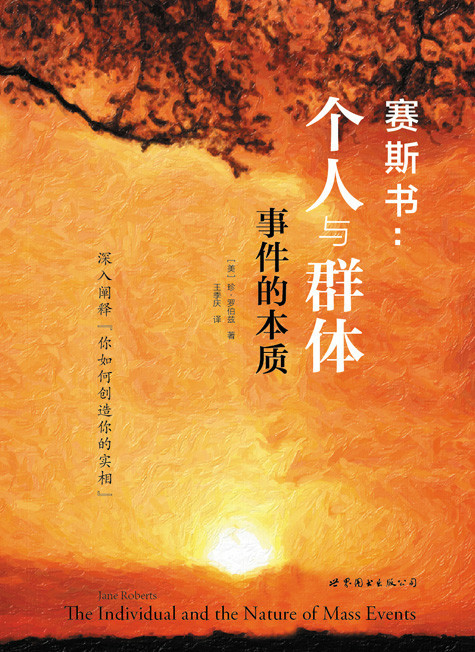

# 赛斯书：个人与群体事件的本质

## 心灵的宣言

我的人生定义它自己

你的也一样

让那些修道者留在

他们的地狱与天堂里

让科学家们

与那些无故创造出来的星星

禁闭在

他们垂死的宇宙

让我们每一个人都勇于

打开我们梦的门

探索

那非主流的领域

我们就从这儿开始吧

（罗注：这是一九七九年六月末，当赛斯在结束本书时，珍写的一首长诗的首段。除了其他寓意之外，这首诗是心灵独立的一个热切宣言，反应本书中赛斯概念而写出的。）

## 序

“出神状态”是一个非常具有个人色彩的现象，它代表意识由日常的实相转向了一个内在的实相。可是不管一个“出神状态”有多么的私密，它却必须发生在由共同事件组成的物质世界里。我被那些事件触及，而你们也一样；因此即使当我在出神状态里坐着，口授赛斯的书时，我毕竟也无法游荡得离我们共同的实相太远。

当我为赛斯说话时，我坐着的椅子是现代制造业的产品。在我面前咖啡桌上的那杯酒，香烟，以及大量生产出来的桌子本身，全都在提醒我，至少在目前，即使我最具冒险性的进入其他实相之旅程，也是根植于我们全都一起分享的具体事件世界里。

我的先生罗伯•柏兹坐在我对面的沙发上，把我替赛斯讲的话逐字记录下来，用一支现代的笔把这些“幽灵之语”写在讲究的笔记本上。在我 ESP 课里的“赛斯课”，一直是录了音的，而这个礼拜当我正在录一个广播节目时，赛斯也“透了过来”。因此科技及其所有含意从来没有离这一切太远。

举例来说，正当赛斯在口授《个人与群体事件的本质》时，三里岛核能意外事件发生了；而倘若那件事变成了一场大灾难的话，我们雀门郡也就会被用来安置难民了。当然，自从我们在一九六三年的后半年开始第一堂赛斯课以来，已经发生过许多戏剧性的全国性事件，但是赛斯极少提及这些事情，即使提到的话也只是为了回答我们的问题。

可是在目前这本书里，他深入地讨论了我们的私人实相是如何的与群体经验打成了一片。为此之故，他检视这公众舞台，而对“三里岛”及“玛斯镇集体自杀案”谈了很多。这两件事都发生在赛斯口述这本书的期间，虽然这两个案例都发生在现代，但却富有典范性的含义。

一如过去，罗的注为本书提供了必要的外在背景，而点出了我们正常生活的架构：赛斯如此殷勤的每周“出现”二次，把我的眼镜丢开，这就是我出神状态开始的信号。当然，除此以外，在这种日子里，我自己的情绪，臆想，喜悦和悲伤也在我心里织出它们的尘俗之网。我自己的写作也许进行得很好或者不怎么样，这一天也许很安静或者被不速之客打扰了，或者是穿插着生活里任何正常家居的高潮与低潮。

举例来说，当赛斯在口授《个人与群体事件的本质》的时候，我们的另外一只猫（比利）死了。那时赛斯正在讨论“三里岛意外事件”，但是因为我们觉得太难过了，所以他停止了口授，而给了我们一些有关动物死前及死后意识的精彩资料——因为“悲剧”以各式各样的形式出现，而我们最家常的生活里所发生的事也给了赛斯一个评论生命本身的机会。

所以，即便我的焦点是在别的地方，我的意识转而向内，从那个另外的观点，却有一个聚光灯打到了我们的世界上，几乎像是我们梦里的一个人物突然醒了过来，走出了那个梦，而居然敢对我们醒时的世界加以评论。或许这不是一个好比喻——赛斯绝不是一个梦中角色，而事实上，我也几乎从来没有梦见过他——但他是一个人物，其实相的舞台与我们不同，一个透过我写书的人物，却是由他的而非我的立足点写的。

在这本书里，他以一种不妥协的智慧评论了我们的宗教，科学，时髦的教派，并且也评论了我们的医学信念——就好像——就好像他代表了那更睿智的人类心灵深处，而那是永远知道得比我们多的——就好像他不仅是用我的声音说话，而且也代表了许许多多人的心声——就好像他代表了我们已容许我们自己忘怀了的真理。

什么真理？就是我们的梦在白天活了起来；就是我们的感受与信念变成了我们所体验到的实相；就是，以更深入的说法，我们就是我们参与的那些事件；还有，为了一个理想去谋杀仍然是谋杀。但是还不止此，赛斯提醒我们身为小孩时已知的事：我们具有善的意向。

“你创造你自己的实相。”这个声明是赛斯资料的基石之一，几乎从我们的课一开始他就说过了，并且在他的书里也一再的强调。然而，在《个人与群体事件的本质》里，赛斯更进了一步，主张我们私人的冲动就是要提供发展我们自己能力的原动力，同时使这些能力对人类和自然界的最佳利益也有所贡献。他在此所说的是我们正常的冲动，正是那些人家告诉我们是危险的，混乱的及矛盾的东西。赛斯主张，如果我们不信赖我们的冲动，我们也就无法信赖自己。

这本书大部分是谈到我们冲动的目的，以及在科学和宗教的眼光里，它们的名声是那么坏的理由。赛斯在这儿真正要说的是，我们的冲动，就是要帮助我们在个人的基础上创造我们的实相，而同时还能增益我们的个人生活及我们的文明。

但是如果我们具有善的意图，又为什么有时候会做出伤天害理的事情？赛斯毫不回避地面对这些问题，而分析偏执狂和理想主义者这两者的动机。而人们的确是理想主义的。许多各种年纪的读者写信给我们，问我们他们怎么样才能发展他们自己的潜能，而同时也帮忙带来“一个更好的世界”。对于他们在社会上看到的糟糕现象，不论与他们切身有关与否，他们都深表关切，并且深恶痛绝。

在这本书里，赛斯清楚地给我们看，我们每一个人能怎样对这个群体的实相有所贡献，并且把那些问题简明地画出轮廓，以使我们不至于陷入幻灭或偏执。

既然我们全都牵涉在世界性的事件里，所以非常要紧的是，我们也要了解我们是如何参与那些全球性的行动，并且看出我们对自己及人类的负面信念又如何造成了离理想甚远，而且与我们所宣称的目标大相径庭的情况。为此之故，赛斯解释了弗洛伊德与达尔文的学说如何的局限了我们的想象力和我们的能力。

当然，罗和我也是在弗洛伊德式和达尔文式的观念世界里长大的，也难免于这种狭隘观点的不幸结果。那些理论连同对“有缺陷的自己”之宗教信念，已经在我们每一个人的生命里留下了印记。透过赛斯课，赛斯给了罗和我一个崭新而更广大的哲学架构，一个我们与读者分享的架构。那个架构还在继续浮现出来，离完成还远得很。答案还没有全部进来，我们仍在学习如何问对问题。

当赛斯开始这本书时，我个人正在探讨“英雄式冲动”的概念（与我们普通的冲动有所不同的那些），那把我们推向建设性行动的内在动力。然而，在这本书里，赛斯声明我们必须学习去信赖的正是我们正常的日常冲动，即使是我也被吓了一跳！我们一般性的冲动？当我们在找“英雄式冲动”时所忽略掉的那些吗？我终于开始了解：我们正常的冲动就是英雄式的，虽然我们误解了它们。在某一方面来说，这整本书就是在介绍我们的冲动——我们所跟随的以及我们所否认的冲动。

我自己对冲动也伤过脑筋，只跟随我认为会把我导向我想去地方的那些，而剧烈的削减我认为会影响我工作的那些。像许多其他的人一样，我以为跟随我的冲动是达成任何目标最不可靠的方法——除非我在写作，那时，一种“创造性”的冲动就成了最受欢迎的了。我没有了解到所有的冲动都是创造性的。就因为这样子的偏僻，好多年来我都有一种最恼人的类似关节炎的症状，除了别的理由以外，那也是我削减了身体想动的冲动之结果。

在过去，当赛斯告诉我要信赖自发性的自己时，我说：“没问题”，而想象着某个假设的“内我”（INNER SELF）那是与我有意识的意图多少有点距离的。但是当赛斯在这本书里一再重复“信任你的冲动”时，这个讯息终于影响了我——而其结果是我身体上已然有了相当的进步。这个看起来离得很远的内我其实并没那么远；“它”透过我的冲动来与我沟通。以某种说法，冲动就是心灵的语言。

但是，攻击性或是矛盾的，甚或想杀人的冲动又如何呢？它们怎能被信任呢？赛斯回答了这些以及许多其他的问题，直到我们读到他的解释时，才禁不住奇怪，我们过去怎么可能对自己的天性如此的误解，以至于不信赖那些正会引领我们自己以及全人类向灵性成长的讯息呢？！

那么我自己在所有这些事里扮演的又是什么角色呢？在我眼里，它是对诗人之原始角色的呼应；去探索个人私密心灵之所及，去推挤通常的心理界限直到它们让步，打开一个新的神秘领土——人们和人类本身的心灵——而感知了内在实相的壮丽美景，然后诗人再用文字，韵律或歌曲来转译那个景象，传述给人们。

最早的诗人们很可能半是巫师，半是先知，为自然力，为生者与死者之“灵”说话，说出他们心目中天人合一的景象。他们大声的讲他们的讯息，唱他们的歌，颂念他们看到的景象。而也许那就是为什么“赛斯如是说”（《SETH SPEAKS》（译注：这是赛斯书《灵魂永生》的原名）），首先是透过话语，而非透过自动书写来沟通的原因。“赛斯书”主要是说出来的成品，也许赛斯课本身就与我们的某个古老时代相呼应，那时我们正是以这样的方式收到大部分与我们切身相关的资讯：我们中的一员替所有其他的人旅行到“集体无意识”里去——一个可以说是改变并且扩展了那个人的旅程——然后尽我们所能的把我们的“所见”传述出来。

然而，如果是这样的话，这种改变了的“介于世界之间”的人格可以是令人惊奇的稳定；而如果他们是按照我们所谓的个人性而形成的话，他们在他们独特的复杂性上的确是胜过了我们。因为如果赛斯只是被我的无意识“出神”资料所填满的一个心理模型的话，那么他的确是把我们对人格的通常观念给比下去了，并且也暗示出，如果我们要用到自己整个潜能的话，还有好长的路要走呢。

因此我的确认为这里面还牵涉得更多。我认为赛斯是我们将来可能会成为的自己的模型——我们内心有个部分从来没相信过“自己有缺陷”这套废话——而赛斯就是那个部分的代言人。

就我和赛斯之间的关系而言，因为我们长久以来的合作，我认为我们一定已经形成了一个独特的心理联盟；可以说我有一部分是赛斯，而至少在课里面，赛斯必然是珍的一部分，双方都在一种心理上的契合里。赛斯必须用我的声音来讲话，并且以我的生活为参考，而我心智的内容也确实因为这些课而有极大的扩展。当然，我的日常生活是怀着对那个联盟的知识而度过的，而我现在正常的例行生活包括了每周两次的“变成赛斯”，而且已经行之有年了。

举例来说，这篇序代表了我对这整本书唯一有意识的贡献。但如赛斯常常说的，我们人格的无意识部分实际上的确是有意识的。这完全是一个“焦点”的问题。并不是说赛斯只是我另一个焦点，因为以同样的说法，我也是他意识的一个焦点；而应该是说，赛斯代表着我们自己这类意识从中浮现的那心灵更大的部分。最重要的就是探索人类意识的范围，当意识接近其他确实存在的层面时，它改变了多少？

但是，不管我们想怎样定义赛斯的实相，到现在为止，对一件事情我很有把握：他是在把我们对自己，对世界，对宇宙以及对“存有本身”的源头之最深的无意识知识传递给我们的意识心。赛斯并没有宣称他无所不能，因为他并不是。不过，他的资料清楚的提供了无意识知识的这种转译，以及直觉性的揭露。照赛斯所说，这种揭露并不比那些在大自然本身就可以得到的知识更了不起，只是我们早已遗忘如何去读大自然的信息；这种揭露也不比当我们自己在灵感泉涌时所能得到的那些更神秘，但是，我们却已遗忘如何去解读那些通讯。反之，许多人甚至害怕灵感本身。

我认为这种现象就进化而言是重要的，有助于形成人的意识。并不是说这种资料没有常被扭曲，或者没有常被忽略：但是不管怎么样，它必得被一再的诠释，使得它能适合人类在时间架构里的经验。

心理的复杂性真是无与伦比！我刚刚才碰上一个能说明我正在讨论的概念的好例子。当我在写这篇序文的前几段时，这些字句本身仿佛以某一种节奏带着我走，我觉得好像我在吸取超过我平常能力的能量与知识。然后，由于黄昏已近，我就跑去小睡一会儿。此时，又有更多的概念来了，我就在卧室里把它们草草写下，主观上的速度加快了，并且在继续加速中——然后我撞上了一堵心理上的砖墙，而无法把观念带得更远。在那一刹那，我突然体认到赛斯就在我心智的“墙外”。下一刻，我就睡着了。当我在半小时后醒来，就开始准备晚餐。罗和我边吃边看电视新闻，然后我就回到书房。

我刚一坐下，就有一个资料的丰富矿脉打了开来，使得我几乎来不及将之写下来；而它就正从我先前概念中止的地方开始。我得到了许多赛斯下一本书的标题，甚至当我正在为这本书写序时！在每一个标题背后，我感觉到多种层面的资料，那是赛斯可以得到，而我却得不到的。

然而，在资料涌现之前的片刻，我感觉到一种很怪的心理界限，和某一种的加速状态，而在这个例子里，它至少点明了赛斯和我思想的交会点。然后，有一个很短的心理上的休息，一个几乎是介于两者之间的心理平台，赛斯的大纲就从那儿开始浮现。

在这之后的那节课里，赛斯证实了那个资料相当于他计划中新书的部分大纲，而当他快完成《个人与群体事件的本质》时我“捡起”的标题是正确的，因此，虽然当我在两天之后写这篇序时，他尚未开始新书，但他随时一定会开始口述《梦，“进化”与价值完成》，届时我会拿掉眼镜，赛斯会再一次的说：“现在，口授”，而罗会在他的新笔记本上写下一个标题。

当然，赛斯课和赛斯书是不可避免的与我和罗的关系连在一起。而罗所做的远超过一个资料的纪录者或誊写者，他那带着质疑与探讨的了不起心智总是激励我全力以赴，帮助我尽可能清楚的看我自己及这些课程，若非有他的鼓励和积极参与，我怀疑赛斯课是否会以目前的形式存在。

因此，虽然赛斯的书进入了公众世界，赛斯课本身却是升自我们的私人生活中。然而，我们那些生活是与群体事件的舞台并存的，那些事件有时轻柔的拂过我们，或在其他的场合剧烈的影响了我们的日子。在这本书里，赛斯描述了那把我们全拢一起，并把我们和私人经验混入世界性事件的存在之连续体。这是你们的世界，也是我们的世界，希望这本书会帮助我们全体把这个世界变得更好。

珍•罗伯兹

谨记于纽约州艾默拉市

一九七九年九月二十二日

## 译序

王季庆

经过多方面的协调，“赛斯书”终于以崭新的面貌出现在方智的新时代系列了。我想这正是为数不算太多，但却热爱“赛斯”资料的读者们引颈企盼已久的好消息。

“赛斯书”的奥妙深厚，造成了其在国际间历久不衰的名望，而在国内，也有越来越多对人生、心灵深感兴趣的人发现了这个宝库。它涵盖既广，涉入又深，好像“赛斯资料”是已存在于某个次元的对宇宙真相，人生真理的终极认识，而透过珍源源不绝地传了过来。

赛斯曾说，他是一位教师，而每个世代，隔一阵子总有人将那些真理传过来。古代的宗教创始者、先知哲人所证悟的，也是同源的东西吧？只不过年代久远，口传失真、记录散失或被错误诠释，或受各地国情民俗的影响，加上人为的道德律，变成神圣化、僵化的教条、教规、仪式，而失去了原始的精神吧？

“赛斯书”是给那些心理、心智上已准备好放下扭曲、陈腐的旧观念，去开发一片新天地的人。它指出社会、文化上种种积非成是或是似而非的成见，拨开我们眼前重重雾霭，给了我们一双新心眼去看穿事情的真相。

因为其内容涵括了心理、物理、医学、意识等等，原本就是非常艰深的理念，而语言、文字是线性的，真的难以承载真理多次元的真貌！因此，在读“赛斯书”时，它唤起的，不是我们仅靠推理的逻辑理性，却是打动了我们内心深处的直觉，令我们与之呼应，令我们涌起莫名的感动与了解。

不过，喜欢穷究一切的人，初读“赛斯书”也许欣喜若狂而囫囵吞枣，或自认为已得其三昧，但奉劝有心人必须捺下性子，置之于案头床边，一而再、再而三的反刍，将之渐渐变成你的血肉，最终成为你通往自己“大我”的心灵桥梁。

赛斯资料之博大精深可以一个对联概括之：

道通天地有无外

思入风云变幻中

此书之完成，因许添盛赞之极力鼓舞，并实际上在我一字一句的令其成形中，与我一同思索、推敲，没有他的坚持，恐怕我没毅力日复一日、年复一年的竭力于译介“赛斯书”，这不是一个“谢”字了得的。

另外，陈建志自愿替我修订原稿，增色不少，也一并谢过。

## 第一部

### “自然”事件

### 流行病与天灾

## 第一章：自然的身体及其防御

### 第八〇一节

一九七七年 四月十八日 星期一 晚上九点三十一分

（在开始《个人与群体事件的本质》的第一节之前，我想对我的太太与我在“赛斯书”中所扮演的角色做一个简介。赛斯自称是一个“以能量为体性之人”，当珍在出神状态时，他透过她说话，珍和我希望每一本书都是独立完整的，因此，新的读者能从一开始就了解所发生的事。

（照赛斯自己的定义，他已经不再具有肉体，虽然他告诉我们，他已经活过好几辈子，因而，转世的概念也在他的资料中出现，而这是第六本赛斯书。赛斯称珍为“鲁柏”，称我为“约瑟”，照他所说，这些存有（entity）的名字只是表示在我们这一生里，我们比较趋向于与我们的存有或是全我（whole self）的男性面认同——存有或全我本身非男性也非女性，但在它们里面包含了好些个我们其他的“自己”（两种性别都有）。

（我们认为，在我们有生之日，赛斯事实上可以每天二十四小时的说下去，而仍然无法说尽所有的资料。问题只在珍和我没办法撑下去！于是这些令人惊愕的创造力与能量促使我们继续下去，不管我们对赛斯的实相或非实相怎么想，甚至也不管他告诉我们他是什么。

（但是，制作赛斯书以及一大堆未出版的赛斯资料，也并没有用掉珍所有的能力，因为她自己还写了十本书。这些包括了诗集、小说以及由她自己有意识的观点所体验到的心灵事件。她还有好几本书正在进行。不过，可以确定的是，赛斯和珍对意识之独特而仍在成长中的看法都影响了现在她所有的作品。

（目前，让我们假定珍和我比以前更了解我们的意识是没有限制的，除了那些透过个人的感知与了解而强加于其上的限制之外。意识创造一切，或所有我们知道的一切反映了意识的个别创造，而那些卓越的精神与物质的成就可以是无穷尽的。在此就暗示了“无限”的概念——这个概念所包含的暗示令我们不安，因为虽然赛斯资料暗示了我们每一个人的无限创造力，我们仍然明白意识心是无法真正理解在这样一个观念里的所有含义的。

（自从一九七九年八月赛斯完成了这本书之后，当珍对赛斯资料的责任以及其他人对书的反应开始再度表示担忧时，他给了珍以下两次的鼓励。她这种感受大部分起自赛斯书所引起的日渐增加的读者来信。

（由以下的摘录中可见赛斯也触及了我们常常思考到的某些事。

（摘自一九七九年八月二十九日的一节私人课：

（“每个人之内都有一种成长与价值完成（value fulfillment）的力量，那就是使得肉体的成长成为可能的力量，在胎儿背后的力量。在你事先就知道你将诞生其中的那个时期的本质，你俩都生而具有某种能力，而你们事先就知道了。如果你们要让这些能力有用到的机会，你们就必须扩大传统观念的架构。就某种意义而言，它们给了你俩第二个生命，因为在旧的架构里没有一条可以令你们满足或是具有创造性的路子可走。”

（“你俩都把我所给的资料以及你们自己的领会利用得非常好，有时候你们用得那么顺，甚至于没有觉察到你们的成就。在有些地方，你们仍然执着于旧的信念，但当你们的理解增长，你们所能做的仍然是无可限量的。也就是说，你们实在已经做得够好的了，而且还能更好。

（“在某些重要的方面，想象你们自己像是在一九六三年（当这些课开始时）才出生的。你们俩——因为你们俩都涉入了——不仅创始了一个新的架构，使得你们和其他人可以由之更清楚的看到实相的本质，并且可以说，你们还必须白手起家，学着去信任它，然后再把它应用在你们自己的生活上——纵使“所有的事实还没有都进来”。在任何一个时候你们从未曾有所有的资料可资吸取，像你们的读者能做的那样。所以，告诉鲁柏不要对自己批判得太严厉，而且，在所有这些过程当中，要他试着记住他的“游戏态度……”

（摘自一九七九年九月三日八七七节的定期课：

（“所有的创造，基本上都是非常喜悦的。它是游戏的极致，是永远生机盎然，片刻不停的。这些课和我们的工作将有助于带来一种精神上的新人类。概念改变染色体，但是这些课，鲁柏的书等等，首先而且最重要的必须是创造力充满喜悦的表现，自发的表现，而产生它们自己的规律……你画画，因为你爱画，而忘记一个画家应该或不应该是什么样子。叫鲁柏忘掉一个画家或一个通灵者应该或不应该是什么样子。鲁柏的自发性让他所有的创造能力浮现，试图把纪律或规律加在一个自发的创造上是徒劳无功的，自发性的创造，自动给了你大自然所能提供的最好规律。”）

现在：晚安。

（“赛斯晚安”）

你无法了解任何一种群体事件的本质，除非你考虑到它们发生于其中的那个甚至更大的架构。

一个人的个人经验发生在他身心状态的范围里，而基本上无法与他的宗教和哲学的信念与情操以及他的文化背景、政治理念分离——

（我们的小虎猫比利本来在旁边的椅子上睡觉，现在它醒了，伸伸懒腰，跳了下来，走向正在为赛斯说话的珍。比利蹲下来想跳上她怀里，我把她抱了起来，走向地下室的门。珍仍留在出神状态。）

甜蜜的小动物是很难得的。

（我回过头来对赛斯说：“一点不错”，在近来的一次课程里，赛斯曾说比利是“一个甜蜜的小动物。”它的确是的。我把她放在地下室，她每晚都睡在那里。）

所有那些理念合起来造成一个行为的“棚架”，而荆棘或玫瑰都可以在那上面生长。也就是说，这个个人会向外面的世界生长，遭遇并且形成一个实际的经验，而几乎是像蔓藤似的形式，由它的中心向外蔓延，以物质实相的材料形成愉悦或美感的凝聚物，以及令人不快的或刺痛人的事件。

在这个比喻里，经验之蔓藤是以一种相当自然的方式由“心灵的”元素所形成的。这些元素对心理经验之必要就如阳光、空气与水对植物一样。不过因为个人经验必须借由这些理念的观点来解释，因此，除非以一个比平常大得多的观点来考量，群体事件无法被了解。

举例来说，流行病的问题无法只由生物学的观点来回答，它涉及了许多人极为全面性的心理态度，而且，符合了当事者的需要与想望——以你们的说法，这些需要是由那些无法与生物学上的结果分离的宗教、心理与文化的背景架构升起的。

一直到现在，我都避而不谈涉及了群体实相的许多重要而核心的主题，因为个人的重要性以及个人形成私人事件的力量首先必须被强调。唯有当实相的私人性被强调够了之后，我才会让你们看到个人实相的放大如何组合、扩大，以形成广大的群体反应——好比说，像是一个显然是新的历史文化时期的创始；政府的建立或倾覆；席卷了在它之前的所有其他宗教的新宗教之诞生；集体的信仰改变；以战争形式发生的集体谋杀；致命流行病的突袭；地震、洪水或其他灾害；无法解释的伟大艺术、建筑或科技时代的出现。

（在九点五十七分停顿，今晚停顿很多。）我说过没有封闭的系统。这也表示说，就世界而言，事件就如电子般的旋转，影响到所有心理与心灵的系统，就好像影响到生物的系统一样。我们可以说，每个个人都是单独的死去，因为没有另外一个人能像这个人这样死去。同样的，我们也可以说“人类”的一部分随着每一个死亡死去，也随着每一个出生而重生。而每一个个人的死亡，是在整个人类存在的更大范围里发生的，这个死亡对整个人类而言达到了某个目的，而同时它也达到了个人的目的，因为没有一个死亡是“不请自来”的。

举例来说，一次流行病达到了每一个卷入其中的个人之目的，同时它也在更大的人类架构里达成了它自己的作用。

当你们认为流行病是由滤过性病毒所引起，而强调它们的生物面时，那么解决之道就显而易见了：你们研究每一种病毒的性质而发展出一种疫苗接种，给大众每人一小剂，而使得个人的身体可以与之对抗而具免疫力。

一般而言，接种小儿麻痹疫苗的人不会感染到小儿麻痹。利用这种接种方式，肺结核已大半被克服了。不过，仍有极大的隐伏变数在其内运作，而这些变数正是由于如此大范围的流行病被以很小的架构来考量所引起的。

首先，致病之因并不是生物性的，而生物只不过是一个“致命意图”的携带者。第二，在实验室培养出来的病毒和住在人体内的病毒是有所不同的——人体认得出这种不同，但你们实验室中的仪器却认不出。

请等我们一会儿……

以某种方式来说，由于接种的结果，身体产生抗体而建立起自然的免疫力。但身体的化学性也被扰乱了，因为它知道它不是在对“一个真实的疾病”反应，却是在对一种生物上伪造的入侵反应。

我并不想言过其实，但那的确使身体的生物完整性受到了污染。举例来说，它也许在同时会对其它“相似的”疾病产生抗体，而过度运用它的抵抗力，以至于后来染上了另一种病。

（十点十九分。）

没有一个人会生病，除非那个病满足了一个心灵或心理上的理由，因此，许多人避过了这种病。可是，在同时，科学家及医学人士却找到愈来愈多大众“必须”接种以抵抗的病毒。每一种病毒都被单独考虑，大家都迫不及待的去发展一种新的疫苗来抵抗最新的病毒，而这大半都是建立在一种预测式的基础上：科学家们“预测”多少人会被，好比说，一种会引起若干件死亡的病毒所“攻击”，然后作为一种预防措施，民众就被邀请去接受新的接种。

（强调的：）许多本来就不会得这种病的人于是也乖乖的去接种，身体把它的免疫系统用到了极限，而有时候按照它所接种疫苗的种类，在这种情况下，把身体的抵抗力运用过度（注一）。那些在心理上已决定要死的人，反正都会死，死于那个病或者其他的病，或者接种的副作用。

请等我们一会……

内心状态与私人经验生出了所有的群体事件。人本身无法挣脱出肉体生命的自然范围。他的文化、宗教、心理运作及心理本质合起来，形成了私人与集体事件由之发生的背景。（大声的，然后又非常的轻声细语，使得我几乎听不见。）那么，这本书就是要专门来谈那些伟大而横扫一切的情感性、宗教性或生物性事件的本质，这些事件的力量仿佛会吞没一个人，或使他开心得不知所措。

在个人与自然的、政府的，甚或宗教的巨大群众动向之间到底是什么关系？集体的信仰改变又是怎么回事？还有集体的歇斯底里、集体的治愈、集体的谋杀与个人又有什么关系？那就是我们在这本书里所要专门探讨的问题。

这本书将叫做《个人与群体事件的本质》。

（较大声的：）你们可以休息一下或结束此节。

（十点三十五分。“那么我们就休息一下好了。”）

（即刻的：）你可以说你对流行病所提的问题成了一个适宜的刺激；因为那问题由你而来，也就是由我们的读者而来。

（珍在惊愕的沉默中脱离了出神状态——那显示她对赛斯刚才一直在谈的事略有所知，就像过去有时发生过的。

（我问她：“嘿！现在到底谁在搞什么飞机啊？”我们笑了起来，“如果这个资料是属于一本新书的话，我怎么能把它用作《未知的实相》的附录或附注呢？在课开始后不久，我就觉得你和你的赛斯一定在搞什么名堂。”

（她说：“哦！我真不敢相信！这完全不符我有意识的猜测——你可以把那句话写下来，以便两三年之后你或我可以把它打字下来……我真想象不到……”

（两天来，珍已经开始把赛斯《心灵的本质》的完稿打了一些字，她也在写她自己的《一个美国哲学家死后的日志：威廉•詹姆士的世界观》。然而，我认为她需要“赛斯在进行什么”的激励。这个情况还颇有讽刺性，因为远在一九七五年的六月里，是我直接了当的告诉她去开始《心灵的本质》，只为了她可以有一本赛斯书玩玩。我也想要看看在我的要求下，她和赛斯能做出什么来。但这次赛斯唬了我，在结束《心灵的本质》才两周之后就开始了这本书。不过，我举双手赞成，热衷的告诉珍，制作赛斯书，并且与赛斯一起探索他对实相的独特看法，而试着把他的一些概念用在我们日常“实际的”世界里，永远是一件愉悦的事。

（我重申我的想法，告诉珍不管她累积了多少未订合约或未出版的赛斯书，都没有关系：比起没有任何等着要做的事，我们所处的绝对是一个更具有创造性与更有趣的地位。珍同意了，同时仍旧在担心怎么去处理这些年复一年累积起来的资料，至今我们还想不出有什么办法可以把它们全部出版。

（珍说：“我很鬼崇哦！我没告诉你所有的事，我在想如果我们真的做一本新书的话，应该用一种问答的方式。”即使那个想法对我也是个启示，因为她没有提过要开始一本新书。在我们谈话时，赛斯回来了一下。

（十点三十九分。）

我们已开始了第一部，叫做“自然事件，流行病与天灾”。

（然后过了一会儿：）第一章：“自然的身体及其防御。”

（“但我真的很惊讶，今晚我真没想到会这样。”当珍一变回到珍时她就说——因此又重新强调了我们对赛斯现象的一些无穷尽的疑问：到底是她人格或存有的哪一部分——不论那部分可以被称为赛斯或什么——曾忙着计划——组织——这个新的工作？这样一个创造性过程怎么能在她一点都不知情的情况下发生？到底人类成就的极限是什么？

（我们边聊这本新书，边吃了点东西，我好几次念给珍听书的标题，她好像不是很喜欢它，最后她说：“我不知道我是否会继续上课，我只在等着，到现在为止我还没有得到任何东西……”

（在十一点二十五终于继续下去，带着许多停顿。）

死亡在生物上是必要的，不只是对个人而言，而且也是要确保人类生生不息的活力。死亡是一种心灵与心理上的必然，因为过了一阵子，灵魂充溢的、不断更新的能量不再能被转译到肉体里去了。

每个人都天生的知道，为了在精神上与心灵上的存活，他的身体必须死。“自己”会长大得超过了身体。尤其是自从有了达尔文的进化论之后，接受死亡的事实变得暗示了某一种弱点，因为不是说强者生存吗？

到某个程序，流行病与被认出的疾病有一个社会学上的目的，它们提供了一个可被接受的死因——对那些已经决定要死的人是个顾全面子的办法。以你们的说法，这并不是指这种人做了一个要死的有意识决定：但这种决定常常是半有意识的。（专注的）也许是那些人觉得他们已完成了他们的目的——但这样子的决定也可以是建立在一种不同于达尔文主义者所了解的求生欲望上。

你们不了解在出生前一个人就决定要活着。一个“自己”并不仅是身体的生物机制之意外具体化。每一个诞生的人渴望被生下来。当那个渴望不再作用时他就死了，没有一种流行病或疾病或天灾——或杀人犯枪里射出的流弹——会杀死一个不想死的人。

求生的欲望一直被夸耀得很厉害。但人类心理学却很少去处理相当主动的求死欲望，在其天然的形式里，这并不是一个想逃避生命的病态的、受惊吓的、神经质的或懦弱的企图，却是求生欲望的一个明确的、积极的、“健康的”加速，在其中，这个个人强烈的想离开肉体生命，就像小孩子一度想离开父母的家一样。

在此，我说的并非自杀的欲望，那涉及了以自我蓄意的方法明确的杀死身体——常常是以一种具暴力性的方法。不过，理想上说来，这种求死的欲望只会涉及了减缓身体的生理过程，逐渐的把心灵由肉体中挣脱出来；或在其他的例子里，按照个人的特性，对身体的生理过程有一个突然而自然的终止。

不去管它的话，“自己”与身体是如此的密切合作，以至于它们的分离会是很平顺的，而身体会自动的随顺着“内我”的愿望。举个例子，在自杀的情形下，“自己”到某个程度独断独行，而身体却仍有它自己想活的意志。

（停顿良久，许多次之一。）我对自杀会有更多的评论，但在这儿，我并无意暗示一个夺去他自己生命的人有罪。然而在许多这种例子里，死亡会以一个“疾病”的较自然结果的样子来到，事实就是如此。举个例子，一个想要死的人本来就预备只体验人世生活的一部分，比如说童年，而这个目的会与其父母的意向相吻合。例如，这样的一个孩子也许会透过一个想体验生产，却不一定想体验育儿岁月的女人出生。

（十一点五十七分。电话响了起来，我们共同的专注是如此深，此致于被这突然的响声吓了一跳，但珍却没有脱离出神状态。身为赛斯，她瞪着我。我也瞪回去，并没有起身去接。很幸运的，铃声很快就停了。）

这样的一位母亲也许会吸引一个想要重新体会童年，却非成年生活的意识，或一个可能会教给这个母亲一些极度需要的教训的意识。这样一个孩子可能在十岁或十二岁，或更早就自然的死亡。然而，科学的帮助也许能使这个孩子活得久得多，直到这样一个人开始遭遇到，一个可说是硬塞到他身上的成年生活。

结果可能会发生车祸、自杀或另一种的意外。这个人可能成为一次流行病的罹难者，但是却会失去了生理上或心理上运作的平顺性。在这儿我并不是宽容自杀，因为在你们的社会里，自杀太常是矛盾信念的不幸结果——然而，说真的，所有的死亡全是自杀，而所有的出生在孩子与父母双方全是有意的。同样的，你也无法把世界某部分人口爆炸的问题与流行病，地震及其它灾害分开。

（停顿良久。）在战争里，人们自动的繁衍后代以补充那些被杀的人，而当种族过度膨胀时，就会对人口施予自动的控制。然而，所有的这些在各方面都会适合所涉及的个人之目的与意图。

（有力的。）口授结束，此节结束，给你们我最衷心的祝福。

（十二点十二分。珍在给了她自己一些资料后，没有替赛斯说再见就突然由一个非常深的出神态度里出来，她说：“自从休息之后，我什么都不记得。”我们都累了。）

（注：我对赛斯谈接种的资料特别感兴趣，因为我有两次在接种之后有严重的身体反映，珍也有过一些不愉快的接种经验。就我自己而言，两次预防性的“医疗”都在一九六三年珍为赛斯开始谈话之前。其中之一导致了使我失去工作能力两周的强烈血清反应；另一次，造成长达数日的部分麻痹。

（我接受那些疫苗是因为我对传统父母的及医学的压力，及我自己当时的信念让步（虽然不太甘心），他们认为我应该接受接种，因为对我有“好处”。甚至到现在，在我的皮夹里我还带着一张警告卡，写着我对至少某些疫苗的反应，以及一个“严重声明”：如果为了任何理由——好比说，在一次意外之后——人们发现我失去了知觉，绝不可以给我任何注射，因为我也许会对它有致命的反应。自从经过那些非常不愉快的经验之后，我再也没有打过一针，我也绝没有意思要打针。我已经不再相信我会死于任何一种我禁用的疫苗了——但同时，我也不想去发现我如果打了的话可能会发生什么！

（不过，在我们的社会里几乎不可能舍掉预防接种——它们是我们全国性和个人性医学信念系统的一个如此强烈的部分。我确信当赛斯进行《个人与群体事件的本质》时会详细解释集体接种这整件事。）

### 第八 O 二节

一九七七年 四月二十五日 星期一 晚上九点四十七分

（上星期三晚上的定期课没有举行，我们正在改建我们“坡居”的前廊。在上星期四工人打了新地板的水泥，今天他们架起了新台阶的模板，再灌水泥。天气好极了。）

晚安。

（“赛斯晚安！”）

口授。（停顿，今晚停顿很多。）到某一程度，流行病是那些卷入的人的一个集体自杀现象的结果。可能会牵涉到生物的，社会的，甚或经济的因素，因为为了各种不同的理由，并且在不同的层面，整群的个人想在某一个时候死去——但却是以这样的一种方式死去，使得他们个人的死亡等于是个“集体声明”。

在某个层面，这些死亡是对当时那个时代的抗议。不过，那些涉及的人都有其个人的理由。当然其理由各有不同，但也全都涉及了超过个人理由的“想要让他们的死达到了一个目的。”那么，这种死亡的部分原因就是要让幸存的人去质问当时的情况——因为人类无意识的都很明白，这种集体死亡的理由必然超过了一般所接受的信念。

在某些历史时期，穷人的苦境是如此的可怕，如此的无法忍受，以至于发生了瘟疫的大流行，真的使得有这种社会，政治与经济情况的整个区域完全毁减。可是那些瘟疫一视同仁的夺去了富人和穷人的生命，因此那些自满的有钱人可以很清楚的看到，好比说，卫生的条件、私密性以及精神的安宁多少也必须给予穷人，因为穷人的不满会有十分实际的后果。那些就是抗议性的死亡（注一）。

就这个而言，每一个“受害者”或多或少也都是冷漠、绝望或无力感的“受害者”，它们自动的降低了身体的抵抗力。

不过，这种心境不但真的降低了身体的抵抗力，它们还启动，并改变身体的化学性质，影响其平衡而开始致病。许多病毒天生就具有引起死亡的能力，但在正常的情况下却对身体的整体健康有所贡献，与其他的病毒共存，而每一种都促成了对维持身体平衡十分必要的活力。

不过，如果某种病毒被精神状态激发到更活跃或过度增值，那么它们就变成“致命的”了。实际上它们会以哪一种方式来传播，则视病毒的种类而有所不同。个人的精神问题够严重的话，真的会显现为社会性的群体疾病。

一种疾病爆发的环境能指出引起这种混乱的政治，社会与经济状况。常常这种爆发发生在无效的政治或社会行动——那就是说，某些一致的集体社会抗议——失败或被认为无望之后。它们也常常发生在战时，在反对他们所卷入的战争的国家里。

首先是心灵上的传染：绝望比蚊虫或任何一种疾病的外在病媒动作更快。精神状态活化了本来可以说不活动的那种病毒。

（在十点十六分停顿。）绝望也许看起来好像是消极的，只因为它感觉外在的行动是无望的——但它在内心煽动了怒火，而那一种传染能由床跳到床，由心跳到心。不过，它只触及那些在同样状况的人。它带来一种加速，在其中团体行动的确还有一件事可做。

现在，如果你相信你只活一辈子，那么这种情况看起来会极为悲惨，而以你们的说法，这显然是不怎么美丽的。然而，虽然在一次流行病里，每一个受害者都死了他“个人的死”，但那个死亡却变成一个集体社会抗议的一部分。那些最亲近的“幸存者”的生命被震撼了，而按照流行病的范围，种种不同层面的社会生活本身也受到了干扰、改变、重组。有时候这种流行病最后终于导致政府的被推翻，或战争的失败。

这其中还有与大自然相关的更深的生物性关联。你们是具有生物性的动物。骄傲的人类意识建立在你们肉体存在之广大“无意识的”完整性之上。在那方面说来，你们的意识就和你们脚趾一样的自然，那么，就人类的完整性而言，你们的精神状态是非常重要的。绝望或冷漠是一种“生物上”的敌人。促进这种精神状态的社会情况、政治现状、经济政策，甚或宗教或哲学的架构带来一个生物上的报复，像施于干柴之烈火。

那么，流行病达到了好几种目的——警告说某种情况将不被容忍。有一种生物性的愤激将会继续被表现出来，直到情况被改变为止。

（在十点三十一分停顿良久。）

请等我们一会儿……

即使在英国大瘟疫的时期，有的人受到侵袭却没有死，也有的人与病患及濒死的人相处却没被那个病波及。不过，那些积极涉及的幸存者却以完全不同于那些死于疾病的人的眼光来看待自己：他们是未被绝望所触及的人，他们将自己看作是有办法的人，往往他们把自己由先前非英雄式情况的生活里唤醒，然后表现得非常英勇。现况的可怕令他们震惊，那是先前他们并没有卷入的。

人们濒死的景象让他们对生命的意义有了一些洞察力，而激起了社会性、政治性与心灵性的新理念，因此，以你们的说法，死去的人并没有白死。流行病因为它们的公众性而道出了公众问题——在社会学上来说，那些问题威胁着要把个人扫到心灵的灾难里，正如在生物学上来说，威胁着要将个人扫入身体的疾病里一样。

（停顿。）这些也是种种不同的流行病之范围或界限的理由——为什么它们扫荡过一个区域却放过另外一个区域，为什么在同一个家庭里有人死了有人却活下来——因为在这个集体的冒险里，个人仍然形成他自己私人的实相。

（在十点四十二分停顿。）

请等我们一会儿……

在你们的社会当中，科学性的医学信念在运作，而先前讲过的那一种预防性医学采取了一种接种措施，在健康的个人身上带来了一种很轻微的病况，然后就会引起对更巨大的侵袭的免疫。

对任何一种疾病而言，这种措施对那些相信它的人都会相当有用。不过，有用的是那个信念，而非那个措施（更大声的）。

我并没有建议你们放弃那种措施，当它显然对这么多人有用的时候——但你却该了解它为什么能带来人们所要的结果。

不过，这种医学技术各有其针对的疾病：你无法给人接种健康动物的求生欲望或他们的热望、愉快或满足。如果你决定要死，而你以这样一种方式避过了那种病，你会很快的患上另一种病或遭到意外。预防注射虽然对某一个疾病有效，但也许只会加强了先前那个认为“身体是无能的”信念。看起来好像是，不去理它的话，身体一定会发出当时“时髦的”疾病，因此，就你们的信念来说，那一次预防注射的胜利可能导致了最终的失败。

可是，你们有你们自己的医学系统，我并不是要颠覆它们，因为它们正在颠覆自己。以你们的说法，我有些声明显然无法被证实，而显得几乎是一种亵渎。然而，有史以来，不管医学技术的状况如何，没有一个死掉的人是不想死的。某一种的病有某一种随着时空而变的象征意义。

（十点五十六分。）

请等我们一会儿……

你的手累了吗？

（“没有。”）

（停顿。）过去这些年来，对达尔文的“适者生存”（注二）曾有热烈的讨论，但却很少强调生活的品质或者幸存本身；或就人类而言，很少人探讨是什么使得生命值得活下去。非常简单，如果生命不值得活下去（较大声），没有一个“族类”会有理由继续生存下去。

每个文明，事实上就是社会性的“族类”。当某个文明看不见活下去的理由时，它们就死了，但它们却播种了其他的文明。你们一己的精神状态合起来带来了你们文明的集体文化姿态。那么，到某个程度，你们文明的存活与否，真的相当依赖每个个人的状况；而那个状况最初是一种精神的和心灵的状态，而再生出具体的有机体，那个有机体是与每一个其他人的自然生态，以及每一个其他的生物或存有——不论多微小——密切相关的。

虽然有所有那些“逼真的”现实故事来做反证，但生命本身的自然状态是一种喜悦的，默许自己的状态——在其中，行动是有效的，而去行动的力量则是一种自然的权利。如果你没有如此被相反的信念所遮蔽的话，你会在植物、动物及其他所有生命的身上十分清楚的看见这一点。你会在你身体的活动里感觉到它，你细胞的极重要的个别肯定带来了你肉体庞大而极为复杂的成就，那个活动自然会促进健康与活力。

我并不是在说某种被浪漫化的、“消极的”、懒散的心灵世界，却是一个没有障碍的清晰实相，在那里面当家的是和绝望与冷漠相反的情绪。

那么，这本书将专门谈最能促进精神、心灵与肉体的热望的那些状态，而那是使得一个族类想要延续下去的那种生物上与心灵上的因素，这种因素促进了在所有层面上所有各种生命彼此的合作。没有一种族类与另一种竞争，却是合作去形成一个环境，在其中，所有的族类都可以创造性的存在。

（有力的：）口授结束，我们这一次会有一本震耳发聩之书。你可以结束此节或休息一下。

（“那休息一下好了？”）

（十一点十七分，今晚珍的传述一直相当的热切，虽然停顿了许多次，有时还停了很久。在课开始前，她还在怀疑她是不是真的想要上课，但就如在其他的这种情形里，一旦她开始后，她还是传过来极佳的资料。）

（在十一点三十七分以同样方式继续。）

那么我再继续一会儿。

你们住在一个具体的社区里，但你们首先是住在一个思想与感受的社区里，这些思想感受激发了你们的具体行动，也直接影响了你们身体的行为。动物的经验是不同的，但以它们自己的方式，动物也有个人的意向与目的两者。它们的感受无疑也与你们的一样算数。它们会做梦，而且也会以自己的方式推理。

它们不会“担忧”。当在它们切身的环境里没有很明显的迹象时，它们不会预期灾难。它们自个儿过活时，并不需要预防医学。不过，宠物却被施予预防接种。在你们的社会里，这几乎变成了一种必要。在一个“纯粹自然”的环境下，你们不会有这么多活下来的小狗小猫。肉体的存在有其阶段性，而以那种说法，大自然知道自己在做什么。当一种物类过度繁殖的时候，那么流行病的例子就会多起来。这对人类和动物都同样的适用。

生活的品质是重于一切的。初生的动物若非在它们的意识完全贯注在此地之前就迅速、自然而无痛苦的死去，就是被它们的母亲杀死——并不是因为它们是羸弱或不适合生存的，却是因为物质的环境产生不了使得存活“值得”的生活品质。

不过，如此短暂的化为肉身的意识并没有被消灭，却是以你们的说法在等较好的条件。

在人类与动物族类里也都有“试探”，在其中，对肉体生命偷看一眼或窥探一下，只此而已。那么，横扫过动物群的流行病也是生物上与心灵上的声明，因为在其中的每个个体都知道，只有它自己最大的成就才能满足在个人基础上的生活品质，而由此对其族类的集体存活有所贡献。

（在十一点五十五分停顿。）根本上，受苦并不一定对灵魂有好处，顺其自然的话，野生的动物并不会去寻求它。有一种自然的同情，一种生物性的知识，因此一只动物的母亲知道现存的条件能不能养活新生的后代。动物直觉的了解它们和生命的伟大力量之关系，它们宁愿当新生儿的意识尚未聚焦时就把它饿死，而不让它在不利的条件下自生自灭。

在一种自然状态里，为了同样的理由许多小孩也会一生下来就是死胎，或者会自然的流产掉。在大自然的每一分子之间总是互相有取有予，因此这种个人常会选择，好比说那些也许想要怀孕但却不要生产经验的母亲——他们选择做胎儿的经验却不一定选择做小孩子的经验。通常在这种情形，这些是“片段人格”，想要尝一尝物质实相，却还未准备好去应付它。不过，每一个例子都是具个人性的，因此这些只是一般性的说法。

有许多仿佛应该会死于疾病及死于“幼儿流行病”的小孩，无论如何却因他们不同的意向而幸存下来。思想与感受的世界也许是无形的，然而，它却启动了所有你们熟悉的物质系统。

动物和人一样的确可以做出出现在一个生物学范围里的社会性声明。举例来说，那些得了病的小猫和小狗选择死去，指出了一个事实，那就是就个别与群体而言，它们生活的品质极为恶劣。它们与其族类的关系不再平衡，无法用到全部的能力或力量，而它们之中有许多也没有被给予和人类之间有益的心灵关系来作为补偿——却反倒被弃置一旁，没人要也没人爱。一只不被爱的动物并不想活下去。

爱涉及了自尊以及对个体生物性的热情与健全性的信任。就彼而言，动物的流行病以它们自己的方式也和人类的病有同样的原因。

一只动物的确能自杀，而一个人类种族或一个动物族类也一样能。一个活泼的生命的自尊要求维持住具某一种品质的经验。

（强调的：）口授结束，此节结束，我最衷心的祝福。（现在耳语着）信赖鲁柏自己情况的改变，祝你们晚安。

（“谢谢你，赛斯，也祝你晚安。”）

（十二点十七分，见此书珍序里谈“她自己”状况的资料，她近来已有长足的进步。）

（注一：照一般说法，各种不同的瘟疫，包括淋巴腺鼠疫及恶名昭彰的黑死病，是由染病的老鼠身上带着病菌的跳蚤传染到人身上。这种病的其他形式是由其他的鼠类所传播的。

（以赛斯的说法，透过涉及了所有生命形式复杂的交互作用及沟通，人类深度的不满会周期性的启动像瘟疫这种灾难的重现：例如在第三世纪的罗马，据说每一天有数以千计的人死掉；据估计在十四世纪的二十年内欧亚的人口死掉了四分之三；在一六六五年还有伦敦的大瘟疫等等。

（注二：英国的自然学家查尔斯•达尔文（一八零九——一八八二年）在他的有机进化论当中主张，所有一代一代的动植物借由遗传了细微的变异，而由它们自己先前的形式发展下去，而只有那些最能适应环境的最可能生存下去。

（令人惊讶的是，另一个英国的自然学家艾尔佛•华里士（一八二三——一九一三年）也独立的发展了一个相似的理论，而这两个人在一八五八年在同一篇论文里把他们的工作成果发表给科学界，次年达尔文出版了他的《物种起源》。

（我确信赛斯会说这整件事情绝非巧合，因为他说过好几次在某一个历史时期里，新的概念常常会不止一次的分别出现。）

### 第八〇三节

一九七七年 五月二日 星期一 晚上九点四十三分

晚安。

（“赛斯晚安。”）

口授：你们的科学正开始了解人与大自然的具体关系。人类显然是大自然的一部分，而并没有与之分离。

大家正在提出环境问题，即关于人对他所居的世界之影响，可是却有一个连接所有属于你们地球上的，不论什么形式的意识的内在环境，这个精神的或心灵的——或无论如何是无形的——环境永远是在一种流动变化的状态。那个活动提供了你们所有外在的现象。

请等我们一会儿……

就身体而言，你的感官知觉是那些除了与你的关系外，仿佛没有它自己实相的“器官”的行为之结果。那些器官本身是由有它们自己意识的原子与分子组成的。那么它们有自己的感觉与认知状态，它们为你工作，容许你感知物质实相。

你的耳朵无疑的仿佛是永远的“附件”，你的眼睛也一样。你说：“我的眼珠是蓝的”，或者“我的耳朵很小”。可是这些感觉器官的物质成分不断在改变，而你并没有变聪明一点。虽然你们身体显得十分可靠，坚固而稳定，你对发生在它与物质环境之间经常的交流并不察觉。你的身体的特质成分是由与七年前组成它的完全不同的原子与分子组成，你熟悉的双手实际上与组成它们（甚至在最近不久之前）的任何最小的物质也已毫无关系了，可是这些都不会带给你困扰。

你把自己的身体视为是坚实的，而再次的，做出这样一个推论的感官本身，就是原子与分子的行为之结果，那些原子与分子真的是来到一起以形成器官，填满一个肉体的模式。所有你感知的其他物体，也是以同样的样子以它们自己的方式形成的。

你所认识的物质世界是由无形的模式造成的。这些模式是“可塑的”，其原因是，虽然它们存在，但它们最后的形式是一件由意识来主导的可能性。你的感官以它们自己的方式感知这些模式，这些模式本身可以以无数的方式被启动。在外面有些东西在观察哦（幽默的强调）！

（在十点四分停顿良久，今晚停顿很多次。）不过，是你的感觉器官决定那个东西要采取什么形式。物质世界在你的眼前升起，但是你的眼睛就是那个物质世界的一部分。你无法看见你的思想，因此你没有悟到它们也有形与像，甚至就如云朵一样。有思想之流就像有气流一样，而人的情感与思想的精神模式，就像火焰由火或蒸汽由热水升起，而落下成灰烬或雨水。

内在无形环境里所有成分在一起作用，而形成暂时的天气模式，那是外在化了的精神状况，然后区域性并且全体性的显示给你看，人的情感状态的一个具体版本。

（我们的猫比利就像它在八零一节里那样，由一次小憩中醒来而走到珍那边去。这次她跳进珍的怀里，然后用她的前爪趴在她胸前，同时，细看她的脸。珍身为赛斯轻拍着它，我叫比利过来，它在我怀里坐了一会儿，然后在我身边的椅垫上卷成一团。）

（好玩的：）你可以说我拍了那只小猫。

现在：显然这个物质的星球也是流变不居的，同时，在运作上来说，或是在现实上说来，或是在实际上来说，它却相当的稳定。这个行星上的物质也都是由真正是无限的意识群所组成的——每一个体验它自己的实相，同时也增益了整个的合作性冒险。

（停顿良久。）天灾是个可理解的偏见性观念，在其中人忽略了那些对行星上的生命——包括人类——而言，很重要的巨大创造性与更新性的因素。这个行星的稳定性就是建立在这种改变上，正如身体的稳定性是依靠在细胞上的生与死上。

（十点二十分。）

很显然的，人们必须死——不只是因为不这样的话你们会令人口过度膨胀到将世界毁灭，却也因为意识的天性要求新的经验、挑战与成就，这一点在大自然本身到处均显而易见。（停顿）如果没有死亡的话，你们还得发明它呢！（微笑）——因为那个自性的范围之狭隘，将有如一个伟大的雕刻家只有一大块石头可供雕刻。（带着安静而戏剧化的强调。）（注一）

这个雕刻家的作品实际上是很真实的，因为它是像一件物体那样的存在，而可以被十分合法的感知，就如你们的世界一样。不过，雕刻家的雕像来自那个内在环境，那个可能性的模式。这些模式本身并非不活动的。它们充满了“被实现”的欲望。在所有实相背后都有精神的状态，这些永远在寻求形式，虽然也还有那些你们认知不到的形式。

在你们看来，一张椅子就是一张椅子。当鲁柏为我说话的时候，她坐在一张椅子上，当你们读这本书时，你们也极可能倚在一张坚固而真实的椅子或沙发里，而其中的原子与分子也是相当惊醒的，虽然你们并不承认它们有生命。当小孩子在玩绕圈圈时，他们在空间里形成了活生生的圆圈，在那个游戏里他们享受身体的移动，却不与那些打转的圆圈认同。同样的，组成一张椅子的原子与分子在玩一种不同的绕圈圈游戏，而卷入不断的运动里，形成一个你们感知为一张椅子的模式。

运动之不同具有如此的差异性，以至于对你而言，那个椅子就像你的身体一样看起来具永久性。原子与分子像那些儿童一样享受它们的运动——可是从你的视角看来，它们在空间坚固的成了形，却完全“不知道”，你把那个运动视为一张椅子或当椅子去使用。

你以那种方式感知那些原子的活动，然而，那个“同意”却是在精神层面发生的，而从来没有被完全“固定下来”，虽然它看起来好像是。一个人在各个不同的时刻所看到的并不是同一张椅子，虽然也许由不同的角度看来，这个特定的椅子会像是“那同一张”。

原子与分子之舞在你们的地方是持续不断的，广义来说，任何一张椅子从来都不会保持原样。当我们讨论群体事件时，所有这些都必须纳入考虑。

你们休息一下。

（十点四十二分。珍的出神状态一直很好，但她记得比利爬进了她怀里，以及它如何把脸凑近她。她说：“赛斯认为那很棒。”在十一点十四分继续。）

科学家探查一个白痴或天才的大脑，只会找到脑子本身的有形物质。

他不会发现一个住在脑细胞里的概念。你可以试着传达一个概念，你可以感觉它的效果，但你无法像你看到这张椅子那样的看到它，可是，只有一个傻瓜会说概念不存在，或否认概念的重要性。

你也没办法在脑子里找到任何一个梦的所在，你世界之固体物质是你的感官作用于一个内在的活动次元上之结果，而那个内在活动次元的存在，就如一个概念或一个梦的所在那样合理，然而却也同样令人干着急的隐藏着。

你很容易看出种子带来了大地之果实，它们各有其类。没有一粒种子与另一粒完全相同，然而一般而言，有一些用来统合它们的品种。你不会把一个橘子误认为一颗葡萄。以同样方式，概念或思想形成概廓的模式，而把某种的事件带到你们的世界里。就此而言，你们的思想与情感“播种”了物质实相，带来了所有的具体化。

你们在政治上相当顺畅的运作，而居住在乡村、城镇、州郡等等里面——每一个都有它自己的习俗与当地法令——这些完全不会影响到土地本身。它们是为实际目的而被这么称呼的，而在一个层面上，它们暗示了意图或联盟的组织，它们是政治性的模式，是无形却非常有效的。可是，人类的思想与情感也被组织——或自然的组织它们自己——成为旺盛得多的无形精神模式。

每一个人的思想流进那个“构造”里，形成了大地心灵大气的一部分，由那个大气流出那自然的地球上的模式，你们的季节连同它们所有的变化与效应均由其浮现。你们从来不是天灾的受害者，虽然看起来可能如此，因为你们都在它的形成中插上一手，你们创造性的卷入于地球的循环，没有一个人可以代替你出生或死亡，但也没有一个出生或死亡真的是一个孤立事件，却是整个地球参与其中的事件。再次，以个人的说法，每一个族类关怀的不止是存活，更是其生活与经验的品质。

那样说的话，天灾最终的结果，就是改正那个先前破坏了所希望的生活品质的情况，因此做了一个调整。

我是不是讲得太快了？

（我说：“没有。”虽然赛斯——珍的步调对我写字的速度而言是相当快。）

那些“受害者”选择在心灵的、心理的与生物的层面参与那些状况。举例来说，有许多罹难者若不如此的话也许会死于长期的疾病。在细胞的层面上这种知识是可得的，而以一种或另一种方式——通常在梦里——给了那个人。这并不需要随之以有意识的理解，因为许多人知道这种事而同时却假装自己不知道。

（十一点四十四分。）

其他人则已完成了他们的挑战；他们想要死而在寻找一个借口——一个保全面子的方法。然而，那些选择这种死法的人想要以戏剧性的方式死去，死于他们活动之际，而以一种奇怪的方式，甚至在临终时也充满了对“生命力量”之欢欣鼓舞的内在知识，在最后他们与那仿佛毁掉了他们的自然力量认同了。

那种认同常常会在死亡的时候——却非总会——带来意识的一种更大的加速，而把这种个人卷入于一种“团体的死亡经验”里，当那时，所有的受害都多少“在同一个时候”启程进入实相的另一个层面。

在那灾难发生之前，那些人刚刚在意识之下是觉察到这样一个事件的可能性的，而直到最后的片刻仍能选择去避过那个遭遇。像古老的传说所说的，动物们在事先就知道天气状况，这个感知也是你们传承的一个属于生物性范围的部分，身体是准备好了的，虽然在意识上你好像不知道。

在身体的内在环境与天气模式之间，存在着无以数计的关系。古老的与暴风雨认同的感觉是十分合理的，而那样说的话，感觉的“真实性”是比逻辑的真实性要高超多了。当一个人自觉是暴风雨的一部分时，那些感觉说的是一件真真实实的事。逻辑是处理外在的状况，处理因果关系，而直觉是处理最亲密的切身经验，处理以你们的话来说移动得远比光速还快的主观运动与活动，以及处理你们的因果层面因为太慢而感知不到的同时性事件。（注二。）

（停顿良久。）就那方面而言，内在环境的活动对你们来说是太快了，你们在理性上无法跟得上它，然而你们的直觉可以给你们有关这种行为的线索。一个国家应对它自己的旱灾，地震，水灾，暴风雨负责——也为它自己的收获及丰饶的各色产品以及它的工业与文化上的成就负责，而所有这些都是彼此相关的。

如果在心灵上与生物上被认为必要的生活品质未能达成的话，那么调整就会发生。如果政治性的方法失败了，那么一个政治问题可能被一个天灾所改变。在另一方面来说，人们令人奋起的创造能量将会浮现。

“卓越”会透过艺术、文化创造力、科技或社会性的成就而表现出来。人类试图成就他的伟大能力。每一个具体的肉身以及它自己的方式都很像这个世界，它有其自己的抵抗力与才能，它的每一部分都在追求一种存在的品质，那会带给它最小的部分其本身在心灵上与生物上的成就。

（诚恳的：）口授结束，此节结束，除非你有问题。

（“我想没有。”）

那么，给你们我最衷心的祝福，并祝晚安。

（“谢谢你，也祝你晚安。”）

（十二点零八分。在我写完以前，珍已经从一个极佳的出神状态里出来了……）

（注一：赛斯对死亡的真实本质——其必要性——的概念与我们这些日子所读到的东西愈来愈冲突。有一些科学家说在这个世纪结束之前，我们将有能力延长肉体的生命。他们一而再的告诉我们，科技已经快要可以制造身体的许多部分，以及可以被植入身体内以调节功能的微电脑；这些进步加上我们对疾病、疼痛与痛苦的“克服”，加上基因工程，将很快的使人类可以无限期的活下去。那些专家主张如果你很幸运的是个比较年经的人，你也许永远不必死。

（可是，这些主张是多么的夸张——至少就此时而言——因为珍和我也读到过在过去四分之三世纪里，科学试着做到的只是增加了成年白种男人四年的预期寿命，由六十九岁到七十三岁。即使说自一九 OO 年来医学知识大增，它仍然必须飞快的前进才能使那些预言在二零零零年前实现。

（但我们没有看到人们谈到这个问题：万一有些人能获得“长生不老之术”的话，所有这些可能涉及到的心灵上的难局，或者那些马上就会开始显现的庞大的社会问题。只要想一想所涉及的法律问题，就够头大了。（人们也许甚至必须改变他们的结婚誓言！）科幻式的想法充斥：人口控制该怎么办？那些想活下去却负担不起的人该怎么办？谁又来决定谁可以接受比较好的治疗？该以家庭为单位还是以个人为单位？天才或傻瓜？如果延长生命所必须的服务是免费的——如果政府出钱的话——政府可以决定某些家庭不该拥有孩子，或决定他们该无后吗？就我们世界目前的挑战而言，甚至可以说世界上已经有太多人了。而且动物和其他的生命又该如何？也许动物以它们自己的集体智慧，会认为我们已完全放弃了直觉性了解的能力。

（现在我敢打赌，人一定会尽力以科技把肉体生命尽可能延长——因为他如此害怕死亡会是亘古以来最终的绝灭。有史以来，人以最大的执着创造了那个恐惧、那个“信念”。

（无限期的活下去这整个想法包含了许多的反讽。如果这有实现的一天，我想在有意识的层面，人类将会极端害怕意外死亡的发生，而这种强有力的顾虑可能严重的限制了人的行为，因为当他知道他是长生不老的时候，谁又想做任何可能会把那最珍贵的礼物——生命——粗鲁的夺走的事？即使是会产生撞击的运动，更别谈像海、天空或太空旅行之类的活动或任何危险的职业，都会被憎恶。任何一种疾病以及老化本身都必须受到绝对的控制。

（至于对珍和我而言，我们不认为肉体必须永远的活下去，甚或活到两百岁——这种态度也许只不过说明了我们已被“制约”了。我们可能因为选择早生了几十年而甚至有一种悲伤而且嫉妒。当我们在讨论这个注时，珍说：“如果我身体健康的活，活到一百岁也不赖。”我们以为那些未来的几代也许会毫不犹疑的选择去活得尽可能的长，至少有一段时候意识会跟他们配合得相当好，可是那个最终极的讽刺可能会发展出来：珍说在许多相关的暗示开始渗入人类意识之后，自杀率会上升不少。她说当人们终于公开的认识到肉体死亡的极端必要与可欲之后，在许多时候就会简单的将自己的生命结束。

（注二：赛斯与珍都在先前的书里谈到过超光速的效应，好比说，赛期是在谈到 CU 或意识单位时，说过爱因斯坦在相对论里证明了在宇宙里没有东西可以接近——更别谈超过——光速。可是，有些物理学家曾经建立了快于光速的粒子之理论，那些粒子由某些未知的程序被创造，而以如此了不得的速度在旅行；因此他们试图绕过爱因斯坦所设下的限制。近来也有些对几个远距离物体的天文上的观察，那些物体看起来“超亮”或者以超越光速的速度在旅行。这些效应尚未能有令人满意的解释。

（当然，当某物体离开了“粒子”的领域时，不论它们多微小或者它们如何行动，或者它们“物质的”构造多么的稀薄，那时所有的限制很可能都没有了。就如同赛斯所说的 CU，他的“主观的运动与活动”，他的“同时性事件”等等都可以很轻易的成为基本无形宇宙里的定则。）

### 第八〇四节

一九七七年 五月九日 星期一 晚上九点四十四分

（昨天是珍的生日，在那天前后有一两件事成了相当好的礼物。两天前她第一次在我们的新前廊上工作，她坐在斜阳里，写下她以通灵方式由威廉•詹姆士的“世界观”得到的资料。她现在在她谈詹姆士书上已有相当多的资料了。）

（然后今天她由她的出版人那里收到了《心灵的本质》的合同。）

（赛斯突然透过来，没有问安。）

现在——口授。身体是以生物性表达出来的一个精神的，心灵的与社会的声明。它显然是私人性的，但却无法被隐藏，因为以一般用语而言，“它就在你所在之处”。

这个个别的身体因为存在于其他相似身体的范围里，所以它才是现在的这个样子，我这么说是指，一个特定的现在的身体，预设了它是由过去相似的生物而来，它也预设了同一时代的身体的相似性。举例而言，如果一个成年人类被一个由另一个世界来的外星人看到，某些事实将会非常的明显。即使这样一个外星人在查无人烟的地方碰上了人类单独的一员，这个外星人也可以由这个个人的外表与行为做出某些假定。

（停顿良久。）如果这个“地球人”开口说话，那个外星人当然立刻会知道你是个会沟通的动物，而在发出来的声音里认出一些包含目的与意图的模式。或多或少所有的动物都能够运用语言，这暗示了比人类通常假设的广大得多的一个社会生物学上的关系。从那个地球人的外表，那个外星人应该能够推断出你们星球上各种元素的比例；这是由你们移动的方法，肢体以及你们肉眼视觉的性质臆测出的。

那么，虽然每个个人在出生时是个人性的跳入这个世界，但就每一族类的每一个成员而言，每一个出生也真的代表的了一个努力——一次胜利的努力，因为生命的微妙平衡对每一个诞生要求十分精确的条件，那是没有一种族类可以单独保证的，甚至对他自己的同类也无法保证。谷物必须生长，动物必须繁殖，植物必须尽到它们的那一份力，那样说来的话，光合作用（注一）统治一切。

所有的季节必须维持住一些稳定性。雨必须落下，但又不能太多。暴风必须肆虐，但却不能太具毁灭性。在这一切背后有一种生物上与心灵上的合作性冒险。所有这些都可以被我们假设的外星人由一个单独的人类身上看见，我们待会儿还会再回来谈我们的外星人。

（在十点五分停顿良久。）细胞拥有“社会性的”特质，它们有一种与其他细胞联合的倾向，它们自然的沟通，自然的想要移动。在做这样一种声明时，我并没有将细胞拟人化，因为想要沟通与移动的欲望并非专属于人类和动物。人类想旅行到其他世界里的欲望，就与植物想把它的叶子转向太阳的欲望是一样的自然。

人的物理世界，连带他所有的文明与文化面，甚至连带他的科技与科学，基本上都代表了人类想沟通、想向外移动、想创造、想把感觉到的内心状态客观化的与生俱来的驱策力。你能想象到的最私密的生活也是一件非常社会性的事。离群索居的隐士不只依靠他身体细胞在生物性上的彼此合作，而且也依靠自然界连带它所有的生物。那么，身体不管如何的私密，却仍是一个公众的，社会的，生物性上的声明。不管用哪种语言说出来的一句话都有某一种结构，它预设了一张嘴和一个舌头，那种必要的身体组织；一个心智；某一种世界声音在其中具有意义；以及对声音的本质，其组合模式，“重复”的运用，以及对神经系统的了解等非常精确而十分实际的知识。我的读者当中很少有人拥有这种有意识的知识，但大多数的人却都能把话讲得相当好。

因此，你的身体好像是拥有一种十分实际的情报，而据以行事。你几乎能以声音表达任何你想表达的想法，纵使你对自己的话是如何讲出来的几乎没有概念。

那么，身体是适合去行动的，它是非常讲求实用的，而它首要之务就是要探索及沟通。沟通暗示了一种社交性。在身体之内已经天生具有为自卫所需的每一样事物。身体本身逗引小孩子去说话、爬行与走路、去找他的伴。透过生物性的沟通，使得小孩子的细胞觉察他的物质环境、气温、气压、天气状况、食物的供应——而身体对这些情况反应，以非常快的速度做出一些调整。

在细胞的层面上，世界以一种社会性交流的方式存在。在其间，细胞的生与死都为所有其他的细胞所知，而在其间，一只青蛙和一颗星星的死亡有着相同的重要性，但在你们的活动层面，你的思想、情感与意向，不论有多私密，都形成了内在的沟通环境的一部分，这个内在的环境对那个族类的福利而言，就与那个物质环境一样的切题而且重要。它代表了潜力的集体心灵性库藏，就如这个地球提供了潜力的一个物质性库藏。当在世界的另外一区有次地震时，在你们自己国内的陆地也多少受到了影响。当在世界的其他地区有心灵的地震，那时你们也受到影响，而且常常也达到相同的程度。

以同样的方式，如果你自己身体的一部分受了伤，那么其他的部分也感受到那个伤的效应。一次地震在它发生的地区可能是一次灾难，纵使它的存在矫正了不平衡，而因此促进了行星的生命。在一次地震的邻接地区里有相当活跃的紧急行动，而援助也由其他国家送进来。当身体的一个地区“爆发”时，在当地也会有紧急的措施，而身体的其他部分也会把救援送到受害的部分。

身体上的“爆发”，虽然在那个病发处也许看起来是一个灾难，不过那也是身体防御系统的一部分，目的就是要保证身体的整体平衡。因而就生物学来说，疾病代表了在作用的整体的身体防御系统。

（十点四十二分。）

我在试着简单的说——但没有一些疾病的话，身体无法耐久。

请等我们一会儿……

首先，身体必须在一种不断改变的状态做出快得你无法追随的决定，调节荷尔蒙的浓度，维持它所有系统之间的平衡；不止在与它自己——身体——的关系里，也还是在与一个不断改变的环境的关系里。在生物学的层面，身体常常产生自己的“预防医学”或“接种”，好比说，透过寻找在它的环境里因为自然、科学或科技的关系而产生的新或陌生的物质；它吸收了一小剂的这些东西而患了一场“病”，那个病不去理它的话，很快就会消失——当身体由它利用了所能利用的不论什么之后，或者当身体可以与这个“仿佛的入侵者”和平相处之后。

这个人也许觉得不舒服，但是身体用这样子的方式来同化和利用那些否则会视为“外来物”的特性。身体借由这种方法使自己免疫。不过，身体之存在还得与心智相争——而心智产生了一个内在的观念环境。组成身体的细胞并没有试图去理解文化世界，于是，身体依靠你诠释那些具有“非生物性质”的威胁之存在。因此身体依靠你的评估。

（停顿良久。）如果那个评估跟生物上的评估相吻合的话，那么你与身体就会有一个很好的合作关系。身体就能迅速而清楚的反应。当你感觉到威胁或危险，而身体即使透过细胞的沟通，且具体的扫描了那个环境，而仍然无法找到和那个威胁或危险在生物性上的关联性时，那么身体必须信赖你的评估而对危险的状况反应。因此，身体到某个范围将对想象的危险反应，就与对那些在生物性上说来很真实的危险反应一样。结果身体的防御系统常常变得使用过度了。

因此，身体是配备得相当好，足以应付它在物质世界里的姿态的，并且就那方面而言，它的防御系统是不会出错的。然而，你的意识心指挥你现时的感知，而诠释那个感知，把它们组织成精神的模式。又一次的，身体必须依靠那些诠释。所有生命的生物学基础是一个有爱心，神圣而彼此合作的基础，而预设了一个安全的身体姿态，从那儿任何族类的任何成员都觉得它有主动性的自由去找出自己的需要，而且去与其他的同类沟通。

（在十一点一分停顿。）

请等我们一会儿……

相信动物并不拥有想象力是现在流行的说法，但这是个相当错误的信念。举例而言，它们在交配的时间之前就已预期到它的到来。它们全都借经验学习，而不管所有你们的观念如何，在任何一个层面，没有想象力的话，学习都是不可能发生的。

以你们的说法，动物的想象力是有限的。但是它们的想象力并不局限于先前经验的部分，它们可以想象那些从来没有在它们身上发生过的事件。人在这方面的能力是远较复杂的，因为在他的想象力里，他在与可能性打交道。在任何一段特定的时间里，只拥有一个躯体的人，可以预期或做出的事件却比动物要多得不可胜数——每一件事仍然只是“可能性”，直到他把它启动了。

因此，响应人的思想、情感与信念的身体就有多得多的资料要处理，而也必须要有一个清楚的范围，在其中，能有简明的行动。

你们休息一下吧！

（“谢谢你。”）

（十一点九分到十一点三十五分。）

身体的防御系统是自动的，然而，在一定程度上，它是个第二线而非第一线的系统，只有当身体受到威胁的时候才会进入动员的状态。

身体的主要目的不只是要存活下去，而且也是要把存在的品质维持在某一个水准，而那品质本身就促进了健康与成就。一种明确的，生理上切身的恐惧使身体警觉，而容许身体有完全而自然的反应。举例而言，当你在过一个热闹的街道时，你也许正在读报纸标题，而远在你对环境有任何有意识的觉察之前，你的身体也许已经跳离一辆向你开过来的车子。身体只是在做它本来该做的事。虽然在意识上你并不害怕，可是却有一个你对它付诸行动的，在生理上切身的恐惧。

不过，如果你在精神上住在一个普遍化的恐惧环境里，你的身体就没有被给予清晰的行动路线，不被容许有适当的反应。让我们这么来看；一只动物——不一定要是森林里的一只野生动物，而是一只普通的狗或猫——以某种形式反应。它对环境中的每样东西都有所警觉。不过，一只猫不会由四条街外被关起来的一只狗那儿预期任何的危险，也不会去臆测如果那只狗逃掉而找到猫安适的院子会发生什么事。

可是，许多人不去注意他们环境里的每样东西，却透过他们的信念只专注于“四条街外的恶犬”。也就是说，他们不对在时间或空间里具体存在或可见的东西反应，反而将念头盘据在那些也许存在的威胁上，而同时却忽视了那些就是身边的其他切身的资料。

于是，心智发出“有危险”的信号——但那却是一个并没有具体存在的威胁，因此，身体无法清楚的反应。身体因而对一个具有假威胁性的情况反应，可以说是卡在两个“档”之间，而造成了生理上的混乱。身体的反应必须是明确的。

觉得自己健康，有活力与有弹性的整个感受，是一种概括性的满足状况——可是却是由众多明确反应所带来的。任由身体做主的话，它能保护自己而对抗任何的疾病。但是，身体无法适当防御对疾病的夸张的普遍性恐惧。身体必须反映你自己的感受与评估。现在，通常而言，你们整个的医学系统真的制造出与被它医好的同样多的疾病——因为你无时无刻不被各式各样疾病的症候所追捕，而充满了对疾病的恐惧，被身体好像有的患病倾向所击倒——而身体的生命力或自然的防御却完全没有受到强调。

那么，私人的疾病也发生在一个社会性的范畴里。这个范畴是在所有的文化层面上彼此纠结的个人与群体信念的结果，因此就彼而言，也满足了个人的与公共的目的。

（十一点五十六分停顿。）这里也涉及了一般归之于所有不同年龄的那些疾病，再次的，那些老年人的疾病与社会及文化的信念以及家庭生活的结构相符。年老的动物有它们自己的尊严，而年老的男人和女人也应该有。衰老是一种身与心的流行病——一种不必要的病。你“患上了”它，是因为当你年轻的时候你相信老年人是不管用的。没有对抗信念的疫苗，因此当有这种信念的年轻人年华老去时，他们就变成了“受害者”（注二）。

疾病的种类随着历史的时代改变，有些变得时髦起来，另一些则不再风行。不过，就生物性上与心灵上而言，所有的流行病都是集体的声明。流行病指出那些带来某种在所有层面都被憎恶的具体情况的群体信念，它们常常与战争相伴相随，而代表了生物层面上的抗议。

（停顿良久。）不论什么时候，当生活条件到了一个地步以至它的品质受到威胁的时候，就会有这样一个集体的声明。生活品质必须在某一个水准以使一个族类——不论哪一个——的个别成员都能发展。就你们这个族类而言，你们心灵上、精神上的能力增加了一个次元，那在生物性上是中肯的。

举例而言，一种表达概念的自由、一种个人的倾向以及一个世界性的社会与政治背景，是必须要有的，在其中，每一个个人都能发展他的能力而对人类整体做出贡献。可是，这样子的一种氛围的成立却必须依赖许多尚未被全世界所普遍接受的概念——然而，人类就是如此形成的，所以概念在生物学上是极其重要的。

愈来愈多的，你们生活的品质是经由“你的感受”这主观实相及你的概念所形成的。再次的，助长绝望的信念具有生理上的破坏性，它们使得身体系统停工。如果对抗那种可怕的社会或政治情况的集体行动无效的话，那么就会采取其他的方法而那常常以流行病或天灾的扮相出现。无论以什么方式，招致问题的原因都会被消灭。

可是，这种情况却是信念的结果，而信念是精神性的，因此，最重要的工作永远必须要在那个范围里做。

（强调的：）此节结束。

（“好的。”）

我最衷心的祝福，并且晚安。

（“谢谢你，赛斯晚安。”）

（十二点十五分，赛斯结束此节就与他开始它一样的突然。珍以一种稳定专注的步调为赛斯如此顺利的传述这资料，以至于我期待她会再继续一阵子呢。她说这一节停下来是因为我请赛斯重复“重要”那个字的缘故。因为我第一次没听懂。

（珍解释说当我这样做时，她已经超前三、四句了，而这问题强迫她回头看看她刚才所说的话。然后，虽然她还在出神状态，她却知时间已晚，就突然决定下课了。同时，她本来觉得还满可以再继续一小时呢！）

（注一：光合作用是那未被充分了解的过程，在这过程里植物里的叶绿素利用太阳能而由水及二氧化碳来制造糖类，这个“储存的阳光”然后可以被用来当食物。

（注二：当赛斯说“衰老是一种身与心的流行病”时，请你想想看在过去有成千上万的人都曾患此种病而死，就知道这句话是对的，我眼看着自己的父亲遭受衰老的荼毒；他在一九七一年十一月死去，享年八十一岁。

（当然，人们在年轻的时候所获得的信念可以被改变，而照赛斯（及珍和我）的概念，这个改变过程会是对抗衰老的最好的接种。而当我观察我的父亲变老，记忆与身体功能逐步丧失，我曾经感到奇怪，他为何不曾有意识的改正他对生命的反应——以及我为何从来没见到他想要如此做的任何迹象。我清楚的感受到他是可能去改进人生的信念的，而这样的行动会非常有益，我希望他改变也并不只是为了我可以避免看着他每况愈下的痛苦。我父亲撤离这个世界的选择是每个人都看得出来的，珍和我及其他家人在我们不完全的了解当中看着这个过程进行：我们每个人都觉得无能为力。

（现在，在医学圈子里，最近正在讨论，许多衰老的病例是被一种“缓慢的病毒感染”所引起，而非只是遗传，或传统的年老与脑子的缺氧所造成的。一般的希望以及未被证实的推测是这样的，一种感染终究能被能被予以医学治疗。但不论哪一方面（不论衰老是由年老或感染而起），信念仍然是最重要的，它既能帮助整个身体维护健康的运作到很老的年纪，也能促使身体产生不必要的衰退。

（当我在写这个注的时候，珍指出我在八零三节的注一当中的一些资料也适用于此。因为显然的，衰老必须要由身体上以及（或者）精神上的技术组合来加以克服——如果人想要活得更久的话，更别说“永远的活下去。”）

### 第八〇五节

一九七七年 五月十六日 星期一 晚上九点二十八分

（珍和我一个月以前就想到要把我们车库的一半改装成写作房，连带有它自己的后廊。现在这个想法已成熟多了。事实上我们已协议好这个夏天就开始进行，这无疑会是一个漫长而嘈杂的工程。现在我们的包工在完成前廊之后，已经可以尽快的开始屋后的工作了。）

（“赛斯晚安。”）

口授：一只动物对自己生物性的健全有所觉知，一个小孩也一样。在所有形式的生命里，每一个个体都诞生到一个已为他准备好的世界里，拥有对他的生长与发展有利的环境；他诞生在一个世界里，在其中，他自己的生存依赖着所有其他个体与族类同等有效的生存上，因而每一个都对整个大自然有所贡献。

在那个环境里有一种生物性质的互助合作的社会关系，这一点动物们以他们自己的方式都有所了解，而也被你们族类的“小孩子”视为当然。因此，有许多方法使得个体的需要能够被满足。

当然，存活是最重要的，但却不是一个族类的主要目的，因为存活只是一个族类达到他主要目的的必要手段。当然，一个族类必须要活下去才能这样做。但，无论如何，如果现况对维持基本的生活或存在的品质不是真有利的话，它却会故意的避免活下去。

一种族类如果感觉到缺乏了这种品质，不管怎么样都会消灭它的后代——并不是因为那些后代本来无法幸存，而是因为那种幸存的品质会带来极大的痛苦，举例而言，它将生命的本质扭曲到这样一个地步以至于几乎成了对生命的一种嘲笑。每一种族类都在一种架构里发展它的能力与才能，在那个架构里安全是行动的媒介。在那个范畴里，“危险”是存在于某种清楚的为动物所知，并且清楚的界定了的状况：举例来说，猎物是已知的，就如猎者也是已知的一样。当那个猎者吃饱了时，它的天然猎物并不会怕它，而那时猎者也不会攻击。

在动物之间，也有不为你所知的情感交互作用及生物法则。因此，当一只动物被其他动物当作天然的猎物而杀害时，它是“了解”它在自然界里的角色的。不过它们并不在死亡发生之前就预期它。那致命的一击把意识推出了肉体，因此，以那种说法，那致命的一击是慈悲的。

在它们的一生里，动物们在其天然状态享受它们的活力而接受它们的价值。它们调节自己的出生——以及自己的死亡。它们的生活品质使得它们的能力受到挑战，它们享受对比：那些在休息与运动，热与冷之间的对比，这种与自然现象的直接接触，处处都加速了它们的经验。如果必要的话，它们会迁徙去寻找更顺遂的环境。它们对正在接近的天灾有所觉察，而当可能的时候就会离开这种地区。它们会保护自己的族类，而按照环境与情况，也会照顾自己的伤患，甚至在年轻与年老的雄性之间争取做一个团体的领袖，在自然的情况下，败者也很少被杀。危险被清楚的指出来，所以身体的反应可以很简洁。

动物知道它有存在的权利及在大自然的结构里享有一席。这种生物的健全性感受支持着它。

在另一方面，人却有更多他必须与之博斗的事情。他必须处理一些常常是如此暧昧的信念与感受，以至于好像不可能有任何清楚的行动路线。身体常常不知道如何反应。举例而言，如果你相信身体是充满罪恶的，你无法期待自己快乐，而健康极可能会离你而去，因为你的黑暗信念会玷污你与生俱来的心理与生物的健全性。

人类是在一种转变的状态，这是许多个转变之一。一般而言，这个转变开始于当人类试图离开大自然，以便发展目前为你们所有的这种独特意识的时候。可是，那种意识并不是一个完成了的产品，却是一个本来就是要改变、要“演进与发展”的。在这过程当中制造了某些人工的区分，而那是现在必须要排除的。

（十点三分。）

你们这些较聪明的动物必须回归那孕育你们的大自然——不只作为地球上其他族类有爱心的看护者，而且也是他们的伙伴。你们必须再度的发现你们生物性传承的灵性。大多数人类所接受的信念——宗教的、科学的与文化的——都一直倾向于强调一种无力、无能及毁灭临头的感觉，画出了一幅画面，在其间，人与他的世界都是没有多大意义的一个意外的产物，既孤立着却又好像是被一个反复无常的上帝所统治。人生被视为一个“泪水之谷”——几乎像是一种低下的感染，而灵魂感染了之后只能被死亡治愈。

宗教的、科学的、医学的与文化的信念强调危险的存在，贬低了人类或其任何个别成员的目的，或把人类看作一个在其他方面都很有秩序的自然界之乖僻、半疯的一员。以上任何一个或全部的信念被种种不同的思想体系所抱持。不过所有这些都使个人生物上的健全感受到了压力，加强了危险的概念，而缩小了心理安全的区域——那是维护生活的可能品质所必须的。身体的防御系统以各种不同的程序被搞混了。

我并无意给一篇讨论身体的生物性结构与它们的互动关系的论文，而只是想增加一些当今不为人知的那方面的资料，那也是就我心目中的概念而言具有重要性的资料。我对比较基本的问题要关心得多。身体的防御会照顾自己，如果我们容许它们的话，而且如果心理的空气已经清除了疾病真正的“带原者”的话。

## 第二章：集体的冥想，对疾病的健保计划，信念的流行病，以及对付绝望的有效精神性“接种”

（在十点十五分停顿。）第二章：“《集体的冥想，（一分钟的停顿）对疾病的健保计划，信念的流行病，以及对付绝望的有效精神性接种》”

（在十点二十分停顿良久。）虽然在这本书里我会指出一些私人与集体经验的不幸区域，但同时我也会提供有效解决的一些建议。“你注意什么，你就得到什么。”（注一）你的“心像”带来它们自己的完成。这些是古老的格言，但你必须去了解，你们的大众传播系统如何扩大了“正面与负面”的问题。

也许有一阵子我会强调，作为个人以及作为一个文明的你们如何瓦解了自己的安全感受；然而我也会教你们如何加强对生物健全性和心灵理解的必要感受，以增益你们心灵和肉体的存在。

你们的信念产生了无价值的感受。在把你们自己人工化的与自然分开之后，你们不信任自然，却常常把它当作一个敌人。你们的宗教给了人一个灵魂，同时却不承认其他的族类也有灵魂，然后你们的身体就被贬低给自然，而你的灵魂则给了圣洁无瑕高高在上的看着他的创造物之上帝。

你们的科学信念告诉你，你们的整个世界是意外发生的。你们的宗教告诉你，人是有罪的：身体是不可以被信任的；感官能引你走上歧途。在这信念的迷宫里，你的价值感与目的感失去了大半。于是产生了一种普遍性的恐惧与怀疑，而生活太常被剥夺了任何的英雄气概。身体也无法对普遍化了的威胁反应。因此，身体在这种环境里，就会被置于不断的压力之下，而努力想去使那个危险明确化。身体天生是为保护你而行动的。因此，身体累积了很强的张力，所以在许多的场合里，一种明确疾病或者威胁性的情况就被“制造出来”，以使身体摆脱一个强到它快无法忍受的张力。

我许多的读者都熟悉冥想，那时注意力集中在一个特殊的区域。冥想有许多方法及许多思想派别，但是其结果都是一种非常容易接受暗示的心态。而人们在其中寻求心灵上、精神上与身体上的目标。你不可能没有一个目标而去冥想，因为那个意图本身就是一个目的。

不幸的是，各种媒体的许多公共卫生节目和商业性声明，提供了你们一种最可悲的集体冥想。我讲的是那些在其中给了各种疾病的明细症候，在其中个人进一步被告以在心中怀着那些症候去检查身体。我讲的也是那些声明，它们也同样很不幸的点明，一个人很可能没有任何可被观察到的症候，而可能经验到的那些疾病，警告他们说，尽管他觉得自己身体很健康，这些悲惨的具体病痛也可能会发生。在此，那些宗教、科学与文化信念所助长的普遍性恐惧常常形成了疾病的蓝图，在其中，一个人可以找到一个特定的焦点——这个人可以说：“当然，我觉得无精打采或恐慌或不安全，是因为我有了这样的病。”

因自我检查的暗示而引起的乳癌，比任何的治疗法曾治愈的乳癌更多（非常强调的）。它们涉及了对身体强烈的冥想，以及本身会影响身体细胞的不利心像。（注二）高血压的公共卫生宣传本身就提高了千千万万电视观众的血压（甚至更强调的）。

因此，你们目前预防医学的概念引发了正好会导致疾病的恐惧。这些概念瓦解了每个人身体的安全感，增加了压力，也预先提供了身体一个明确详细的生病计划。但最要紧的是，这些概念增加了个人与身体的疏离感，而造成无力感与二元对立。

（十点四十五分到十一点九分。）

你们的“医药广告”也同样的会促进疾病。许多广告意在透过一个产品来减轻你的痛苦，但实际上却反而透过暗示而促进了病况，因而使你对那种产品产生需要。

在这儿头疼药就正是一个适当的例子。任何医药指向的广告或公益宣导都从没有提到身体自然的防御力、健全性、活力或力量。在你们电视或收音机的广告中也不重视健康的人。医学统计处理的是生病的人，却不研究健康的人。

愈来愈多的食物、药品与和自然的环境状况被加进致病因子的名单里，各种不同的报告把乳类制品、红肉、咖啡、茶、蛋、鱼、脂肪加进名单里。但在你们之前的世世代代却曾设法靠许多这类食物活了下来，而它们在当时实际上被宣传为对健康有利。的确，现在人类好像是对他自己的自然环境过敏，且成了天气本身的受害者。

没错，你们的食物是含有以前的年代里所没有的化学物，但在合理的范围内人类在生理上却能消化这种东西，也能有益的利用它们。

然而，当人觉得无力，而又处于普遍化的恐惧中，他甚至能把最自然的大地成分转而为害他自身。你们的电视以及你们的艺术与科学都合起来成为集体冥想。在你们的文化里——至少——文艺界中有教养的人提供你们以“反英雄”为主角的小说，常常描摹个人没有意义的存在着，而他没有一种行动足以减轻困惑或痛苦。

许多不知所云的小说或电影就是这种相信“人的无力”的结果。在那种情形下，没有任何行为是英雄式的、而人随时随地都是一个陌生宇宙的受害者。在另一方面，你们普通的、没有文化的、暴力的电视剧的确也提供了一项服务，因为它们以想象使普遍化的恐惧在一个特定情况里明确化起来，然后又借由戏剧而获得解决。那些情节也许是样版式的或者表演得差劲透了，但以最传统的说法，“好”人胜了，个人的行动总算有效。

（十一点三十分。）

这种节目的确接收到这个国家普遍化了的恐惧，但它们也代表了大众化的戏剧。虽然知识份子不屑一顾，但在这戏剧中，普通人可以表现出英雄气概，简明的向一个所希望的目标去行动，而获胜。

那些节目常常以夸张的方式描写你们的文化世界，而大半的解决之道的确是透过暴力。然而，你们比较有教养的信念却领你们到一个甚至更悲观的画面，在其间，甚至那些被逼到极端的人的暴力行为也失去意义。然而一个人必须觉得他的行为是“有效的”，所以他被迫采取暴力行动来作为最后的手段——而疾病常常就是那个最后的手段。

（停顿良久。）你们的电视剧，警匪片和间谍片是头脑简单的，然而它们却以一种你们的公共卫生广告所无法做到的方式减轻了压力。观众可以说：“当然，我觉得恐慌、不安全而且害怕，因为我住在这样一个充满暴力的世界里。”一般性的恐惧能（为它的存在）找到一个理由。但这些节目至少提供了一个戏剧性的解决之道。而公益广告却继续制造不安，那些集体冥想因而加强了负面的情况。

那么，整体而言，暴力节目提供了一项服务，那就是它常常凸显出能够超越环境的个人的力量感。而公益广告至多只把医生引介为一个仲裁者：你应该把你的身体带去看医生，就像你把你的车送进修车场，修里某个毛病一样。你的身体被视为一个失控了的载具，需要经常的细查。

医生就像是一个生理上的机械师，而他对你的身体比你知道得多得多。且说，这些医学信念是与你们经济与文化的结构纠结在一起的，所以你无法单单责怪医生或他们的职业。你们经济上的富裕也是你们个人实相的一部分。许多很热忱的医生怀着心灵上的了解去用医学技术，而他们本身也是他们的信念的受害者。

如果你不买头疼药，你叔叔或你邻居可能就没生意可做，而不能养家糊口，因而也就没有办法去买你的商品了。你无法把生活的一个区域与其他的分开，集体的说，你们的私人信念形成你们文化的实相。你们的社会就其本身而言并不是一件与你们分开的东西，却是其中每一个人的个人信念的结果。没有一个社会阶层不或多或少的影响到你。你们的宗教强调罪恶。你们的医学界强调疾病。你们有秩序的科学强调混乱与无缘无故的创世论。你们的心理学强调人是环境的受害者。你们最先进的思想家强调人类对地球的凌辱，或贯注于将会突袭世界的未来灾害，或再度将人类视为星象的受害者。

在此许多复辟的玄秘学派都推崇欲望的死亡、自我的灭绝，以便把物质元素变炼到一个更精细的层面。在所有这些例子当中，个人清晰的心灵与生物的健全性受到蒙蔽，而无法把握当下这宝贵的一刻。

人间的生活应是独特的、有创造性的、活生生的经验，然而在他们眼中，却变成只是一个更高境界的黯淡倒影。身体变得迷失了方向、被蓄意破坏了。在身与心之间清楚的沟通线路变得阻塞住了。于是个人及团体的，疾病与其他状况就产生了，那是意在把你们领入其他的了解里去的。

（突然的：）此节结束。

（“很棒的资料。”）

我最衷心的祝福。

（我在十一点五十九分说：“赛斯晚安。”我本期待他再继续久一点的。）

（注一：当赛斯说到这一句的时候，我记起几年前（一九七二年二月）当我们在佛罗里达度假时他第一次说那句话。

（那时，我们正在担心我们的生活目标，以及赛斯资料在我们的生活中将会扮演多重要的角色。我们对这个度假地看起来更简单、更开放的愉快生活感到非常大的吸引力，可是我们却觉得负担不起。《赛斯资料——灵界的讯息》在一九七零年的年中出版了，但销路不佳，而《灵魂永生》还没有出来。我在我们来度假之前放弃了我商业艺术的工作，而不知道除了尽量帮忙珍之外我以后还会做什么。

（赛斯在最后那个温暖的夜晚给了我们一节极佳的课，他尽其所能的安我们的心。以下摘录导致了令我想写这个注的那句话：

（“你们两个有一个不仅独特，而且也可以作为创造力之跳板的关系，你们有能带给你们满足的才能与能力，而你们常常极快乐的将之视为当然：它们如此的成了你们存在的一部分以至于你们甚至习焉不察。”

（“不要把你们共同的地位与任何其他人的混为一谈。它是独特的，而因为它是，所以可能性是无限的。如果你们夸大了你们的局限性，你们就画地为牢了。如果你们享受那现在为你们所有的自由，你们就自动的增加了那自由。在此时，你们是在一个清晰的地位。你们无法期待一个毫无问题的极快乐的时光，因为那不是生命或存在的本质。”

（“你们那一类的问题是最具创造性的，它们是一些挑战，而伟大的潜力能由其浮现。当你们创造性的利用并且了解你们的问题时，你们对工作的全部精力以及你们创造性的驱力会被释放，而且将来还会继续释放。但不要贯注在那些问题上，也不要让它们令你们对你们已有的喜悦与自由视而不见。你注意什么，你就得什么，没有其他的主要法则。”

（注二：珍为这个注写了下面的话：“我们认为负面暗示的危险就与那些过度使用 X 光的具体危险一样真实。无疑的，有些女人曾借由自我检查发现了乳癌，而这样做也许救了她们一命。然而，我们无从得知，在最开始，负面暗示到底在她们的病况中扮演了何种角色。”

（“对某些女人而言，不做定期的自我检查将会招致和做检查一样多的恐惧——而因为这些女人的信念是如此严密的追随着官方的医学信念，所以她们做检查要好得多了。在有关健康的这个例子以及所有的例子里，每个女人应该估量所有的证据，检查她的信念而她做她自己的决定。”

（赛斯在今晚的课当中没有提到此事，但珍和我觉得极有趣的是，刚在上星期全国正在癌症专家们之中已进行了两年之久的争议议论纷纷，那个争议就是女人们——尤其是那些五十岁以下的——该不该做定期的“乳房 X 光摄影”以便在早期侦查出乳癌。

（卷入这场争论里的是美国居领导地位的癌症研究组织。例如政府的国立防癌学会——它们正在对各种年龄的上千女性做详尽的研究——的科学顾问们曾呼吁暂停对较年轻女性的筛检。这些科学家被记录下来的说法是，这种 X 光引起的乳癌可能比它们治愈的更多。数亿美金及许多的时间与努力曾经并且还在给予这种研究计划。由于牢固的信念系统，所以这些研究很难被改变。甚至经济的因素也变得很重要：举例而言，除了“官方”的计划涉及了大笔金钱之外，许多私人的放射学家也已发现“乳房 X 光摄影筛检”十分有利可图。

（现在，在女人这方面对要不要做“乳房 X 光摄影”有很大的困扰。很不幸的是，那个检查并非绝不出错的；同时，对其结果的误诊已经使得一些没有患癌症的女人被施以不必要的乳房切除术——常常是全部切除。更甚者，所有这些人都还必须怀着她们曾患癌症的信念活下去，而必须经常警觉它的复发信号——她们找不到的信号。在同时，她们还必须定期的做甚至更多的 X 光检查。她们也可能还有保险与就业的问题。

（与那种过度照射相关，却没有那么为大众所知的一个争议，是关于“预防性皮下乳房切除术”——这是有些女人在一个或两个乳房实际发生癌症之前选择去做的一种手术。这些女人被告以，在统计学上她们是得乳癌的高危险群，在这儿涉及的是新近的诊断程序：对“病人”家族历史的研究，对由“乳房 X 光摄影术”的图形所决定的她乳房组织的结构与“密度”的研究，以及对可能的“恶化前”的细胞变化之侦查。在这个预防性的手术里，外科医师留下乳头及乳房的皮肤而以塑胶或矽胶的填充物来恢复乳房的外形。

（在此时，不赞成这种手术的必要性的医生比赞成要多得多。那些反对这种手术的人，说到在诊断里的可能错误，包括对那个“乳房 X 光摄影”图形的误诊。再次的，负面的暗示主宰了现在，而被投射到将来，因为这个人被告以，她是在她自己随时会出差错的身体机能的掌握之下。

（甚至当采取了预防性乳房切除术的时候，它也不是万无一失的，因为有一些女人仍然在乳头部位长癌。不过，珍和我觉得非常好奇的是，到底有多少“统计学上有危险的”女人接受了她们不需要的手术——因为她们当中一定有相当多的人本来就不会长癌。当然，那个百分比是不可知的，如果我们可以显示大多数“高危险的”女人会得癌，那么对这种切除术到底有没有普遍性的价值就不会有争议了。然而，就事论事，因为这个争议，女人又再度的对到底谁是对的，以及应该怎么办变得迷惑起来。大规模的研究，包括国立防癌学会所做的，都是计划去探索预防性乳房切除术的整个问题。

（我将以三小点来做结论，第一点是在医学与心理学界的其他机构与个人正在研究存在于情感状态与癌症之间的联系。第二点是珍和我都完全明白医药科学对我们全世界的文明所做的贡献；就我们人类目前有关个人之易被外在力量伤害这个集体信念而言，现在所行的医术是那个文明的一个重要部分。第三点是，就赛斯看来，他只是试图使我们对人类的能力有一个广大得多的了解。

（关于最后那一项，珍和我请读者参看上一节，因为赛斯在其中不只讨论了身体自然的防御力以及身体如何“使自己免疫”，而且也检查了我们对身体与疾病负面的文化性信念。我们认为他的资料是这么好，值得多看几次。）

### 第八〇六节

一九七七年 七月三十日 星期六 晚上九点三十分

（显然的，自从上节之后，这是为《个人与群体事件的本质》所写的第一节——但在这两节之中却有十一周的空档。怎么回事？我和珍在所有那些“时间”——那几乎是我们肉体生命的四分之一年——里到底在做什么？

（首先，在第八零五节之后，我们休息了六周，不上任何一种课，我们并没有计划这么做，但它就这样发生了。而我们最后了解到它这样发生是由于珍的一个改变惯例的简单需要。我们有许多其他的事好做！都是有关书的事；在本月的十四日我们的包工开始将我们车库的一半改建成珍的写作室，而加上一个大的后廊。所有那些建造活动比造前廊时要吵得多，而且更扰乱到我们，逼得我们在我们的时间表里做了一些改变。

（严格的说，这一节并不是《个人与群体事件的本质》的口授，但珍和我把它的一部分放在这里，因为赛斯以一种不同的强调方式来讨论事件和记忆，而触及了转世的一些面——所有的主题都是由他称为“同时的时间”那种不可说的、真的无法界定的性质里跃出。我请读者永远谨记在心，不论赛斯在讨论什么主题，或由什么观点来看，所有由我们肉体感官转译成线性的、坚实的经验与历史都是以他那种“时间”为基础的。为了清楚之故，我心里也一直记住这一点：赛斯，如他自己所界定的，是非具体的，而那个“以能量为体性之人格”似乎并不是那么的贯注于时间的推移——像我们那样——。然而，早在一九六四年一月八日的第十四节里，他告诉我们说，“因此时间对我而言仍有某一种的真实性。”）

晚安。

（“赛斯晚安”。）

此节的第一部分。

因为事件并不以人家教给你的那种坚固、已完成了的样子存在，那么，记忆也必是一个不同的故事。

你一定要记住事件的创造性与开放性的本质，因为即使在一生当中，一个特定的记忆也很少是一个过去事件的“真实版本”。当然，那个原始事件是被每一个当事者从一个不同的视角去体验的，因此，事件的含义与基本意义也许会按照每个参与者的焦点而有所不同。以你们的说法，那个第一次发生的既定事件开始对那些参与者“作用”。每一个人把他自己的背景、气质以及真的是一千种不同的色彩带到这个事件上来——因此这个事件虽然为别人所共享，但对每一个人仍然主要是原创性的。

从事件发生的那一刹那起，它就开始改变，被所有那些和此事件有关的其他成分所渗入，而它又进一步被接下去的每一个事件造成细微的改变。于是，在形成对一件事的记忆上，“现在”就与“过去”所占的比重一样多。当然，联想触发了记忆，而组织起记忆事件，联想也有助于渲染与形成这些事件。

你们习惯于一个时间结构，因此你记得发生在一个特定时候的某件事。通常你可以把事件以那种方式安置。可以说，有一些神经性的口袋，因此，生理上而言，身体在感知活动的时候可以把事件放进去。那些神经的脉冲（Pulse）是配合你所知的生物世界的。

以那种说法，对比之下，前生或来世的记忆常常像鬼影一样的留着。整体说来，这是必要的，以使身体的即刻反应能被集中在你所认知的时段内。其他世的记忆可以说都在那些其他的脉冲之下被带着走——以某种说法，从来不停歇下来，因而可以被检查，却形成了你目前此生的记忆骑于其上的暗流。

当此种他生记忆真的浮到表面的时候，当然，它就被那个表面所渲染。而它们的节奏与你现在的节奏并不一致，它们并没有像你正常的记忆那样精准的与你的神经系统连接。你的“现在”获得它的深度感就因为那个如你所了解的过去，然而，以某种说法，“将来”代表了属于事件的另外一种深度。一个根向所有的方向发展，事件也是一样，但事件的根经过了你的过去、现在与未来。

常常借由故意的试着减缓你的思想过程，或者游戏性的试图把它们加速，你可以变得觉察来自他生——过去或未来——的记忆。到某个程度，你容许其他神经冲动自行显现，可能常常有一种模糊不清的感觉，因为你们没有一个现成的时间或地点的设计来结构这种记忆。这种练习也使你卷入你此生事件的事实里，因为你自动的就会由你自己的焦点去追随可能性。

在你们的实相范围里，如果没有对牢固的、完成的事件之“假装”就极难运作。现在你在此生形成你的前生，就与现在你形成你的来生一样的确定。

你的每一个过去与未来的自己，现在也同时以他们自己的方式住着，对他们而言，前一段最后的一句也适用。理论上说，是可能透过一个对你此生事件的深入探查，而对那一点了解很多。你可以丢开许多约定俗成的观念而选择一个记忆，但要试着不要去结构它则是一件最困难的工作，因为至今这种结构的过程已经几乎是自动的了。

（十点一分。）

不受干扰、没有被结构的那个记忆将会闪烁、摇晃、采取其他的形式，而在你的心眼前改变它自己，因此它的形状会像是一个心理的万花筒，透过它的焦耳定律点，你人生的其他事件也会闪烁与改变。这样一种记忆练习也可以用来将他生记忆带进来。边缘、角落与倒影将会出现，不过，也许会重叠在你认出为属于此生的记忆上。

你的记忆有组织你的经验的作用，而再说一次，那是追随着被认知的神经顺序。来自过去与未来的他生记忆，常常以一个快得你无法跟随的动作由那些神经顺序跳开。

在一个安静的时刻，无意中你可能记起这一生的一件事，但你对它也许有一种奇怪的感觉，就好像有一些关于它的事、一些感觉无法嵌入那个事件所属的“时间槽”里。在这种情形，那个今生的记忆常常是被另外一个所染色，因而一个未来或过去世的记忆将其淡淡的特质投射在那被记起的事件上。这个记忆有一个部分有一种浮动的特性。

这种情形发生得比被我们认出来的要多，因为通常你根本就不去管那种奇怪的感觉，不理那个不适合的部分。然而，这种例子涉及了明确的渗漏（bleed-through）。借着对这种感觉保持警醒，并且捕捉到它，你可以学会，把这个在其他方面可被认知的记忆的浮动部分用来作为一个焦点，而后那个焦点经由联想可以触发更多的过去或未来的回忆。线索在梦境也会更频繁的出现。因为那时你已习惯那一种浮动的感觉，在其中，事件好像可以在它们自己比较独立的范畴内发生。

那些包含了过去与现在两者的梦是一个例子；未来与过去混合在一起的梦，以及在其中时间好像变化不定的梦也都一样。

现在休息一下。

（十点十四分到十点四十四分。）

现在：以某种说法，你的前生、今生与来生全都压缩在你经验的任何一个特定时刻里。

因此，任何这种片刻都是一个进入所有你的存在之门户。那些你认知为现在正在发生的事件只不过是明确与客观的，但在任何特定片刻的经验，其最细微的成分也是其他事件与其他时间的象征。那么，每一个片刻就像一个镶嵌拼图，只不过在你目前这生的历史里，你只追随一个颜色或花样，而忽略了其他的。如我曾说过的，你真的可以借由故意改变一个记忆事件而把现在改变到某个程度，那一种的合成可以被许多人用在许多例子里。

这样的一个练习并非什么理论性的、奥秘的、不实际的方法，却是非常精确灵活与充满活力的，借由安抚一个过去自己的恐惧以帮助现在的自己。那个过去自己也并不是假设性，却仍然存在着，能够被够到，而且能改变“他”的反应。你不需要一个时光机器来改变过去或未来。

这样子的一个技巧是极有价值的，记忆不只是没有“死”，它们本身还是永远在变的。有许多已几乎完全改变了它们自己，在你们不知不觉之间。在鲁柏的未出版的小说习作里，他把他在年轻时所认识的一位神父身上发生的一件事写了两三个版本。在他写它的时候，每一个版本都代表他对那个事件的忠实记忆。虽然所根据的基本事实多少是相同的，但每个版本的整个单方与诠释相差如此之距，以至于那些差别远远超过了其相似性。

因为那个插曲被用在两三个不同的场合，所以鲁柏可以看出他的记忆发生了怎样的改变。然而，在大多数的例子里，人们并不觉察记忆以这种方式改变，或者那些他们以为他们记起了的事件是如此的不同。

重点是，过去的事件会生长，它们还没有完成。在心里记着这一点，你就可以看出，由你现在的架构之内来看，那些来生就非常难以解释了，以你们的话说，一个已完全的一生并不比任何事件更完全或完成了，只不过在你的焦点里有一个与你的架构分离之切断点，但基本上它就正如绘画上所用的透视点一样的人工化。

并不是说内我没有觉察到所有这些，而是它已经选择了一个架构或者一个特定的存在范围，那强调某一种的经验而非其他的。

（十一点五分。现在，赛斯进入此节中更个人性的第二部，解释珍如何在她自己的例子里，在这一生给她前生的自己她目前的知识，因此，经由其结果的“心理上的合成”，她会比较有办法去对付某些挑战。）

（在十一点四十四分结束。）

### 第八一四节

一九七七年 十月八日 星期六 晚上九点四十三分

（除了一次我将来还会谈到的例外，这次我们消磨了另一长段时间——九周——没有上书的课。然而，赛斯——珍无疑的在所有那些周一与周六夜晚都很忙，而在我把第八零六节塞入《个人与群体事件的本质》之后，又带来另一个与书分开的一系列的课——与在第八零六节之前所传述的十节相比，这次则有十七节之多。再次的，这些是私人的或非关书的课，而再一次的，它们在个人主题之外还涵盖了一个范围很广泛的主题。

（包括第八零六节，那两大堆的资料是指在过去的二十周里赛斯只为《个人与群体事件的本质》上了一课，而在别的题目上上了二十八课。我跟珍开玩笑说，也许他已结束了这本书，而忘了告诉我们，也许这将是他最短的一本书呢！

（她说：“那些一直不断的书的玩意儿还真的满闷人呢！”然后提醒了我，赛斯——显然得到她的同意——只在完成《心灵的本质》的两周之后就投入于《个人与群体事件的本质》，他变得这么样的集中于书的主题上，以至于很多的事都被忽略了：至少口授的中断给了我们向其他方向发展的机会——那样子这些课才能更有弹性。

（然后，在一九七七年九月十七日晚上的一节私人课里，赛斯带来一个非常令人兴奋的观念，叫做“架构一和架构二”。珍和我是如此的被这个提案实际而深远的含义所打动，以至我们开始共同努力去把它用在日常生活里。

（简单的说，赛斯主张架构二或内在实相，包含了那个创造泉源，我们由它形成所有的事件，而借由注意力的适当聚焦，我们能从那个广大的主观媒介汲取为了在架构一或物质实相里过一个积极的建设性生活之一切所需。我们已经让赛斯知道我们希望他在《个人与群体事件的本质》里对他的架构一和二的资料做更详细的说明，因为那些观念是如此的与围绕着每个人生活的个人与集体经验密切相关。（注一）

（现在，关于我在这个注的开始所提到的那个“一次例外”：那是在十月一日的八一二节，而至少它的一部分是书的口授，它是由一位读者最近的来访所触发的，那读者显然有很强烈的妄想症。赛斯因那次的接触给了一节讲妄想症的课“但并不是为了那人，虽然后来珍写了封信给他”，然后叫我们把那一节放在一边，为的是把它包括在本书后来的一章里。）

现在，晚安。

（“赛斯晚安。”）

为了要重头开始——（在第八一二节里）谈妄想症的那些东西以后再说。当鲁柏几天前在写他某一本书的时候，他听到一个公益宣告，官方告诉所有的听众，流行性感冒的季节已经正式开始，而严重的警告那些老年人及那些有某种疾病的人立刻预约去打感冒预防针。

那个官方人士附带提到，的确没有直接的证据把过去的流行性感冒预防注射与有些接种过的人碰巧患上的一种颇怪异的病连在一起（注二）。整体来说，那是一个十分有趣的宣告，其含意跨越了生物学、宗教与经济学。“流行性感冒季节”以某种方式而言，是被心理学式制造出来的模式的一个例子，那有时候能带来一场“人工”制造出来的流行病。

在这种宣告的背后有医学界的权威，也还有你们传播系统本身的权威。你无法质疑透过收音机而来的声音，因为它是不具形体的，而且一定对。

再一次的，老年人又被“点名”了，很显然的他们好像比较容易患病。那种易病倾向是一种医学上的人生事实，可是它却是一个在人类生理实相中没有基本基础的事实，它是一个经过暗示而带来的事实，然后医生们见到身体上相当明确的结果，而后那些结果再被拿来当作证据。

甚至今天在世界上有些孤立的地区，老年人并非疾病缠身的，他们的生命迹象也没有减弱，他们一直到死的时候都保持相当的健康。

因此，你必须承认他们的信念系统是相当实际的，他们也没有被医学人士所围绕，在这本书的后面我们会回到这个主题。可是，在此地，你们有几乎可以说等于是一种促进疾病的社会计划——流行性感冒季。一种集体冥想，在其幕后有一个经济的结构，涉及了科学与医学的基金会，可是还不止此，还有从最大的药商到最小的药房，从超市到街角的小杂货店的经济上的考虑——涉及了所有这些因素。

假定能对抗“伤风”以及流行性感冒的药片、药水与针剂都被很明显的陈列着，用来提醒也许错过了对那个将要到来的难关之宣告的人。电视广告带来一阵新的枪林弹雨，因此（好笑的）你可以从干草热季节过到流行性感冒季节而不致少了任何个人的药品。

在六月的一声咳嗽也许被付之一笑，而很快的忘怀，可是在流行感冒季节的一声咳嗽就可疑得多了——而在这种情形下，特别是在一个不顺的星期当中，一个人也许会想：“本来嘛，明天又有谁想出门呢！”

你真的期待会病倒，它可以作为不去面对许多问题的借口。有许多人几乎有意识的觉察他们在做什么，所有他们需要做的只是对社会如此张扬的提出的暗示付出注意而已，体温真的上升了，关切使得喉咙变干。潜伏的病毒——到现在为止还没造成任何伤害——真的被激活了。

（十点十分。）

外衣、手套与皮靴的制造商也在大力推销他们的商品。然而，在那些行业里，至少他们的观念还比较健康，因为他们的广告常常强调有益身心的活动。而描写快乐的滑雪者及在冬季的树林里徒步旅行的人。不过，有时候他们会暗示他们的产品会保护你免于伤风和感冒，而且对抗你本质上的虚弱。

整体而言，接种本身没什么好处，而它们可能还有潜伏性的危险，尤其当它们被用来预防一个事实上还没有发生的流行病。它们也许有某个特定的效果，但整体而言，它们是不利的，扰乱了身体的机能，而引发了那些也许有一阵子都不会显现的其他生理上的反应。

自然，那个流行性感冒季又碰上了圣诞季节，当基督徒被告以应该要快乐，并且祝贺他们的同胞（至少在念头上）快乐的回到童年自然的美妙。他们也被告以要向上帝致敬，可是基督精神已经沦为一个纠缠不清的可怜故事，它的一致性已大半消失了。这样一种宗教变得孤立于日常生活之外。许多人无法统合他们的信念及感受的种种不同区域，而在圣诞节他们部分的认知到，存在于他们的科学信念与宗教信念之间的鸿沟。他们发现自己无法应付这样一个精神与心灵上的难局，结果常常导致一种心灵上的沮丧，这种沮丧更被圣诞音乐和商业性的展示，及那个说人类是以上帝的形象被造的宗教性“提醒”，以及那个说如此被赐与的身体似乎无能照顾它自己而是疾病与灾难的天然猎物的另一个“提醒”所加深。

因此，圣诞季在你们社会里携带着一个人的希望，而流行性感冒季则反映出他的恐惧，并且显出两者之间的鸿沟。

医生也是一个个人，因此，我只是针对他的职业而言，因为他通常是在他与他的同胞共享的信念系统里尽他所能的做好。那些信念并非单独存在，却当然是与宗教和科学的信念缠在一起，虽然它们看起来可能毫不相干。基督教义传统的视疾病为上帝的惩罚或者是上帝所给的一个试炼，应该被冷静的忍受，而又把人看作是一个有罪的生物，被原罪所玷污且被迫以血汗工作。

科学曾把人视为一个“不在乎你的宇宙”之一个意外产品，真的是没有一个“有意义的中心”的生物，在他身上，意识只是恰巧变得存在的一个肉体机制运作的结果，而在肉体结构之外意识是没有真实性的。至少科学在那方面是前后一致的。可是，基督教教义正式的要求“悲伤之子”要喜悦，而罪人们要找到一种儿童式的纯洁；而叫他们去爱一个有一天将毁灭世界，以及如果他们不崇敬他就会罚他们入地狱的上帝。

许多人被夹在这种矛盾信念之间，特别会在圣诞季节沦为疾病的受害者。在任何一个城里，教堂与医院常常是最大的建筑物，而也是唯一不必借助都市法规而在星期日开放的建筑物。你无法将你私人的价值系统和你的健康分开，而医院常常由宗教所灌输给其子民的罪恶感得利。

我现在说的是那些与社交生活和社区活动如此交织在一起，以至于所有基本宗教的健全感都已消失殆尽的宗教。可是，人的天性就是具有宗教情操的。

你可以休息一下。

（十点四十分到十一点十分。）

口授：人类最强的属性之一就是宗教情怀，它是心理上最常被忽视的部分。你有一种生而且有的自然的宗教知识，鲁柏的那本《一个美国哲学家的死后日志：威廉•詹姆士的世界观》把那个感受解释得非常好。那是一种被转译成文字的生物性的灵性。它说“生命是一个礼物而非一个诅咒”，我是在自然世界里的一个独特而有价值的生物，自然界随时随地包围着我，给我滋养而提醒我自己以及世界所来自的那个更大的源头。我的身体愉快的适合它的环境，而再次的，也是由那未知的源头而来，那个源头透过物质世界的所有事件显示它自己。

那种感觉给了身体乐观、喜悦及源源不绝的精力去生长，它鼓励好奇心与创造力，而把个人同时置于一个心灵世界与一个自然世界里。

组织性的宗教总是在试图去以文化的用语重新界定那一类的感受，但他们却很少成功，因为他们在他们的观念里变得太狭隘、太教条化，而那个文化结构终于压过了在其内部更细致的成分。

一种宗教愈有容忍性的话，它就愈近于表达那些内在的真理。不过，个人拥有一个私人的生物上与心灵上的健全性，那是人的传承之一部分，而的确也是任何生物的权利。人无法不信任他自己的天性，而在同时却信任上帝的本质，因为“上帝”是他对他存在来源所用的字眼——而如界他的存在是被污染的，那么他的上帝也必然如此。

你的私人信念与其他人的信念混在一起，而形成你们文化的实相。因此，医学界或科学家或其他任何团体的扭曲概念并没被强加在你身上，反之，它们是你们的群体信念之结果——孤立存在于各门不同的学问当中。举例而言，医生常常是极端的不健康，因为他们是如此的担负着那些特定的健康信念，以至使他们的注意力比没有牵涉进去的人更集中在那个范围。预防的概念永远是建立在恐惧上——因为你不会想要预防愉悦的事，因此，预防性医学常常引起那些它希望避免的疾病。预防的概念不只是继续助长了整个的恐惧系统，而且，再次的，为了预防一个尚未患病的身体患病而去采取一些特定的步骤，却常会引起一些反应，而带来如果事实上已得了病所会发生的副作用。

（十一点三十二分。）

当然，一种特定的疾病也会影响身体的其他部分，那些影响尚未被研究过，甚至尚未为人所知，因此，这种接种无法将那些影响纳入考虑。也有一些情形是在接种之后发生了变异，因此有一阵子人们真的变成了疾病的带原者，而能传染其他人。

还有一些人，不论他们有没有接种，都极少生病，而他们对健康方面的事并不敏感。因此，我并不在暗示所有的人都会对接种有负面的反应，不过，以最基本的说法，接种也并无任何好处，虽然，我十分明白医学史会好像与我抵触。

在某些时代，尤其是当近代医药科学诞生的时候，对接种的信念——如果不是被老百姓相信，那么就是被医生们所相信——的确拥有新的暗示及希望的伟大力量，但我恐怕科学的医学其成绩曾经引起与它曾治愈的同样多的新病。当它救了命的时候，它能够这样做是因为医生本身直觉的治愈性了解，或因为病人是如此的被他所做的伟大努力所深深打动，因而，也间接的信服了他自己的价值。

请等我们一会儿……

当然，医生也经常被许多不愿为他们自己的健康负责的人，以及恳求他们所不需要的手术的人所指挥。医生也被那些不想要痊愈的人造访，而用医生及他的医术作为继续病下去的借口，说：“那个医生真没用”或“那种药根本没效”，因而为了一种他们无意改变的生活方式而去怪罪医生。

医生也被夹在他的宗教信念与科学信念之间或，有时候这些会彼此冲突，而有时候它们只会加深他的感觉：身体，若不去管它的话，会得到任何可能的疾病。

你可以休息一下。

（十一点四十五分到十二点一分。）

再说一次，你的价值系统以及你最切身的哲学判断，无法与你私人或群体经验的其他区域分开。

在美国，你们的税收用在推动许多医学实验及预防医学上——因为你们不信任自己身体的良好意图。以同样的方式，你们政府的经费也用到国防上去预防战争，因为如果你不信任你自己身体对你的良好意图，你也很难信任你的同类那方面的任何良好意图。

那么，事实上，预防医学与不像话的预防性防御之花费是十分相似的，在每个例子里都有对灾祸的预期——在一个例子里是来自那熟悉的身体，它在任何时候都可被要命的病所攻击，而至少看起来好像是没有防御能力的；而在另一个例子里则是来自外来的危险：被夸张的、永远具威胁性的，而且永远必须与之博斗的。

（热烈的。）疾病必须被攻击、对抗、打击、消灭。在许多方面身体变得几乎像是一个陌生的战场，因为许多人对身体这么缺乏信心，以至它变得好像极易染病。人于是好像在与自然抗衡。有些人把自己想做是病人，就好比其他人也许把自己想做是学生一样，这种人就是那些会采取预防性措施去对付任何时髦或当令疾病，而因此莫名其妙的受到医学不幸面冲击的人。

（十二点十三分。）

请等我们一会儿……

（现在赛斯为珍和我传述了几行，然后在十二点二十二分结束此节。）

（注一：赛斯也还对架构三与四的存在做了一个很短而颇为神秘的提示，在他第一次谈到架构一与二的两天之后，他在另一次私人课里做了以下的声明，珍和我还没有请他对之详细解说：“附带的说，就我们的讨论而言，还有一个架构三与一个架构四——但再次的，所有这种标签都只是为了解释之故。实相是混合在一起的。”

（注二：赛斯提到的令人麻痹的 Guillain-Barre 症状，那种症状在美国侵袭了一个很小比例的在一九七六年猪瘟流行性感冒计划里接受注射的人。为了许多理由，联邦政府在一九七六年十二月突然结束了那个非常昂贵与具争议性的计划。然后在一九七七年五月有几位科学家——有的在政府里做事，有的则否——都同意是那些流行性感冒的注射触发了那个症状，但某些个人发生这种反应的理由还不清楚。珍和我并没有接受注射。）

### 第八一五节

一九七七年 十二月十七日 星期六 晚上九点二十二分

（好吧！又有一长段时间——这次是十周——过去了。在这期间，赛斯—珍举行了另一系列的十八节课，那又是与《个人与群体事件的本质》无关的资料。

（就目前而言，我已差不多完成了《未知的实相》第二卷的附录，而珍开始写她的新书《艾玛神奇力量的学习与运用》。

（当我们在忙这些事时，十月渐短的、色彩斑斓而常是温暖的日子转成了较冷的十一月，自从过了感恩节后，已经下了不少雪。而我也已做了各种准备，使我们的坡居准备好过冬了。

（我们仍在周一与周六的夜晚上课。当我们坐着等今晚的课时，珍告诉我——多少有点令我惊奇——她觉得赛斯可能会给《个人与群体事件的本质》一些资料，但她并不确定，今天她重读了赛斯这本书的资料。然后……）

晚安。

（“赛斯晚安。”）

口授。我并不想要吓你，但，开始口授——继续我们的上一章。

（带着些幽默：）鲁柏和约瑟近来买了一台彩色电视，因此现在他们的电视世界不再是黑白的了。我曾经在许多不同的时候用电视来做比喻，我还想再这样做，以显示具体事件形成的方式，并且试着描写，个人用来选择他会亲身接触的那些特定事件的许多做法。

电视不只事实上被用为一个集体性的共同冥想方法，并且它也展现给你非常具细节性的制造出来的梦，那是每一个观众都多少分享的。我们在这儿将用一些区分，因此，我将介绍“架构一”与“架构二”这两个名词，使得我的讨论清楚些。

我们将称你们具体体验的世界为“架构一”。举例来说，在“架构一”里你们看电视节目，你有许多频道可以选择，你有心爱的节目，你爱看某些故事或演员。你看所有这些戏剧，却根本几乎不了解它们是怎么出现在你的荧幕上的。可是，你很确定，如果你真的买了一台电视机，它就会展现其功能，不论你是否熟悉电子学，就是如此。

你由一个频道转到另一个，其结果是你可以预期的。例如，第九频道的节目不会突然侵入第六频道。甚至参与演出这种戏剧的演员本身，对那些为了使他们自己的形象出现在你们的电视荧幕上所涉及的事情也只有最微渺的概念，他们的工作就是演戏，而视为当然那些技术人员会把其他的工作完成。

那么，在某处有一个节目的导播，他必须照应整个节目制作。表演节目必须准时完成，演员们的角色必须分派好，我们假设的导播会知道哪一个演员有空，哪一个演员喜欢演个性角色，哪一个是英雄或者巾帼，而哪一个面带笑容的大情人总是抱得美人归——以及一般而言，谁演好人，谁演坏人。

并不需要我来细说，使你们能看心爱的节目所必须发生的许许多多的事，你只须轻轻一按换台钮它就在那儿了，同时，所有那些背后的工作却都不为你所知，你将之视为当然。你的工作只是选择在任何一个晚上你要看的节目。当然，许多其他人也在看相同的节目，然而，每个人会相当个人性的对之反应。

（九点四十分。）

现在，让我们暂时想象具体事件是以同样的方式发生——也就是你选择了出现于你经验荧幕上的那些事件。你对你自己人生的那些事件相当熟悉，因为，当然你就是你自己主要的英雄或巾帼，恶人或受害者，或不论什么。可是，就像在观看一个节目之前，你并不知道在电视摄影棚里所发生的事，因此，在体验具体事件之前，你也不知道在创造性的实相架构里所发生的事。我们将称那个广大的“无意识的”精神性与宇宙性的摄影棚为“架构二”。

在这本书里，我会试着告诉你，荧幕后在进行些什么——给你看你选择你每日具体节目的方式，并且描写这些个人选择是如何混合在一起而形成一个群体实相的。目前，我们将再回到电视。你可以关掉一个你讨厌的节目，你也可以选择要不要收看一个被人称赞的电视制品。电视给了你一面你们社会的镜子，它在千千万万的家庭里光光相映的把在最隐密之个人里之巨大梦想与恐惧、希望与恐怖反映出来。

电视与你们的生活互相影响，但它并不造成你的生活，它并不造成它所描写的事件。举例来说，由于你们对科技的伟大信心，对许多人而言，常常好像是电视造成了暴力，或者造成了对过度唯物主义之喜爱，或者造成了“道德的放荡”。电视只是反映。以一种说法，它甚至不会扭曲，虽然它也许反映了扭曲。电视剧的作者与演员是和“群体心态”配合的，他们不是领导者或追随者，他们是创造性的反映者，敏锐的觉察当代整体的、普遍化的情感与心灵的模式。

他们对他们要参与哪些戏也做了选择，每一个人都有他们自己喜爱的那种角色，即使那角色是一位特立独行者。当然，对演员而言，他们的角色变成他们个人经验的强大部分，而同时那些观剧的人则大半以观察者的身分参与。

你透过报纸与杂志而得知有哪些正在上演的戏剧、新闻或其他节目。一般而言，你也以同样的方式得知正在你自己的国家以及全世界具体演出的“节目”。你决定你想要参与这些冒险中的哪一个——而你就会在正常生活里或在“架构一”里经验到它。

发生在你的经验之前的那些内在运作，将发生在“架构二”的广大的精神性影棚里。在那儿所有的细节将被安排好，举例来说，看起来好像是偶然的邂逅、那在一个特定具体事件发生前可能必须发生的无法解释的巧合。

你可以休息一会儿。

（十点二分到十点十九分。）

在有意识的层面，并且只用你自己有意识的“储备”，你无法维持你的身体活上一小时，你不会知道如何去做，因为你的生命自动且自发的流过你。你把那些细节视为当然——呼吸、营养与排泄的内在运作、循环以及保持你心理上的连续性。所有那些都在我所谓的“架构二”里替你照顾好了。

无疑的，在那方面每一件事都为你的利益在运作。的确，常常当你变得对你的身体愈关切的时候，它的运作就愈不顺利。在你身体运作的自发性里，很显然的，有一种微妙的秩序感。当你打开了一台电视，画面好像不知道从什么地方跑到荧幕上——但那个画面却是精密的集中焦点的秩序之结果。

演员们造访选派角色的经纪公司，因此他们知道哪些戏需要他们的服务。在你们的梦里，你们造访“选派角色的经纪公司”，因此你知道那些正在被考虑要实际制作的各种戏。那么，在梦境你常常使自己熟悉那些具有某种可能性的戏剧。如果有人对那戏剧显出足够的兴趣，如果足够的演员去申请演出，如果累积了足够的资源，那出戏就将会演出。当你不在你正常的意识状态时，你拜访那些具创造性的内在经纪公司，而所有具体的制作都必须在其中开始，你与别人会面，那些人为了他们自己的理由也对同类的戏剧有兴趣。随着这个比喻，那些技术人员、演员们、作家们全都集合在一起——只不过在这个例子，其结果将是一个活的事件，而非一个播出的事件。有灾难片也有教育节目、宗教剧正在计划中。所有这些都将以十分成熟的面目出现在物质世界里。

这种事件的发生是个人信念、欲望与意图之结果，没有“不期而遇”这回事。没有任何死亡，也没有任何出生是偶然发生的。在“架构二”的创造性氛围里，意图是为人所知的。以一种说法，没有一个行为是隐私的。你们的传播系统把全世界所发生的事带到你的客厅来。然而，那个更大的内在传播系统在范围上要远较有力，而每一件精神性的行为都被印在“架构二”的多次元荧幕上。那个荧幕是所有的人都能看到的，而在其他意识层面，尤其在睡眠与做梦的阶段，那个内在实相的事件就与当你醒时的具体事件一样的永远存在，而且很容易接触得到。

（十点四十分。）

就好像“架构二”包含了一个无限的资讯服务，它即刻让你与你所要的不论什么知识接触，它在你与别人之间建立电路网，它以令人目眩的速度计算可能性。然而，它却不是以一个电脑的不具人格性，却是以把你以及其他每个人的最佳目的放在心里的一个“怀者爱心的意图”去那样做。

那么，你无法在对别人不利的情况下获得你所要的东西。你无法用“架构二”去把一件事强加在另一个人身上。你得明白在你能具体的经验一个渴望的结果之前，某些先决条件必须要符合。

（十点四十五分。）

请等我们一会儿……

我会试着开始以一个比较可以预期的方式进行我们的书，同时仍旧维持我们自己的讨论，而回答你们可能有的任何问题。

不过，我的确要把一个更一般性的“架构二”资料用在我们的书里。（注一）你可以用任何你想要的我们其他的资料，但这本书本身将不依赖那个资料。

（之后这节课的其余部分被删除了，赛斯在十一点十二分说再见。）

（注一：不过，赛斯只在七节课里谈到“架构一”与“架构二”，当我在十月二十六日写了一段关于它们的建言时，这个自发性的创作不只总结了到现在为止我由赛斯的新资料所学到的东西，并且给了我一些每天可念的东西，我把副本钉在我的画室和写作室的墙上。

（当然，我这段话自然是按照我自己的信念与需要所剪裁的，当赛斯在《个人与群体事件的本质》里继续他有关“架构”的资料时，它的一些含意也许对读者会变得更清楚。但我把我努力以尽量接近它孕育出来的时间展现出来，以使每个有兴趣的人都可以把它放在心中，而终究会写出他自己的版本来为他个人所用。珍已经这样做了；我们发现每天随心的读一读我们各自对“架构一”与“架构二”的“信条”的确是很有用的。我在十二月二十六日写道：

（我有那简单、深厚的信心，相信任何我在此生所渴望之事皆能由“架构二”降到我身。在“架构二”里没有障碍。“架构二”能创造性的产生我在“架构一”里想要的每件事——我绝佳的健康、绘画与写作、我与珍极好的关系、珍自己自发而焕发的健康与创造力、她所有书的销量越来越好。我知道所有这些积极的目标会在“架构二”里完成，不论它们看起来有多复杂，而后它们能在“架构一”里显现出来。我有那简单、深厚的信心，相信我在此生所渴望的每件事都能由“架构二”拥有那无限的创造能力去处理及产生我可能要求它的每件事。我所需要的只不过是对“架构二”之具创造性的“善”有简单而深厚的信心。）

## 第二部

### 架构一与架构二

## 第三章：迷思（MYTHS）与具体事件，社会所依存的内在媒介

### 第八一七节

一九七八年 一月三十日 星期一 晚上九点三十五分

（第八一六节和本书没有关系，所以删去了。）

晚安。

（“赛斯晚安”。）

口授。新的一章（三），标题是：《迷思（myths）与具体事件》。（停顿良久）然后：《社会所依存的内部媒介》。

请等我们一会儿……

在我们讨论人在群体事件里之个人角色之前——不论它们是什么——我们首先必须探究事件在其中显得坚固与真实的那个媒介。要了解自然事件现象之伟大影响，必须探究它对你而言并不明显的那部分实相。因此，我们想要检查自然现象的内在力量。

一个探查自然的科学家只研究它的外在，观察自然的外面，甚至涉及原子与分子，或理论上快于光速之粒子的调查工作，也关心实相的“粒子本质”。科学家通常不会去找寻大自然的心，也必然不会去追求对大自然的灵魂之研究。

万物都是能量的一个表现——能量的一个情感性显现。人能以气压与气流的方式诠释天气，他看断层线来了解地震，在某一个层面，到某一个程度，所有这些均是有用的。可是，人的心灵在情感上不只是他物理环境的一部分，也与所有大自然化现的现象密切相连。用一下在上一章开始谈到的那些用语，那我会说，人在情感上与自然的认同在“架构二”里是一个被强烈感受到的实相。而我们必须在那儿寻找关于人与自然关系的答案。在“架构二”里，心灵的本质十分清楚的显现，因此，其范围与节奏能被了解。物质能量之显现追随着情感上的节奏，那是不论多精密的精巧玩意儿或仪器所无法确定的。

为什么一个人被杀死而另一个人则幸免？为什么一次地震瓦解了一整个区域？在个人与这种自然的群体事件之间的关系是什么？

在开始考虑这种问题之前，我们必须再看看你们自己的世界，并且确定它的源头，因为无疑的，它的源头与自然的源头是同一个。我们一路上，在这本书的从头到尾也都必须在事件与你们对它的诠释之间做些区分。

你们的世界无疑仿佛是坚固而确实的，而其日常生活是建立在已知的事件与事实上。你们在事实与幻想之间做了一个清楚的区分。一般而言，你们理所当然的认为，作为一个民族，你们目前的知识至少是建立在无懈可击的科学资料上。无疑的，科技发展看起来是被最安全的建立在一大套坚固的事实上的。

这个世界的概念、幻想或迷思可能看起来好像与人目前的经验距离非常遥远——但所有你们所知或所经验的，其源头都在我称为“架构二”的那个创造性的存在次元里。以某种说法，你们的现实世界是由一个幻想、迷思与想象力的温床里升起的，你们所有完备的装备都从其中浮现。那么，迷思是什么？我对那个名词的诠释又是什么？

迷思并非一个对事实的扭曲，却是事实必须由之而来的子宫。迷思涉及了人对实相本质的一个本质上的了解，而以想象的措辞来表达；它带着一种与自然本身一样强大的力量。“迷思的形成”是一种自然的心灵特性，一种心灵成分与其他这种成分组合在一起，以形成对内在实想的神话性表达。然后那种表达又被用为一个模型，你们的文明就组织于其上，而它被用做一个感知的工具，透过它这个透镜，你们诠释在历史范围里你们人生的个人事件。

（十点六分。）

当然，当你们接受迷思的时候，你称它们为事实，因为它们变成是你生活、社会及职业的一部分，以至于它们的基础仿佛是显而易见的。迷思是大型的心灵剧，比事实还更真实。它们提供了一个永不落幕的实相舞台。那么，你们必须清楚的了解，在我讲到迷思的时候，我是想指出那些心灵事件的本质，那些事件耐久的实相存在于“架构二”里，而形成随后在你们的世界里被诠释的模式。

如果有人陷于一场天灾里，可能会发出以下的问题：“我是不是被上帝惩罚？理由又是什么？这场灾祸是不是上帝对我的报复？”反之，一位科学家可能会问：“以较好的科技与资讯，我们是否可能预知这个灾害而救了许多条命？”他也许试着不让自己受情绪所影响，而只把这场灾难看作一个与个人无关的大自然现象，它既不知道，也不关心所经之路会扫过什么。

可是，在所有的例子里，这种情形立刻使我们想到一些问题：人自己的实相与方向。他与上帝的关系、他的星球以及宇宙本身。他按照自己的信念来诠释那些问题，那么，就让我们来看看其中的一些吧。

你们休息一下。

（十点十八分到十点二十七分。）

现在：迷思是自然现象，由人的心灵中升起，就如同巨大的山脉由物质的星球浮出一样。可是，迷思更深的实相存在于“架构二”里，而成为你们所知世界的原料。

以那种说法，你们文明之伟大宗教乃由迷思升起。迷思的特色随着世代而改变，就像山脉的升起与陷落。你们看得见山脉，所以忽视它们的真实性会很可笑。你们比较不直接看到你们的迷思，但它们在你所有的活动里都很明显，而它们以其诸多部分，形成了所有你们的文明之内在结构。

那么，以那种说法，基督教及你们其他的宗教都是迷思，其升起是因为那太广大而无法只以事实涵盖的一种内在知识。又以那种说法，你们的科学在本质上也是相当迷思性的。这一点对你们有些人而言可能比较难看出，因为科学看起来是这么的理所当然。其他人将会很愿意看到科学的迷思特性，却会极不愿意以同样的方式来看你所知的宗教。然而，多多少少所有这些概念设定了你们对事件的诠释。

本书的第二部，我们或多或少的在处理如你们所了解的自然事件。再次的，对有些人可能很明显，一场天灾是上帝的报复所引起的！或至少是叫你悔过的一个神圣提醒，而其他人则会理所当然的认为，这种灾祸在特性上完全是中立、非人格的，而与人类自己的情感实相分隔得相当远。信基督教的科学家则夹在两者之间。因为你们把自己与自然分开，你们就没办法了解大自然化现的现象。因为迷思常常造成了阻挡。当迷思变得标准化而太被信以为真，当你开始把迷思与事实的世界绑得太紧的时候，那么，你们就完全的误解了迷思。当迷思变得最像事实的时候，它们就已然变得比较不真实了。迷思的力量变得受抑制了。

（十点四十三分。）

请等我们一会儿……

那么，大多数的人都把他们人生的真实面，他们的胜利与失败，健康或疾病，幸运或不幸，以一个迷思性实相的方式来加以诠释，却又没有了解到它是迷思性的。在这些迷思的背后是什么？而它们力量的泉源又是什么？

“事实”是一种非常方便却淡而无味的实相，它们立刻把某种经验分派为真或假。可是，心灵不能受这样的限制，心灵存在于一种实相媒介里——一种存在领域，在其中所有的可能性存在着，心灵创造迷思就像海洋创造浪花那般。一开始迷思是具有如此力量与威力的心灵结构，以至于整个的文明能由它们的源头升起。迷思涉及了象征，并且知道情感的有效性，然后这些象征和情感再与物质世界相连起来，使得那个世界再也不一样了。

迷思把他们的光照射在历史事实上，因为那些事件是由它们所引起的。迷思将人内在、看不见，却能被感受的永恒的心灵经验与短暂的世俗事件混合在一起，而形成了一个组合，从一个文明到另一个文明，这组合结构了思想与信念。在“架构二”里，自然的内部力量是一直在变的。人的梦、希望、热望与恐惧一直不断的在交互作用，而后形成了你们世界的事件。当然，那种交互作用不只包括了人类，也还包括所有地球上的意识，从一个微生物到一个学者，从一只青蛙到一颗星的情感实相。你们按照你们已接受的迷思之特色来诠释你们世界的现象。那么，你们透过信念来组织物质实相，你们只运用那些会给那些概念有效性的感知力。肉体本身是很有能力以一个不同于你们所熟悉的方式来组合这个世界的。

你们将自己与自然及其意图隔离，远超过动物们所做的。自然在其狂风骤雨的显现里看起来像是一个敌人。在这种时候，你们对大自然的看似恶意或者其“不仁”，必须在你们自己之外寻找理由来解释。

科学常常说，大自然对个人很少关心，而只关心人类全体。因而，你必然常常把自己视为一个更大的生存奋斗里的受害者，在其中，你自己的意图没有一丁点作用。

口授结束。除非你有问题，否则就到此为止。

（“我想没有”。）

后头还有很多好东西呢！今天就到此为止。

（“好吧。”）

我最衷心的祝福，并祝晚安。

（谢谢你，赛斯晚安。）

（十一点二分，珍在出神状态里的传述一直非常好——既集中又稳定。）

### 第八一八节

一九七八年 二月六日 星期一 晚上十点十九分

（今天中午开始了一场大风雪，而当我们在九点十五分等课开始的时候，风雪愈来愈大，落雪在屋子北边，以及在我们朝西新围起来的后廊外积了数尺之高，气象预报说这场风雪会彻夜不停。）

（我们等课的开始等了一小时又四分钟——这是过去不曾发生过的。我们俩都沉默了很久。在十点五分珍说：“我觉得好像在那边有一大堆的资料正在被组织中，但它就是还没能到这儿来。好怪……我从来没有这种感觉。我真想说拉倒算了，但如果今晚我不上课的话，那么，在下一节里我就会想要知道为什么这次没有上成。就好像我可能会在半夜两点醒来，说：‘哦！我的天！资料来了……’”

（而珍的那些奇怪的感觉正是我们为什么把这节放在《个人与群体事件的本质》里的理由，虽然它并非书的口授。赛斯传过来一些非常有趣的资料，谈关于我们三个人之间的关系，以及在他与我们的实相之间的沟通。这一课正包含了当我们没法了解赛斯经验的整个环境时，一直在寻求的洞见。而当我们收到这种资讯时，我们要别人也知道它。然而，我们根本没有预期到赛斯会讨论“架构三”，我们仍在消化他谈“架构一”与“二”的资料。

（当我们继续坐着时，珍说：“要不是每样事都仿佛是如此无时间性的话，这样等真会令人心烦。你有没有这样的感觉？”我有。有轻柔灯光的温暖客厅，以及外面的暴风雪仿佛永久的持续着。我们在山坡上的房子绝缘得这么好，使得我们好像由一个非常远的距离听到风雪的肆虐，除了偶尔传来窗子的金属雨棚在寒风中的振动声。然后，终于……）

晚安。

（“赛斯晚安”）

现在：我不知道该如何措辞来解释，但以某种说法，我旅游各地——不过，是游经心理的实相或心灵的领域，而非物质的。以你们的说法，这种旅行“不花时间”。但为我们的课，我必须让许多活动同时发生，使得在某些场合里，我既与你们在一起，同时也在别的地方。

你们有一场暴风雨，气象人员谈起了当地情况以及融合起来的气流——但我旅行的地方是在意识彼此融合的领域。我不知道我有没有特别提到过它，但你们应该了解我不断的成长、扩张与发展的状态。记得鲁柏与心灵的图书馆（注一）的插曲吗？那些是比我的活动小得多的版本的例子，然而，以那种说法，并且打一个比喻，我旅行到许多伟大的心智大学。

再次的，这些事绝大部分都很难解释，因为资讯与知识经常在转化——可以说，透过一些本是思想与生俱来的一部分特性，而几乎完全的再生。知识经由每个感知到它的意识之赞助而自动转化。知识被放大了，却也精密了。它是一种经常不断的语言，却也是一种转化了它自己的语言。当我“来上这些课”或“说话”，那时我与其他人交换了一个比任何电脑所可处理的更复杂的实相系统。你们并不了解或感知，你们的实相如何参与形成了你们所经验的群体世界实相的基础。无意识的，每个个人参与了那个世界的形成。不过，在我的例子里，我觉察到那同类的活动，只不过是与很多实相有关，而不只与一个有关。

就如我试着增加你们的了解容量，而扩大你们能力的范围，因此，在其他种的世界里，我也在做同样的事。虽然我们的相会发生在你们的时间，在你们屋子的具体空间，但原始的接触必然是一个主观的、内在的接触，一种意识的交会而后被具体经验到。

那些接触本身发生在一个“架构三”的环境里。当然，再次的，以比喻的说法，那个架构存在于离你们自己的“架构二”更远一步。在这儿，我并不想谈“更高或更低”的阶层，但这些架构代表了行动的范围。那么，我们的接触最先发生的地方，超过了那只处理你们的物质世界，或你们目前经验所源自的精神与心灵领域的范围。

过去几年在很少数的场合里，当一节课开始前，鲁柏曾感觉到我们之间有一段距离，或是我们的资料尚未准备齐全。我已经解释过，有时我留给你们一个“录音带”，它会顾及任何情形。不过，今天晚上，鲁柏多少感觉到不只是一段距离，也是我活动的更大的复杂性。

（十点四十五分。）

请等我们一会儿……

且说，你们明白吗，到某个程度，你们两人都涉足其中，不过是以我几乎不可能解释的方式。千万不要以字面去解释我上面所说的话。你们意识的有些部分是活在我的意识里面，因此，到某个程度，我到哪儿你们就被带到哪儿，就如微尘也许被一阵凛冽的秋风卷着走，从一个地方到另一个地方。（幽默的）我绝不是把你们与微尘相比；然而，到某个程度，你们的确分享了我的旅程。你们被带到你们通常感知的土地之上，因此，你们的一部分看到一眼主观的景色。这些唤起了你们的好奇心，甚至当你们并不有意识的知觉到自己看见了它们。那个好奇形成了驱动力。

你们的意向与关注、你们的兴趣、你们的需要与欲望、你们的特性与能力，直接的影响我们的资料，因为一开头就是它们把你们引领到这资料。

你们想使这个资料在你们的世界行得通——一种自然而十分可解的欲望：空谈不如实证。但，当然，你们也都是一个极大的戏剧的参与者，其主要的行动发生于你们的世界之外，在那些你的世界所来自的领域——而最要紧的，你们是那些其他领域的原住民，就如每一个个人都是；就如每一个生灵也是。

那些领域绝不是寂寞、黑暗而混乱的，它们也与任何对涅槃或虚无的观念十分不同。它们是由不断呈螺旋状上升的存在状态所组成的，在其中，不同类的意识相遇而沟通。它们不是非人格性领域；却是卷入最最亲密的相互作用里，那种互动一直就存在于你们周围，而我希望你们在你们的思想里对它们怀着热切的向往。并且试图把你们的感知力伸长，多少觉察它们的存在。

虽然，我分开的谈到这些架构，但它们却是一个存在于另一个里面，而每一个侵入另一个里。到某个程度，你们是浸在所有的实相里。以一种奇怪的方式，并且是在这个特定的例子里，你与你的注（注二）的冲突，是与收集事实的需要所引起的一种秩序感有关。但是这种秩序感又被带了过来，因此，你想把你的（转世的）罗马时代的世界与这个“现在的”世界分开，而不借由联想把它们融合在一起——如你那时所做的——因此，当你做你的素描时，你很难知道这一点。主观的，你想把这两个世界放在一起去探索其相似性等等，但实际上，你却想为了你的注而把它们分开。

如果你能的话，就试着去感受你存在其中的那个更大的背景。你的报偿将会是令人惊异的。当然，情感上的体现才是重要的，而非仅是一种对这个概念理性上的接受。鲁柏想要这本书的资料，那是无可厚非的。这本书是重要的。这本书在你们的世界里有它的意义，但我不要你们忘记，这些课所来自的更广大的背景。这类的资讯至少能从你们那方触发反应，更进一步增加了你们能从我这儿收到的知识范围。

在你们的世界里，知识必须被转译为明确的细节，但我们也在处理那些无法如此容易的解读的情感实相。在这节当中，在我说出的字句里——但更重要的，在这节的气氛里——暗示了那些无法解读却有力的实相，然后在你们的时间里，那些实相将渐渐的以你们能懂的字语被描写出来。

（十一点十三分。）

还有更多实相的知识，但它必须等，只因为现在还无法被转译。按照这一节的冲击，你们自己的理解与感知将带来其他的线索，不论是在醒时或是梦境里。使你们的心保持对它开放，但对它们可能以什么样子出现不要有任何先入之见。鲁柏自己的发展触发了某种心灵活动，而那又触发了更进一步的成长。举例来说，他一直在参与他的图书馆，不管他是否总是对之觉察。

此节结束。

（“谢谢你，赛斯晚安。”）

（十一点十五分。）

（“哇！当课在进行时，我真的觉得不一样，”珍一离开出神状态就说：“我有一种平常所没有的有力感。我很高兴我等了。我感觉到好像我是在别的地方，或者某种类似的感觉。我有个感觉，在这节里有某些新的东西，但我必须弄明白到底是怎么回事……”

（注一：在《心灵政治》里，珍彻底描写了她对她的无形图书馆的发现和利用。

（注二：在《未知的实相》卷二里，我为第七一五及第七一六节写了一些注，在其中，我描写了一系列的插曲，在那里面，我看见我自己在一世纪初期身为罗马军队中的一名队长。）

### 第八二〇节

一九七八年 二月十三日 星期一 晚上九点四十分

（上星期六夜晚举行的第八一九节完全与《个人与群体事件的本质》无关。可是，为了几个当你读它时就会变得很明显的理由，我们认为今晚的课是有关的，但赛斯却没称它为口授。

（今天在午餐时，我建议珍把赛斯自从一九七七年九月十七日在一节私人课里引介了“架构一与二”的观念之后所给的有关资料整理成一本小书，自从那时我们有了三十一节不是写书的课，而它们中有一些包含了谈“架构一与架构二”的资讯——其中有许多都与在《个人与群体事件的本质》里所谈的有关。

（珍对我这个想法比我想象的要有兴趣，而花了一个下午的时间浏览那些私人课。当时间慢慢过去的时候，她对赛斯资料的反应是变得非常松散。她说她“觉得怪怪的”，但她仍旧想试着上课，我们从九点半开始等。然后，没有问候，赛斯就过来了。）

现在：你们又记起“架构二”，真是太好了。到某个程度，谈“架构一与架构二”的那些资料当然就是那整个想法（译注：指罗的另编一本书的建议）的一个例子，因为你们在不是书的口授的课里收到很多的资料——只因为虽然我们的书是极端自由的，它们仍旧必然会被你们对书是什么的想法所渲染。

当然，甚至你们对创造性所持的观念也必然会被“架构一”的想法所影响，因此，我们的课的确是追随着一个比那个更大的模式，在书的口授及在其他的资料里，给了你们不同角度的某些看法。尽管如此，到某个程度，这资料的较大创造模式——那的确存在并且也被感受到了——却并没有被直接的感知，因为你们必然会零碎的看它们。

我曾经说过，创造行为最接近“架构二”的作用，因为那些行为永远涉及了只凭信心与灵感的一跃以及障碍的破除。

我们的每一本书都对我们其他的书有所增益，那也包括了鲁柏自己的书——而那也当然包括了以你们的话来说尚未写好的书，因此，未来的书也会影响你们所认为是过去的书。再说一次，书的内容虽然出现在你们的时间里，却是来自你们的时间之外。

当你在写一本普通的书的时候，你汲取那些你自己或别人所知的联想、记忆与事件，那是也许你已忘怀却又突然跑进你脑海的东西，它回应着你的意图及追随你的联想。当一位画家在画一幅风景画，或在寻找一种新的创造性组合时，他可能无意识的比较他在过去所看过的形形色色的上百风景，以及泼在草地与树上的那些好像已被忘怀了的色调。艺术是他的焦点，因此，他由“架构二”汲取所有他画画所需的相关资料，那不但和技巧有关，也和他一生整个的视觉经验有关。

“架构二”涉及了一个广大得多的创造活动，在其中所涉及的艺术是你的人生——而所有为了它的成功所需的成分，都可以在那儿得到。当你在创造一项产品或一件艺术品时，你对那产品或那个艺术品是什么的那个想法，对结果会有很大的影响——因此，当你把人生当作一个活生生的艺术去体验时，你对你的人生或生命本身的想法，也会对你的经验有很大的影响。

如果你相信如一般人所接受的因果律，或者相信如一般人所接受的二元对立定律，那么你就会被那些定律所捆绑，因为它们将代表你的艺术技巧。你会相信你必须用它们来画出你人生活生生的画像。因而，你会只由“架构二”汲取那些适合的东西来结构你的经验。你将没有吸引其他经验的“技巧”，而只要你执着于一种技巧，你的人生图画将多少会显得单调。

再次的，作者或画家也不只把写作或画画的简单能力带入他的工作里，而是他所有的经验多少都卷了进去。当你主要对“架构一”付出注意力的时候，就好像你把一个字利落的放在另一个字前面来学习造简单的句子，你并没有真的学到真正的表达。在你的人生里，你正在写像“看见汤米在跑”这样的句子。你的心智并没有真正的在处理观念，却是在处理对物体的简单感知，因此很少涉及想象力。你可以表现出物体在空间里的位置，而你也可以以相似的方式与人沟通，肯定其他人也感知到的具体而明显的属性。

以那种说法，再用我们的比喻，对“架构二”的认知会把你由那一点带到伟大艺术的制作，在那儿，文字不只用来表现可见的东西，也用来表现不可见的——不只是事实，还有感受与情绪——在那儿，文字本身逃脱了它们顺序性的模式，而把情感送入那些不受时空束缚的领域里。

（十点十三分。）

人们有时会有这种片刻，然而每一个私人的实相都存在于一个永恒的创造性里，再次的，你们的世界是由它跃出的。

那个更广大的实相对你的感知并不是绝对关闭的。到某个程度，在每个人的私人经验里，它都是处处明显可见的，而它也很明显的表现于你们这个世界的存在本身。宗教多少一直感知到那个实相，然而想用这个世界已被认知的事实去诠释，必然会扭曲那个实相。

请等我们一会儿……

那么，你们的世界是一个多次元的创造性冒险的结果，是你们目前几乎不可能了解的一件艺术品，在其中，每一个人与生物以及每一个粒子都扮演了一个活生生的角色。再次的，在“架构二”里每一件事都是已知的，从一叶之落到一星之陨，从夏日最小的昆虫之感受到市街上一个人的可怖被杀。那些事件的每一个在一个更大的活动模式里都有其意义。那个模式并没有与你们的实相分离，并没有被强加于你们之上，也没有与你们的经验分开。它常常看似如此，只因为你们把自己的经验如此的划分成隔间，以至于你们自动的把自己与此种知识分开了。

创造性与隔间无关，它丢开了障碍。不过，甚至极大多数涉及创作的人，都常常只把他们额外的洞见与知识应用在艺术上——却非在他们的生活上。就是如此，你们跌回到因与果。

再次的，你们“架构一”的生活是建立在以下这些概念上：你只有这么多精力，你会筋疲力尽，以及某种份量的精力消耗会产生一个特定数目的“功”——换言之，运用某一种的努力会产生最佳的结果。同样的，人们相信宇宙的能量会消耗殆尽。所有这些都预设了没有新的能量被插进这个世界的“事实”。所以这个世界的源头会看似不再存在，因已经在制造物理现象的努力中把它自己消耗光了。根据这种想法，“架构二”将是一件不可能之事。

反之，以一种与你们所讲的物理定律毫无关系的方式，生命的能量经常不断地插入你们的世界。我说过（十四年以前）宇宙就如一个概念那般的扩张，而那正是我的意思。

每个生物较大的生命存在于那“最先”给它生命的架构里，而以一种较广义的说法，每一个生物，不论年龄，的确都在经常的重生。我把所有这些以你们世界的已知实相的措辞来表达，而且我讲的只是“架构二”之中，对你们的经验有冲击力的局部属性。

（在十点三十九分停顿。）让你的手休息一下吧！

我们极可能必须结束此节，因为有些地方转译变得非常困难了。就个人而言，你们俩已准备好再前进，而所给的资料也已经够上了你们，因此，这个时候可以有领悟的重新爆发、梦的经验以及其他这类事件。

此节结束。

（“谢谢你，赛斯”。）

（当她结束了为赛斯所做的精彩传述时，珍说：“那真是奇怪极了。”我很惊奇的发现她看起来相当的不舒服。）

（珍又说：“那是第一次发生这种情形：我开始觉得非常恶心，就好像当赛斯正在传述时，这资料真的令我难受极了。快结束时有一种压力，涉及了我无法转译的东西，就好像我差一点就要得到一些我从未听到过的伟大东西了。我现在仍有那种感觉……”）

（“也许我的感觉并不是被任何东西所引起，却好像是向一个我无法达到的状态加速前进，而非为这个世界做任何伟大的揭示。”珍稍后说。“但我那时真的觉得不舒服。”）

（她的评论与赛斯关于转译的困难之声明不谋而合；不然的话，我们无法在这课资料里找到她如此反应的理由。我建议说，那些必要的洞见她稍后应会知晓。她奇怪的状态的确好像是来自她在下午与黄昏时的感受。）

### 第八二一节

一九七八年 二月二十日 星期一 九点三十分

现在：口授：当然，你们是自然的一部分，也是自然之源头的一部分。

从一个婴儿长大到一个完全的成人，也许是你在此生所完成的最困难却又最容易的伟积。当你是个孩子的时候，你与你自己的天性认同，你直觉的了解到你的存在是沉浸在成长的过程里，并且是其一部分。

不管有多少知性的资讯，不管有多少事实的累积，都无法给你，完成那个成长过程所涉及的具体事件之必要内在知识。你学会阅读，但“看”本身却是一个伟大得多的成就——一个仿佛完全自行发生的事。再次的，它发生是因为你们每一个人的确都是自然与自然之源头的一部分。

在种种不同的方面你们的宗教一直在暗示你们与自然之源头的关系，纵使它们常常把大自然本身隔离在任何具重要性的地位之外。因为，宗教常常把它们自己与某个十分合理的感知挂钩，但随后又扭曲了它，而排除了任何其他好像不合的东西。“你们是宇宙的儿女。”这是一句常常听到的话——然而，基督故事的要点并非基督之死，却是他的诞生，以及那常常讲的主张，说每个人都的确是“天父之子。”

在圣经里有关许多后来加上的补遗，就如无花果树的故事，在其中，大自然被贬低了。不过，基督的“父亲”是那位上帝，他的确觉察每一只坠落的燕子，他知道每个生物的存在，不论他的族别或种类。牧羊人与羊群的故事则较接近基督的意图，在那儿，每个生物守护其他的生物。

罗马天主教会的官员修改了许多纪录——以他们的说法，把任何可能暗示异教仪式的东西或如他们所认为的自然崇拜“涤荡殆尽”。就你们的文明而言，自然与心灵变得分离了，以至于你们大半在那个范畴里接触你们的生活事件。那么，到某个程度，你必然会觉得与你的身体及自然世界分离了。因此，你维持不了与大自然本身伟大的全面性情感认同。你研究那些过程就好像你是站在它们之外似的。

（在九点五十一分停顿良久，许多次之一。）

请等我们一会儿……

到某个程度，你们社会的信念容许你们足够的自由，因此你们大多数人信任你们的身体，直到你们长大成人。不过，随后你们许多人不再信赖在你们之内的生命过程。某些科学论文常使你们相信，除了经由做父母亲而确保族类的进一步存在之外，长大就没有什么目的了。那时，大自然十分愿意免除你的服务。他们直截了当的告诉你，你再也没有其他的目的了（注一）。那么，这族类本身除了一个无心的生存决心之外，就必然显得没有理由存在了。那些宗教的确强调人有一个目的，但在它们自己的迷惑中，它们常常讲得好像是为了要达到那个目的，就必须否认掉人在其中存活的身体，或必须“超越”那“粗钝的”俗世特性。就是如此，在这两个例子里，人的天性及大自然本身都被无情的对待。

这种故事是迷思。它们的确有力量与威力。然而，以那种说法，它们代表了迷思的较黑暗面——但经由它们的模子，你们目前这样看你们的世界，你们会按照那种对实相的假设，去诠释你们生活的事件，以及历史的宏伟范围。它们不只渲染了你们的经验，而且你们创造那些多少会符合这些假设的事件。

（停顿良久。）那些在天灾里“失去了”他们生命的人变成大自然的受害者，你们在这种故事里看到无意义的死亡的例子，以及大自然对人漠不关心之更进一步的证明。在另一方面你也许在这种例子里看到一位愤怒上帝的报复之手，在此，神明再度用自然使人屈服。人本来有生也有死。死亡并不是对生命的一个侮辱，却意味着生命的延续——不只是在如你所了解的自然之架构内，而且也是在自然之源头内。当然，那么死亡就是自然的了。

你心灵的自然轮廓很能够觉察到你人生的内在起伏，以及它与所有其他活着的生物有关系。直觉性的，每个人天生就有这种知识，即他不只是有价值，并且是以最精确而美丽的方式符合了宇宙的全盘计划。每一个个人的生与死都涉及了最高贵的时机。你自己内在本质精巧的作用，天生容许你去与所有一般的大自然的面貌认同——而那个认同将引你进入对你自己在自然之源里的角色的更深理解。

（十点十九分。）

你建立你的人生于其上的那些迷思如此预设了你的存在，以至于你常在口头上否认你内在所知道的。举例来说，当人们在一次天灾中受伤，他们常会声称他们对这种牵涉完全不知情。他们会忽略或否认那些内在感受，但事实上，唯有那些感受才会赋予那事件在他们生活中的任何意义。当然，这种涉入的理由是数不尽的——全都合理，然而在每一个例子里，人和自然以那种方式都会在一个接触中相会，那个相会从最大的全球性影响直到所涉及个人之最小的、最隐私的方面而言都是有意义的。因为你的迷思，你做了某种区分，使得这种解释变得极为重要而困难。举例而言，你们把雨或地震想成自然的事件，同时你们却不以同样的方式把思想或情感当作是自然事件。因此，你很难看到在情绪状态与物理状态之间如何合理的相互作用。

你也许会说：“当然，我了解天气影响我的情绪。”但你们却极少有人想到你们的情绪会对天气有任何影响。你们这么贯注于归类、描写及探索客观的世界以至它无疑好像是“那唯一真实的世界”，它好像在对你施压或侵犯你，或至少几乎是自行发生的，因此，你有时候对它感到很无力。你们的迷思给了事情的外在性极大的能量。

（停顿良久，然后以一种非常被抑制下来的讽刺：）在激愤的情绪中，你们有些人会把自然看作是善良与耐久的，且充满了一种天真与喜悦，同时在另一方面你们把人视为一种出身微贱的族类，一种在地球表面上的虫害，一种不管具有任何强烈的善良意图却都必然会做错每件事的生物。因此，你们也不信任人的天性。

这个迷思给予一般的自然现象很大的价值，却单单在一个在其他方面具有教化性的故事里把人视为恶的。然而，与自然的一个真正认同，会约略显示出人在他物质行星的范围里的地位，而也会把他几乎不知不觉达成之成就给带到最前面来。

你可以休息一下。

（十点四十分。珍在出神状态里的步调一直相当慢，且带着许多长的停顿。不过，我认为这资料棒极了，且富含刺激性。在十点五十一分以同样方式继续。）

口授：在稍后，我会回头来谈那些成就。至于现在，我想提一提一些其他的问题，关于个人与天灾或与某种流行病——那根据定义就关系到大群大群的人——的关系。

你们形成你们自己的实相。如果你们厌倦了听我强调那一点，我只能说我希望这个重复会使你们了解，这个声明适用于你所经验的最微渺以及最重要的事件上。

有些人相信他们必须受罚，而因此他们搜索出不幸的境况。他们赶赴一件又一件的事，在其中，他们遭到报应。他们可能找出国内那些天灾频繁的地区，或他们的行为也许是那样，以至会吸引其他人产生一种爆炸性反应。不过，个人常常颇会为了他们自己的目的去利用灾难，作为把他们的生活带入清楚焦点的一个外在力量。有些人也许玩弄着死亡的念头，而在最后的一举中选择与自然有个戏剧性接触。而其他人则在最后一刻改变了心意。

那些卷入这种灾难的人——幸存者——常常用这种“规模宏大的”境况以便参与那些似乎比先前乏味的存在拥有更大重要性的事件。他们追求刺激，不论其后果为何，他们多多少少变成历史的一部分，他们自己的生命至少有一次与一个更大的源头认同了——而许多人由之得到新的力量与活力。社会的障碍被破除了，经济地位被忘怀了。个人情感的范围被给予了更大、更完满的空间。

人的欲望与情感，多少与如你了解的自然之物理现象融合在一起，因此，这种暴风雨或灾难是心理活动的结果，就与它们是气候状况的结果一样多。

客观的——不论其面目为何——暴风雨、地震、洪水等等对大地的健康来讲都是十分必要的。那么，人与自然的目的都达到了，虽然一般而言，人的迷思使他对那些交互作用盲目。不论何时，涉及了疾病的时候，人们的思想与情感永远给了你清楚的线索，但大多数人忽略这种情报。他们检查、修剪他们自己的思想。因此，许多人变成某种流行病的“受害者”，因为他们想要，虽然他们可能相当激烈的否认这一点。

我特别在讲那些有危险性，但却不至于致命的流行病。在你们的时代，你必须了解医院是社区的一个重要部分。它们提供了一个社会服务就如一个医药服务一样。许多人只不过是寂寞或过劳，有些人则是对普遍所持的竞争想法反叛，因此，流行性感冒变成了需要休息之社会性借口，而被用为挽回面子的办法，以使那些个人可以把他们的内在困难藏得让他们自己看不见。以某种方式，这种流行病提供了它们自己那种亲睦感——给那些在不同环境里的人一个共同的会合之地。流行病被用为可被接受的患病状态，在其中，人们得到了他们至为需要，却觉得不应该得到的休息，或安静的自我省思之借口。

（在十一点二十一分停顿良久。）我并无意于暗示对那些以此种方式卷入其中的人的任何指控，却主要是想说明这种行为的一些理由。如果你不信任你的本质，那么，任何疾病或微恙都会被诠释为对健康的一种猛攻。你的身体忠实反映你内在的心理实相。你们的情感天性意味着在你们的一生当中你会体验到的情感的完整范围。你的主观状态是具有多样性的，有时候悲伤或沮丧的思想提供了一个令人清爽的步调改变，引你到一段安静省思的时间，而且使身体安宁下来以便可以休息。

如果你曾过于无精打采，或曾陷入一个心理上或身体上的夹缝里，恐惧——有时甚至那些看起来不合理的——可以用来唤起身体。如果你信任你的天性，你就能信任这种感受，而随顺它们自己的节奏与路线，它们就会变成其他的感受。理想的说，甚至疾病也是身体健康的一部分，代表了必要的调整，而也追随这个人在任何特定时候之需要。（停顿良久）它们是在身体、精神与心灵之间互动之一部分。

我大多数的读者都曾患过某种通常被认为非常危险的疾病，而根本从来不知道，因为身体正常而自然的治愈它自己。那个病没有被贴上标签，它没有被承认为一种病况。并没有激起忧虑或恐惧，但那病却来了又消失了。

在这种例子里发生了自然的疗愈，而这很少是身体的功劳。比方说，这种疗愈不只涉及了体内的变化，因为身体的自愈可能缘于看似完全无关的事件。每个人的有些部分是与他自己存在的源头本身直接接触的。每个人天生就知道在每一种情况里都可以得到帮助，也知道资讯不一定只透过肉体感官而来。那么，许多疾病之痊愈是透过了相当自然的方法，那不只涉及了身体的治愈，而且也运用了其他的事件——那些跟在幕后涉及的心理成分有极大关系的事件，而那些相互作用我们必须在“架构二”里找。

此节结束。

（“太棒了。”）

谢谢你，祝你晚安。

（“也祝你晚安。”）

（十一点四十七分，快要结束的时候，珍为赛斯的传述变得更慢了。）

（注一：赛斯是指最近有关“自私基因”之科学概念——一个珍和我今天曾谈到的题目。

（有一些科学家——生物学家、动物学家及心理学家等等——近来出版了非常受赞赏的一些书，他们声称，我们的基因只考虑它们自己的存活而操纵我们个人的行为，甚至当我们自认为正在展示像利他主义这种特性时。珍和我认为这种自我中心的基因之行为的想法是过于狭隘、简单而“机械化”的——套用目前时兴的科学名词。对“自私的基因”之概念暗示了基因是有自己的计划的——因而便非常危险的几乎和几个科学的基本教条矛盾：生命由机率升起，而它借着随意突变及物竞天择来延续它自己，以及基本上生命是没有意义的。

（像我偶然在写注时所做的，我是借由以简单的人性化或个人化的用语来描写一个多面的学科，而把科学简化了。但现在看似当科学宣称它了解了，好比说，一个 DNA 分子的运作时，科学随后又声称它揭开了 DNA 的神秘，而把我们的机能减为很容易被了解的机械性机能。但珍和我主张，了解 DNA 神奇的作用，应该会增加我们对生命的神奇与神秘感。DNA 的所有部分都已被暴露出来，但关于在它之内的生命这个问题仍然未曾得解。为什么科学要我们相信，我们是为着我们“自私基因”的存活而被设计出来的生物？甚至那些坚持我们的机械性基础的生物学家（及其他科学家）也带着情感而这样做！）

### 第八二二节

一九七八年 二月二十二日 星期三 晚上九点二十七分

现在：晚安。

（“赛斯晚安。”）

口授：以我们讨论的用语，“架构二”是你们世界存在于其中的媒介，它代表了你们自己主观生命所住之更大的心理实相。

世代以来，有许多人曾对那个架构略见一斑，而给了它许多名字。可是，如果你造访一个国家，你往往会以你曾去过的小小地区来描写整个国家，虽然其他部分也许在地理上、文化上与气候上都相当的不同。

那么，那些或多或少感知过“架构二”的人，按照他们自己短暂的造访去描写它，理所当然的认为“（部分）是（全体）之具有代表性的样品。”柏拉图把它认为是理想的世界，而在它内看到，在每个不完美的物理现象之后的完美模型。

他把那个领域想为永恒不变的，一个完美却冰凝的合成物，它在一方面固然的确会激励人去获致成就，而在另一方面，却也责备他们的失败，因为他们的成就在对比之下必定好像很卑微。于是柏拉图视“架构二”为一个令人赞叹的绝对模型，人所有的成果都在其中有其最初的来源。按照这个观念，人自己无法影响那个理想世界分毫。不过，他可以用它作为一个灵感的泉源。

有些古老的宗教把神明的存在放在那儿，而认为每个生物的“灵”存在于那个看不见的实相媒介里。因而，“架构二”一直多少被视为你们世界的一个来源。基督徒视它为天堂，为天父、他的天使、圣人以及死去的虔诚信徒们所居之地。

一度，科学家们的理论认为“以太”（注一）是物质宇宙存在的媒介。“架构二”是世界意识存在于其中的心理媒介。“自我”这个字颇为遭人议论，而它在许多圈子里，名声都不好。可是，我把它用来表达“自己”通常有意识的取向部分，它是你对你是什么之有意识的版本——一个精彩的形容，如果不嫌我自夸的话（好玩的）。自我是被向外导向到物质世界的。不过，它对你们的一些无意识活动也有所觉察。举例来说，它是你认之为你的那个你，因此，它就与你一样觉察到你的梦，而它也相当意识到那个事实，即它的存在是建立在它自己并没有拥有的知识上。

就如你有一个完全有意识的，被导向物质世界的“自我”，你也有一个导向内在实相的“内在自我”。换言之，你有一部分完全有意识的自己是在“架构二”里。在你们普通世界——我们仍称之为“架构一”——里的自我是特为配备好去处理那个环境的，它以因与果及顺序性时刻来操纵，它处理一个客观化的实相。它可以延展它的能力，而变得比平常更觉察内在事件，但其主要目的是与“果的世界”打交道，去接触事件。

内在自我是全然有意识的。不过，它是你的一个部分，负责处理事件的形成，而得意的沉浸在被你们特定的时空所具体排除的一个颇具韧性与创造性的活动里。所谓的无意识，是——我以前说过——相当有意识的，却是在另外的活动领域里。可是，在“自己”这两个部分之间必然有一个心理小室——这些仿佛未区分的地区，在其间发生往复的转译。当然，做梦时间提供了那种服务，因此，在梦里这两个自我能会面，而融合到某个范围，就像在一辆夜车上可能碰头的陌生人在交换意见，而在谈了一会儿之后，惊奇的发现它们真的是很近的亲戚，它们二者都在这同样的旅程上，虽然它们看似单独在旅行。

（十点十四分。）

以那种说法，这未区分的地带实际上是充满了活动的，在那儿做出了心理上的转移与转译，直到在梦里这两个自我常常彼此融合起来——因而，你有时会带着一种短暂的兴高采烈的感觉醒来，或是带着在梦中你遇到了一个你重视的老朋友的感觉醒来。

你们的世界住着一些人，他们专注于具体的活动而与那些“成品式”——至少以一般的说法——的事件打交道。你们的内在自我则住在“架构二”里，而与那些事件的实际创造打交道，那些事件随后再被客观化。既然“架构二”的“规则”是不同的，那个实相完全不被你们物理的假设所限制。因此，它包含了在地球上曾经活过或将来可能会活的每个人之内在自我。

我现在谈到的，只是那个架构与你们世界有关的那一面——而非它与其他实相之间的关系。稍早在他自己的经验里，鲁柏把那个架构描写为那个英雄式的次元（在《心灵政治》里）。他相当正确的看出，在这两个架构——你通常在其中运作的那个“架构一”以及这另一个更总括性的实相——之间有一个伟大的交互作用。然而，他并没透彻了解所涉及的创造性的分枝，因为在那时他还没想到，你们世界的主要工作，事实上是你在那个你存在的更广的一面里做好的。

具体的说，你们唾手可得某些累积的知识，那是经由历来的口耳相传，书的记录及电视传下来的客观化的资讯。现在你们用电脑来帮你们处理资讯，而你们对具体的知识或多或少都因此可以直接得到。你们借由感官的运用而获得它。知识被系统化了，在那儿，人们在某个特定的一门学问累积了事实，再以某种方法处理它。你自己的感官每时每刻都在带给你资讯，而那个资讯，以某种说法，已经按照你自己的信念、欲望及意向被无形的处理过了。

举例来说，你会忽视某种另外一个人会立即而紧抓住的“刺激”将它视为“资讯”。那么，即使在你们自己的世界里，你的兴趣与欲望也被用为“筛检出某些资讯”的组织过程。在“架构二”里可得的资讯，以你们的说法，是无穷尽的。

（在十点二十八分停顿良久，许多次之一。）它是你们世界的源头，因此，它包含了不只是所有具体可得的知识，而是更多得多的。

请等我们一会儿……。

在任何方面，我并不想把“内我”与一个电脑相比，因为一个电脑并不具创造性，也不是活的。你当然认为你所知的生命即唯一的“生命”。然而，以那种说法，它只是你只能称之为较大生命的显现而已，你的生命是由那较大生命跃出的。这也并不是以贬抑的说法来比较你所知的实相与其他来源之存在，因为你自己的世界包含了——如每个其他的世界一样——一种独特性与一种原创性，以那种说法，那是不存在于任何别处的——因为没有一个世界或存在是像任何其他一个的。

举例而言，内我是觉察你转世活动的你自己的那部分。它是你那存在于时间之外，却又同时活在时间之内的部分。你形成你自己的实相。不过，你所觉察到的自我，显然无法为你形成你的身体或长你的骨头。但它知道如何估量世界的状况，它能演绎。你的推理能力是极为重要的，但单靠它却不能压送出你的血液，或告诉你的眼睛如何看。

内我做那些带来已决定的事件之实际工作。以非常简单的说法，如果你想拿起一本书，而后这样做了，你有意识的经验到那件事，虽然你对把那个动作带来所发生的所有内在事件相当的不察。而内我则指挥那些活动。

如果你想改变工作，而心怀那个欲望，一个新的工作就会以完全同样的方式进入你的经验，因为内在事件会由内我来安排。一件身体上的事件涉及了许多肌肉关节等等的作用。就如涉及工作改变的一个事件也关系到许多人的动作，并且暗示了所有牵涉到的内我的一个沟通网。那么，显然的，一个具体的群体事件暗示了一种在比例上会把你们科技性沟通比下去的内在沟通系统。

你可以休息一下。

（十点四十七分到十一点二分。）

口授：那么，再一次的，你可能不知不觉的染上一种病又恢复了，却从来没有觉察过你的毛病，而你被治愈是因为一连串似乎与那病本身毫无关系的事件——因为在“架构二”里内我知道患病及其痊愈的理由，带来会弥补那状况的那些适当的情境。当没有事阻碍了复原的时候，这种事情就会自动的发生。

在内在与外在自我之间的沟通显然应该尽可能的清晰而开放。一般而言，内我依靠你对具体事件的估量。你对你生活隐私面的关注以及你在群体事件中的参与，都与你对具体情况的估量以及你对它的信念与欲望极有关系。

请等我们一会儿……

举一个非常简单的例子：如果你想写一封信，你就会去做。在你的欲望、信念及那个行为的实行之间没有冲突，因此那个行为本身顺畅的流出。如果为了某个理由，经由一个对你现况差劲的估量，你相信这样子的一件行为是危险的，那么你就会阻碍在欲望与实行之间的那个流出。由内我开始那个创造之流会被阻碍。

口授结束。

请等我们一会儿……

（十一点十三分，在给珍和我们一位朋友一些资料之后，赛斯在十一点四十二分结束此节。）

（注一：珍令我颇为惊讶：我知道她对“以太”（或发光的“以太”）的古老理论有一种兴趣，然而那只是一般性的觉察，但我没想到她对那个概念已经熟悉到能那么简洁的替赛斯说了出来。在我有的几本书里，那些作家写到过“以太”，而珍也许读过那些章节。我也许和她讨论过那学说，但我不记得曾这样做过。

（“以太”的概念自从古希腊时代就有了，到了十九世纪的最后十年，随着牛顿物理，“以太”被假定为弥漫整个空间的一种无色无臭无味之物质，它是光的电磁波及其他的辐射能，如热的传递媒介——例如，就如地球本身作为地震波传导的媒介一样。不过，在上一世纪的末期，一些非常巧妙的实验却无法证实“以太”的存在，而在一九零五年随着爱因斯坦相对论的发表，这理论终于永远的被弃置了。

（我认为“以太”的概念是一个极佳的例子，表现出人如何一直在试图把他对“架构二”天生的知识在物质实相里做出假设或予以具象化。）

### 第八二三节

一九七八年 二月二十七日 星期一 晚上九点四十三分

晚安。

（“赛斯晚安”。）

口授。（有许多停顿）然而，你透过它来诠释你的经验之主要迷思，告诉你，你所有的感知与知识必须透过肉体感官而来到。

这是那外在化的意识之迷思——人家告诉你这个意识只有在关系到客观实相时才是开放的。它似乎“在另外一端”——以那种说法，那代表了你的出生——是封闭的。

那个迷思所说的意识的确可以没有源头，因为那个迷思排除了一切，除了一个以肉体为取向及以肉体为机制的意识之外。那个意识不只在生前死后无法存在，并且很明显的，它也无法获得非由肉体感官得到的知识。就是这个迷思最为阻碍了你的了解，而把你关在与你最密切相关的那些事件之更大本质之外。那个迷思也使得你自己与群体事件的关联有时显得不可理解。

一般而言，有许多那些群体事件仿佛是没道理的，只因为意识复杂的内在通讯系统完全没被认识。

我大半是在对西方的听众说话，因而，在此我是为了这个特定的理由来选用名词，以便以一种能被了解的方式来解释观念。作为一个适合我的目的之名词，“内我”是很完美的。让我再度强调“无意识”的确是有意识的——当我说它有意识，我是指它的推理并不是无理性的，它的方法并不是混乱的，而它的特性不但相等于那已知的自我的特性，还更加具有弹性及知识呢！

以正常的说法，“架构一”与“架构二”显然代表了不只是不同类的实相，也代表了两种不同类的意识。至少在目前为了使这个讨论尽可能的简单起见，把这两个架构或意识状态想做被“未区分的区域”连在一起，而睡眠、做梦及某些出神状态在那个区域里活动。在那些未区分的区域，一种意识不断被转译成另一种，而能量也彼此转换。你经常的处理那些来到你私人生活里的资讯，而那些资讯包括你们的新闻广播及其他由全世界而来的新闻报道。

再说一次，内我可以通到数量大得多的知识。它不只觉察到它自己个人的地位——如你自己一样——而且它也熟悉它的实相之群体事件。它密切的涉足于你自己个人经验之创造。

我说内我会推理，但其推理并不受限于因与果之限制。内我在“架构二”的较广范围内之行动，解释了许多在你们世界里本来仿佛不合理的事件及看起来的巧合。在“架构二”之内的许多实相，无法适当的在“架构一”里向你解释为事实，只因为它们涉及了无法被转译为如你所认为的事实之心理厚度。反之，这些常常以艺术的象征语言出现，而你们许多的梦都是一种转译，在其中，“架构二”的事件以象征形式出现。

（在十点十四分停顿了一分钟。）

请等我们一会儿……

在任何特定的一天，你个人生活的事件都符合它存在于其内的世界事件的较大模式。在任何一个特定的夜晚，你梦中生活的亲密事件也存在于世界之梦的较大范畴里——在其中，它们有它们的实相。

请等我们一会儿……

如心理学通常描述的，以一种奇怪的方式，你们所见有的意识是像一个水果闪闪发亮的外皮——里面却没有果肉；一个有着发亮表面而对阳光或雨水或温度及其环境反应的意识；但虽然如此，却是一个没有果肉或果核的心理水果，却在它的内心含着一个空洞。以那种说法，你只体验到你一半的意识：与肉身调和的那部分。果树有根，但你却没给这意识存在的根据。

容格（Jung）的集体无意识是想给你们的世界其心理上的根的一个企图，但容格无法感知集体无意识本身存在于其中的那个清晰性、组织性及更深的范畴。“架构二”的实相与“架构一”世界里的实相是以一个不同的方式组织的，而其推理的过程要快得多。在“架构一”里推理过程大半是靠演绎来运作，而这个推理过程必须不断把它们自己的结果与看似坚固的具体事件的经验核对。内我的推理则涉及了那些经验的创造性发明。它涉及的是在一个不同范畴里的事件，因为它密切的与可能性打交道。

（停顿良久。）你们每一个人以信念与意图告诉内我，在无量的可能事件中你想遇上哪一个。在梦境，由两个架构来的事件都被处理。梦境不只牵涉到存在于两个实相架构之间的一种意识状态，却还牵涉到——以那种说法——一个连接的实相本身。在此，我想强调所有种类的植物与动物生命都“做梦”。这同样适用于原子分子及任何“粒子”的“心理活动”（注一）。

（十点四十分。）

那么，有所谓行为的强度，在其中，任何生命或粒子的内在活动都被导向于那些物理力量，而参与了形成你们实相的合作性冒险。然而，当这种活动反过来被导入实相的内部本质时，会有一些变数。那么，你们有一个内在的通讯系统，在其中，所有生物的细胞都彼此相关联。以那种说法，是有一种意识的连续体（continuum of consciousness）。

你可以休息一会儿。

（十点四十五分到十一点一分。）

要真正了解你与你个人遇到的事件之关联以及它与其他人的关系，你必须先熟悉事件本身在其内形成的媒介。

举例来说，“偶然”在你的生命里扮演着什么样的角色？例如，如果你到得太晚而赶不上飞机——后来却发现那架飞机坠毁了，算不算偶然？也许你的迟到是由于在最后一刻与一位朋友的“偶然邂逅”，或因为机票放错了地方，或因为仿佛与你毫不相干的交通阻塞所引起。

你也许曾经成为一出天灾的戏剧之一部分，或由于其他看似偶然发生的事而躲过了它。然而，那些你看起来像是偶然或巧合的事，实际上却是活跃在“架构二”的心理实相里令人惊异的组织与通讯的结果。再说一次，你形成你自己的实相——但，怎么形成的呢？而自己的存在又如何的触及彼此而形成了世界事件？那么，在我们更进一步之前，我们必须先探索“架构二”的本质。

这将不是一个枯燥的、理性的探索，因为这意图本身就将开始在你的生活内触发有关你自己亲密沉浸在“架构二”的创造性里的暗示与线索的浮现。

本章结束。

## 第四章：“架构二”的特性，一个对肉体取向的意识所居的媒介之创造性分析以及事件之来源

（十一点十三分。）

下一章（四）：《（架构二）的特性，（停顿很久）一个对肉体取向的意识所居的媒介之创造性分析，以及事件之来源》

请等我们一会儿……

在任何情况下，单单是物质元素的偶遇不会产生意识——或那些会使意识随之成为可能的条件。

如果你以为你们的世界与所有它伟大的自然光辉，最初是透过“偶然”的赞助——透过一个几乎不可能的意外——才来到的，那么，无疑常常好像这样的一个世界不可能有更伟大的意义。它的“活化起来”被视为没有在它自己之外的来源。那么，被假设把生命带到你们星球上的伟大“偶遇”迷思，以某种说法，就预设了单单由偶然而活起来的，一个个别意识。

幽默的是，这样一个活生生的意识，居然能假设它自己是那些本身无生命却不知怎地设法以这样一种方式组合起来的非活性元素的最终产物，而且竟然令你们族类获得了幻想、逻辑、广大的组织力量、科技及文明。你们的迷思告诉你们说，大自然除了要存活下去之外没有别的意图。它对个别的个人漠不关心——只在乎个人是否有助于种族的延续。那么，自然在它的运作里就显得与个人无关，然而它是无数的个人所组成，以至我们无法以其他方式来观察它。

没有那些特定的植物、动物、人民，甚或个别的细胞或病毒，大自然就没有意义。那么，你们的物质宇宙有一个非物质的源头，而它仍偃卧在这源头之中。以同样方式，你们个别的意识也有一个源头，而它也仍偃卧在这源头之中。

（十一点三十五分。）

请等我们一会儿……

“架构二”代表赋予你们的世界其特性之实相的内在领域、存在的内在次元。那维持你活着、补给你们思想的能量与力量——还有照亮你们都市的能量——全都在“架构二”里有其来源。当你打开电视机，那跳入实际用途的能量也就是容许你调准到日常生活经验之相同能量。

此节结束。除非你有问题，口授也结束了。

（我停下来，累了：“我不知道要说什么……”）

随着这些课的进行，如果你俩把“架构二”记在心里，以更多的自信去运用，而再次对那些一直在发生的“巧合”变得警觉的话，那就很好了。

祝你俩晚安。

（“非常谢谢你，赛斯晚安。”）

（十一点四十二分结束。）

（注一：为那些有兴趣的人：当赛斯提到原子与分子的“心理活动”时，我直觉的强烈觉察到，他的声明至少与两个现代物理学原理有关。但我却犹疑起来。我告诉珍：“我知道我的感觉是对的，但我如何以几句话来解释，让人了解？”我也被我自己知识的不足所局限。虽然，我特别感觉到赛斯的概念与量子力学的“测不准原理”及“互补原理”有关。

（在一九二七年海森堡提出的“测不准原理”或“不定原理”，以及量子力学的一部分，替同时量度原子与基本粒子的运动与位置的可能准确性设下确定的限制；为了这个注的目的，我心里觉得更重要的是“测不准原理”主张在观察者（及其仪器）与被量的物体或性质之间有一个相互作用。

（“互补原理”（一九二八年为波耳所提出）解决了彼此对立的实验所显出的矛盾，那些实验显示光如何能被视为是由波或粒子组成。两个实验与结论都对，却彼此排斥；获得哪一个结果是看那个特定实验的本质而定。

（我怀疑在一九二零年代的物理学家是否会关心原子、分子或粒子的心理活动，虽然当海森堡考虑由一束光射出的一个电子的自由行为时，他已与赛斯的概念很接近了。爱因斯坦的研究则是根植于严格的因果律，他认为“电子有自由意志”这种主张站不住脚，虽然早在一九零五年，他的狭义相对论就已为量子力学奠定了基石。）

### 第八二四节

一九七八年 三月一日 星期三 晚上九点四十分

（今晚晚餐后，珍和我有个有关进化的讨论，但在谈那个之前……）

晚安。

（“赛斯晚安。”）

口授：在谈到宇宙的创造，以及公众与私人事件两者的创造之际，让我们暂且想一想一种不同的迷思。

今晚在一个惬意的晚餐时间，我们的朋友鲁柏与约瑟看了一个以灰姑娘童话故事为蓝本的电视节目。按照我先前所给的定义，这个童话故事是一个迷思。当然，看起来这样的一个儿童故事好像和任何深奥的事，好比说像世界的创造这么严肃的成人话题没什么关系。而确然无疑的，从这样的一个来源，看起来好像不可能发现到有关事件本质的中肯科学资料。

当然，首先灰姑娘的故事有一个快乐的结局，而照许多教育家的说法，这是非常不切实际的（带着讽刺），因为它没有适当的使儿童准备好面对人生不可避免的失望。神仙教母绝对是小说家想象出来的一件事，而许多严肃的、诚恳的成人会告诉你，做白日梦或许愿是毫无用处的。

可是，在灰姑娘的故事里，那个女主人公虽然穷，地位又低，却设法达到了一个圆满而似乎不可能的目标。她想要参加一场华丽舞会而见到王子的愿望，发动了一连串的神奇事件，没有一样循着逻辑的定律。那突然出现的神仙教母，利用日常生活中的普通物品，将南瓜变成了一辆马车，并造成了其他同样神奇的转变。

这故事一直对儿童有吸引力，因为他们认出在其后的合理性。那个神仙教母是“架构二”个人化了里的成分之一个具有创造性的人格化——因而，是“内我”的一个人格化，起来帮助肉身的自己而回应其愿望，甚至当这肉身自己的意图看来也许并不切合正常人生的实际架构时。当内我以这样一种方式反应，甚至那平凡、普通、看来无害的环境就突然变得充满了一种新的活力，而好像对所涉及的那个人“有利”了。如果你正在看这本书，你就已经老到不会清楚记得你幼年时经常不断的幻想了。可是，儿童们自动的知道得十分清楚，他们在那些“对他们发生的”事件之创造上有很强烈的参与，而后那些事再仿佛对他们发生。

他们常常做实验，而且是相当秘密的，因为在同时，他们的长辈试图叫孩子们顺从一个既定的、为他们大量生产出的坚固实相。

儿童实验去创造喜悦的与吓人的事件，以确定他们对自己经验的控制。他们想象喜悦的或可怕的经验。他们事实上最被他们自己的思想、情感与目的在日常事件上的效果所迷。这是一个自然的学习过程，如果他们能创造“妖怪”，那么他们也能令它们消失。如果他们的思想能让他们生病，那么他们就没有害怕疾病的真正理由了，因为那是他们自己的创造。可是，这个创造过程才刚萌芽就被掐掉了。到了你成人时，你看来似乎是一个在客观宇宙里的主观存在，受别人的摆布，而对你生命中的事件只有最表面的控制（注一）。

（十点二分。）

灰姑娘的故事变成了一个幻想，一个妄想，甚或以弗洛伊德说法变成有关“性觉醒”的故事。你所面对的失望，的确使得这样一个故事看似与人生真相直接矛盾，然而，到某个程度，在你内的孩子却记得某种只实现了一半的主宰感，记得某种他几乎捉住而后又仿佛永远失去了的力量感，以及一个存在的次元，在其中梦想真正的实现了。当然，在你内的孩子还感受到更多：他感受他自己的全然在另一个架构里的更大实相，他最近才由其中浮出——但他却是与之密切相连的。那么，他感觉自己被“架构二”的更大实相所包围。

孩子知道“他是由别的地方来的”——不是由偶然而是由设计。孩子知道他最亲密的思想、梦与姿势与自然世界相连，就如草叶与田野相连一样。这孩子知道他是一个独特而全然原创性的事件或存在，他一方面是他自己的焦点，而在另一方面又属于他自己的时间与季节。事实上，孩子们很少让任何东西逃过他们的注意力，因此，再次的，他们不断的实验，为的是发现不只是他们的思想、意图与愿望在别人身上的效果，并且也发现别人影响他们自己行为的程度。到那个程度，他们是在以一种就成人行为而言相当陌生的方法直接与可能性打交道。

以某种方式，他们比大人更快的做演绎，而且常常是更真实的，因为他们没有被一个结构式记忆的过去所制约。那么他们主观的经验使他们相当直接的接触到事件被形成的方法。

请你替鲁柏开这罐啤酒。你要不要歇一下手？

（十点二十八分。“不要……”）

孩子了解象征的重要性，而他们经常利用它们来保护自己——并非针对他们自己的实相，而是针对成人世界。他们经常的假装，而他们很快的学会，在任何一个范围里，持续的假装终会造成那想象活动的一个被他实际体验的版本。他们也明了他们并没拥有全部的自由，因为某些假装的情况，后来会以比想象的那个版本较不忠实的样子发生。其他的则会仿佛几乎完全被档住，而根本没具体化。

在孩子们熟悉传统的罪与罚概念之前，他们发现借希望带来好的事件要比带来不快乐的事更容易。孩子出生时就带来由“架构二”提供给他的原动力与支持能量，而他直觉的知道那些对他的发展有利的愿望比那些无益的较易“发生”。他天然的原动力自然引导他去发展他的身心，而当他按照那些内在冲动行动时，他觉察到一种保护效果与支持。孩子天生是诚实的，当他生了病时他直觉的知道其理由，而他十分明白是他自己带来了那个病。

反之，父母与医生则相信孩子是个受害者，不是为了个人的理由生病，却是因为自然因素攻击他而变得不适——或是外在的环境或是某些东西由内部跟他作对。他们也许告诉孩子：“你感冒了，因为你把脚弄湿了。”或：“你从小明或小华那儿传到了感冒。”他也许被告以他有一种病毒，因此他身体受到了侵犯，这看起来好像与他的意志相违。他学到这种信念是可被接受的，顺着人家的意要比诚实容易些，尤其是当诚实常常涉及了他的父母可能对之皱眉的一种沟通，或涉及了相当不被接受的情感之表达。

（十点四十六分。）

举例来说，妈妈勇敢的小大人，于是就能留在家里，很有勇气的忍受那个疾病，而他所有的行为也受到宽待。小孩子也许知道，这场病是他的父母会认为十分懦弱的情感之结果，不然的话，就是牵涉到父母根本不会了解的情感事实。渐渐的，小孩子变得比较容易接受父母对情况的评估。心理感受与身体实相之间的美好关系及精确的联系，一点一滴的被侵蚀掉了。

我并不想过于简化，在本书我们会从头至尾的对这种行为加上其他的详细陈述。然而，一个随着他班上很多同学得到了腮腺炎的孩子，知道他有加入这样一个群体的生物学上的现象之私人理由，而通常成为一场流行性感冒之“受害者”的成人，对这样一个情况却很少有意识的觉察到他自己的理由。他不了解所涉及的集体暗示，或他自己接受它们的理由。反之，他通常是被说服他的身体被一种病毒侵犯了，不管他自己个人同意与否——不管他自己个人同意与否（最为强调的）。因此，他是一个受害者，而他的个人力量感也被侵蚀了。

当一个人从这样的一个试炼中恢复，他通常把他的康复当作是他所服的药之结果。或他也许会想他只是幸运罢了——但他并不让他自己在这样一件事里有任何真正的力量。痊愈似乎发生在他身上，就如那疾病似乎发生在他身上一样。通常这病人无法看出是他带来了他自己的康复，而且是对之负责的，因为他无法承认，他自己的意向是要为他自己的病负责的。于是，他无法由自己的经验学习，而每一回合的病看起来会大半不可理解。

你可以休息一下。

（十一点。珍在出神状态里的步调比在最近的课里快得相当多。不过，在十一点十分以较慢的速度继续。）

口授：几年前，在我们的课实际上开始之前（在一九六三年后半年）——就正在开始之前——鲁柏有一个他在自己的书里曾描写过的经验。

那个事件结果成了一篇潦草的手稿——没有出版——叫做“物质实相是以概念建构而成的”。他想对实相的本质有更多了解的欲望及热烈的意图，触发了那个片段的自动书写的稿件。在甘乃迪总统被暗杀的时候，他发现，身为一个年轻成人，他活在一个似乎没有意义的世界里。在同时，虽然他被他那一代的信念所制约——现在仍沾染你们这时代的那些信念——却仍紧抓着自童年起一直没有完全失去的支持性信念。

他的信念，听起来不合逻辑，应用到日常生活上时又仿佛自相矛盾，这信念声称：个人能借由本来就属于他的天生能力，靠自己去感知实相的本质——那些能力本是人的传承。换言之，鲁柏感觉还有一丁点机会打开关起的知识之门，而他决定不放过那个机会。

这首先呈现在那现已发黄的手稿里的结果，令他立即看出，他多少选择了他生命中的事件，而每一个人是那些他私下体验，或与他人共同遭遇的事件之创造者，而非受害者。

在那些真是充满了力量的几个小时里，他也知道了肉体感官并非就这样感知坚固的现象，却是实际上在事件的创造里也参与了一手，而后，再把它看作是事实。

口授结束。

（十一点二十六分，仍在出神状态的珍现在为我们传过来几段资料，在其中，有这个洞见，那是赛斯谈到他对灰姑娘童话的讨论时所说的：）

请原谅我的用语，但你俩都相信“神奇的力量”，不然这些课永远不会开始，你们相信实相比感官所显示出来的要多。也相信你们在一起可以完成先前所未有的成就——你们多少可以对世界的问题提供有意义而真实的解决之道……

（在十一点三十四分结束。）

（注一：第八零六节的本文可以在第二章里找到，但在那节中被删除的部分里，赛斯传述了有关儿童的一些评论，与他今晚的资料很相符：“威力之点是在现在。不论何时，可能的话，就把一个难题的重要性尽量降低。忘记一个问题，它就会走开。当然，这是个痴愚的忠告，或看起来好像如此。但儿童们知道它的真实性。如果你把心中的阻碍减到最低，它们就真的变得最低了。如果你夸大心中的阻碍，实际上它们就会很快的膨胀成巨无霸。”）

### 第八二五节

一九七八年 三月六日 星期一 晚上九点三十分

晚安。

（“赛斯晚安。”）

（带着许多停顿：）口授：如鲁柏在上一节提到的经验里所感知的，物质宇宙是由概念建构而成的。（在上一节十一点十分）

那个感知并不是被你们的科学所承认的那种公认的感官资料。鲁柏并没有经过推理而认识到世界的精神性来源。也没有任何普通的身体感知能给他那情报。他的意识离开了身体——许多受过教育的人认为不可能的一件事。鲁柏的意识虽然仍维持着他自己的个人性，却与他窗外的树叶，与窗梁里的钉子融合在一起，而在同时向外与向内旅行，因此，就像一阵精神性的风，他的意识旅游过其他心理上的街坊。

你们宇宙的根源是非物质的，而每一个事件不论多伟大或多渺小，都在“架构二”的环境里诞生。那么，你们的物质宇宙是由那内在架构升起的，并且继续在这样做。

那补给你们思想的力量也来自同一个源头。以一种说法，如你们所了解的宇宙连带它包括的所有事件，在其重要的过程里“自动的”运作，就如你自己的身体一样。你个人的欲望与意图指挥你身体自发过程之活动——那就是说，因为你的愿望，你的身体在你的命令下走过地板，虽然所涉及的过程必须“靠它们自己”发生。

你的意向对你身体的健康影响很大。以同样方式，在任何既定的时间，所有活着的人们共同的“指挥”宇宙的事件以某种方式运转，虽然那过程必须靠它们自己发生，或自动的发生。不过，其他的族类在这里面也插上一脚，而你们多多少少都指挥世界的“身体”之活动，就如同你们每一个指挥你们自己身体的行为。

（九点五十分。）

请等我们一会儿……

你们天生就有朝向生长的原动力——自动的被赋予了一个内在蓝图，会导向一个完成的成人形体。不只是那些细胞，还有那些组成它们的原子与分子，都含有积极的意向，去合作形成一个身体，去完成它们自己，那么，它们就不只是预设了要存活下去，而且还预设了一种理想化，要导向最好的发展与成熟。

所有那些特性都在“架构二”里有它们的来源，因为在“架构二”里的心理媒介会自然的传导创造力。因此，它不只是一个中立的次元，却在它自己内包含了一个自动的倾向，朝向本来就在它内的所有模式之完成。如詹姆士在鲁柏的书里说的：“宇宙的确具有善的意图。”再次的，它是自动的倾向于“善”的事件之创造。我暂且把“善”这个字放在引号里，因为你们对善恶本质的误解，那一点我们稍后会加以讨论。

那么，到那个程度，物质宇宙像每一个物质身体一样都是“神奇”（magical）的。我故意用这个名词，因为它推翻了你们成人推理的指令，而借由这样推翻你所认为的理性的东西，我也许能在你内唤起一点点我所谓的更高理智。

推理本身只能处理对这已知世界所做的演绎。它无法接受那来自“他处”的知识，因为这种资料不会符合理性的范畴，并且弄乱了他的因与果之运作模式。能推理的力量来自“架构二”。以这个讨论的用语来说，你能推理是因为那些使得推理本身成为可能的“神奇”事件之结果。“神奇”这个字一直只被用来描写理性所无法解答的事件——那存在于“理性感觉自在的架构”之外的事件。

你们的科学家们认为他们自己相当理性化，但他们许多人当试图描写宇宙的开始时，如果他们承认单是理性无法提供任何真正的洞见，至少还比较诚实。你们每一个人对所谓宇宙的诞生，就如你自己所认识的意识对你自己肉体的诞生一样，具有同样程度的熟悉，也有同样或远或近的距离，因为一个婴儿的觉察力与感受力的启动所带来的问题，真的就和宇宙的诞生所涉及的那些问题一样。

母亲无法有意识的控制导向“出生”的身体上之过程。以最真实的说法，出生神奇的发生，就如生命在地球上首度出现那样的神奇。对大脑的科学分析不会告诉你运转你思想的力量，也无法暗示脑的能力之来源。然而，在你们世界的存在本身，以及在涉及你的想象力、情感与信念和那些组成你经验的私人与共享的事件之关系里，“架构一”与“架构二”之间经常不断的活动是明显可见的。

你可以休息一下。

（十点十三分，休息来得早了一点，在珍进入出神状态才四十二分钟之后。她说：“在上课之前，我有点心不在焉，也许今天下午在写《未知的实相》的序时，我累了。在过去几天我由赛斯那儿得到为今晚的课的一些书的资料，但我们今晚得到的却并不符合它们中的任何部分……我又有了那种感觉，好像当我在出神时，时间应该过去得更多：我以为现在应该晚得多了。有点像是，当资料很好的时候，我预期得花更多的时间去得到……但那个流就那么中止了，因此休息的时间就到了。”）

（在十点二十五分继续。）

我并无意以贬抑的说法来谈理性，因为它非常适合它自己的目的，那在你们的实相里是很重要的。而以最深的说法，你们也真的尚未发展你们的推理能力，因此，你们对理性的看法必然会产生一些扭曲。

我也并无意叫你们利用直觉与感受到牺牲理性的程度，反之，我在本书后面会建议其他的路子。不过，如你们现在所用的推理，主要在与实相打交道，借着把它分门别类，形成区别，追随因果“定律”——而其领域大半是在检查已被感知的事件。换言之，推理处理在你们世界里已是事实的已确定事件之坚固本质。

在另一方面你们的直觉却追随着一种不同的组织，你们的想象力也一样——牵涉到将事件带到统一之中，那常常是不为因果的限制所局限的。那么，以那种说法，“架构二”与联想打交道，因此在它内，物质世界的可认知事件可以通过无数的方式放在一起，然后再按照你心理上形成的那些联想所给它们的指示，出现在你的私人经验里。

那些好像发生的巧合、偶遇、未预期的事件——所有这些之所以来到你的经验里，都是因为你以某种方式吸引了它们，即使它们的发生可能好像有不可克服的抗力。那些抗力——那些阻碍——在“架构二”里并不存在。

（十点四十分。）

到某个程度，你的直觉引介你一件事实，即你在宇宙里有你自己的位置，而那宇宙本身是对你有好感的。那些直觉说出在那个宇宙的组织里，你独特而重要的角色。那些直觉知道宇宙偏向你这方。然而，你的推理力却只能处理你肉体感知的结果——至少以你们社会所容许它的训练而言。事实上，你不让你的推理力获得重要资料的结果，因为你曾教它不信任心灵的能力。孩子们的童话故事则仍携带着一些那种古老的知识。

到目前为止，我一直在分开的说“架构一”与“架构二”，而为了你的方便与了解，我将继续这么做。当然，实际上这两者是融合在一起的，因为你“架构一”的存在是浸在“架构二”里的。再次的，你的身体一直不断在“架构一”里得到补充，就因为它同时存在于“架构二”里。“架构二”一直在将它自己外在化，以“架构一”的形式出现在你的经验里。不过，你如此彻底的专注于外在的实相，以至常常忽略了你的肉体存在之十分明显的更深来源。其结果是，你如此完全的运用区别与分类，以至于看不见联想性的组织，虽然你经常在自己最亲密的思想过程里用到它们。除非你有问题，此节结束。

（“你对珍帮我写《未知的实相》卷二的序作何感想？”）

（强调的：）我认为那是一个非常好的想法，我正在让事件神奇的浮出，当它们在你们生活的表层下生长时——因为鲁柏喜欢惊喜。他现在在其他的层面非常活跃，并且正在善用我们的资料。祝你们晚安。

（“谢谢你，赛斯晚安。”）

（十一点五十六分。）

### 第八二六节

一九七八年 三月八日 星期三 晚上九点三十五分

现在，晚安。

（“赛斯晚安。”）

口授：你们必须了解，“架构二”在一方面可说是物质宇宙的一个无形的版本，然而，在另一方面它却远较那个为多，因为它在其内包含了物质宇宙的可能变奏——从那最广大的尺度一直到任何实际一天之最微渺事件的可能版本。

以简单的说法，你的身体在“架构二”里有一个看不见的副本。不过，当你活着的时候，那个副本是与你自己的肉体组织连在一起的，以至于这两者——可见与不可见的身体——是分开的可能会引起误解。以同样方式，你的思想在“架构二”里有一个实相，而只为了说一个有意义的比喻，思想可以说是物体的相等物；因为在“架构二”里，思想与情感比物体在物质实相里要重要得多。

在“架构二”里思想即刻形成模式。它们是在那个心理环境里的自然元素，它们混合、融合并组合以形成——如果你愿意这样说——组成事件的心理细胞、原子与分子。以那种说法，你们感知或体验到的物质事件，可以被比喻为像是以物质的坚固性存在时空之中的“心理物件”。这种物质事件通常好像开始于时空的某处，而也同样清楚的在那儿结束。

你可以看着一个物体，像是一张桌子，而见到它在空间里的确定性。当然，到某个程度，你离心理实相太近而无法以同样的方式感知它们，但通常的经验却好像有一个起点及一个终了。反之，你所经验到的事件通常只牵涉到表面的感知。你观察一张桌子的表面为平滑而坚固的，虽然你明了它是由运动不已的原子与分子组合而成的。

以同样的方式，你把一个生日宴会、一次汽车意外、一场桥牌赛或任何心理事件经验为心理上是坚固的，带有一个凝聚在时空中平滑的可触表面。不过，这种事件是由那些永远不会显现的、看不见的“粒子”与超光速的感知所组成。换言之，它们包含了由“架构二”流入“架构一”的心灵成分。

（停顿良久。）因此，任何事件都有一种看不见的厚度，一个多次元的基础。你们的天空充满了微风、气流、云彩、阳光、尘埃等等。苍穹覆盖在整个行星之上。“架构二”无形的苍穹含有无数的模式，与云彩一样的变化——它们混合并融合起来以形成你们心理的气候。思想有我们暂且名之为电磁属性的东西。以那种说法，你们的思想与别人的思想在“架构二”里混合与配合，创造出那集体模式，它形成在世界事件背后的整体心理基础。然而，再说一次，“架构二”并不是中立的，它自动的倾向于善或建设性的发展。它是一个生长的媒介，建设性的或“积极的”情感或思想比“消极的”要较容易被具体化，因为它们与“架构二”的特性一致。

（十点五分。）

若非如此，你们自己的种族不会存在得像它已经存在的这么久。而文明的构成——艺术、商业、甚或科技——也不会可能。“架构二”结合了秩序与自发性，但它的秩序是属于另外一种的。那秩序是一种圆形的、联想性的、“自然有秩序”的过程，在其中，自发性自动存在于最能完成意识的潜能之整体秩序内。

在出生时，每一个人都自动配备了自然成长的能力，那种成长最能完全满足他自己的能力——并没有对其他人不利，却是在一个整体的范围里，在其中，每一个个人的完成确定了每一个其他人的完成。

以那种说法，有一种与你密切相连的“理想的”心理模式。内我不断的将你向那个方向移动。在一方面来说，那个模式并不僵化，却有足够的弹性来利用在变化的境况，就像一盆植物会转向太阳，虽然你把它由一个房间搬到另一个房间，而同时阳光的方向也改变了。可是，内我并不像你一样存在于时间里，因此它依靠你对情况的评估，那是你的推理配备足以应付的。

显然有各种尺寸、耐久性与重量的物体，有属于个人的物品也有属于公众的物品。那么，也有“硕大的心理物体”，例如范围很大的群体事件，也许牵涉到整个的国家。也有各种不同程度的群体的自然事件，好比说，一大片地区的泛滥。这种事件涉及了所有当事者之心理上的“形状”，因此，被这种事件所触及的那些生命，其内在的个人模式多少有一个共同目的，那在同时也符合在一个自然的行星之基础上的整体利益。为了要持久，这行星本身必须被卷入于经常的改变与不稳定中。我知道这很难理解，但你所感知的每样物体，草或石，甚至海浪或云，任何物理现象，都有它自己不可见的意识、它自己的意向与情感色彩。每一个也被赋予了朝向生长与完成的模式——并非对自然的其余部分不利，却是其反面，因而，自然的每一个其他的成分也可以被成全（全部带着很重的强调）。

在某些层面，这些人的意图与自然的意图可能会合在一起。我现在是以非常简单的说法来说的。但那些卷入于一场洪水里的人，好比说，希望过去被冲走，或希望被一阵有力的情感——正如灾难常会带来的——所淹没。他们想重新感受自然的力量，而常常他们虽然遭到蹂躏，却用这个经验来开始一个新生活。

那些有其他意图的人会找借口离开这种地区。也许会有一次偶遇而造成了一次仓促的旅行。另一个人凭着预感，也许突然离开那个地区去找一个新工作，或决定去拜访在另一州的一位朋友。那些他们的经验不与大自然的经验混合在一起的人，那样说来，就不会是那群体事件的一部分了。他们会按照由“架构二”而来的资讯行动。那些留下来的人借着选择去参与其事，也是按照同样的资讯行动。

（停顿良久。）当你进入时间与肉体生命的时候，你已经觉察到它的状况。在生理与心理上自然都很容易在那个丰饶的环境里成长，并且在所有的层面上，对你们族类的成就有所贡献——但更甚于此者，还把你自己独特的看法与经验，加到那包括了你的更大的意识模式上。

你们正开始了解那些存在于你们物质环境里的密切联系。然而，心理上的联系还更复杂得多，因此，每一个人的梦与思想与每个其他人的都交织在一起，形成了不断改变的欲望与意向之模式。这些中有些浮出为具体事件，而有些则否。

你可以休息一下。

（十点三十七分到十点五十五分。）

口授结束。

（虽然赛斯说他今晚已做完了《个人与群体事件的本质》的口述，但他现在所触及的第一个主题——昨天早上我做的梦——无疑是与刚在休息之前他所做的声明有关，就像这一个：“当你进入时间与肉体生命的时候，你已经觉察到它的状况。”我认为我的梦是那个哲学的一个极佳的例子；昨天我曾与珍讨论过那个梦，而预备在今晚请赛斯对它加以评论，如果他没自动这么做的话。我并没声称这个梦给了他今晚课的灵感，或它是预知性的，因为我在梦里“接收到了”他今晚的主题，而把这个梦环绕着它的一部分来建构，以便给我自己那份特定的资料。也许我应该问赛斯关于这种可能性，但当他在说话，而我在忙着做笔记时，我并没注意到那些话的含意。

（以下是从我梦的笔记里摘录下来的，为了读者的方便，我加上了所有相关之人的年龄资料：

（“梦，一九七八年三月七日星期二早上。”）

（“非常生动并且如常的有颜色：我梦见我在我们艾默拉坡居的厨房里，正准备走到后院去，而我的母亲——她五年前去世，享年八十一岁——与我在一起。她在梦里的年龄不定，我也一样，而我相信她是在告诉我，在外面会碰到什么事。可是，我也知道会遇见什么。”）

（“到了外面的草地，我看到他们：我已逝世的父亲及他的母亲。我父亲七年前去世时也是八十一岁。我估计他享高龄的母亲是在一九二六年去世的，那时我大约七岁“我现在几乎五十九岁了”。”

（“一个很不寻常的梦。我的父亲及他的母亲正在等我。奇怪的事情是，祖母看起来比她的儿子——我的父亲——年轻得多。她年约三、四十岁，一位美丽的妇人，有着棕色直发与摄人而充满强烈磁性的蓝绿色眼睛。”）

（“现在，我的祖母在草地上直挺挺的跪着，我也在她面前跪了下来，我们像老友般的互相问候，一边互拥着一边谈话，并且活泼的互吻。我们真高兴见到彼此！我记得我父亲的腿，他站在我们身边。不过，他在整个梦里都比较模糊，不像他的母亲那么实在和真实。我也没更清楚的看到我自己的母亲——他的妻子。我们全都不断在讲话，但我不记得我们任何一个所说的话，除了我们的会面是一个愉快的场合之外。”）

（“我不记得曾做过任何这种梦，当它结束时——或褪出了我的感知之外——我醒过来而感觉到它代表了某些相当不寻常的事，珍在我身边睡意朦胧的翻动，而我告诉她我有一个相当奇怪的梦。当我们在七点左右起床的时候，我详细描述给她听。”）

（赛斯在休息过之后立刻说了以下有关那个梦的话：）

以你们的说法，你父亲的母亲已准备好再进入时间了。你的父亲在把你指给她看，并且也让她熟悉家里面其他还活着、还在时间里的人。许多人这样做，在心理上对仍活着的亲戚变得觉察，虽然在未来生活里你们也许根本不会见面。

比如说，如果你所有的亲戚都死了，你在人生里可能觉得很寂寞。以同样方式，在进入人生的时候，你常常为自己确定过去的朋友或亲戚已经先在那儿了。

（这个梦暗示了许多赛斯没有谈过的主题，而我将之留给读者思考：转世、年龄的改变，以及在梦中记忆与时间的不相干等等。我对祖母的确有几件清晰而有意识的记忆；最后一次我看到她时，她正在生病，那是在五十二年之前，她死前的几个月。但很奇怪的，我能有意识的接受我的祖母已逝世了不只半个世纪，却较不能接受我自己的父母已各自死了七年与五年之久。）

（赛斯在谈这个梦之后又短短的交代了两件其他的事，而后在十一点五分结束此节。）

### 第八二七节

一九七八年 三月十三日 星期一 晚上九点五十九分

晚安。

（“赛斯晚安。”）

一篇杂文。遗传在所谓个性的形成上扮演的角色比一般所假设的要少得多。

就那方面来说，环境方面的影响也是一样的。可是，你们文化上的信念使你们倾向以遗传及环境来诠释经验，因此，你们的焦点主要集中在这些信念上面，以之作为行为的主要原因。这转而造成了本来没有必要的那么具结构性的经验。你们不曾专注在例外上——那些并不符合他们家庭的模式或环境的儿童们，因此当然也没有人企图去观察那种“非公认”的行为。

因此之故，在人类活动背后的大的“组织性模式”常常几乎完全逃过了你们的注意。举例来说，你经常读到有些人非常受到虚构人物、过去的人物或完全陌生的人的影响，好像比他们受自己家庭的影响还多。这种情形被认为是怪事。

人类人格对所有各种刺激远比我们假设的要开放得多。如果认为资讯只透过肉体的途径而为个人接收的话，那么，当然，遗传与环境必然被视为是人类动机背后的原因。当你们明了人格能够，而且的确对其他种类的资料有不只肉体上的通路之时，那么，你必然会开始想，那些资讯在个性的形成与个人的成长上有什么影响。孩子们在出生时的确已拥有个性，而他们生命的整个可能意图在那时就已存在，这就如他们后来将拥有的成人身体之可能计划也已存在一样的确定。

意识形成基因，而非其反面，而将出生的婴儿是个媒介体，意识透过它把新资料加进染色体的结构。孩子从生下来，对所有各种物质事件的觉察就多得超乎你们想象。但除那以外，孩子利用早年去探索——尤其是在梦境——适合他自己幻想与意图的其他种资料，而他不断接到完全与他的遗传或环境无关的一连串资料。

举例来说，在这些其他层面上，这孩子知道在差不多和他同时代出生的人。每一个人“个人的”人生计划与他同时代的人多少相符。那些计划彼此沟通了，而可能性即刻在“架构二”里开始运转。举例来说，到某个程度，做了一些计算，因此某甲三十年后会在市场上遇到某乙——如果这符合双方意图的话。在每个人的一生里，会有某些“基本接触”，那被设定为很强的可能性或个人将来会长成为的计划。

那么，有一些事件的“身体”，那是你会以某种方式具体化的，这几乎就像是你由胎儿的结构具体化出你自己的成人身体一样。以那种说法，身体处理物质的东西，虽然这些东西有它们自己的意识与实相。

很明显的，你的精神生活是处理心理上的事件，但在所谓的正常觉知之下，儿童朝着那些将组成他人生事件之“精神身体”生长。那么，那些使得每个个人特殊化之独特意向存在于“架构二”里——而一旦出生，那些意图立即开始影响“架构一”的物质世界。

很明显的，每个儿童的出生改变了世界，因为他建立了一个即刻的心理动力，而开始影响在“架构一”与“架构二”两者里的行动。

（十点二十六分。）

举例来说，一个儿童可能天生就有强烈的音乐才能。假设这孩子是个非凡的天才，在他还没大到可以开始任何一种的训练时，他在其他层面就会知道在他一生里当代音乐会采取的可能方向。他在梦境里会与其他“年轻的”刚萌芽的音乐家认识，虽然他们也是婴儿。再次的，可能性将被设定进入运转状态，以使每一个孩子的意图都得以向外伸展。然而，有很大的弹性，而按照个人的目的，许多这种儿童也会与过去的音乐认识。到某个程度，这适用于每一种领域的努力，就如每一个人增益了世界的现况，并且就如每个人的意图增益了其他人的意图，其效果相乘，而造成了你们世界的成就（注一）。而成就的缺乏当然也产生出那些也是如此明显的匮乏。

请等我们一会儿……

有些读者有兄弟或姊妹，或两者皆有，其他人则是独生子。你们对个人性的想法于你们有很大的妨碍。再说一次，意识的每个部分虽然是它自己，但或多或少也都包含了所有意识的潜力。因此，你们关于这个世界的私密性情报，其实远不如你所想象的那么私密，因为在任何一个事件的经验背后，你们每个人都拥有那事件的有关其他次元的情报，那是你通常没知觉到的。

如果你被卷入任何一种群体事件，从一场音乐会到一次雪崩，你在其他的层面上也觉察到了导致那个特定事件的所有行动。如果说房子是由相当可见的砖所建造的，那么，群体事件就是由许多微小而不可见的事情所形成的——不过，每一个都颇为精确的砌合在一起，在一种你们每个人无形中都参与了一手的心理砌砖工程里。这同样适用于大规模的皈依以及天灾。

口授结束——那是书的口授。

（十点四十三分，当他进行这一课的时候，我开始希望赛斯是在做这本书的口授；最后我决定要把它插入在书里，即使他不是这个意思。）

（当然，以下的不是口授，反之，却是关于珍前天做的一个非常栩栩如生的梦，以及今晚赛斯对它的诠释。我们把那个梦的资料在这儿讲出来，因为它包含了一般人会感兴趣的成分，并且谈到了有些读者在他们给珍的信里提到过的一些事。珍的梦令我有一点嫉妒，“即使那是一个涉及了一些恐惧成分的梦”，因为我从未有过任何类似的梦。她写道：

（“梦，一九七八年三月十一日，星期六下午”）

（“我睡了一个午觉，醒来时记得有这样子的一个梦：首先，我在一个房间里，向一群人问关于“会议”（the council）的事——我想知道是否有这一回事。立刻，有一道如门板宽的白光由地板直冲过天花板，在光上面或者里面有一些符号。我立刻呼的一声窜进那道光里，以极大的速度上升穿出了房间。我变得有点害怕而想回来；我想我是怕会完全失去自主性。我不知道我看到了什么。我立刻回到了房间，但却忘了我是如何做到的。

（“后来我在像是一个卜卦算命的地方，告诉一个女人我的经验。当我说我是赛斯资料的作者时，她变得不高兴，说他们不接受它，但这并没令我困扰。”）

（现在赛斯这样说——：）

我知道鲁柏是在找那个“会议（council）”。但事实上他是在寻找一种最高层的“忠告”（counsel），却因同音而变成了“会议”——附带说一句，这是个极好的名词，代表对任何一个人所可能有的最切身并且最高层的忠告。

他在找一种更高的意识状态，那代表了一种独特却又宇宙性的资料和启示之源。这样的一种泉源的确是对每个人都存在的，不管它是如何的被诠释。在这种情形里，白光是一个特有的象征。他无法消化这资料而变得害怕起来，至少到某个程度，因为所涉及经验的庞大而被吓着了，就好像是他为了个人的理由而在追求的那古老却又常新的知识是如此无所不包，以至于他自己的个人性没办法一边处理它，同时一边还能维持住他自己必要的关系架构（frame of reference）。一个相当自然的反应，只因通常他对这种经验很不熟悉。

不过，他曾沐浴在那光里，被它充满，而恢复了精神，并且得到了新的理解，而那理解现在将以一种个案方式出现在他的经验中，而被消化同化于他正常的关系架构里。那么，甚至在此也用到了转译，而接触也重建了起来。

（赛斯又花了几分钟为珍讲了一些别的东西，然后在十一点十分道晚安。）

（注一：赛斯谈个人创造力的资料，令我想起他在一九七一年四月十二日第五八零节里被删掉的一段个人资料，我这么喜欢以下的摘录，以至于我将之拷贝下来做参考——在我的情形，我是把它钉在画室的墙上。这件小事是一个标准的例子，显示出某些好东西如何会在继续滋长的赛斯资料中被忽略了；即使我们这么努力在做索引的工作，仍然非常难追踪像这样单单的一句话：

（“如你所知，鲁柏是极有创意的。而大多数艺术家所没有了解的是，自己本身就是那第一个创造。他们不把自己当作是他们自己创造力的产品。因为鲁柏的能量及创造力，他总是完美，甚或有些夸张的反映“内我”的状况、活动以及内在姿态。”

（那么，很明显的，赛斯的观察不止适用于从事艺术的人，并且也适用于每一个人。）

### 第八二八节

一九七八年 三月十五日 星期三 晚上九点五十三分

晚安。

（“赛斯晚安。”）

现在，以历史性的角度来看，早期人类比你们现在与“架构二”有一个更有意识的关系。

如鲁柏在《心灵政治》里所提到的，意识有许多层次，而如我在《心灵的本质》里所提到的，早期人类以不同于你们所熟悉的其他方式运用他的意识。举例来说，他常常把你们所谓想象的产品看作是多少已在物质世界里客观化了的感官资料。

想象力总是与创造力有关的，而当人类开始决定采用一种处理“因果”的意识时，他不再像以前一样直接具体看到他想象力的产品。举例来说，在那些早期时代，因为他对他自己想象力的鲜艳特性有一个远较直接的体验，他知道疾病就与健康一样，一开始都是想象的结果。在想象与实际的体验之间的界线对你们而言已模糊了，而当然那些界线也被其他的信念以及由这些信念所产生的经验所改变。

我在这儿是非常简化的说，实际上要复杂多了——然而，举例来说，早期人类开始觉察到没有人会受伤，除非那个事件首先多少被想象了出来。因此就用上了想象的治疗，而在其中就想象性的治愈了一个具体的疾病——而在那种时候，这些治愈真的有效。

不管你们的历史怎么说，那些早期的男人与女人是相当健康的。他们齿牙强健，不过，以一种现在非常难懂的方式，他们透过对想象力有意的运用来应付物质世界。他们明白他们必然会死，但他们对“架构二”之更大觉察给了他们一个较大的身分感，因此，他们了解死亡不只有其自然的必要性，并且也是得到其他类经验与发展的一个机会（见第八零三节的注一）。

（在十点十分停顿良久。）他们敏锐的感受到他们与自然的关系，而以一种与你们截然不同的方式体验到它。他们觉得自然是他们自己的情绪与气质的较大表达，是个人事件的具体化，那些个人事件太广大了，而无法被包容在任何一个人或任何一群人的血肉里。他们对念头的去向感到好奇，而他们想象那些念头以某一种方式变成了也在不断改变的鸟、石头、动物和树木。

不过，他们也觉得他们是他们自己；而作为人类，他们是自然之更大表达之具体化，那是太精彩了而无法只被包容在自然的架构里。他们觉得自然需要人类去给它另一种声音。当人们说话时，他们是在为自己说话，但因为他们觉得如此是自然环境的一部分，以至于他们也在为自然以及所有自然界的生物说话。

在你们的诠释里，有许多的误解。在那个世界里，人们知道自然是平衡的，动物与人两者都必然会死。如果一个人被动物猎食，如有时会发生的，他的同伴不会舍不得让他给那个动物吃掉——至少在最深层的说法是如此。而当他们自己杀了别的动物而吃它的心时，举例来说，他们不只是想获得该动物“刚勇的心”或“无惧的心”，并且也是企图去保有那些特质，因此，透过人类的经验，每个动物多少会继续活着。

在那个时代，人们保护自己、对抗风暴，然而，以同样的方式，他们也不会舍不得把受难者交付给风暴，他们只不过改变他们意识的联盟，把他们的身分从“在血肉之内的自己”变为“在风暴之内的自己”。人与自然的意图大半是相同的，并且也有这样的了解。在那些古老的时候，人们并不像我们现在假设的那样害怕自然力。

（十点二十五分。）

早期人类所知的一些经验现在对你们显得相当陌生，但以某种方式，那经验经由世代而传了下来。再说一次，早期人类把他自己看作是他自己——一个个人。他觉得大自然为他表达了他自己情感的庞大力量。他把自己向外投射到自然里，到天界里，而想象那儿有伟大的个人化了的形象，而那在后来变成了譬如说奥林帕斯的神祇。不过，他也觉察到在自然界最微小的部分里的生命力，而在感官资料还没有变得这么标准化之前，他以自己的方式知觉到那些个别化了的意识，这些意识在很久之后变成了地水火风等元素，或小精灵。但整体来说，他是觉察到大自然的源头的。

当他自己的意识不断崭新的进入存在时，他也充满了好奇。他尚且无法以你们自己意识已达成的那种平顺的连续性去罩住那个过程——因此当他想到一个念头的时候，他就充满了好奇：它从哪儿来的呢？于是他自己的意识永远是一个欢愉之源，其多变之特质就像多变的天空一样的引人注目，而且明显。因此，你们自己意识之相对的平顺性——至少以那种说法——是牺牲了某些其他经验而获致的，否则的话，那些经验是可能的。如果你的意识像它以前一样的喜好游玩、好奇、并且富创造性的话，你就无法居住在你目前“有时间的世界”里，因为那样的话，时间也是以非常不同的方式被体验的。

也许对你而言，这很难了解，但你现在认知的事件也同样是来自想象力之领域，这就好像早期人类把你们现在视为幻觉或纯粹想象的事件看作是真的事一样。

在你看来，很显然——大自然的群体事件完全是在你的管辖之外的，除了当你经由科技而对它施以控制或是伤害它，你觉得你与自然无关。你承认天气对你的情绪有影响，但大多数人认为，在你与自然力之间不可能有任何更深的心灵或心理上的关联。

（十点四十分。）

请等我们一会儿……

可是，你们会用像“被情感淹没”这样的句子或其他非常直觉性的声明，这显示出你们自己对事件更深一层的认知，那是当你们光透过理性去检查时视而不见的。人真的是自己招来暴风雨的。他寻求它们，因为在情感上他十分了解它们在他自己私人生活中所扮演的角色，以及它们在物理层面的必要性。透过大自然的显现，尤其是透过它的力量，人感受到自然的源头以及他自己的源头，而知道那力量可以把他带到情感上的了悟，那对他自己更大的心灵与精神的发展是有其必要的。

死亡并非一个结束，而是意识的一个转换。大自然以其季节的更替不断带给你那个讯息。依照那样的观点，并且以那种了解，天灾并没有夺去人命：大自然与人一同在实相的更大架构里演出它们必要的角色。

不过，你们对死亡以及自然的观念强迫你们把人与自然视为敌对者，而也安排了你们对这种事件的经验，使得它们好像肯定了你们已经相信的事。如我先前（在第八二一节里）提到过的，每一个被卷入于流行病或天灾里的人都有选择那些境遇的个人理由。不过，这种情况也常涉及了一些事件，在其中，那个人感受到一种更大的认同感——有时甚至重生出一种目的感，那在平常是讲不通的。

口授结束。

（十点五十一分，赛斯给了珍半页的资料之后，在十点五十八分结束此节。）

### 第八二九节

一九七八年 三月二十二日 星期三 晚上九点三十分

（星期一晚上赛斯给了珍一节非常短的私人课，在那节中赛斯说他“正在为鲁柏准备一些特别的资料，”但除了珍从那时开始体验到绝佳的松弛效应之外，我们不知道还会涉及别的什么。）

（在珍的情形，当我说“松弛”的时候，我是指跟一般人想象的不同的东西。最近我才自《未知的实相》卷二附录十九的注四里摘录了她的话，下面是其中一部分：

（“那是一种超级松弛，几乎有些玄，并且是身心同时的。跟光是打哈欠完全不同，虽然也许我的确在打哈欠。它涉及了一种奇怪的向内掉落的感觉，一种慢慢的沉入我们通常知觉的实相之下的感觉……那么，这样的一种松弛几乎是生物性洞见的一个延伸。”）

（即使当她沉浸在最舒服的状况里，珍仍想上课。她说：“我想我知道他今晚的主题，但我不知是不是书的口授……”然后她拿下了眼镜，进入出神状态。）

晚安。

（“赛斯晚安。”）

现在：不管你们目前的想法如何，动物的确具有想象力。不过，人类有这么高的天赋，以至于他大半透过运用想象力去指挥他的经验，并且形成他的文明。

你们根本没有清楚的了解这一点，但你们的社会组织、你们的政府——这些都是建立在想象出来的原则之上的。你最密切的经验的基础，以及在所有你们有组织的结构背后的架构，都建立在一个实相上，但那个实相却不为透过其支助而形成的那些制度所承认。

现在复活节快到了，一年一度对基督之复活与升天等所谓的历史事实的庆典也快来了。世代以来，不知有多少人曾以种种方式纪念那件事。个人的生活、大众的情绪与宗教的热忱结合在一起了。曾有过数不清的乡村庆典或亲密的家庭聚会及教会仪式，在现在已遗忘的复活节主日举行。也曾有血战为同样理由而起，还有私下的迫害，在其间，那些不同意其中某些宗教教条的人们在“为了他们灵魂的好处”的说法下，就这样被杀了。

由于复活节的意义，曾有过灵性上的重生与更新——也有不神圣的屠杀。那么，这无疑触及了血与肉，而因此也改变了那些人的人生。

所有那些你们认为合理的宗教与政治的结构，都是由基督升天的“事件”所起，因为一个概念而存在。那个概念是一个想象力的壮举，那然后跃上了历史的景观上，突显出那个时代所有的事件，因此它们变得真是被神圣与超凡的光所照耀。

人能死而复生这个概念并不新，一个神明的“降”世，这概念也很古老。不过，那古老的宗教神话适合另一种不同的人们，而在过去曾流传了几个世纪，正如基督影响到将来一样长。可是，后来想象力与历史性时间的奇妙融合变得愈来愈不搭调了，因此，只有仪式还留了下来，而旧的神明再也抓不住人的想象力了，所以基督教发生的时机成熟了。

（九点四十九分。）

因为人并没有了解想象世界的特性，他仍一直坚持把他的神话变成历史事实，因为他只把事实的世界当作是真的世界。那么，一个实际上有血有肉的人必须毫无疑问的证实，每一个其他的人类也会死而复活——当然，通过死亡而后复活，肉眼能见的升入天堂。每个男人的确会死而复生，而每个女人也一样（暗暗好笑的），只有这样一种实事求是的族类才会坚持一个“神—人”身体的死亡作为“实证”。

（热切的：）再说一次，基督并没有被钉上十字架。历史上所谓的基督是一个被心灵实相光照的人，他彻悟到：任何一个人凭他本身的存在，就是“一切万有”与人类之间的一个联系。

基督在每一个人身上看到神性与人性的相会——而人类凭着他在神性内的存在能战胜死亡。无一例外的，与基督教义相连的所有可怖之事，都来自“遵循法律之文字而非其精神”，或因坚持字面的解释——而同时在其下的灵性的与想象的观念则被忽略了。

再说一次，人透过想象力的运用来指挥其存在——一件使他有别于动物的伟迹。将人们连在一起或分开的，就是概念的威力及想象力的力量。爱国心、家庭的忠诚、政治的联盟——这些东西背后的概念，在你们的世界里有最大的实际效用。透过自由想象你们的成长，你们像小孩一样把自己投射到时间里，你们独特的想象过程即刻渲染了实质经验及大自然本身。除非你相当一贯的——并且深入的——思想，否则想象力的重要性就常为你所忽略，但它真的形成了你所经验的世界以及你居住其间的群体世界。

举例来说，进化学说是一个想象的构筑，但好多代的人都曾透过它来看世界，不只是你们认为自己不同，而且你们真的体验到一种不同的自己。你们的制度也随之改变它们的面貌，因此，经验与你们对它的信念相符。你以某种方式做事，你以一种以前不存在的方式看这整个宇宙，因此，想象力与信念隐隐然构筑了你的主观经验和你的客观环境。

（十点十分）

举例来说，在所有其他想象的构筑里，不论它们的利弊如何，人都觉得他自己是一个计划之一部分。计划者也许是上帝，或大自然本身，或在自然中的人或在人中的自然。也许有许多神或一位神，但宇宙必然有个意义，即使是“命运”的想法也会教人去反抗，而激励他去行动。

（全都带着很重的强调和讽刺：）不过，一个无意义的宇宙这个概念，本身就是个非常具创造性和想象力的行为。举例来说，动物就无法想象出这样白痴的事，因此，那学说显示出一个显然井然有序的心智与理性之不可置信的成就，居然能想象他自己是“无秩序”或“混乱”之结果——人具有“绘制他自己大脑地图”的能力，却想象大脑之不可思议的、规律化的秩序可以由一个本身无意义的实相里浮现出来，那么，那理论真的是说这有秩序的宇宙是魔术般的出现了——而进化论者多少必然相信一个“机率之神”或者是“偶然之神”，因为否则的话，他们的理论就完全说不通了。

想象力的世界的确是你与你自己的源头的接触点，它的特性与你目前能接触到的“架构二”里的特性最为接近。

你对历史以及每日生活的体验，在无形中都由只存在想象里的那些概念所形成，然后再被投射到物质世界上。这适用于你个人对自己的信念，以及在想象里你看自己的方式。你们又再度在犹太人与阿拉伯人与基督徒之间掀起了战争，因为你们强调的是心灵真理字面上的诠释。

在每一个人里，想象的世界，挟其冲劲与力量汇集成历史的实相。在每个人里，“一切万有”之终极的、不可侵犯的、不可压抑的力量被个人化了，而住在时间里。人的想象力能带他进入其他的领域里——但当他试图把那些真理强行挤入一个太小的架构，他就扭曲了内在实相，以至于造成了歪扭的教条。

你可以休息一下。

（十点二十六分到十点四十分。）

基督教基本教义派最近的兴起，是一个对进化理论的反弹，于是你们就有了一个“过度补偿”，因为在达尔文派的世界里没有意义，也没有定律。没有对或错的标准，以至于大多数的人觉得虚浮无根。

基本教义派的人回到一种权威式的宗教，在其中，最微末的行为也必然受到规范，他们让情绪得到发泄，因而反叛了科学的理性主义。他们将再度以黑与白的方式来看世界，善与恶都以最简单的方式被描绘了出来，借以逃脱了一个滑溜溜的宇宙，因为在那宇宙当中，人的感受似乎让他完全站不住脚。

很不幸的，基本教义派的人对直觉性实相的诠释拘泥于字面，以至于更进一步的把心灵能力流通的管道弄得更窄了。在这段时候，基本教派的架构虽然充满了热忱，但却不丰富——并不像过去的基督教那样有许许多多的圣人。反之，它是一种盲信的清教徒倾向，为美国人所独有。那是限制性而非扩张性的，因为情绪的爆发是被非常严格架构起来的——那就是说，在生活大部分的范围里，情绪都受到限制，而只有在某种情况下，才容许一种爆炸性的宗教性表达，在那个时候，那些情绪并不是很自发的表达出来，却像是由通常的压抑之水坝突然释出一样。

想象力永远寻求表达，它永远是富创造性的。在社会架构底下，它提供了新鲜的激励以及成就的新途径，那两者可以经由狂热的信念而被利用。当这发生了的时候，你们的机构就变得更具压制性，而结果就常出现了暴力。

如果你寻找上帝报复的征兆，你随时随地都可以发现得到。一次雪崩或洪水或地震就不会被看作是大地自然创造力的自然行动，反倒成了上帝对罪恶的惩罚。

在进化论里面，人的天性是无关道德的，而为了幸存的缘故，什么都可以不管。就大多数进化论者而言，根本就不可能有任何灵性上的幸存。基本教义派者则情愿相信人类天生的罪恶本性，因为至少他们的信念系统提供了一个他可以借以得救的架构。然而，基督的讯息则是，每一个人天生性善，并且是神性个人化了的一部分——但人类却从未尝试过建立在那个前提上的文明。基督教的广大社会结构反之是建立在人的“罪恶”本质上——那些组织与结构并不能让人变好，或获致基督十分清楚看到的人本已具足的善良。

（十一点一分。）

当你随时随地都碰到相反的事时，要说人性本善几乎像是亵渎了神明，因为人太常显出好像一个天生杀手的动机。你被教导不要信赖自己存在的本来面目。如果你相信你天生低下，或是天生有污点，你无法期待自己一贯的做出理性或利他的行动。

等我们一会儿……

你们是大自然中已学会做抉择的一部分，你们是自然界中会自然的、自动的制造梦和信念的一部分，你们随即绕着它们来组织你的实相。有许多你们并不喜欢的效应，但你们拥有一种独特的意识，在其间每个个人在“世界实相”的整体形成上都参与了一手，而你们都在一个存在层面里参与其事，在其中，你们在学习如何把充满可能性的想象领域转换成明确化的、被具体体验的世界。

以某种方式而言，你从一个无限、无穷尽、无法计数的概念里选择，再把这些雕塑成物质的碎片，以组成正常经验。你以这样一种方式来做这事，以至于那无时间性的事件在时间中被体验，而因此它们混合在一起以符合你实相的次元。在这过程中，你们有一些成就，那与任何一种生物所能产生的成就一样的宝贵。也有很大的失败——但这是因为想象力闪亮的内在知识为你揭示了那些理想，相形之下，你的行为才看似失败。

那些理想在每个个人之内都存在，它们就是朝向成长与完成的自然倾向。

以上是口授。本章也到此结束——祝你有个美好的晚上。

（“非常谢谢你，赛斯晚安。”）

（十一点十六分。我认为赛斯自休息后所说的精彩内容，大半都与他在八二五节里的一些资料有关，包括这一句话：“因为你们对善恶本质的误解，所以我暂且把“善”这个字放在引号里，但我们稍后还会对那点加以讨论。”）

## 第五章：经验的机制

### 第八三〇节

一九七八年 三月二十七日 星期一 晚上九点十五分

晚安。

（“赛斯晚安。”）

我们开始口授，新的一章（五）：“经验的机制。”

那么，你们的世界及其中的每样东西首先存在于想象里。你被教导把所有注意力集中在具体事件上，因此，它们对你而言就代表了可靠的实相。思想、情感或信念显得是次要的、主观的——或者可以说不太真实——而它们仿佛只是对具体资料升起的反应而已。

举例来说，你通常认为你对一件事的感受主要只是对那件事的反应。你很少会想到那感受本身可能才是主要的，而那个特定事件却可说是对你情绪的一个反应，而非其反面。最重要的是你的焦点，它大半要为你对任何一件事的诠释负责。

那么，让我们来做一个练习，想象一下，你思想、情感、心像及幻想的主观世界代表了“岩床实相”，从那个人的具体事件露了出来。可以说换个方式，由内而外看这个世界。想象你具体的经验是你自己主观实相之具体化。忘掉你所学过有关反应与刺激的事。暂且忽略你所相信的每件事，而把你的思想看作是真实事件。试着把正常的具体事件看作是你自己情感与信念在时空中坚实的具体反应。因为的确是你的主观世界引起了你的具体经验。

在给这章命题的时候，我用了“机制”这个字，因为机制暗示了平顺的科技性运作。虽然世界并非一架机器——它的内在运作是任何科技都永远无法模拟的——这涉及了一种自然的机制，在其中，所有意识之内在次元浮现出来以形成一个具体化的、前后一致的物质存在。

再说一次，你对“身分”的诠释教你以这样一种方式去集中知觉，使得你无法追随把你与大自然的所有部分连在一起的那些“意识束”。以一种说法，这世界是像生长在时空中的一株多重次元的奇特植物，每一个思想、梦、想象的邂逅、希望或恐惧自然的生长绽放——一棵具有不可思义的变化之植物，没有一瞬是相同的，在其中，每个最小的根、茎、叶或花都有一个角色去演，而且是与整体相连的。

甚至那些在知性上同意你们形成自己实相的人，情感上也会觉得在某些地方难以接受这事实。当然，你们真是被催眠到相信你们的感受是由于事件而来的反应，可是，真相是你的感受引起了你知觉到的事件。随后，你当然再对那些事件反应。

（九点四十五分。）

你被教以你的感受必须与明确事件连在一起。举例来说，你感到悲伤，也许是因为一个亲戚死了，或因为你失业了，或因为你被你的情人峻拒，或为任何一个其他可被接受的理由。你被告以你的情感是对正在发生或已发生事件的反应。当然，你的感受常常“在事先发生”，因为那些感受其实是最初的实相，而事件由之流出。

一个亲戚也许准备好要死了，虽然没有显出外在的征兆。那个亲人的感受很可能是错综复杂的，包含了释然及悲伤，而后这感受也许被你知觉到——但主要的事件是主观性的。

在你们的时代里，要了悟到你事实上真的形成了你的经验和世界，多少有点像一个心理上的巧技，只因证据的法码看似极偏重于相反的一端，但这只是由于你们的知觉习惯。那种了悟很像是有些人在梦境中所发现的一样，当他们仍在梦中却突然“清醒”时，首先觉悟到他们是在做梦，而其次觉悟到是他们自己创造了所经验的戏剧。

若要了解你创造你自己的实相，就需要在正常的醒时状态中有那种同样的“清醒”——至少对许多人而言是如此。当然，有些人比其他人更抓到了这种窍门。就你们而言这个了悟本身的确真的改变了“游戏规则”到一个相当大的地步。为什么我在这里，而非在先前的书里提到这一点是有其理由的。的确，我们的书跟随着自己的节奏，而这本书，以某种方式而言，是对《个人实相的本质》更进一步的详尽陈述。（注一）

只要你相信好事与坏事，都是由一位人格化的神按照你的行为而施的赏或罚；或者在另一方面，如果你相信事件大半是个偶发性达尔文世界之纠结大纲里的无意义、混乱、主观的结，那么你就无法有意识的了解自己的创造力，而你也无法扮演，作为一个个人或作为一个族类，你在宇宙里的角色。反之，你会住在一个世界里，在那儿，事件发生在你身上，在那儿，你必须向某种神明献祭，或视自己为一个不在意你的大自然之“受害者”。

一方面你仍要保持你所了解的具体事件之完整性，同时你们每个人必须多少改变注意力的焦点，以开始知觉，在任何时间你的主观实相与你知觉的那些事件之间的关联。你是那些事件的始作俑者。

这个认识的确涉及了你自己意识的一种新演出，一个精神上与想象上的跃进，那使你开始可以控制、指挥你一直在做却未有意识觉察的成就。

如我先前提及的（在第八二八节里），早先人类对主观与客观实相是有这样一个认识的。可是，作为一个族类，你们发展了一个可谓是第二天性的东西——一个科技世界，那也是你们现在生存其中的世界而复杂的社会浮现出来。要发展那一类的结构必须要区分主观与客观。可是，非常重要的是，你们要了解你们的地位，而成就意识的操纵，那会让你对你的行动和你的经验负起真正有意识的责任。

你可以从你正常的醒时状态“清醒过来”，而那就是意识要自然追随的下一步——那是你的生理构造已经让你准备好去走的一步。的确，每个人不时真的能获得那个认识。它也带来了胜利与挑战。在人生那些你觉得满足的领域，你应该归功于自己，而在那些你不满意的区域，提醒你自己你是涉足于一个学习的过程里；你已勇敢到可以去接受你行动的责任了。

不过，让我们对你的个人世界造成你的日常经验的方式，以及它又如何与别人的经验会合起来的方式看得更清楚一些。

你可以休息一下。

（十点二十五分。赛斯在十点三十七分回来，给珍和我一大堆的个人资料，而后在十一点六分结束此节。）

（他刚刚说的那些，关于接受自己行动的责任，提醒了我们，伴随着我们在自己肉身生活里选择的角色所带来的个人挑战，珍和我试着把赛斯在一九七七年六月二十五日的私人课里说的这些话记住：）

（“因为你们个人及共同的直觉性了解与知性的判别力，使你们很早就能清楚的知觉人类的困难。这鼓舞你们去质疑你们文明的整个架构。你们能做到很少有人做到的：在直觉上及精神上跃过你们自己的时代——在知性上与精神上，并且有时在情感上抛开同时代人短视的、不幸的宗教、科学与社会性的信念。”）

（“不过，社会上那些旧的信念在情感上还能抓住人，而有些有用的信念也被过分利用，而继续得太久了。因为你们能如此清楚看到你们时代的失败处，而同时会将它们夸大，或将注意力集中在上面，以至于你们在情感上没有安全感。而你们的反应是建立起自卫……”）

（注一：珍和我也曾认为《个人与群体事件的本质》是赛斯第二本书《个人实相的本质》的延伸。对我们而言好像不可置信，时间过得这么快，赛斯制作《个人实相的本质》到《个人与群体事件的本质》之间竟隔了五本书——而距今有五、六年了；他在一九七二到七三年间口授那本书。）

### 第八三一节

一九七九年 一月十五日 星期一 晚上九点二十二分

（去年秋天，玫瑰似乎流连了许久，在一九七八年九月二十八日，当我由攀附在我们坡居东北角厨房窗边的棚架剪下几朵玫瑰时，珍写了这首小诗：

◇　◇　◇　◇

尘世的玫瑰，

包含了，

永恒的种子，

整个宇宙

以及你我

都含摄其中

◇　◇　◇　◇

（珍的诗也可用来作为一个象征，以显示她已有四十二周没有为《个人与群体事件的本质》上课了。的确，一九七八年的秋与冬都已过去，而我们已进入下一年了。不过，我们在这九个半月里也完成了许多事，包括举行了五十六节非写书的课。不论是否是私人课，那些课当然已比珍给《个人与群体事件的本质》的二十二节课数目多了不止一倍。有关我们对在这本书的制作期间好几次长时间中断的感觉，可参见我在第八一五节开始的注——尤其是那些关于同时性时间以及我的声明：“我们并不准备问赛斯这本书何时会完成。”）

（在这段期间我们完成了《一个美国哲学家的死后日志》《超灵七号更进一步的教育》《心灵的本质》。）

（且说，在一九七八年十月又发生了一件对珍和我都极为重要的事：苏•华京斯写了一本书讲珍从一九六七年秋天到一九七五年二月开办了七年半的 ESP 班，这本书将命名为《与赛斯对话》。这是一件珍自己从来没有想到会去做，却希望被办到的事——而苏身为班上一员，自己又有心灵的禀赋，而且有从事报业工作和作记者的背景，所以对于这件工作是再理想也不过了。）

（那么，自从去年三月，我们一直每周两次的上私人的或非写书的课：它们有规律的制作，变成了在我刚才提到的，所有其他常常令人晕头转向的活动背后，一个稳定而令人心安的创造之流。那五十六节课是太多了而令人无法给它一个有意义的摘录，甚至也难短短的予以摘要。不过，当我在写这些时，珍的确曾为我提示了一下，而以下是她研究之后写的东西的一个略为删节的版本：）

（“现在回顾那九个半月的课，很明显可以看出赛斯想做什么，在一开始，在开始《个人与群体事件的本质》之后不久，他在私人课里给了我们“架构一”与“架构二”的资料。但即使赛斯也在一打左右的写书的课里讨论过那些心灵的架构，最后他仍然用这么长一段的休息时间来“再教育”我们，以“架构一”和“架构二”的观点来看看我们自己先前的信念，以及整个世界的信念。”）

（“以一种很重要的方式，那些私人课与他《个人与群体事件的本质》的资料平行……那些资料的确令我们以十分不同的眼光，来看这个世界及当前发生的事件。例如，有好几次，我们问到关于本地的一些致命的意外，而奇怪不知这事件是如何契入“架构一”与“架构二”的活动的。这些课中有一些完全是在谈我们的私人信念，但通常赛斯把这种信念放在更大的范畴里。在悲惨的圭亚那琼斯镇事件发生了四天后，他开始谈论那涉及了一九七八年十一月十八日在那南美小镇里九百多人自杀或被谋杀的事。”）

（“自那以后，我们常常希望赛斯会在这本书中谈谈整个圭亚那琼斯镇事件，他不可能不知道我们的愿望！因此，穿插在所有那些私人资料里有些极佳——并且活泼的——讨论，那是有关当时世界里正发生的事件，以及关于创造性与“架构二”之间的关联性之论述，此外，他还谈到像精神异常的行为及早期文明等林林总总的题目。就好像是赛斯在试图帮助我们一劳永逸的打破旧的联想。无疑的，他已尽了力，若有任何做不到的地方，那就是我们自己的问题了。”）

（“我们像任何人一样有伤脑筋的事。赛斯“从未答应我们一座玫瑰花园”，而当我们遭逢人生日常的喜悦、冒险及不幸时，我们也有生活中的高潮与低潮。在这一大堆的课里，赛斯谈到几项我们个人的问题：罗偶尔会有些微恙，或被各种不严重却讨厌的症状所扰；以及我自己长期关节严重僵硬的问题。如果赛斯没给我们一座玫瑰花园，那他的确曾试图告诉我们野草从何而来！这些个人资料的确给我们的种种挑战一个广大得多的观点，而使我们在克服它们上有一些进步。像任何人一样，我们必须靠自己来学习利用赛斯的资料。问题是，通常我们是这么忙着取得资料，并且准备它以便出版，以至于我们没有时间像读者那样真的下功夫研究它，赛斯试图在那些私人课里为此做些补偿，借由空出时间来帮助我们把这资料做更大的个人性利用。”）

晚安

（“赛斯晚安。”）

口授。这是继续已开始的那章“经验的机制”。

有组织的宗教犯过许多重大错误，但世代以来，基督教提供了一个被大部分当时的世界所接受的架构，在其中，经验可以有非常明确的“规则”来评判——经验虽然被仔细审视、修饰，但却也容许一些丰富的表达，只要它仍停留在宗教教条所限定的范围内。

如果一个人是个罪人，仍然有赎罪之道，而当然，灵魂之不朽性也大多不被质疑。几乎所有各种的社交及宗教经验都有固定的规则可循，而所有的人都接受为出生死亡以及其间的重要阶段所设定的仪式。教会即权威，而个人终其一生几乎自动的把个人经验结构成符合被接受的规范。

在那些界限内某种经验兴旺起来，而当然其他的则否。在你们现在的社会里没有这种整体的权威。个人必须在枪林弹雨般形形色色的价值系统中走他自己的路，并且做决定，那是一个在子承父业，或交易婚姻的时代过活的人根本想象不到的。

因而，你们现在的经验与中世纪的先人十分不同，而你们已无法领会你们现在主观态度、社交种类及特质与过去的不同。基督教虽然有那许多的错误，但它最好的地方是告知了每个人人生的终极意义。在那时人生之有意义是绝无疑问的，不论你同不同意那指定给它的特定意义。

（九点三十五分。）

人们的梦在那个时代也是不同的，它充满了多得多的形而上的形象，且更常有圣人及魔鬼活跃其间——但整体上有一种信仰架构存在，而所有的经验都以那个观点被加以评判。这么说来，你们有多得多的决定要做，而在一个具有彼此矛盾信念——透过报纸及电视被带到你们的客厅里——的世界里，你们必须试着去找到自己人生的意义，或生命本身的意义。

（停顿。）你们可以以实验的想法来想事情。你们可以尝试这个或那个。你们可以从一种宗教跑到另一种宗教，或从宗教跑到科学，或其反面。在某一方面来说，这的确是中世纪时代大多数的人不可能做到的。光是通讯方法的改进就使你们随时随地被形形色色的学说、文化、狂热教派及学派所包围。在某些重要的方面来说，这意味着经验的机制实际上变得更明显，因为它们不再隐藏在一个信仰系统之下了。

（九点四十三分。）

等我们一会儿……

你们的主观选择性要大得多了，但因此，把那些主观经验放进有意义的诠释也就更有必要了。如果你相信你形成自己的实相，那你即刻的就面对了一整群的新问题。如果个人与集体的，你们确实构筑了自己的经验，那么为什么有那么多经验看来好像都是负面的呢？你创造你自己的实相，还是它是替你创造好了的？这是一个无缘无故肇生的宇宙，还是不是？

（停顿。）那么，在中古时代有组织的宗教，或有组织的基督教，提出了一道信念的滤网，而个人透过它来看自己。自己那个无法透过滤网看到的部分对这个人而言几乎是隐形的。所有的困难都是上帝送过来的惩罚或警告。经验的机制隐藏在滤网后面。

现在：达尔文与弗洛伊德的信念，合起来形成了一个不同的滤网。只有当经验滤过了那个滤网才被接受并且被看到。如果基督教把人看作是被原罪所摧折，那么达尔文和弗洛伊德则把人看作是一个有瑕疵族类的一部分，在其中，个人的生命不稳定的存在着，随时听命于族类的需要，而以苟活为主要目标——可是却是一个没有意义的苟活。心灵的伟大被忽略了，个人与大自然的归属感也被侵蚀了，因为仿佛是人类需要牺牲大自然才能苟活。一个人最伟大的梦或是最深的恐惧都变成是腺体分泌不平衡，或是童年创伤所致的精神病的结果。

然而，就在这些信念当中，每个个人都在寻求一个架构，在其中他的生命具有意义；他寻求一个可激发人去行动的目的；寻求一场戏剧，在其中个人的行动会有重要性。

人生有知性上的价值和感性上的价值，而有时有一种情感性的需要，那是必须被满足的，不论知性上的判断如何。教会提供了一场宇宙的戏剧，在其中就连罪人的生命也有价值，纵使只是为了显示上帝的慈悲。可是，在你们社会里，贫乏无生气的心灵环境常常导致的反叛：人们采取行动来把意义及戏剧带入他们的生命，即使在理性上他们拒绝去了解其背后的缘由。

休息一下。

（九点五十九分，对于赛斯回到写书上，珍并不太惊讶，因为在课前她已经想到赛斯会这么做了。然而，她还是“相当紧张”，“虽然这样好像很愚蠢，但我仍觉不知在停了这么久之后我做不做得到。不过，这些东西完全不像我以为我会得到的……”我们觉得难以置信，上一次写书的课已是九个多月以前的事了。）

（在十点七分继续。）

对大多数人而言，当上帝走出窗外之后，命运就取代了他的位置（停顿良久），而意志力也变得受到侵蚀了。

既然一个人的特性、潜能及缺陷大半被看作是他无法掌握的机率、遗传及无意识机制的结果，那么他既不能为个人成就感到骄傲，也不能因为失败而被责难。比喻性的说，魔鬼走入了地下，因此魔鬼许多恶作剧的特质及邪恶的特性都被派给了无意识。人被视为自我分裂且与自己作对的东西——一个有意识的傀儡，很不安稳的歇在无意识的兽性上。他相信他自己是被遗传及早期环境定好了程式，以至于好像他永远必然对自己的真实动机无所知觉。

他不止被设定与自己为敌，而且他还把自己视为是一个不关心人的机械宇宙之一部分，那是个缺乏目的、意图，不在乎个人而只在乎族类的宇宙。那真的是个奇怪的世界。

（停顿。）就许多方面而言，它是一个新世界，因它是第一个世界，在其中很大比例的人类相信他们是孤立于大自然与上帝之外，并且崇高伟大不再被承认为灵魂的一种特性。的确，对许多人而言，灵魂这概念本身变成不时髦，令人困窘，并且过时了。我在这里把灵魂与心灵两个字当作同义字。心灵在寻求表达其活力、其目的与盎然生机时，它愈来愈浮现而出。它寻找新的架构，以便在其中表达终于溢出贫瘠信念之边缘的一个主观实相。

当然，心灵透过行动来表达它自己，但在它背后它带着生命自其涌出的推动力，而它寻求“个人”的完成——并且它自动企图产生丰饶而有创造力的社会风气或文明。它把欲望向外投射到物质世界上，想要透过私人经验及社会接触来实现它的潜力，并且以这样一种方式使得别人的潜力也受到了鼓舞。它寻求赋予它的梦以血肉，而当这些在社交生活里找不到回应的时候，它仍会以一种它自己“私人宗教”的方式来做个人的表达。

等我们一会儿……

基本上，人透过宗教而企图看见他生命的意义，它是一个建立在深层心灵知识上的结构。不论它被冠以何名，它代表了天人与宇宙之间的关联。

口授结束。现在还有一些话要讲。

（十点二十七分。赛斯为珍传过来半页资料——那即此节删去的个人资料——然后在十点三十四分结束此节。“我对自己这么没把握，一定讲得糟透了。”珍一离开出神状态就说，“我真高兴赛斯又回到书上来了，我一直自忖“讲得好不好？讲得好不好？我知道它是很好的，但因为那段空档使我又有那种空虚的感觉……”

### 第八三二节

一九七九年 一月二十九日 星期一 晚上九点十一分

（自从珍两周前上了第八三一节之后，她和我一直在忙着出版的事宜，到二十四日才忙完。然后第二天，珍在一阵典型的灵感爆发中，开始写她第三本“超灵七号”的书：《超灵七号与时间博物馆》。）

（今晚的课与最近那些差不多长——包括休息在内约一个半小时——但赛斯只把前面短短的一部分给了这本书。）

晚安。

（赛斯晚安。）

在你们的社会里，一般都认为，如果一个人想要具有生产价值、快乐或满足的话，他就必须有一份正当的职业、一个家庭或其他的亲密关系，良好的健康以及一种归属感。

更好的社会计划、更多的就业机会，保健计划或都市方案常常被认为是能带给“群众”满足的方法。鲜少有人谈到个人感觉其生命有目的及意义的天生需要，很少有人说到个人对戏剧的天生需要，那是一种内在的心灵戏剧，在其中，一个人可以感到一个比他自己更大的目的，而他自己又是其中的一部分。

在人内心有一种需要，那是去感受并表现英雄式冲动的一种需要。他真正的本能导致他自发的有一种改善他自己及其他人生活品质的愿望。他必须把自己看作是世上的一个力量。

动物也会戏剧化，它们拥有情感，它们觉得自己是季节的戏剧之一部分，以那种说法，它们的确充满了生命力。变化万千的大自然是如此丰富的为动物所触及，以至于大自然之于动物，就等于文化结构与文明之于你们一样。它们以一种不可能描写的方式对大自然丰富的细微差异反应，因此，它们的“文明”是透过你们不可能知觉到的感官资料之交织而建立起来的。

动物以一种你们无法办到的方式，知道它们的个别存在对实相的本质有一个直接的冲击，那么，它们和自然是有个联盟的。一个个人可以拥有财富与健康，可以享受令人满意的关系，甚至令人满足的工作，但却过着一种缺乏我所谓的那种戏剧的空洞生活——因为除非你觉得生命本身有意义，否则每一个人的人生必然好像是无意义的，而所有的爱与美只落得朽腐的下场。

当你相信宇宙是意外形成的，当你认为你是一个意外肇生的族类之一员时，那么，个人的生命就仿佛失去了意义，而事件就可能看起来很混乱了。被认为是源自一个上帝的愤怒之灾难至少还能在那个架构里被了解，但你们许多人住在一个主观世界里，在其中生活中的事件显得好像没有特别的理由——或者有时它的发生好像与你的愿望还正相反呢……

当人们觉得无力，当他们的人生好像被夺去了意义的时候，他们又能形成哪种事件呢？而在那些事件背后的机制又是什么呢？

口授到此结束，我还有几句话……

（九点三十四分，不过赛斯讲的是其他的事，他在十点三十八分道晚安。）

（我告诉珍我认为赛斯讲动物的感官资料相等于人类的文明，是我听过这类话中最好的——的确是发人深省。我希望赛斯在结束此书以前再多谈谈这个题目。）

### 第八三三节

一九七九年 一月三十一日 星期三 晚上九点二十一分

（珍最近在努力写她“超灵七号”的第三本冒险史，她写得很开心。）

现在：口授。

只有当人找不到借以生存下去的目标时，他才会为“一种主义”而死。而当世界看起来空无意义的时候，那么有些人就会透过他们的死之方式来做某一种声明。

我们不久就会回头来讨论这种“主义”，以及它们与一个人觉得人生有无意义的关系。

让我们暂且来考虑一个非常简单的行动。举例来说，你想走过这个房间去拿起一份报纸。那个目的是够简单而且直接的了。纵使你并不有意识的觉察到所涉及的内在机制，那个目的却自动的以适当方式推动你的身体前进，你不会想象在你路上会有阻挡物存在，譬如说像由意外、命运或设计而放在你路上的额外家具之类。你在正确的方向走一条简单的直路。那个动作有意义，因为那是你想要做的事。

不过，有些目的可不是这么容易描写的了，那是一种心理上的意图，一种不是这么容易归类的想要满足的渴望。人经验到一种极为情感性的雄心、欲望及好恶——而同时他对自己、他的感受及世界有一些知性的信念，这些知性信念是受到训练的结果，因为你照你被教导的方式去用你的心智。

一个人也许想成名，甚至也拥有某些他想去发挥的能力，而那的确会带来他想要的名声。这样一个人可能也相信名或利会导致不快乐、放荡或以某些其他方式带来不幸的情况。此地他有一个清楚的目的去用能力而得到名声，但他也有另一个颇为相反的清楚的目的：避免出名。

有些人想要娶妻生子，而他们也具有做父母的极佳条件，可是，这些人里同样的又有一些人也许信服爱是错的，或性是令人堕落的，或孩子是表示个人青春的结束。于是，这种人可能会发现他们自己没什么道理就与异性中断了一个良好的关系，或强迫对方主动与他们分手。此地我们又有两个清楚的目的，但它们却彼此为敌。

那些相信他们生命有终极意义的人能受得了这种压力，而常常这种两难之局以及其他类似的问题都有一个相当适当的解决之道。至于那些相信生命本身少有意义的人，则失望、矛盾与无力感可能会开始对其人格造成不幸的侵蚀。这种人一定会开始想象在他们的路上有阻碍物，就像任何一个想走到屋子另一端的桌子旁边的人，也可能想象实质的阻碍物突然被放在他与那桌子之间一样。

（九点四十分。）

当你只是想到达在空间中的一个目的地的时候，有地图以解释陆地与水道的性质。不过，当我们在谈到目的地在心理上的角色时，却有更多的东西要考虑。

再说一次，当你要移动的时候，你的身体就会被动员起来，它对你的意图与目的反应。至于就心灵来说，你有一个私人的内在环境，你心理上的意图即刻在一个心灵层面上动员你的能量。你有一个我将暂且称为的“思想的身体”，而在你的意图之下立即跃入行动的就是那个“身体”。

当你想要到城中心时，你知道那个目的地存在，纵使你也许离它好几里远。当你想要找一个对象时，你视为当然有一个可能的对象存在，纵使你不知道他（她）在时空中的何处。可是，你想要找对象的意图送出了由愿望及意图所组成的“意识束”，像侦探一样，它们搜索这世界，以一种与真的警探完全不同的方式去侦察。它们心里怀着你的特性去探查世界，寻找一个他（她）的特性最适合你自己特性的人。而不论你的目的是什么，都涉及了在心灵层面的同样过程。

你的感受、信念与意图的组织指挥你的焦点，你的物质实相是围绕着它而建立起来的。这过程具有完美无缺的自发性及秩序。举例来说，如果你相信世界充满了罪恶，那么你将从正常的感官资料中找出那些证实你信念的事实。但超过那个，在其他的层面你也以这样一种方式组织你的精神世界，使得你吸引那些会证实你信念的事件。

就像出生一样，死亡也是你的一部分。死亡的重要性随着个人而有所不同——而以某种方式来说，在任何一生里，死亡是你做一个重要声明的最后机会，如果你觉得你先前没有这样做的话。

有些人的死亡是安静的句点，其他人的死亡则是个惊叹号，以至于在后来人们可以说，那个人的死几乎像是比生命本身的重要性还大。有的人年纪轻轻的就死了，当他们还充满着生命丰盛的可能性，尚被童年的荣光弄得半晕眩，而准备以得意洋洋的心情踏上成年的门槛时——或者表面上看起来如此。许多这种年轻人情愿死在那种时候，当他们觉得成就的可能性是多样并且无穷的。他们常常是理想家，而在这所有的底下——在他们的热忱、聪明以及有时候很特殊的能力之下——仍感觉到人生只不过会玷污那些能力，打消那些灵性之翼，而且晦暗那些永远不可能实现的允诺罢了。

无论如何，这并不是所有这种死亡的理由，但在它们里面通常有一个暗含的声明，使得那死亡好像有促使家长们及同时代的人去质疑的另一重意义。这种人通常选择一种极具戏剧性内容的死亡，因为不管表面看来如何，他们一直未能在这个世界里把他们心灵之戏剧性内容如实的表达出来。他们常常把他们的死亡变成给别人的教训，强迫那些人去问以前不会问的问题。不过，那些聚到一起去死，在死亡中就像在人生中那样找伴的人，也做了同类的集体声明。那些觉得无力以及那些找不到活下去理由的人，于是可以聚到一起，而为了一个并没能给他们活下去的意志或理由的“目标”而死。他们会去找他们的同类。

（十点五分。）

情感与信念的内在机制是很复杂，但这些是感到物质生命已令他们失望的人。他们在社会里没有权力，他们的思想是黑白分明的，而在他们的情感以及他们对情感的信念之间的矛盾，使他们在一种僵硬的信念系统里寻找庇护，那会给他们可资遵循的规则。这种系统导致狂热宗派之形成，而那些可能变成其成员的人会找出一位领袖，而他一定会满足他们的目的，就像他们似乎也满足了他的目的一样——透过一个每一个成员至少都有点觉察到的内在机制。

口授结束。我还有几句话。

（十点十分，在给了珍两段资料之后，赛斯在十点十五分结束此节。珍对这个迅速的结束甚感惊奇；她的传述一直是稳定又有力的。她嚷嚷道：“哇！我觉得好像那儿有大量的资料——真的好多哦！虽然没有说出名字来，我觉得好像我快要谈到“圭亚那”了。”我们认为——并且希望——赛斯的确像是快要在本书里讨论到琼斯镇悲剧。）

### 第八三四节

一九七九年 二月五日 星期一 晚上八点五十九分

（晚饭之后，珍看了我最近写的一些笔记，在其中我猜测我为何从我的想象中画人像——我称它们为“我的头”——而不用“真人”来做模特儿的理由。我常常好奇，是否我以这种方式画画的某些动机是来自转世人格或“对等人物（counterpart）（注一）”的灵感。今晚我提起如果赛斯肯讨论这个主题那就再好不过了，而珍回答说，她想赛斯会这样做。）

（事实上，那个声明加上她想请赛斯对她自己的一个问题给些资料，令她奇怪不知道今晚我们会不会收到任何写书的口授。然后当我们一坐下等上课时，她就立刻叫我写下来她将要讲的话，因为不论赛斯会不会讲到它，她已经得到了这个资料：“一个新的部分或一章的标题：“害怕自己的人。控制下的环境，以及正面与负面的集体行为。”我告诉她，我认为赛斯不仅有许多时间来回答我们各自的问题，并且也会传过来一些书的口授，而事实的确如此。”）

（我们把赛斯给我的资料放在这儿，是因为它适用于一般人。即使当赛斯处理我自己画出的形象时，并没有提及转世或对等人物这些字眼，但他仍然真的透露出这种“心智的居民”是如何组成了每个人对他自己更伟大的“自己”的天赋知识之一部分。）

（耳语：）晚安。

（“赛斯晚安。”）

关于你的资料及有关事项，如我常常说的，有些观念极难解释，尤其是关于意识的本质，因为在你们的参考架构里常有某些十分合理的观念，却可以显得彼此矛盾，以至于其一看来仿佛会使另一个无效似的。

我试着很强烈的声明个人的原始独特性，我也说过你自己是没有限制的，这两个声明可以显得是彼此矛盾的。当你是一个小孩时，在你一般的经验里你的身分感并不包括老年的你。当你是一个老人时，你不认同自己为一个小孩。那么，你的身分感随着年岁具体的改变。以某种方式而言，好像你透过经验而丰富了你自己，变得“比以前的你更多了”。你进出于可能的自己，而却在同时——常常毫不费力的——维持住一个你自己的身分。意识的马赛克拼图真是绚丽耀目。

当我说到马赛克的时候，你也许会想到小小的碎片，亮亮的，并且有不同的形状与大小，但是意识的马赛克却更像是光，透过它们自己，透过百万种的光谱放出光。

婴儿在出生之前，在眼睛睁开之前，看见精神性的形象。对你而言，你的记忆仿佛是你自己的——但我告诉过你，你有一些其他存在的历史。你记得其他的面孔，纵使你称为有意识的那个心智也许并不认识那由更深的内在记忆而来的形象。心智必须常常把那些形象穿上幻想的衣服。你是你自己。你的自性在其身分感里是安全的。在其特性里是独特的，以一种从未发生过也永远不会再发生的方式去遇见生命——但是你仍然是你更大自己的一个独特版本。你们分享着某一个整体模式，那在其本身也是原创性的。

这就像是你们分享一个心理的星球，上面住着有同样根源、同样存在基础的人，如同你们分享同样的大陆、山岳与海洋。不同的是，你们分享的是某种发展模式、意向、记忆与愿望。这些都反映在你们的肉体生命里，而你们多少以同样的方式分享你们生命的要素。

（九点十五分。）

你画的脸代表了这样的一个认识。你一直认为你的绘画天分应该就够了，你认为它应该是能让你完全投注激情的东西，但你从来不“觉得”它是——因为如果它是的话，你就会心无旁骛的去追随它了。（停顿良久）对你而言，绘画必须与一种更深的了解结合在一起。绘画甚至在扮演一个老师的角色，领你穿越并且超越过形象，而又再回到它们来。

你的绘画意在以形象的方式从你存在的隐密处带出你的累积的经验——并非那些你在街上碰到的人，而是“心智的居民”之画像。心智的居民是非常真实的。以某种方式而言，他们比你父母和你的关系更亲近，而当你表现他们的实相时，他们也在表现你的。所有的时间都是同时的。只因你的每个部分的时间幻象才使得你们无法彼此问候。到某个程度，当你在画这种画像时，你是在形成你自己与那些其他自己之间的心灵桥梁：你自己的身分扩大了。

以下所说的只是一种说法。有某些——（幽默的）一个必要的界定辞——“威力自己”或人格；那是你自己更大身分的一部分，他们以非常建设性的方式利用到相当不得了的庞大能量。那能量也是你自己人格的一部分——而当你在画这种形象时，你无疑的会感受到一阵阵雄心的爆发，甚至旺盛的生命力。这些感受会让你认出它就是这种人格的形象。

（“上星期我认为我有那种感受，当我在画我的最后一个“头”时。那就是我为什么写那些笔记的缘故——但我没有花时间去和珍讨论它们。”）

那就是我为什么提到它的理由，因为我知道你没有告诉鲁柏。当然，画笔真的可以是通往其他世界的一把钥匙，而你自己情绪化的感受，也转移到这里来了。

（九点二十九分。）

等我们一会儿……

无论如何，你一定要鼓励梦的活动，而在你的梦、你的绘画和写作之间将会有一种相互关系（注二），每一个都鼓励另外一个。你的写作由你的绘画里，而你的绘画也由你的写作里获得活力——而做梦的自己在某一个时候是与所有你实相的其他面相接触的。

（九点三十一分。现在赛斯传过一些资料来回答珍的问题，然后在九点三十八分让我们休息。在九点五十六分继续。）

口授：如果你无法信任你私人的自己，那么你就不会信赖在与别人或社会的关系中的你自己。

如果你不信赖你私人的自己，你就害怕权力，因为你怕你必然会误用它。那么，你可能会故意的（倾身向前，安静的强调，但带着一丝揶揄。）把你自己放在一种软弱的地位，而却一直声称你是在追求影响力。因为不了解你自己，你就会身处窘境，而经验的机制就会显得神秘而反复无常。

不过，在某些情况里，那些机制可以清楚的被看到，因而，就让我们来检查一些这种情况吧！（停顿）有一些我要讨论的情形可能显得有点夸大，因为它们在大多数人的生活中并不是“正常的”情况。可是，它们那相当古怪的性质却会像聚光灯一样，将常常出现在十分正常的男人或女人的生活里之意图、目的及龃龉照得一清二楚。

当人们为了不论什么理由确信自己是不可信赖的，或宇宙是不安全的，那么他们就不会纵情的去利用他们的能力，或探索物质与精神的环境，反而会开始向内收回他们的世界——收缩他们的能力，并且过度控制他们的环境。他们变成被吓着了的人——而被吓着了的人并不要精神上或身体上的自由。他们要掩护，一套明确的规则。他们要被告以什么是好什么是坏。他们倾向于强迫性的行为模式。他们寻找领袖——政治上的、科学上的（幽默的）或宗教上的——而他会为他们规范生活。

那么，在这本书的下个部分，我们将讨论害怕他们自己的人们，以及他们在个人性与社会性行为里追求的角色。到某个程度，我们将讨论封闭的环境，不论是精神上或实质上的，在其中质疑变成是禁忌且危险的。这种环境也许是私人的，就像一般所谓精神异常患者的情形，或它们也可能被许多人所分享，譬如说，在集体的偏执狂里。

有宗教性的狂热派，也有科学性的。有些人追随一种纯粹个人性的狂热，他具有与独裁者颁布给一些受惊害怕的追随着同样严格的规则与规范。上述这种情况的确存在，而我希望这样一个讨论会导致更大的了解。当然，本书的一大部分是用来介绍一些私底下会鼓励更大的生产力与创造力的观念，而因此自动的有助于更健康并健全的社会方式。

现在：鲁柏所给的标题：下面这一个是第三部的标题：“害怕自己的人。”

在第二章之后的应该叫做第二部：“架构一”与“架构二”。

鲁柏的其他标题组成了下一章（六）的部分标题，但要再加进去：“宗教性与科学性的狂热派，以及个人的偏执狂。”

此节结束。

（“好的。”）

你有没有问题？

（“我想没有。”）

那么我就祝你晚安。

（“赛斯，谢谢你。”）

（在十点十五分结束。）

（注一：在《未知的实相》卷二里，赛斯开始发展对等人物的理论——就是说，我们每个人更大的心理性自己或存有，在任何一个世纪里并不只示现出一个肉体生命，而是好几个，为的是要以种种不同的角色去获得多得多的经验，这些角色包括了不同的年龄、国籍与语言、性别认同、家庭角色等等。

（就我所了解的对等人物理论来说，一个人也许会，也许不会碰到他们某些对等人物，虽然他们散布在地球上不同的国家及文化里。不过，珍和我已碰到过几个我们各自的对等人物，那主要是透过现已停办的 ESP 班。

（注二：赛斯提到在我的梦、绘画与写作之间有一个“相互关系”，因为才在最近我画了一些我比较生动的梦中形象的小油画。

（当我试着把游移不定的、灿烂的梦中成分缩减成我们如此习以为常的静止画面时，我发现那非常好玩——而比我预期的具有多得多的挑战性。就技术与情感两者而言，每张小画都变成了一个独特的探索，但并非每一次都成功。但我后悔不及的在想，为什么我没在年轻得多的时候就试着画我的梦中形象；并且为什么这么少听到有其他的画家在做同样的事。我个人并不知道有任何画家以这种方式来作画。

## 第三部

### 害怕自己的人

## 第六章：控制下的环境，以及正面与负面的集体行为，宗教性与科学性的狂热派，以及个人的偏执狂

### 第八一二节

一九七七年 十月一日 星期六 晚上九点三十三分

（当赛斯本来在十六个月前给我们第八一二节时，他告诉我它将是“本书稍后一章的一部分……”“见我在第八一四节开始的注”，第八一二节是在珍和我遇到一位不速之客后举行的，虽然这些摘要根本不是私人性的，不过，它们非常适合当本书的资料——的确，当赛斯确认珍所给的第三部及第六章的标题之后，我们立刻就知道我们为这资料找到了一个好地方。附带一句，我们并没问过赛斯就这么决定了。）

（耳语：）晚安。

（“赛斯晚安。”）

现在：主题：偏执狂及其展现。

偏执狂是极为有趣的，因为它显示出私人信念能如何扭曲了关系到个人和其他人之间的那些事件。那些事件是“被扭曲过了”，然而，虽然那个偏执狂确信那些事件是可靠的，这并不会改变其他人对这同一事件的认知……

在这儿我想强调的是偏执狂对无害的个人或群体事件的错误诠释，而且也强调实质事件可以被象征性的组合的方式，因此，一个实相可以经由它们而被创造出来，而那几乎一部分是实质而一部分是梦幻的。

你当然必会以个人的方式来诠释事件。你创造事件。然而，多少也有被共享的实际接触之一个会合处。一个“感官高原”（sense plateau），为一个集体分享世界之协议提供够稳定的基础。就大多数的精神错乱而言，你是跟一种人打交道，他们的私人象征是如此强烈的加诸主要感官资料上，以至于即使是那些资料有时也几乎变得看不见了。这些人常以大部分人利用梦中世界的方式来利用物质世界，因此对他们而言，很难分辨一个私人和一个众人共享的实相。

许多这种人是非常具创造性与想象力的，不过，通常他们在与一个群众共享实相打交道时比其他人少了一些坚固的基础，因而他们就会试图把自己私人的象征强加于世界上或试图形成一个完全私人的世界。我现在是一般性的说，而以那种说法，这种人对人际关系是多疑而处处提防的。每个人形成他自己的实相，然而，那个个人实相必然也被其他人分享，而也必然被其他人的实相所影响……

现在请等我们一会儿……

作为居住在时空之内的生物，你们的感官提供给你极为明确的资料，以及一个相当前后一致的物质实相。每个人也许会以一种非常个人的方式对季节反应，然而，你们却全都分享那些自然事件，它们给经验提供了一个架构，而再靠意识心来尽可能清楚正确的诠释感官事件，这容许了心灵与身体活动必须的行动自由。你们是一个有想象力的族类，而因此，物质世界是被你们自己想象的投射物所渲染及充电的，而且被情感的伟大威力供以动力。但当你心乱或生气的时候，把注意力转回自然世界以感觉它对你的影响，是一个绝佳的主意，它对你的效果是与你自己的投射物不同的。

你形成你自己的实相。然而，如果你冬天是在美国的西北部，那么你最好还是经验到一个具体的冬天（幽默的），否则，你就与主要的感官资料距离得太远了。

偏执狂者有某些信念，让我们拿一个假设的人做例子，这个人确信他有一个健康的身体，并且对他的精神稳定性颇为自傲，让我们称这个朋友为彼得。

“为了他自己的理由”彼得也许认定他的身体，而非比如说联邦调查局，要来找他麻烦并且惩罚他，他可能象征性的选出一个器官或一种机能，而他将误解许多“身体事件”就像另一个人可能误解群体事件那样。任何所谓的公益宣传，宣扬与他的敏感区域相关的症候，立刻就会令他警觉，他会有意无意的集中注意力在身体的那个部分，而预期它的故障。我们的朋友真的能改变他身体的实际情况。

彼得会以一个负面的方式诠释这种身体事件，并且视之为具威胁性，以至于，举例来说，某些颇为正常的感受起到了对警察的恐惧同样的作用。如果他继续这样做，经过一段够长的时间，他就真的会让身体的某个部分紧张，而透过告诉别人这件事，他也会渐渐开始不只影响他的个人世界，而且也影响到他所接触的群体世界：人家会知道他有胃溃疡或不论什么毛病。在每个这种情形里，我们都在处理对基本感官资料的一个误解。

当我说一个人误解了感官资料，我是指在心与物之间的平衡变得太过偏向于一个方向。那么，是有某些联系世界的事件。虽然，总括来说，这些事件是来自世界秩序之外，但无论如何它们却经常出现在其内。它们的实相是种种力量精确平衡的结果，因此，某些精神事件显得十分真实，而其他的则是外围性的。你们有黄昏也有黎明，如果在半夜你完全清醒，但你却相信那时实际上是黎明，而无法分辩你个人的实相与物质实相，那么，那个平衡就受到干扰了。

偏执狂者按照他的执念来组织心理世界，他切掉每样不适合的东西，直到所有一切都符合他的信念。在任何一点上，只要检查一下未被成见所影响的感官资料，就会马上为他带来释放。

你可以休息一下。一个小注：这将是谈群体事件那本书稍后一章的一部分。

（十点三十一分。现在赛斯离开这个资料而为珍说了一番话。他在十一点三十分结束此节。）

### 第八三五节

一九七九年 二月七日 星期三 晚上九点十一分

（珍在课前非常的放松。）

晚安。

（“赛斯晚安。”）

第六章有一个非常迷人的暗示被人郑重的覆诵了许多次，尤其是在本世纪之初：“每一天在各方面，我都会变得愈来愈好。”（注一）这可能听起来是个有点太过乐观，而令人愉快的废话。可是，到某个程度，那个暗示对无以数计的人有用。它并非一贴万灵丹，它并没有帮助那些相信他们自己的天性基本上不可信赖的人。不过，这个暗示却绝不是虚张声势，因为它可以成为，并且的确成为了新信念环绕着它而聚集的一个架构。

不过，在我们的社会里经常给人一个相反的暗示：“每一天在各方面我愈来愈糟，而世界也是如此。”我们有寻求灾祸的冥想，有会邀来私人与集体悲剧的信念。这些信念通常被穿上习俗所接受的礼貌性外衣。（暂停）举例来说，在某一次战争里可能有成千上万人死掉，那死亡几乎被接受为理所当然的事。这些人是战争的牺牲者，毫无疑问，但却很少人会想到这些人其实是信念（强调的）的牺牲者——既然枪炮是相当真实的，炸弹与战事也是。

敌人是显而易见的，他的意图是邪恶的。战争基本是集体自杀的例子——不过，从事这种自杀的人，带着所有战争的行头，透过集体暗示，而且透过国家的伟大资源来实现它，这些人确信宇宙是不安全的、自己是不可信赖的，而陌生人是永远有敌意的。你理所当然的以为，人类是具侵略性而好战的。你必须在你自己被毁之前先下手为强。这些偏执性的倾向大半隐藏在国家主义之旗帜下。

“目的可以使手段合理化。”这是另一个最有害的信念。宗教战争永远有偏执狂的倾向，因为狂热份子永远害怕互相冲突的信念，以及包容那些信念的系统。

（停顿。）你们偶然会有流行病的爆发，而很多人得病而死。部分来说，这些人也是信念的牺牲者，因为你们相信这个自然的身体是病毒与疾病的天然猎物。而你个人对那些病毒及疾病是束手无策的，除了那些医药所提供的帮助之外，在医界流行的全面暗示是强调并且夸张身体的脆弱，而减低身体自然治愈能力的重要性。当人为了自己的理由准备要死，他才会死。没有一个人毫无理由的死去。可是，并没有人这样教你，因人们并没有认出他们自己要死的理由，而且也没有人教给他们要活下去的理由——因为你们被告以，生命就是在宇宙的机率游戏中的一个意外。

（九点三十三分。）

所以你无法信任自己的直觉。你认为你在人生中的目的必然是作别的东西或别的人，而非作你自己。在这样一种情形里，许多人寻求主义，而希望把那主义的目的与他们自己未被认出的目的合在一起。会有许多伟大的人卷入主义里，而把他们的精力、资源与支持都给了那些主义。不过，那些人承认他们自己存在的重要性，而把那份活力加到他们相信的主义上。他们不把他们的个人性屈居于主义之下，却反而坚持他们的个人性而变得更是他们自己。他们扩展了眼界，向前推进而超越了因袭的精神景观——被热情和活力、好奇与爱，而非恐惧所驱策（非常强调的说以上所有的话）。

许多人在最近圭亚那（琼斯镇）的悲剧里失去了生命，他们在他们领袖的命令下心甘情愿的服毒自尽。没有军队包围那个地方，没有炸弹落下，没有传染众人的病毒，也没有装饰这事件之机制的衣服。那些人毁于一个信念的流行病。毁于一个精神上与物理上都封闭的环境。“恶徒”包括下面的概念：世界是不安全的，而且每况愈下；人类本身是被一个致命的意图所玷污的；个人对他自己实相没有主控力；社会或社交情况本身像是固定的东西，而它们的目的直接与个人的完成相拮抗；而最后一点是目的使手段合理，而在这个世界里任何一种神明的行为都是无力的。

死的那些人是理想主义者——具有夸张的求全癖，他们想要“求善”的愿望本身就被上述的信念所玷污及扭曲，因为那些信念必然会渐渐从你的经验里去除掉你对“善”的知觉。（注二）

人具有善良意图。当你随时随地在人的意图中——在你自己及别人的行为里——见到恶，那么你就会与自己及你的同类为敌。你专注于你的理想与经验之间的鸿沟，直到那个鸿沟成了唯一的真实。你不会看到人的善良意图，或你会讽刺的那样做——因为在与你的理想相比之下，世界里的善看起来是如此微小，以至于成了一种笑话。

（九点五十六分。）

当到了这个程度时，经验变得封闭了。这种人害怕自己以及他们生活的内含。他们也许是聪明的或愚笨的、有才气或平庸的，但他们害怕经验自己的本来面目，或是害怕按照自己的愿望去行动。他们协力创造使自己“变成其牺牲者”的那些教条或系统或祭仪。他们期待领袖替他们行动，到某一个程度，这个领袖吸收了他们的偏执，直到在他内它变成了一种不可抑制的力量，而他变成了他们的“受害者”，正如他的追随者也是他的“受害者”一样。

在圭亚那那事件里，你看到“热血的美国人”死在一个异国的海滨，但却不是在战旗之下，若如此则在某种情况下会是可被接受的。你并没见到美国人死在一次血淋淋的革命里，或被困于恐怖分子手中，反之，你却见到美国人在异国毁于某些信念，那些信念是美国人特有的，而且是自家的产物。除了今晚较早所给的那个清单之外，你们还有一些美国式的信念，比如金钱会解决几乎所有的社会社题，以及中产阶段的生活方式是正确的“民主的”方式，而尤其是黑人白人之间的问题可以借由贴上社会的 OK 绷获致解决，而非靠攻击在问题背后的基本信念。

许多年轻的男女曾在高级社区的精美牧场式房屋里长大成人，他们看来会像是在人生的巅峰，是美国所能提供的最佳产品。也许他们从来不必工作谋生，他们也许上过大学——但他们是第一个了悟到这种优势并不一定增益了生活的品质，因为他们是第一个到达这样一个令人羡妒的位置的人。父母们曾努力去给他们的孩子这种优势，而父母们自己也多少为他们孩子的态度感到困惑。可是，金钱与地位常常是因相信人的竞争本性而获致的结果——而那个信念本身却又反过来摧毁了它所制造的那些奖品：水果尝到了之后才知道不甜。很简单的，许多父母相信人生的目的是赚许多的钱，而美德包含了最好的汽车、房子或游泳池——一个人能在剑拔弩张的世界里生存的证据。但孩子们则在奇怪：那在他们意识里蠢动的感觉又是怎么回事呢？他们感受到的那些目的又该如何呢？他们有些人的心像真空一样的等着被充满。他们寻找人生的价值，但在同时他们却感觉到他们是一个被玷污的、不知所措的、没有清楚目标的族类之子女。

他们尝试种种不同的宗教，而从他们自己的观点来看，他们先前的优势仿佛只更进一步的贬损了他们。他们尝试社会计划，而找到与弱势团体的一种奇妙的归属感，因为那些人也是无根的。于是，弱势与优势的人一起结合在一个无望的联盟里，赋予一位领袖他们自认为没拥有的力量。

（在十点十四分停顿良久。）他们终于由他们所知的世界撤退到孤立里，而由麦克风里传出来的领袖的声音，就是他们自己合起来的声音的放大。在死亡里，他们完成了他们的目的，做出了一个集体声明。而那声明会令美国人质疑他们的社会、宗教、政治及信念的本质。

（在热烈的传述里之长久停顿。）每个人都是自己决定去跟着那条路走的。

除非你有问题，否则此节结束。

（十点十七分。我问：“你想不想说什么有关珍的事？”赛斯很快的过来对她讲了两行鼓励的话。然后……）

此节结束。

（我笑着说：“好的。”）

（十点十九分。珍一自出神状态出来就说：“我还是那个样子，相当放松，”她是指她的非常有益而放松的情况。“现在，我的右太阳穴、右膝与我的右脚全都在咻咻咻……”而我可以补充说，她的放松状态，增加了课的精彩性。）

（注一：赛斯援引法国治疗师爱弥儿•库艾（Emile Coue，一八五七——一九二六年）著名的自我暗示，不过赛斯头两个字引用错了，他应该说：“日复一日，在各方面我都会变得愈来愈好。”库艾是研究暗示的先驱，而在一九二零年写了一本谈暗示的书，他的概念当时在欧洲颇为盛行，但在美国却并非如此。

（注二：在这一节后，当珍告诉我琼斯镇悲剧对她而言是个充满了情感性的主题，而赛斯也知道这一点时，我相当惊奇。其实我该知道。她解释说那件事困扰她，“因为整件事是一个疯狂的幻想家，能如何以宗教之名把她的追随着导向毁灭的一个例子。”当然，在她的感受里涉及了她自己年轻时与天主教会的冲突，那使她在十八岁时放弃了有组织的宗教。这里也还涉及了她牢不可破的感觉，那即反对把赛斯资料用为任何一种狂热派的基础，而以她自己为其领袖。所以她会继续不断的以非常严苛的眼光检查赛斯的启示性资料——以及她自己的，以确定她不是“一个引人误入歧途的自欺疯子”。宗教的狂热主义使她害怕，因为她认为它只不过比基本教义派——它正在这个国家兴起——超前一小步而已。见第八二九节赛斯谈进化与基本教义派的资料。

（当我问珍为什么以前没告诉过我她对琼斯镇的感受，她笑起来说：“你从没问过我。”她补充说她不是想要守密，而只是把她的态度接受为是建立在她自己的强烈信念上的。琼斯镇的集体死亡事件（一九七八年十一月）是发生在我们未做书口授的那段长时间当中。但赛斯几乎立刻在我们的私人资料里开始讨论那件事，如珍在第八三一节里描述的。现在她告诉我，赛斯以那种方式介绍那个题目使得她能比较自在的在这本书里谈它。）

### 第八四〇节

一九七九年 三月十二日 星期一 晚上九点二十八分

（自从赛斯讲了第八三五节后，已过了差不多五周了。自从那个时候，赛斯也传过来四节课——最后三节是因我们的小猫比利二月二十八日的意外死亡而来的。）

（首先，二月十二日，第八三五节之后五天，珍和我收到《未知的实相》卷二的校对稿，而比照原稿逐字校对那四九九页的稿子，使我们在其后的十三天里注入了全副精力。）

（可是，当我二十六日早起一些以便把稿子包起来时，我留意到比利看起来有点不舒服。当我去邮局时，珍看着它。当我回来时，它并没有好转，而当上午过去时，我们开始发现它有泌尿的问题。那天下午我带它去看兽医，他将它留下来医治，问题蛮严重的；到那时猫已经很痛了。珍和我都觉得奇怪：为什么是比利呢？为什么一个看来这么完美的年轻生物突然莫名其妙的病了？“毫无疑问的，我们感到震惊（注一）。”我在第八三六节，珍在那天晚上给的私人或非书写的课里写道。在那节里赛斯讨论了一下比利的病，同时给了我长久以来的一个问题第一部分的答案：我对寄主——不论是人、动物或植物——以及它感染的疾病之间的关联感到好奇。这个病是被，比如说，一种病毒所“引起的”。我在这篇注的最后会再回到这个问题上。

（星期二那天，兽医用电话告诉我们比利已好些了，而“也许”我们第二天下午可以带它回家；但开过整个市区去接它之前，最好先打个电话。然后星期三下午，在我该查询之前一小时电话响了，很自然的我脑中闪过了我们兽医的名字，而果然是他，他遗憾的解释说比利约在一小时前死了。那兽医曾离开办公室去打个电话，当他回来时发现比利已死在笼子里了。他不知道那只猫为什么会死……我们真觉得糟透了——但那晚珍坚持要举行第八三七节（注二）。

（我们的生活仍在继续。三月二日一位好友带给我们两只刚刚由附近农场来的六周大的小猫，珍和我立刻为它们命名为比利二世与米奇•比利二世，显然是因为它也是一只老虎猫，而与死去的比利非常相像；米奇的黑白两色长毛则立刻让我想起儿时邻居的猫。这两只猫在一个专门照顾动物的谷仓里住过，而它们是这么害羞，以至于它们在客厅沙发下躲了好几天。在这期间我们都忙着书的事情，四月五日晚上珍给了第八三八节，星期三晚上珍又举行了第八三九节。）

（至于关于我对病毒的问题：我在第八三六节里写道：“在寄主与病之间的真正关系是什么？”近来珍和我谈到世界卫生组织这个月稍早宣布的，天花显然在被扑灭的消息，而奇怪这个病是否真的被消灭了，或者天花会不会再出现，比如说在十年之后，我不只一次跟珍说，如果天花像我们一样会“思考”，它不会认为自己是坏，或是这样一种恐怖的疾病，或祸害。如果它是这么可怕的话，那么一开始它又为什么存在于自然界呢？在生命形态的全套装备里，它的角色又是什么呢？那个病有一天是否会从它占据的可能性里再回到我们的实相里，因而看似是再生了呢？如果那样的话，我们人类又会怎么说呢？天花的重现无疑的会被合理化：它曾躲在或潜在于人类的某些未被调查的区域里，或它是一种突变，不知怎的，从一个密切相关的动物病毒又“演化”成天花。）

（在那同一课里，除了别的以外，赛斯对我的问题给了这些答案：）

（“任何一种的病毒对稳定你们星球的生命都是重要的，它们是这星球生物上的传承与记忆的一部分。纵使在任何的既定时间，你消灭任何一种病毒所有的分子，你仍然无法消除那种病毒。它们存在于地球的记忆里，任何时候若有需要的话，就会被再造出来，如它们以前那样。当然，这同样也适合于任何被认为已绝种的动物或植物。只有像人这种调准到客观化的意识才会想象一个物种的实质消灭就毁灭了它的存在。”）

（在下面三节私人课里，赛斯虽然主要在谈比利之死，但今晚他谈得更明确些。虽然他并没称这第八四零节是书的口授，不过我们仍在这儿列出它的一部分，因为这资料与本书的主题相当切合。）

现在：晚安。

（“赛斯晚安。”）

（有力的：）没有病毒你们无法活下去，而如你们所知的现存的生物世界也不能存在。

（停顿。）病毒看起来像是“坏蛋”，一般而言，那是因为你们把它们分开来想，譬如说，你想它是天花病毒或其他。可是，有一种所有病毒都参与的整体联系，在其中，微妙的平衡是被生物性维持着的。每个身体都包含了无数的病毒，那在任何既定时间，并且某种条件下是可以至命的。我尽可能简单的说，这些病毒在身体内，按照身体整体状况轮流扮演活动或不活动的角色。在某些阶段是致命的病毒在其他阶段却不是，而在那些后来的阶段里，它们在生物上以颇为有益的方式反应，带来可增益身体稳定性的任何细胞活动之必要改变。这些转而又触发了其他同样有益的细胞改变。

举一个另一种范围的例子，譬如有毒物质。颠茄可以是相当致命的，但人们早就知道小剂量的颠茄可以对病体有助。

（九点三十八分。）

等我们一下……

在体内的病毒过着一种社会性与合作的生活，而它们的效应只有在某种条件下才变得致命。那时病毒必须被触发到进入破坏性的活动，而这只在某一点才会发生——在当事人主动寻找死亡或生物上的危机状况时。

在这种情形，最初的感染永远是情感性与精神性的，那通常都涉及了社会状况，因此一个人好比说，是在一个贫穷社会环境的较低层（停顿），或在一种环境，当他作为社会一员的个人价值被严重削弱时，他就会成为一个可能的受害者。

现在：就像在这样一个社会里的一员可能会先出现不满的情绪、火大、爆发、做出反社会行为。因此，以同样的方式，这样一个人反之可以触发病毒，破坏它们生物性的社会秩序，因此，它们中有一些立刻变得致命了，或者失控了。因此，当然，所引起的病就是传染性的了。到那个程度，这是一种社会病。这不是说一种病毒突然变成破坏性的，毋宁说是所有病毒涉足其中的整个合作性结构变得不安全及受到威胁了。

我告诉过你（在私人的第八三六节里）病毒会突变，情形常常就是如此。去相信以接种来对抗这种危险的疾病仿佛十分的科学——而无疑的，科学上来说，接种仿佛有效：举例来说，在你们这个时代的人现在就不再被天花所扰。有些文化曾相信疾病是由恶魔引起的，透过某些仪式，巫医会试图把恶魔从身上赶走——而那些方法也有用。那信念系统是紧密而被接受的，只有当那些社会与“文明的观点”相遇，那信念系统才开始衰退。

不过，如果你称那些恶魔为“负面信念”，那你已向前跨了一大步。人们继续死于疾病。有许多你们的科学措施，包括接种，它们本身就会“引起”新的疾病。给一个病人天花和小儿麻痹的预防接种并没有帮助，如果最后他因负面信念而死于癌症。

（九点五十五分。）

等我们一会儿……

我对病毒所说的也适用于所有的生命。病毒是“非常聪明的”——意指它们迅速的对刺激反应。它们对情感状态也会反应，它们是社交性的。它们的生命长短变化相当大，而有一些可能好几个世纪不活动而又重新活起来。它们有很广大的记忆模式，那是生物性的被印上去的。它们中有些可以在几秒钟内繁殖上万倍。在很多方面它们是生物性生命的基础，但只有当它们显出“一张致命的脸”时，你才会觉察到它们。

你们对一直在保护身体的内在病毒军队并不觉察。寄主与病毒两者彼此需要，而两者都是同一个生命周期的一部分。

现在，等我们一会儿……

一个短注：在课开始之前，鲁柏有一阵子有点不高兴——闹脾气。他认为他并不想在九点半上课来试图解决世界的问题。他只想看电视而忘掉一切，而隐藏在那个脾气之下有一个很好的理由：这些课是你们个人和共同的好奇心的表现——对于实相本质的一个高度而绝佳的好奇心——而也是你们想要知道的欲望的一个结果；想要知道这知识是否可以被你们拿在手里像一个水果，这知识是否可以被当作药送给一个生病的世界。

我当然了解你们想使这知识在物质世界变得实用，而尽可能的帮助别人，但那不可能是唯一的目标——因目标必须永远是对意识的极为个人性的探索，而那也许是无以名之的创造性与艺术的追求。你不做鞋来给人穿，你不制造除臭的化妆品来止汗。如果你做了这二者，你就会立刻看到物质的结果——物质的结果：穿着所制之鞋的人以及不出汗的人（带着些幽默）。（附带的说，这种除臭剂是非常不利的。）

你并不在处理物质的细节，甚至不在处理心灵能力的细节。反之，你却在创始比那些目前流行的好得多的一个信念架构，它大到足以包括所有的细节，透过它们，人们的确可以学着去更了解人们自己。你在提供一个灵性与知性之光的整体气氛，那可以帮助别人，正因为你没有执着于细节，却专注于细节由之而出的实相之更大层面……

（十点十分。）

等我们一会儿……

（在停顿很久之后，赛斯开始讲了与本书主题不相关的许多资料。他在十点二十六分说再见。）

（注一：我们感到震惊是因为比利意料不到的——而且严重的——疾病提醒了我们几乎普遍为人接受之看法：生命是可怕的脆弱，任何一种生命都是。

（在第八三六节里，赛斯提醒我们说“动物并不是以寿命的长或短，而是以一个灿烂的现在来“想”，那灿烂的现在以某种方式与你的架构比较起来，是没有开始或结束的……，你们所谓的时间对它们而言并不存在——而以最深的说法，在一个人类的尺度上，一个生命之品质也并不能以它的长度来做主要的评判。”

（这里我可以加上另外一个对珍和赛斯之间的关系的洞见——这是我们继续在找的那种资料。在八三六节开始之前，珍发现她自己在悲悼比利可能的死，而后她由赛斯那儿得到的资料大概的意思是“对一只猫而言，时间是在现在……在某方面它的生命对它而言是永恒的，不论它活了十个月或十年。”在当时（她后来为我写了下来）她在情感上非常强烈的反对赛斯的那个讯息，因为“它仿佛是让渡（让渡：具有出让、让与、交付的涵义，常用于权利让渡、价值让渡、利益让渡等。）一只猫的生命——或其他任何生命——之一个太容易的方法了。而我的确接受赛斯那说法为真实的，或最接近于我们所能得到的实情……”

（她继续道：“几年前我这种即兴的反对真的会令我不安，而我会坐在那儿和赛斯争论，以至于课不会立刻开始；只有当我心里闭嘴之后，课才会开始。当我们为第八三六节准备，我提到了这，而罗说我以前从没有告诉过他，我猜我只是从没想到要告诉他罢了。”

（注二：在第八三七节里，赛斯主要在处理比利之死的问题，我们深深的困扰，因为所涉及的还不只是损失了一只猫，（虽然在我们的反应里，比利之死要占第一位）；我们也感受一群感性与知性的副产物由那件事升起，我们仍无法相信比利已一去不返了。因为我们没有遗体来对我们“证明”它的死，而这更增加了这个效应。我没有去取回它：因为它被冰封了，所以我无法把它葬在后院里威利的身边，而那位兽医答应我们处理它的遗体。

（三年前当威利死去时，我们也有同样的感受，而现在——如她那时一样——珍悲伤的说：“如果我能回答我们关于那只猫的死亡的问题，也许我也就可以回答我们对每件事的问题……”借着赛斯资料的帮助，我们仍旧在试着得到答案，我想珍因为赛斯已经对我们族类关于生与死的更大问题获得了一些了解。在第八三七节到第八三九节里，当赛斯在谈比利时，他谈到了那些问题，但他的资料太长了，而无法印在本书里——而也因为太长了，令我们无法以任何适当的方式触及重点。不过，下面有赛斯在那些私人课中所给我们资料的一些摘录。

（二月二十八日的第八三七节的摘录——比利死的那天晚上：“我亲爱的朋友们，存在是大于生或死的。生与死两者都是存在的状态。一个身分（本体）存在，不论它是在生的状态或在死的状态。你们猫的意识从来不依赖它的物质形象，反之，意识自己选择当猫的经验。并没有任何人决定说：“这个意识必须是一只猫。””

（“比利属于另一个可能性，而在某一方面来讲，当你们从动物收容所——在那儿它会很快的被处死——把它领回时，你们为它调换了可能性，虽然没有经过它的同意。它跟你们在一起的三年代表了它的一个被宽限的时段……它自己并没有选择这个可能性，因为它另有你可称之为“其他的承诺”或，不如说，其他的目的。”

（“基本上来说，没有什么叫做猫的意识或鸟的意识这种东西。以那种说法，反之，只有选择采取某种焦点的意识。我们没有触及某些这类的问题，而有些问题又是最难解释的，因为我们想避免扭曲。这与鲁柏本身不相干，而只关系到这个发展阶段里，你们把观念组合在一起的方式。”

（从三月五日的第八三八节：“我想避开人的灵魂轮回为动物的故事——那是一些完全不同的事的一个扭曲得很厉害的版本。如果没有“被剪裁”为一只猫或一只狗的意识的话，那么也没有预先包装好的、预先注定的特定意识要来当人……”

（“你们两人都知道比利快要死了，你们屋里的植物及门外的树木也知道。“它极可能会死”的这个细胞的宣告已经做出来了，因为每个细胞的生与死都被世界里所有的细胞知道……”

（要知道谈细胞沟通之资料，见第八零四节十点四十五分之后。）

（“细胞的沟通快得你无法追随。然而，那只猫可能改变它的心意，但那信号已发出，并且是在事先。“有几个写信给你的人”接收到那可能性……”珍和我们曾带着一些惊奇在我们收到的信里意识到这一点，那些信是紧接着比利之死由朋友及陌生人那儿来的。

（由三月七日的第八三九节：“身分的特性比你们所了解的要神秘得多了，因为你们以一种一网打尽的方式给每一个活的东西指派一个身分。现在你们的死猫，活在以下这种方式：

（“那组织以形成它的身分那些意识单位，仍然形成那个模式——但却非实体的。那只猫存在为它自己，在它自己“更大”自性之更大而活生生的记忆里。它的组织——那个猫的——不可被侵犯的存在，但却是作为它所来自的更大心灵组织的一部分。

（“比利的那个身分，仍是活生生的，以你们的说法，不论它是否再被发动，它仍然知道它自己的身分。这并不必然永远是如此——还有很大的种种变化——但比利与同胎所生的四只小猫之“更大的组织”认同“那是指它的兄弟姐妹，它们也全都死了”，而那些小猫的意识现在是在一起了。它们在形成一个“完型”（gestalt），而那五个意识将会合在一起形成一个新的身分。”比利死后不久，在不同的日子里，珍和我都有栩栩如生的心灵经验：我们各以自己的方式看见“更真实”的它，它的动作具有令人讶异的活力与优雅。那经验栩栩如生到几乎令我害怕。珍想用这两件事加上她写的以动物做科学实验的一些资料，来写一本她自己的书。

（注三：颠茄是一种产于欧洲多年生的草药。它的抽取液包含了颠茄精（alkaloid atropine），用来缓解肌肉痉挛，并用于眼外科手术来使瞳孔放大，有意思的是，在中古欧洲，较大济量的那种抽取液被女巫及别的狂热教派成员用作迷幻药。）

### 第八四一节

一九七九年 三月十四日 星期三 晚上九点八分

（耳语：）晚安。

（“赛斯晚安。”）

现在：我相信我在书的口授里（在第八三五里）说过琼斯镇的人是死于一种信念的流行病或之类的话。我说过那个意思的话。

再说一次，那个例子之所以惊人，是因为其明显的自杀行为，毕竟，留有那些毒药为证。倘若同样数目的人被发现死于（停顿）一种恶性疾病——天花或不论什么——那么，所涉及的病毒就成了“恶人”了。我想要讨论思想与病毒，还有它们与身体健康的关系。

你们认为病毒是具体的，而思想是精神性的。你们应该知道思想在身体里也有他们具体的一面，而病毒在身体里有它们精神的一面。你俩都曾问过，为什么一个病毒不就单纯的坚持它自己，而利用它的治愈能力抛弃掉一套既定的信念与思想的负面影响。

当你把思想看作是精神性的，而将病毒看作是具体的，你们才会产生那样的问题。思想并不只是影响身体，虽然它们的确影响，而是它们每一个都代表了一个触发性的刺激，带来荷尔蒙的改变，改变了在任何既定时候的整个身体情况。

（九点十六分停顿。）你的实质身体是你们思想的“身体”生出的有血有肉的、活生生版本。你的思想并不只在身体内触发化学反应而已，你的思想除了可被认出的精神面之外，还有一个化学的实相。我必须要用一个比喻，这不是最好的比喻，但我希望它能够让你们了解这一点：就好像是，你思想变成了你身体形形色色的附加物。（强调的）它们确实在你身体里有一种隐形的存在，就像病毒那样。你的身体并不是只有那些透过 X 光或尸体解剖所能显露出的那些东西所组成的，它还涉及了实质上完全看不出来的深奥关系、联盟与联系。你的思想就像病毒一样与你的身体具体相关，一样的活生生并且可以自我增值，而它们自己本身形成了内在的联盟。它们的活力自动触发了（停顿良久，眼睛睁着）所有身体的内在反应。当你在想思想时，它们是有意识的。你以句子或段落，或也许是形象来想那些思想。我尽我所能清楚的解释这一点，那些思想是从你们所不觉察的内在组合里升起的。

当一个思想被想了之后，它又再分裂成那些组合部分。你的思想有一个情感的基础。在你体内最小的细胞也都助成了那情感的实相，并且即刻对你的思想反应。

（九点二十八分。）

等我们一会儿……

以那种说法，思想比病毒当然移动得快得多。病毒的行动跟随着思想。每一个思想都生物性的登记有案。基本上，当你对一种病有免疫力的时候，你事实上是有一种精神性的免疫力。

你把病毒想做是邪恶的，也许从一个国家散布到另一个国家，去“侵略”许多肉体机构。其实，思想是“传染性的”。你对所有不符合自己目的及信念的思想有自然的免疫力，而自然的（停顿，努力在找适当的字），你被对你自己思想的健康信任与信念所“接种”。巫毒教的老概念认识某些这种观念，但却以对恶的恐惧、灵异侵略、灵异杀人等等来把它们扭曲了。你无法分隔精神与身体的健康，你也无法分隔一个人的哲学和他的身体情况。

请等我们一会儿……

当我在说所有这些关于思想及病毒的话时，记住这讨论的范畴，因为一个人永远可以从“架构二”得到新的资料与洞见，而身体的确也送出它自己的信号。

你对那资料有没有任何问题？

（“没有。我想先研究它一下。”）

那些死在琼斯镇的人相信他们必须要死。他们想要死。他们的思想怎么能容许他们带来身体的死亡？再说一次，只有当你了解你的思想就与病毒一样是你们身体具体的一部分时（热切的），这个问题才有意义。

（九点三十七分，在讨论了一些别的事情之后，赛斯在十点五分结束此节。不过，那些“事情”之一导致了注一。）

（注一：在第八零四节的注一里，我说过我们最近得到对珍和赛斯关系的一个洞见，并且提到我们又是如何的注意这种线索。珍想出了那一个，强调她个人的反应。我们也渴望学到关于珍或赛斯本身所能学到的一切。那么，今晚在课被删除的部分，赛斯给了对他自己个性的洞见，带着幽默、很大的力量及一丝的讽刺：

（“我并不是什么了不起的哲学家，可以将我自己的思想与作品与“你们读者中提到的”那些著名的专家相比，我认为我是比那些其他的绅士们实在些——以我自己的方式。”

（“我是——又是以我自己方式——喧嚣而好玩的。“真理”是个很严肃的字，而当它被重复得愈多，它就好像离得愈远而更不可及了。我并不在我自己的理论上贴标签，而我借着掺进一些风趣、一撮幽默、一丝自以为是的谦虚来解释我“深奥的”声明。我认为我自己是一个生意盎然的心理探索者，发现我自己——应我自己的要求——快乐的遨游于宇宙之间，并能够以一种大而开心的声音，把我已发现及还在发现的新闻从假设的一岸吼到另一岸。”）

### 第八四四节

一九七九年 四月一日 星期日 下午四点一分

（自从上节以后，珍都在忙其他书的事，忙碌之余，她还上了四堂课：两节私人课及两节“八四二到八四三”谈无关此书的事的课。）

（上星期三一早，一件恶兆性的事件在三里岛核能电厂展开，它坐落于宾州哈里斯堡下方，色斯奎汉那河中一个岛上。看起来好像是由于机械故障及人为疏失，使得第二号机组——两个反应炉之一——过热，泄出辐射性的水到河里，而且开始放出小量的辐射性气体到大气里。“整个电场现在停工，因为一号机也已经在先前为了添加燃料而关闭。”可是，到现在情况又严重多了：在那受损的反应器核心，镭燃料棒可能会产生灾难性的“熔化”——那是在这种情况里，除了爆炸之外，可能发生的最糟糕的意外了，而且那是一种核能拥护者一直说“几乎绝对不会发生的”意外。如果这熔化发生，就会喷出大团大团的辐射物质的云雾到大气里，而几十万人可能终会以各种方式伤亡。）

（已经有人说要把住在三里岛周围上百万的居民疏散。已有难民来到了我们住的艾默拉区，而在查看地图时，珍和我惊奇的看到我们只在哈里斯堡北边大约一百三十里直线距离的地方。我若有所思的跟珍说：“奇怪，世界上有这么多核能电场，我们偏偏和出了毛病的那个住得那么近……”）

（我们这个区域被假定是危险区之外——但关于主要的风向会不会令我们受到一个熔化的后效影响，有很多彼此矛盾的报道。甚至在现在，本地的民防官员每天都用辐射测量器来监测空气。我跟珍说，琼斯镇是在远远的另一个岛上，但三里岛的悲剧就在我们个人世界的边缘盘旋。这整件事有一种不真实的迫切之感，因为什么都看不到，也因为我不认为大多数人真的了解所涉及的可能性。我又说，只在六个月之内就发生了琼斯镇与三里岛事件这两件事，几乎不是一个意外，而它们代表了人类目前主要信念之两极：宗教与科学。）

（我们当然希望当赛斯继续口授时，会对三里岛有很多的评论，就像他正在对琼斯镇所做的一样。事实上，谈三里岛的资料在今天下午的一课里已开始了，那就是我们决定在这儿给这些摘录的理由。）

（实际上，这课也许应该被称为一节珍/赛斯课，因为珍自己的意识在最上层，骑在赛斯的位处下层的，而且具稳定性的影响上。这个颇不寻常的情况，是因为今天午餐后，她对我最近的两个梦写了些极佳的分析。当我们坐在餐桌旁讨论她的分析时，珍觉得她可以进入一个她自己的出神状态，而非“只”是一次赛斯的出神状态。她开始用她平常的声音，以一种慎重的步调传递那资料。当我发现她想要有一课的时候，我马上叫她等我找到笔和笔记本再开始。然后，珍继续传来谈梦的非常发人深省的资料——我们摘录这一课的第二个理由。其中一些个人性的部分则放在注一。）

（四点三十分。）

现在这些还很散，但我有两点要说……

其一是因为物体反正只是源自人的想象，那么在物体与人的梦之间永远有一个很强的联系。物体扮演了内在实相的象征，因此，不论他知觉与否，自然的人以这样一种方式来看物体，以至于物体代表了首先源自他的梦的那些象征。这也与大的事件有关系，为了方便之故，你暂且可以把它当作心理性的物体——也就是说，就像物体一样，事件是被一大群人所看到而认知的。

基督的戏剧正是这样的一个例子，在那儿，私人与群体的梦随后被投射向外，而进入历史性的时间范畴里，然后人们再以这样一种方式对它反应。以至形形色色的人变成了外在的参与者——但却是在一个大得多的群体的梦里，那个梦随之以最真实的具体方式被诠释出来。即使它是如此，它还是让人得到了那个讯息，虽然那个内在戏剧本身并没被忆起；而当梦与历史事件混在一起时，当它被这么多人诠释时，它的讯息也变得被扭曲了——或毋宁说，它与其他这种梦混杂在一起了，而那些梦的讯息是极为不同的。

看看你们在哈里斯堡的核能电场的麻烦。整个核子动力的概念，首先是在一个梦里——每个人私下的一个想象力的活动——然后经过小说与艺术变成许多人的一个梦。立刻，可能性——广大的潜能与危险——由那个梦向四面八方蔓延。

这个特定情况首先在一个电影里描绘出来，而到达了社会的氛围，这绝非偶然。

显而易见的，核子动力代表力量。它是好还是坏？它以属于上帝的样子站在人的梦里：宇宙的力量（专注的）。以你们的说法，人一直认为自己是与自然分开的，因此，他必然觉得与自然的力量分开——而在他梦里，两者之间必然有一个非常大的分界。那么，事实上，核能以一个梦中象征的样子来到，而浮出世界里，作为一种我们要处理的东西。

基督教基本教义派认为核能是一种上帝可能会用来，好比说，毁灭世界的力量。在哈里斯堡的那个事件对他们有一种意义。有些科学家把核子动力与人的伟大好奇心相提并论，而觉得他们把这个伟大能量从自然那里抢了过来，因为他们比自然“更聪明”——比自然更聪明，比他们的同胞更聪明——因此，他们以他们自己的方式来看那些事件。当然可能性仍然在一波一波的出现，而在私人与群体的梦里，人们会为那个特定的故事尝试各式各样的结尾。

大体来说，涉及了上百万的人，当然他们或多或少都会受到影响。

（四点四十五分。珍在一个短短的没有事先宣告的休息时间说：“今天下午我学到了一些事，我以前也曾想到过，但最后我才想清楚，当我没有任何顾虑的时候，这些课就好得多——而当我觉得有所顾虑时，我发现难以进入情况。以某种方式，刚刚快要完的时候，我开始留神起来……不然的话，我想我们会得到更多谈有关核能的事。”她却不认为这层顾虑是与害怕做出后来证明是错的任何预言有关。）

（“我记得赛斯刚才甚至帮我弄有关基督戏剧的东西，”珍说，“哦！又来了……”而她几乎立刻回到“她的”出神状态。）

那儿有一个关联，那就是“基督剧”的发生是人类至少会达成同胞爱——一种安静、安全的意识，以及一种在物质世界里会支持人的道德气氛——这个梦的一个结果。

“基督剧”的确溅出到历史性的实相里。人对于未能达成同胞爱、未能达成一种安全的意识状态或一种可行的道德体系的恐惧，导致了他毁灭的梦，不论那些梦是怎么被表达出来的。而的确，如现存在于靠近哈里斯堡的发电场这个当前的实质事件，很可以被比喻为——并且也“是”——一个警告性的梦，要人去改变他的行动。

（在四点四十七分结束，珍说：“好了。我就知道在基督的事与今天这个世界里所发生的事间有一些联系，而那就是了。”）

（注一：珍在出神状态中，谈每个人如何个人性的利用梦的这个资料，大部分为的是回答我们近来常常在臆测的一个问题：如果大部分的人，大部分时间都不记得他们的梦，那他们的梦对他们又能有什么用呢？这个问题其实是建立在我们相信任何事都是有意的、有用的基础之上：所以梦必然的在生活中担负了重要的角色——但以普通的话来说，那是如何做到的呢？以下摘录的是珍在今天的出神状态里所给的答复。

（“即使你无法有意识的记得你的梦，你还是得到了那个讯息。它的一部分会以某种方式出现在你的日常经验里——在你的对话或日常事件里。”

（“因为梦是由内在环境与外在环境而来的刺激的一个完美组合，其他事件常被用来触发内在的梦中讯息，其反面也常发生。好比，当三个人聚在一起看同一出电视剧时，他们每个人也许会诠释那节目的不同部分，因此，那个部分与他们前一晚个人的梦相关，而用来以一种他能接受的方式带给他们的梦中讯息……。那需要很大的辨识力；举例来说，报上的一条新闻被注意到，而其他的则被忽略，是因为那条新闻的某个部分代表了某些梦中讯息。而其他的部分也许来自一位邻居——却是由这个做梦者对邻居的话的诠释，那更进一步带出了梦中讯息。在这种例子里，这个人很少会觉察这当中涉及了一个梦……

（“你也许会梦到开车作一个长程旅行，却发现当你开得太快的时候，一个胎爆了。你也许从来没记起那个梦。可是，不管怎么样，你会碰到某种情形——也许是一出电视剧的一部分，在其中，一个车胎爆了。或者你会在报上看到那样的一则报道，或你会听到一个有关同类困境的故事。当然，围绕着你的实质刺激是那么多，使得在任何一天里都可能有类似的情况会引起你具体的注意力。即使如此，你也许并没想起那个梦，但引起你注意力的那个情况本身也许会令你检查你的车胎，决定延你的行期，或反之引你到一个内心臆测，想想你是否在某个方向上进行得太快，而在此时对你造成不利。但你总会得到这个梦的讯息的。”）

### 第八四五节

一九七九年 四月二日 星期一 晚上九点二十五分

（虽然赛斯并没有称这一节为书的口授，但为了两个理由，珍和我决定把它的一部分放在书里。一、在注一里的资料可以被当作是赛斯在第八二五节里讨论理性与直觉的一个延伸。二、我们想给大家赛斯对琼斯镇与三里岛的评论，即使它们不是在“正式的”书的课里出现。

（现在，在事件发生一星期之后，在三里岛瘫痪的核能电厂，情形还是非常紧张。少量的辐射继续漏进大气里。联邦的核子安全顾问称那困境为“稳定的”，而今天总统为了安抚人民而去访问了三里岛——但二号机组过热的“反应炉的核心”仍可能会熔化。在反应炉之燃料设备内，一直在阻止冷却水到达控制棒上端的氢气泡，现在正被非常缓慢并且小心的释放到大气里——这个气泡是具辐射性的，而且有爆炸的可能——这是计划中消除气泡的第一步。在三月三十一日，在电场五里之内的儿童与孕妇被劝导疏散，而今天宾州东部之县市民防指挥官收到指示，为了防患未然，要疏散在二十五里半径圈内的每一个人。有些反制“趁火打劫”——据估计那会在疏散后两、三小时后开始——的计划。当地的牛乳是可安心饮用的，因为乳牛吃的玉米与干草已经储存了好几个月，但没有人真的知道辐射线对厂区内许多母牛所怀的未出生的小牛会有什么影响。因此，整个国家——的确，整个世界——都在等着看三里岛将会发生什么事。）

（赛斯事实上是在今晚的课开头的时候传过来注一的资料，然后，后来在十点十二分，珍在出神状态度里停顿一下之后……）

你有没有问题？

（“我没有太多时间去想问题，但今天我和珍谈过琼斯镇与三里岛之间的关系——关于这两件事如何代表了宗教与科学的两个极端。”）

当然，你的确说得对，而在这个情形里，你们也是在与狂热派的行为打交道，每个都牵涉到一个封闭的信念系统、僵化的态度、强烈的情感充溢状态，而也与几乎可称得上是强迫性的行为有关。琼斯镇的人认为世界跟他们作对，尤其是已有体制以及这个国家的政府。他们表现出偏执狂的倾向。这同样适用于那些科学家，他们现在觉得文化氛围正转而反对他们，而人们不再信任他们，因此他们害怕他们会从高高在上的地位被拉下来。

到某个程度，科学家们对所有不了解他们语言的人——非精英的人——已经变得有些轻视了。他们厌恶必须从政府，从非科学家那儿拿到钱，而他们的反应是建立了一种错误的全能感——而那使得他们没有他们应该的那么小心。他们反而觉得被公众误解了。

他们没人想要任何灾难，但他们中有些人认为这灾难给了人们一个教训——因为人们从而也许会了悟到政客们并不了解科学，而科学家终究应该做主：“我们必须有足够的钱，否则的话，谁又知道会出什么差错？”科学精英当然能代表一个可能性，在其中，它能创造出普通人无法了解其运作的一个世界。在你们国家里，你们其实有一套很好的制衡。而现在你们的电视剧有系统的演给你们看旧的“科学怪人”电影，正当你们的科学在深思所有种种假设会带来生命的实验，这可不是一个巧合，因为人们的集体心智能够做出某种共同的声明，而那些声明被听见了。

你有没有别的问题？

（“我想没有。”）

此节结束，并祝晚安。

（“非常谢谢你。”）

（十点二十五分，现在看注二的资料，那是谈此节的一个有趣的后续。）

（注一：“举例来说，”赛斯今晚告诉我们，“人与一种二元的自己打交道，因为他把自己想作是身与心的一种不愉快的混合。他主要是与我所谓的他意识的一个有限部分认同，那个他视之为与心智或智力相等的部分。他认同他自觉能在某程度上控制的事件。”

（“举例来说，人想到行为、行动及作为，但他却不与使行动与作为成为可能那些内在过程认同。他与他所认为的他的逻辑思考以及推理能力认同，而这些仿佛暗示他拥有一种高贵的、冷静的与自然之分离，那是动物们所没有的。再说一次，他不与那些使得他的逻辑思考成为可能的过程认同，那些过程是“自发而无意识的”，因此看起来好像任何在他有意识的控制之外的事，必然是无纪律或是混乱的，并且完全缺乏逻辑。

（“宗教与科学两者都是建立在这种信念上。任何“自发的”发生的事都被投以怀疑的眼光。那个字仿佛暗示那些失控的成分，或从一个极端到另一个极端的移动。看起来好像理性心智才有任何像秩序、纪律或控制这类的概念。因此，人在他自己的心智里就注定了与他的天性作对，而他认为他必须控制它。但事实是，人的意识的确能变得觉察——觉察那些自发性的过程。但他自己已大半关闭了理解之门，因此，他只与他所认为的理性认同，而尽可能的试着忘记心智如此得意洋洋的骑于其上的那些自发性过程。”

（注二：“在昨晚的课（第八四五节）之后，”珍写道，“当罗出去散步时，我在看电视，当我坐在那儿时，我开始从赛斯那儿得到课里所提到的一个主题的更多的资料，不过，那资料是以概念的方式而来，而非以赛斯的《完成了的稿子》而来。当罗回来时，我告诉他这件事，而今早我要看看我能回想起多少。”

（“那概念是说，科学家的信念体系必然会造成某些破坏性行为；那是说，今日之科学家暗涵的心态，导致他们对生命比他们应该的较不小心，并且以一种方式令他们与自然分离而导致他们对个别的生物有点轻视。宗教狂热派的领袖们——如琼斯镇的领袖——过度夸张兄弟爱，举例来说，同时却禁止一个个人对另一个人自然的爱之表达——攻击家庭关系等等。结果是，那被理想化了的爱变得越来越遥不可及，而罪恶感与绝望也越来越加深了。”

（“以同样方式，科学界谈到人胜过星球与自然的浮夸理想。同时，这些理想更进一步的把科学家们与他们同胞的日常实际经验分了开来；而既然他们把动物看作是物体，那他们必然也会以多少同样的方式去看人命。好比说，在一次核能意外里牺牲了上千性命，在他们的脑海里变得可以合理化，如果它是朝向学习如何“人定胜天”这崇高目标的一个方法。再次的，这个意图自动的把他们变成了机械师。”

（“科学家为这个疏离所重压，而在他心里他必须希望他的任务失败——因为如果它成功的话，他就已在信念世界里把人与人的天性有效的分开了，而在哲学上来说，这就等于是把人当作无意义的心理破片般的抛开而任其漂流。因此，科学界常常扯它自己的后腿。”）

### 第八四六节

一九七九年 四月四日 星期三 晚上九点三十八分

（三里岛危机已过去了，那是说，那个电厂二号机组核子反应器的可能熔化，因而产生即刻灾难的威胁已过去了；工程师们已经消除在反应器核心里的氢气泡，但核心的温度仍然高出正常不少，而儿童及孕妇仍被劝告不要接近该区。）

现在：口授。

（停顿）琼斯镇灾难发生在我们开始这本书之后很久。但就在最近，另外一件事发生了——在靠近宾州哈里斯堡的一个核能电厂的一次故障几乎酿成灾难。在我其他的书里，我很少对任何性质的公众事件下评论。不过，这本稿子却是专门谈发生在个人与群体经验之间的相互作用，而因此，我们必须与你们全国性的梦，及它们在私人与公众生活里的具体化打交道。

以科学的说法，在琼斯镇的灾难里没有涉及“落尘”，但当然有一种心理上的落尘，以及全国各行业的人都会感受到的影响。琼斯镇的情况的确涉及了我所形容过的，属于一个狂热派的所有特征，其中有狂热主义，一个封闭的精神环境，唤起了一个朝向某种理想的希望，而这理想之仿佛无法达成是因为太专注于看似挡在中间的所有阻碍物。

大多数的狂热教派都有它们某种特别的语言——不断重复的特定句子——而这特殊的语言更进一步的把献身者与其余的世界分开。这种作法也为那些在琼斯镇的人所遵循。对朋友与家庭的忠诚不被鼓励，而因此，那些在琼斯镇的人已经把强烈的亲密联系留在后面了。他们觉得被世界威胁，但那个世界是由他们的信念所画出来的，因此，它呈现了一幅不折不扣的邪恶与腐败的画面。（停顿）所有这些到现在应该已经被看得很清楚了。那个情形导致了上百人的死亡。

哈里斯堡的情形有可能会威胁到好几千人的性命，而在那类事件里，狂热派的特性比较不易被发现，但它们是在那儿的。你们有科学性的狂热派就如有宗教性的一样。

宗教与科学两者都大声宣称它们对真理的寻求，虽然它们看起来好像是涉足于完全相反的系统里。它们两者都把它们的信念当作是真理，那是没有人可以擅改的。它们寻求“开始”与“结束”。科学家们有他们自己的辞汇，那被用来加强科学的排他性，现在在此我是在讲一般性的科学之体系，因为，以某种说法，的确有一个科学的体系，那是每个个别的科学家参与的结果。一个科学家也许在他的家庭生活里与他作为一个科学家有相当不同的举止。举例来说，他也许爱他家养的狗，而在同时，在他的职业范围里，却不会认为以至病原注射到其他动物的身上有什么不对。

不过，不论怎么说，狂热派之间会彼此作用，所以在一个像狂热派那样运作的宗教与在一个在像狂热派那样运作的科学之间关系不浅。现在，你们狂热派的宗教是因应着科学的狂热行为而存在。科学坚持它并不处理价值的问题，而把那些留给哲学家。可是，在声明宇宙是一个意外的创造，宇宙是被一个无情的主宰所形成的一个无意义的偶然聚成物时，它就十分清楚的说出了它的信念，即宇宙与人的存在都没有价值。所剩下的只有从人的“个人生物性过程”里所能勉强获得的一些乐趣或成就而已。

（九点五十八分）

在一本全国性杂志里最近有篇文章，“意气风发”的谈到在心理学界最近的进展方向，说人将会明白他的情绪，思想与情感是在他大脑里旋转的化学物的旋律之结果。那个声明贬低了人的主观世界。

（停顿良久）科学家声称他们拥有一种伟大的理想主义。他们声称他们有走向真理之路，他们的“真理”是借着研究客观世界、物体的世界，包括动物与星辰、银河与老鼠而找到的——但他们看这些物体却好像它们本身没有固有的价值，好像它们的存在没有意义似的（热切的）。

那么，那些信念把人与他自己的天性分开了，人无法信任他自己——因为谁又能依赖荷尔蒙与化学物偶然的沸腾起泡而不知怎地形成的所谓“意识”的一锅炖品（较大声而颇讽刺的）——那至多只是一锅滋味不好的食物罢了。因此，科学界将永远避免向任何对生命意义的伟大看法开放。（停顿良久）它无法珍重生命，而因此在它对理想的追求上，它的确能在它的哲学里，把一个可能会透过直接或间接方式杀掉许多许多人，并且也杀死未出生的胎儿，这种意外之可能性加以合理化。

在科学性的计划里，的确就表露了那种可能性。是有当灾害发生时应采步骤的计划，但那却是有毛病的计划——因此在你们的世界里，那个可能性存在，并且并非秘密。作为一个团体，科学家激烈的反对心电感应或天眼通，或任何把这些带入焦点的哲学之存在，只在最近才有一些科学家开始思考“心影响物”的说法，而甚至这样一种可能性都令他们深深困扰，因为它粉碎了他们的哲学基础。

（停顿）科学家们久已站在“知性与理性”，逻辑思考与客观性这边。他们被训练成不动感情，站在他们经验之外，把他们自己与自然分开，而以一种讽刺眼光看他们自己的任何情感特性。再次的，他们声明他们在价值的世界里是中立的。直到最近为止，他们已变成了新的祭司。看起来好像所有的问题都可以被科学性的解决，这适用于生活的每一方面：适用于与健康有关的事，社会的不安宁，经济学，甚至战争与和平。

（十点十七分）

这种科学绅士，带着所有他们精确的行头，带着所有他们客观而合理的观点，又怎么会产生一个出问题而威胁现在与未来生命的核能电厂这样的意外呢？而住在附近的那些人又怎么办呢？

等我们一会儿……

此章结束。

## 第七章：善、恶及大灾难，琼斯镇，哈里斯堡以及理想主义者何时成了狂热分子？

（十点二十分。）

第七章：善、恶及大灾难，琼斯镇，哈里斯堡以及理想主义者何时成了狂热分子？

请等我们一会儿……

（停顿良久）口授到此结束。

（十点二十二分，现在赛斯传过来给珍和我一些资料。包括他对我最近三个梦的诠释——以他通常尖锐的方式。在十点四十一分结束。）

### 第八四八节

一九七九年 四月十一日 星期三 晚上九点二十一分

（第八四七节和本书无关。）

（今天晚餐的时候，珍和我在看，关于昨天黄昏时一连串的龙卷风袭击北德州与南奥克拉荷马州——所谓的“龙卷风窄巷”——的报导。到现在为止，死亡人数已超过五十，还有上百的人受伤，上千的人无家可归。我们以前曾经开车经过这次受损的一些社区。我们谈到，为什么人们会选择住在一个这种风暴每年都必然会出现的区域。我们的问题当然也适用于住在这星球上任何危险环境里的人。）

（耳语：）晚安。

（“赛斯晚安。”）

口授。（大声的）形形色色——这是下一章（七）的开始——标题已给了——形形色色的政府代表了意识各个不同面之演习。

（停顿。）美国的民主实验是大胆、创新而且英雄式的。以你们所了解的历史来说，这是头一回一个国家的所有居民在法律上被认为是彼此平等的公民。那应该是，并且也的确是一个真正的理想。当然，就实际状况而言，常常有不平等的存在。在市场里，或在社会里的待遇常常显出与那个宣称的全国性理想有很大的出入。但那个梦是美国全国人民生活的一个重要部分，而甚至那些无廉耻的人也必须至少给它一个有口无心的承诺，或做出阳奉阴违的计划。

（停顿良久。）在过去，并且在现在，世界的大部分地区许多重要的决定并不是由个人，却是由国家或宗教或社会做出来的。在这个世纪几个问题来到了美国文化的最前端：有组织的宗教——已经变成一个社会性而非灵性的实体——的外在化，以及科学与技术和金钱利益之结合。此地鲁柏谈威廉•詹姆士的书会是一个很好的背景资料，尤其是谈到民主与灵魂学的部分。无论如何，在一方面而言，每个人被认为应与每个别人平等。举例来说，婚姻不再是被安排的，一个男人不再需要子承父业，年轻人发现自己面对了许许多多的个人决定，而那在别的文化是多少自动被决定的。交通的发展打开了这国家，因此，一个人不再被局限于他的家乡。所有这些意味着人的意识心快要扩张它的力量、它的能力及它的范围了。这国家当时是——并且现在仍旧是——充溢着理想主义的。

（在九点三十七分停顿良久。）可是，那个理想主义与弗洛伊德与达尔文思想的黑云撞个正着。一个国家又怎能被那些人——那些人再怎么说不过是以人的形象横冲直撞的化学物，带着自儿时就深埋心中的神经质，被一个在其中找不到意义的无意义宇宙所抛掷四散的瑕疵族类之儿女——有效的管理呢（非常热切的）？

有组织的宗教觉得受到了威胁；而如果它不能证明人有一个灵魂，它至少能保证，透过适当的社会工作，身体的需要能被照顾到，而因此，它放弃了许多也许会增加它力量的原则。反之，它接纳了将清洁与美德视为相等的许多陈腔滥调——当然，因而有你们止汗除臭剂的广告，以及市场的许多其他面（好笑的）。

在大众的心理，究竟是魔鬼还是有瑕疵的基因，令一个人注定要有一个他仿佛无法控制的人生并无多少区别。他开始觉得无力。他开始觉得社会行动本身并没有多大价值，因为如果为了任何理由，人的邪恶是天生固有的话，那么哪里还有任何希望呢？

至少，在寻找更好的个人生活条件这件事上是有些希望的。在所能找到的不论什么外在的分心事里，忘记个人的疑惑是有些希望的。理想主义是顽强并且持久的，而不论有多少次它好像被杀了，它总以不同的形式回来。因此，那些感觉宗教令他们失望的人重新看向科学，而它应承——应承——提供最近似的人间天堂：物品的大量生产，每家有两部汽车，每种病都有药品医治，每个问题都有解答。而在一开始看起来仿佛科学终于不负众望，因为世界不过在一眨眼之间就从烛光变到电灯到霓虹灯，而一个人可以在几个小时之内旅行过他父亲或祖父要花几天才能走完的距离。

而当科学提供了日新月异的舒适与方便时，很少有人提出问题。可是，毫无疑问的：外在条件已经改进了，但个人看起来却并没更快乐。到这个时候已经很明显了，科学的发明也可以有更黑暗的一面。如果科学的知识被用来颠覆生命基础的本身，那么，生活的外在便利还有什么相干呢？

（停顿。）各式各样被公众忠实服用的药品，现在常被发现有非常不幸的副作用。用来保护农业的化学物对人有伤害性的后果。这种情形远比一个核子灾难的威胁更令人不安，因为它们涉及了一个人与他日常生活的接触：他买的物品、他吃的药。

（九点五十五分。）

有些人找过，并且还在找某些权威——任何权威——去替他们做决定，因为这世界好像愈来愈危险，而他们，因为他们的信念，觉得愈来愈无力。他们渴望回到老的方式，在那时，结婚的决定是替他们做好了的，他们能安全的追随他们父亲的脚步，既没感觉到不同地方的诱惑，而也被迫留在家里。现在，他们已被困于科学和宗教之间。他们的理想主义找不到任何特定的管道，他们的梦仿佛被出卖了。

那些人指望形形色色的狂热教派，在那儿决定已替他们做了，在那儿他们个人主义的重担被解除了，那种个人主义由于矛盾的信念已经被夺去了它的有力感。在某个时候，男人也许会应召入伍，而他们私自雀跃的去了，期待着完全成人之前的一段时间——在那儿，决定会替他们做好，他们可以观望，而且，那些还没有完全准备好去面对“生活”的人也可以带着一种荣誉感与尊严离开它。

在过去，甚至在你们这个世纪，为那些不愿像其他人一样住在世界里的人，也有修道院与修女院的存在。他们可能追求其他的目标，但有关住在哪儿、做什么、到哪儿去、如何过活的决定都会替他们做好。通常这种人是由共同兴趣及一种荣誉感结合在一起的，而在这个世纪也没有报复好害怕的了。

可是，狂热教派主要是与恐惧打交道，而用它来作为一种刺激。它们更进一步腐蚀了个人的力量，使得他害怕离开。那个团体有力量，而除了那个团体的力量是被赋予了它的领袖之外，个人是没有力量的。举例来说，那些死于圭亚那的人是有自杀倾向的，他们没有值得他们活下去的主义，因为他们的理想主义已变得与实践离得如此之远，以至于留给他们的只有其灰尽而已。

琼斯镇的领袖内心是个理想主义者。但什么时候一个理想主义者变成了一个狂热分子呢？（停顿良久）什么时候对善的追求会有灾难性的后果呢？而科学的理想主义又是如何与三里岛之几近成灾，并且与存在于核子废料的储藏或核子弹的制造里的潜在灾难画上等号呢？

休息一下。

（十点十分到十点二十九分。）

现在：住在龙卷风地带的人，在他们的心与脑里带着一个龙卷风的实相，作为一种心理上的背景。

他们生活中所有事件之发生，都多少被这灾难的可能性加上标点或加料。他们觉得无论何时都可能会被促使去面对最大的挑战、去依赖他们最强的应变能力、他们最大的耐力，并且面对一个耐力的考验。他们用——或他们常用——这样一种心理与物理的背景来在他们自己内维持住那些特质的活力，因为他们是那种喜欢感受到与一个挑战对抗的人。通常，这种可能性的存在及其接受，的确提供了一种外在的危机状况，那在个人与群体来说象征了独立与内心的危机。那个危机在外在情况被面对，而当人们在处理那个情况时，他们象征性的处理了他们自己的内在危机。以一种说法，那些人信任这种外在的对抗，甚至为这种目的，仰赖一连串有种种不同严重程度的危机（热切的）而利用一辈子。

那些幸存的人，不论他们的情况如何，觉得被给予了生命的一个续约：他们可能罹难却没有。其他人用这相同的情况作为不再坚持想活之借口，因此，看起来好像他们一边做了外在环境的牺牲品，一边还留了面子。

我祝你们有个好的，甚至开心的晚上。而鲁柏由谈植物的资料可能把他导向一些他意识最具创造性的扩展及新的洞见。

（“好的，晚安。”）

（十点四十二分。珍记得赛斯提到了龙卷风，那是我们没有预期到的。她在出神状态里的传述一直显得稳定而常常相当有力。）

### 第八五〇节

一九七九年 五月二日 星期三 晚上九点四十九分

（今晚珍比平常晚了些上课，因为从九点我们看了电视影集的前半个小时。）

（耳语：）晚安

（“赛斯晚安。”）

口授：

（“好极了。”）

请等我们一会儿……

让我们来看一看理想主义者可能采取的许多方式。有时候很难辨认理想主义者，因为他们穿着如此悲观的外衣，以至于所有你能看到的只是一种嘲弄性或讽刺式的花样。在另一方面，许多以最理想主义的方式热情洋溢说话的人，私底下却充满了悲观主义与绝望的最黑暗的面貌。如果你是理想主义者，而如果同时你在世界里觉得相当无力，而又如果你的理想主义是一般性而且夸张的，与任何供其表达的实际计划无关的话，那么，你会发现你自己的确有了麻烦。这里有几个明确的例子来解释我的意思。

不久前有天晚上，就在这间客厅里聚着一小群人。有个从美国其他部分来的男客人开始谈到这个国家的情形，大大的批判他所有同胞的贪婪及愚昧。他说人们为了钱肯做任何事，而当他继续独白时，他说，人类本身几乎无可避免的会带来他自己的毁灭。

他举了许多为钱而犯下恶行的例子。一个活泼的讨论随之而来，但没有相反的意见能够进入这个人的心。罗杰——让我们这么称呼他——的内心是个理想主义者，但他相信在这个世界里个人很少有力量，因此，在他自己生活的事件里，他并不追求他个人的理想主义。“每个人都是体制的奴隶”，那就是他信念的方向。他在当地的商界有份一成不变的工作，并且一做就做了不止二十年，却一直很恨去上班，或说他很恨，同时却拒绝去尝试对他开放的任何其他范围的活动——因为他害怕去试。

他觉得他背叛了自己，而他把那个背叛向外投射，直到在这政治经济世界所有他看到的只是背叛而已。如果他透过自己的个人生活开始了实现他理想的工作的话，他就不会陷在这样的一种情形里，因为理想的表达会带来满足，那然后自然促成了实际的理想主义更进一步的表达。

罗杰在任何社交团体里都以同样的方式说话，因而，到那个程度，他散播出一种负面与绝望的气氛。不过，我并不想只以那种态度来定义这个人，因为当他忘记在他的理想主义与实际生活之间的大鸿沟，而谈到其他活动时，那时，他又充满了迷人的精力。不过，如果他依赖他自然的兴趣，而选择其中之一为他一生的工作的话，那种精力就可以比现在给他多得多的滋养。他可以是一位极好的老师，人家曾提供他会让他快乐得多的工作，但他是这么相信他的缺乏力量，以至于他不敢去利用那些机会。不过，在他生活里有一些满足使得他不至于更进一步的缩小他的焦点。

如果你想把这个世界改得更好，那么，你是一个理想主义者。如果你想把这个世界改得更好，但你却相信它无法被改变分毫，你是个悲观主义者，而你的理想主义就只会在你心里缠着你不放。如果你想把这个世界改得更好，但你相信不管任何人如何努力，它只会变得更坏，那么，你就是个真正灰了心的人，也许是个被误导的理想主义者。如果你想把这个世界改得更好，并且如果你决定这么去做，不管你自己或别人要付出什么代价，不管它的风险如何，并且如果你邪念那些目的可以合理化你所能用的任何手段，你就是个狂热分子。

（十点十四分。）

狂热份子是理想主义者的翻转。通常他们是模糊而浮夸的做梦者，他们是计划几乎全然忽略了正常生活的整个幅度。他们是未实现的理想主义者，不满足于一次一步的表达理想主义，或的确也不满足于等待积极表达的实际运作过程。他们要求即刻的行动，他们要以他们自己的形象来重造世界（较大声）。他们无法忍受容忍的表现，或相反的概念，他们是自以为是的人之中最自以为是的人，而他们会牺牲几乎任何事——他们自己的生命或其他人的生命。他们会为了追求那些目标而合理化几乎任何的罪恶。

最近有两位年轻女人来看鲁柏。她们是生气洋溢、精力充沛的，并且充满了年轻的理想主义。她们想要改变世界。在玩碟仙的时候，她们收到讯息，告诉她们的确可以在一个伟大任务里参与一脚。其中一位想辞掉她的职务，留在家里，埋头于“通灵工作”，希望她可以以那种方式完成她改变世界的角色。另一位则是个坐办公桌的人。

没什么事比想把世界改得更好的欲望更刺激、更值得实现的了。那的确是每个人的任务（热切的）。你以你自己的生活与活动，借着在你自己独特的活动范围里的努力去开始。你在办公室的一角，或在生产线，或在广告公司，或在厨房开始。你从你所在之处开始。

如果刚才提到的罗杰会从他所在之处开始的话，今天他会是一个不同而更快乐更满足的人，而到某个程度，他对他所碰到的所有其他人的影响会有益得多。

当你实现你自己的能力，当你在日常生活里，借着发挥你最大的能力而表达出个人的理想主义时，那么，你就是在把世界改得更好。

今晚，我们的课晚了一些，因为鲁柏与约瑟在看一个电视影集的开头部分，在其中，一位我将称为莎拉的年轻女人在里面饰演一位女演员。莎拉写信给鲁柏告诉他这部片子。莎拉有能力，而她依靠她的能力，以一种实际的方式发展它们。她相信她形成自己的实相，她消除了她不够好到足以成功，或在演艺界太难出头的这类怀疑。演出的满足把她引向更开阔的创造力，并且引向她自然的个人力量感。透过个人性的发展那些能力，她将对别人的快乐有贡献。她是一个理想主义者。举例来说，她会试着把一种更大的价值感带上荧幕，而为了这点她愿意做必要的工作。

（十点三十分。）

给我们的朋友一些香烟。你的手写累了吗？

（“没。”）

近来，这儿来了一位从邻镇来的年轻男人——一位非常有天分且聪明的年轻人。他没上过大学，不过，他参加过一所训练学校，而在附近的工厂有一个颇为专门的位置。他是一个理想主义者，热心于发展新奇的数学与科学系统之伟大计划，而他在那个范围里非常有天分。他想把世界改得更好。

在同时，他以恐怖与厌恶的眼光看那些在那儿做了好些年的较年长的人，“每周六喝醉酒，只想到他们家庭的狭窄世界”。而他下了决心，绝不让同样事情发生在他身上。为了“那些每个人都做的事”他被“苛责”了好几次，虽然他抗议说别人都没被抓到。他的情绪非常消沉，在同时，他并不考虑试着去上大学，去弄份奖学金或什么的，或去增加在他所选择的职业里的知识。他不想离开出生地去找份更好的工作；他也没想到去试着更了解他工作同伴的经验。他不相信由他所在之处开始他就能改变世界，但他却又害怕借由自己能力之一个实际表达方式而去仰赖它们。

可是，青春是充满力量的，因此，他很可能找到一个方法去给自己的能力更大的表现，而因此增加他自己的力量感。但在同时，他却是处在黑暗的绝望时期里。

理想主义预设了“善”以与“恶”相对，因此，对“善”的追求又怎么会常常导致“恶”的表现呢？对那点我们必须再看进一步。

以实际的说法，有一个最重要的戒律——一个可以用作丈量尺度的基督教戒律。它是好的，因为它是你能实际了解的事：“勿杀人。”那是够清楚了。在大部分情形下，你知道你什么时候杀了人。那个戒律是比，好比说，“你应爱你的邻人如你自己”更容易遵循得多了，因为你们许多人本来就不爱你们自己，而也就很难去同样爱你的邻人了。那个想法是，如果你爱你的邻人，你就不会对他不好，更不会杀他了——但“勿杀人”这戒律说你不可杀你的邻人，不论你对他的感觉如何。所以让我们讲一条新的戒律：“你不可杀人，甚至在追求你的理想时。”（注一）

那是什么意思？以实际的说法，它是指你不会为了和平的缘故而发动战争。它是指你不在实验里面杀害动物，为了保护人类生命的神圣性而夺取了它们的生命。那会是一个主要的指令：“你不可杀人，即使在追求你的理想时。”——因为人曾经为了他的理想而杀人，至少与他为了贪婪或强烈的欲望或甚至追求权力本身而杀人一样多。

如果你斟酌考虑有可能会为追求你的理想而杀人的话，你就是个狂热分子。举例来说，你的理想也许是——因为理想有很多种——生产无尽的能量来为人类所用，而你也许如此热烈的相信那个理想——增进生活的便利——以至于你考虑冒着因而损失一些生命的危险，来达成那个便利之假定的可能性，那就是狂热主义。

（十点五十三分。）

它是指你不愿在物质实相里采取可以达成那个理想的实际步骤，却相信目标可以使手段合理化：“无疑的，有些生命可能会因而损失，但整体而言，人类会受益。”那就是一般的辩解。生命的神圣性不能为生活的便利而被牺牲，不然的话，生命特质本身会受损。以同样的方式，好比说，你的理想是去保护人类生命，而在追求那个理想的时候，你给了几代的种种动物致命的疾病而牺牲了他们的生命（注二）。你的借口也许是人有灵魂而动物没有，或生命特质在动物里是比较差的，但不管那些辩解是什么，这是狂热主义——而人命的本质也因而受损，因为那些牺牲任何一种生命的人同时也失去了对所有生命的一些尊重，包括了人命。目的并不能使手段合理化（全都非常强调的）。

休息一会儿。

（十点五十八分。可是休息得还不够长到让我放下笔来。赛斯又开始给珍和我几段资料，然后在十一点五分结束此节。）

（珍的传述一直很好，整节课几乎是在向前冲，差不多大多数时候刚好在我来得及写的速度下进行。“我真高兴又回到书上来了。”她说，“我知道每本赛斯书我都是如此——猜测赛斯会谈些什么，他又如何处理这个或那个……我记得那些关于理想主义者的例子，以及他给的新戒律。在课前我心里完全没有那些东西的影子——但在晚餐时，我的确从赛斯那儿得到一些他从未提及的事……”）

（注一：此地赛斯也许是指珍和我最近碰到的关于一个“激进的”关于改变的哲学：为了带来一个革命，暴力是可被容许的，那个革命又转而会导致一个新时代。在那个乌托邦社会，人将不必压制而可以统一他的理性与直觉。许多人在近数十年里持有这种时髦的看法。许多人仍然如此。我们在臆测，倘若人一旦能达成这样一种“理想的”状态或社会，不知道有哪些不可避免的矛盾将会浮露出来——因为按照人既有的、永远不稳定的及创造的本性，他会立即开始改变他假设的乌托邦。我们也怀着一些好玩的心情想，万一这种激进者发现自己个人被他们倡导的那种“可被容许的暴力”所威胁或攻击时，他们的反应又会如何？

（注二：赛斯是指白老鼠、兔子及其他动物在实验室里养大，为的是卖给科学研究者的这种作法，那些研究者用它们来做实验，那如果以人来做的话，会被认为是“不合伦理的”。举例来说，好几代的白老鼠在合乎卫生的环境里做近亲繁殖，直到获得了基因上的“纯”种；这些是研究人类与生俱有的——或后天的——缺陷之理想“样本”。比如说，肥胖症、林林总总的癌症（包括白血病）、癫痫、不同的贫血症、肌肉萎缩症等等。有些动物生下来是侏儒或无毛，或畸形或缺手缺脚。近亲繁殖的老鼠现在也被用来测验人类的环境风险。）

### 第八五二节

一九七九年 五月九日 星期三 晚上九点三十九分

晚安。

（“赛斯晚安。”）

当你们在讨论善与恶的本质时，你们的立场的确是满危险的。因为许多——或大多数——“人对人的暴行”都是在对“善”误导的追求里犯下的。

谁的善？“善”是绝对的吗？在你们事件的范畴里，明显的，一个人的善可以是另一个人的灾难。希特勒以专心致志的狂热意图追求他“善”的版本。他相信亚利安族的优越与道德上的正直。在他对实相的浮夸并且理想化的版本里，他看见亚利安族“被放在它的适当位置”，成为人类的自然主子。

他相信英雄式的特性，而被一个身心俱强的亚利安人这种理想化的超人版本弄得盲目了。为达到那个目标，希特勒十分愿意牺牲掉其余的人类。“邪恶之人必须被摘除。”那个不幸的反覆念诵是在许多狂热派——科学的与宗教的——信念背后的。而希特勒的亚利安王国是宗教与科学二者之最坏的那些面的一个奇怪的结合，在其中，宗教与科学狂热派的倾向受到鼓励与教唆。

政治舞台是那些理想会获得实现的实际运作领域。因此，希特勒对善的概念并不是包括一切的，而任何行动不论多残暴都被合理化了。

希特勒最初空洞而不明确的“国家主义的善”的理想，又是如何变成了这样一个世界性的灾祸呢？那些步骤就与我先前提到过（在第三部的一些课里）的任何狂热派所涉及的那些一样。希特勒的白日梦变得愈来愈浮夸，从那个观点看，他国家的处境似乎随着每天的事件愈变愈糟，他在心中一而再的数着它的耻辱，直到他的心变成了一个几乎完全封闭的环境，在其中，只有某些概念被允许进入。

所有那些不是亚利安人的，真的都变成了敌人。犹太人首当其冲，大半因为他们金融上的成功以及他们的凝聚力，及他们对一个基本上非亚利安的文化之忠诚。因此，他们会变成希特勒对“德国之善”的狂热理想之牺牲者。

希特勒宣扬社会行动之伟大价值胜过个人行动。他把儿童们变成自己父母的密告者。他的行为是全国性的，就如一个较小的狂热教派领袖在一个较小的范畴里所做的一样。犹太人相信殉道。（停顿）德国变成了新的埃及，在其中犹太人民被迫害。在这儿我并不想过于简化，而无疑的，我也绝没有合理化犹太人在德国所遭到的残暴。不过（热切的）你们的确每个人创造你们自己的实相，而集体的，你们创造你们的民族与国家的实相——因此，在那个时候，德国人把他们自己视为胜利者，而犹太人把他自己视为牺牲者。

（在十点十分停顿。）现在，一般性的说，两者都以团体来反应，而非以个人。纵然他们全是理想主义者，但两者基本上却相信对“自己”的一个悲观看法。就是因为希特勒如此确信邪恶存在于个人心灵里，以至于他建立所有他的规则与法令以建立并维护“亚利安人的纯粹性”。犹太人的概念也是一个黑暗的概念在其中，他们自己的规则与律法被建立来维护灵魂之纯洁，以对抗邪恶的力量。而虽然在犹太人的旧约书里，耶和华偶尔会以伟大庄严的样子来解救它的选民，但他也让他们长期的忍受非常的侮辱，好像只在最后一刻才救他们——而这回看起来好像他根本没救他们，这究竟是怎么一回事呢？

（停顿良久。）撇开希特勒，并且撇开他的追随者不谈，希特勒带来了一个非常重要的概念，而他改变了你们的历史。（停顿。）所有那些茁长了世代之久的最病态的国家主义之梦，所有最夸张的对战争之礼赞，当它作一个国家寻求主宰权之不可侵犯的权利，最后都集中焦点在希特勒之德国。

那个国家是在任何国家里能发生什么事的一个例子：如果最狂热的国家主义被容许发展而不被制止，如果“正义”的概念与“力量”的概念被连在一起，如果任何国家之考虑将其他国家消灭能被合理化。

此地，你们必须了解，希特勒相信在他所认为的更大的善的观点之下，任何的残暴行为都可以被合理化。到某个程度，他持有并且宣扬的许多理想早已普遍为世界各国所接纳，虽然它们没有以这种迅速的方式来被实行过。世界各国看见自己最坏的倾向在希特勒的德国里个人化了，准备好要攻击它们自己了。为了种种理由，犹太人——再次的，这并非故事的全貌——扮演了世界所有的受害者，德国人与犹太人两者基本上同意“人性本恶”。现代世界第一次醒悟到它能受政治事件的影响，而科技与大众传播加速了所有战争的危险。希特勒把人的许多最罪大恶极的倾向带到了表面。再次的，人类第一次了解到单单是力量并不表示正义，而以较广义的说法，世界大战不会有真正的胜利者。希特勒很可以说是引爆了世界的第一颗原子弹。

不过，以一种很奇怪的方式，希特勒从一开始就知道他注定会失败，而就希特勒对德国的期望而言，德国也注定会失败。他渴求毁灭，因为在他比较神智清楚的时候，甚至他也认知到，他较早的理想是扭曲得很厉害的。这意味着他常常扯自己的后腿，而联军好几次重要的胜利就是这种扯后腿的结果。以同样的方式（停顿），德国为了同样的理由而没发展出原子弹。

不过，现在我们来谈一谈广岛，在那儿这个非常具毁灭性的炸弹被引爆了——而为的又是什么理由呢？为的是挽救人命，挽救美国人的生命。救美国人命的意图诚然是“善的”——这次牺牲的是日本人。在那方面来说，美国的善并非日本人的善，而一件用来“救命”的行动也被设计去夺走个人的生命。

（十点二十七分。）

达成“善”的代价是什么呢？而谁对善的概念才是标准呢？现在，到某个程度，人对善的追求诞生了西班牙的“宗教裁判”及赛伦（Salem）的“女巫搜捕”。政治上，今天许多人相信俄国是“敌人”，而因此可以使出任何手段去摧毁那个国家。在美国国内，有些人热烈的相信那些“体制”已经烂到核心了，而去摧毁它的任何手段都是合理的。有些人相信男同性恋者与女同性恋者是“邪恶的”，相信他们缺乏人性的真实特质，“因而不必以正常的尊重对待他们”。这些全都涉及了你们对善的概念的价值判断。

（停顿。）很少人一开始就试着要尽可能的“坏”。至少某些罪犯觉得，在偷窃时他们只不过是在改正社会的错误。我并不是在说那是他们唯一的动机，但无论如何，他们却借着以他们自己对善与正义的看法来看自己，而把他们的活动合理化了。

你们必须了解，狂热主义者永远在与浮夸的理想打交道，而同时他们却相信人的罪恶本质以及个人之缺乏力量。他们无法信任“自己”的表达，因为他们确信它的奸诈，于是他们的理想仿佛甚至更遥远了。狂热份子号召别人从事社会行动。既然他们从不相信个人的作为会有效，他们的团体就并不是每个个人合理的聚拢来而汇集了个人资源的会合。反之，它们是害怕去肯定他们的个人性，而希望在这团体里找到它，或希望建立一个“共同个人性”——那是不可能的——的那些人的聚合。（强调的。）

真正的个人透过社会行动可以做很多事，而人类是社会性的，但那些害怕他们个人性的人在团体里却永远找不到它，而只找到了一幅描绘他们自己的无力之讽刺画。

口授结束。我并没有忘记那个科学家的信，我们会把它织入书中。

（十点四十一分。现在赛斯透过来给珍和我一点资料，然后在十点四十五分结束此节。“当课开始时，我完全没想到他会谈希特勒与德国，”珍说，“完全没有。但我的确知道他将谈到善与恶。”）

（赛斯提到的科学家是上个月初写信给珍的一位物理学教授。他对赛斯有关宇宙的“真实本质”之概念提出了一些有趣的问题，而在四月三十日非写书的课里“第八四九节，赛斯以几段资料给了部分的答复。”）

### 第八五三节

一九七九年 五月十四日 星期一 晚上九点四十六分

（虽然这是珍和我把它归档于“例行的”资料之外的一节私人课，但我们也把它放在本书里，因为赛斯提供了许多对个人与群体事件的一般性洞见以及对我们个人实相的特定洞见。事实上，若无赛斯今晚谈及的我们的那些特质，我怀疑这些赛斯书——的确，甚至这些课本身——是否会存在。因此，以那种说法，这一节包含了关于我们一直在寻求的：赛斯资料是“如何”而来，及“为何”而来的更多洞见。）

晚安。

（“赛斯晚安。”）

书的口授是在星期三。今晚我只想做几点评论。一般而言，在你们的社会里，创造有着女性的含意，而同时，权力有着男性的含义，而且大半被认为是破坏性的。

现在，一般而言，你们的科学家是知性取向的，相信理性超乎直觉之上，而理所当然的把那些特质视为是对立的。他们无法想象（停顿）生命“最初的”创造性源头，因为，以他们的说法，那会提醒他们创造力之女性基础。

只有在这个讨论的架构里，你们才有一个男性的宇宙。它是一个被赋予如那些出现在你们的男性、女性取向的历史里之男性特征的宇宙。这个宇宙看起来好像没有意义，因为光是男性之“知性”本身是无法看出意义来的，既然它必得不把任何事视为当然。即使宇宙的某些特性是极为明显的，它们也必须被忽略。

（停顿。）我知道你们必然了解，这儿所谓的男性与女性是以它们通常被了解的用法来用的，而与两性的基本特性完全无关。以那种说法，男性取向的知性想要整理这宇宙，命名其各部分等等。不过，知性想忽略那在处处都显而易见的宇宙的创造面，而它首先相信，它必须把自己与任何情感的证据分开。于是，在你们的历史里，你们有一个权力与报复的男性神明，他为你们杀敌。你们有一个有成见的神，它会，举例来说，杀戮埃及人以及犹太人的半数来报复先前埃及人的残酷。男性的神是一个权力之神。它不是一个创造之神。

可是，创造性一直都是人类与自己的源头、与自己的存在本质之最接近的联系。透过创造性，人类感觉到“一切万有”。不过，创造性遵循着一套不同的规则，它不可被归类，而它坚持要有情感的证据。它是启示与灵感的一个泉源——但最初启示与灵感并不是与权力打交道，却是与“知道”打交道。那么，在你们的社会里，当男人与女人有创造性的倾向，并且还加上有好脑子时，通常又会发生什么事呢？

（十点三分。）

天主教会教导人说启示是危险的。知性与心灵的服从是安全得多的道路，而甚至圣人也略为受到怀疑。女人是较低级的，尤其在宗教与哲学方面，因为在那儿她们的创造性可能最会造成分裂。女人被认为是歇斯底里的，是知性思考世界的陌生人，反倒是被不可理解的女人情绪所左右的。对付女人的法子，应是透过生育而消减她们的精力。

鲁柏（珍）是非常富创造力的，而因此，按照他这个时代的信念，他相信他必须极小心的维护他的创造力，因为他下了决心要去用它。他很早就决定不要有孩子，但还不只此，他还决定去克服可能沾染他的工作或扰乱他对工作的专心的任何女性气质的迹象。他以前爱你很深，而仍然如此。但为了满足你俩到某个程度都有的种种需要与信念，以及满足你们觉得社会拥有的那些需要与信念，他一直觉得他必须踩在一条很细的线上。他一直很富创造性。但他却觉得女人是较次等的，他那些态度本身使得他变得脆弱了，而他可能被别人取笑，因为女人不会被人当作是深奥的思想家或者哲学性问题之创新者。

出神状态本身就有女性的暗示，虽然他很方便的忘掉了几位极佳的男性灵媒。而在同时，他却害怕发挥力量，因为怕别人认为他是在侵害男人的特权。

现在（对我）：你是有创造性，但你是个男人——而你有个部分认为创造力是一种女人气的特性。如果像以前那样，你的绘画是与赚钱连在一起的，那么绘画也变成了赚取力量，而因此，这对你的美国男性身分而言是可被接受的；而我很清楚，按照你们时代的标准来看，你俩都已算是相当开放，那就更令人遗憾了。在你离开了商业性工作之后，你不愿把你的作品拿到市场去卖，因为那样的话，则以一种说法——你明白吗——你就认为那是一种娼妓行为——因为你觉得产生那些画的你的“女性感受”就会为了“扮演供养者以及带来力量者的男性角色”而被出卖。

过去大师的艺术逃过了这种暗示，大部分是因为它涉及了这么多身体的劳动——制造颜料、帆布等等。但那种供给画家绘画用品的工作，现在则属于男性世界的制造业了，你明白吗？因此，作为一个在你们社会里的男性，艺术家常常被遗以他所认为的艺术之女性气质的基础，当然，那是他必须面对的。

（十点二十分。）

我想很直率的说，这种概念在社会里是非常的猖獗，而且是许多个人与全国性问题的根本。它们在大问题的背后，包括，好比说，三里岛核能电厂的惨败以及科学家关于力量与创造的概念。你俩都非常具创造性，但就私人方面以及你们在世界里的角色而言，却发现你们的创造性与你们的性别概念相冲突。这些大多涉及了关于有创造性的人的不幸迷思，他不被认为能和其他人一样与世界打交道，他的特异性被夸张了，而他的创造性本身——有人这样说——导致自杀或沮丧。难怪很少有创造性的人面对这种不幸信念还能坚持得下去！

的确，这是鲁柏为何不信任“自发性的自己”的一些理由：因为他相信它是女性化的，而因此比男性的“自发的自己”有更多的瑕疵。

你碰上了许多矛盾：上帝被假设是男性，灵魂有时被认为是女性，而天使是男性。现在，让我们来看看伊甸园，那故事说夏娃诱惑了那男人，叫他吃了善恶之树或知识之树的果子。（停顿）这代表了一种意识的状态，在那一点人类开始为它自己思想及感受，当它接近了某种意识状态，在其中它敢行使它自己的创造力。

（停顿。）这很难用语言说明。（停顿）它是一种当人类变得觉察它自己的思想为它自己的思想，而变得意识到那个在想的自己的状态。那个点释放人的创造性。以你们的说法，创造性是女性直觉，“虽然如你所知，这种直觉属于两性”的产品。当那段圣经被写下来，人类已演变到种种不同的秩序状态，达成了某种权力与组织，而它想要维持住现状，不再想要直觉性的洞察力，不再想要改变。创造性应该遵循某种明确的路，因此女人变成了坏蛋。

我以前曾给过谈那些的资料（但却是在私人课里）。到某个程度，鲁柏变得害怕自己的创造力，而你也一样。在鲁柏的情形，那个恐惧是更大的，直到有时候看起来好像是，如果他在他的工作上成功的话，他要冒着一些险去那样做：你也许会被放在一个令人不舒服的处境，或他可能会变成一个狂热份子，显出那种可鄙的、女性歇斯底里的特质。

（很幽默的：）我希望这节对你俩都有利。此节结束，并祝晚安。

（“谢谢你，赛斯晚安。”）

（十点三十五分，当我告诉珍赛斯给了绝佳的一节之后，她说：“我不知道赛斯准备深谈所有那些东西，也许那就是在课前我为什么觉得那么不舒服的理由：有部分的我知道赛斯将要谈到我们。现在我觉得精疲力尽，我可以马上去睡，但我不要……”）

（珍说，她现在无法真的描述它们，但当她传述关于我认为卖画使我变成了一个妓女的那部分时，她有“很好的、滑稽的、情绪性的感受”，她又说：“有些庞大的感受，充满了幽默。”）

（她笑了。“你是这么的奇怪。你不愿到市场去卖画，但你却想到为后人保留所有这些私人课，而有天把它们给这世界。你是守口如瓶的人：你不会胡扯我们个人的事，但你却会那样做……反之，我却看到我们，当我八十岁而你九十岁时，在后院里，把它全烧光。”

（但她却很轻易的同意，今晚的课不论是私人的与否，对作为一个整体的赛斯资料，可以助人看得更清楚，增加了了解的深度及背景资料。而附带的说，虽然我对市场的感觉不好，但几年以来，我还是卖了几张画……）

### 第八五四节

一九七九年 五月十六日 星期三 晚上九点三十五分

（珍今天开始了一本诗集《英雄》（Heroics），在吃午餐时她告诉我，“我应该继续寻找我在《心灵政治》里写到的英雄式的自己。”她被她创造能力的这个发展弄得兴高采烈，陶陶然的。）

晚安。

（“赛斯晚安。”）

口授。基本上（停顿），一个狂热份子相信他是无力的。

他并不信任他自己的自我结构或他有效行动的能力。共同行动仿佛是唯一的路，但那却是这样一种的共同行动，在其中每个个人实际上必须被迫去行动，被狂热、恐惧或恨所驱策，被激怒并被煽动，因为不然的话，这些狂热份子害怕他们就根本不会采取任何朝向“理想”的行动。

透过这种方法并且透过这种集体的歇斯底里，个人就不必承担起个别行动的责任。反之，那责任就被放在团体的身上，而变得一般化且分散了。那么，不论他们的主义是什么，它都可以庇护不论多少种的罪恶，却没有一个特定的个人需要单独承担那个责备。狂热份子都是目光狭隘的，因此，任何不适合他们目的的信念都被忽略了。可是，那些挑战他们自己目的的信念，却变成立即的责难与攻击目标。（停顿）一般而言，在你们的社会里，权力被认为是一种男性的属性。狂热派领袖常常是男性而非女性，而女性大抵是追随着，因为她们被教以对她们而言运用权力是不对的，而追随有权力的人是对的。

我曾（在第八四六节里）说过你们有宗教性与科学性的狂热派，而男性取向的科学界以同样方式用它的精力，就跟男性的耶和华在一个不同的舞台上用他的权力一样，都是去保护他的朋友而消灭他的敌人。在我上一本书（《心灵的本质》）里，我对你们族类的性学讲得相当透彻，但此地我想提一下那些性的信念当中有些是如何影响了你们的行为。

（觉得有趣的：）男性科学家把火箭当作他性力量之个人象征。（停顿）他觉得他有特权去以他选择的任何方式运用权力。许多科学家是“理想主义者”。（停顿）可是，他们相信他们对答案的追求可以合理化几乎任何手段，甚至牺牲，不只对他们自己是如此，而且对其他的人也是如此。当他们忽视别人的权利，并且当他们在一种想了解生命之误导的企图里亵渎生命时，他们就变成了狂热份子。

当女人借由显示她们能（更觉得好笑的）加入军队，或进入战斗来证明她们与男人的“平等”时，她们就犯了一个大错。战争永远令你们变成比你们所能成为的较差的族类。在不去参加战争这件事上女人显示出不比寻常的明理，而在把她们的儿子与情人送去打仗这件事上，却又显得不比寻常的不明理。再说一次：为了和平的缘故去杀人，只会使你们成为更好的杀人者，而没有任何事可以改变这个事实。在任何战争里，双方的狂热程度与他们涉入的程度成正比。我很明白，常常战争仿佛是你们唯一能走的实际路子，因为那一套信念，相对的说，是世界性的。除非你们改变那些信念，否则战争会显得是有一些实际的价值——一种非常虚幻且十分错误的价值。

狂热份子都是振振有辞的，并且是以真理、善恶，尤其是报应等最堂皇的用语来措词。到某个程度，死刑是一个狂热社会的行为：夺去谋杀者的生命并不会带回受害者的生命，而且也不会阻止其他人再犯这种罪。我明白死刑常常看起来是一个实际的解决之道——而的确，许多谋杀犯想要死，而因为他们想被惩罚的需要才被逮到。现在，许多人——我是一般性的说——处于他们现在的情况，是因为他们如此彻底的相信你们所有人都大致相信的事：你们是有瑕疵的生物，被一个无意义的宇宙所生出，或被一个报复性的上帝所造，并且为原罪所损害。

罪犯十足的演出了那些信念。他们的“倾向”是那些你们每个人都害怕你们拥有的。科学与宗教每个都告诉你，如果不去管你的话，你会自发的成为原始的生物，充满了失控的欲望与邪恶。佛罗伊德与耶和华两者都给了你那个讯息，可怜的达尔文想要找出它的道理，但却败得很惨。

狂热份子无法忍受容忍，他们期待服从。一个民主社会为个人及这个族类提供了最大的挑战与成就的可能性，因为它容许了概念的自由交流。可是，它对其人民要求得多得多，因为大体来说，每个人必须由形形色色的生活方式与信念里挑选他（她）自己每日生活与行动的舞台。

（十点八分。）

在有些时期里，对有些人而言，无疑的好像所有的标准都消失了，因此他们渴望旧的权威。而总是有狂热份子在那儿，来代表最终的真理，并且由个人肩上除去个人的成就与责任之挑战与“重担”。个人能——他们能——不凭组织而生存，但组织没有个人却无法幸存，而最有效的组织，是由那些在一个团体里肯定他们自己个人的权力，而不想躲在团体里的人所组成的（全都非常强调的）。

有组织的行动是发挥影响力的一个绝佳方法，但只有当每个成员都是自动自发的，只有当他或她透过团体行动伸张个人性，而不盲目的寻求去追随别人的指挥时才是如此。

（停顿。）狂热份子之存在，是由于在一个理想化的善与其反面之一个夸张版本之间的大鸿沟。理想化的善被投射到未来，同时，它那被夸张的反面却被视为弥漫于现在。个人被视为无力去单独朝着那个理想努力，那几乎是没有成功的可能的。由于他相信对他的无力，狂热份子觉得任何达到目的的手段都是合理的。在这所有的背后是他的信念，那就是，理想绝不会自发的被达成，而的确，靠他自己的话，人在每一方面都会愈弄愈糟：有瑕疵的自己如何能希望自发的达成任何的善呢？

让我们来看看。此章结束，口授结束。

（然后较大声的：）是的，鲁柏又开始了，他走对了路。他有他的“新书”计划，而你也做得很好。我祝你俩晚安。

（“赛斯晚安。”）

（十点二十分，珍说：“我觉得真高兴，而赛斯把那资料结束得很好，我对《英雄》的感觉也很好。在课前我曾担心我们会得到些什么好东西，以及我们是否可以把它放在这本书里，或是否它只会被闲置好几年。但你刚才说的一些话有帮助……”）

（“我不再担忧像那样的事了，”我说，“我发现我不想要花时间去担心了，因此我改变了我的信念，我无法再继续那样做了。”于是，珍身为赛斯大声而幽默的回来了，她的双眼大睁而深黑，身向前倾的强调：）

你从来就不该担心的，珍也一样。写书的课会包括每件需要包括的东西。

（“我知道。”当赛斯瞪着我时我说，然后他就走了。）

（十点二十三分，但我带着一些我自己的幽默告诉珍说，即便如此，我偶尔还是会把我认为特别好的，或适当的非书的课插入那时赛斯在进行的书中。她笑了。）

### 第八五五节

一九七九年 五月二十一日 星期一 晚上九点十五分

（在结束上一节时，赛斯告诉我们，他会在他的书里“包括每件需要包括的东西”，而我写道，有时我仍会选择把他其他特别适当的资料放进他那时正在进行的书里。让我去表现我有多独立去那样做的机会，比我预期来得早得多——事实上，就在今晚的课里。因此，插入这个资料至少使赛斯给的第八章的第一节课延后了些。）

（在第八五二节的末尾，我提到珍上个月由一位物理学教授那儿收到的信，而在最近一次非写书的课里，赛斯透过来给了那教授的问题一部分的答复。今天下午珍重读那封信，而好奇赛斯是否会给更多的回答。我把摘录放在下面的主要理由是：赛斯的资料与本书非常切合。我也不想无限期的等赛斯把相似的资料放在一本书里——即使是这本书。珍也不想，那么，一般而言，今晚赛斯谈到了许多读者曾问过的问题；但他的资料尤其是针对那位教授的某些问题做更进一步的回答。）

（耳语：）现在：今天稍早鲁柏好奇而不知我是否会口授给你们的科学家更多的答复。当他在猜测的时候，我很简短的反应说，既然我们是出自如此不同的观点，事实上很难给你们的科学家一个充分的答复。我可以口授一个会令他相当满意的答复，但很可能这个答复愈想让他了解就愈会造成扭曲。

鲁柏没有科学性的辞呈并非巧合，虽然他的确拥有一个科学性而且直觉性的心智。想要以科学用语——如它们目前所被了解的——来描述实相这个企图本身就对这个辞汇付出了它所不值得的尊敬，因为那种辞汇自动的把较大的观念缩小以适合它的严苛。换言之，这种企图更加重了“思考一个仿佛客观的宇宙，并且以一种客观的方式去描写宇宙”的问题。

那个宇宙是——而你可以选择你的字眼——一种心灵的或精神的或心理的显现，而非以你们通常的辞汇来说一种客观性的表象。

目前科学上、宗教上或心理上都没有一种观念性架构能够接近于解释，甚或间接的描写那样的宇宙之幅度。（停顿）这种宇宙的性质是心理性的，遵循着心灵的逻辑，而你所了解的所有物理性质都是那些更深的东西的反映。再次的，每个原子与分子——以及任何你能想象的粒子——都拥有一个意识。除非你接受那个声明，而把它当作一个基础性的学说，否则我大半的资料都会显得是无意义的。

因此，任何新科学理论，若希望发挥导致获得直实知识之作用的话，它就必须以那个声明为基础。

（九点三十分。）

因为我必须用客观性的辞汇，所以我就会永远在寻找比喻。说到客观的辞汇，我是指用到一种语言——英语——而它自动的设立了它自己的知觉滤网，而当然，任何的语言到某个程度都必然会如此。

如我以前曾说过的，宇宙扩张就像一个概念扩张一样；以你们的说法，就像句子是建立在字上，而段落是建立在句子上，并且就像在那个架构内每一个都维持它自己的逻辑、连续性与证据一样，因此，宇宙的所有部分对你们也显得具有那同样的凝聚性——意指连续性与秩序。任何句子都是有意义的。当你用它时，它仿佛自己就排列成序。它的秩序是明显的，一个句子之有意义，乃由于它字母的组织，或，如果它是被说出来的话，乃由于它的母音与音节的组织。可是，它之所以有意义，并不只因为在它里面所用的字母或母音或音节，却是因为它所排除的所有字母或母音或音节。

这同样也适用于你们的宇宙。它之所以有意义、一致性与秩序，不只是由于那些呈现出来，而你们显而易见的实相，却也是因为那些“未说出的”或隐藏的内在实相。以科学的说法，我不只在说那些隐藏的变数，我也并没在此说这宇宙是一个幻象，却是一个心理上的实相，在其中“客观性”是心理上的创造之结果。

（停顿。）并不只是你对实相的观念是相对于你在宇宙里的位置，而且按照你在它内的位置，宇宙的本身也是不同的，而心灵上或心理上的法则也一样。宇宙与形形色色的秩序、知觉与组织打交道，每一个都依赖另一个，但每一个也分别在它自己的领土里。

（停顿。）在你们的实相领域里除了概念的自由之外，没有真正的自由。而除了概念的束缚之外，也没有真正的束缚。（热切的）。因为你们的概念形成你们的私人与群体实相。你想要由外面检查宇宙，从外面检查你们的社会。

你们仍然认为内在世界不知怎的总是象征性的，而外在世界才是真实的——举例来说，战争是它们自己打起来的，或是用炸弹打起来的。在所有的时候，心理的实相都才是主要的实相，它形成所有你们的事件。

并不是说你无法了解宇宙的本质到某种程度，但答案是存在于你自己心智的本质里，在个人创造性的过程里，在问像以下这些问题的那种研究里：“这念头由何处来的？它又到哪儿去了？它对我自己或别人有什么样的影响？当我从来没有被教过的时候，我怎么知道如何去做梦的？当我没有了解说话的机制时，我如何讲话的？当很明显的我有肉体上的生死时，我为何感觉我有一个永恒的实相？”

不科学的问题？

我告诉你们，这些才是最最科学的问题。到某个程度，科学那一方去考虑这种资料的企图，也许可能带来那些真正科学性直觉之特质，那将帮助科学弥补存在于像它自己的看法与我们这样不同的看法之间的鸿沟。

（在九点五十三分停顿。这是今晚定期课资料的结束。不过，赛斯透过来给了珍和我一大堆资料，然后在十点十五分道晚安。）

## 第八章：人、分子、力量及自由意志。

### 第八五六节

一九七九年 五月二十四日 星期四 晚上八点二十三分

（昨晚正规的写书课没有举行。因为我们如往常一样坐着等上课，但却变得看起电视上，由水门案事件改编的迷你影集的最后一集来了（注一）。当我们在看那场戏时，珍跟我说了赛斯对它的一连串评论，而当赛斯在给珍这些评论时，他一直觉得很有趣似的。她也由赛斯那儿得到第八章的标题：“人、分子、力量及自由意志”。我们决定改到今晚上课。）

（不过，今天晚餐后，珍却不想上课，因为她觉得这么自由而放松。然后，过了不久，她即兴的宣称她还是要上——甚至比平常更早。“不过，我不知道我能支持多久，”她说，“我从赛斯那儿得到大堆大堆的关于各种事情的资料……”她对我描写了其中一些，但我既没有时间写下来，也记不住它们。她笑了起来，她是非常放松，但她却如往常一样，轻易的开始上课；我必须写得很快才能跟得上她的传述。）

口授：下一章（八），昨晚，鲁柏正确的收到它：“人、分子、力量及自由意志”。

在我们结束本书这特定的部分——关于受惊吓的人，理想主义及对善与恶的诠释——之前，还有一个我想提到的例子，那就是“水门事件”。昨晚鲁柏与约瑟看了一部（电视）电影——根据水门事件改编而成的戏，所以通常会举行的一节课因此没上。鲁柏对那个电影感兴趣，而我则对鲁柏及约瑟对它的反应感兴趣。

到某个程度，我和我们的朋友一同看那节目。事实上，我让我自己主要变得觉察到鲁柏在看电影时的知觉。由于一个根本非巧合的那种奇怪的巧合，那同样水门故事的另一个戏剧性的演绎，同时在另一台播出——这个片是描写尼克森总统一个最好的同僚灵性上的重生。

让我们简短的看看那整个事件，且记住一些我们先前的问题：什么时候一个理想主义者变成了狂热份子，而且是怎么变的？以及想要做好事的愿望又怎么能带来灾难性的后果？

总统在那时，并且在他所有的一生（停顿），他打心底是一个严厉、属于颇为传统性的有宗教信仰的那类受压抑之理想主义者。他相信一种理想化的善，同时却极坚定的相信人是不可救药的有瑕疵（大声的），充满了邪恶，且自然的比较倾向于坏的而非好的意图。他相信权力之绝对必要，同时却确信他并没拥有它；而更有进者，他相信，以最基本的说法，个人无力改变他在这国家以及所有其他国家所看到的邪恶与腐败的横行肆虐。不管他获得了多少权力，在他看起来，别人都有更多——其他人、其他团体、其他国家——但他却将他们的权力视为邪恶的。因为虽然他相信一种理想化的善之存在，但他却觉得坏人很有力量，而好人则是软弱而没有活力的。

（八点三十八分。）

他集中注意力在那个好像把理想化的善与在他眼中迅速扩展的、实际而不断蔓延的腐败分开之大鸿沟上。他把他自己看成是公正的。那些不同意他的人被他视为道德上的敌人。最后，他觉得他被腐败所包围而任何他能使出来的去打倒那些会威胁到总统职位或国家的人的手段都可以被合理化。

他与任何可怜的被迷惑的男女一样偏执，那些男女毫无证据的感觉到他们是被太空生物、地底异类或邪恶的灵力所追捕。那些可怜人会为他们自己建立一连串合逻辑的事件，在其中，最无害的接触也被变成一个可怕的威胁。他们会向外投射那种恐惧，直到他们好像在每个他们接触的人里与之碰面。

对大多数其他人而言，很明显的，这种偏执的看法并不是建立在一般性的事实上。（停顿）可是，你们的总统在那时掌握着广大的情报，因此，他觉察到有许多团体及组织并不同意他的政策，他用那些情报，就好像一个偏执狂者在其他环境里，可能用一辆警车的出现，而说服他自己他正在被警察，或联邦调查局，或不论什么东西追捕一样。总统觉得受到威胁——并且不只是个人性的威胁，因为他觉得在他自己心里他所代表的善已在危急中（热切的）。而再次的，既然理想化的善看起来仿佛太遥远了，并且太难达成，因此任何手段都可被合理化。那些在内阁及其他地方追随他的人都多少拥有同类的特性。

（停顿。）再也没有比自以为是的人更狂热并且更残忍的了。这种人非常容易在这种（如水门）事件发生之后变得“皈依了宗教”，再一次的，他们自认为和善站在一边而寻求“同伙关系的力量”，转向教堂而非政府，以这种或那种方式听到上帝的声音。

那么，用意很好的理想主义者怎么能知道他的善良意图是否会得到一些实现呢？他又怎么知道这个好的意图事实上是否可能导向灾难性的状况呢？理想主义者何时变成了一个狂热份子呢？

让我们这样看它：如果有人告诉你，享乐是错的，而容忍即软弱，而你必须盲目服从这个或那个教条。如果你被告以这是通往理想化的善之唯一正道，那么，很可能你是在与一个狂热份子打交道。如果你被教导目的可使任何手段合理化，你就是在与一个狂热份子打交道。如果你被告以为了和平的缘故而可去杀人，你就是在与一个不了解和平或公理的人打交道。如果你被告以去放弃你的自由意志，你就是在与一个狂热份子打交道。

人与分子（molecules）两者都住在可能性的领域里，而它们的路并没有被决定。可能性的广大实相使得自由意志的存在成为可能。如果可能性不存在，如果你不是到某个程度觉察到可能的行动与事件的话，那么你不只无法在它们之间选择，而且你当然也不会有任何选择的感觉（热切的）。你也就不会觉察到这整个问题。

（九点三分。）

透过你在俗世有意识的选择，你影响到所有你们世界的事件，因此，群众世界是形形色色个人选择的结果。如果你没有感觉想做这个或那个的冲动的话，你根本就不能做选择，因此，选择通常涉及了，在林林总总的冲动中做决定。冲动是朝向行动的动力，有些冲动是有意识的，而有些则否。你的身体的每个细胞都感觉朝向行动、反应与沟通的冲动。你被教以不要信任你的冲动，可是，冲动帮助你去发展具有天然力量的事件。在孩子心里的冲动，教他们各以自己独特的方式，去发展肌肉与心智。而就如你将看到的，那种私人性质的冲动，却依然是建立在人类与地球的更大境况上，所以“理想的说”个人的圆满会自动导致人类更好。

（九点十分。现在赛斯开始谈一些别的事情，然后在九点十九分结束此节。）

（当我坐着写这课开头的注时，珍离开了房间。当她回来时，她说她有些话要告诉我，“我想它是由赛斯开始，但我随之进入另一个我自己的意识改变状态，就像那次我在饭桌上得到梦的资料一样。”）

（在九点四十七分我开始写：“当你学会去信任你自然的冲动时，它们引介给你个人的力量感，使你了悟到你自己的行动的确有意义，你的确会影响事件，而你可以看到你正在达成好结果的一些明确的信号。于是，理想化的目标就不再被视为遥远的，因为它被表达了。即使那是种阶段式的表达方式，你也可以把它当作是个成就，先前我们不信任我们自己的冲动到这样一个程度，以至于它们常常以非常扭曲的方式出现。”）

（珍说：“我得到的就这么多了。但意思大致是每个人尽其所能的透过日常生活——他们的工作、社会结构等等——试着去实现理想的善，而在同时他们也用某些尺度帮助自己去判断，行动是否真的与他们的理想一致。那尺度实际上就是在本章中所给的那些。这就是了。刚才有一大堆东西过来，我甚至不知道它不对。”）

（“哦！那提醒了我，”她又说，“记得我们今天从一位读者那儿收到关于污染的信吗？我也得到了关于那个的一些东西：举例来说，真正的问题并非星球的污染或核子废料的问题，而是使这种问题会升起的信念，以及认为一个理想化的善值得这种风险的态度。那就是说，人们并非只由于贪婪而在污染世界，而且也是为了所有人的经济利益。只不过是常常他们选择的手段不能被那些目的合理化……”）

（注一：一九七二年六月十七日的大清早，在位于华府的“水门”公寓旅馆办公室混合大楼里的民主党全国委员会党部内有五个人被逮捕，这些人是被“铅管匠”所雇用的，那是为共和党总统理察•尼克森的竞选连任委员会工作的一个秘密团体，而他们的任务是去偷拍文件，并检查在五月里第一次非法进入时在办公室里装上的窃听器。水门的非法入侵之侦破，揭露关且导致了一连串迷宫式的事件，最后以尼克森总统在一九七四年的八月九日之下台结束。）

### 第八五七节

一九七九年 五月三十日 星期三 晚上九点二十八分

晚安。

（“赛斯晚安。”）

口授：因此，冲动提供了朝向行动的推动力，诱使实质性的身体与精神性的人去利用身体和精神的力量。

（停顿。）它们帮助个人影响世界——也就是说——有效的对世界并且在世界内起作用。冲动也打开了以前也许未为你意识到的选择。我常常说，细胞会预知，而在那个层面身体是觉察到未为你有意识的知道或理解的广大资料。宇宙及每件在它内的事都是由“资料”所组成，但这资料是有觉性的能量；而且，再次的，以最难解释的方式，有关整个宇宙的资料永远潜藏在它的每个部分之内。

宇宙及在其内的每个粒子、波或人的动机力量，是朝向创造的可能性之壮丽动力，以及存在于可能选择与可能事件“之间”的张力——充满活力的张力。这适用于人及分子以及那些科学家们喜欢用来令他们自己惊奇的假设性推理出来的更小部分——部分或单位。

那么，以较世俗的说法，冲动常常来自无意识的知识。这个知识由组成你身体的能量自动自发的收到，然后再被处理。因此，与你切身有关的资料就可以为你所利用。理想的说，你的冲动总是因应你自己最大的利益反应——并且，也因应你世界的最大利益反应。在当代的世界里，显然有一种对冲动之深而有害的不信赖，而以你们的说法，就你们所知的历史而言也一直是如此。

（停顿）冲动是自发性的，而你会被教以不要去信赖你存在的自发部分却去依赖你的理性与知性——附带说一句（好笑的），那两者的运作却也是十分自发性的！

当你不干涉自己的时候，你是自发的讲理的，但因为你的信念使得理性与自发性看起来好像是不相亲的伴侣。

心理上，你的冲动对你的存在而言，就与你的肉体器官一样重要。它们就与你的肉体器官一样利他或不自私（热切的），而我希望你们把那句话读上好几遍。但每一个冲动对那感觉到它的人，却是直接为之量身剪裁的。理想的说，借由跟随你的冲动你会感觉你生命的冲动形状，“如鲁柏说的”你不会花时间去猜测你的目的是什么，因为当你觉知你自然的冲动导致的方向，并且感觉你自己透过这种行动在世界里行使力量的话，你的目的会自己显现给你。再说一次，冲动是导向行动、满足、自然身心力量的行使，你个人表达的途径之间门户——你个人的表达与物质世界交会并影响世界的途径。

（九点四十九分。）

许多各式各样的狂热派，及许多狂热份子，想把你与你的自然冲动分开，想阻碍它们表达，他们想瓦解你对你自发的存在之信念，因此，冲动的伟大力量变得被阻积起来了。可能性的途径一点一滴被关上，直到你的确真的住在——如果你遵循这种告诫的话——一个封闭的精神环境里，在其中，你好像是无力的。看起来好像你无法如你所愿的影响世界，好像你的理想必然永远胎死腹中。

这里面有一些先前在这本书里曾讨论过。举例来说，在琼斯镇悲剧的情形里，所有朝向可能的有效行动之门好像都关起来了。追随者及他们的家人都被教以违反他们的自然冲动去做事。他们被教以不要去信赖外在世界，而逐渐的在误导的理想主义及对世界之邪恶的一个夸张版本之间的鸿沟，就挡住了所有可以行使力量的门——所有的门，除了一个之外。对那些受惊吓的人而言，想自杀的愿望常是剩下的最后依靠了，那些人朝向行动之自然冲动已被阻积——一方面被加强，但却又被否定了任何实际的表达。

就人与动物而言，是有一种想死的自然冲动，但在此种情况里“如我们正在讨论的”，那种愿望变成了那个个人感觉是他能表达的唯一冲动，因为看起来好像表达的所有其他途径已经被关了起来。关于冲动的本质有许多的误解，因此，我们将颇为透彻的讨论它们。我总想强调个人行动之重要性。因为唯有个人能有助于形成组织，而那些组织变成了有效表达理想之实质工具（热切的）。只有那些信任他们自发性的存在以及他们冲动之利他性本质的人，才能具有有意识的智慧，由无数的可能未来选择最有利的事件——因为，再次的，冲动不但把人们的最大利益纳入考虑，并且也考虑到所有其他的生物。

（在十点四分停顿。）我为了一般大众的了解而用“冲动”这个名词，而以那种说法，分子与质子都有冲动。没有“意识”只是简单的对刺激反应，却都有它自己朝向成长与价值完成之冲动。对你们许多人而言，仿佛冲动是不可预测的、矛盾的、没有道理的、身体化学物反复无常的混合之结果，而你就会觉得它们必须被压碎，而怀着与以杀虫剂去喷蚊子同样致命的意图去消灭它。

常常，杀虫剂杀的不只是蚊子，其效果可以是很长远的，而且可能有灾难性的后果。可是，把冲动认作是混乱的、无意义的——或更糟的将之认为是不利于一种有秩序的生活——的确代表了一种非常危险的态度；导致了你们许多其他问题，而且常常扭曲了冲动的本质。

每个人都燃烧着这样的欲望：去行动，并且去做有益的、利他的（热切的）行动，真的去留一个戳记在世界上。当这种朝向行动之自然冲动经常不断的被否定了一段时期，当它们不被信任，当一个人觉得在与他自己的冲动打仗而关掉了所有朝向可能行动之门时，那么，那种强度就会向还开着的不论什么逃避之途爆炸。

我并不是在说任何像“压抑”这种事，如它被心理学家用到的那样，却是在谈一个深得多的问题：在其中，自己本身是如此不被信赖，以至于任何一种的自然冲动都变成了嫌疑犯。你试图给自己接种来防御你自己——当然，这是一种近乎不可能的情况，你预期你的动机会是自私的，因为你曾被告以它们的确是如此，而因此，当你逮到自己带有不友善的动机时，你几乎深以为慰，因为你想，至少你是很正常的。

当你发现自己怀有善良的动机时，你不信任它们，而你会想：“当然，在这仿佛的利他主义之下，必然有逃过我注意的某些邪恶的或至少是自私的动机。”而作为一个族类，你们永远在检查你们的冲动，但却绝少检查你们的知性之成果。

看起来好像冲动的行动在社会里颇为猖獗，好比说，在狂热派的行为里，或在罪犯的行为里，或在年轻人的行为里，但这种活动反倒显示出未被容许自然表达的冲动之力量，那力量在一方面被加强并且聚焦成非常仪式化的行为模式，而在其他方面则被否定了其表达。

（停顿。）某一个理想主义者相信世界是朝向灾难前进，而他无力去阻止。在他相信他的冲动是错的，而否定了它们之后，在他阻塞了去影响别人的力量之表达后，他也许会，好比说，“听见上帝的声音。”那声音也许叫他去做任何一种邪恶的行动——去暗杀阻挡住他伟大理想之敌人——而在他和别人看起来，他也许是有一种想杀人的自然冲动，并且的确有一种内在的天命去那样做。

按照情况的不同，这样一个人可以是一个小的狂热派之一员或一国的元首，一个罪犯或国家的英雄，他声称以上帝的权威行事。再说一次，在每个人之内，去行动的欲望和动机是如此强烈，以至于它不能被否定，而当它被否定的时候，它可能以一种变态的形式表现。人不但必须要行动，并且他必须建设性的行动，而且他还必须觉得他是为善的目标而行动。

只有当自然冲动一直被否定，那理想主义者才变成了一个狂热份子。每一个人以他或她自己的方式都是一个理想主义者。

（在十点二十八分停顿。）力量是自然的。肌肉去动或眼睛去看或脑筋去想的力量，情感的力量——这些才代表真正的力量，如果你缺乏它的话，再也没有任何财富或声名可以代替那种自然的力量感。力量永远在个人身上，而所有的政治力量必须来自个人。

（停顿良久。）一个民主制度是一种极为有趣的政府形式，它是非常重要的，因为它要求这么多的个人意识，而且因为它主要必须寄托在对个人力量的信念上。在你们的国家里，那个信念流连了这么久，而且在面对由科学与宗教所持的相当相反的公认信念时，它还能以如此的活力运作，这实在是对那个信念的一种赞美。

民主的理念表现了一个高度理想主义之存在——它要求政治与社会组织到某个程度能有效将那些理想付诸实现（强调的）。当那些组织失败了，而在理想主义与被实现的善之间的鸿沟变得太大时，那么这种情况就会使一些理想主义者变成狂热份子。（停顿良久）那些非常严格的尊崇科学或宗教指令的人，可以在一瞬间就改变立场，科学家开始玩起了通灵术，而当他突然的对科学知识的限制感到厌恶时，他就会把他所有的热忱给了他认为的反面或直觉性的知识，但是如此做时，他阻挡了他的理性，就像他先前阻档他的直觉一样的狂热。相信达尔文定律及生存竞争，把不公平甚至偷窃以“适者生存”的概念来合理化的那些商人——突然他变成了基督教的基本教义派分子，那么，他也许想借由把他聚集的财富施舍掉，以试图获得力量感，这全都是一种纠缠不清的企图，想在一个实际的世界里表达一种自然的理想主义。

你怎么能信任你的冲动，当你读到，好比说，一个人犯下了谋杀案，因为他有一个强烈的冲动想这样做，或因为上帝的声音命令他去做？举例来说，如果你们有些人现在跟随你的冲动——你第一个自然的冲动——也许看起来它们会是残忍或破坏性的。

你的冲动如何影响你未来的经验，并且形成群体实相之实际世界？

（大声而突然的：）口授结束。

（十点四十二分，现在赛斯开始对珍最近涉及了她去世母亲的一个非常生动的梦做了个分析。他在十点五十六分结束此节。）

（当我告诉珍，她的传述极佳，并且常常很热烈时，珍说，今天早上她写了半页很像赛斯资料的东西。“也许他将写我自己的书，”她说，指的是《英雄》，“但那也没关系，我不在乎我们俩哪一个人写它……”）

### 第八五九节

一九七九年 六月六日 星期三 晚上九点十四分

（珍真的努力去认定，研究并且追随她的冲动，自从赛斯在两节以前开始强调它们之后，当她在写她的新书《英雄》时，她变得特别意识到她的冲动，因为奇怪的，她发现自己面对着一连串想做其他事情——好比画画或重读她的旧诗——的仿佛矛盾之冲动。）

（举例来说，她把周一与周二花在读她于课开始“在一九六三年”之前所写的诗，而奇怪她为什么没有去写《英雄》的冲动，最后，昨晚她才直觉的弄明白其间的关联：她一直都在写那本书。《英雄》并不是在谈如何达成某个无法达到的“超我”，却是在谈阻档在实际的自我实现之路上的阻碍，而那首旧诗就是在处理这种阻碍。她告诉我：“除非你信赖你现在的自己，否则你无法找到你英雄式的自己，赛斯一直告诉我们要特别小心负面的弗洛伊德及达尔文的信念——而我突然就被我自己的那类负面信念包围了，而所有那些信念阻挡了我去信赖我的冲动。我终于看到这本书进行的方向了。我要为我自己及为我们的读者去解决那些信念。”）

口授。

再次的，你曾被教导去相信一般而言冲动是错的，或者至多它们只代表了由邪恶的潜意识而来的讯息，道出了黑暗的情绪及欲望。

举例而言，你们许多人相信弗洛伊德心理学的基本理论——即儿子自然的想取代父亲在他母亲心中的地位，而在这个儿子对他父亲的爱之背后充满着狂暴的谋杀意图，这真是个荒谬的白痴说法！

鲁柏一直在读他自己的旧诗，而他很恐怖的发现这种信念以相当粗鲁及浓缩的形式出现。直到我们的课开始以前，他都遵循着对意识的公认说法，而虽然他反对那些告诫，但却也找不到其他的答案。活得如此绚烂的自己，配备了理性，仿佛只为了解它自己必然的灭绝之重要性。对活生生的人投射这样的想法真是一个悲剧！

再说一次，你们无法开始有一个真正的心理学，除非你看见在一个更大范畴里的活生生的自己，具有比你现在指派给它——或附带的说指派给自然及其生物——更大动机、目的与意义。你曾否定了许多冲动，或计划了其他的冲动，使得它们只能以某种行动方式表达出来。如果你们任何人真的仍然相信弗洛伊德式或达尔文式的自己的话，那么，你们就会不敢去检查你们自己意识的冲动，害怕不知会找到什么想要杀人的残念，我并不是假设性的说这些。举例来说，一位善意的妇人最近到过这儿，她担心她过重的情况，而由于她认为她缺乏自律去节食而感到沮丧。在她的不安中她曾去看一位心理学家，心理学家告诉她，她的婚姻也许可能是问题的一部分。那个妇人说她再也没回去过。她是害怕她可能发现内心那埋藏了杀夫或结束婚姻的冲动，但她很确定她的过重情况隐藏着一些不幸的冲动。

（停顿。）实际上，那个妇人的情况隐藏了她主要的冲动：去与她的丈夫沟通得更好，去要求他更明确的爱之表达。他为什么不像她爱他那么爱她？毕竟，她可以说那是因为她过重了，因为他总是对她丰满的——虽然他没有用这样一个富有同情心的形容词——体态说些不好听的话。

她无法以她所希望的方式来表达对她的爱，因为他相信女人——如果你让她的话——会毁灭男人的自由，而他把对爱的自然需要诠释为一种不幸的情绪化要求。他们俩都相信女人是比较次等的，而十分不自觉的，他们听从了一个弗洛伊德式的教条。

（九点三十五分。）

那么，我们一直在谈的那些概念与你们的生活有密切的关系。刚才所提到的那个男人常常否认他个人的冲动。而就对他太太表达情爱这件事而言，有时候他甚至没觉察到那种冲动。

在你削减你的冲动到根本认不出它们的其他领域里，你关闭了可能性，并且阻止了那些本身就会把你领出难局之新的有益行动。你阻止改变。但因为他们曾被教以，如果不去干预的话，他们的身体、心智或人际关系终究一定会愈变愈坏，所以他们怕任何的改变都将是不利的。因此，人们常常对事件反应，好像他们自己没具有改变它们的动力似的。他们的生活态度仿佛是，他们的确受限制不但只能体验这短短的一生，并且在这一生他们还是他们的化学作用的牺牲品——一个被破坏了族类之意外的一员，那个族类一直到其最核心都是残忍的。

另一个女性朋友发现在她乳房上有一块小小的痛楚。她对那些被当作是预防医学的一大堆负面暗示——关于癌症的公益宣传——记得很清楚，而充满了不祥之感。她去看医生，医生告诉她，他不相信有任何不对劲的事。不过，“只为了保险起见”，他建议照 X 光，而因此，在预防医学的名下她的身体被给以一剂基本上不需要的辐射线。

（我们的朋友并没有得癌症。）

我并不是建议在这种情况下你不要去看医生，因为你对你身体的负面信念的重量，常常使你无法去单独承受这样的一种怀疑。不过，这种行为正好清楚的表明你们的群体信念，那信念就是相信自己及肉体都是脆弱的！

（停顿。）你们任何人，从你们的地位竟会如此严肃的考量，你们精美的意识之存在，会可能是被一个意外形成，并且很快会消失的宇宙所丢在一起的一堆化学物与各种元素的聚合结果。对我而言，这几乎是不可思义的。你们可以得到多得多的证据：自然的秩序；把你们的意识投射入其他时空里的梦的创造性戏剧；你不知不觉由胎儿变成成人那种自发性的成长之精确性；渗透了甚至最可恶的无赖的生命的那些英雄式主题及追求及理想之存在——这些全都是你生存于其中的更大范畴之证据。

（在九点五十一分停顿。然后大声的：）如果宇宙是以人家告诉你的样子存在的话，那么，我就不会在这儿写这本书了。

那样的话，就不会有连接我的世界与你们世界的心理途径。就不会有“自己”的延伸可以容许你旅游过这样一个心理上的距离，到那些形成我的精神环境的实相之门槛。如果宇宙是像人家告诉你的样子结构的话，至少就你们而言，我的存在之可能性就等于零了。就不会有鲁柏可以跟随的非公认路线，去把他由他时代的公认信念领开。他也绝不会承认为我说话的原始冲动，而我的声音也就不会在你们的世界上被听到了。

（停顿。）这本书本身会存在之可能性就一直不会实现，你们就没有人会读它。群体世界是由个人冲动的结果而形成的。那些冲动相会相混，而形成行动之起飞甲板。

口授结束。

（九点五十七分。）

### 第八六〇节

一九七九年 六月十三日 星期三 晚上九点十九分

（四周以前我在第八五四节的一开头写道，珍不太确定她新书的书名是不是要用《英雄》。不过，从那时候起，她就一直在用它——那是说，直到昨晚，当她终于同意她的确有了她一直在找的明确而非常原创性的书名《珍的上帝：一个心灵的宣言》。她问我：“那是不是太大胆、太前卫了？”我告诉她不会，我认为那是一个非常好的标题，而正好说出了她想要读者知道的事（注一）。）

晚安。

（“赛斯晚安。”）

口授：现在，让我们再回到我们对冲动的讨论，并且一并讨论可能的行动。

（停顿。）你活在冲动的包围当中。在你的生活里，你必须做无数的决定——必须选择事业、配偶、住处。经验能助你做决定，但早在你有多年经验的支持之前，你就得做决定。

整体而言，不论你们有没有意识到它——因为你们有些人有，有些人则没有。你们生活的确有一种心理的形状。那个形状是由你们的决定形成的。你们做决定是由于感觉想做这个或那个，想以这种或那种方式做事的冲动之结果，你做决定是因个人的考量，以及好像因别人对你的要求而做的反应。在那些对你开放的无数可能性的广大领域里，你当然的确是有一些指导原则的，否则的话，你就会永远处在一种不能决定的状态。你的个人冲动提供了他那些指导原则，使你看出你如何能尽量利用可能性，以使你成就你自己的潜力到最好的地步——而在如此做的时候，也对社会整体提供了建设性的帮助。

当你被教以不去信任你的冲动时，你开始失去你做决定的力量，而当这一切开始发生之后，你会开始失去你的力量感，因为你害怕去行动。

许多人处于一种优柔寡断的窘境，所以写信给鲁柏，举例来说，这样一位读者也许悲叹说：“我不知道我要做什么？或要追随哪个方向？我想我可以把音乐当作我的事业，因为我有音乐上的天分。但另一方面（停顿），我又想学心理学。最近我都没有专心在音乐上，因为我是如此的困惑。有时我想我可以做老师，同时我正在冥想，并且希望答案会来。”（停顿）这样一个人对任何一个冲动的信任都不够，都不足以使他采取行动，而所有的都还只是“同样可能”的活动。冥想必须继之以行动——而真正的冥想就是行动。这种人害怕做决定，因为他们害怕他们自己的冲动——而他们中有些人能够用冥想去麻木他们的冲动，而真的阻止了建设性的行动。

（九点三十五分。）

冲动是来自对这人格的能力、潜力及需要之一种自然的、自发的建设性反应，它们是要用来作为指导力量的。很幸运的，通常在小孩还没有大到被教以冲动是错的时，就会走路了，而很幸运的，在你们的信念系统开始侵蚀小孩的自信心之前，他朝向探索、成长、实现、行动与力量之自然冲动就够强到能给他必要的跳板。你们有实质的成人身体，为每个成人身体所设的模式都存在于胎儿里——而再次，“很幸运的”，胎儿冲动的跟随它自己的方向。

（带着温和的嘲讽：）没人告诉胎儿，他不可能由一个小小的有机体去生长成一个复杂的成人结构。当你们在母亲的子宫里，你们都曾有着多么小而细长，像线一样软弱的腿啊！那些腿现在能爬山、大步跨越巨大的林荫大道，因为它们跟随了自己冲动性的形状。而即使是在它们内的原子与分子，也在寻找自己最有利的可能性。而以你们不了解的方式，甚至那些原子与分子也认出并且追随那所有意识——不论你们如何称呼它们的身分——天赋的朝向行动的冲动，而随之做它们自己的决定。（全都带着热切的情感）

意识企图朝向它自己理想的发展生长，那也促进了它参与其中的所有组织的理想发展。

那么，我们又回到理想及其实现的问题了，你的冲动何时又如何影响世界？再次的，什么才是那理想，那好的冲动？而为什么看起来你的经验与那个理想离得那么远，以至于你的经验显得是恶的？

本章结束，请等我们一会儿。

## 第九章：理想、个人、宗教、科学与法律

（在九点四十五分停顿。）“理想、个人、宗教、科学与法律”（全都带着些幽默与强调）。那就是我们下一章（九）的标题。

法律是什么？你们为什么会有法律？

法律是否是订来保护生命、保护财产、建立秩序并且惩罚犯过者的？法律是否是订来保护人免受自己的奸诈与狡猾之害？简而言之，法律是否是订来保护人不为其“基本的犯罪天性”所害？

法律是否是订来保护人不受由弗洛伊德与达尔文所大致定义出的“自己”之害？可是，老早以前人就有法律了，那么，法律是否是订来保护人不受其“罪恶天性”所害呢？（停顿）如果你们本来全都是“完美生灵”的话，是否根本就不需要法律了呢？法律是否界定什么是不可接受的，或它们是否暗示了一些也许尚未被分清楚，而几乎不被察觉到的更正面的议题呢？法律是想限制冲动的一种企图吗？它们是否代表了社会对什么行为是可接受而什么则否的集体定义呢？

就你们大多数人的看法，在一个法律上的犯罪（Crime）与一个宗教、道德上的罪恶（sin）之间有何分别？（译注：以下简称为（犯罪）及（罪恶））国家可以为了一个“罪恶”而处罚你吗？它显然可以为了一个“犯罪”而处罚你。法律是否是某些其他东西的一个反映——一个对人天生追求理想及其实现的反映？法律何时才扮演一个实际的理想主义者？当政客们在完美形象下露出缺失时，为什么你们如此的不屑呢？

（停顿。）这与你个人又有什么关系呢？我们将从个人谈起。

（在九点五十九分停顿。然后耳语：）每个人天生的都被善的意图所驱策，不管那意图可能变得多么扭曲，也不管用来达成它的手段会多么扭曲。

就像身体自童年时就想生长一样，所有个人的能力因而也想要成长与发展。每个人都有自己的“理想”，也有那些“理想”导引，使它们自然的进入明确的发展途径，以满足个人及社会两者。冲动提供了细节、方法、意义及定义，指向明确的表达途径，这途径会提供个人一种实现及自然力量的感觉，也会自动的提供回馈，因此那人知道他对环境造成了好的影响。

（停顿良久）那些自然冲动如果被跟随的话，会自动的导向政治与社会组织。而那又变成了个人发展及社会价值达成的工具。那么，从个人的行动到社会性的重要事件，冲动才会轻易的以一种平顺的动作随之而来。当你被教以去阻塞你的冲动，不去信任它们时，那么，你们的组织就变得堵塞住了。举例来说，你只剩下一种想要改善世界的模糊的理想化感觉，却得不到你自己冲动的个人力量，而它本来可以借由发展你的个人能力而去指导那个理想主义的。你只剩下一种未界定的、挥之不去的、甚至令人痛苦的欲望，虽然想要去行善，去改变事件，但手边却没有任何方法可以那样做。这导致了流连不去的挫折感，而如果你的理想很强烈的话，那情形可能会令你觉得相当的绝望。

（在一个有力的传述中停了一下。）你也许会开始夸大在这一般性的理想和在周遭你明显见到的“贪婪与腐败”的明确证据之间的鸿沟。你也许会开始专注在你自己的缺陷上，而在你日益增加的不满里，在你眼中也许大多数的人都被一种恶的意图所驱策。

你也许会大怒、愤慨——或更糟的则是充满了自以为是的感觉，以至于你开始攻击所有那些你不同意的人，因为你不知道除此之外，你还能怎样对自己的理想或善的意图反应（非常强调的。）

（十点十五分。）

试着去使世界更好的工作仿佛是不可能的，因为看起来你并没有力量，而任何你个人能做的小小善行，与这一般性的理想比较起来仿佛是如此微不足道，以至于你轻蔑的把它们打发走，而因此就不去尝试建设性的用你的力量。你就不以自己的生活、自己的工作或同事来开始。（较大声）如果你是一个较好的推销员、水电工、办公室上班族或汽车推销商，对世界又能造成什么分别呢？天啊！一个人又能做什么呢？

但那正是你首先必须开始努力的地方。在那儿，在你的工作与人际关系中，才是你与这世界交会之处。在那些关系里，你的冲动直接影响世界（热切的）。

（停顿。）你们许多人确信自己是不重要的——而当你们每个人都那样感觉的话，你们的行动看来会好像对世界没有影响。你会故意保持你理想的一般化，因而避免去向对你自己开放的一条路采取行动：借着信任你自己及你的冲动，并且以你自己全然的正当性去影响在日常生活中所碰到的人。

罪犯大半由于一种绝望感而去犯罪。他们中有许多人有很高的理想，但这些理想却从未被信任或付诸行动。他们觉得无力，因此，许多人以自以为是的愤怒或报复心去攻击一个他们眼中冷嘲热讽、贪婪、变态的世界。他们集中注意力在那仿佛存在于他们以为人应该是怎么样的理想，与他们认为人目前又是怎么样的想法之间的鸿沟。

在一方面，他们相信自己是邪恶的，而在另一方面，他们又确信自己不应如此，他们反应过度。他们常常把社会看作是与善为“敌”的。许多的——但并非全部——罪犯拥有你归诸英雄的同样特性，但不同的是，英雄有他们自己表现理想主义的手段和明确的表达途径。而许多罪犯发现他们的这种途径被完全的切断了。

我并不想使罪犯浪漫化，或合理化他们的行为，我真正想指出的是，很少有罪案是因为“邪恶”之故而被犯下的，却是无能实现一种感觉到的理想的一个扭曲反应。

所以，我们回到：理想与善的本质是什么？谁界定什么是对或错，合法或非法？

此节结束，并祝晚安。

（“非常谢谢你。”）

（注一：珍在上星期天一早开始想那新书名的主要部分，当她在清晨四点起床吃早餐并且为她的书做些笔记时，透过打开的阳台门，她倾听第一声的鸟鸣，那声音召她到外面去看多雾的黎明之开展，那景色令她完全陶醉了。“那天早上，没有另外一个人从我个人的观点去看我正在看的东西，”她在一小时后写道：“我觉得好像我享有看见一个世界开始之特权。”

（“或，我突然想，那就像是看见自己心灵的一个新角落转化成树、草、花、天空与雾……好像我正在看我一直在追求的我的那部分，那个部分目光清澈如孩童，它开溜了，而与它自己的知晓合一。我们的那部分之存在是与我们对事业、生意、金钱、名声、家庭成员的意见、朋友或世界的关怀分开的，它是我们与宇宙的直接联系……在生活的每一刻我们由其中浮出。

（“因此，在那一刻我把我那个部分命名为《珍的上帝》，而那个命名至少对我而言是有意义的。以那种说法，我们每个人都有我们个人的“上帝”，而我确信不论我们是谁，是什么或在哪里，宇宙都认识我们。我认为就我们的每只猫而言，那儿也有一个米奇的上帝及比利的上帝，而每一个意识，不论它的身分如何，都拥有着与宇宙的亲密联系……”）

### 第八六二节

一九七九年 六月二十五日 星期一 晚上八点三十七分

（上星期三晚上的定期课没有上，因为晚餐后我们家来了些不速之客。他们离开得很晚，所以珍决定跳过一课。）

（今晚珍重复了她在一周前上第八六一节非写书的课之前就在谈的想法：她认为赛斯快要结束本书了，“并不就在下两节里，但他是在朝那个方向进行，他已经给了所有他能——或想——给的，谈我们作为个人与整个社会所持有的负面信念；他想开始他的下一本书，谈如何积极的解决我们的挑战，而创造一个好得多的世界……你知道，就是我告诉你的谈治疗法及价值完成的那本。今天，我甚至在乱猜书的标题，虽然我知道我不该那样做。”）

（珍觉得想比往常早些开始上课。不过，前面一大部分都删掉了，因为赛斯都在谈别的题目。然后在九点九分才开始传述本书的资料。）

口授。

你们国家的法律说，直到证明有罪之前你们都是清白的。那么，在法律的眼中你们每个人都是清白的，直到被证明犯了罪。通常必须要有证人及其他的考量，平常一个人不能替配偶做反证。机会与动机也必须要成立。

可是，在宗教的世界里，你们已被原罪玷污了：“该隐（Cain）的记号”已象征性的印在你前额上。你来自一个犯了触犯上帝之罪的族类。因为你已自动的被定了罪，所以你必须做好事、受洗、相信基督或做其他的事才能被救赎。

按照其他的宗教来说，你也许由于天性中的“下流欲望”而被“羁留在人间”，生死轮转，被罚经过无数的轮回，直到你被“净化”了为止。而如我以前说过的，按照心理学与科学的讲法，你是元素与化学物活生生的聚合体，被一个无故形成的宇宙无目的播种出来，而你被给予了一个生命，在其中，所有你过去演化的“原始而动物性的”欲望一直蠢蠢欲动，等待着要表现，并且颠覆你的控制。

因此，亲爱的读者，请以比以前较仁慈的眼光去看这国家里的法律吧！因为它至少在法律上对你的清白建立了一个信心，而不论它有多少毛病，它却保护了你不受，好比说，任何宗教戒律的远较狂热面之害。

宗教戒律讲的是罪，不论一个罪犯有没有被犯下（停顿），而宗教性的观念通常认定了一个人是有罪的，直到被证明清白。而如果你事实上并没有犯下罪行，那么至少在内心里你还是有罪的——当然，你必须为之受惩罚。罪可以是由玩牌到有一个性幻想的任何事。你们是充满了罪的生物。你们有多少人相信那个呢？

（审慎的：）你天生具有对自己的善之固有认识。你天生具有对你在宇宙里的正当性这内在认识。你生而具有想实现你的能力及在世界里活动与行动之欲望。那些假定是我所谓的自然律之基础。

你生下来就有爱心，你生下来就有慈悲心，你生下来就对你自己及你的世界好奇。那些属性也属于自然律。你生下来就知道你拥有一个独特而切身的存在感，而它寻求自己的圆满以及其他人的圆满。你生下来就在追求理想的实现。你生下来就在追求能增加生命品质的价值，把特性、能量与能力加在生命上，那是只有你能个人的贡献给世界的。你生下来就在追求达到一种你独特的存在状态，同时也丰富了这世界的价值完成。

（九点二十九分。）

所有这些特质与属性都是由自然律给你的。你们是一个合作的族类，你们也是一个有爱心的族类。你们的误解、犯罪与残暴虽然很真实，但却很少是出自故意为恶的意图，却都是由于严重的错误诠释了善的本质，以及可被用来达成其实现的手段。大多数的个人在内心某个部分都知道是如此。你们的社会、政府及教育系统全都建立在，相信人类天性之不可靠的一个坚定信念上。“你无法改变人类天性。”这样一个声明确认人的天性是贪婪的，是个掠食者，在内心是个谋杀犯。你按照你自己的信念行动。你变成你认为你是的自己。你们个人的信念变成了你们社会的信念，但那永远是互相影响的。

我们很快就会开始讨论一种比较好的群体实相之形成——那是当愈来愈多的个人开始与自己的真正本质接触时，才会发生的一种实相。那时，我们会有比较少受惊吓的人，以及比较少的狂热份子，而所涉及的每个人都能到某个程度开始看见“理想”变成实际的实现。手段绝不可使目的合理化。

此节结束。祝你们晚安——我并且对鲁柏致敬。

（“他做得很好。”）

那正是我的意思。

（“好的，谢谢你。”）

（九点四十分，珍说赛斯在今晚的口授里，包括了一些在上周三晚上没上的课堂教学之前，从赛斯那儿接到然后写下来的非语言性资料。“但还有更多他还没讲的呢！”）

（注一：上周刚刚在第八六一节之前，珍由赛斯那儿收到一些很吸引人的资料，谈到这个概念：在心理治疗里，在病人的情绪与身体的困扰背后的善的意图与冲动应由该分析师找出来。她对那资料做了一些笔记，她告诉我说，那是很有用的资料，而可能会改变有关传统治疗法的想法。而那实际上可能涉及了一本书——赛斯的下一本——谈“价值完成之治疗法”。她对她展现给自己看的新想法感到十分兴奋。

（然后，在非写书的第八六一节里，赛斯短短的提到他最近在写书的课里谈理想与冲动的资料，这转而使他评论珍刚写的笔记。听起来他显然好像已决定了他的下一本书：

（“价值完成之治疗法将试图使个人与其基本本能接触，去容许他们感觉那形成他们生活的冲动，透过认识在自己的冲动、感受与能力里的理想去界定自己理想的版本，而且去帮助他们在那些理想的实际实现中，找到施行他们自然力量的可被接受并且实际的方法。）

### 第八六三节

一九七九年 六月二十七日 星期三 晚上九点十分

晚安。

（“赛斯晚安。”）

口授：当我说到自然律时，我不是指科学家的自然律，比如说，引力定律——那根本不是一个定律，却是知觉工具的结果，而由某个意识层面的观点显现而出。照那个说法，你的“有成见的知觉”也天生就存在于你的科学仪器里。

（停顿。）我在说的是那弥漫渗透了存在的内在自然律，当然，你们所谓的自然是指你们对实相的特定经验，但在那个范畴之外，十分不同的显现也是“自然的”。那么，我正在解释的自然律则是在所有的实相之下，而为各式各样的“自然”形成了一个稳固的基础。不过，我会把这些以你们的参考架构来讲。

（停顿良久。）每个生灵体验到生命仿佛就在生命的中心。这适用于橱子里的一只蜘蛛，就像适用于任何的男人或女人一样。这个原则也同样适用于每个原子。意识的每个显现进入存在，感觉它安全的在生命之中心——透过它自己体验生命，透过它自己的本质觉察生命。它带着一种朝向价值完成的内在推动力进入存在。它在自己的环境里生就有一种安全感，而那个环境是适合它去处理的。它被给予朝向成长与行动的推动力，并且充满了去影响其世界之欲望。

（九点二十一分。）

“价值完成”这个词非常难理解，但却是非常重要的。显然它谈的是价值的发展——不过，不是道德价值，却是你们对它实在没有适合的文字来形容的价值。十分简单的说，这些价值是与增加这生灵自觉在其中心的不论什么生命品质有关。那个生命的品质不仅只是被传下来或被体验，却是要以一种完全与数量无关的方式，被创造性的增益、增加。

以那种说法，动物们也有价值感，而如果它们生命的品质瓦解到超过了某一限度，那个族类的数量就会渐渐减少。我们在说的并不是“适合环境的才能幸存”，而是“有意义的生命才能幸存”（热切的）。对动物而言生命即意义，而两者是不可区分的。

（停顿。）举例来说，如果你说蜘蛛本能的织网，因为蜘蛛必须吃昆虫，而最好的织网者将是最适于生存的蜘蛛，那也不是什么创见。（停顿良久，然后带着幽默）我真是非常难逃避你们信念粘巴巴的网。不过，那个蛛网以它自己的方式代表蜘蛛的一个实现了的理想——而如果你不见怪的话，我要说那也是一个艺术化的网。（较大声）苍蝇这么仁慈的掉进那些网里，实在令蜘蛛惊奇。你可以说，那蜘蛛奇怪艺术竟然可以如此实用。

（在九点三十分停顿。）那只可怜的、不疑心的苍蝇又怎么了呢？那么，它是否如此的被蛛网迷住，而失去了所有的警戒心呢？（耳语并且故做冷淡的）因为苍蝇的确是这种邪恶的网状美景之受害者。我们的确都进入了难缠的东西了。

（仍然在出神状态，珍停下来给她自己倒了一点酒。）

你们在和你们自己不同类的意识打交道，此其一。的确，它们是集中焦点的意识，每一个感觉它自己在生命的中心。不过，虽然如此，这些其他形式的意识也与它们由其中浮出的大自然之源头认同。以一种不可能解释的方式，那苍蝇与那蜘蛛是相连的，并且觉察到那联系。并不是作为猎者与猎物。却是作为在更深的过程里的个别参与者。它们一同努力朝向一种共同的价值完成，在其中，两个都获得了完成。

（停顿。）有些不为你所知的意识之沟通。可是，当你相信像适者生存这类理论以及进化的伟大梦想时，那么，你就把你对世界的觉知组织起来，使得它们好像证实了那些理论。举例来说，你在为实验牺牲的一只老鼠的生命里看不到价值。而你会把这种齿爪相搏投射到自然界，而完全错过了所涉及的伟大合作性冒险。

（停顿。）如果人相信生命没有意义的话，他会变得精神错乱。宗教曾造成了很大的错误，但至少它提出一个来世、一个救赎的希望，并且维持了——有时候坏竹也会出好笋——英雄式灵魂的传统。科学，包括心理学，透过它所说的，以及透过它忽略了不说的，几近于宣告了生命本身是无意义的，这是与深层生物学知识的一个直接矛盾，更不必说灵性上的真理了。它否认了生物健全性的意义，它否定了人去实际运用他作为一个生物所需要的那些根本因素：感觉他是在生命的中心、可以在其环境里安全的活动、可以信任自己，并相信其存在与行动具有意义。

（九点四十四分。）

冲动提供了生命的行动指导。如果你被教以你不能信任你的冲动，那么你就被设定去反对你肉体的整体健全；如果你相信你的生命没有意义，那么，你就会做任何事去提供意义，同时一直表现得像是在科学迷宫里的耗子——因为你的主要指令可以说已经被弄乱了。

（停顿，然后有力的：）在这儿，我试着缓和我的声明，但你们过去五十年的心理学已创造了疯狂，借由试图把藏在每个人之内伟大的个人生命冲力贬为一团笼统的混沌的冲动与化学物的——再次的，这是一个应用错误的弗洛伊德式与达尔文式思想之混合物。

灵魂最私密的痛苦多少被认为是肇因于人原始的“无意识”欲望。个人朝向创造性之未被压制的冲力，被看作是在一个人最深处的化学聚合物的不平衡——真是一个变态的扭曲。天才被看作是一个染色体的错误或一个人恨父亲的幸运结果。生命的意义被贬抑成基因的意外。科学以平均数与统计学的方式来思考，而每个人都被假定会符合这些领域。

到某个程度，这也适用于在同一个时代的宗教。教会需要很多的罪人，但却避开圣人或任何不合常情的行为，因为那不符合人的奸诈。突然，带有偏执特性的人，还有精神分裂（注一）的人，都由这个装饰华丽的文明之壁纸中浮现出来，其中每一个的特性都被恰当的提出来。一个觉得生命没有意义，而他的生命尤其没有意义的人，情愿被追捕而不愿被忽略。甚至罪的重量也比完全没有感觉更好。如果那个偏执狂会觉得他是被政府或“邪恶力量”追逐的话，那么，至少他觉得他的生命必然是重要的：不然的话，别人为何想要消灭它？如果有声音告诉他他就要被消灭，那么，这些至少是令人安慰的声音，因为它们使他相信他的生命必然有价值。

在同时，那个偏执狂可以在幻想里用他的创造能力，那仿佛会让精神健全的人无法想象——并且那些创造能力是有意义的，因为那些幻想，再次的，向这偏执狂保证了他的价值。以你们的说法，如果他是正常的话，他就无法用他的创造能力，因为它们永远是与人生的意义相连的；如果他是正常的话，偏执狂确信人生是无意义的。在过去弗洛伊德派的心理学家倾听一个人的联想（停顿），而在同时却维持着一种客观的态度，或假装价值并不存在，这是没什么用的。常常，被标明为精神分裂的人是如此害怕他自己的能量、冲动及感受，以至于它们都被分裂、客观化而被视为是由外来而非由内来的。

对善与恶的概念被夸张了，彼此被隔离了，但在这儿创造能力又再被容许了某些表达。否则的话，那些人会觉得他不能表达它们。这种人害怕自己人格的主要动力。他们曾被教以精力是错的、力量会带来灾难，而自己的冲动是该被害怕的。

那么，除了有效的把这些投射到自己之外——好的冲动跟坏的冲动一起——因而有效的阻止了有组织的行动之外，他还能有什么保护呢？

（在十点七分停顿。）心理学权威所说的“精神分裂症”变成了一种一网打尽的标签，在其中，个人意义的完整性被给予一个集体的一般性解释。不幸的是，那些患偏执狂的人就正是那些最坚决的相信科学与宗教最愚蠢的说法的人。偏执狂及精神分裂者试图在一个他们被教以没有意义的世界里找寻意义，而他们的倾向以一种较轻微的形式出现在整个社会里。

创造性是人天生具有的推动力，远比科学所谓的基本需要的满足更重要。以那种说法，创造性是所有需要中最基本的需要。在此，我说的并不是任何想找到秩序的那种过度执着的需要——在那种情形下，一个人可能使他的身心环境变狭窄了——却是在人类内心想要创造，想要成就情感与灵性价值的一种有力的驱策力。而如果人找不到这些（较大声），那么，所谓寻找食物或住所的基本驱策力并无法维持这个人的生命。

我不只是说，人不只为面包而活，我是说，如果人在生活里找不到意义，他就不会想活，不管有没有面包。他就不会有去找面包的精力，也不会信任他去如此做的冲动。

那么，是有一些指导所有各种生命及所有实相之自然律——爱与合作的定律——而那就是我在讲的基本需要。

（耳语：）此节结束。

（“好的，晚安。”）

（注一：赛斯在第八一二节里讨论偏执狂；见第六章的开头。

（以下这些短短的定义是非常一般性的：偏执狂是为系统性的、逻辑推理出的自觉伟大或被迫害的妄想所苦的人；而除此之外，那个人可以是相当稳定的。一个精神分裂患者害的是思考过程与情绪分隔的毛病。精神分裂的原因不明，而受害者通常因症状之严重性而最后被送进医院，那些症状可以包括运动障碍，涉及了幻觉与妄想的知觉障碍，奇怪的行径及从真实世界的撤退。但精神分裂者也可能保持他主要知性能力的运用。）

### 第八六六节

一九七九年 七月十八日 星期三 晚上九点四十分

（照赛斯所说，今晚的课在九点五十二分之后就不是本书的资料了，但珍和我把它放在这里，因为赛斯在其中回到了我在本书先前问过的问题：像天花这种病毒在人类的事件里扮演的是什么角色？见第八四零节及第八四一节的某个部分。）

（我又想起了我的问题，因为几天以前我在一本科学杂志上读到一篇文章；在那篇文章里作者解释说，有相当数目的女人会由与没动过结扎手术的男人精子中所带的一种病毒接触而得到子宫颈癌。我告诉珍，我觉得这整个前提或情形真是奇怪——我们族类的男性居然有把癌症传给女性的潜能！附带的说，我们以前也听到过这个学说——但以这样一种方式来传染癌症仿佛是由男女结合而来的最致命的结果之一。我们变得极好奇，不知赛斯会做何解释，而他给了我们极好的资料。在我们的信念系统里，反讽的机会还真多呢？我跟珍说，万一研究人员下回发现，以某些尚未被怀疑的方式，女性能转而把一个致癌的病毒传给她的伴侣呢？）

（今晚比最近的夜晚都凉快多了。当我们在等赛斯传过来时，珍相当安静，当我问她为什么不讲话时，她说：“所有那些问题，所有那些人家假定我该回答的事情……我猜我一直在思虑，因为我落入赛斯谈到的陷井里——以为我一定得去救世界……”）

（然后我俩都笑了起来。我俩同意根本就没有救世界的必要。这世界并不需要被救，虽然它是一个像人这种乱七八糟的族类的家，它仍然完全有幸存的能力。我说无论如何，人类只是在与无数其他族类共同创造他眼中的活生生的地球——而每种其他的族类也由它的观点做同样的事。即使以他看似具破坏性的方式，人也只能很轻微的伤害那个共同的实相，纵使有像三里岛甚或核子战争这种可能的险境。我特别提醒珍，赛斯在第八六五节非写书的课里讲的一段话：

（“很幸运的，建设性的行动与思想的力量在自然界及你们的世界里的确非常强大，否则的话你们根本不会存在。来回交织在这艾默拉社区的合作性冒险——以生物的、社会的、灵性的、经济的、政治的及艺术的方式——是惊人的庞大的。那种合作大半没被人注意到，但它却稳稳的建立在所有生命内所特具的稳定性上。”）

口授。

（停顿。）每一种族类都被赋予了情绪上的感受，都沉浸在一种内在的价值完成系统里。那么，再次的，每一种族类不仅关怀肉体的幸存以及其成员的增值，并且也关怀它所特具的那些特定品质之加强与实现。

就这个讨论而言，有印在染色体内的生物性的理想；但也有些很难定义的固有理想，它存在为精神性的蓝图，以便发展其他种类的能力。我用精神性这个字是指，所有的族类都拥有它们自己那种内在的精神生活，以与你们熟悉的植物或动物之实质特征相对照。举例来说，你们的公认看法有效的使你看不见你原本可见的、存在于所有族类之间的合作之真实证据。我也不是在说一个强迫性的合作——那不知怎地安排了动物社交习惯的“本能”之结果；因为它们的习惯的确是社交性与合作性的。

最近当鲁柏读到，正统派的科学仍然不愿承认人有意志力时，他颇为愤慨。按照它的教条，任何这种有意识的选择之感觉，反之却是在任何一个时候大脑的态度之反映。但我说，人在他存在的架构里是有自由意志的，而所有其他的族类在它们存在的架构里也一样有。

鸡不会读书，它无法选择去读书，植物也无法选择去逛街。可是，鸡和植物可以选择去活或去死——就任何存有的存在而言，这都是相当重要的论题。它们可以选择喜欢或不喜欢它们的环境，并且依照它们各自的境况去改变那个环境。现在很流行说，某些科学定律能够在微观的层面被证实，举例来说，在那儿微小的粒子可以被加速到远超过通常的状态。但你们十分蓄意的忽略了感受也存在于微观的层面，也忽略了可能有心理性的粒子，更别说达到以下这个结论：所有的粒子都是心理性的粒子，有它们自己想发展与达成价值完成的推动力。那就是为何原子结合以形成物质的理由，它们透过形式寻求它们自己的实现，它们也合作性的选择它们采取的形式。

（九点二十三分。）

如果最简单的粒子都被如此赋予了推动力，并且赋予了追求完成的隐藏着的理想，那么，人类又如何呢？你们有去寻找意义、寻求爱、寻找合作性冒险之倾向。你们有去形成令人目眩神移的精神性或心理性的创作之倾向，就像你们的艺术、科学、宗教与文明。不论你们造成过什么错误或重大的扭曲，甚至那些也是为了想在你的个人存在及生命本身里寻找意义的需要而存在的。

任何相信生命没有意义的科学家，只不过是为自己提供了他认为可与生命之沧桑相拮抗之可靠支持。如果他说：“生命没有意义”，那么，如果是事实是如此，他就不会失望了，因为他作茧自缚，但那个茧是有意义的，因为它保护他不受他最深的恐惧之害（全都非常热切的）。

当一个文明不支持创造性时，它就开始没落。当一个国家不依赖它有天分的子民，而没有去鼓励他们时，它就开始出问题了。你们的心理学强调“标准”，因而使人们害怕他们的特性与能力，因为心理学的标准无法契合任何一个人的心理轮廓线。它没有触及人类经验的高度或深度，因此，人们变得害怕自己的个人性了。

鲁柏今天看到一篇谈到资优儿童的文章——有关他们的背景与发展。资优儿童不符合心理学的画面，资优儿童不符合一般人灌输给父母的儿童形象。事实上，为了许多理由，资优儿童只不过是显出了人类天生具有的潜在的机敏、头脑的灵活、好奇心及学习能力。他们根本不是人类的古怪版本，反之，却提供了人类真正能力的一个暗示。

（停顿。）你的头脑并不是空的，却是一个保养得很好的机器，在你出生时即准备好开始运转。它们被提供了一种学习的倾向——而如你们所了解的知识之基础是存在于头脑内的（热切的）。那么，以那种说法，头脑在出生前就会思想了。它并不只在反应。每个个人都有自己独特的能力，有一些涉及了与其他人的关系，那是你们甚至还没语言去形容的。不过，父母常常不太能接纳他们的小孩子所显出的不寻常天分。他们害怕他们的孩子不能与其他小孩相处。他们感到不安，因为孩子不合于一般的标准——但从来没有一个孩子曾经符合过那个标准。

许多成人觉察到自己在某一个领域的能力，而故意忽略那些能力，因为他们害怕变得“鹤立鸡群”——或者害怕会被同僚攻击。宗教与科学两者都曾教过他们去怀疑任何一种的伟大。但每个活着的人都包含了伟大的成分；并且更有一种想实现他们内在能力的欲望。

我所说的伟大并不是名声或只是一般所了解的艺术或知性的能力，还包括了那些其生命具有能力包容伟大情感内涵的人。我说的也还是指其他的自然能力——有关梦的沟通，在每日生活里对梦和创造性有意义的利用。有一些人类情操的幅度及心理经验一直潜伏着，因为你们把注意力如此集中在“标准”的概念内，于是，任何非公认的经验依然必须是古怪的、反常的，在你们主要的关注之外，而被你们的科学所忽略（安静的）。

那样说的话，许多被他们的老师认作是智障的小孩，其实是非常有天分的。这同样也适用于那些因过动而被给予药物的爱捣蛋的小孩，但他们的反叛是十分自然的。至于自闭儿童在许多情形是那些接收到以下想法的人：世界是如此不安全，最好根本就不要去跟它来往，只要自己的要求或需要被满足就够了。当这孩子被喂饱穿暖并且受到照顾，那么，他就会继续他的自闭行为，而那行为本身的确达到了他的目的。

（在九点四十六分停顿。）这小孩子觉得与世界来往是不安全的。并没有人想剥夺一个小孩的食物，但如果这孩子必须去要求它们或以某种方式做出选择的话，那，在这种例子里，却也许可以利用食物来作为一种“款待”。自闭儿害怕做选择，这当中有些是由父母那儿接收到的，因此，这孩子表达了他父母自己的未被承认的恐惧。可是，自闭儿可以是非常聪明的。

到某个程度，这样一个小孩象征着当一个人相信他没有价值、不能信任冲动，而做选择的坏处比好处多时，所会发生的事。他认为躲在能力的后面比去用它们更安全。生命即表现。

口授结束。

（九点五十二分。）

我要给一个答案的开头部分（对我有关寄主与疾病之关系的问题）。你造成你自己的实相。那应该是你完整的答案（带着幽默），但显然它并不是。

首先，如果一个带有癌症的精子进入了一个女人的子宫，而如果她没有想得病的意图的话，她身体本身的系统就会令那癌症完全无效。可是，其次，对那篇文章而言，那却不是所发生的事——而我多少有点不知如何解释，只因为有一些在我看来仿佛你必然会做的无形的假定。

（停顿。）我会尽我所能的解释，虽然我说的一些话无疑会像是与科学知识相矛盾的。

虽然科学家可能找到“癌细胞”，而虽然看起来癌好像是由一种病毒所引起的，其实，癌症涉及了一种关系，以那种说法，你可以把它想成是寄主与寄生虫之间的关系——而到某个程度，这同样适用于任何一种疾病，包括天花，虽然那些疾病本身也许看似有完全不同的肇因。一个寄主细胞并不就这样的被攻击，它邀请攻击，虽然我一点也不喜欢“攻击”这个字的暗示含义。我的本意只是试着用那些你们熟悉的字眼来开始讨论而已。

这并不只是一个细胞突然“松懈了”对疾病的防御。我试着尽可能简单的解释。一个细胞反映了一种心理状态。一个细胞作为它自己独自存在，而且也存在于与身体所有其他细胞的关联性里。真的是有无以数计的心理状态经常在混合与交流，而表现出具有生物上的完整性的一个整体姿态：这有机体保持为一个整体，维持其机能等等。

你的身体是你心理状态的具体镜子（安静而热切的），它是以宇宙的能量为动力的。身体真的在每个刹那跃入存在。你的心与身来自同一个源头，来自宇宙的能量，你是充满了生命活力。你必须在你的生命中寻找意义。当你不论为了什么理由失去了生命的意义感时，这就会反映在你的身体上。（停顿）我很难把所有这些与被放在疾病上的许多暗示分开，而我也并不想这个资料被误读（仍然热切的）。举例来说，癌症在近些年来已变成身体的脆弱性的象征——人的受制于身体的证据。那是一种当人想死时所会产生的疾病——当他们羞于承认他们想，因为死亡似乎是与正常行为相反的。如果人类奋斗以求生，那么，个人怎么能想死呢？

我以前曾提到过，许多人曾得癌症而又复原了，自己却一点也不知道。但是，在你们的信念系统里，在这种怀疑自己有癌症的情形下，去看医生几乎是必要的，因为许多恐惧是未经证实的，而光是发现这恐惧是毫无根据的这件事，就象征的并且实质的给了这个人新的生命。

在你看的那篇文章的例子里，一个女人的细胞应该会已经准备好接受那个来宾——虽然那个来宾带有癌症，而且是一个精子。根本没有攻击这回事，有的只是一个接受，并且准备做某种改变。

（在十点十二分停顿。）一个生命的危机于焉形成。那个“寄生虫”或病毒在建立起这样一种心理上想要的境地时，扮演了它的角色。那是一个充溢着情绪的境地，一个迫切的危机。我知道这种义题所涉及的令人痛苦的问题，我也知道在我的解释及许多人的日常经验之间的鸿沟。事实是，当你要它的时候，死亡就会到来；它是被选择的。

事实是，死亡就是一个生命的终结点，导向一个新的诞生与新的经验。细胞知道这点，而心脏也一样。人无法承认他们想在某个时候死。如果他们能接受这是他们自己的这个意愿的话，有些人甚至可以改变主意。许多人也这样做了：心理的状况变好了，而身体的细胞也就不再对生癌的情况倒履相迎了。

那些她们丈夫去做结扎手术的女人常常已解决了困扰她们的性问题，因此，在那方面的恐惧减少了。（停顿良久）子宫颈癌可以涉及——可以涉及——生长过程本身之扭曲，它来自这女人的信念复杂的扭曲。在某方面，癌症——某些癌症——的疼痛剧烈程度常常反映了这个人相信生命是痛苦而折磨人的信念。同时，那种“痛”也提醒了那人的情感与觉受。

（停顿）今晚就到此为止，祝两位晚安。

（“非常谢谢你，晚安。”

（在十点二十三分结束。）

### 第八六七节

一九七九年 七月二十三日 星期一 晚上九点二十八分

（我们在九点十四分坐等课的开始。珍没有问题要问赛斯，却期待他继续上周三晚的资料。可是，邻居在八点四十五分来串门子，而过后珍解释说，虽然他们只逗留了一会儿，但那个资料已由她的内在知觉“撤退了”。她说：“所以，我只能等它再出现。”）

现在：晚安

（“赛斯晚安。”）

我也有可能会感到困惑（苦笑），而鲁柏刚刚感受到的正是我的困惑，因为，的确在某些方面我想给你们很多的资料，但我却必须对抗你们所习惯的那些思考模式，而那些模式使你们很难组合“思索”的种种不同成分。

如往常一样，我会尽我所能的以你们熟悉的观念来解释（微笑），至少以它们开始。我了解目前流行的经验也许会显得与这些概念中的一些相矛盾，因此请多包涵。所以，我将把疾病的概念与创造性的概念合在一起，因为两者是密切相连的。

（停顿。）现在暂且记起我在过去曾做的一个比喻，把物质世界经验的景象比作画家画的景象——那可能是黑暗、阴沉，充满了灾难的预兆，却仍是一件艺术品。以那种说法，每个人以活生生的颜色画自画像——画的不是只以宁静姿态坐在桌旁的人，却是充满了行动潜能的。你们现在活着的人都是在人生的一班里。你顾盼同时代的人，看他们的画像进行得如何了，而你会发现其中有各式各样的悲剧性的自画像。英雄式的自画像，喜剧式的自画像。所有这些画像都是活生生的，而在它们互动时，形成了你们全球性、群体性的社会与政治事件。

这些画像显然有一种生物上的真实性。现在，以一种说法，每一个人都沾入同一类的颜料里，等等——那就是你们的相似性由之而出的成分。对这种画像而言，必然容许了很大的创造余裕。每个人与每个其他人互动，而共同形成了人类心理与物质的实相，因此，你们多少参与了很多画像的形成。我只是要你们把那个比喻放在脑海里。

（停顿。）不过，这些画像来自如此天生的、奇迹似的创造性，以至于它们自动被创造出来——一个自动的艺术。在某些层面，人类永远在创造性的开始自己的另一种版本，但总会保持着一个大体的模式，而生物上的完整性也会“随时随地”被维护着。可是，你们所认为的疾病是相当具创造性的成分，在不同的层面，并且同时在许多的层面作用。

（九点四十六分。）

许多病毒对肉体的生存而言是必不可少的，而以你们的说法，病毒有不同的活动阶段，因此，只有在某种条件下病毒才会变成你们所认为致命的那种。最健康的身体也包含着许多所谓的致命病毒，但它们却是在你们所谓的一种不活动的形式——由你们的观点来看它们是不活动的，因为它们未引起疾病。可是，它们是有助于维持身体的整体平衡。以一种方式，在每个身体里，人类安身于一种已知的身分，但却又在许多层面上创造性的进行细胞改变及染色体变化的实验，因此，当然，每个身体都是独特的。那么，就不同的疾病而言，有各种不同的阶段，有些疾病借由唤起了身体的全面防御，而真的能把身体由弱转强。在某种条件下，有些所谓的患病状态可以保证人类的生存。

（停顿良久，许多次之一。）请等我们一会儿……

（再停顿良久）这非常难以解释。（又停顿）以一种方式，某些患病状态有助于保护人类的生存——不是由去除那些不健康的人，却是把一种“情况”引介给相当多的人。那种情况稳定了其他在人体内必需被遏止的病毒：或“自然的接种”了人类，以对抗一个可能的更大危险。

在很多细微的层面——微观的层面——总是有一些生物实验在进行，那是一种创造性的努力，以给人类的有效行动尽可能多的余裕。你的思想在生物性的层面上改变了你的身体。

（在十点一分停顿良久。）你们的文化对人类也有生物性的影响。我说的并不是一种贬损性的明显关联，就像污染或什么之类的。如果你是以进化的老说法来想的话，那么，我会说你们的文化与文明实际上改变了染色体讯息。再次的你的思想影响你的细胞，而思想也可以改变你们所认为的遗传因子。

请等我们一会儿……

就像你们的想象力在生活中的每个领域都是那么重要，你们的想象力与疾病也是密切相连的。你借由想象性的考虑这样或那样的一个可能性而形成你的存在，而你的思想也以那种方式影响你的身体。以一种方式而言，疾病代表了生命的一种工具，因为人们已经给了疾病社会的、经济的、心理的及宗教的含义，因此它变成了另一个活动与表达的领域。

我告诉过你，在微观的层面并没有像你们自己的那种固定的自我结构。身分的确是有的。一个细胞并不害怕自己的死亡。它的身分已经理所当然的在物质实相和无形实相之间来回旅行太多次了。

细胞以自己生命的特性“唱歌”，它与其他的细胞合作，它与它所从属的身体联盟了起来，可是，以某种方式，它也去适合那个“构造”。（停顿）人类的梦对他的存活是非常重要的——不只因为做梦是一种生物上的必要，而且也因为在梦里人类是沉浸在更深的创造层面里的，因此，那些将来所需要的行动、发明及创意会在恰当的时间与地点出现。以进化的老说法，我是在说人的进化过程也依赖着他的梦。

（十点二十分。）

请等我们一会儿……

大多数你们认为是只属于人类的特征，都以某种程度出现在所有其他的族类里。可是，其实是“人类梦的本质”才大部分该为你们所认为的“人类的进化”那事负责。（热切的）你们学会以不同于其他生物的方式做梦。我想你们会喜欢那句话。

（“说得好极了。”）

在你们的语言还没有被具体发明出来之前，你就梦到你在说话。是因为你梦的本质以及你梦的活动造成了现在的你，因为，否则的话，你就会发展出一种机械似的语言——假设你能发展出一种的话——来指明称呼、地点，并且处理最简单、客观的实相：“我走这里。他走那里。太阳很热。”你就会有那种对具体事实的光秃秃的描写。你就无法想象那些还没存在的物体，也无法想象自己身处在新奇的情况。你对季节就不会有任何整体的画面，因为做梦教育了记忆，而加长了人注意力的长度。它加强了每日生活的学习，而对人的进步是非常重要的。

光是运用知性的话，世代以来人根本无法借由每日经验学到，好比说，一个季节是跟在另一个季节之后，因为他会太活在当下而无法做到那点。可是，在一个季节里，他梦到其他的季节，而在梦里他看见自己散播水果的种子，就如他在日常生活里看到风在播种一样。

他的梦提醒他一个寒季来过，而还会再来。你们大多数的发明都是在梦里来到的，而再说一次，是你们梦的本质使你们与其他的族类如此不同。

（十点三十五分。）

请等我们一下……

人类的创造性也是你们特定的那种梦的专门化的结果。梦等于是——等于是——一种独特的存在状态，在其中你组合了具体实相与无形实相的成分。它几乎像是在两个实相之间的门槛，而你学着去在那门槛处把你的具体意向保持得够久，因而能以一段短暂的注意力，由无形实相里吸取你正需要的创造性成分。

一般而言，动物在它们的梦境里是比较不物质取向的。它们的确会梦到物质实相，但在时间上却比你们的要短暂得多。它们会把自己沉浸在梦里，在一种我希望以后会解释的不同类的做梦意识里（较大声）。

此节结束——但我还会继续这个资料。祝你们晚安，我们已经打开了一罐很好的形而上的鱼罐头。

（太好了，晚安，赛斯。谢谢你。）

（十点四十二分，当珍为赛斯说话时，她有许多很长的停顿，我只指出了几个；事实上，好多个月以来，这是她最慢的一节。她说：“现在我知道在课开始前我为什么觉得那么困惑了，我必须坐在那儿，等赛斯以一种新方式把东西组合在一起，那真是一种奇怪的感觉。”）

（她停下来，然后：“书快结束时我仿佛得到一些不同的东西，好像在那儿一本书会导向下一本书似的，譬如赛斯所谈到关于治疗法与价值完成的书，等等，以及你今天所说关于身体意识的东西，每件事都是相关的。”）

（不过，现在当我说我喜欢今晚谈做梦与语言的资料时，珍回答说：“我希望你没有那样说。因为，你一说了那句话之后，我马上觉得有一团资料打开了，关于古代人有一系列集体的梦，在其中他学会如何说话。那些梦就像以无法理解的语音在说话一样，但它们却是有意义的，于是人就开始说话……”

（然后，在一分钟之后：“另外一件我刚刚得到的东西是，当人与别人在物质世界里，他可以指着他想要描述的东西给人看，但当他试想描述梦时，他才学会真正的说话。那是唯一的方法——说话——他可借之去分享那不可被看见的资讯。他可以指着一棵树而发出咕噜声，但他却无法指出在梦里的任何东西。他必须有种表达的方法去描述那看不见的东西。当他试着告诉别人他在梦中所见时，也可能会发明一些什么。”）

## 第四部

### 身体力行的理想主义者

## 第十章：好、更好及最好，价值完成相对于竞争

### 第八六八节

一九七九年 七月二十五日 星期三 晚上九点十五分

（再一次的，珍因这非常潮湿的夜晚而觉得很不舒服。）

晚安。

（“赛斯晚安。”）

口授。（带着幽默）第四部：“身体力行的理想主义者。”

（停顿。）新的一章（十）：“好、更好及最好。价值完成相对于竞争。”

请等我们一会儿……

这本书的大多数读者，以某种方式，都可以被他们自己或其他人看作是理想主义者，但在这些书页里，我们显然曾展示给你们看，几幅离理想甚远的社会与政治现实之画面。我们曾试着为你们大略描写出许多信念，它们颠覆了你们作为个人的私人健全性，并且促成了目前流行于群体世界的非常明确的问题。

（停顿。）再说一次，很少有人真的由一个邪恶的出发点去做事。在医学、科学或宗教里的任何不幸情况，并不是来自任何想要破坏“理想”的坚定意向，反之，却是因为人们常常相信在追求理想的过程里，任何手段都可以被合理化。

在你们的社会里，当科学仿佛背叛了你时，那是因为它的手段配不上它的意向——如此的配不上，并且如此违背了科学的主要目的，以至于那些手段本身几乎等于是一种未被认出的、隐伏的反科学态度。当然，这同样也适用于医学，当在它想救人命的高贵目的里，它的手段常常导致不高贵的实验，以至于生命为了救更多的生命而被消灭。（停顿）在表面上，这种手段有时显得是令人遗憾但却必要的，但其更深的暗示则远远超过了任何暂时的利益，因为透过这种手段，人看不到生命的神圣性，而开始轻蔑的对待生命。

你们常常姑息相当应受谴责的行为，如果你们认为它们是为了一个更大的好处而做的话。你们有去找明显的恶的倾向，去以“善与恶的力量”的方式去思考，而我相当肯定，我许多的读者都确信恶的力量。恶并不以那种方式存在，而那就是为什么这么多仿佛是理想主义者的人会参与十分应受谴责的行为，同时却告诉自己这种行为是合理的，因为它们是达到一个好的目的之手段。

（在九点三十二分停顿良久。）那就是为什么狂热份子觉得他们的行为可被合理化的理由。当你沉浸在这种黑白分明的想法里，你就很对不起你的理想。每一件不符合那个理想的行为都开始在其核心处瓦解那个理想。如我说过好几次的，如果你觉得没价值或无力去行动，而如果你是心怀理想的，那么，你也许会开始觉得那个理想存在于那么远的未来，以至于你必须采取你本来也许不会采取的步骤去达成它。而当这种情形发生时，那个理想总是受到了侵蚀。如果你要做一个真正身体力行的理想主义者，那么，你沿途所采取的每个步骤都必须要能配得上你的目标。

在你们的国家，自由企业体系是浸在奇怪的源头里的。它建立在每个个人都有权去追求一个有价值并且平等的生活之民主信念上。但那也“变得”与达尔文适者生存的概念连在一起，于是，也就与每个个人必须追求他自己的好处而牺牲别人的信念连在一起，而且也与所有任何既定族类之成员是在彼此竞争，而每个族类更进一步的又是在与每个其他族类竞争的这个十分错误的观念连在一起。

供应与需求“定律”是建立在一个相信人的基本贪婪天性之不怎么好的错误观念上。在过去，你们处理你们国家的土地，就好像既然你们族类是“最适于生存的”，那么，你们就有权去牺牲其他所有的族类而求得生存。这个国家的理想在过去与现在都是最好的：每个个人都有权带着尊严去追求一个平等而有价值的存在。不过，那些手段助长了那个理想的破败，而十分不幸的，公众对达尔文原则的共同诠释被转移到经济领域，并且被转移到人类作为一个政治动物的形象上。

（停顿。然后全都热切的：）宗教与科学都一样的否认其他的族类有真正的意识。当人谈到生命的神圣性时——在他比较阔达的心情下——他讲的只是人类的生命。你并不在与其他的族类竞争，你也不在与自己同类的任何自然竞争里。大自然的世界也完全不是各族类之间竞争的结果。如果事情是那样的话，你们根本就不会有什么世界了。

你个人实质的存在，是因为生物性的存在于你们族类与所有其他族类之间的无与伦比的合作，而在较深的层面，则因为存在于所有族类的细胞之间的细胞性联盟。价值完成是存在于每个意识单位之内的心理上与物质上的倾向，把它以这样一种方式向着更大的完成推动，以至于它的个别完成也增益了每一个其他这种意识单位的可能最好发展。这种倾向在物质的架构之下与之内运作。它也在其之上运作，但我在这儿讲的是，价值完成赋予你们物质世界之内所有意识单位的合作性本质。

（九点五十四分。）

当你相信竞争时，那么，竞争变成不仅是真实的，并且是一个理想。儿童们被教以彼此竞争。儿童在以新的表现来胜过旧的表现这种冲动里，自然的与他自己“竞争”。可是，在所有的活动层面，竞争都被提倡为一个理想。就像是你必须看着别人，以知道你做得如何——而当你被教以不去信赖你自己的能力时，那么，当然，你就过分需要别人的意见了。显然，我说的并不是任何游戏性的竞争，却是一种决然的、激烈的、拼命的，有时几乎致命的竞争，在其间，一个人的价值是由他把多少人排除在外而决定的。

（停顿。）这也被带到经济、政治、医学、科学，甚至宗教里。因此，我愿再强调这个事实，那就是，生命的确是一种合作性的冒险，而所有朝向理想所采取的步骤，其本身也必须是促进生命的。

口授结束。

（十点一分，赛斯的确讨论了我昨晚的梦。）

此节结束，并祝晚安。

（但我还不想放赛斯走，“我能问你一个问题吗？”）

可以。

（“珍为什么对夏天的气候如此敏感？”）

如我以前说过的，鲁柏把夏天看作是度假及享受美丽休闲活动的时光。在夏天他工作做得不好，又害怕这会导致松弛懒散。他渴望那些凉快时辰的来临，因而，它们变得重要了。

当然，人们常常以个人性的方式对季节反应，利用某些成分把自己向前推进或停滞不动。利用这些课当作他的回响板。没有一个季节只是它本身而已，它存在于和所有在它界限之内的人的关系里，而鲁柏彻底的享受夏天，而用较凉快的时辰作为一种对比。

此节结束。

（“好的，谢谢你。”）

再说一次，祝你晚安。

（“也祝你晚安。”）

### 第八六九节

一九七九年 七月三十日 星期一 晚上九点五分

（以下是今晚非写书的课之摘录。）

（九点二十八分。）

加到你们谈疾病的资料上的一节短课。

所有生物性的有机体都知道，肉体的生命依赖着意识与形体的一种经常转换。当然，以你们的说法，我是在说，实质的说，死亡给予生命。这个生物上的知识在微观的层面上也切身的被承认。甚至你们的细胞也知道，为了你肉体形式的持续，它们的死亡也是必要的。

只有对你们有意识的信念系统而言，这整个的取向才是奇怪或陌生的。大多数人多多少少在他们死前都觉察到一种想死的欲望——一种他们通常并不有意识承认的欲望。到一个很大的程度，“痛的感受”也是你们信念的结果，因此，甚至现在那些的确伴随极大痛苦的疾病也并不必要如此。显然的，我是在说“致命的”病毒并不“认为它们自己”是杀手，它们并不比当一只猫吞掉一只老鼠时更自以为自己是个杀手。那只老鼠可能会死，而由于病毒的结果，一个细胞也可能会死，但对这种事件所下的含意也是信念的结果。在心灵的与生物的更大活动领域里，病毒也是以天赋的能力在它们的层面上保护生命。

或多或少，它们永远是被邀请的——再说一次，永远是被邀请的，以响应那些经验的更大节奏，在其中，物质生命依赖着意识与形体的不断转换。我们最近的书《个人与群体事件的本质》的先前几章指出了生物上的理由之外的其他理由，对这种境况做了说明。

（九点四十分。）

请等我们一下……

那么，死亡的阶段也是生命周期的一部分。我曾提到过进化性的——就你们所谓的进化而言——实验（注一）。你最近读到过一种疾病，皮肤在剧痒之后变得像皮革似的——一种令人称奇的发展，在其间，人的身体试图形成一种皮革似的皮肤，那会——如果这实验继续的话——有足够的弹性容许毛孔的存在及正常行动的自由，在丛林的环境里却又够坚硬来保护自己不受许多“还更危险的”昆虫及蛇之叮咬（注二）。许多这种实验在某个阶段会以疾病的形式出现，因为那种情况显然不是正常的肉体状况。到某个程度，癌症也代表了一种进化性的实验，但所有这种例子都逃过了你们的注意力，因为你们认为所谓的进化已经结束了。

（停顿。）你们自己族类的一些变种被动物们认为是患病的动物族类，所以，我想要在那儿开阔你们的观念。在整个自然的计划里，并且在所有的层面——甚至社会的或经济的层面——疾病永远有它自己的创造性基础。在出生时的任何一种不正常，永远代表了这族类本身的可能版本——而它们被保存在基因库里以提供一个永无止尽的“替代者”之库藏。

（停顿。）有各种各样的相互关系。举例来说，所谓的蒙古症儿童提醒了人在知性成就之外的纯粹情感的传承。他们常为了那个理由而在工业化的文明里出现得更多……

（停顿。然后好玩的：）在我们下一本书里，我们将试着使人认识他们作为独立存在于其信念系统之外的一个族类的真正本质之画面。我们希望显示出存在于一个内在环境里的人之来源，而且强调梦在“演化性的进步”中的重要性，以及梦作为人最富创造性成就的主要来源之重要性。

此节结束，并祝晚安。

（“好的，赛斯晚安。”）

（九点五十六分，珍笑起来说：“天啊！我真不知道他怎么从我里面弄出所有那些。”因为她在课前曾经非常松弛。）

（过去五个礼拜以来，珍着迷于有关赛斯下一本书的那些想法，她说那会与“价值完成之治疗法”有关。现在，赛斯好像已定下了那本书的正式名称：《梦，进化，与价值完成》。）

（注一：见第八六七节九点四十六分之后。

（注二：赛斯提到的病是蟠尾丝虫病（onchocerciasis），那是被黑蝇叮咬而散布的一种寄生性血丝虫所引起的。在赛斯短短的提到它时，他并没有提起除了产生使人毛骨悚然的皮革性皮肤之外，丝虫病也会引起目盲——因此，它的俗名又叫做“河盲”。这种最严重的疾患看起来像是以西非为中心，而在那儿感染了上百万的人。四个世纪之前，它被黑奴带到了西半球，而现在可在墨西哥的某些区域及南巴西被发现。

（这种病并不会致命，而丧失视力的百分比也因地区而异。可是，我们想由赛斯那儿得到谈目盲的实验性进化方面的资料，因为我们不了解这样一种令人衰弱的状态真的能导向什么更好的事。（以那种说法，也许在这个特定的生物性实验里，目盲代表了一个进化上的死路。）我们也许会在赛斯结束此书之前请他再加以解释。

（的确，看起来好像赛斯可能会有关于疾病的进化层面之足够资料来写一本书。用他自己的话来讲，如果我们三个能找到时间去弄到那资料的话，它将会是“令人着迷的”。关于这种生物性实验的整个想法令我们不禁奇怪，我们如此习惯的认为只是疾病的任何“普通的”疾病到底是如何，又到多大的程度，涉及了那些推动力。）

### 第八七〇节

一九七九年 八月一日 星期三 晚上九点二十一分。

现在，口授。

“理想”的发展之蓝图存在于基因知识之库藏里，提供了人类各式各样的完成途径。那些蓝图以“理想”的形式存在于你的精神里。它们透过人类个别成员的冲动与创造来表达它们自己。

举例来说，你们天生的运动员透过身体上的专门技术而显示出某种理想的身体状况。他们可能成了了不起的灵活、力气或力量的化身；他们高举起个人的特性，和肉体上的理想供人欣赏，而到不论什么程度，也指出了在这族类本身里与生俱有的能力。

（较大声的，当我请赛斯重复一句话时：）我相信现在人能以比三十年前快得多的速度（差不多快十二秒）跑完一里路。是否身体的有效速度突然加快了呢？并非如此吧！反之，对身体表现之精神上的信念已经改变了，而结果就造成了身体上速度的增加。身体的确可以比目前（三分四十九秒）的记录还跑得快得多，我只不过是想让你们看到信念对身体表现的影响而已。不过，并不是每个人都想做个跑步专家。他们的创造性与理想可能在十分不同的努力领域里，但个人的表现永远增益了人类的知识。好、更好、最好。作为一个很差的跑步者是不是很坏呢？当然不是，除非跑步是你自己特定的天职。而如果它是的话，你愈练就会愈进步。

现在，你们的理想，不论是什么，最初都是由你们的内在经验里浮现出来的，而这也适用于作为一个整体的人类。你们关于社会与合作的概念，是来自出生时就被赋予的一种生物上与灵性上的知识。人在观察动物们的合作之后，认出了团体的重要性。你们的文明，是身体细胞的内在社会性组合，以及那赋予你肉体生命的自然之合作性过程精彩的、创造性的外在演出。这并不意味着知性是比较差劲的，却意味着知性用它的能力去帮助你形成物质文明，那是精神上、灵性上、及生物上的内在文明之反映。你永远由自然学习，而你也永远是它的一部分。

你们想要了解在任何领域的精彩表现的这种追求——你们的理想主义——全都是在灵性上与生理上根深蒂固的。如果在这本书里我们曾提到的许多情形不是那么理想的话，那么，作为一个个人你就可以开始改变那些情形，你借着接受你自己做人的正当性来做这个。你借由丢弃无价值及无力量的想法——不论它们的来源为何——来做这个。你借由开始观察你自己的冲动、借由信任你自己的方向来做这个。就在今天，你由你所在的不论什么地方开始。

（九点四十二分。）

你的思绪并不停留在你环境里的不幸情况上，而你也真的在你自己的生活里采取步骤，去以不论什么可行的方式表达你的理想。那些方式是有很多很多种的。

举例来说，一般而言，如果你对于自己身体的状况真的很担心的话，就去看一位医生，因为不然的话你自己的信念可能会太吓着了你。不过，你可以从无害却有些烦人的身体状况开始，试着自己去解决问题。试着去发现你为什么心烦。当你头疼或者只是胃不舒服，或如果你有一种慢性的、讨厌而却不严重的情形，就像是鼻子不适或者干草热——在那些情形里，提醒你自己你的身体的确有能力去治愈它自己。

做我那本书《个人实相的本质》里的练习，去发现是哪一种精神性的情况或哪一种心理根源在引起你的不适。不要为了头痛而吃阿斯匹林，反之，坐下来安静的呼吸并且提醒你自己你是这宇宙绝对必要的一部分。让你自己感觉你自然的一种归属感。这样一个练习常常能立刻减轻你的头痛，但每个这种经验将容许你对你自己身体的过程建立一种信任感。

检查你所读的报纸杂志，你所看的电视节目，而告诉你自己去忽略那些对身体的弱点的指示。告诉你自己去忽视那些权威性的谈到人类“杀手本能”的文章或节目。努力使你自己的知性不受这些阻碍性信念之影响。试试你自己的能力，如果你学会去信任你做人的基本完整性，那么，你将能清楚估量你自己的能力，既不夸大，也不低估它们。

（停顿。）你不会觉得有必要，好比说，去“使你的存在合理化”，借由夸张一种特定的天分或设定一种特定的伟绩或艺术之表演，而将之当作是一个僵固的理想，当在事实上你也许愉快的被赋予了某种能力，但却不够伟大到足以给你认为你也许值得的特殊赞美。

在另一方面，有许多非常有天分的人，他们一直贬低自己的才能，而害怕去踏出表达它们的一小步。如果你接受你的生命在宇宙里的正当性，那么，你的理想就会与你的天性相配。你的天性将会相当容易的被赋予表达，因此它们可以增益你自己的成就，并且也同样的增益了社会的发展。

（停顿。）你的冲动是你与你的内我最接近的沟通，因为在醒时状态，它们是由你在梦里所有对自己的深层内在知识里升起，而朝向行动的自发性驱策力。（热切的）你生下来是因为你有存在的冲动。宇宙存在，因为它有存在的冲动。并没有外在的宇宙性的彩衣吹笛人（译注：德国传说中的吹笛人，曾以笛音诱使镇上儿童尾随其后，一同隐入山洞而不复见。）唱着魔音或吹着魔调，驱策着宇宙进入存在。想要存在的驱策力是由内而来的，而到某个程度，那股驱策力在人或者分子的每次冲动及每次朝向行动的驱策里都被重复着。如果你不信任你冲动的本质，那么你就不信任你生命的本质，宇宙的本质，或你自己存在的本质。

（十点一分）

任何动物都知道它们不可以不信赖它们自己生命的本质，而任何的婴儿也是如此。自然是凭借信心而存在的。松鼠收集干果是凭着它们会有粮食的信心，下个季节会到来的信心以及春天会跟着冬天来的信心。你们的冲动是沉浸在所谓信心的特质里，因为这些冲动使你相信行动的时刻的确存在，并驱策你去行动。可是，你的信念必然会与你的冲动互动，而这些信念常常会腐蚀那些冲动所提供的那个了不起的，自然的，有益的自发性。

（停顿。）当我说到冲动时，你们许多人会自动想到那些显得是矛盾的，危险的或“邪恶的”冲动——那是因为你们是如此确信你们的存在基本上没有价值。你们有权去质疑你们的冲动，并在它们之间选择，去评估它们，但你必得要觉察到它们，承认它们的存在，因为它们会引领你到你自己的真正天性。由于你们的信念系统，对你们有些人而言，这可能涉及了一个相当长的旅程，因为现在你们许多的冲动是由在过去那些完全正常而未被认可的冲动所造成的压力之结果。但你的冲动反映出你生命的基本冲动。即使如果在任何一个时候，它们显得是矛盾的话，大体而言，也可以看出它们形成了朝向行动之建设性模式，那更清楚地指向你自己成就与发展的清楚途径。

（在十点十分停顿良久）举例来说，当你们在幼年时被容许较大的自由去做你想做的事时，你自然的属性十分清晰的显露出来。身为儿童，有些人喜欢与文字，有些人喜欢与视觉影像，有些喜欢与物体打交道。有些在与他们同时代的人打交道上显出了不凡的能力，而其他人则自然的倾向于独处及私自的冥想。回头看看你儿时冲动性的行为，看那些最让你欢喜的活动。

如果你画画，这并不意味着你必然应该是个画家。只有你知道那些冲动的强度，但如果它们是强烈而且持续不变的话，那么，就追求它们。如果你结果只把画画当作一种嗜好的话，那仍然会丰富你的生活与了解。如果你的冲动引你与别人建立关系的话，那么，不要让认为你自己是无价值的这种恐惧挡了你的路。积极表达你的理想主义到你所能做到的不论什么程度，这是很重要的，因为这增加了你的价值感与力量感。

这种行动有一种保护作用，因此，你会不至于过分强调，那也许存在于你自己内或社会内的，现实与理想之间的鸿沟。许多人想把世界变得更好，但那个理想仿佛是如此惊人，以至于他们认为他们不能有任何的进展，除非他们做出一些勇敢或英雄式伟大的举动，或想象他们自己在某些政治或宗教的有力地位上，或倡导一种起义或反叛。再次的，那理想看来仿佛是如此遥不可及，以至于有时候任何的手段，不论多么应受谴责，终究好像可以被合理化。要把世界变得更好，你必须以改变你自己的生活开始，此外别无他途。

你以接受你作为宇宙的一部分之自我价值来开始，并且以给予每个其他人那同样的认可来开始。你以尊重在所有形式里的生命开始。你以改变你对你同时代的人，你的国家，你的家人，你的工作伙伴的想法来开始。如果“爱你的邻人如你自己”这个理想似乎太遥远的话，你至少要绝对克制自己不去杀你的邻人——而你的邻人是在这地球表面上的任何其他人（较大声）。

事实上，你无法爱你的邻人——除非你先爱你自己，而如果你相信爱你自己是错的话，那么，你就的确无法爱任何别人。

首先，你先要承认你在自然的架构里的存在，而要那样做你必须了解，那将一个族类与另外一个族类连在一起的广大的合作过程。如果你真的利用你在你国家里作为一个个人的特权，那么，你就能比你现在在正常的生活里行使多得多的权力。每一次你肯定你自己存在的正当性时，你也帮助了别人。你的精神状态是这星球之心灵氛围的一部分。

口授结束。

（十点二十七分。现在赛斯传过来两段资料给珍。在十点三十一分继续。）

一个附注：你们外在的文明真的反映了伟大的细胞文明，因此你们试着把那种秩序与创造性外在化。

你们许多科技上的进步——事实上，所有的进步——毋宁是当你试着去物质性，客观性的再现大自然的内在实相时，对大自然的内在机制之诠释：如声纳，雷达等等。我以前曾常常提及文明，但有时候几乎不可能以文字来描写气味的文明，建立在温度的变化，颜色的顺序，压力的渐次改变上的文明——所有这些都是非常精细而有组织的，但却相当无法以字句说出来。要想对这种事情有任何了解的话，你必须要有额外的非文字资料。

在你们的生活里，任何你要的东西在你天性的轮廓线内都是可能的，只要你了解事情本是如此。

你有问题吗？

（“没有。”赛斯在十点四十分道晚安。）

### 第八七二节

一九七九年 八月八日 星期三 晚上九点十五分

（当我在等今晚的课开始时，我念给珍听我刚给一位顶尖的生物学家写的一封信，我请求他帮忙找到进化的视觉“证据”的原始资料——显示爬虫的后代一点一滴的变成鸟所涉及的形状。在这个例子里，我所说的证据是指图片，那是建立在关于所有那些中间的生物必然的长相的最可能的科学上的假设。我也想估计当这些改变发生时的数千年来，它们是怎么存活下来的。）

（就我所知，生物学家们并没有找到这种过渡的化石，像那些已被发现的爬虫与鸟的个别形状。因此我决定去找出较次好的东西：关于它们必然的长相之视觉上的代表。但我奇怪，一只翅膀在发展阶段又有什么用处，而又有不知多少代的“正在变成鸟的爬虫”必须带着那些多余的附肢，直到最后孵出了可以飞的完全成形的鸟。大自然会以那种方式做事吗？）

（我在《未知的实相》卷二的附录十二里写了关于进化的事。在我为了要写出那篇文章而做的所有研究之后，我在考虑那“理论”——无论如何，甚至字典仍称之为进化“理论”!（译注：英文中理论乃指未经实证之假设）——时，仍然非常小心。我跟珍说：我觉得，如果科学想要被相信的话，它应该提出一些可以合理的使人信服的资料。如果科学想要谈进化树以及爬虫变成鸟的话，那么，我们无疑有权看见所有的——或至少大部分的——树上的叶子，而非那些只在枝顶的叶子。”当然，我是指许多那些看不见的叶子应代表了进化理论所要求的那些失踪的，实质的，中间的形状。

（那位科学家也许根本不会回我的信，但它已经有一个没预料到的有益影响：今晚，当赛斯结束了书的口授之后，他给了关于我们人类喜欢称为进化的他自己的一个绝佳的综论。）

（耳语：）晚安。

（“赛斯晚安。”）

口授：对有些读者而言，可能这本书的主题好像与讨论神通能力的明确发展离得非常远。

许多人写信要求我把，好比说，达成灵体投射，神通的进步或心灵的了解之正确方法概括出来。可是。以它自己的方式，这本书的确是为了带来这种能力的发展而写的，因为，并不是方法的缺乏抑制了这种活动。反之，“神通的进展”是被我们一直想令你注意的那些非常负面的信念所阻碍的。

你们许多人一直在寻找可以信赖，并且向之求助的某个仿佛很遥远的灵性的“内我”，但同时，你却一直不信任与你有如此亲密接触的熟悉的“自己”。你在自己的那些部分之间建立起不必要的分隔。

有些人写信说：“我发现我是太自我中心了。”有许多追求灵性进步的派别教你要“去除你心中的那团冲动与欲望”，去把你现在的自己推到一边，而去找一个更大的理想化版本。首先，你本是的自己是一直在变而从不稳定的。以那种定义来说，的确有一个内在的自己（内我），但那个内我是你目前存在的来源，透过你的冲动而表现。内我提供了朝向你最理想的发展天生固有的灵性上与生物上的驱策力。那么，你必须信任你现在就是的自己。

如果你想以最深的方式了解自己，你必须以你自己的感受，情绪，欲望，意图与冲动开始。灵性的知识及神通的智慧是一种自我统一感之自然结果。

再说一次，在心灵与生物两方面，冲动都天生就是好的。它们由“架构二”，由内我浮出，而它们是建立在你们星球上所有物种之间伟大的内在沟通网络上。（停顿）冲动也提供了朝向对你最有好处的那些行为模式之自然驱策力，因此，虽然，好比说，有些冲动也许会聚在一起导向身体的活动，但其他的——仿佛与之矛盾的——则会导向安静的沉思，因此，整体而言，维持了某种平衡。

有些人只觉察——或只大半觉察——朝向愤怒的冲动，因为他们已抑制了那些朝向爱的自然冲动，而那本来会缓和可能看似攻击性的欲望。当你开始信任你自己，你借由认识到在过去至少到某个程度，你一定没有信任你自己或你的冲动来开始：你曾认为冲动是危险、造成分裂或甚至是邪恶的。因此，当你开始学习自我信任时，你要承认你的冲动。你把它们一一试试，借由容许它们一些自由，你就能够看到它们会把你带到哪儿去。你并不去贯彻那些会造成别人身体上的伤害之冲动，或那些仿佛直接与你目前的信念相反的冲动——但你的确承认它们。你的确去试着发现它们的来源。在它们背后你几乎永远可以找到一个——或许多个——被抑制的冲动。它动员你朝向某个理想的方向移动，去寻找在你心中被如此理想化而仿佛不可能达成的爱或了解。否则的话，你所剩下的就只有攻击的冲动了。

如果你检查这种恼人的刺激，你会发现它们最初都是在一个长长的过程之后升起的，在那个过程里你害怕去采取朝向某个理想的，积极的小步骤。你自己的冲动自然引你去追求创造性的成就，你意识的扩张，灵体出游以及对你的梦之有意识的知识及操纵。

（九点四十分，全都很热切的：）如果你害怕你自己的冲动或你自己存在的本质，那么，没有一种方法会有用。你们大多数人都了解“一切万有”是在你内的，上帝是在创造之内，在具体物质之内的，而“它”并不只在实相的外边，像某个宇宙的指挥者那样的运作。你必须了解灵性的自己也以同样的方式存在于肉身的自己之内。内我也并不遥远——并没有与你最亲密的欲望与事情分离，反之，却是透过你自己最小的手势，透过你最小的理想而显现出来。

在自己之内的这种分隔感强迫你这么去想：有一个遥远的，灵性的，聪明的，直觉性的内我，及一个迷惑的，被贬低的，灵性上无知的，较卑劣的肉身的自己，而那刚好是你与之认同的那个。更有进者，你们许多人相信，肉身的自己之根本本性就是邪恶的，而它的冲动，如果放任它去会直接与物质世界及社会之好处背道而驰，并且与内在实相更深的灵性真理正面冲突。于是，内我变得如此被理想化，并且如此遥远，以至于相形之下，肉身的自己仿佛只有更无知，更缺陷重重了。面对着这种信念，那些神通发展或灵体出游或灵性知识，甚或精神健全的生活之理想仿佛是如此的遥远，以至于像是不可能了。因此，你必须开始礼赞你自己的存在，把你自己的冲动看作是在肉身的与无形的自己之间的自然连接物。信任他们冲动的儿童学会走路，而由信任你的冲动你可以学会再找到你自己。

（停顿）口授结束。

（九点四十九分）

请等我们一会儿……

意识在具体形式之先。意识在物质宇宙之先（停顿良久），意识在所有其显现之先。

以任何你能了解的说法，想存在的冲动是没有开始或结束的。你们实质的物种就是存在的内在物种之显现，或是由意识创始的创造性组合作为物质性的模式，然后意识再流入其中。以那种说法，这个世界进入存在，而各物种在一种与想象中完全不同的活动架构里出现，而那个架构无法被科学性的建立——尤其是在那些科学用以自我保护的界限内。

在地球以及其生物的模式尚未具体出现之前，它们就与你在脑海里对一幅画的计划一样真实，并且远较真实。以你们的说法，这宇宙及其行星及生物一直本就客观的存在着，而所有物类之模式也一直存在着，并没有任何之前或之后的安排。

（停顿。）我对那些比喻并不满意，但有时候我只能用它们来表达如此超出正常知识管道之外的议题。那么，这就好比是地球及所有其物种都以完整的形状存在，好像一个尺寸完备的宇宙性底稿，它全部在同时逐渐活了起来。鸟类并不来自爬虫类，它们一直就是鸟，它们表现了某一种在寻找某种形式的意识（全都很热切的）。想象一个非常复杂的梦之所有成分突然带着物质的属性活了起来，物种——所有的物种——也以同样的方式具体的出现。精神性的形象——现在，以那种说法——存在着，而“在宇宙性的灵光乍现中”被突然赋予了完整的物质显现。

在那方面圣经的诠释是正确的。生命是现成的，是有自由去按照其特征性的情况发展的。地球是准备好了的，并且被赋予了生命。意识建造形象。因此。生命永远存在于意识内。并没有一个时间之点，在其中，化学物质或原子突然获得了生命，因为它们永远拥有意识，而那是生命之必要条件。

以你们所能了解的说法，你们所觉察的所有觉察到的所有物种多少同时的出现，因为那些精神性模式已达巅峰（做手势）。它们的活力已强到够在物质的架构内形成类别及合作。

（在十点七分停顿）我了解，看起来好像有些物种已消失了，但再次的，你必须记得可能性，而那些族类只不过曾随着可能地球之模式“发展”，你并不只是与物质的单线发展打交道，却是在与一个不可想象的创造性打交道，在其中，你们物质世界的所有版本都存在着，每一个都颇为确信它自己的具体本质。有一些相当无法言说的分支，虽然在某种出神状态或在经过训练的做梦之帮助下，你也许能瞥见那联系你们公认的地球与其他可能的地球之内在复杂性及沟通网络。你一而再的选择你在物质实相内的时间及焦点，而你的心智保有对与人类有关的许多看似神秘的发展之内在理解。

甚至细胞也都不受时空的限制，既可以在当下保有一种亲密的存在架构，同时却也被你认为的地球之过去的这更大的知识所围绕。广义来说，地球及其所有的物种都在每个刹那被创造。你奇怪是什么赋予第一个卵或种子或不论什么生命，而认为那个问题的答案也能解答大多数其他的问题：因为你说生命只不过是从那一点传下去罢了。

但，到底，是什么给了卵或种子生命，让它继续活下去，并且给它能量？想象某个（解释宇宙的创造之）伟大的大爆炸理论，那给了你一个巨大的能量之爆炸，那又不知怎的转成了生命，但在这过程中的某处，那能量必然会消耗光——而如果事实是那样的话，生命就会一直愈来愈弱，但事实上它并非如此。今天的小孩就与五千年前的小孩一样的新而且新鲜，而每个春天也是一样的新。

那么，到底又是什么将生命给了化学物质呢？那才是比较正确的问题。所有的能量不只是有觉性，而且是所有意识组织及所有物质形状之来源。这些代表了意识的架构，（停顿良久）以你们的说法，曾有那么一天，就物质的具体化而言，正在做梦的世界突然醒转成完整的实相了。这地球被欲望造访。在那儿有些幻影似的旅游——精神性的建筑物，梦的文明，然后它们变得确实化了。

此节结束。还有很多未说的。

（“是的。”）

我对你俩最衷心的祝福——并且告诉鲁柏要记住思想的力量。

（“好的，晚安。”）

（十点二十三分。珍说：“今晚我真的不知道我到哪儿去了，我跑得这么远，就像没有身体似的。我能感觉到的唯一事情，是他试着找些比喻来说明进化的那一段。实际上，我所得到的感受是，对那似乎如此陌异于我们平常的实相的某些东西，我们似乎还没什么概念。甚至你跟我，不管我们有多努力。”）

（“我猜我得到的感受是，意识的某些部分梦着地球，并且一直在造访它；然后，有些部分在其中醒了过来，而暂时变成了它，而它需要的东西都已在那儿了……”）

（“你有没有想到，在菁英份子肯考虑这份资料之前，必须要发生的信念之转化？”我问，“这资料会毁掉一个相信进化的科学家的世界。那是说，要是他肯对这资料付出任何注意的话。”）

（我的话提醒了珍，她今天下午在想，科学至少应该考虑任何的资料，不论它从何而来，然后由赛斯那儿她知道她错了——她那种资料会被认为是“非资料”，因而被忽略。

（但没关系，因为就今晚赛斯谈进化的资料看来，他显然好像在准备他的下一本书：《梦，进化，与价值完成》。）

### 第八七三节

一九七九年 八月十五日 星期三 晚上九点三十一分

（昨天，在两位好友帮忙搬所有的家具之下，珍换了房间。那就是说，在坡屋里的客厅现在成了珍的写作间，而在后边屋北她以前的写作间则变成了客厅或所谓的休息电视间。这个新的安排似乎是非常舒适的安排。珍最近有点烦躁，而期待一个改变。我们的朋友非常准确的体会到珍的需要，把这个换房间比喻成她的一个小度假。）

（耳语：）晚安。

口授，在你们安适的新房间里。

以一种说法，如果你想要长时间保持做一个真正的理想主义者，你就必须是一个身体力行的理想主义者。你必须采取小小的实际步骤，常常是当你情愿采取一大步的时候——但你必须透过行动，顺着你理想的方向而行，不然的话，你会觉得幻灭或无力，或再次的，认定只有剧烈而非常不理想的手段才能达成一个既定的理想状态或情况。

（停顿）在所有活动层面，人生都是被推向寻找理想的，不论那个理想是一种生物性或精神性的。那个追求自动赋予人生热情及自然的兴奋与戏剧感。发展你自己的能力——不论它们是什么——探索并且扩展你对自性的经验，给生命一种目的感，意义以及创造性的兴奋——那并且也会增益了社会与人类的了解与发展。

去冥想或在你的脑海中想象达成了某些想要的目标是不够的，如果你害怕去对你的冥想与想象引起的那些冲动本身采取行动的话。当你不对一个理想的目标采取任何步骤时，那么，你的人生的确缺乏刺激。你变得沮丧了，你也许会变成一个反面的理想主义者，以至于你在沉思好像地震这类自然灾害的发生当中找到了某种兴奋。（停顿）你也许开始把你的注意力集中在这种活动上。或者，你也许在沉思世界之结束，但在这些情形里，你是被一种个人的挫败感或是某种报复感所驱策，而在你的脑海中看到，一个落得如此低于你的理想化期望之世界毁灭。

不过，如果你了解事件并不是自行存在的话，那么，这本书讨论过的不幸情况全都无法支配你，所有的事件与情况首先皆存在于心内，在沟通的最深层面没有新闻是秘密的，不论你是否由你们科技性的精巧玩意儿收到它。

你的思想，信念及欲望形成了你在电视上所看到的事件。如果你想改变你的世界，首先你必须改变你的思想，期望及信念。如果这本书的每个读者改变了他的态度，那么，纵使没有一条法律被重写，明天这个世界仍会变得更好。新的法律将会随之而来。

（在九点四十八分停顿良久。）任何新的法律永远追随信念的改变，而非其反面。

请等我们一会儿……

没有文明，没有科学，艺术或哲学的系统不是自心智里起源的。当你口是心非的赞同那些你并不同意的概念，你就是在出卖自己的理想，多少伤害了你自己，也伤害了社会，因为你没有给自己及社会你自己的了解之裨益。每个人都是一个理想主义者，我只是想帮助你在日常生活的行为里实行你的理想主义。

以你们的说法，不论在任何时期，每个活着的人都帮忙画出了当代文明之活生生的画面。做你自己最好的画家。你的思想，情感与期望就像是活生生的笔触，你在生命的风景中用以画出你自己的角落。如果你在自己的生活里全力以赴，那么，你就的确帮忙改进了所有生命的品质。你的思想就与雪花或雨滴或云彩一样的真实，它们与其他人的思想混在一起，以形成人类活生生的风景，提供了实质事件自其中形成的广大精神成分。

当你学会容许你的冲动一些自由时，你会发现它们与你认为人生应该是什么样子的理想版本相连。你会开始发现那些自发性的冲动，就像地球的物质成分一样，基本上是好的，而且是赐予生命力的；它们提供原动力给所有生物的生命。

不过，更甚于此，那些冲动还会将你与所有生命由之浮出的原始冲动相连。

（九点五十九分。）

请等我们一会儿……

你会发现你冲动自然的合作性本质，而你就不会再相信它们是矛盾或困扰人的影响了。你的冲动是“存在”了不起的多重行动之一部分。（停顿）在更深的层面，人格具冲动性的部分都能觉察地球表面上的所有行动。你是涉及在一个合作性的冒险里，在其中，你最微小的冲动也有一个更大的意义，并且与所有其他行动密切相连。你有把你的人生及世界改变得更好的力量，但，再次的，在如此做时，你必须重新估量你的理想是什么，以及那些配得上它们的手段。科学与宗教都曾对人的发展有很多的贡献，不过，它们也必须重新估量它们的理想和手段。

（停顿）不过，广义的说，真的只有相信科学及相信宗教的人，而科学界及宗教界若没有那些相信它们的看法的个人就会变得没有意义。当那些人扩大了他们对实相的定义时，科学与宗教的领域也就必然会扩大。在追求理想时，你必须不顾一切——不顾一切到，坚持你一路上所采取的每个步骤都配得上那个理想。

如果你是一个身体力行的理想主义者，你就会了解你不能以和平的名义开杀戒，因为如果你这样做，你的手段就会自动瓦解了你的理想。生命及灵性之神圣性是同样的。你无法诅咒身体而最后没诅咒到灵魂。你无法诅咒灵魂而最后没有诅咒到身体。

我希望我的每个读者都是身体力行的理想主义者，而如果你是的话，你就会自动容忍别人的信念。在你追求自己的理想时，你就不会刻薄。你会以一种健康的慈悲和一些幽默去看这个世界，而且你会去寻找人的基本善良意图。你会找到它，因为它一直就在那儿。你会发现你自己基本的善良意图，而明白它一直就在你所有行动的背后——甚至在那些最不合于你个人理想的追求之行动里（带着温和的讽嘲）。

目的并不能使手段合理化，如果你学到了那个教训，那么，你的善良意图会容许你在私人的经验里，以及在你与别人的关系里有效而创造性的去行事。你改变了的信念会影响你的国家及世界的精神氛围。

（在十点十三分停顿良久。）

请等我们一会儿……

你必须面对你现在的自己，承认你的冲动，并探索它们的意义。依靠你自己。你会找到比你以为的多得多的力量，成就与美德。

此节结束，此章结束。给我们的朋友一些香烟。

（十点十六）

歇歇你的手。

（在十点十七分停顿，眼睛闭着。）结论：你们都是单独的个人，但你们每一个都形成了这世界的实相之一部分。在有意识的层面上，你通常只觉察到你自己的思想，但那些思想与世上其他人的思想混合在一起。你了解电视是什么，可是，在其他的层面，你携带着世界新闻的一个画面，那画面是由组成所有生命的细胞所传递的信号所“接收到的”。当你有一个想行动的冲动时，它是你自己的冲动，但它也是世界的行动之一部分。以那种说法，有一种内在的神经似的系统，它提供世界所有的部分之间经常不断的沟通。如果你接受人基本上是个善良的生物这事实的话，那么，你就容许你自己的心灵本质自由而自然的流动——而那本质是由你的冲动跃出的，并不与之敌对。

由于你的思想，信念及期望的本质，在地球表面上的事件不论多渺小，你们每一个人没有不在其中扮演某个角色的。

以同样的方式，也没有任何你不曾深涉其中的公众行为。你与你这时代所有的历史事件都密切相连．

（停顿良久。）到某个程度，你参与了把人放在月球上的那个活动，不论你与那具体事件本身有没有任何关联，你的思想把一个人放在月球上，就与任何火箭所能做到的一样确定。你现在就可以涉入一种新的探索，在其中，人的文明及组织改变了方向，而反映了他的善良意图及理想。借由确定你所采取的每个步骤都“理想的切合”你的目标，你可以做到这一点。你会确定你的手段是理想的。

如果你这样做的话，你的人生会自动被提供了刺激，自然的热情与创造性，而那些特性也会向外反映在社会的，政治的，经济的与科学的世界里。这是个值得去努力的挑战。它是一个我希望每个读者都会接受的挑战。（停顿）实际的理想主义者（停顿）……

请等我们一会儿……

总而言之，根本没有另外一种的理想主义者。

我祝你们每一个人在那个努力里都能成功。

本书结束。此节结束（较大声）。

（“谢谢你。”）

我把结论分开来讲，因为我想那样它们会更有效。（幽默的）而我祝你们两位身体力行的理想主义者晚安。

（十点三十六分，于是赛斯以那句温和的话把《个人与群体事件的本质》结束了。一直到末尾，他仍沿用在星期三晚上写书之惯例。珍和我曾预期，他就快结束他的书了，但当那一刻来临时，我们仍感觉某种惊奇，某种怀恋的失望：我们曾依赖为每周惯例的这个部分，以后不会再有了。

（“每到他结束一本书时，我总是觉得怪怪的，”珍忍不住这样说，“永远无法相信。而在同时，我又想赶快把它结束，而看看它结果变得如何……”）

（“好吧，”我逗着她说，“但你最好快一点，因为他已经计划好了他的下一本书。谈梦，进化及价值完成——记得吗？但我应该要小心，”我又说。“你跟你那小伙子可别开始得太快，要不然惨的可就是我了。”当我想到为了准备这本书的出版，我仍需做的所有工作时，不禁苦笑了起来。）

（事实上，我俩将继续和以前一样忙。下个月当夏季渐近尾声时珍计划为《个人与群体事件的本质》写篇序。同时，她还忙着她自己最近的书《珍的上帝：一个心灵的宣告》。

（在所有我们个人的活动中间，珍和我对我们选择去居住，并且在其中工作的世界之文化，科学，艺术及经济的各面都仍密切注意。每个其他的个人也同样专注于他们自己独特的实相里。现在，我们很能体会在每一天的每一分钟，我们世界里的人为我们及其他千千万万的人所提供的好东西——但我们对那个“外在”世界的共同兴趣也指向三里岛——在我们南方一百三十里直线距离的核子发电场所在地——的情形。四个半月之前，在那儿的两个核子反应炉之一发生了故障，而几乎引起镭燃料的熔解。全世界都在注视这个美国核子电力计划有史以来最惨的意外。）

（珍和我从各种报导里得到的最近消息是，三里岛受损的二号反应炉仍然是个封住的谜。在那包围着反应炉的建筑里关着大量的辐射线，所以还要过“好几个月”才能进入。而在科学家与工程师宣告那个厂地终于安全去除污染之前，还要经过“好几年”呢！这还不知要花上多少巨款，因为那清除过程的每一步都必须为了最大的安全而一丝不苟的安排。）

（我把三里岛搁在一边，而开始去想一些“结尾语”，以点出赛斯在夏天迈过巅峰而准备融入秋天时结束了《个人与群体事件的本质》。然后我想出来了。当然：季节的改变意味着当我为这本书做自己那份工作时，野雁会正往南飞。我已然期待着它们的迁徙；自从四年前我们搬进了这坡居后，我已变得特别喜欢它们那种古老的活动了。透过野雁我想把珍和我的活动与大自然而非科技连在一起，因为在自然里，我感觉到远超过科技的一种伟大的，崇高的，终极的平静与创造性。

（我们永远也无法了解大自然对我们这些实质生物的真正意义。对我而言，姑且不谈“一切万有”之内了不起的整体原创性，大自然是所有“活生生的”物种所共同创造，并且由内操纵的基本物质环境。而我试图个人性，象征性的去捕捉一点大自然之终极神秘，就表现在我对野雁一年两度飞翔的赞叹上。）

（我无法想到一个更好的方式来结束《个人与群体事件的本质》。）