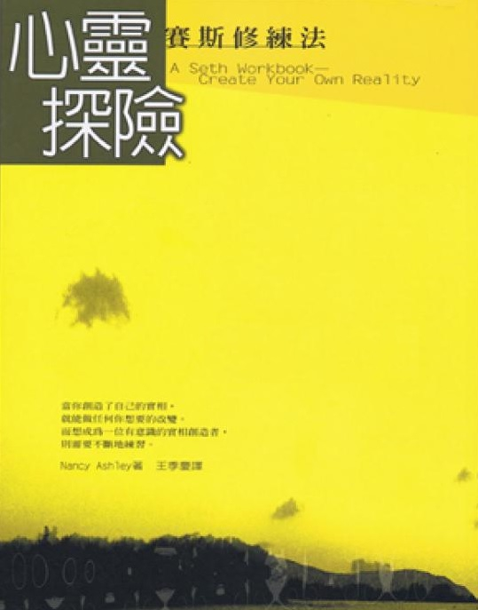

# 赛斯书：心灵探险：赛斯修炼法

## 作者简介

南希•艾希里

一位大学教授，为何在面对中年危机而从学校出走的一年里，对“某个次元的某个幽灵那种无聊玩艺”突然转变了态度，并进而想将自己的经验写成练习薄，以让更多的人能分享到发现赛斯的喜悦呢？

只因为赛斯让她了解到：我们创造我们自己的实相。而如果我们的确创造了自己的实相，那么无疑的，我们便能做我们想要做的不论什么改变。我们掌握着自己的命运，而不是“没有办法的”让“外在力量”促使我们做我们做过的那些事。

在这本练习中，作者尽其所能的把赛斯许多见解广阔的概念都精确而简洁的总括了，读者只需抱着一颗游戏的心，跟着步骤做练习，并不断的维持下去，把这些观念和行为整合到每日的生活中，要变成一个有意识的实相创造者，一点也不难。

## 自序

当我在十年前第一次与赛斯相遇时，我认为他是个骗子。有个黄昏，我才认识不久的一个年轻女孩顺道来访，她充满了来自一堂瑜伽课的高亢精力，臂下夹着一本紫色封面的平装书，书名是《灵魂永生》，我只看一眼封面上的照片就知道那是什么把戏了。这儿有某个在出神状态的女人，假定是在接受来自某个其他次元的某个幽灵的话。

多么无聊的废话！像我这样一个自尊自重的大学教师才不会对那玩意信以为真呢！那类玩艺到处都是，而那个凯西（她自称是个通灵者）全都读遍了。我又一次自忖为什么我会那么喜欢她。虽然十七岁的她和我儿子同龄，我们之间所有的却非一种母——女的吸引力。这个新发现的友谊满怪异的，它正在我觉得与我的老友及我一度感觉为其一部分的世界疏远了的这个时期来到。

三年前，在七年一次的休假时期来到，我带着一儿一女远走西班牙。那是我头一次体验单亲的责任，头一次大规模的旅游，头一次对另一个文化有深入的了解。我曾预期在那离家、离国的一年里，我的生活会有所不同，而的确也是如此。但我并没预期，当我回到我从一九六〇年起就生活在那儿的熟悉的夏威夷世界时，它看起来也像是完全不同的了，就好像我仍然在外国似的。在那时我并没想到是我变了，因为我仍自觉是同样一个人——一个有过“休假年”经验的单亲；但除此之外，与以前并无不同。

我不再是一个“与一个男人有亲密关系的女人”，而一旦回到了家，我就不曾预期那会对我的生活有多大影响。但我很快就发现它的确影响我能有的选择——我的社交生活，我看别人的方式——就像是，我一生直到那时为止都从未有过一个独立的存在。而现在我有了，却不大确定我到底喜不喜欢它。

另一个不同在我对我教大学的态度。当我在西班牙时，我为学写作的学生作了一本教科书的大纲——我多年在夏威夷大学教学所发展出的许多教本之一——已被接受要出版了。但当我回来而重拾这工作时，我发现我不再相信它建立于上的那些前提了。事实上，我发现我不再相信以前所持的许多对写作的教学与学习的前提。我甚至怀疑学生们真能用一本书来学写作。但如果事情真是如此，我又如何为自己的存在辩护呢？因为我觉得，那个存在是因有著做出版而得以合理化的。

不只是我新找到的独立及我的工作令我感觉奇怪，我的朋友们也一样。他们在这儿，谈着和在我离开之前同样的话题，好像那一年的离去根本从未发生过一样。他们还是完全一样使我不安——我不再能对他们的兴趣激起多少热情，但在同时，我又说不清楚自己兴趣何在。至少这个凯西奇怪的兴趣对我而言很新鲜很新奇。无疑的，我并不相信星象和转世，那是她以“实事求是”的态度讨论的；但话说回头，我已不再知道我相信什么了。

在这种心态之下——在凯西带着我没读过的新书来访不久——我决定向学校请一年假到加州去，那是我来夏威夷以前住过的地方，是美国少数几处我能找到对我稀薄的夏威夷血液而言，气候够温暖的地方。我想，借由换个地方，也许我能找到一个我在夏威夷得不到的对人生的看法。那时的我，挥舞着所有“中年危机”的典型症候而必须想个办法——花些时间走开去仔细思考我所经历的改变。

有件事对我变得清楚了：我想要变成一个“作家”。几年以来我每周花不少时间写作，但就我而言，我已出版的文章和教本并不是“真正的写作”。要作个作家，你必须要写小说，而那就是我现在打算做的事。

因此，我请了一年的假，带着我十一岁大的女儿，以及想找个安静地方写作、同时也理清我的存在的模糊想法到加州去了。但是还有养活我们这档子事得照顾到。在金山大桥彼端的朋友家里住了几天之后，我觉悟到对一个无薪给的未来做家和她活泼的女儿而言，马林郡是贵得离谱了。

然后碰巧有人提到马林郡北邻的索诺玛郡住家比较便宜。因而在一个分外清爽、阳光普照的日子，我们无意中朝那边开去，过了圣罗莎，进入西边的巨大红木森林里。被那些树的庄严之美所震慑，我们决定在那一带找个地方住。我们刚巧在一个乡村小店的布告牌上看到一则启事，打了个电话，而在一小时之内就租下了在蒙里欧的一个廉价小木屋，位于汹涌的俄国河畔的红木丛里。

够巧的是我们的两位房东也都是作家，以他们一丛小木屋的租金来养他们的写作习惯。那位太太属于一个女作家团体，那个团体至今仍生气勃勃的在附近的一个城里活跃着。我们一见如故，而她可以说是任我踢叫强拎着我去参加的——毕竟，我又不是个作家，去那儿干嘛？但在我与作家团体碰面一次之后，我就上瘾了——倒不是对写作，反而是对和那些我所见过最迷人的、多彩多姿的女人们的交互作用而言。

在夏威夷我总以为我的生活方式与我的大家同事比起来多少有点放荡不羁。但在这儿，藏匿在“反文化”的气氛当中，我觉得自己正经得紧。当我走进当地的健康食品店时，我老是自觉忸怩，我总是唯一穿着牛仔裤和毛衣而非一件嬉皮装的人。这些人不知怎么总能靠以物易物、交换、兼差和粮票而设法让他们自己有地方住，有衣服穿，有东西吃。许多人是某种艺术家，而全都至少热衷于一样事情，不管是妇女运动、建造一间房子、学校制度、营养或禅。当然，我以那年休假在西班牙小城里看村人同样浪漫的眼光去看他们。但这些却是（多少）和我说同样语言的同胞，而且，大多来自同样的中产阶级根源。在那一年里我与其中不少人弄得相当熟了，而且还形成了几个长存的友谊。

那么，我们——我女儿和我——就在那儿，住在一个嬉皮社区里巨树下的小小木屋里。大多数的日子我都花在我书桌旁，那是我由一张门板和装橘子的木箱设计出的，挤在六尺乘八尺的厨房里。当我女儿在河对岸桥边不远的、低压力的学校里闲闲度日的同时，炉子暖着我的背。但这并非我写作“伟大的美国小说”的一年；除了少数几篇短篇小说外，我写的东西结果多半是自我探索性的。日子过得相当兴高采烈——令人震撼的布景、得以认识这些人、我对小说的初萌芽的尝试——但大部份时候我仍是悲伤的，我开始看出，我至今所追求而未成功的是透过婚姻生活得到一种方向感；现在则全靠我去找到我生命的方向了——那令我感到孤寂。同时，我也开始了解在我的工作上我一直在当女主角，我对学生的关心还不及我对当个明星有兴趣——那使我对回去教书觉得不安。话说回来，在这儿我是和人同住着，他们有些和凯西一样的怪，他们相信各种各类乖僻的事，而不去做那些他们“被认为”该做的事，像是守住专职及存钱在银行里。他们如此惊人的充满活力、多彩多姿又有吸引力，但他们却与我有天壤之别……或并没有？

那么，在蒙里欧这一年并没帮我理清什么，而是令我觉察到我曾经是而不再是什么。我略略得知，我在西班牙的一年给了我一个对实相的不同看法，我再也不可能是原来那个人了。在一个“陌生的”文化里又过了一年使我改变得更多了。借着观察那些拥有不同信念（因而有一个不同实相）的人，我自己的信念也变得可见而相形之下变得不可接受了。我必须摒弃它们，却不知用什么来取代。

就在此时，我第二度遇见赛斯，在准备离开我的森林环境回去夏威夷和大学时，我拜访一位朋友的家去跟她道别，她正巧在读赛斯的《灵魂永生》。在所有这些人中间待了一年，我比来时要开通些而且好奇些。我打开书的半中间，读到：“如果你扩展你的爱、健康和存在的感受，那么你就会在此生及其他生生世世被吸向那些特质；再次的，因为它们是你所专注其上的事。恨战争的一代不会带来和平，爱好和平的一代才会带来和平。”

那个概念有什么（前卫）呢？我心里奇怪。对我来说它满有道理的。我很快地浏览一下书里不同的片段——因为这不是阅读它的场合——而格外地为它的清晰和一致性以及我感觉到在它背后的可靠性所震撼。在过去，我曾浏览过“奥秘的”书籍，发现那些文字很难看得下去，不论它们潜在的长处是什么。但我却发现这本书写得很清楚易懂，而且如凯西说过的：“很切题。”这个赛斯真的在对我说话呢！

回到夏威夷后，我买了当时已出版的所有赛斯书——《灵界的讯息》、《灵魂永生》及《个人实相的本质》。首先我把它们读过一遍，在某些部分画线，并在书页边批注。然后我回头，开始做些他建议的练习，在我的日志里写下所发生的事。不久我便建立了一个每日例行的“赛斯功课”，有大约三年的时间那成了我生活的主要焦点。我变成了有点像个隐者，只有去教课或去半条街外的海滩时才离开家。其他的时间我都在家，多半独自一人。为我自己创造一个新实相是我的目的，而赛斯是我信赖的向导。

一开始我对他的关键性概念——我们创造我们自己的实相——有所抗拒，因为在那时，我的实相有许多令我不喜欢的地方。我为什么会创造它们？但我随即开始去看那积极的一面，而看到我的实相的所有愉快面。开始欣赏、感谢自己做得“对”的地方，而看出那个概念的一个重要涵义：如果我们的确创造了自己的实相，那么我们便能做我们想要的不论什么改变。我们掌握着自己的命运！我看出我以前感觉多无助，相信“外在的力量”促使我做我做过的那些事，而我没有办法。因此这个新概念对我而言具有相当的启示性。

过去这些年来我阅读过很多心理学的书。六十年代初期我发现了马斯洛，那时他说的话就如十年后赛斯对我说的一样有意义。马斯洛相信我们应该以健康、自我实现了的人作为效法的楷模，而非以有缺陷、有需要的人作为我们去效法的楷模。那对我而言是真知卓见。他对已自我实现的人的描写很有启发性，但却似乎不可企及。我无法只靠意志力使自己具有一种完整感和与所有其他人的相连感，以及自发、开放、诚实、善意、个人性、自治、游戏性等等特性。有这种特质的人一定是与生俱有的，或有一个和我非常不一样的童年，而且，就那一点来说，也是和大多数人非常不一样的童年。毕竟，心理学书籍说我们在六岁以前已定了型；而且要改变那个型是难如登天——因而你最多只能对你自己是谁——一个静态的、固定的模型——适应而已。

但由赛斯，我了解了我们并不为我们的过去所摆布；我们永远可以由改变我们的信念来改变我们的实相；我们可以只靠信心而创造我们所要的实相。要做到这个，只不过那些信念对我们而言是无形的，那是因为我们把它们理所当然地视为是我们实相的基本假设——而非由于它们是被埋藏在无意识心智的某处。（依赛斯所说，“无意识”——我们心智那向着宇宙调准的部分——要比我们所谓的有意识的、自我支配的心智要有意识得多；而且还与它一样的条理分明，但却是以一种不同的方式。）

一旦我得到了“我们并不为我们的过去或一个不可测的无意识所摆布”这个令人激动的了悟，我便上了路。好像我的脑筋转了个弯，在其后不论发生了什么我都以一种新看法去看它。有些我以前会贴上“坏的”标签的东西，我现在只把它看作是我还未曾觉察一个信念的证据。而一旦我觉察了，我便能改变它。有了这个新觉察，我不再觉得有必要去为我所曾做的“坏事”伤脑筋了。我可以了解我为何做那些事——因而对我自己做了那些事更能容忍。增加的自我评价和自信又随之导致新的启示、新的改变、更多信心——一种滚雪球效应。我常在日志里写道，我是在一种如如蚕破茧的状态，由信念来孕育一只蝴蝶，而当我破茧而出，重新进入世界时，我用的是同样的比喻。

当时间渐渐过去，我惊觉于这世界在我眼里看起来要比以前生动了许多！有天我去一条我多年来没有再走过的山径远足。在我记忆里那是条阴沉的小径，但这天它色彩鲜明，生机沛然。自此以后每次我看它都是那个样子，而几乎不可思议我过去能以任何别的方式看它。但我曾为自己创造了一个阴沉的实相——在那条山路上，以及在我生活的其他面。

今天，所有那些全都改变了。在过去五年来我不记得有任何感觉沮丧的时候。我的心情由幸福感——大多的时间——变为微微不耐——当我的信念生效得不够快时。我对我的独立已变得非常自在了，而当我克服阻碍、解决困难或向未知探索时，我爱那种胜任的感觉。我在大学里的工作已完全改变。我不再“讲课”，而是把我的课变成了“研讨班”，由学生来主持，而我自己尽量置身幕后。透过这方法，我十分自然地想到以“练习簿”形式为学生写成教学资料这个新主意，那本书很快就将出版。

目前我的朋友有各种各类的，反映出我更多样的兴趣及对许多观点更具雅量。在变得和大自然及其深沉的节奏更和谐一致之后，我安排我的生活环境使我能尽情利用到它的抚慰性效果。我在欧胡岛北岸有田园风味的滨海小屋，棕榈环绕，拍岸惊涛，阵阵信风透过纱窗吹来了天然的通风设备。当我在写这篇文章时，我正在观赏屋后的青葱山脉。我的艺术作品挂满了墙面。好些年来我曾玩票性地作画，但却从未对我的成品感到满足过。然后有一天，在好几个的检查我对我创造力之本质的信念之后，我想出一种用布做的半浮雕——一种对我正合适的表现媒介，表达出从未在我任何著做出现的强烈官能美感。我开始定期制出作品，而现在它们已开始吸引别人的兴趣及买主。

自从我开始有意识地创造我自己的实相之后，发生了这么多的新发展。一天我在海滩上重读《心灵的本质》（我从没停止由那些书学习），突然有了一个冲动，我立即把它写在书页的空白处——因为我已变得信任我的冲动了。我写道：“一本赛斯练习簿。”第二天我给珍•罗伯兹发了封信，提议由我写一本与赛斯书同步的修炼法，并且把我想要做的事列出大纲来。在两周内，我收到了回信，说我那主意不错，我可直接给出版商写信，我照做了。而其余的，如他们所说，就都成历史了。

这个长而不害臊的自我祝贺式的叙述之目的，乃是想说明，丝毫不假，我们的确创造了我们自己的实相，而如果我们发现我们对它不甚满意，就能改变它。当然，如赛斯提出的，我们的实相本来就是流变不居的，但我们可以更有意识的介入那些改变里，如果，首先，我们相信我们能，其次，在上面用功。当我回顾时，我可以看出我是如何的在创造我的实相；我沿路所做的选择又如何是发展我现在的实相所必须的先决条件。例如，若我没看过马斯洛的书，我后来很可能没有读赛斯书的心理准备。如果凯西没令我在一年前对赛斯书曝了光，当我在一年后碰上它时，我的反应可能有所不同。如果我没有写“练习簿”的经验，也许我不会想到给赛斯书也写一本。

我们继续在一些行动中作选择，这些抉择随之又把我们导向某个方向。我们的“内我”永远在试着指导我们朝向我们潜能的最佳发展，但因为我们已学会去怀疑或不信赖我们的冲动，因为我们不再相信自己，我们常常结果变得不满足、困惑或陷入一个全面的“身体认同的危机”中，像我以前那样。借由对我们的生命负起有意识的管理之责，我们能重获本为每个人天赋权利的信赖和信心。今天我是个快乐的人；喜欢我所选择的方向；高兴我是有意识地那样做了；高兴我在赛斯内找到一个可以帮助我的人。这本书的孕育乃出自我对赛斯教诲的正面看法。我愿与别人分享我的过程，就在于我希望他们也能从中获益。

就某些方面而言，这本书是我让自己试做的课程的一个精华版本。我相信如果你彻底而忠实地按那些方式做那些练习，你在几个月内就能得到我在三年时间里碰运气得到的东西。我曾以某种方式做过所有的练习，而对我而言，它们中有些比另一些的效果要好。我对做比较“理性的”练习，如信念功课之类，觉得比较自在，因为它们与我对一个人如何学到东西的期望比较一致。即使如此，我想我可能从扩展了我的想象力和观想力量的更“直觉性的”练习里获益更多。在大多数的练习里，我试着综合了理性和直觉性的学习方法。

在开始做这些练习前，先找一本厚而结实的笔记簿来当作一本日志，因为这将是对你的进展的一个重要记录。在这些练习里，我已尽我所能的把赛斯许多见解广阔的概念尽量精确而简洁地总括起来。为了做这些练习，你并无必要买任何赛斯书，但，对那些比较喜欢直接由赛斯那儿得到那些概念的人，我把我资料的来源包括了进来。

这本书在一种团体的情况里最为有用。有许多练习可以在一个工作室的背景下由大家一起来做；别的可以由个人来做，然后与团队分享。一个团体之所以有价值，不只在于有不同的观点，而且它还提供了动机。当你知道那团体预期你已做了某个特定的作业，你就有了不去拖延的额外诱因。

如果你能对做这些练习采取一种游戏性态度，而非把它们视为必须想办法跟上的一种日常劳务，那么你就会更快乐的进步，而在过程中更好玩。但不论你的态度如何，去做那些练习却是绝对必要的。光阅读它们是不够的！要想变成一个有意识的实相创造者需要练习。这本练习簿会给你开个头——然后就全仗着你去维持下去，把那些观念和行为整合到你每日的存在里。

好好玩吧！

南希•艾希里

## 第一章：创世：赛斯论我们来自何处

……有“非存在”。那并不是一个空无一物的情境，却是一个情境，在其中已经知道并且预期到许多的“可能性”，但那些可能性却受到阻碍而未能表现出来。

朦胧地，回溯过你们几乎不复记忆的所谓的历史之前，曾有过这样的一个情境，那是个极痛苦的情境，当其时，创造与存在的力量已知，但产生它们的方法却未知。

这是“一切万有”（All that is）必须学到的教训，没有人能教给他。最初的创造力汲取自这极大的痛苦，而仍旧可以看到这痛苦的反映。

——《灵界的讯息》

◇　◇　◇　◇

它始自一个“意识”想要表达“它自己”的渴望。“一切万有”——一个以爱为动力的有觉性的能量完形（gestalt）——是在一种潜伏的状态。它觉知它所有的潜能，却不知如何去表现它们。它的想象力无际无涯；在它的思想里有一个宇宙又一个宇宙的累累丰富。在它内，实存（entities）呈现出越来越生动的形式，而大声呼叫着想要具体表现出来，想要“存在”。但是“一切万有”不知道如何使它们实现，因为每一个实存都是它心中的一“念”，而每一念都是一粒能量。它如何能表达这些“念”而不放弃形成它们的那部份能量呢？

这就是“一切万有”的两难之局——似乎是个无法解决的难局，因为它意指把他们与它自己分开。但这又如何可能呢？“一切万有”是个统一体。当它的痛楚越来越变本加厉，当在它内所有那些渴望“寻求重要性”的能量想法处理这创造性的难局之时，一个想法在她心里形成了。这个长生不老的实存想到一个全新的观念：“在统一之内的分离（separateness-within-unity）。最初这观念只被隐隐地感觉到，但当它的重要性增长时，它背后的情感也随之增长。

啊哈！“一切万有”怀着怎样的渴望想象着由这个新主意涌出的可能性啊！真的！这将可容许它所拟想的它的每个部份变成一个独立的“存在”（being），却又不失为它的一部份。每一个都拥有它自己的立足点和视角，都与另一个不同，而由它自己的中心看生命。光是想到它由这些存在能学到多少东西，就够令人兴奋的了！他们可以告诉它由他们的观点来看生命是什么样子，可以透过他们的眼睛给它看多重世界的杰作，当他们一边学习“一切万有”的幅度之深广时，一边也增益了它的幅度。“在统一之内的分离”，多妙的主意啊！

“一切万有”觉得它整个的存在都在低吟着这个渴望：去成就那个“重要性”的可能性，去使那“潜伏性”明确化，去令它实现。“一切万有”创造的那些“存在”努力想解放出来的热望使“一切万有”的低吟变成了高亢多彩的无法忍受的强烈渴望。于是“一切万有”以一个庞然的信赖与弃守的姿态松用放行。它放弃了它心中固有的限制性概念，而当如此做时，把那概念所关闭起来的能量发挥了出来。

在其结果所造成的创造性的大爆炸里，播散了“心灵宇宙”（psychic universe）的种子，每一粒种子都是一个不可分割的有觉性的能量，有它自己独特的看法，并且也充满了那给予它生命的同样充溢的想去了解想去爱的渴望。它对它诞生前的那宇宙性难局的苦痛犹有记忆，而透过那记忆它被推入存在的持续不断的活动里。每个种子仍觉察到那曾给它自由的“源头”，并知觉自己仍为其一部分。

这些苗木般的意识想要创造的情感性愿望促使它们以无数种方式游戏性地组合。一旦它们发现一种具有重要性的组织，它们就依附其上，并且也吸引同好来加入。如此便创造出整个实相系统，这些系统由深沉而历久不渝的情感中长出，含着丰富的爱和创造的渴望，恒常在运动中。

我们的物质宇宙就是这样被具体显现出来的。很像“一切万有”在它的渴望中放弃了它的一部分，让它们可以去追求独立的存在，同样的这些部分中的某一些，在“它们”对物质经验的强烈渴求下，把它们自己“印”到物质里。它们在同一刹那在各处放出光，如此便为我们所知的生命创造出一种媒介，为所有可能的生命形式创造出蓝图及工具。

那么，我们生命的素质是生自强烈的情感上的渴望。它由意识自然地升起，把“知觉”带入物质的层面到能量的深沉“感觉基调”（feeling-tone）上，就像无穷无尽的各种音乐和和弦。我们每个人都有自形成我们的原子和分子升起的独特“感觉基调”，而在物质存在上打上我们身份的“印记”。这些“感觉基调”渗透了我们的存在，决定了生命所赋予我们的情感类型。它们是在人我之间的连结物，因为它们代表了生命力，代表了所有存在由之造出的原料。当我们对发生在我们身上的事反应时，我们的情绪允有波动升降，但在这些短暂无常的情绪之下有长而深的节奏韵律，作为我们生命中事件的基础，并提供我们方向与目的，决定我们知觉的特质及什么对我们是重要的。“感觉基调”是我们灵魂的声音，代表了我们存在的精髓和本质，我们由那本质而形成我们的物质经验，它是我们自身在纯能量上的表现，代表我们在肉身里的永不能被复制的“身份”。而在同时呢，它们又是我们在三度空间的存在里与所有其他生灵的共鸣性联系。

我们创造我们自己的实相。这第一个练习是个基础性的练习，因为它使你能与你自己独特的能量——在你内彰显的“一切万有”的那个部分——有所接触。在感知到那个能量——在你内的那个深沉的音乐和弦——的时候，你开始觉悟到你的确有力量使自己的“自性”（self）对宇宙发生影响，并且了悟那个“自性”是的确与任何别个不一样的。

安静坐着，闭上你的眼睛。感觉在你内的深沉韵律。试着对“它会是什么感觉”这个问题不要存有先见，而只就向内看，等着那些“感觉基调”对你变得明显起来。你知道这些“感觉基调”存在着，并且你也明白我们是生自这些深沉的音调，生自“一切万有”想透过肉身而认识“它自己”的强烈渴望。你是这种感受及“存在”于肉身里的欲望的一个独特表现。你是知觉、倾向与意向的一个独特组合，在这个三度空间的世界里表现你的“自性”。把你自己向“你是什么”开放，感受在你内的那些深沉的音调。开始去觉察你自己的韵律，你存在的伟大能量，而让你自己体验它。

别问你自己：“我真的在体验这个吗？”不要预测你自己。什么来了就接受什么，并且“知道”那是来自你自己最深部分的一个讯息。感觉它，玩味它。尽可能地停留在这感受里。

做这练习不要计时。不要以为你必须花，好比说，十五分钟或半个小时，或定下任何一段时限去做。那可能会使它好像是个责任，某件不管你想不想做都必须去做的事。最重要的是，这个练习应当是个你喜欢做的练习。

也许你必须试好多次，才会认知你已接触到你的“感觉基调”了。有些人可能有一种即刻的“啊哈”经验，而觉悟到他“一直”是触及到这些音调的，却没有“有意识的”注意到它们。无论如何，你们所有的人迟早会认知它们的，因为它们根本没有被藏起来，却是你日常经验的一个亲密的部分。它们是你与“一切万有”的联系。

我建议一开始你多加练习——或许一日两回——直到它变成你的第二天性。然后再不时有意识地检查一下你的“感觉基调”，并且当你不开心或沮丧时，运用一下这个练习所给你的“有力感”。当你对你的“感觉基调”明白地觉察时，你会感觉到心中有主而安全。

为了加强所有这些感受，你有时可以对自己慢慢吟咏“唵”（O-O-O-O-O-O-M-M-M-M-M-M）这个声音，出声或默诵皆可，它可以加强你的身体，给你能量。当我在开车时，我常用这个诵，结果发现我真的享受起夹在车流中的情况了。

当你做这个练习许多次而熟悉了这些“感觉基调”所给你的“有力感”之后，就去感受这些基调由你的身体向外散播——因为它们正就在如此做。随着你的每一次呼吸，每一次能量的悸动，你放出你自己的这个精髓，它与其他的精髓混在一起，一而再地创造出你们的物质环境。感觉你自己集中在内心，而放出你重重的能量波。看见它由你的身体向外辐射到四周的环境里，在那儿它变成了你自己的一个延伸。觉悟到你知觉为“在外边”的物质其实是你的念头的具体化，由“你的”能量形成你的“内我”、你的精髓、你的灵魂的象征。感觉那能量放射进入地心，也升入天空，透过了云层而进入宇宙最远的地方，因为它的确是这样的。这些来自你意识的放散物质真的以这种方式向外延伸，它们的影响无远弗届。

这就是你的创造力、你的“自性”的本质。

## 第二章：一种变为的状态

当你说：“我要找到我自己”的时候，通常你理所当然地认为有一个已完成的你自己的版本，而你把他误导到什么地方去了。当你想要找到上帝的时候，你也常是以同样的想法在想。其实任何时候你都“不离自己左右”。你一直在变为（becoming）你自己……上帝与你的心灵，两者都经常不断地在扩展中——无法形容而永远在变为。

——《心灵的本质》

◇　◇　◇　◇

存在的要素即行动。按照赛斯的说法，我们的——以及所有其他的——宇宙是由有意识的能量所组成，永远在“恒动”中。能量的每一小点的每个动作影响到所有其他的能量，而改变了整体的模式。

能量的每一个小点经由它的动作而得以与其他的点区分，并且获得了作为一个分开的独立动力的身份。在“创世”之前，我们为其一部分的那个能量的集合体是尚未分化的、潜伏的，充满了可能性，却是在一种非存在（non being）、非活动的状态。“意识”已有了，但没有知道的方法。这个能量为了要认识它是什么，必须要挣出到“它自己外面”，但一旦它如此做了，它便已由它本来是的东西变成另外的东西了。于是，为了要认知那另外的东西是什么，它又必须再挣出到它自己之外去。

“感知某物”这个行动总是会把被感知的东西变成了别的东西。量子物理学家已经发现在微量物质上是这个情形；在非物质的心灵能量上，情形也是一样。

那么，这就是“存在”——一个变为你是什么的过程，而在这变为的行动里，改变了你本来的样子。万一“存在”有“完成了”的一天，它就不再“存在”，因为就正是这个过程，这个动作，给了它“生命”。这个过程也就是当“一切万有”把它能量的一部分释放出来，由它已完成的、理想的状态去变成不论它想变成的什么状态时，它所发动的一个过程。

行动即存在的精髓，而“不可预测性”即其定则。你无法确定地预测任何行动的结果，因为那行动改变了它作用于其上的那个东西。在你的“变为”的行动里，你改变了你之为何物。而事实上，推动一个行动的动机就是它的这个不可预测性。如果你确知，某个计划好的行动必然会发生某种后果，你就不会对其结果有多少好奇了。就是因为你不知道它到底会怎么样，你才有动机去采取那些发现其结果的行动，而这个——你的好奇心，你想知道的强烈愿望——就是维持你的活力，促使你继续“变为”的力量。

那么，就“存在”的充满活力的、永在变为的本质而言，要说“找到”你自己——仿佛有一个已完成的你的成品存在于某处——是没有什么道理的。的确是有一个“理想的心理模式”（稍后再解释），但那个模式永远不会被实现，因为实现它的过程自动会改变它。因此去想“当我长大我会是什么样子”，不如去思考你变为的性质还更有用些。集中焦点在成品上不如集中焦点在过程上。这样的话，如果你对自己目前的存在状况不甚满意，你将知道你要怎么办：改变这过程，改变你的行动，再看那个做法对你的存在状况——你的“变为的状态”——有何影响。这本手册的主要目的之一，就是要使你对你创造出自己实相的思想和行为更有意识地觉察到，因为只有透过这种觉察你才有希望改变不满意的地方。

做这个练习你需要用到你的笔记本。首先开列一张单子，记下这些年来你已“变为”的东西。回想你人生中的一些阶段，当你经过一些显著的改变，由一种存在状态变到另一种时。一个明显的例子可以是由依赖父母变为依靠自己。另一个例子可以是由一种情绪状态变为另一种，比如说渡过了沮丧而进入一种不同的存在状态。想起好几次在你一生里你所曾经历的这种改变，不论是变好或变坏。

现在试着去推演一下是什么造成了那个改变。首先，看看你能否准确地指出你在改变之前对你的状况的想法，以及在改变之后的想法。无疑的它们已随你存在状态的改变而改变了。现在，你到底做了什么而引起你存在状态及你思想的改变？也许大部份是潜意识的，但且试着把在那段过渡期里，你所采取的一些行动，以及你所有的一些情绪带入你有意识的觉察里。你曾对那改变加以抗拒？或试着使它加速？你改变了睡眠或饮食习惯吗？你交了新朋友而丢掉了旧朋友？你改变了住所、发型或衣着吗？针对每一个改变时期，试看你能否想出你——那个改变的创造者——是如何带来那个改变的。

现在且找一找“模式”。你是否发现你有用相同的方法（好比说改变你的饮食习惯）带来每个改变的倾向？你能否找出你一再重复的某种策略？你是否在改变成你认为比较好的一种存在状态时用了某种策略，而在改变成比较差的存在状态时用了另一些策略？你是否觉得，好像那些变好的改变是你自己带来的，同时那些变坏的改变是出于“在你控制之外的力量”？如果真是如此，那么你就要了解那是你的“信念”，因而也成为你的现实，而非其反面。

且看看你目前的存在状态，看你能不能把它看成是在过程中。把你自己看作刚刚来自一个状态，而正在到另一个状态的途中。你正在由甲到乙的半路上。由这个观点，来看把你带到这条路上的这一点的那些思想和行动。现在用这同样的模式，看看你能否预测出你将来的思想和行动。可能有什么结果？当你到达乙点时，你会在什么存在状态？

在你的笔记里详细的形容一下你目前在其中的“过程”。你对过程是否有任何不满意的地方，它好像没把你导向你所要的结果？如果真是如此，你能做什么“过程的改变”，而给你正在变为的“产品”一个正面的影响？如果你发现你应有所改变，就答应你自己你在途中会采取一些小步骤以带来那些改变。

现在，这练习的最后一步，是在你心中看到你自己在这一生的末端。看到基于你目前的行动模式，在那时你将已经历过的所有的变为，而同时了悟到，去思考你将会变成什么，这个行动的本身就会自动地改变那个产品！

## 第三章：架构一与架构二

就像在看一个电视节目之前，你并不知道在电视摄影棚里所发生的事……因而同样的，在经验到一件实质事件之前，你也不知道在“实相的创造性架构”里所发生的事。我们将称呼那个广大的“无意识的”精神性与宇宙性的摄影棚为“架构二”……情形就好像是这样：“架构二”包含了一个无限量的资讯服务，它立刻使你得以接触到你要求的知识，它在你与别人之间建立了电路网，它以令人目眩的速度计算“可能性”。然而，它却不是以一个电脑的不具人格的态度去做那些服务，却是心怀一种为你们的最好目的——你的以及每个其他人的——的充满爱心的意向去做。

——《个人与群体事件的本质》

◇　◇　◇　◇

为了要解释创造我们的实相所涉及的动力，赛斯用“架构一”及“架构二”来代表我们在其中得享“经验”的已展现的实相。基本上，“架构一”即物质世界，由自我（ego）——我们与之认同的我们那个有意识的版本——管理。“架构二”是在幕后的实相，我们由其中汲取在创造实相时所涉及的那些资料，而后我们才在物质世界中经验我们造出来的实相。主管这广大的“资讯服务”的是内我（inner self）——也被称为内在的自我、心灵、无意识、灵性的自己及灵魂。这个实存（entity）选择并且诠释进入它的资料——以“有觉性之能量”的方式表现的资料——然后把它送去给自我，自我再决定要不要对这资料采取行动。

然而，赛斯强调这种架构的区分是个武断的分隔，只为了讨论上的方便而设的。实际上，这两个架构是彼此互补而不可分的。正如我们的自我依赖着内我而得以展现，而内我也是不断地寻求展现。两者都觉察这种相互的依靠，而它们在直觉里、冲动里、梦里及意识的改变状态里相遇。

就像所有自然界生物，我们生而俱有一种朝向成长及发展我们才能的推动力——变为我们本来就是的东西的推动力。和所有自然界的生物一样，我们是以这样一种方式相互依赖，以至于一个人的完成导向整个族类的完成，那么，对我们每一个人而言，有个赛斯所谓的“理想的心理模式”。“架构二”——或，不如说，在这架构中运作的内我——正恒常不断地努力使我们向那个方向前进。这个模式是有弹性的，对我们日常生活的在变化的环境反应，但它永远使我们向可能的最好方向前进，不但为了我们自己的好处，也为了所有我们与之接触的人的好处。

因此，我们由其中汲取我们经验的“架构二”，并非一个“中立的”媒介，却是一个善意的媒介，温和地把我们推向建设性的抉择。要与这个向善的力量对抗，你必须有个对邪恶的强烈信念。在将来的一些练习里，我们会看看我们为什么会不信任我们的直觉与冲动、害怕我们的梦、并且对我们唾手可得的无限创造泉源缺乏信心的一些理由。你将会明白“内我”因无法直接体验物质实相，必须依赖自我去按照它对实相的信念而对实相加以诠释。而接着，由于它强烈的渴望看见那些信念得以展现，便把它的能量转换成物质的形式。我们也将探索发现我们所抱持的那些创造出我们实相的信念之方法。

但是在这个练习里，我们将针对“信心”而言。因为已为我们“习焉而不察”的信心——我们能够运作；“架构二”会供给我们在“架构一”里得到经验所需的知识及能量——是我们在“架构一”里大部份行为的基础。例如，我们信任早晨太阳会升起；而它的确如此。我们假定我们的胃肠会消化我们的食物；而它们的确如此。当我们驾驶一辆汽车时，我们认定如果我们转方向盘，车子便会驶向那个方向等等——我们所采取的最微细渺小的行动都是被我们的意向将被达成的信心所决定的。

在我们采取某种行动之前，百分之九十的时候我们不觉得有必要去衡量正反两面，因为我们“知道”它会带来我们要的结果。而正因为我们的确“知道”此点，正因为我们有信心那个想要的结果会发生，它就发生了。

常言道：“对你已知的事你不需要信心。”这句话暗示知识是“理性的”而信心是“非理性的”（而知识多少要比信心“高超”）。但照赛斯的说法，我们的信心却是我们知识的来源。既然我们无法经由正常的感知方式直接知道“架构二”的内容，那我们只能靠信心前进。而只要我们对某事有信心，它就会显示出来。透过这些显现，我们获得知识。

因此以赛斯的看法，信心跑第一。知识乃信心之结果，而非一种更高超、“理性”的意识状态。那么，此时正是我们该开始对“信心”有信心而非不信任它的时候了！如赛斯说的：

◇　◇　◇　◇

对一个创造性的、令人满足的、为人渴望的目标之信心——不移之信心——真的由“架构二”里汲取所有必要的成份、所有的元素（不论其数字多么庞大惊人）及所有的细节，而后把那些冲动、梦想、偶遇、动机或不论什么必要的东西塞入“架构一”里，以使那所想要的目标恰恰以一完成了的模式显现。

——《珍的上帝》

◇　◇　◇　◇

为这个练习，你将为自己创造一个“信条”，肯定你对“架构二”的作用的信心。以下是珍的先生罗勃•柏兹为他自己所写的一篇，也许可供你参考：

◇　◇　◇　◇

我有那简单、深厚的信心，相信任何我在此生所渴望之事皆能由“架构二”降到我身。在“架构二”里没有障碍。“架构二”能创造性地产生我在“架构一”里想要的每件事——我绝对的健康、绘画与写作、我与珍极好的关系、珍自己自发而焕发的健康与创造性、她所有书的越来越畅销。我知道所有这些积极的目标会在“架构二”里精细计划出来。不论它们看起来有多复杂，而后它们能在“架构一”里显现出来。我有那简单、深厚的信心，我在此生所渴望的每件事都能由“架构二”奇迹式的作用降到我身。我不必担心任何一种细节，知道“架构二”拥有那无限的创造能力去处理及产生我可能要求它的每件事。我所需要的一切就是那无限的创造能力去处理及产生我可能要求它的每件事。我所需要的一切就是对“架构二”之具创造性的“善”有简单而深厚的信心。

——《个人与群体事件的本质》

◇　◇　◇　◇

为你自己制作一张海报，你的“信条”以大黑字体写在上面，把它钉在你的床边或浴室门上。每次你看到它时必定念上一遍，然后就忘掉它，而怀着你的信心会被回报的信心。

## 第四章：此时此地

一只动物——不一定要是森林里的一只野生动物，而是一只普通的狗或猫——以某种形式反应。它对环境中的每样东西都有所警觉。不过，一只猫不会由四条街外被关起来的一只狗儿预期任何的危险，也不会去臆测如果那只狗逃掉而找到猫安适的院子会发生什么事。

可是，许多人不去注意他们环境里的每样东西，却透过他们的信念只专注于“四条街外的恶犬”。也就是说，他们不对在时间或空间里具体存在或可见的东西反应，却反而将念头盘据在那些也许存在也许不存在的威胁上，而同时却忽视了那些就在身边的其他中肯的资料。

——《个人与群体事件的本质》

◇　◇　◇　◇

物质世界充满了讯息。每件我们“在外面”看到的东西——风吹过树林、蜜蜂在花间嗡嗡地飞、一只狗的咆哮——都在那儿告诉我们一些什么。我们继续不断地与我们的环境相互作用，接收到讯息也送出讯息。借着细胞的通讯我们的身体自动地这样做，而由此确保我们安全而有效地运作。只要我们警觉而对我们的物理环境调准了频率，我们的心与身便能运作无误。

可是，问题就在，还有一个由“心”创造出来的内在观念世界，我们必须与之打交道。身体透过肉体感官能处理由生物环境来的资讯，但若要诠释来自文化环境的资料，它却要靠“自我”。举例来说，身体留给“自我”去决定，一个特定的社会状况是否天生包藏着一个威胁——而随之照章行事。因此，如果你的隔壁邻居皱着眉叫你到篱笆边，你的身体会按照你的“心”对那不豫之色的诠释而反应。如果你的心说那种表情象征一个威胁，身体便会随之做准备；如果你的心说没涉及什么威胁，身体便会如常的运作。

那么，只要是我们的心对威胁的评估与一个生物上的评估相符，我们和我们的身体便有一个很好的互动关系，在其中身体对具威胁性的情况迅速而适当地反应。但若我们持续性地在没有生物性危险——好比“四条街外的恶犬”——的情况里知觉到危险的话，身体就没有任何明确的东西可反应，但它却非反应不可，因此很快就会变得过劳而迷惑了。经过一段时间，这可能导致疾病或某些其他的虚弱，而我们自然的丰沛活力很可能失落在这混乱中。

当然，人类为何会变得与大自然离得这么远，我们为何会剥削且试图控制自然，而非与它和谐相处，是有其理由的。其理在我们对“分离”与“敌对”的信念——也许是人类意识在这物质层面所采取的方向之不可避免的结果。但如赛斯一再地说的，我们无法不珍视我们的生物性而能珍视我们的灵性，因为两者有许多共同性。我们的身体及所有大自然都是灵魂的物质性显现。大自然是我们的“内我”透过象征对我们说话。另一方面，我们实相的人造面——包括其社会与政治结构——则是我们“自我”的信念之显现。那么，它们是“二手的”、较不实质的、短命的显现；而同时大自然则是最高的、主要的显现。

这意味着当我们在与自然作亲密交流时，比当我们在试着凭知性理解个人实相的本质到底是什么时，要离我们的本性近得多！

当然，所有这些都被以无数方式说过无数次了。每个人都知道我们是紧张过度。每个人都同意我们操心过度。每个人都承认，如果我们能就只活在“此时此地”，我们的身体会好得多。每个人都感觉到大自然是身体想去的地方。每个人都知道这些事，而也许有那么一天我们会对之采取一些行动。但现在我们都太忙了……

但别迟延下去了。如赛斯所说：

◇　◇　◇　◇

你感官的自然“生物合理性”必须保持清晰，而只有那样，你才能充分利用必须透过你自己与时空之交会而来的那些直觉与远景……处处环绕着你的大自然之永远实在的完整性。它代表你的直接体验。它提供了安适、创造力与灵感，那是只有当你容许“二手的”经验取代了你日常分分秒秒与物质的地球之接触时，才会将它阻断掉的。

——《心灵的本质》

◇　◇　◇　◇

每天做这个练习五到十分钟。在户外找一处安静的有树的地方。安静地坐着，看看四周，再问自己：现在我意识到什么？看清每样东西：色彩、形状、质感、风吹在你脸上的感受。生动地体验那景致。

然后闭上眼睛。对先前你也许没注意到的许多声音变得觉察起来。认出他们，在心里把那些声音与发出声音的东西连结起来。感觉你的身体像是自然环境的一部份。开始觉察它的温度——你的手是否觉得暖或冷，或你的脚冷而你的肚子热。开始觉察你体内的其他感觉。嘴里有没有一种味道？你闻到什么气味？透过嗅觉感受你与自然的联系——嗅味同时在你体内与体外，是你的也是自然的一部份。

现在睁开眼睛，把内在与外在合起来。透过感官感受你与自然的联系。开始觉察所有自然现象的互相连接性。感觉你自己为自然过程之一部份。感受这种相互作用。感觉你所有的知觉合了起来而形成一个统一的整体。感觉你的听觉与你的视觉、你的味觉与你的嗅觉，感觉它们像是一个统一的灿烂知觉。把那知觉保持在你心里，然后再闭上眼。让这种统一感消褪，而声音变成主宰。密切地跟随某一个特定的声音，集中在它上面，在你心中追随它。然后张开眼睛而立刻再度的把你的感官合成一个统一的整体，你所有的知觉加起来成为一个单一而极度集中的辉煌感知点。

让这感官世界强化，然后闭上眼再度的放松焦点。

当你这样做了几次，而觉察到在每次只感知一件东西与感知一个统一整体之间的对比时，你会对这个统一发展出一种感觉。你会认出，当你的意识是完全在此时此地、完全集中在物质实相时，你感觉如何。

在你日常的例行事务中，不时试试去获得这精细的焦点，把所有的感官资料整合起来以提供对物质实相可能的最明晰的感知。经过一段时间，你将发现这种练习会丰富你的日常经验，容许你完全地贯注于真正在手头上的事。你的心和你的身会联合起来处理它。

## 第五章：信念功课之一

你的经验像一块布，而这块布是你透过了你自己的信念与期盼织出来的。你心目中对自己以及对实相的本质所抱的观念，样样都影响到你的思想与你的情绪。你把你自己对实相所抱的信念当作是一项真理，几乎连问都不问，因为每样事情看起来都这么的顺理成章。对你而言，这些事情其本身就是一种事实的“声明”，明显得连审视一下都是多余的。

因此，你就对这些事予以全盘的接受了，极少想到去怀疑一下。你把所有的这些当成是实相本应有的特性来接受，根本就不认识这其实只不过是你自己对实相所抱的信念而已……它们变成了一种“无形的假设”，但它们依然渲染了你的经验。

——《个人实相的本质》

◇　◇　◇　◇

一个信念是一个念头——附带着“期望”。

我们不停地在思考。我们的每一念在“架构二”里都有一个真实性。每一个都是一个活生生的“实存”，“有觉性的能量”的一个单位，由那有觉性的能量之完形——“内我”——中生起，资讯和知识在那个架构里发生不断的相互作用。

但并非所有的念头都在“架构一”里变得具体化了，只有在其后有足够情感强度的那些才具体化——思想与想要具体化的期望或渴望合在一起。有时候，那期望或渴望是建立在自我对实相的评估上——它预期或想要看到具体显现的东西——而有时，则纯粹是建立在内我知道什么对其成长有好处上面。每当一个充满了情感的念头变得为你所觉察时，内我自动地由这内在经验形成一个物质上的“对等物”，以使自我能在物质实相里体验那个念头。这经常在发生，而你的内我（及其他的内我）时时刻刻都在创造又重创物质世界。

这些物质的“对等物”是以电磁单位（赛斯称之为 EE 单位）的方式由内我的能量形成的，EE 单位是当这有觉性的能量（或意识）在一个情感的高峰时所“散发”出来的原子之下的粒子，它们组成了我们物质世界的每样东西——空气、我们的身体、岩石、建筑物。透过内我的欲望和意向，这些单位向外散发以形成原子和分子、细胞及器官，而终至那整个的伪装系统——我们的物质实相。我们看见“在外面”的那些东西，是我们的内在主观经验凝固了的形式——凝固了的意念！我们的身体以及在我们世界里的每样东西都是由内我的集体努力所组织、建造并维护，以便看见它们自己在三度空间的实相里“客观化”。意识的力量和本质就是如此！

那么，这就是实相被创造出来的方式——经由预期性的想法。那就是赛斯的意思，当他一再重复声明说我们透过我们的信念创造我们的实相，而如果我们想改变我们的实相，我们首先必须发现我们对它所抱的信念。他强调这些信念是“有意识的”这个事实——而非隐藏在我们心中某个不可触及的部分里。但它们“可能”对我们而言是“看不见的”，因为我们把它们当作是关于实相的“事实”而非对它的信念。

举例来说，我们全都有的对实相的一个信念是夜晚随白天而至。而就因为我们全都相信这是如此，它就是如此。我们的信念创造我们的实相——那就是指借由默想我们的实相，我们能发现我们的信念。

赛斯称刚才提到的那种信念为“基本假设”——我们所有人都同意把我们的存在建立于其上的那些概念。所有的实相系统（其数无穷）都有一套基本假设，那是任何想在那系统内运作的人所必须遵循的。例如，在我们的实相里，我们对空间时间的想法即为基本假设。但在其他实相里，它们却不一定适用。

当然，我们无法改变我们的基本假设而期望在这实相里运作——除非我们能有法子使在这实相里的每个有意识的实存都同时改变到某些其他经过协议的假设上。但我们每个人都持有好像是对实相的基本假设的许多其他信念。其中之一也许是：“我很胖。”你对自己说：“我很胖这个事实是有关实相的一个事实。”可是，事实却是，你相信你很胖，所以你很胖。但你的胖并非关于这实相的一个基本假设，也不是在这实相里的每一个人所同意的对生存条件的一个信念。不管你是否肥胖，这个实相将继续存在，因此“我很胖”是个你能够改变的信念。但首先你必须彻底了解“我很胖”真的是个信念而非一个事实，相信那点之后，你就能改变那信念，因而改变你的实相。

珍•罗伯兹有好几年举办每周一次的 ESP 班，其经过由珍的一位朋友也是 ESP 班学生之一的苏•华京斯记录在《与赛斯对话》里。赛斯在这些课中常自发地“现身”，评论学生说的话，给予忠告，并给他们一些功课作为家庭作业。他所给的功课中有一套就是“信念论文”，在其中他叫学生写下他们在某些领域的信念，然后在下一次上课时念出来并加以讨论。这本手册将有一套相似的练习，叫你们检查你们在种种不同区域里的信念。

这第一个练习是集中焦点在你对婚姻、宗教及政府的角色的基本假设。以这些信念来开始是很好的，因为这些假设比在那些较不制度化的区域里的假设较为显而易见。在检查你的信念时，以“事实”来开头——例如，关于婚姻：在美国有超过百分之五十的婚姻以离婚结束。这是一个“事实”，或不如说，是被很多人认同的一个信念——但却非一个基本假设。且检查一下这个“事实”对你自己个人的信念系统的影响。你相信你自己的婚姻只有 50%的成功机率吗？或如今婚姻是很难维持的了？那么，就用“事实”去研究你的某些私人信念。

第二个发现你信念的方法是检查你对这题目的情绪感受。例如，当你想到政府时，你可能觉得愤怒。在这怒气之后的信念（或成套的信念）是什么？我们的情绪是由我们的信念所引起，而非其反面——那么就看看引起这情绪的信念。

最后，检查你的信念对你的实相之影响。这些信念导致了哪些行动及经验？你喜欢这些结果吗？如否，你想用哪些信念去取代它们？在这上面努力。

在你的日志里写下你在这些区域的信念。如果可能的话，试着去和别人分享它们，因为你可能会发现别的人也许根本不同意你以为被众人共持为“事实”的想法。我们看不见许多我们所持有的信念，因为我们将之视为当然（“众所周知”）。所以把众所周知的信念也包括进去，把它们在别人身上试试，看看是否每个人真的都知道。

## 第六章：威力之点就在当下

当你抱怨一个不友善的环境，或一种情况或状况，基本上……你没有在独立地行动，而几乎是在盲目地反应……要想以一种独立的态度行动，你必须开始发动你想要它实际上发生的行动，借由先在你自己的存在中把它创造出来。

这是借由把信念、情感与想象力组合起来，而形成你想要的实际结果的一个“心像”而做到的。当然，这想要的结果还不是具体有形的，否则你就不需要去创造它，因此你若说你的实际经验好像与你试图去做的相反的话，是没有用的。

——《个人实相的本质》

◇　◇　◇　◇

威力之点就在当下！为了实用的目的，这是赛斯资料里最有价值的观念之一。它是指我们永远控制着我们自己的命运，因为就在当下——而非在什么晦暗的过去或不可预见的未来——我们的信念创造我们的实相。我们由我们目前的焦点形成我们的人生，在那一点上我们的信念一方面与物质世界、一方面与未具体显现的世界（我们的能量、力量和灵感之源）相交。

过去与未来并非力量所寄之处。我们在此时此地所做的不断地影响我们的过去与我们的未来。时间在“架构二”里并不存在，因而过去与未来在同时发生。如果我们现在改变一个信念，过去便自动地改变以与这新信念调和。而按照这信念未来的可能性也被改变了。

过去并不决定我们的现在；现在才决定我们的现在——以及我们的过去和我们的未来。这一点再怎么强调都不为过。不论我们在过去的经验是什么，不论我们在一分钟前的实相是像什么样子，现在才是现在形成它的东西。我们在每个刹那创造我们自己，而在现在永远对我们的实相像什么样子有所选择。

如果看起来好像我们是在我们无法控制的过去事件的摆布之下的话，那么那是我们的信念——而那就是我们的实相。但我们并不受我们的过去所摆布，而只是受那些我们或是没认出或是执着不放的信念——即使明知它们对我们实相的不利影响——所摆布。形成我们实相的是我们的信念，而就是我们自己选择了我们的信念。我们所相信的不论什么都很忠实地“在外面”具体化来给我们这些创造者看，来供我们沉思。

当然，因为物质实相的本质，在一个信念被嵌入及其具体化之间，也许会有那么一段时间。例如，如果你由“我很胖”的信念变到“我很瘦”的信念，你的身体会花一阵子才能把这信念反应回给你。但就在你由当下的威力之点嵌入那个新信念的瞬间，你的身体就会开始那些使你与那信念和谐一致所必须的改变。而过去也会改变，创造出一个与新信念一致的新的过去的自己。

所有你需要做的只是去相信某样东西，而它就会变成你的实相之一部分。这就是我们在此生要学习的主要教训；我们的确当下就透过我们的信念创造自己的实相。

在这本手册内的九个信念练习里，你将会非常密切地检视你所抱的信念——因为它们常常逃过了你的注意，乃因你们把他们当作是“存在”的当然事实，或者它们以一种你以前没想到过的方式限制了你。通常你看见“在外面”具体显现的东西是一团信念的结果，那是必须先被泄露出来你才能加以改变的。去发现你的信念到底是什么的功夫是值得花的，因为一旦你知道它们是什么，你就能逐一改变它们。你根本不是无力帮助你自己的。那只需要锻炼和决心，以及对这一刹那透过你的信念正在不断地创造你自己的实相这个念头的信心而已。

练习

安静地坐着，全神贯注于：“当下是威力之点”——在那永恒的刹那你的能量把形式加诸物质——这个念头。感觉你所有的内在力量、情感及智力与你的身体，你的物质交会——并给予其生命。感觉在内心世界与外在世界相会的那个威力之点能量源源流出到环境里而形成你们的实相。全神贯注于其上。

现在，把你想看到具体化的某件东西带入你心里。感觉你整个的自己对这渴望——对你想具体经验的这个信念——反应。感觉你所有的内在力量合力工作。在那一个威力点与物质实相交会，创造你所想要的实相。观想它在发生并且想它正在发生：贯注于那个渴望成真的情形。用你所有的能量与注意力去观想它。

然后就忘掉它。一旦你想象你的信念成了真，就不再去想它，不要一直寻找结果或查核看它是否有用。你知道它必然有用；你已向“架构二”提出了请求，你所需做的只是等待。你想要的你就会得到。

这是另一个你应每天做的练习。和那“感官基调”练习一同做，这应给你对在你内的力量的一个强烈感受，那个你可用来创造自己实相的能量。

重要的是一定要确定那新信念是个正面的信念，即“张三爱我，并且愿意和我在一起。”而非：“张三不再是羞怯或冷漠的。”另一件事是，每天采取与这新信念一致的一些行动或某种姿态。如果你想克服害羞，你也许可以跟一个陌生人问好，或是与超市的收帐员聊上几句。以某种方式表现出符合“我与别人可以自在相处”这新信念的行为。对你创造自己实相的能力表现出信心。

当你有时在人生中为了某个理由而感觉无力、受挫或沮丧时——那就用这“威力之点”的练习来与你自己存在的能量接触。对你自己力量的一个认知会自动把你的恐惧释放掉，因而也释放了负面的感受。

所有负面的情绪都是恐惧的结果，而恐惧则是“无力感”的结果——面对一个非你自己所形成的命运之无力感。正如赛斯的一个学生曾经说的：“恶就是没有能力。”有人问：“没有能力做什么？”而答复是：“没有能力，如此而已。”每次当你在任何方面感觉不安全时，就用这“威力之点”练习吧！

## 第七章：梦戏

在一个梦里，你基本上对一个事件的这么多面都有所觉察，以至它们之中必然有许多会逃过了你的醒时记忆。但任何一种真正的教育必须把在梦里的学习过程纳入考虑，而没有人能不鼓励梦之探索、回忆及在醒时生活中创造性的利用梦之教育而希望能看到一眼心灵的本质。

——《心灵的本质》

◇　◇　◇　◇

在所有赛斯的书中，梦都扮演了一个重要角色。他把“对梦境之熟悉”当作了解我们实相的真实本质及我们如何创造实相的一个必要的先决条件。

在醒时生活里，我们与“架构二”（我们的外在实相建立于其上的那个内在实相）最直接的联系局限于冲动、直觉与灵感——在“架构二”里运作的我们的“内我”向我们的“自我”送出的讯息。“内我”在发出这些建议我们采取那些行动的讯息之前，它先把不断流入它的资料加以整理，试着决定建议那些行动。作这决定的一个重要方法就是透过梦，在其间各种不同的可能性被预演，而由这些再选出最富生产力的行动。

在梦境里，内我与外我——做梦的自我——以一种在醒时生活里不可能的方式相会，而由内我观察梦的戏剧，自我则参与其中。透过这相互作用，自我亲眼看到了物质实相是如何被创造出来的，对它的理想之心理模式变得觉察，而也经验到内在实相的多次元世界——我们在其中度我们的死后生活。为此之故，赛斯强调在梦境里变得有意识地觉察之重要性。借由把这状态带到有意识地觉察，可以学到很多，因为借由有意识的操纵梦，我们能把我们的物质实相变成一个更和谐、更圆满的实相。

赛斯一再建议我们采用一种可以让醒时心智与做梦心智变得更觉察到彼此的睡眠模式。理想的模式是在一个二十四小时的段落里睡两个三小时的小觉，而且绝不要一次睡过六小时。超过的话会加宽了做梦和醒时状态之间的间隙，而降低身心的效能。赛斯说，减短睡眠时间会使醒时自己忆起更多的梦中冒险。

另一个可使我们对梦中环境变得更有意识地觉察的方法，只是在入睡之前建议自己在梦中“醒过来”，把我们的醒时自己带入梦里而记住那个经验。如果我们夜夜重复使用这暗示，诚心诚意想有这种觉察力，而对我们在梦中可能会遇到的东西不抱任何隐隐的恐惧的话，我们终究能把有意识的自我带入梦，而觉察到前所未知的经验与知识之深度。这会在醒时生活里造成大得多的弹性和扩展了的觉察力。

梦是非常具创造性而好玩的。赛斯把它们比作童年的游戏：儿童明知只是一个游戏而故意吓他们自己，明知当他们的母亲叫他们吃饭时，那妖怪就会遁形了。当我们长大些，我们学会把假装当蠢事，人生变成一件严肃的事，而我们的好玩之心只在梦境里才显现出来。

那么，成人的梦就像儿童的游戏一样。因此对我们的梦了解更多的方法之一就是，当我们在醒时生活里时，游戏性地为自己假造一些梦；创造我们自己的妖怪、食人巨妖、女巫和小妖。这让我们看出哪些象征对我们有意义，我们在做梦时为自己布置哪种情境——因为我们醒时的梦会与我们真正的梦有诸多相同之处。这样我们能对意识的创造弹性——梦境的特性——变得觉察，而学会在醒时状态也变得更有创造力和弹性。

这个练习将针对一个醒时的梦。应当重复的练习。如果你在同时也记录你每夜的梦，则这个练习会最有效，以便你能比较醒时与睡时的梦。每晚入睡之前，对自己建议你会记得你的梦，而你会在它们正发生时对之变得有意识的觉察。缓慢而诚恳的重复这建议好几次；然后放松而入睡。在枕边放一本笔记本和一只笔，以使你一醒来就能写下你的梦。但可别只把它们写下就忘了。试着去分析它们，看看它们试着告诉你什么。

现在，在你的日志里为你自己创造一个梦。游戏性地做而不要试图结构你在写的东西。只是开始写，让影像流过而不试图去猜它们的意义。不要试想合乎逻辑而执着于一个想法。如果在一个句子的半中间你开始跑到另一串念头上，就让它发生。试着不把任何价值判断放在你正在写的东西上（“这真是太怪异了”）或把自己导向某个方向。想象你是你的内我，当你一边写这梦时他一边在看它的开展。也想象你是那在做梦的自我，好玩地演出梦中的事件，就像儿童在游戏时所做的。别试想给这梦下结论——让它以自己的方式结束，即使那仿佛是混乱不堪的。

现在，借着玩味你刚想出的一些影像试试去诠释那梦。你也许想借由写下你心里对这些影像所想起的不论什么东西来做一些“自由联想”。不要试图勉强赋予这梦什么意义。跟它玩，再看有什么意义浮现出来。这练习的主要价值在给你一些对你“真正的梦”的本质之洞见，并且给你看看以一个更有弹性的意识在一个多次元实相里运作是什么滋味。

经常地重复这练习，并且记下当你的实相历经它具特征性的起伏时，你捏造的梦又如何变化。

## 第八章：想象力的角色

若要了解是你创造了你自己的实相，你需要由正常的醒时状态（像一个人能由一场梦中醒来而悟到他正在做梦那样）“醒过来”……只要你相信好事或坏事都是一个人格化的神按照你的行为而施的赏与罚；或在另一方面把事件视为是在一个偶然的达尔文式世界纠缠不清的网里的那些大半是无意义的、混乱的、主观的“结”，那么你就无从有意识地了解你自己的创造力，或在宇宙里扮演你身为个人或为“人类”所能扮演的角色。反之，你会活在一个世界里，在那儿，事件发生在你身上，在其中，你必须对某种神明供奉祭品，或视自己为一个不关心你的大自然之受害者。

在你还维持住你所了解的物质事件之完整性的同时，你还得多少改变你注意力的焦点，以使你能开始感知，在任何时候你的主观实相和你所感知的事件之间的联系。你就是那些事件的发起人。

——《个人与群体事件的本质》

◇　◇　◇　◇

就如赛斯一直在说的，在我们物质世界里的每样东西，首先都存在于我们的想象中。我们有个倾向，会把物质世界想作“真实的”世界，而把想象的世界——连带不可解的与之相连的感受与信念——当作是如梦而非真的，或当作是在物质世界里所发生之事的一个分枝。我们根本没想到，或许我们所经验到的世界正是我们的想象、感受与信念的结果，而非其反面。但事实是，我们的想象、感受与信念正应为我们遭遇什么事以及我们如何去诠释它负责呢！

这个练习为的是使你接触到你想象力的“主观”世界。

坐在一扇窗边，像看一幅画一样向外看世界。把这画面看作是你的想象力、感受和对实相之信念的代表。在还未把它向外投射之前，感觉你自己先在内心想象这画面。感觉你的内在程序在运作，先描出一个粗略的外型，再把细节加上去，使得这物质的图画成为你在此刻的所有想象、感受与信念的忠实复制品。感觉一下你能量的威力，它透过渴望把这内在实相转译成一幅具体画面，以使你能随之去深思它，而从你的创造物中学习。

研究研究这“透过窗子看到的画面”的细节。关于“内在的你”它们说了些什么？是什么驱使你在这特定一刻制出这一幅画而非任何其他的画面？这画中哪些地方你曾在不同时候“所见不同”？哪些地方看起来总是一样——相同的尺寸、形状、颜色？画中哪些地方特别突出？那些一直是背景？你认为为何会如此？这对你的信念、你的感受及你对实相作何观感说明了什么？

看看你能否对这画面作轻微的改变。游戏性地指挥你的想象力去轻微的改变这画面，而在眼前看到其结果出现。认知那是你的想象力、你的思想、感受和幻想的内在世界在创造及改变在你眼前的这个画面。

一周最好至少做一次这种练习，直到你创造自己实相的感觉已深深植入你内。在你的日志里，把每回你做这练习时所发生的事件做个记录——你对你的信念、感受和幻想发现了些什么？以及当你试图改变它们时发生了什么？

## 第九章：冲动：直接的联系

整体而言，不论你对之觉察与否……你们的人生的确有某一种心理上的形状。那形状是为你所决定的。你作决定是因为感觉想做这或做那的冲动，以及反应你因私人的考量和别人好像对你的要求这两者而生的想以这种或那种方式做事的冲动。在那些对你开放的无数可能性的广大领域里，你当然是有些指导原则的，否则你会永远在一种犹豫不决的状态。你个人的冲动提供了那些指导原则，使你看出如何对可能性作最好的利用，以使你能尽可能地成就你自己的潜能——而在如此做时，也对社会整体提供了建设性的帮助。

当人家教你不可信任你的冲动时，你开始失去了你作决定的力量，而在那情形下，由于你害怕去行动你也就开始失去了你的有力感。

——《个人与群体事件的本质》

◇　◇　◇　◇

我们的宇宙是一个广大的通讯网，在其中，不断在运动的“具有觉性的能量粒子”继续不断地交换资讯。每个能量粒子都知觉到它接触到的每个别的能量粒子，由它们每个收到资讯，也送出资讯。我们的身体——一个“具觉性能量”的完形——也是一样，经常在送出和收到资讯。

当我们用到“架构二”这个词时，我们是指这个我们可通过“具觉性的能量”而得到的无限的资讯之源。处理这资讯是“内我”的工作，选择那些符合“全我”的需要、欲望和完整性的那些点点滴滴。而把它们送去给“自我”，它随之决定要不要对这些冲动采取行动。那么，冲动是我们与“架构二”的直接、有意识的联系，而提供了我们朝向我们的“理想行为模式”——在任何一刻对我们最有益的行为——前进之动力。

问题是，我们已变得不再信赖我们的冲动了。因为它们自发自然地升起，在我们看来仿佛是非理性而不可信任的——我们的“自我”叫我们去做的事。

我们有把自己想作是两个个别的“实存”的倾向。首先有“自我”，这个我们与之认同的熟悉的自己，它负责我们的言和行，它有某种个性、感受和思想。然后有赛斯所谓的“内我”或心灵，但我们常称之为“无意识”或“灵魂”的东西。对我们而言，它好像距离很远，神秘而不可预测，但，尽管如此，在作决定时我们仍向它寻求指导和支持。我们不信任我们熟悉的日常的自己，因为我们学会了“自我中心”、自私和富攻击性是不对的。因此我们白白地等着那“真实的”内心声音告诉我们该做什么和怎么做，却害怕按照自我的忠告去采取行动。

这种心态的第一个问题是来自把“有意识的”自己当作是自我，因为自从弗罗伊德之后，“自我”这名词已具有一种贬损的意义。虽则在字典里它也许仍被定义为：“任何人之自己或我”，大半人们用这字来暗示轻率的冲动、自私或攻击性。但却没有任何其他协议好的字句可以利用，因而我们被陷住不得不用“自我”这词，而当我们用它时，即自动地带起了我们对自我中心式行为的先入之见。

但一开始，这种“有两个个别自己”的想法就引起了一个更基本的问题。只要我们这样想，我们就倾向于和自我认同，而与“无意识的”自己分开。因为这种分离感，我们不会承认来自内我的讯息，反而把它们归之于自我，因而认为它们不可靠。因此我们没能认识我们与所谓“无意识的”——但事实上，如赛斯指出的，更有意识的——自己有多亲密的联系。我们没能认知，与我们如此亲密的我们熟悉的日常自己，就是我们自己所有不同部分的总合，一起合作来在肉体中表达我们/我/你。“内我”并没被隐藏，却只因我们选择了去把它认作是某个遥远的、“在上面”的东西，以与永远可辨认的自我相对，而不为我们所见。

有趣的是，我们不把别人想作只是一个自我。当我们看着别人，我们明白我们是在看一个完整的生灵，其内我清楚地透过他眼睛的光彩、飘忽的一笑、说话的语气和每个小动作表现出来。我们从不会想我们只在看一个自我；我们明知事非如此。但我们却有把自己那样看的倾向——因而使我们不信任我们的冲动，而有它们会给我们找麻烦的感觉。

可是，我们的冲动并非“自我”所产生的，反倒是我们对这些冲动选择要反应与否之行动才是。自我是冲动的收受者，而非创始者。自我并不负责把冲动传达给“我们”——不论在此“我们”是什么意思——却是以它必须处理的信念为基础去作个决定：要不要采取行动。而太常发生的是，由于对这冲动的不信任，它选择了不去行动。

如赛斯一再强调的，冲动天生是“好”的，因为它们是由“架构二”而来——“架构二”包含了我们理想的心理模式，我们“建设性行动”之蓝图。“架构二”是个创造性的构造，由它我们得知什么对我们以及对世界最有利，而我们的冲动就是我们与这智慧之源最直接的联系。它们本来就是要保持我们生理和心理上的健康。因此使我们惹上麻烦的，并非随顺我们的冲动，却是去否认它们。当我们一而再地否认我们的冲动，当我们不直接地表达它们，它们会找到其他的表达方式而令我们得知其讯息。珍•罗勃兹在《个人与群体事件的本质》里谈到这个：

◇　◇　◇　◇

我自己对冲动也伤过脑筋，只跟随我认为会把我导向我想去之处的那些，而剧烈地削减我认为会影响我工作的那些。像许多其他的人一样，我以为跟随我的冲动是达成任何目标最不可靠的方法——除非当我在写作，那时，一种“创造性”的冲动就变成最受欢迎的了。我没有了解到所有的冲动都是创造性的，就因为这样子的信念，好多年来我都有一种最恼人的类似关节炎的症状，除了别的理由以外，那也是我削减了身体想动的冲动之结果。

——《个人与群体事件的本质》

◇　◇　◇　◇

在珍的例子里，被否认的冲动透过她的身体、透过身体症状来表达它自己。既然她否认了那试想给她，她的身体需要运动这个讯息的那些冲动，内我就以一种不同形式提出了同样的讯息。对别人而言，被否认的冲动可能在心理上透过沮丧、挫折或愤怒来表现。

一般而言，隐于心理症状背后的讯息比隐于身体症状上的要更难被认出来。举例而言，我们很容易把想发怒的冲动视为我们不能信任我们的冲动的证据，而非去把那怒气诠释为一个被否认了的冲动——一个朝向某些建设性行动的冲动。因此，我们非但不试去发现愤怒之源，反而否认了那“第二次的”冲动，就如我们否认了引发它的“原始”冲动一样——或是由一开始就没认出那愤怒，或是由假装我们没生气——因而创造出更多的症状。我们越否认我们的冲动，我们就越感觉无力，而我们越感无力，想行动的冲动就越强烈——为了减轻压力而采取不管哪种行动。其普通的后果之一就是暴力犯罪。

那么，暴力并非听从我们最深的自然冲动之结果，反倒是一再否认那些冲动，以至于结果到了任何行动——甚至那些绝非理想的行动——也比没有行动要好的地步。我们最初的冲动是有益的，驱使我们去尽可能地发展我们的能力。但如果我们选择不去追随它们，我们仍然会发展——不管以哪种方式，因为这是个充满活力的宇宙，没有任何东西是静止的。如果我们不尽可能以积极的方式留心最先给我们的讯息，那么就会有更多的讯息不可解地继续到来，直到我们终于被迫采取行动。到了那时，可能我们根本不觉得我们有采取行动与否的选择了，那只会增加我们的无力感及被一个怀有敌意的宇宙所摆布的感觉。

因此我们必须认识且信任我们自然的冲动，它令我们接触到我们采取积极行动的力量和智慧。以下分成两部分的练习就是设计来帮助你这样做的。第一部分是关于“认出冲动”，第二部分则是关于“检查你所认为的负面或破坏性的冲动”。

第一部分

为这个练习准备一本小笔记本，你可以插在口袋或放在皮包里面随时带在身边的那种。只管把你觉察到的每个冲动记下来，不管它多微不足道或看起来多无聊，不论你有没有去做，也不管它看起来是建设性或破坏性的。记下你认出这冲动的地点、日期和大概时间，用一个短句描写它，还有你对它做了些什么——如果做了任何事的话。例如：“超市，五月十五，三点半。想到买张卡片给××——好久没有她的消息。看了一遍架子。没有合适的。算了。”

在这练习里，这冲动是“原始冲动”（叫你采取积极行动的冲动）或“第二次冲动”（由被否认的原始冲动而起的）并不重要。在此重要的事是尽可能记下你所觉察到的冲动。只把它们记下来的决定就会自动地把你以前没想到的许多冲动带到有意识的觉察，即使是那些你对它采取过行动的冲动。

如果你持续地记录，而定期复查你做了什么，你就会发现出现了一个模式。有些冲动也许很容易描写，有些则否——你也许察觉一个冲动，一种想做什么的内在冲动，但却不太确知那该是什么行动。这即表示那是你比较不信任你内在智慧的一个领域。

你也许能把冲动分类，如“工作”、“朋友”、“健康”等范围，而由此得知在每个范围里你行动的自由程度如何。或者你可以把它们分类为情绪性冲动——愤怒、挫折、欲望等等，及身体性冲动——想买某件东西、写封信、做些运动，或也许分为原始的和第二次的冲动。无论如何，只靠着把在一段时期里你注意到的每个冲动忠实地记录下来，你就会变得更加觉察你与“架构二”的密切联系，而明了你正在由它获得资讯和讯息。你不再觉得与这智慧之源切断了。你也会看出你在哪里及如何阻塞住冲动，而逐渐学会在当下采取小小的积极步骤，而非直等到你被那些被否认的冲动之郁积压力逼到采取激烈的行动为止。不论你跟随你的冲动与否，那会是有意识而非无意识的决定。

这个记下冲动的方法，也可被想除掉他们认为的坏习惯的人成功地利用。我有位朋友每天要吸两包香烟，她并不喜欢抽烟，却似无法停止，或甚至减少一些。她常常发现她抽着一只烟却不记得她点过烟。她在她的烟盒里塞进一张小卡纸和一截铅笔，每次她有吸烟的冲动时就在卡上作个记号，然后再决定她要不要贯彻那个冲动。光是借着把这些冲动带入完全有意识的注意之下，在一周内她就能减少吸烟量到每天一包。还不止于此，她开始在她的吸烟习惯里看到一个模式，看出吸烟是减轻（却也令其持续）她认为无法控制的小挫折的方法。她随即采取了一些减轻那些挫折的步骤，而开始对自己感觉好多了。

第二部分

在这练习的第一部分，你把每天重复的小冲动——原始的或第二次的——记下来，那是很容易逃过你注意的，因为单独来看，它们好像对我们没多少影响。而当再过目一遍时，你可能会发现，累积起来的话，它们之中有些的确有种影响，由你的观点看来或是正面或是负面的影响。

在这个部分的练习，我希望你选择去继续处理那些，由于在其后的力量及压力感而被你认出，是因较温和的原始冲动被否认而来的“第二次冲动”。只举几个例子：一种愤怒或挫折的感觉，一种想暴食的强烈欲望，或想对某人证明你对某事的看法正确的驱策力。

试着回想最近你感觉过一种强烈冲动的事。在你脑中一丝不漏地重新体验那件事情。然后在你的日志里写下关于它的事，就好比你在由一名观察者的角度来写一篇个案研究。是什么导致了那件事？在过去有没有相似的情形？是什么导致那些事？这些事有何共通点？先认定你的强烈感受是起自一种无力感，看你是否能发现你对何事觉得无力。你觉得自己无法采取一些积极而有益的行动，因而感觉无力。那积极而有益的行动是什么？也许你想要帮助某人，但却好像有某人或某事挡在中间。是什么？也许你有个创意，却受阻而无法表达它。那想法是什么？你又如何能表达它？

每回你有个麻烦的冲动时——好像与你相信为正确的、或好的、或真的事矛盾的冲动——就以这方法去检查它。你很快会发现，它是在你对朝向某个理想行动——也许是你感觉太过理想而绝不可能实现的一个行动——去做的冲动之漫长压抑过程之后升起的。计划一下去采取实现那理想的一些小步骤。当你开始信任你的原始冲动而采取一些步骤去贯彻它们时，你就会获得一种与日俱增的有力感，以及与你的内我和“架构二”的相连感。

## 第十章：信念功课之二

当你发现自己有这种想法的时候你可能愤愤不平地说：“可是这些全是真的呀。我的确穷。我真的付不起帐。”或诸如此类的。你明白吗，在这样做的时候，你就把你对实相的信念接受下来，当作是实相本身的一个特性，因而那信念对你而言，变得透明而看不见了。但它却是你实际经验的肇始者……你也许会在另一个领域追踪你的思想，而发现自己在想，你的困难是在于你太敏感了。发现这个想法后，你也许会说：“但这是真的呀，我确是如此。我本来就是对小事情有很大的情绪反应。”但那是一种信念，而且是个限制性的信念。

若你更深入地追下去，你可能发现自己在想：“我这种多愁善感其实还蛮不错的，它使我卓尔不群。”或“这个世界配不上我。”这些都是限制性的信念。

——《个人实相的本质》

◇　◇　◇　◇

如赛斯所说，我们有许多信念局限了我们的活动而限制了我们表达自己。首先，我们必须发现那些信念是什么（因为它们之中有许多是看不见的），其次是看清它们的限制。一旦我们了解我们是如何限制了自己，我们就会被激起去改变我们局限性信念的动机。在做这些信念功课的时候，抱着一种游戏性态度是很重要的，别把它们当作是阻挡你完成你希望做到的事的沉重障碍物，反之，把它们想作是你可以随意挪动的儿童积木。如果你做成了一个你不喜欢的构造物，你永远可以把它打掉再重新开始。

让我们用以下这个从赛斯书和其他来源收集来的局限性信念的名单来开始这个信念练习。当你循序看下去时，勾出那些你觉得是真的信念——即使在理性上说，你“知道”并非如此——以及（或是）那些你看不出它到底局限了什么的信念。通常最难看出的局限性信念就是那些你认为是“好的”信念。在你的日志里，充分的检查这每一个信念，以发现可能隐于其后的其他信念，就如赛斯所举的例子：一个相信自己是很敏感的人，发现他为之感到骄傲，因为它令他卓尔不群。这些信念产生哪些结果？你觉得被它们局限了吗？若是如此，你为何用这些信念限制自己？你要做什么才能改变它们？

•当你过了三十岁（四十岁、五十岁等等），一切都在走下坡。

•表示愤怒是不对的。

•我是个惹人厌的人。

•人生乃悲伤之幽谷。

•身体是低贱的。

•我面对无法控制的环境而毫无办法。

•我没办法是由于在婴儿时形成的个性和性格，我在我的过去的摆布之下。

•我毫无办法因为我为前生之事件所摆布，我对它是无计可施的。我必得受罚，或我正在为前生对别人不好而处惩罚我自己。因为我前生的恶业，我必须接受我人生的负面情况。

•我无法控制我的感觉（或我想什么、做什么或相信什么）。

•人们基本上是坏的，并且存心要整我。

•我拥有真理，别人都没有。或我们这个团体拥有真理，其他团体都没有。

•我比××要好（或坏）。

•我的存在是靠我在肉身里的经验。当我的身体死了，我的意识也与之而亡。

•我身体不好，而且一向如此。

•钱财不是好东西。有钱的人都很贪心，比那些穷人没灵气，他们比较不快乐，又是势利眼。

•我永远没有足够的钱财。

•我没有创造力。我没有想象力。

•人们不喜欢我。

•我从不能做我想做的事。

•我很胖/害羞/懒等等，或某人很胖/害羞/懒等等。

•我运气一直很坏。

•我很蠢。

•没人爱我。

•我不是个好母亲/父亲。

•作母亲（或钱财或美貌或才能等等）是人生中最重要的事。

•我恨暴力。

•我到晚上就很累了。

•吸烟会引起癌症。

•如果我继续喝这么多酒，我会变成一个酒鬼。

•我说话太多。

•我没有音乐修养。

•我生来脾气暴躁。

•我从没得到任何爱，所以我又如何能给爱？

•人们基本上怀有敌意。

•我太敏感。

•晚上单独出动是很危险的。

•××是个爱敲竹杠的人。××永远会占你便宜。

•我怕做梦。我的噩梦往往成真。

•人生是无意义的。

•财富胜于一切。

•当××××时我就很愧疚，或，因为我觉得愧疚，所以××××。

•我真无法与××沟通。

•我被我无法控制的无意识的欲望所摆布。

•我无法戒烟（节食，等等），因为我没有意志力。

•我有意想记得我的梦，但暗示并没有用。因此，在意识层面上我要什么都并不重要。

•我太老（年轻、害羞，等等）而不能××××。

•我很寂寞。我没法不觉寂寞。

•在人生中想改变我的行为已太迟了。

•我想得太多。我该更多去运动（更外向，等等）。

•我太软弱，无法抗拒××××。

•我只想好的念头，因而我会很健康，并且要抑制我的坏念头，无论如何不可去想它。

•性方面的念头都是坏的。

•我没有价值；我没有资格快乐。

•攻击性是坏的。

•我自卑。

•没有男人的女人比较无力。

•我是个失败的人。

•年轻对我而言是无意义的。

•我是个作家/画家/医生/老师，等等。

•我必须将我的存在合理化。

•懒惰是坏的。

•你吃什么你就是什么。

•你最好要买健康保险。

•只有医生能治好我。

•我需要很多睡眠。

•因为我的才能我比别人要高超。

•我对发生在我身上的事毫无控制之力。

•我极端的负责。

•感官知觉是知识或真理的唯一来源。

•女人是女性化而男人是男性化的。

•越多越好。

•所有的科学都是显然无疑的知识。

•心胜于物。

•复杂现象之所有面貌都可借着把它们简化到其组成成份而获得了解。

•我们是存在于我们肉体“之内”的孤立“自我”。

•劳心要比劳力高级些。

•我们“拥有”我们的身体。

•在物质里，没有目的、生命或灵性。

•自然是个机器；身体是个机器。

•科学的目的是在主宰和控制自然。

•疾病是一个特定的生理机制发生了故障；医生的工作就是去修理部份的机器。

•没有病就是健康。

•任何暂时减轻疼痛的东西都必然是好的。

•在出生时，人的心智是一张白纸，由感官印象把概念、想法印上去。

•思想和情绪是人对外在刺激所生的行为模式。

•努力的、自我否定的工作以及世俗的成功相当于美德。

•持续的经济和科技成长是必要而且好的。

•俄国人（日本人，等等）是我们的敌人。

## 第十一章：罪恶感与恩宠

罪恶感是同情的另一面。它的原始目的，是让你有知觉地对你们自己及其他生灵产生“同理心”，因此你能有意识地控制先前只能在生物层面上处理的事。那样说来罪恶感因而有一个强而有力的自然基础，而当它被败坏、误用或误解时，它有那种任何失控了的基本现象所有的巨大可怕的能量。

——《个人实相的本质》

◇　◇　◇　◇

罪恶感弥漫了我们的文化，虽然它大部分是不必要而且具破坏性的。我们对吃“垃圾食物”感到罪恶，对星期日上午睡懒觉感到罪恶，当我们看到一位警察也感到罪恶，我们对说“不行”、说“好的”都感到罪恶……没完没了。我们花了极庞然的能量在对想象出来的错事的罪恶感上。罪恶感侵蚀了我们的自尊心，妨碍了我们的日常运作，甚至引起了疾病和严重的沮丧，而绝大多数的时候，都没有合乎逻辑的理由必得如此。我们并没违反任何道德或伦理的法规，我们并没做任何伤人的事，在有些例子里，我们根本什么也没做——而那令我们觉得有罪。到底这种集体现象是怎么来的呢？

赛斯解释说，当人类演化到一种新的意识状态而失去了动物本能时，罪恶感乃成为一种必要代替物。在那时之前，他就像所有其他的自然生灵那样活着——在一种持续的“恩宠状态”。这种存在状态之生起，是由于和大自然完美地协调，不费力地生长，喜乐地接受生命带来的一切，把每日需要之满足视为理所当然，完全地活在永恒的当下。动物们对所有大自然的统一和相互关联有种本能感受，一种生物上的完整感和“同理心”，而这些自动地规范了他们的行为。

人是第一个在意识上演化到超过这种本能的存在状态之地球生物。他朝向“自由意志”发展的动力，使他必须脱离大自然自我调整的、局限性的统治，以便能为他自己选择他想活在其下的“价值”。那些维持大自然之均衡的固有规律，对他而言，变成了指导原则，而非一成不变的法律，而有意识的同情取代了不许侵犯他“人”之生物上的命令了。这是指，人有自由去以其行为做实验，但也要为它负责，因为他明白它们在其他生物身上的影响。罪恶感因而诞生——赛斯称之为自然罪恶感，因为它起自，必须在一个有意识的层面规范那些原先在一个生物性层面上本能加以规范的事。它是个演化的步骤，对维持大自然的均衡以及它固有的公正感，是不可或缺的。

自然罪恶感是预防性而非处罚性的，就在于一旦人在某方面侵犯了自然，他的罪恶感会阻止他在将来采取同样的行动。所涉及的唯一“惩罚”就是他因之而起的罪恶感，它暂时支配了意识而把他与他仍密切相连的“恩宠感”切断了。当他觉得有罪时，他失去了仍为其存在之特征的伟大的、喜悦的支持感。

人对过去、现在与未来之意识（动物很少会发展的一种觉察力）和这种自然罪恶感是密切相连的，也可能罪恶感的观点被用为一种加深人的“时间意识”之工具。因为罪恶感是要靠在现在对过去行为的觉察，以及投射到将来对计划中的行为的觉察。人越常反省，他就对在他脑海里操纵这些个观念变得越敏捷。

可是，对我们而言，很不幸的，一种加深的时间感随之又逐渐导致了一种罪恶感的扩大。罪恶感变得较少用为对违反自然律的一种防护，而较常被一个人或派别用作以武断价值蒙骗他人的方法。当人工罪恶感和良心取代了自然罪恶感和同情时，人就愈益看不见他与生俱有的权利，他在自然的大计中不可侵犯的地位，而开始把他自己视为一个有毛病的生物，其在地球上的生存受到了怀疑而必须不断地被合理化。骄傲根本不是发生在“堕落”（译注：亚当和夏娃的犯原罪）之前；“堕落”使人与他的骄傲分开了。

这练习将分为两部分，第一部分与罪恶感有关，而第二部份与恩宠有关。

第一部分

在你的日志里，把所有你能想起会令你有罪恶感的事写张清单。在单子的每项之间留些空白，以便稍后填入。这儿有几个问题可让你开始去想你有罪恶感的地方。

•你做过什么令你感觉有罪的行为？

•你有过什么你认为不该有、因而感觉有罪的感受？

•因你与你父母的关系令你产生了什么罪恶感？

•与你身体？

•与性？

•与你同辈？

•跟你的另一半？

•与你的孩子？

•与你上司？

•与你同事？

•与你的教会？

•与你的政府？

•与社会？

•与世界？

•与动物？

•与金钱？

•与房地产？

•与责任、杂务和仪式？

现在看一遍你的单子，在那些你相信是自然罪恶感——因自然律而起的罪恶感（维护自然之平衡所必需）——的例子前写上“自”，而在那些你相信是人工罪恶感——由违反武断的人为价值而起的——的例子前写上“人”。

现在检查在你每一个例子背后的信念。例如，如果你说你对为自己在衣着上花钱有罪恶感，那么你为什么认为这样做是错的？是否因为你相信你不配有新衣服？因为你相信钱该用在别的东西上？或你买不起？在相配的例子下面写下你的那些信念。看看你是否想互换一下某些“自”字和“人”字。这有没有改变你对自然与人工罪恶感的看法？

现在在你日志的另一页，检查你对罪恶感的一般信念。如果你不想念罪恶感，当然你就不会有你刚才讨论过的有罪感。那么你对罪恶感有什么信念？感觉罪恶是否必要？觉得有罪你又得到了什么？如果你不相信罪恶感，会发生什么事？如果其他人不相信罪恶感，会发生什么事？谁需要罪恶感？

第二部分

当我们感觉有罪时，我们就不能体验为我们自然传承之“恩宠状态”。当我们体验到“恩宠”时，我们就无法体验罪恶感。因此克服罪恶感的一个方法就是回头去与那“恩宠状态”接触。

当我们感受到我们深沉的“感觉基调”时，我们体验到一种恩宠状态，因为它们使我们接触到我们存在的本质，我们自然的勃勃朝气，我们身为人类之重要性和价值。因此，继续定期地做“感觉基调”的练习，而当你如此做时，想象你在世界里的正确性，你在每刻继续创造自己的不费力。细细品味那种完美的协调感。这就是你的“恩宠状态”。

## 第十二章：对立性：一种人类的构筑

……只有在你们自己的实相系统里，对立性才有意义……你们对善与恶的观念大半是来自你目前所采用的这种意识……既然你必须在如你感知的世界里运作，那么对立性将会显得是“存在”的条件。可是，这些因素是为了某些理由而孤立出来的。你们在被教导，你也正在教你们自己去处理能量，去与“一切万有”一起变成有意识的创造者，而“发展阶段”或学习过程之一，就包括了将种种“对立”都当作是实相来处理。

在你们来说，善与恶的概念帮助你认识存在的神圣性及意识的责任。对发展中的“自我”而言，对立的概念也是必要的指导方针。“内我”对统一性的存在知道得很清楚。

——《灵魂永生》

◇　◇　◇　◇

一切全是由一个“不服从”的行为开始的。有一天，夏娃在伊甸园里漫游，看到在“知识之树”的一条枝干上挂着一个她刚巧可够得到的美丽的红苹果。她明白她不该吃那株树的果实，但出于冲动——跟随某个内心的声音——她咬了一口。顷刻之间，一种新意识诞生了。一种与自然及本能分开了的意识，从那时起，其最深的信念将建立于“对立性”上，反映出这种分离与疏离感。

（附带地，我想说，夏娃的那个举动自始只得到一些恶评，有些人认为那举动只引起了麻烦。但我认为她冲动地采取一个史无前例的行动之勇气和信心应为她赢得一个奖。我们得艰苦地与这种新意识所惹起的责任打交道并不是她的错。首先她之采取行动就已担负了超过她份内的责任，因而给了我们一个史无前例的成长和成就的机会，那是动物们在它们有限的乐园里不可能想象的层面上……但且让我们回到这动作给我们引起的问题上。）

当然，神话是经高度蒸馏的真理，而实际上人用了很长的时间才变得像他今天那么与自然疏离的。不过，一切仍然是以“一个”举动开始的。某人有做某事的一个冲动——他的内我永远以全我的理想发展为目的，而怂勇自我在意识成长的方向踏出一小步。这“某人”听从了那声音，而在人类史上，第一次有个“自由意志的行动”被采取了。

且说，在之前，人就像所有其他自然生物一样，并不需要“记忆”。当每个人都自动去做自然预定他做的事时，根本不需要记得事情。也许第一次的自由意志行动之可惊的突发性铭刻在心智上而使得它被记住了，但无论如何，一旦那举动被做出来，记忆就变得必要了。否则，自由意志永远不会有用。那么，那些独立行动可能很快的就流行起来，记忆乃因这些独立的行动而急速的发展，这引起了“自然罪恶感”的发展。如我们所知，既然人类对其他的自然生物有同情心，若人伤害或侵犯了它们，人类心里并不会好过。当这发生的时候，人暂时失去了他们对生命的喜气洋洋感，他们的恩宠感——而他们记得这个。下一次当他们做同样事的机会来临时，他们追忆起他们在过去是如何感受的，投射到未来，而知如果他们再做一次会有何种感受，因而决定不去做。

那么，这就是由同情所触发而由记忆使之成为可能的自然罪恶感。它本身并无丝毫的惩罚之意，除了当他做了某件不大好的事而体验到暂时失去了“生之喜悦”外。但它主要的意义是作为一种“吓阻”。人类在一个有意识的层面学习先前本能告诉他们的事：你们不可侵犯。

当人发展他反省过去而投射到未来的能力（被自然罪恶感加强的一种发展），并且当他能在心智中包括更多的影像时，他必须开始分辨这各种不同的影像——不然它们会全都一片模糊了。他发现他记得的过去经验有些比别的回忆起来愉快些，而在这“愉快的”和“不大愉快的”之间的区分，对他在脑海中把这两者彼此分开很有用。但它终告两极化，成了今天在我们意识里根深蒂固的“善——恶——二分法。”

在同时，这种做分辨的倾向，就像自然罪恶感，有进一步发展人类心智的作用。很快的人类就在教育他们的后代，把老一辈所拣拾的知识传了下去。新的族类仍然有很强的生存本能，而早期的教育性企图大半是存活取向的。当老者详述他们的过去经验时，他们会有强调那些有负面后果的经验之倾向，以使孩子们学会不去重蹈覆辙。因为这些死亡和掠食者联想在一起。在如此做时，他们开始失去他们以前有过的整体看法，在其中健康和疼痛，生命和死亡被视为一个统一整体的不同面貌。

然后人类发现了价值判断。现在，就自然罪恶感而言，并未涉及批判。如果一个人做了他认出是个“侵犯”的事，他觉得有罪，记住那感觉，他就不再犯了。但并没人因他所作所为而判他的罪。毕竟，除非他直接体验那件事而感受到罪恶感，他人如何能知他做了侵犯别人的事？但是，当人类开始透过第二手经验来学习时，情况就变了。孩子们被告以：去做某种事会导致不愉快的后果。大人并没预期他们去亲身体验而发现“所言不虚”。于是，如果有人在被告以后果之后，仍不管三七二十一动手去做了那件事，这行为就被认为是“坏的”，因而他被认为是“坏人”。

人类一旦开始用价值判断，就没个结束了。一个人可能因做了某件事而被判断为坏人，即使并没人告诉过他那事是禁忌。或者他可能因不小心做了某事而变成了坏人。或者他可能因想到某事而成了坏人。在那种说法里，自然罪恶感变得根本没有意义，同时人工的罪恶感则占据了很大的比例。同情——自然的声音——在良心——社会的声音——的遮盖下，就很少能被听到了。

那么，人工罪恶感是由价值判断升起的，而价值判断之产生，是人用来帮助他记忆的“分别心”之不可避免的后果。在一开始这些“分别”是很微妙的——好比说，愉快的或不大愉快的，但后来它们就变得两极化的此/彼，黑/白之分了——因此如果某事不是“愉快的”，那它就必须是“不愉快的”。在两件事（随后，在物体及观念）之间的相似性和联系被忽略，而其不同则被强调，以至于它们被视为“正相反的”。

我们相信这种对立性，因而它在我们的系统里变成了一个实相。但，如赛斯所说，在那些没有时空观念在运作的其他系统里，它却不是一个实相，在那儿每件事都同时被感知，因而不需要在记忆里执着于“分别”。因为我们零碎的一点一滴的感知经验，我们能做出在其他系统里不可能做到的“分别”。但若我们能了悟这些是武断的分别，是非常具创造性的构筑，而非关于实相本身的事实，我们会比较不被局限于以二分法来看这世界，而随之做出判断。

举例来说，我们创造出的一种二分法是生病/健康。你不是病了就是没病；我们很难想象在两者之间的什么。然后我们进一步判定生病是坏的，而健康是好的。于是，生了病的人觉得自己有罪。他们是坏的，因为生病是坏的。

如赛斯所说，生病和健康是一件关乎体内的平衡的事。我们所认为的疾病是身体失去了平衡而正自动采取了改正措施之兆，这是个自然的过程，周而复始地发生，每个人有不同的模式。由这观点看来，生病和疾患是有治疗性的，为的是维护身体的稳定性。动物本能地了解这点。但我们已失去这本能性的了解而变得怕生病，把它视为全然地具破坏性了。因而常常产生由于生病带来的破坏。

当然，在我们实相里的基本二分法——在所有其他二分法之下的——是善/恶之分。我们热烈地相信恶之存在，它因而就存在于我们的实相里。我们几乎无法想象一个“恶”不存在的世界，既然我们看见它总是在我们身边——作为我们信念的一个忠实反映。在我们看来，它像是我们实相的一个基本特性，就像时间与空间一样——一个基本假设。但它并非一个必要的信念。虽然，若我们不相信时间与空间，就无法在这实相里运作，我们却能不相信“恶”而运作。赛斯对此这样说：

◇　◇　◇　◇

虽然这也许像是一个极端乐观的说法，但是不管怎么说，基本上而言，没有“恶”的存在。这并不表示你不会碰到一些看起来是“恶”的现象，但是当你们每个人单独的旅游过意识的各个层面时，你会了解所有似乎相反的东西，其实是一个朝向创造的极大“驱策力”的不同面貌而已。

——《个人实相的本质》

◇　◇　◇　◇

如果我们终于把我们先前标示为“恶”或“坏”的东西视为创造性的行为，而了悟到我们现在全在这个层面上学习意识之责任和生命之神圣性；如果能把“恶”看作是“下次别做什么”的一个教训；如果我们能信任自然罪恶感和同情心来指引我们和别人，而不被恐惧及责备所抓住的话，那么在我们的系统里“恶”就会失去其力量，而终至失去其实相。

以下的练习很长，分为两部分。你也许想分成两次去做。

第一部分

对立的概念，正如我们已经了解到的，是“从多种可能的行为里做出选择”这种需要重发展而来的，也是从进一步区分不同行为的需要发展而来的。最初，这些区别是很微妙的，但之后他们逐渐两极分化为非此即彼、非黑即白的差异。这就很自然的导致了人们要去做价值判断的结果。在本次练习里，你将回顾一下你所做的区分以及你对多种性质所形成的价值判断。

你对以下特质有什么样的价值判断？快速的浏览一下这个清单——不要斟酌——检验一下你把每个特性看作是正面（正）、负面（负）、还是中立（中）的。

特点　　　　正面　　负面　　中立

积极的

害怕的

攻击性的

天使般的

愤怒的

焦虑的

利他的

好辩的

肯定的

嗜好运动的

有吸引力的

苛刻的

美丽的

盲目的

大胆的

男孩气的

勇敢的

聪明的

工于心计的

锁定的

无忧无虑的

小心的

随便的

谨慎的

迷人的

清楚的

伶俐的

封闭的

冷酷的

多彩多姿的

冷静的

有同情心的

好胜的

有知觉的

保守的

合作的

有创造力的

苛责的

狡猾的

蛮勇的

黑暗的

致力的

依赖的

沮丧的

忠心耿耿的

肮脏的

有纪律的

不适的

喜爱家事的

渴切的

世俗的

古怪的

多愁善感的

精力充沛的

平和的

异国情调的

花巧的

敏捷的

肥胖的

害怕的

女人气的

坚决的

有弹性的

强有力的

外国的

正式的

坦白的

受惊的

吓人的

节俭的

少女似的

英俊的

快乐的

健康的

高尚的

诚实的

含敌意的

热烈的

理想化的

有想象力的

不偏不倚的

顽皮的

冲动的

独立的

教育性的

聪明的

激烈的

直觉的

有发明才能的

无信仰的

不负责的

宽大的

轻快的

低沉的

人造的

男子气的

母性的

多变的

拘泥细节的

谦虚的

有道德的

自然的

非常贫穷的

不运动的

吵闹的

滋养的

老的

开放的

乐观的

父母似的

挑剔的

热情的

父性的

和平的

纵容的

固执的

有说服力的

物质的

平淡的

有礼的

贫穷的

有力的

实际的

平庸的

保护的

通灵的

易怒的

文静的

鲁莽的

理性的

现实的

虔诚的

负责任的

有钱的

有危险性的

爱冒险的

浪漫的

粗野的

悲伤的

合乎科学的

诱惑的

自制的

敏感的

官能的

认真的

性感的

矮的

怕羞的

沉默的

简单的

邋遢的

慢吞吞的

圆滑的

世故的

乖戾的

灵性的

自发的

克己的

严厉的

坚强的

有格调的

言词猥亵的

有支持作用的

甜美的

多话的

高的

瘦的

节省的

胆小的

容忍的

不说谎的

丑的

不矜持的

无意识的

不可预测的

使人意气高昂的

温暖的

软弱的

有智慧的

年轻的

现在挑出你对之最有正面性感受的五项特性，以及你对之最有负面性感觉的五项。在你的日志里写：要做××××（填入某种特性）的人就是要××××，然后让你的心象流动。这会显露出你对关系到那特性的实相之信念。对你所选择的其他特性也这样做。

第二部分

从这特性的清单里，找出你做了正面/负面记号的相反的对子。例如，年老/年轻是相反的一对。如果你对其一做了正面记号，而另一个做了负面记号，那就用这一对。针对每一对，在你的日志里写下这两个特性的所有共通处，以及它们之间的联系。如果你还没这样做的话，就先以检查你对某特性的信念开始，然后看看这些信念——包括正、负两者——有什么共通处。用年老/年轻的区分作例子，也许你相信“年老”令人无力做什么，而“年轻”是无忧无虑的。由此，你于是可能找出一个联系：“无法照料自己”就是令年轻人无忧无虑的因素，而这也很可以适用于老年人。

## 第十三章：一个对话

《对话》现在是一本刚完成的书，但它也透过一个问答形式而代表了“自己”的一个变动，鲁柏借着它认识且面对了许多不同的信念。每个读者，也可以利用同样的方法把个人信念客观化成对话的形式，不论有没有涉及艺术性的成就。当你给自己自然的创造性很多的自由，这在梦境也经常发生。常常有一种梦，你在其中是两个分开的人，彼此或是陌生或是熟悉，一个问另一个问题。

——《个人实相的本质》

◇　◇　◇　◇

在以上的摘录里，赛斯所提到的书是《灵魂和必亡的自己在时间中的对话》，有一卷诗，珍在其中描写心和身——她自己的仿佛相反的两方——之间的一个对话。在其序言里，她说出她如何开始写那本书：

◇　◇　◇　◇

……《对话》几乎是滑稽地由一个相当微不足道的事件所触发。一位很有名的作家在一本全国性杂志里说到我是“中年人”。他的文章提及我的书及想法，在其中所有的时间被视为同时的，并且他也相当公平地对待我的书。但我感到受辱而大发雷霆，而且不管在理性上我告诉自己什么都无法甩掉我情绪化的愤慨。

我发现自己泪汪汪的，拼命吼叫、咒骂。在同时我也看出了这情况的好笑，但这只令我更加气愤。我拒绝否认我情绪的合理性，因此我随它去。但我却被我对时间的理智观念和我对它的情绪反应之间的不同——至少在此例中——吓了一跳。心智傲慢地我行我素，同时身体却面对着它与时间及季节的每日接触。而“我”在这里，夹在这了解的鸿沟里，悬在心与身对实相的体验之间。但“我”很火，很气，涕泪交流；因此，至少在那儿，情绪和身体的感受在掌控着。

而你又如何能使这两者和解？我站在那儿，擤着鼻涕，对三个分开的知觉方向都十分觉察：伤心与愤怒情绪的上冲；一个对这情况多少有点超然的、被逗乐的、理智上的分析；以及第三个集中注意力的方向，在其中我由另一个着眼点带着一些同情“回向”看一个生物，其经验包含了那种难局。最后这个层面既不感受那情绪，也不感受那理智的问题，却是对两者皆觉察而又置身事外的。就在紧接着的下一秒，《对话》的第一句就完整地跃入我的脑海里了。

——《灵魂和必亡的自己在时间中的对话》

◇　◇　◇　◇

她接下去在一个半小时里写了四首诗，然后停下来，以为她已写完了。但当日子过去，整首整首的诗跃入脑海，而她在她描写为一个加速了的意识状态里把它们写了下来。她直接体验到她的情感，就好像对话是件真实生活中的事，而透过这个她感受到一种净化作用，一种解答。这过程长达三个月，直到她知道那对话已完。她回顾这本书的写作，当它是一种巅峰经验。此地是她写的诗中间的一首：

◇　◇　◇　◇

对话二：

松鼠

啊爱

这必亡的自己，它倾听

并说道：“亲爱的灵魂，

你的大理石字眼

辗滚过我的骨头

从我思想之高山

直到我的足趾边。

你的话冷酷无情。

有种我与鸟兽分享的

肉体语言

生物与生俱有之

肉体焦虑

不为你所知

虽说如此

刚才我看着一只松鼠。

它栖在冬风中

猛烈动荡的细枝上，

吃了些种子

你不见它害怕

坠落下来

或向它的灵魂祈求

抓得稳些

高栖于它自己的必亡性之上，她了解，

像个小小毛茸茸的神祇，安住

在我已失去的一个

生物界的秘密天堂里，

在它自己的过程里

有如全能上帝

我为什么要嫉妒它？

松鼠不会写诗。

它甚至不知现在是三点。

就它所能追忆的而言

昨天就等于没有一样

然而它看来刚毛竖立

带着我欠缺的一种神圣性，

同时既永恒又活泼，

对它自己的必亡性如此无知

它会永远活下去

至少，直到它的死亡

那不会侵犯它分毫，因而

不具真实性

它怎能这么笨

却活得如此之好？

灵魂说：“天啊！

我没想到

你处于如此糟的心境

你为何没说

你是宇宙中

最低等的生物，

就认命算了？

问题在你“见而未视”。

至于那松鼠

它不知时间之短长。

即使它活了一千年

它的分秒消失

仿佛从未存在过似的

它的动物性明晰被赐以

对过去的

即刻取消

而它在何处，即是永远

还有：

松鼠之无知就与那

容许你说出你名字的无知一样

虽则你唇内的细胞

对你在学校学到的字母

一无所知。

就“无知”而言，

你甚至不知你的身体如何

把它那坚实的身子

由一个房间移到另一个房间

尤有甚者，你跃过

月与周的枝干

不曾失足，醒或眠，

当你高高荡过

你吱吱喳喳的记忆

丛林之树梢

但在你对松鼠之盲目嫉妒中

你忽略了所有这些。

它有它的世界而你有你的

你的思想与

你心的风景融合

就像树在外面长出来

那么容易

你的理智高涨，如

在那内在天空移动之月

照亮了眼眸之无知智慧

它看见却不明何以得见

也不问何故。

——《灵魂和必亡的自己在时间中的对话》

◇　◇　◇　◇

在这练习里，你要写下你自己仿佛对立部份之间的对话，看看你是否能解决其歧异。这也许是自我与内我、母亲和孩子、心与身、理智的自己与直觉的自己、男性化的那面和女性化的那面——或也许是你在梦里所碰到的两个自己。

如我们所见，珍是经由她在其中体验到强烈情感，并且感受到作为一个对多愁善感的人之超然旁观者的滋味的一件事，而得到开始写《对话》的灵感。如果你想起在你自己生命中你体验到强烈情感——不论你有没有也觉察到一个超然的旁观者——的一件事，这也许是写你的“对话”的一个起始点。

在你的日志里把它写下来，并且试着让你自己在写时体验到你的感受，好像被描写的情形实际上发生了一样。别试图去逼出对话来；倾听来到你脑海中的话，把它写下来。在你写完之后，如果你不觉得，只由写这对话的经验本身你就有一种解答之感的话，就把两方所表达的信念列下来，看看你能否在它们之间找到关联，就像你在上一个谈“对立”的练习里所做的一样。

## 第十四章：价值完成

价值完成是存在于每个意识单位里的一个心理与身体的倾向，促使它向它自己最大的完成前进，并且是以这样一种方式进行，以至于它个别的完成也对每个其他的这种意识单位的可能最好的发展有所助益。

——《个人与群体事件的本质》

◇　◇　◇　◇

我们每一个——包括动物、植物及原子——都生而俱有我们是很特殊的这种感觉。我们感觉自己在生命的中心点，而几乎无法想象一个与我们自己不同而同样合理的观点。没有另一个人有完全相同的视角。我们也生而俱有，我们完全适合我们的环境之安全感，并具有去探索、扩展及实现自己的欲望。这种赛斯称之为朝向“价值完成”的动力，只不过是一种想改进我们发现自己为其中心的不论哪种生命形式之品质的欲望——透过我们自己独特的倾向，以不论哪种可能的方式去丰富那个生命，而在如此做时，留下我们的痕迹。如我们已明白的，我们每个人都有我们自己理想的心理模式，我们自己的成长蓝图，它驱使我们朝着可能是我们自己最伟大的价值完成前进——而在同时，那又导致其他生命形式的充实。

那么，苟活——不计代价的活下去——对我们任何人来说都是不够的。生命必须有意义。如果我们失去这种我们身在生命中心、我们是安全并且能主控我们的行为、我们在事情的设计里身为一种有意义的力量的感觉的话，我们可能会变得精神错乱。基本需要的满足并不够。我们必须也觉得安全且够自由去创造；透过加强并实现我们拥有的不论何种特质，去用我们的活力在我们的生命里找寻意义。我们不只是对刺激反应的一种有机体，却天生有朝向成长和价值完成的冲动。

在这个练习里，你要看一看那些于你有重要性、使你生命有意义的价值。在如此做时，你应对你个人特殊的“理想的心理模式”有些洞见，那是住在“架构二”里，而你的内我一直驱使你去发展的模式。

对你而言，拥有（或努力去发展）以下的价值的重要性如何？把每一个在 1~5 的尺度上评估一下，1 是“不重要”，而 5 是“极端重要”（把你认为重要的任何其他的价值加进清单里）。

一个好的教育

很多的旅行机会

艺术性的成就

满足

满意的性关系

健康良好

家庭关系密切

力量

一个美丽的身体

财富

名望

运动方面的能力

一个有价值的目标

有伴

心灵的成长

一种幽默感

好奇心

灵巧的手

敏感

纪律

独处

热情

视力良好

听力良好

人缘好

忠心耿耿的配偶

有吸引力

对国家忠诚

男性化/女性化

浪漫之爱

宗教信仰

自重

讨人欢喜的个性

诚实

受人赞美

天才

勇气

沉着

耐心

温和

擅于文辞

下一步是在你的日志里记下所有你评价为 5 的值，然后再按它们的重要性排列次序，把最重要的价值排头，最不重要的排尾。既然你已把所有这些个价值评估为“非常重要”，这也许很难做，但经由强迫自己在你最重要的价值里做个选择，你对什么真的对你很重要，会有很大的发现。

在你做了那个之后，在你的日志中检查一下你认为最重要的那些价值的发展情形。你与每个价值有关的信念是什么？当你想到那个特定的价值时，你感受到什么情绪？在那些情绪背后的信念是什么？这些信念中有任何一个具局限性吗？你在过去什么时候第一次对那个价值（的发展）变得觉察了？你采取了什么步骤去发展它？你现在在做什么？你对将来有何远景？

利用来到你脑海的不论什么影像，写一篇名为“有意义的人生”的诗来做结。

## 第十五章：刷新记忆之一

对你们每个人而言，过去包含了一些喜悦、力量、创造性与璀璨的时刻，以及不快乐的、也许绝望的、慌乱与残酷的插曲。你眼前的信念将像一块磁石般的启动所有这种过去的问题，不论是快乐的或悲伤的。你将由你以前的经验里选择所有会加强你有意识的信念的那些事件，而忽略那些无关的；后者可能甚至仿佛不存在似的……露出的记忆会打开身体的机制，将过去与现在融合在某种和谐的图画里。这是指所有那些片段的记忆会拼在一起，不论它们是愉快的或不愉快的。

过去与现在这样子的结合，使你易于有相似的将来事件。因为你把自己准备好了来接受未来的那种情况。现在的改变十分实际的改变了过去与将来两者。

——《个人实相的本质》

◇　◇　◇　◇

你有没有注意过，当你想到一个过去的事件，就多多少少感染了在那时你所有的感受？你想到一件困窘的插曲而再一次的重新感到羞窘；重新叙述一个胜利的时刻，令你再一次觉得胜利。这就是当赛斯谈到记忆打开了身体的机制，以及“将过去与现在融合在某种和谐的图画里”时的意思。换言之，借由想到过去，你实际上改变了你的现在，而为你自己在将来遭到相似的事件搭上了线。

这件事的含义很明显：如果你想为自己创造一个更愉快的现在和未来，不要久住在对过去的不愉快的思绪上。反之，集中焦点在正面的、愉快的时光，利用它们来加强现在。

这是两个练习的第一个，其目的是使你与就你而言是愉快而肯定性的过去经验接触。如赛斯所说，我们比较会由过去选择那些会加强我们目前信念的经验，而忽略其他的。因此，如果我们觉得消沉，我们很可能回顾过去而忆起我们在过去有同样感受的时光——那只会加强了现在的感觉。借着做这些练习，你会建立起一个可由其中汲取愉快事件的“戏目”。当你对某件事感觉消沉时，你可参考这些，集中注意力于其一，而真的从过去带进你的现在一些那种愉快的感觉，而不去回忆不愉快的事情。

别去尝试一次做完这练习里的所有项目。每天空出十五到二十分钟去做，直到你用过会把愉快的事情带到你脑海的所有项目。就每一项而言，闭上你的眼睛，一边回忆一边想象当时的情景。感觉你自己在那儿，嗅到气味，尝到滋味。细细品尝每个愉快的片刻。然后让那景象消退，而感受那些愉快的情绪现在在你身上的效应。感觉那能量涌进你。想象你自己在未来也觉得一样的好。

记起一个时候当：

你被称赞，因为一件工作做得很好

你捧腹大笑

你坠入情网

你被某人深深感动

一个美梦成真

你享受一个美丽的日落

每件事都恰恰合适

你得到完全的满足

你赢了

你真的欣赏某人

你放纵自己

你觉得解脱了

你觉得与宇宙合一了

你觉得被珍惜

你享受一张温暖的床及干净的被褥

你逃学

你有一个“恍然大悟”的经验

你被选中了

你去按了次摩

你不管别人怎么想

你被某样东西深深吸引

你与某人讲和

你克服了你的恐惧

你悠闲的无所事事

你很快乐

你表现得很有勇气

有人安慰了你

你觉得像个小孩般淘气

你发现你知道得很多

## 第十六章：信念功课之三

你体重过重。你试过节食却无效。你告诉自己你想减肥。到现在为止我说过的话你也都听进去了。于是你改变信念，你说：“由于我相信自己过重，我就真的过重，我且改弦更张，想象自己有一个理想的体重。”

但你发现你仍然吃得过多。在你心目中，你看自己仍旧过重，仍在想象那些糖果点心，而以你们的话来说，你向你的想象力“竖白旗”——于是你认为意志力根本无用，而有意识的思想也毫无力量可言。

但假设你越过了这一点。在全然绝望中你说：“好吧，我且再深一层的来看看我的信念！”……你可能发现你相信你这人没有价值……或体重是健康的表征……你是如此的脆弱，随时会受欺侮，因此你需要重量，以便那些人在把你推来挤去之前会多考虑一下。在所有这些情形中，这些概念将是你可以意识到的。你常常怀着这些想法，而你的想象与情绪都是与它们一致的，而非冲突的。

——《个人实相的本质》

◇　◇　◇　◇

为这第三个“信念功课”，在你的日志里写下你对以下这些范围里的信念：我对世界显出来的是什么样子？世界对我的反应如何？我自己看我是什么样子？我对我自己的反应如何？

再一次的，以“事实”来开始——你的年龄、性别、身高、体重、婚姻状况、教育程度、职业履历。然后想象这些“事实”。你是某个年纪的“事实”，对别人有何影响？对你自己有何影响？你或别人认为你是年老或年轻、正过巅峰时期、少不更事？就每一个“事实”问问自己像这样的问题。然后继续描写你的个性、你的特点、你的技术、也包括正面、不局限的信念。

为这练习之故，试着感知你的想象力在你对自己的信念里扮演的角色。在你脑海里有什么画面？这画面与你列出的信念符合与否？如果不符合，重新检查你的信念。你也许会找到在它们后面而与你的想象相合的其他信念。你要明白，借着改变在你脑海里的画面，你也可以改变你的信念。

## 第十七章：肯定你的情绪

……你必须接受你的“情绪性的自己”，不是表面上或理想上能接受它，而是以它现在存在的样子接受它：你现在是什么这个现实——而后你才能开始去在“你是什么和你有什么”上下功夫。“自己”是切身的就如“一切万有”是切身的一样，而你最快的切入之点就在你现在的感受这一点上，别无他法。你在这一刻或任何一刻接受你的感受，就能打开达到你的情感之门……

——《与赛斯对话》

◇　◇　◇　◇

如我们已明白的，情绪是冲动的一种，因而，是与包含了我们理想的心理模式的“架构二”有直接联系的。内我是在“架构二”里运作的，处理它不断以“有觉性的能量”的方式收到的资讯，选择并转译那些与我们切身有关和有益的资料，再把它送到“架构一”让自我去据之行事。

但我们却太常不对我们收到的冲动采取行动，尤其是当这冲动是以一种情绪的形式出现的时候。我们已变得害怕我们的情绪，怕如果我们让它们出来，“闸门便会冲开了”，而我们会被消灭——或消灭了别人。但害怕我们的情绪比表达它们可能终究会导致更激烈的后果，因为焦虑加到原来的情绪上只会加强了它。

在任何被阻挡住的冲动之后有这么多力量的理由是，情感累积了起来。好比，举例来说，你觉得自己对某事生起气来，却因你认为生气是不好的，就压下它来。你仍在内心感觉到那未被表达的怒气（虽然也许你并未意识到——它现在也许是在一种痛或背痛或沮丧的形式里），它令你感觉无力，那种感受增强了原来的愤怒的感觉。犹有甚者，你情绪累积了起来——若它即刻被表达的话，本来会很快就消散的。当压力在你内升高时，你发现自己“恶向胆边生”，因而令你自觉有罪和恐惧。你压下那些恶念、罪恶感和恐惧，在原先被否定的冲动上又加上更多的压力……如此这般，直到你发展出胃溃疡、患上偏头痛、沉入严重的沮丧或犯下“持械抢劫”为止。

只压抑一次不太可能会导致这么悲惨的后果，但问题在于，我们经常不断的压抑情绪，而必须找到什么来释放累积起来的压力。讽刺的是，我们所以压抑情绪的一个主要理由，就在于我们看过一些怒气或怨恨爆发成暴力的情形。这仿佛证明了情绪是危险而不可信任的。但事实上，危险的不是当情绪自然的由冲动升出时予以表达，却是它的压抑。情绪自然自发的表达从不会是一种暴力行为。

赛斯在攻击性和暴力之间做出分别。攻击性本质上是具创造性的；它是被导向一个目标的能量，而常被用来作为防止暴力的一种沟通。他用动物露出牙齿或咆哮以表达对其他动物之敌意为例。这是一种仪式化的沟通行为，是用来防止而非发动暴力的。暴力则恰恰相反，它是向被压抑情绪之压倒性力量投降的举动，并且是破坏性的。那么，当我们在一种攻击性的情况里时，我们对我们的能量和力量有所控制，而在一个暴力情况里则否。能量失了控而消散了。

我们需要对创造性和攻击性之间的关联有更充分的了解。我们常以创造性是“从天而降”的什么东西——好像是什么对我们发生的事而非什么我们令其发生的事。但创造性是我们拿“从天而降”的东西怎么办——我们拿我们的冲动怎么办。创造性是攻击性之结果，是把我们的能量导向一个目标之结果——一个透过我们的冲动“从天而降”的目标，不论这目标是捧腹大笑，是不去理睬某人，是写首小诗，或以其他什么方式来传达我们的冲动——使它在物质实相里显现出来。那么，一个创造性的行为就是一个传达我们冲动的行为，而攻击性只是这行为的实践，是利用力量去创造。在另一方面，暴力却是利用力量去破坏。

很不幸的，我们常会把力量与暴力和破坏联想在一起。我们没悟到我们经常在创造性地利用我们的能量/力量，而在少数场合，当力量走上歧途时，那是例外而非常规。当然当这发生时是很吓人的，因为我们感觉如此的无助，如此的失控。看起来仿佛力量占了上风，而我们无能为力。但解决之道不是对力量避而不见、忽略它、压抑它，却是让它流动。只有当它累积起来时才有害，而非在它出现时就善加利用。

压抑我们的情绪的另一个效应，就是令我们与我们有意识的信念脱了节。我们的情绪自我们的信念生起，而当我们表达它的时候，就让我们看到我们对某事的想法；当它们被压抑时，我们就被剥夺了得到很珍贵的回馈的机会。如果我们不觉知我们的信念为何，我们就无法希望能有意识的担当“实相创造”这码子事。而如果我们压抑了象征我们信念的那些情绪的话，我们就无从觉察我们的信念。

那么，情绪就像其他的冲动一样，也是讯息；意思是要告诉我们某件事。除非我们表达它们，我们无从得知那讯息是什么。我们必须信赖在情绪里是有一个讯息的这个事实——它们并不只是武断的、无意义的感受，却是一个代表我们具有的信念的象征。任何情绪，感受而面对了，便自动地透露出其讯息。你会了解你为何那样感受。你将会看见在那情绪之后的信念，那会解释了你的反应。而一旦你了解这一点，那情绪便会转变成别的东西。因为情绪永远在变动。

然而，这并不表示，如果你对人生了气，你必然应该对他们吼叫，或以其他方式在他们面前表达你的怒气。这并不见得总是件聪明的事。但你能够认出你是在生气，而如果可能的话，自己躲起来捶一个枕头，或以某个其他的法子具体地表达愤怒。那愤怒的感受会很快地平息，而那讯息会自行现身。毫无疑问的它会与你害怕的某事有关。因为驱动所有的——再说一次，所有的——所谓负面行为的就是恐惧。而恐惧就是不信赖你自己的结果。

举例来说，假设你因一位朋友不守诺言而生气。你帮助他完成一样任务，而他答应以帮助你为交换，但在那工作必须完成的那一天却没出现。这真令你气疯了。你栩栩如生地幻想你把他打成肉酱，觉得很有意思。你能感觉自己在揍他而且享受着泄愤的滋味。过了一会儿那幻想消褪了，你觉得平静、放松而且调和，因为当你顺着你的感受走时，你统一了心和身。在这状态下，你悟到，你生气是因为你本来害怕你一个人没能力做那件事；你一直逃避不敢去做，因为你不认为你自己能够做。你悟到你朋友的没能实现他的诺言事实上对你而言是“塞翁失马”，因为现在你有机会去学做某件新的事，因而增加了你的胜任感及自我价值。每一次你让你的“负面”情绪自然发展，你就会发现在它们后面有一个完全可被了解的信念——一个你原来可能没有觉察到的信念。

憎恨是许多人害怕或感觉有罪的一种情绪，因为它太常是针对一个亲密的人。这的确很吓人；有那样的感觉似乎是很“坏”的。它一定是表示我们并不真的爱那人。我们多虚伪啊！但老天啊，我们多恨那个人令我们有这种感觉！于是这些念头就在我们脑子里打转。然而，如赛斯所说，恨是近乎爱的，因为两者都是建立在自我认同上的。在爱与恨这两种情形里，我们都是与我们爱或恨的对象认同的，不论它是个人或理想。当我们恨的时候，那是因为我们感觉很痛苦地和爱分离了。（那是说，我们的恐惧——我们的信念——是我们是很痛苦地与它分离的。）赛斯举了个小孩对父母说“我恨你”的例子。在这讯息之后的讯息是“我这么爱你，你为什么对我这么坏？”（《个人实相的本质》）。如果父母能了解这点，他们就不会试图去压抑或处罚一个小孩，不许他说这样的话，因为，表达了之后，恨会转回到爱里来。但任它溃烂的话，它可能爆发成暴力。

情绪是我们所拥有的最浓缩的能量形式——一种创造力与学习的极有力的来源。跟随它们会导致对我们自己的很有价值的洞见。我们必须信任我们的情绪并且信任我们自己。我们必须对我们自己及我们的人生说“好的”而接受我们自己的独特性。我们必须肯定我们自己。如赛斯说的：

◇　◇　◇　◇

你对自己的肯定是你最伟大的力量之一。你有时候可以相当正当地否定经验的某些部分，而仍确认你自己的活力。你不必对你深感不安的人、问题或事件说“好的”。肯定不是指对任何降到你身上的事情有一个淡而无味的软弱的接受，而不管你对它的感受如何……情绪……是情感的自然而不断变化的状态，而每一个都导入另一个……去拒绝它们是无用的……情绪就只是情绪……你无法肯定一种情绪却否认另一种而不建立起障碍的。你试图把你认为的负面情感藏在你心的密室里，就好像在过去，他们把发疯的亲人关在密室里一样。所有这些都是因为你不相信你在肉身里的个人性的一些面。肯定是指接受你的灵魂如它在你的动物性里的样子……你不能否定你的动物性而没否定你的灵魂……那么，肯定就是默认你——作为一个在肉体内的心灵——去形成动物性的物质实相的能力。

——《个人实相的本质》

◇　◇　◇　◇

这个练习并不复杂：只是肯定你自己。常常这样做。肯定你的情绪，肯定你生活中的事件，照照镜子而肯定你自己。任何时候你若发现自己感觉焦虑或迷惑，对你自己说：“这是我的人生，是我形成它的。”明白你的情绪是你形成那个人生的工具，它们是一个你借以了解自己的有用而宝贵的方法。欢迎它们，肯定它们和肯定你自己。

## 第十八章：一张成功清单

我绝对无意于只强调那些负面性的想法，因此我建议你，注意在你生命中你觉得满意和做得很好的地方。看清楚你个人如何在情绪上和想象上加强那些信念，而把它们带到实际的实现——了悟那些结果是多么的自然又自动地出现。抓住那种有所成就的感觉，并且了解你在别的地方也可用这同样的方法。

——《个人实相的本质》

◇　◇　◇　◇

我们这么忙着看我们生活中的短处和欠缺，以至于没注意到我们的力量和成就。例如，我们把我们有一个强壮健康的身体这件“事实”视为理所当然，同时却因我们的工作没得到足够的报酬这“事实”而悲伤。偶尔，我们会被一个没有我们所有的东西的人来提醒我们拥有什么，而有那么片刻会从一个不同的角度来看我们自己。但很快的我们就回到我们集中注意力于失败的习惯上。

但正如赛斯一再指出的，这种集中注意于负面只会加强我们相信自己是不完全的信念，因而使那事实永存不朽。这适用于对过去也适用于对现在的想法。因为当我们经常把自己视为在各方面曾经有而且仍旧有毛病的话，我们就对未来设下了预期。我们集中注意在什么上就得到什么。

然而，并不是说我们该略过我们不满意自己的那些面，因为我们需要探索我们在那些区域的信念和感受，因而能知道我们想做什么改变。如果我们希望做有意识的“实相创造者”，对我们心智内容的一个小心的检查是绝对必要的。但留连在我们信以为是我们过去与现在的失败上就是令其永垂不朽。我们需要记住我们的力量，并且提醒自己我们所有的成功之处。

在这个练习里，你将要清点你在生活里的许多成功，并且看看你是如何达成它们的。你随后才能在未来更有意识地用这些技巧。

在你的日志里，把在你生活中你觉得很正面性或至少中立性——而非负面性——的每样事做个清单。技巧、成就、人际关系、个性、外表、健康、环境、金钱和财产。尽你所能的巨细靡遗。别忘了像会打字或会开车这类事，因为我们的主要成就永远是在一段时光里一连串的点滴成就之结果。你实相的每一面之所以在那儿，都是因为你创造了它，所以在看看它时要把这点记在心里。你有很和善的邻居吗？那就为你为自己创造了那个实相而拍拍自己的背。孩子们亲近你吗？把它也写下来。由你的窗口你可看见一幅美景吗？把它加在你的清单里。也想想在一段时间里你改进的地方，即使你在那方面对自己还没完全满意，像是：“我没以前那么害羞了”，或“现在我烧菜一周只烧焦一次”。

我想，就像我在做这练习时一样，你也会惊讶你能想出那么长的一张单子，一个你在为自己创造这个实相时，你做成功的那些大半“隐形的”、被你视为当然的事情之清单。只要想一想——却不要留连其上——如果你没创造这许多东西，你的人生会是什么样子。再想想现在因它们之故，你的人生又真是什么样子。对你所完成的事要有一种欣赏之情。

现在再回头看一遍你的清单，选出那些你特别得意的项目，或那些看来对你的生活品质最基本、最掺进去的所有信念。然后想想你的想象如何加强了这信念。回想一下你脑海中的画面，导致你去创造那实相的幻想。也想想在这方面顺着你的信念而生并且支持你的信念的那些情绪。你能否看出，你的信念、想象力和情绪是如何的全都一起合作来创造那实相？

当你以这方式检查了所有的项目之后，看看你是否能为自己想出一些指导原则，以便为未来之创造所用。你能在所有的情况里看出一些你能应用在未来情况的模式吗？或者你也许觉得你“只是运气好”而达成了你的成就。倘若那样的话，就承认并且肯定你对运气的强烈信念。

经常定期的参考这个清单，以提醒你自己你成就了什么。为这些成功爱你自己、欣赏你自己。

## 第十九章：一个视觉性的自传

以某种方式而言你可谓只由顶端体验你自己，因此为了要利用其他知觉层面的情报，你必须学着去体验那些你通常不熟悉的其他组织性的系统……首先，这些其他的组织根本主要就不是与时间打交道，却是与情绪及联想过程打交道的……例如，关于你自己下个生日的思绪，可能即刻带你想到过去的生日，或一连串你自己二十岁生日、三岁生日、七岁生日的画面可能重现脑海，以一个你自己独特的顺序出现。那顺序将由情感上的联想来决定……你只记得重要的事件或细节。你的情绪启动你的记忆，并且也组织你的联想。你的情绪是由你的信念所发动的。它们彼此依附，以致某些信念和情绪似乎是二合一的……。

——《心灵的本质》

◇　◇　◇　◇

由“架构二”——透过爱、冲动、灵感等等——直接来到我们这儿的情报，是与我们在“架构一”的实相里透过肉体感官接收到的情报不同地组织起来的。我们看物质事件像是在时间里发生，一个接着一个，因而，当我们详述我们的经验时，我们自动地以时间顺序来组织它们。我们是如此受时间观念的约束，以致很难抓住其他种类的组织。那就是为什么我们的梦可能看起来如此令人迷惑，或为什么我们无法了解一个冲动背后的理由。因为由“架构二”来的情报是透过联想来组织的，所以事件不会按照时间的次序，却是照它们在情绪上的联想来安排的。

因此，就如我们在赛斯的例子里所见，你未来的生日可能提醒了你，你十二岁的生日，然后你七岁的生日等等，那是一个对“逻辑性的”、时间取向的心智无意义的次序，却对“内我”完全合理的次序，“内我”正试想告诉“我们”（我们的自我）某件事——而一如常例，去了解那件事并对它采取行动是对我们有益的。

那么，为此之故——即内我正试着告诉我们会增长我们的发展的某事这个事实——我们需要觉着去转译这些讯息，既然我们有越多工具去了解我们心智运作的方式就越好。实际上，我们已经熟悉我们的联想性过程，不仅是透过我们的梦，也透过我们的白日梦，当我们的“逻辑监听器”不在作用时，我们只让联想去流。我们一直在这样做，而就如我们的梦那样，这过程对我们的决定和行动加进去宝贵的资讯，但通常都不是在一个有意识的层面。要变成更有意识的“实相创造者”，我们必须对这熟悉的联想过程付出更多的注意力，而学会去诠释所做出的情绪上的联系。这个功课将让你练习去那样做。

在你的日志里，按照时间的顺序列下你一生中所有的重要事件，这些事必须是对你而言很重要的，即使它们对别人没什么重要性。如果你的一些生日是有意义的，指出它们来。如果有些是不重要的，就只包括那些重要的。现在如果你有资料卡，就用它们；如果没有，就自制一些 3 寸乘 5 寸的空白纸片。在每一张纸上写一个字或画一个符号，以带到脑海里那个特定事件——一颗心、一个生日蛋糕、一个关键字眼等等。如果你有老照片描写了这些事件中的一些，就用它取代卡片或白纸。

现在在一个平面上，从左到右，像卡通画面那样，按时间顺序排列这些卡片。你现在有了一个你一生的视觉性自传，就以通常自传所遵循的次序。现在运转这些卡片的次序，因而在左上角排第一的事件变成在右下角了。你现在有了一个你一生的倒反过来的景象。这可能会给你未曾有过的洞见。如果真是如此，在你的日志里把它们记下来。

现在选出你心中激起最强烈情绪的事件。这件事也许在当时并非特别情绪性的，但无论如何，选择你现在觉得感触最深的事。拿起这张卡，把别的卡推到旁边形成一个大略的圆圈，而把这张卡放在中心。好好地看这张卡，栩栩如生地想象这事在过去发生时的情景。想象它越长越大，强度越增。

让这景象从圆圈里吸引其他的景象。让这些情景与中央的情景相连而吸引其他的。感觉它们的联系，它们彼此之间的情感上的联系。继续做下去——排列再重排列这画面，直到你在所有的部分之间感受到一种统一性。

现在在你的日志里写下这个经验，就像你在诠释一个梦一样。特别留意所有事件的情感性内涵以及它们彼此的相互联系。试着感知在情绪之后的信念，引发那些情绪的信念。它们之间有何共通性？看看你能否把你所做的排列背后的讯息带入你有意识的觉察里（如果你尚未做到的话）。但假使它没以语言形式出现，就不要勉强去诉诸语言。语文对了解并非不可或缺的。

不时做做这练习，每次造出一个新的时间顺序的单子，因为突出在你心里的事件会随时间而改变。

## 第二十章：把爱送给“先前的”自己

赛斯说即使是在这一生中，我们每个人也有各种不同的“自我”；我们只接受一个自我的概念，当它是一种速记式的象征。在此生中任何一刻的自我只是我们“浮现出表面”的那部份；内我用来解决各种不同问题的一组特性。即使我们所谓的自我也经常在变。例如，现在的珍•罗伯兹与十年前的珍•罗伯兹不同，虽然“我”并没意识到我身份的任何特别的改变。

——《灵界的讯息》

◇　◇　◇　◇

就某方面而言，你的一生就是一连串的轮回转世。现在的你不是当你六岁或十二岁或二十岁时的自己，甚至不是一年前的你。你带着一种怀旧与同情的感觉看过去的你，心想：“如果我那时就知道我现在明白的事就好了！”你悟到由于你所经历的学习经验——由于那些先前的自己经历的学习经验——你已与那时的你是完全不同的人了。这些个自己是你的一部分——在你内，那儿童仍在那儿，还有那少年，以及那奋斗中的青年——但他们却不是“你”。你“包含了”他们，你却又不仅是那些部分之总和。你是独特的你。

一般转世学说的核心就是“业报”的观念——即你现在的自己要对过去自己的行为负责，而必须为他们的错误赎罪——而这个观念，也能适用于单一的一生。你了解你在过去这些年来发展出一些行为模式，其中一些对你仍然有用，而其他的则只导致痛苦和疏离。你明白在此时此地，你的任务之一就是长大到能摆脱掉那些你先前设定的限制性的模式。因此就那方面来说，你由你先前的自己继承了一笔因果的债，而你必须予以偿还。只在这一生里，你就能看出你为自己设下了什么要学习的东西，更别提那些前生了。

但当然，赛斯对转世和业报所说的也一样适用于这个情形。既然时间并不存在，所有转世的人生及所有这些前生中的自己，都是同时存在于现在的。这是指一个“来生”能影响到一个“前生”，反之亦然，因此一般所言的业报并不适用。然而要点是在，我们的各个不同的自己的确会彼此影响。既然它们全存在于“现在”，在它们之间就有经常不断的相互作用。如果一个自己，不论是“未来的”或“过去的”，做了什么伤人的事，所有其他的自己都会受到影响。而如果一个人做了什么好事，同样的规则也适用。

你在刷新记忆的练习里看到，一个愉快的记忆现在真的会引起你身体内的变化，把在“过去”的那一刻所体验到的那股旺盛能量带到“现在”来。这是一个自己能影响另一个自己的直接证据。不论你对它有没有意识到，它都一直在发生着。而且它两方面都有作用。如果你能借由对一个过去自己的正面性能量调准，而获得更新与补充，你也可以更新与补充那个过去的自己借由从现在送给它正面的能量。在如此做时，你就会自动更新并且补充了你自己，因为以某种说法你就是那个过去的自己。

在这个练习里，你将送力量和爱给那些“现在”似乎需要它们的“先前的”自己。为此，你可以用在上一个练习里你所用的那一连串事件作为开始；或你可做出你这一生里的重要事件的一个新单子。无论如何，检讨一下这些事件，而当你在做时，清楚地想象那时经历每个事件的你。在那一刻的时间里，你的感受如何：那是否是你一生里的一段精神旺盛和喜悦的时光？或一段恐惧和犹豫不决的时光，而一些爱心鼓励会给你很大帮助？

现在，为你碰上的那些需要帮助的自己，完成以下的过程：想象他们站在你面前，深深注视这些每一个自己的双眼，而传达给他们爱与鼓励。用你的双臂搂着他们，紧紧抱着他们。抱着他们摇，告诉他们，他们于你是多么亲近，你由他们那儿又学到了多少。让他们明白他们对你有多重要，而他们又有多大的成就。告诉他们，他们的困难很快就会过去，而每件事都会解决——而你就是每样事都已解决的明证。告诉他们你在送能量给他们，他们将会感觉到那能量涌过他们的。告诉他们，任何时候他们需要你，他们只需要要求，你就会在那儿。给他们每个人一个紧紧的拥抱后说再见。

就与刷新记忆的练习一样，你会发现做这练习会令你感觉充了电、恢复了精神。因为借由给予别的自己，你正在给予你自己。

## 第二十一章：信念功课之四

实体的生活之可贵，有许多理由，其一是，肉体是如此敏锐地对思想反应，而却又如此富有弹性。有一些天生固有的指导方针，因此身体意识的本身一方面虽有时候反映你的负面形象，却也自动地奋力反抗它们。

你们必须记住，你们永远住在一个自然的环境里——那也就是指，你们的思想本身就如，好比说，你们的头发一样的自然。做一个你们会觉得古怪的比喻，我把你们的思想比为“过滤性病毒”，因为它们是活的、永远在场的，会反应的，而拥有它们自己那种活动性。至少就实质而言，思想是被化学性地推动的，而它们旅游过宇宙的身体，就如病毒旅游过你们现世的形体。思想与身体相互作用，而变成其一部份，就如病毒一样。

——《个人实相的本质》

◇　◇　◇　◇

为这第四个“信念功课”，在你的日志里写下你对“身体”的所有想法。不是关于你自己的身体，却是对一般的身体而言。多年来你对“身体”拣到了一些什么概念？想想你看过的有关身体的雕刻和绘画。你对它们的反应是什么？你对一般的身体的感受是什么？你在这些感受背后的信念又是什么？

现在，你对健康的信念是什么？再次的，我是指一般而言。你对不健康的人看法如何？在这些看法的背后是什么？食物如何影响健康？你对药品和医生有何看法？

现在写下你心底对你自己身体的感受。你对你的身体感觉如何——其外表、其功能之好坏、其优点及弱点？你对自己的健康作何感想？在这些感受背后的信念是什么？

比较一下你对“身体”和“你的”身体的信念。它们有无不同？你是否觉得，一般而言身体是奇迹似的，但当自然制作你的身体时，它却不知怎的出了纰漏？如果真是这样，你在这儿就有一个在理性假设和情感假设之间的差异的例子。理性假设是建立在你认为你应该相信什么——公认看法；情感假设则是你真正的信念之指标——常是相当不同的。现在比较你对健康的一般信念以及对你的健康的信念。你是否相信每个人的“自然的良好健康”，只除了你自己以外？你是否发现你自己苛责不健康的人，但当你病了时却对你自己非常同情？或是正好相反？这些个矛盾对你对健康的真正信念又说了什么？你能做什么来改变那些对你有不利影响的信念？

## 第二十二章：练习去想象

心灵不但没有一种性别上的身份认同，它而且是较大的心灵与心理潜力的仓库，性别的所有各种等级层次都由其中露出。它不是无性的，却是被认为是男性和女性的那些最丰富的成份之组合。

人类个性因此在性与心理上被赋予一种不受严格的性别取向所限的自由。借由不把它任何精神或心理的能力分隔开成为两个相反的集团，这对人类的存活有所贡献。除了生殖的实质过程外，这族类可自由地以它选择的不论什么方式安排它的心理特性。

——《心灵的本质》

◇　◇　◇　◇

在我们的性别信念与取向里，我们到底被“设定”到什么程度？对这问题得到一些洞见的办法，就是做做赛斯在《心灵的本质》里建议的一个练习。

想到一个最近的事件，在其间你觉察到性别的传统规定，你看见男人和女人在扮演不同的角色。回忆一下你的行为和异性成员的行为。现在，游戏性地想象你自己在一个相似的情况，在其中性别被反转了，而你变成了那异性。真的进入那角色去作那个人。你在想什么？你在感受什么？把你设想的一幕幕情况写在你的日志里。

事后，检查一下你对扮演那个角色的感受。那些感受对你的信念透露出什么？如果你是为人父母者，那如果你是异性的话，你对你孩子的态度和行为又会怎么改变？

## 第二十三章：多重人格和潜能

……“你”只觉察到你自己的一个小部分，而你保护这部分当作是你的身份……你现有的身体是一个可能的身体。它是可以被你在肉身里的特定世俗人格所采取的一个“发展”方向之结果。不过，所有其他可能的发展方向也发生了……每一个同时地影响每个其他的……因为你是一个可能的自己……你能由你自己的可能能力的库藏里汲取……那是在另一个实相里被发展的……就时间而言，你有许多身体，因为你一而再地出生在地球经验里。你的意识跨在那些存在之上，而甚至你现在的身体内的原子和分子也包含了那些其他（真的是同时性的）形体的密码式知识……那么，就生理与心理两方面而言，你都觉察到你的多重人格。

——《未知的实相》

◇　◇　◇　◇

“全我”是一个能量的完形（gestalt）。在“时间的任何一点”里，有一些那能量以物质形式显现，而有些则未显现。那未显现的部份就是我们所谓的“内我”或内在自我、灵性的自己或灵魂。

这个实存，渴望透过它的创造来了解它自己，乃持续地把它的能量导入具体的显现。它能量的每个悸动，渴望的每个低吟，诞生出无数的生命，而把它们沿着一个时间顺序散布在物质实相里。这些个生命被称为“转世的自己”。每一个都是内我在肉体里的一个独特版本，每个有它自己的人格及它自己的成长能力，却又透过一个单一的创造者及单一的“念”——一个单一的欲望之悸动——而与所有其他的联合在一起。

当它成长与发展时，这些自己每一个都继续在各种不同的行动路线——可能的行动——中做选择。不论何时当一个自己选择去追随某个途径，那个自己的其他版本便由它岔开，去在一个不同的实相系统——一个可能系统——里追随那些没被采用的路径。赛斯很合乎逻辑的称这些存有为可能的自己。可能的自己就与转世的自己一样“真实”，拥有它们自己独特的观点与癖好，而透过内我与其他的联合在一起。

这就是“多重人格”的意思。虽然我们每个人在时空中维持我们自己的身份，我们每个人同时又是一个更大整体的一部份，那个更大的整体不但包含了内我，也包含了内我所显现出的无数个其他的自己。那么，以某种说法，我们全分享同一个“心”。赛斯把这情况与“人格分裂”的例子相比，在其中一个身体被几个分明不同的人格所占据，每个对所有其他的浑然不觉，每个都认为它是唯一真正的人格，内在实相唯一真正的物质性代表。

然而，我们只是那全我的一小部分——我们认同为“我”的部分，一个广大的人格完形里的一个人格，全都自同一个源头升起，全都与同一个内我熟悉。

然而，这个观念不应给你一种自卑情结，反倒应是鼓励了你，因为它是指，透过我们与内我的共同联系，我们全都能够到所有我们“同胞”人格的概念、能力和经验。我们应该能找到并向那些其他的存有学习。

而当然，在一个无意识层面这是一直在发生的。内我继续不断地喂给我们资讯——绝大部分是关于那些其他自己的学习和成就——我们可为我们自己的成长而加以利用。任何时候我们若对某种技艺或成就有种模糊的渴望，就表示我们其他的自己之中，有一个或更多个正在另一个实相里发展那技艺。内我尽其所能的帮助我们利用所有这些“潜能”，但当然我们有自由选择不去做。当我们相信局限性的“我自己”，我们就无法充分利用这些机会，因为我们只看见我们的限制。如果我们要变成更有意识的“实相创造者”，我们必须了悟这个自己是没有限制的；我们有一个无限的知识与经验的库存可供汲取。我们所需做的，只是请求内我，让我们可以够到它。但首先我们必须相信事情的确是这样的。一旦我们相信了，那就只剩下一件事：决定我们想要发展哪种能力。

这个练习的目的是让你与你的潜能接触，而让你开始着手实现它们中的一些。你是否发现自己在抗拒你的能力没有限制这个概念？为了做这练习，试着暂时停止你对限制的信念，而游戏性地假装你能做任何你想做的事。一旦你看见你能以这种方式达成你的目标，你对限制的信念便自动离你而去了。

第一部分

在你的日志里，把你儿时的所有嗜好及你现有的所有次要的能力列个清单——你曾经喜欢做或很拿手，却从未多花功夫去做的事；所有那些你说只要有时间你有一天也许会去做的事。你觉得被别人的哪些成就所吸引？你特别欣赏别人的哪些人格特色（例如，合乎常情或记忆力强）？你梦想些什么？列下所有这些事。

你列下的每一项都代表了你可以发展的一个潜能。检查一遍，看看在这些项目之间有无共通的因素。你能否找到一系列的“次技艺”，它们合起来可以成为一个综合性的技艺？还有什么其他显而可见的模式或分组吗？

第二部分

现在先选一个小项目去努力，一个你能在短期内发展得不错的东西。如果你的渴望之一是写本很伟大的小说，暂且把它放在后备地位，而选择野心较小的事吧。例如，也许你想发展较好的幽默感。

那么就每天做一点朝向发展那种技巧的事。就幽默感这例子而言，你也许可以在每天的一个特定时候暂停一下，思考在那一刻你正处于的情况之幽默性。试着把你所做的事保持得尽可能的单纯，每天不需要超过五分钟去做完它。告诉你自己，你每天要游戏性地做这事，而且至少在两周之内不期望有结果。不要去想有没结果。只是了解、明白你正在发展你的潜能之一，而过了一段时间之后那能力就会显现出来。

在两周之后，评估一下你的进展。决定你是否想继续你目前的计划，改变它或以同样方式在另一项能力上用功。

## 第二十四章：预言未来

继续去依赖已知的情报管道，实行这些并且也开始探索那些也是现成可得却未被认出的管道。例如，现在你有什么你自己还不知的情报？试试看预言未来的事件。在一开始，不必管你的预言是否为“真”。你将会把你的意识伸展到平时没用到的区域。不要放任何赌注在你的预言上，因为如果你那样做，如果它们没实现，你会非常失望——如果你继续下去，你的确会发现你觉察到一些未来事件，当这种知识以通常方式而言是得不到的……会有些联想方式被你追随成功，而导向了“正确的”预感。你也将发现在这种程序里非常涉及了情感的因素。你会感知那些为了某种理由而对你很重要的情报。那重要性会像块磁铁一样把那些资料吸过来给你。

——《心灵的本质》

◇　◇　◇　◇

在我们这时空实相里，我们点点滴滴、一个接一个的感知经验。赛斯把我们比喻为穿过一座森林的旅行者，沿路都碰到树木。我们已走过的那些树是“过去”，我们看见在我们四周的是“现在”，而在前方我们还看不到的是“未来”。但所有的树木是同时存在的——正如对一个坐在一架飞越那森林的飞机里的人会是很明显的。

过去、现在和未来同时存在。如果不是如此，那么又怎么可能预测未来的事件？但未来事件确曾被一而再地预言过。科学家因缺乏一种可以解释这种现象的理论，而把它们归诸巧合，但发生过太多次的“巧合”，使得它不能成为一个可信的解释了。对未来事件调准频率真的是可能的。

但未来并非注定的。它就与现在——及过去——一样的继续在变。我们从我们现在的“威力之点”做的任何选择都“会”改变未来的选择。

举例来说，你在去参加一个宴会或留在家之间有个选择的机会。在这一瞬间，你的未来包含了两套事件——除了其他的之外——其一是与留在家里有关，而另一个是与去参加宴会有关。让我们假设你留在家里了。在这一刻未来改变了——与宴会有关的那一套事件不再是你现成可得的了。它们就像是在森林里另一条路径边的一丛树木，那是你再也看不见的了。

即使你在某一刻改变了主意而最后决定还是去赴宴，事件已不会与原先所存在的一样了。你必须离开你的林间小径，横过森林切入另一条小径，沿路看见那本来不会看到的树木。因此未来是永远在变的。你能知道其可能性，但却无法确知那件事会发生。甚至非常有才华的通灵者在预测未来事件时也无法预期有百分之百的准确度。不过，我们仍然能不断地透过我们的预期预料事件——如赛斯所说：“吸引经验”——不论我们知道与否。如果我们对我们怎么做到这一点变得有所觉察的话，那么到某个程度我们对我们所做的决定就能有意识的控制了，或者至少会了解我们感知那些事件对我们而言是“重要”的——我们能预见那些事件。

在《如何发展你的 ESP 力量》里，珍•罗伯兹谈到她自己对预言未来的实验。在六个月的时间里，她做了七百四十一个预言，其中有三百二十一个显示出重要的结果——重要是因为预言之实现除了预知外仿佛没有任何合理的解释。她所预言的事件大半都是相当平凡的事，但却非那些每日要做的事。例如，有天她的预言包括：“被告知一个秘密”、“说话刻薄”及“一个嘲弄”。同一天她年老邻居的管家来访，她告诉珍，因为那老妇“说话非常刻薄”而且不断地“嘲弄她”，她决定要辞职了。那管家接着告诉珍关于那邻居的一个“秘密”。

后来，当珍开始开 ESP 班时，他们做了同样的预言实验。如苏•华京斯重述的：

◇　◇　◇　◇

在一九六九年七月七日，星期一，我在我的笔记本上对第二天——七月八日——写了以下的预测：

1、白内障。

2、一位老友会打电话给你——你很久没见他了。

3、蝾螈

按照我的笔记，第二天顺序发生了以下的事：

1、我收到了玛莎葡萄园的周刊，在里面读到，一位以前曾帮我为我们村子写社交新闻的女士动了白内障手术。

2、晚上六点达仑•史提芬从加州打电话来，一年多没消息了。

3、晚上我开车到当地的一处购物中心，在那儿的一家宠物店看到蛇和变色蜥蜴。我喜欢爬虫类，但像许多人一样，我在这些类别里分不清其“目”。蝾螈是两栖类，变色蜥蜴是爬虫类。

——《与赛斯对话》

◇　◇　◇　◇

这些例子证明我们能够预测未来事件，而且不必花多少力气。所需做的只是把来到脑海里的不论什么片语支词赶快记下来，而后再核对一下，看看这结简短记录是否与后来发生的事相关。珍说有时候要等上三天她的预言才成真；其他时候，当它们没发生时，她有时会发现它们几乎发生了——例如，当她预言那天会有人来访时，有个人曾想来看她却改变了主意，而后来告诉了她这件事。那么，有时候，失误最后变成是“命中”——或至少“几近命中”。

计划在几个月的时期里每天做这练习。如果你只做一回，或时做时停，你不会从中学到很多。但如果你定期做去，你应能在你的知觉里感知到一些模式。你会很能在一些事件中找到其联系，而在别的事件中却不行。同时，你也会看出你预测正确的事件对你而言，有某种情感上的重要性。

那么，每天做三到五个快速的预言。在这儿别试着作事先的猜测，只管把来到脑海的不论什么写下来，不管它有没有道理。把日期也写下来。然后——轻松地，不把结果看得很严重的——回头查核看看有没有任何预言实现了。只把它看作是每天花上不超过五分钟去做的一件好玩的事。

当你发现你有个“命中”时，一定要把它记下来。过了一段时间，当你开始信任你的冲动而写下“有意义的”话时，你的命中率可能会升高。看看你是否能看出一个模式。你预言成功的是否为同类的事件？你能成功地预言它们这个事实就指出它们对你特别重要——在你做预言时，你显示出你是有识地觉察你希望这些事发生的愿望。你为何把它们吸向你？它们为何被你吸引？它们为何对你重要？这涉及了什么信念？

当你继续写下并核对你的预言时，你很可能会觉察到你有时在自动地做这种预言。你可能会记起曾“有种感觉”某件事会发生，而它的确就发生了。问问自己：你为何有那种感觉？在其后的信念是什么？借着对你吸引可能事件到你的经验范围里来的这过程有所觉察，你会对你为何创造你那种实相以及你如何能在那过程里扮演一个更有意识的角色，获得更大的了解。

## 第二十五章：由过去来的线索

你目前的信念将现在在你面前“游过”的记忆组织起来——而后你所记得的将似乎使那些信念变得合理了。

当你试想改变你的信念时，心里要怀着这个新观念去看进你的过去。如果你患了病，记住当你没病的时候。

——《个人实相的本质》

◇　◇　◇　◇

在创造我们的实相的时候，“过去”是一个我们可汲取的丰富的宝库。事实是，我们一直在这样做，自动地在现在以我们对过去事件的记忆做基础来做决定。好比说，我们也许决定不去应征某个工作，因为我们过去在一个相似的工作上表现不佳，或因过去我们在这样一个工作上没被录用，因为人家不认为我们合格。我们现在决定要做什么，是被我们记得在过去发生过的事所影响的。

但，如我们已知的，时间在事件源起的“架构二”里并不存在。过去、现在与未来发生在当下，而经常不断地彼此影响。因此，你也很可以说，我们现在决定要做什么影响了过去所发生的事。无论如何，如果我们利用过去来影响我们的现在与未来——我们的确能那样做——那么去选择有益的回忆而非有害的来做我们的影响，看来似乎要聪明多了。因为过去也包含了胜利就像包含了失败一样，包含了喜悦就像包含了悲伤一样。如果我们花点功夫，我们永远能想出“好的”回忆，就与想出“坏的”回忆一样。

如我们在刷新记忆的练习里所见，当我们觉得消沉而需要补充我们的能量时，我们能依赖过去的“亢奋”。相仿的，我们能由过去找到“线索”以了解我们的现在而计划未来。那就是这个练习要做的事。第一部分是要找出你目前情况的线索，而第二部分则是用这些线索去作未来的指标。

第一部分

转回到你在日志里所写的关于“成功清单”的练习，选择出三或四项你想再继续改进的成就。也许你在做某件事上已获得某些技术，而还想增进那技术。或也许你积蓄了某个数目的钱，而想再多存一些。

现在，在你的日志里写下第一个目前的成功，而后回溯那个成就在过去的发展过程。你记忆中在那个范围里你第一次有些成就是什么时候？一向以来又发生什么加强了那最先的成就之事件？你是否只是“碰巧”遇见某些肯帮你忙的人？你是否只“碰巧“拿起一本书或报纸，读到一些事，它给了你信念助你朝对的方向前进？尽你所能的想起，所有使你在那个范围达到你目前的发展阶段的影响——你获得的信念及你采取的行动。

在你所选择的每个其他的成就上，也同样这样做。

第二部分

现在且写下关于未来的事就好像它是在现在一样。假装你是个未来的你，在你日志里写下导致你目前的成功的影响。在日志上写下距今五年的日期，再以那个日期去开始记载。再估算一下，在这练习的第一部分里，你集中注意力于其上的那些范围里，你目前的突出成就是由哪些影响而来。你看到在过去是什么影响了你的发展；现在用这些“线索”把那发展投射到未来去。在这每一个范围里，你会“碰巧”采取哪些新步骤而导致甚至更大的成功呢？游戏性地做这个，想怎么夸张就怎么夸张，但在同时一定要把你真的相信可能会发生的那些影响和行为包括进去。

不时看看这个“户头”，看你在为自己创造那个实相上做得如何了。

## 第二十六章：没有走的路

如果你发现有一条你未曾追求、现在却希望自己曾追求的发展方向，那么就深深地去想那些活动现在可以切合你的公认生活的那些方式。带着渴望的这种沉思——以一般常识为其后盾——能带来可能性之交会点，而导致心灵更深层成份的重新排列。以这种方式，可能的事件被吸到你目前的生活情况里来。

——《未知的实相》

◇　◇　◇　◇

在谈潜能的练习里，多重人生的概念被引介出来。“全我”包括了一个非物质的内我和好些个物质的自己或自我。这些自己中，有些存在于同样的实相系统里，却是在一个不同的时代。这些就是所谓的“转世的自己”（赛斯较喜用“同时的自己”这名词）。其他的自己存在于一个不同的实相系统里——一个可能的系统，他们在那儿实现在我们实相里想出来，却没继续加以实现的概念。既然概念基本上是精神性的行为，一旦它们被心智孕育之后，它们就存在为“可能性”，等待被具体实现出来。如果它们在这个实相里被付诸行动，它们就变得被实现了；否则，它们就在可能系统里继续其存在，被一个可能的自己付诸行动，这个自己当那决定做出时在交会点跃入存在，而岔出去在另一个实相里追随那在这个实相里“没有走的路”。

这是指就每一个你想象出却没采取的行动而言，在一个不同的实相系统里都有一个你自己的“副本”真的采取了那个行动，而继续从那儿去追随一个独立的途径。在上面的摘录里，赛斯说的就是，在某种情况下，你可以安排使得你现在所走的路再一次的与你可能的自己所走的路相交，而两个“你”可能再一次的合而为一。

这个练习将探索那个可行性——或，我该说，可能性。

回想你一生中那些你做了重大决定而引起你人生的巨大改变的时候。明显的例子是你决定上哪个大学，选哪个工作，或要不要结婚。在这些决定中，有没有一个你特别觉得后悔的？是否好像从那一点之后，什么事都不对了？或你曾对之想了又想？你是否希望你做了另一个当时也可行的选择？如果你想不出任何那类的遗憾，你仍可做这个部份的练习，只为了明白去探索“可能的实相”是什么感觉，因为如赛斯所说：“我不喜欢进步这个词，但以你们的说法，身为一意识，其进步就是对你自己身份的这些其他具体化变得越来越觉察。”如果你真能想出一个你后悔了的决定，那就计划在这练习上花上许多时间吧。

回到你做那个决定的时候去。感觉一下你的感受，想象出当时的环境，以及你在那时的处境。变成你在那时的自己。现在想象你自己在做你希望你曾做的那个决定，而非你后悔了的决定。感受一下当一个人做了一个改变一生的决定后，所感受的兴奋之情，而开步踏上追随那个行动把你放上的那条路。清晰地看到因那个决定而生出的所有新的可能行动。看见你自己跟随那条路，善加利用沿路发生的所有机会。现在，当你在做这个时，容许你的一些觉察力仍与你目下的情况、你目前的路保持联系，而在心中看见在途中某一点上这两条路回到一处来。在那条可能之路上，你能采取什么对你现在的处境有益，同时却又不会引你岔出去太远的行动？在“真实的”生活里，你能采取什么把你的路带得与你想象的可能之路更近些的行动？

这个练习要求独处和非常强烈的专注及决心。做好几次，在你的日志里写下你由它得到的任何洞见。在试了几次之后，你也许能联合那两条路。

## 第二十七章：信念功课之五

如果你看看身边的亲人、朋友、熟人和事业上来往的人，你也可以看出你是个怎样的人，因为“物以类聚”，由于非常基本的内在相似处，你们彼此吸引。

——《灵魂永生》

◇　◇　◇　◇

在这个信念功课里，你将透过检查你在某方面选择了在你生活中与之为伍的那些人的信念，来检查你自己的信念。在你的日志里，把在你生活里的重要人物列个表。在某些情形里，这些也许并非你特别亲近的人，尽管如此，他们却在某方面影响了你的生活，就像雇主或职员、地主，甚或一个你从未碰面却觉得被他吸引的人。

现在，看看名单上的每个人，你能否想出几个是那个人特征的信念，而同样也是你所持有的信念。想想你们在这些信念上做了些什么来彼此支持。你们说或做了什么来加强这些共同的信念？

现在想一想你正在努力想见其在你的实相里实现的一些信念。你知道任何现在拥有相似信念的人吗？你是否被那些已具体显示了这些你在努力的信念的人所吸引？

继续考虑如果你改变了某些信念，会在你与名单上不同的人之间的关系上产生什么效应？你希望它发生吗？你有没有任何想改的信念，却怕你会失去这些人之中某些人的支持？

再想想那些你曾与之为伍，却已不再交往的人。当你们是伙伴时，你们曾有些什么共同的信念？你们仍都有这些信念吗？或你们之中有一个变了？你有没想过与一个不想与你为伍的人攀交？或刚好相反？在任一个例子里，你想在双方心里作用的是什么信念？

## 第二十八章：借着以相反的信念来取代以改变信念

重要的是，你们要明白你们在处理的是你们心中的信念——真正的功夫是在内心完成的——而不去寻求立竿见影的实效。

事情肯定而毫无疑问地会照着你对信念所下的功夫而发展。就像以前“坏”的结果来自坏的信念，你也必须相信，当你改变信念后，好的结果一定会随之而来。但真正的功夫是在内心完成。只要你下了功夫，你便可安心等待其结果，但你切不可时常查看结果来了没有。

——《个人实相的本质》

◇　◇　◇　◇

时至今日，借着做这些练习，你无疑已发现了一些你以前未曾觉察的对你自己的信念，或，也许你曾觉察，却未悟到它们在限制你的信念。现在问题就在，如何摆脱你不想要的信念？当然认识到它们的存在是必要的第一步，但再来呢？你能不能只说：“我不再持有那个信念。”而期待它走开？

嗯，也许你能——尤其是如果你非常相信它会发生。但改变一个信念的一个更有力的方法，就是以另一个信念取代它。借着把你的能量贯注在一个会领你到与你目前信念领你到的一个不同实相的信念上，你对当前的信念就没留下剩余的能量了。

而如果你继续这样做，过了一阵子后，新的信念就会实现，因而变成你“公认的”实相之一部分。然后你又可贯注在另一个你希望实现的信念上。

在我们心里，我们全都有许多我们未对之下功夫的信念，它们静静地潜伏着准备被利用。举例来说，如果你有个“我很穷”的实际表达出来的信念的话，你也有一个你活在丰盛中的潜伏信念——因为一个对贫穷的信念就预先假定了另一个更快乐的状态存在，那是你得不到的。因此，对你所有每个活动中的“坏”信念而言，就有一个潜在的“好”信念，等着被发动。而只借由把你的注意力由负面信念转到正面信念上去，你就开始把力量差额移到另一边去了。

在改变你信念的时候，另一件要记住的事就是，情感和想象与信念密切相连，而有强化它的作用。人们常以为情感与想象引起信念，但事实却非如此。情感自信念而起，想象也是一样。当你改变一个信念，你会发现你的情绪改变了，而你的想象也移到另的事情上，因为它们的源头——它们背后的信念——已改变。同时，情感和想象能被用来加强一个新信念在你脑海中的成形。

现在，借着以相反信念取代以改变一个信念，第一步是承认你有某一个信念。要点是不去忽视或否认那老信念，因为当由那信念而生的未被表达的情感在内心累积了起来时，那只会导致一种无力感。反之，接受那个信念为一个你对实相的目前信念，而明白它并非有关实相本身的一个事实。然后对你自己说：“我暂且假装我有个刚好相反的观点。这只会产生好的结果。”然后栩栩如生地想象你自己在相反的情况里。如果你有病，想象你自己很健康；如果你很穷，想象你自己非常富有。在那一段时间里，作那个健康的人，作那个富有的人，让你的情感和想象力畅流。看见你自己活泼健康、容光焕发；看见而且感受你自己快乐地花钱。

随之再做“威力之点”的练习，看见你自己由你现在的威力之点为自己创造这个实相。然后放掉它，知道具体结果终究会随之而至，而你不必一直在查看它到底来了没有。每天做一件符合你新信念的小事。如果你卧病在床，爬起来几分钟。如果你认为自己很穷，花些钱在某件琐碎的小东西上。

在做这样一个练习时，你的想象力常会使你发现你以前未觉察的其他信念。借着想象你自己在一个与你现在相反的情况里，你可能会撞上你不知道你有的对那种情况的抗拒。例如，你可能发现你抗拒作有钱人，因为你相信有太多的责任与之相连。这个发现可能把你导向你对责任所具有的一堆信念，它们可能阻挡了许多的成就。那时你可以用同样的战略去对这些信念下功夫。

## 第二十九章：你理想的自己

正如恋人们在他们的所爱里，能够看见那个“理想”，却又对某些不足或某些由理想的偏离十分的觉察，因此你也能爱你自己，而又了悟到你所认为的不完美反而是向着更完整的“变为”的一种摸索。

——《个人实相的本质》

◇　◇　◇　◇

赛斯一直强调自我接受的重要性。基本上，我们全是理想主义者。我们天生朝向价值完成、朝向实现我们所有的潜能、朝向完成我们的理想心理模式的原动力，经常不断地驱使我们致力于我们自己的“改善”。我们上课以改进我们的记忆力或投资房地产或烹饪美食；我们读所有能弄到手的“自助”书；我们去找婚姻辅导员，自我肯定训练营及温泉保健中心。

虽然这经常想改进自己、想变得更健全的冲动有一个很强的自然基础，在我们社会里它已变得变态而被误用了。我们不在我们的学习里得到快乐，也不去享受我们在改变中的自己的创造力，反而把我们自己与别人相比而觉得欠缺。或者我们把自己与自己的一个理想化的版本相比，而觉得很惭愧没有达到我们潜能的水准。我们已变得如此专注地把注意力集中在外面的产品——我们有天希望成为的“完成的”自己——上，以至于我们不再享受变为那个自己的过程。在任何自我改进的努力生效之前，接受并肯定我们现在的样子是非常重要的。否则的话，我们将永不满足，我们永远会在贬抑自己，向我们自己指出别人在我们想要改进的不论什么地方比我们好了多少，而贯注于我们“应该”做什么。只有当我们能接受此时此地我们是什么样的人，我们随之才能爱我们自己，才能从那个视角看到在我们内的理想。那时，如果我们觉察到某些欠缺或偏差，我们使能欢迎它们，当它们是指出我们可以在理想的追求上变得更完全的方法之指标。

你应该抱着欢喜的自我探索和发现的精神去做这练习。因为它的目的是借由检查你目前正在经历的“摸索”，而找到你自己的理想版本是什么。借着看看你在你的信念里不是什么，你将发现你认为你是什么——你的理想心理模式是什么，内我永远在轻推你去实现的那个在“架构二”里的模式。

在你的日志里，把所有你失败之处作个清单。你做错或做得不完美的地方，你欠缺的地方，你做不来的地方。要游戏性地去做，心里了解写下的是你对自己的“信念”，而事实上你自己是真的没有限制的。所有你需做的只是改变你的信念，而你的实相就会随之改变。想想你做了什么令你惭愧的事的那些时候。把你的“缺陷”做个清单。

现在检查这张清单以明白它对你自己的理想说了什么。例如，如果你说的关于自己的一件事是你太聒噪，这对你的“理想的”自己说了什么——你理想中的人是能倾听别人说什么的人？他没有想出风头的需要？检查你所苛责的特性，用这方式看完你的单子，而看看你能否开出一张你觉得是你自己的理想特性的单子。不论何时当你苛责自己时，就是因为你未能配得上你独特的心理模式。

现在以第三者身份对这理想的自己作一个描述，就好像你是这个角色的一个好友。他做什么？说什么？他有哪一种生活？还是游戏性地做，了解到这个理想是经常在变而非固定在水泥里的。

这个练习的最后一步是，思考一下你收到的把你推向变成这个理想的人的那些冲动。想起几件最近的例子，在其中你觉得有去做某件事的冲动，而以你的理想心理模式——你理想的自己——的观点去看它。醒悟到你是个多么理想主义的人。

## 第三十章：重写过去

理论上你可以改变你所知的“自己的过去”，因为就与可能性一样，时间也不是什么与你分开了的东西。

过去以多种方式存在着，而你只经验到一个可能的过去。借着在“现在”在你的心中改变这过去，你不只能改变它的性质，也还能改变不只是它对你的影响，还有它对别人的影响。

——《灵魂永生》

◇　◇　◇　◇

如你时至今日已发现了的，创造你自己的实相关系到许多方面，因而也有许多不同的方法。对你的冲动变得有所知觉，是另一个善加利用你“实相创造”之潜能的方法。另一个法子是检查你的信念。另一是肯定你自己。另一个是利用一个“对话”等等。

有好几个练习都把焦点集中在“对过去下功夫”来作为一个创造你目前实相的工具。例如，刷新记忆的练习显示给你看，如何借着利用那些过去的愉快记忆产生的能量，在现在更新及恢复你自己的精神。在另一练习里，你看见，借着与过去的自己“相会”而给它们鼓励，你为自己创造了一个更积极的现在实相。另一练习让你检查过去的成功，而看到它们如何对你现在的情况有所贡献。随后的一个练习是你探索一条没被走的路，怀着把那条路带回来与你现在的路相交的目标。

这个练习还会给你另一个利用过去来创造现在实相的方法。它与练习二十八相似，在那儿你以一个现在的积极信念去取代相反的消极信念。所不同的是，在这练习里你以一个过去事件来取代另一个。

试着回忆起在过去使你心烦的一件事；当你想起来就觉得不舒服的一件事。它也许是你做的什么事，或别人做的什么事。它也许是你觉得沮丧与无力，或是你暴跳如雷。你也许有一种你从未了解的举动，或者你也许非常了解你为何有那种举动。无论如何，它应是一件你自己仍觉得不舒服的事情。

现在，在你的日志里，回到刚在那件事发生之前的时候。详细的描述那情景——那背景、角色、情感上的气氛。然后继续描写发生了什么，但不要用你记得的那件事，反之以一个完全不同的结局取代之。某件非常积极而肯定你的事。尽可能详细的描写人们说了什么，人们的反应如何，以及对本来可能的不幸结局的解决之感。当你写的时候，看到人们的面部表情，听见人们说话的声调，感觉到你的冲动和你的情绪。令它很真实。

在不同的场合把这个读上许多遍，而每一次都觉得你自己活在你所写的情景里。如赛斯所说，告诉你自己发生了另一更积极的事件以代替你所记得的那个，并不是自我欺骗。对过去的想法是在过去的行动，因而，借着去想这新的过去行动，你自动地把它造成了过去的可能事件。它也许不是你“公认的”经验，你在“真正的”过去选择去感知的那个经验，但它却是一个可能事件，因而会影响你，也影响其他涉及那事的人——如果他们选择接受你的新版本。

在过去、现在和未来之间经常发生的相互作用是没完没了的。例如，赛斯提到，一个对健康突然而强烈的信念真的能“倒转”一个长久的疾病。新的细胞记忆在身体里取代了旧的记忆，因此它的过去与它的现在符合。这是指过去能自现在学习，就与反过来也行一样。

这许多不同的改变你信念的方法彼此支持和加强，而且也运用上了情感、想象和理智。

## 第三十一章：秘密

我现在建议，当我说完之后，你们每个人讲一个秘密，作为一个初步的开始。

——《与赛斯对话》

◇　◇　◇　◇

在珍的一堂定期的 ESP 课里，赛斯叫每人讲一则关于他们自己的秘密，当作作业。他刚跟班上同学谈过做人要诚实的事，并说他们需承认他们的情感，以使他们能以自己希望的方式指挥那情感能量。

◇　◇　◇　◇

现在我曾以你们能了解的用语来谈——你们所知道的世界与实相的本质。但你们并没有把实相这玩艺儿拿到你们心里而了解它，这是你们现在必须开始学着去做的事。换言之，你们必须接受那情感的自己，非表面上地也非理想上地接受，而是照它现在存在的样子接受；也是你现在是什么的这个实相——然后你才能开始对你是什么及你有什么下功夫。

——《与赛斯对话》

◇　◇　◇　◇

然后他建议，他们对其他班上的同学讲一个关于他们自己的秘密。这可以是一个他们曾告诉过密友或配偶的秘密，却不想让世上一般人知道的。他说，这是“表现诚实”的一个起步，并且也是沟通至今隐藏着的经验与感受的一个起步。

据苏•华京斯——她在《与赛斯对话》里描写这课——说，班上每个人似乎都被这个作业吓了一跳。每个人抱着极大的勇气冲口说出他的秘密，却发现其他的人完全不为那“泄露”所惊。苏结结巴巴地承认她有次用木棍打过她的宠狗，这由听众那儿没得到多少反应。另一个同学接着吞吞吐吐的说他恨跟他住在一起的老父。苏说她觉得想嘲笑他，她看不出那与用棍子打自己的狗比起来有什么大不了，打狗才是大事一件呢！因此班上同学学到，对你很重要和可耻的事，可能在任何别人看来并不重要或可耻。这种行为给你不利的影响只因你想信其负面性。

如果你能与一个朋友一同做这练习，那就最好不过。但如果不能，就写一篇文章，关于一个想象的 ESP 班，在其中你及其他人说出有关你们自己的秘密。当你在写它的时候，看你能否维持住两个观点——一个客观观察者的观点，以及在讲秘密的你的自我观点。看你能否感受到在说秘密时的强烈羞耻情绪，而同时也把情绪（及其后的刺激）视为没什么大不了，只不过是人生过程的一部分而已。

作为练习的一个后续，写下你能想起有关你自己的任何其他秘密。问你自己：有没有任何人认为它们是你认为的那么负面？下个决心开始把这些有关你的事泄露给别人知道，因而释放在它后的情感兴奋。你会因对人诚实而觉得好过些——而当你发现人们不会因为知道你的秘密而对你有较坏的想法，反倒因你的开放而对你感觉更好时，你也会松一口气。

继续留心你对自己所持有的秘密，因为你常会甚至瞒住了你自己。因为这些秘密会阻挡了在某方面扯住你后腿之重要信念的暴露，它们才是最具破坏性的秘密。赛斯告诉班上：

◇　◇　◇　◇

……你应当了解在你常常带在内心的这些深深亢奋里被扭曲了的活力，因为这些不让你去利用你自己的能量。它们真正是把你全打成解不开的结了。

——《与赛斯对话》

## 第三十二章：你的个人迷思

迷思创造是一种自然的心灵特性，一种心灵成份与其他这种成份组合在一起，以形成对内在实相的一个神话式的表达。然后那种表达又被用为一个模型，你们的文明就组织于其上，而它也被用做一个感知的工具，透过它这个透镜，你们诠释在历史范围里你们人生的个人事件……

——《个人与群体事件的本质》

◇　◇　◇　◇

我们发明迷思为的是回答我们对实相本质的问题。赛斯用陷入天灾的人来做例子。按照他们的信念，他们可能问自己，是否神引起天灾来报复他们做的错事；或如果他们是科学取向的，他们可能会问如何能改进科技，以便更能预测这种灾祸而挽救人类的性命。威胁到生命的戏剧性情况，总是令人想起这种对实相本质以及我们与自然、宇宙与神的联系等问题。问题导致迷思的发展，然后它又被用为人生的指导原则。

因为我们的社会不信赖任何有“神秘性”或“非理性”色彩的东西，我们称我们的迷思为事实，而接受它们为存在的基本规则。迷思在失去了它们的弹性及象征力量之后，变成无形的枷锁，规划了而非指导了我们的人生。基督教与科学二者本质上都是“神秘的”，虽然要让一位科学家看出科学之神秘性是太难了——虽然同时他们可能很愿意把这种特性归诸基督教；要让基督徒把他的宗教视为建立在迷思上也是再难不过了——虽然他也许会把科学那样看待。无论如何，多少因为我们把迷思转换成了“事实”，使我们无法认出实相的“神奇的”无常本质。这局限了我们。

在做这练习时，你将重新认识你作孩童时用得那么灵活的“迷思创造”的喜好，并有创造你自己个人迷思的经验，在其中，你提供你自己对实相本质的以及你在其中的位置的象征性解释。这应导致对你最深的信念的一些洞见。

在你脑海里仔细思考你熟悉的迷思、传说和故事，作为这练习的一个准备。专注于这些故事——灰姑娘、亚当与夏娃、尤里西斯等等——里的主要角色。回想这些角色的内心冲突，他们路上的阻碍，他们的盟友和敌人以及他们最后的命运。这会给你一个对迷思创造之媒介的感觉。现在想起一个你生命中的枢纽事件，当你起而对抗在你本性里、或在外在大自然里的一些基本力量的时候。当你想起那个事件时，试着看出它的神秘性，看出它与迷思有什么共同性。问你自己像“这为什么发生在我身上？”“此地幕后有什么力量在作用？”“这些三度空间的人物（或行动）代表了什么内在实相？”“我如何能以迷思方式表达这个挣扎？”这类的问题。

然后在你的日志里写你自己个人的迷思。不要勉强逼出象征符号，让它们由你的冲动自然升起。别试图去“合理化”或讲理。只把出现在脑海里的东西写下来，然后再看你有什么。以你检查梦的同样方式检查迷思，以那些意象做自由联想，直到其意义对你变得清晰起来。写下你发现的任何新信念，它们是否在限制你？

## 第三十三章：信念功课之六

你们来到这个世界，是要学习与了解，你们的能量转译成“思想”与“情绪”之后，引发了所有的经验。这是没有例外的。

一旦你了解了这点，你所唯一该做的，就是去清查你自己信念的本质，因为你的信念会自动地使你以某种模式去思想和感受。是你的信念在领导你的情绪，而不是你的情绪在领导信念。

我要你们从几个地方去认识你们自己的信念。首先，你务必要了解你所接受为真理的任何观念，其实都只是一个你所抱持的信念。然后，你必须进一步告诉自己：“即使我相信它，它也未必是真的。”希望你在明白之后，进一步能做到把所有那些暗含基本限制的信念远远抛开。

——《个人实相的本质》

◇　◇　◇　◇

这是赛斯在珍的 ESP 班上所给的一个修饰的信念功课的版本。

在你的日志里，写下你对责任的信念。责任的本质是什么？你对责任有什么感受？你相信你应对什么负责？现在，在这些责任之中你是否喜欢某一些而不喜欢另一些？集中焦点在你不喜欢的那些责任上。对于你觉得应该负责，却不喜欢的任务，你做得有多好？

现在继续下去，想想“有趣”这概念。什么事做起来有趣？你对“做好玩有趣的事”有何感想？你“容许”自己去做好玩有趣的事吗？是否有些好玩的事你不认为你该做？当你因为一件工作有趣而去做，你做得有多好？当你因为喜欢做而做一件工作，是否比你觉得你有责任去做那工作要做得好些？如果是这样，你怎样才能使责任变得更有趣？当赛斯指定这练习时，他说：

◇　◇　◇　◇

我故意用“好玩有趣”这个字，因为当我用“喜悦”这字时，你们可以躲在它后面，而以你们所认为的非常具灵性的方式去想，因为“喜悦”听起来很有灵性，而“好玩”则否！

——《与赛斯对话》

## 第三十四章：刷新记忆之二

在某种感觉的“地下组织”里……在那些无数的“过去的”午后所经验的刺激和反应，其证据虽早已被埋葬，却仍然存在，那些记忆中有些必然会被重新播放，而影响你所谓的眼前经验……你有意识的思想和习惯，掌管它们之中哪一些将被融入目前的大漩涡里……过去事件，除非它们被存在于你们心中的有意识的期待和思想召来，否则不会像这样入侵。那些无意识的记忆将按照你目前的信念而被发动。当你的思想发动了愉悦的身体感觉和实质事件，你将得到补充和更新；或当你把不愉快的过去的肉体遭遇带到你的觉知里来时，你会感到沮丧……如果你坚持追求这种悲伤的想法，你就在重新发动那种身体的状况，想一件你所体验过的最愉快的事……而相反的结果就成真……要记住，这些精神性的联想是活生生的东西，它们是能量结集成的看不见的构造物。

——《个人实相的本质》

◇　◇　◇　◇

就如先前刷新记忆的练习一样，试着不要在一次做完这个练习里所有的项目。一天花十五到二十分钟在这上面就差不多了，否则它们可能失效。就着每一项，闭上你的眼睛，去体验那件事。把你自己投射到里面去。注意那些色彩和感受，品尝它们。然后让那情景结束，感受现在在你身上的效果，感觉涌过你的能量，感觉你自己在未来带着这种生气勃勃的感受。任何时候当你觉得消沉，就再回来做这练习，找一个特别令你兴高采烈的项目，再以同样的过程去经历它，以补充及更新你自己。

记起有一回当：

你感觉到一种成就感

你令某人快乐

你很高兴你活着

你紧紧拥抱着某人

时间停止

你被某人选中

你与某人闹翻了而觉得较爽快

你觉得自己很美

你看进了某人的灵魂

你感觉自由

你的朋友们对你表达他们爱你

某人了解你

你明白你有多能干

你确知是你创造了你自己的实相

你坐在温暖的阳光下

你解决了一个问题

你知道每件事总会获得解决

某人信任你

你改变了你的行为

你坚守立场

你欢喜不已

你发现自己做了某件重要的事

你知道你很坚强

某人怀着敬意跟你说话

你在足趾间挤湿泥玩

你的恐惧是无稽的

你发现某人真的很在乎你

你觉得自己手很巧

你宣布放弃

你对某人真的很有帮助

## 第三十五章：故意唱反调的人

许多相当“限制性的想法”会在“善”字的伪装下逃过你的审查。比如说，如果你嫉恶如仇，或痛恨那些在你看来似乎是邪恶的东西的话，你可能觉得自己这种品德蛮高尚的。但如果你专注在“恶”上，或是一心集中于“恨”的时候，你就在制造它们。再如，你境况贫寒，你也可能以贫穷为是，转而瞧不起那些有钱人，告诉你自己“钱不是好东西”，这一来反而导致你穷上加穷……如果你有病，你可能会发现自己念念不忘你的凄惨境遇，对身体健康的人又恨又妒，同时又悲叹自己的情形——因而经你的思想使病况更长存下去……憎恨战争并不会带来和平——另一个例子，只有热爱和平才能真正带来和平。

——《个人实相的本质》

◇　◇　◇　◇

“实相创造”可以是一种微妙的事。我们明白我们透过我们的信念创造它，我们也知道我们的信念是有意识的。但这仍无法防止很多信念逃过我们的注意力，它们已变得这么熟悉了，以至于我们根本没悟到它们是些信念。或者，如果我们认出了它们，它们看起来好像是“好”的、建设性的信念，因此我们没进一步去审查它们。但就正是这些信念——我们视为当然的以及我们认为是积极的那些——能带给我们最大的问题。

在这个练习里，你得扮演“唱反调”的角色。你要用那不受欢迎的、“恶”的观点，而看看你能如何为它辩护。在许多例子里你会做不到、或不想做。但在某些例子里你也许会发现，你以前曾认为是积极、不拘束人的信念真的是相当拘束人的。赛斯所举憎恨战争的例子就是个适当的例子。战争如此显然是邪恶的，谁会不恨它？但借由把我们的能量集中在战争这概念上，我们给了它实相与力量。

在你的日志里，写下所有你能想起来你认为是有益的、不同局限人的、可据之以过活的概念，好比：“诚实是最好的策略”，或“吸烟对你的健康有危险”。把“陈腔滥调”和“警句”包括进去，因为这些尤其不为人所见——它们是“理所当然的”。

现在，扮演那“唱反调的人”，逐项细看这清单，看你能否“反对”这些的每个概念。去相信它没有任何的不利或限制吗？有这样一个信念可能对你或任何人造成伤害吗？这信念可能建立在哪些看不见的假设上？例如，在“吸烟对你的健康有危险”这句话里的一个隐藏着的假设是，对你的健康而言的确存在着一些危险。对你来说，这假设是“一个据以过活的概念”？或它是有局限性的？对每一个你挑出毛病的概念，看看你能不能把它改成一句没有局限性的话？

## 第三十六章：信念功课之七

如果你容许自己对自己的信念越来越有所觉察，你就可以处理它们了。试图去反抗你认为是负面的信念，或是被它们吓着，是很傻的。它们并不神秘，你也许发现它们一度曾发生很好的作用，只是被过分强调了。它们也许需要的是被重新结构，而非否定……有些信念可能在生命的某一个时期对你发生非常正面的效用，然而，因为你没有去检查它们，可能在它们达到了它们的目的之后很久你仍带着它们，而现在它们可能变得与你作对……例如，许多小孩子在某一段时期相信他们的父母是全能的——一个很方便的信念，给了儿童们一种安全感。进入青春期之后，这同样的儿女们震惊地发现，他们的父母是相当的具有人性，而且是会犯错的，常常另一种坚信就取而代之了：对于较老的一代之不足与低劣的一个信念，以及对那些掌管世界者的僵化与无情的一个信念……如果在四十岁时，你仍相信你的父母是绝不犯错的，那么，你对那个概念的持有已经远超过它对你的有益期限了……如果你是五十岁，而仍相信较老的一代是僵化的……那么你就在……为你自己建立了负面的暗示。

——《个人实相的本质》

◇　◇　◇　◇

如赛斯所说，我们常常随身携带着一度在某方面对我们有用，但现在却压制了我们的信念。就这个信念功课而言，你将以这些信念在此时对你多有用的观点来审查它们。以回到你的童年开始，想想你曾有的信念。检查一下你双亲的信念，会给你一些概念。把它们写在你的日志里，你仍然有任何这些信念吗？如果你有，它们仍对你有用吗？它们有什么用？

继续回到你的少年期去审查你在那时的信念。你和你的同伴们对你们在世界里的角色有何想法？你们对父母、对权威人士的态度如何？把这些写下来加以审查。这些信念里有多少是你仍持有的？它们对你是有用或有限制性？

继续回到你二十来岁的时候审查那些信念。那些信念中你仍持有哪一些？它们有用吗？等等。等你做完了，决定一下你对那些过了时的信念要怎样处置。

## 第三十七章：声音疗法

当你的身心一同工作时，那么两者之间的关系就变得非常平顺，而他们自然治疗系统就把你放在一个健康与喜悦的状态……只因为你不信任你自己天生的治疗本能……所以你跑去求助于外来的治疗法。

——《个人实相的本质》

◇　◇　◇　◇

动物们完全依赖它们的本能来维护它们的身体，及告诉他们要采取什么行动。在它们的脑里没有分开的“各部分”。但我们则以不同的方式创造我们的实相，有意识的念头在指挥无意识的活动上扮演一个重要的角色。在评估我们的经验及决定是否要改变它时，我们仰仗有意识及无意识的信号两者。这样说来，我们对我们的健康与福祉要比动物负更多的责任——那也可能成了问题的一个根源。例如，我们对一个身体上的症状，想“做些什么事”，而不愿——或害怕——等着瞧，看会发展成什么情形。我们根本就不信赖我们的身体，当它是个自我调节的系统，却感觉我们有责任要把它弄对。因此我们吃药、看医生、或与精神分析医师订约。因为我们是有意识的，我们觉察到我们创造自己实相的责任，而这种责任感使得我们不信任自己的治疗本能。但我们真的是我们自己最好的治疗者，因为只有我们能确知无疑我们什么时候体验到内在的和谐。

当心智、身体和心灵在完美的平衡里，当我们有意识地觉察到一种生理与心灵的统一存在我们内心，并且存在于我们和宇宙的关系里时，就有一种“恩宠的状态”存在着。这种身、心、灵的和谐状态可以被最微渺的事件触发。嗅一朵玫瑰能唤起喜悦和令你想起心爱的人。我们那与感官精密配合的意识心，有能力以种种方式去诠释实相，那是动物所无法做到的。那么，我们能有意识地用我们的感官唤起我们内在实相的力量，而带来那种统一感，那是——或应是——所有治疗的目标。

音乐的力量作为一种自然的治疗方式是众所周知的，虽然人们并不一定总能认知它为什么有效。赛斯作了以下的解释：

◇　◇　◇　◇

你把你的身体看作是有体积、由骨头血肉组成的“东西”。殊不知它们也有你看不见的声音“各种结构”……与你所知的身体形象相连。任何身体上的残障都会首先在这些其他的“结构”上显示出来。

这声音……模式会为这个你认可的肉体形象带来力量与活力……声音本身会有一种天生固有的朝向“精力”与“幸福”的推动力……音乐是赋予生命的内在声音的外在表现，内在声音在身体内不断地起治疗的作用。音乐有意识地提醒了你那更深的内在节奏……听你喜欢的音乐常会把一些影像带入脑海中，以不同的形式对你显示你个人有意识的信念。

——《个人实相的本质》

◇　◇　◇　◇

那么，聆听音乐有助于我们把意识和身体及我们存在的更深结构——那对世界唱出我们的身份的能量之感觉基调——统合起来。

这个练习是如此的容易做又令人愉快，以致它看起来根本不像是个“练习”。但每天去做它却会增进你整个的幸福与和谐的感受。只不过每天挪出半小时来欣赏音乐。选择一个你最不会被打扰的时候。躺在沙发上或地板的垫子上，深呼吸，当音乐流入你时，感觉你自己放松下来。

最好是选择你听得不多的唱片或录音带，因此你不会预期要来的声音，而会全神贯注于每一个正在奏出的音符。双眼闭着，让念头自来自去，不要执着任何一念。让意象反应音乐而来，却不试图去加以诠释。要觉知伴随着念头的情感。感受那声音与你身体内的细胞共震，感觉那音乐由你的身体向外辐射，而变成了宇宙的振动的一部分。完全地体验那音乐。

当听完音乐后，赶快在你的日志里写下你在听时的任何洞见，当它们仍鲜活的在你心中时。对你周遭的日常声响变得更敏感些，尤其是大自然的声响——鸟鸣、树间之风、屋顶上之雨、海潮之声。光是了解了声音的治疗性就会提升了你的聆听。

## 第三十八章：想象力

透过训练，许多成人被教导想象力本身是可疑的，这种态度不只强烈地阻碍了任何艺术上的创造力，而且阻碍了处理实质事件本身所必需的想象性的创造力。

——《心灵的本质》

◇　◇　◇　◇

如赛斯所说，不只是艺术家需要运用他们的想象力，光只为与平常的实相打交道，每个人也都需要。此地有个可以令你扩张想象力的练习。

赛斯提到，小孩子的游戏常常涉及了在时间里的操纵，而同时成人的游戏则是与在空间里的操纵有关。所以，看看你是否能重新训练你的心智像一个孩子的心智那样作用，他们的创造力如脱缰之马，毫无羁束。想象你自己在你现在所在的同样空间里，但却在一个遥远的过去时间里。在你的日志里写下你对这个地方的印象，当它在许多世纪以前的时候。那时这儿的地势是像什么样子？有什么样的住所？有什么样的人？他们如何穿着？

现在再想象这同样的地方，时间却在许多世纪之后的遥远未来。你现在看到了什么？在你的日志里把它详细的写下来。

在任何时候，你都可以用你的想象力玩相似的把戏。例如，当你在散步时，想象你走过的地方十年以前的样子，或在未来十年之后会像什么样子。或是想象你现在正在看着的树木在一、两季以前的样子，而它们在下一季里看起来又会是什么样子。像这种练习会给你一个甚有价值的对“现在”的一个看法。我们有种把事件看成是固定在时间里的倾向，而需要对它们的流动有所感受。借着主动地想象你现在所在之处在不同的时间框框里出现的样子，你可以发展出对这种流动性、对实相的无常性的一个感受。

## 第三十九章：摆锤卜卦

摆锤卜卦是一种方法，可以容你看见，在你的意识中，却没有被纳入你已认可的信念系统的那些资料。

——《个人实相的本质》

◇　◇　◇　◇

还有一种发现你尚未觉察之信念的方法是利用“摆锤”。这是珍的丈夫罗勃•柏兹用得相当成功的一个老技巧，来发现在他生活里种种现象背后的理由。

你把一个小而重的东西好比一块石头或一个铅锤——悬在一根绳子上就做成了一个“摆锤”。以拇指和食指握绳，让摆锤虚悬。然后你问一些可以用“是”或“否”回答的问题，你的手完全保持静止，等它“回答”。最初几乎无法觉察，但当你的肌肉“不由自主地”地对那问题反应时，摆锤会以一种越来越强的动力开始摇摆。

在你开始问问题之前，先决定如何诠释摆锤的不同动法。例如，你也许决定用一个“前后”摆动作为“是”的回答，而一个“左右”摆动则为“否”。你可以用一个圆形转动作为“那问题在此时无法回答”，而让你的内我决定去获知你寻找的资料是否对你最为有利。

当然，这个方法的一个毛病是你只能问是或否的问题。但你想问多少问题都可以，因此，借由淘汰的过程，你可以慢慢地瞄准有利的区域。举例来说，你也许想发现你无法将之与任何过去经验相连的一种隐隐的沮丧感背后的理由。你可以用一般性的问题，像“这感觉是否与我过去的某个特定事件有关？”如果摆锤示意“是的”，你随之便能开始问它你想到的一些事件。但如果它说“不是的”，那么你可以问它那感觉是否与你预期在未来的事件有关。如果它说“否”，那是指在过去或未来都没有一件特定事件会引起那种感觉。你可以继续问那感觉是否与一连串的事件，或一个梦，或一个信念有关——诸如此类。

你最好在问问题前把它们写下来，并且记录你得到的答复。摆锤会完全照字面来回答问题，因此在问题里只改一两个字就会改变你得到的答复。

小心不要“影响”你的答复，尤其是当你问你想要某种答案的问题时。如果你发现你每回都得到你希望的答案，这可能是指你把“身体语言”加诸其上了。这事本身就会告诉你一些你在那些问题背后的感觉与信念，但它也许不能发现引起你所问的情况的某些信念。当你得到一个你没预期或不想要的答复，至少你能确定不是来自自我，却是来自内我。

有些信念令你怀疑是建立在你“应该”怎么想这种观念上的理性假设，那么“摆锤卜卦”就是把它们揪出来的最好方法。你可以就这么问：“我真的相信如此这般吗？”摆锤就会给你一个直接答复。然而，不要仰仗摆锤来替你预测：“星期六会下雨吗？”或“我在一个月内会找到一个情人吗？”理由之一是，问这种问题易于颠覆你对“架构二”之仁善的信心。而且，如我们已知，未来是流变无常的，因此摆锤只能告诉你某件事发生的可能性而已。而倘若那可能性是件不幸的事，你可能会因那回答造成的预期而把它吸到你身上，而不是去努力带来一个较幸运的结果。摆锤最大的用处是在发现信念上，而非在作决定上。

## 第四十章：信念功课之八

当你检查意识心的内容时，也许好像你在不同的时候持有那么多不同的信念，以致你无法把它们融会在一起。然而它们会形成清楚的模式，你会发现一组核心信念，别的信念都围绕着它们……你可以……找到它们，由你自己的情感开始，或由那些变得最容易触及到的信念开始……当你检查你的概念时，你会发现，即使一些显然彼此矛盾的信念也有相似处，而这些相似点可以用来连接信念之间的空隙——即使是那些看来最相反的信念……这些特性本身会露出来作为桥梁信念——当你发现它们是什么时，就能在你自己之内找到一个统一点，从那儿你可以较客观的看你自己其他的信念系统……彼此融会得不很好的各种核心信念给你互相矛盾的自我形象……常常被夸张的相反情感也会很明显。一旦你了解这点，就不难看看你的信念，把这些指认出来，而找出一个桥梁来统一仿佛的矛盾。

——《个人实相的本质》

◇　◇　◇　◇

赛斯对“桥梁信念”的讨论，是自珍•罗伯兹的一个经验升起的，在那个经验里，她发现她有一个协调她对自己所具有的两个互相矛盾的“核心信念”的“桥梁信念”。一个核心信念是：她是个作家。她透过身为作家这个观点去看她的经验世界，鼓励那些加强她自己这个形象的冲动，而打消其他与此形象无关的。

然后，当她的灵异经验开始发生时，珍获得了另一个核心信念：她是个通灵者。于是她开始鼓励朝向灵异活动的冲动。但很快就出现了一个矛盾：珍发现她自己抗拒任何涉及了写作的灵异活动。珍的灵异的自己在试图将其经验记录下来时，总是碰到珍的“写作的自己”的抗拒。在珍通常每日五小时的写作时间里，灵异的自己不被允许写作，而必须另找时间去做。

同时，珍发现她写作的自己在它们的资料上越来越受限制，因为沾上“灵异”气味的主题对一个作家而言是不“正经”的资料。对习于写作小说和诗的作家自己而言，写与灵异经验有关的事并不算“真正的”写作。

因此，珍的作家自己一直觉得更受限而嫉妒地维护它的“作者”身份。同时，通灵自己无忧无虑我行我素的制造出长篇累牍的作品，完全不为作家自己的批判所扰。珍发现她在脑海里让它们两者之间有了个对话，直到有一天她觉悟到：她自己的写作面和灵异面两者都是作家——不同类的作家，但两者却都是作家。这就是统一了在她心中的两个自己而解决了冲突的桥梁信念。她不再因把一个自己当作是作家，把另一个自己不当作是作家，而把它们置于敌对的位置。两个自己都可以写作，并且用它们希望的不论什么资料。

就这第八个信念功课而言，审查在你自己心内的矛盾信念。例如，你可能发现你相信自己在某些方面非常有纪律，而在其他方面却很懒。你发现你“有纪律的”自己对你“懒惰的”自己有所苛责。或也许你相信你自己在一方面是个“女人”，而在另一面是个“上司”，因为你对女人应该怎么做的信念而无法协调二者。每个人都有许多这种的矛盾信念。

在你的日志里，把矛盾的信念分写在两行顶端，如：“我很有纪律”和“我很懒”。在每个标题下，写下这一般性信念所暗含的更明确的信念。例如，在“我很有纪律”之下你可以写“有纪律是好的”，而在“我很懒”之下写“懒惰是不好的”。如果你觉得很难想出信念，就想出一些你会归诸那个人格的一些特性（即：有效率的、多产的；不负责的、无用的），或你对那个自己的感觉，或只是相信那一点的一个自己的行动或举措。

在你为每个信念作了一列清单后，看看你是否可以找出统一它们两者的一个共同因素。例如，在检查你“有纪律的”和“懒惰的”自己的举措时，你可能发现两者都喜欢一种例行公事，只不过懒惰的自己喜欢看某些电视节目及在星期日早上卧床看书，而同时有纪律的自己则做些比较“有生产力的”事。

当然，这个练习的目的是去协调你对自己的矛盾信念，以便你能容许两“方”和平共存，不致彼此挑剔或批判。借着找到一个双方持有的信念，你能把它们带到一块儿，而弥补了在仿佛敌对的两方之间的裂隙。这就消弭了冲突，而让你可以以你原先相信是不被许可的方式行事。

## 第四十一章：五年之后

想象……在你的主观生活中也扮演了一个十分重要的角色，因为它赋予你的信念活动力。你的信念能被转译成实质的经验，是因为有各种驱动媒介的帮忙，而“想象”是其中之一。因此之故，你对概念和想象之间相互关系的了解，是极为重要的。为了要驱逐不适当的信念，而建立起新的，你就必须学会去用你的想象力，把“观念”在心中移进移出。然后，想象力的正确运用，就可以把概念推送到你们所想要的方向去。

——《个人实相的本质》

◇　◇　◇　◇

在这本练习薄里的许多练习都涉及了利用想象力来作为发现信念、改变信念及把它们推入实现的一个方法。想象力是我们在“实相创造”里所能用到的最有力的工具。这个又利用到想象力的练习会与先前的一些练习有所重叠，就像其他练习一样，都有给予你想开始的新信念及趋向支持与力量的功用。

在你的日志里，写一个你五年后的故事。尽可能详尽地描写你的日常生活，包括你的房子、你的衣着、你的食物。想象你每天的活动，你与家人、朋友和同事的互动，你的工作、你的旅游、你的休闲活动。如果在先前的练习里，你曾想象你在未来发展出一种才能，那就想象它现在已经发展好了，而想象你正做那些为运用这些才能你会做的动作。

看看由你的努力所得的产品。如果你曾想象获得更高深的教育，就看看五年后已完成那教育的你，看你如何利用那教育的成果。尽可能包括感官上的细节——景象、声音、味道、气味、触感。游戏性地去做，让影像交相展现。

当你结束时，把你在此所写的和你在“来自过去的线索”的练习里所写的比较，在那儿你写下你在未来发展了某些技术。这两个景象比起来如何？自从写了那第一个练习之后，你的信念改变了吗？你是否觉得，在这儿，你以一种在先前练习里所未有的方式把那些技术整合到你投射出的未来里了？

## 第四十二章：与未来的你做朋友

假设你在年轻的时候，心里有一个特定的目标，你朝着它努力；可以说，你的意图、意象、欲望和决心形成一个心灵的力量，而被投射到你的“未来”。你把你自己的实相从你的现在送到你以为的将来去……比如说，在某一个阶段，你有一些决定要做，而不知应该怎么办。你也许感觉你有偏离目标的危险，然而，为了一些其他的理由，却强烈的感到要这样做。在一个梦或白日梦里，你可能在心中突然听见一个声音，那个声音以很确定的方式告诉你，“以你最初的心意向前进”……你投射到将来的那个自己，从一个你仍能创造的可能实相给你送回一个鼓励。然而，那个集中了焦点的自己是由它的现在运作，而在你自己将来的某一天，你可能发现自己怀恋的回想在你自己过去的一刻，当你不能决定该如何做时，却采取了正确的路径。你也许想：“我很高兴我那样做了。”或“知道我现在所知的，我是多么庆幸我做了那样的决定。”而在那一刻，你就是那个“一度”对过去的那个人说鼓励的话的“未来自己”。可能的未来赶上了实际的现在。

——《个人实相的本质》

◇　◇　◇　◇

先前，在练习二十里，我们读到“单单一次的人生就是一连串转世的存在”这概念。你十年前的自己并不是你现在的自己。你是现在的你，乃因为你——或先前的你的版本——在你一生中经历的经验，但因为那些经验，你已改变，而不再是经历它们的你了。那些先前的你非常像转世的自己——活在不同的时间框架里的你的种种版本。

我们也看到了，“业报”的观念如何能适用在此生之内，就像适用于生生世世间一样。因为你在过去的抉择，你学到了某些事而没学到其他的。今天我们关切的是，在我们先前自己打开的区域里发展，并且也摆脱掉可能使我们踌躇不前的老的行为模式。因为时间并不存在，我们所有先前的自己全部存在于现在，我们可以影响它们，正如它们可以影响我们一样。我们可以“回到”那些先前的自己那儿去，鼓励它们，并且在非常时期还可以补充它们的能量。

所有这些也适用于“未来的”自己就如“过去的”自己一样。在我们的现在，我们曾无数次把自己投射到未来。每当我们有一个关于我们自己在未来的念头，我们就已“创造出”一个活出那幻想的可能自己，因为，如我们已知的，我们的每一念都是一个实相、一个已做的行为，它或是显现在我们的实相系统里——如果我们选择去实现它——或是在别的实相系统里——一个可能的系统。

转世的自己与可能的自己关系密切。转世的自己在这个实相系统里存在，但由我们的观点来看，是活在不同的时间框架里（但由一个架构二的观点来看却是同时的）；可能的自己则活在一个不同的实相系统——可能系统——里。在我们的未来——就如在我的过去——有许多可能的自己存在。其中之一会变成未来的“你”。这将是你选择去“变为”的那个可能自己。那个自己然后变得在这个实相系统里实现了，因而成了转世系统而非可能系统的一部分。

我们对我们想要变成什么全都有些概念。在这练习里，你已做过一些探索你的潜能的练习，而在现在的威力点里你曾把自己投射到未来里。借由看看你过去的努力，你会看出在这一生里你奋力以达的理想心理模式。那个最接近于实现那个模式的理想的自己，是个存在于你未来的可能自己。那个自己某日可能变成实现了的现在的你（当然，如我们已知的，经由变成那个自己你将会改变它）。

你越“认识”这个未来的自己。在未来，你们的路径越有可能会碰在一起而融合为一。这个自己能帮助你做会领你越来越接近它的实相的那些选择。就很像你给你先前的自己鼓励，这个自己能鼓励你而当你需要时能更新你的能量。你能由这个自己的智慧获益，它已经历了你未经验的事。在未来那儿有一个非常聪明的自己，已完成了许多你还在希望去完成的价值。

回过头去读一下你在练习二十九里就你的理想自己所写的东西，作为做这练习的一个准备。在你心里对你这个未来的自己得到一个清楚的画面。现在在你的日志里，写下在这个自己与你之间的一次会面的记述。详细的描写其背景，描写你见到的这个人，写下你们彼此间的对话。请求这个自己沿路给你指引，协商好一个当你们想要彼此通讯时你要用的信号。讨论你将来的一些任务，尽量获得关于怎么去达成任务的不论什么忠告。同意在你们的梦里定期相见。跟它道别。

常常读这一幕。继续与这未来的自己做朋友。

## 第四十三章：放下

对任何人的负面、不信任、害怕或贬损的态度都会反过来害自己……你不能逃避你自己的心态，因为它将形成你所见到的东西的性质……你在别人身上看到的是你认为你是什么的投射和具体化，然而却不见得是真正的你……如果看到别人似乎受欺骗，那是因为你欺骗你自己，然后将之向外投射到别人身上……

——《灵界的讯息》

◇　◇　◇　◇

对我而言，我所得到意义最深长的忠告是：别怕。在我们生命里所有负面的事全都是被我们的想象所引起的。只要我们集中焦点在我们的恐惧上，它们就无论如何都会显现出来的。如赛斯所说，你得到你专注于其上的东西，而那句话太常会变成：“你得到你所怕的东西。”

如我们所知，情绪和想象力是我们可得的两个最有力的能量来源。当我们有一个在我们心内唤起恐惧的信念时，我们透过那情绪给了那信念更多力量。而我们的想象力，总是跟随着信念，就会有更进一步加强那已被放大的情绪的作用。当我们选择去贯注于引起我们恐惧的信念时，我们就在我们的人生中使那恐惧永存不灭了。

恐惧有许多形式。它可以透过一次头痛、一次流行性感冒、一次沮丧来显示，或透过焦虑、嫉妒、愤怒、憎恨显现出来。它可以借由失业、失恋或汽车失事来显示它自己。而它也可借由别人的行为而显现，我们能由其他人令人不安的行为而看见我们的恐惧向我们反射回来。

对我而言，这是个最难学到的教训。从一开始，我就觉得“我创造我的实相”非常合理，当它是关乎我身体的状况、我为自己安排的生活环境、我采取的行动及其随后所生的成功或失败的结果时。我发现很容易接受这些是我为自己创造了的实相，以及只要我有恐惧性信念并且贯注于其上，它们就会透过这些媒介反映出来这概念。但直到最近我才开始明白我所创造的实相也与别人的特性和行动有关。直到最近我才开始明白，当我一再地非难别人的不负责任和乱丢东西，我是在说出我心内的一种恐惧：也许在心底，我也是像那样的，纵使我显然很负责而且秩序井然。

赛斯举了一个非常勤恳的人的例子，他认为别人大多是懒惰而一无是处的。虽然没人会把他认作是懒惰而一无是处，这却是他害怕自己可能是的样子，因此他无情地鞭策自己以逃避他害怕自己会有的问题，而把那些特性向外投射到别人身上。

问题是，你无法以这种方式逃避恐惧。当你把它投射到外边的另一个人身上时，你并没有摆脱掉它，因为它仍在令你不安。事实上，它可能比它若以某些其他方式显示出来还要更令你不安，因为你不觉得你有办法控制别人的行动像你能控制你自己的那样。再一次的，它令你觉得受到你无法控制的外力的摆布。

当我们爽爽快快的承认我们的恐惧（不论它采取什么形式——愤怒、嫌恶、憎恨、不齿），那么我们就能做些什么来减轻它。但当我们持续的在别人身上看到它，那我们只会使它长存而加强了它。我们会一直碰到它，舍弃这个或那个人并非答案，总会有另一个人同意扮演我们投射的角色。我们唯一能“打击”我们投射出的恐惧的方法就是在我们自己里面认出它们，而后选择不再贯注于其上。

那并不总是像听起来那么容易做到的！我们由自以为是的感觉、由优越感、甚至由感受压迫或被误解都会得到一种亢奋感。不必为投射出的行为负责令人很舒服，是另外一个人对我们不好。我们可以真正痛快地发怒、作受气包、作烈士——别人对我们不好，我们是无辜的。但我们相信无辜到什么程度，我们也就相信罪疚到什么程度，而难就难在这里。在某个层面我们觉得有罪，因为我们认识到我们为自己创造了这个实相。

于是，我们所能采取的一个最勇敢而最有益的行动，就是放下我们对其他人的负面感受。放下我们的那些感受是被那个别人所引起的这想法；承认我们感受到什么和知觉到什么是我们自己的责任，去贬低别人或自觉像个受害者并无好处。去怪别人对我们一点用也没有；事实上，它只会令我们无法进步，因为它使我们不能认出那些会一再阻挠我们直到我们认出了它们为止的恐惧。

在这个针对“放下”的练习里，以在你的日志里作一个你对他们有负面感受的人的名单来开始。然后，分析每一个情形。描写你对那个人的感觉，谴责？不信任？愤怒？想出每个人做了什么唤起你心内那种感觉？问你自己：什么样的人会做那样的事？想出一些形容词（你也许想看看练习十二里的长单来做参考）。

现在，看着那些形容词，看它们是否在任何方面适用于你，或者，也许是其反面适用于你。你是否可靠又有秩序，而同时这个人却是不负责任又爱乱丢东西的？那么很可能你害怕你自己有那些特质。否则的话，它们为何会令你不安？当你更深入地探索自己的感受时，你甚至可能发现，你嫉妒那个人，为的是他“能够”那样做，而你却“不能”。无论如何，经由这分析，你应当能了解，你对这个人的感受是你产生出来的。你有那种感受并非那个人的错。你无人可怪，那些感受是你的，因此承认它们。到后来，你会因你为自己的感受负责而非把它们投射到别人身上而觉得好过些，因为你终会明白对你感觉如何你的确是有所选择的。只要你把你的恐惧让给了其他人，你就永远不能克服它们。

一旦你明白你如何造成了你对那个人的感受，以及什么在其背后，你应已准备好放下它们了。你会认识到，那个人在你内触发了一个恐惧；而你必须去对那恐惧下功夫，而非把你的精力浪费在对那人的负面感受上。当你了悟了那一点，你就能放下了。

## 第四十四章：自我催眠

……你们经常不断地以你自己有意识的思想与暗示来自我催眠。催眠这个名词只不过是指一种相当正常的状态，在其中你集中你的注意力，缩小你的焦点到思想或信念的某一个特别的范围而已。

你花了很大的力气集中在一个念头上，通常到了心无旁骛的地步。那是一种相当有意识的作为，而它本身也表现出信念的重要性，因为在催眠术下，你“强喂”给自己一个信念，或一个别人——催眠师——给你的信念；但你把你全部的注意力集中在那念头上。

——《个人实相的本质》

◇　◇　◇　◇

赛斯把“现在”比喻为一个由过去与未来而来的许多溪流注入的“经验之池”。依照我们相信什么我们选择贯注于某条溪流，而调整其水流。如果我们相信过去充满了痛苦，那么我们专注其上的任何经验之溪就会与那信念调适，而由充满痛苦的过去流入我们现在的生活里来。如果在我们看来好像“过去”没有一点快乐，那只因我们现在这样强烈地集中于负面，以致我们不能容许任何“分心”进入我们的心而给我们看另一幅画面。因而我们的信念催眠了我们，使我们接受并且贯彻一个既定的世界观。

那么，“催眠”就一点都不神奇了。我们经常在用它，在我们脑袋里对实相的本质做出暗示。我们对这内在的喋喋不休全神贯注，不让外在世界来分散我们的注意力。这限制了我们的观点——我们只看见我们的信念使我们看见的东西。我们所见的是我们为自己创造出的实相。当我们容许新信念进入我们脑中，我们随之跟自己谈它们，集中注意力在它们告诉我们什么，而以一个新角度去看世界。当我们的信念改变时，我们的实相就改变了。

一次“催眠表演”对“威力之点在当下”提供了戏剧性的证明。当某人对单单一句话强烈地贯注，而没有外面的干扰使她的注意力离开了此时此地正发生的事时，你可以清楚地看到她贯注其上的那个信念就在你眼前成真。在我看过的一个示范表演里，一个女人被催眠了，催眠师叫她集中在这个暗示上：她伸直的左手食指会变得如此僵硬而有力，没有人能弄弯它。果真，当催眠的诱导结束了，两个强壮的男人尽其所能的试着去弄弯那女人的手指，但它就是不屈服——连那女人也非常吃惊，因为她被给予了记不得催眠时所说的话的进一步暗示。但无论如何在催眠时所给予的信念真的生效了。

人们有不信任催眠的倾向，因为他们感觉他们会被迫接受他们通常不接受的暗示。但事实并非如此，没有催眠师能令我们接受我们不想接受的信念。我们首先必须对它们开放。在一个正式的、安排好的催眠表演与一个一直在我们脑中进行的自然催眠之间，主要的不同是，正式的催眠术是更集中焦点更全神贯注的，因而比自然催眠生效更快。我们不需要别人来催眠我们；我们自己就能做到。而自我催眠——正式的，安排好的催眠——可以是个创造实相的利器。利用它，我们能很快抹掉在我们脑中引起我们问题的句子，而以积极有用的句子来取代它们。

催眠必不可少的两个成份是：强烈狭窄的焦点以及没有干扰。焦点越强烈以及分心之事越少，它就会越有效。在惊惶的瞬间，我们常把自己置于一种强烈的催眠状态，把所有的干扰关在外面——不论它们平常会多苛求你的注意力——而以极大的专注与能量集中焦点在当前的情势上。这样我们才能迅速地重振我们的身体，透过我们的新信念，去采取必要的行动——常常是一个我们在正常情况下不认为我们能做到的行动。那恐慌的情况使我们把我们通常对自己能力有限的信念暂置一旁，而以一个能使我们脱困的信念去取代它。

自然，当我们在惊惶时，我们绝非放松的。但一般而言，放松对带来一个催眠状况很有帮助，因为它使身体安静下来，因此心智不至于常想到来自身体的讯息。如果我们能完全放松，把我们的注意力完全集中在一个信念而排除了所有其他的信念，我们在使信念具体显现出来上就能非常有效。事实上，一旦我们觉察到我们持有的信念及我们所要的信念，这可能是最有效的方法之一。

为这练习，你将制作一个十五分钟的自我催眠录音带，给你自己一节正式的、安排好的催眠。如果你没有录音机，你也可能想象自己在一节催眠表演里，但那样的话，你比较不容易达到你用录音带所能达到的强烈集中。

你在录音带中要以放松的暗示来开始，然后集中在你想将之实现的信念之单一声明上。此地是一个对你的“催眠”剧本之建议，但你也许想作些改变以适合你自己的说话风格。如果你听起来不像“你自己”，可能会令你分心。

躺下，放松。深深吸一口气。（停顿。）现在慢慢地呼气，感觉你的身体更松弛了。（停顿。）再深深吸一口气。（停顿）慢慢呼出来。（停顿）继续做深呼吸。每一次呼吸你的身体就变得更放松了。

（缓慢地说出以下每句话，在每句之间停顿。）你可以感觉松弛进入了你的大脚趾……你的大脚趾放松了……现在松弛上到了你脚掌的地方……你的脚掌也放松了……现在松弛移上到你的脚踝处……它们在床上放松了……松弛之波慢慢……慢慢……移到你的小腿……小腿放松……放松……放下……现在当你的膝盖完全放松时，感觉在你膝里的松弛……现在松弛移上到你的大腿了……而你可以感觉它们变得像沉重的秤锤陷入床里去了……完全……完全的放松……现在你的骨盘正在放松，当松弛一波又一波的通过你的肌肉，你的骨盘陷进床里去了……你的臀部也一样，在床上全然放松了……现在你能感受到松弛在你脊椎上移而进入肩胛骨……你可以感觉它们在床上，放松了而沉入床里……而你的肩膀也在放松……沉入床里……

现在你感觉松弛由你的肩膀向外散布到你的上臂……你能感觉你上臂的肌肉放松了……完全放松在床上……松弛向下延伸到肘部而它们也放松了……完全放松在床上……松弛达到你的前臂……它们放松而沉入软软的床里……完全放松了……你的手腕也放松了……现在你的双手也感觉到那松弛之波，而当它们放在床上时完全瘫软了……现在松弛之波向回移上手臂到了肩膀，继续进到后颈处，肩膀与颈子会合的地方，你可以感觉到你身体的那部分完全、完全的软掉、松弛、瘫在床上了……现在你感觉那松弛沿颈而上到了颈背处……颈背放松了……现在你能感觉那松弛蔓延到整个头皮……当你的头皮完全放松时，你感觉到整个头皮酥麻的松弛……现在那松弛蔓延到你的脸了……你感觉你的前额变得平滑松弛……你的双眼柔软又放松……你能感觉那松弛在你的脸颊里，当它们在你脸上变得松泡泡而放松了……你嘴的四周全放松了……你的舌头也松了……松弛到了你的上下鄂里……你的鄂感觉松跨下来而放松了……现在……你的全身……都全然地……全然地……放松了……沉到床里……舒服极了……你全然地放松了。

现在你既然已经让自己放松了，你已准备好作暗示了。要确知它是一个正面的、无拘束性的暗示。例如：“我克服了我的怕羞，我的怕羞消失了。”只会提醒你你相信自己害羞的信念，反而是有反效果的；相反的，说“当我和别人谈话时，我觉得很镇定而放松。”或类似的话。你余下的录音带也许是这样的：

现在你是在一种放松的状态……一种深深放松的状态……而你的心智完全开放而警醒……你能够完全集中在这个信念声明上……你能暂时把所有其他的信念搁置而完全接受这个声明……完全集中在这声明上会启动你的生理与心理的模式……而它们随之会把这信念带入现实……所有你需做的只是注意倾听——对这信念集中心神……那是所有你需要做的，就是把你的注意力完全集中在这信念上……在如此做时，你将使那机制开始发动，而把这信念带入现实……

现在缓慢而加强语气的说出那声明，一而再，再而三的。每次你可以强调不同的字眼，因此在聆听时，你会因这些语调之微细变化而保持警觉，或你也许想以不同的方式措辞。但只用一个概念，而再三重复的说它，直到你用掉了约十三分钟的录音带。你可以每隔一、二分钟就提醒自己，对这声明集中焦点会启动那把这信念带入现实的机制。

然后在录音带的最后两分钟里，慢慢把你自己带出你松弛的、催眠的状态：

你现在已把一个新信念启动起来了……那个新信念现在已是你实相的一部份了……它是你生活的一部份……你已做好启动那信念所需的事，而它现在已是你实相的一部分了……那是你使那信念成为一个实相所需做的一切……你不需要再去想它了……你知道，从你当下的威力之点，你已把那信念启动了……它很快就会显现在你的每日生活里……你不需要再做什么……现在你可以慢慢的叫醒你自己……就好像你刚睡了一个放松的觉，而你觉得爽快极了……充满了精力……你的脑筋清楚而警醒，你的身体充满了活力……你觉得非常安详而充满了平静……以及对你自己的确创造了你自己的实相的信心……你现在正在醒转，身心舒畅无比……醒来，充满了活力和生命带来的喜悦……数到五的时候，你会睁开眼睛而完全清醒……一……二……三……四……五。完全清醒而急于出发了！

如果你预备在晚上睡前放这带子，就反过来建议你会落入你平常的睡眠里，而你会睡得很好，神清气爽的醒来。常常播放这个带子，而当你已实现它上面的信念时，洗掉那部分的录音而加入一个要下功夫的新信念。

## 第四十五章：信念功课之九

你们无法借由遍访名师或博览群书来找到自己。借由追随任何特定的专门化的冥想方法，你们也不会见到你们自己。只有由安静地内观你所知的自己，你才能体验到你自己的实相。

——《灵魂永生》

◇　◇　◇　◇

这最后一个信念功课是要你集中焦点在你想在你自己内部培养的建设性信息。首先，在你的日志里，把你想看到在身、心两方面显现出来的结果作个清单。其中之一也许是增加了的创造力，另一个也许是一个较高薪的工作。在你把这些记下来之后，想出几个会导致每个结果的信念。一定要弄清楚它们没在某些方面有局限性，而它们与你列下的其他信念也没有冲突。现在看看你能否组合某些信念，或把它们包括在一个可以对两三个目标都有帮助的比较一般性的信念之下。继续这样做，直到最后你剩下了很容易记得的一或两个很有力的信念声明为止。每天对这些声明做好几次的“肯定”。

## 第四十六章：你的“神”

没有基督教式的个人的“神之个体”（GOD-INDIVIDUAL），但你的确能接近“一切万有”之一部分，高度调适于你的一部份……“一切万有”有个部分导向并集中焦点于每个个人之内，居于每个意识内。因此，每个意识都被珍爱，并受到个别的保护。整体意识的这一部份在你内个人化了。

基于人对他自己心理的渺小认识，神格常被想象为一个单次元的观念。再说一次，你们喜欢去把它想作是“神”的，其实是一个能量完形或金字塔意识。它知觉到它自己为……最小的种子……知觉它自己为你，集中焦点在你的存在之内的“一切万有”的这个部份，当必要时可以向它呼救求援。这一部份同时也知它自己为比你要更多。你明白，认识它自己为你，并为比你更多的这一部份，就是个人的神。

——《灵界的讯息》

◇　◇　◇　◇

在《珍的神》里，珍•罗伯兹说出是什么给了她采用那个书名的灵感。

◇　◇　◇　◇

我们与别人分享这世界，但它有一部分带有个人性的重要性。我们以不同于任何人的眼光看它们。那天早晨对我而言就是如此。没有任何一个人从我自己个人的观点去看我所看的东西。我觉得好像我被授予了看见世界——或我这边的世界——的开始这个特权。或，我突然想到，那就像是看你自己心灵的一个新角落转变成树木、花草、青蛙和天空——我们已遗忘或我已遗忘的一个充满希望的、神奇的、一直在进入存在里的心灵的那部分。我觉得好像我正在观看我一直在追求的我自己的那个部分，那是眼瞳亮如孩童、一纵即逝、与它自己的“知晓”合一的部份；那个其存在与日常俗务无干的部份；那是我与宇宙直接相连的部分；那个部分代表我在我生命的分分秒秒里由它浮出的宇宙的那个切面，而在那一秒我命名它为“珍的神”……我不知是我变成了早晨呢，或早晨变成了我，但我确知“珍的神”将是我书的标题。

——《珍的神》

◇　◇　◇　◇

她对那个概念越想越欢喜，因为它以“每个人与宇宙之间都有一个亲密的联系”为先决条件，并且也在一个人自己私人的“神”和“宇宙之神”或“一切万有”之间作了一个区分。她写道：

◇　◇　◇　◇

举例来说，当我用“珍的神”这个词的时候，我是指或试着与正在成形的——正在把某个无法定义的神性转入这个活生生的血肉之躯里——我的宇宙的那个部份接触。例如，我并没试着去接触亚伯阿罕的神，或圣经上的基督，或在所有实相后的那个无法解释的力量。我的企图要更谦逊、更个人化、更明确；我要接触形成我的形象的“一切万有”那微小部份，它把它自己或它的一部份变成了我的经验……那个“珍的神”必然是与神性的整匹布连在一起的，但我并没要求“一切万有”的整个注意力都转到我的方向。再说，根本也没有这个必要，既然依赛斯所说，“一切万有”的任何部份都包含了对它所有其他部分的知识。

——《珍的神》

◇　◇　◇　◇

珍告诉她的朋友苏•华京斯这个想法，而苏颇为之着迷，几天后她给珍一首她的诗，为她自己诠释那个想法：

◇　◇　◇　◇

苏的神

她开着一辆肮脏的汽车，

一块挡泥板弯扭成锡纸冷笑。

这是她的太阳战车。

她的世界旅游于

（正如他们猜测的）

老祖父龟的脊背上。

十分滑稽，我亲爱的

神。

她走过乡村大道而热烈地

隐藏她的神性于

她的皮包内。

而有时她忘了

不小心地让

她的支票簿自己去平衡，

或想念秋天而使

树叶太快转红转金。

小过五次，我亲爱的

神。

她认为“男人的神”

可算是个无聊的笨蛋。

她喜爱欲望

她喜爱去爱人，

至于说到被爱，啊，也罢——

有时她根本不

确定她想要

随之而来的那人。

（她不喜欢烹调。）

阿哈！但这说明了

她为何把

关于“男人的神”

那本书

扔在一边了！

那个笨龟儿子戒绝

去利用

他自己那互补的一块

肉！

想得妙，我亲爱的

神。

有一回，在将一种像鱼似的

东西培养成一个

能作用的成人之后，她说：

“我什么事都做不好。”

坦白地说，甚至

“男人的神”

也会对那句话发笑。

直等到她看见

拥有信心并非

那么轻松容易

像那些身上扎满了

箭或不论什么的

烈士们所声称。

事实上，

并不需要

那样才有信心——

他们太惨了，天可怜见。

“苏的神”创造了“大地”。

我自己亲眼

见她做成一切。

◇　◇　◇　◇

当我在《珍的神》里读到苏的诗之后，我也得到了鼓舞，而有一天在我的日志里涂鸭般写下：

◇　◇　◇　◇

南西的神

开着一部橙黄、泥泞的吉普

顶蓬放下了，颠颠簸簸的滚过甘蔗路

向外凝望丰润的青山

她特别的山

有没别人也那样看它们？

天啊，没有。

气喘吁吁地爬上四层楼梯

进教室——迟到

在排成半圆形的椅子中间拣个位子

她的学生不等她已开始了

而几乎没注意她的到来——

他们看来多么可疼可爱

有没别人也那样看他们？

天啊，没有。

一个学生看她

在她无窗的冷感办公室里

书架上堆满了教学资料

说出了这地方的唯一目的

一个资料宝库

而以她为综合处理者

有没别人也那样看事情？

天啊，没有。

五点回到家

猫儿出现了好像未卜先知

在海滩散个步

慢慢的、时时驻足回顾

“海利哇市”

或向外看冲浪人

她一直觉知脚下的沙

色泽亮丽的珊瑚

海的气味和声音

有没别人也那样津津玩味？

天啊，没有。

坐在纱窗遮蔽的阳台上

天色渐暗

饮一点酒、吸一口烟聆听及思考

静观念头行过

注意它们由

一个变到另一个的

方式

由一个不同视角体验它们

有没别人也那样思考？

天啊，没有。

走进她的画室

堆积如山的画作

美感、高贵、简单

却强烈

她浏览她的素描

其一吸引了她的目光

不久她便在

把她的形象

转移到画布上。

随后她会缝

继之她会填棉

细品那等待的滋味

在她看见

它有机性的

在三度空间里

长成之前

有没别人以这种方式创造？

天啊，没有。

◇　◇　◇　◇

如你们看出来的，这两首诗是全然的不同，每一个反映出对“存在”的一个极为个人性的焦点，每一个由一个不同的中心观察。当作这本书的最后一个练习，看你能否把身为你是什么感觉诉诸文字——你自己独特的个人实相之创造者、透过你聚焦的“一切万有”的那部份之一个个人化，那是内在与外在世界交会点的焦点。

写一首你自己的题为“我（或你的名字）的神”的诗，看看当那些意象开始流动时会发生什么。使你如此与众人不同的是什么？你私人的经验于你仿佛是如此平常，然而却与任何人的都不一样。对其他任何人它都是不同凡响的。耽溺在那个非凡的你自己里吧！

## 后记

如果你匆匆地阅读到了这么远的地步，你便已知这本精明而不可思议地实际的书是讲些什么了。从珍•罗伯兹相当“军容壮盛”的作品阵容里，南西•艾希里收集了赛斯的主要概念，而把它们精炼成四十六个简明的章节。那么，对老练的赛斯迷而言，这卷书是那些很适宜记在脑子里的要点的一个极为有价值的提示。至于那些还未读过原著人，艾希里女士也为他们做了一项卓越的工作，把赛斯的概念以“速成课”的方式清晰而易解地表现出来。

如果她仅仅做到了那一点，这本书仍然是“值回票价的”，但它还提供了一系列的“心理练习”。有些是赛斯的；其他则是由艾女士本人的冲动与经验升起的。全都是同等的有用，同等的起着解放作用。如果你曾暂停阅读而试试任何一样，你也许已在你的每日生活中被赐与了改变，好比说，新的热情和精力；或炫丽丰美的彩色的梦；或（像在我的例子里）街上的人变得较快乐、较友善而且较好看——真的在一夜之间。

但在最先的成功的激动和一串轻易的突破之后，那些改变可能遭遇一个减速。在一个太过短暂的心灵亢奋状态之后，你可能会挖到未预料到的痛苦矿脉，或发现一大堆令人困惑的负面信念，看来像是多到令你无法应付。更糟的是，你也许觉得自己又重掉入你首先以为借由做那些练习你已避过了的实相里。为什么会有这种“报酬的递减”？或者你最初的成就只不过是“初学者的好运”？

我自己也问过这种问题。那也就是我为何要求写篇后记的原因，以使碰到同样难题的读者恢复信心。

事情是这样的：当 Prentice Hall 寄给我这本书校订时，我在我情感生活的某个特定区域正如漂流在大海里（比喻的说）。在做了这本书里的几个练习之后，我体验到一些令人惊讶而很受欢迎的改变——却没发现自己在我最希望看到进步的那个区域离岸更近一些！我深感受骗——被谁或被什么，我却不大确定。然后，突然地，在所有的悲痛与迷乱之中，那使我淹死在水里的（可以这样比喻）至今仍隐藏着的信念突然跳了出来。

不怎么令人惊讶的是，它们大多是恐惧和怀疑：万一我被卷进浪里怎么办？万一海盗埋伏在那些棕榈树后怎么办？而——最令人惊愕的是——那片特定的干地又有什么了不起？令我真心感到惊讶的是，我发现我其实并不全心渴望两栖性的着陆于我长久寻觅的目标沙滩上。我反倒情愿多花些时间四处涉水玩玩，享受波涛之摇荡，也许让那潮水把我带到一个甚至更好的登陆处。

因而，那在一开始看起来像是一次完全的失败，结果却是一种鬼鬼祟祟的成功。

那令我发现了这本书的真正巧妙处：根本没办法做错这些练习！如果你由某一组指示毫无所得，那并不表示你做错了任何事。毋宁是，它暗示你是处于一个根颇为深的信念里，一个现在已准备好接受你有意识的侦察的信念。人类心灵并非永远采行两点之间的最短路径，而如果你的信念不是全都拉向同一个方向，你可能像我一样，发现你自己莫名其妙地滞留在无风的海洋里。

那么，这本书本身并不会带你到檀香山，它也并非什么减轻你多次元“成长痛”的心灵的阿斯匹林。它所能做的是助你拔起那锚：阻止你随着你人生的“更大潮流”而流、阻止你自然地漂荡，无可避免而且平静地朝向那最能成就你目的之陆地——或（这儿是另一个鬼祟之处！）阻止你到不论哪块你认为你想抵达的陆地的锚。如我好不容易发现的，一个人的价值和目标、一个人的“旅行路线”及“旅行计划”也是一套套的信念。

当然，你能改变那些信念，就像我将把这些航海比喻丢开一样容易。有如这本书里的练习很快会证明的，信念可以和我们所穿的衣服一样的变化多端、好玩并且有创造潜力。而我最亲爱的读者，那又是由这本书的书页跃出的另一个教训：你可以像你每天早晨由衣柜里选择衣服那样容易地选择你的信念。

当然，这个信念如衣服的比喻并非完全正确，因为就信念而言，“每天早晨”就是“当下”。同时，你的信念柜真的是无限量的，其衣架数目、样式、衣料与颜色都多到你永远没机会一一试穿的地步。然而，这比较仍然是有用的，因为信念——正如衣服一样——可以同时既对你有帮助又是限制性的。如果你坚持只穿牛仔裤信念，你进不了许多豪华饭店的门。但在另一方面，如果你老是穿着晚礼服信念，也不会受邀去看很多排球赛。很明显地，当时间和地点都适宜的时候你会想能改变信念。但这也正就是事情可能会变得有点棘手的地方。

有一对我认识的夫妇，在去度一周的假之前把他们的小儿子留给奶奶照顾，并告诉那男孩（他以前从没自己穿过衣服）一定要每天穿上干净的内衣裤。你猜中了：当他们回到家，那小子正裹在七套内衣裤里——一套在一套外面——蹒跚而行。就信念而言也是一样：我们太常（虽然大半是为了自我保护）穿得过多。随后我们又奇怪为何肉体生存有时如此令人汗流浃背，为何我们无法自由而自发地来去。更糟的是，我们开始嫉妒那些街尾的小孩们，因为他们好似几乎没带着任何信念地跑来跑去——而居然还可逃过任何惩罚！

简而言之，试穿新信念你一定得脱下其他的信念（研究哲学的人得回想到那个有名的十七世纪的脱衣舞者笛卡尔，发明基本内衣——所谓我思故我在——的人。）但最好放轻松去做：当我在读这本书时，有一阵子我担心也许我在慢吞吞的走过各种各式的局限性信念，我变得不耐烦去试着一一发现它们了。反之，我决定只以一个万全的信念声明来释放整堆的局限性信念——唯有有助益及有活力的信念才会在我生活中起作用——而照练习四十四的指示去运用它。

那有什么不对？好吧，有差不多两周之久，我的思想被已无处可投宿的惴惴不安的黑色负面念头所充满。还不止于此，结果我发现就像有“桥梁信念”（如在练习四十里解释的）一样，在心灵里也还有比较非活性的“缓冲”信念使互相矛盾的冲动不致彼此相撞。事实上，前面所提到的“肯定词”拉掉了我所有的棉花填料。因此有一阵子，我有非常多相互冲突的价值和意见在四周松散地滑来滑去，而且砰的一声彼此互撞。我花了一些时间才扫干净所有心理上的碎片。

问题是，不论你和我现在穿着的信念是多么的不合适，我们却一度为了非常好的理由选择了它们。从前有个时候它们会令我们感觉温暖、有信心并且有能力。自然啦，时代与时尚会改变。信念尤其容易不再风行及耗损，但那并不表示当初我们曾采纳了它们我们就是笨蛋。所以换句话说，如果你的信念过时了，你也不必太苛责自己。

同时也不要对它们太苛责。任何你曾持有的信念仍值得某种尊重——光只为了思想本来就是活生生的、有意识的构造物。因此，去“消灭”或“杀死”一个你想摆脱掉的信念并不适当。你该做的是巧妙地设计出一种优雅、圆滑的告别辞令：嘿，对××的信念，你现在已卸任了。去打卡吧。把脚抬高，放松，享受你的退休生涯吧。或，如果你比较拘礼的话：亲爱的信念，你曾经指导并支持我，完全像我创造你去做的样子。但是，现在，令你出生的境况已不再适用了。所以请离开吧，以便你和我两者都还能继续进展。

好吧，现在你已准备好选择一个更有益的代替信念。但此处又是一个事情可能会变得棘手的地方。

如果人们选择新信念和他们细看新的欧风时装那么小心仔细的话，无疑我们在日常生活里全都会穿着更为“得体”。但除非有人带来一本“信念大全”或引介一组“设计家”信念以供你摹仿其样式，否则你必须用你自己最好的判断。你如何选择配合你想过的生活之信念？很容易！下回当你要由信念橱柜里作选择时，翻到练习十五及三十四。对我而言，这两个“刷新记忆”的练习凸显出人生能是什么样子的最佳意象。在那之后就很容易选择出适合这种场合的新信念了。

培养这种眼光让你由“把信念当作衣服”的比喻里再挤出另一个洞见：你不必穿“传统的”信念只因你的家人、配偶或朋友穿它们。你可以放弃中世纪神圣的苦行僧式的信念以及防卫性的“锁子甲”信念，还有你老祖母时代的“赛璐珞领子”信念及“鲸鱼骨胸衣”信念。你可以有礼貌地把你十二岁生日时老爸老妈送你的信念交换一些真正适合你的新信息（实际上，根本没有所谓“二手货”信念，因为任何你持有的信念完全是你自己的创造——也许是一个手艺极精巧的复制品，但无论如何仍是你自己全新的作品。）

也许你终究发现你甚至并不需要一个全新的信念衣柜。也许你只需修改你已有的信念，使它们更舒服，而稍微比较不那么令人拘束。但无论如何，在物质实相与新信念变得一致之前，总有一段适应期——而这段“修改”期可能很长，有时令人气馁。

有个老传说：罗马真的是在一天内造成的，但却被建管处百般挑剔。那就是为什么你最好给一个新信念足够时间生效。在你采用了任何新的“肯定词”之后，它也许仿佛消失无踪了——但那只因为你正穿着它！你可能对它再无所觉，直到你在一个“心理镜子”里惊鸿一瞥，看见你看来多漂亮（见练习四十三，你便可找到一面这种镜子。）而你的情绪和想象很可能像个“回转机”那样作用，使你难以改变方向，直到新信念开始被用惯了，变成了第二天性为止。当你发现自己出于习惯的伸手去找一个不再在那儿的口袋时，你也许甚至会想念你的旧信念。全都完全正常！你也许甚至如此被其结果事件之戏剧所吸引，以致你忘了你最初肯定的是什么（但那也很好。如果你经常觉察一部电影只是部电影，那就不太好玩了，不是吗？）

但那些改变不论多小，迟早会来。那时你可以采用甚至更漂亮的信念与那新实相相配——而如果你不一举就改变，也可以分期付款式的逐步改变。但作这本书里的练习可以使你成为换装迅速的演员，使整个过程加速不少。

举例来说，当我开始写这篇“后记”的初稿时，我觉得很不舒服——我假定主要是因为我把劳动节的长周末全花在一个狂热的打字马拉松上，以完成一项自六月起就是我的头号优先之课题。我的身体正在由一个长期的“肾上腺素警报”放松下来；而再加上一次不合适宜的热浪，使我的感觉悲惨有完全说得通的理由。

不过我随即决定去接触一下艾女士在她头一个练习里说到的“感觉基调”。很快的，我不但能感受到过去与未来的健康之活泉，而且还感受到我把目前的能量转移到这些令人不愉快的病症的相当具创造性的方法。基本上，结束那费时三个月的工作，在我的日常时间表里留下了一种力量之真空。现在，好几周来我必须否认的强烈冲动——创造性的、情感上的、职业上的——全都在争那空下来的顶尖位置，彼此唠叨咒骂。

我以把我的职业性冲动——也就是，写这篇后记——放回到第一位来摆平那口角。我几乎立刻觉得具体地舒服多了，在一种愉悦的创造和高度热诚的状态，迅速地完成你现在正在看的初稿。

再给诸位最后的两个提醒：到此为止，这些只是《赛斯修炼法》令我无意中碰上的发现之中的少数几个而已！但，当然，我刚才在慢慢讲述的种种比喻本身也是信念——而正如任何其他信念一样，它们也是看待实相及创造它的一种方法；而不可与实相本身混为一谈。我欢迎你们分享我的发现，但切勿假设它们必然是这本书将在你们心内引出的同样洞见。如果你不卷起你自己“信念的袖子”，踢掉你“信念的鞋子”而在这些练习上花些真功夫的话，你就太辜负了艾女士——而且也欺骗了你自己。

谭•莫斯曼

于宾州费城