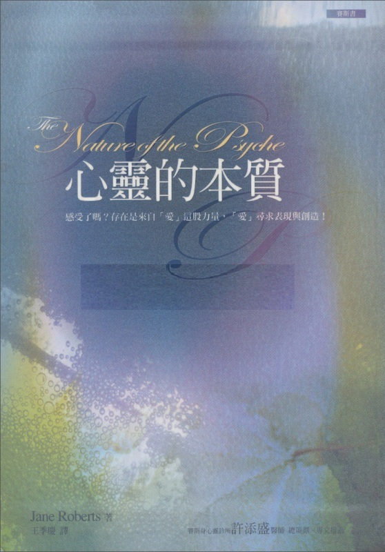

# 赛斯书：心灵的本质

## 译序

《心灵的本质》经过修订之后，终于能以更精致的面目出现了。这期间承不少读者殷殷问询，

相信这本书会不负大家的期待。

本书除了深入人类心灵的特质，并详谈意识、梦、想象和创造力等课题外，对于爱与性也有独到的见地，可以说是浩瀚的赛斯数据中，唯一的「性学」。其深刻、中肯、宽容、慈悲，鲜少有能与之相比的。

此外，本书以「外星人入侵」为比喻，转而谈到心灵更大的内在实相，谈到在梦境发生的「心理的入侵」。赛斯说，除非我们了解创造力、梦、游戏与那些形成我们经验的事件的联系，否则我们无从了解，我们是如何形成生活中的实质事件的。梦是心智的自由游戏。不过，这自发的活动同时也是「形成实际事件的艺术」的训练……可能性被耍来耍去，被试试看而没有实质的后果。赛斯一再强调梦的重要，说对梦境的研究会给你一些对心灵实相的重要洞见。在梦中，你的心灵被拉回到它自身，进入「一切万有」，又再进入你的个人化。

赛斯对于每个个别意识的重要性又有一番精彩的描写，他说：「如你所知，每个人都有某些能力和特质。你们透过那些能力与特质的模子经验实相，但你们也以自己殊异的独特性在宇宙盖上印记。」

在第九章里，赛斯说，这本书的每一章以这样一种方式写出来，使得所呈现的概念将带动你们自己的直觉，而打开在你的做梦和醒时状态之间的通路。

一如往常，当每本书将近尾声时，你特别可以感受到，赛斯的睿智和爱心伴随着极大的能量直接流入你的心。本书最后一章《宇宙与心灵》也令我感动不已！

他说：

．更大的真理和创造性必是，意识本身无法觉知它自己所有的目的，却是不断地透过它自己的彰显而发现它自己的本质。

．有一个设计和设计者，但它是如此组合的，一个在内一个在外，以致不可能将它们分开。

．创造者也在其受造物内，而受造物本身也被赋予创造力。

．在宇宙内每一个可想象的点内，都有意识。因此有「一个不可见的宇宙」，可见的或客观的宇宙乃是从中跳出来的。

．当不可见的宇宙的内在脉动达到了某种强度，而自发地「孕育」了整个的物质系统时，你们的宇宙同时在各处开始存在。

．对宇宙和物类起源的答案，存在于你们大半忽略了的领域——正就在那些你们认为最不科学的领域，以及那些看似最不会产生实际结果的领域。

．在确实性的更大的层面，宇宙无始亦无终。在那层面，没有矛盾。心灵也是无始亦无终。

赛斯最后论及人性，仍然坚持不论人有什么外在的恶行，其背后都有基本的善良意图。

「那意图也许是混淆的，实施得很差的，纠缠于矛盾的信念里，被战争和谋杀者的血手所扼杀——却没有人曾失掉它。那代表了人类的希望，而它一直点燃着，像人类每个成员内在灿烂的灵明之光。而那种善意是世代相传的，那光明远比任何也传下来的仇恨或国家的怨恨要强而有力。」

「心灵若要有任何的和平，你必然得相信人类存在着与生俱来的善的意图。」赛斯说，我们不可把人和他的行为相混淆，「把人类与他最糟的作品认同，是故意对一个艺术家吹毛求疵，然后再判他无救。这样做，也就是把你自己判为无救。」

赛斯说，每个人拥有在时间与空间里的一个独特的、创造性的姿势……只有当你从你自己的姿势运作时，你才能尽你所能地帮助别人。去预期危险，或想象地担起别人的难题，夺去了你本可用以帮助他们的那份精力——由负面地沉湎于将来会发生什么，你只加强了它们不幸的本质，而毁掉了你自己的姿势……既然你仍活着，你当然是被滋养的……在沮丧较深的发作上所「浪掷」的活力，常比创造性地追求所用的精力为多。你们是「一切万有」的一部分：因此宇宙是倾向于你们方向的。它给予。它响彻着活力。

最后，赛斯向我们保证，人们怕得要死的毁灭预言，都不会在我们这时代成真！

一如往常的，我谢谢陈建志和许添盛的仔细校订。

## 自序

珍·罗伯兹

在写这篇序时，我已然忘却那许多的无名之夜，在其间，赛斯——即我在出神状态出现的人格，口授了此书。只有我丈夫罗勃·柏兹的课中笔记告诉我，在这本书的制作期间，我们做了些什么事。有件事是确定的：在上课的晚上，我进入出神状态，而以赛斯身份，口授这些章节。任何一个日子的胜利或失败可说是已消失无踪了，但那些晚间的星光包含在这些书页里，并因而长存。

然而，赛斯真是我出神时的人格吗？一个无时间性的心灵领域的居民，他把他的信息传送到我们这个被时间所染的世界。或是，我是赛斯的出神人格，住在时、空里，几乎忘了我的传承？

也许我永远不会知道。可是，我持续的经验对我显示出，赛斯的个性印在课堂上和他的著作上，也许以独特的方式也印在我自己的意识上。

除非我「变成赛斯」，彻彻底底，改变我自己心理的排列本身——除非赛斯微笑而开口说话——否则就没有赛斯资料。因此虽然在上课时我们的起居室里只有两个人，却大可以说我们不是孤单的。

我很明白，有些夜晚是我「该」举行我们定期的赛斯课，而为了也已遗忘的理由并没举行。

或许我觉得精神不济，或坐在书桌旁忙着写我自己的作品。也许一位不速之客来临，或遇到假日而打断。实际上，我对时间的飞逝以及准备出版赛斯书的压力相当关切。在赛斯口授本书期间，罗在为赛斯先前的作品《「未知的」实相》打字，加上无数的注，以便把赛斯的数据和他早些的书联系起来。我知道，在有课的晚上，罗没有做那件工作的时间，而他在第二天还得把最近的课打好字。而我呢，只需要做……什么？变成赛斯。

许多人写信来，批评我们课的戏剧性。的确，整件事是一个极为发人深省的心理剧。可是，多数人没想到，要赶上赛斯似乎无穷尽的创造力，得花多少时间和精力；笔录要打字，还有准备稿子的各种步骤。他们也没想到，先不管生活中本就会使人分心的诸多事务，光是使赛斯课持续下去，就需要怎样的坚持力。

罗为赛斯其它的书《灵魂永生》《个人实相的本质》及《「未知的」实相》打字，加上他自己的注，并且几乎做了出版的所有准备工作。当赛斯结束此书时，他仍在处理《「未知的」实相》。然后赛斯几乎立即开始另一本：《个人与群体事件的本质》。

在这段时间，我也在写我自己的创作，并为这些作品的出版做准备，因此赛斯的确没有减缓我自己的创造力。但是，当我瞪着这本书的笔记时，我仍希望赛斯也能打字！于是我回想到所有那些记不得的出神时刻，从一个不同的立足点看它们，而我几乎被一个以前没想到的简单念头吓了一跳：那些出神的钟点原来是有生产价值的，它们在有时间的世界产生了结果。那个附体的意识，不管何以名之，知道他自己在做什么。我不禁惊奇，在我作为赛斯而微笑着给我（珍）一罐啤酒时，不知我在罗眼中是什么德性？我确知有一种对出神状态的记忆，但我普通的记忆对那些出神的钟点却记不得了。

至于在那些日子里，我正常的日常生活中发生了什么事，我也不容易一下子想起来。因此「真实的」时间和出神的时间各自消逝了。而这星期我将进入出神状态，赛斯将再次口授另一本书的一部分，罗将把它打好字，在距今约一年以后出版。那时，以我们的话来说，这个今日也将成为过去的一部分。

我说「以我们的话来说」，因为不管我刚才所说的一切如何，那些课的本身似乎仍一直存在着。它们仿佛包含了一种能量，在赛斯的话里面活了起来，因此它们属于将来就如属于过去一样。

那些字句虽然慢到让罗能做笔记，但全是原创性地说出，自发而铿锵有力。它们是在一个活生生的演出里（我希望读者不要忘了此点），以赛斯自己奇特的腔调发音的，还伴随着手势。

一迭迭出神的钟点！它们就在这儿了。但如果我是在出神状态，赛斯是否也是？我的确是警醒、积极、有反应，对单独的个人及一般人以至世界都很关心的。然而我却仍感觉在课间只有他一部分的意识在这儿——透过我而表达的那部分——因此不论赛斯现在本身经验的本质为何，他在我们世界的演出，只暗示了远超过我们目前所能了解的一种心理的复杂性。

在《心灵的本质》里，赛斯首次在他出版的书里，说到人类性学的事，讨论它与个人及群体心灵的关联，并把性与它灵性和生物性的来源连接起来。

如我们多数的读者所知，赛斯早在课中就叫我鲁柏，叫我的丈夫罗为约瑟。他解释道，这些是我们的存有（entity）的名字。对赛斯给我一个男性名字，而称我为「他」，我感到有点好玩。

当我教课时，赛斯也给许多学生他们的存有的名字，对于名字的性别指示，有过许多活泼的讨论。

现在我们发现，这种说法是为了适应我们对性别颇为狭窄的概念。在《心灵的本质》里，赛斯说得很清楚，心灵非男性亦非女性，「而是一个库藏，你们从中汲取性别的属性」。他强调人类的双性天性，以及在灵性与生物性两方面，双性的重要性。

但是赛斯的「双性」观念，远比通常那名词所暗示的要广大。在他看来，「双性」观念是我们的性别定义的基本来源。那些定义是什么？有多少是后天习得的？赛斯就是针对这些问题说话。再者，他把对性的讨论与语言的诞生和「隐藏的神」的本质连接起来。

可是，心灵不仅是性别属性的容器，同时也包含了隐藏的能力和特性，它们随之由外在刺激而引发。在《心灵的本质》第三章，赛斯说，「数学公式固然没印在脑子上，但它们是脑的结构天生固有的，并暗含于它的存在之内。」

按赛斯所说，我们自己的欲望、焦点和目的，决定我们从可用的无尽知识领域里汲取何种内在资料。因为他看见所有的知识同时存在，并不像枯燥的数据或记录，而是被感知它的意识弄活了起来。过去与未来的心智对我们是开放的，至少它们的内容是开放的，那不是在一种寄生式的关系里，而是一种活泼的相互取予。在其中，每个时期的知识丰富了历史上的其它时代。赛斯给这个「知识的汇聚」一个灵性和生物性的实在。

这种声明对教育有惊人的暗示：学校除了教机械性的数据外，应使我们尽可能地认识各种学科。因为这像是外在的触机，带出了自然的内在知识，开发了等着被外在世界的适当刺激启动的技术。

在赛斯口授此书，专谈心灵的潜能和它对内在数据的接收时，一如往常，我自己的经验仿佛被用来印证他的理论。例如，赛斯才刚开始讲《心灵的本质》，我就突然经由通灵，接收到一本关于艺术哲学和技巧的书。它声称是来自保罗·塞尚（paul Cezanne 法国名画家，死于本世纪初）的「世界观」（word view）。

赛斯在《「未知的」实相》里开始讨论世界观。简而言之，所谓世界观，是个人生活连带其知识和经验的一个活生生的心理画面。这些在个人肉体生命本身过去很久后，仍一直活着并有感应。因此，我收到的数据并非来自塞尚本人，而是来自他的世界观。

实际上，在写那本书时，我觉得像个秘书，在记下精神性的口授。但那是多么神奇的口授啊！

因为这稿件不但表现出工作中的天才的迷人模样，并对艺术这一行给了专门性的知识，而我对画画最多只能算是票友。赛斯本人作了序，在同一节中，首先口授对《心灵的本质》这书的数据，然后转到塞尚的序。

那本书，《保罗·塞尚的世界观》，一九七七年由 Prentice-Hall 出版。我才刚完成它，就发生了另一个相似的经验。正当赛斯要结束《心灵的本质》时，《一个美国哲学家的死后日志：威廉·詹姆士的世界观》以同样方式来了，像是精神性的口授。只是塞尚的世界观专长于艺术，而詹姆士的世界观则较广博。它对自詹姆士死后的我们的世界，有具深度的评论，并论及美国历史——有关灵魂学、心理学和民主方面的问题。

按照赛斯所说，我们任何人都能对此种「额外的」数据调准频率，但我们将依自己的欲望和意图而得到它。例如，我自己对艺术的兴趣及罗对塞尚的画的欣赏，有助于启动了塞尚的书，而我自己对威廉·詹姆士的好奇及罗对他的工作的欣赏，有助于带来詹姆士的稿本。

赛斯说，内在数据常来到我们的心智里，但是它经过了我们个人的心灵过滤，而为我们自己的生活所染，以致我们往往根本没认出它的来源。有时这发生在梦中或灵感里。例如，发明家也许从未来收到某个概念，考古学家也许因为自过去收到资料，而有所发现。

赛斯说，我们的内在知识通常与我们目前所关心的事会非常相合，以致我们鲜少认出它的来源。而它却透过我们每个人都连在上面的心理的生命线，提供了个人和人类一个可靠的、经常的数据之流。

他深入讨论早期人类的经验，以及那时流行的不同的感知组织（organizations of perception），并强调人类一直都能通达「内在数据」，因此它的知识来源从不仅仅只是依赖外在环境。

按赛斯所说，就是从这内在的知识实体，我们系统化的、客观的、数据储存的社会过程才浮露出来。

那么，随之而来的是，在进化的变化里必然涉及了预知，因此各种物类才能在现在为了将来必须的那些改变预做准备。

在所有这些讨论里，赛斯一如往常地强调可能性，说那在个人和人类的发展中扮演了重要的角色，并代表了自由意志的基础。他明白心灵私下在梦境实验可能的行动，而拟想人类的群体之梦提供了一个内在的工具，人类用之选择全球性的事件。心灵是私人的，但一般而言，每个心灵都含有通向公共心灵的通路。

可是，如赛斯说得很清楚的，这书并不是关于「心灵」的一个枯燥的论著，而是以这样一种方式建构，使每个读者更直接地接触自己个人的心灵。书中包含了许多练习，使每个人认识自己更深层的部分，并邀请读者探索自己的概念和经验。

例如，对性别的扭曲信念，能抑制心灵或灵性的进展。赛斯透彻地讨论这种问题，也谈到男、女同性恋的问题，连带提到它们的私人性和社会性的影响。

我们非常急切地想把这特殊的数据提供给读者，因为许多人来信问赛斯对性的看法。这个愿望，配上赛斯仿佛无穷尽的创造力，使我们做了个决定：从今起，赛斯书附带的注将少得多。在两卷《「未知的」实相》里，罗试着联系赛斯对各种不同主题的看法，并追溯到他先前的书（还常及于未出版的数据），显示写那些书的背景。现在我们将写下一般的课间注记，但读者必须自己在他闲暇时，将它们与先前的赛斯书联系起来，自己找出理论发展的脉络。

在我写这序时，赛斯几乎已半完成了《个人与群体事件的本质》，那书将显示，个人的信念在何处如何变成了公共事件。我已准备好《伊玛的教育：善用神奇力量》，及《超灵七号进一步的教育》的出版。所有这些，赛斯和我自己的书，确实证明了心灵的广大创造力，及它感知和利用来自内在的数据的能力，就如利用来自外在环境的数据一样。

写作是我的专长。而对别人而言，这种创造力也许显示在家庭关系和情感的理解上，在其它艺术、科学、运动上，或只是单纯地在把生活质量提升到一个更新的、更丰富的层面上。

## 第一章 心灵的环境

### 第七百五十二部分

1975 年七月二十八日 星期一 晚上九点二十五分

（今晚晚餐时，我告诉珍，她今晚将为赛斯——珍在出神状态为他代言的「能量人格原素」（energy personality essence）——开始口授一本新书，而且她还会为此书作注。我会记录这些「课」（sessions），加上时间、日期以及其它最基本的资料，以便珍能据以构筑她自己的注。此地我的想法是，只要我把最初的「速记」打好字，趁那一课的情景在珍脑海中还很新鲜时，她就可加上她想加的任何资料，有关于她的出神状态、感觉或想法。

（我告诉她，我不在乎这本书是短篇、中篇或长篇，或是要花六个月、一年或五年来完成它。

（如果她每周举行一或两次赛斯课，甚或一个月一次，她仍能写出一本赛斯书，这可令她感到安慰。

（我说如果她宁愿不要注，我也不反对。

（赛斯在三个月前——四月二十三日的第七四四节——结束了他上一本书《「未知的」实相》

（《The Unknown Reality》的口授。今天稍早时，珍终于承认，自那时起她只上了七课，因为我正忙着为那本书写复杂的注，她不想给我太多额外的工作。当我领会到她为何拖延不前时，我立即决定让她继续为赛斯书工作，尽管她还没写完她自己的《心灵的政治》（psychic politics）我在晚餐时突然提出写本新书的想法时，珍没说什么。九点十分我们等着课的开始时，她说：

（「你让我大吃一惊。」

（我说：「正如我所计划的。」

（「你得对我宽容些。如果我来作注，就不会写很多。我也不知道今晚会有一本新书。至少，我脑子里没有一个概念。」

（「你不需要有。」我开玩笑说，「开始一本新书或生个孩子，你情愿做哪一样？」

（「这个。」她马上说，意指赛斯课。「但你可以有九个月来让自己习惯生小孩子这件事，而我对赛斯提及要写的两本书——关于基督的书，或他上个月提到的谈文化的实相的书——都没准备好。那么这本新书可能谈些什么呢？」

（看她在拖延，我笑了。我们聊了一会儿，然后珍有些讶异地说：「我想我知道书名了，叫作《心灵的本质︰其在人类的表现》 （The Nature of the Psyche: Its Human Expression）。我不确定，但我想就是这个……」

（因此，看来我们即将开始从赛斯那里得到另一个精彩的产品，经过珍相当的——实在是不可或缺的助力。赛斯这么没预告地开始一本新书，我了解珍可能有些担心；但另一方面，我毫不怀疑赛斯和珍能做到。我要她创造性地参与一个连续性的计划。我认为这可作为她日常生活的基石。

（珍说：「一旦我得到它，我们就开始。」我们一边坐着等，一边啜饮红酒。时间是九点二十三分。她点了根烟。我们安静下来。

（她说：「现在我正接收到它，只是需要花几分钟把它组合起来……」然后，从九点二十五分

（开始，并有许多间断：）

现在——

（「赛斯晚安。」）

——没有前言。第一章︰你进入你称之为生命的状况，又走了出去。在其间你经历了一生。

悬挂——或显然看似如此——在出生与死亡之间，你质疑你自己存在的本质。你思索你的经验，并硏究过去的正规历史，希望在那儿找到有关你自己实相的本质的线索。

你的生命似乎与你的意识同义。因此看起来好像你对自己的知识是渐渐增长的，就如你的自我意识是从你出生而开始发展一样。更进一步，看来似乎你的意识将遭遇死亡，过了那一点你的自我意识就无法幸存。对你儿时的宗教，你可能怀着一种几乎是充满希望的怀恋，忆起一种保证你得永生的信仰体系。然而大部分的读者，却渴望着某些私密的和亲密的保证，并寻求某种内在的肯定，以确知自己的个人性（individuality）不至于在死亡时被粗鲁地开革（开除）（Yet most of you， my readers， yearn for some private and intimate assurances， and seek for some inner certainty that your own individuality is not curtly dismissed at（be dismissed at sometime：在某个时间被解雇，开除） death.）。

（九点三十五分。）

每个人都直觉地知道自己的经验有其重要性，而且有某种意义，联系着个人与更大的创造模式。每个人偶尔都会感知一个私密的目的，但许多人却因为没能有意识地知道或清楚地觉察那内在的目标，而充满了困扰。

（停顿。）当你是个小孩时，你知道你朝着成人成长。因为相信你未来将具有的能力，使你能维持生存，也就是说，你毫无疑问地视自己是在一个学习与成长的过程里。不论你遭遇到什么，你都是生活在一种崇高的心灵空气里，在其中你的存在（being）得以充电而发光。你知道你是在一种变成（becoming）的状态中。那样说来，这世界也是在一种变成的状态。

在个人的生活里以及世界的舞台上，行动一直在发生中。你很容易就可以看看你自己或看看世界。看见你自己是如此地被你目前的状态所催眠，以致所有的改变或成长似乎都不可能；或看见世界也是同样的情形。

一般而言，你并不记得你的诞生。无疑地，你似乎也不记得世界的诞生。可是，在你诞生前，你已有一个历史——就像在你看来，世界在你出生以前已有一个历史。

（在九点四十九分停顿。）各类科学仍然彼此相瞒。物理学假装说一个世纪存在于一个世纪之后，同时物理学家们却领悟到，时间不只对感知者（perceiver）是相对的，而且所有的事件都是同时发生的。考古学家愉快地继续为「过去的」文明的遗物勘定时间，而从不问他们自己那过去有何意义——或是说︰「相对于我的感知点，这是过去。」

天文学家谈到使你们自己的世界显得渺小的外层空间及银河系。在你们所认识的世界里，也有战争及关于战争的谣言、毁灭的预言。然而尽管如此，对这世界而言，不为人知的无名的个人——男或女，内心固执地感觉到一种鼓舞的、坚决的肯定，即：「我是重要的，我有个目的，尽管我不了解我的这目的何在。我这看似如此不重要和无效率的生命，在我未认知的某方面，却是最关紧要的。」

虽然受困于一个似乎是挫败的生活，被家庭问题所缠，为病魔所侵，以及在所有实际的目的来说似乎是被打垮了，然而每个个人的某部分却会奋起反抗所有的灾难、所有的挫折，并且至少偶尔会瞥见那不可否定的恒久的有效性（validity）。我就是在对每个个人那知晓的部分说话。

（十点一分加强语气地：）一方面，我并不是个容易相与的作者，因为我从你们不熟悉的意识层面说话（I am not， on the one hand， an easy author to deal with， because I speak from a different level of consciousness than the one with which you are familiar.）。另一方面，我的声音又有如飘在风中的橡树叶般的自然，就像四季对你的灵魂来说是那么的自然，我从对你们的心灵来说是同样自然的知觉层面说话。

我透过一个叫作珍·罗伯兹的人来写这本书。珍是她出生时的命名。她与你们共享肉身存在（physical existence）的胜利与劳苦。（停顿一分钟）就像你们，她面对着的一生似乎是自她出生时开始的，而这一生是悬在从出生的那一点直到死亡离去的那一刻。她问过你们在安静时刻曾提出的同样问题。

不过，她是如此热切地问问题，以致撞破了你们大多数人所树立的障碍，因而开始了一个旅程。那是她为自己也为你们而从事的——因为你们的每一个经验，不论是多渺小或看似无足轻重，都变成了你们族类的知识。你们从何处来？往何处去？你们是什么？心灵的本质又是什么？

我只能写此书的一部分。你们必须完成它。因为「大心灵」（The psyche）是无意义的，除非它与个人的心灵有所关联。我从你们自己已忘怀却又未忘怀的那些层面向你们说话。我透过印出来的书向你们说话，然而我的话却会在你内重新唤起，在你未出生之前，以及在你儿时，向你说话的声音。

这将不会是枯燥的论文，孜孜不倦地告诉你所谓心灵的某些假设性结构。而是会自你存在的深处，唤起你已遗忘的经验，并且从无垠的时空里，把那神妙的本体——即你自己——结合起来。

休息一会儿。

（十点十七分。「现在我连书名都忘了。」珍一旦脱离了极佳的出神或分离状态，立即说道。

（「亲爱的，恭喜你。」我说。

（珍笑了。「你叫我做些事，我就做了。但现在我得上洗手间——并且除此之外，我好像可以上床睡上好几个小时……」

（「行啊！去嘛！」我戏谑地说，「如果你想开小差就溜吧。」我提醒她此书的全名，并且建议她可如何写下她对此书的评论，强调她可按照自己喜欢的方式去处理。除了课间最起码的注以外，我真的没有时间写更多的注了。不过，我对珍坦白地说，我不能就我真的期望她一面透过赛斯制作此书，而同时又做写注所牵涉到的所有工作——然而结果是她的确在某个程度帮助我写注。

（终于，珍说：「我正在等候，我感觉现在有更多的东西来了……」十点四十一分她以较快的速度重新开始。）

现在：地球有个结构。以那种说法，心灵也是一样。你住在你们星球表面的某个特定地区，而你在任一既定的时间只能看见那么些地方——然而你把海洋的存在视为理所当然，即使在你不能感觉到它的浪花或看见它的潮水之时。

而即使让你住在沙漠里，你也靠着信心承认广大的田地和倾盆大雨的确是有的。你的某些信心确实是以知识为基础的。有人去过你没去过的地方，而电视提供你影响。可是，即使如此，你的感官只带给你那些你切身环境的图像，除非它们受到相当不寻常的、某种特定形式的培植。

你认为地球有个历史是理所当然的。以那种说法，你自己的心灵也有个历史。你教会你自己向外看入物理的实相，但在那儿找不到你存在的内在有效性——只有它的效果。你能打开电视而看到一场戏，但你心灵的内在活动力及经验，不但神秘地包里在你打开电视的外在动作里，也让你能了解所呈现的影响。因此通常你都没抓住你自己心灵的活动（You can turn on television and see a drama， but the inward mobility and experience of your psyche is mysteriously enfolded within all of those exterior gestures that allow you to turn on the television switch to begin with， and to make sense of the images presented. So the motion of your own psyche usually escapes you.）。

电视剧在呈现于你的频道之前（Where is the television drama before it appears on your channel），它在哪里——以后又到哪里去了？它怎么能在这一刻存在，而在下一刻结束，当条件正确时却又能重演？如果你了解其中的手法，就会知道那节目显然并没到任何地方去。它仅只存在（is），而有适当的条件就会为你触发它。同样的，不管你是否在演一出地球的「节目」，你都是活着的。不论你是在时间之内或之外，你都存在（are）。

希望以此书，我们能使你与你自己的存在（being）接触，尽管它存在（exist）于你所习于观察它的脉络之外。

（十点五十分。一分钟的停顿。）

就如你住在某一州或镇或村里一样，你目前「住在」心灵的内在星球的一小块地方。你将那地区认定为你自己的家，为你自己的「我」。人类已学着去探测物理环境，但当他们欣喜、勇敢地从事探测心灵的内在基地时，他们才刚开始那更伟大的内在旅程呢！以那种说法，是有一块心灵的陆地。不过，这块处女地是一个人的天赋权利，而没有一块是与任何其它的相同的。但的确有内在的交往发生，而正如外在的大陆是从地球的内在结构中升起的，同样的，心灵的陆地是从一个更伟大的、不可见的源头浮露出来的。

（较大声：）今晚的口授到此结束。

（「好的。」

（十一点十四分时，赛斯给一个曾写信给我们的科学家一段信息，最后在十一点四十五分结束此节。）

### 第七百五十三部分

1975 年八月四日 星期一 晚上九点二十一分

（一开始有许多停顿。）

晚安。

（「赛斯晚安。」）

现在口授：正如地球是由许多环境所组成，心灵也是如此。正如有不同的洲、岛、山、海与半岛，同样的，心灵也有种种不同的形状。如果你住在一个国家，你常把世界上其它地区的当地人视为外国人，同时他们自然也如此看你。以那种说法，心灵包含了实相的许多其它层面。从你的观点，这些也许显得陌生，然而它们却是你的心灵的一部分，就如你的国家是地球的一部分一样。

不同的国家遵从不同类的宪法，即使在任何一个地理区内，也可能有形形色色的当地法律为当地人所遵行。举例来说，如果你在开车，你可能懊恼地发现，一个小城的当地速限比另一个城的要慢好多。同样的，心灵的不同部分依它们自己当地的「法律」及它们不同类的「政府」而存在。它们各自拥有它们自己的地理特征。

如果你在环游世界，你必须常常调整时间。当你旅游过心灵，你也将发现你自己的时间自动被挤得变形。如果试着想象，你能在这样的一个旅游中，带着你自己的时间，全干净利落地装在一只手表里，那么你对将发生的事会相当惊讶。

（九点三十四分。）

当你朝着某个心灵世界的边界前进时，手表会倒着跑。当你进入心灵的其它王国时，你的表会走得快些或慢些。现在，如果时间突然向后倒走，你会注意到。如果它跑得够快或够慢，你也会注意到其中的差别。如果时间非常慢地倒退，而按照当时状况，你可能没觉察到那差别，因为要用掉这么多「时间」来从现在这一刻到它「前面」那一刻，以致你反而可能只会察觉某事似曾相识，好像它以前曾发生过一样。

可是，在心灵的其它领域，甚至更奇怪的事也可能发生。表的本身可能变形，或变得像石块一样重，或如气体一般轻，以致你根本无法看清时间。或者指针可能永远不移动。心灵的各种不同部分习于这些所有的情形，因为心灵骑在任何你认为是「正规的」当地法律上，而在它自己之内有能力应付无限数量的实相经验（Different portions of the psyche are familiar with all of these mentioned occurrences — because the psyche straddles any of the local laws that you recognize as “official，” and has within itself the capacity to deal with an infinite number of reality-hyphen-experiences.）。

现在（用心而安静地）：显然你们的肉体具有很少人予以充分利用的能力。但还不仅如此，人类自身拥有调整的可能性，使它能在极其不同的情况下，在物理环境中生存与延续。隐藏于肉体的生物性结构之内有潜在的分化（latent specialization），容许这族类继续下去，而且把不论什么理由所可能引发的星球的任何变化，都考虑进去了。

不过，虽然以你们的经验来说，心灵是调适于地球的（earth-tuned），它还有许多其它的实相系统「要对付」。那么，每个心灵在它内都包含着，在任何情况下都有可能实现的潜能、能力和力量。

（在九点五十一分停顿。）心灵，你的心灵，能够反向、正向地记录与体验时间——或横向经过「替代的现在」的系统（system of alternate presents）——或它能在一个无时间的环境里，维持它自己的完整性。心灵是时间丛（time complexes）的创造者。理论上说，你的日子里那飞逝而过的一刻能被无限延长。但这不会是一个静态的拉长，而是生动地深入于那一刻里，从那里，所有你想到的时间，过去与未来以及所有它的可能性都显现了出来。

如果你正在看这本书，你就是已经对正规的观念厌倦了。你对你存在的那些更广大的次元（dimension）已开始有所觉了。你已准备离开所有因袭老套的主义，而你多少会等不及去检视与体验那本为你天赋权利的自然流动的天性。那天赋的权利已被象征和神话蒙蔽良久。

意识形成象征，而非其反面。象征是伟大的丰富玩具。你能用它们来建造，正如你的孩子用积木建造一样。你能从中学习，就像你以前在学校里把字母积木堆在一起来学习。象征对你的心智（mind）而言，就像树木对土地一样的自然。可是，对孩子讲一个关于森林的故事，和真实的小孩在一个真实的树林里，这两者之间是有区别的。故事与森林都是「真的」。但以你们的说法，一个进入真实森林的小孩涉入了森林的生命周期，踩在昨天落下的树叶上，在远比他的记忆还古老的树木下憩息，而在夜晚仰望天空，看到一个不久即将消失的月亮。另一方面，看一张森林的画，可能给孩子一些绝佳的想象经验，但它们将属于另一类，而孩子知道其间的不同。

（十点九分。）

可是，如果你错把象征当作了实相，你将会安排你的经验，而坚持每座森林看来与你书里的图画一样。换句话说，对你自己心灵的各个不同部分，你将期待有差不多相同的经验。你将随身带着你本地的法律，你将试着以手表来计量心灵的时间。

（长长的停顿，许多次之一。）

不过，我们必须用某些你们的用语，尤其是在一开始。另一些你们所熟习的用语，我们将把它们挤压得完全认不出来了。你自己存在的实相，只能由你而非任何其它人来阐释，而后你自己的阐释至多也只能被理解为一种参考点。只有当那些专家、心理学家、神父、物理学家、哲学家和宗教导师们能忘掉他们是专家，而直接与私人的心灵——所有分化的来源——打交道时，才能对你解释你自己的心灵。

你们可以休息一下。

（十点二十一分。珍的出神状态刚好历时一小时整。她说：「他真的是来劲儿了——我感觉得到。」我建议她把这节剩下的时间用在她想问赛斯的一些个人问题上。她同意了，因此这次休息即为今晚此书口授的结束。）

### 第七百五十五部分

1975 年九月八日 星期一 晚上八点五十九分

（在第七百五十三部分之后，因忙于其它事情——我为赛斯的《「未知的」实相》写注，珍为她自己一本将出新的平装本的书而写新的序，以及一速串未预期的访客——我们好几周没上赛斯课。

（那平装本是《赛斯的来临》（The coming of Seth），原本用《如何发展你的超感知能力》（How to Develope Your ESP Power）（toby 注︰台湾出版为习实神明）的书名发行精装本。

（接着在八月二十五日的第七五四节，赛斯对他所谓的「身份的印记」（The stamp of identity）做了一段精彩的议论——解释个人如何在某些实相的外在形貌上印上他的心灵印记，而「把它们变成他自己的」，与个人的内在象征相合。在课中，珍后来感到赛斯在引导她做一个耶路撒冷之旅，时间为公元一世纪。然而这些都没有包含写书的工作，因此这节保留在我们的档案里，与我们希望有一天会出版的其它资料在一起。

（在珍进入出神状态前一小时，珍告诉我，她可从赛斯那儿接到好几条频道，每一条都关乎一个不同的主题，而我们「最好等着瞧」哪一个今晚会透过来。然后正在此节开始前，她就那将是关于赛斯的新书的口授。）

现在：晚安。

（「赛斯晚安。」）

我们将以口授开始。

当我用「心灵」（psyche）这个术语，你们有许多人会立即对我的定义感到好奇。

任何字，只因被想到、写下或说出，立刻暗示一个明确陈述（specification）。在你们的日常生活中，给每件事物一个名字来区分它们是很方便的。可是，当你是在处理主观的经验时，定义常会局限而非表达任一既定的经验。显然心灵不是件东西。它没有一个开始或结束。你看它不见也摸它不着。因此，要以通常的语汇来描写它，是徒然无功的，因为你们的语言主要在允许你们认清实质的而不是非实质的经验。

我并不是说文字不能用来描述心灵，但它们无法对心灵下定义。「我的心灵和我的灵魂，我的存有（entity）与我的大我（greater being）之间有何不同？」问这样的问题是无用的。因为所有这些术语，都是想表达你感觉到在你内的、你自己经验的较伟大部分所做的一种努力。可是，你们对语言的用法可能使你们急于想有个定义。希望此书能让你有些亲密的觉知，一些明确的经验，而使你对你自己心灵的本质有所认识。然后你将看出，它的实相逸出了所有的定义，违抗了所有的归类，而以充满活力的创造力，把所有想利落地将它打包的企图推到一边（then you will see that its reality escapes all definitions， defies all categorizing， and shoves aside with exuberant creativity all attempts to wrap it up in a neat package.）。

当你开始一个实质的旅行时，你觉得自己与你走过的土地是有所分别的。不论你的旅程有多远——骑摩托、开汽车、乘飞机或步行——（身为赛斯，珍对我做手势，然后改了句子：）

用脚踏车或骆驼，卡车或轮船，你们仍是那流浪者，而陆地、海洋或沙漠，是你游踪所及的环境。

可是当你开始进入你自己心灵的旅行时，每件东西都变了。你们虽是那流浪者，旅行的男人或女人，但你也是那交通工具以及那环境。你一边走一边形成那道路，形成你旅行的方法，以及形成自身（self）或心灵的丘陵、山脉、海洋，或小山、农场和乡村。

（九点十五分。）

在美国早期殖民时期，男人和女人横越北美洲向西移殖时（When in colonial times men and women traveled westward across the continent of North America），许多人完全不怀疑越过好比说崇山峻岭之后，土地的确会绵延下去。当你像开拓者一样旅游过你自己的实相时，你一边前进一边创造每一片树叶、每一寸土地、每一次日落与日出、每一个绿洲、友善的小木屋或与敌人的遭遇。

那么，如果你是在寻找说明心灵的简单定义，我帮不上忙。不过，如果你想要体验你自己存在的辉煌创造力，那么我会用一些方法激起你最大的冒险心、你对你自己最大胆的信心。而且，如果你想要的话，我将绘出你心灵的图画，以引导你去经验它，一直到所能及的最远大的范围。那么，心灵并非一个已知之地。它不单只是块陌生之地，你可以旅行到那儿或经过那儿。它并非一个已经完成或近乎完成的主观宇宙，已经在那儿等着你的探测。反之，它是一种不断形成的存在状态，你目前的存在感居于其中。你创造它，而它创造你。

（长久的停顿。）它以你认知的实质方式创造。另一方面，你为你的心灵创造了物理的时间，因为没有你，就没有对季节及春去秋来的体验。

那也就不能体验鲁柏（赛斯给珍的「存有」的名字）所谓的「某一时刻的可贵私密性」。因此，如果你存有的一部分想要超越这些时刻那孤独的前进（so if one portion of your being wants to rise above the solitary march of the moments（超越孤独前进的时刻）），你心灵的其它部分则愉快地冲入你自己那特定的时间焦点（time focus）。就如现在你想了解你自己更大的存在之无时间性的、无限的次元，因此「即使现在」那非尘世的本体（non-earthly identity）的多重成分，也同样渴切地探索尘世存在的次元和生物性。

（九点三十分。）

早先我曾提及，如果你试着带你的表或其它的定时器，进入实相的其它层面，所可能发生的一些怪异效果。现在，当你试图以其它类型的存在方式来诠释你的自性（selfhood）时，同样的惊讶或扭曲或改变可能像是在发生。当你企图了解你的心灵，而以时间的观念来定义它，那么转世的观念似乎有道理。你想：「当然，我的心灵活过许多次肉身的生命，一次跟着一次。如果我现在的经验为我的童年所主宰，那么，我目前的一生必然是更早一生的一个结果。」因而你试着以时间来定义你的心灵，而在如此做时，你限制了你对它的了解，甚至对它的体验。

（长久的停顿。）让我们试试另一个比喻，你是个正在面临灵感的分娩之痛的艺术家。在你面前是张帆布，而你正同时在它所有的范围内工作。以你们的话来说，帆布的每一部分可以是一个时段（time period）——好比，某一个世纪。你试着在心中维持一个整体的平衡与目的，因此当你在这帆布的任一特定部分挥毫时，所有在整个地带内的关系都可能改变。不过，在我们比喻中的神秘帆布上，从来没有一笔是真被抹掉的，而是留在那儿，更进一步地改变在它这特定层面的所有关系。可是，这些神奇的笔触，并不是在一个平面上的简单描画，却是活生生的，在它们内带着画家所有的意图，这意图透过每个个别笔触的特性，得以显相。

如果画家画一个门户，所有在它内能感觉到的透视法都打开了，并增加了实相更深远的次元。

既然这是我们的比喻，我们就能按我们的意思随意地伸展它——比任何画家更能伸展他的帆布。

（幽默地向前倾身：）因此，没有必要限制我们自己。在画家作画时，帆布本身能改变尺寸及形状。同时在画家的画里，人物也不仅只是一个描画而已——以永远凝固的玻璃般的眼睛或夸张的笑容回望着他，（又是幽默地：）穿着他们最好的假日服装。反之，他们能面对画家而反唇相讥。

他们能在画中侧转，看看他们的同伴，观察他们的环境，甚或超出了画本身的次元而向画家质疑。

且说，在我们的比喻里，心灵同时是那些画，也是那画家，因为画家发现画里所有的成分都是他自己的一部分。更有甚者，当我们的画家环目四顾时，发现他真的是被他正在制作的其它画所包围。当更进一步地观察，他发现有一张更伟大的杰作，在其中他以一个画家的姿态出现，而正在创作他正开始认出来的同样这些画。

你们可以休息。

（九点五十五分。珍为了今天发生的事而感到亢奋。她收到六本她的诗集《灵魂与有生灭的自己在时间中的对话》（Dialogues of the soul amd Morta Self in Time）的首版，刚刚在 Prentice-Hall 印出来，在休息时我们讨论那本书。）

（在十点五分重新开始。）

我们的画家于是领悟到，所有他画了的人们也正在画他们自己的画，并且他们以甚至连画家也不能感知的方式，在他们自己的实相内活动。

在灵光乍现的洞见里，他想到他也在被画——有另一个在他背后的画家，从他那儿，他自己的创造力涌出，而他也开始看出画框之外。

现在，如果你被搞迷糊了，没关系——因为那表示我们已经突破了因袭的观念。在这个比喻之后，任何我说的话相较起之下会仿佛很简单似的，因为到现在为止，至少看来情形必然像是，你很少有希望发现你自己更大的次元了。

（停顿。）再次的，与其试图给心灵下定义，我宁愿试着激起你的想象力，使你能跳越人家告诉你的你是什么，而得到某种直接的体验。到某个程度，此书本身提供了它自己的展示。我叫珍·罗伯兹「鲁柏」（而因此，是「他」），只因为这名字指明她的实相的另一部分，同时她认自己为珍。她写她自己的书，并且与你们一样过着日常的生活。她有她独特的爱憎、特征和能力；和你们每个人一样，她有她自己的时空位置。她是心灵的一个活生生的画像，在她自己的本身，并在既定的环境内独立自主。

且说，我来自实相画面的另一部分，心灵的另一个次元。在其中可以观察你们的存在，正如你可以看一张正常的图画那样。

以那种方式来说，我是在你们的参考「架构」（"frame" of reference）之外的。在你们自己的实相画面里，看不到我的视角。我写我的书，但因我主要的焦点是在一个「比你们自己的要大些」的实相里，在你们的参考点内，我无法以我自己的样子完满地出现。

（十点二十分。）

因此鲁柏的主观视角由于他的欲望和兴趣而打开了，并且也展露了我自己的欲望和兴趣。他在自己内，打开了导致他存在的其它层面的一扇门，但那个存在是不能在你们的世界完全表达的。那个存在是我的，在实相的另一个层面以我的经验表达，所以我必须透过鲁柏来写我的书。心灵里的门，和从一个房间导向另一个房间的简单开口不同，因此我的书只让你们略微瞥见我自己的存在。不过，你们全都有这种心理上的门，导入心灵更大次元的地区，因此以某种范围来说，我为那些不在你们日常生活范畴内出现的、你们自己的其它面说话。

超越于我自认为我自己的存在之外，还有其它的。到某个程度我分享它们的经验——举例来说，到一个远超过鲁柏分享我的经验的程度。

（十点二十九分。）

你最好给他一些啤酒和香烟，我们再继续。

（「好的。」）

例如，在某些相当少有的场合，鲁柏曾经能够与他称作「赛斯第二」（Seth Two）的那位接触。然而，实相的那个层面与你们自己的隔得甚至更远了。以你们的话来说，它代表心灵的一个甚至更远的延伸。（长长的停顿。）「赛斯第二」与我有一个近得多的关系，在于我认出我自己的本体为他的存在一个清楚的部分，而鲁柏则感觉没有多少相通处。以某种方式来说，「赛斯第二」的实相包含了我自己的，然而我觉知我对「他的」经验的贡献。

以同样的方式，我的每一位读者都和同样水平的实相连接，而且所有的这些都发生在一瞬间。鲁拍贡献并形成我的经验的某部分，就像我也对他（鲁柏）有贡献一样。你们的本体（identity）并非已完成的某物。你最细微的行动、思想和梦想，都增加了你心灵的实相，不论当你把它想成一个假设性的术语时，心灵对你显得是多伟大或多严肃。

口授完毕。

（十点三十七分。我说：「好的。」）

让你的手指休息一会儿，我们将再继续。

（十点三十九分。赛斯的确以给我俩的个人资料继续下去。通常他在那之后会结束一节。然而今晚珍感到如此兴奋，因而赛斯又回来再做了些口授——就我记忆所及，这是第一次课变成这样。

（无论如何，赛斯是这样结束他的个人资料的：）

（十一点二十分。）

现在︰既然我猜想你不预备继续我们的第一章，我愿——

（我说：「我还可以继续大约半小时。」）

那么你们休息一会儿。

（十一点三十一分。但结果并没有休息。赛斯继续说：）

口授：鲁柏专门研究意识和心灵。我大多数的读者也都很感兴趣，但他们还有其它紧要的事，使他们无法开始这样一个广泛的研究。

你们全得应付物质实相。鲁柏和约瑟（赛斯给我的存有的名字）也一样。到此为止，我所有的书都包括了约瑟写的长注，可以说，它们形成了背景。不过，我的书已超越了这些界限。以你们的话来说，在时间里只能完成这么多的事。甚至约瑟现在还在帮我以前的草稿（《「未知的」实相》）打字。那本书是以这样一种方式写的——以将鲁柏和约瑟的个人经验与一个更广大的理论架构连接起来，以致二者实不可分。

因此，在这本新书里，我有时会提供我自己的「布景」。换言之，心灵的制品逃出了实际的、物质的界限，因此从我的实相层面，我不能再期望约瑟做比记录更多的工作。因此我要请求我的读者对我忍耐。以我自己的方式，我将试着提供适当的参考数据，因此你们会知道当这本书写出的时候，在你们的时间内正在发生什么事。

大致来说，这书的写作发生于一个「非时间或在时间之外的范畴」。然而，实质上鲁柏和约瑟用了许多时间去制作。他们搬到一个新家。当我讲话时，鲁柏如常地在吸烟。当他坐在他的摇椅上前后摇动时，他的脚搁在一张咖啡桌上。在我说话时，时间将近午夜（十一点四十二分）。

早些时，一场大雷雨在咆哮，它的回声仿佛要把天震破。现在安静了，只有鲁柏的新冰箱的嗡嗡声听来像某种机械兽的低鸣。

当你在看此书时，你也沉浸于如此切身的实质经验里。不要认为它们与你的存在的更大实相是分开的，而要认作是它的一部分。你并非存在于你心灵的存在之外，而是在它内。当你们读这些句子时，你们有些人刚把孩子放上了床，有些人也许坐在桌旁，有些人也许刚去过洗手间。这些世俗的活动也许看来与我所告诉你们的十分不相干，可是在每一个简单的动作，以及最必要的身体行动里，有伟大的、神奇的、未知的高贵（elegance），而你居于其中——在你最平常的动作里，有关于心灵的本质及其在人类的表现上的线索和暗示。

（大声而幽默地：）第一章结束。本节结束。

（「谢谢你，赛斯。晚安……」）

## 第二章 你在做梦的心灵是醒着的

（十一点五十分了。珍一直在一个非常好的出神状态。在我们谈了数分钟后，她加上一句话：「我的天，我收到了第二章。不行，太晚了！我还没有第一章的标题呢，但我有下一章的……」她看来目光模糊，眼睛深暗。我告诉她：「你看来太累了，不能继续。」

（她反驳道：「不，我不累。」她的否认滑稽又固执，因为我能看出她是累了。但她继续说：「现在让我在这一章写一、两句……题目是：《你在做梦的心灵是醒着的》（Your Dreaming Psyche is Awake）。」然后赛斯立刻透过来了）

你把你自己催眠了，因此你似乎觉得在你醒时与睡时的经验之间有一个极大的区分。今晚你们每个人会入睡，而会有一些你忘掉了的经验，你忘了只因人家告诉你：你记不住它。然而，当你在睡觉时，你自己实相的许多其它次元会清晰的出现。当你睡眠时，你忘了所有的经过教训而放在自己身上和自己存在上的那些定义（When you sleep， you forget all definitions that you have placed upon yourself and your own existence through training（通过训练）.）。在睡眠中，你用最纯净形式的影响和语言。

在梦境中，语言和形象以一种似乎是陌生的方式结合。只因为你已忘了它们伟大的联盟。最初，语言为的是要表达和解放，而非下定义及限制。因此当你做梦时，影响和语言常常相混。以致其中一个变成另一个的表达，而一个完成了另一个。它们之间的内在联系被实际的用上了。

当你醒过来时，你试着把心灵的语言挤进定义的术语里，你想象语言和影响是两种不相同的东西，因而你试图把它们「放在一起」。然而，在梦中，你用到你自己存在的真正古老的语言。

今天说得够多了。本节结束。如鲁柏会说的：「祝你和平喜悦」。

（「谢谢你，赛斯。晚安。」

（本节在十一点五十九分结束——又一次地，珍充满了精力。

（珍决定用我经常在课间写的注——虽然很简短——但作为《心灵的本质》的注就够了，也许她会加上少数她自己的注。不过她的确计划写一篇序。

（在赛斯结束第二章的口授前，珍在脑海里从他那儿得到了第一章的标题，而把它插入这份稿本。）

### 第七百五十六部分

1975 年九月二十二日 星期一 晚上九点十七分

（在此节开始前不久，珍告诉我，她想我们会得到新书的数据，同时还有一些我们感兴趣的其它信息。

（自上一节后，我们有几位访客。我忙着为赛斯《「未知的」实相》准备我自己的注，并且我也每天给自己一些时间画画，珍忙着写她自己的笔记——她在梦中曾经三次往返似乎可确认为「可能的实相」的地方。而在她自己的记录中加以描写。）

晚安。

（「赛斯晚安。」）

现在，我们将开始口授——继续第二章。

（停顿。）你的「做梦的」心灵似乎是在做梦，只因为你没有认出那特定的清醒状态为你自己的。那「做梦的」心灵，实际上是与你正常清醒的自己同样的清醒。不过，清醒的部分（the organization of wakefulness）是不同的。可以说你以不同的角度入梦。

当你从醒时状态来看梦境时，在梦的活动里所感觉到的「偏离中心」（off-center）的性质，其不同的观点、其改变的视角等，都会增加画面的混乱。

对你们来说，许多世纪以前，文字和影响有着较密切的关系——现在这个关系多少有些受困了——而这相对古老的关系出现在梦里。此地我们可以用英语为例。譬如，文字的伟大的描述性，能在你梦中出现的影响和文字的统一性（The great descriptive nature of names， for instance， can give you an indication of the unity of image and word as they appear in your dreams.）。从前，一个缝制衣服的男人被称为“泰勒”（Tailor—裁缝）。一个强盗被称为“罗伯”（Robber—强盗）。如果你是某人的儿子，那么就简单的加上“生”（Son off），例如“罗伯生”（Robberson）。每个读者都能想出许多这类的例子。

现在，名字不再那么具有描述性了。然而，你可能做了个梦，梦中你看到一家裁缝店。裁缝也许在跳舞，或快死了，或准备结婚。后来，在白天的生活里，你可能发现你的一个朋友，一个泰勒先生，举行了一个宴会，或死了，或要结婚，或不论那种情形。然而，你可能从未把那个梦和后来的事件联系在一起，因为你不了解，在你梦中，文字和影响能够联系在一起的那种方式。

（九点三十二分。）

你的醒时生活是最精确的一种组织的结果，那是你很能干地，且以惊人的清晰造成的组织。虽然每个人从微妙不同的焦点来看那实相。它仍然是以某种范围或频率发生的。你把它清晰地带入焦点，几乎是和你调整电视画面一样的方式，仅仅是在这个案例里，不只是声音和影响，而是复杂得多的现象，被配合一致了（synchronized）。如同这个比喻，每个人看到一个略微不同的实相画面，并且选择他自己的节目——可是所有的“电视”却是一样的。

然而，当你做梦时，在某个程度你是从一台全然不同的“电视”来体验真相。现在，当你试着调整你梦中那台电视有如你喜欢那样，结果你得到的是静电噪音和模糊的影响。可是，这台电视本身却是如你醒时拥有的那台一样有效，而且它有一个更为广大的收视范围，它能带进许多节目。也许在一个周六的下午，当你看平常的电视节目时，你以一个观察者的身份看那节目。让我给你一个例子。

鲁柏和约瑟常常在他们吃晚饭时，看旧片星际迷航记（Star Trek）的回放。（幽默地……）他们很舒服地坐在客厅里的沙发上，晚餐房子咖啡桌上，四周围着绕你们社会里惯用的所有关切的、安适的行动（They sit quite comfortably on their living room couch， with dinner on the coffee table， surrounded by all of the dear， homey paraphernalia that is familiar to your society.）。

当他们如此安坐着，（带笑向前倾身：）他们观看戏剧，在其中星球爆炸了，另一个世界的才后起而向企业号的大舰艇长及无谓的"史波克"挑战、或帮助他们（otherworld intelligences rise to challenge or to help the dauntless captain of the good ship Enterprise and the fearless “Spock”）——但这些都不会威胁我们的朋友：鲁柏和约瑟。他们喝他们的咖啡、吃他们的甜点。

现在，你们正常的醒时实相可以被比喻为一种电视剧，在其中你直接参与所有演出的戏。本来就是你创造了他们。你们形成了你们个人的与共同的探险，而借由一个特殊的方式运用你自己的实相工具——你的身体——你把他们带入了你的经验，你对着一个大的节目安排区调整频率，可是那儿有许多不同的电视台（in a particular way， tuned in to a large programming area in which， however， there are many different stations.）。在你们来说，这些电视台变成了活的。你就是你体验的戏剧。而所有的活的似乎都围着你转。你也是那收看的人。

然而在梦境，就好像你有一台更为不同的电视机与你自己的相运（In the dream state， it is as if you have a still-different television set that is， however， connected with your own.）。用它，你不仅可从你自己的视点，还可以从其它的焦点来收看下玄月事件。可以说，用那台电视机，你可从一个电视台跳到另一个电视台，不仅是收看，而是体验在其它时空中发生的事。

（九点五十一分。）

那么，事件是以不同的方式组织的。你不仅能经验你密切涉及的戏剧，就像清醒状态时，而且你活动的范围增大了，因此你能从你自己通常的范围「之外」来看事件。例如，你能一面观察一个戏剧，又一面参与其中。

当你应付正常的清醒实相时，你在你心灵本有的许多层面之一活动。当你做梦时，从你的观点，进入了其它对你的心灵而言同样是本有的实相层面，但通常你应透过你目前的「醒时的电视台」来体验那些事件。你记得的那些梦被着色或改变，甚至在某种程度被检验。这并没有天生的心理上或生理上的必要。可是，你对实相的本质及精神健全的想法及信念。结果招致了如此一个的分裂（Your ideas and beliefs， however， about the nature of reality， and sanity， have resulted in such a schism.）。

让我们回到我们的朋友，鲁柏和约瑟，再看「星际迷航记」，正如你们每一个人看你们喜欢的节目一样。

鲁柏和约瑟知道星际迷航记并不是「真的」。星球可以在屏幕上爆炸，而鲁柏不会溅出一滴咖啡。对发生在离沙发只有几尺远的、想象中的灾难，安适的客厅是安全无虑的。不过，在某方面这节目反映出你们社会一般具有的某些信念，因此它像是割掉专门化了的群聚清醒之梦（and so it is like a specialized mass waking dream）——真而又非真。不过，让我们暂且换到你们喜爱的官兵捉强盗的戏。在街上，一个女人被枪杀了。现在，这戏剧变得「更真」，更教有可能性，而相对没那么舒服了。因此看这样一个节目，你们自己可能感到略受威胁，不过大致上仍旧不担心。

有些人可能根本不看这种节目，反之，他们收看健康的传说，或宗教性戏剧。一个传教士可能满面红光、眼神热切地站着，颂读善行的好处，诅咒魔鬼的团队（damning the legions of the devil）——而对我的某些读者而言，那看不到、从未出现过的魔鬼，依然好像十分真实的样子。

那么，你形成某些焦点。你将快乐地忽略某些播出的危险情节，只当是不错的探险故事，而同时，其它的情形可使你心头震撼，认为「太真了」。因此在你醒时与梦中的经验，你将做同类的区分，你将按照你赋予他们的重要性，而被这些醒时或梦中的事件所触及或不触及。

如果你不喜欢一个电视节目，你只要用手一转就能换到另一台。如果你不喜欢你的实相经验，你也能换到另一个更有利的台——但是只在你认出你即那制作人的时候。

（十点十五分。）

在梦境中，许多人学会了通过从梦中醒来，或改变经验的焦点，来逃离噩梦。再次的，鲁柏和约瑟不因星际迷航记而感到威胁。（长久的停顿。）那节目不会令他们感到不安全。可是，当你身处一个可怕的实相经验中，或被噩梦所苦时，那时你希望你知道你如何「换台」。

你们可以休息。

（十点二十分到十点四十分。）

口授，短暂地。

你们常会被一段电视剧迷住，因此有一剎那你们忘了他们的「非真」，而在你对他的灌注上，你能暂时忽略周遭更大的实相（in your concentration upon it you can momentarily ignore the greater reality about you.）。

例如，有时你被一个恐怖节目吓得非常过糟（Sometimes you are deliciously frightened by a horror program， for example.）。你可能感到必须知道它结果如何，所以还不能上床睡觉，直到那恐怖的情况得到解决为止。这一整段时候，你知道解救就在身边，你总是可以把它关掉。如果一个人在看一个血腥的午夜特别节目。而突然狂叫或大叫或从椅子上跳起来，这看起来多么可笑，因为他们的行动对「真实的」情况不恰当，却是针对着假戏而起的。那喊叫或狂叫，对节目的演员绝无任何效果，不会改变那戏的分毫。合适的举动应该是关掉电视。

在这个例子里，被吓着的观者完全明白，屏幕上的可怕事件不会在客厅里爆发。然而，当你被吓人的实相事件揪住时，叫喊或顿脚同样是有勇无谋的，因为那并非行动发生之处（微笑）。

在此地，你只要转换你的电视台就好了。但你如此全神贯注于你的生活情景中，以致未能领悟自己的反应的不适当。

在这情形，你自己是节目的安排者。而真正的行动并不在它好像在的地方——外在的事件里——反之却是在心灵里。在那儿你在写并演出你的戏。在梦境中，你在写作并演出许多这样的戏剧。

口授完毕。

（十点五十七分。赛斯为珍和我对其他题目讲了几页数据。此节最后在十一点四十二分结束。）

### 第七百五十八部分

1975 年十月六日 星期一 晚上九点十四分

（第七五七节是特别谈珍和我感兴趣的其它事情。）

晚安。

（「赛斯晚安。」）

（幽默的耳语。）口授。

再用一个比喻，脑子是很能以无数的「频率」来运作的。每一个人「频率」对此人呈现它自己的实相画面。以某种方式用到肉体的感官以它自己的专门的方式来组织可以用的数据，每一个「频率」以多少的不同的方式来应付身体本身，以及心智的内容（each dealing somewhat differently with the body itself and with the contents of the mind.）。

一般而言，你在醒时的生活用一个人特定的频率。因此仿佛除了那个你认识的实相之外，没有别的——而且除了你正常地熟悉的数据外，没有更广大的资料可用。

事件仿佛对你发生。常常看起来你对自己的生活，并没有比电视节目的结果有更多的控制。可是，有时，你自己的梦或灵感吓了你一跳， 它给了你通常在事件被认可的秩序之内得不到的信息。用你通常的心智规划所提供的情节或场景，很难解释这类事件（It becomes very difficult to explain such occurrences in the light of the plots and scenes provided by your usual mental programming.）。你如此的被制约（coditioned），以致令你在睡时也试图控制（monitor）你的经验，并且以你已经接受为实相的唯一准确的习惯性频率，来诠释梦中事件。可是十分实在地，当你做梦时，你是对准了不同的频率，而你的身体在不同的层面上对这些有生物性的反映。

就那件事而论，肉体天生就善处理「意识的投射」（projection of consciousness）或魂游体外（out-of -body t ravel），不论你们喜欢怎么称呼它。你生物性的构造，包括了能容许你意识的某部分离开你的身体又回来的机制。这些机制也是动物天性的一部分。肉体配备好了可以许多其它中的经验，那是不被承认为天赋的人类经验的（The body is equipped to perceive many other kinds of experiences that are not officially recognized as native to human experience.）。那么，到某个程度，你学会经常地监控你的行为，以使它顺应为健全或理性的经验已建立好的评定行准则。

你们就像动物一样是社会性生物。尽管你们有许多坚守的、错误的信念，但你们的国家的存在却是合作而非竞争的结果，所有社会性的团体也都是这样。被逐出团体不是件好受的事。社会性论述的安慰，代表了家庭和文明的一个伟大建筑物（The comfort of social discourse represents one of the great building blocks of families and civilizations.）。因此，那一套实相的评定准则，被用来作为组织的心灵的与物质的构架。不过，在这些构架内，仍有比被承认的更多的弹性。举例来说，你仍然试图把你自己的文化观点的实相带入梦境，但身与心两者的天赋传承却逃过如此的压迫——而相反，你的意图，在你梦中，你与不肯被搁置一边的实相的一个更伟大的画面接触了（for example， but the natural heritage of both body and mind escapes such repression — and despite yourselves， in your dreams you come in touch with a greater picture of reality that will not be shunted aside.）。

（九点四十九分。）

没有什么与生俱来的理由，使得醒时状态必然是如此地受限制；界限是你自己定下的。例如，肉体天生会治疗它自己，许多人对这种信念口头上符合，可是实际上，你们大半相信——并经验——一个大不相同的画面。在其中必须尽一切努力来保证肉体，使之不会自然地倾向罹病和健康不良。你必须避免病毒，好像对它们没有抵抗力是的。在梦境常发生的自然治疗，常常在醒时被抹杀了：在醒时任何这种治疗被视为「奇迹性的」，并且还反「常规」。

（停顿。）然而在你的梦中，你却常常十分正确地看到导致你肉体的困难的理由，而开始一个你有意识的加以利用的治疗。可是，一旦醒来你就忘记了——或你不信任你所记得的。

偶尔，在梦中发生了确切的肉体的治疗，即使你也许认为在你醒时你是有理智、有知识的，而在梦中你是无知或半疯的。如果你在醒时是那么「愚蠢」，那你的健康会好的多。

在这种梦里，你对准了其它频率，它们的确是更接近你生物上的健全性（biological integrity），但没有理由你在醒时不能那样做。当这种仿佛是奇迹的事发生了，是因为你超越了你通常对你身边及其健康、疾病的官方信念，而容许自然的去发展，往往在梦境里你变得真正的醒了，可以说用你的双手抓住了你的灵性和生物性，而了解它们每一个都有比你被引导去假设的实相还要广大的多的实相。

可是，更常有的，反而只是对一个更广大的经验的模糊的和试探性的观看（there are instead only blurred glimpses and tantalizing views of a more expansive kind of experience.）。把事情弄到更迷惑或不清的是，你可能自动尝试按照你通常的实相画面来诠释梦中的事件，而可说你在醒时你换台了（To make matters more confusing you may automatically try to interpret the dream events according to your usual picture of reality, and switch channels, so to speak, as you waken.）。

（九点五十七分。）

例如，假设你打开电视看一个节目，发现由于某些故障，发生了大规模的渗漏（bleed-through），因而几个节目混在一起，而又同时显现，似乎没有节奏或理由。没有明显的主题。有些人物可能很眼熟，有的则否。一个穿着宇宙飞行服的男人也许正骑着马，追逐印第安人，同时一个印第安酋长在开一架飞机。如果所有这些取代了你预期的节目，你必然会认为那些全都没什么意义。

可是，每个人物，或一幕的一部分，都代表了另一个十分妥当的节目（或实相）的片段。那么，在梦中你有时是觉知到太多的电台，当你试着把它们凑合成你所认知的实相画面时，它们可能看来很混乱。是有办法把这画面调好焦距的，有办法能调准到那些十分必然的频率。对你们所界定的世界以及它更广大的面，这些频率能给你一个更广的视野。在你们的情形，心灵并没被抱在一个太脆弱而无法表达它的构架里，只有你对心灵和肉体的信念将你的经验限制在它现在的程度。你们可以休息。

（十点九分到十点二十五分。）

口授。

（赛斯—珍向前倾，微笑，耳语，好像在说个笑话。）

在梦中，你是如此「愚蠢」，以致相信生者和死者之间有交流。你是如此（非理性），以致你想象有时在对自己死的父母说话。你是如此「不现实」，以致你仿佛造访了久已拆除的老房子，或你旅行到一个你实际上从未去过的奇异的外国城市。在梦中，你是如此的「疯狂」，以致你不觉得你自己被关在时空的匣子里。反之，你感觉好像所有的无限都在等着你去招呼。

如果当你醒时你是同样多才多艺的话，那么你将使所有的宗教和科学都没事好做了，因为你将了解你心灵更广大的实相，你将会知道「重要的事将会在那儿发生」。

物理学家的手已放在你门的把手上了。如果他们对他们的梦付出更多的注意，他们知道该问什么问题。

（在十点三十三分长久的停顿。）心灵是有知觉的能量的统一完型（gestalt），在其中住着你不可侵犯的本体，当你实现你的潜能时，它却一直在变。

（长久的停顿。）你已死的亲戚仍活着。他们常出现在你的梦中。可是，当你按你自己的实相的立场来诠释他们的造访，你看见他们如他们以前的样子，局限在他们与你的关系里，而对他们存在的那些以你自己的信念来看是不合理的其它面，你看不见或记不得。

因此，这些梦往往就像安排好的戏，在其中你已熟悉的道具来掩饰这种造访。当你经验到不同凡响的灵感闪现时，或感知其它非官方的资料时，这类的事常常发生。你迅速地试着使这种数据合乎常理。例如，一次进入实相其它层面的出体（out-of- body）经验，变成一次天堂之游。或直到现在未被认出的、你自己更大的本质的声音，变成了神、或宇宙人、或先知的声音。

可是，你做梦的经验给你一个指导方针，帮助你了解你自己的心灵本质，以及它存在于其内的那更深的实相。在此的：那在做梦的心灵是醒着的。

口授结束。我们在等一会儿，如果你喜欢可以休息一下。

（十点四十四分。我说：「继续吧。」赛斯又谈了几个其它的题目。到现在我们看出他常把他的课分成两部分——书的口授，然后或是讨论其它题目，或是给我们私人数据。

（这课在十一点三十四分结束。）

### 第七百五十九部分

1975 年十月二十七日 星期一 晚上九点三十一分

（刚在进入出神状态之前，珍说：「我感觉这节将是讲书的。」我点点头。但昨晚我有个特别有趣的梦，我也希望赛斯会讨论它。如你将看到的，他想办法两者都做到了，把有关我的梦的讨论，编入了他自己关他心灵的资料里。）

晚安。

（「赛斯晚安。」）

口授。在此地，你在做梦的心灵是醒着的。

它所处理的与你所熟悉的肉体经验不同的一种经验，而那种经验也是心灵的一部分。日常生活是对你称之为你的那一部分心灵集中焦点，而还有许多其它的这种焦点。心灵是永不被摧毁的。你自己那独特的个人性也从不会被贬低。可是，心灵的经验跨过你们对时间的概念。对你们而言，似乎很明确地你们出生又死亡。就你们意识的特定焦点而言，没有任何争辩说服你不是如此，因为你到处都看到「事实」的实相的证据。

也许你到某个程度相信死后的生命，转世轮回的这一般理论或许能说服你，或许不能。但你们大多数必然似乎不可辨别的信念上是统一的，既你现在必定是活着的而非死去的。死人不会念书。

（好笑地：）另一方面，死人通常也不写书——他们会写吗？

以一种奇怪的方式我正在告诉你，你的「人生」不是你目前你知觉到的那一部分的存在而已。广义来说，你同时是活和死的，正如我现在一样。可是，我的焦点是在一个你们不能感知的区域。在此地，存在就像按照某种频率而奏的乐曲。你们是对一首地球之歌对准了频率，但是你只跟着你自己的旋律，而通常你对你参与其中的更大乐队无所知觉。有时在梦中你的确对准了一个较大的画面，但再次的，某些事看来是事实，而相反于这些所谓的事实，即使是明确的经验也可能看起来可笑或混乱。

昨晚，我们的朋友约瑟有个是他很感兴趣的梦，但又似乎非常的扭曲。他发现他自己在问候一大群人。他相信他们是家庭的成员，虽然他只认出几个。他已死的父亲在那儿，还活着的一个弟弟和弟媳也在那儿。那弟弟确然是他自己，却不知怎的变了样子，他的容貌有种东方的味道。整个梦是很愉快的，仿佛像个家庭聚会。

（九点五十分。）可是，约瑟对这个生者与死者的混合感到奇怪。很容易把这梦当做预见约瑟自己的以及他弟弟的和他弟媳的死亡。不过，你们遵照你们自己的时间顺序（time sequences），而心灵却并非如此受限制的，对它，从你的立足点，你的死亡已经发生，但是，从它的立足点而言，你的出生还真的没有发生呢。那么，对你所认知的时间与存在的框架，有一个更广大的经验。

在那里，你能遇见久已死去的亲人，或尚未出生的孩子。在那里，你能遇见你自己这个人的其它部分，那是与你自己同时存在的。

在那个框架里，生者与死者能自由的混合。在这种情况里，你真的变的直觉到存在的其它视角。你在存在的拐角转了个弯，而发现心灵的多重深度。

画家在一个平面上，用透视法试着捉住深度的感觉与经验，那本身是与平面帆布或纸或板无关的。画家可能生动的唤起一条消失中的路的意向，它在画的前方看来很大，渐行渐小，直到好像消失于远方某个看不见的点。可是，没有一个实体的人会走在那条路上。一只爬过这样一块布的蚂蚁，将很快越过只是另一个平坦的表面，而对欢迎它的那条路，以及任何画出来的原野和山脉无所知觉。

现在在梦境中，你偶尔突然对更大的视角又所知觉了，这个视角在你通常意识的层面「不起作用」，不比画家的视角更能对蚂蚁起作用——然而你能从一只蚂蚁的意识学到很多。（热切的：）说我笑了。

（十点七分。）

你自己的醒时意识善于某种分别。这些恰有助于形成肉体存在的结构。它们强调了你的生活，也给了它们一种构架。十分简单的说，你要体验某一种的实相，因此你给事件划定界限，以容许你去聚焦于其上。当画家画一幅画，他用辨识力。他选择了聚焦的区域。每件在画面内的东西都是合适的：因此在你的肉体生活中，你也在做同样的事。

画家知道有许多画可画，他在心中容纳着以画出来的，以及那些还在计划中的。因而心灵平等的容纳在进行中的、已活过或还未活过的生活，并处理一个更广的视角，你日常的视角就是从中浮现出来的。

我常谈到你和心灵，好像他们是分开的，其实并非如此。你是你目前认识的那部分心灵。许多人说：「我要认识我自己。」或「我想找到我自己。」但事实是很少人想花那部分时间或精力。（停顿。）然而，有一个开始着手之处试着与你现在的自己变得较为熟稔（There is one place to begin, however: Try becoming better acquainted with the self you are now.）。别告诉你自己不认识你自己。

如果你坚持把你肉体生活的法则应用到你自己更大的经验上去，那要发生在你自己的实相的其它层面而就没有多少用了（There is little use in trying to discover other levels of your own reality if you insist upon applying the laws of physical life to your own larger experience.）。那样的话，你就会永远在一个困境，没有一件事实会符合。然而，你也不能坚持要你更广大的存在之法则——当你发现它们时——取代已知的生活实质条件，因为那样的话，也没有一件事会符合。你将预期永远住在同一个肉体内，或以为你可以随意使你的身体浮升。你的确能浮起，但实际上以操作的说法来说，并不是以你的实质身体。你接受一个身体，而那身体将会死亡。它有它的限度，但这些也可用来强调某种的经验。（在早先提及的梦中）约瑟用以看到他亲人的那个身体是非实质的。不过，它是相当真实的，而在实相的另一层面他是可操作的，适合他的环境的。

你可以休息。

（十点二十七分到十点五十分。）

现在，在许多方面你只有一个很短的注意力集中的时段。

「真正的事实」是你同时存在于这个人生之内和之外。你同时「在两次人生之间」，又「在人生里」。在实相的更深层次元中，你的思想和行动不止影响你所知的一生，并且还及于其它那些所有同时的存在。你现在所想的，被某个假设的十四纪的自身的无意识所感知到（What you think now is unconsciously perceived by some hypothetical 14th-century self.）。心灵是开放的（The psyche is open-ended）。没有关闭的系统，尤其是在心理上的系统。对你集中注意力于别处的较大实相的其它部分而言，你的生活是一个梦的经验。

他们的经验也是你梦的承传（heriage）的一部分。

你也许会问，那些其它的存在有多真实，如果是这样，你必须先问是以谁的说法（You may ask how real are those other existences, but if so you must ask in whose terms.）。存在有个实质的版本，在那个构架里你有生有死，并且有一个明确的顺序。死亡是一个实质的实相。不过，它只对肉身来说是真是的。如果你接受那些方式是唯一无二的实相评断标准，那么必然地，死亡就显得是你意识的结束。

可是，如果你学会在日常生活中认识自己多些，即使是对你的俗世生活变得更完全的觉知些，那么你的确收到其它的信息，暗示一个更深的、更有支持性的实相，事实的实相安住于其中（If, however, you learn to know yourself better in daily life to become more fully aware even of your earthly life, then you will indeed receive other information that hints of a deeper, more supportive reality, in which physical existence rests.）。你将发现你自己有不符合所认可的事实的经验。这些可加起来成为另一套替代的事实，指向一种不同的实相，并给内在的存在一个比实质的假设更重要的证据。某种的谨慎与了解是必要的。基本上，内在实相是外部现实的创造性根源（Basically the inner reality is the creative source of the physical one.）。可是到某个程度，物质法则也是不可违反的——在它们的层面。

（十一点七分。）

你能学会大量地增加你自己的经验。理论上说，你甚至可对其他的存在有某种程度的觉察。在梦境你可旅行到与自己的实相层面分开的层面。你可以学会以新的方式利用和经验时间。你能从你自己存在的其它部分获取知识，并开发心灵的资源。你能改变你居住的世界以及生活的质量。但当你具有肉体时，你仍得经验出生与死亡，黎明与黄昏，以及每段时刻的私密性，因为这你是所选择的经验。

不过，甚至在那范围内，仍有惊奇迷人的事在那等着你。只要你学着去拓展你的知觉，不只是探索梦境，而且以更冒险的方法，探索你醒时的实相。你在做梦的心灵是醒着的，你们大多数人常让你们正常的醒时意识变模糊了——比较来说是不活动，以致你对你过的人生只是半知半觉。你是你心灵活生生的表达，是它在人性上的显现（manifestation）。（停顿。）可是你常容许你自己无视于自己存在的各个灿烂层面。

在约瑟的梦里，他弟弟的容貌有种东方的味道。约瑟知道他弟弟以他自己的身份活着，他也以一个东方人的身份活着——那是此生的约瑟所不知的。如果约瑟看到了两个人——一个他弟弟和一个东方人——他不会认出那陌生人，因此在梦中他弟弟已知的样子占优势。而同时与东方的关系只有略微的暗示。在你自己的生活里你用到这种心灵的速记，或利用象征，在其中你试着以已知实相来解释一个实相的更大的次元。

再次的，心灵的次元必须被经验，不论到什么程度。他们不能被简单的定义。那么在下一章，我会建议一些练习，让你对你自己实相的某些部分有直接的经验，那是之前你一直捉摸不到的。

（较大声，并带着微笑：）第二章结束。

## 第三章 联想，情感及一个不同的参考构架

我们稍微休息一下再继续。

（十一点二十分到十一点三十二分。）

（幽默的强调：）第三章：「联想，情感及一个不同的参考构架」。那是标题。你通常以时间的观点来组织你的经验。不过，你通常的意识之流非常具联想性的。例如，目前的某些事件会提醒你过去的事，而有时对过去的记忆会渲染了目前的事件。

不论联想与否，实质上你记住「在时间里」的事件。而目前的时刻利落地追随过去的时刻。不过，心灵多半与联想过程打交道，因而借联想来组织事件，像时间这样的东西在那构架里没有什么意义。可以说，联想是由情感上的经验连接在一起的。广义来说，情感不服从时间。

口授完毕。

（十一点三十九分。）等我们一会儿……那刚好够长，足以使鲁柏知道我们已开始了下一章。

（现在赛斯传达了有关其它主题的一些数据，在十一点五十二分结束此节。）

### 第七百六十二部分

1975 年十二月十五日 星期一 晚上九点十分

（第七六零与七六一两节全用来谈赛斯在为《心灵的本质》的常规口授之外，所发展出的别的话题。

（「我感觉半是沉重，又半是轻松。」珍在我们等课开始时说，「我感觉到一种奇怪的困难（“I feel an odd sense of frustration）——或许不耐是个更好的形容词——我想我说半知半觉的这些心灵的东西，必须被组织并表达在我们的世界里——赛斯、赛尚、本书——以使我们能理解这整件事。」他之所以提起法国画家保罗·赛尚，乃是因为这涉及一件他不久前开始的经验。既然赛斯在本节里自己讨论到这点，我就让他从这继续吧。）

晚安。

（「赛斯晚安。」）

口授——继续第三章。

当你与你的心灵有联系时，你体验到直接的知识。直接的知识即理解。当你在做梦时，你是在经验关于你或世界的直接知识。你在以一种不同的方式理解你自己的存在。当你在读一本书时，你是经验非直接的知识，他也许能，也许不能导致理解。理解本身存在，不论你是否有文字——甚至思想——来表达它。你可能理解一个梦里的意义，而完全没有语言方式的了解。你平常的思想可能动摇，或围着你内在的理解滑来滑去，而从没有真正表达过。

与联想和情感打交道的梦，常常在平常的世界里看似不可理解。我以前曾说过，没有人能给你心灵的定义。它必须被经验。既然心灵的活动、智慧和感知力，大半是从另一类的参考体系升起，那么你必须学着对你平常的自己诠释你与心灵的相会（encounter）。此处最大的困难是组织问题（One of the largest difficulties here is the issue of organization.）。在常规的生活里，你很利落的组织你的经验，把他们推入被接受的模式或信道，推入预想的概念和信念。你裁剪它以适合时间的顺序。在梦里，心灵的组织不遵循这种学习到的习性。其产品常显得混乱，只因他们越过了你们所接受的、关于经验是什么的概念。

（九点三十五分。）

在《灵魂永生》里，我试着以我的读者所能了解的术语，来描写你们自己实相的某些延伸。在《个人的实相的本质》里，我试着拓展通常被经验到的个人存在的实际界限。我试着给读者一些暗示。可以增加日常生活中实际的、灵性的以及肉体的享受与成就。那些书由我口授，以一种多少为直线性的叙述文体。在《“未知的”实相》里，我更进一步显示心灵的经验如何向外渐入白日天光。希望在那书中，透过我的口述及鲁柏和约瑟的经验，读者能明白那触及了日常生活的更广大的次元，而感到心灵的神奇。那本书要求约瑟做许多工作，而那加上去的努力本身就是一个展示，即心灵的事件是很难在时间里确立的。

它的活动似乎走向所有的方向。例如，要这么说可能很容易：「这事或那事在这个时间开始，后来在那个时间结束。」可是，约瑟在做他的注时，很明显地，有些事件几乎是无法如此精确地指出，而的确看起来好像没有开始和结束。

因为你把你的经验这么直接地与时间相连，除了在梦中，你极少容许你自己有任何似乎违背它的经验。因此，你对心灵的概念，局限你对它的经验（Your ideas about the psyche therefore limit your experience of it）。在那方面，鲁柏远比我多数的读者更为宽大。但是，他常常期待他自己相当非正式的经验，出现在你们全都熟悉的、有秩序的衣着里（Still, he often expects his own rather unorthodox experiences to appear in the kind of orderly garb with which you are all familiar.）。

在我们上一次写书的课里，给我了这章的标题，提到情感和联想以及心灵必须被直接体验的事实。在今晚之前，我没在口授写书的课，同时，鲁柏经验到对她而言是新的心灵次元。

（九点四十三分，我们的猫威力醒来了，坚持要爬到珍的怀里，而她正处于出神状态。最后我必须把它放在写作室里，并关上门。）

他没有想到那些经验与本书有任何关系，或想到在如此自发地行动时，他是遵循什么内在的秩序。他要这些书利落地一页跟着一页。可是，他每一个经验都表露出，心灵的直接经验违抗了你们对时间、实相与井然有序的事件的平淡观念。心灵的直接经验也用来指出知识与理解的不同，而强调欲望和情感的重要。

当然，从某方面来说，我自己的经验是与读者的分开的（In a way, of course, my own experience is divorced from that of my readers.）。因为这信息——赛斯资料——是筛滤过鲁柏的经验而来，而你能看出它如何应用到你们「目前」的存在上。

鲁柏近来的经验特别重要，在于那含义与一般人所保持的许多被接受的中心信念相反（Ruburt’s experiences of late are particularly important, in that by implication they run counter to many accepted core beliefs that are generally held.）。我们将用这些最近的插曲作为一个机会，来讨论那些看似「超常」（supernormal）的知识的存在。我们将更进一步书写可使这种信息实用，或把它带入实用范围的扳机（trigger）（We will further describe the triggers that can make such information practical, or bring it into practical range.）。

首先，我要声明几点：

你们天生有语言的倾向。语言是暗含在你们身体构造里的。你们天生有学习与探索的倾向。当你被孕育时，已有一个你长大了的肉体之完全的模式（pattern）——这个模式足够明确到能给你可被认明的成人模样，而同时又足够当有变化时，容许真的是无限的变量（a pattern that is definite enough to give you the recognizable kind of adult form, while variable enough to allow for literally infinite variations）（非常热切的）。

不过，如果你说那是被迫变成成人，那是废话。一方面来说，在任一既定时刻你能结束这过程——而许多人如此做了。换言之，因为以你们的说法有发展的模式存在，但这并不表示每个这种发展不是独特的。

那么，以你们的说法，在任何一个地球时间有许多这种模式存在。但在较广的方面，所有的时间都是同时的，因此所有这种肉体模式都同时存在。

（十点二分。）让你的手休息一下。给鲁柏一些香茶，我会使她保持在出神状态。你要休息吗？

（「不要。」）

（一分钟后。）在心灵的范围里，知识、文化、文明、个人的和群体的成就、科学、宗教、技术和艺术的所有模式，都以同样的样子存在。

个人的心灵，你所认不出的你的那一部分，对这些模式是有所觉察的，就像它对个人的肉体的生物模式化——以此为核心形成你的形象——有所觉察一样。那么某些倾向与可能性是在你的生物性结构内的，按照你的目的和意图可被发动或否。例如，也许你个人有成为一个好运动员的能力，可是，你的倾向与意图可能把你带入一个不同的方向，因而那必要的扳机并没有被扣动。每个个人都在不同的方向都是有天赋的，他自己的欲望和信念发动了他某些能力，而忽略了其它的（Each individual is gifted in a variety of ways. His or her own desires and beliefs activate certain abilities and ignore others.）。

（十点十一分。）

人们在他们天赋内具有在所有情况下可能必需的所有知识、信息和「数据」。不过，这天赋承传必需在心灵上启动，就像人肉体的机制，譬如一块肌肉由欲望和意图启动一样。

这并不指你在学习广义来说你已知之事。就像，比如说，你学习一种技术，若没有启动的欲望，这技术不会被发展：但即使是当你的确学会了一种技术，你是以你自己的独特的方式去用它。同样，数学与艺术的知识，就与你的遗传因子一样地在你内。可是，你通常相信所有这种信息一定是外来的。固然数学公式不是印在脑子上的，但它们是脑的结构天生固有的，（热切的。）并暗含于它的存在之内。你自己的焦点决定你可得到的信息。我在这儿给你们一个例子。

鲁柏已绘画为嗜好。有时他画相当久一段时间，然后把它忘了。约瑟是个画家。鲁柏一直在奇怪心智的内含是什么，对能得到什么信息甚感好奇。圣诞节快到了，他问约瑟想要什么礼物，约瑟多少是这样回答：「一本关于塞尚的书。」

鲁柏对约瑟的爱，还有他自己的目的，以及他越来越多的问题，连带他对绘画的兴趣，启动了正足以突破平常对时间和知识的信念的那种刺激。鲁柏对塞尚的「世界观」调准了频率，他并没有接触塞尚本人，而是来自他的世界观。

在技巧上鲁柏甚至不够灵巧到能遵从塞尚的指示。约瑟是够灵巧的，但他不想跟从别人的洞察力。不过，那信息是极端有价值的，而对任何题目的指示都能以这样一种方式得到——但这是透过欲望和意图而获得的（The information, however, is extremely valuable, and knowledge on any kind of subject is available in just such a manner — but it is attained through desire and through intent.）。

这并不是说，自发地，未经指导的任何一个人，能突然变成一个伟大的画家或作家或科学家。不过，它的确表明，人类在其自身内，拥有那些能开花的倾向。他也指出，由于没有利用到这种方法，你们在局限你们知识的范围。它并不意味以你们来说所有的知识都已存在，因为当你收到知识时，它自动的变成个人化，而因此是新的。

你可以休息或结束此节，随你的便。

（「那我们就休息一下。」

（十点三十分。赛斯对形成珍的「塞尚经验」的情形做了一个极佳的描写。明确的说，以下是发生的经过：在十二月十一日，天亮之前，珍十分突然地开始写一个自动的稿件，疑似采自画家塞尚。塞尚活在一八三九年到一九零六年。她丝毫不知这稿子会不会继续「来到」，而且她所展示的对艺术和生活的洞察力使我很吃惊。

（在十点四十二分以同样方式继续。）

你的欲望自动地吸引你需要的那种信息，虽然你可能对这些信息或有所觉或无所觉。

例如，如果你有天赋，而想做个音乐家，那你真可能在睡眠中学习，对其他还活着或已死的音乐家的世界观调准频率。当你醒时，你将收到内在的暗示、轻触或灵感（When you are awake, you will receive inner hints, nudges or inspirations.）。你可能仍需要练习，但你的练习将多半是快乐的，而不像别人花那么多时间。收到这种信息，对技巧有利，而基本上运作于时间之外。

鲁柏的塞尚数据因此来的非常快，只用了一天的部分时间。然而它的质量是高的，甚至连专业的艺术评论家也能从中学习，虽然他们有些作品也许要用到多得多的时间，而且是来自对艺术很广阔的、有意识的知识，而那些是鲁柏几乎全然欠缺的。因此，这心灵的作品天生就打破了许多最被珍视的信念。

去假设这种知识是可得到的，看来几乎是迷信，因为那样的话，教育又有何用？然而教育应该用以介绍一个学生可能多的努力区域，因此他可以认出，可被用作天然扳机的区域，以打开技巧或更进一步的发展（Yet education should serve to introduce a student to as many fields of endeavor as possible, so that he or she might recognize those that serve as natural triggers, opening skills or furthering development.）。然而，那学生将作选择（The student will, then, pick and choose.）。塞尚资料是来自过去，然而将来的知识也是可及的。当然，从你过去的立足点来说，你还有可能的将来（There are, of course, probable futures from the standpoint of your past.）。理论上将来的信息是在那儿，可以得到，正如身体发展的「将来」模式在你出生的时候就有了——而那无疑是实际的。

此节完毕，晚安。

（「赛斯晚安。」）

除非你有问题……

（在十点五十五分，我的确问了赛斯一个问题，他讨论那个问题直到十一点二十四分。）

### 第七百六十三部分

1975 年一月五日 星期一 晚上九点二十八分

（昨天当我们开车去郊外游玩时，珍突然大声地质疑：不知赛斯做不做梦。如果他做梦，他的梦境又是什么样子？今晚九点时她告诉我，她想赛斯会把她的问题以书的口授来回答（Tonight at 9:00 she told me she thought he’d answer her questions by weaving them into the book session.）。

（在整个圣诞假期中，欣赏我们的圣诞树后，今天我们把它拿了下来。珍讲这假期为「塞尚的日子，」因为她仍在收到塞尚的资料。）

现在：口授。

（「赛斯晚安。」）

那么，除了你们视为当然的接受信息的方法外，还有其它的方法。也还有其它类的知识。这些是与你们不熟悉的组织有关的。那么，这不止是有关为获得知识而学习新方法，确是一种情况，在其中老的方法必须暂时搁置一边——连同与他们相连的那类知识。

也不只是有关那儿有另一类知识的问题，因为还有好些其它这类知识，它们有许多是在生物学上你们可以够得到的。有好些所谓的密教（esoteric）的传统提供了某种方法，容许一个人把被普遍接受的感知方法搁置一旁，而提出一种模式，可用来作为这些其它类知识的容器。不过，这些容器会影响所收到信息的形状。（停顿。）有些这种方法是非常有利的，但它们也已变得太僵化而专制，不容许有越出正轨的余地。于是，在它们四周树立起教条，以致只有某部分被认为的数据可接受。那个系统已不再有最初促其诞生的弹性了 。

你们所依赖的那种知识，需要诉诸语言。你们也可用影响，但这些是熟悉的影响，来自被教出来的、因而也是存有偏见的肉体感知（The kind of knowledge upon which you depend needs verbalization. It is very difficult for you to consider the accumulation of any kind of knowledge without the use of language as you understand it. Even your remembered dreams are often verbalized constructs. You may also use images, but these are familiar images, born of the educated and hence prejudiced physical perceptions.）。那些记得的梦是有意义且非常有价值的，但它们已在某种程度上为你组织好了，而放入一个你多少能认知的形状。

（九点四十一分。）

可是在那些层面之下，你以一个全然不同的方式来理解事情。这整个的理解后来即使在梦里也被包装好，而转移为一个通常的感官方式。

如果你想了解它的话，任何知识或信息必须有一个模式，因而吸引一个塞尚数据。鲁柏「自动地」收到它，而写下那些来得太快几乎使他跟不上的字句。鲁柏的技术或写作的技巧把这数据带入清晰的焦点。可是，这信息本身与文字毫无关系，而是关于对绘画本质的一个全盘的理解，一个直接的知晓。那么，鲁柏用他自己的能力作为一个容器。在此地，任何一个人透过欲望、爱、意图或信念，而提供了一个合适的模式，都可以得到对任何对这种题目的直接知识。

鲁柏随后对我做不做梦感到好奇。我自己通常的意识状态和你们的非常不同，我不像你们那样交替在醒和睡之间。不过，我有些意识状态可以与你们的梦境相比拟，在其中我比较不像在别的状况中那么倦入（in that I am myself not as involved in them as I am in others）。如果我对你说：「我控制我的梦境。」你可能对我的意向有个概念。但我能不控制我的梦——我完成它们。你们可称之为我的梦境的，是涉及存在于你们记得的梦之下的那些层面。

（停顿。）我先前说过有许多种知识。反之，现在把它们想作知识的状态（state of knowledge）。要感知它们中的任何一个，某个意识必须针对它调好频率。在我的「醒时」情况，我同时在许多意识层面运作因而与不同的知识系统打交道。在我的「梦中」状况，我形成联合这些多种系统的意识的连接（links of consciousness），创造性的将它们形成新的版本。当我再度「醒来」，变得有意识地觉察到那些活动，用它们来增益我一般状况的次元，而它们的知识也传送给我。

（在十点五十分停顿。）我们每个人都有意识地觉察到这些传送。以你们通常熟悉的用语，你们想到「有意识的心智」（conscious mind）。以那种方式来说，有许多有意识的心智。不过，你们的偏见是如此的深，以致忽视那些你们被教导不可能是有意识的信息。因此，你们所有的经验是按照你们的信念组织的。

记得你的梦比不记得要自然的多。现在流行说，你们所认识的有意识的心智，是与存活打交道的。它与存活打交道只因为在你们这特定种类的社会，它促进存活。以那种方式来说，如果你记得你的梦，如果你有意识地从知识获益，那么你的肉体存活也更得以确保。

梦里生活有个层面是特定地为了处理身体的生物状况的，不只是给你有关健康问题的暗示，并且给你它们的理由，以及解决它们的方法。关于可能的未来的信息也给了你，以助你做有意识的抉择。可是，你已教给你自己，你不可能在梦中有意识，因为你如此诠释「有意识」这字，以致它只是指出你自己有成见的概念。结果是，你们没有任何文化上可被接受的模式，允许你能更好的利用你的梦（As a result, you do not have any culturally acceptable patterns that allow you to use your dreams competently.）。

出神状态、白日梦、催眠——这些为你暗示了一些能从醒时意识的立足点发生的各种不同状况（Trance states, daydreaming, hypnotism — these give you some hint of the various differences that can occur from the standpoint of waking consciousness.）。在每一个状况里，实相以另一种样子出现，而就彼而言，不同的法则适用于不同的实相。在梦境中，还较多的变化发生了。可是，就你们而言，开启梦境之轮是在你们醒时状态里的。在你们能开启梦境之前，必须改变你们关于做梦的概念。否则，你们醒时的成见将关闭了那道门。

你们可以休息。

（十点二十四分到十点三十五分。）

就现况而言，你们只表达了你们全部个人性（personhood）的很小部分。

我的评论，与你们已接受的、对自己的无意识部分的观念毫不相干。你们对无意识的概念，与你们对个人性的有限概念是如此相连，以致在这讨论中毫无意义。就好像你用手的一只手指，而说：「这是我的人性的适当表现。」不止是心智有其它未用的机能，而是以那种方式来说，你还有其它的心智。你的确是有一个脑子，但你只容许它用一个电台，或只容许它与许多心智中的一个认同。

在你看来 ，仿佛很显然地一个人有一个心智。你把它与你所用的那个心智认同为一。而如果你有另一个，那么就会好像你必然是另一个人了。一个心智是一个心灵模式，透过它，你诠释并形成实相。你有可看见的四肢，同时你有你看不见的好些心智。每一个都能用不同的方式来组织实相。每一个处理它自己的那类知识。

这些心智全都共同合作，使你借着脑子的物理结构而活动（These minds all work together to keep you alive through the physical structure of the brain.）。当你用到所有这些心智，那时，只有那时，你对你的周围环境才变的完全地知觉：你会比现在更清楚地感知实相，更敏锐、更璀璨、也更确切。不过，在同时，你直接的理解它。你理解它的本质，而非你对它的实相的感知。对于你其它的心智天生具有的其它意识状态，你也会接受为自己的。你达成了真正的个人性。

就历史来说，有些古来的民族达成了这种目标；但就你们而言，那是太久以前的事了，以致你们无法找到他们知识的证据。

（长久的停顿。）多少世纪以来，形形色色的个人曾很接近那种状态，但却没有表达的工具以使人类的成员了解。他们拥有方法，但这些方法却是以其它人不具有的知识为其必要条件的。

（十点五十四分。）

口授结束，等我们一会儿。

（赛斯立刻开始对珍昨晚的一个梦做了短短的讨论。她几乎都忘了，但今晨她在笔记本里写道，她知道那涉及一种新的、相当怪的感知方式，是她无法付诸语言的。因为这与赛斯的本章相关，所以我把它的评论包含再此：）

鲁柏昨晚差不多已忘记的梦代表一个突破，在于她至少有意识地觉察到，她在以另一种不同的方式收到知识。

她无法诉诸语言，而也没有一种可包容那经验的适当模式。可是，她收到了它。她进来的绘画并非巧合，因为他在处理非语言的信息，而以另一种方式组织数据，于是启动另了心智的另一「部分」。

塞尚数据、那个梦与那幅画，全是另一种感知的方面。你们共同的图书馆数据（珍在《心灵政治》中描写了她的心『图书馆』）有助于准备好舞台，因为也加进了你的鼓励。所有这些，将帮助鲁柏向一种非语文的理解越近，那在另一个层面将从组他的信念。

这些感知无法言传，除非鲁柏以更进一步的经验形成适当的语文模式，在上面，我是个试金石，使她在精神上加速到某个程度，而使她与我——一个额外的能量来源——接触。她启动了脑子的某些部分——那是人们没悟到他们拥有的——而使脑子连接上另一个心智。

（较大声而幽默地：）现在，此节结束，祝福你们晚安。

（「赛斯，非常感谢你，晚安。」十一点五分。）

### 第七百六十四部分

1976 年一月二十四日 星期一 晚上九点十二分

现在：晚安。

（「赛斯晚安。」）

口授：在某方面你可说是只从顶端体验的层面体验信息（You experience yourself in a certain way topside），因此为了利用其他意识水平的信息，你必须学习经验那些你通常不熟悉的其它组织系统（so in order to take advantage of information at other levels of awareness, you must learn to experience those other organizational systems with which you are usually unfamiliar.）。

往往，梦看似无意义，是由于你对梦的象征和对组织的无知所致。例如：你可能了解「天启」的数据，因为你是按照你平常有意识的组织来构筑它。许多你们本可利用的、有价值而十分实际的洞见而步入了歧途。所以，我会建议一些简单的练习，那可容许你们以一个不同的方式去直接经验「对你直接存在（being）的一个感受」。

首先，心灵所用的各种不同的组织至少能在某个不同的层面上比喻为不同的艺术。例如，音乐不比视觉艺术好，而一件雕刻品也不能与一个音阶比较（Music is not better than the visual arts, for example. A sculpture cannot be compared with a musical note.）。那么，我并不是说一种组织模式比另一种好。你只不过专门研究许多意识艺术之一而已，而这可由对其他艺术的知识和练习而大幅充实。

（九点二十分。）

首先，这些其它的组织，根本就与时间无关，而是在处理情感和联想过程（First of all, these other organizations do not deal primarily with time at all, but with the emotions and associative processes.）。例如，当你了解直接的联想是怎么回事时，那你诠释你自己的梦就容易得多，而终会把它们变成一种艺术。

有好几方式种来做这些练习。目的将是，尽可能在时间顺序之外来体验情感和事件。

如我曾提过多次的，细胞的理解力（cellular comprehension）与可能性（probability）打交道，而涵括了过去与未来，因此在活动的那个层面，如你们所了解的时间并不存在。不过，你们不是有意识地觉察此种资料。心灵——可说在尺度的另一端——也是不受事件限制的。可是，通常你自己的意识流会引导你以超出了它们一般次序之外的方式回忆事件。例如，你可能收到一封贝茜（Bessie）阿姨来的信，而在很短的时间内它启动你想到儿时的事情，因此许多意象飞过你的心智。你也许好奇明年你的阿姨会不会做预期中的欧洲之旅，而那个念头可能会引生一个想象中的未来影响。所有这些思想和影响，都将被与此信，以及与你和你阿姨会涉及的事件相连的情感所染色。

下回当你发现自己在一个相似的经验中，联想自由的流过时，那就要对你在什么时侯变得更觉察。试着感觉涉及的流动性（mobility）。你将明白，事件不一定按照通常的时间来结构，而是按照情感的内容。

例如，关于你自己下个生日的念头，可能即刻带你到过去的生日，或一连串你自己二十岁生日、三岁生日、七岁生日的画面可能重现脑海，以一个你自己独特的顺序出现。那顺序将由一个情感的联想来决定——与做梦自身所遵循的一样。

三天前你穿什么衣服去上班？一周前的早餐你吃了什么？在幼儿园里谁坐在你旁边？最近吓到你的是什么事？你怕睡觉吗？你的父母打过你吗？昨天午饭后你做什么？三天前你穿什么颜色的鞋子？你只记得重要的事件或细节。你的情感激活你的记忆，也组织你的联想。你的情感是由你的所信念发动的。它们彼此相依，以致某些信念和情感是合二为一的。

（九点四十分。）

下次当机会来临，而你认出在你心里有一种相当强的情感时，那时让你的联想流动。时间和影响会以超越时间的形式跳到脑海中，这样记起的事件有时会对你有意义。你会清楚的看出在情感和事件之间的联系，但其它的却不会如此明显。尽你可能清楚的体验这些事件。然后，故意改变它们的顺序。记起一事，然后继之以一件其实来得更早的记忆。假装那未来的一件事不比过去的一件事发生得早。

现在是另一个练习。想象一幅非常大的画，在其中你一生最重要的事件都清楚的描绘出来了。首先，视之为一连串的场景，将之安排成小方块，你可以把它看作是一页连环画。这些事件必须具有重要意义。例如，如果毕业典礼对你毫无意义，不要把它画上去。从左上角开始画，最后在右下角结束。然后完全调换顺序，因此最早的事件在右下角。

在你这样做之后，问你自己，哪一个场景唤起你情感上最强烈的反应。告诉你自己它将变得越来越大，然后在脑海里看着它的尺寸改变。此处会涉及某种动力，以致这样的一个场景也会从其它场景吸引一些成分（elements）。接着，容许其它的那些场景散掉。那主要的画面将从所有其它的场景中吸收成分，直到你最终有个全然不同的画面——一个有许多小些的场景组合成，却以一个全新的方式联合的画面。可是，你必须做这个练习，因为光只是阅读它，不会给你从实际练习而得到的经验。这样的练习多做几次。

（九点五十四分。）

现在：有意识的构成一个梦。告诉你自己你将这样做，而以第一个来到脑海里的思想或影响开始。当你结束了你自己的白日梦后，用自由联想对你自己诠释它。

你们有些人在这些练习里会遇到一些抵抗。你们喜欢阅读它们，但你们会找各种接口，阻止自己去尝试。如果你是诚实的，会发现有勉强的感觉，因为意识的某种性质被利用到，而那通常是与你有意识的经验相反的。

可以说，你也许感觉越过了你的终线，或伸展那模糊感觉到的心灵肌肉，其目的并非完美的执行这种练习而是使你进入一种经验与知觉的不同方式，它们在你以我建议的方式来做时就诞生了。你曾被教导，不要把醒时与做梦的情况混在一起，不要做白日梦。你被教导，以某种方法清楚地、雄心勃勃地精力充沛地集中你全部的注意力（You have been taught to focus all of your attention clearly, ambitiously, energetically in a particular way）——因此，白日做梦或把意识的各种模式混杂与相配，显得是很差劲的消极、停滞或懒散。（较大声：）「双手一懒散，魔鬼就占用。」——一个人基督教的老格言。

很不幸。基督教的某些观点比另一些更被强调。而那格言是建基于相信自己为邪恶的信念，而这个自己必须被教训，使之被转入建设性的活动，这样一种相信自己令人厌恶的信念，阻止了许多人进行对内在自己 （inner self）的任何探索——因而，阻止了他们有任何能给它们相反证据的直接经验。如果你害怕自己，如果你害怕自己的记忆，你将阻挡你的联想过程，害怕它们把忘了的事带回来——而通常是性方面的事。

（十点八分。）

有些人把性当作他们与之相连的、唯一强烈的能量区，因此那变成他们对于自己的所有信念的焦点，在做某些这种练习时，你也许会遇上自慰、男同性恋或女同性恋的意象，或仅只是性的幻想，而就立即退回，因为你的信念告诉你这些是邪恶的。

为了同样的理由，你不记得，或不想记得你自己的梦。因此，许多人告诉自己，他们非常想要发现心灵的本质与范围，但不知道为什么很少成功。而同时，这种信念说服他们，他们自己是邪恶的。这些信念必须被铲除。如果你不能诚实的面对你自己生物性的更广大次元，就必然无法探索心灵的更广大次元。可是，这种对联想的阻挡，是阻碍了许多人探索内在非常重要的因素。心灵的组织是更宽广的，比之于你们大多数对自己有意识的信念，它们的方式是更为理性的（The psyche’s organizations are broader, and in their way more rational than most of your conscious beliefs about the self.）。

许多人害怕他们会被内在的探索卷走，他们会发疯，其实人格与肉体的实质姿态（physical stance），是稳定地根植于这些替代组织（alternate organization）里的。有意识的心智并没有毛病。你只不过在它上面盖了个盖子，让它只能有这样的意识，不能再多。你们说：「在这里有意识是安全的，而在那里则不安全的。」

你们许多人相信这一个原子弹是安全的，而用你的梦作为另一个操纵日常生活的方法则是疯狂的；或有意识地知觉你们的滤过性病毒、战争与灾难是好的，但有意识的知觉可以解决这种问题的自己的其它部分，则是不对的（or that it is all right to be consciously aware of your viruses, wars, and disasters, but that it is not all right to be consciously aware of other portions of the self that could solve such problems.）。

那么。重点并不是消减正常的意识，而是通过将意识带入它本质上确实能够感知和利用的其他的实相层面的方式来逐步全面地拓展它（but quite literally to expand it by bringing into its focus other levels of reality that it can indeed intrinsically perceive and utilize.）。

在这本书里，从头到尾，我会建议许多练习。它们有些必须要用到正常意识的变奏。我也许要请你忘记身体上的刺激，或要求你们扩大它们，但我绝没宣称你们的意识方式是错的。它所受的限制并非天生的而是由于你自己的信念与做法造成的。你没把它带的够远。

你们可以休息一会儿。

（十点二十七分到十点三十四分。）

某些晚上当你快入睡时，试着告诉你自己，当你睡着时，你将假装你是醒的。

建议你自己，你不会沉入睡眠，反而将进入另一种清醒状态。试着想象，当你睡着时你是醒的。在另一些场合，当你上床时，舒服的躺下，但在你快入睡时，想象你在第二天早上醒过来。我不告诉你要寻找什么。重要的是去实行这些练习——而不是只要得到一般所说的结果。

我说过有不同种类的知识：因此这些练习将带你以另一种方式与知识接触。做了一段时期后，它们将打开替代的感知方式，因此你可以从不止一个的观点来看你的经验。这意指你的经验本身将改变其性质。有时当你醒着而且方便时，想象你这一刻的眼前经验是个梦，而且是非常具象征性的。然后试着就此诠释它。

这些人是谁？他们代表了什么？如果那经验是个梦，它又有何意义？在早晨你又将起身到那一种醒时生活呢？

意识的性质无法被阐明。这些练习将带你与另一类的知晓相接触，而使你与陌生意识的不同感觉相熟。做到练习之后，你的意识本身就会有一种不同的感觉。某些你可能会问的问题，可能在这种状况里得到解答，但不是以你能预期的方法，你也不一定能把答案转译为你已知的语言，不过，我希望让你熟稔的意识的不同模式，并不是陌生。再次的，意识的不同模式在梦境是十分自然的，并且总是在通常的知觉之下作为另类选择而存在着。

（十点五十八分。）

有时候，当你走过一条街，假装你在空中从一架飞机上看到同样景色，包括你自己。在另一个场合，当你坐在自己家里时想象你在外面的草地或街上。所有这些练习都应该回到自己目前状况（All of these exercises should be followed by a return to the present）：把你的注意力尽可能从当下清楚的向外聚焦，让实质情况的声音与景色进入你的注意力。

事实上。其它的练习结果将使你对世界有个更清晰的画面，因为它们将有助于你的感知力的运作，让你感知到以前逃过你注意力的、实际情况中的细微差异。我们将与实际的直接经验打交道。如果你知性上知觉我说的是什么，但实际上却一无所知，那它对你没有好处。因此，这些练习是重要的，因为它们对你自己更大的感知能力提出证据。

继续依赖已知的信息管道，但同时实际运用这些练习，开始探索未被你认识，但确是可以取得的那些信息管道。例如，现在你有什么你自己拥有而不知的信息？试试预言未来事件（Try your hand at predicting future events）。在一开始，不必管你的预言是否为「真」。因此，你将会把你的意识伸展到平时没用到的地区。不要将任何厉害关系放到你们的语言上，如果你那样做，万一它们没实现，你将会非常失望，而结束全部的程序。

如果你继续下去，你将确实发现自己觉察到某些未来事件，这种知识以通常方式而言是得不到的。如果你持续下去，那么经过一段时间，你将发现你在某些区域做的非常好，而在其它地方大为失手。会有一些你追随的联想模式，成功的导向「正确的」预感。你也将发现在这种程序里，强烈地涉及了情感，你会感知那些为了某种理由对你而言是重要的信息。那重要性将像是块磁石，把那些资料吸过来给你。

现在，在常规的事件里，你也以同样的方式在吸引经验。你预期事件，在它发生前你已觉知，不论你是否成功地、有意识的预言。不过，你透过你自己有意识的目标和信念之密切交互影响，而形成你的生活。

（十一点十七分。）

虽然你的未来偶尔可以被一个有天赋的通灵者在事前正确地感知，但未来是太具可塑性而无法被框入任何一种有系统的架构，那永远都涉及自由意志。然而许多人怕记得梦，因为他们害怕一个灾难性的梦必然会成真。意识的可变性提供远较广大的自由。事实上，这样的梦反而能用来避过这样的可能性。

只有当你了解你在这种区域的自由后，你才会容许你自己去探索意识的替代状态（alternate sate of consciousness）或梦的国土。不应该用这种练习来取代你所知的世界，而是补充它，完成它，容许你自己去感知它真正的次元。

没有必要以目前运作的特定方式，来分开醒时状态与梦境——因为它们是互补而非相反的状况。生活的正常次元有许多是依赖你梦中的经验的。你整个与象征世界的熟稔，是直接来自做梦的自身。

在某方面，预言本身根植于梦境——在预言诞生之前，人就梦到他在说话（热切地）。

他梦到飞翔，而那推动力导致实质的发明，使得机械的飞行变成可能。在此我并不是象征性的形容，而是十分真实性的陈述。从一开始，我就说「自己」是不受身体所限制的。这意味着意识有其它方法感知信息，甚至在实质生活里，经验也不被一般方式的感受所局限。然而，除非你容许自己有足够的自由去实验其它种的感知方式，否则这仍然只是很好的理论。

口授完毕，此节结束——除非你有问题。

（“没有，除非你想评论珍心中的一些问题。”）

那就暂停一会儿。让你的手休息……

（本书的工作在十一点三十五分结束。接着，赛斯评论一些其它珍感兴趣的事。）

## 第四章 心灵与性的成分的关系，他和她——她和他

### 第七百六十五部分

1976 年二月二日 星期一 晚上九点二十三分

晚安。

（「赛斯晚安。」）

口授：第四章：『心灵与性的成分关系，他和她——她和他』。那是标题。

现在：对性的扭曲概念，阻止了许多人与内在经验达成密切的联系，然而这些内在经验却不断在平常的意识之下涌动。那么，看看心灵与和它性别的关系是个好主意。

心灵既非男性也非女性（not male or female）。可是，在你们的信仰系统里，心灵通常被认作是女性的，包括从他的创造性生出的艺术产品也是。在那范围里，白天时光和醒时意识被认作是男性的，包括太阳也是——而夜晚、月亮与做梦的意识，被认为是女性或消极的。以同样方式，攻击性通常被理解为激烈的自我肯定的行动，是男性中心的，而同时女性成分是滋养原则（nurturing principle）认同的。

实质地说，除非首先你们有个人，否则你们不会有男性和女性。那么，你们每个人首先是个独立的个人。在这以后，你们以生物性的说法，你才是具有明确性别的个人。由于你们所具有的特殊焦点，你们对男性和女性加诸了重大的意义。你们的手和脚有不同的机能。如果你想要集中注意力于它们不同的行为上，你们能以它们不同的能力、机能与特性为基础，建立以整个的文化。然而手与脚显然是属于两性的装备。在另一个层面这比喻是十分适当的。

心灵是男性与女性，女性与男性；但当我这样说时，我体认到你们一开始就把你们自己的定义加在这些用语上。

（在九点三十八分停顿。）生物学上来说，性别的取向（sexual orientation）是为了延续种族而选择的方法。不过，除此之外，没有任何特定的心理特性附着于那生物的机能。我十分明白，以你们的经验来说，身体与心理的明确不同的确定存在。但那些如此存在的特性，是由于安排规划的结果，而非人类自身与生俱来的，即使从生物性上来看也不是如此。

事实上人类的活力之所以得以确保，就是因为人类没有在性方面过度专门化。例如，人类没有固定的交配时期。相反地，人类可以自由地生殖，因此在发生不论何种灾难时，它不会被束缚于死板的模式里而可能导致灭亡（it would not be so tied into rigid patterns that it might result in extinction.）。

（长久的停顿，许多次中之一。）人类受到的挑战和问题是与其它族类不同的。它需要更进一步的防护措施。更具弹性的交配模式就是其中的一种保障。此外，还带着在个人的特性和行为上也更多的变化，因此没有一个人是局限于一个定格的生物性角色。如果那是真的，人类永远不会关心到超越肉体存活的主题之外的事，而事实却非如此。没有哲学、艺术、政治、宗教，甚至结构性的语言。人类在肉体之上也可以活的很好。它可以追随完全不同的途径，但那些将只限于和生物性的取向相连的途径。

那就不会有男人从事所谓女性的工，或女人从事所谓男性的工做，因为在那种个人行为上将没有选择的余地。

就此而言，动物的行为有比你们所了解的远较多的余地。因为你们是按照你们自己的信念来诠释动物的行为，你们也以同样的态度诠释人类过去的历史。例如，在你们看来好像女性总是照顾子女，喂养他们，因而她被迫留在家附近；同时男人在打退敌人或猎取食物，因此，漫游的男人看起来要远较具有好奇心与富有攻击性。事实上，情况并非如此。孩子不是一窝窝地生（Children do not come in litters.）。穴居人的家庭是远比你们假设的更「民主的」团体——男人和女人并肩工作，孩子跟着父母双方学习打猎，而女人则在途中停下来喂奶。人类独立于其它动物之外，就因为他在（ritualized）性行为上没有仪式化。

（十点。）

除了男人不能生育的事实外，两性的能力是可以互换的。男人通常重些，这在某些地方是在身体上比较有利——而女人较轻而跑的较快。

女人多少轻些的另一个原因是她需要加附一个孩子的重量（Women were also somewhat lighter because they would bear the additional weight of a child.）。当然，即使如此也仍有变量，因为许多女人比小男人要大些（Even then, of course, there were variances, for many women are larger than small men.）。但女人能打猎打得与男人一样好。如果同情心、仁慈与温和是女性的特征，那么没有男人能是仁慈或富同情心的，因为这种情感在生物性上将是不可能的（If compassion, kindness, and gentleness were feminine characteristics only, then no male could be kind or compassionate because such feelings would not be biologically possible.）。

如果你的个人性是被你生物性的性别所规划，那么你将完全不可能做任何在性别上未被规划的行为。一个女人不能为人父， 一个男人不能生育子女。既然你是可以自由去做任何你以为是以性别取向的活动，那么在那些区域，那取向是文化上的（Since you are otherwise free to perform other kinds of activity that you think of as sexually oriented, in those areas the orientation is cultural.）。

可是，你想象男人是攻击性的、积极的、有头脑逻辑的、发明性、外向的、文明之建造者。你把自我认同为男性。因此无意识似乎是女性了。而女性特征通常被认定为消极的、直觉性的、滋养的（nurturing：抚养）、创造性的、非发明性的、关心保持现状、不喜欢改变。同时，你们认为直觉性的成分相当吓人，好像它们能——未知的方式——爆炸而扰乱自己的模式。

有创造天赋的男人发现自己在某种两难之局，因为他们丰富的、感性创造力与它们对男子气概的观念直接冲突。而那些拥有被认为是男性化特性的女人，在另一方面也有同样的问题（Women who possess characteristics that are thought to be masculine have the same problem on the other side.）。

以你们的话来说，心灵是各种彼此合作的特性的宝库，其中包括了女性成分与男性成分。人类心里包含了这类模式，能以许多方式组合在一起。你们将人类的能力加以归类，因此看来似乎你们是男人或女人，或你们主要是男人和女人，而其次才是人。然而，你们的人性首先存在。你们的个人独特性对你们的性别赋予意义，而非其反面。

你们休息一下。

（十点二十三分到十点三十八分。）

现在：与一般盛行对过去的理论恰好相反的是，相较与现代，穴居人时代在性别方面的分工要少得多。

家庭是个非常具合作性的团体。早期社会的基础是合作而非竞争。一些家庭聚居在一起，任何时候在这样一个团体里，都有各种不同年龄的儿童。当女人即将生产，她们做那些能在洞穴的居室或附近的工作，同时，也看顾其它年龄的儿童；而没有怀孕的女人则与男人们出去打猎或采集食物。

如果一个母亲死了，父亲就接过他的责任，在他内的爱与亲切的质量，与在女人内的一样活生生。在女人生产后，她喂孩子奶。女人往往在生产后立即加入狩猎队，而爸爸在家用动物的皮毛制衣。这容许男人在长期的狩猎活动后得以休息。也意味着家中的成人不会过分精疲力竭。那么，工作是可以互换的。

（缓慢地：）一旦孩子能够，他们——女孩与男孩一样——立即开始采集食物和打猎，由较大的孩子带领，随着他们体力的增加而越走越远。发明能力、好奇心、智巧等品质不能只被配给一种性别。人类如有那样的区分，早就无法幸存。

（十点五十二分。）

你们太习惯于以机械的方式来思索，因此在你们看来好像是：没受教育的人不了解交媾的性行为与生育之间的关系。你们如此习惯于对生育的一种解释，这么熟悉一个特定的架构，以致替代的解释显得全然无稽。因此一般都很相信早期人类不了解性交与生育的关系。

然而，不需文字或语言，甚至动物也了解它们性行为的重要性。早期人类不可能更加无知。从来没有课本概括出整个的程序，男人也知道他在做什么。女人了解生孩子与性行为之间的关系。

（热切地：）若以为女人因怀孕时间长，而不能了解孩子是得自性交。那是极为愚蠢的事。身体的知识不需要一个复杂的语言。就此而言，你们对生产的语文性诠释，在某些标准来看是非常局限的。以你们的方式来说，它在技术上是正确的。

但一个小孩子生下来，是一对父母的、同时也是地球的一个子孙，他的细胞的确与任何树、花、或一阵海潮一样是地球的一部分。一个孩子是人类的，这是个事实；但他也是涉及地球全部历史的一个后裔（A human child, true； but an offspring in which the entire history of the earth is involved）——一个新的受造物，不是只由父母而来，而是从大自然的整体完型而来，父母本身一度也从那儿出来，这是一个既是个人而又是一个公众的事件。在其中地球的物质元素变成个人化，在其中心灵与地球合作，成就了一个诞生，这诞生是人性的，而以另一个方式来说，也是神性的。

现在：历史性地说，早期的人以他们自己的方式，远比你们更了解那些关系，而当他们发展语言时，首先就用之以表达这生的奇迹。因为他看见他经常在再补充他的同类，而所有其它的物类也以其它这同样的方式被补充。

总是有更多的土地。不论跑得多快或旅行得多远，早期的人都不能耗尽土地、树木、森林或食物补给。如果他来到一个沙漠，他仍知道在某处有肥沃的土地，即使要找到它们是另一回事。但世界本身似乎没有止境。以一种你们极难了解的方式，它真的是一个无涯的世界；因为对你们来说，世界已经缩小了。

（十点十六分。）

这无限的世界经常不断地再补充它本身。儿童来自女人的子宫。人认识死亡，许多小孩是死胎，或自然的流产了。不过，这也是事物的自然常规，而在那时运比现在轻松地做到。并非所有的花种都落在肥沃的土地而开花；那些未生长的种子回到土里形成其它生命的基础。生物性的说，胎儿生长发展——我这儿讲的很慢，因为我在耍一点小花样——而当天生的意识与适当的形式合一，一个健康孩子诞生的条件就到了。当条件不对，孩子不会适当地发展，大自然便使它流产。肉体的元素回归于土地，而变成其它的生命的基础。

只有那些完美地与它们时空环境调和一致的孩子才存活下来。举例来说，如果孩子是自然的流产了，这并不意味着它的意识被消减了。它只是没有发展。

虽然没有交配期，但在人类与地球之间，仍有一个密切的、生物上的关系，因此，当气候情况、食物补给及其它要素是有利的时候，女人自然的怀孕。

举例来说，人类实相知道何时荒季来临，而自动地改变受孕率以及补偿。不受干扰时，动物也做同样的事。广义地说，早期人对所有的东西似乎都自我繁殖的情况深有所感，而这是第一件引起他注意力的事，后来他用你们当作迷思的说法来解释这丰富（Left alone, animal species do the same thing. In broad terms, early man was struck by the fact that all things seemed to reproduce themselves, and it was this fact that first caught his attention. Later he used what you think of as myths to explain this abundance.）。然而那些迷思包含了一种知识，逃过了你们对性事字面的、特定的诠释。不过，这种知识住在心灵里。如果你对你的心灵有任何直接的体验。你就极可能的发现你自己碰到某种事件，而那是不怎么符合你对你的性别本质的感念的。

你休息吧。

（十一点三十五分到是一点四十九分。这是写书工作的结束。赛斯透过来给了我几页个人资料，而在十二点十五分结束此节。）

### 第七百六十八部分

1976 年三月二十二日 星期一 晚上九点四十三分

（上两节极有意思，但不是给书的口授。两者都包括了关于自杀的信息，这些信息是在因为听到我们年轻友人自己引致的死亡后给的。我们希望终有一天看到它们出版。

（然而，今晚赛斯开始口授「心灵」，正接上他一个多月前丢下的地方。）

晚安。

（「赛斯晚安。」）

口授：继续我们性的炉边谈话。（幽默地：）这是题外话——不必是书的一部分，但如果你喜欢的话可以放进去。

你们对性的信念——以及你们由之而来的经验——是你们以非常局限的眼光来看待性。当然，心灵自己的知识是远较广大的。意识的改变，或个人方面去探索内在自己的企图，当然轻易揭露对某一种性本质的一瞥，而那很可能显得很可能邪恶或不自然。

甚至当社会科学家或生物学家探索人类性本质时，他们也是按照显现在你们世界里的性本质的构架去做的。有些十分自然的性的变奏，甚至涉及生殖，那是在任何文化的人类行为里都还不明显的（There are quite natural sexual variations, even involving reproduction, that are not now apparent in human behavior in any culture.）。这些变奏只出现在你们的世界里相当精微的层面上，或在不是你们自己的物类的行为里。

当种族的状况有所需要，一个人是十分可能同时成为一个孩子的父亲或母亲的，而且存在于细胞的结构中（Such processes are quite possible at microscopic levels, and inherent in the cellular structure.）。甚至在你们的世界，以目前来说，有些是被认作是女人的人，能做他们自己孩子的父亲。

（罗注：在这些篇幅里，赛斯说的是与单性生殖相似的现象：一个为受精的卵、种子或孢子的繁殖，如在某些苔藓虫、昆虫、藻类等的情况。也有人工的无性生殖，来自机械地或化学地刺激一个卵的发展。）

一些被认作男人的人，可能生育小孩，而由同一个人做父亲（Some individuals known as men could give birth to a child fathered by the same person — could (underlined).）。能力是在那儿的。

男—女、女—男的取向，并没像你们目前的经验里那样的分开。它不像你们所假设的那样地与心里特征相关，它也非如它现在表现的，与生俱来的集中在某个年纪。青春期会到来，但它到来的时间则依据族类的需要、它的状况和信念而有所不同。你一辈子都是以一个人。一般而言，你只在那时间的一部分运作为一个能生殖的个人。

（在十点一分停顿。）在那段时间，许多因素都开始作用，意在使这过程吸引涉及的个人、他们的部落、社会或文明。在那种环境下，一个相当强的「性别」认同是相当重要的——但（较大声地）在这之前或之后，与性别的过分认同可能导致样板化的行为，在其中，个人更大的需要和能力不容许被完成。

因为你们的价值判断常常缺乏——如果你们不见怪的话——所有自然的常识，所以所有这些都变得很复杂了。你们不能将生物性与你们自己的信仰系统分开，那相互作用太重要了。如果每天的性交都意在制造一个小孩，那么早在你们开始前你们就溢出了这个星球。因此性活动也意在享受，作为纯粹热情洋溢的一种表现。一个女人会常感觉，在月事期间正当她最不容易受孕的时候，她在性方面却最活跃。在此所有各种反对性关系的禁忌都出现了，尤其在所谓的土著文化中。在那些文化里，这种禁忌很有道理。这样的人们正在建立人类存货，他们知觉的知道，如果性关系被限制在受孕最容易发生的时期，人口将会增加。血是一个明显的记号，那个在月事的女人是比较「不易受孕」。她的丰富不见了。在她们心里，在那段时期里它的确是「受诅咒的」（强调地）。

我以前曾经说过关于你们所谓的自我意识的成长——让我再说一边，它有它自己特殊的报偿。那个心里上的取向，将把人类导向另一种同样独特的意识。

不过，当那过程开始时，自然的深沉威力必须「被控制」，以使成长的意识必须能明白，它自己是与这自然的根源分开的。然而，对人类如此重要的儿童继续从女人的子宫里生出来，因此，那自然的根源是最昭彰明白、能被观察，而不可否认的。为那理由，人类——不单是男人而已——对女人的行为和性安置了那么多的禁忌。在「压抑」他自己的女性成分里，人类视图与伟大的自然根源产生一些心里上的距离，因为为了他自己的一些理由，人类试图从这些根源露出头来。

（在十点二十五分停顿。）你要休息吗？

（「不要。」）

在你目前经验的世界里，当你到达老年时，性方面的不同就不那么明显了。有些女人表现出你们认为是男性的特征，脸上长毛，嗓音较沉，或身形变得有棱有角；同时有些男人的嗓音比以前轻而柔和，他们的脸变得较平滑，而他们的身体的线条柔和下来。

在青春期之前，有同样仿佛的不分明。你们强调性别认同的重要，因为在你们看来，似乎一个年轻孩子必须知道，他将以最精确的方式长成一个男人或女人——（较大声：）甚至连最小的细节也得严守规则。

最细微的偏离也被惊慌的看待，因此个人的身份与价值，完全维系于和女性或男性身份认同上。大家期待每种性别的人有完全不同的特征、能力和表现。因此，一个不感觉他自己是十足男性的男人，就不信任他作为一个人的身份。一个怀疑她自己不是完全的女性的女人，也同样不信任她人性的完整。

一个女同性恋者或一个男同性恋者，是处在一个非常不稳定的心理基础上，因为他们觉得最为个人所拥有的兴趣与能力，却正让他们显得是性异常者。

这些是够简单的例子。但一个拥有被你们的文化认为是女性化的兴趣的男人，他自然地想要进入被认为是女人的园地。在他作为个人的感觉和身份，与他由文化来定义的性别之间，他体验到强烈的冲突。当然，同样的情形也适用于女人。

由于你们过分夸张的焦点，使你们相对地对「性」的其它方面变得盲目。首先，性本身并不一定导向性交。它可导向不会创造小孩的行为。你们所认为的女同性恋或男同性恋的活动，在生物学上或心理学上来说，是十分自然的性的表现。在更「理想的」环境中，这种活动会盛行到某个程度，特别是在主要的生殖年龄之前或之后。

为那些咬文嚼字的读者，这并不指这种活动在这种时期将成为主流。但它的确意指并非所有的性活动都是以生育为最终目的——那在生物学上是不可能的，也会成为这个星球的惨祸。因此你愿意这么说，人类享受许多性表现的不同途径是有福的（较大声）。现在占主要实力的强烈焦点，的确阻碍着某些种类的友谊的形式，那是完全不一定会导致性活动的。

女同性恋和男同性恋，如他们目前所经验的，也代表自然经验的夸大版本，正如你们对异性恋经验的版本也是夸张的。

休息一会儿或结束此节，随你的便。

（「我们休息一会儿。」

（十点五十分。在休息后，赛斯回来给了我和珍一些极佳的资料。其中包括有关他与我们的关系，以及他的书在我们的生活中的地位的讨论。在十二点五分结束。）

### 第七百六十九部分

1976 年三月二十九日 星期一 晚上九点二十分

（珍打完了她的书《心灵政治》的稿子，且继续收到有关她现在称为《保罗·塞尚的世界观》的更多资料。她每天黎明即起（整个冬天都是如此），写作并享受一天开始。

（在今晚的课开始之前，她和我讨论关于人类性本质的赛斯资料的重要性，希望他会拓展它。）

晚安。

（「赛斯晚安。」）

口授：所谓两性的战争及其分支，是不「自然的」——在那范围，同性之间的打斗也不自然（The so-called battle of the sexes, with its ramifications, is not “natural” — nor, in that context, is fighting between members of the same sex.）。举例来说，即使在动物之间，当他们在自然状态时，雄性也不会为雌性搏斗致死。

我以后会说明我所谓「自然状态」的意思。不过，举例来说，当你观察动物行为，甚至在看似自然的环境时，你并不是在观察这种生物的基本行为模式，因为那些相对之下较为孤立的区域存在你们的世界里。原因很简单，你若有一个或二十个公设的自然区，在其中你观察动物的活动，你所看见的是那些生物对现状的调适——一个加于它们「自然的」反映之上的调适，此外你在无法期望看见什么。

天然资源的平衡，动物漫游的模式，迁徙，气候状况——所有这些都必须纳入考虑。这种孤立的观察区，只会带给你一个自然行为扭曲了的画面，因为动物也是被囚禁其内的。文明四面包围着它们。

其它的动物不被允许进入，捕猎者与猎物非常受到管制。动物行为的所有范围都被改变，以尽可能地适合环境，而这包括性活动。到某个范围，动物受到正在改变的世界的制约。且说人显然是自然的一部分，因此你可以说：「但那些他带来的改变也是自然的」不过，当他研究这种动物行为，并且有时用动物的性模式来对人类性行为说明某些要点时，那么人并没有把这点考虑进去。而说得好像是，现在观察到的动物行为指明了他们主要的或基本的生物天赋本质。

（九点三十五分。）

那么男人为女人打斗是不自然的。这是一个纯粹文化的、习得的行为。以你们了解的历史来说，人类不能承受这种误用的精力，也无法承受这种经常的敌对。

每一种族类都涉及一个合作性的冒险，所有地球上的存在最终都建立其上。你们把目前的信念返投射回历史里，而误解许多你们在自然界观察到的情况。我提到的合作，是建在爱上的，而爱有个生物性的基础，正如爱有个灵性的基础一样。举例来说，你们的信念使你们否认在动物里存在着感情，而任何在它们之间的爱的例子，被编排为「盲目的」本能。

到某个程度，教会与科学家一样有责任，但神父和科学家并非外来的人，无缘无故强加在你们身上。他们代表你们自身的各个不同面向。当人类发现，他必须在某程度上把自己从环境及其它在其内的生物里孤立出来时，人类发展了他自己的这种意识。结果是，宗教宣称，只有人有灵魂，且因具有情感而高贵。在另一方面科学也配合的很好，主张人活在一个机械的世界，而每个生物都有个无懈可击的本能的机器来驱策，对痛苦和欲望同样无知。

可是，那些形成所有生命基础的爱与合作，以许多方式显示自己。性代表其一面，而且是重要的一面。广义来说，一个男人爱一个男人，以及一个女人爱一个女人，是与向异性示爱同样地自然。就彼而言，双性是更自然的。那才是人类「自然的」天性。

反之，你们把爱放在一个确切的分类里，因此只在最受限制的条件下，它的存在才是正确的（Instead, you have put love into very definite categories, so that its existence is right only under the most limited conditions.）。爱走入地下，却以扭曲的形式与夸张的倾向涌出。在不同的时代，你们为了不同的理由遵从这条路。没有那一个性别该受责备。你们性的情况，只不过是你们意识的情况的一个反映。作为一个族类，至少在目前的西方的世界，你们视性与爱相等，你们想象性是爱的唯一自然表达。换言之，爱，似乎必须只透过被爱者的性器官的某种方式的探索（幽默而声音较沉地）来表达。

不过，这还不是置于爱的表现上的唯一限制。有无数的书给以指导，每个都宣称他的方法才是正确的。某种高潮是“最好的”。更有进者，只允许在异性之间有爱的表达。一般而言，这些人还多少必须是同年龄的。此外还有其它的禁忌包括种族的或文化的、社会的与经济的限制。如果这些还不够，那么。大多数的人根本相信性是错的——一种灵性上的降格，只为人类的延续才为人所容许。

（在十点二分停顿。）既然爱与性被视为相等，明显的矛盾升起了。母爱被认为是唯一健全的一类，因此在大半情形下是非性的。一位父亲能为了他对孩子的爱而非常有罪恶感，因为他被训练去相信爱只能透过性来表现，不然就没有男子气概，可是与自己的孩子的性行为确实禁忌。

创造性骑在爱的浪潮上（Creativity rides the tides of love.）。当爱被否认它自然的表现时，创造性受到创伤。你们的信念导致你们假设，一个自然的双性将导致家庭的死亡，道德的沦丧，性罪行横流，以及失去了性别的认同。可是我要说，我上面的这一句适当的形容了你们目前的情形（带着无表情的幽默）。接受人类自然的双性，终将有助解决不止是那些问题，还有许多的其它的问题，包括大规模的暴力、谋杀的行为。不过，以你们的话来说，在你们的情况里，将不太可能有任何轻易的转变。

亲子关系有它自己独特的情感结构，甚至胜过了那些你们置于其上的扭曲而活了过来。如果更加强调你们的本质的话，它古老的完整性将不会被削弱，反而会强化。

如果古老的双亲特质不是如此强行地集中于母亲的身上，孩子会过得好的多（Children would fare far better if the ancient parental qualities were not so forcibly focused upon the mother.）。这本身导致对母亲不健康的过分依赖，而形成母亲与孩子之间一种不自然的联盟来对抗父亲。

你们可以休息一下。

（十点十六分到十点三十八分。）

现在：异性恋是双性的一个重要表现，而在性方面代表生殖的能力。然而，异性恋建立在双性的基础之上，而（热切地）人若没有双性本质的话，家庭的较大架构——氏族、部落、政府、文明——将是不可能的。

那么，基本上，人类天赋的双性特征提供了合作的基础，使得肉体存活及任何种类的文化交流成为了能。如果「双性的战争」正如所假设的那样普遍，并且那么自然而凶暴，那么，在男女之间真的不可能为了任何目的而合作。而男人之间或女人之间也不可能，因为它们将会经常处在彼此的交战的状态。

在一个人一生的自然生物性的流程上，有不同强度的各种时期，在其中爱及其表达会波动变化，且倾向于不同的方向，这当中也有很重要的个人波动。可是，这些自然的规律很少被观察到。在小孩之间女同性恋或男同性恋的倾向十分自然，可是，大家这么怕它，以致通常也同样自然的异性恋也被阻挡了（They are so feared, however, that often just-as-natural leanings toward heterosexuality are blocked.）。反之，年轻人被套入了样板。

个人的创造性倾向，常常在少年期以强烈的方式显露。如果不管哪一个性别里，那冲动在其表现上与期待他或她的性别不一致，那么这样的年轻人变得困惑了。创造性的表现似乎与期待的性的标准直接冲突。

我不是说女同性恋和男同性恋只是导向异性恋的阶段。我是说，女同性恋、男同性恋与异性恋都是一个人的双性本质的合理表现。

（在十点五十四分，缓慢地：）我也强调爱与性不必要是同一件事这事实。性是爱的表现，但它只是爱的表现之一。有时以别的方式表现爱，是相当「自然」的。然而，因为「性」这个字的内涵，对你们有些人而言，可能好像我在提倡一种乱交的性关系。

反之，我是说生物性和精神性的爱的更深结合，是在所有个人的与文化的关系之下的基础，这种爱超越了你们对性的感念。异性间的爱，至少如你们所了解的，给你们一个亲子的家庭——一个重要的单位，在它四周形成别的团体。可是，只有样本似的概念的男女关系在运作，就没有足够力量的结合力和刺激，把一个家庭与另一个家庭柔和在一起。男人之间的敌意会太强烈，女人之间的竞争会太严重。而在任何传统能形成之前，战争将扫光挣扎中的部落。

在社交的世界正如显微镜下的世界，合作都是至高无上的。只有一个基本的双性能给人类所需的余地，而阻止某种会妨碍创造力与社交的样板行为。那基本的性的本质容许你个人的能力完成，因此人类不至于沦于灭绝。因此，人对他的双性本质的认识在未来是必要的。

再次的，在两性之间有显然的不同，但那些是不重要的，它显得如此巨大只因为你们如此集中注意力于其上。人类的伟大品质：爱、力量、同情、智力和想象力，不属于任意一个性别。

（十一点是三分。）

只有对这双性天赋本质有所了解，才会释出在男人和女人中的那些品质。当然，那些同样的能力是每个种族的人的自然特征。不过就与在性别方面一样，你们会持续地在种族方面立下同样的区分，因此某个种族在你们看来显得是女性或男性。那么，你们把你们对性的信念投射出去到国家上，而用在国家或战争的术语，往往与用来形容性的术语是一样的。

例如，你们谈到统治与归顺，主人和奴隶，一个国家的被强暴——在战争与性上用到相同的字眼。

男人和女人都是人类的种族——或族类，如果你较喜欢这样说——的一个成员，因此这些区分是人类自己放在自己身上的。再次的，它们是当人类实验其意识的路线时所发生的区分，带来了自身与其余自然界表面上的分离。

休息一下。

（十一点二十四分到十一点三十三分。

（在给珍一些数据后，赛斯在十二点九分结束此节。

（我们俩都十分高兴赛斯传递了关于性的信息，因为我们受到许多男人和女人的来信，他们对他们的性别认同感到困惑，常因为自己女同性恋或男同性恋的倾向，而被罪恶感压倒。）

### 第七百七十部分

1976 年四月五日 星期一 晚上九点四十一分

（没有进一步的问候，幽默地：）性论。

（「很好。」）

你的身份根本不依赖你的心理上或生理上的性别。

你的性特征代表你人性的一部分。它们提供重要的表达范畴，以及将经验分类集中到焦点（They provide vital areas of expression, and focal points about which to group experience.）。你的性的特质是你本质的一部分，但并不界定你的本质。

可是，你们的信念如此个人地并集体地构成了你们的经验，因此相反于那些概念的证实性数据或是很少，或是以扭曲的或夸大的形式显示它自己。在生物上与心理上，以某种不以你们社会接受的方式运作是十分自然的，而那似乎与你们对人类历史的想法相违背。那么，就你们的定义来说，有些人在性行为上像个男人，而心理上像个女人是十分自然的，而其它人以相反的方式运作也是十分「自然的」。

再次的，你们指派心理的特征与男性和女性的性别相连，所以这也许看似很难了解。永远有人自然的寻求为人父母的经验。他们每个人并不必要在任意特定时期都是异性恋者。

人性较广大的模式要求一个双性的联系，允许在性关系上有其余地，这个余地提供了一个架构，在其中个人能表达感觉、能力和特征，而那是跟随心灵的自然倾向，而非性的样板。再次，我所说的不是那么简单的事，好比只是给女人更多的自由或把男人从传统的养家餬口的角色中释放出来。我的确不是谈论如人们目前了解的「开放的婚姻」，而是远较重大的问题。不过，在我们能考虑这些之前，有几点我想要说明。

（九点五十八分。）

有些生物性上的可能性，很少在你们目前的环境里发动，而与现在所说的主题有些相关。

思春期（puberty，通常指春情发动期，男孩约在十四岁，女孩约在十二岁——译注）在某个时期来到，被与自然界情况有关的深层机制所发动，这个机制也与人类的状况，及以某种说法你们转置于自然界之上的那些文化的信念有关。在其它方面，你们的文化环境当然是自然的。那即，思春期到来的时间有所不同，而在那之后，就可能生育子女。然后，到某个时间，这段时期会结束。在所谓的性的活动期，人性较广大的次元变成严格地被缩小到性别的样板角色里——而本体的所有各面，其不适合的都被忽略或否认。事实上，很少人能适合那些角色。他们大半是对传统上所了解的宗教的诠释的结果。而科学家看来好像很独立，却往往只是为无意识地持有的情感性信念找到知性上能接受的新理由。

生理上有一段很少被经验的时期，如在「恶心的笑话」里玩笑性地对老年与第二次童年的暗示。这特定的潜在生物能力。只显示在稀有的例子里——因为，一方面，它代表现在很少受欢迎的一件事。不过，生理上来说，当身体接近老年时，它是十分可能完全再生小孩的。的确，一个十分合法的第二思春期是可能的，在其间男人的精子是年少力强而活力充沛，而女人的子宫是柔韧而有能力生育的。我相信圣经上有这种生育的故事。

在人口过剩的时代，这种机制大概是不被希冀的，但它是人类现今被搁置的一部分，代表自然的能力。在你们世界的某些地区，孤立的人们活过了百岁的年纪，强壮而有活力，因为他们没被你们的信念所触及，也因为他们与他们所知并了解的世界是和谐共存的。于是，当一个小团体企图维持他自己的生物性姿态时，这种第二思春期偶尔发生，并且因而生下孩子。

（十点十八分。）

通常第二思春期与第一次一样地跟随同样的性别取向，但并非永远如此——因为十分可能新的性联系与第一次相反。这是更少有的——但人类如此做以保证自己。

透过医学技术，你们有些老人被维持活得够长，使这种过程得以开始，但却以扭曲的形式出现。有时在心理上很明显，但在生理上受到挫折。于是，第二思春期是「此路不通」的。它没地方可去。在当前，他在生物性上既不合事宜也不被需要。

如不去干涉，这些人有时可能带着满足感死去。当用医学技术维持他们活下去时，肉体的机制继续奋斗使身体重生，而带来这第二次思春期——那在自然情况下只会在不同的自然条件下发生，而在心智上是远较警醒，并且意志力是没受损的。到某个程度，在这天生固有的、很少被觉察的第二思春期和癌症的发展之间有所关系——在癌症里，以一种夸张的方式「生长」变得特别明显。

（长久的停顿。）等我们一会……

几乎在所有的这些涉及癌症暗示里，精神与心里的生长都被否定了，或这个人感觉他不在能在个人或心灵上适当地生长。这生长的企图于是发动了身体的机制，而结果是某些细胞过分生长了。这个人坚持不是生长就是死亡，而造成一个人为的情况，其中生长本身变成了身体上的灾难。

这是因为一个堵塞发生了。这个人想要在个人方面有所生长，但又怕这样做。总是有个人的不同情形必须列入考虑，但通常这样一个人觉得自己是自己性别的殉难者，被囚禁而不能逃避。这显然可以适用于性器官的癌症上，但背后的原因通常与任何情形有关。因为有思春期的性问题而开始的那些问题，使得能量被堵塞了。能量以性的方式被体验（Energy is experienced as sexual.）。

且说，被认为老化的、或无法料理自己的老年人，有时经验性活动的新涌现，而这没被给予出路。除此之外，他们已失去他们从前用以表现性精力的传统的性角色。

常有未被留意的荷尔蒙的改变。许多人在冲动时——有些不仅是在性方面的，也是知性方面的——表现出一种神经质的、奇怪的行为。新的青春期（通常男为十四岁—二十五岁，女为十二岁—二十一岁——译注）永远不来。新的思春期总是死的很慢，因为你们的社会没提供一个可以了解它的构架。而他的确以一种可能会看似是最鬼怪的扭曲的方式显现（And indeed it shows itself in a distorted fashion that can appear most grotesque.）。

你们休息一会儿。

（十点三十九分到十一点二分。）

现在：爱是一个生物性的必要，一种或多或少运作于所有生物生命的力量。没有爱就没有对实质生命的承诺——心灵无所凭借。

爱存在，不论他有没有性的表现，虽然很自然的，爱要求表现。爱，意含忠实。它意含承诺。这对女同性恋者和男同性恋者与对异性恋者一样适用。不过，在你们的社会里，身份如此与性的样板相关，以致很少人足够认识他们自己，而能了解爱的本质，及其任何这种承诺。

目前一个过渡时期正在进行，期间女人们似乎在寻求通常较常给男人的乱交的性自由。大家相信男人是天生的杯水主义，被性刺激激动，而几乎没有完全任何补充性的「更深的」反应（it is believed that males are naturally promiscuous, aroused by sexual stimuli almost completely divorced from any complementary “deeper” response.）。于是，男人被认为，不论他对所涉及的女人有没有任何爱的反应，他都要性——或有时想要和她发生性关系是因为他不爱她。在这种案例，性变成不是爱的一种表现，却是一种嘲弄或轻蔑的表现。

因此女人，常常接受了这些观念，而寻求一种情况，在其中她们也可以自由地公开表现她们的性欲，不论有没有涉及爱。然而忠实是爱的伙伴，而灵长类在不同的程度上呈现此种证据。男人特别被教导把爱和性分开，因此当他们过他们的生活时，产生一种撕开了他心灵的精神分裂情况——以应用性的术语来说。

性的表现被认为是男性的，同时爱的表现却不被认为是男子气的。于是，在某个程度，男人感觉被迫分离他的爱的表现与他的性的表现。女人如果跟着走同样的路将是很惨的。

这个重大的分离曾导致你们主要的战争。这并不意味着单单男人要对战争负责，但那的确意指男人把他自己与爱和性的共同基础分离得太远，以致被压抑的能量以那种侵略性的行动——文化强暴与死亡——出现，而非由生育。

当你观察动物王国时，你假设雄性盲目性的选择，由「愚蠢的」本能所引导，因此全盘来说，某一个雄性与任何另外一个雌性都一样可以。举例来说，当你发现某一种化学药品或气味能吸引某一种雄性昆虫，你理所当然地认为那是把雄性昆虫吸引到雌性昆虫的唯一要素。换言之，你理所当然的认为在此种离你自己的实相这么远的案例里，个人间的不同并不适用。

你根本不能了解这种意识的本质，因为你是依照你的信念诠释它们的行为。这已经够悲哀了，而你们甚至还常用这种扭曲的资料，更进一步地界定男性与女性行为的本质。

在如此扭曲了你们的性观念时，你们更进而限制了人类忠诚的伟大能力，那永远是与爱和性的表现相连的。男同性恋与男同性恋的关系，于是至多也只能是模棱两可的，被混淆的情感弄得过度紧张，很少能维持一种允许个人成长的稳定性。异性恋的关系也破裂了。因为每个伙伴的身份变得以性角度为根基而那角色对当事者并不一定适用。

既然你觉得性是爱唯一适当的表现，却又相信爱和性是分开的，那么，你陷入了两难之境。这些性的信念就国际关系而言，远比你想象的更重要。因为作为一个国家，你们企图探求一种你们认为的男性姿态，例如，苏俄就是如此。印度则采取一个女性的姿态——且以你们的信念来说。

休息一下。

（十一点三十五分。珍说：「我仍在半出神状态，但我想书的口授已完……」我给他一罐啤酒。然后，在十一点三十七分开始。）

一个小注：一个有任何一种生长——例如，肾结石或溃疡——的男人，都具有他认为是女性化的倾向，因而有「依赖性」，而同时他又感到可耻。以一个仿冒的生物性庆典，他产出本来在他身上没有的东西，在那程度上可说是生育。在溃疡的情形，胃变成了子宫——充血，生出烂疮——他借此诠释了一个男人想表示女性特征的一个「鬼怪」的企图。

口授结束。

（十一点四十一分。赛斯现在传达了五分钟的资料给珍，而在十一点四十六分结束此节。珍说：「今晚我精力不足，但现在关于溃疡的事，他有一大堆资料可给，都在那儿。与其结束此节，也许我应稍事休息，看它是否会回来……」

（她累了，却也非常兴奋，我看得出来。不过我们决定结束此节。）

## 第五章 心灵，爱，性的表现，创造性

### 第七百七十一部分

1976 年四月十四日 星期三 晚上九点五分

现在——

（「赛斯晚安。」）

——晚安。

你们关于性的概念，及你们对心灵本质的信念，常常画出一幅具有非常矛盾的成分的画面。心灵以及它与性的关系，影响了你们对健康与疾病、创造性及个人生活等所有通常范围的概念。因此，在这一章，我们将考虑其产生的一些寓意。

此章标题：『心灵，爱，性的表现，创造性』。

等我们一会儿……

再次的，在你们说来，心灵包含了你们会认知为男性或女性的特征，同时它自己却非男性或女性。

以那种说法或在那方面来说，心灵是一个库存，而性别的属性则从中提取。可是，基本上，没有清楚的、固定的、人性的或心理的特征是只属于某一性别的。再次地，这会导致一个对人类的发展来说太刻板的模式，而给你们太专门化的行为模式，使得你们作为一种族类，尤其无法应付可能是有许多不同种类的社会族群。

你们的心里测验只显示给你们目前男与女的画面，自幼便以特定的性的信念培养长大的。当然这些信念自幼就即灌输给孩子，使他们在成人时以某种模式来行事。男性仿佛在数学难题及所谓逻辑性的精神活动表现较佳，同时女性在社会的脉络、在价值的发展与个人的关系上表现较佳。男性在科学上表现较好，而女性则被认为知觉较强。

（九点三十分。）

许多读者可以明显看出，这是个习得的行为。你也不能教一个男孩成为 「坚强缄默型的男人」，而后又期待他在语言或社会关系上出人投地。你不能期待一个女孩显示「强烈的逻辑思维发展」，当她被教导一个女人是直觉的——而直觉是反逻辑的，而她必须不顾一切代价的女性化，或非逻辑，这是相当明显的。

不过，孩子生下来并不是一块海绵，空白而准备好吸收知识。它已吸满了知识。可以说，有些将浮到表面，而被有意识的利用；有些则否。我在这儿说的是，到某程度，孩子在母胎中已经直觉到母亲的信念和信息，而到某程度上，它是「被设定程序」以某种模式来行为，或因而将以某种模式来成长。

基本上，人类大致来说是如此自由自在，具有如此多的潜能，以致必须由母亲的信念提供某种架构，允许孩子向感兴趣的方向集中了他的能力。那么，他在事前就知道，他将要生在其中的生物的、精神的和社会的环境，他多少是准备好向某一方向生长——一个对他是可行而适合他的条件的方向。

对婴儿的性别本质的信念，当然是婴儿的预设程序的一部分。在这儿我们说的并不是强迫的生长模式或印在他身上的心灵或生物性的方向，以致后来的任何奇异都导致无可避免的紧张或者痛苦。事实上孩子接受温和地将他轻轻推向某一个生长方向的行为模式。当然，在正常的行为模式里，双亲也都会鼓励孩子以某种模式来行为。可是，除此之外，某些一般的、习得的模式，是生物上就由遗传因子传到孩子身上的。除了一般所知之外，某些种类的知识也由遗传因子传送，那是与细胞形式之类有关的事。

（在九点三十五分停顿。）等我们一会儿……

如人类一向的发展，人类的幸存是与信念有关的一件事，这是远超过一般所了解的——因为某些信念现在已是与生俱来的了。他们变成与生物性相关而传送下去。在此，我指的并不是如心电感应式的传送，却是将信念转译成肉体的密码，而后变成生物上的指示。结果是，以生物性来说，一个男孩较易以某一种既定的态度行动。

举例来说，如果女人曾感到她们生物性的存活是依靠某种属性的培育而非其它属性，那么这个信息就变成染色体的资料，它对新的有机体的发展，就与任何涉及细胞结构的肉体上的数据一样重要。

母亲也提供给一个男性后代同类的讯息。父亲在每个例子里也贡献了他的一份。那么，世代之后，某种特征看来就对男性或女性是很自然的了，而这些按照该文明和世界情况的不同而有某些程度的变化。它们的确能在一代中被改变，因为每个人的经验都改变了原始的讯息。这提供了重要的余地。

那孩子也只是用这种讯息作为一种指导，作为它建立早期行为的一个前提。当心智发展时，孩子立即开始质疑早期的假设。这个对基本前提的质疑，是你们与动物世界之间最大一个区别。

再次地，以你们的话来说，心灵于是包含了女性与男性的特征。可以说，这些具有很大的余地，并以许多不同的比例被一起放在人类人格里。

尽量简单的说，爱，是存在之所以产出的力量。（Love is the force out of which being comes）在此书的后面我们将更透彻地思量这声明。爱寻求表现与创造。性的表现是爱找寻创造性的一条路。不过，它却非唯一的路。爱透过艺术、宗教、游戏或对别人有意的行动来表现。它不能被局限在性的表现，而关于一个正常的成年人应多常以性表现他们自己也不能定下规则。

许多被他们自己及别人指为同性恋者的男人，要想做父亲。他们的信念及你们社会的那些信念，令他们想象他们必须一直是异性恋者或同化性恋者。许多人对女人感到一种欲望，而那也被压抑了。你们的男性或女性倾向，以一种你们不了解的方式限制你们。举例来说，在许多例子中，温和的「同性恋」父亲对于男性气概，比一个异性恋的男人有更好的天生概念，后者相信男性必须残酷、不敏感，而具竞争性。可是，这两种都是样本化的形象。

爱可以很合法的通过艺术来表现。这并不指这样一个人在任意一个既定案例里压抑了性，而偷了性的能量来做创造性的产品——虽然，这当然是可能的。在任何艺术领域里，许多天然的艺术家正常地透过这种创造的努力来表现爱，胜过透过性行为来表现。

（十点五分。）

这并不是指这种人从没有过愉快的、甚至持久的性关系。而是指大致而言，他们的爱的动机是透过艺术的产品来表现。透过艺术，爱寻求一种非肉体方面的声明。

任何时候，从事任意一种艺术的伟大艺术家，直觉的感觉到超乎特定性别的一种私人的人性。只要把你的本体与那你的性别视为相等，你就限制了个人和人类的潜能。每个人通常会发现较容易以一个男人或女人、一个女同性恋或男同性恋的身份运作，但每个人根本是双性的。双性暗含双亲性（Parenthood），就与它暗含男同性恋或女同性恋的关系一样。再次的，此地，性关系是爱的表现的一个自然的一部分，但它们并不是爱的表现的极限。

因为加诸男同性恋与女同性恋上的暗示，许多十分好的非性关系被否认了。被他们自己和社会指为不是异性恋者的人，也被排除于许多异性的关之外。被这样指认的人，常常只因为被迷惑所驱使，而只通过性行为来表现他们的爱。他们感觉被迫去模仿他们认为是自然的男性或女性的样子，而有时候结果成了可笑的低劣的讽刺画。这些低劣的模仿激怒了被模仿的人——因为他们带着对实情这样的暗示，而如此巧妙的指出，许多异性恋者夸张的男性化或女性化被用以钳制他们自己的天性。

你们休息一下。

（十点十九分到十点三十七分。）

现在：在历史上有些时期，实际地说一个男人有许多妻子是合适的，以便他死于战争，他的种子可以种在许多子宫里——尤其是当疾病在男人和女人还年轻时就把他们击倒的时候。

当物质条件恶劣时，这种社会传统常会出现。在人口过剩的时代，所谓的男同性恋与女同性恋的倾向会浮到表面——但也有以其它非肉体的方式来表现爱的倾向（but also there is the tendency to express love in other than physical ways），及大的社会问题及挑战的浮现；以使男人和女人能投入他们的精力。圣经有些「失落的」部分是与性有关的，并有关于基督对它的信念，那些被认为是亵渎的而没有通过历史传给你们。

再次的，透过性行为表现爱是自然的——自然并且好的。可是，只透过性行为来表现爱是不自然的。弗洛伊德的许多性概念并没有反映人的自然情况。他所概括并定义的情节和神经官能病，是你们的传统和信念的产品。你们在观察到的行为里，会自然地为他们找到一些证据。许多传统的确是来自希腊，来自伟大的希腊剧作家，他们把以希腊传统观点来看的心灵特质，很美而悲剧性的呈现出来。

男孩并不自然地想「废立」父亲。他想要胜过父亲；他寻求完全地做他自己，就好像在他看来，他父亲是完全做他自己那样。为了他自己，并且为了他父亲，他希望能胜过自己和他父亲的能力。

当他们是个孩子时，他一度以为他父亲是不会死的，以人类的说法——父亲不会做错。他试想为父亲做出这样的证明，因此他努力使自己也不做错，或也许完成父亲看似可能失败的事。男性试图为父亲辩白，比去毁减他，或以消极的方式嫉妒他要自然的多。

（十点五十四分。）

那孩子只是个男孩子。他并不像常常假设的那样子，为母亲而妒忌父亲。男孩子并没有拥有一个如此灌注于男性的本体。我并不是说儿童没有一个天生就有的性别天性，他们只不过以你们假设的方式灌注于他们男性或女性上而已。

对男孩而言，阴茎是属于他个人的一样东西，就如一只手臂或大腿那样，或他的嘴或肛门那样。他不把它当作武器（幽默地）。他对他爸爸对妈妈的爱不会妒忌，因为他十分了解她对他的爱也是一样的强烈。他并不像目前成年人假定的那样，想在性上占有他母亲。他不了解那些用语。也许有时候他会因得不到她的注意力而妒忌，但却非一般认为那种性的嫉妒。你们的信念使你们对儿童的性天性盲目。他们是喜欢他们的身体，他们有性亢奋。不过，心理上的寓意却非成人指派给他们的那些。

那些涉及儿子与生俱来的和父亲的敌对，以及儿子必须推翻父亲的信念，只不过是遵从文化和传统、经济与社会的模式。而非生物的或生理的模式。那些概念却被随手抓来解释那些既非天生，也与生物性无关的行为。

（十点五分。这即为口授的结束。在给了珍和我的一页资料后，赛斯在是一点十八分结束此节。）

### 第七百七十二部分

1976 年四月十九日 星期一 晚上九点十八分

口授。

（「好的。」）

以一种说法，人类在不同的时代处理不同的重要主题。也许有次要主题穿插期间，但人格的本质、宗教、政治、家庭及艺术——所有这些都从主要的主题的观点来参考。

以通常的历史说法，人类会以他自己这种独特的意识来实验，而如我会多次的提及的，这是得在对象与感知者——自然与人之间必须有一个武断的分隔，而导致一种情况，在其中人开始自认他是与其余的存在分开的。

你们所认为的男性自我取向的特征，只不过是族类所鼓励的那些人类属性，被带到前景来，而予以强制。实际上，你们长久以来用那些你们作为指导原则来看你们的世界，并形成你们的文化。也有些引人瞩目的例外，但此地我是谈历史上的西方世界，连同它的罗马和希腊传统。于是你们的神祇变成男性的、好胜的。你们看见人类对抗自然，以及对抗人。你们认为希腊悲剧很伟大，因为他们如此坚定地成为你们信念的回音。人被看作以直接方式与他自己的父亲敌对。家庭关系变成这种信念的一面镜子，而那些信念于是当然被当作是关于人类情况的一个事实声明。你们因而有了一个非常两极化的男—女观念。

那么，认为那些是女性的特征是非主要的，因为他们代表人类寻求从中获得释放的自然根源。再次的，到某个程度，这是一个具高度伪装的真实且具有创造性的戏剧，因为以他自己的方式，人类的意识在玩赌注很高的游戏，而这戏剧必须被相信。

（九点三十四分停顿。）人类的意识在寻求一种增值，从他自己来源形成新的分支。他必须假装不喜欢及否定那来源，正如一个少年可能有一阵子为了追求独立，而避开父母一样。在所谓希腊与罗马文化开花之前，意识还没达成那种专门化。有许多男神和女神以及神祇，在其天性里，女性与男性的特征相混合。有半人半兽的神。那时，人类还没有考虑在西方文化中占有重要地位的主题。

这些改变首先在人的神祇故事里发生。当人类将其自身从自然中分离，动物也就开始消失。人首先改变他的神话，然后改变反映神的实相。

在那之前有各种不同的分工，但在性表现上有许多余地。儿童是家庭的一个必要的部分，因为一个家庭是一队彼此依靠的人（for a family was a band of people who belonged together），他们合作以找寻食物与庇护所。

如你们所说的男同性恋与女同性恋的关系，相当自由的存在，并且是同时存在。不论有没有性的表现，这些被认为是中肯的，而形成如兄弟姐妹般的、强有力的结合。

当你看动物王国时，也是透过你们特殊化了的性信念去研究雄性与雌性的行为，寻求攻击性、领土妒忌心、被动性、母性本能或不论什么模式。这些特殊的兴趣，是你们无视于动物那许多较大的次元。到某程度，所谓的母性本能，在任何可被如此指称的族类，都同属于雄、雌两性。不论有没有性的表现，动物与同性成员有密切的友谊。爱与奉献不是主要属于某一个性或某一族的特权。

你们休息一下。

（九点五十二分到十点十九分。）

结果是，你们在自然里只看到你们想看到的，而你们提供给自己一个符合你们信念的自然的模式或模型。

爱与奉献大半被看作是女性的特征，社会、教会及国家组织则被看作是男性的。这倒不是把男性与女性视为平等的问题，而是在每个人之内的男性与女性成分都应该被释放与表现。马上，你们许多人可能被激愤或感到紧张，以为我当然会指性的表现。那是这种表现的一部分。但我是在说，自每个个人之内释放出伟大的人类特征和能力，那常被否定其表现，因为它们被指派给了异性。

在你们目前的构架里，因为男—女的专门化，你们采取男性的取向，暗示自我是男性，而心灵是女性。于是你们把很大的区分强加在你们自己身上，在期间的实际应用上，知性仿佛是与知觉分开的。而且你们设定了一种情况，在其中，敌对似乎适用于本来没有敌对的地方。当你们想到一个科学家，你们大多数会想到一个男人，一个知识分子，一个「客观的」思想者，他努力地不要感情用事，或与被检验或研究的主题认同。

在科学和宗教之间看来似乎有个区分，因为即使是组织化的宗教也有一个知觉性的基础。男性科学家常常耻于用他的直觉，因为那不仅看来不科学，同时还是女性化的。这种男人开心的是，别人会对他的男性怎么想。「不合逻辑」是一种科学的「犯罪」——倒不是因为它是个不科学的属性，却是因为它被认作是「女性化」的属性。科学遵循了男性的取向，而变成了男性取向的典型。一直到现在，强调性别而非人性。

到某个程度，有些科学界的人，设法融合所谓的女性与男性的特征。当他们如此做时，似乎敌对和矛盾消失了。不论到什么程度，他们都比他们当代的人更不容许性角色使他们在心理盲目。因此他们比较容易结合理性和情感，知觉与知性，而在如此做时，他们发明了能调和以前的矛盾的理论。他们统合、拓展、创造，而非分化。

在科学上，爱因斯坦是这样一个人。虽然他被传统的性信念所沾染，但他仍然以这样一种方式感觉到他自己的人性，以致他高兴的利用被认作是女性的特征。特别是在年轻时，他反叛了男性的科学习惯与取向。这反叛是心理上的——即使，他在性活动上维持了一个可被接受的男性的取向，但他不肯用此种无稽来限制他的心智与灵魂。全世界都感觉到他伟大的知觉能力以及他的奉献成果。

（十点四十七分。）

因为世界的情况，以及科学的全盘男性取向，他工作的结果大半被用来操纵与控制。

一般而言，理性与理智于是被认作是男性特质（Generally, reason and intellect are then considered male qualities），以及是文明、科学和组织化的世界之构架。直觉与冲动则被认作是反复无常的、不可靠的、女性的，而该被控制。世界因为自发性而存在。文明因为人们想要在一起的冲动而开始，它自发的生长而进入秩序。你只看到许多过程的外表，因为你们客观化的观点不允许你认同更多内容的显示。在你看来，似乎所有的系统在某个时候都崩溃——变得较无秩序或流入混乱之中。

你们把这些信念应用到物理系统与心理系统上。以性而言，你坚持一个画面，显示一个人长成到性的认同，一个清晰的焦点，然后在老年从清晰的性认同中脱离，而掉进「性错乱」。你没有想到原先的前提或焦点，本体与性天性的认同，是「不自然的」。那么，就是你们形成了整个构架，而由它形成你们的判断。在许多例子里，一个人在儿时或老年，常被允许更大的个人自由，而性角色更具弹性时，会更真实的符合他自己的本体。

任何对自身的深层讨论，都会引导你进入推翻你有关性的传统信念的区域。你将发现一个本体，一个心理上或心灵上的本体，在你们说来既是男也是女，在其中每一个性别的那些能力都被加强、解放及表现了。他们也许在正常生活中没被这样释放，但你将遇见你自己实相的更大次元，而至少在梦境，遇见了那些超越了单性取向的自己。

与心灵的这种相会，常常被伟大的艺术家、作家或神秘家碰到。如果你想有一天超越你所涉及的世界那似乎敌对的构架，这种了解是必须的。

那么。过度特定的性取向，反而映出意识里一个基本的区分。他不止把一个男人从他自己的直觉和感情，或一个女人从她的知性，分开到某个程度，而且也有效地提供了一个文明。在其中显得心智与心分开，而事实与天启隔离。到某种程度上，每个人都在同心灵打仗，因为一个人所有的特征必须被否定，除非它们符合那些对性认同来说被认为是正常的特征（for all of an individual’s human characteristics must be denied unless they fit in with those considered normal to the sexual identity.）。

你们休息一下。

（十一点十二分到十一点三十三分。）

在日常生活里，你多少在实际的存在里做成性的讽刺性漫画（To one degree or another in ordinary life, you end up with sexual caricatures in practical existence.）。

你不了解真正的女性或男性是什么。你被迫灌注于一种浅薄的变种。结果是，性的分裂的反映沾染了你所有的活动，但最要紧的是它限制你心理实现。

既然你以最局限的方式评量性的表现，而大半用它作为认同的一个焦点，那么你们的老年人和少年人都受到并不是年纪，而是性偏见的恶果。有意思的是，老年人和少年人两方，都发现他们自己在你们组织性构架之外。在年轻人接受性角色之前，他们的想法比较自由自在，而老人的想法也较为自由，因为他们已舍弃了他们的性角色。我不是说老年人或年轻人没有性的表现——而是这两组人都不将其身份与性角色认同。当然有例外。但是如果这男人或女人被教以身份就是性的履行，而那履行必须在某一年纪停止，那么身份感也可能开始溃散。如果儿童感觉这种身份是依赖这种履行，那么他们将尽快的开始履行。他们将把自己的身份强行挤入性的衣服里，而社会将受害，因为成长中那知性与直觉伟大的创造性的动机将在青春期被分隔，正当他们需要这种力量的时候。

理想地说，男性成人与女性成人会在性的表现中感到愉悦，而找到你一个全盘的取向，但也会沉浸在一个更大的心理与心灵的身份里，这个身份经验并表现出所有伟大的人类心智与心灵的能力，那是超越过任何人为分离的。

口授完毕。等我们一会儿见……

（十一点四十九分。在传给珍一页左右的数据后，赛斯在十二点十二分结束此节。）

### 第七百七十三部分

1976 年四月二十六日 星期一 晚上九点二十八分

现在：口授。

那么，你们把性别的标签贴在知性与感性上，因此在你们看来他们是相反的。

你们试图把精神与感情的特征在性之间分割，强迫形成一种样板式的行为。再次的，具直觉性或某种艺术性天分的男人，常因而自认为同性恋者，不论他是或不是，因为他情感或精神的特征，似乎更适合女性而非男性。

具有那些超过那些被认为是女性兴趣的女人，也常处于同样的情形。可是，由于知性与情感被如此分开的考虑，因此她们表现直觉能力的尝试，常常变成「不合理的」行为。

在某些圈子里，否认知性能力而支持情感、情绪或直觉的行为或直觉的行动，变成时兴的事。于是知性的关切变成了嫌犯，而求助于理智被认为是一件糗事。相反的，知性和直觉的行为当然应该是很美地混合在一起地。以同样方式，你们会企图强迫使爱的表现来自于纯粹的——或非此不可的——性取向（In the same way you have attempted to force the expression of love into a purely — or exclusively — sexual orientation.）。同性之间，一个亲爱的爱抚或亲吻，通常不被认为适当。这禁忌包括大部分和人体有关系的触觉。

触摸被认为是如此基于性的，以致别人对你身体任何部位最无害的触摸，都被认为有潜在的危险（Touching is considered so basically sexual that the most innocuous touching of any portion of the body by another person is considered potentially dangerous.）。一方面你们在用到「性」这术语时又太特定化；但另一方面，你们感到，如果让任意一种喜爱发生的话，它必定自然地导向性的表现（yet in another way, and in that context, you feel that any kind of affection must naturally lead to sexual expression, if given its way.）。你们的信念使得这可能发生的性的事件，显得像是一件事实经验。

这也强使你们非常小心地守护你们的情感生活。结果是，除非任何爱的表示都能合法的找到性的表现，否则就会受到某种程度的抑制。在许多例子，爱的本身似乎是错的，因为它必然暗示了性的表现，而此种表现当时是不可能的或不宜的。有些人对爱、奉献或忠心有很大的容量，而会自然而然地以许多不同的方式寻求表现——经由坚强的、持久的友谊，为他们所相信的主义献身，透过能帮助他人的实业等。他们也许并不特别是性取向的，这并不一定指他们在压抑他们的性。要他们相信他们必须在年轻时常常性交，或设下他们性经验的正常标准，那是病态而可笑的。

（九点五十一分。）

事实上，西方社会企图强迫把爱与奉献的表现全部逼向性活动，否则就全盘予以禁止。性的履行被认为是运用人情感的伟大潜能的安全方法。当在你们看来社会变得淫乱时，它在许多方面其实是最被压抑与抑制的。

这意指除了性的自由外，其它的选择都被否定了。爱与奉献的伟大力量，被从由工作而表现个人创造力的区域抽回，从经由政府或法律的表现抽回。爱与奉献经由有意义的私人关系的表现被否定，而被迫进入透过性来表现的窄巷，于是的确变成无意义了。

有些为「平权」努力的妇女会说，由于压制了妇女的能力，人类只用到了一般的潜能。可是，广义地说，当身份被认定主要是性取向的问题时，每个人都受害。

一般而言，是有一个特定的生物性的大致性取向。但精神性与情感性的人类特征，根本不是按照性来分配的。此种认同把个人切成两半，因此每个人只用到了自己的一般潜能。这在你们所有的文化活动上都造成了一个分裂。

（十点五分。）

等我们一会儿……

在另一方面，你们许多人被教导：性的表现是错的，邪恶的或可耻的。人家也告诉你们，如果你不表现你的性，你就表现不出自然的压抑，更有进者，你被引导去认为，你首先必须强迫自己去喜欢这暧昧不明的性的天性。「好女人不享受性」这老观念还没消失。然而女人受到的教导是，爱的自然表现，轻松的爱抚，是不合宜的，除非立即随之贯彻到性的高潮。男人被教导按照性的驱策力及其斩获，去计算他们的价值（Men are taught to count their worth according to the strength of the sexual drive and its conquests.）。他被教导去抑制爱的表现，视之为一个弱点，却有尽可能多的性爱。在这样一个性的气候里，难怪你们变得困惑不明。

你们休息一下。

（十点十三分。当我说休息来得早了时，珍说：「今晚我觉得不太有兴致。」在十点四十四分继续。）

当男孩子被教导要单单地与父亲形象认同，而女孩子要与母亲形象认同之时，性的分裂就开始了——在此你们不知不觉地把罪恶感编织入了成长的过程。

不论哪一个性别的孩子，都会十分自然地与父母两者认同，任何强制性地单单的指引这孩子去做这样一种单独的认同是非常局限人的。在此种情况下，只要这样一个孩子对另一方（父或母）感到自然的联系，罪恶感立即开始升起。

在你们社会里，因为某些特征被认为独属男性或女性，所以这些自然的倾向越强，这孩子就越被指导他们去忽略他们。孩子也被怂恿去忽略去否定人格的那些部分，那是和他被教导他不能认同的性别有关的。那么，这把人格挤进一个性别模子里的情形，开始得很早。持续不断的罪恶感被发动出来，因为孩子无误的知道，它自己的实相超越这种简单的取向。

一个孩子越被有力地强灌这样一个认为的认同，它所感到内在的叛逆就越大。欠缺一个「合适的」父或母的形象「保护」的孩子比害的要多（The lack of a “suitable” father or mother image has “saved” more children than it has hurt.）。心灵以其伟大的禀赋，总是感到受挫，而企图采取对抗的办法。可是，你们的学校更进一步地继续这过程。因此好奇心与学习的区域为男孩与女孩分开了。在男孩之内的「她」的确代表了他人格中的没被表现的一部分——不是因为任何精神或情感的特征自然地胜过另一些，而是由于认为的专门化。这同样也适用于女人中的「男性」。再次地，你们顺应着你们对意识本质的概念而接受了人性的这种版本。那些概念在变，而当他们在变时，人类必须接受他真实的人性。当这发生了，你的了解将容许你瞥见世代以来你们认知的神祇的实相本质。你们将不在需要给他们穿上有限的性的伪装。

你们的宗教观念，以及与它们连接在一起的想象，将有相当的改变，宗教和政府有一个不自在的联盟。男人治理两者（他们将继续这样做），然而那些带头的宗教组织至少意识到他们的直觉基础。他们常试图借由政府领袖总用以压制与利用情感的同样方法，来操纵宗教的下层结构。

（在十一点七分停顿很久。）异教被认为是女性的与颠覆性的，因为对于以宗教热情可被接受的表现而建立的构建而言，异教具有将之破坏的威胁性。在教会里的女性成分总被认作是嫌犯，而在早期的基督教，有些人唯恐童贞女变成了女神。有些幸存的基督教的分支，在其中就是如此。在宗教与政府间的平行发展，永远反映意识的情况及其目的。「异教的」作为，给了性认同及表现远较多的余地，一直到十六世纪都还存在，而所谓的玄秘的地下异教的教旨，则试图鼓励个人的直觉的发展。

不过，人格任何真正的心灵发展，一定会导致对心灵本质的一个了解，而心灵本质对任何基本的性认同混淆而言，都是太过广大了。转世观念的本身，清楚显示了性取向的改变，也显示了一个与他的性取向不同的“自己”的存在。即使当这个「自己」也是以一个既定的性别姿态来表现时，到一个相当的程度，性的信念要为阻塞了的转世的知觉负责（The concept of reincarnation itself clearly shows the change of sexual orientation, and the existence of a self that is apart from its sexual orientation, even while it is also expressed through a given sexual stance.）。转世的「回忆」必然会使你认识与你现在的性角色难以相关系的经验，那些异性存在是无意识地呈现给心灵的（Such “memory” would necessarily acquaint you with experiences most difficult to correlate with your current sexual roles. Those other-sex existences are present to the psyche unconsciously.）。他们是你人格的一部分。因此，在如此特定地与你的性别认同时，对于那些可能限制或打破那认同的回忆，你也加以抑制了。

你们休息一下。

（十一点二十八分到十一点五十七分。）

在以前的世代里，教会试图把爱与奉献的表现从性方面分离出来的努力，要胜于它对神父的性本质以及性表现的约束。

例如，在中世纪，高比率的神父有私生子。这些被认为是软弱的、多欲的肉体的产品——够坏了，但想想人类的堕落状态，就成了可以理解的失误（These were considered products of the weak and lustful flesh — bad enough, but considering man’s fallen state, understandable lapses.）。只要一个神父的爱与奉献仍旧属于教会，而没「浪费」在这种后代的母亲身上，这种情况若不被默许，也可以被忽视（Such situations were overlooked, if not condoned, as long as a priest’s love and devotion still belonged to the Church and were not “squandered” upon the mother of such offspring.）。

修女被置于卑屈的地位。修女院却也成了许多女人的庇护所，他们即使在那种情况下仍想办法自我教育。

为数不少的修女当然怀着那些神父的种而生下孩子，这些孩子有时在修道院和修女院里做仆人。不过，在各个不同的修女院里，修女有很多次的反叛，因为这些女人发现，虽在隔离的环境里，她们也运作得颇有效率。她们开始对教会的整体架构，及她们在其中的地位质疑。有些集体离去，而形成她们自己的小区，尤其是在法国和西班牙。

然而，教会从没有找到一个合适的方法来对付他的妇女，或对付他信仰中的直觉成分。每次当另一个童贞妇女圣母的神灵出现在世界上的某一角落时，它对女神的恐怖之心又重新浮现。

也有些女人被认作是僧人，好些年过着遗世独居的日子。没有作品署上她们的名字，因为她们用男性的名字。不必说，在这种环境里，女同性恋与男同性恋的关系盛行了起来。只要这关系本质上是性的，教会便睁一只眼闭一只眼。唯有爱与奉献被导离出了教会，才有真正的忧虑。于是知性和情感变得更分开了。这结果当然变成对教条的过分强调——规则和仪式必须多彩多姿而华贵，因为他将使心理的创造性找到的一个可被容许的出路（This resulted of course in an overemphasis upon dogma — rules and the ritualization that had to be colorful and rich because it would be the one outlet allowed in which creativity could be handled.）。教会相信性经验属于较低的或动物的本能，同样通常人类的爱也是。在另一方面，教会又相信精神性的爱与奉献不可被性的表现所污染，因而任何正常的深厚关系都会威胁到虔诚的表现。

口授结束，此节结束，衷心的祝福你们晚安。

（「赛斯，非常谢谢你。很有趣的一节。晚安。」十二点十七分。）

### 第七百七十四部分

1976 年五月三日 星期一 晚上九点二十四分

（自从赛斯开始这些谈人类性学的课以来，巧的是，我们似乎先从邮件中收到比以前更多关于此主题的询问。我们只遗憾这么晚才把信息带给大家。

（现在天气较暖，我们可以在装设于双车车库的一半空间里的野餐桌上吃午餐。珍常在那儿写作——房车门开着——因此她能享受屋后的山景。）

晚安。

（「赛斯晚安。」）

口授：当你们宣告性行为是邪恶或不雅或可耻，于是隐藏它，而假装它基本上是「动物性的」，你们其实是对性行为的执迷不放。当你在市场上以一种夸张方式宣称性行为的好处时，你也是对它执迷。当你在性表现上加上严格、不实际的禁令，或当你设下同样不实际的终极表现的标准，以期正常人能达到，你也是对性行为的过分执迷。

那么，性的自由并不涉及一种强制性的乱交，使得年轻人与异性的交往如果不导向性活动，就会被迫感觉到不自然。

当你把性活动与爱和奉献分开时，你开始将之程序化。于是，教会和国家很轻易的要求和吸引你失去中心的忠诚和爱，留给你的只是一个剥除了最深意义的性的表现。

我在此不是说，如果不带有爱与奉献之情，任何既定的性行为是「错的」、无意义的或可耻的。可是，过了一段时间，性的表现将更随着心的倾向。这些倾向能够渲染性的表现。到那程度，对一个你不喜欢或看不起的人有性欲是「不自然的」。在你们族类的或动物的自然生物里，统治和屈从的性概念并没有地位。再次的，你们按照你们自己的信念诠释动物的行为。

当爱与奉献被人从性本质分开来的那种时期，统治与屈从常用在宗教文学上，只有通过宗教的灵视或经验，爱、奉献与性的本质才能合一，因为只有神的爱才被视为「够好」，以合理化一个否则就是动物性的性。反之，「统治」和「屈从」，与意识的范围及其发展有关。因为在此书前面所提到的诠释，你们采取了一个意识的主要路线，那在某程度上是倾向于统治性天性的（Because of interpretations mentioned earlier in this book, you adopted a prominent line of consciousness that to a certain extent was bent upon dominating nature.）。你们认为在本质上这是男性的。于是女性原则变成与土地及其生命的所有那些元素相连，你们作为一个族类想获得对它们的统治权。

（九点四十七分。）

因此，神变成男性。爱与奉献，本来可以与自然的各面及女性原则相连，却变得必须将之从任何自然受到性的吸引的地方「夺走」。以这样一种方式，反映你们的意识状态的宗教，于是可以管束爱的力量而用之于统治的目的。他们变成国家取向。一个男人的爱与奉献是个政治性的收获。热情与政府性的财富一样重要，因为一个国家能依靠它的军官的奉献，就如许多狂热分子可为一个主义不要钱的工作。

（长久的停顿。）等我们一会儿——

（在九点五十六分有一分钟的停顿。）有些人是自然的孤独。他们要独自生活，并且感到满足。可是，大多数人对持久的、密切的关系有种需要。这对个人的成长、了解和发展，提供了一个心灵的和社会的构架。一面望天呼叫：「我爱我的同胞」。而在另一方面却不与别人形成深厚、持久的关系是很容易的。对所有人类宣告平等的爱是很容易的。但爱本身是一种了解，而在你们活动的层面上，它是建立一个亲密的经验。你不能爱你不认识的人——除非你把爱的定义稀释到它变成无意识的程度。

去爱一个人，你必须欣赏这人与你、与他人的不同之处。你必须把那人容纳在你心智中，因此到某种程度，爱是一种冥想——对另一个人的一种关爱的聚焦。一旦你经验那种爱，你就能将之转释到其它方面。这爱本身散布出去，拓展，因此你随后能在爱的光辉中看视其它人。

爱自然地是创造的和探索性的——也就是，你想要创造性地探索被爱者的各面。甚至那些本会显得是缺点的特征，也获致一种亲爱的重要意义。缺点被接受——被看见，却不会造成任何区别。因为这些缺点仍然是被爱者的属性，甚至那些看似瑕疵的也得到了弥补。被爱者获得超越一切其它人的重要性。

一个神的爱。其展布的范围，也许能在他的视野里平等的同时容纳所有个人的存在，在无限种爱的一瞥里看见每个人，以及他所有的奇特的特征和倾向。这样的神的一瞥，会喜欢每一个人和另一个人的不同。这不是一种概括一切的爱，一滩粘稠的粥，使个性在其中融化与无形：这样的爱确实建基于对每个个人的完全了解之上的（This would not be a blanket love, a soupy porridge of a glance in which individuality melted, but a love based on a full understanding of each individual.）。爱之情把你带到对「一切万有」之本质最亲近的了解。爱引起奉献、承诺。爱会明确地投注。因此，如果你不爱另一个，你就不能诚实地坚持你平等地爱人类及所有的众生。如果你不爱你自己，是很难爱别人的。

你们休息一下。

（十点二十二分到十点四十一分。）

再次的，并非所有的爱都是以性为取向的。然而，爱自然地寻求表现，而这种表现之一即为透过性活动。

可是，当爱与性被人工化的分开，或被认为彼此敌对时，那么各种问题都产生了。在这种情况下，当爱最自然的表现管道之一被关闭，永久性的关系变得极难建立，而爱往往极难表现。许多儿童对玩具、洋娃娃或想象的玩伴便显出最大的爱，因为这么多的样板式已限制了其它的表现。由于被扔到他身上的认同过程之故，他们对父母的感觉变得暧昧不明了。爱、性，与游戏、好奇心及探索性的特性，以自然的方式汇集在儿童身上。然而小孩不久便学到，探索的范围是受限制的，甚至连探索自己的身体也是。儿童不可自由地默思自己的各个部分。身体是早期的禁区，因此儿童感觉以任何方式爱自己都是错的。

于是，爱的概念及其表现变得极为扭曲。例如，你并不会为了人类的兄弟之情而打仗。在人及关系中熟悉未受扭曲的爱的人们，会发现这样一种观念是不可能的。自小耻于他们天性中「女性面」的男人，不能期望他们爱女人。反之，他们将在女人里看到他们自己实相里被蔑视的、被恐惧的，却又负有情感重担的那些面，而在两性关系中的行为也会据以如此的表现。

被教导去害怕她们天性中「男性的」的女人，也不能期待她们去爱男人，而同类的行为产生了。

所谓的两性战争，起源你们加诸自己天性上人为的分割。心灵的实相是超越这种误解的。它的本来的语言常常逃过了你。它是与大致可称为「爱的语言」的东西密切相连的。

此章结束。

## 第六章 「爱的语言」，形象，文字的诞生

（十点五十九分。）

下一章的标题：「『爱的语言』，形象，文字的诞生」。

说在恋爱中的人能无言的沟通，几乎成了老生长谈。各种的戏剧与故事描写了似乎发生在母子、兄弟姐妹、或爱人之间内在沟通。

爱本身仿佛加快了身体之间的感觉，因此即使是最细微的手势也有了格外的重要性和意义。神话和故事形成了，在其中相爱的人彼此沟通，虽然一个死了而另一个活着（Myths and tales are formed in which those who love communicate, though one is dead while the other lives.）。爱的经验也加深了那片刻的快乐，即使他同时仿佛强调了生命之短促（The experience of love also deepens the joy of the moment, even while it seems to emphasize the briefness of mortality.）。虽然爱的表现灿烂的照明了生命的瞬间，在同时那片刻的灿烂在其中包含了一种强度，那违抗了时间，且多少是具永恒性的。

在你的世界，你只认同你自己，然而爱能拓展那认同到这样一种程度，以致对另一个个人的亲密知觉，常是你自己意识的一个重要的部分。你向外看世界，不止经由你自己的眼睛，至少到某种程度也还透过另一个人的眼睛。那么，当他或她在空间里是与你分开行事时，说你的一部分象征性地与这一个人同行就是真的了。

所有这些也以不同的程度适用于动物。纵使在动物团体里，个体也不止关心它本身的存活，还关心「家庭」成员的存活。在一个动物团体里，每个个体对别的成员的情况是有知觉的。因此，爱的表象并不局限于你们自己的人类，温柔、忠诚或关切也不是。爱的确是有她自己的语言——一个基本的非言辞的语言，带着深层的生物性内涵。它是最初基本的语言，所有的其它语言由它而来，因为所有语言的目的，均起自那些对爱的表现而言是非自然的特质——沟通、创造、探索，及与所爱合一的欲望。

（在十一点二是二分长久的停顿。）等我们一会儿见……

以人类来说，历史性地，人首先与自然认同，并且爱它，因为它将自然看作自己的一个拓展，纵使同时他也感觉自己是它的表现的一部分。在探索自然时，他也探索自己。由于他的爱，他不止单单地认同自己，他也与自然界所有那些他相遇接触的部分认同。这爱是在生物上与生俱来的，即使现在在生物学上仍是中肯的。

身体上与生理上，人类都与所有的自然相连。人并不活在恐怖中，如现在所假设的那样，也不活在理想化的自然天堂里。他活在心灵与生物经验的一个强烈的尖峰，而享有一种创造的兴奋感，以那种说法，那是只在人类还是新的族类时才存在的。

这很难解释，因为这些观念本身存在言辞之外。某些似有的矛盾必然会发生。可是，与那些时代比较，现在的儿童生下来就是古老的，因为即使在生物性上，他们也在其内带着他们祖先的记忆。可是，在那些原始的时代，人类本身，以那种说法，则由无时间的子宫升起而进入时间里。

（停顿良久。）新的一段：以更深的讲法，他们的存在仍旧继续，向各个方向散出分支。你所知的世界是在时间里的一种发展，你们所认识的一个。人类实际上走了许多你们不知道路，那在你们的历史里并没有记录。新鲜的创造力仍由那「一点」出来。（长久的停顿，许多个之一。）以你们接受的计算法，婴儿期的人类，明显地以不同于你们自己的方式体验他们自己。因为这经验对你们现在的观念而言是如此的陌生，而且它发生在你们所谓的语言之前，因为它是极难描述的。

（十一点三十九分。）

一般而言，你体验你自身是与自然分开的，而你主要是被关闭于你的皮囊之内。早期人类并不觉得像个空壳，然而自己对他而言，在体外也与在体内一样多，有一个经常的交互作用。这种人能与好比树木认同，这么说是很容易的；但试着解释，以为母亲是如此地变成了他孩子在其下玩耍的树的一部分，以致他能从树的观点监护他们，虽然他自己身在远方，则是件完全不同的事了。

你们休息一会。

（十一点四十六分到十一点五十九分。）

意识远比你们领悟的要具流动性。操作式地说，你主要是集中你的意识与你的身体。你不能「从外面」体验主观行为，因此这意识的自然流动性，在心理上对你是不可见的，而动物则保持了它。你们喜欢以单位与定义来思想，因此即使当你考虑你自己的意识时，你把它想做是「一件东西」或一个单位——一个不可见的某物，也许可以用不可见的手拿着。其实，意识是存在的一项特殊的性质。「它」的每一部分包含着全部，因此至少就理论上来说，你能同时离开并在你的身体内。你极少觉知这种经验，因为你不相信它们可能，而看起来好像是，意识甚至必须是在此地或彼地，尤其是当它个人化了的时。

我无疑是用最简单的话来说。一只鸟可以有个窝，虽然它常离开它，而且永远不会把自己与它做窝的地方混为一谈。以某种说法，那就是你们的情况，虽然身体要比一个窝要活得多。

那么，在那些早先的时期，意识是较活动的，身份是较民主的（In those early times, then, consciousness was more mobile. Identity was more democratic.）。以一种奇怪的方式而言，这并不指个人是较弱的，反之，他是够坚强而能去接受在它范围之内许多变化多端的经验，于是，一个人向外看进树、水、岩石、野生动物和植物的世界，真实的感觉是看到个人自性之更大的、物质化的、主观的区域（A person, then, looking out into the world of trees, waters and rock, wildlife and vegetation, literally felt that he or she was looking at the larger, materialized, subjective areas of personal selfhood.）。

去探索那外在的世界，亦即探索这内在的世界。不过，这样一个人，走过树林，也感觉他是每块岩石或树木的内在生命的一部分，实质化了。然而却没有身份的矛盾。

（十二点十九分。）

一个人可以把他自己的意识与一条奔流的河水合一，以这种方式旅行数里去探索陆地的形式。当他这样做时，以一种你难以了解的分身，他变成了水的一部分，而水也于是变成了这个人的一部分。

你能够不费力想象原子和分子形成物体。可是，以同样方式，意识依据身份的部分可以混合，形成联盟（In the same way, however, portions of identified consciousness can also mix and merge, forming alliances.）。

口授结束。此节结束。

（「好的，很精彩！」）

祝你俩晚安。

（「谢谢你，晚安。」十二点二十六分。）

### 第七百七十六部分

1976 年五月十七日 星期一 晚上九点十四分

（我们的上一节，第七七五节，不是书的口授。赛斯代之以「意识串」——解释为何珍「接收到」「威廉·詹姆士」数据。珍在她的书《心灵政治》里论及此事。每过一阵子她会感到好像「由詹姆士那儿」可得到更多的数据，虽然之后并没有到来。）

晚安。

（「赛斯晚安。」）

口授：有相互关系的通道，连接所有的物质——意识流过的通道。

以我现在的所用的词来说，人与自然的认同容许他去利用那些内在的通道。可以说，他能让他自己的意识游过许多水流，于其中并入其它种的意识。我说过：爱的语言是一个基本的语言（I said that the language of love was the one basic language），而我真的是那个意思。人类在自然，与它的许多部分认同，而以联合它的威力，及与它的力量认同，来增加他自己的存在感。

与其说他把自然的要素人格化了，不如说他把他自己投入自然的要素而驾驭它（It is not so much that he personified the elements of nature as that he threw his personality into its elements and rode them, so to speak）。如前所提及的，爱引起想要知道、探索及与所爱者沟通的欲望：因此当人试着表现他对自然世界的爱时，语言于焉开始。

最初，语言与字词并没有关系。的确只有当人失去了他一部分的爱，却忘了一些他与自然的认同，以致他不再了解自然的声音也就是他的声音时，口语才出现。在那古老的日子里，人拥有一个庞大的活动范围来表现他的情感。例如，他并没有象征性地与暴风雨同怒，却十分有意识地与它们认同到如此的地步，以致他及他的族人与风和电合一，而爱为暴风雨力量的一部分。他们感觉并且也知道，暴风雨会刷新土地，不论它们为何愤怒。

因为这种与自然的认同，如你们了解的死亡经验完全没被认作是个结束。意识的流动性是个经验到的事实。自己不认为自己是陷在肉身之内。身体被认为多少像个友善的家或洞穴，善心地给自己一个庇护所却非限制它。

（在九点三十五分停顿，许多个之一。）爱的语言最初也并不涉及形象。只当，再次的，人们失去了一部分它的爱与认同，而忘了如何从一个形象的内部与其它认同，因而开始从外面来看待自然时，心智中的形象——如它们所涉及被了解的——才以它们现在的形式出现。

我愿强调，想要用口述解释这样一种语言是非常困难的。在某方面，爱的语言遵循着分子的根源——一种生物的字母表，尽管「字母表」是一个太限制性的一个词语（In a way the language of love followed molecular roots — a sort of biological alphabet, though “alphabet” is far too limiting a term.）。

（停顿了一分钟。）每个自然的要素有它自己的关键系统，来与别的要素相互连锁，而形成通道。经过它们，意识得以从一种生命流向另一种。人了解他自己为一个分离的存有，却也是与所有自然相连的一个存有。于是，他主观生命的情感所及，还越过你们认为的私人经验。例如，每个人完全地参与一场暴风雨，而仍是以他自己独有的方式参与的。然而情感的伟大被容许充分的摆布，而大地与世界的季节共同地被感受到了（Yet the grandeur of the emotions was allowed full sway, and the seasons of the earth and the world were jointly felt.）。

对语言或沟通方法最贴切的形容，为直接的认知。直接认知是依赖一个爱人般的认同，爱那种情况，已知即为已知（Direct cognition is dependent upon a lover’s kind of identification, where what is known is known.）。在那种阶段不需要文字、甚或形象。外面的风与呼吸被感觉为一体，因此风是大地呼出的气息，它是从活着的生物口中升起，散播过大地的身体。人的一部分与那呼吸一同出去了——因此，人的意识能走到风所旅行的之地。一个人的意识，御风而行，变成所有地方的一部分。

（十点停顿了很久。）等我们一会儿……

拿这个句子为例：「我观察这树。」如果那最初的语言有字，其相等者将是：「作为一棵树，我观察我自己。」

（在十点三分等了很久。）或是：「沉浸于我们的树性，我在我的树荫下休息。」再或者是：「从我人类的本质，我在我树的本质的树荫下休息。」（Or: “Taking on my tree nature, I rest in my shade.” Or even: “From my man nature, I rest in the shade of my tree nature.”）一个人并非站在岸上向下看水，而是把他的意识沉浸在其中。人最初的好奇心并不涉及看见、感觉或是触及物体的本质，而更是卷入一种快乐的心灵探索里，在其中可说他不止是把他的脚放在水里，却也是把他的意识放进水里去——虽然他两者都做了。

如果我谈到的那语言是口语式的，人永不会说：「水流过山谷。」反之，句子念起来会像是这样：「我的水的自身奔向岩石，与其它们滑溜的同流。（Running over the rocks, my water self flows together with others in slippery union.）」那样也不是最好的。人类并不指定自己的意识是唯一的一种，举例来说，他有风度的谢谢树给他的树荫，而他了解当树容许他的知觉参入它的知觉时，树仍维持了它自己的身份。

以你们的说法，当人失去这种认同时，才开始了语言的应用，我必须再一次强调那认同并非象征性的，而是实际的，日常的表现。自然为人发言，而人也为自然发言（Nature spoke for man, and man for nature）。

（在十点十八分停了很久。）在一种不为你知的情感放大里，每个人的私人情感，都透过大自然的改变，被给予一个表达与释放——被了解并被视为一种理所当然的释放。以最深沉的说法，天气情况与情感仍然极度相关。内在情况导致外在气候的改变，尽管当然现在你们看法仿佛刚好相反。

（十点二十六分停了很久。）既然你们已经不再与自然力量认同，那么，你们被夺去，或你们自己抢夺了你们自己一种最基本的表现方式。不过，人类想要追求某一种的意识。以你们的说法，经过一段时期他把他的知觉拉了回来（In your terms, over a period of time he pulled his awareness in, so to speak）；他不再像以前那样认同，而开始透过他自己的身体这个物体来看物体。他不再把他的知觉并入，因此他学到看一棵树为一件东西，而以前他会加入它，而也许从树的有利地位来看他自己站着的身体（He no longer merged his awareness, so that he learned to look at a tree as one object, where before he would have joined with it, and perhaps viewed his own standing body from the tree’s vantage point.）。就是自那时起，精神性的形象才变得像这样重要——因为他以前曾了解这些，但都是以一种不同的方式，由内而外。

现在他开始画画写生，学着如何在心智里建立形象，那是以现在所能被接受的方式与真实的外在事物所关联（Now he began to draw and sketch, and to learn how to build images in the mind that were connected to real exterior objects in the presently accepted manner.）。现在他走路。不只是为了愉悦，却是要获得他想要的信息，他得走过长远的距离，而这路途是以前他的意识能自由的旅行过的。因此他需要原始的地图和记号。他不用整体的形象，反而用部分的形象，如圆圈或直线的片段来取代自然物。

他曾经一直用声音来沟通情感、意图与纯粹的亢奋。当他变得卷入于他写出或画出的形象时，他开始以他嘴唇的形状来模仿他们的形状（When he became involved with sketched or drawn images, he began to imitate their form with the shape of his lips.）。「O」是完美的，代表了他的口语语言在起始时故意做出的声音之一。

你们可以休息一会儿。

（十点四十一分到十一点八分。）

现在：不论你说的是那种语言，你能发的音有赖于你凡人身体结构，因此人类的语言是由某种有限的音所组成。你身体的构造是内部分子的排列的结果，而你所发的音与此有关（Your physical construction is the result of inner molecular configurations, and the sounds you make are related to these.）。

先前我说过，早期的人感觉到某种情感的放大，例如，他觉得风的声音像是他自己的。以某种方式来说，你们的语言当其表现你个人的意图与沟通时，也代表从你的分子的排列升起的一种扩音。风依据大地的特性而形成某种声音。呼吸依据身体的特征而形成某种声音。在字母与组成你们组织的分子结构之间有着关系。字母于是也是自然之匙。这种自然之匙有一个分子的历史。你把这些钥匙形成某种有特定意义的声音模式（You form these keys into certain sound patterns that have particular meanings）。

（十一点十九分。）

这提供了你某种的沟通，但它也容许了一个在那层面是自然的分子的表现，而后为你自己的目的而被你所用。我并不是说分子会说话。不过，我是说它们透过你们的语言而得以表现——而你们的言语代表了它们的存在的一个扩音。透过你们的字，它们的实相被扩音，就像人的情感一度透过物质元素而扩音。

某些声音是分子构造的言语复制品，被你放在一起以形成句子，就如，举例来说，分子被放在一起以形成细胞和组织。

（在十一点二十六分停了很久。）有「内在的声音」，好像组织间的夹层，它们“覆盖”在分子的表面，而这些作为外在声音原则的一个基础。这也与身体本身的韵律有关系（There are “inner sounds” that act like layers between tissues, that “coat” molecules, and these serve as a basis for exterior sound principles. These are also connected to rhythms in the body itself.）。

到某程度，标点是你们听不见的声音一个停顿，暗示了一个未放出的声音的在场。你们，到某种程度，语言依赖未说的部分就如依赖已说的部分，而和依赖无声的节奏与依赖声音一样。不过，在那范围，无声只涉及声音的停顿，在其中被暗示了声音但未被放出。内在的声音主要是处理那种关系。语言的有意义只因它驾于其上的无声节奏（Language is meaningful only because of the rhythm of the silence upon which it rides）。

（十一点三十三分。）

语言的意义来自声音之间的停顿，与来自声音本身一样多。呼吸之流显然是重要的，使节奏与字句的间隔规则化。呼吸的完整性直接升自细胞间适当的取与予，及组织的机能；而所有那些是分子的能力的表现。语言显然应归于那能力，但在这之外，那能力还与语言的模式本身、造句法的结果，甚至所用的词藻都相关联。

再次的，你为你自己说话：尽管在如此做时，你说的语言却不单属于你，但是内在沟通的结果非常是迅速，因为你无法跟得上它的节奏，同时涉及了肉体的及主观的实相（Again, you speak for yourselves； yet in doing so you speak a language that is not yours alone, but the result of inner communications too swift for you to follow, involving corporal and subjective realities alike.）。为此之故，你们的语言在几个层面上都有意义。你所发的声音对你自己及他人的身体有实质的影响。那么，有一种与「意义价值」分开的「声音价值」。

你对别人说的字句，在某方面来说，被听者分成基本的成分，而在别的层面被了解形成了心理的诠释与分子的诠释。声音及其停顿表示了情感的状态，而对这些的反应将改变身体的情况到不论什么程度。

听者然后把语言分析开来。他建立起他自己的反应。你们如此地将文字和形象连接起来，以致语言似乎包含了暗示某形象的一个声音。然而有些语言有表示感觉与主观状态的声音，而它们没有主词或表词，甚至没有你们能认知的句子结构。

你们的语言必须跟随你们的感知，虽然在其下的声音结构并无此必要。你说：「我今天在（I am today） ，我昨天曾在（I was yesterday），我明天将在（I will be tomorrow）。」然而有些语言会认为不能理解这些说法，而「我在」（I am ）这字会被用于所有的例子。

你们要休息或结束此节，随你们的便。

（「我们就休息一会，看会怎么样。」

（十一点五十五分。在休息时，珍发现她感觉疲乏，因此决定不在继续此节。）

### 第七百七十七部分

1976 年五月二十四日 星期一 晚上九点四十五分

现在——晚安。

（「赛斯晚安。」）

口授。可是，最初，在你们所了解的形象与文字诞生之前，世界以不同于你们所认知的方式存在。你们所想的形象，还没有采取你们所认知的样子。举例来说，对你们而言，似乎自然世界必须在视觉上以某种特定方式被放在一起、或被感知。

不论你们的语言为何，你们感知树木、山、人们、海洋。举例来说，你从未见过一个人与一棵树合而为一。这将被视为一个幻觉的形象。你们的视觉数据是被学得并被诠释的，因此它们显得好像是那些数据唯一可能的结果。内在视像能令你惶惑，因为在你的心智中，你常很清楚的看见那些如果你的眼镜睁开时，你将拒斥的形象。不过，以我们现在的说话方式，年轻期的人类对我称之为「内在感官」的使用比你们要多得多。视觉上，早期人类看物理世界与你们看来好像很自然的世界是不一样的。

你必须给我们一些时间……（停顿，许多个之一。）

例如，当一个人的意识与一棵树的意识相混，那些数据变成「视觉的」而被别人感知。当一个人的意识与一个动物的相混，那个混合也变成了视觉的数据。

以一种说法，脑子把视觉信息放在一起，因此世界的视觉内容不像唾沫星子那样固定。你们学会在你们实质的视力与诠释上极度明确化。你们的精神视像保存着对那些可以——却并未——以视觉实质地感知的资料之暗示。你们训练自己对启动了你们精神性诠释的某些视觉暗示反应，而忽略了其它的变奏。

这些后者可以被描述为过于微妙。然而事实上，它们并不比你们所承认的那些暗示更微妙。

（在十点五分停顿很久。）你们说，数据储存在染色体里，而以某种方式串在一起。且说在生物学上，那是直接的认知。内在感官以同样方式直接感知。对你们来说，语言意指文字。文字永远是情感或感觉、意图或欲望的象征。直接认知不需要象征。第一种语言——最初的语言——不涉及形象或文字，却是处理直接地认知的数据之自然之流。

一个人，奇怪一棵树是怎样的，就变成一棵树，而让他自己的意识流入那树，人的意识，以爱的伟大好奇心，与其它种类的意识混合、合一。一个小孩不止是看着一只动物，却让他的意识与那动物的意识合一，因而到某个程度那动物透过孩子的眼睛看出来。

（停顿良久。）以最难解释的方式，人在杀死一只动物之前，「吸收了」它的灵，因此那动物的灵与他自己的合一，于是，在用动物的肉时，猎人相信他给了那动物一个存在的新焦点。他可以抽取那动物的力量，而那动物也乐意参与人类的意识。因此，自然与灵是一样的。

（在十点二十二分有两分钟的停顿。那资料的最后一段可以给今日人类行为一些线索。人杀死动物——吃掉他们——为了它们的意识已遗忘了的理由。今日他的杀生至少建基于直觉的了解……令人奇怪不知人杀人是否也为同样的理由……）

你们自己那种焦点是由这样一个背景升起，因此在你们自己内，你们包含了无数你们并不知觉的意识（Your own kind of focus emerged from such a background, so that within yourselves you contain myriad consciousness of which you are unaware.）。透过你们自己特定的焦点，自然界的意识混合而形成一个合成物，自其中，例如，交响曲能浮现（Through your own particular focus, the consciousness of the natural world merged to form a synthesis in which, for example, symphonies can emerge.）。你们不仅为你们自己行动，而且还为那些你们故意遗忘了的其它种类的意识行动。当遵循你们自己的目的——那时你们的——你们也达到了那些已遗忘了的其它意识的目的（You act not only for yourselves, but also for other kinds of consciousness that you have purposefully forgotten. In following your own purposes, which are yours, you also serve the purposes of others you have forgotten.）。

在思考你们自己私人的念头时，你们也增益了你们为其一部分的、一个更大的心灵与精神的实相。你们的语言规划了你们的感知，而就如它们便利了你们的沟通，它们以某种说法也限制了那沟通。

（停顿。）不过，当一位音乐家写一首交响曲，也并没有用到所有可用的音符。他有所选择与偏爱。可是他的选择是建立于他对可用的信息的感知。同样的，你们的语言是建立于对更大的可用的沟通之一的一个内在知识。那么，语言的「秘密」无法在可用的声音、重音、字根或音节里找到，却是在文字之间的变奏，那些停顿与迟疑，把那些文字放在一起的「流」（the flow with which the words are put together），以及连接口语与视觉数据的未说出的推论里找到。

（在十点三十七分停顿良久。）作为一种族类，「你们」寻求一种经验。个人地，并且作为一个部落或一个国家，你们追随某种「进程」——然而在如此做时，你们也对整个自然有所作为。你以变化了的方式，把你所消耗的所有东西的意识收入你的身体。

（十点四十一分。）

那些意识然后混合，而以你成为是你自己的方式去感知世界，透过你的眼睛，那些野兽、蔬菜、鸟兽和灰尘，与你同时感知黎明与阳光——而在另一方面你的经验却也是你自己的。

（十点四十四分。）

当你开始与你自己的，以及与他人的经验失去了直接的沟通时，语言才浮现出来——到某个程度这应说是真的。因而语言是直接沟通的替代品。文字的符号象征你自己或别人的经验，同时也使你们与那些经验分离。

你们所感知的视觉数据近于视觉的语言：所看到的形象就像是视觉的文句。一个物体呈现给了你的视觉感知，因此你能安全地从外面去感知它。你们所见的物体也是象征符号。

你们休息一下。

（十点五十分。珍有与今晚的课相关联的「奇怪的感觉」。她觉得多少有些迷失方向，可是却无法清楚解释到底是以哪种方式。在传达资料时，她做了许多长久的停顿——我指出了一些——但当在出神状态时，她毫不在意。在十一点十三分恢复。）

现在：鲁柏的奇怪感的确与今晚的资料有关。不论为时多短暂，她曾涉及一个过程，使她能达到口语的或形象的语言之下。

以一种说法，他接近了感知的另一个门坎，而借我之助把那些数据转移为所给的数据。他好做了一个长途旅行——他是有旅行，虽然以你们所认知的说法，那并非一个有意识的旅行。与你们的视觉与口语文化相连的训练，阻止了完全的转译，但借我之助，鲁柏把通常得不到的数据放在一起。在你们的知觉中有空隙，那实际上是充满了数据的，而鲁柏让这些汇集起来，可以这样说。他将变得更熟练，但为了那个理由我现在将结束此节。

他感觉好像他的意识被拉扯得脱了形，以某种方式，这就像你以一种新的方式运用肌肉，他们会有感觉。

让他休息。以一种难以描述的方式，他对他自己意识内的距离变得有所觉知。在神经方面，他变得与语言之下的东西，那未被表达的内在节奏，有某程度的熟悉，而感到在文字里与你们的时间感之间的奇怪联系。这使他困惑，因为这是直接感觉到而非口语能表达的数据，他将「很快地」重新调适。

此节结束。

（「赛斯，谢谢你。」

（十一点二十五分。珍说：「我只觉怪怪的，好像我曾在一个地方，那儿太滑了，而令我的意识什么都抓不到。」她不容易把她的感觉变成文字。「然而我感觉好像一直在那儿做事——当赛斯在讲课时，我同时以不同的方式感知。」她也感知赛斯曾将一些那现在已被遗忘的经验转释到这一课的资料里。

（珍的奇怪感觉在我们上床时已过去了。不过，第二天早晨，她报告曾有过一些在当时光辉灿烂又清楚的梦的经验：在其中她曾「感知形象或物体为语言」。）

## 第七章 心灵，语言，神祇

### 第七百七十九部分

1976 年六月十四日 星期一 晚上九点十七分

（在第七七八节赛斯没在为本书口授，而代之以谈论利用 X 光和健康的关系。我们希望有一天能印行他的资料。

（如在其它赛斯书里提过的，珍在她自己身体上的麻烦。今年春天，她开始享受一长段一长段的身心放松，和身体的进步。上周没有上课，因为他正「随顺着」另一串这种有意义的事件。

（昨晚当她躺在床上时，又有一节很深沉的治愈课——她说她两个多小时「沉迷」于一种近乎狂喜的状态，同时感受治疗的效果涌过她。我今晨提醒她为这经验做个记录，但其后效加上新的治愈感受是如此强烈，以致她无法集中精神去做这事；她只写了一或两段。

（事实上，珍在今晚的课之前以相当地「置身事外」，但仍决定试她一试。）

晚安。

（「赛斯晚安。」）

口授，而鲁柏继续在复原。我们将开始下一章，题目是：《心灵，语言，神祇》——“神”字小写（Dictation, while Ruburt continues his recovery. We will begin the next chapter, entitled: “The Psyche, Languages, and gods” — with a small “g.”）。

你对神——大写——的任何问题，几乎都可以同样合理地拿来问心灵（Almost any question that you can ask about God, with a capital, can be legitimately asked of the psyche as well.）。你似乎觉得你认识你自己，但你对你心灵的存在却是全靠着信心。你再好也不过以为你所知道的心灵就是你，而你又抱怨到你本来就不认识你自己。当你说：「我要找到我自己。」你通常认定那儿有一个完全的、完成的、做好了的你自己的版本，而你把他遗失在某处了。当你想要找到神，你也是常以同样的方式在想。

且说，你始终都是「不离自己左右的」。你一直在变为你自己。以某种方式来说，你自己的那些模式从四面八方集聚而「组成」了你自己。你不能不是你自己。生物上、精神上、心灵上，你都是显而易见地与所有其它人不一样，而且没有传统习俗的外衣能隐蔽那无可形容的独特性。那么，你不可避免地非是你自己不可。

（在九点二十七分停顿很久。）在某方面来说，身体上，你是一个与别人沟通的「分子的语言」，一个有他自己特异性的语言。仿佛你说的是一种被接受的语言，却带着一种生物性的土腔，自身有其本身的味道和意义。

当你问：「我的心灵或我的灵魂是什么？我又是谁？」你当然是在寻找你自己在已知的自己之外的意义。在那范围而言，你对神就像你对自己那样的即知道又不知道。神与心灵二者都是经常在扩展中——无可形容，而总是在变为。

你极可能会问：「变为什么？」因为对你而言，通常，所有的运动似乎都朝向某种完成的状态移动。因此你以变为完美或变为自由的方式来想。因此，「变为」这字本身似乎悬在半空中，可以说，悬而未决。如果说：「你在变为已是的你。」那么我的说法听起来毫无意义，因为如果你已是，你怎能变为已经完成的什么东西？广义来说，「你是什么」总是比你对自己的认识要广大，因为在肉体生活里，你无法及得上你自己心理与心灵的活动。

再次的，以某种方式而言，你的身体讲一种生物的语言，但以那种说法，最起码你是双语的。你与某些种类的组织打交道。它们可以是被视为生物的动词、形容词与名词。这些造成某种可以与句子相比的时间顺序，譬如说，他可以从一边向另一边写和读。

假装你一生的经验是一本书的一页，由你从上到下、从左到右、一句一句地、一段一段地来写来读，（Pretend that your life’s experience is a page of a book that you write, read, and experience from top to bottom, left to right, sentence by sentence, paragraph by paragraph.）。那是你所知的你——所有了解的世界观。但也有相当合法的其它的「许多你」。可以倒过来写、读与经验同一页，或读完每个字后再倒念回去，像你读一行数字那样。或其它的你也可以以一种完全不同的方式把这些字相混重组，形成完全不同的句子。更还有一个更大的你可以知觉体验那特殊一页的所有各种方法，而那一页是你所了解的你的一生。

你以为你自己的意识是你身体的实相唯一合逻辑的终极。你以某种被接受的方式读你自己。可是，纯就身体来说，在「生命全书」里，当你自己的生物意识或生物语言的其它部分，与世界整个活生生的质地相关联时，在相邻的层面存在着你未能感知的相互关系。就身体而言，你活着是因为基础构造之故——心灵的、灵性的与生物的——而你对它们几乎完全没有任何理解（In physical terms you are alive because of substructures — psychic, spiritual, and biological — of which you have hardly any comprehension at all.）。

不过，这些都暗含在你自己意识的本质里，否则你所知的意识就不能存在。就像语言不仅由他所包含的、也由它所排除的东西来获致其意义，因此你的意识也由排除来达到它的稳定性。

（九点五十五分。）

你是什么是暗含在本质上你所不是的东西里（What you are is implied in the nature of what you are not.）。同样地，你之所以是你，是因为你所不是的东西的存在（By the same token, you are what you are because of the existence of what you are not.）。

（停顿良久。）你读你自己，从那一页的顶到底，或从你所认为的起头到结尾。可是，你较广大的实相是以其强度的大小来被阅读的，因此心灵以一个不同的方式把你组合起来。心灵不计时间，对它而言，你生命中强烈的经验同时存在。以你的话来说，它们将是心灵的现在。不过，心灵处理可能的事件，因为某些事件——也许有些你梦见但没有实现的——对心灵来说相当的真实。它们对于心灵来说，比大部分平淡却确切的实相事件——如昨晨的早餐——远较真实。

心灵的内在事件组成更大的经验，实质事件由它而来。它们放出一种灵光，几乎是魔幻地把你的生活变成你自己的所有（They cast an aura that almost magically makes your life your own.）。即使有两个人在生活中同时遭到完全相同的事件，他们对实相的经验仍然很难说是几近相同的。

你们休息一会儿。

（十点九分到十点三十分。）

再次的，你以一个特殊的、专门化的方式来读你的身份。

可是，在你自己的生物经验内，植物、矿物、动物和人类意识相交。它们彼此相通。以你自己讲的语言而言，这些相遇就好像你的口语中暗含的停顿。于是这些其它类的意识形成内在的韵律，而你将你自己的添加在它的上面（These other kinds of consciousness then form inner rhythms upon which you superimpose your own）。

这些意识的相遇经常在进行，而形成它们自己的一类的相邻的本质（These encounters of consciousness go on constantly. They form their own kind of adjacent identities.）。也许你将称他们为意识的亚种。但它们是真正的本体，以一种横贯物类的方式运作（but they are really identities that operate in a trans-species fashion.）。

如果你以这样一种方式从侧面「读你自己」，你会发现你在家意思的某部分延伸出去，横越过你所知的地球的整个结构——变成地球物质的一部分，正如那些物质变成你所认识的自己的一部分。你的意识将更不被局限，时间也将毗连着扩展。不过，你认为自己实质上是「万物之灵」，与其它的物种和其它类的生命分开，因此实际上，你限制了你自己心灵的经验。

如果你以这样一种方式思想或感觉，那么你会欣赏这生物性的事实，即你的身体之所以是你的，是借由它自其中获取资料的矿物、植物和动物的生命。你将不像你常感觉的那样囚禁在一个肉体形式之内，因为你将了解这身体本身能够维持它相对的稳定性，乃是因为它与地球的物质之间经常的取与予，而这些物质本身也拥有意识。

到某个程度你能感觉，你的身体经常地聚合又分散，而了解你如何在它内飞翔，不怕在它解体时你会毁灭（You could to some extent feel your body coming together and dispersing constantly, and understand how you hover within it without fearing your own annihilation upon its dismantlement.）。

（在十点四十七分停顿很久。）当你问：「我是谁」时你是在试图读你自己，好像你是已写好的一个简单的例子。反之，你一边前进一边写你自己。你所认知的句子。只是许多可能的变奏中的一个。你是，而非任何别人，选择你要实现的经验。你自发地这样做，就像你说话一样。你理所当然的以为一个句子开始了就会结束。你正在读出你自己之中（You are in the midst of speaking yourself.）。这讲话——即你的生活——好像是自己发生的，因为你在不知不觉中维持自己活着（The speaking, which is your life, seems to happen by itself, since you are not aware of keeping yourself alive.）。不论懂不懂解剖学，你的心都在跳。

（在十点五十五分停顿很久。）我们等一会儿……

你以太狭隘的方式读你自己。大半与重病及死亡相连的痛苦，乃源于你对你自己持续的实相没有信心。你抗拒痛苦，因为你尚未学会超越它，或不如说利用它。你不信任身体的自然的意识，因此当它的终结快要到时——而这样一个终结是不可避免的——你不信任身体给你的信号，那是意味要放你自由（You do not trust the natural consciousness of the body, so that when its end nears — and such an end is inevitable — you do not trust the signals that the body gives, that are meant to free you.）。

某些痛苦自动地把意识弹出身体。这种痛苦不可言传，因为它是痛苦和快乐的混合，一种挣脱的自由，而自动地带来一种意识上几乎令人欢畅的释放。这种痛苦也是很短暂的。可是，在你们现存的系统之下，药品常常被采用，在那情形痛多少减到最低，但却拖长了——导致不能发动自然的释放机制（Under your present system, however, drugs are usually administered, in which case pain is somewhat minimized, but prolonged — not triggering the natural release mechanisms.）。

如果你从毗邻处读你自己，你将对身体及那些形成他的合作的意识建立信心。你也将对身体的治疗过程有种密切的觉察。你不在把死亡当作灭绝而害怕，却将感觉你自己的意识自那些如此亲切地拂拭它的其它意识之中，温和地挣脱开来。

稍微休息一下再继续。

（十一点九分，赛斯叫停，因为电话开始响了；我们在课前忘了把它关掉。他十一点十二分回来，给了珍和我一、两页的资料，然后在十一点四十五分结束此节。）

### 第七百八十部分

1976 年六月二十二日 星期二 晚上九点十九分

（当我们等着开始上课时，珍提醒我说，她想赛斯今晚会为她自己谈保罗·塞尚的书写个序言。今天早先她就有这样的感觉。

（她笑道：「那个不有趣？但我们也曾为赛斯的书写序，那他给我写个序也是应该的呀！」先前曾提及的塞尚的资料——见珍为此书写的序——已自行发展成为一本羽翼丰厚的书。

（有意思的一点附记：今天紧邻艾尔莫拉周围的地区有相当大的洪患，不过这里没受到什么大的影响。无论如何，珍和我这次在我们的小山丘上安全而干爽——与在《个人实相的本质》中所描述的，我们在一九七二年的大洪水中的经验，有绝大的不同。在那件事之后，我们决定洪患是我们不必要有的一种实相！）

晚安。

（「赛斯晚安。」）

口授。（停顿良久。）你是世界的一部分，你却也是你自己。这不会引起你的混淆，而你在跟随你自己的身份感上并无困难，即使你不论在哪儿都被别的个人环绕。

用这个作为比喻，你是你的心灵或灵魂的一部分，居于其中，轻易地跟随你自己的身份感，即使那心灵还包括了除你自认为你自己之外的其它部分。你自世界汲取养分，透过它的媒介而成长。你贡献你的能力与经验，帮助形成世界的文明和文化。到一个相当大的程度，你与你自己心灵有着同样的关系。透过普通的通讯方式，你能知道本国之外所发生的事，纵使你并没旅行到那儿去。新闻传播使你获知全世界的情形。

且说，也有内在的「传播」时常在进行着——不过，你并没有「有意识地」对它调准频率。这些传播使你与你自己心灵的其它部分保持经常的联系。你是如此的为世界的一部分，以致你最微小的行动都对其他实相有所贡献。你的呼吸改变了大气。你与其它人的相遇，改变了他们的、以及与他们相遇的那些人的生命质地。

你很容易看出细胞如何构成身体——那是说，至少你明白细胞活动的合作性本质。一个细胞的变化，立即在其它细胞间引起改变，而带来一种不同的身体行为。要你了解你自己的行动和他人的行动共同带来世界的事件，总是较为困难。一方面，每一个读者只是在任意特定「时间」活在这星球上的一个个人：这个个人看起来可能没有多少力量。另一方面，每个活动的个人都是必要的：说世界随着每个个人开始与结束是真的。那是说，你的每个行动都是如此重要促成了那些你所不知的人的经验。每个个人都像是个中心，而世界绕着他运行。

举例而言，如果你没做你今天所做的事，整个世界会多少有所不同。

以你不了解的方式，你的行动如微波般向外发出而与他人的经验交感，因而形成世界的事件。最有名和最没名的人，透过这样一个结构而互联。而一个看似渺小不重要的行动，可以在最后改变你们所谓的历史。

（九点四十一分。）

儿童经常觉得世界与时间随着他们的诞生开始，他们靠信心接受世界的过去。在很重要的方式来说，这是十分合法的感觉，因为没有一个人从他自己以外的任何其它观点去体验世界，或去影响它，除了以私人的行动。群体的说，个人的行动显然地肇始了世界性的事件。

以形而上的术语来说，你多少以相同的方式在你心灵或灵魂里存在。身份显然主要是心灵上而非物质上的环境。物质的实体不能相互穿透，就如一张桌子不能穿透一把椅子。精神上的事件却不同。他们相互参杂混合，而且彼此穿透，而仍能维持它自己的焦点。它们能以事件在实质层面交感的同样方式，在心灵层面交感，但却没有实质的限制。那么，你虽然是你心灵的一部分，你的身份感仍然是不可侵犯的。它不会在一个更大的自己中沉没或消减，它带着它自己完整性的印记——一个神圣的记号。它跟随它自己的焦点，自知其为自己，纵使当它作为自己的存在可能，只是另一个「身份」的一部分。

因此更进一步说，并没什么事阻止它去探索这另一个更大的身份，或移向它内。当这发生时，两个身份都被改变了。广义来说，心灵或灵魂从未以已完成的产品或存有的方式存在。另一方面，他是在永远在变为。而那变为发生在它自己的每一个部分上。

你的肉体姿态和存在本身，就是依赖你通常无所知觉的心灵的实相，或你灵魂存在之各部分。不过那些部分也是依赖着你的存在。

（在十点一分停顿很久。）你把你的呼吸、你的动作视为当然，虽然他们无意识的产生。不过，以某种说法，你「一度」必须学习你如何做你目前不是有意识地关注这些事。在实相的其它层面，你目前有意识的宣称为你自己的活动——以那些相同的方式并由其它的观点——变成了无意识供给了其它身份所从中出现的一个心灵的历史，就仿佛你自己的身份从无意识的肉体里浮出一样（At still other levels of reality, activities that you now consciously claim as your own have — in those same terms and from another viewpoint — become unconscious, providing a psychic history from which other identities emerge, as it seems that your own identities emerge from unconscious bodily activity.）。

你们休息一下。

（十点五分，珍说，「那是很难去得的资料」，虽然她的传送很顺畅。「它是那种你一边进行你一边解开的东西。很难用语言表达……」在十点二十五分以同样的方式继续。）

以某种非常确定的方式而言，一个人的存在就暗示了所有其它层面活动、或将活动着的人的存在（In certain very definite terms the existence of one person implies the existence of all others who have lived or will live.）。因此你自己的存在由其它每个人的存在所暗示，而他们的存在也由你的存在里暗示出来。

我说过语言主要是由声音之间的停顿与迟疑而获其意义。它们显然也由那些没有被采用的声音获得其意义，因为任意一种语言也暗示了其它的语言的存在。到那种程度，所有其它的语言，无声地居于任何特定的被说出的语言里。这同样也适用于写在纸上的语言。写下的文字因它的安排而有意义，并且就正因为它们从那些未曾出现的文字中间被选中了。

以同样的方式，你集中焦点的存在，是依靠所有那些非你的其它存在。你是他们的一部分。你依赖他们的存在，虽然你主要是你而非他人。

不过，这同样适用于任何一个人。他们每一个都变成一个主要的焦点或分子，在其内暗示了所有其它人。以普通的说法，你没有「造成你自己」。你就像一个活生生的语言，由一个人说出来，而他并没创生这语言——这语言就在那儿供你用。在这种情形里，那语言是以一种分子的形式说出你的肉体存有。那语言的要素或形成肉体的土地要素在你出生时就已被创造，就如你特有的语言的字母已摆在那儿等待被应用（The components of that language or the earth elements that form the body were already created when you were born, as the alphabet of your particular language was waiting to be used.）。

那么，你肉体本身的生命就暗示了一个「源头」，一个肉体生命自其中冒出的生命——这被暗示的、未言明的、未物质化的、无声的活力，供给了实相的、肉体的分子的「字母」成分（Your very physical life, then, implies a “source,” a life out of which the physical one emerges, dash — the implied, unspoken, unmaterialized, unsounded vitality that supplied the ingredients for the physical, bodily, molecular “alphabet.”）。因此，你的肉体生命，暗示了一个非肉体的生命。你把你的特定「语言」如此视为当然，而如此不费力的用它，以致你想都没想它暗示了其它的语言或它获得其意义是因为从未说出的内在假设，或由于运用了在其间没有发出声音的停顿的这个事实。你也以相同的方式过你的生活。

（十点四十九分。）

语言有许多种，虽然人大多数说一到两种，或至多三种。语言也有口音，每种也多少有所不同，虽然同时你仍会保有任意一种特定语言的完整性。因此到某种程度你可以学会带某种口音地说出你自己——说我笑了（译注：赛斯有浓重欧洲口音）——在那情形，你仍旧是你自己，而容许你自己采取另一个「语言」的一些属性。

你可以对世界有一个不同的读法，而你维持你自己的身份。或你能移入你自己的另一个不同的国度，而在那你以不同的口音说你的本国语。无论何时，当你收听你通常不予注意的广播时，你就多少在这样做了。那新闻有些外国味，同时它们也是以你所知的语言诠释的。你得到了一个实相的转译。

永远处在变为状态的心灵，显然没有精确的界限。在此地，一个个体的存在暗示了所有的存在，因此，任意一个特定心灵也因其它实相所依赖的其它心灵的存在而变得显著起来。一个电视台以相同的方式存在，因为如果无法收视某一台，理论上也就没有任一台可收视。

那么，这些内在的讯息，向外通向每个方向。每个身份在心灵更广大的实相内有其永恒的有效性。于是，在一个层面，任意一个人在与他自己的心灵接触时，理论上能接触到任意一个其它的心灵。生命暗示死亡，而死亡暗示生命——那是，以你们世界的说法。以那种方式来说，生命是一个说出来的要素，而同时死亡是生命所依赖的要素，「隐在其下」，没被说出却仍在场。两者同等地在场。

要有意识的获得你平时可得的知识之外的知识，你得注意那些停顿，注意语言里所暗示的成分，注意生命中可认知的经验所依赖的任何感受到的特质。你能获得各种的信息，但它仍必须透过你自己的焦点或身份来感知。

我说过，所有的事件同时发生——一个难以了解的评论。所有的身份也是同时发生的，每件事改变了其它每一件事。现在的事改变了过去的事。任意一件事暗示了那没有「浮现」的、未被「说出」的可能事件之存在。实质的世界事件因此依赖被暗示的可能事件的存在。不同的语言以它自己奇特的方式利用声音，有它自己的节奏，其强调另一个所忽略的（Different languages use sounds in their own peculiar manners, with their own rhythms, one emphasizing what another ignores.）。因此，其它的可能性强调那些在你们的实相里只被暗示（当作停顿）的事件，因此你们的实质事件改变成了被暗示的可能的事件，而其它的世界依赖其上（Other probabilities, therefore, emphasize events that are only implied (as pauses) in your reality, so that your physical events become the implied probable ones upon which other worlds reside.）。

你们休息一会儿。

（十一点十三分到十一点二十三分。）

现在：口授——不同的一种——为鲁柏的书。我们将开始一篇序言。

（现在赛斯带着明显的热心，轻易地从他自己的书转移到这新的题目——珍的《保罗·塞尚的世界观》。在我们的课里这是他首次在一个晚上传递了有关两本书的资料。虽然他今晚并没结束他为塞尚的工作。

（此节于十一点四十一分结束。）

### 第七百八十一部分

1976 年六月二十八日 星期一 晚上九点十五分

（赛斯把此节的第一部分用作继续给珍的「塞尚」书的序言——而仍未结束。然后在十一点十一分。）

现在——为本书——我的书——口授。

那么，以一种方式来说，你以一种你自己私人的方式用原子与分子的语言。你在宇宙上做记号。你以你自己的身份给它印象，或盖上「戳记」，或刻印其上。因此以（某种）说法它永远认识你为你而非他人。于是你是被认知的。

广义的说，当你说你自己的语言时，宇宙也同时在说「你的」语言，因它不断地把它自己转译进入你私人的感知。记住，我说你住在你的心灵里，多少像你的身体住在你的世界里一样。

那个世界有许多语言。实际上你就像住在你心灵的国家，拥有你自己的语言。人们总在寻求主要用语，或找一种特定的语言，而所有其它的语言都从它显露出来（People are always searching for master languages, or for one in particular out of which all others emerged.）。以某种方式而言。拉丁语是一种主要用语。以相同的方式，人们需求神祇，或以为神，从中所有的心灵显露出来。此地你们在寻求暗示的源头，未言明地、看不见的「停顿」，那给语言或「自己」一种表达方法的内在组织。语言终于变成古老。有些字在一种语言中全然被遗忘，却在另一种语言中以另一变形跃出。不过，所有俗世的语言都由于停顿与迟疑而统一起来，而种种不同的声音，就依赖在这些具特色的停顿与迟疑之上。

即使是在语言之间明显的停顿的改变，也只因有个暗示的、未言明的内在韵律而有其它的意义。历史性的神祇们变得同样的古老。它们的不同常常很明显。当你在学习一种语言时，似乎涉及了很大的神秘；但当你在学习心灵的本质时，一个甚至更大的未知气氛存在着。因此，心灵的未知部分和它更大的地平线常被感知为神，或更大的心灵，而这自己从心灵中露出——就如拉丁语是罗曼斯语的一个来源（as for example Latin is a source for the Romance languages.）。

（十点四十分。）

等我们一会儿……

你用普通的语言和你的同伴们说话。你写历史和通讯。许多书是为了阅读而写，而不是为了要大声念出来。那么，透过写下来的语言，沟通被大大地扩展了。可是，在直接的沟通里你不止碰到对方所说的语言——那说话的人本来也在场。口语的语言被微笑、皱眉或其它的手势加以润色，而这些增加了说话的意义。

当你读一本书时，常常默念那些文字，就像是用一种更具情感的直接性来加强它们的象征性内容。可是，心灵的语言远较丰富多彩。它的「文字」活了起来。它的「动词」是在动，而不只是表示或代表动态（强调地）。

它的「名词」变成了他所表示的东西。它的语尾变化是多次远的。它的动词和名词能变为可以互换的。以一种方式，心灵是它自己的语言。「在任意一个特定时间内」，它所有的时态皆为现在时。换言之，它有众多的时态，全都在现在，或是它有各种众多的现在时。在其中没有「文字」死亡或变成古老。这语言既是经验（This language is experience）。那么，心灵上来说，你能、也不能说那儿有个源头。当你问：「有没有一个神？或一个源头？」这问题的实质本身就表示了你误解了题目本身。

以同样的方式，当你问:「有没有一个主语？」很明显的你不明白语言的本身是什么。不然你会知道语言是依赖其它隐含的语言：这两者，或所有的语言，是它们自己，却又不可分离。它们是如此的密切联结，不可能分开他们，尽管你的注意力可能只集中一种语言。

因此，心灵及其源头或个人和神是如此的不可分割和相互联结，若企图找到其中的一个与另一个的区别，就会自动地混淆了主题（So the psyche and its source, or the individual and the God, are so inseparable and interconnected that an attempt to find one apart from the other automatically confuses the issue.）。

你们休息一下。

（十一点一分。珍的传递相当专注。在休息时她得到灵感时说，赛斯给的塞尚资料将有两部分——一部分是讲世界观，另一部分则重点讲塞尚及其世界观（one of these being on world views, the other more on Cézanne-and-world-views.）。她问道：「那这本书我该如何命名呢？」十一点二十五分。）

物质世界就暗示了一个神的世界。神的存在也暗示了一个物质世界的存在。

这个声明暗示那个未被言明的，而反过来说也成立（This statement implies the unstated, and the reverse also applies.）。

因此之故，否认个人的有效性或重要性，也就是否认了神的重要性或有效存性，因为这两者一个存在另一个之内，而你不能分来他们。

从实相的一端你叫到：「神在何处？」而另一端传来回答：「我即我。」从实相的另一端，神叫到：「我是谁？」而在你之内找到他自己。因为你是源头的一部分而同样每样显示出来的东西都是。因为神在，你在。因为你在，神在。

在一个有意识的层面，当然你并非神的全部，因为它是你自己未言明的、未显示的部分。你的存在依赖那未言明的实相，就如一个字母依赖着它的存在所暗示的内在组织一样。以那种话来说，你未言明的部分「回溯至一个成为神的源头」，就如同各种不同的语言能被追溯到它们的源头。主要用语能被比喻为历史性的神祇。每个活着的人是活生生的神的一部分，一生被自然的卓越宏大的力量所支持，那既是神转译成了地球与宇宙的元素（Each person alive is a part of the living God, supported in life by the magnificent power of nature, which is God translated into the elements of the earth and the universe.）。

口授结束，等我们片刻……

（十一点十四分。现在赛斯为珍传送了一些资料，然后在十二点九分结束此节。）

### 第七百八十二部分

1976 年七月五日 星期一 晚上九点五十六分

现在：口授。

你们日常用的语言讲的是分离、区别与分辨。到某个程度，你的语言组织你的感觉与感情。不过，心灵的语言能应用到更多的象征，比起字母来。它们能以更多的方式被组合。

在日常用语里。物件有特定的名字。显然名字并非物体，而是符号。可是，即使这些符号也把你自世界中分离出来。你是感知者，而世界被客观化了。举例来说，你自己能了解心灵的本质远超过你以为的。可是，要做到这个，你必须把你的日常语言至少暂时遗留在后面，而注意你自己的感觉和想象。你的语言告诉你某些事是真的，或是事实，而某些不是。然而，许多你最栩栩如生和动心的感觉，并不符合你语言的事实，因此被你弃之不显。

不过，这些情感经验常常表现了心灵的语言。你并非不可能了解你的心灵，而是你常常试以一种最困难的方式——透过日常的语言——去了解或体验它。

想象属于心灵的语言。为此之故，它常给些与日常语言建基其上的基本假设相冲突的经验。因此想象常被视为嫌犯。

你可能一个人站在门口或一片草地上——甚或一条街上，四周围着大城市里的许多人——抬头仰望，突然被掠过头上的大堆云彩所动，而感到你自己是他们的一部分。你可能暂时经验到一种很深的渴望，或感觉你自己的情感突然充满了那同样动人的庄严，因而有一剎那你和天空似乎合而为一。

（在十点十二分停顿。）当你照着世俗语言的模式思想时，它告诉你，你的想象不切实际，因为显然你是一回事，而天空是另一回事。你和天空不相等——或（觉得有趣地）如朋友史波克（译注：旧影集《星际迷航记》中的要角）会说的：「这不合逻辑。」在短暂的令你发呆之后，这感觉就很快就褪色了。你可能心旷神怡，却通常不把那感觉当作是任何合法的实相的一个声明，或你心灵的存在的一个代表。

不过，情感和想象却使你与你自己实相的其它部分有最接近的接触。它们也释放了你的理智，因此它的力量并不局限于你被教导以为事实的那些观念。反之，这种观念是相对的真实——在实际运用上是真实的。举例来说，你所熟知的物理定律在你所在的地方起作用。相对地说，它们是真的。以那种说法，你是实质的具体化的一个人，在刚才说的情境中，向上仰望具体的天空。你的体重是若干，以如此这般的角度抬起头向上看天空，而实质的说，你可以被归类。

以那同样的说法，云可以由物理的方式度量，而显出是远高于你——由某特定速度的风组成，且将要倾倒下一阵精确份量的雨等等。那么实质的说，你显然是与云分开的，因此以那种说法，你短暂的与它们合一的经验看来像个谎言——至少是非事实，或是「你想象的产物」。

其实，这样一件事正是心灵知识的一个直接表现。心灵感觉到它与自然十分合法的认同，运用了它的能动性，而感觉它自己的情感力量跃起。（It senses its quite legitimate identification with nature, exercises its mobility, and feels its own emotional power leap.）。在这种情形之下，你的情感会暂时地被放大——上升到一个更高的力量。我可以举出许多这种例子，因为每一天你的心灵都显示它自己更大的存在的证据——那些你被教导而予以忽略的证据，或因它的非事实性而弃之不显的证据。

想象的事不是真的，你在孩提时受到这样的教导。可是，想象带你与另一种不同的真实、或一个不同的架构相连，在其中经验能被合法地感知。心灵的较大真理存在于那个次元。

（十点三十二分。）

从那个次元你选择实质的事实。思想是真的。当然，只有一些思想会被转变成实质的行动。可是，即使上一句的声明可能会被曲解，在通奸的思想及其实质的变现之间，显然仍然有个分开的不同（Despite distorted versions of that last statement, however, there is still obviously a distinct difference, say, between the thought of adultery and its physical expression.）。

你不能以如此一板一眼的态度处理思想与实相，大多数时候你也不应试图「看管你的思想」，好像它们是你要保持血统纯净的一群动物。你的思想的确能形成你的实相。然而，你不害怕它们，它们会创造它们自己的平衡。心灵居住在与你通常认知的世界如此不同的一个实相，以致你以为在那儿，在实际作用上或相对性地，善与恶也有其真实性，就好像你与观者或被观者在那儿也是分开的。

你们休息一下。

（十点四十二分。珍说：「我不觉得我今晚很专心。」虽然它的传递进行的非顺的，而资料也很好。在十一点五分恢复。）

你们被教导，梦是想象的事件。

广义地说，质问梦是否为真是无用的，因为他们本来就是真的。可是，如果一个梦的事件后来成为事实，你就的确认为它是真的。

在心灵的生命里，一个梦不论是否在醒时的生活中复现，都不使它更真或更不真。梦的事件发生在一个不相同的范围——你可说，是个想象的范围，因此，此刻你经验到一个自己独立存在有效的实相，在其中心灵自己的语言被给予了更大的自由。

你们有些人也许试图记住你们的梦，但你们没有一个人必须与梦的实相相连。在大半的梦里，你不止是想到一个情况，你在想象里变成它的一部分。除了在实质的事实外，以其它各种方式而言，梦都是真的。

当你遇见任何事实时，你都碰到某种创造里的尾巴。可是，心灵将事实带入存在。在那个实相里面，一个所谓是事实是同样的真或同样的假。你所记得的梦已经是更深经验的转译。

梦为你而演出，以联结心灵的感知和做梦的自身的感知。梦被用作戏剧，把经验从心灵的一个层面转移到另一个层面。在睡眠的某些部分，你的经验进入如此广大的存在的区域，所以梦被用来将这些经验转译给你。

做梦的能力来自那个源头。做梦不是个被动的活动。它要求各种意识奇特而又明确的混合，并且把「非肉体的感知」转变为象征符号与密码以被感官所了解，虽然不像醒时经验那样直接地被体验。

你视做梦为当然，但它却是一个特有能力的结果，那能力带来了你成为有意识生活的非常主观感觉。没有它，你正常的意识不可能如此。

再次的，一种口语依赖着所有其它所能说出的语言，而就因为在它们之间的寂静与停顿，它的声音才上升到主要的地位和次序（A spoken language is, again, dependent upon all other languages that could possibly be spoken, and thus its sounds rise into prominence and order because of the silences and pauses between them；）； 因此，你清醒时的意识依赖于那些你认为是睡觉时或做梦时的意识。（so your waking consciousness is dependent upon what you think of as sleeping or dreaming consciousness.）以你们的说法，它能保持警醒，只因在它的警醒之内所隐藏的停顿。

（十一点三十三分。）

不被界定为实质事实的经验的存在，是做梦能力的先决条件（The ability to dream presupposes the existence of experience that is not defined as physical fact.）。它也预设了一个更大的自由，在其中感知力不依赖时间或空间，那是一个物体能在其中同样的轻易地出现或消失的实相，一个个人以最直接的方式自由的表达他（她）的愿望的主观架构，但却没有通常所说的身体接触（It presupposes a far greater freedom in which perception is not dependent upon space or time, a reality in which objects appear or are dismissed with equal ease, a subjective framework in which the individual freely expresses what he or she will in the most direct of fashions, yet without physical contact in usual terms.）。

那个实相代表你的起源，是你的心灵所居的自然的环境。你的信念、文化背景、在某个程度上你的语言，建筑起障碍，以致这梦的次元在你看来似乎不真实。纵使当你抓住自己处在最生动的梦的冒险里，或发现自己在做梦时旅游到你的身体之外时，你仍然不给这种经验与你的醒时经验同等的确实性（Even when you catch yourselves in the most vivid of dream adventures, or find yourselves traveling outside of your bodies while dreaming, you still do not give such experiences equal validity with waking ones.）。

你们休息一下。

（十一点四十二分到十一点五十五分。）

主观的说，你到处被你自己更广大的实相所包围，但你不向对的地方看。你被教导不去信任你的感觉、你的梦、或你的想象，就因为它们不适合已经被接受为事实的实相。

可是，它们是事实的创造者。我无意在任何方面藐视理智，不过，就是在理智上，事实世界的专横握有最大的支配力。理智被剪掉了羽翼。它的活动范围被限制了，因为你只给它事实去运用。

从生物性来说，你们十分有能力兼顾做梦的与醒时的实相两者。而在那方面形成一个远较有效的合成品。你所有创造性的冲动都从那隐蔽的次元升起——就是那冲动本身，形成你们最伟大的城市、你们的技术，以及那维系你们文化组织的世界的实质水泥。

那创造性的冲动在你们的语言背后，但你们却常用语言来使内在沟通缄默，而非解放它。一直有许多意识的节奏是在历史上不曾显著的（There have always been rhythms in consciousness that are not historically obvious.）。在某些时代，有些行为主要是醒时状态表现，而有时则是在梦境里表现。这强调之处从来都不是固定的，而是一直在改变之中。那么，在某些时代，正常的行为是「更如梦似幻的」，而更特定的发展则在梦中发生。于是梦中行为成了两者中教清楚或明确的一个。换言之，人进入睡眠去做他们的工作，而梦的界域被认为比醒时实相更真实。现在则刚好相反。

口授完毕。给你们我最衷心的问候。既然我告诉了你所有如何去实行的说法，那么我祝你在今晚的梦中有最令人兴奋的经验（觉得有趣地）。

（「好的。赛斯谢谢你，晚安。」十二点九分。）

## 第八章 梦，创造力，语言，「可代拉」

第七百八十三部分 1976 年七月十二日 星期一 晚上九点二十五分

现在：口授。

（「好的。」）

下一章，我相信是第八章：『梦，创造力，语言，「可代拉」』。你可以把「可代拉」放在引号里。

虽然你未必觉察到，但你真的是以一个相当环状的方式，来安排你的主观生活。假装这一刻像个轮子，而你的注意力在轴心。欲维持你所谓认为时间的动力，这轴与外围的圆环架构以轮辐相连，否则只有轴心并不能带你到任何地方，而你的「片刻」甚至连一个颠簸的旅行也做不到。

可是，你的时光之旅似乎进行的如此平顺：轮子总是向前滚动。它也能向后滚动，但在你的意向里，你心中有个向前方向，而向后走看起来会像是把你从你的目标引开了。

向前的运动将你带出你似乎从中露出的过去，而带你进入未来。因此看起来仿佛你计划了一个经过时间的直线路线，却从未悟到在我们的比喻里，轮子的环状运动允许你沿着这条向前之路的反方向行进（So you plot a straight course, it seems, through time, never realizing in our analogy that the wheel’s circular motion allows you to transverse this ongoing road.）。所以现在的轴心是由「轮辐」持续在一起的。这些与你们的因果观念完全无干。反之，它们关乎当你自己的心灵似乎在时间里行进时的环状运动。你经验的每个当下此刻，依赖未来就如依赖过去。依赖你的死亡就如依赖的出生一样。可以说，你的出生与你的死亡天生就在一起，一个暗示着另一个。

除非你是那种会出生的生物，否则你无法死，你也不能有，如你所想的那样一个当下此刻。你的身体在它出生时就觉知它的死亡这个事实，在它死亡时也觉知它的出生。因此，以你们的话来说，死亡就与出生一样的有创造性，对行动和意识也是一样的必要。

（在九点四十分停顿。）不过，并不是那么简单，因为你时时刻刻住在许多小死与小生之中，在那身体上和心灵上都留有记录。意识上你通常对它们无所知觉。逻辑思考——用通常的意义——处理因与果，而依赖一个直线的时间顺序为其构架。它以步步地向上建立，它织入了你们的语言。按照逻辑思考和语言，你可能说：「我今天将去赴宴，因为上个星期我接到邀请答应参见。」那说得通。你不能说：「我今天将去赴宴，因为我将遇见一个五年后在我生命中是会非常重要的一个人。」那在逻辑思考和语言来讲是不通的，因为在后者因果将同时存在——或更糟，因将会存在果之后（the effect would exist before the cause.）。

可是，在除了正常之外的所有意识层面，你很有效地处理可能性。细胞通过选择一个可能性而舍掉其它的可能性，来维持他们的完整性。因此，轮子现在的轴心，只是一个主要的现在，在操作上是有效的。你们所想的因和果只因这转动——我们比喻轮子中的相对性转动——而出现（Cause and effect as you think of them appear only because of the motion, the relative motion, of the wheel in our analogy.）。

因此，当你的眼镜注视着时间之路时，你忘了你存在的环状运动。但是，当你做梦或睡觉时，因果世界不是消失就是显得混乱。正常的日间影响混合而重配，因此那组合与在日光下看到的十分不同。统管生物与物体的行为的法则，在梦中似乎不太适用。过去、现在与未来，以一种看似古怪的联盟出现，如果你是醒着的话，你将会在其中失落了所有精神上的立足点。心灵的环状本质到某个程度显示了它自己。当你想到梦时，你通常想到的只是那些奇怪的活动、怪异的位置及对梦境生活本身的特点感到惊奇（When you think of dreams you usually consider those aspects of it only, commenting perhaps upon the strange activities, the odd juxtapositions and the strange character of dream life itself.）。很少人被他们自己梦境框架的事实震惊，或者对那容许发生如此「有时壮观」的事件之终极克制留下深刻的印象（Few are struck by the fact of their dreams’ own order, or impressed by the ultimate restraint that allows such sometimes-spectacular events to occur in such a relatively restricted physical framework.）。

举例来说，在一个二十分钟的梦里，你可以经验通常要用上几年时间的事情。身体在时间里老了二十分钟，只是如此。在梦里，经验是边际性的，它在你们的时间里蜻蜓点水似地留下波纹；但梦里事件本身则大半存在于时间之外。梦的经验是以圆环的方式被叫来的。有时，就你们的记忆而言，它根本没有触及你们当下此刻——如你认为的——的轴心；然而梦存在，且它在你存在的所有其它层面——包括细胞——都留下了记录。

（长久的停顿。）你总是把经验转译为你所能了解的用语，当然这转译是真的。那么，你所记起的梦已是个转译。但却是被你经验过的转译。再次的，正如你所知的一种语言是依赖着其它的语言，且暗含着停顿和寂静，因此你所经验与记起的梦，也是进入到显著地位的一个心灵的声明，但它也是依赖着你记不起的其它条件。而你的意识，如它现在这样的作用，必将自动地将之转译成它的用语。

休息一会。

（十点十五分到十点三十三分。）

现在：在一个实质的层面，你的身体对你没有有意识地注意的环境的反应（On a physical level your body reacts to information about the environment with which you are not consciously concerned.）。不过，那同样的信息对身体的统合性非常重要，因此对你自己精神的姿态也很重要。

在细胞的层面，身体不仅对它自己的现况有印象，并且对它自身情况的物理环境的所有各面，都有印象。例如，以它自己的密码性方式，身体不仅知觉当地的天气情形，并且也觉知所有那些当地区域所依赖的世界的天气模式。它于是在事前准备自己，以面对任何必要的挑战（It then prepares itself ahead of time to meet whatever challenges of adjustment will be necessary.）。它评估可能性，它对各种各样的压力反映。

例如，你由触觉感受到压力，但在那感官的另一个版本里，细胞对空气压力反映（You are aware of pressure through touch, for instance, but in another version of that sense entirely, the cells react to air pressure.）。以最精确的态度，身体知道涉及了所有各种放射线的度量（The body knows to the most precise degree the measurements involving radiation of all kinds.）。于是，在一个层面，身体本身对实相有它自己的一个画面，而你有意识的实相必须建基于其上——然而身体的认知方式或知识，以与你的意识知识如此奇异的方式存在，以致变得不可理解。因此，你有意识的条理，是建立在这较大的圆环式的知识上。

一般而言，心灵对心里事件及环境有一个即刻的全盘理解，就如你的身体对物理环境的反映一样。于是，它知晓你「当地的」全盘心里气候，与你个人有关系的，以及就世界性而言（It is then aware of your overall psychological climate locally, as it involves you personally, and in world terms.）。

你行动看来如此平顺，以致你未觉察到所涉及的理论。在世界一角的一座火山爆发，终将影响整个地球到不同的程度。一个情感性的爆发，在另一个层面也有同一个效果，主要是改变当地一带，但也散播其微波到群体心理环境（An emotional eruption will do the same thing on another level, altering the local area primarily but also sending out its ripples into the mass psychological environment.）。那么，心灵的实相画面，在意识上看来也是同样的不可解，因为你通常的意识要求对单一性高度灌注。

不过，在那方面，你的梦常常让你瞥见心灵的实质画面。

（在十点五十一分长久的停顿。）你变得知觉可能性，那些看似有时与你自己不相干的行动，但在你通常不理解的更广大的互动方案里，可能性和你自己的行动仍然是有关联的（You become aware of probabilities, as actions sometimes that seem to have no connection with your own, but which are still related to them in that greater scheme of interaction that ordinarily you do not comprehend.）。

当你从一个婴儿长成为成人，你不仅是长高；你周围全长了，它增加了重量和厚度。在某种程度上，事件也能以同样的方式「生长」，从内向外看，如你那样。在梦里你比较接近事件诞生的那些阶段。以你们的说法，事件从未来与过去露出，而存在于你所认为的生与死之间的创造性张力，给予了这些事件活力（In your terms they emerge from the future and form the past, and are given vitality because of creative tension that exists between what you think of as your birth and your death.）。

休息一下。

（十点五十七分到十一点十二分。）

你用你语言的字母来造句。你把它们说出来或写出来，用它们来沟通。事件也可以同样的方式来想，有如用感官的字母组合成的心理句子——那是被活过而非写下的经验了的句子，形成被感知的历史，而非，好比说，只是写成有关历史的一本书。

我说过，你们的语言到某个程度规划了你们的经验。不过，有一种感官了的语言，给予你生物性的感知、经验与沟通。它形成你能感知的事件的本质。它把经验组合起来，使之可被实质地感觉到。你们所有写下或说出的语言，必须建基于生物性的「字母」上。那么在这儿，有比你们任何说的或写的语言大的多的余地。

我用「可代拉」这个字，来表示这里语言所从出的源头。当然，在你们的语言和身体之间有许多相互关系。你们说出的语言依赖你的呼吸，甚或写下的语言也是依赖讯息跃过神经末梢的速度（Your spoken language is dependent upon your breath, and even written language is dependent upon the rapidity with which messages can leap the nerve endings.）。生物性的「可代拉」于是必然是身体语言的来源，但「可代拉」本身从心灵更广的知识升起，因为这更广的知识，原本就形成了肉体的机制。

梦是心灵的一个语言，在其中人的本质沉浮于时间之中。他有感官经验。他跑，虽然他躺在床上；他叫，虽然他没说出一个字（He has sense experiences. He runs, though he lies in bed. He shouts, though no word is spoken.）。他仍有肉体的语言，然而那语言只是不透明地与身体的机制联结。他处理事件，但它们却没在他的卧室里发生，或必然在任何当地醒来能找到的地方发生。

（较大声：）口授完毕——此节结束。衷心祝你两晚安。

（「赛斯，非常感谢你。」

（十一点二十六分。珍说就像是赛斯为今晚的课计划好了这么多数据，当她讲完了每件事，他就告一段落。）

### 第七百八十四部分

1976 年七月十九日 星期一 晚上九点二十三分

（再一次的，此节的第一部分，赛斯全用来为珍的「塞尚」书作序。她忙碌地打字，完成定稿。至于我，仍在与我为《『未知的』实相》写的注「奋斗」。

（我们从十点休息到十点三十分。然后……）

我们的书。

信息以如此的速度与数量流过宇宙，以致你至多只可能处置一小部分。

在次的，你的肉体感官，几乎是像个生物性的字那样，容许你组织与感知某种信息，而你由它形成你世界的事件，及你实相的轮廓（Your physical senses, again, act almost like a biological alphabet, allowing you to organize and perceive certain kinds of information from which you form the events of your world and the contours of your reality.）。

你有意识的知识是寄予一个不可见的、未言明的心理与肉体的语言，这语言为有意识生活的通讯及可认知的事件提供内在支持。这些内在的语言构建成「可代拉」，那么「可代拉」是心灵的组织单位，而所有的字母皆自此生出。字母暗示了「可代拉」，但不能包容他们，就如英语不能包容俄语、法语、汉语或任何组合一样。如果你想说英语，你不能同时说中国话。其一排除另一，即令其一暗示了另一的存在，因为到那程度，所有的语言有一些共同的根。

以某种方式而言，事件就像是语言被说出来的部分，却是以一种活生生的形式说出来，而不只是，一个声音。这些是建基于感官的字母，而感官的字母本身是出自非感官的「可代拉」。一个句子是由一个字、言辞的各个部分。动词、形容词、主词与表词、字母与音阶所建立的，而在其下，有着容许你能说或读的整个架构（A sentence is built up as words, parts of speech, verbs, and adjectives, subjects and predicates, vowels and syllables, and underneath there is the entire structure that allows you to speak or read to begin with.）。到某个程度，事件是以同样的方式建立起来的。你形成与组织句子，然而你依靠信心说话，而并没有实际地知道你说话所涉及的方法。因此你只认知那活动的表面。

以同样的方式你形成事件，而常常并没知觉到你在如此做。好像事情就这样发生了，就如话就这样说出了。在学校他们教你任何造句，而你从长者那儿学会任何说话。可是，在你诞生之前，你已涉及了事件的形成。心灵形成事件，就如海洋形成波浪一般——只除了海洋的波浪受限于它的表面或底部，然而心灵的事件则是即刻被转译，而溅出成为群体的心灵实相。可以说，在醒时的生活中，你遇见了那完成了的事件。你在醒时意识的范围遭遇事件。然而，在梦境及其它意识层面，你则更直接地处理事件的形成。你对这个过程一无所知觉，就如在正常情况下，你对你形成句子的方式无所知觉一样，那些句子似乎如此自动地由你流出。

（十点五十分。）

心灵，当它转向物质实相时，是事件的创造者。透过那些事件，它经验自己的实相，就如透过你的说话，你听见你的声音。

那么，在梦里，你是涉足于形成实质事件的那个过程里。你处理行动的心理部分。当你醒来的时候，你用它形成接下去的肉体「语言」，那将此成为你生活里的行动（In dreams, then, you are involved in the inner process by which physical events are formed. You deal with the psychological components of actions which you will, awake, form into the consecutive corporal “language” that results in the action of your days.）。

所有你认知真正发生了的事件，在时间里都有一种单一性，排除掉它们所从出的那些可能的版本——或多或少在梦中出现的版本。再次的，如果你说句英语：「I am here」，你不能听谁说它的中文版：「我在这里」在那方面来说，在你的行动构架里，你选择了「说」某一件事而非另一件事。可是，你之所以形成事件，自然并非只是依赖你独特的心灵属性，却也是由于自身的肉体的字母才有可能。

（长久的停顿。）既然任何一个人都可能说不止一种语言，你也可能把身体的数据以不同与一般的其它方式组合起来。那么，身体是有能力组合不同实相的语言的。例如，一般而言，你的身体在同一时刻只能在一处，而你对事件的经验，大致是靠你身体的位置来决定的。然而有些生物性的机制，容许把你身体的版本或模式，派到它主要的位置之外的地方，而从那个位置来感知。在睡眠和梦境你常如此做，把新感知的数据与通常的信息互相连贯起来，而毫不疑虑的组织它们。就彼此而言，你日常的感官知觉的精确性，就正坚固地依赖着这较大的内在的弹性，它给你一个广大的基础，而由它你在形成你稳固的焦点。

（长久的停顿。）那么，事件像说出的字那样地出现在你的知觉里。你说话，但谁在说话？在你最短的词组里，发生了什么？你的声带、肺和嘴唇里面的原子和分子不懂那语言的一个字，却容许你如此流畅地说。可是，没有它们的合作与知觉，没有一个字能被说出。

（十一点五分。）

然而，不被你理解，那些无名的原子与分子的每一个，都在一个广大的冒险里合作，使得你的演说成为可能，而你的事件的实相是由一个活动的「可代拉」建立起来的，在其中每个被说出的字都有一个历史，这历史一直能回溯到远古，超过最老的化石所能记忆的纪念表。我在以你们的经验来说，因为在每一个你现在说出的字里，你唤醒那过去，或你刺激它使它存在，因此它的实相和你的同时并存。

在梦里，即使是过去也是现在式的。事件在每个地方形成。你一而再地创造过去，就如你创造未来。你从那些经验中选择某一些，作为在正常醒时实相的事件。

你的手累了吗？

（「不累。」）

（十一点二十二分。）

虽然你在一个时候只能说一句话，且只能说一种语言，虽然那句子不需听起来是每次一个元音或音节，它们仍然是一种圆环式的知识或经验的结果。在其间，句子的开始和结尾是同时获知的。如果它的结尾没有被知道，它不能如此熟练的开始。

以同样的方式，在时间里发生的事件也是依赖一个圆环似的事件。在其中，开始和结束缠绕在一起，不是一个在另一个之前发生，而是同时存在的。

口授结束——有几句私人的话。如果你想的话可以休息一会儿。

（「好的。」

（十一点二十八分。赛斯在十一点二十五分回来，为珍传递了资料，一直到十二点十三分结束。）

### 第七百八十五部分

1976 年八月二日 星期一 晚上九点三十二分

（近来天气奇佳。我们在开课时把前后、门打开，以便让从小山流下来的凉风吹过屋子。至今，没人曾在这种时候来打扰，虽然越来越多的访客找到我们家来。我们虽然喜欢会见人，却多少开始担心，因为这种会见的确截掉了我们的工作时间。

（有意思的是，即使在某个晚上珍为夏暑所苦，赛斯却从来不受影响。在出神状态中，珍「清凉有劲」——那是说，一直到休息时，她才会变得像我们其余的人一样，必需与温度奋斗。）

现在：晚安——

（「赛斯晚安。」）

——口授，我们的书。

再次的，在一个有意识的层面，你不可能处理所有在其它层面上会有的信息——你根本的肉体存活所依赖的那些信息（On a conscious level, again, you could not possibly handle all of the information that is available to you on other levels — information upon which your very physical survival depends.）。于是到某个程度，语言乃作为一个过滤的装置，使你能传达某些数据，同时又有效的挡掉其它的。

当你说一句话时，你并不停下来考虑所有的文法规则。你不在心里先做出句子的图表。你只不过或多或少自动地说话。这涉及了精神和肉体的两方面最高的精确性。当你经验意事件时，你通常也不会停下来翻查感知的法则，或奇怪这些是什么（When you experience an event, you do not usually stop either to examine the rules of perception or to wonder what these are.）。你只不过在体验或感知。

可是，那些所经验的事件，也是经过了一个过滤的过程。它们获致其焦点、灿烂与物质有效性，是因为它们在其它仿佛看不见的事件之上，升到了重要的地位。在梦境中，你密切地以事件「内在文法」操作。在梦里你找到那些未说出的句子，及实质上未经验到的行为（In dreams you find the unspoken sentence and the physically unexperienced act.）。在那儿，事件内在作用的骨架更为明显，行动还没有完全长好了肉。你醒时心理行为的机制，被极明显的画出轮廓。但那个状态可以更完整地加以探讨、利用，而且应当如此。然而在醒时与睡时意识之间，永远会有一层面纱，因为当你具有肉体时，醒时心智只能处理这么多的信息。它对它无法容纳的信息就干脆忘掉。

你的梦影响你细胞的实现，正如那实相，也大半就是你能够做梦——以你们的说法——的原因。梦是细胞性的调准意识之自然「产品」。有如火发出了光，细胞性地调准的意识则放出梦（Your dreams affect your cellular reality, even as that reality is also largely responsible for the fact that you dream, in your terms, at all. Dreams are a natural “product” of cellularly tuned consciousness. As fire gives off light, cellularly tuned consciousness gives off dreams.）。

这样的一种意识是在一种存在的状态，它在其中认出的能量与力量，远胜于它在物质实相灿烂交接时的实质表现。由它存在的每一个瞬间所产生的「火花」，引起更多经验、感知，它们无法与已知的当下此刻符合——因为到那时，对你们而言，那当下已经消失为过去了。

（九点五十三分。）

然而，这些事件与反映继续作用下去，尤其是在梦境，在那儿她们不像醒时事件那样，直接地与完全的实质经验相交。所有这些平行的或替代的经验，于是被用来建构你认知的实质事件。再次的，你真实地说一句话，以使结尾能平顺的来到，虽然当你开始时，也许并未有意识地知道你将说什么（Again, you speak a sentence truly so that the end of it comes smoothly, though when you begin it you may not have known consciously what you were going to say.）。可是，你的某一部分同时知道这句子的开头和结尾。

在梦里，以同样的方式，你知道事件的开始和结尾。你一生中的任意一个行动，是在你从生到死所有其它事的前后关系下而采取的（Any one action in your life is taken in context with all of the other events from your birth to your death.）。因为你在任意一个时刻只说一句话，而非另外十句可能的版本，所以你以为，所有这些所说的话是那个最「正确的」（Now it seems to you that because you speak one sentence at any given time, rather than ten other possible versions of it, the sentence as spoken is the “correct” one.）。你完全没想到它在文法、时态或语尾变化的可能变量。无意识地，你却可能已试过并摒弃了所有那些，虽然你没有这种经验的记忆。因此，即使在造成句子时，你也处理到可能性，而你的身体或多或少地模仿每一个未说出句子所可能涉及的肌肉反映。

正如你以这么美妙的、故意无动于衷的神气，说出你的句子，当你一边说话，一边无意识的拿你的沟通来比对正在发生的外在事件时，你仍在做内在选择（Even as you speak your sentence with such fine conscious nonchalance, inner choices are still being made, as you unconsciously check your communications against events occurring outside you as you speak.）。

因此，虽然你生活中的每一件行动，都是在你所有其它行动的前后关系下而采取的，一直到你死；但这并不表示你的死亡是预定于任意一个特定时间发生的（So, while each action of your life is taken in context with all other actions of your life until your death, this does not mean that your death is predestined to occur at any given time.）。正如你可能在一句话的中间从一个版本换到另一个版本，而自己根本不觉得，因此，当你在经历生活时，你也在处理可能性。（As you might change your sentence in the middle from one version to another without even being consciously aware of it, so as you live your life you also work with probabilities.）。你是说那句子的那个人，而你也是经历生活的那个人。你比你说的句子要大，你也比你过的一生要大。

你记不得你今天所讲过的所有句子，但你可能对你所说的有个大致的概念。在某一特定时刻，你的确像是说某一事而非另一事。证人似乎也会支持你。醒时事件的确像是比梦中的事件更稳定而可靠。

你休息一会儿。

（十点十二分到十点三十三分。）

醒时事件很快的发生又消失。它们是用感官全部参与、直接体验的，但因为那顷刻的涉入，你放弃了那同样行动的更大次元，那是存在于感官的主动参与底下的。

在梦里，未被经验的事件所做的准备在发生，不但被给予最细微的末节，而且也在世界景象的较大范围内（In dreams the preparations for experienced events take place, not only in the most minute details but in the larger context of the world scene.）。事件彼此契合，形成一致的整体，供给你一个全球性尺度的活动（Events fit together, forming a cohesive whole that gives you a global scale of activities.）。例如，当每个个人在梦境中处理私人生活的可能事件时，世界「未来的」历史现在正在被安排（The “future” history of the world, for example, is worked out now, as in the dream state each individual works with the probable events of private life.）。可是，那私人生活存在于一个范围中——社交的、政治的和经济的——在那个范围中都被无意识地了解了（That private life exists, however, in a context — social, political, and economic — which is unconsciously apprehended.）。当一个人在梦中建构各种不同的可能的实相时，他也是在一个较大的范畴中如此做，在其中世界的可能情形是已知的（When a person constructs various probable realities in the dream state, he or she does so also in this larger context, in which the probable status of the world is known.）。

此处，事件在心灵之网中彼此相连，那远比你们实质的通讯系统更有效率。此处，实相的密码被用上。知识是以电磁的模式接收与传递的，因此技术上来说，一个模式比任何你们有的东西能携带更多的信息。身体里每个细胞在接收与传递这种信号上都有份。在那些层面也发生一些密码转译，因此以身体来说，恰当的信息被送到它们所属的地方（Some decoding also takes place at that level, so that pertinent information is sent where it belongs, physically speaking.）。

许多信息甚至没到达脑子（不过，心智对这些数据是有知觉的）。在人类之中，对于在任何方面将影响到这个有机体的有关讯息，心灵——身体的结构在每一刻都有一个完整的、最新的画面。所有行动，都是在这些讯息已知的情况下采取的。再次的，在梦境这种数据被转成假实质的画面——可能发生的事件的反映，可能的顺序的试映。这些讯息，在暂时聚焦于「内在实相剧场」的意识之前闪现。

这些试映不止是为了心智，也是为了身体。再次的，在睡眠里，每个细胞计算各种可能的事件在它自己实相上的影响。细胞做出计算，以使身体的全部反映都能在事前决定，并估量其利弊。在最细微的层面，身体参与了梦。

原子和分子本身拥有那种你们不可能加以分析的意识，因为你们活动的尺度是如此不同（The atoms and molecules themselves possess kinds of consciousness impossible for you to analyze, because the scales of your activities are so different.）。可是，它们是收集讯息的过程，包括那会从你们所有的装置中过的、密码化的电磁属性（They are information-gathering processes, however, containing codified electromagnetic properties that slip between all of your devices.）。再次的，原子和分子及它们内的所有似乎更小的「粒子」，是个带讯息的过程。你们对事件本质的诠释，全靠它们（The atoms and molecules and all of the seemingly smaller “particles” within them are, again, information-carrying processes, and upon them depends your entire interpretation of the nature of events.）。

再次的，对准细胞调准的意识发动了梦。意识，骑在分子性的基础上，发动了一个物质实相及适合它的事件（Again, cellularly-attuned consciousness generates dreams. Consciousness, riding on a molecular back, generates a physical reality and events suited to it.）。

你们休息一下。

（十一点到十一点十二分。）

思想也是稳固的基于对思想调准的意识的事实上（Thinking also rests firmly in the reality of cellularly attuned consciousness.）。

思想要花时间，而它是借助于细胞的组织而存在的（Thought takes time, and exists by virtue of cellular composition.）。不集中焦点于细胞建构上的意识，它自己涉及一种直接的认知，一种以较为环状的方式到来的理解（Consciousness not focused in cellular construction involves itself with a kind of direct cognition, involving comprehensions that come in a more circular fashion.）。

创造性的行为是你对直接认知最接近的体验。不管你是活是死，当你的意识以实体方式想到它自己时，那么你仍将大半利用你自己熟悉的思想模式。在生活中，你的意识是细胞性的调准的，它透过形成身体器官的细胞的机能，来感知它自己的实相。不过，心灵大于调准肉体上的意识，那就是你存在于其中的较大的范围，它与你的物质实相彼此交织。在那种你能暂时改变你的焦点的场合，心灵更广大的经验也开始起作用。你至少能感觉到你的存在不同于它以细胞为方向的存在（You are able to at least sense your existence apart from its cellular orientation.）。不过，这经验是环状的，因此很难诉诸语言，或将之组织成你正常的数据织模式（The experience, however, is circular, and therefore very difficult to verbalize or to organize into your normal patterns of information.）。

（十一点三十三分。这书的口授结束了。赛斯透过来给珍和我一页资料，而在十一点四十五分结束此节。）

### 第七百八十六部分

1976 年八月十六日 星期一 晚上九点十九分

（这是个美丽的黄昏。最惬意的。不过珍和我多少有些疲倦：的确，我们上周没上课。整个夏季，我们曾对我们的工作有兴趣的各界专家们制定会面安排，这要花时间与精神（Over the summer we’d scheduled meetings with professionals in various fields who are interested in our work, and these had taken time and concentration.）。我们对其他的艺术、科学与人文学问都感到好奇，因此我们总是盼望这种访客——有些新的关系会「生根」，有些则否。

（无论如何，今晚我们颇有倦意，觉得已经有了过多的个人接触。但矛盾的，是赛斯仍一如往常的精力充沛！）

晚安——书的口授。

（「赛斯晚安。」）

你们认知地球有一层大气。在你们有限的太空旅行中，你们以为将遇到不同于你们星球或外星入侵的情况。

在你们的计算里，已算进了改变，因此，航天员预期将能遇到失重现象（There are alterations taken into your calculations, so astronauts know ahead of time that they can expect to encounter weightlessness, for example.）。可是，你们对空间与物质的概念和经验，是由你们自己的感觉器官来决定的（Your ideas and experiences with space and matter, however, are determined by your own sense apparatus.）。对你们而言是物质的东西，对完全拥有不同设备的生灵来说也许是「空的」（What is matter to you might be “empty space” for beings equipped in an entirely different fashion.）。如你们所了解的，你的意识必须是那个以肉体为基础来处理情况的「心理的结构」（Your conscious mind as you understand it is the “psychological structure” that deals with conditions on a physical basis.）。可以说，感官数据多少是以包装好的以样子得到的。不过，心灵更大的内在实相，就像太空看起来那样深广（Sense data are served up, so to speak, more or less already packaged. The greater inner reality of the psyche, however, is as extensive as outer space seems to be.）。

那么，当讯息从那些更广大的区域「掉」进你们的意识心时，当它旅行过心理大气各个层面时，它也被改变，直到它最后着陆，或爆炸成一串串的形象或思想。

你经常被这种「陌生的入侵」（译注：语带双关：可为外星人、异物，或陌生的、陌生人，此处宜采形容词「陌生的」）所袭击（You are bombarded with such “alien intrusions” constantly.）。当你在正常醒时状态时，你意识的焦点把这些遮住了。举例来说，陨星在苍穹里到处翻滚，虽然你们在夜空里只看到其中之一些。在白天用到一种过滤过程是重要的，因此 你才能维持你行为的精确性。可是，那细密的精确性依赖着无穷尽的讯息，它们源源不断冲击你心理实相的其它层面。那些资料于是变成了原料，而你们的实质事件由之形成。

在梦境中，当你的身体多少是安全的，并在休息中，没有精确行动的必要时，这些心理性侵入变得更明显（In the dream state, with your body more or less safe and at rest, and without the necessity for precise action, these psychological intrusions become more apparent.）。你们的许多梦像个彗星的尾巴，它们真正的生命已经结束。当它们撞上你心理大气，而爆开成梦中形象的火花时，你看见它们消失时的闪光（Many of your dreams are like the tail end of a comet: Their real life is over, and you see the flash of their disappearance as they strike your own mental atmosphere and explode in a spark of dream images.）。因此，在旅行过你们心理大气时，它们变形了（They are transformed, therefore, as they travel through your own psychological atmosphere.）。在你们自己的状态，你不能感知它们——当它们冲进心灵的深处时，它们也不能保持原有的状态（You could not perceive them in your own state — nor can they maintain their native state as they plunge through the far reaches of the psyche.）。它们落入模式里，将自己自然形成为适合你自己心智的梦（They fall in patterns, forming themselves naturally into the dream contents that fit the contours of your own mind.）。如此造成梦的结构，单单适合你的实相：当这入侵的物质落下、坠落或移动过你心理大气的层面时，它被它所碰到的情况所改变（The resulting structure of the dream suits your reality and no other: As this intrusive matter falls, plummets, or shifts through the levels of your own psychological atmosphere, it is transformed by the conditions it meets.）。

一个小水坑的雨滴模式遵循着某些法则，与土地的地形、天气、雨和云的性质、雨水落下的高度，以及运作与临近和远处的情况有关（Raindrop patterns in a puddle follow certain laws having to do with the contours of the land, the weather, the nature of the rain, of the clouds, the height from which the raindrops fall, and the conditions operating in the nearby and far portions of the world.）。如果你能对所有那些有适当的了解，那么借着看近一个小水坑，你就能知道整个星球过去和现在的天气状况，而预知暴风雨和火山爆发的可能性。当然，你做不到这个，但它却是可能的。

（九点四十四分。）

梦淅沥落入心理的小水坑。梦遵循你心理实相的地形。梦在你心智里造成变化不停的心灵模式，向外散播涟漪，击中你后院的雨，是温暖的雨滴，柔和而清晰。也许在你屋顶上方远处，它本是冰雹，而在落下时改变了形态——再次的，依照它所遇到的状况。因此「陌生的入侵」也一样，而梦就像雨水，因为在其它的「更高的」层面，它们的确可能有一个十分不同的形式。

在地球上，有溪壑、峰峦、山谷、大洲、小岛，而落雨自己适应这些地形。你自己的思想、梦、意向、情感、信念——它们是你心智的自然特征，因此讯息侵入你的精神世界，也遵循那些地形。

如果在你后院有一条沟渠，它永远会汇集落下的雨水。你的信念就像是能接收的区域——空旷的盆地——你用之以收集讯息。入侵的数据常会顺着地形，自然的落入这种盆地。信念是建构实相的方法。可是，你过分结构现实，那么你终将有一个刻板的精神花园——它精确的陈列可能是如此刻板的构成，以致植物花草的自然风貌完全被掩蔽了。那么，甚至你的梦的讯息也将流入结构好的模式（If you overstructure reality, however, then you will end up with a formal mental garden — whose precise display may be so rigidly structured that the natural aspect of the plants and the flowers is completely obscured. Even your dream information, then, will flow into structured patterns.）。

（停顿很久。）你知道自然世界经常在改变形式。不过，当你体验一件物体时，它们遵循着某种物理定律，就好像地上的紫罗兰不会突然变成岩石一样。

不过，这些情况只存在于你感知的有意识层面。较大的心灵处理事件的较广大次元，而梦境本身则像个实验室，你的醒时实相就在其中构成。实质的地球被宇宙线及其它你不能感知的现象攻击，但它们却对你们的存活非常重要（The physical earth is bombarded by cosmic rays, and by other phenomena that you do not perceive, yet they are highly important to your survival.）。心灵也以同样的方式，被对你的存活很重要的现象所攻击。在梦的实验室，这讯息被处置、收集，最后形成你记得或不记得的梦；已经转译为其它事件的梦，变成了你能认识的形式（In the laboratory of dreams this information is processed, collected, and finally formed into the dreams that you may or may not remember； dreams that are already translations of other events, shaped into forms that you recognize.）。

每个你记得的梦，在你忆起它的形式里都十分合法，因为讯息已被分解，而符合你自己的意向和目的的轮廓（Each dream you remember is quite legitimate in the form in which you recall it, for the information has broken down, so to speak, fitting the contours of your own intents and purposes.）。但这样一个梦却也是在另一个没被记起的事件的象征，一个在意识上没被记录下来的「陨星」，且是对任意一个环境形成的一个线索（But such a dream is also a symbol for another unrecalled event, a consciously unrecorded “falling star,” and a clue as to how any environment is formed.）。

休息一下。

（十点十分到十点二十五分。）

以一种方式来说，梦的实相，比你对实质的事件的经验导致你去假设的情况，更要接近事件的真正本质。

梦经常显得混乱，是因为你的参考点太小，不能容纳增加的确实性次元。再次的，以一种方式来说，事件在本质上远较圆环形性（Again, in a manner of speaking, events are far more circular in nature.）。在梦里你能经历过去或将来。以你们的话来说，实质事件在现在确实地形成，是因为过去与未来之间有相互作用。过去与未来在事实上并没分开，那只在你们的感知里是分开的。

一个梦就像橡皮筋一弹，但它却不是橡皮筋（A dream is like the snap of a rubber band, but it is not the rubber band.）。你阅报，并与你的同类保持经常的实质通讯。新闻影响「未来」的事件，个人与政府在做决定时，会把这种讯息纳入考虑。报纸并非它们所讨论的事件，虽然报纸自成为一类事件。一些写下来的新闻故事，事实上是由一组符号组成。透过阅读，你学到任何诠释这些符号。如果你看电视新闻的话，你对一个新闻事件有个较广的视角。可是，当你在新闻播放中看一场战争时，你并不是真的目睹人们死亡。你在看转译成形象的符号，这些形象因此可以被看见。形象代表人们，但形象不是人们。符号携带着讯息，但符号不是它们所记述的事件。（此处和禅宗里面的指月亮的手并不能代表月亮很相似）

你们有些梦就像是纸上的故事，告诉你发生在心灵其它部分的事件。其它的就像播出的图片，也许带着有关那事件更多的讯息，但仍然不能包容那事件。

可是，心理上与身体上，你一直在一个不断的内在通讯里发出布告。在这个层面，个人的梦有助于形成群体的实相（Psychologically and physically, however, you send out dream bulletins all the while in a constant inner communication.）。然而，在某种程度上，个人的梦也是由群体的实相升起的，就如局部的天气概况对世界的气候有影响，同时局部的天气也收到世界气候的影响（On this level individual dreams help form mass reality, yet also to some extent arise from it in the same way that local weather conditions contribute to world weather conditions, while they are formed by them at the same time.）。

（在十点四十四分停顿很久。）你们的地球存在于物质宇宙的范围里，你存在于你的心灵范围里。你认为实在的事件，是依赖着所有其它发生于你心灵之内的事件，就如同地球的存在依赖着物质宇宙的其它各面。

如你们所了解的事件，只是多次元活动在你时空中的入侵。事件是你的梦的反映，就如你的梦放映你所知、所经验的预期事件（Events as you understand them are only intrusions of multidimensional activities into space and time. Events are reflections of your dreams even as your dreams reflect the events you know； those you experienced, and those you anticipate in one way or another.）。那么，以一种方式来说，你所知的事件只是那些你也密切涉及的事件的片段而已，这么说并没有否认你的伟大有效性（In a manner of speaking, then, and without denying the great validity of your experience, events as you know them are but fragments of other happenings in which you are also intimately involved.）。不过，事件内在多次元状态，发生于一个你不能组织的框架里，因为你通常不集中注意力于那方向。你较喜欢处理能实质操纵的活动（The inner multidimensional shape of events occurs in a framework that you cannot structure, however, because as a rule you are not focused in that direction. You prefer to deal with activities that can be physically manipulated.）。

对事件的实质操纵，的确是一个有相当价值的心理技巧，在其中，意识与注意力是充溢而全神贯注的，为一个相当小的活动范围带来有效性和意义。

再次的，我无意否认那经验的有效性，只是要指出它特殊化了的本质。可是，因其本质，在时间与空间里，那意识的精确特殊化和调准，大半排除了其它与实相较不特殊化的接触（By its nature, however, that precise specialization and tuning of consciousness in to space and time largely precludes other less-specialized encounters with realities.）。梦常常对你表示一种暧昧，一种朦胧不明，因为梦对时空缺乏心理活动的即刻冲击。从你们的观点，似乎梦并非事件，或它们发生却没发生（Dreams often present you with what seems to be an ambiguity, an opaqueness, since they lack the immediate impact of psychological activity with space and time. From your viewpoint it seems often that dreams are not events, or that they happen but do not happen.）。缺乏正常的时、空交汇，表示你不能像分享醒时事件那样与他人分享你的梦。你也不能——或看似不能——记忆梦的事件。如你记住正常的有意识经验那样。事实是你只是有意识地记得你生活中某些被强调的事件，而你日子里普通的细节就好像梦般地消失了。

当然，你有一个梦的记忆，虽然一般而言你对之了无所觉。在事件的形成上涉及一种技巧。你在做梦时对这种技巧表演得很好。在你诞生之前就开始了「事件的形成」。未出生小孩的梦和他母亲的梦常常相混。那些将要死的人的梦，常涉及已在为将来的存在做准备的那种梦的结构。事实上，快死时，涉及了梦的大大加速，因为新的可能性正在被考虑——这梦的加速提供心灵上的推动力已达成新的出生。

你们休息一下。

（十一点七分到十一点三十四分。）

这些有的极难解读，但说没有一件事有开始或结束，确是真的。

对生命来说这是真的，对梦来说这也是真的。以你们的话来说这讯息不实际，因为它否定了你的直接经验。不过，透过探寻，以及一些练习，你能在一个梦的中间，引导它扩展到较大的比例（Upon request, however, and with some practice, you can suggest in the middle of a dream that it expand to its larger proportions.）。你于是将经验一个梦包在另一个梦里面，或好几个梦自爱同时发生——全都涉及一个特殊的主题，或可能性的各面，每个和其它的相连，虽然对你而言联系可能不明显（You would then experience one dream wrapped in another, or several occurring at one time — all involving aspects of a particular theme or probability, with each connected to the others, although to you the connections might not be apparent.）。

你生活中的每件事，都是包含在另外每件事里的。同样的，每一生都包含在另外的每一生之中。那么，在梦境，对实相的感觉是「更真切的」。在某范围内，你能对梦变得更有意识地觉察——亦即是有意识地觉察你做梦的过程。那也能容许你「做梦的自己」在醒时状态有更多的表现。借着多半与创造力相连的技术可以连成此点。

创造力连接醒时与梦中的实相，它本身就是一个门坎。在其中，醒时的自己与做梦时的自己想混合，形成同等地属于醒时与梦时实相的构造。除非你了解创造力、梦、游戏与那些形成你醒时生活的事件的联系，否则你无从了解，你是如何形成生活中的实质事件的。在一方面，梦是一种结构好的无意识的游戏。你的心智愉悦地梦到它在用它自己，不受实际生活的关注所限制。梦是心智的自由游戏。不过，这自发的活动同时也是「形成实际事件的艺术」的训练，

可能性能被耍来耍去，被试试看而没有实质的后果。心智跟随它自然的趋向。心智有比你允许它用的远较多的精力，而它将之伟大的「幻想」释放出来——你从这些幻想中选择你将经验的实质。同时，做梦是一种最高级的艺术，而所有的人都是玩家。有结构性的梦，就像在醒时生活中有结构性的游戏一样。有「众人参与」的群体的梦。有主题——群体或私人的主题——作为基础或架构。然而整体来说，心智的自发活动继续下去，因为它喜欢自己的活动。

口授完毕。等我们一会儿……

（十一点五十五分。作为赛斯，珍现在为她自己传递了几行的资料。此节于十二点八分结束。）

## 第九章 纯粹能量的特性，精力充沛的心灵，事件的诞生

### 第七百八十七部分

1976 年八月二十三日 星期一 晚上九点四十分

晚安——口授。

（「赛斯晚安。」）

我们的书。新的一章。标题：（纯粹能量的特性，精力充沛的心灵，事件的诞生）。

当人们声称对梦的本质感兴趣时，他们通常心中有些特定的问题，就如：「梦的事件有多真实？」「梦有何意义？」「梦如何影响日常生活？」每个人都觉知梦之可惊的亲密本质（Each person is aware of the astonishingly intimate nature of dreams.）。虽然如此，在你们的经验中，某些象征符号似乎有相当的普遍性。

不过，这种问题虽然显然为人所关心，却没触及在梦的活动后面的更大事件，也未开始触及在任何事件的感知之后神秘的心理行动。当然，梦是重要的事件。梦对你们之所以重要，就正在于与醒时事件相似及相异的特色。

在所有这些问题后面的，是远较深沉的考虑。涉及了创造力的本质，以及能量的特性，没有这些，不可能有任何行动。

基本上，心灵是纯粹能量在一种特殊形式的表象（manifestation）。在你所熟知的架构之外考虑心灵经验，是颇为困难的。你要求定义与术语的某种精确性。当然，那词汇自动地结构了讯息。

心灵是能量完形（energy gestalt）的一个聚集物（conglomeration）。要了解那个，你必须悟到纯粹能量有这种改变「模式形成」（pattern forming）的倾向，以致它总是以表象出现。它变成心灵的「伪装」（camouflage）。

心灵可以形成微粒，但不论微粒存在与否，它仍是它自己。以最基本的方式来说，能量是不可被分割的，这在你们的词汇里几乎不可理解。能量不可能有「部分」，因为它不是个存有（entity），不像个大饼一样可以被切割或分开。不过，为了讨论的目的，我们必须说，以你们的方式来说，每个最小的部分！——纯能量的每个最小单位——在其内包含着可形成它自己所有可能的变种之推动力。

因此，纯能量的最小单位，在你们而言没有重量，在其内包含质量，在其本质内会保持创造所有各种形式的物质之倾向，及创造所有可能的宇宙之原动力。以那种说法，我们无法思考能量，除非把与神或「一切万有」（All That Is）的本质有关的问题带到最前线，因为这些术语是同义的。

（十点二分。）

我可以精确地说，纯能量本身无时无刻不是有意识的，但这些字句多少扭曲了我的意思，因为我谈到一个最难形容的意识。

纯能量，或其任何「部分」，其内含有朝向个人化（individuation）的创造性倾向，因此在任一特定部分之内，所有个人化的有意识的生命已被暗示、被创造、被护持。纯能量不能被毁灭，而且是「在每一点」同时被创造。你们的物质宇宙与法则对这种活动很少给你证据，因为在那层面，证据只显示给你时间或腐朽的外表。你自己的心理活动是你最接近的证据，虽然你不那样用它。纯能量没有开始或结束。心灵，你的心灵在其存在的「每一点」都被新鲜地创造出来。就那而言，不管所有的外表看来的样子，物质宇宙并非生自能量的爆炸——能量被分散开，却是「在每一刻」、在它的每一点都到处在被创造出来。

那么，心灵的基本经验是处理一种你不能直接感知的活动，然而那存在却是你能感知的事件的肇因，并因此作为你梦中与醒时事件发生于其中的一个媒介。

在那方面来说，你不能把你的事件撕破来找它们之后的实相，因那实相并非保持事件在一起的胶，却是在你自己的心理存在（psychological being）之内无形地纠缠着。在你所认为的醒时与梦中事件之间有明显的不同。你明确地分割两者，很努力地确定它们是干净地分开的。在你们的世界，所谓传统的与实际的「精神正常」和肉体的操纵，是依赖你的能力去分辨，而只接受那些别人多少同意的事件作为真实的。

可是这些所谓的真实事件，不久以来已剧烈地改变了。神祇「一度」走在陆地上，并在海天之际掀起战争。相信这种事情的人们被认为精神正常——并且是正常，因为那时被接受的事件架构与你们自己的迥然不同。以历史来说，被接受的事件的多变本质，提供了不止一个文明的历史，而且反映心灵不断创造的本质。

（在十点二十三分停顿。）在任一特定时间，所有实质经验的成分都呈现在梦境中。然而，实际地说，在任何一个特定时期，人类接受梦的实相的某些部分为其所谓的真实事件，而在那些特殊化的事件周围，形成它「现在」的文明。历史性地说，早期人类梦着飞机和火箭船（Historically speaking, early men dreamed of airplanes and rocket ships.）。就彼而言，他们「自然的电视」在某些方面比你们「技术性的版本」运作得好，因为他们的心象容许他们感知在邻近区域或世界其它部分的事件。不过，他们不能只按个按钮就使之发生。心灵的与生物的机制是在那儿，允许人类知道有什么在正常情形下未感知的事件可能会危及其存活，尤其是在紧张或危急的时刻更是如此。但在梦境，那时就如现在，所有这种问题是同时的，像是模型那样，由其中人类于是选择形成它的实质经验的实际事件。

到那个程度，对梦境的硏究给予你对心灵的实相一些重要的洞见（To that extent a study of the dream state gives you some important insights as to the nature of the psyche.）。以某种方式而言，你是「预先包装好的」（In certain terms you are “prepackaged.”）。你总是认知一种心理实相的包裹作为「你」（You always recognize one package of psychological reality as “you.”）。可是，基本上，你总是以一种瞬间邮件的样子进入那包裹（In basic terms you are always arriving by a kind of instantaneous mail into that package, however.）。你不知不觉地浸在纯能量里，且是其一部分，在每一刻被新鲜地创造出来。因此，你的原子与分子的能量，和你的物质宇宙系统的能量，是在每个可想象的顷刻都被重新补充的（You are unknowingly immersed in and a part of pure energy, being newly created in each moment, so that the energy of your atoms and molecules and of your physical universal system is being replenished at every conceivable moment.）。

你的心灵被拉回进入它自身，进入「一切万有」，而又「出于它自己」（out of itself）进入你的个人化。在活动的心理脉动里，那是与你们世界电子的行为有关的。在梦中或睡眠里，当你不那么直接遭遇实质活动时，你有机会借由研究梦——那些这么像又这么不像你的醒时经验的事件——而对心灵了解更多。

你们休息一会儿。

（十点四十四分到十一点十分。）

现在：在与梦境相连的某个层面，所有你生活中的可能事件都同时存在着。既然你的活动实质上必须合入一个时空的架构，那些可能事件只有极小的一部分会实质地发生。

那些真地实现的，是经极大的辨识力选择的，梦被用来确定任何特定的可能行为是否可取（desirability）。在这些存在的其它层面，根本上醒时与梦中事件是没有区别的。那么，你以这样一种方式创造性地组织你的经验，而你所认为的意识心也负起它自己的责任。不过，那些你不接受为实质的事件，也存在并加入它们自己的组织。它们并非就只离开了你的经验，它们变作那些不直接关乎你的事件的焦点，同时间接的，形成了一个明确的心理背景。到某一程度，它们变成经验的无形媒介，而你自己特殊化的活动从中冒出头来，因此它们的本质暗含于你自己的生命里——而因此你的生命是暗含于那些其它的架构里。

到那个范围，梦也用为交织可能性的一出戏剧，一个从其中事件向所有的方向跃出的跳板。

一个梦的每一面都有其个人的意义，也同时是你的象征的一个版本，它代表某一相应的事件，但却完全在实相的一个不同层面上。

（停顿良久。）如果你把梦的每一面编号，那么每个号码将在一个完全不同的数字系统里代表它自己。表面的号码，或熟悉的号码，仍然用来在你自己世界的范畴里解释梦。因为你们住在一个显然是实质的宇宙里，共享其实相，因此你们每一个也存在于一个远较广大的心理的或心灵的宇宙——被包围，被支持，并且是心灵或心理的存有（entity）的一部分（停顿良久）。这些存有的类别无穷。你最小的行动影响他们的实相，反之亦然。实质地说，到某个程度，在梦境中，你可以更清楚地感知这种存有，就像在晚上星星变得更明显一样。心理的实相不能以尺寸或更大、更小来加以比较，因为每个存在的确实性和灿烂，带着一个如此独特的个人化的强度，以致它遮蔽了任何这类的想法。

（十一点三十五分。）

以你们来说，一颗星星的生命，一朵花的生命，在其持久性、尺寸及特性上是完全不同的，每个却都存在于一个经验的确实性里，那终将使这种比较失去意义。同样的，拿你自己的意识与一个具有如星星般的心理或心灵属性的意识相比，并没有帮助。不过，意识的心理可动性，容许一种不可言传的内在沟通，一种互相连锁的精神与生物的语言，经验借着直接地变化。因此你们许多的梦，是发生于「更大心灵」的其它层面的事件之转译。

在那儿，事件不依赖时间。在另一方面，你们则必须对付事件那有时间性的版本。梦供给了一个绝妙的架构，容许你解析无时间性的事件，把它们适当地放在你们自己世界的范畴里。这个适当的放置，相当依仗着对可能的未来事件的内在知识。若非你们对「未来」具有这无意识的知识，你们的「现在」将是个不可能的成就。

梦常是过去、现在与未来的一个合成，在那儿，一个主要事件被用作一个焦点，「现在的」事件围绕着它而被集合起来。

你们休息一下。

（十一点四十七分。本节的下面两页被用来给珍一些资料。此节于十二点二十一分结束。）

### 第七百八十八部分

1976 年九月六日 星期一 晚上九点二十七分

（珍刚打完了她自己的《保罗·塞尚的世界观》的字，现在我正准备打赛斯《「未知的」实相》卷一的完成版本。如我在为他的书的（引言）里所解释的，我们决定把赛斯很长的《「未知的」实相》手稿分两卷出版。这表示我们的读者能先得到资料的小半，同时我在准备长得多的卷二，以便后来出版。打字并非珍所偏爱的活动，所以当她宣告她将帮我打卷一的定稿时，我十分惊奇——因此我们今天花了大半时间在各自的打字机前。

（在此同时，赛斯照旧大步地向前进行《心灵的本质》。珍玩笑地评论道她希望赛斯也能打字。）

晚安。

（「赛斯晚安。」）

口授，基本上，事件与你们所想的因果毫不相干。当你们硏究梦的事件时，这也许明显到某程度，因为在那儿，你们所习惯的那种把事件连接起来的连续性，大半都消失了。

反之，事件可说是由重要意义（significance）构建起来的。但暂时忘掉那名词，想一想你们已经熟习的联想，因为你们的意识之流是以那种方式运作的。每个意识的根本性质，是一个特定的、特殊的、独特的知觉焦点，它透过自己的特性来体验任何可能的实相（any possible realities）。

每个意识也以自己的印记「盖印」或「印在」宇宙上。宇宙没有哪部分是不活动或被动的，不管它看似有组织或缺乏组织。那么，每个意识以自己的方式盖印在宇宙上。它的存在本身就建立了一种重要的意义（significance），宇宙就透过这样的意义被诠释。宇宙透过此种意义而认识自己。每个意识都被赋予了多次元的创造力，因此它将寻求去创造尽可能多的实相，用它自己的重要意义为焦点，从宇宙身上，把所有可能的事件吸进它的经验。于是每个意识从宇宙吸引事件，而它自身的存在同时又盖印在宇宙之上，成为一个带有它天性中不可磨灭的印记的事件。

从另一观点，更简单地说，如你所知，每个人都有某些能力和特点。你们透过那些能力与特点的模子经验实相，但你们也以自己殊异的独特性在宇宙盖上印记，而你们吸引适合你们天性的那些事件而非其它。

重要意义落入某种模式，或以某种模式发生，在这些变得很明显时，它们就以因与果（cause and effect）的样子显现。因与果只不过是落实了的重要意义。你们的联想过程与习惯，可能是能给重要意义如何运作的线索最接近的例子。不过，即使如此，联想是处理时间过程，而基本上重要意义则否。例如，你可以想到你的莎拉阿姨，一会儿联想过程可能带给你一些影响，有关过去你拜访你阿姨时的一段时光，以及她的朋友和邻居，她房子里的对象，还有与你们的关系相关的事件。

（九点四十九分。）

同一时候莎拉阿姨——并不为你所知地——可能拿起一个蓝色花瓶，正是在你脑海中看到、属于她客厅架上的那个。触及那花瓶，你的阿姨也许想起送她花瓶的那个人，现在正在美国的另一端。那个人，也许正在想给某人买件礼物，可能在一闪的灵感里决定买个花瓶，或突然开始哼一首曲名里有「莎拉」的歌，甚或想起了你阿姨。如果在另一方面，在联想过程中的任何一处存在着任何相反的联想，这联想的「连锁」就可能断掉。例如，最后那女人也许考虑过一个花瓶，但却排斥了那个念头。因为时间这要素，在你看来似乎第一件事引起了其它的，而你第一个有关你阿姨的联想引致了「随后的」事件。

可是，那内在的重要意义，那些联想，同时存在，在时间的任意一点都能被瞄准。它们有自己的实相，虽然它们看来像是在时间之内，但基本上却是与时间分开的。

实际上，那三套事件能很轻易地同时对三个人发生，而如果没有正常的沟通发生，没有一个人会知道其中的奥妙。事件内在的编织（inner tapestry）正是处理这样的一种联想。情感的强度和重要意义组成了事件的本质。在梦中，你以所涉及的那种强度工作，探索多重的重要意义。这些就像是带电的感情模式，由你自己非常个人性的感情与意向形成。

利用这种重要意义做尺度，你接受或排除可能的事件。你以你自己的重要意义盖在宇宙上，而用那作为一个焦点，从宇宙汲取或吸引那些适合你独特目的及需要的事件。在如此做时，到某程度上你增强了宇宙所能创造出的诸多可能。你由宇宙形成了一个个人的实相，那是非此便不会存在的，以那种说法来说。而且在如此做时，借着增加所有意识从中汲取的实相的库藏，你也不可计量地增加了其它意识的实相。

你们休息一会儿。

（十点十分到十点二十三分。）

现在：基本上，没有漫无目的的运动这回事。没有混乱这回事。不管是用什么名义和以哪种表象，宇宙都透过重要意义那有规律的顺序而获致其实相。

这些重要意义分开在各种不同的确实性系统（system of actuality）里，同时仍旧以一种统合的方式组合。你们了解因与果的次序，但这是建立于重要意义之非因果面上的。以一种方式而言，你所想起的梦好像是安了号码的画，被裁剪来适合你自己的意图与目的，如此完美地适合你心智的地形线，以致你忘了它们从中汲取的更大的经验。

肉体上与心灵上，梦的本身是最精确的计算与活动。在其中，复杂的戏剧与互动发生，且常是非常亢奋与强烈的，却与身体完全的参与切断。于是，这些重要意义涉及你某种生物上的暗示（cue），它规范心理事件与时空中实质活动的相交。只有当所有的条件符合你自己非常特殊化的要求时，必要的暗示才被发动来给予你实质的经验。到那程度，在梦里你是在「待命」，涉足于一个活动范围里，那是太广大而不能适合实际的地球经验之地形的。

那么，这些重要意义建立起自己的密码，因此实质事件必须以某种方式密码化，而梦则有另一套密码。于是，有一种可称之为梦前 （predream）状态，或一种经验状态，梦从这状态中形成。

这种经验将携带一种不同的密码，使梦更远离身体的活动，以及与时空的相交。

你的实质事件发生在你所认为的「你」身上。在梦里，你可能像是以另一个人的身份去体验一件事，或你可能发现自己身处过去或未来，而非现在。在醒时生活中，你有你的家庭、朋友、职业，或不管你有的什么。在梦中，你也许发现自己与另一个人结婚，或过着一种全然不同的生活。以某方式而言，梦就像你的生活主题的变奏，虽然在现实里，你的生活是你从那些可能的版本里选择出的主题。

不过，到某程度，梦的事件大半都很像实质事件。你的梦中感知像是具有肉身的——你走、跑、吃，且执行其它的身体功能。确实有许多其它的存在情况，但目前，我们将论及一个梦前的状况，那事实上是由几种实际的状况组成的。比较地说，当你从梦境越进入到内在实相的时候，此地事件的实质面就大半消失了。对你来说，仿佛经验变广而较不明确了，但事实并非如此。经验的确变得更广，但它的性质改变了，因此，举例来说，对你来说，这种经验的片刻能提供给梦五年可用的数据。

这只不过是一个比喻，因为你经常沉湎于那另一个实相里：但它的启迪和本质，被传给了你「自己」，这个自己是你透过梦的形成而认识到的，而以你们的话说，「做梦要花时间」。你们的梦最终由这个较大的经验形成，而这经验使你涉入了一种旅程。用另一种比喻，那就像是你愉快地把日常生活的正常行头留在后面，而驾着你自己较大的心灵，驶入更广大的经验之海。

（十点五十五分。）

你离开了事件的实质本质，而进入那些事件在其中形成的区域。以最难描写的方式，你利用远较广范围的内在感官（inner sense），而以一种更直接的方式接触宇宙。

用你自己不可毁灭的确实性作为「饵」，你向前去，从宇宙汲取「经验」未经加工的天然资料。

你是你自己，但在那层面却也是那宇宙的一部分，你自己从那宇宙中源出，而其力量与确实性是你自己的，等着被独特地集中焦点。以你们的话来说，你真的向后与向前看，看你个人的自身与你的文明，看见它们在那儿合而为一，而感觉到无限的联系。因此你选来作为你自己所有的每一事件，也被选作为一个世界性的事件——被别人不论到何种程度所参与，增益了人类可用的经验，而其它人能自其中汲取。

这涉及了直接的认知，在其中，每个意识知道另一个在做什么、它的「位置」及它的经验的含义。时间与实相的整个组织与架构在每一点都被确定，而其可能性都被探索与了解。

现在：所有这些听起来很复杂。然而以一个不同的方式，同样的过程也在其它层面发生。因为，以自己的方式，细胞意识巨细靡遗地感知关乎肉体存活的所有可能性。在这一刻，你身体里的细胞知道这星球上任何地点的生活状况，计算这些，而确定它们要求肉体这方面的行动方式。你们的细胞知觉行星的运动，以及关乎身体平衡、稳定与存活的所有境况。然后根据这些计算的结果，身体才不断地形成。

广义来说，在梦前状态，你们知道自己较大心灵的所有活动。此时心灵参与，并贡献于心灵性质的意识之无限存在，并觉知到为它形成稳定架构的心理实相。

休息一下，或结束此节，随你的便。我又没去看牙医。

（「我们休息一下。」

（十一点十二分。赛斯说了句幽默的话，因为我上周五拔掉了一颗牙。我仍未恢复正常。在十一点三十分继绩。）

现在：那么，除非符合了某些特定的要求，及发动了某些特定的密码，否则事件并不会变为实质的。

在梦前层面的经验，以它们自己的强度发生。这知识被转译成讯息，这些讯息然后在梦境被分解成更明确的资料，非常象征性的，且适合个人的要求，以一种魅影似的尝试方式「在身体里试车」。

继之，这些数据更进一步被处理成个人的重要意义、冲动或意向，因而被转化成为必要的密码，这些密码继之决定出将被实现的醒时事件的性质。在数据被登记为实质的东西，或在数据被经验为实质事件之前，它们必须有某种特定的强度。这过程一部分在梦境发生，创造性在预备的过程里扮演了一个重要角色。

口授结束，这给下一节做了个好的开始。我最衷心的祝福，祝晚安。

（「赛斯，非常谢谢你。晚安。」

（十一点三十六分。珍说赛斯数据将导向 EE 单位——电磁能量单位（electromagnetic energy unit）——的形成，以及它们在创造实质的东西时的集体角色。）

### 第七百八十九部分

1976 年九月二十七日 星期一 晚上九点三十分

（两天前，珍收到她第一本印好的《心灵政治》。她很高兴，我也一样。

（因为我们太忙了，我没为《心灵的本质》写任何详尽的注，如我为其它赛斯书所做的。如赛斯在这本书一开始时曾答应的，他自己的确借着论及我们的活动而不时地「建立背景」，但他对传送他的数据更有兴趣。珍也没时间提供她自己的注。

（当然我们感觉赛斯的工作的重要性，远超过我们自己的评论，但我却也愿意提醒赛斯——珍对这些课自发的传送。

（不论当天我们早先在做什么，课一开始，赛斯就来了。他或开玩笑或严肃，口授一章或对我们的生活或世界做出一般性的评论。他总是准备和我们分享他的感知与知觉，只要他可能把它们解释为字句，而使我们能了解。当珍为他说话时，她的眼睛总是深暗得多，看来似乎大些，带着一种逼人的光采，那是既神秘又吸引人的。赛斯的声音，以他自己独特的口音透过她而来，可以像耳语一样温和，而当他想要强调某一点时，也可以像他所希望的那样震耳。当珍脱离出神状态时，她也许记得他所说的，也许完全想不起来。

（今晚，赛斯直截了当地开始《心灵的本质》的口授：）

现在：晚安——

（「赛斯晚安。」）

——口授。我此地所称为梦前状态的，实际上是你们永远沉浸于其中的一个，不论你是醒是睡，或不论以你们的话来说你是活是死。在梦前状态，主要在作用的乃是直接知晓（direct knowing）。

梦前状态是你存在的自然状态。于是，广义说来，大自然涉及了包括生与死二者的状态，那是一种远较广阔的参考架构。

也许借由更能感知的心理组织才最能表现其特征。在梦前状态，你参与了这种组织，虽然在梦醒时，你只将能被具体认知与利用的数据带回给你的肉身。非常重要的是，记住你的经验与知识也在确实性的其它层面生长。即使在你实质的一生里，你的经验也并不被局限于只是传统的实质事件。那些寻常事件是由发生在这些其它层面的创造性冲动中升起的。

请了解：此地我并不是说你对事件没有有意识的控制，因为它们是你按照你的感觉、信念、目的和意向而形成的。

不过，「使得事件真实」的内在数据是从这些其它源头来的。你们大多数人不觉察事件的这个基本的、神秘的本质，因为你没想到去硏究内在的组织。任意一个特定事件的过去与未来提供一种厚度，一种在时间里的深度（depth-on-time）。一件事的可能性，实际上逃过了你的注意。

在梦前状态，你直接面对一个实相，在其中，那些可能性对你的感知同时存在。在一个令人目眩的展示里，你从无限的视角觉知这种事件。你无法有意识地抓住这种数据，更别说对它采取行动，你也不能在同时又维持你特殊的、独特的心理姿态。可是，你仍然利用那个存在的层面，利用那深不可测的数据做基础，去形成你所知的实相。

到某程度，你的做梦状态连接了你认知的生活以及这更为广大的次元，而这次元即是你的醒时生活的泉源。那么，做梦涉及了比你们知道的远较多的数据输入——也就是说，当你做梦时，你得到比你醒时远较多的数据，虽然那是一种不同类的数据。你从那数据形成你部分的梦。梦本身再进一步被处理，以使它们变成可认知的醒时事件的材料。

（九点四十八分。）

梦的戏剧是非常复杂、艺术化的产品。一方面梦的戏剧代表梦前状态的其它事件，这些事件的「天然状况」超过你们的理解。可是，这种事件没有被遗失，而是被转译成梦，当你自己的意识回来而更接近「本垒」时（Such events are not lost, however, but translated into dreams as your own consciousness returns closer to its “home base.”）。一个梦的每一面都以密码的方式作为更大的、不可解的事件之象征。

这象征是如此精密、准确地产生，以致它们同时也成为与你们亲密的日常生活有关的各「面」。既然每日的事件也部分地是由于这种梦的资料而形成，那么你的实质生活的每一事件，也是另一个否则不可解的事件的象征。那不可解的事件，是发生在你自己的存在沉浸于其中的那些心灵层面（Since everyday events are formed in part as a result of such dream information, then each event of your physical life is also a symbol for another otherwise undecipherable event that occurs in those levels of the psyche in which your own being is immersed.）。

这并没在任何方面否认如你所想的事件的有效性，因为你所有的肉体活动，立即改变了存在的所有层面的所有其它关系（This in no way denies the validity of events as you think of them, for all of your physical activity immediately alters all other relationships at all levels of being.）。你们大多数都熟悉某种形式的灵感。并非作家、画家、诗人或音乐家的人，常常突然发现自己有一段短时间几乎变了样——突然创作出一首诗、一首歌、一段音乐或一张素描——它似乎无中生有，似乎从通常思想模式的范畴之外浮现出来，而与之俱来的前一刻似乎并没存在的了解、喜悦、悲悯或一种艺术的倾向（People who are not writers or artists, or poets or musicians, often suddenly find themselves almost transformed for a brief period of time — suddenly struck by a poem or a song or a snatch of music, or by a sketch — that seems to come from nowhere, that seems to emerge outside of the context of usual thought patterns, and that brings with it an understanding, a joy, a compassion, or an artistic bent that seemingly did not exist a moment earlier.）。那歌、诗或音乐从何处而来？这种人感觉他们以一种直接的方式突然「知道了」。他们经验到可以说是由内而来的知识，而非外来的信息。

那么，梦是以同样方式来的。在晚上就寝前，你不必奇怪如何形成一个梦。你不必知道任何涉及的机制，因此梦常像「只是发生了」，与一个灵感似乎就这么来了一样（You do not have to know any of the mechanisms involved, so dreaming often seems to “just happen” in the same way that an inspiration seems to just come.）。

关于梦的本质，人们曾写过一些书。那是有关预知性的梦，或圣人和圣经里受尊敬的人物作了预言性的梦的典型报导。然而，每个梦到某程度都改变了实质世界。一个创造性的念头可导致一本书——无疑是个足够实质的产品。梦以实质事件赖以形成的最亲密的机制涉及你。在对梦做出直接的反应时，有荷尔蒙与化学的改变在体内发生——通常在细微却重要的层面。你的梦于是与你的生物性组织连结在一起。在与细胞活动有关的梦的影响之内，又有密码式的生物性联系——这不是一般性地说，而是非常个别而明确的。

每个梦中的物体是以最高的辨识力选择的，因此它在许多层面可被用为一个象征，也对你身体个别的细胞以及器官发出适切的讯息。

你们休息一会儿。

（十点十五分到十点三十八分。）

我要讨论在创造性、梦与实质事件的实际形成之间的关联。同时我了解你们需要某种精确的术语，虽然我同时知道，以某种方式来说，我为了你们的益处而变得更「精确」时，我们可能失去更多逃过这种限制的更大问题。我也要避免与某些字相连的许多成见。

不管怎样，在梦中，你与形成实质事件的过程密切相连。再次的，当你自己的存在以你的信念、欲望和个人的天性印于宇宙之上时，事件从你放在宇宙上的重要意义而获得它们的特性。

正如一个大陆不会独自存在，却还与其它的实质岩层有关，因此以你们的话来说，你们形成事件以使它们与群体的架构契合。你形成你自己的实相。不过，你并不是孤立或单独地形成它。你是觉知其它事件，并把它们纳入考虑的。举例来说，不论外表看来如何，你不能强迫另一个人体验一件他拒斥的事件。也没有人能以同样的态度对付你。所谓好或坏的事件，每个都忠实地追随内在的机制。

为了要变成实质，可能事件必须合于某种条件。它们必须落入恰当的时空位置里。也必须有一种心理上的适合，在欲望、信念或意向上达到某种强度。说到强度，我不一定是指努力、热切的欲望、或下决心的有意识的意向。我是指某种无形质量的集合体，精确地向实质的活动集中焦点。

实质事件暗示了基本上非实质的力量集合成为一个组织，这组织原本是存在于时空范畴之外的。这是一个心理的组织，包含一组被选择的可能事件。可以这么说，这些在侧翼等待着实质地实现。那实现的最终发动也可来自醒时或梦中状态，但它代表所需的最后因素——灵感、欲望或目的之加快——那将突然地发动原本的心理组织，而成为实质的发生。

（在十点五十六分暂停。）在其它数据里，我提过的 EE 单位是重要的，因为它们存在于一个电磁的活动范围里，它们启动脑与神经系统的某些反应。不过，事件的本身，涉及使那存在于 EE 单位之间极为相关的活动场（field of activity）的稳定状况。

这些「场」涉及心理的反应，非肉眼能见，但它本身却像一个核子爆炸那么具爆炸性。也就是说，这些心理的活动，「爆炸」而成为实质事件。这些活动是借由一种变形与充电，使纯粹的精神行为「冲破了时空障碍」，而以实相的样子进入物质世界。以一种方式，EE 单位发生在这活动的最远处。如果一个事件是一件实质的交通工具，好比一艘宇宙飞船，那么 EE 单位将容许它在你们的世界着陆，但却不会是原本的推进器。那些推进器是心灵的交感场（field of interrelationship）。

让我们用一个比喻。假装你是个星球，就如在某方面来说你的确是的（Pretend that you are a planet, as indeed in certain terms you are.）。你存在于一个极为复杂与成熟的宇宙里。你知道，空间是由各种居民所填满，而我们将把这些太空的居民比喻为「可能的事件」。作为一个星球，你有某些特性。有些太空居民根本不能在那些条件下着陆。这些条件代表你自己心理上的个人性。你对星星们发出讯息，因为你很寂寞，而事件或访客是你获取经验与知识的主要方法之一。为了将自己的火箭船着陆，太空旅客必须进入你的大气而利用它的条件，同时保持它们自己的完整性。它们也必有自己的理由来做这样的一次拜访。

且说，任何实质事件就有些像是从「别的某处」进入你世界的一只火箭船的冲击（Now any physical event is something like the impact of a rocket ship entering your world from “somewhere else.”）。思想常常仿佛游进或游出你的意识系统，而你几乎没注意到。事件常以同样的方式出现又消失，但它们却影响了你的实相。你在某种程度上吸引了它们，而它们被你所吸引。一个相关的场暂时被建立了，它是极度充电的。它提供了一个内在通路，经由它，可能事件能流进你可认知的事件的范围。

这通路存在于心理的层面，启动了你的感知机制，这机制当然又起而反应并且负责地感知。你的意向或目的或信念是主要吸力之一。这些被用为搜索宇宙的光束，但显现（manifestation）的条件也要存在。彼此一定要刚好相合。（These serve as beams searching the universe, but the conditions of manifestation also exist. There must be a proper fit.）

你们休息一会儿。

（十一点二十一分到十二点四十分。）

现在：口授。首先，你自己的宇宙也不是孤立的。它只不过是你感知到的那一个。

基本上来说，在你认知的那个宇宙内还有其它的宇宙，而在那些宇宙里发生着你不觉察的其它事件。可以说，一个宇宙存在于另一个宇宙里面，而它们的事件也是一个在另一个里面。因此，虽然任意一个特定事件自身好像只是你认知的样子，然而它是其它「一个存在于另一个里面的」、无穷尽事件的一部分，要在某些层面分离这些「部分」是不可能的。

对于这点，你的日常生活似乎很少给你证据。不过，你的梦常包括这种相互的关联性。因为你以你目前的方式感知事件，当然你看到的是熟悉的物质宇宙。梦的事件在时空里没有那么精确，因此常可用为一个架构，透过它可以瞥见其它宇宙的一些证据。没有系统是封闭的，因此可以说，在所有的宇宙之间都有相互作用。也没有心理的系统是关闭的，即使当它保持着一个不可摧毁的不可侵犯的本质时（No psychological system is closed either, even while it retains an inviolate nature that is indestructible.）。

那么，梦就像广大的大众传播网那样运作，在心灵的某些层面远比在实质层面的电视有效得多。

于是，梦境能被用为一个心理或心灵的高台，来看其它的实相，也可用来瞥见内在的机制，那是在你们世界里非实质事件借以变成确实的机制。

口授结束。此节结束，除非你有问题。

（十一点五十分。赛斯透过来给珍一页资料，是对我关于她的写作问题的反应，然后在十一点五十四分结束此节。）

### 第七百九十部分

1977 年一月三日 星期一 晚上九点二十分

（今晚我们在三个月的休息后又再开始。在那段时期我为赛斯《「未知的」实相》卷一的定稿打字，珍帮我忙，我们刚把它寄给她的出版者 Prentice Hall。现在我可以着手进行卷二了。

（在其它方面，我们这一阵子很忙碌。在许多事之中，我们还见了去年夏末约好的最后几位专业人士。而且很少没有未预期的客人。

（然而，在我们外在活动的同时，对我们而言，十一月还是个悲伤——与富教育性——的月份。我们十六岁大的猫——威立——去年第一次显出病象。兽医告诉我们，这只猫的心脏正在衰退。当珍在讲《「未知的」实相》时，威立常睡在她怀里，我们以沉重的心情感受到它渐临的死亡。

（它死于 1976 年十一月五日，当时它在家跟我们一起。它对死亡勇敢地顺从，使我们感觉谦逊和无知——面对自然的神秘感到敬畏——因为威立无疑地怀着一种绝对的信赖死去，那是人们极难达成的。我把它葬在后院。现在我们走出或走入车道，几乎都会向我在它坟上放的一堆石头看一眼。

（然而，在威立死后的周末——珍坚持要我们立刻弄一只「新」的小猫。她怕如果我们不这样做，她将永远不再养小动物——因此我们在邻近的「爱护动物会」找到了「威立二号」。它这么小，几乎只有我的一个巴掌大。在今晚这节里，它在我旁边卷睡在沙发上。

（赛斯以结束他给珍的《保罗·塞尚的世界观》的序言开始此节，此书 Prentice Hall 今年晚些将出版。在那篇序里，赛斯据他对「世界观」的理论，传送了一篇极佳的解释短文。他视珍的书为在那范围内的一个重要成就。

（然后，在九点三十三分回到《心灵的本质》。）

口授：有一个心理上与心灵上的极大距离，分隔我的和你们自己的实相（Dictation: There are vast distances of a psychological and psychic nature separating my reality from your own.）。到某个程度，鲁柏的心智是我们之间的联系。因此，当我在课里说话时，我并不全然是我自己。

我是透过你的实相而转译的我。我有个人的特征，那些来上课的人借之能认明我。我有一个奇特的嗓音与口音，容我如此说，那是独特而个人性的。然而我从一条奇怪的路径来到你们的实相——不涉及道路或公路，却涉及心理的戏剧之路，它向后弯曲，像进入你们人类「心理的历史」的途径。到某程度，我就像一个特别鲜活的、坚持的、重复出现的梦中影响，拜访这群体心灵（mass psyche），只是带着一个不限于梦的实相——一个达到心理饱满性（fullness）的梦中影响。心理上说，在与这样的饱满相形之下，平常的意识似乎只是一个微弱的鬼影。

我们曾说起梦中事件和醒时实相，创造性的本质和事件的形成。我们也曾谈及，以你们的话来说，巨大的心理的存有，它形成你们自己的实相所从出的心理结构。以那种关联来说，我的实相的本质变得有关紧要了。

此地我不是在谈神祇（gods），而是在谈与你们所知不同的那些心理结构。以他们「现在的」组织形式，他们不能直接地感知或经验你们的实相。以一种方式来说，他们是在背景，而你们经验的前景即从那儿浮出。他们以许多方式出现在你们的梦中。他们像是你们裁自其中的布匹。他们是那些不需要名字的力量，除非为了你们的方便才命名。

（九点五十分。）

那些心理的结构也是伟大的能量发动者，因而也就是事件的重要创始者。它们极少实质地物质化。它们对人们的心灵需要却非常有反应，因此它们在历史上各种不同的时候「出现」，带来某些信息，与某些梦可能在一个私人的心智中再现是一样的方式。

以最宇宙性及最微细的方式，实质经验从内在的实相中跳出。事件是由内创始，而后出现于外的。以你们的话来说，我没有实质的存在。可是，这些书却创始了相当实质的事件，使读者学习对生活有更好的掌握，扩展他们自己的意识，而变得觉知到自己更大的能力。

如果你喜欢，你可以说我甚至是欠缺一个形象的梦中影像——但如果是如此，那么被我的言语改变了生命的每个人必定要问，「梦是什么？」（You may say if you wish that I am a dream image lacking even an image — but if so, then each individual whose life is changed by my words must question: “What is a dream?”）就如我的人格没有肉体的表象而存在一样，你们自己的也是如此。你们梦中和醒时的经验对整个宇宙有直接的影响。不同的是，你并不有意识地知道你在做什么，而我知道。我改变一个世界到某个程度，虽然在你们来说，我不真正地坐在一张椅子上或是在街上跟你招手，或看见薄暮与晨曦的来去。

对我而言，你们的世界是我受邀访问的梦的宇宙，一个我发现很独特而非常亲切的可能实相——却是个我不再有直接经验的实相，因我不像你们一样沉浸其中。我能告诉你它的许多事，因为你们精确的贯注必然会造成一个较狭窄而集中的视角。

且说，在你们的梦里，你们时常造访其它这种实相，但你没学会去组织你的感知，或指挥它。如果像我这类的存有形成你们自己的存在的背景，同样的，像你们自己那样的存有，也成为其它这种组织存在其中的背景心理结构。在所有这种关系里，总是互相有取有予的。

因此，你们的心理实相暗含在我自己的实相之内，而我的在你们的之内。就如你们的实相暗含在威立二号（我们的猫）的实相之内——而它的在你们的之内。

你们休息一下。

（十点七分到十点二十分。）

很不容易解释内在心灵的作用，或在梦之后的活动，因为这种经验存在于语文的架构或意象之外，基本上是在处理心理与心灵能量的本质和行为。

我是个个人化能量的源头——而你们也是的。以你们的话来说，我曾度过许多生，但以另一种角度来看，我没有以肉身活过，而是把我的能量借贷给从我的实相升起，而却非我的那些生命。以同样的方式，你孕生自己的梦中影像——几乎未觉察你曾如此做，没意识到你被一种逃过了你注意力的心理实相提供了动力（In the same way you give birth to dream images of your own — hardly aware that you have done so, unconscious of the fact that you have provided impetus for a kind of psychological reality that quite escapes your notice.）。你所开始的梦的故事自己继续了下去。没有一个梦是死胎。这本书的每一章是以这样一种方式写出来，使得所呈现的概念将发动你们自己的直觉，而打开在你的做梦和醒时状态之间的通路。

在每一瞬，你自己更大的实相都在你四周盘旋。如果你精确地知道你如何从一个胚胎生长成人，如果你能有意识地追随那过程，你不一定会过得更好，却很可能阻碍你的成长。因为你会开始问：「我这样做对了吗？」那过程的完美会使你不安。

同样地，对梦境的本质一步一步的图解，很可能使你太神经过敏。（幽默地：）你会开始问︰「我做梦作得对吗？」

（十点三十二分。）

许多人对他们的梦怀着敬畏之心。他们怕任何不能有意识地控制的事。但如果你把你的梦，想作是你自己的经验在另一个范畴的延伸，那么你的确可以学会处之泰然。你将更容易回想起梦，而当你那样做时，你将可能维持在醒时与梦境之间的连续感。

当这发生时，你自己心灵的地形将更清楚地现出。不过，那些地形线不会以确切的数学似的定理显出，却将借创造性的技巧、符号、感觉与欲望露出。

创造性的特性在儿童身上显得最清楚。创造性暗示在一个架构内的放恣，那是为它自身而被接受的，且只为了它自身。

如果在你的醒时的时光里，你为自己好玩地虚构了一个梦，而后好玩地诠释它，不去担忧其中的含义，只是为了它本身，你将无心地触及你自己的夜梦之本质（If in your waking hours you playfully make up a dream for yourself, and then playfully interpret it without worrying about implications, but for itself only, you will unwittingly touch upon the nature of your own nightly dreaming.）。你规律性的梦与你刻意「制造的」梦将有许多相同处，而制造梦的过程将使你熟习意识的变换，那到一个更大的程度是在每晚都发生的。这是个极佳的练习，对那些精神架构太死板的人尤其有益。

在大多数梦的硏究里，对梦的游戏性和创造性太过低估。儿童们常透过游戏吓自己，却一直都知道游戏的架构。在花园里的恶鬼在晚餐铃响时就消失了，孩子回到了茶点的安全宇宙。梦常有同样的用处。恐惧被面对了，但黎明到来时，做梦的人醒来吃早餐。那恐惧终被视为无谓的。

这可不是一个对所有不舒服的梦的解释，但它却提醒我们，并非所有这种事都是神经质的，或是对未来的实质问题的象征。

鲁柏和约瑟有只小猫，在它伟大而充沛的肉体精力之中，它追逐自己的尾巴、攀爬家具，使自己力竭——而以多少相似的方式，人的心智充满活力地与它自己玩耍。在梦里它自由地用所有那些精彩的、有劲的能力，没有实质回馈的需要，也不需要小心或质疑。它寻求实相，促生心理模式。它尽情地在精神活动上用它自己，就像小猫在肉体的游戏上那样。

当你尝试以死板的严肃探究心灵时，它总会逃过你。你的梦也许可被诠释为戏剧，但永不会是图表。

做做好事吧，别试图把「梦的诠释」——拉下到你的层面。反之，试着游戏地、想象地进入那实相，容许你自己的醒时意识上升到对事件更自由的诠释，在其中能量不被空间、时间或限制所禁锢（Do not try to bring “dream interpretation” — and kindly, now — down to your level, but instead try to playfully enter that reality imaginatively, and allow your own waking consciousness to rise into a freer kind of interpretation of events, in which energy is not bounded by space, time, or limitations.）。

口授完毕，等我们片刻……

（十点五十七分。赛斯给珍和我一页资料，然后在十一点十二分结束此节。）

### 第七百九十一部分

1977 年一月十七日 星期一 晚上九点四十二分

（虽然我们不太情愿，但珍和我最后还是弄了个不列名的电话号码。通常每天有多达二十通的电话打进来——有时还更多，不分昼夜。这样加起来，一个月有差不多六百通信息。珍接大部分的电话，因为通常人们是要跟她说话。大半时候她喜欢这种个人的交往，而常花上约半小时那样去帮助别人。但最后她实在没有时间那样常常回答电话，同时还要完成自己的工作。）

现在：口授。（停顿良久。）假装你是个好演员，在一个多次元的戏院演戏，因此你扮演的每个角色获得一种活力，远超过任何平常戏剧的创造力量。

你们每个人都在从事这样的一种努力。你在你的角色中失落了自己。你也涉及一种创造性的两难之局，因为以一种方式而言，你作为演员而把自己与你演得那么久的角色混淆，以致你也被骗了。

你说，「在死后我必须维持我的个人性。」好像在戏演完后，那扮演哈姆雷特的人留在那角色里，拒绝学其它的角色或继续他的事业，而说道，「我是哈姆雷特，永远得追随我的两难之局和挑战。我坚持要维持我的个人性。」

在梦境中，演员到某程度对他们所扮演的角色有些觉知，而感觉到在演员的技艺之后，有个真正的个人的身份。我以前谈到过这个，但要谨记，即使对你所知的自己，你也强加上了某种「人工的」夸大的持续感。你的经验经常在变，你生活的切身范畴也一样——但你却只贯注于有规律的那些点，以你们的话来说，那实际上缩小了你经验的范畴，使它较易被理解。其实，你的意识并没有受这种限制。

你们有个群体的心理环境，它形成你们世俗的文化，并与一个俗世的舞台对应，经验随后在那舞台上发生。某些心理的传统被用作道具。于是，有多少是正式的心理上的安排被用为参考点，或布景。你在那些安排之内组织你的经验。这些安排于是形成了你们实质感知到的精神事件（You group your experience within those arrangements. They serve to shape mental events as you physically perceive them.）。

最后一句话是重要的，因为在你人生之中，你的经验必须以肉身去感觉与诠释。不过，虽然如此，事件是源自一个非肉身的来源。如先前提到的，你所忆及的梦，已经是其它非实质事件的诠释。

尽量简单地说，你实际的经验太广大了，远超过你所能实质地追随的。你们特定的这种意识是专注于一个特定区域的结果。你想象它为「绝对的」，在于它似乎涉及一种完全排他的状态，那包括了你自认的你的身份！！只是你给予它像个王国般的界限。然而，它是某种不可亵渎的组织，即使当它是具有自己的焦点的其它种类意识的一部分时也一样。你的身体本身，是由意识的自觉组织所合成的，这些组织逃过了你的注意，并且处理完全陌异于你自己的方式的知觉数据。

（十点十分。）

有一个最「精练的」（sophisticated）方式的联盟，甚至跳越过物类的界限。

你看你们的文化世界，有它的艺术和制造业，城市、技术，以及心智善加开发的应用。你数你们的宗教、科学、考古学以及对环境的征服，似乎在你看来，没有其它的意识曾制作出人类所造成的东西（You count your religions, sciences, archeologies, and triumphs over the environment, and it seems to you that no other consciousness has wrought what man’s has produced.）。你们的意识的「成品」的确是独特、有创造性，而且形成了一个有特性的镶嵌画，有它自己的美与高贵。

可是，有些意识的组织，虽然跃过了人类，却并没产生艺术或科学——然而这些组织一同形成活生生的地球和其上的实质生物。它们的产品是，你行船其上的海洋，飞翔其间的穹苍，你们的城市蔓延其上的陆地，以及使得你们的文化或任何文化——成为可能的那个实相。

人类也是那个横贯物类（trans-species）的意识的一部分。植物和动物也是一样。同时，人类的实相一部分贡献给了那横贯物类的组织，但他没选择去将他实际的日常意识贯注在那方向，或将他的个人性与它认同。因此，结果是他不了解他自己拥有的较大的自然机动性，也不能实际地感知他为其一部分的自然的心理完形（psychogical gestalt）。那完形形成所有你们的自然——意指物质的——世界。

在梦里，这关系常被透露。此种关系背后的真理，天生存在于所有的半神半人或半兽半人的传说与迷思之中。那么，在人和动物和所谓的神祇（gods）之间有联系，那联系暗示了心理与自然的实相。

可以这么说，大地的任一区段都有一个身份，而我并非象征性地说。这种身份代表在那任一特定范围的土地、人们和动物的意识的联合组织。简而言之，有多少粒子就有多少种意识，而这些意识以无限多的方式组合。（停顿良久。）在梦境中，某些那种经验形成了梦的戏剧的背景，这些经验非如此无法对你开放。（一分钟的停顿。）你们的意识并非你拥有的一个像手电筒的东西。

反之，它真的是意识点的聚合物（conglomeration of points of consciousness），蜂拥群集而形成你的有效性——印上了你的身份。

（热心地：）不论是散开的或集中为紧密的一团，「单独」出现或飞经其它较大的群聚，那特定的组织代表着你的身份（Whether dispersed, concentrated in a tight grouping, appearing “alone” or flying through other larger swarms, that particular organization represents your identity.）。

打个比方，它的「粒子」可以散布于宇宙之间，有银河系位于其间，然而其身份将被保持（Using an analogy, its “particles” could be dispersed throughout the universe, with galaxies between, yet the identity would be retained.）。因此，不被知觉地，你意识的某些部分与其它物类的意识混合在一起，这并没动摇你自己个人性的感觉于分毫——然而它们形成了其它的心理实相，那是你现在没贯注于其上的。

在梦境中，动物、人和植物互相混合其实相，到这样一个程度，以致属于一个物类的数据，借着一个非如此你的世界不会知道的内在沟通或感知，传给其它的物类（In the dream state, animals, men, and plants merge their realities to some extent so that information belonging to one species is transferred to others in an inner communication and perception otherwise unknown in your world.）。

你们休息一下。

（十点四十五分到十一点五分。）

地球的自然结构的形成，是所有物类生物上的合作所导致的结果，而意识本身独立于它任意一个时候所采的任何形象之外。

因此，在你们看来会显得混乱的层面上，存在着意识的伟大混合，信息的持续交换，以及对可能性的开放的探究。从那儿，以你们的话来说，私人的与群体的事件浮露而出。

我只不过是在解释大自然的特性、态度、能力和倾向。在你们所谓的梦境，有那么多不同的层面，以致不可能列举出来，如果非得列出，也只能列举出之较为刻板的形式。这尤其是因为，有些梦的事件涉及生物性的理解，那是无法以文字来转译的。

曾有人说，「无意识」对你的健康、心境、人际关系等最微小的细节都很密切地觉知，那是真话。「它」也觉知地球的健康状况——甚至于这星球另一面的环境状况。它也熟悉文化的气候。

你被认知的意识如此运作，是因为极广大的数据收集的过程——统合所有物类的那些过程。生物上来说，这种数据是密码式的，但像在遗传因子和染色体里的那种肉体的数据，是可以透过经验与精神活动改变的，在其它物类与在你们人类都一样。

（十一点二十三分。）

另一方面，动物——特别是人——的做梦不仅涉及了数据的处理，还有数据的收集。借着打开在醒时状态没法得到的数据来源，借着提供从传统世界之外得到的回馈，做梦使得生活不致变得封闭。透过醒时学习的努力和经验得来的资料，在梦里被检查，不止是以实质经验来比对，并且也按照那些「生物的」与「灵性的」数据来处理。再次的，那数据的获得是当睡眠的意识分散它自己——以一种说法——而与它自己及其它物类的意识混合，同时却仍维持自己整体的身份。这些其它的意识也是以相同的方式分散的。

以这种方法，每个个人维持对流变不居的物理与心理的群体环境画面。如你们了解的实质事件若非如此不能存在。（停顿良久。）基本上，资料即经验。在梦里，你获得形成你生活所必需的资料。因此，睡眠的那个状态不仅只是你意识的另一边，也使得你的醒时生活和文化成为可能。

死亡以同样的方式运作。动物特别悟到此点，因为它们与你们不一样地组织时间。因此，梦提供所有生与死的条件——一件常吓着醒时自己的事实。但此处是个创造性的混合，散文似地调准的有意识生命自「感知组织」中浮现。此地是造成所有你个人与全世界认知的日常事件的原料。

在自然界没有被浪费的东西，因此人类的梦土之丰茂生长也被利用到。不论这些是否实质地实现了，它们有自己的实相。你自己的个性到某个程度是你的醒时经验的结果。但它们也同样是由你的做梦经验形成，由发生在梦中的学习、知识与遭遇形成，虽然那似乎不是你合法的感知。那么，学习过程深深涉及梦。早在婴儿会爬之前，他们就有走与跑的梦，用作一种推动力。

以很初步的形式，儿童的梦也涉及数学的观念，因此正式的数学训练落在本已肥沃的土地上。艺术、科学、农学——所有这些反映人类心智天生具有的自然的地形与倾向，在梦中先以一般性而非特殊性的属性露出，然后在醒时状态再焕发成专门化的智性的倾向。

因此，早在部落时代之前，城市就存在于梦中。梦境提供了成长的推动力，而为了其肉体的生存，对调准于地球的意识打开了讯息之大道。

（十一点五十九分。）

那状态也是与醒时生活连接的，所以你也带进去你日常生存的许多成分，因此你忆起的梦常常以相当传统的样子铸成。一般而言，你记得梦的外表的虚饰，当你接近你平常的意识层面时，梦已是一种变貌。在一个梦里，你基本上觉知一件事的这么多面，以致它们必然逃过了你醒时的记亿。任何真正的教育却必须得把梦里的学习过程纳入考虑。若不鼓励梦的经验、回想，以及在醒时生活里创造性地应用梦的教育，没有人可能瞥见心灵的本质。

（较大声地：）你有任何问题吗？

（「没有……」）

那我把你们交还给你们的小猫——它正就在做你们要它做的事——你们两个。

（「好吧。」）

它在提醒你生命的自然自发的创造性——你们自己的创造性、目的与意向之源。有了它，生命才能侵入你们的艺术（感觉有趣地）。

我最衷心的问候，并祝你们晚安。

（「非常谢谢你，赛斯。晚安。」

（十二点十八分。我们笑了。赛斯关于威立二号——如我们现在有时称它的——或比利的评论，显然是针对在课前，当那小猫精神充沛地跳过家具、抓窗帘、抓珍和我、弄乱我们的纸张时，我们感到的奇怪的厌烦。）

### 第七百九十二部分

1977 年一月二十四日 星期一 晚上九点二十二分

现在：口授。

在醒时的实相里，你们显然共享一个群体的世界经验，正如你们共享一个实质的世界环境。

再次的，你们所感知的事件是在时间顺序中包装好了的，因此你习于某一种有前有后的次序。当你建造实质的结构时，你把一块砖堆在一块砖上。可能看来心理的事件也仿佛有同类的结构，因为你毕竟是在时间之内感知它们的。

当你问，「事件是如何形成的？」你多少期待一个以那种方式措辞的答案。但答案并没那么简单。事件的源头，是在你通常最少关心的、创造性和主观性的存在领域里。这做梦的状态提供一个内在的沟通网，本身远远超越了你们技术性的通讯。内在的网络全然是处理另一种的感知组织。一朵玫瑰是一朵玫瑰是一朵玫瑰（译注：女诗人葛楚，史坦的名句）。可是，在梦境，一朵玫瑰可以是一个凳子、一只歌、一座坟墓，或也可以是个小孩，而且同等地是每一个。

在梦里你当然是处理象征符号。然而象征只不过是另一种相当「客观的」事件的例子。它们是那些它们好像是的事件，它们同样也是那些没「即刻地」显示自己的事件。因此，一个所谓的事件，可能是许多其它事件的容器，而你只感知它的外表——而你叫那外表为一个象征。

然而，在那象征内的其它事件，就与你感知的那一个事件同样的合法。

基本上，事件并非一个建立在另一个上面。它们以一种自发性的扩展自彼此生出，那是一种创造力的盛放，同时有意识的心智选择哪些面去经验——而那些面于是变成你所谓的一个客观事件。

（九点四十分。）

事件显然不止是由你们人类所形成。因此，如我在我们上一节提及的，有一个梦的层面，在其中所有向地球调准的意识，包括所有的物类和阶层，都聚在一起。从你们的立足点，这代表无意识的创造力的一个深沉状态，特别是在细胞的层面。所有细胞的生命借以彼此沟通，而形成一个重要的生物性网络，这网络为任何一种「较高的」经验提供必要的基础。

你们所谓的做梦显然依赖着这细胞的沟通，它分配生命力遍及到全星球。因此，任何心理事件的形成，依赖这物类与物类之间的关系。

你们所熟习的心理象征，以自然的方式如烟般上升，是细胞结构本身天生固有的。以最深的方式来说，动物与植物也拥有象征，并且对之反应。

象征可以被称为心灵的密码，按照意识发现自己所处的环境，它们以无穷无尽的方式被转译。

梦的事件「会合在一起」，就像宇宙会合在一起那样。因此，事件不能被精确地定义。你可以探索你自己对一件事的经验，然而那探索本身就改变了那些似乎是分开的事件的本质。那么，你们共享一个群体的梦经验，就如你们共享一个群体的醒时世界。你的日常经验是私人的，为你所独有的，但它却发生在一个共享的环境的范畴内。这同样也适用于梦境。

你的梦也是你独有的，它却发生在一个共享的范畴——世界的梦发生在其中的一个环境。在那范畴中，你自己的存在是「永远」被保证的。你就是你自己在时空中的实质事件，而因为那架构的条件，在其中你自动排除了你的「自身」（selfhood）的其它经验。你自己的更大的事件，存在于超乎你平常对事件感知的范畴。然而，你自己的那较大的部分形成你所知的自己。

在梦境，你在某种程度上踏进了一个较大的范畴。为了那个理由，你也失去你所熟习的那特种的精确方向感。有时你却开始感觉事件较大的形状，以及你自己存在的无时间性的本质。

个人地与群体地，你在梦境改变你意识的取向，并且处理事件的诞生，那些事件在后来才用时间结构起来，或被实质地经验。

你们休息一下。

（十点七分到十点二十九分。）

首先，实质事件是非实质属性的产物。

事件的形成，最初是一个情感的、心灵的或心理的作用。事件是实质的转译，也是内在感知经验的世俗化版本，它然后「结合」进时空里。事件是按照那些涉及爱、信念、意图及怀抱它们的强度的法则来组织的。

按照你的爱、信念、意图与目的，你吸引或排斥事件。你的世界提供一个戏院，在其中某些事件能或不能发生。战争、暴力、灾难——这些显然由许多人所共受，而且是你们共有的心理与实质环境的一部分。

然而，有些人以肉搏或轰炸的方式，直接地遭遇战争：其它人只因而感到不便。此地，群体共有的环境，按照个人的信念、爱与意图而被遭遇为物质的实相。在最深的意义来说，没有所谓「受害者」这种事，不管是因战争、贫穷或疾病。这并不表示那些负面的质量不应被搏斗，因为以传统的了解来看，无疑的男人和女人在许多这种案例里，显得是受害者。因此他们表现得像受害者那样，而他们的信念加强了这种经验。

无疑地，我说「你的信念形成你的实相」不下百次，而这表示你的信念建构你所知的事件。

这种经验随即更彻底地说服你相信你所感知的实相，直到形成一个恶性循环，在其中所有的事件如此完美地反映信念，以致在两者间显不出任何活动的余地。

不过，如果这真的是如此，那么人类的历史将永远不会有任何真的改变。替代的经验路径——新的可能性与直觉的解决——经常在梦境出现，以使人的学习不仅只依赖一个不容许填入创造性数据的回馈系统。做梦于是提供人类除此之外得不到的学习经验。在梦中，能以比传统日常实相更为发展的、更高的了解来评判行为与事件。

举例来说，从一个人的意图、爱与欲，可能生出一些纠葛，使得那个人会去寻找他本身的信念使之不可能的某种事件。目前的经验将提供一个两难之局，在其中一个所想要的目标仿佛是不可能的。

在这种情况，一个梦或一连串的梦，于是常会在某方面借由提供新的数据而改变他的信念，否则那改变是不会发生的（In such instances a dream, or a series of them, will often then alter the person’s beliefs in a way that could not otherwise occur, by providing new information.）。同样的，数据也可能在一种灵感突发的状态下得到，但它们无论如何都是一种获得知识的结果，否则那知识是不可及的。爱、目的、信心与意图——这些形成你的肉身，影响你的肉身也与它一同工作，即使在其它层面上，肉身是细胞的意识所形成的。

（十点五十九分。）

爱是个生物上，也是心灵上的特征。基本上，爱和创造性是同义词。爱没有对象也存在，它是一个推动力。借着爱，所有的存在得以彰显。欲望、爱、意图、信念与目的——这些形成你身体的经验及所有它感知的事件。你不能改变你的信念而不改变你身体的经验。在生物上与心理上的完整性（integrity），两者之间伟大的互相取予经常在发生。你的思想与你的细胞一样地活跃，在维持你肉体的存在上也同样重要。

你的思想也与你的细胞一样自然。你的思想也把你推向存活与成长，就以你的细胞所做的同样的方式。如果你发现你的身体在健康上发生困难，你不能说：「为什么我的身体不阻止我而肯定它自己的智慧？」因为最真实的说来，在你的思想与你的身体之间没有区分。你有思想的能力，正如你有动弹的能力。你的思想就与你的细胞一样孳生。如此说来，你的思想是意在保证你的存活，就如你肉体的机制也一样。

在思想与肉体之间的互相取予，大半在梦境发生，在那儿发生不断的资料转译。你的思想与你的身体细胞彼此互相反映。

我将建议一连串的练习。它们应被视为创造性的、充满活力的游戏。这些游戏能把你的注意力转移到你在你经验中，你通常不注意的那些面，而使你熟悉你的心灵，或你自己更广大的经验。

不过，如果你带着太认真的态度或意图去做这些练习，它们将不能产生本该有的效果。它们应被视为创造性的游戏，虽然它们本质上是精神性的，而且实际上包括了儿童十分即兴地去尝试的心智上的努力。因此它们不应被视为玄秘的成就。它们代表试图去再次发现真正透明的欣喜，那是当你在操纵自己的意识时——你像孩子跳绳般地把它圈起又解开时——所曾感受过的。

你们休息一下。

（十一点十五分到十一点三十分。）

梦境是所有实质事件的来源，在于它提供了那伟大的创造性架构，而你再从中选择你每日的现实。

儿童很快地从他们父母那里学得，经验必须以某种传统的模式来结构。可是，在他们自己想象性的游戏的时间里，儿童应用梦的事件，或在梦中感知的事件，同时明白地领会到这些在「真的」世界不被认为是确实的。

实质的游戏是愉快的，并且伴有高度的想象活动。肌肉与心智两者都被锻炼了。同类的活动发生在儿童的梦境，小孩在实质地接触到事件之前，能够在事先学着去处理。这涉及强烈的梦的活动。对儿童们而言，有些梦的事件比醒的事件还要真实——并非因为儿童不了解经验的本质，而是因为他与事件背后的感情基础仍如此接近。我建议的某些练习，将使你接触到事件形成的方式。

儿童的游戏、创造性和梦，全都以最直接的方式把你卷入事件的诞生。当然，你玩的或习惯性地观察的游戏，能让你了解到发生在你自己经验里的那类组织。全盘而言，你围绕着某种情感来组织事件。这些事件可能是战斗性的，在其中总有好的与坏的团队，解救或毁灭，赢或输。

你一生的事件将追随一个相似的结构。在受制约训练（conditioning）之前，儿童的游戏随着对表演、对身体或想象力的喜爱，只为表演而表演，那是一种扩展精神或肉体的能力。最令人满意的事件都会涉及那些特征。那么，我将建议的练习是一种「任何人都能玩」的游戏（译注：当时有一本畅销的心理学书籍《人们玩的游戏》），让你练习自然而快活地操纵想象力，那是儿童所擅长的。

口授结束。下一章将被称为：（任何人都能玩的游戏，梦，以及事件的形成）。

（十一点四十七分。一如往常，在给珍和我约一页的资料后，赛斯在十一点五十五分结束此节。

（第二天早晨，珍醒来，心中有一本书的标题：《一个美国哲学家死后的日志》（The After death journal of an American Philosopher），她知道这标题指的是威廉·詹姆士——美国心理学家、哲学家（1842-1915）而且还涉及一个梦，虽然她已忘了那梦，只剩下书名。

（如早先在这稿本中提及的，珍曾收到几页「詹姆士资料」，她将它包括在《心灵的政治》（psychic politics）里。去年赛斯曾给了一课，解释他与詹姆士的「主观上的联系」，但并没提到未来会有一本詹姆士的书。

（无论如何，在这早晨珍突然感到「胸有成竹」。她把新的打字纸放进打字机，而立即开始很可能是本新书的东西。在她开始工作时，我旁观着，觉得有趣，并且的确很高兴。再次的，就像塞尚的稿本，今晨的数据「来得」那么快，以致她必须尽快地打字以跟上它的流速。

（等着瞧会发展成什么样子，一定很有意思！）

## 第十章 任何人都能玩的游戏，梦，以及事件之形成

### 第七百九十三部分

1977 年二月十四日 星期一 晚上九点二十八分

晚安。

（「赛斯晚安。」）

口授。脑子主要是个形成事件的心理机构，意识透过它运作。脑子形成事件的倾向，甚至在幼儿中都很明显。所谓明显，我是指活跃，即当幼儿幻想发生时所涉及的活动，远超过当时所发展的身体能力。

儿童的梦比成人的要更强烈，因为脑子正在练习它形成事件的活动。在某些身体的能力能被发动之前，这些必须先发展。婴儿在梦中玩耍，做出超过他们目前的身体能力的动作。虽然外在的刺激很重要，但梦的游戏的内在刺激甚至更重要。

儿童在游戏的梦里练习用他们所有的感官，那梦又再刺激感官本身，而实际上有助于确保它们的协调。以你们的话来说，事件对儿童而言仍是可塑的（plastic），在于他们仍未学到应用你们严苛的结构。有个很有趣的一点，那是与协调各种感官的需求相关的，在这过程发生之前，事件并没有死板的安排。那安排是后天养成的。例如，未协调的儿童感官，当他今天看到明天将说出某些话的人时，可能真的听到明天将被说出的字句。

那么，把感官集中焦点在时空中，到某个程度是个后天学得的艺术！就精确的身体操纵而言当然是一种必要的艺术。但在那集中发生之前，儿童，尤其是在梦境，享有事件的全盘版本，然后它逐渐地变得更清晰而缩小范围。

在时与空方面，仍留有某些分量的活动余地，因为即使生物上儿童亦天生赋有一种「前瞻」（forevision），容许他对即刻的未来事件有些「无意识」的视象，那给他对危险的警示。从这较可塑的、轻松的经验，儿童在梦里开始选择更特定的事件，而在如此做时，训练感官本身朝向一个更窄狭的感受。

在玩耍的时候，儿童事实上常继续一些在梦境十分自然地创始了的游戏。这些包括了角色扮演，还有只简单地涉及身体的肌肉活动的游戏。所有这些都是学习明确化（specification）的教导。在梦里，心智可自由地玩事件及其形成。不过，那些事件的实现需要某些实际的环境。在游戏里，儿童尝试在梦中发起的事件，而拿实际的条件来——「判断」它（In play the children try out events initiated in the dream state, and “judge” these against the practical conditions.）。以这样一种方式，儿童戏耍着可能性，并将他的肉体结构带到与某个适当的可能性相合的情形。基本上，在梦中脑子不受限于实质上遭遇的经验。

（九点五十八分。）

儿童可以在心理上形成无数个事件，而意识可扮演无限量的角色。儿童可以很容易地梦到他是他自己的母亲或父亲，姊妹或兄弟，家里的狗，一只苍蝇，一个兵。在醒时的游戏里，儿童于是将试演那些角色，而很快地发现它们不适合实质的条件。

在一个儿童看见山之前，他能梦见山。对地球环境的知识，是你们天赋遗产的一个无意识的部分。你们拥有一个无意识的环境，一个与此物质世界相调和的特定的心理世界，而你的学习在它内主观地发生，就如客观地你学习外在的操纵一样。

想象力与事件的形成非常有关。儿童的想象力使他们不至于太受他们父母的世界的限制。醒来或做梦，儿童都「假装」。在他们的假装里，他们以一种特别有利的方式练习他们的意识。虽然他们为自己接受某一实相，但他们仍然保有去实验其它「次要的」生存情况的权利。到某程度，他们变成了他们假扮的东西，而在其中也增加他们自己的知识与经验。例如，不受干扰时，儿童借着假装是动物而学会如何对付动物。透过体验动物的反应，他们会了解自己如何反应。

尤其是在游戏中，儿童试穿任何可想象的情况，看看合不合适。在梦境，成人与儿童一样都做同样的事，而许多梦的确都是一种游戏。脑子本身从来不满足于一件事的一个版本，而总是十分即兴地像游戏一样，要用想象力去把其它的说法形成一个活动。脑子也在练习形成事件就如肌肉练习动作一样。

脑子寻求事件最丰富的形成。我说的是特指脑子，与心智分开而说，以强调这些能力是属于生物性的这一点。脑子的天才乃由心智而来，脑子可以被称为是心智的生物物理上的（biophysical）副本。

你们休息一会儿。

（十点十五分到十点三十一分。）

你有与你的肉体感官大致相应的内在感官。不过，这些不必被训练去朝向一个特定的时空取向。

当儿童做梦时，他们如成人一样地利用内在感官，而后透过做梦，他们学会把这种数据转译为外在感官的精确架构。儿童的游戏永远是「在当下」——游戏是立即被体验的，虽然其中的事件可能涉及未来或过去。「从前有个时候」这句子是极具感召性的，即使对成人也是，因为儿童以一种成人已遗忘的方式与时间游戏。如果你要感觉你心灵的动作，也许最简单的是想象一个情况，或在过去或在未来，因为这自动地以一种新的方式移动你精神性的感官知觉（sense perception）。

儿童在进入世界之前，就试着想象世界是什么样子。你也做同样的事。你跟随这些方向的方式可以具有启发性，因为你选择的活动范围将告诉你有关自己意识某些独特的特质。成人的游戏大半是处理在空间里的操纵，同时再次地，儿童的游戏则常涉及时间的变化。现在你看一个自然物，比如一棵树，如果现在是春天，那就想象你在秋天看到它。

在其它这种练习里，改变你的时间取向。这将自动地容许你挣脱一个太狭窄的焦点。这到某程度将打破你的感知和现实的死板连结，如你曾学会如何去感知现实的样子。举例来说，儿童能如此栩栩如生地玩，以致他们能想象自己在沙漠的骄阳下烤焦了，尽管他们是在最凉快的空调起居室里。他们一方面完全投入他们的活动，另一方面却相当觉知他们的「正常的」环境。然而成人常常害怕任何这种嬉戏的、非正式的意识改变会是危险的，而担心想象的情况将压过真实的情况。

（十点四十九分。）

透过训练，许多成人被教导想象力本身是可疑的，这种态度不止强烈地阻碍任何艺术的创造力，而且也阻碍了处理实质事件的本质本身所必需的想象的创造力。

人类创造性的警觉，在时间与空间里精确的感官焦点，与对事件快速反应的能力，当然全是极为重要的特性。人的想象力容许他发展工具的运用，而使他的发明力得以诞生。那想象力容许他在现在去计划未来可能发生的事。

这意味着到某个程度，想象力必须在感官的精确取向之外运作。因此，想象力在梦境最自由地被运用。基本上说，想象力不能与现实绑在一起，因为那样的话，人就只有实质的回馈。如果那是全部，那么就不会有发明。在实质环境里的数据之外，永远有额外的数据可得。

这些额外的资料是脑子活跃游戏的结果。当脑子运用时空结构之外的内在感官，来实验事件之形成时，就会得到这些数据。

穿上另一个时间。在睡前，看你自己活在一个过去或未来的世纪里——或只简单地假装你早生或晚生了十年或二十年。游戏性地做，这种练习将容许你对与时间范畴分开的、你自己的内在存在，有一个很好的主观感受。

（十一点四分。现在赛斯离开书的口授而讨论我们的问题，是因于我们为数极多的信件。然后在十一点二十分到十一点三十分，我们休息一会儿。）

要鼓励创造力，把你的想象力用在破除你通常的时空焦点。当你快睡着时，想象你在同一个地方，就在同一位置，但却是在遥远的过去或未来的某一刻。你看到或听到什么？那儿有什么？

另一个练习是，想象你完全在世界的另一部分，但却在现在这个时刻，而问你自己同样的问题。为了变化起见，以你的心眼追随你自己前一天的活动。或把你自己搁在一周之后。指挥你自己这些练习的变奏。它们将教你什么是无法解释的，因为它们将提供一个经验的次元，一个对你自己的感觉，那可能只有你懂得。

通常你是在公认的实相范畴里感知你的存在，这些练习将教你找到你对自己的感受，那是与公认的实相范畴分开的。更有进者，你将更能应付目前的事件，因为你练习过的想象力将带给你越来越可贵的资料。

一开始不要只用你的想象力去解决目前的困难，因为再次的，你将把你的创造力系之于想象力上，而由于你相信什么是实际的信念，乃阻碍了问题的解决。

用游戏的心来做，这些练习将引动其它的创造性事件。这些将涉及某些内在感官的利用，虽然这些内在感官不会给你客观性的感受。你将更了解日常生活的情况，因为你会启动内在的能力，使你像儿童那样主观地感知别人的实相。

有一个内在的窍门，容许你比现在对别人的感觉有更大的感受性。那窍门将被启用。再次的，脑子的能力来自心智，因此虽然你学着集中你的意识在你身体里——而且你必须如此——然而你的内在感知却漫游于远较大的范围。那么，在睡前，想象你的意识顺着一条路旅行，或横越世界——你随你怎么样。忘掉你的身体，但别为这练习试着离开它。告诉你自己你在想象地旅行。

如果你选了一个熟悉的目的，那就想象你可能路过的房子。不过，有时候选一个不熟的地点比较容易，因为那样你一边做时就不会想去考验自己，猜测想象的景致是否合于你的记忆。

在某种程度上，你的意识的确是在旅行。再次的，游戏的态度是最好的。如果你保持这个态度，并且记住儿童的游戏，那么这事件会是全然令人偷快的；即使你经验到似乎吓人的事，你也会认出它们是与儿童的游戏同属一类的。

儿童常常惊吓自己，这种行为有好些理由。人们常为了同样的道理选择看恐怖片。通常是身心俱感厌倦，而真的在寻求戏剧性的张力。在通常的情况之下，经由释放出因压抑性的习惯而曾被抑制的荷尔蒙，身体恢复了——可以说，冲干净了。

身体要求释放，心智亦然。一个吓人的梦甚或白日梦都能达到那个目的。心智的创造性游戏，常提供象征的事件，引致治疗性的肉体反应，而也作为梦后的建议，那对补救性的行动常提出暗示。

我在此提及这个，只为指出，在某些梦与某些儿童的游戏之间的相似处，而显示所有的梦与所有的游戏是与事件的创造和经验密切相关的。

而（大声地）这一节的「事件」已完。你有问题吗？

（十二点一分。我在别的事上有两、三个问题，赛斯针对它们给了半页的资料后，在十二点十二分道晚安。）

### 第七百九十四部分

1977 年二月二十一日 星期一 晚上九点三十一分

（上周初，一位朋友寄给我一份他太太的一个「双重梦」（double dream）的副本。双重梦就是觉知到自己同时正在经验两个梦，或一个梦在另一个梦里。而后上周五晚间当珍和我在讨论此事时，我说双重梦可能是脑的两半球各有它自己的梦；而那两个梦再试着一同混合成平常的意识。

（我又说，每个梦都具有所属的那半边脑的特性，如我们以目前知识来看的那些机能。左半球，因较富分析性与知性，会有具体表现那些质量的梦；较富创造性的右半球，含有涉及象征、艺术与情感的梦。

（我的概念即兴地出现。我进一步说，虽然脑子的两个半球是分开的，它们在脑干（brainstem）处由胼胝体（corpus callosum）连在一起，因而在它们之间有种种的交流。以同样的方式，在双重梦里的两个梦之间会有关联。

（稍后，珍建议我在课中请赛斯对此加以评论。当然，双重梦还会有一些其它的理由。我在《「未知的」实相》卷一中曾谈到一些。）

晚安。

（「赛斯晚安。」）

现在︰导向你们的问题。首先，你们的记忆、感觉和情感虽然与身体相连，而且留下痕迹，但却是与之分开的。

就好像是你生活的经验被捕捉在一个影片上。在这情形中，这影片就是身体的组织，脑子的组织。可是，经验本身则独立存在于影片之外，而那影片无论如何并不能捉住它们的全貌。

以一种说法，你脑子的活动，调整你身为一个有肉体的生物，感知生活事件的速度。理论上说，那些事件可以慢下来，或以一种更快的步调放映。再次地以一种说法，那声音、画面、空间的统一性（dimensional solidarity）等，是「配进去的」。那影片多少以同样的速度放映。身体的感官一同加入，以给你一个戏剧性的官能的合唱，每个「声音」与所有其它的感官模式维持完美的合拍，因此通常有和谐与连续感，没有令人窘困的中断。

这同样适用于你的思想，如果你有耐心去倾听它，会发现你的思想似乎一个接一个、平滑地来到，且多少随着外在活动的顺序。脑子像银幕一样，对那些本身从没实质地出现的内在活动，给你一个实质的画面，并配以立体声（幽默地）。

（九点四十四分。）

你的脑子给你一个方便而十分必要的参考系统，以便指挥肉体的生活。

脑子把那些可能以许多其它方式用别种组织来体验的事件，为你以它们「适当的」顺序摆在一起。当然，脑子和身体的其它部分，对着你的星球调准，把你与无数的时间顺序——分子的、细胞的等等——连接起来，因此它们与世界的事件同步进行。

脑子组织活动并转译事件，但并不创始它们。事件有个电磁性的实相，它于是被投射到脑子上以备实质地启动。你们的仪器只能接收到某些层次的脑活动。它们完全不能感知心智的活动，只除了当它被印在脑子上时。

每个梦就是这样印上的。举例而言，当脑的一部分或半个被启动时，另一半的相关部分也会被启动，这都是发生在科学家不能感知的层面。称一边或另一边的脑是主宰是可笑的，因为整个俗世经验饱满的丰富性需要用到两个半脑，你的梦也是一样。

不过，在做梦时，通常由脑子投射而借身体行动加强的完全的感官图片（sense-picture）是不必要的。那些梦的经验在早晨的后顾或回想时，常像是接不了头或焦点模糊，只因它们以平常醒时的脑子无法处理的一种复杂性发生。

身体显然必须在你们公认的现在反应，因此脑子利落地以间隔的神经反应，来保持实质的时间顺序。整个物质实相就是依赖着配以时间的感官数据，这是同步进行的（synchronized）以给身体一个机会做精确的行动。在梦里感官没有如此的限制。过去、现在与未来的事件，都能安全地被经验，即使从你们通常观点来看，所谓的可能事件也能被经验。再次地，因为身体不需要对它们采取行动。

因为脑子必要的明确化，大部分你自己更大的实相不能透过它的支持出现（Because of the brain’s necessary specifications, large portions of your own greater reality cannot appear through its auspices.）。脑子可能视这种课外活动为它不能理解的背景噪音或嘈杂。那么，是心智——脑子非实质的副本——决定哪种数据会发动脑子。所谓脑子的古老部分（罗注：在它们之中有脑干——边缘系统 limbic system）包含「心智的记忆」。一般而言，这意指重要的数据，不过，却不需付予它有意识的注意。

并没有可能付予，因为那数据所处理的时间尺度，是更「精炼」的脑的部分不再能处理的（None could be given, because the information deals with time scales that the more “sophisticated” portions of the brain can no longer handle.）。

（十点十分。）

对身体本身的「生物上的可能性」知识，在那些古老的层面发生，而在那些层面有活动，结果造成所有物类之间的细胞的通讯。脑子有固有的可惊的适应力，因此天赋的一部分能代替任何另一部分，而做它的活动，同时也做自己的。不过，相信什么是可能的与什么是不可能的，常常使那设备迟钝。虽然神经的连接是明确的，虽然基本上习得的生物性的行为为主宰，但脑子的各部分却天生地可以互换，因为它们是由心智的行动来指挥的。

这极难解释，但能过完全有意识的生活的能力，是身体的每一部分的天赋。事实上，若非如此，身体平顺的同时同步性便不可能。脑子有你们没去有意识地利用的能力，因为你们的信念阻止你们去发动这适当的神经习惯（neural habit）。脑的某些部分似乎为主宰，只因在任一特定文明或时代里，所采用的那些神经习惯。但在你们过去的其它文化，曾经验十分不同的实相，那是由于鼓励不同的神经模式，而透过其它焦点来组合经验的结果。

例如，梦能被远较清晰地「带进焦点」，因此至少那些经验中有些能被有意识地利用。当这情形发生时，你们是有意识地利用到实质上与逻辑上都是「课外活动」的经验。

你们把不像醒时事件那样登记在脑子上的事件（强调地）的痕迹，带入你们的意识里。梦的事件部分地录在脑子上，但脑子把这种经验与醒时事件分开。以某种说法，梦能供给你至少是未在时间里遭逢的经验。梦本身是被脑子的时间顺序记录下来的，但在梦本身里面，有一段「没有时间性的」时间。

理论上说，某些梦能提供你一生的经验以便汲取，虽然梦本身可能只用了少于一小时的你们的时间。在一方面，梦是你的正常意识的无形厚度（invisible thickness）。梦涉及了脑子的两半。许多梦的确以一种鬼魅的方式启动了脑，激起以正常而言实际上不合时宜的反应。即是，它们不要求直接的行动，却作为行动的预告，提醒脑子在它的未来去发动某种行动。

（十点三十三分。）

梦是如此的多层次，若要完满的讨论需要一个几乎不可能的语言上的专门知识。因为梦虽不需整个身体上的行动，脑子虽不能记录整个的梦，但是梦的确用来启动生物性的行动——例如，借由释出荷尔蒙。

也有我将称之为「身体梦」（body dream）的。没有任何层次的意识是完满地彰显在物质里的。在身体的所有部分之间，永远有经常的沟通。但当意识心被转了向，那活动常常增加。细胞的意识在自己的层面于是形成了一个身体梦。这些不涉及图象或文字，而是像电磁性意向（electromagnetic intent）的形成，预期要采取行动，而这些然后用作治疗性的梦的发动者，在其中「较高」层次的意识在心理上被示知某种情况（These do not involve pictures or words, but are rather like the formations of electromagnetic intent, anticipating action to be taken, and these may then serve as initiators of therapeutic dreams, in which “higher” levels of consciousness are psychologically made aware of certain conditions.）。

不过，许多问题是透过身体梦被预告的，而病情只在那个层面上清除了。

你们休息一会儿。

（十点四十二分到十一点十分。）

现在：虽然意识喜欢它的物质取向，它同时却也太富创造性而不能限制其活动在一个方向。

梦提供意识自己的创造性游戏，因此，当意识不必如此实际或如此「现世」时，容许它更自由地用它天赋的特性。

许多人觉知到双重或三重的梦，当时他们似乎有两个或三个同时的梦。通常在醒来的一刹那，这些梦突然挤缩成那个主要的梦，而其它的则采取了附属地位，虽然做梦者确知在片刻前那些梦在强度上是同等的。这种梦是意识的伟大创造力的代表，暗示它能在同一时刻进行不止是单线的经验而不至迷失的能力。

一般而言，在实质的醒时生活里，你必须做一件事或另一件事。显然我是简化地说，因你可以吃橘子、看电视、抓脚丫、骂狗——多少在同一个时候。不过，你无法同时在波士顿和旧金山，或同时是二十一岁和十一岁。

在双重和三重梦里，意识显示其透明的、同时的本质。在同时可以遭遇几条不同线的梦的经验，每个本身都是完整的。但当做梦者醒来面对现实时，那经验无法在神经上被转译；因此一个梦常占主要的位置，而其它的梦更像是鬼影（Several lines of dream experience can be encountered at the same time, each complete in itself, but when the dreamer wakes to the fact, the experience cannot be neurologically translated； so one dream usually predominates, with the others more like ghost images.）。

这种梦有太多种的变化，此处无法一一尽言，但它们全涉及意识分散（consciousness dispersing），却维持其身份（本体），意识以其自身绕圈子。这种梦涉及你所不熟悉的顺序。它们暗示了意识真实的次元（true dimension），那是你通常无法得到的，因为你实际上以同样态度，形成你们自己的历史性的世界，也就是一个世界在所有其它经验之上为主宰，而在你脑子的银幕上放映。

就拿一个非常简单的例子，好比吃橘子来说，游戏性地想象那事件是如何被你身体的细胞所诠释。橘子如何被感知？它也许直接被你的指尖感觉到，但你脚的细胞是否觉知它？你膝盖的细胞知不知道你在吃橘子？

用所有你想用的时间去做这个。然后探索你自己对橘子有意识的感官知觉。专注于它的味、触、嗅、形。再次地，游戏地做，慢慢来。然后让你自己的联想在心中流转。橘子使你想起什么？

你什么时候头一次看到或尝过它？你有没有看过橘子生长或开花？它的颜色使你想起什么？

然后假装你有个以一个橘子的形象开始的梦。在你心中跟随那梦。下一步，假装你从那梦醒来而发现另一个梦同时在发生，而迅速地问你自己那个梦是什么。顺着我给的顺序做，这练习将容许你以自己的意图转圈圈，可以说，抓住它的「来来与去去」。而最后的问题——你另外在梦着什么——应带入你心中一串全新的形象与思想，那的确是当你在作关于橘子的白日梦时同时发生的。

这些练习的感觉与演练是它们的重点——对一个创造性意识的操纵。你存在于你现有范畴之外。但实际地说，这种声明是无意义的，除非你给你自己一些自由，去经验在那死板的架构之外的事件。这些经验会改变你一般的组织，因而容许你以一种较新鲜的方式去接触经验。

双重梦就像某些有两个家——各自在不同的城市里——的人所过的双重生活，他似乎操纵分开的一串事件，那是其它人会觉得极混淆的。如果身体只能跟随某些顺序，那么，意识仍有行动的内在深度，那是不显示在经验的表面路线上的。双重梦是这种行动的线索。

虽然每个人通常循着特定的一束意识（strand of consciousness）而认同它为「我自己」，但是，在表面之下还有其它的代替线。它们也是十分合法的同一本体，但它们没有受到关注，因为身体必须有一个清楚、直接的行动模式（They are also quite as legitimately the same identity, but they are not focused upon because the body must have one clear, direct mode of action.）。

（十一点四十一分。）

这些意识束像是持续的双重梦。它们也用来作为被认可的自己的一个架构。在紧张或受挑战的时期，被认可的自己也许会感受到这些其它的意识束，而悟到一个更完全的经验、一个更大的心理厚度是可能的。那么，在梦境的某些场合，被认可的自己可以扩大它的感知力到能够利用它自己本体的这些其它部分，有时双重或三重梦可以代表这种遭遇。意识永远寻求最丰富、最有创造力的形式，同时却一直维持它自己的完整。想象、游戏、艺术和做梦，借着提供在物理环境本身之外收到的回馈，容许意识去丰富它的活动。

此节是为了本书的口授——同时回答你的问题，而且（幽默地）这是双重课的一个例子。现在如果你没有问题！——

（「没有……」）

——我祝你一个双重的晚安，并且希望你有些精彩的双重梦。

（「赛斯，谢谢你，我也一样，晚安。」

（十一点四十九分。显而易见的，这节是个绝佳的例子，显示赛斯常把我们的问题与关注绕进书的口授，而他的回答也表达得恰当地适合他心里更大的架构。而纵使我们的个人生活有时的确影响赛斯传送数据的方式，他仍相当涵盖了他想谈的话题。）

### 第七百九十五部分

1977 年二月二十八日 星期一 晚上九点三十三分

（珍和我正在重看《“未知的”实相》卷一的原稿，在编辑们完事以后，Prentice-Hall 为此目的把它寄还给我们。很少人知道在书的本文写好之后，出版所涉及的许多阶段。例如，再晚一些，《“未知的”实相》校正稿——以实际版面编排好的——也将送给我们以做详细的校对。

（而有一天，这一节——的确，《心灵的本质》本身，当然——也将经过同样的过程。）

现在：晚安。

（“赛斯晚安。”）

口授：在游戏中儿童常想象地互换性别。年轻的自己在它的身份认同上比较自由，尚未被教导去完全按照性别来认同自己的个性。

在儿童的梦里，这同样的活动继续着，因此男孩也许有许多作为女孩的梦的经验，反之亦然。不过，超过这个，在儿童的梦里就如在他们的游戏里一样，年龄的变化也是很常见的。例如，小孩子梦到他自己未来的“对等人物”，而获得一种对未来世界的心理投射（projection）。成人检查许多他们自己的梦，因此性别取向的许多改变常不被记忆。

那么就玩玩另一个游戏，假装你是相反的性别。当你碰到一件涉及传统性别观念的事之后，做这个游戏。问你自己，如果你的性别不同，你目前的信念有多少会不一样？如果你是为人父母，想象你是你的配偶，在那角色中想象地去看你的孩子。

你对梦的信念会渲染你的记忆，以及你对它们的诠释，因此在醒转的那一点，怀着卓越的心理上的欺骗，你们常做最后一分钟的调整，以使你的梦与你有意识的期望更加一致（Your beliefs about dreams color your memory and interpretation of them, so that at the point of waking, with magnificent psychological duplicity, you often make last-minute adjustments that bring your dreams more in line with your conscious expectations.）。例如，常附属于梦的意象的性象征是过分简化的，它们使你以一个特定方式诠释你的梦（The sexual symbols usually attached to dream images are highly simplistic, for example. They program you to interpret your dreams in a given manner.）。

（九点四十五分。）

等我们一会儿……

作为一种族类，你们的确有一个“梦的记忆”，带着某些自然的象征。这些是个人地经验到的，而有着很大的变量。可是，对男性和女性做梦者所做的研究已有偏见，在调查者和做梦者本身都有。一般而言，男人记得“男子气的”梦，而以同样方式，女人记得她们相信符合她们性别的梦。

人们常以同样方式规划他们醒时的记忆，再次的，心灵不但没有跟一个性别认同，而且它是较大的心灵与心理潜力的仓库，性别的所有各种等级层次都从中露出。心灵不是无性的，却是被认为是男性和女性的那些最丰富的成分的组合。

人类个性因此在性与心理上被赋予一种不受严格的性别取向所限的自由。借由不把人类任何精神的或心理的能力分隔成为两个相反的集团，这对人类的存活有所贡献。除了生殖的实质过程外，这族类可自由地以它选择的不论什么方式安排它心理的特性。没有另有主张的内在规划。

在梦里，这心理的复杂性更见明显。因为外在规划之故，许多人不敢有一种最无害的自然反应，而这些常在梦境得到表达。然而，那些梦正是最不被记得的——检查已成了习惯。男人攻击性的倾向，常常被视为族类本身的基本特性，正是这样的例子。这是一个夸大的、习得的攻击性的反应，在你们族类来说并不是自然的，在任何其它族类身上也不是自然的。

基本上，这种造作的攻击性也与生存的奋斗无关，它是男性被教以否认存在于他自己内的某些基本的情感的直接结果。这意指他否认他自己人性的某些部分，然后被迫对那些他被允许有的情感的表现过度反应。在我的作品里，在不同的时候，曾讨论过这种偏向一边的焦点的理由。不过，男人选择了负起一种意识的专门化，做得过了头，而导致生硬的过度客观（over objectivity）。在你们的时代，在你们的社会里，只有在梦里，男人才有自由不害羞地哭或承认任何依赖性，而只在某些场合，并且通常在相当的私下里，他才被容许表达爱的感觉。

他的愤怒外转成为攻击性。不过，把那假造的攻击性普遍向外投射到动物王国，是非常愚昧的。这种信念无形地影响所有你们的研究——更糟的是，它们使你误解了在自然本身之内的活动。

那些想象他们以最客观的眼光看自然的人，就是那些他们主观的信念最令他们盲目的人，因为他们无法看透自己的误解（Those who imagine they look upon nature with the most objective of eyes are those whose subjective beliefs blind them most of all, for they cannot see through their own misinterpretations.）。曾有人说过，统计数字可以被用来同时说服彼此冲突的两件事；因此透过脑子的信念，心智的组织能力组合起自然的事实，而能以全然不同的方式来解读它们（It has been said that statistics can be made to say two things at once, both contradictory； so the facts of nature can be read in completely different fashions as they are put together with the organizational abilities of the mind operating through the brain’s beliefs.）。梦的外核也被沾染到那程度，但梦的内核提供数据一个经常的、新的信息的流入、回馈，以及由心灵来的洞见，因此人才不止靠他外在的经验——不仅仅局限于环境的回馈，而也一直被提供以新鲜的直觉性数据和方向（The exterior core of dreams is also blemished to that degree, but the inner core of dreams provides a constant new influx of material, feedback, and insight from the psyche, so that the personality is not at the mercy of its exterior experience only — not confined to environmental feedback only, but ever provided with fresh intuitive data and direction.）。

即使这种梦没有被回忆起来，它们也流过心理的系统（Even if such dreams are not recalled, they circulate through the psychological system, so to speak.）。它们促成了人类的发明创造能力，甚至带来新的理解力，而这些在涉及实质世界时可以用到（They are responsible for the inventiveness and creativity of the species, even bringing new comprehensions that can be used to bear upon the life of the physical world.）。

你们休息一下。

（十点十七分到十点三十九分。）

现在：我再说一次，以你们的话来说，人类有一个肉体的过去，因此也有一个心理的过去。经验从不会失落。最私密性的事件也仍写在人类的群体心灵上。

现在我用过去、现在和未来的说法来解释这个，因为有些概念在以那方式表达时，你才有可能了解。那么，把那视为理所当然，你们每个人生来就对以前曾发生的事有种有意识的知识。你们的脑子永远不是一块空白的石板，等着经验的第一个印记；它已备有完全的“方程式”，告诉你：你是谁，你从何处来。象征地说，在你将你的一生写在石板上之前，你也没把它擦抹净尽。反之，你从以往的事——你的祖先们的经验——里汲取，回溯——以你们的话来说——到不可记忆的时代。

一个人生而具有他自己的人性，带着某些习性，而倾向于发展（The individual is born equipped with his humanness, with certain propensities and leanings toward development.）。他知道人类的嗓音是像什么样子，即使在他耳朵听到那些声音之前。他生下来就想要形成文明，就如，举例来说，海狸要造水坝一样（He knows what human voices sound like even before his ear physically hears those sounds. He is born wanting to form civilizations as, for example, beavers want to form dams.）。

儿童的梦启动了内在的心理机制，而就在那个时候，当年纪使他们不可能得到世界的大范围的实质知识时，在梦里他们被给予有关那环境的资料。

肉体上的回馈对发展当然是必要的，被剥夺了它的孩子将无法完全成熟。然而梦的发展循着内在模式，启动了孩子的生长，刺激了他的发展。在婴儿期甚至有像钥匙般的梦，来开启必要的荷尔蒙的机能。在爬和走那些动作还没实质地做到之前，孩子在梦里实践它们——梦作为肌肉合作和发展的一个原动力。

婴儿在梦境练习语言，的确是由这精神性的练习，导致孩子快得多地开始讲话成句。若非如此简直就不可能那么快。那么，梦的世界比肉体经验发展得快些。有一段时候，孩子在那儿比较安全。没有做梦就没有学习，也就没有记忆。

事件是在梦里被处理，放在必要的视角，被分类和安排。这是当有意识的心智脱离了对实质事件的直接涉入时做的。梦用来使刚过去的当日事件的冲击力变钝，让那些活动的意义筛过人格的各种层面，而在意图与信念的分格里各就其位（Dreams serve to dull the impact of the day’s events just past, while the meaning of those activities sifts through the various levels of the personality, settling into compartments of intent and belief.）。常常一件事的真正冲击并没发生，直到它被诠释或透过梦而重新经历时。

因为梦循着联想之路，它们突破了时间的障碍，容许个人将他生命不同时段的事件混合、配对和比较。所有这些多少是以儿童游戏的方式去做。透过创造性的梦的戏剧之形成，在其中个人从“一个游戏”的立足点，可自由地去演百万个不同的角色，去检查可能事件的本质。

（十一点五分）

在游戏里，儿童“暂时”采取某些规则和条件。儿童可在任何时候停下来。

数不清的游戏事件能以各种不同的强度发生，然而一般而言，当游戏结束时，其结果也没有了。儿童扮演成人，而当他父母叫他时，他又是个孩子，因此游戏的效力不是长期的。但它们仍然是一个孩子正常生活的重要部分，影响他与别人交往的方式（Still, they are an important part of a child’s daily life, and they affect the way he or she relates to others.）。因此在梦中，事件只在做梦时才有效力，它们并不实际地侵入醒时时间——你睁开眼时，正在攻击你的熊就消失了；它不会实质地绕着卧室追逐你。

人类对事件反应的伟大多样性，极为依赖这种做梦的能力。在梦中，人类尝试他对可能事件的可能反应，因而对“未来的”行动有较周全的准备。

到某个程度，梦也被细胞意识所参与，因为细胞对个人的心灵或身体的事件，也有同等的兴趣。在某方面，梦当然是组合行为（composite behavior）——精神与心灵的游戏，适合心智与身体两者的目的。然而，从物理环境来的回馈，也可发动一个警告性的梦，使得那人醒来。

某些化学物质借由改变细胞的实相，可影响做梦。许多安眠药是有害的，在于它们抑制了在睡眠中，身体对环境的自然反应，并僵化做梦的心智与睡着的身体之间的亲密关系。

因为你们对逻辑的概念非常狭隘，在你看来，好像做梦的自己是不会判断的，或不合“逻辑的”。然而，它却以惊人的辨识力工作，筛检数据，把一些送到身体的某部分，并构成记忆。安眠药也阻碍了梦的判断机能，那是经常被忽略的。事实是，梦涉及了高度的创造行为。这些不仅是直觉地建立的，还是以远超过你对逻辑的概念的逻辑形成的。然后这些创造性行为透过联想过程彼此拼合，极精确地连结在一起，以形成梦的事件。

你们休息一会儿。

（十一点二十五分到十一点三十二分。）

梦并非消极的事件，其理甚明。有一些在其强度甚至效力上，可以敌得过实质事件。它们涉及了心和身十分积极的协调，带给个人不如此则得不到的经验。

在你已有睡意时，上床前取用少量的普通兴奋剂，像咖啡或茶，在刺激梦活动和辅助梦的回想上会有有利的效果。当然喝得太多只会令你醒过来，但如果在你已困了时取用少量，将容许你更容易把意识心带入梦境，它在那儿可当个观察员。

非常少量的酒精也有用。任何抑制活动的东西也将抑制你的梦。众所周知，任何人被剥夺了足够的做梦时间，极有可能开始在醒时产生幻象，因为已积累了太多的经验需要处理。有许多次要的荷尔蒙活动只在梦境——而不在任何其它时间——发生。甚至细胞成长和重获活力，也在身体睡眠时加速。

口授结束。给我一点时间……

（十一点四十四分。在给珍和我一页的资料后，赛斯在十一点五十六分结束此节。）

## 第十一章 宇宙与心灵

### 第七百九十六部分

1977 年三月七日 星期一 晚上九点五十二分

（本节的第一部分传过来，是因为珍昨晚所作，而今天她自己加以诠释的一个梦。虽然这不是书的口授，我们仍在此展示赛斯对那个梦的一些评论，因这段话有一个普遍的意义，并且也适合他早先的梦的资料。

（此节其它的部分，是对珍和我在课前对进化的讨论的反应。这是因为我在为《“未知的”实相》卷二所写的附注所起，我也许会在那个注上引用赛斯一部分的资料。

（我们没有期盼赛斯在今晚的课程谈论这两个题目，因为我们并没请他加以考虑。赛斯的表述清楚地说明了珍的梦和我们对进化的问题（Seth’s presentations clearly illuminate the subject matter of both Jane’s dream and our questions about evolution.）。首先他谈及珍的梦，然后继续如下：）

深深的情感性恐惧仅只体现一次或两次常是不够的——事实上，很少够。它们必须多少被直接面对。不然老的习惯会让这种恐惧再次被埋葬。

因此鲁柏的梦使得恐惧得以有一个有意识的情感上的体现——但更重要的，它提供了那恐惧的释出，或对一个深沉的情感方程式给出了解答（So Ruburt’s dream made possible a conscious emotional realization of fear — but more, it provided for that fear’s release, or gave the solution to a deep emotional equation.）。在这件事上，情感上的体现是，生命并非由父母所给，而是透过父母——由生命本身，或“一切万有”所给，而且“没有附带条件”。

梦的第二部分，也就是解答，以前从来未曾在有意识的层面与情感的层面上为鲁柏所知。知性上他有那个解答，但它没变成这情感方程式的一部分，直到这个梦把两者放在一起。你无法逻辑地、数学地解释这种情感的实相。

例如，有些时候长期的疾病真的突然透过一个梦而得以解决。不过，在大部分的情形里，梦预防了这种慢性病，借着小的治疗，提供经常的、一连串的、小的却重要的个人启示。

那就是说，梦是最好的预防医学。有些心理的困难需要清楚的、有意识的智慧与了解。可是，其它甚至没有意识的参与也在运作，而在同样的层面，那些困难常常得以解决或补救，而未干扰到有意识的心智。就像身体处理许多实质的操纵，而你并未有意识地知道它做了什么，或如何做的。因此，你自己的心理系统的作用常透过你未觉知的梦，自动地解决“它们自己的问题”。

你无法实质地处理任何像“梦的完全追忆”这种事。（小笑一声：）你不能有意识地处理那活动所显露的心理的深度和丰富。其中一个原因是，实际地说，你对时间的概念，如在梦里所用的，在正常生活里将变得更难维持。这并不是指追忆远较多的梦对你无益，因为它的确是有益的，我只是想解释为何有这么多的梦没被忆起。

不过，虽然大部分的梦仍是相当地隐晦，一般人常常就在正常意识的门坎之下，与梦的片段碰面——没有认出它们是什么——却经验到在某一日去做这或做那，吃这个或那个，或不去做另外的什么的冲动。一个显而易见的例子是，一个人没有（曾作过这样一个梦的）回忆，而决定取消某日的一次飞机旅行，而于后来发现那飞机失事了。取消旅行的冲动也许有也许没有一个可接受的、理性的解释；那就是说，不为什么理由，这个人可能只不过是冲动地感觉到一个预感。而另一方面，这冲动也许以一个正常而逻辑的改变计划显示出来。

（十点十七分。）

一个遗忘了的梦说出了可能的灾祸，我们视为理所当然。这数据被无意识地处理了，其可能性被考虑而被拒斥：心理上或肉体上，这个人还没准备去死。其它有同样知识的人觉得死亡是可接受的可能性。这并不表示这些人中任何人能忍受有意识地知道他们自己的决定——或能心里有意识的知道后果而上了飞机。

这样一种内在的决定也没有强迫性地加诸有意识的个人身上，因为在所有这种例子里，在不同的时候，有意识的个人，都曾相当接近于接受在人生的特定时候死亡的概念（Nor is such an inner decision forced upon the conscious personality, for in all such instances, the conscious personality has at various times come close to accepting the idea of death at the particular time in life.）。

这并不指那些人采取自杀行为，像一个人取了他自己的命一样——而是在一种独特的心理的操纵里，他们不再像以前一样执着于生命。可以说，他们“把他们的命丢给命运”，不像他们以前说的：“我要活着。”而是：“死生由命。”

当然，他们也许用别的字眼而非“命运”，但那重要的、个人的、直接的、肯定的生之意图是不在那儿的。他们朝向另一个实相，且准备好了要上路。

可是，有意识的心智只能把握这么多。以那种方式说，如果每件事都是有意识的，那如你所知的生命就不能存在。我曾告诉你们，肉体存在的甜蜜包裹，靠着它所不包括的你的经验而存在，就与靠着它所包括的一样多。在很重要的方面，借着使你的心理生活自动规则化，你的梦使你的生活成为可能，就如你的实质身体也被你自动地规则化一样（In important ways your dreams make your life possible by ordering your psychological life automatically, as your physical body is ordered automatically for you.）。借着了解和回忆梦，并借着有意识地更深入的参与其中，你能有很大的进步。但你不能变得完全地觉知你全部的梦，而同时仍能维持你正常的实质姿势（physical stance）。

作为一个文明，你们没能获取梦的更大利益，而有意识的心智是能处理比你们容许的多得多的梦的回忆。这种训练会无限量地加深、扩展你们生活的幅度。梦甚至在空间关系上予你们教育，并且与这有机体在环境里的姿势，也比你们所领悟的要远较有关。孩子们在梦中学到空间关系。

现在请等我们一会儿……

（带着很多幽默：）对梦的问题是个好问题，而你们会发现我有个好答案。

（“是的。”）

鲁柏必须知道他怕的是什么，而他的梦的诠释给他那知识，因此他能应付它。那即对死亡——当然，非出于选择——的恐惧。他怕如果他不交货、不努力工作，来报答神奇地、勉强地给予他生命的母亲的话，那么母亲在一个神奇的方程式里，就能取回这生命。但是这母亲并没给予生命。生命来自“一切万有”，来自生命的精神本身，且是免费赠送的——不能由任何人拿走，或被任何人或任何力量威胁，直到那生命完成了它自己的目的，而决定继续旅行下去。

（作为赛斯，珍极有力地说出以上的话。）

鲁柏的确感到，放松是不安全的，怕一放松就会死。生命即表现。生命由它自身的力量而得以存在，没有力量与之对立或威胁到它。死亡在你们来说确实像是个结束，但反之，它是生命转译到另一种形式。

这使我很自然地导入下一个论题（那关乎我们对进化的问题）。

首先，在对生命的定义上，有语文上的困难。看来好像有有生物（living matter）和无生物（non—living matter），以致导出这种问题：“无生物如何变成有生物？”

（笑道：）你休息一下，暂时悬在那儿。

（十点四十二分到十点五十三分。）

并没有你们所谓的无生物。仅只有一个点，你们认知它有你们归属为生命或生存状态的特性——符合你们武断地订下的要求的那一点。

可是，这使得这种讨论极为困难，因为并没有一个特定的点，在那儿生命被塞入无生物。没有一个点，在那儿意识萌生。意识在最小的粒子里，不管它的生活状态看来是怎么样，即使它似乎缺乏那些你们称为活着的状态。

等我们一会儿……

如果我们必须以连续性来说，那是令我遗憾的，那么以那种方式你可以说，生命在物质宇宙，在你们的行星，同时以一个特定数目的族类自发地“开始”。我很慢地说，以使这数据尽可能地清楚。

（十一点一分。珍对这资料传送得非常慢。她停顿多次，有的很长。她的眼睛大部分时间都闭着。赛斯对生命的自发地开始所说的话，令我惊奇……）

有完全发展了的人类——即是，具有完全的智力、情感和意志——以你们的话来说，和那些假定是人的进化上的祖先的生物，在同时活着。你们所不知的族类曾来了又去了。有平行的发展。那就是说，有“猿猴”获致它们自己的“文明”，举例来说，它们用工具。它们并非未来的人，它们也没进化成为人类。

说它们没有发展，或说它们的进展被阻是错误的，因为并非如此。它们的实相以一个完全不同的方式，探索动物性的分支。它们的发展在许多方面与人类的发展平行，它们同时住在地球上，分享这环境。

我在不同的时候曾提到它们，像动物巫医（animal medicine men），因为人类确实从它们那儿学习。许多我过去的声明的冲击力没被认识，或者那些话听起来恰如其分，但有其它你们所不知的生命的状况，有时是因为你们的时间次序是太不同了。以你们的话来说，在最小的细胞出现之前，已有形成那细胞的意识。

（停顿良久。）文字真的几乎弃我而去，语意学上的不同是如此之大。如果我对你说：“生命来自一个梦。”这样一个声明听来无意义。然而因为你们的个人地物质实相是大半取决于你的做梦状态，没有它就不可能，因此同样地，第一个细胞只因它自己内在的意识的实相，而被实质地物质化和实现。

以那种话来说，是有一个点，在那儿意识将它自己透过意图植入物质，或将它自己形成物质。那“突破”不能逻辑地解释，而只能比喻为，例如一个照明（an illumination）——即为，一个同时在各处发生的光，而它变成一个生命的媒介，以你们的话来说。它与某种细胞的生殖属性无干，而是一个全盘的照明，设下了一种情况，在其中你们所想的生命乃成为可能——而在那个想象的点，所有的族类变成了潜在的。

没有一个点，在那儿意识被引介，因为意识即是第一个细胞从中出现的照明（There was no point at which consciousness was introduced, because consciousness was the illumination from which the first cells emerged.）。那么那个照明是遍及各地，在各处都觉知它自己，并觉知由它的现身而形成的情况。以你们的话来说，每种族类对彼此的情况及全部的环境都知道。换言之，环境形成族类，而族类形成环境。

如我暗示的，曾有过各种各类的动物——人（animal—man） 和人——动物（man—animal），你们的科学对他们毫无所知，而寻获的一堆骨头就以为是属于既像人又像动物的一种生物。阿发——

（“阿富汗？”我问，因为珍在出神状态难以说出那字。）

的确：此处阿富汗来到脑海中，是一个特别有利的环境。

你们自己这种有意识的心智是极佳而独特的。不过，它使得你按照你自己的特性和经验去诠释所有其它种的生命。其它动物意识的复杂本质完全被你们忽略。而当你拿你们的技术、学习、逻辑思考、文化和艺术与你所了解的动物经验比较时，仿佛无疑地你们是较高超，是“进化之花”——你们的存在胜过了其它种的生命。

你们对动物，甚至植物复杂的、逸乐的、感官的社会经验关闭——无法感知那种不同类的生物的情感与归属，那种与大地丰富而肉欲的认同，而自绝于一个生物取向的文化，那永远是植物与动物生命的主要部分。

你们也是它的一部分，但有意识的心智，以它自己的明确化，无法操纵那种知识。

（在十一点二十九分停顿。）也曾有人类——以你们的话来说——比你们更进化——以你们的话说——因为你们对进化的概念非常谬误。但他们在技术上超越你们，如果那是你们评断的准绳的话.

在很多我本想说的例子里，我都犹疑不定，因为太容易被误解。但当你们问：意识的目的是什么时，你认为当然一定有个目的——然而更大的真理和创造性必是：意识本身无法觉知它自己所有的目的，却是不断地透过它自己的彰显而发现它自己的本质。

为那些想要简单答案的人，我承认这不是答案。我知道，有种英雄式的爱、知识、慈悲、创造性可以指派给“一切万有”，那是在每个生物之内的。我知道意识的每个最小的“粒子”永不能被分裂，而且每个都包含了创造和发展的无限能力——而且每个都是天生便受福佑的。

有一个设计和设计者，但它是如此组合的，一个在内一个在外，以致不可能将它们分开。创造者也在其受造物内，而受造物本身也被赋予创造力。

如果你们对这题目有更多问题，在下一节可以问我。（大声地：）口授结束。

（“赛斯，谢谢你。太好了。”）

（好玩地：）那当然。

现在给你一个小注。你在去年冬天过得不错，逃过了有时在一、二月影响你的病痛。恭喜。

（“谢谢你。”）

（十一点四十分。我对赛斯的话感到惊讶，因为就我所能记忆的，我的精力似乎一向很“好”。后来我的确引用了赛斯在《“未知的”实相》卷二对进化与时间的部分资料，见附录十二。）

### 第七百九十七部分

1977 年三月十四日 星期一 晚上九点三十二分

（今晨邮差送来珍的《保罗·塞尚的世界观》的校稿，此后她就一直忙着订正，检查拼字、标点、遣漏等。）

晚安。

（“赛斯晚安。”）

现在，继续下去：当你们问起一个宇宙的创始的问题时，你们说的是一个可见的宇宙。

在宇宙内每一个可想象的假设的点内，都有意识。因此有“一个不可见的宇宙”，而可见的或客观的宇宙乃是从中跳出来的。

我并不想过分强调这资料的难以解释，但我再怎么强调也不为过。

等一会儿……

你们的宇宙并非在某一点，也不是由任何一个起始的细胞露出来——却是当不可见的宇宙的内在脉动（inner pulsation）达到了某种强度，而自发地“孕育”了整个的物质系统时，你们的宇宙同时在各处开始存在。

在这情形，首先，光出现了。同时 EE （电磁能量）单位变得凸显了，从不可见的宇宙侵入而成定形。再次的，因为成见的心理力量，我必须绕过许多你们的观念。在我许多的资料里，我已经明确地暗示我现在所说的，但那些暗示必定没被你们注意。

（一点也不，至少从珍和我的观点来说……）

例如，我曾说，宇宙的扩展，就如一个意念的扩展，因此可见的宇宙也以同样方式跳进了存在。这整件事十分的复杂，因为——再次地如我曾暗示的——这世界在每一刻都重新跳入新的创造。不管你们对创造或世界的创造看法如何，你们被“这种能量从何而来”这问题卡住了，因为似乎那不可想象的能量多少在一个时候释出了，而后这能量必得耗尽。

可是，那同样的能量，仍然一再地给宇宙新生命。以那种说法，宇宙仍在被创造。EE 单位，加在一个可能的物质场（physical field）上，在它们内包含了在那种情形下所能出现的所有各种物类的潜在知识。其结集“始于”不可见的宇宙，你们可以说，经过了不知多少世纪，EE 单位才“开始”组合，形成物质的门类和各种物类；或者你们可说，这过程是即刻发生的。这要看你们相对的位置，但是物质宇宙是同时在各地播种、孕育的。另一方面，这仍在发生，没有一个真正的“进入”点。

（九点五十三分。）

等我们一会儿……

你分辨意识和你自己的版本，那即是你认作“对自我的意识”（consciousness of self）。当我说到原子和分子有意识时，我是指它们有一种对自己本体的意识。我不是说它们会爱会恨，以你们的话来说，但它们觉知到它们本身的分离（separateness），并觉知那种分离合作以形成其它组织的方式。

事实上，它们密切地觉知所有这种可能的合作的冒险，并生而具有价值完成（value fulfillment）的“动因”（drive）。那么，每个已知的物种是在可见宇宙的全盘孕育时，与生俱有地“在场”的。

举例言之，如果宇宙是一幅画，画家并不是先画黑暗，然后一个爆炸，然后一个细胞，然后细胞团结合在一起形成一个简单的有机物，然后那有机物繁衍成其它像它的东西，或循着一个阿米巴或草履虫的模式而向上推演——反之他是以一片光、一个底色开始，在其中包括了所有世上的有机物，虽然还未画出细节。然后在一个从画本身出来的创造力里，其颜色将变得越来越丰富，物种获得它们的轮廓，风吹而大海涌起浪潮。

宇宙的动作和能量仍是由内而来的。我当然体悟到这难以说是个科学的说法——然而当“一切万有”想到了一个物质宇宙的那一剎，它就被无形地创造了，被赋予创造性，而注定了要浮现。

因为宇宙每一个假设的、可想象的部分都是有意识的，“计划者”以最伟大的方式存在于计划本身之内——恐怕基本上对你们而言，这是不可思议的（Because each hypothetical, conceivable portion of the universe is conscious, the Planner is within the plan itself in the greatest of terms — perhaps basically inconceivable to you.）。当然并没有无形的宇宙物质化进入其中的“外面”，因为所有都的确是存在于一个精神的、心灵的或灵性的领域，这相当难以描写。对你们来说，你们的宇宙似乎是客观而真实的，但对你们仿佛在某一个时候至少它并非如此，因此你们会问到它的创造及物类的进化。而我的答案是以这问题通常被提出来的用语来说的。

你们既然相信，并且经验到时间的过去，那么你们自然会生出这种问题，并且是这样的问法。在那架构内它们有道理。但当你们开始疑问时间的本质，那宇宙的“何时”就不是重点了。

任何人几乎都会同意，我希望，宇宙是创造的最精彩的例子。不过，很少人会同意，借着检验你自己的创造力，能比借仪器来检验世界，使你对宇宙的本质了解得更多——此地是极精妙的反讽（irony），因为你们创造了创造的仪器，纵使在同时你们常常提出学说，认为除了最机械的反应之外，人并不具任何的能力。

换言之，世界渐渐认识它自己，发现它自己，因为计划者给神圣的惊奇留有余地，而这计划没有一处是预定的；在它内也没有任何地方与你们的“适者生存”的理论相合（In other terms, the world comes to know itself, to discover itself, for the Planner left room for divine surprise, and the plan was nowhere foreordained； nor is there anywhere within it anything that corresponds to your survival-of-the-fittest theories.）。

这些是你们这边的创造性的扭曲，直接关系着意识的专门化，把你们隔绝于在其它层面存在于物类和土地之间的较大会流之外。再次的，意识弥漫全宇宙，并觉知所有的情况。在你们星球上的大自然之平衡绝非偶然，而是每个最微小意识经常不断的、瞬间的计算结果，不论这些意识是形成一块岩石、一个人、一只动物或一棵植物的一部分。每个都无形地“把空间保住在一起”，不论它的位置何在。这是个合作性的冒险。你们自己的意识有它特别独特的质量，因为像其它较长命的物类一样，你们远较死板地把你们的本体（身份）和你们的形状联想在一起。其他种类的意识以最大的活动余地“跳进和跳出形状”。例如，当一个动物为了食物杀死另一个时，存在着一种生物上的了解。在一种你们不知的刺激的冲力下，被捕食者的意识离开了自己的身体。

此时我要非常小心，因为我在谈动物间自然的相互作用，绝没有意思去合理化人在许多情况下对动物的残忍杀戮。

休息一下。

（十点三十五分。赛斯以下的资料是因我在休息时所做的负面思考而发的。实际上，我对人类世界看起来的普遍混乱情形充满了愤怒。在课前我们看的两个书评也有影响。其一是由一位脑科“研究人员”所写的，我们认为他对人类的情况显然了解得少得可惊。我几乎是情不自禁地觉得相当滑稽，这评论者本身也曾写过关于脑的书，而也被其它的书评者攻击过。

（我确信珍听厌我过一阵子就重说一遍：在只比半世纪多一点的时间里，人类已至少有过三次的主要战争，然后再加上一些“小一点的”战争。我再说，既然在我们“实际的”世界我们普遍地否认对所有像轮回这种事的信念，或任何我认为是一种真正宗教性的姿势，我们把所有的生命全放在“现在”活着的个人之内。那么在这种情沉下把我们的年轻人送上战场，夺去了他的这一生——这一个无价的、不可代换的属性——似乎是可以想象的最坏的罪行。我以同样的心情说了更多，虽然同时我知道，我是太过简化了人类的状况。

（在十点五十八分恢复。）

对你们的讨论的一个公正而小心的回答。

当然，如你们所知的历史与文化的世界，看似唯一客观的世界，带着它已写好的历史、它的现在、以及希望会有的可能未来。

看起来也似乎，那未来必然建立于一个已知的族类或过去的世界上。当我谈到可能性时，常常好像只是个比喻。在许多方面，去想可能“有不止一个地球”，或有许多个地球，每个地球相像得足以被认出来，然而每个在最重要的方面却又有所不同，的确几乎是骇人听闻。

这个特定的房子存在着。然而你也许在任一天打开门，从你即身的立足点走进一个可能世界（probable world），却对其不同浑然不觉。这一直在发生，我是指一直。

你们在可能性里通过却不自知。你真的看不见那过渡，虽然它们可能在你梦里出现为一些线索。就如一颗钻石有许多面，你们的实相在那方面来说也是一样。

（对我：）自你出生，发生了一个你本可追随的可能性，在其中你们的战争没有发生。还有一个可能性，在其中第二次世界大战以核子毁灭结束，而你也没进入那个可能性。你选择了“这个”可能的实相，为的是要问关于人的本质的某些问题——看见他处于创造与毁灭、知识与愚昧之间同等地犹豫不决；但也在一个点，它包含了在你们眼里最令人敬畏的一种发展的潜能，这同样也适用于鲁柏。

在某方面，人在可能性的这一点是个横贯物类（trans-species）。这是需要所有的助力的一个时代和一个可能性，而你们的才能、能力和成见使你俩特别适合这样一种的戏剧。同时，不要太过于执着于那种世界情况，因为对你们自己的本质和你们世界的物理性质——四季等等——的贯注，容许你们恢复你们自己的精力，并且放你们自由去利用那如此必要的清澈眼光（At the same time, do not dwell too much upon that world situation, for a concentration upon your own nature and upon the physical nature of your world — the seasons, and so forth — allows you to refresh your own energy, and frees you to take advantage of that clear vision that is so necessary.）。

（我在休息时提到的一点——人类作为一种物种到底在做什么是很难看清楚的。）

你俩涉入这可能性，也正为的是要利用它作为一个创造性的刺激，使你们寻求某种了解。在个人和他的世界之间，总有一个相互取予的关系。到某个程度上涉足于这个可能性的每一个人，都是为了他自己的理由而做此选择。不过，这样说了之后，我也要说许多人当他们已学会了、也贡献了之后，就离开这个可能性到另一个去了。

现在我祝你晚安，除非你有问题。我有句话，（对我：）你自己在抑制你的梦的回忆，因为你不想花时间去记起那些梦并加以诠释。你知道这个以后，也许想改变你的方式。

（现在赛斯透过来给珍和我一些其它资料，最后在十一点二十二分结束此节。）

### 第七百九十八部分

1977 年三月二十一日 星期一 晚上九点五十四分

晚安。

（“赛斯晚安。”）

现在：过去的两节，多少是在谈进化，可以包括在本书内，用作新的一章的开头。新的一章题目是：（宇宙与心灵）。

口授：当然，你的下一个问题很容易猜到，因你会想知道那“内在的”世界的起源。我曾说外在世界乃是从它浮露出来的——而此地我们必须与我们珍视的客观性说再见，而进入一个精神领域，在其中可以明白矛盾并非错误；一个足够大到在一个层面能包容矛盾的内在领域，因为在另一个层面它们看来完全不矛盾。

就现今的科学而言，自相矛盾必不可发生。如果一个假定“证实为正确”了，那它就不能被证实为错误——或者，当然，它根本就从没正确过。

因此，以那种说法，宇宙若非有个“创造者”，就是根本没有；或者它按“大爆炸”（Big Bang）理论所说的开始存在，而且它若非一直在扩展就是没有。进化存在或不存在。通常而言，借由排除了任何仿佛矛盾的事这个简单的过程，这种理论被证实为“真”，因而一般而言，你们的科学理论在自己的架构内被视为极为有效。

在那些架构之内，你们曾做了某些分类，那在现在看来十分明显。普通常识支持它们，而好像不可能想象实相是别个样子。然而因它们的本质，这种分类组织了你们对实相的经验之本质到这样一个程度，以致任何别的感知生活的方式好像不仅不可靠，而且完全不可能（Yet by their nature such categories structure your experience of reality itself to such an extent that any alternate ways of perceiving life seem not only untrustworthy, but completely impossible.）。

如此，你们对种种物类的分类，在你们看来，仿佛是唯一合逻辑的对生物的区分方法。可是，事实恰好相反。那特定的整个区分方法导致这种问题，像“哪种物种先来，哪种后来，各种不同的物种如何出现的——其一从另一个出现？”那些问题更被你们的时间区分带来，没有那个它们将成为无意义。

你们的分类法在这种地方建立了外在的分界。这些可用作十分方便的参考点，但基本上，它们对那些你们称为“其它物种”的各种生物的基本经验毫无影响。

只要你们留在这架构里，你们的专门化就有用，虽然你们因而必须与这种区分自动引起的一些问题奋斗（Your specializations work as long as you stay within the framework, though then you must wrestle with the questions that such divisions automatically entail.）。也许你们难以体悟，这些分类是写下的、言语上的分级，它并没真的告诉你任何其它生物的确实经验——而只是记下习惯、倾向及最外在的天性的分别。

如果你们的目的是理解其它生物的感知是什么，那么你们在用的方法，再好，也不过是短视的，再坏呢，它们就完全破坏了你们的目的。例如，不管你们从动物实验或为科学目的的解剖得到什么数据，不论这结果看起来多么有价值，这种方法的后果是如此地被扭曲，以致你们对生命的了解要少于以前。

（十点十七分。）

我恐怕，对宇宙和物类起源的答案，存在于你们大半忽略了的领域——正就在那些你们认为最不科学的领域，以及那些看似最不会产生实际结果的领域。

你们目前的方式只会带给你合适的、制造出来的结果和答案。它们既不能满足知性也不能满足灵魂。既然你们的宇宙是从一个内在宇宙跳出来的，既然那内在的一个宇宙弥漫于你们自己存在的每个缝隙里，你们必须在你们以前未曾找的地方去找——看入你们自己的心智和情感的实相。你必须向你所知的自然宇宙去找。你必须以你的直觉与创造性本能去看你周遭的生物，不视它们为有某种习惯的其它物种，不视它们为地球的次等财产，应被解剖，而是宇宙、自然的一个活生生的例子，在经常不断的存在与变化中。

你必须研究生活的质量，敢于追随你自己思想和情感的模式，而去驾驭那活动性，因为在那活动性之内，有宇宙和心灵起源的暗示（You must study the quality of life, dare to follow the patterns of your own thoughts and emotions, and to ride that mobility, for in that mobility there are hints of the origin of the universe and of the psyche.）。那么，诗人对宇宙和自然的观点是比科学家更科学的，因为他理解到更多的自然。

小孩子看到第一朵紫罗兰，欢喜又敬畏地笑了，他比一位植物学家懂得深得多。植物学家早已忘记看到一朵紫罗兰的经验，虽然在他心智里面有世上所有花的名字和分类（The child, laughing with joy and awe at the sight of the first violet, understands far more in the deepest terms than a botanist who has long since forgotten the experience of perceiving one violet, though he has at his mental fingertips the names and classifications of all the world’s flowers.）。数据并不必然是知识或理解。

思想跃入你的脑海，就如客观宇宙跃入实相——那是说，以同样的方式。图解一句话，告诉不了你多少关于说出的话，更无关于容许你说话的那些奇迹式的身心演出——因之，同样的，图解世界上的物种，是与任何真正的了解不相干的。

你自个儿的主观感觉，你每一刻的亲密经验——这些都拥有你感觉宇宙所拥有的同样神秘的性质。你们是会死亡的，在每一处都碰到那必死性的证明，在它的架构内，你的感觉与思想却对你个人有一种实相，超越了所有这种分类。你知道你身体会死亡，但是每个人却都曾秘密地确知他不会碰到这样的一种命运，而生命多少是永恒的。

经由这种感觉，心灵突破了所有的误解，而同时暗示出自己和宇宙的本质。

于是，在确实性的更大层面，宇宙无始亦无终。在那层面，没有矛盾。心灵也是无始亦无终。你也许会说：“姑且承认。”却坚持道：“可是，以我们的话来说，世界何时开始，又以什么方式？”想把这样一个“开始”放在时间里的企图，却就使得几乎任何答案都扭曲了。

事实是，答案是在你自己的经验里。它们在你自己的自发行为里——那就是，在你身心的神奇活动里——就暗示了。

你们休息一会儿。

（十点四十一分到十点五十八分。）

你走路走得很好，在你手头不需要对其内在机制之活动有任何有意识的知识。也许有人告诉过你，或你读到过有关身体的解剖学，或其各部的相互作用。不论你有无这种资料，你却走得相当好。这种数据对你走路这回事没有任何帮助。

就那方面而言，一个运动家也许对动作非常狂热，而对阅读没有耐心，不关心体内的什么让它动，只要它的表现是超绝的——同时一个残障者怀着对身体各部分很广大的书本上的知识，却相当无法以正常方式去以身体表现它。

你的身体知道如何走路。这知识是与生俱来而付诸实行的。身体知道如何治愈自己，如何运用滋养，如何更换细胞。然而以你们的话来说，身体本身无从得到心智所拥有的那种数据。既然它如此无知，又怎能表现得那么好呢？

如果它有科学的倾向，身体会知道这种自发的表现是不可能的，因为科学不能解释当下的生命本身的实相，更别说它的起源了。

身体内的意识知道它的存在是在身体的范畴之内，同时又与之分离的。在一天的平常生活中，意识常常休假，可以说——它作白日梦，或多少以与身体相离的方式体验自己。晚上在睡眠中，自己的意识由物质实相离开得更久，更自由地休假，而它自发地这样做，就如身体本身会走路一样。这些经验并非假设的，它们对每个人发生。在这种情形中，每个人在某个程度上觉知一种理解，那是不靠数据的累积，而是靠一种更深的体验及与世界所从出的实相之直接遭遇。

这是一种身体拥有的无言的知识，带来你身体的动作，并造成了身体反应的壮观的精确性。那么，它是非常实际的。以你们的话来说，形成世界的同样力量，现在形成你们的主观实相，且是自然宇宙的一个源头。怀着爱心探索那些实相，将带你进入与你的存在之内在次元的直接接触，并提供最重要的直觉了解。

宇宙的运动出现在你自己密切经验的运动里，而在那仿佛最迷蒙的区域会找到答案。

口授结束。等我们一会儿……

（十一点十九分。在别的事上传述了两页资料后，赛斯在十一点四十分结束此节。

（再一次的，赛斯出乎意料地指出，前两节应被认作是《心灵的本质》的一部分——他让我们的问题刚好引导到他正要去的地方！多年来我们也发现，我们的问题往往反映了在任一时刻许多读者所有的问题。）

### 第七百九十九部分

1977 年三月二十八日 星期一 晚上九点四十二分

（几天前，珍在邮件里收到一个日志与日历的合订本——相当精心的彩色设计。发行人在一九七六年也曾送她一本，其中引用了一段赛斯的话。在每个日期下有一页写小记和日程的横格纸，然后相对的有一页写了新闻和各种引言。昨天我随手翻来看看有没有提及珍——没有——我开始念其中的一些短项。我想此书的编辑在这本新的成品里改变了他的观点，因为现在我碰到很多的愚蠢的政府支出、腐败等的小引。我大声念了几条给珍听。它们似可笑亦复可悲（I thought the book’s editor had changed his slant in the new work, for now I came across many more pieces about foolish governmental spending, corruption, and so forth I read some of them aloud to Jane. They seemed both ridiculous and tragic.）。

（它们也刚巧切合我自己最近对人类行为的感觉和疑问，及赛斯的回答资料。事实上，今晚赛斯在这题目上有更多要说的，因此纵使他并没这样说，珍和我都把这一节视为理所当然地归于《心灵的本质》）

现在：晚安。

（“赛斯晚安。”）

（带着夸张的幽默：）对人性的一篇议论，为了你们的启迪。

你们体认到，一只老虎随着它的本性，并不邪恶。看你们自己的族类时，你往往比较没那么仁慈，没那么有同情心，没那么了解。判你们同类的罪是容易的。

也许你们难以了解，但你们人类是善意的。你了解老虎是活在某种环境，而按照其天性反应。人类也一样。他每件暴行都是想要达到他认为是好的目的，而做的一个扭曲了的尝试。他常未能达成那目标，或甚至不了解他方法的本身怎样阻止了他目的的达成。

不过，他的确就像动物一样地受祝福，他的失败是他缺乏了解的结果。他比其它动物更直接地面对一个远较复杂的意识世界，特别是要处理象征和概念，然后把它们向外投入实相，它们在那儿将被试探。如果在你们的范畴里，它们可以被精神性地试探的话，那就不需要肉体的人类存在。

这儿牵扯到太多复杂的主题，因此我至多只能加以简化。就像人在说：“现在这个主意如何？我们能拿它做什么？如果我们能把它实质地丢到实相里，会发生什么事？任何一个伟大的社会的、科学的、宗教的概念，这些人类心智那么奇特的衍生物，到底可行到什么程度？”

再次的，如果能在非实质的画图板上把这种问题全都抽象地解答了，那肉体存在的伟大挑战将既不必要亦无意义。例如，国家主义能行到什么程度？到什么程度可以把世界当作是外在于人类，当作一个物体来处理？借由把身体当作是架机器，当它是海市蜃楼，当它是被盲目的本能所驱驰，或当它是拥有一个灵魂，人能学到什么？

到某个程度，这些全是独特而创造性的思考，只就动物性那一部分来看，都可以被认为是最奇怪的、最具启悟性的知性成就。动物离不开土地，人类亦然。就如动物必然得在太阳、土地、树、云、冰雹和风的物理范畴内游戏、交配、猎食或吃野果。因而以一个不同方式，人类必须追求他的概念，借着把它们穿上地球的基本实相，借着把它们当作事件来看。

（十点一分。）

当具破坏性时，人类并没寻求破坏本身；却在欲求达成某个他认为是“好的”的特别目的时，他忘了去检查他的方法的好坏。

一个动物追逐并杀戮猎物，达到了维持自然的平衡的更大目的，不论这动物是否觉知此点——再次的，这动物的意图并不是恶的。人类消化概念，而在如此做时，他对一种不同的平衡——他通常不觉知的——有所贡献。但没有人真的抱着纯粹要做错事或为恶的意图。暴风雨震动了夏季的天空，带来雷霆和闪电。地震也许蹂躏了乡间。你们也许深深地对所导致的大破坏感到遗憾，心知暴风雨或地震都非恶的。它们不仅没有坏的意图，而且全盘的情况纠正了地球的平衡。

（在这节珍的传送常比平时更快而有力，带有许多大声的段落，我指出了其中几个。我相信她可以用快得多的速度传送数据，若我能赶得上记录的话。）

这需要一些独特的了解。我是知道那一点的——人类造作的破坏性风暴，却终究不能说比地震更邪恶。虽然人的作为也许确乎看来是破坏性的，你们必不得怪他们的企图，你们也不可犯把人和他的作为相混淆的错误。因为许多善意的艺术家，怀着最好的企图，有时却产生次等的艺术品，而正因他们最初的善的意向，而更令他们觉得失望与可悲。

那时他们缺乏知识、技术和方法，就变得十分明显了。由于你们对报纸上的世界和对人类行为的负面报导贯注过深，因此对我所向你们说的——每个男人和每个女人基本的善良意图——就真的很容易忽略。

那意图也许是混淆的、实施得很差的、纠缠于矛盾的信念里，被战争和谋杀者的血手所扼杀——却没有男人或女人曾失掉它。那代表了人类的希望，而它一直持续点燃着，像人类每个成员内在灿烂的灵明之光；而那种善的意图是世代相传的。那光明也远比任何传下来的仇恨或国家的怨恨要强而有力。

心灵若要有任何的和平，你必然得相信人类存在着与生俱来的善的意图。

它也为所有其它的动物所共有。每个动物都知道在某种情况下，他人也许会打斗或采攻击性姿态，或保卫它的住所。每个动物都知道在饥饿时也许会被别的动物捕杀。不过，除了在那些情况，动物彼此不相畏惧。它们知道动物彼此都怀着善的意图。

（较大声：）对你们的同类也给以同样的信心。

（十点二十分。）

现在，在你们心中分清楚一个人和他的作为，尽你们想要地辩驳反对他的作为，如你在报上读到的，他的错误、愚昧、阴谋或战争。如果你喜欢，可收集许多这种资料——我不止是对你或鲁柏说，而是对任何想找真理的些微暗示、心灵的和平或创造性的人说的。

收集有关人类败迹的书。我个人不明白为何有人会收集艺术家最坏的作品，而在把它们撕烂中得到快感。人也曾制造了一些精美作品：高层次的语言通讯、各种各样的感情交流和文化交流、把概念和观念外在化的熟练、想象力所及的范围，所有这些及其它许多，在宇宙间是独一无二的。

把人类与他最糟的作品认同，是故意对一个好艺术家吹毛求疵，然后再判他无救。这样做也就是把你自己判为无救。如果一个科学家说意识是偶然机缘的结果，或达尔文学说说基本上人类是胜利的谋杀者之子，许多人会反对。可是，如果你说，人们是白痴，或他们不配行走在地球上，你是在说同样的事。因为你必须对你所知的这实相关心；以那种话来说，判人有罪就是判你所知的人类，而也就是你们实际的世界有罪。

说人们可以逃到另一个可能性，实际上是一种逃避——这是与可能性的实相不相干的，因为我是从你们的情感的观点来说的。

现在：实质上你的身体在时空里有一种姿态（stance）。我将谈主要的与次要的经验。让我们把在你们的时间的这片刻里，直接以感官方式存在的经验称为主要经验——身体与环境的接触。在此我造出某些分隔来使讨论——或独白（带笑）——容易些。因此，我将称那些透过如阅读、电视、与他人讨论、信件等而来的资料为次要经验。

第二种经验大半是象征性的。这应当很清楚。在一个安静的、阳光普照的下午谈到战争，与在那战争里并非一回事，不论他形容得如何栩栩如生。读到能源短缺与坐在一个寒冷的屋子里不一样。当你镇定地坐在客厅里，读经由核子毁灭或其它愚行所致的人类可能的毁灭，显然与在文中所描写的事实完全不同。

在我们所关注的层面，身体主要必须对当下的、即刻的、在时空里的主要存在反应。在其它层面，它有设备去处置许多其它种的资料，在其中我曾提过细胞的预感。但身体靠着有意识的心智，来给它对所占据的时、空的精确情况一个清楚的评估。它依赖那种知识。

你要不要休息？

（“不必。”十点四十一分。）

如果你是十分安全地窝在一间舒适的屋子里，跟前没有危险，你的感官应很正确地传递那信息。你有意识的心智应了解它，应该很容易四处看看，而知道你没有危险。

你有意识的心智是为着给你的身体一个估量，这估量可称之为文化状况，因为以你们的话来说，有些世事的成熟度和特点只有意识才能评估。如果，在以主要经验来说是自然地安全的状况下，你被来自次要经验——那就是说，由阅读或不论什么——的不安全信号吓坏了——你表现出缺乏辨识力。你不能分辨身体上目前安全的状况，与那想象中也许是不安全的情况，而导致了危险的警号。

身体的机制严重地迷失了方向。给身体的信号是非常矛盾的，因此在一会儿之后，如果这种情形继续下去，你就不再知道你是在真的危险或想象的危险里。于是你的心智强迫你的身体处于一种经常的警备中——但更不幸的是，你训练你自己去忽略在当下这一刻你直接的、感官的回馈。

（珍，作为赛斯，极为强调地说出所有这些资料。）

于是你的身体也许会说你是安全的，而你的感官显示没有眼前的危险——但你却已开始如此依靠你的次要经验，以致你不信任你生物性的反应。

可是，因为人类伟大的想象的禀赋，那警报不止侵入一个安全的当下这一刻，而还继续骚扰到下一刻及更下一刻，被无止境地投射到未来去。不论到何程度，或以何方式，每个人因而被剥夺了他个人在目前有能力做有意义、有目的的行动之信心。

身体今天不能做明天的事。它的感官数据必须清楚。这导致的无行动能力的感觉，引起了不同程度的无望心情——而那种心情并不系于特定的细节，而是弥漫了感情生命，如果被容许的话。不论到何程度，那判罪的、责难的资料经常变得具有自我预言性——因为那些相信它的人（大声地）容许它蒙蔽了他们的反应。

以你们的话来说，当你活着，以最相关的切身感觉来说，你的实相必须在你的时间架构里被感知，并在你的经验中被创造。因此，我恳求你不要做出好像人在不久的将来会毁掉自己的样子——不要做出好像人是个近乎白痴的、注定要绝种的、一个脑子狂乱的半傻半疯的动物。

人们怕得要死的毁灭预言，全都不会在你们这时代成真；历来所有苛刻的预言者及末日的预告者，也不会使人的创造性以那种方式毁灭自己。

（大声地：）有些人以谴责别人或人类本身的错误或失败为职责，就因那种态度，人类伟大的精力和善意一直隐而不显。人类是在变为（becoming）的过程里。他的作品有瑕疵——但它们是个在养成中的天才艺术家有瑕疵的实习作品，他可被感觉到的天才一直引导他向前迈进，而他的失败的确只有在这天才的相形之下，才显得重要而丑怪可笑。

当你们在考虑你们所谓的未来时，建设性的成就与毁灭性的成就同样真实。以那种说法，人类每一年的存在，事实上使一个更乐观而非悲观的看法更为合理。你不能把人的善意放在实质范畴之外 ，因为在那范畴之外你们没有你们所知的这种生物。你们不能说自然是善的，却产生了人类，而他是其上的癌，因为自然会更讲理些。你也不能说，大自然将毁掉人类，如果人类得罪了它，或大自然讨厌它自己的物种，却只想要提倡生命——大写的——因为大自然是在每个物种的每一份子内，而若没有每个物种的每一份子，大自然即将不存在。

（觉有趣地：）我让你休息你的自然的手指头。

（十一点九分。我写字的手酸了——在课程里发生过少数的几次之一。珍的步调比通常快很多，而音量常比通常大声很多。我认为这资料很精彩。珍并不真想休息，事实上，她在几分钟内就准备再开始了。但我请她多等一会儿，让我的手休息一下再说。于是，在十一点十四分以同样方式继续。）

因为你们是自然的生物，在你们内有一种自然的存在状态。那种状态可以是和平、活力和了解的一个永在的库藏。

不论你们的科学家怎么想，你的身体、你的意识和你的宇宙，都经常不断地跃入实现。因此，借由清楚地体验你自己的意识，并且活在当下这一刻，你就能汲取可用的较大的活力与力量。

要做到这个，要依赖你切身的感官数据，而非所描述的次要经验。那主要的感官数据，虽然正确地瞄准现在，提供你必要的在时间内的姿态，却仍能向你打开所有时间从中浮出的无时间性，能带给你直觉的暗示，指出宇宙永远是现在的、正进入存在（coming to be）的真实本质。

那种经验将让你瞥见到人类创造性的更广大的模式，以及你在其中的角色。你被教以贯注于你们社会里的批评和错误；而在你们的时代仿佛每件事都会演变成错的——不去管它的话，世界将毁坏，宇宙将死亡，人类将毁灭自己。这些信念如此地渗透了你们的行为，它们组织了你们大半的经验，夺去了自然本身随处以直接的主要经验提供给你的好处。

由于强调这个讨论所定义的次要经验的重要性，于是你们常常忽略你们在世界里的感官实相——日常片刻中丰美的活力与安适。

最负面的投射或预言似乎是最实际的。当你在阅读世界的疾病时，你不带一丝幽默，完全诚实地说：“我怎能忽视眼前的现实，破坏性的现实？”可是，以最实际的、切身的、现世的说法，你们和你们的世界在那片刻是自然地、实质地安全的，如你们的感官切身感知的。若你那样想的话，以最基本的身体的说法，你并不是在对当下的情况反应。

如果你真的以身体在经验你可能正在阅读到的情况，这点将会非常清楚了。如果世界真的塌到你肩上，你将会非常明白地了解“早先”你只在对一个想象的而非真实的情形反应。

我恐怕这些你们——指鲁柏、你自己和别人——还不太能懂。但虽然灾祸——想象的或二手地遭遇的——事实上可能后来会发生，但它们与亲身遭到的仍远为不同。由负面地沉湎于在将来会发生什么，你只加强了它们不幸的本质，而毁掉了你自己的姿势。你们在时间里的姿势是极重要的，因为它是你们运作的实际基地。

在那方面来讲，你们必须信任你的感官数据。不然的话，你混淆了你心理的或肉体的姿势，因为身体不能同时在安全和危险的情况下，它会把资源浪费在打想象的仗上。

（十一点四十分。）

对有些人，战争、贫穷、谋杀、阴谋、腐败，是主要的经验，必须要应付的——需要即刻的行动，身体必须反应。这种人被打伤或抢劫。那些是即刻的感官数据，他们的确以某种方式反应了。不论多么微弱无力，他们的威力点（point of power）立刻与危险点对应。

你不能以同样方式亲身对投射的或想象的危险反应。似乎没有可能的反应。你因此感到困惑。你本该应付你切身的、主要的经验，而在如此做时，你尽了你的责任，你能在你自己的经验里有所行动，因而影响别人。你不必对在世界另一角落的战争无所知，或闭上眼睛。但如果你容许那些经验给你与实相当下的、有效的交会蒙上了阴影，那么你就是从一个不是你自己的位置来说话和行动，而拒绝在自己现在的现实情况下，依你的能力来帮助这个世界。

你感官的自然的“生物——确实性” （creature-validity）必须保持清晰，只有那样，你才能充分利用那种直觉和灵视（vision），那是必得透过你自己与时空的私人交会而来的。

那样说来，大自然永远确实的完整性到处都环绕着你。它代表你的直接经验。如果你容许次要经验取代了你与实质地球日常的、时时刻刻的交会，你才会阻碍了大自然给予的安慰、创造力和灵感。

我知道你们有涉及地球生活的睡与醒的部分的问题。我今晚或下一节将回答你们这个问题，随你们的便。

（“那我们就下次再说吧。”）

那么我们将以那开始。今晚所有这些资料适用于一般人及你们自己，也是特别为鲁柏。

（在十一点四十七分停顿。）如果你不累，我将继续。

（“好的。如果你想要，还可再谈一会儿。”

（现在赛斯给了珍一些个人资料，然后在十一点五十九分结束此节。珍还准备再多做些，甚至想利用我们的录音机。我告诉她我也还愿意再做更多笔录。但最后她决定不要再延长。）

### 第八百部分

1977 年四月四日 星期一 晚上九点四十三分

（我们等课开始等了超过二十分钟。好几次珍就：“这耽搁好像很怪……”但赛斯继续他关于我们人类行为的资料，即使当他同时也把《心灵的本质》做个结束时。）

口授。（停顿良久。）你形成你自己的实相。那实相对别人的经验有贡献，但你们每个人拥有在时空里的一个独特的、创始性的姿势。以十分实际的说法，那是你独有的，而不管时间的相对存在。

只有当你从你自己的姿势运作时，你才能尽你所能的帮助别人。去预期危险，或想象地担起别人的难题，夺去了你本可用以帮助他们的那份精力。因此，我不是说把你的眼睛转开，不去看世上的不幸情况。实际的帮助在人类生活的所有领域都是需要的。但好得多的、而最后更实际的，是集中注意力于文明的有利因素上，把你的思想组织在有成就的区域，要比在心中开列人类的不足和缺失的单子要好得多。

这样的做法会导致无助和无望感，在其中有效的行动看来似乎不可能。生命拥有一种丰饶富足。如果这被珍视、滋养、鼓励，那么就增生了精力，那不是为日常个人生活的目的所需要的——一种超卓的丰富，可被有效地导入世上那些最需要助力的区域。

思想的力量、活力和效力很少被考虑。你也许会说，思想不能阻止一场战争，然而，你认为是什么开始了这样的战争？有史以来，被蹂躏者常常变得握有实力，利用暴力反叛他们的压制者；却没从那经验学到多少，他们转而变成新的菁英，新的掌权者。他们的实质状况可能完全改变了。现在政府的机构、财富成了他们的。看起来好像引起叛乱的情况已没了。但是他们却在报复中出击，形成一个新的被蹂躏的阶级，而他们必会在轮到他们的时候起而报复。

不管所有的表象如何，一个外在性质的情况不会导致战争、贫穷、疾病，或世上任何明显的不幸情况。你们的信念形成你们的实相。你们的思想发动了实际的经验。当这些改变了，情况也就改变了。把你自己的精力、焦点和贯注加之于世界其它部分的可悲情况并无帮助，反而加强了这种情况。

以一种天真的方式对它们闭上眼，或说，不管它们的事，是同样的短视。因为对它们的恐惧，假装这种情形不存在，只会把你怕的实相带得更近。将你自己坚定地放在你自己的实相之内，承认它为你自己的，鼓励你的力量和创造性，从那种视角看看需要建设性帮助的世界的那些地区，或你自己的社会，那要好得多。在你自己的生活中，在你与他人的日常对话里，在你透过团体或社团的人际关系里，有意地尽你所能的加强别人的力量和能力。

那种加强将增加那些人接触到的所有其它人的个人力量。找到应当为不幸的情形负责的那种信念。如果这本书里的概念被透彻地了解，那么每个人将能实际地评估他自己的实相，将不再需要预先武装一个国家来对抗另一国预期的——却是想象的——攻击。

（十点十分。）

个人的怨恨将不会累积。那种怨恨使人这么害怕进一步的伤害，以致企图逃避生活或人际关系，或怯于和他人接触。去数你的失败并不是一种美德。自觉意识浓厚的正义感可能是条非常狭窄的路。如果你们每个人都了解与感知你自己个人性淳美的完整性，正如你试着去感知所有其它自然生物的美，那么你会容许你自己的创造性更大的主宰。大自然的所有元素里都有规律，而你们是其中的一部分。

季节之更大的范围代表了你们灵魂所及的范围（The greater sweep of the seasons represents the reaches of your soul.）。把你的眼睛转开不看大自然，或试把你自己脱离它的纠缠，你并不会获致灵性（spirituality）。企图否定你现有的人生，你也不会“瞥见永恒的生命”，因为那人生是你自己独特的途径，提供它自己的线索让你跟随。

“一切万有”因欲望而悸动（vibrates）。（更大声：）否认欲望只会使你无精打釆。那些否认欲望的人即那些最被欲望击倒的人。你们每个人的人生既是缩影，却又是庞然的插曲，在同时既会死亡又是永恒的，提供你有意识地形成的经验，打开了任何别人得不到的实相的次元，因为没有人能从你的视点去看存在。除了你，没有人能是你。在其它层面是有沟通，但你对存在的经验却完全是创始性的，该当被珍视的。

没有人能从任何心理的门坎——不论它多广大——写本书来给心灵下定义，而只能拿出暗示、线索、文字和象征符号。在此书中的文字和概念，全都代表了其它内在的实相——那就是说，它们像是钢琴键打击着其它琴弦；而我希望那些琴弦将在每个读者心中被拨动。

你们每个人现在都偃卧于自然世界里，而那个世界是偃卧于自然从中露出的实相里。心灵的根是安全的，像棵树一样从存在的土地中滋养心灵。心灵的力量之源在每个个人之内，在个人存在的隐形材料内。

（停顿良久。）自然的表现是丰富奢华的。然而，自然从中涌现出的更大的实相甚至更丰富，而在那多次元的经验之内，没有一个人被忽视、遗忘、遣散、失落或遗弃。一棵树不必向土地或太阳要求滋养，因而你所需的每样东西也可在你的实际经验中得到。如果你相信你不配得到滋养，如果你相信生命本身是危险的，那么你自己的信念会使得你不可能去充分运用可得的帮助。大半而言，既然你仍活着，你当然是被滋养的。你不能那么轻易地关闭你自己存在的活力。而在沮丧较深的发作上所“浪掷”的活力，常比创造性地追求时所用的精力为多。你们是“一切万有”的一部分，因此宇宙是倾向于你们的方向的。它给予。它响彻着活力。那么就弃绝那些相反的信念吧！在你自己——你们每个人——之内找寻那种你所有的洋溢的愉快之情，纵使它们只是偶然发生；并且鼓励引起它们发生的那些事或思想。

你不能找到你的心灵，如果你把它想作是一个个别的东西，像是个精美的珠宝在一个永恒的橱子里。你只能借探索为你自己所有的主观实相，而体验心灵的力量与活力，因为它将无误地引导你，到那超越了时间与空间两者的存在的更大源头。

此节结束。本书结束。（停顿。）因为我们的下一本将是本好书。

（“会吗？”我试着怂恿赛斯。在本节开始没多久，我就悟到他在将《心灵的本质》带到尾声。甚至珍的声音，在替他说话时，多少也有一个总结的征兆。）

的确会的。

（十点四十分。）

现在，简短地：人类全盘的姿势大半由你们近来提及的醒——睡模式所维持。

在这样一种方式里，人类的一部分贯注于物质实相，而同时另一大部分在内在实相里占了一个安全的立足点——

（我们的猫，威立第二或称比利——一直在我身边的沙发上睡觉，现在醒了。它伸伸懒腰，跳下来，然后在珍为赛斯说话时跳进她怀里。比利面对着她坐着。我放下笔记本，把它抱起来，赛斯在我把猫抱去地窖门口时说。）

它是个甜蜜的东西。

（“是的。”在我再坐下之后，赛斯立即就完成被比利打断之前所说的句子。）——而努力于将形成次日实相的内在模式，并提供未来事件一个可能的预演。因此在世界之心（mind）——而非世界之脑——里，醒时与睡时的实相获得平衡。

不过，人类睡眠的那部分，代表在身体中脑子的无意识活动——尤其是当你想到在任意一天里人类整体行动的活动。那些有意识的活动有个无意识的基础。如果你想到一个群体的世界之脑（amass world brain）——一个存有——那它必须有个醒与睡的模式。如果你想象群体的每日行动为一个巨人所为，那么所有那些有意识的行动都有无意识的副本，而一个内在神经系统的伟大沟通必须发生。

这样一个脑子的一部分必须永远清醒，而一部分从事于无意识的活动。这即所发生的事。

因世界各不同部分的文化知识被给予了整个有机体正在睡的那部分，不同的文化就因而得以沟通。当它们睡时，清醒的国家则将一日的事件加进了世界的记忆，而做出了未来的可能性。

关于这点，我将给你们更多。当我太早结束此节时我忘了它。今晚鲁柏的迟疑是因为结束我们的书而起的放错了的怀恋。你俩的确正开始生命中一个新的、更多产的、令人惊喜而相当特殊的一段日子。而现在我向你们道晚安。

（“赛斯，非常谢谢你，晚安。”

（由赛斯对群体世界心——脑的评论，正可以看出，他完全准备好要热心地开始一些新的资料。而虽然他提到一本新书，珍和我根本没想到他将在几周之内开始——而那正是所发生的事。

（一九七七年秋《“未知的”实相》卷一出版了——而到那时赛斯早已在进行他最近的《个人与群体事件的本质》（The individual and the Nature of Mass Events），虽然《心灵的本质》这本书还没打好字。我仍在继续写《“未知的”实相》卷二的注。

（珍关于威廉·詹姆士的写作也发展成了一本书：《一个美国哲学家的死后日志》（The After death journey of an American Philosopher）。因此在赛斯为这现下的稿本口授时，珍靠自己制作了塞尚与詹姆士的书。那么，在这注中所提及的所有的创造力诚然证明了其价值——对心灵的富足和能力的证据。当然，珍以她自己的方式展示了那些属性，其同等的属性却是每个人与生俱有，等着被利用的。）