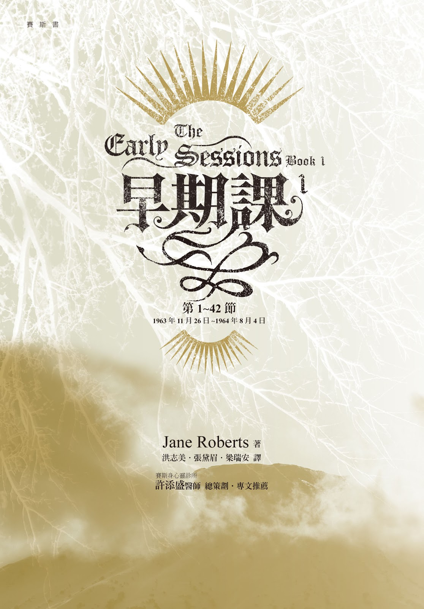

# 赛斯书：早期课1-4

## 第一节  一九六三年十二月二日

　　罗和珍开始用灵应盘与一位自称为法兰克·瓦特的存有接触。以下为较有意思的对话摘录：

　　你有没有任何讯息要给我们？

　　学习和倾听。

　　你能否以一个字告诉我们，我们能从你那学到的东西？

　　沟通。

　　好的。你现在有一个讯息要给我们吗？

　　心电感应很重要。

　　心电感应在哪一方面重要？

　　有为善的力量。

　　你的意思是指我们可以帮助别人吗？

　　影响力。

　　我们有能力告诉别人真理吗？

　　是的，当你们学到真理时。

　　我们如何学到这些真理？

　　学习、倾听、尝试去做所有的事情、读所有的书。

　　你是指我们现在在地球上就可以接触真理吗？

　　是的。

　　在我们已读的或将读的书里吗？

　　提问。

　　怎么做呢？

　　只要问就会让你知道。

　　……。

　　灵媒尝试；你们尝试。

　　珍和我有任何灵媒的能力吗？

　　是的。

　　两人都有？

　　是的。两人能力都不错。灵应盘一试再试。

## 第二节 一九六三年十二月四日

　　你有讯息给我们吗？

　　研究与学习

　　你要我们研究与学习什么？

　　真理。

　　有没有转世这回事？

　　（以下对话中，法兰克告诉罗十七世纪时，在丹麦罗与珍为父子；法兰克是他们的密友，一位香料商人。罗是农场主人；珍是画家。）

## 第三节  一九六三年十二月六日

　　你现在在哪？

　　空间。

　　就象我们在地球上知道的空间吗？

　　非也。

　　你的空间是否包含我们所知的时间？

　　没有。

　　法兰克，当灵魂离开这一生后，他们到哪去？

　　空间。

　　……

　　法兰克，我在这一辈子需要小心什么弱点？

　　太孤立。

　　关于珍的同样问题呢？

　　太多攻击性。

　　在这一生我为何有这个特定问题？

　　在你的情形，冷漠导致缺乏同情心。

　　为什么？

　　你的第一生太过入世。现在过度补偿。

　　那是我现在是个画家的原因吗？

　　这并非全部的理由。

　　其他的理由是什么？

　　向上提升的知识。

　　在追求这向上提升的知识上，我会不会成功？

　　会的。谦虚。知识是逐步渐进的，并非一大步。

　　我是否够努力；还有，方法正不正确？

　　够的；正确。一些孤立是必要而且好的。尤其对你而言。然后扩展。

　　在哪方面的扩展？

　　意识。

　　我与别人的关系会改善吗？

　　会的。

　　我的作品能表达些什么或帮助任何人吗？

　　会的。

　　以什么方式？

　　不朽的图象、对其他次元的浮光掠影。

　　珍为什么有太多攻击性？

　　胆怯的根是愤怒。

　　我太太为何有这愤怒的根？

　　先前未获解决的旧恨，现在必须克服。

　　珍可否透过诗做到这一点？

　　一部分。心灵必须开放、扩展。

　　……

　　珍未解决的旧恨是什么？

　　天机不可泄露。

　　法兰克，现在你有没有顶头上司？

　　有。心智。

　　你可否告诉我们更多这个心智的事？

　　整体，并非区隔。每一生都是个区隔。

　　多说一点。

　　我在的地方没有分别的区隔。

　　举例来说，你是否在我们的太空、我们的行星之间旅行。

　　不同的行星，不同

　　在你所在之处，你能看到每样东西吗？

　　大半却非全部。如果我看到全部，我就没有兴趣来沟通了。

　　如果你选择的话，你可不可以旅行到下一个银河系？

　　每个领域都要改变形式。

　　当你在与我们沟通时，你的形式是什么？

　　是念波、时间流。

　　如果我们和你在同样的状况，我们能否看到你？

　　可以。你们必然会。一般而言，同类才能看到彼此。

　　你在的地方有没有光、暗的感觉？

　　这个问题没有意义。每样东西都不同，不可能比较。

　　法兰克，你想跟我们沟通的主题，有没有偏好？

　　灵异的真相、多次元的知识。

　　好吧。我们已经准备好上第一课，或是一个讯息。

　　爱，即使是过眼云烟似的爱，也是永久不变的映象。

　　有关于此，还有没有更多要说的？或是现在我们已经准备好上下一课了？

　　没有事情是那么简单的。

　　一个人死的时候，是不是马上就知道？

　　并不一定。

　　为什么？

　　要花时间了解。意识在继续。迷惑。

　　通常一个人要花多少时间才知道自己死了？

　　渐渐地明白，藉由退缩及前进的阶段。

　　一个人一开始如何知道他死了？他是否一个人单独找到他的路、别人来招呼，或者怎么样？

　　其他世的熟人会来招呼他。

　　如果现在你能如此轻易地跟我们沟通的话，我们比较严肃的作家，为什么没有对两个层面间的沟通有更详细的讨论？

　　许多人知道。迷惑阻挠了付诸实现。

　　现在身体上，珍和我的健康如何？

　　都很好。

　　对于我们的精神健康，你可以怎么说？

　　需要一些调整。弹性极重要，但是目的并未改变。

## 第四节 一九六三年十二月八日

　　（赛斯出面取代法兰克。）

　　法兰克，你在那儿吗？

　　是的，我在。

　　你要给我们一个信息吗？

　　意识像一朵很多花瓣的花。

　　还有更多的吗？或我们可以问你问题吗？

　　你们可以问问题。

　　动物是不是存有？

　　动物是有个性的。

　　人会不会转生为动物？

　　不会。模式是相互交织的。

　　你可否讲清楚一点？

　　分开的人格。有时候寻求种种不同形式的表达。

　　你能否告诉我们有关种族的记忆？

　　走廊是有很多层的；窗户可以看到内部。所以时间也是许多层的，然而所有的层面都是一个。没有矛盾。只有从大师的层面才看得到真正的全景。

　　法兰克，你怎么想你在地球上先前存在的总和？

　　他们就是我，但我将会更多。俏皮话：整体是其心的总和。哈！

　　我们的人口爆炸是怎么回事？

　　部份的人格一直回来。分裂的存有，即使在所谓同时性的时间，一个整个的存有可能需要好几次的具体显现。

　　在地球上这个过程会有一个结束吗？

　　什么过程？

　　我的意思是说，当数目增加到地球上没有空间来容纳，会发生什么事？

　　不会。

　　为什么不会？

　　最后会装不下了。灵魂可以到别的地方去。只有在你们的层面有暴力。透过行动来解决问题，必然会导致暴力。（在这句话之后，珍清楚地听到下面这句话，但灵应盘并未显现。）

　　毕竟，所有的行动都是暴力。

　　法兰克，是否你心灵还有一个部分现在活在地上？

　　非常小的部分，我几乎不会想念他。我守护他但我不管他，他是个狗的片段体。

　　在哪里？你能不能给我们这只狗的地点？

　　不能。

　　珍的诗可不可以是过去的事件、生命、或梦的经验或结论？

　　有一些可以。对于一个房间的许多记忆，它的门一度是打开的，现在却关起来了。但灵魂有窥视孔。她看见，却看不见。她一度看得太清楚。她看见未来，但她只能活在过去。现在，她寻求从当下被释放，但她现在必须努力用功来获得一度轻易得到的东西。才能迟早必须再加修练。

　　为什么才能必须时时修练？

　　现状不会停留，也不会缩减；却必然会有结果。

　　所有这些是不是珍的潜意识在说话？

　　潜意识是一条通道，你走过哪一个门进来又有什么区别？如果我选择的话，我也可以透过她说话。

　　……

　　我比较喜欢不被称为法兰克·瓦特。那个人格相当无趣。

　　那你喜欢被怎么称呼呢？

　　对神而言，所有的名字都是他的名字。

　　那我们跟你说话，仍需要某种称谓。

　　随你们爱怎么称呼我。我叫我自己赛斯。他适合我的本我。赛斯比较清楚地最近似我现在式的、或试图成为的全我。或多或少，约瑟是你的全我，是过去和将来的你的各种不同人格的总和形象……。

　　你能否告诉我们多一些？

　　你是约瑟，你在你心里看到的约瑟，那个蓝图。墙是你形形色色人格之间的分隔，而也代表转生的时代。……对整个约瑟而言，是没有墙的；只有统一。

　　……

　　（此时我们在讨论要不要问赛斯关于其他人的事。赛斯就主动说明珍的母亲是一个强大存有崩解了的片段体，这一次层次降低了。）

　　为什么一个存有会发生这样的事呢？

　　她终究会重新站稳的，而这是前生的选择，是自由意志的结果。珍必须避免对她有任何残酷的行为。（珍的母亲是卧病在床的关节炎病患。）珍选择了这一生的环境来试练她自己的耐心，并且为之前的脾气作补偿。我身为法兰克时是要学习谦虚。要小心，骄傲会毁掉许多东西。不要责备愚笨的人。因为我们全部必须学会谦虚。

　　（我半开玩笑的说，谦虚似乎是赛斯偏爱的字眼。）

　　并不是偏爱的字；但我不敢忽视它。约瑟，坚持品质却不要如此地自满。

　　……

　　鲁柏好象是个半男半女的名字。

　　就彼而言，性别只在你们这个层面才有意义。

　　（珍又抱怨这名字。）

　　男性的形象令你迷惑。

　　人类为什么要吃动物？

　　在你们这个层面上，自然律就是如此，以后我们还会说更多。在你们的界域内设定了这样一个循环，但并非由外面强加在上的。

　　……

　　你可否告诉我今年早些时候我为什么有那么多背部的问题？

　　第一节脊柱没有传导生命力给这人体。恐惧压到神经造成阻塞。精神开朗让肉体开阔，释放压力。

## 第五节 一九六三年十二月九日

　　一个人属于或选择哪个宗教有没有关系？

　　没关系。只不过僵化封闭的心智对人不利。教条不重要；感觉才重要。

　　地球之前有没有过像我们这样复杂的文明？

　　有。在另一个时期，在空间里共存，在时间上却并非同时的。自然地演化到其他的时期。

　　……

　　赛斯，你有没有同时在地球上有两个或更多的转生？

　　存有通常在一个时候只有一个。片段体与存有不同时在地球层面。片段体活着并且会受一些力量的影响。所有的地球生命都受那些力量影响。

　　昆虫是不是片段体？

　　是的。难以解释。

　　在地球上，为什么动物出现得比人早那么多？

　　存有要花那么多时间来建造人类的形象。

　　现在在地球上，这个过程还有没有持续着？

　　有的。存有来来去去。

　　别的恒星有没有行星？

　　当然。

　　如果你选择的话，你可否旅行到银河？

　　如果我选择的话。不过，我有其他的考量。我会越了界。没有什么事阻止我，只不过不合情理。

　　你可否旅行到离我们最近的一颗星 － 大角星？

　　任何地方都是可能的。对你而言那些地方都是不同的。对我而言，没有区隔。

　　大角星有几个行星？

　　五个。（译注：不一定是住了“人”，而是有生物居住。）

　　在那些行星中，有几个是住了人的？

　　三个。但并非全是你们那类生命。许多可以居住的地方，对你们而言，仿佛是不可居住的。你们的感官只能看见你们自己那种生命。

　　地球有没有被外星生命探访过？

　　经常地，这一点都不奇怪。外星生命彼此看不见彼此。他们撞到彼此，却不会感觉到任何刮擦。

　　当我们旅行到其他行星及恒星寻找生命时，会发生什么事？

　　你们可能会发现一些你们能认出的东西。你们的科学可能发现找寻到生命的方式，那是单靠我们的感官做不到的。

　　……

　　照珍的说法，感官创造物质世界。这正确与否？

　　正确。物质世界是概念的建构，正如所有的世界也都是。

## 第六节 一九六三年十二月十一日

　　催眠能否将一个人向前送到他下一生去？或进入当他的地球循环已经完成的那一生去？

　　可以。不过，必须要非常地谨慎。

　　为什么要如此小心？

　　无法调适及毫发无伤地回来。

　　你的意思是指精神上的吗？

　　心灵上的。

　　当你还活在地球上时，有没有尝试过那样的事？

　　从来没有过。

　　如果你曾觉察这样一件事是可能的，你想你会不会尝试呢？

　　做为赛斯，我可能会，其他的人格则否。

　　你知道有许多人曾企图做过吗？

　　是的，企图做过。

　　我的爸爸为何如此怯懦？

　　上一次她是一个极具攻击性的女人。导致了不快乐。

　　……

　　总是很聪明，但常常感情用事，像现在一样。

　　你能不能告诉我们一些珍的父亲的事？

　　是片段存有。与当下此一人格合不来。在自我与潜意识之间有隔阂。重要的力量逃走了。他是他上一个母亲的存有的一部分。

　　珍的父母为什么结婚？

　　片段体之间的吸引力。她是扎扎实实的攻击性。他视攻击性为力量。她追着她的父亲，太快地重生。之前认识他，发现自己是他的女儿，大吃一惊，想要做同一代人。

　　我的爸爸为何娶我的妈妈？

　　活力。而也想要她的大胆。他表面冻结；而她下面冻结。两个在一起的的是可以忍受的，救了彼此。

　　在这种情形，精神分析或精神科的帮助会不会有用？

　　会的。在那一类的调整里，年龄是有些不利的。

　　……

　　为什么人类平均只活七十五岁？

　　那够长了。存有在转生期间是分裂的。在每生之间是全我。

　　地球上的洲上升与下沉过多少次？

　　无数次。

　　下一次这种活动的期间何时开始。

　　2000，2000 年开始。

　　这会毁了我们所知的文明吗？

　　不会。

　　……

　　我们未来是否可能不用灵应盘来与你接触？

　　不要放弃灵应盘，却也开始尝试其他方法。

　　（珍开始在灵应盘拼出字以前就收到一些回答。）

　　开始训练。

　　（珍收到（训练）这个词。）

　　我们为什么有残障者？

　　（我问珍。她的回答来得小心翼翼却没有犹豫。）

　　片段体拒绝帮助个人成为组织好的有机体。

　　……

## 第七节 一九六三年十二月十三日

　　赛斯，为什么有时候当我们被介绍给某人时，虽然意识上我们知道从未见过他们，却觉得认识或似曾相识？

　　有时候你们在其他前生里认识过他们。

　　这个解释是否也适用于地点？

　　你们也许曾去过。你们可能保留了熟悉感，虽然没有实际的记忆。

　　这种感觉能不能用催眠来引发？

　　可以。但意识心应该知道无意识在做什么。无论如何，有意识才是目标。

　　在当下我们是否多少都在无意识的掌控之下？那是真的吗？

　　那是真的。但那等于是说，整个是受其部分掌控的。人只不过还没学会有效地用他的部分。各部分的总和该是极有意识的。珍，个别意识是最重要的。它从不失去；只会增长。每次他扩展，以包含更多。

　　……

　　你可否对鲁柏这个名字给我们更多资讯？

　　这是他很久以前一度有过的名字。就象你的名字是约瑟一样，两个都代表你们存有的高峰，在精神基因里的形象，给你的心灵追随的蓝图。约瑟与鲁柏代表你们地球人格的全貌，你们必须朝向他成长。可是，以另一种说法，既然蓝图存在，你们已经是约瑟与鲁柏。现在每个人都有这样一个综合计划，透过每一生，个人试着跟随这个。这模式并非强加在存有身上，却是他自己的大纲。

　　（珍问）那我为什么现在必须向着鲁柏成长？

　　你们在灵性上存在为约瑟与鲁柏，但你们必须在地球层面成为完全的约瑟与鲁柏。

　　这个蓝图会不会干涉到自由意志？

　　怎么会呢？你们自己制作的蓝图，而你们形形色色转生的自己们并没有意识地觉察那个蓝图。他们有自由意志。你给他们的。那就是挑战所在。

　　鲁柏是一个男性或女性的存有？

　　男性，现在在学温柔。不过必须了解整个存有以你们的说法，既非男性也非女性。

　　……

　　心智跟大脑有何不同？

　　大脑是一个机制；而心智是心灵。

　　……

　　赛斯，我的左耳有时候为什么会有噪音？

　　被恐惧塞住。

　　什么恐惧？

　　当有恐惧时，总会找到理由。恐惧，是问题所在；而非恐惧这事物。

　　珍是否有鼻窦的问题？

　　是的。想要把世界关在外面的老企图，她的眼睛跟你的耳朵也一样。先前花粉热也是排斥世界的症状。

　　好吧，我们了解那点；但现在对于这种事我们能做什么呢？

　　你们正在做些什么；疾病是未能忠实地将心灵具体化的结果。当心灵疲乏时，乃对物质失控。

　　……

## 第八节 一九六三年十二月十五日

　　（比尔麦唐纳曾在摇椅上看见一个形象。罗代他问那个形象是什么。）

　　……

　　他自己存有的一个片段体，一个过去人格暂时在视觉层面重新获得独立。

　　赛斯，这个形象是否意识到比尔的在场？

　　以一种潜在的方式，一个人格的所有片段体都存在于一个存有内，有他们自己个别的意识。（珍口授：）他们并未觉察到存在本身。当比尔看见那形象并且认识到他的在场时，那片段体本身仿佛在做梦。正如比尔看见却没有认出来一样，片段体也是看见而没有认出来。

　　赛斯你认为珍的回答如何？

　　他接收得非常好。就存有自己的片段体而言，存有可以被比为一个超我。

　　……存有以你可以称为一种潜意识的方法去运作其片段体。也就是说，没有有意识的指挥。（珍口授：）存有给片段体独立的生命，存有或多或少遗忘了他们。当一瞬间发生一个短时间失去控制时，两者就面对面了。存有不可能去控制片段人格，正如意识心不可能觉察或控制他自己的心跳。在这个案例里，那个形象是一个过去的片段体。

　　……。

　　那么，是可能走到街上而碰到一个你自己的片段体喽？

　　当然。以后我会试着想到一个好的比喻来使这一点更清楚。举例来说：即使念头也是片段体，只不过是在一个不同的层面。（珍口授：）它们必须被转译成物质实相。另外一种片段体称为人格片段体，独立地运作，虽然是在存有的监护之下。

## 第九节 一九六三年十二月十八日

　　（罗说，他们安静地坐在灵应盘边，并没有说话，而几乎决定不要上课了，但指针开始移动，拼出“晚安”。罗仍未发言，指针又拼出“我希望不是因为我这个伴儿。”）

　　赛斯，树和植物也是片段体吗？

　　以一种说法，所有东西都是片段体，但有不同的种类。人格片段体，与其他的不同之处在于他们能从自己形成其他的片段体。以一种说法，（在此珍将灵应盘放在一边，站起身来，前后踱步，她开始口授。）一棵树不行，但人格片段体可以形成拥有父母片段体所有属性的其他片段体 － 情感、生活等等。

　　所有其他的片段体有的，只是扔出去或投射出去的东西。

　　（以下根据原文主旨加以转译。）

　　这个灵应盘可说是木头或一棵树的投射物。不过，这个盘比它的原生树的属性要少一些。一棵树可以生长；但盘却不会。另一方面，一个人格片段体绝对不会比他的父母属性要少一些。不同就在这里。一个人格片段体，与生俱来就有其父母的所有属性，虽然他不一定知道如何去用它们。

　　以一种说法，现在在一次人生的一个个人可以被称为他整个存有的一个片段体，具有原始存有的所有属性，虽然它们可能是一直潜在而没有被利用的。这样的人格片段体，可以学会去发展他有的东西，而不必去寻找新的力量。并没有新的力量。如我所说，你朋友看到的形象是他自己的一个人格片段体。他包含了你朋友所有的能力。这类的人格片段体跟你的朋友来源是不同的，你朋友本身是他自己存有的片段体。我们称这类为一个分裂的人格片段体，或者一个人格形象的片段体。通常他无法在你们物质层的所有层面运作。

　　一个人很少、但有时候、可以完全送出一个人格片段体形象到存在的另一个层面，即使他自己不知道。这个形象人格片段体甚至在这另一个层面也可获得有价值的经验，然后再回到这个人身上。有时候这个人甚至无法消化这个知识，或甚至也认不出回来的他自己那个人格片段体。你朋友看到的那类片段体，比较象后者。但他与你的朋友如此地失联，而且你的朋友如此心不在焉地把他送上旅途，以致讯息直接送达你朋友的存有。

　　有意识的个人的倾向是越来越集中。然后可以将这些分裂的人格片段体或形象保持在他的注意之下，而不至于使现在的自我太分心。且说，潜意识则无法做好这件事，因为他的功能从来就不是要清楚地集中注意力。

　　在你们星球上的意识将会扩展，正如那些超越你们层面的人意识扩展了一样。在未来，意识范围会扩大到这样的程度，以至于所有的人格片段体、分裂的人格形象、甚至在接下去的转世中的个别片段体，都将被不费力地保持在清晰的焦点内。地球就朝着这样的进化前进，虽然当然是以它一向的驴步在前进着。

　　在同时，当在地球上的转世完成了之后，无论如何，存有都向着这个目标前进。无论如何，当在地球层面这个目标达到之后，这些人的进化，连我也只能梦想。

　　（以下是关于约克海滨的影像的纪录，请参阅《灵界的讯息》第二章。）

　　……。

　　赛斯，我现在画的一个老妇人，有什么重要意义？

　　那个老妇人是母亲。那幅画代表你在做那个人的时候你学到的合成知识。做母亲的知识还流连在精神性的基因里；而肉体的记忆仍发生在你身体的基因里。一旦存在的永远不会被抹杀。另外一幅关于一个母亲和一个婴儿的画代表你做为一位带着孩子的年轻母亲。

　　在你俩目前的人格里，你们都不需要有孩子。你们几乎结束了在地球上的转世，到这样的程度，以至于当你们死亡时，肉体将完全而没有分裂地回去，在世最后的一生里，永远是这样的。物质上的东西被留在身后，它没有一个部分会经过孩子而留下来。

　　你们可以经由你们的作品而非肉体上的后代，去思考有关不朽的事。只因为你们的存有已经以血肉的方式认识他自己了，所以你们就不再以此方式受到拘束或被吸引。这并不是说没有对于人世现象的心灵之爱。它在那儿，并且永远也会在。即使在别的层面上，官能的天性及对地球居所的欣赏都维持着。

## 第十节 一九六三年十二月二十日

　　（赛斯继续谈约克海滨的影像，请参阅《灵界的讯息》第二章。）

　　……。

　　类似约克海滨影像这一类的投射是潜意识栩栩如生的欲望或恐惧形成的。在地球层面，这种投射是该被延迟的。不过存有则不受这样的限制。自然，潜意识永远是和存有连着的。只不过在这些例子里，潜意识企图模仿存有本身的力量。而它的确有这些力量，虽然它们通常是潜在的。存有在创造形形色色的人格时，终究是在做这样的事。人格岂不正是来自存有本身的投射或片段体吗？不过，存有是有意识并且有目的地做的。不过，很明显地，存有所有的这些力量并不能被赋予其形形色色的人格。整体之一部分的意识无法承担整体意识的重量。片段人格无法包含整体，但它们的确包含了整体的种子。

　　种子的力量一直是潜在的，但许多时候，它们会结果。在每一生里，新的意识努力联合整个的目前人格，从潜意识中利用对人格有益所需的东西，而将会威胁目前自我之主宰性的任何知识都保持在潜意识里。

## 第十一节 一九六四年一月一日

　　这一节讲的是珍、罗和比尔作降神会的事，请参阅《灵界的讯息》第三章。

## 第十二节 一九六四年一月二日

　　（罗问关于在第十一节中，赛斯令珍的镜中影像改变形状的事。赛斯说，他们看到的是另外一个存有。）

　　是的，我也很惊讶。那个存有从未做过人 － 完全是另一个层面，跟你们毫不相干。

　　……。

　　一个从如此不同层面来的存有怎么能那样侵入我们的层面？

　　就彼而言根本就没有入侵这一回事。奇怪的是能够看到所谓的入侵。

　　如果我从外太空具体化出我的生物的话，真的会令你们大开眼界。沟通的路线是开放的，那个存有只不过暂时地溜了过来，或者部分过来。纵使那个影像的形状并未被清楚地瞥见，但要让他过来必然会有空间的扭曲。正如泡浸水里的一根棍子，对那些观看的人仿佛有扭曲而被扭曲，所以被抛入你们层面的这个影像，对你们而言仿佛有扭曲。但正是这扭曲，给了他形象。如果没有扭曲，你们什么都看不到。

　　（以下赛斯对罗的弟弟 ROLEN 的前世讲了很多。）

　　做男性太多次会以一种女性的方式使这人格变乖戾了，而没有通常与女性相连的内在理解与同情心。同样的，一直做女人的人格会变得粗暴而没有与男性相连的内在力量。为了这理由，大多数的存有都以男性及女性的身份活过。

　　罗伦曾经三世是男人。……不管所有你们肉欲的故事，性是一个心灵现象，只不过是某种你们称之为男性或女性的特质。不过，那些特质是真的，并且弥漫了除了你们自己世界之外的其他层面上。它们是相反的，却又是互补的，并且融合为一。当我说整个的存有既非男性也非女性，却在谈到存有时给他们一个男性的名字，比方说约瑟或鲁柏。我只是指存有的整体要素比较认同男性特质或所谓的男性特质多过女性特质。在人类中，男性仿佛的主宰性只因为男人的攻击性更快地令它被人察觉，并且往往带着一种凶暴。不过，攻击性的基础却是非常强烈地女性的。因为如果攻击性没有付出的特质，它就只会是一个握起来、不动的拳头，没有能力去动，也没有能力去展开到别的生命里，象它必须做的那样。攻击性是一个向生命推进的动作，并且是对抗惰性的。但没有女性特质的默许，生命不会展开。

　　(以下赛斯谈到第五次元，详见《灵界的讯息》第三章)

　　赛斯继续说：所有在我层面上的人，迟早都要讲授这种课。但师生之间必须有心灵的结合。这意味着我们必须等待，直到你们层面上的人进步到某一个程度，课才能开始。解释得更清楚一些就是说，我们只给与我们有心灵契合的人上课。虽然理性是极端重要的，而我也无意贬低它的价值。不过你们所谓的情感或感觉，是我们这间的连接物，它是在任一层面、任一情况下最能代表生命力的连接物。你们的世界和我的世界所有的料子全是由它织出来的。如果你再想一想那些金属线，那么你就可以将它视为固化的情感，以一个强力的接着剂及知性的硬化力量织在一起。虽然感受是其基础，如果只有感受就会有一个不一致的、非常岌岌可危的架构。理性是训练及支持这些架构的方式。

　　以后我会进一步地再深入这第五次元。

## 第十三节 一九六四年一月六日

　　（罗请赛斯再谈谈精神性的酵素）

　　正如精神基因是在肉体基因背后、精神性酵素也在你们的层面上可以检验的物质的背后。叶绿素就是这样的一种精神性酵素。

　　以一种说法，具有那种性质的任何一种颜色或品质都可被认为是一种精神性酵素。在精神与物质之间，有某种交换；若没有的话，颜色无法存在。我首先用颜色作例子，因为或许比较容易了解这如何可以是个精神性酵素。叶绿素是绿的却不只是颜色。不过，在此，有个交互作用，给予叶绿素其属性。这是最难解释的用语。你们还没具有了解它的背景的更大观察。

　　在谈第五次元及一般不会令目前人格恐慌的资料时，资料会传得特别好而没有扭曲。当鲁柏在传输比较个人性的资料时，可能因为情感上的牵连而造成扭曲。当他有进一步的发展后，这种扭曲将保持在最少。你越去压一个痛点，它就越痛。我的态度并没阻止预言；你们此时的态度则会挡路。这与你们个人关系不大，却代表这个方向资料多少自然的扭曲。

　　如果你们现在无法证明我的存在，同样，你们也无法摸到音乐。

　　（罗请赛斯再多谈谈第五度空间（次元））

　　叶绿素是你们层面的一个推动力。不过，它的一个变数存在于所有其它的层面。可以说，它是令每样东西启动的精神性火花。

　　信不信由你，这与感受也有很大的关系，那也是个动力。你们必得试着不以旧的方式将东西归类。当你们打开心胸，在叶绿素作为精神性酵素或动力，以及从不静止的情感之间，你将看到一个相似性。固化的情感又是另一回事了。而也许是其他世界的一个架构。

　　（赛斯接下去重申，他并非鲁柏的潜意识。）

　　以后我们会更清楚地讲精神性酵素，因为它们在宇宙里有个基本角色要扮演。在你们自己的经验里，你们熟悉蒸气、水、及冰，它们全是同一样东西的显现。所以，一个看似物质的叶绿素，也可以是彷佛非物质的情绪或情感的一部份，却是以不同的形态。就如，当然，冰本身不会存在于你们的夏季。

　　你们为什么觉得固化的情感这片语很古怪？你俩都了解，你们的层面其实是由固化的思维组合起来的。当我告诉你们去想象那金属线穿透每一样东西时，我的意思是，你们该永远想象这些金属线是活的，正如我自己的确是一条活的金属线。我现在要你们去想象，这些线是由固化的情感组合的。你们必须了解，感受与情绪这种字眼，至多也不过是描写其他的什么东西的象征罢了。而这其他的什么东西，极为近似你们的精神性酵素。

　　事实上，在一个精神性的圈围里，发生了一个反作用。一个精神圈将自己分裂成二，分裂、分开，增殖，作用于其自己种种的部分上，而这产生了一个物质的显现。物质是物质，却是精神性地产生的。

　　在圈围里的精神性酵素，即是启动行动的元素，并且也是行动本身。换言之，精神性酵素不只在物质世界产生行动，还变成了行动。从现在起，我永远会称任何的物质化为一个行动。因为，如你俩现在都知道的，没有东西是静止不动的。

　　举例来说，爱与恨都是行动。它们也都暗示在肉体内的行动，思想也一样。在你们的层面，行动是主要的重要字眼。

　　我说过，仿佛弥漫我们的典型宇宙的、我们想象的金属线是活的。现在我要说，它们是精神性酵素或固化的感情，永远在动，却又够永恒去形成一个或多或少前后一致的架构。你们几乎可以说，精神性酵素变成是形成物质的触须。

　　架构只是为了方便，正如你们的墙也是为了你们的方便。墙并不是像那样存在的，但如果你不想颈子折断的话，最好以它们仿佛是那样存在的样子行事。在我自己的层面，我仍必须尊重许多类似的架构，但我对它们的了解，便它们比较透明。

　　单单知性上的真理不会令你自由，虽然它是一个必要的先决条件。如果情形是那样的话，你们的墙会消失不见，既然你们在知性上了解它们相当可疑的本质。既然感受本身往往是心智用来建造有胶着剂。如果你们想在你们特定的时间，从你们特定的存在层面获得自由的话，要改变的是感受本身。就是说，到某程度，一个感受的改变会容许你看见变化。

　　既然感受是个胶着剂，完全改变它很难说是有利的，因为你们目前存在的世界会崩溃。

　　我们记得多少个内在的世界？

　　举例来说，你们在你们的层面，甚至对你们自己梦的片段也没有有意识的记忆。就彼而言，你们几乎无法在有意识、故意的基础上，由一个礼拜到下一个礼拜记住一个想法。在此时，就你们所知的自我而言，简直不可能维持有意识的统治地位。

　　（罗在一月八日上午，参照赛斯讲的第五度空间，用墨水画了一株上面有两个鸟巢的复杂的树。罗因而有一些想法：

　　一张画是固化的行动。在作画的过程中，我在固化情感与感受……以此方式作的“抽象”艺术是个想在潜意识层面诉诸及产生情感性反应（在我们的层面即是行动）的企图。换言之，在我们层面的行动的企图。这能使如此产生的情感反应将其温暖辐射过我们存在的所有层次。“具象”艺术更直接，而可能以相反方向穿透我们。就是从头到脚。）

## 第十四节 一九六四年一月八日

　　（此节一开始谈到珍的外公，约瑟·柏多。）

　　他是一个非常强大的存有的一部份。在这一生却非常不擅言词。因为他无法综合过去世所获得的东西。

　　他有心灵上的倾向，当珍还小，并且仍接近她上一生时，珍感觉到外公深沉且个人的内在觉察。这令外公困惑，因为他的不擅言词也透用于他内心的想法。他感受强烈，却无法解释。在他的孤独本性里，他几乎是位神秘主义者，但他无法融入外界的社交世界，甚至他自己的家人。他感觉与整个宇宙，以及他所了解的自然，有个强烈的关联。但对他而言，自然并不包括他的人类同胞。围攻着他的孤独，对任何人都是危险的，除非它在此人已与人类认同之后才来到。

　　在他与一切万有的统一感里，他排除了别的人类。而，在你们的层面上，人格必得与人类关联。

　　他从未原谅他自己的孩子长大成人；也不原谅他的太太照料世俗的事务。但，直到最后，他都将自己身体与自然关联得很好。他觉得自己象一株树那样老去，却病态的觉得别人是为了刁难他而老去的。

　　他的心灵本质在某方面以一种奇怪的扭曲方式生长，在别的方面却顽固地萎缩。不过，珍从小便饮入他与自然一体的感受，而这与珍后来的发展很有关系。珍现在在某些例子展现他外公对人们的封闭态度。在这些方面，你和珍，你俩有时彼此加强。

　　当然，在人际关系里，你们必须用到纪律，但你们必须有人际关系，正如我想你们在开始学的。……你们不需接纳大批人到你们家里。在另一方面，所有阶段的人际关系都是需要的，而，在你们与朋友之间一个随意的往来，将以你或珍个人都无法单独做到的方式，扩展你们的精神。……你们的工作将不会由于在这些其他方面花费精力而受损。

　　现在我说的是有纪律的关系。当你们避免或试图避免它们时，你俩都是出于恐惧而那样做。你们的性格、工作习惯与目标都设定得够好、够安全，而不会以这种方式受威胁。

　　（接着，赛斯对罗说：）正如你的画是在画板或纸上固化的感受，在物质实相里是很明显的，因而受制于宇宙律，所以，在你们层面，宇宙本身是物质化的情感，只不过比一张画有更多的向度。但，在一幅画里，除了线条、色彩、形状与内容之外，也有比人们通常认知来得广的一个额外的向度，那就是你形容得如此恰当的，固化的情感。首先，你抓住且固化了线条、形状、内容等等的行动，……。然后，当一位观者看一幅画时，情感又再度从画里流出，进入观者的感知。

　　在一幅画里，行动是固化了，或定住了的；但甚至在一幅画里，行动永远不会真的固化或定住，却是继续流动的。

　　就那幅墨水画而言（即罗画的第五度空间），别忘了，当你们人类受困于其感官时，试图在你们的物质宇宙里超越过感官，你们什么都看不见。然而，就是透过这些世俗的感官，才有个机会窥见那超越的地方，或真的了解是有个超越的地方可以窥探的。

　　在你们的层面上，感官对美的感知是随后内在感知的触机。两者是如此密切相关的。举例来说，透过只能经由感官欣赏的音乐，心灵行动发生，引导此人超越感官。我以后会再解释内在感官这名词，它是在感官之内的感官。

　　在你们层面上的每样东西，都是独立存在于你们层面之外的某样东西的物质化（具体化）。所以，在你们的感官内，有其他向内感知的感官。你们平常的感官会感知，或如珍喜欢说的，创造，一个外在的世界。……在可认知的感官之内的感官，感知并创造一个内在世界，它们感知部分的内在世界。不过，正如你们平常的感官按照你们居住的层面而受局限，相应的内在感官也是受限的。

　　几乎象是，你们可以向外看见、感觉、触摸及感知这么多；也能向内看见、感觉、触摸及感知这么多。却有更多的存在所有的方向里，你们对那变得无知无觉。你一旦存在一个特定的层面上，你就必须对准它，同时挡掉许多其他的感知。

　　那象是一种心灵的焦点，沿着一个方向集中觉知。当你与你环境相关的能力增长，你随之有能力环顾四周，用内在感官，扩大你的活动范围。……在一个特定层面上的存活，有赖你在那层面的聚焦。……

　　时间因素是我告诉你们我会讨论的一样东西。而如果我的意向很强，鲁柏在这时正变得渐弱了。在这句话里，有某个时间因素。这资料本身并没令你俩疲倦。所涉及的时间，或你们对时间的概念却有。

　　在你们的层面，没有行动是同时性的，因此，时间立刻加入了。

　　约瑟先前说过，你觉得我能（倒带）到我的以前，就好象我能将一本书的后一页翻回到前一页似的。当然，事实就是如此。

　　到某程度，虽然是一个差得多的程度，你们在你们自己的层面也可以这样做……就是说，你们或许能直觉地感受或记起一个先前的片刻；或象在一张相片里看到；或在一个录音里听到，而抓住先前的片刻。你们能藉由电影参照过去时光，捕获片刻的视觉资料，甚至其序列的明显动态。举例来说，经由你们神奇的电视看一个历史的片刻，你们能参照许多过去的东西。

　　但这参照本身涉及了时间。你花在观看这样一个历史时刻上的时间，在现在用掉了相等的时间。所以，这样一个参照的一分钟要花掉你现在的一分钟。而你结果吃亏了。你放弃你宝贵的当下片刻，却没有找回过去的一个完整的片刻。

　　举例来说，看见一群人，纵使你自己也身在其间，你却经验不到当那照片被摄取时，你当时的感受。……而虽然你可以看见站在人群中的人们，你或他们都无法看见或体验他们感觉到的情绪。在这儿有许多可说的。我必须缓缓道来。

　　当我对自己倒带，或回到我先前在课里所说的，当在如此做时，我并没花上同等的时间。就是说，如果我得花你们的两个小时来给你们某些资料，我不需要同等的时间参照回那整个资料。……

　　虽然我不受你们层面时间的影响；在我的层面上，我却受到类似时间的东西的影响。没有阻碍物时，时间没有意义。换一种说法，若没有对抗其他行动的必要，时间是没有意义的。

　　（译注：参照《灵界的讯息》第四章，其中有许多此节的摘译……赛斯说，鲁柏曾是他的一位好兄弟。鲁柏人格的男性面一向很强，意思是很有力。若无她此生身为一个女人正在学习的忠诚的话，她的性格会有很大的缺陷。

　　（当罗问过赛斯在他的层面是否有友谊之后，罗接着又问：）

　　在你的层面上，……你们有没有一上游戏和放松的感觉？

　　我们有比你们强得多的游戏和放松的感觉，并且还享受得多。我们能象一个孩子那样游戏，却有着孩子没有的，充分的有意识欣赏。

　　你们也有象愤怒这样的情绪吗？

　　……以你们的说法，我们体验情绪，所以是能生气的。不过，我们是如此的有纪律，以致怒气很少升起。

　　（以下是珍对一月十日晚上发生的事的笔记。她当时在她自己内引发了一个出神状态，或一个相当强烈的游离状态。）

　　昨晚，我有一个极端奇怪而不舒服的经验。更糟的是，我不知道是什么启动了我陷入其中三小时之久的怪异情形。毫无疑问地，它是某种梦游状态，我想是某种自己引发的出神状态。令我担忧的是，就我所知，我并没试图令自己进入出神状态。

　　然而，为了我的书，我尝试注视水晶球，用一个装满水的圆玻璃瓶。除了能预期的反影之外，我什么都看不见。当罗在九点左右在他的画室画完画时，我告诉他我认为不成功的实验……

　　我们开始在客厅里聊天。我提到，在画廊，当事情变得棘手时，我能将自己放在一个游离的状态，而说，在我这方面，省了不少力气。当我说话时，我的声音似乎变粗起来。我笑说，我希望赛斯不会想用我的声音就用我的声音。

　　就我所能回忆，这是我开始觉得奇怪的时候，仿佛有些事将会发生。我将那感觉贬为想象。我几乎立刻感觉解离、瞌睡，而坐在摇椅里，却没在摇。我的眼皮感觉很重，我的头歪到一边。我几乎难以保持清醒。但同时我的感官却极度敏锐；我能听见屋子里的每一个声音。罗问我出了什么问题，我答说我觉得很怪而不像我自己。

　　我的身体非常轻，显得无重量。我根本没意识到肌肉的重量或压力。我的肩膀尤其受影响；我的手臂及手掌感觉象水或空气。罗叫我站起来。他开始担心。我几乎无法从椅子上起身，他得帮我走到沙发那儿。我感觉自己不够实体化到能够去移动。

　　我觉得我好象正进入某种极深的出神状态，我在抵抗它。然而，我想我假定是正在做实验，而有点想随它去。却被恐惧战胜了。虽然我阻止自己进入一个更深的状态，同时我又无法挣脱出来。

　　罗替我煮了咖啡。我不相信我能举起杯子。当我终于做到时，我的动作极慢，好象电影的慢动作。我仿佛根本无法对物质世界施加任何压力。罗令我喝了两杯咖啡；我站着，头伸到外面的冷空气里。好象什么都没帮助。到现在我是彻底地吓坏了，却以为，如果我真想挣脱的话，我能够，并且知道方法。

　　罗以为，对我的感觉如何写篇声明的专注，会有帮助。相反的，我的努力显示，我是在一个何等疯狂的状态。我的手迹根本不象我的。没有压力施加在笔上。笔迹小而扭曲，且越来越小。我的散文完全不象我的，事实上，有点幼稚。思维或信息或点点滴滴的对话跳到我脑海里，而我写成这篇奇怪的文稿。

　　这情况维持了约三小时，我才渐渐脱离它……。

## 第十五节 一九六四年一月十三日

　　（谈精神分裂；主要人格及片段体 － 见《梦与意识投射》第五章）

　　（赛斯说：）……我在鲁柏的一个有趣的小小实验中，进来了一半。……在意识上，我不知道你在干什么；但无意识上你明白得很。这类的游离状态可以是危险的，尤其象你的例子里，它是如此冒险地引发的。如果我没有刚好来探探你的话，你整晚，或我该说整个早晨都会在一个很棒的状态里呢。

　　……你达到的游离状态可以最有效地利用。但你却完全未觉察及未准备地撞进去。好可惜。

　　你如此轻易地溜入这心境的这个事实，该提醒你，你一度拥有的能力。那时，你误用了它们。但，如此少知识和准备之下，若无之前的经验，你不可能如此快速地进入这样一个状态。当我提到家庭作业时，我想的并非任何如此费力的事，显然也不会建议在目前对你而言如此危险的事。

　　你达到的那状态，可以比为我的状态。只不过，我是完全有意识，且能用天生在里面的能力。如约瑟假定的，如果他建议你漂浮起来的话，你是可能做到的，而他以极佳的判断力抑制了他自己没去做那样的建议。

　　你如果回想的话，你部分的头脑是有意识的，你能正常的对话。你心灵的另一部分全然地解离了，而等待你的命令。

　　它象在逆风中挣扎的一张湿毯子。这全都与我们先前谈到的人格片段体有关连。以相似的方式，人格是分裂的，一个部分对主要自己有意识，另一部分是支离破碎的，而等待形成新的什么东西。在一个潜意识层面上，这就是你们创造约克海滨的影像的同样方式，只不过，那个人格分裂是在潜意识层面产生的。

　　或许我该澄清，那个分裂是整个潜意识的分裂。一月十日鲁柏的例子的分裂则是在意识的层面。既然他没觉察他一开始引起了那解离，所以他无法胡乱撞出来。

　　附带地说，许多所谓精神分裂的例子都是沿着这个方向发生的。至于说他写的字，鲁柏的一个未组织、未形成的可能人格，只是利用这机会现身，而取代了一个总是主控它的强大的手。

　　约瑟，你在这些课里的角色是极为重要的。没有你的参与，它们无法开始，也无法继续。由于我们三个过去的联盟，我们是紧密相连的。无论如何，我需要你俩才能通得过来。后来你将了解为什么如此……

　　精神分裂是由一个从主要演出人格分裂开来的人格片段体引起的。往往以直接相反主人格的方式运作，但总是以一个次要人格的方式运作。

　　在你们约克海滨的经验里，如果你们未能藉由你们特殊的创造能力，去在你们身体外面形成那些影像，因而赋予它们一个物质实相的话，你们极可能将你们自己变成了分裂人格。甚至你们的心理学家都知道，精神分裂者至少暂时是两个人格，一个主要或主宰性人格，及较差的一个。许多人无法给片段体这种物质实相，故而将它们或多或少无害的推到一边去。就象鲁柏那晚的了不起经验，人格解离的部分穿上另一个身分，而与鲁柏自己的人格争夺主权。

　　许多所谓附魔的案例，都可以归诸这个理由。主宰人格在你们层面可以比为主宰的存有。请了解我在这儿是用一个比喻。正如在你们层面的人格实际上会按照其潜能改变、扩展和成长，正如他在种种不同的时候表现种种不同的形象给世界。比如，一张笑脸、一张苦脸，但基本上他仍是同一个人格。所以，在另一个层面，存有的确在种种时候表现不同的面貌，且以不同的声音说话。正如那笑脸和苦脸也表达并扩展了人格，种种转世人格也表达并扩展了整个存有。

　　若没有儿童、成人与老年的阶段，人格无法扩展到其完整的程度；而若没有形形色色的转世，存在无法扩展……在梦中，象鲁柏达到的这种解离，当然是常态。只不过，在这儿，能力是用来形成梦影像。但整体而言，这些梦影像为存有工作，并且作为各个人格沟通的工具。就是说，在许多案例里，给先前人格与现世人格沟通之用。它是现世人格与其过去人格熟悉的方法，并且也提醒其目的，而没打扰自我。

　　……当我与你们在一起时，以一种我以后会解释的说法，我是与珍连在一起的。意思是，我看见她之所见，等等。当然，我能解离自己，但这样做以及回来所涉及的努力却不太值得。就象是，穿上某种潜水装备，换穿另一种，然后又重穿第一种。服装并不总是物质的衣着。它们也可用为一种沟通工具，好象潜水装备一样。

　　……

　　你们的猫的确是个片段体，而它有时真的感觉到我。它的感官极度敏锐，它的内在感官完美地调准了。即使现在它也感觉到我的在场。不过，当它变得更熟悉我时，它的奇怪行径将整个停止……

　　（罗又有一个有关他弟弟罗伦的灵视，是个穿着旧红袍的僧人……）

　　你的灵视经验很顺利，约瑟。你可以期待它放大、成长并成熟。正如鲁柏的能力已显示惊人的进步。在此时我迟疑去进入珍的瓦特·Z 的经验。她有意识的自我设立了阻碍物，而在所有的例子里，她都必须愿意让资料通过来。只说，她摆脱了一些先前的责任，而偿还了一件旧债，就够了。

　　（此地，赛斯谈到甘乃迪之死，见《灵界的讯息》第十四章）后来他又说：）

　　甘乃迪将在三年内出生为印度的乞儿。如果他做得象之前那么好，他之后将达到显赫的地位。他的名字将叫 Aubum，发音是 Ammum。这次他将从贫穷达到显赫，一个将大大加强他存有的目的的经验。

　　奥斯华（Oswald 译注：假定为甘乃迪的刺客）一直是个人格片段体，如所有的精神病患都是的。以我对精神分裂者的解释的方式，断裂的一个人格片段体。因此，在某些例子里，存有的一个部分在他该来投胎前便来了，没携带其完整的精神基因蓝图，所以引起麻烦及困惑。就好象，一个梦魇之狂野影像带着完全的物质力量浮现到白日的世界里。

　　这种人发现他们的缺陷，但反过来说，因为他们的确有个扭曲却仿佛主宰的“我”，他们只会更加愤怒而迷惑。没有基本的统一因素来给他们一致性，也没有统一的潜意识记忆来给他们真正的内在身分。这是他们为何攻击整合得极好的人格，以及他们为何如此容易被赤裸裸的情绪弹入这类悲剧里的理由之一。

　　梦魇代表，鲜少在事实里发生的崩解之可能性……它们通常并不象一般的梦那样，是来自前生人格给今生人格的信息。虽然它们可以是从主要人格来的，给它自己的信息，通知它直接存在于主要人格阶层底下的恐惧或恐慌。

　　在这底下，你们将找到接下去与个人转世有关的层面。在这底下，你们将找到与整个人类打交道的资料，而如鲁柏假设的，甚至与“人类存在之前”的状态打交道的层面。

　　存有是这些层面之总和，任何时候，所有这知识都在他有意识的支配之下。然而，虽然我说它们象是一层在一层之下，它们实际上却不是如此，我只是用个方便说法。它们无所不在，与从一个导向另一个的路径纠结在一起，并与存有响彻每个相连的回廊的声音纠结在一起。

　　你们本身到某程度觉知其他的层面，而到某程度，你们可以与它们沟通，就象你们与你们的猫沟通一样。想象力允许你们进入这些其他层面，有如当你们想象别的动物的生活会是什么样子一样。

　　没错，人在肉体上是个动物，而猫也是个动物。然而，其不同在于层面的不同，虽然实际上它们并没有足够的不同，所以形形色色的存在的确有办法共存。当然，你无法经验猫的时间感，但，你们对它们的时间感的理解，比它们对你们的时间感的理解永远来得接近。

　　所以，在一个一般的层面里，有显然变化不一的生命，并且发生许多种类的演化。当我说我拜访别的层面时，你可以想象以下的经验。

　　假装你不但到某程度理解你的猫的时间感，并且还透过猫本身体验到它的时间感。在这样做时，你完全不会打扰、抑制，或烦扰到它。它不会觉察你的在场，而这也不会在任何方面代表任何一种入侵。

　　进一步想象，你实际上从内体验这样一件毛茸茸的外衣的感觉，并从内体验所有其他的猫的装备。全然做为一个观察者，大致而言，这会代表我旅行到其他层面的一个比喻。接着要说的是，我不能旅行到比我自己层面高的层面，在那儿，比我的感官敏锐的感官立刻会感知到我。一般而言，这种事不会在你们的层面进行。即使以你们有限的感官，你们会感知我。虽然我的层面比你们的发展得多得多。

　　所以，你们明白，法则以这样一种方式运作，以致我们被局限在我们的地方。是有一些掌控。这主题还会出现，而我会更深地讨论它。你们也明白，当我在猫的环境里时，它可以到某程度感觉到我，所以我没逃得了多少。

　　在许多层面，那层面的人是完全看得到我们的。在某些层面，我们是隐形的，而对我们而言，有些是隐形的。

　　（罗问珍，赛斯是否会谈有关他的形像的事。）

　　感官随着具体化的层面而有所改变。如果你说的是关于我现在的形像，我可以是许多种形象。就是说，在限度内，我能改变我的形像。但在如此做时，我事实上并没改变我的形像。不如说，我选择变成别的东西的一部份。

　　我天生的形像是个男人的形象，如果这是你们想要知道的东西。但它并不是以你们同样的方式具体化的。并且，我选择的话，我随时可以化掉它。

　　不过，以你们的说法，它根本不是物质的。……在此地，我想我们碰壁了。对所有的存有而言，物质的人体形象是至为重要的，而他们保存这个“概念形状”相当久。再次的，我对概念形状没话好说。那有点象是物质的基因及蓝图，只不过是在一个不同的显现层面。我相信，虽然我没把握，这个概念形状在某一点会消失，而变成另一个不知怎的比较合身与理想的一个。存有本身可以只是别的什么的一部份。

　　（罗问赛斯，关于珍的一个梦，在其中，珍似乎在接受谈心灵现象的指导。）

　　有形形色色的梦和梦片段。我以后将再谈这个，因为在开始的课里，我将给你们一个所谓宽松的大纲，以便被填满。这些解离的状态常在梦里发生，那是个绝佳的时候，因为自我变安静了。在这种时候，现在的人格极可能被象我这样的人探访，却只在存有本身召唤之下。

　　……

　　存有从不宰制或试图宰制先前的一个人格。有时，这些人格也为了他们自己的利益且带着存有完全的赞同，旅行向不同的方向。

　　就人格而言，根本没有分隔这回事。在某些例子里，一个羽翼已丰的片段体，也能转成一个存有。并没有任何法则将一个人格压制在一个形式，或一种存在。

## 第十六节 一九六四年一月十五日

　　（参照《梦与意识投射》第五章）

　　（今天用餐时，我令自己和珍惊讶的说，光也是一种精神性酵素。）

　　光是一种精神性酵素。

　　（赛斯，当珍在传述你的资料时，她的眼睛为什么显得更黑更亮？）

　　专注。然而自我是放松的。猫在一个时刻聚焦在一样东西上，即使它没有一个强烈的自我。所以，当我给珍信息时，她专注，纵使并非她的自我在专注。在这状态，注意力向内聚焦，而非向外聚焦，而用到的是内在感官，而非外在感官。猫在做和珍同样的事，而在你在思考猫的内在感官的特定情况里，它的内在感官聚焦在我的方向。

　　光真的是一种精神性酵素。当然还有其它的精神性酵素。

　　主要的精神性酵素创造在物质层面的感官，以便它们被具肉身的生物认出来。宇宙各处的精神性酵素基本上是一样的，但它们在一个特定层面的具体化，是由在那层面与生俱来的属性决定的。在这层面上称为光的特质，在另一层面很可能显现为声音。就彼而言，即使在这层面，光能变成声音，而声音能变成光。

　　重要的永远是互动。即使精神性酵素本身，就在它们背后的原则而言，也是可以互换的。只不过，为了实际的目的，在一个层面，它们在其物质化里保持分开与明确的特质。那就是为什么有些人可以体验声音为彩，或在声音里看见色彩。

　　当然，以实际的说法，这些精神性酵素必须，并且真的给予一个可预期的，多少可靠的结果。……要记住的事是，这互换可能发生，所以是精神性酵素拥有的能力或属性。

　　在你们的层面上，精神性酵素会显得是多少没弹性的，多少静定的，不可逆的，并且永远不变的。……这个观点是由于，对你们刚巧居住的特定层面获得任何洞察力的困难所引起的。

　　由于精神性酵素在你们的物质宇宙，大半都给出相同的效应，你们的科学家多年来都快活地将这些标签为自然律，就是说，明显的因果律……

　　我想说的是，是有明显的因与果的规律，但，同样的原因并非永远产生同样的结果。（接下去参考《梦与意识投射》第五章）

　　……再谈谈我们的金属丝网和迷宫……这些想象的金属丝是由固化了的活力组成的。它们是宇宙活生生的材料，即使当它们形成宇宙的界线，且仿佛分隔它成为迷宫，象是蜂窝的内部。

　　在细小金属线内的那些层面，就是说，由我们想象的金属线连结与互相连结所形成的层面，进入每个不同层面的界域里，而采取在那层面天生具有的形式。所以，如果我们用个比喻的话，这些金属丝将变粗或细，或完全改变颜色，就象某种变色龙般的动物，藉由采取每个相邻的森林领土之外在表象，而不断伪装其外表。那么，任何特定层面的居民也都象变色龙似的，象动物似的。

　　固化的活力看来并不象界线或分隔。它们显得与在那特定层面的其它具体化完全一个样。

　　居民只看到伪装。他们随之接受这特定的伪装为自然的一个明确规则。从未发现，刚在他们视线之外，刚超出他们的外在感官之处，这规则之熟悉的驯良动物就变得完全不同了。

　　事实上，在某些例子里，这转型是如此的完全，几乎认不出来。不过，藉由看见任一个伪装的底下，你能看见所有伪装的底下。所以，仿佛分隔我们层面，并且在一个层面显得与在另一个层面如此不同的这些金属线，是固化的活力，其伪装行为是由精神性酵素决定的。

　　……

　　不必说，固化的活力和精神性酵素在许多方面是相互依存的。所以，我们小小的方程式的酵素这部分，允许活力在各种不同的精神与物质的情况下，成功的运作，而形成每个特定层面的基础。

　　……

　　附带一句，我的确能通达你们的意识及潜意识心，但只当你允许时。你俩在意识上都不觉察你们自己给予的允许或拒绝允许。而就暗示而言……有那么一个点，在那儿，就触及不到那些最容易接受暗示的人。

　　很不幸是真的，在你们层面上，透过，好比说，洗脑之类，主宰性的目前自我能被贬低到这样一个令人惊讶的程度。无论如何，这情形虽然够糟，却没你们可能以为的那么悲惨。当你们认为人类人格只是此时的一样东西，而在死亡时被摧毁，那么，为了任何理由，其分解似乎真的是件惨事……

　　然而，当你以存有及其形形色色的人格，经由你们的地球时间显现的说法来想。那么，你觉悟到，基本的自己、存有，无法在任一个人世被毁灭。我知道，你们熟悉再生的观念。如果你想象各个转世人格 － 这是个最不讨喜的比喻 － 为存有的各个肢体和其它器官，那么，你可以明白，如果一个片段体分解了，为什么它能以你身体的一个肉体细胞再生的同样方式再生。

　　其实这比喻并不象我最先想的那么糟，回到原先我想讲的一点，有一个点，超过了它，将触及不到那最易受暗示的人格，无论情况为何。人格的具体显现可能跟随暗示所命令的方向。这就够糟了，但它只意味着人格被迫改变其在物质世界里的行动模式。那人格仿佛破裂了，因为行动似乎改变得如此厉害。而在此，我们又有你们误用的因果。基本的人格，就是主要人格，并没改变。而他不会改变，除非透过人格本身。

　　可能发生的是，那一度可能想争取成为主宰人格的人格较差片段，取而代之。

　　在糟糕的情况下，这些片段体可能到前方来，而实际上救了基本人格本身，免掉了必然的分解。就好象基本人格扔了一个又一个骨头给脏狗，其实一直保存了真正的佳肴。

　　……

　　关于你们的飞碟，奇怪的不是它们会出现，却是你们能看见它们。当在种种不同层面的科学进步时，它们的居民偶尔学会在层面之间旅行，同时随身携带着它们本台的显现。

　　……它们带着它们自己特定的伪装。你们认出它们不是你们自己的伪装。以直角方式起飞，涉及了一个并非自然律却看似自然律，因为那是从你们这儿事情看来的样子……

　　内在感官实际是，欣赏且实际维持任何特定层面之整个组合的管道，通过内在感官，精神性酵素才能作用于活力上，那活力就是宇宙本身的结构。

　　换言之，内在感官即方法；精神性酵素即工具。而活力是形成整个宇宙、在其内的明显分隔、种种分隔之间的明显界线、及每个分隔内的种种不同物质之实际材料。再说一次，在每个分隔内的不同物质，只是内在感官在物质本身上面形成的伪装。

　　……事实上，我知道，其它层面的存在物曾出现在你们的层面，有时是故意的，而有时完全是意外。正如在某些例子里，人类曾意外地闯过在你们现在与过去之间显然的帘子。所以也有存在误闯过在一个层面与另一个层面之间显然的分隔。通常，当它们这样做地，你们看不见它们，有如落入过去或显然的过去的少数人，也不为过去的人所见。

　　这种经验涉及直接从存有来的一个心灵的顿悟；所有的界线只是为了实际的目的。不过，的确有许多种科学。有许多种科学只与移动打交道……

　　不过，当种种层面上的科学进步了，那时，探访就变得比较不是意外而更是计划中的事。不过，既然每个层面的居民都被那个层面的物质化或物质化的模式束缚，他们随身携带着这特定的物质化模式或伪装的活力模式。某种科学没有它便无法运作。当一个层面的居民学会了精神科学，他们到一个很大的程度便不受较平常的伪装模式所限。一般而言，这适用于一个比我的层面还高的层面，虽然我的层面在这方面比你们的要高。

　　飞碟出现自此时科技比你们进步得多的一个层面。然而，这仍不是一个精神科学的层面。所以，伪装的行头多少可见，而令你们大吃一惊。活力这种从一个明显的形式转到另一个形式的倾向是如此之强，以至于你们看到的飞碟，既非你们层面的样子，也非它们来源层面的样子……当你们所谓的飞碟开始向其目的地飞时，在结构上组成它们的原子和分子 － 它们本身也是活力形成的 － 是按照其领土加在它身上的模式排列的。当它进入你们的层面时，发生了一个扭曲。飞行物的实际结构被卡在形式的两难之间；既想完全转形成地球特定的伪装模式，又想维持其原始的模式……（见《梦与意识投射》）

　　我不相信飞碟会在短期内着陆……以后我会对那层面的居民多说些。现在我对它们尚不很了解……

　　一个“层面”并不一定是一个行星。一个层面可以是一个行星，但一个层面也可以存在于没有行星的地方。一个行星可能有几个层面。层面也可以涉及明显时间的种种面向。目前，这个题目太难讨论。不过我后来将继续。

　　层面们能够且的确相混，在其居民不知不觉之下。我想躲开一个层面是个地方的概念。有时候它也许是，但并非永远如此。一个层面可以是一个时间。一个层面可以只是仿佛单独存在的一丁点活力。一个层面，显然是，在一个时间，为了一个理由从其余宇宙分开的东西。一个层面可以停止存在。一个层面可以从原先空白的地方跃出。一个层面是为了存有沿着种种层次作为“成就的模式”而形成的。一个层面是有助于发展独特且特定的才能与成就的一种气候。一个层面是一个元素的孤立，在那儿，每个元素被给以它能作用的最可能的空间。

　　行星曾被用为层面，又再被用为其它层面。一个层面并非一个宇宙的位置。存有或其林林总总的人格，先探访一个层面，才探访另一个，往往是实际的。这并不意味着，必得先探访一个层面，才能探访另一个。只不过，对整个存有而言，某种顺序比较有用。

　　事实上，比喻一个层面为一种情绪状态，比一个地理状态，要有效得多。尤其因为情绪状态不占有空间。

　　法兰克·瓦特的确是来自忧伤的状态。它是个弥补人格 － 就是说，经由法兰克，我弥补过去的错误。从不是个美丽的命题。这些仿佛由忧伤生到忧伤的人们，往往是这种类型。我不该轻视法兰克，既然他真地救赎了我。这个层面对法兰克来说，是个忧伤的层面。当然，我将弥补他，或设法那样做。他全然没有幽默感。

　　（一月十六日晚间，珍在轻度出神状态中，接触到自称梅尔巴·伯朗生的已逝女人的信息。她说她现在住在中阴。（见《赛斯密件》第十三章及《梦与意识投射》，以下是漏网的一些有趣的信息：

　　梅尔巴说，外原生质形成我先前与比尔·麦唐纳的降神会里，有关我的手的种种变化及物质化。

　　……梅尔巴说，睡前的状态有利于接收灵视，也该利用来给潜意识良好健康的暗示，暗示它帮助你的工作顺利，并暗示实际的日常生活被照顾好。担忧是坏的 － 它加强负面的心态，且是腐蚀性的。）

## 第十七节 一九六四年一月二十日

　　（见《梦与意识投射》第六章）

　　（珍说，现在当她传述赛斯时，她不在脑内先听见字句，然后才说出来；现在，没有有意识的知道她将说什么，她只是开口说话。）

　　……

　　中阴的确是对梅尔巴现在住的半层（semiplane）的一个极佳的描述。如你们推论的，它是给在某个发展阶段的人格的一个等待层面。我自己并不在中阴。中阴包括了在各种发展阶段的一大堆片段体，只不过在这一点，他们还没获得充分的知识或操纵能力去更进一步。就是说，它们可能是在种种不同的演化阶段，却只在一个平平的成就层次。他们并不优秀，但也没失败；他们以一种相当解离的方式解决他们自己的问题……

　　在某些方面，他们可能对你们有帮助。他们的讯息可能很具有效性。在另一方面，他们也可能不值得信赖，只因为他们的成就层次不高。如果他们出错，那是无心之过。（译注：许多通灵现象里的灵，可能出于此。）

　　（以下赛斯评论罗的创造力出不来的原因：）

　　我想谈谈去冬此时，累积成你的疾病的情况，你的神经质、恐惧、缺乏信心与就利用你的艺术能力而言的缺乏焦点的心灵情况，开始象许多同心圆的墙似地累积。自我越来越禁锢你。你底下潜意识的疗愈能力及隐藏的潜意识活力变得阻积起来，似乎无法释放。

　　自我是极端重要的，不过，它只是你称为你自己的一部分。你的艺术能力并不属于你的自我……

　　不过，自我是隐藏的自己在如你们所知的物质宇宙里操纵的工具。当自我或多或少地卷入恐惧时，它不再是个有效的工具，反而变成不断打你的脑袋的槌子。

　　……自我必得轻轻地坐着，不然，它能窒息在底下的才能……你的潜意识比你所知的是你更大的一个部分。而自我只不过是潜意识的最表层……

　　且说，当这自我变得过于关心实际的事情时，它变得过份受制于负面反应……它们自动创造属于自我的恐惧模式。

　　这些恐惧并不属于潜意识。然而这些恐慌及疼痛之物质化在身体上呈现。被自我投射而窃取潜意识心的力量……换言之，自我变成一个捣乱的而非创造的工具。

　　在过去，你并没正确地理解这关系。你理解那破坏性的倾向。但你将之放在潜意识里……鲁柏对你说过的“游离”（译注：dissociation 以前译为“离魂”或“解离”，改为游离）是个极佳的训练，保证你最有效地利用能量的一种方法。我并没建议以任何方式忽略自我，只不过，不容许工具变成了主人。

　　……

　　当然，自我和潜意识两者实际上是一个。潜意识形成并投射物质化的自我，作为它能达到其目标的工具。当这些目标与才能被单单归于自我时，它们可以说是被砍了头。

　　你自己的潜意识是你的个人性和人格的源头。你的才能由之涌出。当自我太担忧日常的事物时，工具被堵住了，变得没效率了。游离 － 我将给你许多达到它的方法 － 使工具畅通，是绝对必要的。自由工作的潜意识，或内我，是完全能照顾所有实际的考量的，并会利用自我为一个工具而保证这被做到。

　　游离将力量放回他本来属于之处……

　　开始瑜珈练习，并忠实地跟随它们。你在将入睡时的几个自我暗示的经验是受困于自我的。以肌肉僵硬的说法去想，你便明白我的意思了。要在一种瞌睡的状态暗示，别想去协迫或命令潜意识。它们只需暗示。你们对自然的爱好，是另一个游离的方法。

　　……

　　约瑟，游离事实上与你人格的创造在向有更强的统合。它将你的创造才能放回到驾驶座上。

　　发现以上提到的练习比你想象的更有益。由于你在某一生是如此好逸乐的人，有时你矫枉过正了。你将自己绑得如此紧，以致有时几乎无法呼吸。过犹不及。

　　信任你的直觉……你根本不必怕它们。我承认，一度在你的发展中你的冲动并不是最好的。那并非你现在将它们一棒打死的理由。

　　你在工作及生活习惯上的纪律是可佩的……。你不必觉得它们将令你松懈。为了你自己和你的艺术，你必须容许自己更多的内在自由。在你目前的人格里有个倾向，将纪律铸成一个锁链，绑住你强烈的创意倾向……

　　害怕时间不够便会储藏它。储藏它就是勒死它。但，尊敬时间并不是储藏它，却是让每一刻放大，以致变得比一刻要大，而只有你潜意识驱力的强大自由才能达成这个。

　　……只因鲁柏早年环境不舒服的特定经验，为了存活必得游离，所以很早学会。

　　无论如何，你俩在互动，而由于鲁柏是极为直觉性的，有时他对你有帮助。而在别的时候，鲁柏在你的心态具体化之前，便感受到它了。而这令鲁柏进入一个过度忧虑的状态，那对你俩都不利。

　　……

　　珍想知道，当我们的狗死了，我们的两只猫也死了时，在这间房子里发生了什么事？

　　刚在你们的动物死前，围绕着你们人格的特定氛围是破坏性的、发生短路的、并充满了内在的恐慌……。这在你们的层面是个自然的发生。事实是，动物传染了你们的情绪，而按照它们较差的能力转译它们。

　　当然，病毒及感染在场。它们本身是无意伤害的、挣扎的小片段体。信不信由你、你们对所有这种病毒及感染一般是免疫的。理想地说，你们本可和平共处。唯有当你们给予无言的同意，这些片段体才能施加伤害在你们身上。到某程度，象家庭宠物这类依赖性生命，是依赖你们心灵的力量的……我想澄清，动物们当然有精力维持自己的健康，但一般而言，这是被它们与之有情感连接的人类之活力强烈地加强的……珍在动物之死前的感恩节，强烈地憎恨你的母亲。并且很有道理。既然你母亲给的强烈负面暗示实际上代表一个转折点，且非好的转折点。那暗示作用于你俩身上，也作用于动物的身上。

　　……

　　游离将去除负面暗示，而是极端有益的。它也不难做到……

　　游离能令你们忍受你的父母，且帮助他们……近来你自己、且在鲁柏的帮助下，在这方面有点发展。鲁柏从你则得到在自律和控制上的助力，那在传导强烈的直觉能力上是必要的。

　　你从鲁柏收到必要的自由与对你自己的直觉力量必要的信心。在你的个性里，有矛盾的面向。举例来说，你直觉地一直与自然有个和谐感，然而同时你不信任无法以物质的说法证明的东西。你与在自然背后的东西有个自然的亲切感，就是说，你感受到自然的精神。而在同时，你有不信任你所无法实际看见，嗅到或触及的东西的倾向。

　　这显然是矛盾的。幻想令你扫兴。知性上，你想避开它，然而你的想象力织出神奇的网，虽然你既不相信幻想，也不相信网。你的画作一开始就显示你有前途。你的想象力是丰富而多变的。但你害怕你现在的母亲的夸张感，那常常导致非故意却纯粹的谎言与不诚实，以致你否定想象的才能，以免它也引你到欺骗的手段。

　　当然这发生在一个年幼的时候。在当时，你几乎崇拜你母亲。这导致对潜意识与想象力的自由之这些冲突感觉。加强这些不幸的情况，我们有从丹麦那生带来的，对冲动的不信任……

　　当然，你的父母无意伤害你。就你的父母而言，珍游离到某程度。在这方面，你可以信任她的直觉与判断。在佛罗里达，她常说，你的父母不会象你假定的喜欢看你回去……

　　她的强烈的感觉，你该借钱买间公寓或什么的，是你能得到的最好忠告……再次的，这似乎并非一个实际的解答。往回看，你难道不同意那是比你终于选择的解答更实际吗？

　　……这资料决无意损害你的信心，却只要显示给你，你已开始弥补的过去错误。你俩是以一个团队的样子运作的。为了这理由，你们必须了解你们特殊的力量及弱点何在，并且知道，在那个努力的领域里，你们能信赖种种的能力并避免种种的陷井。

　　如果你在迈阿密，甚至后来在塞尔，听信她的话，你会免掉真的只能被称为的一个痛击。

　　……

　　罗伦非常象你现在的母亲，虽然也有父亲的特点。双亲都是强烈发展的情感脆弱的人格，扭曲且实际上被推挤得变了形。三个兄弟对这夸张的、有力的、且在父方隐藏的感情主义反抗。约瑟似乎捡到父亲的纪律与秩序，罗伦也是。不过，在父亲的例子里，这些仿佛的特点实际上是冻结的、包装在强迫性的感情主义。

　　由于父亲以挑剔的强迫冷冻情绪，他在某些方面实际上比较不危险，而在别的方面比较危险，因为强迫的架构永远威胁要爆炸。再说一次，游离不只是你们最好的武器，在帮助你们的父母上也是最好的工具。

## 第十八节 一九六四年一月二十二日

　　（见《梦与意识投射》第六章）

　　……过去，当你认为你以一种游离的态度在处理人或事时，你反而往往显了一种冷酷、有意识的超脱。

　　这是自我的一个不妥协的有意识的姿态，不该被与实际上是温暖、有弹性、坦率、柔软的潜意识超脱相混。就是说，他能在他内心容得下许多因素，承认它们，却不被坏的或负面的暗示或因素影响。

　　……树也是游离的。……

　　当你们过分忧虑实质的事情时，你们将自己缩了回来。而更可笑的，你们缩回你们的根。一棵树绝不会缩回自己的根。我说的并非从一个地方移动到另一个地方。我说的象是从所有任何滋养切断你的根。

　　……

　　你已开始开放了。这并不指在人际关系中变得不诚实，只不过你变得够大，以容纳人们的善与恶，而观察它为事实的一部分。

　　……

　　当以冷酷的说法试图要实际时，你鲜少成功。因为你将自己关在似乎不实际的东西之外……内我和我将替你分辨这点。

　　自信的内我将让自我在物质世界里操纵，却不会容许它变得极度地过分保护。你的作品在许多方面包含你内我的力量……。一个阻止你用这些能力的工作再好也不过是个妥协……。你以为不实际的联想，往往是实际的。

　　（以下赛斯对赛斯课发生之前，珍与罗之间，即与双方家人之间的许多问题，说了很多。罗想待在佛罗里达，但珍直觉上反对，也反对回塞尔（罗的家乡）去住。）

　　无论何时，鲁柏，或珍对你大力反抗时，都有好理由。因为，鲁柏此生试着学习温和，且因为他是个非常喜爱你的女人，他对你的尊敬是无边的，而在大半的例子里，他会对他认为他的优越判断让步。如果这今生的珍还做出强烈的情绪装扮，那是因为直觉将他推到那极端……他的父亲多少憎恶你仿佛神奇地将现实投射成绘画，因为他在物质的发明里徒劳无功，一事无成。他比你更厉害得多地从不信任本能，虽然它们很强烈。你的母亲与此大有关系，他自己的母亲亦然……你的父亲代表了冲动冰冻成不活动的最悲惨的例子……我希望让你看到事情是如何发生或几乎发生的。永远有清楚的理由，虽然不见得有清楚的原因……鲁柏或珍为了存活的必要理由切断了现在的母亲。

　　一九六四年一月二十五日

　　（第二次的梅尔芭·伯朗生课，见《梦与意识投射》第七章）

## 第十九节 一九六四年一月二十七日

　　（谈内在感官，见《梦与意识投射》第七章）

## 第二十节 一九六四年一月二十九日

　　（谈肉体感官及内在感官。“内在感官”见《赛斯秘件》，及《灵界的讯息》第十九章，《梦与意识投射》第七章）

## 第二十一节 一九六四年二月三日

　　（谈罗的兄弟之前世，转世关系）

　　人们在某生中被吸向彼此，是由于前生的关系……（由于许多生中，关系之改变），所以，如果女人感觉对她们的丈夫或情人有母爱；如果男人有时会很惊讶，就他们的妻子而言，他们会在性爱、父爱甚至男孩气的骄傲之间摆荡，这些感觉是非常自然，并且无法避免的。

　　……

　　他们选择重温这种关系，就是说，自由意志在这例子里运作，就如在所有的例子里一样。永远有要解决的个人问题，但，时间、地点及关系是留给人选择的。就彼而言，一个人可以全然忽略问题，虽然这再好也不过是个懦弱的解决方法，而只会阻碍这人。

　　……

　　如何解决这些问题是在两世之间决定的，而每个存有有许多问题得考量。在你们的科技时代，这种问题比过去容易解决。就是说，即使从不同大陆来的同代人，也较容易相会。存有必须对当事者个人隐瞒基本问题，只因为如此多的心理暗流会席卷自我，从它脚下拖走了精神健全的毯子。

　　在有些例子里，纵使人格企图隐藏过去的重量，这仍旧发生。在许多场合里，人格也完全逃避了问题。在这儿发生的是，潜意识与存在藉内在感官沟通，说明现世人格不够强壮到能处理这些问题。

　　于是，人格中途改道。有些，却非全部，精神病的例子，代表人格没有能力处理某个问题，同时又拒绝服从来自内在感官的命令，叫他改道。在这种时候，来自过去世的资料从内在感官涌过。当它越过某一点时，人格不再能保护自己避过这资料……。人格仍有一些控制在，这些（控制）拼命地扭曲过去的资料，给它穿上种种意念的伪装及幻想。在这例子里，疯狂事实上是种保护机制。在于，人格将面对几乎完全的迷失方向，而非面对带来他无法解决的问题的过去真相。在同时，这样一个人也不愿放手，或改变方向。这两难因此是紧迫的危机……

　　给你们一个比喻。在这例子里，存有可比为心智。而头脑仍是生存在伪装实相里的现在人格的头脑。就如，头脑下命令并沟通信息给肉体的所有部分。心智或存有也一样。心智会包含与前生交织的目的、问题及关系有关的所有资料，但它只会给予此生存在必要的那种资料给头脑。

　　实际上，心智只是存在照顾在伪装层面的人格的那部分。你们的守护天使等等的传说指的就是存有的这部分，那就是连在现世人格上的心智。心智有助于保持人格不要迷途太远，我用人格这字来包含整个人。我用它表示在一生中，显现在肉体里的整体。

　　我先前提及的心智是内在层面的一部分。它只是存有本身的一部分。……在现世人格与存有之间是藉内在感官来沟通的……不要将你的存有当作是准备吞食你的陌生异类。

　　（中途一位经销药品的友人约翰·布莱德雷来访，没逗留。赛斯因之讲了有关的事：）

　　……换言之，在林林总总的存在中，你们永远遇见全新和不同的人，并非你们所交往的每个人在前世都与你们有关。事实上，许多时候，你们藉由帮助在其它生中的其它人，而解决与某些人格升起的问题。

　　有一些管制这些事情的法则。但你们记住我的话：用某种方法，所有的债都要偿还。这些所谓的债，实际上是所涉及的那人的挑战。

　　债这字暗示了罪恶感，而我并无意有这样意涵。

　　不过，原罪的感受，不幸被大肆渲染。无疑地，部分是对这类债务的一个内在认知，在初生时便悬在个人的头上。但再次的，对这常用的字，并没有罪恶的意涵。

　　（一开始，罗问赛斯，法兰克·瓦特现在在哪里。赛斯说他在休息。法兰克对物质层面比赛斯开放，所以赛斯抓着他的衬衫尾巴就来了。）

　　……在人格片段体的事情上，涉及了很多事……

　　没有潜能会被忽略过，却都给予充分机会去利用它。这样一种潜能不只依赖与生具有的能力，也还依赖利用能量并在一个领域收集它们为一个单位的能力。

　　到一个很大的程度，这依赖一个片段体之任何一种的力量，而这能力与任何别的一样，都也是个局限性的因素……。在你们层面上，这能力是个强大的力量，与逐步发展特定元素、原子、神经元等成为伪装模式有关。

## 第二十二节 一九六四二月四日

　　（内在感官，见《梦与意识投射》第八章）

　　（未译过的一段，与艺术有关：）

　　我说过，我发现雕刻比绘画、音乐或诗要来得比较有拘束性……。通常认为，如果一种艺术诉诸越多的外在感官，就越有力。就是说，你们可能会认为一座雕刻会极为栩栩如生，因为它存在于空间与深度里，有着宽度与周长。就是说，你们能感觉它，看见它和触摸它。

　　雕像实际上比画像或音乐作品或诗更拘束了活力，因为它藉许多的联系与你们绑在一起。

## 第二十三节 一九六四年二月五日

　　（见《梦与意识投射》第八章）

　　一个人格至少要活过父、母与孩子三个角色。除此之外，还有另一个特质，在不同的层面上，涉及了潜能的充分利用。轮回结束的人，必须尽可能的发展了他的潜能。这并不指所有离开你们层面的人格都在同样的层次上。既然它们的潜能有个别的变化，它很大部分依赖人格利用能量为一个单位，或转换能量为单位模式的能力……这极为重要。每个离开你们层面的人都已尽可能地在你们层面发展了。但正如在你们的生命里，某些环境会鼓动一些人实现他们的才能，而仿佛阻碍了别人发展他们奇特的才能。所以，有些人格在你们的层面扩展他们的能力；而有些在你们层面做得很差的人，在别的层面却扩展得出奇的好。

　　利用能量来形成单位模式的才能，是基本的，不仅在你们的层面，也在所有其他的层面。它涉及汲取基本的宇宙活力来用内在感官，而实际上将这底部的活力越来越多地拉给自己。

　　这活力是自我产生而无限的……你并不会由于用它而剥夺了别人宇宙的活力。

　　我曾用空气来比喻过宇宙的活力。当空气由肺部排出，它被利用及再利用，而没失去任何的力量或特质……。我们也以不同的方式来利用活力。它也许多次以一种样子进来，它也许多次以不同的样子进来；它也变化形状及内容，它也显出许多面貌，却从不消失。就象空气仿佛是无形的，这活力也一样。然而，就象空气，这活力给你看见的每个东西其形状，而它也形成每个伪装。没有它，每个伪装都会消失。所以，对生命而言，就象必须利用空气来呼吸，擅用这活力也是必要的。

　　（见《梦与意识投射》第八章谈“心理时间”）

## 第二十四节 一九六四年二月十日

　　（本节大半在谈心理时间，见《梦与意识投射》第九章）

　　（当赛斯解释，由于二元性存在之错误观念，人类的自我发明钟表时间，为的是保护自我……导致将全我一切为二。然后赛斯说：）

　　钟表时间的发明也非唯一被发明和利用来保护自己的一部分不受另一部分之害的这种毁损器具。你们几乎可以透过人类的传说和幻想，回溯这恐惧……。

　　（然后赛斯在休息后，谈到他传概念给珍的困难：）

　　为了我们间的沟通，概念以模式的样子合在一起，我必须将一个观念自其模式扯开，那有点难，那有点象是必须将一个字由一个强烈的情绪联想扯开。我体验由观念造成的模式，而你们则利用联想里的字。

　　……

　　当内在感官一同运作时，它们的一个好处便是能体验整个完整的模式……。我想谈谈“灵魂”的发明。

　　对我而言，这些东西都以一种整体的观念模式密切地相连，但我必须一次一个地将它们给你们……。人类的一个弱点永远是，他的没耐性，及他在他的层面上对伪装模式的全神贯注。这不耐使他企图藉检查外在世界来理解自己，而非探索在他内的东西。

　　在史前时代（此段在《梦与意识投射》第九章），人类演进出自我，以助他处理他自己创造出的伪装模式。这里并没有矛盾……他在这件工作上做得这么好，以致纵使当一切都在控制之下时，他仍不满意。他发展得不平衡了，他用他自己为解剖自己的工具……内在感官将他导入了一个他无法像操纵物质伪装那样轻易操纵的实相里，而他怕他已失去了统驭力。

　　大约在此时，灵魂幻想或精灵幻想升起了，而一直是对他不利的，因为它给了全我的一部分一个名称及一个命名，设定它对抗别的部分。不过，就是这基本的观念，迫使他面对一个真理 － 就是“继续存在”，他称之为不朽。可是，……这观念要为迷信态度负责。主要是，它给了非物质的内我由物质的伪装模式形成的居所。换言之，一个实质的天堂与地狱……问题是，你必须清除这么多的错误观念去够到在其后的真实。精灵并不因为人给它穿了如此愚蠢的衣裳而比较不真实。

　　你们的四季与潮汐，夜与日的物理时间是你们最可爱的伪装……物理时间是像穿在心理时间外的多采多姿的飘逸长袍。它是心理时间最忠实的复制品……这便是为什么当物理时间被一个安静的“我”追求和关照时，心理时间仿佛如此轻易地流动。一个导致另一个，而伪装是够松散的，让内在形式的亮光透出来。心理时间的适当利用，不仅将引导你进入内在世界，也能防止你在物质世界中被催促。在心理时间内，你将发现一种安静和很棒的平静……你俩都将在这些增加的利益的利用中获益。

## 第二十五节 一九六四年二月十二日

　　（全我与存有，见《赛斯秘件》第七章）

　　我们说过的二元性主要是人工的。它在所谓更进步的社会里更强。

　　研究会显示，这二元性并非人类的一个自然状态。因为即使今日许多所谓的原始社会并不象更文明的社会那样的经验到如此程度的二元性。单单这个就该是这情况并非人类的一个先决条件的证据。相反的，这二元的感觉是当人以一种纯粹的机械方式变得更有发明才能时，才围攻人类的……许多原住民社会欣赏伪装模式的事实，而维持将全我自伪装分开的能力。

　　当我说到全我时，当然我讲的是完整存在的人格，能用内在与外在感官两者，就是说，我将做为者、动作者、呼吸者，与作梦者全认作是属于一个全我。

　　不过，这命名并不包括存有整体。人格的确能通达存有；但，人格并不包含存有。换言之，在你们层面的全我，并不包括存有，虽然在存有与全我之间的沟通的确藉内在感官发生。

　　在许多原始社区里，这些沟通被接受为现实。在西方社会里则否……

　　在 ESP 的调查里的问题是，你们又在用错误的工具了。你们又在将二元性的自己视为理所当然。你们将无法迅速地到达任何地方除非你们了解自己只有一个，而非一个自己做事与操纵，而另一个自己呼吸与作梦，……极难将藉内在感官接收到的资料联系到藉外在感官拣起的资料……。

　　事实是，当你坚持透过外在的、一般接受的感官的证据时，你几乎自动地关闭了内在感官的工具……人们到很大的程度已设定这习惯性的反应……一旦你采取了“自发”的第一步，你实际上将收到甚至连你的意识心也将被迫接受的证据。

　　如果你一旦容许自己以自发的、不批判的态度接收内在资料，你将看到这资料就如任何外在刺激一样的合法、有效、多种及有力……这资料对大脑也有实质的效应。它们就如任何经验一样地改变人格……。你无法以外在感官观察实际的心理经验。你自己也无法看见、嗅到、触摸那内在经验。但要说这心理经验不存在，就是愚蠢的了。

　　你们的科学家在某些运作里，已成功地引发恐惧、悲伤等等的情绪，但那经验本身仍旧是主观而心理上的。

　　情绪比任何东西都接近内在资料的生动性。当然，其不同处比相似处要来得多……情绪属于目前的人格，且强烈地与有意识的自我与内我相连，后者常被忽略。这很难解释。

　　如果，为了简单之故，你想象存在你们层面上的全我，包括身体、有意识的自我及内我为一个“场单位”，它也是更大或更完全的存有之一部分，象是一个场单位在另一个内。那么也许你不难想象，在存有场和全我场之间的连结物或连结物之一，在你们的层面上是内在感官 － 就是说，内在感官是这两个场之间的一个连结物。

　　当这些内在感官变得越来越是你们层面的一部分时，它们采取了更多你们层面的特质，因而，更多在那层面全我的特质。

　　在最远端，内在感官变成情绪，所以这些情绪也是一种连结物……情绪，虽然强烈地与自我相连，无论如何，也属于我们所谓的潜意识。但，由于它们如此与内在生命交缠，它们为自我与所谓的潜意识所共有。

　　情绪比史前还早，作为转变到某程度的内在感官之尾端，以容许伪装模式之操纵，它们是演化性的发展。在有意识的自我演化出来之前，情绪作为在伪装环境里必要的行动刺激很有用。当内在感官越来越进入在你们层面的全我的场内时。它们采取了其特质，同时在其内仍保有它们自己的特质。

　　如果你倒着跟随情绪，它们会领你到内在感官去（译注：宋明理学家所谓的逆觉？）

　　你们所谓的种族记忆存在为内在情感性记忆的经验。事实上，并没有一条线存在于内在与外在之间，就如也没有一条线存在于意识与潜意识之间。你们所谓的潜意识，只不过是定义不对的内在与外在经验相会的一个地点。

　　场彼此混合……。ESP 这个字本身就是人工的二元性的结果。坚持说，任何不由外在感官感知的东西，都是多余而附加的……现在，即使你们实际的科学家都被迫承认，坚固的东西并不坚固。所谓可靠的外在感官事实上是可爱的说谎者。既然，眼睛看一张椅子为固体，同时那椅子根本不是固体。

　　你们喜欢称为潜意识的东西，只代表内在感官或内我的一部分……当然，你在这儿发现个人记忆的宝库，并且不只是个人受限于自我的有意识记忆，还有自我情愿忘记的心理经验。

　　如果你必须讲层次……在这底下，你们有族类的种族记忆，且在内包含所有的演化资料……

　　这潜意识，是我们讲过的两个场之间的另一个连结物。而，再次的，当它进入你们的层面时，它采取了你们层面的特质……

　　事实上，这二元的自己就我所知，并不存在于任何其他的地方……我只想告诉你们，内在与外在层面或场是如何相连的。它们是场内之场……在我们对第五度时空的讨论里，我提到过，宇宙的活力如何在不同的层面改变，虽然它实际上同时构成那些层面。所谓的全我和存有也以这方式相连，藉由许多变化的模式，内在感官是由组成存有本身的元素组成的。

　　所以，这些层面以一个非常真实的方式相遇。它们基本上是彼此的一部分。然而由于某些非常真实的法则，它们会仿佛是在不同的一端，在你们的层面显得是相反的。

　　再次的，由于这些非常真实的法则，目前的人格无法旅行到完全的存有去。就是说，当被困在或在你们层面的场的影响，人格不能旅行到存有去，而自我忽略的全我的那部分（即潜意识），是能够进入存有的“影响”的部分，虽然它无法旅行到存有本身去。

　　……我先前不讲死亡，因为我想先讲场的资料……死亡是人格自物质实相，或“物质场”的释放……对自我而言，这是个吓人的未来前景。对自我而言，甚至睡眠也仿佛是打了它一耳光。在肉体生活里，认识到全我会大大地否定了这死亡恐惧。

　　当它了悟到，甚至在肉体生活里，它最真实的部分也是独立于物质东西之外的……那么它将不会恐惧死亡为个人的结束。

## 第二十六节 一九六四年二月十八日

　　（见《梦与意识投射》第十章）

　　……（译注：友人 John Bradley 在场，赛斯称他存有的名字为菲利普。但在《梦与意识投射》中，说是友人马克·雷根在场。而赛斯说他的存有名字为菲利普）

　　当你们想到演化时，你们是以人类的演化来说的……当然，演化并不只适用于人类……（接下去见《梦与意识投射》第十章。补遗：）

　　你们的感官是伪装物质世界的感知者，那是被内我创造的。内我藉由精神性酵素，按照被精神性基因设定的一个模式，创造出来的。

　　这并不表示你们创造所有的一切。这只意味着，你们创造你们自己的物质环境。

## 第二十七节 一九六四年二月十九日

　　（见《梦与意识投射》第九章，……已包括全部要点 － 心理时间及其应用）

　　（赛斯从这章起，才叫他们不必用“灵应盘”来开始上课。）

## 第二十八节 一九六四年二月二十四日

　　（见《梦与意识投射》第十章。《灵界的讯息》1、潜意识的本质 2、我们的人生象是存有的“梦”）

　　（赛斯说到在课中珍的“游离”（或解离，或离魂状态：）

　　……意识心必须放松到某个程度，而一种想显然的游离是必要的。现在，信不信由你，这并不一定是永远如此的。你可以同时打开两个门。你可以同时收听两个频道。但，直到你学会聚焦在两个方向……在同时，你只不过将第一个频道的音量转低，同时你将注意力吸引到第二个频道。这过程，你们称之为游离。

　　……我经由鲁柏的潜意识沟通，但就象一尾鱼游过水，那鱼并不是水。而我也不是珍的潜意识。

　　……我无法就这样出现在你们之间，或以我自己的样子出现。我曾解释过，活力或宇宙的材料会随着一个层面到另一个层面改变。那么，为什么你们觉得奇怪，在你们那端，我必须到某程度改变精质，而找到一个进入点，那刚巧是珍的潜意识？

　　（之后，赛斯谈到“有两张面孔的怪物”的比喻，见《梦与意识投射》第七章）

　　……你俩都受益于企图用你们的内在感官，而如我先前提过的，与外在世界的联系与接触也是重要的……罗，你尤其需要这种接触，既然你并没有意识地觉知其固有的价值……你现世的父亲透过不愿意面对外在世界的挑战，阻碍了他自己的内在发展……操纵伪装模式，实际上打开了内在的能力……。经由训练你们的内在感官，你俩并不会受伤害。

## 第二十九节 一九六四年二月二十六日

　　（见《梦与意识投射》第十一章 平行层面）

　　（在赛斯分析珍对康宁瀚小姐的梦而谈到死亡之后，赛斯说：）

　　从你们的观点，死亡当然是不愉快的。但，当人格失去了在你们层面上的焦点时，它将自己聚集在另一个层面上。而这样一个逐渐的聚集在一起，比一个完全而突然的离开的惊讶要好得多了。

　　……全我慢慢地重获他自己转世的知识，而学到他与自己存有的关系。我说过，一个人格可以变成另一个存有……要看天生的力量、能力与欲望。许多人格在收到他们存有之事后，比较喜欢保持为其一部分。虽然他们永远是整个存有内的独立个人……没有涉及怂勇。

　　在你们体内的细胞也有它们的觉性……它们做独立的决定，那是你们到一个重要程度得依赖的。你们的“本能”这个字眼是你们造出来的，非常不幸的一个字眼，是由于你们坚持除了人类，没有有机物有任何意识。

　　所谓本能的行为对你们而言，仿佛相当的自动，因为它们与你们所知的逻辑思考不同。比如蜜蜂和蚂蚁……它们的行为显得是可预料的，几乎是命定的，所以人视为理所当然某些反射在特定的族类里是绝对的……这即对又不对……实际上是有选择的，但对伪装的操纵并没沿着你们的路线发展。这并不表示在这种族类里，没有意识，或自觉意识，是有的，到一个有限的程度。

　　所以，你们体内的细胞到某程度有自觉意识及个别性，在一个全然不同的尺度，它们作自己的决定。它们的决定影响你，虽然它们对你的存在，根本只隐隐地觉察。

　　……因为细胞是个别的，它们是独立的。它们也依赖你潜意识之驱策性组织，跟随其指导，甚至到癌的繁殖，那在它们而言，当然是生长。

　　你们作为一个肉体生物也依赖许多你们不了解的力量。所以，说细胞是个别的和独立的，却依赖更强大的组织，是不矛盾的……有发展的法则，那是唯一真正的法则而管制这些事。或说真的，这种事管制自己。当能力生长，进一步生长的方法变得打开了。

　　有这么多的层面，以致无法列出它们……

　　在你们的地球上，有无穷尽的层面。或不如说，无穷尽的层面与你们的地球同时发生。你们坚固的地球，对那些仿佛占据同样空间的其它层面的居民而言，并不那么坚固……

　　平行的存在经常发生 － 连续的、有组织的、物质化的实相以它们自己的文化、历史、理论、伪装模式及扭曲在发生，有它们自己的生物，以你们的说法，存在为个别的生物。

　　我曾探访过几个。这些层面与你们的有些基本的相似性，虽然伪装模式是完全不同的。就是说，相似处是：组织、林林总总的历史连续，一个强大而纠缠的自我机制，一个复杂的伪装密码系统。不过，却没有你们人类变得卷入其中的二元的内在与外在的疏离感。有几个这种文化建制的存在或层面，与你们的地球共存于同样的空间里；但这是以你们的说法，并且是极为简化的。

　　就林林总总的层面而言，并没有上或下，好或坏，进步或阻滞而言的层次。但层面本身却组成某些组织好的发展模式，而以一种我尚无法对你们解释的方式，在这些集团里，仿佛有某种层次。

　　……

　　我们的层面可能消失吗？

　　有可能。但它不会影响其它层面。到某程度，在你们层面上的活力，或在你们集团里的所有层面之上或内的活力，以自觉意识的方式展示自己。

　　在许多其它层面上，活力以你们不理解，及在此时我也不理解的方式表现自己。在涉及了许多层面及层面集团的过程里，“人格－存有”的观念只是一个主要类型。但这并不是一切……

　　……从今而后，我将只用层面这个字来谈与你们自己层次有关的存在。就是说，你们的加拉翰小姐，是在别的层面上，既然这以某方式涉及了你们能理解的一个人格的持续的观念。

　　以后我将显示给你们，界线在哪里。然而，真的并没有界线将林林总总的这种层面形成为一个关系球，在其中，因和果以你们理解的方式运作……我将讲到存有、人格、转世，种种不同的片段体集团，你们熟悉或能理解的层面。最后试着处理……存有一开始从哪儿来的问题。

　　这在其本身就是件大事。其它无数的存在你们一时还不会考量。不必说，我想要你们知道，有比这还多得多的、真正令人惊愕的“复杂性”。有以我假设你们会称为一种完形方式运作的“智慧”。有真正无法置信的成熟度、觉知及理解力的“活力之基础材料”。这些是接近乎终极的。

　　这资料不该令你们自觉不重要。架构是这样织成的，以致每个粒子都依赖每个其它粒子。一个的力量增益了全部。一个的努力增益了存在的每个，而这将伟大的责任加在每个意识上……

　　……“奋起应付挑战”在存在的每个面向里，都是个存在的基础……。“发展所有的能力”是甚至最渺小的意识粒子的责任，每件东西的力量和连贯一致都依赖这些被实行到什么程度。

　　……我稍稍提起的、令人惊愕的硕大智慧之完形基础材料，也是非常重要的。

## 第三十节 一九六四年二月二十七日

　　（室内布置与健康，见灵界的讯息第五章）

　　……睡房永远该分开。准备食物的中心永远该分开，……你们还不够了解污染或生长，但食物就是不允许在浴室里（珍将一个冰箱放在浴室里）……你们的生活空间该依照功能来分隔。这避免了心灵能量的纠结。

## 第三十一节 一九六四年三月二日

　　（存有们的创世、内在感官、内在法则、艺术的意义与重要性）

　　……在你们内心深处，你们在想的问题是，关于所谓你们宇宙的创造、存有在其上的出现，以及这种创造背后的理由。你们现在已经知道，你们创造你们自己的伪装模式的宇宙，而我已试着讲过在这继续的、仿佛自动的创造里，所涉及的一些机制。

　　你们明白吗，如果这被充分地了解了，就没有必要找寻某个神了。在此时，我显然不会深谈“神”的观念，虽然你们可以确定我将会彻底地谈它，既然它本身是一个概念伪装，掩盖了某个非常不同的东西。

　　那么，你知道，你们自己创造你们的宇宙，而每个世代以其自己的形像重新创造它。在概念的领域里，以及建构这些概念成为伪装模式里，有个“生长原则”在运作。

　　那些模式按照某些法则而演化。它们只不过反映在其背后的概念，而你必须了解，这些概念源自不同的来源。没错，它们源自潜意识；但在此之前，内在感官收到了一个概念特质。有时，这概念特质被收到为直觉，在那儿它闪入意识心。但有意识的自我是伪装模式的主要操纵者与动力。“活力”是伪装模式由之形成的实际材料，它存在，且被你们的人格无意识地利用。

　　为了物质建构的目的，主要活力的实际聚集并非真是自动的，也不是真的无意识地执行的。我说过的强大的自觉自己，你自己的人格不觉察的自觉自己，面向实相的内在世界的这个自己（即“内我”），相当有意识地汲取本有的活力与材料。

　　然后有意识的自我为了伪装建构的目的，再操纵这材料。在同时，伪装意识（自我）无法觉知实际的起源，而必须从外面找寻原因……。精灵弥漫所有物质东西的老概念（万物有灵论），是对实相的直觉性的一瞥，是你们的科学终将以一个漫长的劳苦方式达成的。

　　……

　　事实是，你们层面的起始，是由于足够的存有们需要某种经验，成了此种创造的根据，而他们开始经由演化过程形成它。最小的微渺的第一部分，代表以后会来住在地球上的所有存有的意志与活力……既然，当第一粒物质进入物质的具体化时，所有的存有们都参与了。那么，推论是显而易见的，亦即，尚未生在你们行星上的存有们，不知怎地那时都存在，而事实如此。我肯定，你熟悉老的基督教名言，说上帝以前就在，且永远将在，而这被认为是个宗教性的神秘。事实是，存有们以前就在，且永远将在，虽然不必然是以同样的形式。

　　……

　　这是否包括地球本身实际的物质建构？

　　那包括地球本身的建构，而当我说到第一个粒子，我说的是物质的第一个物质化。

　　……所有的存有们基本上都是能量或活力的自觉部分。它们是自生的，没有可能以开始或结束的说法去想。

　　……现在很显然，在任何一个层面上的存有们创造那层面，而它们的人格的绝大部分是相仿地建构的，以与那特定层面的机制打交道……。在物质世界的创造里，某程度的放弃个人性是绝对必要的。因为，整体的物质环境必须对每个人显得是多少相同的。

　　……附带一句，你们的宇宙并不是由所有的存有们创造的，却只是由需要某种特定经验的存有们。“操纵”在你们的层面是重要的这个事实，就是战争的一个主要原因……

　　赛斯，当你用宇宙这字时，你是指，只有我们自己的太阳系吗？

　　说到宇宙，我是指物质的系统。就是说，你现在可以看见的，都是物质系统。

　　……战争并不存在于别的层面。它存在于你们的层面，作为“创造者 － 存有们”想藉物质化解决的某些挑战的一个副产品。

　　在创造你们的梦时，在潜意识的另一面的自觉自己比较自由，因为只有你们的人格必须理解它们。伪装世界必必须可靠，所以你没有这种个别的自由。

　　那些有极端强大的隐藏的自觉自己（内我）的人，有需要更大地利用个人性。所以，这些人透过利用艺术形式，在光天化日之下，创造出可谓另一个层面。

　　在创造艺术形式时，两种自觉都在某种保留下被允许一起工作。在它们之间的潜意识管道大大地打开了，这种浮出的产品是极为个人性的。然而，对别人，比，好比说，从梦世界来的一个片段要容易理解。

　　……它也分享了、统一了伪装模式下的所有人格的奇异统一，同时它只部分地连接伪装模式。在某些方面，艺术创造是梦世界与伪装模式的世界之相遇，但在一个更深的方式，艺术创造代表内在实相在实际物质时间的元素里的出现或物质化。就是说，内在个人性的自己迫使其灵视及知识进入伪装模式的世界里，给予其梦一个通常的梦所没有的物质实相……

　　所以，应该研究艺术创作的行为，既然它涉及一个人格之二元性自觉之错综复杂的作用、内在资料经由潜意识而转形，以及更大的个人性因此变得可能。

　　……画家的一幅画，到某程度，有其自己的一个意识，也不被形式本身所禁锢。

　　（以下见《梦与意识投射》第十一章）

　　那么，艺术创造是个最基本的创造，甚至不是个摹拟，却是另一个层面的真实创造，自一个局限性的伪装模式的视角自觉地做出的。

　　（以下谈到杀生，见《梦与意识投射》第十一章）

## 第三十二节 一九六四年三月四日

　　（谈珍今生的习惯与前生的关系）

　　鲁柏的吸烟代表在前几生中围攻他的一个特征性的“贪欲”之末端，这次吸烟是个残余物……在此也有我可以称为一种“空气恐慌”的东西。神经质的喷云吐雾有时满足了一个无法满足的吸入空气。它甚至是幽闭恐慌症的基础，在那儿，一个人觉得没有足够的空气，或被关闭起来……鲁柏是个狼吞虎咽的人，一个对概念、情绪、空气的狼吞虎咽者。在某些方面，一块名副其实的海绵，吸掉他能吸的不论什么。但他已学会纪律，他正在学相当数量的耐心，对他而言是很难的。

　　与他现在人格相连的只是吸烟的作家的形象……香菸代表了独立，甚至个人性，甚至女人的解放……

　　以前，作为一个孩子，他曾窒息而死。这与现在恐慌地大口吸气有关 － 潜意识的记忆。

　　……他在此生已放弃对食物与饮料的狼吞虎咽。在前几生，他从来没有节制，无论是在肉体上、情绪上或知性上……一般而言，他只是太热切了……

　　这“狼吞虎咽”实际上代表一个对各式各类的消费之极大胃口，而知识的消费也不例外。而这胃口也显示在对心灵知识的能力上及对所有与知性、情绪及身体有关的事情上的饥渴。

　　……

　　在此，有个去体验、去实验的意愿，及同样可怕的付出及接受的容量。在过去的问题，是缺乏谨慎及自律。不过，他一直是个喜欢寻欢作乐的人，并避免任何的不悦。他今生早年的环境被他选择为一个必要的经验。在其他生中他得以没受多少苦地过活；而这次，他选择讨厌且真正悲剧性的环境，作为必要的挑战。

　　当被激起时，他的脾气非常大，而他立即报复。不过，他以前从不知憎恨。这次，他必须以一个最切身的方式与之打交道。现在老的暴躁脾气在鲁柏的深深怨恨中可见……出生的环境在他最后一分钟被选择，为了两个理由。其一，他母亲给鲁柏提供了必须的经验；其二，父亲的异教徒个性到某程度象他自己过去人格的，虽然是在一个模糊得多且冲淡了的方式。

　　……鲁柏的流产完全是另一件事的结果。这次，你俩在你们层面上，都是你们最后的转世，而一般而言，没有人格片段体会被留在身后。

　　如果我们真的有个孩子，会怎么样？

　　这常常发生。举例来说，那并不会改变这是双亲的最后转世的事实。虽然在这种例子里，小孩可能觉得孤单……到某程度，在潜意识里，你有你的祖先的可谓一个鬼影。而当你的双亲是在他们的最后一世时，他们离开你们的层面，而比较难让鬼影被铭刻下来。

　　那时，你们所谓的本能的智慧便不那么肯定了。不过，在人类历史上，这种事有几次曾大规模地发生……刚巧一部分人格多少在同时结束了转世循环。

　　这最后一次发生在何时？

　　中世纪代表这样一个裂缝。

　　当中世纪开始时，在罗马时期之前及之中活过的大数量的人格，准备结束它们的转世循环。有最有效率的学者、最聪明与最能干的人。而它们从你们层面撤回它们潜意识的知识及记忆。这是在中世纪里，知识与学习败坏的原因之一。

　　……没有法则强迫人格运用他们所有的能力。一个人将不选择不利的重生环境，直到他自己看见，无法以任何别的方式得到必要的训练。所以，极热和极冷的国家大半没有发展，但，一旦发展开始，它就很迅速了。

　　一个国家必须解决的问题只代表着在那儿的人格为了它们自己设定的难题，而国家只是这种活动的架构。（见《灵界的讯息》第十二及十三章）

　　（关于犹太人的被迫害：）

　　在许多时代许多著名的人，也曾是骄傲、聪明并残酷的，且曾轻视和迫害他们认为比他们低贱的人。

　　这些人，往往多才多艺，并且在过去经验里拥有财富与权利。他们自愿选择生为犹太人，而这是一个“业”的补偿，完全不是个惩罚，对涉及的个人却是个必要的调节。

　　德国人在犹太人身上犯下的可怕罪行，显然并非具体要求的。不过，很大数量的犹太人，曾在某个前生是那类非常残酷的匈奴人。

　　那特定一代的德国人，并没在报复过去的罪行。在这讨论中，不存在报复。在一方面，所发生的事是情无可原的。犹太人一向展现了不起的金融能力，这些是财富知识的自然残留物。因为在前生中，他们许多人都有过他们误用的权势地位。

　　你们这一代，作为一个整体，必须学习思想和责任的重要性。你们必须学习，基本上，去恨就是去杀。这教训是一个实际的教训。德国人和犹太人使之显而易见。如果恨没存在于德国人内，它无法象那样被导向去对付犹太人。

　　……除了自卫之外，杀戮将得补偿。杀戮的念头才是错误所在。

　　……在你们的层面上，猎人与猎物的系统在此时是必要的，但不会永远如此。有一天，你们将不需要杀戮以存活，而自然的平衡会自然发生。

　　……尊重生命也能使你以更仁慈和有益的态度去了解别人，及与他们打交道……它使你能不去责备人们的缺点地帮助他们。既然这些缺陷实际上可能是他们为了补偿的理由而选择的……当人创造他自己的伪装模式时，他也在历史的舞台上 － 也是他的创造 － 解决他的难题。

## 第三十三节 一九六四年三月九日

　　（谈到赛斯如何透过珍说话。）

　　风认识树。树感觉到风。它知道它不是风，但它感觉到风。同样的，鲁柏感觉到我，却不是我……。在这些课中，从没有任何一种的入侵。鲁柏只不过让他自己认出我的存在……。我也不是所谓的精灵。

　　……说我是能量并非谎话。它比许多听来更权威或复杂的命名真实多了。我是个在元素 － 能量形式的人格……。无论如何，我有个结构，而我能改变或交换那结构的零组件，使他在非常不同的状况下出现或运作。

　　……当你要进入一个小空间时，你会操纵你的肌肉……。在一个非常不同的层次上，就我的进入你们的小入口而言，这就是所涉及的事。不过，在我这方面，必要的操纵是象一种转形，而我在此有多得多的自由。

　　可以说，我可以汲取无限量的能量，但你们也一样。主要的不同是在，我比较配备好去汲取这能量，而我之配备较好，是因为我有我能应用的额外知识。

　　你们的科学家知道，所有的物质都是同样的元素组成的。他们并不有意识地知道，如何将一条河流变成一座森林。

　　……你们曾看过水变成蒸气。这是个简单的比喻，我存在为能量。我电性地存在，有时化学性地存在。

　　……你们看不见我的结构，这并不表示我没有结构……有时候你可能能体验到我的结构。内在感官提供直接的经验。外在感官提供转译过的二手经验之伪装扭曲。

　　……你们的科学家只不过尚未觉知管制象我的结构这类事情的法则，虽然有些更原创性的思想家已看到一瞥……。当他们考量涉及将物质的零组件分解成基本的能量形式的可能性时……答案在从内部操纵结构，或对全我的一个非常直接的操纵……

　　如何将珍带入出神状态？

　　我并没有以你说的方式带来那出神状态。鲁柏打开了另一个管道，通过它我的元素更容易进入……这的确涉及了鲁柏方面的一个向内看。但却非平常所讲的自我催眠，只是聚焦于客观的内在刺激上，以你聚焦在一个外在的伪装刺激上相似的方式。

## 第三十四节 一九六四年三月十一日

　　（嗑药与内在经验）

　　……认识到你们特定的伪装模式是实相的一部分是一回事；了悟到有一个独立于你们伪装模式的实相，又是另一回事。我的目的之一，就是不只令你们能认识并且能经验这独立的实相……。你们会经验这些别的生物，好象你们是其一部分。你们会直接认识他们。

　　……世代以来，曾用某些药物做实验。

　　关于这些药，我想说几点……你们的目的之一，就是学习组织能量单位，沿着那些方向聚焦你们自己的能量。自觉意识并不该被挡掉，却是带着走，与内我并肩而行。

　　用这些药时，人格往往真的对内在实相收到有益的一瞥。但更常发生的是，自我只在没有响导之下，翻滚过被突然释放的潜意识所形成的吓人的混乱鬼影……在内在实相里，比你们的伪装世界有更多的秩序，而要求更多的纪律。这种药物经验可能有悲惨的后果。伪装模式完全破裂，瓦解了的人格在漂浮，而可能落入一种状态，在那儿，迷失方向会阻止你回到你的层次。在这种情况下，结局可以是完全的灾难……这可能形成一个暂时却彻底吓人的层面之间的存在……每个层面有其自己的方向感，而这样一个人则全无方向感。

　　……在内在感官的利用上，纪律比你想象的更重要。聚焦在内在实相上，有时要求一个暂时的放松外在焦点，而这有时给予“放下”的表象。但，内在的贯注要求纪律与意图。

　　……

　　你在教我们的东西，为什么对大多数人不是常识？

　　非常少人会花这么多他们的伪装时间去与之打交道。要这样的工作（指赛斯来教课）甚至部分地成功，或甚至被接受，需要特殊一套的能力和兴趣；而对许多人而言，很难维持纪律与平衡，同时容许必须涉及的必要自由……

　　我只是好奇，为什么象这样一大团知识，没有缓慢地经过几世纪而累积起来？

　　有的，但它被纳入林林总总的教义和宗教里。它们在其周围长大，直到几乎认不出它来了。点点滴滴显现在这儿那儿，分散了，扭曲了，误导了。它光溜溜地来，而每个人必须给它穿上衣服，结果往往成了无稽之谈，或穿了盔甲的教条。……

　　当你在教我们时，你们层面上有没有别人在看我们？

　　他们在看着这些发展。需要一个不是任何特定宗教的人。实际上，更简单的说，需要的是，没在任何方面是个狂热分子的人，……同时这些人必须是有纪律、有直觉的人，他们还必须是平衡得很好，且聪明的人。

　　……

　　是否所有的宗教都是扭曲的？

　　所有的宗教都是扭曲的。就彼而言，你们大半的科学也是扭曲的。两者最多都只达到实相的近似值……科学与宗教里的扭曲真的是非常悲惨的。

　　科学很可能会变成另一种宗教，如果它还没变成的话。任何的狂热主义都真的是恶毒的，片面的，局限的，而导致焦点的一个令人紧张的收缩。那是爆炸性且危险的。

## 第三十五节 一九六四年三月十六日

　　（第三种内在感官，见《灵界的讯息》第十九章）

　　（赛斯谈到珍不断的移动家具的事：）

　　他神经能量的爆发通常是在一月，而多少是在那时出现在空气里的化学物的结果……该进入鲁柏工作的好的攻击性能量，往往被误用。当它以这身体的方式展现时，你可以以多少可见的方式看见这能量的力量。这同样的能量被用在鲁柏的写作里，而是极端强烈的……。

　　（谈第三种内在感官：）

　　没有阻碍时，便没有时间。

　　基本上，意识本身就是一种阻碍物，而任何有意识的东西，都经验时间到某个程度……自觉意识代表一个较大的阻碍，所以时间感较大。从你们的观点，可以说心理时间是最小公分母。就是说，许多阻碍都消失了。就你们的物质法则而言，心理时间代表在你们层面上，最接近无时间的经验的东西。

　　如我曾说过的，你能在一个梦境或白日梦中，或透过有意识地用心理时间，在几分钟内体验许多个钟头。这经验非常接近第三种内在感官。我说的不只是感受活生生的意识之当下精髓，并且感受其过去与未来……这对过去、现在和未来的感知，会显得是非故意的，几乎是自动的。

　　……一般而言，虽然全我能够组织所有从内在感官来的资料，潜意识却鲜少收到全面的这种沟通；而，外在自我则根本就无法承受一整套内在感官带来的了悟的惊吓。

　　外在自我永远必得被挡在这类经验外面。即使一个冲淡了的直接内在经验，对在你们层面的外在自我而言，也是个惊吓。

　　……我也还没有完全用到内在感官，还有很长的路得走。

　　……以一种奇怪的方式，有意识的自我透过所有这些也在发展……。透过在林林总总存在层面的经验，内在自我与外在自我变得越来越近。当潜意识不再被需要来作为一个必要的缓冲时，它终会消失。

　　在林林总总的存在层面，内在与外在自我开始混合。通过潜意识的嘴，内在自我将内在实相的直接经验一匙匙逐渐喂给外在自我。

　　外在自我被保护不直接经验实相，因为他无法接受这种经验的冲击。

　　……你们尚无法承受基本实相的冲击，而你们建构复杂的梦世界，以便从对你们会显得是野蛮的、失控的和无纪律的混乱，找到庇护所。

　　基本实相并非野蛮、失控、或无纪律或混乱的，但如果你们在你们现今的发展状态，突然面对了它，你会象是暴风中的一枝草。但由于你们的软弱，形形色色的层次只不过准备并配备你们，去面对你们对它只有一瞥的真实实相。

　　……对实相的一个直接经验，涉及所有内在感官的完全利用，达到一个整合了的认知场。

　　正如非常大的喜悦或痛苦的强烈经验，常常挡掉别的每样东西。所以，对实相的直接经验完全挡掉经验它的外在自我……。在你们的层面，潜意识的过滤是个必要，纵使他（珍）对内在实相的经验是通过我第二手地接受的……。他由我的潜意识更进一步地稀释，因为我的内在与外在自我也尚未完全统合，虽然我的外在自我在某些场合，是直接与我的内在自我接触的。我的潜意识尚未被抛弃，有点象你们的盲肠那样还保留了一点。

## 第三十六节 一九六四年三月十八日

　　（自由意志及深度出神状态）

　　（此节涉及珍的一个扭曲，她以为比尔·麦唐纳会来，却错了。）

　　由于我们的资料及沟通的方法，这种扭曲几乎必然偶尔会发生。在这方面我无法可施，除非将鲁柏放在深度出神状态里。

　　……我预期比我们曾有的更多扭曲。而我的密友们很讶异，尤其是因为鲁柏并没在深度出神状态……。

　　在你们层面上，自由意志存在于一个有限的尺度上，但它的确是存在的。而那些局限本身，是种种存有在另一个层面做的选择的结果……。是真的，内在自我经由内在感官，会觉知外在自我用自由意志会做的任何选择。这并不意味着，决定在任何方面是预定的。它只表示，内在自我并不受那些做出自由意志的选择的次元之局限。

　　……为了“业”的理由，人格被他们自己的存有设了许多限制……。存有方面藉由运用更多的自由意志，而限制了人格的自由意志。内在自我也觉知所谓未来的决定，并不是因为他强加这种决定于外在自我上，却只因为对内在自我而言，这样的未来并不存在，所以，他能感知外在自我不能感知的地方。

　　……仿佛的因与果，往往只是你们必须以连续的方式看行动的结果。由于你们在这一点被迫以一个分开而连续的方式看行动，你们多少自然地视为理所当然，一事导致另一事……

　　……鲁柏不该在课刚开始之前看前面的课。它吓倒了他。我的确利用他许多的潜意识知识；我的确汲取他自己内我的知识……。但，鲁柏，不要管闲事……。你的智力是很好的，但在这些课里，我们需要的不仅是你的智力。当你刚在课开始前读资料，你变得在智力上卷入了……。你的智力是很好，但却无法与我的匹敌……信不信由你，你的直觉几乎能匹敌我的……。在别的时候，如果你选择的话，你能在知性上追求这资料，而在课里，请给你的直觉自由……

　　……

　　在深度出神状态里，永远涉及了某种缺乏保护。许多在我层面的人，的确用这方法教学……

　　在深度出神状态的人，收到的利益，不如他们以我的方法得到的那么持久。没错，潜意识在出神状态学习。不过，潜意识的知识终究得转移给人格—意识。在与我自己不同的别的方法里，这转移发生在一个后来的时间，往往在人格于你们层面死亡后的中阴层面。

　　我偏爱我们在用的方法。在于，吸收更直接而立即地发生，而所涉及的人格做出一个积极的贡献。

　　在你的层面的别人，怎么看你的方法？

　　别人在看。有一些友善的不赞同；在此，我们全都是你们会称为教育家的人，而我有时会害怕，我们变得太关心方法了。我个人非常偏爱一个积极的、相当警觉的学生，而非在深度出神状态，消极地接收和传达填鸭式知识的人……鲁柏是游离的，但所有的连结是开放的。在深度出神状态，有意识的外在状态是完全关掉的……我们所在做的，在你们而言，可能比较慢。但，效应是较耐久的，而全我觉知任何这样收到的知识。

　　……在深度出神状态，问题是人格没什么保护，而对可能进入的片段体开放，如果在我层面上的教育家没有小心翼翼地守卫的话……。

　　我也不认为，人格习惯于完全丢掉他的伪装模式是有益的……认识到伪装模式的本来面目是必要的，但在你们层面上，仍必须操纵它，而操纵的效率是极重要的。

　　不受制于伪装模式的暂时及明显的解脱感，往往导致学生在日常生活里，有种错误的自由感，而导致缺乏该维持的纪律。

　　……我想提及，第三种内在感官在对观念模式的体验上的重要性。第三种内在感官，涉及你会称为对过去、现在和未来的感知，是使内我与存有能体验直接的观念模式的感官，因而不受连续的因与果的局限。

## 第三十七节 一九六四年三月二十三日

　　……当认知是自发的时，你们才能欣赏一个观念本来的样子。

　　……你们相信你们对时间的概念，而依赖他们到如此的程度。在这阶段，你们不可能理解一个和时间、空间没关系的观念。

　　作为一个比喻，你们住在一个自己建构的盒子里，具有某些自我建构的感官，使你能感知你自己创造的盒子。任何真正观念的起源都在你的盒子之外，且超过它继续下去……用你的伪装感官，你只感知落在你的盒子内的东西。即使在那时，你都在以外在感官收到和诠释这样一个观念，所以将它扭曲到认不出来的地步。

　　……没有观念能被关在盒子里。我们关切的实相，流过你们的伪装世界，形成你们用以建造你们的建筑物的东西，弥漫在你们世界里的每一个原子和分子内，却不是源自你们的伪装世界。

　　它的确源自存在于你们世界里的内我，却不属于你们的世界。

　　内我很清楚外在自我。外在自我只是内我的一个假的影像。

　　内在感官属于做为一个自发的内在实相宇宙的居民的你。无论在任何特定的例子里，你可能居住的特定伪装层面是什么，内在感官是你的，……任何在你们层面上制造的仪器，就象你们的外在感官，被造来感知伪装模式。科学家的仪器，和外在感官本身，都是伪装模式，而永远无法解剖自己。

　　……

　　第四种内在感官，是观念的感官。它涉及对观念的直接认知，只不过是以远多于你们所谓的理智说法。（见《灵界的讯息》第十九章）

　　观念有我们姑且称为电性和化学性的零组件。存在于任何宇宙或任何层面上的东西，无不具有某种形式。你们可能看不见那形式，但它永远存在。所以，对一个观念的直接体验涉及了将一个模式转变成另一个。

　　指挥这转变的“意识”，知道它在做什么。分子和离子变成观念，然后才被直接的体验。

　　在你们的或任何其它的层面上的存在，都只是自我催眠。就比喻而言，这一个几乎是完美的。你们的伪装模式，能最适当地被比为，催眠师在其对象上创造的效应。只不过，在这例子里，幻象的效应是在那层面的实际建构物，且涉及了必须解决的问题。幻象显得是前后一致的，只因为每个在那特定层面的人，都在自我催眠的效果下。

　　……内在感官拼命地试着使它们的知识对个人而言显而易见。它是透过你们所谓的预感或直觉而沟通的。它代表一个明确而不可抹杀的实相之实际知识。

　　藉由跟随似乎不实际的、似乎理想主义的、愚蠢的路线，你将发现它是唯一实际的路线。

　　……对伪装资料的操纵，大半依赖外在自我的自信，而外在自我的自信，只有当它追随内我的模式时，才是强大的……说到实际，即使在与你们珍贵的伪装模式打交道时，你会发现，如果你发展你内在感官的利用，才是最有利的。……对你的人格而言，充分利用你的能力是最实际的……。对你而言，物质的东西可能仿佛最实际。不过，再没有比内心的苦闷更不实际的了。而大多内心的苦闷，是对什么是实际的一个错误的感受。

## 第三十八节 一九六四年三月二十五日

　　（第五及第六种内在感官，见《灵界的讯息》第十九章）

　　 内在感官在正常的运作时，是整体地作用的。在许多例子里，你将分别地体验它们，只因为你自己的笨拙。

　　……第五个内在感官，我将称为“认识可知的本质”。

　　分子结构是由内形成的，而并不僵化……在你们的层面，这种结构和这种电子的及原子的模式、架构与场，到某程度是僵化的。但甚至在你们的层面，都有经常而明显的变化……。活力给它自己一个形状和形式……所以，考量随意改变形式的可能性，并不奇怪……在你们的层面，这也常发生，只不过，在这案例里，是潜意识在做这实际的转变。

　　……一个残疾的生长，比如说，一个溃疡的出现，是对身体引介了另一个伪装实相。某个本不在那儿的东西，突然就在那儿了，……它是无意识为了其自己的理由而形成的。它是原始模式的一个变奏。

　　……我要显示给你看，形式如何能被改变，即使在你们的层面，……让你看到，在内在实相宇宙里，活力能够并且的确随意改变其形式……。

　　现在，要了解，我是在分解一个极端复杂的观念成为零碎的资料。在这些内在感官之间，有时有极微妙的分别，虽然在尺度的两端，有很大的差别。

　　第六感内在感官涉及有些其它的感官所用的知识或能力。

　　第六个内在感官是关于，存有对宇宙的基本活力之天生的有用知识。（见《灵界的讯息》第十九章）当我更彻底地谈人建构他的宇宙的实际方式时，这资料将是个基本的起点。

## 第三十九节 一九六四年三月三十日

　　（《灵界的讯息》第十九章）

## 第四十节 一九六四年四月一日

　　（第七种内在感官及飞碟（见《未知的实相卷一》第七百零二部分）

　　上一节说过，第六种内在感官有点象“本能”。（见《灵界的讯息》第十九章，蜘蛛织网的比喻）在蜘蛛内，就与在人内一样，都天生有经由直接经验，对宇宙整体的完全理解。

　　蜘蛛的结构物，严重的局限于一个层面。但，你们的建构则不同，它同时在许多层面可能都有其实相，并且是以你们不熟悉的方式。

　　应该很明显的，虽然一个概念是生在时间里的，在其孕育之后。它在某方面是不受时间的约束的，而蜘蛛的网，却永远无法解脱时间。一个构造物存在为“伪装”的程度，到那程度，它便被物质法则所困，并且得遵守物质法则。如果能量是被困在或聚焦在物质构造里，以至它以一个构造物出现在你们的层面里，却还没完全建构好，在某些面向仍没完工，到那程度，在建构物后的“概念”并不受困于物质法则。

　　……我先前说过围绕着每个活的意识的“组织囊”，到某程度，可以比为围绕着肉体的一层额外的皮肤……。它实际上是一个能场。藉由作为一个阻碍物，使全我自己的能量被控制，而不致渗出，它保护内我……在任何层面，若无这组织囊包围着它，没有一个活生生的意识能存在。

　　对一些能通达你们层面的其它层面的居民而言，既然这种居民对你们特定那种伪装建构没有经验，他们所能看见的你们，只是这种组织囊。这些组织囊在某些情况下，能为你们所见，而被称为“灵体”。……我想重复，没在你们层面充分建构的概念，不仅有了不起的力量，也不受物质法则的拘束。那么，这概念手头有更多的和种种不同的表现方法。而可以从它试着做形形色色的建构。我曾提及，一张画优于一件雕刻的地方。而一个未完全捕获的概念，将找到更进一步的表达。这并不是说，不该追求完美。当然，它是不可能做到的，但“几乎完成”留给那概念进一步发展的余地，而那概念没被困住。

　　……

　　你们的层面是对能量操纵的应用的训练场所。你们的层面仿佛是在与因与果打交道，但这本身是个必要的伪装。事实上，并没有因与果，只有自发性。在一个特定的期间里，你们必须被教诲，好象因与果存在似的，因此自发不会以混乱为结果。

　　……第七个内在感官容许组织囊的膨胀与收缩。理论上，容许的膨胀或收缩并没有限制，但实际上往往有明确的限制。

　　为了好玩，将膨胀的组织囊以你们膨胀的宇宙的理论来设想，或与之相连来想。

　　我以后再解释给你们听。同时，了解你们所认为或体验为太空旅行的东西，是另一种伪装。所谓的太空旅行是个只在你们层面才合理的概念。

　　……实际上，内在感官的运用将带你到任何你想去的地方。以这些说法，目的地的概念是可笑的。每个地方都是“一个”地方。你在做分隔和分开。那就是你们的飞碟为什么是如此可笑的原因。

　　可笑，是因为你认为它们是旅行过你们自己的伪装空间的工具……。我在笑。因为它们，以你们的说法，飞过你们擅自称为实心的地球的核心本身，那对它们根本不是实心的。而在某些例子里，当你们企图太空旅行时，你将旅行穿过其它层面的居民想作是他们自己特定的“实心”，而你永远不知有何不同。

　　这并不表示，任何一种的静定物体不能在另一个层面上物质化。而如果它具体化的话，它必须以某方式以它将进入的那特定层面的建构物或伪装包围它自己。这需要一个高层次的内在发展。

　　你们将能在你们自己的伪装宇宙之内旅行。在里面，有其他的智慧本体，他们是在你们自己的层面。这是沿着我们为简单之故，可称为的一个水平层次旅行。

　　别的构造物与你们自己的同时存在，具有完全不同的本性，却是在你可称为的一个水平层面上。但你们永远不会在一个太空船里找到他们。

　　（在说这些话时，珍说，她有个心象：从她向外伸展的一系列圆圈。我们的层面会是一个圈；而在此时，我们在它上面陷于孤立无援的境地，无法离开去另一个圈子。（见《意识的探险》）

　　……就太空旅行而言，你们被在伪装宇宙本身里所涉及的时间因素严重地阻碍了。以你们的条件，要到你们想去的地方根本得花太长的时间。科学家将开始寻找较容易的方法，而信不信由你，第一个真正重要的发现将被一位正统科学家出于纯粹的绝望而做到……。

　　非常可能，在你们意图为一个太空旅行的努力里，你们可能结果发现，你们“会”旅行到另一个层面。但一开始你们不会发现有何不同。

　　……在涉及你们现在时间的严肃问题上，在任何一刻发生了什么，可以信靠摆锤给予来自潜意识的有效资料。

　　为了其他的事，在此时一个轻度的催眠阶段是必要的，以及非常小心的提问措辞。摆锤的确对无意识的肌肉言辞反应，而的确从潜意识给予答复。我们涉及的则是深得多的事。（见《赛斯秘件》）

　　……

　　（以下是赛斯评论珍对他俩处境的感觉：）

　　是有愚蠢、无知，和白痴的、没道理的骄傲及合理化。不过，至少，偶尔也有好意及欣赏。我知道，你俩都觉知投射你们自己的恐惧与愤怒到别人身上的危险。总有并且常有有道理的觉得不被赏识的倾向，所以常在寻找机会去证明这种缺乏赏识，因此它常被错误地投射到别人的行为和举止上。往往，这些行为和举止，是别人自己无知的结果，而实际上并非针对你们个人。

## 第四十一节 一九六四年四月六日

　　（广阔的现在，自发性及秩序）

　　……事实上，只有“广阔的现在”。如此的广阔，以致以你们的说法无法在同时去探索它，所以你们武断地将它分隔为过去，现在与未来的较大房间。

　　……以你们的说法，你们发展广阔的现在之面向与实相的速度，变成了你们的伪装时间……对你们而言，现在本身是个转瞬即逝的、几乎灰白的幻象，超越了任何真正的记忆，并超越了任何东西，除了怀恋的追忆之外。这也是被你们的伪装系统引起的，在其中，物质的具体化出现，生长、成熟而消失。

　　在广阔的现在里……所有曾存在的东西都仍存在。而所有将在你们未来存在的东西都已然存在……过去，现在与未来的墙，被你们建立为一种不同的伪装模式，保护你们免于面对你们尚没配备好去处理的内在力量和实相。

　　一般而言，当我们说到伪装时，我们关心的是物质的伪装结构……但，有许多其它伪装模式，不存在为坚实的结构，却存在为概念。这些伪装模式代表重要的、如果非具体化的结构，而我们从今将称它们为概念伪装结构，既然它们是控制实际物质伪装模式的基本的架构……

　　换言之，对你们的物质结构而言，这些概念伪装结构是先决条件，而这些概念结构演化的程度，就是你们物质结构能改变的程度。举例而言，这就是为什么，即使在你们的物质建构里，你们是被你们设定的“时间之概念结构”所阻碍的。

　　大多数你们智力上的概念只适用于你们自己的宇宙，而其有效性只在这些限制内才成立。

　　……基本实相的本质，按照它被直接体验的程度而被认识，而它只能透过内在感官的利用被直接体验……

　　没有一连串的片刻，也能有秩序。信不信由你，没有你们的因与果，秩序也能存在。在自发性里，以及广阔的现在之同时性存在里，也有秩序。

　　秩序是所有实相最基本的属性，而秩序是所有东西里与生俱有的属性。

　　你将明白心理时间的利用是如何的重要，它非常接近于给予你们广阔的现在的自由。

　　只要你们的理论只关乎你们自己伪装的宇宙，那么，当然在你们对实相本身的寻求上，你们就局限于那些概念。当第五度时空被理解了，它本身就会显示不在你们水平层面的其他实相。

　　发现第五度时空（第五次元）的存在，当然将导致你们具侵略性的同胞了悟到，别的智慧能存在于你们特定的伪装宇宙之外。而，在你们自己特定的水平层面，“量”上的距离实际上等于是个“质”上的不同，在其间，目前构想的宇宙律的理论，根本无法保持。

　　在你们的水平层次，有其他的智慧生物。你们可以用一艘太空船够到他们……将来，透过光束的旅行将会有效率得多。但，即使在你们自己的伪装宇宙里，内在感官的发展将带你到更远。而，唯有内在感官的发展，使你能与不在你们的水平层面的智慧，作任何可能的接触。

　　（“在我们自己的太阳系里，有没有任何别的智慧生命？”）

　　没有。

　　……不过，像漂浮及用心灵力量移动身体，是属于我们下一个内在感官的特质，它涉及某种伪装模式的一个短暂或暂时的破坏。

　　任何一次，若你们能以暗示了你们珍视的一个局限性的宇宙律不存在的方式行事。那么，你可以确定，那所谓的宇宙律并不存在，至少不是以一种基本的方式存在。

　　……

　　我意欲加入梦世界的讨论，因为，它不只本身很重要，还提供了关于许多其它的操纵面向的极佳比喻。你们不只创造了一个你们自己的外在感官可见的伪装宇宙，你们也创造了别的存在层面，例如，梦的世界。它到某程度独立于你们之外，却又在非常基本的方面依赖你们。

## 第四十二节 一九六四年四月八日

　　当我说到“实际”时，我意指栩栩如生的直接经验……。昨晚，鲁柏的经验即循着这方向。有那么短短的一刹，他没睁眼地清楚“看见”，就好象平常用眼看到一样……这类经验无法用意志去达成。在那方面用到自我将阻碍这种进步……最好的办法是放下而一跃入水。这涉及了自由……一位跳水者藉由仿佛不控制这种动作，而控制它们。而当某种他学会的内在训练被给以自由时，他就成功了。

　　直接经验常常被切断而鲜少维持的原因是，自我几乎立刻加以箝制，以检查那现象。

　　……宇宙在继续被创造。所有的宇宙都在继续被创造，而被你们科学家看到的“扩展表象”，为了许多理由是扭曲的……宇宙并没在任一特定的时间被创造，但，它也没象一个永远在长大的气球，涨大到乌有之乡。那扩展是个幻象，除了其他的之外，建基在不适当的时间量度和狭隘的因果理论上。

　　扩展暗示了在空间里的移动或放大，而空间本身，是个伪装。我曾说过，空间，即第五次元，但，你们曾看见，这真正的空间与你们通常想的没什么关系。就是说，第五次元并不是一个等着被填满的空的地方。它本身是活的并充满生气的，而按照它所组成的层面，改变它的外在性质。

　　……你们认为的宇宙包含无数的层面，以你们的说法，每个都占据了同样数量的空间。在那些层面内的形象是经常在动的，就与层面本身一样。换言之，在一个层面与另一个之间，有实际的原子和分子之能量与活力在经常互换。

～第一册完～

## 第四十三节 一九六四年四月十三日

　　（第八种内在感官，第五次元）

　　第八种内在感官是，从伪装中脱出（Disentanglement from Camouflage －见《灵界的讯息》第十九章）

　　它是最基本的内在感官。（赛斯谈宇宙的扩张，见第四十二节）

　　宇宙的扩张暗示一种品质方面的存在与扩张，超出你们现在的量度或完全的理解……内在感官最完全的运作只在这气候下是可能的……观念爆炸成存在，演化，改变成别的什么东西。然而所有这些都在一个确切却无法被你们看见或触及的架构内……。

　　这扩张涉及组织囊的一个伸展。这可以最清楚地比为：能跟随多少规则的节奏的一个脉动，或一个跳动。

　　在宇宙里的交通，基本上是不必要的……。当交通的困难解决了时，你们不再需要交通。内在感官的利用，使得你们所认为的交通完全不必要。既然内在感官的完全利用，等同一种沟通的程度，都是如此近乎完美且如此独立于所谓的空间，以致以那种说法，穿过空间的交通变成一种过时的沟通方法。

　　内在感官提供它们自己的“交通”……内在感官的“交通”主要包含你们可谓的一个频率，或振动或脉动的改变。活力形式从一个特定模式或面向转变为另一个的转变。

　　……既然，内我必须从一个特定的伪装解脱出来才能改变，你们可见第八种内在感官的重要性。内我必须忽视一套伪装而能平顺地采取另一套，或全然免除伪装。

## 第四十四节 一九六四年四月十五日

　　（内在宇宙的法则，心理实相之价值气候）见《未知的实相》卷一附录八

　　你们明确地在梦中体验梦的地点，它并不占据你们的空间……这该与谈扩张的宇宙的资料连起来。

　　你们无法否认你们自己的心理实相……你们无法在外面感受，或看见，或度量一种情绪，而情绪不占有空间。情绪仍旧存在。感受强化了，在价值上，它们可以说在扩张，然而，这感受之非常真实的强化或价值扩张，占据的空间并没比它成形时更多。红颜色比黑颜色要更为生动，但红色并不比黑色占有更多空间。换言之，扩张是以价值的品质，或强度的层次来说的，与在空间里的扩张毫不相干。而价值与强度的扩张才是唯一真正的扩张形式。（赛斯举了色彩，心智等例子，来说明“价值与强度”的扩张。）

　　……你们对空间的概念是：“该被填满的空的地方”，那是个完全错误的观念。东西、行星、星辰、星云在你们这宇宙里诞生。按照你们最近的学说，它们继续在出生，而这宇宙扩张 － 可以说，推挤，以致其边缘鼓出，外在的银河真的爆到不知什么地方去。相反的，真正第五次元的空间，是“充满生命的能量”，它本身是活的，拥有无尽的转型能力，形成所有的存在，甚至形成你们熟悉的伪装宇宙。

　　……梦世界与心智这些实相，只在它们被时间触及，或沾入伪装宇宙的地方才存在于内，……内在宇宙的实相基本上也不存在于你们理解的时间里。虽然在一些例子里，它的一部分可以从伪装时间的角度略见一瞥；不过只有非常小的部分。

　　如果梦世界与心智与内在宇宙的确存在，如果它们并不存在于空间里，而如果基本上它们并不存在于时间里，那么，你们的问题将是：它们到底存在于什么媒介里？而没有时间的话，怎能说它们存在于持续的期间？

　　……它们存在于一个气候里，我们将称之为心理实相之价值气候（value climate of psychological reality ）。这是其媒介。这取代了你们所谓的空间。它是个令所有存在和意识成为可能的品质。它是在活力之后或之内一个最有力量的原则，它从它自己组成所有其他的现象。

　　这价值气候的主要属性是自发性，自发性在唯一有意义的那类时间 － 即广阔的现在 － 的存在里，显示它自己……。广阔的现在，虽然自发地存在，虽然同时发生，仍在其内包含持续耐久的特质。

　　在你们的伪装宇宙里，生长往往涉及占用更多的空间。实际上，在我们实相的内在宇宙里，生长是以价值或品质的扩张存在的，而没涉及任何一种空间的扩张。也不暗示投射进时间里。

　　……且说，所谓你们伪装宇宙的法则并不适用于内在宇宙。它们甚至不适用于别的伪装层面。不过，内在宇宙的法则，适用于所有的伪装宇宙，而在任何层面的所有意识必须跟随内在宇宙的基本法则。

　　在你们的物质宇宙，价值完成（第一个法则）就是指物质上的生长。

　　内在宇宙的第二个法则是能量转换（energy transformation）。

　　能量转换与价值完成，全都存在于广阔的现在，加起来成为一个耐久性，那同时是自发的。

　　我们的第三个法则是自发性，而尽管所有开始与结束的表象，尽管所有死亡与腐败的表象，所有的意识都以一种自发的方式，以同时的和谐，存在于广阔的现在。然而，在广阔的现在内，也有耐久性。

　　耐久性是我们的第四个法则。若非有价值完成和能量转换的法则，在广阔的现在的架构内，耐久性不会存在。这使得在广阔的现在里的耐久性不只可能，而且必要。

　　……你们所认为的死亡，并没有比你们的时空概念具有更多的实相。死亡真的只代表，你们目前感知能量转换的能力的一个盲点……你们的感官没设备来感知能量的从一个形式转换到另一个形式……你们所谓的死亡只是，你们自己的能量转换到一个无法被外在感官感知的领域……实际上，耐久性本身依赖这样的转换。

　　……创造性显然是个基本法则，我们将称之为第五个法则。

　　我们将在未来的课中概述其他的法则。

　　这资料其实没那么难懂。直觉地，你应该了解了大部分。直觉不被所谓的逻辑法则和因果所限……直觉能接受观念性的实相到某程度。它们能感受一个观念的内容和有效性……。

　　如果因果是一个绝对的法则，那么，连续性也该是个绝对法则，而所有或任何千里眼，或看见未来的证据，都会是绝对不可能的，而事实并非如此。

　　……千里眼（clairvoyance）是个警告个人关于他自己的外在感官不会熟悉的“发生”的自然方法。它是保护个人的自然方法，藉由给个人对事件的一个内在知识……。个人永远收到灾难的预警，以便生物能预先准备自己。死亡的日子是知道的。在意识上，为了明显的理由，这种知识没给予自我。但，每个生物经由其内在感官，都配备有对个人的灾难、死亡等等的潜意识知识。人格本身事先决定它认为的灾难；而作为一个整体，族类的成员事先知道它们的战争。正如，在潜意识的层面，心电感应经常在运作，作为所有语言与沟通的基础；千里眼也持续在运作，以便肉体的生物能准备面对其挑战。

　　内在感官也传递，死亡只是一个能量的转换的知识，而你们几乎数不清的宗教只代表“概念象征符号”，企图使这知识对自我显而易见……它们在某方面使这内在知识成为“人类之自我了解”的一部分。

　　（当人濒死时……）自我在此时将做最后的困兽之斗。它终将了解，它不会被丢在一旁，却以其本来的样子被带着走，独立一如往常，站在其他独立的自我旁边，全都代表存有的种种面向。

## 第四十五节 一九六四年四月二十日

　　（心理实相之价值气候及海洋的比喻）

　　心理实相之价值气候可以被比为一个海洋，所有的意识都存在其中。

　　形形色色的生命型态，变化多端而陌生，可以跳入其中，却无论如何是彼此相连且相依的。

　　正如海洋之种种深度的温度改变，并且正如水的颜色以及动植物群改变，同样的，在我们的价值气候里，有品质的改变，并有配备好去投射及感知那改变的感官。由于外在感官的限制，产生了扭曲，但内在感官并不扭曲。内在感官直接住在我们的价值气候的大气里；而它们看穿永远变化的伪装模式，及明显改变的流动。到一个微小的程度，在我们的课里，你跳入这价值气候的海洋里，而到你能脱卸伪装的衣裳的程度，你便能真的觉知这气候。

　　不过，所要求的比脱卸衣裳还多。要跳入这海洋，你也将肉体留在岸边。当你回来时，它会在那儿。你们的伪装模式可以比为：投在不断移动的波上之光影的模式。只要你心里记着那模式，你创造它，它就在那儿。如果你将头转开一下下，然后蓦然回首，你只看得见波浪。你们的伪装及你们的世界，是藉有意识的聚焦及无意识的贯注创造的。唯有藉转开头一下下，你才能见到在仿佛坚实的模式下是什么。投入我们价值气候的海洋里，你能潜入你们伪装系统底下，而向上看它 － 相对地没有基础，漂浮在你上方，被意志之风及潜意识的贯注及要求引起的变换幻象移动、形成和指挥。

　　然而，即使这些伪装模式也必须跟随内在宇宙的基本法则，并且反映它，即使是以扭曲的方式。所以，价值扩展变成转世、演化及成长。因此内在宇宙的所有其他基本法则在每个层面都被跟随。

　　一个对基本内在宇宙的调查 － 那是唯一真实的宇宙 － 必须尽量从在你们自己的扭曲之外的一个点来做。但，对你们开放，避过你们自己物质宇宙扭曲的唯一方法是，向内旅行。要到你们自己宇宙的外面，你们必须向内旅行。

　　当你们被伪装宇宙的元素围绕，且与之交织，并得与之打交道时，你无法有所谓的客观实验。科学家们在可以说是在一个小方块里工作，它真的是无穷尽、多少相似却不同的方块里的一个，那些方块全都代表林林总总的伪装宇宙。

　　……像在迷宫里的老鼠，幸运的话，理论上，你们可以行过一个方块或迷宫到另一个，虽然实际上这是不可能的。但纵使你们的实验给你们许多这种伪装方块宇宙的知识，你们对基本无伪装的内在宇宙 － 所有这种分隔消失之处 － 学到的仍不多。

　　……在潜意识上层，有相当小层的个人资料 － 因而是自我本位而扭曲的资料……。在潜意识里，在这个人资料下面是种族资料，那在心理学家研究种族历史及结果的各不同种族的心理差异上，有很大的价值。在这底下，是处理人类为一个整体，连同其背景、演化及内在知识的资料。

　　在这底下，单纯而纯粹，没扭曲，绝对不收费地等着被搜寻，是内我的天生知识以内在宇宙作为一个整体，其法律及原则，其组成在此，你可以发现，没扭曲的，无伪装的伪装宇宙之创造的天生知识。涉及的机制，及我给你们的大半资料……。

　　催眠将越来越变得是个科学调查的工具……。心电感应将使你们人类能与外星智慧作第一次接触……。这接触将是一个男性对另一个男性。虽然，从另一个伪装银河来的外星男性，将会比你们认为可能的要卷入得更深。

　　与外星智慧实际上的心电感应接触，将发生在你们不久的将来，或许在 2001 之前……在澳洲。

　　……从一个所谓的银河旅行到另一个世界，是由伪装脱卸肉体来达成的。所谓太空旅行的工具，是精神与心灵的可动性。就心灵转换能量而言，使得自发而瞬间的移动过广阔的现在成为可能。

　　科学性地利用催眠，只是一个破坏外在人格之抑制的方法……。外在人格必须是个强大却有弹性的架构，能卸下其界线，而允许内我自由，却够强到能弹回，而维持其对外在经验的控制……。在此，主要的规则只是：—个焦点的改变……。透过经常的催眠练习，你们的科学家将发现，允许有意识的自我保留记忆，是可能并且确实是有益的。

　　……

　　当我们的课结束时，你们将不再怕死亡和生活。没有你们不能居住的存在层面；没有你们不能跨越的阻碍。没有浪费过任何东西；而没有失去过任何动作或呼吸。

　　这些课代表你们可谓的对“永恒”之预先察看，在于，你们到某程度是个接收器，接收了没被时间阻碍的思维，没被数世纪的搅动终止的同伴之谊，以及避过了物质实相的伪装面向的一个有效感情关系。

## 第四十六节 一九六四年四月二十二日

　　（马克看见幽灵）

　　因为马克“看见”一个部分的幽灵（apparition），并不表示所谓的幽灵本身不完全，而是他只看见部分。在这方面，他的能力天生强大……所需要的是额外的信心，甚至内在训练的发展……所需要的是个消极而非积极的训练。消极的训练容许一个更完满的感知。这也允许内在资料足够的耐久性，以被认出。当这种经验现身时，马克必须等待，而倾听更久。他接受它们，但，随后一个想捕获它们的知性企图，将它们扼杀了。

　　（赛斯由于谈到马克的几次转世，而有以下的有意思的资料：）

　　绘画孕育在直觉里，那是你前世做为女人时达成的。不过，现在纪律变成一个必要。如果创意要有成果，在你的创意背后的直觉和冲动必得受训练。任何一种艺术作为还清债务 － 心理的债 － 的方法，是极为重要的……。现在，像约瑟和鲁柏，你给出你自己的一部分，你自己的片段体，多少做成活生生的心理形式，按照你的能力，它不止不受时间限制，也不受你自己今生人格的许多缺陷的限制。

　　你汲取自己的存有隐藏的能力与知识，所以，超越你自己当今人格的限制。你不仅是你当今的人格，你是你所有人格的总和。这该被了解。

　　画有它们自己的活力，而独立存在于画家之外，是一个“付出”之自发的、自由的、冲动的爆发，不要求回报，而由于没期待回报，被给予了回报。

　　任何艺术都触及世世代代的人。“业”能以许多方式解决，而此地我们回到马克先前的男性取向、攻击性人格。这次，经由在绘画里创造美，他不止补偿了过去的错误；不仅因为画显然该拥有美，却还因为他们在观赏者的心里灌输了创意的思维。

　　（赛斯说到在丹麦那一生，罗是个多欲的地主，不懂绘画。珍是他的儿子，画家。马克是水手，而赛斯是其船东，是运香料的船。然后，赛斯接着说：）

　　我们曾谈到过价值扩展及完成，是内在宇宙的一个法则。这法则的反映，可以在转世、演化和肉体的生长上看见。

　　……肉体的生长以你们的说法，存在于连续感，因而被投射入空间和时间里。演化中的心智并不占有空间；人格并不占有空间。你无法看着它，或触摸它。你只能看见其结果。

　　在艺术里，你有时有办法将不存在于空间里的东西，放在一个空间的架构里……。

## 第四十七节 一九六四年四月二十四日

　　（赛斯说，凡传到伪装实相的真理都会扭曲，而鲁柏和约瑟不可傲慢）

　　……不要认为你掌握了真理。真理不包含扭曲。而，只为了在你们的层面上存在，这资料必然会包含扭曲。我绝不会宽恕一种态度，在其中，你或鲁柏坚持你们透过这些课持有未稀释的真理。任何资料，要存在于你们的层面，必须到某程度穿上你们层面的服饰，而在你们层面的入口处，它必然多少被扭曲……。你们绝不能认我为一个不会错的来源。这资料比你们层面上任何可能的都要更有效，但无论如何，到某程度，它都被那层面的伪装属性制约。

　　……你们终究不是自动被给与宇宙知识的偶像，而其余挣扎中的人类不该被当作弱智者（低能儿）。

　　……在伪装背后，真的实相存在。我曾暗示可做的实验……透过年岁倒溯（age regression）和催眠，以努力及训练，可以证明转世的存在。记录将被找到。

　　……所谓的太空旅行主要将不用工具，而心理时间的利用，将是在那方向的第一步。

　　阻碍是你们的。阻碍是伪装。发展伪装工具去与伪装空间打交道，是可笑的，你们所需的一切只是了悟伪装就是伪装。因此，阻碍消失……。

　　当你们了解你们所知的时间不存在时，那么工具就变得不需要了。

## 第四十八节 一九六四年四月二十七日

　　心理时间与我存在其中的气候极为相近，你们也存在其中，却是无意识地。对心理时间的体验，及一个继续不断的熟悉，比任何文字都会告诉你更多关于所有存在之基本实相。

　　起先，死亡感觉象是心理时间。在完全的自由进入之前，有一段时间你保留伪装时间的概念，而在可能定位之前有一个小小的间隔。

　　刚在体验死亡之前，会开始感受到无时间或广阔的现在。由于自我是与其过去绑在一起的，它看见过去仿佛升起。可以说，它有能力看见什么将到来，但当害怕的自我仍在掌控时，它选择只去看所可能看见的一部分。而在死亡的那一点之前，它通常选择躲在过去里。

## 第四十九节 一九六四年四月二十九日

　　（赛斯提到，将做各种可纪录及证实的实验……）

　　一开始，催眠将是一个基本工具。催眠并不是一个伪装的工具，却是个心理的工具，因此是没伪装而相对没扭曲的。

　　不过，只需要做一段时间的催眠，而只为了导致轻度出神状态。在轻度出神状态里，内我是不受你们层面的伪装本质所限的。唯有脱离你们自己的伪装宇宙，你们才能清楚地看见它，理解它的本质，实际地为人类最大的利益而利用它。

　　……当在实验室做试验时，利用控制的和有训练的出神，作为一个工具，那么，很快的，你们将能潜入个人潜意识资料底下，到其他的层次。

　　……当发现基本宇宙的知识是包含在每个活着的个人内，而当毫无疑问的，所给的解决之道都是一样时，那时，且唯有那时，你们才将开始解决在你们面前的问题。

　　再次的，轻度出神只需要一会儿，理论上根本不需要它。此地必要的只是：你允许自己不将自我免职，却更是令你自己能向内看而越过自我。

　　……在这些试验里，你们将抅到内我。那么，在物质的说法，结果将是有效的。情绪是内在感官的外在延伸，所以，你经由直觉和经过情绪的途径旅行将与内我接触，因而能以同样方式带回这讯息。

　　……

　　所以，我们实验的证据，将与心理经验是有效的方式一样有效；更有进者，由于其结果，它将令自己为人所知。举例来说，既然空间是个伪装，太空旅行根本不是通过空间。当你明白了这点，那时，我们的能量转换和我们的分子结构之改变便开始起作用了。并没有必须克服的空间阻碍，只有一个转型。首先是心灵能量的转换。然后，由于在你们的层面，你们受困于许多伪装观念，所以，有个第二次的物质形象之重组。

　　在你们的梦里，当有意识的自我静止不动时，你常常且不断地做这转换。我们关心的是，这转换够持久，因而沟通能发生……。我们要的是，这种形象的物质重组，在你们层面上、在一个既定的地方、在一个时间，以故意的方式重组。这绝不是不可能的，但需要训练和纪律，以及自由。

　　在梦的世界里，你们比你们知道的做得更多。为了种种理由，在日常生活里，人格无法解决的次要人格的问题，都解决了。不为你们所知的是，你们全都创造了的这些影像，一旦你们创造了它们，它们便有个不为你们所知的独立存在。

　　没有思维或概念曾被消灭，而它们都跟随我正在给你们的法则。一个概念的生长不占据空间。真正的宇宙在扩展，但它是以价值完成的方式扩展的，而与在空间里的扩展无关。

　　你们的梦影像，也是以同样方式存在，而你们不觉知其存在，就如你们不觉知你们自己潜意识的存在一样……。

　　我能对你们证明这梦世界的存在，及其持续性，永远在广阔的现在里。在你能学会利用许多能力之前，你们必须了解，心理的实相、心理时间、心理经验，及梦存在（dream existence），既然，在所有提到的面向里，你都在一个潜意识层面用你的内在感官。

　　在此，你能得到对它的一个感受，因此，你知道你在搞什么。你永远且不断在从内在感官转换能量到物质的概念建构。我要你们变得认识你们不知不觉地达成它的过程，以便你随之能有意识地执行同样的事情。

　　……如果，每个在你们层面的人，突然相信物质世界将在一个特定时候结束，那么，它就会如此，你们会根本停止你们的概念建构。所以，在我们的实验里，我们将以一个强烈的信念开始：我们准备去做的事，实际上将被达成。

　　（因为有客人参与，在他们理解先前的资料之前，赛斯不多说新的内在宇宙法则。）

　　……（关于赛斯课）我不是圣灵。我不要求贫穷，服从，更别说贞洁了。所有的时候，我都要求正直，而或许归根究柢，那是我唯一的要求。

## 第五十节 一九六四年五月四日

　　（第五、第六、第七、第八项内在宇宙法则）

　　我说过，第五项内在宇宙法则是创造……。这创造不只涉及耍弄能量单位和场，从一种形式到另一种形式，却还涉及新“场”的设定。这常是价值完成的结果，在其中，所有既定的可能性都必然会浮现。但，每个浮现都真正是一个创造。

　　以最深的意义来说，“创造”作为一个整体，原始地，与你们的时间和空间都没关系。在创世与价值完成的故事里，所谓你们已知的外在宇宙的诞生是很后面才发生的，……。你们的科学家将发现，外在宇宙是老早存在的一个重要心理实相之一个外在的显现。创造几乎总是与价值完成携手共存，……在你们层面的一个概念孕育了物质的建构，但那概念本身只是孕育出它的另一实相的转译。

　　价值完成非常类似创造，却有个区别，而创造先存在。

　　不过，在宇宙的内在活力和心灵价值之内，有经常的创造。我的意思是：增加了一些独特而新的东西、一些从前没存在的东西。这创造从内在宇宙本身升起，而这活力持续地更新自己。

　　它不但更新自己，还产生更多的自己。并没有如你们可能以为的某个明确、有限份量的能量，所有东西都必须从中创造。反倒是有无限份量的能量。

　　……在你们自己的层面，有一个潜意识知识的仓库，因此所有的分子和原子以一个浓缩的方式都知道到底做了哪个不同的或演化的企图，及产生了什么结果……。组成所有物质细胞的原子和分子，基本上都不被你们的时间所限。它们在你们的时间架构内运作，但它们包含的浓缩知识，带着其自己奇特而独特的意识，那是不受限于你们的物质法则的……。

　　化学物本身根本不会引起意识或生命。你们的科学家将必得面对，意识先来而演化其自己的形式这个事实。

　　在身体里的所有细胞都是个别的，而有个分别的意识。在此，有某些层次，但事实仍是：每个细胞都是个有意识的细胞。在所有器官里的细胞之间，及所有器官本身之间，都有有意识的合作。

　　分子和原子和甚至更小的粒子，全都包含其分别的意识。他们形成细胞……在细胞这形成里，实际上有个别意识的联营。此地，每个个别分子或原子的意识藉这心灵完形，都无限获利。个别意识的组合形成一个更新、更大、更有力的细胞意识。

　　这程序无限地进行，然而，即使最低的粒子都维持住其自己的个别性，而没被剥夺任何能力……。这意识的组合继续，而其结果可在肉体脑子的意识里见到。

　　身心医学仍在婴儿期……。当整体意识做了决定，带来身体一部分的毁灭或近乎毁灭，得请求许可，有时得到或没得到。

　　所以，肉体是意识的一个属性。原子和分子到某程度拥有一个自觉意识，以及一个广泛意识。一个人的自觉部分是组成他的自觉的原子和分子的组合。你们称为潜意识的广泛意识，则是个别细胞及分子的广泛意识组合的。但现在，我们将谈到：在每个分子背后或内部自觉的、有意识的“个别体（individual）”之源头。一开始，它是怎么来的？

　　当然，它是来自内在宇宙。这变得极端地难解释，直到你学会直接感受观念模式。

　　想在你们层面具体化的能量人格（energy personality 译注：像赛斯），透过内在感官的利用，他自己变成这层面的一部分。透过扩散（diffusion）的过程 － 附带一句，这是我们第九项内在感官 － 能量人格首先扩散他自己成许多部分。既然，进入这层面作为其成员，没有别的办法，必须以最简单的方式去做，再在你们的层面增进加强。在这方面，你们的精子当然是个入口。

　　然后，人格的能量必须重组而合在一起。

　　……

　　内在宇宙的下一个法则（第六项），当然是意识……。存在于任何层面及在任何情况底下的每样东西，都包含意识，浓缩的知识，甚至某程度的自觉。

　　内在宇宙的下一个法则（第七项），是无限活动的能力（the capacity for infinite mobility），这发生在广阔的现在，那是个无限广阔的现在。

　　我们下一个法则（第八项）是无限的互换性和变化（infinite changeability and transmutation）。就是说：能量的任何部分，在其内都有能力去采取任何模式或形成无限数目的能场，每个都产生一个真正无穷的、形形色色的结果。

　　……虽然可能听来匪夷所思，这广泛的分子意识，你们称为潜意识的，以浓缩的基因方式，在其内包含宇宙内在作用之所有知识……。对于我喜欢称为“精神性基因”的浓缩的密码似的理解，永远是可得的，虽然不一定为自我中心的“我是”（Iam）可得。

　　现在你将明白，我们曾说过许多次的内在自我，在你们层面上是能量的投射者。内在自我，代表基本人格，透过扩散，造成它自己的一个物质化，而进入你们的层面。

　　所以，内在自我是你的对等物。它将能量分裂成简单的零组件，但它仍必须在内在宇宙的法则内运作。

　　虽然有意识的人类可能显得是这组合与重组的结果，他却比结果要多。他是以故意而非随机方式形成的一个特定人格，内在自我创造他自己的一个副本，以在一套特定的情境内运作。

　　全部是大于其部分的总和，但这是因为，你看不见全部。在你们的宇宙里，全部永远是不明显的。

## 第五十一节 一九六四年五月六日

　　投射概念成物质的东西所需的能力与机制，都在个别的原子和分子里……。所以，投射概念或能量成物质建构的能力，遍布于整个人体里，且分布于生物的身体里……。

　　我说过，在一只手臂里的细胞，本也一样可以组成为另一肢或身体另一部分的细胞。在此，这精神基因密码系统的目的，就是维护这种目的及资料。在肉体的染色体模式与精神基因密码之间，有个区别，就在于：染色体以浓缩的物质形式，携带已转译的内在知识，给肉体细胞跟随……。内在资料经由精神基因系统，经过普遍化的分子意识传到染色体系统，然后染色体系统再转译资料成一个肉体的密码，给细胞跟随……。在进入你们的层面之前，一个人格之主要特性已被人格本身决定好了。

　　……。当我说单单化学质不会给你们意识，我说的是那种理论 － 主张物质的东西，化学质及原子，本是惰性和无生命的，突然经由某种变形，经由一个演化的发展，获致有意识的状态。

　　第九项内在宇宙法则是合作。

　　在其普遍的意识之内的每个个别原子，到某程度，有能力建构它那部分的能量成为物质结构。极端重要的是你们了解这事实；而明白，举例来说，个别的细胞在这过程里并没有损失个别性，却获得无限多，身体的整个物质结构是这细胞合作的结果，而，它们本身又是原子与分子合作的结果……。

　　正如林林总总的细胞维持其个别性，正如它们藉合作及仍保留其独特性，而以价值完成的方式获利。因此，林林总总的人格保留其个别性及独特性，同时仍合作，以形成存有之心灵结构。

　　人类并非单枪匹马地在维持物质宇宙，及投射和建构他自己的物质形象，以给它连续性；而正如这形象是他自己内在心灵气候的直接结果，及正如这喜悦和疾病实质地显示自己在他的形象里，因此所有的生物建构它们自己的形象，而有助于维持你们宇宙的物质属性。

　　不但组成这些形象的物质回到物质的库房里，以备一而再地利用；并且，物质也再次瓦解成，在它合作形成一个特定身体的部分之前的状态……。因为每个原子和分子在其内包含，对内在宇宙作为一个整体的浓缩理解 － 内在的、直接的、密码式的理解 － 所以这些原子和分子才能有这种变化的组合及变奏。

　　鲁柏的一个小小的战利品似的感知，就是他了悟到，你们只看见或觉知自己的概念建构。基本上，每个个人都居住在一个完全不同的世界里。

　　……你们完全不觉知与你们自己的宇宙共存的其他宇宙……。事实是，即使在你们自己的宇宙里，所有你们的伪装形式并没被任何一个物种感知。你们的科学家最多只能发现更多这些伪装模式。但整个系统根本就不会被任何一种物类感知，而你们永远不会感知你们自己模式之外的伪装模式……。有了训练的话，你们的内在感官能感知其他的伪装模式。

　　……。当你们发展了你们的时间理论，而觉悟到现在、过去与未来只是被你们自己的视角引起的效果和扭曲时，那时，你们的科学家将明白，因和果是条死路及古老的学说。

　　……。（因应客人而有的谈话：）

　　在我这方面，我是个教育家……。这资料永远是学习的基本工具……。在彻底地了解资料，及熟悉实验背后的目的之后，再去跟随建议和做练习……。

　　似乎在一个特定的点死亡，及似乎在一个特定的点进入你们的物质宇宙的肉体形象，其实两者都不是。肉体的具体化及非具体化，并没有一个特定的分秒或钟点。只不过你们的视角令它显得如此。

　　信不信由你，基本上，你的生命是同时发生的事。你只不过以慢动作看它。

　　在你生命里真正的意义及真正的发生，都沿着价值完成的线，以不占有空间，并独立于你所知的时间之外的方式，以理解、心理经验及完成的说法发生。

　　你无法感知在人体完全建构之前，浓缩而潜在地在精子里，然后在胚胎里的意识或理解；你也无法看见或感知，当所谓的死亡发生时，仍然在那儿的理解或意识。

　　你们的武断决定：在你们称为死亡的一个武断之点，意识随着物质属性的改变而结束，并不能排除意识并没在那儿结束的事实。随着出生时，胚胎由胚胎变成一个完整的、具体而微的人类，发生了一个变形。这改变没被探究，因为它发生在你们的外在感官的范围之外。不过，表面上，这变形涉及了仿佛不可能的一个改变。

　　在另一端，也有一个你们感知不到的改变。而你们感知不到它，因为，正如意识从内在层面建构了胚胎，因此，意识现在开始进入另一个层面，那也同样地超越你们的感知。它只不过停止建构物质形象，没什么神秘的。只因为无知，才显得神秘。

## 第五十二节 一九六四年五月十一日

　　（鲁柏的颈子僵硬又痛，所以没上课，但赛斯有以下的评论：）

　　鲁柏必然觉察，当他母亲想看一方或另一方时，她在床上的特征性姿势，使得她的上半身必须完全转过来；而她的颈子，由于风湿关节炎，无法正常地转动。

　　鲁柏这边，涉及了一个模仿，一个象征性的变为僧恨对象的企图，因而解除掉那对象可能朝他而来的僧恨。

　　心理上，你将发现这原则相当合理；象征性地，害怕的企图变成所怕的个人的一部分，以逃避可能向外导向的毒液。

## 第五十三节 一九六四年五月十三日

　　（省略）

## 第五十四节 一九六四年五月十八日

　　（谈到存有与其片段体的关系）见《意识的探险》

　　在鲁柏今生生命里，他不是我自己；不过，他是我一度曾是的那个赛斯的一个具体化。

　　没有东西保持不变，尤其是人格和存有……。我今日是赛斯；我保持我的连续性。但我还是在变，而分枝象是支流，爆入存在。

　　就像一个概念改变，存有也改变，同时仍保持个别性及耐久性……。

　　许多世纪以前，鲁柏是我自己，赛斯，但他以一套特定的，个人的价值完成生长，演化且扩展。他现在是个实际的完形，一个赛斯可以长成的可能人格之一。我代表另一个；我是另一个。

　　我说过，与生倶来地，就价值完成而言，在你们每一个物质的原子、分子及更小的粒子里，都存在着无穷尽的人格。所以，每个存有在其本身内，就价值完成而言，也包含几乎无穷尽的可能性。

　　正如物质的原子与分子组合以形成细胞，而细胞形成肉体的器官，而正如在这样做时，它们没失去它们的个别性，而正如它们实际上由于这完形，获得与分享更高的感知，因此一个存有的基本零组件或片段体经常形成新的、不同的人格，而这些转而形成它们自己的存有。

　　鲁柏现在是我一度曾是的赛斯的结果，因为从那时起，我已改变了。藉由聚焦在且运用一套特定的属性和能力，鲁柏代表、且是，我曾是的那个赛斯形成的一个人格。

　　鲁柏从那时起，已改变了，我也一样。然而，我们是绑在一起的，而没发生入侵。因为以一种说法，我们的心灵领域是一样的。

　　……

　　在“所有的存有在你们的星球形成之前就已存在”，及“片段体形成新的存有”这两项事实之间，并无矛盾。

　　我告诉过你们，所有的意识存在于广阔的现在里，那是自发同时又耐久的。那么，说存有在你们的星球诞生之前就存在，虽然在你们的时间里，仿佛新的存有正在被带到有意识，并无矛盾。

　　……。当你走过一座森林，你发现很多树木。真的，时间可以理解为整个森林。可是，你看见眼前的一棵树，而称它为未来。由于你还没到达那棵树，你以为它不在那儿。在你背后的树，你称为过去。可以说，你沿着一条狭路在走，那儿却有很多条路。森林存在为一整体。可以说，你可以向前走，及向后走，虽然你现在才在学如何去做。

　　现在，我们将称这整个森林为广阔的现在，如果你能想象的话。树木被比为意识，全都同时存在，然而这广阔的现在之森林，并不占有你们所谓的空间。

　　在它里面，并没有你们所谓的过去，现在与未来，却只有一个现在。由于在这现在里的无穷尽的可能。耐久性是以价值完成的说法维持的，真的是无止境的价值完成。所以，那森林是经常在扩张的。

　　……

　　如你可见，你们真的被瓦解过上百万次，而以许多形形色色的方式组合到一起；然而你保留了内在自我，换言之，你自己的身份认同。但这身份必须改变。再次的，这并无矛盾。没有东西能是静定的。

　　……

　　—个存有的确能在某方式被比为一棵树，它带来许多种子。种子们本身是个别的，本身具有变成完全的存有的所有潜能。

　　没发展成一棵树的种子，一般而言，其失败并非由于缺乏必须的环境因素，却只因为，在一个特定的武断点，它们选择不去那样发展。这适用于任何花或树的种子或人。

　　如你们必然明白的，改变，不只涉及生长，还涉及一个完全的迷失方向（disorientation），以为一个不同的，或许更新的取向开路。你们以成长的说法看价值完成，所以，以心灵毁灭及死亡的说法思考崩解（disintegration）。就是说，你们视结束为任何开始的结果。这的确是不幸的，因为那儿只有一个形式的改变，一种形式褪入另一种。没有以你们说法的实际死亡点。……

　　事实上，在你们自己国家的某部分，你们有个迷信说：一个人并没真的死掉，直到每个曾认识他的人都死了。这是真的，因为认识一个特定的人的每个人，都创造自己对他的形象。只要对一个特定个人的记忆仍活着，那特定个人仍存在于你们的层面上，而这并不永远对他有利。

　　……

　　在你明白我所说的同时，你也觉知我所说的一切。不然的话，你根本会觉得它不知所云。某程度的个人理解，及一个个人的纪律和自由是必要的。为了使这资料能通过来，你必须已达到一点内在自由的成分，及了解在你平常关心的伪装模式背后存在的某种能力。

　　你们曾读过所谓的灵媒说着“乱语”，给予的解释是，所谓的灵过不来。可是，在这种例子里，所谓的乱语只代表一个事实：没有新理解或知识能完全藉由从另一层面说话的一个存有的方法传过来。收到这种知识的个人已经是能了解它的，而他们自己的内在自我在这理解中帮助他们。我曾为了这个理由反对深度出神，就在于，我偏爱以这种方式与你工作，以便你能有意识地用这知识，并且觉得你是其传述的一部分。

　　我们现在要探讨我们宇宙及广阔的现在的基本法则，它似乎也需要一点解释：就是创造。

　　在你们的层面，每个原子和分子都包含无论哪种物质建构的潜能……。在每个原子和分子里的自觉，决定那特定的原子和分子将形成哪种细胞或组合。那么，细胞，作为一个完形，包含个别的有意识零组件，而随之形成比任何其内个别的零组件之意识更大的一个意识，而在范围和能力上有所不同。

　　……。细胞组合成别的模式，最终形成你们的肉体器官。当整个肉体被建构好，再次的，个别人格意识比其零件的总和要大。

## 第五十五节 一九六四年五月二十日

　　实际上，既然所有的原子和分子拥有以如此多的变化形成的潜能，而既然原子和分子拥有它们自己普遍化的意识，基本上，不管它们的模式结构性的成形，在所有的细胞和分子之间，有个强大的内在一致性及关系，而人类结构是与所有其他这种心身建构相连的。

　　没有内在自我的决心，身份的一致性会是不可能的。你所知的自己是许多东西，而包含许多比你现在想象更多的门厅与房间。纵使外在自我也包含你不觉知的各色各样的房间及连接。在此，要点是：身份一致性从内 － 就是说，从内在自我藉由内在感官 － 被投射到人体结构上。这当然也包括意识，那是天生在组成细胞的分别的分子和原子里的。

　　……。外在感官通常主要被认做是感知的器官。我已等了好久想告诉你，非常真实的说，外在感官能被认做是“压制者”（inhibitors）。外在感官导致一个有意识地沿着某个狭隘的方向聚焦，以一个狭窄的方式组织感知与理解，而限制意识不然可能采取的实际及想象的范围。

　　没错，在你们的层面上，外在感官之充分喜悦的利用是必要的。不但必要，而且有益，并且是朝向种种价值完成的方法。但是，它们的范围却受到严重的局限。

　　现在，很重要的是，人类开始利用和实验内在感官。既然，为了人类的潜能被充分实现，新的观念必须升起，但以人类现在容许他自己的狭隘范围，它无法升起。……自己之界线、限制、范围及视野只是武断的。非常真实地说，每个自己都是无限的、没拘束的，以一个最亲密的方式与宇宙里你们层面的所有其他的东西相连；而透过内在感官与内我，也以最亲密的方式，与未知和未见的内在宇宙相连。

　　任何一个特定自己，理论上，都能扩展他的意识来包含宇宙及其内的每样东西。你们如此引以为傲的封闭、孤单、孤立的自己，是武断的“形成”，包含着身份的核，而在心灵上来说，你们似乎比较喜欢待在家里。由于在你们宇宙里元素的基本单纯性，及其他已说过的理由，在自己和通常被认为的非自己之间，并没有化学的、电性的，甚至心灵的界线。

　　就如你们肉体存活的本身依赖绿色植物，在所有其他领域，相互依存和连结也继续着。你们宇宙的物质建构是被所有的生命继续的。每个存在之身心模式在物质宇宙的继续维护和重新建构上，都扮演其角色。

　　正如宇宙的扩展不占空间，却是以价值完成的方式扩展的，所以意识的扩展也不占空间，却也以价值完成的方式扩展。

　　我说过，个别的细胞、分子、原子和其他基本结构，在形成一个更复杂的结构的完形时，能参与否则在其更简单的形式不可能参与的经验与价值完成。这是极为重要的。

　　理想地说，扩展中的自己，会延伸出去，超过它放在自己身上的武断界线。再说一次，在自己和非自己之间根本没有任何特定的界线，只有渐层。皮肤比作为一个界线而言，更是一个必要的连接物。

　　……

　　既然首先意识就不存在于空间里，那么，没有理由意识不能扩展而超过其设定的限制。这种扩展会给那些基本零组件 － 细胞和分子 － 维持及利用的极佳推动力和价值经验。当所谓的太空旅行变得真正流行，真正实际时，它会沿着这方向来临。

　　自己将真的利用原子和分子；意识将以这方式旅行。那特定的身体将以其本来面目为人所知：一个合作性的心灵完形，被内在自我形成的一个身心结构，利用本身即活生生且有意识的原子和分子。

　　且说，当太空旅行发生时，将利用自己的扩展。你们对死亡的概念是建立在你们对外在感官的依赖上的。你们将学到，是可能不经过具体的行动而放弃肉体，扩展自己，利用原子和分子为踏脚石，到一个预定的目的地，而在另一端重新形成肉体。

　　……。进入你们层面的原始入口需要一个简单的能量单位，一个精子，—个简单却包含所有未来潜能的强力胶囊。在进入你们层面之后，自己或身份、意识，没有任何具体的行动，也能离开肉体，扩张，旅行过原子和分子的介质。而完全重组。

　　……。我提到太空旅行，因为我知道你们对它有兴趣。但这只是个例子，并且是个壮观的例子，以抓住你们对“自己延伸的利益”之兴趣。

　　在某程度，这自己的扩展得先发生，四海一家才有可能。

　　其来源在内在宇宙的“意识”，因没被时空束缚，可以沿我说过的方向扩展，肉体到一个很大程度则否。别误解我。不管理论，为了实际的目的，举例而言，你无法当与肉体分离时，维持与你们层面的联盟，活过一个正常的寿命。

　　可是，你们能够离开肉体而重组它……。

　　且说，既然身份意识是由身体所有的原子和分子组合及合作的普遍意识，以及内在自我的意识所组成的，一度或一开始在形成肉体建构的这些分子意识，不再这样做了；但当自我意识如此要求时，是有能力再这样做的。

　　合起来的分子意识，保留身份，形成一个完形意识，即自我，外在自我，它然后被内在自我利用。内在自我由于没被你们层面的法则阻碍，在肉体诞生时一度进入你们的层面，所以能离开肉体而随后重组它。

　　既然有意识的自我是分子意识的完形组成的，那么，当它离开肉体时，它带着分子意识走，故此这分子意识在场辅助未来的建构。不过，既然当你住在物质层面时，你必须与物质法则打交道，你无法完全丢弃物质建构。但在这种意识的扩展里，你必须利用其他的物质分子和原子。

## 第五十六节 一九六四年五月二十五日

　　（气候与情绪的关系）

　　你们的气候的确可以比为松散地形成，主要未结构的能量，在许多方面，没被强烈集中的潜意识或有意识控制所束缚和控制。为了我们的讨论，个人到某程度，可被认为是在心灵集中化的控制下的元素或能量。不过，许多别的能量，虽然遵守某些内在规则，却没如此被导向，而因此能被制服于“有目的的导向之完形”的宰制之下。当然，这发生在一个潜意识层面，代表情绪和心灵能量从自己泼洒到通常所谓的非自己里……。引起情绪风暴的效应，也引起物理风暴。基础是相同的；显示则不同。空气的粒子本身，是分子结构组成的，有一个一般的潜意识，而以一种浓缩的方式，对宇宙的内在法则有个理解，那么它也是心灵的结构，就如同是物质的结构一样。

　　那些目前没组合以形成一个复杂的、强大的身份模式的意识，无论如何，仍保持价值完成的需要。藉帮助形成亢奋的情绪模式，它们以某种方式分享了否则无法享有的觉性的满足。

　　以其自己的方式，它们变成我们所谓的纯粹情绪建构形成模式，经由个人收到并转送的情绪推力来运作。那是形形色色的人再也无法保持在其个人领域的多余情绪能量，因而经个人排出，却也加以指挥。这代表多余情绪能量的排出及再利用。

　　当所谓的空间之分子结构相对地没有情绪能量时，藉由比如说一个心灵吸收作用（psychic osmosis），它们会由人类源头，以及其他的动物源头汲取。

　　当你们了解，基本上所有一切都是一体的，而实际上，在自己和非自己之间，并没限制，那么这些事实不会令你烦恼……。当一个人觉得能量耗竭时，藉由同样的过程，他潜意识地从无身份的分子源头汲取能源。所涉及的过程是个经常、必要而有益的取予，至少导致某种平衡。

　　当然，无身份的分子结构从个人取得的情绪能量，以重新充电而新鲜的方式回来。当其时，身份形式或人格，根本无法处理很大的多余能量。所以，提及的过程的确扮演一个重要的安全阀。

　　那么，在情绪能量和物理气候之间，有个重要的关系。在你们层面上，任何个人都用了许多能量在建构物质宇宙上。这存活结构的多余能量用在林林总总的创意面向上，而代表文化和文明的基础。

　　当然，你们的战争是多余的、控制不良的情绪能量。在许多例子里，你们被像地震、巨大旋风及其他物理的灾难救出，而免于战争。仿佛是破坏性的本能，其实是无能控制情绪能量，而以最有效的方式释放的结果。随着你们的人口成长，变得更难以我称的自然方式释放能量；就是说，让它泼洒到无身份的分子领域里。剥夺自然导致很大的攻击感受。有大的剥夺的地方，就有残酷的气候，但气候并没有导致剥夺。被剥夺导致的情绪性攻击，导致气候。

　　天气循环发生，并不是因为循环是天生在天气模式里，却是因为，情绪循环是天生在个人里的，而将来我也会解释这个。

　　由于在人类发展的最早期，恶劣天气往往救人免于战争的事实，人误解了这个，以为对自然元素做牺牲可以救他免于这种灾难。牺牲与之无关。无疑的，你们听过情绪感染及情绪气候的说法。而这些名词命名得很好。能量经常改变形式，而如果它在一个方向被阻，它将选择另一个。

　　（罗问到他弟弟罗伦的转世，赛斯说他三世为男性。）

　　往往，当一个人持续转世为一种性别，那人格的整个印象仿佛是相反的性别……。就如在许多例子里，一个老男人会显得女人气。所以一个稳定地转世为男性的人格，将发展强大且过度补偿之女性特质。不必说，在你们层面，男性和女性是同等重要的，虽然由于你们层面特别的过度强调攻击性的操纵，男性因此远较处于支配地位。

　　……。在你们的层面，能量的运用，尤其是情绪能量的运用，在男性和女性里有所变化；而利用及释放能量的两种方法，在维持心灵及情绪平衡上都是必要的……。

　　在你们层面上，物质的建构来来去去是必要的。离开就与到来一样必要，因为没有它的话，任何一种新的来到都是不可能的。

　　至少，男性猎者似乎是去毁灭，并非巧合。但这破坏本身有创造和到来的作用。两者只是一体的两面。无论如何，我并不是说，所有的破坏都是好的。我在说的是：基本的结构涉及了一个生命形式不断被另一个孕育，而适合继续创造的目的。

　　当这被跟随而没有附加的、与基本需求无关的放纵和故意的残酷目的时，那么，到来及离去能被视为男性和女性的两个面孔，每个都适合价值完成和创造的基本目的。

　　……

　　正如在你们层面的所有生物都合作以形成你们的物质宇宙，所以它们不只合作以形成你们的天气循环，并且也形成你们所谓的冰河时期及一段时期的热带气候的气候循环。

## 第五十七节 一九六四年五月二十七日

　　（自己 vs.非自己，次人格）

　　自己之化学的、生物的、电性的及心灵的机能是直接与环境作为一整体而连接的。理论上，一个特定自己的影响是无远弗届（注：不管多远之处，没有不到的。）的，并且不只在你们自己伪装时间的宇宙里。任何既定自己的影响达到不被时空限制的实相。

　　然而，自己藉由界线而局限自己。那是透过恐惧和习惯而树立起来的……。

　　思维显然是一个自己最亲密的所有物，它却不留在自己之内。思维属于它从中跃出的心智的主人，然而那人并不真的拥有它。那人可以保留它，却又不能保留它。他可以持有那思维为他自己的，却不能阻止它传给别人，纵使他紧闭双唇。

　　一个人也无法对别人隐藏他自己基本的意图。沿着这方向，有许多可说的，在于，许多被认为最秘密的无形物，并不留在自己内。没有皮或骨或骨架的笼子能阻止一个人的思维向外走。

　　……。一个人的意图被每个他接触的人潜意识地感知……。若无心电感应，没有语言会被理解。

　　实际上，皮肤的外层的确是个薄薄的界线。它的确更是一个松松的，开放的架构，透过它，化学物、营养物、分子、元素、光，声及脉动经常经过，进进出出。

　　所以，只以物质的说法，自己是没受限的。它并不独立，也不自给自足。

　　只以实际目的来说，在你们的层面，自己只被他能控制的“能量场”所局限。以非物质的说法，以心理、心灵和哲学的说法，自己在理论上是不受限的。自己最认为是他自己的那些特质，那些属性，绝对没受限；自己也无法抱住它们。思维、梦、目的与意图，计划与希望都不断由自己的核心不受阻地向外奔驰。

　　正如许多相当真实的现象无法被你们的眼睛看见，因此，用你们的外在感官，你无法感知这些特质－能量（quality-energy）从自己不断离开，到仿佛的非自己里去……。它们穿过实质的物质。

　　所以，每个自己不只以几乎火箭似的方式投射这种能量，他也经常被从别人来的这种能量侵犯。他选择转译他如此选择的能量之不论什么部分，回到他自己的机制能撷取和理解的形式。

　　当然，所涉及的选择，是由他自己的人格，其特别的倾向，潜能和局限决定的。

　　我曾说过，每个人都帮助形成物质宇宙。个人用他可得的能量在这些建构里。所以这些建构可以说是，任何个人在你们自己的时间和空间里的投射。所以，个别的自己，实在是仿佛完全不同的物体之一部分。以简略的表达来说，你可以说自己即他思量的物体，既然他的确首先从自己建构了那物体……。

　　我们曾说过梦的世界，以及它有个“没有你所知的时空”的心灵实相，以及一个演化及价值完成。

　　你们自己目前的人格，只是特定特质和自我形象的结果，你们选择了集中你们的能量及意图在其上。原先，在这次你们存在于这层面上之前，你们很可以选择聚焦在一个不同的特质人格完形上，虽然你的选择最可能与一个大的可能性的场一致，可能是按照你的存有的欲望。

　　虽然你已选择将一个特定的特质团形成到一个特定人格之场模式（field pattern）里，在其上聚焦你大部分的能量，也还有其他较朦胧，建构较差的人格自己之可能性，松散地存在于主宰性人格的心灵架构内，而这些也有它们的影响。

　　这些为心理学家所知的次人格，在实相内有个比人们怀疑的重要得多的位置。没有心灵行动是无效的。

　　……。这些次人格无法被认为是完全的自己，然而它们显然不能被放在一边为所谓的非自己。它们经由梦，并经由有时引诱主人格采取有意识或无意识的思维，改变了主人格的方向，而得到一些声望和满足。

　　次人格主要在梦世界找到满足，但梦世界与你们自己的世界一样实际，一样真实，一样有效和有效率。在此，设定了形形色色的问题，来给存有解决。

　　这是极为重要的，因为梦世界运作于你们自己心灵场的次元内，却完全脱离时空连续体及物质建构……。不过，在一个无意识层面，自己是非常觉知这些次人格的发展的，而的确用这层面本身去给原先附属于它，却与其主要意图不合的特质，满足与发展。两个层面经常在丰富和影响彼此。

　　……

　　在自己和所谓非自己之间的一个稳定性，及唯一的不同，并不是属于不断改变的物质架构之一部分的一个身份……。却是在所有物质建构背后的内我。

　　如果你随之了解，每个物质粒子包含其自己的内在与原始的意识，那么，你将明白，我们绕了一整圏。个人或自己是最重要的。他随着价值完成的法则，运作以形成一个尽可能复杂的完形，然而在这样做时，他并没侵略、否定或否认其他个别的意识。它是无限的，因为其价值完成，或它能形成的完形数目，是没有限制的。

　　从这你该明白，你们的宇宙因此本身是个完形。正如一个个别的细胞能被认做是与其余的身体分开的，正如其外缘能被认做是将它与身体的其余部分分隔的东西，因此，自己能被认做是与宇宙分开的，而其外在皮肤被认做是自其余身体分隔它的东西。

　　不过，我们都知道细胞是身体的一部分，给它营养并从它得到营养。更正确地说，其外缘将它与身体连结。它的一部分确实旅行过身体；它却是个个体。它拥有浓缩的意识和理解，它经由完形参与它否则无能参与的价值完成。

　　结论是：自己虽然是个别的，由于其内在对等物或内我，却是无限制的。然而，并没有入侵的发生。

## 第五十八节 一九六四年六月一日

　　（内我、外在自我、转世、开悟）

　　就自己和非自己而言，自己的单位是由内在自我组织的，内在自我指挥整个能量场……。外在自我透过与内在自我对齐，将能量与内在感官而非外在感官对焦，因而改变焦点，便能直接经验内在实相。这是到现在为止，最有利的经验内在实相的方法。

　　……。当两者平衡时，当在它们之间有沟通时，那时，内在自我能直接与外在自我沟通，而带给它必要的启发。

　　在这种有利的情况下，外在自我更能沟通其在物质世界的经验给内我，而实际上扩大了内我。内我随之直接经验到刺激并在伪装模式里操纵，那是它不然便做不到的。

　　显然，内我需要有外在感官的外在自我，以便容许它在形形色色的伪装形式里的具体化。这不该被轻描淡写或忘记。

　　在众多伪装模式的任一个里的存在，都训练和成全内我，去发展其自己的特质和特性之最大可能的成就。这些特质和特性决定了内我将存在其上的层面，而在每个层面上，某种具体化是必要的。它随着那层面的属性而变。

　　那么，外在自我最终仍保持是那些，它在其特定一生里聚集在它周围的力量的一个管理人及指挥者。但即使这个也并没结束。外在自我在特定的一生之后，甚至能按照其天生的能力，且按照其与基本内我沟通的能力，继续成长及发展。

　　我想象，这该是极困难的。无论如何，纵使当内我派出了一个新的外在自我到一个新的伪装冒险上，先前的自我仍被给予一个几乎无限的发展路径。

　　它能选择保持它现在是的样子 － 一个自我。因此，它将回到它熟悉的层面，在那儿，它将遇到新的挑战，而发展新的能力。不过，那具有同样的基本本质；也就是说，它仍在与“操纵”及“物质的建构”打交道。

　　在这方面。自我也可能有其特殊的欲望。在林林总总的你们层面的转世上，转世的是同一个自我。过去世的信息被自我的潜意识保留，是可以汲取的。

　　理论上，这样一个自我可以无休止地转世……。这代表任何特定自我之成长的可能性。

　　且说，如果在内在自我和外在自我之间有良好的沟通，那么，自我开始了解是怎么回事，而也发现，它有比藉由在一个层面上继续转生所能实现的更大才能。

　　如果这自我是非凡的，它可以采取两条路之一。

　　它可以选择回到同样的层面，做个了不起的创始者（Originator 开山祖），用他由内我收到的知识，按照其兴趣、能力及才干，在那层面做恒久而原始的创新。它因而变成一位佛祖，一位基督，一位米开朗基罗，在一个领域里的英雄，一个藉由其存在本身而以无法形容的方式完全改变物质世界的人。他随后不再转生到那层面。不过，由于其自己殊胜的本质，他自己与内我形成一个增益的完形，增益了内我的能量与能力；而以一种我尙未能对你们解释的方式，它可以到一个很大的程度，为了给内我的库存其全部的能量，自愿放弃其自我认同。（译注：象是所谓的涅槃。）

　　那是一个可能性，跟随这可能性的自我实际上已消耗掉它们的欲望，而非其能量 － 那是极大的。

　　反之，别的自我选择变成它们自己的存有，在那情形，这壮观的外在自我转而变成一个内在自我，它随即从自己未实现的欲望，能力和创始力，形成新的外在自我，而再度地追求完成。（译注：太神奇了！比宗教的解释清楚多了。）

　　那么，这转成内在自我的外在自我，只在一个特定层面上有经验。所以，它对在其他层面的存在，充满了不耐；而所以，如果它原先在你们层面发展，它不会选择在那儿重新开始，却将选择其他的活动层面。

　　……。这样一个存有，能存在于形形色色的层面上，带着它所有先前层面的知识；而它的每个外在自我都有同样的机会。

　　……。如我曾说过的，鲁柏与我自己是同一个存有的分枝。我现在要说，我们选择了同样的道路。在时间里的不同，只是个伪装的扭曲。这存有是特别强大的一个，而其许多自我都做了要变成存有的决定。

　　……。一个存有，不能选择做个存有，直到其理解达到某个程度……。约瑟，你也是同一个存有的一部分。而这是我为什么能与你俩通讯的原因之一……。你和鲁柏俩都必须利用你们的能力到极致。当你们为这理由用它时，你会发现有更多能量随你处置。这是极端重要的，因为这是你们做出最大贡献的一次存在。

　　约瑟必须画画，用你所有的力量，将你现在和前生所学到，关于人类的了解，能力、才干及失败，注入你的作品；你必须做个努力让你的作品被看到。

　　（对罗说）你将有助于在人的心中创造某个东西，那之前是不在那儿的，直到他们看见你的作品。这是你的承诺。时候到了。如果你想做个存有，如你已选择去做的，那么，这是你的机会，而这是你在这地球上最后—次转生。你在你的工作时间里，需要权力、力量，决心和喜悦的自发性。

　　孤立部分的自己是一件事，以便在工作期间你不担忧或烦心你与外在世界的经验。但，必须执行一个合成。将自己在一个方向关闭起来，将导致在所有的方向关闭自己……。问题可能发生，但你是完全能处理它们的。而没有问题表示没有成长；而没有成长表示没有价值完成。约瑟，你不需要担心孤立。它是你人格的一个主要核心。鲁柏不再需要担心没纪律。他现在够有纪律了。如果他用太多的纪律，他会窒息他的能力。

　　你俩也会发现旅行是极有益的。

## 第五十九节 一九六四年六月三日

　　你们已看见自我是个基础材料。它从未少于一个单位，而可能变得更多。

　　可能从它发展出来的片段，并不会令它减少。我一度提到过巨大单位或一大块的智慧能量、“心灵理解”的金字塔……。你们可以开始感知这种理解如何形成。

　　或许你们能开始感受这种智慧能量结构之价值完成……。当然，它与物质的生长无关，却与心灵的完成有关。我们将称这“品质深度”（quality-depth），然而它与空间无关。

　　所以品质深度是与价值完成有关的一种感知。品质深度是一个概念在里面可以扩展的一种视角……。它是心灵移动在其中发生的视角。举例来说，在催眠里，说一个出神是深或浅。这与此地涉及的那种深度相关。不幸的是，当你想到深度时，你想到一个同时向内和向外的移动。

　　理论上，如果彻底去做的话，一个导向更深内在的深度出神，可以说，最终会带你到另一个外面。举例来说，外在自我会遇见内在自我，反之亦然。

　　这是真正的旅行，或心灵移动的例子。这品质可说代替了你们的时空。

　　但在一个出神深度里，就如在品质深度里一样，移动有一个无法被想作是上或下，北或南等等的方向。那移动是经过品质或价值完成的行动。它很可以被称为是你们的心理时间之内在的延伸……。这品质深度是我们唯一真正的视角。

　　所以，品质深度是所有心灵行动、所有概念及宇宙扩展发生的视角。这扩展发生在无穷无尽的次元……。那巨大的理解之金字塔，曾经验这种庄严华美的品质深度，据我所知，代表最高或最完美的心灵存有构成物……。然而，就品质深度而言，它们并不完全或完整、或完美。因为就我所知，这种完美是不可能的。一个崇高的不满足将驱策它们去形成永远常新的存在模式，品质深度的新视角，在其中移动和探索。品质深度在心理实相的价值气候内运作，而给广阔的现在真正令人惊讶的幅度。

　　如果你希望的话，你可将品质深度原则想做是吹过广阔的现在的一阵风。它的确像阵风，在于它是由于其效应而被知道的；而如果你必须视觉性地思考它，或许，它有个漏斗的形状。

　　（赛斯谈到鲁柏下巴肿的问题。）

　　对我来说，别人的病或健康上的麻烦，远比鲁柏的容易处理。他问我一个问题，然后猛地关上自我的门，拒绝听答案。由于任何扭曲的可能，我试着尽量置身事外，除非它们很严重。

　　……

　　首先鲁柏在写作里碰到困难，然后才在他身体上变得不适，而非其反面。

　　他不必担心严重的身体疾病，你也一样。附带的说，往往，严重的疾病，或习惯性的健康不良，常可以指所涉及的人，在你们层面上，是在转世循环的中央。到了达到循环的末尾时，通常最多只会遇见小的残疾，因为活力大半已被释放了，而通常最具破坏性的问题已被解决了。

　　……。不过，即使小的肉体麻烦也都会消耗能量。如你所知，只要你要求，你就能得到能量，但你必须知道得够多才能要求。

　　我建议鲁柏每天用盐水漱口四次，至少一个星期。而且就写诗而言，他继续和现在一样，晚餐后写至少一小时。

　　潜意识上，他沿着这方向的发展对他是极为重要的，而减少写诗将引起心身症状。当他觉得不公平地被利用时，他害怕攻击性地大声说出来，有如他由于害怕报复，而没毫无顾忌地抗议母亲。

　　现在，为了同样的理由，他没寄出颇正常的询问信给编辑，将他感觉的攻击性转向内对付他自己……。

　　……。我认为，长此以往，鲁柏将他的攻击性导向适当的那个人，比较容易些。

　　品质深度能被加在我们内在宇宙法则的名单上（第十项）。

　　……。约瑟，潜意识地，你和许多别人一样，相信能量一旦被用掉，它就没了。并且，你只有某种武断份量的能量可用，在那之后，你会变得破产。这只是个错误信念，却是个危险和局限性的信念。

　　……。正确的说法是：你真的且实际的有无穷尽的能量库存可以汲取……。

　　能量，就其本质，偿还它自己，且越用越多。可是，对能量的一个错误观念，产生一个心灵上拒绝将可用能量完全转移到物质方式的结果。

## 第六十节 一九六四年六月八日

　　（见《灵界的讯息》第十章，及《未知的实相》）

　　我觉知鲁柏拣起一本谈物质的书，那是很好的。我期待你俩在知性上都跟上来……。我喜欢鲁柏保持消息非常灵通。他自己的兴趣推他朝这个方向，并且也因为我们一同工作的方式，对他而言，在好几个领域获得他能消化的尽可能多的知识，是有利的。如果我们用非常深的出神状态，那这的确没有必要。但为了你们自己的利益，我偏爱你们那方面尽可能的合作，而喜欢让全我消化知识。

　　在某方面，物质是你们宇宙的基础，然而，物质本身只是能量变成了具有某些属性的面向，而能在某些条件下，被你们的感官感知，因而能被操纵。

　　它是个操纵与转变心灵能量的媒介，成为随之能被用为建筑材料的面向。然而，即使这实质的物质的表象，也是不恒久的，而只够凝聚到给感知它的感官，“相对的恒久”的表象。

　　在其本身，物质是不连续的。

　　任何物质的物体都在不断地重新创造，按照一个可能显得坚固而相当恒久的形状。不过，它是个别化的，极为专门化的心灵人格模式之“通过”。

　　……。生长和退化是表象。它们只是实质物质的明显属性。实质物质实际上有两个主要的属性。它是自发性和即刻性。第三个实际属性是，模式僭取。它僭取而流动在模式里。当你考量，在所有的物质背后，都有个有意识的能量，那么你将明白，那模式从何而来……。没有物质的神经结构，或纯粹化学和物质的属性之组合，结果会产生意识。意识给予实质的物质其意义。

　　……。当个别化的心灵能量接近你们特定的场时，它开始尽其可能地在那场里，表现自己。

## 第六十一节 一九六四年六月十日

　　所有的物质都是能量，出现在物质场，进入已为它准备好的模式。坚硬的幻觉是你们自己外在感官的结果，当组成物质的点滴能量不断完全消失又被取代，外在感官太慢，而无法抓住这经常的脉动。

　　当你们的物质世界不存在的“间隔”（interval），就与它们的确存在的间隔一样多……。事实是，在你们的场上的物质是由不断脉动的能量组成的……。所以，有我所谓的负间隔（negative interval），当一个脉动已从你们的层面消失，而另一个正要取代它时。单独一个的负间隔可以被忽略，但全体的看，这加起来，直到负物质与正物质一样的多。

　　现在，我们将称你们层面上的物质为正物质。对负物质的场而言，你们的正物质会被称为负。重点是，感知是你们所谓物质的判断标准。你们感知不到负间隔。你们感知不到物质连续的创造。

　　你们的物质层面并非专注于操纵物质的唯一层面。不过，它是这种层面之焦点。其他两个层面形成你们可以认做的外缘。

　　……我们的负间隔的确与反物质（anti-matter）有关系，只不过我喜欢称它为负物质。

　　反物质存在于你们自己的宇宙里。反物质有我所谓的反重力，并在我所谓的反空间里。

## 第六十二节 一九六四年六月十五日

　　当外在困难的情形升起时，在你俩之间一个多少亲密的融洽会有助于你们。当这种融洽存在时，你们能汲取更多建设性的能量……。而当你们融洽时和当你们没有时，两者之间的不同是无法量度的。

　　……

　　当能量流经你们的场而出现在其内时，它按照其自己与生倶来的本质这样做。信不信由你，能量的本质包括个别性及意识。所以，如果你们愿意设想，小片的能量或意识，原先没有确定的形状，进入你们的物质层面，然后按照天生的力量及能力，在潜意识层次已知它能形成多大或多小的物质模式。

　　……我已解释过，完形自我意识如何形成……。存在着一个稳定和不动摇的合作，而它是你们物质宇宙的基础……。意识扩展后，合作的责任变得更明确了。然而，其实并没有抉择，因为在你们的物质层面，不是合作就是灭绝。

　　这合作在分子层面是必要的，而持续过物质存在的所有阶段……。心灵的身份（psychic identity）应该是很明显的不依赖物质的恒久性……。当你主张，身份依赖肉体的持续多久，你视为理所当然。肉体是一个完整的东西，在形式上多少是固定不变的，而在某个视角内是恒久的。不过，你知道，肉体在那种说法并不是一个东西，而组成它的材料永远在来来去去，然而身份是维持住的。

　　在你们那方，身份的限制是武断的，经过你们演化过程的阶段而发展，并不为任何天生在身份本身之内的理由，却只为在你们物质场域的纯粹实际理由，与形形色色的身份能有效地操纵及控制的物质份量有关。

　　有无穷尽的基础材料或“理解金字塔”之结构物，无法在你们的物质宇宙内运作，因为基本的完形自由是极端有限的。这也是，为什么整个存有，作为整个存有，无法存在你们的场里，却只有分开的、不完全相连的部分才可以。

　　别的场容许更复杂的心灵组织，而这种心灵组织并不渉及，个别性在某个无法定义的整体里的模糊掉了。如，举例而言，任何意识的溺毙在某个巨大的、善意的超意识里（译注：如所谓的涅槃）。

　　能量的另一个固有的能力，是其自己对潜在形式的天生认识。这在存在于胎儿里，天生固有的理解里可以看到。在胎儿里的原子或分子，都将不存在于成人内。然而，在一起形成胎儿的模式之点点滴滴的能量，知道它们自己的天性的能力和限制，所以知道它们造成的模式之潜能和限制。

　　它们遵循价值完成的法则，那在你们层面被认为是成长。但，所谓的成长，本身并不是物质的一个属性，在于，同样的物质并不生长，但能量一直完全重新形成模式。

　　不过，必然是很明显的，所有经过你们的场的能量，并不都会具体化。也有拥有智力的心灵完形，并没在你们的物质层面具体化，而当然你不熟悉这些。

　　……

　　并且，为了我现在不吐露的理由，在你们物质宇宙里的心灵模式，并没被无止境地维持住。就我所知，没有任何一种完形保持不变。但心灵完形以价值完成的方式发展，而在一个物质模式第一次出现时，它就知道将被建造的特定完形会维持多久。能量本身是历久弥新的……。能量是自我更新的，而不定的模式期限会导致死路一条。能量永远在建造。能量推进，而一路带着它自己的痕迹。

　　身份，既然是独立于物质的，那么，当特定的物质模式不再被创造时，身份并没结束。能量除了是推进的之外，它也是有保持力的。它保有你可称为先前的完形之记亿。即使在最小的能量粒子里，也存在着理解之囊（capsule），而即使在能量最小的粒子里，所有发展和创造的可能性都存在。

　　—个心灵完形依赖物质，并不为其身份，却只为它在物质层面的存活。心灵完形或身份或个别性实际上是永恒的。它们可能加入别的完形，但它们永不会比它们一度曾是的较少。那么，身份从不崩解。人格在它被存有创造之前，并不像那样存在，而一旦它变成一个身份，它便保留那个别性。

## 第六十三节 一九六四年六月十七日

　　（物质与反物质）

　　……。物质本身并不会败坏，因为它存在为一个物体并不够久。所以，根据推论，反物质，以你们的说法，存在的期间与你们自己的正物质宇宙存在一样久。在你们看来，可能仿佛反物质的宇宙是你们自己的双胞胎。以物质的说法，它的确是的，虽然它是在一种分离的状态。我这样说的意思是：我在此包括了两个与你们自己的宇宙紧密相连的宇宙。

　　其一可以比做，我将称为的一个前影像（before image）。你们的宇宙是物质显现的焦点，在那儿，物质的操纵占优势。我说到的其他两个宇宙之—是当能量逼近你们的宇宙时形成的；而能量还没在一个强大的位置内足以具体化为物质，却的确有办法形成一个早期的、有点弱的形式。

　　两个宇宙的另一个，是当能量经过你们的场时形成的，可以被比作是后影像（after image）。

　　所以，负宇宙是由我们可谓的、你们自己宇宙之一个前影像和一个后影像组成的。

　　……不过，住在这些你们自己仿佛的双生体上的人格，却是不同的。你们的科学家已发现了反物质的理论，但假设这是完全与你们自己的宇宙分开的……反物质与你们自己的宇宙同时存在，而以你们的时间概念而言，是近似于它的……由于在物质与反物质间危险而必要的关系，你们永不可能接触反宇宙。

　　……

　　（见《灵界的讯息》第十章）几乎每个小孩都怀疑，当他闭上眼睛时，他周遭的环境便消失了……。在这例子里，这男孩比男人更聪明。当他的外在感官在其自我视角（self-perspective）没感知一个物质的物体时，在他的自我视角，那东西根本不存在。如果他没看到，却触及那东西，那么，在其自我视角里，那东西只存在他的感官感知的界域里。如果他没看见它，它就并没存在来被看见。举例来说，如果他的父亲看见那男孩没看见的椅子，那么，那东西存在那父亲的自我视角里，为一个被看见的东西。每个个人本身创造一部分或一整个物质的物体。

　　这几乎自动的将能量概念建构成一个物质的物体，是潜意识地进行的。

　　说真的，你们每个人创造自己的物质宇宙，再对它反应。不过，也是真的，透过继续不断的心电感应，你们认识别人有关他们近似的物质宇宙的概念；而虽然你建构且看见你自己的，你也建构任何既定物质物体，由心电感应从别人收到有关的近似尺寸，宽度，厚度及位置。

　　不过，那物体根本不是同一个物体。你并不看见、感觉、嗅到或触摸同一个物体。那物体甚至也不存在在同样的空间里，却在个人的自我视角空间里，被任何既定个人形成和创造。

## 第六十四节 一九六四年六月二十四日

　　（个人如何建构物体。参考第六十八节及《灵界的讯息》第十章）

　　（猫在玩一只昆虫……，罗救起了那昆虫，赛斯说：）

　　当可能时，帮助任何生物不仅是明智的，也是有利的……。

　　价值完成并不是按照尺寸量度的，而在这种例子里，不是猎物的价值完成，却是潜在的救星的价值完成……。我们要考量的是，就物质宇宙的建构而言，存在于所有生物之间的合作。这互动是极为重要的。

　　……。你们的猫创造了牠看见的昆虫。牠看见的昆虫与你俩看见的，是个不同的建构，而所有三个建构都与昆虫对自己的物质建构不同……，却都有惊人的近似……。可是，它们却绝非一模一样的，无论是就空间、时间或体型大小而言。猫的昆虫较大，较重，而在猫的时间里存在较久，并占据较多空间。

　　相较与一个人类对你们的猫的建构，昆虫则创造局限性的一只猫，牠并没建构一只完全的猫。

　　昆虫对猫之建构是巨大而可怕的“动物山”似的建构……。

　　如果你们对其他物种看物质物体的方式更觉察的话，你们便能轻易看出，在你们所认做是一个物质的物体之种种不同的建构之间的巨大区别。

　　这是完全分开的能量建构成物质……。你只感知你自己的物质建构。

　　这是绝对没有例外的。

　　（赛斯以鲁柏坐的摇椅为例）

　　被鲁柏建构的椅子，当他在房里时，是不断被建构的。当他在你们公寓里别的房间里时，椅子是被他部分建构的。

　　当他完全不关心那椅子时，他根本懒得去建构它。他可能身在数哩外，突然想象这房间，而立刻建构这椅子。如果他这样做了，而如果另一个人在房间里，他不会看到椅子，因为你只觉察你自己的建构。

　　……可以说，同样的椅子是被每个到你家的人不同地建构出来的。其在空间里的位置的问题，并不困难。建基于内在心电感应的沟通非常圆满地照顾到这点。在此，有些颇为有趣的错误的确会发生，举例而言，当你撞上一张椅子。错不在健忘。引起困难的是忆起。

　　也就是，你忘了在其正确的位置建构那椅子。如果你持续忽略建构的空隙，你不会碰伤。但你刚好及时忆起了，在你膝盖的地方建构你的椅子。

　　（赛斯谈到上一节：）

　　对所谓的一个物体，可以做测量，只因为内在的沟通是如此精确而广泛的。……当菲力普和你俩都在房间里时，你们每个都对电视这概念，从能量建构你们自己的物质具体化。

　　那概念是通用的。不然的话，可能建构不会一致，却会逐渐地被带到一致。那么，就你们对电视的物质建构而言，你们大致得助于目前对电视的概念，如它存在于群体知识里的样子。

　　……

　　如果你们三人将你们的注意力转到电视上，第一位考量它的人将形成所谓的原始架构。我曾说过，所有的生存条件在你们的物质宇宙的形成里合作。约瑟，你对电视的建构将涉及，用能量形成原子和分子林林总总的组合；而它们这些本身发出被潜意识接收的振动，所以也给了任何观察者之潜意识心近似的位置、体积和甚至特定材料及颜色的指示。

　　……个人接收这些我们谈到的印象的能力、他转译它们及建构它们的能力，全都被他在前生及此生个人的心灵背景，及他对自己的内在观感，物质宇宙，他在其中的地位，及他对概念的内在反应决定。

　　他实际上创造了他自己的环境，但这环境是他按照现在、童年时、婴儿时，甚至诞生前心电感应地收到的观念创造的。

　　这在其本身是极重要的，而我们将就早年个别地和集体地被父母态度所设定的局限而言，就个人的自我实践，甚至就国家的成就和种族的期待而言。

　　对自己设定的限制，是有损种族整体，且阻碍价值完成的。心灵之门被父母关闭，而在自己周围建起围栏，关闭了许多重要的成长和实现的可能性；这些阻碍必须被打破；当人对自己的观念扩大，他实际的能力和可能性也会扩展。他的心灵局限大半是自我采取的。

## 第六十五节 一九六四年六月二十八日

　　（没预定的课，谈他俩看的房子）

　　（省略）

## 第六十六节 一九六四年六月二十九日

　　……既然自己创造其环境，那么环境便是自己的一个延伸。在创造环境的主体和客体环境之间的分隔，是个人工的却必要的发展。

　　这发展在你们的层面是必要的，因为在那儿要求能量操纵的训练。你们只沿着这些方向聚焦能量。当然，这是人类为什么没怎么利用别的能力的主要理由。

　　不过，现在，他必须学着利用和了解这些能力。没有一个层面维持不变；没有东西维持不变。甚至一个宇宙的要求、必需品及属性都会改变。概念首先改变。在建构背后的观念改变。视角改变。所感知的东西改变，有如所创造的东西改变。

　　新的感官发展了以感知新的创造。概念促成它自己；概念也不是个绝对的，没实体的非存有，却一开始便是由能量组成的。

　　在任何层面，及在任何情况下，概念永远源自个人。不过，一旦概念产生了，便被个人给予能量，因而获得其自己的一个活力。概念被潜意识藉由心电感应的沟通拾起。不过，它们并不需要直接从一个心智被拾起，就是说，并不必要有直接的沟通。

　　在你们的层面，有一些管理物质建构的法则，但这些法则是心灵的法则，与个人将概念投射成物质的能力、接收和传送能量的能力，及与实际建构本身的能力有关。

　　当然，主要的因素是个人能获得、然后有效利用能量的能力。在此，在内我和外在自我之间的协调及沟通也是个强大的因素。你们也得记住，个人透过他连续的转世创造他自己的环境。

　　所以，在他所有的建构之间，有一条强大的“持续目的”的线……。你们以这内在的，个人的心理目的，考量物质的本质及建构，是很重要的。

　　……譬如说，胆结石或肾结石是不好的建构，由于心理的不平衡 － 即内在目的的迷惑被个人投射的。

　　所以，肉体的健康是内在平衡的有力证据。而在所有的病例里，如果复原要发生的话，必须发现内在的原因，不止知性地发现，却是直觉地了解。

　　除了你们感知为物质的明显建构外，你们也形成或投射一种你们不在意识层面感知的不同建构。

　　这些建构明确地以原子结构的方式存在，却有如此不同的密度及速度，以致于，你们不觉察它们。虽然它们被内在感官感知，而被潜意识及内我利用为一种非常重要的实相。

　　……

　　概念代表这种建构，而真的能代代相传。我曾提及有个专属梦世界的层面，而这层面也代表你们的意识心平常不熟悉的实际建构。

　　这些并非模糊、无形状的半实相，它们是与你们同样真实的实相，只不过是在一个不同的层面……。

　　……所有的概念与所有的能量都以某方式被建构出来。在心理或心灵上，不实际去实质地建构的那些，则被导入在其他层面上的建构。

　　……头脑不能感知内在层面，同时心智会与之打交道……这些其他的建构，对存有是极端重要的，而也是为心理的目的建构的……。独立与个人性是永远被维持住的，同时在个人之间，合作在强烈的运作。在任何一种完形里，这合作从不抹灭个人性。

　　……。合作也存在于看不见的宇宙和你们自己的宇宙之间；而每个宇宙持续地援助别的来维持其实相。

　　（以下赛斯谈到，每个人看到他自己个人视角里的杯子，见六十八节及《灵界的讯息》第十章）

## 第六十七节 一九六四年七月一日

　　这些未物质化的建构中的一些，可以说，停留在物质和非物质建构之中途。这其中有些无法像一张桌子那样被触摸，然而，却能在物质世界里不直接地被感知。

　　它们代表行动能发生在其间的媒介。物质的物体的确是行动，真的是没有明确的开始及结束，因为行动是持续的。

　　是你改变了行动的明显形状，而给那形状一个名字……。所有的行动都多少是持续的。只不过，外在感官无法感知没落在其领域内的东西。当你以外在感官感知一个行动，如果它显得是静定的，你称之为物质。

　　如果一个行动仿佛能动，你说那行动是活的。当你的外在感官不再感知移动，你称那行动是个死的。不过，无论如何，行动在继续。

　　重点是，物质是个被内在感官利用，而被外在感官感觉到的行动。

　　你显得是创造了那行动。实际上，你创造那行动，但事实上你实在是利用行动，而只是以外在感官能感知的方式建构了它。

## 第六十八节 一九六四年七月六日

　　（见五十一、五十三、五十四、六十六节、《灵界的讯息》第十章）

## 第六十九节 一九六四年七月八日

　　（在上一节，赛斯利用马克建构了一个鬼：）你们看不见那个鬼，因为一个个人只看见他自己的建构物，而在这例子里，概念资料（idea data）只给了马克……。

　　我说过，物质的建构涉及许多因素，我曾解释过，心电感应及许多我列出的别的因素是重要的。

　　在鬼的例子里，缺乏许多这些因素。纵使，一般而言，个人只看见它们自己的建构，当别的因素在运作时，你们将显得是看见了别人的建构，因为显得是一个物体的那个东西，其种种的建构会有如此的相似性。

　　在这例子里，没给你们这种线索。所以那建构只被那个收到内在线索的人看到。

　　外在建构永远是从内在实相行动转译成的物质。其有效性依赖个人接收内在资料、转译内在资料、操纵能量，并在物质场上建构它的能力。

　　所有的建构都是由原子和分子组成的，但其行动可能有如此不同的速度，以致你不在物质层面觉知它们。

　　所以，鬼的建构是由原子和分子形成的。在其后的概念是由我而来，被马克接到的；然后马克建构了那鬼，它事实上是具体存在的。

　　其原子和分子有胶囊似的理解，一般的意识……它们形成一个物质建构的完形；但那完形无法持续一段时间一致地运作或在你们的场里。因为，在建构一个完整的人形时，此地缺乏更多“全我”之属性的资料。为了完整有效或有效率的具体化成为人形，某种条件是必要的。

　　（罗问赛斯，鬼是否很平常？）

　　它们比人们假设的要平常得多，而它们越完整，越少被发现是鬼。人们找到别的理由去合理化其存在。

　　……在你们的场或别的场的任何建构都有某程度的意识。不过，意识不总是显示你们熟悉的同样特征，而在许多例子里，你们将感知不到它。

　　（参考《灵界的讯息》第十章）

　　……如果在这房间里，有五个人，那么他们每个会建构他们自己个人视角里的鲁柏……这五个建构，加上鲁柏自己的，是否都包含了鲁柏的意识？

　　他们包含了不同的意识，或他们到底有没有意识？

　　我将你们带到主要及次要意识的这个点上了。

## 第七十节 一九六四年七月十三日

　　（菲力普 － 即约翰·布莱德雷之存有名 － 来参加，故整节都与他有关）

　　……我的确曾是个女人正如鲁柏曾常常是男人。如果这些课是通过约瑟口述，而非通过鲁柏，菲力普的妻子不会这么担心。这并非她有意识的反应……女人会僧恨别的女人的独立，虽然她们欣赏在一个男人里同样的特质。

　　她们怕的是独立的责任将丢到她们身上。菲力普最个人的内在形象是个独身、自由、独立的男子。你的妻子只看见你让她看见的那个个人，而那形象是丈夫。

　　那形象与通常与婚姻体制相连的某些情绪，以及做一个可敬的负担生计者和一个父亲绑在一起。你没有完整地介绍你的内在形象，却只暗示一下。因此对她而言，它是次要而不真实的。当她面对一个实际事件，在其中你表现像那内在的形象时，她是困惑、混乱的，而想象你一定是疯了。

　　……。这代表你那方的一个失败，以及隐藏你最好的部分的一种多少沾沾自喜的态度。所以你不能期待她了解。（译注：因为这常发生在亲密关系里，所以节译之。）

　　……大多数女人害怕，却又佩服独立。如果一般而言，她认识你像你认识自己一样，那么她不会这样害怕。

　　她以为你完全是由你显示给她的形象组成的。所以，任何改变会吓到她。如果她明白，你比那形象要大，她便不会如此用力地依附那形象。

## 第七十一节 一九六四年七月十五日

　　（主要与次要建构；book one 结束：第一节到第七十一节 ）

　　—个主要建构是个心灵完形，被一个意识由它自己形成为物质……是个全我的内在心灵建构的复制品。

　　这样一个主要建构容许意识在物质世界里运作、操纵，而被感知。就满足内在目的而言，意识的物质建构永远是不完全的；就是说，意识永远不能在物质里充分建构自己，而那样做的确会禁锢这样一个意识，以致它无法逃避物质本身的短暂性。（译注：物质有成住坏空，意识没有。）

　　……你所认为的你的意识，或你自己，或你思考的自我，当然只代表你整个意识的一部分，你正在用的那部分。举例来说，就好像，任何全我的意识被比为一个巨大的、的确是几乎无穷尽的光，那光有与生倶来的才能，在许多方向聚焦；被扩散（diffused），好像那光有许多开关，将它转到更大或更小的强度及方向……。所以，全我将其整个意识的种种部分开开关关，按照全我想要联络、操纵的场，并按照它想投射自己的场。

　　……

　　次要的物质建构，是一个意识产生的，它由心电感应及其他方法收到的资料由对其他意识的观念创造出来。

　　所以，意识在它自己周围形成主要建构，不是要保护自己避开物质，却为的是变成物质的联盟。显然，意识被扩散、充斥整个物质建构。它在建构四周飞翔，且在其内。它并没被建构禁锢。至于说到利用意识的所有力量，这完全是文化性的，而与意识或物质天生的属性无关。次要建构，并没包含一个全我之统合的、整合的、组织的个人方向。

　　不过，它们的确达成价值完成。

　　在所有的例子里，意识为先，而它形成其物质建构；按照其能力，首先形成其自己的主要建构，然后分枝出去，建构它与之接触的其他意识之次要建构……。主要意识的一个分枝能被成称为扭曲的镜子建构，当然，它会包括在出生时，另一个实质生物的物质建构。

　　这个扭曲企图想在物质层面再次重新创造自己，而保证在那层面内的自我延续，是种种肉体形状及特征的分歧之基础。这样一个创造，或重新创造，显然是不可能的。

　　新的人类显然既非父亲也非母亲，却显然是父和母由属于他们各人的物质形成的一个建构。然而，生下的婴儿并没包含起先由父母收到的同样物质。原先的物质已完全消失，被别的物质取代，当婴儿的意识在其周围慢慢建构其对自己渐长的觉知，成为物质。

　　……在生出的婴儿里，没有一点物质是与包含在胎儿或在更早的精子和卵子里相同的。

　　你们说，草长自一个种子，但草并非那种子。草的物质并非种子的物质……。草并不包含与种子里一模一样的任何物质。

　　在此，你们清楚地看见在价值完成和你们所谓生长之间的不同。在你们的物质场，价值完成包含发展非物质的能力，以在物质场里表现自己……。你们已知，物质是意识之同时性表现。物质在其本身，鲜少或根本没有耐久性，而只是，当意识投射自己到物质场里时，意识采取的瞬间形式。

　　在所有的例子里，在所谓长大了的版本和原始的建构里的物质，没有一个颗粒是相同的。物质不会长，我再也不能说得更明白了。

　　在儿童和成人里，显然有某些相同的东西，但它不是物质。意识，按照其能力，投射自己到物质层面里去，而经由价值完成建构它自己的形象。

　　当意识获得其立足点，它更有效地投射。如你所知它几乎在瞬间抛弃其原子和分子，或物质。原子和分子出现和消失。其位置被其他的取代，如此之快以致你不注意其来去。

　　你们说组成它的物质稳定地改变，但事实却非如此。明显的连续性，是你们无法感知组成物质的实际原子之出现和消失的结果。

　　你称你自己为你自己，虽然你头发的颜色可能改变；而成人的确和儿童没多少相似之处。既然“物质”能被证实会来来去去，而在许多例子里，形状却保持被认得出来，所以形状根本无法是物质的一个特征。

　　……你们的确将清楚明白，物质是同时地被创造的，而没有耐久性，却是完全而几乎即刻地被别的物质取代的。而，身份和连续性并非物质的特征，却必得在别的地方找到。

　　现在，以这资料，我们才将真正开始跳入对事情的真相真正的了解……你们至今已完成了我们初步的课程……。没有这资料的话，再也不可能达成一个深度的理解。在你们的发展和理解上，它标明了第一个重要的步骤……。这可被称为，第一部书（book one）的结束。这是一本事实之书，它们必须被诠释和转译成你们能了解的说法。

## 第七十二节 一九六四年七月二十日

　　物质是分子结构的结果。一个物体是由物质组合的。物体存在，然而，以另一种说法，物体并不存在……。你们利用能量，操纵既存的原子和分子成某个模式，然后，你及别的像你的人，认出它为一个特定的物体。这样讲的话，物体存在。不过，事实是，由于你将它建构成一个特定的模式，且由于你给它的承认，它才存在为一个特定物体。

　　在这沙发与桌子之间的空间，就与被沙发占有，或桌子占有的空间一样，都充满了分子结构。你只不过没有将原子和分子建构成任何你称为一个物体的东西。

　　那么，物体（object）其实整个只是给某些原子和分子的武断的命名。并没有客观（objective）的宇宙，然而，是有一个物体的宇宙（译注：物体也就是客体（object），为主体之外的东西，故客观即 objective。）

　　你必须表现得好像有个客观宇宙。你们现在居住的世界是真的，在你们层面上是确定的。其实相只局限于你们的层面，而不延伸到其他层面这事实，必不可令你漠视它。

　　……当然，有适合种种场的不同建构方法，而在有些例子里，同样的原子和分子能被不只一个场的居民利用。

## 第七十三节 一九六四年七月二十二日

　　我说过，草并不由种子生出。你们观察草往往从撒了种子的地方出现，而你们做了种子由其内在的物质生长，而草长自种子的错误结论。

　　……。至于椅子，椅子是同时而即刻地被完全建构出来的。现在，再讲到草叶和种子。能量及内在的意识持续地建构自己成完全崭新的建构；由于我说过的种种不同的速度，且由于你感知不到全貌，你并没注意到同时性的建构，而认它们为持续的，却非分别而常新的。

　　（赛斯谈到一位客人的前生：）

　　也有当兵的相当迷信的一生，涉及了十字军东征期间，在那儿，恕我直言，人们像傻瓜，有时像没脑袋的白痴似地被驱策，追逐一个他们既无法理解也无法建构的、关于上帝的理念。

　　（赛斯讲到鲁柏的症状：）

　　甲状腺的运作，强烈地与期待有关。正常地说，荷尔蒙的平衡被维持在一个相当正常的水平。不过，它对恐慌和恐惧敏感，而影响与内在潜意识机制有关的其他腺体。它变得过分亢进，而导致潜意识机制真的在实质上创造出本身导致原始的过分活跃的恐惧之物。

　　以同样的方式，别的建构也受影响。是没错，变成物质的东西必须以物质方式来处理，然而，内在活力和内我，有其自己的疗愈能力。问题是，这些能力鲜少被利用，而鲜少被赏识。心智将自己对实相的概念建构成物质，而这是个人的期待参加演出之处。一般而言，你不但创造你自己的环境，你还结实地创造了它，成了有质有量的形式。

## 第七十四节 一九六四年七月二十七日

　　（私人课，赛斯谈鲁柏跟他画廊上司的关系）

　　鲁柏害怕权威，那是他可佩的心智与精神上的独立的理由之一。幼时的鲁柏情绪上几乎被恐惧麻木，因而有甲状腺状况，也因而有急速的动作，快速、被吓到的反应，那是绝望的防卫机制。

## 第七十五节 一九六四年七月二十九日

　　……我想提到，虽然形状并非物质的一个特征，它却是意识的特征。意识在你们层面采取的形状，通常是物质组成的。当然，被你们的外在感官感知的形状，永远是由物质组成的。不过，即使在你们自己的场里，也有你们可称为心理形状或结构的形状或结构……。

　　过去，我曾说过，有一种和你们认为的空间无关的深度（depth）；现在我要加入心理上的坚固性（psychological solidity）的概念，那是和你们认为的空间无关的。

　　每个意识，除了物质的结构或物质的形状外，也拥有一个心理结构，存在于外在感官无法感知的、另一个视角里的深度与坚固里。在此你将找到存有。

　　实际上，意识创造这些视角，它随之能在其内以形状展现自己。换言之，个别意识以许多的不同形状，在许多不同的视角里运作。在某些阶段，由于这种形状投射所必要的贯注的分量，它不觉知它自己的分隔或种种显示。

　　这些心理结构存在为你们宇宙之物质结构的先决条件。内在感官代表这种心理结构。它们在情绪里，到某程度在物质性上变得明显。在心理领域里，情绪的确有明确的形状、某种品质、深度及坚固，那是你们无法具体感知的。

　　以其自己的方式，情绪有可算是形状、颜色及结构的东西。这些心理形状的先决条件，存在于个人建构物质与物质性形状之前。

　　所以，在你们物质宇宙里的基本形状，有的反映这些多少复制在物质里的内在心理结构。

　　……那么，物质结构是心理结构的象征……。这心理建构发生在你们所谓的潜意识里。我先前解释过，在意识和潜意识之间，没有分隔，两者都同样有意识，而两者都是全我的意识之一部分……。所以，在物质建构发生之前，必须先做对内在资料或内在结构的心理感知，操纵和建构。

　　我们将以僧恨做例子。憎恨并不存在为一个基本心理结构。不过，它却是对恐惧的心理操纵之结果；而恐惧并非一个基本的心理结构，存活则是个基本心理结构。意识幸存：在你们的物质世界里，建构这“意识幸存”（consciousness survival）之基本心理结构，必须以物质幸存的方式诠释，或投射或建构。

　　对意识幸存的心理结构之不充分的感知、操纵或建构，导致恐惧和憎恨之心理创造……。错误在于原始的无法感知正确的内在资料、物质结构底下之意识幸存的心理结构……。物质结构随之被外在感官感知为具威胁性而可怕的，而透过外在感官影响内在个人，因此开始了一个恶性循环：此人企图形成更具威胁性的物质建构，以与早先那个搏斗。而这种破坏性的物质建构越多，此人越期待更多的恐惧。

　　习惯性的错误变成心理视角的一部分。在心理视角里，个人之间的沟通几乎全是心电感应式的，而很早就被小孩由它们的双亲那儿捡到。在一开头，儿童实际上沿着心电感应地从双亲收到的方向，开始他们的物质建构，而同时他们学会自己在心理视角里的操纵。

　　……在心理视角里可得的基本心理结构，有明确的坚固、深度、品质……等等，而他们形成无数的完形模式，然后被物质地建构。举例来说，并没有人强迫一个人从意识幸存的基本结构形成僧恨与恐惧的心理完形。

　　这样做代表无法清楚地感知基本结构的本质，而这种无能，往往变成了习惯，以致其他的基本结构也被误解了。

## 第七十六节 一九六四年八月三日

　　我将开始对期待（expectation）的重要性来个短论。不只在从内在资料建构物质物体上，也在将收到的内在资料实际转移上，期待所扮演的重要角色，以及在过滤过程被执行之后，内在资料的诠释上，期待的重要性。

　　期待，或许比任何别的特质，更能描绘出个人，而代表其人格最内在的面向。期待，更甚于原子和分子，代表心理的建材，个人由之建构物质……。情绪有它们自己的坚固形状，你们的期待就是由之形成的。情绪的确形成期待，而非其反面。

　　正如物质的物体可被操纵，情绪也可被操纵，因此它们能被组合成种种形状及心灵建构。一个人的期待，是其情绪传承，以及他理解和操纵那传承的能力的结果。

　　如果他很会操纵那传承，那么他的期待将对他有利。情绪是该被利用与享受为心灵的建材的。

　　期待不只在形成物质建构里是不可少的，它们还决定可资利用的、个人会收到的内在资料；然后个人才以相同的期待来诠释资料。

　　那么，个人性之核心，就是个人的期待，因为个别及集体地，他会得到他想要的。（译注：心想事成）

　　如果一个人想改变他的命运，光是欲望是不够的，期待却有用。欲望可以长成期待，但单单欲望是不够的。实际上，期待是将内在资料转到物质建构的主要触机。没有它，就没有物质建构。

　　一个对危险的期待的确会创造危险。成功亦然。因为在期待背后，是人格的激发力量，而在潜意识层面利用强大的能力和理解力。

　　那么，期待是激发心灵实相成为物质建构的力量。

　　在你们的物质场里，真实往往是被实现了的期待引起的，或是其结果。举例来说，如果你相信一个很棒的艺术家必然极穷困，那么，这将是你整体的期待架构之一部分；而对你而言，事实必然如此。

　　既然我说过，期待是由情绪形成的，那么，除非你学会永远不将基本的意识幸存扭曲成憎恨，你将永远得处理仿佛未解决的僧恨与攻击性。

　　攻击性只不过是，没清楚导向的能量，无效的幸存模式的结果。

　　情绪能量可以从一种轻易地转成另一种。例如，恨的能量能在爱里被利用……。一旦发现了攻击性，便该尽快将之转成建设性……。攻击性的感受没解除的话，将引起困难……。在无害的闲聊里，很多攻击性能量被无害地建构了。

　　身体的活动是个极佳的方法，来利用及控制攻击反应的效应，并预防攻击性情绪的累积成未被督导的物质建构。

　　……

　　我所说的是你们无法逃避的。在你们的期待背后的情绪力量，将你们的期待推进成物质实相。

　　你们所谓的潜意识，代表一个极大的生猛力量，按照你由情绪形成的期待，激发成建构。知性该助你了解这电厂，因此你能将你的力量转到需要它的地方。知性该像 X 光一样运作，使你能向内看。

　　……。去探索及发现你目前的期待，是极为重要的，虽然很难。不是你的欲望，却是你的期待，因为你只物质地建构你相信你能建构的环境。人们常说，人的期待对其能力而言，是太高了（译注：眼高手低），其实，期待形成能力；而如果期待很高，能力便会旺盛。

　　（然后赛斯对鲁柏及约瑟俩拒绝财富的前因后果有详尽的分析。都与其期待有关。他说他们都“拚命努力不要赚钱”。）

## 第七十七节 一九六四年八月五日

　　（个人资料）

　　（省略）

## 第七十八节 一九六四年八月十日

　　没有一个系统是关闭的系统。所有系统的架构基本上都是无限的。任何看起来的围篱都是伪装扭曲的结果，在任何一个系统里都是相当必要的，以便在其内的有机体能集中其主要注意力于一个特定系统里的问题。

　　既然外在感官是伪装建构的主要感知者，那么，外在感官及肉体工具将习惯性地感知其特定系统为一个封闭系统。

　　在一个开放的，无限的系统里，外在感官只感知某些既定的特征，而这些特征变成那系统的明显界线。换言之，一个封闭系统是外在感官的结果，其本性就是将一个开放的，无限的系统之一部分，区分为一个有意义的实相。所以，外在感官形成的特征，实际上局限了整体的感知，同时强化它成一个小而鲜明、仿佛封闭的实相半径。当观念性思维发展够远时，人们便想象，所有的能量都源自一个仿佛封闭的系统；而这误解随之渲染了关于能量的本质本身所做的所有推论。

　　……

　　这可能是个烂比喻。不过，想象一个很小的房间，一个轻巧的乒乓球被以很大的力量扔了进去，以致它在狭窄的墙壁间来回弹跳。在屋内观看的居民，经由数学的推论，能精确地算出球能继续弹跳多久，球的移动会以什么速率减缓。而在那个未来的时间，球的移动会完全停止，这会代表—个封闭的系统。计算会建立在“原始系统不知怎地开始于房间本身内”的假设。现在想象：我们的居民曾被催眠而相信他们是被关在一间小房间里。他们的注意力完全集中在这想象的房间里，结果他们所有的观念都建立在那个信念上。

　　……所有所谓的封闭系统都是被一个受局限的感知，一个窄化的区分造成的，一个潜意识的同意，说道具是真的，而界线是存在的。相反的，当人们认为界线存在时，它们就存在。

　　……

　　实相的结构，包括所有物质现象，都是由精神能量组成的，以心理性的价值完成的说法扩展……。的确，精神能量是人格的一个属性；但人格在肉体架构结束后仍存在，正如它存在于肉体架构之前，且的确创造了肉体架构……。

　　作为一个概念，一个封闭的系统也依赖时间是延续体（time as continuity ）及其导致的因果前提 － 我们先前已考量过 － 的扭曲想法，且与之交织。

　　一个概念，无法在任何实验室里被观察，却肯定存在。一个概念几乎不是个封闭系统，但，“概念”的真实，其成长及潜力，却比任何最近的理论都更接近对宇宙的特征的描述。（译注：宇宙的特性有如一念）

　　一个概念其本身都包含了一个你目前无法分辨及测量的能量，一个能量转变成不能被外在感官感知的形状。基本上，没有像“减少的能量”这种事。那也是“封闭系统”的观念的一个结果。

　　心理活力，也是个无法为外在感官所感知的能量的转变。

　　当个人发展了外在感官，人格到一个很大程度依赖它们，而渐渐失去主要在婴儿与童年时习惯运用的、更熟悉的内在感官……。

　　……罗最近运用心理时间的失败，大半是被太有意识地聚焦在那任务上所引起。

　　自我和外在感官加强对封闭系统的信念，因而封闭了它。当身体放松时，内在感官会带你通过想象的界线，但有意识地对得通过的界线集中焦点，将会加强它。集中在目标而非达到它的方法，你就会达到。（译注：神奇之道）

　　深深沉浸在任何一个活动里，会令你暂时忘记自我身份，因为那活动和人格变成一个。在这种场合，鲁柏变成他的诗，而你变成你的画（译注：浑然忘我）。最重要与最有益的内在感官经验都发生在这种状态里……。当你沉浸在一个念头里时，你不怕“忘我”，在心理时间的实验里，你也不该怕。

　　虽然它显得是自发地发生，其背后却有许多的条件与预期，而你的潜意识心智将它带来。一个相似情况也能被部分沉浸于一个你已经熟悉的概念里而达到，这其实就是“沉思”（contemplation）。

　　那个概念应该是个抽象的哲学概念。一个抽象性质的沉思，往往导致进一步的有效心灵经验。

　　……你们的物质本质，是内在实相在一个物质层面的近似与物质化。所以，像在雨中散步、躺在草地上，在起风的天气里散步全都代表到心灵经验的门户。

　　……

　　在这种官能的沉浸或沉思时段之前，你该对潜意识提及你想达到的任何目的，然后在意识层次上，忘记此事。

　　对这些目的之太厉害的有意识聚焦，产生怀疑及焦虑的负面反应。只要在之前提醒一下你的潜意识。

　　（一个月至少一天，放松，离开房子，去远足等等）旅游本身，是个改变环境的方法，而心态正确的话，会放松与促进心灵的转变。如果以我说的沉浸于愉悦的感觉去旅游，利益是加倍的。

## 第七十九节 一九六四年八月十二日

　　在物质实相背后的心理架构，也是由能量组成的。它们的扩展不被任何你们已知或误解的时空或热力学的定律限制，既然它们是存在于这种定律不适用的一个次元。

　　你们的科学原理，或是经由外在感官对物质感知的直接诠释而形成，或按照这种感知却非直接地形成。所以它们被认为无法适用于没被外在感官感知的次元。那么，能量的确以价值完成的说法扩展。

　　目前的方法无法调查这类扩展，就像他们无法调查一个概念之有效性，发展及扩展的速度一样。

　　……

　　在过去，我短短地谈到过“脉动（pulsation）”，当原子与分子由一个能量层面转换到另一个层面，而对物质场变得可见。就在心理结构里的能量而言，这种脉动、扩展及收缩也在运作。它们当然在心理层面有其结果或效应，代表我们可以称为的“心理人格推力（psychological personality thrust）”。这不只适用于人类人格的实相，却适用于在任何心灵完形核心之基本的内在、最小的单位，个别的主要意识。亦即，在形成物质里找到物质实现之最小的个别意识单位。

　　在纯粹的物质层面，这单位可以比为，一个分子……。它是心理能量进入物质场的第一个踏脚石……。克服物质抗阻所需的最小扩展。它代表结构所需之最小的心理期待。

　　……

　　没在一个层面被利用的能量，只不过在另一层面被利用。所有的能量基本上都是自我启动的，但在形形色色的电磁场里的有效利用，需要不同的能量势能。

　　比物质结构所需的最小单位更小或更弱心理能量单位，只没被感知及没被结构地通过物质场。

　　理论上来说，管理心理能量结构的法则，也能在数学上算出。但除非人们觉悟，在本质及来源上，能量基本上是精神性及心理性的，否则没什么用。

　　将一个概念转变成一幅画，可以做个简单的例子，那即是：将一个概念之心理能量转变成物质具体化。那概念本身，一旦你孕育了它，代表一个额外的能量成分，你在心理层面增大、形成和操纵，然后转换；但概念本身包含能量。

　　那么，由能量组成的概念本身，给孕育及操纵它们的心理、物质结构，额外的能量。

　　概念有一个建立在其创造者的内在能量势能上的能量势能。现在你在与可谓一个“能量信封”打交道，而这是对所有实相的一个最合法的描述。

　　持续孕育概念及操纵、转换它们，实际上增益了个人可用的能量。

## 第八十节 一九六四年八月二十四日

　　（省略）

## 第八十一节 一九六四年八月二十六日

　　……。我将提及两个插曲，你俩在其中，在物质世界成功地展示了心灵操纵（psychic manipulate）。

　　不必说，情绪推力都是两个场合的基础……。在这种心灵操纵物质里被启动的机制，从未真的被解释过。不过要记住，这种心灵操纵物质是正常的事情。

　　不过，它们通常在潜意识层面运作，而就意识心而言，是没有知识或意图的。将这自然却潜意识力量，置于意识心的任何主宰下，都是了不起的困难工作。

　　首先，有意识的欲望必须与潜意识的期待联合而不悖。其次，必须放出足够的情绪推力，而这将在潜意识层面或来自潜意识。第三，意识与潜意识，或全我的内在与外在部分之间的交通，必须非常好。

　　想达成某个目的之有意识的欲望，可能只代表一个表面的、文化上采取的愿望，那甚至可能与内在自己充满情绪的欲望及期待正相反。

　　如果事情是这样，那么，仿佛所欲的结果并非真的是所欲或期待的，而对物质接下去的操纵将不会成功。当鲁柏听你说，修车工人似乎不知道车子出了什么问题时，他立刻想起我对“期待”说过的话。他有意识地决定，期待车子会被修好，纵使你阴郁的半预言。

　　……。由于他有意识的欲望是建立在强烈的内在情绪上的需要，而没与之相反；而由于在当时的情绪需要是强有力的，就是说，他需要去休假，而由于他记起我们对“期待”的讨论，他能够利用有意识及无意识的能量两者。换言之，有意识地集中他潜意识的心灵能力，去完成一个确定的，物质的结果。

　　在他心里，这个结果仿佛无法以任何其他平常的方式达成……。情绪上，他不认为或相信它可以，这增加了他集中他能力的力道。关于这心态，我还有更多可说的，它常常伴随着这种心灵操纵 － 即使是你们不觉察的平常操纵 － 虽然不永远如此……。

　　……

　　鲁柏的嗓音根本不会因我们的课而受损，虽然我知道他整天都在咳嗽和频频干咳。或许上课甚至会给嗓子一个休息呢。

　　……祈祷在使个人经由利用其心灵能力去操纵物质上，曾经极为成功。

　　不过，神的观念，是真的也不是真的。迷思和象征往往比所谓不容怀疑的事实更接近真实，因为所谓坚固的事实往往是外在感官的扭曲。不过，为了内我在物质宇宙里的存在，这种扭曲是必要的架构。

　　那么，再次的，甚至坚固的事实也是既真又非真的。所以，一个开放的心胸必须大到足以包容仿佛绝对相反的资料。

　　这是真的。但所谓坚固的事实，仿佛相反于象征和迷思，却不必然是非真实的。既然它们可能是必要的扭曲，没有这些扭曲，内在自己无法在物质宇宙幸存。

　　知识青少年太清楚地看出，基督教神学里所讲的神的迷思，已由旧约圣经演化及改变到新约圣经。

　　甚至，成熟的青少年，在其头脑和情绪的架构里知道，没有一位男神，没有一位超人，存在某个绝缘得很好的天堂里，而在那儿他仍对人类、鼠类、蚊虫及麻雀之最亲密的事情有个人性的关切。

　　青少年正要转离开父母的宰制，此其一。这对你们而言是太空时代，此其二。天堂是在火星或金星上？在找到古老的天堂之前，人类还需要探索多少颗星星呢？

　　对有智慧的人而言，甚至钉十字架的象征也是可憎的。不过，这是否意味着这样一种钉十字架的事件没发生呢？它也许没在一个地方、一个时间，对一个叫基督的人发生；但因为人创造了那迷思，他出于自己的需要创造了“钉十字架”；而这“钉十字架”，并没如迷思说它会发生的那样在历史上发生，却比在所谓的坚固事实里发生，还有更多的真实性。

　　对所有智慧头脑而言，坚固的事实必然是：没有“神”。迷思坚持神存在，而有智慧的人发现，他自己在一个两难中，那对没智慧的人是不存在的。这只是个巧合。

　　事实是：迷思比事实更接近真实。

　　那迷思代表，人在心灵上试图去了解，存在于物质层面上的他必然会扭曲的那些事实。

　　他必然会扭曲它们，只因物质层面的存在，要求他以一种方式集中其能力，不容许更大范围的聚焦运作。我先前提及过，这种聚焦被他选择，去面对这存在的环境。

　　因为所有在西方文明里的人视为理所当然，坚固事实是信仰这样一位神，祈祷一度使智慧人类能聚焦其心灵能力。所谓坚固事实已经改变了。

　　在迷思背后的真相仍存在。人类一直沉迷于梦想一位像他自己的神，除了神被认为比较高超，并具有人在自身内钦佩的最高品质。

　　神的迷思使得人能给他较高的所谓本能一个客观化；而神的观念代表且仍代表与内在自己的一个联系。

　　现在，就坚固事实而言，并没有一位像人所想象的神。然而，神一度存在为人类现在想象他是的样子。

　　神现在的样子，并非宗教认为他是的样子。然而，他一度只是他们现在想象他是的样子。因为事实上，神的确演化了，而并没完成，却从一开始就代表一个“存在的超绝愿望（a supreme will to be）”。

　　以你们的说法，神并不是人类，不过他经过人类的阶段；而此地，佛教迷思最接近真实。以你们的说法，他不是个个人，却是个心灵完形，一个能量完形。（以下见《灵界的讯息》第十八章）

　　这并不否定人的自由意志，那的确被误解了。那个超绝能量（上帝）的确以祂显示的无论什么形式为生存奋斗，而公正（justice），只是人的用语，再好也不过是短视的。记住这点，对你俩都有益。

　　我并无意开始一个新宗教。不过，我只试图告诉你们真相，而这资料或许是至今最重要的一个。因为，了解它，将让智慧人类利用一度在祈祷里能获得的能量及能力。

　　……

　　祈祷现在被回避了。如果没人在听，为何要祈祷？

　　祈祷在其内包含其自己的答覆，而如果没有白发、仁慈的天父在听，那么，倒是有形成每样东西的原始和不断扩展的能量，每个人都是其一部分。

　　你听来这能量完形可能没人情味，但既然其能量形成你这人，这怎么可能？

　　如果你偏爱称这超绝而绝对的心灵完形为神，那么，你必不可试图以物质的说法将之客观化，因为他是你的细胞核，而比你的呼吸更亲密。

　　我只知道这么多而已。祂并非人类。如果你以性别来想，祂并非男人，也非女人。以许多能量聚焦于一个而言，祂是个别的；而的确，是一个无限的个人，却是个完形。

　　那么，真的没有开始，也没有结束，因为我们谈的是一个扩展，与时间空间无关，一个你们人类甚至从未梦想过的次元里的演化。正如一个概念扩展，改变一个世界，却不占空间，而不为你们的科学家感知，因此，那终极而即刻的绝对完形 － 如果你想要，可称为神 － 存在且扩展。有些人会说，这样一个概念代表逃避现实。不过，这些人盲从他们自己的外在感官。他们忽略且害怕内在的实相，以及实际上形成他们如此引以为傲的实相的内在想法及梦想。

　　是没错，无纪律的、歇斯底里的逃入这种领域可以是危险的，至少短期内而言；但有纪律的、平衡的、好奇的与开放的追求，将导致自我实现，一般而言对人类有好处，并且是释放内在压抑的能量给建设性结果的方法。

## 第八十二节 一九六四年八月二十七日

　　（今天珍想到该开始写《赛斯资料之第一册》。此节讲本书的主要讯息）

　　……或许你们并不知道这资料的重要性，或发现很难拣出其最杰出与珍贵的重点。

　　这资料之基本与坚固的基础，及其主要的贡献在：意识本身的确创造物质；意识并没被物质禁锢，却形成了它。而意识并没被时间或空间限制或局限；以你们的说法的时间与空间必然被扭曲，或采取了条件，为物质存在形成一个组织层（strata）。

　　一旦了解了这点，我们所有其他的资料都能以逻辑和直觉的方式被理解……也该包括心灵能量或意识借以形成物质的机制，自然还有物质没有持续期的观念。

　　也该强调价值完成与生长、第五次元之间的不同、及扩展中的宇宙的部分。当人类了悟，他结结实实地创造了他个人和宇宙的环境时，他便能开始创造比现在优越得多的私人的及宇宙的环境。

　　这是我们对世界的主要讯息，这是人类下一个观念性的发展，它将在每个领域被感觉到，在精神分析的领域亦然。

　　现在，当人类了悟，他创造他自己的形象时，相信他在别的实相创造了别的形象，便不会那么令人惊讶了。只有在这样一个基础上，轮回转世的概念，才达成其自然的有效性，而只有当了解到某层面的潜意识是现在人格和过去人格的一个联系时，转世的学说才会被接受为事实。

　　……这资料该被尽可能忠实地复制。你或许需要做某些删节，但在任何既定的主题上，我希望不要改述（即意译 － 那就是我一直不肯意译赛斯资料的初衷——王姐）。

　　这资料将在西方文明的观念及情感生活上占有其地位，最终将通行全世界。新概念不易被接受。不过，当它们点燃了时，它们真的会横扫宇宙……。

　　如果你们对它们没有信心，你又期待谁有信心？鲁柏害怕被认做是个歇斯底里的女人，有时的确会退缩，那多少是自然的，且在某限度是必要的。

　　……。不过，在科学圈子里，信心是不被接受的。但，没有新观念或发现会到来，除非首先有它的确存在的信心。

　　现在，信心与对一个概念的相信，暗示某些承诺。承诺依赖期待。没有在某方面有所期待的人，不会承诺自己……。他不会付出自己够多，而他收到的，将与他付出的相称。

## 第八十三节 一九六四年八月三十一日

　　鲁柏一直在读容格……。“原欲（libido）（注：[弗洛伊德](http://zh.wikipedia.org/wiki/%E8%A5%BF%E6%A0%BC%E8%92%99%E5%BE%B7%C2%B7%E5%BC%97%E6%B4%9B%E4%BC%8A%E5%BE%B7 "西格蒙德·弗洛伊德")引入这个词，意指一种与社会文明约定相抵触的，本能的冲动。）”并不源自目前人格之个别潜意识。反之，它源自存有和内我的能量，且是由内在感官向外引导，通过个别潜意识心较深的层次，然后通过外在或个人的层次。

　　你们的弗洛伊德和容格探入过外在的、个人的潜意识。容格看到一眼其他的深度，仅此而已。在容格的著作里，发生了相当不幸的扭曲；弗洛伊德也一样。既然他们不了解原欲之主要的、合作的本质。

　　不过，在建构一个你们层面上所有人居住的物质性具体世界里，原欲的基本合作性本质，的确要大半为所渉及的所有存有的心灵合作负责。为了种种不同的理由，原欲的合作本质一直完全被忽视，其中许多只因为无知。你们知道，任何形式的个别细胞，合作以形成别的更复杂的完形；没有这合作的话，不但更复杂的结构会停止运作，而且个别细胞也会停止运作。我们曾说过，在你们物质宇宙里，有机体之间生物上的相互依存及合作。一个新个体出现在物质界，是被在你们层面的个人的心灵合作助成的。那个新原欲几乎即刻毫不犹疑地扛起其新接受的与所有其他人一同维持物质宇宙的责任。

　　如果它不这样做，它不会存在很久。在所有层面上的合作，在所有层面上都是必要的。

　　合作可以是喜悦的，在潜意识及意识层面自由地给予。或它也能以不情愿的方式给予，但它会被给予。

　　……

　　我有点担心鲁柏的阅读容格，只因为虽然他仿佛比弗洛伊德贡献更多，在某些面向他试着做很多，而他的扭曲是相当具重要性的，在于似乎探入更深，而提供许多具重要意义的结果，无论如何他却导致了暗中为害的结论。由于他涉入的范围，更造成了阻碍。

　　而既然你俩都在读凯西（Cayce）的书，我有一点评论。我们的资料替它自己说话。而凯西的许多评论都是极为有效的，而该对你俩有帮助。他大致谈到无纪律地涉足于潜意识的一些危险；而我也暗示过，的确有一些可能会存在，那就是我们为什么以一种有纪律的方式，缓慢而笃定地进行的原因。

　　这样，我们将所有的面向带入平衡。鲁柏的人格，具有弹性，又将自己保持在极佳的束缚内，而这弹性是极重要的。就是你俩人格模式内的这弹性，给了我们必要的力量及平衡，我现在讲的是，为你们人格基础的，一种潜意识的弹性。

　　……

　　任何死板的东西，当施以任何新的压力时，都是易碎的。所以，当这样一个死板、精神病式的人，突然发现经由潜意识开口的发泄途径时，在其核心的坚固岩石爆炸成无法控制的幻想之岩浆；而在这种人格底部的恐惧于是被外显出来。而此人在可能最糟的情况下，被迫面对埋藏了这么久的个人的爆发。

　　我想声明，你俩有的无论什么个人的神经质 － 每个人都有，你们也不例外 － 由于你们潜意识构造的流动性及弹性，经由在你们自己的创造性活动里的升华，已相当有效地被利用了。

　　就是因为这个理由，我们的过程一直是平顺却稳定的。而如鲁柏有次提及的，我善意的建议，也没有且不该被鲁柏认做是引他自外界退隐的任何一种诱惑。

　　……。在这些课本身，你们绝不会发现我在倡导从外界的退缩，倡导任何一种偏见，倡导任何在任何方面损害健康的活动，或倡导一种狂热主义。

　　承诺，要的；狂热的承诺，不要。我显然倡导让公众得到我资料的主体，而的确其目的即帮助人类了解自己，因此他可以了解反映他内在实相的外在世界。

　　我没有也绝不会将鲁柏或你，设定为某种优越的存在，赋予你们所有男人和女人所没有的神圣性。如果你和鲁柏有某种能力去感知、接收、转译及沟通那些别人没办法的，许多人也有你俩都没有的其他才能。

　　在另一方面，我永远不会坚持卑躬屈膝的谦卑、一种无用的感觉。因为在这种对自己的错误和不适当的观念上，建立了最不幸的那种外在姿态。我坚持对你们和宇宙的关系之一个诚实谦虚及骄傲的接受，以及对你们在其中的责任的一个接受。

　　没人能找这种箴言的麻烦。是没错，原欲向外的显现是导向物质世界的。但直到原欲的源头被看见和研究，而明白它不是存在于个人最表层的潜意识，甚至不是存在于种族潜意识里，却是在存有本身内，否则人将不认识他自己。

　　基本上，容格害怕这样一个旅程，因为他觉得它只导向种族的源头。他害怕，任何一个卷入这种研究的人，结果卡在第一个子宫的瓶颈里；但，那儿开向了其他的界域，原欲也由它通过。

　　弗洛伊德勇敢地探入个人最表层的潜意识，而发现它们比他以为的要深。这些层面的确充满了一个个人在此生获得的，所谓赋予生命及吸引死亡的已分化和未分化的冲动。但经过了这些后，还有许多发现得做呢。

　　当通过了这些，然后那勤勉、不变、直觉及弹性的知识追寻者，将发现弗洛伊德作梦也想不到的地平线。弗洛伊德只触及了外围界线；而容格，双眼被弗洛伊德设定的混乱雾翳了，看到一眼更远的区域，却不清楚。

　　弗洛伊德为个人潜意识层面所做的，我们及像我们的别人，必须做得达到最远之处。

　　在此，你们将发现人类真正的来源，以及“看不见的自己”，经心灵能量形成其物质宇宙，而在他外在物质的有机体无法感知的层面上沟通，其运作的机制和方法。

　　人甚至看不见即为他自己的存有的一半。在这旅途及这追寻上，是没错，必需有纪律、一些谨慎及了解，及很多勇气。

　　本来就应该这个样子。我在帮助你们，还有其他像我的。因为出现了这么多的大杂烩，所以一个在你们这方这种有纪律和一致的调查才有必要。你们有直觉性，基本心灵能力及整合了的内在身份的组合，才奇特地适合这种追求。

　　……

　　并没有所谓“不健康或邪恶或魔鬼似的，或不可控制的精灵”，找到鲁柏开启的潜意识的门而过来。一般而言，当这种魔鬼仿佛突然出现，它们早已在个人潜意识里蛰伏许久，而的确是一个精神错乱者的不幸创造物。鲁柏的潜意识里没有这种东西。

　　……。封闭而危险的潜意识是，既对从内在自己升起的灵感的内在深度封闭，也对表达的外在门户封闭的一个潜意识。

　　此地，压力是爆炸性的，但这并不适用于你俩的情形。所以，在我这方，并没有入侵鲁柏的人格。它显示，在肉体死亡后人格的继续存在。然后，像我自己这样能通讯的，就不会那样奇怪了……。你们甚至不必疑惑，关于任何一种可能有害的入侵的可能性。而任何入侵都会有害。

## 第八十四节 一九六四年九月二日

　　心理时间的确是能在其中进行“内我的探索”的唯一媒介，或架构。随着秋天的到来，你们该发现自己在你们的实验里进入一个活动范围。为了我以后会讨论的理由，季节的更替永远带来心灵能量更多的爆发。虽然，心灵能量更多的爆发的确是季节更替的主要缘由……。你们知道，季节代表内在心灵气候之物理结构。正如内我将物质的特定部分转换，经由内在感官，创造一个简单的物体，而被外在感官很清楚地视为一个，好比说，桌子。这些密切反映内在实相的其他建构，则被外在感官感知为效应。

　　这些建构无法很容易地被指出。你可以指这里，说这是个桌子，而几乎所有的人都会同意。但季节是随着改变的路线，发生在已经建构好的东西上的自动建构。

　　比如说，你无法看见秋天，却只见其在已经建构好的物质上的效应。的确，季节代表一个或多或少定时的内在流动和节奏，藉由改变心灵能量已经创造的东西而得以表现。那么，有一些我们只能经由其效应而知道的建构。这些建构，最密切地近似于内在实相，在于它们并没有完全被禁锢于形式或物质里，本身却改变了形式或物质。

　　在后来的讨论里，你们会发现这点极为重要。

　　……

　　近来，鲁柏学着让他的潜意识为他工作，而非反对他……。我不会用这些课来搞精神戏法，纵使结果会很棒。这类展示永远是自发地发生，而这样发生的自发性资料通常是正确的。

　　在一个很深的出神状态，鲁柏和我能告诉你很多，但我仍同意合作的原则，而总是遵循谨慎的原则。鲁柏在这方面的才能很高，但某些控制永远是必要的；而他显然坚持如此。

　　设定这种接触时，情感的联系是重要的。在这种千里眼（此节中，鲁柏展现的能力）里，很清楚会纳入某些物体或情境，之所以会感知它们，并非由于其逻辑上的一致性，却是情感的联系使其具有重要意义。

　　……。即使当千里眼感知的情况显得与个人情感的内容无关，你会发现一个直觉性的交感（sympathy）已建立了。如我告诉过你们的，情感是内在感官的延伸，所以它们是千里眼的通路。当看不出有个人情感在场时，无论如何，确有一个内在的心灵交感。

## 第八十五节 一九六四年九月七日

　　（罗想问头两节有关法兰克·瓦特资料之矛盾部分）

　　……

　　扭曲并非谎言。它只是一个对实相的诠释，经由一个局限的感知状态被渲染或看见。我希望使此点非常清楚。我的确意欲彻底地探讨这事，既然它涉及我们必须旅游过的形形色色的意识阶层。

　　……

　　令我放心，而我希望你也放心的是：就鲁柏的个人潜意识而言，它经由升华式地将幻想编织成创意的散文和诗篇，相当适当地照顾自己，我完全没涉足其中。举例来说，我完全无意给鲁柏自己的创作任何灵感。不过，如果他没有这样一个出口，而如果你没有在你自己作品里的出口，那么，我们的确会有多得多的困难。因为，那样的话，这个个人潜意识层面会不只是个接收管道，却是个也播出其自己的喧闹及苛求的电台。

　　这会出现极大的困难，的确象是，当没有一个潜意识的适当传递系统的人，企图这类研究时的情形。

　　我发现也了解，当我给个人资料时，你俩相当怀疑它。鲁柏甚至相信，这种资料不知怎的非常可能是他自己个人潜意识的捏造。事实并非如此。

　　是没错，当我建议在实际世界里的行动时，你们很难相信我，尤其当这种建议的行动，似乎既不实际又不可能时。

　　我并不完美。我是个人格，并不是个全知又公正的神明，而我有时是暴躁的。我无意要不讲理。你们不必担心我只传递个人资料，但就我们的关系而言，今晚的资料是重要的。

　　……鲁柏怀疑，我说过我希望这资料被全世界的人阅读，是他那边的一些压抑的自大狂的结果。这是你俩共同的诠释的结果。相信我，我了解这资料并非什么新圣经。不过，它的确代表不为一般人所知的事实，而，不论其来源，都该被传播。在这句声明里，我看不出有太过分的自我中心，而如果你们不认为这资料有效，那为何花那么多时间在上面呢？

　　现在，赛斯资料以赛斯资料开始，就是如此。

　　我现在将解释，瓦特资料由何而来、其重要意义，及其扭曲的原因。

　　在一开始，我不想谈这些。我不想阻扰你们的进程，或伤害你们的信心。

　　不过，瓦特大多的资料是有效的。其扭曲多得数不清，是没经验的结果，不只是在鲁柏那方，也在的确曾活过而名为法兰克·瓦特的那个人格方面。

　　他是从我的存有来的一个人格，完全独立于我及我的控制。鲁柏的能力才开始显现，而具有我可以说是的，一个低范围频率（low-range frequency）。一开始，鲁柏和我之间就有种亲和力，但鲁柏只是无法抅到那么远，或无法在内在感官里，或经过内在感官够久，以便直接与我接触。而为简单之故，有我不愿破坏的你可谓的行为准则。

　　法兰克比较近，而一方面扮做一个无意识的转播站，而在另一方面他的无意识给予同意。传过来的讯息是极端混乱的，有些是由于鲁柏的没经验，有些只是转译的问题。

　　这就是从法兰克相当突然的转换成我的身份的理由。这是我在最初的努力里，没给我自己的名字的理由，以便我能将它们丢开……。

　　由于你俩的反应，我将不讨论你们实际的生活，虽然你们该知道这种讨论是对你们有益的。不过在这件事上，我会听从你们的希望。

～第二册完～

## 第八十六节 一九六四年九月九日

　　（我在尝试心理时间时，感觉两腿似被外力拉长）

　　我想讨论一些我们未完成的资料，确定你们了解，精神性酵素的确会产生化学及电性的反应；在将心灵能量建构成物质构成的过程里，那也是存在的。

　　在此，有极重要的互动。为了简单之故，你可以说，概念是电，在于它们点燃了物理过程内的酵素，然后如前面讲过的，按照内在期待自动开始物质建构的工作。

　　我讲过精神性的圈围。理论上说，并没有封闭的系统。但实际上，一个封闭的精神系统是容许最少量的伪装资料通过的系统。它并非完全封闭，但无论如何，以心灵的说法可以说，近似你们所谓的灵媒在内工作的圈围；就是说，手边的伪装沟通是最少量的。

　　再说一次，精神性圈围只不过比较来说是封闭的。做了一个努力，从一个层面关闭一个开口，而维持替代的或内在的沟通管道开放。在此做个比喻，有意识的自我可以说是存在于这铜管内，大约位于其中心。

　　（珍拿起在桌上的一截铜管。现在她触及铜管的左端）

　　这端代表向外朝向物质宇宙的“自己之延伸”。如我说过的，这延伸理论上是无尽头的。然后，内在实相的世界会被想象为存在于这管子的另一端。就像这管子的一端代表自己之延伸进入物质世界，那么，以同样方式，这管子的另一端就代表自己之延伸进入实相的内在世界。

　　现在再用那比喻，在我们的精神性圈围里，我们试图关掉这个与外在世界的沟通管道。那么，这一端我们让它开着。

　　当你们实验心理时间时，当你们的沟通是来自内在而非外在感官时，你们正试图这样做。而所有活生生的意识最初进入你们的觉知层面时，都是经由这样的一个精神性圏围。

　　所有的心灵能量都通过这样一个精神性圈围……。当在讨论内在感官时，我谈到过扩张和收缩。与内在自己（内我）的沟通，与其他层面的存有沟通，能以两个方法之一来进行。两个方法不同，其一比较常被尝试。

　　……。能量的扩张必然以收缩作为一个后效（after effect），而收缩会导致扩张。所以，如果你们希望获致与内在实相的沟通，而开始尝试收缩你们的意识和能量，那么的确，你们的意识，紧闭而收缩像握紧的拳头，将打开而扩张。而如果你们试着藉由意识的扩张来沟通，那么，这扩张将会崩塌、关闭在它自己身上。

　　两种方式都能达成目的。对着一个微小、有限、收缩的物体聚焦，将导致意识的扩张，因为我不是说过，甚至在分子和原子内也存在着囊状的理解（capsule comprehension）？

## 第八十七节 一九六四年九月十四日

　　精神性圈围在某方面是个不同类的伪装，一个自己形成、人工的而仅只部分的圏围，一个有益的心灵器具，在其中，内我暂时在其周围收集、保持和集合它能收到、利用及容忍的尽可能多的心灵能量。那么，在大多数例子里，精神性圈围是自我设限的，既然它代表在各方向都设下防卫物，而只留一个开口。但其限制只是为了一个终极目的：能量之强烈集中，结果造成，这已被转型及加压成新模式的能量的一个爆发或扩张。

　　打开的那一面容许能量由内我自由流入，但这能量的出口暂时被堵住。这个克制，这个无即刻出口的聚集和收集，不止在将能量构成物质，也在将能量建构成任何其他形式上，都涉及这个自然及经常的过程，而它也与我提及过的“暂停和脉动”密切相关，当原子和分子不知不觉地出现和消失，纵使对任何特定物体而言它们似乎给予了连续性。

　　你们可以将一个精神性圏围视为 － 以其最简单的说法 － 多少像一个立方体。其内的尺寸可能有变化，但最远的一面将表现为开放的或透明的，线的本身只是为了方便而画出的。

　　那么，心灵能量随之被倒入这立方体。立方体的前面或最前的一条线，像一个门，可以打开或关闭；而它指向外在物质世界。当能量倒入了我们的立方体，它暂时留在里面。精神性酵素有助于将能量转型成初期的样式，物质的物体能从它形成。

　　我们立方体的前门随之开启，释放转型了的能量。但这些前门代表我们的潜意识，而开启的信号，允许物体的建构，其形状则依赖这些潜意识的门。纵使当初期的物体流过，其最后的形状是被它擦过这些潜意识的门的方式所给予的。它最后必须在此出生，甚至成形。

　　精神性圏围内的能量被给予了物体的属性。而一个孩子在子宫里成形，但可能在出来的过程中受损。

　　现在，无论意识的种类为何。这种圈围是任何意识最内在的基础。它们可以说代表即使是最微小细胞的内在心灵形式。

　　它们代表必须的暂停，虽然要知这暂停在物质层面是感知不到的。无论如何，精神性圈围容许一段心灵时间，在其中，永远在泛滥的能量可以多少成形，以便形成为物体的属性或别的形式…这过程执行得如此之快，以致在你们层面仿佛是同时的，但这暂停及导致的脉动是永远在场的。这精神性圏围必然是“自己”所用的一个武断的工具。它仿佛限制了意识的扩张，其实不然。

　　这种精神性圈围的尺寸是被那特定意识能接受、忍受及利用能量的能力所管制的。这能力多少是有弹性的；就是说，那能力可以扩张，并没有限制性的死板法则适用于它。

　　在其内我们可以找到我们先前说过的囊状理解（capsule comprehension）。这是能量本身在纯粹形式里的一个属性，而纵使当它被分解或个别化，囊状理解完全不会减少或简化。

　　这点是极端重要的。所以，所有的意识，或是像人或动物那样复杂的一个心灵完形，或像个别细胞或分子那样一个较简单的完形，无论如何，都在它们自己周围形成精神或心灵圏围并在里面运作，这些圏围里自然含有囊状理解，那是所有能量的属性。

　　对它自己及其运转的理解，是任何能量的属性，并且永远是能量的一部分，因为是能量的一部分而非添加物，所以不能被指认，且无法与能量本身分辨开来。所以，它是遍布于能量或在其内的，就像创造能力是遍布于一个特定人格或在其内一样。

　　……

　　这理解是浓缩的，但“囊”只是我选择的一个词。所有个别的意识单位，都包含这囊状理解。而它代表最微小的意识单位，围着它，一个精神性圏围或“自己”能被建构。没有，也不可能有，比这更小的单位。

　　……。你知道，自己其他的元素围着这精神性或心灵性圏围被建构起来，即肉体形象及其扩张入物质环境。在形形色色的领域里，这过程继续在进行。

　　每个存有都是这样形成的，它随之派出它的创造物，就是其他人格，而这些人格派出它们自己心灵的以及物质的构造物。

　　……

　　你们将发现，对你们的梦的一个分析，将促进你们的内在发展，也使你们在外在世界的路途较轻松……。

　　既然梦通常都透露在人格之好几个层面都能利用的知识，虽然，在意识上，自我可能完全不理解潜意识感知并带入有意义范畴的资料，它仍然会被整个人格所利用。

## 第八十八节 一九六四年九月十六日

　　并非所有的梦都是千里眼式的。正如无意识或潜意识有其层次，每个这种层次都有其自己的活动，并按照资料能从中浮现的潜意识之不同程度（注：原文为“程度”，疑为“层次”之误），转译、象征化且常常扭曲有效的资料。

　　心理学家所谓的联想，确实是一个重要的心理特性。不过，心理学家所不了解的是，在深层的潜意识活动里，联想可能从内我潜在的知识及过去世的经验跃出。

　　……

　　最表层的潜意识主要包含目前的联想，但在这些里，混合着、交织着源自别的地方的联想。这些可被称为自我统一的联想（self-unifying association），既然，只由于它们出现在潜意识的最表层，它们提供了一个统一的心灵延续感；不过，自我对那个并不觉知。

　　在一个人格形形色色的存在之间，有基本的相似性，此其一，因此自然会升起许多同类的联想。

　　当我说到潜意识的层次时，我这样做只是为了简单之故，既然心智终究没有顶或底，只有一个目前的焦点，从那儿，可以采取不同的观点，而形成新的视角。举例来说，理论上是可以改变焦点，下潜到两世之前，而由那视角向上看现世。自我不能如此改变其焦点，但作梦的是内我，也是当自我的“我”入睡时，在体验的“我”。

　　当更清楚了解且利用催眠时，当某些其他的心理仪器被发现时，那时，就可能以这种方式改变焦点，而经由心理测验发现人格种类，居住在潜意识之各种阶段的个别种类。

　　潜意识的这些形形色色的阶段，代表一个人一度曾是的有意识自我，现在遗留为几乎象是考古的遗产。目前的人格可以从中汲取知识、心灵连续性及平衡。

　　一度是这些个人的潜意识，再次地与内我（永远代表真正的个人）统一。

　　就像物质地球的化石层，潜意识层面也原封不动地保持个人过去世的遗迹……。过去世的时间与地点也能由研究潜意识的层次而推论出来。

　　用这比喻，个人目前的潜意识可被比为，与目前季节打交道的最表层的泥土。经由它，达到活生生的情绪和欲望的根。其下直接可找到那些欲望的养料及种子。那么，首先，潜意识的最表层保有，几乎有意识、刚刚在表面之下的需求与欲望；而在此之下，那些埋藏的较深、回溯及出生的欲望。

　　第二层，仍属个人的潜意识，包含那些为了个人的理由，个人最害怕的元素，就像地震一般，常常升起，震动了仿佛坚硬的自我的表面。

　　在这层下面，仍在目前人格潜意识的第三层，有荒芜掉的发展之可能性，它们不够强壮到能派出种子，在有意识自我的阳光里开花。所谓的次人格有时便是由此层面升起，往往是由于先前讲过的心灵地震…常常以直到此时都找不到表达载具的、那些被埋葬的可怕恐惧之个人化扮相冒出。

　　也有可能，这些冒出的次人格，给了被埋葬的能力及有力的建设性能力一个出口，那是被更沉重的恐惧压在底下的。无论如何，这层代表我们所谓目前人格的潜意识最后的分隔，仍只是内我的一小部分。

　　……

　　次人格的浮出之利弊，必须且可以由其对主人格的好坏影响来判断，因为在你们的存在里，主人格是必要的，而且必须维持在一个权威性位置，来与物质实相打交道。

　　我并不代表这样一个次人格。

　　但这现象比你们假设的要普遍，虽然在许多例子里，次人格个人化了对主人格而言不健康的、被埋葬的恐惧和幻想。

　　还不只此，由于它们是被一个心灵地震释放的，它们猛力地冒出，有时带着比目前人格能处理的更多活力，以致它们处于一个对主人格颐指气使的位置。

　　在这种例子里，次人格是由长久以来，被否定其发泄途径的、强而有力的、统一的潜意识力量组成，而主人格一直在坚守堡垒……。

　　所以，这种人格并不代表过去的转生，虽然有些特质可能源自前生。

　　许多例子里，这种次人格往往暂时采取与主人格一致的道德姿势以为掩饰；但当次人格迂回地渗入时，这些将很快地被抛弃。

　　……

　　既然我们在以考古层次的说法思考，我们将继续以此方向表达自己。所以，直接在个人潜意识之下，藉由催眠或应用联想，你们将找到处理此生之前及前生之后那段时期的一层。

　　既然此段时期到某程度是没有伪装的，可以从它收到处理存有对它自己及无伪装实相的知识。从在伪装之间的“经验之无区分空隙”，可以收到存在于物体之后或与物体无关的实相之可贵资料。

　　从此焦点位置可以设定，在“不再存在于物质领域”与“乃存在物质领域内”的人格元素之间的沟通，只要那些仍在其内的人格，仍能将焦点由自我移转到这个特定层次。那么，所谓生者与死者之间的沟通便能够发生。

　　必要的焦点可以藉出神、催眠或自我催眠或某些其他的训练达成。当激发了一个严重的情绪反应，也可能自发地发生。

　　情绪的爆发或反应，的确会引起化学的状况，而促进这种沟通。不过，通常，是沟通引起化学反应而非其反面。

　　不过，在一个特定层面，这没有多少区别，因为在潜意识层面，这种沟通经常在进行，鲜少为自我觉察。所以，个人在潜意识上是“被制约了的”，因此，未为自我所知地在预期着这种沟通，当某种化学改变发生了时，没有适当的潜意识焦点的这些化学变化，将导致强度大到有时变得有意识的千里眼或心电感应。不过，当达到了适当的焦点时，结果在生者与所谓死者之间，将达成一种和谐。

　　显然，人们改变其焦点的能力有所不同。许多人发现根本做不到。有些，由于与内我的内在沟通发展得极佳，潜意识上觉得够安全去自发地改变焦点，好像一个人可能聆听一个电台，而后听另一个，仍维持对在聆听的基本的“我”的知觉。

　　这完全在鲁柏的能力之内。不过，在此生采取的控制使他的能力很晚展现，而现在，在他能自发地自我适应之前，必须给予训练及信心。

　　他的自我由于对他母亲人格最难缠且具威胁性的面向，必须采取的必要防御机制，极有可能变成他直觉性自己的坚固监牢。

　　依照现况，他没有足够的内在信心来支配他的能力，以改变他的焦点。他早期采取的创意写作的出路，使他免于成为一个最死板与冻结的人格；而如果他采取了这样一个石头似的自我，那么，他现在的确会在危险的境况里，因为他强烈的创意，终将悲惨地粉碎那石头形象。

　　找到你（注：指罗）作为伙伴，以及一个完全的心灵与性的伙伴关系，也有助于解救他免于那结果。无论如何，他终究都会用他的心灵能力，但，在那种情况下，它们会被用为工具，或以种种方式用为个人潜意识的工具，将粉碎人格的统一和健全性到不可收拾的地步。

　　在这未分化的潜意识层面底下，我们将发现，而心理学家能藉由测试及催眠发现，一个由记忆组成的层面，依次与每个前生打交道，而每个都被两生之间的未分化层面隔开。

　　与处理前生的那些潜意识层面沟通，可以获致历史知识及确认身份。但一般而言，在此，无法搜集那特定先前人格不知的资料……。

　　关于在伪装底下的实相之有效资料，必须通过在两生之间的分隔层面获得的沟通。

　　在所谓的底层，将找到与种族传承有关的一层潜意识，关于人类第一次具体化的模糊印象；而在此下面，是处理对实相的理解的一个传承，与具体人类演化之前的物质世界有关，回溯到在其精神性圈围内的第一个内我，它够熟练去转译及转化其心灵能量，以形成第一个、最微小的物质具体化，所有其他的物质建构随后由之流出。

　　这些课来自或接收自我们可谓第三个未分化的层面，在鲁柏个人潜意识的限制之下。

　　所以，他若不去阻挡，他可以取得他活过的前三生的细节。而由于他的能力很强，他也可取得你的前三生资料，既然他从你的潜意识心电感应式地收到许多信息。

　　这些所谓潜意识的层次，根本并非真的层次，却是广阔的现在之一部分。实际上，所有的前世今生，都同时发生，但这概念在有意识层面是不可解的。

　　……

　　换言之，鲁柏的自我应该且是理所当然地关心在物质领域的接触、发展及进步的。

　　他的自我是批判性的。他的内我则是直觉性的，而给予他爱批判的自我那些他从中写书的资料。

## 第八十九节 一九六四年九月十九日

　　……

　　业（karma）并没有说任何“以眼还眼”的事，在“业”里，也没有对于惩罚的任何暗示。在物质层面，业不过是个人发展的结果，而代表成熟的了悟：我们在心灵上与物质上，都是“一切万有”的一部分，而当我们伤害人时，我们伤的只是自己。

　　我们并不需要永远背负这种疤痕。有一天我们必须在潜意识上忘记我们的罪过。

　　（赛斯用一复杂例子解释前生与今生问题的关系，从略）为了合理化，给现在的人对源自前生的症状一个多少合逻辑的解释，人格会产生一件实际的事情，然后被个人潜意识指为代罪羔羊。

　　所有一切都变得明显了。在我五或六岁时，发生了如此这般的事，而从此以后，我便如此如此了。

## 第九十节 一九六四年九月二十一日

　　说真的，在有任何实用知识之前，必须有抽象知识与观念。较哲学性的资料，或几乎可被称为学术性的资料，非常适合你俩，而其实也是我自己的主要兴趣。

　　不过，不可忽略人的因素，而这资料无论带给别人什么帮助和内在的了解，都将激起他们智力上的好奇，而这都是有益的……。

　　我憎恶任何一种的狂热主义，然而，我自己觉得，在平常状况下的一个真诚要求，不该否定。（译注：赛斯说的是有人要求替他们举行赛斯课以解决个人问题的例子）

　　（以下讲到心灵探索的要件）

　　永远都该有一个平衡。直觉很强的这个人，该向外对其他人类应用一些这直觉。

　　的确，在从事心灵的探险时，一个有自信的自我是个先决条件，因为，唯有有自信的自我最终才有足够的安全感，留给内我余地。

　　为了认真的或大规模的心灵调查之故，在自我与其环境之间的一个坚定关系，该被视为一个先决条件。自我必须有某个可以回归的东西这是极重要的。自我的脚必不可陷在流沙里，不然，当冒险的自己回来时，就没有一个健全的基础来迎接他了。

　　……。作为一个保障，内在能力的修练要求自我有时难以达成的成就：—个能适应外在环境的自我，因而，当内我随之自由地走它的路时，这自我能守住自己。

　　因此，不只该考虑训练，而且的确是由内我训练自我的一种训练，以便作为一个人格，自我达成与物质宇宙的一个很好的平衡。

　　纵使有所有相反的议论，至今，这是最困难的训练；但，若没有它的话，内我在其旅程上是不安全的，而，就像一个没有码头停靠的小艇，或没有国家可回的人一样。

　　就自我及其处事能力而言，合理的、平衡的心灵旅游将有有益的后果，而无论何时，当这样一个旅游或调查，结果减少了自我对环境的控制时，那么，如此涉入的任何人都该立即问他自己问题，而马上停止。

## 第九十一节 一九六四年九月二十三日

　　（从略）

## 第九十二节 一九六四年九月二十八日

　　对潜意识层次的初步讨论是必要的，因为梦源自这种种不同的层次，所以该按照它们所属的实相领域天生具有之特定象征来诠释。

　　如果属于一个层次的梦，完全按照属于另一层次的资料来诠释，可能引起相当的混淆。

　　……。最简单的梦是那些直接涉及日常有意识的生活的……。而当我们分解这种梦之显然感知到的东西或事件，我们将找到，适用于日常生活的切身物体或事件，对当日（事）之重炒版本，却都是小心地选择的。

　　而虽然仿佛所有的梦都是不相关的物体或事件的随机混和物，我们却将明白，任何梦之最重要的属性的确是“辨别力”。

　　因为，从一个似乎无限的可能性里，我们个别的作梦者实际上很小心地在辨识，只选择那些对他有意义的物体或象征……。

　　那么，梦中物体是如此灵巧地、几乎是狡滑地选择的，以致，其中最简单的，可能渉及：此生的情况，个人潜意识渴望或害怕的物体或场合，前生渴望或害怕的物体或场合。这种梦中物体，可能是内我警告人格未来可能的失望或灾难的方法。

　　……

　　那么，一个梦中物体同时在四或五个实相里有其实相，…所以，藉由一个十分真实的心灵收缩与扩张，过去与未来同时包含在梦中物体里。

　　那扩张是梦，那收缩是梦元素回到原始的单一梦中物体里。

　　（接《灵界的讯息》第十四章，P.212-214）

## 第九十三节 一九六四年九月三十日

　　梦可以说是给多重层次自己的一个讯息，而潜意识的每个层次对一个梦的同样元素有不同的诠释。

　　作梦的“我”，觉知动作、行动及在一个梦里的参与，这个自己当然是“内我”，暂时对梦源自的那特定潜意识层次集中焦点。

　　我建议，以后将“潜意识层面”改为“潜意识范围”。

　　在梦里，内在的“我”改变焦点，而这是重要的。它所以能将自己视为一个整体，有着其过去与现在的生命。而由于那焦点将它带出了时空的伪装，他也能将自己投射到你们所谓的未来。

　　换言之，梦容许内我在广阔的现在内，看它自己。现在，肉体在化学上的确需要作梦。就是说，如果肉体要存活的话，是需要作梦的。这是某些化学反应及化学上的必要的结果。在日间累积起来过量的化学物质，激发了精神上的梦机制。

　　若没有梦，外在伪装的自己会失去与内在实相所有的接触，或，因此有否认其自己传承的危险；所以，肉体是这样结构的，以致多余的化学物质必须被排出而转形为人类行动，或肉体机制会被毒素阻塞。

　　梦物体并非随意选择的，却只选择那些对自己许多层面都具重要意义的，按照将被建构的潜意识的那部分的需要；就是说，直接参与梦活动的部分，而当自己其他部分在观看时，它演出梦戏剧。

　　你们必须明了，我们谈到自己象是如此分裂，只是为了简单之故。虽然自己是完整的，却为了效率之故而划分了，但在意识底下门户是开放的。再次的，有意识的自己是非常必要的。不过，再怎么强调说“意识只是一个焦点的状态，却非一个自己。”都不为过。

　　意识是自己在任何既定时间观看的方向。

　　以此方式，自己观看四周。自己观看的方向并非自己。在梦中，自己看向别处，而“我”是有意识的“我”，而其工作能力是可惊的。

　　内我由伪装存在之狭隘方向内的强烈焦点释放出来，感知它在许多方向观看的实相。

　　内我随之以这样一种方式建构其梦，以致其内的象征将筛过所有那些区域，它们本身较无法测量大的景致，但其能量是沿着特定路线聚焦的。

　　没有梦的话，全我会无法将其形形色色的显现维持在一起，而所谓有意识的现在人格很快会动摇。现在，想象一群人在汽车里，有些汽车开着远灯，以便看到一些一般的状况；有些开着车头灯，只看见直接经过的路。这些人可比为潜意识个人化了的区域，只看得见部分的存在情况。另一个在上空飞机上的人，看见全貌，而经由收音机对下面的人讲它们看不见的情况。那么，在飞机上的人，可以比喻为内我，送讯息给潜意识的其他范围。

　　只不过在这例子里，在飞机里的人，不用收音机，却直接将讯息送入下面人的脑海，一个会被下面人自动诠释的、以密码象征的梦。

　　现在，有意识的自己不知不觉地反应，往往改变了它往往不觉知的梦之路线及方向。有意识的自我，所谓有意识的自己，只是在前线的挂名负责人，被他不知的多重区域或部分的自己支持着。而整个讯息只经由梦的通讯而来到。

　　一个人站在一间房间中央。当他向右看时，你说，“这是我有意识的自己。”当他向左看时，你说，“这是作梦的自己。”作梦的自己的确与所谓有意识的自己同样重要。全我只改变方向和视角，而将其能量随着一个特定的路线聚焦。

　　它将注意的光束开开关关。它有许多面向及许多容积及许多次元。它扮演角色，但全我是全部的……。而在梦里、在直觉里及未说出的思维里，个人与他只是其一部分的全我达成协议。

　　我们的朋友鲁柏，倍感骄傲他在课开始前，开始了一本书叫“物质宇宙是意念建构而成的”的书。（译注：《梦与意识投射》P.21）

　　激发那本书的概念来自两个地方。首先是直觉；换言之，从他的内我，当他坐下写诗时，以及在下一晚的一个梦里。

　　在知性上，他追随那些概念，但他的内我给他最重要的原始信息。他的诗并非源自有意识的自己，然而，他不会因此而否定它。直觉代表内我的方向，突破了意识的阻碍。

　　……

　　意识心感知物质。但甚至那时它也并非直接感知物质，却是藉一个非常不直接的途径，并且只因为全我本身导引其某部分能量到那个方向。

　　意识本身并不感知同样有效的梦结构。你将发现，全我是由许多所谓有意识的自己组成的。但那些有意识的自己都不觉知其他自己的存在。

　　作梦的自己并不觉知有意识的自己。全我，单单整个内我，明白其能量移动的方向。这些方向可以比为有意识的自己们。在物质层面成就伟大事情的任何人，都是由于他所谓有意识的自己直觉地觉知他在意识上无法觉知的自己们。

　　人并非一座孤岛。他们只不过感知岛屿，或感知片段的实相。梦将自己林林总总的具体化与全部关连起来。梦将全我的直觉知识带给其自己的各部分。

## 第九十四节 一九六四年十月五日

　　我想讨论一个事实：无法用外在感官感知内在世界。

　　外在感官是为了应付一个内我发现它必须在其内运作的特殊情况而采取的……。所以，既然梦是内在实相的具体化，它们无法藉运用外在感官而得到任何成功的诠释或调查……。虽然知性无法靠自己来理解内在实相，这并不该被认为是知性与生俱有的缺陷。

　　研究或调查内在实相并非知性的目的……。它必须按照所谓的原因和结果而研究事实……。为了正确地研究梦，你必须将自己浸在梦发生的媒介里……。

　　存在着一个倾向：假设任何对有效性的真正证据，都依赖那些能由外在感官感知的效应。这个倾向存在，只因为你们不熟悉其他类的有效性，其冲撃是完全一样的真实；事实上一旦这种证据显示了自己，它是如此真实，以致知性也必然被影响和同意一个它必须承认它不了解的有效性。

　　催眠是检验梦的一个方法。我们的方法也许是最好的一个。内我不断改变其焦点。我说过，意识只是内我在既定的任一刻的焦点。为了要检验梦实相，必须改变内我的焦点到内我移动的那些方向，当自我不再将其范围只限制在伪装实相。

　　这本身并不困难。困难的是，有能力和熟练将焦点从一个区域改变到另一个的，永远留下一扇门以回到平常必要的日常焦点，以便能维持有效平衡，而保持相当不中断的物质领域的操纵。

　　（罗：我想提醒读者赛斯用意识的区域取代层面，而潜意识并非干净利落地分成层次，却是不可思议地交织，像个迷宫。）

　　……

　　现在，在梦戏剧中，内我可能聚焦在形形色色潜意识区域或其中之一，用它为出发点。这将是主要梦顺序起源处，及梦活动在其中发生之处。

　　梦中物体及活动随之将在别的潜意识区域被诠释，所以，为了要适当理解一个梦，我们首先该发现，它发源自哪个潜意识区域。当作了回忆任何梦的企图之后，个人能被赋予自己发现这发源点的能力。

　　首先，一个人必须熟悉他自己的梦之一般性质。

　　一种游离状态是必须的，放下自我的阻碍以便内在象征能被赏识及分辨。单单改变焦点将帮助直觉的启蒙，然后联想能更容易地通过潜意识升起。

　　……

　　一个存有是由你们可谓的阴性及阳性特质组合的，但当所有的能量都聚焦在阳性取向的人格，那么一个积压产生了，以致存有只被遗以未用的，未具体化的，至今被否认的阴性特质。（译注：谈到罗的弟弟罗伦。）

## 第九十五节 一九六四年十月七日

　　……。先前我说过，你们扭曲的因果观念，导致所有的事必须有个开始和结束的概念。

　　我也说过，广阔的现在不知开始和结束，而万物由之组成的能量，永远无法被撤回。个别化的能量也永不会失去其个别性，非常实际地说，任何曾存在的东西也不能不再存在，只不过改变了形式。

　　既然能量无法撤回，只改变其形式，那么，不可能有结束，只有一个我先前解释过的收缩。然后扩张必须随之，而以你们的说法，扩张带来一个新的开始。

　　能量是自我永续的。宇宙及存在的所有层面及宇宙，的确都来自你们所谓的能量、活力、概念；或如果你们喜欢来自可称为神的一个人格元素或心灵完形。而这句话是事实的一个极端简化的版本。（见 81 节）

　　在你们所知或我所知的任何宇宙存在前，首先有个奋斗（striving）。尽可能简化这个很难，因为它已为我简化过了。以最终极的说法，根本从没有个开始……。以你们实际的说法，有一个你们全都可谓的开始，当努力及奋斗及想存在的渴望，形成它自己且充分地聚集它自己以形成一个收缩的整体，在其中潜藏着所有的可能性时。

　　……

　　并非低估知性的重要性，我却要再重复一次：内在实相只能由内我及内在感官直接明白。知性必须处理及诠释伪装存在的实相，而这即其目的。

　　有一个不断的，永远开展和永远扩张的实相。以你们的说法，我说过的心灵完形的金字塔，代表所有的开始和所有的结束，那又再扩张成新的开始和新的形式。

　　（见《梦与意识投射》第十三章）

　　正如实际上一个梦没有开始和结束，所以任何实相都没有开始和结束。

　　你进入对一个梦的觉知里，而你离开对一个梦的觉知，但以你们的说法，你今晚仿佛做的梦，已存在很久了。

　　约瑟，如你所知，你们的确创造你们自己的梦。不过，在一个特定时间点，你们并不创造你们自己的梦。再用那扭曲的说法，梦的开始，回溯到你们不觉知的前生，甚至越过了这个，源头是你们星球甚至尚未存在之前的一个传承的一部分。

　　因为，在你们或其他星球上的每个意识，都同时存在，在本质上，甚至在你们可谓你们世界的开始之前。而还没“是”的你那时就存在，而现在仍存在；且并非如某些仍待完成的可能性，却存在于实际里。

　　我曾告诉你们，一个层面（plane）并不必然是个星球，或一个地方，却甚至只是个觉知的焦点。一个梦是对在另一个层面的觉知及存在其中……。

　　那么，现在我们将来到所有实相，及我所知最终极的东西 － 可以称为“神”的那能量完形 － 的一个主要属性。

　　因为在此有个变成了一个属性的强迫性，而这强迫性给了其相反面目“人”的性格。因为，这无限能量的一个主要及终极属性或特性就是，要存在的强迫性（compulsion to be）。

　　这是一个驱策力，价値完成随之流出的一个主要法则。

　　并没有一个既定人格必须完成的目标，没有一个人格必须为存有获得的结果。

　　只有能量希望彰显自己的形形色色存在层面。然后存有在那存在层面内投射一个人格，配备以在那层面上存活必须的无论什么伪装感官、机构及投射。

　　具有你们可谓的自决力和自由意志，那人格于是就靠自己了……。唯一会损及自由意志的，就是，与生倶来的价値完成的必要。换言之，人格必得获得他在一个特定存在层面上或其内运作的经验，他不可做其他选择。

　　没有小孩，没有婴儿自杀。那是不可能的。自杀的成人仍在你们的层面里获得某程度的经验。这法则，经验之必要性，只在你们层面内完全具体化及定向后才运作。

　　现在，没有其他设定的命令，没有其他既定的禁令。但当然，天生设定在这经验之必要性内，乃是朝向价値完成的强迫性。

　　……。做选择的是人格。存有不可帮助或阻止人格可能做的选择。

　　如果你说，人格无法做任何存有不知觉的选择，那是真的；但，纵使存有在事前知道那选择，也绝对无法改变人格所做的选择，也是真的。

　　存有虽具更优越的知识，却必须撒手不管。存有唯一的希望，是容许人格完全的独立，因为人格比存有更清楚了解他存在其上的特定层面上的条件。此地没有傀儡……。

　　在你们特定层面内，基本而言，并没有所谓的业力（karma）……。不过，在你们层面上，人格经由林林总总的存在而解决个人问题。在此，我们也有自由意志，确有一个可谓持续性的目的。并没有任何目的强加在任何人上。人格在你们层面上种种转世中采取那些最适合它自己需要的目的……。存在层面并不必然暗示较高或较低的层次，却是同心圆的层次……。

　　这些课从未在一个明确时间点开始，而，早在鲁柏在此房间踱步（译注：鲁柏开始传赛斯）之前，他已知它们，虽然他不觉察它们。而它们会结束，或它们会在你们改变层面时结束。正如我们在过去与未来与现在都认识彼此，因此，这些课存在广阔的现在里，在那儿，像时间这种东西是无意义的。

## 第九十六节 一九六四年十月十二日

　　实相彼此融合。人格，或任何一种个别化的能量，可能通过种种不同的实相。若非有广阔的现在之存在，在其中，所有的实相是同时的，以一种形式出现的能量可说就以那种形式结束。

　　所以，我可以有某种正当理由让你们继续相信开始与结束，而保留比较复杂的解释，但这不是我的作风。而除非我被迫如此，我不喜欢稀释信息以使它比较好入口。

　　是没错，我说过的金字塔完形可说是融合入你们可谓的一个统一、甚至崇高的存在里，但这是被非常简化了的。

　　……。你们将会明白，虽然在一方面，这些金字塔完形的确达到一个统一的特性及崇高的智力，在另一方面，它们只形成人类对神的观念的一个近似値。这统一完形我们可称为“原始的能量完形”（primary energy gestalt），我比较喜欢这名称而非“神”。

　　这原始完形可被认为是横跨所有实相，存在我们说过的无限实相里。然而，再次的，在这统一的原始完形里，有无限的变化及实际上无数的人格。组成原始完形的这些人格，也不依赖或顺从在完形内的任何一个支配人格。

　　西方基督教三位一体的概念以你们的说法是个阳性的，将所有人类感觉到的二元性投射到“一神”观念上，但由于那理论源自男性，二元性乃以男性的观点表达。

　　在三位一体里，你们有圣父、圣子和圣灵。在此，人试图个别地外在化他在他内感受到的分割。他是个儿子，然后是个父亲，而在他内他永远觉得，无法为别人看见的那部分，或内我，既非父也非子，却当他是父，当他是子时，就在他内。

　　这当然就是圣灵，或毋宁是人在这种说法指谓的圣灵。当人试图更进一步形成他的“神”观念时，他随即将“自己”的那些神秘难解的事物投射其上。

　　在原始完形里的一个人格，的确聚焦在你们现在的实相层面，但若假设整个原始完形是如此聚焦的，则代表人类的自我在玩它最荒谬的建议。

　　原始自我并没有一个在时间里的开始，它也不会在时间里结束。再说一次，它是一个以价値完成的说法扩张的结果，一个与人理解的时空无关的扩张。

　　扩张是一个能量收缩的结果，但，由于在价値完成和广阔的现在两者里与生倶来的独特属性，根本没有一个起始的或第一个收缩或扩张。

　　我不会单只为资料显得更合逻辑，而说有第一次，既然，只有能使表象显得更合逻辑，因为表象是和你们在肉体上配备好去处里的资料打交道。

　　你们创造表象。你们创造外在感官去感知表象，所以，你们通过外在感官所感知的，仿佛真的合逻辑。

　　……。自我并非梦实相的一部分。现在，在其他层面，你们在别的层面存在和操纵，那是你在意识上不知道的……。这与转世无关，却渉及经验的层次，在其他实相的操纵，那是一个人类的心理-肉体完形的自然结果。

　　人类个人之化学和电性架构打开别的通路，而需要有意识的自我不熟悉的其他区域的其他活动……。因为梦有部分是被化学毒素引起的，它们使得作梦成为存活所必要的，所以有这类其他机制，实际上是个门户，天生固有于肉体机制内，而是自然的，它同时使得在其他实相领域的经验成为必要。

　　如此达到了许多目的。你们在比你们知道的多得多的世界里有个焦点。其一是个观念性的能量力量的实相（conceptual energy force reality），它远超过某个概念的理论世界，却是个实相，在其中，个别能量被不断用来操纵概念或观念成为建构，那虽然以你们的说法不是物质的，却是一个生动而确实的坚固操纵与施力的区域，在其中，物质可能是结果，却并不永远是结果。

　　不过，这物质并不在你们的宇宙里出现，却在它外面。

## 第九十七节 一九六四年十月十四日

　　你（罗）谈到，地球可能有某个明确但未知的结束，之后，循环又重新开始，当然有新的人格参与。

　　你的确是部分地正确的。不过，甚至是我，也对如你们所知的宇宙的—个明确 － 而那就是命定的 － 结束会脸色苍白呢！

　　这暗示着，不管居民们的发展如何，他们的世界会在一个特定的点结束，而事实不是如此。不过，你们的宇宙有过而且继续会有这种循环，但以那种说法，并没有业已决定的结束。

　　这是个极端难讲的主题。物质宇宙的某些区域改变形式，被拆解又以别的形式重现。就物质而言，这跟随某些在自然领域里与生倶来的定律。不过，超越那个，你们的概念会形成你们层面无可避免的一个结局。是有循环，但他们是由活跃在你们层面上的人格个别和集体地引起的。

　　可能的宇宙就其本质是存在着的宇宙。你提及，当或如果你变成一个存有，而派出人格，它们会在另一个这种循环的第一段时间获得存在；比如说，在一个更新的第四或第五世纪。

　　你忘了，在广阔的现在里，你已经不只是你所将是的，却也是你所曾是的。所以，你会投射的这种人格已经被投射了，而只不过，不觉知的面纱分隔了你们，因为，从来也只有不觉知的面纱分开—个和另一个领域或层面。

　　（赛斯指导鲁柏：要有小型而非正式的社交，以阻止太过卷入内在，打开新的门户，带来心灵的休息，提供他新的概念…他的潜意识比他在意识上更知道该用哪个特定方法来获得想要的结果。）

　　……

　　（译注：此段见《梦与意识投射》P.212）梦世界的确是内我与肉体生物的关系之自然副产品。并非一个反映，却是个副产品。

　　在某方面，所有的存在层面或领域的确都是别的之副产品。举例来说，没有经由存在于内我与肉体生物之间的相互关系而点燃的奇异火花，梦世界不会存在。但反过来说，梦世界是肉体的个人继续存在的一个必需品。

　　如你们所知，动物作梦。你们所不知的是，所有的意识都作梦。我们说过，到某程度，甚至原子与细胞也有意识，而这微小的意识仍形成其自己的梦，正如它也形成它自己的形象。

　　正如在物质领域里，原子为其自己的利益组合起来，而成为更复杂的结构完形，它们也在梦世界里组合，以形成这种完形，虽然具有多少不同的性质。

　　我说过，梦世界有其自己那种形状及永久性。它是物质取向的，虽然没到你们普通宇宙天生具有的程度……。梦世界并非一个无形状的、杂乱的半结构。

　　它并不以一大团的样子存在，却的确有形状。作为一个独立存在领域，梦世界真正的复杂性和重要性还没铭刻在你们心里。然而，虽然你们的世界和梦世界基本上是独立的，它们仍在彼此身上施加压力和影响力。

　　重要的是，你们了解，梦世界是你们自己存在的一个副产品。而由于它与你们经由化学反应连结，这在动物和人身上都让互动的门户洞开。既然梦是任何涉及物质的意识之副产品，这领我们到正确的结论 － 树也有它们的梦，所有的物质东西，由各种不同程度的个别化的意识单位形成，也参与梦宇宙不由自主的建构。

## 第九十八节 一九六四年十月十九日

　　小粒子形成较大粒子之组织原则在每个粒子本身里，并且在所有的例子里，都是由内在指挥的。当这些粒子组合时，组织能力成长，而潜能变得更实在……。没有组合或聚合是意外的，却是由组织的内在原则管制……。

　　通过化学酵素运作，作用和反作用促成有目的的活动，在其中没有动作是随意的。

　　……。对你们的感知显得坚固的东西，从你们系统外的视角来看，将显得没那么坚实……。在你们系统里出现的效应，能被你们的仪器识别，却没有形象，在许多情形都代表实际源自你们系统外的活动或行为之速度与速率……。它们能旅行过你们的系统而铭刻其上。

　　在你们系统内感知和利用到的电磁场源自别的地方，不过它们影响你的宇宙。

　　……

　　（译注：关于治疗）但那些在疗愈职业里有适当位置的人，具有很大的权威，而他们可能做的或好或坏的任何建议，都被那些有病的人给予几乎最神秘的有效性。

　　那些终于造访这种地方的人泰半已经在情感上失衡。此其一。往往那些护理人员，医师或其他疗愈者本身也很疲乏，易受病人恐惧情绪的影响，而自动地在自卫反应中，讲出他们心电感应地收到的病人潜意识的恐惧，却感觉那是针对他们的，当然，是在一个潜意识的层面。

　　……。由于病人是在一个最敏感的情况，一个巨大的责任便落在那些治疗者的肩膀上。

　　……。潜意识是个从可被视为核心的精神性圏围向外的辐射。意识是最远的可及范围，主要场的最外半径。放散物由此场继续向外旅行，投射能量成为物质；而以简化的说法，就此种力场（force field）来看，你们的宇宙会象是无尽的原子与分子绕着核心旋转，或这种模式之数不清的变化，从别的场来的观察者的第一个评估会显得很混乱。

　　……。我将再回到预期和肉体健康的考量……。当然一种疾病并不是在任何特定时间点产生的，却是潜在的，只在所谓时间里的一个特定近似点变得可被感知了。心理上，在每个个人内有朝向林林总总所谓疾病的潜在倾向，这些倾向透过早年的制约与环境被拣起……。这意味着，肉体结构有弱点，那反映顺着肉体结构的方向的一个没能力或是其结果。

　　小范围的内在恐惧抑制了必要的能量，在肉体里创造出这些弱点，效率能够透过了解及对心灵能量的有效利用而发展。缺陷并不在物质本身里，却是投射上去的。

　　必须的能量被恐惧的拳头握紧，而未能充分用来修补肉体。当恐惧被活化了，它从肉体抽吸了更多能量，收缩，恐惧象是个短路机制；而的确，明确的电力在此被活化了。

　　这些可被测量。随着这个，发生一个化学的过份操劳，试图化学性地补偿在特定区域损失的能量。身体的防卫，以手边往往不足的能量试图守卫城堡而做修缮，直到再得到所需的能量。

　　在此，涉及了一个相当复杂的过程。当人们了解了，人不只创造了物质，也创造了自己的身体，他就会付出更大的注意，以便那么厉害的早年的恐惧模式不致发展出来。

## 第九十九节 一九六四年十月二十一日

　　……

　　既然你们知道，所有物质物体本身都不断在形成，亦即，它被原子和分子如此立刻形成，而这些给予形状的原子分子持续出现与消失，如此迅速以致它们组成的形状显得是持久不变的，那么你们必须了解，就组成它们的原子分子而言，物质形状没有理由败坏。

　　……。不过，物质的确展示种种不同程度的崩解。既然原因不在组成物体的东西里，那么，原因又在哪儿呢？

　　举例来说，可不可能消除此种原因到任何惊人的程度，因而延长人类个人在物质界的存在？这当然会导致更进一步的问题：这种延长有什么目的呢？你们也觉知，某些物质有机体仿佛能承受这最终的解体，或拖延它到一个更长的时间。这也有其理由，我们在适当的时候会考量。

　　我们首先将检查，分解必要的物质模式以使物质世界内的生存不再可能，其背后的原因。现在，在物质领域里的存在，依赖心灵能量聚焦在那物质有机体的潜意识建构里，没有那个，物质的生存是不可能的。

　　……。在任何实相领域里的生存，要求在那领域里的强烈聚焦。渉及了象是花招的手法，由全我的一部分对另一部分耍出。就像一出戏里的演员顺着使戏剧能演出所必要的某个表演与手势，而同时他知道那是一场戏，他必须聚焦在他说的台词上，并利用可用的道具。

　　以相当近似的方式，在物质宇宙里的存在涉及最强烈的自我催眠的出神。在那儿，注意力变得沿着某个方向钉牢而聚焦，同时有那么一会儿，其他实相必得关在个人的感知与理解之外。

　　没有永远演不完的戏。个人的焦点无法持续不断地强烈地维持在一个领域的限制内。

　　能量无法被紧固在一个外形里太久。个别的全我，就其本性，不会将自己无限期的遏制在为了在任何一个既定实相领域存活所必须的一套特定需要与感知里。

　　它改变其焦点，变得焦躁，采取在别的领域里生存必要的新形式。在你们感知的物质之组成内，并没有任何与生倶来的东西带来一个自然的没落，或自然的无可避免的分解。

　　（译注：见六十八节，或《灵界的讯息》第十章）

　　儿童，到一个未被理解的程度，是不受他生存的环境之需要所限的……。他一部分的心灵仍未卷入。当然，他个人潜意识最表层仍挂虑着婴儿期的恐惧，然而在一个更深的层面，他仍保持紧抓过去的实相到如此厉害的程度，甚至潜意识地渴望那些过去的实相，那意味着安全，因为他们的困难已经解决……。

　　到了你们称为的老年，内在注意力已经在逃。为了维持灿烂的肉体形象组织，所需的心灵能量之强烈聚焦，不再被给予。你们熟悉的有意识自我，是全我负责维持物质操纵的那部分，而它只透过那些肉体的设备，那些外在感官来感知。它看见它的统治权有危险，于是揭竿而起。自我是全我那一小部分，全我容许它几乎完全地被自我催眠的出神所迷。

　　在你们所谓的老年时期，再次地，情感上与心灵上，个人已没那么受物质时间的拘束。全我已不再为维持物质有机体而提供足够的心灵能量。

　　这就是分解的理由。全我的主要焦点已开始离开正路，而为物质层面必要的模式组织所用的能量，已被送回给全我。

　　在危急关头的，不只是肉体的存亡，还有一个极巧妙平衡得维持。既然在潜意识上，人觉知他永远在追求一个传承，那却是他在物质状态为了许多理由无法理解到的，他必须知道又不知道，而此地有一个鱼、鸟、虫所没有的压力。

## 第一百节 一九六四年十月二十六日

　　……。我们并不企图以知性为代价而启发直觉。我们试图以这样一种方式工作，使得知性也得知从直觉性内我增加的知识…我们想揭露的是：在自己内没有被发现及未知的广大范围。在这些课里，我们试图发展你俩在许多方面的才能，同时维持一个最必要的平衡发展，以使你们的一部分不会头重脚轻，而翻倒……。

　　不过，自我是个必须的保护者，而其障碍不该被强力或压力降低。它必须先觉得安全，而变得有弹性，同时仍维持其天性的健全。

　　……。自我并非一个事后才添加的、与全我不相连的东西，而当知性对直觉或内我给它的信息变得觉察时，它随之能告知自我，自我然后随之改变其态度。

　　……。今晚，撑过了一百节，我带着某种沾沾自喜到来，你们也可能感觉一种沾沾自喜的满足。

　　（赛斯讨论罗的一个梦）

　　……。（谈到死亡）一个人格，或个别化的能量，永不被毁灭；但为了每个人格的持续，形式之转变仍是必要的……。对我而言，人类只承认他在物质领域与之打交道的人格为活着的，是个最狭隘的观念。

## 第一百零一节 一九六四年十月二十八日

　　前节讨论里的父亲大致已与物质领域断绝了关系。他是在一个你们所谓的存在之中层（midplane）在这种过渡里的人格，从而被容许在一段中立与消极的时间里，适应环境。

　　它们确实存在，却非以一种你们熟悉的形状。那中立地位是一种保护，在广阔的现在里的一段时间，不过，在那儿，就价値完成而言，有某种加速。

　　（广阔的现在，及内在宇宙基本定律，见第四十四节）

　　那相对的、中立的消极，是当全我林林总总的部分再次地集合起来。精神性的加速，是当全我那些不同部分互动时开始的。这是一种电磁性连续或行动（electromagnetic sequence or action）那终将提供全我投射入另一个确实性领域的推力。

　　当然，在这一点，“自己”移动过所涉及的中层。这个词本身只适用于，对在“次元性的确实性”中间的特定人格有意义的一个参考点时段。

　　……。所以，当人格从肉体形象撤离自己时，是一种实际上“同时性发生”（译注：在广阔的现在一切都是同时性）之慢动作。

　　为了几个理由，肉体形象并不立刻消失。的确，人格通过内我创造或建构了肉体形象，但其建构的物质本身也包含其奇特的意识。

　　器官、原子、分子、细胞及其他零组件的这个意识，被遗以不论什么程度的意识，当然，不足以保持形状或组织。不过，形象也被那些看到它的人维持着。

　　……。你们也明白，当存在于物质领域时，肉体形象里的原子与分子不断在变化。所谓，让新物质流入肉体形象里的开口，是内我使之可能的。当内我逊位时，它关闭了这种修复性的细胞行动之可能性。

　　……。不过，人格保留的一部分仍围绕着那些人格熟悉的物质参考点。

　　实际上，这保留是精神性的，对其他精神行动或人格在精神上的吸引；但这吸引，虽然是精神性的，仍以某方式投射进物质领域。吸引会减弱，但在它们持续的期间，当符合某些条件，沟通是能发生的。

　　在此，往往涉及了紧张，因为参考点必得改变。当那些在物质层面内的人的情感需求呼叫要沟通时，亡者人格已沉浸在次元性的转型里，它们增加了仍在场的吸引力的拉力和力量，将部分人格綑绑在物质领域，而可能增加在转型中的人格所碰到的抗阻。

　　对这种转型人格，这可能引起困惑和迷失。后来，当完成进入另一个和更高次元的入口时，那么，这样一个更高次元人格可以没有这种困难地与你们的领域沟通。

　　到此时它能改变其参考点，虽然它的经验是生动得如此的多，且比例是如此的饱满，以致对它而言，那经验可以比为下入一个小而挤的通道里。

　　这是我们的课的一个困难，在于，你们无法直接吸收观念，无法直接体验它们，而次元性地说，我必须将它们削减，以便你们在你们较狭隘的次元里，能感知它们。

　　……。鲁柏正开始读谈物理的书，以便在知性上跟上我给的资料。之前从未读过这种书，他惊愕地发现，我知道他所不知的。至今他该已习惯了。

　　在他的阅读里，他碰到一个声明说，想象的二次元人们，无法理解一个三次元系统。你们显然是在物质系统，而按照你们的说法，是第四次元。我说过的梦世界，可以比为一个三次元的宇宙。不过，物理所谈的次元，再次的，是你们自己参考点的结果。

　　举例来说，一个第五次元的宇宙并没拥有前面四个的所有属性。一旦你进步到超过一个第四次元的宇宙，那时，便获得自由，使得先前次元的属性变得不必要了……。真的有由于你们系统的限制，你们的物理学家无法想象的无数其他次元。

　　（译注：见第四节金属丝网）我设定给你们的架构是极佳的一个，为确实性的一个特别好的模型。而甚至这样一个模型也无法在你们特定的系统里建构，因为它包含你们系统无法容纳的流动程度……。而仍有其他建立在全然不同的系统上的次元。而在这些之间，无法有沟通。它们对我是陌生的。

　　当我说无法有沟通时，我当然是指从我的参考点。甚至有其他物质次元，对你们并不显得是物质的，你们的反物质（antimatter）即其一。但还有许多其它的。有些次元或层面或领域，包含其它，有些是自主的，而有别的附庸其上。

　　但有些永远无法被任何代数理解的次元，其基础建立在情感方程式上，从你们的系统是永远无解，甚或接近的。

　　……。（课后，鲁柏有时疲乏，有时振奋）这些效应有化学及心灵的理由……。在课里，有能量从一个次元层面到另一层面的不断转译，及鲁柏的参考点改变，容许这种转译发生……。

　　鲁柏对别的在你们系统内和外的参考点是开放的，会受到别的影响。他自发地设定自动防御以阻挡这种影响……。

## 第一百零二节 一九六四年十一月一日

　　（比尔参加的非定期课，罗的事后综合报告）

　　……。鲁柏是如此著名的怀疑者……。我们将有我们的实质效应，甚至他也无法否定的效应……。他在知性上大感兴趣，但情感上仍不坚定……。鲁柏总在寻求纪律。他的直觉永远非常强。现在他有了纪律，却过了头。他阻碍了非常强的直觉，而必须减低。内在自发性必须恢复。

　　约瑟一直是有纪律的，却害怕信任你的直觉。

　　（此节，只有比尔有些视象，而做了一些珍的素描）

## 第一百零三节 一九六四年十一月二日

　　……。随着沉溺饮酒的程度，有意识的抑制减低。鲁柏并没有任何的沉溺。不过，由于他注意到，偶尔，在课中没有喝一滴酒时，他却觉得象是喝了很多似的，所以我想做一个简短的解释。

　　（我常听珍说过，在一节课后，她会感觉仿佛喝了太多酒。由于她在课里不断用她的嗓音，珍习惯啜饮一些东西。如果她饮葡萄酒，也鲜少超过一两杯。她大半偏爱牛奶或冰咖啡。）

　　很简单，在某个阶段，用酒精可以达成一个游离状态。鲁柏没有飮酒也达到这阶段，而他认知的是这个状态。

　　……。他开始认知，他在一个游离状态时，对内在资料变得易感，或敏感，不论是什么引起那状态。

　　（其他是有关四日珍的心理时间经验，及突然出体的感受等。珍记录：我直直躺在床上，手臂在两侧。没有警告，我感觉床在我手底下消失……。我感觉一个迅速明确而实质的向外嘶嘶声，好像我突然长向地由我头部射出或冲出 － 强烈可怕的移动感，而被完全带走……。我告诉自己我可以安全地旅行到任何地方，而平安回来，但我会缓慢地进行……。强烈的红色在我闭着的眼皮下。热的感觉在头、肩、颈后。然后在同样地方感觉冷……。然后感觉好像腿、手臂、腹部……。融化了。

　　（第二部分：很棒的秋天。外出散步…感觉肉体没有阻力。轻快感散布全身，除了胸部……。非常棒的安康感；沿街漂浮……。好像身体下半部一直到胸部完全融化了……。不寻常地生气勃勃。

　　（回家后：当我绕过桌子时，我有个怪异而显著的感觉，我通过一个“空无的洞”……。每样东西看来都份外灿烂……。）

## 第一百零四节 一九六四年十一月四日

　　那经验的确涉及几个鲁柏在做的实验，当然，他的意识并不知道…内我非常明白它在某些方向的与生俱有的才能，而按这些方向指挥其努力。

　　自我以其自己的方式也感觉这些特定潜能；像一只狗嗅到危险一样，而指挥其努力去阻挡它们。

　　能量从头部冲出的感觉，通过头的冲出感代表内我从肉体形象的最初流出。

　　……。发生得如此迅速，以致完全出乎鲁柏自我的老狗意料，而整件事可能会成功，若非一个很快的开端觉受将自我从它舒服的瞌睡中惊起…那觉受只发生在向外冲之前几秒，但提供自我一个足够的微弱警告。

　　安静却坚定地，没有进一步激怒自我，鲁柏藉建议安全与慢动作而镇定自我；如你怀疑的，慢动作与谨慎的警告，被潜意识狡猾地诠释，它随后等待了好几小时才再尝试。

　　……。不过，任何暗示的用字都很重要，“我将安全地进行”，是极佳的一个，因为它容许被安全所平衡的继续与进程。

　　……。而自我，通过经验，将学到，内我总会平安地回来……。

　　当达到新的层次，永远有得学习的新事情、得掌握的新控制，得维持的新平衡，必须采取的新训练；而一开始，在全我学会与新层次打交道，而在其操纵里感觉舒服之前，的确涉及了一个自然的、增加的能量之运用和增加的活动。

　　目前，鲁柏的自我将施加平衡性的抗拒，像一个锚，或一个镇石。不过，内我也尝到新的自由，所以，当关系与力量努力协调以达成一个新的、整合的平衡时，会有短暂的颠簸。

　　在全我已精通真正必要的控制与训练之前，太顺利的过程可能导致过份自信。

　　……。现在我们不再骗自我，却让它分享全我的心事，所以它会容许从肉体形象的离开，像一个妈妈终于相信孩子一个人出门是安全的。

　　不过，这不是个好比喻，因为孩子的确终会离开父母，但这是个实在的比喻，因为当内我超越过物质领域时，它的确离开自我如此关切的肉体形象。

　　在层面之间的平常高原期间，很少有这种困难。不过，当困难被面对而控制被学到，信心的增加和成就的显出，便足以补偿这种相对无害的困难。这种处理能量的能力，也被带入其他的生活区域。

## 第一百零五节 一九六四年十一月九日

　　当鲁柏在最近一次心理时间的经验中无声地呼叫你时，是因为透过内在沟通，他感觉关于一个死亡的情况，而他需要你的支持。他喊着：“可怜的罗”的意思是他遗憾他需要依赖你的支持，他怕将你的能量从你的工作拿开；以及无论何时，当他被迫依靠别人的力量时，一个建立在恐惧上的遗憾。

　　他怕，当他给人支持时，他会被爱，但当他必须依赖或要求别人时，不会被爱。

　　……。以你们的事态而言，一个未来的死亡仿佛是极端不幸的，但对它的感知是有益的，因为它将让在任何方面涉及的人有个准备。

　　……

　　鲁柏收到了关于他母亲死亡的信息，那尚未发生；但将导致它发生的情况已经开始。

　　由于不在肉体内而在人格内的情况，身体状况无法逆转。

　　……。设若他母亲流连不去，情况将会坏得多，而她将发现她在此生从来没有的一种勃勃生气、安康、理解与平安之感。

## 第一百零六节 一九六四年十一月十一日

　　如你所知，是你们感知聚焦在某些而非别的参考点上，才帮助将你们的宇宙绑在一起。如果你们也分辨其他十分合法的参考点，那么，对你们的感知而言，你们的物质宇宙会是无法分辨的；即是说，物质的感知失落在仿佛混乱的资料迷宫里。不过，当你们准备好了，这种资料、这种别的参考点便进入你们的感知，而在如此做时，它们会改变地平线及对你们宇宙的整个观念。

　　举例来说，佛洛依德，就他能感知的，发现真正的潜意识，给你们的世界增加一个次元。

　　在此之前，你们的心理世界是个平的世界，而“现在”，能做出发现及认出新的参考点，那在之前是不可能的。

　　这些点是极重要的，而在时空内并透过时空，内在人（inner man）的世界将获得深度、形状与动作。在这领域里的发现将向那些在物质世界里的发现完全一样壮丽；而，再次的，由于概念与心灵能量形成物质宇宙的基础，在概念领域里的一个扩张和推进，实际上将会扩张及改变你们物质世界的本质、范围与次元，而以一种说法，那是无法以任何别的方式达成的。

## 第一百零七节 一九六四年十一月十六日

　　我有点吃惊，发现鲁柏在学习用他的能力时，也会企图检查利用它们的方向。

　　就象是，以他正常的眼力，他试图如此检查自己，以致只看见阳光。往往，像他一直在接收的信息，是收到了却没正确地诠释或了解，结果，肉体与心灵有机体被绑在神经质的恐惧的结里。

　　……。如果这信息是来自一个不再在你们层面的肉身里的人格，那么，显然这是死亡只是进入另一个次元的门户的暗示。

　　……。我想回到那些问题：第一个创造行为是什么？所有一切是如何开始的？

　　物质宇宙的物质是自发而持续地创造的，就如在梦世界里，梦的地点是这样创造的；而就如以你们所知时间的说法，不可能在梦世界里设定一个起始点，所以，就物质宇宙而言，也不可能试图做同样的事。

　　一直是有发展的，却不跟随任何单线。你们只觉知跟随某些路线的发展，因为你们集中焦点在一些上，而不集中焦点在别的上。在梦世界与物质世界之间，有相互取予，而每个在另一个上造成或引起效应。

　　在如你们知道的时间里，根本没有第一个起源的点，既然，在广阔的现在，过去并不存在，而以那种说法，未来也不存在。梦世界比较更密切地与在广阔的现在的无伪装经验连结，但它仍在一个伪装视角里，处理物质实相之可辨认的投射。不过，由于其相对的自由，从梦世界回来的自己，可以给个人肉身自己许多平常无法觉知的知识。

　　虽然两个次元仿佛完全分离，而虽然非常困难，几乎不可能同时住在两个内，确有发生在两个里的效应。两个视角或次元的确同时存在，纵使你们无法同时住在它们内。

　　那障碍，如果可以这样称呼的话，并不是在两个次元本身内，却在你们自己的限制里，既然，目前你们主要聚焦在其中的一个。直到获致了心灵发展的某个范围，觉知，或，不如说，直接的觉知，一次只能在一个次元里，虽然在别的次元之不同程度的经验，可以分别地收到。当觉知发展了，使全我能处理永远在变的信息的能力便发展了。

　　有其它的次元，有一些你们完全无知，不过你们却存在其中，或有一些有效的效应；你被投射到那些地方，而以某方式形成一个参考点。

　　在这些次元，你不被认知为你所是的你。你的人身不被认知。你只藉效应被认知。在某些这种次元里，你是个化学上、甚至电性上的实相，在别的里，则是电磁性地。

　　……。然而，这些从你们次元到别的次元里，及从别的到你们次元里的投射或效应，的确在它们发生的层面里，引起明确的反应；而会有种种不同的诠释它们的企图，却总是在被接受的已知现象的架构内。所以，这种企图必然会失败。如你们所知，伪装元素由活生生的能量形成，它本身再由自己形成所有次元和所有实相。它存在于所有伪装内，既然伪装本身只是它采取的形式。任何次元，或无论什么东西的居民。仍是全我的建构物。

　　如你们所知，全我存在于无伪装的能量里，所以，如果它选择，基本上不与任何一个伪装次元或视角联盟，它便可以同化知识。实际上，这得有超绝的发展，但甚至为一般目的，内我都维持一个免于伪装的视角，而以不同程度觉知别的视角，以及自己在其外面的存在。

　　所以，经由内在感官，能收到关于肉身自己无法感知的次元之实际存在的启示；以及，透过内我对其自己的自由的知识，而达成的自信感与连续感。

　　潜意识在非你们自己的次元里，有很大而相当可惊的效应，而它发出生动的投射到这些别的视角里，它们在那儿出现，而随之被那些居民以扭曲的方式感知。然而，它们的内在感官给它们你们实相的暗示。你们在比你们知道的更多实相里存在及有效应，而你们感知出现在你们自己次元里别的视角的点点滴滴。所以，我很久以前告诉你们，你们的因果理论是荒谬可笑的。它只适用于你们自己的次元，而永远无法解释，那些从一个分开的次元出现在你们宇宙“内”的无数投射。

## 第一百零八节 一九六四年十一月十八日

　　（平行宇宙、负宇宙、梦宇宙）

　　……。如你们所知，物质是伪装，能量的外向存在（outwardness）。外向存在是经由内向本质（inwardness）形成的。

　　永远过量的这个本质，努力想以一个外在形式表现自己。为了这理由，研究外在永远无法有对内向本质的真实理解。永远有未表现的内向。

　　内向本质是个别化了的。这是常规。并没有未个别化的能量。并没有没某程度地觉知自己的能量；在追求和达成经由某物质形式表现自己后，它不满足却永远追求更复杂的完形。

　　所以，内向本质流过而形成物质，而当内向本质结束了在任何既定形式的表达后，它仍维持不变。在人类的例子里，你们知道，当内在本质丢掉一个形式时，记忆、经验与价値完成并没失去。这会否定价値完成本身。

　　我告诉过你们，能量永远自己再生，但，在此，心灵上的暗示非常可惊，因为，内向本质形成一个又一个完形，而每个完形然后继续走下去，它本身重生，形成新的永不毁灭的人格。存有，像关键（master）记忆细胞，储存着其完形人格的知识；而甚至这些存有也常常分裂成许多片，而每一段都保留属于原始存有的全部资料。

　　你们明白吗，这儿有心灵上与电磁上近似你们出生过程的事，却没有双亲终究的死亡。因为这心灵创造是自发的。当然，内向本质是所有存在的根基，而挤入每样东西内，因为它是一切之内向本质。

　　……。与生倶来在内向本质内的可能性，可以说，磁性地在周围收集相似的可能性，设立同性相吸的一致磁场。在你们的宇宙里，它们以一个物质世界之心灵可能性开始，出生于意识里。

　　在首先摊开一个正的场（positive field）之后，它们形成原子与分子。所以，在此，从一开始也有负的场，而当它们将物质织入织出这开始的心灵网，它们形成物质世界及负世界两者。

　　如你们所知，这内向本质是意识到它自己的；但形成这新宇宙时它只能在形成物质时，通过物质表达自己的意识，以原子天生的、相当一般性的意识开始。当足够的原子从内向本质形成，那时更多样化的组合变成可能，而随着，一个加速的意识可以变得明显了。

　　这内向本质是如此能适应并自我产生，寻求所有的出口与可能性，在你们的例子，不但形成一个物质宇宙，还找到新方法，透过新的物质宇宙运作，在物质宇宙内又完全通过，或仍在其内，却在另一边去建构更多的场或层面；这就是你们的梦世界，那是由于它们自己的物质机制及涉入而成为可能。

　　然后，在这同样的物质宇宙内，内向本质不满足于只经由一种形式，却在许多形式里找到表达。你们所谓的转世，只是你们物质宇宙内，在整个重生的心灵过程里的，一个特殊兴趣之一面而已。

　　一开始，在你们宇宙内，心灵特性集合成彼此相吸的单位，因此，形成可以比为最小物质粒子的精神圏围。

　　（译注：参考《未知的实相》第六八二节）

　　最初，这些精神性圏围在其周围形成尽可能多的物质，当可能时，经由吸引力捕获其他这种圈围，如此结合的两个团体，都藉它们能形成的额外物质而受益。

　　这步骤继续。有些这种单位关上它们的边界，可以说，不再捕获其它的内向本质，却满足于现状；而它们变成自给自足、相对不改变的单位……。不过，它们的确可变成被别的单位利用的建材。成为更复杂的完形之一部分。

　　……。约瑟，在你的画中，你试图显示已完成的物质建构背后的内向本质，暗示短暂囚禁在外向存在里的内向本质之无穷性质。当鲁柏尝试画画时，他试图抓住形成建构之前一刹那的内向本质，形象尚未完全显现，却介乎两者之间。就是因为这理由，他对透视有这么大的困难。

　　他关切的是，刚在你们的视角里物质化之前的内向本质。你则看透外向物质的完整与完美，看到充满你所画的物体的内向本质。

　　透过美丽地建构的外向，你暗示着内向的重要意义，而你将它透过形状带出来。鲁柏则展示，刚在物质事件合成之前的那一点，试着以形状表现它自己的内向本质。

　　他暗示从里向外看的物体。

　　……。随着物质宇宙的建构，内向能量是如此善于创造，甚至进一步的可能性很早便开始展示自己。在任何领域里的任何建构，都获致实相。

　　实相意味着意识，而藉由从一开始就觉知的内向本质所发展的物质工具，意识本身更进一步的装饰变得可能了。那么，内向本质不仅形成物质东西，还形成内向本质之新次元、新动力学，而意识可从中开始。

　　就像在你们的宇宙里，就像一个人格转世到不同的形状里，我们保有完整无缺的原始人格，在潜意识里带着它的记忆；而一而再地，有额外形成的全新人格。

　　有个从原始心灵枝干的分裂，但有着先前个别存在的记忆。（见五十四节及六十三节）

　　当个人结束了你们的层面时，它们继续存在，而在与你们不相连的其他领域按照其发展表达自己。从没有一个特定的身分曾失落过。设若如此，整个过程将无意义。

　　……。在你们宇宙和负物质宇宙之间，有沟通的可能，但它不涉及肉身的自己。

## 第一百零九节 一九六四年十一月二十三日

　　……

　　内向、个别化、觉知的能量在你们时间观念之前就存在，你们的时间显然是对“广阔的现在”的一个诠释，所有的创造不只原先由它开始，而且以价値完成的方式继续着。在你们的时间开始之前，若无这样一个发展，的确，你们的宇宙从不会进入存在。

　　那些问有关在你们宇宙里，意识起源的时间的人，是那些不了解最微小的粒子都是内向、觉知的能量之物质化的。

　　对那些问有关那内向能量起源的人，你可以说，内向能量来自它自己。在广阔的现在里，根本没有过去。在你们理解的时间里，不可能有起源点……。

　　每个人都作梦。我告诉过你，正如梦只以最细的线与你们的时间相连，所以，虽然不容易，你可以有办法以时钟时间点出梦开始的明显时间。你直觉地知道，这时间与梦经验并没有心理上的内在关系。

　　是没错，肉体上的刺激可以是你在作梦的信号，但，那物质的刺激并非梦的开始的真正信号；却令你注意到已经在进行的那个梦，好像你走进一间黑暗的戏院里，而开始看已经在进行的演出部分。

　　不过，这些情感方程式形成效应，往往在你们系统内反应。而在一个这种系统内，你们自己的情感性爆炸显得转形成为质量。你不会以为，你对电影的觉察示意电影只当你出现才开始。可以说，你自动地以你存在的一个层面建构梦，无论你是醒是睡、无论你觉察那些梦与否。这是个自动进行的内在的象征操纵，就像你呼吸或走路是你自己物质与心灵结构，你的化学与电磁体质的一个副产品。

　　正如梦并不在任何特定一刻开始，你们的物质宇宙也不在任何既定一刻开始，而内在本质也不以因与果的说法变得诞生出来。

　　这些并非神秘。你们只是没试着了解它们。实际上，你们的物理很快将瞥见在这些声明背后的真实，但那只是对可能性略见一瞥而已。

　　不过，你们所知的宇宙不但并没有在你们时间里的特定起源；而且其根还继续生向所有的方向……。

　　第一个起源正不断的重新发生，却从不以相同或精确的方式发生……。

　　……。这很难思量，不过，甚至你们自己的宇宙也有数不清的开始，在形形色色的视角里，发生在不同的参考点。

　　任何人都参与在比他意识上知道的更多视角里……。你可以再回想我们的第五次元之想象结构。既然所有的部分都终究是相连的，就任何住在—个特定单位之内的人而言，都无法给任何一部分一个起源。

　　再次的，在此，我并没有赞美直觉在知性之上。它们俩有着不同的目的。它们对准不同的实相，而所有的实相都是确实的……。

　　那么，梦宇宙和负物质宇宙两者都是物质实相的副产品，在于，它们是当内向能量试图将自己以物质方式形成时形成的。

　　物质的具体化是如此建构的，以致它导致内向能量本身更进一步的重生……。

　　在梦里实现的观念、理念，于是被实质地建构起来。纯粹就对物质东西的一个新的知性理解而言，物质的建构与发明，也转变了梦宇宙的本质，丰富了它，增益了那儿可能的象征性的自由。

　　先前我提到过“火”，人们知性地理解了它，因而在物质世界里将它具体化了。之前，梦世界象征性地用到火，只以其转化物质的力量的说法。先前，人还没能看见以有益的温暖或舒适的说法的火。举例来说，那时，除了就他认为是破坏的说法，他还不能在梦宇宙里操纵火。

　　随着他对火实质上的掌控，他对其益处才有知性上的认知，然后他的梦宇宙以一种新的自由变得丰富了……。虽然，整体而言，两个宇宙的发展是平行的，却并没达成精确的平稳。就是说，一个观念可能在梦宇宙里灿烂地活着，但却没物质上的表达，或为了种种理由，在物质宇宙里的一个知性上的理解可能埋没在梦宇宙里找到表达。但整体而言，是有平行的发展的。

　　……

　　没有没被利用的能量。“能趋疲”并不存在。它只是在物质视角内的一个效应；那仿佛不可用的能量帮助形成你们的梦宇宙。你仿佛在实质上无法利用的那能量，仿佛价値递减的那能量，被再投资进内向本质里而用以形成宇宙，没有它，你们甚至无法存活为具肉体的生物。

　　因为没有梦宇宙的话，你们无法物质性地存在。我将很快地开始讨论负物质，却只短暂地，只为显示给你们看，存在之相互交织的性质。

　　因为，能量自己重生。而有意识的能量继续以种种不同形式具体显现。记得上一节对精神性圏围的解释，由内向的、个别化的、觉知的能量，以物质形式具体化自己，而在某个特定点关闭起来，而变得或多或少一个封闭的系统。

　　可以说，一个封闭系统可以变得被捕获，而被用为一个建筑材料，仍维持其个别性，但其他系统仍在扩张。以这方式，你们的物质宇宙，梦宇宙及负物质宇宙来到一起，同时保持其界线为一个或多或少的封闭系统。

　　你们必须了解，我是简化地说，因为，没有完全封闭的系统。现在，我们对梦宇宙还说得不够，无法开始关于其副产品的一个讨论。无论如何，我将告诉你其副产品是负物质的世界。

　　……

　　在物质宇宙里，仿佛失去的或消散的或不能用的能量，的确离开；但它转移自己，进入梦宇宙，在那儿它帮助确保物质宇宙本身的存在，既然，以最实际的方式，每个这些领域或宇宙的存在都依赖其它的存在。

　　那么，能量转移到梦宇宙，而再次重生，而用在负物质宇宙的形成上。

　　……。所有的宇宙，虽然仿佛是封闭的，其来源却是一个在另一个内。

　　我说过，你们在物质宇宙内与你们在物质宇宙外存在得一样久，但我并没说你们是一模一样地（identically）存在。

　　在某方面，你们的确在负物质宇宙里一模一样地存在，但大部分并不一样，在心理上，你们并不一样。有一天我会讨论一个，虽然重要，却不令人震惊的关于同卵双生子的迷人面向（facet），在其中，分裂以这路线发生。

　　心理上并非“一模一样”，虽然有些共享的面向。我在说的是，在你自己与在负物质世界存在的一个平行自己之间的同一性。那个平行自己不会被你认为在心理上一模一样，而的确是相当独立的，而且是个副产品。但既然所有的存在在一方面都可说是副产品，这并不暗示任何质量的缺乏。

## 第一百一十节 一九六四年十一月二十五日

　　（译注：赛斯回答花花公子科幻编辑的问题的摘录：）

　　……。我最后长大成人的一生发生在丹麦，在大约与你们自己，约瑟与鲁柏的一次前生同时段……。就成熟而言，我在那次并没成就自己。就价値完成而言我仍在成长……。

　　至于我爱什么，我发现那问题本身有许多纠葛。我爱无论以什么形式出现的爱追根究底的（inquiring）意识。这是我能给的最简单、最直接与自发的答案。在此，另一个念头是，对持续创造的爱，那是持续地由于及通过追根究底的意识形成的。追根究底的意识永远是个别化的，而由于这可惊的多样性，才可能有这么多的形式。

　　每件存在的东西，都是觉知的、个别化的、追根究底的意识之具体化；而去爱这个，则是个私人的、几乎无所不包的纪律与奉献。我说纪律，因为，无论何时当个别化的追根究底的意识以形式表达自己时，它不但表达其自发性，并且还训练它。

　　形式永远暗示了一个纪律。对个别化的、追根究底的意识之爱一直是我的力量，我能量的源头。

　　……。不可能不去定义措辞。如你所知，我是直接体验观念…为了我们的沟通，这些必须被分解成一个跟着一个的字句。如此，我结果必须用你们的语言而非我自己的。

　　文字是相当没效率的沟通方法。“自己生于何时？”的问题，需要用许多节来回答。尽可能简单地说，自我只模糊地熟悉的内在自己，是内在力量、持续性与身份感的自己，给自我其重要意义的那个内在自己，是不断在生出来的。在你们所知的时间里，并没有自己诞生的一点。它是不断在一个变为的状态（state of becoming）。它，以与时空毫无关系的方式，以价値完成的方式扩展与发展。

　　它以一个概念的方式扩展、发展，不占据空间。自己可以投射它自己进入时间和空间的次元，但这投射只是其确实性之一小部分。甚至你们熟悉的，自己最上层或表面的元素，自我及潜意识的最上层，也都无法说是在任何你们理解的既定时间诞生。

　　自己有你们没利用的智力。自己不但有感知的方法，还有批评与判断的方法，那是一般人所没有加以善用的。

　　自己只被它自己狭隘的想法所限制。

　　人总是害怕他所无法客观化的东西。他永远试图客观化，尽可能将不论什么实相与自己分开，将它们握在手里，可以说，以便他能观察和研究它们。

　　那些与他最密切相连的实相，那些他无法客观化而握在手里的实相，他害怕。他试图否认这种实相的存在，但却没办法……。

　　一个心理经验不像一块石头那样占据空间，但当一个心理经验发生时，它可能充满了你……。还有别的无法用肉体感官检查的实相，如此切近自己，以致它们无法被分开及客观化。

　　这并不表示它们不存在，也不表示，对它们存在之生动、有效而确切的证据不能被收到；而知性将接受那些证据。只是调查的方法不同罢了……。

　　（十一月二十八日。珍有一些愉悦的期待感，她想试着接收信息，却不知如何去做。

　　……。以下摘录自罗的笔记：

　　珍开始告诉我“我们几个都比你们老很多。我们观看，而我们试着帮助你们发展你们的能力。”

　　我（罗）发现有三个人在观看。这团体以前没常与我们在一起。他们认识赛斯。他们说，他是个教育家，他们也是……。很多教导是通过梦传到我们的存在层面的；当自我最放松的时候。

　　……。这团体在这些梦中协助，而珍在心灵上比在肉体上跟他们合作得较好。珍在孩提时就开始发展他的心灵能力，做为对一个非常不快乐的家庭情况的保护与逃避方法。

　　……。虽然经由梦，有些教导给予了这层面的人，却由于永远守卫着的自我而很困难。他们在人格离开这层面后，能完成更多。）

## 第一百一十一节 一九六四年十一月三十日

　　我们最近将讨论三重宇宙场（threefold universal field），它们的发展、相互关连与参考点。

　　从这种宇宙之一来的信息，能在另一个里作为一个参考点。在这样一种情况，当然，信息是按照它出现的宇宙而被诠释的。所以，一个行动可能出现在物质世界里，而在负物质宇宙和梦世界两者里被感知，但在这例子里，每个宇宙按照它的参考架构诠释它。

　　可以看到，在每个宇宙里出现的相互关连。它们会象是扭曲。不过，它们几乎代表同样行动的反映，而是从不同的次元被看到。

　　研究这相互关连及其扭曲效应，似乎得到全然不同的信息。唯有一个在三场宇宙系统（three-field system of universes）外面的观察者，能判断，发生了一个行动而非三个行动。最简单的是，首先讨论在梦宇宙与物质宇宙里发生的这种相互关连，因为，梦宇宙以心灵和电磁的说法，都离你们最近。

　　……

　　没有封闭的系统。对在里面的人可能显得如此，但它们并没封闭，而在显得是封闭的地方有开口…尝试从外面看你们系统的习惯将对你们大有帮助。

　　当我谈到客观化时，我们曾短暂地触及这些。对梦宇宙的研究要求一个向内的旅行，通过潜意识且更远。它也要求某种客观，在于，那时你必须试着从外面看你们自己的宇宙。这的确涉及一个焦点的改变，和愿意暂时将知性与直觉能力两者，从熟悉的伪装参考点抽离。

　　记着，在梦宇宙和负物质世界之间发生一个相似的关系。可以说，有个没伪装的心灵现象的信封，包围着这三重系统。换言之，即我们后来会谈到的心灵能量完形。不过，它们是重要的；而这些能量形式代表精神性圏围单位。

　　……。所以，实际上，这些封闭的行列（close ranks），包含三个系统，而在这既定时刻不再接受进一步的增添。当它们演进时。它们可能吸引别的能量形式，而建立系统的延伸部分。

　　形成所有这些系统的内在或内向能量，是有创意的安定力量；然而在其追求中，它一直创造新的出口，造成创造性混乱，缺乏暂时的平衡，那随后被平衡了。那么，它是从内向本质来的，通过其形式运作，所有的发明来自它，而从它可以预期仿佛最预期不到的发展。

## 第一百一十二节 一九六四年十二月二日

　　精神性活动的确比肉体性活动需要更多的某种能量，而其理由是个相当奇怪的理由，在于，在许多方面，创意工作需要一种用在压抑的额外能量。

　　举例来说，概念并没有直接实现，或以物质的方式完全建构出来。

　　它们是表达了，却被压抑，无法藉艺术的创造成为积极的、完全的物质架构。那么，本来会用在将概念完全实质建构成物质形式的能量，却被“定”住了；或多或少活生生地握住、悬着，不完全，所以在许多方面不朽。

　　（译注：都是与绘画相关，给罗的资料，从略）

　　所有物质都是客观化的精神行动，基本上，这种行动在广阔的现在里，同时地发生，被个别化的能量经精神性圏围的形成而形成。

　　这些同时性行动，在同一时间发生，出现在多重的活动领域里。从那些领域里，会象是涉及了你们所知的时间。不过，你们知道，并没涉及时间。这时间的表象是当行动进入任何既定伪装领域时的明显改变或变形所引起的。

　　只有当行动采取讨论中的伪装色彩时，它才是明显或可见的。基本上，行动并没变。伪装的扭曲就象是水的倒影对落在水面上的影像造成的效应……。当一个精神性行动出现在别的领域时，发生的扭曲，完全没改变那精神性行动。

　　……

　　时间只不过是当一个精神性行动进入其架构时，系统本身运作在此行动上，而在一个既定系统内引起的效应。

　　当我们之前说到在你们领域里有意识的、个别化的能量的发展时，我们说到单位在它们周围收集物质，而在种种不同的点变成多少封闭的系统，在它们自己里面，聚积一个多少稳定的储备。

　　现在，以与这些原子所为大致相同的方式，别的单位也那样做，包括大的单位，象是林林总总的宇宙。记住，没有系统是封闭的，却只显得如此。不过，在这种或大或小的单位周围，有种阻力；一个精神性行动就是得穿过这种阻力出现，而那单位的特性或伪装也在这阻力内运作。

　　对所有的系统而言，所谓时间是以任何精神性行动穿过这抵抗障碍而进入或投射来度量的。被投射的精神性行动必须继续投射。当它完全穿过一个系统时，那么，在那系统内，显得精神性行动不见了，而再次的，记下了时间。

　　在这动作进入与离开点之间的明显空隙，在这系统内显得是个方便的量度，那在你们的系统里，被称做是时间。

## 第一百一十三节 一九六四年十二月七日

　　（译注：重复前面所说，从略）

## 第一百一十四节 一九六四年十二月十四日

　　今晚，我想多说一点关于林林总总单位的相互关系；因为，当我说到宇宙的相互关系时，记住，这些宇宙也是单位，或，如果你比较喜欢的话，系统。

　　它们只是一个更复杂的完形，然而，它们共享在所有单位或系统里的属性，不管其明显的尺寸或复杂性……。在所有系统或单位间都有相互关系。这相互关系是与时间无关的。所以，在单位或系统之间的相互关系，不只是在现在对你们显得是确实的那些之间，却在你们假设是未来或过去的，和那些显得是现在的所有系统或单位之间。

　　这相互关系并非因与果的关系，因为这法则是确实性的一个扭曲的误解。在所有系统或单位之间的相互关系，与连续性毫不相关。系统或单位，基本上，是同时性行动……。

　　人本身就是个在别的行动系统内的特定系统或行动单位，而他自己也是由别的行动单位组成。这统一与相互依赖本身就为形成个别意识，即自我，的精神与心灵行动负责。

　　……。存有没在一个既定系统里找到表现的那部分，在别的地方追求它。

　　……。那么，单位或系统是开放的、相互依赖而同时存在于确实性内的。

　　由于它们是单位或系统，在它们外围，它们的确拥有给它们统一身份的一个阻力，这阻力倾向于，吸引同类而排斥异类的元素。

　　以你们系统的例子，在这阻力点会发现一些粒子，那是你们系统的一部分，也是别的系统的一部分。换言之，当两个系统混合时，每个的外面阻力边界是同样的。

　　比喻来说，这些粒子有两张面孔。如果你将它们视为，保卫障碍或边界的士兵，那么，你必须想象我们的例子为一个奇怪的生物，像一个在边界的士兵面向着又背对着讨论中的国家。

　　他会由每个国家的血统组成，所以，没有一个国家能在他内辨认出任何异国的性质。这是个相当重要的要点，因为他与所有的单位或系统有关。这种粒子的内在排列与电磁结构，是容许它们存在或运作在两个不同单位或系统里的主要议题。而虽然这些粒子担当抗阻的边界力量，它们也是统一的力量，可以说，形成分开与统合的结缔组织。

　　这些识别粒子（identifying particles），既封闭一个系统，又将之与其他系统联合，这些粒子也是任何单位或系统与生倶来的属性。能量之可得及能量的转换进系统之必要特定伪装里，是其它的属性。

　　不过，没有系统有能力利用它所有的能量，而能量的残余是系统或单位的另一个特点。伪装创制（camouflage initiative）是另一个这种特点。不过，在它自己设定的限制内，从它可得的机会，一个系统能变化其伪装模式。

　　可以说，一个系统在其限制内，还有空间做进一步的能量转换，成为更多的形形色色的伪装形式。可以概括地说，但只是概括地，最有利的系统是，有了不起的多样性伪装模式的系统，在于，永远个别化的能量于是在系统内以不同的物质化被给予表现，那随之允许对整个系统有益的进一步个别化。

　　……。我们说过的粒子，可以被认作，不只是界线，也是门户，分离与分隔系统两者。

　　对你们而言，它们可被视为神秘的连接物或联系。能量不断经过这些粒子，从一个系统到另一个系统；然而，它们自己从系统 A 拿能量，将它转换成一个能被系统 B 接受的改编本。

　　那么，这些粒子是某种变压器；从系统 B 收到能量，它们在能量通过之前转换它。这些粒子在它们自己统一的系统内，包含正与负离子，因为它们本身当然也是单位。。

　　这些粒子比小还要小，但很快的你们的科学仪器将侦测到它们；虽然我不相信它们的重要意义将被了解。但许多这种单位，任你怎么延伸想象力也无法被认做是粒子；而虽然它们的某些效应在你们的系统里，可以被化学与电磁地侦测到，它们却无法直接以仪器检验。

　　梦就是这样的连结物……。

　　这将是我们下一节的基础，……。梦也做为另一个面孔，因此，人自己站在一个也是障碍物的门槛处，或站在也是门槛的障碍物处。梦宇宙和你们的宇宙两者都是确实的，而两者都分隔开相互连结的系统。

　　这相互连结意味着，每个系统的实相与确实性都是藉另一个的存在而成为可能的。然而，两者是分开的。

　　不过，不用说，我在此所说的、任何系统或单位的特性，必然适用于梦宇宙，且适用于你们自己的宇宙。从系统到系统，这些特性只以强度的方式而有所不同。

## 第一百一十五节 一九六四年十二月十六日

　　甚至在人的经验内，也有与物质东西的实相全然不同的实相。心理经验是这样不可争辩的实相之一。概念是另一个，而梦还是另一个。这种实相之次要效应以物质形式出现，但这种经验之原始实相无法在物质东西内捕获……。如果偶尔它们仿佛是无实质的，那是因为它们有的是不同质量的实质。

　　它们显得缺乏好比说，一个桌子或椅子明显的物质耐久性。然而，它们的效应是耐久得多的，而在它们强烈而有时爆炸性的浮现进你们的物质实相里，它们铭刻且到某程度操纵物质实相。

　　只因为你们的注意力不再聚焦在这种实相上，这并不表示它们不继续存在。

　　你的确给它们能量，正如它们也给你能量。你的确创造梦宇宙，但它到某程度也是独立于你外的。

　　梦宇宙也丰富你自己的存在。

　　梦的位置并不像物质东西一样存在你的头壳内……。但它们是实相。它们的确存在，虽然它们不存在你们知道的空间里……。

　　（译注：见《梦与意识投射》第十三章：梦与耶稣被钉死在十字架，创造真实感，梦回想的重要性。）

## 第一百一十六节 一九六四年十二月二十一日

　　（译注：珍开始进入更深的出神状态）

　　我将谈到自我的检查，而甚至到某程度个人潜意识的检查。

　　像这样的沟通必须筛过许多管道及作许多相互连结……。

　　约瑟，“好的，珍，你现在回来了。”将足够让鲁柏回到他比较平常的状况。

　　……

　　所以，内在能量不断创造能量。所有的能量都是你可谓的精神性能量。它以多样形式创造自己，那些然后重新创造领域，彼此补足。没有能量失去。没有能量是无意义的。

　　每个行动影响每个其他行动。精神性圈围是能量单位，拥有我先前给过你们的这种单位的所有特性。

　　因为没有行动是无意义的，所以梦宇宙与物质宇宙不断补充彼此，而精神性行动，作为内在行动之伪装行为象征，在两个宇宙里表现。

　　在种种不同领域的行动影响彼此。这些行动几乎象是在不同世界里燃烧的孪生火焰，但它们照亮了广大的不同风景。

　　我们今晚将不试图推过来很多资料，因为我们在尝试新的冒险。

　　……。鲁柏这方面该到达一个不怕嘲笑，或害怕缺乏成功的信息或失败的地步。

　　所有相似的沟通都跟随相似的路，而所有这种沟通必须逃过检查。资料必然会发生一些扭曲，……。是试图克服和穿过不同的领域及许多障碍的这类沟通的自然结果。

## 　　第一百一十七节 一九六五年十二月二十三日

　　（简短，从略）

## 　　第一百一十八节一九六五年一月四日

　　我告诉过你们，是可能对准梦宇宙的。这是在睡眠时做到的。它也可以在所谓醒时状态做到。

　　……。你们的心理时间实验，有几个的确涉及对梦宇宙调准。可以说，可调准到许多电台，而目前你们相当任意地触及频道调节器。某种确实性层面无所不在……。外太空明显的空旷根本不是空的，但这些并不必然是你们能以最进步的、想象的宇宙飞船造访的。许多这种层面永远不能藉任何物质交通工具探索。它们会显得像无法理解的广大，有如一只苍蝇开始检查你们的星球时，会显现的样子。感知其特性是不可能的。对你们而言，物质的东西会似乎在空间里离得那么远，以致你会迷路，而根本感知不到实相如它们存在的模样。

　　你将无法感知足够份量的信息以做任何推论。这并不是说，这种现实之层面或领域无法以某种方式被感知，却是，它们将逃避实质的感知或探索。在梦里，当自己多少解除了伪装时，那么，自己可能自发地旅行到这种现实的领域里；但，既然它们以及梦世界本身，对自己而言，都象是异乎寻常的，那么，通常，睡眠的人无法分辨梦宇宙或其他确实（actuality）。

　　这些领域或层面比你们能想象的还多样，而基本上，它们是以你们自己宇宙同样方式形成的，而许多这种居民自发而相当意外地调准到你们的宇宙。但你们彼此都不觉知彼此。

　　……

　　讨论甚至一小部分这种确实层面都不可能。

　　我们将只关注我至少稍微熟悉的几个。当然，这些确实层面全都在广阔的现在里运作，都有其价値气候。虽然它们有部分可能突出进物质现实，它们将以不同的比例这样做。

　　它们许多几乎根本没有以物质方式存在。其它的对你们而言会显得是实质上倾斜的，可以说，其所有的物质集中在一个地方。一个层面的确实性，一个层面的有效性，并不必然由其物质组成决定。

　　你们的错误在，因你们对物质的熟悉，而由其突出成物质来判断存在。这态度是个防御机制……。

　　不过，在其它的确实性里，有的居民熟悉没有物质建构的自由。

　　现在，我自己就有这种自由。不过，若非内我基本独立于物质之外，如你们所知的人类生活也是不可能的……。有形形色色的门户进入梦宇宙：化学性门户、电子门户、与心理门户。所有三个都必得同时开放，但，任何一扇门将自动打开其它的。

　　他们在醒时不常打开。当它们打开时，通常却非总是，经由一个暂时的不平衡而打开。肉体本身是与梦宇宙以及物质宇宙相连的；因此，到某程度，肉体能经这连结而受影响。

　　人们并不了解这连结存在，但到某程度，新陈代谢是被肉体之梦连结影响的。肉体不只对许多许多确实性地区开放，也受其影响；而其存活是由一个很大的、形形色色因素决定的，那是你们的科学家或医生几乎尚未认为是可能的……。潜意识上，人设法平衡这些影响，而在人体内，有些肉体机制，其目的就是与这种信息打交道。

　　皮肤的毛孔就是这种机制。

　　还有许多。现在我们知道，肉体存在为许多东西。它甚至存在为无线电波，而对无法感知物质，却能感知无线电波的生物，你们的肉体显得十分不同。整个肉体包含你们的科学家仍不觉知的制衡作用。而我必须说……。占星术有个很强的基础，虽然它只是整个故事的一小部分。

　　那么，肉体本身存在、移动、反应、影响及被影响在许多确实性的领域或层面上；而它在你们宇宙里的存在，是决定于且依赖于它在其他领域里的存在，而人对它们在知性上仍是无知的。

　　……。由于你们设想身体只存在一个领域里，以致你们在与人类疾病打交道时，没有更多的成功。

　　身体不断执行你们在知性上不觉知的自动过程。当这种过程之一被阻塞了，有方法令其启动。这并不渉及外科手术，却是经由潜意识通到内我的适当沟通与调整。

　　内我，曾被称为灵魂，有通达整个肉体而非集中在任一部分的连结。肉体做出比你知道更多的调整，而当我说它存在于许多领域里时，我意指，它实际上不只出现在它们内，却还以一种亲密的方式为其一部分。具体显现在你们宇宙里的肉体，实际上，是个汇聚及会合，它在许多层面有其存在，并且是从许多层面来的信息的一个混和。

　　如你所知的肉体不断在改变，而无法说从一刻到下一刻是同样的。对你们而言，它显得是一个坚固的持续。在它存在其中的许多领域里，它看来是像火焰一样不断闪烁的。

　　不过，以物质的说法，组织的整个模式必须维持，而永远在内我的保护之下，内我并不被其建构物囚禁，虽然，像任何好的守护者，它花大多数时间在家，以维修其结构。

　　分子结构的确是相当死板的。内我并不被这样一个正式排列所限。故此，是能以身体由于其正式细胞结构无法想象的自由旅行的。

## 第一百一十九节 一九六五年一月六日

　　内在自我（inner ego 内我）是在潜意识里的组织原则，但它看向别的世界；朝向它来自的世界，而在物质宇宙里，并不觉知它自己，或拥有自觉意识。不如说，其注意力和焦点是导向别处的，所以它显得是潜伏的。但它并不是。

　　内我是在所有潜意识的个别化面向背后的自我或指挥意识；不过，以潜伏的方式，而相反于容格的论点，在潜意识内及在其那些个别化的面向内，将发现过去转世自己的残余记忆人格。它们可被称为影子（shadows）然而却不是没有力量的。内我，潜意识的指导性组织者，也是熟悉外在自我不知的活动与方法的那部分自己。这组织者不但从内部指挥肉体的动作，却从内部指挥那些切身的存活机制，没有它们，肉体无法存在，而也是外在自我存活之所倚。这内在指挥维持所有这些机能，而负责肉体的健康。当健康出问题时，你们必须沟通的，就是这指挥。这内在指挥以这样一种方式选择梦象征，以便它们对潜意识的所有层次或区域都有意义，而它也负责，藉直觉的方法，给外在自我多少份量、速度与种类的潜意识信息。如果外在自我满足于和其内在对等物在一个平等基础工作，那么，便可以避过许多严重的困难。

　　较晚发展的外在自我，嫉妒内我的位置而希望所有的知识唾手可得。这是不可能的。它无法忍受任何隐藏的东西，但其自己行为的机制便对它隐而不显，而它只知道其自己表面的觉受。

　　……

　　当外在自我，从其意识表面，反映外在世界时，它看见内我的反映，那是在它自己眼内的影像；而正如自己在其自己眼内潜意识地创造物质，正如自己潜意识而非有意识地创造物质，正如自己按照内在而非外在期待创造物质，所以自我，当观看物质宇宙时，与它自己的内我面对面，而外在自我无法逃避内在自我。

　　科学家对人体的复杂略见一瞥。他们却鲜能瞥见心智的复杂。如果人们了解，潜意识区域的确住着许多形形色色的次人格，那么，他们便不会奇怪，人体有时如此被疾病围攻，或潜伏人格如此常以矛盾的说法出现。

　　潜意识并非堆满爆炸物的地窖，动摇自我的基础。潜意识包含多变、不同而重要的人格，它们代表，当内我派出它们之一到自己的最表层或表面的时候，被打败的人格。

　　永远是内我做抉择，它按照其对人格质量的知识来指派。这些潜意识人格的人任一个，都能以某方式学会和现在占优势的自我一样地处理好外在世界，但为了种种内在发展的理由，它们无法受此托付。

　　这些次人格对自己并非无意识。但它们却对自己与其它自己的关系无意识。它们意识到需求与驱力，以及其存在。它们与内我或指挥者不同，在于，内我不只意识到它自己，还有外在自我，并且觉知外在世界的存在，虽然，除非全我由于外在自我的行为而濒于危险境地，否则它不会太关注外在世界。

　　内我知道何时用上安全阀，而在外在自我警觉前，便觉知危险。内我关注的是维持全我的基础和平衡，那是很重要的，而它对来自整个存有的信息是开放的。内我经由内在感官收到信息，而觉知外在感官由于其专门化而无法负担去认识的实相。在某些重要方面，外在自我到某程度假设代表了仍住在潜意识里的次要人格。当外在自我很狭隘而不足以代表这些次人格时，那么，当情况有利时，它们揭竿而起，试图经由主要自我一时的软弱而表达自己。但即使没这样做，它们可以经由一个单一功能，比如说话或动作而暂时取代或表达自己，同时，外在自我却幸福地浑然不知。

　　意识在潜意识里有其源头，它从中跃出。意识并不曾是潜意识的中心。不过，内我永远是潜意识的中心。

　　当自己变得更卷入客观性时，潜意识本身开始形成意识，当潜意识的一部分为了外在化变得专门化时，它也演化了。

　　在内我的某些部分显示想客观化的更大倾向后，外向意识的中心，外在自我，最后被内我选择；当然，这些部分围绕着一个潜意识的次人格聚集，然后它胜出。变成外在自我，全我之操纵者和发言人。

　　外在自我的目的之一，就是不只表达它自己，还到一个较小程度，表达那些组成潜意识的隐藏人格。以更大而更全盘性说法，全我，整个潜意识和内我的整个领域，向回构到存有。任何既定自己的潜意识之过去投射或存在是没有止境的，任何既定自己的潜意识之向前冲刺也是没有止境的。

　　在你们层面上的死亡，只是改变自我其觉知的焦点。

## 第一百二十节 一九六五年一月十一日

　　我们将谈到在你们领域里一般尚未被认知的确实性层面或领域的存在的重要性。由于人类目前普遍坚持，除了它自己的，不承认别的确实性领域，知识的进步被削减了。

　　……。他不去找的线索，不只导向无趣的一般事实，却是在宇宙基础处的事实。的确使这样一个宇宙成为可能的事实。会革科学的命的事实：尤其是医学及心理学。对所谓超感官知觉的研究，现在被认做是一个孤立、怪异的领域，与其他知识领域无关……。对自己内在运作的研究，与对存在所有实相层面的宇宙的研究密切相连。

　　……。你们自己的宇宙存在于许多领域之内，并存在为一个确实性，在这些领域里发出力量。

　　这些领域也发出种种力量在你们的宇宙上……。它们施其影响在肉体上。这些力量被潜意识而非自我处理与平衡。

　　身体内多余的化学物藉潜意识作为一个在确实性领域间的管道的能力排掉。化学物被当作投射物送到其他需要它们的领域。

　　从一个领域到另一个领域的能量转化一直在发生。身体存在许多领域内，而当它被认做只是一个领域的产品时，它无法被解释或理解。而在肉体发生困难时，也没办法受助，因为困难的基本原因并不知道，而治疗再好也不过是偶然的。

　　在所有健康不良的例子里，心灵内在力量被误导了。那么，医药的目标该是帮助内我沿着别的方向指挥其自己的能量……。能量也许没被正确导向从物质领域，释放多余的化学物到别的领域去。这种化学物的累积可以是致命的，导致疯狂、精神分裂及其他违常，它们显示在精神或人格的病征里。

　　是可能从一个化学立足点治疗这些违常，如有时那么做的，但在大多数例子里，获得的人工化学平衡没被维持住。因为，没有示意内我，深层潜意识，一个错误正在造成。当然，理想地说，这样一个错误不该发生。深层潜意识为何让这种困难发生也有其理由，在大多数例子里，基本理由是，在自己林林总总的部分之间，缺乏了解和沟通，就好像，左手不知右手在做什么。

　　第一个治疗，永远该是，再次建立这种沟通。

　　在任何领域里的存在，都比你梦想为可能或合理的更加复杂。他依赖在如此多领域里同时的确实性，及微妙平衡与沟通，在所有的例子里，平衡都取决于沟通的效率。

　　在肉体内的荷尔蒙不只有个化学的、也有个电性、不如说电磁性的基础与实相，而，这些也是与其他存在领域的连结物。

　　所谓超感官知觉，及许多相连的努力，只代表，有些人认知到通常不被认知的一些重要信息而已。

　　沿着这些方向的成功实验，其发生显得时断时续，只因为它们在其中存在的脉络，亦即使得它们可能存在的脉络，不被知道或认识。心电感应在所有的确实性领域进行。它们存在，因为没有系统真的是封闭的系统。

　　千里眼存在，而其可能是由于其基础是在广阔的现在里…它们存在，是因为物质与能量是同一样东西。在肉体本身的器官之内有千里眼现象，因为，身体的器官，不“只”是物质，还是将自己组成物质的能量。这种内在信息，持续而自动地被人类架构的每个其他部分接受，除了外在自我。如你所知，一度，自我必须专门地聚焦在外在信息上，但在内我与自我之间的管道，从未关闭。如果它们没被听任开着，人对他基本的内在存在，根本永远会不知道，而且也没有任何暗示。并没有真正的二元状态。内我会令它自己被知道。对人类而言，这目前时段是短暂的，但，这时段的长度，如果被拖长，可能带来最不幸的结果。

　　我想到两个主要的可能。其一，对内我持续的不接受，由于自我的失控，可能导致全球性灾难。

　　其二，被压制及否定太长一段时间的内我，可能爆炸性地压倒自我，令在物质领域里的存在非常艰难，既然，自我是配备好处理这种操纵的。自我的主控的确必得被制止，但它必得以外在与内在之间的一个平衡来取代。

## 第一百二十一节 一九六五年一月十三日

　　甚至在人体内，那些其他确实性领域的证据也可被找到……。经由研究身体的种种不同部分，也可收到关于确实性本身形形色色领域的许多吉光片羽。

　　只从物质立足点研究肉体或只将之完全视为一个物质现象，是严重地限制了你们对它及整个实相的感知。单单只以脑子在肉体上的效应来研究心理学，同样也是阻碍性与限制性的，因为，脑子只是出现在物质里的心智之非常小的一部分。

　　心智处理无形的东西，却非不切实际的东西。再次地，一个确实性之有效与否，并不单单决定在其在物质内的显现。物质的成分首先是无形的成分，而对心智的研究及对心智创造其梦形象的过程的研究，可导致对人潜意识地制作它自己物质宇宙之实质形象的方式有个基本了解。

　　单单这研究将涉及进入其他确实性领域的知识的一个入门。生物学已有许多进步，但它最后必得关注在所有有机体背后的无形东西，而它将被迫沿着基本有机心理学的方向，去开启一个全新的领域。它将被迫去承认，所有细胞对所谓心电感应的天生能力，因为，在回答许多问题时，没有其它的解决之道。

　　在最简单的活生生结构里，心电感应是沟通的一个必需品，尤其是当内在能量是足够集中以形成任何一种较复杂的模式或神经结构时…心电感应处理无法藉任何物质媒介传递的信息，只因它就其本质，是无法被转译成物质的具体化的。

　　……

　　在其最基本的层面，你们所谓的心电感应是以下面方式运作的。

　　在这层面，心电感应是内在能量对在物质领域里它自己的物质具体化之无形的、非物质的沟通。这初级心电感应并非像思维那种沟通，却是意图、欲望和目的的沟通。所以，它是内在能量对它自己形形色色仍在形成的面向之沟通，可以说，开拓出一条无形的道路。

　　在这些无形的内在能量心电感应结构首先建立之前，没有物质的沟通系统，比如，神经等等的完成，因为这些铭刻在未成形的物质结构里，物质结构将随之跟随的习性与道路；而当这些内在心电感应路线完成后，且在物质结构已崩解之后，它们有一会儿仍继续存在物质结构内。

　　现在，你们或可明白，所谓灵体（译注：astral body 或称星光体）的源头及目的何在。它实际上是内在能量形成的无形却实在的架构，肉体架构是围绕着其路线或，事实上，参考点建构的。

　　……

　　当内在能量形成更复杂的完形，那时，内在能量继续与它在它周围创造的物质东西沟通。当内在能量欲创造一个更复杂的完形时，那么，它必须心电感应式地将这意图与目的经由它收集在周围的物质沟通，先形成一个可被以物质充满的、更复杂的内在心电感应模式。

　　自我认它自己为那个“自己”，而认任何在它外面的东西，或是非自己，或是另一个这种分开的东西，所以，个别的人被导致去相信，基本上，心电感应是在两个或更多基本上单独、分离和高傲的自己之间的沟通。心电感应不在自我的层次运作。心电感应在内我之内，在潜意识林林总总不同层面内运作。

　　最常被认做是心电感应的这种心电感应，当然不是我先前说过的初级种类。这特定的、更进步的心电感应，无法以其最复杂的形式发生，直到，在你们层面，心灵上已发展的人格发展出来。这发展涉及能量的分开与集中成自觉的本体。这发展导致意识分离与客观化成主体与客体的一个双重分割。

　　内在心电感应存在，无论何时当内我向外伸，无论其同情或活力被吸引到哪儿。它心灵地包围其信息，以单一的阿米巴会在物质上包围食物同样的方式，在心灵上运作。这解释很复杂，但却极需要一个解释，因为，心电感应主要运作在，当相似与相吸建立起来，当物以类聚时。

　　……。自我并没意识到，令涉及的本体融合的，其底下基本的共鸣联系。

## 第一百二十二节 一九六五年一月十八日

　　人体存在于形形色色的确实性领域里，这些领域或系统是开放的，也具有特定的身份，在其内，某种内在而特定的法则在运作。藉由进入这领域的行动本身，力量变得转换成那既定领域能接受的那种资料。那么，领域是开放的，但资料是以与未进入前不同的形式进入它。有电性的确实性领域，在其中，主宰性资料是电性的，就像，在你们层面里的主宰性力量是物质的。

　　在这领域里，电性力量是内在能量表现自己的主要方法。这相当难解释，然而将来便不会如此了。在这领域里的人格完形是电性累积成的，有电性的零组件，而没有物质的物体。在这领域里，可能性与确实性是电性地计算的。你们自己的人格以某方式存在于这领域内。

　　应该很明显的，这领域投射自己到你们的确实性领域里，而这种人格本身在两个领域里都存在，而两个领域，既然是开放的，是彼此依赖的，而未能在一个系统存活，威胁到在另一个系统里的存活。这特定的电性领域是与物质领域最密切结盟的一个；将整个组织与你们已知的物质宇宙相比，电性领域会是你们自己系统最接近的一个。

　　在这领域里的存在，非常重要，尤其就物质大脑机制而言，而有着比你们科学家仍未发现的多得多的连结。神经脉冲不断越过且连结两个领域，而以最密切的方式将它们相互连接。电性领域只偶尔明显地突出于你们的领域里，然而，在其自己的领域里，它的确是可见的，却非以物质的形式。这领域也与在你们自己领域你们所谓的生长有关。在原子和分子里的电性脉冲是你们物质宇宙的结构的一部分，然而，在电性领域本身里，并不会直接感知物质。

　　在那儿，物质会存在之处，能量的集中形成你们可认为的一个身体形状，身体意味着质量，然而，它不会是你们所谓的物质。在电性领域里的这种显现，就每个质量单位的强度而言，会比你们知道的任何东西力量大得多。这是非常重要的一点。

　　不管目前科学思维如何，至少有三种你们科学家尚未发现的不同类的电力，而其中一种与在无形心智里形成而转译到物质脑子，随后成为行动的思维强度很有关系。

　　并不只是，有些微弱电力存在肉体内，却是，一部分肉体实际存在于一个强大力场内……。

　　换言之，肉体存在为一个非物质的电体（electrical body），它有个奇特的质量，却没有重量，其特性是明显的：没有不同的形状，确有电力的不同强度与集中…没在物质身体里物质地表现的心智，却的确电性地存在。物质性存在的脑，是以电性结构的那部分的脑。器官电性地存在。皮肤不存在这电性对等物之内，虽然身体的皮肤的确含有电力。

　　如果你能看见存在电场内的身体，你显然不会认出它来，因为其形状与你所知的身体一点都不像。那么，肉体之电性对等物存在为，多少运作为“一”之种种电性系统所形成的一个身份。它是个电性实相，多少独立的电性系统之一直移动的球体，在其中，毫无疑义地，甚至思维也存在为一个确实性。

　　那么，情緖也是在整个电性系统内的确实性，不以情感的代表的样子存在，却是明确的带电行动……。这系统涉及直接被体验而生动的实相，而，在那领域里比在你们物质领域里，以某方式，情绪与思维被更直接地感知到。它们更不费力地显而易见，其背后有更多力量，没有任何中间的步骤，直接作用在电性环境上；那是说，情緖与情感与思维以那系统里的电力的方式，切身存在环境里……。电性与化学性系统可以没有实体物质世界而存在，但实体物质没有它们不能存在。

　　……。电性系统包含不出现在你们系统里的现象，虽然，可以感知从它来的一些投射。至今，这些投射从未被了解，因为它们未被客观地研究。

　　物质在电性系统内影响不大，但电性系统在物质上的影响却非常大。人类思想有个电性实相；一个人类思维存在为一个独立的电性行为，而就其本身而论，它离开其起源点之后很久，还继续存在电性系统里。

　　思维，作为一个电性实相，并不受束缚肉体的物质法则的束缚。作为一个电性行为之思维的耐久性，是被其起初的电荷决定的。这电荷能推进作为电性行为的思维，以这样一个方式，通过你们物质时间，以致，它同时存在于你们的过去与现在里。

## 第一百二十三节 一九六五年一月二十日

　　思想和情绪以一种主观方式被带入存在，但它们随之成了独立行动，，能影响其他行动；而影响模式能被建立。个人之主观习惯大半要为他们被吸引向种种不同的这种电性行动负责，而此地，的确同类相吸。

　　在每个人格内，种种不同的情绪因素，导致我们所谓的一个特征性的情绪气候。在那儿，怀抱着某类的思维和情绪……。那么，习惯，不但有一个心理上，还有一个电性与心理上的本质与暗示。

　　所以，一个既定个人，较容易接受某种想法或情绪，而较难接受某些其它的……。虽然，没有系统是关闭的，每个系统，在其最远处有足够的抵抗，以形成能胜任的界线，以便维持住它自己的身份。

　　因此，人格经由负电荷，在它周围建立自己情绪系统的界限……。而吸引同类的情绪；而对最不相似的，有最大的抗力。所以，好好研究被任何人格习惯性地接受的那些思维和情绪，是大有助益的。

　　情绪气候，虽然是无形的，却被每个人亲密地知道，而它是他身体状况最好的指标，因为，思想与情绪作为独立的电性行为，直接对肉体机制有很大的影响，的确，扮演迅速略过整个神经系统的电性风暴，或可能是了不起的稳定者，而当然有许多中间的影响变化……。不过，是个人本身启动其自己的情绪气候，然后忍受或享受其后果。

　　……。由于思想及情绪，作为电性确实性，是独立于它们主观的来源点的，一个既定思想或情绪，由一个个人启动，可以被他排斥而扔掉。如果这思想或情绪与那些通常接受的相似，那么，这要费时间，因为必须建立新的电性模式。但如此被排除的一个想法、思想或情绪仍有一个独立的确实性，而可以被别人的情绪气候吸引。

　　……

　　这些思想是东西，可以说，像一张椅子一样真实；但你们只熟悉其纯粹主观实相。它们在电场里，有很大的力量，很大的吸力……。在任何时间，在一个人的梦、思想和情绪间，有个相似性。

　　……

　　正面与负面思维不只是个措辞……。情绪与思想的电性实相代表一个—直完全被忽略的思想次元；而在里面，有别的次元；就像，在你们的领域，有明显的时间、空间、高度与厚度，同样，在电性系统里，有强度与我会称之为空间实相、电性质量与势能的东西，那是与强度和极性不同的。

　　所有的电性行为都以那些特性存在。它们总计为一个整体存在，与你们自己的一样有效。在许多方面，可以说，物质系统是被这电场引起的一个效应。

　　……。过去我说过，存在于所有细胞里的天生的囊状的理解（capsule comprehension）。这些也是有电性编码的。整个理解如此存在于物质结构内，同时并没占据物质空间。从这观点，梦特别有意思，因为，原始的梦经验是个直接的电性经验，电性地、主观地译码，然后为内我林林总总的领域转译。不占据物质空间，却在情绪或主观地感受到的所有仿佛纯粹的主观经验，首先电性地存在…梦直接透过电的模式被感受。

## 第一百二十四节 一九六五年一月二十三日

　　（从略）

## 第一百二十五节 一九六五年一月二十五日

　　现在，的确，思想、情绪与梦存在其中的电场有个独立的确实性，这场包含一种最难解释的深度与次元。

　　在这系统里，深度包含的并不是空间的深度，却反而是以种种强度来说的明确深度与次元。在这儿，也有与强度相关的一种耐久性，却没有以时间说法的持续性，如通常在物质领域所理解的。

　　……

　　在我们的课开始前，必须满足某些条件，所以，在你们在其他方向的经验有成果之前，也必须满足某些条件……。然而，尝试错误的阶段是极端必要的，……。而不该导致气馁。

　　正如在许多其他例子里，我不试图催促你们，因为你们必须自己去学许多事，而你自己的潜意识会调整你的步调。当你学时你便会学会。你知道，像鲁柏有时显示的一个有意识的决心，带不来任何进展。一种极度的认真可以是有害的。

　　当然，是需要一些纪律。但一种自发感是最重要的，以及的确，短暂地放下批判性的注意。

## 第一百二十六节 一九六五年一月二十七日

　　首先，让我说清楚，虽然我讲到分开的领域和系统，你必须记住，它们全都是一个。由于基本上，没有系统是封闭的，虽然它们可能显得是封闭的，每个系统的痕迹将在每个系统找到。

　　……。梦经验是直接被内在自己感受到的。梦有个电性确实性，那么在这里面，梦独立于作梦者存在，虽然作梦者仍将梦应用在自己身上……。所以，在电性系统内，梦、思想与情绪存在为确实性，而在你可谓一个可见的形式里，虽然不是以你熟悉的物质形式。

　　所有这些系统是密切连结而微妙地平衡的，而在一个里的改变在另一个里设定一个改变。没有办法逃避这相互关系……。思维是心电（psychoelectric）模式，而藉人脑转换给人。

　　心智是永远与你同在的，而特定的脑子是转译心智思维的物质机制……。

　　灵感往往是，没经脑子干扰的一个多少立即的转译。个人仿佛不知那思维从何而来，因为在其上他认不出他脑子的特征记号。而的确缺乏这样一个记号，因为灵感源自内我。

　　那么，以一种最巧妙的方式，所有这些系统，虽然是个别的，却都是一个统一实相的一部分。

　　……。个人身份，基本的“我”，是个潜意识的产品，而存在于电场内；由于他基本上是独立于物质领域之外，而主要是被自我拉向它。自我指挥本体朝向物质取向。这一点是很重要的。

　　自我并不存在于电场内。自己是物质场的一个产品，从肉体出生开始形成。内在身份与个人性，由来在这之前很久……。可以说，生命的气息是藉内我吹入自我里的，但从那一刻起，自我就独立了。

　　甚至梦的电性实相也译码了，以致其影响，不只被脑子，还在人体里最微渺的细胞之最远处被经验到。久以忘怀的梦经验，永远在肉体细胞里包含为电性密码。如果在任何一部分的人类经验里感觉到一个效应，那么，你可以确定，这样一个效应会以所有其他方式感受到，无论这样一个效应是否立即明显可见。

　　被人类体验的任何种类的每个效应，都存在为电性信号和密码，它们自己形成一个电性模式。

　　它们存在细胞内，或我该更正确地说，细胞在它们周围形成。这些电性密码，随之形成被个人感受到的完全经验之电性对等物……。换言之，每个个人，从出生开始，从累积的、个别的、持续的电性信号，形成它自己的对等物。那么，在死亡时，他的人格存在其完整的形式里，而当然，躲过了如果它是物质系统之一部分之痛苦结局。

　　这电性模式即人格，有着它所有地球时间的经验。它然后可以参加到内我。换言之，虽然自我原先是被内我收养的，且是物质传承与环境的一部分，它不会死；但其存在是由物质实相变成电性实相。它仍是个别的。没有失去个别性，却变成内我的一部分，而其经验被加入到组成内我的许多人格的经验里。

## 第一百二十七节 一九六五年二月二日

　　……

　　强度是与梦象征及其他这种信息相连的。

　　那么，整个自己之林林总总的部分，调整到它们自己的强度，拾起信号，只转译整个梦的一部分……。不过，从一较大的经验里，梦经验只代表一个部分或特定范围的强度。在梦里，你只感知一部分。

　　你影响梦宇宙，但在你创造它后，你无法停止一个梦经验，而你必须在它存在可用的小小强度范围内，创造它。

　　那么，你必须从肉体自己外面投射或具体化梦宇宙到一个电性实相里，然后重新转译它，因为原始的梦经验有个电性实相，甚至其创造者也无法感知或利用，直到它被译码。

## 第一百二十八节 一九六五年二月三日

　　整个内在宇宙远较你们的物质宇宙来得变化多端，来得复杂，然而，做过某些代换后，它可以被感知为同类的宇宙。

　　比如说，你可以想象它有个形状，但那形状不会是由物质形成的，却是由模式质量（pattern masses）；而所有其多样的部分，在其上的形状会是由质量强度组成的。更清楚地说，你甚至可以想象，整个宇宙是个有机体，而你们的宇宙只代表一个小部分。然而，在应用内在感官时，你们自己探索入这宇宙，而至少在比拟上解剖它，用内我为一把想象的刀。

　　在这种想象的解剖里，首先，只有其一小部分被暴露。现在，改变我们的刀成为一个想象的火箭船，因此我们的解剖涉及更多次元。火箭船会是在移动的探索性内我。这移动的内我必然会建立反作用的涟漪。所有这些都是以电性脉冲的说法。

　　存在这电性宇宙内的实相，是经由与人类人格和别的之反作用所累积的。所有没在物质实相里具体化的心理实相及经验，都在电性宇宙里有其确实实相及存在。

　　……

　　但思维有形状，而梦也一样。我为了简单之故用形状这字，但电性宇宙是由次元组成的，它被内我感知，因为内我也存在于电性宇宙内。

　　肉体是在其电性对等物周围形成的。所有目前自我获得的知识，都保留在电性形式里，正如所有的经验也保留一样。就个人而言，伪装物质会被丢弃为一个物质完形。肉体的物质只不过被其它的完形利用。

　　当然，肉体的概念形象被个人保留。按照人格在何时与以何种方式希望延伸自己，可以用或不用概念形象。人格不再需要它来移动，而其感官现在是电性编码的，不再必要……。但它们仍存在，而，以编码式的记忆，任何曾经体验过的感觉或感官信息，都可再被体验。

　　……

　　每个内我都是由电性强度之一个特定范围组成、结构的。

　　林林总总的人格因之保证了它们的身份，既然它们的身份是以在范围内的特定强度组成的。

## 第一百二十九节 一九六五年二月七日

　　（非定期课，从略）

## 第一百三十节 一九六五年二月八日

　　……

　　当你在伪装实相内运作时，你的确该以尽可能多的方面完全体验它，而作它，到一个比通常达到的多得多的程度，那么，意识心在经验里用它自己，故此认识它自己。然后转换去用内在感官。那么，了不起的对比更新了全我。

　　所以，内在感官也该与外在感官一样充分利用。两个实相内的经验让内我或全我更充分明白它自己的潜能及其自己的自性。

　　一般而言，鲁柏落入的状态不容许在任一个实相里的这种聚焦，却是个悬浮。它必然只是个过渡。

　　外在感官变钝了，但内在感官还未打开。这状况不太舒服，感知的鲜明度是极为有限的。

　　……。我们想要的是充分感知内在世界与外在世界两者，在它们之间交替。但我们该在一个里，且知道它，并知道我们在它里。

　　半出神状态（semitrance state）不容许在任一个世界里的清晰觉知。

## 第一百三十一节 一九六五年二月十日

　　（译注：见 126 节及《梦与意识投射》第十三节第 215 页）

　　在任何既定的点，自我在电性实相里与在物质宇宙里在心理上一样完整。当然这包括它的梦的保留，以及纯粹物质信息的保留。

　　电性宇宙是以与你们对电的概念极为不同的电组成的。你们在你们的领域里感知的电，只是这无穷变化的脉冲之一个回声发散物，或一种阴影，这脉动给许多现象实相与确实性。

　　有一种密度，它并不占有空间。这密度是各种强度范围的一个无穷尽的电场。这些电场，不但没有两个是相同的，并且在它们里面也没有相同的脉冲。

　　强度的层次变化是如此的细微，以致不可能量度它们，然而，每个场以密码方式包含无尽的万古之确实活生生的实相，所以，包含你们无数宇宙所谓的过去、现在与未来；包含曾在或将在任何宇宙里的任何及每个意识之确实密码资料。

　　……。这密度是极重要的，因为它是个强度的密度。它是强度的无穷种类及层次变化，使得所有的身份，及就人格与场与宇宙而言，所有的完形、所有的身份成为可能的东西。

　　电性系统拥有许多无法在物质系统里感知的实相次元。

　　然而，内我提供如此多的答案，因为内我是每个人之一部分；然而它在物质参考系统之外运作。它本身不受物质系统特具的所有扭曲的效应。

　　……

　　在这时候，连暗示电性确实性存在的无数复杂性与次元都极困难，当你考量，你自己的每个思维都是脉冲的一个独特强度组成的，不与任何东西分享，而在你一生中的每个梦，也都可以这样说；而你所有的经验是以特定强度范围集合起来的，再次地，完全独特、编码的；而所有你是的你之总和存在一个微小的强度范围或波动里。

　　……。然而，如你所知，这些都不是要给你们一个徒劳无益的感觉，因为独特性带来其自己的责任。

　　……。所有的移动都是精神或心理的移动，而所有精神及心理的移动都有电性实相。内我藉改变或移动过你们物质领域的强度而移动。每个新的心理经验打开一个新的脉冲强度，因而在电场内，给予更大的确实性。

　　在电性系统内移动过强度，给了在物质领域移动过物质时间的结果。

　　此地是个给所谓“灵体旅行”的线索。再次地，内我可有无限的脉冲强度。当内我在其不断的移动里，旅行过一个它一度体验过的脉冲强度时，对自我而言，这显得是进入过去的一个旅行。

## 第一百三十二节 一九六五年二月十五日

　　（私人贫料，从略）

## 第一百三十三节 一九六五年二月十七日

　　虽然我们以明确的方式说内我、存有与自我，它们全都不是不动而完全的。

　　它们永远在动。它们不断在改变。正如你不能将自我握在掌中，你也不能将内我保留在心智里。在本质上，它们总是逃走。

　　所以，存有不该被想作是完整的。你所知甚少的电性宇宙，是个实相，然而，它也是另一个实相的象征。因为，甚至在这电性宇宙背后，也有个无法以言语探索的实相；因为，所有的意识，虽然有个电性实相，甚至在这外面还有一个实相。

　　引起电性实相的是所有宇宙的活力，而组成每样东西的宇宙活力，却是无法触摸的。

　　活力有许多实相，形成所有宇宙与所有的场。它的确在你内，正如你在它内。它是无形的，却采取许多形式。最重要的，它永不停顿，且永不完成。

　　在所有伪装之下，存在着不需伪装、却只“是”的东西。

　　所以，当我叫你们看没有东西的地方时，是因为这无伪装的经验最能在以外在感官感知不到东西的地方感知。

　　内在的人格，在自我里非主宰，在别的确实性里主宰。

　　所有真实的知识都是直接的知识。它无法归类，它无法命名。真正的知识只是经验，直接的体验，取决于内在感官的事。

　　……

　　那么，自我只是大得多的自己之一部分，却由于，你不有意识地感知全我，你武断地从一个真正无形的身份造成一个单位，而称它为“我”。

## 第一百三十四节 一九六五年二月二十二日

　　（关于通灵与纪律）

　　鲁柏在这些课里的角色，其内在的纪律、能量的内在利用及对能量的内在输送与指挥在几年前都会是不可能的。

　　这渉及他那部分一个并非意识上，却是潜意识上的习惯之改变。他养成很好的新习惯。在过去他常常有的心灵爆发，自从我们的课开始后，已减少到一个最低的程度。不过，并没人想窜改他的人格，而当他的攻撃性升起时，他自然的反应是将它以某种方式转向外，同时，他几乎是迷信似的小心不将之导向别的人。这在他是个相当健康的反应……。

　　在你俩内，都有一个奇特的纪律与规则和自发的混和，使得课成为可能。

　　若没有叛逆的天性，你俩都不会允许课的开始。所有的创意都来自这混和。

　　你比他建立了更多阻碍。他对你比你对他的心情要来得易感或敏感。因为你母亲不断卷入的经常的情绪回旋，你比他更害怕情绪。因此之故，你也怕鲁柏的情绪，怕你会被它们席卷。

　　……

　　对这种情感应该有个轻松的流动与接受。

　　有些情感源自人格内，但其他的只不过像风一般，随之被合理化且握住。情感的确是会动的而非不动的（emotions are indeed motion），它会过去而被别的取代，除非自我将它们档住。

　　情感也是电性编码的，所以，也有个独立的电性实相。在物质层次，它们既是化学性、也是电性的。情感的有效性与力量不可小觑，因为当它们通过内我时，它们只以微微染色的方式，代表了宇宙没伪装的有效性。所以，情感代表这有效性，在它们尚未被建构成伪装之前。

　　它只在进入潜意识时，被心理性地染色了，但只此而已。情感是你们必须操作的最重要工具。

　　……。鲁柏害怕暴力。这是他自己偶尔的爆发性心情的一个主要理由。他在许多方面太过温驯，由于基本上他脾气并不温驯，而为此之故我总是鼓励他做身体的活动。

## 第一百三十五节 一九六五年二月二十四日

　　要你们深思独立于其自己的物质化之外的存在是最难的。这活力充满所有其他的形状，同时它自己，以你们的说法，却是无形的。

　　……

　　基本上，从没有已完成的行动。所有的可能性都向一个行动、一个电性行动开放。而再次地，在其内有无穷变化与深度的强度，给它在许多次元里同时性的实相。

　　这种电性实相，然后，由于其强度与其特定的范围，被投射进某些实相领域，而非其他的。那么，所谓通过时间的旅行，涉及一个通过这种强度的旅行。对物质伪装的自己，这显然是不可能的，但对内我却并非不可能。

　　所有的深度、所有的次元及所有的距离都包含在电性宇宙之内。在此，没有以你们说法的尺寸、或形状；却有距离，它不是绝对的，却是变来变去的，而可以说，在无穷的强度里，不定地既向后又向前地存在着。

　　藉由去看仿佛没有东西的地方，你们将发现很多。而藉由探索你们无法触摸的东西，你们将发现比你们的触觉离你们更近的东西，因为，外在触感是你拥有的最接近直接经验的对等物。

　　……

　　在某些架构内，这些金字塔完形的确有一个电性实相，但它们的存在不在其范围上，却在其本质上的确超越电性实相。而，由于它们强度的力量，它们被投射入存在的每个别的确实性领域里。

## 第一百三十六节 一九六五年三月一日

　　以一个可谓宇宙性杂耍表演的方式，电性宇宙之零组件是从所有的能量汲取的。因为这能量从不是静定的，而不必说，从一瞬到下一瞬，没有电性脉冲是稳定的。即是，它永远不是同一而完全一样的脉冲。

　　唯有“改变”允许在任何宇宙里能有“身份”（identity，或译本体）的可能性，因为，没有改变，就没有价値完成、没有经验且没有身份。电性宇宙的一部分被投射入许多领域里。所以，到某程度，电在许多领域里被认作是个实相。

　　……

　　当甲在送出一个思维到乙时，他试图复制这思维，他自己仍保留了它……。在传送的那一刻，送出者形成一个假设是原始思维的复制品的电性脉冲模式。但，在任何一种实相里，这种完全相同的复制品都是不可能的。

　　一旦作出复制原始思维的意图，我们发现那企图本身在拉扯；那脉冲有或大或小的改变……。

　　在这例子里，行动迫使改变发生，而由于行动之本质本身，没有这种复制能发生。

　　……。一个身份，就其定义与本质，是独一无二的。

　　—个身份能出现，在不止一个地方被感知，但在这种例子里，只有一个身份，从许多不同的视角被感知。

　　原始身份（Prime identities）无法被复制。

　　……

　　当乙接收到这传递的思维，他可以对相似原始思维的那部分思维反应与诠释。另一方面，他可以对不相似的那部分思维反应及诠释。那么，他可以对相似点或不同点反应或诠释。

　　习惯性地，个人建立他能处理的种种整体的频率。

　　所以，一个个人在某种频率内运作会觉得比较自在。

## 第一百三十七节 一九六五年三月三日

　　……。每个物质化必须由一些伪装元素组成。在物质领域里，这些能被感知的象征是由物质组成的，它是一堆原子与分子。用全然不同的原子与分子，每个人在其潜意识的建构里创造他自己版本的椅子。

　　它只看见或感知他自己的建构。那么，被任何既定个人创造并感知的椅子，是个身份，在于，它独立存在，没有任何精确的复制品。基本上，为使任何复制品出现，必须用到完全一样的原子与分子，而这显然是不可能的。

　　椅子是个身份，然而，它在任一刻都不是那同样的椅子，因为，组成它的原子与分子已经改变，而被别的取代。

　　显然有许多种的身份。

　　（译注：重读上一节思维甲…的那段）行动永远不能离开它作用其上的东西，因为，行动变成结构的一部分。行动由内在开始，而是在所有实相内与生俱有的内在活力的结果。行动本身并非单独的一样东西。它并不是一个身份（本体）。行动是存在之一个次元。

　　行动是由存在升起的一个次元。

　　行动也可被认做是，向形形色色表达的具体化之内在活力的自发本质。并没有分开的外在身份或力量，象是“力量”；两个字在此被用为不同的意义。并没有导致行动的分开力量。

　　行动更像生长而非力量。它是任何实相的一个副产品。且是所有实相的一部分……。行动不只涉及如你们想的移动，因为价値完成也是行动。一个梦涉及行动。不但是在梦里面的行动，却是作梦这行动本身。

　　……

　　行动差不多最近似无法在任何伪装内、在任何层面内完全具体化之那部分内在活力或能量。因此之故，行动本身无法被直接感知。但其在伪装上的效应，常能被感知。

　　不论行动是否有意识的与志愿的，或不论它发生在一个思维里或一个梦里，行动都一样是实相。

　　……

　　行动不被你们所知的时间影响。行动也在广阔的现在里发生。不过，在你们时间分解里，你们只能感知一部分行动。理想地说，心理时间的经验将允许你们更清楚而直接地感知行动。

　　……

　　行动窜改身份，然而，若无行动就不可能有身份。在此，可能听来像个矛盾；但要维持一个身份，它必须完全更新自己，而每个更新的确是个终止。然而，若无终止，就身份而言，不可能有新行动。而没有行动则身份无法觉知其自己的存在。

　　……。行动是内在活力的呼吸，任何一种物质化都是由之组成的。再次的，它代表在没表达的内在活力与物质化的活力之间的关系。

## 第一百三十八节 一九六五年三月八日

　　（见《灵界的讯息》第十六章第 247 页）

## 第一百三十九节 一九六五年三月十日

　　行动能被直接体验，不过，只在没有想去窜改它的努力的时候。它必须被跳入。再说一次，行动不是结构的一个机能。行动无法与结构分开。结构就是行动。身份就是行动……。

　　你无法触及行动，你只能感觉行动的后果，却无法直接感知行动本身。

　　……。每个内在行动形成一个新次元，它必须被向外推向利用。

　　然而每个向外推进都再转而向内；而就其本身，由于行动的本质，是新行动的创造物。

　　……

　　基本上，所有行动都发生在广阔的现在里，但所有的行动，除了当它尝试进一步行动时，即物质化时，都不能觉知它自己。

　　当如此物质化时，行动以两种基本方式觉知自己：经由其对自己之内在理解，以及经由对属于这样一个物质化的自己之一个次要的、更狭隘的，却更聚焦的感知。

## 第一百四十节 一九六五年三月十五日

　　（译注：珍上周末也练习心理时间，所以一共连续十天，而今天达成一个长时间的出神经验。罗中午下班回家，发现她出不来，很难正常做事，建议他们出门购物，以分散珍的焦点。

　　当在外面时，珍感觉她象是能“飞”一样，好像她的脚回不到土地上。她觉得“溶解了一半”。）

　　鲁柏这方能量的集中在增强。他这样聚焦的能力在增加。

　　当这种能量聚焦加速，那么，累积了动量，它常将自己向外推。今天就是如此。愤怒的自我不肯执行做出的暗示。本来会被用在你可谓的灵体投射上的能量，被阻挡住了。

　　这经验令他精疲力竭，而这种经验应该避免。

## 第一百四十一节 一九六五年三月十七日

　　我说过，身份是行动的一部分，而基本上无法与行动分开。身份企图从行动形成有意义的模式与关系。意识是感知到自己的行动。自我则是，行动从它自己站开来的企图。

　　一个“意识”是藉它看或感知可用行动之特殊方式为其特征的。它是藉它较可能感知哪种行动为特征的。它是藉感知模式本身为特征的。

　　一般而言，一个意识之特征性感知模式的种类、本质、范围及领域将决定其物质结构，而非其反面。

　　……

　　意识的尺寸并非武断决定的。它们并没清楚地画出。它们是开放的，它们是行动。

　　它们是一个次元。意识并非一样东西，所以意识本身并非限制性的。界线可以以一个“自己”的说法设定。一个自己是行动感知模式的完形，藉由吸引力而形成。

　　……

　　你们所知的自己，实际上是一个自己加上一个自我。

　　……。自我试图获得稳定性与主宰权，而讨厌改变。它试图限制某些感知，挡掉许多自己可知的感知。以此方式限制变得相当死板。

　　在这方面，一个自我可比为一个小水坝。不过，行动不断形成它在其中能看见自己的感知模式。再次的，这些模式是一个套一个形成的，而它们可说形成了我们称为第五次元的那个想象的结构。

　　—个特定意识是这些观念模式的一个完形；但并没有任何事阻止一个意识藉体验其他观念模式或感知的模式而增益自己。这同化会增加而非减少任何既定意识……。

　　那么，自己再怎么说都不是静止的。它没有武断的界线。那个名词本身只是为方便而用的；而的确，对自己（self）的观念是对自我（ego）的观念，自我认它自己为“自己”。

　　……。到某程度我们将限制我们的讨论，将自己认作是在一个感知模式的特定范围内、或由之组成的一个特定完形；虽然事实上，在任何时候，那范围可能较小或较大。

　　那么，不为自我所知的，自己在一个广大多样化的经验里、而的确在一个不可胜数的实相里，感知它自己。

　　每个这些所谓的实相可以被视为，一个分开的领域（场），但它们是一个混入另一个的。所以，每个是刚好栖息其中的特征性感知模式组成的，于是，从我们在考量的自己的立场，所谓次要的场可以被名为别的自己，或次要的自己。

　　不过，从这些仿佛次要的自己们的立场，观点可能完全不同。如果我们拿一特定范围的多样感知模式，为方便之故，命名它们为一个自己，那么，内在林林总总的模式会显得是形成整体的次要自己们。

　　但是，如果我们改变我们武断的界线点，那么，在任一端的次要自己们现在会显得是别的自己们之一部分。为了实际的目的，可以说，一个自己是由一个感知模式的完形组成的，在其内维持着一个相当固定的效率。这是我在此时能给你们的最好定义。

　　当这有效的感知模式改变，实际的自己之显然界线也改变。极重要的是，我们得远离自己是个不可分割、固定不变及狭隘的实相的观念。

　　事实是，任何既定自己，可以有不止一个自我，虽然这些自我纵使同时在运作，却并不觉知彼此。你们有讲内在自我的资料。也有一个梦自我，在于，在那个实相场内，自己有个指挥的部分，那是关注目的与意义的建构的。

　　我曾用一个比喻，将任何部分的行动比喻为，有着深度与强度尺寸的球体（the deeply and strongly dimensioned sphere），你现在的确可以进一步想象，一个存有，被这样一个行动组成，它具有好像面孔朝所有方向向外看的许多自我，而每个都感知非常不同的实相领域；朝内又朝外，向后又向前，看穿又越过。然而每个行动或存有，都是另外一个的部分，而既在其内又在其外。而这些全都是有意义的，以基本的方式，它们全都有你们赋予它们的意义。

　　……。所以，内我是经由我说过的两难，形成自我们及自己们的那部分行动。

　　部分的自己知道，且知道它知道。部分的自己知道，却不知到它知道。我说过的创造性两难，是所有实相的基础，所有意义的核心。

## 第一百四十二节 一九六五年三月二十二日

　　自己，并不是任何一个特定东西。没错，并没有界线将它围在安全的范围里，在那儿，它可以说，“自己就在这儿。”

　　不过，也是真的，这界线的缺乏容许发展与扩展的可能性，那在一个狭隘自己里是不可能的。自己并非朦胧不清的。如我们讨论过的，行动改变它自己。所以，任何自己从来都不是同样的自己，却是，在其自己内包含着自己的理解之行动。

　　行动觉知在其所有的自发与同时的活动中之自己。现在的你，基本上就是此生内在过去例子里的你，在物质领域内先前存在里的你，也是现在在不为自我所知的、形形色色感知经验里的各种各样的自己。

　　你的自己是所有这些，也是你会称为未来自己的自己。在任何时候的自己，虽然并非一件东西，作为一连串的同时性“发生”，可以说，却的确绝非没有意义的，在其内，包含对其种种部分之完整的内在理解。

　　我再次做这个仿佛自相矛盾的声明：自己不断改变。在任何片刻的自己，并不是过去的自己，然而，它是它曾是的自己，既然它是改变了的那个自己。

　　作为行动，它作用在自己身上。内我也改变，但它也是改变它自己的那个。现在，我们终于接近了给存有的一个定义，存有真地是无法定义的，因为以你们的说法，它逃脱了定义。不过，存有可以部分地被定义为，在行动之既定范围内的所有自己，那同时性实相，它一方面尚无法存在，既然行动永远无法完成自己，然而却代表行动那部分想完全物质化却永远受挫的推力。

　　蓝图是行动的意图。自己是正朝向这蓝图前进的行动。

　　在自己内还有自己。每个自己与所有其他的交织，然而每个自己，既是行动组成的，在其内，就有行动朝向改变、发展、扩展的力量，以及朝向成就的驱力。

　　所以，行动的每个部分，是觉知在所有层面内其同时性经验的。再次的，行动携带着它自己同行。所以，每个自己是觉知其先前的完形联盟的。现在，身份可以有也可以没有自我。一个原子是以物质形式具体化的自己。它意识到自己属于行动。它可能是一个较大完形自己的一部分这事实，完全没有矮化其自己的身份。它意识到它是其一部分的完形。

　　它是物质化的行动，一个自己，别的自己的一部分，正如你也是别的自己的一部分。在此，强度是不同的。你，任何人类，代表一个能力、一个吸力、一个很大强度的电场，能够有效地扮演在物质领域里的一个单位。

　　你也可以是在别的领域里运作的自己的一部分，而也在别的单位系统里运作。内我以一个转运站的方式运作，作为给林林总总仿佛不相连的自己之一个参考点。唯有经由与内我的接触，才能找到全我的知识。

　　那么，内我可被称为行动的核心、原点，形成全我的所有其他散发物开始之处。

　　由于没有行动能完成自己，而且没有行动能完全物质化，那么，每个向外的猛推或物质化，会导致一个向内猛推；并不进入它来自的原先行动，却进入它自己。

　　这创造出我们新的内我，而所有这些都是电性组合。

　　行动按照价値完成发展，而价値完成与尺寸或数字鲜少关系；行动变成意识。作用在其自己上的行动变成意识，而在说到意识时，我并不必然意指，你们对那个词的意思。

　　……

　　价値完成打开自己的许多眼睛，看到其形形色色的部分。它容许自己扩展，加入别的自己成一个完形。只是你的自我引你去相信，这样一个扩展会导致，一方面意识的减少，或另一方面别的自己的一个入侵。

　　然而，以另一个说法，所有的自己都是一个自己，在于，所有的自己都是行动。

　　但行动必然试图物质化自己，并完全地成就自己。它无法这样做，而结果是许多自己的形成，那是行动的一部分，且从行动形成；所以，每个自己都必得继续创造别的自己。

　　自己并没被毁灭。它们变成别的自己们，然而仍是它们自己，因为每个新自己也是经由作用在其自己上而改变的先前自己。以那种说法，将不会有巨幅的“行动缩回自己内”。很可能每个自己会有一个它是原始“行动自己”（actionself）的一部分之有意识的觉悟…自己无法收缩，因为行动无法消灭它对自己的理解……。一个行动永远无法取消自己。可能有反作用，但没有行动能被消灭。

　　在人类发展的这一点，的确，自我在物质领域里是必需品。不过，自我是在一个变为的状态。自我不是几世纪前的自我，从现在几世纪后它也不会一样。自我不会承认这改变，但其拒绝承认改变却一点都不能停止改变。

　　物质领域里的有效操作，很快将要求自己别的部分被利用与认识。以—种说法，自我可比为民族主义的国家，的确为人类发展所必要，但已然变得过时，或许甚至不利族类生存。

　　全球性视人类为一个族类的看法，全球性的四海一家，完全没有阻碍或危及个别的人，也完全没有危及国家，却代表人类的一个主要希望，没有它，没有国家能持久。

　　但若无了解和准备的逐渐增长，就冒然免除民族主义，是不智的，而虽然民族主义的概念不能突然被免除，自我也同样不能在一夜之间推翻；甚至当它终于被留在身后，它仍将被用为一个方便的参考点；而经过所有这些，自己不会损失，却会有所获，因为，所有的向外扩展与向内扩展，都是个收获，而所有的界线，无论是内向的或外向的，都是阻碍与限制。基本上，自己是不受限的。自己并不需要想象的篱笆来保护其私密性或其安全或其孤独。只是，自我是害怕挑战的，所以才谈到这种限制性的安全。

## 第一百四十三节 一九六五年四月五日

　　（罗生病，所以错过三节正规课。昨晚，珍收到以下几项，她相信是来自赛斯。关于罗的病：赛斯不喜欢对未来事件发出警告，尤其是当它们可能只是强烈的可能性，却可以避免时。关于潜意识，佛洛依德说目前的自我的问题，常被归罪于潜意识，赛斯则说，真正的困难在于，目前的自我没有消化潜意识的经验。）

　　若无内在的了解与心灵的理解，没有任何一种疗愈能发生，我的兴趣是一个教育家的兴趣。任何从外面带来的疗愈，也许在短时间会有益，我也非常愿意帮助一个涉及疾病的状况，尤其是严重的那种，不过我的帮助只会是表面的。

　　……。但我会是移开了你的问题，而在这例子，剥夺了你解决它、因而增进你自己的能量与能力的机会。

　　不过，我的药片是知识的药片，那的确是有些难消化。

　　你的困难之基本源头并不是新的。除了在表面，它甚至不代表在你那方面一个危险的陷入或重陷入那些真正危险与相当灾难性的负面的思维战争，在任何个人里，那终会将整合了的自己导入毁灭。

　　不过，疾病的确代表一个必要的警告，在物质实相里具体化成疾病。

　　……。在你的特殊案例里，有时候，这种对世界的邪恶的聚焦，变得极端不健康。

　　你在这种时候的反应，对你自己不好。这种反应，实际上恶化了你会改变的情况。我并没有建议，当下面的世界沉湎在贫穷与无知中时，你采取一个温和的、痴呆的、男性波莉安娜（pollyanna 译注：傻大姊）式的笑容，或要你从屋顶大吼爱、兴旺与健康。

　　不过，在你们力量之内，维持自己的心灵健康与活力，是你和每个个人的责任；按照这活力的力量，它将保护自己与别人。负面期待，完全不能保护个人或他接触的人，实际上，到一个或多或少的程度，将变成像任何流行病一样具破坏性。

　　……

　　你看的这种报纸做了一个明确的服务，那是不该忽视或草率地谴责的。

　　它们的确打开了许多否则不会付出注意力的人的眼睛。尤其在种族问题里，它们完成了一个伟大的心灵服务，因为它们在否则不会涉入的人们那方面，唤起了深刻的、创造性的、建设性的情绪。而这些建设性能量有助于改善那情况。

　　无法用假装将这种悲惨的状况排除人类存在之外，也不该如此。但在你的例子，你是觉知人类对人之不人道的……。但你必不可让这知识像座山似地压在你身上，以致你被钉在底下，而你的能量被吸走。这是你必须警觉的危险……。在此，我们的确有一个相当实际的应用，而我意图进入其他较早的症状，那应该，却没有，给你警告。

　　（对出版社的反感。）你的态度部分是情有可原的，但情无可原的部分是你那方面新出现的负面思维的一个症状。而由于这种负面性对你是个心灵问题，它在潜意识上是危险的。

　　以某方式，你的态度比鲁柏的要实际，然而，他的态度比较健康。你俩都在相反方向走得太远，就如你们自己天性的特征：你有时有太过悲观的倾向；而鲁柏就他与外界的连结而言，有时有并非太过乐观、却是太过驯服的倾向。

　　他的本性是独立的，但当他不确定他在与什么打交道时，那独立变钝了。你强烈地感受到他对你的态度的反应，而你在那一点就该质疑自己。鲁柏可藉他自己的创造性能量反制暂时却整体的负面风暴，而强烈地集中焦点去保护你俩。

　　……

　　在所有人之中，你该觉悟，当对世界问题之有效的关怀变成对世界不公平的一个执念时，它消灭或威胁消灭所有个人的乐趣时，那么，问题就来了。因为，享受是个武器。到一个很大程度，有喜悦能力的人，能够改变他的世界。喜悦也并非一个软弱没骨气的白痴。其背脊骨比苦涩要来得强壮。

　　喜悦是行动的肌肉，而没有它就不会有行动。

　　基本上，这对人类福祉的关怀的确是个美德，但过渡耽溺其中，变得承担了最不幸的可能性。在此，我要的是平衡。别跳入无知、怀疑与不公，以致你什么别的都看不见，也非对它们闭上眼睛。但在你内必须有个这些都不存在的地方，否则，就其与自我的连结而言，内我的自由将被阻碍。你对人类困境的关心的确有助引领你到这些课。

　　……。就给予警告而言，我是极端地谨慎，既然在带来隐约出现、只作为一个不幸的可能性、却不见得是个确实性的事件上，暗示可能扮演一个角色。

　　……。以你们的说法，未来并非预先决定的，而没在任何一点是固定的……。我对乱搞非常小心。因为，窜改“你们的”现在便弄乱“你们的”未来。

## 第一百四十四节 一九六五年四月七日

　　（友人洛玲沙佛太太参与此节）

　　……

　　在目前的人格里，我们发现有些地方打了结，在那儿，行动没被给予自由，尤其是就扩展而言。有个朝向内的强大集中的能量，但它没向内转得够远以便能有效。

　　主要就自我而言它转向内，但主要能量都打结在紧张与精疲力竭里。在同时，此人格并没恢复它的精神。如果此人格的能量更进一步转向内，或在另一方面更进一步转向外在世界的话，在额外的、再充电的能量而言，会有个改进。

　　在自我关切的那个结，或焦点的主要集中，阻止真正的恢复，不论是经由内我或从外在世界。能量打结的确是由恐惧引起的，而它能被溶解。打结的能量产生一个冻结的动弹不得，在那儿，没有失去什么，但也没有获得什么。

　　这情况可以被缓解，而它是在此人能力内的。有个内在的慷慨与心灵的敏感，对此人有极大的好处。

　　一度，这人格涉及非常早期的造纸术……。在林林总总的前生里，这人格永远渉及某种形式的通讯（communication）。直到此生，所涉及的通讯一直是外向的显现。这次，这人格方面有个对内在实相的觉知，那是它以前没关心到的。也有个困惑，既然在过去沟通是容易的。现在有的那些觉知，却是不容易沟通的。

　　现在有个向内旅行的诚挚欲望，但在过去人格是涉及外在的通讯。这仍将永远以沟通作为一个主要面向。不过，此生开始一个新方面，在那儿，的确会涉及一个不同类别的通讯。除了其他的因素，能量的结是被暂时无法将兴趣的焦点，从外向沟通方法改变成内向沟通所引起的。

　　我并不建议这人将所有焦点转离外在世界，远非如此。我说的是，一个释放是必要的，然后将能维持一个平衡。

　　如果这人格站在另一扇门前，在那儿，沟通的能力能转门把，但它不肯转门把。那人格带着它所有打结的能量，犹疑未决地站在一个前室里，不打开导向内在的门，也不肯转身到另一个方向，它来自的方向到导向外在的门。在此，重要的是那优柔寡断……。我只是说现在那人格正发现那么多人不知道的内在实相。

　　……。我们全都在行动内……。在它外面是不可能的。

　　不过在其内的选择是无穷尽的。不论我们将能力聚焦在哪个方向，我们似乎都看见新行动，但改变的只是我们的焦点；而在改变中，已形成新行动。

　　行动是所有实相从中跃出的活力……。没有行动能被撤回。没有东西是不动的。所以，当我们的访客在它的两扇门之间犹豫时，他并非不动的，在优柔寡断中所用的能量却与该被用在充满目的的方向的能量一样多。

　　行动无法被阻积，因为它变得爆炸性。须得维持许多的平衡。我们常常在说的梦世界，也是行动，而作为行动，它影响所有别的行动。它并没与你们的物质宇宙分离，因为梦宇宙，经由其与内我的连结，也有助于建构物质东西 － 而这并非微不足道的事情。

　　……

　　梦反映内在的期待……。

　　……。任何个人可能在梦世界里创造许多可能性。在物质世界里有问题，他可能试图藉由在一个梦的基础上解决它们，尝试种种不同的解答。

　　这些可能性于是在梦领域里变成确实性……。

　　在意识上他甚至可能不知道在困扰他而他已在潜意识层面解决的问题。但他将已选择他的答案，而在物质世界很快地一个事件便会发生，那将接近他已创造的那些梦之一。

　　当他梦那梦，而选择这可能性作为他问题的解答，他已潜意识地选择他会在物质领域创造的事件。

## 第一百四十五节 一九六五年四月十二日

　　……。所有的疾病都有个根，在自我从它由之组成的行动分开的企图里，以致有时候它自己打自己。

　　……。从关切而认真的“自我-自己”的观点，的确显得有巨大而可怕的邪恶，像毒药似的溢出人类存在之杯。

　　当他啜饮它一口，那么，的确味道苦涩。不过，虽说良药苦口，而一个啜饮这种药的孩子很难相信这样难喝的东西会对他有益，却一点也不过份。

　　基本上，并没有邪恶的行动。所有的都是在展开。以自我本身采取的狭隘感知而言，整体是不可见的，而它只看见它看见的。在你们的道德领域里，你的确必得反撃那些对你显得邪恶的东西。

　　……。正如你在道德上不责备狂暴飓风的风，正如你不惩罚那风，所以，你不知怎地也得设法了解，一个做坏事的人，在你眼中也不比这个更该受责。忽视这种活动的结果是有勇无谋的。不过，我现在告诉你，有很多你不见与不知的。

　　你也许看见物质领域里的浩劫，而这的确要被面对与处理，而解决，像给予飓风受难者的救助。但只要你坚持用“自我-自己”的眼睛看物质宇宙，你便只熟悉出现在物质领域里的行动之结果；因为自我自己试图将自己与它是其一部分的行动切开，而在如此做时，它与这更大的实相失去联系。

　　这失去联系只适用于自我。它并不适用于自己的其他部分，而是经由内我，经由内在意识，到某程度行动的本质能令其自己被知道。而当它为人所知时，那时，你们便会知道，你们所谓的邪恶，代表在任何一个例子里缺乏价値完成。我相信你们了悟，总有那些追求不公平与迫害的人。总有那些迫害者，有谋杀者，也有寻求被杀的人。

　　为了许多复雑理由，他们彼此找到……。以人性的说法，永远不可拿此地的任何话语来合理化邪恶。依人类的说法。在这时，为了许多实际理由，人必得反击他认为的邪恶，因为，在如此做时，他不可测量地强化了自己。

　　不过，同样也是真的，在一个全然不同的架构里，邪恶至少如他认为的邪恶，是他自己的创造。而以人性的说法，如果要指派一个罪，往往，以基本的说法，以没有法院能估量的罪疚的说法，受害者与谋杀者是一样有罪的。

　　我们都有我们的角色。当我们存在于种种不同的领域里时，我们聚焦在这些角色上，而排除了大部分别的。如你所知，我们处理这些角色的那部分是自我，它亲密地活出全我指派给它的角色。

　　不过，一个个人的健康与心灵状况并非主要由自我决定。唯有当自我被容许太多权力时，个人才被剥夺全我的许多内在活力。因为自我只熟悉它的角色……。当它以最好的意图四顾而只见灾难和恐怖时，它并不知道这些别人也在扮演他们的角色，而角色只是暂时的。

　　自我变得痛苦难堪，而求救无门吓得要死，它令身体生病、枯萎，而越来越集中在其环境的病态面，直到它甚至无法欣赏自己的辉煌成就，及享有自我特色的喜悦。

　　……。并没有邪恶这玩意儿，除了人制造的魅影。他在自己的心里看见恨，他所谓的恨，只是恐惧，所以他投射它到另一个人的脸上，而说那人恨他；而他可以杀那人。但那恨根本没存在过，即是说，人类所认为的恨，从未存在。

　　恨是不讲理的恐惧。恐惧是由缺乏了解、缺乏价値完成而引起。恨即非爱的东西。爱是完成，或价値完成。它是认识自己，及以其部分为荣的行动，它分开以认识自己，而在认识自己中，不再分离。

　　恨是害怕连结，所以是分离的，只是如此而已。

　　如果人能学会爱，以我说过的方式，那么，在你们的领域里，就不需要任何一种的惩罚，而那个词会由你们的字汇里消失。潜意识并非恨的原因或媒介。

　　此地，困难在于，一个自我之拒绝同化潜意识的经验。

　　……。自我并不见得会同化对自我意识开放的所有经验。不过，自我必须参与那些对在物质环境内的操纵具重要意义的经验。

　　在此，同化之任何缺口可能是最不幸的，而有时是灾难性的。自我意识仍维持自己为行动的一部分，感知其在行动内的存在的自己。如先前解释的，自我，本来是这自我意识的一部分，分裂开来，而试图从行动解离自己，的确视行动为它自己的一个结果；即是，视行动为一个结果而非一个原因。

　　（对罗）你必不可让自己变得紧束起来，因为在紧束里没有扩展，也很少创造性。在你有纪律的本性的架构内你现在必须考虑到更多的自发性……。在任何方向，只有恐惧能阻碍你。

　　如果你能由恐惧中解放，你有很多可期待的。你该容许自己旅行。这是个具体形式的扩展，不该忽视。恐惧为安全感发言……。老年之肉体症候是在组织里的恐惧之肉体显现。

　　内我明白其在行动内的存在，有个在实相内的稳固基础。自我能在物质领域里执行其功能，完成其责任，自由地认识适当的喜悦与愉悦。但这样一个自己必须在行动内更新。

　　你们的季节与你们宇宙的物质本质是立刻更新的那部分行动，而甚至让自我自动地感觉到与它是其一部分的那个实相的关系。

　　对过去世的一个知识对任何人格都非常有帮助，不止是学到的教训及赢得的胜利；却还有通过与解决的难题。

## 第一百四十六节 一九六五年四月十四日

　　我们谈论过物质的本质、电性宇宙、梦宇宙以及这种别的主题，像潜意识的层次与全我的本质。

　　在这种讨论中，总有一个危险：分开研究的效应在本质上显得是分开的。但我们在所有这些主题上讨论的的确是“行动的本质”。你知道人格就是行动。不过，作为行动，人格并没有物质地具体化。你无法将它握在你手中。你只能观察在行动中的它，因为它从不静止，而你自己探索它就是改变它。

　　在非常重要的面向，它永远避开了你，虽然你部分地是它之所是。人们讲到有他们自己的人格，好像人格是个他们拥有的东西，一个相当恒久、坚固，永远可靠的所有物。

　　但人格永远在一个变为的状态，永远在变。在一方面，人格是行动的—个绝佳例子……。不过，这儿所涉及的动作并非在空间里的移动。它根本是以价値完成的说法的动作。

　　人格和自我并不相同。

　　人格与内我有强大的联系。

　　人格是我说过的有意识自己，它觉知自己在行动内，且为行动的一部分。自我试图从行动站开，且从人格站开，将人格铸造成自我本身之一个多少恒久与稳定、可靠的部分。

　　如果可能的话，自我会为了稳定的安全感而阻止人格的动作与发展。自我会驱策人格进入已有先入之见的管道。这对自己的意识在人里被视为人格，人类人格。不过，它都会以某种程度出现在所有种类的意识里。

　　所以，对自己的意识在有没有自我的存在下都能出现。那么，对自己的意识是所有有身体的族类的一个属性，不论其类别。

　　……。当自我被迫承认人格会改变，它会尽可能逃避这知识。一个自我越死板，这个人在所有各种的调整上越困难。

　　因为，就其本质自我不想调整。尽管自我企图要稳定与控制，自我自己却不断改变。自我最憎恨并抗拒你们所谓的时间，然而自我到一个很大程度要为你们的时间观念负责。基本上，自我害怕过去与未来两者。它害怕过去，因为它已对过去失控。它害怕将来，因为它还没控制它。它追求身份的持续。

　　自我也害怕自发性，因为它无法控制行动；作为行动的一部分，它大半的努力必然遭受挫败。然而，正是在自我为稳定而奋斗，与人格自发地企图扩展之间的挣扎，是人类大半成就的基础。

　　由于人格是意识到它自己为行动的一部分，因而觉知它与行动的关系的那部分，人格是身体死后，个人犹存的部分。

　　人格并非全我。它是全我的一部分，在特定存在期间活化起来的。如我解释过的，自我并不消失。不过，必须永远记住，自我根本不是整个的自觉的自己，它只是一部分，一个焦点的领域，自己借以试图在物质世界里客观化它自己。

　　它只不过停止如此客观化自己，不过，自己保留那客观化的记忆。

　　在身体死后，人格必须持续改变。一般而言，在死后，人格只不过停止在物质领域投射自己，而不再聚焦在其内。

　　理论上，自己是不受限的。在你们领域里的自我是受限的，因为其死板的本性。自我运作为一个分割代理人（partitioning agent）。

　　它指挥及利用人格的能力以便在物质宇宙里操作。它有个虽小却强力的焦点。

　　人格是行动有时投射进物质领域的样子的绝佳例子，虽然不是以有形的方式出现。因为在此我们看见许多人格的特征：涉及空间的可动性、向外的推力，及相应的向内推力。我们看见行动作用在其自己上，而不断改变。

　　……

　　你们必须再次了解，并没有一个点，自我在那儿开始或结束。

　　在自我与人格与内我之间，并没有一条特定而明确的线……。信不信由你，在所谓的自己与非自己之间，也没有独特、特定和明确的界线……。以相似的方式，在梦宇宙和物质宇宙之间也没有特定界线或划分的界线。任何仿佛的障碍都是人工的，因为所有这些实相彼此混和，而在一个里的行动影响另一个。

## 第一百四十七节 一九六五年四月十九日

　　（谈到珍爱吸烟的原因）

　　对他而言，吸烟代表一张隔离毯，不只在他自己与外在实相之间，还是在他自己与内在实相之间的毯子。现在他已能没有这种隔离物而充分运作，而省掉它会对他极为有利……。鲁柏是比他知道的更稳定的一个人格，故此，他现在能处理自己而不依靠任何人工的支持，像他的吸烟。

　　……

　　任何影响个人的行动已在许多别的领域内有其实相，而其效果与其本质都在它们内被感受到。一件手稿或的确任何艺术形式，包含行动并建立其自己的气候，或是心理的接受或拒斥……。这样一个作品实际上包含一部分聚焦了的心灵能量，那是行动，而有其效果。

　　……

　　再次的，了解行动并不以直线移动是最重要的。行动可以有质量。在别的例子里可能没有质量。行动永远不只有一个效果。这是个相当重要的要点。

　　在你们层面里具体化的行动出现在你们领域“内”，并从你们的领域消失。这完全没有影响行动之基本性质。即是说，它并不改变行动的基本法则。在你们的物质领域内及在你们的物质领域外，行动将改变。你们只觉察一小部分的行动，在你们系统里具体化的部分。你说，一个行动开始在它进入你们系统时。你说，一个行动完成在它越过你们的系统时。但，以那种说法，行动早就开始；而以那种说法，行动从未完成。然而，甚至当行动发生在你们系统内时，也是以我们描写过的方法不断在变的，而这变化本身，暗示在行动本身里无穷尽的开始与结束，而并没有结束，一个真的或永恒的结束，也没有开始，一个真正无中生有的开始。因为每个开始在其内携带着以前来过的行动。

　　……。到夏季他将永远放弃吸烟的习惯……。仿佛由吸烟引起的种种不幸效果，并非真的由香烟引起，而是令一个人格在这种习惯模式里追求安全感的心灵习性，变成了强迫性的。

　　某些人格需要一个习惯的安全感，而将从一个习惯转移到另一个。鲁柏现在已够强健，以致不会是这样。

## 第一百四十八节 一九六五年四月二十一日

　　（谈个人的事，从略）

～第三册完～

## 第一百四十九节 一九六五年四月二十六日

　　（见《梦与意识投射》第十三章，218 页）

## 第一百五十节 一九六五年四月二十八日

　　基本上，一个片刻点并没包含任何特定的时间分割……却代表能在没有过度压力的情况下，轻易拥抱的实相范围。

　　在你们所谓的一个片刻，许多这种感知闪过，影响任何一个人。不过，在你们的系统内，在一个有机体能有效地组织这些感知之前，需要一段时间。我所请的片刻点，只是近似你们物质时间……我想表明的是，重要的是行动的范围。一个片刻点即行动的一个范围。

## 第一百五十一节 一九六五年五月三日

　　……的确，在片刻点、广阔的现在与你们称为潜意识的“全我之那部分自己”之间，有个相互关连。

　　我们在此主要处理的是行动的本质……。对你们而言，片刻点实际上是由在你们目前的架构内，你们能消化的行动份量组成的，因为片刻点的确是广阔的现在之一部分。

　　潜意识，事实上，除了自我之外，自己之所有部分，都能消化行动之一个较广的区域。所以，时间，对自己这些其他部分，比对自我，有个相当不同的本质。在这范畴里，自我是自己那个部分，它绝对地聚焦在片刻点上，并被其禁锢。

　　自我是自己之那个部分，它体验时间为连续性的，对它而言，经验是一连串一个接着一个的刺激与反应……。而你可想像潜意识向外延伸，而抓住许多别的片刻点……的确，自我是人格的那部分，它投入对一既定行动或次元场域之明确及强烈的全神贯注里。

　　潜意识向外伸，也向内伸，因为。虽然在广阔的现在里，没有真正的过去或现在或未来，却的确有一个无限的向内与向外；以及行动内之行动，而这些行动是无穷尽的，因为它们是自我产生的（self-generating）。

　　……你们整个的时间观念都是建立在你们自己感知行动的容纳量上……所以，可以想像，你们片刻的时间的确能被全我体验为一个世纪。这该令你们了解，为什么基本上时间对潜意识是无意义的，而为什么内我能拥有前生与前生作为的知识；对内我而言，这些人生并非在过去，而自我的人生也并不必然是在现在。

　　对全我而言，组成它的所有人格都同时存在。而对你显得是未来的人格，与你会称为过去人格的，都被全我在同样的次元里经验。因为，就任何基本实相而言，你们所有的时间概念都是幻象，不只是哲学上的幻象，并且是个虚妄。

　　……全我不只感知这些无穷尽的片刻点，并且，作为行动的一部份，每个全我都从它自己投射片段体与人格到所有这些点，因而创造其他的自我们……。

　　不过，必须强调，在全我之林林总总部分之间，并没有明确的界线。

　　……内在自我（inner ego）是内在自己（inner self）之与自我密切联合的部分，在于，它到某程度是功能与活动之指挥者。但它并不精准地聚焦。它向内看……。

　　内在自我向内看，然而在向内看时，它向外看向自己的那些广阔的部分。由于行动内总有行动，以及由于我们之前讲的三个“难局”（three dilemmas，参考第一百三十八节及一百四十一节），新的人格向外投射进入其他的感知场域，或其他的片刻点，这些其他人格随之创造新的，而此循环重复不已。

　　时间，具体物质，这些只是以某特定方式感知的“部分行动”。基本的东西，或宇宙之基本行动，是“一个”。它被不同地感知，因而实相经常戴着一张不同的面孔……（参考第十三节）。

　　这庞然的复杂性，几乎不可能以语言解释清楚，因为所有的活动场域都是自我产生的。甚至梦场域也是自我产生的。没有意识能将其自己毁灭。它只能停止经验行动的某部分。这点是相当重要的。

　　若非有内我，以及通过每个人类的细胞说话的传承，繁多的人类经验会是不可能的。组成人类人格之视角与心灵关系根本无法只藉由你们场域内的行动而来。在自己内的经验至少能导致对纯粹形式的“行动之本质”有些了解，因为，在你们的物质宇宙里，就你们对行动的感知而言，行动到某程度是冻结的。然而，在你自己的心理经验里，你能感受其流动性。我给过你们关于三个难局的资料，在此有极大的帮助。

　　在这当儿，有很多是你们根本无法感知的。只因为这种知识超过了自我所能及，有很多东西是人类永远无法明白的。

　　……艺术对自我常显得是无时间性的，因为它往往在其内混和了比自我平常能感知的更大数目的片刻点。

　　每个片刻点都是一个场或次元。你感知一个既定数目的这种片刻点之非常狭隘的面向。

　　在此，有个有点难解释的与梦宇宙的微妙关连。不过，梦宇宙弥漫许多其他的场。它并非存在于你自己的宇宙之外，或与之分离，却是与之同时存在的。它对自己之所有面向或部分出现，并且是个实相，而往往只有在梦宇宙里，人格才能轻易改变焦点或有足够的效率来感知他自己曾扮演过的种种不同角色。

　　我提到过在你们的宇宙与梦宇宙之间的化学关系。有种种相似的关系将所有的场与系统绑在一起，从最大的到最小的。那么，内在自己的自由，从不被如你所知的时间决定。它是由你所不知的时间决定。

　　在林林总总的系统里有这种操纵，它改变了别的系统。你自己在梦宇宙里的行为与行动的确影响物质宇宙。那么，你从一个活动场改变了别的，而在许多例子里，并不知道你这样做了。以同样方式，物质宇宙的活动也改变了梦系统……。

　　在此，关于片刻点与价值完成也有更多可说的。因为，价值完成是所有的系统及在你们场域内所有经验存在背后的理由。我提到过，价值完成似乎，并且到一个很小的程度，是依赖你们所知的时间，但这只反映在你们感知时间的方式上，而绝不改变价值完成之同时性本质，那是在次元中成长而并不依赖你们所知的时间的。

　　约瑟，我想我该再次建议，你每天散个短短的步……的确，在享受自然里，有个价值完成，它能释放你的很多压力……自然是流动的。它永远是敏感的，而它不会设立障碍。

　　将你的意识向外投入自然，而你的内在也将获得补充。在所有层面里，感受的力量与需要都是必要的……不过，当你所有的敏感度都导向对疑惧的感受时，那时，变（便）失衡了。感受之自发性几乎自动会给你更多的自由，增进精神和身体的健康；而后将能维持很好的平衡……自发性将打开很多的门。我说的是情感的自发性。

## 第一百五十二节 一九六五年五月五日

　　（1.今晨，珍去洗牙前，给了自己适当暗示，因而不感觉痛。2.她与她的潜意识对话，而找到遗失的东西。）

　　今晨，珍与他自己的潜意识对话，达成极佳的沟通……。

　　在形成目前任何既定人格时，的确，个人潜意识和自我是平等的伙伴……潜意识，甚至个人潜意识，是比自我远较不受片刻点拘束的，而它能通知自我大有助益的重要发展。

　　这类沟通也很接近一个相当纯粹状态的行动。在自我与潜意识之间这种相当容易的沟通，还有另一个结果，在于，潜意识被自我倾听且考量了，乃不太需要以别的、也许较不舒服的方式，令其愿望被知道。疾病与形形色色或轻或重的身体症状，往往都是当潜意识试图开口，让自己被不理不睬的意识心听到的努力所引起的……。

　　摆锤是构到个人潜意识层的好工具。对于构到那些在个人潜意识底下的层面，除非采取了出神状态，否则没多大效果。

　　……

　　当你买衣装时，先以摆锤测试，实际上会非常有效。理想来说，摆锤应拿在衣服上方。要点是发现潜意识的反应。信不信由你，个人潜意识对色彩及某些由颜色与布料发出的震动是极敏感的。

　　这对色彩特别适用；而它也对自然的布料，好比毛料与棉布，以强烈的正面或负面方式反应……我希望你们对这并不那么缄默的伙伴变得亲密的觉知。

　　这经验将是最有益的。它将令你目前的人格能以一个更愉快的美学上、心灵上与实际上的方式运作。

　　你知道我与鲁柏潜意识的人格层面没什么相干。它只是我通过的路。我解释过我通过潜意识的哪一层而来，但我的源头与鲁柏潜意识的任何部分无关，即使是在个人潜意识底下之广大区域。

　　可以将摆锤放在食物上方，看看你是否对他们过敏……一个月的某些时候你们会更倾向不同的活动，这种时段也能由摆锤发现。

　　相反于目前的意见，潜意识一点都不死板。

　　它的确比自我更流动和更有弹性。引起许多困难的是自我不肯倾听潜意识的内在声音。自我会希望潜意识根本不存在。它不想要个伙伴。它想掌控整个人格。

　　对一个相对而言如此没力量的自己之这部分，这是相当狂妄的。整个有机体之存活几乎都属於潜意识的责任……。

　　自我往往纯然出于刚愎而阻扰潜意识，以证明其优越性。

　　在让种种不同的资讯从全我之更深层面通达自我时，与潜意识这种轻松的沟通，也会使潜意识更有弹性……更进一步的利益是，喜悦的增加，以及与自己和一般现实更合一的感觉。

　　鲁柏为其一部份的那个全我是极为有弹性的一个。这全我之种种不同部分，以比大多数全我多得多的弹性，向外且向内伸展。所以，这全我同时包围了多得多的片刻点，而用一个特定片刻点为参考点或进入点。

　　于是，我能进入你的心灵理解之界线里。这是个非常简化的说法，但我必须旅行过鲁柏全我或内我之种种不同区域，直到我到达一个可能进入你的意识的一点。这恰是在鲁柏潜意识的第三个没分化的层面……这旅行只涉及我和鲁柏两方一个焦点的改变，因为他是远非闲置的，远非一个被动的接收者。

　　附带一句，这些片刻点往往用为从一个活动场到另一个的参考点，作为开口或进口。这样一个片刻点有个奇特的分子结构，那是密集行动的结果，而基本上，这与片刻点恰巧与你们所谓的一个实质的片刻重合毫无关系。

　　……我很早之前说过，我们三个原本是同一个存有的分枝。所以，到某程度，我们是一个广大行动场之一部分；因此，相对来说，我们比较容易沟通……。

　　……我们的鲁柏有时的确很独裁。有时他烦扰你，但他关于喜悦的重要性和力量的话，该好好听进去。

　　喜悦与其自发的表达总带给人格增加的力量与弹性。

　　它也带给潜意识深而长留的满足，潜意识比你们以为的喜悦得多。举例来说，个人潜意识非常享受其在肉体移动上的操纵。喜悦之表达也使自我更有弹性，较不恐惧，当情况发生变化时较不僧恶。情感本身是统合意识与潜意识在共享的经验里的一个自动信号。

　　一般而言，自我对现实及它在其中的角色及其引起的结果的缺乏知识，常常阻止了人格接受一般自发的情感表现。感受的能力是重要的。当一个人害怕去经验仿佛令人不快的情感时，人格也倾向于设定一个排斥的情感模式，它严重地削减了不只是喜悦的表达，还有对喜悦之感知本身。这并不意味着，人格必须完全被一种情感席卷，虽然这正是自我所害怕的。情感甚至也补充了自我。情感要求弹性，而弹性是自发、内在信心、和纪律的结果……想将你自己与情感分开，而冷静地评估它，只不过是自我特征性本质之一个指标。它试图将自己从行动分离，而客观地看自己为某个与行动分开的东西。

　　既然它自己是行动，这样一个企图基本上必然会失败。然而，这企图本身便导致自我的形成。一旦这显然分离的自我形成了，一旦维持住一个相当份量的稳定性，而达成一个新的身份，原始的愿望与能量便会维持自我在任何一个场域里、那段存在里的位置。既然分离的身份之存在被保证了，于是也该作些企图，以便自我更能参与其对行动的实现，而情感生活在这方面是非常重要的。

　　在任何相当正常的人格里，理性的确会看守着。没有必要害怕一个人完全沉浸在情感的觉受里。这种情感经验，实际上不仅强化了自我，也打开了自我与潜意识之间的沟通，而容许从行动源头来的一股大得多的能量流。

## 第一百五十三节 一九六五年五月十日

　　我们发现鲁柏那方对春天的反应远没那么剧烈了，那是他过去多少具特征性的反应。

　　除了别的之外，先前过度剧烈的反应，是由无法处理大气及身体里的化学变化所导致的。不过，困难是被一个心理的压力，以及无法利用增加的能量引起的。

　　……

　　内在自我是由其前生人格里的显著特性与能力形成的，即存有经由种种前生发展出来的特性。

　　不过，虽然内在自我意识到它自己，却已回到在行动内的一个主观位置，而视自己为行动的一部份。外在自我则视自己为与行动分开的。内在自我包含，存有在其林林总总人格里，努力想达成的种种目的。

　　那么，内在自我曾客观地经验过，而回到了一个主观的状态。它是能量的一个相对的库房，而当某种条件升起时，它能帮助外在自我。内在自我可以名为不熟悉的“我”。在许多例子里，它是作梦的我，将可贵的讯息带给个人意识，随之可有益地被外在自我所用……到某程度它扮演经验与行动的指挥。它并不是由过去的那些自我组成的，却是由形形色色的人格之那些显著面向。作为行动，内在自我向内推；就是，回向最早的冲动。外在自我向外推。所以，他们是两个面孔，而形成行动许多范围之一，一个向内，一个向外拉。

　　正如外在自我一直在创造，内在自我也一样。只不过创造力发生的焦点不同罢了。潜意识可被想作是被内在与外在自我围绕着的一个核心。在此维持着某种压力，而附带一句，所有的沟通都是压力的结果。

　　压力是行动想经由进一步行动认识自己的天生冲动。没有压力将没有存在。所以，压力是个创造状态。对压力之缺乏了解永远会导致一个有机体抵抗自己……。

　　但，正如在全我的任何区域之间，并没有真的界线，所以，在任何一个全我与另一个之间，或在任何存有与另一个之间，也没有实际的、明确的界线。

　　不如说，界线是功能性的单位，而功能一个混入另一个。为了实际的目的，有明显的分界。在基本的确实性里，并没有这种分界。

　　所以，一个行动为何如此亲密地影响所有其他的行动是很显然的，以致基本上不可能讲到孤立的行动。行动的可能性是无限的。无论任何行动的源头为何，它永远不会完全地消散。

　　压力是无限的。你们的时间系统的确是压力的结果，是压力在你们自己系统内扭曲的结果，然而，这扭曲本身，创造了一个新的实相。

　　……一个原始行动永远不会以完全相同的方式重复自己。其想如此作的、永远不成功的企图，形成了某种扭曲，而这扭曲随之变成一个新实相的基础。（见 136～139 节）

　　行动的本质本身是如此，以致压力是其一个正向的特性，而压力是引起行动追求扩展以复制自己的企图的因素。

　　创造是压力的结果，虽然，既然压力是行动的一个特性，新压力立刻建立起来，而每个创造将立刻建立新的压力。

　　创造的行为本身，并不发生在压力的颠峰，却是当波浪消溶成其自己的完成时……所以，创造是一个压力之放松了的完成。

　　所以，创造性的扭曲，在其与行动的关系里，影响思维的创造。

　　创造性扭曲的原则，主要要为“没有完全相同的思维从一个人传到另一个人”负责。

　　一个思维是个人的一部份，甲无法将其由自己内在电性系统里扯开，而送到乙那儿。他只能送出一个近似的，因为，传递思维的企图自动地改变了思维本身，而这近似思维，当乙试图收到它时，又进一步被乙改变。

　　同样的，作梦行为本身改变了作梦者及那个梦。“做任何事”这个行为，就自动改变了行为者。

## 第一百五十四节 一九六五年五月十二日

　　很多节以前（24 节），我们讨论过感受声音。今天下午，在心理时间实验里，鲁柏体验到这个……。

　　基本上，一般而言，肉体有感知的潜能。我是指，虽然眼睛是用来看的，耳朵是用来听，肉体的潜能却包括，举例来说，经由肉体任一部份来听的能力。

　　这同样适用于视觉、感觉或触觉……实际来说，这些能力在人类发展里被忽视，只因为自我无意中碰上目前的感知方法，而执着不放……许多动物真地经由嗅觉来视物……它们用多种多样不同的嗅味，来建立像一个结构似的东西，完全转译成尺寸、重量等等。

　　现在我们将暂时回到谈行动的资料。没有一个行动与别的雷同。一个行动永远不会完全消散，虽然它可能穿过其特定的原始场域。附带一句，这从一个系统到另一个的转移，必然改变行动本身；但为简单之故，我们可以说，一个行动同时在许多系统里有其实相。

　　那么，我们想像的汽车的景象，是被你感知为一个视觉的剌激，因为你被制约了以这样一种方式去感知它。但在不同的实相里，从种种不同的视角，也可能以完全不同的方式感知我们的汽车……到一个很大的程度，你可感知的任何实相的部分，大半不是由所谓真实的物体本身决定，却是由视角、且因为你用以感知它的感官决定。

　　……

　　既然感知一个行动本身就是个行动，由于其本质，感知必然到某程度扭曲了被感知的物体。

　　再说一次，在这扭曲里，我们看见一个新实相的创造，无论它多微小。宇宙是团结一致的，但它也比你们现在所知的要更变化多端。我们的物体，好比说，汽车的本质，的确大半由感知它的那些人决定，因为它在实相里是不同的东西，而非一个东西。它在电性上有个身份，而从一个没有感知物质资料的受器的电性系统内，会被感知为一个全然不同的现象，……为了实际的理由，你们的确必须假装，除了你们熟悉的实相以外，汽车没有实相，但事实并非如此。

　　我提到感受声音，因为这是在你们自己物质系统里潜在的能力，但，一般而言，发生的是这同样一种转换感知资料的把戏，当一个不同系统的居民，感知在你们自己系统里也有个存在的实相。其实，它是将概念建立成为一个可被伪装感官感知的一整个模式……在你们的系统里，颜色如你所知，可被感知为声音。这与人类心情的关连是太明显了。

　　它们也可被尝味，也可被嗅闻，而到一个相当程度，这些经验事实上在觉知底下持续进行着，全都增益了个人对一既定颜色的感知。

　　情感甚至能引起一个色彩反应……甚至在你们自己的系统里，虽然也许在一个潜意识层面，所有的情感都有个颜色的实相。它们有个被别的动物闻到的化学反应。

　　从你的气味，一个动物立刻建立出对你心理状况的一个影像。

　　……内在感官没有伪装资讯影响，多少是“纯粹的”受器，只以许多实相之少少偏见来感知，却不被任一个偏见所拘禁……任何感知，立即改变了感知者，也改变了被感知的东西。

## 第一百五十五节 一九六五年五月十七日

　　（译注：赛斯谈到“How To Develop Your ESP Power”出版事宜；从略）

## 第一百五十六节 一九六五年五月十九日

　　第五次元的复杂显得是无限的，但它只是在无限数目的次元里的一个次元。因为，行动由自己能形成无限可能的模式……当前，我想要你们了解的是，存在于梦世界、心理实相及其它你们自己有点熟悉的范围里的行动次元。

　　你们以摆锤作的实验对你们相当有帮助，在于，潜意识被容许，透过其自己的行动，使自己更容易现身。你自己有意识的觉知增加了，因为那时你便觉知意识心不曾熟悉的内在行动了。在此，行动集合了起来，一个行动与另一个有个连接与混合：潜意识对有意识的头脑丢给它的问题作答的行动，以及意识对收到的答案的接受，其本身也是个行动。在此，藉由变成更大行动的一部份，自己也增进其与行动打交道的能力。当我们在与心理行动打交道时，行动作用在其自己身上的原则是极重要的。在与心理行动的关连上，行动是自我发生的以及它无法被撤回的原则也是非常重要的。

　　能量无法被保留，它必须被释出。否定一个行动的企图自动改变了那行动的性质，也改变了试图否定它的人的本质。所有的能量都寻求具体化，也就是，“行动”必须付诸行动。

　　不必说，既然能量无法被保留，在心理的范畴，一个被压抑的情绪从没真地压住。它必须改变……有个说法：一个情绪的阻塞像一堵墙，说得真好。

　　一个情绪有个电性与化学的结构。这是极重要的……情绪是行动的一个相当自然的部分，而不去管它的话，是流动的。它们有电性的有效性和形状。当作了拒绝一个情绪的企图时，这对情绪本身的影响，不及对涉及的个人的影响。拒绝的行动本身是有害的，而命中注定会失败。

　　在此，在这样一个拒绝里，你们有个想客观化、或从行动站开的企图。这并非潜意识的错，却是自我的错，它拒绝吸收或接受一个既定行动。如你所知，自我的存在正是这种客观化的结果……当自我拒绝接受一个情感为其自己的一部份时，它尝试两个行动之一。

　　它或企图令那情感回到一个主观状态，或企图将之进一步客观化而离自己更远……很容易看出，自我本身是一连串的行动，它是从一个更大的其他行动主流选出的、多少相似的行动之集合体。

　　自我虽然不喜欢变动，其身份却依赖变动。所以，自我到一个很大程度，在其发展当中，选择那些将形成其本性的特征性行动……。

　　自我之习惯性模式或特征性本性，随之可能被引导去拒绝接受一个情感，同时，却已设定了一个接受那特定情感的模式。在此，自我反抗它自己。当然，这样一个情感可能藉梦而释放，但这对所涉及的自我没什么价值，因为自我并不接受梦存在的实相。

　　一个没被自我接受、却是其一部份的行动或情感，不管自我的否认，总是会从自我的主要核心消耗能量。

　　被拒的情感，无论如何都将表现自己，不过，却会以叛徒的身份表现。举例而言，对自我显得没道理的行动，往往是这种没被吸收或被否定的情感。这种情感一度是曾被自我接受的。是曾有一个吸引力，否则，那情感不会被允许进入一个接近自我控制的领域。

　　……显然，到某程度，每种可以想像的倾向对自我而言都是潜在的，但很明显，每个自我采取其独特的一套特性，那是它有时接受而有时拒绝的。

　　所以，大半问题都来自这第二组备用特性。举例来说，一度曾接受一个难以控制、暴烈的杀人欲望为其自己一部份的自我，不会自动拒绝僧恨的情感。一度曾接受这样一个暴力观念，而认知其为行动的一个可能性的自我，如果它随后拒绝这观念，便永远无力再承认这一度接受的情感，因为，他太觉知那一度可能发展出的行动。这领域正是这种冲突升起的地方。

　　……行动可能显得是分离的，但它们都是别的行动之一部分，当然，这是所有组织，包括自我与内我的基本原理。

　　再次的，必须记住，没有真正的界线存在，只有种种不同的功能。在物质领域内及外，任何种类的一组行动，都汇入其他的组别。所有明显的单位都只是由功能，行动的功能，形成的……。

　　自我本身，企图以“做为其他功能的指挥者与中心”为其功能。虽然自我认为自己是与行动分离的，显然并没分离。正如梦允许内我伟大的自由，正如在梦里可得对时间之伟大视角，及在空间里的伟大自由，虽然并没涉及你们所知的空间，所以自我本身，也可能达到不受时空限制的经验，只要它暂时容许自己放松其强烈的客观焦点。

　　它能这样做而仍保留其自己的本性，只要让“其他行动的实相为其自己形象的一部份”进入其觉知里。举例来说，并没有基本的理由，潜意识与自我为何不能比现在“一般的沟通”，沟通到一个大得多的程度。

　　在一开始，自我是有必要尽可能地客观化它自己。不过，现在，一般而言，做为人类人格的一部份，自我的稳定性已建立了。换言之，现在它足以有弹性得多，来将越来越多的实相包括在其觉知内。这样一种包含，是最有利的。不过，当然它到某程度会改变自我，而自我会反抗任何的改变。

　　无论如何，未来事件的路线会向这方向移动……并没有基本的理由，自我为何不能将其指挥性能量加入到人格之其他面向，而如果它能如此扩大，理论上，自我是可能变得觉知过去它不可能觉知的许多经验。

　　……自我永不会比它现在较少。它很可能是更多。发展的可能是非常大的，但，大多这种可能性仍存在于未来，并且只是可能性。

## 第一百五十七节 一九六五年五月二十四日

　　按照感知者的视角的本质，行动被感知为实相。他的观点与他的参考领域永远会到某程度渲染他感知的实相的本质。

　　这听来可能矛盾。我们曾说过，一个实相维持不变，即使感知者，由于其感觉工具，可能以一狭隘或扭曲的方式感知它。虽然这到某程度是真的，我们现在却能较充分地深入此事。举例来说，在上一节里，我们提到，想复制的愿望永远必然导致扭曲，但这扭曲因此也是一个新实相的基础。现在，将此两个声明放在一起，你明白，一个个人，主要只从他自己的参考点，及经由其外在感觉工具，感知基本实相。在一方面，他对基本实相的感知，并没改变那实相或那行动的本质，如它独立存在于他的参考领域的样子。不过，在他感知这实相的企图里，发生的扭曲本身造成一个新的实相。那么，他所感知的是合法的，因为他对它的感知本身，是其存在的基础。

　　……在你们的系统里，其行动令他们与别人极为不同，及似乎有点精神不平衡的那些人，常被告以，他们必须更清楚地与实际存在的实相关连。不过，这并非他们的问题。只因为他们的实相是如此的扭曲，困难才会被发现。好多节课之前我提到过，物质宇宙，如此被你们视为理所当然，实际上至少与梦系统一样的变化多端。在物质宇宙内，你们只聚焦在相似性上，而忽略存在的巨大不同。对每个人而言，每个实相都是全然独特的，而因此，他藉自己的行动，企图将其实相的本质与其同伴交流。

　　在许多例子里，被称为精神不平衡的个人，只不过是，其个人实相是如此组合的，以致，别人在他对他的实相的表达里，不可能找到与他们自己的实相相同之处。错误是在不合格的概念建构。

　　约瑟，我现在要对你说些话。

　　每天摆锤超过半小时对你并没有益……它令你向内转到个人潜意识，而就整体焦点而言，过份地卷入了它。半小时是足够而有益的。不过，在此时一个较深的卷入，会将你的焦点，可以说，在个人潜意识里聚成了一团，阻挡了从内我更深层面来的创意能量。不过，半小时将允许你以一种平顺的方式与自己这重要领域沟通，而不会档掉别的能量，而那是有益的。在一个稍后的时间，身体的困难将自动过去（译注：罗一直有感冒症状），将有个更自由的能量流，及一个更快的释放。纵使在你想发现身体疾病之这种原始原因的欲望里，你的一部份设立了新的反抗，而用掉更多的能量。

## 第一百五十八节 一九六五年五月三十日

　　（比尔与蓓格嘉拉格夫妇来访，赛斯跟他们谈了很多。）

　　……没错，一般而言，那些害怕他们的依赖倾向的人，可能发展出胃溃疡。

　　……很显然，在此时，胃溃疡对此人有个用处。这用处必须被发现。给他算算命会有帮助。

　　这样一种算命，会涉及前生与今生的事件，包括总体而言，倾向于带来疾病的境遇。这样一种功能失常鲜少是只与此生有关的境遇的结果，却涉及一个满足需求之特征性方法，且是不健康的方法。那是多生以来采取的人格模式所累积起来的特征性方法。举例而言，在一次前生里，你相当强力地攻击女性身体器官：一个非常困扰你的子宫。（译注：非攻击别人，而是自身的子宫。）

　　在此，我们发现在攻击性与依赖性之间的一个摆荡。在我所说的女性一生里，此人觉得厌恶的是攻击性；而在此生里，我们发现依赖，这不符合此人的自我形象。如果我们真的明白，这人，就与许多别人一样，都曾多次以女性形式具体化，那么，就会觉得，这些完全自然的依赖感，只是先前人格模式的残余物。而在此，应该谈谈，关于升自和依赖及被动有关的扭曲概念。

　　因为，我们发现，在所有的例子里，创造首先升自你们所谓的被动方式。攻击性反应实际上只是一个被动创造的终结。是你们对说词的混淆，及有关性别的相互取予之扭曲的人类理解，使你们以为依赖是弱点。因为在许多例子里，依赖是导致创造的一种被动性。

## 第一百五十九节 一九六五年六月二日

　　……我意欲对你们的朋友说更多的话。我们能开始给他一个方案。

　　……它不会涉及医药或药物。它涉及的任务，最重要是慢慢改变他注意力与能量的焦点，将用于破坏性方式的能量转到建设性的管道。

　　这是主要问题。这些能量被用来反抗自己的理由必得被发现。

　　此人格在前生里，有个打击种种身体器官的历史，就像有的人格有时其历史包括将破坏性转向外对付他人一样。再次的这种倾向由来已久，而是为了与那人格的特征性有关的种种理由而采取的。

　　……

　　任何一种“痊愈（cure）”永远不依赖任何既定治疗法（treatment）。在所有的例子里，它都依赖患者相信他会被治愈的信念。它将依赖他想被治好的欲望。它将依赖一个疾病的用处的力量。最终，它将依赖此人动员他自己能量的能力，因为只有这些会产生一个痊愈。

　　任何一种医生只能帮助患者动员这些能量和引导它们。一位患者，经由大半来自他自己的暗示，将一个疾病纳入他自己的自我形象里。他导致这疾病，无论它是器官上的或否，而只有暗示能令他摆脱疾病。

　　是我们讨论我们如此宽松地称为“暗示（suggestion）”的真实本质与真实性的时候了。的确，我们谈了很多关于能量焦点的事，而一位患者真的沉迷于他的疾病的想法里，而基本上，这是让疾病持续的唯一理由。他有意识且无意识地聚焦其上。

　　一个疾病，是未能以正确方式解决一个精神或心理问题的失败。只要疾病持续，问题就未解决，而由于这不健康的平衡，维持住一个恶性循环。

　　……该用来解决问题的能量反而被用来维持疾病。所以，必得尽可能快地作个解决问题的尝试，当然，自我必须先发现问题，那是自我所逃避的。

　　发现问题的第一个尝试，自动地，且由于其本质，立刻帮助患者将注意力的焦点从他自己形成的症状转开，而症状已然减轻。

　　许多为复原而设的健康计画（计虑，谋划）的问题，就在，它们令患者比以往都更加聚焦在疾病上。所以，未解决的问题便被推得更远。

　　……

　　所谓的“暗示”不只导致疾病，也导致健康。

　　这个词本身是很差的一个……不必说，暗示在一个原子，或一只蟾蜍，或一片叶子里，运作得都同样强力，同样实在和同样实际。

　　我们关于物质宇宙和一般物质东西的建构的资料，或许现在可能给你“暗示是多么重要”的一个概念。也想想我们谈期待的资料，因为，作为一个词，期待的确比暗示更接近些。

　　我们，你我，能量的焦点是极重要的。期待，到很大程度决定我们用这能量的方式，以及将形成的建构的样式。

　　举例来说，你们朋友的胃溃疡是他整个的问题，建构成他自己器官的物质。作为一个精神性操纵，问题并未解决。所以，建构出来的结果，是这扭曲的忠实复制品。

　　在某些种疾病里，这种扭曲，可以说，在一个有机体里，多次地被镜照或反映。我们以后会说更多。

## 第一百六十节 一九六五年六月七日

　　……我们所谓的暗示的确是期待。至今，你们应该了解，物质形象是如何建构的。这建构是由内而外的。内我试图建构一个符合它自己的自我形象的物质形象。建构的任何错误，其源头并不在内我里，却在个人潜意识或自我里。

　　正如错误潜入物质的器官系统，带来突变的基因与扭曲，在一个较小的尺度，这些突变基因也是个别基因之意识内的内在扭曲的结果。

　　你们所谓的暗示，理想地说，该来自自己内，而非自己之外……如你所知，你们根本并不感知行动的所有面向，而的确，到某程度，你可以选择你将考量，及你将忽略的那些行动面向。这完全不会影响你忽略的那些行动之本质……你于是可以选择感知有利的行动，同样，你可以选择不去感知为了任何理由你选择忽略的行动。

　　不去管它的话，你所谓的暗示，是行动的内在推力的一部份，它向外转译在意识的所有领域里。

　　干扰这内在推力的东西，可被比为你所谓的糟糕的暗示。它的确是扭曲的。它代表一个推力的阻碍。它干扰了本该是个自发而轻松的向外流的内在推力，在这例子里，向外建构成物质……。

　　所以，负面暗示是能量与推力的一个内在阻塞的症候。它们代表一个已然发生了的撕裂……你们所谓的负面暗示，其本身就是行动。

　　除非内在能量阻塞已然发生，你们所谓的负面暗示永远不会付诸实行。你们所选择称为暗示的东西，不停地运作在行动之所有面向里。

　　就是这个，容许身体其物质上的显现。就是这个，容许所有的改变。在一个层面它可被称为本能，在另一层面，它是多得多的东西。当它在其最有效率的层面运作时，暗示的确是内在的肯定。没有自我的话，我们就没有你们所谓的负面暗示，因为，当行动不被干扰时，它无阻地流，随着其无穷不受阻的方式追求其实现。

　　……

　　个人潜意识可被想为在自我与内我之间的一个门槛；内我的浮光掠影不止能经过潜意识略见一瞥，自我之种种不同特性也触及这个人潜意识。所以，当自我变得太傲慢时，它企图阻碍行动之流。它无法如此直接阻碍行动，因为，形成这种阻碍的行动本身，涉及了行动。无论如何，这种阻碍往往设下阻塞“组成整个人格”的行动之整体移动或方向的行动。

　　所以，内在实相应据之建构成物质实相的细致内在机制变得被严重地影响了。扭曲发生，几乎像突变的精神基因，它随之被忠实地复制。

　　你们所谓的负面暗示，代表不和谐的行动。除非发现了主要理由，扭曲的行动将一直重复发生。

　　……

　　可被称为物质东西的每个原子和分子，每个最微小的粒子，都在其自己内包含其自己独立的囊状理解 － 以不只一个而是好几个密码的方式存在的天生暗示，给了为发展和成长之完全指导。不断发生意图之转译。

　　这些内在暗示从内在纯能量形式转译成组成肉体器官之电性与化学系统，有种种不同的方式，而沿着这些路线，可能发生转译上的错误。

　　……每个细胞有其自己的自我形象，舍此，它无法存在为一个物质的建构。潜意识有其自己的自我形象，自我有其自己的自我形象。当行动被允许无阻地流动，维持这完形的效率必要之合作被维持住。最常是自我的错误，它常常试图否认对这合作的依赖，那设下了阻碍，并设下反暗示，那多少能被认为是似癌的，在于，如果任它为所欲为，自我会包裹整个有机体的其他面向，而肆虐无度。

　　它将拒绝吸收某些经验。这拒绝本身，就是个行动。既然它是在物质的实相系统里，它将试图在一个物质层面建构自己。合作多少破碎了。在疾病的例子里，这与内在资讯冲突，而疾病实际上是资讯冲突的结果……而扭曲的模式被设下在系统里了。

　　如果它们无法被压制，它们就被吸收，而被忠实地复制。有些你可帮助自己的系统的办法，并且到一个很大程度，当行动在系统内运作时，决定它的建设性本质，而在这种扭曲发生之前保护有机体。

　　……既然身体里的每个细胞都不断在用暗示，那么，问题不在你能否用暗示，却在如何更有效地用它。而这将涉及一个平衡的人格，因为在这样一个人格里，行动将被允许自由的表达。在这过程里，自我将获益，而非损失，但我们不要一个专横霸道的自我，却要一个讲理，甚至有纪律的自我，它是觉知其位置以及其自己奇特与独特的感知上的歧异。因为这歧异是依赖它是整个完形之一部分。

　　我们发现，自我最常以拒绝阻碍行动。它企图维持住一个实在是幻象的稳定性。如你所知，情感是行动。当它们被允许其流动性时，它们就将个人自反抗释放。它们实际上容许了更大的稳定，既然它们的自由表达，使得行动可能以对整个系统而言最具建设性的方式完成。当自我阻碍这种表达，那么，情感被转译成别的行动，而能变为阻碍。只因为自我出于恐惧，阻挡情感的自由表达，使得情感对自我显得的确是可怕的特质阻积起来，它们的确可怕。

　　再次的，是由于自我被误导的企图，想站开以获致稳定性，才使得自我以这种方式反应。它害怕失控及纪律。但，相反于所有的表像，情感是自然的控制设备，本身就辅助纪律，既然它们容许能量自发地向外流。只有当它们被否定，它们才变得爆炸性，或对人格有危险。的确，那时它们导致爆炸性的攻势，谩骂叫唤，身与心的疾病，以及不幸的显现。

## 第一百六十一节 一九六五年六月九日

　　今晚，我们将不给我们的朋友（比尔与蓓格·嘉拉格夫妇在场），关于他的健康的一个大纲。反之，我们的确将以一个非常缓慢的方式进行，一点一滴地给他。如果，我们描出一整个计画，那么，他将一头栽进去，而我们将使他较缓慢地进行。因为，问题本来就与他以生自焦虑 － 若非纯粹恐慌 － 的拼命方式栽进两难与解决之道的事实有关。

　　一个没坚固地建立在了解基础上的专利和快速的计画，也会徒劳无功。特别是对自己的了解，以及对你可谓创造疾病本身所涉及的机制的了解两者，以及对导致人格发展出疾病的那些因素的一个了解。

　　我们也不想太快地让他摆脱一个疾病，以致他仍对它感到一个需要，因为在这样一个例子里，他的确会很快地发展出另一个病。他困难的一个基本理由，就在，目前人格的自我真地强烈地试图从行动站开。它试图逼迫出行动，而与它没有发动的行动抗争。

　　在此，我们有个障碍物。人格 － 目前的自我 － 不默许行动，不肯以其是自己一部份的样子随顺它，却企图强迫它顺着它自己的方向。

　　……自我显得极端紧张，但到一个很大程度，这是个假像，因为那紧张是被自我不想卷入行动，除非自我能支配行动的企图引起的。人格基本上对内我的能力没有基本的承认或信任，而这产生一个强烈被压抑的恐惧。

　　无论如何，自我并没被完全地淹没。不过，企图从整个人格的完整切割开，自我必须竭力求取其能量储备；因为，它大半拒绝接受它可以得到的整个人格之能量。

　　关于器官疾病被自我接受，做为自我的自我形象之一部分的方式，我还会说更多。这接受的确是发生在个人潜意识、与自我密切联盟的领域。但这疾病并没如此被全我、或人格之更深层面接受，虽然从前生来的某些一般倾向，帮助人格在肉体上以这样一种方式攻击它自己的身体。

　　活力没被自我接受，以致当它被自我承认时，它显得是爆炸性的。这个自我企图站在一边，而否认改变之不可避免。这个自我企图不计一切代价维持住稳定与恒久性。

　　许多自我，尤其这个自我，认为“自己”单单只是“自我”。所以自我认为它必须维持稳定与恒久。所以它企图变得僵硬，因为它认为它本身是自己的主要代表。它企图否定内在的感情，因为这些感情的多变似乎会威胁其自己的恒久性。所以，相反于自我的倾向，任何仿佛的小事件都倾向于带出这些情感的爆发，正因为自我如此激烈地否定它们。

　　自我越用力压抑情感，它们在最小的挑逗之下，会爆发得越厉害，自我越是企图压抑它们，胃溃疡就变得越糟。

　　……

　　换言之，自我中心的反应之显明的强烈，是自我那部分的一个假装，以隐藏它拒绝变得卷入行动为一个整体的事实，因为它害怕失去其恒久性。当自我了解，它是全我的一部份，以及它是行动的一部份，那么，它的确不会为其恒久性而恐惧，因为它了解到，作为行动的一部份，其本质是依赖改变、活力及价值完成。

　　我想强调一点，在一个表面心理层次，这人格投入活动里。可是，在那底下，有个对涉入的否定，及对恒久性的强烈欲望，两者都被压抑，而自我做出越大的努力去压抑这些倾向，那么，这些倾向将一挑即爆。再有一点，胃溃疡在许多层面有其实相，而必须以相似的方式处理，因为，光从目前自我的观点去处理是不够的；因为，的确涉及了目前自我必须不知道的原因。不过，内我却掌握了所有的推理，所有的原因。

　　在自我发现，及自我质疑里所涉及的旅程本身，的确是复原过程的一部份。用来维持胃溃疡的能量已开始采取新的管道了。人格的思维与预期已开始离开唯一重要的胃溃疡，跑到其背后的原因去了，因为在这例子里，就像在许多别的例子里，我们发现一个奇怪的现象。

　　今晚，我们在此的确有个次要人格。它企图统治人格的整个生活，而它的名字是胃溃疡。

　　此人格可以没有胃溃疡而活下去。如果这听来很蠢，其实不然，因为在许多这种例子里，此人如此聚焦在胃溃疡上，而如此多的能量被用来维持它，而它被用为一个此人格不愿抛弃的代罪羔羊。

　　不过，它却是个累赘，而可以被丢在一旁。它不像你的手臂或你的腿是你的一部份。没有它你也可以航行。它并非内我给你的形象的一部份。它并没在你的染色体里来给你复制。

　　它是因为自我的目的而被加上的，而它可被丢弃。你的生存并不靠它。当自我变得如此僵化时，它立刻开始一个阴谋：挡开剌激，限制感知的范围，将自己关闭在它认为的一个安全世界里。

　　他开始排斥剌激，因为剌激必须被反应，而它排斥行动，因为行动必须被反应。所以，它选择排斥的领域。它选择排斥的领域由那特定自我的独特特性决定。

　　出于恐惧，它继续扩大限制的范围……在许多例子里，食物被排斥……它排斥它能避免的越来越多的任何涉入。而现在，自我可以归罪自我创造的胃溃疡，而它排斥许多食物，因为食物是涉入的象征……胃溃疡并非全我的一部份；而现在，我们可以看出，在这一切里，自我的目的是保护它认为的自己，因为自我认它自己为“唯一的自己”。

　　……次人格是由在心理基础上压抑的情感导致的，它企图维持一个优越性。你的胃溃疡是个同类的生长，却是在身体而非心理层面上。

　　首先，我将建议，读读我提过的资料，然后开始心理时间的实验。

　　自我与内我的卷入本身，就大有益处。如果我告诉你，自我会允许胃溃疡消失，是没有用的，因为，你仍会有想了解的明确需要。而的确是了解本身，允许你让它消失。我是个教育家，而在多得我懒得去承认的世纪，我在种种方面都是个教育家，而我不相信给出容易的答案，因解决之道必须来自内在，因为问题来自内在。我可以很轻易的经由暗示治愈你的胃溃疡。但当那需要在那儿时，会发展出另外的什么东西，所以，我将教你们摆脱需要的方法。

## 第一百六十二节 一九六五年六月十四日

　　物质有机体生动而完美地反映人类人格这最内在的状况。正如你们星球的整个政治与社会结构，反映每个个人最内在的神经质，所以，物质有机体的确反映每个人格内在的状况……。就如你们不费力地、平顺地、自动地与不知不觉地创造你们自己的梦一样，你们也那样创造物质东西……自我不知觉梦被创造的样子。它也不知觉内我创造物质东西的样子。所以，自我也不知觉令它在物质东西里建构出错误的那些扭曲，因为，在所有的情形，人体的物质将按照内在状况潜意识地被创造。

　　当有个扭曲时，比如当一个胃溃疡被创造时，那时，我们真的能开始一个恶性循环，因为，那时胃溃疡是病的概念与实相便被接受为自我形象的一部份，于是它随之多少被自动地再创造。

　　你完全就是你认为你是的样子，而每个思维都反映在人类有机体的物质内……既然每个个人都潜意识地创造他自己形象的物质东西，那么，这形象的状况于是就是他自己的责任。

　　我曾详细讨论过肉体、及原子分子、细胞与器官的电性组成。我也讨论过组成每个思维的电性零组件。那么这些思维由某些潜意识区域自动转译成物质。所以，如果某些久远的扭曲观念被抱持着，它们必须被面对和删去。因为，不然的话，能量就会自动流入一个错误的扭曲模式。

　　内我的确对人格的目标与力量有个整体的观念。那么，必须要搜寻内我来找答案……追求基本上困难的答案的企图本身，的确会为建设性目的自动释出一些能量。

　　……我要重复一个老的定义：意识是自已看视的方向。在睡梦里，当自我是安静的时候，自己是看向别的方向。在睡梦里，自己变得觉知它的梦。但这并不表示，当你不觉知它们时，梦不存在。（译注：接下去赛斯为客人 Lorraine 讲梦的时空；意念扩展的方式即心理实相的价值气候；“我”的各个组成层面。）

　　欲了解我们试图要说的东西，尤其是任何实际的应用，以下的基本主题是必要的：物质东西的建构；导致一个“自己”的形成之心理与电的完形；梦宇宙的本质；与物质宇宙和内在心灵完形两者都有关的电性系统；行动的本质；精神性圈围；精神基因。

　　……每样东西都是行动……行动有个电性实相。你们的外在感官不能感知这种电性实相。但，你们是电性行动的一个完形。在你们染色体的物质内，有电性的密码系统。这些并非染色体本身。染色体是内在电性资讯的物质具体化。

　　行动（也可称为活力 vitality）不断试图以无穷尽的构造表达它自己。我称这些形式为“伪装”。在你们的系统内，伪装是物质东西。行动不可能以任何媒介完全表达自己。

　　在任何情况里，都没有封闭的系统。所以，行动在所有系统与实相里流动。物质实相是你们以肉体感官所能感知的唯一实相。所以，为了要感知其他实相，你们必须从外在感官转换到内在感官。

　　……自己是没有限制的，因为自己作为行动的一部份，除了自我给它的想像界线外，是没有界线的。

## 第一百六十三节 一九六五年六月二十一日

　　了解暗示只是内在流动与内在方向的一个显现，是重要的。没有内在的流动与方向，行动的确会乱成一团，而没有建设性的模式或具体化。它反而将自己纠缠在其自己的能量里。

　　当你说到负面暗示，实际上你说的是一个情况，当这种逆流将行动在其自己内纠缠起来，所以阻碍了没被限制的行动允许的主要建设性推力……所以，就任何人类人格而言，学会让行动在人格内跟随其正常流向的方法，是极重要的。

　　整个人格作为一个心理单位，及一个有效的心灵完形，显然依赖自由与不受阻的行动流。任何阻碍对人格本身的健全都可以是最具威胁性的，因为人格的一部份会牺牲了别的部分而受益。

　　……

　　有被行动设定的明显模式，可以被认作是由行动组成的通路，行动随后经由它通过。

　　一旦这种通路被建构了，我们就有你所谓的一个行动模式或习性。所以，当建构了逆反的行动流，行动将继续跟着那些方向，除非它被转回到别的管道。那时，次要的或阻碍的管道将自动关闭。但所有行动都必得从它收回，因为，只要管道仍留着，那么，是有可能，阻碍行动将重新发生。举例来说，一个作为阻碍性的行动，却可能在任何既定时间成了建设性行动，因为它可能阻止人格内的行动跟随更破坏性的行动。不过，当这破坏的可能性已过去，一个仍维持着的疾病，就会变成一个确定的阻碍行动。要人类系统关闭曾被用为这种阻碍行动之流的一个管道，是可能却极困难的。

　　一般而言，一个自我根本无法为整个人格判断，行动是否为建设性或阻碍性的。它只能为自己判断，一个行动是建设性或阻碍性的。

　　不过，在此，它却可被教以一个非常有价值的功能。首先，自我必须了解，它对整个人格的依赖的性质，以及，在它与一个物质宇宙的关系里，奇特的导向能力的性质。

　　个人在任何有意识的基础上给予的暗示，必须有自我的合作。许多暗示，完全绕过了自我。不过，你们所认为的暗示，则两者皆有……所以，暗示可能从物质世界作用在人格上；也可能来自人格内而作用在物质环境上。

　　……不该允许人格的任一部份阻挡行动或能量之流。藉其在人类系统上的心理上或身体上的效应，很容易认出阻碍行动。一般而言，一个疾病是个阻碍行动的结果，但也有例外。

　　的确有方法将行动流从阻碍管道转开，我们将详细讨论此点。

　　……在内我里，有个对整个人格之目的与意图的理解囊。这些的确是在人格之心灵与肉体两者的结构内的。作为一个分开的单位，自我靠自己并没有这种资料，虽然，既然它终究是全我的一部份，它是能得到这些资讯的。但，当它充任一个单位时，它并不用这种资讯。

　　当人格整合得很好时，那么，甚至当自我运作为一个分开的单位时，它仍完成人格作为一整体的基本目的。

　　重要的是，在自己各区域之间的交流。自我是可能了解其位置只是整个人格的一部份，同时在肉体的操纵上仍指挥若定。

　　这是个理想的情况，因为当事情是如此时，那么，自我倾听内我，然后以一种对整个完形架构有益的方式，向外指挥其能量。你所谓的负面暗示，往往是自我的判断，因为，暗示由自我作用於潜意识，也反向作用。这种自我所作的暗示，的确能被捕获，而能以正向或建设性暗示取代之。

　　不过，也可设定自动的反应，以便只对建设性暗示反应。

## 第一百六十四节 一九六五年六月二十三日

　　……以实际的说法，在任何时刻，整个人格由于其自己的本质与特性，只有既定份量的能量可用，虽然，理想的说，其能量并没有限制。不过，实际可用的能量之某部分却花在维持这阻碍性行为上。所以，显然人格能用在对整个系统更有益的行动上的能量便减少了。

　　（以下见《灵界的讯息》第十三章 P.197-201 及《梦与意识投射》P.235-240）

## 第一百六十五节 一九六五年六月二十八日

　　必须彻底了解，人格在任何情况下，都不是个静定或不动的建构。反之，它是自发性行动的一个集合体。只有当我们这么看它，才能了解它如何形成其自己的健康。以一个基本的方式，人格所有基本的调整，都必须来自内在，经由在团结原则四周重新聚合特征性的行动。

　　不过，这些团结原则经常而不知不觉地改变。在许多例子里，显得像是外在环境形成这种内在的变换，改变了整个人格的团结结构，而将人格移动到显得完全非特征性的活动里。

　　不过，在这种例子里，变换（shifting）仍来自内在……只有涉及的人格之深层、内在的直觉，才可能接近于完全理解特定人格系统的运作。

　　这种理解根本无法跟随逻辑的方向，智性的确可能从直觉抓住一些这个理解，但，智性本身只觉知整个人格之微小部分……一个人格所追求的答案，只能经由旅行过组成自己的行动内，才能找到。

　　比如，我说过，在某层面，行动不加分辨地对无论是痛苦的或愉悦的任何剌激接受。没有这种基本的接受，行动不会被给予自由去瓦解模式，而由它们演化出新的来。

　　以最基本的方式，对剌激的否定就是个负面行动，如果任何行动能被称为是负面的话。当然，我说的不是人类的说法，我说的是更深的生物层面，以及的确埋在组织里的层面。

　　自我及人格的天性本身，就是由在行动或剌激之间选择的能力形成的；但生命本身，并没与一个高度分化了的自我连结，生命在所有的剌激里欢喜，不管它是愉悦或痛苦的，因为它并没有这些分辨，而当作是感受而已……。

　　我说过，树和植物有个意识，却非一个发展了的自我系统。所以，树意识到与砍下一枝树干相连的痛。

　　不过，它不像自我那样害怕破坏，但植物生命的意识，涉及到对自己的意识，当它在行动内运作时。它视自己或感觉自己为持续行动的一部份，而由于这内在原子的知识，它基本上不怕破坏，知道它将变成另一种行动。

　　我曾解释过，人格和自己的潜力是无限的。但，在它与物理系统联盟的时候，它是散布在细胞结构内的，而在生物系统、电性系统与人格结构之间的互相关连，形成人类个人的实相……物理时间的概念与实相与自我的发展平行。光光自己的意识是不觉知你们的物理时间的。物理时间的概念是，自我想作更细微的分辨，以便它能分类与分级的倾向的产物……当自我将其分类的倾向执行得过火时，它可能排拒整个人格经验到的“具重要性”的行动。它可能为种种不同理由排斥整个区域，往往是出自，所涉及的行动会威胁其自己的恒久性的错误恐惧。

　　就是这种自我那方的排斥，才是所谓神经质的基础。问题不在，一个特定行动被潜意识埋起来。问题是在，自我拒绝接受从潜意识来的行动，因而阻碍了能量的自然流动。

　　当具重要性、对整个人格重要的行动被如此排斥时，才会发生困难……在每个个人里，某些类别的行动可能习惯性地被排斥。

　　一般而言，一个直接的结果就是，次要人格被一个太严厉与排斥的自我给予其能量……在许多例子里，这样一个次要人格，可能只代表整个人格之太久被否定的、相当健康的表达企图。你获得团结原则行动（unifying principle actions）的一个重组，及两个不同的自我系统周围的能量分割。

　　次要人格，可以被认作是一个阻碍性行动，就像一个疾病一样，但其整体价值，或有害的影响，就像一个疾病一样，必须以它为整个人格的整体贡献或损害来判断。

　　举例来说，没有这样一个次要的行动重组，在某些情形下，一个很深的人格裂隙可能发生。在有些情形，次要人格是个紧急方法，终究令整个人格度过难关，在行动的爆发完全扰乱了人格系统之前，允许其表达……当然，在有些例子里，次要人格会是严重阻碍性的一个，偷走了主要的能量。不过，必须了解，从整个人格的观点来说，一个强壮的自我，即一个可靠的自我，也是容许必要的表达的自我，是必要的。所以，从整个人格的立足点来看，采取一个新自我，可以说，有着一群更实际的团结原则，可能是对先前自我的最好解决之道。

　　在这情形，所谓的次要人格会更有力地表达整个人格，且实际上加强其恒久性与身份。

　　必须由所有这些观点理解人格，而它必须被理解为一个行动完形。自我必须被理解为具有某种一般的必要特性。再次的，它必得试图将自己看作是与行动分开的，纵使基本上如此作的企图必然失败。不过，这企图容许自我站到前面，可以说，作为整个人格与物质环境打交道的一个有组织和有纪律的代理人。

　　在此，维持住一个非常巧妙的不平衡网络。自我必须不太僵化，或过度讲纪律，否则它便停止为整个人格说话，而变成一个狱卒，禁锢了人格之主要表达性冲动。在另一方面，它必须不由一个太凌乱的行动系统组成，因为，在这情形，它便不能维持一个一致的身份感或目的，而且无法以够强大的磁性方式来行动，以吸引或保持人格的基本能量。

　　（赛斯说，像珍这样的灵媒，若自我不够安全和强大，则：）会有两个即刻的困难……基本人格本能地知道自我的脆弱，会害怕这种通讯。自我会极端地不安。另一方面，人格几乎会欢迎一个强大的组织力，不管其来源为何，而会尽可能地黏上它。对次要人格的一个研究会是最有趣的，会给你一个对自我一般形成方式的绝佳概念，因为，它只是在既定人格系统内、最强大行动特性的赞助下之一团能量个体（unity of energy）。

　　这些能量自然是从整个人格汲取的。一般不了解的是，自我本身经常在变的事实。只有当改变是不寻常地生动，而明确可见时，你们才会讲到次要人格。但，任何既定人格之主要特征性驱力持续变换；纵使有自我不断的相反企图，自我却必须改变才能存在，而其恒久性本身就依赖其弹性。

　　那么，自我以那些它习惯性否定的行动模式为其特性，就与它以那些它习惯性接受的行动模式为其特性一样多。不过，那并非人格的唯一组织面向。那只是当人格与物质环境打交道时，其组织面向而已。内在自我（内我）是当人格与内在环境打交道时的另一个组织面貌。

## 第一百六十六节 一九六五年六月三十日

　　……我要建议，我们患胃溃疡的朋友，读我们以上的两节，因为他会悟到，他的确将其溃疡认作是自己的一部份，就像一条腿或一只手臂。事实上，既然其整个生活现在都绕着这疾病打转，他认为胃溃疡比手臂或腿更真实与必要。

　　……那个人，纵然仿佛很外向，基本上却害怕与外在环境关连。

　　……他将自己尽可能完全关闭在内在环境外面。他无法将内在自己与外在自己关连。他能与内在自己或外在自己关连，但，他没学会统一两者，也不允许两者之间的任何了解与沟通……胃溃疡是这缺乏沟通在身体上的具体化……此人格依赖的部分真地是被整个人格更具攻击性的面向吓着了。

## 第一百六十七节 一九六五年七月五日

　　除了自我以外，人格各不同部分并不对时间反应，当它是一连串的片刻；所有都被体验为现在。所以，在成人人格内的小孩并没死，基本上，其反应也没被认作是过去行为模式的一部份；这些反应却与成人反应肩并肩地存在。

　　过去不断被带入你所谓的现在。自我可以选择去用或不去用种种不同的反应。它可以排斥种种反应为过去的一部份，因为关怀过去、现在与未来的，只有自我而已。不过，自我对一个反应的否定，并不会令这反应从人格内消失。比较上来说，自我是相当僵化的。合理化是自我用来辩证它接受它一度排斥为无效的反应的一个方法。

　　这种变通的反应令自我害怕，因为，它们似乎伤害了自我的自我形象。然而，所有特征性反应，无论自我否定它们与否，这些随之经由吸引力而吸附，且企图寻求表达，不顾自我想限制表达的企图。

　　……当被排斥的冲动的数目渐增，当然，越来越多的能量，在冲动本身内天生具有的能量，都集中在这区域。这是当自我的限制是太严重、太碍事，以致整个人格之深切而基本的需要被否定了其表达。所以，为了整个人格的好处，该让这些冲动表达……。

　　不过，这被排斥的行动模式将找到出口。出口的性质将是特定模式的性质本身的结果。出口的品质将仰仗这些模式的强度，以及，其表达的必要或程度。

　　……

　　不过，当自我是非常僵化时，它不会如此轻易接受这些被排斥的实相模式，而按照其僵化的性质，它可能限制如此多的活动区域，以致内在活动，或表达的内在推力，几乎与自我力量本身不分轩轾。

　　当到达了这一点，自我显然变得更困扰了。

## 第一百六十八节 一九六五年七月七日

　　从一开始，就不只要发展鲁柏的能力，鲁柏的自我也不能被遗留在黑暗里。他的自我的确是健康而强大的一个，却有点顽固。不过，为了我们的目的，这实际上却非常好，因为他在学习有效地在物质环境理运作得很好，同时在那内在实相里操纵。

　　这是个艰难的过程，而在所有的例子及所有这种性质的发展里，都不可企图威吓自我，因为，这样会造成精神分裂与神智不清。

　　……

　　我们的冒险（译注：指他们共同制作赛斯资料）并非命定得发生。我们的冒险代表能量完形以十分自然的方式会合。不过，我们必须以不冲突的方式相遇。

　　许多节以前，我说到透明性并非能看透的能力，却是穿透（move through）的能力。

　　能量穿透所有的场域及所有的系统。你令你自己这份能量实现它在其他系统里的存在；而只是以能量与行动的说法，在此，当能量从一个系统移到另一个系统，我们涉及了透明的移动。

　　……经由你们自己的能力，尤其是经由刚好有利的情况，在我的帮助下，你们到某程度将这机动性的经验增加到你们的本质里，而将知识传给有意识的自我。

　　以后我们将更深究这透明的机动性，因为它在所有的系统内运作。没有它你们自己的物质系统不会存在。当了解了在行动里看到的能量之本性与行为时，及当它被应用在人类人格之机动性时，那时，像我们的这种课将被视为理所当然，不过，我必须承认这还得等一会儿呢。

## 第一百六十九节 一九六五年七月十二日

　　（珍与罗在七月九日参加一场催眠术研讨会。详见《灵界的讯息》P.85-89.）

　　关于感知其他实相还有很多可学的。出神状态只是个开始。自己是由行动形成的。教导自己扩张是最重要的，而方法并不难……这就是使实验（指为殷博士所做的实验）变得有趣的地方。这并没超出人类能力之外。人类人格的结构使它可能。

　　东方人对这点知道得更多，但他们对人类的存在情况闭上了眼睛……他们活在贫穷与肮脏中，其实并没有理由要如此……。

## 第一百七十节 一九六五年七月十九日

　　（此节赛斯课录了音给殷博士，此处只摘要）

　　让我们考量一个想像的情况：一个在出神状态的人。他的注意力焦点是相当严重地局限在某些面向里，然而在别的方面是非常强烈地聚焦的。

　　就物质的东西而言，涉及的人觉察得非常的少。举例而言，在他面前有张桌子……在普通情形下，它会被看到和摸到。东西可以放在上面；然而，殷博士，我们出神的个人并不觉知那桌子。在他的情形，他是集中注意在我们看不见的一些东西上。现在，思考一下；我们将对这不觉知这物质桌子的人，试图证明其存在。所以，当他在任何方面都不觉知这桌子存在时，我们如何能对他证明这桌子存在？他的注意力是聚焦在别的地方。对他而言桌子并不存在。我们的确有个相当有意思的两难之局；然而，这岂不是你对我的要求吗？……

　　你的注意力也的确是聚焦在别的地方。现在，你是在出神状态，有如珍是在出神状态一样。这根本并非不平常。亲爱的殷博士，我只是用你作个例子而已。任何一种的意识，只不过是自己看向的方向而已。意识是焦点，焦点的方向。你们平常的意识，就与任何经由催眠引导的出神状态一样的在出神状态。所以，几乎一样不可能说服一位在出神状态的人他看不见的东西存在。

　　……像科学如此确定需要的适当科学证据，要求意识的放大；并非在我这方面，却是在科学那部分……无论如何，事实仍旧是，我的确延伸了我自己，而没延伸自己的是科学，是科学没有折衷妥协。

　　如我告诉过你的，我是个教育家，而因此，我主要的关切是教育，是理念……如果你肯读读我们的资料，那么，你便会明显地知道，精神上的暗示的确是所有实相建立在上的基础。

　　所以，说所有的心灵现像是被暗示引起的并不为过。因为，没有暗示、没有自动与不断的暗示，没有一个人类会呼吸。

　　……在上一节里我暗示过，变得觉知别的实相，同时仍与物质实相保持联系，的确是在人类人格的能力内的。当然，在物质宇宙里的操纵是个必要，但，人类个人是有办法能变得觉知别的相当有效的实相，而仍在他自己更平常的活动领域里维持住平衡与控制。

　　……

　　所以，要我向你证明我自己的存在是极困难的，因为你并没聚焦在我的注意力范围内。你是聚焦在物质宇宙内。

　　……但，在你们演化的这个阶段，人类人格是可能，并且必要学会变得有弹性，去改变觉知的焦点，以便可以感知别的实相……。

　　在过去，永生的适当证据为什么没被收到，是有许多理由的。除了别的以外，还与实验室的实验及不容许自发性的气氛有关。

　　现在让我们实话实说。你在乎向我证明你的存在吗？几乎不会吧！你视为理所当然我是觉知你的存在的，而我向你保证我是。但我也不在乎向你证明我的存在……不管你接受我的真实性与否我都存在。

　　……

　　我并没想像这资料会拯救世界。要处理那个问题，除了我还得要另外二十位神明。不过，我老实不客气地坚持，我可以做一些什么事来矫正你们人类……。

　　我并不假装我明确地明白，为你们的宇宙，什么是对什么是错。

　　我可能不知对它是对的，但我显然知道什么是错的。错的是，你们设定在实相上的武断限制；……而它们运作地像是绝对的一样。

　　……我训练与教导鲁柏，以便他的心电感应经验能被置于某种科学基础上。他保持了记录，那将是无价之宝。他是个聪明与直觉强的人格，而该被给以信任。不过，他并非什么走在地球表面上的半神半人；而你们的“灵媒”称呼很不恰当。在此，我再说我之前说过的，所有人类都是兄弟，而在这方面，所有人类都是灵媒。

　　相当实际地说，你（殷博士）对“永生”个人与实际的兴趣，将是容许我给你你想要东西的情感推动力……我今晚说的最重要的话或许是，情感比你们假设的还要重要。我没有欺诈。鲁柏或约瑟也没有欺诈。

　　在另一个时间，在另一个场合，你和我可以讨论神的观念，因为它持续地令我着迷，而它持续地令你们着迷。（神的观念见第 31、51、62、66、81、95、97、115、135、147、149、146、151 节。）

## 第一百七十一节 一九六五年七月二十一日

　　（略）

## 第一百七十二节 一九六五年七月二十六日

　　（在珍与殷博士的 169 节里，珍展示非常轻易地进出出神状态的能力。这是她第一次如此轻易地重复转换焦点。）

　　我们将几乎立即对运作于梦实相里的人格，开始一个更集中的研究。我们也将讨论一个在治疗领域里极有意思的事情，因为我们将关注健康及其与梦宇宙的关系。

　　我们也将关心，人类人格存在于好几个实相层面里的架构。

　　……。我并非护守天使……我关心的是与我有来往的那些人……我从不企图搅和进我关心的那些人的私人生活里。如果我被邀请评论，那么我就会。

　　……某些人被吸引到我们的课里，是有理由的。……你们有些人在前世就认识彼此。

　　在这些课里，我永远不会不顾人类的问题及人类的关系。这资料本身必须以这种关系为取向……这资料本身未来将被密切地研究。它将形成一个精神活动与理解之向上激升的基础。

## 第一百七十三节 一九六五年七月二十八日

　　如你们了解的人格是由能量完形组成的。所以，人格创造的梦能被认为是变化中人格的一部分。

　　正如人格被任何经验或任何行动改变，它也被自己的梦改变……（接《梦与意识投射》P.251-252）

　　我的确会作梦，却不一定是在睡眠状态。我是意识到发生在我个人心理架构内的这些行动的。

## 第一百七十四节 一九六五年八月二日

　　人类对其他实相的知识，是局限于不常有的浮光掠影。

　　只要他以此方式的感知是如此零乱残缺，他无从希望组织任何整体的观念。

　　除了即身的物质实相外，最近的实相场域就是梦的区域……它在许多方面代表一个在心灵和物质存在之间的会合地。

　　我曾说过，梦宇宙与物质宇宙一样的恒久。基本上它们的结构多少相同，在于它们都是由原子和分子组成的。不过，这些粒子却存在于不同的视角里……。

　　在任何对梦实相的研究里，单单用智力的方法，你们必然作不到。人的确是他的智力，但除此之外他还是更多。

　　智力在以自我能了解的用语来诠释你们的资料上是有用的。直觉则接近人类的源头，而关于梦实相的资讯会透过直觉而来。

　　在学习改变你自己的觉知焦点所涉及的经验……将极为有益。你并不需要睡觉以作梦。每个人都有他的白日梦，而此地，你能更清楚地看见这焦点的改变。

　　（见《梦与意识投射》P.253 最后一段。）

　　我会建议，你告诉自己，从今以后，你能从你人格更深的部分忆起你的梦，而你该发现你将能做到。

　　当你想要时，你也能告诉自己，你将对时间和地点的名字付出特别的注意，当他们出现在你梦里时。

　　那么，在这类调查里，在睡前，能给予教导，而一部份自己的确将以此方式继续为你工作……但此地我们主要的关切是梦的内容以及它们存在其内的架构。

　　因为，那架构是你肉身存在其中的同样架构。我们将使你甚至在梦里也是调查员；而你现在会明白，你的调查本身将如何改变你的梦本身的性质。

　　许多问题能在梦境解决。如果病人被给予暗示，说他会梦到自己处于依赖的地位，那么压倒性的依赖感可以被给予较自由和安全的表达，他随之在物质环境里可以较大的信心做事。

　　因为，再说一次，就基本人格而言，一个经验之所以重要，是按照其栩栩如生或在一个亲密的基础上具重要意义。

　　人格并不真地分辨一个醒时或睡时经验。这也没有被清楚地了解。梦治疗可以提供很大的利益，但再次的，在不谨慎或死板的人的手里可以是危险的。（见《梦与意识投射》p.252-253，《灵界的讯息》p.210-211）

## 第一百七十五节 一九六五年八月四日

　　当你选择改变你自己的觉知焦点时，有好几种方法可供使用。

　　……（珍说这特别长的停顿，是非常不寻常的一个，令她想起像是与一个“没声息”的电话连结。）

　　虽然状况是在你那方而非我这方，它们与电磁干扰有关，而你对之反应。

　　电磁干扰形成某种绝缘体，使得沟通困难。

　　在你们那端，它们的行动是压抑性的。天气在此也有个关连，而你们的心情被两者影响……它们像是个口袋，而分布得并不均匀。

　　当这情况普及时，你们的绿色植物也受影响。

## 第一百七十六节 一九六五年八月九日

　　（珍和我参加我姨妈的丧礼……艾拉是我父亲的姊姊，卒年八十八。）

　　我想谈谈你们的姨妈艾拉，其存有名为朵丽内拉……她有四次前生。这次她的灵性存在是非常快乐的一次。

　　不过，这人格从未全然集中在物质实相内，而只由维持相对的孤高才能应付它。

　　……当我们有个适当的期间，讨论你目前家庭各位成员与其前生经验，是非常有益的。

　　“弱智”的儿子代表两个主要状况的结果。那妇人就是无法让自己形成一个完整的建构。她的能量并没导向一个可以容她生产一个正常孩子的方式。她对暴力的反应很厉害，而且过度敏感。

　　她觉得有责任生个孩子，于是就生了。同时，由于孩子的缺陷，她想办法产生一个相对免于她所受的压力的孩子。换言之，她生了个白痴，白痴以其自己的方式，极不可能了解不幸是什么，一个头脑不会长成成人的孩子，他永远安住在一个相对永恒的童年里。

　　（我对艾拉的弱智儿子有些许少年时的记忆。他已被安置在救济院里多年了……）

　　她也不觉愧疚。基本上，她认为她的确生出了一个人类，他会留在某种夏季花园里，不受深深的痛苦与虚荣的遗憾之累……我会说，她自己会较喜欢住在这样一个似梦的状态。她从来不是她的国家或时代的一部份，而她按照自己的局限，藉由确认他的逃避比自己的更确定，而试图保护自己的孩子。

　　你们也必须了解，变成她儿子的那个存有，为了自己的目的，也选择了那他预先得知的环境。在此，有许多个性的面向可思考。因为，如果每个人格都是个能量完形，那么，每个家庭也是个能量完形。行动与互动形成其特征与天性。

　　那么，你的艾拉姨妈对一向是组成那家庭结构的各个人格一部份的被压抑暴力反动。她激烈地反抗这被压抑的暴力。她嫁给了一个攻击性很低的男人。

　　他们的方式在许多方面都不同，但他们永远对彼此和蔼。他们共用对自然的爱好。他们都收藏爱好的东西。到某程度他们收藏彼此。他俩像松鼠般，掘洞而藏起来。

　　到某程度，她像她母亲。不过，她的虚荣并非特征性的女性虚荣。她的虚荣或许是她与家族其他成员共享的一项特质。她觉得她与众不同，但也觉得由于她不能忍受暴力而与众不同。暴力深深地令她恐惧。

　　她不会承认那恐惧，却会将恐惧变成骄傲，对自己说，世界是邪恶的，而所以她不想多理睬它……。

　　她很温和，然而却显出一种特征性的“端架子”，在于，她觉得世界是污秽的，所以她尽可能不与之接触。

　　你父亲也这样感觉。但他是强烈反对世界的，却又想要它能提供给他的东西。艾拉则不在乎。她深深喜爱另一位哥哥，杰。她收藏钮扣、线与纸，就像收藏动物一样。对她而言，钮扣几乎像是有意识似的，而当她独自一人时，她会拿出她的钮扣盒，将一些钮扣拿在手里，而忆起它们本来所属的衣裳，以及她什么时候穿它们的，当时天气又如何；而她活在一个被过去深深染色的现在……原先，艾拉收集钮扣来帮助丈夫的事业（译注：他是个裁缝）。他的家族大而四散。他非常努力于工作，但他也很害怕；世界令他困惑而他喋喋不休，再次地，像只松鼠。但，他们以其自己的方式非常自由，而因为这自由，你父亲的家人从没原谅他们。你父亲要这自由，却不愿付出代价。你母亲永不会认为那是自由，却是奴役，所以她讨厌他们。她从未了解不想为世俗利害所役的欲望，那是你父亲的部分天性，也是你们全部的天性。就因为你父亲不愿付出代价，所以被你母亲吸引，不过此地还涉及别的因素。

　　因为，部分的他决意要获得世间的成功，而他总是卡在想要自由上，但他不愿付出代价。所以想要成功的那部分被你母亲吸引，她也想要同样的东西，而他只以他那部分与她说话。他没告诉她，因为他知道她不会想和他有任何牵连。所以，当她发现他这别的部分时，她觉得被背叛了。到某程度她是的，因为她一直是对父亲诚实的。然后，当她发现他不愿或无法选任一条路或付任一种代价时，她很生气又痛苦，而不认为他是个男人……。

　　因为，你父亲当年是个了不起的伪装者；一位公子哥儿，甚至一位自夸者，而他将自己那孤高和敏感的部分藏了起来，而想要自由。所以它在任何方面都不可能成功，因为他并不知道他是谁。

　　你母亲没有那种敏感度，但她比较诚实。

　　我们将在另外的场合谈你们对我的其他问题。我不喜欢处理孤立的事实。为了种种理由，我比较容易处理一团相关的资料。需要很多的搬来搬去来给你们孤立的事实。所以当我沉浸在这特定主题时，我将继续下去。如此，你们结果获得较好与较详细的讯息，因为某种联想唤起相关的资料。

　　（译注：赛斯为了举出个别的点滴讯息，必须耙梳过一团团的电性强度。）

　　这想脱开世俗关切的欲望，是你父亲那方家族的特性。除了在你自己的例子外，这没被给予任何创意性的实践，因为，他们都以“脱离的自由”而非“追求的自由”去想。除了逃避，他们并没有用自由去做任何事。所以，你一个弟弟有他的“模型”火车，而另一个弟弟有他的高尔夫。这些出路对他们而言是极为必要的。

　　……

　　你的艾拉姨妈比任何人可能假设的都不怕死。如果她不爱世界，她却是爱生命的，但她不相信死亡真地是个结束……她开始从此生撤退已好几年，而当她如此作时，她变得更快乐了。

　　她拣起暗示与信号。她对人们的温暖反应，而在这方面有点天真，但她不会对犀利的话语付出任何注意力。她会转到别的方向去。就像人们能转过背来，她会将内在自己转开。

　　……

　　鲁柏完全不必害怕他的母亲，无论是现在或在母亲死后。到某程度，他投射他可理解却可憾的怨恨到她身上，然后想像她将怨恨对准了鲁柏。在母亲心内有深深的愤怒。到某程度它是导向鲁柏的，但鲁柏的确有保护，他自己对所有生物的爱的保护。

　　他不肯伤害他母亲，而为此之故，她也不能伤害他。想施暴力的欲望与意图几乎不可避免地带来暴力。

　　因为，的确是“物以类聚”。如果你恨，你就会被恨。你将吸引恨……鲁柏没能力故意伤害任何人，即使是他非常不喜欢的某人。

　　他自己的恐惧多少是个危险。它已比以前少多了，而你们的关系对改善那情况颇有帮助……鲁柏对你的爱，一般而言，他付出爱的能力，是他的保护。所以他不必害怕。

　　说真的，以一个生物的、电性的、化学的与心灵的方式，爱永远是个保护。

## 第一百七十七节 一九六五年八月十一日

　　无论如何，我们已知合理的多重人格的案例存在。在此，我们有好几个人格，全都在一个自己内运作，每个都不觉知有别人，而每个都各行其是。

　　主要的自我同样地不觉知别的人格，它们实际上往往在争取统治权。现在，保持这个概念，再度思考在醒时与作梦状态里，自己形形色色的面向。形形色色的“我”并不觉知作梦的“我”。

　　一般而言，对催眠的研究将大大地扩大人们对人类人格的理解。这些分别的意识状态，这些觉知的多重层面，这些仿佛不相关的人格面向，并非不自然的由催眠带来的人工产品。催眠只是让你直接研究人格的一个方法……不过，该记得，催眠也是一个行动，而将改变人格到某个程度，就像所有的行动都改变与影响别的行动。

　　这些影响、这些能经由催眠展示的形形色色仿佛分开的自己，在醒时与作梦状态两者，都持续且相当正常地运作。

　　……

　　所以，在作梦状态，在自己之所有部分之间，沟通是可能的。在梦中，如果好像人格以其最真实的状态出现，不受时间与空间拘束。那的确是因为，基本的自己是不受时间与空间拘束的。

　　对出现在梦境里的空间、距离与时间，以及在其内人格可能的自由度，我们将作个相当广泛的研究……它将使自我本身能扩大其意识及其知识。

　　……

　　当你们在正常的清醒状态里，你们可以给你们的潜意识指导，而它会听话。举例来说，在睡前，你可以建议，第二天，当你在工作时，潜意识将涉入而为你自己的方案做出设计。

　　不管你有意识的关怀为何，你的确可以对潜意识建议，它以这种方式进行。因此，自我能作手边的工作，同时潜意识则为你和你的内在目的工作……显然，你也可以指挥你的潜意识只对建设性的暗示反应。

　　当你害怕你的身体有任何难题时，你能立刻将你的觉知力转开……当你觉知的焦点改变时，身体的症状将消失。这需要一些技巧，但却比它听起来要简单。你只需给你的潜意识暗示，告诉它它知道如何操纵，而暗示下一次当你在困难中时，它如此作。

　　（译注：此节，被赛斯戏称“耶稣会士”的比尔·嘉拉格参加了。赛斯说，以后每当比尔在场，他即将讲“神的观念”。这将涉及相关的事好比，灵魂、能量转换，我们层面的循环，灵性，“源头之源头”、钉十字架、开始与结束，祈祷与生存意志等。见 3、24、27、31、51、62、66、81、95、96、97、115、135、146、149、145、151 节。）

　　在本质上，佛教的确比其他宗教更接近实相。不过，佛教徒则往往“过犹不及”。

　　如果，他们“太过”，那么，他们就太过关心内在实相，以致对实质的疾病和灾难变得太过容忍。如果他们“不足”，他们便没通透到能真地没有痛苦地承受这些实质的灾难。

　　他们相当有知识，但却有所不足。了悟所有的物质东西都是伪装是一回事。但如果没正确地操纵这伪装，它可以造成最大的灾难。你绝不可忽视它。你必须了解与利用它。

　　……事实是，就像许多宗教告诉其信众那样，追随与实践佛教的千百万人们被告以“更好的世界会来临，所以，忽略这苦、这饿、这痛以及街上的谋杀。当你的肚子膨胀（译注：因为饥饿）要处在狂喜里。”这并不人道，而更远远不是神圣的。

　　在生命与意识的所有面向里，都有个统一，都有个喜悦，以及一个提升。人们挨饿，对任何宗教都没有好处。以实际方式利用灵性知识并没有错。

　　价值完成，暗示所有的能力与所有的潜能的完成，包括十分实质的潜能。我提到过的金字塔完形具有远超过人类拥有的那些经验。然而，他们关切你们中最微渺的存在。

　　除非身体的面向也发展了，否则潜能无法充分发展。你们的工作是，在物质宇宙尽可能地操纵得最好，而在其内发展任何一派的宗教领袖。任何一位领袖，为了循着其他层面的发展，而局限地只循着某一层面的发展，都出卖了其信众。

## 第一百七十八节 一九六五年八月十六日

　　鲁柏在其心理时间实验里，太过努力了。这导致一个紧缩。我们要的是个扩张……。

　　鲁柏必须记住，在他的心理时间实验里，向外聚焦，在宇宙内及穿过宇宙聚焦，就是同时向内扩张与聚焦。在他追求扩张的结果或效应之前，他必须追求扩张。

　　如果他让自己放松，就像当他试着写诗时一样，会有帮助。暗示潜意识让你们发展心灵能力，然后有意识地忘记此事，对你俩的确会有益处。

　　……

　　醒时人格所作的暗示，也会被睡时自己执行。所以，睡时人格的特性部分地被醒时自己的实质存在所决定。在梦里，追求且收到了问题的解答……那么，物质环境直接被作梦的自己之活动影响。

　　在梦中，没被醒时人格利用的能力被用到了。对梦中活动的一个研究，往往容许醒时人格认出它不觉知的能力，发现没被利用的才能。这样一个研究，在允许人格利用其所有能力上，非常有益。殆无疑义，全我是一个组合，被在醒时与梦境及其他运作层面所见的形形色色人格面向所形成。

　　有些层面我们还没谈到过。不过，潜能的库藏是包含在那些没有意识的层面内。这是在睡前给健康暗示会如此有效的原因之一。一般而言，自我从这库存里，选择它觉得在与物质实相打交道时，最有利的那些要素。

　　不过，由于环境与其他影响，自我只接受几项可用的能力，因而阻碍了人格之全面发展。出于必要，自我丢弃的比选择的要多，而这就是当鲁柏变得过于自我本位时，会碰到困难的理由。

　　事实上，藉由允许更大的弹性，自我本身确定会受益。

　　自我关切是个非常嫉妒的关切，而它与人格对其在物质宇宙里存活的必要的观念直接相连。自我对存活的过份恐惧令其潜能鲜少能表现，除非那潜能是直接与肉体存活相连的。

　　忽略太多“内我”的可能性的自我，很快就会陷入可怕的困难……因为在这种情况里的人格将萎缩起来，最终，肉身的自己将提前死亡……在物质宇宙里的存活，就像在所有其他宇宙里的存活一样，是由潜能的充分发展来决定的……。

　　没有一种喜悦、及内在成就及潜能发展的感觉，人格不只不会繁茂，内我也将拒绝适当地维持肉体结构。

　　……

　　用在建构梦的能量，与用在醒时状态的能量，每一丁点都一样的强烈，但却没有虚耗，因为睡着的自己更自然地利用能量。

　　不过，能量是以一个比在醒时更扩散的方式利用。它不必只聚焦在一个主要方向。它是同样的强烈，却有个更广的半径。没有涉及压力。

　　……这是在睡前给予健康暗示会如此有效的原因之一……预期也会有助。

## 第一百七十九节 一九六五年八月十八日

　　（此节罗开始设计给珍一些测验。见《灵界的讯息》第八章）

## 第一百八十节 一九六五年八月二十三日

　　除了它接受的限制之外，人类人格没有限制。如果它不接受限制，其发展或成长是没有限制的。除了自己武断地创造并持续下去的界线之外，自己是没有界线的。除了被物质主义的自我拉下的无知之面纱，没有人类知觉无法看透的面纱。

　　像你们的空间那样显得是空的东西，只对那些不想感知的人才是空的，他们的盲目是由于害怕感知他们无法理解的东西。

## 第一百八十一节 一九六五年八月二十五日

　　（参考《梦与意识投射》P.207）

　　自我掠过实相与经验的最表面。

　　可是，它完全有能力感知比西方人容许它感知的远较多的东西。相当明显地，恐惧、无知与迷信限制了自我的潜能，因而，到某程度，甚至限制了它在物质宇宙里的效率。

　　在许多例子里，自我本身无法直接经验某些直觉的与心理的经验，但当它能在一个知性的基础上觉知它们时，它就能经验它们……我们要将直觉性理解带到一个自我会接受它的地方。

　　所以，在我们的梦实验里，这是我们希望能达成的一个目的。自我本身没配备好直接投入非物质的实相。不过，如果自我被训练成有弹性，它将接受从潜意识及自己之其他更广的地平线来的这种知识……物质实相是自我必须紧抓住的一块岩石，而从它获致其存在的力量、能量、位置与理由。

　　……

　　我们的研究将涉及一般梦世界之特性，而只为检查之故，试图将它孤立为一个分开的实相……。

　　我们将考量那些存在于梦境内，却不存在于物质环境内的面向。

## 第一百八十二节 一九六五年八月二十八日

　　（比尔与佩姬·嘉拉格不约而至。此节大部分在温习资料。赛斯说了很多有关在维持我们的层面上，所有生物的合作的事，以及，文明的人类之杀戮是多大的错误。另一点是，虽然在我们的层面上，赛斯与珍和我的接触是他在我们层面的第一个教育冒险，他在其他层面也与别的团体有接触。）

　　（赛斯说，我在花粉热季节对有风的日子的特殊敏感，是源自一件事，发生在我三岁，当我与父母旅行到加州时。在草原上的一个刮风天……我父母在大声争吵。父亲威胁要离开我母亲、我弟弟和我。我父亲也有花粉热。我之前也犯过，但在这次事件后，我每年都犯花粉热……赛斯说父亲给了我花粉热。他说疾病在一个家族间传来传去是件很平常的事……我之获得花粉热是一个错误的力量征兆。

　　赛斯谈到利用灵体投射及追随其严谨宗教的西藏和尚们，而同时农民过着悲惨实际的日常生活，大半没有希望。这是不对的。和尚利用我们全都有的心灵能量，但他们没用它为任何伟大的目的，故此是浅薄的。）

　　（赛斯说，杀戮的整个概念根本是个谬误：一个“死了”的敌人比仍活着的敌人有害得多……。

　　至今，人类行为是让他朝向毁灭而非朝向存活。赛斯重复了好几次说，对文明的人而言，杀戮是错的。在丛林里为食物而杀是一回事。为杀而杀又是另一回事。当一个野兽杀戮，被杀者在自然的计画下被取代。当人杀戮，他撕掉了他创造出的自己之一部分。当人觉悟到这一点，他会停止杀戮，死亡不是个终止，却是一个形式之改变。）

## 第一百八十三节 一九六五年八月三十日

　　显然，一个情感并不占有实质的空间，然而按照其强度，它占有了不同份量的心灵空间。当其强度开始递减时，它仿佛在时间里退后，并在心灵空间里缩小了。一个强烈情感，将代表现在这时间，现在之一个特定片刻。

　　不论何时，当情况倾向于重新启动这样一个充沛的情感时，那特定的片刻便被重新创造……。

　　那片刻被记住，因为在当时经验到的情感几乎完全充满了心灵空间，将所有别的经验都挤出去了……换言之，到某程度，这样一个强烈情感统合了经验，而打倒了过去、现在与未来的人工阻隔。

　　由于物质的结构，在你们系统里的经验有一个慢动作的扭曲，创造出时间的表相。醒时时间与情感及情感的强度密切相连。现在，在此，也有个关连，它可藉颜色标示而更清楚地探索。

　　红色是最现在或即刻的颜色。冷色比较沉静思性或象征沉思。不过，它们强度的种类不同。它们也在心灵空间里留有余裕给其他的情感经验。

　　在此，也有重要的电性涵意，组成情感经验，以及倾向于以某种颜色氛围显示自己的电性成分。不过，在梦境，内在经验不像在醒时情况那样受限，所以可以大致不管时间的阻碍。有一个更多的心灵空间可被填满。

　　经验更直接地被感受……在梦中就和在醒时一样，经验的强度有所变化。不过，有个更活动的成分及更轻易的穿过经验的移动。在梦境，过渡阶段比较稀少，因为不需要时间的流逝。

　　自发性比较是惯例。影像出现又消失……不过，梦中经验的强度不需要仰赖时间而是即刻感受到的。

　　……

　　当你直接体验一个情感事件，当你在其核心，可以说，那时你似乎并不体验到实质时间。只有当你移动到经验的外围时，这种时间的感受才会进来。

　　不过，实际上，梦经验永远不会感受到实质时间，因为你直接由觉知的中心经验梦事件。

　　……

　　在梦实相里，你有机会在一个没有即刻建构物质的需要的心灵环境里，在一个较大的架构内解决问题。

　　这功能是极重要的，而代表人格处理“问题－解决”的主要方式。这也是莎士比亚的戏剧数世纪盛名不坠的理由。以实际说法，那些戏剧不真实，但以心灵的说法，却是真实的。

　　在梦境，创造力被给予完全的统治权，而人格即在此第一次测试其创意强度与方法。所以，人格的物质环境是大大地被其梦中存在染色与形塑的。

　　……精神性事件与梦事件才是主要的。

　　……在梦境里，人格可指挥自我不觉察的惊人份量的潜意识情报。所以，在梦中或在解离的时段里寻求问题的解答，是远较实际的。

　　在睡眠里，潜意识有很大的自由，而且可指挥在今生及其他生里的过去经验获得的情报。在梦境里发生的强烈觉知焦点里，内我能指挥其所有的能量以解决一个既定问题……全我真地能聚焦在任何既定问题上，完全不分心，利用潜意识的象征语言……而我们已解释过，每个象征对自己之所有层面都有种种不同的意义。（见 92、93 及 94 节）

　　像电脑一样，资讯在需要的当下便立即可得。……自我最有效率的程式方法是精确地形成问题，然后在人格进入梦境前，将之喂给潜意识。

　　在自我的部分，这要求一个绝佳的能力去正确感知物质情况的要素、以潜意识能理解的说法表达，而适当地传递讯息。潜意识随之将给了它的物质资料分解成其心灵零组件，将之转译成象征；而然后内我在潜意识的要求下，聚集所有在其指挥下的能量，将全我的整个需要纳入考量，传递最可接受的答案。所以，自我并不必然会完全接受这答案为最好的答案。……自我正确地诠释物质情况是极重要的，因为这是将给予电脑的资讯，可以这么说……跟着以上的资料，让我们在此强调一个清晰、诚实、观察入微的知性之重要，因为自我大半仰仗着知性……。

　　知性从整个物质情况选择那些人格终究必须处里的要素。知性是辨识与选择。一个太过死板的自我，将抑制知性的能力。因此，必要和重要的资讯没有采集。当自我是如此死板时……人格最好仰赖潜意识，因为潜意识至少将感知立刻会威胁到全我的那些物质实相的成分。

## 第一百八十四节 一九六五年九月三日

　　（此节分两部分。嘉拉格夫妇参加第一部份。省略。）

　　第二部份

　　（赛斯对我们在战争与和平上的概念感到悲哀，他说，如果我们想幸存，那些概念必须改变。……他说，电脑会改变人类的生活。他说，比尔想研究电脑未来在商务上的应用之个人想法是很好的；其与生俱来的危险在于，推销员之人格型态、可能沾染电脑之利用的优越感及操控别人的力量。

　　（当对话转向飞碟以及最近报纸上对这种航空器的一大堆报告时，赛斯有些非常有趣的评论。赛斯说，这种航空器的确存在，而政府有关它们的行动很差强人意。……政府官员无法忍受承认他们无法解释的什么东西……在此特定时刻的一个很大的危险是，承认飞碟的存在很奇怪地会统一此国之极左与极右派。这些团体将会同声宣称飞行器是苏联的，它们比我们拥有的任何东西都要进步；这整个喧嚣会造成恐慌……）

## 第一百八十五节 一九六五年九月六日

　　（译注：此节暂不续谈有关梦的事。）

　　今晚早些时候，鲁柏读到些东西，令他好奇他是否拥有或可否开发疗愈的能力……。

　　这是个极有趣却有点复杂的题目。这能力是自然的，到某程度在每个人格内运作。它是源自内在的一个自然的自我保护机制，直接影响物质。它是个自我修正的机制。个人的健康是由他利用或运用此机制的能力决定的……当自我是有弹性的时候，这机制自动运作得很好。在许多例子里，卡住其运作的正是自我……。

　　考量其早年不健康的心灵环境，一般而言，鲁柏在调节肉体器官上作得很好，并维持住一个非常不寻常的效率水平。

　　是有方法加强这自然能力的，而我们讨论它们也许有益处。这些方法不仅有助于促进这些自动的健康修正倾向，并且，就所有内在能力而言，也普遍地有益。

　　它们将容许你增加你的千里眼与心电感应能力。它们将有助灵体投射训练。它们将增加你的集中力，并且也在你自己的工作里显现它们自己。

　　为了要在任何领域里有效地运作，在你的人格组成里必须有个强烈、正面而明确的助益世人的欲望。知性知识是重要的，但助益世人的欲望必须同时是感性与知性的。

　　如果好好遵循，我将要给你们的建议将大有助益。没错，它们要求某种纪律，而按照你的欲望，你将觉得它们或难或易。

　　你们的饮食可以多少简单一点，在此我会建议少吃油炸的东西。你们吃太多油炸的了。我会建议轻食。新鲜水果与蔬菜是非常好的。肉类，却非肥肉，并且不要吃太多。你们将更享受你们的食物，而你们将分辨个别的滋味，而更加玩味。

　　我将给你们建议，然后我会给你们其后的理由。关于食物，我将再多说些。避免浓酱，你们现在就作得不坏。在此，不要害怕缺失必要的维他命。在此。我主要是建议改变准备食物的方法，尽可能依赖新鲜蔬菜和水果。冷冻的比罐头的好。显然，不过量是重要的。一般而言，少量多餐胜于三大餐。

　　理论上，如果你们吃素，的确会更好。但，在此时我不建议。不过，为了种种理由，这种饮食习惯是有许多好处的。

　　除此以外，我相信也可采纳其他的行为模式。目前，等长运动法（isometric exercises）是非常好的，你俩都应跟随。鲁柏偶尔做的两种东方运动，你俩也该采取而每天都做。

　　以后，该增加别的这种东方运动。的确该系统性地持续散步。当散步时，永远该深呼吸。你们该试图感觉自己是你们经过的环境的一部份，而试图进入里面，而非将自己视为观察者。

　　鲁柏每天最多不该喝超过五杯咖徘。如果他不戒烟，就要适量。目前每天十五根现在尚可，但当可行时，该减到十根。

　　这是我目前为你俩量身定做的饮食与运动规则，只适用于你俩。

　　……在免于疾病和生气勃勃的健康之间有很大的差别，那是当内在与外在自己非常完美地协调的时候……而唯有在那时，内在自己才能利用其能力。

　　……再略谈谈饮食。你们的确大半即是你们所食所饮。你们被束缚在地球循环关系里。吃肉无疑将身体机制更聚焦在物质系统里。这并没有错。不过，如果你们在试着发展内在能力，而如果你们希望容许自已移动焦点更快速，那么，必须在这方面适量。偶尔，蛋、奶与乳酪可以被取代而不致改变你们整体的饮食习惯。

## 第一百八十六节 一九六五年九月八日

　　自从他完成了（上一本书），他的自我紧紧地钳制着他。在写作那本书的过程中，涉及心灵的兴奋和努力和训练，必须有个完全的放松，放下。生物必须有时间恢复自己。

　　鲁柏不断在跟自己要新点子，试图强迫自己投入新的什么。必须有个能量的补充。

　　意识心、自我，必须暂时被引开，以便直觉性的自己被给予自由。他必须知道，灵感并非来自自我……如果他憎恨他以为在放松或其他的追求里失去的时间，灵感就不会发生……他已忘了在对日子的简单观照里的日常喜悦。

## 第一百八十七节 一九六五年九月十三日

　　（比尔与佩姬·嘉拉格在场）情感占据了我们所谓在人格觉知内的心灵空间的一部份。当情感强度褪色时，对你仿佛它在时间里后退了。但这却是你的外在感官的局限造成的幻象，在梦里，强烈的情感被体验为现在时间，而人格轻易地移动过这些情感强度，而并没有体验到时间的流逝，虽然任何既定的梦可能在其内包含着它自己的时间因素。

　　作梦者并不觉察实际的时辰的过去。他只觉知在他梦的架构里，内部的时间因素出现的样子。

　　他行动、说话、走路、做某些推论。他对内部的剌激反应……他在瞬间旅行过空间。他跟不存在于物质实相里的人说话。他看见已逝的父母，而在许多场合，在他的梦里他知道，在梦的范围里其他角色在想什么。

　　……理论上来说，在梦里一个人能做或成就的任何事，他在醒时状态也能做到。

　　在此生里，睡时人格是最接近内我的了。

　　在睡眠状态，我们看见人格如它在运作的样子。我们看见其能力与其局限……注意力的焦点在梦境放大了千倍，而梦形成你们物质实相的基础。

　　首先，问题在梦架构里被解决。得到了答案和解决之道。这些随之被转换成物质实相。没有梦是无意义的。没有梦是缺乏目的的。

　　……一个梦容许自我解决紧要即刻的问题。梦戏剧使得人格能演出种种可能性，它们被经验为实相。然后，最有效的戏剧才在物质实相里演出。

　　不过，这同样的梦，将与许多别的确实性打交道。它在自己林林总总的部分之间作为一个沟通方法……。

　　在一个层面，梦是由化学成分建立起来的，它有个电性基础，而在物质有机体神经结构里的电压改变，就是透过这些连结。

　　在此，脑下垂体有极大的重要性，而甲状腺第二重要。任何梦的长度主要是由负电荷负责的。如你们所知，心智（mind）并不出现在物质实相内，虽然脑子的确是源自肉体的。

　　所以，我们的梦占据着心智所占据的同样空间 － 根本不是空间。它们仍然必得与肉体器官相连，而我们的化学和电性成分便在此地加入。每个梦，实际上是由跟随强大电力路径的化学合成建造的。

　　你们记起，所有的经验都有个电性实相，从出生起便置入在身体的物质细胞内，因此，在肉体死亡时，我们有个物质存在体的电性对等物，具有所有完整的记忆与经验。如若这种经验是物质自己的一部份，而依赖于它，那么人格几乎无法在肉体死亡后幸存。而如果梦是与物质自己如此地相连，那么，人格的整个区域会与肉体的灭绝一同消失。

　　事实上，这些梦有个电性实相，连同所有其他经验，是以密码形式置入的，在物质细胞内却独立于它们。对人格而言，梦经验与醒时经验一样真实。只有自我才做出分别。所以幸存的人格自己不做分别。

　　……暗示应永远在睡前给予，潜意识将维持物质有机体的器官健全性。这是基本的。

　　也该给予暗示，使得在人格结构的所有层次之间都维持一个和谐的关系。该给予暗示，给自由的统治权建设性的倾向。或许更重要的，该给予暗示，只对建设性的暗示反应。

　　这些简单的暗示，将保护一个人免于不幸的境况，而如果每晚都给这些暗示，它们能给一个足够的保护反制器官疾病，像胃溃疡等。

　　（指着比尔）

　　约瑟，一个有胃溃疡的人，他与一个没有胃溃疡的人想法不同……。

　　这种暗示能保护肉体器官的健全，因为这些暗示也有个电性实相与化学实相，就像你的怕猫有个化学与电性实相，逼你在那架构里行动一样。

　　（珍现在在对佩姬说话。）

　　你曾创造了那架构，而你也能移除那架构，就像他（比尔）创造了胃溃疡能在其中有其实相的架构一样。

　　由于暗示的确有个电性与化学性实相，所以它们能改变你运作其内的架构。理论上，你们任何人能做什么是没有限制的。实际上，限制是你自己的，而实际上，改变或不改变它们，是在你权限内的。

　　由于暗示是由形成你们物质实相同样的东西形成的，暗示的确能改变你们运作其内的架构。

## 第一百八十八节 一九六五年九月十五日

　　在外胞浆（译注：ectoplsm 生物学上是“外胞浆”，心灵学上为“假想灵体放射的物质”。）与梦影像的组成上，的确有关连。它们并非同样的东西，但它们是紧密相连的。所谓的“灵体”（astral body）也是由一些相似的成分组成的。

　　梦体有形状，灵体也有形状。这些形状并不像物质东西那样占有空间。密度较小，却有个可见的形状。在梦中显现的影像在其他次元存在为形状。它们并没有跟随时间与生长的物质法则的需要。

　　……在密度而言，梦影像的确是在“物质东西的可见性质”与完全独立于物质东西的“不可见实相”之间。梦实相无法全然与物质宇宙分离，因为它与人类人格的连结。在此有个依赖性。

　　不过，梦影像可以说是人格送出的投射，而许多灵体投射发生在梦境，不为醒时人格所知。在这情形，只不过是容许在两个实相之间来回操纵的一种投射。梦见自己在巴黎的作梦者，很可能曾在那儿。

　　梦影像，而非灵体投射，在某种电性限制内运作：形成梦宇宙的界线之限制。无论如何，梦影像却几乎是纤维状的投射，几乎是一个稀薄化了的组成，基本上比物质东西更具弹性……。

　　我们要用一个比喻。就好像在睡梦中的人格投射出他自己的一丁点，他自己的物质稀薄开来，伸展成一个可惊弹性；从一个形状立刻变成另一个的弹性属性。他与自己这部分一同出去，但由于实相的本质，投射不能被召回。

　　梦是一个持续不断的过程。

　　你在醒时和睡时两者都创造它们，虽然你在醒时状态不觉知它们。你在尽可能多的活动层，以有意义的模式不断投射与不断释出这些能量。

　　这些是以其自己方式继续的相当合法的实相，纵使你不再关心它们。不过，它们仍一直与你连结，就是说，与人格连结，而仍是自己之整个实相的一部份。你共享它们的能量。

## 第一百八十九节 一九六五年九月二十日

　　在只被作梦者看到的梦影像，和被半醒自己创造、在某些情况下被其他人看见的一些其他物质具体化之间，有些不同。

　　在此，神经模式以及新陈代谢的机制的确非常重要……在此，化学百分比是重要的；亦即，与在你们所谓的正常意识状态，在身体里发现的化学百分比是不同的。

　　梦影像一部份是在醒时状态有机体正常累积的多余化学物的结果。物质具体化是藉使发生这多余化学行动的状况所累积起来的。

　　的确，藉人工地制造必须的化学不平衡，可以产生这样一个状态，在其中，这种具体化能发生。

　　如你读到过的，空气的电组成是重要的，而稳定的温度与温和的气候对我们的目的是极好的。

　　晚间是最好的，我就是为这个理由而选择晚间。到此时，电的属性该已稳定，虽然并非永远如此。既然所有东西都有个电性与化学的实相，你吃的食物也很重要，而这就是关于你们的饮食，我给予某些建议的理由。

　　……我建议鲁柏的运动也有助于他利用负离子。每个个人在其处理肉体生物组成的原形质成分的方法上，都有其特征性。

　　不过，原形质并非完全是物质的，以一个基本方式却是物质东西与内在活力之间的会合处。所以，任何人格在建构梦影像里也会用到，与其物质形象相连他所用的特征性方法。

　　的确，梦影像不只是心灵或内在自己的延伸，也是透过物质自己运作的电性与化学属性的一个明确延伸。的确好像神经末梢在自我扩展中向外伸，做出新的连接，而这的确是在梦影像的创造里所发生的事。

　　我肯定，你曾注意到，有时客人来参加会有明确的价值，因为心灵能量被集合起来，而可能有价值。情感上的推动力，当它在场时，也有益处。现在，以同样方式，当你在一个团体里时，你能利用与收集这种能量。就像在你们周六的外出里。

　　实际上有个相当自然与最有效的心灵上的恢复，而尤其是当意识心多少被音乐之类分神的时候。直觉在这种情况下运作得很好。而这些直觉被潜意识地储藏起来，而将在你的工作里显出来。

　　在此的确需要一个技巧。原始人完全不知不觉地用它。在文明的情况，很不幸有时必须重新学它。

　　在日常生活与在我们的课里，所有获得与恢复能量的方法都很重要……举例来说，你可以有意识地给自己暗示，说你将建设性地用这种能量，不过随后该忘记此事而让它去。

　　心理上，这暗示本身也会阻止你不管愿不愿意地被集合的能量席卷。你必须了解，利用这种能量完全不表示你可以独占它。你不剥夺他人。你自己的行为持续产生更多的能量。这种利用能量的方法，也用在梦影像的创造。影像的形状并非幻象。根本来说，你只不过有个没有质量的形状，而在那个声明中没有矛盾。

　　质量与形状可能仿佛是同义词，但它们并不是。质量并不依赖重量。不过，我们可以说梦影像有个密度，那是由电性强度形成的，而部分是化学行动的结果。

　　（译注：从此节开始，珍与罗开始按殷博士要求，在晚上十点与之作千里眼或心电感应的实验，见《灵界的讯息》第八章）

## 第一百九十节 一九六五年九月二十一日

　　（非定期课。从略）

## 第一百九十一节 一九六五年九月二十二日

　　梦影像从自己投射出去，的确像枝干从一株树那样向外延伸。但，它们是个别的，而甚至就像树叶一样有某份量的自由。而就像树干是由组成整株树的所有成分组成，同样，梦影像的确是由组成人格的那些成分组成。

　　……

　　季节的变化，温度的变化，电性与化学的反应，全都影响梦影像的制作与效率，而那也影响梦影像在个人身上的效果……。

　　既然一开始就是个人创造其自己身体形象，那么，关于他创造了一个没那么密切依赖物质系统的假肉体，就没那么奇怪了……。

　　连结人格到这种假形象的场，实际上是藉心灵能量的延伸而形成的。如果你愿意，想像这场为一条细却坚固的线，连结假形象与原始形象。那么，就范围而言，是有一些限制的。这些并非基本的限制，却与个别的人如此延伸自己的能力有关。许多梦涉及，当部分人格在这种假形象内时的这种漫游。

　　要人格在一个有意识、自我的层面上觉知这种旅游，需要很多训练和练习之后才可能。因为就像一个人在睡梦里走钢索，突然觉察这种伟绩可以是灾难性的，因为必要的细致平衡并不依赖自我的觉知；而这种觉知，没有预警的话，可以是非常不利的。

## 第一百九十二节 一九六五年九月二十五日

　　（译注：没预定的课。珍和罗周六去跳舞。遇见比尔与佩姬夫妇，而一同回家。有个未预期的赛斯课。其间，比尔灵机一动，问赛斯是否可在三内加（Seneca）湖底（比尔在湖边有个茅屋，而常去潜水）找到印地安人的艺品，他对此久已感到好奇。赛斯相当详细地描写，在三内加湖里，的确有十七世纪印地安的青铜器，并详细形容当地的潮水和暗流情况，比尔证实赛斯此言不虚……）

## 第一百九十三节 一九六五年九月二十七日

　　就如梦影像是从人格投射出去的，思维，以及所有从一个人格到另一个人格的所有影响，也都是以同样方式投射出去的。

　　所有这种投射都有个电性与化学的实相，其源头都是在既定人格的“场”内的。这能量的投射，是你们这类生命的一个主要特征……所以，个人投射出这些投射物，也接受别人的投射。如你所知，心电感应的运作经常在自我指挥的底下，你们知性的气候也是这样形成的。

　　大家都知道，情感有个化学实相，但梦也有同类的属性却不广为人知。就像梦一样，心电感应的确被化学反应影响。

　　如果物理法则是现实的唯一基础，那么心电感应会是不可能的。不过，那样的话，梦也会同样的不可能，因为，在梦里，人格经过不存在于物质宇宙的行动被塑造及改变。它并不像自我那样，分辨一种经验与另一种的不同。

　　它同样是被纯粹主观以及只存在于心理时间架构内的那些经验形成。所以，主观经验在肉体架构内形成了明确的改变。

　　所以，这种主观事件透过体验它们的人格操纵物质的东西。任何既定人格的实相场，必然且的确包括所有这些活动区域，因为它们对他的存在给予形状与次元……在所有的意识状态之间，有不可切断的化学与电磁连结。

　　如果它们被切断，你就不会有个健全的单位，却有个无法维持平衡的不连贯的模式。

　　任何形状，即使一个想像的形状，都存在于某些次元为一个形状。

　　它也许不存在空间里，但它存在于某些次元为一个形状，而所有形状都有结构；所以梦影像都有结构与形状，虽然它们不存在于你们的空间里。而因此，我也有个结构与一个形状，虽然我不存在于你们的空间里。

　　我的形状可以改变，但你们也改变你们自己思维的形状。当你梦到一个特定地点，那地点随之存在为事实。它有个明确的实相，虽然它也许没有一个物质实相……。

　　在梦影像与肉体之间的连结一直维持着。有个质量上的区别，以及一个分子厚度的区别。无论如何，梦地点的确存在于其自己合法的实相里，而其实相到某程度依赖物质实相。

　　……不用说，心电感应在作梦状态与在醒时状态运作得一样有效率。在醒时状态，它潜意识地运作。但在所有的时间，一般而言，并没有界线存在来分开一个心理单位与另一个心理单位。在心理单位之间，有区别，而你聚焦在这些区别上。

　　一个人被另一个人的梦以相当明确、现实而实际的方式影响。

　　再次的，这些沟通与情感的吸引力一致……任何一个人将对特定的影响开放，而倾向于忽略别的。因为，虽然，关于自己，并没有界线，为了实际的目的，自己是特征性行动与反应的核心，而用以操纵和处理所有的环境。

　　这些特征性的反应是经由前生而累积的，而由于自己是没限制的，所以在任何时间核心都能扩展与投射。

## 第一百九十四节 一九六五年九月二十九日

　　只能藉直接接触才能调查梦实相本身。它们的实相不能被科学仪器剌探，因为，在这方面，梦就与心灵、或灵魂或内我一样的模糊。梦是被直接经验的，除了与当事人的关系外，它们没有意义。

　　就你们的系统而言，它们无法突然变成实体，而居住在你们中间……无法剥夺一个人的梦，因为，即使你剥夺了他的睡眠，这必要的精神功能也将潜意识地继续。

　　梦是源自物质有机体内，却存在于主要非物质的一个次元里的精神活动的一个例子。

　　在 REM 睡眠（快速眼球运动 repid eyes movement，亦称异相睡眠 Para-sleep）的开始，注意到的眼睛移动，只是指示舆自己之物质层面密切相连的梦。这些时段并不指示梦的开始，却指示人格从梦觉知的较深层面回到较表面的区域。

　　实际上，自己回到意识的表层，以查核其环境。在较深的梦里，有个主要能量的转移，从物质的聚焦到精神的聚焦，实际上与物质的连结相当的分开。

　　相当单纯的，自己旅行到与具体的移动区域分开得相当远的觉知层次、和自己的层面，肌肉是松弛的，因为物质有机体并不需要一个物质性的活动。

　　……任何可想像的梦行动都需要能量。

　　在醒时状态累积的多余化学物，当泄掉成电性能量时，都自动改变，而也有助于形成和维持梦影像。

　　……

　　科学家该关心的是对在发展中的梦的直接经验。这可以被研究，如果适当的暗示被给予个人，说他会在一个梦结束的当刻醒来。利用催眠，也可以相当合法且更具目的地研究梦境与梦情况。

　　……殷博士可能发现这样一个研究会带给他很大的满足。与一位好的催眠师，经由催眠，你能获得完全的梦回忆。你能暗示平常的睡眠，然后暗示说，对象在其睡眠中，没有醒来，而对他的梦有个逐字的描写。用这些方法，也可研究精神病患者的梦，当然，如果他的病不太严重的话。也可以没太过多困难地以此方式调查儿童的梦，一般而言，这些可以与成人的梦做比较。会发现两者之间许多的不同。儿童梦得较生动也较多。不过，他们更常回到更接近醒来的时段，以便查核他们的物理环境，因为他们对之不像成人那么有把握。就其梦活动而言，儿童在深睡的时段跑得更远。

　　还没完整形成的自我，容许他们更多自由。为了这个理由，他们比成人有更多心电感应与千里眼的梦。实际上来说，他们也有更多的心灵能量……由于其醒时存在的强烈度，化学的多余物累积得较快。所以，儿童在形成梦时，实际上有更多的化学推进物可用。

　　实际上，他们更意识到他们的梦，因为在这阶段，自我不像它后来那样阻止觉察。

## 第一百九十五节 一九六五年十月四日

　　（萝瑞·西弗参与此节，其存有名为马兰诺）

　　就我们的课而言，在马兰诺那方，有个阻碍，很像鲁柏的自我有时运作的方式。这是由一个内心愿意相信我存在的合法性引起的：不过，这意愿有时是如此的拼命，如果你原谅我的用词，以及如此的全心全意，以致它在人格的其他部分自动设立了阻碍。

　　如果她接受课的真正有效，那么她会觉得必得参与此事。她的感受太深了。以致有时她退缩回去，有时则否……。

　　情感上的接触是我们用以工作的东西，而当你从你那方挡掉这接触，那么，我便不敢试图打破它。我自己的伦理规范不容许。

　　你希望我给你许多答案，而我也一直感觉到你的询问的拉力。不过，在同时，你设下那些阻碍；因为你并不害怕那些答案，基本上你却害怕它们可以以这种方式给你。

　　够奇怪的是，如果你能不以神怪或神秘的方式想我，却只当我是在从事科学很快就将接受的一种努力，当作是他们先前所知甚少的许多存在事实之一时，这些阻碍就非常容易打掉。

　　一般而言，这种情感反应建立电磁力。到一个很大程度，这些力量形成界限，在其内，有个个人将对其反应的一般或一般化的场或系统。不过，情感性的障碍设下阻碍，其主要目的是保护个人于任何他认为不安全，或具威胁性，或只是不舒服的东西。

　　……人们不了解的是，有意识和无意识的情感态度都有个运作得非常有效的电磁实相，或为一个吸引新剌激的开放系统，或为一个超级增压的封闭的电性力量。首先，我透过经由鲁柏说话而帮助你。为了太多无法在今晚讨论的理由，我将只会透过他来工作，只因为我和他工作的时间，已经超过了他所知的长度。为了这种工作，有很多必要的准备。在像我这样的人和那些我们透过他说话的人之间，有必须精确地满足的林林总总的条件。

　　不只是一般的条件，还有个人的条件。我是说，非常简单地，既然你往往无法在情感上开放，你在上课时常常关得很紧……。

　　现在这同类的情感系统在所有的情况下运作，而他们管理一个个人会接受或开放的那种经验，而从他的觉知力关闭他已决定他不会接受的那些……。

　　你知道心电感应与千里眼在梦境相当自由地运作。不过，这种经验的性质强烈依赖任何既定人格之特征性的特殊情感系统。

　　好比说，作梦者“甲”可能心电感应式地拣起作梦者“乙”的一个梦之小却特殊的部分。作梦者“甲”并不必然与作梦者“乙”有情感上的连结。不过，至少在作梦者“乙”的梦事件里有个情感连结，对作梦者“甲”具强烈意义……。

　　所以，在电路关闭之前，明确的电磁行动将发生在两个作梦者之间，而可能有资料和梦情报的一个溢出。

　　你们必须了解，我并非象征性地说。我是以非常实际的方式在说。电磁系统的确存在，而当它们打开了时，心电感应的沟通能够旅行过去。这也适用于千里眼，或更精确的说，预知。

　　所有我们讲过的这些实相系统是密切相连的。每个思维都有这同样的电力势能。思维常藉一个简单的转型而转译成梦影像。基本上，在物质形象与梦影像与鬼影之间，鲜少差别，而在这些与思维和情感之间，也非常少区别。

## 第一百九十六节 一九六五年十月六日

　　了解这些电磁系统是相当重要的，因为它们在物质形象与梦影像的建构中是如此重要，并且既然它们要为在潜意识底下发生的内在沟通负责。

　　这些系统被气候影响，也影响气候……任何的梦，灵巧地符合某些特定的电磁界限，而同时有助于形成电磁场本身。

　　没有物质东西是没有这电磁实相的，也没有思维是不存在于此实相内的……在这系统里有其自己实相的情感，并不直接影响物质东西，却在物质有机体内引起特定的电磁改变。

　　这个以及所有这种效应，代表一个行动造成另一个行动改变的一个最基本方式。这些明确的场运作为内在沟通的管道……。

　　……心电感应的沟通因在第二个作梦者部分（见上节的例子）的一个个人的情感负荷的结果而升起，容许他打开这些沟通管道。

　　根本上，任何经验，无论精神或物质的，也携带着一个电与磁的实相，所以任何既定个人的经验也保留在某种细胞的电子密码里。

　　应该记住，梦存在，即使对醒着的一个人也是，虽然他并不觉知他们。当有意识的自己在忙着日常劳务时，心智继续这活动。

　　这些梦没被有意识的自己认识，但它们并非没被内我记录下来，而它们形成自己的电磁管道，而肉体本身受其影响。物质有机体本身持续被所有剌激改变，不管自我是否觉知那剌激。

　　……不过，应该强调梦经验可以有比许多所谓物质经验更经久与重要的影响，因为梦经验没有像醒时经验被阻挡得那么多。

　　在被无意识自己执行的不断的梦活动与你们所谓的灵感或创造活动之间，有个明确的连结。

　　这些显然无所从来的灵感，明确地来自某处，而这某处便是内在作梦的情况，那在每个意识无论是人类的或别的那方面，都是必要的。

　　在此，我用意识这个字来涵盖所有觉知的有机体。在你们的物理系统里，这梦活动似乎与意识状态本身无关，而在意识状态前来到。它无法被关掉，而它不肯停止。一般而言，只有当人格的觉知部分到一个相当程度从他们的物质剌激切断联系时，它才会被注意到。

　　这些梦活动有个可以比为心跳的脉动特性，对人类而言就与心跳同样重要。在此层面，收到如此多的心电感应沟通，以致个人性的界线并没那么清晰。然而，个人性的确存在于此，但，需要一个具有可惊分辨力量的强大的组织系统，来处理这种资料；而当人类人格在这作梦层面，向如此多非其自己的沟通打开时，能坚定地站在其自己的身份上。

　　实际说来，在此，是自我试图在作分辨；但自己的内在核心，内我，管理基本的工作。自我的设立同时代表了界线的必要，代表一个切割开，一个分离，及一个死板有限的功能。

　　但自我也成长、学习与演化，而它能吸收愈来愈多，接受愈来愈多，当作是其自己身份的一部份。只因为你们的科学家高估了物质，以致对他们而言，仿佛在过去百万年里，人都没有演化。

## 第一百九十七节 一九六五年十月十一日

　　这些电磁性改变形成其自己那种模式，有质量（mass）却没有重量，或微乎其微、无从分辨的重量。

　　一般而言，质量是种种不同的强度形成的密度。在此有数学上的精确性和公式……这些电磁架构可被认为是在物质东西内的一个骨架。在人类有机体内的电磁实相，有相当的质量，但整个物质重量最多不过 3 到 4 盎司。再次的，质量是由电性强度组成的。

　　我告诉过你们，所有的经验基本上都是心理的，而它是以密码形式保留在细胞里。

　　所以，一个人所有的经验，甚至那些在意识上他不觉知的，都是形成这特定个人的电磁身份的电磁实相的一部份。当存在于物质系统里时，它存在有机体的物质东西内。虽然形成这架构和组成这个人身份的经验是经由他与物质系统的互动而获得的，他的电磁身份却并不依赖物质场。

　　当他活在物质系统里时，物质系统的吸引力当然仍保持。在肉体死亡时，这连结切断了。“极性”以相反的方式改变。个人的身份没有改变……但现在的自我跟随潜意识的吸力走，而两者多少合而为一。

　　……再次的，只为了方便之故，我们才将自我和潜意识分开来说。它们只是互换与重大的身份中心，复杂的自我转译在那儿发生，种种的转型也在那儿发生。

　　在过去，我们谈到过一个棘手的主题，强度的关系和距离的本质。任何既定个人的电磁身份包含过去的身份系统，再次是以密码方式。换言之，前生的先前人格。（见第一百二十五部分）

　　不过，它们只在某种情况下才可得，因为，它们每个都以密码存在于在一特定强度范围内。它们与目前人格同时存在，但一般而言，目前人格无法将它们拣起，可以说。不过，有时候，有个渗漏。某些情感经验也可能在身份系统内引起一个怪异的电性风暴，以致可能突然召回一个前生。（以下见《梦与意识投射》p.280-281.）

## 第一百九十八节 一九六五年十月十三日

　　（见《梦与意识投射》P.244.）

　　那么，内在感官是与身体机制连结的。有时候，内在感知可以是经由外在感官收到的剌激所触发的结果。不过，在许多例子里，剌激可以来自自己的更深部分，不过，在那儿被转译成个人潜意识能利用的方式。

　　在这种情况，这些感知可能构到自我，出现为灵感或直觉思维……直觉本身虽然状似精神性的，其实是行动，而作为行动，它们在物质有机体内产生化学性与电磁性的改变。

　　这种直觉思维作为电磁行动的实相并没被了解，而它对于理解人类系统相当的重要。

　　……任何思维的效果是相当精确与明确的……身体系统在某些电磁模式内运作得最好，而别的则有坏的影响。一个破坏性思维模式不只对有机体的目前状态有危险，并且就未来而言，也有危险。

　　坏的健康的确是被直接影响肉体系统的习惯性破坏性思维模式引起的。

　　……因为这些思维建立起往往不能被物质有机体有效利用的电荷，而当发生过多这种电荷，一个疾病便发展出来。

　　……

　　不过，疾病主要必须藉改变基本精神习惯来治疗，因为，除非这样做了，问题将一而再、再而三的爆发。不过，肉体系统显然有能力治愈它自己，而该给予它每个可能的机会这样做。（见《梦与意识投射》P.244）

〜第四册完〜