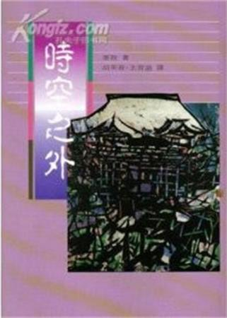
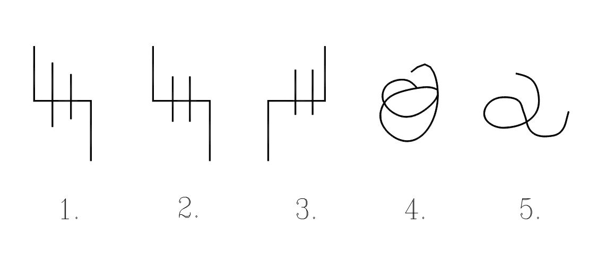

# 赛斯书：时空之外

## 作者简介

珍•罗勃慈女士在纽约州的沙龙托卡泉长大，曾在史基德摩学院读过书。在她从事心灵探索的作品发表之前，她曾在一些知名的杂志上发表过诗篇及短篇小说。她出版的“非小说”类书籍包括：《如何发展 ESP 能力》、《塞斯资料》及这本《时空之外》等等。她目前与她先生住在纽约州的艾米拉市。（译者注：珍•罗勃慈于 1985 年去世，享年 50 余岁）

“译注”本书于 1972 年初版，至 1981 年已再版 20 次，是美国“非小说”类的畅销书籍。本书原名：《The Eternal Validity of the Soul》

## 本书简介

珍•罗勃慈

这本书是一个叫“赛斯”的“人”写的，他自称他自己是一个以能量为构成单位的个体，已不再用肉体示存了。他借用我的身体来说话已超过七年的时间，我们一星期开两次课。

在 1963 年 9 月的某一天，当我正在写诗的时候，忽然经历了我第一次的心灵经验。当时我的意识离开了身体，而我的心里充满了一些对当时的我而言可以说是惊讶及新奇的观念。待我清醒时，我发现我的手自动在书写，解释我刚得来的概念。所写的东西居然还有一个标题——“物质宇宙是以意念架构而成的”。

有了那次经验之后，我开始研究探索心灵的活动，并且打算写一本有关这方面的书。于是我和我先生——罗，在 1963 年底开始实验碟仙（OujiaBoard），试了几次之后，一个自称“赛斯”的“人”开始向我们传达讯息。

罗和我对心灵现象都没有什么认识，所以在开始碟仙回答的时候，我一直认定答案来自我们自己的潜意识。不久之后，我觉得在赛斯回答问题前，我心中就出现了答案，而且有将答案大声说出来的冲动。在不到一个月之内，我开始进入出神状态，替赛斯说起话来。

这些讯息似乎是由前次经历“意念架构”后开始的，后来赛斯说是我自己经验的扩展，使得他开始跟我有成功的接触。从那以后，赛斯继续供给的资料，到现在累计超过了六千页打满了字的纸，我们称之为“赛斯资料”，其中谈的题目包括物质、时间、实相、“神”的观念、“或然的宇宙”、健康及转世等等。从一开始，这些资料就引起了我们的兴趣，也就因此使我们一直继续下来。

我这方面的第一本书出版之后（译注：即时报文化已翻译出版的《灵界的讯息——赛斯资料》，原名 Seth Material），各地寄来请求赛斯帮助的信很多，于是我们给那些最需要帮助的人开了课。虽然有些住在远地的人无法参加，但是赛斯的建议却帮助他们良多，而且他用信件回答有关个人背景的资料全都正确无误。

赛斯上课总是罗做笔记，他用自己发明的速写方法笔记后，再打字打出来，收集成为我们的赛斯资料。罗的详细笔记生动地记下了每一课的细节，我非常感激他真诚的支持和鼓励。

和赛斯的接触在我认为等于是对“宇宙”做了六百多次的专访——不过罗从来不用这种话来解释我们的情形。这些接触全都在我们灯火通明的客厅里举行，但是如果我们用更深奥一点的话来说，这些接触其实是发生在人类心中没有空间的范畴之中。

我并不是暗示大家我们已经获得了宇宙的真理，也并不希望你们以为我们已经接触了无误的宇宙奥秘。我只知道每一个人都能经由“悟”的阶段而得到一些内心真实面的浮光掠影，整个宇宙在向我们诉说的也就是这个。对我们而言，赛斯的课程正是这种结构下的产物。

在 1970 年出版的“赛斯资料”中，我曾解释这些事情，并且摘录赛斯的话来表明赛斯的看法；我也叙述了我们与心理学家及超心灵专家的接触——在当时我们想了解自己的这些经历是怎么回事？在日常生活中这些事件又应该摆在何种地位？我也说出我们曾进行过的测验以求证赛斯千里眼的能力。总之，对我们而言，赛斯带给我们多彩多姿的生活与观念。

赛斯资料愈来愈多，而想从中抽出一小部分来解释任何一个题目都不是容易做到的事，所以在“赛斯资料”那本书中有许多问题未能解释清楚，也还有许多题材没有讨论到。好在在那本书完稿了两个礼拜后，赛斯给了我们这本书的大纲，他说他要自述一本书，使他可以用他自己的方式来表达他的思想。

赛斯一向称呼我为“鲁柏”，称呼罗为“约瑟”，他说这两个名字代表的是我们的整体，有别于我们目前的肉身。以下就是他从 1970 年 1 月 9 日第五百一十部分课开始自述的内容大纲——

◇　◇　◇　◇

“我打算开始自述一些资料，请你们多加包涵！我现在告诉你们一些我这本书的内容。在书里我先要向读者解释它是如何进行的，某种安排是必要的，因为这样我才能借用鲁柏的口把我自己的观念用话表达出来。”

“我不具肉身，但是我却在写这本书：在第一章中我会来解释如何写及为什么要写？”

（“罗注”现在珍说话的速度相当慢，她的眼睛常常闭起来，话中常做停顿，有时停得相当长。）

“第二章将叙述我目前的情形、我的特性及我的同伴；所谓的同伴指的是其他与我接触的“人”。”

“再下一章我将描述一下我的工作及其他我所注意到的空间——在我进入你们的空间的同时，我也进入其他的空间，这是我的“愿”。”

“下一章将谈一谈“我的过去”——这是你们的说法，以及我曾经“当过”的人。我在此再提醒你们：事实上没有过去、现在或未来的存在，甚至我用“过去的经历”这样的说法时也不代表就有过去、现在和未来的存在。这些大概要花两章来解释。”

“再下来我想谈谈我们相遇的情形——约瑟、鲁柏及我自己——当然是由我的观点来说！早在你们了解心灵现象之前，我就曾与鲁柏的内在知觉接触过。”

“再下一章将谈到人在死亡时的经历及其他相关的事情，我会以我自己多次的死亡为例。”

“再下一章讲述死后之生及其他相关事情。这两章都会讲到与死亡有关的转世，并解释最后一次转世的情形。”

“再下一章讨论人与人之间的爱与亲戚关系。有些成功的保持了良好关系，有些则不幸失败，失败对下一世会有什么影响？”

“下一章谈谈我及其他像我一样的“人”如何看你们的物质空间？这一章里会提到许多有趣的观点，因为人们除了造就了你们所知的物质世界之外，你们目前的思想、欲望及情感也在其他空间造成了相当实质的环境。”

“再下一章讲述梦的永恒性，它是通往其他空间的门户，也是内我探究其他空间经验及其他层次空间的交通孔道。”

“再下一章继续深入前一章的题目。我自己以老师及引导人的面目进入他人梦中的情形。”

“再下一章谈论各种程度层次空间——不论是否具形体——的基本交通方法，并且探究人类能了解的基本交通方式，我将指出内在交通的方法是独立于肉体感官之外的，肉体之感觉不过是内在知觉的延伸而已。”

“我会告诉读者如何去正视他所见到的事物，如何正听他所听见的声音，以及其中的道理。我希望由书中读者能明白他并非只存在于肉身，也希望我能给读者一些证实我的理论的方法。”

“下一章将牵涉到我资料中所说的“金字塔形态”，以及我与“赛斯第二”的关系，他是比我更进化、更具有广阔意识范围的“人”。”

“我要告诉读者的是：‘基本上来说，你和我一样，不是只有肉体而已。当我告诉你我的本体是什么的时候，我也就是在说你自己的本体是什么。’”

“我将会用一章专论世界上的宗教，指出这些宗教中扭曲事实及其中真理的所在。我也会谈谈三位一体的基督、你们所不知道的人类、以及他们已经消失的宗教——这些人在地球出生之“前”，曾住在同一空间的星球上，由于他们自己的错误，他们毁灭了自己的星球，并且在地球发展到适合的时候，再转世生于此。他们对过去的记忆是你们现在所知宗教的根本起源。”

“有一章会谈到‘或然的神’与‘或然的系统’。”

“有一章会专门回答问题。”

“最后一章我会要求读者闭上眼睛，体会一下我所存在的世界，并且了解他自己的内在世界。在这一章中，我会教导一些方法，我会请读者去用他自己的“内在感官”，用他自己的角度来看看我。”

“我的讯息全部依赖鲁柏来传递，为了维护这些资料的完整，我请读者认清我不是鲁柏，是另外一个“人”，由此读者就能明白与其他空间的“人”通讯是可能的，他自己也可由此展开非属肉体的认知。”

“这便是本书之大纲，我只大略的描绘我想在书里说的内容，我不在此仔细说明的原因在于我不想让鲁柏预知内容。我也将说明这种超越通讯方式的困难之处，因为它必须通过多重空间。我将对我自己及其他我所知的世界加以描述。”

“我没有提到的空间并不表示该空间不存在。我将会在课中口述这本书的内容。”

“这本书的书名是（笑着说）‘赛斯自述 Seth Speak——灵魂不灭（时空之外）’。”

“我用‘灵魂’二字是因为这两个字能使读者立即明了我所说的不是世俗的事物。我建议约瑟你换支较好的笔来记录。”

◇　◇　◇　◇

正因为我清楚写书相当费事，所以当赛斯说他要写书时，我的态度特别谨慎，虽然我完全相信他办得到，但是我心中不免嘀咕：“赛斯给的资料固然了不起，但是赛斯自己知道怎么写书吗？安排内容也不是容易的事，而且他知道怎么对广大的读者说话吗？”

罗一直叫我不要担心，朋友及学生对于我的忧虑觉得很惊讶，但是我却一直想——除了我之外，没有人担心——赛斯到底能不能够完成这本书呢？

赛斯从第 511 课开始口述这本书，时间是 1970 年 1 月 21 日；在第 591 课时完成这本书，时间是 1971 年 8 月 11 日。我们在这些课中并不完全用在写书上，有些课中谈到个人的事情，有些课中帮助那些需要帮助的人，还有一些回答与本书无关的哲学问题。除此之外，我还去度过几次假，可是赛斯总在这些“罢工”之后，正确的接下去口述本书。

在他写书的期间，我自己进行自己的书，一天写四个小时，照常指导每星期的 ESP（超感觉）课，并且还要抽时间看《赛斯资料》出版后堆积如山的信件，除此之外，我还开始每周一次教人如何写作。

出于好奇心的驱使，赛斯书刚开始的几章我还看看，后来便搁下了。偶尔罗会告诉我他认为学生们会感兴趣的几段内容，除了这些之外，我更不管书进行的如何，放心的让赛斯自己去写。一般来说，我根本不把心思放在他的作品上，几个月才看一次他的书稿。

书完成后一口气看完比较过瘾，虽然每一个字都是出自我口中，而且我花了那么多个晚上进入出神状态才制造出这本书来，可是它对我而言却是一本全新的书，这种情形在身为作者的角度来看，实在非常奇特，我自己写书时都是自己安排资料内容，熟知每一个细节，像只孵蛋的母鸡一样呵护着自己的作品。

由我自己写作的经验，我熟知把抽象感觉转化为具体文字的处理过程，尤其在写诗的时候。赛斯的书可说是意识外高速档下的产物。我难免会把自己的创作与我进入出神状态时所制造出的赛斯书相比较一番，看看为什么赛斯的书是他的，而不是我的。如果它们来自同一个人的无意识状态，又为什么会有这么不同的主观感觉呢？

我们之间的相异之处由一开始就非常明显。当我在写诗，灵感来的时候，我会很兴奋，很“来电”，而且有新发现似的不吐不快。灵感似乎来自远方，是忽然间就出现的，接着便有一连串创意涌出。

我的警觉性很高，但也相当开放，愿意接受新知。我的心智似乎在自信与被动间保持着弹性。在写诗的时候，我只专注在诗与观念上，所以我全心的投入表达出我心中抽象的观念，这使得我感觉那些诗是我作的。

这种感觉是从小时候就有的，我觉得这样才能证明我自己的存在。如果没有这种感觉来做事，我就会觉得迷惑与悲伤。像现在我在写这篇简介的时候就有这种感觉，是“我”写的。

在赛斯的这本书中我就找不到这种感觉，也从来不会体会到创作的过程，我像其他课一样进入出神状态，赛斯借我的口叙述出他自己的书，由于“我”距离这本书太远，所以我不能称它为我的作品，而是一本赛斯自己的书。我很感激他写出这本好书。

我发现只有我自己的作品才能给与我需要的那种创作满足感，那种化抽象为具体的追逐游戏是很迷人的。因为赛斯在工作，我也不好偷懒；如果我不继续自己的作品，我会觉得自己的创作力减退。

当然任何人可以说写这本赛斯书的过程离我平时的写作方式太远，所以最后的产品看起来似乎是不同的人写的。在此我只能把自己的感觉说出来，并且强调赛斯的书与他六千页赛斯资料的手稿并没有抢走我自己的创作能力或责任。如果两者来自相同的无意识范畴，那么似乎我应该技穷才是。

除此之外，我知道我是赛斯写书的必要媒介，他需要我的用字能力，甚至，我想他也需要我心灵观察事物的角度，当然我对于写作的训练能帮助他把他的资料翻译成具体之文字，纵使这本书是我在意识离体的状态下完成的，他依然在利用我的资料。另外，我想某些个性也很重要，举例来说，我猜我能灵活的转移意识注意力焦点便很重要。

赛斯在第四章中做过明白的表示，他说：“当我写这本书的时候，它的内容在某种程度下是经由这位在出神状态下女士的内在感官所指引，这是高度正确的内在感官经过训练得来的结果。如果她把全副注意力放在物质环境里，她就无法由我这儿接收到任何讯息，也就无法转译成文字了。”

如果我们只把赛斯的书看做是无意识状态下的产品，那么我们会很惊讶的发现赛斯书中明确的显示出有组织、有辨别能力、也有推理能力，这些能力很明显的并非仅具有意识的我们才有的。它也同时说明了内我的活动范围。我想我无法在我的作品中找到与赛斯书相当的东西，充其量我不过在一些诗或散文中有过几句惊人之语，但是却无法像赛斯所呈现的那么具有一贯性、连续性及那么有组织。

除此而外，我在课中有过一些独特的经验，这些似乎弥补了我在创作过程中无感觉的缺憾。通常我都非常欣赏赛斯的幽默与感受到他那份能量，也相当喜欢丰富感情围绕的感觉以及在另外一个奇特的层次与赛斯接触。虽然有时他不是针对我，而是对其他人，我却能清晰的感觉到他的心情与活力，我可以感觉到这些能量透过我而出。

在罗的注解上可以发现我常在替赛斯说话时有其他的经历，举例来说：有时我看见内在的影像，这些影像也许表达的是赛斯正在说的话，于是我由两条不同的孔道接收到讯息；但也可能完全与口述无关。在课中我曾有过几次“出体”的经验，看见几千里以外发生的事情。

这本书是赛斯以他自己的方式来写的，他说明了人是具有多重空间性的，我们在瞬间同时经历许多空间层次，灵魂或内我并不是我们之外的东西，而是我们赖以生存的中心。他强调不需要四访明师求取真理，而应该内求。所以意识所蕴藏着的知识、宇宙的奥秘都不是秘密，它们就如同空气之对于人一样自然，只要诚实向内心探索，就可以获得。

我觉得赛斯写了一部经典之作。如果把他当作一个“人”的话，他是个聪明的哲学家与心理学家，他深切了解人性，知道人性中的自傲与悲哀。

我个人对于这本经过我写出来的书非常好奇，它不像我自己写的书，我自己写的书会时时检查，不断组织、批评每一个小节，依照自己的创意及领悟来控制全场。可是这本书也不是像灵感来了，诗就出来了那样。有时有的作家会说某本书是“就这样”写出来的，我完全了解他的意思。但是这本情形不同，它来自一个特定的源头，具有作者特殊的个人色彩，这种格调不是我所具有的。

整个创作由赛斯这个“人”写了这本书开始，赛斯在创作这本书时也创造了他自己。如果情形果真如此，那么这正是一个多重空间孕育出的艺术品——在几乎完全无意识情况下所制造出来的艺术品，连作者自己都叹为观止。

这样的假设真有趣！事实上，赛斯在他的书中也提到了多重空间艺术，不过赛斯除了写书之外还有其他多方面的兴趣；写作、教书及帮助他人。他的幽默感相当特殊，与我的大不相同！他颇为精明，有时态度相当世故；与人接触时，他知道如何将复杂的理论用简单的语句解释出来，更重要的是：他能把观念与日常生活连接在一起。

赛斯也时常在我学生的梦中出现，给他们指导，教他们如何使用他们的能力或完成一些目标。几乎我所有的学生都常常有梦中上课的情形，赛斯向他们全体说话，并且着手一些梦的实验。有时他们看到他以罗给他画的形象出现，也有时依然透过我的形象说话，就如同平常上课的情形。有时我在梦到上赛斯课时会醒过来好几次，醒时赛斯的话仍在我耳边萦回。

当然，学生梦见赛斯或者梦见我并不奇怪，但是赛斯却在他们心目中建立了独特的地位，并且甚至在他们梦中成为启示的来源。换句话说，赛斯除了继续发表他的资料及写这本书之外，他还进入了许多人的心中。

任何人像赛斯这样能在七年内做到这么多都可称作了不起了，何况不具人体的赛斯呢？这真是叫人吃惊的事！如果把这项成果归因于无意识的虚构想象似乎太过份了。（在同样的时间里，我出版了两本书，完成了另一本，并开始写第四本。我提出这点是要告诉各位：赛斯并没有吸取我的创作力。）

罗与我不认为赛斯是“鬼”，我们不喜欢那个字带来的联想。事实上我们不喜欢的正是传统对“鬼”的说法，认为它是死后受制的一种东西。你可以说赛斯是一个“无意识”的戏剧化示现，或是一个独立的“人”。我个人不认为这两种称谓相互抵触。赛斯扮演的是一个真实的角色，以我们能了解的方式来解释他那比我们物质空间远为广阔的空间实相。这是我目前的看法。

在此我想指出“无意识”是个很不恰当的字眼，我觉得它应该是指“本来不受束缚的心灵系统”，是错综复杂的意识之源头，与所有人有关，而个人的自我意识也由此而产生，同时个人的意识又助长它的形成。这个源头包含了过去、现在与未来的资料。只有在经历时间中的自我才会认为时间确实存在。同时我相信这个不受束缚的系统包含了我们人身以外的他种意识。

由我自己“出体”的经验，我相信意识不是依肉体而生的，当然肉体是我们目前示存的形式，但是我却不认为所有的意识都是这种形态。我认为只有“我执”极重的人才会认为真实状态只存在他的有限知觉及认知范围之内。

我接受赛斯在本书中所说的人具有多重空间性的观念，因为我自己本身的经验及我学生的印证让我如此相信。我也认为意识存在于一种“开放”的系统中，在那无限的根源中存在着一个独立的赛斯，他以与人类不同的形式存在。

至于那是一种怎么样的形式？老实说我不知道。我认为自己有一次为整理自己的想法及使学生明白我的观念，为 ESP 课写下的一小段话是最接近事实的描述。由于罗说赛斯在这本书中提到“说法者”一词，是指不断向人宣扬解释内在知识的人，以使人类不至忘记这种知识，这个说法给了我灵感使我写下这段话，指出我认为赛斯及其他像他的“人”是在怎么样的架构下存在，附在后面给各位参考：

◇　◇　◇　◇

“我们不明所以的相聚了。我们都是由元素、化学物质及原子组成的，但是我们却各有名称。我们组织自己的内在与外在，凝结形成了骨与肉。我们不明白自己由什么来源来。”

“也许我们一直藏在一个创造或然的范围里伺机而动；四散则茫然无知——在十三世纪的风雨中横扫过欧洲——在山区——在其他时空。如尘似烟，我们吹过了希腊之门。也许我们已在意识与无意识间转了百万次圈子，只追寻我们了解的创造与完美。”

“现在出现了像赛斯这样的“人”，他们没有形体，你可知道：他们其实就是我们，只是他已‘悟’。他们始终未忘，而我们却已遗忘。他们或许经由加速意识发现了其他的存在与其他空间之实相，而我们却不知道。”

“所以我们给予这些无以名之的“人”名字，而事实上连我们自己也是无名的。我们倾听，但是总是想把他们的讯息转为我们能了解的观念，把那些讯息加上陈腐的外衣。他们就在我们四周，在风里，在树梢；有形的，无形的，以各种方式存在——那些‘说法者’！”

“由这些声音、这些领悟、这些灵光及讯息，宇宙在向我们诉说，向我们每一个人诉说。你听到了，我也听到了。请你倾听你自己的声音，不要把你听到的讯息扭曲翻译成八股老套。”

“在课堂上，我认为我们的确在回应这些讯息，有时不免幼稚，把它们诠释为个人的戏剧——但是这些戏剧却在我们心中激起无法具体化为文字的意义。”

“也许赛斯将我们领出了凡俗的范围，进入一个本来就是属于我们的境界——对我们不论精神还是肉体都很重要。他也许是我们自我结合的声音，述说者：‘当你具有肉体时，不要忘了没有形体的情形，用无名的自由能力，发出不需要唇舌就能发出的声音，显示出不需要肉体就能表达的创造力。我们只是你们的内在面。’”

◇　◇　◇　◇

不论我对赛斯或者宇宙的本质有什么意见，这是一本独立的书，它里面有赛斯的影子，就像任何一本书中都找得到作者的影子是一样的。书中的观念值得回味，但请读者万勿因其来源而看轻了它，或者因其来源而句句奉为金科玉律。

当我刚开始这些课时，我曾想以自己的名义发表，认为也许这么做读者会易于接受它的价值，而不必长篇解释它的来龙去脉，因而引起读者无数疑问。不过这样做实在不公平，因为“赛斯资料”之所以产生正是他想传达的讯息的一部分，也强调了讯息的本身。

我们完全照着赛斯的口述，一字也无增减。他的确很清楚说话用的字与写文章不同。他的课比较随便，常常有问答的情形发生，但是这本书的内容则较像在我们私人课中，赛斯传述讯息的味道，比较着重内容，用字也更正式。

赛斯所用句子的结构也没有经过变更，只有有时太长的一句被改成较短的两句。大部分标点也是赛斯口述的，他说用连号、冒号、括弧时，我们便照用，但是在可能会让读者糊涂时才删掉。

赛斯的句子通常很长，尤其是在叙述事情的时候，但是他从来不会在句中或意思上弄混。如果我们有时因为句子太长而产生一点小困难时，我们总是对照原来课上的记录，看看是不是在抄录时打错了字。（我特别注意这点是因为我曾打算把一封信直接录进录音机中，但是开始一两句之后，我便记不清我说了什么？或者要怎么表达？而告失败。）

校对的工作是以罗的笔记为准，因为他的记录比较清楚。有时候我们附注一些不属于本书的资料，只因内容相关的原故。此外罗还加入一些侧面描述，使读者更易了解赛斯。由罗的笔记，我们可能看出赛斯在书完成之后立刻开始口述附录，好笑的是我还不知道赛斯已经开始了附录，有好几天还在想谁来写附录？如果是赛斯要写，他打算什么时候开始呢？

在这里再加注一件有趣的事：我自己的书通常起三次稿，还常常不满意；而这本书是口述一次就完稿。赛斯比我要忠于遵守大纲，不过他常常离题，可是这是作者的权利啊！

1971 年 9 月 27 日

珍•罗勃慈

于纽约艾米拉市 Elmira

## 《时空之外》简介（译者序）

这是一本极有价值的书，任何人不管他的学术背景是什么，人生信仰如何，全都能在此书中找到与己身所学、所信相呼应之处。这是一本兼哲学、物理学、精神学、心理学、禅学、宗教学、玄学等等无所不包的书，它的价值不仅止于学科的探讨，最重要的，它揭示了人类生命与心灵之谜。

作者原原本本以一个非人类聪明才智所能立刻揣摸的角度，透过了他的代言人，明明白白的告诉我们人人都在问的问题－－“我是谁？”、“为什么我是我，不是别人？”、“为什么我会出生在此时、此地？”、“人生有什么目的？”、“生、死各是怎么一回事？”、“死了以后，还有没有我？”、“人与人之间的缘份是怎么一回事？”、“梦是什么？”、“人为什么要睡觉，睡觉时人又都在干些什么？”、“人生际遇是怎么回事？”、“在切身的喜怒哀乐中，我扮演的是什么角色？”、“我不喜爱的际遇能不能改？”、“有没有天堂、地狱？”、“鬼神是什么？”……诸如此类，种种几乎每个人都会问得到的问题，本书都提出了解答。本书只有一个目的：那就是帮助人去了解自己、肯定自己、进而开扩自我，做进一步的创造。

读者也许不免好奇，想要知道这个作者究竟是何许人？他凭什么会知道那么多？他的理论根据是什么？我们又凭什么要相信他的话？

好！话说从头。本书的作者名叫“赛斯”，至少他称自己为赛斯，是一个“纯由能量构成，已经不再以肉体显示存在”的“人”，所有他说的话都透过一位名叫珍•罗勃慈的女士做代言人。珍的先生罗，以他独门的速记方式记录，再经过整理誊写而问世，其中没有任何一个字的增减，完全是赛斯透过珍所说的话。

珍•罗勃慈（Jane Roberts）女士，美国人，已于 1985 年去年，享年 50 余岁，她毕业于美国一闻名学院，是一位诗人及小说作家，除为赛斯代言出版多部赛斯书外，另曾出版多部创作诗集及小说。珍的先生罗•拔茨先生（Robert Butts）是一知名画家，较珍年长十余岁，除以绘画闻名之外，并以记录、整理、注译赛斯资料著称。

本书缘起于一九六三年九月三日的晚上，当晚珍正准备写作，突然有了一种极端强烈的“灵感”，促使她写下了一长篇文章。当她写这篇文章的时候，已像是在另一个时空旅行，直到意识回到肉身，才知道自己正在狂速且潦草的写下了一大堆东西，这堆东西居然还是一篇有条有理的文章，并且还有个标题，题目是“物质宇宙是以『意念』为架构而形成的”。这件事引起她强烈的好奇心，并导致不久后在偶然机会发现一本有关 ESP（超感觉能力）的书，由于当时她正在找题材写一本新书，于是灵机一动，心想何不自己也来写一本有关这方面的著作，但是要想写这么一本书，必须要真有这方面的知识与经历才行，于是她和先生就决心做一番亲身实验。首先，他们买了一个类似于中国碟仙的灵验盘（Ouija Board），透过了洋碟仙，他们开始与另一个世界的某些人物有了接触。开始他们并不相信这回事，只以为是自己潜意识作用的结果，但是后来有一个自称“赛斯”人物，开始持续登场了，其所提出的论点与答案简直是非同小可，绝非一般陈腔滥调、泛泛之论。在与赛斯作了几次接触以后，珍发现每当罗发问而碟仙尚未把答案拼兜出来之前，她心中已有了答案，并有一种脱口而出的冲动。最后，她终于压抑不住自己的冲动而把话脱口说了出来，几次之后，他们放下了灵验盘而由珍替赛斯代言了起来。

自此之后，赛斯为他们开讲了五百多次，这种情形一直持续到 1970 年 1 月 19 日，当天晚上赛斯宣布他要自己著一本书，于是从那天起，这本书的内容即从珍的口中源源而出，所有细节，包括标点符号，全由赛斯口述，而由罗记录，其中没有一字一句的增删修改。读者诸君今天所见到的即是本书原文极忠实而尽可能通顺的全译本。在这本书之后，不计珍本人的著作，光是赛斯口述的赛斯书即有十余本之多。

赛斯是一个经历了无数次的生命，尝遍了人生百态，对人情世故、宇宙百态、天地奥妙无一不通，他深切了解人性的需求与期盼，也完全知道生命的由来与变化，最可贵的是他在这本书中处处为每一个人肯定了自我的价值，完全没有半点高高在上、强行说教的味道。他明明白白的为我们解释了很多悬疑千古的大谜题。比如说他以“调和点”来解释中国人所说的“风水地理”，以“自由意识”来解释“命运”与“因果”，以“阿尔法脑波状态”来解释“意识层次的变化”，以“或然的世界”来解释“情绪与心灵的起伏”，以历史角度来说明基督教的起源，以“现身说法”来说明转世轮回。对“进化论”，他说：“进化论的立论完全根据你观察的时间范围及观察对象，以及你决定观察整出剧中的哪一个部份而定……这个理论并不成立，因为它只适用于非常有限的论点中。”；对“苦难”，他说苦难是自我设下的挑战，目的是叫人学习如何解决苦难，贫困不见得会使人接近真理，而苦难也不见得会有益于灵魂；对“魔”，他说“魔由心生”，基本上是由一个人的“怨恨”、“恐惧”及“相信有魔的存在”所造出来的；对“神明”，他说“神明”是人造的，是因为人类习于将自己不敢承认而本有的大能向外“投射”与“寄托”的结果，他更说：“你要对你所选择的神明存有一份戒心，因为你和他会有相互强化对方的效果。”此外，赛斯又以“原始无名”与“神”来解释佛教中所说的“佛性”；他以瑞士心理学大师荣格的理论为起步，说明了“男性中的女性面”与“女性中的男性面”所真正代表的意义；以“原子”、“分子”和“意识”之脉动来说明“存在”；以追溯历史的方式来比较今天人类文明的成就……。

总之，这本书非同泛泛，读者只有亲自细读过才能知道译者不是在老王卖瓜。最后，我们只能借用一句“天地一沙鸥”作者李察•巴哈对本书所作的评语－－这是我生平仅见最好的一本书。

本书于 1972 年发行初版，至 1985 年已再版十七次，总发行量超过百万本，属于非小说类的畅销书。译者夫妻二人深受本书感动，只遗憾自己为何不早十五年即认识此书，因此腾挪出营生之外的时间，少眠少休得工作了十八个月，方始将本书译出。译著本书，最大的目的固然是不忍国内读者错失一读如珍在序中所说的：“希望读者不要因为这本书的来历玄奇而看轻此本书，也万万不要仅仅为了本书的玄奇而字字奉为金科玉律。”译者也衷心希望这一系列的书都能很快的被译成中文，国内才学超过我等百倍的才智之士不知有多少，只要有几位肯辛苦几分就是读者大众的福气。我们固然自认为当仁不让得在做这种工作，但用意也是在抛砖引玉，希望能多见几位同道。

## 译者简介

胡英音毕业于台大外文系，翻译著作有《罗桑伦巴蒙难记》、《生命不死》、《神秘的死亡经验》等书。

王育盛毕业于文化学院化工系造纸科，毕生从事于心灵探讨工作。

二人现居美国，胡英音工作于史丹福大学东亚图书馆，王育盛从事北加州旧金山地区房地产投资中介。

通讯地址：

Mr. &Mrs.Y.S. Wong

137 Blake Ave. Santa Clara， Ca 95051

FAX：（048）984-0127

（闲人注：以上联系方式是 30 年前的了，目前两位译者已退休，隐居于上海。）

## 第一部

## 第一章：我不具形体，但是我却在写书

### 第 511 课

1970 年 1 月 21 日 星期三 晚上 9：10

（“罗注”在开始笔记前，让我在这儿说明一下，珍出神替赛斯说话时，她有相当的改变。

（通常珍出神及回来的速度相当快，在课中除了极短的时刻之外，她的双眼通常都不闭上——有时她半睁半闭的或者全开，而眼珠的颜色比平常要幽深。她通常坐在她的摇椅中上课，但是也有时她会站起来走来走去。她在出神状态中抽烟，也喝一点葡萄酒、或者啤酒、或者咖啡。有时出神状态非常深时，她会花上几分钟“才回得来”。差不多每次课后，不论多晚，她都和我一起吃“宵夜”。

（珍在出神中声调、音量和速度都和谈话情况差不多，但是常做程度上的改变，通常都比她平日的声音低沉，音量也较强。偶尔她代赛斯说话的声音的确很大，也非常有力，具有明显男性的声调及强大之活力。不过我们一般的课是蛮安静的。

（赛斯的口音相当独特，有人说他有俄国口音，有人说他有爱尔兰口音、德国口音、荷兰口音、意大利口音，甚至还有人说他有法国口音。有一次赛斯幽默地评论他自己的发音是累世累积的“大杂烩”。珍和我认为口音是个人种族、情感背景不同而引起的问题。

（当珍出神时，另外还有两点特征：一是行动比较僵硬，另一个是她面部肌肉扯动的情形，我相信这是由于新注入能量或混入不同的意识所产生的；有时这种情形相当明显，我立刻可以感到赛斯的出现。

（我认为珍在课中这些改变是由于她接受了我们称为赛斯的部分能量，以及她自己认为转换成男性应有之改变。她转变成赛斯的方式独特，值得叫人注意。不论程度如何，赛斯表现出的是专属他个人的色彩，不论我倾听还是与他交谈，都明显的是另外一个人。

（在这课开始前，珍说她觉得相当紧张，她认为赛斯今晚开始叙述他自己的书。在课前会紧张实在不是寻常的现象。我一直安慰她，叫她别理那么多，就让书自然而然出来好了。）

约瑟，晚安！

（“赛斯晚安”）

我们的朋友鲁柏出场前相当紧张！不过这是可以了解的。

让我们开始第一章吧！（笑着说）鲁柏如果愿意，他可以写简介。（停顿）

你们听过“鬼猎人”一词，我则是个“鬼作家”，不过我不太赞同“鬼”这个名词，虽然你们看不见我的形体。我也不喜欢“精神体”这个称呼，不过如果你们给这个称呼的定义是：没有肉体的“人”，那么我就同意接受这个称呼。

我目前是向一群看不见的听众在说话，不过我却知道我的读者是存在的，所以我要求每一个读者也肯定我的存在。

我是经由这位我相当喜欢的女士协助之下，才能写这本书的。对别人来说也许会觉得奇怪为什么我叫她“鲁柏”？是个男生名字，事实上这是因为我在不同的时空中就早已认得她，在那些时空中她有过不同的名字的。她曾经当过男人，也当过女人，但是她的整体可以用“鲁柏”这个名字来称呼。

名字虽然不重要，只是头衔、象征而已，但是既然你们要用，所以我也只好用了：我的名字叫“赛斯”。由于鲁柏的合作，替我说话，我才能写这本书。在这一生中鲁柏的名字是珍，她的先生罗勃慈先生在珍说话时权充记录，我叫他约瑟。

各位读者也许认为自己只是一种动物，受困于肉体中，受到骨骼、肌肉及皮肤的束缚。如果你相信你的生存就只是这个，那么你便会感觉到毁灭的危机，因为肉体无法常存，青春之美与活力无法保留到老年。如果你为自己的青春、美貌、聪明才干或成就感到扬扬得意，那么你一定也时时刻刻在烦恼，因为你知道这些总有一天会消失。

我写这本书的目的就是要告诉你事实并非如此。基本上来说你和我一样，不仅只存在于肉体中，我曾经经历过的生死次数多得叫我懒得向你说明。不存在的“人”写不出书来，我没有肉体依然存在，你们自然也是如此。

“意识创造了形相”，而不是有了形相之后才有意识。“人”不仅只是物质，因为你专注于日常事物，而无法了解到你另有一部分，那部分的你全然知道自己具有比寻常的“我”高超出甚多的能力。

你们都曾在他种生存的层面中活过，你们内心明白，但是也许目前的“自我”却意识不到。我希望这本书能唤醒每一位读者的内心，给你们最适当的启示。

用你们的时间来说，这本书于 1970 年 1 月底开始动工。鲁柏现在是一位黑发、身材苗条、动作敏捷的女子，她坐在摇椅中替我说话。

（九点三十五分时停了很久）

我的意识焦点准确的集中在鲁柏身上。今晚颇凉。这是我们第一次尝试在出神状态中写一本完整的书。鲁柏在课前有点紧张，因为写书这件事不像平常这位女士替我说话这么简单，其中牵涉到许多必要的操纵控制及心理的调整，我和鲁柏之间建立了一条我称为“心灵之桥”的通道。

我通过鲁柏来说话的情形跟打电话不一样，这是一种心灵的扩张，我们双方都需要将自己投射出去，以达到通讯的目的。我以后会说明这种心灵结构是如何创造的？以及如何保持畅通？因为它就像一条必需保持一尘不染的通路。本书的读者最好先自问你自己是谁，而先不要费心研究我赛斯是何许人，因为如果你不明白自己的本质及意识的内涵是什么，你便不可能知道我是什么。

如果你认定自己的意识被锁在头骨下方的某个地方，并不具自在的能力，甚而你真觉得自己的意识只止于肉体的范畴，那你不但太小看自己，同时还会认为我只不过是个虚幻的什么东西而已，真要说我是子虚乌有的话，我说你才是身处幻境呢！这话说起来一言难尽，此处表过不提。

我老实告诉各位读者（笑着）：我比你们都老，用你们定义的年龄来说，我老的不得了。如果年纪大的作家就可以称之为权威的话，那么我简直可以称得上权威中的权威了。我是一个以“能量”为构成单位的个体，已不再用肉体示存了，正因为如此，我知道一些你们似乎已经遗忘的真理。

我希望提醒你们这些真理。我并不是在对你们自以为是的那一部分说话，而是在就你们目前不知道、或已遗忘、甚至否认的那一部分在说话。在“你”读这本书时，那一部分也同时在读。

我对信神及不信神的人说话，也对认为科学会找到一切解答的人、或者不相信这种看法的人说话。我希望我能给各位自行研究自然本质的线索，那些是你们以前从来没有研究过的。

有几件事我希望诸位弄明白：你们并不为时间所困，你们不是被困在瓶中的苍蝇，瓶中苍蝇的翅膀无用武之地，而你们不然。五官感觉不能带给你们真情实意，因为这些感官会骗人，骗得你们死心塌地地相信这花花世界。在很多情况下梦中的你要比醒着的时候聪明得多，更具创造力，也更有知识。

这些说法也许叫你觉得疑云重重，但是我希望在你看完这本书之后，你会明白此处所说的只不过是将事实平铺直述而已。

我将要告诉你们的话自古以来一直有人在说，每当真理被忘却的时候就有人再来传播。有很多长久以来一直被扭曲的观点我希望能在此澄清。由于知识无法在真空的状况中存在，当我说明各种真相的时候，难免沾染了我个人的色彩，所以我是以我的角度叙述事情的实相，以我的角度叙述我对多重空间的了解。

我这样说并不表示我没有提到的实相就不存在。我在你们的地球形成前便已醒悟，为了要写这本书，也为了和鲁柏交通，我由我的过去世记忆库中综合的抽出我认为适合的个性。像我这样的“人”很多，只不过他们并不把焦点放在物质事物或时间上。以你们的角度来看，我们的存在似乎很不可思议，原因是你们不了解“人”真正具有的潜能，同时你们也已经被你们有限的观念催眠了。

（停了一下，然后幽默的问）你要不要休息一下？

（“好！”

（十点十八分。虽然在通讯时，珍进入深度出神状态，她还是很容易就回来了。当她知道赛斯已经开始写书之后，反倒放下了心。她完全不记得赛斯说了什么。“他很聪明”，珍笑着说：“可是还挺诈的”。

（赛斯十点三十四分开始口述）

我是一个教师，但是我本身却不是一个具有高度文学修养的人。我为你们带来以下的讯息：你们的世界是你们自己创造的，你们具有几乎是宇宙间最值得敬畏的天赋：那就是你们具有“将思想向外投射变成物质形态的能力”。

这项天赋带来了责任。但是你们许多人都只晓得庆贺自己的成功，却在失败时怪上帝、怪命运和怪社会。几乎以相同的态度，人类有一种倾向，习惯将自己的罪与错向一个天父般的神投诉，这个天父一定被这么多诉怨烦透了！

事实上是你们自己创造了自己的物质环境，你们共同创造了你们在地球生命中的光明面与黑暗面。一直要到你们明了你们自己便是创世者之后，你们才会承担起这个创造下带来的责任。你们不应该再为世上的苦难而责怪魔鬼，你们应该已经够成熟，知道魔鬼只不过是你们自己心灵的投射而已，但是，你们远没有足够的智慧去学习建设性地运用你们的创造力。

我大部分的读者都知道“崇尚肌肉”是什么意思，由此你们这个种族变成了“崇尚自我”，造成精神僵硬，拒绝承认，甚至扭曲自己灵悟的那一部分。

（十点四十五分暂停）

时候不早了，我的两位朋友明儿还要早起，鲁柏正在写两本书，他该早点睡。在我结束这一节课前，我请各位想象一下我们的布局。鲁柏不是常告诉我作家要注意而布局吗？

我经由鲁柏每星期说两次话，星期一和星期三，在这个大客厅，灯火总是通明。今晚我用鲁柏的眼睛向窗外看到一幅赏心悦目的冬景。

物质世界总叫我精神舒爽。经由鲁柏的合作，我写这本书的时候，我明白我欣赏它独特的美景是对的。对了，这儿还有一个角色要提：那只猫——威立，是只可爱的怪物，现在睡着了。

（威立睡着了，它睡在老式电视机上打鼾，威立刚好在她头后面。）

动物意识的本质是个非常有趣的题目，我们以后再来谈。那只猫知道我的出现，并且有几次对我相当注意。在这本书中希望能向读者明示：所有意识都永远在互相作用，不论种别，意识与意识间总能超越障阻，互相交通。等我们说到这个题目时，我们再用威立当例子来解释。

你们考虑一下是要休息一会儿呢？还是要结束这一课？

（“好！我想我们结束吧！”）

我深深祝福两位。

（“谢谢！今天的内容非常有意思。”）

（停了一下，笑着说）我希望你喜欢。

（“赛斯晚安。”

（晚上十一点珍很快的回神过来。整节课她的节奏都很好。她说赛斯开始写书了，她很高兴，“以前我一想到赛斯要写就怕，不想让他写。”

（珍对现在就读赛斯写的书有点迟疑，我们可以说她是在全书完成之后才读的。最后我们决定目前读不读都没有关系，不过这一节课的内容，她在我用打字机打出来之后读过。）

### 第 512 课

1970 年 1 月 27 日 星期二 晚上 9：20

（原来该在星期一举行的课延到今天。

（珍的节奏缓慢，进行中常有长时间的停顿，我在资料中标明了部分停顿处。她的声音如常，眼睛时常张开。）

晚安！

（“赛斯晚安”）

现在我们回到书稿上。

上节我们提到，它们的确也有意识，只是其范围比人类的要小，没有人的那么自由，但是在某些应用的特性上却并不像人类一样自阻其意识潜能之发展。

意识是认知多重空间世界的途径，但是你们所知道的意识却有限于某些特定的角度之内。肉体的五官使你们认知三度空间的世界，但是同时它们的特质却又抑制了你们对其他同样生动空间的认知。你们大部分人只对你们的肉体部分认同，你们并不会认为某部分身体是你们的全部，而忽略其他部分，可是当你们认为“自我”便是全部的“我”时，你们正在做相同的事情（笑着说）——认“部分”为“整体”。

我告诉各位：你不是一个由化合物及其他元素组成的骨肉躯壳而已；我也告诉各位：意识不是化合物作用时意外的产物。

你不仅仅是物质的一种，你的意识也不会像阵轻烟似的消散得无影无踪。相反的，你在一个极深的无意识层次中，以极挑剔、明白的态度，由无意识的深层知识里创造了你的肉体，这种说法并非象征似的说明，而是事实。

现在由于你所谓的意识心灵不知道有这种活动，你便不与你的内我认同；你宁可向看电视、烧饭、工作的那部分认同，那部分是你以为你所“知道”的。事实上，另外那个看起来似乎是属于没有意识的部分更具真知。靠着它顺利的运转，你的肉体才能生存下去。

其实这部分是有知觉的，它什么都明白，也很警觉。各位太把焦点集中在物质世间，既不去听它的声音，也完全不了解它就是你那“认物质为一切的自我”的力量来源。

我称这个看似没有意识的部分为“内我”，因为它操纵内在的活动。它把经由其他内在孔道，而非由肉体感官所得来的资料连贯起来，它是具真知而存在于三度空间之外的，所以它带有你们每一个人前生的记忆。它探讨内在的无穷境界，一切的因缘世界皆源自这个内在空间。

（长久停顿）

经由这些内在孔道，各式各样的消息借以向我传送。在你一投足、一眨眼、甚至读书本上的一字一句前，你的内在已进行了许多难以置信的活动。这一部分的你本来具有千里眼、顺风耳的能力，它会在灾难发生之前就预先警告你，而不管你的意识接不接受这些讯息。所有内在的沟通在话说出之前早已进行完毕。

（平静地说）我暂停一下，等一下让你休息。

（“我还好。”）

“外我”和“内我”一起行动：前者使你在你熟知的世界中就会生活；后者是肉体生命的维持资源，能给予你物质生存之外的纤细内在知觉感受。

但是你还有另外一个部分——一个生存的中心，“内我”与“外我”皆由它而来，你之所以生在这个时间、这个地点，也是由它来决定，它是“你”这个身份的原心，而“你”只是它所释出的心灵种子之一，你是它的一部分。

也许你会问我心理学家所谓的潜意识应该放在什么地方？我告诉各位可以想象“外我”与“内我”之间交会处便是。不过你必须明了“我”并无真正的界限，我们这么说明只是方便各位清楚明白基本的概念而已。

各位大多只对“意识自我”认同，所以我在第一章便讨论这个问题，在本书中会经常用到这些名词，所以尽早向各位说明人的确具有多重空间性的事实。

除非你将自己从“生命即是此地此刻”的观念中解放出来，你就无法了解你自己，更不能接受我的存在。在本书中我将要提出的一些物质空间的观念也许会叫你大为吃惊，不过请别忘记我是从一个完全不同的角度在看事情。

（珍在此替赛斯说话时常停顿，她的眼睛也常常闭上。）

目前你完全把焦点放在三度空间里面，也许有时会想三度空间之外究竟有没有东西？在下正是在外之“人”，刹那间回到我所知之甚详及眷爱的人间，不过我不是此间“居民”，虽然我有心灵的“护照”，但是我在解说翻译及进入之际仍有诸多不便。

我听说许多人在纽约市住了多年，连帝国大厦都没去过，而许多外国人却对那地方很熟；所以我也可以向你们这些目前“住在”肉体中的人指出存在于你们自己实相系统中，但被你们所忽略的神奇与美妙的心灵与心理结构。老实说我希望做到的尚不止于此，我希望能带领各位穿过各种你能去的深浅不同的世界，也希望能引导各位做一次探讨你自己心灵结构的旅行——广开你依然陌生的意识层面，借以解释“人”的多重空间面貌，也同时让每位读者一窥自己广大本体的浮光掠影。

（平静地说）你们可以休息一会儿。

（十点零七分。珍很快回神过来。她说她不知道她自己说话的速度是快是慢，也不知道时间过了多久。她说她感觉赛斯给的资讯经过相当的浓缩，直接对着读者尽他所能的说得清楚与明白。

（珍现在才告诉我这一节课前她便觉得很累。十点二十九分仍旧疲劳的进入出神状态。）

你们所知道的自我，说起来只是整体的一个片段而已。不过所有这种片段并不像一珠子串在一起一样有先后，它们更像洋葱或是橘瓣，来自同一个生命之源，进入不同层次的空间。

我并非将“人”比作橘子或洋葱，我只是想强调这些东西由内而外的生长就如同“片段”之于“整体”。你们只观察到事物的外貌，你们的肉体感官允许你们认知外在之事物，然后对之反应，但是肉体感官在某种程度下也同时迫使你只以这些态度接受并认知这个世界；这一来，在物与形之内的生命力就变得不那么显示了。

举个例子来说，我能告诉各位即使在铁钉之内亦有意识之存在，但是我想很少读者会在一听到这句话之后便认真地向离他最近、钉在木头中的铁钉说早安或午安。

不论如何，铁钉中的原子与分子的确具有它们自己的那种意识；这本书的纸张中的原子与分子也在它们自己的层次之中知道它们自己。任何存在的东西都自有意识——石块、矿物、植物、动物、甚至空气皆然。所以你们是身在一个始终“充满生气”的处境中，万事万物皆有自知之能。你们的肉体也是靠有意识的细胞构成，它们各自具有对它们本身的了解，并且在彼此共同同意下合作构成你们的身体和组织。

所以我要说没有死亡这回事。没有一样东西不是由意识形成的，而每一意识，不论其程度，都为自己的感觉与创造力欢欣。除非你了解这个事情，否则你无法了解你是什么。

为了方便起见，你关闭了你与在你血肉之内那些小东西之间的大量通迅。就算你目前是一个血肉之躯的单位，这血肉之躯在某种程度上来说也只是他种意识的部分。“我”是无限的，“我”的潜能也是无限的，不过由于你自己的无知，你给自己设立了虚构的限制，譬如说：由于你只向“外我”认同，而自己切断了自己本来具足的部分能力。你尽可否认我说的话，但是你无法改变这个事实。不管你再怎么像驼鸟一样埋首于三度空间的沙堆中，都改变不了“人”绝对是多重空间性的事实。

（幽默地说）本书的目的之一便是将一些头拉出沙外。

（停顿长久）

你可以选择休息或者结束这一节课。

（“休息一下。”由十点五十九分休息到十一点十分。）

我们再说一点，便很快的结束第一章。（开玩笑地说）这句话不是书的内容。

我并不是在贬低“外我”的重要性，只是你们太高估了它的重要性，而且“外我”的真正本质你们也不知道。

关于这一点以后还会再谈，但是目前你们只需要了解你们对本质的感觉及对延续的感觉靠的不是自我。

我时常会用“伪装”这个名词，它是指“外我”所联系的物质世界，因为具体物质正是实相所采取的“伪装”。这个“伪装”装得像真的一样，可是在它里面却另有远为广大的世界——由生命之源形成的世界。在这情况下，你们的肉体感官允许你们去认知这个“伪装”，因为你们的感官机能即是为此而设；但若要感知在“伪装”内所涵藏的真相，你们就不能再用肉体感官所赋予的那种注意力，而需细密地自在运用另一种不同的注意方法。

自我好比是一个善妒的神，它的需要必须满足。它不肯承认除了这个它觉得舒服而又能了解的空间以外还有别的空间。它为成事而来，可是却被惯坏成一个暴君。事情虽已至此，它仍比一般所认定的要更有韧劲与学习热诚，基本上，它并不像它表现上看起来这么“死硬派”，它的好奇心可以对它发挥极大的益处。

如果你对实相的本质观念狭窄，那么你的自我即会不遣余力的助你自限于你仅能接受的狭小世界中。反之，若是你的情形正好相反，那么你的领悟力及创造力都可得到释放，进而与高层次空间接触，为你那饱受物质困限的部分带来一些体会与知识。

（晚上十一点三十五分。因为鲁尼——另外一只猫，吵着要出去，打扰了我们的课。赛斯进行得很好。珍很快就回来了，等我让猫出去之后，她休息了一会儿，决定今晚到此为止。第一章好像还没有结束。）

### 第 513 课

1970 年 2 月 5 日 星期四 晚上 9：10

（这一课应该昨天举行的，但是珍想换到星期四。在课前她说：“我一想到赛斯在写自己书就怕出场。”课一开始，赛斯立刻回到“他的”书稿上。）

晚安！

（“赛斯晚安！”）

我们继续：

这本书就是要证明“自我”并不具有“我”的全部整体，因为这本书是另外一个“人”的产品，而非珍•罗勃慈这位作家的作品。珍所具有的能力人人都有，由此证明我们至少要承认人的本“性”确实比我们一般所认为的还要多。我希望说明这些能力是哪些，并指出各种人人都可以用的方法，将这些潜能发挥出来。

“人”是一种不断在知觉上、理解上有所改变的形态显现，它是本体认知的一部分。我并不强将自己的知觉放在这位代我说话的女士身上，在通讯期间她的意识并没有被蒙蔽掉，事实上是她扩张了她自己的意识，并将能量投射于三度空间之外。

这种把注意力放在三度空间之外的举动，使得她看起来好像没有了意识，其实不然，事实上是加入得更多。我由我这边的世界向她集中念力，这些由她口中说出的话——这些印刷在纸张上的字——本来并非语言。

首先，你们所谓的语言是个缓慢的东西，一个一个字组合成词，字与词又组合成句子，这纯是线性思想的模式。所谓的语言是你们物质世界有先后秩序观念后的末端产物。你们在同一时间内只能注意到有限的事件，你们的语言结构也无法让你们在瞬间沟通复杂的经验。

我知另一种方法，非线性的，能在瞬间向无量事物做出反应。但是鲁柏却无法表达出这种方式，只好先转换为线性的表达方式，再来传递。这种对无量事物瞬间认知、瞬间反应的能力是每一个“全我”或“整体”所具有的基本特性，所以我不说它是我独有的。

暂时安身于肉体内的读者们，我猜你们只知道自己的一小部分而已，就如同前面提到的一样。“全我”是人全部身份总合的一种显示，是一个独立的永存部分。所以在这些忘记中，鲁柏的意识扩张，注意力之焦点放在另一空间中，在一个她与我之间的世界里，我们可以彼此不用分神；在她的同意下，我对她传输各种观念，那些观念、知识及讯息皆非纯然中性的，而是极具个人色彩。

鲁柏将她对语言的知识供我们使用，我们两人一起很自然的造出这么多字句来。但也可能有时念力会不集中，此时讯息难免遭到曲解。不过我们两人已适应了共同工作的方式，所以扭曲的地方非常少。

在课中，我的部分能量也透过鲁柏，把她与我的能量混合起来以操纵他的肉体。这中间有不少枝节我以后会讨论到。

你们可以休息了。

（九点四十六分到九点五十五分。）

我不是鲁柏潜意识的产品，他也不是我潜意识的产品，而且我也不是他第二人格的表现，以企图掩盖一个不稳定的自我。事实上我使鲁柏整个人受益，并且保持及尊重她的完整性。

她的内心有一处非常灵巧的地方，使我们之间的交通得以发生：简单来说就是在他心灵中有一道可以称之为透明空间曲带的地方，几乎像一扇打开的窗户一样，可以知觉到其他实相的事物，它是一个多重空间的开口，避过了物质焦点的阴影遮蔽。

肉体感官通常使你们对这些开放的孔道视而不见，因为五官只以自己的方式来认知世界。以某种程度来说，我所用以进入你们这个时空的正是这种心灵曲带。这种开放的孔道可以说是鲁柏与我在我两之间共同形成的一条通路，以产生双向的交通。其实这种在空间与空间之间存在着的“心灵曲带”并不少见，只是它们被认为极不寻常，被运用的更少而已。

（有许多停顿，但是珍的速度比以前快了一些，对赛斯写书这回事而言也比较有信心了。她很欣赏赛斯截至目前为止所写的内容。）

我将试着给你们一些有关我自己无形体生存的概念，也借此提醒诸位：你们自己基本的本体也与我的一样，并不是物质。

第一章结束。

（“好的。”）

## 第二章：我目前的环境、工作及活动

（晚上十点十六分，珍停了一下，用手揉揉眼睛）

我们开始第二章。

虽然我的环境与读者的环境在很多重要的地方不一样，（幽默的说）可是它至少和你们物质环境一样实在、变化无穷及具有活力。它比物质环境舒适——虽然我对舒适的定义与我“从前”做人的适合相比有点改变——也有更多的回报，而且也提供更大的机会去达成创作成就。

我目前所居的世界是我所知各种不管是有形的还是非有形的世界中最富挑战性的一个。无形意识所居的世界并非只有一个，就如同你们的地球上不只一个国家，你们的太阳系也不是只有一个星球一样。

我的环境并非你们死后即能达到的世界。我不得不幽默的说：你们要多死几次才能进入这个存在层面。其实“生”比“死”还要令人震惊！有些时候你死了还不知道自己死了，但是出生则几乎永远意味着一种尖锐及突然的认知。所以不必害怕死亡，死了这么多次的我还在写书告诉你这一点呢！

我在这个环境的工作比你们任何人所知的要富挑战性，而且还需要操纵你们目前几乎无法了解的创作材料，这些等一下再来说。首先你们必须明白“所有的外在世界都是由意识创造出来的，总是意识创造形相，而非有了形相方有意识”，所以我存在的世界是我与像我一样的“人”所创造出来的，而它正代表着我们内心发展的外在环境。

我们并不用永久性的结构：举个例子来说，我住的地方没有城镇，但是这并不表示我们住在虚空之中，理由之一是我们对空间的观念与你们不同，我们也可以任意创造出我们周围自己想要的形态。

我们的环境是我们精神状态的产物，就如同你们的物质环境正是你们内在希望及思想的忠实写照一样。你们认为外在的物体独立存在，殊不知它们正是你们自己心理及心灵的外在显现。我们了解我们自己造成了我们的世界，所以我们相当欢喜、尽情创造。

若你到了我们的世界，你会找不到头绪，因为对你来说这世界好像少了一份一贯性。

不过我们了解控制所有物质的内在规律，我能随便选择——用你们的时间观念来说——你们历史中的任何一段时期，甚至要白天就白天，要晚上便晚上，而这种改变一点也不会对我的同伴造成困扰，因为它们能立即经由这些改变而晓得我的情绪、感觉及思想是什么。

（珍一面说一面走进厨房，虽然她还在出神状态中。找着了一盒火柴，她想点烟。）

永恒与稳定基本上与形相无关，而是欢喜、行愿、成就与本体的综合。我“旅行”于不同层次的众多世界中，为的是尽我作为一个导师的责任，因材应机的对不同世界各种众生说法。

也就是说，我可能用许多不同的方法讲同样的道理，而选用方法的原则完全是看那个世界的能力与担当而定。为写这本书，我由我的本体中挑出适合的部分来通讯，但是赛斯这个“人”也许在其他世界并不适用。

任何的世界皆非以形相为本，有些世界根本连形体都没有，也谈不上所谓的“性别”，所以我这多世“男身”的身份在那边完全无法作用。要附带说一句的是我这“男性”的部分的确存在我本体之中。

你的手累不累？

（不累，我很好。十点五十四分）

在我自己的环境中我可以随自己的喜好采用任何形相，而且我的形相随着我思想的变化而变化。你们其实在一个无意识的层次中也或多或少在运用相同的方式来创造你们自己的肉体形相，不过有几处重要的地方不同：你们通常不了解当你们对自我认知改变的同时就改变了你们的肉身，并且随着你们瞬息万变思想的节奏而改变了体内化学及电磁的作用。

我们早就明白了形相依意识而生的道理，所以我们能将形相完全改变，使之更忠实的符合我们内在经验的每一细微变化差异。

你们可以选择暂时休息一下或者结束此课。

（“我们休息一下。”）

（十一点。珍的出神情况相当好，虽然她很快就回来了。她说她在课中所讲的每一个字她都清楚，只不过一回来马上就忘掉了。十一点五分时，她觉得她在这段休息时间并没能“完全回来”。十一点七分继续。）

任何意识都具有改变形相的能力，只是熟练与精确的程度有所差异而已。在你们这个世界里到处可以看得到这种例子：当你们观察慢动作影片便觉察到生物在“生长”过程中所做的一连串形相改变。

我们可以说我们能在同时兼具几种形相，其实你们也能辨别，只是你们通常不知道你们能办到罢了。你们的肉体可以躺在床上睡觉，而在同时你们的意识却可以在梦中旅行到很远的地方。你们也可以制造出一个与自己完全相同的“心念形相”出现在朋友家中，而你的自我意识却不知道有这回事。所以意识不是一个受到形相限制的东西，它随时都具有创造力。

实际的说法是我们在这些地方比你们进化，在我们制造这些形相时我们完全知道。我与一些处境相似、挑战也相似的“人”共居一处。这些“人”中，有些我认识，有些我不认识。我们以心电感应方式沟通，不过我又要指出心电感应实际上是你们语言的基石，如果没有心电感应，语言的象征意味便无意义。

我们的确用这种方式沟通，但是这并不一定表示我们需要使用心灵的字眼，因为我们不是用心灵的字来沟通，而是以一种我勉强称之为“热电磁的形态”来沟通，这种方式能在同时表达更多意识。这种沟通方式的强度是以其背后情感的强度为依据，不过“情感的强度”一词又可能造成一些误解。

我们对你们称为“情感”的东西也有相等的感觉，不过我们指的并非是你们所谓的爱、恨或愤怒，你们这些感觉毋宁说是与内在感官有关的心灵感受在三度空间物质化的结果。

我在这章末再向各位解释“内在感官”。在此先行一提的是我们的确有强烈的情绪感受，不过在范围上和你们的大异其趣，我们的情绪感受远较你们受的限制为少，而且层面远较你们的为广大，并且我们还能在了了分明的状况下全面的向情感的“气候”反应。我们在感觉和经验上能比你们要更自由的去感受，因为我们不怕被感情淹没。

我们的本体不会受到他人强烈的情绪威胁。我们可以在情绪中进出自如——这种方式你们目前还无法体会——而将之转换为你们所不知的创作泉源。我们不觉得有隐藏情感的必要，因为我们知道在基本上来说这是不可能，也是我们不愿做的事，在你们的世界中，情感也许会是个麻烦的东西，那是因为你们还没学会怎样去用它们，我们正在探索它们全部的潜能，以及和它们相关的创造力。

我们结束这节课。

（“好。”）

容我对两位祝福，并祝你们晚安。

（“赛斯晚安！今晚很好。”）

（仍就是赛斯的珍向前倾身幽默的说）你可是我第一个读者喔！

（“是的。真荣幸！”）

（晚上十一点三十七分，珍完全回神过来，她说她只知道赛斯在谈情绪的事。）

### 第 514 课

1970 年 2 月 9 日 星期一 晚上 9：35

（这节课卡尔•华特金斯及他对太太稣蒂带着他们的婴儿史恩一起来参加。卡尔及稣恩是珍 ESP 课的学生。）

晚安！

（“赛斯晚安！”）

也祝我们的朋友晚安。你们来看作家如何工作吗？我们这就开始；现在进行到第二章。

我们既然了解了本体并不需要形相的事实，所以我们不怕去改变它，因为我们知道自己能采用任何我们需要的形相。

我们没有你们所说的“死亡”，我们的存在让我们进入许多其他的环境，我们也掺合于其中，遵循那些环境中特有的法则。在这里的“人”全都是导师，所以我们也调整我们的方法，以因应各种不同世界的众生。

如我前面所说：意识不因形相而生，反而总是在创造形相。我们不生活于你们所谓的时间架构中，时、分、秒对我们失去了意义与吸引力。不过我们对各种世界中的时间架构相当清楚，所以在我们通讯时，必须考虑到这项因素，否则没有人会懂我们在说什么。

我提到的这些世界之间并无真正分隔的障碍物存在，“人”对认知与掌握的各种不同能力才是分隔的因素。举例来说：你们存在于不只一个世界之中，但是你们却知觉不到其他世界的存在。如果有一些世界由别的世界进入你们的三度空间，你们也将无法分析了解，因为在进入的那一刹那，那些事物便已被扭曲。

我告诉诸位我们并不受你们时间先后秩序的限制，我们只穿越不同的强度。我们的工作、发展及感受全都在我称之为“时点”中一次发生。在“时点”中最细微的思维已然了愿，最小的可能性已然探索，连各种可能发生之状况也已完全视过，甚至最不重要或最强烈的情感都受到照顾。想要把这个观念解释清楚是一件非常困难的事情，但是这个“时点”确是我们体认心灵感受的架构。在其中，同一瞬间之行动自然的逐一处于协调状态中。譬如说我想起你约瑟的时候，我立即全面感受到你的过去、现在与将来（这只是你们的话），同时感受到所有曾经影响过你或具决定性的情绪及动机。如果我愿意的话，我可以和你一起进出于你的各种感受之中。我们能够追随一个意识，在弹指间经历它一切的历程。

面对不断的刺激之下，本体需要学习、发展、经历后才能稳定自己。在这过程中我们有不少“人”迷失，忘了我们是谁？直到有一天自己再一次醒悟过来。大部分这类的事情目前对我们而言已成为一种自然的形式，在无量的意识变化中，我们仍然能够保持一点根性，在我们“迷失”的时候，我们进入一些最简单的生命形态，和它们掺合在一起。

在这种情况下，我们纵情大睡。我们也许花一百年时间在其他世界中当一棵树，或者甚至转为一种单纯的生命形态。我们的意识仍然为此简单的生存而感到愉悦，你看，我们可能因而创造出森林！不过通常我们都是活力极强的，我们把全副的能量集中于我们的工作上及新的挑战中。

如果我们愿意，我们能由自己的心灵“全我”中创造出其他的“我”，不过这些“我”却要自己照顾自己的“特性”来进化，运用它们天生具足的创造力来进展，它们有绝对的自主权，不过我们不轻易尝试这种做法。现在让你们休息一会儿，然后我们再继续。

（十点零二分。珍出神得很深，她说她课前便很累，因为我们下午在搬家具的原故，不过赛斯一开始后她便不受影响了，连史恩喝奶他也不在乎。十点二十分继续，速度同前面一样快。）

每位读者都是他或她“全我”的一部分，也都正向着我目前的生存境界发展迈进之中。每一个人在童年时代及睡梦中，都能或多或少知道属于他们内在意识的真正自由，所以这种我说的能力是每一个独立个体及他的“全我”本来具足的。

我对环境，就如同我已经告诉你们的，不断在改变之中，而你们的又何尝不是如此？只是你们在改变之中把本来是领悟的部分理性化了，譬如说如果一间房间突然显得又小又挤，你一定认为这种空间的变化是想象出来的，不论你的感觉如何，房间是不会改变的。

而真相是那间房间在那种情况下确实在很多地方起了变化，就算是用工具测量的结果不变，那间房间的全部心理因素已改变，而其变化在你附近的人也注意得到；除此之外，有好些事情也会因而发生，如你的心灵结构、生理分泌等也会因而变化；你还会对房间之改变产生具体物质方式的反应，纵然房间的长、宽、高尺寸看起来似乎都没有变。

我请我们的好友约瑟将“看起来似乎”这一词旁边画线是因为你们的工具仪器的测量结果也许看不出改变，但是这是因为在这个房间中的仪器也同时相对的做了某种程度的改变之故。

尽管你们尽量忽视这些不断的改变，你们仍然在不断改变形相、形状、轮廓、周围的环境以及肉体的意义。而我们则相反，我们让它们自由驰骋，因为我们知道我们稳定的内在足以应付瞬息万变的情况及各种创造的变化，同时我们也知道精神以及心灵之本身所依靠的就是创造性的改变。

所以我们环境是由多种敏锐的不平衡状态所构成的，充分容许“改变”做尽情的游戏。你们的时间结构观念使你们错认时间物质具有相对程度的永恒性，你们故意对物质不断的变化视而不见。你们的肉体感官尽量限制你们对较高层次世界的知觉，只有“悟”及在睡梦中，你们才能认知到意识善变的本质。

使你们在这种事情上有所体会是我的目的。我们必须使用你们熟悉的观念向你们解说，所以我们在自己的本体抽出那些你们能够接受的部分来与你们沟通。

我们的环境无尽，用你们的话来说就是没有时间或空间的限制，缺乏相当背景与发展的“人”，面对这种没有时空的情况会感到巨大的压力，我们的大世界不是一个可供躲藏的庇护所。我们对于意识边缘他种世界仍然相当警觉，生命种类之多远超乎物质形相的范围，而每一个生命都有它自己的知觉形态，每一个生命都活在它特有的伪装系统中，不论那些生命叫什么名字，在那些假相的背后却都蕴有全部实相的“根”。

现在你们可以休息一下。

（十点四十四分到十点五十六分。）

在梦中你们都对这种自由感相当熟悉，在梦中你们自己制造了多种实习潜能的场所。我以后会教各位有关如何去认识自己心灵技巧的方法，以与你们物质世界生活的技巧比较。

你们可以改变你们的物质环境，你们可以在梦中学习，以改变及操纵梦中的环境为起步。你们也能命令梦境改变，在某种情形下，这些改变会出现在你们的物质生活之中，你们其实常常在做这类事情，只是你们不知道罢了。

一个整体的意识会采用各式各样的生命形式，而它自己却并不一定需要置身于某种形式之内。甚至这些形式的本身都不必一定是物质性的。有些个体根本从未以物质状况显现过，这些个体采用完全不同的路线来进化，他们在心理结构上也和你们的完全不相同。

我在某种程度下也曾进入这种环境之中，意识总要以某种形式来显现自己，它不可能“不”存在，若不是物质的形式，那就是其他的形式；譬如说有些世界以形成整体的数学或音乐形式来刺激其他宇宙中的世界。不过我对这些并不太熟悉，所以不能详细解释。

就像我前面说过的：如果我的环境并非一个永久性的结构，那么你们的也是如此。如果我知道我现在正透过鲁柏在说话，那么你们每一个人也一样正在与他“人”以其他的方法在沟通中，只是你们完全不知道，或许只模模糊糊知道一点点而已。

我要结束这一节课了，让我来唱支催眠曲给这儿的小朋友听。——这不包括在书的内容中——（史恩又在吃奶）不过我唱的歌并不发出声音。

我向你们全体致敬，祝各位晚安，（开玩笑似的强调）这份稿子如假包换的是第一份初稿也是最后的完稿。

（“赛斯晚安！谢谢你——今晚很有意思。”）

（晚上十一点零八分。赛斯最后一句是回答苏在稍早时所问的问题：他的书要修改几次？珍认为截至目前为止，这本书还不需要什么修改，只有几句话需要重新安排一下。）

### 第 515 课

1970 年 2 月 21 日 星期三 晚上 9：25

晚安！

（“赛斯晚安！”）

我们继续第二章。

你们的感官以一种非常真实的态度创造了你们所了解的环境。你们的肉体感官迫使你们接受三度空间的世界，不过意识却生具内在的认知器，不论进步到什么程度的意识全都具有这种内在的认知器。这些认知器不因意识所采取的形相不同而有不同的认知方法，它独立于形相之外。

所以每一个读者都有内在的感官，而且在某种程度上不断的在用它们，只是他的自我层面并不知道罢了。至于我们则能自由的、自知的运用这些内在感官。如果你们愿意，你们也能经由运用这些感官而知晓我所处的环境：你们可以看得到一个毫无伪装的情况——事物及形式丝毫不受拘束，也不会卡在黏乎乎的时间模式中。举例说：你们除了能看见你们的客厅原是一团凝聚成形的房间，其中有些看起来好像能永久存在的家具之外，在转换了注意力焦点之后，你们也能看见庞大的分子群及其他组合物质的东西在跳舞。

你们可以看见一种类似磷光的光，那是组成分子的电磁结构之“气”。如果你们愿意，你们也可以浓缩自己的意识，使之能穿过一个分子，并从分子的世界中向外看，探究这个房间，这时房间变得像运行不息的宇宙一样，有银河、有星辰。这些可能并非假想，而是一个有理可循的真实情况。其实你们的世界并不比其他世界更合情合理，只不过你们的世界是唯一你们所认知的世界而已。

善用内在感官，我们就成为意识的创造者或者共同创造者；事实上不管你们自己明白与否，在无意识状态下，你们全都是帮助创造宇宙的人。如果各位认为我们所处的环境并无规则结构可循，其原因是在于你们不懂“秩序”的真正本质，它与永久不永久无关，只是从你们的角度来看似乎应该如此罢了！

我的环境中既没有下午四点，也没有晚上九点，我说这句话的意思的是我不受时间先后的限制，但是如果我想要感觉这种时间的先后秩序，也没有什么能够阻止我。我们感觉得到一种类似时间的东西，如果一定要用名称来称呼的话，勉强可以称作“心理时间”，是以感受之强弱为度量，它自有高峰与低谷。

这种情形与你们感觉时间过得快或过得慢有点相似，但是在几点重要的地方却不同：我们称的“心理时间”或可与环境之对房子的四壁所造成的影响相比拟，但是对我们来说，墙壁不断在颜色、大小、高度、深度及宽度上变化。

实际上的说法是：我们的心理结构与你们的不同，我们了了分明的不断在运用多重空间的心灵特性。你们本来也具有这种特性，只是你们的自我层面并不熟悉这种特性，所以自然的，你们的环境也就具有多重性，而这是肉体感官无法探知的。

在我口述这本书的时候，我在你我之间无法划清界限的层面中投射出部分能量，相形之下那儿伪装假相较少，而且在比较上来说，那是一个相当不活动的区域。如果你们要用一个差不多性质的物质名词来解释的话，那么这个区域类似你们大气层外围的地方，不过我说的是心理与心灵的“气层”，而这个区域离鲁柏的物质自我相当远，在这里讯息的沟通才能够相当顺利的进行。

它距我自己的环境也相当远，因为在我的环境中，用物质化的名词来沟通消息相当困难。你们必须明白我在此说的距离并不是指的空间定义的距离。

（你们可以休息一下。

（21：56 分。珍的出神情况很好，但是她很快就回来了。22：22 分继续。）

创造与认知之间的关系密切，超乎你们科学家所了解的。

你们的肉体感官创造出它们所认知的世界，这句话没有说错。树与单细胞生物、鸟、虫、人相比很不一样，我的意思并不是指树只是看起来很不同而已，它的确不同。你们透过一系列专门的感官来认知树的世界，并不就表示树的生存状况要比单细胞生物、昆虫或鸟的生存状况来得低等，但是你们除了以自己的状况来推测外，无法以别的办法来感觉树的真实生命状态，此理可以引用到任何其他你们物质世界中的事物。

物质世界并不“错”，物质形相只不过是让你认知“假相”的各种无量方法之一，经由这种认知，你的意识方能自我表达。肉体的感官迫使你们把真实转译成物质化的认知，而内在的感官却开放你们内在认知的范围，让你们用更无拘的态度去诠释感受，同时内在感官也容你去创造新的形相及开创新的孔道，经由这些新形相及新孔道，你们或他种意识得以认识自己。

意识是自然而然、自发性的在创造。在三度空间中，你们学习各种以情感及心灵创造不同物质形相的方法。你们在心灵的环境中操作，操作的结果立即印映在成形的物质上。而我们的环境却本身即具有创造力，这是与你们的环境大不相同的地方。你们环境中的创造力显示于树可以开花结果上，这中间有着自足的原则，譬如说大地可以自给自足，而这种创作的面貌则是你们最深层的心灵、精神及人类的性向，经过物质化而呈现于你们这个世界中的结果。这些全是久远前就预定的，取自人类心灵知识库中部分资料。

我们对我们的环境赋予更大的创造秉赋，这点很难解释。举例说：我们没有生长的花草，但是我们那本然强烈密集的心灵力量却能形成活动的新空间。如果你在三度空间中画一幅画，那副画必然是在一个平面上，仅能有限度的暗示三度空间的感受，而不能将三度空间置入画中。但是在我们的环境中，我们能真实的创造出任何一种我们想要表达的空间效果。这种能力并非只有我们才具有，你们本来也具有。在此书后面几章中，你们将会看到，你们也可以在意识的其他状态中（如梦中）运用你们自己的内在感官，运用你们多重空间性的能力，你们可以运用的频度要比你们自以为可能的次数还多。

我的环境中没有易于向你们解释的物质元素，但是你们能在这本书中我所谈论到的相关题目时，由推论的方法明白我的环境的性质是什么。

由于你们心理结构的原故使得你们的物质环境呈现出你们今天所见到的外貌。如果你们转而以“观念的联想过程”来感觉自己生命的延续，而不用“自己在时间中过来多少日子”来感觉自己持续的存在，那么你们便可以以一种崭新的角度来感受这个物质世界，你们可以在瞬间认识各种过去现在的事物，并可在事物所显示的各种现象中举一反三。假设：你父亲一生中有八张心爱的椅子，如果你用“领悟后的联想”来当作知觉的工具，而不用时间先后秩序来感觉，那么你能在一瞬间就晓得所有的八张椅子，甚至是只要看到一张便能知道其他的。所以环境不是一个独立于外的东西，它是知觉方式的结果，知觉方式有心灵结构来决定。

所以若是你们想要知道我的环境如何？你们必须先了解我是什么，而为了解释这个，我得先对“意识是什么”这个问题做一般性的说明，这个说明几乎等于告诉了你们，你们自己是什么。你们本身的内在部分早已知道了我要告诉你们的事情，我这么说明，一部分的理由是我希望你们的自我部分也明白这些道理。这些道理虽然你们自己的绝大部分早已明白，但是这么长的时间以来，你们却一直忽略了这些道理。

你们向外看这物质世界，因此你们便由“外在感官”得来的印象去诠释世界。用个图片式的说明来说，我就是要“站”在物质世界中，替你们向内看，然后形容内在的意识与感受给你们听，因为你们现在已经被物质世界迷惑住了，被迷惑得就像这位女士进入出神状态一般，几乎完全看不见内在的世界。

你们以一种特别的方式将所有的注意力都集中在那个明亮耀眼的点上——那个你们称之为“真”的世界——其实你们四周到处是其他各种世界，但是你们忽略了它们的存在，你们将所有由其他世界传来的刺激全部抹杀掉。但是你们终究会慢慢清醒的，那时你们会发现这种“出身状态”自有他的道理。我的“愿”就是打开你们的内眼。

我们结束这一节。第二章快结束了。我祝你们晚安。

（“赛斯晚安。今晚非常精彩。”）

（23：12 分。珍很快回来，她说：“我一点也记不得说了什么。”）

### 第 518 课

1970 年 3 月 18 日 星期三 晚上 9：25 分

（珍休息了一个月左右，这中间只举行过两次正式的课——一次为了朋友，一次为了自己私人的理由。还有一次是她每周的 ESP 课，这门课没有编号。珍曾经怀疑这次休息恐怕会影响赛斯的书，可是赛斯在给了我一些绘画的建议之后，与 9：33 分平稳的开始口述——好像从 2 月 11 日到 3 月 18 日并没有什么时间相隔似的。

（“罗注”我认为在赛斯口述他书资料时，把时间记录下来可以是一项参考。）

请稍侯片刻，我再来述说第二章末及下一章开头部分。

我的环境中当然包括了那些与我有接触的其他“人”。沟通、认知及环境几乎是不可分的，所以在讨论到我们的环境时，我与我同伴间的沟通方式是非常重要的一课。

在下面一章中，我希望能给各位一些简单的概念：有关我们的世界与存在，我们牵涉到的工作，我们生存的空间，我们的“愿”以及最重要的一点——我们所开心的事。

## 第三章：我的工作及进入我的空间

（九点四十三分）

我像你们一样有朋友，不过我的朋友是经得起考验的益友。你们必须明白我们的世界与你们的不同，我们知道自己所有被你们称之为“前生”的部分，也知道我们曾在其他生存空间中所扮演过的角色。

因为我们用“心电感应”效能，所以即使我们想要隐瞒什么也不太办得到。你们一定觉得这样似乎侵犯了隐私权，不过我要告诉你们的是现在你们的思想其实无一隐藏得了，你们的家人及朋友都非常明白你们在想什么——而且你们认为是敌人的人也清楚你们在想什么，只是你们不知道这个事实而已！这种情形并不表示你们对他人而言好像一本打开的书那样一目了然，相反的，我们遵守一项心灵的礼节。我们对自己思想的了解远超过你们对自己的了解，我们可以自由的运用自己的思想，以某种选择性的技巧来决定。

（9：49 停顿）

我们由多生尝试及错误修正中明白自己思想的力量，我们也明白无人能逃避心灵印象及情感的广大创造力，可是这并不代表我们的思想不自然，也不代表我们会在思想与思想间费力挣扎，更不表示我们对负面性的思想及破坏毫不关切；我们早已超越了这些。

我们的心灵结构使得我们能与多种形相的世界沟通，我们与之沟通的方式远较你们能想象的要多得多。就好比说如果你遇见了一个你早已忘怀的童年伙伴，现在你们已经没有什么投合的地方，但是某一天下午当你们谈及过去的老师及同学时，你们仍然可以有某种美好的气氛产生。

所以，在我“遇见”别人的时候，我也可能因为过去世的关系，与他相处颇佳，即使“现在”我们相同的地方不多。我们也许在十四世纪的时候，以完全不同于现在的身份，就已经认识了，我们谈及以前的经历时，总能谈得很好；就如同你和你的童年旧友忆起往事时，能有相当的和谐与亲密是一样的。

我们相当清楚我们就是我们，但是我们多重空间的本质使我们在某一个层次的环境中多多少少沾到一些共同性。你们以后会渐渐明白，我这个说法只是一个适合目前阶段的简化讲法而已，因为过去、现在、未来其实并不真正存在。

你们的经历并不包括你们所熟悉的时间那部分。我们的同伴与朋友比你们多得多，这完全是因为我们“过去世”中有许多的广泛的接触之故。

（十点）

我们因为这个原故自然能有比你们多的知识。你们无法知道这某段时间中发生过什么事——你们的用词——但是因为我们去过，记忆库中也存着，所以我们便能由特别的时段中拿出特别的资料。

我们不觉得有隐藏自己情感及思想的必要，因为我们已经认清了所有意识及世界互相协助的本质，也了解了自己在其中扮演的角色。我们是非常自动自发而且来去自如的，（此处带几分幽默的说）反正“精灵”就是神出鬼没的，对不对？

（“我想对吧！”）

我们能运用我们所有的能量，而这种运用并不会形成冲突；我们不是在慢慢消耗能量，而是在特定目标上运用能量，这是我们精神生活的基础部分。

每一个全我，或者多重空间性的“人”都有他自己的目标、任务及创作的冲动，这是他最初、最基本的部分，也是使他永远不死，永远在追寻的动力。我们终于可以自由的在特定方向中运用自己的能力。我们面对许多重要的挑战，重要的不仅仅是我们的目标，同样重要的是追寻的过程及那些努力过程中意外生出的枝节。当我们致力于自己的目标时，我们同时留下了行迹供来人参考。

我们也怀疑——毫无疑问的我就是——目标进行中会产生什么令人惊异的结果？会产生什么我们都预期不到的新影响？从而指向一条新的途径。了解了这一点之后能帮助我们保持几分幽默态度。

（十点十一分）

当一个人出生又死亡了很多次，他起初以为每次死之后就是什么都没有了，但是等他发现生存仍然继续之后，惊喜之余，一种神圣的感觉便会油然而生。

我们刚开始尝到创作游戏的喜悦。随便举个例，我相信所有创造及意识的本身生来即有游戏的倾向，而不是做工的使命。不论是在我自己的经验中，或是由任何其他同僚所了解到的，这种“生来游戏的倾向”是一种不变的常态。

我能与你们这个世界沟通并不靠自己本身进入你们的世界，而利用“观想”，观想自己在那儿出现。若是我以前便了解我现在懂的道理，那么我所有的生生死死只不过是多次的探险罢了。在某方面来说，各位将生命看得太认真了；但是由另外一个角度来看，你们却又不将这种具游戏倾向的生存当作一回事。

我们喜欢自然、自发的那种游戏的感觉，我想你们能称之为“负责任的游戏”，玩的是“创作”，比如说我们常常运用我们意识的活动力，看看“最远”意识能到达什么地方。我们对于自己意识的产品及意识所造成的世界老是感到吃惊，好像我们在意识游戏中只潜心于游戏的本身，但是实际上我们所开创的意识通路长存，并为来者所利用。这是一种心灵历程的讯息，足以作为行者的指标。

我建议你们休息一会儿。

（十点二十五分）

（珍很轻易的就回来了，她上面的叙述相当顺利，中间没有长时间的中断，她说话的音调中等，但是当她听说已经过了一个钟头后觉得很惊讶。珍在这段口述时间之内没有看见什么影像。十点三十五分再开始，速度较慢。）

基于以上原因，我们受到激励。我们了解如何创造性的来玩这种游戏，并利用这种方法来达成我们的目标及目的，同时惊喜于游戏自身的创造力。

身为一个导师，我常常进入许多不同的世界，就像一个巡回讲课的教授，在不同地方及不同国家中讲学一样，但是也只有讲学这一点相同而已，因为我必须先调整自己的精神架构，并深入了解各种不同的学生，才能真正的开始讲课。

（珍现在讲话速度慢下来了一些。）

我对于学生所处的特殊生存空间必须有全然的了解，对于他的思想体系及对他有意义的象征也必须完全明了；这个学生性格稳不稳定也需要预先估量一下；还有这个学生需要什么样的指导更是必须考虑的因素。

要鼓励学生，但是要他们继续进步，就不能过度鼓励。我教学的资料在初期完全根据学生的背景、以他能了解的方式讲解。我必须非常小心谨慎的将学生领入一个稳定的阶段，以便进一步的传授再深一层的知识。

在初期传授时，我通常不会出现，就好像是学生自己突然感到他自己得到了启示一样。但是不论我如何小心去传递讯息，这个学生一定会觉得这个启示与往常不同。我怎么说并不特别重要，但是这个学生自然的会因我的导引而进入一种新的心灵状态，在他的意识层面中，他会感觉到这个启示似乎是外来的。

由于我的学生所处的生存空间不同，便有许多不同的问题产生。譬如说你们的空间吧！我和这位帮我写书的女士最初的接触就发生在课程之前。

她的意识层面对于我们最初的接触一无所知，她只是觉得忽然有了一些新的想法。她是个诗人，所以她认为这些新的想法，只是觉得忽然有了一些新的想法。她是个诗人，所以她认为这些新的想法只是诗的灵感而已。在几年前的一次作家聚会上，她曾进入一种情况，那种情况很可能使她在还没有准备好之前就得到心灵的进展；由聚会参与人所形成的一种心灵气氛促成了那种情况，在不明所以中，她进入了一种出神状态。

（十一点零一分，长久之停顿。在 1957 年时，珍卖掉几篇短篇小说之后，她受邀参加一次在宾州米尔堡举行的科幻小说作家聚会。我因为工作的关系未能同行，所以珍和一位朋友作家克恩布鲁斯一起去参加。

（珍在那次讨论会上曾于一晚进入出神状态——当时我们不了解那就是出神，直到几年后才明白——这次事件后，连珍在内有五位作家组成一个“五人小组”，经常书信往来。其他四位作家在当时比珍有名气。）

我在她童年时代就已经知道她所具有的那种天赋的心灵能力，但是她必要之洞察能力却需经由诗的管道而得到。所以在她还没有足够的准备以进行赛斯课程之前，我获悉了她那次出神的经验，于是设法使之结束而且不让她去深究。

不过那当然不是一件意外的事件。这事件就好像是一个人在不知会有什么结果的情况下想试试自己的能力一样。我从这位女士还是孩子的时候就一直指导她，所有的这些都是在为我们开这个课打基础。

在各种世界中，我的活动大致如此，但是由于各处结构不同，我的工作性质便变得多采多姿。在我的工作系统中，有某些基本的相同点，但在某些世界中我不以一个老师的身份出现，因为那儿的基本观念在我自己的本性之外，而他们学习的方法也超出了我自己的经验范围。

你们可以休息一下。

（十一点零九分。珍的出神情况良好，她说：“我一点也不知道我说了些什么。”她的速度快了一些。十一点二十分继续。）

我们下节课再继续口述。

（赛斯接着为一位新丧寡居的妇人说了几段话，是她请求赛斯的。）

现在祝你们晚安。

（“赛斯晚安！”）

祝福你们——如果不是因为你记录笔记太累，我就会和你谈久一点。

（“谢谢你。”晚上十一点三十分结束。）

### 第 519 课

1970 年 3 月 23 日 星期一 晚上 9：10

晚安！

（“赛斯晚安！”）

你们对于空间的想法并不正确。我和你们这个活动空间的接触并不是像个精神超人从天而降那样。

这点我下回再来说明。在真实情况下，你们所认为的太空根本不存在。除了你们肉体感官的作用造成了你们对太空的幻觉之外，你们所接受的心理模式更加深入了这种幻觉，这种模式是你们这个系统中的意识在进化到某一个阶段时所采用的。

（九点十六分。上节我曾提过我在赛斯述说资料时加上时间的注脚，为的是想表示他说话速度的快慢。）

当你们到达或者进入物质生命时，你们的心灵不是一张等着加写其他经验的白纸；你们带来了一个记忆库，其中资料之多任何电脑皆难望其项背。你们降生的第一天就带着足够的技巧与能力，虽然这些技巧与能力有些会应用到，有些不会，它们并非如你们所认为的那样来自“遗传”。

为了比喻方便起见，你们可以暂把灵魂或全我想成一个具有神圣使命及具有意识的活电脑，它自写生存与生命的程式，这部电脑有天赋的创造力，它所创造出来的每一个“人”都自己有意识，会唱歌，还会再创造，这可能是这部电脑当初做梦都没有想到的事情。

（九点二十五分）

不论如何，这些被创造出来的“人”都具有对实相认知并生活于其中的本能，且其心灵构造完全合乎特殊环境的需要。虽然他是完全自由的，但是他必须在设定的程式中操作。不过这个“人”最隐密的内心深处，尚存有最浓缩的知识，这个知识是与那部大电脑中的完全一样，在此我必须强调我并不是说灵魂或者全我是一部电脑，而只是请求诸位以这种方式来看这个问题。以便明白其中的部分道理。

每个“人”都具有一种潜能，这种能力不仅使他在各种环境中——就你们来说就是物质世界——去求取新的生存形式，还可以令他很创作性的提升自己的意识层面。当他在一个特殊系统中运用这种能力时，可以打破他所认为的实相中的各种阻碍。

（九点三十分）

这么做是有目的的，这点稍后再谈。我之所以提起这个题目，是因为我要诸位明白其实你们的环境并非真实的，只是你们想象它是真实的罢了！你们一出生就被迫不得不以特殊的态度接受所谓的现实，而以一种受到限制及范围的态度去诠释经验。

在我告诉各位我的环境及那些我操作的系统到底如何之前，我必须先作一番解释。事实上：我与你们的环境之间并无空间距离，也没有实质的界限将我们分开。你们那些由物质感官、科学仪器及演绎法得来的观念与事实相同之处颇少——而这个事实是很难向你们解释的。

（九点三十四分。身为赛斯，珍此时向前倾身做手势来强调所说的话，眼睛幽黑而且睁得大大的。）

你们的行星系统是在瞬间就生成的，它同时包括了时间与空间。你们所了解的宇宙，不论是用眼睛看到的或者是用仪器观察到的，认为有银河、星星、星球，距你们有多远，基本上来说，全是幻觉。你们是感官及物质生物的模式，使你们对宇宙的了解呈现这种方式。你们所看到的宇宙，其实是我们自己对事物进入三度空间这个现象所作的解释。这些事物其实全部是心灵的，我说这个话并不意味着你们无法在物质宇宙中到其他星球上面去，因为在你们这个宇宙中这么说代表的意义变成了桌上不能摆书、不能摆茶杯（如同现在桌上的情形），虽则桌子的本身并不具有实质的特性。

（九点四十二分。珍的速度开始很快，现在显著的减慢。）

在我进入你们的空间时，我经过了一连串的心灵事件，你们将这些事件称为“空间”与“时间”，我不得不用你们的——而不是我自己的——语言来解释，所以我常常用这两个名词。

“时间”与“空间”是你们这个生命体进入三度空间所预制的基本“程式”。“每种生命系统都有不同的假设程式”。当我和你们的系统沟通的时候，我必须了解及应用你们的基本假设观念，这是我身为一个导师的工作，我在许多生命系统中都曾有过生存的经验，这些可称之为我的基本训练；不过我的同道及我也许用其他的名字出现。你们可以休息一会儿。

（九点五十二分。珍几乎是立即就回来了，她说：“我觉得好像有人上了那个电视节目。”她这是指我们当晚曾看过的一个著名科幻节目，她想表示的是赛斯说话之前她感觉到的一个印象，她说很难用字说明：“我看见——一片像星空的地方，我们向那儿投向出思想，使那儿好像要爆炸了，不过那些观念的确在那儿。”她一面说一面点头，双手交叉放在下巴上。

（十点零二分。传述以缓慢的速度继续。）

全我，或者说灵魂的本质非常复杂，而且具有极大的创造力，比宗教中所提及的还要伟大。

它运用无数的知觉方式，而且掌管多种不同的意识形态。你们对灵魂的观念只局限于三度空间。灵魂能改变它意识的焦点，并且能像你们用大脑指挥眼睛看东西一样来运用意识。在我目前所存在的层次中，这是一种常识，但是下面这种说法也许令人觉得奇怪：我并非我的意识，我的意识只是被我运用的一种东西而已，这一点适用于每一个这本书的读者，只是各位也许不知道这个潜藏的真相。所以灵魂——或是全我——比意识包涵之范围要广、要多。

因此在我进入你们的环境时，我将我的意识对准你们。在某方面来说，我将自己以一个你们比较能了解的身份出现，这多少有点像画家将自己用画像表达出来，总会受到部分限制是一样的，希望这个比喻能让你有所了解。

当我进入你们的三度空间系统时，你们会以自己最根本的认识来诠释整个事件。不论你们明白与否，你们每一个人在梦中也同样的进入其他的空间系统，而你们的意识自我通常并不全然了解或知觉。在这种经历中，你们将物质的生存观念抛诸脑后，在梦中你们经历到更生动的创造力及更强烈的目标，但是在你们醒来的那一刹那，差不多全然遗忘。

当你们思考“我的人生目的”的时候，你们只会想到醒着的日子，但是其实在梦中，你们也同样致力于这些目标，并且和你们自己的全我沟通，你们在梦中努力工作的情形并不亚于你们白天努力工作的程度。

（十点十七分）

我和你们这个世界的接触，就如我进入你们的梦中一样。我清楚自己透过珍•罗勃慈来口述我的书，但是同时也明白在原来环境中的我，因为我只投出部分的自己，就如同你们写信给朋友时，投递出你们部分的意识，而同时却清楚自己所在的房间是一样的。当然我投射出的部分比你们写信的情形要多，我的部分意识进入这位女士，不过这个比喻还算接近事实。

我前面提到过我的环境并非你们说的——人死后就进入的地方，我以后再解释那些情形。你们的环境与我的环境有一处大不相同：你们必须具体的将心灵活动转化为物质，而我们却已了解了心灵的本质，并且认清了它们生动变化的特性，我们接受心灵原来的面貌，而不需要将它们物质化之后，再用一种僵硬的方法去诠释它们。

我对地球充满旧情。我能将焦点对准它，我也随时可以和你们一样经历人生，但是我更能以其他各种你们世间无法办到的方式来知觉、体认各种人间事物。

也许有些读者能立即领会到我在说什么，因为人们早就怀疑自己是透过彩色镜片来看世界，颜色虽然灿烂生动，但是事实上扭曲得相当厉害，不过请记住：虽然物质空间是假相，但是这个幻想却是由广大实相所造成的，它有目的，也有意义。

你们可以休息一会儿。

（十点三十一分。这次珍也很快就回来，不过她什么都不记得。

（我请珍考虑：她是愿意每天举行一课，还是愿意隔几天来一课，并在课程间隔中经历一些经验？当然她不需要今晚回答。

（十点四十五分继续，速度较慢。）

也许我用物质世界是实相的“一种形式”这种方式来形容会比较好。在你们的世界里，你们只将焦点专注在那么小小的一部分事件与经验上。

我们能在各种不同的世界中旅行，在这种情形下，我们同时历练，也同时在各个世界中进行工作。我这样说并不意味着你们现在的生存层次不高，也不是说物质的存在不重要。真相恰恰相反。

三度空间是个无价的训练场所，无疑的，你们目前所发展出来的个体与性格会永久存在，并成为你有记忆的一部分，但是它只是你们整体的一部分而已，就像童年在你们生命中是非常重要的一部分一样，不过现在你们已经不是孩子了。

你们将继续生长和发展，而且你们渐渐会知道其他的环境，正如同你们离开了儿时的家一般。但是环境并不是客观的物质，并不是与你们不相干的聚合体；它们是你们制造形成的，它们是你们自己的延伸，是你们心灵活动向外扩张、透过意识而形成的事物。

我会告诉各位你们究竟是用什么方法来制造出你们的环境。我自己也同样的以同一个法则创造出了我自己的环境，只不过你们的创造是以物质事物来表现，而我的不然。

我下节课便来详述这些。

（“好！”）

（十点五十六分停顿）现在回答你的问题：写书可以每天晚上进行，也可以像现在这种方式。有的时候会有意外不规则的情形发生，但是那不成问题，反而给我一些引子以恰当的接下去讲。

我建议鲁柏把床的位置改一改，试一个星期看看，然后再决定要不要采用。

（“好。”我们的房间很小，要把床南北方向摆有点困难，而且那样摆珍便看不见小窗了。我们后来没有采用赛斯的建议。）

祝福两位晚安！

（晚上十一点，珍回来后说：“我觉得很怪，赛斯开始口述之后，我觉得并没有经过多少时间，但是我却主观的认为他传递了很多讯息，内容非常丰富。也许我想表示的是一种浓缩的丰富……”

（然后珍用了一个图书馆的比喻，但是她并不是指她由“图书馆”里得来了许多资料。）

### 第 520 课

1970 年 3 月 25 日 星期三 晚上 9：09

（我们认为赛斯今晚会继续口述第三章。在开始前一两分钟，珍告诉我她由赛斯那儿得来了一点灵感，她说：“所以我要坐下来等开始，不过我无法告诉你我怎么会有灵感的。”）

晚安！

（“赛斯晚安！”）

我们回到书上。（停了一下）

你们的科学家终于开始知道：心的确可以“影响”物质，这是哲学家们几世纪以来就一直认定的事实；现在科学家还需努力去发现心还可以“创造”物质的事实。

和你们最切身的莫过于你们的身体了。身体并不是与你们不相干的外壳，把你们禁锢于其中。你们对自己外形的美丽、健残、高矮并非全无选择；事实上肉体及你们的环境是你们自己思想、感情及了解的物质化反映。

“内我”将思想及感情神奇的转变为肉体的各个部分。你们自己促成身体的“生长”，它的情况在任何时间都忠实的反映出你们本身的情况。你们以原子及分子制造了身体，将基本的元素聚合成一个你们称之为“自己”的肉身。

你们的内心深处明白即使你们自己造成了你们的形相，你们仍然是独立于其外的。但是你们却不明白，你们也以思想及情感，推动而创造了大自然及你们的物质三度空间世界，你们的内我全都向外放出心灵的能量，将思想之细丝合并成形相。

（9：23 分）

每种情感及思想都有它独特的电磁场，可依各种不同强度与范围来组合。三度空间事物组合的方式和电视萤光幕组合光点形成影像的方式相似，但是两者之间当然有差异，“如果你们没有调准某种频道，你们就会看不到物质事物。”

（这时赛斯倾身强调一些句子。他今晚说话的情形有点不同，我认为这是他对我们的世界产生反应的结果；他的声音似乎来自上下两方，而且他在说完一句话之后停得比平常久，也因此他的音调有点不自然。）

各位其实在不知不觉中扮演着“变压器”的角色，自动的把非常特殊的电磁单位转换成物质的事物。你们处于一种“以物质为中心的系统”中，外围围绕着一些较弱的区域，其中存在着一些你们所谓的“假物质事物”。每一个思想及情感以一种简单或复杂的电磁单位存在——这是目前你们科学家尚不知道的事情。

（9：27 分）

思想及情感的电磁强度决定它们物质化影像存在的久短，在“赛斯资料”那本书中我已经解释得很深入了，现在我只希望诸位能明白你们的世界只是内在的反映而已。

构成你们的基本元素和构成椅子、石头、蔬菜或者小鸟的元素没有什么不同。由于共同的努力，所有的意识联合制造了你们四周的环境。由于我们明白这个道理，我们便能改变我们的环境及依照自己的希望而改变自己的外形。我们不会迷惑，因为我们了解背后真实的情形。

我们了解形相不可能永久存在，因为所有的意识都处于“变”的情况中。用你们的话来说：我们能同时出现于几个地方，因为我们已经掌握了意识变动的真实本质。当你们想到别人的时候，你们会向外送出自己的部分能量，其强度稍次于物质，但是的确可以称为一个形相，这个形相由你们的意识向外投射，但是你们的自我完全不知道。我在想到他人时也和你们一样向外投射能量，所不同的是我的意识可与那部分的能量共同进退，所以我能和你们相互沟通。

你们可以休息一会儿。

（9：37 分。珍很快回来，刚才屋子里的嗓音不断，她在说话时受到干扰，我记笔记也受到影响，不过她发现居然已经过了半小时之久仍然很吃惊。

（9：56 分。当她坐着等待再开始时，她说：“大概是我太累了，再不然就是太吵了，我觉得难以继续……。”9：58 分再开始。）

环境本来是意识借各种心灵活动所作的多方面创作，举例来说，我曾研究我最喜欢的十四世纪，以你们的了解来说，这段时间已经过去，但我知道它是我的心灵创作，我非常喜欢这段时光，常常让当时的情景再以物质形相出现，以便使我坐在桌前，眺望窗外的乡间风景。

你们坐在客厅里其实也在做相同的事情，只是你们不知道你们正在这样做，此外你们目前也受到一些限制。我和我的朋友相会时常在一起练习用各种形状和影像表达自己的思想，你们可以称之为一种游戏，玩这种游戏需要某些专门技术，我们常常看谁能将规定的一种思想用最多的形相表示出来自娱自乐。

所有的思想都会受到某些特性的影响，譬如说情感的强度便是特性之一，所以没有二个思想是完全相同的。（笑着说）顺便一提的是：你们系统中没有两件完全相同的东西。用以组合成东西的原子和分子各依它们自己的颜色、特性来组合形相。

你们接受事物的连续性及相似点，并且只对这些感兴趣；你们不接受真相，并且忽略了已知现象中的不同点；所以你们是非常具偏见的，接受部分特性，而忽视了其他的。你们的肉体并不仅是七年才完全更新一次，它在呼吸之间就已经改变。

（10：12 分）

肉体内的细胞不断死亡又再生，荷尔蒙不断改变，皮肤与细胞的电磁性不断的在跳跃及改变，甚至来个逆行。一分钟前组成你肉体的物质与一分钟后组成你的肉体的物质已然不同。

如果你们能真正了解你们的肉体是不断在改变，那么你们会对自己以前居然认为身体多少有点不变的特性而感到惊讶。虽然你们建立了相对的观念，却主观的将焦点放在一个相对不变的自我上，你们的行为准则及想法根据的是过去的经验，却完全忽略了过去的已经过去了，也忽略了你们无法抓住思想的事实。以你们的话来说，前一刹那的思想早已消失于无形。

你们总想保持一个不变、永存的主观自我，用以相随的保持一个不变及永久的环境，所以你们老是忽视这些“变”。那些你们拒绝去接受的知识，恰恰是能使你们真正了解生命的本质、你们自己以及你们四周物质环境的大知识。

（10：23 分）

上一段以较快速度传述出来。

你们可知道思想离开了你们的意识心灵之后会怎样？它并不会消失，你们其实可以学着去跟随它，但是你们却不敢转移对三度空间的注意力，所以看起来思想好像是消失了，而你们主观的对它感到神秘却不可知，甚至你们的心灵也有一个突然下降的“临界点”，它无形的形成了一个心灵的峭壁，思想与记忆超越了峭壁就跌入了虚无，所以为了保护自己，保护你们的主观使其不至落入虚无，你们自己在你们认为危险的地方设立了心理的障碍物。事实上，若是你们能了解这一点，你们就可以向另外一个境界扩张，追随着这些思想与情感到达另一个世界。

（10：29 分）

这些思想好像消失于我们主观造成的开口处，其实这个开口就正像是心灵的曲带，将你们所知的“我”与广大的宇宙连接，在那里“象征”具有生命的意义，思想的潜藏能力也得以发挥。

你们的梦中常常进行这样的沟通，在两个系统中不断产生交互作用。如果你们自己的意识在某个地方有规避或逃离的现象，或者如果你们的意识似乎到达了一个死巷，那么这正是你们自己设立了心理或心灵障碍的地方，这里也正是你们应该细细探讨的地方。若是不探讨的话，你们的意识就好像是被禁锢在脑袋里一样，叫人觉得每一个念头过去了就死了，每一个记忆遗忘了也好像是死了一样，事实并非如此，念头及记忆并不因为过了或忘了就死了。

我建议你们休息一下。

（10：36 分，这次珍出神较深，她没有受到任何噪音的干扰。10：52 分继续。）

今晚口述到此。

（赛斯接着简短的讨论了珍昨天下午“出体”的事件。）

我现在结束这一课，向两位祝福。我希望鲁柏再考虑一下我有关床的建议。

晚安！

（“赛斯晚安！”

（11：05 分。请参阅第 519 课，其中赛斯建议珍将床转向南北向，我们还没照做。

（珍还是常阅读赛斯口述的内容，我能看出来她的忧虑稍微减轻了一些。她对于叙述的内容如同以前一样感到兴趣。）

## 第四章：转世剧

### 第 521 课

1970 年 3 月 30 日 星期一 晚上 9：08 分

（珍用较平常的声调为快的速度开始说话，中间停顿很少。）

晚安！

（“赛斯晚安！”）

我们开始新的一章，是第四章吧？

（“是的。”）

你们的环境所包括的远比你们所假设的要大。早些时我所说的你们的环境仅指你们每日生活及四周所发生的相关事物而言。

若要更精确一点来说，你们对你们那么大的环境所知可说是少得可怜。设想你们是舞台上的演员——这不是什么新的比方，不过却是个很妥贴的比方——背景是二十世纪，参与的每个人共同创造了道具、布景和做事主题，整场戏也是你们自己写剧本、制作及演出。

你们对自己在戏中所扮的角色专注得过了度，完全的投入了戏中的一切，以至于进入了剧中人的问题、挑战、希望、悲伤之中，完全忘记了它们只不过是你们自己的制作而已。这感人至深的戏中的喜怒哀乐，正可与你们每一个人，以及你们全体的眼前生活与目前环境相比拟。

此外还有其他的戏也同时在上演中，你们在那些戏中也有扮演的角色。那些戏自有他们自己的布景及架构，时代背景亦不相同。也许某一场戏名叫“十二世纪生活”，另一场戏名叫“十八世纪生活”，或者“西元五百年前”，甚至“三十世纪”。这些戏也还是你们自导自演的。所有的布景代表了你们的环境，包围了你们。

我现在所指的你是指此时此刻的你，只是你自己的一小部分而已。你们现在都对这场戏过分专注，完全忘了自己同时还在演别的戏，也忘了自己本来就是个多重时空性的存在，所以当我告诉你们：你们同时生存于许多不同的空间中时，你们会觉得奇怪、不可思议，你们无法想象你们能在同时处于两个地方，更无法想象自己会同时置身在两个事件甚至不同的世纪中。

（9：24 分停顿）

简单的说：时间并非一连串的片刻。你们说的话、做的动作好像发生于时间之中，就像是椅子、桌子看起来占了空间一样，但是这些只是你们“预先”设计好的复杂结构而已，在戏中你们必须把道具当成真物来用。

就以下午四点钟来做例子，你可以告诉一个朋友说：“我四点钟和你在街头见。”或者约在餐厅见，来喝杯东西、谈谈天、或者吃顿饭；这样你的朋友便能知道什么时间到什么地方去找你了。虽然下午四点在基本上并没有实际的意义，但是却是一个大家共同同意的“君子协定”，所以到时候事情便会发生。再比如说晚上九点你去看戏，而剧中的时间是早晨，演员正在吃早餐，你也就会接受剧中的时间，当作那是早上。

你们每一个人目前都涉身于一个大型戏剧之中，在其中你们全都同意以某些基本假设作为整出戏的架构，以便戏能演的下去，这些假设包括了——时间是由一个接一个的片段所组成、外在世界自行存在于你们创作及认知之外、你们被困于“肉体衣服”之中，以及你们受到时间与空间的限制。

在同样的理由之下，大家同意的其他假设还包括了——知觉来自肉体感官，也就是说信息来自外界，而非内心。所以你们被迫将注意力大量集中在所上演的戏上。这些一出出的戏及创作性的片段便是你们称之为转世的一生生经验了。

它们基本上其实存在于同时，但是对那些仍然置身于这类复杂的转世激情剧中的人很难看破它们。有些人在下场休息期间还想和正在幕前的人交换意见，其实他们自己只是暂离戏台而已，依然看不远。

戏好像一出接着一出不断在上演，所以这种连贯只加深了人们以为“时间是一连串片刻”的错误观念，以为时间循着一条直线，由不可溯的以往延伸向同样不可追的未来。

你的手累不累？

（“不累。”

（当时是 9：42 分）

不管以个人或者全人类的角度来看，这种错误观念导致你们的思想无法突破。少数曾经想到过“转世”这种观念的人，会把转世当作：“唔！人类由中古时代至今总要有点进步吧！”你们事实上很怕人类毫无进步，或许你们会转而在技术上很有进步的角度说：“至少我们在这方面有进步。”

你们也许很得意的以为实在很难想象：古罗马议员以麦克风对群众说话，或他的子女可以在家里电视上看他演说，这些想法会误引人走上不实的路，因为进步并不发生在你们认为的事物上，就像时间不如你们想象中那样存在一样。

在每一出戏中，你们每一个人及全体演员都面临不同的困难，所以进步的算法实以困难之解决与未解决为计量。例如：在某段期间，人类有过伟大的突破，那种进步在你们的观点看来，可能根本不认为那是进步。

你们可以休息一会儿。

（9：51 分。珍很快就回来了，她说：“哇！赛斯可有一大堆话要说呢！我觉得它已经满到这儿来了。”她比了比她的额头，继续说：“我常常觉得收到一大堆东西而无法把它们化为语言，你知不知道我这句话的意思？还好他会帮我们解决这个问题。”

（她接着说：“很奇怪，我今晚并没有感觉灵感的存在，但是说出来的资料却很好。这种事情以前也发生过。有时候因为有我不喜欢的人在场，或者他们有意无意的阻扰了课程的进行，那么课就开不成了，因为资料过不来。但是我们单独上课时，我并不需要觉得有灵感，资料就源源而来，而且效果相当好。”

（10：15 分。珍以较缓的速度继续。）

（幽默的说）你不必将这段话记录下来：我常常在句首用“现在”这两个字，只是为给你一个线索，表示开始了，你不需要在我们的笔记上记录下来。

（“好，我知道了。”）

现在（故意幽默的说得大声一点）一般来说，在某些戏里面，每个演员看起来只占了整出戏所要解决的大问题中一个细小部分。

我虽然用了“戏剧”的比喻，但是你们要知道这些“戏”是自然而然、自动自发的在进行，它们只有主要的架构，每个演员都可以在架构范围之内完全自由发挥。每个演员都同意戏中所有既定的假设，演起戏来也不需要彩排。这些戏都有观察者在观察，这一点在书中会讲到。就像是每一出好戏都有个贯穿全剧的主题，这些人生的戏也一样有它的主题。仅以伟大的艺术家为例：大艺术家不会因为条件、环境皆有利而出现，也不会因为某人生于某一个特定时机即自然变成一个伟大的艺术家。

（赛斯说每个人在轮回的每一“生”中，都是自己选择世界时间与地点的。）

这种戏剧的本身关系到真理，那是真理演化而成的一种“艺术形态”，使得这个戏剧产生了深远而彻底的效果，它激发了每个演员的潜能，并成为仿效的典范。

各个精神、艺术或心灵的复兴时期是由于所有剧中人内心深处共同的专注于那些目标而来临。挑战可能不一样，但是那些伟大的主题却向所有的生命招手。每一出戏都成为经典之作。

（10：17 分）

你们要知道：进步与时间全然无关，却关系心灵与精神之焦点。每出戏都完全不同，所以你认为今生是前生之果，或是因为前生做坏事，今生遭罚，都不正确。多世之生命其实发生于同时。

你们自己多重空间性的生命具有一种禀赋，它能一面经历各种角色，又同时保持本体；但是毫无疑问的，它会受到不同剧中不同角色的影响。如果要用“时间”来说明的话，那是一种“即时”的沟通与回馈。

这些戏都有它的目的。在戏里你们那多重空间性的生命体能由自己所作所为中学到东西，它尝试各种数不清的身份、行为及态度，其尝试的结果亦影响了他人。

我们一提到“果”这个字，人们立刻联想到因果关系：先有因，再有果，这只是曲解的一个小例子而已。“言语思想”的结果造成观念的扭曲，令得思想永远被看成是单线性的导向发展。

（10：26 分）

多重空间性的“我”同时扮演着众多角色，创造了这些“宇宙激情剧”，自己也参与演出。因为你目前只把焦点集中在这一角色上，就认为这个角色是全部的自己。当然你为自己设下各种规则及限制是有原因的，意识既是处于一种蕴蓄变化的状态之中，我说的这个多重空间性的“我”便不是一个已经完成的心理结构，它也是存在与一种蕴蓄变化的状态之中。

它正在学习实现的技巧。它具有无穷的创造力与无限发展的可能，可是它还要学习实现的方法，因为在它之内远有许多未知的创造潜能，有待发掘与发挥。

（10：32 分）

所以它创造各种情况供自己操作，并给自己立下挑战。有些挑战在你们看来至少初期是失败的，没有关系，因为它必须创造出能激发再创造的情况。这一切的创造皆出自自然及无拘的欢欣。

所以你们实际上创造了比你们想象中还要多的环境。每个饰演不同角色的演员皆循着一个内在的指导原则，专注于自己的角色上，因此他不会被自己所创造的戏所遗忘。他有我称之为“内在感官”的途径获得足够的知识及信息。

（10：39 分，停顿很久）

也因此，他除了由那制作严谨的剧中获得资料之外，仍有其他的消息来源。每个演员在本能直觉上都晓得有这回事，在幕与幕间的中场时间，演员们可以下台养精蓄锐，以做下一幕戏的准备。在这些中场休息期间，他由他的内在感官获知他也在扮演其他角色，同时了解到他的本体实际上比全部他所演出的角色要广大得多。

在“休息”时段中，他还了解到是他自己在写剧本，那时他不再受到演戏时各种假设的角色所束缚。这些时段经常出现在你们的睡眠状态及梦里情境中；但是也有其他的时刻，每个演员会忽然醒悟自己是在做戏，为道具所包围，会忽然看穿似真非真的制作假相。

（10：44 分）

我这么说并不表示戏不真实，也不是说你不必认真；重要的是你在扮演一个角色——一个重要的角色，每个演员必须了解制作的原意是什么？以及他在其中扮演的是什么？他必须在重重限制的三度空间布置之中实现自己。

在这个重要创作的背后，是伟大的协调。每个演员先要使自己在三度空间世界中实际出现，来扮演他所要扮的角色；除非多重空间性的“我”先将自己的一部分物质化，不然就无法在三度空间中作戏。你懂我说的意思吗？

（“我懂。”）

也只有在这三度空间的世界里，他才能实现各种在其他世界中所无法实现的创造与发展。它也就因此而必须推动自己，以部分的自己在这三度空间的物质世界中另扮一个角色，另做一次“实现”。

在他生活于三度空间的世界中时，他以最适合的方式帮助他人，这种帮助的方式是他人在其他地方无法获得的；他自己也因此而获得发展与助益，这种获益与发展也是他在其他任何世界所无法获得的。

我建议你们休息一会儿。

（10：55 分。珍的出神很深。11：02 分再继续。）

所以演这种戏的意义是在你们自己的内心中。在好好演戏的只是你们的“意识部分”而已，它把注意力全副放在戏的架构上。

生命的目的其实就在你们眼前，就在你们那意识自我的表层之下，到处都是各种各样的线索与暗示。事实上你们那整个多重空间性的“大我”的知识就在你们身边，唾手可得。当你们知道获得这个知识并不困难之后，你们可以用这个知识去加速——这是人世用语——解决各种困难，去面对自己设立的各种挑战，并且开拓创作的新领域，使整出戏或整个制作更充实。

（11：08 分）

因此你们应该尽量把自己对多重空间的知识及领悟灌输到“意识的自我”中，这样你们不仅能把戏演得更好，还能使你们在整个范畴中注入新能力、新了解及新创造力。

现在由于你们只与这一个特别制作中的角色认同，对你们来说，你们自然便认为意识部分就是全部的自己。问题是在其他转世剧中，你那多重空间性的自己也同时在扮演其他的角色，你还同时在其他世界中演别的戏。

你那多重空间性的（真我）——那个真正的你——完全知道它自己是什么，也同时以它的真知实见参与在每一个它所制作的角色中。

口述完毕。请等一会儿。

（停了一会儿之后，赛斯给我们一些个人问题的解答。）

还有问题吗？

（“没有，我想没有了。时间晚了。”）

那么我结束这一节课，祝福你们两位。

（“赛斯晚安！谢谢你！”

（晚上 11：24 分结束。赛斯的书至目前为止照着大纲自然的进行，但是此后少有不同，与他 1970 年 1 月 10 日第 510 课中所提的大纲略有出入，但是这在我们意料之中。珍说全由赛斯做主。很多人已知道这本书的事了。

（除了一两次随便看看，珍从这一课后过了很久才好好研究本书的内容。）

### 第 522 课

1970 年 4 月 8 日 星期三 晚上 9：13 分

晚安！

（“赛斯晚安！”）

我们继续。这些不同时空中“我”的片段有一个特定的总目标。由于意识的本性使然，它总是尽可能的在各种世界中寻求表达自己的方式——由它自己创造出新层次的了解及新的表达方式。这样做的结果是它创造出所有的生命，所以生命总是处于一种蕴蓄变化的状态中。例如：在你们扮演某一角色时，你们那独一无二的思想导致了一种新的创造，这种创造为你们自己的意识带来了无法以他种方式完成的面貌。

当你们想到转世时，你们认为这一系列的进展，但其实这些生生世世是生自本然的“我”，而非由什么外来的媒体所引触而生。这些生生世世是由于意识的向外开放，以及意识尽所能的以多种方式来表达自己时，所带来的一种实质发展，这些发展并非仅限于三度空间的一生一世之中，更不只限于三度空间的世界中。

于是你们的意识用许多形态来表现自己，而这些形态与形态间无须相像，其至不必像毛虫与蝴蝶之间尚有脉络可遵循。

灵魂或是全我有完全表达的自由，它改变了环境与生存的形态来配合它所有表达的方式，就像改变舞台布置、布景一样，每一次布置都带来了新的发展。

（珍说话常常中断）

灵魂或全我是一种十分个人性的精神能量形态，它形成你们现在的身体，是推动肉体生存下去的力量，也是你们赖以生存的源头。意识绝不静止，它永远在寻找更进一步的创造。

（九点二十八分）

所以灵魂或全我造成三度空间的真实感，也赋予三度空间的自己某些禀赋。全我的能力依然存在于三度空间的这个“我”的心内。这个三度空间的演员具有得到这种讯息及潜能的通路，在他学习运用这些潜能，以及在他重新发现他与全我有什么关系的过程中，这个三度空间的自我更因而提高了成就、了解及创造的层次，由此三度空间的自我便超越了三度空间。

经由此一过程不仅全我得以充实，并且由于全我得以在三度空间实现的结果，也为这个世界的性质与品质加入新鲜血液。如果没有这种创造，你们地球上的生命便始终是一片荒芜。于是，灵魂（全我）便赋予肉体呼吸，同时也赋予在肉体中那三度空间的“我”生命，这样三度空间的“我”才能迈向它开拓与创造的使命。

也就是说：全我（灵魂）送出部分的自己，以开创通往各种境界的新途径；否则，这些世界也就全然无法存在。

（九点三十九分停了很久）

存在于三度空间世界的“我”必须将注意力焦点放在世界中。一种内在的了解为他们提供了能量及力量的泉源。他们“最后”终究会明白：他们只是戏中的演员而已，再经过另一番领悟而回归于全我。

有些人虽出现在这些剧中，可是他们心中完全明白，他们自愿参加演出，也知道他们只是来演戏，来的目的是导引他人迈向了悟与发展。他们引导那些演员超越自我及自设之布景向外张望。这些人可以说是身在演员之列，但是却由别的生存层次来看戏，他们的目的是为那些三度空间的众“我”开启一道通往心灵的门户，将三度空间的“我”释放出来，以进入另一境界，获得更大的进展。

现在你们休息一会儿，我们等一下再继续。

（九点五十分

（珍的出神很浅。

（九点五十八分继续。）

你们正在学怎么做一个共同者；你们现在了解了什么叫“神”，我可以说你们正在学习去做“神”；你们正学着了解什么叫责任——任何一个已然个人化的人都应有的责任；你们也在学如何处理自己的能量并将这个能量用于创造性的目标之上。

你们与所爱的人及所恨的人相处在一起，但是你们将会学会怎么去放开、化解仇恨，你们甚至能运用仇恨的力量将之转换成更高、更善的情操，最后将之转化为爱。以后我会详细说明这一点。

你们物质环境的布景，一些美丽的装饰，那些你们所熟知的物质外观，全都是伪装，所以我把你们的世界也称为一种伪装，这些伪装是由宇宙的活力所组合成的。山石大地是一种活的伪装，它们是一些你们无法感觉到的细微意识共同形成的复杂错综之心灵蛛网，组成它们的原子和分子皆有自己的意识，就像你们体内的原子和分子一样。

（十点零七分）

你们全部在这个物质布景的形成中都参与了一手，可是由于你们置自己于肉体中，而且又仅用肉体的感官去了解事物，当然你们只能感知这一个了不起的布景而已。你们对这个布景内外都还另有天地的说法已经感到不解，更别提去了解这个演员只是他多重空间本身的一部分而已了。

在他内心深处有看透伪装的本事，能让他把眼光放在台外去，他不断的在使用这些内在感官，可是他那个正在演戏的部分由于太专注于演戏，忽略了自己具有的这种能力。从一个广大一点的角度来说，肉体感官实际造出了一个物质世界，因而这个物质世界也就是唯一肉体感官能认知得到的世界，肉体感官本身就是伪装的一部分，它们就像戴在自然内在知觉能力上的眼镜，强迫你们只“看”得到物质世界的活动，所以他们只能告诉你们假相中发生了什么事情。例如：你们能认出演员的位置、知道钟上指的是什么时间，但是这些肉体感官不会告诉你们时间本身是假相，也不会告诉你们其他演员也是意识创造出来的，更不会告诉你们那些存在于物质之外而你们看不见的世界实际上是那么的显而易见。

你们能办得到运用自己的内在感官去认知存在于你们这场戏及所扮演的角色之外的世界。为了要做到这件事，你们当然必需暂时将你们的注意力自五花八门的世间事物上转移——关掉肉体感官的感觉，把注意力放到原先你们所忽略掉的内我认知上。

（十点二十分）

这个做法很简单，而效果也很显著。肉体感官对内在感官而言，基本上来说可以说是人造的，就像眼镜和助听器之于肉体一般。所以内在感官很少在意识完全清楚的情况下被运用。

如果在下一分钟你们所有熟悉的环境都忽然消失，而换上了你们所不了解的布景的话，你们不仅会不知所措，更会害怕起来，所以内在感官必须先把大量的讯息转译成你们所能懂的东西，也就是说这些讯息必须先被转换成三度空间的你们所能接受的讯息和意思。

你们知道吗？你们这一套伪装其实并不是唯一的一套，其他的世界里用的是完全不同的系统。不过所有的生命都有由意识所造成的内在感官，经由这些内在感官的作用，各种沟通得以保持，而一般情形下自我知之甚微。使大家知道而且了解这种沟通的存在是我的目标之一。

（十点二十九分）

在读这本书的“人”并非灵魂或全我。你们的环境并不是只有围绕着你们的这一个世界，还包括了你们现在并不将焦点放在上面的过去世。人们真正的环境更包括了你们的思想与情感，由此你们不仅形成了这一个世界，并且形成了你们所参与的每一生世界。

你们真正的环境中是没有时空的；在其中也不需要语言，因为沟通、了解是即时就完成的；你们造成了你们所知的物质世界。

内在感官使你们感受物质以外的天地，我要求诸位暂时放下你们饰演的角色，试试我说的简单练习方法。

你们可以休息一下。

（十点三十六分。

（珍这次出神较深。她说：“我觉得我这一次不比第一次深，因为我听到警报器响的声音。”九点三十分左右有一辆救火车从几条街远的地方开过去，到现在珍才记起她听到了这个声音。“在赛斯写书的时候我有点担心听到这些声音，因为我不想把事情搞混……”

（十点五十三分继续）

现在，假装你是站在一个打了灯光的舞台上，这个舞台便是你现在所处的房间，你把眼睛闭上，假装灯熄灭掉了，布景也被搬走了，你独自一个人在那儿。

到处是黑黑的，安静不要出声。开始尽可能生动的想象内在感官的存在，接着想象它们向你的肉体感官发出讯息，你心中不要想任何事情，也不要忧虑，尽量放松接收消息。耳朵轻轻的听，不是听物质环境的声音而是听内在感官传来的声音。

也许会有一些影像开始出现，你要像肉眼见物一般生动的接受这些影像。假装有一个内在世界存在，在你学着运用这些内在的感官去了解感觉它时，它会向你展现。

（十点五十八分）

假装你这生对此内在世界而言一直是盲的，但是渐渐的你能在这个世界中看到东西。请不要用你最初看到的零碎不连贯的影像来评判整个内在世界，也不要用你最初听到的声音来评判整个内在世界，因为你运用内在感官的能力还不够完善。

在睡前或是休息时做几分钟这样的练习，你也可以在不花精神的日常家务中作此练习。

这便是学习将焦点放在新层次知觉的方法，如同在陌生环境中，脑中会印下一些快照一样。记住你只是感觉到一些快照而已，就这样接受它们，在这个阶段还不要想以此来做全面性的评判与诠释。

每天练习十分钟就足够了。这本书就是我经由这位女士出神时的内在感官所写出的，这种工作是高度有组织的内在精确性及训练的结果。在鲁柏将焦点放在物质世界的时候，他无法由我处接收到讯息，也无法转换诠释各种讯息。所以内在感官即是提供各种不同空间讯息交流的管道。即使如此，信息在转换成物质文字时还是会有相当程度的扭曲，但是若非如此，讯息就根本传不过来。

口述完毕，有问题吗？

（“我想没有什么特别的问题。”）

你们想要比较不正式的课程时，或者有什么问题时，请告诉我。

（“好的”）

（幽默的说）我背着写作的重担，偶尔也想透透气。

（“我知道。”）

好吧！祝福两位，晚安！

（“赛斯晚安！非常谢谢你。”）

（晚上十一点十分。）

### 第 523 课

1970 年 4 月 13 日 星期一 晚上 9：13 分

晚安！

（“赛斯晚安！”）

今晚结束第四章。

（“好。”）

我不断在强调我们每一个人都形成了我们自己的环境，因为我要各位明白你们自己必须对你们自己的生命及环境负责。

如果你们不相信这一点，那么你们便是受到限制的人；而你们的环境所代表的也只是物质世界知识与经验的总合。如果你们一直相信环境是客观因素造成的，你们与之无关，那么你们就会对大多数的事物感到无力改变，无力超越，也想不出其他还有什么改变方法。我以后会教你们许多大幅度改变环境，令之成为美善的方法。

（九点二十三分。上段第二句的分号是赛斯要我加上的，他常要求我照他的意思打标点。）

我也曾用环境的角度谈及转世，因为许多思想派别过分重视转世的因果影响，而解释今生的遭遇为前生种因之果；如果你们认为一切自有老天来安排，轮不到自己来控制环境，你们就会觉得相当无能力去应付目前的物质世界，既无法去改变你们的环境，也无能去影响及改变你们的世界。

对这种抑制的解释若从长远的角度看来无关紧要，因为理由会随着时间及文化的改变而改变。你们并没有犯原罪而必须受罚，也不会因孩童时代的事件而受罪，更不会由于前生的经验而尝到苦果。你们的生命可以比你们想象的要更不具使命感。你们在该发挥时，可能并没有尽全力去发挥，但是你们的心灵并不受原罪、也不受弗洛伊德理论中儿童时期的后遗症、或前生的阴影笼罩。我在此再多解释一下前生的影响：前生只不过就像任何其他影响了你的经验一样的影响着你而已。时间并不是关闭的，而是开放的。一个生命并不会被“过去”所淹埋，也不会和现在与未来的自我脱节。

（这一部分珍说得相当慢。）

我前面解释过，这些生生世世及戏剧是同时发生的，创造与意识绝不循线性发展。你们在每一生中都自选及创造你们自己的布景或环境；此生你们自选父母，自己安排童年以获取经历。剧本是你们自己写的。

（九点三十五分）

意识自我就像一个健忘的老教授，把这些全忘了，在剧本中有悲剧、困难或挑战发生时，他就怨天尤人。在这本书中，我希望能精确的向你们指出：究竟你们是怎么样创造了每一个经验的细则，如此你们才能真正开始有意识的负起你们创造的责任。

你们一面读这本书，一面不时的看看你们的房间——桌椅、天花板、地板，看起来这么真实与具体，当你们将它们与在生死之间那脆弱的自己相较时，它们显得像是能永存的东西，这么一想之下，可能你们甚至还会觉得嫉妒，以为物质宇宙在你们死后还能继续存在。不过我希望你们看完这本书之后能了解你们自己的意识不灭，那些目前看起来稳实的物质环境及宇宙却并不永久。

你记下来了吗？

（“记了。”）

第四章结束。你们可以休息一下。

（九点四十四分休息到十点零二分。）

## 第五章：思想如何形成物质——调和点

请等一会儿……

（暂停了二分钟，于十点零四分再开始）。

第五章：当你们阅读本页文字时，你们很明白你们所收到的讯息并非来自文字的本身，这些印出来的字并不包含着讯息，而只是传递讯息。问题是如果讯息并不在页上，那么传递来的讯息来自何处呢？（停顿）

同样的问题自然也适用于看报纸以及你们对别人讲话的时候。你们说的话含有讯息、感情及思想，很明显的：思想、情感和文字并不是同样的东西，在书页上的虽是象征，但是你们承认它们与一些特定的意义相连接。平常你们理所当然的用它们，而几乎不曾想到过这些象征——这些文字——并不等于是讯息或思想的本身，它们只是传输讯息或思想而已。

同样的道理，我告诉各位：事物也是代表实相的符号，它们也像文字一样传递实相的意义。文字本身不是思想，事物本身也不是讯息。文字是表达的方式，物质事物也只是表达的另一媒体。你们习惯于直接用话表达自己，你们可以听到自己在说话，感觉到自己的喉咙肌肉在动，而且如果你们注意一下，会发现在你们说话时身体内有很多反应。

（十点二十九分）

物质事物是另一种表达方式的结果，它们就跟文字语言一样也是你们创造出来的，我此处指的不是你们光用手或经由某种制造过程就可以把物质事物制造出来，我的意思是：它们是你们人类进化过程的自然副产品，就像文字一样。请细察一下你们说话的过程，你们听到了自己说的话，也知道说得恰当与否，但是即使这些话多少与你们所想表达的感觉相当接近，它们不等于是你们的感觉，你们所想的与所表达的必然有一段差距。

在你们开始讲一段话而尚不知如何结束这句话的时候，人们仔细去想一想一句话如何开始、如何结束的过程？或者去想一想你们如何组成文字？这时你们会发现自己对语言的熟悉感开始消失。你们并不明白自己如何操纵与掌握文字，如何在成堆的符号中精确的挑选出足以表达特定思想的文字，所以就这个情形来看，你们根本不明白你们自己是如何思想的。

你们是如何将本页的文字符号转换成思想而储备、甚而转变成你们自己的思想的？这个过程你们并不明白。既然你们在意识层面上对平常说话转换的过程所知极少，当然你们对自己在做的其他复杂的转换过程就更不知道了。例如，你们不断的在创造你们的物质环境以作为一种交通与表达的方式，便是这种复杂的过程之一。

只有从这个角度才能明白物质事物的真正本质，只有在体会到思想与希望不断的在转换成物质事物之后，你们才能明白你们是真正超越环境、时间及命运的。

现在你们可以休息一下。

（十点三十六分，笑着说）

注明一下：我很高兴。

（“高兴什么？”）

我很高兴这一章起头不错，因为我想我用了一个相当正确的比方，能助读者打破物质的束缚。在他们知道物质只是他们自己表达的方式之后，他们就会明白自己的创造力了。

（十点三十八分。珍出神情况良好，她的速度不快，她说开头之所以停了两分钟是因为她自己的意识渗入，不知赛斯要如何开始第五章的原故，但是其实她清楚她只要“坐好”，赛斯自己会好好进行的。

（在赛斯说话时，珍曾有许多影像，她说赛斯对这一章有把握得很，他用非常生动的办法让她明白他所说的物质是一种沟通的方式，但是她描述不出来她看到的那些影像。

（在告诉我这些事之后，珍忽然记起在说话期间，她似乎站在分隔客厅与她书房间的书架边，那个书架离她坐着上课的摇椅有六尺之远。

（珍现在记起她站在书架边，以一种不同的角度来看客厅，但是她不记得她曾离体，她说：‘就好像做梦一样。’除此之外她就不记得别的了，她既不记得是否看见自己坐在摇椅上，也不记得是否看见我在记笔记。她对于自己可以出体的事情很兴奋，以后或可在赛斯说话时瞧瞧她自己。

（十点五十六分继续。）

要明白感觉转换为文字或用身体姿态来表达不是件难事；但是要形成你们的肉体，这就不容易了。

（十一点零一分，停了很久）

你们一定听过：“你的环境就代表你。”我告诉你们这是真的，而非只是象征性的说法。书页上的字在现实中只是墨与纸，而它所负载的讯息却是无形的。这本书以一件东西的角度来看只有纸和墨，但是它却是载有讯息的工具。

也许你们会辩说书是实际生产出来的，而不是由鲁柏脑袋中一蹦出来就是印好、订好的书，你们也要借、要买才看得到，自然你们会认为：“这本书肯定不是我的或我创造出来的，我并没有像制造言语一样的创造出这本书来。”但是在大家看完这本书之后便会明白：基本上来说是你们每一个人共同创造了你们手中的书，而你们整个的物质环境自然的出自你们的内心，就如同语言自然的出自你们的口一样。人在意识层面上也是这样不自觉的形成了物质事物，就像是他赋予自己呼吸的能力一样自动。

今晚口述至此（笑）。

（“赛斯晚安！谢谢你。”晚上十一点十四分。）

### 第 524 课

1970 年 4 月 20 日 星期一 晚上 9：18

（珍今晚不太舒服，但是她决定坐下等开始，看看有何发展。她开始说话时速度相当慢，而且眼睛大多时是闭着的。）

晚安！

（“赛斯晚安！”）

开始写书。你们的物质世界依靠你们生存于其中及将注意力集中在里面才得以存在，物质宇宙对于不生存于其中的人来说完全不具实质。

其他种类意识的生命混住于你们世界相同的“空间”之中，他们感觉不到你们的物质事件，因为他们伪装系统的结构与你们的不同。你们感觉不到他们，一般说来他们也感觉不到你们。不过这只是一般性的说法，因为你们的生存空间在许多点的确会“重合”。

这些点你们可以称之为“双重空间”，其中含藏着极大的潜在能量，这些“调和点”的确是空间重叠的地方。有几处主要的“调和点”，其中在数学上确有不可思议之能量；次要的调和点则数目很多。

（九点二十九分，停顿很久。）

有四个绝对的调和点贯穿所有的空间，这几个调和点是能量流通的孔道，也是世界与世界间无形的通路，更是一个“变压带”，供应你们继续创造的能量。（此段中有多次的停顿）

你们的空间中有许多“次调和点”。你们以后会知道，这些点非常重要，能使你们思想及情感转化为物质事物。当思想或情感到达相当的强度时，便自动会吸引这些次调和点的能量，将此一思想或情感充分充电，并予以放大——非指尺寸的放大——这些点会对你们称之为时间及空间的东西造成冲击，所以在时空中有些点——这也是你们的说法——因为气旺而会较其他地方更有助益，在那儿思想及物质都能得到高度充电，以实际角度来说，就是建筑物能保存得很久，而附着于物质形象上的精神力量也能久存，比如说金字塔便是一个例子。

（九点四十三分，速度相当慢）

不论是绝对的、主要的或次要的调和点，都代表着纯能量的聚焦和踪迹，至于其大小则由极细至极巨——小的比科学家所知的任何最小粒子还要小，但却都由纯能量所组成。这些潜藏能量必须被激发始能作用，但是物质办法却无法激发这种潜藏的能量。

（九点五十分）

在此提供你们或者数学家几个线索：在所有这些主调和点及次调和点的四周，地心引力总是不断的、细微的在改变，物质定律都会产生某种程度的动摇。次调和点具有辅助性的功能，以加强那形成各种世界的无形能量之网。虽然所有调和点都是纯能量的聚集或痕迹，但是主调和点与绝对调和点之间的能量差异极大，次调和点与次调和点之间的能量亦不同。

（你们可以休息一下。

（九点五十七分。珍觉得好一些了，她听到说话速度缓慢的情形相当吃惊，在出神中，她对于自己的停顿没有感觉，对停顿的次数也不知道，她说：“我没有时间的感觉，我的空间是满满的，我不知道如何来形容这种感觉。”

（十点十七分以相同的情形继续。）

这些调和点都是能量浓缩聚集的地方。次要的调和点比比皆是，以实际的角度来说，它们影响你们的日常生活，在有些地方盖房子或建筑物较其他地方更好，因为在这些点上你们的健康与活力更得助益，同时植物也会生长得更好，种种有利的条件似乎皆已齐备。

有些人能直觉得感觉到这些点的邻近范围，它们与此世界以某种角度相接。调和点本身绝非物质的——也就是说我们看不见那些点。这些点可以用数学方法推算出来。总之它们是一种浓缩能量的形态，可以让人感觉得出来。

（十点二十三分）

在某一特定房间中，某一特别区域的植物生长得会比其他区域好，当然这是指各处都具备同样必须条件——如光线——的情形下而言。人们的空间中到处散存着这些调和点，所以形成了一些看不见的角度。

（十点二十六分）

以下是我的简化说法：有些“外围”角度有利于生长及活动的条件较少。我们谈及这些角度时固然以三度空间的观念来看，实际上它们是多重空间性的。不过这些角度的性质不是本书的主题，也不可能在此详加解释。它们有些时候活动力比较强，但是这与调和点的本质与时间本身无关，而是因为其他因素影响的结果，不过目前我们暂时按下不提。

（十点三十一分）

“浓缩能量点”是由你们正常范围内的情感来驱动的，你们的情感及感觉能启动这些调和点而不管你们知道还是不知道调和点的存在。大量的“能”因情感或感受的驱动而附诸于你原来发出的想法或感受上，以加速感受及思想投射形成物质事物。不论情感的成分是什么，这种能量附加的情况只与其强度有关。

换句话说，这些点就像隐形的电厂，由足够强度的情感或思想所驱动。这些电厂以一种无选择的态度强化任何足以驱动它的情感或思想。

我们这一段资料进行的速度很慢，因为这些资料你们不熟悉，而且主要也是因为我想尽可能正确的说明这件事情。由于鲁柏缺乏深入的科学知识，我不得不仔细设计说话的方式。

你们可以休息一下。

（十点三十九分到十一点四分休息。）

用非常简化的方式来说：任何意识主观的感觉都自动会变成一种电磁能量的单位，这些单位存在于物质事物的“底层”，人们可以称之为尚未转变为物质的初素。

这些电磁能量单位由种种各样的意识中自然流出，它们是意识在受到刺激之下所反应而形成的无形东西。它们极少单独存在，而以特定的法则结合。它们的形相及脉动状态时时在改变，而它们“时限”的久暂则依其初发时的强度而定——也就是说由初发时其背后思想、情感、刺激或反应的强度而决定它们存在的久暂。

（十一点二十一分）

在这里我仍旧以非常简化的方式来说：在某种情况下，这些电磁能量单位凝固成了物质，那些具有高强度的电磁能量单位便自动的驱动了前面所说的次调和点，调和点助长了将高强度电磁单位转化为物质的速度——这是用你们的话来说——对这些单位来说，分子就像星球这么大。原子、分子、星球以及这些电磁能量单位，其实是源自同一法则的不同显现与存在而已，由于你们处于一个相对的状况中，你们只执著于某种特别的时空，使得它们变得似乎是这么不可想象。

每一个思想或情感皆是以一个或一组电磁能量单位的方式存在，加上调和点的助长，它们通常以物质的形态出现。这种物质事物的显现，出自一种“中性”的“结果”，而不论其思想与情感的本质为何。心灵的影像加上强烈的情感便是相关的物质事物、环境与事件发生的蓝图。

口述完毕，有问题吗？

（“没有。”）

我们的第五章进行得很好。我深深祝福两位，晚安！

（“赛斯晚安！非常谢谢你。”晚上十一点三十二分。）

### 第 525 课

1970 年 4 月 22 日 星期三 晚上 9：14

（赛斯今晚先说了四页我们私人的事情，所以我们将之删除了，休息完毕后由十点零三分继续正题。）

所以情感或思想或心灵影像的强度是决定物质化的重要因素。

强度是电磁能量单位聚集的核心。用你们的话来说：核心的强度越大，物质化的速度就越快，不论其心灵影像是属于恐怖的还是愉快的都一样。所以这儿产生了一个很重要的问题：如果你的心灵活动很强烈，而你们以很生动的方式想象各种情景，那么这些情景便很快的就会形成物质事件；如果你们的思想高度的悲观，尽念着大灭难就要来临，那么这些想法就会忠实的复制于生活之中。

你们心中想象力及内在感受愈强，则你对内在感受转成实物方法的了解就愈显重要。在概念一开始产生时，你们的思想及情感就开始进行转换实物的历程。如果你们刚好住在调和环境强的地方，即是我称之为“传导性不寻常”的地方，而恰好你们思想的本质又悲观，那么你们会不断生病，遭遇灭难，因为所有的思想在这个环境中都会被助以能量。反之，若你们的情感及主观感觉都相当平衡、乐观、而具建议性的创造力，那么你们会有不寻常的好运道，因为你们乐观的预测很快就会实现。

大致说来，在美国西岸、部分东岸、犹他州、大湖区、芝加哥区域、明尼阿波利斯区域及一些西南区位于极佳之调和活动区，在这些地方物质化较快出现，因此建设性及破坏性的因素都非常高。

（十点二十分）

请等会儿……

这些调和点促成原子及分子活动的情形恰如太阳促进植物之生长。调和点促进原子及分子的活动，并且大大助长了其协调合作的能力，使得它们趋向于群聚在一起，进而结合成各种结构。

调和点放大并加强了潜藏于物质内本然自发的能力，令之成为一个“心灵发电机”，推动尚未变为物质的东西转化为物质。

现在你们可以休息一下。

（十点二十五分休息到十点三十八分。）

这本书不是技术方面的著作，所以此时此地不宜详细讨论这些调和点的作用、性质或效果；也不必深论电磁能量单位——我刚才提及它们是意识自然流出的东西。但是我希望各位明白思想与情感经由一定的方法及定律形成了物质，虽然这些法则及定律目前尚不为人知。

在其他的资料中，我会另行详述这些过程，供愿意进一步研究的人，或愿意由科学角度来看的人参考。我们在此讨论到这个问题的原因，是因为它们涉及到“人”的多重空间性，它们容许你们将主观的感受转成三度空间的物质。在我停止谈论这个题目前，我必须强调：所有的意识——包括细胞的意识——皆在放出这种东西，其差异仅在程度的大小而已；它们使你们整个大气中充满了看不见的电磁网，由这个网中，形成了物质的各种粒子。

讨论这个题目可以写一整本书，所以目前只概括说明。我所提供的这些主要及绝对调和点“位置”的资料会对你们大有裨益。你们对你们的技术所造出来的建筑物、道路等感到十分骄傲，但是若以之与一些“过去”的建筑物相比之下，就会发现你们所造的并不神奇。

在人类真正了解“由念成相”的过程之后，能导致所谓的现代技术全面修正，而使得建筑物、道路及其他结构保存得更久。由于你们忽视了物质事物背后的心灵力量，你们无法有效的运用那些实际上已存的方法，也无法自那里获益。你们不会了解你们物质世界的真正原动力来自心灵，除非你们先了解你们自己心灵实相是独立于物质法则之外的。

所以我的首要目的便是使诸位明白：你们心里面有个“全我”，你们是那“全我”的一部分。同时我要为你们清除一些障碍，这些包括了理性与迷信的种种障碍阻碍了你们对自己潜能的了解，也束缚了你们本来的自在。然后，你们或会知道如何从多方面去运用你们的自由。

口述完毕，第五章结束。你们可以考虑休息一会儿还是结束这个节课。

（“我们选择休息一下。”

（晚上十点五十八分。我们因为太累而结束了这一节课。珍进行的步调比上一节课快很多，她的眼睛常常是闭着的。）

## 第六章：灵魂及其知觉的本质

### 第 526 课

1970 年 5 月 4 日 星期一 晚上 10：00

（今晚我因为画画的关系而开始得较晚（我工作得很晚，所以休息了一下）。珍觉得很好，她的节奏相当快——是赛斯写书以来最快的一次，她态度轻松、声音中等，常把眼睛闭着。）

晚安！

（“赛斯晚安！”）

我们这节课会短一点。开始第六章。

根据我前面所做的概括说明，我们现在可以开始来谈谈本书的主题——灵魂不灭！即使我们在探讨其他问题时，我们仍然会提及并描述内我的多重空间性的面貌，关于这一点，不实的观念极多，让我们先来清除一下。

首先容我指出，灵魂不是你们所拥有的东西，它就是你们自己。我宁可常用“全我”而少用“灵魂”这个名词，这是因为“全我”比较不会引起错误观念与联系的缘故，而且“全我”这个名词由字面来看也比较不会牵扯到宗教。

你们的毛病在于你们常常认为灵魂或全我是一个封闭式、静态、属于你、而并不是“你”的“东西”。实际上灵魂或全我——换言之就是你们最亲密、最有力量的内我——“永远”而且必须处于“恒变”的状态，所以它并非像是一件珍藏的宝贝，它是活的、有反应的、而且非常好奇。它形成了血肉、大地，恒处于蕴蓄变化的状态之中。

于是在这个自我所专注的三度空间中便产生了先期的假定，或称之为目的地，其过程是一连串的变动。但灵魂或全我基本上来说是存在于其他的空间中，在那里它并不需要靠到达什么目的地才能有所收获。这里说的到达包括精神上的及其他方面的。

灵魂或全我恒处于变迁、学习或进展的状态中，它的发展与主观感受有关，而与时间或空间无关，这种情形并非像听起来这么神秘。每一位读者都在玩一种游戏，在游戏之中你的自我意识部分假装不知道你的全我本来就知道的事情，因为“自我”既是“全我”的一部分，所以基本上它一定知道这些事情，但是在它全力将焦点集中于物质世界时，它假装不知道，直到它觉得自己能在物质事物中运用这些知识为止。

所以你们的确有进入内我的途径，你们并没有与你们的灵魂或本体分家。你的“自我”宁可自任掌舵的龙头，因为在风云莫测的物质大海中鼓浪前进的是它，它不愿在考验之中分心。

通往心理及心灵的通道永远存在，讯息在多重“我”的层次中被来回的传递着。“自我”毫不犹豫的接受由内我传来有用的消息与资料，事实上它的地位仰仗的都是这种对内在资料毫不怀疑就接受的态度。“自我”换句话说即是你的“外我”，它之所以能保持它自己的安全及它那看起来好像在发号施令的地位，完全由于你们自己的内心层面允许它这么做的原故。内心层面也同时维持了肉体的运作，并与外来的以及内在的众多刺激保持沟通。各种或然世界的生存经验以及转世的经历并不会使灵魂或全我萎缩，反而是向外扩大。有关“或然世界”我以后再解释。

（十点十九分。请注意由十点起赛斯所给资料的数量。）

完全是由于你们对自己“全我”的观念非常狭窄，才造成你们目光如豆的思想。你们的身体中有千千万万个细胞，但是你们却称身体为一个单位，还认为它是属于你的。你们的确由内而外形成了你们自己的肉体，但是材料却是无数小生命，而每一个小粒子都自有生命的意识。物质可以丛聚，同样的，意识也可以丛聚，每一个个体都有它们自己的命运、能力及潜能。你们自己的全我不受任何限制，对“全我”而言，“界限”根本不存在，因为界限所意味的是限制与不自由。

你们可以休息一下。

（十点二十四分休息，十点三十三分珍以相同的速度继续。）

灵魂通常被你们想成是像宝石一样的东西，最后被拿来当作送给上帝的礼物；或者被认为如同妇女的贞操一般——一件终究会失去的宝贵东西，获得的人务必认定这项礼物很珍贵。

以下这种想法存在于许多哲学思想中——灵魂最后将归还给最初赐予的人，或者灵魂最终将分解成似存在非存在的模糊一片。灵魂其实深具创造力，并可以从各种角度来研究，它的特性也能被用言语来描述到相当的程度，只要你对这方面很重视，并具有高度自发的研究精神，你就能够自己找出这些特性。灵魂或全我本身就是宇宙中最自动自发、最具大能的意识单位体。

它能量集中的程度大到你们无法置信，它所具有的潜能无边无际，但是它仍需追求自我圆满，自造世界。它容纳肩负了所有众生的担子，它所含藏的“性”（译注：此处所言之“性”当指明心见“性”之性而言）“能”超乎你们了解之外。请记住此处我说的虽是你们自己的灵魂或全我，但也兼及了其他种类的灵魂或全我。你只是你自己灵魂的一种显示而已。试问有几个人会愿意自限生命——限自己全部的生命于这个你所仅知的小小世界中？而你却在这么做！当你妄想目前的你便是全部的你的时候，或当你执著于“我就是我，就是这个样子，直到永远。”这种想法时，你就是在自限。

（十点四十三分）

这样的永恒跟死有何两样？灵魂在很多方面都像是个太初的上帝，我们以后再来讨论这个“神的观念”，此处我们先专注在全我或灵魂这个题目上。灵魂是更大的“我”，即使是现在这一刻它都依然隐在每位读者的经验中向你们低声轻诉。我愿本书不仅为各位肯定“灵魂不死”，也能帮助你们认识那活活泼泼在你们内心中的世界。话说回来，你们必须先对你们自己心理及心灵的结构有点了解，等到你们相当了解你是谁、是个什么之后，我才能更清楚的向你解释我又是谁、又是个什么。我希望介绍你认识深藏在你内心的创造力的各种面貌，这样你们便能用以开扩发展你们整个的体验。

（有点幽默的说）完毕。

请等我一会儿……

（停顿）

是我决定开始这一章的，由我来开始总使鲁柏觉得好过一些。下一章是什么内容暂时卖个关子。

（笑着）请给我一段时间……

（停顿）

不要忘记在你画人像时要放轻松，否则你便错失了闪亮的色彩，而画出你原先并不想表现的暗浊。要记住灵魂是平实的隐藏在你所看到的皮相之后——身体也在不断的动态之中，即使你将人像画成静坐于轮椅中。

（赛斯在此出乎意料之外的说起我这一个月在工作的一幅画，这幅画今天叫我非常头痛。这幅画画的是与父亲同一医院中的一位病友，他僵坐在轮椅中。画一直进行的相当顺利，直到我给他的衣服上色开始，怎么也画不好，我很不高兴，最后我只好重画。

（赛斯对画的鉴赏力一向很高明，这点我以前提过不少次了。珍谈论画与赛斯的说法截然不同，他们两人对于画的看法角度非常不一样。）

你那时想要在僵坐人像中表现出动态的精神状态，可是肉体却无法显示出高速活动的情形——所以你必须把那种“动”以放射的光影在画中表现出来。

你可能太强调椅子了，就是那张椅子使你的主题看起来不具动态。固然由于他创造了那张椅子，所以就会有限制感的出现。我想你在画的右下角处会遭遇一些困难（真的），那边也许该用一些透明的光影——但不要太明显，你会找出办法解决这个问题的。有问题吗？

（“我想没有。”我满脑子糊涂。）

我现在结束这一节课。祝福你们晚安。

（“赛斯谢谢！你说得非常好。”）

谢谢你在很累的时候还帮着记笔记。

（“还好不算太累。”

（晚上十点五十八分。珍的速度一直到结束都很好。）

### 第 527 课

1970 年 5 月 11 日 星期一 晚上 9：12

晚安！

（“赛斯晚安！”）

我们再继续这一章。

很多人以为灵魂是不朽的自我，忘记了你们所知的自我只是“我”的一小部分，而这一部分永远不断的在投射。由于你们对自己实相的空间了解太少，所以你们的观念必然受到限制而狭窄。当人类想到“不朽”时，似乎只想到“自我”的进步得以不朽，但又不愿这种进步牵涉到变迁。人类的宗教信仰令人相信他们有灵魂，但他们却又问都不问灵魂是什么？常常误认灵魂为人们所拥有的一种东西。

即使你们现在已经知道了灵魂或全我是处于不断改变的状态中，它的变化并不经常在预期之中，事实上在大部分情形下，它的变化毫无轨迹可循。你们固执的将注意力焦点只集中在与自己行为相类似的地方，据此类推，你们建立了一套理论，认为每一个自我皆循着某种公式在活动，而你所走的也不过是大家都走的路而已。这种理论使你们无法真正认清自我，也由于这个原因，你们采用同一扭曲的观点来看灵魂，所以你们对灵魂的观念也是错误的，这个错误甚至发生在你们对肉身性质的认知上。

（九点二十五分）

即使是难逃一死的肉身也比你们所知的要神奇、美妙的多，它具有的能力比你们归纳出来的要多得多。你们不知道真正知觉的本质是什么，甚至连肉身的知觉范围都还了解不全，所以你们也就不了解灵魂的知觉究竟如何。毕竟灵魂最重要的特性便是知觉与创造。请记住你们便是整体，所以在你们内心的灵魂始终在知觉之中，它认知的方法始终如一，不管是在你们的出生前还是在你们肉体死亡后都一样。所以基本上你们的灵魂不会因你们肉体的死亡而忽然改变它的知觉方式与特性。

因此你们现在就可以知道灵魂究竟是什么，它不是一个在你们死后才拥有的东西，也不是一个必须拯救或赎罪的东西，它是一个你失不去的东西。你们说：“必须拯救灵魂，否则就会失去它。”这种说法真是误解、扭曲得太历害了。你们的这一个部分是不会被毁灭的。我们在谈到宗教与神的观念那一章时再来细谈。

你们那有独特个性的自我——即你们认为最重要、最能代表自己的那一部分也永远不会被毁而失去，它虽然是你灵魂的部分，但却不会被灵魂吞食，也不会被抹杀，更不会被征服，甚至不可能被分隔。它只是你们灵魂的一面。你这个个体——不论你怎么定义——永远存在。

自我会继续成长及发展，但是它的成长与发展关系于它是否能了解领悟到：虽然它是单独的个体，但在同时，它也是灵魂的一种显现，一直要到它明白了这一点之后，它才能开始在创造中尽量发展，以及运用它本来具足的能力。

不幸的是：用很简单的话来告诉你们——你们个人将永存，不要再担心——并不难办到，可是这种说法也会带来危险。就像寓言故事所说的一样，太过单纯的故事反而会导致危机。所以我再重申，事实是你的现在、过去、将来——这是用你们所了解的时间方式来说——所有的生生世世都是你灵魂的多种显现罢了！

（九点四十二分）

所以你就是你的灵魂，你就是你灵魂的部分，而你的灵魂比你一向所以为的要更具创造力、更神奇。在这点没有弄清楚之前，或对前面所述的简化说法的真义没有弄清楚前，你无法了解灵魂之强大活力。你的灵魂具足智慧、资料、知识及所有生生世世的经验，而在你内心深处也有获取这些资料的管道，但是只有在你真正了解了自己真正的本质之后，你才能运用这些管道与资料。让我再来强调一次：这些独立存在于灵魂中的“个体”是灵魂的一部分，每一个个体都能自由创造与自由发展。

每一个人心里都存在着一个内在通讯网，你的任何一个个体所获的经验及感受都能为你所有的其他个体所分享，这种通讯并不需要在一个个体的肉体死亡后才能发生，它的发生就在现在——此时此刻。灵魂本身，我前面提过，不是静止不动的；它由组成它的每一个独立存在的个体中汲取经验，以供它不断的成长与发展。用简化的办法来说：“它比组成它的全部总合还要大得多。”

（九点五十分）

生命是开放的，在你们的物质世界系统中，你们认知的性质相当的囿限了你们对生命的观念及想法，因为你们有意的将焦点放在一个划定的界限内。但基本上，意识绝不是一个关闭系统，所有的障碍、界限都是幻想，所以灵魂本身不是一个关闭式的系统。当你们想到灵魂时，你们通常用某种眼光来看它，认为灵魂是永不改变的，是一种心灵或精神的城堡。但是请注意：城堡固然防御了外人入侵，但也同时阻碍了扩张与发展。

这里所提到的许多观念要用文字表达非常困难。因为你们的自我不敢承认自己的灵魂是一个无边无际的开放式精神系统，所以你们不敢承认灵魂就像是“一个具创造力的巨大能场”，向每一个方向放射，可是事实的确如此。

我告诉你们这些，也同时再度提醒你们：你们目前的这个个体绝不会失去。灵魂的另一用词是全我。你们必须明白对“灵魂”或“全我”下定义并不简单，因为即使是我略为做一点有条理的说明，你们就必须先对精神、心灵及电磁这些名词有相当的了解，同时还要了解意识及其活动的基本性质，这样才能揣摩到一点什么叫灵魂或本体。但是你们却能在“悟”中顿时明了灵魂或全我的本质是什么。在许多方面来说，自“悟”中所得到的了解胜过任何经由其他办法所得的了解。

要想对灵魂有所“悟”，其首要条件在于你必须有大惑“得解”的渴望，如果这种渴望够强，那么你便会自动的被导引向生动、正确、出自内心的“悟”了。若要培养这种渴望也有办法，我在书的后章中会告诉你们一些方法。

（十点零二分）

现在我来说一个有效而简单的练习：本章读到这里暂时放下，闭上眼睛，努力用心感觉你们自己呼吸及生命力之能量泉源。有些人第一次试就会成功，而其他的人也许还要多试几次。当你感觉到你内在这种力量的泉源之后，开始感觉这种力量由你整个肉身向外流出，由指尖、脚尖、全身的毛孔朝外放射，以你自己为中心，遍及每一个方向。想象那些放出的光不会萎缩或减弱，它们穿过植物、穿过云层、穿过地心，直向宇宙之外延伸。

我说的这个练习并非只是象征式的，在开始也许需要借助想象力，但这个练习却是根据事实而得，你们意识的放射与灵魂的创造力正像这种情形一样向外伸展。这个练习能让你们明白一些灵魂真正的本质、创造力及活力，你们由这个灵魂获得能量，而对这个灵魂来说，你们是其中一个个体，一个独特的部分。

（幽默的说）你们可以休息一下。

（“谢谢！”

（十点十分。珍出神很深，她进行的节奏很快，停顿不多。她说赛斯可以高高兴兴的一直说下去，他之所以建议暂停是因为我故意的把写累了的右手垂放在椅子上的原故。珍觉得精神很好，她一点也不知道已经过了一个钟头。请注意这段时间中赛斯所给的资料数量。

（就像往常一样，这次珍又记不得五月四日所记下的这一章前面部分说了些什么。十点二十七分以同样快的速度继续。）

我们的讨论并非偏重于深奥的理论，而忽略其在日常生活中的意义。事实上，在你们对自己的生命观念了解有限时，你们无法妥善利用你们自己的各种能力；你们对灵魂的了解狭窄时，在某种程度上来说，你们便是自断生命与创造力之源。

不论你们知道还是不知道这些能力，它们都在工作，通常它们也不需要靠你们意识自我的合作才能有所运作；可是在你们发现自己正在运用这些能力时，你们通常会害怕、不知所措及迷惑。不管以前别人怎么告诉你们的，你们必须明白：基本上来说，知觉并非来自肉体。如果一旦你们发现自己并不经由肉体感官即能得到讯息，那么你们就必须接受以下这个事实：这才是知觉真正运用的方式。

你们对生命的观念实在太狭窄了，所以每当你们感觉到任何不能适用于你们观念的经验时，你们就会害怕，我在这里指的不仅仅是你们泛称的“超感觉认知”而言。这种经验对你们而言简直太不平常了，原因是你们长久以来一直否认在肉体感官之外还有其他认知的途径。

所谓的“超感觉认知”只能给你们一些有关内我如何接收讯息的线索，虽然有点扭曲，但是这种绕着“超感觉”而建立的观念至少比较接近事实，最低限度比认定“肉体是唯一认知的来源”要进步一点。

要谈灵魂的本质而不谈知觉的本质几乎是办不到的事。让我们简单的来回顾几点：首先，你们创造出了物质性的事物及你们所知的物质世界。事实上我们可以说“肉体感官创造了物质世界”，并迫使你们以物质角度来感知某一有限范围中的能量形态，肉体感官并为此一范围的世界穿上一种很特殊的外衣；如果你只用肉体感官的话，你的世界就只有这么大。

（十点四十四分）

这物质的认知改变不了内我本然的、基本的自由知觉，这是身为灵魂一部分的内我的特性。内我明白它自己与灵魂之间的关系，它是“我”这个东西在做工的那个部分，可以说是灵魂与目前这个个体之间的信差。你们必须了解当我用“灵魂”或“全我”、“内我”、“目前的个体”这些字眼时，只是为了形容上的方便而已，因为每一个都是另一个的一部分，其实并没有绝对的界限，也没有所谓的范围。

你们看看心理学家所用的名词：诸如“自我”、“潜意识”、甚至“无意识”，你们便可以很容易就看出来它们之间并无界限，现在称之为潜意识的，可能下一分钟便成为意识的；一个无意识的动机由某个角度看来又变成有意识的。你们自己对这方面的经验会告诉你们：由字句所造成的分隔其实在你自己的感受中并不存在。

看起来你们好像是只从肉体感官中获取认知，可是如果你能伸展“自我”对生命的想法，你就会发现即使是你的“自我”都有接受非物质性讯息存在的条件。

（十点五十三分停顿）

在“自我”接受非物质性讯息的存在之后，“自我”对它自己是个什么本质的观念便会自动的改变与扩张，理由是你已清除了限制它成长的障碍物。知觉的变化改变了“认知者”，所以被当作是“认知者”的灵魂就必然随之而改变。“认知者”与被认知之“物”之间并无真正的区隔，因为被认知的“物”往往是“认知者”自身的延伸。也许这种说法看起来很奇怪，但是任何的活动总归是精神的，你要说是“心灵性的”也可以。这只是一个非常简单的解释，不过“因念成相”确是事实，所以“动念者”便由所造的“物”处得到反响，而他却不明白他自己与这个看起来似乎是分离的“物”之间的关系。

将思想与情感转化为物质事物乃是灵魂的特性。在你们的世界中，这些思想转变而为具体的事物，但是在别的世界中，它们也许被构成完全不同的式样。所以你的灵魂——也就是说你自己——由你的思想及期望中构成了你们每日物质生活的世界。

由此你们可以了解你们的主观感觉有多重要。这个“观念形成宇宙”的知识能立即带给你们改善自己环境及情况的线索。在你还不明白灵魂的本质是什么，也还不明白物质世界正是由你的思想及情感所形成的之前，你们会觉得无力改变现实。在这本书后面几章中，我希望能给你们一些实用的方法以实质改变日常生活的性质与结构。

（此时身为赛斯的珍倾身向前，笑着说）你累不累？

（“我希望休息一下，短短的就可以了。”还在出神中的珍顽皮的看着我，她的双眼深黑。“其实也没有关系”我说：“你要不要继续？我现在很好。”）

我觉得有点过意不去，现在需要的是另外给你一双手。休息一下吧！（幽默的加上一句）我不想让你休息太久。

（“没关系。”）

（忽然大声有力的说）我可以说整个晚上，然后你们停三次课。

（“我相信你办得到。”

（十一点零九分

（珍的出神很深。我受到来自作者的压力：毫无疑问的，赛斯可以整个晚上讲课，问题出在我们身上。珍觉得能量来得很足。

（这次休息结果变成口述结束，赛斯十一点二十八分回来做此宣布，并且对我和珍说了一两页私人的事。整节课在晚上十一点三十五分以快活的心情结束。）

### 第 528 课

1970 年 5 月 13 日 星期三 晚上 9：03

晚安！

（“赛斯晚安！”）

（笑着）写作时间，我们回到正题。

灵魂直接认知所有的经验。你们所知觉的感受都包上了一层物质的外衣，而你们就认为这层外包装便是感受，想都没有想到去看看包装里面是什么。你们所知的世界是一个意识物质化而无量世界之一，生动而逼真。

总之灵魂不需要遵守物质世界的法则与定律，也不依赖肉体感官的认知。灵魂的认知来自精神方面的行为与事件，这些行为与事件隐藏在你们所知物质事件的“下层”——你们的说法。灵魂的认知与时间无关，因为时间是一种物质性的伪装，对非物质性的世界不适用。

很难向你们解释感受是如何在直接作用的，因为在它的知觉范围中并无任何物质性的东西可供追寻：颜色、大小、重量、感觉等等，全都是供你们具体感受的外包装。

（九点十九分）

文字被用来解释感受，但是文字显然不是它所要描述的经验的本身。你们的肉体主观感受老是牵涉到文字性的思考，所以要你们接受非文字性而纯属思想性的经验几乎是完全不可能的事情。

人们所晓得的每一件事情都已先经过了内在的翻译。灵魂直接知觉了精神或心灵的事物，而由物质导向部分的“我”将之翻译为物质感觉的方式。

不必多说，现在大家都知道：灵魂的认知并不需要靠肉体来知觉；而它的认知也不依赖肉体感官；不论你是在这一生还是在另一世，感受依然在持续作用；灵魂基本的认知方式此时此刻正在你心里面进行。同样的，大家也应明白：你们在物质世界中的感受确实需要依赖一个物质的形体与其感官——因为它们能够将实相诠译成具体资料。你们也知道：灵魂所直接经历、感受的一些蛛丝马迹可由暂时将肉体感受器官关闭而得到，其方法为拒绝将肉体感官当作接受器使用，而恢复利用其他的办法。其实你们在梦中多少使用了这些方法，但是甚至在梦中你们还是倾向于将经验用物质名词来解释，你们所记得的梦大多是这种性质的。

但是在相当深度的睡眠中，灵魂认知的进行相对上所受的妨碍就小多了，也可以说，那时你们是在汲取纯净的知觉之泉。你们在与自己深层的内在及创造的源头沟通。由于这些经验没有被转换成物质性的解释，第二天早上便完全记不得。你们不会以梦的形式记得它们，但是很可能就在当天一些新事物就会由这个“深度经验”所得的资料中被转换成真。虽然这些事物并不一定完全与感受相同或相似，但是本质上会与“梦的寓意”相吻合。你看！这里所告诉你的与你所认为的有多不相同。

（九点三十五分）

这种睡梦中意识的特殊层次尚未能为你们的科学家所定位。在这层次中，能量于焉产生，使梦境能够发生或进行。物质导向的自我在梦中吸收当前的经验，同时这些经验也借由梦而还原成最始初的成分，也可以说它被分解了，一部分以“过去的”物质感受资料的面目保存下来，而全部的经验则回到它最原始、最直接的状态。

因此“经验”脱离了物质的外衣而“永久”存在。物质性的存在是灵魂所选择以历练“自我造就”的一种方法。换言之，灵魂创造了一个你们可以居住亦可改变的世界——一个设备齐全以供活动的环境，在那儿新的发展可以产生，进而新的意识形式也得以出现。

我们可以说你毫不休止的在创造你的灵魂，它也毫不休止的在创造你。

你们可以休息一下。

（九点四十三分，珍的速度有时和上一节课差不多快，但是十点零五分继续时步调较慢。）

灵魂永不缩减，基本上来说任何部分之“我”也不！

灵魂可以被认为是一个电磁能量场，你们是这“场”中的一部分。这是一个高度浓缩的“场”。如果你们将它设想成一个发电厂，那么该厂所储发的“电”就是各种伺机而“动”以求自我发展的各种“可能性”；它是一群非物质意识的组合，每一个意识都自知他自己就是自己。这种情形可以用以下的角度来看——这位我现在借用她身体说话的女士曾写过一首诗，我引用给诸位看：“这些原子在说话，个个称己为‘我’。”

你们的肉体是一个具体特定形式的能量场，如果别人问你叫什么名字，你的唇舌会把名字说出来，但是形成你唇舌的原子及分子并不叫这个名字，名字只对你一个人有意义。在你的身体中，你的手指碰不到你“自己”；如果你能在身体中旅行，你也找不到“自己”住的地方，但你还是自称：“这是我的身体”、“这是我的名字”。

（十点十四分）

如果你在自己的身体中都找不到自己，那么号称拥有并控制细胞、器官的“我”又在哪里？很显然的你自己必然和你的身体有某种关系，因为你不会将自己的身体与别人的搞混，同时你也分辨得出你的身体与坐着的椅子并不是一回事。

将这种观念放大来看，灵魂的自我可以由相同的角度来看，它知道它自己是谁，同时远比你们的肉体更要确定自己的身份。但是在这个电磁能量场中到底要在哪里才能找得到灵魂呢？

它所有的部分都是它自己生出来的，你们的“我”也是它给的。在它被问及：“你是谁？”时，它会回答：“我是我。”这话也同样为你们每一位作了答。

（十点二十分）

用你们了解的心理学名词来说，灵魂可设想成一个首要的本体，其中形态包括了众多个体的意识。它是个不受限制的“我”，一方面具有以多种方式及形式表达自己的能力，但在同时又能保持它自己的本体及它“我就是我”的肯定，甚至在它知道自己又是其他“大我”的一部分时依然如此。我知道你们不容易接受这个观念，但是事实上这个“我”即使在“并入”或“穿过”其他类似的能量场时，它那“我就是自己”的肯定仍然能够保持。换言之，灵魂与灵魂之间有受与施的关系，而发展与扩张的可能性都是无边无际的。我再强调一次：“灵魂不是一个封闭的系统”。

由于你目前的存在太过把注意力放在一个狭窄的范围中，以致你们对自己及定义的范围严厉限制，从而再将之投射于灵魂上。你们担心自己的肉身，又担心在情况出现得“太多”时无法掌握而失去自己，因而为知觉设下了重重限制。

灵魂不为它的本体担心受怕，它对自己有信心，永远进取；它不怕被感受与认知淹没。如果你对“自己”的本质有完整的认识，你便不会怕心电感应之类的能力，因为在这种恐惧的背后你担心的是你“自己”或许会被他人的暗示及想法扫地出门。

心理系统绝不是封闭的，意识也不是，但在你们的世界中有一些情况表面上看起来和这个声明对立。灵魂是个“行者”，它同时是所有经验及目的地的设立者。可以说“它每到一处就创造一个世界”。

这就是心灵存在的真相，而你们就是它的一部分。我前面提过的，在本书后章，我会给你们一些实用的建议，可以使你们认识一些你们内心本有的能力，进而运用于你们自己的发展、快乐及修习上。

你们现在所关切的善与恶，基本上来说并非意识据以立足的基础，同理可推：它们也不是“灵魂”据以立足的基础，这并不代表说在你们及其他世界中，这个问题就不存在，或者就可舍善就恶。这话的意思是灵魂很清楚善恶只不过是更高实相所生之不同显现罢了。

你们可以休息一会儿。

（十点三十七分到十点四十一分。）

我要强调的是这些道理解说起来很困难，但是这一番解说足以令你们在尝试体验自己是什么时更容易领悟，因为若是你无法进入自己的肉体里去找“自己”，那么你还可以进入自己的心灵世界去探求。

在你们未做这种旅行前，你们无法相信这种内心的探险中有那么多的奇妙事物。你就是灵魂，你是你自己这个灵魂的一个特别的显现。如果你有对自己究竟是什么坚决保持无知的想法，那简直是集荒谬之大成。也许你缺乏把你的知识诉诸言语文字的能力，但是这绝不表示这些经验的价值是个负数，只要你往内心去探索，它就属于你。

你们可以称此为精神的或心灵的探险。你并不是要去找自己的灵魂，那样的话你什么也找不到。虽然你找不到，灵魂却没有失踪，你也不会迷失。你们用什么字来形容无关紧要，但是你们的意向却大有关系。

口述完毕。

请给我一点时间……

（十点五十一分停顿。接着像上节课一样，赛斯给我和珍一些个人建议。十一点一分结束。

（珍最近没有读赛斯的书，不过听我提了一下赛斯说的这节课内容之后，她请我打好字之后给她看看一两页，她想读给她 ESP 课的学生听。）

## 第七章：灵魂的潜能

### 第 530 课

1970 年 5 月 20 日 星期三 晚上 9：19 分

晚安！

（“赛斯晚安！”）

我们再来写书，开始第八章。（备注：这显然是说溜了嘴。）

在你们看起来，你们认为自己只有一种生命形态，也就是说除了你们所认知的肉体之外，不承认有其他；同时你们也认为自己在同一时间中只能出现在一个地方。事实上你们的形体不只一个，只不过你们不知道罢了！但是即使你们无法具体知觉到自己其他的形体，你们仍然在为不同的目的而创造出各种各样不同面目的自己。

由于你们主要的“自我感”只绕着自己的肉体打转，所以你们极难想象没有肉体会如何？跑出肉体又会如何？你们也极难想象任何不与肉体相连的情形。形相是能量浓缩的结果，而它的外形则是根据情感或心灵影像生动的指向而定。情感及思想的强度重于一切，一个与你完全相同的“假你”便会在那儿出现。虽然你不晓得有个“假你”在那儿出现，可是这个欲望的产物依然带有你这个人个性与形相的印记。

虽然这种思想的形象别人通常都看不见，但是很可能在未来会有科学仪器可以探测得出来；这种形象也能被熟用内在知觉的人感觉得到。任何强烈的精神活动——思想或情感——不仅可以被用来以物质性的或假物质性的方式来构成事物，同时这种精神活动也带有构思者相当程度的个性。

（9：30 分）

到处都存在着这些原始的或潜藏的影像。为了使你们了解我在说什么，你们可以将那些影像想成鬼影或幻影——请明白我这只是为比喻方便而说的——这些影像还未能完全以你们所知的具体物质状态出现，但是却已经生动地可以被制成物了。如果你们能看得到的话，你们一定会认为它们很真实。

事实上每一个人都常常向外放出这种自己的复制品，所不同的只是在具体化的程度上有所差异罢了！有些影像比较清晰，有些比较模糊，不过它们并不只像是投影那样是“平面”的，相反的，它们会为自己“争空间”而变成立体的，因而也能对空间产生实质上的影响，这点非常难解释。它们有时和物质事物或其外形同时存在，但也有时会左右物质，在这种情况下，必然会有一种交互作用存在着，这种“互换”作用也是存在于物质知觉层面之下的。

你或许忽然会非常想要去一个你所熟悉、所深爱，但颇遥远的海边去，在这种情形下，这个强烈的欲望就会像能量线圈一样自你心中向外投射出一个你的形象，而你心中所浮现的地方立即就会吸引住这个形象，因而它在刹那间便能出现在那边。这类的事情经常在发生。

在一般情形下这个形象是看不见的。但是若这个欲望持续在加强，能量线圈也就随之而加强，那么你自己部分的意识就会分给这个形象，所以坐在房里的你会忽然闻到海的气息，或者以其他方式感觉到那个假形象所在地的四周环境。

（9：44 分）

这种体会在程度上差别很大。你们的身体是强烈情感集中而生出的产物，奇妙的心灵之能不仅创造了你们的肉体，还维持了肉身的生存。你的肉体在你还活着的时候似乎是“常在”的，但事实上肉体不是一个持续性的东西。由于能量的性质与其结构的关系，肉体永远处在一种脉动的状况中，时“开”时“关”。

这个很难解释，而目前你们也并不完全需要明白这种脉动的理由。不过我要指出的是：即使是在实质上你们也并不如你们所想的一直“在这里”。你们情感的强度与集中除了创造出你们的肉身之外，还创造了你们其他的形相，但是它们能维持多久及维持的程度则完全要看当初这个情感发出的强度来决定。

所以你们的空间中有很多初期原始的影像，相当生动，但是尚未到达常规下的物质结构层面。

（仍是赛斯的珍伸手到我们之间的咖啡桌上拿起我还剩半杯的啤酒来喝，我写下这个注解是因为——）

鲁柏说她谢谢你。你不必记下这句话。我们不时慢下来是因为我们要选用恰当的字句，因为有些东西很难解释。

（“这个倒很有意思。”在这个赛斯课程开始不久之后我就注意到珍说话时的速度有一种规律性的节奏：开始时较快，不久之后便减缓。这种先快后慢的节拍只能记录下几小段的文字。今晚这种情形特别明显。）

这种投射事实上不断在放出。日后更进步的科学仪器不仅能清楚的测出这些像的存在，还能侦测出围绕在物质四周的不同强度的“振波”。

（9：57 分）

为使你们更清楚的了解这个观念，请看看在你房间里的任何一张桌子，它具体而实在，你很容易就可以感觉到它的存在。现在为了使你们明白我的比方，请尽量仔细的想象那张桌子后面还有一张一模一样的桌子，但是较原来这张不具体些，它后面又还有一张——一张比一张模糊，一张比一张看不清楚，一直褪淡到看不到。在桌子前面也有一张完全一样的桌子，只比“真正的”桌子少了一点具体的物质感——它前面也有一连串越来越不具体明显的桌子。桌子两侧也是相同情形。

所有以物质方式显现的东西也都存在于你们感觉不到的其他方式中。你们只能在东西聚集到达一个“物的程度”时才感觉得到，但是实际上它们不仅是存在，还是很“生动具体的”存在于不同于“物”的其他层次之中。

现在你们可以休息一下，在另一个层次中轻松一下。

（10：02 分休息到 10：20 分）

也有其他世界。（停顿）比起你们的世界在“相对上”来说更要“具体”。我们举个例子，这里只是打个比方：若以你们世界的桌子与彼此世界的桌子对比，相比之下，你们的桌子会显得就像是我们刚才所想象的桌影一样，你们可以称那个世界中的桌子为一个“超级桌子”。所以你们的世界并不是一个能量最强烈浓缩的世界，你们的世界只是你们自己的主要部分所进入的世界而已，你们之所以能知觉它也只是这个原因。

所以其他部分的你——也就是不为你的自我意识所知的你——住在一个可以称之为“超级系统”的世界中，而你正在那里学习处理及认知更强的浓缩能量，同时学习去架构不同性质的“形相”。

你们对“空间”的观念受到高度的扭曲，“空间”对你们而言是个“空空如也”的地方，而事实上空间中明明白白的充满着各种现象，（停顿）但你们的接收器官却连一样都认不出来。在使用某种办法或在某些偶发的状况下，你们可以调整自己的接收频道而接收到相当程度的其他世界的讯息——你们间歇性的也在这么做，只不过大多数情形下这些感受并没有被转换为物质性的资料，于是也就被忽略了过去。

（10：30 分停顿。）

请你们再回头想想刚才提过的那个到海边去的假形象：虽然它并没有你们的肉体所具有的感官，它还是有相当程度的能力或感受，你们在不知不觉中遵循着自然的法则向外投射出了它，因为这个影像是由强烈的感情欲望所制造出来的。（停顿）所以这个影像因而进入了它自己的世界，遵循着它自己生命法则的路线而进展，但它所带有的意识程度较你们的要少。

再举个例子：你是由一个强烈渴望生存于物质环境中的超我所放出的东西，但你却不是在这个超我控制下的傀儡，你自有自己的发展的线路；发展的方法很难解释，但总之你增加了超我的经历，也扩展了它的“性”与“能”。

你承担了自己的发展，并且也能由超我处提取各种能力。你不会被这儿所描述的“超我”所吞没。由于你是存在的，所以你自己也在向外投射，所投射出的即是像前述的假影像那样的东西。意识的世界无边，它物质化的方式也无量，每一个“自己”所可能的发展的方向与形式也无尽。

今晚我决定要另起一章的，目的是希望能有个好的开始。我会让你们有节较轻松、较短的课。

（“我还好。”）

但是你不停的打呵欠。

（“那没关系，我现在觉得很好。”）

那就休息一下，我们一会儿再继续。

（10：43 分。

（珍出神状况相当好，课程进行的节奏正常。10：54 分以较慢的速度再继续。）

让我再清楚的说一次：你目前这个个体是不会被磨灭掉的，死后你这个个体仍然会继续成长与发展。

我在讨论之中之所以再提醒你一次，是为了免得你迷失、被否定、或自觉渺小。我所说的“形相的种类”显然无法以数计。造成了你这个人的那个由“超我”处所放射出的能量、那个热烈的本体所放出的火花、以及那种独特的推动力，在某方面来说都与古老对灵魂的看法颇为相似，可是这些古老的观念只形容了部分状况。

（11：01 分停了很久。珍在说这些资料时做了许多的停顿。）

你们的全我或灵魂的潜能实在太大了，大到它永远无法仅以一种身份来全面的表达自己，这点我们在前一章已多少提到过了。

经由热烈的情感的专注与集中，你们能够制造出一种形相来向另外一个人投射，他或能接收得到。这种事能在意识清醒的情况下办到，也可以在无意识的状况下办到，这一点很重要。我们这里谈论的并不是所谓的“星光体”，星光体是另外一种东西，肉体是星光体物质化后的结果。

（11：05 分。）

星光体永不会弃身体于不顾，我们前面说的到海边去的那个投射体也不是星光体。你们目前不仅集中焦点于肉体上，并且也将焦点对准某个特殊的频道，那就是所谓的“时间”。所有的历史时期及转世中生生世世的“我”其实全都与你同时存在，也全都一样的“具体有效”。我再说一次：不肯将频道调到别的波段去的是你自己，所以你们感觉不到其他世界的存在。

你们能由历史中知道过去发生了些什么。是由于你们所预定的游戏规则。你们同意接受“过去”，也相信“过去”，但是未来则不在同意之列。如果游戏的规则改变，那么你可以在“现在”就能知道“未来的历史”。你懂我的意思吗？

（“我懂。”）

（11：11 分停顿很长。）

其他层次的世界，游戏的规则便不一样了。在你们“死后”——这是你们的说法——的世界里，你们可以自由自在的感受，那时“未来”会与“过去”一样清晰。可是这些“过去”、“未来”都很复杂，就以“过去”来说就不仅只有一个。你们只肯接受某一个特别类别的事件，而忽略了其他，这点我们曾经说到过。每件事情都有“或然的过去”，可惜这种说法并不在你们所能理解的范围之内。你们由众多的“或然”中特别挑选出一组，然后将所有的事件与这特定的一组“或然”牢牢相扣，视之为唯一之可能，殊不知你们所做的是从无量的过去事件中单单择出了一种而已。

所以很明显的，除了“或然的过去”之外事情也有“或然的未来”及“或然的现在”，我这是尽可能的在用你们的话来讨论。基本上，你们必须明白在论及真正的经验时，“过去”、“现在”、“未来”这些字眼毫无意义可言，就如同“自我”、“意识”或“无意识”这些字眼一样，对真正的经验而言，它们也不具丝毫意义。

今晚我口述到这里。在这个“或然的”夜晚，（幽默的说）我选择了这个“可能的”决定。祝福各位。

（11：20 分接着赛斯给了两项非常有趣的资料，内容有关一位心灵研究作家及他的太太。他们在上星期一，5 月 18 日，第五百二十九部分课曾来旁听。今晚的课实际上于晚上 11：35 分才结束。）

### 第 531 课

1970 年 5 月 25 日 星期一 晚上 9：22 分

晚安！

（“赛斯晚安！”）

我们继续口述。

你有许多个各自独立的“我”，每个“我”都将注意力放在他自己的世界中，你是那些“我”的一部分，而每一个部分与部分之间同时也存在着一种“共鸣”的关系。由于这种关系，你的经验就不会只囿限于肉体功能的界限之内。你可以由其他独立的“我”处汲取知识，你也可以学着将自己注意力的焦点自物质世界中移开，或学着去运用新的认知方法以扩大自己对真相的观念，并大大的开展自己的经验。

（9：28 分。

（珍的速度开始慢慢加快。）

只因为你相信物质性的存在是唯一“具体有效”的存在，所以你根本就不会去寻找其他的真相。但是，心电感应或天眼通之类的事实能够为你们提供一些线索，使你们知道还有其他知觉方式的存在，实际上不管你是在醒着还是在睡着，你们都曾与一些“真实的感受”有过接触。

所谓的“意识流”只是一条思想、形影、印象的小溪，它是一条更深更大的意识之河的一部分而已，这条大河代表的就是你自己更大层面的生存与经验。你们把所有的时间都用来细细观察这条小溪，所以你们也就被它的水流所催眠，被它的幻动带入了出神状态。在同时，还有其他的知觉与意识之流也在你眼前流过，而你却看不到。这些其他的溪流其实也是你的一部分，也同样代表了实质的时间、活动、情感以及你的其他各种面貌，那些也是你在其他生存层面中所深深涉入的。

（9：35 分。）

其实你本身并没有真正忽视了这些多层次的流动，你同样在积极参与并主动关切其他的意识之流，只不过因为目前的你把游戏的规则定成只注意肉体及自我，所以你就把全部的精神都投入了物质的“意识流”中。除了这条被你注意到的小溪之外，其他的意识之流与你以其他方式存在的形态都有关系，但是你却不知道！换言之，肉体只是你的一种显现，在其他属于你的意识之流的世界中，你以他种形式显现。

基本上，“你”根本没有与其他的意识之流分开过，只是由于你注意力的过度集中使得你关闭了你对它们的感觉，也隔离了你与它们所涉及事件之间的关系。若是你能把你自己意识之流看做是透明的，那么你就可以看穿它，看到它下面其他世界层次的河床里面去，你还可以学着升高自己、超越你目前意识之流所在的位置，看看在其他“平行的层面中”——这是个比方——那些河水的流动。我要指出的重点是：只有在你认为你的“自我”只能在自己所知道的范围里活动时，或当你在完全不知道你的那个“我”实际上是远在你的自我感范围之外时，你才会受到自我的限制。

你们常常将自己的接收频道调到其他意识之流的波段中而不自知。这些意识之流与你的小溪同是那条多层次大河的一部分，大河就是你的“全我”，所以彼此之间全部都有关联。

当你涉及需要经过“合作过程”方能成功的创作时，你就开始穿梭进出于各层意识之流中，以培养一种多空间性的概念，如此所得之概念较之仅取材自那条狭窄而平凡的小溪所得的简直不可同日而语，因此，伟大的创作永远不是来自单一的世界，它们是多空间性的，而揉合了多重来源的风格。

（9：49 分。）

伟大的创作总令人有超世脱尘的感觉，若以之与一般作品相较，它的意境简直就不属人间所有，令人呼吸都会为之一停。这种创作自动的会令每一个人都念及到他自己多重空间的世界。所以“认识自己”这句话的含意远超过它字面上所代表的意义。

当你在独处的时候，你偶尔会感觉到你的其他意识之流，譬如说你偶尔会听到或看到在你思考范围之外的声音与影像，你会依自己的教育程度、信仰及背景来做各种解释。这些所发生的事情可能来自几个不同的源头。在很多情况下，你是在无意中进入了你自己其他的意识之流——不经意中短暂的打开了自己通往其他各层自我世界的开关。

这些声音或影像有时候是你在另一时空中——或者是你的另一世——思想的片段，也有时候是由于本身的偏好、或是心理的需要、好奇或求知欲而使得你不经意中“接收到了”“或然的自己”所涉入的事件。这种情形可能意味着你对“天外有天”这种现象开始有点了解了，也开始使用了一些自己还尚不知道的能力，同时，还毫不怀疑的了解了自己的意识与本体之大，远远超越了自己平日在其中讨生活的世界。如果我上面说的都不是事实，那么我既不会在此写这本书，你也不会在此阅读这本书了。

（开个小玩笑）现在你们可以休息。

（“谢谢！”

（10：01 分休息到 10：10 分。）

在你自己范围里的这些其他世界，不管你是醒着还是睡着，全都相当逍遥的在进行，但是通常当你在醒着的时候，你都把自己的门关了起来，把那些知觉关到门外。可是在你的睡梦中，你对它们的了解就清楚多了，可惜的是梦中最后一道加工程序往往会给强烈的心灵感受戴上一层面具，而你则通常只会记得那层经过最后处理的面目。

在这个最后面目中，基本的体会与经验已被尽可能的物质化与理性化，所以已经变形了。做最后这道“修饰”的不是你深层的内我，而是极为接近于你意识层面的自己，这是一个你还不十分了解的自己。

有个类似的例子可能可以让你们更明白我在说什么：如果你不想记住某一个梦，你自己就会在一个相当靠近于意识的层面中把它过滤掉，通常你甚至可以抓到自己在故意忘掉梦境的行为。那道“修饰”的过程几乎也是发生在与此相同的同一层面中，但是依然不是完全一样的。

基本的体会与经验就在这里快速的披上了物质的外衣，原因倒不是为了你想要了解这些心灵经验，而是因为你拒绝去以非物质的角度来接受它们。所有的梦本质上都是非物质性的，但是有时候有些梦所关联到的本来就是你日常行为的心灵或心理状态，因此这类的梦也就不需要再经过“穿衣”的过程。但是当你们进入深度的睡眠状态时——你们的科学家在所谓梦的实验室中尚未研究过这个问题——你们所进行的其实是在与其他部分的自己以及它们所存在的世界打交道。

（10：20 分）

即使是在这种状态中，你们仍然同样在继续工作，或致力于一些与你们目前的兴趣或有关或无关的事情。你在梦中学习、研究、玩耍，总之就是不“睡觉”（笑着说），也停不下来。（幽默的说）你们是在一个真正根本存在的层次中从事“地下工作”。

让我在此强调，你们在睡眠中绝对不是无意识的。你们之所以会认为睡眠是一种无意识状态是因为你们的“规则”如此，使得你们第二天早上完全记不起来睡梦中的情景。当然有些人会在某种程度上知道有过一些活动，也有办法能记得一些这类的活动。

我并没有故意要贬低你在清醒状态时——例如你在阅读这本书时——的重要性。有时在你醒着的时候反而要比你在“沉寂的”睡梦中所得到的休息多，因为在所谓的无意识睡眠状态中你反而对自己的实况有更深入的了解，也更能自由的运用那些在白天为你们忽略或根本不肯承认的能力。

（10：26 分）

举例说，在一个比较单纯的睡眠阶段中，你的意识会离开你的身体，到其他层次的世界中和你认识的人沟通；但是除了这个之外，在更深的阶段中，你们更创作性的维护了肉体的形象，予以“充电”，并给予它活力。此外你们还在那个阶段中处理每日的经历，并以之向“未来”投射；你们更在无量的或然事件中做选择，挑选出你们打算要将之转化为物质事件的因素；同时还开始做一连串的心灵加工，以便将经过处理的心灵事件带回到实体世界。

同时，你还将各种资料向其他居住于完全不同世界中的“你”传达，相对的，你也由它们那边接受了相当分量的讯息。你并不会和醒时的那个“我”失去联系，你只不过是转移了注意力，不再把焦点放在他身上罢了。如果你从另外这个角度来看那个世间的“我”，不必说——你会认为白天那个肉体的“我”和现在我所说的这个状态的“我”一样奇怪。不过这种说法并不能完全成立，因为这个睡梦中的“我”比起那个自鸣得意的世间的“我”在知识上不知高出来多少倍。

（10：35 分）

梦中的“我”与世间的“我”表面上是不同的两部分，但两者之间并无显著或强加的分野，它只是你们目前发展阶段的显现，而且也会变。有很多“人”经常清醒的在各意识世界的河流里游来游去，这种旅行反倒是他们日常生活的一部分，在这种情形下，这些意识河流中就会有“怪鱼”的出现。

用你们的话来说，很明显的，我就是这么一条“怪鱼”，由意识流的深处游来，察看你们的生存空间。由此可见，在所有的意识河流之间皆有着可以相通的道路，也就是说在所有象征性心灵河流中皆有孔道，你可以到我这边来，我也可以到你那边去。

最初鲁柏，约瑟和我都是来自同一本体，或称“大我”，所以用象征的方法来说，我们之间有着一条心灵之流将我们相连在一起，但是所有的这些个别水流皆被意识的大海所纳，那里便是一切实相的源头。所以在理论上来说，“你只要研究一个意识，你就能够追溯到所有的意识。”

（10：43 分停顿）

“自我”（EGO）的作用常像是一个水坝，阻挡了其他领悟的进入，但是并不是它有意要这么做，也不是“自我”的本性使然，更不是“自我”功能的显现。原因只不过是你一直认为“自我”的作用是限制性的而非扩展性的。事实上你自己一直认为我这个“自我”是“我”中脆弱的一部分，所以它必须自卫，以抵抗“我”中其他较多、较具说服力、较具危险性的各部分，所以你就训练它带上了眼罩来抗拒它的自然倾向。

“自我”的确很想要了解及阐释这个物质世界，也很愿意和这个世界产生关系。它希望能帮助你在物质世界中生存。但是你却强为它戴上了眼罩，这一来，你便妨碍了它的领悟力和它天生的应变的能力。它因此变得僵化了，这时你便说这就是“自我”的自然功能与特性。

在你不允许它认知某个世界的时候，它就无法与那个世界产生关系，同样的，若你不让它运用它的能力，去找出它所必须掌握的那个环境中的真实状态，它对你求生存的助力就极为有限。你遮住了它的眼睛，还要说它看不见东西。

你们可以休息一会儿。

（10：49 分

（珍觉得她完全到体外去了，她说：“我告诉你，我今晚真的出去了……”她的节奏很好，偶尔有短暂的停顿。

（11：02 分继续。）

口述完毕。请等我们一下。

（后面这一段，赛斯说了两页其他的资料，那是有关珍这么多年来始终在写诗集、写小说的背后理由，我认为他说的相当技巧。赛斯解释珍的诗总是在表达“了解生存与世界本质的创作，她那探索心灵的方式……于其他领域中……是调查的方法，也是探查结果的方法。”

（赛斯形容珍的小说是她“探索可能性及了解他人的方法”。她所有的作品都是她创作生命的一部分，但是现在她用比从前更直接的方式来探查实相的性质……在“人”的各种主要兴趣间存在着大一统性，每一种都一样重要。创作之“我”在控制全场，他要怎么做，事情便会与他配合。

（赛斯说珍的心灵经验可以引发其他的创作，使她更深入无尽的创作之泉源。

（晚上 11：21 分结束。）

## 第八章：睡眠、做梦与意识

### 第 532 课

1970 年 5 月 27 日 星期三 晚上 9：24 分

晚安！

（“赛斯晚安！”）

每个人需要的睡眠量不同，没有任何一种药物能使人完全免除睡眠，因为在睡眠中要完成的事情太多了，不过两段短的睡眠比一次长时间的睡眠要更能有效的达成目的。

对大多数人来说，两段三小时一次的睡眠相当足够了，但是在睡前要给自己恰当的建议，这种暗示能使身体得以完全恢复。十小时的睡眠往往反而对身体不利，比如说：会使身心变得呆滞不振等等。睡眠时“精神离体太久，使肌肉丧失弹性。”（珍说得相当快，而且整节课如此）

就如同“少食多餐”比一天三餐要好一样，睡几个短觉要比一个长觉来得有效的多，而且还有其他好处：意识更能记得梦中所获得的启示，自我的经验范畴也就因而逐渐增加。

常常做几次短眠的结果能使意识焦点常常维持在高峰上，身心的活动也能更稳定的更新，“自己”的多重层面与层面间的界限也因而变得不这么壁垒分明。你能更经济的使用能量，更有效的运用养分，而你所知的意识也会变得更有弹性、更具活动力。

分段的短眠不会导致意识焦点的模糊迟钝，反而会因为弹性的加大而使意识焦点更清晰。表面上看来睡着与醒着的“我”之间存在着极大的分野，这主要是因为其工作范围不一样所导致的：一个在这段时间工作，另一个在另一段时间工作。由于你运用了“时间”，它们就有了“距离”。

（9：36 分）

最初你们的意识生活是随着日光而作息，现在人造出了灯，你们的起居作息也就变了。其实你们大可利用这种科技，以从中得到许多好处，我可不是说你就可以白天大睡、晚上开工的意思，这样做只不过是强把目前的习惯颠倒过来而已。实际上有更好、更有效的办法以不同方式来分割二十四小时。

事实上许多方式都比你们目前所采用的方式好。最理想的是一次睡五小时，最能令你获益。若是一次睡眠超过了这个时间，对你几乎没有什么帮助。需要多一点睡眠的人再来个两小时的小睡；而一般人只要一次睡四个钟头外加两次小盹获益最大。对自己的身体做了适当的建议后，身体便能在几乎是现在睡眠一半的时间内完全恢复。不论采用上述任何一种方式都能让身体更振奋、更有效率，怎么说都比一次睡八到十个小时，把身体弄得懒洋洋的要好。

你们把你们的意识训练得已经接受了某种模式，而这种模式对它来说并不自然，反而增加了睡时与醒时的“我”之间的差异。你们在某种程度上用建议暗示的方法硬拖住你们的身体，硬叫它们相信一次一定要睡多长的时间。其他动物都是累了就睡，睡够了也就自然的醒来，哪像你们那么不自然！

如果你们把睡眠的模式转变一下，你们会对自己的精神经历记性更好，身体也会更健康。加上小睡每日有六到八小时的睡眠便足够了。只要不是一次睡太久，即使是那些认为他们需要多睡一下的人，也会发现他们其实并不需要那么多睡眠。这种睡法使所有的肉体、心理、心灵部分都受益。

恰当的睡眠使各层“我”之间的分隔不再那么绝对，身、心的工作也能更顺利，同时身体也每过一段时间就能得到一点休息与补充。而现在，好像是规定一样，不管身体有多累，你都要等上个十六个钟头才能得到休息，改变睡眠方式还有其他的理由：由化学反应的角度来看，在睡眠时某种化学变化能使健康改善。恰当的睡眠还能帮助患精神分裂症的病人，对一般有沮丧倾向或心理不稳定的人也十分有帮助。

（9：52 分）

恰当的睡眠使你们对时间的感觉比较不这样死板，创造力也能更充沛，多数人皆有的失眠症也大致会不药而愈——有失眠的毛病的人所怕的往往是长期的睡眠会使他们所认为的意识消失。

睡醒起来稍微吃点东西——这种吃和睡的方法能对许多新陈代谢的毛病有帮助，也有助于精神及心灵能力的发展。有很多理由显示晚间身体活动与白天身体活动对身体有不同的影响，而两种影响都是必须的。

举例来说，在晚间的某些时候，空气中的负离子比白天强也比白天多，在这个时候做些活动对身体健康来说大有助益，尤其是散步或是户外活动。

黎明前对重病的人而言常常是个危险时期，因为意识离开了太久，回来时很难再进入机能已经出毛病的身体中。因为这个理由，医院给病人药物使他们整晚睡觉的做法是有害的。在许多情况中，意识非常不愿意回到一个重病的身体里去。

而且这种给药的方式常常阻止了某些必要帮助身体恢复的情况，使意识变成非常迷惑。由此可见，实在大可不必为了方便与习惯弄得“我”的各部分之间产生这么大的距离。

以前即使在还没有灯的时期，人们也并不睡那么长、那么久。因为睡的地方不安全，不容许这么睡，例如穴居时期的人在睡觉的时候对其他入侵者非常警觉，神秘夜晚的户外环境叫他们时刻警觉，他们会常常醒过来，巡视附近的区域及他们自己的居所。

（10：04 分）

他们不像你们一样，一觉睡得那么长，而是一次两三小时的断断续续由日暮到黎明，随时因警戒的行动、惊醒的状态、或猎食的需要而改变。

这样子的睡眠可以使得意识常保机动，进而维护了他们的生存，而睡梦中所得到的启示也不容易忘记，还可以应用于白天的活动中而受益。

有很多的病就是由于各个“我”之间的分隔及身体长时期的不活动而引发的，因为你的注意力若不是长时间的放在醒着的世界里，就是放在睡梦里。通常你日常的自我意识可以因经常的进出于睡眠的世界领域中活动又休息而受益；相同的，那个所谓的“梦中的意识”也能由时常来回于日常生活中而得到好处。

现在你们可以休息一下。

（10：10 分）

（珍的出神很深，她进行的速度一直很快，不过这次她却很例外的记得一些资料的内容。她近来一直没有读过本书中有关睡眠的部分，她说：“这些事情距我太远了，我从来没有想到这些观念，至少在意识清醒状况下没有。”

（10：22 分以同样的情形继续。）

我这儿提出这个睡眠问题的原因，是因为这种习惯上的改变，绝对能使你们对“我”的了解有大量的增进。你们之所以觉得自己内在做梦的那一部分很陌生，主要并不光是因为注意力焦点在基本上差异的原故，更大的理由是因为你们用分割时间的态度去对待内在的那一部分。

你们把“我”尽量分开，这么做的结果是把你们的直觉、创作及心灵的能力与物质的、掌握的及客观的能力做了个清楚的划分。你认为自己需要多少小时的睡眠都无所谓，只要你能改睡几个短觉，你就会知道事实上你只需要比较少的睡眠，而效果也会比较好。最长的一觉可在晚上睡，不过我再说一次：超过六到八小时的睡眠不但会减低睡眠的效果，而长时间的身体呆滞对肉体也不利。

实行我前面提过的片段睡眠使荷尔蒙、化学物质，特别是肾上腺的功能效率提高，身体损耗与老化的现象也会减低，同时身体的再生力可以被运用到极限，新陈代谢的机能也得以平衡。

心灵中心活动会更频繁，而你对自己的整体的观念也能够加强与维持。除此之外，意识在弹性上与机动性上的改善更能助长意识的集中力，而疲乏感永远能维持于警戒线之下。如此，你会有均衡的身心。

其实要改用新作息相当容易，举个例子来说，白天上班工作的人，晚上睡四到六小时——看个人的情况，然后在晚饭后小睡一会儿。我再直截了当的说一次：连续睡上六到八个小时对你并不利，若是睡到十小时更是相当有害，醒来不但觉得好像没有休息过，反而觉得无精打采。你们真是没有好好的经营自己的资产！

如果你不了解在睡觉时意识的确会离开你的身体，那么我所说的都变成了废话。你的意识在睡眠期间会常常回来看看身体的运作情形，但是原子与细胞的单纯意识——也就是说肉体的意识——却一直留在体内，所以身体不会是个空壳子，但是“我”那广大的具创造力的部分在你睡眠的大部分时间中并不在你身体内。

（10：39 分）

有些严重的神经性疾病源于你们目前的睡眠习惯，梦游症也与此有相当关联：意识虽然想要回到身体来，但是他又被“醒的时间还没到”的想法所催眠，神经中过多的能量转而控制了局面，牵动了肌肉，因为身体自己知道长时间的不活动会导致严重的肌肉僵硬。

同样的情形发生在你们吃东西的习惯上，你们一下子吃得太饱，然后一下子又让身体组织饿上个半天，这对你们意识、创造力及注意力的集中都有绝对的影响。由这个方向来想一想，你们的确在晚上让肚子饿半天，这种长时间都不给身体补给的作法，加速了身体的老化，这一类的作法都反应到了你们意识的性质及它所具的力量上面去。

你们的食物应当均衡的分配于二十四小时之中，而不是只考虑到醒着的时候——也就是说，如果你们照我说的方式改变了睡眠的习惯，你们就应该在夜间也吃点东西，不过每一餐的食量要大大减少才好。少吃多餐要远比你们目前的方式对身体、心理及精神有利得多。

改变了睡眠的方式就自动会改变饮食的方式，你会发现你的身心更为合一，对自己诸如天眼通、他心通这类能力的认识也会有大幅度的长进，而且你也不会再像现在一样感觉到做梦的你与醒着的你之间有鸿沟存在，这种疏远感会大量的消失。

你们对大自然的享受程度也会增加，因为你们自定的规律使你们对夜晚很不熟悉。梦中所得的知识与启示也能为你们所充分利用，而且对于情绪的高低潮也不至像现在一样经常的来回动荡，你们在各种的生存环境中都更能坦然。

衰老的问题也会减小，因为各种刺激不会由于长时间的不活动而减低。由于弹性加大，意识会更晓得自己的愉悦感受。

你们可以休息一下了。（忽然大声说）如果你们都不愿意试着去做，怎么能期望别人也照做呢？

（我开玩笑地说：“我不知道啊！”）

如果你照我的劝告去做，在创作时会更有效率，也更有效果。

（“好吧！我们来试试看我们办不办得到。”）

（10：53 分

（这次珍的出神仍旧很深，她进行的速度非常快，我的手都写酸了。这次休息结果成为这节课的结束。

（后来赛斯和我谈天，我没记笔记，这是近来的第二次，他向我详细解释睡眠方式的改变何以能够显著的改进我的绘画。等我们说完，我真希望自己把谈话记录了下来，因为谈天的内容中有许多可供作参考的资料。珍课后对我说：“她当晚一点也不觉得在上课。”

这节课后——我在打这篇笔记时是六月一日了——珍和我试着去改变睡眠的方式，我们可以说他的建议极佳，绝对行得通。晚上睡得短一点之后，我们很容易就醒过来，精神奕奕，立刻可以做事。白天我们也小息一两次。这种作法使我们对自己的所有的活动都增加了不寻常而更清晰的体认。）

### 第 533 课

1970 年 6 月 1 日 星期一 晚上 9：20 分

（本课前段五页是赛斯给我和珍的私人资料。他在十点十分休息之后开始继续口述第八章。）

（幽默的说）开始写书了！

（“好！”）

大家都知道睡着的时候意识常常在波动中，可是仍然保持着警觉性。有些梦中的活动时期的确取代了一些醒着的状况；但是在平常醒着的时候，意识也在波动中，它活动的节奏时强时弱。

当然有些醒着的状况与睡着的状况非常相近，它们互相混合，使变动的节奏在不受注意的情形下进行。身体器官也随着这种意识强弱的改变而改变，常常有些时候人虽是醒着，但是无法集中注意力，反应迟钝，容易出意外，身体也处于低潮时期。

（10：28 分）

由于你们习惯上是睡一个长觉，然后醒一长段时间，你们便无法有效的利用这种意识的节奏，通常精神特别振作的时期受到相当程度的遮盖，甚至忽略的就让它过去了，你们白白放过了意识在自然醒时的敏锐与效率的高峰而没能好好利用。

我把这些资料陈诸于各位面前是因为它能帮助你们了解及运用你们的能力。你们对平常醒着时的自己要求过多，不顾它活动力有自然的高潮与低潮，在它最低潮时也要求它和高潮时一样全力以赴，硬是不肯承认意识会有高度的变动性。

（10：33 分）

这章前面给各位有关睡眠习惯的建议，能使各位自然的利用这种生理节奏，使醒着的活动更能经常的维持在高峰，这种睡眠法会使注意力更集中，更容易发现问题的症结所在，而自己的学习能力也能加以有效的利用。

（今天我曾对珍表示“更”这个字最近常常出现在资料中。

（现在是赛斯的珍向前倾身，开玩笑的对我笑着说：“我本来想说：更有效的利用。”

（“喔！”）

在持续拉长的时间中，醒着的意识不但得不到休息，也使得你的血液中沉积了过多的化学物，一直要等到睡觉时才能将之分解。同时，身体也受到了影响而渐渐变得迟钝、精神也不能集中，在这种情况下，你们所惯用的长时间睡眠就变得有必要了，如此就产生了恶性循环：身体由于过劳，恢复的工作加重，必须多花时间做一些净化、分解的工作，而这一切，只要分段短眠法就可以在更短的时间里就得到最佳的解决。自我觉得受到“长期离体”的威胁，对于睡觉便采取了小心谨慎的态度，设下一些对梦况的障碍。其实这些都是人为的。

（10：42 分）

于是在此情形下产生一个“二分”的情况，“我”的一部分变成不相信自己的另外一部分，在这种过程中许多具有使用价值的创造资料便因而丧失，原本“自我”可以在这种过程中得到更多的讯息，而醒的那一部分也可以因而焕然一新的。举例来说，梦境的象征意义本来应该会更清晰，而不会像你们现在那样在睡了这么多个钟头之后反而忘掉了。

分段短眠不但能使肌肉更有弹性，血液净化的效率也要比身体长期不活动要好，最重要的是：“我”的各个层面之间能有更（对不起，我又用这个字）佳的沟通，安全感也能增加，尤其对孩子来说，能较早激发起他们的创造力。

现在你们可以选择是要休息一下还是结束这一课。

（“我们休息一下。”

（由 10：50 分到 11：04 分）

如果你想要保持效率，如果你想要正确的认识生命的意义，请记住一个清新、不散漫、聪明、有利的意识需要常作短时间的休息，否则感觉便会被扭曲变形。

长时间的睡眠和休息对于有些病例是良方，并不是长期睡觉本身有什么好处，而是体内毒素太多，身体需要那么长的时期去做分解工作。你们目前的习惯确实是阻碍了你们学习步骤，意识在某些时段中的确是专注在学习上，但是你们却由于无知，常常在精神不佳的情况下强迫自己学习。由于人强迫把“我”分离，创作能力与心灵能力便被硬推到台后去了。把精神硬分成两半影响了你们所有的活动。

在有些情况下，你们精神可能正旺，但是你却强迫自己去睡觉，值得一提的是：这种精神最旺的时间就是在天快亮的时候。下午有段时间精神处于低潮，需要休息，这时反而得不到休息。

如果你们能像现在研究睡眠阶段一样的也来研究醒时的意识阶段，你们会发现它的活动范围比你们想象中的要大，此外它的有些转换阶段也完全被你们所忽略。由多方面来看，意识像是会闪动的的光，闪动的强度时有不同，并不稳定。

现在我要结束今天的传述了，我祝福两位。

（“也祝福你！赛斯，谢谢你！”

（晚上 11：15 分，珍回来之后很讶异于课这么快就结束了。）

### 第 534 课

1970 年 6 月 8 日 星期一 晚上 9：05

（上星期三，6 月 3 日没有开讲。

（今晚八点三十分的时候，我和珍在讨论赛斯写书的进度，珍有点开心。她现在没有在读这本书，但是她知道赛斯并未完全按照他以前所给的大纲，一章一章进行。我告诉她我认为赛斯完全是照着他的计划在进行，她也同意她最好应当不要担心，只要进行便成了。

（我想在此描述一下两件事情，一件是珍的，一件是我的，几乎发生于今天上课开始前几分钟的同时。我的事还跟上课开始后另外的一桩事情相混——等下再解释。

（其一，我们正坐着在等上课开始的时候，珍告诉我挂在客厅墙上我画的“鲁柏与约瑟”油画中的约瑟正对着她笑，当她发现这件事之后，她把视线调离画像，然后迅速的又再调回视线，她说他还在笑，差不多持续了两分钟，大约到课开始前才停止。

（珍坐在摇椅中时正好面对画像，由于我坐在长沙发上，刚好背对着画像，我几次转身看它都没有什么变化。珍告诉我：约瑟——代表我整体的名称——冲着她大大的微笑，而画像上的约瑟我并未将他画成笑脸。她说眼睛的表情最先开始变化，笑意由眼向下延展到嘴，上额没有动，看起来就像画像忽然活了一样，不过画像上鲁柏的脸并没有改变。

（珍并不特别喜欢这张画像，以前也没有看它改变过。

（其二，我的部分牵涉到我的视力受到干扰，事情并没有到忽然失去视力的地步，而且今晚也没有后遗症。在以前我最多也只有些轻微头疼，今晚我连头痛都没有。奇怪的是我以前一直没有对这个现象警觉过，由于我有点内向，所以即使是在孩童时期，我也没有把这件事告诉我的父母，更没有看过医生，或许是因为副作用很快就消失了，而且我的精神状态也没有受到什么困扰，所以我就对此不怎么在意。

（这个作用很像海市蜃楼，由视野右方开始起锯齿状的小光点，现在我记起了以前的经验，我知道这些闪烁的光点画面会扩大，会把我在看的东西遮住，但是我外圈的视觉不会完全消失。

（有时在干扰到达相当大的时候，我甚至看不清近在眼前的纸和笔。光点闪烁的强度不同。有一次我曾经干脆躺下来、闭上眼睛，因为什么事都做不成。这种情形最多只会持续半小时，通常比半小时要短。

（现在我回想起来，觉得倒也满奇怪的，何以自己能一直镇定的对待这件事，因为这种事是完全不在我的知识范围之内的。以前在干扰强烈的时候，我的视野几乎会完全被遮盖掉，那时我尝到同时感觉黑暗与光明的滋味，外在客观的世界并没有消失，但是我却处在一种变幻明暗、具有深度感的状态之中。

（今晚的情形并不是很强烈，我八点五十分的时候开始觉得干扰出现时，立刻就对自己说情形不严重，希望它能缩小，因为我不想让珍不安而延迟了上课。就在这时，珍告诉我画像在笑的事情，而她要我看的时候，我也依然可以清楚的看得到画，就在同时，我视野的干扰开始扩大，可是由于我对自己的暗示发生了效果，所以九点五分在课开始的时候，干扰已到了顶峰，而开始消退。到九点十五分的时候完全消失，我的视力清楚地回来。

（好戏还在后头：干扰消退之后，另外一个不同的事情渐渐发生了，我从来没有经历这种事，可以说非常有意思。在课中及事后赛斯解释了始末。由以下笔记可以看出我渐渐丧失拼字及写的能力的过程……

（珍说话速度颇慢，和她前面几节课的速度简直不能比。课刚开始时，我需要多用点精神才能看到整页笔记纸张。）

晚安！

（“赛斯晚安！”）

刚才在上课之前我说今夜既宁静平和，又很暖和。

我希望我没有打扰了你的清静。

（“没有。”）

我们回到书上。

（停顿。今晚停顿很多）

意识有很多面貌，有一些你们已经知道了，但是还有很多并不那么明显，其理由在于你们目前大量使用意识的方法使得你们的认知显得很不“自然”。换句话说，你们是以你们的肉体机能为媒介而晓得自己的意识的，可是当意识的运作不经过肉体机能时，譬如说“出体”或其他与肉体不太发生关联的情况中，你们就几乎完全不晓得自己的意识了。

（由最后一句，我开始感觉到——不过并没有紧张——我要花比平常长的时间才想得起“媒”、“情”、“意”怎么写？这种反应本来不需要经过思考的。不过视野上的干扰现在好得多了。

（九点十二分：常用的字现在也拼着不出来了。为了让读者明白，我将当时所记录的一段笔记抄在下面，括弧内就是当时写错的字。）

不论你在不在身体中，意识的面目都是不会改变（便）的。不论（伦）意识在死亡（王）后换个什么形体，所有的意识（言）都有大致相同的“高低潮”。你意识的性（生）质与它现在的面目（木）在基本上不会有什么不同，纵（中）然你们目前可能还不认识（思）它其它的很多面貌（兒）。

（“译注”：此处英文拼音之错误无法译出，仅列出几个中文错字代替原况。

（在此我忽然注意到自己在最后一句忘了写“不”字，开始觉得今晚有点怪！我愈来愈需要集中注意力才能顺利记笔记。在以下的笔记中，我甚至忘掉一些常用字的速记符号，不得不把原字写出来。）

例如：就算你并不知道，心电感应及千里眼的能力是你们意识本来就有的。你们总是以为你们睡觉时是处于一种无意（义）识状态（太），而实际上在当时你们比现在要有意识得多，只不过那种意识能力在你们清醒的时候就被否定掉罢（去）了！于是你们就把那些（此）能力关（观）在经验范围之外。不管是你的意识还是我的意识（思），都一样是独立于时间（问）与空间（问）之外的。在你死了以后，你们自然就会对那一直与你同在的意识大能有所认识。

（我在记录下面的句子时，遭遇到极大的困难，不仅字拼错，画掉重拼还是错。我的视野到现在已经相当清楚了。

（到了这种情形，我第一次想到是不是应该要请赛斯再放慢一点，其实我知道他的速度已经算是相当慢了。我还没有请教他这到底是怎么一回事，从赛斯透过珍的眼神中，我也看不出今晚会有任何事情发生的迹象……）

既然意识（思）具有较（车）大的能力，那么你们当然现在就可以去发（花）现（见）这些能力并且学着去运用它们，这样（木）对（寸）你们的死与死后的经历（力）有直接（拉）的帮（中）助。如果你在事（是）先就能明（日）白意识（思）不但不受肉体的束缚（服），还能凭（任）自己的意愿创造（照）出其他的部分来，那么你就不会为死亡而感到惊（京）惧（具）。那些“我执”极重的人因为对自己的身体太看重，在死时及死后，会受到幻境所带来的不必要的折磨，而这些幻境都是自己造的。徘（非）徊（回）于肉身四周，孤零零的，以为自己别无他处可去，真的有这种情形！

（一个“事”先的“事”字，我写成“是”，画掉重写还是不对。我暗下决心要注意拼字，不要写错，情形便稍微改善了一些。整个情形就像睡得正熟，但是立刻要自己清醒过来一样困难。）

就如同我前面说过，你本身是一个精神体，具有意识，这意识虽是属于精神体，但是两者不是相同的一种东西。由于精神体可以“开关”它的意识，所以意识也就因而会闪动与波动，但是精神体本身却不闪动。

我不怎么喜欢用“精神体”这个名词，因为人们对它有些不恰当的联想，但是为了表示它是不同于肉体的，倒是还可一用。

（九点二十八分）

（我对于拼字感觉困难的现象又出现了，比刚才还严重。除了不断拼错、画掉、改正之外，我还要担心跟不上赛斯已经相当慢的速度。我第二次想到是否需要休息一下，但是我还是没有警觉到今晚情形是否有点不寻常。下一段文字整段都给我写得乱七八糟。）

把意识（思）关掉之后并不是就像把灯关掉一样没有（用）光了。若是一定要用这种比方来形容（客）的话，就算（目）意识（思）是属于你的光，当你把它关（观）掉之后，仍然还会有一种余光留下，而非完全（金）的黑暗（音）。

（此时我已经紧张的坐在沙发边上，弯腰盯着放在咖啡桌上的笔记本。我很少用这种姿势，也许我觉得要这样才能精神吧！我请赛斯等一等。）

所以精神体就算在意识被关后也永远不在一种虚无之中，要了解这点非常重要因为……

（在我笔记上的下一句完全不知道在写什么。这一写下的是：精神……不……虚无……态……意思……不……消失。重要……了解……开关……

（我相当吃惊，再请求赛斯等一等，就我漏记了几句。我几乎要放弃记笔记了。这时是赛斯的珍在那边无动于衷，眼睛是睁开的。）

要了解意识不会熄灭非常重要……

（九点三十五分）

（我又跟不上了，待我发现我把“熄灭”写成“西面”，我终于宣告放弃，请赛斯让我休息一下。赛斯立刻答应了我的要求，但是除此之外他没有别的表示。我的脑子很清楚，但是就是没有办法写笔记，到了这种阶段我还是没有警觉，没有好好想一想为什么今晚这么不寻常。

（我向珍解释为什么暂停时，我才发现我说话也有了困难。这时赛斯回来了，他笑着说——以下是凭记忆记下的：）

约瑟，你今晚神不守舍嘛……

（这句话我很明白，但是，我张口向珍解释，连话都说不清楚，错误频频，不过说话的能力总比拼字、写字要稍微好一些。开始时珍对我视力的干扰非常担心，后来她才告诉我当时差点就决定结束这一节课了，后来由于我一再保证，她才相信我的身体并没有什么不对。

（赛斯由于我的请求暂停口述，但是在休息时间内建议我请珍在她出神回来之后把客厅所有的灯打开，同时叫我观想自己的意识扩大发出光亮，像灯光一样照亮了整个房间，这样我就会发现自己的能力很快恢复。至于他其他的话我就记不清楚了。

（我就这样经历了看、写、拼、说四种能力的改变，当然指的全是肉体与外界交通的方式。我坐在灯火通明的客厅中，把所有的事向珍说明，包括我幼年时即有的视力干扰事件。珍认为说不定我丧失与人沟通的能力与我父亲的老化及他身体情况不佳有关，我却不知道到底是什么原因，近来我和他之间并无任何不寻常的事情发生啊！

（慢慢的我再开始笔记，我非常希望赛斯来解释一下这些事的背后到底有些什么原因。他刚才建议的观想方法产生了效果，十点半的时候我觉得好多了，我终于把笔记补充，并且告诉珍我们可以继续上课了，现在正说到从开课以来，最令我感到有意思的资料，这解释了为什么我今夜对这些怪现象警觉性这么低的原因。十点四十七分课程以较快的速度开始。）

约瑟帮我们做了一场示范，正好拿来说明我们刚才给的资料。

我刚才提到——你们只知道以你们肉体机能为媒介的意识面目，所以你们就依靠肉体来表达你们意识的感觉，因而就倾向于将自己的意识与肉体混为一谈。

刚才在约瑟的示范表演中——当然是他同意才表演的——他让自己的意识由肉体中撤退，并在某种程度上切断了自己肉体表达的能力。他的自我意识并不知道他同意这么做，这是因为如果他的自我意识知道的话一定会害怕，而这个示范就做不成了。刚才当我说到意识消退的时候，他就配合着经历了意识消退的情形。

（十点五十五分）

（赛斯用“消退”这两个字可能有点“诈”，但是一点都没用错，因为我部分肉体表达能力的确离我而去，但是我的脑子却依然很明白清楚。出于习惯性的，我还一直努力要用肉体的方式来表达，这次事件并没有让我体会到任何高层次的意识，也没有忽然令我获得心电感应或天眼通的能力。

（现在我记笔记已经完全没有问题了。）

等一等。事实上刚才的事是一种意识被操纵的练习，当人快要死亡而意识开始了解到它不再能用肉体作为表达媒介的时候，不同程度但是类似的情形就会发生。如果一个人对于肉体太过执著，那么在他要死的时候他便会惊慌失措，以为他从此完结，意识也快要熄灭了。

这种相信死就是一种绝灭，下一分钟就什么都没有的人会经历一场严重的心灵考验，而这种考验极可能带来不幸的回应。事实上你会发现死后意识更完整，也能够比以前更不受拘束的表达自己。约瑟刚才潜意识上打算对这些表达方式做一个说明，所以才有那种干扰现象以引起他对这个问题的正视。

我希望把一些重要的背景资料交代清楚之后，用几章篇幅来说明肉体死后生存的性质为何？在死的那一刹那又是个什么情形？及轮回的最后一世是什么情况？在我开始讲述那些资料前，你们必须先懂得你们自己意识的性质及行为。这点非常重要。

你们可以休息一下。

（十一点零六分）

（这一段珍的速度快了很多。在最后一段文字中我只对其中两个字的拼音略感困难。

（十一点二十分以缓慢的速度继续。）

约瑟，你刚才的示范中，有些知识来自你过去世中死前生病的情形，那是在丹麦。我这个注解不在口述书的内容范围之内。

（赛斯说珍、我和他在十七世纪时在丹麦是认得的：我是一个地主，珍是我的儿子，赛斯是个香料商人。详情请看本书第二十二章。）

现在结束这一章，这也是本书第一部的结束。今天还没完，请等一会儿——但是口述到此结束。

（事实上后面还有些部分牵涉到我视力之干扰与今天课程中各种事件的关系。有意思的是我居然会特别挑中了今天晚上来改变一下视力，虽然我近日来一直希望由心灵上能得到一点启示，以找出我下一幅油画的题材，这一点我一直没有和珍提过。）

刚才那种干扰事实上是你在无意识层次中所做的不太成功的初步尝试，目的是希望为你的下一幅画捕捉一点灵感。在闪光模糊的暗影部分中，影像差点就出现了。你懂吗？

（“我懂。”）

那个视野中模糊的部分代表的是混乱的振动，你无法用肉眼看到那个灵魂——虽然你一直在试——但是你在当时也还不能用肉眼接收到它。最后你差点用别的事物来取代了它。那个变幻的光影意味着一种动态，而你却把它当作杂乱无章、动荡不定的一片模糊。

实验前鲁柏和你坐在餐桌时，你曾默许答允这场示范，鲁柏的意识层面并不知道这件事，但是他心里是清楚的。画像向珍笑是你的杰作，鲁柏知道会有示范的安排，但是他对你所打算选用的方式有点不放心，而是画像向她笑便是你在向珍——而不是鲁柏保证没问题。你发出了保证的讯息，鲁柏就由约瑟的画像处得到了讯息。你懂了吗？

（“懂了。”我想这个方法倒很特别。）

今晚到此结束了。

（“今晚真有趣。”）

谢谢你的协助，祝你们晚安！

（十一点三十六分

（“赛斯晚安！”最后一次休息后我还有一两个小地方有点拼字的小困难，但也仅此而已。）

## 第二部

## 第九章：“死亡”经验

### 第 535 课

1970 年 6 月 17 日 星期三 晚上九点

（由于珍想要休息，所以本来该在六月十日及十五日举行的课没有举行。在这段时间里，我们曾在我去看牙医的途中自己做过了一次相当成功的催眠实验。昨晚珍开始继续她的 ESP 课，但是在课程中赛斯没有出场。）

晚安！

（“赛斯晚安！”）

我们开始第二部，第九章，标题是——“死亡”经验。

在死亡那一刹那会怎么样？这个问题问起来很简单，但是要回答却不容易。基本上来说，并无一个明确的生死分界之点存在，就算是因为意外而突然死亡时也没有。不过我会给你们这些实际的问题一些实际的答案，因为我了解你们大多数人真正想问的其实是：当我不再存在于肉体以后会如何？感觉怎么样？我仍是我吗？活着的时候驱动我的情感还存在吗？有没有天堂与地狱呢？我会碰到神仙、魔鬼，还是敌人或亲友呢？大家最想知道的是：当我死后，我还是我吗？我会不会还记得自己所爱过的人呢？

我会回答这些问题。但是在回答之前，我必须先提出你们有关生死的一些似是而非的观念。

首先让我们来看看刚才说过的事实——其实并没有一个明确的生死分界之点存在。生命常处于一种改变的状态中，所以死亡只是这种变化过程的一部分而已。无疑的你们认为你们现在是活的，但是你们要知道你们是“活在一大堆已死及将死的细胞中”，体内的原子与分子也不断的在死亡又再生。由此看来你们是活在许多小死亡之中。你们的肉体时时刻刻在崩坏、死亡又更新，而你们根本很少想到过这回事。所以在某种程度上来说，你们现在是“生”于你们自己的“死亡”之中——但是你们并没有因为这些死亡而死亡，反而是由于体内不断的死亡与更新才得以继续生存下去。如果细胞不死、不再补充更新，那么肉体便无法继续成长下去，所以——就像你们现在已经知道的情况——你们的意识在你们那不断生死的肉体中时隐时现。

你们自己的意识在很多方面跟萤火虫很像。看起来意识似乎一直是连续的，但是事实上不然，它就像萤火虫的光一样在闪动，时有时无。但是，我们在前面提过，它永远不会完全熄灭，它的焦点也不如你想的那般稳定，所以事实上在你意识的隐与显之间——虽然你自己并不知道——你是活在无数的小死亡之中，你常常是“死的”。

这儿我所说的“死亡”用的是你们的说法。如果照我的说法：“死亡”的定义就是你们完全不再把注意力集中在物质世界中的情况。因此你们的意识“活”于肉体的时间未必与肉身寿命之长短相同（我在 6 月 22 日才将这节课的资料打字打出来，我不知上述的说法是否笔录有误。经过我与珍研究之后，我们并没有记错，而这种说法确是有理）。我这个说法看似矛盾，但是希望在我说明之后你们能明白。意识是经常在脉动中的，这点可能你们又不知道。

请好好想一想：此刻你的意识“活”在物质生命中，下一刻它把焦点完全转移到另外一个不同的世界中去；这种说法对你而言即是：此刻“生”，下一刻“死”；再下一刻，当它再度把焦点放回到物质世界时，你又是“活”的。不过，你是不会感觉到这个穿插的“不活的”时刻，你对持续的感觉完全建立在脉动中你活着的片刻上，你明白吗？

（“明白！”

（9：25 分停顿。）

请记住我在这儿用的是一个相近于真况的说法，所以不要强将“时刻”两字用太严格的定义去考虑它的意义。照我刚才的说法，那么便有一个存于底层的意识。同样的道理，原子及分子也在“生”、“死”之中，当它“死亡”的时候就是它在你们系统中不活动的时候——然后又“活”过来活动，只是你们感觉不到它们不存在的时刻罢了！既然你们的身体，甚至于整个的物质宇宙都是由原子及分子所组成，那么我告诉你：它整个的结构也是相同的情形——时生时灭，换言之即是像呼吸一样有其一定的节奏。

宇宙有它的大韵律，在大韵律中有无数个小韵律——这种情形几乎就像是宇宙的“新陈代谢”。在这种情况下，所谓的“死亡”只不过是在一个不为你所知的脉动中，一个较长时期的停顿而已，可以说是你去另外的空间中作较长的停留。

至于肉体的死亡，你们知道，那只是你们世界中生命过程的一部分，也是自然变化的一部分而已。你们也知道，新的生命也就因此由那些分解后的组织中生长出来。

人类的意识并不靠肉体组织而存在，也没有一样具体东西不是由某部分意识转化而来，但是当你们个人意识在某种情形下离开身体时——这点等一下来解释——原子与分子的简单意识却会留下来，而不至于消灭。

你们可以休息一下，我们等一下再继续。

（“请问你这本书前面的‘第一部’有没有标题？”）

还没有。我刚刚给你的标题是第九章的，由于我们现在渐渐进入一些明确的题目，我会给每一章一个标题。

（9：40 分）

（珍完全回神过来。

（9：57 分继续）

你们目前的心态是，不由分说的，认定自己只有这个肉体可以依恃，所以你就只认这个身体为你的全部。

就如同我前面提到过的：在你有生之年，你的部分身体不断的在死亡。你此刻的身体里没有一个粒子与你十年前所有的相同，也就是说你的身体和十年前完全不一样了，亲爱的朋友，你十年前所拥有的身体已经死了，你还是能够以完全由新粒子所组成的眼睛在读这本书。你今天的瞳孔事实上已经不是你十年前在用的瞳孔，但是对你来说，你似乎并不觉得这两者之间有什么太大的差别。

这个过程就是由于进行的非常“和缓”，所以你就感觉不出来。我前面提过的脉动，由于间隔时间甚短，你的意识便欣然跳过，而你也完全不觉得。但是你的肉体知觉在脉动韵律的周期加长时便无法跨过中间的距离，这便是你所认为的“死亡”了。所以你们想要知道的就是：当你的意识离开了这个世界，而暂时尚无肉体这件衣服可穿的时候会怎么样？

老实说，并没有一个标准统一的答案，因为你们每一个人都不同。一般来说，我当然还是可以做一个概括性的说明，来做个重点解释，但是死亡时的情形依然要视不同意识所经历的不同经验而定，这也同时牵涉到这个意识本身的发展程度以及它处理问题的态度。

你对生命之想法会强烈的影响你的经历，因为你会受到信仰的影响，就如同你目前对每日生活的诠释也是出自你平日的观念一样。你的意识离开身体的速度是快是慢亦因人而异。

（10：11 分停顿。）

举个例子来说，很多衰老情形是由于这个人性格上有组织力、有条理的部分已经离开了这个身体，而去面对新的状况去了。人对死亡的害怕会造成心理恐慌，所以为了做好到另一阶段的准备，也为了自我保护，你会降低意识在肉体的活动力，而进入了昏迷状态，这种昏迷在死后往往还要花上好一段时间才能恢复。

要是你相信有地狱，就会出现地狱的幻相，而你对所谓的天堂的信念也就会造成天堂情景的幻相。总而言之，由你自己的观念及期望会造出所有形形色色的事件与世界，意识本来就是如此，而它不管在任何情况中总是能找到自己，我可以担保这种幻相只是暂时的。

意识能力必然是要发挥的。所以那种既无聊又枯燥而一成不变的天堂根本无法长久留得住积极奋斗的意识。由于你可能并不马上就醒悟到自己已经“死掉了”，所以你在那里会碰到一些指引人来向你说明并解释各种情形及状况，因此你用不着害怕自己会被孤零零的留在幻境的迷阵中。

（10：20 分）

你会发现自己穿上了另外一件“衣服”——另一个身体，只要你不去以这个身体在物质世界使用，你会觉得这个身体还满“实在”的，但是一用之下，你就会发现此身与肉身实是大不相同。

若是你坚持认为你的意识只是你肉体的产物，你就会想尽办法去抓住肉身不放，幸好这时便会有一批特殊的人，或称作“荣誉监护人”来帮你、救你。

这种“荣誉监护人”是由一群在人间角度看来或“活”、或“死”的人所组成的。那些在世间仍活着的人是在他们睡时“出体”来参与这项活动，这些人对意识的投射作用都相当熟悉，他们以温情的态度来导引那些不再回到肉体去的意识。

（10：26 分）

在世间仍是“活”的这种人所给予的帮助特别大，因为他们仍在物质世界中，所以能深切的了解刚刚离开肉体的人的感觉与感受，不过他们也可能对他们自己睡梦中的活动并没有记忆。若你经验过意识的投射，同时对意识的活动也有所认识，对你将来的“死亡”可说是极有用的心理准备，因为你等于是在事先就先经历过了死后的环境，也有机会认识死后将会面对的情况。

顺便一提的是：死后的情况及环境不必一定是幽暗阴沉的：一般来说往往正好相反，它们远较你们人世间来得更有人情味，也更快乐。

你所要学的只是如何在不同的法则下，适应并掌握新的生活；那种律法所限制的远比人间的要少得多；换言之，你所要学的反而是如何去了解并运用新的自由。

不过这种经历并不是人人相同的，因为这种阶段的本身还是处于一种“变”的状态中，有许多人会由此而继续进入其他的物质生命中，也有些人会进入一些完全不同的生存圈子去发展进一步的能力，而以这个阶段为一个过渡性的中间时期。

你们可以休息一下。

（10：35 分到 10：48 分）

（略带幽默的说）遗憾得很，我的话无法为懒惰者带来任何希望，因为死亡不会把他们带到一个可以永远休息的地方；可是如果你们想要休息的话，你们也可以稍作休息；原因不仅是因为你们死后必须要运用你原有的能力，你还必须要面对自己活着的时候还不曾用过的大能。

深信生命不会因死亡而消灭的人，死后会发现自己比较容易自我调整来适应新的情况。那些没有信念的人调整起来就会困难得多，我希望那些人能遵照本书后章我所教导的方法练习，这些方法能使你们的认知扩展到其他的世界层次中去。只要你抱着希望持续不懈的练习，你就能办得到。

你们的“大脑意识”对前面提过的那种意识短暂的离体情形已经习惯了。但较长期的意识离体则会为“大脑意识”带来或多或少的迷惑。较长时间离体的情形常会发生，如肉体在睡觉时，意识便常常离开身体，若以你们的算法来说，那是一段不算短的时间，可是由于你当时并不是处于正常身体的情形状况中，意识就不知道有这种间隔，相对的，也就不在意了。

（10：50 分）

如果意识在正常肉体清醒的时候也抛下身体同样长的时间，它就会认为它自己死掉了，因为它无法为这种空间上与感受上的巨大差异找出合理的答案。所以你们每一个人在睡梦中，都或多或少的在经历相同的意识离体而去的情形，这种情形就和死亡时是一样的。

在睡觉的情形下，你虽然总是会再回到身体来，可是你其实早就跨过门槛到其他各种世界去过不知多少次了，因此这种较长期间离体的情况对你而言并不像你想象中那么陌生。在本书后章中我会提到如何做一些实验以回忆梦境，也会提到如何自我做些心灵上的训练，只要你肯着手去做这些练习，你就会对我所说的这些有更清楚明白的体会。

在你死后有可能立刻就会被亲友所迎接，但也可能不会，这种事完全要看个人，说不定你对过去世中所认识的人要比你对今生亲近的人更有兴趣一见。

（11：03 分）

此时你与已离世亲人之间的真正感情已然无可隐瞒，双方都非常清楚，因此也就没有必要在惺惺作态了。譬如，对你的父母，如果不是衷心敬爱他们，那么，此时大可不必佯装恭敬。在死后的这段时期中，心电感应不再受到扭曲，所以你所面临的是你与彼岸众亲友之间所存在的真正关系。

你也许会发现你原以为是死对头，事实上是值得你敬爱的人，那时你自然就会真的去敬爱他。你会对自己的动机完全一清二楚，由此你也会自有一套由动机而发展成行为的方法。如果你本来就不是聪明人，你不会因为去世而忽然变聪明，但是不论你是聪明还是笨，你都无法瞒得住你自己的真正感觉、情感或动机。你对自己那些不怎么高明的动机与想法采取什么样的态度完全要靠你自己。你可以接受，也可以不接受，还可以从这种想法与动机中获取教训。总之，你有充分的成长与发展的机会，不管你打算用什么方法来学习都错不了。

你会细察自己平生的所作所为，进而你会省悟到你的生平就是你自己思想及情感的结果，而这个思想与情感又如何影响了他人。在这个审察过程还没有完成之前，你还谈不到对自己那更广大的部分有所知觉。一直要到你明白了你这一生背后的重大含义之后，你才有资格接触到你其他部分的意识所回馈的知识。

那时候你一下子会知道很多事情，很广也很深。由了解到自己是什么，进而了解到自己曾经在过去当中扮演过什么角色，同时也开始为自己的下一世物质世界作生存计划——如果你打算再走一趟的话；同样的你也可以选择先进入别的世界，以后再回到物质世界。

（11：15 分）

今天口述完毕。你可以选择问问题或者结束这节课。

（我准备好了问赛斯有关画画的问题，所以这节课直到晚上 11：26 分才结束。）

### 第 536 课

1970 年 6 月 22 日 星期一 晚上 9：18 分

晚安！

（“赛斯晚安！”）

现在——我们继续写书。

你们所谓的意识当然可以在肉体死亡之前就完全离开肉体。前面曾经提过生死之间并无明确的分界点，我之所以在这儿用“生前”、“死后”这些名词，完全是为了方便你们的了解。

你们的意识自我——你可以暂停一下，把该做的事情做完……

（我已经把笔记本放下了，因为我那只黑猫鲁尼在抓客厅的门，要出去。珍坐在那儿“半”出神状态——她后来告诉我那感觉是“怪怪的”——我把猫送下楼后又碰到报童来收报费，等我付了报费回来，珍已经完全回来了。好不容易在 9：27 分接了下去。）

你们的意识在不同的状况下以各种不同的方式离开你们的肉体。常常在意识离开之后，肉体器官的功能在领导中心缺席之下多多少少能自行某种程度的活动，也就是说：主要的意识离开之后，那些简单的原子及细胞中的意识还可以继续存在一段时间。

由于信仰及发展的不同，你可能会（但也有时不会）产生迷惑。我在这儿并不一定就是指理解能力的发展。理解能力必须与情感及领悟齐头并进。若是理解能力领导一切，而拉着情感与领悟跑的话，反而会对刚刚得到解放的意识造成各种困难，这种情形会使意识紧紧抓住自己原先对死后情况所持的成见，而不去面对死后之生的境界，以致无法从那些境界中找到自己。换句话说，由于理解能力过强的作祟，它会根本不承认自己当时的感觉与感受，甚至会自己与自己争辩起来，以图否定自己这个离开肉体后的存在。

（9：32 分）

就如同前面提过的，如果一个人过于肯定死亡就是一切的终了，他在死后就会暂时陷入一切都没有的情况中，还好，这种错误的想法所带来的虚无状况只是暂时的。但是在大多数的情形下，意识在离开身体后立刻随之而来的就是“惊异的感觉”及“对新情况的认同”。有时，死者也会自己看到自己的尸体；往往在许多葬礼中，死者会以来宾身份夹杂在行丧的人群中，一直要到他看到死者的面孔，发现死的就是他自己时，他才会大大吃惊——原来是自己“死了”。

在这个时候，每一个人依自己背景、知识及习惯的不同而显出各种各样不同的反应与举动。甚至每一个人当时所置身的环境也未必人人相同。他所处的幻境在他的感受上来说，就像他在世时所生活的环境同样逼真。我曾告诉过各位：“思想及情感形成了具体世界”，我再进一步说，死后的经历也同样是思想及情感形成的具体世界，这不是说这些经历并不实际存在，也不是说死后的经历比起世间的生活要更空幻。这些经历都有意义。

很多具有象征意味的景象会在这种由此世间进入彼世间的过程中出现，而许多景象的本身就是极有价值的启示，例如“冥河”便是一个例子。死者往往认为多少总要经过一番周折才算手续齐备，所以死者就先有了个谱儿，在死的当时他的意识就幻想了一条逼真的河流，在他之前去世的亲友都会在那边迎接他，到时候将会有一场悲喜交集的团聚。他所幻想的冥河真得跟任何一条河没有什么两样，而对一个不熟悉水性的人来说也一样诡异莫测，这时，守在河边的向导就会来指引这个人如何过渡。

这个说法不是在表明这条河纯然只是个幻相。象征就是真，你明白吗？而这个过程也已在计划中，过了这个阶段，你原先心里那个谱儿就几乎不再用得上了，因为你在活着的时候所能揣摩的最多也仅此而已。对那些相信有天堂、地狱、炼狱、审判及赎罪的基督徒而言，在死的时候就会有另一套象征性的仪式，指引的人会以他们最崇爱的人物身份出现，或现基督教义里的圣人身，或现英雄身来指引他们。

（9：48 分停顿）

这些指引人根据以上这些事件及景象为架构，用死者所了解的话跟他解说如何方是事情的真实情况。宗教中的临终及死后的奠祭仪式，千百年来做的就是给人一些可遵循的路线，至于说事情再往下的继续发展则往往会令人觉得这些说法简直就像是给小孩子看到满是彩色插图故事的初级教材，即使如此，也无伤大雅，因为它主要的目的已经达到了，而其误导的成分也不多，那就够了。

若是没有这种仪式观念来指引，误入歧途的可能性更大，原因是由于死后有生命这个事实遭到了否定，人们很容易就会产生迷惑，而这种迷惑所带来的问题也比较难解决。当然，也有很多人在发现到依然是自己在当家的时候会欣喜过度。其他的人因为还不知道他们自己的思想与情感具有创造的力量，他们更需要重新去学习一些行为的准则。

像后者这种人可能会发现自己眨眼之间就经历了身在十个不同的环境中，一点也搞不清楚究竟是怎么一回事，他完全找不到事情的先后与持续性，觉得自己莫名其妙的在一件件片段事件中乱跳，打破他脑袋也想不通，这其实就是他自己的思想在将他推来推去的结果。

（9：55 分）

我现在谈的是死亡那一刻后紧接着发生的情形，除此之外当然还有其他的阶段，那时指引的人为了帮助你，会幻化成你幻境的一部分来助你跨出幻境，不过首先他们必须取得你的信任。

有一度我曾经——这又是你们的用语——做过这一类的指引人，就像现在鲁柏在梦中所做的指引人一样。以一个做指引人的角度来看，那种情况可说是花样百出，因为我们必须巧用心理战术。我那时发现到甚至同样是相信摩西的人，在他们每个人心目中对摩西的观念也不完全一样。我扮过好几次那个令人信赖的摩西。有一次，说起来有点令人难以相信：我还对一个阿拉伯人扮演摩西。

（10：00 分）

这个阿拉伯人很有意思，为了方便说明指引人可能会遇到些什么困难起见，我在此顺便把他的情形向你们说一说。这个人恨犹太人，但是他老是有一个观念在困扰他：他认为摩西的能力要比阿拉强，多少年来他一直为此深受良心的责备。在十字军东征的时候，他住在君士坦丁堡，十字军来的时候他和一群土耳其人一齐被基督徒捉去，以恐怖手段处死。处刑由强行在嘴中塞入火炭开始，他在大叫阿拉之后，在绝境之中又大喊摩西，于是在他的意识离开身体之后，摩西便出现了。

在摩西与阿拉相较之下，他其实还是比较相信摩西，而我一直到最后一刻才知道我应该以什么角色出现。他还满讨人喜欢的，基于当时的那种情况，我也能体恤他的想法，他似乎很想让自己的灵魂目睹一场战斗，看看究竟是摩西强还是阿拉强。虽然他自己是死于暴力之下的，但是当时他的脑子尚无法排除“唯力是尚”的观念，他也无法接受任何像和平与知足这一类的观念，他完全无法平静下来，直到该打的那场仗打过为止。

所以我和几位朋友便粉墨登场演出了这台好戏：阿拉在另外一边的云端中和我相对叫嚣以争夺他的灵魂，而他在地上吓得缩成一团夹在中间。我现在虽然是用好玩的口吻在说这件事，你们要知道事实上这些幻相都是由于这个人本身的信仰而引发的，我们演这场戏的目的也就是为了助他脱离他自己所造成的困境。

我曾想搬出耶和华，但是不管用，因为这个阿拉伯老兄不知道谁是耶和华，只知道摩西，而他相信的也只是摩西。阿拉拔出一把宇宙之刀，我令之着火，他便拿不住刀，刀就掉在地上，整个大地烧了起来，于是这位阿拉伯老兄又被吓得连声惊叫。他发现到阿拉的后面有一群盟友，我的后面也出现了一群盟邦，他认为我们三人之中总有一个会被消灭掉，而他极怕自己就是那个牺牲者。

最后战阵两边的云靠近了。我的“兵器”是一块石板，上面写着：“汝不可杀人。”阿拉手执弯刀，我们接近后互换了手中的东西，而我们的盟友也相互混入对方阵营之中成为一片，接着我们合并成为一体，形成了一个太阳的形状，齐声说道：“我们是一，不是二。”

这两个完全相反的观念必须合而为一，不然这个人永远不得安宁，也只有在这两个极端融合之后，我们才能向他说明他的处境。

你们可以休息一下。

（10：20 分）

（珍在很深的出神状态中还是能记得部分赛斯说的话。她说在赛斯说这些的时候她知道有一系列的影像出现，这些影像与这个主题是并行的，只可惜她无法详细描述。

（十字军东征是指十一、十二、十三世纪时基督教势力派出一连串军队东征，企图由回教徒手中夺回圣地。赛斯说了这个故事后，珍说她觉得奇怪这个阿拉伯人那时在土耳其的君士坦丁堡做什么？我向她解释了那个区域的地理情况，我想那个人很可能是穿过了阿拉伯土地北边的土耳其到达君士坦丁堡（现在的伊斯坦堡），或者是乘船由东地中海绕着土耳其，穿过达达尼尔到达那个城市。整个中东算起来并不很大。

（珍对地理及距离没有什么概念，这个课倒还给了她一点这方面的帮助。不过她对于方向却极有概念，常常能由罗盘中指出方向，比我行多了。

（10：43 分继续。）

要做这种指引人需要受过高度的训练。

我自己就曾在我刚才说的那个事件前，花了好几生每天在他人的指导下，在睡梦中实习当指引人。

做一个指引人的时候，你也有可能会自己暂时迷失于所形成的幻相中，这时就需要另外的老师来搭救你出来了。总而言之一个指引人免不了要细细的去探究被指引者的心理过程，因他所要涉入之幻相的种类多得不可胜数，你有时候甚至还可能会去扮演死者已死的宠物呢！

这段幻相活动的时期通常发生在紧接死亡后的一小段时间内。不过也有些人由于以前的训练与发展，能完全明白他们自己的状况，如果他们想休息一下的话，他们可以在稍作休息后，便进展到下一个阶段去。

这些人可能会获知他们其他部分的自己转世的情形，或找到自己他生的“老友”，如果这些“老友”没有另外转投他处的话。他们也可以故意的选择“再过”一下自己某些其他生中的生活，然后便是一段所谓的“自我检讨”时期，算算“旧账”，他们因而可以回顾自己所有的演出成绩，看看什么地方好，什么地方有缺点，同时决定要不要再回到物质世界中去做修正或再求进步。

（10：55 分）

你们明白吗？任何一个人，皆可能会遭遇某些前面所说的阶段，虽然许多人所遭遇的情况可能不一样，但是人人都曾经历到“自我检讨”的那一段。由于情感是这么样的重要，所以如果有朋友进展到另一活动阶段去了，这时候指引人便常常以你朋友的面目出现一段时期，以加强你的信心。

一般来说，由于你们大多数人都以为自己不可能离开的了肉体，你们当然也就一辈子都无法知道自己曾否有过任何“出体”的经验。可是一旦你们自己尝试过这种经验，你们所获得的会远比你们从文字中揣摩所得的了解要来的直截了当。

你们要记住你们的世界虽然可以说是你们大家共同制造出来的幻境，可是某一个人的世界与另一个人的世界仍然会有极大的不同；一旦人死了以后，死后的世界如同你们现在所知的世界一样有条有理，高度复杂的一环套一环。其实你们目前就有一些专属于你自己的幻境，只是你认不出来罢了！当一个人在经历到大变动时、或是一些相抵触的观念必须予以合并时、甚至在某一个观念必须并入另一个观念时，我所说的这种幻境就会发生，而它通常发生在你睡觉做梦的时候，在这个阶段里，你会接触到大量具象征意味的事件。不管这些情形发生在你活着的时候、还是在你死后，这些全是剧烈而非常重要的心灵事件。

（11：05 分）

当这些幻境发生于梦中时，甚至会改变一个文化的大势。一个人在死后可能眼见自己生前是个动物，而他必须和它达成协议，这种战斗与接触的影响极为深远，因为人必须和他自己所有的部分妥协。在这种情形下，不论在幻相中他是征服了这个畜生、和它变成朋友、或转而喜欢上它、杀了它、被它杀，每一个可能……（珍咳嗽了，停下来喝了一口啤酒）都被仔细衡量过，而事情演变的结果对他将来的发展大有关系。

为了鲁柏，你们还是休息一下吧！

（“好！”这时珍的声音很粗糙、虚弱，我想就算现在不暂停一下，过不了多久她也不得不休息了。这是上课七年以来，极少数的几次发音受干扰的情况之一。）

（11：11 分）

（我把刚刚最后两段资料读给她听，但是她找不出任何足以引发她发声困难的情感因素。珍非常喜欢动物，我想可能是赛斯举的例子使她产生了反应，但是她似乎不同意这种解释。11：20 分课程继续，她的声音变强了一点，但是比平常粗哑。）

我们很快便会结束今天这一课。

这种用其他动物为“象征”的手法会被那些生前很少去做“自我检讨”的人所采用。这也是一种自我检讨的部分过程，过程中人将自己的前生变成某种形象，然后在与它打交道。并不是所有的人都会采用这种方法，只不过有时候这类事件对某些人来说很有其必要……

今晚口述到此为止，祝福两位，也祝福在你旁边的那只可爱的东西。

（“赛斯晚安，谢谢你。”我们的猫，威立，在我旁边的凳子上小睡。

（晚上 11：25 分，珍很快的恢复了她原来的声音。）

### 第 537 课

1970 年 6 月 24 日 星期三 晚上 9：04

（约翰巴克雷是外地一位商人，他目睹了这一课的进行。约翰如约带来了一卷录音带，在带上他录下了有关赛斯在这些年中所给他的有关他工作的综论，及所论及的事件如何发生或为什么没有发生的过程，总之结果很叫人满意。

（有人在场参加上课时，身为赛斯的珍总是以比较快而有活力的声调说话：她的双眼大张，非常深黑；音量也较平时为强；就好像好由约翰那儿得到了额外的力量，立即用出来似的。）

晩安！

（约翰和我同时说：“赛斯晚安！”）

我向我们的朋友先道晚安，我希望你不介意我现在必须先写书，如果要完成这本书，必须在抓得到他（用手指指我）时，赶快让他“出公差”。

（非常幽默的说）好了，我们来继续我们的长篇大论吧！开始！

鲁柏一个学生曾问过在刚死这段时间中有没有什么灵界组织的存在？我想这是许多人都想问的问题，所以在此先谈谈这个。

首先我必须再强调死后的经历因人而异，并没有一个人人适用而一成不变的方式。可是一般说来，某一类型的经历会使得某一类人进入一个适合他的环境去。譬如说对物质世界还执迷的人或还需要休养或休息一段时间的人，便会到一个最初级的阶段去，其中有医院也有疗养所，因为有些死于重病的人还没有醒悟到他自己的病根本就不存在。

在一些案例中，他们对“病”的观念太强，强到不但令他们在世时饱受这个心理状态的影响，甚至在他们死后还将这个病投射到这个新生的身体中，这种人会在此受到各种各样的治疗，而这些治疗在本质上来说其实全都是心灵的，他们也被告以此病的真正病因是他“自己的执著”。

（九点三十二分）

也有很多人不需要经过这个阶段。我想不用再说他们也知道：刚刚提到的医院和疗养中心并不是真的，事实上这些完全是由执行这个必要计划的指引人的通权方便。你们如果愿意也可以把它当作一个共同制造出来的幻境。事实上对那些在这种幻境中的人而言，情况就像真的一样。

除了医院与疗养中心之外，此处还有许多训练中心。在这些训练中心里，“生命的意义”会因各人领悟能力与程度的不同而有不同的解说方法。在这个初步阶段里，某些经常用到的寓言仍然会在此用到，然后渐渐的这些人才能不再依靠这些，进一步脱身而出。在这些中心里，有些班是专为准备再返人世的人而设的，所开的课程对这些人会极有帮助。

换言之，这些人所学到的是如何将感情及思想转变成具体方式的实现，在这里这种转换不像你们在三度空间一样从酝酿到实现都需要时间。一切都是即时的。

所有我上面说的各种情况都约略发生在同一层次中，不过你们要明白我已经把各种事情做了相当程度的简化，因为有些人甚至可以完全跳过这些时期，只由于他们在过去世中的发展与进步使得他们早已具备了进行更高计划的条件。

这种的发展我曾经在前面提到过。也许有些对自己所具有的心灵能力了无所知的朋友，他们会认为自己死后必须进入一个又臭又长的死后功课中，那么我赶快告诉你所有的心灵能力都未必是你大脑能知道得了的，很多的训练都发生在你睡觉的时候，而你并不知道。

我建议你们休息一会儿，我们等一下再继续。

（“会吗？”我开玩笑的说。）

当然会啦！你甩都甩不开我呢！

（“好吧！”

（九点四十二分到九点五十八分休息。）

你可能会在死后完全拒绝相信自己已经死了，同时还继续不断的把自己的情感能量集中于世间的人与事上。

就好比说如果你在死前正在进行个什么计划，你可能还会想法子去完成它。这时指引人总会在你左右设法帮助你去了解你的情况，但是也许你会因为太全神贯注，而根本忽略他们的存在。

在这一章里我暂时不谈“鬼”的问题，以后再来另外讨论，可是可以一提的是：如果你把情感大量的集中在物质世界上的话，你的感情会拖住你，使你不能再进一步发展。

当意识离开了身体而又已离开一段时间后，它与肉体之间的关系当然会断线，但是在“出体”的情形下关系却依然能保持。一个人在死了以后可能会完全搞不清楚而把“死亡”当作“出体”，还不断的企图再回到自己的尸体去。如果一个人过度执著于自己的肉身而几乎只认肉身为“我”时，这种情形就会发生。

这种情形虽然并不普遍，但是当这个人在各种情况下，想尽办法去带动这个肉体，而发现身体已经不行时，会越来越惶恐，因此就会有些人在所有的丧客都走光之后，还久久为自己的尸身难过不已，他并不明白他自己其实还是一个整体，他的身体只是因为不能再用而被抛弃罢了。

这类人就像一只狗，死啃着一根骨头不放。那些不把身体当作是自己的全部的人，离开肉体反倒容易得多，但是很奇怪的是：“痛恨”自己身体的人，往往在死了以后反而马上就发现——自己被自己的肉体扯住而不得脱身。

（十点零七分）

这些情况完全因各人执迷的程度而异，并非每一个都碰得到。总之，在离开了肉体之后，你马上会发现自己在另外一个“身体”之中，你这时的身体和你“出体旅游”时的身体是一样的。在此容我重申一次：每一个人每晩睡觉时都会离开身体一段时间。

这个新体就像你原有的肉身一样具体，可是一般而言，肉眼是无法看得见它的。它能做你在梦中能做的任何事情：它会飞、能穿墙、想要到哪里马上就能到哪里，完全由你的思想来控制。

如果你想知道住在纽约的莎利阿姨正在做什么？你马上就会发现自己已经身在现场。不过有一个法则：你无法移动物质的东西，你举不起灯，也丢不动盘子。这种“身体”是你一死就有的，但是它却不是你死后仅能有的一个形象，由于这个原故，这个形象不是个新制造出来的形象，事实上它目前正与你的肉体纠缠在一起，而你却感觉不到它。在你死后一段时间之内，它会是你唯一所知的“身体”。

（十点十五分停顿）

一直要到你经过了很多层次且相当久以后，你才会渐渐学到如何在有意的情况下采用不同的形象。在某种角度说来，你目前也正在做着相同的事情：将你的思想与感情这类心灵的感受相当逼真却又不知不觉的转化为具体事物。

在你死后如果你想象自己是个小孩，刹那间你就能回复到你当年是个孩子时的形象。所以在死后的一段相当时间里，你可以任意以自己生前的任何时间的面貌出现。你可能在你八十岁那年去世，但是在死后你若想以自己二十岁时的青春活力面貌出现，那么你会发现你的外形果然就随着你内心所设想的形象而改变。

大多数人在死后选择的是一个成熟的形象，这个形象通常取的是一生中健康与体力的顶峰时期，而不论当时的年龄是几岁。其余的人也许选择一生中心智活动的最巅峰时期，而不管自己的那种形象是否青春貌美，你们懂不懂我的意思？

（“懂！”）

你会选择一个令自己满意的外形，并且通常会以这个样子和你过去就认识的人沟通；可是当你与依然在世的人有所接触的时候，你可能采用一个对方对你最熟悉的形象。

你们可以休息一下，我会再回来。

（这时仍是赛斯的珍指指坐在我身边的约翰•巴克雷。约翰因为业务的关系，下午参加了一个聚会，喝了酒，现在直打瞌睡。）

他现在正在梦的世界里。

（“看起来好像是睡了。”

（约翰笑着说：“没有，我只是在仔细的回味你说的话。”

（十点二十五分到十点三十七分

（最后是赛斯打断了我、珍和约翰在休息期间的谈话。）

我可以开始了吗？

这个死后的世界并不一定是在某个星球上，因为这个世界并不需要空间，所以“死后的一切发生于何地？”这个问题在本质上毫无意义。

因为你们对生命的本质有误解，所以才会有这种观念上的混淆不清。死后之世界既没有一个地方，也没有一个特定的地点，这些环境其实就存在于你们所知的物质世界之中，只是你们感觉不到。因为你们的知觉功能根本就不允许你们调整到这些世界的范围去，所以你们只活在一个高度特殊、但是极度受到限制的范围中。我前面曾提过你们的世界与其他许多世界交错存在一起，而死后的世界即是其中之一，只要你放弃物质的包袱，把自己调到别的波段，你就能对其他的结构有所接触及反应。

（十点四十三分）

从其他世界的角度回头来看，你就会对人间这个物质世界有另一层体认。不过，就算是如此，世界与世界之间还是隔着重重能场，而你的体认也只能及于某种程度。所有你们对空间的观念误谬得离谱，所以对这方面真相的说明非常困难。请等一等。（停顿）

举个例子，这么说好了——由于你们的知觉功能认定“物”必然是实质的，所以你们就坚决认为“有”空间这种东西存在。你们的感官导致你们对“有”的性质全然误认，也同样使你们对“空”与“空间”的认识错误。——我这里所说的错误纯粹相对于真相的本质而言，但对三度空间而言它们当然是站得住脚的。（幽默的说）由于对“空间”的观念错误，你们在活着之时“出体”的经验便会遭到很多困难，而这些困难是在死后也一样会碰得到的。但也就是由于这些“插曲”，时、空的真正本质才会变得更显而易见。例如：你们死后并不花“时间”去穿越“空间”，“距离”对空间而言也不存在，这些东西的存在纯然是你们的幻觉。世界之间虽有障碍的存在，不过这些障碍若不是精神上的就是心灵上的，就像是当你们形容某些感受上的差异时，你们常常会说“不可以道里计”——就是用“距离”来形容感受上的差异。

死后你们可能会发现自己进了训练中心。理论上来说，这个中心的物质空间位置可能就在你的客厅中间，你的家人也许正在客厅中坐着想你、或在看报……，但这时你和你家人之间的“距离”就完全与你想象中的空间距离一点扯不上关系，若要以“距离”来形容的话，你们之间相隔得只怕比从地球到月亮还远！

如果这地你将注意力自训练中心移开，而看到了你家客厅及在客厅里的家人，即便，你们之间的“距离”仍然“不可以道里计”。

（十点五十五分）

今天到此为止。看样子我把这位兄给催眠了（赛斯指着约翰笑着说）。

（约翰也笑了：“对不起！赛斯，很抱歉让你有这种想法。”）

我真的这么认为呢！

（约翰说：“我晚上再睡”。）

现在——你有问题吗？

（约翰说：“我只有一些一般性的问题，并没有什么特别要问的……。”约翰和赛斯简短的谈了几句，这节课晚上十一点四分结束。

（这节课的资料在我原来的笔记中还包括了赛斯昨晚——6 月 23 日——在珍的 ESP 课上所做的演讲，在赛斯的演讲中也提到死后的灵界“组织”，不过他还谈到在这个世界及别的世界中的“组织”。由于这个题目是珍和我常常被问到的，所以我把它收录在附录中供大家参考。）

## 第十章：生活中之“死亡”

### 第 538 课

1970 年 6 月 29 日 星期一 晚上 9：07

晚安！

（“赛斯晚安！”）

（幽默的说）现在开始第十章：生活中之“死亡”（赛斯重复说了一次标题以确定我正确的记了下来，包括标点符号在内）。

如果你了解在你这一生的每日生活中经常遭遇“死亡”的情况，那么“死亡”就不会显得那么叫人迷惑或不可理解了。

在睡眠和梦中，你们所涉入的世界就是死后所进入的层次。你每天晚上梦中活动的最重要部分在你醒的时候已经全然不复记忆，而自然的法则却又使得你能记忆的部分变得那么奇怪、混乱与不可理解，理由是你们目前的发展还不到能使你们在自己明白的情况下掌握一个以上的环境。

在肉体睡觉时，你的确是神智清楚的活在一个一贯的、有目标的、又深具创造的状态之中，并且在其中从事许多活动——包括我曾告诉过你的一些“死后”的活动在内。在这个阶段你只是将注意力的主要焦点转移到另一个不同空间的活动上去，而事实上你在这个空间中的活动根本从来就没有断过。

（九点十五分）

你对你平日的生活有一份记忆，而为了应付日常生活，你也保留了大部分这种记忆。这种记忆使得你有一种感觉，觉得自己是生活在连续中；同样的，你梦中的那个“我”也一样保留有大部分他的记忆，以致他也觉得他自己是生活在持续中。

所以，你心里面有一部分完全知道你的每一个梦及梦中的一切接触与感觉。梦并不比你的物质生活虚幻；对你做梦的那个部分的“我”而言，这个醒着的“你”才是在做梦，你是他梦中的主角，你每天的生活就是他的“梦”。所以当你在梦到或想到梦中的那个“我”时，不免总是带着偏见，认定自己是生活在真实中，而梦中的世界纯是幻觉。

（九点二十分）

真要说的话，梦中的世界比起你现存的世界要自然、纯净得多了。你之所以会觉得梦境破碎而不连贯，是因为你将自己催眠了，使得自己相信梦境根本就不是一种存在。在你醒过来的时候你会很自然的试图将梦中发生的种种与生活扯在一起，可惜你所做的不免又是把梦境套入你那有限而又扭曲的人生观里去。

这种情形在某种程度上也可以说得上是“自然”的结果，因为你们并不是毫无理由的就跑到物质世界里来，你们来这里是把这趟旅程当作一种挑战，也同时在这样的一个结构中成长、发展，并扩大伸展自己的意识范围。要你们承认梦中的“我”在很多方面都比醒时的自己要行得多不是件容易的事，至于说要你们去承认在梦中的那个会飞、又不受时空限制的人真的是自己更是难上加难。比较之下还是干脆把这些经历一律当作“假的”，全都只是些“象征”来得简单容易些。就好比你们甚至宁可用复杂的心理学理论来解释为什么在梦中会飞这件事情，也不肯相信自己的确会飞这个简单的事实。

事实是在梦中你们不仅会飞，而且还常常飞。你们在做梦的时候的情况多多少少与“意识不再将焦点放在物质世界”的情况相似，所以在你们的梦里有很多情形就跟人死了以后所会碰到的情况一模一样，诸如：你们也许会和已经去世的亲友交谈、回到过去、和老同学相聚、漫步于五十年前的街上、完全不花时间就穿越空间、遇到指引人来找你、向人学点道理、指点指点别人、从事有意义的工作、解决问题、甚至再造世界。

在物质生活中，由观念变成实际要时间，但是在梦中却不必，所以若要事先认识这个——勉强只能用“死后的世界”来形容的世界——最佳的方法是了解并一探那个梦中之“你”的究竟。可惜的是很少人肯去花这个时间与精力。

不论如何，方法就在这里，那些肯去运用这些方法的人，在一旦大限到来而注意力完全转了方向之后，会发现自己很容易就能掌握新境界。

现在请你们休息一下。

（九点三十四分到九点四十七分。）

由于你的大脑记忆与体内的感觉连得这么强，所以虽然你在睡时跑到体外去过，等你醒时，你的大脑通常都不记得有过这回事。

你在梦里记得梦中所见过的每一个人，有些人你本来就认识，但也有些人可能从来就不会在你世间的生命中出现过；很可能你几年来一直在梦中和某些人保持密切的接触，而这些人却住在地球的另一端，当你醒时，你也不认识他们。

你梦中的作为就像你平日的努力一样有意义、也有目的；你在梦中也同样的在实现自己各种心愿，而这种情形在死后也会继续下去。世间的你背后所有的生机、活力、生命及创造力都生自这个层次。换句话来说，由很多方面看来，你是那个“梦我”所投射出来的血肉之躯而已。

尽你想象所及你所能想象得到的那个梦“我”，充其量只是“捕光捉影”而已，因为“梦我”以你们对“持续”的观念所能了解的角度来说，是一个心灵的参考点，也是连接所有“你”的各部分的关键点。至于“梦我”的深层面目则只有境界发展极完善的人才能获知。再换句话说，“梦我”代表的是“全部的你”的一个强大聚合面，如果要用你能意会的话来形容的话，它的感受、它的经历和你的一样生动，而它的“个性”也和你一样多采多姿——事实上远较你能体会的要广大得多。

暂时假设你是一个小孩子，而我正在跟你描述在你长大成熟、身心都在巅峰状态时，你会是个什么样子。在我描述的时候，我说你这个成人的个性在某种程度上来说已经蕴藏在你的身上了，而现在的你就是他的雏形。由于你还是个孩子，你会说：“那我会怎么样？是不是我要先死掉才会变成那样呢？我不要变！要不是我先死掉的话，我怎么可能会变成一个跟我现在完全不一样的另一个人呢？”

当我在向你解释“内我”的时候，情形就有点类似。虽然你在梦中多少能对内我的性质有点了解，可是你还是无法真正体会它的成熟与能力。不管怎么说，这些都是属于你的，就像是刚刚说过的：那个长成后的能力本来就属于那个小孩一样。你在梦里所要学的事情中有一项就是如何渐进的构筑自己在世间的一切，这情形就跟死后你们学习如何去构筑自己的下一次世间生活一样。

在梦里你们解决各种问题，而白天你们却不知不觉的在运用由梦中学来的方法。你们也在梦里为自己订下目标，就如同死后你们为自己的下一生订目标一样。

心灵结构非常难用文字形容，只要略为涉及一点一般性的解释来讨论“人性”，就要用上一大堆各种各样的名词：诸如本我、潜意识、自我、超自我等等，这些形容把本来不分界限的“我”分割成一块块的。“梦中的我”更复杂、更难解释了：你可以说它的某些部分与物质世界、物质的运用、及各种计划有密切的关系；另一些部分则与更深层次的创造及成就相关以维持世界的生存；另有些部分则与尚不为人所知的高能“个体”接触；更有一些部分牵涉到或可称之为“灵魂”或“全己”的真正多重空间性的“我”。

灵魂创造了肉体，但是创造者并不会以高高在上的眼光来看它所创造出来的东西。灵魂创造出肉体有它的道理，创造出物质世界也有它的道理，但是没有任何理由足以导致你们厌世，也没有任何理由可以使得你们对感官的快意或生命中欣悦之事物心如槁木死灰。任何向内的探讨都会让你更进一步发现到生命的伟大、它的美及它对世间生活的意义，若你们全力运用自己之所能，并以欢喜赞叹与精进的态度去探索内心的世界，你们会获得真正满心的愉悦和全面的进展。有了正确的理解之后，你很可能就会变得对死后的一切世界了如指掌，那时你也会发现彼岸的情形“真”得就跟你们的世界一样，这种探索能彻底改变你们以往对死后世界阴森恐怖的观念，你们应该尽量抛却这些错误的观念，这些误谬会阻碍你们的进步。

你们可以休息一下。

（十点二十三分休息到十点三十九分。）

一般说来，如果你对目前的物质世界相当满意的话，你就比较适合来研究内在的世界。

那些觉得生活中到处是罪恶、黑暗面超过光明面的人，在心理上还没有准备好。如果你感到沮丧，你就不应该从事梦中的探险，因为在这种时候你的心灵情况不论是醒、是睡都是会偏向于沮丧的一面，非常不适合学习。如果你想借由向内的探索而遁入内在的世界来逃避现实的话，你也不宜于从事这种梦中的探险。

如果你对善恶的标准非常执著，丝毫没有转换的余地，那么你还缺乏以清朗的神智在彼岸行事的必要了解。总而言之，你必须在心灵、心理及精神各方面都具有相当的弹性，对于新知保持开放的态度，要具创造力，同时还不能为道理、教条所困，才具备探索内心世界的资格。

你要相当有自信，深具同情心。在同时，你还应该在日常生活中适度的进取，以善处生活。你需要运用所有能用得到的资料，因为心灵之旅是一项主动积极的探究及努力，绝不是被动消极的，更非懦弱的退缩。在本书末了，我会为有兴趣研究的人，在可控制的原则下，提出如何在神智清楚的情况下，一探“死后”真相的方法。

现在，我愿在这里进一步描述一下这些情况的全貌。在生活中你眼睛看到的是你所想看到的东西，你所认识的也只是全面性资料中的一部分而已，这些你认识得了的东西是经过你自己精心挑选的，挑选的标准是你自己对世间的看法，而所有的这一切资料本来一开始就完全是你自己一手建立的档案。

如果你相信人性本恶，你就感受不到人性善的一面。你自闭于“善”之外，别人便以最“不善”的一面对待你。由于你自己在心灵上一直注意到人家不喜欢你，你也同时把你的憎恶投射在他人身上。

（十点五十四分）

换言之，你自己怎么期望，就会有怎么样的经验与感受。死后、梦中及出体的经验也全都一样。如果你只念其恶，你就会遭到恶；如果你相信有鬼怪，那么你便会碰到鬼怪。我前面提过：当意识不受物质所左右时，你就有更大的自由。而思想与情感之构成实物也完全没有时间可言。所以如果你相信自己会见到魔，你就因念成相的造了个魔，而根本不知道这只是你自己思想制造出来的东西。

所以，如果你发现自己正有上述的各种毛病，那么你还没资格去探这个险，因为在这种情形下你很可能会碰上他人制造出来的念相，但是如果你根本就不信魔，你总是能认得出这种现象只是幻想，也因而不会受到伤害。

事实上，如果你真的遇上了自己制造出来的念相，那么你应该问问自己——它代表的是什么意思？是哪种问题使你造出这种念相来的？同样的，在死后你也会幻构出这一类的念相作为一种象征，以借此来经历各种内心的精神交战，但是如果你了解得够多的话，这种经历便没有必要了。你会由自己了解的层次中，找出解决自己观念、问题或彷徨无策的办法。

今晚书写到此为止，除非你有问题，否则我就结束这一课。

（“你知不知道我昨天和珍说了些什么？在——有关我们去促销《赛斯资料》的事？对于这一点你有什么想法？”）

这点以后再谈。

（“好！”）

不会是很久的以后，我祝福两位晚安！

（“赛斯晚安！今晚的内容很有意思。”）

希望我能一直保持你对我这个长篇大论的兴趣。

（晚上十一点零二分）

（珍的出神情形很不错。她回来后说：“他整章都预备得好好的，我能感觉到那些资料沉甸甸的，不过这个感觉开始渐渐消退了。”

（后来我们忘记再问赛斯促销的事，他也一直未提。《赛斯资料》于 1970 年 9 月出版，我们还是外出替《赛斯资料》作了一趟巡回宣传。）

### 第 539 课

1970 年 7 月 1 日 星期三 晚上 9：18

（前天课中珍说赛斯把第十章后面的资料已经准备好了，现在她却告诉我，她一点也不知道赛斯要如何继续讲述这一章。

（今晚很热，又潮又黏，几小时以来都是一副风雨欲来的样子。在九点左右终于下了大雨，雷电交作。我们怀疑今晚的课不会举行，因为赛斯以前告诉过我们闪电会干扰出神的状态。然而课却照常开始了，至少赛斯很显然的没受到干扰。）

现在——开始。

死亡就在你四周，到处都是。

所有你目前的情况及与你有关的一切物质现象，就好像是一部由你内心向外放映的电影，展现着一连串动态的连续性的画面，也强迫着你去接受那些已经改换了的画面。由于它们看起来是那么的真实，所以你会不断的对之有所反应。

（九点二十三分停下来。雷雨声太大，赛斯不得不把声量提高。）

这种作用在同时又把其他具体有效的世界掩盖住了，事实上那些其他的世界才是你获取操纵物质投射物的能力与知识的来源。其实你可以办得到让放映机暂停不放电影，让它空转一阵子，而将你的注意力转到其他的世界去。

要做到这个，首先你必须先承认有其他世界的存在。在我告诉你如何做之前，你最好不时问问自己：“我现在究竟是在干什么？”你要常常保持这种警觉，不管你眼睛是张开着还是闭着的。

当你眼睛张开着的时候，不要以为你眼里所看到的东西是唯一存在的东西。你要看进那好像一无所有的空处；在无声中倾听那无声之声。每一寸的“空”间中都有分子结构存在，但是你却有意的让自己视而不见；同样，到处都有声音，但是你却把自己的耳朵调整得听而不闻。在梦中你耳聪目明的运用你的内在感官，醒过来时你又恢复了半聋半瞎。

（灯光忽然暗了好几次。）

内在感官具有认识非物质性资料的能力，它们不会被你所投射在三度空间世界中的影像所欺瞒，同时它们对物质事物也一样能感觉得到。你的五官六识只是你内在知觉方法的延伸，而死后你所凭以认知的也只有这个内在感官。在“出体”的经历中，你也必然要用到它，它在你大脑意识层面下始终不断的在作用中。

（暴风雨开始之后，在我们附近大概是失火还是有其他意外，好几部响着警笛的大小车子在只隔着两户人家外的核桃街驶过，我以为这场骚乱会使珍出神结束，但是没有，她的话只被短暂的打断了二、三次，然后又继续。）

所以如果你现在就想对死后那种“耳聪目明”的境界有进一步的体会的话，你绝对可以做得到。

换言之，有了这种进一步的体会与认识之后，你不再会对各种环境、状况及认知法感到陌生，你也不会有那种好像忽然之间被抛入了一个你完全不懂的世界的感觉，因为那时候你现在所不懂的已经变成你知识的一部分了。这种知识原来在你出生之前就有，在你死后也依然还是你的。不过这种真实状况在整个人类的历史中都难得被摸索到一鳞半爪。人类在过去曾有过种种各样对生命的看法，但是近百年来好像又故意的将之搁下不顾。这种情形的背后有很多原因，我们后面会探讨其中的部分理由。

我们休息一下。

（九点三十七分）

（就我们到现在为止所上课的时间来看，休息时间来得稍稍嫌早。珍说：“我觉得不安定，常常受到打扰。”她听到警笛的声音。她说她刚才的出神有如浪潮一般摇摆不定，一下出神的很好，一下又被带到接近于她平日意识的层面。尽管她是这么说，我还是觉得今晚的资料很棒，并不比以前逊色，而她传述的状态也没有改变。

（大雨、雷电并未稍止，噪音依然在四周来回交响，甚至我们这幢坚实的房子都不时会感到震动，可见风雨之激烈。珍在九点五十二分再开始时音量仍比以前高，不过说话速度略缓。）

由多方面看来，你现在就是“死的”——而你永远都在这种“死”中。

当你在汲汲营生的时候，在清醒的大脑意识层面之下，你并没有片刻稍离其他的真实世界，你依然在对各种现象反应，而你这肉身的“我”却不知道；你也一直在经由内在感官而经历着各种状况，“你一直在经历各种各样的事，而你的大脑甚至连知都不知道有过这些事情的发生”。

这些活动的空间现在虽然为你所忽略，但是一旦你死后你自然就会晓得这些空间的存在。现在的你是物质性的生存在当家，到时候就不是了。但是即使是当家的换了，你还是你自己，你的物质经历并不会就此不知所终，譬如说你的记忆依然会保存下来，你只不过是走出了这个特殊的参考世界而已。在某种情形下，你甚至还可以更自由的去运用你有过的那些时光——在你有生之年你所有过的时光只是在特殊架构下的一种面貌而已。

（十点零一分）

我举个例子给你们听——我曾经告诉过你们时间并不是由一个接一个的一连串片刻所组成的，虽然这是你们目前认知它的方法。我也说过，事件并不是由外界突然掉在你们头上的，而是你们自己造的，是你们自己的期待与信念物质化之后的结果。现在你的内我中就有某些部分完全明白这一点，因此死后你自然就不会再专注于由时间及事件所架构而成的物质世间中，那时你就可以像画家用色一样，去自由运用时间及事件。

（十点零七分）

（现在下着倾盆大雨。）

也许你在世间活了七十七年，死后如果你愿意，在某种特定的情况下，你可以随你高兴重温一下七十七年来的各种经历——时间的先后在此并没有它的必要性——你可以改变发生于你生活中的事情，你甚至可以在那个特殊的活动空间里重组你那七十七年中的时光。

如果你发现自己曾经有过严重的错误判断，不要紧！当场你就可以更正过来，换句话说，你可以将自己的“过去”修正成完美，可是你无法再以当时完全投入的状态再置身于那种参考架构的世界中，也就是说你无法再回到当时的历史演变中去重新加入那个由你及与你“同期的”意识所共同幻构出来的世界。

有些人选择用这种方式来取代转世，或者拿它来当作再转世前的研究参考。这类人常常打心底就是个完美主义者，他们要求自己回到世间去重新创造，去修正错误；他们以“前生”为画，打算在同一张画布上重新画上另一张比较好的图来，这是一种许多人都采用的心灵练习，这种练习需要高度集中心神才能办到，当置身于这种过程中时感觉上就和真的一样，就像置身于任何幻境中一样的“真”。

现在你们可以休息一下。

（十点十四分）

（珍的出神比上段要深一些，但是她对于只过了这么一小段时间有点惊讶，她还以为自己“出去”了蛮长的一段时间。雨稍小了一点，也凉快了一些。她说：“今晚有点怪怪的。”十点三十一分继续开始口述。）

可能你会觉得需要“重温”生活中的一些“旧梦”，以使自己能多了解一点当时情景的意义。此处再一度的说明你的生活经历的确是属于你的！这种重温旧梦的情况常常被人用到，即使在日常生活中你也常常在事情发生后假想自己以各种不同的态度去处理当时的事情。也许你也常常会在心中再度回味已过去的事件，以获取对当时事件更深一层的了解。你的个人感觉就是透视你自己一生的方法，当你离开人世时，你的一生就此脱离了物质时间的相关因素，因而你更能以多种角度去重温当时的那些经历。任何事物都不是绝对而不可变动的，事实上它们都是可以再重塑的东西；事件的前后关系也可以加以改变，这些都不是永久不变的东西，也绝不是可以保持稳定不动的东西，虽然在三度空间的架构中看起来，它们好像是不变的。

你们在世间所知的任何东西都是“投影”，都只是那些大世界向三度空间所做的投影而已，所以你们所知的事物不过是大世界的活动进入世间而被你的大脑所摄获的片段罢了！这些事件的某些潜藏部分在你睡梦中的时候，或是在你清楚状态的大脑意识层面之下你都相当明白。

（十点四十二分）

（珍说话速度十分缓慢）如果你想知道死是怎么样的情形？那么你必须去了解当自己不再从事世间活动时自己的意识是个怎么样的状况。你会发现它非常好动。假以练习之后，你会发现你那醒时的意识实在受到高度的限制，而你心目中所一直以为是“死”的状况对物质生命的“活”而言，“死”反而变成“活”了。

今晚由于大气间的情形使课程的进行不太稳定，但是我们也算是风雨无阻了，今天上课到此。

（“我认为今晚进行得不错。”）

我还是结束了吧！对鲁柏来说这种情况下她有点受影响，所以不要再延长了。祝你们晚安。

（“赛斯，也祝你晚安。”）

（十点四十六分）

（珍说她觉得很好。今晚她出神的深浅变动幅度较大，但是她所知的唯一“不便”是休息之后不太容易再进入出神情况。

（接着我们对珍最近打算每天进行一课，接连举行六天的想法略作讨论，想试试看赛斯在这种密集的课程安排之中，在书上的表现如何。这样试试一定很有趣，但是可惜这个主意始终没有实现。赛斯在三月进行第三章时便表示过可以这么试试看——请参加第 519 课，十点三十一分休息期间的注解及后来赛斯的表示。由三月三十日第 521 课后珍便没有再看过这本书，而现在已经是七月一日了。）

### 第 540 课

1970 年 7 月 6 日 星期一 晚上 9：29

晚安！

（“赛斯晚安！”）

现在——我们继续。（停顿）其他空间世界与你们现在所在的物质世界交错共存。在醒时人们不知道它们的存在，但是在睡梦中你们却经常能觉察得到它们的情形，可惜的是你们常把它们与你自己一般普通的梦相混，所以在醒时你所能清楚记忆的就很有限了。

同样的，在你们的生活中人们其实是和所谓的鬼与幽灵共居一处，而你自己也为其他的人造出了“鬼”来。尤其是当你在做梦时所放出的强烈“念相”，或是自己在不知不觉中“出了体”的情形之下，你对其他的人而言，才真叫做鬼现形呢！

鬼和幽灵的种类很多，可以说得上是：鬼类之不同恰如人面。它们也跟人一样，有些警觉心很高，有些根本谈不上。总之，这些鬼对你们这个物质世界兴趣不高，既不会专注在人上，也不对这个物质世界的形形色色感到兴趣。这也就是你们与它们之间的主要不同。有些幽灵是徘徊于深度焦虑的人所发出的求救“念相”，它们具有一般你们日常生活中经常能看到的精神焦虑倾向的病态行为特征。

那个常常洗手的不安女人正是这种情形（译注：这是指莎士比亚戏剧中马克白夫人而言）；同样的，某种幽灵也会一次又一次的老是回到同一个地方。这种情形的特点通常便是重复而又重复的行为。

各种各样的原因使得某些“人”没能彻底消化吸收他自己的经历与感受，因而他们所造出的幽灵的个性也就完全照着那个人不安的心性显现——但有时也有例外就是了。在这种状态中，这个人的意识并没有全部登场，只是他的“性格”部分好像在不断的做恶梦，或是做来做去都是一个连串重复的梦，而在梦境中它所造出的念相不断的又回到世间。这种情形下，这个放出念相的人本身并不会有危险，只是他自己的某部分在自行设法解决一些有待解决的问题，同时也由此而“释放”掉一些过度的能量（译注：能量是中性的，可以是正，也可以是负。）

（九点四十四分）

它们本身不会造成任何伤害，问题是在你怎么去解释它，只有在你误解它的行为时才会为你带来困扰。在你们活于世间时，你偶尔也会在其他世界现形，其他世界众生会对你的“化身”议论纷纷，甚至还成为该世界许多神话的起源——而你自己却一点都不知道有这么一回事。

我现在所说的只是一般的情况。偶尔也有人能例外的记得住发生的事情，不过在绝大多数的情况下，不管是鬼或是幽灵都不知道它们对别人造成了什么感觉，就像是当你在不知不觉中在其他不可思议的世界中“现形”时，你也不会知道人家是用什么眼光来看你是一样的。

思想、情感及渴望的结合会创造出形相，这些形相是由能量所造出、并还带有能量。它们会尽其可能的以种种方式来显示自己。你们目前只知道物质的具体化显示，可是正如同本书前面所提到过的，你们在不知不觉中便分身放出了各种“化身”，这种分出的“化身”全然不同于星光体，也不是星光体的投射。星光体是一个更复杂的题目。

你以星光体现身的那些世界要较人间高明而更进化。由于你在那些世界所显示出的迷惑，很容易就叫人认出你是个初来乍到的，因为你不知道该怎么做及做什么，（幽默的说）也就是说你对风土人情一概不知。不过不管你现身时是否有一个具体的形相，只要你有情、有感，它们就自然能现形。情与感在这些世界中是实际的。如果你集中心神想个什么东西，那个东西就会在某处出现。

同样的，如果你强烈的念及某一个地方，就会有一个你的“分身”被投射到那个地方，不论这个分身会不会被别人察觉到，也不论你自己知道不知道，或你自己的感觉在不在这个分身上。这个情况与当事人本身是否仍在世间没有关系，这对所有的“人”都能适用。

（九点五十五分）

所有刚才谈到的各种“形相”都叫做“次结构体”，因为某种法则使得个人的全部意识并不在其中的原故。这些形相只是一种不自觉的、自动的投射物而已。

至于“主结构体”就是一个意识在通常是完全明白而警觉的状况下所采取的一个形相——并非它的“本来”面目——以这个形相有意的向另外一个生存层面投射。这个努力过程虽然相当复杂，但很少被用作沟通之用。

纯以通讯来说则大有更简单的方法可循。我曾多少解释过一点如何以现成的能场来造出形象的方法。由于你只感知自己造出的形象，所以若是有个“鬼”想要和你接触，而你有意接收这种讯号的话，他只需用心电感应传讯，而由你自己造出相应的形象来供自己认知即可，此外，此“人”亦可在想要和你沟通时以“念相”和心电感应双管齐下。你的房间里其实到处都是你感觉不到的念相，而话说回来，现在的你就几乎和死后的你完全一样都是一种“鬼也似的现象”！问题只是你们不知道什么是真相罢了！

你们常常忽略气温的变化或是气流的扰动，而把这种变化的讯息当作是自己的幻想，事实上，这些变化往往直指“念相”。在那当儿你是突然的进入了心电感应交通的“配乐”之中，而这种“配乐”现象往往随“念相”而生，你却不经心的掉头他顾，将那些与你交错共存的其他世界的各种线索置之脑后。其实在你的周围上下到处都充满唾手可得的其他世界的证据，不幸的是“生”、“死”这两个字牢牢的限制了你们的了解，也造成了各种障碍，而本质上没有一个障碍是真正存在的。

我们休息一下。

（十点零七分）

（珍很容易就出神回来。她今晚的传述和以往不太相同，她的声音平和，虽然时有快慢，但是说话的态度和节奏就像是在聊天一样。十点十八分以相同的情形继续。）

有些已过世的亲朋的确会来探访你，他们由他们的世界中向你的世界投射，原则上你看不到也不知道他们的形相。不过若是以你在梦中向他们的世界所投射出的形象与他们投向你的影像相比较，他们所投射到你们这个世界的形象并不比你投向他们的更像“鬼”。

在法则上，当人向他们的世界投射时，他们必然能够感觉得到你的投射。你们常常会忘记：每一个人进展的境界不同，有些“人”和世间缘分较深，有些“人”则否。亲友去世“时间”的久暂与他们会不会来看望你几乎扯不上关系，唯有你们之间的亲密程度才是重要的因素。

我前面提过，你或能在梦中帮助新近去世的人，他们对你或许是全然陌生的人，你会给他们死后状况的全盘了解，虽然这种知识也许并不存在于你的大脑里，同样的，也有人，包括陌生人在内，在晚上你睡觉的时候来和你交通，甚至在你的各种生命阶段之中指引你。

解释你们所能了解的生命状况已经是够难的了，论及你们所不知道的复杂生命状况更是难上加难。

这一章我主要的重点是要让你们预知死后的各种情况，以便你们届时不至神智迷失而能保持一些清明。停顿（带着笑意在十点二十九分说）这一章结束。

请等一等。

## 第十一章：死后的选择及其过渡状态

在你死后，你对如何来经历各种事件有无限选择的机会，每一个变化都代表了一种可能，但是有些“可能”成就的机会较低，原因是因为受到了你个人发展程度的影响。一般来说，除了一些例外及特殊的例子之外，有三个主要的方向可供你选择。

第一，你可以再转世。第二，你可以用前生做脚本重温往昔，以获取在同一事件中新的、不同的感受，就像我以前提过的，你可以用前生的事件为底，重新创造出新的可能变化而依自己的选择来改正。第三，你也可以全然投入另一种不同的“或然系统”中，这种选择与转世再生大为不同，在这种情形下你对时间连续的观念将会完全搁下。

有些“人”因为比较喜欢将生命的结构与表面上看起来有逻辑可循的过去、现在、未来相结合，他们就通常会选择轮回转世。另外的一些天生就偏好以禅悟的方式，将心比心，以周围的事件作引子触类旁通，他们便会选择“或然的系统”当作他们下一个努力的主要目标。

有些发现自己根本就不喜欢物质系统的人，则会挥别这个物质生存的圈子。此处要说明的是：一旦一个人选上了转世轮回的路，就一定得走完这整个轮回圈，无法说要离开便离开。所以刚刚所提到的这种选择，只对那些已经在这个转世系统中有过尽情发挥与进展的人才用得上。

还有些人在兜完了整个轮回的圈子之后，再决定回到这个圈子中当众生导师，在这些个案中，这些人较高层次的自我总能在某种程度上有所显现而与众不同。至于那些尚在踌躇未决的人，就会到一个过渡性的容身之地。相对上说起来，那儿是通往各世界的中途站，也可以说是一个休息站，各种亲友之间的通讯及此世与彼岸之间的交通也大部分发生在此处，而这个层面也是世间的人通常在梦中常来拜访的地方。

现在你们可以休息一下。

（十点四十五分到十点五十四分）

在这个中途站里尚未做选择之前，你会先经过一段自我检讨的阶段，那时你全部的“历史”都会为你敞开。你因而明白自己是什么东西，而这个东西的其他部分也会来指导你，那些部分是更进化的“你”。

你也会知道正在转世中的其他部分的自己；你与累世相识的人之间的情感牵引也会重现，而你与这些人彼此之间深厚的缘分甚至会取代了你在人间时所有的情感关系。这儿可以说是你自己这个生存系统周遭人物的聚合所。

觉得一头雾水，不知身在何处的人，在这儿会得到一切必要的解释与说明。那些不知道或还不肯相信自己已撒手人寰的人，也会有人来为他们讲解事情的真相，总之，你在这里会得到最佳照顾以补充及恢复你的精神与能量。这段过渡期是学习与领会的时间。此处也是那些弃世后心神不宁的人在“梦中”回到人间的地方。

我们可以说这是一个系统与系统交会的地方。一个人在这里待多久并不重要，重要的是他的情况与进展。这是一个过渡阶段，但却是相当重要的一段。你们在梦中来过这里。

今天到此为止。我在这一课中结束了第十章，同时开始了第十一章。如果你们没有问题，我就结束这一课。

（我想没问题了。）

对你们两位祝福，并祝晚安。

（“晚安！赛斯！非常感谢你。”晚上十一点零五分结束。）

### 第 541 课

1970 年 7 月 13 日 星期一 晚上 8：40

（预定于 7 月 8 日举行的课因故未能举行。珍的出版人摩斯门今早打电话来说“赛斯资料”已印好了，他今天会寄一本给珍。

（今天下午，我告诉自己说：当我躺下休息时，我能做一次“投射出体”，结果并没有成功。吃完晚饭后不久，我又有一次视力干扰，就如我在第八章第 534 课中所描述的情形一样。我在干扰情形加重之后把这件事告诉了珍，她像上次一样担心，但是我却照旧觉得不严重。干扰的情形维持了大约半个小时，

（第八章中，赛斯曾说过这是我希望得到作画灵感的方式，今晚我有了心理准备，希望能看见一些什么，可惜事情并没有进一步发展。这些干扰的后遗症是轻微的头痛，也像往常一样，头痛很快就消失了。

（我本来以为也许这次的干扰源发于我今天下午想尝试“投射出体”的自我暗示。于是在课前我曾经用钟摆卜算的方法算了几个问题——我并不确定这个方法是否适用于探讨物质以外的问题，不过这种卜算方法通常都能获得相当满意的答案，我这次得到的答案是：这次的视力干扰是我一次不成功的尝试“接收”他人发出的求救讯号，这个卜算结果无疑是给赛斯对视觉现象的说法加上了一项佐证。我们通常以钟摆卜算的方法来探讨紧接着清醒意识之下的自我层面。

（我还由这次的卜算中得知这次视力干扰与我的画无关，也和下午希望“投射出体”的尝试无关，我不知道那个求救的人是谁，卦象也无法告诉我他是谁。

（在获得这些答案之后，我觉得似乎没有必要再问赛斯，当然我还是很希望他能再解释一下，但是他并没有说明。珍和我在开课前很早就预备好了，等着上课。）

说晚安似乎还太早，两位好。

（“赛斯好！”）

回到书上——转世牵涉很广，并不只是做一个决定就可以投生于物质世间这么简单。在中途站休息期间，有许多问题要列入考虑。

绝大多数人想到转世，就以为这是灵魂在经由一次又一次的投生中，精练自己以臻完美而采用的线性进展，这种说法是只知其一不知其二，而将实情粗略的简化了。事实上，在这个题目之下，变化无穷，每一个人都有各种不同的变化，所以其进行的方式也是不可胜数。在休息期间，每一个人都必须决定如何来利用轮回。

（八点四十五分）

举例来说，有些人决定下一生只用来对付自己某几个个性上的特点，别的事都暂且不顾。这种人在人间角度看起来，似乎个性上颇有偏颇，不像是一个有均衡发展的人。

某些人也许在某一生中故意将自己的智力安排得很高，高到这个人在心智发展上所能承担的极限，以供他的“大我”细细研究这个实验的过程，并仔细衡量在这种极度智力显现下的利与弊；而这种人也许在另一生中，淋漓尽致的在感情上尽性发挥，故意的按下心智方面的能力。

后一者在世间表现出来的又是另一种个性上的不均衡。同样的，某些特定的创造力在世间所显现出来的也有相类似的情形。所以若是你以一般“一世比一世进步”的线性推理角度来看这些人的发展，你会感到大惑不解，无理可循。但是这种转世方式确有其进展的效果，而这类人之所以采用这种方式的目的地也就是为了这种效果。

（八点五十一分）

就以心智方面来说，在他们压抑自己一生中智慧发展的同时，他们反而学到了智慧的价值与意义。以前他们并不了解拥有“智慧”的目的，现在由于有了进一层的领悟，从此他们对“智慧”的渴望便会深植心中。所以在作决定的时候，每一个人都择定了自己在下一生中所要发展的方式。

也有些人会选择以一种较和缓的态度以求渐进均衡的发展，也就是说——整体个性齐头并进，他们甚至可能一而再、再而三的在他们多生以来早都认识的人际老关系中打转，对问题采取一种“慢慢来”的态度来解决，而不采用“爆炸性”的方式。他们的步调就像舞者一样潇洒悠闲。

在这段休息选择期间，他会得到一切可能的商榷与建议，但是也有人会由于各种原因，在不经商量、讨论之前，就匆匆投胎的。从短期间的角度看来，这事情很可惜，因为必要的事前计划完全没有做；但是换个长远的眼光来看，这个人倒也能自“错误”中学到极大的教训。转世虽然并没有时限，但极少会等个三百年以上再投胎，因为这么一来，这个人再回人间适应起来会极为困难，同时他与人世之间的感情牵引因素也会变得很弱。

在过渡期间里，你同时还要安排自己在下一生中与谁发生关系及关系的深浅，这时你就需要和所有有关的人物做各种感应交通，所以这段期间也就是“投射”大量活动的期间。有些人惯于独来独往，他们之投生不太受人世历史延续因素的影响，也就是说不怎么挑时间；但是另一些人则比较喜欢在与他某一个前世同期的人大量转世的时候一起加入集体投生，所以转世现象中这种周期性投生的模式屡见不鲜，涉身其中的人也极多，但是并非每一个人都走这条路。

（九点零二分）

（对我说）比如说，阁下就是个例外，你并没有加入周期性的集体行动。但是个人也有个人的转世圈，有时候一个家庭的成员会一起转世，互相改变原有的关系，像你就曾在这种情形下转生过几次。

转世再生要探究起来有很多各种不同的深度，有些人“一来再来”，这些人对人间百态了如指掌，对物质生存现象知识渊博，他们洞悉各期文明中人类的演变与动向；具这种特点的人殊为少见，他们密切的注意人类的每一个时期：这类人很多是英年早逝，但是生命却灿烂多姿，他们也因而比绝大多数人的转世的次数多得多，换句话说，他们来了又去，去了又来，尽其所能的经历人类文明历史上的各个时期，最后也助成了你们所知的“今日世界”的面貌。

你们可以休息一下。

（九点零八分）

（珍说话相当快，声音平静。待她出神回来，我们听到报童上楼来了，我付了他报费。

（几年前我们刚刚开始赛斯课不久，赛斯就告诉过我们两个说我们三个都在十七世纪的丹麦活过。从那以后，我才明白了自己为何对那个时期西欧的艺术如此有兴趣，我特别欣赏仑布兰特（Rembrandt 荷兰画家，1606-1669），法密尔（Vermeer 画家，1632-1675），范•大克（Van Dyke 原籍法兰德斯——比利时西部及法国北部一个地区，古时为一国家名——寄居英国之画家，1599-1641），鲁宾斯（Rubens 法兰德斯画家，1577-1640）原来还有这段原因。我对珍说不知道我现在以画家为业是否与当时在丹麦的那一生有关？我还很想知道那一世我活了多久。

（九点二十分以较缓之节奏继续。）

记录开始。早在你们每次加入转世的圈子之前，你们每一个人都已是其他各种世界的旅者过客。用个尽可能简化的讲法，就是说进入物质世间来转世的人并不一定需要有相类似之背景，就如同我前面说过的：人间生活就是你们的受训期间。我希望你们能尽量摆脱你们在世俗上对“进步”所下的定义及观念。

你们观念上的“好”、“更好”、“最好”的看法会引导你步入歧途。因为你们的功课是在学习中尽可能使自己更兼容并蓄，更完全。你们的功课之一就是自我开创，为了达到这个目的，你们在转世中将自己的主要能力专注在物质生活上，以发展作为一个“人”所应有的物质与性格，同时向外开创新局面。这个说法并不意味着你们就全然没有“进步”可追求，也不代表“好”就不存在，只是在说明你们观念中所谓的“好”与“进步”实在被曲解得太厉害了。

很多人在特别的事物上有特殊的才能，这种才能会在生生世世中一再的显现。由于受到磨练，这些才能或会由显而隐，溶入各种“用相”上。但是不管怎么变，这种本事仍然是这个人最突出的特点，也最代表了这个人。当大部分的人在转世中转变行业、兴趣的时候，有些人依然荘敬自强，以不变应万变，总是保持自己一贯的习性，这种一同性虽然偶尔会有所中断，但是原则不变。比如说，有些人生生世世都乐于以神父或老师的姿态出现。

关于转世这个题目，我在后面还会回头讨论，在此我想指出的是在两世之间的中途休息站中，所要考虑到的各种问题很多，并不只是做个如何投胎这一个决定这么简单。

在某种条件下，偶尔有些人能脱离常轨，向轮回告个假，也就是说中途离席到另外一个生存层次去打个转再回来，这种情形并不多见，但是就连这类的事情也是在这个时期决定的。至于那些已经走完这趟轮回圈而决定要离开这个系统的人，在这个时期中则有更多的决定要做。

进入“或然的系统”可以跟进入“轮回转世”相比，此时你对生存与认知的专注就像你在轮回转世中一样，只不过环境与世界不同，而你那目前难得一顾的多重空间性的潜能在你做了“进入或然系统”的这个决定后，则会由隐而显发挥它的作用。

在“或然系统”中所经历的心灵感受也与你设想的有很大的不同，至于那种感受究竟如何？其实在你们心灵深处原也隐隐约约的多少有点影子。在或然系统中你必须学会如何以完全不同的方式，在完全没有时间这个因素存在之下，来处理各种事件。

（九点四十分）

在这个系统中，理解与领悟终能和谐作用，而理解几乎等于是领悟，除了这种世界之外，别无其他世界有这种情形。那个选择转世方式生存的“我”与选择或然系统“我”虽然是同一个“我”，但是在或然系统中的这个“我”的结构与你们所晓得的“人”的结构大不相同。你们所晓得的“人”及“人性”只不过是多种有灵性生命形态之中的一种而已。

“或然系统”就像转世轮回的系统同样的复杂。我已经告诉过你们所有的事件的发生在时间上都了无差异，所以换言之即是你们同时存在于“转世”与“或然”两个系统中，但是为了要说明“决定”与“选择”的作用及“或然系统”与“转世轮回”，我不得不将事情简化到某种程度。我们不妨这么说：全我的一部分专注于“转世轮回”以获取其中的进展；另外一部分则将焦点放在“或然”中以获取其中的进展（当然，全无“轮回”存在的或然系统也是有的，同样的，也有全无“或然”存在的轮回系统）。

一个人态度的开放与否及是否具有弹性非常重要，通往各世界的门户并没有被封闭，但是即使门开着，“人”却依然可以视若无睹。

从另一个方面来说，所有或然世界都是开放的，但意识可以造出一个“门”来，而事实上根本连“门”这个东西都不存在。在选择决定的中途站中，接引的人及老师会现身来帮助你，并指点你有何方向可走，同时也向你解释生命的真相。由于人与人之间境界发展有高下，所以就老师而言也有高、初级之别。

（九点五十一分）

选择期并不是一个扑朔迷离叫人摸不着头脑的时期，相反的，这是一个光明照耀与大展身手以求突破的无上良机。在你们读到本书后面有关“神的观念”时，你们将会对现在似乎有点意犹未尽的问题有更多的了解。

至于那些选择“重组”前生的人——所谓的“重组”是指将生前的事件以新的方式组合——则更需要人来指导说明，因为这类人大多个性上太过追求完美而造成了严重的困难与僵化。这种“完美主义的个性”我们在前面曾提到过。

他们会重新经历生前的人间岁月，不过却不必一定要有时间上的先后秩序。各种生前的事件可依他自己的选择以任何方式来重做安排利用，或像放电影一样重映以做对比之用，这种情形就有点像演员常常重放自己演过的老片子以研究剧中自己的表现一样，所不同的是在这种情形下这个演员可以改变剧情的过程，甚至改变整出剧的结局，他可以随心所欲的去改变那些人间岁月中的各种事件。

在“重组”中若是没有其他同一时期的人一起加入通力演出的话，则所有出场的其他演员都只是“念相”。

现在你们可以休息一下。

（十点）

（上一节近尾声的时候，有人新搬进我们楼上的公寓，珍有一次被打扰得回过神来，她说上面实在太吵了，但是她还是一直“支持”到休息时间。十点十二分以同样缓慢的节奏继续进行。）

在上述情形下，这个人是在神智清楚、极度专注的状况下安排左右各种他要处理的事件，也同时研究各种组合的效果。

由于已经有人告诉过他同台演出的人物是怎么回事，所以他晓得剧中的人物有些只是自己或其他人所造出的念相而已，但是因为念相也具有某种程度的实体生命，也有意识，并不是供以随意摆布的道具假人，所以他的安排也必须兼顾及这些念相，而他对这些念相也有相当的责任。

这些念相会扩张他们自己的自我意识，并且继续依他们自己的发展在不同层次中进化。话说回来，以某个角度来看，我们自己也全都是“念相”，这点等我们谈到“神的观念”时再来详细解释，现在要请诸位明白的是：虽然我们全都是“念相”，但是我们仍有自动自发的自主权，仍然是一个“个体”，也有自己的目标——同时也不要忘记你们的生命是由内向外发的，如此解释，你们也许能更了解我说“我们全都是念相”这句话所代表的含义。

在这个两世之间的空档里，所有前面提到过的各种各样的因素都会被考虑到，而各种必要的预备工作也在此准备妥善，值得强调的是计划的本身也就是进展与历练的一部分，所以这个中间时期的重要性并不稍逊于你所择定的来生。换言之，你所学的是如何去计划你的“生命”。在此休息时期你会遇到很多朋友，也会交很多朋友，这些朋友你会一而再的跟他们碰头，其中有些也许仅能在这种过渡时期才会碰得到面。

你可以和他们像老朋友一样讨论你在轮回圈中的经历，而这些亦师亦友的人自己本身也在某一个圈子中，其中一些较先进的已经是轮回与或然系统的过来人，正在此阶段研究如何决定“未来”，不过他们的方向与你们所要做的选择大不相同。在后面几章中我会再谈到可供他们选择的部分范围，现在暂不深入。

今晚口述部分结束。

（十点二十七分停顿）

（我打了一个呵欠，赛斯打趣的说）你是睡的还是醒的？

（“醒的，醒的。”）

那么等一等……我们要简略告诉你一些有关你的两段生命时期，一是 1611 年到 1635 年，在丹麦；另一个时期是 1638 到 1674 年。几年前我告诉你的资料发生于这两个时期之一。我是一个香料商，到处旅行，也兼卖一些可做画料的材料。现在再等一等。（停顿）

有三个画家，他们叫……我们照音来拼拼看，其中一个名叫马……达米（照音取字），我不太确定是不是这几个字（赛斯做手势），和某个音乐地方有关联，一个贵族的套房。你知道我在说什么吗？

（“知道。”）

木、炭和煤火。你在一个茅舍中作炭画。（停了很久）

和范艾福（Van Elver）有关，不过我不确定到什么程度。

（我画过范•艾福的画像，他是十四世纪丹麦或挪威的画家，赛斯常常由他那儿获取绘画技巧的知识。在“赛斯资料”中刊有这幅画，不过没有写出是范•艾福的画像，但是极易认出。）

还有个名字——韦多，及一个德国公司，当时供应画家的用品，该公司在当时也做染布及服装生意，颇有名气。

把这些资料兜拢起来真不容易，但是要取得资料是非常简单的。

当时的风气是乡村画家大行其道，有许多画家专画富农、田荘及丰足的情景。这些画大多挂在家中显要的地位。

风气所及，即使是比较穷的农人也请人作画，不过请的当然也不是一流画家，所以也有许多无名之辈免费住宿在农家中作画，作画的进度也尽量的拖延。

（赛斯笑着向前倾身说）当时你便是其中之一，还好并非一生都如此潦倒。你比那些仅为食宿而画的画家要好一点，所以你挣到了一点钱，买了土地而决定安定下来。

不过你的两个朋友仍在继续旅行作画，他们偶尔来看看你，你对他们着实有点羡慕。其中一位后来在当时变得颇有名气，那就是范•大克，此范与另一位大大有名的同名画家并非同一个人。你爱你的土地，但是也讨厌它，因为你认为如果不是为地所困脱不了身，你也可能成为一个名画家。

你以为你可以在安定下来之后画画自己的农庄，但是你后来却变成了一个不折不扣的农人，而且还颇好色，你当时对财产放不下的心态与占有欲，跟你现在对金钱与财产看得开的态度其中有关联存在。

至于说姓氏，我用最相近的音可以拼出拉敏金（译音英文字母 H、E、I、M 可能合成名字，或是和拉敏金有关）。（强调的说）你那时也为我画过像。

（我说：“真有意思。”现在是赛斯的珍指了指我画的赛斯画像。这幅画挂在我后面的墙上，坐在摇椅中的珍刚好面对着它。）

你这次比前画得好一点。

（“那还不错嘛！”）

等一等。那次是我轮回圈的最后一世，由于我喜欢海，而且航海能助我达到由一个国家到另一个国家传道的目的。那些和我一起旅行天下的人也参与了播种的工作，我们在当时的世界中播下了观念的种子。

法兰克•威特斯（Frank Withers）是我的一个片段，他会依照他自己的方式继续转世。我们大都有很多自己的片段还在轮回中打转，就像身后留下孩子差不多，你明白吗？

（“明白。”）

（法兰克威特斯是我们 1953 年底玩碟仙时出来的人名）

祝你们晚安。

（“赛斯晚安！非常谢谢你。”）

你什么时候一定要给我画一张炭画。

（“好。”）

我甚至可以现身坐得好好的让你画，不过时间不能长。

（“好。”

（晚上十点五十七分。

（珍出神很深。我们一直对自己的前生所知有限，所以这次我们愿意为这个问题花点功夫。赛斯所说的有关丹麦的事深深吸引了我们的兴趣，但是珍和我当时始终没有搞清楚究竟我是活了两次短短的一生，还是一次生命被分成两段活动时期。

（他所说的令我想起几年前赛斯曾说过我在丹麦曾经活过很大年纪，而珍那时是我儿子。这两种不同的说法把我搞糊涂了。后来我们发现事实上并没有矛盾——只是我们自己解释错了。赛斯在第 595 课中有更详细的解释，内容请看附录。

（我这一生也爱画炭画。）

### 第 546 课

1970 年 8 月 19 日 星期三 晚上 9：20

（写书的工作停了五个礼拜，其中前两个礼拜是我们去度假，后来是事情太忙。在这期间举行过四次赛斯课，内容大多谈的是八月四日《赛斯资料》出版后所衍生的问题，以及有关接受电台及电视访问的事情。

（好不容易终于能空下来喘口气了。虽然珍已经很久没看过书稿，可是我们对赛斯是否能轻易接上前文继续进行第十一章有绝对的信心。事情果然不出所料。）

晚安！

（“赛斯晚安！”）

我们继续写书。

至于何时进入“选择期”则有快有慢，完全要看一个人在离世后所处的情况和环境而定，有些人要多花点时间才能了解究竟发生了什么事？事情的真相又是如何？

而其他的人则要等到自己自拔于阻碍他们发展的观念与象征之后，才能进入“选择期”，这点前面已解释过了。“选择期”可能“立即”来临，也可能要延后一段时间——等受完训再说。

选择期来临的或早或晚，其最大之障碍不言可知就是一个人心中先入为主的成见。

在某些情况下，相信有天堂的并不比相信有地狱的好到哪里去。有些人因而会拒绝接受“工作”还没有完，还要继续发展及接受挑战的这种观念，他们以为天堂就是天堂，是唯一也是最终的境界，这一来他们便真的会居住于这样的一个环境中，直到他们开始由经验中领悟到“存在就要进展”这个事实，直到他们发现这种天堂简直是了无生趣、无聊透顶为止。事实上这种天堂才真正跟“死”差不多。

到了这个时候他们才可以开始他们的选择期。另一些人认为自己犯了罪，绝对逃不过地狱这一关，由于这种信念的力量，他们真的会进“地狱”去打个转。但是所幸两种情形永远都有人接应指导，以引他们自这些错误的信仰中脱困而出。

身处地狱的通常能较快的觉醒过来，他们内心的恐惧反而能激发自己寻求解脱。换句话说：“需要”加速了他们内在知识的浮现，所以他们通常会较那些相信天堂的人脱身得早。

上述两种情况都耽搁了选择与投入下一生的时机。有一点我要在此一提的是：在任何情况下每一个人的感受与经历都是自己一手制造的。我之所以不厌其烦的一说再说，是因为这就是所有意识及存在的基本实相，并没有一个所谓的“地方”或环境及情况之类的是每一个人在死后都必须去经历的。

自杀的人又是一类，这些人并无特别的“惩罚”在等待他们，他们的境况也并不就比前述的那两类人更坏，他们也是个人，所受待遇也相同。但是任何今生无法面对的难题，他生还是不免再相逢，这种说法并不仅只是对自杀者才适用。

如果一个人的自杀是因为无法正视原先安排的考验而妄想一死可以万事皆休，结果是他仍然不免要以其他的方式再回头来完成这门功课。还有很多人虽然没有采取自杀手段，但是他们拒绝面对生命，在那种情形下，就算他们没有步上自杀的途径，也和自杀差不了多少。

（九点三十八分）

除了自杀时这个人的内心状况及他对自我的评价之外，自杀时的各种状况与自杀这个行为之间的相互关系也很重要。我在这儿特别提出这一点是由于有许多哲学家主张自杀这种行为是一种特定的而几乎是注定的命运，而事实并非如此。但是如果一个人以为自杀可以一死百了，从此没有这号人物，那么这种错误的观念则会严重的阻碍他的上进，因为自杀所带来的自责会使他一错再错，益发的难以收拾。

在此情况下还是会有接引人来说明并解释事情的真相，他们运用各种方法来治疗这种“病”，如：带这个人回到自杀之前的时刻，给他机会以改变心意，然后导引他进入一种“健忘”的效果中，使他对这件事的记忆暂时抹杀，直到这个人比较可以面对及了解这种事情之后，才再让他明白他曾为此自杀过。

固然，厌世自杀的人会因拒绝承认自己的继续存在而耽搁了选择的时机。同样的，对世事太过关切执著的人，可想而知，其情形也大致相似。后者坚决要把他认知的能力与能量依然专注在人间，这种人虽然明白他已经由物质世界中死亡，但是心理上却拒绝面对死亡这个事实，也拒绝脱离物质世间。

当然在有些案例中，当事人根本就不知道自己已经死了，这时问题就不是肯不肯承认死亡这件事，而是根本缺乏认知的能力，这类人也一样是执迷于物质世间，他也许会一直在他自己的家或附近徘徊不去。他们选择的时机自然也不免会受到耽搁。

说了这么多，各位可以知道死后状况之多元性，就像物质生活中的变迁一样形形色色。我所提到的各种进步的障碍不只发生于死后，也存在于你们物质世间的生活之中。你们该好好想一想。对于性别差异的过分强调也同样的会延误进步；如果一个人过度坚持自己为男或为女的身份，那么这个人可能不会接受转世时性别会改变这个事实；即使是在人间生活中，这种过分重视性别的观念也已经足够阻碍一个人人格的进展了。

你们可以休息一下，我们等一下再继续。

（九点五十三分）

（珍出神的情况很好，说话的速度颇快，音调平静，但是不如昨晚在 ESP 课中所表现的那样活泼有力。

（十点十一分再继续。）

虽然以上所提的各种问题会造成各种阻碍，但是有时候障碍也会变成助力，比如说：虽信有天堂，但不过度固执成见，这种天堂的观念反而可以转变为一种有利因素，就像是以之作为一种基本架构，进而了解其真相：通常这类人会因而更容易接受表相以外更进一步的解释。

甚至对审判日终究会来临的信仰也可以在许多情况下转变成有用的架构：因为所谓的审判这回事根本就不发生，但在无心栽柳的情形下，这个人反倒为“自我评判”铺好了路。

那些完全明白“境由心造”的人所遭遇到的困扰最小。曾经在梦境中学习并操纵过梦境的人则极占便宜。相信“魔”的人不管在生前或死后所遭遇的麻烦都极大，心中有绝对对立观念的人同样有害。例如：如果你相信有善必有恶，那么你就是自缚于一个极受限制的世界之中，而这种世界所隐伏的是种种苦痛的种子。

在这么一个世界中，甚至连“善”都会遭到怀疑，因为“恶”必随“善”而现。任何“上帝”、“魔王”，“天使”、“鬼怪”，“灵性”、“兽性”这一类对立的观念都是障碍。在你们目前的世界中，你们设立了很多这种对比、对立的因素，而这些因素提供了你们人间的基本假设。

这种对比、对立全属人为，大部分是因为滥用理解力所造成的结果。光凭“理解力”无法体会由领悟所悟到的事情。“理解力”为了要让“悟境”变得可以在人间被“理解”，就造出了“相对”。于是理解力说：“有善必有恶”。因为它想让事情都有个清楚的划分，因此有了“上”，就必然有“下”，总要能平衡才行。但是内我却明白若由较广大的角度来看，“恶”只不过是“无知”，而“上”与“下”只是一种用在空间上的划分，其实“空间”又有何上下四方可言？

（十点二十五分）

对这种对立力量的存在坚信不疑，不管怎么说，都是为害匪浅，因为这种想法会阻碍对各种真相的了解，诸如：内在的大一统、他我的不二、宇宙的水乳交融及相互合作。对“对立”的执迷不悟，几乎可以说是最最要不得，为害极大，其为害不仅在死后，甚至任何一个生存层次中皆然。

有些人在一生中，从来没有体会过在表面对立现象的背后所潜藏的和谐与万物一如的感觉，这种人免不了要在各种阶段中多打几次滚，通常是还要往人间多跑很多趟，经历多生的磨练。

由于你们每一个个人都自造自己的世界，也集合起来创造了你们的共同世界，所以在选择期中做了决定之后，你就会加入其他和你一样选择了类似经历的人一起，在大家准备妥当后，开始密切的相互合作，共同的为彼此的人生铺路。这种合作会因所选择的生存形态的不同而变化，但是这种合作都有其共同的模式，虽然际遇人人不同，但是总体上来说确有群体活动的特性可寻。

你们可以休息一下了。

（十点三十四分）

（我原来以为这次的休息是由于珍在说话时猫跳上她的膝头而引起的，因为我看到猫跳上去时珍缩了一下，我以为她因而受到了打扰，哪知她回神时说她几乎不知道有过这回事。她这次说话速度又很快。十点四十四分以同样情形再继续。）

简单一句话：你们认为只相信有善而没有恶的存在简直是天方夜谭，不切实际，可是这种信念却是最佳选择，无论生前死后、是否仍在人间都是万无一失。

你的理解力也许会被这种说法激怒，你的感官所带来的认知也会高声抗议说：“简直一派胡言。”但是事实上“信善，而不信恶”的观念极为实际，在人间生活中它能使你身体更健康、心理更健全、精神上也能免于恐惧不遭困难，同时能令你心境平和、生机蓬勃、能力的发展也能充分的达到目标；在离开人间后，它能使你免于魔鬼、地狱及惩罚这类幻想的折磨，而你也会更有条件去直接认识与接受生命的真相。我了解这种观念确实有点违反人之常情，你的感觉也会不敢苟同，但是你应该已经明白事实上感官告诉你的事很多是假的。我再进一步指出：你的感官所认知的这个世界正是你自己信念的产物。

要是你相信有“邪恶”，你自然就会遭遇到“邪恶”。你们这个世间到现在为止还没能试过可以免除邪恶的实验。基督教教义在经过重组后所呈现的面目是这个真理的曲解，我这里所指的并不仅是基督教的基本教条，这些教条在订定之初就离真理甚远了，关于这点我们以后再谈。

前段所提的“实验”可以让你们的世界改头换面，而这个方法所本的基础观念就是——世界是依你们的信念所创造出来的；所有的生命与生存现象都一样神圣；邪恶在这世界中根本不存在。如果由个人到整体都抱同一观念，那么世事就不会与你们的认知能力相冲突，而你们感官中的世界也自然就是乐土。

可惜这个实验从未在贵宝地中试行过，而这些事实是你们在死后所必须学习的功课。有些人在死后明白了这些道理，选择再回人间以阐述这些道理，千百年来这种事情都一直在进行不辍，而一切在源自人世所衍生出的其他或然世界中也同样在发生。

至于在那些和人世全无牵扯的或然世界中——那些世界的境界高明得超出人类想象范围之外——我刚刚所说的道理则是不争的事实。在那些世界中的人个个都在积极自造世界，他们完全知道该怎么做，并且可以完全支配意识所具有的创造能力。

（十点五十九分）

我提出这点的目的是要你们知道有许多死后的状况与人间毫无关联。等你在这个中间过渡时期中尽你所能的学习后，你便已经准备好再求进步了。不过值得一提的是：这个中间时期的本身就包容了多重空间的活动及不同层面的经历，所以若用最最简单的言语来形容的话，只能说：身在其中时，人人都只知有“我”，不知有“他”。

抛弃地域或环境的分隔不提，人与人之间还有心理状况的分隔，对某一个人来说是理所当然的事，对另一人来说则可能全然不能理解，所以很多在转换期中的人透过了灵媒所传达出来的讯息会有这么大的矛盾，原因是死后的经历人人不同，其情况与境遇也因人而异。每一个人都只能形容他自己所知的事情，在这种情形下，所接收到的讯息通常又会与人们的理解力相抵触。人的理解力要求的是简单、明白而又事事对得起来的说明。

大多数在死后与“活着”的亲友通讯的人通常都还在转换期中，既未到选择的阶段，也还没有完成他们进入选择期之前的受训课程。

（十一点零六分）

这些人也许还在用他们的老观念去认知死后的新境界。几乎所有阴世阳间的通讯都发生在这个阶段中，这种情形特别是发生在那些彼此有强烈情感牵扯的人之间。但是，就算是在这种层次中，这种通讯依然助成了一种目的，那就是死者告诉了生者：死并不是结束，生命依然持续，他们可以用生者能够了解的说法来取信于生者。

由于这些人的观念尚没有怎么改变，所以他们可以和在世的人有所接触；偶尔在极幸运的情况下，有些人甚至还可以把所学到的新知传递到人间。但是这些人的兴趣会渐渐改变，他们在新的生存层次中，又结下了新的缘分。

到了选择的时候，也就是这个人已经准备好前往另一个生存世界的时候。若用人间岁月来计算，中间期可能要持续几百年，但是也可能只有几年。不过事情总是有例外，有些人可能在几小时之内便进入另一世的物质生命，这通常都不是好现象，原因是这些人太过执迷于人世间。

但是这种快速的投生有时也可能是有重大目的的人所采用的手段，他们很快的就放下、甚至是有意的抛下用旧了的肉体以便立刻再投生人世，为的是要完成已经进行了一半的重要及必要的计划。

如果你们没有问题的话，我们就结束这节课了。

（“我想没有。”）

祝两位晚安。

（“赛斯晚安！”）

你昨晚该来参加 ESP 课的，因为内容很对你胃口——

（“我会把课文读一读。”ESP 课在客厅举行时，我正在画室里打字。课堂上通常是一位同学录音，几天后再把内容打出来。）

——反正就算你参加了，也用不着你来记笔记。（停顿）今晚情况很好，若是你愿给自己足够的暗示的话，我会助你离体出游。别忘了要告诉自己：要记得出游的经过。

（“好。我愿意一试”）

那么，晚上见了。

（“赛斯晚安！谢谢你。”）

（晚上十一点十八分）

（珍出神很深，她花了较长的时间才回过神来。今天在课的后半我很容易的就感觉到赛斯的出场。

（珍告诉我：在课末时赛斯向她表示我可以在上课时录音，好让我素描她在代赛斯说话的神情，再由素描中选一张画成油画。珍确定这是赛斯的主意，她以前没想到这个主意，我也没有。

（在我上床休息前，我照着赛斯说的自己暗示自己出体，但是第二天早上却没什么可以报告的。我通常是挨到想睡的时候才上床，而在我临睡的时候才自我建议实在不容易办到，因为我一躺下就睡着。珍睡觉的方式则比较悠闲。）

### 第 547 课

1970 年 8 月 24 日 星期一 晚上 9：10 分

晚安！

（“赛斯晚安！”）

（赛斯以询问的眼光看着我，问我）我们继续。你有没有什么问题？

（“没有。”）

我想在此再补充几点说明。在走完所谓的最后一世轮回之后，选择期中所要面临的情况就复杂得多了。

首先要说明的是目前的你并不是真正的你，也还不明了你自己真正的本体是什么，你所认同的只是目前的自我，所以当你们想到“死后的生命”时，你所想到的只是你的“自我”的未来生命而已。但是在轮回圈走完后，你几乎已经完全明白了自己的本来面目，也就是说明白了你之所以存在的原心为何？这个“我”大过所有你轮回转世片段生命的总合。

那时候你的说法也许会变成——这些片段的生命只不过是部分的“我”罢了。片段的个体之间没有比较可言，事实上片段与片段间也无真正的分野，你之所以有各种不同的片段生命只是你为了借着饰演不同的角色，发展各种不同的能力，以不同方法来练习“创造”以达到各种不同的目的，而产生的表面上的分别而已。仍在转世中的每一个片段个体都会继续自行发展，但是他们全都明白他们的主体即是你的本体。

所以当你在转完轮回圈子后，你会完全明白你所有的过去世，也能完全受用累世所积的经历、能力及知识。这句话的意思是你扎扎实实的了悟了你那多重空间性的世界。我常常喜欢用“多重空间”这一词是因为这句话是一种真实状况的描述，你的世界不仅只存在于转世中，也存在于前面我讲到过的“或然世界”之中。

所以在到了选择的时候，已经完成转世的人所能做的选择就比仍在轮回中打转的人要多，也更复杂。如果你有能力同时也喜欢的话，你还可以去教导他人，不过做这种多重空间性的老师与你想象中的教学不大相同，需要严密的训练。

做这种老师必须在“同时”化身千百去教导同一个人的各个不同片段，举例来说，某人在十四世纪、西元前三年、西元两百六十年、甚至在亚特兰提斯时代都有轮回转世的片段个体，那么老师便需要在瞬间与这个人的每一个片段接触，用各个个体能明白的“话”和它们沟通。要做到这点，这个老师需要对各种不同时代的基本假设有完全的了解，同时还要了解当时哲学与科学思想。

（9：26 分）

这个被教的人也许还在几个不同的或然系统中有所活动，那么做老师的还要能接触到那些片段，并予以教导。所以要做这么一个老师绝对需要大量的知识与训练，而这种课程并不是没有，上这些课的教师在学习中也同时增长了他自己本身的发展与能力。除此之外，做一个老师还需要对能量有极佳的操纵能力，以及不断的出入于各种空间中。一旦做了这个选择，训练便立刻开始，而这种训练一定是在一个专家领导之下进行。在这种“天职”的感召之下，这个老师甚至会被导引进入他从来没听说过的世界领域里。

有些本性不同的人在完成转世之后也许会开始步上成为创造者的漫长旅程，这种情形有点像你们世界中的天才，在他们自己特殊的领域中一样，但是其生存层面却大不相同！

这种创造者所用以创造的工具不是画笔、色彩、文字或音符，而是“空间”，他们将自己的知识尽其所能的以最多的形相来表达——这儿说的形相非指物质的形相而言。你们所称之为“时间”的东西对他们而言就像画家所用的色彩，而你们称之为“空间”的东西被他们拿来以各种方式组合。

形形色色的艺术品因而产生，随便举个例子来说，有些作品所用的结构就是“时间”。在你们的习惯中时间也许常常会和空间混淆不清。不同时代的美，诸如自然美景、绘画及建筑全都是初学创造者习作的素材，方法是将这些重新加以再创造，他们一心一意在创作中求至善至美，也尽可能的让作品广及更多的世界。创作的最高境界在于让作品的“美”本身在各世界中造成慑人心神的效果。

在你们看来是某种特别面貌的这类作品，在或然世界中也能被觉察得到，但是该世界众生所感觉到的也许是一种完全不同于你们所感的多重空间性艺术品。试想想这种作品是多么潇洒、多么自然的同时显现在众多的世界中。

这种艺术品根本无法用文字来形容，它的理念也没有可以形诸文字的言语来描写。这些创造者的用意在启发，启发他们能力所及所有世界的众生。举例来说，在你们系统中“灵感”常常就是这些创造者的杰作。

现在休息一下，等一下再继续。

（休息时间从 9：44－10：00）

这些“艺术品”通常就是真相象征性的显现，但是由于觉察到的人认知能力的不同，即有不同的解释。

以你们的话来说，这种艺术品可以说成是“活剧”，不过它们永远是一种心灵结构，存在于任何具体世界之外，但是却能被很多世界觉察到，纵使不是全部，至少也能被觉察到部分。有些象征性的启示存在于你们或被称之为星光层面的地方，而当你在梦中拜访此地时会有所感。

（10：03 分）

（老猫威立忽然跳上珍的膝头——就像它在上节课所干的一样，我下意识的立刻大声喝止，怕它惊吓到珍而令她回神。我的叫声令珍的眼睛眨了一下，但是并没有打断她的话，而威立也跳了下来。）

除此以外，在你们半睡半醒时，或其他类似出神的状态时，也能得到一些启示。多重空间的艺术品有很多，因而创造者所工作的境界也有各种层次。整个耶稣基督故事的本身便是一个多重空间性的作品。

（10：06 分停顿）

（我打了一个喷嚏。开课以来我打了好几个喷嚏。）

另有一些人在轮回圈子兜完之后选择当一个“医者”，当然这种医者所“医治”的范围要比你们所能想象的大得多。医者必须要有能力与被治者每一个不同层次的个别片段经历打交道，以直接帮助这个人。所以这种医者少不了需要具有操纵轮回的能力，一涉及这点，其中又是变化多端。一个“医者”于是现各种身也带着众生的烦恼与困苦，步入轮回……

（我打了三个喷嚏）你要不要休息一下？

（我考虑了一下说：“我想可以不必。”）

这种医者可说是闻声救苦，有求必应；其工作范围除了此时此地之外，还包括了他种世界；而其所针对的永远是心灵上与精神上的“病”。

范围再广一点，一个有大能而境界高的医者更能化身千万以扭转整个社会人心的风气。这类人有些甚至身兼老师、创造者及医者的三重身份。而其他的医者则通常是就性所近、择愿而行。

我建议你休息一下。

（10：15 分）

（威立又跑来活动，我只好把它赶到另一个房间，把门关上。珍说猫及我的喷嚏打扰了她，不过她不怎么记得我对威立的叫吼。她还说我今晚精神相当不集中，这时她在出神中得来的印象。这句话说得一点也不错，我今晚的状况的确不太好。10：25 分继续开讲时，我还在不停的打喷嚏。）

在这一章里我并不打算讨论意识为什么要继续生存及发展的理由，这样的目的又何在，我想说明的是进步的可行路线非常多，同时强调每个人都有完全的自由。

意识之求发展是件自然的事，绝无强制的成分在内，人之所以能进步也是由于这种天性，就如同孩子必然会变成大人一样。

我对死后状况的说明听起来可能十分复杂，尤其对那些只能接受死后不是天堂就是永久安息的人更是如此。可惜文字实在无法描述我想让诸位明白的基本道理，还好你们每一个人内心都有“悟”的本能，也有接收内在知识的能力。

当你在读这本书的时候，书上的文字能助你打“开”自己得“悟”的能力；除此之外，这本书还能刺激你的梦境提供更多资料。只要你自己够警觉，梦中的启示在你醒来的时候还能加以保留而印在心中。生命并不是死了就完了，天堂只是个单纯的故事。你们有了解自己生命的自由，有再进一步发展自己能力的自由，也可以更深一层的体认到自己就是所谓的“全知全能者”的一部分。

（10：34 分）

本章到此结束。如果你没有问题的话，今天的课就到此结束。

（“我想没有问题了。”我太累了，而且很不舒服。）

祝福两位并道晚安。

（“赛斯晚安！”）

等一等，我再多加一个小小的注脚：今晚前段有一段你投射部分的自己到你父亲所住的医院中去，所以鲁柏感觉到你精神不集中。你的目的只是去探望他一下。但是在你内心深处，你很想知道他现在是否还记得他以前曾经患过甘草热敏感症，这就是引发你在无意识中投射去探望他的原因。

你无意识的部分是赛斯课的重要支柱，所以你一跑掉就会感觉到你不在场。

现在晚安！

（赛斯晚安！谢谢。）

（晚上 10：39 分）

（今天的课结束的比较早，原因很明显，塞斯所说的我在无意识状态下的投射很有意思，这类的事当然会让我打喷嚏。我父亲、我自己及甘草热三者之间有强烈的关联。

（有甘草敏感症的人现在正是发作的季节，可是我现在已经好得多了。我三岁时就开始了这个毛病，而差不多在同时我父亲的甘草热便好了，而且从那时并没有再发过。赛斯以前曾说过我的敏感症是我父亲送给我的，而我因为某种原故也接受了它的“赠与”。

（后半个晚上我的敏感症状渐渐减轻了。）

## 第十二章：转世的缘分与关系

### 第 550 课

1970 年 9 月 28 日 星期一 晚上 9：35 分

（九月七日至十九日，我俩跑遍了七个城市去上电台及电视，以推广《赛斯资料》这本书。此行大有斩获。赛斯在波士顿电视上曾现身说法，收视率及反应皆甚佳。赛斯在我们回来后开讲过两次，以回答及说明出版及旅行后所生的问题。在这些事解决后，珍急于让赛斯再回到书上。

（卡尔及他太太苏也来参加了这一课。苏带来了一张问题的单子，我们把他们的问题加在原已准备好的其他问题中一起问。）

晚安！

（“赛斯晚安！”）

也祝我们远道而来的朋友晚安。我们今晚开始新的一章，标题是：“转世的缘分与关系”。

在你转世轮回之中，你开阔了自己的意识、观念、也增加了自己的知见及价值；你打破了“自设的牢笼”，也学会了由自限的观念及教条中走出来，进而使精神更得以开展。

你学习的速度是快是慢完全在你自己。对“善恶”过分的固执及对教条的盲从足以使你停滞不前。同样的，若你不去开展精神及心灵上的弹性，那么对生命的无知也足以导致你多生不得解脱。

这些冥顽不化的观念就像是狗链一样，梱得你仅能在一个小圈圈内不停打转，转来转去却脱不了链子的范围。若你不幸处于这种情形之下，也许要在打了无数个转之后，才会发现原来自己多生以来都不停的在与自己的善恶观念作战，在迷惑、怀疑、焦虑的圈圈中打转。

你所交的朋友与相识的人也都会有相同的问题，原因是你自己所招引来的就是有着相同气氛的人。所以容我再说一次，你们对善恶的观念有很多是有为偏颇的，而这种念头完全遮蔽了你们对生命真相本有的认识。

罪恶感是自造的，如果你形成了自己的罪恶感，那么对你而言这种感觉就是现实，你也就必须自己去设法解决这个问题。事实上，有很多人的罪恶感根本毫无来由，这些人造出了一些莫名其妙的罪恶感，将自己压得连气都透不过来。同样的道理使你们觉得好像空间中到处都有群魔乱舞。我明白的告诉你——魔由心生，若你痛恨邪魔，你就会创造出邪魔。

（九点四十五分）

就你们的环境所能提供的参考点而言，难怪你们无法体会到一切的一切都导向于“创造”这个事实，也难怪你们无法信赖自己本来具足的自发创造力。在你们的世界中，杀人显然是一种道德上的罪，但是为了惩罚而处死杀人者，在基本心态上来说更是一误再误。那位创立了教会——或可说建立了文化——的名人不是曾说过：“若有人打你的左脸，你就转过右脸让他打”吗？不过这句话原来的意思你应该弄明白，他之所以说转过另一边脸给人打，含意是为了要说明基本上打人的人所攻击的只是他自己。

明白了这点，你便能自在，而这种反应也就可以说得过去。如果你对此没有了解，而心怀怨愤的或是装作高贵的转过另一边脸让人打，那么这个反应就离道甚远。

上面所说的可以适用于你所有转世中人与人的关系上，而与你目前的日常生活也息息相关。如果你恨一个人，那么只要恨意一日不消，这种怨恨就能使你与他生生世世无止境的纠缠下去。境由心造，不管是今生，是来世，你所有的处境都是自己招引而得。如果你老是愤愤不平，觉得事事对你都不公平，那么你会招来更多类似的遭遇。这种念头一日不除，你就一日不得安宁；你的下一世也就是今生的翻版。话说回来，在你下次转世为人之前，你还“来得及”弥补及觉悟。

今生错失良机，没有及时觉悟及修正的人，通常在此生结束后也依然不会把握机会。你要知道意识会扩张，也会创造，还会自形于外的以求扩张与创造。但是除了你自己以外，没有任何外加的东西可以强迫你觉悟及面对各种问题。

所以若说：“等这生结束以后，我再来回顾我的一生，看看有什么需要，再来补偿。”是完全没有用的。这就等于一个年轻人说：“等我老了、退休了，我再来好好发挥我现在所学的一切。”一样无稽。要知道现在的你就正在布置自己“来生”的舞台，你今天所想的事情就是你来生结构的经纬。没有什么神咒能令你忽然转愚成智，更没有什么神迹能令你突然充满了意识开展所需的知识与热诚。

带给你知识、热诚及智慧的就是你的思想及你的日常历练。这才是答案。任何的成就与能力皆来自过去的历练，它们理当属于你，因为那是你致力发展之所得。你若想知道自己是个怎么样的人，你可以环顾一下自己四周的亲友、熟人及业务上往来的人，由他们身上你就可以知道自己，因为“物以类聚”，由于基本的内在相似处使得你受到他们的吸引，而他们也受到你的吸引。

如果你肯花个五分钟时间来检查一下自己的思想，每次检查选一天中不同的时间，只要一个月做几次，你就会对到目前为止，你为自己所安排的来生究竟是个什么样子有个正确的印象。如果你对所发现的结果不太满意，那么你最好赶快改变你的思想与对事情的感受。

这样做并不困难，等你看到本书后面，你就会明白。没有任何规定说你每一生都一定要碰到你本来就认识的人，但事实却往往如此，原因是“引力”的作用。

你们可以休息一下了。

（“太好了，谢谢你。”我开玩笑的说。）

（幽默的回答）看在好朋友的分上，总不好意思不让你休息啊！

（“谢了！谢了！”）

（十点零四分）

（珍的节奏很好，停顿很少。休息时间我们四个谈到上礼拜六晚上我们去跳舞，后来又去吃辣香肠三明治的事。十一点十五分再续。）

我可比不上香肠三明治，还好现在没有三明治，所以我们还是继续吧！

有很多原因使你置身于你现在这个家庭里，但是在你死后你也许会发现——你与某些过去世中相识的人之间的感情远强于生前家庭分子间的关系。比如说：你结了婚，但是你和你的伴侣之间相处并不融洽，那么死后你会发现在彼岸等你的并不是他（她），而是你过去世的配偶。

通常各种团体的成员——如军中的同袍、教会的教友、打猎的猎友等等，往往会在未来中互为家人或亲戚，目的是以新的方法来解决一些老问题。“家庭”实际上是心灵活动所形成的一种形态，因而每个家庭皆有其本身的目的，但是这些团体的成员可能没有一个知道其所代表的意义。

每一个家庭都有其潜意识的目的与方向，而家庭中的每一个分子可能也都在追求这些目标而不知其所以然。这类的家庭可以说是早就在二世之间的过渡期便已组织妥当，通常是四、五个人共同设定好一个课题，并为这个课题分配给每一个人不同的角色，然后在来到世间后各唱各的戏，同台演出。

由于“内我”对这种家庭形态背后所存在的结构与功能始终清清楚楚，了然于胸，所以那些彼此间缘分深厚的人，通常会在多生中一直保持或亲或疏的实质关系。同时你们也不断的结下新缘，因为结新缘可以助你们扩大你们转世的生活圈，形成另一种不显于外的“家庭结构”，很多这种隐结构会形成世间“实际的组织”，而其根本却是这种“隐形团体”的实质显现。

我前面曾提到过观念上对善恶过于固执的问题，这个问题只有一个办法可以解决：那就是“慈悲”与“爱”，只有真正的慈悲与爱才能使人了解善的真谛，也只有慈悲与爱心才能消除人心中对“恶”所存的错误与曲解的观念。

（十点二十八分）

事实就是这么简单的：只要你一天相信有“恶”的存在，它就一天在你的世界中存在，而你也老是见到它的出现。这是很自然的事：你相信它，它就存在；如果你在以后的几十年中都带着这种观念，或者生生世世都带着这种观念，那么它就愈来愈真实，愈来愈明显，以致随处可见。

让我再进一步向你们说明我想说的道理：首先“爱”必然与“自由”同在。如果一个人说他爱你，却又不许你自由，那么你往往会因不服气而生出恨意，这种爱恨交织的感情纠葛会造成多生情结的继续纠缠。

如果你疾恶如仇，那么你就要注意一下你自己这种观念了，因为“恨就是限制”，它狭窄了你领悟的能力，就像一层黑玻璃一样蒙蔽了你所有的感受，你会觉得可恨的东西愈来愈多，同时还把所恨的东西带到了自己的感受之中。

让我举个例：如果你恨你自己的父母，那么你很容易便会恨天下所有的父母，因为在他们的脸上你所看到的都是当初你所恨的人的影子。如此，在你以后的转生中，你会发现自己所投生的家庭仍然令你产生同样的心态：表面上看来问题似乎出自这个家庭或环境，事实上与这些因素无关，真正的祸根是你这种“恨”的心态。

同样的，如果你恨生病，那么你反而病个没完，因为你那恨病之心就是惹病之源。

（十点三十五分）

（珍忽然中断了说话，因为老猫威立，由睡中醒来，跳上珍的膝头。我把它抓起来的时候，它的爪子抓到了珍的腿，而使她由出神中醒了过来。我把威立放到壁橱里面去。珍安静的坐好，然后再开始讲话。）

相反的，如果你们扩展自己的爱心至健康及生命上，那么不管在今生或是来生你们所感召而来的就是爱、健康与生机，因为你的世界就是你自己信念的产物，你专注的是什么，这世界就显现什么给你。世人皆痛恨战争，（珍看了卡尔一眼）这样并不会带来和平；世人皆爱好和平，才有和平的来临。

不管任何理由，一个人在临终时犹为人或事而恨意犹存是糟糕透顶的事。你们现在还有的是各种机会以善来改变你对事物的感受，进而改造你自己的世界。

等到来生，你们所要面对处理的依然还会是你目前的态度，所以如果你一本初衷，心怀忿恨，死不悔改，那么非常可能在你来生你的态度还是固执到底。换句话说，若是你们现在对领悟、道理、爱心、欢喜、创造、成就有一丝领会，那么这种领会不但可以为你今生所受用，来生还是你的。

你知道吗？这些才是真正的现实，这些才是生命唯一的真正基础。就像有一次鲁柏说的：高举拳头对着暴风雨恨恨的咒骂是件蠢事。甚至你们只要想到小孩或土人有这种举动，你们自己都会失笑。把暴风雨拟人化，当它是魔鬼，或只注意到它的破坏力，都无聊的很。即使是在你看起来像是破坏力的一面，实情也未必如此。

形相与形态的改变不是破坏。暴风雨所涵孕的“爆发能”其实是深具创造力的，没有东西会真正遭到消灭。暴风雨是创造的一部分。你们每个人都由自己的观点来看事情：可能某个人在暴风雨中能感受到一种创造力量的循环，而另一个人却会把它当作是魔鬼的杰作。

在你所有的转世生命中，你对自己眼中所见的世界始终都有一套自己的解释方法，这种模式会对你造成影响，因而也就会影响到他人。人一旦心中有恨，立刻就把自己套入这种影响中，变得只能从自己有限的了解中来看这世界与生命，以致产生了种种偏见。

在谈到转世这一章中，我特别强调“恨”这个问题，因为“恨”所带来的后果可以变得很严重。一个心怀忿恨的人总是觉得只有自己才是对的，他会理直气壮的认为他有绝对的理由去恨可恨的东西，而绝不会对他所认为是“好”的东西有丝毫恨意，殊不知这一来这个恨的本身就会形成一股强大的气势，生生世世一直跟着他，直到有一天他醒悟到唯有“恨”才是真正祸害的根源为止。

现在休息一下。你们可以聊聊天，我会在旁边听着。

（“好。”）

今晚我所说的你们明白不明白？

（“当然懂啦！你为什么要问？”）

（向前倾身，幽默的说）你们是最先知道内容的人呀！

（十点五十一分）

（休息期间在苏和卡尔的笑声中来临。珍在课程进行中的节奏大部分都很快。十一点零八分再开课，情况依然相同。）

我真不想打扰你们的谈兴，请记住你们刚才的话题，以便你们等一下足可以再继续。现在我们回到书上。

我还要说明的是：去恨这个“恨”也好不到那里去，因此这一来你们所掉入的还是同样的陷阱。

“恶”会转化成创造，可是不管你们能否了解个中的奥妙，你们都需要有一种基本的信念：要相信生命活力的本然之道，也要对“一切的一切，都是更广大的‘善’”有信心。就像“恨”一样，你所爱的东西及爱的本身也会变成你生生世世感受的一部分。

有一个最最重要的观念，你务必要牢牢记住：没有人硬塞给你任何过去世的包袱，你的感受就是你自己情感及信念的忠实反映。（赛斯说这些话时非常有力，说话速度很快）爱及创造所具的伟大力量与能量由你们“存在”这个事实上就可以明显的看出来。有一个真理经常的被你们忽略，那就是“意识”与“存在”既在“持续”也同时在“消化”那些你们以为是“破坏”的各种东西及事件。

（十一点十三分停顿）

如果你以为“恨”有用的话，它的确会具有很大的力量；纵然如此，以生命而言，即使你恨它，你还是会继续活下去。你们每一个人在来人间之前都已经订好了约会，但是自己都不记得了。也就因此，在很多情况下，你们今生所认识的朋友是早在此之前就已经很熟的了。

上面这句话的意思并不是说今生你所认识的每一个人本来就是一定都认识。就算是这句话成立，也不是说这种人际关系就像老唱片放了又放一样那么单调无聊，因为每一世的相逢都是一个新的开始，也有一套新的发展。说到这里，请回想一下我前面所提过的家庭转生的情形，要知道一个小镇、村落的成员也可能就是由以前另一个类似的小镇、村落的居民所组成的；所不同的只是大家搬搬家、换换位、更替一下经历与背景，看看自己做得如何？原因是这些个团体所要进行的是一种集体性的新尝试。

有时这种模式也有可能变成：今天某一个小城的所有居民，都是由过去某一时曾活在另一个地方的居民所集体投生而来。举个例来说，1632 年曾住在爱尔兰一个村子里的居民，今天可能全部都会集合住在艾达荷州的某个小镇中。

有些想要从旧天地换个环境到新世界走走的人，也可以投生到一个新环境中。你有权决定今生如何去运用自己累世所积，也就是说随你高兴怎么样去收获你自己的收成。你会常常在梦中收到与这些有关的种种资料；有一种具有特定形态的梦，就像“根”之于树木一样，可以称之为“根由的梦”，借着这种梦，过去世彼此相知的人可以在此互通消息。

经由这样的管道，一般的集体讯息会被传递到梦里，做梦的人因而可以随自己的意愿来运用这些讯息。村镇的成员借这种集体的消息传递来决定这个团体的目标，也拟定了整体进展的计划。有些人总是喜欢投生于某个团体中，也就是说和他以前同一时代的人一起再投生；而另一些人却对这种团体行动并不欣赏，傲然独行重返人间。

（11：25 分）

这完全是一种心理感觉的问题。有些人觉得和他人在一起工作会较为自在、放心，能力也会比较强一点。这种情形就像是一个人从幼儿园开始到高中都一直和同一班的同学在一起成长一样。在转世轮回中，这类人便老是会与伙伴们一起结伴同行。而另一类人则宁可从这个学校换到那个学校，与前者比较起来，他们就像独行客，虽然多出很多自由，但是其面对的挑战就比较大，同时也欠缺了前者在安全架构下所享有的安慰与鼓舞。

无论一个人身处何种情况，这种情况都是这个人自己决定的。这种情况除了包括了来生、来生的时间、其环境及历史背景之外，还包括了自己整体的个性及达成目标的种种方法。所以转世方式之多及其不可胜数正如同内我之不同与不可胜数一样，因为每一个内我都会顺着自己的禀性去选择自己要走的路。

今晚的课到此结束。今天我们开始了新的一章，我想以后也许需要再多开几课来特别说明这个题目。祝各位晚安，希望你们下次“出游”时，能带着你们的记忆回来。

（对我说）你也一样（赛斯在帮助卡尔和苏做星光体出游）。

（“好！晚安！赛斯，谢谢你。”）

（11：34 分）

（珍出神很深，她的出神圆而黑。她告诉我们：“赛斯还在这边。”

（我们四个聊到一些精神领域的问题。苏觉得很奇怪，为什么人口会越来越多？她说如果创造我们这个世界的个体数目一定，那么这些多出来的人是哪里来的呢？我说，赛斯所说的每个存在过的人都可以照自己的选择随时降生人间。赛斯于十一点四十分插入我们的谈话。）

请等一下。（停顿）首先，从人类的角度来看，你们自认为人类是有别于自然及其他意识之外的。

你们所关切的重点是人类的生存与延续，至于其他种类的生物你们所考虑的只是他们对你们的用处而已。你们对“所有的意识都是神圣的”这种观念完全没有半点真正的体会，也不了解你们与自然及其他意识之间的真正关系。你们在这一方面真是离道日远。

今天你们的所作所为所本的完全就是这种想法——只顾人类的生存而不管这样做的后果，只知道改变环境来适合自己的需要。这种想法的结果导致你们完全忽略了精神层面的真相。

所以你们在世间放眼看去所见的都是这种观念的结果。人之所以回到世间有各种各样不同的原因，而有些人便是因为这种态度而被再拖回人间的，他们在“过去”为人时，只晓得为自己谋生存而打算，完全不顾他种生物生存的权利。他们之所以再回来是由于受到自己渴望修正的驱使。

人类必须学习去尊重每一个人，因为每一个人都有每一个人的价值；人类也正在学习生物间彼此扶持及共存的事实，然后才能开始了解到人类在整个物质世界的架构中所处的地位及角色。

有些“人”在这个时间来投生为的是想帮助你们了解这个问题，他们扩大了问题也加重了危机，以让你们有所警觉，因为你们还有时间去改变人类的前途。人类目前正在致力于解决两个大问题，两个问题都和以下所提的有关：一是尊重个人，还有就是个人与个人间的关系以及个人与所有——不论是有情的、还是无情的物之间的关系。

战争问题迟早会教训你们：当你杀一个人的时候，基本上来说，其结果是你所杀的正是你自己。人口过剩的问题会教训你们——如果你们不爱护自己居住的环境，那么环境也就不会维护你们的生存，因为你们不值得环境的支持。你们要知道，你们毁灭不了这个地球，也毁灭不了花、鸟、鱼、虫，你们只是不配享有它们，于是它们反过来会毁灭你们。

虽然这些难题是基于“你们在人间”这个架构下为自己所设的，但是除非你们看到自己面临自毁的危险，你们不会明白你们在大自然中所处的地位。你们毁灭不了意识，你们甚至连一根草的意识都消灭不了，但是如果你们的问题不解决，其他的意识就会从你们的世界中隐退。

不过“危机”也是一种“治疗”，这是你们为自己学习的需要而下的一剂猛药，而你们现在就需要这剂猛药，否则等到那一天人类需要各自开拔、自奔前程时就太迟了，你们现在就应该趁尚在人世这个机会，好好修习这门功课，作为万一需要步向其他物质世界时的准备。这就是你们自设难题的理由，你们也终究会学会这门功课（本课于晚间十一点五十五分结束）。

### 第 551 课

1970 年 9 月 20 日 星期三 晚上 9：17 分

晚安！

（“赛斯晚安！”）

我们开始写书。

在每一生中你们都会自然而然的借由审视外在环境以获得对自己内在状况的了解，其原因在于“外在即内在的反应”。

同样的，你们也理所当然的，由于对自己内我的性质有所明了，而外在有所显现。在这种情形下，你的外在环境会由于内我对自己本性与能力认识的逐渐增加，而获得逐步的改善。理论上来说，你们应该一世比一世更壮大、更健康、更富足、更聪明才对，但是由于各种各样的原因，事情的演变往往并非如此，就像我前面所提到过的：有许多人也许会为了要获得某些特定方面的经验，而在一系列的转世中都采取某种方式，以专注在他想要获得进展的题目上，因而全然忽略了其他。

没有哪一个意识会和另一个意识有着全然相同的经历，也没有一个意识对事情的感受会和另一个意识完全一样，所以每一个人都有他自己的一套方法去利用转世的机会。譬如说：性别的转换在转世中是必然也是必要的，有些人因而就会利用这种机会每一生都换性别，而另一些人会选择先做几世女人，再做几世男身，或者顺序调一调。总之，轮回的过程中必然少不了要包括到两种性别的经历。

若非兼具母性及父性的经历，单一性别的转世是无法获得能力的进展的。如果你对“自己生命中的一切及自己每日的生活都是由自己一手安排的”这个事实尚不能有所体认，或是体会程度还不够，你便无从去改变自己的心灵及精神状态，以进一步去改变你的日常处境。

（9：25 分）

光有这种了解还不够，你还要对内我的能力有深切的体悟，而两者必须携手并进，缺一不可。这两者的结合可以解脱所有因过去世而引发的苦难，你整个的生存结构也会因为有了这种了解及领悟而全然改观，在心灵上与精神上的成长也得以加速发展。

在你目前面对的人际关系及你的态度与经历的背后都有一层潜藏的道理。例如：你在某一生中厌恶女人，那么下一生你极可能就生为女身，只有这样，你才能晓得做女人的感受，同时也身临其境的面对这种你所曾施于女人的敌态。

再如，你曾对患病之人毫无体恤之心，你可能就会生带重病，这仍就是你自己做的选择，为的是让自己亲身经历一下病人的心情。这种为男为女或生带重病的现象通常都还具有其他的目的，人的一世不可能只为一个目的而生，必然还包括了获取其他心路历程的目的在内。

比如说长期卧病也可能是一种自我磨练的方法，可以激发你去运用你过去在健康状态时所无暇注意到的潜能。表面上看来完美无缺的生活也许看起来很不错，但是在基本上来说，这种生活可能是不健全的，而其对人格的发展所贡献的也很有限。

因此真正的快乐所指的是一种内心深深满足的境界，这种生命既具足智慧又兼具精神上的愉悦。换言之，我所说的并不是指“苦难”必然能令人获得精神上的成就，更不是说，一切的病痛都完全是为了达到精神进展的目的而采取的手段，因为事实并非如此。

（9：35 分）

病痛通常是无知与精神怠惰的结果，但是也能被用来作为自我磨练的强烈措施，这种方法往往会被那些认为唯有对自己的个性痛下针砭才能奏效的人所采用。在轮回中所有人与人间的关系都有一套整体的模式，但是这句话的意思所指的并不是一个人生生世世都只能和有限的一群人相遇，就像演戏那样，只是改改妆、换换戏服而已。

一群常常聚在一起到世间的人总有他们的目的，他们会分手，分手后也许会在世间中不同的时地再聚首，但也可能从此各奔东西。其间并没有什么绝对非遵守不可的规则，一切听任自由选择。有些家庭根本就是这些家庭分子的祖先再回来所组成的，可是这是一种特殊的情形，绝非一般状况。彼此间缘分深的人会一再的以各种形式重遇，但是浅的缘分在过了后也就消失了。

我要在此强调的一个重点是——发展与求知的机会就在此时此刻，就在这一生，永远如此。如果你错失了当前的机会，你死后也依然无从接受或运用自己本来就具足的大能力，没有人会来强迫你。不错！死后固然有老师可以教你，但是现在老师就在这里！

有些家庭之所以成为家庭并非由于“爱”的吸引，真相往往恰恰相反。所以“家庭”可能由前世中互不喜欢的人所组成，他们为了一些共同的目的、为了彼此间的互谅而在一个亲密关系的结构下再来人世，同时在一个不同的相互关系及环境中解决各种问题。

每一代的人都有他们那一代的目标，但以一个共识、共愿的角度来看，人类共同的目标是——内求知识的完美，外使内知忠实、具体的实现于世间。千百年来一直在改变中的世间景物，所代表的就是历来世间一代又一代中，每一个人内心所闪烁过的内在影像。

现在你们可以休息一下。

（9：48 分）

（珍今晚说话的速度很快，但是她说出神的状况并不如往常那样深，公寓外面走廊上人来人往的声音吵到了她，平常她根本不会注意到这种情形。

（10：05 分再开始。）

你并不需要去知道自己的前生是什么，但是如果你能知道为什么自己这一次选的是这样一个情况，则对你会有帮助。

如果你能细细观察自己的这一生，那么你这生为自己所定的功课及挑战就会变得明显起来。这并不容易做到，但是它确是在每一个人自己的掌握之中。例如：一旦你能自我解脱于“恨”，那么你所解脱的不仅是恨的折磨，同时你还从此与任何“恨”的纠缠或任何因恨而带来的感受绝缘。

晓得自己过去转世的情形，而不知道自己今天为什么在这里，全然无益。你不可以将自己今天的处境以一种想当然耳的方式辩称：“这是因为前生我做了什么、什么的原故。”因为你今天就有能力去改变你所受到的负面影响。你可能为了某种理由而将负面的影响带入自己的生活中，但是不管这个理由是什么，总脱不了一个目的，那就是“了解”。“了解”就可以摆脱这种影响。

你也不可以说：“那些穷人之所以穷是他们自己选择的，所以我也不必去帮助他们。”这种态度很容易就叫你下一生去尝尝贫穷的滋味。

（10：03 分）

（珍的出神又遭威立打断，它又跳上她的膝头。我只好把它放到壁橱里去，珍看了我一眼表示谢意。事实上威立现在并不会常常打扰到我们，但是我暗下决定：下次开课前一定要记得把它放到另外一个房间去。威立在一九六三年。我们刚刚开始赛斯课时，曾有比较强烈的反应。

（10：15 分再开始。）

在轮回圈子兜完之后，所能成就的程度未必人人相同。有些人发展了一些在人心中找不到可以相类比的特质。“人生”对各个个体而言，所带来的效果也各自不同；有些人觉得“人生”是一个绝佳表达与发展的媒介，他们在其中如鱼得水，这些人具有用物质方式表达自己的技巧，也能将内在感受忠实的具体化。而另外一些人则觉得“人生”很难搞，这些人如果换一个世界的话，会做得比走一圈“人生”要好得多。

有些在人间活得相当“茂盛”的人——这种人或可称之为“能吃苦的灵魂”——在一旦涉及物质以外的一些非物质性境界的活动时，往往会产生适应上的困难。但是就算是在这类困难的情况下，藏于他们“性”、“情”深处的精神与情感依然发生作用，永远不会弃他于不顾。当你们在睡梦中时，有能力与你们交通的过去世的知交好友，会在这时与你接触，而你们之间的交往与关系也仍然在持续不辍，可是你的自我意识对此未必有所知觉。

在意识并不知觉的情况下，你过去所认识的熟人降生到人间的时候你都能知道。你在梦中梦到的陌生人常常是现在正活在世间的人，也经常就是你本来就认识的人。

有些缘分很短，稍聚即散，比如说：配偶不见得就一定是缘分很深的人，你可能会为了过去世的某种非常含混不清的感觉而和某人结婚，这种姻缘的基础出发点不是爱，但是“爱”也可能会因之而滋长出现。

至于说到双胞胎，他们几乎毫无例外的都是相互牵扯在很强、很深，有时候甚至是完全为其所役的心灵关系里，我这儿说的双胞胎指的是两个人在各方面都几乎完全一模一样的同卵双生儿。

我建议你们休息一下。

（10：19 分）

（今晚实在不怎么顺，珍回来时又说她听到客厅门外走廊上人们走过来走过去的脚步声。我原先希望她这次出神最好能够深一点。

（10：37 分再继续。）

转世之目的也是形形色色。我要加以强调的是“转世”是个人拿来运用的一种工具，每个人都有他自己的一套用法。有的人喜欢做女人，有些人则偏好男身。既然两种性别终归不免都要试上一试，所以你能选择的范围与动向也就变得大有弹性了。某些路对有些人来讲是难走一点，但是也有别的对他们来说比较好走的路可供选择。

转世为的是自我挑战与面对各种情势，所以事情永远不会是一个定数。有些问题可能会被搁下来几生都不去解决，但也有些人会希望先解决并摆脱自己最严重的问题，这些人因而可能会在一个经过夸张的境况下，一连多生做同一目标的努力。

其他性情比较沉着的人所采用的方法则可能是一次解决一个问题。在致力解决问题的过程中这些人也许会休息一下，这种休息期极具治疗作用，例如一个顺顺利利、生活惬意的一生，可能是下一生浓缩挑战的前奏，也可能是在一个艰苦生命后的自我慰劳。至于那些能充分享用物质媒介，却又不为其所役的人，他们的表现可说是可圈可点。转世虽有一定的法则，但是小处却可以有个人自行调整，以适应他自己的需要。

这一课到此为止，除非你们有问题。

（“没有”。）

祝福你们。

（“赛斯晚安！”）

（晚上 10：47 分）

（后来珍的出神情况好转了一些，她说：“我正觉得刚刚进入情况，怎么就结束了呢？”）

## 第十三章：转世、梦及隐于我中的两性性格

### 第 555 课

1970 年 10 月 21 日 星期三 晚上 9：30 分

（由九月三十日起，赛斯曾开过两次 ESP 的课，也为我们的朋友约翰开了一课，约翰马上就要搬到内华达州去了。除此以外，另有两次课是为赛斯资料出版后我和珍遭遇的事情。还有一次是赛斯通过珍在电视上说过一次话——这是我们第二次上华盛顿电视公司的节目。

（这个月初珍和我买了一本卡尔•荣格（Carl Jung）的文选，卡尔•荣格是一位瑞士籍的精神分析大师，逝于一九六一年。在珍还没有看完这本书之前，赛斯在十月九日第 554 课中建议她：“现在放下荣格吧！”但是他未详细说明原因。对珍来说，这并不是她第一次读到荣格的作品。

（不过看看赛斯在这一章中如何引用荣格的理论而将他自己的观念与解释演绎出一套道理来，倒不失为有趣的事情。

（今天一天下雨，珍曾去接受按摩指压，觉得全身懒洋洋的——我问她想不想来一节赛斯课，她说她是有这个打算。课开始时，她的双眼半闭、语音平和，就像话家常一样。）

晚安！

（“赛斯晚安！”）

我们开始写书。

（我想知道赛斯对珍目前这种放松状态的感受，所以我问：“你觉得怎么样？”）

我觉得很好，不过有一点要告诉我的朋友：下雨的时候最好不要去指压。

（“为什么？”）

一部分原因是由于指压所引起的肌肉反应，另外一部分原因是因为天气好的话，身份自疗功能的作用比较有效，同时按摩后恢复得也比较快。话说回来，今天这个情况也有一个好处，那就是鲁柏得到了一个钟头的完全休息，他觉得他自己很需要休息一下。

（“那你今晚还要不要开讲？”）

可以，没有问题，不过今晚上课的时间会短一点，但是仍旧不失其精彩！对于刚才所说关于指压的问题我仍要说明一下。

这种指压治疗必然会引起脊椎里面原子结构的变化。人体内的电流会因天气及大气状况而改变。雨天会增加身体里面原子结构中的电阻，也可以说反应会变得比较迟缓——这种变化几乎完全测不出来，也感觉不到——但是脊椎要花比平常多的时间才能恢复，也就是说较慢才能回复到应有的位置。

当脊椎正在回到定位的时候，它里面的活动一直还在继续进行。天气好的时候，很少会有反应迟缓的现象，因而那些受到刺激还在扰动中的原子也能比较快就安定下来。

现在——下一章的标题是：“转世、梦及隐于‘我’中的两性性格”

（从这里开始，珍的速度加快了很多。）

我前面提过每个人都经历过男身、也都做过女人，但是意识对此一概毫无记忆。人为了防止自己对目前的性别过于执著，所以在男人的性别里面就隐有一种女人的性格，这种阳中蕴阴的情形才是荣格所说的“男性中的女性面（anima）”的真正意义。

所以这个“男性中的女性面”，也就是一种男人在心灵上对所有前生身为女性的总记忆与认同，这里面包括了一个男性对他过去曾为女性时的记忆，及他与生俱来的即已有的对女性的了解与体会。

这种“男性中的女性面”因此就是一个具有重要守护作用的东西，使得男性不至于因为受到文化背景、环境、教育等多方面的压力而变得过分执著于自己男性的身份。这种“女性面”不仅作用在个人身上，同时也影响了整个文明，它大大的柔化了男性过度进取的阳刚倾向，同时在男人与家庭中其他女性的沟通上也扮演了桥梁的角色；更有进者，当它被运用到艺术与言词上的时候，它又成为一种传递讯息的媒介。

所以男人常常梦到自己是女身，这种梦可以告诉他很多他在转世中生为女人时的情形。男、女显然非但不是两种对立的性别，尚且还具有相互融合的倾向。“女牧师型”、“母亲型”、“女巫型”、“妻子型”、“女智者型”——这类的“型”都是“原型”，因为他们所象征性代表的就是各种所谓“属于女性的物质”，以及男性曾经经过的各种女性生命。

女人当然也曾有过多世女性的生命，但是对于女性而言，就不需要再对她那女性的部分特别加以提示了。同样的，女人为了避免自己过度执著于目前的女身，于是也就有男人的个性隐于女性的性格中，这就是荣格所称的“女性中的男性（animus）”的意思。

上面所说的情形代表着目前是女身的“我”所经历过的男性生命。“男孩型”、“牧师型”、“强人型”、“智者型”——这些“型”或“心性”在女人身上往往代表的是女人所曾经历过的男身。所以女性可以经由研究自己在梦中所现的男身，或梦中所现的男人心性而学到很多自己过去转世中的事情。

今天的你可以经由这个“第二性”自过去世的另一性中提取知识、领悟及背景资料。在有些情形下，比如说当一个女人过度夸大自己“女性”部分时，这种隐藏于内的男性部分便会适时出现，经由梦境带给她一种知识的冲击，而获致一种平衡的阳性反应。

同样的情形也适用于过度强调自己男性性格部分的男人身上，这时隐于他心中的女性部分便会促使他采取补偿行动，这个“第二性”提升了他的悟性，也为他带来了足以抵消这种过刚的倾向。

纯以此事而论，理想的状态是：这种“第二性”的作用应该会带给个人整体的一种平衡，而积极的进取性也应该可以被拿来作创造性的利用。事实上，这并不是办不到的事。

你们可以休息一下。

（十点零二分）

（“今天真精彩！”珍回神过来之后我对她说。她回答道：“对！我可以感觉到今晚会很精彩，因为他还有许多话要说！”不过珍看起来眼皮沉重、四肢无力，同时目光朦胧，显得懒洋洋的，我怀疑她是否能继续下去而不睡着。

（十点二十一分以相同的情形继续。）

这些“第二性”的情形当然是高度心灵上的事物，但是这种心灵现象之本来却原出于内我对自我另一性性格的认同。

（速度减慢）它们不仅实际存在心灵中，同时还是一种由内我所“编纂”出来的属于“遗传”上的资料——一种过去心灵事件所遗留下来的记忆，而这种心灵事件被转换为一种遗传上的记忆，存在于你每一个细胞之中。

每一个内我在采用一个新的身体的时候，都会将自己整个过去为人时各种身份的记忆，以生物上遗传结构的方式注入这个新身体中。话虽如此，一个人今世的个性却往往会表现得过强而使得过去的个性不容易显现。于是这个人今世与过去的个性就形成了一个显一个隐的模式，也就是说今天这个人的肉体本身就具有这个人在过去为人时各种身份的记忆，也同时有着其优点与缺点。（十点二十九分珍揉揉眼睛，她话说得越来越慢，时有停顿。）

这事情很难解释，但我会尽可能以最简单的话来说明：你们今天的肉体有许多无形的、肉眼看不见的层次，最表面的那一层毫无疑问当然是你今天的形象，但是在这层形象之下却隐伏着很多内眼看不见的层次，那些层次就是你过去世的种种形象，就像影子一样藏在你表面形象之下。

这些影子可以说是暂时被搁置在那儿储备着，他们与你体内的原子结构以一种电磁作用相连。在你们想起来或会认为这些影子毫无意义，就算是晓得也不会去注意他们，但是他们却是你的心灵遗产。往往你会撷取过去某一世的长处，以补今世某处之不足。因此，话说回来，你的身体所带有的不仅只是自己今世生理上所经历过的种种情况的记忆，不可磨灭的储存着你这个人曾经有过的其他身份，甚至是那些身份所有过的身体以及这些身体的种种记忆。

“第二性”与隐在体内的形象有密切的关系，这些隐在体内的形象都是高度心灵的事件，在梦中也会出现，它们除了有平衡性的补偿作用之外，还能提醒你，以免你过度执著于目前的肉体及性别。

这些现象当然同时包括了男相与女相。在你生病做梦的时候，你常常会梦到自己好像是完全健康的另一个人，而这种梦通常具有治疗作用；这时候往往是一个“从前”的健康身份来帮助你，从他对健康的记忆库那儿，你提取了复原的力量。

（十点四十四分）

我们要结束这一课了，有问题吗？没有的我们下再谈。

（“没有问题。”）

祝福两位晚安。

（“赛斯晚安！谢谢你。”）

### 第 556 课

1970 年 10 月 26 日 星期一 晚上 9：08 分

晚安！

（“赛斯晚安！”）

现在——我们继续。

转世的经历只是“我”这个整体结构的一部分，对多重空间的心灵而言整个转世只不过是宝石上的一个刻面而已。因此转世的这些经历不仅只是在梦境上反应出来，还同时反应到其他层次的活动中。

目前的这个自我就像是一块布，以多次的“过去世”为经纬纱所织出来的，自我在不自觉的情形下，透过这些“过去”，从自己的记忆库中提取性格、活动及洞察力来用。过去世的记忆常常会浮现到表层来，但是你们却辨认不出，因为他们往往会以一种看起来好像是幻想的方式出现，要不然就是被你们转化而认作是艺术创作方面的灵感。

举例来说：许多历史创作家所写的就是由他们自己在那个时代的直接经验，而作品在脑海中成形的时候就是这个作者今天的自我与他所自觉不到的意识合作无间的时候，这种合作把他深层的记忆带到了表面，同时也为他今世的生命带来了丰采。在极大多数的情况下，作者对这种意识与无意识合作的真相几乎都会有点晓得，很少会完全茫然无知。紧接着他“若有所悟”这种感觉的背后，他完全知道自己作品中所用的真实资料究竟来自何方。

在你做梦的时候，这种转世的资料也往往会以戏剧化的形式被注入梦境中，而在这些梦境的深处，这个人的男性面与女性面携手合作，非但不彼此对立，反而互相融合。这两个不同性别的自我层面合起来所代表的就是精神上与物质上的创造之源。

“我”中的女性面代表的是一种基本上不可或缺的“内求”原动力，诸如：“含蓄”、“关切”及“领悟”等等，向内以求的特性皆属之，这种向内的探索产生了创造。

用“消极”、“被动”来形容这种女性面的特征可说十分失当，因为“消极”、“被动”所给人的印象是“无所作为”或“缺乏行动”，这与事实几乎是大相径庭。固然阴性面可以接受外力加身，但是其背后的动机却是为了要借这些外力以助它回归于其他更大、更超然的力量中，这才是它的意愿，而事实也有其必要。所以对这个阴性面而言，这种意愿强烈的程度与它对“静”的渴望程度相比毫不逊色。反观男性面：这个雄性面的特性提供了一种积极进取的行动，它将一个人向外拉，拉到世间的活动中，并使他趾高气扬的将阴性面内求后所获致的创造性成果，紧握在指掌之间。

“整个的我”很明显的就是这种种特性的总合，不但如此，还要比这个总合更“广大”。在最后一趟人生走完以后，那种以物质角度所分别的阴阳两性之功能就不再用得上了。换言之，那时你不再需要以物质方式来“复制”你的精神与心灵状态。简单的讲就是：全我所包括的阴阳两性已然完美的相互平衡，“真人”就在这种阴阳相合的状态中显了出来。“真我”或“真人”在阴阳两性仍在互争短长之际，也就是在你们现在人间这种结构的时候是无从显现的。

（9：30 分）

至于在你们的世界中为何有男女之分这个问题，我以后会有进一步的说明，暂时不属于本章的范围。但是可以略提一下的是：造成这种情形的原因很多，但总不外是与人类为了进化与开展自己的能力所作的选择有关。

男性中所隐藏着的女性面，自然而然的会在他与其他人之间的人际关系中投射出来，这种投射不仅使他对他周围的人有更深一层的了解，同时也帮助他把自己周遭的女性“亲和”在一起。同样的道理，女性中的男性面在她的男性亲友间也有相同的作用。这种“第二性”境界之广大，事实上远比荣格所想象的要更深远得多。以一个象征性的角度来说，可以说一个人阴阳两面，迥然相异的能力、渴望及个性相加起来就代表了这个人的全部。

两个“面”加在一起就像是个觉察不到的隐藏稳定器，随时在你们文明背后不停的作用，它不仅作用在这个人身上，也作用在人文的层次上。

总而言之，除非你对“第二性”的真正意义有通盘的了解，你无法真正的了解“人”。“转世”一般来说虽有一定形态，但却是开放式的，也就是说在“转世”这种形态中还有变化的余地。由于每一个“单位”都有他自己独特的个性，所以在不违背大原则的前提下，他可以挑选适合自己的“来生”。因而有些人可能会选择生生皆为男身或世世皆为女性，可是这种选择难免有缺失。

生命的法则并不强求你一定要在“多变的转生中”何世为男？何世为女？或务必如何如何，但是你却必须在经验上兼具两性的历练，并在个性上兼具两性的发展。为男为女的次数也没有规定一定要相等，因为有些人会觉得自己在身为某一种性别时比较容易获得进步，同时他们也需要在该性别的生涯中多累积一点对另一性别的经验与了解，因为另一性别通常是他们感觉棘手及难以处置的性别。

如果在经过选择后的决定是一连串单一性别的转世时，“第二性”对这种选择而言就变得更重要。阴中蕴阳、阳中蕴阴这种相辅相成的原始形态，来自轮回转世之前的“全我”，打从一个人的第一次物质生命开始，阴阳相互含藏的根便已深置在这个人的生命中，其作用就像是一种内在的“程式”，随时提醒这个人他自己本来是一而不是二。“第二性”之所以一开始就被输入一个人身上的另一个原因，是由于“阴”可以生“阳”，“阳”也可以生“阴”，同时还可以投影到其他事物上。

（9：48 分）

男性对隐藏在他心中的女性个性自然会有一种怀念与渴望，原因是这种“第二性”代表了他意识不到的深处中“全我”本有的另外一些特性。这些特质一方面在蛰伏着，另一方面却又一直蠢蠢欲动。这两者之间的张力与牵制，使得他去用创造力来束缚侵略性，或者说将积极向外的侵略性作创造性的运用。

人类所涉及的各种奋斗及挣扎，与隐藏于“我”中的“第二性”之间有很深的相互关系。你们所知的意识，也就是说你们今天这种形态的意识，其实是你们在一种特殊张力下所作的“我都知道”的表白，这种张力来自一种清楚明确的心念焦点，由“全我”里面不属于意识的层次中所产生。

（赛斯从 9：08 分开始上课到现在 9：54 分一直都没有停过，中间也没有休息。）

我知道你已经累了。

（“还好。”）

真正的无意识状态并不就是没有知觉的状态，相反的，它是如此深邃而又不可思议的“有”知觉，几至满溢出来的地步。你的一生只不过是它所意识到的众多范围之一而已，在这个大知觉的每一刻面的背后都藏有非常强大的力量，用以平衡并界分大知觉中各个不同面所获的不同经历与经验，并使之不至彼此相混。

（9：58 分）

你们的世界存在于一个非常特殊的活动范围内，在这个范围中的那些积极、进取及向外发展的特性有其绝对的必要，目的是防止你们坠回那个你们刚刚自其中冒出头来的“无边可能世界”中。但是从这个各种可能性都可能成真的广大无意识世界中，你们却取得了能力、创造力，以及你自己特有的这种既脆弱又强而有力的自我意识。

为了分隔并平衡这两种极端必要，而又在表面上看起来南辕北辙的两性倾向，有些人会采用一种“男就是男”、“女就是女”的态度，将两性做一个清楚明确的割分，免得自己搞不清楚。这种办法通常只有初成的新意识为了需要这种控制才会采用。但是如此一来，这个表面上相冲突，而实际上相辅的第二性便因而被深深含藏了起来。要知道，你们人类这个意识之所以有今天这种面貌，第二性的维护作用实是功不可没。

（10：03 分）

（珍依然还在她的出神状态中。我则让手休息一下。

（10：04 分继续。）

意识中的两性之间有着一种自然的紧张状态，这种状态的产生源自肉体以外更深的层次。你的自我意识虽是因你的“女性面”而生，但它的延续却又要靠你的“男性面”不断的进取来维持，因此在你的意识中自然先天性的就存在着一种两性的冲突。我前面曾约略的解释过两者相互间作用的妙处，在“全我”真知的引导下，你的意识一方面努力以求对自己真正的认知，另一方面却又为了要融合自己里面的两性为一与满足二者表面上相冲突的需求而挣扎。

在转世圈子走完的时候，与从前相比，“全我”会比它以前要进步得多。它了解了，也经历过了它以前不知道的实相，同时在这过程里，它提升了自己的境界。所以话说回来，阴阳两性分隔的意义并不是将全我分成两半，然后再恢复原状这么简单。

（10：12 分长久停顿）

说到这里，对于怀孕这回事有许多地方值得在此讨论一下，这件事同样的也有许多变化。通常在你进入下一世之前，你就预先择定了你的儿女，同样的，你的子女也选定了你为父或为母。

（10：15 分）

如果你择定的下一世性别是男，那么你未来的母亲便是激发你所内藏的女性征候的引子，因而使得你过去世中的女性模式成为你下一世生命中的一部分。如果你过去就认识你的母亲，那么你母亲在生你时便会涌现一连串的梦，梦境显示了你们过去在一起的情景。

这一类的事情大脑也许根本一点都不知道，但是有很多人在当时会有所知觉，然后很快就忘掉。至于说你的母亲，她自己过去世的男身经验则会帮助她与你这个儿子关联在一起。有时怀孕的母亲会感到非常好动而紧张，这些感觉有时是由于腹中的男婴激动了她内藏的第二性，而产生了这些好动积极的感觉。

你可以略作休息，我想趁今晚传递情形良好的情况下，多说一些。

（“我觉得这些资料非常有趣。”）

（10：22 分）

（“好家伙！我总算回来了！我现在眼睛都还睁不开呢！”珍一面努力张开眼睛，一面说。她试了几下之后又倒回摇椅去了。我想她今晚出神的状况可能几乎接近睡眠的程度。我叫了她几声，等她开眼看看四周时，我建议她站起来走动一下。她戴上眼镜，站起来，开始活动活动。

（珍今晚说话速度十分快，除了几次需要特别说明的地方之外，不曾间断过。今晚的课程她只记得一点概括性的内容，我告诉她我认为今晚所说的很精彩，后几页尤其绝佳。

（结果在休息后赛斯并没有言归正传，反倒给了我四页私人的资料。在这过程中，珍的节奏依然很好，今晚的内容比平常多很多。

（课在晚上 11：11 分结束——成果丰硕。）

### 第 557 课

1970 年 10 月 28 日 星期三 晚上 9：19 分

（我跟珍说今晚我有两个问题，不过我并不期待赛斯当晚就回答。

（第一个问题是：在第 556 课中，赛斯说许多历史故事的作家其实完全是以自己过去世的经历在写书。假如我们做个试验，召集一百个作家来接受催眠，而事前完全不告诉他们实验的目的是什么，在催眠的时候问他们过去世的情形，不知道其中会有多少说得出一些过去世的事情。还有，不知道这实验的本身是不是一种证明确有转世这回事的好方法。

（第二个问题是：一个精神体的“人”，在第一次踏入轮回时，要经过什么样的程序？第一次的生命是什么样子？是更原始呢、还是在某种程度上更有文化？是否有某种预先设定的形态？

（这两个问题盘桓在我心上已有一段时间了，我想读者也许也想知道答案是什么。赛斯今天对第一个问题始终不予以解答，而却以一种非常有趣的方式直接进入第二个问题。

（在今晚开课前，我一直在想如果珍根本就没有读过这位瑞士心理分析大师——荣格的文章，这第十三章会是个怎么样的面目呢？我前面提到过赛斯曾在十月十九日建议珍放下她正在看的荣格的文章，这一点请参照十月二十一日第 555 课前面的注解。从那天之后我们就没有再看过那本书。

（荣格的理论意外的被列入了这一章里，同时还被注以新血。当然，赛斯用的是他自己的一套。这种因为我们日常生活中发生的事，而影响赛斯叙述的情形常常发生，书中每一章的原有形态，也常常因开课当时的状况，随着主题而略有变化。甚至是开课中因偶发事件而暂时中断时，连这种插曲都被信手拈来变成内容。）

晚安！

（“赛斯晚安！”）

（很高兴的口气说）我很高兴你喜欢我的书。

（我觉得它很棒！）

好货还多的是，且容我慢慢道来！

（“太好了！”）

日常生活就是修行，所以生活中发生的事情就是好题材，鲁柏会挑这本书就是本人所怂恿的（书中有荣格的文章）。

（我从来没有想到这一层，我想珍也没有想到过。）

后来我看到他读得差不多了，便要他放下。（停顿）现在我们开始写书。

（这是赛斯又请我先放下笔记，他说很抱歉让我在课中不停的抄写。我们简短的聊了一会儿。珍的眼睛睁得大大的，明亮而幽黑，她说话的语气非常有活力，叫人非常容易便感到赛斯在场。这段小插曲持续约一分钟。）

（9：20 分正式开始。）

组成胎儿的原子自有它们自己那一类的意识，那是一种出于恒变状态中、有知觉的意识——独立于物质之外，却又根据它们自己本身的能力与程度而形成了物。所以胎儿这个形象自有它自己的意识，那是一种单纯的集体意识，由组成胎儿的众原子所共同集合而成。在转世的人进入这个胎儿前，情况即是如此。其实每一样东西都有意识——不管是胎儿、石头、一草一木、甚至铁钉都在内。

决定要转世的人顺着他自己的性向、计划及个性，并设定好某些安全措施而进入胎儿之中。入胎的时间并没有任何硬性规定：可以是怀孕之始，也可以是胎儿几个月大的时候，甚至也可能是胎儿出生的那一刹那。

这个过程是渐进的，也因人而异，完全由这个人多生所积的经验来决定，决定的重点则在于这个人的性格——并不单指此人上一世的性情，而是这个人多世以来的总体性格。

（9：32 分停顿）

入胎的方式很多。如果这个未来的孩子与父母的关系很深，而他又急于与父母重聚，那么这个人很可能在母亲一受孕之际就入胎。不过就算入胎的时间很早，在这个人降世之前，他知觉中大部分的自我仍然在过渡期的层次中不停的有所活动。

在刚入胎的初期，他在子宫中的情况就有点像是他在灵界过渡期中做梦一样，而他大部分的注意力则仍然摆在他来人世之前所置身的世界中。渐渐的，情形变了，将注意力再保留在彼世界变得越来越不容易，到最后，主从之间全然易位。

一个人在受孕一开始之际就入胎的这种情形，几乎毫无例外的——若不是由于他与未来父母之间有极强的缘分牵引，就是因为他有着不可遏止的重回尘世的欲望。这种欲望也许是源于某个特殊的目的，但也可能是因为他当时心中充满了对尘世的迷恋。后者这种情形未必就是不好，因为当时这个人也许觉得自己将尘世生涯运用得很好，以致全然的以尘世为中心，觉得茫茫人世才是他安身立命、求进展的绝佳场所。

还有些人是在母亲受孕之际身不由己的被自己不怎么高明的念头扯入胎来，此类念头诸如贪念或是交织着悬而未决的问题，急于去解决的强烈欲望。另外还有些从来就不曾全心投入过尘世的人，则可能会拖上一阵才完全入胎，即使在入胎后，他可能还一直对自己的身体保持一段距离。从生死两岸的另外一头来看，人在死前也有相同的情形：有些人很快的就把焦点从世间移开，独留肉体意识在世间自行运作；另一些人则直到最后一刻才离开人世。在襁褓中的婴儿不会常在身体中，因为他对人世的注意力还没有完全稳定。

（9：47 分休息到 10：00）

就如同我告诉过你们的，不管事情是怎么样发生，决定都是老早就做好了的，所以要转世的人都知道“他期待中的胎儿”何时会形成，不管他是否打算在一受孕时就入胎，他在人母受孕的那一刹那就一定会“被牵引”至当时的现场。

早在成胎之前，这个将要成为孩子的人会偶尔对他未来父母的环境做一番拜访，然后到时候再来投胎，这种事是相当自然的。

在两世之间的灵界过渡期中，一个人可能会看见一些来生的情景，他所见的未必一定有什么特别的意义，而是自己先来感受一下未来那些新缘分的滋味，同时目的也是提醒自己一下自己所设下的挑战。在这种情形下，这时候他所见到的“未来之鬼”就和人间俗见的“过去之鬼”一样真实。

入胎并不是有那么一个东西空着在等待人去填满，但是这个将要入胎的人却常常会进出于母体或盘旋在其附近，一旦胎成之后，这个人更是进出频繁，随时间之增长而加长进入的时间。出生永远是一种震撼，通常会将这个人一下子完全拖入物质世界。至于诞生前的情况则比较没有变化，胎儿的肉体意识几乎是完全自动的受到滋养，反应虽然强而有力，但是却是在极度受到控制的状况下进行。

一旦出生，前述所有的状况即骤然结束，胎儿的肉体意识快速的接触到它以前未曾经历过的外界刺激。

（10：10 分）

于是此时这个新生的肉体极需一个足以维持稳定的因素。在它出生以前，这个肉体意识的各种养分本来靠的是生理上与心灵上和母体的认同与一体感，这种细胞之间沟通之奥秘是你所完全无法想象的，在胎儿出生之前，就胎儿这个肉体的意识而言，它几乎完全认为自己是母体的一部分。

在新人入胎之前，这个胎儿本来认为自己是母体的某部分器官，但是在出生那一刹那，这层认同忽然遭到了否定。因此，如果这个人在胎儿期中并没有完全投入这个新肉体的话，通常在婴儿出生时，他就会完全入胎，为的是要稳定这个新的肉体组织，换言之，就是来安抚这个有机体的细胞群。所以一个人必然会或多或少的经历到出生的过程，其所经历的情况与程度则要看他何时进入这个三度空间世界而定。

如果这个人入胎的时机是在他正出生之际，那么他会仍处于一个相当超然的地位，也还无法完全认同肉体就是自己，这时他所扮演的只是一个支持者的角色。如果这个人早在受胎时或者出生前便已入胎，那么他便或多或少的能与这个胎儿的肉体意识有所认同，而且也已经开始在支配自己的认知能力——话说回来，不管是否受到支配，这个人经由肉身认知的功能早就已经在作用了——所以在出生时，胎儿便受到了立即与直接的震撼。

（10：19 分）

因而出生对一个人来说，不是一件无关痛痒的是，而是一种直接的经验。新进入婴儿的“意识”在自己达到稳定之前会有一段时间经常进进出出的。以幼儿为例，尤其是才出生不久的婴儿，在睡觉的时候，在幼儿中的意识便常常会离开身体。渐渐的这个人与他灵界过渡期之间的关联越来越弱，其注意力也逐渐完全转移到人世的肉身中。

当然，也有些人与众不同，他们远较一般人更完全认同自己的肉体，就以专注在人世间这种情形而言，一般来说也有它的好处，这通常是一段完全密集式的投入期，然后其焦点逐渐消褪，最后在不知不觉中完全转移至另一层境界。这种完全投入的期间可能短至一星期，也可长达三十年，其时间的长短并不重要，重要的是其强度。

在一个人暂时性的离开了身体的时候，可能会突然破灭了自己对自己肉体的认同感，特别是在这个人出生人间的前期或后期的时候。这通常是一种危机。因为这时候他会有各种不同的反应，也可能进而采取某种行动，比如说：他可能会离开自己的身体，而使得他的肉体意识在惊吓之下进入昏迷状态。或者身体意识及功能依然正常，而他自己在心灵上大大受惊，那么他也有可能会退归到一个早期转世时的人格状态。

在后者的情形下，这种退化的状态通常持续一段时间就会过去。说到这里，我们不免又要涉及“第二性”的问题，如果这个人认为他今世以“男身”身份出现做得不好，那么他可能会找出一个自己过去成功的女性身份来加以发挥，反过来说，女性也有相同情形。

（10：30 分）

从另外一个角度来说，如果这个人发现他太专注于目前的性别上，而使他自己的超然性受到严重威胁时，他可能便会将自己过去世中的异性性格拿出来冲淡一下这种情形，如果用得过了火，便可能会退归到过去的另一个人格状态。

人在早期，个性并不明显，但渐渐会变得强而易显。人可能会为了某种理由而选择一个不但不美丽甚至连自己都嫌弃的外形。即使这个外形能助他达到他原定的目标，他始终还是不喜欢这个身体，而他自己也始终与这个身体保持一段距离。

至于那些在一受孕就入胎的人，通常都是非常渴望人间生活的人，所以他们个性发展得很早，也很快就能显示出他们自己的特殊的性格。他们一开始就抓住这个新的身体，并照自己的方式加以塑造，他们能够非常有力的掌握物质环境，几乎老是与身体同在。这种人的死亡通常要不是意外的立即死亡，就是在睡眠中猝死或是急病而逝。这种人可说毫无例外的都是物质的操作者。

（10：40 分）

这些人感情用事，有问题发生时常会以迫不及待、剑及履及（“剑及屦及”是一个成语，出自《左传》，也被写作“剑及履及”，行动迅速之意。）的方式寻求立刻的解决。他们能善用物质，也能将观念具体的付诸实现。他们能像建筑师移山填海一样的运用具体物质，他们所关切的是如何来创造物质，并照自己的意思来塑造物质。

在另外一方面来说，那些直到出生才进入世间的人毫无疑问的对物质操作的能力都比较差，勉强要找个名词来形容的话，他们可说是一般平凡的众生。

有些人虽然是自己选择来做人，可是却一直在抗拒这个人生，纵使在出生时他们不得不出场意思一下，但是在婴儿时期他们依然还尽量在暂时逃避对身体的认同，他们可说是半勉强性的在身体内外及四周徘徊。这种情形的原因很多：比如说有些人宁可停留在灵界过渡期中，以为理论就可以解决问题，而不肯实际的付诸必要的行动；还有一些人则发现物质生存并不如他们想象中的那样可以满足自己的需要，同时发现自己若是出身于其他世界中可能更能获得进步。

（10：48 分）

这些人由于个性的不同，有些就会在他们肉体与自己之间造出某种距离，他们对于事件的“象征性”较“实际性”更感兴趣，认为世间生命只是一种实验。他们几乎可以说是用一种猜忌的态度来处理尘世的问题，对操纵物质的兴趣不高，而对物质中所显示出的观念很好奇。

一般来说，这类人对于观念、哲学及非实质的东西比较在行。他们是思索者，对事情总有一点距离，而他们的身体也偏羸弱。诗人及艺术家虽然也都有点这种天性，但不同的地方是后者对人生的价值有比较深入的评赏。

总之，人对于身体的态度不一而足，但是不管一个人所选择的是个什么样的身体，这个身体都代表了这个人的性向及这个性向所代表的全我，所以这个人不论怎么样转世，他所转投的人身通常总是带有他自己的特色。

若是高谈一个人何时进入肉体，而完全不论及一个人如何离开肉体，几乎是完全不可能的，因为这些都要看这个人对于尘世所持的态度及他自己的个性而定。因此，一个人的来生将会如何？并不只是在灵界过渡期才来做决策，其决定也同时出现在他的梦境中。

你很可能现在就已经决定好下一生的际遇，虽然用你的“时间”来说，你下一世的父母目前可能还是婴儿，甚至还未出生，但是你的决定却已经做好了。

（“前面说得真好！”

（晚上十一点，珍出神很深，她花了好长一段时间才睁开眼睛，她说：“我喜欢赛斯在我真正出去的时候的论点，只可惜等我回来时，我完全不知道自己做了什么……”

（这次休息变成今晚讲书的结束，赛斯后来为我和珍讲了几页私人资料。）

## 第十四章：“混沌”初开及多重空间性的神

### 第 559 课

1970 年 11 月 9 日 星期一 晚上 9：18 分

（十一月五日举行的第 558 课的摘要收于本书附录之中。）

晚安！

（“赛斯晚安！”）

现在来写书。开始下一章，标题是：“混沌”初开及多重空间性的神。（向前倾身笑着问）这个题目怎么样？

（“好得很。”）

每一个人都是由另一度对人间来说无法到达的空间来的。而每一个人的能量与力量也都来自意识所能测及范围之外的源头。你们的宇宙也是一样来自另一度空间，它的能量也由一个更深广的世界而来。

你们所知的历史等于是以管窥豹所见的一斑，你们只以自己的所见来大作文章，也由此而推论事物的因果本来，进而深信不疑。因此每当你们对生命的真相有所疑虑的时候，你们就不由自主的立即将问题的答案限制在物质世间的小小范围中。在你们想象“神”究竟是什么的时候，你们所想的只是物质世间的创造者，而这个问题你们又根本不曾认真深思过。管中所现的“固然”有其独特的天地，但是若你真正了解这“一斑”是怎么回事，你就了解了生命的真相。

你们所认为的历史所代表的其实只是无边可能中的一条细线，那也正是你们现在一头栽进去脱不了身的地方。这样的历史既代表不了你们人类整体的生命，也列不全世间所有的种种动态；既说明不了世上所有生物的种种，更不能详述其中的文化、战争、欢乐、科技或成就。事情的真相远比你们目前所能想象或了解的还要更多采多姿、更不可思议。你们所以为的进化，或你们的科学家所定义的进化，只是“大”进化中的一小条可能的进化路线而已，在其中，你们又是陷了进去跑不出来。

（9：35 分）

所以在你们世界之外，在其他的或然系统中还有很多像你们世界一样真、一样活跃、一样在过去、现在、未来进化发展中的世界。进化的路线及其可能无边无际，单单一条细细的进化路线绝对显现不出进化的全貌。

在理直气壮的无知与冠冕堂皇的骄傲下，你们目空一切的认为你们是宇宙间唯一有进化可言的系统，再无第二个可堪比拟。可是就在你们这唯物世界中，处处都是其他物质世界的线索；甚至就在你们自己的物质肉体中就潜藏着许多其他的知觉能力，这些能力若不是受到种种限制，原是大有用武之地的，我这里所说所指的都是世间的发展，因此你们所以为的真相只不过是你们绕着世务打转时所了解的世界。

进化是没有终止的，即使某种进化在你们人间已经完全消失，它们依然会在别的世界中继续进行。任何生命及意识所形成的世界皆有其生灭，“生”的当时，它们自创环境以助自己成长茁壮；但是不论是其“生”还是其“灭”，所经历的“时间”对你们而言都像是“永恒”。

我在这一章谈论的重点虽然主要是放在你们的地球与太阳系，但是同理可用于整个的物质宇宙。在整个物质世界里，你们所知道的只是一个特别的、在微妙平衡中的小部分。要知道你们除了是个在某一特定时空中有血有肉有形体的生命之外，你们同时还是来自另一特殊空间的生物。你们可以说是来自一个具足各种发展、壮大及生长所需的世界。

（9：53 分）

如果你对于生命与全我有一点领会可言，你会发现这点领会多少可以帮助你去了解某些你自己的能力、见识及体会，同时还能助你维持中道，不那么偏颇。要知道，你们的领悟及体会、甚至是极微不足道的感受都会在多重空间的世界中造成激荡，而不为你的大脑所知。如果你的感受老是迷于世相（世相：社会局势）中小得不能再小的支节上，而又不能自拔时，你所用的只是自己自我中的最最表面的一层。在作现在这种说明的时候，用“表面”二字并不怎么恰当，但是我这里所说的“表面”是相当于大部分的自我而言。若你们不是这么迷于支节的话，你们某些其他部分的自我也就能加入你们。当你们“迷”于世相支节的时候，你自我中的某些部分也同样迷于他们自己的世相中。

本体，或真正的“大我”，全然知道各个自我的各种经验，而这个整体知识的在某种程度上来说，每一部分的“我”都能共享，当然也包括了你这个在人间的“我”。每一个独立部分的“我”终究（这是你们的用语）都会全然了悟。事情必然如此。这种开悟毫无疑问的会变化每一部分的“我”的“气质”，而提升各个生命的境界。

你们可以休息一下。

（10：03 分）

（珍在大部分时间中说话速度都相当慢。休息期间我打了个呵欠。

（10：15 分再继续。）

我们这节课缩短一点。

（“我很好，不累。”）

今天我们开始了新的一章，我自己有些话要说。请等一会儿。

接下来赛斯对珍说了一些话，并且为她 ESP 课的学生讲了一些东西。

有没有问题？

（“没有吧！”）

今晚有个不错的开头，我祝福两位晚安。

（“谢谢你，晚安！”晚上 10：34 分结束。）

### 第 560 课

1970 年 11 月 23 日 星期一 晚上 9：10

（最近珍除了在 ESP 课上为一对夫妇替赛斯说过一次话之外，一直都没有开工。）

晚安！

（“赛斯晚安！”）

我们继续。

有许多的或然世界是以物质为主的，不过这种物质的或然系统只代表了整个或然系统的小小部分。你们每一位除了存在于物质世界里之外，还都同时存在于非物质的世界中。

我前面解释过：你们每一个细微的思想以及情感都会以很多其他方式显现于你们这个世界之外的其他境界中。你们“目前”所熟悉的“自己”只是真正自己的一小部分，所以一旦你们念及神灵这个名词的时候，你们就会设想他是个男的，将他拟人化并且极力强调那些自己所崇羡的能力。因此之故，神灵的形相随着时间及人类观念的改变而改变。

以前的人由于需要为生存而挣扎，因而认为神灵应该是既冷酷而又神通广大的，因为这两个特点在当时的生存环境中大有其必要。于是神灵就被安上了这两种人类又妒又羡的特性。所以你们心目中的神灵就是你们在想象中以自己的观念想法所造出来的。

相对之下，你们对神的这种观念在一个广大无垠的天地中可说是毫无意义。甚至连“神灵”或“超灵”这类名词的本身都被你们大大的误用，因为你们一想到“超”灵，你就将人的各种本性移用在他上面。如果我告诉你“神只是一个意念”，你们可能会搞不清楚我到底在说什么，因为你们不明白意念所造就的世界如何，也不明白意念又如何产生“能”及运用“能”。你们相信“物”的一切，可是你们却不能以同样的态度去相信“念”，所以如果我说“神是一种意念”，你马上会误解成“原来你的意思是说神是假的，是虚无缥缈而不实际的。”

要知道你自己的形相就是你的意念在物性范畴内物质化的结果。所以如果没有你的心念加入，也就压根不会有物质的你存在。“念”远比你想象的要重要得多，因为有了你以“念”所聚集的能量与力量，才有今天这个你的存在。如果你能试试感受一下“自己确是活在多层宇宙中”、“自己确是身在无量或然中”这种观念，也许你就能略略抓住一点所谓“神”这个字眼背后的天地，因而你也就可能揣摩到一点为什么我说：无论用什么笔墨言语来形容这回事，都无法使人由字眼中获得对这种观念的真正了解。

神就是创造者，他所创造的并不仅仅是一个物质宇宙，而是无量个或然世界，这些世界之多远超过你们科学家对物质宇宙所具知识的极限。他并不仅只是派了一个儿子来到这个小小的星球上生死一趟，他是全部或然的一部分。

“一切是怎么开始的？”这个问题有各种各样的说法与寓言。开始时每一种说法都是一种尽量用简单的文句来传递知识的尝试，后来为了解答人们的问题，于是便产生了种种方便的解释，这些附加的解释对于在人间以外的其他世界而言根本不具任何意义。

试举几个例子来看：寓言说开始如何，后来又如何，其原因完全在于你们对时间的曲解，使“始”与“终”似乎成为不可分的实质事件，事实上事情既无“始”也无“终”。就算是你们能够将自己的注意力自世界移开而对其他世界略有所感，你还是会因为人间的成见而不能完全了解这是怎么一回事，就算是有人能解释，你也会听不懂他说的是什么。但是，不管在你做梦时还是出神状态下，你都能获知这种多次元境界的存在，甚至就在你碌碌终日的日常意识下，你也能对这种境界有浮光掠影的认识。

这种认识能够给人浓郁的多重空间性的感受，此种感受的内涵本来就是你感官世界的一部分。若说人间生活是假，就等于是否定了所有有形的事与物，也就是否定了所有事物有它们自己世界的存在。同样的，神也不在物质世间之外，他就是其中的一部分，非但如此，他还是所有各种其他境界的一部分。

（9：46 分）

基督这个形象所象征性代表的就是你们意念中的神及神与万物的关系。基督其实是一个集合名字，你们把三个不同的人的行迹与故事混杂在一起，全部归于基督这一个名字，也就因而在你们的记录中有着许多相互矛盾之处。这三个人全是男人，原因是当时你们的进化还不能达到接受女性可以与男性相提并论的程度。

这三个人来自同一本体。在你们当时观念中除了能视神为父之外，就再也想不出其他任何人际关系足以形容这种天人之间的关系。这三个人所集合演出的是一场非常具有象征意味的戏，而其背后推动的力量则是密集的高能。

（9：52 分）

（停顿了很久。）

文字上被记录下来的事件，实际上并未在你们的历史中发生，耶稣被钉上十字架也只是一个心灵的事件。这些来自深不可测，甚至无法想象之处的“意念”就这样被发展了下来。

（9：55 分）

譬如说犹大，便不是你心目中那样的人。他跟其他的门徒一样都是来自基督这同一个“本体”，都是一个被造出来的化身，也同样是一位“善知识”。他代表的是一个自我背叛者，他戏剧化而夸大的演出了当一个人在一心外求、贪得无厌而又完全忘了内省时，人性那一面的种种。

十二个门徒中每一个人都代表了人性中不同的面，而“基督”这个名字代表的则是“内我”。所以十二个门徒加上“基督”（三位一体）集合起来，所代表的就是世间的人性——也就是人的“内我”及十二种常人的“自我”中主要的性格。就如同耶稣被十二门徒侍奉在中间一样，“内我”也被这些世间性的性格所围绕，这些性格一方面为外力所引，向外应付着日常生活，另一方面却又被“内我”所牵，绕着中心运行。

（10：03 分）

“内我”赋予这十二个门徒生命与形体，正如同你们的人间性格源自你们的内在本性一样。耶稣的事迹是寓言故事的现身说法，是一场以你们能看得懂的方式所演给你们看的“宇宙剧”。

这场戏将各种“意念”转化为人间事，平铺直述的表达出其中的教训。说起来好像有点冒犯：整场戏就像是道德重整会所演的话剧，直指你内里的缺失。这样的说明目的不在于点破一个神话，而是在指出神灵的大能及其不可思议处。

（10：07 分）

我说的慢时，你可以偷空休息休息。

（“好。”请注意赛斯到现在还未喊暂停。珍的节奏常常很慢。）

源自同一本体而化生的“三位”基督的确曾有血有肉的在你们的世界中降生过，可是没有一个被钉上过十字架。而十二门徒也确实曾在你们的世界中现过身，这十二位门徒现形自这三位所集合起来的共同能场，同时每一个人也都被赋予一个个别性以有别于他人。他们的主要任务是清楚的自我显示出一些每一个人本来都具有的能力。

（10：12 分）

同样性质，但表现方法不同的戏到处都在上演，戏码虽然不同，但其神髓则全无二致。这话的意思并不是说每一个世界中都有基督这一号人物，而是指“神佛的慈悲”恒顺众生性之不同，而以不同的面貌显现在每一个不同的世界中。

这场戏始终还没有下幕，也不能被归类成“过去”的事件。你们当它是个过去的事件只不过是由于你们把它列为“过去”而已。可别误会成我在说这场剧一直在反复的重演，我可没有这个意思。这类的戏可说是用意深远，而其精神所呈现的即是宇宙至理。在人间这场戏的上演是根据你们这些观众的要求而演出的。除了这一类之外另有些非属人类所能测知的戏也正在上演中，只是观众不同。

你们可以休息一下了。

（10：16 分）

（珍出神很深，课间休息时，她的眼皮好像很沉重的样子，花了半天功夫才睁开。她说：“他把我弄出去了，直到这些资料快讲述完时才让我回来”。这一段长达一小时又六分钟，是珍出神极长的一次。我告诉她资料极佳。

（在我们说话时，珍想起她看到的一个影像，但是她无法解释得很清楚，她用手势帮忙比划：“基督像是一个中轴，十二个球体绕着他转，又同时向外放光。这些球体是基督所创造的。”

（截至目前为止，赛斯说出了形成基督本体的三位中的两位——耶稣自己及约翰施洗者，关于这一点请参考“赛斯资料”的第十八章。

（10：37 分再继续。）

姑且搁下在实质上到底有没有发生过钉十字架这回事，这种事的缘起本来就是一个心灵事件，就像剧中其他有关的事件一样，同样在戏中占一席之地。

这些剧情有些是真有其事，有些则否。心灵事件与实质事件同样的影响了你们的世界，而其影响也同样的显而易见。这场戏本是因人类的需求而生，也就是说戏是因为回应那种需要而被编排及演出来的，可是有一点要说明的是：戏虽因你们的需要而生，可是其创造却另有所源，源起于你们的宇宙之外。

（10：41 分停顿）

其他的宗教所根据的是同一剧本的不同版本，以不同的方式因应不同的文化所作的演出。可惜不幸的是版本的差异被曲解成基本精神的差异，而被用以作为战争的借口。这些戏同时还另有个人版，在你的梦中演出：首先你就自己所能接受的方式先入为主的将神予以形象化，然后这么一个形象就出现在你梦中。

经由影像与灵感，人类预知基督的那场戏即将上演，因而当事情真的发生时，很快就能接受。这场戏所带来的能量与力量经由做梦而回馈至梦的世界，然后再由梦的世界中反应回人间，以加强这场戏在人间演出时的活力及震撼。在这同时人又在自己个人的梦里再将自己与剧中的主角发生关联，因而知道了这场戏所带来的启示。

所以，“神”虽然比所有他创造出来的世界的总合还要大，但是他却存在于每一个世界中，毫无例外。他无所不在，他在每一个人、每一只蜘蛛、青蛙、甚至非物质的东西之内，这一点却是人不大愿意去承认的事实。

“他”看不见也摸不着，只能感觉。不管你了不了解，你都一定能感受得到他的存在。他既非男、亦非女，我在这说男说女只为了形容上的方便。我可以肯定的告诉你：他绝不是“人类”，也绝不是一个人性化的个体，你们观念中对“人”的定义太狭窄，完全无法涵盖他的大与多面向，他是一个无量次元的存在。

（10：55 分）

但是若换个角度来说，他又确实可以说得上是一个人，因为他是每一个人的一部分，由于这种广阔的历练，他又确实有一种自己是个人的概念，你们也就因而与他产生了关联。他也确实做过人，因为你们本是从他而来，所以他对形成了你们这个肉身背后的那股能量要负责，那股能量是造成你们自己个人这个“我”的那个活泼、有劲而又实在的东西，也就是由于这个，你们根据自己的主意创造了自己的形象。

你们这个多次元的“我”，或称“灵魂”，便因而永远存在，由“他”那无量无边、不可思议的能量来支撑、维持、呵护着直到永远。

（11：00）

所以你们的“灵魂”永不毁灭，也永远消失不了。“他”所具有的能力，所有的“灵魂”都有，因而灵魂也就一定要像它自己被创造出来一样的去继续“创造”，这种生生不息的创造就是所有生命及世界背后的无限生机——像清泉一样的自“他”那儿不息的涌现。

现在我们结束这一课。

（“好，今晚说的太棒了！”）

今天说的资料“骨架”已成，我们下次再加上一些“血肉”。今晚的课到此为此，如果没有问题的话，我们就下课。

（我问了两个珍所做的梦的问题，赛斯在回答之后，与 11：09 分结束了今晚的课。）

### 第 561 课

1970 年 11 月 25 日 星期三 晚上 9：55 分

（9：15 分左右，快要开始上课的时候，珍说今晚我们可能会受到某种打扰，不然就是有访客。说完不到十五秒就有人敲门，原来是卡尔，他在康州的一所高中教书，开一门课叫做“内在及外在宇宙”，所用的课本就是“赛斯资料”。他是在到尼加拉瓜瀑布附近去度感恩节时路过而特地造访的。）

晚安！

（“赛斯晚安！”）

也祝我们的朋友晚安。今晚你（卡尔）不会空手而去。现在我们继续写书，也好让你欣赏一个“鬼作家”写作的情形。

以后有机会我会告诉你们谁是第三位基督。现在我要说的是“三千大千处处是我”的那个“他”的各种面貌。这个“他”只能被感觉得到，任何说明都不足以形容其境界之万一。

他的境界与他的本性无所不在，甚至存在及显现于具有重重伪装的各种世界中。如果你从两个主要的地方入手，你就可以体认及感觉到“他”的存在：第一是了解，了解在每一样你能用感官感觉得到的东西之内都有一个基本驱动的力量存在；其二是认识，认识这股动力原是自有它的天地，这个天地独立于它与所关联的事物表面形象之外，不要为其伪装所惑。

凡是与他有过接触或真正有过触机相通的那一刹那的人，都必然会有一个共通的地方，那就是这种接触与触机非但不会使这个人自外于万象，反而会令他扩大他的认知，直到他就其能力所及的极限为止，这种体认包括了其他的诸多世界及其种种面貌与天地。

（10：05 分）

这个人的被孤立感或是被遗弃感会因而降低，同时他也不会因为自己有所体认就认为自己可以高高在上。相反的，他会进入一种澈悟（澈悟：完全醒悟，彻底理解）的状态，在其中他了解到自己与“他”原是一体不二。

因为世界上尚有许多部分的真相非你大脑意识所能了解，同时也有许多人类以外的其他或然体系在你意识了解之外，因而导致了你们现在连最起码的神意都还不能认识的地步。或然之“神”大有其在，每一个都在它自己的系统内反照出这个“原始无名”多元性的各种面貌。“原始无名”是如此的伟大，如此的光芒万丈，没有任何一个存在与世界广阔到可以包容得了他。

我已经尽其可能的向你们介绍了在环境中你们的思想如何创造、如何作用、如何回应等等，但是就算是你们对这些全部尽你想象之所及去推想，你们还是全然无法想象他是如何在运作。总之，“原始无名”这个名字包括了所有“或然之神”的一切显现。

也许有些人比较容易了解，也宁可接受较单纯的“天地之初”的寓言与神话，但是现在人类已经到了该向前跨出几步的时候了，你们应该可以经由对事物的真相做更深一层的了解，而获得自己意识与心胸的开展与扩大。你们已经大了，不应再沉迷于给小孩看的童话中。当你们能了解自己的思想可以形成实相，可以造出世界，同时也可以在其他不为你所知的世界中存在及作用时，你们就不难明白为何其他的或然体系会受到你们思想与情绪的影响；同样的道理，在其他的世界中不论有什么变化，那些“或然之神”依然能作用的原因也就不难了解了。

现在你们可以休息一下。

（10：15 分）

（珍的节奏很好。休息一段时间之后，赛斯回答了卡尔一些问题。我很后悔这些资料未曾记录下来，我常常发现有些话实在该记录下来的，而当时却忽略了。这次赛斯说的是：每当一个人非常想念另外一个人时，这个人的一部分会离开自己而跑到那个被思念的人那儿去。

（问题问完后又休息了一次，在休息期间，卡尔走了，继续西行度假去了……近来我对珍每个周末都过度耗费心神在心灵上，还要为人出神开讲的事情有点关心。我们谈到这件事时没料到赛斯也会加入讨论，他也同意不论当时的题目再怎么有意思，她都应该减少一点这种活动。

（11：10 分继续。）

你的建议很好，周末是应该休息。鲁柏也同意这么做。虽然在上课的时候，偶有不速之客造访不至造成太大的困扰，但是这些拜访还是应该事先约好。

在大多数情形下，鲁柏的潜意识都预知会有客来访，但是这种预知却很少被带到意识层面来，因而造成他的不安，原因是他觉得他会受到打扰，可是大脑又不知道为什么。

我建议这个课，以后暂时到你们后面的房间去上（即我的画室），理由有二：第一把两边门关上之后，电话吵不到我们，也就不必为之烦心。第二，由于敲门声在后面听不到，人家也该知道要来就要先约好，否则门是不会开的。

换到后面的房间还可以使你们心理上觉得舒服一点，因为这毕竟是你们的私事。至于和他人有关的问题则不妨在公开课时处理。

除此之外，在心态上还有一个好处，你们可以暂时让心灵由日常世间的琐碎生活及尘世俗缘中撤出。我的意思并不是说这个课应该完全摒除外人，或是不论生张熟魏一律闭门不纳。我也没有要你们每个礼拜必须规规矩矩的开两次课的意思。我晓得鲁柏能够办得到而且也愿意照我的建议做。

夏天的时候在后面房间开课有好处也有不好的地方。我们工作中会有一些“自然界”的改变，整体来说，鲁柏把这些变故处理得很好。我们上课的时机时有改变的情形，是因为受到外界的影响。鲁柏好像觉得我们一个礼拜开两次课太少了，而期待开三次。

你也注意到了每当我们即兴为大家开一课后，鲁柏就会不经意的漏掉下一次的正课，因为真正的他认为两节课就够了。我们的正课永远是资料的主要来源，而且我们也应该把重点放在这些正课上，公开的课固然有它的重要目的，但是它们只是正课的延伸，不应取代正课。

现在的时机不适合一星期超过三次，直到我告诉你们有所改变为止，也许你们会认为因为我不同意开超过三次以上的课，所以到时候你们要找我的时候，我会不在。（我一点也不这么认为）事情并不然，还记得我以前告诉过你们的话吗？有时我会直接参与某一些课，但也有时一些课是“预制的”，这是一种简化的说法，不过你们知道我是什么意思。

所以，在那种时候，只要鲁柏与我之间的心灵之桥一旦被搭上，他就可以开课。有关我自己的想法我已经在这里说的很明白了。至于平常他根据自己所收到的印象加以发挥则完全是另一回事：因为这时候他所使用的能量来源不同，而他所做的是将自己对准我们开课时的那种能场而自行加以运用，而不是用不用或如何运用他自己能量的问题。以他目前的情况与发展而言，开课的事一个星期三次已经足够了。

我们每星期两次的正课一定要维持下去，其他公开的课则应以鲁柏的精神好坏而定。正课时不要接电话。写信的人可以请他们星期二一起来参加 ESP 课。在特殊情况之下，你们可以自行决定什么人可以来参加我们的正课，如果只是偶一为之，而你们又照着我所说的原则去做，便不会有问题。

有问题吗？

（“没有。”）

我们结束这一课。或者你们愿意的话，休息一下再继续也成。

（“我们结束好了。”）

（10：30 分）

（结果这一课到此并未结束，赛斯在简短休息之后又回来和我们讨论 ESP 课及其他事，直到十一点五十分才结束。

（赛斯预测：珍会写一本有关 ESP 课的书，而使许多人来读“赛斯资料”，他又说将来有一天所有的资料会以逐课逐课的形式专书出版。这也正是我自己的目标。）

## 第十五章：转世文明或然及再谈多重空间性的神

### 第 562 课

1970 年 12 月 7 日 星期一 晚上 9：05 分

（遵照赛斯十一月二十五日的建议，我们今晚在公寓后间的画室举行，那儿比较隐秘些，还好门关上后并不觉得太热。）

晚安！

（“赛斯晚安！”）

我们继续写书。现在开始新的一章，标题是：转世文明、或然及再谈多重空间性的神。

我们可以说你们的世界既有整体的转世文明，也有各自在转世中的个人。古往今来每一个在物质环境中诞生过的有血有肉的人，都同样在致力于求个人及整体文明双方面的进展与能力，这些进展也只有在世间才能得到最好、最充分的发挥。所以每一个人都对他所来回诞生于其中的文明要负一份责任，因为这个世界的文明就是由每一个人的思想、情感及努力所助成的。

不管是失败或是成功，每一个人都在其中学到了东西。你们总以为人类的历史是由山顶洞人开始一直延续至今天，殊不知历史上还曾经有过其他非常伟大的科学文明，其中某些你们可以从古老的传说中揣摩一二，但是有一些你们连听都没听过——用你们的话来形容就是“完全消失”了。

以人类延续的角度来看，你们似乎认为人类只有一次机会来解决全人类的问题，否则人类或会由于自己的狂妄、无知、甚至因为精神文明的丧失而自趋灭亡。你们不要忘了：在人类的延续中，你们有多生的机会可以发展及完成自己的能力；同样的，在你们以前的“人类”也有过相同的机会，他们也一样有过多元性方向发展的机会。转世这个结构只是总体或然系统中的一小面而已。在人类离开轮回之前，你们可以尽你们所需，要用多少时间就用多少时间来发展身为一个人类务必要有所发展的潜能。一批又一批的“人”在不同的周期大轮回遭到了一次又一次的危机，有些进展到类似你们目前发展的阶段，有些超过你们，还有一些则毁掉了他们自己的文明。

那些自毁文明的人并非就此完结，他们还是会有另外一次的机会。在他们不自觉的意识层面中，他们不仅知道自己失败了，还会知道失败背后的原因在哪里，所以他们在心灵上重整旗鼓之际，从头再由初民开始重来一遍。至于已将问题解决了的“人类”，则会离开这个地球，到物质宇宙中其他的地方去。话说回来，进化到这种程度的人类，不论精神上及心灵上来说都已臻成熟，也已经可以运用一些今天的人类尚未知其所以的能量。

（9：22 分停顿）

这个时候地球对“这种人”而言就变成了他们传说中的故乡，他们变成了新的“人种”，而地球的大气状况也已不再适合他们。但是他们并非就此脱离轮回，原因是只要他们还在物质世界中打转，他们就还在轮回中，只不过他们的轮回会维持在他们那个境界的水准而已。当然也有些人不在这个公式中，因为那些人自身的转变使得他们早已跳出三界之外，不再受轮回的限制了。

离开了轮回的人毫无例外的都是已经进化成为精神体的“人”，而物质性的臭皮囊也早已为他们所废弃。但是这一批“人”对地球仍然还是极为关切，因而他们会以自己的能量及所能来支持这个世间，由某一个角度来看他们可以说是地球的守护神。

（9：28 分）

早在亚特兰提斯时代之前，不同的人类就曾经在地球上建立三次特殊的文明，而当时地球所在的位置与今天相较不尽相同。

（“你的意思是轨道不同吗？”）

我们暂且搁下“位置”这个名词吧！总之那时的地球与太阳系里其中某三颗行星相互之间的关系与今天不一样就是了。在这三个远古文明存在的那段漫长岁月中，地球的两极与今天的正好相反。这三个文明都是科技卓越的，尤其是其中的第二个与你们今天的科技文明相比，简直高明得太多太多。

“声音”在当时被拿来作有效的利用，不仅被用在医疗及战争上，还被用作运输工具的动能来运输物质。在当时声音就是用来传送物质与重物的工具。

（9：34 分）

（当珍说到前面“战争”二字时，她的声调及面目神情显示出一种“难道你会不知道”的表情。）

这第二个文明所在的地点主要分布在你们今天称为非洲及澳洲一带的地方，那时的气候与今天完全不同，连大陆的分布状况也完全不一样。由于当时两极的位置与今天相反，因而地球上的陆地也由于重力平衡的缘故而与今天大不相同。这个文明与今天的地球文明比较起来，它的分布地域比较集中，而那时的人也没有扩展的打算。那是一种非常内向发展的文明，他们与一群既无组织又散落各处的原始文化同事共存于这个星球上。

他们非但没有将自己的文明广传至全世界的打算，甚至还竭尽所能的阻碍其他文化的发展。以这么漫长的一段时间而言，他们在这方面所下的功夫之大就可想而知了。

这个文明中的成员大部分都是由上一期文明所留下来的，上一期的文明中，大部分的人由于该文明已功德圆满，而决定移师至宇宙中的另一角继续求进。留下来的这些人虽然也已经够格进入另一个生存层面，但是由于他们仍然醉心于地球生涯，也由于他们认为，他们在地球上所做的最后一次实验还有更上一层楼的余地，因而决定留了下来。

（9：42 分）

由于他们的目的在另开蹊径以求进一步的发展，所以他们无意于像白纸一样从初民再开始，故此，在他们的本能中便已具备了很多知识，使得这群人很快的就经过了“科技”上的各种阶段。

他们一开始就朝变化心性的方向走，这种发展使得当时的人类先天上就有一种对“暴力”加以防范及控制的反应，这种反应使得他们对“和平”的渴望几乎变成了“本能”。人的生理机能也因这种状况而相应的做了调整：因而每当他们在心理上有侵略性的冲动念头出现时，他们的生理就会全无反应。他们现在还可以在一些人身上看到这种心理现象的痕迹。每当这些人有一种要对别人施以暴力的冲动时，他们自己就会先昏倒，或转而对东西发泄以自我控制。

因是之故，这个文明便一直与其四周的土著保持着和平。他们也会派出自己的人和土人通婚共居，希望这样的做法能够和平的改造那些土人的野性。

他们把因这种心念而产生的能量——对你们而言就是在暴力背后的能量——专用在对某些目标的追求上，而不幸到后来步上了歧途，变成了一种负数。这种能量并没有被用到如何处理暴力及侵略的学习上，反而被拿来作物性的强行转变之用，结果造成一种“短路现象”，而他们对这种情形所带来的复杂变化又无法处理。

你们可以休息一会儿。

（9：52 分到 10：05 分）

“能量”一定要让它在物质系统中自由流动，也只能由心灵或精神来控制或引导，强来是不行的。

他们对生理及物性上所做的改造，导致他们整个的生存系统张得紧紧的松不下来，也导致他们完全不明白想要付诸行动的切望与冲动，本来就是创造的基础及“创造之机”。他们误认为这种冲动与切望就是侵略。其实真要说起来，“呼吸”这个现象本身就是一种冲动（激情）的表现。于是在他们那种预设的程式及禁制之下，造成了一种相互牵制、动弹不得的系统，该有的冲劲及行动完全付诸阙如（付诸阙如：让这些空缺起来）。

这使他们发展成了一个过度道德化的文明，无论身、心皆在过度的节制之下。这一来，连一个生物为了求生存而有的本能都处处受到了限制。但是纯就精神方面而言，这个文明确是成就非凡，而科技方面的发展与精神文明比起来也不稍多让。他们甚至发展处各种人造食物，以免人类为了生存而作任何的杀戮。

（10：13 分）

在发展过程中，他们尽量的保持住环境的完整；也完全跳越了你们这种蒸汽机或汽车的时代；他们几乎一开始就在利用“声音”来做功，这种声音是肉耳听不见的。

这个文明称作“鲁门尼尔”（Lumania，赛斯将这字拼了出来），后来流传于古老传说中的也只剩下这个名词了，而再后来这个名称又曾经再一度的被用到过。

纯以身形而论，鲁门尼亚人可说是既瘦又弱，但若就心灵方面而言，这些人若不是大智大慧，就白痴；因为有些人由于预设的控制，使得“能量”应有的通路处处受阻，连带的使他们秉赋中所具有的高度心灵能力也得不到应有的发挥。

他们在他们自己聚落的四周设下了能场做围墙，造成了与外界及其他文明的隔绝。但是他们又不甘于被自己发展出来的科技带上绝路，因而越来越多的人觉悟到这种实验是失败了，于是有些人在肉身死亡后就不再回来，转而投生至宇宙另一端，去与原来那成功的团体会合。

剩下来的人则大部分放弃了自己的城市，毁掉了原先自困的能场，而混迹并生活于较落后的族群中，与异族通婚生子。出来的这些人很快的由于无法适应、也无从应付暴力，一个个都活不了多久就死了。但是他们这样子的做法却抱有一个目的：那就是希望这种婚配所生下来的后代，就算是生性厌恶暴力也不至像他们一遇暴力就瘫痪。

（10：24 分，停了一分钟）

长此以往，这个鲁门尼亚文明就渐渐的在地球上消失了。他们的子孙中有一小部分在日后形成了一个小部落，在以后的千百年中一直都与大群动物结伙为伴，在某一区域内到处流浪。这些人与他们周围的动物自成一个团体，团体中不管是人是兽，彼此间皆有一份真切的关怀，这种人兽间的关系日后变成了一种传说。许多半人半兽的故事就是源出于此。

这些残存下来的人，其潜意识中还始终保持着对自己来源的深刻记忆。

纯以崛起的速度及其科技成就而言，鲁门尼亚是个了不起的文明，但若要说到精神方面则未免有失偏颇，因为他们一心一意的只注意到如何免除暴力，而忽略了如何以同样的创造性潜能在“和平”上下功夫。由于他们过度恐惧暴力的结果，连带的使得他们的环境也受到了影响，因为他们根本就不敢让周围的环境有着自然与自由的发展。

在这种情况下，一个文明原应有的活力也就自然为之大打折扣，其原因并不在于这个文明中没有暴力，而在于能量的流通及表达的自由受到了相当的限制，尤其是由外而内的方面。在人间角度来说，他们对暴力的坏处了解得很透彻，但是如以一个较广大的角度来看，他们却剥夺了一个人可以依自己的方式去学习的权利。因而当时的人根本无法以自由的、创造性的方式将暴力转为建设的力量。一个人的自由意愿在当时可说是遭到了完全的抹杀。

他们的孩子在出生之后的一段时间之内受到仔细的保护，以避免疾病的感染，同时也避免他们受到心灵的震撼，所以这些孩子在舒适之中仍能保有自己在前世中曾在何时何地活过的记忆。也正因为如此，开始的时候鲁门尼亚人在潜意识里还一直记得那个已经离去的文明，同时也还一直受到那个文明的影响。可是到最后这种记忆及影响逐渐消退，他们原先所努力的目标也由“解决恐惧”而变成了一味保护自己不受暴力之害。

这么一来，他们非但没有“远离恐惧”，反而有着人类的一切恐惧，同时更因为他们面对暴力时，连生物最基本应有的自然反应都没有，使得他们的恐惧感加重。他们在遭到攻击时唯一的对策就是“逃”，“抵抗”或是“打打看，打不过再跑”的观念根本就不存在，所以只能“走为上策”。

（10：41 分）

由于他们无法保护自己，所以他们所信仰的神的形象就是一个强壮的大力士，具有一切保护他们的能力。这个神的形象随着鲁门尼亚人信仰的演变而有所变化。他们在这个神身上寄托了他们自己无从显现的能力。

这个神的形象就是久远以后在旧约中那个只保护自己选民的愤怒之神——耶和华的蓝本。由于以上所说的种种原因，鲁门尼亚人对大自然的力量极为惧怕，这种恐惧使得他们与供养他们生存的大自然分了家。更由于他们无力在自然变化的风浪中自卫，他们甚至对自己生存于其上的地球都不寄予信心。

由于这个原故，他们大部分的技术及文明都建在地表之下。由这一点看来，他们可说是山顶洞人的老祖宗。要进出他们的城市非经过山洞不可，所以有很多山洞并不仅只是以前一些原始人栖身的窝而已，这些洞也经常是进出鲁门尼亚人城市的门户，后来的人只不过是捡个现成的，发现了这些洞而已，但是这种发现也是在鲁门尼亚人集体退出后很久的事情。

在你们称为“石器时代”的时期里，那些你们认为是老祖宗的穴居人，常常可以发现非自然形成的洞穴，那些洞的后面连接着由机器开凿的地道，一直通到鲁门尼亚人所废弃的城市。今天我们所看到的某些早期人类所造的工具，其实原是他们当时所发现的文明遗迹中某些变了型的东西的仿造品而已。

现在你们休息一下——多穿点衣服，别冷着了。

（10：44 分）

（珍的节奏始终是不慌不忙的样子。在赛斯提醒我们冷暖时，我发现画室里温度已经降了很多。小息之后赛斯又说了三张纸的话，这些话的性质属于私人的，所以没有记录在书中。今天的节目在晚上 11：25 分结束。）

### 第 563 课

1970 年 12 月 9 日 星期三 晚上 9：15 分

（今晚的课又在画室举行，我们在九点左右坐下来，但是珍并没有马上感觉到“赛斯在场”，原因不在她，因为她既没有觉得特别累，也并没有什么特别分心的地方……）

晚安！

（“赛斯晚安！”）

我们继续写书。

鲁门尼尔文明是一种高度向内集中的文明，他们既不想征服他人，也无意向外扩展。虽然如此，他们还是一直对外设有哨站，用来侦察并随时注意当地其他居民的动态。

这些哨站建筑在地下，城市或基地与哨站之间自然免不了要有通道，这些地道的设计与建造非常精妙。由于鲁门尼亚人热爱美术，所以在通道的墙上处处绘有画与图，在过道中还一路刻有各种雕像。

虽然当时他们已经有了各种可以载人载货的类似今日自动电梯的系统，但是在哨站中却很少用到，因为基本上来说哨站是一个自给自足的小社会，而建筑这些系统通到遥远的哨站也不切实际。哨站中有些远的距他们主要的商业及活动区域有着很大一段距离。

（9：21 分）

哨站分布得很广，其中有很大的数量分布在现今西班牙及比里牛斯山（在法国、西班牙交界）一带。这些哨站在这里数量较多的原因之一是：当时居住在这一带山区的原始人都是些身形巨大的人的原故。鲁门尼亚人生性胆小，因此他们个个视派驻于外为畏途，只有最勇敢、最具信心的人才会被派出去，即使如此，这些“勇士”还得不时的靠轮调才能慢慢适应。

（后来加入的注：赛斯未曾说明鲁门尼亚人的文明发生于什么年代。1971 年 7 月底——这是赛斯述说这些资料后的八个月——报上登载了在靠近西班牙边界的法国比里牛斯山区的洞穴中发掘出巨大的原始人头骨。

（这个头骨至少有二十万年的历史，而这个原始人的人种以前从来未曾被发现过。根据这件事情，考古学者推测：在那段时间里欧洲可能出现过许多不同种的原始人，其年代比尼安德索人（Neanderthal Man）还要早，据资料显示当时是上一个冰河期结束后不久。这一个法国南方的区域，一向以流水冲蚀而成的钟乳石洞特多而闻名于世。珍对于古生物学没有什么概念。）

从哨站进入外界所靠的依然还是洞穴，有很多洞从外面看起来好像已经到底了，实际上确是个单面镜，由外部看起来是洞壁，从里面往外看却是透明的。当地的原始人把这种洞穴当成天赐良居，殊不知鲁门尼亚人正好借此安心的观察这些原始人的动态而不虞危险。鲁门尼亚人能由声音侦察到很多事情，而他们能听得到许多你们的肉耳听不到的声音。他们对暴力的恐惧使得他们的感官极端的敏锐，敏锐到你们认为不可思议的地步，这些人可说是分分秒秒都是如临深渊、如履薄冰、永不稍懈。

（9：29 分）

他们有种极为了不起的能耐，这种能耐很难用言语解释得清楚：他们可以用心灵的能力将自己的思想顺着某些频率传达出去。“思想”可以被他们转译成各种东西，诸如颜色、声、光、甚至影像，而传送到他们想要送达的目的地。他们的语言无论在声调、频率、间隔上都是极端的精确与复杂，完全不是你们所能揣摩的。

事实上，他们最高明的地方是在通讯上，而他们之所以能有这方面的高度发展，其原因也完全在于他们深惧暴力，恒处惊恐。他们以大家族的形态生活在一起，以便互谋安全。亲子之间的联系也是高度的骨肉连心，做孩子的只要父母稍离他所能看得到的范围，就会感到极度的不安。

（9：34 分）

由于这种种原因，那些驻守在哨站的人过的是既不放心又不安心的日子，加之人数又少，又与自己的文明脱了节，于是这些人便基于需要发展出更进一步的感应能力——任何地面上再微小的颤动或脚步，甚至是最轻微的变化，都逃不过他们的感觉。

对外而言，他们还经常透过许多密窗以察看外界的动静，目力视察还不够，他们更设置了摄影机以记录地面的变化及日月星辰的运行。

对内而言，他们对地底下的一切也是了如指掌，诸如地下气体的分布、地壳的变动、断层之所在、地震的预测等等无一不在掌握之中。他们对地球内部的了解比起那些已经成功的结束人间之旅的先期文明毫不逊色。

（9：40 分）

这就是第二个文明。在三个文明中，可能以这一个最为独特有趣。第一个文明和你们目前进展的路线差不多，也遭遇到和你们相类似的各种困难及问题。这第一个文明当时大多散布在今日的小亚细亚一带，也曾扩展并到达过其他的地区，这个文明便是我前面所提过的那个最后集体移居到另一星系去的文明，而留下来没有去的人便是前面所说的鲁门尼亚人，第二个文明就是他们所建立的。

（9：43 分）

（珍说她出神的情况并不顶好，她抽了烟，而画室中空气本来就不太好，所以我们把画室通往屋内的门打开。在上课的时候窗通常都是关着的，因为赛斯的声音很奇怪的老是会传得很远，除此之外，今夜很冷，也不适合开窗。）

（9：55 分继续。）

在谈到第三个文化之前，我对第二个文明还有几点要说明一下。

我所要谈的题目牵涉到他们将通讯与绘画结合在一起这回事，而我想说明的是这种结合所需要下的功夫，以及形容一下这种绘画表达的是什么。这种绘画对外人而言可说是“歧视”，因为没有他们那种能力的外人根本就看不懂。鲁门尼亚人的艺术在多方面来说与你们相比颇有云泥之别，而且也不像你们的一样只局限于一个小小的范围内。比如说：他们的艺术所表达的方式及花样在你们而言几乎是全无概念的，也正因为你们对这个观念太过陌生，所以我在这里跟你们解释起来也是十分的不容易。

（十点整）

我们举个简单的例子来说：一幅动物画对你们来说只是一个眼睛看见的东西，但是对这些伟大的组合家来说则否。对他们而言，一条线并不仅只是眼睛看得到的一条线而已，一条线可能代表着数不清的各种各样的意义，它还可以代表着某种立即可以被转译成思想的声音。

一个看画的人甚至可以在眼睛还没接触到画之前便已接收到画的声音而自动的将声音转译成它所代表的意义。所以对你们来说只不过是一幅动物画像的画，对他们来说所代表的可能是这种动物整个的历史及生活资料，画中的曲线、角度及线条全都代表了与视觉所及的主题有关的复杂音调、高低及音质的变化。换个方法来形容——那就是画中有话，简直可说是一部无“字”天书。

（10：07 分）

线条与线条间的距离所代表的有时候是声音的暂停处，有时候是时间间隔的长短。画中的颜色所表达的是他们所用的是什么样的语言，在这方面有些地方和你们的画里用色想要表现的有点相近，其所代表的是情感的强度。色彩的浓淡则用来修饰或定义画中的讯息；如：再度强调画里的线、角、曲度所表达的意义，或强化画中所显示的无形文字，甚至修正其中的含义。你懂不懂我在说什么？

（“懂”。）

（10：12 分停顿。）

除此之外，即使是画的大小、尺寸也有它本身一定的意义。像这样子的画既是一种极有风格的艺术品，又能精确而详尽的表达出作者要表达的讯息，同时题材又不受任何限制，其精致与精炼的程度也就可想而知了。这种作画的技巧日后为第三期文明的人所发现，当时的人仿制的作品还有些一直流传到今天，但是解画的秘诀却已全部失传，所以你们看到的只是幅“死”画，画中所含有的讯息及其视觉以外的多重感受则无由得知了。其实讯息还是在画中，只是没有人能令它复活。

在这里我想特别提一下的是那些在西班牙和比里牛斯山区及更早一点的那些位于非洲的洞穴，有很多是人造的，而非天然形成的。我前面说过鲁门尼亚人能用声音来移物，这一点都不假，他们却能借由控制声音来实际移动并输送物质，这就是他们挖地道开山洞的方法。原来这一带山洞不多，今天这么多洞有很多就是他们开出来的。洞壁上所描绘的虽然是当地的人物与动物，但也同时是详尽的说明书，几乎就像你们在公众场所前的碑记一样。

这些画后来被你们早期的穴居人当作临摹的范本，也就是你们今天常常提到的原始人的壁画了。

你要不要休息一下？

（“休息一下也好。”）

（10：20 分）

（珍讲话时抽的香烟刺激得我一直咳嗽。她回来后说她知道我在咳嗽，但是听到归听到，她这次出神情形还是不错。外面气温虽然很低，我还是把窗户开了，通通风。

（10：33 分继续。）

开始——他们不论在通讯能力及创造能力上比起你们来都要高明得多，也强得多了。当你们听到一个字的时候，你们也许会在心中联想起某一个影像；可是这些人听到一个声音便会自动立即的在心中浮起一个绝非三度空间、但又非常生动的心像，你们那种联想而得的影像与之相比简直是萤火之比皓月。

某些特定的声音被用来表示时间上或空间中物体的大小、形状、方向及新旧的微细区别，换言之，声音立即可以成相。因是之故，他们很容易就能分辨出何者是心眼所见，何者又是外视所见。所以当他们在谈话时，常常闭目静坐，以凝神细“听”语声中不断变幻的“心相”来获取直接而清晰的沟通。

（10：41 分）

他们学习的速度很快，而学习对他们而言总是一件快事，因为他们能够同时运用多种感官使知识直接铭印在心中，而不像你们只能运用一种官感。纵然如此，在他们这种直接感受的学习方式中仍有一个不可克服的缺憾，那就是他们无法面对暴力，因而也学不会如何应付暴力，也就是说他们应有的魄力与冲劲受到了他们自己的限制，产生了严重的障碍而无由发挥。在这些方面，能量受到阻塞，不得流通，以致他们在根本上缺乏了一项感觉，那就是他们不知道什么叫“力”。

我在这说的“力”并不是光指“外力”而言，这些人花了大半的经历去回避暴力、躲避暴力，以致他们再也无力去处理任何积极进取的感觉，更何论将这种感觉加以运用了。

今天可以到此为止了，但是如果你还想继续，我可以休息一下再来，我觉得可以停了。

（我点头表示同意）我祝两位晚安。

（“彼此、彼此，谢谢你，晚安。”

（晚上 10：48 分这节课中珍出神的状态变化很多，我则一直咳个不停。她说赛斯是因为我咳嗽使她出神状态不断受到影响而结束这一课的。珍后来又表示在她不断受到打扰之际要传送这些资料实在不怎么容易。）

### 第 565 课

1971 年 2 月 1 日 星期一 晚上 9：05 分

（这几个礼拜来，珍只上了几堂 ESP 课及为我们自己传了一、两次讯。虽然有好几次我很想能够快点回到赛斯的书上，但是总是未能如愿。有许多原因使得我们的进度暂停——诸如：工作、假期、旅行、还有家父病危等等……

（珍表示她对于长期休工之后再继续写书有点紧张，她的感觉和最初这本书刚开始的时候差不多。她从第四章前半部之后就没有再读过这本书，不过我曾摘录第六章的一部让她读给她的 ESP 课的同学听。我对于赛斯能继续接下去写书毫不怀疑，而且我也深信不会有任何不连贯的地方。

（顺带一提的是我们的课室又从画室搬回了客厅。）

晚安！

（“赛斯晚安！”）

现在——我们回到写书的工作上；后天，也就是星期三以及以后的每个星期一及星期三我们都会继续工作，直到本书完成。

开始——

我前面谈了不少有关鲁门尼亚人的种种，主要是因为你们在心灵上继承了一部分他们的遗产。虽然在他们前后的那两次文明，在其他很多方面来说都比他们要成功，但是鲁门尼亚人所想要解决的问题却是个极为敏感的大问题，纵然当他们在世的时候未能将暴力的问题做一个解决，但是他们那种想要解决这个问题的热望，却仍在你们今日的心灵领域中不时回响。

由于“时间”的真正本质不是过去、现在、未来，所以鲁门尼亚人并没有消失。即使是在你们的“时间”里，他们仍然存在。在心灵领域中常有“渗透”的情形发生，但是这类事情的发生皆非出自偶然。系统与系统之间通常是彼此独立而分离的，但是一旦有某些密切而彼此相关的因素存在时，则系统与系统之间就会有某种程度的交流。你们与鲁门尼亚文明之间就是这种情形。

（9：13 分）

比如说：在你们的古老宗教中就有很多承继了鲁门尼亚人的观念，在那些宗教中的愤怒之神，与当年鲁门尼亚人将各种力量寄托在他们的神身上的情形如出一辙。对鲁门尼亚人而言，这个神是专门保护他们的，因为他们那种非暴力倾向使他们无力自我周全。

系统之间双向渗透的情形在你们这两种文明之间“仍在”作用，渐渐的你们将会对鲁门尼亚人的那种艺术与通讯的观念有所初步接触，至于要想一窥堂奥（一窥堂奥：探索其中的奧妙）则还要慢慢来。

再扯远一点，若我们由一切事情都可能成真的“或然”观点来看，则鲁门尼亚人自然已经圆满成就了一个非暴力的世界，在那个世界中的鲁门尼亚人自然也已脱胎换骨，变成了一个完全不同的新人种了。

（9：19 分）

这些说法也许让你们觉得迷惑不解，其原因不外乎是因为你们的观念中只能接受一个萝卜一个坑的事实，你们对于生存的观念太明确也太狭窄了。我所说的“或然的世界”、“或然的人类”及“或然的神”这类观念也许会让某些人大大吃惊并斥为荒谬，不过你可要明白在读这本书的“你”，只不过是无数“或然的你”中的一个，其他的“你”也不见得会认为“你”真的存在，甚至有些“你”还可能在对你的存在这种说法大加挞伐呢！毕竟或然的世界并不只是无关痛痒的纯哲学问题。如果你真想知道自己究竟置身何处，这一切的一切又是怎么回事，那么这就会变成你真正切身的事情了。

既然鲁门尼亚人的种种现今犹在你们的心灵领域中作用，他们的国度也未曾稍离于今天你们居住的地方，可想而知，其他的“你”与今时今日的“你”也未尝须臾或离过。事实上，“他们”根本就是与你共存于同一“时空”中。下一章我们便来谈谈你及你的或然世界。

（赛斯说过鲁门尼亚人是存在于我们星球上在亚特兰提斯文化之前的三个高度技术文明中的第二个，在第 563 课中，赛斯曾提及他以后会讨论到这第三个文明。这一段资料由于前后两节课相隔太久，我们忘了提醒他、问他，所以记录也就只好从缺了。）

## 第十六章：人、神及或然系统

（9：24）

现在我们开始下一章：“人、神及或然系统。”

在你有生之年，你随时都会面临各种选择，有些是小事，而有些却很重要，譬如说：打喷嚏是不打喷嚏？咳嗽还是不咳嗽？走到窗前去呢还是走到门口？手肘发痒要不要抓？见到溺水要不要救？上不上课？自杀、伤人、忍让等等。

对你而言，似乎你的世界便是由这些你择定的行动组合而成的，那些没有被你选上的就被忽略了过去。你当时未曾采用的方式似乎理当是一件没有结果的事情，事实不然，你的每一个细小思维皆已实现，而且，包括未被采用的在内，每一个可能性都已然被探索。从你一贯判断事物的标准来看，物质世界似乎就是由一连串的具体行为所构成的，在这种准则之下，非物质性的行为自然的也就引不起你的注意、思考及评判。

（9：30）

让我们举个实例来看看：你在读这本书的时候电话铃响了，你的一个朋友希望在五点钟和你见面，你站在那里考虑，在你心中浮现三种可能：一、不去，留在家里；二、不跟他见面，但是自己到别处去；三、答应他，准时赴约。这三个可能在当时都有实现的可能，它们全都有可能会变成实际的行动。在你决定之前，这几个可能都几于同等地位。最后你选择了其中的一个。由于这个决定，你便在这三个都可能变成事实的行动中选出了一个，这个事件便被你理所当然的接受为组成你日常生活诸多事件中的一个。

但是其他那两个未被选上的“可能”却不曾因为没有被选上就消失了。它们依然跟原先一样有效。尽管你没有在实际生活中作另外的两个选择，这两个可能还是一样的被执行完毕，执行的过程和被选择的那个一样的实在。如果没有被选上的其中任意一个背后有强烈的情感因素存在，那么它实现的效果极可能比起你所择定的那个还要强得多。

所有的事件及每一个行为根本上都是心灵的活动，真理本来如是，但是这句话尚未道尽一切，因为反过来说，一切的心灵活动也是真实不虚，确有其事，也抹杀不了的。

由于你们只对自己能接受的部分认“真”而不认其他，你们就认识不了这些“可能”所蕴含的力量及它们存在之久暂。总而言之，它们的存在与真实性并不因你们的无知而消灭。假如说你本来很想当医生，而目前你所干的职业却是另一行，那么在另一个或然系统中，你就是医生。如果你有某些没有在这个世界用到的才能，那么那些能力就在别处发挥。

这些观念可能又有点超过你们能接受的程度，因为人们很难跳出那“线性”的思考模式及先入为主的三度空间观念。

现在我们来个三度空间的休息吧！

（“谢啦！”）

（9：43 分休息到 9：55 分。）

我刚刚说到的事实非但和灵魂的存在与实有毫不抵触，反而更为灵魂添加了不可计量的深广。

若以活动来形容灵魂，我们可说灵魂的本身就是一种多重空间性无量行动的组合，它的每一个微小的可能都已实现，也都已存在，由于这种无量无边的行动，它为自己造出了无尽的空间以完成它“自我圆满”的追求。

我对灵魂作这样的形容其实就是在形容你，只不过你的理解力因为受到三度空间的限制而不能一探究竟罢了。这些或然的“你”本来就是你灵魂的一部分，也都是你。你之所以和这些部分脱了节，其原因全在你只以世间为唯一的着眼点，也只以人间事为唯一的优先考虑。

（10：01 分）

话说回来，在你有生之年的任何时刻里，你随时都会与其他的或然世界有着各种程度的接触，同时还能感觉到在自己实际行动背后的各种“可能性”的暗潮。这种事情发生在很多人身上，但这通常都在睡觉做梦的时候。人在睡梦中的时候，他那种固执的人间意识通常都会消淡下去，而在这个时候，你往往会发现自己正在走着原来已被自己排除了的路。可是，问题是你永远不会想到其实你所看到的正是自己某一个或然的部分。

既然有一个个独立的、或然的你，自然也就有种种的或然世间，每一个你都在自己的世界里走着你在物质世间里所没有选上的路。如果你能静下心来，细细观想：你偶尔也能进入这些天地里，瞧瞧自己究竟在那边做什么？

好，现在让我们回头来看看刚刚那个接电话的人，我们假设他告诉他的朋友他无法赴约，而在这同时，他又想象他自己的决定是准时赴约，在这一刹那，他可能会突然的有一种空间分裂的感觉。如果当时各种机缘都配合得恰到好处的话，在那一瞬间，他可能会清清楚楚的感觉到他好像真的去赴约了一样。在他有所警觉之前，他可能真的认为自己步出了家门，上了路，然后顺着这个可能性的发展展开了一连串的行动。

（10：12 分）

在这短短的一刹那中，他经历了这整个的过程，他的感受就跟真的亲身体会没有什么两样。他在这种想象为他打开了一扇通往“或然世界”的门，也解脱了他原有的拘束，以助他一探或然世界的门径。在这个状况下，他的经历绝非幻相。这样子的练习做起来并不难，几乎随时随地都可以做，只是在做的时候最好是没有别人在旁边打扰。

不必担心这种试验会把你带得太远，在或然世界中的“你”所走的是一条在人间生活中已被你否决掉的路，他所要面临及处理的各种事情固然十分重要，但却跟在人间的你大不相同。在想象中的任何一个行动都能创造一个足以容纳那项行动的空间。换句话说，你的每一个思想，不管小到什么程度，都几乎可以说是开创了一个新世界的新纪元。

以上这种说词绝不是一个不着边际的理论，相反的，它是一个震人心弦、发人深省而令人对自己创造之能无限感慨的暮鼓晨钟。生命绝不可能是一片瘠土，只要有存在就一定有生机。由此，思想与观念能得到滋养以实现，能力也由此得以发挥而趋向圆满。

（10：19 分）

因此每一个或然的世界，自然的也都能创造出其他的或然世界。而每一个在某个世界中被选择了的行为，必然的也会带来更多的，未曾被选择到的可能行为。如此，一生二，二生三，直到无穷。每一个可能行为也一定会在某处得以圆满实现。所有的世界都是活的，世界与世界间并没有任何时空的界限。我们说此世界、彼世界只是一种为了方便而作的界分，实际上它们全都“同时”存在，也都彼此造就。所以你的一切所作所为，自然都能对所有人的或然部分，造成某种影响；同样的，他们的作为也影响了你。

你能从自己或然部分的经历、知识及能力中获得极大的好处；你越是能开放自己的心胸，越有接受的雅量，所获益就越多。在睡梦中你就常常自然而然的在进行这种交易，有些你以为是自己在梦中所得到的启示，其实往往是另外一个你的一个未实现的想法，而由你在梦中替他完成了。这时候你又变成了他的一个或然个体，也自他那里获了益。

同样的，你自己的幻想，及心底下未曾付诸实行的行动，也都可能被其他部分的你接收到，而替你实现。每一个“你”都以为自己是真正的你，对他们而言，这个在人间的你，只是他们的某一个化身而已。但是每一个你的内心深处，其实都知道这一个一个的自己到底都在干些什么？

（可以休息一下了。）

（10：26 分到 10：41 分）

灵魂不是一个已经完成的作品。

事实上，它根本就不是一件有形、有状、可以被捉摸得到、想象得到的“东西”，灵魂是一种“蜕变的过程”。“神”也是，也不是一个已完成的作品。就如同有或然的“人”一样，当然也有“或然的神”的存在，同样的，所有“或然的神”，全都是那“万能的神”——不管你叫他什么名字的那个大灵——的一部分，每一个“或然的神”都是他，正如同每一个“或然的你”都是你一样。

毫无疑问的，“神”所用以自我圆满的世界，比起“人”来自然要广大得太多太多。简单的讲好了，你的每一个欲望、每一个思想，所造出的世界里，都有一个“或然的神”存在。而每一个“神”都自有他自己的天地，也同样的有他原来那通天彻地的能力。“神”不但知道自己是什么，还完全能知道所有的意识的一切。除此以外，他对自己所分化出来的无量化身也无一不清清楚楚。说到这里，我已词穷，在这个题目上再说下去，所有的说都会变得毫无意义了。就此打住。

“神”究竟是个什么东西，这个问题只能用“悟”或是所谓的“内在感官”才能有所直接的感受。再次一层，“灵感”或“直觉”也多少能为你带来少许对他的认识。他的不可思议处实在不是言语所能形容于万一的。

今天的讲座到此结束。

（10：49 分停顿。

（珍的节奏从上次休息后进行的较为缓慢。赛斯接着给了一些有关珍在写作方面的建议。

（“谢谢！”）

我们星期三再来写书，课后我也许会跟你们再谈些个人的问题。

（“好。赛斯晚安！”晚上 11：02 分结束。）

### 第 566 课

1971 年 2 月 15 日 星期一 晚上 9：19 分

（上两个礼拜，我们为了处理家父的后事而缺课。）

晚安！

（“赛斯晚安！”）

我们先来写书，课后也许我再对你们两人说一些话。

在你那看不见的心灵世界中，各种“可能性”永远处于一个“现在”的地位，既不是过去，也不是未来，你就置身在整个或然系统的正中间。你的或然世界就像是一片大海，你自己身在大海中，而整个的大海也在你自己里面。偶尔，在你意识的表层上，你会怀疑，如果自己做了那个决定而不是这个决定的话，结果到底会怎么样。比如说：换一个结婚的对象；住到另一个地方而根本不住在现在住的地方；有一封重要的信，虽然最后的决定是不寄，但若是真的寄了，结果又会怎么样？当这些疑问掠过心灵的时候，你可曾想到过问一问这些“可能性”到底又是个怎么一回事？虽然你的或然世界自成一个大海，但是在那些和你有关系的人，或是在你的重大决定中扮演一角的人与你之间确有某种相当深切的关联存在。

（9：28 分）

这些彼此间的关系也许彼此都不知道，但其存在的事实却绝不含糊。这是一种深切的心灵连锁，把你与和你有关的人牢牢栓在一起。这种关系主要是作用在心电感应的层面中。也由于这种关系，那些本来可能发生，而实际上并没有在现实生活中发生的人际关系，便会在其他的世界中得以实现。

你内心的世界并不像你想象中的那么寂寞，你的孤独感完全是由你那坚守阵地的“自我”所造成的。你那执著的“自我”会认为，你根本就没有必要去知道那些他认为与你日常生活不相干的事情。所以外界的音讯常常就由于“不相干”的理由而被“自我”摒绝于门外。

（9：31 分）

我不喜欢“求进步”一词，虽然这三个字在你们来说，代表的是一个人对自己的自我所显现出来的一切愈来愈了解的状态，原因是你的那些或然部分还能由其他的“或然的我”处获得更多的了解，更重要的是所有的或然个体都明白：每一个个体都来自那个“真正的大我”，而他们只是大我各种不同的显现而已。

这一个个的我并不因为自己只是这个超然大我的部分而失去了自我，或失去了自我的自主与自决，也不会因而迷失了自己，更不用担心会被这个超我吃掉、压倒，或忘记。“大我”有绝对的自由，在现实世界中或其他你所不知的世界中，求任何的发展，也有绝对的自由，采取任何的或然行动。

前面说过，你的每一个思想，不管它小到什么程度，都自有他的作用。因此，当你此刻坐着读这本书的时候，你就正位于一个，由或然为经纬所交织成的宇宙网的中央，你的任何一个心灵或情感上最细微的活动，都能对这个网有所影响。

（9：36 分停了一下）

因此，以你为中心所辐射出的思想与感受，不仅进入了物质世间，同时还进入了你所未知的、看不见的世界。你除了是个发射台外，同时你也是一个接收器，接收着和你所发出的讯息相关的，其他或然世界传来的回波，只不过你所做的选择是有条件的，你只接收那些你希望在世间发生或实现的讯号。同样的，那些辐射出讯息而为你所接收到的其他或然个体也跟你一样，自行的在他们的世界中做自由的选择。

你既是一个发射台，又同时是个回应讯号的接收器，但是你并没有责任非要实现那些由其他或然个体所回馈的“建议”不可。你与自己其他的或然部分之间，有着一种自然的相连牵引。能量之所以能在同一刹那中，在每一个你之间作用，靠的就是这个。除此以外，它还是一种心灵的缘引，也就是此我、彼我与所有的我之间那种整体感、心意相通感的关键所在。这种关系在睡梦中显现得特别强。

在睡梦中，由于你的“自我”功能多少有点停滞，所以整个你的各个部分，便能在这个时候做大幅度的沟通。在梦中，你甚至能够看到一点点那些原先很可能会走上而没走上的路的发展。你可能会以为这些全然是幻想，但是实际上，很可能你所看到的，正是那些事件在另一或然世界中延续下去的真相。

现在休息一下。

（9：45 分）

（珍对于记录下来的资料只有这么“少”而觉得惊讶，因为她以为她刚才是一头栽进了一大堆精彩的材料之中。

（十点整再续。）

一个事件并不只限由一个我来实现，因为有某些或然的你，会与你自己特别的相像，在这么一个微妙的心灵形态中，再加上我刚刚所说的心灵缘引的作用下，你可以自那些与你自己特别相像的其他的你那儿，借用一些他们的能力与知识。这种种彼此间的关系，造成了我前面所说过的彼此间的相互渗透，我们可以称这为一种血脉相连的关系。

一旦你对“或然”是怎么回事有所了解，你就会对我马上要提到的“闯入性的冲动”渐有警觉。这种“冲动”，感觉上似乎完全不是自己的，而是外来的，闯入的很突然，也很快的就进入自己的意识层面，而且其内容似乎也与自己目前的兴趣，及正在进行的事情没有什么关系。举个例子来说：你可能对音乐一窍不通，但是在某个下午你正在进行某些日常活动时，你忽然有一个冲动，想去买把小提琴。这种表面上看来风马牛不相及的冲动，其实往往会为你带来很多线索。

（10：06 分停顿）

像刚刚提的那种冲动，原因很可能是来自你的另外一个或然部分，而那个你是个小提琴天才。这时候你并不需要马上真的跑出去买一把琴回来，但是你却要以尽可能的在合理范围之内，对这个冲动做适当的反应——譬如说去租一把琴，或者去认识一下小提琴、手风琴之类的乐器。

如果这项冲动真的是来自一个或然的“我”，那么你在很短时间内就能学会这个乐器。从这个例子，你们应该马上能看得出，我所说的或然个体，不仅存在于你的“过去”，也存在于你的“未来”之中。由是观之，若你老把念头放在自己过去不愉快的事情上是很不好的，因为某部分的你仍在那些过去的恨事中纠缠不清。同时，这样子的做法，还会导致过多负面性的渗透，与认事不明的后果，因为你这时的心态，和那些因这些憾事而生的或然的你的心态相同。

（10：12 分）

念头老是摆在可能会发生的病痛与灾难中也一样糟糕。因为这样的做法会为自己织出一张负面性的网，使原来并不需要发生的事故会发生。理论上来说，你能够自己改变自己的过去，因为与“或然”比起来，时间并不是什么遥不可及的东西，既然“或然”能被你用，“时间”也能。

“过去”存在的方式多得不得了，而你所经历到的只是其中之一种而已。你“现在”在心中对“过去”所做的改变，不仅能改造过去，还能改变它所造成的效果，而这种变化不仅能改变你自己，还能改变其他人。

假设有一件事情令你十分困扰，这时候你所要做的不只是在想象中将它排除掉，更进一步，你应该找一件更积极有利的事情来取代它。做这件事的时候，你的想象必须极生动，念力要十分集中，而且还要多次反复观想。这种作法绝对不是自己骗自己。你所作的正面观想自动的会变成一个或然事件，而且还真的会发生，虽然它所发生的地方并不在你记忆之中的过去。你记忆之中的过去，只是众多的过去中为你所“记得”的一个而已。

（10：24 分）

如果你的做法正确，你所做的改变，在心灵交流的层次上，还能影响到当初与该件事情有关的每一个人，至于他们是否会接受你这种改变，则由他们自己来决定。

由于本书的性质，我并不想在方法上做太深入的讨论，所以在这里也只是点到为止。但是你们一定要记得，那些不在世间发生的、或你所感觉不到的事，与你能感觉到、知道的事一样实在。在你的心灵世界中前者与后者等量齐观，一样的真实不虚。

因而，以人间用语来说，你们现在就正在为无量的、可能的“未来”事件在铺路。你们的思想、感受、及接受事情的习惯与习性，都在为你们塑造出一种模式。基于这种模式，你们在各种“可能的未来”中，有条件的挑出某些事件，让它们在你的未来生活之中发生。

（停顿）

由于你与“其他部分的你”之间的相互关系及彼此间的互渗，你可以做到把自己的频率对准某个“未来事件”。让我们假设这是一个不幸的事件，一个如果你不改变目前的进行方向，再走下去就会碰到的事件，在你对准它的情况下，你很可能会梦到它，你在梦里对它的恐惧，即很可能就能使你避免了这个不幸，在这种情形下，这个梦就是某一个已经经历过这个不幸的你所给你的讯息。

小孩子也一样的能在梦里接收到由“可能的未来的自己”那边传来的讯息，基于同样的道理，这个孩子的一生也会因之而完全改观。全部的大我其实当下即是，所有此我、彼我及任何的划分都是幻觉，任何一个我都能向另外一个我伸出援手，借由这种内在的沟通，一个一个的我才能“开始”——人间用语——对自己的本来面目有所认识。

推而广之，这种关系可以一直作用到整体文明所进行的方向上去，因为既然个人有个人可能的命运，同样的，一个文化、一个国家，甚至只要有生物居住的星球都不例外。你们的这个地球在“历史上”曾经有过各式各样多方面的发展，而所有的这些发展之所以能够显现，靠的就是这种深藏而不自觉的彼此间关系的联合作业。

即使小至原子与分子，都能知道它们自己曾经形成过、组成过了些什么东西，更何况是人？那些组成任何一种文明的每一分子，也都在他们内在的深处，保留了一份他们所做过的各种尝试的经验与知识，其中包括了成功、失败与尝试的方向，还有这些尝试在其他层次的世界中所获得的进展。现在休息一下。

（10：39 分到 10：55 分）

在众多的各种或然世界里，人间这种面貌的基督教，在某些世界里并未兴盛。也有些或然世界，男性并不当家。更有些世界，其中的物质结构方式所走的完全是另外的一条路。但是不管怎么说，你并不曾片刻稍离过这些。就像空气一样，这些或然世界就在你的四周。为了要让你们知道我在说什么，有时我不得不利用一些你们能懂的观念来解释。刚才我所用的虽是一个比方，但却是一个尽可能接近实情的说明。因此，事情的真相往往需要经过“筛选”，以适合你们的思想模式，才能让你们对某些观念有所了解。

像刚才所说的那种情形，说得再明白一点就是：“你们正处于一个被人间与人间以外的各种影响及事件包围住的情况。”其中有些能够在三度空间中为你们所获知，但是在你们接受那些事实的时候，你们并不会想到，其实你们所接受的只是一些其他事件与影响的某部分而已。由于你们的目光仅能及于自己所能见的范围，所以你们务必要训练自己在静中自省、自察的功夫，以观察事与事之间、物与物之间到底存着些什么。不要放过那些表面上看起来好像完全没有什么道理的事情，因为那些往往就是某些你所看不到、重大事件的线索。

口述结束。

（赛斯接着回答了一些个人的问题。）

如果你们没有问题……（我摇摇头），我打算星期三就结束这一章。等这章结束后，我再来讨论你的问题。祝你们晚安。

（“好。赛斯，谢谢！晚安！”）

（11：06 分结束。）

### 第 567 课

1971 年 2 月 17 日 星期三 晚上 9：17 分

晚安！

（“赛斯晚安！”）

我们继续写书。

你们对物的本质并没有真正的认识，你们所认识的只是物的某些“阶段”。以最简单的人间用语来形容的话，那就是你们所看不到的物还大有其在。这些物的形相既真又实，对于能跟其存在层面有所接触的人而言，这些物是非常“具体”的。

当你在一个或然层面中做了某些选择而预备进行之际，你所做的实际上是在不知不觉中，将所择定的“或然”具体化，化成具体的事件与物体；然后你再又回过头来认知。那些由你生出但却没有被你选上的“可能”，则变成了上面所说的，看不到的，其他各种物的形相。说到这里，我不得不提到原子与分子的行为，它关联到所有那些已选择与未选择的物相，而出现在你们物质宇宙中的，只是它们活动的某些“阶段”而已。原子与分子的活动，只有在某一个范围的振动频率中，才能为你们所感觉得到。你们的科学家在研究、观察它们的时候，并没有研究到它们的本质。就拿原子来说吧！科学家只探索到原子的表面特性，及它在你们的世界中所显示出的样子及活动，而根本不曾发现到原子那真正广大的世界。

（9：24 分）

你们知道“光”有“光谱”，却不知“物”也有“物谱”。你们的世界和其他一些世界比较起来并不是最“密集”的，你们那任何事物皆有长、宽、高可言的三度空间，在空间的次元上来说只是个小儿科，在“物谱”上而言，也不过只是个“开始”。

有些世界比你们的“重”得多，也有些比你们的“轻”得多，不过这儿说的“轻重”却非指你们所熟悉的“重量”。言归正传，这些由你们所生出的种种“可能行为”因此而进入了“物”的系统中，在这物质系统中的其他“物质领域”本来跟你们的世界一样实在，也一样的有其持续性。但是，你们却根据自己那一直线式的思想惯性，以为自己知道了整体事件的全部始末，殊不知你们所感知的仅只是物质系统中小小的一个片段，只是一念所生的无量变化中的一小段而已。

（9：30 分）

由较高的层次来看，任何物质事件都不能独立于这个或然一念所衍生出的物质系统之外。因为这整体的物质系统，就是你那一念进入了各种物质领域的结果，它的种种物质面貌全部合起来方才是你的那一念。同样的道理，把“你”独立于“其他的你”之外也是不可能的，因为“你”也是由“你自己”的一念所生。任何的或然事件彼此之间永远是相通的，因为所有的或然事件，都是当初那一念所演变而产生的变化。由是观之，分隔各种事件的种种世界，本来就是幻想。

再怎么努力，光靠人的大脑，永远没有法子知道，或然世界与或然世界之间，到底有着什么关系，然而大脑的无形搭档——心——却偶然可以由突然的触机或领悟中，获得对这无量或然世界的一点了解。至于“顿悟”及“触机”又是什么，则非文字所能形容。

（9：35 分停顿）

我常常说你们想象中的时间根本就不存在。但是真要说的话，时间的真正本质对你们而言并不是全然无法了解，问题是要了解“时间”，你必须要对原子的基本本质有真正的了解。由某方面说来，原子可以比做“微秒”（micro-second）。

在你们看来，原子似乎能稳定的“存在”一段时间，实际上却不然，因为它有时“在”又有时“不在”。原子的波动与节奏非常的平稳，正因为它的平稳，你们才能在它波动的某些刹那中看得见它。这对人们的科学家而言，已经足够认定原子是“常在”的了，但是他们却不知道，原子亦有其不在这个世界的时候。

在原子脱出物质世间的时候，也就是说在原子波动中“不在”人间的刹那里，它们就“出现”在另一个世界，对该世界的众生而言，他们的感觉就跟你们一样，认为原子是“常在”的，也是“稳定”的。其实原子的波动何止两种“刹那”，简直处处皆是，只不过你们连对原子的这种变化都一无所知，更遑论其动静之所趋及其中的天地了。

原子的这种波动也出现在深层的心灵境界中，这是一个从来不曾被探索过的、隐密而又基本的境界。在这个层面里，你那原先在人间只对某一种原子波动有所反应的意识，开始活了过来，面对整个原子的天地有所觉醒，在这种大醒大悟与人间意识的这两个层次之间，存在着各种各样完全不同的境界，在每一个境界中的你都像在人间的你一样，只知原子之“在”，而不知其所“不在”；只见自己之所见，而不知自己之所未见。

现在你们休息一下。

（9：47 分休息到 10：06 分）

继续写书——事实上所有的这些波动全存在于“同一刹那”；我所做的形容在你们听起来，难免会有一种先后的感觉，但是这已经是言语所能形容的极致了。话说回来，整个的或然系统也同样的存在于同一刹那，在这一刹那中，原子“同时”出现在所有的世界中。

我们以前提过一些脉动或波动的情形，在脉动周期“简短”而规则时，你便不会注意到其间有间隔的存在。但是除此以外，以人间的角度来衡量的话，还另有一些“较慢”、“更广”、“较长”的脉动周期。

（10：14 分）

这类的波动所影响到的世界，在你们感觉上几乎和你们的世界毫不相干，而在这些世界中的意识是个什么形态，更是在你们所能想象的范围之外。一个这样子的脉动以人间年数来计也许得几千年，但是这几千年的时间在他们的感受时就像你们的一秒钟，而其间所发生的事情也被他们当作“即时”来认知。

在这些“人”的意识范围里，可能含藏着一大堆的其他或然世界，甚至所有这些世界与在其中的个体他们都能清晰而具体的感觉到，每一个感觉对他们而言都是“现在”。而所有的这些“现在”都可以在“无数”的点上被改变，这里所说的“无数”真的是指“数不清”，指的是意识的一念所生出的无量或然及可能。

像这种生存在“广大的现在”中的“人”或能知道你们这人间的存在，但也可能不知道。在它们那广大的“现在”里，可能包含了你们这世界，也可能未必。很可能你们正是他们那“广大的现在”中的一部分，而自己却茫然不知。就算是我把范围缩小一百倍，我还是要告诉你，你们的或然世界就是一个“广大的现在”。（长久停顿）为了方便，勉强用个比方：这种情形就类似两镜相照，镜中有镜、又有镜、又有镜……

（10：29 分停顿）

（珍在今天说话的态度轻松、悠闲，好像毫不费力似的。我告诉她资料好极了，我认为“由某方面来说，原子可以比做微秒。”特别棒！

（休息一会儿后，珍又传递了几页给我们的私人资料。今晚的课于晚上 11：25 分结束。）

## 第十七章：或然、善、恶及宗教的象征性

### 第 568 课

1971 年 2 月 22 日 星期一 晚上 9：19 分

（珍要上课的时候觉得很困，但是她不想“逃课”。今晚她以比平常慢的节奏替赛斯说话。）

晚安！

（“赛斯晚安！”）

言归正传。这一章的标题是：“或然、善、恶及宗教的象征性。”

基督教教义中所提到的“基督升天”，所指的显然是“向上直升”到天堂。同样的想法，灵魂的发展也常常被人误认为是有方向性的：谈到进步就说是“上达”，而一提到惩罚就是“下”地狱——“沉沦”到所有东西之“下”。

此外以基督教为例，发展就因而被视为一种单一方向、上下性的东西，而绝少有人想到发展还有水平方向的。人们对进化所抱的观念，更进一步的散播了这个论调，以为进化就是一种单一方向的渐进变化，因而推论成：人是猿猴“进化”而来。（幽默的说）如果事情真的是这样，耶稣很可能在进化的半途中就已经溜得无影无踪了。

（9：26 分停顿）

其实“发展”这两个字里面究竟有个什么样的天地，早都已经被说得明明白白了，而且所根据的还是人世的基本假设，以当时人能明白的方式说的。简单的讲，“发展”就是向所有的方向，四面八方的去发展。灵魂绝不是沿着一道长梯在向上爬——每“上”一级就“上到”一个崭新而高明的境界。

相反的，灵魂是以它自己为中心，在同一瞬间向四面八方作各种试探，同时还伸展它的能力。每一个发展都是创造，每一个发展都是自己的延续。我所为你们揭示的“或然世界”，应该可以助你们对灵魂的真正面目有更多的了解，同时也可以帮助你们大幅度的改变自己原先对宗教的看法。但也正因为如此，你们对“善”、“恶”这两个字真正含义的认识就更为重要。

（9：30 分）

若是用一句很简单的，但是你们却无法了解的话来说，那就是“恶”根本不存在。可是很显然的，你们经常碰到那些摆明了就是“恶”的事。有言道：有上帝就有魔鬼，或谓：有“善”就必然有“恶”。这种论调就跟说：“因为有苹果的上一半，就必然有苹果的下一半”相差不多。因为你只知其一，而不知其二。二者根本就都是该苹果的一个部分。（频频停顿）

我们暂且回到我们的基本道理上：其一，你们的世界是你们以自己的情感、思想及心灵活动所创造出来的。其二，后者的某一部分已经在世间具体的物质化，而另一部分则实现在或然世界中。其三，在无数的可能方向中，人总是不免以个人的偏见来认定好恶。

你务必要明白一点，那就是你要为自己那一念所造出的后果及世界负责。你之所以在这里就是这个原因。举个例来说，只要你一天相信有魔，你就真的为自己造了一个魔；而你所造出的魔，对其他相信有魔的人来说也就真的存在。

（9：35 分）

由于众人的“信”给了魔能量，魔就有了他自己某种程度的意识。但是对一个根本不相信有魔的人，或一个根本不给予魔能量的人而言，这个魔既无魔力，也存在不了。所以“魔”这个东西可以说得上是一个“无上幻觉”。我们前面提到过，那些信有地狱而把自己关进地狱里去的人，会真正的困于地狱。但是即使如此也绝对没有“永无出期”这回事，因为没有一个灵魂会是永久无知的。

深信这类事情的人事实上是对自己的意识、灵魂与“神”缺乏信心，他们不把心念集中在自己认为是“善”的方向上，反而以一种惧怕的心态，去集中心念在自己以为是“恶”的事情上。

（9：40 分）

就由于人的这种恐惧心理，及这种画地自限的心态，“幻魔”就被造了出来。说穿了，“魔”这玩意儿，其实只不过是人的恐惧感大量投射的结果。说它大，是因为参与的人为数众多；说它不过如此，是因为总还是有人不信邪。

有些很古老的宗教完全明白“魔”这种幻觉之所由生。话虽如此，即使在古埃及时代，一般民众相信的还是那种比较不费大脑、也已变了形的观念。对那时候的人来说，若不是以“魔”来显“神”，他们根本就无从了解什么叫做“神”。

就以暴风雨来说，暴风雨其实是一种自然界的非常创造，虽则同时也带来了破坏。早期的人大部分只见其破坏的一面而不知其他，虽然当时仍有少数人能领悟到“不论它表面上如何的施虐，暗底下每一个破坏都是创造”的道理，但是他们却很难让别人也相信这种事实。

（9：47 分停顿）

光明与黑暗所代表的也是同样的意义。但是你们却老是把“正”“邪”拿来与“明”“暗”相提并论。“善”被人们比作“光明”是因为你们觉得白天比较安全；同理，“恶”就变成了“黑暗”。幸好，不管事情的真相被误解到什么程度，真理并没有被表面的信仰所完全掩盖住。在教条的底下永远有足够的暗示，说明了“宇宙万象都暗含了创造”这个事实。

所以说，根本就没有所谓的“恶魔就在旁边，随时准备带人走”这一回事，除非你为你自己制造出恶魔来。就算是在这个时候，在旁边伺机而动的力量也还是来自你自己，因为能力在你身上，而不在什么妖魔鬼怪身上。基督与其门徒，及耶稣被钉上十字架这场“秀”在当时的世界来讲有它的道理。那是一场由内心世界所引发而进入到人世间的戏，这场戏与你那最深层的体会与大悟的能力本是来自同一个心灵境界。

（9：52 分）

为了要让自己从物质角度中去了解：“灵魂是无论如何毁灭不了的。”这个事实，当时的人就在他们的深层心灵境界中，有意的把这场戏带到人间，再从而以人间角度去认清这个本质上非属物质的知识。在当时来说，没有比这场秀更好的安排足以能传达这个讯息。但是，同样的一场戏，对另一个在基本假设上与人间完全不同的世界来说，会变得丝毫没有意义。

你们可以休息一下。

（9：54 分）

（珍的出神情况很好，她说话的节奏也加快了很多。这种变化我以前也常常注意到，很显明的，是有外来的能量及生气加入了珍，而这种能量与活力看来绝非珍在课一开始时所原有的。）

（10：07 分再继续。）

若是换一个世界，而那个世界中对事情的认知方式和你们不一样的话，你们那些“上”、“下”、“明”、“暗”所象征的意味就会完全失去意义。人间的宗教根本是在绕着一个颠扑不破的真理大做文章，而这些文章中所具的象征意味，其实全都是内我的精心杰作。内我所做的就是以它的真知，迎合你们人间的各种基本假设，来设定这些象征。就以你们在梦中所获得的资料为例，大部分的资料都是透过我所说的种种象征做工具而传递的，也一定要如此方能为你们所熟悉。“象征性”只是内我所用的工具，而不是内我的某一种本性。

（10：13 分）

认事方式和你们大不相同的或然世界多的是，其中有些所用的方式你们甚至连想都想不出来。你们自认自己为张三、李四的这个“自我感”事实上是由集体意识所聚，你们却行焉而不察。例如，你们跟外界打交道次数最多的那个意识，即是依你们的意识群而有，所谓的“意识群”就是存在于你们身体每一个细胞里的微意识所共聚而成的总意识。但是由于人间法则的限制，你们一次只能认一个“自我”，也就是说当你们认某一样东西为“我”时，你无法同时认另一个东西“也是我”，所以你们认不出自己的意识群。

在有些世界里，一个人能同时知道好几个“自我”——此处是勉强借人间用语做的形容——那些世界的整个心灵结构比起人间来花样要多很多。若你根本就不懂当地众生的那一套，任你是救世主都去不了那个世界。在许多世界里，像你们心目中的那种“光”的观念根本就不存在，取而代之的是一种对“热”的感应；在那里，“热”的类别和层次之多，几乎无法计数。

（10：21 分）

试想，在那些样子的世界里，人间所上演的这场基督戏，如何能原封不动的搬到那边照演？同样的道理，人间的各大宗教都不免各有各不同的戏码；但是一般来说，佛家的道理还是比较接近事情的真相。即使如此，他们还是没有在极细微的地方触及灵魂的究竟不可伤害性，也没有详细阐述灵魂的不灭性。同时也未能完全守住灵魂那“天上地下，唯我独尊”的精义。但是，就当时的释迦牟尼与基督而言，他们已竭尽所能的，对人所处的世界，做了一切他们所能做的说明了，他们所说的，不仅包括了你们的物质世界，还包括了你们那广大的或然世界。

（10：28 分）

宗教的法门，尤其是心法，作用就是将人导引到一个超越象征以及传闻之外的领域，这种领域是一个心领神会的境界，可以叫人不管在世、出世都能随缘而不动。到目前为止，还有很多散藏在各处的古老文稿尚未被人发现，尤其是在西班牙一带的古老修道院中数量还有很多。那些文稿所记载的是，当教廷时代一般的僧侣都在忙于抄录拉丁文的宗教范本时，那些地下组织是如何的将真正的宗教心法保留下来，这里面还包括了真正的宗教心法文稿在内。

在古时候的非洲及澳洲也有懂这些心法的人，但是那些人根本就没有文字，因而他们就以记忆的方法将这些知识流传了下来，后来这种专司记忆及传播的人就是今天被人称之为“说法者”（Speaker）的人。这种心法在耶稣诞生之前，就已经遍传今日的欧洲北部一带。

（“请问你能不能让我们听写一份那些‘说法者’的原稿？”）

这不是办不到，但是很花时间，同时因缘、时会，以及环境都要配合得极佳才行。

（“什么时候让我们见识一下吧！”）

就目前情况估量一下：这项工作起码得要五年，因为有好几种不同的说法。当时的领袖不只一个，而每一个领导人为他的跟随者所指出的方向，都不完全一样。总之，由于这些人的引导，当时的欧洲早已“埋下了”可以接受基督教这种宗教形态的种子，当时的时机远比想象中要成熟得多。

（10：36 分停顿）

（赛斯的确是要用“埋下了”这三个字，我特别再问清楚。

（赛斯以前只提过一次“说法者”Speaker 这个名词，那是在 1970 年 11 月 5 日第 558 课中突然提出的，那节课的目的是为几位朋友解决一些问题，有关部分我收录在附录中，并有注解说明。珍和我对“说法者”这个题目很感兴趣，也很希望能多知道一点，也许以后我们会把它当作一个研究计划。）

很多重要的观念在那个时候就已经失传了，剩下来的只是一些简单而又能在实际生活中用得到的“术”。至于这些“术”背后的道理及这些心法的真义则已经被人遗忘。

古代的督伊德人（译注：Druids，即古高卢及不列颠的赛尔特族人里面的特殊的一群，他们自成一教派，称作督伊德教）及埃及人就曾经从这些说法者那边获得不少知识。这些说法者的出现就是日后所有各种宗教的滥觞。这些因对说法者的信仰而产生的宗教就像零落的野火一样，从今日非、澳两洲的中心一带开始烧起，然后向四处蔓衍。其中有一处的火头是燃自今日的中美洲一带，这一带就是日后亚斯蒂克印第安人（译注：Aztecs，即十六世纪建立墨西哥帝国的一支印第安人）所居住的地方。当时那一带的地形与今天不太一样，很多后来人的洞穴在当时经常淹没在水线之下。

（10：41 分）

随着时日的推移，这些各种派别的说法者也香烟不绝的传了下来。在代代相承中，由于每一代的说法者所受到的良好训练，原来的心法和知识都还能保留其原貌而未失其真。当时的那些人认为这种讯息不应该以文字的方式记录下来，所以这些资料便一直都没有文字记载。自然界的象征也被融入及用到这些讯息里面作为方便说法，但是说法者则完全明白其中所寄的真义。在这些说法者中，有很少数的个别分子曾经献身加入过你们石器时代的老祖宗，作为其中的一分子，并以领袖的身份出现，他们的能力帮助了当时的穴居人，使得他们能够继续生存下去。在当时的这些个别的说法者之间，很难得才有在人间互通音讯的机会，甚至有些还不知道尚有其他说法者的存在。

由于说法者所说的讯息被尽可能的以“原味”及“原貌”的方式传述出来，听过这些话的人在转述时，有时不得不以寓言或故事的形态来“翻译”他们所听到的话，到后来，经过千百年的演变，故事就走了样，变了形。今天的犹太教中有些重要的教义所本的就是这些传闻，其中虽然仍有当年说法者所传的讯息的踪迹，但是这些讯息却已被变了形的传闻所掩盖。

休息一下。

（10：44 分）

（珍说在我发问之后，她觉得她自己顺着赛斯所说的“说法者”这个题目，一步一步的、深深的回到了过去中。

（在此值得一提的是：一个目前正在进行考证圣经的工作团体，在整理到极早期以色列的历史时，发现到有很多地方提到过在有文字之前的这种“口耳承传”的传统，更进而发现到以色列的文字就是由此演进而来。在这段漫长的传述期中有很多资料因种种原因而遭致散失、曲解等等，不一而足。最新资料显示：最早有文字的记录及整理，追溯起来可以回溯至西元前 1200 年左右，后来的圣经所本的就是当时这些文字记录。

（11：02 分再继续。）

万物皆是唯心所造，而不是此心因万物而有。既然如此，思想在你有大脑之先便已存在；在你大脑灭后仍然不灭，其理至明。小儿在未能言语之前已能思想，所差者仅是未能以人间方式用在人间而已。同样的，人心之内的大知识本来常在，但是要将其实际显示于人间则不得不加之以血肉。说法者即是第一批以人间方式，将此大知识引入人间，并为之加上血肉的人。这一类的说法者时而数百年中仅见一、二，时而为数甚众。这些人在世时环顾四周，终能知晓世间万相本是由内而生，因而四处传道。他们也知道（停顿），周遭所有看似有形之物，原是无数微意识所共组而成，因而诲人不倦。

他们根本就了解凡物皆自有意识，也都是活的；所有的物皆造自人自己的“念”，而自己的“念”则生自自己的“创造”之能。因而他们深切的明白，自己与环境之间的自然之道，也晓得自己与自己周围的环境本当融洽、也本来相纳；进而，他们更了解到环境是可以改变的——要改变环境必须先改变自己的观念，观念改变环境即改变。

现在我们结束今晚的课，下一次我们再继续讲“说法者”。

（“鲁柏，或珍，以前是不是一个‘说法者’？”）

鲁柏是的。

（“你是吗？”）

我当然是。还有另外两个你知道的人也是，其中一个曾在课中提到过（第 558 课中），而另外一个就是你自己（我大吃一惊）。这些说法者并不一定要在每次转世中都用到这种能力，有时候他们甚至根本就不知道自己有这种能力。我祝两位晚安。

（“赛斯，你也一样。谢谢你！”）

（停顿）

你要记住，我附加一句：自有人以来，说法者为数何止千千万万。

（“好！”）

（晚上 11：13 分，珍说她记得刚才赛斯说的我们两个都曾做过说法者的那一段话，当时她立即的反应是不相信：“说得可真不错里！”接着她感觉到赛斯回来答以：说法者的数目何止千万。姑且不论我俩到底有没有做过说法者，我们现在倒确是在为赛斯的资料催生。

（这节课后我一直在想：我们这些“赛斯资料”会不会也是真正赛斯资料的变体版？珍说有可能，因为事实上当她在替赛斯说话说到那些说法者所说的讯息时，她感觉那些资料“好像比较像是诗歌的形式”。）

### 第 569 课

1971 年 2 月 24 日 星期三 晚上 9：25 分

现在——

（“赛斯晚安！”）

写书开始：一般说来，（微笑着说）只要“一旦”是个说法者，便“永远”是个说法者。这些说法者的能力在转世中时而大用，时而小用。当这些能力在某些生中大大突出之时，说法者本性中的其他部分便会隐居幕后而不那么显著。说法者皆有共同之处，那就是他们都具有非常敏锐的感受能力及强大的念力。

他们能在与他人沟通时给予对方强烈的影响及印象。他们很容易的就能出入于内在与外在的世界。他们本能上就知道如何信手拈来，善用象征。他们能在无意识中不断的制造出各种心灵境界，以供自己及其他人在梦中或出神状态中之用，在这方面他们具有极高的创造能力。他们能常常出现在他人的梦境中，帮助做梦的人处理及操纵他们自己的内在世界；他们也能在他人的梦境中表现各种人相与物相。他们幻化出种种化身的目的是以这些作为桥梁，进而将他人导引到常人难以一探其究竟的各种内心世界里去。

（9：30 分）

像神话中满天神佛的观念，或天、人两岸之间的流沙河或冥河那种想法，都是“神”在人心目中所演化出的象征意味，也都是源自说法者的慈悲与“方便”。由于人心中有了这种先入为主的观念，因而宗教上的那种架构及象征，除了实际存在于人间之外，还不得不存在于人间以外一些感官所意识不到的世界里。例如，人世以外根本就用不着房子，但是当你们在梦中或是出神状态中，与其他世界有所接触的时候，你们却常常能看得到有房子的存在。这些房子根本并不是房子，而是某些道理象征性的显现，这些道理若不以人们能了解的方式显现，则你们就根本无由而得之。

同样的，人死了以后还会不断的制造幻相，同时还继续不断的迷在其中，直到有一天他觉醒为止。这里所说的幻相及幻境并不只限于个人所造，其中还包括了“集体幻境”。因而一个说法者的活动对象就不仅只限于你们在清醒时候的意识。换句话说就是你们无时不在受到他们的引导，连你们在睡觉时也不曾稍停。事实上有很多与个人关系最重大的资料，就是你们在梦中所记下来的，你们除了在梦中记住了这些资料之外，也同样的在梦里将这些资料传了出去。除此以外，这些不曾形诸文字的资料，还被以一种图画的形式，在你们梦中拜访某地或某些世界时显示出来。我在这里只是略举一、二实例，说法者所对你们下的功夫绝不仅此。比如说：他们会根据人信仰的不同，而以不同的方式来对症下药。一个平日相信宗教故事中所说的基督、上帝及圣人的人，在梦中很可能便会进入一个气势宏伟的宗教殿堂中，或是梦到自己身在无限光明中，梦中的每一个这种境界都跟真的一样。实际上，这些都是说法者的“方便”，而你所信仰的境界与故事就是他们所运用的工具。有很多说法者限制自己只有在做梦的时候才用到这种能力，因而他们在平日清醒的时候，根本就不知道自己在梦中所做的事及自己的能力。

（9：40 分停顿）

你们绝对不要以为这种梦或梦中所到的地方全是自己主观的幻境而已，因为真相并非如此，所有的这些实际上都是由一个“一真世界”所现，绝对的“客观”，只不过你们还不能了解个中的道理罢了。比如：古埃及人的信仰中，有很大的一部分所根据的就是说法者的“作品”，而说法者对当时的埃及人所下的功夫也极大；可是由于人对外境的误解，使得说法者为助当时的人而显现的外在环境，受到了如此的扭曲，到后来，导致埃及教中原来所本的一贯精义，也因之而烟消云散，土崩瓦解。

即使如此，当时仍有人曾经试过用各种方法以找出这个内在世界的答案，可惜从那之后连这些方法都没有人再加以尝试了。在某些与人世相当接近的世界层次里，或在你们做梦的境界里，确有可让人尽情创造各种形相，及尽性的运用各种象征的余地。但是，话说回来，所有这一切的创造与运用，所发生的地方都在一个绝对“客观”的环境中。这个环境的特性，虽然能叫所有的这些现象成真，但仍有它一定的法则。正因为说法者对这些法则都很熟悉，所以他们就经常以一个指导人的角色出现。在古埃及时代，曾经偶尔出现过一些这种说法者，他们都曾在各种庙宇里工作过，也都曾涉入了当时的权力结构。即使如此，他们永远是个独行客，群而不党。

由于时间本无过去、未来，一切都是瞬间，所以这些说法者透过各种显现所传递的讯息自然也就没有过去与未来，换言之，他们就是在同一刹那，透过他们的显现，向所有你们的年代说话。像这种事情可以用以下这个例子来说明：一个说法者可以将同个人的两个不同的转世身份共置一室，为“这两个人”各自做个介绍认识，而无论其间“年代”究竟有多少“差别”。

你们可以休息一下。

（9：51 分休息到 10：04 分）

在人间法则中被以为是固定而且永远存在的东西，换一个世界的法则可能就完全不一样。心灵活动的路线有多种，但其“持续性”却不是以时间能估量的，也就是说以时间的长短来计量其持续性这回事根本就不存在，取而代之的是自己的认知能力，而你的认知能力所根据的则是各种心灵上的因素。（停顿）

就算你晓得有刚刚我所提到的其他世界的存在，从你的角度看来，那些世界仍然会令你丈二金刚摸不着头脑，完全不知道究竟是怎么一回事。因为你根本就找不到各种现象究竟从何而生、因何而有的关键。因此你也就无从抓得到半点那些世界的法则。

说法者虽然熟悉许多其他世界中的法则，但若要细说的话，他们所熟悉的世界大多与你们的世界或多或少有点关系。内心的宇宙其数无量，只有最高级、最进化的意识才能完全了解自己所置身于宇宙的全貌。若由这种大处来看，说法者的活动范围只能说是“地区性”的。在你们周围的各种世界可以被用一种图表或地图的方式标明出来，我希望“有一天”——人间用语——你俩能做到这一点。为了达到这项目的，鲁柏必须加紧用功，多学一点。宇宙中存在着一些与其他世界交叠的巧合点，在条件机缘配合得对的时候，这些点就是各世界彼此间的通道。再重复一句，不同的世界并不一定要存在于不同的“空间”，这点你们现在应该已经很清楚了。

（10：19 分）

这些就是所谓的“调和点”，也就是彼此并不相同的世界相互渗透进入对方，而“伪装”彼此都认不出来的地方。有些这类的点就在人们的地球上。若想从这些点进入其他的世界，基本条件是念力要集中在这个上面，绝无例外。除此以外，还一定要在“出体”状态下才办得到。人在做梦时都能“出体”以取得说法者所拥有的知识。你们的脑波侦测机（EEG）所能侦测的范围有限，比如说脑波机就分辨不出在某一脑波状态时，其中有些什么细微变化。就在脑波机所显示的睡眠图形里，其实就包括了不同层次状态，其中有“某处”就是你们进入其他世界的“波段”。

（EEG——Electroencephalograph Machine 是将脑波画成图表的机器。）

在“出体”的时候，意识当中人间导向的那部分虽然仍留体内，但是较高层次的其他各种领悟能力则开始作用了起来，然而在脑波机上，却完全显示不出意识已经有一部分“缺席”了。也许在意识刚出体及再回来的那一刹那间，你或能在图上找出一点细微的变化，但是除此之外，再也没有别的征象，可以显示出意识在与不在之间脑波图上的差异。

（停顿）

人在这个阶段里所学到的东西及所获得的讯息，常常会在回来的时候被自己其他的层面，诸如身体意识或潜意识等等，解释成“梦”之类的经验，不然这些资料就完全不能为这些层面的自我所接受。而这个时候，常常就是一些原属理论的教训，被解释成某些实际事情的具体建议的时候。

你们可以休息一下。

（10：34 分休息到 10：45 分）

现在——在图上找肯定可以分成好几个阶段，每一个阶段对人都有不同的效用，这些不同的阶段同时也代表着不同层次的意识、领悟与活动。而这些阶段显于外的，则是一些身体实质的改变，其中有些改变又与年龄有关。

下一章我会对这些情形略加详细的描述，至于目前，你们只要了解：在意识由外转到内时，它的确会经过一些明确的步骤与变化，而这些变化都是其来有自（其来有自：指事情的发生、发展有其来由，并非偶然。），并非毫无理由就可以的。也就是说，意识大致上先要循着一条既定的路线出发，才能朝向它所要到达的各种目的地。在人的一生中，说法者一直都在教导做梦的人，在其他境界中该怎么做，也一直在教人如何将有用的资料带回人间，以改善现世的自我。随着个人的习性、当时目标、及境界的不同，每个人对自己出体旅行这件事都有不同程度的了解。有些人很可能会对这种旅行有很深刻的印象，但是经历的本身，却常常会因大脑意识的障碍而遭到曲解。

一个说法者自己在做梦的时候，很可能会跑去帮助某一个同样也在梦里，但却在内心世界中面临困难的人。这种情形跟人间想象中守护神的观念非常接近。一个有功力的说法者，至少能在两个不同的世界中效率相当的工作，他们除了可以在物质世界中创造心灵境界之外，还应该能在内在环境中也一样做。许多艺术家、诗人或音乐家就是说法者，而他们所做的就是将两个世界透过他们的转译而连接在一起；换句话说，就是他们能活活泼泼的创造出，同时存在于两个世界中的心灵境界，而所造的这种境界，同时能被一个以上的世界所感觉到。

（10：57 分停顿）

口述完毕。现在你们要结束还是要发问由你们自己决定。

（“你有没有什么事情想对我们说？”）

目前没有什么特别的事。

（“那么，我们就结束好了。”）

祝福两位，晚安！

（“也祝你晚安。谢谢！”）

鲁柏应该花点功夫在他喜欢的食物上，同时把桌子也布置布置。告诉他：用创造的眼光去看他所要做的菜，及做饭的过程。菜的本身反而是末节。人之所以要吃饭是因为不吃不行，既然如此，叫他多从创造的角度去想一想，再说：准备一些好吃的东西是一项已遭遗忘的“艺术”，若他能这样想，他就会喜欢做饭了。

让他用“吃饭是件开心的事”来哄自己，那么他就不会觉得吃饭是件不得已的事情。有些他自己喜欢吃的东西，常常由于你不爱吃，他便只好不做。关于这些，你们两个要协调一下。

虽然这只是小事，但是如果用不同的角度去看，做饭就不会这么痛苦，所以你们不妨一试。这个建议的重点是在为你们的健康着想。晚安！

（“赛斯晚安！”

（晚上 11：03 分结束。）

### 第 570 课

1971 年 3 月 1 日 星期一 晚上 9：10 分

（由上节课开始，珍说话的方式变得不急不缓、一副很认真的样子。）

晚安！

（“赛斯晚安！”）

写书——其实就在你醒着的时候，你的意识就有多种层次，而你自己却注意不到，也几乎完全不晓得。但是每一个在这种层次的“自己”都自知自己的情况，不仅知道，每一个还都各自熟知一个不同的世界。

“你”现在的意识可以称作是一个单一的意识，也可以说是一个，一次只能注意一件事的“固执意识”。在这个意识里，“你”把自我其他层面的意识关在“自己经验”的门外。这些不同层次的意识，自有他们自己的天地，他们也自己创造了自己的世界，正如同你创造了你自己的世界一样。所以说，各种世界，根本就是意识本身的副产品。若真有机会让你去见识一下这些世界，你可能会觉得这些世界只不过是些不同的地方而已，你根本不会了解，自己原来进入了一些在基本结构上与自己的世界全然相异的境界。即使你进一步的去深入探讨这些领域，你仍然无法跳出自己世界中基本假设的框框，以获得真正的认识。譬如：某种温暖、舒适的感觉，也许会被你们认作是一个温暖的窝，或是一幢房子；某种害怕的情绪，或会被你们转变成一个魔鬼的形象之类的。

有时甚至在醒着的时候，一个人也很可能会在不知不觉中“换了档”，发现自己突然进入了一个完全不同的境界。这时候，这个人通常免不了会一阵糊涂、摸不着头脑。也有些人可以在经过练习后有意的进入这种境界，但是他们却通常不会了解：他们所带回来的经验，实际上已经经过了自己人间价值观的评价与翻译。

（9：23 分停顿）

这些事情其实并不像表面看起来这么神秘，几乎每一个人都有过一些意识上奇怪的经验，也很自然的都能体会到自己的世界并非只有这样小，并非只存在于物质世界的范畴里。在绝大多数的情况中，梦就像是你出外旅行所带回来的逼真风景明信片，它帮助你记往了小小的部分见闻，而其他部分则大多已遭忘怀。这时候，你又恢复了你的人间意识，而梦的作用，就是将非常深度的经历，转换到能为人间意识接受的程度。至于梦里所见的东西，则多数是象征，所象征的是一些无法直接了解的潜藏事件。

你的梦是说法者帮你“堆砌”的结果，这种梦实在是个了不起的东西，那是一种多重空间性的杰作。说它是多重空间是因为它不只存在于一个空间，说它了不起是因为它暗示了意识的各种层次。参与同一个梦的也许有古人、也有今人，但它却能叫所有参与的人都认为我是“真”的。正因为如此，你们才能常常在梦里获得灵感与启示。

若你们能将心念自世界移开，你们才会处于一个比较好的地位，来听听说法者在说些什么，也才能转译他们的教诲，来练习一下如何创造影像，以及学习保持身体健康的方法。在最深层的睡眠状态中，那些本来存在于世界与世界间的障碍会消失。在这种情形下，你能知道某些或然世界的存在，因而你可以决定何者是你愿意它在世间实现的“或然行为”，同时，你也可以在梦中，循着某些或然行为的路线，直追到底以观察其结果。你在这么做，所有其他的人也都在这样做。这种做法不但有家国性，还包括了全球性层次。

你们可以休息一下。

（9：34 分）

（这一次休息来得稍早，珍以为时间已经过了很久，当她发现才只有二十分钟之后很觉惊讶。我告诉她刚才的资料好极了。

（9：40 分以同样认真的态度再继续。）

意识在不同的阶段中所知觉到的是不同类别的事情。为了达到这个目的，你要学的就是如何将心念焦点自一处转移至另一处；这时候，人体内的化学及电磁成分，会随着意识阶段的不同，而产生微量的变化；同时，在实质上，身体中荷尔蒙及松果腺的分泌也会有所改变。

在睡觉的时候，通常你都不会注意到，自己从清醒到睡着之间，到底经过了些什么意识的阶段，实际上其中有好几种阶段。在诸多自然而然的变化阶段中，首先当然是意识的转移：由平日的忧虑烦恼中移开；然后接着的便是一种难以划分的半睡半醒阶段：在这个阶段中，你变成一个被动、但却是开放的“接收器”，这时你会很容易的接收到心电感应的讯息，与其他世界的影像。

你会感到意识好像在飘浮，身体上也有时候会有“扩大”或“跌落”等等的感觉。在你有这种感觉的时候，你正介于“自知”与“半睡醒状态”之间，可是又正在将其他世界的资料传送到人间。“扩大”的感觉是心灵扩张这种现象的物质化解释，而“跌落”的感觉则是意识忽然又回到身体的描述。

（9：50 分停顿）

这个阶段的时间很短，最多半小时左右，在睡眠中也会重复发生，它是感到轻松、有依靠及扩张的阶段，也是自我暗示的最佳时刻。在这个阶段之后紧接着的是一个大量活动期，“人造梦”的发生常常就在这个时候，那些能够穿越前两个阶段，而一直“坚持”到这个活动期的人间事物，就在这个时候处理。

如果这个阶段里的活动过于剧烈，则这个人可能会醒转过来；这是一个生动、热烈、也很快就过的阶段。接下来又是一个难以界分的阶段，在这里，由于睡眠中的人已将意识逐渐转移到另一层次的沟通上，而且注意力也已比较稳定，所以他会有一种声、光、语言、对话或形相之类的感觉，这几种感觉也会争相吸引他的注意；他的身体到了这个阶段已经相当安泰，而他也会顺着其中某个原是来自内在的刺激，而进入另一个更深的意识层次，同时他也会将他所接收到的讯息变成一些轻梦。

就在这个阶段里，他会进入最深层的睡眠状况中，而这个绝对隐密的睡眠状态，即是跨入其他世界，与“或然系统”的门户，在这里他所经历的事情，已然完全不受你们所谓的时间的影响，他很可能在几分钟之内经历了好几年的事情，然后他再启程，向回走，回到物质世界来，进入你们的科学家称之为 REM（译注：即眼球快速活动，大量做梦的阶段）的睡眠状态中，以所得到的知识作材料，制造出人间意识化的梦来。

（十点）

这种循环在睡眠中会周而复始，一再重复。其实，就在你醒着的时候，这种周期也同样在进行，只不过你更加的不知道而已。说你更不知道，是因为在你们醒着的时候，你们的“自我”一手遮天，把所有的这些感觉全给挡到知觉以外去了。

就在你清醒的知觉下面，同样的化学、电磁、荷尔蒙、内分泌等变化，也一样随着意识的阶段在改变，而你们就硬是不知道自己的意识究竟在做些什么。即使你真的打算细察自己意识的变化，你可能连五秒钟都持续不了。只有真正下定决心、肯花时间、肯下功夫去一探自己内心世界的人，才有可能一窥这意识层次的堂奥。可是，话说回来，每一个人从直觉上都晓得：好像老是有一些自己本来应该知道的事情，就硬是记不起来；总好像有些什么经历逃过了自己的记忆一样。譬如说，你常常会忽然想不起来某一个你应该知道的人名，当时你的感觉就跟我刚才说的一样，因为你直觉上晓得在潜意识的某处，你本来是应该知道的。

说法者的工作就是帮助你了解，并将这些多重空间性的层次连接起来，同时尽可能的助你把这些知识带到你的自我意识层面来。你若不下去深入感觉、去体会或去领悟自己的感受，你就根本连什么叫做“神”的边都摸不上。当你对意识究竟在人生如何作用，有了越来越多的了解之后，你就会知道，如何观察它在其他层面中的活动。在你不能了解这些的时候，“或然世界”对你来说只是“有其可能”而已，原因是你感觉不到。

现在你们可以休息一下。

（10：11 分）

（珍出神的情形很好。她今晚说话的态度：声调自然、停顿很短、而且手势很少，看起来好像可以永久继续说下去的样子。休息时我问赛斯本书的第一部分前八章是不是也都各有一个特别的标题？因为从第九章开始，每一章他都特别说明了标题。

（10：26 分以相同的态度再续。）

前面说的这些意识的各种活动阶段，全都是你自己世界的一部分，而你在这方面的知识对你也大有用处。比如说：你们可以练习“换档”，跳出现实世界，以便更清明的从旁细细观察自己。你也可以预先将困难及问题准备好，在入睡的时候自我建议，然后在梦中解决。你更可以安排自己在梦中与远方的朋友交谈，并传达一些言语无法说明的重要讯息。甚至，你还可以跟与自己有嫌隙而又不能、又不愿在人间讲和的朋友在另一层次中重修旧好。

还有，你可以引导身体自行恢复健康，方法是告诉自己，这个事情可以在自己睡眠中意识进入某一阶段时办得到；除此之外，你还可以要求说法者的帮助，请他给予你保持健康所需之必要的心理指导。如果你有一些特别的善意目标想完成，而你又相当肯定那些是对人有益的目标，你可以建议自己让这些事情在梦中发生，原因是，发生在梦里的事情会自行为它们在人间的出现催生。

其实，很多这类的事情，你们不知不觉中都一直在做。好比说：你们常常回到“过去”，让已经发生了的某件事情重新再来一次，以改变事情的结局，或改口说些当时希望说了，可是却没说出的话。你在意识的某一层次中所学到的知识，还可以被你用在另一个意识的层次中。当你处于轻度出神状态中的时候，你可以因为自己要求一个解释，而得到一些所梦的事物究竟象征意义何在的答案。在这个时候，这种具象征含义的事物，便可以成为你个人独门的方法，以作自我建议之用。譬如说：如果你发现到梦里出现的喷泉，所代表的意义是一种活力的更新，那么在你觉得疲累或挫折时，你就可以观想这道喷泉。当然，这个时候，在另外一个世界层次中，你会真的创造出一个喷泉来。

（10：35 分）

在睡眠最深、最受到保护的范围内，你们所接触的经历，若不是纯感受性的，就是纯知识性的，文字与影像，完全不能在此存在，或发生任何作用。我们前面谈过，这些纯粹的经历，到后来，必须转变成梦的形式，才能被带到你的人间意识中，为你所用。所以你的经历就在这里被或分或合的改了头、换了面。这是一种了不起的创造，而所造出来的“产品”——也就是梦里的人、物及事件——对每一个层次的“我”都各有其意义：在某一个层次中的“你”所亲身体验到的“道理”，在其他层次中，所代表的则可能是这个道理在实际情况，或不同环境中的“作用”。所以，一个象征可以变形而产生许多不同的影像，而你们的大脑所感觉到的，也许只是一大堆纷乱而莫名所以的杂影，个中原因在于，你们那藏于意识其他层次中的内在条理，与不可或分的整体性，根本不是你们那爱穷理的脑袋所能追究得到的。

无意识或潜意识要比你的“自我”部分所知的多得多，因为“自我”所能接收到的最多只是梦的残渣。说法者可以以古人、先知、老友或其他令人信服的身份在人的梦中出现。

（停顿）在你的原始感受中，也就是在你还没把意识深层的经历转变成梦之前，说法者这种人究竟是个什么性质本来是很明显的。“梦境”就跟你人间的客观环境一样，同样是由你以一种“老练世故”的态度所制造出来的，所不同的只是这两个世界存在的方式。

今天写到这儿，这一章还没完，但也很快就要结束了。

（停顿）不必担心前八章的标题——我们以后再来谈。我们结束这一课，如果有问题的话，你现在可以问。

（“现在没有什么问题。”）

那么我就祝福你们两位——请告诉鲁柏他可以试一试我今晚在这一课中做的建议。

（“我刚才也在想这么做。”）

要做就一个题目连做三天。祝你们晚安。

（“赛斯晚安。谢谢你。”）

我很高兴你喜欢我的书的内容。

（“我的确很喜欢。”）

（晚上 10：45 分结束。）

### 第 571 课

1971 年 3 月 3 日 星期三 晚上 9：17 分

（替赛斯说话的珍一开课就用一种非常轻快的节奏开讲，我必须埋首疾书才赶得上。）

晚安！

（“赛斯晚安！”）

我们回到书上。

（“好。”）

在你醒着的时候，你也能经由自己直接的感受，而观察到意识的各种层次，及心灵活动的种种变化。关于在你们生命中这种永远在变化中的部分，我会在下一章里告诉你们，以让人们对这一部分有更清楚的认识。本章结束。

（赛斯上一节课告诉我们本章很快就要结束了，但是我根本想不到第十七章在这节课里只有几句话便结束，我们也搞不懂他为什么常常采取这种方式？似乎是课与课之间的各种时间间隔对赛斯而言完全不存在似的。

（我本想问问他这个问题的，但是很遗憾一直没有问成；因为珍并不看我的记录，所以除非我刚好与她提到这些问题，不然她也不可能提醒我去问，可是我又一直不记得跟她提起这个疑问。）

## 第十八章：意识的多重阶段、象征性及多重焦点

这一章的标题是：意识的多重阶段、象征性及多重焦点。

不管你自己是知道还是不知道，你意识中所有的各种刻面全部藏在你的个性中。

（停顿很久。说话的速度截至目前为止还不快）很明显的，意识可被向内或向外调整以朝向多种方向。平常你也能够知道自己意识的起伏与变化，尤其在你特别注意这些变化时，其间的起伏会变得特别清楚。你经常不断的，不是在扩张，就是在缩小自己注意力的范围。比如说，你常常全神贯注于一件事，而对其他周围的事浑然不觉，甚至连自己置身在房间中这件事都完全忘却。

你也可能会过度沉湎于一件记忆中的往事，以致对现在发生在周围的事全无反应。所有这些变化对你来说好像是挺自然的，一点也不会令你觉得困扰。例如：当你全副心神都摆在某本书上而暂时忘掉了这个世界的时候，你不会害怕当自己放下书本的时候，会发现这个世界已经不见了。同样的，在你做白日梦的时候，你也不会担心自己会无法回到现实中的这个时刻来。

上面所举的只是一些小小的例子，在某种程度上说明了一些你意识所具有的机动性，以及你是如何收放自如的在运用这种机动性而已。很奇特的，“象征”往往可以被当作是某种“样品”，以显示你在不同的意识层次中所感知的事情，而“象征”所显示出的各种变化，则可以被用作各种情况的“指标”。比如说，“火”就是由某种“象征”转化而成的景象；在实际世界中的“火”，是你用物质世间的意识所感知的“现实”；而一幅在心像中的火景，则自动说明了意识所涉及的是其他的层面。

（9：33 分）

出现在你心像中的火如果会让你有一种温暖、可是又不会烧坏东西的感受，则这个“火”所意味的显然有另一层的意义。所有的“象征”，所希望表达的都是种用言语无法恰当表达出来的“感受”，而各种不同的“象征”，所代表的则是在“感受”或“感觉”上无穷的变化。“象征”会在不同的意识层次中，以不同的面目出现，而且它也会永远与你相伴左右。

虽然如此，当其中所涉及到的是“纯知识”或“纯感受”的时候，有些事还是有例外，在这种情形下，“象征”也用不着出现。像这一类的意识层次很难得才会现形，而且也极少会被转译到一般意识的层面来。

让我来找一个特定的感受为例，看看这个感受在各种不同的意识层次中，会被以什么样的面貌表达出来。（停顿）我们就以“欢乐”这个感受为例吧！在一般正常意识中，欢乐这种感觉，会叫人觉得连周围的东西都会变得跟它们平常应有的，或是在沮丧中看起来的大不相同。欢乐的感觉改变了周遭的事物，使这个人看到了远较平日更为光明的一面。原因是，这个时候，在他周围的事物，被他以一种远较平常更为生动、更为清晰的方式创造出来的原故，更由于环境的回馈，使得这个人的欢乐感受更为强化。

（9：41 分）

然而，就算是在这个时候，他所看到的依然是物质世界中的具体事物。让我们再来假设：这个时候，这个人开始进入了一个“白日梦”的幻想状态：当他进入到自己内心世界的时候，他开始看到了各种影像，这些影像或者是“过去的”，也许是“现在的”，甚至是“未来的”；也许是“人”，也可能是“事”。在这当儿，他的“欢乐”在他的心灵中被以更自由的方式表达了出来，同时还带着各种“象征”。

这个“欢乐”一直在“延伸”，“延伸”到“未来”，照耀了“过去”，甚至还涵盖了当时所具体显现范围之外的更广阔的物质范围。现在我们再进一步假设，这个人由“白日梦”的幻想状态进入了“出神”状态，或者进入“深度睡眠”，（停顿很长）他可能会看到一些，对他来讲意味着“欢乐”，或“兴致高昂”的“象征性”的影像，若以逻辑的角度来看，这些“象征性的影像”与“欢乐的感受”之间，几乎没有什么关联，但是在悟境中，其间的关系却明显得很。这个时候，他所进入的，是一个比一般幻想要深得多的心灵世界，他可能会在梦里遇到一连串的事件，而在这些事件中，他得以表达他的欢乐，同时他还将他的欢乐与他人分享。

就算是在这个时候，他还是在与源自物质的“象征”打交道。由于我们的目的是以“欢乐”这一个感受当例子，来追踪它在不同意识层次中，会被以何种面貌表达出来，所以我们再追究下去。在他的梦中，他会把自己这种欢乐的感受，转变成任何对他自己来说属于恰当的“象征”，他可能会把这种感受制造成梦里的一些快乐的城市，或梦到一些生性乐观、天性快乐的人，他也可能会看到一些在玩耍中的动物、会飞的人、瑞兽、甚至极美丽的山川景色。在这些境界中的事物，与欢乐的感受，在逻辑上仍旧一样看不出有什么关联，但是在悟境中却是息息相关的。

（9：51 分）

在做这些梦的时候，他的肉身受到极大的好处，因为这种有益身体的欢愉感会自动的更新、补充身体的元气，并恢复身体的能力。这时候，这种愉悦的感觉，可能会使这个人梦到佛、基督或圣人之类的形象。这类形象的出现，往往是意识在各种层次中转至另一境界时的特征。这种种的经历全都可说是创造，而所有的这些创造行为，也全都是意识在各种层次中本来就有的。

在超越这个之后更深层的境界里，“象征”开始渐渐消失，变得遥远而模糊，他也渐渐的退回到了越来越不需要“象征”的领域中，这里可说是“少有人烟”。具代表性的东西偶尔会闪动一两下，然后完全消失。意识逐渐与物质脱离，两者愈来愈扯不上关系。在这个意识层次中，灵魂会发现，除了自己以外，只有自己的感受与自己同在，“象征”或其他具代表意味的东西，都已然消失，因而它会开始知觉到自己本身的那个庞大的天地。

它感受的是直接的经验。此处我们仍以“欢乐”做例子：所有的心灵象征及影像在此终究皆会消失，因为这些“象征”及影像本是衍生于“欢乐”这种感受，只是“欢乐感”的副产品，而非原始的经验，所以这时它们皆会离感受而去，独留“欢乐感”的存在。此时灵魂便开始以无法思议的方式来探究这种感受的境界，在这么做的同时，它学到了新的表达、实现及认知的方法。

（10：01 分）

（珍的节奏一直稳定良好。我告诉她今晚的内容极佳。

（休息期间，我们两人各提出一个问题。我很想知道到目前为止，赛斯是否对“说法者”究竟如何在白天梦中与他人接触这件事交代完毕。同时我也希望多知道一点说法者是如何受训的？谁来训练他们？还有，他们是怎么开悟的？过程如何？他们在梦中又会有什么样的经历？

（珍的问题则来自第十四章第五百六十部分课：她希望知道赛斯提出三位一体的基督中，第三位是谁？在“赛斯资料”的第十八章中，赛斯曾说到一位是耶稣自己，另一位是约翰施洗者。我告诉珍：我认为赛斯以后会详细说到这件事。

（10：19 分以较快的节奏继续进行。）

在你们那各种各样的“象征”中，“具体的东西”是最为明显的一种，正由于这些东西是这么的明显，使得人们完全觉察不出它们也只不过是些“象征”而已。

意识会在不同层次里跟不同种类的“象征”打交道，而这些“象征”则是表达内在世界的一种方法。当灵魂在往这一方向“工作”的时候，它会运用它的意识，以各种方式来表达它自己的内在世界：其中包括了投身于“象征”中、改变“象征”的“象征性”，当然也包括了形形色色的各种各样的“象征”的创造。此时，它所创造的每一个“象征”皆自有某种程度的知觉、意识及自我的个别性。

在往这个方向进行的时候，灵魂继续不断的创造出新花样，以供自己一探内心世界的究竟。但是当灵魂在朝向“另一个方向”进行的时候，它解除了所有各种“象征”与它自己之间的关联，也摒弃了所有具代表意味的东西，完全以意识作不同的运用，来探索自己的直接感受。由于没有了“象征”在它本身与它的感受之间打岔，它可以在一种你们目前尚不知所以的“价值成就”上使自己更趋向完善。刚刚所提的那种“价值成就”很难为你们所了解，但你或许能在具“象征意味”的征兆上感受到一点味道。

这方面的工作，不论你是睡、是醒，都不断在进行。只要你晓得了确有这种事情的存在，你就可能办得到，在自己处于不同意识层次的时候，找到自己在那里，甚至还可以跟着自己的进展——特别是在梦中——一直追下去。在你这么追的时候，你反观自身，你会发现你的身体对当时的人而言就是你最明显的、最接近的“象征”。

（10：23 分）

“自己有一个身体”的观念会被你在大多数的意识层次中用到。当你在出体的时候，你丢下了肉身，而带着一个较不具体的身体进入另一个境界；然后在另一个更不具体的世界里，你又抛下了先前那个具体的身体。“非有个身体不可”——这种想法对你们而言是如此重要的一个“象征”，使得你们不得不把这种观念塞入你们的宗教，及以后的宗教故事里面。

在某个境界中，你对形体的观念与“象征”会同时宣告消失，用人间用语来说，就是确有一个早于任何象征被制造出来之前的“时间”，这是“一段”你与你的人间观念几乎完全脱节的“时间”，也只有在最深度的梦中你才能对“那段时间中”发生的事有所记忆。你们如此的“着相”，也难怪你们会理所当然的认为：没有“形相”，何来的“存在”。

（珍说话的速度自休息后变快了许多，并且继续保持快速。）

在人死后所进入的那些意识阶段，比起在人间时虽然远较自由，对“象征”的含意，也远较在人间时更能了解，但是仍然全都脱离不了“象征”。但若再进一层，在更高的意识层次中，“象征”就不再需要，取而代之的是完全用不着“象征”这种工具的“创造”。

显然你现在无法了解到那种层次的意识是何等境界，但是你却可以借由追踪自己日常生活中与梦中所显现的种种“象征”，并设法将“象征”与“象征所代表的感受”连接起来，以发现某些特定的“象征”与自己在不同的意识层次中的关系，“象征”往往是你自己的追寻表现在“象征”上的反应。例如在鲁柏的情形中，当他在梦中将要出体的时候，他常常会梦到自己置身在一个又像房子，又像公寓的屋子里，而这个屋子里有的是各种各样让他东摸西搞的机会。

这些屋子的型式每次都不一样，但是这种梦所意味的永远是一个征兆，表明了他已到达一个意识的转折点，并已预备进入另一个意识层次。你们每一个人都各有一套自己特别的象征，而所代表的都是相同的意思。但是如果你们不下去自我追寻，纵有征象，又有何用？

（10：36 分）

有些这一类象征会伴随你一生，始终不变，但是也有些象征会在某些重大事情发生时改变它们的意义。通常在这种意义上的改变发生时，你会由于这种本来很熟悉的“象征”突然发生了变化而一时变得无所适从。类似的情况也同样发生在你们日常生活中，我们举个例子：也许“狗”对你而言本来是个“发乎自然的欢乐”，或是一个“自由”的象征，但是当你在目击一只狗死于某个意外之后，“狗”对你所象征的意义也许从此变得完全不一样了。

上面所说的虽是个显而易见的例子，但是这种象征的改变也同样会在梦里发生。刚才所说的那个意外也许发生在你的梦里，而梦里的这个意外，则可能会导致“狗”原来在你实际生活中所具的象征意味的改变。

人也许会以魔鬼、恶兽，甚至是一些完全无害的东西来象征他心中的恐惧。如果你能知道自己的各种象征究竟代表着些什么意思，那么你不仅能用这个知识来解梦，同时还能因这些征兆的发生而知道自己进入了何种意识状态。

象征意味的改变，不管在那一个意识层次中都会发生，这些改变也同样的似乎没有逻辑可言，也同样的只能意会不可言传。就像是一个画家在用色上的改变一样，所用的是一种只能意会的方式来改造一个“象征”。

你们可以休息一下。

（10：44 分休息到 10：58 分，接下去以同样快的速度继续讲。）

每一个“象征”都代表了一个不同的内在世界，因而当你在“象征”中跳来跳去的时候，就是你在“世界”中进进出出的时候。你的每一个表现在外的行动，都是先显于内而后形于外的，也就是说，全部造自你涉身在其中的种种心灵环境。

象征性的“征象”是一种很强的心灵事件，其中包括了一些具有强大“吸引”及“扩张”特性的实质东西。它所代表的是一种在直接感受中所无法知道的内在的体会及内心的世界。我在这里所说的“直接感受”，指的是完全未经象征方式就即时能获得的认识及体会。

即使同样是“象征”的东西，当它们在不同的意识层次中时，也会有各种不同的表现。有些会自己寻求一种稳定与长久的存在，就跟你们人间的各种东西一样——这些东西全都是“象征”——但又全都会依照着物质世界的基本假设与法则来运作。另有一些则会很快的改变它们的状态，就如同你们梦中的事物一样，随时以即时而敏感的方式来显现出你们的感受。“象征”之出现于各种意识层次中的情形，正如同“物”之显现于人间，看起来就好像是每一个意识皆自有一个可供“象征”在其中“存活”的环境一样。

表面上看来显然是属于不稳定之列的心灵景象，会在某些层次的梦境中出现，而这些出现在“梦的环境”中的“象征”性的东西，同样的会同时向两个方向发展：一是追求稳定与常在，另一方面则随时在改变它们的状态。我前面说过，梦里的环境跟你们人间的环境一样“客观”，所以显现在梦里的东西及象征，完全是你梦中世界的忠实反映，其“忠实”及“客观”的就跟尘世中的“物”之对你是一样的。

所以，“象征”可以说是一种征兆，不仅指出了你所处的是个什么样的环境，还同时说明了你在那个环境中的意识状态。在一般的梦里，随着梦境的发展，你会觉得梦里的东西都是常在的，也并不觉得有什么不对。实际上，这时候在作用的，还是你那以物质做出发点的尘世意识，而梦中所见的东西，实际上就是你将人间事物投射到梦里的结果。

（11：10 分）

在某些其他的意识状态中，梦里的房子可能会忽然消失，陋舍可能会突然被华厦所取代，小孩子也可能突然会变成了一朵郁金香。“象征”在这种状况下显然是以一种不同的方式在运作。对这个环境而言，“常在”这回事显然根本就不存在，而逻辑的先后性也根本不成立。

当你发现“象征”以这种方式出现的时候，你可以据以推测，自己这时候一定是在一个完全不一样的内在环境中，而自己也已经进入了另一个意识的层次。这时候，你的“感受”与“感觉”不再受到先后秩序的限制，而得以自由表达。那种一个萝卜一个坑似的“必先有甲，而后有乙”的观念再也限制不了你。“感受”在这里马上就会被转变，而以一种崭新的、活泼的、即时的方式表达出来。换句话说，“意识”在这里“换台”的速度要快得多。

在这里，事物实现的过程也用不着等上几个小时或几天，经历也不再受到时间的束缚。在这种意识的国度里，一大本书可能在刹那间就能完成，一个人的一生，也能在瞬间便检视完毕。这个意识状态是由很多不同的“次元”所组成的，你们的那种“时间”正是组成分子这一，因此你们所谓的过去、现在、未来虽然都能存在于这个属于内心的环境，但也只不过是其中的一小部分而已。你们必须自己想办法去找出自己有些什么意识的层次与阶段，各层次中又是个什么境界，同时设法去了解，在不同意识层次中的那些“环境”，又是如何的在自行向外扩张。你可以设想：它们的向外扩张就像你自己在向“空间”中伸展一样。想要知道这一点并不困难，只要你在睡前提醒自己，并做适当的自我建议便能做到。（停顿）今晚就写到此，我们这一章起的头还不错。

（“我认为非常好，发人深省。”）

除非你有问题，否则今晚的课上到此。

（“请问你对于我想要知道的关于说法者的问题怎么回答？”）

我相信我已经提过了。

（“那么第三位的基督呢？”）

我以后会谈。（半幽默的说）还有其他什么问题吗？有话快说。（声音忽然加大，语气也加重说）祝福两位，我昨晚没见到你参加 ESP 课真是遗憾。

（“我也是，赛斯！但是你知道我实在太忙了。谢谢你，晚安！”）

（晚上 11：24 分，今晚节奏很快，我的手好酸。）

### 第 572 课

1971 年 3 月 8 日 星期一 晚上 9：40 分

（今晚的课开始较迟，因为我们晚餐后到税务局去了一趟。赛斯开讲的节奏相当好。）

晚安！

（“赛斯晚安！”）

我们继续写书，等一下我会有几句话要对你讲。在你醒着的时候，你也有不同的意识阶段；而在某种程度上，“象征”的变质也能为你在这些阶段中所捕获。比如说，当你在闭目小息的时候，你的内眼常常会见到一些影像与画面：有些像实物，如树木、人物、家屋，有些则像幻影，瞬息万变，此起彼落。在这里，没有什么东西是固定不变的，即使是你认得出的东西也会一下子就变了样，就像是在看一个轮转不息的万花筒一样。

在你看起来，这些心眼所见的画面似乎根本没有什么道理可言，也与你前几分钟或几个钟头前心里所念的事，完全扯不上什么关联，你会觉得这些影像甚至连与你自己都扯不上一点关系，也绝不可能是自己“做”出来的。事实却不然，这些画面与影像，根本是随着你心绪的改变而改变。而它们的出现，通常正是意识自尘世中分心时所显示出来的特征。

（9：48 分停顿）

在这个状况下你所见的影像代表的是你合眼以前所经历的思想与感受，或是一些再早一点的，而在你心中留下深刻印象的事件。在你眼睛一闭上的时候，你的这些思想与感受便开始以这种象征的方法来自我展现。对你而言，在这些影像与你的思想或感受之间似乎没有什么可循，所以你若不是对它们毫不在意，就是因找不出其中的关联而轻轻放过。

在这儿，我用一个相当简化的权宜说法：（停顿）你在想象中有远较平日更为方便的自由去做感受方面的表达，比如说，在你合眼之前，你有一种害怕失去工作的恐惧，这个恐惧可能就会被转译成一连串表面上看起来与恐惧无关的象征画面，其实所有这些画面皆与你这个恐惧息息相关。

你也许会看见一连串飞快通过的画面，显示出地上有一个很深的洞；接着可能换上一个街头流浪汉的镜头，他看起来穷苦不堪，而且似乎是来自另外一个时代；下一个镜头可能会出现一具棺材；或者一个黑色的皮夹在空中飞过；甚至你还可能会看见一个严寒而又阴苦的冬景；或许以前看过的某本书中已然忘怀的人物会出现而又消失；在这些镜头之间可能又会有些相反性质的象征出现；代表的是你的希望——譬如说一朵春花，一桌佳肴，一套新衣服等等，总之是任何一种对你而言意味着“丰盛”的象征。你那害怕失去工作的念头，在这些画面中根本就没有出现过，好像你那种顾虑根本就未曾发生过一样。

（9：57 分）

总言之，借着种种“象征”的运用，你的感受才能得以完全释放。一方面，深深藏在意识下，连你自己都不晓得的种种感受，化做了一个又一个的影像，在情绪大海里浮沉、此出彼没。另方面，你的感受又借着这一个又一个的影像来告诉自己由于这种感受所反映出来的影像，你才得以追溯到其所由来。但是，在大部分情况下，你都是徒然让它们白白的过去。

如果你继续让自己多躺一会儿，眼睛仍是闭着的，有关的思绪仍是绕着“失去工作的恐惧”打转，那么你会发现这些象征一直不断的在改变它们的性质，也许它们会是在视觉中不这么明显，而把重要放到其他的方向去。譬如说，你可能会觉得自己闻到某种什么特别而并不怎么好闻的味道；或者，你甚至于会将恐惧的念头转变成一种身体上的恐怖感受，例如你可能忽然会觉得自己从高处跌落，或是有个什么可厌的东西碰了你一下之类的。

每一个这种象征性质的改变都是一种讯号，告诉了你——你的意识状态已经有所改变。如果你在这个时候睡了过去，你极可能就在这个时候“制造”出两三个梦来，每一个都影射到你那种忧虑，而你也会在这些梦中思考，以及尝试各种解决问题的办法。可是，你真正心中担心的事情，就好比失去工作这个忧虑，可能永远不会以它真正的面目在梦中显现。

不过对于你那知觉不到的意识部分而言，你的问题既已被提出、也已被排定好了要作答，因而在下一阶段的深度睡眠中，你那更高一层的自我就开始作用，来帮助你那以物质为重心的三度空间的自我。这个“自在的我”清清楚楚的看到了问题的所在，并对做梦的你做了种种的建议——而非命令。然后你那在做梦的“我”就因这些建议而又制造出了一连串的梦，在梦里这个解决之道便以象征性的方式出现。

（10：11 分）

在你快要醒来的时候，以上所说的这种“象征”会变得越来越明显，因而，就在这里，“梦”的最后一道“加工”手续就宣告完成，而“象征”原有的深度及宽度，也会随着你越来越接近醒转而渐趋狭窄与受限。若是一个“象征性”的启示对某一个特定的问题越是有用，则这个启示对人一生的价值就越低。

在大部分情形中，象征愈是具体，则它包含的意义就愈少。在梦的生产过程中最重要的一个部分，也就是在最深度的睡眠中所产生的“象征”，原都是既强大而浓缩的，所以它们才能被分解，而以一连串看似毫无关联而实际上却是环环相接的梦相连接，而梦与梦的接连，又维持住了它们原有的力量，使得这些“象征”不仅仍然能以不同的外貌出现，并且每多降一层就变得更为具体一些。

甚至在白天，你正在为生活忙碌的时候，你的意识也一样在波动中，如果你有观察自己的心灵状态，而又不妄下断语的习惯，那么你便能发现究竟自己是如何在将自己的感受“象征化”，其方式又是如何？每一个在你身上实际发生过的事件，都会被归档至你的心灵中，与一堆特定的“象征”摆在一起，这些象征并非全是你的经验，可是你的经验却包括在里面。这个档案可说是你个人的“象征银行”，存放了你这个“人”所有可用与用过的“象征”。

（10：20 分停顿）

你白天生活中出现的象征，与出现在你梦中的象征，几乎可说完全是同一回事，大有其一贯性的存在。就以速记上的符号为例，象征就像是速记上用的符号一样，只不过是个“超”符号罢了。有很多的速记符号所代表的不只一个意思，同样的，“象征”所代表的“当然”要远超过一个经验，因而，一个“象征”所显示的，不仅只是某一个特定的经验，还包括了许多类似的经验。由于这个原故，你个人的“象征银行”与你之间，便有了大量的交易，而且还不分“梦”、“醒”，不分“过去”、“现在”或“未来”，随时提存。在“梦”、“醒”之间唯一的差别只是梦中的自由度要大得多。更由于你在梦中的时候能够同时知道“过去的”以及“未来的”种种“象征”，所以“象征性”的功能，在你的梦中因而就能大大的为你所用。象征的强度及层次固然有高有低，但是它们通常还是彼此参杂在一起。这类多度空间形态的“象征”会以种种不同的方式出现，而不限于影像的显现，它们所影响的不只是你尘世生涯，还同时影响了所有其他有你存在的世界。我们可以说，你所知道的“象征”只是那些了不起的“大象征”的一截尾巴而已。

你们可以休息一下。

（10：28 分）

（珍这次出神很深，她的身心皆很放松。她在休息期间提及：通常她都不知道自己在代赛斯说话时眼睛是张开的还是闭着的。我告诉她：她通常都是张得大大的，直视着赛斯要说话的对象，身体的动作也有着某种特征，而声调更是常有大幅度的变化。

（10：43 再开始。）

回到书上。当我说到你个人“象征银行”的时候，我的目的是想说明，这个“银行”在你出生之前就是你的，在你出生之后也还是你的。它不仅包括了所有“你的”过去世，同时你还一直不断的把这一生的“象征”加存在这个银行里。我此处所说的“过去世”或“这一生”，借的都是人间用语。但是这个“银行”若你不去动它，它是不会有所作用的。例如，你一生下来就能“看”，由于你肉眼的能见，你的心眼自然的也就开始会有所见，因而当你每一次张开眼睛的时候，“象征”就开始为你所触动。而这些象征也就是你学习的教材，你不断的尝试着去正确的运用你的眼睛，直到所见的影像可以配合你的内视模式为止，这一点极为重要，可是你们的科学家却尚无了解。

张眼视物这件事就是促使内在机能开始活动的“机”。所以如果一个人的眼睛一生下来就有问题，比如说是瞎的，那么这种因“见”而触动内在机能的情况，既无法在这个人出生时发生，也许这个人生来即盲这件事，是他由于某些理由而自己做的决定，但是如果这些理由产生了变化，或是他在心灵上有了突破，（停顿）那么他的肉眼就能被治好，同时在他内里的机能也就因而能被触发。以上所说的只是举其一端而已，其中的各种变化实在是不可胜数。话说回来，这个内在的“象征银行”的功能就像是个“提款户头”一样，你若不去“提”它，它也只不过是“呆户”而已。在本书前面曾经提到：“在你会说话之前已能思想”，现在可以加一句：“在你还不会说话之前，你就已经具足了所有的过去世的经验可供参考，只等着你去‘用’而已。”

（10：49 分停顿）

那些连续两世都生在同一个国家的人，在他们第二世时学起话来会快很多，有些婴儿在会说一个新语言之前，就会用一种过去世的语言来思想，我这里所说的这些都与象征的运用有关。

声音这个东西的本身又是另一种“象征”。对你来说，声音从“无”到“有”，也一直要到“有”才能为你所知道，可是你却不晓得：“寂静点”——也就是声音从“无”到“有”的那个临界点——实际上只是你的“无知点”而已。在这一“点”上，声音一方面从“无”生“有”，又从“有”而渐渐由“小”变“大”；在另一方面，声音又在这一点上又由“有”而向“寂”处深入，而更深入，而越来越深入。在深入中，声音仍然不失其意义，也依然保有其在尘世中的变化与风貌。这种“无声之声”也同样是一种“象征”。“思想”在被变成“话”之前也有声音，你们虽然“听”不到，但是在另一个层次中，这些“声音”听起来可“真切”得很。

（11 点）

立于土中的树木也是一种“音”，这点你们又是不知。在你们的梦中，尤其是在那些深层而不为你们所记忆的梦中，存在着一些意识活动的地方，在这些地方“声音”会自动的被接收而转化成为视觉上的影像。这些声音就像是我前面所说的速记符号一样载有多重的含意。若真给你几个关键性的“音”，你可用以改变整个自己的宇宙，任何一个多重空间性的象征，都能容纳所有你们知道的世界。今晚书写到此。

（停顿）现在我对你说几句话。

（接下来的一两页，记录的私人资料。今晚的课于 11：06 分结束。）

### 第 573 课

1971 年 3 月 10 日 星期三 晚上 9：37 分

（今晚的课有外人参加，客人名叫派蒂•米宾顿，她昨天从加拿大渥太开车到艾米拉市来参加珍的 ESP 课。我们是在 1970 年 9 月，在宾州费城替“赛斯资料”这本书做巡回宣传时认识派蒂的。

（今天派蒂向珍说了一大套她如何有效的以一种瑜伽似的技巧，佐以测脑波机的记录，来做到使脑波机上呈现阿尔法波的形态（Alpha Brainwaves），这种情形通常是当她在非常放松、身心平和，而认知作用与感觉皆平衡到一个理想状态时便能发生。

（这种使大脑呈现阿尔法波的技术被认为在医疗上颇有潜力，但是如何能使人进入这种状态却仍然未知。每一个医师对这件事情都自有一套理论，也都各有不同的看法。赛斯在课开始前约略的对这件事发表了一些他的评语。

（派蒂很兴奋的告诉我们在第十七章中的第 569 及 570 课中，赛斯所讲述到的“意识多种层次”与她的研究颇为吻合。她的出现、她所带来的资料，及她所提到的事情，都与目前正在进行的章节配合得非常的巧，使得我不得不怀疑她的出现不仅仅是出自偶然而已。我们自认识她后，彼此未曾通过信息。

（派蒂看过本书的最近几章，而珍却没有。可是她们两人在见面后曾对这方面的内容做过讨论。）

现在——

（“赛斯晚安！”）

（对派蒂打趣道）看样子你模放我声音的功夫还不到家，我想我的声音并没有你学得那么糟……我有几句话要讲。

阿尔法波的阶段是人类以物质为重心的那部分通往内我的入门处，鲁柏常常穿越这个阶段而进入更深的层次，可是大部分的时候他自己都不晓得。

典型的状态是，每当他要出体的时候，他都先进入阿尔法状态，但却不在这个门中停留，而直接由此处进入更深的层次。

我现在想先写书，也许等一下再回头来谈这个问题，所以先告个罪。

（9：42 分停顿）

在尘世中能见的“色”，能听的“声”，能嗅到的“香”，合在一起为你的感官提供了主要的资料，也组合而形成了你的肉体官能。但是在其他的层次中，色、声、香这几样东西是可以被分别来体验的，气味会有视觉上的效果，而眼睛所能见的东西也可以被以其他知觉的方式所获知。

各种象征可以“合”，也可以“分”，可以被分开来一个一个的感受，也可以被综合起来一次感受。由于每一件事情在你看来都各有一个象征，所以你就自有一套组合这些象征的办法，也因此这些象征就可以被用许多方式来认识及转译。例如你可能会将“象征”组合成一串音符，组合成一个综合的感觉，或是一连串的影像。此外在不同层次的意识状态中，你用以感觉这些“象征”的方法也不一样。因此说来，一个完整的多度空间性的象征，就能在各个意识状态中都占有一席之地，除此以外，还能百分之百的完全进入其他层次的世界。

（9：45 分）

你们在思想的时候老是以为自己的思想神不知、鬼不觉，隐密得很，可是你们现在该知道事实不然。非但不然，还明显得很。你的思想不仅能被别人以心电感应之类的方式认得一清二楚，还在你不知不觉中形成了一些在物质范围之“上”，或之“下”，可以称之为“念相”的东西。在物质范围之下的那些东西，通常就是你们偶尔知道的“鬼”、“灵”之类的东西。

因而，你的“思想”就会像一些“东西”一样，出现在其他的世界里，既是活的、又充满了生命力，还能在那些世界里生长，就像你们的花、草、树木一样，追不到源头，似乎来自无方，却又在人间生长。在这些世界中，你们的思想所形成的“东西”被当成是“原料”一样的东西来使用。对当地的众生来说，这些“东西”就是大自然的赐与，实际上却是你“播的种”，而你自己却一无所知。

从这个角度继续说下去的话，显然你思想的演变自有它一定的法则。不但如此，它的行为、它的动向也都有理路可循。你说你的思想是你自己的，可是你对思想之法则统统搞不懂。它们在从你这边出去之后，似乎就不再属于你的管辖范围，而当它们进入了其他的世界以后，则被当作是一种不断在改变中的自然现象，而为他界众生所用。对这些世界的众生而言，他们既不知道那些“自然现象”究竟从何而来，也完全不知道有你这个世界存在。他们只会接受这些在他们的感官中能够明明白白认得出的证据，就像你们大多数的人一样。他们更想不到，这些“自然现象”原来是来自他们的世界之外。

别误会我在说你们也一样，如果我真的这么说的话，我大概少不了会挨一顿骂，说我简直一派胡言，焉可说人世间居然是由宇宙间人家不要的东西所组成的？

在刚刚我所说的这个例子中我没有这个意思，而且也一点都没有这样子的暗示。在你们的系统中，你们一个个都确确实实的亲身参与了人世间的创造，你们的自然界是个人与众人联合起来的思想、感情、感觉物化之后的结果，所以由这一方面来看，你们的世界确比刚才所提到的世界要更富于创造力；但是若由另一角度说来，在刚刚所说到的那些系统中，却存在着一种“强而创新”式的以团体意识为单位的发展，个别性虽然有，但是个体与个体有更多的内在交流，使得个别所提供的“象征资料”能汇集在一起，成为一个“象征中心”供大家使用，而这种精神上与心灵上的象征“存”、“提”起来也一样极为容易。由于这个原故，此处的众生就更容易认得清楚——在他们所创造出来的形象，与在他们的感官中所认识的自然事物，彼此之间有些什么关联，他们故意的改造与改变他们感官中所认识的世界，再拿改造后的世界来做实验。

（10 点停顿）

所有的这一切都要涉及到一种对象征的精密运用。其实这个方式对你并不陌生，在你自己的某些层面中，你对如何运用象征的各种方式，无不一清二楚，你的这种了解不仅包含了你自己世界中的花样，还包括了其他世界中的。前面说过，没有任何一个世界是封闭的，因此你的思想、你的想象，以及你的感受，全都能改造其他世界的自然现象。

话说回来，刚刚那种世界里所发展出来的新型运作方式，在你现在的人生世界中也偶能为你获知一二。世界与世界之间永远不断的在交流。在你自己的各种意识层次中，就有许多地方是与其他世界相交错的，有些你所穿越而过的意识层次，其实就是其他世界众生的意识领域，当你通过这些意识层次的时候，你会发现，自己当时运用“象征”的方式，跟那些众生不谋而合，全无二致。

现在你可以休息一下，歇歇手。（对派蒂说）如果你心里想一件美好的事情，你可能会在那边（指客厅）造出一朵漂亮的花来。

（10：03 分）

（珍这次出神的情形很好，她的节奏很快，声调平稳。在休息的时候，我们三个人曾静坐，希望能进入平静的阿尔法情况。在静坐时，珍忽然发现自己在向外投射。

（我们公寓的西窗外本来有一棵两层楼高的梨树，我们以前常常在客厅窗前欣赏这棵树。去年隔壁的屋主为了开辟一个停车位，把它给砍了。珍说她似乎在静坐中进入了那棵树的过去：她发现她自己在树叶丛中，向外看……

（10：24 分再继续。）

“象征”本应该是“活”的，样子及形状也应该是不断的在变幻中才对，但是有时候“象征”却可以被“定型”，而只提供了一个“窗子”的作用，窗子虽然能让你看到屋内，但是透过窗子，你所看到的无论如何都不是事情的原貌。所有这些情形的发生，“恐惧”总是脱不了干系。

因此，当恐惧被带入各种意识层次中时，它所扮演的是一个“变形镜”的角色，遮盖住了每一个“象征”原有的深度，隔绝了“象征”，也阻挡了“象征”自在的流动。但若有一些爆发性的“象征”出现时，那么所出现的这些“象征”其本身就是一种“释放剂”，可以令那些被恐惧所困住的“象征”得到解放。因此，若是根本没有暴风雨的存在，你们全都会发疯。

你们对象征所具有的“积极外冲性”本质知道得还太少，对“侵略性”与“创造性”之间的关系也还不能明白，这两者间的关系远超过表面上看来的“对立”地位。换言之，若没有侵略性的主动出击，所有的象征就全都是“死的”，完全失去了应有的高度活动能力，只能永远处于一种冰封状态。

由于意识同时具有创造与主动出击的特性，“象征”才能为其所用，也由于同样的原因，意识方能出入于不同层次的经历中。更有进者，思想的主动出击性还将这些象征推送到其他你所不知道的世界中，完全不顾你自己是否知道这个事实。

“主动性”与“被动性”全都存在于“生”这个象征的背后，因为这两者少一个都不行。两者也都存在于“死”这个象征的底下，此处对你们而言，又是难解。在“侵略性”与“创造性”到达适当的比例前，或当意识太过偏重于其中任何一方时，或者当象征在某一个你所居住的心灵境界中流动得太快或太慢时，停滞的现象就会发生。

（10：32 分）

这时便有一段的暂停的时期，我们简单一点来说，就是有一段完全不可想象的没有所有时间，没有所存在的地方是空无边，“象征”也停留在非动与非静之间，一切都在未定之天。可是情形仍然能反映回来，并被以各种方式转译给你。在这些期间内，有一部分的“象征”的意向及目的可能完全丧失，而脱离了这个人的经历，留下一段呆滞的空档。

这类空档实际存在于许多世界之中，你们也常常会在许多层次中碰到，例如：你可能会发现自己经历了一段空无所有的意识状态，其中既无任何心灵征兆，亦无任何足以辨识的“象征”。这种“识无边处”的感受不仅存在于心灵上或具体的感受上，甚至于连所进入的“空间”都是空空如也。这些“空间”虽是空空如也，但终究或能为一些新的“象征”所填补。如果你的认知能力够强、悟性够高，你有时候能发现自己进入了这种世界，在此时你的感觉是一片空无，除了自己以外几乎看不出有任何其他意识存在的踪迹。

此类的空无处，除了可以供作“新的象征”的栽种地之外，还常常被用作获取创新、创造与新观念的通道。由于这些空无处能有这种作用，所以其他的众生也能知道有这些空档的存在，不过在他们看来，这些只是一些黑黝黝的空间而已。这些空档在另一方面，对探究内在世界的心灵旅者而言则可说是一片无阻力地带，毫不繁杂，也一直是被动的开放着，其中也没有活动。以上这种形容也可用以形容某些“象征”，“象征”中也有一些是同样的被动的在等待着被触发。

若用你们的话来说，这些“象征”所代表的便是你们的未来，虽已存在，但却是潜藏着的。因此说来，那些空无处还是具有创造性的，因为这些呆滞待动的“象征”可能会在其中浮现。

现在你们可以休息一下，我们等一下再续。

（10：43 分）

（珍的节奏又是很快，我的手酸得要投降了。

（11：12 分以同样的情形继续。）

我们的写书告一段落。请等一等。

（停了一会儿。）

阿尔法层次是不可划分的。若你要用的话，其中的能量也能随时为你所用。它就像个水库一样，储存着各种提自“外我”以及“内层的自我”的能量。同时各种来自更深层次的“我”的象征与预兆，也聚焦到这个阿尔法的层次来。

由于阿尔法层次所处的是这样子的一个特殊地位，所以它对身体功能的运作也有特殊的用途。在你练习的时候，要特别注意“顺其自然”，这点非常重要。你进入阿尔法状态之前的意图可以决定你大部分的经历，这个意图会自动的将你的注意力转移到你所圈定的范围里。

如果你以一个无所欲的态度进入这个阿尔法状态对你会大有好处，因为在你这种无所欲的态度下，那些为你所需，而自己却不知道的资料，反而能为你开放。在你学会了如何在这个领域中探讨时，你可以进一步将这个领域当作进行其他活动的起步点，这种阿尔法状态的游历能使你的肉体获益良多。

当你的意识离开身体时，这种安详的阿尔法状态能助你保持身体的良好状况，屡试不爽。但是若要想从这个状态获知过去世的资料则尚不太容易，因为这些资料在更深一点的层次，但是你却不妨试试从这个状态中“下竿”，看看能不能“钓”到一点过去世的资料。

（派蒂问：“就像钓鱼甩线那么随便吗？还是应该择定一些方向呢？”）

你可以定方向到某种程度，但是你必须由阿尔法状态中去寻找方向，你可以从自己再深一点的层次中对此下达要求。最好还要多用点功，自己亲身到那些地方去了解，这样子比较直截了当。

（派蒂：“是不是只要肯去试就会发现自己呢？”）

（笑着）你知道你一定会的，否则你就不会问这个问题了。

（派蒂：“这个答案可真不错。”）

（以下两页都是给派蒂的私人资料。等抄完那些笔记之后，我的右手都麻掉了，于是我放下笔记，加入派蒂和赛斯聊天讨论。赛斯的精力无限，好像永远不会累——他说话的速度比前面还更快。晚上 11：37 分结束这一节课，大家都累垮了。）

## 第十九章：交替起落的“当前”与多重焦点

### 第 574 课

1971 年 3 月 17 日 星期三 晚上 9：26 分

（因为珍身体不适，星期一没有上课。她今晚开课前觉得很困，但是她说课还是要上。当她一开始替赛斯说话，就变得相当活泼有力，声音也变得非常清晰与确定。今晚说话的音量较大。）

晚安！

（“赛斯晚安！”）

现在开始写书。我们开始下一章，标题是——交替起落的“当前”与多重焦点。

让我们从你们日常意识开始说起：稍微离开日常意识一步，即进入意识的另外一个层次，你们常常在不知不觉中进入了这个层次，这个层次可以称之为“A-1”，它紧邻着你们的日常意识，但是在这个层次中却能出现一些在你们日常意识中所产生不了的特殊效果。

你有很多能力可以在这个层次中被用到，同样的一个“时刻”也可以被以许多不同的方式来感受，而以上的这些，即是你们用以认识自己所熟悉的东西及物质现象的基础。平常，你们由自己的身体向外看，但是在“A-1”状态时，你们却可以以自己的意识进入他人的身体，并施予治疗；相同的情形，你也可以从外面看自己的肉体状况，你还可以根据自己能力的大小，神智清明而又精明的从内向外控制各种事情。

“A-1”可以说是一个“旁观台”，供你从旁以更清楚的角度来观察各种实际发生的事物，你也可以用它来暂时逃脱你身体所受的压力，以便再回头来以“自由”之身助自己解除所受的压力。有许多在平时束手无策、解决不了的问题往往——不是一定——也可以借此获得解决。在此状态中所作的自我暗示与建议会更有效的被执行，想象中的影像形成起来也会较容易，而所形成的影像活动力也比较强。因此，虽然“A-1”状态离你平常的意识只有一小步的距离，可是却是一个重要的阶段。

（9：33 分停顿）

（珍到现在才发现原来自己已经很善于利用这个“A-1”状态，对她而言这一步满自然的，她形容自己的情形是：“就在我右脸旁边就有个小人，那个人就是一个小小的我，我可以送她出去做事，或到其地方去。”在别人要她帮忙时，她可以用这个小人进入别人的身体，检查疾病或找出疾病的原因等等。我自己试了一试这种方法，发现自己也办得到，比如说，我就曾经跑到珍的膝头里面去过。

（在我对珍形容了第十七章第 570 课的内容之后，珍听说阿尔法状态有这么多花样，开始对这方面越来越有兴趣——而我呢，由于赛斯的建议，在依法施行之下，拜派蒂之赐，在她离开之后的一个星期中，有了快速的进展。）

这个“A-1”阶段是导入一连串更深层意识状态的第一步，同时它也是朝向一连串邻近境界发展的起步，而每一个由此阶段所领入的更深一层的意识状态，又都是自该层次中向邻近层次中发展的基础。“A-1”是个相当容易进入的状态，每当你聆听自己喜欢的音乐时，或当你在专心沉醉于某种宁静的消遣中时，你都会有一种不同的感受，这种感受的发生往往可能伴以一些你自己特有的小动作，例如你可能会有某种特殊手指敲打的动作，可是身体表现出某种特别的姿势，比如：像做梦一样的，偏头凝望着空处。

任何这种身体的征状都是一种线索，可以助你辨别出这种意识状态与平常那个控制全场的意识，你所要做的只是认出你的这种征状，如此，你就能利用这种情况来对“A-1”状态的功用加以实验。这个状态仍然未脱离以物质为依归的范围，此时，你的各种能力通常仍是用在向内感知，以及用在处理人间事、或是左右物质环境的上面。但是这种实验，可以让你以各种不同的旁观角度，对同一个“时刻”作种种观察，而这一类的角度是你平常所不容易看到的。

比如说，你可以感觉到同一时刻内某种不同范围中的天地，诸如你的肠子、你的手等等。再加以练习，你还可以进一步的感受到同时存在于你肉体之内的宁静与骚动。你会为之而感到无限的欣慰与神奇，那是一种不可名状的感受，一个个活的细胞、活的组织，在一个整体无间的合作与和谐中组成了你的身体，各司其职。只要稍加练习，你便能自然而然的会像了解你的外在环境一样的了解自己的身体内部。

（9：43 分停顿）

在更努力的练习之下，你会发现自己能任意进入自己的内心世界以获取其中的资料。你能看到自己的想法，就像你看到自己的器官一样。在这种情形下，你可能会看到一些自己所熟悉的影像，透过这种影像你得以获知其中所象征的意义。比如说：那些杂乱无章的思绪，在你脑海中所浮现的影像可能是一丛丛的乱草，借着这种认识，你可以轻轻松松的把这些思想丢开。

你也可以要求自己将心中所想的内容转变成一种浓缩的、象征性的山水景致，这幅山水既表现出你思想中的每一个细节，又同时能代表你整个的心态，因而你可以借着这种影像的显现来将你所不喜欢的、负面性的想法换下，而代之以一种“正面性”的影像。这样子的一种做法并不意味说你的“心景”里面绝对不容一丝阴暗，非要永远阳光普照不可，而是说，它应该需要加以平衡，以免失之过偏。

这幅山水如果看上去是一片阴暗而又死气沉沉的话，那么你就要特别警惕，并且要马上着手加以改变。上面所说的，虽然做起来偶有难易之分，但是都绝不超过你们的能力范围，每一个读者都能办得到。除此以外，我所说的也绝不是虚无飘渺的理论，而都是具体可行的方法。比如说：你身体的健康状态就可借此而改变，你可以借着查验这幅由自己的思想所显现出的山水，找出导致自己肉体生病的真正原因，进而改变你的想法以改善你的健康。（停顿）

你的感觉与感受也可以以同样的方式来加以检查，所不同的只是“感受”显现的方式较“想法”要“活”得多。你的想法所显现出来的通常是一些“不动的物”，如花草、树木、房屋、地形等等，而“感受”则通常以一种变动的东西来代表，如流水、清风、气象、天空、色彩之类的。对这个道理有了认识之后，任何身体的疾病都可以借着这种“A-1”状态而找出病因。你可以看进自己的或是别人的身体里，找出致病的因素，进而加以改变。在这么做的时候，你可能会发现自己以一个具体而微的小人、或是一个光点、甚至毫无形象的方式在进行。不管你是以何种方式进行，你都能知道这个身体内部的情形。

（9：54 分）

在进行中，你可以让你那个小人或其他任何自由发挥的方式去修正任何需要改变的地方，比如说你可以将身体的能量导入到某一方向，或将身体中某些需要调整的组织重新调配，你还可以将脊椎附近的部分加以修理。在这么做的同时，你会从这个邻近于“A-1”状态的“侧台”上，以自己独有的一套方式，认识到自己的、或是人家的心灵上的思想模式。

这些思想模式在你看来可能会是一些快速闪过的词句，就像你自己或是一般大多数人心中思考的方式一样；但也有可能是一个一个的字；你也许会听到一些话或是一些思想；你甚至可能会看到一整幅我前面所提到过的“山水”，其中的景色，即是由各种“想法”以象征性的方式汇合而成。

所有的这些都能够告诉你“思想”或“想法”如何的造成了身体的疾病，而这个疾病又是因何种原因而来。同样的，感觉或感受的模式也应该可以套用相同的公式。它们可能会以一种猛然发生的、变动中的、或亮或暗的色彩而被认识到。若是这个感受非常强的话，一个情绪甚至可以变出多种象征。如果问题不只是出在单一的“思想”上或是“感受”上，而是两者兼具的话，在极大的自信之下，你可以直接找出病因，将之连根拔除。你这样子的一个做法，不仅治疗了一个层次中的病，而是一举三得，兼顾了三个层次——肉体、思想以及感受。

“A-1”这个层次也可以被用作创造、专注、研究、爽心、休息或冥想的架构。你可以改进自己在此状态中所想象的景象来帮助自己进步，比如说你可以将自己原来所想象的状态换想成一间房间，一幅美好怡人的山水，或是一个叫人感到舒服的阳台。这样做的结果，你自然而然的就会发现自己在这个状态中以何为“象征”了。

你们可以休息一下。

（珍这次出神很深。由我振笔疾书的程度来说，还可以证明她话说得很快。她说她课前虽然很困，可是却“清清楚楚的感觉到”赛斯的存在。她今晚说话特别清晰，而且也记得赛斯说了些什么，通常她在事后都不会记得赛斯说过些什么话。

（今晚的课程内容又是个典型的赛斯模式，以一个题目做引子，将主题导入另一境界。开始时我还以为“A-1”时期便是派蒂所说的阿尔法状态，后来我才发现这个题目只不过是他用以作更大发挥的起点而已，到目前为止，他所说的早已远远超出阿尔法状态的范围。

（10：21 分以相同的快节奏继续讲课。）

以上所说的那种状态可作为进入另一个意识状态的垫脚石。这另一个意识状态虽然与前一个状态同在一个层次中，却已经离你平日的生活有两步之远了。你所进入的这另一个新的意识状态，并不是一个让你对“当前时刻”做更深一层的检验或了解的状态，而是一个让你对“交替起落的当前”有所认识与有所认同的状态。

在这个第二阶的状态中，你会自你所认为的“当前时刻”中往旁边踏出几步，而进入一个可以对“或然”做一番探索的情况。这个情况对你未来将要发生的事情而言，好处极大，每当你想要在未来的安排中解决一些问题；或做某些决定，而这个决定显然会对未来造成重大影响的时候；或是当你必须为未来做些不得不做的决定的时候，你都可以善加利用此状态。在此状态中，你可以去尝试一下各种“可能”的决定及某些“或然”的结果。这种尝试决不是想象中的尝试，而是真的实验。

不管我最后怎么决定，所有的这些可能事件都是确有其事，真实不虚的。我举个例子来说明：假如你有一个非做不可的决定，而这个决定有三条路可供选择，你利用了以上所说的那种状态做了一个决定，假定你的决定是走第一条路，在一刹那间，你的这个决定就是在我所说的“交替起落的当前”中所做的。一旦抉择已定，你的“现在”就被改变了，你能很清楚的感觉到：事情是怎么样的在改变，以及因这个改变而流向“未来”的发展与变化。这里所说的这一个“未来”当然完全只属于你在做决定时的那一个“交替起落的当前”所专有。

（10：30 分）

除了这个决定了的选择以外，你也依葫芦画瓢的在同一意识架构下，对另二个选择予以执行，所用的方法也如出一辙。你做了一个决定，然后你自己再挑一个方法以了解这个选择在你身体中会造成什么健康上的影响。在这个时候，你用我刚才建议过的自疗方法进入自己的体内，在高度的敏感状态下，你会看得到这个抉择对你的身体会产生什么影响——你的健康状态是会变，还是不变？变的话是往好处变、还是说这个抉择是一个往坏处变的“机”？

以相似的态度，你再从精神与感受的角度去探讨，然后，把你的注意力从“往里的”转至“往外的”方向，瞧一瞧这一个“交替起落的当前”对你的处境会造成什么影响。在向外探索的时候，事情的各种变化会在你的心中浮现，你也许会因而强烈的感受到这些事件，但也可能只是看一看而已。这些事件也可能会以一种活灵活现的方式显现出来，导致你一下子十分的投入而忘却了自己。但是，只要你能保持与自己在这一个状态中的意识有所接触，这种事情很少发生。事情的法则是：你对自己在做什么一向都非常明白。

在这个同时，你也可以照方抓药，以同样的方法，找出自己的这个决定对他人又会造成什么影响，但这要视情形而定。好，这时候你可以回来了，回来时得先通过你出发时的“A-1”状态，再回到你的平常意识里来。回来后休养生息一段时间，到下一次你又需要做一个抉择的时候再依法炮制，然后又是再下一次……。这种做法，毫无疑问的，能助你根据自己所获得的资料与自己的体验，以做出自己想要做的决定。

（10：36 分）

名称虽然并不重要，但是为了方便起见，我们姑且称以上这个状态为“A-1-a”状态。

有了“A-1-a”，不免就有“A-1-b”了。这个“A-1-b”仍然在“A-1-a”的附近，同样的又是以一个“交替起落的当前”为起始点，而这个“交替起落的当前”又可以拿来做达到其他各种目的之用。

这个状态并不是一个一般人很容易就进入得了的状态。它所涉及的主要是“集体的现在”、大量的“或然”、全人类的问题、以及文明的趋向。这是一个对政治家或从政者极为有用的区域，也可以被用以探讨“或然的过去”。例如，你可以利用这个状态获得对古文明所留下来的废墟的了解，你也可以在这里寻获失去的文明，但是在作这种探寻的时候，你先要能找到这些古文明究竟存在于“或然的过去”中的什么地方。

下一个附近的区域可以叫做“A-1-c”，这个区域是“A-1-b”的延续，在这里面，行动、活动力以及体验有着更大的自由。在这个范围中能为你所获知的事情，在某种程度而言，你也参与了一份。对这个区域的形容，我想不必太过深入，因为在正常情形下，你与这个区域彼此间并没有什么瓜葛，从这个区域所引入的世界，对你们这个世界来说也少有关系。同时，这种意识对你们来说也太远了一点，除外，这也已经是你们的意识在这个方向所能探讨的尽头。

“A-1-a”对你们来说是一个最不困难也最实际的区域。但是若想要从“A-1-a”进入其他邻近的区域，你必须一直要在“A-1-a”中保持住对“A-1”的感觉。“A-1-a”固然仍有它的限制，但它可以让你尽情的自我扩张。在善加利用时，你能够发现诸如：“如果我不走现在走的这条路而走上了另一条、或是其他的路的时候，事情会变得怎么样？”虽然说“A-1”可延伸至“A-1-a、b、c”等等，但是可别忘记，这些都是一些邻近的区域，也就是说，这些都是“水平”方面的不同“层次”。

紧接着“A-1”，再深一层的就是“A-2”状态，但也只是稍深一点而已。我在这里说深、浅、上、下都是比喻性的，用不着认真于字面上的争辩。“A-2”比起“A-1”来，以物质为重心的成分更低，在其中，你的神智依然清明，发生的事情也能晓得。这个层次可以拿来做探索在你们的或然世界系统中的“过去”之用。

“前世”的事情也能为你在这个层次中找到。如果某种病症无法在“A-1”层次中得以解决，你也许要到“A-2”来找出这个源自另一世的病根。在这个“A-2”状态时肉体所显示出的特征是呼吸缓慢；此外，除非另有其他因素，不然一般来说体温都比较低，所显示的阿尔法波也较长，频率也较慢。

这个层次与外界仍有关联，而且对处于这个层次中的人而言，他们也能知道外界的环境。固然你可以故意的将外界环境隔绝，但事实上并无此必要。例如，在大多数情形下，张开眼睛并无碍于所进入的状态，但是闭起眼睛来总让人觉得容易些。“敏感”的程度在这里也大不相同，可以说“快”得多，因而，你也用不着一定要用“A-1”层次中所用的次第方法。种种前世的精神上、健康上以及感受上的状态都会在此一一出现。

所有的这些，都会为在此状态中的人，以他自有的一套方法所获悉。只要不超出在这个或然系统的范围，你都可以在这个“A-2”层次中，沿着某个观念或是想法，一直追溯到过去，而寻出其根源。此外，你也可以找找看，看看自己是否有什么东西在前世中弄丢了，没带到今世来。

再深一点，紧接着“A-2”的状态是“A-3”。在这里，“集体问题”与你又再度碰头，可是这一次的主题却在“大陆的漂移”、自有地球以来“地球的历史”、在地球上曾经出现过的人类所懂的知识、动物的历史沿革、地底的天然气及矿层以及地球所经历过的各种时期及时代。

你们可以休息一下。

（晚上 10：59 分）

（珍今晚出神的情形又是极佳。她说她看到许多影像，可是现在无法用文字来形容。我的手写得累得要命，由于这个原因，虽然我很想再继续，可是心有余而力不足，不得不告饶。

（珍说虽然赛斯到目前为止还没有表现出来，可是他显然已经有向“左右”方向发展的打算，而且也已准备妥当。珍甚至可以“看”得到这些“方向”，她说这些方向都是和或然有关的。

（珍还说如果今天课再继续下去的话，赛斯一定会说，派蒂上星期的造访，远在 1970 年 9 月我们与她在费城相遇时，便埋下了伏笔，赛斯早就知道，在他讲到意识的种种阶段时，她很可能就会出现。珍的话证实了我的感觉绝非空穴来风。请参看第十八章第 573 课前那一段注解。

（上面的说法并不表示派蒂的来访是命中注定的，因为人都有自由意志，她只是“抓到了”那个想法，选择了她认为适当的时间来造访而已。赛斯因而顺手以她所说的有关阿尔法方面的资料来作为他自己“A-1”、“A-1-a”、“A-2”等等阶段的即席演说。）

### 第 575 课

1971 年 3 月 24 日 星期三 晚上 9：05 分

（与前几堂课相较，今晚当珍说到篇幅较长的内容时，速度较慢，声调平和，态度也比较轻松。）

晚安！

（“赛斯晚安！”）

现在继续写书。

“A-4”将你引入一个比物质的形成还要更深的一个层次；在这里，各种“观念”能够为你所知晓，但是在现世的人间，却完全看不到这种想法与观念的代表性事物。

很多属于最深层的灵感就是来自这个层面。这些“观念”虽然自有它们那一种电磁状态的存在，但是在此意识层次中，它们所显示出来的就好比是一种“象征性的山川景色”，这一点很难解释……在此，思想完全不以任何“假相”出现，甚至连“装”都不“装”一下，但是却能被活生生的感觉到，也就是说能为大脑的某些部分所截获而认知；大脑的这些部分在科学上来说仍是一个谜，因为科学家始终找不出这些部分到底有什么用途。

显然，此层面中的这些“主意”与“观念”的由来仍是意识。但是，它们所代表的是一种潜在的发展之机，在现实世界中并不必然会发生。对一个个人而言，也并不一定能够知道。一个人对这个意识层面所能认知的程度，大部分取决于这个人本身的性向与能力。

（9：16 分停顿。）

（珍在出神状态中作了一个很长的停顿，原因是一辆救火车从我们门前驶过，警笛声久久不绝。）

但是，在这个层次中的资料，对很多或然系统而言却是那些系统的基石，因为这是一个开放的区域，很多其他世界都能进来。人在睡觉的时候也常常能到此一游。种种破天荒的革新、足以震惊全世界的发明，全都藏在这个巨大的贮存库里“留待有缘”。除此以外，发生在一个人个性上的“重大转变”，也常常是受到这个层次的影响。（停顿）

我所说的这种种层次人人能到，但也都可能通过了而毫无知觉，也无动于衷，更留不下半点影子。一个人的个性及他对事情热中与否，足以决定他所能接受与了解的程度。在我所说的各种层次中，各种资料皆已齐备，但是这些资料不找是不会自动出来的，不管是有意的还是不自觉的，你都要有一种强烈的欲望才能找得到。不然，这些大好宝藏、大好潜能，也只好任凭它空自废弃、失之交臂了。

虽然我用一层深过一层的方式来形容这些意识状态，但是这种说法显然为的只是讨论起来方便而已。实际上，这一层又一层的意识状态都是彼此交融的，一层融于另一层。我们再回头看看，从一个专注于外在事物的自我，或是平常的意识，开始往里去探索，里面的这些意识状态可说是别有洞天，就像是一片片广阔的原野一样，等着人去探险。每一个状态又都开启了一扇扇通往各种邻近区域的大门，这里面又有一条条可以让你随着兴趣与希望去追寻的“小径”。

你平日的意识注意到的是物质宇宙的一切；同样的，每一层不同状态的意识也都注意到该层次全部的宇宙，那些宇宙也一样的复杂、多变，一样的“活”，比起你们的宇宙来绝不逊色。所以，任何一个宇宙，以及其中所有的经历，要说明起来都是这么的困难，而且几乎不太可能。（长久停顿）

再下一个层次是“A-5”，这个层次又开启了另一个新境界。理论上，任何一个人的那个本来活泼泼的意识，至少都能在这个境界中被联络上，这里所说的联络包括了“过去的”与“未来的”每一个人。这是一个很少有人能进得了的层次。一般“灵媒”之类的人物，能用到这个层次的几乎绝无仅有。这里可说是一个聚会所，任何“时间”、任何“地方”、甚至任何一个“或然系统”的人，都能在此以每一个人都能了然于胸的方式彼此沟通。

由于过去、现在、未来根本就不存在，所以在这个层次中的沟通就像水晶一样清澈，毫无障碍，涉身在其中的人自然也能对自己本身的背景及历史有着极佳的了解。除此之外，在这个状态中的人还有一项更大的能耐，那就是他们尚能看到其他“个人”的以及“历史上”的背景，对他们而言，这些只不过是他们能“见”范围中的一部分而已。

（9：35 分）

在这个境界里，那些了不起的人都能毫无困难的穿越时空，像闪电般的交换讯息。“未来”也可以向“过去”讲话。伟大的艺术家永远都能在这个层次中交换意见，事实上，就在他们仍然在世的时候，他们就花了大把的时间徜徉于这个层次中，而只留下自己的最外层在尘世中周旋。

对那些能到得了这个层次，而又能善用这个层次的人而言，沟通起来简直是清楚得不能再清楚了。可是你们要晓得，这种认知与沟通绝不可能是单方面的予取予求。随便举个例子，达•芬奇也能认识毕加索。有很多不为人知的伟人也常到这里来，他们的成就在人世间可能被埋没了，也可能被完全的误解，但是在这个层次中，他们仍是其中的一分子，也分享所有的交流，同时在另一个层次中，他们的成就也得到公认。

我这里所说的并无丝毫“只有伟人才能参与这种沟通”的意思。（停顿）我说到这种境界的时候，不得不尽可能的将事情简化，所以在此仍以简化的方式说：有很多在人间至为低下的人——这是人间用语——也参与了这种沟通。宇宙中充斥了一种永无止境的、又是最有意义的“对话”。（长久停顿）在地球上发生过的困难，或将要面临的困难，都在这个层次中被所有对你们地球的现况参与了一手的“人”——或是“过去的”、或是“未来的”——讨论过。这里是一个沟通、交流的心藏地带。这个地带，只有当人在最深层的睡梦中，或是在一种出乎自然的突然出神状态中，才最常被触及。在触及时，极大的能量会因而被引发出来。

现在你们可暂做休息。

（9：47 分）

（珍自己知道她这次的步调在大多数的时间中都相当缓慢。

（10：05 分再继续，速度较前为快。）

所有在以上这些个意识层次中所获得的资料，都一定要经过一番翻译的程度方能为大脑所接受，而且只有在你要保留的时候，才能为你所保留下来。

在大多数的情形下，人在这些层次中所获得的记忆，大多不能为平常的意识所记得，但是所经历的事情及这些经验的本身，即足以完全改变一个人一生的结构。足以致祸的各种“人生航向”也能因这些内在的沟通与光耀而转向，不管这个人的“自我”是知道、还是不知道。

在这些层次中的体验，可能会被自己以象征性的方式译出来：以一种幻想、某种虚幻的故事、或是一种艺术性的形态显现。这时当事人通常是完全不知道这些东西到底来自何方。而且，在这些意识层次中，你有可能会碰到一些其他的现象。这种情形在任何一个我所提过的层次里都会发生。例如：他可能会遇到一些“念相”、一些能量的现形、一些个人在潜意识状态中所做的投射，甚至是一些群体的无意识投射。所有的这些，都会有形有状的以一种象征的方式显现出来，这些显现对涉身在其中的人而言，有的有利，有的却甚具威胁性。至于到底是有利还是不利则要看所牵涉到的人本身的态度而定。正确的态度应该是把它们当作是一种相当自然的现象。事实上，这些东西通常本身都没有什么主要的意图存在，大都是“中性”的。

这些形相通常是一种“雏形”，而它们的现形则通常是由于碰到它们的人给了它们活动的能力才能出现。所以，它们活动的性质就要看碰到的人是如何的投射而定，而它们的显现，在比较上来说，也比较被动。因此，遇上它们的人只需将注意力完全移开即可，如此做法可以“沉寂”掉这种现象。别误会，我这样说并不是指这种现象不过是“子虚乌有”而已，实际上，这些东西只是在“种类”及“程度”上与你的性质有所不同罢了。

这些东西固然有它们自己的一些能量，但是它们仍然要在见到它们的人另外给予能量时才能与人有所牵扯。如果你遇上了一个看上去很吓人的东西，你只需要祝它安宁，然后抽回你对它的注意力即可。它所据以活动的能量，主要还是靠你对它的注意，以及你注意力的强度和注意力的性质来定。你在神游这种种意识层次的时候，务必要尽量放下你人间的种种基本假设，能放下多少就放下多少，不然你极可能会因这些假设而误解了你神游中所获得的体验。（停顿）

在这“A-5”之下又有很多层次，但是这些层次彼此相互融合的倾向极大。比如说，在下一个层次中你可以与各种“从来不曾”以肉体方式显现过的“意识”打交道，换句话说就是这些“意识”即使是在你们的“现在”或是“未来”都不会以肉身的姿态出现，但是它们却以一种“守护者”或“监护人”的立场与人间发生关联。

几乎所有你在这个层次中所获得的体验，都会以一种象征性的方式表现出来；若不然，这些经历对你而言就像是空入宝山一样，全无意义。这一类的经历毫无例外的，若不是与非物质性的生命有关，就是与肉体之外的意识或形体有关，再不然就是与全然在物质之外的意识有关。这些经历对你来说永远是一种支柱。你“出体”时所得的体验常常就与这个层次有关。在这个境界中时，你往往会发现自己在一个地球以外的境界中，或是在一个漂亮壮丽的环境中。

你在这个境界中所接触到的“东西”虽然在你看来都是其来有自，其实却全都是你这个“投射者”自己观念的象征性显现，诸如：你观念中死后的世界之类的。在这里，“说法者”以一个你最能接受的形象——比方说，你心目中的“上帝”、“天使”或是“圣人”的外形——出现在你面前，这种经历的获得可说是这种层次中所特有的特色。（停顿）

“投射者”会根据他本身的程度与能力，而对这些讯息有不同的了解，能力大的人可以在这里获得更完整的资料，以致他们可以很明显的认出来，这些“说法者”原来只不过是一些更了不起的“人”的化身而已。甚至有些人能更进一步的明白这些讯息更深一层的含意，从而对这些在本质上根本不具形象的“说法者”的真面目有更多一层的了解。

在这种情况下，“投射者”因而便可以对这个境界再作更深一层的“投射”，以进入另一种状态。在其中，他可能可以看到更广大的“过去”与“未来”的景致。所有我所说的这些意识层次都满布了各种各样的“交通”，都可以被当事者根据他自己的目标而一直“追”下去。

（10：33 分）

所有的“分子结构”本来都在不停的向外散发出它们自己的讯号，但是如果你的心神不集中在接收这些讯号上的时候，这些讯息对你来说也只是一些无意义的杂音或静电干扰而已。所以，如果你不经心的话，所有的这些意识境界都可能在你眨眼之间便忽略了过去；但若你留意的话，理论上，你也可能穷一辈子的功夫还探讨不完其中的任何一个层次。

比如说，你就很可能在第四层中有一段很扎实的体验，而完全不觉得自己经过了前三层境界，但是这三个层次并不因而就不存在。任何一个人，只要他能知道有这些层次的存在，他就能好好的利用这些层次。能够自然而然在这些境界中如鱼得水的大有人在。

在各种深浅层次中往横向发展又有多般层次，这些横向的层次关系到你在水平方向不同的境界，而这些境界一个远似一个。其中有很多根本连生死这回事都不存在，而“时间”则被以“重量”的方式来感受，这些境界之匪夷所思到了你除了以“幻想”的方式以外，根本就无法接受的地步。

由于这个原故，你们甚至连想都不曾想要到那些世界去逛一下。在这一类的世界中，有些存在着某种自然的障碍，这些障碍的存在使得连你的“投射”要通过都极为困难。比如说：若你打算从你们这个宇宙向“反物质”的宇宙作一番“投射”，你所作的投射就极难到得了那个宇宙，这样做甚至连你思想中所原有的电磁结构也会在投射中受到反方向的影响。但是理论上，如果你在一个同一层次邻近的意识区中向该宇宙“投射”，却是可以办得到的。

我建议你们二位休息一下。

（10：42 分）

（珍出神的状态极好，说话的速度到目前为止也快了很多。

（10：55 分再继续。）

在你睡着的时候，你常常自然而然的就会进入这些意识状态，然后在回醒的时候，印象中却只记得自己做了一些很奇妙的梦。“意识”就像身体，身体的各部分及能力都必须经常使用，“意识”也一样。因而，当你在睡着的时候，你的“意识”就自行的往这些方向转移，常常在有意无意中抓到了一些自己所进入境界的片段。这样的情形，在某种程度上也发生在你平日的意识层面下，甚至在你忙碌于生活之际也不例外。我所说的“交替起落的当前”，并不仅只是一些“轮番上阵”式的，用以认识某一个特定的“现在”的方式。在“交替起落的当前”中花样多多，而你们所注意到的却只有一个。

但是，当你让自己的注意力保持在一种“摇摆”状态的时候，你常常可以因而进入某种意识状态，在其中，你可能可以暂时性的认识到另外一个交替起落的“当前”的某些光影。你的“全我”，也就是说你的“灵魂”，完全知道自己在种种系统中时所处的天地；而“你”，身为“全我”的一部分，也正在向“全我”看齐，致力于迈向同一程度的自知与发展。

当你在这方面熟练之后，你不再会身不由主的在睡梦中颠倒于各种意识状态之中，你会自己知道，也能自己控制这种种活动。“意识”是“灵魂”特有的一种东西，是一种可以被转移到各种方向的“工具”。“意识”并不等于“你”，“你”也不是它；它只是属于你的、属于你灵魂的一种东西。而你，正在学习怎么样去运用自己的意识。在你对各种意识的面貌有了相当程度的了解，而又能加以运用时，你就能对自己的世界有更多的了解。那时候，“意识的我”才真正会回归到真正“意识”应处的地位。

到时候，你可以要看就看，随心所欲的去认识你这个人世，同时在看的时候还能清清楚楚的知道自己所看的是它各种面貌中的哪一面，而不会像现在一样茫茫然的被“意识”牵着鼻子走，只知其一，不知其余。

（11：02 分）

现在书的部分告一段落。如果你有任何问题，现在可以问。不然，如果你愿意的话，你也可以现在结束。

（“我希望你能在书里谈一谈今天我和珍在晚饭时所讨论到的那个问题：当你在跟一群人讲话的时候，眼中所看的是我们这个时间与空间，注视的是一个又一个的个人，在这个时候，你所看到的究竟是什么景象？”）

好，这个问题我会在书里予以说明。其实这个问题我以前曾经说明过，但实际上我那时只说了一部分，我的所见并不仅此而已。

（在一次我们上 ESP 课的时候，时间是 1971 年 2 月 9 日，赛斯曾对我现在问的问题作过一番精彩的说明。从那天开始，我一直希望他能在他自己的书里再详述一下这桩事情。以下就是当时那节课的节录，记录的方式和我现在做的一样：

（好，（以一种幽默的态度说）从来没有人问我，当我在进入一种出神状态时是个怎么样的情形？在我而言，进入一种出神状态实际上就是将注意力“大量集中”在某个特定的世界里。所以，我的出神就是将在这里的我“投射出”或是“扔出”一部分到你们的世界去。我可以这样做的原因，是我对“自己”能运用的部分远比你们对“自己”能运用的部分大得多。在这么做的同时，我对自己在做什么也清清楚楚。可是这里面还是不免有一些困难，因为我只是将自己的一部分投射出来，我还是在原地，所以我所见的你们是一种“复合体”，很难将你们心目中的“自我”所认为的时空与我所见的连接起来。故此，我还得先学会如何将我的焦点放在你们所以为的时间及空间才行。

（“在你们心目中，你们只知道自己是在一个风雪交加的晚上，大伙儿相聚在这个屋子里，人数一定，朋友中有些到了、有些没到、还有些新加入的，仅此而已，但是我所熟悉的却是你们本来都知道的、可是却被自己的‘自我’所蒙蔽住的各种内在部分，所以我不得不常常提醒自己：‘可别忘了，薇女士（这是赛斯对某个同学的昵称）一直认为自己是在某一个时间里，身在某一个地方；身上所穿的是一件蓝色的外套。’”

（“可是在我‘眼里’所‘见’的却不止于此，我同时能知道她好多个不同生命中的不同显现，全都发生在同一时刻。因而在我跟她说话的时候，我一直要提醒自己她并不知道这些，而以一种在她这个时间中能接受的方式说话。”

（“由于我一直在提醒你们自己是什么，所以在某种程度而言，我就像一个信差一样，帮这一层的你与其他层次的你做种种沟通。今天晚上我和你们谈了很多有关‘死’的问题。就以我自己为例，我就活过不少次，你们也一样，而你们自我的内在部分也非常的清清楚楚。你们死过的次数远比你们能记得的次数要多得多。实际上，你们中有很多人还要碰到更多次的生死。所以，你们又何必一定非要在这一个小时内把自己的前世、来生弄个水落石出不可呢？”

（赛斯在最后一段说话的速度加快了很多，我们大家对赛斯刚才所说的一段话展开了热烈的讨论，而我也停下了笔，不再记录我们讨论的内容。）

相信你在全书完成后，读起来一定不会失望。

（“我现在就已经够满意的了。”我与赛斯又多聊了几句。）

祝你有个愉快的晚上。

（“晚安！赛斯！谢谢你。”

（于 11：05 分结束。）

### 第 576 课

1971 年 3 月 29 日 星期一 晚上 9：17 分

（3 月 26 日至 28 日间，珍在艾米拉星报上登了一则启事，内容是有关她要开一门创作讲习班的事，这是她长久以来一直想做的一件事。今天她提到好些询问电话，甚至在九点钟开课前她还接了一个。

（虽然我们并未要求赛斯发表他对这件事的看法，但是他还是对这件事做了评论。）

晚安！

（“赛斯晚安！”）

以助人的角度来看，鲁柏的灵学课及 ESP 课对人更有助益。我这么说丝毫没有建议她不应该开写作班的意思，他可以爱做什么就做什么。但是万变不离其宗，不论她开的是哪一门课，她说的都是同一件事，只是方法不同而已。那些想要报名上课的人只不过是以参加创作课为借口，实质上真正的目的是满足自己在各方面创造的需求。

（说也奇怪，写作班招生的启事登出来以后反倒引来了不少问 ESP 课的电话。珍告诉我她对人来得越来越多这种现象是一则以惊，一则以喜，生怕家里地方不够用。）

现在请你等我一下。（停顿）你对降神会的意见以及鲁柏对做其他实验的意见都很好。

他定期上课的班不能再扩充了，理由是：除了实际环境上的种种限制之外，还有精神上的原因。这个精神上的原因涉及到很多人相聚在一起所形成的交互影响，除此以外，更有些你们所没有想到的其他原因。

（9：27 分长久停顿）

好，暂时告一段落，我们回到书上。若有问题，我们回头再来讨论。

我们在这里所讨论到的各种意识层次对你们平常的意识而言，好像有点遥不可及，实际上这些层次与层次间的分野完全看人而定。这种种的意识状态，每一个代表了你们自己的那个灵魂本来就有的种种本性与发展。甚至在你们自觉的意识层次中都暗藏着这些性向的点点滴滴，有时候还能显现出来。所以，即使是你醒着的时候，你对这些也不完全是一片空白。其他世界的消息，或是自己对其他层次中所获得的认识，也不是全然无迹可寻。问题只在于你只会有限度的运用自己平日的意识，这种情形导致你不会经常性的与这消息有所接触。

这些消息随时都在，如果你追下去，你就能对这种种的境界有点概念。比如说，你心中可能常常会浮现一些，表面上看来与你完全扯不上任何关系的“影像”或是“象征”一类的东西，而你也通常不会去注意到它们。但是如果你注意到了，而又能将心神集中在它们上面，你就能随着它们一直追进好几个层次里，至少，你可以轻轻松松松的就追入“A-1”及“A-2”的境界中。

（9：35 分）

在你追的时候，这些影像或符号可能会变，你可能会发现，原先你所追的那个影像与它所变成的第二个影像之间，几乎没有什么相同之处，而其间的那种创造性的或是相合性的关联，也可能只能意会，而不能言传。但是，在象征变化之后，你通常会在灵光闪动之下，悟到为什么第一个影像会变成第二个。一个单一的影像很可能会突然的开启了一整片的心灵景象，可是如果你连就在你平日意识底下的那个第一个影像都没抓住的话，你对这整个境界就可说是连门儿都没有。但若你真有心想找这第一个影像，你平日的意识就再也成不了障碍，就像是透明的一样随你透视。

“交替的焦点”只不过是一种“状态”，这是一种你为了要知道那些与你自己的世界同时并存的其他世界，并使自己的意识由它原来习惯性的方向转移至其他方向，所采用的一种方法。这种情形就有点像是你不从正面去看东西，而以眼角余光，或是心灵余光去看差不多。（停顿）

在加以练习之后，运用这个“交替的焦点”你很可能可以看到任何一个特定的空间中的各种不同的物质世间，包括了过去的，以及未来的。有时候，在你的梦里你可能会到某个地方，在那里，你可能会同时看到那个地方三百年前以及五年后的景况，而完全弄不懂这个梦是什么意思。对你而言，一个空间好像一次只能容一件东西，若要让另一个东西也能占用同一个空间，则先前那个东西一定要先移开才行。

实际上，这只是你自己这样认为而已。当你在“交替的焦点”状态时，你可以抛开自己的那些基本假设，这些假设通常只能碍事，既看守住、控制住、又限制住你认知的能力。你可以从自己的时空中向旁踏出一步，要回来时也别怕找不到家。“意识”向你观念中的“时间”低头只是“意识”在演戏而已，实际上在其他层次中“意识”可以拿这种种观念来玩，还玩得不亦乐乎呢！它可以在完全不受时间限制的情况下，认识那些发生在时间范围之外的种种事件，而体认到其中的一体性，也可以将各世纪中发生的事件，在去除掉时间因素之后，再混在一起，从而由历史角度与个别角度双管齐下的查验这些事件，而找出其中的关联与和谐之处。

而且，这种把戏甚至当你在梦中的时候也一样在玩。与其说：你们在醒的时候做不到这件事，不如说：你们自己将意识绑得太紧了一点。现在我们休息一下。

（9：48 分）

（刚才进行的步调相当快。

（10：05 分再续。）

在稍早的时候，我曾在本书中提到：你们老是觉得自己平日的意识是一贯的，并不觉得有什么空白的存在，而实际上在这表面上的一贯中，你的意识就有着大幅度的起伏。你们这个平日的意识，在很大的一个程度上，只记得自己以及自己之所见，所以在它看来，似乎并没有什么其他“真正”存在着的意识层面，或是其他的世界。在它接触到那些“空白”回来的时候，它就干脆抹煞掉这一段，造成了一种意识“不作用”的状态，因而你就因为意识的不作用而完全不知这一段段的“空白”。

它完全忘了自己的失误。当它只是“自己”的时候，它完全不能知道有其他种种变动中的意识的存在，除非，你采取了其他的办法去治好它的“健忘症”。

（10：13 分）

（我们忘了在上课前先把老猫威立关起来，结果它竟然跳到珍的膝头上去。不得已，我只好放下笔记本，把它抱到房外去。一路上它还不停的跟我撒娇。珍仍在出神中，耐心的等我回来。）

它就像小孩子在玩“跳房子”一样，在种种世界中跳进、跳出。有时候，它会跑到别的地方去而你却不知道有这回事。在它跑出去的时候，实际上就是你心不在焉的时候。我所谓的“心不在焉的时候”通常指的是你们所谓的“发呆”状态，或是“白日梦”，或者是那种思想越跑越远的那种状态。

当它处于这种状态的时候，你实际上是在认知那些你平日所不知的其他世界。但是，就在你回来的时候，所有的线都断了，而你那平日的意识却假装什么事都不曾发生过，连“停顿”这回事都不存在。这样子的情况一直在发生，还颇有规律，只是程度不同，大约每小时发生个十五次到五十次之间，其频率及深浅程度则根据你当时在做什么事而定。

但是，有时候也有例外，当你的感受很生动而又十分强烈的时候，这些体验则可能会“跳过”这些空档，而为你平日的意识所抓到。这种情形会在各种情况下发生在很多人身上。这一类的空档对你的肉体意识而言，颇有其必要。它们明显的而又妙不可言的掺入了你的认知网，为你的心灵及感受平添了无限的色彩。

这是一个支柱性的交织网，大而无边，你平日的意识不断的在这个网的里里外外晃动，时进时出。要形容你们那内在的体验实在是太难了，它们复杂的程度实在不是言语所能形容的。总之，当你们那平日的意识是“自己”的时候，它就无法保留它在所有时间中的每一个记忆。有人说，人对过去事情的记忆会降到“潜意识”中。实际上这些并没有因过去而过去了，也没有因你们不注意就不在了，它们还“活”得很好，我说“活”，指的是“还活着”以及“还活动着”。

除此以外，你们个人的那些内在部分，也都保留了所有你们做过的梦的记忆。每一个梦都存在于同时，就像是黑暗中的盏盏明灯一样高高的挂着，照亮了你们心灵中的各种部分。你们的每一种记忆系统都是互通的，也都是交互辉映的。所有你过去世的记忆也都以同样的方式被保留着，每一个都保留得相当完整，每一个也都正在整个大记忆库里工作中。

（10：23 分停顿）

当意识处于“空白”或“动荡”时期的时候，它常常能认识到这些记忆系统。但是，你自己那平日的意识，却因为自有它自己的一套记忆体系，而一律不予接受。话虽如此，当一个人在知道确有这一类的世界存在，并还知道以意识去体会这种境界并不是办不到的事的时候，他就能触发自身的某些潜能。在这种情况下，他心灵中以及大脑中的电磁状态，同时都会改变，甚至连他认知的机能都会产生变化，在这同时，那些被激发出来的潜能就把自己的各种能量库聚在一起，铺出一条条让各种活动能够有所活动的道路，以供心灵去提升它的敏感度，而认识到这些记忆库中的资料。这就是你的心灵自我解放的时候。它进行了大幅度的“蜕变”，也承担了更多的功能。从此它就可以一点一点的认识到以前被自己封闭住的东西。它不再会因为偶尔接触到“空档”而怀疑到“自己是不是不存在了”这个问题上去，也不再会因此而感到恐惧。

前面所提到的“意识动荡”状态通常为时极为短暂，可是意义却极为重大。你心里对意识的这种动荡状态其实本来就知道，因而当它一旦被放到一个必须面对这些状态的时候，它并不会觉得事情是一团乱，也不会觉得事情变得更糟，更不会有“自己并不存在”的错觉；相反的，它会发现自己的能力与精力原来是来自这里。到这时候，这个人才能真正的开始发挥自己的潜能。

现在你们可以休息一下。

（10：35 分）

（珍刚才出神的状态虽然很深，但是她是知道自己话讲得很慢。她解释慢的原因是出自赛斯要她以非常精确的词句来传达这讯息。她在传述过程中见到很多影像，但是这一刻她却无法用言语来作一番形容，她只能说这些情形就像是一套套的“记忆的照明系统”之类的。我告诉她，我觉得赛斯所说的非常深奥，也引人深思。

（10：47 分再续。）

不管是意识在想入非非的时候，或是意识在创意突现的时候，所代表的都是你进入这种境界的绝佳途径。因而，当你平日的意识处于一种创意泉涌的状态中时，它会突然获得这些境界中能量的支持。这种灵感穿刺的状态，光靠你平日的意识，是绝对发生不了的。实际上，你平日的意识对这种情形可能还怕得很呢，就像它怕那些“空档”一样。原因是：它会明明白白的感觉到“我”突然被一些向上涌现，而又来历不明的能量给挤到边上去了。

当这种情形发生的时候，恰恰就是你意识的波动处于谷底的时候，也就是说：你机能也一样的在起伏中，它的起伏也同样的极少被注意到。这种波动的形态总随着各人自身的脉动周期而有所不同。有些人的波比较长，动的也比较慢，峰谷之间也比较没有那么剧烈，而有些人则正好相反。

又有些人的波与波之间“时间的消逝”比起一般人来会显得特别明显，因而容易被注意到。在这种情况下，若这个人不了解个中的原因，他可能会觉得：好像有很多事情很难跟这个世界上所发生的事情连得起来。在另一方面来说，就算是这个人有能力能认识到其他的意识境界，他还是一样的会有困难，可能困难还更大一点，因为他或会为这两种不同的境界而弄得一头雾水，完全不知道两者一样的实在。

除此以外，意识的动荡还会受到季节性的影响，它会随着季节的转换而有所变化。任何一个特定意识层次里所发生的事件，全都会反应到所有其他的范围里去，而每一个发生的事件，都会根据它所显现的那个层次本身特有的性质而显现出来。就以“梦”这个事件为例吧！一个单一的梦对做梦的意识而言，就像是一被丢入池塘里的石子，在这个意识之池里，每一个梦所引起的阵阵涟漪个个皆自有它自己的显现，也无远弗届的涵盖及整个的意识范围。“交替的焦点”其作用就是让你去认识这一粒石子抛下去后所引发的各种涟漪，以及其各种不同的显现。这阵阵的涟漪、这种种的显现，才勉强堪与“一个思想”的真正多重空间性质一比。这一切的一切，都在滋润了你平日的意识。

不管你是否知道，你在这些层次中都相当活跃。你不仅只在生活中或在梦中才学得到东西，你在这种内在的存在中也一样的在学习，只不过这种情形在你脑中留不下什么记忆罢了！你所有的某些特殊的创造能力，或是些特别的康复能力，通常也在这些层次中学来，也只有在这里，这些能力才能向外显现到你生活中。

你“未来”的思想以及行为在这些层次中就像是已经发生了一样的真实，非但如此，它们也同样是你“进展”的一部分。你这个人并不纯然是由你的过去架构而成的，这其中还包括了你的未来，以及你那交替发生的存在。所有的这些了不起的交互作用，说起来也只不过是你整个灵魂架构的一个刻面而已。因而，要想改造你自己目前的生命就不是一件办不到的事情。你可以从任何一个我所说的这些意识层面中下手，对自己现在的存在作一番改变。

今天到此为止。这一章的内容也到快结束的时候了。

（课程的进行止于十一点零四分。接着赛斯给了珍一些个人的资料，内容涉及她写作班以及其他的一些事情。

（全部过程于晚 11：12 分结束。）

### 第 577 课

1971 年 3 月 31 日 星期三 晚上 9：13 分

（当日下午珍的写作班第一次开课。）

二位好！

（“你好！”）

我们来写书。

任何一个这种层次中的意识都可以被当作平日的意识来用。在用的时候，观察者对事物的看法，会随着他当时所处的意识层次而有所不同。

由此可见，其他世界的众生，往往可以从他们那特殊的角度，获得对你们这个世界的惊鸿一瞥。若你们也有机会以同样的角度来回顾一下你们的世界，你们可能会连自己所住的地球都认不出来。从某些这一类的角度来看，人间的东西会显得几乎没有什么永久性可言，同时，所有你们的“思想”，都会以一种有形有状的方式显现与作用在你们彼此之间，但是这种情形对仍处人间的人而言，彼此是看不到的，只有在意识提升到这些观察者所处的地位时才能知道。

因而，当那些众生在做意识之旅的途中，注意到你们这个世界的时候，会设法了解一下这个对他们来说极为陌生的人世间。由于很多这类世界的众生完全没有你们那种对“时间”的观念，他们会觉得你们这种认事的方法——事与事间居然有间隔的存在——极为费解，也完全无法了解你们的心态。这些世界虽然本身就在一个大或然系统的结构中，但是对他们而言，人间显然更是一个或然世界。

这些世界就在你们的附近；同样的，你们离他们也不远。“交替的焦点”既然可允许这些世界的众生晓得一点你们的事，理论上来说，最低限度，你们也一样可以利用这个“交替的焦点”去获得一点对其他世界的认识。

本章结束。

现在留点功课给你做做，同时也让你有个机会参加这本书的创作。请你利用本节课剩余的时间来准备一点“有意义”的题目，以便在下一章“问题与解答”中提出来讨论。

如果你现在手头上就一些人家想要问的问题，尽管把它们摆到你的问题单子里。所有的问题最好都是由你自己来提，不要让我来越俎代庖，这样子的问题对读者来说才比较切题一点。

准备好这些之后，你可以在下次上课的时候提出来问我，一次问一个问题，或者好几个问题合并来问都无妨，我会给你解答。你若愿意，可以将这些题目先归类，或冠以标题，虽然这并不一定必要，但是属于同一性质的问题事先归类，处理起来，对你也有其方便之处。

（“鲁柏是不是也能提问题？”）

你们两个一起拟问题单子好了。不过你们并不一定要将所有的问题在下一节课前完全列好，因为一个问题回答起来可能就得要花好一阵功夫！

（“我也这么想。”）

我想你们两位可以开始工作了吧！

（我在准备开始时，电话响了。珍仍在出神状态中，但是他似乎并没有被电话铃声吵到。铃声有点扰人，但是我耐着不去接电话，直到它停止。）

我会在这里逗留一阵子以助你们启发一点灵感。

（晚上 9：30 分）

（这节课是几年来最短的一课。我对于这么早结束觉得有点意外，甚至连向赛斯道晚安都忘了，因为我心里一直在盘算，到底我应该问些其他人也感兴趣的题目呢？还是我们想到什么就问什么？

（珍查了一下赛斯在 1970 年 1 月 19 日第 510 课给我们的大纲，发现不错，果然有一章打算是专门回答问题的，可是我却早已不记得了，而且不知道为什么我总觉得有点不自在，或许我认为在书的进行中突然插入这么一章在形式上似乎有点不恰当吧？

（珍由第四章的第 521 课后便一直没有再看这本书，虽然这本书对她很诱惑，但是她总是认为还是不要看比较好，我们认为即使她没看前面，也不会影响她提问题。当然，这并不就表示她与这本书并没有什么接触，实际上，除了她在课程进行中所保留下来的片段记忆之外，我也曾提供她几页本书的内容和为她上 ESP 课时发表之用；派蒂也曾和她就本书的部分内容做过某种程度的讨论；此外，我也偶尔与她聊到一些书中所提及的事，虽然我们并不曾直接拿出誊写好的稿子出来研究。

（这节课结束后的一个小时之内，我们很快的就列出了 15 个问题。下一节课是下星期一，四月五日，我们打算到时候提出一张长单子来问赛斯。）

## 第二十章：问题与解答

### 第 578 课

1971 年 4 月 5 日 星期一 晚上 9：30 分

（上节课赛斯要我们准备这节课问问题，我收集了一大堆问题，但是想要问的问题并不仅止于此。很意外的是光是这些问题写下来就有五页之多，共有 52 类。这些问题大部分是我提出的，我也与珍商量过一些，有些很有意思的问题是苏•华特金斯以前所提出而被我们所记录下来的，还有一些是我们在与他人讨论时所引发的。我们认为所有的这些问题都无时间性，颇值一问。

（今天白天里我曾经告诉过珍说：我有点担心这些问题对本书而言可能并不完全中肯。如果要严格的来选问题的话，我们必须先仔细研讨本书的每一章才行。但是我们并没有这样做，一来是因为时间并不够，二来珍也不愿太过涉入这本书的内容。在这种情形之下，我们只好希望这些问题在冥冥之中自然能够与本书相契合。

（和往常一样，我们在晚上九点钟，安坐等课开始，但是今天赛斯并不像往常那么马上就出现。时间分分秒秒的过去，珍说她可能是为了这些问题而有些紧张，因为她在晚饭后曾经看过一遍问题的单子。为了不受打扰，今天的课在我的画室中举行。终于，珍摘下了她的眼镜。）

晚安！

（“赛斯晚安！”）

（幽默的说）请提出你们那些大问题吧！

（首先我想对你说：“如果问题中的某些题目是你打算在本书后面几章说到的，请告诉我们，我们可以跳过去不问。”）

那当然。

（好。第一个问题：你曾经提过要和我们谈谈第三位的基督，现在烦请你说明一下，同时也请说明我们是不是需要对第一及第二位同属基督本体的人——耶稣本身及约翰施洗者——多了解一些呢？）

有关宗教的问题，我们现在先跳过去。

（那么有关“说法者”的问题是否也留着以后再提呢？我打算问好些个有关“说法者”的问题。）

不——现在只先放下宗教的问题，以及其他有关第三位的基督或与此相关的题目。

（好，第二号问题：珍在替你说话时所说的：“说法者”有上百万之多，这个说法对不对？是否有所扭曲、误解？（请参阅第十七章第 568 课））

这个讯息并未被扭曲。“说法者”有他们自己愿力大小之别，所以有些能力极大、有些能力较小，但是他们全都在扮演一个传播内在讯息的角色。用你们的话来说便是有些“说法者”成就极大，而有些相较起来则较小，举例说，真正有大成就的说法者，他们的数目在几百万中只有极少的。其数目不超过三十个。请暂停一下。

（9：35 分停下来珍的速度颇慢）基督的本体是其中之一，释迦牟尼是另外一个。这些说法者无论在不在物质世界都一样的活跃。基督的本体在他以耶稣身份出现之前就转世过无数次，佛也一样。

这些最了不起的说法者除了将内在的讯息表达传播出来之外，与其他在你们世界的说法者比起来，他们更能进一步的深入到真相的核心范围，因而更增加了这些资料的分量。这些大说法者并不需要经过大部分说法者都要经过的受训阶段，因为他们那原有的特性与大能使得他们可以完全跳过这个阶段（说到这里，赛斯又再度停顿，今天停顿特别多）。

在另外一个层次里，艾默生也是一个说法者。

还有一个叫马邦都的（音译）也是说法者。

（“请问是哪几个字？”）

马邦者（M-a-u-b-u-n-d）是西元前十四世纪的非洲人。说法者在任何一个存在状态中，与极大多数的常人比起来，活动力都要强得多，不论那个存在状态是物质的还是非物质的、是醒着的还是睡着的、在其他的世界中或是在转世的中间期，都不例外。就如同遗传因子在物质结构中的作用一样，说法者的内在知识也保存在所有他们身在其中的心灵结构中，这种知识对他们而言，远较一般常人更容易取得，但是这种取得，往往需要经过“触机”才能发生，这种情形也许发生在醒着的时候，也有时发生在睡梦中。一旦“触了机”，知识之库的门便因而被打开，过去所受到的训练这时候也能被拿出来用。

我知道你的问题中有一个牵涉到“第一位”说法者。

（是的。第四号问题：谁是第一个说法者？他又是个什么样的情形？这个问题可不可能答复？）

以一个广大一点的角度来说，没有什么所谓的“第一”或“第二”。试想，如果你一次想去十个地方，而你也确实办到了，每一个地方便都有一个你的分身；再试想，这每一个分身都是你，也都有意识，都能自知自觉，那么，这个“你”，既兼具十个部分，也全然知道所有这十个部分的存在，在这种情况下怎么可能分别得出谁是“第一”、谁是“第二”呢？只能说：十个部分全都是来自那个想要一次拜访十个不同地方的本体。说法者的情形也是如此，在他们所出现的时空中本来就没有什么“开始”可言。

还有没有关于说法者的问题？

（有，编号第三的问题你已经谈到一些了：说法者所说的“法”原始来源是什么？而他们又是在什么时候、什么情况下得到这些“法”的？）

说法者所说的“法”就是每一个人内心中本来就有的“真知”（译注：即佛教中所说的“众生皆有佛性”）。说法者的使命是将这份讯息带到物质层面并保留在世间。他们所做的就是提醒人们不要将原有的知识埋没，同时并致力使人的意识自我去注意到这份内在知识的存在。

换言之，他们所说的就是密藏于内的真知。在本书前面我曾提到过，说法者会在某些文明中扮演一些较强硬的角色，而又有些时候，说法者会在一些自知的情况，或是始终了了分明的情况、甚至是自我意识作用很强的情况下行事。而“法”往往就是当他们处于这些情况下的时候铭记下来的。在这些情况中，他们悟到了“法”原来始终就在这里，一直明明显显的存在于“无意识”的层次中在等着。

因而，他们就会由于对自己这些原始记忆的运用而把这份知识带到了大脑的层次，并将之深印在脑海里。这时候，他们的内心与外在环境就会开始大量的相互作用，彼此呼应。时至今日，这种情形仍然一直在发生。他们在梦中所得到的重要资料，在醒来时仍然能记得。在做梦的时候，说法者还能听到另一个说法者所给予的“教诲”。除此之外，他们还能在梦中交流彼此的物质环境资料，这种双向交流的情形被运用到极高的程度。

还有没有关于说法者的问题？

（第五号问题：基督门徒中有没有人是说法者？）

这个问题可以保留到论及宗教那一章时再谈。这个问题或可用更简单的方式来解释。

（第六号问题：说法者能否在转世之间和我们一起工作？）

这个问题已经回答过了。

（“对了。”请参考 9：35 分那一段资料。我当时忙着记笔记，以致未曾注意到这个问题已经回答过了。）

他们当然可以在转世间的过渡时期中工作，而且也确实在这么做。你们两位目前就正在一些转世中的说法者指导之下受训，这种训练发生在你们睡梦中。很明显的你们可以看出来，这些说法者所做的工作，其效果往往因情况而有差异。

（上面的话使我有更多的问题：如——是谁在训练我们？我们前生是否与他们相识等等，但是一时之间我不知道该先做什么，半晌不知说什么才是。）

他们大部分的工作完成于非物质的状态之中，尘世的生涯只不过是有点像去一趟重要的远足一样。

（第七号问题：请问你在本书中要不要谈谈赛斯第二？）

我会谈的，所以这类问题也请暂时搁下。

（我和赛斯在这时交谈为了一两句话，这些话我没有逐字记录下来。赛斯说这一章的目的在于换换本书进行的节奏，因为长篇大论的东西说得不少了。同时，这个做法也要以刺激读者去想想他们自己的问题。我想第八号问题也许也应该摆到以后再谈。第八号问题是：你是不是赛斯第二与这个世界接触的媒介？）

是的，以后再谈。

（第十一号问题：在第十七章中你说如果珍要传递说法者所留下的手稿，则她必须再接受进一步的训练，而且时间也要五年之久，请问她要受什么训练？）

我当时所指的是存在于你们古代的说法者所留下来的手稿，你问的是不是这个？

（“不错。”）

原因是你们与当时的人在基本观念上的距离，所以就算是原来的文字已经经过了转译，其中所用的许多词、句对她来说还是会由于陌生而无法了解其中的意义。所以，为了保持最起码的原文纯正性，她都要在另外一些内在认知方面多加训练才能着手翻译。当时的言语中有些是与图画有关而非与文字有关，又有些资料所用的文字或符号所代表的是多重空间性的意义。要鲁柏来传递这种讯息是一个非常艰巨的工作，虽然并不是绝对办不到。在这些资料中，有很多文字是隐藏在图画里面的，而在很多字里面又暗藏有画。虽然我们现在用“手稿”这个名词来形容这些资料，但是实际上这些资料大部分都没有真正的留存在文字记载中。

真正以文字方式留下来的记录则分藏在好几个地方，其中一部分在澳洲，一部分散布在非洲，还有部分则藏在庇里牛斯山脉的一角。所藏的地方多数是地底的深处、或是在山洞中。不过这些文字记载都是好多好多年以后的事了。

现在我建议你们休息一会儿。

（10：12 分）

（珍说话的速度加快了相当多，好像焦虑已离她而去的样子。她表示这种一问一答的方式对她来说已经比较习惯了一些，我也有同感。画室里变凉了很多，珍说她在出神时完全不觉得冷，但是现在却觉得有点冷。

（我告诉她接下去要问的是第九号问题，题目是当赛斯在借她的身体说话时，新的认知能力如何？这个问题是由 1971 年 2 月 9 日的 ESP 课所引发的，那一课的节录在第十九章第 575 课中。在这同时我又想到了另外一个有关说法者的问题，我把它写了下来。

（课于 10：40 分再续。）

你希望我先回答哪一个问题？

（请先回答这个第十一号大题下的第一小题：你是否认为我们所上的这些课便是珍和我作为一个说法者所受的训练？目的是将各种内在资料提升到意识的表层？）

一点也不错。内在的资料一定要能为意识的表层所认同才行。用你的话来说便是：在一个人转生到物质生活的最后一世时，（停顿）在这个人临去之前，每一个他的“部分”都会对这个内在资料有所熟悉，这时这个人才不至于再糊里糊涂的转世，不然的话他还会一样的转世下去。

此时他那些肉身部分的“我”会对内在的资料变得熟悉起来，他会对“思想实际上就是物质背后的动力”这个事实有所感觉，并对此有某种程度上的认识。因而这个人便能在临终时对各种幻相的真义有所明白，而神智清明的进入另一个生存层面。这时这些被他从内层带到意识表层的知识便因而能够传递给他人，而使这些知识能用在用得到的地方。

现在请问下一个问题。

（第九号问题：你曾经告诉过我们，你将会在借珍身体说话之时，告诉大家你是怎么样认知的；同时你也提过你自己也会有进入出神的时候；除此以外，你也说过你要花一番功夫才能将自己定位在我们的时空中。能不能请你就这些情形做一番说明？）

在我眼里所见的情形与人们自己所认为的很不一样。我所看到的包括了他们的各种前生及后世，但是却不包括他们的或然个体。

我看到的是他们在轮回过程中的各种面貌。以人间的说法来形容的话，我所见的就有点像是你们看电影时所见的一连串的快镜头，画面所呈现的是这个人的各种不同的姿态。当我在和你们讲话的时候，我必须一直提醒自己、并限制自己：说话的内容不要超过这个人今生今世所能了解的范围。换句话说就是我一直要记得配合听话的人，并将自己定位在你们所自认的时空中。

我看这些复合的影像并不需要经过鲁柏的肉眼，（停顿）因为肉眼并没有多重空间认知能力。不论我是否透过鲁柏的眼睛来看东西，我都一样可以清楚的看到这些复合的影像。我之所以透过他的眼睛来视物，是因为这么做可以帮助我缩小看东西的焦点，同时助我将注意力集中在那个只知有“目前”的个人身上。

和物质系统沟通需要下极大的功夫才能办得到，除此以外，还要有更高的辨别能力才行。这种能力与所下的功夫的大小完全与两者间的“距离”成正比。举例来说，我所处的地位就完全不在物质系统中，所以当我在与你们这个世界沟通的时候，所需要的辨别力就要极为精确，我必须毫无差错的找出要进入你们所认识的世界的“地点”与“时点”，才能与你们搭得上线。

所有在场的人，其目前及未来的经历我全都能知道，我对他们那些体验清楚的程度，一如他们自己对当前的体验清楚的程度，所以在此情形下，我必须特别注意到，哪些是他们认为已经发生的，哪些在他们心目中又认为是还没有发生的。这些对我而言本来是毫无分别的，非但毫无分别，所有的这些过去、未来还一直在变化中，从来也不曾定形过。虽然我口中说我完全知道这些人的过去、未来、以及他们的思想，实际上我的意思是说：我所知道的是这些永远不断在流转中的变化形态，包括了未来与过去。

（11 点）

我眼中所见到的某些分明与在场的人有关的“未来事件”，可能根本就不会在你们世界中发生。这些事件的存在显示的是一种“可能性”，一种“潜藏性”，是一种已经在念头中实现了，但尚不曾在物质条件中完成的“事件”。我曾经告诉过你们：没有哪一样事情是有定数的，所以，若我想知道我所看到的那些发生在你们“早先的”或然行为，会不会在你们“以后的”实际生活中发生，我必须将我的焦点转移到你们的“未来”时刻中，细细探索所有的枝节，才能确定哪些会实现，哪些不会发生。

沟通的方法有很多，其中的差异也极大。一个置身在物质条件中的人，如：身在两世之间的人，会比较容易找得到各种进入其他物质世界的门户，但是他所能提供给他人的资料也有限，原因是他自己就受到本身物质体验的限制。至于我自己，由于我本身原来就有对物质生命的记忆，这一点使得我能将存在于你们心灵中的东西，马上转换成具体性的形态，例如：借着这种转换，我可以像你们一样看到事物；除此之外，鲁柏的感官对我的帮助也很大，在我用他的感官的时候，我所感者常常跟他所感的一样，说得更清楚一点，就像他的感官本应有的认知功能一样。

在这种情形下，我用鲁柏就像你们用电脑来翻译或输出资料一样，这样回答你满不满意？

（“说得好极了！”）

你可以问下一个问题了。

（第十号问题：可否请你告诉我们在这些课开始之前，你是如何与珍接触的？）

这个问题我在前面已经约略提到过一些了。珍的训练大部分发生在她的睡梦中，受训的是“珍”这个个体，她常常在“出体”状态中去上某种课，这些课基本上是由很多个不同的“说法者”所教的，她所学到的知识常常再经由“诗”的途径而被带到她的意识层面来。

（11：15 分停顿了很久。）

她所受到的密集训练使得她可以集中在内心的探索上；同时外在的环境也配合着、迫着她去向内寻求答案；此外，早年她所建立的坚固的宗教观念，也使得她获得基本所需的成长。光是这些就足够了。

（停顿了很久。我趁机看了看单子上的第十二、十三和十四号问题。）

如果下面的问题是有关转世的，请暂时搁下。

（下面的问题正是有关转世的，所以我跳到第十九号问题，这是个无足轻重的小问题，我原先并不想把它列在单子上的：“在你不借用珍的身体向我们说话时，你能不能知道我们日常都在做些什么？你有没有兴趣去知道这些？”）

我并没有一天到晚去观察你们生活的习惯。我们之间是以一种心灵的形态做联系的，所以我能知道任何发生于你们身上的强烈感受或任何类型的强烈反应，这么说并不意味着我一定会知道每一件发生于你们日常生活中的事情，也不意味着我一定会详细分解你们的感受。

（11：25 分停顿）

大体上我相当清楚你们的情形。如果鲁柏碰上些什么令他感到的烦恼的事情，他自动的会将讯息传递给我。就像我前面提到过的，我的认知也会受到某些限制，但是在我所认知的范围之内，我能知道你们的未来。（停顿）我对你们整体的精神状态远较对你们早餐吃了什么东西更为注重。

我想这样应该回答了你的问题。

（“是的。你的回答很有意思。我有点拿不定主意现在应该是要求休息一下呢，还是干脆到此为止。”）

我可能会把有关进化与片段个体这两类问题合并在一起回答。所以这两类问题我们摆到下一节课再谈。现在就看你是宁愿告一段落呢？还是休息一下再来。

（“我看还是结束吧！”）

今天的问题不错，我就知道你们的问题一定不会差。

（“我本来一直有点担心这个。”）

现在你放心了吧？

（“是的，我很高兴。”）

祝福两位晚安！

（“赛斯，谢谢你，也祝你晚安！”晚上 11：30 分结束。）

### 第 580 课

1971 年 4 月 12 日 星期一 晚上 9：13 分

（上星期三的第 579 课是为了一对外州来的、素昧平生的夫妇而举行的；他们和他们的一个孩子之间有着严重的问题。事后我们得知赛斯所给他们的资料非常有帮助。

（今晚开课前我和珍讨论了两个问题，我希望赛斯会愿意回答这两个问题，此外，我们还希望他能给我们一些私人的资料。今晚的课仍在我的画室中举行。）

（“赛斯晚安！”）

你们希望先问问题还是先听有关你们自己私人的资料？

（“先问问题如何？”）

请！

（第二十号问题：如果所有的事情都存在于“现在”或“即时”，那么创造与扩张怎么能再加进“现在”里呢？换一个问法：如果我们一直不断地在继续创造，“神”如何能够以一个完备与完成的状态存在呢？）

“神”并没有完全、也还没有完成。

（停了很久，珍的节奏忽快忽慢。）

所有在你们三度空间中的东西都是发生在“即时”的。每一个行动都为它自己制造了另一些可能的动向，也都引发了它从无尽的宇宙能源中自己另行制造出一些其他的动向。任何一个东西的“本体”永远都不是静止不动的。何以故？其道理就在于：“全部”永远比它自己所有的“部分总和”要大、要多，也包括了它所有的“部分”。（停顿）

“神”不停的在创造自己，所有的创造都在同一瞬间，而这种创造也一直在了无终期的进行着。只有你们这种特殊的认事结构才会认为，事情的发生既在“即时”而又同时是“无止无休”的这种状态是一种矛盾。这种问题主要是因为你们对“时间”与“延续”所持的观念而引发的，而这是一种无法避免的扭曲。因为“持续”对你们来说是一种预先设定好的架构，所以“存在”就变成了是一种存在于“时间”这个框框里的一种生命延续，同时这个架构还为你们设定了“开始”与“结束”。

发生在这种认为结构之外的事情完全不靠“延续”就能“存在”，“完美的最终状态”这回事根本就不存在，真理中也压根儿就没有“至高”、“无上”或是“极致”这个境界。没有任何境界可以使“更进一步的体会”在其中完全失去意义或不可能产生。（停了很久）“神”是一个无量无边的“即时”而又“无止无休”的行动的来源。所有的事都发生于同时，并没有什么你们观念中的“始”、“终”可言，所以也没有什么事情或东西是处于你们所说的“完成状态”。

（9：25 分）

“进步”与“成长”在你们的观念中总被当作是朝向“完美”迈进的单一线性发展，因而很难要你们去想象那个无所不在的“秩序”。如果真有一个“极致的”或“完成了的”神的话，那么所有的创造都会终止，因为“完美”所代表的就是一切事情的终点，没有任何可供发展与创造容身的余地。

宇宙确有它的秩序，但这个秩序并不是宿命论式的秩序。真有那种秩序的话，凡事都只能是既定的，完全没有改变的余地可言。在我说的秩序下有的是自由——创造的自由，这也即是“神”所持有的特性，这点特性足以保证它永远处于一个无尽的蕴蓄变化的状态中。

在无尽的蕴蓄变化中会有某些你们或可叫它做“完美了的”状态，在这些状态中，创造力会暂停，而所有的体验也都会到达一个好像是预定了的“休止点”。这是一个了不起的、错综复杂的状态，但却不是一个大得叫人难以操作的情况，相反的，它就如同一颗种子一样那么简单。

（9：32 分）

“神”的能量为何怎么用都损不了一丝一毫？“即时”发生的事件又如何隐藏了“无量”？这种种都是你们目前所无法了解的。

请等一下。（停了很久）“神”无所不在，即使是在他自己最微小的存在中他都是“活”的，也都完全自己知道，甚至小如分子也不例外。他将自己本身的能力赋予了他所有的部分——也就是说赋予了所有他所创造出的“物”。于是，这些能力在他的“作品”身上便以“灵感”、“原动力”、“标准”、“原则”之类的方式出现。由于有了这些能力，他的“作品”便开始追求更进一步的自我创造，以有更进一步的他们自己的世界与系统。这种能力的赋予完全“免费”，没有任何报偿。

（9：37 分长久停顿）

“神”所赋予的力量与能力被他的“作品”以各式各样的方式来作各种运用。在你们这个特例中，人间这个世界就是人类运用这种天赋能力所创造出来的结果。人类正在学着如何去有效的善用这些能力，也由于这些能力的运用，人类才能“存在”；同时人类也以此作为人世间的基本架构，在此基本架构中，无论是个人或是整体看起来好像都会犯错，也好像都在为彼此带来了“病”、“死”或“毁灭”的痛苦，但是，同样的能力也被人类用在改造这个世界的上面去。

在人类观察自己创造的成果时，他会学到如何以更佳的方式去运用这种能力的办法；人类在看到自己的作品在人世间具体显现的时候，他会因而回头去细究自己内在进步的情况。不论人类所创造出来的成品是什么，悲剧也好，无名的恐惧也好，黑暗时代也好，也不论其发生在什么“时间”，统统都是一种创造性的成就。

（你谈到这里刚好和下一个问题连接上了——第二十一号问题：“请问世界上所发生的苦难应该怎么解释？许多人曾经问过这个问题。”）

真的，我的确接上了下一个要回答的问题。让我们举个例子来说：如果一个画家画了一幅以战争场面为主题的伟大作品，在这幅画中，他既画出了战争的恐怖与惨无人道，又点出了这正是人类的习性的时候，他所用的正是这种创造的能力。同样的，人类也一样的在用他的能力，而这种能力的本身在他真的制造出一场战争来的时候，便显得分外的明显。

这位艺术家画这么一幅画的理由可能有好几个：第一，他的目的也许是希望以这么一幅惨无人道的画面去唤醒其可怕的后果，进而改变他们的做法；或者，他自己本来正处于这种病态及混乱的情况中，以致他的创作能力发挥到了这个方向去；也可能，他对于毁灭与创造的相互关系这个问题很感兴趣，于是便用了他的“创造力”去描绘“毁灭”。

在人间的战争中，你们用以制造“毁灭”的也就是你们的“创造力”。不管情形怎么变，你们都无法抗拒你们那“创造本能”的驱使。

（9：48 分）

疾病与痛苦并不是上帝或神灵硬塞给你们，也并不是由外在的什么东西所带来的，这些都是你们在学习过程中所衍生的副产品，完全是你的一手所造，而这些苦难的本身颇为中性，在另一方面来说，你们的存在、你们这个地球之所以呈现它今天这个面貌及特性，甚至是你们这整个的宇宙也都是你们自己创造的结果，所用以创造的正是前面我已经说明的“能力”。

疾病与痛苦是创造性的能力误入歧途的结果，但是，再怎么说，它们依然是你们创造之能的一部分，它们所出自的地方与你们的健康或生命活力所出自的地方并没有什么两样。除非你们能在苦难之中学会如何停止苦难的方法，否则苦难无益于灵魂，这也就是苦难所以存在的原因——学习去停止苦难。

坦白说，在你们目前活动的层次中，还没有人能完全淋漓尽致的去运用这些你们本来应有的能力，也没有人能办得到将自己内心真正感受到的多次元本体具体的实现出来。这个内在本体可以说是一份蓝图，你们所用以评判的，以及你们最后显现在具体世界的行为，所根据的就是这份蓝图。你们所一直在做的，其实就是在将自己所有的潜能，做尽可能最佳的运用罢了！

（9：58 分）

在这种架构之下，想要在身体健康的情形下获得一个健康与理智的心态不是一件办不到的事；同样的，创造一个人间乐土这个希望也不是一件渺茫的事。但是，若你们将这个创造力局限做自己生存的挣扎，或是只用在延续地球的生命时，我所说的那种情形就不可能达得到，给这个本来开放给你们的大能在你们用起来极具弹性，是正用还是误用，就全看你们自己。

我前面提过，毫无例外的，人世中的每一个人都在学习去掌握、去运用这种创造性的能量；既然目前你们还在学习过程之中，你们便无可避免的会用错方向。但是，就算是你们误用了这些能力，这些由于误用而导致的纠缠结果，自动的会刺激你们回头去向内找答案。

你们现在可以能休息一下。

（10：02 分）

（以上是赛斯书的部分，休息后所提的全是私人问题。全部过程于晚上 11：06 分结束。）

### 第 581 课

1971 年 4 月 14 日 星期三 晚上 9：16 分

（四月八日星期四的晚上，有三位女士从纽约罗契斯特来拜访我们，这三位女士常常喜欢讨论《赛斯资料》这本书。来访的时候，她们提出了几个问题，希望赛斯能给予回答。珍和我在这节课前略为翻阅了一下这些问题。）

晚安！

（“赛斯晚安！”）

我由你们刚才讨论到的第一个问题开始作答怎么样？

（这个问题是由 H 女士所提出的，她的问题源于一个新理论，这个理论我也听说过了，那就是有一群科学家假设有“次原子粒子”的存在，这种粒子叫做 Tachyons 或 Meta-Particle，它们的活动速度超过光速。

（根据相对论的理论，没有任何东西可以被加速到等于光的速度，因为东西的速度越接近光速时，它的质量就越接近无限大。但是这项新理论假设该粒子具有一种想象出来的适当质量（Imaginary proper Mass），而非实质量质（Rest Mass），即可不受相对论的限制。在这种状态中的粒子其速度永不低于光速。基于这个新理论，H 女士于是有此一问：“这些比光速快的东西是否就是，或者就像是，赛斯在《赛斯资料》这本书的附录中所说 EE 单位？”（译注：EE 单位可译作“情绪能量单位”，原文是 Emotional Energy Unit。）

我以前曾经说过：“物”有许多不同的等级，可是你们却无从知道。用人间用语来加以说明便是：构成这些“物”的粒子确有许多活动的速度比你们所认为的光速还要快。

我再提醒你们一次，你们所谓的“光”在真正的“光谱”中只是其中的一部分而已，当你们的科学家在研究光的特性时，他们的研究仅能限于那些进入三度空间的光；同样的，在研究到“物”的结构，你们也受到同样的限制。

确有一些宇宙是由比光速还要快的粒子所组成的，而其中又有一些与你们的宇宙共用同一个空间。可是在你们而言，你们根本认不出这些组成其他宇宙的粒子也一样是“物质”，但当那些粒子的速度降到相当程度时，你们才能感觉到这些“物质”的存在。

这些粒子有些会急剧的改变它们的速率，因而当你们在处于一种“迟缓”状态的时候，你们偶尔会注意到它的出现，通常它们出现的状态都显现出一种“旋转”的形态，其中的一些其核心部分的核子旋转的速率比外绕的粒子快。所谓的 EE 单位是由主意识的感受所引起的电磁作用而自然形成，就像人在呼吸中自然的会将空气呼出体外一样的自然。

（9：27 分）

所以 EE 单位就是意识所自然释放出来的东西，至于这些东西的特性则要看将它们生出来的思想或感觉的强度而定。当这些 EE 单位进入到一个特定的范围的时候，它们就会被推入到一个具体显现的程度。不论这些物质化的现象是否能为你们的世间所觉察，这些物质化以后的东西都会以一种微小的物质粒子状态存在，这种状态我们姑且叫它做“潜物质”或“假物质”。

这种“潜物质”中有一些可以被列入“快过光速”的类别中，而这一类的“潜物质”也个个都具有一种可以被观察得到的活动能力，但是却以它们特有的一种“样子”存在。这些粒子存在的形式极多，区域散布得也极广，可是全都在你们认知范围所及之外。像以上这样把这些东西既分类、又夹杂在一起的混为一谈，实在并不十分合适，也很容易引人误解，因为，基本上所有的这些分、合的背后都存在着一种大秩序与大和谐。

（9：33 分）

虽然对你们来说这些并不是“物”，你们也感觉不到一种“物”与“质”的形式，但是你们对某些这一类的单位并非全然无知。这一类的东西有些被你们解释成“虚幻的事件”，有些变成你们口中的“幻梦”，又有时候这些粒子所处的某种“区域”更被你们当成是“在时间中的变化”等等，不一而足。

所有的这些都会为你们所谓的“实质事件”造成一种气氛，这种气氛会反映在“实质事件”中，并为之增添了各种“色彩”。你们自己的某些感受也常会受到驱使而进入了这一类的境界，在其中，你们的“感受”会自行根据这个境界的状况而呈现它自己的“物”、“质”形态。为了使事情能在人间产生效果，你们把自己的意识集中在人世这个范围里，以进行“创造”与“延续”这种工作。事实上，就在你将精神集中于世事上时，在你的感受与你所希望实现的理想里面，就带有足以令这些理想与感受进入人间这个范围中的种种“机构”，这些“机构”将理想与感受带入一个电磁场，若非经由这个电磁场，事情根本就无从实现。

（9：40 分停顿）

除此之外，你的意识还具备在其他范围里进行创造的“设备”。因而在某些梦境及出体的体会中，你们的意识会以比光还快的速度运动。在这种情形下，你们可以知道一些其他“物”与“质”所存在的状态。

EE 单位简单的讲就是形成世界的各种雏形状态，就像是带有生命的种子一样，配合着不同的环境到处出现，这些“初素”有些在物质世界里发芽，而又有些则完全不照它们的原定计划发展。而且，有些世界存在于粒子运转速度比光速还快的各种中心地带。从中心向外，粒子运动的速率依“距离”而递减，直到外圈那些振动缓慢的粒子实际上把中心的质量就像壳一样的“包围”住为止。这样子，虽然中心质量的运动仍是极快，但是它的活动还是会受到外围这层壳的限制。

（9：45 分）

从这个说明里面，你们可以看得出来，各种东西或世界所特有的种种伪装系统，便是因为这种单位的这些行为而产生，原因是这种外围的活动有效的为其整个的活动树立了一个在外的边界，又同时建立了一个在内的本体。简单的说，你们一般所认为的“东西”就是这样“形成”的。顺便一提，同样的情形也适用于“负物质”或“反物质”的范畴，虽然这部分的真相你们无论如何都探不出个所以然来，但是其活动的变化与其次第上的增减与我这里所说的是相当的。

本质上，没有任何一个系统是封闭性的，能量在各个系统间都能自由的相互“流通”，或许这里用“扩散”这两个字来得更为恰当。令你们觉得“封闭”的其实只是各系统的“伪装”结构而已。惯性定律并不成立，这个定律之所以在你们的结构中看起来好像真有其事的原因，在于人们把全部的注意力只放在一个有限的范围中。

“物质”在处于不同系统中的时候，其存在的久暂与相对的稳定性会产生极大的变化，它所显现出来的程度完全要看该系统本身在这方面的结构强度而定。这些看不见的 EE 单位形成了你们所知的物质，它们是所有物质性“粒子”据以形成的必要及根本的单位。

（9：52 分）

这些 EE 单位用肉眼是绝对看不见的，你们所见的只是它变化后的结果。既然意识能以比光速还快的速度旅行，所以在它脱离了振动较慢的肉体外壳束缚后，它能对某些其他的世界有所感觉。但是，如果不曾经过训练的话，它不会了解它看到的东西究竟有什么意义。人类大脑的功能可以自动的将思想或情感转化至某种范围，或转换成某种强度的 EE 单位，以供肉体器官之用。

现在你们可以休息一下。

（9：56 分）

（珍的节奏时快时慢，不过她出神的状态却很深。当我告诉她赛斯对这个问题作了极好的答复时，她说：“我只知道我跑出去了……。”

（有关快于光速的效果，在此加注一段：这节课过后的星期天，纽约一家颇为有名的报纸上报导：太空人看到一颗“类星体”一分为二，相离飞去，其速度显然较光速快过十倍都不止。这是一个叫人吃惊的报导，因为在物理定律下这是不可能的。

（所谓类星体是指经常放出极强的艳蓝和紫外线光与强有力的无线电波，类似星星的物体，大部分科学家相信它们存在于我们所能观测到的宇宙边缘。如果情况果真如此，那么由于它们离我们太远，它们的能量要走几十亿年才能到达我们这里。

（10：20 分继续。）

所以，这些 EE 单位可以说是构成“物质”的心灵建材。请问下一个问题。

（第二十三号问题：请问除了珍以外，你还有没有和其他人类接触或借其他人的身体说话？）

没有。不过就如同我在书前面提过：我和某些人在其他的层次中会有接触。

（赛斯停下来后，我又问了 H 女士所提出的第二个问题：“‘内触’的感受与‘观气’是否有点类似？”

（所谓的‘内触’是我们内在感官的一种，在《赛斯资料》这本书中它被列在该书的第十九章。我在此做一番节译。当这个感官被用到的时候，一个站立在街头的人，会觉得他自己变成了任何一个他所选择而注意到的对象，这个对象可能是街上的某个人、一棵树、一只虫甚至是一丛草中的某一片叶子。这时候，他仍会保留住他自己的意识，但是他会以或“冷”、或“热”这一类的感受而感觉到那种东西的感觉。这种感觉就有点像是“移情作用”，但是却比移情作用要真实。）

不同。“内触”的振动比较上来说属于个人经历的成分居多，其过程像自己加入了自己所观察的东西，而成为其中的一部分，比较像“身历其境”，而不同于“观气”。（停顿）

（“我可不可以问下一个问题了？”）

请。

（第二十四号问题：请问珍是否曾经在你要说话的时候不让你畅所欲言？）

有几次我曾经在某种特殊情况下向她表达过我的意愿，原因是我对于当时那种情况的了解要比鲁柏多。你所问的那种情形在课程刚开始的时候发生过好几次，当时鲁柏对她那种自发性的出神状态相当担心，因而在她对于我的出现有所认识之后，我便征得了她的同意定期经过她说话。还有几次是受当时的情况所影响，那时的情况不利于接触，通常鲁柏对这种情况会有负面性的反应，也就是说这种干扰会直接影响到她，而非影响到我。

（相当早以前，赛斯曾经告诉过我们，他有一个狗的片段体尚存人间，但是他没告诉我们它的下落。

（第二十五号问题：请问你是否还有任何物质片段个体现在仍存在于人间？）

没有了。我的“狗”已经离开了。

（第二十六号问题：请问畜牲是否即是人类的片段体？）

（笑着说）这个问题问得很好，请多给我一点时间来详细解释一下。

（10：13 分）

由某个方式来说你是你自己本体的一个片段个体，但你却自认自己是独立的，而不是一个被扔出来的二手货。所以狗或其他畜牲，并不单纯的仅是“身为人类的这个部分”所偶然投射出来的心灵能量的显现。

动物也有不同程度的自我意识，就如同人一样，在它们之内的意识就如同你们的意识一样的实在、一样的永恒。并没有什么规定叫人不可以投射他一部分的能量到动物这种生命形态上去，但是这并不表示说，这便是灵魂移居到了畜牲道上去，也不是说人会轮回成畜牲，这种说法的意思是“人”可以将他一部分的能量送入不同的生存形态中去。

（10：35 分）

让我举个例子来说明：某个人也许已将轮回的圈子走完，可是他内心中对于自己以前涉入甚深的人间自然界还有依恋之感，因而他可能会将“他意识中的某一个片段”投到一个动物的身上去。这么做能令他对这个动物在人间所经历到的种种自然状况有所体验。一个人绝不会是一个畜牲，人也绝不会去占居一个动物的身体。

他只是在那个动物的形体中加入他自己的能量，将自己的活力与那个畜牲本有的活力相混合。但是我这么说并不表示所有的畜牲都是人的片段。养动物的人都知道，每一个动物都有它们自己的性格与好恶，而每一个动物对它们所处的世界都自有它自己的一套认知方式。众所周知的：当动物和友善的人类接触时，它们的意识会急剧的加快，同时它们的生命也会与人产生强烈的情感关联。

在人做这种投资的时候，人的“意识机能”并不会有所变化：也就是说，人本有的“意识机能”并不因他是人或是其他动物的形象而有所改变。所以，任何一种意识的发展，或者任何一个本体的扩张，都不受任何有设定模式的限制，也没有任何既定模式可言。不管是“在形体中的意识”，或是“无形体的意识”，每一个意识均能自知自己的范围与层次。因而，一只狗，在其他另一些境界中，并不只限于以狗身出现。

在“一个本体”可以去操纵“一个复杂的物质有机体”以前，它必须经历某种特定的层次以获得某种特殊的知识，亦即是它必须要对能量的结构有某种程度的了解才行。

（10：45 分）

你们已经知道了：意识具有保持独特个别色彩的倾向，但是在同时它又会加入某种特定的共同气氛中，一个动物的意识在该动物死后，可能会和同类的其他意识形成一个共同的气氛，在其中，个体的能力能为大家所共用，而这种集体合作的结果，甚至可以使这种动物的“种”都为之而改变。

不过就算是在这种情况中，这些个体所有的内在独特性并不会消失，还是会维持那原有的、不可磨灭的本性。意识本来就必须不停的“变”，所以它的身份也必须不停的“变”——但是这种变并不是说这一个会遮盖住或抹煞掉另一个，而是像搭积木一样，每一步都予以保留，也是再向上搭的基础，并非毁掉前一步，再来建造下一步。

在这种相互关系中，由于各个部分为本体所增加或累积的新知，使得每一个变化，或是每个身份都获得了不可计量的饶益。我们前面提过：“思想”自有一种电磁状态的存在，也都有一个形状，因此不论你们自己知不知道，它们都是存在的。你们所送出的每一个思维都自有它的形状与影像。所以，当它们被推送到其他的世界里去的时候，这些思想对当世的众生而言就变成了一种真实存在的东西了。

同样的道理，别的系统中的“人”也可以将能量送到你们的系统中，但是由于这一类的事件本来不是你们的系统所本有的，你们就揣摩不到，也了解不了它们真正的来由。

现在你们可以休息一下。

（10：54 分）

（珍的出神状况良好，她在传术中节奏的变化很大。这次休息是赛斯今晚写书部分的结束。课的后半部牵涉的是我们及他人的私事。

（晚上 11：20 分结束。）

### 第 582 课

1971 年 4 月 19 日 星期一 晚上 9：20 分

（开课前我们再看一看 R 太太写给珍的信，这封信于 1971 年 3 月 16 日收到；内容有关她儿子于 1970 年 6 月 28 日失踪的事；珍于 4 月 4 日回信，答应她会很快给她一些消息。）

晚安！

（“赛斯晚安！”）

请开始问问题，你要我先回答什么？

（“先问 R 太太的信怎么样？”赛斯伸手要拿信。）

请把它递给我。请等一下。

珍把眼睛闭上，后靠在她的摇椅上，右手拿着那封信，她没有把信展开。

那个男孩去过好几个地方，还曾在医院呆过一小段时间，他的肺似乎不太好。我相信他去过底特律市。停了一下还去过佛罗里达州的一个小镇，镇名开头的字母为 P，镇名很长。

他心里一直念着加州。三十六。（停顿）他曾经有过一个工作，工作的场所好像一间工厂，里面的光线很暗，满布了一排一排的东西，可能是机器，窗户是不怎么透光的那种，以致房中显得甚暗。

这个地方有一半在地面之下。“乔治”这个名字与他有关，也许是他的一个朋友，他可能曾发过一封电报给某人，或者他将会把电报发给他的母亲。

整件事与两个年轻的女人有关。

（停了很长）

他会跟他母亲取得联络的。目前，我所知就到止为止。

（以上的资料是赛斯断断续续说出来的。通常我们事前都不知道赛斯对这类问题的答复会有多长，或许一、两页，或许十几页。但是不管长短，只要我一把资料整理出来，我都会立刻寄一份影印本给写信来的人，并请他（她）回信，以查核赛斯所给资料的正确性。但是这一次 R 太太并没有回音。）

现在我准备就有关“进化”的问题做一番答复。

（第二十七号问题：大家心目中所认为的“进化”究竟是一项事实呢？还是一个被误解了的名词？）

（有关这个问题：赛斯在八天后的 ESP 课上对达尔文及他的进化论做了以下中肯的评论。

（他的晚年全花在证实他的理论上，但是这个理论并不成立，因为它只适用于非常有限的论点中。意识确能使外形产生“进化”，但是外形的变化却不会使意识有所进化。所有的意识都存在于同一时刻，故而意识并不以“进化”的方式来获得“进展”。“进化论”的立论完全根据你观察的时间范围、你观察些什么及你决定观察整场戏中的哪一个部分而定。实际上反过来才更接近事实的真相。真相是：已经获得了进展的意识，化身成各种不同的形相，然后降生在世界上。要知道，“意识”并不是这个宇宙或其他宇宙中那些零乱的原子、分子由于偶尔的结合而成的。更不是由于那些原本不动的物突然“动”了、又钟鼓齐鸣的大肆活动而来。意识先存在，然后进化出形相，再将形相送入世界，然后形相再在它自己的世界里求自己的显现。

（若是各位稍微留意一点，你们就会注意到我在这段时间以来一直在强调：“时间”与“存在”全都是同一时刻的事，因而，你们就会了解到，所谓的“进化论”就像是圣经中的创世纪一样，是一个美丽的神话，这二者全都是方便权宜的说法。二者在它们自己的系统架构中似乎也都能自圆其说，但是若由一个更宽广一点的角度来看，它们并不能成立……。任何形态的“物”，不论它有多强，都不会进化成为“意识”，就算物加上物也不行。如果没有“意识”，宇宙间根本不会有物质存在，更不会有飘浮在宇宙间，等待其他的机缘与之相合以产生实质世界、产生“意识”、或谱出任何生命之歌的任何东西。

（班上的一个同学问：“每一小块的物都已有意识存在其中了，对不对？”

（对！但是要记得是先有意识，后有物。你说得很对！谢谢你“生”出这个“物”的一问，（笑着再说）“物”的生成方式很多。）

（9：30 分）

回答你的问题：听起来好像我很啰嗦，一再强调：你们所知的那种时间基本上来说根本不存在，而所有的创造都在即时。（开玩笑的口吻）这一个说明应该已经答复了你所问的问题了。

（“其实我早都料到答案就是如此”，我说。我在今天第一次休息时就对珍说过“时间事实上并不存在”，这个事实在问起某一类问题时确实很容易令人乱了阵脚。“时间并不存在”这个解释虽然自动的答复了我们一半的疑问，但是，我们现在想要知道的是另一半还没说的答案。）

好，我来细说一下。

（“好极了。”）

你们所认为的地球上的“过去”、“现在”、甚至“未来”的岁月都的确存在。现在，就有许多生命形态已经在你们的“现在”中成型完毕，但是，你们“现在”却见不到它们，它们一直要到你们的“未来”来临才会实际出现。你懂不懂我在说什么？

（“懂。”）

就以恐龙为例，它们现在仍然存在，只不过由于你们太过将自己的注意力放在一个叫做“现在”的特定的时空中，以至你们把自己封闭在其他世界之外。说得再明确一点，那就是：较复杂的生命形态并不是由原先较简单的生命形态进化而成的。“眼光放大一点来看，它们全都存在于同时。”

另一方面，“意识”必须要选出一些更复杂一点的生命形态才能进入，也才能为那些较复杂的“具体结构”带来生命的活力。所有的物质结构全都是由意识所造。若以人间用语来对这个现象下一个定义的话，就是说：“片段体”的本身就是一个意识，是主意识的一个片段，但进化程度并不如主意识。大自然所有的生物都是你们自己创造的结果，它们全都是你们由自己的能量中所放出的投影或自己的片段；而你们的能量则来自那个“原始无名”。能量从它那里收进，然后从自己这里用出。这个“原始无名”或“神”也一样的存在自造形象，自我显现，其情形就跟你们现在所做的一样。

（9：42 分停顿）

由于你们既不知未来，也不明白生命原是一直在向所有方向辐射的事实，所以你们便认为“目前”一定是来自“过去”，认为只有如此方是合乎逻辑的解释。你们就像驼鸟将头埋在沙里一样，对那些显而易见的、足以反证“进化论”的事实视而不见。（笑着开我的玩笑）约瑟，我可不是针对着你指着和尚骂秃驴。

换言之，天下没有单线的发展。你们向外放出的片段，到了你们的世界中就变成了种种或动或静的“物”，这些“物”当然会使得这个世界更为丰盛，若不是宇宙间有这种巧妙的平衡与合作，根本就不会有你们这个特别的环境。

我常常对你们说，你们把自己对自我的观念局限在这么一个小小的角落里，实在对自己太不公平，如果你们对自己有充分的了解，如果你们明白肉体并非自己的极限，明白自己可以向外伸展，可以一直伸展到那些看起来与自己无关的领域里，这时候，你们对自我、对自在、对能力、以及对爱的种种感觉都可以无可限量的获得增进。

由生物学的观点而论，你们并不难了解你们是地球的一分子，以及你们与万物是一体的这种道理。人世万物都是由相同的元素合成，呼吸的也是相同的空气。你无法吸足一口，然后闭住气说：“这就是我，这份空气也是我的，我不放它走。”深想一下，你们很快会发现你们并不是那么“独立”，你们与万物共存。

在生物学上，在化学上，你们都与你们所居住的地球有着密切的关联，但是，别忘了，地球也是你们造的，它成自你们心灵能量的自然投射。除此以外，四季也与你们之间有着相互的心灵关系。因而，你们对自我的了解，就要从大处着眼。这种从大处着眼的做法，可以使你们与万物一体共享生命，可以助你一路追寻你们所从未想到过的能量与情感的活动模式，可以令你以一种“民胞物与”的心态去了解万物一体的整体意识，同时又不失自己独立的地位。

你们可以休息一下。

（9：54 分）

（我告诉珍她为赛斯转述的答案简直好得不得了，同时她刚才说话的速度也相当快。

（10：04 分继续。）

请再问下一个问题。

（第二十八号问题：我画过的画像里面，有没有什么人是“说法者”？）

有！卡尔和苏买去的便是其中之一（那张画的题目被我们戏称为“摩西”），另外一张是我的画像，（停了一下）还有一张你还没有完成——就是狄恩（ESP 课的一个学生）最近问你的那幅女士的画像，还有你那幅“蓝人”的作品。（又停了一下）以上就是答案。

（在第十七章中，赛斯告诉我和珍，说我们都是“说法者”。我从未自画过像，所以我的大名当然不在赛斯所提出的人名中，但是赛斯却忘记提起我为珍所画的像，而我当时没想到这一点，所以我没有追问……

（当赛斯告诉我说我完成了一幅“说法者”的画像时，我想他的意思是：我把自己的注意力集中在某个说法者各种众多面貌中的某一个面貌，而把他画了下来。

（在赛斯课开始以后，我开始画一连串的人像，这些人在我的意识层面中都不“认识”。刚开始时我还不太明白画这些画的灵感从何而来，我只是将自己作画的冲动付诸行动。作这些画的灵感当我心里还在转别的念头时就自然而然的跑了出来，这种情形一直都令我觉得很惊讶。有时我会看到一个很清楚的彩色影像，这种影像或以一幅完成了的画出现，又有时以一个等着我去画的人的形象出现。有几次我清楚的感觉到这个人已不在人世了。在这一系列的人像画中，有几幅很明显的是“说法者”的画像，可是我从来都不知道这些原来是自己与被画者合作之下的产品。

（那幅赛斯提到的“蓝人”画像是最近才完成的，我将他画成一位穿着现代服装的男性，而赛斯在大乐之下说，这个人原是在十四世纪时，住在君士坦丁堡的一个有天眼通的女性，由于我会错了意，使我不知不觉中将他错画成男的。赛斯说她的名字是爱恩•诺黛拉。这幅油画画得很成功，整幅画的色调是蓝色与绿色。

（我早年从来没有想到过作画的灵感可以有这种来源，现在我终于相信灵感原来多数是来自无意识的层次。但是为了扩展创造的潜能起见，我还是希望其他人也能在一个自知、有目的的基础上致力在发展这种影像及认知上，我想这么做的好处很多，因为在这方面有的是值得学习的地方。

（“请问你现在想不想回答有关死海经卷这一类的问题？”珍在 4 月 12 日接到的一封信中曾问及赛斯在《赛斯资料》这本书中所提到的第三位基督的问题，这个问题与死海经卷有关。）

这类问题等说到宗教的那一章中再回答，到时候我会回答你们其他有关的问题。

（第五十二号问题：在 1968 年 8 月 14 日第四百二十九部分课中你曾经说“时、分、秒也有它们的意识。”那时你未曾深入说明。）

（笑着说）现在你要我深入说明吗？

（我也不知道。也许这个题目太复杂，简短的回答不能解决。）

请给我几分钟。（停了一下）你们所以为的“时间”其实是某种事件的某个部分进入了你们系统中的情形，这种情形通常被解释做“空间中的移动”，或被解释成“分隔事件的东西”。如果你们不用“时间”这种观念来解释这种情形，你们便几乎不可能对这种情形做任何说明。

实际上分隔事件的“东西”不是“时间”，而是“你们的认知的能力与观念”。由于你们一次只能认知一件事，“时间”对你们来说便变成了一种在“分别心”之下的心灵感受。一件事情表面上看起来的“始”与“终”或是“生”与“死”其实全都是“经验的一种体认”，就跟长、宽、高或重量等等没有什么两样。但是在你们而言，你们似乎是由一头步向另一头，由一个起点步向一个终点一样，因为“终点”对你们来说是一个特殊经历的一部分，或说是一个“个人事件”的一部分。

（10：26 分）

我们且回头从多重空间的角度来看，三度空间的形象根本就容不了全部的“全我”、“本体”或“灵魂”，但是“全我”的一部分却可以投入三度空间，占有一分空间、延续一段岁月等等。

“本体”眼中所见的是整个的事件以及“个人事件”的全貌，包括了人间所谓的“时间”与“岁月”，后二者在本体看来，也只不过是另一种“特点”或是另一种“体认”而已。但是“个人”这回事并不会因为这一来就被抹煞掉了。因为三度空间的世界根本就容不了“一个人之所以成为一个人”这种“个人事件”背后的广大背景，因而，显现在三度空间中的“个人事件”，就变成了一个由一些你所不知道的原子、分子所组合起来的“个人”。说你不知道，其理由在这些原子、分子都不是物质界的东西，它们所存在的范围若不是高于就是低于物质的范围，而每一个都自有专属于它们自己的那一种意识形态。

再以大处来看，分、秒也都不存在，但是那个存在于时间背后的天地，换言之就是造成时间的因素，却是由有意识的众多小单位所组成的。在你们的感觉上，它们所成的东西就是“时间”，其情形就像你们管原子、分子所形成的东西叫做“空间”是一样的。（停顿）

这些小单位移动的速度比光还快，它们是一种极妙的能源，能进入物质、冲击物质，但本身却不物化。至于在别的世界里，这些东西又会被做何等解释则是另一回事了。答复“终了”（笑着说）。

（10：35 分）

（没错，这是书稿部分的“终了”，但是实际上这只是一段小息，休息后赛斯又说了好几页的私事。）

（全课于晚上 11：16 分结束。）

### 第 583 课

1971 年 4 月 21 日 星期三 晚上 9：30 分

（昨天晚上珍还在客厅上 ESP 课时，我先上床去睡了，那时约是十一点半。躺上床时我自己对自己说第二天早上我能把梦完全记得，还能把它写下来。奇怪的是我并未想到“星光投射”。

（我睡得不好，醒了好几次，每次都听见课还在继续，最后，在迷迷糊糊的情形下，我听到客人开车离去的声音，后来我才睡着。珍后来告诉我，她在 12：45 分才上床。

（再下一件我记得的事就是：我发现自己在黑暗的浴室里飞来飞去，既没有一个身体，心里也没有不安。

（我们家的浴室在我们公寓的中央，一边是客厅，另一边是卧室及画室。为了不要让老猫威立跑进睡房，我们通常把它关在客厅里，然后再把浴室与客厅相连的门关起来。而现在我发现自己正悬空停在那扇门前，通不过去。

（我既不惶恐，也不害怕。我那星光体的眼睛一直在作用着。我右边一扇半开着的窗里有一点昏暗的光线透进来。阴影罩着那扇关着的门，但是我知道我的位置正在门的前面。虽然我的肉体在我“后面”，仍在卧室中躺在珍的旁边，但是我既不关心，也毫不在乎。当时我在一开始还不明白这就是星光体的投射，心好像也不在我身上，所以根本就没有想到叫自己穿墙而过到客厅里去，我只知道我的确跑出了身体，在没有重量、感觉很舒服的状态之中，渐渐的我才明白这就是“出体”。我对自己离开身体到浴室的那一段完全没有印象。

（我很少尝试去做这种投射，而且每次都有点怕怕的。这是我一次成功的投射，而心中又完全不感到害怕。我猜我穿不过那道门的原因是因为我那大脑的意识在作用的。在我觉得门挡住了我的去路之后不久我又睡着了。几分钟之后，等我又觉得意识清楚时，我发现自己正飘浮于自己躺在床上的肉体的上空。

（那时我的肉体是四平八稳的平躺在床上，手臂放在两旁边，而我的星光体也是处于差不多的姿势，离身体也许有六寸左右。我觉得非常平稳及舒服：我觉得自己是醒的，也明白自己在干什么，感觉上很自在，也没有重量。我听到自己在打鼾，不过当时并没有太去注意这件事。我知道我不是在做梦，我当时甚至还记得在一些书上所看到的说法：当一个人在意识清醒状况下做投射时，他会知道投射与做梦是不一样，关于这一点我可以以亲身经历做见证。我觉得非常的愉快。

（这次我所见的景象与上一次不一样。不知怎的，我特别注意到我的腿部，我看到它们浮在我的上方，我拿它们做耍子，要它们上就上，下就下，那种自在及轻飘飘的感觉叫我觉得愉快极了。我知道我的肉腿虽然状况很好，可是无法这么自由自在的动来动去。我那星光体的腿弹性极大，而且从我俯卧的角度，我可以看到它们膝盖以下是半透明的。

（由于我这次投射出体的情况不错，所以我开始想借此机会尝尝新。我一点也不觉得害怕，只觉得信心十足，我想这正是冒险的大好良机。我告诉自己不管什么我都愿意一试——如：拜访另一个世界、冲门而过到客厅里去、或者到屋外街上去走走等等……。

（这段时间里珍一直躺在我旁边。她后来告诉我说她上床时，我正鼾声大作。现在我的注意力转移了，我开始真正的注意到我的鼾声，这个来自肉体的如雷鼾声，使我觉得很讶异，这种怪声就算是在我醒时故意发都发不出来。

（我试了几次想到远一点的范围去，但是都没有成功，看来我的努力是白费了，我只是留在原地动来动去。就在这时我忽然有了一个主意：我何不利用鼾声为推进的工具，将我推入其他空间，肉体就留在床上。

（所以我故意开始尽可能的更大声打鼾，希望造成一种宏大的声音推进器，虽然我不知道这种想法到底有没有效，很奇怪的现象是：我既能享受星光体停留在我肉体上的感觉，同时我又很高兴我还有命令后者大量制造声音的能力，我发现自己有双重的意识，因为我对两个身体都很清楚。

（不知是我的肉体鼾声确实加重了，还是由于我当时特别注意这件事，果然我的鼾声大作，但是我想利用鼾声的主意却没能成功，在我还不知道我这个主意终究会不会成功时，珍对我说：“老兄，你在打鼾，转个身吧！”这是她在受不了我的鼾声时的一贯反应。她说的话我听得真真切切的，于是我马上停止了鼾声，但是却没有转向或移动。我不记得后来我是如何回到肉体的，只知最后我把她摇醒，费力的告诉她刚才发生的事情。我说话的时候，在她听来好像当时我仍在出神状态中。

（我觉得我好像可以再来一次，所以当珍安静的躺在我身边时，我仍一再的尝试，但是始终没有成功，不过那种出体时欢愉的气氛却一直围绕不去好一阵子。这次小小的出体经历让我体认到这件事似乎如此容易而又如此自然，我觉得很奇怪为什么它没能常常发生呢？我躺在那里，心里想着，我了解自己的能力绝不止于此，如果我当时能打破那重障碍，不知道会有多美妙的经历在等着我呢？在这件事件中，我从头到尾未曾感到紧张、害怕，但我也始终没有看到或感觉到那条星光应有的“银带”的存在。最后我终于沉沉睡去了。

（我这次经历的结果使我想到两个问题：第一、我本身的出体经验如此的愉快，更重要的是它包括了如此丰富的潜能，所以叫我觉得奇怪为什么西方人对这方面所知这么有限？第二、是什么原因使得西方人不能好好在这方面努力，并对这种能力加以利用？我希望赛斯今晚能在这个问题上发表一点意见。）

晚安！

（“赛斯晚安！”）

恭喜恭喜！

（“谢谢。”）

以下是回答你的问题：你做了一次实验，但是你在做这项实验前先来了一个有备无患的预防措施，以防止自己因害怕而一时慌了手脚，你完全知道鲁柏就快要回床睡觉了。后来你又再试了一次，这次你选择了一个缓慢而容易的方式，而且是一个令你感到愉快而又容易处理的环境。这样子，你可以在真正出发冒险之前，先熟悉一下这种感觉。

（在珍还没有睡觉的时候，我是不是已经开始进行了？）

没有。你的尝试开始于她上床之前，但是那些尝试都没有成功，直到她来了你才真正出体。人对时间的感觉在出体时与在肉体中时大不相同。你知道在第一次试验成功之后你才会比较自在，所以你选择了最佳的环境与时机。

当时你的确可以离家外出的，但是你的鼾声实际上是给鲁柏的一个讯号，而你也知道他因而会叫醒你，这是你原先想利用鼾声的动机，理由是如果你不喜欢那个实验，它就可以被打断。但那时你却觉得这个经验很愉快，并且转而决定以鼾声作推进器，可是鲁柏一贯对鼾声的反应接着便发生了。

从现在起你会发现自己开始能记住不少类似的经验了。

（我在 4 月 25 日才将这节课的内容用打字机打出来。从 4 月 21 日起我就在等另一次投射，但是没有成功。在另外一种不同的情况下，我有过另外一种小型的出体经历，然后接连着两星期我都有一连串不完整的，类似出体的现象，就像是记不全的梦一样，里面有着一大堆扭曲了的记忆。这事情就如同地震之后有余震差不多，相当奇怪……）

现在来回答你的问题：西方人选择将他的能力放在向外的活动上，而大量的忽略了内在的世界。不论在社会面、在文化面、甚至在宗教方面都一样，从一个人的孩提时代起就自动的禁止了这种内在世界的经历。在你们的社会中，出体投射这种事完全得不到任何鼓励，并且还有诸多禁忌。

（9：40 分）

这种事当然是这个文明之中相关的人共同选择的结果。但是，这种情况，在人类晓得节制与获得了解之前，也有其平衡作用的存在。有些人会特别选择投生在这种“外在导向”的社会中，以平衡他在过去世中太过注重“内在”的偏差，因为在那些前世中他对“外在环境的掌握”技术太差。从这种例子，你们可以知道，人对“内在”与“外在”的世界全都要有所了解才行，非但要了解，还要知道如何以二者做建设性的运用。

不管你自己晓不晓得，你在梦中都不断的发生“投射”这种现象。人会记得这些事情都有其诱因存在，比如说受到鼓励，或是因记得这种情况而获得某种成就。在有些社会里，若一个人能够知道如何利用“投射”或利用“梦”，这个人在这个社会里极占便宜。

如果你这一生所选择的方向特别着重在载人的交通工具方面，那么你可能会受到记忆中自己在梦中飞行的模糊印象所触发，而发明出火箭或飞机等等东西。但是如果你一直注重的只是“内在”，而你又了解自己的意识本来就可在体外自在飞翔的事实，那么，想要发展出可以具体移动物体的工具那种冲动就不会这么强烈了。

还有什么问题？

（第五十三号问题：1968 年 8 月 14 日第四百二十九部分课中说有些“人”可以同时是好几个“本体”的一部分，请解释一下。）

我曾提过许多次：“我”是无边无界的，而其发展也没有尽头。一个“人”可能“最初”是某一个本体的一部分，而在你自己的发展过程中他的志趣有了大幅度的转变，这时候，他可以自立门户，也可以带艺投师转附另一个本体，或者加入另一个意愿相同的本体的引力圈。在这种情况下，他与原始本体的关系并不会被切断，但是新的因缘却可以成立。

（第四十六号问题：赛斯资料一书的第十九章中你曾详列内在感官的种类。请问是否还有其他的内在感官你没有在里面提到？）

的确还有。但是，那些内在感官所能体会的多数与你们这个系统里所能碰到的经历无关。这些感官在你们来说只能算是独具一格，藏而不用。（停顿）

你身体里面的任何一个细胞，几乎都有成长为任何一个指定器官的能力，此外，也都具有成长成身体任何一个部分的能力。虽然，以实际角度来说，一个已经长成手肘或膝盖的细胞不会再去形成感觉器官，但是它的“产能”却是在的。这个情形不只适用于你们人类，而且在许多情形之下也适用于物种与物种之间。所有的生物都有着不只一个的“基因”，这些“基因”既可以生出动物，也可以生出植物来，它们还能够发展成任何这些动、植物所应有的感觉功能结构。

所以理论上来说，你们可以由蛙眼、鸟眼或甚至蚂蚁眼来看世界。我们这儿所谈的是真的动物器官。当意识被调整到另一个特殊的伪装系统时，内我除了它经常被用到的“内在感官”之外，在那时候，它还更有藏而不用的、更深的“内在感官”隐伏着。

有些内在感官是无法用人间名词来解释得清楚的，我在这里只能用比喻来影射一下。这一本书的目的并不在这个方面，所以我不做深入的讨论，这个题目属于专论“内在认知的方式”的范围。

（第五十五号问题：这一个问题来自你对第十一号问题的答复，我问及若珍要传述古代说法者的手稿，她所需要接受的训练时，你曾说当时有些语言所牵涉到的是图画与象征性的图形。请问：若她出神时，在你的帮助下，她可不可能画出几个那种图形来？我只是有点好奇，想知道她能不能把那些说法者当时的语言弄些来看看。）

这点是可能做到的。

（“好极了。”赛斯未接口，所以我又问：“她现在可不可以试一下。”）

现在还不是时候。（停顿）这些图形有很多错综复杂的内在关联，也有很多错误要修正。因为有些象形文字及图案所用的是“Mu”文明所用的文字（译注：Mu 是希腊文中第十二个字母，也是传说中的一个古文明的名称）。

当你们查看问题之际，我建议你们休息一下。

（“好。”）

（十点）

（珍和我查看了一下剩下的问题，但是由于她觉得很累，我便建议她提早结束书的进行。其余的时间中，赛斯给了一些私人的资料。晚上 10：58 分结束。）

### 第 584 课

1971 年 5 月 3 日 星期一 晚上 9：35 分

（除了 ESP 课之外，珍上个礼拜的心灵工作全部停止。）

晚安！

（“赛斯晚安！”）

我现在打算回答的是与转世或宗教无关的问题。

（虽然今晚我并不打算问那些转世及宗教的问题，在上课之前，我们的确在讨论这些题目。“第五十八号问题：除了你在 1964 年 5 月 4 日第五十部分课中所提及的‘内在宇宙的法则’之外，还有没有其他有关内在宇宙的法则？”）

还有。不过这些并不是这本书的范围，所以以后我再解释给你听。

（我之所以会问这个问题，是因为上节课中他回答第四十六号问题时触及了“无常之法则”（The Law of Infinite Change ability and Transmutation），由于他这么回答，我便没再追问。

（第四十四号问题：如果你没能透过珍说话，你会另找代言人吗？或者你目前还有其他的人在代你说话吗？）

我也曾经透过他人说过话。但是“这一次”的种种安排是早就做好了的。鲁柏自然有权可以不接受这种安排，如果事情是这样，则资料仍会传送出来，只是方式会不同。

如果鲁柏不接受这个安排，那么我说话的方式将会不同，因为这种传述工作需要某种特殊的气氛，同时所涉及的人还要在本性上有必要的特点才行。若由他人来传述，这些资料可能会以一个远较简单的面目出现，但是为了希望这份资料能尽可能的少受到扭曲、尽可能的保持它的多次元性，所以我找鲁柏。当初如果鲁柏不方便接受这份工作，那么这些资料将会交给一位活在你们世间的说法者，而他也是从事创作性工作的人。

除了你们二位之外，在你们目前的系统中，没有任何活着的人和我有那么深的前缘或气氛那么相合。但是如果鲁柏没有接受这份工作，我要找的那个说法者将会在梦中做大量接收的工作，然后以一连串论文及叙事小说的方式写出这份讯息来。

不过如果鲁柏这一生不接受这份工作，那么很有可能他在另一世中会来完成这个任务，如果是这种情形，我就会一直等到他再来人间。不论如何，决定是他自己做的；即使是他完全不接受这份工作，那么事情也会有别的安排。

（对我说）至于你，早就预见你自己在这些课程中的工作了。多年前你所画的一幅画中便清楚的预示了你在心灵方面所下的功夫与所获的发展。那幅画你已经把它卖掉了，就是原先挂在你现在挂我的画像位置的那幅。那是一幅约瑟的画像，是你当时在悟境中对自己真正的面目所做的素描。虽然你当时并不知道这其中的关联，但是你却很清楚的感觉到这幅画像对你所造成的强烈冲击。

（我当然记得这幅画。那是我在 1954 年在佛罗里达画的，那时我和珍还没有结婚。我还一直保有这幅画的照片，打算有一天能重画一次，当然我只是打算照着照片把老画重画出来，我知道我不可能画出一幅完全一样的画，但是我也不后悔已把它卖掉了。）

那幅画还代表着你自己那追寻、不满与创造的部分，那部分一直在追求更多的体会、更多的知识。你和鲁柏之间的特殊关系是事先预订的，所以我们这份工作也需要你的同意与接受。

如果你始终不参与这件事，那么课程便无从开始。你和这件事的同一个“大我”有着深切的关联，虽然你已从它那里跳了出来，但是你与它的那份内在的关系却使得整个事件的能量大为增加。换言之，由于你的相助，这份交流才能稳定，同时你也发出了基本所需的能量及刺激来加强鲁柏自己的那一份能量。

这种工作不是只需要挑选一个主角就能成功的，其他各种因素都需要考虑进去，而这份考虑也并不是轻松的，你们其实事先都知道：鲁柏需要你的支持，而你也会由于这份工作而帮助你增进自己创造的能力。

所以决定是你们两个人加上我一起做的，时间则早在你们开始这一生之前。我们事先早就知道鲁柏是一个很会问问题，也很会找问题的人，甚至他早期在这方面那种取舍不定，被动勉强的态度也在预计之中，这些都对所牵涉到的这个工作有所助益。

这份讯息并不适合给予一个毫无抗拒、“天生就信”的人，而适合给予一个有智慧、一个从一开始便抱怀疑态度的中间人。这种态度除了因为他自己的需要以外，主要还是为有同样疑惑的众生。就在鲁柏对事态的真相渐渐有所了解而且日有所进的时候，他不仅自己获得了突破，也同时为所有与他一道追寻的人找到了突破。不过我们还需要一个平衡的力量，那就是你，你代表的是一个对内在讯息的价值独具慧眼的人，并且了解保持这份讯息的重要性，虽然你可能并不完全清楚这种安排的作用。

（10 点）

我想我不必说你们也能明白：鲁柏的更深层次对这件事毫无踌躇，不然的话，她的能力也不可能有这种方式的发展。她刚开始时的反对与批评其实是为了安抚她的“自我”，以让她的“自我”放心的去做第一次的尝试，同时目的也是在告诉它：它不会从此被赶在一旁，也完全不会受到任何损伤。

做一个中间人或灵媒所需要的特性，和那些有强烈欲望去创作的人所需的特性差不多。尤其在初期，他必需有一个强而有力的“自我”，因为一个人在“创造”大规模来临的时候，极大的困扰会同时随着而来，这时他的“自我”会被这强大的创造力吓倒，深怕自己会被这种能力压扁。当“自我”在处于这种状态的时候，它会变得十分执著而缺乏弹性，也不会水涨船高的随着这个人整个的创造经历而自我开展。这种情形发生在创造上，当然也能发生在灵媒身上。但是，在鲁柏这个特例中，鲁柏的自我在逐渐放下它的执著之际，同时又逐渐的放开了他整个的人，使他的自我与他整个的人一道开展。

书稿部分到此结束，特别为你在这儿加个小注：由上面的资料，你可以知道何者是与鲁柏密切相关的。你最近所读的书中所说的有关“身心放松”的说法是一个不错的主意，你在读这些资料时也可以抱着轻松的心情。

你们可以休息一下，等一下再继续。

（10：09 分）

（珍的出神很深，她的传述节奏很快。她说在赛斯提到 1954 年的那幅画时，她很清楚的看见那幅画，还看见它那老式的金边画框。她说她原来已经忘记了那个框边的样子，可是现在她却能正确的描绘出来。那幅画在我们还不明白它的重要性之前就已经卖掉了，事情的发生不仅在课程开始之前，更在我们想都想不到有这种可能性之前。今晚后半的资料与本书无关，被我删除了。

（晚上 10：28 分结束。）

## 第二十一章：宗教的意义

### 第 585 课

1971 年 5 月 12 日 星期三 晚上 9：35 分

（本章开始前，珍和我又回顾了一下我们为第二十章所准备而尚未得到解答的问题。珍说：“希望赛斯能快点把宗教与转世那一章讲出来，以便把有关这方面的问题早点做一答复。”我们早都已经注意到珍对这一类的题目很敏感，特别是宗教的部分，因为她在小的时候受到过严格的宗教训练，但是也正因为如此，她才会对宗教这个问题有着一股锲而不舍的追求。她很清楚这种早年的环境是如何的为她留下一些不可磨灭的影响，虽然她十九岁以后就不再上教堂。

（令我觉得有点惊讶的是第二十一章今晚就开始了，但是很快的，我便了解到他并未把那些剩下的问题抛开一边。今晚的课在我的画室中举行，由于画室不大，所以珍决定不抽烟。今天下了一天雨，晚上还一直在下。）

晚安！

（“赛斯晚安！”）

有关宗教及转世的问题我会在恰当的时机再做回答。到时候，我也会把其他几个有关的问题一并予以答复。现在开始下一章，标题是“宗教的意义”。

内在的领会永远都存在于“全我”之内，而每一个人的内心里也都有对什么是“存在”，以及所有的“存在”其意义究竟何在，这些问题的真正了解。人对多重空间性的存在所具的知识，非但是你们现在意识活动的基础，还同时能使得你们每一个人都在内心中体会到：自己的人间生涯原来所依赖的是一个事物皆能得以成真的更广大空间。这个空间虽然无法在三度空间的系统中显现，但是存在于这个空间里的知识却能由“存在”的最深处向外满溢、向外投射，点石成金似的将所有接触到这份知识的任何东西皆予以改观。

这些满溢出来的知识感染了物质世界的某些要素，使得受到这种感染的东西平添了无限的光辉与强度，远远凌驾于未受感染的东西之上。接触到这份知识的东西会因这种接触而全然改观，若以你们的话来说就是变得比原先的更伟大。这份内在的知识会一直不停的在物质的范围中为自己谋求一席之地，也就是说它会一直不停的向外寻求自我具体化的诠释及自我显现。因为每个人都具有这种内在的知识，所以，这份知识也就会在各种程度上向人世间证明自己的存在。

（9：45 分停顿。）

（上面这段话恰好是第一次心灵接触的注脚：1963 年 9 月间，珍有了第一次心灵的触机，她那次超觉经验使她写下了“物质宇宙是以意念架构而成的”那篇文章，从而导致了我们这一连串的课程。详情请参阅珍为本书所写的“简介”。

（珍在出神状态中点了一根烟来抽，这件事实在很绝。）

外在的世界是内在世界的反影，纵然这个反影并不怎么完美。内在的知识可以比做是一个人在逆旅壮游时身上所带的一本故国河山指南。每一个人生来都有一种热望，希望自己能眼见这些真理真正的实现在自己的面前，虽然他所生活的现实环境与他所企盼的真理间分明有着极大的距离。

每个人都在继续进行着一场“内在的戏”，那是一出“心灵剧”，到最后这出剧终究会由内向外强烈的放射出来，放到“历史”的范畴中。同样的，那些绚烂的宗教事件，其诞生也是缘起于内在的宗教剧。剧的本身说起来其实是一种心灵的现象，这么说的理由是因为每一个以物质为依归的自我，在感觉上都会觉得自己好像是个被丢到世上来的人，孤零零的处于一个陌生而令人不解的环境里，既不知道自己的来源，也不知道自己的目的地何在，甚至也不知道自己为什么会存在。

这就是“自我”所面临的矛盾，这种矛盾在“自我”这个观念刚开始形成的初期尤其明显，一方面由于本性使然，它要向外搜寻，并且在物质世界里支配它的环境；另一方面它又感觉到在自己里面有一些自己所无法控制的部分，而自己又与那个内在的自我有一种莫名所以、却又极为深切的关联。在这同时，它还知道这个内我拥有一些自己赖以“存在”的知识。

在它“成长”的过程中——此处又是人间用语——它便向外去求证这份内在知识的存在。这个时候“内我”便以它的支持来支撑住“自我”，它把自己的真面目化为能被具体了解的资料，以便“自我”能与之打交道，它更进一步的将这些资料，由内向外的显现到物质世界的范围之中。只有在真理具体化的显现出来并被自己所看到之后，“自我”才会觉得事情比较可以接受。

所以，在你们所接触到的事件中，你们经常的可以发现有些人会好像受到灵光照耀一样，显示出超凡入圣的能力。比如说在历史上人才辈出的光明盛世里所出现的那些先知、天才、圣明君主等等，这些人所显示出的是超乎人力或人性范围之外的部分。这些时代与其他一般的历史时代比起来，简直有天壤之别，其光明的程度简直可以用“不自然”来形容。

（十点）

其实，“这些人”都是由大家选出来的，目的是要代表大家将每一个人本来都知道的内在真理显示出来。他们所做的事情在意义上有许多不同的层次，其中之一是：这些人由他们的选民那里获取了超乎世俗的能力与力量，并将这种能力与力量保留、并展现在人间，以便所有的人都可以看得到。他们所扮演的角色是一个令人鼓舞的内在部分，这个“内我”若不是有肉体这层“外衣”的话，根本就不可能降到物质世界中而有所活动。然而，这份能量却如假包换的是来自内我的投射。

（停了很久。）

受到这份能量熏染的人从某些角度来说，的确变成了当时大家众望所归的人物，于是他在一出显现于“外”的宗教剧中便以一个“不朽的形象”出现。其实，真正“不朽”的是“内我”，因为“内我”才是“内宗教剧”中的那个不朽的英雄。

（10：08 分）

这种神秘的投射是一个不断在进行中的活动。因而当一个伟大的宗教开始日渐势微，而它的物质效应也一路往下降的时候，这个“内在剧”便会再重新加速活动，活动的结果使得人类心底中最大的渴望又会从头再向人间投射，进入世间的历史中。这一类戏的剧码可能出出不同，但是它们毫无例外的全都是先成于内、而后形于外的。

所形成的这些戏剧，其目的在于给当时的这个世界一种深远的影响，所以在戏里面，便同时掺杂着各种象征以及能让当时的人留下深刻印象的事件。这些要求都能被很巧妙的完成，因为每一个人的“内我”都完全明白什么样的事会让“自我”留下深刻的印象，也完全知道哪一类的人能将这份内在的讯息人格化的表现出来。所以当有这种人出现于历史中时，他便被大家直觉的辨认出来，因为铺路的工作早已完成，而且在多半的情形下，各种预告有伟人降生的预言也早都已经在人间了。

这些受到挑选的人并不是毫无来由、突然蹦出来的，也不是随便抓公差的结果。他们是自愿肩负这份使命而为这个角色负责的人。从他们一出生开始，他们就或多或少的知道自己这份使命，然后或许再经过几度“触机”的启发，而唤起了他们全部的记忆。

他们所扮演的角色很明显的就是“神”的人类代表。既然每一个人都是“神”的一部分，所以或多或少你们每一个人都在饰演着同样的角色。但是在这种宗教剧中，（停了很久）主要的主角比他人更懂得他的内在知识，更知道自己的能力，也更能运用这些知识与能力，同时还更熟知他与所有生命之间的关系，并为这份关系而衷心欣喜。

现在你们可以休息一下。

（10：25 分）

（休息后赛斯给了我五页极佳的资料，都是与我绘画有关的题材。今天的课在晚上 11：03 分结束。

（珍在知道赛斯开始讲到有关宗教这一章之后，觉得放心不少，但也觉得很好奇。最后，为了满足她的好奇，我不得不为她做了一份今晚记录的副本。她看了以后视为至宝，特别在 ESP 课中把这一段读给她的学生听。这种事以前也发生过。）

### 第 586 课

1971 年 7 月 24 日 星期六 晚上 9：01 分

（5 月 12 日以来这还是第一次正常上课。拖延了这么久的原因很多：珍想休息是其一；另外，我们自己有很多搁下来一直没时间处理的问题要处理一下，其中有些还要配合别人的时间；还有，我们去度了一次假；又租下我们家对面的几间房间等等。在这段时间中，珍举行过几次 ESP 课，赛斯也出场几次。

（珍希望赛斯能直接接下去继续讲述宗教的问题——我相信这点他绝对办得到，珍笑着回答：“我其实并不在乎他做什么，只要快点开始上课就好。”珍对于上课中断这件事有些不安，虽然我一直告诉她不会有问题的。她很希望赛斯能早点把书完成，当然她还得花时间去读读赛斯的大作。

（今晚的课在我们原先的卧室举行，这个房间已经被清理了出来，变成我画室的一部分。我们很为最近增加的空间感到高兴。）

晚安！

（“赛斯晚安！”）

（笑着说）又上课了！请稍待，然后我们继续开始宗教问题的一章。（停顿）

人在表面上所具有的各种观念，诸如“正邪”、“神与魔”、“得救与受诅咒”等等，其实全都只不过是一些更深一层的“宗教价值”或“宇宙价值”的象征而已。这些“价值”都是无法直接被转译到人间来的东西。

因而以上这些“观念”就变成了我前面所提及的宗教剧的主要主题，而剧中的主角也可以一再的回到台上扮演不同的角色。所以在任何一个宗教剧中的演员可能早就在你们过去的历史中出现过，而今天在扮演“先知”这个角色的演员，从前扮演的极可能是个反派角色。

但是这些“心灵角色”并非虚有其表，而是真有其人，事实上，与其说他们活在以他们自己本身为中心的世界里，不如说他们的世界除了他们自己的中心以外，还大量夹杂了世界众生所投射的思想与感受。毕竟，这一场场的戏为的还是众生。

（9：05 分）

在此处心灵上或心理上的认同具有非常的意义，而这种认同也就是全剧的重心所在。由一方面来说，你们可以说“人是在与他自己所创造出来的神明认同”，因为毕竟人并不了解他自己发明与创造的能力有这么伟大。所以如果你们能将这个说法改成“人与神明其实是互相创造、互相成就对方的”，那么你们就往真理更接近了一步，但是在这种说法里，你们在定义方面要特别小心，定义中要说明清楚——“人”与“神明”究竟有什么地方不同？

“神明”所具有的特性，其实就是人自己本来所有的，所不同的只是这些特性被加以放大，并被以一种强大的活动力表现出来而已。人认为“神明”是永生不死的，其实人也是一样，只是人已经忘记了这个事实，而只记得为他们的“神明”赋予这一个特性。所以，很明显的，在人间历史上的宗教故事之外——换句话说，就是在那些表面上看来好像在诉说着人、神之间的种种故事之外——骨子里还存着更深远的精神境界。

（9：10 分）

在戏中演员的背后其实有着更强大的“人物”不在演出之列。于是，这些戏的本身，也就是说这些遍传古今的宗教，说起来其实只是那些来帮助人类的人所投射出来的一些影子而已。在“正邪”这种结构的背后，实际上有着一层更深的精神意义。所以，所有的宗教，在追求真理的同时又不得不对真相所带来的迷惑极具戒心。

只有当“内我”在休息的时候，亦即是当人在静心冥想的时候，才能偶尔的抓到一些这种无法具体表现出来的“内在世界”的光影。这种内在境界的价值、其所带来的“悟境”、以及其真正的含意，完全要看当事者自己本身境界的“高下”而有不同的说法。因而，凡是谈到这方面的故事，便常常有各种不同的描述。

比如说，一个扮演历史宗教剧的主角，在他的意识层面上可能清楚、也可能不清楚究竟这些材料是经过一个怎么样的管道才传到他身上来的。但是，不管怎么说，在他的感觉上，他都很有把握的认为自己真的“确实知道”，原因是：教条背后的精义及为什么要有教条的道理，会以一种这个主角完全能了解的方式解释给他知道。至于历史上出现过的耶稣则完全知道自己是谁，同时“他”也知道自己只是构成自己那个“本体”的三个“人”中的一个而已。在很大的一个程度上，他可以运用另二个“自己”的种种记忆。

我曾多次提到过的“三位一体”中的第三个，在你们的“时空”中尚未出现。可是他的存在却已被预言到了，那就是所谓的“二度降临”的那一位（见马太福音第二十四部分）。但是这个预言在被说出来的时候不免会受到当时的文化及时代背景的影响，因而，在布景都已经摆好的情况下，这个预言本身的真实性自然难免会有些许扭曲。事实是，基督并不会像预言所说的一样在世界末日的时候再来。

到他再来的时候，人间所有的宗教都已经到了一个“末世”的情况，而他的来临非但不是予以重新整合，而是将这些宗教的组织来一个彻底的破坏。他所带来的讯息将会是“个人与‘神’或是‘原始无名’间的真正关系”。他会明明白白的告诉大家“如何与自己真正的本体产生密切关联的法门”。同时，他也会让大家都知道，所谓的“本体”在某种程度上来说，其实就是“人”与“神”或“原始无名”之间的媒介。

所有以上所说的这些事情，在西元 2075 年前后会都会完成。

你不妨在这里特别加注一下：预言家楼斯（Nostradamus）一心以为天主教的沦亡就是世界末日的来临，因为他无法想象没有了教会，文明会变成什么样子。所以，在你们看他所做的预言的时候，心里先要有一个底子。

这个第三位的基督会被大家认作是一个极有心灵力量的人，因为他将会教导人类如何去使用他们的种种内在感官，也只有这些内在感官才能使人充满真正的“圣灵”。到时候，人对“转世”的记忆会提升至意识的层面，而杀人放火者与牺牲者、刀俎与鱼肉间的角色也会将心比心的互换。经由这些能力的发展，人会衷心的认识到“所有的生命都是神圣的”这个事实，并为之而感到欣慰。

在那个时代来临之前会先有几个人来开路，目的是唤起人类的期待心理。其中之一已经降生在加尔各答附近的一个小省份中，但是在他有生之年中，他的“教导区域”在比较上来说大部分集中在印度当地。

另有一个将会降生在非洲，会是一个黑人，但是他主要的工作将会在印尼完成。这种期待现象早在“多年以前”就已经设定好了，在第三位基督真正出现在人间以前，这种期待心理还会由于新预言的不断出现而一再的加强。

到时候，他会把人类引导到种种象征的背后，一窥那个千百年来宗教所赖以存在的真相。他会特别将重点放在个人的精神境界上，亦即是强调灵魂的可贵，同时，他也会教导人去认识他自己本身那个世界里的诸多面貌。

现在你们可以略做休息。

（“谢谢你。”）

（9：37 分）

（因为赛斯说话的速度大体上来说相当快，中间只有少数几次停顿，所以他在说可以休息时，幽了我一默。珍这次出神的情况良好。我比平常要多花点精神才能把笔记记下来，主要是因为近来缺乏练习之故。我还发现我偶然会忘记一些我自己发明的速记符号。

（在休息期间，珍读了《赛斯资料》中的第十八章，然后她说她发现了一个矛盾的地方：1969 年 7 月 2 日第 491 课中曾提到“三位基督”的事情，似乎与今晚赛斯所说的有点出入。以下便是在赛斯总资料中“神的观念”那一章中的内容。

（“历史上有三个人，他们的生活及生命被人们混杂在一起，而合成了我们历史上据称的基督……他们全都有非常高的精神能力，也都晓得自己要演的角色，并且自愿入世。这三个人来自同一个本体，在同一时代生存于人间，虽然生日并不是同一天。这个本体为何不以一个人，而以三个人的身份回到世间，其理由很多，其中之一是：一个人的肉身无法承担一个本体全部的意识。其次一个理由是：以几个身份出现可以得到更多不同的环境变化。

（“这个本体的身份之一是约翰施洗者，另外两个的其中之一便是大部分有关基督的传说中的那位耶稣，至于第三位我以后再来谈。这三位一体的三个部分经常互有联络，虽然他们生死的时日都不同。这三个人的出现是人类由他们共同的心灵仓库中、由他们共同的意识大海中召唤出来的。”

（经过珍一说，我也开始觉得奇怪，我们一直以为合成基督的这三个人都已经在世间出生过、也都已经死去，但是现在赛斯却说第三位的基督要在下个世纪才会再回到世间来。这中间有何解释？虽然我们并没有为这个问题感到坐立难安，但是却觉得不怎么自在。

（9：57 分再续。）

我们开始。

那一个在历史上的第三位人物，早已在你们的世间诞生过，他也是基督这个本体的一部分，当时他是一个激进分子。

他有超人一等的能量与力量，也有了不起的组织能力，可是他极不智的犯了错误，使得一些内在的知识被以一种相当危险的扭曲情况而传了下来。历史上对他那个时代的记录相当散乱而且矛盾极多。

这个人在历史上叫保罗或扫罗。他的任务是建立一个“组织架构”，这儿所说的架构指的是在观念上的结构，而不是实质的教条；是在人类心性上的架构而非实质的团体。他的失败就是在这一个点上，这导致了他将再一度的降临人世，以演好那第三位的角色，时间在你们的未来。

所以由这个角度来看整件事：并无第四个人出现。

（“原来如此。”）

这位扫罗在很多地方将自己发展成了另外一个不同身份的人。表面上看来，他的性格似乎与历史上的耶稣基督有相当大的出入。在他那种强烈的个人观念下，他整个人“变”了，本来这种转变的重点是在个人，而不是在组织的方面的。他早年的一些事迹有很多是与“基督”这个身份相呼应的。我这里所说的早年，指的是比年轻时代更早一点的时候。

（10：05 分）

每一个人都有自由的意志，也都有权自由选择面对挑战的方法。扫罗的情形也不例外。他对“组织”这个问题所造成的种种“扭曲”在历史角度来说也有其必要，尤其是当真相大白的时候更为明显。所以，在另外一个层次来说，扫罗的这种倾向原非意外，他这样子的做法还有一个用意，那就是为他自己再来人间而奠基。在他重临人间的时候，他会把那些偏差一举消除。

那些扭曲并不是他自己一手造出来的，而这些扭曲之所以被丢到人间的历史中，也不是他一个人之所为（珍停了一会儿，双手覆在两眼上）。这些扭曲之所以被制造出来，是因为他发现他自己不得不承认一些摆在眼前的事实：当时的世界需要一种世俗的力量，以将基督精神与其他数不清的理论与宗教划清界限，同时他还必需要在各种派别之间的战争夹缝中将基督的精神维持下来，所以他不得不成立一个有形的组织来做这件事。虽然他当时也很担心这种组织会扼杀掉真正的宗教精神，但是他实在找不出其他的解决之道。

（“为什么你要用两个名字？保罗或扫罗？”）

因为两个名字都是他。（停顿）不过当这位第三位基督再度出现于历史中时，他将不会被称为保罗，但是他会同时带有所有这三个人的特性。

（珍又停也下来，我问：“我可不可以问一个笨问题？”）

可以。

（接下来我和赛斯简短的谈了一会儿，我没有把这段话逐字记录下来是因为话说得太快了。我想知道三位在世为人的基督是否在世间碰过面？因为在我想来他们三人之间必然会发生一种超心灵的感应，也许根本就用不着见面，我希望多知道一点这方面的事。赛斯很礼貌的听完我中途插入的问题。）

很显然的你对圣经根本就不熟……。

（“这倒是真的。”）

不然的话，你根本就不用问这个问题。

保罗一直想否认他晓得自己是谁这个事实，直到他经历过那次“转变”之后。颇有深意的，他代表了存在于自己里面的、一直不停的在天人交战中的、而且是全副精神放在俗世中的“部分”。表面上看起来他好像由一个极端改变到另外一个极端：由原先反对基督，而变成赞同基督。但是，那个存在于他内心的熊熊热火却一直在燃烧着，而他所一直不愿去面对与承认的事实也始终存在于那儿。

他代表的便是那个需要与物质世界打交道，以及需要去操纵物质的“部分”，也正因为如此，在他的个性中，这一部分的特质就特别强。可是，这些特点到后来变得多少有点反客为主。在耶稣“死”后，保罗原应传承耶稣，继续将精神方面的概念以物质方式继续实施出来的，但是他在这么做时，却为日后的一个“机构”埋下了生根发芽的种子，这个“机构”就是后来掩盖了真理的那个“教会组织”。他在耶稣死后还活了一段时间，而约翰施洗者的出现则在耶稣之前。这三个人的生命期中有一段时间是重叠的。

约翰与耶稣都各自将他们的角色演得颇为成功，而他们对自己的表现也相当满意。只有保罗被留在“同志仍需努力”的行列里，所以他便会再来。

这三位全是同一个本体的一部分，而这个本体在你们的称呼中被你们叫做“基督”。这个本体对以上所说的那些问题全部一清二楚，可是具有肉身的那三位就搞不清楚了，纵然这个消息确曾在他们出神或意识提升的情况下告诉过他们。

保罗还同时代表了人性好战的一面，但是这一面必须与人类在进化过程中的发展列入同一考虑。你们所认为的“人性好战面”是会变的，它的性质可以被完全变到另一个方向去，也可以被完全扬弃。当基督再度来临的时候，情形就会是如此。保罗之所以在当时那个时候出现可说是“适人、适任”。

（10：27 分）

在下一个世纪中，人类的内在本性会由于这些发展，而挣脱了原先捆绑着它们的重重束缚，一个崭新的纪元会真实的来临——在此请注意，我并不是说在地球上会出现一个人间天堂，而是说会出现一个在精神上更健全、远较现在更为公正的世界。在其中人会远比今天的人更明白自己与地球的关系，也更知道在时间这个范畴之中自己所拥有的自由。

现在请休息一段时间。

（10：30 分）

（珍大部分的节奏都很好，但是她回来得却相当快。在她晓得了赛斯对谁是第三位基督做过说明了以后，轻松了下来。她说她并不真正担心这项资料，不过我却知道她对是否获得这项问题的答案相当在乎。

（在休息期间，我们讨论了几个题目，这些问题我认为读者也会感到兴趣：其中之一是赛斯说到保罗是一个激进分子，开始我以为他说的是保罗或扫罗与当时的一个名叫“激进”Zealots 的教派有关，这是一个犹太教派，在西元前一世纪时被并入罗马统治之犹地亚地区。圣地在当时为罗马人所占领，而保罗既是一个犹太人，同时又是罗马的公民。近来我曾读到一本论及“死海经卷”的书，我一直觉得有点奇怪，为什么自己会突然的对那些经卷及教派感兴趣。在听到了赛斯今晚所谈的内容之后，我猜想他并不会对这个题目着墨太多。

（另外一个问题是：我们很想知道第三位基督在下一世纪会出现在什么国家？叫什么名字？我也很想知道赛斯能不能、或是可不可以多告诉我们一些有关已出生在印度的那位及将要出生于非洲的那位黑人的事。

（在我们谈论中，珍告诉我她已经知道了我所要问的那些问题的答案，这些答案好像挺自然的就“出现”在她心中。她说，这些答案出现的方式并不是些明确的字句，而是一种必须加以翻译的感觉：

（一、赛斯所用“激进”一词，指的是保罗的脾气而言，而不是指教派。珍后来又加注一点：以后还会多说一些有关保罗及激进教派的事。

（二、第三位基督下世纪在何时何地出现，现在还不能向我们透露，也许过几年再说。珍说赛斯故意不给确切的资料，是为了预防人们对于那个国家中符合这番时间地点描述的人做过度的反应，若真是如此，太不公平而且也太引人误解了。

（三、为了相同的理由，赛斯对印度的那位宗教人物及将在非洲出生而又在印尼工作的那位也不愿多做说明。

（10：50 分继续。）

我们继续。

鲁柏刚才告诉你的答案是正确的。

我在此想进一步说明：“二度降世”后的“新宗教”，并不会以你们所知的基督教面目出现，虽然这次事件的主角是第三位的基督。

这位人士会谈论到耶稣，也会自知自己与耶稣的关系，但是在他内心那合三人为一的综合体，则会制造出另一个新的心灵个体来，形成一种新的心灵气氛。当这种蜕变的情形在他身上发生时，人类社会也会因之而产生一种蜕变。到那时，“内在的能力”会普遍为人类所接受，也会得到进展。

这种转变的结果会带给人类一种不同的生存境界。各位目前所存在着的许多问题不知有多少是源自于对精神方面的无知。当人们了解到自己也曾经做过各种各样的人的时候，他们便不会再因种族而看不起任何人。

（10：55 分）

更有进者，性别上孰优孰劣之事也不再存在。此外，社会地位的高下也不再有其意义，因为每一个人到时候都会知道，自己曾在转世中扮演过各种各样的角色，也经历过多种不同的生涯。在开放的胸怀下，人类也会感觉到他与所有“有情生命”间的关系。（停顿）还有，意识的连续性也会变得十分明显。在这种种变化之下，社会及政府的结构也会改变，因为这些结构的产生所依据的无非是人类在当时的信仰。

到时候，人类在个性上会获得各种现在连想都想不到的益处。意识之开放带来的是更大的自由。那时候的孩子从一出生开始所受的教育就是“人并非只靠肉体”以及“时间其实只是幻相”这种事实。未来的孩子也将会知道许多过去世的事情、同时对自己“将来”会变成什么样子心里也有个谱儿。

（11：02 分）

许多在以前“要到年纪大了才能学会的教训”，那时已不再是老年人的专利，年轻人也可以得到，但是年纪大的人却不会由于“不再年轻了”而丧失了精神方面的弹性，以上所说的这种对过去的觉醒很重要。但是，由于一些实际上的需要，人对自己将来要如何转世这个问题还是不能知道，这个问题还要再隐藏一段时间。

等到这些变化发生时，大脑会因为受到这些变化的刺激而发展出新的功能来，以便以物质的角度来配合这些新的变化。到时候，从脑波的图形里就可以显示出一个人前世的记忆，所有的这些变化其实都是精神方面的改变，在其中，宗教的真正意义得以脱离教条及组织的束缚，而成为个人经历中活生生的感受。同时，心灵的结构也得以取代物质性的结构，而成为构成文明的基础。

（11：05 分停下来，珍闭上眼睛。）

届时，人的体验会扩张到一个在你们今天看来似乎是脱胎换骨的程度。但是这个说法并不表示人类所有的问题都完全解决了，而是说人到时候可以支配远较现在为多的资源。这种情形是人类获得一个更富饶、更革新的社会结构的前提。每一个人，不论男女，都会发现所谓“四海之内皆兄弟”的真义，进而发现了自己与所有相关的人之间的关系。这里所谓的关系，指的不光是自己与他人之间的此世人间关系，尚且包括了前世。

在各种人与人之间关系的变化中，在一个家庭中成员之间的关系可能是变化最大的，届时，“情绪上的交互作用”在家庭的分子间会有活动的余地，这件事在现在来说根本就不可能办得到。此外，在人的意识层次上会知道更多有关无意识层次的资料。

我之所以将这些内容在宗教这一章中披露是希望诸位能明白：目前你们有一大堆问题的真正根源是在于你们对精神方面的无知，而你们唯一的真正困难，无他，只在于精神方面而已。

（11：14 分）

我前面所说的那个蜕变，亦即是那位第三位基督之蜕变，具有一种醍醐灌顶的强大力量与能量，足以唤醒深藏于众人心中的那些与他自己一样的种种本性。这些本性本来就一直存在人心中，人人都有。到时候，这些本性与本能，终能冲破那些由物质认知所造成的重重“轻纱”，而将“认知”这个能力转移到新的方向去。

目前，人类还缺乏这种关切与注意，而第三位基督所代表的正是这种关切。顺便一提的是：这一次，在这场戏中，将不会再有十字架的出现，而将要出现的这个人会完全以一个多重空间性的姿势出现，同时还会显示出他知道自己所有的前世。他的出现将不会只是某一个性别、某一个肤色、甚至是单一个族类的事。

（11：20 分）

所以，他的出现为俗世的“人性”观念带来了第一次的突破，也为“人性”带来真正的解放。他将能随心所欲的将这种种事实证明给人看。但是，就算是到那个时候，仍然不免会有许多人不敢去面对他们自己真正的现实；或，即使有人能证明，他们也不敢张望一下那个“父母未生我前的真面目”中的大天地。

鲁柏前面提到的那些理由，正是我之所以不愿进一步说明那位第三位基督用什么名字、及出生于何地的原因，否则将会有太多的人会受到诱惑，而在自己的时机还没有成熟之前就一头栽进了这个意象之中。

任何的事情都不是预先注定的，所以，虽然这个人要出现的架构原则上已经在你们的或然系统中设定好了，但是由于这第三位基督的出现将会直接影响到原先在人心中的那场基督戏，所以在原来历史上所演出的那场戏与将要演出的新戏之间，还有——而且也一定要有——很多内在交互作用要协调。

你们可以休息一下，或者愿意的话也可以结束这一课。

我们休息一下。

（11：25 分）

（我选择了休息，主要原因是我还觉得意犹未尽，还希望在经过这番休息后，赛斯会再多说一点。从上次休息后，珍说她就再也不记得赛斯说了些什么。她在出神中时完全没有时间消逝的感觉。

（实际上我们两个人都已经很累了，也都很饿，所以到后来便打算干脆今晚就到此为止算了，并决定在吃东西的时候看看电视上的恐怖片。就在那时，我记起赛斯还没有给最前面的八章设立标题，虽然他在进行到第十七章时曾叫我们不要担心这个问题。我心里想，不知道他现在能不能给标题了？还是说，一定要等到珍回头去把前八章都看过之后才行？从第四章开始，珍就没有再细细涉猎过本书的内容，而到现在为止也已经有一年多了，所以，在我想来，要赛斯在现在为前八章立标题似乎有点不可能。

（11：39 分再继续。）

我先回答你的疑问，然后我们今晚就到此为止。鲁柏今天下午就已经从我这儿获得了消息。当我在书的进行中脱离了我一开始时所说的提要之后（参阅 1970 年 1 月 19 日第 510 课中所说的提要），就开始为每一章订立一个新标题。若是我完全照着原先的大纳提要进行的话，你们只需要参考原来的就成了。所以，关于第一部分的前八章，如果你们愿意的话，只要根据原来的，加上一个标题就可以了。在我进行本书的时候，我加进了许多原来所没有提到的内容，所以我才在每一章的前头冠以适当的标题。

还有问题吗？

（“还有一些，不过以后再问好了。”）

（眼睛故意张大，开玩笑的说）你都不来参加 ESP 课，可见你不怎么想念我。

（“天地良心，我常常想念你的。”）

我们以后可以先来一段有关私人的课，然后再继续写我们的书。我倒还蛮怀念以前只有我们三个人的课。

（“我也是。”）

看你方便，我们可以找几个晚上一面闲聊、一面记录，而不必外加附注。

（“我就是为了能和你多聊聊，不要把全副精神放在记笔记上才把录音机修好的。”）

祝福你们晚安。

（“谢谢你，赛斯，很高兴能和你谈谈话。”）

和你说话永远是件愉快的事。

（我对赛斯加重语气的说法笑出声来，并对他说“晚安！”）

（晚上 11：45 分结束。）

### 第 587 课

1971 年 7 月 28 日 星期三 晚上 9：17 分

晚安！

（“赛斯晚安！”）

我们继续写书。

显现于外的那些宗教剧，毫无疑问的，只不过是那些永远在开放着的内在精神世界不完美的代表作。在这些宗教史上所出现的各种角色，包括神明及先知，所吸收与反应的不外是当时当地大众内心的共同投射。

这类宗教剧原来所着重的目的，在于导引并澄清各种需要以物质方式来显现的内心层面。（停了很久，珍的眼睛是闭上的）这类宗教剧不仅出现在你们的系统中，有很多还被投入到其他的世界里。就宗教的本身而论，每一个宗教都是内在世界的外在表现，物质生命的意义全在于那个最基本的精神生命。若不是有精神生命的存在，物质生命根本就毫无意义。以最了实际的话来形容，那就是“宗教”应该包含人类在寻求真理的过程中所有的追求。在精神上，没有任何活动或特性是可以被孤立而不包括在内的。

形于外的宗教剧，只有在忠实的反映了内在的本性，以及在反映了个人的精神体会时才有其价值与重要性，也只有当一个人在感觉得到他的宗教确实能为他表达出这种内在的体会时，他才会觉得那个宗教有其实在的意义。令人扼腕的是，纯就宗教而论，绝大部分的宗教都为各种“内在的体会”画下了大大小小的圈圈，圈圈以外的就一律不予以承认。他们以一种“非我族类，其灵必异”的态度为“生命的神圣”下定义。而往往这种定义所能引用的范围又是极为狭窄。

（9：30 分停顿）

从来没有任何一个教派能够表达出一个人在内心中所有的体会，也从来没有任何一个教派有办法能对它的信徒的内在体验加以限制或缩减——也许在表面上看来这件事好像可以办得到。那些被列为禁忌的体验，自然而然的会在不知不觉中被表达出来，然后日益壮大，最后终能“站起来”，形成一股强大的“反投射”力量，从而引发另一个新的“外宗教剧”的诞生。

在世间所演出之宗教剧确有表达某部分内在世界的效果，它们的作用就像是备忘录一样，在浮面上提醒了那些不相信“人与内我可以直接沟通的”人，这些人将宗教中具有象征意味的东西当成实有，所以在他们发现真实情况并非如此时，他们会有一种“受骗了”的感觉。基督在当时用了一个“父与子”的方式来形容“内我与肉身”间的关系，其原因在于这是当时的人所共同使用的形容方法。没有任何一个新宗教的来临会叫任何一个人大吃一惊，因为那场宗教戏早就在每个人的内心中演过了。

当然，我所说的这些绝对不仅只适用于基督的情形，于释迦牟尼佛也一样：他们两个全都接受到了那个来自内心的投射，从而设法将之以物质化的方式表现出来。这两位的本体怎么说都要比所有那些投射的总合还要大。但是你们却不能不知道，穆罕默德的主义则走偏了很多，他所接受的投射偏向于暴力的那一面，以流血与暴力手段把教派与殉教精神列为第一，而把慈悲与亲子关系放到了第二位。

在这些连续的宗教剧里，希伯来人在其中扮演了一个相当奇特的角色，他们的一神论并不是个什么新观念。有很多古老的宗教所信仰的就是一个超越一切的神明，但是他信仰的神明却比希伯来人所追随的神要宽大仁慈得多。许多部落的人相信每一样生物都有一个内在的精神体——这一点相当正确——所以他们常常提及树神或花神等等，但是他们又同时相信有一个至高无上的伟大精神体，世间的一些较低的精灵全都是这个伟大精神体的部分，而所有的精神体都在一种和谐的气氛中运作。

希伯来人都相信有一个能俯视一切的神：他常常愤怒、对事主持公道，但有时却相当残暴。在希伯来人的教派里，有许多教派完全不承认人以外的其他生物也具有内在精神的存在。反倒是这些较早期的信仰在反映人的内在的世界上还比较像样一点。他们认为：人应该观察自然，同时让大自然有“说话”的机会，也让大自然自然的展露它的秘密。

（9：45 分）

但是希伯来人的神却不是如此，它所代表的是一种截然不同的心态投射。在这种投射中，人变得对自己的“自我”愈来愈执著，因而产生了一种以“力”去征服自然的想法，演变到后来，很多所谓的“奇迹”所表现出来的就是“自然”在人力的抗衡下所受到的改变。在这种情况下，神变成了人与大自然对抗的同盟。

因此，早期希伯来人的神到后来变成了人类那脱了缰的“自我”的象征，而“神”所表现出来的就像是一个在暴怒中的孩子，以它所具有的能力放出霹雳和雷火来对付他的敌人、来消灭他们。由于人类“自我”的不断张狂，为人类带来了许多情绪上及心理上的问题与挑战，同时使得那种和大自然相对立的感觉越来越强。渐渐的，大自然变成一种拿来对付别人的工具。

在希伯来人的神还没出现之前的那一段时间里，这种倾向已经相当明显。在许多古老而遭遗忘的原始宗教里，就有许多求助于大自然以打击敌人的事例。然而，在这一段时期之前，人却认为自己是大自然不可分的一部分，而非自然以外的东西。当时的人认为大自然是自己的延伸，而在这同时，他又能感觉到大自然自己本身也在延伸，这是一种完全一体的感受。在这种体认下，人怎么可能会以“自己”当武器来攻击“自己”呢？（停顿）

那时的人，向鸟、树、昆虫的精灵诉说自己的秘密，他们知道这些生灵的背后存在着一个世界，完全能听到、也能了解他们的诉说。在那个时候，人并不像你们现在这样怕“死”，因为他们根本就晓得意识会如何轮转。

由某方面来说，人所希望的是能超越自己，超越自己心灵所驻守的范围，以做各种新的尝试，以踏出某种固定的意识形态，而踏入另一种；他也希望去研究研究他自己意识的运用过程。这种企望，由某个角度来看，所意味的虽然是他将会与“内心所带给他的宁静与安全感”大大分离，但是在另一方面，这种尝试又会为他带来一个他心目中所企望获得的创造机会。

我建议你们休息一会儿，等一下再深入讨论个问题。

（10：01 分）

（珍说话的速度由开始的缓慢渐渐大幅度的加快。我告诉她今晚的题材很棒！今晚的课在客厅举行，因为家里只有我们两人在。课前虽然已开了冷气，但是珍在休息时仍觉得热，她说她在出神状态中时完全感觉不到任何肉体方面的不舒适。

（在休息期间中，我向珍提到一些有关基督本体——约翰施洗者、耶稣及保罗——三位之间的关系问题，珍听后表示我现在最好不要问这些问题，她建议：如果赛斯没有在课程中自动予以解答的话，就等这章末了再问。

（课于 10：13 分再续。）

在这个关键点上，本来在内的“神”就跑到了外面，变成了外在的神明。

在原先那种企望下，人类就设法去制造了一个新的领域，以便将注意力摆在不同的地方，以获得不同的了解。因此一来，他的意识就将注意力转到自己外面去了。为了要达到他的目的，他就越来越不注意他的内在，而变得舍本逐末的开始处理起那个明摆在外的“内在实相”来了，实际上，他所处理的，也仅只限于那些被“内在世界”投入到了人世间的东西而已。

相对照下，从前的环境形成起来丝毫不费半点力气，因为那种环境是由人类及所有其他的生灵，在一种对内在的整体性有所了解之下自然造成的。话虽如此，为了开创一个新的境界，大家都有心要在表面上假装这种“内在的一体性”并不存在，否则，新的生灵就会以因为知道了这个事实而退缩回原来的窝里去，以求安全及舒适。于是，就有看起来好像是“形势逼人”或看起来必须“背水一战”的情况发生，而实际上，这些都只不过是一些“游戏规则”而已，因为内在的真相始终都不曾须臾或离。而新的生灵，或新的意识形态，则必须故意的不去正视这个真相，以保持其必要而独立的视事态度。

我在这儿说话的方式听起来好像是在说一些“过去的”事情。你们要晓得，事情的“过程”事实上与你们所认为的“时间”并无丝毫关联。这种在意识上的探险（笑着说）“以前”曾经发生过，在“未来”还会再发生。

（赛斯在这儿是在开珍的玩笑，因为珍最近在写一些东西，题目叫做“意识探险之旅”。）

于是，人对“外在宇宙”的认识改变了，从此“外在的宇宙”变成了一种“在个人之外的”东西。

（10：24 分）

进而，“神”也变成了独立于个人之外的、与大自然脱了节的、显现于外的一种概念。他变成了人所浮现的那个“自我”的反影，挟带着“自我”所有的光辉、残暴、力量及君临天下的野心。如果我们暂且不考虑这种情形所带来的明显缺失，纯就其正面效果来看，这种探险确也有其极具创造性的一面，它所代表的是一种意识的“革命”，这种“革命”可以饶益人的主观体验，并可以为实相世界增添各种色彩。

但是，为了要讲求效果，人就必须要将内、外在的体验予以分离，变成分别独立而互不关联的事件。在历史上，每当人的“自我”有所改变的时候，神的特性便也随之而改变。但是，追究起来，所有这些“自我”特性的改变全都是由强烈的内在改变而来。

（赛斯一面说，一面不断的用手势来加强语气。从休息以后，赛斯说话一直很快。）

这种使得内在的性格去向外以形成“自我”的原始推动力，可以比做无量新星的诞生：同样的都是一个以内在世界为本，由主观的层次上所产生的事件，而这个事件则是无量变化后的结果。

所以，这个由内而生的“自我”，不得不一直不断的向外吹嘘它的独立性，而同时又要不停的嘀咕“自己的来由”才能够持续下去。

（10：30 分停顿）

（珍还在出神状态中，但却趁这个机会抽空喝了一口啤酒，并点了一支烟，然后说：）

这一章的内容将非常精彩！

（“太棒了！”）

“自我”对它自己的处境觉得相当不安，它很怕自己又会再融回将它生出来的母体中。但是，它的出现，却为它的母体带来了一种新的回馈，这种回馈不仅能使“内我”因此而得到一个以不同的角度看看自己的机会，还同时由于这些新的看法，使得“内我”因此而有机会能看到一些它以前所不知道的其他发展的可能性。在“当年”耶稣降生的时候，你们的“自我”对自己的存在已经颇有把握，因而“神”的形象也就开始有所变化，变得与先民时代不一样了。

由于“内我”不停的在成长，使得每一个人的内在部分都不断的将这种成长反映到外面来。更由于人类在心理及精神上不断的需要，使得内在与外在的环境都不得不做出很大的转变。因而，尘封已久的“慈悲”与“谅解”在那时又可以再度浮现，这种情形不仅适用于个人，还同时上升到全人类的层次，这不但增加了新的刺激，更带来了一个自然的“新”方向——“我”开始全面性的了解自己。

（10：38 分）

当“自我”一旦对它所依靠的内在世界有所了解以后，它对“神”的观念便开始有所转变，但是人间的那一场戏却仍须在原有的架构中做新的调整。回教“一手刀，一手可兰经”的精神之所以如此霸道，基督教之所以强调博爱与牺牲，并非基督精神中没有“力”的存在，或者回教精神中没有“爱”的成分，而是心灵在寻求发展的道路上，不断的和自己作战，既否定了一些特定的感觉与特性，又强调了另外的一些，使得在历史上演出过的外在剧也不断的随着人心的转变而转变，不断的随人心的挣扎与搜寻而显示出挣扎与搜寻。

（现在慢了下来）

所有我在上面所提到过的资料都必须与以下的事实同时列入考虑。在表面上这些发展之下存在着一股永不消失而且永远在创造中的力量，这股力量既不能被否定，又同时永远是来自内心。前面所提的“原始无名”，换句话来说，所代表的就是所有众生之“源”。（停顿，此处停顿很多。）由于他的本性使然，他创造出了所有供活动、意识、或世界容身的空间，而同时他又是每一样东西的一部分。

（10：45 分）

在宇宙万象千奇百怪的面貌之后，只有一个面貌，不过我这个说法并不表示“个人的面貌就此遭到抹煞”。

我前面提到的那个“未来”的宗教剧所代表的是内心戏与外观戏的另一个阶段。在这个阶段里，“自我”渐渐的开始对自己的资产有所了解。因而，在它勉力保持住自己的状态的同时，还可以与自己那个“我”的其他部分大幅度的交往。除此以外，它还能为“内我”带来更多认知的机会，这是“内我”所无法独力办到的事。

总而言之，“神明”的演变所代表的正是人类自己所投出的“意识”的改变。但是，不管怎么变，“原始无名”都存在于每一变化里。他的意识、他的境界存在于每一个人、甚至每一位人所创造出的“神明”之中。在这里“神明”（gods）应该用小写拼字，而“原始无名”或“神”才应该用大写（ALL THAT IS）。

“神明”自然也有它们心灵状况的存在，我这种说法并不意味着那些都是虚幻的世界，而是在某种程度上对它们的性质下一番定义，所以在某种程度上来说，下面这个说法并不假：“你要对你所选择的神明存有一份戒心，因为你与它会有相互强化对方的效果。”

休息一下。

（10：55 分）

（赛斯一直说得相当快，由我的手发酸的情形看来，我可以清楚的感觉到这一点。正如同赛斯前面所说，这一章相当精彩。珍说她感觉得到赛斯在说话时偶尔有所停顿是为了让她挑出正确的用字，她说在选字的时候，她还能继续说话，也仍然还处于一种出神的状态中，而赛斯却在旁边等着。可是，在我们休息时，她却一点也不记得赛斯说了什么。

（11：08 分继续开讲，冷气还开着。）

这种人与神明的相互联盟会构成各种引力圈。一个人之所以会把自己投向某一个神明的必要条件是，他必须先大量投入自己所做的投射。而在这些投射中，有些是创造性的，亦有些具毁坏性，可是这些具毁坏性的投射的真面目却很少能被认得出来。

不过“原始无名”所本然具有的开放性概念，却能大大的助你由你自己所做的投向中解脱出来，同时容许你与未知世界背后的精神体做更鲜明的接触。

在这一章中，我还要提及一些其他有关的论点。

在很多历经千百年而一直流传下来的神话里，常常提到在通往其他世界或其他意识阶段的路上都有个“大门”，而守门的不是些神明就是些妖魔鬼怪。同时这些神话又常常将灵界做些很明确的划分与分类，甚至有时候还给予编号。

此外，进门前还要先通过考验，还有各种阵仗、仪式要遵守……这些全都是高度被扭曲了的东西。任何这种对内在世界的“严密”或是“明确”的描述都是偏差，极易引人步入歧途，若以人间角度来看，甚至有时还相当危险，原因是：你们会根据自己的信念去创造自己的环境，并生活于其中。所以你们不但要对你们所选择的神明存有一份戒心，你们还要对自己所接受的信仰特别小心。

让我利用这次机会再度向你们重申：妖魔鬼怪并不存在，除非你们由自己的信仰中把它们创造了出来。前面提到过：善恶之对立基本上来说本是幻相，若再进一步用你们的话来说就是：所有的事件，不论其表面上看起来是好、是坏，全都是更大的“善”的一部分。这话的意思并不是“作恶没有关系，反正到最后都是善。”因为，既然对你们来说，你们确实受到“善与恶”的影响，那么你们最好还是以“择善”为要。

（11：25 分）

我现在在这里所用的都是尽量简化的说法，而所有我说的话全都有极深的含意。“事事都是相对”的观念只在你们系统中才有用，它们是你们世界最基本的假设的一部分，所以你们总不免会以这种态度来看各个问题。

“对立”骨子里所代表的是你们尚不知其所以的，深藏于内的整体性。你们对善与恶的观念大部分来自“你们目前所采用的意识”。你们所看到的并非“全部”，只是“部分”。你们的意识心灵将念头以一种快速的、局限的、但却是强烈的方式，集中在一个小小的范围里，在其中，它只能看到有限的变化，也只能接受到有限的刺激。于是，它将所有它所能见的“刺激因素”集中在一起，然后以偏概全的从其中变出一套模拟得之的把戏来。它只看得到自己能接受的东西，任何不在它接受范围之内的东西，它都看不到。

善恶之所以会分而对立，就是因为你们缺乏整体认知的能力。由于人们必须在“你们所自以为是的世界”中活动，所以，“凡事都有其相对的一面”，看起来便成为了“存在”不可或缺的条件，换句话说，若没有“相对”来彰显“存在”，则“存在”就好像变成不可能一样。你们之所以缺乏对总体的认知也是有原因的：你们一方面被教以、同时也自己教自己如何去处理能量，目的是把自己变成一个在自知情况下的、与“原始无名”一起创造的伙伴。但是在另一方面，在学习过程中，或谓“发展阶段中”，有一个阶段你所要学的就是如何“以假作真”的处理“对立”。

对你们而言，善恶的对立可以帮助你们去认识“存在”的神圣，以及一个意识所应负的责任。同时，对于在发展中的“自我”而言，事物的相对性更是一个不可或缺的指导原则。但是，在“内我”而言，它对一统性的存在始终相当清楚。

书写到此，这一章快结束了。等这一章结束时你再发问。

（“好。”

（在这一章进行中，赛斯自动回答了我们许多有关宗教的问题，这些问题是在第二十章中我们提出的。）

敬祝晚安。（笑着加强语气说）昨晚我们的演出极佳。

（“我同意。谢谢，赛斯晚安！”）

（晚上 11：57 分）

（赛斯刚才说的是 ESP 课堂上的表现。通常 ESP 课都是用录音机录下来的。我还可以再加一句：赛斯今晚的表现也极佳。）

### 第 588 课

1971 年 8 月 2 日 星期一 晚上 9：01 分

（上课以前，珍和我都各自写下了一些问题，准备请教赛斯。

（在本章前面，第 586 课中，赛斯说在西元 2075 年时，保罗或扫罗——第三位基督——将实现“基督再来”的预言，而他的再来将会对宗教及历史产生极深远的影响。珍认为在不到一百年的时间里会能有如此戏剧化的转变似乎不太可能，她希望我问问赛斯这里是否有她传达上的错误？

（计算一下要使世界有如此巨大的转变所需要的时间，再算算这个人将在什么时候出生……我们认为这里可能有错。

（我的问题则涉及三位基督——约翰施洗者、耶稣及保罗——彼此间到底发生过怎么样的一个特殊心灵相互影响及反应？其强度与方式与常人有何不同？除了记录上所显示的之外，在他们一生中，他们所做的梦及其他的心灵经验是否天天都与常人不一样？

（以下所列的日期都是一些大约的时代，但是却显示出在这三个人的生命期中有一种重叠的迹象：

（约翰施洗者出生于西元前八至四年，在西元 26 到 27 年去世。耶稣生于西元前八至五年，死于西元 29 至 30 年间。保罗（扫罗）出生于西元 5 至 15 年，而死于 67、68 年间。

（约翰施洗者的母亲以利沙伯是圣母玛利亚的表妹。耶稣在大约 30 岁开始传道时（西元 26、27 年）曾经由约翰为他施洗，当时约翰已经开始传道了，并常称自己为“一位更高贵、更伟大的人的先驱。”约翰在给耶稣施洗后不久，被希罗底监禁在靠近死海的马其洛斯地牢中。

（耶稣与保罗有没有见过面还不能确定。保罗在耶稣死了几年后转变成耶稣的信徒，本来他是一个积极反对基督的人。从这些资料看来，也看不出约翰是否和保罗见过面。

（由历史记载看来，三位基督的分身都死于暴力：耶稣在靠近耶路撒冷的地方，由比拉多总督下令钉十字架而死；约翰则被希罗底砍了头，而保罗也在罗马尼禄王统治下的时代，在靠近罗马的地方被砍头。

（《赛斯资料》的读者也问到在那本书第十八章“神的观念”中的一些问题：有些想知道是否三位基督之一曾经做过西元前百年中犹太教激进教派 Zealot Sect 中的那个正义之师（Teacher of Righteousness）。在此顺便一提的是在基督教诞生之前犹太教分为四个知名的教派。

（还有一些问题是关于基督这个人的各种名字，珍和我在课前就是在整理这些问题。课刚开始时，赛斯说话的速度比平常略慢。）

晚安！

（“赛斯晚安！”）

请稍待，我们立刻开始。

在任何一个历史时期中，该出现的宗教剧都会显现于外；但是一些附带的小插曲，也就是一些小过门，则可能不会完全显现于世间。当然，毫无疑问的，这些小插曲就是“或然事件”；而任何一个或然剧都有可能会取代实际显现于世间的那个宗教剧。在耶稣的时代中，就有许多这种演出，因为许多人都感觉到一种内在冲击力量的存在，也对这个内在的力量做出了反应，放出了些“可能的投射”。

换言之，我们可以说在“那个时代”中有许多“可能的基督”存在，而这些“可能之投射”并未忠实的反映出“内在的事件”来。至于为什么没能忠实的反映出内在来，其理由甚多，我不在此详述。总括来说，在基督将要出生的地方附近，有一群人正好在这个区域里，而同时又能对这个内在的气氛有所感应，他们受到了这种气氛的吸引，而觉得自己要对这位宗教领袖负责。

（9：09 分停顿）

这群人中有些在基督时代还没出现之前就涉入过深，而变得过度的焦急或过度的热情。因而他们非但没有利用这种情形作为一些新观念、新思想起步的基础，反而倒过来被这种“文化”所用，迷失在历史的“时间”中。

又另有些人则遵循着基督所将要走的路线，而演出了他们自己的心灵伟业，并扮演了一个心灵医生的角色，他们也有自己的信徒，但是他们却无法一直维持住那个必不可少的“强大精神意念力”。

那位人称“正义之师”的便是典型的这么一个人物，而使他不能再进一步的就是他那过度激进的本性。

（我在一份所读到的资料里，看到犹太激进教派的领袖都叫做“正义之师”。但是这个问题由于记录的过分缺乏，虽然有了死海经卷的发现，仍有许多引人争议的地方。根据有关资料，一般所谓的“正义之师”若不是指一个名叫曼那汗班犹大的人——这个人于西元 66 年死于耶路撒冷——就是指他的侄子，那个在动乱中生存下来并继承了他伯父头衔的人。）

正义之师的执著，使他欠缺了一份能令一个真正伟大的宗教出现于世所必要的一种内发的力量，反而使得他掉入了偏差的陷阱里。若他当时能演好他所饰演的角色，他会对保罗有很大的帮助。他是基督本体中，属于保罗的那一部分中的一个或然个体。

（9：17 分停了很久，珍的速度颇慢。）

在这些人的内心中，他们并不是不知道自己在剧中所饰演的角色，也不是不清楚自己在“原始无名”中所处的地位，这些人全都有很强的天眼及心电感应的能力，也都能“看得见”影像及“吸得到”声音。

他们在梦中经常彼此有所接触。保罗本来在梦醒时还常常能记得许多梦境，直到他“觉得”自己被“基督”所追迫为止，也正由于这个一再重复的梦魇，使得他开始去迫害基督徒，因为他认为“基督”是一个魔鬼之类的东西，老是在他睡觉的时候追着他跑。

但是，在一个无意识的层次中，他完全清楚自己这些梦的意义，而他后来的“转变”则只不过是一种心路历程变化后显现于外的表现而已。

约翰施洗者、耶稣及保罗三个人在梦境中彼此都有接触，而约翰则早在耶稣诞生前就已经知道基督的存在。

保罗则因为他所要负的特殊的责任，需要一种特强的，以自我为中心的力量，所以，与其他二人比起来，他在意识层面中对于自己所要饰演的角色知道的最少。但是他后来的“转变”，毫无疑问的是由于他那内在知识向外展现的结果。

上面这些资料应该回答了你的问题。

（“实在有意思。”）

（9：25 分）

（珍停了很久，仍在出神中，她点了一根烟，喝一点饮料。）

现在来回答鲁柏的问题：出生的日期没有错，而在 2075 年来临前的百年中，该发生的其他的变化都已经普遍的发生了，而改变的效果则早在 2075 年之前就已经相当显著了。

由于“未来”——人间用语——尚有可塑性，所以 2075 这个年代并非就是铁定不变的，但是所有的可能性都已指向了这个年份，而来自内在的冲击则已经在制造这个事件了。

除非你们尚有其他问题，我们结束这一章。

（“我好奇的想问一问：请问正义之师后来的结果怎么样？”这是一个朋友写信来问的问题。）

请等一会儿。

我所用的名字没有错，虽然那是一个音译的名字。他在败亡中和一小群人躲入一个山洞中，然后全部被另外一个教派的人所消灭。杀他的人在洞里找到了他一部分的手卷，而另一部分则始终没有找到。这部分的手卷现在还没到出世的时候。

他最后躲藏的地方靠近大马士革。正义之师曾经有一段时间躲在城里，不幸的是他被人认了出来，所以只好和一群人换躲到大马士革与另一邻近城镇中途的山洞之中，这个小山洞以前曾被当作地牢之用。他们就在那儿被砍了头。

现在休息一下。等一会儿我来开始下一章。

（9：35 分）

（珍倒没有休息，安静的坐在那儿，人还在出神状态。）

这儿加注一点，或许你们会有兴趣知道：犹太的激进教派后来分裂为两个主要的派别，以后你们还会发现一些其他的文件，这个发现会使得某些重要的千古疑题能在时代上得以澄清。（停了一下）。有一小段时间，保罗曾经是这个激进教派的一员，这一点你们并不知道，因为历史上并没有交代。

（珍又坐了好久不说话，于是我忍不住又问了一个问题。她举起手来表示叫我等一等。）

事实上，在他还是激进教派的一员的时候，他有一段时间过的是两面人的生活。当他反抗罗马人而加入了基督徒的阵容时，他转而激烈的反对那些激进分子。在他转变之前，他知道自己的一生有目的、也有使命，故而他将全副的激情投入了他认为是答案的方向。

现在你们可以休息了。

（9：40 分）

（珍开始的时候步调很慢，后来渐渐快了一些。她的出神程度很深，她说：“当赛斯开始说到圣经中的记载时，我真的出去了。”

（我觉得赛斯所说的极为浓缩，也极有意思，无可避免的，我忍不住向珍提出来讨论，但是珍说她宁可不要知道赛斯说了些什么，以及她将要讨论些什么年代。她未曾读过“死海经卷”，不过我约略向她说过几次。她对圣经也不熟。

（我们起初对赛斯打算如何来讨论第三位的基督及其他与他相关的事件一点概念也没有，所以我们听到他说保罗和犹太激进教派有关时大吃一惊，我们心中涌出许多问题，但是我们觉得我们问也问不完，只好勉强暂时打住不问。

（珍对于圣经的历史问题正如同她对其他事件的态度一样。她常说当她为一个素不相识的人说上一段的时候，她还比较来得自在一些。同样的情形也发生在当她试验去猜信封中的内容时，她宁可不知道信封是谁准备的，或信是从哪里来。）

## 第二十二章：珍重再见以及现身说法：以各种角度来介绍“人”的多重空间性

（十点再续。珍替代赛斯说话的声音与平常相比略有不同，好像比较正经，而不那么轻松活泼。）

我们开始下一章，题目是——珍重再见以及现身说法：以各种角度来介绍“人”的多重空间性。

（“这个标题真长。”）

是的。中间用冒号。请稍候。（停了一下）

耶稣在世时，我在罗马，是一个名叫米兰尼亚斯的男人。在那一生中我的主要职业是商人，但是我也是一个好奇心非常重的君子，我的商旅生涯使我有与许多不同的人接触的机会。

我的身材既胖且壮，与当时的贵族没有任何血缘关系，穿着也是邋邋遢遢的。当时的人喜欢嗅一种草做的鼻烟，我也有这个习惯，而且吸得很凶，烟汁常常把我的袍子溅得脏兮兮的。

我住在城里靠西北角的繁忙商业中心，我卖的东西中有一种是驴子身上挂的响铃。听起来这并不是什么了不起的生意，但是当时罗马郊区的农家却非常用得着这项产品，他们可以由一大群的驴子中，光凭铃声就认出来哪一只是自家的驴子。

（10：08 分）

在当时的罗马，驴子是许多行业都用得着的载货工具，尤其是一些较低层的行业。在当时，驴子身上所挂的响铃的数目、音调，甚至是颜色都代表着各种特别的意义。因此在喧闹的城市中，穷人及奴隶只要听铃声就可以知道是不是他们要买的货品来了——驴子上载来的通常都是不太新鲜的食物。

响铃只是我所做的生意中的一小部分，我还做大宗布匹及染料的买卖，但是我却很喜欢响铃。由于我这份特别的偏好，我常跑到乡下及其他地方去，比起当时谨言慎行的一般人来，我算是比较特别的。渐渐的，收集响铃成了我的嗜好，我因此常常各地旅行，搜集各种响铃，这使我有和许多人接触的机会，若不是如此，我根本就不会认识那么多人。

（10：11 分）

我不是个有学问的人，但是我却相当精明，脑筋也很灵活。我发现到，不管是在罗马城内或是市外，不同的犹太教派都各有不同的响铃。虽然我是个罗马人，但是这个身份对我而言，除了能在我到处乱跑时给我一丁点安全感之外，并无其他意义。在我的商旅生涯中，我和犹太人打交道的次数和罗马人差不多。比起犹太人来，我的“社会地位”并不比他们高到哪里去（这是赛斯开始讲述这一章以来第一次表现出来的一点点小幽默）。

当时的罗马人对于在罗马到底有多少犹太人根本没有什么概念，所有的数字都是用猜的。犹太激进教派在驴子身上所用的响铃都有一个像“眼睛”一样的符号（赛斯指指眼睛），这个教派的人常常偷进罗马城里，在行动上既避着罗马人，也躲开其他的犹太人。这些激进教派的徒众买卖东西很会杀价，在跟他们做的买卖上，我常常吃亏。

正义之师这个名字就是我从他的堂兄弟雪拉巴处听来的。

（“可不可以请你把那个名字再说一遍？”赛斯说了，我发现我记得没错。

（由上面一段，我们可以看出来，他并没有说明他在什么时间、经由什么途径跑到犹地亚去的。我很希望知道他是如何一下子就转了一个环境的，但是为了不打扰他的叙述，只好暂时不问。）

当时我很容易就看得出来雪拉巴的身份是一个“负神圣使命”的刺客。我跟他谈话的那天晚上，他醉倒在耶路撒冷城外的一个臭马厩里，跟我解释“眼睛”那个符号的就是他，同时他还跟我提到了耶稣的事，他说耶稣被犹太苦修教派的人绑架去了。当时我对他所说的话一点都不放在心上。我当时甚至连耶稣是谁都还不知道。

（10：28 分停了一会儿。珍的节奏很慢。第一世纪初在圣地上活跃的四个主要犹太教派为 Sadducees——赛杜斯派（译注：不信灵魂不朽之教派），Pharisees——法利斯教规派，Zealots——激进派，及 Essenes——苦修派（译注：此派倡言神秘主义与禁忌苦修）。）

比较起来，耶稣在世的时候，知道有他这号人物的人很少。老实讲（幽默的口气）当时的我也只知道有人在台上唱戏，但是唱戏的那个人是谁我就不知道了。后来这个情况终于在梦里被我知道了。这种情形当时不只发生在我中，同时也发生在很多人身上。一般来说，基督徒并不欢迎罗马人信他们的教，而我后来就正好是这种人，也就由于我是罗马人的原故，我始终不得基督徒的信任。我在那场戏里亮亮相，也只不过是让自己对基督教的世间基础有所认识而已，我当时所扮的角色根本无足轻重。“以后”，我才又在西元第三世纪中做了一次不足挂齿的教皇，也才再度与许多旧识重逢——请恕我在此开个玩笑：我又再度成为对铃声内行的人（译注：天主教仪中常用铃。）

（在 1971 年 1 月 15 日的 ESP 课中，赛斯第一次提及他在转世中曾做过一次微不足道的教皇。当时有十八人在场，由于那节课的内容是录音所录的，所以下面的记录一字不差。赛斯当时情绪高昂，用语也颇为豪放：

（“……我在西元三百年时代中当过教皇，不过这个教皇并不怎么高明。

（“我有两个私生子（班上的同学哄堂大笑）；一个情妇，她常常偷偷溜进我的私人书房；除此以外，我有一个御用魔术师，以便在我露出马脚时帮我圆场；还有一个管家，她很会生，年年怀孕，替我连生三个女儿，她们后来都进了修女院，因为我不认她们。在天主教的历史上有关我的记录只有三行，因为本人在位时间不长。

（“我有一个大家庭，我是说：我来自一个大家庭，而我的野心也很大，于是我和当时一般能干的年轻人一样，若不能在征战中谋个出身，就只好转而加入教会。

（“我有一段时间并不住在罗马，而在别处传教。我也曾订下过两条教会法规。天理循环：由于我好吃成性，最后死于胃疾。好说，好说，但是我的名字不叫克拉门特（最后这句话是回答一位同学的问话）。

（“我原来叫做普罗托尼亚斯——请等一会儿——但是姓什么则一下子找不出来，不过，这不是我做教皇的名称。通常别人称我为美高曼尼亚斯三世。我来自一个小乡村。

（“除非我把当时的那个我的片段体请来，否则那部分记忆的细节不容易清楚显示。在不请教我那位教皇老兄的情形下，我尽可能的就我现在记忆所及来叙述一下当时的情况。至于他则早已循着他自己的路线发展去了。我们当时的卫兵没有今天这么多，但我们却有许多偷来的价值连城的名画及珠宝，部分的这些珠宝及钱被我用在你们现在所不知道的远征用途上，诸如远征非洲的商船等等，在这一点上，我那一生的兴趣与我后来的另一世生涯颇有关联（赛斯指的是十七世纪他是一个丹麦的香料商人）。我那喜欢东嗅西闻的习惯则是来自若干百年前的另一世！

（“当时有两兄弟势力很大，联合控制着当时的意大利，或许我该说是两个男人，而不是兄弟：其中一个实力较强，而另外一个则是他的跟班。我是在当教皇时跟他们搭上关系的。我还曾派军到北方作战。

（“当时我们还没有实施‘捐献免罪’的措施，否则我就可以有多一点钱了。教义方面，有的地方我相信，有的地方我不信，就像你（对着一位同学说）以前一样：有信、有不信，但是我却很善于自己骗自己，把真正的怀疑藏了起来。可是，当一个人到了高位而权力也越来越大的时候，他就会发现这种自欺的情形越来越难维持。

（“我很喜欢我的第一个情妇，她叫做玛利亚。当时我们既没有你们现在这种健全的制度，也没有你们现在这种居住安全的保障。

（“我绝对相信那从小到大所信仰的上帝，一直到后来，当我开始怀疑为什么这样子的一个上帝要选我这个人来做教皇的时候，我才开始起了疑惑。紧接着那一生之后，我转了环境截然不同的四世，使我对于‘奢华’与‘贫穷’、‘傲慢’与‘同情’间的不同有所了解。后来我也曾步过在若干世纪前我当教皇时所走过的同一条街。在当教皇时轻松而过的人生与当农人时沉重的脚步中，我学到了我应学的教训，就如同你们每一位都有你们自己的教训要学一样。”

（到我现在誊写这份资料的时候，我们还是不知道赛斯所说的教皇是哪一个。我一面在打字时一面在想：可能赛斯所说的第三世纪是个错误，当时我没想到这一点，所以没能立刻问他。因为当赛斯在五月间提到他当教皇时，他所说的年代是西元三百年，我个人认为他的意思是说他做教皇的那一生是在西元三百年之后，也就是说第四世纪，第四世纪的年份应该由西元三百零一年到四百年，现代计算年代的方法是以基督的诞生为准。大英百科全书中列明在西元 296 年到 401 年中有十一个教皇及二个僭称的教皇，他们之中有些在位极短，又有些在位期间无法确定或是全凭臆测而得。

（当然，对于转世这个问题我们极希望能多知道一点，因为赛斯曾经明白的表示，在这个题目上有着极丰富的资料待人发掘。但是珍常常觉得研究这个题目会碰到进退两难的情况：第一，每一个“时间”里都有着种种的“可能”方向，到底要找的是哪一个？第二，就算是有了方向，我们又如何从这个“方向”去找出它所发生的“时间”？）

我向各位叙述我过去世的经历，目的并不是在告诉各位当时生活中的种种细节，而是利用这种介绍来说明几个重点：首先我要说明的是，我曾经多次当过男人，也多次当过女人；我也经历过许多种的行业，但是在所有这些学习过程里，我真正的目的是要学习如何做一个老师，所以我在物质界生存的经验极为丰富，这是我目前这个“工作”的必要条件。

在历史上我从未饰演过名留青史的人物，但是我却对生活中的细节、对成就感的挣扎、对爱的需要全都了如指掌。我完全知道一个父亲对儿子所无法以言语表达出来的切望，或是儿子对父亲的、夫对妻的、妻对夫的、以及所有人际关系间的相互渴望。在你们有历史前，我就做过鲁门尼亚人，后来也曾在亚特兰提斯时代出生过。

用你们的历史观点来说：我在山顶洞人时代就当过说法者。我一直都是一个说法者的身份，不论我在人间饰演的角色及职业如何。我曾在丹麦做过香料商人，我与鲁柏及约瑟的相识就是在那一生。此外，我还做过几次黑人，其中一世在你们今天叫做依索匹亚的地方，另一次在土耳其。

在有了当教皇的经历之后，我曾多次转生为传教士，其中有一次还做了西班牙宗教法庭下的牺牲者。至于我生为女身的经历则从荷兰的一个平凡老处女到大卫王时代的高级交际花都做过，有几次做的还是低声下气的老妈，带着一群孩子。

时间、姓名及年代没有经验的本身来得更重要，而且要说起来也实在太繁杂，不过若是以后有机会，我还是会将我所有转世生命全部详细罗列出来，给你们参考。我这些转世经历，有一些已在鲁柏的课程提到过，另外在《赛斯资料》这本书里也列了几次。

在说到我多生转世的那本书中，我希望我的每一世的片段体都能出来现身说法，讲讲自己的故事，以便让你们了解所有的片段个体都仍然各自存在，并且都是各自独立的。在表面上看来，不错，“我”固然一度在那些“人”里面活过；而实际上，“我”之对“他们”而言，只是他们所由生的一粒种子而已。以人间角度来说，我固然能知道我自己曾做过些什么人，但是，角度若再放大一点来说的话，这些“人”应该自己出场替自己说话才对。

也许由此你们能看出这件事情与催眠下年龄退化的情形有类似之处，那些片段身份并不是禁锢在我这个人里面的东西，他们自有一套他们自己发展的方式，他们也不会被丢在一旁，无人理睬。用我的话来说就是：他们与我一起存在，只不过他们所存在的层次与我不同。

现在请休息。

（10：56 分）

（珍说她真的“出去”了。有时在休息期间我们谈话时，她所看到的影像有时能渐渐的和她的记忆接上线而被回忆起来。这次她说她经历了一种扩张的感觉。在印象之中似乎有一大群人。然后她又记起一个臭气熏人、到处是脏草的马厩，里面有“三个穿着脏褐袍的人，袍子的质料颇为粗糙。”

（珍在半出神状态下说她现在“比刚刚上课时看到还要多的东西。”那种情形就好比是有一道从她自己那里出来的光照在某一个小范围中一样。她看见烛油滴落在其中一个人的袍子上，把袍子都弄脏了。在马厩中，有一捆捆扎成椭圆型的干草，一捆叠一捆，“为了不让它们受潮，都快叠到屋顶了。每一捆草都扎得好好的，但是没有盖起来。”

（现在她闻到一股很不好闻的气味，“赛斯卖的东西有股肥皂味，那是一种像碱水和玫瑰水混合起来的怪味。”她一面说，一面皱着鼻子用力嗅：“那些东西收在一个粗布袋里面，就是那种放在马背上的袋子……我简直可以看见它就在我眼前，我甚至可以把它的样子都画出来，不过这并不是什么大不了的东西。”

（终于，她说：“没有了——刚才你一开始说话时，这些影像就开始开放；我所看到的就到此为止，若不是看到粗布袋后影像渐渐消失的话，再追下去，不知会追到哪里……。”

（珍现在比刚开始上课时要松散得多，她一次又一次打呵欠，眼睛也因呵欠而流眼泪。我建议她结束，但是她还要继续。

（11：19 分继续。）

有好几生我都知道自己的“过去世”。有一次，当我是一个传教士的时候，我在抄写前人手稿时赫然发现自己所抄的居然是自己在前世时写的东西。

“胖”一直和我结了不解之缘，我通常都是大块头。有两生我是饿死的。我发现“死亡”对我来说总是具有极高的教育意味，而这种发现都是在“死后”才发生的。在两世之间的阶段里，当我追溯起我的“死亡”究竟是因何种思想或是何种事件而起的时候，我发现我从“死亡”中学到了极多的东西。

我的死没有一次是意料之外的事，也从来没有一次让我措手不及过。我在“死亡”的过程中了解了“死亡”的不可避免，从而认识了“死亡”，甚至还对“死亡”有一种以下的熟悉感：“这种‘死法’当然是‘我的’，别人休想。”于是即使是最奇怪的死法，我都坦然予以接受，同时还有一种“完美”的感觉。生命若不是有“死亡”的存在，根本就无法解脱。

“内我”在死亡来临而自己得到解脱的那一刹那，总是会有一种既谦卑而又欣喜的感觉。我的每一次死亡都可以说是对我那些生命的赞礼，对我来说，没有什么能比“死亡”更能表达这种对生命的赞颂。

（11：29 分停了许久）

如果我愿意，我可以回头重活任何一次的生命，但是那些“身份”，则各自随着他们本身的方式自己进化去了。你懂我说的意思吗？

（“懂。”）

在一个主观的层次上，我世世都在扮演着一个老师及传法者的角色。而在少数几个大有悟境的转世生涯中，我也完全知道这个事实。你们现在还了解不到那个表层之下的意识的高度重要性。要知道，除了你们在转世中所扮演的表面角色之外，转世为你们所带来的挑战还涉及了你们所做的梦，以及在你们日常生活层面之下“创造力”的起落节奏。在我那几生当老师的生涯中我对这些全都知道，所以就成为这方面的专家。这几生和其他的转世生命相对照起来，在外表上看来相当平淡无奇。

那几生中，我的影响力、我所做的事、以及我所关切的事物，远比那些我为了自己的目标与追求而活的生命来得广大与深远得多。我告诉诸位这些资料，目的在于希望你们能因这些资料而了解到你们自己的生命的真相。我的那些转世生涯并不就代表今天的“我”，同样的，你们的这一生也并不就是“你”。

你们可以选择暂做休息、或是结束今天的课。

（“我们休息一下。”）

（时间是 11：35 分。）

（我觉得珍可能很想要继续下去，所以我没有选择结束，而决定休息一下再来。这一段进行的节奏很慢，珍也知道她“出神”的时间不长。

（“我不知道继续上课是不是好主意，”我们在休息时间中谈了一会儿后，她这么表示：“我知道赛斯已经胸有成竹，但是我却不知道他打算怎么进行。”

（“你在说什么？我不明白。”

（“赛斯打算请‘赛斯第二’上阵。”

（在赛斯资料这本书的第十七章中，珍曾以相当篇幅提及赛斯第二，他偶然会在 ESP 课堂上出现，但是很少在我们私人课中出现。赛斯在这本书开始前所给的大纲中曾提到过将会解释一下“赛斯第二”的问题，但是当时我却完全没有想到这两点，所以觉得很意外。

（但是现在——11：40 分了——珍尚无法决定要结束还是继续。最后，她说：“那就静静的等等看好了。”接着又说：“我不知道是不是应该停止通讯，因为可能一继续就是一个钟头……”我告诉她只要她愿意，我绝对奉陪。

（11：45 分赛斯说话了。）

灵魂对他自己一清二楚，绝不会为名称或是定义所迷惑。我希望你们能从我自己的现身说法中了解到你们自己的本来面目是什么。

你们完全不受任何形态、类别的限制，也没有任何不可跨越的藩篱，你们的世界就和我的一样，无边无尽，谁也不比谁的大。我写这本书的目的就是为了对“意识”以及“人性”的各种功能做一个清楚的交代，进而扩展你们的观念。

我在开宗明义第一章中就说过，我借的是这位我相当喜欢的女士之口以向诸位传述各种讯息，现在我更进一步告诉诸位，这种通讯所涉及的还不仅于此，尚有其他世界也牵涉于其中。以下是另一位“人士”向各位说话，这位“人士”对我而言，所处的地位就相当于我的地位之于鲁柏一样。

（11：51 分停了一下。

（我全神贯注的注意珍的转变，我们所熟悉的赛斯撤出而换上了“赛斯第二”。在同时，我知道珍正在经历着来自她头顶的一种无形的、像“圆锥体”或“金字塔”形式的感觉。珍常常告诉我赛斯来时，她总感到一种温暖、有力及友善的气氛，但是当她的意识与“赛斯第二”接触时，她总觉得自己“被那个无形的金字塔吸了上去。”既不知道自己是怎么去的，也不知道自己怎么回来的，她的肉身似乎完全与此事无关。

（珍一本正经的坐在她的摇椅里，双臂在摇椅扶手上摆得正正的，双脚平放在地毯上。今夜很闷，房里的窗户都是开着的，我现在开始注意到外面的车声，还听见有人在公寓的楼梯上走动。

（珍的两眼是闭上的，偶然微张。她替“赛斯第二”说话时，唇边常带着浅浅的微笑。由她口中发出的声音音调很高，听起来好像很远，也很正式，语音平静，没有什么特别的抑扬顿挫。每一字、每一句都是以非常小心、慎重、几乎可说是非常缜密的态度说出来，就好像“赛斯第二”对于声带或字句的使用极不熟悉，而不得不如此费力的去运用这些工具以期正确的表达似的。两个赛斯之间的对比是如此的鲜明。）

我们所说的话完全不经过我们的口，我们就是那些“话”。我们即是人们所因之而生的能量之源。我们是创造者，但我们又同时是被创造出来的东西。我们是你们这个宇宙的播种者，就如同你们也是其他世界的播种者一样。

我们既不存在于你们的历史之中，也不知道物质性的生存。我们的欣慰是创造了、也生出了你们这个世界的生机。我们的存在必须经过第三者的传达才能使你们有所明白。

文字、符号对我们来说没有丝毫意义，我们的境界完全无法解释得清楚，但是我们却希望借这个机会表达我们的意向。若以一个广大无量的意识角度来说，没有什么是“不可能”的事情。每一个思维皆有意义；我们透过一种光的形式而晓得你们的思想，你们的思想造成了各种特殊的光的形态（这些话被一个字一个字的，以清楚、慎重的语气说出）。

由于沟通上的困难，要向人们解释我们的世界几乎是完全办不到的事。但是你们只要知道我们的确存在就够了。我们向你们送出无量的生机，我们支撑着所有你们所知的意识结构。你们永不孤单，（停顿）我们经常派了解你们需要的使者到你们人间来。虽然你们并不认识我们，但是我们却非常的珍爱着你们。

赛斯是我的一个参考点，也是我们的参考点，他是属于我们的一个古老的部分，（停顿）我们各自分离但又全是一体。（停了很久）血肉、身躯永远是由精神所造。

（半夜 12：06 分）

（这节课到此结束。“赛斯第二”说话时从不宣告何时结束。他的来临也从不带来任何情绪上的热情或友爱的感觉，而赛斯出现时我们三人总会有浓郁的感受。珍觉得眼皮好重，她试了好几分钟还睁不开眼睛。在整个传述期间，她坐在摇椅里连动都没动过。她这次仍然经历了那种“圆锥”似的效应。在课中由于外面的车声太吵，有些字我曾经要求“赛斯第二”再重说一次。）

### 第 589 课

1971 年 8 月 4 日 星期三 晚上 9：04 分

（今晚我们很早就坐下来等待赛斯的出现，我跟珍说我很希望赛斯今天能讨论一下她昨晚做的梦，她梦到的事和我们两个人都有关，而梦境也显得很乐观，我相信这个梦意味着我们工作的进展将会很顺利。赛斯后来在课后确曾为我们做了一番解析，但是由于这部分与本书无关，便未收录于本书中。

（快九点时，珍开始像往常一样进入标准状况：静下来，安坐好，然后由她低垂的目光向身旁斜看，似乎发现了什么东西似的，这时她对我说赛斯已到，马上就要开始了。当她摘下眼镜，把它放在她面前的咖啡桌上时，她就进入了状况。今晚刚开始时，她的节奏颇慢。）

我们继续来写书。有许多种意识是根本无法用文字来解析的，在上节课中跟你们说话的那一位就是这样的一个例子。

我上次提过他与我的关系就跟我和鲁柏的关系相若。但是以你们的角度看来，“赛斯第二”跟我的距离好像超过我与鲁柏之间的距离。你们不妨将“赛斯第二”看成是某个“我”这个“人”的未来部分。当然，事情并没这么简单，其中所涉及的关系远比字眼上所表现的多得多。

我在这儿尽可能的以我所能用的简化说法来令你们对这件事情有个概念。在出神状态中，鲁柏可以和我有所接触：而当我要和“赛斯第二”有所接触时，我也要进入一个类似于出神状态的情况才能办得到。我们之间的关系要解释起来相当困难，在一种意识的多方交织下，我们是一个不可分的整体。所以我的世界不仅包括了我所有转世的身份，还包括了并不一定和物质有关的其他存在形态。

每一位读者的情形也都是如此，所以灵魂绝对是开放的，完全不是一个封闭式的精神或心灵系统。我所一直在用尽办法想让各位明白的事就是：灵魂并不是一个和你各走各路、互不相干的东西，他从来就不曾与你分开过，就如同“原始无名”也从未须臾离开过你一样。

所以你们根本就不需要去创造一个外在的、存在于你们宇宙之外的、高高在上的“神”，也完全不必去认为“灵魂”是一个遥不可及的东西。“神”或“原始无名”就是你自己最亲密的一部分，你这个人就是因他的能量而来，而你的灵魂与你之间的关系也完全一样，你的灵魂就是你的一部分。

（9：18 分）

我自己的那些转世身份、或然的自己、甚至包括“赛斯第二”在内，现在全都存在我里面，而我也存在于他们里面。若用你的话来形容，“赛斯第二”比我更进化；而再以人间说来，他好像也不太亲切，这主要是因为他和你们这种物质存在的形式扯不上关系的原故，除此以外，他也不像我一样有着丰富的物质背景。

但是，不论怎么说，我的体验与经历全都能使“赛斯第二”获益匪浅，而他的境界也同样的饶益了我，使得我不仅能“知”，更能够转“知”为“用”。同样的，鲁柏与我的接触也一样，他与我的关系能令他更加扩张，而我也会因他的体验与经历而大有所得。即使是那些最好的老师还需要不断的从每一种活动层次中学习才行。

角度再放大一点来说，我的灵魂包括了我的各个转世身份，同时也包括了“赛斯第二”以及所有我的“或然个体”。在此顺便一提的是：我对于自己所有的“或然个体”就像我对我所有的“转世身份”同样的清楚。你们观念中对“灵魂”这两个字的定义实在太狭窄了一点。我在这儿谈的还不是“群体的灵魂”，若真要说到这个，我更要说你们的观念狭窄了。

灵魂的每一个“部分”，不论大小，都包含了“全部”的灵魂——这个观念无疑的又要叫你们为之瞠目结舌。但是在你对自己主观的世界知道得更多之后，你自然的就会对自己灵魂的更大的其他部分渐渐有所熟悉。如果你把灵魂当作是一个封闭的结构，那么你所能见的也就是封闭的，在这种情形下，你会因而丧失了去了解灵魂那更大的创造力及特性的机会。

（9：27 分）

“赛斯第二”的确在某种程度上代表了我将要变成的样子，但是当我转变成他那个样子的时候，以你们的角度而论，他也会变成另外一个不同的“东西”。依此类推，鲁柏也可能会变成像我这样的“人”，可是到那时候我又会变成一个与现在大不相同的“人”了。

不论你们自己知不知道，你们每一个人也都牵在同样的关系中。虽然对你们而言，转世的一生生经历似乎是一种或是“过去”、或是“未来”的事情，但是实际上，这些转世生涯正存在于你们目前的生命与意识“相平等或相邻的地方”；相对而论，你们自己那更大的其他生存面，则存在于你们目前生命及意识的“上下四周”。

（赛斯说话时很专注的样子，他使珍的双目炯炯有神、颜色深幽。他用手在空中画了好几个大圈圈。）

宇宙万物之真相如何？那个你所追寻的“真理”又是个怎么样的境界？答案“当下即是”，全都在你的行住坐卧及经验体会中，完全不假外求。外求是永远找不到的，要找就要往“里”去找，只有从你自己的内心，从你自己对世界的感受中才可能找到真正的答案。

请给我们几分钟。

（一分钟的停顿，其间，珍的双眼一直是闭上的，时间是 9：32 分）。

有一世我是十二个孩子的母亲，我既没受教育、又谈不上漂亮，甚至可说是越老越丑，脾气又坏，声音还粗哑难听。时间是第六世纪前后，地点则是耶路撒冷附近。孩子们有许多个父亲；我竭尽全力的养活这一大群孩子。

那时我名叫马莎巴。我们无家可归，四处流浪，常常睡在人家的门檐下，到后来全部沦为乞丐。那一世的物质境况与我他生比起来，对比是如此的尖锐。当时一小块的面包屑吃起来比我所有前世吃过的任何豪华蛋糕都要香得多。

当我的孩子笑时，我也充满了欣悦。也不管我们是怎么的贫困，只要每天早晨天一亮，发现自己居然没有一睡不醒，也没给饿死时，我们总是会有一种意外的惊喜，认为自己又打胜了一天。那一世的生活是我故意选择的，就像你们每一个人一样，你们也同样的自己选择了你们的“命”。我之所以做此选择是因为我的前世使我变得太好享受、舒适，结果使我不再能将注意力清晰的集中于世间真正的欢乐与体验上。

虽然我曾向我的孩子们乱发脾气，也曾偶尔怒骂造化弄人，但是在那一生中我却为生命的神圣庄严而受到震撼，同时对真正的精神所获得的了解远比我在当神父时学到的还多得多。我并不是要告诉你“贫乏”可以使人接近真理，也不是在说苦难有益于灵魂，因为同样在苦难中而学得很少的人多的是。我的意思是你们每一个人都在来人间以前，在自知自己的优缺点的情况下，选择了自己的命运。（停顿）

我“后来”又曾活过比较富裕的日子，但是那个曾为穷困妇人的部分却仍然活在我的心中——就如同“孩提时代”仍活在成人心中一样——在前后这两世相比之下，我对自己所拥有的，心中充满了感激之情。“她”激励了我去善用我之所有，以补别人之不足。

所以若以同样较大的角度来看，你们其他的生命实是与你们现在的生命一道存在、一道发生、还同时在相互作用中。如果你们再回头用成人与孩童这个比方，在你里面的那个孩童的部分，从某方面来看，就像是你在记忆与经历中的一个部分；但是若由另一方面来看，则这个孩童部分已经离你而去，你就好像只不过是那个孩子所“变成”的一个成人而已。所以我所曾经做过的那些“人”虽然已经各走各路，但是他们仍是我的一部分，而我也是他们的一部分。

对“赛斯第二”而言，我活在他记忆中，而我之对他，就像是一个“他”之所由生的“自我”。但是现在的“我”却已经不是那个由他生出来的那个“我”。我所讲的东西也许令你们听起来觉得有点摸不着头脑，但是真正令你们觉得难解的，不是我所说的这些观念，而是你们对“时间”以及对“意识”的那种牢不可破的成见。若把范围再扩大一点，我也能记得“赛斯第二”，他也在我的记忆之中。所以，所有这些相互的关系全都是开放的，而所有心灵上的事件也全都是相互影响的。

你可以休息一下。

（对着我大声说）如果你有任何不懂的地方，请赶快说出来——因为要是连你都不懂的话，读者多半也不懂。

（“好。”）

（时间是 9：55 分。珍对于赛斯前段中所提到的女人并没有见到任何有关她的影像，但是当赛在说话时，她却记得赛斯以前曾说过的一句话：大多数的本体最起码都有三次以上的转世。此外，她也回想起，当赛斯说到她曾有过多世生命后自己曾经满心不信的情形。现在她却发现自己对“转世中所有的生命都一道存在、一道发生、还同时在相互作用中”这个观念相当能接受。她觉得赛斯的说法无论在感情用事方面或是智慧探讨方面都很合她的性子。与赛斯交往之初，珍对一般有关转世轮回的陈腔滥调完全无法接受，她认为那种把报应、善恶、轮回混为一谈的转世之说十分扰人清听。

（“我对于赛斯所说的：‘转世’可说就几乎像是‘事实’一样的‘神话’——这种说法表示完全由衷的赞成。”她说。她现在所引述的是 1971 年 5 月 4 日在 ESP 课上赛斯所说的话。那节课中，赛斯说：“在所谓的‘时间’架构下，你们心目中所以为的‘转世’其实只不过是一种高度简化了的‘故事’……但是，即使是真正的‘轮回’，它的本身其实也只不过是一项寓言。对你们而言，要你们去想象自己能同时活在很多个世界里，又同时活在很多个世纪里，实在不是件容易的事……”

（10：22 分以较缓的节奏继续写书。）

一个单位所有的存在，以及每一个存在所具有的意识全都是相互掺杂在一起的。只有当你们把灵魂当作是一种与你们不一样的、存在于你们之外的、甚至是封闭住的东西的时候，你们才会认为“神”是一种超乎万物之上，而又在你们及万物之“外”的东西。

其实，“神”（ALL THAT IS）就是万物的一部分，但是却又比开天辟地的“创造”还要大、还要多。在宇宙中，有许多无以名之，而仅可以用“金字塔形态”来形容的存在情况，那些情况实在无法以语言来描述，在这种情况中的“人”能知觉的范围，包括了各种对你们而言只能以“无量无边”来形容的知识与体验。若以本人一贯深入浅出的说法为你们做稍进一步的解释的话，那就是：在他们来说是“即时”的刹那，就包括了你们这个星球的“成、住、坏、空”，从初成至死亡之间的无量岁月。而“赛斯第二”所存在的地方则还在这种意识“银河”之外，他同时处身在某一个这种意识“银河”的好几个不同的边界外。

（10：30 分停顿）

当“赛斯第二”在说话时，鲁柏最起码能感觉到有一种能量，经过了某种通路而将他的意识在往上拉，直到无法再上升为止，他当时的感觉就像是他的意识离体而去，透过了一个无形的“金字塔”，而金字塔的塔尖却是开放的，直通向无尽的空间。

在这个太空中，他好像与一些不具人格的东西有了接触，而这些东西所要传达的讯息则好像不经任何程序就直接变成了文字。他所到达的地方，实际上代表的是一种多次元空间的交接曲带，那是一个多度空间中不同世界的交接点，它的地位主要是与“能量”及“心灵”有关，而与“空间”扯不上什么关联，因为实际上“空间”并没有什么意义可言。

当那种接触情形发生时，我几乎永远都在扮演一个“翻译官”的角色，因为这种交通，没有一个像我这样兼具两种境界知识的人做桥梁是根本办不到的。

（停了很久）“赛斯第二”所熟悉的“象征”及“意义”完全是另一套，所以在这种讯息的传递中就不得不有双重翻译的存在——我做一半，鲁柏做一半。

在这种翻译的合作下，我们希望确实的带到了一些“除此以外无法传达的观念”给各位。像这种体验与境界的会合，或系统与系统之间讯息的交流，其实都一直不断的在以各种不同的方式发生，并以种种“灵感”的形式进入了你们的世界。换句话说，冥冥中，处处都有“人”一直在帮助你们。

不可讳言的，你们自己也一直不断的在运用你们自己的能力，而你们自己的性格往往大幅度的决定了你们所能获得援助的多少。当“赛斯第二”在说话的时候，鲁柏所获得的那个象征性的感觉大致不差，但是可别忘记：“内”、“外”是不分的，当他们觉得自己远远的“向外”跑了“出去”的时候，就是他的意识深深的“向内”探索了“进去”的时候。

这样子的一种接触及知识每一个人都可以获得。“神”无时无刻的不在对他所有的每一个部分说话，他不是用声音、不是用喇叭、也不是用任何外在的喧哗，而是透过每一个意识都有的那个活在内心的“灵魂”在传递着他的讯息。

如果你们打算听我解释一下珍的那个梦，那么书稿部分现在最好结束。你们可以休息一下或现在就开始。

（10：45 分）

（那就请你现在开始好了。）

请暂停一会儿。（停顿）

（后来赛斯对珍的梦做了两张纸的解释。晚上 11：05 分全课结束。）

### 第 590 课

1971 年 8 月 9 日 星期一 晚上 10：05 分

（今晚课程开始得较晚，原因是珍和我参加了 ESP 班上一个同学的结婚二十五周年纪念，这个聚会很成功。

（吃晚饭时，我和珍谈到赛斯当过教皇的那件事，这个题目在 1971 年 5 月 15 日 ESP 课上以及这一章中的第 588 课中都提到过。当我把我所想的：有关赛斯当教皇的正确年代很可能是在第四世纪——跟珍提起时，珍忽然灵机一动，知道了年代——西元 325 年，她这句话似乎证实了我的猜测。没有想到，赛斯今晚在课中又再度对那段生涯添加了一些补充说明。）

晚安！

（“赛斯晚安！”）

年代的确是在西元三百多年。

（“谢谢你说明这一点。”）

多补充几句，在那个时代前后，历史的记录常常掺杂在一起，相当不可靠，一个人的名字常常被记成了一个朝代的年号。

原来在位的人可能遭到了暗杀，而篡位的人则沿用了原任者的称谓及年号，一手遮天，蒙蔽群众。谋杀所用的手段通常都是下毒，当时就算有人有所怀疑，也都不敢说出来。

所以，显示在记录上的某一个教皇年代，实际上很可能有过两位、甚至三个不同的人坐过教皇的位子，稍微留心一下，你们可以从政策的游移不定或突然改变之中找到一点线索。

请等一会儿。

（10：11 会停了一下）

当时还有些被称为“小朝廷”的“教皇”，这些“教皇”自己既有问鼎天下的野心，又受到一群别有用心、热衷名利的人所拥立而与朝廷分庭抗礼。但是这些人并不就比当时一般的人更糟糕，所不同的只是他们比较不受管束而已。

我现在在心中浮现出西元 325 年及 375 年这两个年代。这段期间与我当时的那一生有关。在我现在来说，姓名与日期对我实在没有什么意义可言。那一生中我学到的是人与他自己的雄心壮志间的交互作用，以及心里所想的与所做的之间的鸿沟。

还有一点你们不可不知的是：当时的教会完全是政治挂帅，而教会人物通常也就是政治人物。在那一生中，我曾在一个读音像是“卡普林那”的地方待过一段时间。

（10：20 分停了很久）

除此以外，在我那一生中有一个我的堂兄弟跟我有关联，他后来碰上了极大的麻烦，在私运东西到西班牙去时被捉住。

当时曾经有过一个秘密组织称作“神的母性的信徒”，这些人在当时被视如异端，我在当时也接到过好几次的奏折，要我对付他们。折子的内容则是教条中有关圣母是处女这个说法在教会中的地位之争。

现在有关我的生平的补充部分说明完毕，你们可以休息一下。

（10：25 分）

（珍说：“我完全知道赛斯刚刚在说什么。”然后她又说她随着赛斯的说明而做了一趟神游。刚才她的节奏相当慢，但是 10：32 分重新继续之后快了一些。）

来写书。

你们并不会渐渐溶化而最后完全消失于“原始无名”中，你们自己个人中所有的面貌全都会完整的保留下来。“神”或“原始无名”既是万物又是个别性的创造者，而不是一种消灭“个别性”的东西。

我的前生并不会因我而融化、消失、或被我吸收掉，就如同你们“早年”的个性并不会被融化而消失掉一样。所有的这些“过去”部分现在全都活得好好的，也全都在走着自己要走的路。而你们的“未来”部分也都像你们的“过去”部分一样活得好好的。要不了多久，你们将不再会为这些事所困扰，因为在轮回之外根本就没有你们想象中的“死亡”那种事。

在我自己现在这种层面上，我已不再放眼于我过去所经历过的轮回生涯上，因为我的注意力早已转到其他方向去了。

所有的分离感全都是心理作用，因为生命全都存在于同一瞬间，而所有的事情也都发生在同时。我现在明明白白的存在，而所有我的转世生命也全都在活着。再以你们人间用语来说，他们不仅活着，同时还“存在”着，只不过我的重点已经不再放在他们身上，而转移到其他活动的范围中去了。

（10：41 分）

不论有没有形体，人的心性一直都不断在变，不仅活着的时候在变，在死后依然还会变。在这种前提之下，如果一个人在死后，还一直要坚持自己就是生前的那个心性，着实无稽得很。这种坚持就像孩子在叫：“我会长大，可是我现在的想法至死不变”一样。心灵的多重空间性特质使得它能够经历到无穷无尽的境界，人在任一境界中所获得的体验绝无可能会导致自己对另一境界的否定。

可是，你们所一直在做的就是把“灵魂”挤到自己那个小小的生存观念里去，尽可能的使它能够符合你们那狭窄的信仰。殊不知，从你们这儿通向灵魂的大门永远是开放的，由此门深入，你们可以进入所有体验与经历的境界。

（10：50 分）

如果你认为你目前所知道的自己就是全部的你，那么，你自然就会以为“灵魂”只不过是一个有限范围的存在，完全为你这一生所捆死，不但如此，你还会认为在你死后，盖棺定论之际，用以评判灵魂价值的就是你这短短几十年寒暑的表现。

由许多方面看来，这个倒不失为一种阿 Q 似的想法。但是，有些人则可能不会就此了事，他们可能会引而申之，推论出“永无翻身之日”之类的论调，而为之害怕得要命。不管怎么讲，若要以这种观念来揣摩那个神圣的创造中心，连摸它的边都嫌太差了一点。“灵魂”不仅傲立在有形生命的里面，即使没有所谓的肉身，他也依然存在。你们并不因为“自以为”自己拥有一个不死的内在意识，即与万物或动物之类的生灵有了距离。这个“意识”也不是你所独有的东西，所有的生灵，不论其形相如何，也全都有这样子的一个意识。

你们可以休息一下。

（晚上 10：55 分）

（结果休息变成了结束。）

### 第 591 课

1971 年 8 月 11 日 星期三 晚上 9：03 分

（这节课也很短。珍和我对于赛斯写这种形式的聚会已经非常习惯了，而且不断的期待内容方面的新发展。但是现在“我几乎有点不想再继续了”，她在九点整等待的时候说：“这种感觉有点滑稽，有点像依依不舍，我感觉到赛斯就快要完成这本书了，也许今晩书就会结束，而我不太喜欢这种感觉。”自从赛斯开始进行最后这两章后，珍就提过好几次她这种感觉。）

（“赛斯晚安！”）

我们回到书稿上（珍的节奏相当快，而声音也很平和）。晚安！

我将这一章标题写为“珍重再见及现身说法”，其中“珍重再见”是对读者说的，因为书快写完了；而“现身说法”的自我介绍部分则可适用于所有的读者，因为我希望诸君在读到这里的时候已经能够面对自己，而同时也已经对“自己是谁”，是个“什么东西”有了更深一层的了解。

所以，现在我要做的就是把你自己本来的面目介绍给你。

要找到自己，向外求是没有用的。寻访明师，到处找“秘方”也是徒然。就算是你找到了所谓的无上密法，在打坐上依法修行，也不能叫你找到“自己”。只有摄心自观，在静观中你才能体验到自己真正的世界，以及“现在的自己”与“内在的本体”之间的各种多度空间的关系。

足以使你认识到自己的前提是：你必须愿意去认识自己，同时还很想去认识自己。如果你连检查自己主观心态的自省功夫都懒得下，你又如何能抱怨说各种问题的答案老是在躲着你呢？你不应该去要求别人拿出证明给你看，也不能希望有什么人或是什么大师能替你证明你自己生命的真相。这种做法，只会将你导入一个又一个的主观陷阱里去，脱不了身。

就在你坐着读这本书的时候，在你里面的那扇门就是开着的，你所需要做的只是尽你所能的去细细品味当前的这一刻——这一刻存在于你此时所在的房间里，存在于你所居住的城市中，你还可以想象到，你在这一刻中的体验还能扩大到整个地球，想到这里，你应该可以对自己这种主观的体验而感到欣慰，因为这种体验不仅可以存在于当前的这一刹那中，还可以跳出这一刹那。我上面所说的那种体验更由于每一个生灵的存在而得到相乘的效果。

光是以上这个练习就可以开启人的认知能力，提高你的醒觉力，并且还会自动的使得你扩大对自己的欣慰感。

能够这样子扩张的这个“你”，无疑的，必然远比“你以前所想象的自己”更富创造力，更具多重空间性。这本书前面所介绍过的很多小练习，也都能助你去认识自己的世界。不仅如此，还能助你获得对自己真正的“灵魂”或是“本体”的直接体验，帮你把自己与“自己活力来源的其他部分的自己”搭上线。在进行这些练习的时候，你很可能会与过去世的自己，或是在或然世界中的自己碰面，你也很有可能可以在自己意识正在转变的那一刹那中抓住了那种转变。

毫无疑问的，读者中绝大部分的人只要依法练习都会获得成功。我介绍的这些练习都不难，而每一个人都有做得到的能力。

所以，本书的每一位读者都必然会或以甲方式，或以乙方式，而找到一种“自己前所未曾经历过的新方式”来感觉到自己那蓬勃的生机。此外，还能从自己的内在发掘出一条条通往“扩张”的大路，而这些新路都是自己所从来都不知道的。本书的性质、以及本书的“生产”及“交货”方式，都在极为明显的点出了一个事实，那就是“人”所具有的能力远比一般他所认为的要大得多。到现在为止，各位对“任何人都绝不仅只是就现实所显现的一样”这个事实，应该都有充分的了解了。所以，既然本书是由一个没有形体的“人”，从构思到物质化的完成而写出来的。那么，你们每一个人也都有这么接通更高层次，与之沟通的各种方法与能力。你们所要做的就是去进入，并对新的能力与方法开放。

我希望我这本书最低为各位介绍一个内在的、多空间层次的“大我”，同时还到达了一个让你们每一位都明白“这个‘大我’正是你自己”的目的。

（提高了一点声调说）亲爱的朋友，这本书就到此为止。

（“赛斯，太好了”）

现在休息一下。辛苦了，你这个休息当之无愧。

（9：30 分）

（虽然我们知道这本书快结束了，对于它嘎然而止似的结束还是感到意外。珍回来后又再度表达了她对这本书已告结束的遗憾，虽然要“完成”一本书正是我们一直努力工作的目标。她说：“现在赛斯要做什么呢？我真不能相信就这么结束了。”

（我答道：“等着瞧吧！”然后我们开了几个玩笑，推测赛斯下节课到底要做什么？不过我可以看得出来珍并没有真正的轻松下来。事实上赛斯的书中有太多的题目可以当成日后课程中研究的重点，而我们的问题反倒是不知应从哪一个先下手才是。至少我们有了一个还不太习惯的机会可以有点时间来做些研究工作。

（最后珍对我说：“我现在正尝试着放松……赛斯要告诉你一些有关圣经上所提到的十字架的事情……我怎么会知道赛斯要告诉你些什么？不对啊？……我有点搞糊涂了。”

（我说：“还不错，你居然还有话可说，并没有把话说完。”我们将后面这一段也收录在此是因为这一段资料可以补充赛斯的第二十一章。在赛斯开始第二十一章之后，我和珍都发现我们对圣经很有兴趣继续研究，不过我们对圣经下功夫的时间并不长。

（9：50 分以较慢的速度再续。）

此段供你加注之用：

耶稣——那位曾在人间历史上出现过的耶稣——并未被钉上十字架……请给我一点时间。（停顿）

他根本无意以这种方式就死，但是其他的人却觉得为了符合预言所说的，少不了一定要有人被钉死在十字架上才算数。

耶稣并未实际参与这项事件。（停了一下）在一项犹大参与的密谋中，他们用耶稣之名找了一个殉教的替死鬼，那个被挑选的人事先被下了迷药，因而也就不免会有人去帮他扛十字架那一段（请参阅路加福音第二十三章），而且那个人也被告以说他就是耶稣。

他自己也信以为真。这个人在当时也是自欺欺人受蒙蔽的人之一，但是他却相信要应验预言的人是他自己，而不是耶稣那个人。

玛利亚的出现是因为她替这个自以为是她儿子的人深深感到痛心，她的到场是出自怜悯。那群策划密谋的人希望把事情安排成要钉死耶稣的只是某一小撮特殊的犹太分子，但是他们做梦也想不到后世的人会不分青红皂白的把罪过归到所有的犹太人身上。

（10 点停顿）

这件事不容易解释，即使是由我来揭穿这项谜底都不太容易……墓是空的原因在于那群人把尸体搬走了，玛利亚•马大拉（Mary Magdalene）在事情发生后的确马上就见到了耶稣（请参阅马太福音第二十八章）。（停了很久）基督是个精神能力极强的人，他将伤痕显现在自己的身上，此外还同时以肉身或是灵身出现在他的信徒面前。虽然他曾尝试着向他的信徒们解释事情的真相及他所处的地位，但是那些不曾参与密谋的信徒完全摸不着头脑，因而误解了基督所做的声明。

彼得之所以会三次不认主（马太福音第二十六章），说根本不认得这个人，那是因为那个人本来就不是耶稣。

“彼得，你为什么背弃我？”这句话是那个相信自己就是耶稣的人在药力作用下说的。犹大之所以指认那个人除了因为他知道这项密谋之外，他还生怕真的耶稣会被捉走，所以他把那个自认是救世主的那个人交给了当局——目的是在救耶稣而不是去害耶稣的命。

（10：05 分）

（珍现在说话速度加快了相当多。）

不过话说回来，钉十字架这件事的本身对于人类心灵的意义与冲突都有着相当深的象征含意，也因此钉十字架这件事为后世所带来的影响比当时实际发生于人间的震撼大得多。

只有在蒙蔽中的人才有这种自我牺牲的危险，也才会觉得这种牺牲有其必要。也只有那些仍旧执迷于罪与罚观念之中的人才会被那类宗教剧所吸引。此外，也只有这种人才会在这种戏里找到自己主观感受的深切回响。

耶稣以他的神通能力清楚的照见了这一类事情迟早都会发生，也预见了这种事情将有可能会引发一场什么样的宗教剧。他知道这个冒牌的耶稣将会一本初衷，执意的根据那些古老的犹太预言而让事情真的发生，这个人会一路坚持到底，谁也说不动他。

（10：10 分）

在最后晚餐时，基督所说的那句话：“这是我的身体、这是我的血。”是在告诉大家：“精神”存在于所有的物质中，与物质相互彼此作用，但是物却不是“精神”，而他自己的“精神”即是独立于他的肉体之外的。除此以外，他的另一层深意是在暗示大家，人们将不会以肉身的耶稣来认他，因为他知道有人将会以基督之名而就死，而真正死的却不是他。

但是他所说的话全都被人误解了。从此基督改变了他出现的模式，而经常以灵身出现在他的门徒面前（请参阅约翰福音第二十、二十一章：马太福音第二十八章；路加福音第二十四章）。在这以前他较少用这种方式现身。在出现时他一直在告诉这些门徒他并没有死，而他们却误以为他所说的话是一种比喻式的说法。（停了一分钟）

从那以后，他肉身的出现不但变成了不再有需要，甚至还造成了相当尴尬的场面。因此，他干脆就放弃了肉体的出现。

现在你们可以休息一下。

（“谢谢。你所说的很有意思。”）

（10：17 分）

（珍回神后说：“哇！这种说法颇有点干冒大不违的味道，但是我也管不得这许多了，只有尽量放松让这些资料传出来。我自己就对当时那种情况有着一大堆的疑问。”

（我问珍说她有没有留下任何影像，她说记不得了。除了刚刚传过来的资料之外，她也无法再补充任何说明。以下是赛斯对我们在休息时所讨论的题目的简短解释。

（10：28 分再续。）

耶稣晓得若是他身上没有被钉过十字架的伤痕的话，大家都不会相信他就是耶稣本人，因为他们确信耶稣的确是在十字架上被钉死了（请参阅约翰福音第二十章）。这些伤痕便是凭以辨认他的方法，所以当他现身解释事情的真相时，不得不把这些伤痕显在自己身上。

他以吃东西来表示他并没有死（约翰福音第二十一章：路加福音第二十四章等等），但是人们却误以为灵体也可以享用人间烟火。那时的人只肯相信、也宁可相信耶稣是在十字架上被钉死，而后来又复活了。今晚的课到此结束，我祝两位晚安。

（“晚安！谢谢！”）

告诉鲁柏还会有别的书要写。我特别要谢谢你的帮忙、合作与耐心。

（“我很高兴能帮得上忙。”）

下次我们来一次私人的聚会。

（“好。晚安，谢谢你。”）

（10：30 分结束。）

（在最后那两章里赛斯几乎把所有我们原先准备在第二十章里问的问题全部答了。

（在众门徒所写的福音中，在大部分表面上互相响应的内容下面，我们可以看出许多相异之处，这种矛盾在马太、马可、路加及约翰福音中都可以发现，举例来说：在约翰福音第十九章中说基督是自己扛十字架的，但在路加福音第二十三章中却说是古利奈来的西门被指派替耶稣扛十字架。我们细看各门徒以不同的角度所记的事中，有许多复杂的问题及先决条件需要预先考虑。在他们的口述记事及当时的古老文字记载中所根据的基准可能会是些什么？他们其中有没有哪一个人确曾目睹而又随时在记录着耶稣的生平？比如说：马可福音最近经证实是在耶稣“死后”才经追溯而写出来的。我们是否应把这些福音当作是一种对基督这个人及他周围的气氛的记载而不必太过着墨于其他？

（珍现在以专注而轻松的态度从头自第一页开始读赛斯的书。我可说她确实为之目驰而神摇。）

## 附录

赛斯用了整整三堂课外加两个半节课的时间来写这个附录。附录中包括了本书所讨论到的某些题目的补充说明，如调和点、耶稣时代及其记录等等。此外，他还包括了象征、转世及意识的扩张这些题目的再论。在第 592 课及第 594 课中他特别指向了在课程进行中的各种插曲，同时描绘了在当时发生的的各种小事情是如何的加强了课程进行的气氛。

此外，我们在附录中另加上了六节 ESP 课的部分内容，其中有五节是课堂上的记录；这五节中有一节提到了有关本书第九章所说“死后的组织”。另一篇则是因为那一节课对于真正精神的形容非常精彩。而其他的 ESP 课摘录则包括了对各种读者可能有兴趣想知道的问题，以及赛斯所做的答案。

这些记录同时显示了当赛斯在与其他人有个人接触时他是如何处置事情的。譬如说他在课堂中如何公开的对一位工程师谈原子振动、对一位护士谈心理卫生、以及如何向一位修士谈侵犯、暴力的问题等等，所有的这些听众全都是珍课堂上的学生。至于所附录的第六篇文章则是赛斯特别为某一位学生所开的课，赛斯第一次提到“说法者”一词就是在那节课里。

### 第 592 课

1971 年 8 月 23 日 星期一 晚上 9：35 分

（由于我对基督时代的历史背景知道得极为有限，所以我花了不少功夫去找书研究，以为本书做一些恰当的注脚。苏•华特金斯是珍 ESP 课上的一名学生，也是我俩的好友，她借了许多书给我看，这些书使得我对那一个时代的历史背景有了进一步的了解。

（珍和我近来活动频繁，人也变得比较疏懒，而不太想上课，但是珍却不想因而扰乱了我们所建立起来的正常作息时间，所以课还是照开。今晚苏也在场。我们三个人都希望今晚会有一节较轻松的课，让赛斯来谈谈最近发生在我们三个人之间的事，并为大家上星期五对“转世剧”所发表的高论做一点讲评。我们一点也没料到赛斯会继续告诉我们一些有关基督时代的种种。）

晚安！

（“赛斯晚安！”）

我应该吓你们一下，骗骗你们另一部书的“第一章”又要开始了，不过还是算了吧！也祝我们的朋友（对着苏说）晚安，不久之后你就可以读到我整本书了。（对我说）我有几件事要告诉你，以供你写注之用。

（“好。”赛斯的节奏相当快。）

请给我一点时间。古犹太教的苦修派是后来某些希腊神秘宗教的根本起源。有些苦修派的人开办了些学校，但是这些学校的宗旨并不如表面上所看起来的一样。他们用这种方法作为一种掩饰的手段。一个新入门的人在接触到内部教义之前一定要经过许多考验。（停顿）犹太苦修派并不只一派，除了一般人所知的那一派之外，还有其他的派别。

一般人所知的苦修派是在第一世纪活跃于圣地的犹太教中的一派。在历史上，这一派被评为一个平和的门派。

一般所谓的苦修派，是古代一个大规模像帮会一样的组织所残存下来的派别，其中有一支在小亚细亚，这些人曾经尽其可能的以种种方法，渗透到全国各地或各种其他的文化团体中，因而他们就以好几种不同的堂号出现。虽然所用的名称不尽相同，但是由于基本精神相合，所以这些人在骨子里还是一体的。（停顿）大分起来，苦修派可分为三个基本的支派：其中之一就是一般人所知道的那派；另一派到了非洲；而第三支即是前面所提的在小亚细亚的一群。由于支派与支派之间的联络很少，所以渐渐的连他们内部的基本教义都有了重大的差异。

前面提到的那些由苦修派所设的学校，往往在表面上以办教育来掩饰他们真正的意图。对他们来说属于来历不明的学生，永远只能在圈外，在这种学校里的学生，有很多甚至永远都不知道有“内圈”的存在这回事。较为重要的工作也都在伪装之下进行。

有些犹太激进派的分子原先是苦修派的门徒。约翰施洗者原来便是一名地位极重要的苦修派教徒。但是，任何人只要稍进一步，或稍有蠢动即自动的为苦修派所除名。

（赛斯在此幽了我一默，因为近来我对约翰施洗者大感兴趣。犹太激进派的人是在第一世纪活跃于圣地的一个较激进而半政治性的教派——这是我最近从书上看来的。）

（9：46 分）

在苦修派里有些人非常嫉妒约翰的进展，有一段时间约翰曾想将许多不同的苦修派支派合为一个真正像兄弟一样的组织，但是他失败了，这个失败给了他很大的打击。烈火很少不伤身的，所以约翰和保罗一样受到了烈火的煎熬。

约翰本性上是一个非常温和的人，不过他也像当时一些主要人物一样具有宗教性的狂热。于是他变本加厉的对他原先所反对的事物更加反对，甚至超过他所应该反应的程度。在这里你们看出来了没有？耶稣的目的是为了要传达讯息，而约翰所应该扮演的角色则是为他的来临铺路。

约翰在年轻时曾与他的表妹有过婚约，但是由于这种事是他要反对的事之一，所以他就一辈子都对婚姻躲得远远的，因为他相信如果他做了就会招罪。

这种人就像是吃满了风的帆一样，所不同的是：撑满帆的不是风，而剧中这个角色背后的能量，由于剧情需要，他们所扮演的人物就不得不具备着当时那个时代所需要的性格。他们必需以一个凡人的姿态出现在凡人面前，直到基督以一个超凡入圣的姿势出现在众生面前为止。

这种“牵缠”在那出历史宗教故事中有绝对的必要，因为这种纠葛所带来的是唯一可在当时、当地生根发芽的种子，而它的本身也极具创造性。（很热忱的样子说）好了，我们今晚不必太刻板，关于书稿部分到此为止。

（“是吗？”）

是的。

（“好。”）

你可以问问题，或者可以选择休息一下。

（“我们休息一下。”）

（对苏说）我在你的梦里常常跟你说活，所以现在还是留点醒的时间给你自己吧！

（9：56 分休息到 10 点。）

当时的记录常常要不是假造的，就是为人所误传，再不然就是故意掺水，真中有假。在当时宗教就是政治，掌握着左右大众的绝大影响力，所以身为统治者必须善观风色，密切注意宗教的动向，因而从当时起一直延续到后来，很多教会记录都被故意的写错。也有些宗派故意的保存些假记录以鱼目混珠，如此，即使记录被人偷走，偷走的人还会以为自己偷到了真货。

在某些案例里，有些记录上的错误为后人所发现——这里指的是那些因误解原意而做错的记录——即使如此，隐藏于这些错误记录背后的真相，却一直到今天尚不曾为你们所参透。

（停顿）你最好记一记我在讲到这个问题的时间是哪一堂课。

（“我不太懂你指的是什么。”）

要不了多久，你可能又会回到书上来查证我说过些什么话，而记录上所显示的可能会看起来前后不相吻合，到那时可要记得理由就是如此。（莫谓言之不豫也——赛斯幽了我一默。）

苦修派的人保存了好几套的记录来扰乱激进派的视听，同时又另有好几套记录是专门用来对付罗马人之用的。而在最核心的那一套真记录中他们又设下了许多迷阵。他们虽然不如其他教派的人那样喜欢使用暴力，但是他们也不是省油的灯。

（10：06 分）

他们用许多秘密的暗号来分辨各种不同的记录及其真假。（赛斯停了下来，珍单手蒙在眼睛上）不知道这个资料能不能清楚的传送地来……请给鲁柏一张纸，我们来试试看。

（这一课是在客厅举行的。珍坐在摇椅里，面对着坐在长沙中的我和苏。我们之间横着一张咖啡桌，光线从珍的左方放射过来，而我的旁边又有另外一盏灯。苏递给珍一张纸和一支笔，我则仍然在忙着做记录。

（这是珍第一次在出神中写东西，她这次画出了几个小小的又像符号、又像图形的东西，她很用力的拿着笔在纸上画着。

（苏坐在珍的正对面，我向她打个手势，请她在珍停止画图而开始解说时，记下珍画图的先后秩序。画图的时间大约是一分钟。下列附图就是赛斯所画，数字所表示的是所画的先后秩序。

（第一及第五个图形，赛斯画了两次。）

第一个图形是一个抄自第二号、可是又抄得不太像的符号，而第二个所表示的是这份文件已经有了一份抄本，而这份抄本是一个歪曲了事实的或是假造出来的抄本。第三个则显示出这份抄本扭曲部分较少，而最后一个图形则表示这份文件完全没有假造过。

描得不太真，这个图形看起来就像蛇一样。

（赛斯把纸拿起来给我苏看，他指着最后一个图这么说。

（有关象征性的图形我在此加注一段：由 1947 年开始，学者在离死海约一里科伦（Qumran）的干河床上方的洞穴中，寻获了七卷《死海经卷》之后，又在附近的犹地亚沙漠中掘出了一个修道院的废墟，这个修道院在西元前 180 年到西元 68 年之间的几段时期之中，曾被犹太教的一个分支所占用。这次科伦的发现，在地理上来说仅离耶路撒冷及伯利恒十五里。有些专家将此与古犹太苦修派相连，但是也有另一些学者认为此与激进派有关。

（在几个礼拜以后，珍和我读到一篇以在科伦所寻获的“圣马可的以赛亚卷”，书页边上有一些符号，而这些符号一直到 1960 年代尚未被解破。在报导上还附有图片，图片上的符号与赛斯所画的几个符号极为相像，尤其是最后一个。）

就以我刚刚所画的那几个图形而论，除了最内圈的核心分子以外，任何人想要搞得清楚这几个符号都几乎是不可能的事。这些记号绝不会单单一个出现在某处，而是夹杂在其他的符号中，只有知道怎么去看、怎么去找的人才能认得出来。这些记号可不像“此地无银三百两”那么容易看得出端倪（幽默的说）。

除此以外，还有其他的一些暗记也混杂在文字中，那些暗记还要和这些符号连接起来才有意义。

（10：17 分）

就以日期为例，在这些记录中，有些连日期都故意记错，错的程度则正好能使熟知内情的人知道记录与实际日期的差异。有时记录之中会故意插入些很明显的错误，因而明眼人一看便能知道这份记录是假的。

有些这类的扭曲记录被后人当成真的，好笑的是梵蒂冈就珍如拱璧似的收藏了不少。有一段时间，教廷方面一直以为这些记录会对他们造成伤害，殊不知这些假记录非但不会造成伤害，反而对这些教廷人士会极有帮助。只可惜他人没有这个从假处学真的能耐。

现在你们可以休息一下。（对苏示意）她可不太习惯听我以这么慢的速度说话。

（10：20 分）

（苏惯于在 ESP 课听赛斯以较快的速度讲。在 ESP 课上通常都用录音机将赛斯的话录下，我则不用录音机，而用我自己特有的这一套速记方式，这种方式可以节省我以后打字重新整理的时间。但是有时在我们私人的课中，赛斯也会说得相当快，使我不得不全力赶写。

（毫无疑问的，赛斯开梵蒂冈的玩笑是源自他曾当过教皇的延伸。

（当我和苏讨论到刚才所画下的那些符号时，赛斯又回来加入了谈话。）

因为鲁柏对于这些符号毫无概念，所以要经过他来做一个清楚的传送就不太容易。那些图形应该画得再集中一点，而不是像现在那样松松散散的。事实上那些符号应该更紧密一点，而且线条也应该再粗一点。

（10：24 分）

（在休息中，珍告诉我们她画的图形和她出神时所见的影像不太一样，但是她当时画不出来。“在我画时，我清楚的在意象中看见那些图形，”她说：“但是我现在却一点都见不到。”可是在她看了第五图后，她承认“蛇尾”的确应该更平一点。

（10：45 分再续。）

请等一下。（停顿）在许多情形之下，记录并不假，只是名字改了，为的是保护当事人。

试想一下当世官方与政客所用的说词，再想一想政府所知道的事实与政府公开向人民发表的内容有什么不同，你就多少可以揣摩得到一点其中的奥妙了。常常就在你们听到政府公开否认的时候，你们往往可以立刻归纳出一个正确的结论——那就是在一两个月之后，同一问题自然会有一个肯定性的答案跑出来。

所以文字的功能除了表达意向之外，还常常被用作掩饰的工具。例如，文字往往被用作将真情瞒骗住大多数人而只为少数人服务的工具。在耶稣时代，这种情形更是普遍。在表面上看来文字、言语好像都是在尽情传播一些讯息，而实际上所放出的都是些假资料。当时有一种风尚就是从不正面的回答问题——不论说话的人本身是有学识，还是没有学问。当时的人就是有如此的习惯（加重口气说）。

如果你正面回答一个问题的话，会被人认为头脑简单，同时还会被认为你毫不尊敬问话的人在问话中所表现出的智慧，因为问话的人几乎从来不直接问那些他想知道答案的问题。这种方式在当时说来是一种心照不宣式的仪式与规矩。

总之一句话，就算是全部的资料都给你，你还是不知道如何来恰当的翻译那些记录，即使你所译的全部正确，也不见得就是当时的真实情况。

因此，你可以说整套的“死海经卷”都是“假”的。因为第一，所有的经卷都经过了大量的修饰。第二，就算是纯以文字而论，文字也没有显示出事情的真相。但是这些夸张与装饰在能看懂的人看来都不是意外，只不过是要看真东西之前的序曲而已。

（10：55 分）

人间的各行百业或多或少也都有这种情形。因为如果时间碰得不巧而这些记录又被发现的话，很可能就是生死攸关的大问题。所以就有很多的记录里都掺杂了假资料，如此一来，就算是记录落在外人手上也不至于出什么大纰漏。

这种掺假的资料在内行人来说完全不用担心会被误导，因为在他们看来，资料里面说些什么清楚得很，而故意扭曲的部分也是一目了然。死海经卷里面到处都是这类的防范措施。我前面所画的只不过是其中所用的部分记号而已！往往同样的一个记号还有好几种不同的形状，甚至还常常和签名搅在一起。

做这种工作的人在搞密码上实在很有一套。他们甚至在字页安排上都有深刻的用意，而笔画的粗细与轻重则往往暗示着事情的轻重。除此以外，字与字间先后的安排也有作用，当某一个字被安排在另一个字的前面的时候，所指的意思是后一个字是假的。所有的这种种安排，只有真正内行的人才看得出来，至于不明内情的人在看到这种记录的时候，也就只有生吞活剥的分了。

当文件中述及某些重要人物的时候，有关他们的描述也被改头换面，以策安全，而他们的出身背景在文件中也常常是出自杜撰。所有的这些作为，其出发点都是为了求生存，也都有其不得不为之的原因。在这些文件中甚至还有些连纸上都涂了毒药，变成了名副其实的“有毒读物”。

（赛斯虽然在文中幽默了一两次，但是他在说这些资料的时候态度相当严肃。他一直说得甚快。）

（11 点停了一会儿。）

在当时有许多和这些事有关的人过的常常是一种双面人的生活，他们在老家用的是一个名字，在秘密组织中用的又是另外一个名字。有许多人的真实身份终其一生只有少数几个人知道。后来，当基督徒受到迫害的时候，这一类的安全措施更是大行其道，特别是那些自以为身负重任，务必苟活以继承基督一脉的人。

举例来说，保罗或扫罗常常就不在他宣布要出现的地方出现。他会到处放空说他将会到某地去，同时也安排了人将他“曾”在某地出现的事迹虚构并记录了下来，而事实上，他所真正到的地方根本就与他所宣称的地方毫不相干。

你们可以休息一下，或是你们宁愿告一段落亦可。

（“我们休息一下，谢谢你。”）

（11：05 分）

（珍的节奏一直相当快，她回来后说：“好家伙，他的能量真强”，而且“我觉得好像直接穿墙而出……”

（11：15 分以轻松的玩笑态度再续。）

我不想打扰各位的清梦。

（“谢谢，谢谢，我不困。”）

我猜你记录下这些是要干扰未来史学家的清梦。

（“岂敢，岂敢。”我有将对话记下的习惯。）

你将会自己发现更多有关你自己转世的情形。

（“我想我现在应该比较能获得那些资料了吧？”）

是的，而且在转世方面的所得能导致你在灵体出游方面有更多的活动与体验。

（“我想那会很有趣。”）

我会帮助你们全都“出体”。（对苏说）我真高兴今晚你来参加。

（苏说：“我也一样。”）

你应该准备好去接受更多“或然世界”的经历才对。（大声说）我想我还是省点力气，明晚可能还有课要上。（幽默的对我说）你有没有打算去 ESP 课听听本人发表高论？

（“当然，不是常常参加吗？”）

（我们的屋子中间有一条长廊，当 ESP 课在客厅举行时，我通常在走廊另一边的房间里打字。有时赛斯的声音可以穿透两层重门而传到我耳中来。）

（对苏说）我再说一声：很高兴你来参加，祝你们晚安！

（“赛斯晩安，谢谢你。”）

（晚上 11：20 分）

（赛斯提到转世是因为珍、苏、我和其他几位朋友经常一起在星期五聚会，目的是想多发掘一些自己转世的情形，这项活动对我们而言是一种新的尝试，而几次聚会的结果充满了惊喜，而且收获颇丰，这项试验缘起于赛斯在 ESP 课中对我们做的提议。）

### 第 593 课

1971 年 8 月 30 日 星期一 晚上 9：06 分

（原应在上星期三，八月二十五日上的定期课程，因故没有举行。

（以下的记录是今天课程中第二次休息以后的谈话，前半段我们谈的是近来珍在心灵能力上的一项新发展：这项发展是关于她渐渐发现到自己在需要时，常常可以知觉到一位很有助益的“帮手”……关于这一点可学的材料很多。

（本星期初，珍的编辑问珍是否可以为赛斯的书写篇简介及加上附录，珍说她认为第 592 课的内容似乎相当适合附在书后，我告诉她说赛斯早就有此打算，她听后开始时觉得很惊讶，后来也就欣然同意。我们决定一切让赛斯自己去安排，随他高兴要包括些什么资料在附录中都可以。

（10：30 分后继续，赛斯的节奏仍然很快，生气蓬勃而神采飞扬。）

现在我们再写点附录。

世界上各大宗教所形成的地方全部在主调和点的附近（有关调和点，请参考第五章。）

在主调和点一带，各种改变都有一种“马上就实现”的趋势。原因是各种想法与情绪都会被这个地方猛力的推向具体的实现。在这里，“观念与想法”会像野火一样在人群中蔓衍。换个说法来讲就是这一带地区的心灵土壤很肥沃。

创造力在这种地方很容易就能冒出头来，因此这些地区并不一定就是一些平静的地方。可是，话说回来，这些又全部是“和平”最适合成长的地方。不管是善的还是恶的念头，在这里都很容易的就能被具体化而显出来，而人类那相互矛盾的感受，在靠近这些调和点的地方也会显得特别的强。

这些地区的附近有着一些特别的效应，这些效应到今天为止还不能为你们的科学家所确定，但是，早在亚特兰提斯时代里，当时的人就已经知道有这些效应的存在，而更早一点，在鲁门尼亚时代，人们即已经知道如何去利用这些效应了。在这里，空间会产生一种你们仪器观察不到的很特别的“折皱现象”。

读者中也许有些人知道最近在天文学上有关太空中存在着“白洞”与“黑洞”的新发现。

（一些理论物理学家最近推论：当一个质量非常巨大的星球在热核燃烧终止后，这个星球会由于它本身那极大的地心引力作用，而使得这个星球完全塌陷，到最后，会完全消失于存在之外，而在太空中留下一个“黑洞”。所有存在于黑洞四周的物质、也全都会被这个黑洞所吸入而消失得无影无踪。

（这个理论更进一步的推论：这些消失了的物质终究会在另一个地方出现，所出现的地方也许仍在我们的这个宇宙中，也可能是另外的一个宇宙。而出现所经过的管道即是所谓的“白洞”。“物质”因而可以从这个宇宙流向另一个宇宙，而在这种流动中造成一种平衡状态。）

调和点的性质就有点像科学家所说的白洞与黑洞。思想与情感所带有的电磁能，会被这些像微型黑洞似的调和点吸走而暂时从你们的世界中消失，然后在经过无量加速后，重新以密集的形态，再经过算得上是微型白洞的地方被准确的投回你们的世界里来。

这种说法只是一种比方，但是在说明上这项比喻还算得上贴切。我再提一遍：虽然你们现在还完全观察不到，但是在这些调和点的四周确实存在着一种“折叠”的效应，因而造成了一种空间的本身好像会在一接触到这种地区就会消失的现象。物理学上的定律在一到了这些调点的时候也会变形。这些变形现象有少数曾经为人类所观察到，但是也很快的就被你们当作是一种自然现象而被忽略掉（一面以手势加强语气，一面说个不停，眼睛睁得大大的）。原子与分子在接近到这些点时会变得十分活跃，振动速率也会大增，但是原子间与分子间的距离却不会因之而改变，这一点相当重要。

（10：45 分停了一会儿）

除此以外，这些调和点也是供给你们这个系统额外能量的管道，因此所谓的“能量总值是一个定数”（The Law of Entropy）这个定律并不成立。事实上，调和点根本便是额外能量供应的来源。但是，它们只有在你们系统之中的能量累积集中到一个相当程度时才会开放。我在这里说得更明白一点：一个物质性的交通工具，如太空船，是绝对无法从调和点进出而能幸存的。

（10：50 分停了好久。珍的传递速度相当快，很有活力。

（热力学第二定律说：在一个封闭的系统中，如我们这个宇宙，所有的能量总合是一个常数，而所能用来做功的能量则在不断的减少之中。在数学上用以计算不能利用或所消失的能量的数据则称之为“熵”（Entropy），那是一种热力学的函数。赛斯由课程开始之初便坚持“恒数定律”根本就不能成立，因为根本就没有所谓封闭的系统的存在。）

在亚特兰提斯时代，就有人运用了这种知识，将一些“思想”用密集的方式予以加速，或加大某些“情绪”的强度，再从调和点中送出，他们这种做法在道路以及建筑物之类的稳定性方面有极大的效果。这一类的计划，在细心的衡量了各调和点间的位置后，被小心谨慎的执行着。

这种“袋状空间”似的效应中，可以在某些类出神状态中知觉得到。

（“鲁柏能不能办得到这一点？”）

赛斯好像没有听到我这句话，因为一阵车声恰好掩盖住了我的问话，可是问题的答案倒没费什么周章就得到了。

这种情形几乎可以比做是以空气做成的填充物一样。

现在请你静心坐好，眼睛闭上，然后设法去找出在你附近的主要或是次要调和点的大致方向，现在我再告诉你们一些做的时候的要领：

念头集中，在集中的时候你会发现自己的心眼会朝向房内的某一个特定的方向，这时候，甚至连你的思想都会朝向你心眼所持的方向。这种假想，不管你面向何处，都可以助你找出与你最接近的调和点的位置。你可以设想有一条看不见的线，这条线从你的心眼顺着心眼所看的方向向外射出；同时再假想另有一条线，而这条线则从你的头顶，顺着你思想流动的方向向外延伸到与你心眼所画的假想线交会合并为止。

在这种假想下，你就有了两条从这里以及这里发出的想象中的线，这两条线在射向同一方向时形成了一个角度，然后再交会合并，这两条线所指向的就是最接近于最近的一个调和点的“方向”。

（珍替赛斯示范，她用一只手摸摸眼睛，一只手摸摸头，然后双手向外伸展，直到两手相触为止，方向约莫在她的右方。我坐的位置在珍对面，面朝北，所以她的右方是在客厅西边的角落。）

在空间中到处都有次调和点的存在。鲁柏刚刚向你说明了这间房间中距她最近的次调和点的所在。有时这两条线交会的角度会长一点，但是这两条线所指向的一定是一个正确的方向。在调和点的范围之内，能量所能产生的效果最大。

（停了很久）现在可以休息一下，若你愿意，也可以结束这一课。

（11：02 分）

（珍在尝试出神回来后没说什么话，安安静静的坐着，我却一直在大声的喃喃自语，想搞清楚客厅中最近的调和点到底在什么地方？直到我惊扰了她之后，她才想起来在出神之中发生过什么事，因而激发了她一大堆的资料。

（她说在赛斯说到这个问题时，她知道有两条线交会在客厅的西南角，她很肯定的走向那个交点，我发现那一点正好在两扇窗中间，藏在我们暖气管后面的墙里，很可惜由于它所在的位置不佳，我们无法善加利用。

（珍在房中到处走动着，说她发现自己的思想一直朝着那个方向久久不散。她对于自己一直都不知道房中调和点的位置感觉有点奇怪，她说她现在思想一直都还离不开那个方向。她转过身来，背对着那一点，然后很兴奋的宣布她感觉得到那两条线还能从的她脑后穿出。

（11：10 分再继续。）

让我们再回到黑洞与白洞那个比方上。说得更清楚一点，白洞的位置就是在黑洞的里面。你知不知道我在说什么？

（“知道。”）

当电磁的“特性”被吸进黑洞里去的时候，这个“特性”会被加速到一个不可思议的程度。这种“加速”再加上黑洞的作用，便能够从其他世界中以一个难以置信的“比例”抽取出额外的能量来（我为了确定“比例”这两个字没有错记，特别再问了一次。）

这种不可思议的加速改变了被吸进去的东西的性质。而同时，黑洞的本身也因这种加速而有了改变。这时候，黑洞变成了白洞，换句话说，黑洞就是白洞的另一面。而那些电磁“物质”则可能再从原来的那个洞或点再穿出，只不过现在所穿出的洞已经变成了“白洞”。

话说回来，当东西由白洞中穿出的时候，白洞又改变了它的性质，再度“饥饿”了起来，这时候白洞又变回了“黑洞”。同样的这种活动在所有世界中都一直不断在进行。所以，不管是黑洞也好，白洞也好，调和点也好，事实上就是一些了不起的“加速器”，能够把能量的本身重新“充电”而赋予新能。

（赛斯结束的很突然，但是在停了一段时间后他又回来说）在以上有关调和点的资料后面加个小尾巴，本段资料属于附录部分，非属本书正文。

（“没问题。”）

祝福两位晚安！

（“赛斯谢谢！”）

等你找到时间把录音机服侍好之后，我再另外找个时间和你聊。

（“一言为定。晚安！”）

（晚上 11：21 分）

（课结束后，珍又再度试用赛斯所教的方式去找调和点，同样的，她所找到的还是原先在客厅西南角的那一个。她说：“刚才我得到了一大堆东西，”她所指的是上次回神后所收到的额外资料，“那些线形成了一个像三角形、又像是上尖下大的烟卤状，而能量就藏在里面。难怪心灵学家常常提到所谓的‘金字塔形态’了——原来保住能量集中不散的就是这些线。”

（“想来这必然就是当我和赛斯第二接触时老觉得有一种三角形效应的原故。”她接着说：“只有当我在出神中碰到赛斯第二的时候，调和点的方向才会有所变化，那个方向由我头顶向上冲，穿越这幢房子，一直进入了另外一个世界。”

（后来珍又想到她可以将赛斯所教的定调和点的方法教给她 ESP 班上的学生，试试看她的学生所定的调和点和她所定的方向是不是一样。）

### 第 594 课

1971 年 9 月 13 日 星期一 晚上 9：40 分

（上礼拜只开了一次课，那次课还是早就答应了一个朋友的，一直拖到现在。

（今晚苏来也了，她本想在上课前就走的，但是在八点五十分的时候，珍留她一起上课。苏这临时的加入正好是一个绝佳例子，说明一个偶发事件是如何的以一种创造性的方式影响了我们的聚会，详情请参阅在课中苏所做的注解。

（一如往常，珍对今晚赛斯说什么？一点儿概念也没有，她说：“希望是附录部分的资料。”今晚她的心情出奇的好，一直是高高兴兴的，这种气氛也感染了今天的课，连赛斯都用相当游戏的态度要我照他的话去使用正确的标点、段落。

（今晚开始较迟，因为我在画室中的工作耽搁了一点时间。珍和苏在客厅里一面谈笑，一面等我拿出我的笔记本来上课。珍今晚的节奏明快，中间偶有短暂的停顿。）

各位晚安，我们的朋友（指苏）也晚安。我本来准备想以你们之间的关系来上一段评论的，但是附录却不能等，所以我们只好先顾附录，反正有关你们间关系的资料到时候总会出来的。

言归正传：所有的东西其本身就是一种“象征”。

但是，你们却通常都把它们当作是真的。你们常常把一些思想、心像或是梦当作是象征着某些东西的“象征”，殊不知真相是“所有具体的东西本身就是一种象征”。凡所有物皆是该物本身的“内在”向外发展而显现于外的“象征”。

换言之，“物”就是一种有形、有质、被你们所接受、而又同时具有“自我”、具有“个别性”的象征。

所有你们能看得到的、能知道得了的整个物质生命的性质与结构，其实就是由一群选择了以“具体”的方式来运用“象征”的“人”，所做出的“象征性”的“声明”。所以，你的身体所“象征”的就是你，你的身体所象征的就是你所以为的自己。可别弄混了，“你”与“你所以为的自己”并不见得就是同一回事，两者的差距可能大得很呢！

（赛斯在上段中故意的幽了我一默，要我注意标点。珍的双眼幽黑，由咖啡桌那一边倾身向前，以极轻柔的语调对着我说话。）

任何身体上的小病痛都是一个内在世界或是内在声明的“象征”。你整个的生命就是一个以物质的方式“写”在所谓的“时间”上的“声明”。

另一段（轻声细语说）只要你们能晓得物质世间所具有的“象征意味”的真正本质，你们就再也不会觉得自己被这个世界困得死死的，动都动不了。解铃还需系铃人，造这些“象征”的是你，能改变这些“象征”的还是你。但是在改变之前，你得先问问自己：这种种的象征在你自己的生命中到底有些什么意义？此外，还得先学会将这些意义解释出来的办法。

要办到这一点，首先，你必须经常不断的提醒自己：所谓的物质状态本质上全都是“象征”，也都不是不可能改变的。其次，你要往自己里面看，以找出这些象征所代表的心灵实况。不管你的困难是什么？你的问题在哪里？你都可以用这个办法找出它的症结。

（9：50 分）

在你四周，与你密切相关的物质环境，其实便是你内在状况向外做出的一个声明。你的内在状况像“流体”一样，是会变的，原因是你自己本身本来就恒处于一个改变的状态，就算是把你与你周围的环境隔绝，你还是会自动的将那些在自己心中自由流动的、发乎自然的事件转换而出现到物质世界里面来，所以，能够改变你的环境、转换你的象征的只有你自己。

但是，如果你一心以为你四周的环境及物质情况就是全部的事实，那么你就不免会为环境所困，而费尽力气的去和一条纸变成的恶龙缠斗不休。要知道，外在环境之改变永远来自内心。在环境与心态这“外”、“内”二者之间存在着一种即时的相互回馈，但是居主位的永远是“内”。使得外在环境有所改变的一切必要条件，包括改变的方法以及改变所需的机动性，永远自内而发。

（赛斯又用那种轻声细语、面带微笑、温和的口气、礼貌的态度对我说：“这次我跑得比你快，是我在等你。”）下一段。

这本书里面所教的很多方法对你们在解决自己个人的问题上都极有帮助。如果你对那些观念都能有一个充分的了解，那么你便能了解到自己所拥有的那个“在自主的情况下操纵自己生命中物质环境”的自由。你们大多只习惯于、也太习惯于向“外”看，亦即是说把人世间当成一切真相的准绳，而忘了自己应该往内去看。因而你们就误把自己的内心向外所投射出的“象征”当成了事情的真相。要晓得，你们整个的生存结构就是一种像水一样，持续不断的从里向外所流出的东西。

（对坐在我旁边的苏说）本人可不是只会说大道理，我对细节部分也很在行呢！

（这一次赛斯改以大声、强调的口气说出了上面那句话。原因是这几个礼拜以来，珍和我一直都在忙着校对这本书的内容，以及细细检查我所做的笔记，以求笔记与本书内容的吻合。在这里，赛斯又幽了我们一默。）

因此，在内心所上演的那场戏永远是极重要的一场。执笔写“你一生的故事”的那个人就是你自己。每一个人都不例外，每一个人都是自己一生故事的作者。所以你绝对犯不上在欣赏自己的作品时被自己写的“戏”所困。能够改变现况的力量就在你自己身上，而你所要做的只是去练习如何改变而已。

对某些其他形态的意识而言，他们能清清楚楚的从“象征形态”的角度而了解到你们这个物质世界的天地，因而有些“东西”就以一种“象征”的方式在你们这个世界中出现，来帮助你们构筑一个足以让自己能在其中容身的架构。在有了这个架构之后，你们才可以相当自由的去运用那些“东西”。

你们可以休息一下。

（“谢谢。”）

（十点整）

（珍的节奏很好，不过她眼睛常常是闭着的，这一点和平常不太相同。）

（她一回来就急着问我们今晚的课有没有些什么新鲜的内容，我回答她说我还不知道，因为我一直在忙着抄写，还没时间去细想，虽然记录是我在负责，可是我却无法记得赛斯所说的全部内容。珍说即使是她现在，再全部看过一遍之后，也无法记得全本书的内容。

（在这节课进行时，珍为本书所写的简介已完成了一半。

（苏说这节课的内容对她而言意义重大，而她现在也发现了原来她今晚到我们家来也是有原因的。她有一大堆的话要说，特别是有关在课程进行中她所得到的对珍、赛斯，以及在进行中所涉及的能量方面的印象。她这种印象在课开始之前就已经有了感觉，然后在课进行中渐渐成型。

（由于苏的感想非常有价值，所以我请她把这些印象写下来，于是她就利用休息时间忙着记录，并在休息过后的课中偶尔再增添一点注解，以下便是苏的感想，其中稍加节缩：

（“在课前我坐在这儿时，我忽然对赛斯有了一种新的印象。当珍、罗勃和我三个人在说话时，我们似乎在以某种相当熟悉的‘速度’神游，可是这种神游与‘动作’并不相干。在开课前‘赛斯’到来的时候，珍里面的某一部分似乎就开始转动，越旋越快，直到到达了另一个不可想象的‘速度’时，珍意识中的某个部分就变成了赛斯。

（“等速度到达了一个适当程度时，事情就发生了，珍拿下了她的眼镜，然后赛斯这个‘人’便开始登场说话。我对‘赛斯第二’的感觉则速度更高，一直高到珍所形容的‘金字塔’效应的程度。

（“就在现在休息中我告诉珍这件事时，我都可以感觉到那种加速的情形又开始了，因为珍的意识已经准备好再度传递讯息。出神的状态可以说是一种由内向外的过程。几分钟后当我注视赛斯时，我发现到珍的意识，似乎一直在通过她张开着的眼睛，以不可思议的速度飞出，这种‘速度’完全超出我理解范围之外。这样子的交流居然会有具体的语言跑出来，实在令我甚觉奇妙。

（“我这么说的意思，并不意味着我认为赛斯与珍是同一个‘人’，而是在表明我的感觉：我认为，这种加速能把同一个意识的两个不同的部分连接起来，而这两个部分则似乎是因为实际使用上的目的而发展出来的，但其差异就好像真的是二个不同的‘人’一样。我本人在写作顺利、甚至是非常热切的高谈阔论的时候，也能体会到类似的加速感觉，但是我在赛斯的眼中所看到的那种广无边际、令人费解的‘速度’和我自己所曾感受到的简直不可同日而语。我能清楚的感觉到存在于珍与赛斯中的速度，甚至我还觉得连我自己的某个部分都被融入了这个速度。

（“当珍由出神状态中回来时的那种状态，对我来说又是一个‘连眉毛都可以数得出来’的经验，我感到速度由快而转缓，就好比是声音由极高的频率回到平常。这种改变的感觉至为明显，感觉上在这种加速里面有一部分好像直接通到另一度空间，而在那个空间里面‘声音’并不仅只是一种可以被听得到的东西。这种感觉有点像是身历其境一样，妙不可言。每一次休息完快要重新开始时，我都有这种加速的感觉。”）

（珍在 10：25 分以较慢之节奏继续讲话。）

苏刚才在休息时所说的话非常接近事实，她的观察可说是鲁柏主观感受的绝佳说明。

我请读者注意：在鲁柏所写的简介中，他曾经将他身为一个作家创作的经验与他在课中所得的感受相比。但是我要指出的是他在某些地方还没完全搞懂，所以我特地在此加以说明。（停了一下）换一段。

在我们的课中，他的自我意识并不知道我们在进行中完成了些什么创作性的工作，其原因是他自己已超越了心智的能力所能探测的范围。他将他自己的某一个部分投射到了另一种主观的世界里，而那个世界所存在的空间与其中的活动则与人间完全不一样。

让我们再看看他的简介，在简介中他提到了在本书进行的过程中，他欠缺了一份当他自己在创作时所拥有的那一种灵感追逐的乐趣，他这个说法，有意无意的点出了一个事实，那就是这种加速是这么的快，这么的强烈，以致他那个自我意识根本就无法跟得上这个速度。这种现象与所谓的“无意识”状态几乎谈不上有什么关联，而实际上真正与这种现象有强烈关系的，反倒是每一个“意识”本身的种种本性，这些天性，通常极少被淋漓尽致的彻底运用过，但是，那种“加速”却把他的“本性”与“他”二者以一种极快的速度连了起来，快到他的大脑根本就追不上的程度。

（10：30 分又停了一会儿，以上传递中停顿处很多）鲁柏一直都保有极强的这种能力，但是由于种种转世角度上的理由，他故意让自己在这一生的早期中，对这些能力所可能使用的方向，保持一个茫然无知的状态。可是，一旦当课程开始进行之后，所有他的这些内在本性，包括认知力、领悟力、创造力等等都受到了极大程度的加速，而表现出了远远超出所谓“正常水准”的状态。

真要讲起来，这种境界才是“意识”的真正“老家”，但是也只有当意识在跳出了物质导向的状态时，才谈得上有资格回家坐坐。在鲁柏来说，在这个境界中做更深一层的探讨完全难不倒他，而且他也会走上这条路。对他而言，唯一的障碍是她过去自信心的不足。

“加速”这件事可以把她从人间推送出去，穿过“她认为是属于自己的种种心灵状况”，而一直进入到一个她还满能自由掌握的精神状态里去。（停顿）

在那个状态里，他能自在的运用一些不可思议的能量。而在许多情况下，他以音量的大小作为一种收放这些能量的方式。这种情形会一直持续，直到他学会如何去自如的运用这些能力，以及如何将这种能量运用在其他目的上为止。除此以外，音量的大小还有另一重作用，那就是他以音量的强弱来显示出他所接触到的那个状态中的生命力。

现在你们休息一下。也给你一点时间让你完成你的附注。

（“好。”）

我也让珍这位超人休息一下。（顿了一下后，指着苏对我说）这个人在等着鲁柏的回来，以用力感觉鲁柏在来去间的差异。

（10：37 分）

（苏坐在沙发边上密切的注意珍由深度出神状态中回来的情形。她又一次的提到珍在“速度”上的改变，她说：“在速度改变时带有一种声音，那种声音我不会形容，而感觉上就有点像是进入了一个空间，在那个空间中，‘音乐’就是一切事物的‘真相’；在那里，声响已不再是一种只能听闻的东西了，而是多得多。于是在你离开这个空间的时候——”苏吹了一声口哨，模仿当火车远去时汽笛所引起的多普勒效应（Doppler Effect）。

（当苏和珍问我在这方面有什么感觉时，我告诉她们我没有什么不寻常的感觉，事实上在赛斯课的进行中，我几乎从来都没有过什么大不了的感觉。当我全神贯注于做记录上时，没有什么感应也是很正常的事，几乎在所有的时间里，我都一直不停的振笔疾书，甚至连休息时间都不例外。

（在我们等待赛斯加速时，苏又仔细注视珍，她在珍快要出神时，很兴奋的叫道：“哇！这种加速实在了不起！”而珍也说她感觉到连她坐的椅子都在震动……。

（10：57 分再开始，课程的进行中有许多次停顿。）

鲁柏在课中有过许多的经历，但是在事后他却想不起来。原因是：所有有形有质之物全都是“象征”，而当这些“象征”在某一特定振动频率的范围里出现时，就变成了一种具体存在着的实相，因是之故，一个象征所具有的实相不止一个。换句话说，就是当振动频率不一样时，自然就有不同的实相存在，而“物”这种东西，在鲁柏所进入的世界里并不是一种主要的“象征”来源。

因而，当鲁柏回到物质系统里来的时候，他极不容易把他在那些不以“物”为主要的世界中的经历翻译出来。至于我这方面，我也做一些适当的调整才能与鲁柏有所接触，换句话说就是我必须要“降下”好几个层次才行。

于是我就下了一些非常创造性的功夫以与鲁柏搭上线，而在这种努力中，他也参与了一份。他所做的功夫除了将这些内在的资料翻译到物质层面来之外，还同时将很多线索带到了人间，由于他带到人间来的这种种引线，我才有机会将那些你们本来就参与的种种实相传回到人间来。

（11 点整停了一会儿。赛斯以一种不温不火，而又颇为开心的态度，不断的在说话中提醒我要如何标注标点符号。珍的眼睛常常是合上的。）

若完全从我的角度来看，你们的“物”根本就不存在，所有存在的只是你们的内心世界而已。但是若以物质角度来说，在鲁柏出神的过程中他又确曾经历了各种身体结构上的变化，虽然这些变化大致上对他的身体而言并不陌生。（幽默的接着说）这个问题早在他来这趟人生之前就已经研究过了。

他有意的，为了要达到某种目的，将他的神经系统在神经与神经的连线上做了一种很特别的安排，因而他的脉搏跳动能够一直维持正常。当“加速”开始时，他身体里的荷尔蒙及化学物就开始产生了变化，而使得他可以以那个状态做一个起步点。这时候，他大脑的左叶与右叶同时都开始绽出火花。在这种种相互关联之下，他的肉体就完成了“加速”的准备而进入了待发状态。所有因这些变化而可能导致对肉体的效应则完全被切断了。

有许多心神迷失的人，其状况若要解释起来也和这种情形差不多：那就是当加速是突如其来而强到一个相当程度时，这个人整个的个性与人格，会被这种加速完完全全的带出人间范围之外。

现在我再为苏做一次加速的示范，看看她能不能认得出来。这种加速在梦中也常常发生，特别是在你发现到自己刹那间进入了一个让自己大吃一惊的新空间时，正是这种情形。梦境的本身往往会涉及到这种“加速”的状态。

（我一面抄，一面偷空看了苏一眼，她静静的坐在我的旁边，全神注视珍变化的情形。现在珍的眼睛睁开了，节奏也快了起来，而声音也比较大了一点。）

原则上，每一个艺术性的创造，在创造发生的时候，也都或多或少的会以一个较弱的程度在不同方面经过同样的这种加速过程。好，现在速度不能再增加了，再加速下去的话，声音会变得太快而导致鲁柏的音调失去控制。

（珍说到最后一句话时，忽然爆发出非常大的声音——这种效果我和苏常常看得到。当珍在替赛斯说话时，她所发出的音量常常超过她自己说话时所能发出的最大音量。有时她的声音会大至令我的双耳嗡嗡作响。我曾听过珍用类似的这种高音量一连说几个钟头的话，而一点也没有声嘶力竭的迹象。）

现在先不要记笔记……

（她高昂而急促的声调很快的就平伏了下来，接着赛斯向我说他将会在下一次我们用录音机记录的时候，再来一次效果不错的这种“加速”的示范，苏也可以在场，他希望我到时候也能像苏一样清晰的经历到这种加速的情形。

（这段插曲在休息的 11：10 分结束。

（当珍回神过来时，苏又一次强烈的感觉到珍在速度上的遽减，在这同时，她还感觉到有一些无法形容的视觉上的效果，虽说是无法形容，但她还是勉力一试，因此她又回头在笔记中加了一些东西，她所记录的内容附在本节课内容之最后面。

（珍说：“有时在 ESP 课时，只要大家都能走，我可以带着全班和我一起去经历一次加速的旅程。”她接着用了一个一棵棵的树与森林相对照的例子，来说明被动状态与加速中的感觉间的关系。她说她有时有一种感觉，那就像是“能够穿墙而出”一样。我们讨论了很多，可是我并没有把它们全部记录下来。

（11：20 分继续。）

我很快就会结束今天这堂课。苏今天晚上在这里完全不是巧合，因为这节课除了为附录提供一些必要的资料外，我所说的有关“物”及“象征”的部分对苏特别有用。

（对我说）真对不起。

（“为什么？”）

因为你要不停的抄写，无法参与这些经历。

（“没关系。”）

我在这儿对基督及使徒的那场宗教剧再做一点补充说明。

就如同鲁柏在看完这本书后所表示的：内心的戏才是“真”的戏，因此，姑且不论基督是否确曾在十字架上被钉死，也不论犹大是否真正背叛过基督，这两件事就是事实。所以说，当时的真相就在神话中，而实际上，“真相”的本身其实就是“神话”。在这样的一种情况下，不管外界究竟发生了什么事，存在于内心的事件永远是处于当家的地位。发生于世间的各种事情，说起来其实只是这些内心事件反映在人间的“象征”而已。

祝你们晚安！

（“赛斯，也祝你晚安！我们很高兴你来替我们讲课。”）

（对苏说）我现在就“放”鲁柏回来。

（苏说：“好极了。晚安！”）

（晚上 11：25 分回来后珍没有发表什么感想，只说：“不来吵你们，你们忙你们的。”她微笑着看我们忙着写注。

（“苏注”，在 11：10 分休息前，当赛斯说他要来个加速示范，看看我能不能感觉得到时，我千真万确的感觉到一种更快的速度，而且在我眼中所看到的珍在视觉上也有了改变，感觉上她好像变小了，这情形就有点像把望远镜倒转过来，从另一头看东西一样。除此以外，还有另一种重“动”的现象，好像珍身体的频率也有所改变，当她实际上坐在那边不动时，在我感觉上她的身体就像是飞快似的从我身边急掠而过。

（然后，当珍在最后一次休息从出神中回来时，我感觉到原先存在于我面前的那股力量似乎突然消失了，换句话来形容，如果我不注意小心的话，我会因这个力量的突然消失而踉跄跌倒。现在，在全课宣告结束时，我又有相同的感觉。）

### 第 595 课

1971 年 9 月 20 日 星期一 晚上 9：01 分

（在本课的前半段里赛斯为一位朋友解决了一些个人的困难，那位朋友在录下了赛斯所说的话后，于 9：45 分休息时离去。

（我有两个问题，珍和我都希望赛斯能将解答放在本书的附录之中。第一个问题是：赛斯曾说过，他、珍和我在十七世纪时都曾在丹麦住过，我希望他能再确切一点的说明我那一生是从哪一年到哪一年？中间又发生过些什么事？有关这一部分的资料请参阅第十一章中第 541 课末了的注解。

（第二个问题是：在赛斯一章一章的进行本书时，他是否曾经打算过为本书的第一部及第二部订下标题？10：05 分再开始。）

现在——

（“赛斯晚安！”）

你们该知道我讲话为什么要慢的理由了。

在第十一章我给你的资料是正确的，不过有一处地方你曲解了它的意思。当时我所给的资料里包括了你一生中的两段不同的时期，我的划分法着眼在于你的兴趣、能力的趋向，以及生活的方式，而不是纯然在时间上的划分。

除了在那一章中那一处的误解之外，在以前我所告诉过你，有关你那一生的其他资料中还有些别的地方你也误解了我的意思。这种“曲解”发生的原因，不在于鲁柏本身对转世轮回有什么成见，而是这么多错综复杂的关系与细节，在并入一个正确而又明确的范围中时，自然产生的结果。

比方说，当我提到某些名字时，我指的是你的朋友，而不是指你。曲解部分固然存在，但是整体印象以及其中有关各个人物的存在，则大致上并没有差错到哪里去。我在当时的确是一个香料商人，而你呢？本来是一个艺术家，可是后来却戏剧性的转变成一个地主，这完全与你年轻时的志向相左。

在鲁柏还是一个男孩子的时候，他也曾经略窥过艺术的门径，但是你却禁绝了他在这方面的兴趣，那时你已经变成了一个脑满肠肥而很有钱的地主，你希望他能搞些实际一点的东西而不要去搞艺术。当时的你对自己早年浪迹天涯的艺术家生涯觉得十分的羞愧。

所以，在我划分的两个时期里，所根据的完全是你的心态，一边是你沉溺于物欲的观念，另一边是作为一个艺术家的心态。而这一生，就是令你到今天为止还一直觉得不自在的原因。

（10：13 分）

（这个说法绝对正确。不管我的动机是基于什么样的理由，我这一生中确曾排除万难，不顾一切的极力要成为一个画家。

（1966 年 1 月 16 日第 223 课中，赛斯说我那在丹麦的一生名叫拉斯丹冯朵夫，我的妻子名叫拉蒂克洛斯，我的儿子——就是现在的珍——小葛来登。赛斯当时是一个旅行各地的富商，是我们家的朋友，名叫布朗斯马振斯。）

在第五百四十一部分课中，鲁柏所传达的有关我旅行各地的行程大致上都相当正确，但是在同一节课中所提到的一些其他事情则有一部分被你们会错了意。

（10：15 分停了许久）

你所关心的那些小枝节，对你们现在来说固然是很重要的一环，但是若以一个更大一点的角度来看，你们现在的这些“关切”，其实只是在你们生命中的一些“深层情绪的余波”，而这些体验也一直要到后来才会被自己记了起来。基本上，对内我而言，名字与日期并没有什么意义，所以当人在一旦涉及到转世资料的时候，感受上的资料会先跑出来，而且出来的时候变形的机会也比较小。

你们把名字与日期放在一个你们现在认为非常重要的地位，所以你们不怕打破砂锅问到底，硬要把这些名字与日期找出来，以肯定这些发生在过去世的事情的真实性，殊不知这些正是你自己最先遗忘的部分，而且，就心灵来说，这些东西也恰好是最没有价值的部分。

（10：20 分）

固然有时候有些名字会立刻从心中跳了出来，可是就在这个时候，你又要要求这些名字一个一个的为你排队站好，而这一部分又正好往往是“内我”感到最困难的地方，因为名字本身实在没有什么重要性可言。相反的，各种人物以及有意义的事件则会带着强烈的感情以远较清晰的姿势从“内我”中冒出头来，在这个时候，与这些感情因素密切相关的某些日期也会因此而记了起来。前生就好像是（笑着说）字谜，要把横竖兜拢来才能知道谜底究竟是什么，但是整个谜题的核心却是那个感情的世界，而所有的谜题也都出自那个世界。

（赛斯之所以要笑的原因是珍近来很喜欢玩猜字谜的游戏，我也爱玩，而且我们也一直在猜测，这种兴趣的背后是否有个什么象征性的理由。）

在许多有关转世的叙述中常常会闪现出一些人、时、地、物之类的资料，这些名字与日期的出现，完全是为了，应当事者坚持上的需要，因为若不是如此，这个人本身就无法去接受这种资料在情感上以及在心灵上的真实性。这种情形，可以广泛的适用于任何有关转世方面资料的获得。可是，话再说回来，这些人、时、地、物等等并不是一种绝对无法获取的资料。

如果我们所论及的是一个距今不远的前世——当然这是人间用语的描述——那么其中的详情要回忆起来就比较容易，而精确性也会高得多。有时候，甚至一个几百年前的前世都能时地不差的被精确而又详细的回忆出来；尤其是当你在这个前世曾经发生过一些意义重大事情的时候，诸如：战争或是其他重大事故之类的。原因是事件发生的日期，会随着所发生的事故而同时深印在这个人当时的身份中。

（10：29 分）

任何一个与情感因素强烈相关的“经验”，都会随同这个感受而被细细的记了下来，至于一般无关紧要的日期及与强烈感受不相干的名字，则就像过眼云烟一样，马上就被抛诸脑后，因为这些东西在你个人世界中意义极微。基本上来说，人与人之间或与其他之间的关系才是远为重要的东西，而这些关系你们也绝不会忘记。

整体而言，所有的前生、后世，不管是你的、是他的、或是其他人的，全部存在于同时。这一点，你们万万不可忘记。不管对什么人来说，“现在”、“然后”或是“那时”这些名词根本上都是一些无用的、毫不重要的装饰。你懂不懂我在说什么？

（“懂。”）

整个转世的结构就是绕着你们现在所知的生存路线在打转。在你们的世界中，往往会有些人对于细节部分远较一般人来得介意。同样的，也许就有一些人会有一个有“考据癖”的前生，在这种情形下，你往往可以从他的今生表现中看得出“前生”留给他的影子。任何个人所特有的好恶，都与我前面所形容的那种转世中的“插曲”有着很大的关系。

你用不着把一些深刻的历史背景问题，或是人文问题去问一个在当时那一生中经历了贫穷、无知、或是见识非常有限的人，因为他根本就不会知道那些问题的答案。对任何一个人而言，他对前世中当时状况的了解，不管当时的时代、人文背景如何，都仅止于他所生活于其中的一个特别的天地与体会而已。

（10：35 分）

（停顿）我重复说明一次：对任何人来说，只有那些对他极重要的细节部分才会在他的记忆中出现。以我本身为例，我现在极少将注意力放在我自己的转世身份上，而这些身份也早已远远的走上他们自己所要走的路，我也很少直接感觉到自己与他们之间的关联。但是在我们三人之间而言就不一样了，因为我们“曾经”有过这么深的缘分，而这份关系“到现在为止”还一直保持着它的重要性，可是在你们而论，你们又难免会在时间上把这份关系做一个划分，所以，在你们说来，我们今生的关系潜藏在过去的那个前生中。其实，在丹麦的那一段在意义上绝不小于你们今天这一生对你们的意义，所不同的只是你们只专注在现在这一生的现实图画里罢了。

现在你们可以休息一下。

（“谢谢！”）

（从 10：37 分休息到 10：50 分。）

转世的结构实际上纯然是一个心灵上的结构，若想以任何心灵以外的角度来认识这个结构都可说是“大错特错”。但是在考虑到你们所谓的“实际经验”与你们所谓的“时间架构”这些前提之下，我也只好说，种种的扭曲与误解，本来也就是一种无可奈何的“自然现象”。

每一世的真实性、每一世的世界、甚至包括了与你此世直接有关的每一个前世，全都与你的今生今世同时共存。此生与彼生之间的“距离”只存在于心灵上，而不存在于人间的岁月上，心灵上的距离往往较诸“实质上的”距离远要大得多。比如说，你可能会故意的不愿去正视自己生命中的某些事件；同样的，你也可能会不愿去面对自己的某些“前世”。除此以外，还有些情况是由于你在此生中的性情与另一世比起来差异是如此的巨大，而使得你今生今世的“自己”无法与另一生的“自己”所获得的经验连接得起来。

你对于那些能够加强你今生今世能力的前世，或是与你这一生直接相关的那些“过去世”比较有“亲和力”。大家都晓得，人对自己的早期生命，大多只有一些零零星星的记忆——绝大多数的人对自己的婴儿期或是幼儿期，都只有一些极为有限的记忆——但是，你却使用了这个时期所为你累积的知识。这些部分虽然是你自己的一部分，但是在意识上，你却不能明明白白的知道自己的这些部分。同样的道理，你在意识层面上，也不会认识自己的其他转世生命（耍宝似的小声说换一段）。

在书里我曾好几次的提及“交替起落的当前”那种情况，现在我在此再强调说明，每一世的生命本身就是一个“交替起落的当前”，因此，在你与你自己的那些转世生命之间就一直不断的有着交互作用的存在。其情形就恰如贵友苏•华特金斯所说的：“从上到下、从里到外，活动从来就没有片刻稍停过。”

（11：01 分）

换句话说，那些转世的生命并没有死。但是你对转世这件事情的了解则必须要受到限制，否则，你自然而然的会把这一世世的生命，想成一个接着另一个的转世，而把所有的发展也全都当作是直线式的，从一头走向另一头。实际上，若以人间用语来说，你自己的某个另一世非但可以晓着有你这一世的存在，有时候还能透过你自己的某些关系而与你的周围环境交互作用。

有很多“发生在现在的事情”，实际上就能触发刚刚我所说的那种交互作用。再从完全不同的另一个角度来说，当这个“另一世的你”在与“今生的你”，或透过今天的你而与你周围的环境发生交互作用的时候，“他”还同时能在另一个层次中获得其他不同的历练。

（珍在此处的传递显示得既富活力，又十分确定，就好像是赛斯在指挥她的手势来强调这些资料似的。）

由于时间的本身是开放的，所以当你想到这一点的时候，你也可以去影响自己的过去世。除此之外，你也偶尔可以进入自己他生的环境中去作用，或对自己他生的环境做些反应。话说回来，你在梦境中常常就在做这样子的事情，但是这种改变，或这种作用与反应，则往往完成于最接近醒来的意识层面之下的最表层，而一旦当你醒来，忙碌于日常生活之际，你就有意无意的将这些经验阻绝于自己的意识之外。

（11：07 分）

强烈的感情因素也常常会触发这一类的情况。（停顿）在一般人心目中的那种一世接一世的“转世”，说起来只是一个神话，但是这种神话也有它的好处，那就是它可以帮助许多人去了解一些除此以外他们就不能接受的事实，在那些人观念中，任何事情都必须要与时间的连续性相吻合，否则一概不予接受。

你们打算休息一下，还是到此为止？

（“我们休息一下。”）

（11：10 分）

（珍回来又形容她“远远的出去了”，她只记得开头的一两句话。今晚她每一次的出神状况都极深，所以要花较长的时间才能回得来，回来之后还要经过不停的眨眨眼睛、舒舒筋骨等等过程才完全清醒。

（休息时我又再度提出我的第二个问题：赛斯的书中第一部及第二部有没有标题。

（11：24 分，赛斯以与前段同样的态度重新开始。）

我们对于这本书的第一部及第二部不必有分别的标题。我在前半部中特别着重于环绕在内在与外在直接环境的描述，然后再将这一部分扩展引伸到本书后半部中有关灵魂所处的大境界，及灵魂认事角度的描述，我觉得这样子的划分已经够了，资料的本身本来就是交互辉映而不可分割的，所以我并不想强调其中的分野。

（笑着说）我可以再说上几个钟头都不成问题，但是你们却应该休息了。

（“谢谢你的好意与关心。”）

（我确实相当累了，但是赛斯则显然的可以从一个境界进入另一境界而使得他的精力怎么用都用不完。）

祝你们晚安！

（“我认为在今晚第一段休息前，你为我们那位朋友所说的资料棒极了。”）

一点都不错，那段话是针对她的状况而说的。

等附录写完，而你也把这份抄录工作完成之后，你想要上几节课我都奉陪，至于其中的理由则完全是为你，到时候请利用录音机。

（“好。晚安，谢谢你。”）

（晚上 11：27 分）

（珍回来后休息了几分钟说：“真有趣！虽然时间是这么的短暂，我却觉得自己到了老远的地方，在这么短的时间中，我却有从‘这儿’、到‘那儿’、再‘回来’的过程。苏所用的那个字眼‘加速’用得真是妙……”有关“加速”请参阅第 594 课。）

### 第 596 课

1971 年 9 月 27 日 星期一 晚上 9：24 分

（珍和我在饭后为赛斯的书做了一个多钟头的校对工作，然后出去散步。当晚天气温暖并且下着雨，由于时已入秋，天很早就暗下来，不过整个气候情况非常宜人。路上处处可见落叶，被雨打湿了，散在地上。

（8：30 分左右我们回到了家，没有开灯，静静地坐在客厅里，屋外的动静清清楚楚的都落在眼里。珍今天把为赛斯这本书所写的简介部分完成了，在写完之后她想起了以前所写的那份“物质宇宙以意念为架构”的文稿——这篇文章在她的简介中曾提到过——便又拿出来重读了一遍。直到今天，她仍觉得那篇东西非常有价值，她说她以后一定要以这篇文稿为纲领，真正发挥一下，写点东西。

（由于我们聊得起劲，连九点已经过了都没发现。后来我们终于坐定打算上课，于是我开亮了几盏灯。珍希望赛斯能为附录多说点东西。她说她觉得今晚客厅看起来似乎与平常有很大的“不同”，不过此“不同”带来的是“好”的气氛。今晚她替赛斯传述时的语气平静，节奏较慢，而且双眼常常合上。）

晚安！

（“赛斯晚安！”）

“物质宇宙以意念为架构”那篇文章所代表的是我和鲁柏间第一次的正式接触，虽然鲁柏在那时对这件事还一无所知。

那次的经历是他当时能够接受的，因为他认为那些是灵感的高度显现。在他来说，若是“灵感”的这种感受强到一个无法忍受的强度时，他的意识会脱离他身体控制。如果他当时有向老天爷祈祷的习惯的话，那么他也会毫不犹豫的去使用那种方式来宣泄自己的强烈感受。所有的这种心灵经验，通常都很显明的包含了下列这几项特征：内察能力的显现、心神深度的集中，在凝思中放下了以物质为重心的那个自己所具有的警觉心，以及一种强烈的求知欲。这些特征还需伴以足够的内在自信心，确信自己能够直接的接收到相关方面的知识才行。至于那些自以为任何事情都知道的人，则几乎谈不上有什么探寻的余地可言。

这种讯息、亦即是这种来自灵感的作品，通常出自这个人内心之中早已预设好了的“架构”，因此，这些知识所涵盖的范围的大小也就常常会因人而异。在某些情况中，“架构”的本身只是“知识”在最后精练过程中所用的“架构”而已，而原来那个从架构中被引发出来的“知识”，则逸出了原来这个架构，发展到原始架构之外的范围里去了。

（9：35 分又停了一下，这是许多小停顿中的一个，不过到现在为止她的节奏逐渐变成活泼有力。）

总之，所有因意识的扩张而获得这些讯息的人，都是那些在内心中已经有所醒觉的人，他们警觉到自己并不是一个纯属地球的生物，而是一个与某些更深层的世界有所关联的人。在平日意识层面上，也许他们并不知道自己具有这种基本的特质，但是，在他们的态度上，他们表现出来的是绝不轻易接受人云亦云的答案，而坚持要自己去寻个水落石出的人。

这种追寻，表面上看起来似乎有点游移不定，但是不用担心，这种人天生就具有一种超人一等的，很快就不满足的脾气，这种脾气足以驱策他勇往直前，直到他自己这个人的极限被打破为止。追寻途中所获得的知识，在带回来的时候，一定要经过自己肉身观念与人性角度的重新整合方能为己所用。像这样子的一种有用的知识，自然而然的本身就能大放光芒，造福世人，而绝无埋没之憾。

来自这种心灵经验的“能量”足以使一个人在数念之间就完全改变自己的一生，同时还能影响到他人的悟境与作为。这些都是“知识”由一个活动空间进入另一度空间的情形，而这些情形也全都带有极高的能量及四向挥发的特性。获得了这种知识的人，会在不知不觉中自己也变成了这种知识的一部分，而他“今世的自己”在感受上所原有的调调儿，也会因他所收到的讯息而马上有所改变。

他可以因自己对这些事情的“见闻”而获得一种千载难逢的自我扩展的机会，但是这种机会完全要看他对这些“见闻”诚实到什么程度而定。他所获得的这份讯息，通常都会与他原来的信仰、及他原有的观念相冲突，之所以会有冲突，是因为两者之间有障碍的存在，否则那种常常伴随这类经验而来的启发性与震撼性根本就全无必要。

（9：45 分停了很久）

有此经验的人，通常都必须改造自己的聪明才智，以承担这种悟境并与这种悟境相结合。这一类的人，通常天生的就具备了提取高能量的能力，而他们往往必须在很年轻的时候就要学会如何将能量聚合在一处而不使它们分散，但是，表面上看起来，在他们还没学到这一招以前，他们所表现的很可能是把触角同时向四面八方伸出，而不是单方向的集中。

以上所说的那种境界经常发生于这种人在三十多岁近四十岁的年龄，因为这个年龄对这类人来说正是知识欲的最高峰。到了这个年龄，足以配合这种悟境的处世态度也已经充分的定型。除此以外，他对能量的运用也已有了一个确定的方向。到这个时候，这个人也确切的了解到，人云亦云的答案与定了型的人生架构，实际上对他并没有多大的意义存在。

在这种能力达到最巅峰的时候，他们甚至可以把这种所悟到的知识由个人的领域向外推送，进而改变了整个文明的动向。这种不可思议的力量永远都存在于最初的一念中，在这个心念将生未生之际，所含藏的是一切发展所由之而生的浓缩能量。

涉及到这类心灵境界的人可以有各种不同方式的反应，但是总不免要来一番心态上的大调整，往往连习性都会为之而改变。这时候他会认识到，原来他自己就是一个活生生的多层世界交织的网，而这点认识会变成他在意识层面上立即就能知道的知识。

以上所说正是发生在珍身上的情形。

（9：58 分停了一下。）

这类的知识所要求的条件除了是一个更顺应、更负责的态度之外，还需要一份在这个人生命早期可能欠缺的悲天悯人的胸怀。随这种慈悲胸怀而来的是一种强烈、密集、而又当仁不让的敏锐心。有许多人在面临这类不寻常、却又真实不虚的强烈意识扩张时，会发现自己无法将自己过去的信仰与这份新知相结合，也无法做适当的自我调整来处理这种敏锐感。换言之，这些人缺乏了去承当这种境界的根基。在这种情形下，他们只好把自己的门关起来以否定这种经验，并尽量的设法忘掉它。

（10：05 分）

另一种人则在他们一旦抓到了这种悟境之后，就牢牢的把这种境界锁在它所原来生出来的地方，诸如“写作的灵感”或是“圣灵充满的祈祷”之类的范围。由于这么一来，他们就被自己的架构所困住了，跑不出来。如果这份悟境对他们来说，似乎是从他们所信仰的“神明”而来，他们就会一直照着自己的想法去继续强化自己对“神明”的观念，即使他们所获得的这份知识足以把他们远远的带出他们心目中“神明”的层次之外。

以鲁柏为例：如果他不曾有过在灵感架构之外的经验，而那个经验在当时也发生了作用的话，他也会犯下同样的错误，而被困在“灵感”的范围里。（停顿）在他的情形说来，由于他能扬弃陈腐的观念，所以他才能接受一个新的观念，从而有再继续追下去的勇气。

他能往下追下去的原因，一部分是由于我所带给他的对“神明”的新观念。在我和他正式接触以前，他对“神明”的憧憬已经完全幻灭，以致他对任何有关宗教的问题都一律采取回避的态度。

（对我说）你累不累？

（我们从开讲以来到现在一直没有停过，但是我还是摇摇头表示不累。外面雨下得更大了，雨声之外，我还听到楼上有人不停的在走动。）

这种悟境，以及通往这种境界的门户永远都是开放着的，而每一个人其实也都或多或少的有过一些这种经历。通常这种经历是以一种很不明显的方式出现：譬如在一种突然的情况中所做的一种直觉式的决定、趋吉避凶的改变，突有所悟的预感等等。往往一个人在生命过程中会忽然好像清清楚楚的“看见”了一些具体的影像，而影像的内容则助他解决了一些一直在困惑着他的问题。又比如说，某人在人生路途中明明好像是一直在往招祸的路上走，而莫名其妙的灭祸突然转变而成了一场胜利。这些全都是同一种悟境的不同显现，只不过这些显现比较弱而已。

（10：15 分停顿）

在正常生活中，在你碌碌终日的体验中，你们用得着的这些知识处处都在为你开放，但是先决条件是：你必须先认定这些就是你要的知识，同时还要准备好去接收它，办法是从自己里面去找，并对你的领悟持一种开放的态度，最重要的是你必须要有获得这中知识的欲望。

我在前面几段中曾提及如鲁柏这类人本身便是他们所获得的知识的一部分，事实上，这项说法可以适用于任何一个人。（停了许久）你们对真理的想法有一个大大的错误：你们总以为真理只有一个，只要它一出现，没有人会不知道。事实不然，自然的花草、人造的灯泡都是真理；白痴、天才、蚂蚁、茶杯也无一不是真理。虽然这些东西所显现的外型各不相同。

（10：24 分）

真理就在所有这些表面上各不相同的东西里，也就是所有的这些东西。因此鲁柏就是他所认识到的真理的一部分，而你们每一个人也都是你们自己心目中的真理的一部分。

经过了鲁柏所反映出来的“真理”，由于它被鲁柏以鲁柏特有的方式所认识，所以这个真理以某种角度来说，就变成了一种“新的真理”；同样的，在经过了各人的认知之后所反映出来的真理也都是一个“新的真理”，这些真理是没有比较的，并不会说这个真理所含的“真理”会比另一个多，或比另一个少，多、少的比较在这种情形中完全不能成立，只能说：这些真理变成了“新的真理”。

现在你们可以休息一下。

（10：26 分）

（珍花了好几分钟才由一个非常深的出神状态之中回来。她在传述时声音一直很小，但到后来却变成非常热烈。她一点也不知道自己已经说了超过一个钟头的话，她说：“哇！他这次真的把我弄到了老远，我知道他这次为什么要这样做，主要是因为楼上的嘈杂声令我心神不定，所以他就让我进入更深的出神状态里去。”

（“我在课前就知道他会在附录中提到我那篇‘物质宇宙以意念为架构’的文章，”她继续说道：“今天晚上真开心。”她对于今晚这一课显然很满意，我猜她之所以会对楼上的嘈杂这么敏感的原因是她不想在资料传送过来时受到打扰，特别是这一段。现在楼上已经安静下来了。

（深度出神的后效还一直在徘徊不去，珍不停的打呵欠，所以她站起来走动了一下，喝了一点啤酒，又抽了根烟。雨还在下，我问珍要不要结束算了？她说不要，虽然她呵欠还是在打个不停。

（10：45 分以相同的平静态度再继续。）

这样子的一种“新真理”极可能也同时是一个“老东西”，因为“真理”并不是一个必须老是以相同的外貌、形状或空间出现的“东西”。因而，那些在一点上拼死把持着不放，坚持要护卫他们的真理，又不容他人置疑的人，事实上所冒的就是自毁长城的险，他们很可能会因而失去了他们所获得的知识为他们所带来的好处。

同样的，那些对他们所获得的答案太过确定的人则会变得缺少了一份“需要感”，而丧失了更上一层楼的机会。毫无疑问的，一个真正的“意识扩张”本身就是一种讯息。因此在扩张中的人在发现到自己真的接触到“真理”时，就会知道“真理”只存在于我刚刚所说的那种一花一世界，一个茶杯就是真理的那种情况中。

我在此处用“意识的扩张”一词，而不用一般常用的“宇宙的意识”一词，（停顿）其原因在于后者在意义上所隐射的是一种当前人类尚无法到达得了的大境地。（停顿）如果你们把意识上剧烈的扩张来与你们平日的情况做一番比较，相比之下，你们也许会觉得这种扩张显然很有一种“宇宙性”的味道，而实际上，这种扩张经验所指向的只是你们现在所可能到达得了的某些意识状态而已，这种状况对真的宇宙大悟境来说连起步都还谈不上。

（10：55 分）

在这本书中所呈现给大家的观念，能使许多读者得以扩张他们的认知境界与意识境界到一个始料不及地步。这本书是特地为有所准备的人而写的，凡是有心学习的人都能从本书中大大受益。这本书的意义不仅仅只在于这些白纸黑字上，在字里行间的背后所搭好的是一座座无形的桥，不管是“仁者”、是“智者”都能在本书中获得“见仁见智”的领会。

（在出神状态中的珍试了几次去点燃火柴，但是很显然的是由于火柴太湿，火老点不着，最后她只好把香烟放下。）

在领悟之中所获得的讯息，其完整性端视接受到这个讯息的人其内心的正直程度而定。所以意识的扩张，需要一个诚实的自我，基于自己对自己在信仰与偏见上的了解来做一番评价。

（11：01 分停了很久）

这种评判可以为自己带来一种好处，但也同时会为自己带来一份责任，因此，所有想要一探自己内心，想要寻找答案，希望能面对自己那广阔宇宙的人，都必须先对他们自己这个人的种种内在活动有所深刻的了解。

就写到这里。（珍向前倾身，她的眼睛大开而明亮。）

（“好。”）

以上是这本书的附录部分。你们可以问问题、休息一下或者结束这一课。

（“那我们休息一下。”）

（11：02 分休息到 11：09 分）

这种对自我的认识有极大的好处，不说别的，光是去认识认识自己这件事的本身就是一种报偿。如果你并不打算去改变自己的心态、信仰或行为，或者你并不愿意去详细检讨自己的个性、脾气的话，那你就不可能会有清楚的看进自己内心深处的机会。

简单一句话，如果你不愿检讨自己，你就不必妄想会有机会去细察事情的真相。你不可能自外于“神”而去找“神”，你也不可能自处于你的经验体会之外。（停顿）真理并不是一个能被你“用”的东西，因为它不受任何东西的操纵。那些自以为自己在操纵“真理”的人，事实上只在操纵他自己。你就是真理，所以要找真理就先从自己找起。

现在祝你晚安（赛斯拍了拍珍的膝头，微笑着说）。

（“好。赛斯，谢谢你。”）

在情况允许之下，我会跟你们来几段我们自己的课。

（“好，想来时间必须在这本书完工之后才行。”）

祝福你们！

（“同样的也祝福你！谢谢你，晚安！”）

（晚上 11：16 分）

（“我觉得舒服极了，”珍由极深度出神状态中回来之后说：“不过时间太晚了，我想我要去睡觉了。”她又打了个呵欠，人显得非常的松散，绵绵细雨还在下着。）

### ESP 课

1970 年 6 月 23 日 星期二

（珍这节 ESP 课在录音时有十六位同学在场。在此处的抄录稍加节缩，课中赛斯所谈的是在天地间各种组织中存在于人间范围的组织与条理，有关这点请参阅第九章第 537 课中所提的死后世界之组织。）

如果你们凡事都喜欢要有组织、有条理，那么随便在什么时候你爱有组织就可以有组织。你们所存在的世界就是你们自己所拼装出来的。不管在任何时候，你所选的世界里就包含了一切你所需要的“组织”与“条理”。

在人间，你们很巧妙的强调了所有能将你们聚焦在一起的共同点，并把这些共同点铸成了一种固定的形态，而在同时，你们又很巧妙的忽略了所有的不同处。从一个广大的认知领域中，你们共同挑选了一个“只将自己的注意力放在某些特殊范围，而对其他范围完全视而不见”的立场，在这一点上，就这个小小的人间领域而言，你们达成了一项完美的协议。在你们认知范围之外的大天地对你们来说，完全造不成任何困扰，所以你们也就干脆不予闻问。而事实上，这个大世界确实存在。

我前而曾经说过：如果你们能将注意力放在彼此相异之处而非共同之处，也就是说，放在那些你们实际上可以见得到而故意不去看的地方，你们就会发现，人类居然可以无中生有、完全照自己的意念来选出各种有条有理的世界，你们也会为这个发现而叹为观止。（这时候替赛斯说话的珍，目光朝向玛利及亚特两个人所坐的沙发椅）我现在目光所注视的是在你们两位中间的位置，但是其他人在注视到这两位坐在这张蓝沙发上的朋友的时候，他们所看到的是一幅有组织、有条理可循的图画：画中一位坐这边（用手指一指），一位坐那边，中间有一点空间，这幅画摆得匀称，看起来既完美、又有条有理。

但是，在这两位之间的空间并非就是“空”的。你们之所以会认为这中间是“空”的，是因为你们不知道在这个“空”里面有些什么东西存在。这幅画在你们看起来显得是那么的有组织与条理可言。但是，如果你们一旦了解到在你们眼中所见的并非就是一幅完整的画面时，你们不免便会滋生出一些新的疑问，在新问题一旦出现的时候，你们原先心目中对完美条理所设下的观念从此就被打破。

你们自己也知道，你们看不见那些在房里游动的原子与分子，也看不见在你们这两位朋友中间有些什么东西存在，更看不见存在于两人中间的力场。那张沙发的作用是将他们两人扯在一块儿，可是，他们所坐的东西究竟是什么？在这里“空性”又被你们看成了“实有”。

你们那特殊的五官六识，使你们认为那张沙发是实物。但是“意识”却不同，它在认事上的结构与你们的感官完全不一样，对意识而言，它根本就不知道有那张蓝沙发的存在。所以说，造“条理”的是你，去接受这种“条理”的则是“你的想法”。你强化了这种组织状态，也创造了它。

（一位同学问：“我们大家所创造出来的是不是同一个理路，而我们大家眼中所看到的沙发是否也是同一张沙发？”）

（对着玛利和亚特说）毫无疑问的，你们两位大致上都同意自己是坐在一张沙发椅上。可是在你眼中的沙发与在他眼中的沙发并不是同一张沙发，换句话说，你们只能认出自己的观念所造出的东西，而看不见别人的。但是在心电感应上，你们对别人的想法却能有所了解，于是你就把自己的观念略作调整以与别人互通声气。所以你们彼此都同意这里有一张沙发。话虽如此，在你们人间这个系统里，这张沙发确又是一个可以度量的东西。我知道必然会有人接着追问下去，所以我在这里先说了。你一定会说如果拿把尺来量一量这张椅子，它的长、宽、高是一定的，赛斯怎么能说大家所见的不是同张沙发呢？

我要告诉你们，在你们物质系统中，工具的本身就是一种受到影响而有偏差的东西，所以，不管你怎么去量，工具测试的结果都会“同意”它所测量的东西。由于在心电感应上，你们既没有人不同意东西就在这里，也没有人不同意东西占有空间，那么有什么理由可以让测量的结果不一样呢？

你们在对原子与分子的运用上也自有一套奇怪的方式：你们将自己的意念略微改变，然后将之放在它们身上，因而原子与分子就被你们以一套特殊的方式而认识到。也不能怪罪你们，我自己在人间的时候也跟你们现在一样照做不误，这种情形，其中自有它的道理。但是，问题的真相是物质并非实体。只有在你们相信它是实体时，它才是实体，而所谓的组织、条理实际上是生自内而成于外的东西，并不是由虚空中生出而到你身上来的东西。你的世界就是由你自己所造：一张桌子，就算是它能支撑你的手臂，能让你靠在上面，能让你在上面写字，我还是要告诉你这张桌子不是实体。

只要你还能在桌上写字，这个问题你知不知道都无所谓，只要你还能坐在这张蓝沙发上，你对这个问题了不了解也没有什么大不了；可是，只要你一旦离开了这个物质系统，一旦“物质认知方式”不再是一个基本的原则时，你们就必须从头学起，以认识一些新的基本假设。

“基本假设”就是存在于每一个世界里，因“时空”而异，而大家所一致同意的各种定律与法则。比如说在人间这个架构里，你们全都同意“所有的物体都是实质的”这一个假设，至于这些东西本质上到底是不是实质的并不要紧，只要你们大家都同意，这个假设就是“真”的。除此之外，你们还同意“意识”是属于身体里面的东西，所以，当一个人的“意识”暂时跑到身体外面去的时候，你们并不会据此而认为这个人是“死”的，因为这种想法在你们的假设中是属于禁忌之列。你们的意识实际上完全不受你们的身体所禁锢，但是如果你们一心以为意识受制于肉体，只要你们这个想法存在一天，你们就一天不能发现自己的意识在离体而出游时的状况。如果有一天你们真能在自己意识出游的时候抓到那种情况的话，你们会为之而瞠目结舌，叹为观止。

以上所提到的那两种基本假设只是举其荧荧大者，至于其他的种种基本假设则暂且略过不提。“基本假设”在每一个世界都有，只不过是因世界的不同而不同罢了。所有的这些假设，其实只不过是一些支配着你们的经验与感受、表面上似乎成立的法则而已。像这位正在忙着记笔记的老兄就了不起得很，这些不具实体的纸、笔在他老兄玩起来简直像得心应手一样。你们能在虚空中做出这么多文章来实在是叫人叹为观止。

（休息期间大家讨论。）

我说你们每一个人都是一个具有多重空间性质的“人”，这句话丝毫不假。在你们发展到一定程度的时候，你们会变得对自己的本来面目越来越了解。就以刚刚你们所谈的脉动为例，在你们（这个人）里面有某一部分就对这种情形非常清楚，它完全能知道“记忆”这个东西所具有的“脉动性”。当这个脉动正好处于人间范围里的时候，“你”就获得了一份对它存在的记忆。但是当它晃到另一个层次中去的时候，它的存在就变成了另外一个层次的记忆。在整个你这个人里面，有一个部分对这两种变化全都记得。整个你这个人所住的并不仅止于一个地方，你同时居住在很多空间层次里，而所有的这些，又全都存在于同一时间内。

心理学在人间才刚刚处于一个萌芽的阶段。你们到现在为止还完全不知道自己究竟是个什么。我以前就说过，当你们在问到死后的生命的时候，你们心里所能想得到的，就是马上将自己那无知的知识换汤不换药的挪到另一个境界里去用，所以有时候有点令我不知从何说起才好，这话听起来有点不太客气，尚请包涵。你们现在还在一个学习去了解自己的阶段，以你们进展的速度而言，要学到这门功课，还得要相当一段时间。

当你对如何去利用“心理时间”有适当的了解的时候，你们就多少能知道一点如何去改变自己意识的性质的方法。你可以将它转到其他各种上方向去，你也可以将它的焦点从人间移开而注意到其他的范围里去。这种做法并不会让你们的身体空留人间、高高搁起，但却可以让你们迈出一探自己“真实世界”，以及一探自己所置身于其中的其他空间的第一步。

要这样做的首要条件是：你必须愿意去承认自己所存在的空间并不仅只一个，此外，你还必须对自己目前这个血肉之躯有坚定的信心，要确信自己在出游回来的时候一定能回得来。关于这点，你们大可放心，我保证你们回来绝不成问题。如果你想亲身体验我所说的那些境界，你只有从了解与运用自己的意识下手才办得到，除此以外，别无他法。我再重复一遍，除此以外，别无他法。

在我跟各位说话时，我绝少用到像“爱”那一类的字眼。我绝不会告诉各位有一个上帝会在黄金遍地的彼岸等着你。我也从来没有为了让你们安心而告诉你们：当你死后，你会进入一个无限神恩的天堂，永浴在神的爱里，从此再也没有什么责任可言。我所说过的，就像是我在昨天晚上最后的一段中所说的一样，会让存心偷懒的人妄想之破灭，因为根本就没有永久的休息这回事。

但是，当你在游历自己的内心之际，你会发现到原来所有的意识都是浑然一体的那种他、我不二性。你也会发现到赐所有的“物”以“意识”的那种无量的慈悲与能量。但是你却不会由于这种发现而宁愿安息在这种慈光笼罩之下，相反的，你会因为受到激励而更精进的去创造。在这种发现中，你的的确确会有一种神圣感油然而生，因为，你能感觉得到存在于舞动中的分子背后的、以及你自己和你周围事物中的那种无量慈悲、大能与同体性。许多人寄望于上帝的降临，希望他会走在大街上，向大众说：“安息日到了，跟我来吧！”事实上，“神”即巧妙的藏于所有他所造的物里，如此他才是一切，一切也是他。当你在了解万物的时候，你就是在了解他。

（休息与讨论。）

刚才你们讨论了许多有关“心理时间”的问题，我要说明的是：并不是只有我教你们的静思法才是唯一的答案。我所强调的是你们主观的参与自我追寻的态度，你们懂吗？我很高兴大家都明白了。

事实上，你们现在就与“神”同在，对此茫无所知的不是别人，正是你自己。你们过去曾经相信过不少神话或童话之类的故事，这些故事，在象征的角度来说，全都非常重要。就像我所曾经告诉过你们：这些故事在你们的多生之中，及你们的发展史中，都有着不可抹煞的地位，但是当机缘到了的时候，你们也得有需要把它们放下的一天，在放下时，你们也许会有一段时间觉得顿失所依。

（一位同学问：“这么说的意思是不是就是说：尽管我们到最后还是要把那些故事扔掉，可是在我们的发展中，我们还是不得不需要这种信念？”）

一点都不错，即使像我这样的人也要经过这种过程，就像是一张毯子，盖在身上虽然很舒服，但是你总不能永远抱着毯子不放。因为虽然在稍早的时候，它能帮助你度过一些发展的阶段，可是到后来它会变成你发展的障碍。但是，不管这个过渡情形如何，事实还是不变。要找“神”并不要等你死了以后才找得到，即心即佛，即佛即心，“神”当下即是，你也现在就是“神”的一部分。就像是我一直不停在告诉你们的，你“现在”就是一个灵体，而条条通向“发展”的大路，也全都是“现在”就开放着的。只要你愿意，你随时都可以出发一探那些非属物质的境界。可惜到现在为止，路上的行人还是稀落得很。

现在我要结束今天这一课了，希望你们每一位在回去后都能详详细细读一读今天我所说过的话。除非你有“更重要”的事情要做，不然请你们经常的找机会练习一下，以感觉自己意识跳动的情形，并想办法跨过这种脉动之间的空档。

祝大家晚安！

（晚上 11：25 分结束。）

### ESP 课

1970 年 6 月 23 日之前的课

（这份不完整的记录是由一位同学保存下来的。ESP 课的记录偶尔会有几节不是部分遗失就是记录不全。有关这部分请参阅第九章的注解。）

真正的精神境界是愉悦的，是入世的，既与年老德成之人的那种假正经无关，也没有那么多的废话，更不必摆出一副垂怜众生状的悲戚面孔。与真正超凡脱俗的精神相关的是跃舞于你们之内的意识，以及在你内心中的那种一探心灵境界的跃跃欲试感。

这才是真正精神境界的意义。正如我以前告诉过你们的：如果我能让你们都看得到我的话，我一定会在房中大跳欢愉之舞给你们看，好让你们知道生命的活力并不需要靠一个物质性的形象来维持，也不需要靠你的青春或你的肉体。这份活力响彻了整个宇宙，也响彻了你整个人，这是一份足以成就一切创造的欢愉感。

所以你们不要以为在做出一脸严肃状的时候，就表示自己的精神高超，也不要误以为疾首痛责自己的罪过是一种境界高远的行为，四季在你们的世界中不断的循环，来了又走；太阳光普照在你们每一个人的脸上，不论你是罪人还是圣人。宇宙的生命力就是创造、就是欢欣、就是慈悲，这才叫做是真正的精神境界。而在我的书中，我要告诉大家的就是这个。

现在请休息一下。

### 第 558 课

1970 年 11 月 5 日 星期四 晚上 9：50 分

（这一课的节录中赛斯第一次提到“说法者”，以及“说法者”在转世轮回中扮演着一个什么样的角色。这一段可以补充赛斯在本书第十七章中所说的有关“说法者”的资料。

（这一节课是为了一对夫妇——罗朗及他的太太葛丽丝——而举行的，他们有一些家庭方面的困扰，特别商请赛斯帮忙，这对夫妇都是珍 ESP 课的学生。赛斯在对他们的情况做了一个极有意思的回答之后，在 11：15 分左右，谈到了有关“说法者”的问题。在场的人对于他忽然谈起这个问题都觉得有点意外，而当时我和珍及那对夫妇一家人也都从来没听过“说法者”这个名词，也不知道这个名词指的是什么。）

我们认识的人里面有好几个前生都做过和尚，（对罗朗说）你有一世出生在东方，时间是耶稣时代之前，西元前 1200 年，那时候你是古老承传的某支秘教中的一员，你们是一群居无定所的流浪者，足迹也曾穿越过小亚细亚。

当时你们的脑海里所装着的是各种很早很早以前，你们的某位前人所传下来的讯息及律法，至于这些学问到底生于何时？则几乎已经没有人记得了。这些讯息都是一些在伦理道德方面的规则，源起于亚特兰提斯的时代，而亚特兰提斯的人则又是从来自另外一个星球的族类那里得到这些规矩的。这个来自另一个星球的族类与亚特兰提斯的先祖很有关联。在亚特兰提斯时代，这些讯息被以一种文字的方式记载了下来，但是在那之后便一直以口传的方式流传下来。

你们的知识是从你们的先人处学来的，这些传法的人就叫做“说法者”。而你当时就是一个“说法者”，这也就是你现在很容易就把别人也当成自己的兄弟一般对待的原因。现在在你手下工作的人之中，有三个（罗朗在工厂里任管理之职）就是来自原来的那群人。此外，你的太太、儿媳妇及儿子（当晚全都在场）也都是其中的一员。不过在当时你的太太和你现在的儿媳妇彼此是兄弟。现在请等我几分钟。（停顿）

在当时的大动乱时期中，你正行脚于小亚细亚，所到之处无不登堂说法，大谈你的伦理学。你受了十二年的训练才将伦理学中整套的律法记忆下来。

后来犹太教的苦修派也牵扯了进来，我不太确定苦修派这个名词对不对？

（苦修派是在耶稣时代里在圣地活跃的四大犹太教派之一，该会的教友是和平而喜欢静思的一群，在圣经里并没有提到过他们的名字。如果赛斯在这儿所说的意思是指苦修派也参与了传播这种说法者所说的伦理学律法的话，那么其时间应该是在西元第一世纪左右，这与罗朗的那一生相差了若干百年。

（罗朗的太太葛丽丝问：“赛斯，请问我们在那一生中有没有完成我们的目标？”）

在那一生中，是的。请多给我一点时间。当时你们的团体中相当混乱，意见也都不一样。你们对所记忆下来的话，在解释上产生了争论，在相持不下中，你们的团体分裂了。其中一部分人后来移居到现在称为巴勒斯坦的地方，另一些人在其后的百年中移居到南欧。

当时一个主要的误解与“贝尔”（BAEL）这个名词有关，有一群人聚焦在一起奉“贝尔”这个名字为他们心目中的神祇，而你（罗朗）则属于另一个群体。当时在丛林里有一个城市叫做满西尼，这是我尽量以音取字所说的名字，这个城市在小亚细亚，当时聚居了一群由过去的某个文明所残存下来的人，一个新的城市就被人们重建了起来，而后又在生灭中消失。但是你们却勒石为记的在岩石上留下了一些字迹，于是，这个古老流传下来的讯息又再一度的被以文字的方式留了下来。从此以后你们这一群人就各散东西，直到今天你们才又聚首。

（11：27 分）

（珍出神的情况很好，她的眼睛几乎睁不开，就算是勉强睁开了也维持不久。她说她在传述时曾看见一些影像，不过她现在无法向我们描述。）

（在十节课之后，赛斯告诉珍和我说我们两个也都是说法者，不过他未曾提到在何时与何处，也没有说起珍、罗朗或我是否本来就在什么古老的年代相识过，而现在是再续前缘？我自己觉得罗朗和我的相遇至少在这一生来说甚为奇特：我们的年龄相仿，又同在艾米拉附近的小镇长大，我们两家的家人又都互相认识，可是我和他直到 1970 年才见到面……

（也许是由于前世作为一个说法者的经历的反映——说不定这个经历在他的某些其他主观层次中还一直在继续着——罗朗非常热心教会方面的工作，而且对于圣经以及其他圣经有关的题材知之甚详。他曾努力研究查证赛斯的资料，而且我也由多方去参考资料以印证赛斯所说的部分资料。珍由于对那些历史年代几乎完全没有什么概念，所以在她看到赛斯的资料能唤起我们的研究觉得甚为开心。

（赛斯说贝尔的拼法为 BAEL，但是在许多资料中所显示的拼法即是 BAAL，可能是因为这个字的读法应该是贝尔的原故。在古代美索不达米亚地区所用的楔形文字中这个字写成 BEL。所谓的贝尔即是“主”的意思，指的是古代闪族人所崇拜的众神的综称，对贝尔神的崇拜在叙利亚及以色列一带可以上溯到耶稣诞生之前，约西元前 1400 年左右，这项年代的推测来自叙利亚的楔形文字的记载。这个年代很有意思，因为这与赛斯向罗朗所提到的西元前 1200 年，以及他的团体又为了信奉贝尔神的意见不合而有冲突的那一段暗相呼应。在绝大多数情况下，贝尔这名字所代表的是多产之神，而他那石刻的形象所象征的可能是男性的生殖能力。根据以色列正统的信仰，拜贝尔神或对自然力的崇拜是一种拜偶像与否定道德价值的行为。

（我们在场的几个人在谈到满西尼的这个城市时，大家都对它没有什么概念。赛斯在这时又加入了谈话：）

请把拉马（RAMA）这个字记下来，这是另外一个城市的名字。请再给我们一点时间，然后我就真的要向诸位道晚安了。

（拉马拼成 Ramah，这个名词是好几个巴勒斯坦的城镇都使用的名字，在希伯来文中它是“高”的意思。在圣经中这个字所隐射的是一些在祭礼中的高地，而这些高地所隐喻的则是一些受以色列信仰所排斥而又威胁到以色列信仰的罪恶，其中还包括了大逆不道的偶像崇拜，如崇拜贝尔神就是其中之一。以上是我在课后才查出来的资料，在上课时我们对这些一点都不知道。

（11：48 分再继续说下去。）

以你们的角度来说，请注意，我这里说的是纯以你们的历史角度来说，基督当年的降世应该是第二次来人间。（停顿）因为若以你们的历史角度来说的话，早在亚特兰提斯时代他就来过，只不过当时的记录已荡然无存，除了极少数幸存者尚记得这件事之外，大部分人都已经全忘掉了。

其实，若真以人间的历史角度而论，他“这个人”人间都已经不知道来过多少次了，但是却只有两次被认出身份，一次是在亚特兰提斯时代，而另一次则是那个误传扭曲极多的基督的故事。他在物质世间一再的出现，有时人们认出他来，有时没能认出来。他不是一个“个人”，我以前就告诉过诸位：他是一个高度进化的存在体，有时他会以“神”的一个部分的姿态出现。

用你们的话来说就是他“永远”和你们的时空交织在一起，一再的降生到这个血肉的世界中，既现身为你们世界中的一分子，又独立于这个世界之外。甚至是你们也不例外，你们全都是这个世界中的一分子，可是又同时全都独立于这个世界之外。

既然这位小朋友（指的罗朗的儿媳妇雪丽）生怕我吵到邻居，（故意很大声的说）那我只好向各位报以一个苦笑，然后向诸位道晚安，并祝福各位。

（晚上 11：55 分结束。

（珍出神得很深，她花了一段时间才回来，回来后说：“哇！我觉得穿过我的能量好强，把我一直带了出去……”

（课后罗朗对我们解释圣经里马太福音第二十四部分所提到“基督再来”的情形，并告诉我们耶稣曾自己多次预言自己的死亡及复活，这种“预言”在马太、马可及路德福音中都可以看得到，而在这些福音中还可以看得到众门徒是如何的因之而产了迷惑，而他们又是如何的误解了耶稣所说的话；以及后来在钉十字架这件事发生之后，耶稣在多次场合中再出现时，人家都不认得他的情形。）

### ESP 课

1971 年 1 月 5 日 星期二

（这节课紧接在班上的同学对转世及或然的问题所做的讨论之后。在这堂课中赛斯所做的评论及学生所问的问题，显示出赛斯课中有来有往的特色，以及赛斯课所涵盖的范围。）

古罗马至今仍存，埃及或亚特兰提斯也一样。你们不仅在造你们的未来，你们还同时在造你们的过去。你们过去所听到的一直都是些简单的故事，而这些故事也一直都很能令你们满足，但是你们今天却在这里听我讲话，换句话说，若不是你们自己已有接受更进一步知识的准备，你们今天根本不会在这里。

不管是你、或是你的各种转世身份、或是你其他的自己全都不受“时间”所困。你们所认为的“现在的我”、“过去的我”及“未来的我”全都不断的在相互作用着，若非如此，那么根本就不会有我这号人物在这儿高谈阔论，因为我并不是一个鲁柏“过去的自己”。每一个个体都是自由的，而“时间”则向着所有的方向开放，若非如此，像“或然性”这种名堂也就根本不能存在。所以，人们现在所下的任何功夫都能对你们那所谓的“过去的我”有所帮助，而你们那“未来的我”也可以在你步履蹒跚之际来助你一臂之力。

因此，你们的任何一个行动不仅能影响到你们的“未来的自己”，也可对“过去的自己”产生作用。你们一定要尽量扩展你们的想象力，以体认以上这些事实，因为光凭你们人间的聪明才智是无法了解到这些的。要认识这些事实，“心理时间”是你们所能用的最好的方法。

用这种办法，你能感觉到一些未必能用语言形容得出来的事情，因为这个层面比你的大脑广得多。我不是一个诗人，但是套几句鲁柏所写的诗：大脑恰如蜘蛛网，内我为心己为功。这张网帮助了你在有时间、有空间的世界里纵横一时，但是这张网看起来既显得似有若无、又弱得朝不保夕，就像真正的蜘蛛网一样，处于一个危危颤颤的平衡中。你自己造出了这张网，然后从这个网的角度来看世界，范围不过井中之天，而所及亦仅止于最近身的枝叶。话虽如此，你本来的认知能力却要比这大得多。我希望你去了解你那真正的内我、或灵魂，因为它才是一切的世界所由之而生的源头，他不是个人间岁月这种窄盒子所能禁锢的东西。

（在休息时，一位叫珍妮斯的学生问：是否赛斯是珍这个人的一部分？）

这个问题若要鲁柏来作答，不如由我来答复比较简单。我们原先来自同一个“本体”，可是我循着我自己的方式进化，他也走着他自己的路。所以我们都是一个独立的个体。

（珍妮斯接着问：换句话来说，是不是“本体”的每一个部分都在进化呢？它们是不是全都以同一整体的方式在进展？）

我已经进化到自成一个“本体”的情形，鲁柏迟早也会达到那种境界，但是以人间用语来说，他目前还达不到。当然若由另一个参考角度来看，则他已在那种境界中。在他里面还含藏了所有他自己那些进化程度较低的部分，因为所有的“部分”全都是“一”的部分，所以它们的存在就像一个整体一样。他所有的部分全都知道我们之间的这种通讯，纯以人间用语而言，在他的“未来”，我可以被说成是“第六层的他”——这点我曾告诉过鲁柏。可是这只是一种让大家有点概念的说法而已，因为“他”永远不会变成“我”，我是我，他是他。

有很多问题是没有办法用语言来回答的，要了解只能用“悟”。不过我的存在以及我能与你们沟通这个事实，至少告诉了你们一个简单的答案，那就是有时候你自己那些比较高明的层次可以回头来帮助你解决问题。

（珍妮斯：“你是不是一直都在教转世这门功课？”）

教导别人一直是我的主要目标，但我并不一直都是一个老师。我就有一世做过香料商人，那一世我是一个又肥，又笨重的香料商。

（珍妮斯：“不过很英俊，对不对？”）

（笑眯眯的说）我真拿你没办法。早在你们这一代年轻人迷上大麻的“草”之前，我们就会用香料了。我们在 1600 年代时就知道在航行中大吸牛至叶（oregano）——其叶芳香——而得到飘飘欲仙的效果。我们的货是由丹麦进的，而我们也着实有过不少次愉快的旅游。我们的探险曾经远达非洲海岸。而在那一世我是个非常讲究吃的人。

所有你自己的“过去”现在都在你自己里面，因而你就能把自己的回忆抓回来，而找出这些“过去”究竟都是些什么东西。你绝不会为“时间”所困，除非你相信“时间”能困得往你，没有什么比“信”更重要的事情。如果你相信自己只有这一辈子，认为这辈子就是从“生”到“死”、到“绝灭”，别无其他的话，那么你就白白放过了你这一生中所拥有的自由。即使是当这些自在的自我显现出来的时候，你还是会因为自己“信”之所限而否定了自己这些自由的能力。并没有谁强加这些枷锁在你身上，这么做的只有你自己。如果你想对自己那多重空间层次的“大我”有所认识，你就必须先去用它。

（珍妮斯表示：赛斯很少给预言。）

我很少做预言并不是因为谨慎，而是讲究实际。待你们对世界的真相有所了解时，你们就会晓得对未来做预言实在是没有什么意义的事情。固然你可以预言一些事情，而这些事情到后来也果然实现，但是事实上每一刹那你都在创造“未来”。

你们所谓的时间其实是可塑的。绝大部分的预言都是在一种被高度扭曲的情况下说出来的，而这种预言会把大众导入歧途，不仅如此，就算是预言家所做的预言失败时，他的失败也不能对事情的变化带来任何帮助。真相的存在根本就不是这么一回事。你也可以将注意力集中在某些“可能性”上，然后预测某些事可能会发生，但是在这中间“自由意志”永远有左右事情的力量。没有任何一个高坐在象牙塔中的神会预言说：某件事将会在 2 月 15 日 8 点 05 分发生。既然神都不做此种预言，我也看不出有什么这么做的必要。

（安妮问：“那么那些预示性的梦又做何解释？”）

有些梦完全会应验。不过使得事情有所应验的是梦里所涉及到的暗示与建议，所以在梦境成真时，你会觉得你看到了“未来”，事实上形成了那个梦境的是你，而在你睡觉的时候，你却完全不晓得这个梦是有来由的。这个问题并不是三言两语就能解释得清楚的，因为其中枝节太多。但是从这一刹那中，你所形成与改变的不仅只是未来，而是包括了过去。这种情形在你操作起“或然性”的时候，有着妙不可言的作用，因为这表示着你正在改变与影响所有的事件，而你所做的梦，就像是一本一本好看的小说一样，其中所说的只是些你对“过去事物”的现在看法。

（莎利问：“我要怎样去改变我的思想方式才能使我的家人健康快乐？”）

这是个大家都感兴趣的问题（笑着说），你必须明白事情并不是你一个人造成的，涉身其中的人大家都有分。所以一件事情的发生通常并不就是你一个人的责任，原因是其他的人，也由于他们本身的理由而参与了这件事的制造。这个问题并不是一个晚上就能解释清楚的，但是我要告诉你每一个意识都有它自己的自卫系统，以及它自己的生命活力，你必须信任自己的。

今天你们眼中的人世间是你们在心电感应层次上大家通力合作的结果，所用的是各种你们还不知道的方法。心灵的真相被你们织成了一张张的网，降入人间并与人间接合在一起。你并不一定要独力去织出这些网，而是大家都可以来参与。所有你的思想全都与他人的纠葛在一起，而每一个人都必须为自己的思想负责。你所要学的是去了解思想以及感情的力量，而这种学习则能使你充满了创造之喜悦，只要你一旦明白造成这个世界的就是你的思想，你就不再是事物的奴隶，现在你们所要学的只是一些怎么去做的法门。

（莎利问：“但是我不知道怎么去学这些方法？”）

你在这里就学得到。此外你还可以由观察及细听自己的内我中学到。这些方法已经在人间千百年了，这里所谓的千百年并非一千年或一百年。而是指自有你们今天这个地球以来、甚至还要更早——在南北极对换之前、在天空中尚挂有其他的星星时、甚至在太阳系的行星排列、结构还没改变之前，就已经存在着了。

你们可以休息一下。

（泰利问：“请问你们从哪里弄来的牛至叶？你是嗅它的什么形式？”）

西印度群岛来的，嗅的是干粉。

（休息期间讨论到的题目中有一项牵涉到人类“肉体”的“恒常”程度。）

在我和鲁柏与约瑟的私人聚会中，我曾经为他们解释过一些尚不曾在班上提到过的问题。以下是我的解释：

感觉上似乎每一刹那你都存在于这个宇宙中，而事实不然，因为原子或分子具有一种你们通常都感觉不到的振动特性，所以在你们看来好像一直持续存在着的原子、分子，事实上是一系列你们注意不到的振动的组合。

有形有质的东西绝不能永久存在。你们认为它是持续不断的，因为你们的认知机能并没有可能侦察到它振动的设备。我这段话是对这朋友（指亚特，他是一位工程师）说的，因为他有物理学方面的背景，所以他也许能明白我在说什么。

（亚特问：“若以我们的话来说，这些振动是不是非常的‘快’？”）

的确是的。但是在某些特殊情况下，“内我”会放下它通常所依赖的感官，而觉察到这些振动时期，在这种情况发生时，你们通常会认为自己经历了一段“空白”。

你的意识也以同样的方式在起落，时在时不在，可是你那个物质性的“我”则一路坚持到底，始终只把自己的注意力集中在那些有物质出现的时刻里。意识却不一样，由于意识自己是一直在起落中，所以另有一些你自己的部分能记得住当意识不在人间中的时刻，而这些时刻也全都是你整个存在的一部分。

这件事听起来复杂，其实并没有这么烦。就拿做梦为例，不论你自己记不记得你做过的梦，总有某一部分的你会在催眠状态下完全记起你这一生所做过的每一个梦。同样的，也有某部分的你能记得所有当你注意力不在人间中的时刻、加上所有那些你在另一度空间中的存在、以及你在该空间中去认识“非间隔”（Non-intervals）的时刻。我管那种情况叫“非间隔”，是参考你们的习惯而造的新词，我觉得“非间隔”要比“非时刻”（Non-moments）这个词来得更好。

意识的起落确有其事，就存在于你这一生。而我所说的这些“非间隔”即是当你处于其他世界中的“时刻”。

（杰问：“这种情形是否可以比做灯塔的闪光？”）

如果你喜欢，当然可以。

（亚特问：“我认为这种情形可以比做是‘经过整流后的电磁载波’，我们能有所感觉的间隔就是正波，而你所说的‘非间隔’则是那些负波。”）

说得好，这便是我一直针对你来讲这一段话的原因。

（亚特问：“正负之外还有没有第三种波？”）

有。而“全我”全都知道。我说这话并无恶意：你们每一个人都有自知之明，也全都知道自己的弱点及失败之处，可是凭什么你偏要执著于这个有缺失的自我，认它为唯一的自我呢？毫无疑问的，你们必然会偶尔发现自己有些平常没有用到过的潜能，也总会有时候能醒悟到，似乎还有些与自己最深层的存在息息相关的其他内心世界，从未曾在自己的生命中表现出来过。

（对亚特说）我要你好好想一想在我说到有关“非间隔”时我话里的深意。

（杰说：“对于我们存在的另一面而言，‘非间隔’会不会变成了正间隔？”）

对。而且他们知觉不到你们这儿的存在，因为你们这种存在的物质对他们而言又是一个“非间隔”。

（杰问：“‘非间隔’是否就是一个去了解我们所有的生命都是同时存在，以及去了解所谓的‘非时间’的关键呢？”）

完全正确。以后我会再告诉你们，应该如何去改变一世一世的“生命”这个名词在你心中的观念。这是我每次指向这个方向，这个问题不管是在私人聚会或其他场合中我都没提过，但是这是相当重要的课题。你们可以先想一想当你在用到“生命”这一词时，你们所涵括的是多么狭窄的一个范围。

我就结束这一课了。在结束前我有几句话要告诉你们，我曾说过：你目前就是“死的”，以后也不会比现在更“活”。如果你能明白这句话，并且好好去想一想，那么你便会明白今晚我所说的话背后有什么深意。

（亚特问：“那么，换句话说，是不是我们现在也就是‘活的’，而且我们从来也没有比现在更‘活’过？”）

话是对的——只不过在你现在所介入的生命中，你并没有集中在你生命活力的全部潜能上。

（珍妮斯问：“以前是否曾经有过‘母’这个大陆的存在？”）

有。请你记住你的梦，而且特别是对你，我还要多叮咛一句：你不仅应该去记得你的梦，还应该去练习在梦做到一半的时候醒来，此外还要能确知自己能在梦境中挥洒自如，因为梦是你造出来的，是属于你的，而不是一些被强加在你身上、而你又对之无能为力的东西。

（珍妮斯问：“我们‘用’我们的‘这一生’就像我们‘用’我们的‘梦’一样，对不对？”）

我所说的适用于你刚刚说的这句话。在某个范围里，你称“人间”这个东西是一场梦，但是在另外一个更广义一点的范围里，人间则是一个你所创造出来的梦，当你在醒悟到创造这个梦的人就是你的时候，你就进入了自己的全我的记忆里。

另一方面，当你在醒悟到你以同样的方式制造了你生命中的各种事件时，你就会学到如何去掌握你自己那整个的意识，不论它在你这一生中以何种面貌出现。经过对这些的了解，你一定能体认得到自己并不是无能为力的，你还要记得：即使在对比中，人生只是一个你在某个高层次的意识境界中所做的梦，这个人生仍是一个获取经验的实际世界。

### ESP 课

1971 年 2 月 12 日 星期二

（本课前半部所讨论的是有关于一位同学对“深入探讨自己”这个问题所持的犹豫态度。

（她在班上扮演的是一个非常乖巧的角色：她将班上每一位同学都有的感觉或多或少的再现了出来，同时用一种夸张的方式表演给大家看，所以当她说话时，她不仅在替她自己说话，她也在替班上的每一个人说话，包括鲁柏在内。）

（对着这位同学说）在班上你的确为大家做了一件很有意义的工作，但是我却希望你能去改变这种犹豫的态度。因为当你真的开始向自己内心探究时，你同时就在为大家立下一个好榜样，为了这个理由你也值得一试。

（在休息期间，珍读了一份有关诺斯替教派资料的摘要（Ghosticism——尊重某种灵的直觉的教派）；在这之前，大家讨论的是上星期赛斯所说的有关原子与分子所具有的脉动的本质——而此讨论又使得大家转而讨论到所谓的飞碟这种现象其可能的来源是什么？）

由某些方面来看，这些脉动现象说明了某些你们所谓的飞碟事件的真相，因为人间并没有那种像飞碟一样的交通工具，不过我所说的只是指某些特殊情况而言。在下面这种情况中，你们真的遇到了来自其他世界来的访客。

事情的真相是：你们有一个想要交换彼此伪装世界的打算，而进入了你们这个层面的“人”又无法以他们原来的样子出现在你们的世界中。由于他们的原子结构与你们的不一样，所以若是想真正有所接触，各种偏差与扭曲就非有不可。因而传到你们这边来的是一些特定的感官资料，然后你们便开始设法去搞清楚到底发生了些什么事。然而，一旦这件事情被以感官资料的形式接收下来的时候，这件事就已经有了某种程度的偏差。在你们眼中看到的飞碟这种实质的交通工具，其实就是你们自己对真正发生的事件所做的解释。

那位坐在后座的同学（指保罗），若在其他世界出现时也一样会被当地居民看成是一个“不明飞行物”（UFO）而吓到。你们忘记了只有“意识”才是唯一真正的交通工具，也没有任何一部分的意识是禁锢在你们体内的。“意识”可以在不同的世界中“物化”成不同的形态。我用“物化”一词是为了你们了解上的方便，但是这个名词误导性很高，因为它很容易令人先入为主的以为这是一种物质性的显现。实际上，你们也知道，没有哪一个世界是真的“具体”的。

理论上来说，你们每一个人都可能将你们的意识送入这个房间中任何一件物体上，而变成那件东西的一部分，你们也可以飞离身体而进入太空，事实上，你们大部分的人在睡梦之中都照做不误以获取活力的恢复。在你们想到“意识”这个东西的时候你们在习惯上一直都认为由于天性使然，“意识”所作的事就是肩负起所有你们“认知”的包袱。因而你们无法去想象一个没有所谓的“认事能力”的意识会是个什么情况，事实上，就算是没有你们所以为的“认事能力”，意识一样是生气蓬勃而活力充沛的。这一句非常重要。

（对亚特说）这位搞科学的朋友听着：原子与分子虽然对你而言是这么微小，但是它们也一样肩负着它们自己的认知与责任的包袱。然而在任何一个意识里面都有某部分完全不受它“功能”之所限，而能轻松愉快的去认知事情：它能以它自己的存在中具创造性的那一面，嬉戏似的去认知在它周围的事情而没有任何责任要负。由某一角度来说，空气便是这么一个例子，它的意识就一直是愉愉快快的，从来就没有像你们的意识所常有的那种负担，也根本就不知道有种包袱的存在。（对大家说）你们是这么怕“死”，怕得连把自己的意识“关掉”一秒钟的勇气都没有，因为你们第一个想到的问题是：如果我真的这么做了，谁会来帮我再把它“打开”？

（亚特问：“这种意识的扩张，是整个的全我都参与一份呢？还是只有我们现在所知道的那一个部分才有份？”）

这便是银河星系形成的方式，这也是宇宙扩张的方式，这更是“实存个体”形成的方式。这便是我给你的答案，请细细咀嚼一下这些话。

我很高兴，因为今天晚上大家都在这么努力思考问题——而这正是我希望你们去做的事情。如果你不去吸收、消化，并把观念变成自己的，光是观念的本身是没有根的，也成不了任何气候。你可以把任何一种观念或当朋友、或当敌人，战也好、爱也好，总之你要去体验它、去运用它，处理的时候不仅要用你的智慧，更要用你的感受。

（伯特提出了如何建立与自己的关系？以及如何与他人发生关联的问题？）

除非你能真正诚实的面对自己，而又能在意识层面上完全认清自己，否则你不可能与他人发生真诚的关系，因为你会将自己的恐惧与成见投射在他人身上。此外，你也帮不了人家的忙，因为你自己就有着太多的不安全感。今天这个人世间是由你及全体人类所共同形成的。因此要想改变这个世界，你就必须先去改变自己的想法。此外，你还必须每一秒都清清楚楚的确知自己没有在骗自己，因为任何一个思想都是你投射出去的世界。

（伯特问：“听起来似乎光要‘认清自己’就一辈子都做不完了，更何况是下一步与别人的关系。”）

确实不错。但是，别忘了还有心灵感应的部分存在。你心里在想些什么？以及你的感受如何？别人都能有相当程度的了解。

（伯特说：“你是不是说不管我表面上投射出去的是什么，别人都能知道我真正的感觉吗？”）

真正的感觉并不一定是指那些隐而未现的激动或攻击性的情绪，它们还包括了深藏在你们的恐惧之下的爱与接纳，及那些你们不敢在物质世界中有所表达的感觉。

（伯特说：“我想我懂了，也就是说这种沟通包括了我意识中所有不同的层面而不仅只是我所有意做出的投射，还包括了心灵感应方面的。”）

事实就是如此。因此当你在向外投射出你的意念时，你常常假装那不是你的想法而是别人的想法，如此你方能了解那些原本属于你的想法与感觉而从中获益，也才能不至于被自己的这些想法与感觉所吓到。

（杰说他发现某人在工作中偷睡觉，并解释了他对这件事所抱的感受，他希望赛斯能告诉他如何去改变自己的想法。）

你的确可以去改变你的想法，但是你却不必去压抑或否定自己想要去修理那家伙的部分，你被自己这种暴力性的想法吓得马上把这种念头压了下去。让我们来设想：你被你自己那个“恶念比善念力量要强”的想法所吓倒，也就是说，你被“一个飘然而至的念头居然会比自己的善念力量还要强、还要来得重要”的这种情况所吓倒。可是在这个时候，你至少还能知道自己有这种警觉。现在，我们再假设：以下的情形发生了，而你也“进步”——这是人间的标准——到一个不再知道自己有这种感受的地步。

（杰接着说：“对那个家伙你根本就提不起什么‘善念’，你也不可能强把自己负面的思想压抑下去而不对此有所感觉。”）

那是当然——所以这时你的肌肉张得紧紧的，肾上腺素的分泌也大大的增加了，你心里真希望勒死他，但是你却说：“愿上帝保佑你，并愿你生活快乐，福寿康宁。”

那个人会从心灵感应中完全清楚你的感受，可是你却与自己真正的感受断了线，你认为这才是精神修养进步的表现，在这种想法的作用之下，你所做的只是在想象中希望他好好的，可是你的肌肉却已紧张的收缩了，因为你并没有承认自己真正的感受。

假设三个礼拜后又有一次类似的事件，那位工人又在工作中睡着了，而你这位好心的牧师刚好又看见了那个懒鬼躺在地上打盹，你很生气：“我非好好踢他一脚不可。”可是转念间：“不行，这种想法实非一个虔诚基督徒所当为的事，暴力是错的。”所以，在你还没有来得及对自己承认自己真正的感受之前，你把任何承认那种侵略性的念头都藏了起来。于是，你弯下身来，说：“祝你长命快乐，并求主赐福给你。”然后你自我安慰的想道：“我的精神境界一天比一天进步。”

这时候，你肌肉收缩了十倍，原因是引起肌肉紧张的那个念头遭到了否决，而肌肉也没有得到行动的机会。这次那个工人在潜意识中又一次的知道这种意图，不过这种了解也只到了一个程度而已。

三个月后，你刚好有一天什么事都不顺心，为此你什么事都看不顺眼，在这个节骨眼上，你发现到那个工人在偷懒，而正好有一件你要他完成的重要工作他还没做完，（幽默的说）实在不能怪你——虽然我们只是在假设这个状况——你气极了，可是你又一度的为了你性灵上的好处而否定了自己真正的感受——那绝不是真的性灵境界——你还是对他说：“愿上帝与你同在。”

这一次，心灵的安全活塞承受不住了，此时最理想的行动是大大发泄一顿，真的去踢他一脚，而最糟糕的事则是再度压抑那股已经要爆炸了的侵略力。这股冲动其实非常正常。这时候，你发射出了一股强大的、与前面所发生过的任何事件都不成比例的念力，这股念力使得那位工人遭到了极大的伤害。所有这些起因只在于你被区区一个侵略性的念头所吓倒，以为这种恶念竟然比自己所本有的善念还要强，以致乱了方寸。

（杰问：那么你认为是不是该在一开始，我还没有形成挫折感及情感的过量积压前，便对他说：“喂！老兄！你这么做不对，虽然我自己也很可能曾经做过这类的事，但是你这么做叫我不舒服，到这里来上班一定要做事才行。”在那种程度的时候，诚实的对他表示自己的感受是不是便能避免这种情感的积压呢？）

是的。不过最重要的是要承认自己的那种感受是正当的，有它自己所在的领域，并且要承认它是你自己的一部分，然后再找出一个处置它的方法。你不能把别人当作你的出气筒，置人于一个首当其冲的位置。要知道愤怒只是一种与人沟通的方法。

（杰问：我并不想把怒气发泄到任何一个人身上，一来，我不想踢他；二来，我又不愿意伤害到自己。）

在最开始时，你还没气到要踢他的地步。虽然那个念头已经存在了，但是它还没那么强，就算你承认你有这个念头，它也没强到要采取实际行动的地步。你懂了吗？

（杰：“懂是懂，但是我希望能学一学如何去处理这类感受的方法，而不去压制它。”）

首先你要在“自我”的层面上承认确有这些感受的存在，承认它们是你的一部分。要知道，每当你把自己的感受摒绝于自己之外的时候，就你来说，你“活”的程度就降低了。然后，你尽量在口头上找一种办法把这些感受传达出来。你要利用怒气来当作是一种沟通的方法，这种做法通常可以把你引导到一个你想象不到的结果，而这个结果通常都还满有益的。

你应该很清楚，我在分析你们问题时一向都是一视同仁的，绝对没有厚此薄彼的情形，所以请不要觉得我老是在挑你毛病。我也不希望你们任何一个人把我的话当成掩饰自己心灵创作的膏药……你并没有像我刚才说的这么“坏”，虽然你可能确有我所说的那种想法，但是在场的诸君，包括鲁柏在内，又有哪一位能例外？

（杰：请问在那种情况下，要怎么样才叫“坏”？）

我不对“坏”下任何定义。当我在用那个字的时候，根据的是你自己对这个字的定义。在你的想象中，你是认为“好”就是“温和”，“坏”就是“暴力”。你们会有这种想法是因为你们一心以为“暴力”与“破坏”是同一回事的。依此类推，你们自然会认为圣洁的声音必然是轻柔的，邪恶的声音必然是震耳的；而强烈的欲望是坏的，淡淡的欲望才是好的。因而，你就不敢把你们的念头及渴望向外投射出去，理由是你们心中早已隐隐的认定任何有力量的东西都不是好东西。

可是，我却要告诉你这个宇宙是一个“好”宇宙，它自己知道自己的生命力，而这生命活力也正在你里面，你可以让这份活力放胆去驰骋。你的本性也是一个“好”本性，你可以尽管放心的去信任它。困难不易做到之事与“好”事并不是同义词。

（杰：我第一次来的时候，你说：“我还会常见你。”当时你说得那么斩钉截铁，我常常在怀疑你为什么会这么肯定？）

因为我知道你为什么会到这里来，我也知道你太太也会来。我这么说并不在表示自由意志没有作用的余地，我只是就你们这个或然的领域做了一项声明而已。

（杰说：“对我而言，这所指向的是你对我们的生命有所预知。”）

在你而言，没错，但是这份知识你也能知道。我们无法在一个晚上便讨论完一个大题目，更别提有这么多问题了。但是让我们回头看看你自己先前所说的：你几乎一辈子都在从事宗教方面的活动。其实，何止于此，在你未来的多生中，你还是一样的与宗教结下不解之缘，只不过努力的方向“相反”罢了——这是人间用语，细节我们等一下再来讨论。换句话说，就是把神圣的灵魂从里向外翻了一个面。

你多生以来始终都在善、恶这两个问题中打转。你曾经有过两世分别出生在埃及的二次不同的文明中，其中有一世这位朋友（伯特）也有分。由于时间已经很晚了，所以无法对你们那一生做个详细的交代，而且你们二位也还未到能从其中获益的时候，这个故事说起来也不会是一个能叫你们听得很过瘾的故事，但是在你们能了解轮回的时候，这个故事对你们的帮助会很大。

我对鲁柏所读的资料使你们有些什么反应比较关心（指的是诺斯替教派的资料）。如果各位认为今晚的时间全叫一个人给占用了的话，那就请回忆一下我早先说过的一句话。当问题被某个人提出的时候，他所提出的实际上是一些牵涉到大多数人而未被说出来的问题。

你们很多人都以为你们一出生就沾上了罪恶。（对杰说）你在某个前世中不仅全心全意的相信，还以此教人。

借鲁柏的话来用，在那世里你的“牵手”（杰的太太琴）在这点上跟你是南辕北辙，各说各话。她在那世是男身，你的朋友伯特也是个女祭师。在身为男身的那一世里，琴对你个性的扩张有很大的作用，但是你却非常执迷于宗教的仪式，极相信法术的效果，同时还深信生命的本身是一种罪恶，也是一种错误。你们实际上就是今天人称“诺斯替”教派中的成员。

诺斯替主义就是将柏拉图主义、东方哲学、基督教义及神学、哲学二元论熔于一炉的一种半宗教半哲学的教派，它出现于基督时代的前后，有好几种不同的面貌。面貌尽管不同，中心教条却一样，它们所倡言的是：“知识”（即诺斯替 Gnosis）比哲思或信心更重要，而“知识”即自物质的桎梏中求取解脱的“方法”。

（杰问：“是不是因为我已经超越了那个范围，所以我现在才这么反对这种诺斯替主义？”）

你反对的理由并非仅此而已，主要是你内心中对这种信仰还有一份同情。情形是：当你从里面脱身之后，你注意到自己心灵有一份对它的依恋，因而每当你听到有人谈起这种观念的时候，你就毫不容情的大张挞伐，完全不晓得自己所攻击的对象原来就是自己。

（凯西问：“这是否也是我之所以对诺斯替的文献反感这么大的原因？”）

在当时你是男身，是他的朋友。来参加我们这些课程的同学，几乎全都曾在宗教方面下过功夫，而你们也全都曾在别的“学校”同班上过课，虽然未必一定是跟我在一起。由于这种长久以来的兴趣，所以你们里面大多数的人，对某些特定范围里的问题的感受就会非常强烈。你们这些人彼此之间的关联不仅发生于一生一世中，在两世之间的过渡期中也一样在进行，在我们的谈话中所说的某几个字或某句话都可能会触动你们的记忆，只要你肯，你的记忆就会因而活过来。

（对着亚特）甚至连坐在这边的“非洲之神”都能记得起他的前世，只要他肯放得开。

（亚特问：“我之所以喜欢非洲音乐是否就是因为那一生？”）

那是理由之一。而另外一个理由则与另一个前世有关，在该世中你很有音乐方面的倾向。

我马上就要跟各位道晚安了。

（对玛利说）我有一句简单的话要对你讲：在你不知道要怎么做才对的时候，尽量放松，并告诉自己：我不知道没关系，我有其他部分的自己知道。当你这么做的时候，这些部分会来接管下去。要给自己一点休息的时候。要常常提醒自己：你已经是一个在许多方面都有所成就的人。“成功”不一定要才智过人或高人一等、或富可骄人才算数，真正的“成功”与内在健全有关。请记得这一点。

祝大家晚安！

### ESP 课

1971 年 2 月 9 日 星期二

（这节课内容十分精彩，收录在本书第十九章第 575 课中，赛斯所说的当他在对一群人说话时，他眼中所见、心中所知的是个何等状况那一段就是录自这一课。）

现在我有些话要对这位女士（指苏），以及那位男士（杰）说。这些话在某种程度上了可以说是对你们全体说的：你们并不需要为你们的“存在”而辩白，比如说：你们无须为了证明自己而大做文章或到处说教。“存在”这件事的本身就是一种对“存在”所做的最佳辩白。只有当你们对这点有所了解的时候，你们才能开始去运用你们的自由，不然你们的努力也只是蜻蜓撼柱。

这个道理也适用于鲁柏。如果你们一旦变得太过执著于为自己的存在做辩白，你们就会开始关起自己生命中其他领域的门户，而独留下一些对你的辩护心态而言代表着“安全”的区域，这一来，所有的其他领域就开始“消失”了。因此，不管从任何角度来说，“辩白”都全无必要。

如果你们每人每天都能对自己的世界开放十分钟，那么“自我证明”这个问题根本就不会发生，原因是这十分钟就足以使你了解到你自己这个生命的神奇本然。我以前在课堂中说过：你现在就是“死的”，死的程度就跟你“活”的程度一样，事实也永远是如此。就算是在日常生活中你也是常常“死”得跟个“死人”一样，甚至有时候死得比死人还要透。

当我到这里来说话的时候，我集中了我的能量，但是我所集中的焦点却不是在这个房间里，因为若以你们的话来说，这个房间对我而言“并不存在”。其实，就算是以人间用语来讲，这个房间甚至可以说对你们都不存在。你们只是假装它存在，而大家也都同意这种假设罢了！我们的相遇既无地点，也无时空。我们真正的聚会既与这个房间无关，也与人们那自以为是的身份无关。你们自己也清楚的知道，这个房间只是你们所幻构出来的，你们也心头雪亮，当自己身在这里的时候，就跟自己在恍惚中进入了一个“心理时间”的状态时一样。我只是要各位明白既然此生是梦，那么你自然可以去转移你的意识方向，以调向一个能认识到那些现存的、更广大的天地的角度去。你们甚至能像我一样的认识到你们自己那更广大的自己。你们现在就正端坐在自己的奇迹里，可是你们却仍在拼命的向外去找证明。而我所要做的，就是打开你们的内眼，让你们看看清楚。

你们对自己很清楚，只有那些与你们现时的目标相合的提议、观念或问题才能为你们所接受，所以你们完全不是过去世的俘虏，也没有任何现世的恐惧是不能克服的，我并不是说你一定要去克服那些恐惧，而是说你具有克服任何恐惧的能力。

决定完全在你，而你的决定所根据的是你的了解。没有什么你不了解的恐惧能够一世又一世的追着你不放，你孩提时代的恐惧，或是所谓的前世带来的恐惧都不可能让自己被它所征服。“你”的每一个身份，都可以随自己的意愿，从储藏着各种世界的“大银行”中，提取或支用自己想要的“情绪”以及“体验”，也可以看自己高兴而摒弃那些不想要的。

让我举一个比较实在的例子，诸位可以由这个例子中各取所需。假设所有最坏的条件你这一生都具足了：贫困、黑皮肤、天资愚鲁、又是一个女人；除此而外，你的身体还带有严重的缺陷、人也长得不漂亮。而这些全都是你在所谓的“前生”中为自己所设下的挑战。即令如此，这也不表示你就不能用你所有的勇气与因应之道去解决这些困难。你设下这些挑战的目的，是希望自己能够解决这些问题，并不是抱着希望自己被淹死的目的，而故意的在自己脖子上绑一块大石头。

你所需要做的只是去了解那个属于你的自由。你的世界是由你扎扎实实的造出来的，它不是一种象征性的、神秘性的、或玄想式的世界。并没有哪个伟大的超灵替你造出这个世界来，所以你也不能把自己的包袱一家伙丢到那个东西头上去。个人行为也好、集体行动也好，你们在过去所做的就是把你们自己个人的境遇，挑出自己不喜欢的部分，全数怪罪到命运、或是上帝的头上去。

每一个人所收到的都是一份最珍贵的礼物，因为这份礼物正是你所想要的，也完全合你所求。你们由虚无中创造了你所要获得的经验，而又能把经验保存下来。所以，如果你不喜欢你的体验与感受，你可以往自己的内心去探究，从而加以改变。但是，在这个同时，你也要晓得你的愉悦与成就也同样是你要负责的事，而所有创造出任何这些世界的能量全都来自内我。因此，你想要怎么做就完全看你自己的性子而定。

（在休息期间班上的同学讨论到命运及宿命的问题。）

有机会我希望能听听这位女士来跟我谈谈宿命论。

（伯妮丝说：“应该是你来跟我讲才对。”）

你的生命不是一个预告写好的程式，也没有任何事情是因为它必须要发生而发生的。你们现在所有的每一个思维都会对世界有所改变，所改变的并不仅只是你们自己所知道的那个天地，而是整个的大世界。你们现在的所作所为，并不会为“你们未来的自己”在行为上造成一个一定不变的倾向。你们可以从贮存了各种活动的“大银行”中提取任何自己所想要的活动，当然你也可以选择不提。

（伯妮丝问：“那我们是不是随时都在做即时的决定？就好比说我在想今天洛杉矶大地震的事，有一个人逃到街上，正好被落石打死，而整幢大楼里却只有这一个人逃到了街上，这其中理由何在？”）

这个人相当清楚将会有什么事情要发生，你们也许会称这种了解为“在一个无意识的基础上的了解”。他的死亡不是预先注定的，而是一个自己选择的结果，死的“时间”与“方式”都是根据自己的理由而决定的。

（伯妮丝：“不论是谁做的决定，总之结果是时候到了，他便非死不可。”）

那不是注定的，是他选的，没有人会替他选。

（伯妮丝：“但是这是个事先做好的决定，不是吗？”）

什么“事先”？

（伯妮丝：“在他死之前。”）

他已经知道自己要到另外一个活动层面去了，于是他早就在一个不自觉的层次中到处想办法找出一个马上就可以用的方式，而整个计划是在出事前的三天之前就做好了的。这整个事件跟“预先注定”完全没有关系。一枝树枝从树上掉下来，这件事，并不就代表了这截树枝非要“在这个时候”用“这种方式”掉下来不可。“自由选择”是“自由选择”，完全不同于“宿命注定”，两者之间有着极大的差异。

（杰：刚才你说到那个黑女人的时候，你不是说她的人生挑战是由她的“前生”所做的决定吗？）

做决定的是“全我”。

（杰：这意思是不是说：他的决定是在“当他的前生在回到全我时，对自己做了一番评估之后”所做的？）

你们必须明白，你们在言词上分这个、分那个，全都是一种方便说法，实际上“界限”根本就不存在。因而，真要说的话，这个人也可能在“同一时间”身在一个完全不同的时代环境里，不但家财万贯，而安全感十足，而又有身份地位。所有的这些只是各种在经验及扩张的寻求上所用的方式。你懂吗？

（杰说：“我懂。我还以为你的意思是指：所有的挑战都是一种已经被‘全我’所设定的东西。”）

话是不错，但是请记住。我们这儿所谈的是指你整个的本体。对这个本体，你只知其一，不知其二，而你又以偏概全的把自己所仅知的部分叫做“自己”。话说回来，做这种决定的还是你自己。

（伯特问：“如果这个集各种霉运于一身的可怜人在意识层面上，或‘自我’层面上很不喜欢这种境遇，她有没有什么办法可想？她可不可以说：‘我不要这些霉运，宁可生在一个贵族里？’”）

内我完全明白这里面有些什么潜能的存在，也很清楚若是换一个情况这些潜能就不一定会出现——这种潜能不仅能对他自己有所帮助，还能帮助很多其他的人，甚至扩而广之，可以扩及到整个社会大众。

你主要争论的重点来自情绪方面的障碍，而这些障碍的产生只在于你们对名词的分别心。这就像你选择了去贫民区工作一天一样，在决定了之后，你可能会认为这个决定很无稽，你会对自己说：“我为什么要去贫民区工作？我应该到第五大街去上班才对。”你自己知道理由何在？而你那本体更知道你为什么要做那项选择。你故意瞒住自己的目的，是为了要确保自己不会看穿“原来全都是在演戏”这个事实。

假如说有一个富人故意的去做一天穷人，目的想知道一下穷的滋味，这种做法，不会给他带来多少收获，因为他缺乏了穷人那种“忧患意识”，也不会忘记自己所具有的财富。就算是在那一天、甚至是一年、甚至在五年中他吃的都和穷人一样，住的也和穷人一样，也造不成什么分别是，因为他知道自己随时有路可退，有个豪华住宅在等着他回去。因此，你就必须瞞住自己，不让自己晓得这些事情的真相，这样你才能真正的与你周围的环境事物发生关系，也只有这样你才能带着丰富的经验回去。

意识并非常处于平衡中，实际上正好相反，它常处于一种微妙的不平衡状态中，而它在专注中所获得的领悟，实际上都与这种不平衡的兴奋状态脱不了干系。在这种状态下，你不可能对每一个元素都了如指掌，因为永远都有新的东西被创造出来。这儿所说之元素并不是物理学上的元素，而是指“意识”在心灵上的物质。即使是这些物质都还一直不断的在融合与改变中。

现在的你与十分钟前的你就大不相同，不论在生理、心理、精神上你都与十分钟前的你大不相同了，而十分钟之后，你又是另一个人。如果你否认这一点，你就等于是在把意识逼到某一个僵化的模式中，僵化到它永远都脱不了身的地步，也等于是你对意识的强迫整型，以造出一个有条有理的心灵景观。

（现在赛斯说起话来简直是声若洪钟。）

现在我要诸位再度去体会一下那个为你们所开放的能量，既然鲁柏能用这个能量，你们每一个人都能照自己的方式来加以运用。我要你们放下你们在自己心中所竖立的障碍物。我所用的这种声音只是一种示范，目的在让你们知道只要你们去好好利用你们本来就有的能力，这种能力与力量随时都在为你们每一个人而开放。

你们应该可以听到你们自己对我这种声音所作的回音，而这个回音所象征的就是你们自己的能量与愉悦。忘掉你那经常畏缩不前的自己。非但如此，你更要随时记得你自己这个内在的神奇本质，而这个奇迹，就算是在现在这一刻，都在你的指尖散发着光芒。这才是你所要追寻的实相，请尽情去感受它、经验它。你难道还需要我这个“死”老头子来告诉你生命是什么吗？

祝各位晚安！我在这里给你们一切我所能给的祝福。也祝福各位无论在体内还是在体外都有个愉快、宁静而平安的旅途。