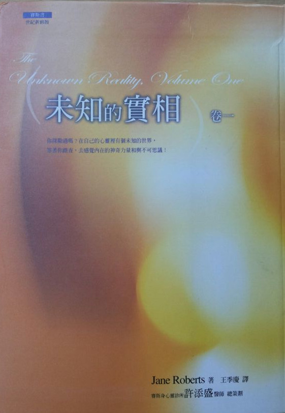

# 赛斯书：未知的实相（卷一）

## 夏日即冬日

今日即明日，而现在即过去，

万事皆空而事事皆恒久。

既无开始，也无结束，

既无可堕落之深，也无可攀升之高。

只有这一刹那，这光之摇曳，

遍照空无，但哦！如此光明！

因我们即在太空颤动不定的火花，

燃尽永恒于一刹之恩宠。

因为今日即明日，而现在即过去。

万事皆空而事事皆恒久。

（罗的注：这是一九六三年四月，当珍二十三岁时写的一首诗的第二及最后一节。纵使在这不成熟的作品里，她的神秘天性已在肯定其与生俱有的知识。）

## 前言：同时的时间，无限的可能

罗勃•柏兹

1975 年 4 月 16 日，我开始写这些注释的初稿，虽然它们挂在我的名下，但是多亏我的妻子——珍•罗伯兹，以及她在出神状态代为发言的非肉身存有——赛斯的大力协助，我才得以完成。事实上，赋予这些注释完美结尾的是珍和赛斯；而且是按照那个顺序——珍提供一些很棒的资料，谈她和赛斯之间的关系，而赛斯自己则提供一封新的信给来信的读者。不过，对于日期、每一节的编号、注脚的资料，还有我将在本书讨论的一些资料，珍的兴趣不大。

赛斯在 1974 年 2 月 4 日的第六七九节开始口述《未知的实相：赛斯书》，而在 1975 年 4 月 23 日的第七四四节完成。一开始，我们预期是另一本令人深感兴趣的赛斯书，《灵魂永生》及《个人实相的本质》之续篇。我们认为新作品可能会是很长的一本，却几乎没想到它会需要分成上下两册。

坚定地决定这么做的时间是，当珍在 Prentice-Hall 的编辑谭•摩斯曼和一位陪他同来的同业拜访我们的时候。那时候明显可见，不出一两周赛斯就会讲完我们已经开始称为《未知的实相》这本书。在场的每个人都已经觉察到，要是只有一卷，这本新书的厚度会超过我们希望的大小。当时，珍和我真的很高兴，听到正式的宣布。这扩增的格式本身非但不同于常规，也意味着分成两卷出版，我就有了放注释和参考资料，珍的 ESP 班和《未知的实相》制作时间前后其他「正规课」的内容摘录，一些珍的诗作，还有附录所需的空间，因为我觉得这一切可以赋予本书更多的意识次元（而且，当然，有了这样的决定，我才能开始写这些注释啊）。

赛斯如往常一样一节节的口述此书，但却取消了任何章节的形式。不过，他的确把资料组合成六段，并且加上了标题。如他在七四三节里告诉我们：「这本书没有章节，为的是更进一步的瓦解掉你们对一本书应该是怎么样的概念。不过，仍然有不同类的组织存在着，而且本书的任何一段都同时要求读者好几个层面意识之参与。」赛斯并没有给每一节一个标题，因此在（每一册）目录所列的每一节之后，珍打算写上几句话，至少指出在那节里所论及的一些主题。

《未知的实相》要出版一卷、两卷还是更多卷，在制作当时，赛斯自己倒没有说什么。一直到最后一节，也就是七四四节，他才提到它是一个单位。那时他在回答我问的一个问题时说了：「赛斯资料是无止无尽的，我是为了你们才加以组织。如果你想把它分成两次，也没关系。你会发现有几个可以这么做的点……」不过，我们最后的看法是，最显而易见的点也就是最好的点：每卷分成三部分。在本书的跋，我稍微详述这个自然的分割点。

因为各部分本身的长度不一，所以有一阵子我思索着要不要试试分成四和二，但是珍说「一卷三部对读者来说已经够多了」。我们的确认为大部分的人会觉得《未知的实相》分成两卷再加上索引比较方便，不管长度是否一样。英文版的第二卷将在第一卷首印之后一年左右出版，最初的这段等待时间一过，大家就能一直两卷一起读了。

我确定赛斯自称的那个「能量人格元素」，是带着好玩的心情看待我们想找出他的作品该怎样出版最好的种种摸索，因为一节又一节的资料开始堆积如山了。我想，基本上他不在乎长度或时间概念，珍和我自己持续传述和记录资料内容的意愿，才是决定本书长度的真正关键。那么，这样说来，当时这两卷的创作过程是无止无尽的，至少在珍和我纯粹基于身体因素而喊停之前是如此没错（当然，那些过程依然没有终点，因为全部都是创造）。

我们现在认为《未知的实相》可能两人的后半生，真的。就其他更大的几个方面来看，它可能持续几世纪。因为我们都知道，因为我们都知道，就一般的意识心而言，在这个「时间」里，这套书可能有第三卷（珍自己在第六部第七百三十部分就臆测过），以及第四卷和第五卷……

现在我想简短谈一下注释、摘录和其他这类事情的处理。珍开始传述这个作品之后不久，我为本书写的注释会比《灵魂永生》和《个人实相的本质》的注释长的情况就很明显了。这样做，是赛斯呈现他的资料所用的方式使然。珍和我喜欢这个想法，是因为这表示有别于前两本书，但同时我也担心注释会太显眼（即使赛斯在 1974 年 6 月的一节私人课上跟我说：「注释会自己照顾自己，别担心。」但我还是一样有这种感觉）。

我们一决定分成两卷出版，珍、谭和我都同意，我们不想要把所有的补充资料移到每一卷的最后，这种情况常常都会这么处理。不但读者会一直不断查询特定的项目，我们还觉得较短的注释更是会与其贴近的位置离得太远。我们想要用这些注释来直接补强每一节，但又不会妨碍阅读，所以我想出一个折衷的办法，采用某种条理分明但又不会太僵硬的呈现方式。

在《灵魂永生》和《个人实相的本质》当中，一般的注释放在休息时间，但我也在每一节的内文中，使用连续编号标出通常是脚注的起源点；然后我把真正的注释集结在每一节最后，以便快速参阅。为了一致，这些注释在两卷都用比较小的字体印刷。唯有在提到同一本书的特定附录时，脚注才会放在「原位」。所以大部分来说，这些方式让每一节的本文不会被休息时间打断。

处理附录的点子用在《灵界的讯息》和《灵魂永生》的效果也很好。在《未知的实相》这本书里，一则附录里的个别摘录或个别的课，不管可能加什么注释，本身通常都相当完整。这些部分随时都可读，但我比较喜欢读者在脚注第一次提到时就先读一遍，就像他或她得按照顺序查阅这两卷里头其他所有的参考资料一样。

未免离题太远，我设计注释和附录的方式，具有某种程度的互相加强之效，就像每一节本身那样。在第一卷，我三番两次提到几节课，比方说第六百八十一部分，因为赛斯在那几节传过来一些应该加以强调的重要观念。

随着《未知的实相》进展到第二卷，我自然会更常利用注释吸引读者注意更早的课。当上述几节出现在第一卷，就把那一卷想成是分开的实体，作为参考之用，方式与《灵魂永生》、《意识的探险》或珍其他的书一样。同时为了帮《未知的实相》的两个部分建构某些心理桥梁，我偶尔也会特意把其中一卷的内容抽出来放到另一卷，或是至少加入那类的参考资料。

在注释里，我试着准确说出我的意思，不多也不少，并且留意没有意识到的言外之意。不过，情况有可能变得很复杂，有时在准备这两册时，我发现自己想不通到底要怎样才能清楚呈现某些参考依据，不会让读者被日期、各节编号或者其他事物弄得一头雾水。虽然我认为我的呈现方法有某种次序，但有时候还是得花功夫读，我只能请读者耐心配合。我相信这样的例子不会太多。

在每一节当中我不时加注时间，让读者知道珍传述某一段花了多长的时间（不久我就会进一步探讨制作《未知的实相》涉及的时间元素）。基于显而易见的原因，我删除赛斯对他的资料下标点符号的指示，只在他的序一开头，或有时在某一节留下几个例子而已。但赛斯下这种指令的行为一点都不过火，每隔一阵子珍或我就会重新调整他的句子结构，以免语意不清，或是删除重复的句子，因为这一切全部是口述作品，和书写作品相反，后者可以当场就轻松修正。除了上述的变更之外，这两册从头到尾都是接收到的资料是什么就呈现什么。只要某一节有删除之处，比如私人的资料，都有标示；偶尔会摘要叙述这类资料。

在我们制作书的时间里，几乎都是私下举行，也就是说没有目击者，那时赛斯的说话速度够缓和，所以我可以用自创的速记方式逐字写下他的话。虽然这个方式往往很辛苦，但我发现它比消极地使用录音机来的详尽而且有意义；我也有时间在我们进行时插入我自己的意见。接着，我稍后会为每节的内容打字。跟着我的笔记，比跟着录音带打字来的更快、更舒服。就像我在《个人实相的本质》就写到，我相信珍传述赛斯的资料居然变更如此之少的这种能力，「说明了与这些课有关的一些重要事情」（参见我在该书第一章第六百一十部分最后写的注）。关于我对赛斯本人的客观观察，我会让在各节加的注释逐步建立任何我能够建构的综合画面。

就像其他的赛斯书一样，《未知的实相》不只包含了赛斯课，也还有珍和我对它们的想法，以及我们有关其制作环境的注记。

接下来的四个段落包含与我们的出版时间表有关的资讯，我会尽可能简单陈述。起初我并未计划在这些注释里处理上述资料，但是珍和我谈过之后，我们最后还是同意应该把资料放在这里。有几个不同的书名、各节编号和日期要记，所以可能有必要再读一遍。

我在这一卷的跋也写到，第二卷的第六部纳入我们搬到纽约州艾尔麦拉「坡屋」的始末，时间就在 1975 年 4 月赛斯完成那一部，以及他口述《未知的实相》的全部工作告一段落的一个月前。但是，在 1974 年 10 月，早在我们还没有搬进艾尔麦拉市中心的两间公寓之前，珍就开始写《心灵政治》（Psychic Politics ：Aspect Psychology Book）了；这本书是《意识的探险》的续集，Prentice-Hall 出版社今年秋天（1976 年）就要出版，《未知的实相》第一卷的跋也有提到这本书，而第二卷也出现了我在它最前面加的几个节注。

我们打算先出版《未知的实相》第一卷，再出版《心灵政治》，但我还来不及做完这两本赛斯书的注释（我觉得两卷的注释有必要同时进行），珍就已经完成她的书，所以我们改变主意，决定先出版《心灵政治》。我们搬到坡屋这件事占掉我处理手稿的工作时间相当可观，所以就准确无误的出版年表而言，当时《心灵政治》显然是跳过《未知的实相》抢先出版。

在《心灵政治》里，珍也提到先出现在《未知的实相》的几大段资料，所以后者的一些相关的注释我做了调整，说明它们较早前的讨论。不过，就本书而言，珍最新的书和赛斯最新的书并没有冲突。两者相辅相成，我只是想强调从头到尾我们的目标就是出版珍的书（包括那些和赛斯一起制作的书），而每一个作品都是一个完整的实体，但是在其中又包含了这系列当中其他书的必要参考资料。

我们想要用那些参考资料来帮助读者按照时间次序排列每一本书，不要管哪一本可能先出版，因为时间越久，出版时间就越不重要。比方说，当我写到《心灵政治》「今年秋天（1976 年）就要出版」，我当然知道，等到赛斯的作品第一册在 1977 年春天付印时，《心灵政治》那时已经上市几个月了。不过，在我看来，在这本第一卷里头提供这点资讯，其实是最正确的作法。

有人可能从数字当中得到很多乐趣。譬如，可以用数字来探索同一主题的不同观点，在这种情况下，主题是时间，其中探讨了它的特性。《未知的实相》两卷一共收录 65 节，珍帮赛斯传述这 65 节的时间是 14 个半月多一点。这段消逝的时间当然包含她完全不做书的口述那好几周在内，但是处于好奇，我想算出她真的花在制作整本书的时数大约是多少。

我从中挑出平均的 40 节，只用作口述的那些部分，依据的是两件事：只算珍在出神时所花的时间，以及她的出神时间加上相关的休息时间。我得到的数字分别是 1 小时 39 分和 2 小时 2 分，然后我在各乘以 65，结果发现总和低到难以置信的地步。这些数字充分证明在特定状况下，（至少是珍的）创造力可能出现的速度有多快，因为她完成两卷《未知的实相》的出神时间总共是 90 小时 35 分，出神加上休息的时间总共是 131 小时 30 分（把这两个总和粗略换算，则两卷分别用去 45 小时和 65 小时）。不要忘记，这些数字是平均值，而剩下的 25 节算出的结果也会很相似，因为它们既不会太短也不会过长。所以不管真正消耗那些时数的更大背景为何，对于完成《未知的实相》的创造成果涉及的两组总时数，都非常惊人，值得注意。要比较的话，就把「一周」想成有 168 个小时。

每隔一阵子我就会想要用同样的方式，平均一下珍口述《灵魂永生》和《个人实相的本质》的时间，但都没去做。不过，我有点不解而要特别提到的是，她花在赛斯书的工作时间太短了，实在没有人能够视若无睹或认为理所当然，或许也可能是，无法从一般线性时间的角度来了解那些因素。也许只有我对此感兴趣，因为连珍对自己投入在赛斯资料的时间都没有表达多大的好奇，她只管传述资料而已。但是考虑到她的能力，我想她的制作速度是紧扣赛斯观念的一种处理方法或转译，那个观念就是，基本上一切同时存在，其实没有时间，而比方说赛斯书最终的形式早就在「那里」，只待收听（在本卷的第二部，第六百九十二部分的注释 2 包含一种方式资料，借由那种方式，我们可以从物质实相往赛斯讲的同时性概念更靠近，但那个方式不再适用于这里没有讨论到的资料）。

打从珍于 1970 年开始出版赛斯资料以来，她收到好几百冲着她的作品打来的电话和写来的信件。那些电话和书信（包括我们还没有回的信在内）我们都非常感谢，但我不记得其中有任何一通电话或者一封信件提到这个奇妙的时间元素。

我认为珍在出神的短短 45 小时内，真的能够传述一整本书稿吗？这肯定是假设的问题，但我肯定就赛斯的资料公诸于世而言，她是做得到的，她只需要必备的体力而已。即使现在，她为赛斯代言时，也能够轻轻松松领先我的手写速率好几个小时。来自赛斯的资料就会在那里，制作的作品会不同于用更长的时间传述的「相同」作品。譬如，赛斯就不会从我们眼前每天的活动取材，做出一些类比，但是在这种情况下，我想他要不就是调用我们过去的类似事件，或用不同的方式塑造他的资料，但结果还是一样。

我认为偶尔在本书中提醒读者赛斯的某些基本概念是很重要的，举例来说，我会继续谈到时间——但却是赛斯的时间——的问题，把它和赛斯所说的一种「耐久性」（durability）一同来谈，这种耐久性同时是「自发」及「同时」的，如赛斯不止一次解释给我们听的。这个「耐久性」是透过「价值完成」之不断扩展而达成的。我在卷二的第七百二十四部分之后的评论也适用于此：「如赛斯在 1964 年 1 月 8 日的第十四部分中相当幽默地说：『……你们根本不知道对一个必须花时间去了解的人解释时间有多么难。』然而，赛斯的『同时性时间』并非绝对的，因为就如他在那节里也告诉我们的：『虽然我不受你们层面的时间所影响，我却受我的层面上某些类似时间的东西所影响……对我而言，时间可以被操纵，可以悠闲地去用及检视。对我而言，你们的时间是一种工具，是我可以进入你们的觉察的几个途径之一。因此，它对我仍然是某种实相，否则的话，我就根本无法以任何方式利用它。』」

我想，只要我们是有形的生物，就永远无法抓住赛斯「同时性时间」的观念，然而，它却对无形的机制提供了线索——我们就能比较了解珍眼中的赛斯。把概念变成文字这件事（尽珍所能做到的），有助于让我们抓住赛斯所讲的：我们可以对时间做出某种直觉的、非语言的触及或了悟，那多少超越了我们对所谓「时间」的素质或本质之陈腐观念，这陈腐观念在我们西方社会是如此的理所当然，以至于甚至去质疑其仿佛单方向的流动也是徒然的。

下面我要引用赛斯的两段话，然后再继之以珍的一段较长的话。

赛斯的第一段摘录是为了在两卷《未知的实相》之间创造一个桥梁，借由自其中一卷提出一些东西而将之放在另一卷里。再次的，摘自卷二的第七百四十三部分：「没有一本名为《未知的实相》的书可以使得那个实相被完全认识。它仍然是星云似的混沌，因为它在意识上并未被了悟。我所能做的只不过是指出那些比较看不见的区域，帮助你们探索自己意识的不同面……我十分明白这本书引起的问题比它回答的更多，而那原是我的意图……」

还有珍和我的意向。珍的书是她运用某些能力的记录，我们觉得那些能力很有创造力；她引起的问题让我们看到更大的领域可以调查。通常我们不会把那些问题以及挑战，想成有神秘的起源，不是出自我们西方社会的观点。在本卷的第一部（第六百七十九部分）赛斯讨论珍早年的宗教背景，她「深沉的神秘本质」，我在附录为那一部加了一些神秘体验的资料。那份资料与这些前言的注释是相关的，但应该要分开放。

然而，我们做的工作处理的是前半生我们在意识上不太注意的观念（珍在 1963 年底开始制作赛斯资料当时，我 44 岁，她 34 岁。）

如我在某些注里引用的，珍早年的诗清楚反映出，她对某些赛斯日后详细阐释的观念之直觉了解。（即使她在意识上并没有觉察到自己在做的事，情形依然如此。参见本书开头她早期写的诗《夏日即冬日》。）就我看来，她对赛斯资料所负的任务就是提供这些基本上艺术的概念给我们有意识的运用，以使它们在日常生活里的运用，将我们个人与集体的实相变得更好；而我所谓「艺术的概念」是指人类所能表达并且争论的，最深、最美而且实际——并且，没错，神秘——的真理与问题。

在赛斯书里，我们一直故意避免去评论存在于赛斯的观念及那些近东、中东或远东的种种宗教、哲学及神秘理论之间的类似。当然，这种方式适合我们的本性，珍和我知道此种关联的存在——的确，如果它们不存在，我们才会觉得奇怪呢！别人常常跟我们谈到这一点，而我们也读了一些，好比说，谈佛教、印度教、禅与道家的东西，更别说像印第安巫术、巫毒及西印度群岛的巫术了。我们认为，显然可以写一本书来比较赛斯资料和其他思想体系——不论它们是否为宗教性质的，但因为珍和我都是个人主义者，所以选择了不去集中在那些区域。而我在此所说的，也不是想要贬低其他对「基本的」实相之看法。

那么，虽然在赛斯的哲学及其他有组织的思想系统之间是有相似处，但在我们看来也有重大的不同。珍和我倾向于认为，在我们世界里发现的那种一致性「涵括」了宗教，而非被它们界定，而我们认为赛斯也强调此点。我们就这样顽固的向前走，明白我们的观点根植于世界的西方传统里，但也知道在我们四周存在着许许多多其他的哲学或体系，其中有些已存在数世纪之久，那是人类创造出来解释实相的。然而，我们并不觉得非得深入了解，好比说，苏菲教或婆罗门教之细节不可。但我们不喜欢印度教和佛教的涅磐概念，它们主张通常在一连串的生命之后个人意识之灭绝，并融入于一无上的神灵。而且我们反对那种说法：「大自然」以线性时间的方式做了这样的安排，使得个人必须在此生中对前世的行为偿还因果的债。如果大自然不处罚任何事，为什么要处罚任何人？涅槃和业报的实相并不是珍和我想要创造的。

反之，我们比较喜欢赛斯的观念，以及我们自己的观念，关于个人意识之不可侵犯，不论在肉体存在之前、之中或之后，也不论是涉及了任何一种的转世理论。也许对于我们这些活在西方的人而言，我们自然不会喜欢在肉体死亡时舍弃我们的个人性这种观念，即使在理性上我们能了解，比如，佛教的教义说我们能在最终、至乐的舍弃自身于一无上神灵里找到「完美的」喜悦——虽然我幽默的说，就我个人而言，我还不知道那个舍弃自己的人怎么知道这样做了没有，如果他已被如此彻底地融入了的话。

我比较同意赛斯在《灵魂永生》第二十二章第五百九十部分里告诉我们的：「你们不是命定要溶入于『一切万有』。如你目前所了解的人格形貌将会被保留。『一切万有』是个人性的创造者，而非毁灭它的手段。」每当我读到传统东方对无上神灵的观念时，我就记起赛斯在《灵魂永生》附录里第五百九十六部分说的：「在此，我用了『意识的扩展』这个词，而非更常用的『宇宙意识』，因为后者暗示了在此时人类尚不可得的那种比例之经验，与你们正常状态对比之下，强烈的意识扩展在本质上也许显得是宇宙性的，但它们仅只是对你们现在就可以得到的意识可能性的一个暗示而已，更别说能开始接近一个真正的宇宙性知觉了。」

我假定上面那四段话很显然可能引起许多非议，但其中的资料很接近于珍和我在这些日子里对赛斯资料与其他哲学之关联性的看法。我尤其觉得高兴的是，珍的工作及她对我们思想的贡献是出自她的心灵，而未得助于实验室、统计数字或测验。那就是说，我们对真正考验的想法是在观察，以看出赛斯资料能对实际的日常生活有何帮助。我们在 1965 年到 1966 年做的其他种类更「正式」的测验，详细记录在《灵界的讯息》第八章里；我们现在很容易忘记那些早期测验相当的成功，而且可以在任何时候再来一次。当我们在做那些测验时，我心里觉得奇怪，为什么在地球上所有的生命当中，只有人类这种动物觉得有需要去建立实验室来「证实」他到底是什么，他的能力——心电感应、新陈代谢或其他——又到底是什么。这个题目本身就如此的庞大，以至于珍和我可以一直写个没完，因此，我只在这儿粗略提一下。

根据他认为已知的东西，在他的实验里因此有很大的机会去获得预先设定的答案；他的外在化设备几乎无法产生其他的结果。（科学家不称一个氧原子或任何一个其他元素为活的，更别说它们是具有意识的了。然而，某些原子聚合成的人形却称他自己是活的——而激烈的否定那些不幸存在于人类架构之外一模一样的原子群同样的地位。）但在赛斯过去十年里所给的资料之中，他讨论过人们对一般人类状况之极度缺乏了解的某些理由，而我也确信将来还会谈的更多。

我觉得极为欣慰，珍只用到她现有有形的身体及无形的心智，就能持续地显示出人类不被认为具有的能力，我们不满意社会——不论东方或西方——给我们的答案。如生命的意义、其深度与神秘、其无穷尽的可能性这类问题，每个读者可以在赛斯的看法里找到他自己的意义。

以下是录自赛斯的第七百五十部分，那是他完成了卷二的两个月后，在 1975 年 6 月 25 日举行的，其中他不只说出制作《未知的实相》的动机，并且还论及他的一个我认为应该经常强调的基本概念，这一次还涉及了知觉。「《未知的实相》写来是要让……个人对其他模式的实相略见一瞥。它是要用来作为一张地图，把人领入并非另一个客观的宇宙，而是进入意识的内在道路。这些内在道路或意识束（strands）带进来一些要素，使人变得可能去了解，任何一个客观化宇宙之内涵真的可以被十分不同地知觉到。你就是你所知觉的东西之一部分，当你改变知觉的焦点时，便自动地改变了客观的世界。并不只是当你知觉它为不同的东西时，不论你的经验为何，它却还保持原状。知觉这个行为本身有助于形成被知觉之事，并且是其一部分。」

而珍对于她和赛斯的关系又有什么感觉呢？她通灵的机制是怎样？起初我们的想法是，她自己写前言帮助这些注释做补充，但是最后她决定不必要这样做，也不想要重复她已经在自己的书中涵盖的大部分资料。反之，1976 年 3 月，她写了下面这篇文章，我认为她为自己替赛斯说话时体验到的内在实相与外在实相，做了一个很棒的总结：

◇ ◇ ◇ ◇

《未知的实相》本身当然是心智的未知实相衍生的一个产物，因为它完全是我在出神状态以赛斯的身份制造出来的。一方面来说，这两卷可说是一种内在心灵「燃烧」形成的产物，也就是说，像赛斯的实相点着我的实相那样，在我们的世界里燃起的那个火花，或者是反过来。对我而言，这是一种加速的状态。我会把它比作是一种更高的清醒状态，而不是通常和出神连在一起的睡眠状态，但是这是一种不一样的清醒，人在其中会觉得平常的世界似乎才是那个正在睡觉的世界。我的注意力并未迟钝，而是放在别处。

身为珍，我并没有在这样的出神状态中被弃置。但是我以一种无法言传的方式走出了我的珍——我，而通灵一结束，我便又立刻回来。所以当「我」一头潜入那些经验和身份的其他次元时，一定有另外一个留下珍在岸上耐心等候的「我」。几乎是立刻发生的转变一结束，「我」就变成赛斯，或赛斯就变成现在的我。而且在那种状态中，感知的状况是对有别于我们的意识领域的其他意识领域而言再自然不过的那些状况。

这些通灵的时段从来没有累倒我，我的精神常常比之前更好。通常我对时间没有什么概念，身为赛斯时，我可能讲了一个小时，但是「瞬间返回」一看时钟，却是惊讶地想，最多可能只过了十五分钟而已。不过，出神并非停滞不变，而是有层次也有特征。要解释这些几乎是不可能，但是状态并非一成不变，而是有高峰也有低谷，亦即显示其本质的心理色彩和浓度。

出神状态的特征是，有一种能量源源不绝、情感完整无缺、主观上自由无碍的感觉。有时候赛斯的声音非常洪亮、充满力量，即使出神时，我都觉察得到，而且被他的能量席卷而去。在我担任灵媒的最初几年，赛斯的声音和口音对我而言似乎很怪，不管是上课时听自己替他说话，还是听录音带。但是在出神时，知道的事就是知道。回到我平常的状态，我刚刚身为赛斯讲过的话就像梦一般消失无踪。虽然我读过《未知的实相》，因为它已经完成，也在它的制作过程中看了一部分，但是，对我来说，似乎还是奇怪至极地觉得陌生。

我看起来不只是一般的不明了，好像一部分的我不肯有意识的思考我出神时创造的手稿而已，也许是为了不让自己感到困惑。举例来说，我喜欢划清我种种主观状态的界限，这似乎是尽可能自然轻松处理异常状况的一种既经济又实用的方法。赛斯状态的形式并未受到侵犯，珍的状态也是。

当我是赛斯时，我只是他的实相之一小部分，也许只是我能捉住的那个部分，但我却沐浴在那个人化的能量里。当赛斯把注意力转向人们，对他们说话或回答问题，那时我感觉到对他们的价值及个人性的一种几乎是多次元的欣赏。他了解每个人的价值并向其致敬，以一种与我们完全不同的方式看待人。我体验到的那种赛斯对别人的反应，使得我怀疑有一种比我们所知的更生动的情感经验存在。

然而，我确知赛斯代表了另外一种东西，一种不同的人性，而当那样的生灵与我的主观世界相交时，赛斯就「发生了」。

在许多方面，我们是一种孤独的种族。我们仿佛永远逡巡于自己天性的藩篱内。也许我们对身份感的概念有如我们绕着我们心智画的一个神奇的圈子，使得任何在外的东西显得是黑暗又陌异而「非我」的。也许有远比我们自己亮得多的其他心灵之火照亮那内在的景观；还有意识的其他面向，我们与之相连，就如在一种我们几乎不了解的存在之链里，与动物相连一样。

我们爱「向后」看我们的动物本源，认定所谓的进化已经结束，而我们在此欢呼——哈哈，我是万物之灵。但也许我们只是在中间，不完全地感觉到自己之其他遥远版本的存在，那将出现在一个远得令我们无法理解的「未来」。也许以那种说法，我是赛斯的某个远祖，活在我自己的生命里，却只是他生命里的一个记号。但他坚持在过去里也有新鲜的行动；所以如果事实是那样的话，我就仍在寻找自己的途径。

当我自己想到这么远的时候，一种奇特的加速攫住了我。我的身体变得非常松弛，但我的心智却有一种很奇怪的运动感，就好像我试图去了解的某些东西太快地掠过我，而令我无法追随；然而，我一直试着使自己旋转得更快些，以便追上去。如果我的一个细胞想要理解我自己的主观实相，它也许会有同样的感觉。我想，我是活在赛斯的主观「身体」内，就像我的一个细胞是活在我的肉体内一样。只不过，我一直在摸索……并且感觉那些我自己的实相并不能真正了解的事件。

这也许只是当意识心试图瞥见它自己源头时的反应而已。也许当我们在做这种尝试时，象征性地说，就好比我们是暂栖在我们意识的平台上，同时向上也向下看。就像无重量的太空人，我们知道自己是谁，却不太确定我们的位置，因为心理上，它在内在空间里不断的改变。我们暂时的晕眩了，被一个自己与自己的其他版本所组成的内在宇宙弄得目眩神迷，而感觉我们正旅游过某种庞大的心灵，它播种「自己」就如太空播种星辰一样。

◇ ◇ ◇ ◇

最后，我们如何应付越来越多的读者来信呢？（附带一提，多年来收到的信件和卡片我们都有存档。）我们最近的作法是寄给读者三样东西，一封珍和我的短笺，一封赛斯在一九七五年四月里口授的信，及一张珍的书单。（我们呼应很多人的要求而准备了这样一份清单，当然也一直不断更新它。）然而，对喜欢珍或赛斯本人亲自回应的来信者而言，这样的格式信其实不是个令人满意的答案。但是考虑到我们的特性，这些信仅仅意味着，我们在可用的时间内尽力而为的结果。近来珍自己处理大部分的信件，并设法在每一次回信时另外添个一两行。透过这种方式，她回的信多过以往，但讽刺的是，信还是回不完，原因很简单，就是收到的信越来越多。

以前有一次（1973 年 1 月），赛斯为我们口述一封信，给那些写信来的人，读者可以在《个人实相的本质》第八章的第六百三十三部分里找到。我们感觉赛斯这两封信反映出他资料的大半精髓，以及制作那些资料时我们的境况与心态。我们的确认为把赛斯的新信放在这里，是结束这些注的一个理想方式（信中一如往常，赛斯称珍为鲁柏，称我为约瑟）。

◇ ◇ ◇ ◇

亲爱的读者：

鲁柏看过你的信了，约瑟也一样，我对其内容也是知道的。我们还没有任何外在的组织，因而没有秘书可以帮忙回信，也没有中间人去写花俏而预先包装好的回信。

鲁柏及约瑟是注重个人隐私的人。他们与宇宙也有种一对一的关系，这种特质是指他们抗拒形成任何组织，即使这种组织会有助于回信。所以我来口述这封信。虽然它会被寄给你们当中的许多人，但它却是写给你们每一个人的，而我只是觉得遗憾，我无法个别深入于你们的热望、挑战与问题里。

你们有些人在喜悦中写信来，有些则在忧伤中写信来；有些人写信来诉说你们已找到的答案，而有些人则写信来要求答案。在任何情形里，能量都随着这封信送出去给你们了。那能量会唤起你们自己的能力，它会引你们到只有自己能有的洞见与解决之道，它会让你们与自己存在的基础接触，而终究来说，所有的狂喜与答案都是由之涌现的。我的目的并非为你解决问题，却是令你与你自己的力量接触，我的目的并不是要借由给你即使是最悲惨问题之“答案”，而介入于你与自己的自由之间。我的目的是要加强你自己的力量，因为终究来讲，你存在的神奇就足以帮助你找到成就、了解、丰富与平静。你们的问题是被自己的怀疑所引起的，这些怀疑的升起是因为你们已与自己存在的价值失去了联系。让我在此加强那个价值，让我加强我对你们天生具有“欢喜随缘而超脱任何你们现有问题之能力”的信心。如果我迳自去替你们解决问题的话，那么就否定了你们自己的力量，而更进一步的加强了你们已有的无力感。不过，我知道你们可能会觉得累了，而有时候送你们一份能量可以令你们振奋一下，所以再说一次，随着这封信，把我对你的存在欢喜之认可，以及你可以用来加强你自己的活力与力量的能量——送给你。并非所有的信都是由邮差送达的，因此就你们寄给我的信而言，每个人应该都会得到来自我的、你们自己的那种内在回应。不过，我在许多方面是作为你们自己心灵的一个发言人，所以那内在的讯息会是来自你自己更大的存在；由那个多次元的实相层面，我向你致敬。

赛斯

## 赛斯序

（珍在出神状态中传述赛斯序的情况记录在第一部，一九七四年二月二十五日的第六八五节里，在那节的中场休息时，赛斯在十点五十七分开始讲下面的资料。）

现在：序：有一个“未知的”实相，我是其一部分，而你们也一样。

（停顿良久。）许久以前，我突然出现在你们的时空里，自那时起，我跟许多人谈过话，而这是我的第三本书，如果我是以一般的方式借由肉体诞生在你们世界里的话，这一切对任何人而言就没有什么好奇怪的了，反之，我却开始透过珍·罗伯兹说话，以表达我自己。在所有这一切当中都有一个目的，而那个目的的一部分就孕涵在现在这本书里。

每个个人都是未知的实相之一部分。可是，由于我的地位，我显然比大多数人更是其一部分，我在心理上的觉知联系了你们有意识地觉知的世界及其他至少仿佛逃过了你们注意的世界。我透过她说话的那个女人发现她处于一种不寻常的状况，因为没有任何理论——形上的、心理的或其他——可以适当的解释她的经验。所以这使得她去发展她自己的理论，而这本书是某些已在《意识的探险》（注一）里提过概念的一个延伸。为了写那本书，鲁柏汲取了能量的深源。

（十一点十一分。）

可是，以你们的话来说，这未知的实相是未知到超过了最具弹性的意识所能企及的，而它只能被像我这样一个潜伏在其中的人格所趋近。不过，一旦被表达之后，它就能被理解。那么，我的目的之一就是要使这未知的实相为你们有意识的知晓。

从历史上来看，人一度认为只有一个世界。现在他知道并非如此了，但他仍执著于一个神，一个自己，及借以表达这自己的一个身体的这些概念。

只有一个神，但在他之内有许多个神；只有一个自己，但在他之内有许多个自己。在一个时间里只有一个身体，但自己在其他的时间里有其他的身体。所有的“时间”都同时存在。

（停顿良久。）以历史性的说法，人类选择了某一条发展的路线。在其中，他的意识专门化了，集中焦点在极为特殊的经验上。但心理上及生理上来说，永远与生倶有改变那个模式的可能性，一种会有效的把人类提升到另一种气候的改变。

（十一点二十二分。）

不过，这样的一种发展首先需要扩展对自己的概念，并且对人类潜能有更大的了解。人类意识现在正在一个阶段，在其间，这种发展不只是可行的，并且是必要的，如果人类想要达成他最大成就的话。

到某个程度，珍﹒罗伯兹的经验暗示了人类心灵的多次元本质，并且给予潜藏在每个个人内的能力之线索。这些都是你们种族传承的一部分，它们显示出那连接你们居于其中的已知与“未知”的实相之心灵桥梁。

只要你们对自己的本质仍然持有非常局限性的观念，你们就无法开始理解一个多次元的神性或一个宇宙性实相，在其中所有的意识都独特而不可侵犯，却又热衷于形成具有组织及意义的无穷尽之完形（gestalts）。

在我其他的书里，我用了许多已被接受的概念作为跳板，来把读者带到其他的了解层面。在这儿我想说明的是，这本书将开创一个旅程，在其中可能看起来熟悉的东西已被远远的留在后面了。但是当我结束时，我希望你们会发现那已知的实相甚至变得更可贵、更“真实”，因为你会发现它被一个“未知的”实相之丰富组织内外彻照，并看见那“未知的”实相在日常生活最亲密的部分浮现出来。

请等我们一会儿。

（在十一点三十五分停顿。）个人地及群体地，你对个人性的观念限制了你，然而，你们的宗教、形而上学、历史，甚或你们的科学都依你们对你是谁或是什么的概念而定。你们的心理学并没有解释你们自己的实相，它们无法涵盖你们的经验。你们的宗教并没能解释你们更大的实相，而你们的科学也让你们对你们居于其中的宇宙之本质同样的无知。

这些组织与学问是由个人所组成的，而每一个都被对他们自己的私人实相之局限性概念所限制：所以，我们将以个人实相来开始，而且也永远会回到它上面。这本书里的这些概念是想要扩展每个读者的私人实相。它们也许看起来很神秘或复杂，但任何一个决心想了解自己及其更大世界之未知因素的本质的人，都有能力企及。

因此，这本书有一个私人性的开始。珍﹒罗伯兹的先生罗勃﹒柏兹对他母亲的死（在一九七三年十一月十九日）想要有更多的了解。在一节课里（一九七四年二月四日第六七九节）他拿出一些旧照片。现在：死后生活之描述通常与大众所接受的一个自己（oneself）的老概念及个人性（personhood）的局限性观念一致。不过，我却利用那个机会来开始这一本书。

（停顿良久。）当“自己”活在肉体中时，它是多次元的。它是灵性与心理性本体的胜利，不断由无数的可能实相中选择它自己清晰而坚定不移的焦点（非常热切的）。当你没认识此点时，你就会把所有老的误解投射到死后的生活上。你预期死者与生者没多少不同——如果你真相信来世的话——但也许更平静些、更明白些，并且，如果运气好的话，更睿智些。

（在十一点五十一分停顿——然后非常强调的说：）事实是，在人生里，你很巧妙却又完美地悬在实相之间，而在死后你也一样。于是，我利用那机会来解释罗的母亲在死后所能得的大幅度自由——但也解释在她生时就在的她实相的那些成分，那在意识上对她而言是关闭的——由于人类对心灵本质的观念之故。我偶尔评论那些属于柏兹家庭（包括珍）的照片，但任何读者都可以看看自己的老照片而问同样的问题，把在此地所说的应用到私人经验上。“未知的”实相——你是它的已知的同等物（再次更大声的）。那么，认识你自己，当你变得熟悉这些概念时，你的意识会扩展。我自己则代表你的存在之那些已然了悟的部分。我的声音自你也在其中享有经验的心灵阶层升起，所以，倾听你自己的“知晓”吧。

（快活的：）序言结束。

（十二点〇一分。）

（注一：事实上这个月初（一九七四年二月）珍开始她《意识的探险：层面心理学入门》之最后完稿。不过，她已把她在里面所谈所有主题之细节整理好了。）

## 译序

王季庆

《未知的实相》是赛斯书中最厚又最难译的一本，原书两卷共有八百页之多，实在令人望之却步！但若存而不译，赛斯系列不但不完整，而且也漏失了许多精义。所以，在一九九三年春节期间，我和许添盛便放了串鞭炮庆祝“开工”了。

这本书的好处在赛斯和罗的序中已可见一斑。我自己则为其对“可能性”之讨论所震撼！这种“可能性”弥漫于所有的时间、空间，也就是，当你出于自由意志而选择了某一条路线时，那未被选择的可能性则会在另一个实相里，由你可能的自己去经验。这个理论可以说是匪夷所思，若去追究其“暗示”，会令人头壳发胀，并且兴起“无常”之感！

但在我译的另一本书《超越量子》里，物理学却已印证这了这种“大千世界”的理论，证明赛斯所说“每一个可能性都会被实现”的确是“可能的”！

而我们当下的每一刹那，并非受限于线性时间的过去与未来，却是由我们最深的源头冒出来的，是憋在过去与未来之间的一个“可能”。所以这种“非命定”和“无常”，不但不应令你恐慌或茫然，反而提供了你把握“当下”的理由，并且鼓励随机的创造性，因为你的人生“当下”就可被你改变！

以下是特别发人深省的几段，愿先引在此以飨读者：

•在细胞内的意识知道它自己的不可摧毁性，只改变了形式……虽然细胞实质的死去，但其不可侵犯的本质却未被出卖，它只不过不再是物质性的。

•所有的生命都是合作性的，而所有的生命都知道它的存在是超越其形体的。

•人这种意识强烈的与身体认同是必要的，以便把焦点集中于具体的操纵。

•所有自然的东西都有“精灵”……它们的确有一个能量的实相，而它们帮助把能量转换成物质形式……你感觉到风及其效应，但你却无法看到风，风本身是看不见的。因而这些其他的力量也是看不见的。……它们并不比风更善或更恶……因为你们通常想象，如果某些东西是善的，那么必然有一个相对的恶的力量，但并非如此……以更大的说法，这些力量是善的，它们是保护性的，它们滋养每一样活的东西。

•没有了解或训练，你就必须“失去”你自己的意识才能觉知“其他”意识。

•“你的蓝图”之资料被织入基因与染色体，但却与之“分开地”存在。

罗记录了珍传述此书的时间，才不到一百小时。但我粗略估计我口译的速度，平均一小时一页。也就是说，我和许添盛埋头努力了八百小时才竟全功！（当然，原书还需算上罗写注和附录等所花的时间。）无论如何，在一九九四年春节前，我们完成了此书，整整一年的苦功！希望读者耐心、细心的看完，也与我们一样，同感这是值得的！

特别要感谢陈建志费心校订此书，并提供宝贵的意见。

## 第一部

你和“未知的”实相

## 第六七九节：照片，时间，可能性的人生

一九七四年 二月四日 星期一 晚上九点四十一分

（在课开始之前，我给珍看一张她童年的照片，还有一张我的。这两张照片差不多同样尺寸，大约 3.25×5 寸，都相似的褪色易脆——好像是在同一个时候拍下来的——虽然我那张比珍的要老上二十年。

（我那张照片是我父亲拍的，并且记下了日期，已经在我们的家庭相册里放了五十三年了。那张照片是一九二一年六月一日照的，那时我差不多快两岁，有一头卷曲的浅色头发，穿着小西装、白色长袜及黑皮鞋，站在位于宾州东北的一个叫曼斯菲尔的小大学城，我父母租的房子的边院里。大约有一打小鸡聚在我脚边的草地上，而我颇入迷的向下看着它们。在我身后有个焦点模糊、不知名的十来岁女孩，坐在由树干上悬下的秋千上，而在她旁边有一个空的藤编婴儿推车（我的吗？），在她后面的私人车道上停有一部有蓬顶的四门汽车。曼斯菲尔离珍和我现在住的纽约州艾尔默拉城只有三十五里。

（珍的照片已有三十三年之久了，那是由一位较年长的女士替她拍的，她招待珍到纽约州的度假圣地撒拉托加温泉市市外的一个温泉区去玩。那时珍与她卧病的母亲玛丽及一位帮佣住在那个市里。珍把她朋友的名字及日期以幼稚的字迹写在照片背后。许多年之后她告诉我：“我妈妈恨那个女人。”在那张快照里，那是在一九四一年八月的一个阳光普照的日子，珍那时是十二岁，她坐在草地上，后面有一些长绿灌木，她用右手撑地身子略为后倾，两只光腿颇为一本正经的交叠。她穿着一件特洛伊市天主教孤儿院送她的印花布衣裳，那个孤儿院离她家有三十五英里，在此之前她曾在那儿待过十八个月，那时她的母亲正在另一个城里住院治疗风湿性关节炎。珍还穿着一件短袖套头毛衣，那是她母亲在住院时织的。

（珍的金发——后来变得颇黑了——整整齐齐的中分梳理，上头还夹着一个发夹。她有着一张年轻的圆脸，但却面无笑容，她并没皱眉，而只是直视着照相者，显出一种严肃而几乎不合她年龄的自制表情……

（对我而言，两张照片都有我觉得引人好奇的某种神秘感——一种气氛，我猜部分是由于他们是老旧的、私人的、且是如此的不可取代，但长久以来我都觉察到有些与之相连的其他感觉。珍在一九六三年尾开始传述赛斯资料，而很快的赛斯就开始发展他可能性的概念（注一）。从此有许多次，当我看着这些快照时，我会发现自己在臆测环绕着那两个小孩的可能实相。现在我告诉珍，我了解我们每个人选择了那些要使它具体化——或以我们的话来说“真实”——的行动路线。但自从那些照片拍下来之后，我们可能的自己踏上的所有其他路线又是什么呢？到如今，那些照片是否真的描绘我们不成熟的身影，我们认为并且一直就是的珍和罗？或从我们的观点，它们显示了一个可能的珍，一个可能的罗——两个早已走上他们自己的旅程到其他的实相里去了？我不太清楚我想知道什么，也很难向珍表明我的意思。也许我只是想要赛斯以一种更个人的方式谈谈可能性（后加的：在那时我完全没想到我的问题会引发一本新的赛斯书）。

（珍在出神状态变为赛斯的外在迹象其本身就非常有趣，而我不想加以忽略；的确，我常常描述它们。不过，真令我着迷的是她在课中所表现的我所谓大大加强了的意识或能量——而我总是在她的传述表面之下感觉到一股甚至更有力的能量之流。当珍安静的坐在她的甘迺迪摇椅里等待赛斯过来时，我这样想着。几分钟后，她的右手伸向她的眼镜，当她把眼镜拿下来时，她的眼睛比平时黑亮得多：她已在出神状态了，赛斯已在那儿瞪着我了。）

现在：晚安。

（“赛斯晚安。”）

（身为赛斯，珍翻看了一下我放在我们之间咖啡桌上的照片。）

我现在要谈这两张照片——但如果你想要的话，你也可以有关于任何一张照片的资料。

（“好的。”）

再说一次，你们每个人选择你们自己的父母及环境。你在两天以前的笔记里谈到与艺术有关的预知，以那种说法，预知也适用于你的出生，你在事前在无意识层面上已十分觉知你会碰到的那些情况，你选择了它们，并且事先把它们投射进入时间的媒介里。

不过，那些情况虽然在一种方式里被“设定”了，但在另一种方式却是非常具可塑性的，因此，各式各样的可能事件能自它们流出。预知性地说，你对任何一个行为或路线之结果在无意识上都十分的觉察。当鲁柏（注二）这张照片被拍下时，他已开始变得觉察到那些会主宰他未来生活的他全盘兴趣之所在，虽然其特定路线尚未被选择。

这些兴趣之中有一些对鲁柏目前的经验提供了一些解释。那时宗教的背景就已在了。由于他的偏好与要求，在三年级之后他从一所公立学校转到天主教学校（注三），这件事是他母亲所不赞同的，他母亲觉得公立学校比较好，对人际关系也较有帮助。鲁柏在那个年龄就相当有主见了，他强迫他母亲答应他换学校。他制造出如此的纷扰，大哭大闹以至于他母亲不得不答应。他甚至在那时就已很顽固了。

他一直是极有想象力的，他母亲也是一样。他母亲有点反叛社会，与社会上“不体面”的人在一起以炫耀她的美貌。在很久以后，鲁柏也与他环境里“不体面”的男人约会，但母亲或女儿都没有见到彼此的那个相似性。到那时，鲁柏的母亲要鲁柏有一个可尊敬的、最好还颇富有的丈夫，而无法了解他为什么选择那些不肯随俗的人。

鲁柏选择了一个贫穷的背景，就像他的母亲一样。那母亲也很聪明，但为逃避（她的环境）之故，选择了依靠她的美貌。鲁柏则试着用他的头脑。那些资料（多年来在一连串的私人课里）已给过了。

（“是的。”）

鲁柏则以非传统概念之更大的架构来表现他的不随流俗。在其背后，作为一个受福利部组织救济之下的孩子，纵容自己、小小的奢侈或太不随俗的行为在他选择的架构里都是危险的——邻居们可以向福利部打些小报告。在大约那个时候（指着照片）鲁柏在前廊上坐在一个成年男人的腿上，而邻居适时的报告了这件事——意思是可能涉及了性的堕落。

鲁柏的母亲知道如果她被证明在任何方面不称母职，或无法给予孩子适当照顾的话，孩子可能会被带走。事实上，在拍这张照片一年多以前，鲁柏就被寄养在一个天主教家庭里，在那儿，不合传统的想法不会被容忍。他在那儿体验到没有弹性的教条被谨慎的应用在日常行为上，而他在其中试着适应并且集中他深深的神秘天性（见附录一）。

他记得他母亲对他的经常苛责，但却几乎忘了当他回家以后他自己对她的咒骂之愤慨反击。他一头钻进了天主教的世界里，以非常顽固的勤奋追求它，把它用作为一种传统架构，在其中他可以容许他的神秘天性成长。

当那天性长到超出了那架构时，他便离开了它。所有那一度看来仿佛如此合法的信念于是乎被看作是一种阻碍，而所有其缺点都变得显而易见。当他在追随着那架构时，没有任何东西可以令他脱离它，而在此（轻触照片），在这个小孩子的照片里，那不动摇的天性、那很大的自发性已在那儿，而在寻求一个可以容许它成长，却又能给了他一种安全的幻觉的结构。

那看起来沉着的孩子在某些方面其独断不屈并不比鲁柏差。但离开了教会架构之后，鲁柏就紧抓着心智来对抗他的直觉。在这照片里的孩子确信基督的雕像移动了，然而，没有一个架构去容纳那种经验，这成长中的孩子只好将之压抑下来。神秘经验变得只可透过诗或书而被接受，在那儿它被接受为具创造性的，却没有真实到会给他麻烦，或颠覆了那个“新的”架构。新的架构把这种迷信的无稽丢在一边，心智被控制住了，而艺术变成神秘经验之可被接受的转译，而且是那个经验与自己之间的一个缓冲。他这种作法有点因噎废食了。

那神秘天性走入了地下，而以科幻小说的方式重现。再次的，在那孩子的社会与宗教背景里，非传统的精神或具体行为可能带来处罚。有一阵子那孩子可以在教会内诠释神秘经验——但即使在那时，他也总是与教会的权威有所冲突。

（十点十九分。）

不过，若无此种如此热烈追随教会信仰之经验，他就不会了解人们对此种信仰之需要，也就无法像他后来那样的能触及他们了。最初，他的质疑头脑就在他开始检查宗教的信仰里得到了锻炼。当他在很久之后接触到灵异经验时，他很害怕它会导致一种新的教条，而下决心不去那样用它。

他的“保守主义”——他与保守的观念之强烈认同——被用为一个跳扳，使他由他知道其他人所在之处跳进新的区域。他抵抗灵魂学之教条就与他抵抗教会之教条一样的猛烈。

可是，他由教会的架构跳入了另一个架构，在其中，在艺术性作品的掩护下，神秘主义被“二手的”体验了。而后，《意念建构》（注四）完全的震破了那个架构。

（停顿。）因为种种我已经给了的有关你们之共同关系及你（指我）自己的目的之理由，为了让一个更新而合适的架构能自行形成，需要一些时间——在那架构里，鲁柏可以自由的在一个实际的结构里追求神秘经验：在其中，非传统的思想可被容许自由的延续下去。他感觉，可以取代他艺术的架构，就如他的艺术取代了教会。在他感觉安全之前，他身体上的症状（注五）的确被用作为一种架构，在其中自发性至少到某种程度被容许了精神上与心灵上的自由。

休息一下。

（十点三十一分，珍不太记得她讲了什么，但现在她的胃感觉到那资料在情感上的冲击——她告诉我，那是当资料具有一种私人的或“负荷着情感”的性质时，她常常会有的反应。）

（我提醒她说，我希望赛斯会谈到可能实相与她的旧照片之关联。）

（在十点四十二分以同样的方式继续。）

现在：你说对了，当然涉及了可能性。记得这一节的最先几句吗？一般整体性的情况被选择了，但关系到许多可能的路子。

（作为赛斯，珍指着她十二岁大的那张相片。）

那个孩子走了一条与这个女人（珍指着坐在摇椅里的她自己）不同的路。那种独断性仍占优势。那孩子的神秘天性虽然很强，却没强到足以违抗教会的架构，强到足以离开它或超越它所提供的象征。那个神秘主义会被表达，却被削减了，心智会被羁束以使它不致问太多的问题。那个孩子（照片里的）加入了一个修女会，在那儿她学会了按照可被接受的箴言去规范神秘经验——但无论如何，以相当规律的持续方式表达它，在一种至少承认其存在的生活方式里。

以你们的说法，与可能性的交会发生在那孩子与一位神父面谈的一天。那件事，以鲁柏的说法，及它在你们的可能性之内的结果，都在他《肥沃的苗圃》（Rich Bed）（注四）里提及了。这个孩子在七或八年级时写了一首诗，表达想做修女的愿望，而把它呈给了教区神父。在你们的可能性里，那神父告诉小孩她的母亲需要她；但他直觉性的看出鲁柏的神秘主义不会适合教会组织。

在另一个可能性里，鲁柏在那时的愿望获胜了。他想办法把他的神秘主义的深度与广度稀释到足以让它成为可被接受的程度。在那个另外的可能性里，神秘经验并没有潜伏一长段时间，而也完全不需要把它变成新的方式。

写作能力被用来作为辅助的东西。在这个世界里，艺术的能力被放在第一位，但神秘的天性则被给予了更大的机会去扩张与发展，而两者都被给予了去粉碎老的历史性架构，并且超越它们的机会与挑战。

（热切的：）在这儿的鲁柏选择了写作的架构，而坚守着它就如他一度坚守着教会一样的毫不动摇，但却又永远在寻找一个新的架构。有一阵子他把你理想化了，你的引导与力量成了他的架构。但当事情变得很明显，你也只是个人，而非一个架构时，他变得害怕了。当你鼓励他的神秘主义之浮现与表达时，那么，他感觉你不再能作为一个可涵盖他的架构。到那时，他仿佛威胁到你们生活的共同结构。他直觉的知道你也用艺术的创作作为你自己与神秘的表现之间的一个缓冲。

为了所有我给过的理由——而它们是很清楚的交待过了（在私人课里）——鲁柏很害怕不论精神上或肉体上的自发性会威胁到你们共同生活中久已被接受的架构。那么，如果他在神秘经验里自发性的前进，以他的想法，它会威胁到他的艺术被传统所接受。现在，那旧的架构所依之建立的对艺术与写作之传统概念不再适用了。

他感觉到，再一次的，他的自然经验把他领到超过了他认为安全的架构。

（十一点五分。）

他还考虑到你，按照他的想法，他的这个经验不但用了他自己的时间，也会占用你绘画的时间。而在同时，那神秘的天性为其机会而雀跃，而感受到它自己的潜力。鲁柏下了决心放手去做（更大声）——同时，他也决定要保持旧的结构，而忽略在它里面的裂缝。部分来说，他对你的忠贞以及他自认为他的责任是与使你专注于作为一个画家相连的，而不让任何事令你分心。然而，此时他就在令你分心了。

有那么一会儿，你们共同的沟通系统摇摇欲坠。因此，他害怕放手去做。那些症状使他在家做他的工作，而且容许他集中精神不受外界干扰；让他继续写作，把神秘经验中规中矩的转译成艺术。

那些症状也被用来集中那绝妙的能量，同时，他也在思考该如何的去用它。他无法接受一个新的心灵架构，当在其中还有许多问题的时候，这些问题关系到你们对事业的共同想法，以及各自对写作与绘画的忠诚；还有你们一般而言对自发性之个人与共同的恐惧，以及保护你们的才能不受你们自己的性天性及别人干扰的需要。

他无法接受一个新的架构，而又不敢让旧的走。因此，那症状变成这些冲突之身体上的具体化，而满足了许多目的。这个孩子（在照片里的），在她自己的可能性里长大，并没有遭遇到这种问题，那些挑战也不在那儿——只是以潜伏的形式存在。

请等我们一会儿……

鲁柏非常需要明白你爱他，并且接受以你们的话说他现在的样子。

他由你那儿得到他所有能得到的那种作为人基本被接纳的感觉，那是你以你的方式早年从你的家庭里所得到的。

约瑟，你的质疑及你对当今世界流行的理论之深深的不信任也强烈的为鲁柏所共享，而你们共同坚持要发现新的答案正引发了这些课以及将由它们而来的东西。

你见到他令人欢欣的潜力，而他也知道你知道。可是，作为一个情感丰富的人类，向着那个潜力摸索，他有时感觉失落，而需要被安慰。而如你现在所知的，去安慰他对你而言可能是蛮吓人的，因为这会使你们两人回到你在绘画里所升华的深沉情感上的觉悟及感受，甚至回到你也透过工作所接通的神秘经验。

休息一下。

（十一点二十五分，珍由一个很深的出神状态出来之后说：“我又有那种感觉了，你晓得，里面空空的，就像赛斯说的话完全击中了要害……”

（自从上次休息以后，赛斯说的话我只删掉了二句非常个人的资料。显然的，珍和我的确选择了去面对十一年前她的心灵能力出现所带来的挑战。那些“新的”能力提供了如此明显的可能的创造性，就我们的本性而言，我们非这么做不可；在我们的怀疑与质疑之下，我们直觉地感觉到我们的决定是正确的，我发现我能以某种方式做心灵性的贡献，而非只是记录这些课。而透过灵异的方法或任何其他方式能让至少有些我们最深的愿望及动机被带到如此清楚的意识上的觉察，这比我们在以前所认为可能的要多得多了。我们发现这种资料在较大的社会范围里特别有价值，除了这些以外，我也很渴望得到有关绘画的哲学及技巧的任何可得的知识。

（我希望赛斯所给关于我自己家庭的资料会激发其他人的洞见。在十一点三十七分继续。）

让我们暂且短短的谈一下这个。

（赛斯—珍拿起了我的照片，那是在我快两岁时照的（注六）。）

那个孩子享受着很棒的活力与安全的感觉。你的家庭关系一直是很好的，你大半被爱与肯定环绕着。你的双亲很年轻，你母亲那时已生下两个漂亮的男孩；而她以她自己的方式，而且在她自己的架构里，也是个完美主义者——你父亲从来没了解到她这点。

在表面上，这家庭是非常传统的，但在其下却是极难处理的。在这家中存在着一些教条，比如说，这母亲被期待养出完美的孩子，而且她，至少表面上，应屈从于男人。

于是，你的母亲觉得，在这婚姻里，每个人都扮演了适当的角色，因为在她眼中你父亲有远大的前程，而她则给了他两个儿子。到了后来，她才觉得他没有做到他该做到的那部分，而你开始感觉到不安全了。她曾强迫她自己把她所有了不起的情感力量集中在他俩所了解的婚姻架构里；但你的父亲不肯把他自己的能力贯注在文化与经济的结构里，如在那心照不宣的合同里他曾同意去做的。

她曾强迫自己以传统的方式局限她自己的世界——但照她的想法，他拒绝把他的精力用在他们两人都已接受的社会与财务的结构里。

几年之后，你开始感觉鲁柏曾感觉到的：创造力有它自己的危险性，它会引你到被接受的社会结构之外，而一定得被限制在正常的家庭生活之外。

（捡起我的照片：）你弟弟林登不在这张照片上，但却相当活跃。你坚持要用你的能力，而多年来试着把它们用在商业的模式，在那儿，那些能力在金钱上或社会上以及你的自我形象上都可被接受，最后，你“长出”了那个结构之外。当你那样做时，你做了一个人工的分野，那就是好的艺术品不会卖钱——但虽然如此，你还是去画。

就某种意义而言，你会使你的创造力成为实在的，而林登则否，他会把它安全的保持在一个“游戏”结构之内——并不必然是一般所谓的游戏，而却是一个他可以在其中灵巧的制造模型的结构。他从不把他的创造能力用在一个实际的世界里，因此，在那个游戏的范围内，它们可以安全的在实际世界外面。

他所拥有的那些能力本来可以被用在如他所了解的社会里，但却被如此的处理了。在这样子的一种结局里，分裂产生了，因此那些能力被分散了，有些被导入学校，有些被导入绘图，而其他的则被导入了他的模型。那些创造性的属性被分开了，因此它们能被安全的处理，却又能得到某程度的表达，而没被完全否认。

你自己的个性则是比较直接的，意思是你维持着一个更切身的焦点。不过，在拍那张照片的时候，你父母正开始发现他们的问题了。你出生的第一年是一个当你父母都充满了期待的时候。林登感受到那个缺憾。他是有安全感的，但却从没有你那么安全，因为那时你父母之间的分歧正开始显了出来。

林登现在用文字作为一个容纳创造力与沟通的架构，而非直接去表达他的创造力。你在这儿（在照片里）是一个比较会四处漫游的孩子，因为你在身体上感觉比较安全。林登在那方面来说，远不如你的富于冒险性。

（就我个人对赛斯谈照片资料的诠释，珍的照片是关于一个会变成我所知的珍之可能自己的人，而我的则差不多可说是一个一直活在这个实相里的我之早年版本……）

（注一：赛斯告诉我们所有的行动本质上最初都是精神性的，简而言之，可能的实相流自我们可能看见，却选择不去具体实现的众多行为——或事件。但我们任何的举动一旦被想到就一直十分有效，而且被可能的自己在其他的实相里把它所有的变化都实现出来了。至少在有些这些世界之间可能有沟通，珍在试图接触她的几个可能自己时略有斩获，而计划将那些实验及其他她希望做的实验写下来。

（可参照《灵魂永生》第十六章及《灵界的讯息》第十五章。

（注二：赛斯几乎总是以珍男性本体的名字“鲁柏”来称呼她，因此称珍为“他”。综合赛斯在一九六四年一月二日第十二节里有点滑稽的评论如下：“姑且不论所有你们的肉欲故事，性是一个心灵现象，只不过是你们称为男性及女性的某些特质。不过，那些特质是真实的，而且弥漫于其他的层面，就像弥漫了你们自己的层面一样，它们是相反却又互补，而且合而为一的。如我以前说过的，整个的存在体（或全我）既非男又非女，而我却又称某些存在体显然是男性的名字，如鲁柏及约瑟，我的意思只是说，在整个的素质里，那个存在比较认同所谓男性的特征而非女性的特征。

（注三：珍正在把她一生的众多而常是混乱的细节写在她的自传《从这个肥沃的苗圃》里。

（以下是《肥沃的苗圃》的一个非常简化之大纲：珍是德尔默罗伯兹与玛丽柏多的独生女，当她的父母在一九三一年离婚时，她是两岁大。于是年轻的玛丽带着珍回到她父母家，住在纽约市撒拉托加温泉市的一个贫穷社区租来的一间屋子里。那时，玛丽开始得到早期的风湿性关节炎，但仍尽可能的找工作做。

（终于，珍的外祖父约瑟柏多——珍与他享有一种很深的神秘认同——无法再多养两个人，因此这个家就必须仰赖公家的救济了。珍的外祖母在一九三六年死于车祸，次年她的外祖父搬出了那间房子，到那时，玛丽已行走不便了，因此福利部开始提供母女俩偶然的帮佣。所以，当珍在三年级结束之后换学校时，她是九岁。

（当珍和我在《未知的实相》里提供个人资料时，我们总是心怀着好几个目的。我们不只想给与课本身有关的背景资料，而且也想对隐在亲近的长期关系之下非常复杂的情感与身体上的因素提供一瞥。我们认为赛斯对我们情况的评论能更有助于读者了解他自己的信念、动机与愿望。

（注四：珍写《物质宇宙是意念建构成的》之经验记录在《灵界的讯息》第一章里。

（注五：身为赛斯，珍在《个人实相得本质》的第十一章第六四五节里给了几页绝佳谈她身体症状的资料。

（我们花了几年功夫才了解，在珍的症状背后，隐着她想了解并且表达她自儿时起便感觉到的，在她之内那非常强的创造性能量之努力。然而，在她写作的自己与她神秘的自己之间的冲突——如赛斯在《个人实相的本质》里所解释的——只是她直觉性冲动想要表达创造力的一面而已：当珍成熟时，她领会到她还有其他必须应付的挑战。其中就包含了某些老的家庭关系之解决——而我说的还并不包括过去世或可能的自己之人生，而只是根植于现在这物质实相的重大问题之解决。关于珍的症状与有关的事我们已累积了许多未出版的资料。它的大部分常常也适用于其他人，而终究有一天她会写一本有关这整个主题的书。

（同时，珍在处理她个人的挑战上已有长足的进步；现在她的工作主要包含了，溶解掉她放在如何运用她的伟大能量周遭的那套保护性、象征性的身体信念。

（注六：我的父母生了三个儿子，我在一九一九年六月二十日出生，我大弟林登生在十三个月之后，而小弟李察比我小九岁。

（虽然我们三兄弟的天性与兴趣相当的不同，但我们小时候却处得很好。我们都在塞尔——宝州东北的一个铁道城——念小学和高中。我父亲在一九二三年在那儿成家，开了一间汽车修护店，当林登和我自高中毕业离开塞尔，而开始各自半工半读地念大学及艺术学校时，这个家就开始分散了。然后我们三兄弟都服了相当长的兵役，过了许久我才了解，我们的离家对父母的影响有多深。

（赛斯有时讨论到柏兹家庭的成员，包括某些他们转世的样貌。可是，在开始《未知的实相》六个月之前，他说了几句我从此一直将之运用在我们物质实相的生活上的话：“每个人选择他的父母，接受了就环境与遗传而言的一堆特性、心态与能力，以供他在未来的人生中提取。永远都有理由，而因此，每个父母对每个小孩代表了一个无法言喻的象征，而常常，父母双方会代表了显著的对比与不同的可能性，因此，那孩子可以比较与对比不同的实相……你的两个弟弟也选择了那家庭的情况，你父母对他们而言代表了相反而且具个人性的象征，因此，他们看你父母的角度与你不同。不要和你兄弟失去了联络。”

（由此类推，我父母也在他们的每个小孩身上看到了他自己的创造或版本。

## 第六八〇节：可能的自己如何在日常生活里运作

一九七四年 二月六日 星期三 晚上九点二十一分

现在，当我谈到可能的自己时，当然我说的并不是人格结构的某些象征部分或用可能性这个概念来作为一个比喻。

意识是由能量组成的，因此，能量所暗示的一切也都包含在意识里。那么，心灵可以被想作是能量之高度充电的“粒子”之聚合物，遵循着某些法则与属性，而其中有许多是你们根本不知道的。在其他的层面上，动力学的律则可适用于“自己”之能量来源。将一个“自己”想作是一个意识之能量完形的核心。那个核心按照其强度将会吸引来那个本体所能有的整个能量模式之某些团块。

以那种说法，那个本体在诞生时是由许多各种这样的“自己”所组成的，连带着它们的核心，而具体的人格有完全的自由从那库存里汲取。鲁柏的神秘天性是那整个本体的一个如此强大的部分，以至于在他现在的实相里，以及在所选择的可能实相里——如我在讨论这照片时所提到的——那神秘的冲动与表现被给予了展现的机会。当一个心灵组合强化到某一个点时，与可能实相之交会就发生了，因此，作为一个“自己”的成就就达成了。

在那整个本体之内也许有，好比说，好几个初萌芽的“自己”，而围绕着其核心可以形成具体的人格。在许多例子里，一个主要人格被形成了，而那些初萌芽的自己被吸进它里面，因此，它们的能力与兴趣变成从属的或大半保持为潜在的。它们是“痕迹自己”（trace selves）。

不过，在许多场合，这种潜在的自己会与“主要的人格”一样的高度充电。既然，就身体上来说，必须要维持某种人格的结构，所以就造出了“痕迹自己”。因此，当这种情形发生时，其他充电的自己之一或二个会真的跳离你们所知的时空结构。

从你们的观点来看，这些能量的分支变得不真实了，可是，它们的存在就跟你的存在一样的确定。就能量而言，这种自己的增殖是一个自然的原则。（对我：）你的“运动员自己”（见附录二）从没有被赋与像你的画画或写作的自己同样的那种力量，他变成从属的，却在那儿以备汲取，透过你的运动而得到快乐，而把他的活力加给了你“主要的”人格。

若是他透过你的环境、情况或你自己的意图被给予额外力量的话，那么，若非你的艺术家自己会变得从属性或补充性的，就是，如果“能量自己”具有差不多同等强度的话，那么他们中之一就会成了一个分支，被他自己想完成的需要推进到一个可能的实相里去了。你懂了吗？

（“是的。”）

（九点四十四分。）

请等我们一会儿……

你的父母真的根本没有共享同样的实相，然而，这并不像你也许会以为的那么不寻常。在一个位于他们各自的实相之间的地方，他们相遇，并且产生互动。并不是他们不同意彼此对事件的诠释，而是事件本身就是不同的。

就能量而言，“意图”有稳定的力量，再说一次，自己有一个中心，而这个中心扮演着核心的角色。这核心可以改变，但它将永远是具肉体的存在向外辐射的那个中心。具体来说，意图或目的形成了那个中心，而不管就能量而言它的实相如何。

在这个实相里你的家庭生活当中，你父母的行为对彼此而言是不透明且看不懂的。有很强的能量换档，因此，两个人并没有直接相遇。

请等我们一会儿……

这些东西有些相当难解释。以某种方式来说，他们是没聚焦的，然而，每个都有很强的能力，但却分散了。这是有理由的。

在他们自己内包含着强烈却模糊的才能，那被孩子们用来作为能量的泉源。

等一会儿……

就他们共同的实相而言，他们的相聚完全是为了使这个家庭诞生，而没有其他主要的理由。那么，他们播种了一代。

你母亲喜爱物质实相，而虽然她抱怨很多，但却在世界最微小的面貌里得到最大的快乐。

你的父亲也爱物质实相，却从不信任它。这次，以你们的说法，你父母最强的实相是在一个可能的实相系统里——而这儿（在这个实相），他们是分支。对他们而言，这个系统永远好像很奇怪似的。

在另外一个实相系统里，你父亲曾是——事实上仍旧是——一个有名的发明家。他从未结婚，却把他的机械创造才能发挥到极致，同时，却逃避情感上的承诺。他遇见史黛拉（我母亲），而两人准备结婚——就年代而言，历史性的说，那是发生在同样的年代。那么，在你父亲如你所认为的过去，他一度遇见了史黛拉，而他却，没有娶她。他的爱是对机器、摩托车的速度，把那个创造力和金属混合起来。在那个交叉点，在他之内相等的欲望及意图变得像两个双胞核心。发生了能量之全盘重组——心理与心灵内爆了（implosions），因此，两个同样有效的人格在一个世界里变得觉察了，在其中，在一个时间里只能有一个活着。

显然，那创造性的、有机械发明才能的人格开始超过了另一个。所以，你所知的父亲是那可能的自己。不过，那可能的自己在处理另一个所避开的情感实相，而这的确是他唯一的意图。

（在十点七分暂停。）这并不表示这样一个人格基本上是狭隘的，或他不在四周收集一些新的兴趣及挑战。因为他本身是活动的，他甚至有另一个自己的许多特性，虽然，这些自然是潜在的。但借由生养小孩，你的父亲带来了具有实体而活生生的情感性存在——他的儿子们——之诞生。

在他说来，这是一个伟大的成就，因为那发明家不够信任他自己去感觉太多的情感，更别说生出情感性的生灵了。在那个你父母最初相遇的另一个可能性里，你母亲嫁给了一个医生，变成了一个护士而帮助她丈夫行医。在一个女人要经过相当的努力才能站出来的时代——再次的，在你们的历史范畴里——她变成了一位独立的妇人。

她生了一个儿子，然后故意的做了子宫切除术。她严格的教育自己，进入社交圈子里，而藏起她自己未受教养的、天真的那些面。举例来说，在那一生里，她显然不会在她的头发上系上红色的蝴蝶结。虽然她很成功，但所有这些被控制住的能量令她心里多少有点苦。她死在五十九岁时——你听懂了吗？

（“是的。”）

不过，她的能量是那么强以至于溢出到这个系统中和你父亲在一起的你母亲身上。有一天，我会就能量模式的说法试着把这点解释得更清楚。不过，历史性地说，许多可能性同时存在。当你的母亲在一个可能系统里在五十几岁死去时，在这个系统的你母亲是那回去的能量之接受者。

你父亲之最大活力是在那发明家的实相里，因此，以你们的话来说，你这个父亲就吃亏了。这并不是说每个人格——不论在那个可能性——没被赋予自由意志及其他等等。在不论那个系统里，每一个都是由一个源头完形能量生出而发展的。

所以，当你的照片被拍下时，你父母已经是活在一个可能的实相里，但你及林登则否。

现在，休息一下。

（十点二十五分，珍的出神状态非常好。她说当她沉浸于其中时，她认为这资料“简直复杂透了……像是‘在所有这些里面，你在那里——你的灵魂在那里？’”

（我跟珍说，如果我母亲在她五十几岁时收到了任何额外能量的话，她也许会透过我们社会的习俗来表现其利益，也就是说，以改变而非可能性的说法，说：“当我做了那个决定时，我的人生从此就变得更好了。”我又说，也许，对我们现在而言，重要的是把赛斯有关更大的自己或全我的概念记在心里，去观察我们正在绽放的生命，而因此获致我们可以以可能的说法来诠释的洞见。因此，我们决定不请赛斯回头去给我们我母亲之可能自己在她的实相里的儿子之资料，即使那个儿子是我的一个可能自己。

（当我们在聊的时候，珍决定回到出神状态；她自己正得到有关那资料如此多的“渗漏”，以至于她开始觉得有意识地混乱了起来。但她说，如果她有时间去传述的话，赛斯已准备好所有的资料了。在十点四十五分继续。）

现在，基本上，自己没有局限，而自己的所有部分全是相连的——因此，可能的自己们是无意识地觉察到他们的关系的。

因为没有系统是封闭的（注一），所以在它们之间有能量之交流与互动。这里面有些是极难诉诸语言的，因为“结构”这个字本身不仅是系列式的，并且是粒子性的。

（暂停。）举例来说，你们把存在想作是粒子，而非想作有觉性及警觉的能量波，或想作是模式。（停了一分钟。）举例来说，想一下鲁柏在《意识的冒险》里的生活环境。想象在十三岁时三个强大的能量中心来到了那人格的表面——高度充电的。因此，一个人无法充分地满足他面对的那些欲望或能力。因此，你可能在十三岁时有一个三角的分裂。在四十岁时这三个自己的每一个可能认识到十三岁为一个转折点，而奇怪如果他们选择了其他的路子，可能会发生什么事。

这些全都不是预先决定的。一个分支的可能自己也许在好比说十三岁时离开了你的实相，但为了种种理由，可以在三十岁时与你再交会——而对你而言，你可能突然改变了职业，或变得觉察到一个你以为已忘掉了的才能，而发现你自己以惊人的轻而易举在发展它。

（再对我说：）你的出生与在那另一个实相里你母亲孩子的出生同时发生，因此，她对你有强烈的感情。你的出生及你小弟李察的出生对她而言是非常兴奋的——你的是因为刚才给的理由，而你小弟的则因为它代表了在那另一个实相里你母亲的子宫切除的时间。在这个实相里，李察的诞生代表了你父亲与情感的实相打交道的最后尝试。你父母双方都把他们天性之最强烈的情感特质灌输给第三个儿子。你的母亲在通常的生育年龄之后反叛地怀了他，这几乎是针对那（可能的）子宫切除术之反应。在这个世界里，她可以并且要有另一个孩子。

林登是这婚姻唯一“自然的”孩子。小心你如何诠释这一点，但他是最没被另一个实相影响的孩子。不过，因为那个理由，而且因为你父母的个性，在心灵上就没有给他同等的注意力，而他也感受到那个缺憾。

（十一点二分）

请等我们一会儿……

我告诉过你们，在一个可能性里，鲁柏是个修女，在一个极度纪律化的范畴里表达神秘主义，在那里，那神秘主义必须被监视，因此它才不至于失控。因为在此有一个资料及经验之无意识的流动，因此，这成了在一些灵异的事上鲁柏的谨慎以及他害怕把人领入歧途的理由之一。有三个分支：一是那修女，她的神秘主义被传统地表达了，但却是在谨慎的环境下；一是作家，她用艺术来遮掩神秘经验；还有一个你所知的鲁柏，他直接的体验神秘经验，也教别人这样做，而且借由写作形成了两面之联姻。那么，你已知这些自己之中的两个，而鲁柏在与《意念建构》一同诞生时，你也在场。

请等我们一会儿……

约瑟的诞生是发生在约克海滨的跳舞事件（注二）时，因此，在你自己的经验里，你的例子是发生在成人生活里的。当然，我无法在一个晚上告诉你所有的事。在我对鲁柏说些话之前，再给你几瞥好了。运动员很能赚钱，因此，为这个及其他的理由，你先前转向了商业艺术——那是个艺术才能会得到好代价的职业。

还有其他似乎琐碎却中肯的关联。你喜欢画室外场景的漫画；在运动中的动物，在表演中的身体。就如观众看一个运动员的表演，因此，那些看漫画的人观看你的演员在书页间表演动作。全是隐藏的模式，然而每个都有意义，我将会谈约瑟的出生，不过，现在给鲁柏几句话。

（十一点十五分。在给了珍两页的资料之后，赛斯在十一点三十三分结束此节）

（注一：赛斯自这些课刚开始时（在一九六三年尾）就坚持没有封闭的系统——而在这样做时，就给了我们他自己至少能旅游过它们其中之一些的线索。

（由一九六四年一月二日的第十二节：“我比你们有更多可运用的感官，因为我不只觉察到我自己的层面（或实相），也还觉察到你们的及其他的平行层面。虽然，我自己并没有在有些其他的那些层面里存在过……”以及：“虽然我比你们对这些事有更大的了解。但还是有某些环境是我无法由我的视角看到的。我明白在我能看那些其他层面之前，必须发生的改变将发生在我内，而非在那些层面内。”

（由一月六日的第十三节：“如果我以比喻及意象来说话，那是因为我必须与你们熟悉的世界发生关联。”

（由一月八日第十四节：“在你们层面上的每样东西，都是某些独立存在于你们层面之外的东西之具体化。”

（由一月十三日第十五节：“想象力能容许你们进入这些层面……假装你不但了解你们猫的时间观念到某个程度，并且还能透过那猫（威立）自己去体验它的时间感，在如此做时，你不会以任何方式干扰、抑制或激怒那猫。它也不会觉察到你的存在，而这也不能被当作是任何一种的侵犯。

（“再进一步想象，纯粹作为一个观者，你实际的由内部体验到这样一件毛茸茸的外衣及所有其他猫的设备之感觉。这个可以大略代表我旅行到其他层面的一个比喻。由此推断，我无法旅游到比我自己“更高”的环境，在那儿，更锐利的感官会即刻的知觉到我……在许多层面上，我们完全可被在那个层面上的人看见。对某些层面而言，我们是不可见的；而对我们而言，有些层面是不可见的。

（“如我前面说过的，感官按照具体化的层面而改变。如果你说的是我现在的形象，我可以是许多形象。那是说，在限度之内，我可以改变我的形象，但在如此做时，我并非实际改变了我的形状，而比较是选择变成某个东西的一部分。

（“如果你想知道的话，我初期的形象是一个人的形象，但它不是以与你们同样的方式具体化的，我可以选择随时把它非具体化。不过，以你们的话来说，它根本不是物质的，因此，此处我想我们会碰上（你们了解的）墙了……”

（见《灵界的讯息》第三章所引之第十二节。

（注二：见《灵界的讯息》第二章。

## 第六八一节：你的可能的自己如何交会，不可预知性是所有事件之源头

一九七四年 二月十一日 星期一 晚上九点二十八分

（我们从九点十分起就开始坐等上课，珍在九点二十五分说：“我只是等着。我可以感觉赛斯就在身边，先前我就在得到一些东西，但我只是等着，直到它被完全准备好。我可以感觉观念在我脑子里，但它们还没清楚，还没到它们应该是的样子。看起来赛斯要解释它们蛮困难的呢！”）

现在：晚安——

（赛斯晚安。）

——鲁柏说得不错，所以，请等我们一会儿……

我将要解释的东西的确很困难，我故意的还没把它放在任何的书里，只因为在这些概念有任何被接受的机会之前，某些信念先要被去除掉。

以你们的话来说，其实，并不是我想保留什么，而是，以下所说的必须依赖对先前所说观念的一个了解。我们必须帮助那些还在担心一个灵魂、神与魔的人们，去与比他们自己架构更大的实相建立一个了解，并且可能的话，温和的领他们离开他们自己的架构。我曾经以这样一种方式来谈可能性，使得其他的实相披露出来，让这些人知道选择是可能的。

不过，更深的解释则要求对意识这概念更进一步的扩展，还要有某种的重新调整方向。极端重要的是，你们心里要记住自由意志的重要性，以及如你们所认为的你们自己身份的在场。有了这个开场白，那就让我继续吧！

附带一句，这并不是鲁柏词汇的问题，因为即使是一个专业的科学家也只会以其扭曲的方式提出这些概念。就你们所熟悉的语言而言，它其实是个基本的、语言本身的问题。举例来说，对我想传达的一些概念根本没有适当的字句存在。无论如何，我们开始吧！

所有可能的世界现在就存在，在任何一个实相里，那最微细的方面之所有可能的变奏现在就存在。你经常不断的在可能性里穿出穿入，一边走一边东挑西拣。在你身体里面的细胞也在做同样的事。

（缓慢的：）我过去曾告诉过你们，有“活动”的脉动，在其中，你一明一暗的闪烁——这用于即使是原子或次原子的粒子（注一）。你只把是“你”信号的那个活动指认为真实的——现在就在场的那个。“你”并不觉察到其他的活动。当人们以一个自己的观点来想，他们当然只与一个身体认同。你们知道身体的细胞结构不断在改变，不过，在任何一个特定时刻的身体是由那丰富的可能性活动之库藏里形成的一个能量之大块聚合物。身体并不像平常所想的那么稳定。在更深的生物性层面上，细胞横跨种种可能性，而触发反应。意识骑在刚才提及的脉动之上，并且在其内，而形成它自己身份的组织。可是，每个可能性——只有由另一个可能性的观点或与其关系上，它才是可能的——都是不可侵犯的，因为它是不可被毁灭的。一旦形成了，那模式将追随它自己的天性。

（在九点五十分停了一分钟，头低着，眼睛闭着。）就像细胞长成器官一样，意识的组织也会“长”。那么，一群可能自己可以，并且的确会形成它们自己的本体结构，而这个结构对所参与的可能自己是颇为觉察的。在你们的实相里，经验是依赖时间的，但并非所有的经验都是如此被结构的，举例来说，有些平行的时间也被很容易的跟随，就像你跟随有顺序的事件一样。

可能性结构处理在所有层面上的平行经验。你的意识挑来选去，而只接受某种全盘的目的、欲望或意图之结果或分支为真实的。你透过一个时间架构追随这些。你的焦点容许其他也同样合法的经验变得看不见或没被感觉到。

以同样的方式，你执着于一个个人生物上的历史，你也只执着于一个整体的地球历史。所有其他的一直在你周围继续着，而其他你自己的可能自己们经验着与你历史平行的他们的“历史”，就感官资料的实际说法而言，那些世界并不相遇，然而，以更深的说法来说，它们是重合的。可能对你及鲁柏发生的任何无穷无尽事件之任何一个都发生了。只不过你们注意力的长度根本不包括此种活动罢了。

（十点。）

这种无尽的创造力看起来可以是如此的令你目眩神移，以至于个人会像是失落在其中（注二），但意识在所有的层面形成它自己的组织及心灵上的互动。任何意识都自动的试图在所有可能的方向表达它自己，而且的确也这么做了。在如此做时，它会经由它自己的存在体验到“一切万有”，这当然是经过它自己那熟悉的实相诠释过的。你长出可能的自己就像一朵花长出花瓣一样。不过，每个可能的自己将会在它自己的实相里走到底——那就是说，它会去经验它天生具有的那些幅度到它最完全的地步。以你们的话来说，你们挑选出一个出生及一个死亡。

（对我：）可是，在你所认为的这一生里，作为一个年轻的男孩，你死于一次手术里了，你又在战争中阵亡了，那是在你当飞行员的时候——但那些却并非你官方性的死亡，所以你并没认出它们。

科学喜欢认为它在与可预测的行动打交道。不过，它知觉如此小量的资料，而且在如此狭窄的一个范围里，以至于任何分子、原子或波之伟大的内在不可预测性并不明显。科学家只觉知到那些出现在你们系统之内的现象，而那个常常看起来是可预测的。

请等我们一会儿……

真正的秩序与组织——即使是有关生物性的结构——只能借由承认一个基本的不可预测性才能被达成。我知道这听起来非常的令人震惊。不过，基本上，任何的波或粒子或存在体的动作都是不可预测的——无拘无束，而且未决定的。你的人生结构是那不可预测性的一个结果，你们的心理结构也一样。可是，因为你看到的是一个相当一致的画面，在其中，某些定律好像适用，你就认为那些定律先存在，而物质实相才随之而来。其实，那一致的画面是所有能量之不可预测的天性之结果，而那个天性是，而且必然是所有能量之基本天性。

统计学提供一个人工的、事先预定的架构，然后，在其中，你们的实相再被检查。数学是一种理论性的，有组织的结构，其本身就强加给你们那些你们的秩序与可预测性的概念。统计上来说，一个原子的位置可以被理论化，但没有人知道任何既定原子在任何既定时间位于何处（注三）。

（十点二十二分。）

你们是在检查可能的原子。你们是由可能的原子所组成的。

（停了一分钟。）

请等我们一会儿……

（停了一分钟。）意识若要完全自由的话，必得被赋予不可预测性。“一切万有”必须经常借由自由地给它自己自由来令他自己、它自己、她自己惊奇。那么，这基本的不可预测性就贯彻于所有的意识与存在层面上。一种特定的细胞结构在其自己的参考架构内也许看起来是不可避免的，只因为相反的或矛盾的可能性没有在其中出现。

以你们的话来说，意识是借由接受，好比说，一个可能性、一个具体的生命，而终其一生维持其身份，而能维持住它自己的身份感（sense of identity）。即使如此，有些事件会被记住，而其他的则被忘掉。意识当它“成熟”时，也会学着处理替代的片刻（alternate moments）。当它成熟到这个地步时，它形成了一个新的、更大的身份架构，就像在另一个层面上细胞形成为一个器官一样。

以你们的话来说——这句话是必要的——片刻点（the moment point）（注四）、当下这一刻，是所有的存在与实相之间的交会点，所有的可能性流过它，虽然你们的一个片刻点可以被体验为你为其一部分的其他可能实相里的几世纪或一次呼吸。

（在十点三十六分停顿。）鲁柏在这一刻感觉巨大（见附录三），他正体验到几件事。那内在的细胞身体意识觉得它自己很巨大，虽然对你们而言，细胞是微小的。举例而言，这个包装纸的声音（身为赛斯，珍捏紧了一个空的香烟盒包装），或指甲划过桌子（作出示范）的声音被放大了，因为在细胞世界里，它们是一种重要的自身之外的宇宙性事件——具有很大重要性的讯息。细胞意识体验它自己为永恒的，虽然对你们而言细胞只有一个短暂的生命。但那些细胞是觉察到身体的历史的，以你们的话来说，而且是以一种比你们对地球历史的觉察更要熟悉得多的方式。

当细胞在操纵身体过去与未来历史的时候，它们也以比你更熟悉的方式觉察到可能性。再一次的，鲁柏正体验到巨大感，在你们的可能性概念里，细胞结构感觉其庞大的持久性。当它在处理一些对你们而言甚至是不真实的事件时，它产生了一个实质的结构，那结构自一个庞大的创造性网络里维持住身份感与可预测性。那个网络是不可预测的，但是由它，鲁柏却能可预测的把烟灰弹到那个贝壳里。（珍拿起她最偏爱的烟灰缸——那是由我们在一九五八年在下加里福尼亚半岛找到的鲍鱼壳做成的——而弹了一些烟灰进去。）那个姿势之可预测性是建立在一个不可预测性上，在其间，许许多多其他的行动可以发生，而在其他的实相里也真的发生了。

（十点四十六分。）

你最好给我们片刻，也好休息一下你的手。

（虽然有许多停顿，但珍已经在出神状态中稳定的讲了七十八分钟。现在她仍笔直的坐在她的椅子里，小口的饮着啤酒。一分钟过去了。）

现在，你的信念与意图使得你由一群不可预测的行动里选择那些你想要它发生的。你经验那些事件。（对我：）“你的”想活下去的欲望跨越了手术中那孩子的死亡，而那孩子想死的愿望选择了那个事件。人们就如原子一样的自由。

请等我们一会儿……

你完全无法预言你自己照片里（注五）的那孩子会发生什么，而你也无法“预告”你现在会发生的事。你可以选择将任何数目的不可预测的事件接受为你的实相。在那方面来说，选择是你的，但所有你不接受的事件终究会发生。

以一种非常小的方式，当你想到你在暮年的母亲，而比较你与你的弟弟们对她的想法时，你可以看出这是怎么运作的。她对你们每一个而言是一个不同的人。她是她自己，但在可能性的交织里，虽然某些协议过的历史事件被接受了，她却把她选择的你们的可能实相之不论什么部分收进她的实相里。你们每个兄弟都有一个不同的母亲。

那么，可能性在你们的经验里交会，而它们的交会你们就称为实相。生物上及心灵上，这些是交叉口、交会点（coming together），是意识采取的一个焦点。

再次的，鲁柏仍在经验巨大感……所有那些自你出生就组成你的身体，并且一直组成它直到你死的原子与分子，以你们的话来说，现在就存在；因此，即使是你们对身体的知识也是在一个时间形式里——也就是说一点一滴的——被经验的。

（在十一点五分停顿良久。）鲁柏的巨大感部分来自同时存在的身体之巨大感受。因此，对他而言，觉得身体大些。无法描述的计算发生了，因此，由这个基本的不可预测性，你体验到那些仿佛是可以预测的事。这只是因为你贯注于那些在你们实相里“合理的”行动，而忽略了所有其他的。当然，当我说你身为少年而死去时，我并不是象征性地说。而那垂死的孩子也没有把任何残酷的事实强加在那母亲身上，因为你母亲的那个部分就是后悔有了孩子的那部分。

现在：在同一时候原子可以以比一个还多的方向移动。你只科学地知觉到你有兴趣的可能移动。这同样适用于主观经验。

你可以休息一下。

（十一点十分。珍慢慢的由她最长的出神状态里出来了，她在那状态下有一小时四十二分之久。我只指出她许多长长的停顿之一些而已。

（她仍觉得巨大。她双眼上翻，然后又闭上：“事情真是怪透了，好像天空在裂开……赛斯谈到它好像是在控制下的事情，但现在我的头变得真的好大……”我把她叫醒，她说：“啊！真是怪极了……我不知道我应该把这种现象停下来还是继绩跟着下去，我觉得我的头现在真的好大，而且转向了右边，并且在打转——它大极了?……”

（十一点十五分。“而当外界并没有任何声音的时候，每件东西都在营营作响——就像你耳鸣的样子，只不过更厉害些……现在，我整个的身体真的好大、沉甸甸的。我可能会结束它。那是很怪的，并不令人愉快。我的牙齿好像真的很巨大——每件东西——我的脚……”

（十一点十七分。当我再叫她时，珍微笑了：“我刚才有一个影像，我是在一个巨大房间里的巨人，然后有些我不了解的事，一个我自己身为大猩猩或类似的什么东西的影像。我跟天花板一样高，试想把墙打塌掉……我并不很了解到底发生了什么。现在，我变得更大了。我想，我要出来了……我的脸没在干什么吧？有没有任何改变？”

（十一点二十一分。“我有种感觉，我的头发很长而中分，就好像我有某种人类的五官；头发从我脸的两边垂下，而我的脸有点像个动物，但有着非常聪明，且非常温暖柔和的眼睛。”珍终于睁开了她的眼睛。她仍然有耳鸣，声音那么大以至于她问我有没有听到同样的声音。我告诉她我没有。我们绕着房间走，然后我做了半个三明治给她，她说：“有点令我感到挫败，就像是我看到或感觉到在那一刻我能做到的，但我知道在那背后还有更多的，我能感觉到它，但无法把它弄出来。”

（她边吃边说：“在我嘴里的声音真是响，那是一种我不习惯的感觉。”当她喝啤酒时，她觉得那冰冷的液体流下她身体里，却被错放在她食道的右边。她说出一串在她自己身体里彼此相反的感受，那是她同时在她“更大的身体”里也觉察到的：她的右脚非常冷，她的背非常热……我给了她一件毛衣，因为我们的客厅已凉了下来。二月的夜晚非常的冷。

（终于在十一点四十七分继续。）现在，只有由不可预测性才可能升起一个无限数目的秩序或有秩序的系统。

任何少于完全的不可预测性之事，最终都会导致停滞或在最后必会自我毁灭的存在秩序。唯有从不可预测性才可以冒出任何系统，那在其自己内是可以预测的。只有在移动的完全自由里，任何“有规律的”移动才真正的可能。

从你们的梦之“混乱的”苗床，你有秩序的日常有组织的行动跳了出来。在你们的实相里，你意识的行为和你分子的行为是非常相连的，你们这种意识预设了一个分子意识，而你们这种意识在分子意识里是与生俱来的——在你们的系统里与生俱来，但却非基本上可预测的。可预测性即意味着“深具意义”。不可预测性以各种不同的方式看它自己，发现它自己的某些部分深具意义，而在它自己四周形成某些秩序或有秩序的顺序。在我们一节非常早的课里，我告诉过你们，你们由一个广大的范围里，只知觉那些你们觉得有意义的某些资料，那资料只可能升自不可预测性的苗床。唯有不可预测性才能提供可能的秩序之最大来源。

一个细胞颇有能力处理不同种类的事件，因此，在梦境里它们以它们个别的方式能知觉你的经验，而由之选择你想使之成真——以你们的说法——的那些事实。

在梦里，你知悉可能事件，而后你从中选择；（对我：）所以，当你作为一个孩子而死了之前，你知道你可以选择那死亡。广义说来，你选择生与死二者，而你那张十六岁时的照片在那个实相里根本没有拍。

（停顿。）今晚鲁柏只能作这么多了，而这只是一个开头呢。

（现在赛斯又来给了珍半页的资料，然后以这个开玩笑的话结束今晚的工作：）

他可能的脑子在一个时间只能翻译这么多东西。

（“是的，晚安。”十二点六分，珍仍然觉得有些巨大。第二天加的几句话：她睡得不安稳，而发现她自己“差不多整晚都在给谈可能性的资料。”她常常醒过来，而在这种时候，发现她没在讲一堂我没记录的课时，松了一口气。她笑着说，这样的话，那资料仍旧是“安全的”——我们在一节正规的课里还会再得到它。

（珍常常告诉我，通常在这种场合，她并不觉得赛斯在场或听见他的声音。反之，她只觉察到那资料“跑过她”。）

（注一：见《灵魂永生》第十六章第五六七节。

（注二：早在这之前，赛斯就担心一旦我们试图抓住如他解释给我们听的，意识无尽的分支的话，我们可能会觉得自己渺小。如他在一九六四年二月二十六日第二十九节里说的：“以后我会试着给你们看界限在那里——虽然（笑了一下）真的并没有界限，那些界限把各种层面（实相）形成一个关系圏子，在其中，因果关系多少如你们了解的样子运作。在那以后，将有很久的时间我都不需要再讲得更深。我会讲到存在体、人格、转世及不同的人格片段体集团，你们所熟悉或能了解的那些层面，而最后试着处理你们不管问了没有的问题：关于到底存在体开始是从那里来的？”

（“……不用说，我要你们了解还有比甚至这些还更多的，真正令人吃惊的复杂性，以一种我假定你会称之为‘完形’的方式运作的智慧，具有真正不可置信成熟度、觉性及理解力的活力‘构成要素’（building blocks）。这些是接近（我所了解的）终极的东西。

（“这个资料不应令你们觉得自己不重要或渺小。这个架构是如此织就的，因此，每个（意识的）粒子是依赖每一个其他粒子的。其一的力量增加了全部的力量，其一的软弱削弱了全体，其一的能量重新创造了全体，其一的奋斗增加了所有每件东西的潜力，而这在每个意识上放上了很大的责任。

（“我甚至会建议你们将上面那句话重复咀嚼，因为它是一个关键，而且是一个很重要的关键。在存在的每一面，面对挑战都是个‘存在’的基础。面对挑战是所有能力的发展者，而不怕用一个陈腐的说法，甚至最微小的意识粒子也有责任去用它自己的能力，而且是用它能力到其极致。一切存在之物的力量及连贯性都依赖这自我完成的程度。”

（又见《灵界的讯息》附录里的第四五三节。

（注三：我认为赛斯在他最后那句话里，待别是与一九二七年德国物理学家海森堡所提的测不准原理（principle of uncertainty）或未决定（indeterminacy）原理有关。在量子力学里这个原理是说，想要同时确定像一个电子这种次原子的“波—粒子”的动量及位置是不可能的。在这一课之后的次日，我问珍她有没有听过海森堡，她说没有，而在我尽可能的解释给她听之后，她也不了解。

（注四：见《灵魂永生》第二章第五一四节及《个人实相的本质》第十九章第六六八节。

（注五：既然赛斯由这张照片提到预言，这是一个好机会来看看他在较早的课里所谈到关于他自己的预言能力，以及对这个题目的泛论。珍和我发现这是很有用的资料。从一九六六年二月十六日第二三四节：“现在，常常预知性的资料会显得像是错的。在有些情形，这是因为一个自己选择了一个（与所预言的那个）不同的可能事件来具体实现。我可以通达可能性之‘场’，而你们不能……对我而言，你们的过去、现在与未来汇集成一个。

（“在另一方面来说，如我告诉过你们的，你们持续地改变你们的过去。在你看起来它并没改变，因为你与它一同改变了……你以同样的方式改变你的未来，在这种情形，感知到可能事件的正确频道是必要的——正确是说最后将会被（这个人）选择（来实现）的那个频道。

（“可是，这些选择是建立在你们对过去与现在之改变中的看法上。因为我比你们有一个更大的知觉范围，我就比较能预言将发生什么。但这是依赖我对你们将做的选择之预言，而选择仍然是你们自己的……选择之本身并没有与自由意志的理论相冲突，虽然自由意志所依赖的要比任何一个单独自我的自由要多得多了。如果自我被容许做所有的抉择，而自己的其他层面没有任何否决权的话，你们真的全都会在一种悲惨的处境了。

（“因此，我对你们的未来可以比你们知觉得多得多，不过，我离全能还远得很呢。严格的说，这种全能也是不可能的。”

（注六：非常简化地说：在现代物理里是说，原子是过程，而非东西：原子或其组成物可以显现为波或粒子，要看我们怎么观察它们；而这些特质存在于我们粗糙的时空世界之外。原子是可能性之模式。而又进一步说，我们描述或想象此种非具体的品质之意图就不可避免的使我们误解了它们。

## 第六八二节：基本的意识单位（CU's），不朽与可能性

一九七四年 二月十三日 星期三 晚上九点二十七分

（当我们坐等上课时，珍在九点二十分说：“我想赛斯正朝着某些新的东西走。很奇怪——并非我们将发明新的字眼，却是一些新的观念。我觉得我好像喝了三、四杯酒或好像我已在一种不同的意识状态里了——而我却除了这杯杏子汁之外什么都没喝……”

（的确，我们的啤酒已无存货，那是珍通常在上课时喝的，而她不想要任何的葡萄酒。她说：“我现在觉得赛斯在身边了，但就像上次一样：我在收到东西，但我在等它变清楚……我并不真的觉得茫然，但我在课里一直在用的焦点仿佛很奇怪似的，要找到它好像有一种陌生感。虽然我并不知道，但我猜我已在一种比平常要深的状态了……”）

现在：晚安。

（“赛斯晚安。”）

（停顿。）《个人实相的本质》是一本很棒的手册，它会让人们以更大的效能在他们所知的世界里操纵，至于物质实相的整个本质其本身所依靠的更深问题，他们了解与否则并没有关系。我现在要给的资料就是试图对那些更深的问题做些解释。

鲁柏自己的发展使得这个成为可能，因为他必须还要进步到他在《意识的探险》里的地步，而达到某些理论的层面，因此，这些可被用为跳板。

请等我们一会儿……

很不幸的，我们必须常用比喻，因为它们能在观念之间形成桥梁。那么，就如那儿有物质的单位一样，那儿也有意识的单位（注一）。我不要你们把这些单位想作是粒子。有一个意识的基本单位，它一旦被表达出来就不会再被分裂得更小了，就如以前人们以为一个原子是最小的单位，而不能被分得更小一样。这意识的基本单位显然不是具体的，它在它自己内天生的包含着扩张、发展及组织等的无限特性；然而，在它自己内永远维持着它自己的个别性之核心。不论它变成什么组织的一部分或它与其他此种基本单位如何混合，它自己的身份不会被消灭。

它是有觉性的能量，在它自己内认它自己为它自己，并非“个人化了”，却是有觉性的。所以，它是所有其他种类意识之源头，而它的活动之种类是无穷无尽的。它与其他的同类合在一起，因而形成意识单位群——如同常常讲的原子与分子组合在一起。

这个基本单位被赋予了不可预测性。那不可预测性本身就容许了无穷尽的模式与成就。很不幸的，就你们人类而言，“灵魂”这个字已经被这样用，以至于想解开那观念性的困难已经变得极为困难了。以通常的定义来说，你会称一个灵魂是这种单位的某种组织之结果，而后你再认之为一个“灵魂”。

（九点四十七分。）

那导向了不可避免的老问题：动物们有灵魂吗？树呢？石头呢？那么按照通常的定义，以你们的话来说，这最小的单位应该是“灵魂”原料。不过，那个观点是极为有限的，因为用那个尺度的话，“在你们上面”还有其他这种单位之更发展了的组织；因此，从那个“更高超的观点”，你们看起来会真的是初级灵魂。

因此之故，至少在此，我比较喜欢谈这些意识单位。（停顿良久。）它们的本质就是，在你们物质宇宙及其他的宇宙里每件东西之后那赋予生命的力量。以你们的话来说，这些单位的确可以同时出现在几个地方，而没有经过空间。现在，实话实说，这些意识的基本单位可以同时在所有的地方，它们是同时在所有的地方。它们不会被认出来，因为它们永远以别的东西的样子出现。

当然，它们移动得比光还快。在一个原子里有好几百万个这种意识的基本单位。这些单位的每一个都觉察到所有其他单位的实相，并且影响了它们。以你们的话来说，这些单位可以在时间里前移或后挪，但它们也可以移进你们并不熟悉的时间之门槛。

所有的可能性都被探索并且经验，而所有可能的宇宙都是由这些单位创造出来的。因此，有一些实相，在其中，一个既定事件之无穷尽的可能性都被探索，而所有的经验都在那个冒险的周围聚集起来。

有一些系统，在其中，从你们观点看来的一瞬可以持久到一个宇宙的一生。我并不是指一瞬只是被拉长了，或只是时间被弄慢下来，而是指在一瞬间里面所有可能的经验都在那个架构里变成真实了。这种系统与你在实际上毫无干系，给你这种资料也不是想要矮化你对你自己的意识是什么的概念，不过，重要的是，你要晓得在一个内在实相里有比你能具体知觉到的更多的创造性与变化。

（十点六分。）

当然，这些意识单位并没有人类的特性。不过，它们的确拥有它们自己的“倾向”、偏好、癖好（propensities）——而可能癖好是我想要的最接近的一个词。我不要你把它们想作是迷你人。尽管如此，它们也非“闲置”能量的丛块。它们是有活力的、觉察的、带电的、有着所有生灵（being）的条件。

那么，所有的心理结构是由这种组织所组成的，不论以你们的话来说它们活得多长或多短。它们天生被赋予了生长及创造性的组织之欲望或癖好，那么，它们不是单独而孤立的。既然这些意识单位存在于同时，它们觉察到所有它们为其一部分的组织好的自己——结构（self-structure）。到这个程度，所有可能的实相都以那基本方式彼此相连。这些单位长出了它们自己之外。既然我告诉过你们，以你们的说法，你们的过去、现在与将来全都同时存在，这些单位经常不断地由未来与过去两者，而冒出到你们的现在点（now-point）。

（停顿良久，许多次之一。）我并不想毁掉你们对稳定的想法。而我也不想令你们迷惑，事实仍旧是，到现在为止在讲可能性时，我已将问题相当的简化了。（对我：）例如我说在一个可能性里你年纪轻轻就死了，而再次的，你死于服役，而我也给了你有关你父母可能历史的一个小样品。在如此做时，我用了相当容易掌握的概念与名词。而那更大的画面多少是更难表达的。

（十点二十一分。我问：“你是不是在说你必须把事情替我们弄得那么简单才行呢？”）

我是说我现在已准备好领你们越过那些必要的准备。

所有的物质都是建立在所提及的单位上，连带着它们的不可预测性以及它们要探索所有可能性的癖好。即使你们的原子结构也是悬在可能性之间。如果这是真的，那么显然的，“你”只觉察你自己的一个小小的可能部分——而这个部分你当作是你的身份来保护。如果你只把它想作是“你的”更大的身份所采的一个焦点，那么，你就可以了解我现在所说的，而不会在对比之下感到微不足道或失落（注二）。然而，你所有的那个焦点的确是不可侵犯的。

我曾常说，甚至在你的一生里，任何一件事的所有可能变奏都发生了，但我从未再加深入。以你的焦点看来，你好像有从生到死的一条身份线。从任何一点向回看，你都很确定那十年以前的“自己”就是今日的自己，虽然也许在某些方面改变了。

当然，根本没有一种单线式的发展。首先，如你所知，你的生命是即刻的，虽然实际地你体验到一个由生到死的顺序——如鲁柏在《意识的探险》里的生活范围。每个能够发生在你身上的可能事件都发生了。我给过你母亲的可能存在一两个小小的例子。以具体的说法，想想看从一粒种子生出到世世代代里的后代有多少！

现在，在任何既定的片刻，你的“自己—实相”（self-reality）就像那个种子，跟随着可能的后代，而那些后代出现在其他的次元，也出现在这个次元里。在每一个现在—片刻（now-moment），你由那庞大的不可预测的行为之库存里汲取某些对你而言是“重要的”那些；而你对重要性的个人观点将会产生随后看起来好像是可预知的行为。

（十点三十六分。）

癖好是对重要性的一个选择，一种朝向形成所选择的经验之倾向。这适用在所有的层面——原子的及心理的——并且适用于生理性的刺激与精神性的意图。

于是，这些基本单位向着一个它所选择的组织移动。它们有一个不可预测的范围可以汲取，它们乃按照那些重要性选择活动。各种不同的重要意义是那些单位之个别天性的结果。你所有的身体是一个可能的身体。它是你那特定的具肉身的俗世人格所可采取的一条“发展”路线。然而，所有其他发展的可能路线也都发生了。它们同时发生，但每一个又同时地影响了每一个其他的。在此地，实际上有比你所知远较大得多的相互作用，而你们不知道是因为你们还不习惯去寻找它。你越努力去维护住传统说法里对“自己”的众所公认的概念，当然，你就越挡掉了任何一种的不可预测性。

因为这些基本单位了不起的组织天性，所以也有一些“心理结构”，它们颇能维持住它们自己的身份，同时却也能觉察任何数目的可能自己。在你们的实相里，死后的生命大有意义，因为死亡是你们实相的一部分。你更大的实相显然是超越了你的生及你的死二者。单独一个宇宙的概念基本上是荒诞无稽的。你们的实相必须在它与其他实相的关系里被看待，不然的话，你就永远会被像“宇宙是怎么开始的？”或“它什么时候会结束？”这种问题所攫获。所有的系统经常不断的在被创造。

只有在一个可能性的范畴里，不朽才有任何的意义。遗传是来自了不起的、天生具有的不可预测性，它然后才被分裂成在染色体内的细目，它们中没有两个是相同的。那么，你所认为的日常生活，是一种对某些可能事件而非其他的聚焦，一种对重要意义的选择，一种对模式的抉择。自己的其他部分则跟随了不同的抉择。

现在，你可以休息一下。

（十点五十五分，珍说：“当我在说话的时候我知道我在说什么，但现在已全忘了……我们以我们所有的不管什么能力尽力而为，你奇怪这个资料有什么实用价值——知道它又有什么好处？”

（我说：“嗯！一旦它被并入你的意识里，你就会像用任何其他的资讯那样去用它。它显然扩大了我对人类到底是怎么一回事的概念，好比说，他们的动机，行为——”

（在十一点十五继续。）

现在：因为你更大的身份觉察到其可能的存在，你同时是在物质里，又在物质外的——在时间里又在时间外的。

在你的范畴之外，你有一个更大的身份，但它的一部分是在你的范畴之内的，那就是你。你的“你性”（youness）就是你的“意义所在”——一个觉察焦点，意识到它自己，并且以它自己独特的癖好选择并且看待经验。可能的实相与可能的自己之存在绝没有在任何方面否定你自己的经验或个人性之价值。它们稳稳的在那儿，从确定性之不可预测的范围里，那些适合它自己特殊本性的东西。

（带着手势，强调的：）那个自己以跳蛙的方式跳过那些它不想确实化的事件，（停顿。）而不把这种经验收容到它自己的生活里，可是，你更大的身份之其他部分却的确接受那些被你排斥的同样事件之不同版本，而形成它们自己的生活。

现在，你们有些人可能会选择一些同样的事件，而在那儿可能性就会合了。这种交会点是极为充电而且具创造性的。这些交会点可以以个人或群体的方式发生。举例来说，一个历史事件也许可以同时在几个可能的实相里被接受，而其他的则可能在一个历史而不在另一个替换的历史里发生。

（在十一点二十九分停顿良久。）再说一次，虽然文字在这儿并不好用。我所说的仍然适用于——也许以不同的方式——世界的、原子的与心理结构的行为。

请等我们一会儿……

在你们所知的生活里，如在《个人实相的本质》里所给的，你们的信念用来使将会变成“真实”的特殊可能事件明确化。因为你是一个可能的自己，对你自己天性的一个了解会给你看有些在这儿没被用到，但却存在的能力，那是你的确可以选择去实现的。那么，你可以由你自己的可能能力库藏里汲取，因为在你内会有它们的痕迹。它们正在另一个实相里发展；因此，在这个实相里，它们可以远比你以为的容易被利用。当你运动你的右臂，你的左臂也受益了。当你在一个系统里发展能力，它们在另一个系统里也多少较容易发展些。（对我：）在决定做一些写作时，你也在汲取那些你在另一个系统里努力过的能力，而透过你的意向，你在某个程度是在混合可能性。即使对这一点有个简单的了解也会帮助人了悟到没有—种存在是个死胡同。

现在，给我们的朋友几分钟。

（在十一点三十六分停顿，赛斯又过来给了珍一页左右的资料，然后在十一点四十八分结束此节。）

（注一：当然，当赛斯在《未知的实相》里提到意识的单位时，我马上想到他在一九六九到七一年里讨论的电磁能量单位（他称之为 EE 单位），见《灵界的讯息》附录的第五〇四到五〇六节，以及《灵魂永生》第二十章的第五八一节。在后者里，他用到几个发人深省的比喻来描述 EE 单位：“基本上，盎然的生机升自意识……意识之不可见的气息……那些发散物事实上是情感的调子……那些单位刚刚在具体物质的范围之下。”

（可是，在今晚的第六八二节里，赛斯却完全没有提到 EE 单位——这是有理由的，而且在下一节里就会看出来。

（注二：在这节里，赛斯第二次谈到在内在宇宙巨大无涯的范围里个人可能会觉得渺小，而他在第六八一节里也提到过这一点。

（我们发现赛斯对可能性的讨论非常吸引人，而并没令我感受到身体上或情绪上的威胁，珍也是一样。她在课后告诉我，“我关心的是我的读者，我不希望他们任何一个人感觉被席卷。”

## 第六八三节：“你是多重人”，转世、可能性、及其他的意识版本

一九七四年 二月十八日 星期一 晚上九点三十九分

（在上节的注二里我很轻易的说，珍和我在我们思考赛斯所描述的内在宇宙之广大时，我们都“没有感觉到身体上或情绪上的威胁”，可是，今晚当我们在晚餐后谈天时，我惊奇的发现珍的确对我们在这件事情的伟大组织里的地位有一些怀疑。她也对谈可能性的资料之情感上的价值质疑。但她又说她的感受是出自她今天的有些忧郁。

（珍接着说，实际上她觉得谈可能性的资料在理性上很能令人兴奋，同时，她却又质疑那资料在情感上的含义——即她只是数不清的生物之一，“在所有那些可能的世界里像光一样的闪烁明灭?”她自问，这渺小的个人又有什么价值。

（为了想要使她安心，我找出在《个人实相的本质》第九章里赛斯所说的话给她看，见第六三七节：“……试把‘自己’的一生想作是跳过一个‘多重次元的结构’——再次的，和你身体一样真实的结构——的神经细胞末梢的一个讯息，并且也把它想作是对这样一个多面人格来说的一个更大的‘反省的一刻’……我也明白这些比喻可能令你们自觉渺小或为你们的身份担忧。你们是比通过一个超我之广大界域的一个讯息来得重要。你们并没迷失在宇宙里。”

（我也有几个问题——其实是怀疑——我想在课中跟赛斯讨论一下。到现在为止，我一直将它放在心里。）

现在：晚安。

（“赛斯晚安。”）

（缓慢的：）请等我们一会儿……

意识透过这些单位留下痕迹，而从没有任何一笔涂鸦会被消灭掉。

任何既定单位的经验经常在改变中，影响了所有其他的单位。

……等一会儿……

很难解释，因为你们对自己的观念是如此狭窄……以你们的说法，在它们自己之内包含着所有“潜在的”身份，但却不是以一种预先决定的方式。在它们自己实相的架构之内，自己可以是相当的独立，而同时仍旧是一个更大实相之一部分，在其中，它们的独立性不只对它们自己有利，并且还对一个更大的结构有用。

再次的，在这些单位之内有一种生长与组织的癖好。在一个真是无穷无尽的活动范围里，有意义的秩序升自对重要意义的癖好。简单的说，某些单位会安身在种种不同的组织上，觉得这些深具意义，然后增益它们，并且吸引其他有同样天性的单位。所以就有各种不同的实相系统形成了。（停顿。）它们所安身在其上的那特定的重要意义会发挥两种作用：一是作为经验之主导，二是建立有效的界限，在其内，所选择的那种行为会继续。这些单位可以而且的确彼此混合，但因为对选择性及重要性之癖好，它们的一整个集团会“赶走”其他整个集团，因此提供了一个具保护性的内在相互作用系统。

这些单位把自己形成为自己创始了的种种不同系统。因此，它们改变自己成为它们随后变成的结构好的实相。鲁柏在《意识的探险》里所假定的他称之为“多重人”的说法是相当正确的（注一）。

你把一个我—自己（I-self）当作是进化的主要而终极的结果。虽然，当然还有其他的本体有着许多这种我—自己，每一个都跟你一样的觉察而独立，而同时也觉察到它们存在于其中的那个更大的本体。意识借着认识自己而成就自己。以你们的说法，那知识把它改变成一个更大的完形，那完形于是又试着认识并成就自己，以此类推。在你们的地球上，意识曾经在一个与刚才所说不同的层面上，以人与动物两者做实验，但心里想达成那目标——举例来说，一群动物里的每一个动物都十分觉察对那群动物的共同知识，也觉察在任何一个个别领土里会遭遇的危险，以及一个心理结果，在其中，这群动物的集体意识认知到每个动物的个别意识，并且保护它。

在个别的动物及大族群的意识之间有一个经常的取予，所以，我们并不是在说一种个别的动物是被控制住的情况。

大同小异的事也曾发生在你们自己的种族身上，而且也还正在发生着。在你们历史上所认为的过去，有几个团体沿着那些方向实验。不过，在那些时候，个人的意识如此的为自己的经验所陶醉，以至于与群体意识之分明、稳定而有意识的沟通可谓走入了地下。在那些情形，它变得只可以为那些寻找它的人所得到，但同类的心理组织却并没有成功（注二）。

（停顿。）其他类的心理完形曾经而且正在被尝试——有些在你们看起来会显得相当的令人费解；然而，偶尔它们的各种版本会出现在你们的系统里。

举例来说，几个自己占据一个身体是相当可能的，如果这是一种标准的话，就会很容易被接受。可是，它暗示了另外一类的多重人（multi-personhood），它事实上容许了通常没被表达的各种不同性质的许多能力之完成，它也暗示了意识的一种自由及组织，那在你们的实相系统里是很不寻常的，而且也没被选择的。

（我问：“有些人将会把所有这些与附魔连在一起，难道不会吗？”）

（十点十一分。）

当我结束时，他们就不会了。举例来说，大多数个人作知性上、情感上或身体上的发展，而到一个很大的程度，却忽略了身心的全部潜力。你们目前将“自己”与之认同的那个有限的我—结构（I-structure）根本没有能力完全用到所有那些特性。

那个我—结构升自内我，围绕着种种不同的兴趣、能力、趋策力而形成，选择乃是按照集中的区域而作的。你们极少发现一个人，他是一个了不起的知识分子、一个了不起的运动家，而且也是一个具有很深的情感与心灵上了解的人——一个人类似乎可以产生的理想原型。

在某些具体存在的系统里，一个多重人之建立是由同样的内我里冒出三或四个“人”，每个把他自己的那些特性都利用到极致，不过，这必须以一种“觉性所组成之完形”为前提，在其中，每一个都知道并且能参与其他那些个的活动：此处你有一个集体意识之不同版本。你有没有看出这之间的关联？

（“有的。”）

在意识的演进曾以那种方式运作的那些系统里，在一“生”里，身心的所有才能都被完美的利用到了。而关于身份也没有任何的暖昧不明。举例来说，那个个人会说：“我是乔、是珍、是吉姆，也是巴伯。”也有一种在性方面身体上的变奏，因此，在所有的层面上，身份都包括了男性与女性。所有这种可能性的影子以“怪人”的方式出现在你们自己的系统里。在你们的系统里，任何明显到不论什么程度的东西，都在另一个系统里发展了。

所有这些的意义就是说，这些单位是不可预知的，并且满足了意识的所有可能性。任何建立在对人性之狭隘概念上之有关神明或其他生灵的观念终究是徒劳无益的。你们几乎心里完全没有不安的去看物质生命之不可思议的种类——其动物、昆虫、鸟类、鱼类、人类及其所有作品，但你们必须要了解，意识本身的天性有远为多的变化，而你们必须学会想及一个内在的实相，那是与外在的那个同样无限的。光是这些观念就会改变你们目前的意识，并且改变它到一个程度。你要知道，当前对灵魂的概念是一个“原始的”概念，它几乎难以开始解释人类由之而来的创造力或实相。你们是多重人。（热切的：）你们同时存在于许多时间及地点里。同时的，你们存在如一个人。这并没否定那些人的独立性，但你的内在实相跨越了他们的实相，而也作为一个他们能在其中生长的心灵世界（注三）。

我不想卷入于一个关于“层面”的讨论，在其中，进步被假定发生在从一个层面到另一个层面上。所有这种讨论是建立在你们对“一个自己”、顺序性的时间及对灵魂的有限看法之概念上。有红色、黄色及紫色的花，其一并没有比另一个更进步，但每个都是不同的。

这些单位组合成种种不同的意识之完形。基本上，说其中一个比另一个更进步是不正确的。举例来说，一朵花的花瓣是比根及茎高了许多，但蚂蚁是太聪明了，而不会认为那花瓣必然比那根要更好。

现在：意识绽放向所有的方向——

（在十点三十七分我们被一通长途电话打断了，稍后继续。）

意识之花所采的所有方向都是好的。花朵知道它是活在球茎里，但球茎要“花些时间”来让茎、叶与花冒出来。花并不比球茎更好，它甚至也没比球茎更进步，它只是球茎的展现之一而已。所以以你们的说法，也许看起来好像是有进步或发展的顺序性步骤，在其中，比较更成熟、更综合性的自己会冒出来。你现在就是那些自己的一部分，就如花瓣之于球茎。只有在你们的系统里，一段段的时间才有意义。

你们一个灵魂，一个自己的概念形成了一个重要性及一个抉择，而使得你们对那些与你们现在的自己一样在“此时此地”的其他实相视而不见，唯有那组成你们具体存在的意识单位才觉察到那些更大的重要意义，而你自己狭隘的概念使得你看不见。

在一个像我所说的这种系统里的观念能有助于打破那些障碍。那么，有意识的种种阶层同时存在着。那些你还未觉察到的看起来仿佛比你们自己的更进步、更发展。但你们现在就是其一部分。当你们开始伸展对人性及觉性的观念时，就可以认识它们。就时间而言，当你一而再的诞生在地球经验里时，你有许多身体。你的意识跨越那些存在，而即使你现在身体里的原子与分子也包含着那些其他（其实是同时的）形体之密码式的知识。这些意识单位是在所有的具体物质之内，包含着它们自己的记忆。那么，就生物与心灵两者而言，你都是觉察到你的多重人性的。

（十点四十五分。）

现在：你们的系统并没包括先前提到的那种经验，在其中，在一生里，身体能够包含许多个自己的经验。反之，它用了一个时间范畴，而给了每一个自己一个身体及一段时间；但对于多重人的概念之知识可以帮助你了解你还有许多没用到的才能，对你而言是潜在的，但在你整个的本体里仍然是重要的，而且对你个人而言，它也重要到足以被发展。

（强调地：）转世只不过代表了一个时间范畴里的可能性——自己的各个部分在历史范畴里被具体化了。所有各种的时间——向后及向前——都是由意识基本的不可预测性里冒出来，而且是由于“一串串的”重要意义。诞生在时间里的每个自己，于是会由那个立足点去追求他自己的可能实相。再说一次，每个这种自己都是“近在眼前”的。

（停顿良久，许多个之一。）所有的意识，在其所有的形式里，都同时存在。这很难解释而不至于显得像是自我矛盾。回到我们的球茎与花。以基本的说法，它们同时存在。不过，以你们的说法，就好像那未来之花由它的“未来”向回叫那球茎，而告诉它如何去造那朵花。记忆在时间里向后及向前运作，那朵花——向回叫那球茎，怂恿它“向前”，而提醒它它（可能的未来）的发展——以你们的话来说，是像一个未来的自己或一个更为进步的自己，它有了答案，而的确可以相当实际的被依赖。神明们可以以同样的方式被看待，不过，是在一个更大的尺度上：而且在那个范畴里被了解的话，它们可以被依赖。当你们被陷在对人性之有限概念里时，去把神明个人化几乎是一种自然的倾向。对人性之更大观念的确会引你对真正了不起的意识完形——你经常由其中冒出来——略有几瞥。

这些是具有如此丰富之情感性与心理性的生灵，以至于你们对自己的观念强迫你把它们稀释到一个你能了解的程度。你的每个人都是那更大的人格之一部分，再次的，光是这些概念就能帮助你，使得你能多少在情感上与智性上感觉人由其中冒出来的那个更大的神格。

（十一点十分。在一个强劲的传述当中停顿良久。）那个神格是由那些基本的意识单位之永恒却又弥新的浮现与生长而形成的。神格之实相跨越了每个单位的实相以及所有单位的集体实相。

你可以休息一下。

（十一点十三分。我在她休息了一会儿之后就：“我有几个问题，在传述中本来想问，但我又怕听到那答案——至少对最先的两个问题。”在两周之前的第六九七节时，我就有了第一个问题：

（一、“最近这些课是不是一本新书的开始？”

（二、“在上一节里赛斯开始谈到的这些意识单位是否就是他在《灵魂永生》里描述的 EE 单位，他是在对那个原始概念作发挥或什么？”

（三、“如果赛斯肯对我前晚的梦说几句话就好了。”在那个梦里我认为我第二次接触到我（去世了的）母亲。

（在十一点三十分继续。）

现在：（较大声且低沉：）《未知的实相：赛斯书》。

它是两个东西：我的一本书，而且给你的一本参考书。听懂了吗？

（“懂了……你是说在我写自己的书时可以用到你的书吗？”）

我确有此意。现在：我们将称基本的意识单位为“CU”——consciousness units。EE 单位是由它们形成的，而且是被送入具体物质世界的第一个根。

（停顿，双眼大睁的瞪着我。）现在来谈谈你的梦。你当然是在与你的母亲接触。如你所猜测的，她开始在活动了。鲁柏关于那梦所写的评论也是恰当的，显出你自己的谨慎。举例来说，这些接触都不是正常的情感性接触，而是略略的几瞥，在其中没有通常所谓的沟通。你也许有兴趣知道在你出体（out-of-body）的旅游里多少涉及了你的运动员倾向，因为在你看来好像身体必须要镇定而平衡，而且有支撑——所以你用到那些幻象。不过，如果你以一个完全自由的身体之想法来想，它能不靠支撑在空间里移动，它也能在梦境里做出它在物质实相里被否定的那些动作，你便可以用那些倾向来帮助你。“内在”身体能以具体身体所不能的方式表演，而你可以用之作为一个挑战，找出你能以你的内在身体做什么：去实验。

你得到了你母亲仍继续存在的保证。不过，就关系而言的话，你是由远处看着她。她仍在惊异——也就是说，她比她在生时更能与你的其他部分认同。且说，她不想以一种情绪化表现吓着你，所以你们两人都用到了距离（注四）。

（在十一点四十四分停顿。）请给我们一会儿……

（赛斯传过来半页谈另一件事的资料然后：）

我祝你俩晚安。

（“谢谢你，也祝你晚安。”）

这本书将按照你们的方便进行。

（注一：珍在她《意识的冒险》第十一章最后一页用到了“多重人”这个字。她说：“但那整章的确是朝着那个定义或概念逐渐建立的。”在她看来，那所谓“多重人”涵括了那源头自己所有的内在人格化或面貌（Aspects）。她在《意识的探险》的词汇里将“源头自己”定义为“那‘未知的’自己、灵魂或心灵：我们的肉体存在之泉源。”那么，在她自己的例子里，赛斯会是她“源头自己”的一个面貌之一个人格化：但赛斯在其他的实相层面仍会有一个他自己的存在。

（注二：见《个人实相的本质》十二章第六四七节。

（注三：见《个人实相的本质》十五章第六五七节。

（注四：我母亲与我之间的“安全界限”在我两天前的梦里巧妙的展现出来。而且好像是要更进一步的令我的意识心安心，我看见我母亲与那些仍“活着”的人们在一起；在我近来其他与她有关的梦里也是如此。以下是我在《透过我的眼睛》里描写的相关部分：“然后，我看见我母亲（史黛拉）在我弟弟林登和他太太之间，彼此都隔开了一点点，全都在经过一个空无一物的平原斜斜的向我走过来。每件东西都是色彩鲜艳。那三个人的影像由他们的腰部被切断了，好像我是由一张银幕上看他们一样。我母亲没跟我说话，也没直接看向我；像其他人一样，她朝着刚刚在我左肩之外处走来。

“在那个梦里，林登跟他的太太是接近于他们目前的实际年龄，比我小个一岁左右（大约五十四岁），但史黛拉看起来比她应该的（她在八十一岁去世）要年轻好几岁。我知道我创造了在我梦里的她的形象，以使我能了解我们的沟通——但我感觉她是活的，不论以她或以我们的说法。我母亲显然能控制她的机能，虽然她显得有一点心烦意乱……她的眼光越过了我这个事实，指出了即使在梦境里我们之间也有某种障碍或距离。我想这可能是为了保护我自己……”

至于说我的出体旅游，在这种冒险里，我的确常常幻化出某种的支撑：在电线杆上的横杠，一株枯树最上面的脆弱树枝……

## 第六八四节：CU's、EE 单位及身体，“细胞预知”，遗传与预知

一九七四年 二月二十日 星期三 晚上九点四十二分

（昨晚珍告诉她 ESP 班的学生，赛斯已开始了一本新书。赛斯对这本书也有几句话要说。从那堂课的录音带摘录如下：“现在，实相既无开始，也无结束。我希望——我希望以你们对于时间的看法，你能略为了解我的意思。的确有一个正在扩张的宇宙，而它是在‘永恒的现在’形成的。在这本书里，我将尽我所能的深入那些箴言里，但（你们中）有些人将无法跟随得上。你们创造你们自己的实相。但不论你跟随或想不想要跟随进入这些其他领域，上面那句话都成立，而且是真的……

（“对那些真的要与我为伴的人，我答应你们一个冒险，一个创造性的意识改变，以及超过你所曾知道的那些经验的经验。你看着你周围的世界，而对它的丰富与变化感到讶异。你们难道认为内在世界不是同样丰富，甚或更丰富、更有价值吗？你们难道认为只有一种意识吗？

（“你们的世界是由意识的广大不可预测性形成的。你们由它形成你们自己对重要性及对你们自己的概念……你们必须停止以通常的进步说法去想。当你担心如何跟得上张三或李四已经是够糟的了，然而，当你开始担心那一种自己（或意识）是比另一种更高超岂不更完蛋！”）

晚安。

（“赛斯晚安。”）

现在：那么，这些意识单位（CUˊs）移动得比光速还快——但那句声明在某方面是没有意义的，既然那些单位存在于光本身在其中有意义的架构之内及之外。

（停顿。）不过，当这些单位接近物质结构时，以你们的话来说，它们就慢了下来。举例来说，电子与 EE 单位比起来就成了缓慢的蠢货。不用说，意识单位是“精神性”的，或如果你喜欢的话，没有躯体的，虽然所有物质的形式都是由它们的内在组织冒出来。在最小的物质粒子或甚至不可见的“物质”粒子存在之前，这些单位组织要累积到某种强度。这些单位形成你们所认为的心智（mind），而脑子的结构围绕着心智形成。这些单位弥漫在脑子里。

那么，在身体内伟大的沟通系统是依靠这些单位经常不断的内在涨落与流动。在一个层面上，身体存活之本身大半取决于这些单位对选择性与重要意义的癖好。然而，身体的物质实相也是在一个仿佛不变的物质存在里的一个仿佛的常数。

（缓慢的：）只因为这些单位有在时空之外的源头，所以目前这身体的实相才是可能性的一个胜利。举例来说，你目前的形象仿佛是你目前所可能有的唯一一个，至少在你一生里永远是你的；而发生在它上面的事看起来几乎是不可避免的，好比说，如果你病了，你也许会奇怪为什么，但一旦疾病已发生，它变成了身体实相的一部分，而仿佛几乎像是其经验不可避免的一部分。

然而，这些独立于时空之外的意识单位形成你们的细胞结构，而那结构以一种最基本的方式与可能性的本质打交道。虽然从一刻到下一刻身体看起来是永恒的，并且是存在的，但基本上，它经常不断的由可能性的苗床升出，翱翔在你的知觉与经验之现在点（now-point）上，而其显然的稳定性是依靠它同时对“未来的”及“过去的”可能性之知识。

你的现在是你自己悬着的意识从一个范围里选择它的知觉，以及它生命的本质之结果，它之所以还可以被预知只是因为它能利用到更大范围的组织。

（在十点七分较慢的：）在任何时候你身体的状况并不那么是它自己对它“过去历史”的理解之结果，而勿宁是对未来可能性之理解的结果。细胞会预知。目前我将这点简化了，而我在此书稍后会讲得清楚些（注一）。但你们对时间的有限概念造成了观念上的阻碍，即使当你考虑具体的生物生命之结构时，那阻碍仍在运作。

举例来说，要说遗传由将来向回作用到过去，要比说它由过去作用到现在要更真实些。但无论如何，那两句话都不完全正确，因为你的现在是一种悬着的平衡，被可能的未来就如被可能的过去影响得一样多。

一般而言，没有一个时候你的身体对你而言是不在这儿的。你的经验似乎是集中在它内，而其余的世界则安全的在外面。然而，你那种意识之特定的抉择跨越过你并没有认出的一段空挡，以一种说法，你的身体像光一样的闪烁明灭。从你的立足点，它们的实相涨落。就彼而言，物质宇宙也是一样。

说你的意识涨落你能了解——因为每个个人都能觉察到种种不同的强度与浓度。你在某些场合比在其他场合更警觉，或以你们的话来说，更有意识。现在，这同样也适用于这些意识单位——并且适用于原子、分子、电子及其他此种现象。这世界真的是在闪烁明灭。可是，这种涨落的事实却毫不扰乱你自己的一贯感觉。“非存在的洞”被抉择的过程塞了起来。那么，再次的，这过程选择重要性，经验围着它建立了起来，而“生命”也围着它被感觉到。一种生命的觉受本身于是自动的对其他不与它们自己相关的此种“世界—体系”设立起障碍。

除非在你的现在，否则你不可能去检查一个原子、一个细胞或任何东西。因为你的感官经验跟随着一个你能了解的时间模式，于是你认为当然，好比说，一个细胞是其过去之结果，而它现在的状况是由那过去升起的。胎儿长成为一个成人，并非因为它是由过去被设定程式的，而是因为它多少预知性的觉察到其可能性，而然后由那“未来”把这资料印入那过去的结构里。

不过，从你的观点，检验一个细胞不会让你看到那个，却只会让你看到它现在的情形。由我所说的话，应该很明显的看出来，未来或过去都不是事先决定的。从你悬着的现在——经验之平台上，你改变过去与未来两者，而那个改变、那个行动引起了你切身的感觉生命之点。

（停顿良久。）你的存在以及你的宇宙之宝贵私密性是更加像奇迹了，可以说，正因为其可能的实相浮现自一个无限的可能范围，而每一个都永远的不可侵犯。（停顿良久。）去思考这些概念是很重要的。

你可以休息一下。

（十点三十五分。在十点四十九分继续。）

现在：请等我们一会儿……

你无法把你对实相的信念与你所体验到的实相分开。那是说，你对实相的信念形成了它，你对什么是可能及什么是不可能的概念在所有的地方都被反映出来。

几乎不可能以一个孤立的宇宙、一个被它自己的过去所摆布的自己、一个时间顺序的观念来开始，而达到任何可被接受的关于一个多次元的灵魂，或神格的理论，而那理论并非只是你们认为人是什么的一个荣耀化的、个人化的观念而已。

不只是你们的形上学与科学受害，而且你们作为一个人类的每日经验也比它本来可以是的要逊色得多。那么，可能性颇为在场，而且在生物上也是很实际的，那会容许在个人意识里一个如此伟大的改变，以至于真的把人类完全推进到另一个经验层面上去了。就如以你们的说法，穴居人冒险走出到地球的阳光里，因此，人有一个时机去冒险走出而进入他主观实相之更大知识里，去探索自己的幅度，而且超越过他到此为止在其间找到遮蔽的他自己之小小范围。

（十一点十一分。）

按照你所了解的历史之说法，人作为在一个太阳之下的一个主要族类，觉得安全及安心，而想象所有其他都绕着他的存在而运转。那个架构提供了一种稳定性，而当人容许他的意识其他的自由时，这稳定性就被放弃了。因此他现在必须开始了解是他自己由形形色色的可能性里选择了他现在遭遇到的那个。

他认出的那个自己是他目前觉察到的他自己的唯一部分。因为选择的焦点现在的运作方式，他所可及的意识的其他面，以及他更大的天性的一部分看起来会很陌生，或“非自己”，或“在自己之外”。

这显然不是指没有一些与你们自己的自性完全不同的存在体，而的确是指你们的观念强迫你们去误解及扭曲任何“闯入的”资讯或经验，那是你自己存在那部分的一部分，你却不将它认可为你自己。

（在十一点二十二分停顿一分钟。）这种行为甚至导致了某一种肉体上的不诚实，因为细胞之不受时间的限制表示，在某个层面上，细胞结构是觉察到可能的未来事件的，如刚才所说的。因此，身体同时向未来与过去的活动反应，以便维持它现在肉体的平衡。

那么，身体与生俱有的知识会常常试着把它自己转译成心理活动，那可能会变成灵感、预感等等。感官可能会被用来澄清那讯息，举例来说，你也许会在心里听见一个声音或看见一闪而过的影像。按照你的信念，你可能以许多方式中的任何一个来诠释这种资料，但因为这种经验不是被认可的、官方的活动之被接受的一部分，所以它们可以显得很吓人。你可能会把它们派给“幽灵”或“亡灵”，但却是以这样一种方式，使得这些被丢在一起成了一堆混乱的教条或迷信。

如果你先就了解你是一个灵魂，因此，你自己是不受时空约束的，那么，你至少可以考虑这种讯息中有些是由你自己实相的其他部分来到你身上的这种可能性。这种讯息常常是让你避免某种可能行为的方式。

请给我们一会儿。

（珍在十一点三十三分停顿，赛斯传述了一些其他的资料，而在十一点五十一分结束此节。）

（注一：后来加的一个注：在《未知的实相》后来的一些课里，赛斯的确加上了谈细胞的预知性之资料。在卷一中的一些见第二部第六九〇和第六九一节。

## 第六八五节：身体是你的“本站”，再谈基本的意识单位

一九七四年 二月二十五日 星期一 晚上九点五十一分

（今天下午珍午睡时，她有一个颇为不寻常的经验。录自她的笔记：“刚在我睡着前，我有一次好像是精神性的投射，那似乎是投射到我的过去里，那时我是一个婴儿，在我的故乡撒拉托加（Saratoga Springs, N.Y.），时间差不多是一九三一年，每件东西都是灰雾似的，没有颜色。首先‘我’向下看在我娃娃车里的‘我自己’。然后，当我在投射中间变‘老些’时，我轻易的过了街。等等——我刚才在写这时，我又收到了一些东西（从我意识的一部分，但非鲁柏或赛斯），意思是这投射的环境真的是如我现在的环境一样清楚，但它是我的环境的一个可能性。生物性地，我不是在我的‘现在’切入它；我在它内又不在它内，在两个清楚的实相之间……旅行在或又旅行过赛斯在上一节里谈过的这些意识的波动，他在那节里也提到可能的意识种类。我是否正试着在我自己的物质实相里发展那些中的一个呢？但这显然是一个醒时事件，发生在我刚入睡之前。我一起来就描述给罗听这整件事……”

（我们从九点二十六分起就在等今晚的课，再次的，如她在第六八四节以及在其他的课之前一样，她说现在在课里“有些不同”；为这本书她必须“得到某一种清楚的焦点……”）

晚安。

（“赛斯晚安。”）

现在：请等我们一会儿……

身体也是一个模式，虽然组成它的材料经常不断的改变，那模式仍维持它自己的完整性。那形式是蚀刻在空间与时间里的，然而，那模式本身却存在于时空的架构之外——所以身体是一个在三度空间范围里的投射。

不过，在它内细胞的意识却是永恒的，那么，那身体架构本身是由不朽的东西所组成的。在时空中的投射，以你们的话来说，也许会消失、枯萎而死亡。但那主要的身份则继续存在，就像那一度曾是身体一部分之亿万细胞之意识仍然存在一样。

（在九点五十九分停了一分钟。）在被通常的人类意识所居时，活着的身体运作为一个很强的焦点，在身体内意识的聚合物在所有的层面上集中了它自己的沟通网路。这私人的网路是与所有其他像它一样的网路相连的。那么，电磁性的与生物性的，在所有身体之间根本是有相互作用的层面的。可是，那网路能达到的范围远比那个要远。不只是所有的细胞能彼此呼应，而且它们的集体活动触发了意识更高的中心去对一个既定一套的世界情况反应，而非对其他不合所接受的模式却同样合法的世界状况反应。那么，到某个程度可能性是沿着细胞的路线被决定的。这应该是很明显的。

（在十点七分一次长的停顿，许多次之一。）身体的结构本身在其自己就为那可以被实际经验到的那种可能性决定了模式。所有其他一切都由其中跃出的“源头实相”是从未预定的——那是说，没有命定或甚至固定的。不论怎么说，宇宙是永远在被创造的。

当意识在被明确化时，它永远把自己视为它世界的中心。意识的所有细节及所有现象性的外表发生在当意识的基本单位——CUˊs——会合成 EE 单位，而由之进入你们所谓的“确实性”次元。你们主要被接受的正常意识是在你身体的物质之内，而透过它——身体——你看你的世界。并没有任何事阻止你由一个你身体之外的立足点去看你的身体，除了你已被教导意识是被禁锢在身体之内的。

身体是一个放送及接收的有机体：你的总站，可以说，以及你活动的焦点。可是，你却能十分有意识的跳离它——而你也常这样做——尤其是在梦境——当你有一会儿从另一个视角来看世界的时候。

给我们一会儿……

在某些冒险里，你的确拜访了其他的可能实相，在其中，你有一个与“你自己的”同样真实的身体结构。你自己的心理构造，就彼而言，达成了它奇妙的复杂性，因为它由你更大的可能存在之丰富库藏里汲取。即使是对这些概念小小的了解也能帮助你对当今的心理学观念是多么的狭隘略见一瞥。

（在十点二十五分停了一分钟。）你知道并且认识的“自己”在它内带着你所有的可能特性之暗示及痕迹，那可以在你们的实相系统被实现。你的身体是配备好把任何这些实现的。现在，因为先前提到过的选择性，某些方向可能比其他的要容易些，而有些则可能显得不可能。然而，在你们族类心理上及生物上的结构之内，可能性之路有比你所知道的更多的交叉口。

如你们正常认为的意识心指挥你全盘的行动，而其概念决定你用那一种的选择性。就是为了这个理由，我才在试着扩张你们有意识的概念，使得你变得更有办法去从所有对你开放的那些可能经验里选择你实质经验的路线。

现在休息一下。

（十点三十二分。在我们聊了一阵以后，珍在十点五十七分继续。）

现在：序：有一个“未知的”实相，我是其一部分，而你们也一样……

（赛斯在午夜结束。快活地：）序言结束。

（“好的。”）

此节结束。

（“好的，谢谢你，赛斯，晚安。”）

（虽然课到此结束，但事实上还有好几个由之生出的持续效应，其中也涉及了珍的撒拉托加经验，所有相关资料详细的记载在附录四里。）

## 第六八六节：人类的早期意识及记忆的诞生，选择性，专门化与“官方的”实相

一九七四年 二月二十七日 星期三 晚上九点四十五分

（珍被星期一的课所激发，而在事后产生出“她自己的”资料，见附录四。今晚我们在九点十分准备上课，而讨论到她接到的资料时，她开始感受到那经验的一个延续，不过，虽然赛斯没有涉入，这次资料却是以口述的形式来到。我记下了大半她所说的，而把它放在附录五里。我建议读者在继续这一课之前先看看它。

（珍结束她口述时是九点四十分。她安静的坐了一会儿。）

（轻柔的：）晚安。

（“赛斯晚安。”）

现在：基本上，细胞的理解跨越了你们所认为的时间。

可是，人类的意识却是沿着明确的时间路线。当它沿着那些路线发展时，它利用了种种不同的生物上与精神上选择与辨识的方法。当以历史的说法，人类变得觉察到记忆，而以你们的话来说，回想起他的过去为一个过去时，他可能会把过去与现在弄乱了。在范畴之外但却有着切身的神经上的合理性之生动记忆可能与他现在而必须有的光耀焦点竞争。

虽然过去实际上是与现在一样的切身，活生生及有创造性，但人却在好几个层面上做了某种调整，聚焦在明确的区别上，而把过去与现在的经验分开了。当你们那特殊一类的意识在发展时，它开始加强选择性，明确的集中在一个小范围的活动里，同时挡掉了其他的资料。这是必要的，因为肉体存在的那特殊一类的身体操纵，要求对目前就在身边的刺激有即刻的身体上的反应。

（九点五十五分。）

当意识使它自己熟悉地球的经验时，这种选择性与专门性因此代表了一个中肯的方法。猎人必须立刻对眼前的情况反应。就时间来说，这“现在的”动物必须被杀来当食物——而非那“过去的”动物。那个动物——过去那个——就与现在被看到的这个一样肯定的存在着，但在人的范围里，身体的行动必须被导向一个极为明确的区域，因为身体的存活要仰仗它。

（停顿，而缓慢的：）必须要绕过细胞对时间辨识基本的不知情。在很深的无意识层面，神经结构比表面看起来的要更能调整得多了，所以就做了一些调整。基本上，神经结构对过去与现在的资料都会反应。那么，生理上来说，此种活动是天生固有的。在一个身体里，那明确化了的“新”种意识必须又快又准的反应，所以，它只集中焦点在一个系列的神经讯息上。

这些神经讯息变得在生物上越来越显著，因此，人的意识骑着它们或跳在它们上面。这些特殊的脉动或讯息变成了在生物上及精神上被接受的那些。那么，它们成了感官知觉的线索。这些脉动或讯息变成了唯一的公认资料，而在被转译成感官知觉后就形成了物质实相。这个选择性给了一个从内在存在到外在存在的可被理解的参考路线。

（十点十分，慎重却热烈的：）其他同样有效的讯息被忽略了，它们虽然在场，但生物上却是不可见的。细胞仍然对这些不然就被忽略的脉动感应，因为它们需要由过去与未来两方面而来的资料，以维持身体“在现在”的平衡，而在一个与事件之“明确”交会点，即刻而有意识的外在行动之必要则被留给了正在冒出的自我意识。

虽然细胞需要未来与过去的资料，而且从那无形的紧张来形成身体现在的肉体实相，然而，同类的资讯却可能是对自我意识的一个威胁，自我可能觉得负荷不了。不过，在肉体结构之内的确有在你们看起来跳得太快或太慢的讯息，而不容许任何身体的反应。以那种方式，细胞的理解力被容许了其自由流动：但前所提及的（在第六八二～第六八三节里）选择性则绕过了这种资讯，因此，它不会与那要求在时间里的身体行动之现在的感官资料相冲突。

其他带着讯息的脉动与那些你知觉到并且在身体上对它反应的讯息一样的有效。再次的，细胞经常对那些反应。如前所提及的（在第六八五节里），身体是一个电磁模式，悬在一个可能性之网里，而在与时间及空间的交会点被体验为肉体。

就你们的历史而言，当人开始作记忆的实验时，有数不清的例子，在其中，正在浮出的自我意识没有在如你们了解的过去与现在之间做出足够清楚的区分。

在现在的那个过去会显得如此的显明，以至于人无法在他自己创造出来的时间环境里适当的反应。未来几乎可以说被挡掉了，以维持行动的自由，并且鼓励身体的探索、好奇及创造。然而，有了记忆，精神投射到未来当然也就变得可能了，所以人可以计划他在时间里的活动，而预见到可能的结果；未来可能性之“影子形象”永远可以作为在所有区域所有种类的身体探索之精神上的刺激。

（“你是指在这行星上的所有区域吗？”）

这些影子形象提供刺激给精神的、心灵的与身体的经验。我相信那回答了你的问题。

（“是的。”）

人类正在与创造一个身体经验的新世界打交道，要做这种特殊的实验必须要集中精神在身体的操纵上。从未来来的影子形象是能启发人类的一件事，可是，若这种资料立即出现在他眼前的话，人类就会被剥夺了那对这实验本身是如此基本身体上的欢偷、努力与挑战。你要不要休息一下你的手。

（我摇摇头。）

作为一个族类，你们过去也十分可能选择任何其他“系列”的神经脉冲或讯息来作为那“真正的”一个，而把你们的经验沿着这不同的路线建构。然而，生物结构以及精神意识在一起选择那最舒服的顺序，在其中，被神经上的认知所带来的现在之活动范围，会被无意识的精神性知识及其他生物性上不可见的神经联系所支持。

心灵认识它自己，而且觉察到它的各个部分。当自我意识达到了生物上与精神上的能力之某一点时，当现在的经验变得够广时，那时，自我意识就会在一个它可以开始接受更多资料的阶段了。的确，它现在就在那个阶段了。

（在十点三十七分停顿。）它在现在的焦点，现在已安全了。以你们的话来说，那焦点终于带来了一个意识的扩展，而那是早期人类所不需要处理的。以你们的说法，时间现在包括了更大的空间，因而也包括了更多的经验与刺激。再次的，历史性的说，在过去每个个人在任何既定的时间只能觉察到那些在他切身环境里发生的事件，因此，他可以即刻的反应。那么，到那个程度，事件是可以被控制的。

如果你想就歇歇你的手。

（我觉得没问题，但仍在出神状态里的珍举起了她的空香烟包。在我给她拿一包新的时，她安静的等着。）

自我专长于空间的扩展及空间上的实质操纵。它专长于物体。于是，其结果是一个在任何既定时间里的人对世界另一端所发生的事件是觉察的。他能做的即刻身体反应在许多场合看起来都不适宜或不切题了。那么，到那个程度，身体的具体行动在时间里失掉了它纯净的精确性。你无法踢一个不住在你村里或国家里的“敌人”；尤其是一个你个人甚至不认识的敌人。（热切的：）再次的，到那个程度，在时间里即刻的身体行动已不再具有当一个人在与一个被激怒的动物、或敌人短兵相接时同样生死交关的因素。

现在：以同样的方式，在过去，爱可以被即刻的表达。就历史而言——此处用你们关于种族的理论——早期人与他的家庭、亲族或部族是在一个亲密的接触里。然而，当空间的扩展发展了时，所爱的人常常住得相隔甚远，而突然的身体反应无法面对面的立刻被表达。

（十点五十七分。）

这些以及其他的发展已经在人的行为中触发了改变，而激励他向着更进一步的意识改变走。他现在需要一个对过去与未来更扩大的观点，以便帮助他处理一个已经透过经验而演化了的“现在”之分支。

公认的对自己的观念是自我对自性（selfhood）的诠释。它们被投射成了神及宇宙的观念。它们具有某种生物上的有效性，因为先前提到的选择性，只有一系列的神经脉冲被接受——而在其上骑着自我性的自己之实相，曾有一个“时候”，以这种方式诠释的一个神祗，被当作一个自己（self）对另外一个自己的自私行为的模范。

（缓慢的：）在个人被限制在一个部落或宗族（停了一分钟）的空间的一个世界里，行动是即刻且切身的。因此，环境给予了一个架构，在其中，意识学着以一种直接的方式去与刺激打交道。它学会如何去集中焦点。这必要的专门化表示在一个时候，不论就情感或其他方面而言，它只能处理这么多资料。不同部落之形成容许一小群人各自合作性地做事。这是指那些在外面的人被选择性的忽略了，被认为是陌生人。

（热切的：）在那一点，意识尚无法一边处理集中焦点的注意力——自我意识的浮现，而在同时又体验与其他大团体合一的强而有力的感受。它正在为个人化的过程（individuation）而奋斗。

可是，个人化的过程是仰赖着每个个人的合作。当自我学会感觉更安全时，它合作性的倾向扩大了，以至于国家的生成变成可能了。然而，不可避免的，那自我意识会产生一种实相，在其中，它终究会需要接受在一开始它必须忽略的其他资料与资讯。

到此为止，我都是以你们所了解的历史来说的。可是，历史只不过是你们所接受的刺激之官方路线。稍后在这本书里会有更清楚的说明。

（较快些：）当自我性的意识扩张到包括了到此为止大半被它忽略的资料时，那么，实际的说，它将会经验一种新的身份，认识到一个不同的自己。它对神格的观念会有重大的改变，而情感的幅度也会如此。你们的传承包括了爱的丰富得多的特质，但你们对自己及神格的观念曾严重的限制了这些。举例来说，你们常常看起来似乎恨那些与你们有不同信仰的人，而你们也曾以宗教之名及以科学之名对别人做出残酷的事，那是因为你们对自己的天性之局限性概念使得你们害怕你们的情感。好比说，你们常会害怕爱会淹没你。

（在十一点二十分停了一分钟。）当你们还是如此关怀想保护你们认为的一个自己之界限及完整性时，作为一个族类，你们实际上到达了一个你们开始否定你们自己更大实相的那一点了。但所有这些都是在你们的可能性里，人类从事的一个实验之一部分。

以那种说法，当你们学习身体的操纵时，你们身体的存活曾一度依赖着一个狭窄的焦点，现在，那操纵之成功使得焦点必须被扩大了——进入自己之更大存在的一种新的觉醒，以及一个随之而来的对神经活动之重新认知，那是现在只短短地被某些人（像珍）所感受到，但却存在于你们肉体结构的传承里的。

（较大声：）现在我认为不能合理的期待你去做更多笔记而没有一次休息，所以我让你休息一次。

（“好的，谢谢你。”）

（十一点二十六分。事实上，这又是一次那种我好像能无限期的继续记录的时候，而赛斯——珍显然好像也可以继续。珍在出神状态已有一小时四十一分了，但即使如此，她却很快的出来了。她就：“自从赛斯开始这本书起，我的出神状态变了，一旦我上了轨道，赛斯就能一直说下去，而我不想改变它或停下来……我认为这是一个了不起的发展。但你了解：如果你认为你知晓了没有另外一个人知晓的东西，你怕会被世界上其余的人称为精神不正常……不过，赛斯是一个了不起的组织者。就像是在课的背后，有极大分量的工作被做好了，所以我能得到那资料。”

（在十一点四十八分以一种安静的态度继续：）现在：这里，而且在整本书里，会有处理练习单元的段落，在那儿你多少能看到如何能实际的体验某些这种概念，而至少收到关于它们的运用之一个暗示。

### 练习单元 1

在一个醒时状态，鲁柏发现他自己在纽约的撒拉托加温泉市——他长大的地方——在好像是一种精神性的投射里。每样东西都是灰色的，最强烈的感官资料之切身性付之阙如。视像清楚却一块块的，非常的具选择性。不过，动感是最强的感官成分。鲁柏在一方面是没有身体的，而在另一方面他透过在婴儿车里婴儿的眼睛知觉到一些经验。

他相当清晰的看到在一个明确的十字路口（约克路与华伦街）边一段特定的人行道，而他的注意力被那焦点攫住了：一段边石、一片斜土坡，然后是人行道，以及婴儿车被推上人行道的动感。

一方面那孩子是在过去的他自己，而鲁柏却又是在那过去的一个可能的未来自己。（停顿。）由鲁柏官方的精神焦点之立足点以及由那神经性的被接受的现在之立足点来看，那个过去的环境必是偏离中心或模糊的。唯有借着绕过官方所接受的神经性活动，他才能经验那环境。他造访了一个“不再”在那地点的店铺，而此时感官资料略为清楚些。他对那店的内部没有有意识的记忆，但它在那刹那却对他很显明——那黑色上油的地板铺满了锯木屑，甚至那气味也在。

他游历了他在那里读到三年级的公立小学，看到儿童们在下课时间出来玩，而感觉他自己为其一分子——同时，在整个经验当中，他却知道他自己是一个成人，在从事那冒险。

他没有身体的浮着，从一个地方到另一个地方——意识的一个游历。那同样的环境现在存在，与鲁柏的现在交替着，而与他的现在同样的生动。可是，从他的观点，那是一个可能的过去（注一）。

他与他暂时认同为他自己的那个婴儿现在仅仅是在不透明地并且不直接地分享共同的经验（The infant with whom he momentarily identified as the self he is now only opaquely and indirectly shared common experience.）。那么，这不是简单的倒溯（regression）。那个孩子在那可能性里长大，而鲁柏则在这个可能性里长大。（停顿。）可是，鲁柏触及了某些两者在神经上共享之调和交会点（coordinate）：他和那个孩子对那婴儿车及那人行道，那推车的母亲，以及鲁柏感觉他自己身为那孩子被抱入的房子都很熟悉。

他栩栩如生的感觉到那房子的内部及楼梯。他知道那母亲然后走下楼梯去把婴儿车拿进来，但当他试着去知觉这个时，那移动变得太快了，那母亲的身影如此完全的模糊起来，以至于他无法跟随它。他感到混乱了，而发现他自己走进转过街角的那间店，而后有意识的绕了街廓一圈而走进学校。

那个学校及那间店都不在那婴儿的经验里，因为在那个可能性里，那家庭搬走了。先前活动的模糊是神经上混乱的结果，而鲁柏不知不觉地转换到仍旧在同一个实质街廓的一个环境，那对他是有意义的，但却不为那婴儿的未来经验所分享。你必须了解你自己的过去就与你的未来一样活生生的存在——但你可能的过去与现在以同样的方式存在。而你只不过不接受它们为“你”认知的经验束罢了（注二）。

（停顿。）跳几行。

作为鲁柏在这本书的工作之一部分，他才刚开始实验有意识的认知可能性资料，以及有意识的接受按照已说过的“选择”通常会被禁掉的那种经验。

（十二点十九分。）

那么，在我们上一节之后，在睡眠状态他容许他的意识扩展到足够令它变得觉察到通常透过精神上或神经上的习惯而被自动检查掉的资讯及经验。在《意识的探险》里鲁柏用了“偏见化了的知觉”这名词——很棒的一个——那在此也是适用的。因为，以那种说法，你已心灵地、精神地及身体地偏见化了你自己。在睡眠状态鲁柏变得没偏见了——至少到某个程度——所以他接触到那些仿佛是陌生的或在通常经验范围之外的资讯。

你们对时间的理论是与你们平常的神经脉冲相连的。去与多次元性或可能性的观念游戏是一回事，而甚至短暂地去实际面对它们则又是另外一回事，当你的思想模式与神经上的习惯告诉你它们无法被转译时。因此，鲁柏感觉到挫败，而他以很明白的话告诉我（见附录四）他的意识无法包含他正在接收的资讯。

像一个好老师一样（幽默的）我把他的抗议纳入考虑。后来，他写了一篇东西，这是他对前晚他收到的资讯之有意识的诠释，尽他可能的以线性方式翻译出来。

我有我自己的存在，那是和鲁柏的相当不同的，然而，我也有一个与他的心灵相连的实相。你们每个人与你自己其他“更有知识”的部分或更大的本体也有同类的联系，它们自己是独立的，而却又活在你自己的心灵里。它们是那“未知的”实相之一部分。

现在：我可以获得鲁柏以他的说法无法有的资讯。以其他的说法，他的确有它，而你们也一样，但你们已在精神上、心灵上及生物上对它有了成见而不接受它了。可是，作为一个种族，你们已准备好要对你们更大的实相变得更觉察，并且去探索其“未知的”面貌了。所以我写了这本书。

这本书里的有些观念可能会令你们不安，只因你们曾训练自己去忽略它们。不过，你们也应该经验到一种意识的加速，而且在你读它时，会有一种越来越熟悉的感觉。如果你让它的话，这本书本身的架构会引导你进入你自己更大的知识之其他阶层里。

（大声的：）本节结束。下次我会有一些个人的建议。鲁柏喜爱的电视节目对他有好处，而且允许他的脑子休息，它们是他的精神游戏，而为了那个理由，所以是重要的。

（十二点三十七分，“赛斯晚安，谢谢你。”

（珍的出神状态一直很深。现在她累得眼睛有点红：“我觉得好像两个礼拜我都不想再用脑子了……”赛斯在课里并没这样说，但珍告诉我她“由他那儿得到”她有阵子该每天多吃一餐——当宵夜吃，好比说，在课后。还有，她每天应再做些运动。她接着说，在制作《未知的实相》时，她并没有承受任何额外的压力，因为这是她想做的，但那些简单的行动会帮助她恢复精神。

（在一九七三年七月写完了《个人实相的本质》之后，当我们在准备那本书的出版时，珍和我常常暂停我们星期一和星期三的赛斯课。因此，我们养成了在周三晚上看某些电视节目的习惯。但自从回到定期上课之后，我们就无法看它们了，因此我建议珍把星期三的课调到星期四晚上。

（而再次的：在这课之后有许多次，珍发现她自己在半夜为《未知的实相》口授，同时在睡眠状态以及不在睡眠状态里。）

（注一：见《灵魂永生》第十六章第五六六节。

（注二：一周之内加的附注：与这第一个练习单元相连的特定练习出现在下节里。

## 第六八七节：意识的扩展对人类生物及灵性的存活之必要性

一九七四年 三月四日 星期一 晚上九点四十二分

（见附录六关于珍在昨晚午夜后不久开始跟我口述的有关“平行的人”（parallel man）、“替代的人”（alternate man）以及“可能的人”（probable man）的资料。

（自从九点二十分起我们就在等课的开始。）

晚安。

（“赛斯晚安。”）

现在：像鲁柏之撒拉托加插曲这种经验是可贵的，因为它们开始了一个过程，在其中，其他的神经脉冲多少被承认了。

过了一段时间，这可能会带来对可能实相的某些有意识的经验。在起初，可能只是很短的一瞥，而且感官经验模糊不清。但无论如何，在神经结构及你们所知的意识之间一个新的模式及认知的努力正在被建立。

以下是一个绝佳的初步练习：

由你自己的过去选择任何一幕你记得的景象，以想象的方式尽可能清楚地经验它，但却怀着它有“可能的延伸”之想法。立刻的或在试了几次之后，有时候这景象的一个特定部分会变灰或模糊。它不是你所知的过去之一部分，却是一个交会点，在那儿，那个过去成了一个进入一系列的可能性的一个分支，那是你未曾跟随的。

反之，你可能不是看到模糊的东西，而是你觉得自己不具实质了——“鬼影似的”，如鲁柏的经验一样。除了这些之外，如果有任何想象的对话出现的话，它们可能突然变得与你所记得的不同了；或整个的景象与行动可能迅速的改变。任何这种现象都可能是你已开始瞥见那特定的景象或行动之可能变化的一个暗示。不过，在此重要的线索是主观的感觉，而一旦你经验到它，在你心里就会毫无疑惑。

有些人对这个练习没什么困难，而其他人则必须持久努力才会有任何的成功。（停顿。）如果你由你的过去选择一幕，在其中，涉及了对你而言很重要的一个选择的话，这个方法甚至会更有效。

在这种例子里，想象的开始，一直跟着你可能会做了的其他决定。在某一点，一种模糊效应——灰色或其他刚提到过的特性——会发生，可能有一样或好几样，但再次的，你的主观感觉才是最重要的线索。举例来说，想象可能带给你一个清晰的画面，它然后可能变得模糊了，而在那情形，那模糊性就是你可能的行动之暗示。

直到你试过并且变得完全熟悉这练习之后，你才会了解它的有效性。举例来说，你会知道所记得的事件与想象在什么时候与另一个可能性相交。不论你是不是很成功，这练习会开始一个神经的重新调向，那是非常重要的，如果你希望略见一瞥你现在神经性地接受的“感官—实相”之外的实相的话。

（在十点一分停顿。）这练习是一个精神与生物上的门户，它可以扩展你对你自己及对实相的观念两者。可能有些例子，在其中，好像在作练习的时候没有多少进步，可是，在白天当你在一个方向作了一个重要决定之后，你可能开始感受到相反决定的实相及其分支。这练习也可能会产生一种不同的梦，那至少在梦境里被承认为到一个可能实相的引介。无论如何，在梦境你直接的与未来的可能性打交道。（停顿。）举例来说，在一连串的梦里你也许会试试看一个既定问题的种种不同答案，而在其中选择一个，那个选择就变成了你的物质实相。

那么，按照情形之强度，另一个也不错的解答可能在一个可能的实相里被获得。在一个无意识层面上，你是觉察到你的可能自己的，而他们也觉察到你。你们共享同样的心灵根源，而你们合起来却又分开的梦是“你们每个人”都可得的。这并不表示你在作另一个人的梦，也不是指，好比说，双胞胎在作着彼此的梦。它的确是指你的可能自己与你共享着一大团的象征、背景与能力。梦境的多重结构性容许一个可能的自己可以出现在其中的梦之戏剧。可能的自己可能会以象征出现，代表他们曾贯注其上的强烈特性，虽然你曾忽略了它们。

（缓慢的：）然而，梦境的确在可能的自己与可能的存在之间运作如一个丰富的沟通网。所有的可能性跃自内在实相，跃自心灵自己的内在活动与结构。（停顿良久。）你所知的意识现在的确能进入它自己甚至更大的实现里，但却非借由固执地保护它的老阵营，反之，它必须认识它作为可能行动之指挥者的力量，而不再压抑它自己更大的才能。

在你们来说，到现在为止你们的意识是专门化在神经上的模式，如前提及的（在第六八二节），当意识在学习专门化的焦点之艺术时，这是极端重要的。不过，现在它必须开始认识到它的确能扩展，而把其他相当合法的实相带入它的觉察里。可能性的本质必须被了解，因为在如你们经验的世界里已经到了需要最大的智慧与辨识力的时候了。你们的意识及神经上的偏见使你们对身体活动的整个幅度视而不见。身体行动的真正内涵对你们而言还不明显。

（在十点二十三分停了一分钟。）你们正开始了解你们行星的实相。举例来说，你无法劫掠它——这是你们才刚开始学到的。把你的意识对先前被否定的讯息打开，会把你带到与你们行星上的其他生命形态的直接接触里，那是你们先前不让自己做到的。光是你们的细胞对过去与未来的可能性之知识就会教你们一种精神上与肉体上的礼貌。

（另一次一分钟的停顿。）请等我们一会儿……

这“未知的”实相维持你及如你们所了解的生命之网。你们有意识的观念必须扩大，以使有意识的自己能了解其真正的本质。如你们所认为的意识仅只是半开发的，它学会了与一小团神经上被接受的反应认同，但脑子没用到的一些部分潜藏着，等待着那会触发它们进入活动的认知（热切的）。当这发生时，心智将觉察到现在自我如此盲目地骑在其上的可能性之丰富苗床。

灵性化了的生物性之了不起的“潜存却永远被感受到的”次元，那时才会开始绽放。有少数伟大的人曾瞥见那些能力，而他们对人类的爱及他们的健全人品曾令他们触发了脑子未被用到的部分。以他们的方式，他们感受到伟大的可能未来及其分支。

几个世纪以前他们就看见你们的现在——虽然是透过他们自己的灵视，而因此那只是你们所知的现在之一部分。你们情感性的实相只偶尔真正的跳入它自己，因为你们对自己的观念本身就否定了你们存在的多次元面貌。想爱及想知道的需要与渴望两者都生物性地存在于你们之内，而它们也存在于动物及存在于一片草叶之内。

你们所拥有对神的观念与你们意识的发展是携手并进的。正在浮现的自我需要感觉它自己的主控性与主宰性，因而，它想象出一个与自然分开的主宰性神明。国家常常像是集体自我——每个有它自己神的形象，它自己对力量的观念。每当一个部落、一个团体或一个国家决定要发动一次战争时，它永远用它的神明观念去领头。

（在十点四十五分较快些：）那么，神明观念是一个对人类正在冒出的自我的辅助，而且是一个重要的辅助。为了发展它专门化的感受，自我忘记了与地球之伟大合作性的冒险。如果一个猎者真的知道他与一个动物的关系的话，他就无法杀它了。在较深的层面，动物与人两方面都了解这联系。人生物性地知道他是由土地而来，他有些细胞曾是动物的细胞，而那动物知道它将由一个人的眼睛看出去。地球的冒险是合作性的。被杀的野兽是明日的猎者。可是，就自我意识而言，有些成长的阶段；而就你们所了解的发展路线而言，那说到与自然合一的神明观念并非那些能满足自我之目的的观念（非常慎重的）。

有那么一会儿，这种技术有用。然而，在背后永远有不可否定的内我：人的梦，他生物与灵性上的完整性，而这些总是以某种方式出现在他面前。

在你们的可能性里，你们的确容许内我某些自由。所以，所谓的自我意识并没有被赋予完全的主权。自我意识维持了足够的弹性，以至于甚至隐藏在其神明观念之内也有更大实相之象征。再次的，你们的系统处理物质的操纵，以及把创造力转译成物质的形式。一个外在的分离必须发生一段时间，在其中，自我中心的意识忘记它是自然的一部分，而假装与自然是分开的。

然而，大家都知道——而且无意识的写在细胞与心智及心里——这个过程只能到这里为止。当人的意识对它自己有把握时，它就不必如此狭窄的集中焦点，然后，人类意识的真正绽放就可以开始了。于是，自我可以扩展而变得觉察它“先前”忽略的实相。

短短的休息。

（十点五十九分到十一点七分。）

你们已把你们自己放在一个地位，即你们的意识现在必须觉察到可能的过去与可能的未来，以便为你们自己形成一个健全、令人满足而且具创造性的现在。

自我意识现在必须与它自己的根源相熟，否则它会变成另外一种东西。你们现在是在一种位置，在其间你们自己的私人经验与你们的社会、教会、科学、考古学或其他学问所告诉你们的不合。人“无意识的”知识是变得越来越有意识的显而易见，这将会在一个觉悟的，而且扩展的自我觉性（大声得多）——它可以组织至今被忽略的知识——之指挥及共同合作下完成，或将会在牺牲了“推理的知性”之下被完成，而导向一个迷信、混乱的重生，以及在理性与直觉知识之间之不必要的战争。

（停顿。）现在，在人类发展的这一点，当他正露出头的无意识知识被他的机关及制度否定时，那么无意识知识将会不顾那些机关制度而升起，而毁灭它们。（停顿。）一个又一个的教派会升起，每一个都没被理性限制，因为理性会否认猖獗的无意识知识——无组织而只感觉它自己的古老力量——之存在。

如果这发生了，所有种种旧与新宗教的派别会打仗，而所有种种的意识形态会浮到表面来。这并不需要发生，因为意识心——现在，基本的——在学会了以实质方式聚焦之后，就应该去扩展，去接受无意识的直觉与知识，并且把这些非常具创造性的原则组织成文化的模式。

到此为止，伟大的爱的情感一直被用得很差，但它代表甚至你们存在的生物上的推动力。你们的宗教大半教你们去恨你们自己及物质性的存在，它们告诉你去爱神，但却极少教你们去体验在你们自己内的神。

现在，再次的，宗教多少总是跟着你们意识的发展走，而因此，它们满足了它们自己的及你的目的；而且它们一直反映着——虽然是扭曲的——那些你们存在之更大的内在实相。就你们所了解的历史而言，宗教的“进步”给了你一个人类意识发展、民族与国家的分化以及“个人”概念的生长之完美画面。

对一个建立在自我中心的个人这观念并没什么不对；因此，我并没在建议你们的个人性是某些应该失去、抛在一边或被取代的东西。我也不是在说它应该被埋藏、淹没或溶入一个超我。我并没在建议它的边缘应被一个有力的无意识弄模糊。

（热切的：）我是在说，这个人性的自己必须变得有意识的觉察远较多的实相；它必须容许它对身份的认知扩展，以使它包括先前为无意识的知识。再次的，要做到这一点，你们必须了解人必须超越一个神、一个自己、一个身体、一个世界的观念——如这些概念目前被了解的样子。以你们的话来说，你们现在是悬在一个门槛上，从那儿，人类可以走上许多路。有各种意识的类别，而你们的族类是在一种改变的时代，以你们的话来说，在身体的机制之内有尚未被用到的潜能，当被发展了之后它们就能不可限量的丰富这族类，并且把它带到精神、心灵与身体的完美层面。但如果没有做一些改变的话，像这样子的族类将不能持续。

（十一点二十六分。）

这并不指你们将不能持续，或在另一个可能性里人类不会持续——而是以你们的历史顺序而言，人类将不能持续。

（停顿。）现在，以你们所了解的那些历史说法，让我说，并没有从动物到人之单线发展，而是平行的发展，在其间，有好几世纪“动物—人”及“人—动物”合作地共同生活。那么，以同样的方式，在你们中间未为你们所知的，有许多你们可以称为可能的人的族类以胚胎形式居住着（注一）。

因为自我之特殊发展路线，你们曾在食物上及为了医药目的两者，同时也为了“宗教上的”开悟而以人工的药品及化学剂做实验。LSD（注二）及其他人工的迷幻药的一些效应给你们的意识以前可能跟随或仍可能跟随的其他可能方向的一个暗示。不过，如那些实验之作法，而且在一个对该架构的无知里，意识心采取了一个从属的地位。反之，用其他非药品的方法，意识心可以被教会远较安全的扩展它的知识，以可能是最有利的方式去组织那知识。不过，有些实验的确给了人类可能发展之一的某些面貌之暗示。

请等我们一会儿。休息一下你的手……

（非常热切的：）老实说，你无法做任何不自然的事。无论如何，随着食物吃进身体的“人工”化学物质在一段时间之后，以你们的话来说，会形成一种新的自然。你们的身体配备得妙极了而会把几乎任何东西转成对它们有利。按照许多思想派别的说法，所谓的人工药品或化学物质被给以一种非常负面的看法，认为它们把你们与自然切断了。然而，这种实验代表了只在其“婴儿期”的一条很强大的可能性路线，在其中，人能维持他自己而不必耗光了地球，能不杀生的生活，而且真的能形成一种新的与地球相连的身体结构，同时却不会消耗尽地球的资产。

这并不表示在同时不会产生一些生物上的混乱，但它的确意味着即使以那种说法，而且人类在意识上并不知道的情况下，正在实验一种可能的族类，并且解决相当灵性的问题。广义来说，你们可能的未来及你们可能的过去同时存在，我将开始以你们认知的历史说法解释你们的历史，至少到某个程度。到那个程度，我希望使你们未知的实相变成有意识的已知。

现在——那是第一部之结束，要按照所给的课来组成，除了序要放在前面之外。第一部应该叫做“你与‘未知的’实相”。

请等我们一会儿……

（在十一点五十八分暂停。）当我以历史的说法描述早期人的一些过去时，我也会指出那个“传承”是如何活生生的活在你所知世界里的每日经验中。

灵魂与血统的考古学并没有被埋藏，却活生生的在你们的经验里。一张照片并不比一个化石更是一个遗物，每个都充满了“存在”的能量，而都没有被埋藏在一个你无法知道的过去里。一张照片活在你心灵的现在，而一个化石则活在你细胞活生生的生命里。

## 第二部

平行的人，替代的人及可能的人：

这些在目前私人的心灵里之反映。

在你存在的现在里，你多次元的实相

（十二点一分。）现在：第二部：“平行的人，替代的人及可能的人：这些在目前私人的心灵里之反映。”那是标题。

（停顿。）与那分开——那是一个标题——下个标题：“在你存在的现在里，你多次元的实相。”

（较大声：）此节结束——

（“好的——）

——并且我对你俩最衷心的问候。鲁柏正在重新发动。我不久之后还会有更多的话跟他说，我喜欢他先多弄到一些这本书的好东西。

（“赛斯，谢谢你，晚安。”）

（十二点四分。珍很快的就出来了。坐在摇椅里，她开始很快的在地板上顿脚，我感觉到那震动。她说：“这些出神状态是如此的深，当我出来时，我想要做些什么，”她继续砰砰顿足。“一点也没错，它们是不同的……”）

注一：见附录六。

注二：见《个人实相的本质》第九章第六三八及第十章第六三九节。

## 第六八八节：人类早期的发展，人鱼，海豚，动物—人，人—动物，及其他的形式

一九七四年 三月六日 星期三 晚上九点四十七分

（今天我给珍看我画她在另一个可能性里作为一个男人的“鬼影”画像，我在二月初就开始试着画这张像。然后接着就是珍的撒拉托加投射——可能性经验，她在第六八五节曾加以描述。在那件事里之鬼影似的特质正与我想在这张画里做到的相合。我发现借着在“珍的画像”里留下厚厚灰与白的底色，而不加彩色，我能表达不只是她的一个可能的诠释，而且也表达了撒拉托加经验本身的无色彩特质。

（珍还是决定放弃星期三晚上的电视节目，而不把课挪到星期四去。）

晚安。

（“赛斯晚安。”）

现在：请等我们一会儿……

意识单位（CUˊs）真的是同时在每个时间与地点。它们拥有最伟大的适应性，以及构成所有种种组织的一个深奥的“天生”癖好。它们的行动是个别性的，然而每一个却在其内带着任何其他既定单位或整群单位里发生的所有其他种种活动的知识。

这些单位聚到一起，实际上形成了它们在其中有其经验的实相系统。举例来说，在你们的系统里，它们是在现象界里。那么，它们永远是以任何特定实相模式的扮像出现。以你们的说法，它们能在时间里移前或移后，但它们在你们所知的时间里也还拥有另一种内在流动性（interior mobility）。

就如苹果有内部，所以就把通常的片刻想作是一个苹果。在平常的经验里，你把那苹果拿在手里或吃掉它。不过，用这个比喻则这苹果本身（作为那片刻）会在其内部包含着它自己之无限变奏。所以，以一种最难解释的方式，这些甚至能在如你所了解的时间内运作。时间不只向前或向后动，并且还向内及向外动。在此，我仍多少用你们对时间的概念，（停顿。）而在这本书的后面我希望能把你们带得完全超过它。但以我正在讲的说法，正是时间这种向内及向外的方向给了你们一个仿佛相当恒定，但却又是正在被创造的宇宙。

这种向内及向外的冲刺容许了几种重要的条件，那为建立“相对地”分开、稳定的宇宙系统是必要的。由这系统内的任何观点来看，这样一个系统可能看起来像是一个封闭的系统。然而，这向内及向外冲刺的情况有效地建立了每个宇宙系统的界限及独特性，同时，在它们之间容许有一个经常不断的能量之交流。

（十点四分。）

能量永不会失去，它可能看起来由一个系统消失，但如果是这样子的话，它会在另一个里冒出来。没被知觉到的这种向内及向外的冲刺大半要为你们所认为通常的顺序性时间负责。（停顿。）当然，最重要的是，这些意识单位（CU’s）真的是不可摧毁的。它们能采用任何形式，以任何一种的时间—行为组织它们自己，而仿佛形成一个完全依赖其明显的形式与结构的实相。然而，举例来说，当结构与形式自物理学家的黑洞消失之后，虽然会好像被消灭了，而时间被剧烈的改变了，然而，在另一端会有一个浮出，而曾被关在黑洞里的一整个“宇宙包裹”会被重新打开（注一）。

透过无限个微小的来源，有经常不断的新能量涌入你们的宇宙。这来源即意识单位本身。以它们自己的方式，并且用这个意识单位，那么，至少在某些方面运作为微小却极端有力的黑洞与白洞，如它们目前为你们的物理学家所了解的。

请等我们一会儿……

随着那个比喻，意识单位（CU’s）作为来源点或“洞”，透过它能量落入你们的系统，或被你们的系统吸引——而在如此做时，形成了你们的系统。于是，产生了向前移的时间之经验，以及具体物质在时空中的出现，以及所有的现象世界。当意识单位（CU’s）离开你们的系统时，时间崩溃了，它的效应不再被经验为顺序性的，而物质变得越来越可塑，直到其精神成分变得明显了。那么，新的意识单位（CU’s）不断地进入及离开你们的系统，然而，在整体的系统内，意识单位（CU’s）透过它们大大小小的组织性结构觉察到所发生的每件事——不只是在这片刻的上面，而且是在它里面，在它所有的可能性里。

现在，这是指生物上细胞是觉察到它所有可能的变奏的，同时，在你们的时间与结构里，它维持它作为你们身体内任何一个器官之一部分的独特位置。（停顿）广义来说，细胞是一个庞大的物质宇宙，绕着一个看不见的意识单位（CU’s）运行：而以你们的说法，意识单位（CU’s）永远是看不见的——超过你们能以任何一种的仪器看到之最小的现象。可是，到某个程度，它的活动可以透过它对你们能见的现象之影响，而间接的被了解。

（在十点二十六分停顿。当珍在出神状态里等着时，我给她一罐啤酒。）

以你们的说法，先前提及的 EE 单位代表了浮出的阶段，即实际上发动了意识单位（CU’s）的那临界点。往后我们对这些还会说得更多。

然而，你们了解“时间”这向内及向外的冲刺，而明白从这儿流出了“片刻”的顺序性模样是很重要的。这冲刺给了时间其幅度，那是你们至今甚至还没开始了解的。再次的，你们活在片刻的表面上，而完全不了解在其下的未被认知及非官方的实相。再次的，所有这些又都与以下两点有关：你们对某些讯息而非其他讯息神经性的认可，以及心理的偏见；这偏见有效地阻止你们看见那的确存在于所有的“时间”内之其他十分确实的生物性沟通。

（热切的：）我正试着告诉你们有关你们族类之更大实相的一些事。然而，要充分做到这点，如果可能的话，我必须剥除你们有关时间的开始或“人的早期历史”之某些观念。

不过，一开始我们有一会儿会依赖旧的术语，同时，希望渐渐的将它们留在后面。

请等我们一下，并且休息你的手……

（休息了三十秒。）

意识单位（CU’s）同时地形成所有的系统。在形成了你们的系统，而且由它们的能量把自己多样化成物质形式之后，它们是觉察到任何既定的生物类别之所有可能变奏的。从未有过任何直线的发展，如好比说，从爬虫到哺乳类、猿猴及人。反之，有生命形态及模式之了不起的、仍在继续的、无限丰富的平行爆发在尽可能多的方向里。以你们的话说，曾有分享时间与空间两者达数世纪之久的“动物—人”及“人—动物”（注二）。如你们全都十分明白的，这是一个在时间里的物质系统，此地，细胞死去而被取代，在细胞内的意识单位知道它们自己的不可摧毁性，只改变了形式，却维持住它们所曾是的所有细胞的身份。（热切的：）虽然细胞实质的死去，但其不可侵犯的本质并没有被出卖，它只不过不再是物质性的。

那么，那种的“死亡”在你们的系统里多少是自然的。在这儿我将从许多观点去讲，而稍后我将彻底讨论你们死亡的概念。不过，此地让我声明，所有的生命都是合作性的，而所有的生命也都知道它的存在是超越其形体的。

你们族类的经验涉及了某一种极为重要的意识发展。（停顿）这使得某一种的专门化，某一种与形体之“长期的”认同成为必要。在身体目前的实相里，细胞结构维持着辉煌的有效性，但却知道它自己是不受其束缚的。人这种特定的意识强烈地与身体认同，是必要的，以便把焦点集中于具体的操纵。到某个重要的程度，这同样也适用于动物。细胞可能高兴地“死去”，但那有明确中心的人——及——动物意识则不会如此心甘情愿的放手。

细胞是个别性的，并且为应得的生存而奋斗。然而，它的时间是有限的，而身体的幸存是依赖着细胞天生的智慧：细胞最后必须死亡，以使身体能够幸存，而只有借着死亡，细胞才能够促进它自己的发展，并且因此保证它自己更大的幸存。所以，细胞知道去死就是去活。

不过，人的意识，以及到某个程度动物的意识，是更明确地与形体认同。为了要发展他自己这类个人化的觉性，人有一阵子必须有意地忽略他自己在地球结构之内的地位。他对时间的经验会好像是他对他的身份之经验，他的意识不会好像是在出生前流入他的身体，或在死亡后流出他身体。他会“忘记”死亡有个恰当的时候。他会忘记死亡意味着新生命。一个自然的讯息必须取代那老的知识。

请等我们一会儿……

在身体里某些细胞“杀死”其他的细胞，而在如此做时，身体活生生的健全性被维持住了。细胞们为彼此做那个服务。在外在世界里，某些动物“杀死”其他的动物。那么，以你们有限的说法，世代以来，你们都有一种情况，在其中，人与动物同时是猎者也是被猎物。在那些模糊的世代里——从你们的立足点而言——这些活动是怀着最深的，最神圣的理解被进行的。再次的，被杀的动物知道它“后来”会透过其杀害者的眼睛看出去——获得一种更新的，不同类的意识。那人，那杀戮者了解，甚至在杀戮中亦存在着一种了不起的和谐感，而且知道他身体的物质材料也会轮到被地球所用，以补充动物与植物的王国。

即使当你们看不见那些深深的联系时——如你知你会的——它们还会继续作用，直到人类意识以自己的方式能重新发现这知识，而将之加以利用——有意地并且自愿地，从而使得那意识绽放。以你们的说法，这将代表一个伟大的跃进，因为自我中心地觉察的个人将完全了解无意识的知识，并且出自选择的自己行动。他会变成一个有意识的共同创造者。显然这仍未发生。

我告诉过你们，你们目前只看到那“片刻”的表面；所以，你们也只看到人类发展的一条线，然而，即使在你们的系统内也有那共存的其他可能实相之暗示。海豚是一个适当的例子，在你们的可能性路线里，它们是奇异的东西，然而，甚至现在你们也认识到它们伟大的脑容量，而到某个小小的程度，看到一眼它们自己的沟通范围。

以你们看时间的方式，在你们地球上有个时候有许多这种物种：水里的居民有与你们自己一样好、甚至更好的脑容量，举例来说，你们对人鱼的传说虽然高度的浪漫化了，却的确暗示了一种这种物类的发展。有好几种比海豚更小的物种，但通常是有同样的身体结构，它们的智力是毋庸置疑的，而有关海神的古老神话就是由这种物种升起的。即使现在，海豚也有一个极为丰富的情感生活，而你们对那是相当盲目的；而且还不止此，在它们那方还比你们自己对其他的物类有一个更大的认可呢！

（在十一点二十四分停了一分钟。然后以一种较慢的步调：）

海豚们拥有一种很强的个人忠诚感，及一个亲密的家庭模式，还有高度发展了的个人及团体的彼此认知及交往行为，换言之，它们彼此合作。它们会特别设法去帮助其他的物种，然而，它们不养宠物（柔和的瞪着我）。不过，那时也有许多种种不同的住在水里之哺乳动物——有些组合了人与鱼，虽然是粗略的沿着一种“黑猩猩—鱼”类的组合路线，这些是小的生物，它们以惊人的速度游动，而且可以跑到岸上来达数天之久。

在其他的可能性里，水居的哺乳动物占优势。它们种地就好像你们的海水养殖一样，而只在现在才正在学如何在陆地上运作一段时间，就如你们现在才在学如何在水下操纵一样。

那么，物质宇宙成了可能性的一个门槛，而所有可能的物种在哪个系统内找到它们自己最大的完成，而它们每一个在神经上都调整到它们自己的实相及它们自己的“时间”。所以，身体本身——如它目前存在的——天生就配备了神经性的反应，那对你而言会好像是在生物上不可见的。然而，你的意识与你的信念就是指挥这些神经性认知的东西。在出生时，并且在结构性的学习尚未开始之前，你在那方面是远较自由的。

在那出生的一刻，你可以走进“昨天”就与走进明天一样——如果你可以走的话——而的确，你的知觉同时带给你在时间顺序之内及之外的世界。可是，对时间之外事件之反应不会给婴儿带来认可、赞同及行动，所以，婴儿就立刻开始学会接受某些会带来结果的神经脉冲，而非其他的，因而，神经的模式是很早学到的。这可以是一个吓人的过程，虽然它是被大人的保证伴随着的。在范畴之外，那婴儿没有差别地同时看见现在与未来两者，而（热切的：）我说的是肉眼所见的形象。

孩子的梦魇常常有生物上与心灵上释放的作用，在其间，埋藏了的时间之外的知觉爆炸性地浮出——由于面对父母的制约而无法对所知觉的事件作有效的反应。那么，身体的确有比你们了解的远为奇妙的活生生的机制。是身体本身的预知性容许了孩子去发展说话、走路及生长。

以同样的方式，如你们所认为的人类在一个层面上是觉察到他自己的可能性及“未来的”发展路线的。正在学走路的孩子也许会摔倒而受伤，但他的确学会了。以同样的方式，人类会做错事——然而，在向他自己更大的知识反应时，他继续找出他自己“可能的成就”之那些区域。

（较大声，微笑着：）本节结束。

（注一：见《灵魂永在》附录之第五九三节。

（注二：见附录六。）

## 第六八九节：神话、神明、动物神及自我的生长

一九七四年 三月十八日 星期一 晚上九点五十五分

（关于珍在一周之前的星期日之成就，见附录七。）

晚安。

（“赛斯晚安。”）

口授：现在，到某个程度，世代以来，如你们了解的意识之发展追随着神明的发展，而在那些故事里出现了人可能曾采取的扮相，以及那些他真的采取了的扮相。

所有的动物神都暗示着种种不同的实验，以及意识在其中采取了不同形体的物种，在其中，如你们所知的自我中心的觉性之诞生尝试了几个探索的区域。举例来说，有种种不同的“人—动物”的理解力与活动之版本。

（停顿良久。）从差不多五千万到三千万年前，有数不清的物种，那在你们现在看来会像是突变的物种。在人—动物及动物—人之间的差别不像在你们的时代里这样清楚，在某些方面，意识是更具流动性，较不集中，而且较富实验性的。那早期的亲密、那早期的混杂后来会被记住为在神话里动物形式的神明。这样一种的品种早在你们的古生物学家发现它的确存在之前它就存在了。有过许多制造工具的动物族类，有些比人制造工具的才能还要早，意识知道对它开放的所有成就之可能性。每一种族类在其个人与集体的心灵里都带着这种可能的确实性之蓝图。这些蓝图在生物上是有效的——那是说它们容许了细胞预知性的知识，现在的行为是建立于其上的。这不只是适用于个人，好比说，细胞因此知道它自己将来的样子，而以同样的方式，一整个族类对在它整个的世界环境里它自己“理想的”成就会有无意识的知识。

自我按照它专门化的方向生长。这些内在模式——对任何物类的心灵而言是天生的——转成观念及精神的形象——觉性的投射，那本来就是要给予有意识的指挥的。那么，神明有刺激发展的作用，虽然它们看起来仿佛是在“自己”的外面，却是要引领“自己”进入其最大成就区域的。神的形象会变，就像意识一样。以你们的话来说，种种不同的已被淘汰的神明观念代表了，没被选择的发展区域，但它们仍是潜在的。举例来说，图腾柱是来自一个时代的遗物，那时在人与动物之间有多得多的沟通——事实上，那是人去向动物学习的时候，而第一次由它们那儿得到对药草及正确的医疗行为之知识。

（停顿良久。）在你们看起来，历史性地说，人类仿佛是由动物的一种未分化的意识诞生成的自我中心式之自我觉知。反之，在我所说的那一段时间里，存在着许多种的意识。动物选择去发展它们自己的那一种意识，就如你们选择了你们自己的一样。动物的觉知在你们看来也许仿佛是未分化的，然而它却是高度明确、平衡在这片刻，但却是如此的完全，以至于以你们的说法，过去与未来大半是无意义的。

然而，那明确的专注产生了一个精美的焦点。而自我意识相较之下，则失去了部分的那种焦点。图腾柱始于那分离点之前，当人与动物仍彼此了解的时候。在那些时代存在并繁荣的具体物类于是对你们而言变成只是个可能性，因为它们没在你们的系统里发展，而绝种了。它们活生生的遗迹存在于那将它们具体表现出来的神明观念里。

请等我们一会儿……

（在十点二十八分有一分钟的停顿。）所有的神话多少涵着对以各种不同的形式生存在地球上的其他族类之描述。举例来说，这包括了仙女与巨人的故事。神话说出了你们族类心灵上、同时也是身体上的考古学。那么，曾有长得较小或较大的人类品种，而与自然的其余部分也有各种不同程度的有意识之联系。而较大的实验则涉及了一种品种的制造，他会是地球的一部分，却又变成地球有觉知的共同创造者。曾有无以数计的考虑，无以数计的实验，关于身体尺寸、脑容量、神经结构以及一种有足够弹性的意识，能够随环境改变，并且也有足够活力去探索并改变那环境。你听懂了吗？

（“懂了。）

正浮出的意识必须有——至少潜在的——能力对世界的情况变得觉察。当人只知道一种简单的部落生活时，他的脑子已经有学习任何他必须学习的事物之能力了，因为有一天他将为这行星上的生命负责。

这种余地给许多的可能性及许多的“错误”留下了空间，但发展中的意识必须有自由去作它自己的判断，它不要被“本能”设定比它所需要更多的程式设计。不过，它在生物上必须锁入地球上的生活，因而本来就得去了解它自然的传承。那么，它无法把它自己分得太开，或变得过分的自大。它的存活是如此的与其余的自然界相连，以至于它出于必要永远得回到那个基地。它对一个天生想达到它自己最大的完成之推动力反应，而在回应它自己的实验与经验时自动地改变方向。在你们的时代，国外的宗教观念有非常大的全面性改变，而这些代表了人与生俱有的知识。它的意识——它的心灵——正投射出它自己可能的成就之更大的形象，而这些可以在它对神的观念之改变中看出来。

你可以休息一下。

（十点四十七分，因为我很累了，所以决定不再继续。）

## 第六九〇节：性，神明，及自我，基督、天父及基督教历史

一九七四年 三月二十一日 星期四 晚上九点三十二分

现在：晚安——

（“赛斯晚安。”）

——口授……为了要在你们的实相系统里有效，意识当然必须处理专门化。

可以说，在这些之下，意识单位（CU’s）是觉察到它们为其一部分的各种不同意识。某种组织、行为及实验天生就会排除掉其他同样有效的不同作法。在所有物质之下的意识单位（CU’s）依其无拘无束的天性与所有这种组织相熟，所以，一个族类所学到的一些课程，的确能转移给另一个族类。

（停顿良久。）举例来说，一个族类可能致力于一个特定的意识实验，而那知识给予或转移给另一个族类，而以“本能”的样子出现，此时，它会被用于一个不同类的行为、探索或实验之基础。我曾说过，进化不是如你们所认为的以任何一种单线的、猿到人的时间顺序存在的，也没有任何其他的族类以那种方式发展，反之，有平行的发展。举例来说，你们的时间知觉只给你们看到整个蛋糕的一片而已。

不过，以连续性时间来想的话，进化并非由过去走向未来，反之，人类是预知性地觉察它想要做的改变，而从那“未来”他改变了染色体及基因的“现状”，而在可能的未来带来他想要的特定改变。那么，同时在你通常意识的焦点之上及之下，时间是以一种全然不同的方式被体验的，而且是经常在被操纵的，就如你在身体上操纵物质一样。

稍后，意识单位（CU’s）在形成全盘的结构时，形成了组成你们世界的所有原子、分子、细胞及器官。在任何既定“时间”，陆地的改变及物种的变化情况之发生，是与涉及了所有物种或陆块及水域之整体模式一致的。在这种情形，涉及了一个意识之了不起的组织——有时候创造性的剧变，在其中，大自然再次的从它自己预知性的资料里带来那些最适合它需要的情形。这种生物性的预知是稳固地建立在染色体及基因里，而且反映在细胞里。如先前提及的（在第六八四节里），任何种类的任何具体身体之现在的体内结构只因细胞天生的预知能力才能维持住。当然，对细胞而言，未来并不被体验为未来，它只是一个被经验的现在之浮出的状况之一。那么，细胞实际上感觉到的“现在”包括了那些你会认为是过去与未来的东西，而将它们认为只是现在性的一个状况而已。只有借着在一个可能性之丰富媒介里操纵它们自己，细胞才能在你们的这时间里维持住身体的结构。在你们所知的现在的细胞，以及在过去它所“曾是”的细胞或在未来它“将是”的细胞之间有经常不断的沟通之互动。

细胞的理解力跃过了它目前的形式。一个既定细胞的物质实相是对它自己在时间里之前及之后的存在之聚焦的结果：而从它对过去与未来的知识，它得到它现在的结构。

（停顿良久。）广义来说，这同样适用于任何既定的物种。那么，你是在时间中的你自己，依靠着在时间中存在于你之前及之后的那些自己。在一个细胞的基础上这是真的；就心灵而言，这也是真的。你的思想与情感就与你的细胞一样的真实，它们也形成组织。你的愿望从在时间里的你出发，但却走向所有的方向。在一方面，作为一种族类，你们的现在形成你们的未来，但以甚至更深的说法，你预知性地觉察到你自己未来的可能性，那有助于形成现在，而那现在于是又使那可能的未来成为你的实相。

实质地说，你们也许想要一个新的城巿，所以现在你们开始都巿更新；当然，建筑师把本来是在他们心里的梦想画成计划图，准备开始了，而旧房子被拆掉。非常简单地说，建筑师的梦想可以被称为一个预知性的事件，有可能的未来被嵌入现在。实际的计划是按照被想见的未来而付诸实行的，把那未来实现出来。广义来说，人类为他自己也有计划，只不过这些是建立在对可能的问题、能力及所涉及的情况之一个大得多的理解上。（停顿。）一种民族所承认的神明代表了这样的一种心灵的计划，投射出去作为一个理想。那心灵计划将被随之以实际的组织，这种结构是要在一个不同的层面上帮助达成这样一个“灵性的”进化。

可是，因为你们居住在时间里，所以神的形象会反映你们的意识状态如它现在所“是”的样子，而同时也会指向所向往的未来状态。神的观念会运作为一个心灵的与灵性的蓝图，就像那建筑师的计划图一样，只不过是在一个不同的层面罢了。到种种不同的程度，每个族类在其内都有这种蓝图，而这些是重要的，因为它们在它们内带着理想化了的可能性。再次的，在心灵上与生物上它们是有价值的，它们会作为细胞生物上的模式，同时对意识而言，则作为一种心灵的刺激。

休息一下你的手，并且给我们的朋友开罐啤酒。

（十点十六分。当我在做那些事时，珍点了一根烟。她仍在出神状态。）

灵性与生物性无法被分开，它们的目的与实相会合在一起。

请等我们一会儿……

（然后在十点十九分停顿良久。）关于此点这本书稍后我会解释得更多。目前暂且让我提一下，任何出现在你们之间的神明必须永远出自你们的时代，同时却表达那些必须超越你们时代而进入未来的概念与观念，作为心灵的刺激，而强烈到足以造成未来的改变。以历史性的说法，当人类在采用一种必要的、人工化的把他自己与自然的其余部分分开的过程里；当他必须被肯定他有这样做的能力时；当他自己担起具有特定一种的专门化与个人的焦点之任务时，他需要一个会肯定他的能力之宗教。

在那时候，男性—女性的倾向变得在心灵上彼此疏离了（见附录九），其不同被夸大了。古老母性之神的观念变得“无意识”了；男人故意忘记诞生之伟大的自然攻击性冲刺，把身体上的攻击性及力量当作他的特权——因为在自我意识对具体的操纵其环境的需要里，这变得代表了它的特质。

当自我意识明白它与地球及所有生物深深的一体性时，它就无法在同时发展那些专门化的能力，以及它自己特定的独特焦点。举例来说，个别的部落文化之生长以及后来个别国家之生长，只能透过一种分离感及某一种的疏离才能浮出。不过，这容许了在本来的条件下无法达成的一种多样性。（停顿。）那看来似乎是地区性的犹太神（雅威/耶和华）结果终于毁灭了罗马帝国，而在如此做时，带来了地球文化的一个完全的重组。

请等我们一会儿，歇歇你的手……

（十点三十五分。）

基督——如他在历史上为人所知的样子——代表了人类心灵上的可能性。他的学说与教诲能以许多的方式被诠释，它们代表了人可以按照他的愿望去播种的种子。因为基督，所以有一个英国——以及一个工业革命。基督之男性面是西方文明所强调的那一面，而他教诲的其余部分并没成为基督教思想的主要路线，而被埋藏了。

举例来说，教会忽略了基督的实质性诞生，而把他的母亲塑造成一个的纯真的童贞女，那是指人类的意识会有一个长时期忽略它与自然及其女性面的关系。我现在说的是主流的西方文明，天父会被承认，而地母则被遗忘，所以会有封建君主，而没有女先知。人会相信作为一个分开的族类，他的确主宰着地球，因为天父把地球给了他。

于是，上升中的自我意识就有了想要支配及控制的宗教上的理由。教宗变得是天父的人格化了，但那个神已经的确与老的犹太耶和华不同了，历史性地说，基督已把那观念改变得够多，所以至少天父就不像耶和华那么的反覆无常，（停顿。）一些慈悲终于浮现了，生长中的自我意识便无法猖獗的辗过大自然了。在另一方面：圣战及无知会使得人口不致增加。然而，罗马天主教会仍然保有一个宗教概念及观念的宝库，作为一个人类可以汲取的可能性库藏。宗教性概念被用作为非常被需要的社会组织，而许多僧侣则想办法偷偷地保存老的手稿及知识。于是，主要存活的是那些与宗教原则结盟的人，而带来社区以及受到保护的后代。于是，心灵与宗教的概念，虽然有许多缺点，却被用为种族组织的一个方法。就“进化”而言，它们的重要性比人们所认知的要大得多。从一开始，宗教性观念就把部落保持在一起，提供了社会的结构，保障了身体的存活，并提供了那使得后代最可能存活的保护。

休息一下，（较大声：）如果你愿意，结束此节也可以。

（“那休息好了。”）

（十点五十五分。珍说关于基督“被埋藏的”资料，及主流的基督教思想涉及了玄奥的（意指隐藏的）教诲及艾森斯人（Essenes）——他们是在西元一世纪早期活在圣地的四个重要的犹太派别之一（见《灵魂永生》第二十一章及第二十二章）。珍又说，她可能读过涉及基督、秘传及艾森斯的臆测性文章。而我们想，很可能许多的“秘密教诲”都被归给了基督。

（然后，我们奇怪赛斯说的是否是真的被埋藏的基督哲学的那些部分——相当不为人所知的。我差不多总是尽量不去以问题打断赛斯的口述，但现在我希望我曾问赛斯那点。珍和我也喜欢那个概念，即从最早的时候，宗教力量就一直在人类的发展里作用着；这仿佛是一个非常合理的观念，而且一旦被提出就好像十分显明了。

（在十一点二十五分继续。）

现在：要知道我现在正在强调的是你们的西方文明。

举例来说，美国的民主直接由新教的诞生及一种新的冒险而升起，而路德（注一）为美国的诞生所负的责任与乔治•华盛顿一样多。

（停顿良久。）其他的民主社会曾存在于过去，但在它们内，民主仍然是建立在一个宗教性的前提上，虽然那民主也许以不同的方式被表达出来——好比在希腊的城邦里（在纪元前第六及第五世纪）。神圣罗马帝国在一个宗教性的概念下统一了一个文明，但人类真正的兄弟之谊只可以借由在合作的旗帜下容许人的思想自由来表达；而只有这个才能导致人类的成就，伴随着在一开始对你们而言就潜存着的意识之发展。

（十一点二十九分。）

我在告诉你们，所谓的进化与宗教是密切相连的。你们观念的进一步发展将导致现在几乎没被利用到的那部分脑子之更大的启动，而这些转而又会触发以心灵与生物两方面来说的扩展。

概念在空间方面的成长是一个先决条件，在地球一边的人必须知道另一边的人在想些什么，但所有这些都必须以空间的操纵为前提，而宗教的诱因永远刺激人对空间产生好奇心（热切的）。

许多共享你们世界的物种在它们自己内有潜在而甚至现在仍正在发展的能力，因此，人与动物将怀着旧的了解，但却在一个新的情况下再次的相会于地球上（注二）。没有封闭的系统，而在生物上的原则下，每个物种知道另一个在做什么，以及它在全盘计划中的位置，那是它们所各自选择的。那些你们也许认为低于人类的所有地球上的居民都多少知觉到你们。一种“可能的人”现在正在浮出，但他也与他整个的自然环境相连，在其中，合作是个主要力量。不论你知不知道这一点，你是正在与自然合作的，因为你是自然的一部分。

口授结束。

（在十一点四十二分停顿。）请等我们一会儿…

（赛斯现在给珍和我传过来一段资料。）

此节结束，祝你们晚安。

（“赛斯，谢谢你，晚安。”十一点四十四分。）

（注一：马丁路德是德国的神学家及圣经的翻译者，活在一四八三～一五四六年。他年轻时是个神父，但终于背叛了天主教会，变成在德国的新教改革之领袖。

（注二：参考附录六及第六八九节。

## 第六九一节：所有自然之“精灵”，意识的族类，以及土地神

一九七四年 三月二十五日 星期一 晚上九点三十五分

晚安。

（“赛斯晚安。”）

现在：口授。

（好笑地：）给聪明人的一句话：

你们特定的社会在直觉性与理性之间设了如此的一个人工分野，以至于只有理性上很明显的事才会被给予认可。宗教虽有它们所有的可怕错误及扭曲，但至少还维持了那些对看不见而有效的世界之概念，并且给了真正为细胞所知的那些概念一些肯定。

意识心一直是觉知到细胞的——

（九点三十九分，电话开始响了起来，是警方请珍对一个人口失踪案提供线索的第二通电话，第一通是在晚饭后打来的。珍尽她所能的给了她对此事之印象，这通电话一直持续了四十五分钟。

（在十点三十分她继续上课，好像完全未曾受到过干扰一样。）

——理解力的。在细胞内那看不见的实相给了细胞结构。就其学习能力及适应性而言，身体之了不起的组织永远不会被了解，除非细胞预知性的理解力被纳入考量。

这预知能力引领着细胞穿过可能性的迷宫，同时，却又容许它维持住对它自己最伟大的成就——对它自己的概念——之知识，而那概念在你们任何一段时间里永远是活生生的。那么，在一种不同的尺度上，每个个人都有对他自己同样一种的理想化版本，而每个物种也都是如此。在这儿，我是指每个物种，而并非只是说人类。显然，这些版本对身体感官而言并不明显，但它们却是强大的能量中心，那多少会刺激身体感官去活动，那么，到那个程度，的确是有“树神”，森林之神，以及与每个人相连的“元神”（gods of being）。

天使就曾经以这种方式被塑造出来。

可是，在以前也有过具有高度智慧的鸟族——这是在先前提到过的时间之前（注二）——它们不是类人的东西；好比说，并非有翅膀的人，它们是大鸟，具有处理观念的能力；它们是社会性的，善泳（停顿），而可以在水上住一段时候。它们会唱非常美的歌，并运用一个极广的语汇。它们有利爪。（珍的双眼大而黑，她举起她的手，手指弯着好像准备要抓的样子。）当人类还是个穴居人时（注二），常常看到这些鸟，尤其是在水边的悬崖。许多时候这些鸟救过坠崖的人类小孩。人类模仿它们轻巧的飞跃上崖边，并且随着它们的歌声爬到安全的落脚处。这些记忆转成了天使的形象。在每个例子里，在那些时代里，就整个地球而言，在族类之间都有最大的合作。可是，朝向发展的内在推动力是来自对未来可能性之天生的理解，因此，在那个画面里，在任何时候活着的所有族类都参加了，这包括了植物及所有的动物。凡那些合作的都得以幸存，但它们并不只以它们自己族类的幸存来考虑——而是，就时间来说，考虑到一个更大的活生生画面，或不可侵犯的世界，在其中，所有的都幸存。

即使在你们系统本身之内也有种种不同的存在之类别，而你只不过是聚焦在你所取向的那个而已。那么，所有自然的东西都有“精灵”（spirits）——但不幸地，即使当你考虑这种可能性时，你也会把你自己善与恶的宗教概念投射到它们上面，因此，你可能根本把这种观念当作是愚蠢的，而予以摒弃，因为它们对许多人而言仿佛在理性上是声名狼藉的。如果你自己真的怀有这种概念，你必然常常会将这种精灵拟人化，而把你自己对人性的概念投射到它们上面，反之，你应该把它们想作是与所有自然活生生的东西相连的不同种物类。

它们的确有一个在能量里的实相，而它们帮助把能量转换为物质的形式，那么，它们是主动而非被动的。你在你四周看到物理力量，而不把它们当一回事，举例来说，你感觉到风及其效应，但你却无法看见风，风本身是看不见的，因而这些其他的力量也是看不见的。基本来说，它们并不比风更是善或恶的。我提到这点的原因是因为你们通常想象如果某些东西是善的，那么必然有一个相对的恶的力量，但事实并非如此，以更大的说法，这些力量是善的，它们是保护性的，它们滋养每一样活的东西，它们就是你们所认为的进化之推动力。它们是生物性的，在于它们到某程度是由群体细胞知识所组成的——基本上，它们不受时间的拘束，却指挥在时间里的物理活动，因而，维持了物理的平衡。

再次的，在此种力量之间有伟大的合作，以某种方式而言，一棵在森林里的树知道整个的环境以及它在其中的关系，举例来说，它的树性（treeness）可以与环境的土性（soilness）合在一起。

（十一点二分，电话铃又再度的响了起来，是与失踪案有关的第三通电话了。到珍讲完电话时已是十一点三十八分了，我建议珍结束此节，但她决定再等等看。因此，一分钟之后：）

现在：再来一点口授。

（停顿。）因为你们是人，所以你将你们所见的拟人化——“人化”它。你们想象这种精灵是小人，具有你们自己那类的特性，反之，根本有些意识的族类与你们自己的完全不同，而在大半情形下不为你们的肉眼所见。它们的确是与所有的动植物相连的，但也与动物及你们自己相连，而它们就是当鲁柏是个年轻人时所想的“土地神”。

你们每一个人都有自己的土地神，这个词也许不是最好的，但它意在表达，以你们的说法，至今尚未被表达的你的那部分——你正在变成的你自己之理想化的土地版（earth version）。这理想化了的土地版完全不是指一个在肉体里的完美自己；反之，它代表了一个心灵的实相，在其中，你自己的能力在与你们地球环境的关系中完成自己到最圆满的地步，且是在一个你已选择的时间与地点之内。

你自己的土地神部分试图指导你通过可能性。再次的，在正常意识之下深深的生物学层面上，并且在正常意识之上的心灵层面上，你对你存在的完整性是觉知的——你并且也觉知当你活在肉体里时与时空的自然环境之伟大联系。这土地神的观念可以被有意识的利用，但唯有当你了解你意识心的目的以及了解你意识心与你生物性本质的关系时，那才会对你有最大的利益。

你的意识心告诉你你在时间与空间里的位置，并且在一个人类行动的世界里指挥你的活动。那个世界有它自己那种的丰富复杂性，那是不为动物们所知的，就如它们敏锐的了解不为你们所知一样。那么，因为你有一个意识心，所以你存在的其余部分仰赖意识心给它们对于你的情况之一个适当的画面，并且仰赖意识心下达行动之有意识命令，然后这些命令会被实行，要做到这个，你必须尽可能完全地用那意识心。你给你的细胞在时空里的实相之画面必须精确，细胞必须在一种一分到一分，一秒到一秒，一个微秒到一个微秒的基础上行动，虽然它们自己的取向并不熟悉你们的时间观念。

口授结束，稍微休息一下，然后如果你们精神够的话，再来几句。

（“好的。”）

（十二点十八分，既然我们精神还不错，赛斯于是在一刻钟之后回来，给了珍和我两页多的资料，于是，在十二点五十二分这节终于结束。）

（注一：在这儿赛斯讲到的时间存在于三千万～五千万年前——那是他在第六八九节里说过的——而且是落在“第三纪”时代的，有智慧的鸟活在那个时段之前多久呢？我没来得及问赛斯。

（注二：我也没来得及问赛斯今晚珍传述的资料有没有和第六八九节造成任何矛盾，因为在那节里他讨论到人—动物及动物—人是活在第三纪里。我们假定这些“突变的形式”暗示了通常所谓人的开始，然而现在赛斯说穴居人在一个更早的时候与大鸟一同存在，是珍扭曲了其中一节的资料吗？是否可能在历史的复杂节奏里，人甚至在第三纪之前就可能已是人（至少类似我们所知的人），然后，进入一个动物—人形式的长循环，然后再回来做人？或是否可能在今晚的课里，珍曾调准到一个平行的（或可能的）实相之资料？要在这么少的资料上解决这么复杂的问题实在是太难了。

## 第六九二节：同时性的梦，大脑未用到的区域

一九七四年 四月二十四日 星期三 晚上十点三分

（关于上节有关失踪案件的详情请见附录十。

（过去一个月里，我们都在忙着准备《个人实相的本质》的出版，因此都没有上课，不过珍的 ESP 课仍照常举行。

（在三月二十九日星期五早上，我告诉珍在昨晚我曾醒过来，而很明白的知道我刚刚在同时作了两个梦，我在其一消失前保留了一点有意识的记忆。不论珍或我都不记得听过或经验过我将称为的“双重梦”（double dreaming），因此，我决定当我们再回去上课时，要请赛斯讨论一下这两个梦。

（我想去问一些朋友，看他们是否听过或作过双重梦，而我第一个问到的人是苏•华京斯，她从一九六七年就开始参加珍的 ESP 班。当苏说她曾有过好几次这种经验时，我感到相当的惊奇。

（苏说她不但做过不只一次的双重梦，而且她还能回忆起几次的这些同时梦，那比我要行多了。苏更使我震惊的描述了另一个班上同学作过的双重梦。注一有我所搜集有关双重梦的资料，还包括了苏写下来的她自己的一个多重梦。

（同时作两个梦使我写下了问赛斯的第二个问题，我希望他多讲一点在第六九〇节十一点二十九分时所说的话：“你们观念的进一步发展将导致现在几乎没被利用到的那部分脑子之更大的启动，而这些转而又会触发以心灵与生物两方面来说的扩展。”我好奇在同时可以有不止一个梦的能力与那些“现在没被利用到的脑子”之间是否有任何的关联？）

晚安。

（“赛斯晚安。”）

现在：以你的梦开始：存在体是觉察它所有人格的经验的。

请等我们一会儿……

对那存在体而言，以你们的说法，你自己的意识可以被比喻为一条意识流。那么，你自己身份的那个更大部分是完全觉察到你所有有意识及无意识之活生生的资料的，而它也觉察到由所有（它的及你的）部分而来的同类资料。

因为你把你的经验与你所熟悉的通常意识路线认同，所以你极少能“带进”任何“其他自己”的资料，并且保有它，而同时还能保持你自己的身份感。这种资料可能偶尔渗漏或侵人你自己的思想，与之混合而没被认出来，在这种情形里，它染上了你自己思想模式的色调，并且它增益了你存在的整体氛围。没有了解或训练的话，你就必须“失去”你自己的意识才能觉知“其他”意识。

这与昨晚，鲁柏在 ESP 班所讲的有点关系，他说，首先写作可以是由生活中站开一些的一个方法——为的是攫取生活，而保存任何既定一天之不可言说的独特性，但他说，你然后能发现写作本身变成了那日的经验。然后，你就会正如你害怕失落在正常生活里一样的“失落”在写作当中，而没有法子站开去看这经验，那么，我对那些话要加的是这个：那么，你就需要创造另一个“自己”，他由那写作的自己站开，以便维持住原先的意图。

现在：实际地说，你也同样无法经验这种“其他意识”，除非你学会多少站在旁边一点，就像在鲁柏说的话里的那个作家一样。但即使如果你做到了，对其他意识之经验本身就会取代了你自己的生活空间，因此，你会需要另一个自己，使得你能够同时保持住意识的两条线，不失落在任何一个里，却又能在每个里稳住阵脚。在正常生活里，若要想以持续的方式这样做，将会是一个非常困难的成就。

现在，在梦境里，你专门化的焦点不需要如在醒时状态那样的精确或以时间为取向。

（十点二十分。）

在你的例子里，你的确达到了一个极佳的成就，你的确觉察到同时性的梦，而每个在不同的实相里被经验。你在那个时候无法同时记住两个梦，那是因为肉体的大脑设备无法处理同时性资料，这与脑子未用到的部分有关，如在这本书里曾提到的（见第六八七节十点二十三分之后）。

当然，在某些层面，大脑能处理同时性资料，虽然你在意识上对它可能只是一知半解。身体对那些在意识上逃过了你的形形色色同时刺激是觉察的，而且能据之行动，这包括了意识上所需要的所有各种感官资料。（热切的：）可是，因为人类所决定的那特定一种的自我取向，所以许多这族类天生具有的发展可能性就一直潜藏着。肉体的大脑天生就能处理不止一条的意识主线。附带一句，这并非指双重人格的发展，而是指身份观念的更进一步扩展；“你”不会只像你现在这样只觉察到你一向所知的你，而是会升起一个更深的身份感。

那个身份会包含你一直知道的那个你，而不会对它有任何威胁。新的你就是比现在的你要多，就这么简单。你就是会有另一个意识的扩展，另一个“觉察它自己活着的自己”，就与那比喻里的作家觉察到那生活里的作家一样，也就是那个“自己”，它虽然在一个略为分开的位置，却又能评论你所过的生活。

现在，以一种非常小的方式——我必须承认——那比喻暗示了当“自己们”由自己生出，以便在种种不同的活动层面运作时，所发生的那种更深的事件。就存在体的例子而言，每个这种自己都完全地住在它自己的次元里或实相系统里。

（对我说：）以一种初步的方式，你正在开始打开大脑那些未被用到的区域，否则你根本不会觉察到两个同时性的梦。然而，即使是在最好的情况下，语言及你们口语化的思想模式也会使得这种转译非常困难。至少在那方面而言，一个会多种语言的个人可能对观念是如何借语言模式来结构的有点概念，因而，在这种转译里拥有一些额外的自由——当然他首先得知觉到有这种可能性才行。

现在：一般来说，你的梦就是这样子的一个经验。反之，同时经验到的另一个“梦”是你对完全在另一个实相里你自己另一个部分所经验的主要实相之混乱的诠释；一个次元性的渗漏。一旦你觉察到这种经验之后，你极可能在“你的”梦境也会有其他更多的这种经验。

现在，休息一下，或你可以结束此节。

（“那么我们就休息一会儿吧！”）

（在十点五十九分继续。）

现在（安静的：）若没有一些适当准备的话，在醒时状态你会觉得这样一种的经验极具威胁性——因此，我在处理你们关于自己的观念以及你对“一个自己”的概念时，必须非常小心。

约瑟，我并不是针对你而言，而是强调人类在目前将其个别的个人与对自己之极为狭窄的观念认同。那些概念被激烈的保护着，而它们也的确必须被了解并给予尊重，即使当正在作扩展它们的企图时。显然在世代以来，意识的特质在许多不同的方面已经改变了，而且有时是在看起来好像是矛盾的方面；但在你们现在，你们并没有可以用来与你们对目前的意识之经验相比较的东西。

到一个很有限的程度，你们在历史上所熟悉的不同文明及文化，代表了意识种种不同的特质及其种种不同的经验之隐约一瞥。但正如有具体的族类一样，所以也有你们可称为意识的族类的东西（热切的）。

（十一点八分。）

即使现在在你们的族类里，也有一些不同种类的意识，其不同处在于他们的具体人生境遇是以不同的性质被体验到的，那是一种在你们的文化里对你们而言陌异的方式；不同在意义、诠释与经验的整体，以及生命本身都与你们所熟悉的那种经验相“陌异”。这并不表示这种不同是出自文化背景或情况的结果，因为有些这种人存在于你们自己的文化之内，而有些则有你们这种意识的人存在于另一种文化里，在其中他们是少数民族。我说的只不过是现在在你们的地球上有不同的意识族类，虽然那也许不是最好的说法。你们一直如此执着于外在的不同，尤其是肤色与国籍的不同，以至于你们完全忽略了其他远较重要的变奏，那是在你们人类的具体生活里意识所采的形式之变奏。

（在十一点十五分暂停）就你们个人的经验而言，苏马利（Sumari）就是一个适当的例子。每个意识“族类”的成员以他们具特征性的方式去看待实质经验，甚至以不同的方式看时间、空间及行动。他们以他们特殊的样子去认识他们自己的身体。每个团体都的确拥有与身体、自然以及整个世界的一个不同的关系。

请等我们一会儿……

然而，对“一个自己”的社会阶层化观念使你们忽视了所有这种天生的不同，而且，当你们接触到你们无法了解的那些概念时，你们有一种去调换你们自己的观念的倾向。举例来说，即使现在在有些“部落社会”里，“自己”被远为不同的体验着；所以虽然如你们所谓的个人性被维持着，但每个自己也体验到他是部落里其他人的一部分，以及是自然环境的一部分。对一些人而言，这似乎是指个人性是死胎或未开发的，因此，你们不计一切代价的保护你们对自己的概念——甚至去对抗那显示你们全是相关的大自然证据。

只有当所有各种存在与生俱来的关系被了解时，独特性、私人经验及个人性才能获得它们存在的幅度及它们真正的崇高。当你们借着限制对“自己”的经验来过度保护你们对自己的概念时，你就在打击你自己更大的个人性，以及你自己存在的广大次元。

现在：本节结束，我对你俩最衷心的祝福。

（“好的，赛斯晚安。”）

（十一点二十九分。）

（注一：一个月之后的附注，我对双重梦现象的惊讶仍持续着，因为到现在为止我知道有九个人有过这种经验或类似的经验，其中有些是“重叠的双重梦”，那是说第二个梦开始于第一个梦当中，而延展到第一个梦完了之后，而另一种是梦者知道他同时有两个梦，却几乎记得它们为一个梦。

（在这节的开头我提过苏的一个多重梦，此地我不讲她对那些梦本身的描述，而选择她写下的有关整个梦的主观架构之大纲：

（“身为做梦的自己，我与史蒂芬坐在我家客厅里，突然间，自我认识、在事件之间的关系、象征及我人生及经验的内在逻辑变得水晶般的清晰。刚刚在我觉察力不及之处，它们以一种奇怪的方式开始累积起来，好像细胞堆在细胞上面或一串货车的车厢挤在一起一样，就好像我做梦的自己只能在同时处理这么多事，而那些东西越堆越高，然后，我站起来走到厨房去，史帝芬问我：‘怎么回事？’但我只能说我正在一个爆裂的边缘。我没有时间再进一步解释。”

（“当我走进厨房时，我做梦自己的头充满了栩栩如生的画面，像其他的梦一样，是每个细胞对这新的觉察之诠释。我把所有这些向外投射到我四周，成为数以百计的灿烂画面；我知道这是可能性的表达，“过去与未来”的事件、以及我甚至无法了解的侧面事件……全都在同时发生，而这些都被那“主持的”做梦自己完全的理解。我觉得虽然所有这些仍是来自这主持的自己，但在这些梦里的自己也都同样的聚焦——它们每个都是做梦的自己，活在它们自己的宇宙里，而以与我非常相似的方式向外扩展它们自己的联系。我实际上变成了经验到包含在所有这些自己里做我自己的经验，同时也做被我包含着的这些自己。在至少一个这些自己里，这整个事件的知识来到意识里，像它自己一个半忆起的梦，而这追忆及被追忆的经验在我——主词的自己——内就好像液态的电一样。”

（“当我醒时，我只能清楚的记得这些梦之中的三个，然而，以这种方式同时地包含经验的感觉一直还持续着……”

（另外一个梦者是《奇异经验》（Strange Experience）的作者李•甘迪写给珍的编辑说：

（“至于说到双重梦，我的确有时同时作两个梦，如果你翻到第一百四十四页，你会找到我对两个同时性的梦之描写，在其中一个，我是在一个二次大战的运兵列车上往印度喀拉蚩去的军人；而在另一个梦里，我是睡在一个很冷的军营里。我在那本书里写道：‘我对火车上每个动静、声音及味道都知道，却也知道我是在一个非常寒冷的营房里。我也觉知火车及军营两者都是梦，而我的身体是睡在佛罗里达的一个很冷的帐篷里。’”

（“后来，在其中一个梦中，我下了火车，然后再回去找我自己，而在另外一个梦里，我起来在炉子里加煤，而把我的外套盖在我军营里双层床的毯子上——而在帐篷里醒过来。所以的确有那种双重梦，而喀拉蚩的梦是一个真的梦，梦里在火车上的那些人是我在醒时生活里认识的空军们，而他们在一个月之后真的被派到那儿去了。”

（而这里正是提到我偶然能作的那些快乐的比喻之一的地方——因为在我们的实相里，那双重或多重梦的发生至少对我们许多次的生命提供了一个些微的洞见，而按照赛斯所说，那许多次的生命是我们的存在体或全我同时地经验到的。

（注二：见附录九及其注。

## 第六九三节：“巧合”搬家，及可能的实相，一个可能的房地产事件的故事

一九七四年 四月二十九日 星期一 晚上九点四十五分

晚安。

（“赛斯晚安。”）

现在，请等我们一会儿……

在这整本书中，我们以一种或另一种方式来处理如你们所知及不为你们所知的历史。我们会以你们族类之“过去”的说法来讨论这点。

在许多方面，历史是你们固有的过去，是那些重要的明显事件。所有能够被谱进人类意识的不同变奏，所有种族的可能性，都以某种方式正在过去的年代里发生——但它们也正发生在你们所认为的现在。如先前说过的（在第六八〇~六八二节里），你们的意识攫取了某些事件——却舍掉其他的——而将之带入重要意义，也因而带入你们所知的官方实相里。

可是，即使在你们的私人生活里，也有关于另一种顺序的线索，在其中事件能发生——而且真的发生。你们常常不觉知这种暗示的重要性，它们不为你所注意，只因为它们不切合你们所熟悉的有秩序之顺序。在你们对实相的概念里，这种线索显得不重要；它们是无意义的，尤其是在一般认可的实相之有秩序的计划里。

你们的细胞结构天生就能跟随这种顺序，但因为意识心相信这种线索是无意义的，所以看不见它们，或称它们为巧合，可是，在你们切身的日常生活里，这种线索，若以一种不同方式去看的话，可以告诉你们有关人类潜能的许多事，并且让你们略见一瞥其他的实相系统，在其中人类的意识可以反应。在此，我用一个鲁柏与约瑟所经验到的事件，但读者可以作他们自己的联想，而发现类似的事件，并且从中得到同样的结论。

一个星期日午后，约瑟开车经过宾州塞尔镇（注一）时，他注意到，在他以前所知的一个社区里有个房子要卖，而记起了那房子曾属于他母亲喜欢过的一个男人。出自冲动，约瑟叫鲁柏打电话给负责出售的那家房地产公司，而发现那房子现今仍为那男人所拥有，约瑟只记得在过去他母亲曾谈到过这位绅士。在柏兹家庭所共享的被认可的实相里，在约瑟的母亲与马先生之间并没有过亲密的接触，不过，约瑟的母亲曾非常的为此人所动，而确信她本来可以嫁给他而非她所选择的丈夫，而且，多年来她都在幻想这样一种的情况。马先生曾是并且仍是非常的富有，现在当然他已老了，再也无法照顾那间房子，而是住在一间养老院里，但被照顾得很好。

约瑟觉得非常喜欢马先生的家，虽然价钱颇高，但鲁柏与约瑟仍考虑要买下来，于是被地产掮客带着参观全屋。纯属巧合——约瑟能够参观这老人的家（注二），而马先生会在一个养老院里过他的余生就如约瑟的妈妈一样，这些都只是命运的一个小把戏而已。还有这个房子要卖，而那老人坚持一个比房子所值更高的价钱，正如约瑟的母亲对她自己的房子坚持一个高价，并且决心要得到那价钱一样，也都是看起来无意义但却令人深省的事。那是表面看来的样子，它显得像是人生奇怪的巧合之一罢了。

（十点十二分。）

反之，你有一个可能性的丰富交织；因为在一个可能性里，那两人真的结婚了，而那个史黛拉把那房子给了她的长子（我自己）。然而，在这个可能性里，这个约瑟却以一个陌生者的身份碰上了这房子，发现它在卖，而按照随后浮出的一套新的可能性，而能或不能买到它。这当中有一个“效果”之交相混合。在这个可能性里，相对地说，约瑟的母亲没留下多少财产，而她的房子被卖掉了，所以她的儿子都没得到它。

（幽默的：）现在：所有的可能性都是相关的。以你们的说法，约瑟的母亲已死，而多少觉察到超越实质的她自己实相之本质。再次的，她也能多少跟随她自己可能的存在：那是说，她也意识到她自己在官方架构之外的存在。

不过，她自己的心理及具个人特征的行为模式仍然是她的，并且仍在运作，所以，目前“她”“对准”那些关乎她自己的愿望及兴趣之可能性区域。在这个系统里，她要约瑟拥有她自己的房子（见注一），但因为许多理由，那愿望并没有被实现。

（停顿。）那么，到某个很大的程度，约瑟是在她的吩咐之下才碰上了那幢房子，觉得他真的想要它，而采取了他在他的实相里所采的行动。

（珍的眼睛深而黑，她举起了她的空杯。）

让他保持在出神状态里……

（她一直在啜饮啤酒。现在，当我由冰箱里拿出另一瓶时，她坐着静等。）

你要不要休息一下你的手。

（“不必。”）

如果你母亲没有得到那男人及那财富，那么——照她的想法——你仍能得到在她活着时幻想是属于她的那栋房子。

（我不得不觉得好笑，因为赛斯对我母亲思考过程的描写是如此的符合她的特性。）

她常常梦想住在里面。在一个精神与情感层面，她在这一生常透过白日梦用那个可能性来丰富她自己的日子——但当然完全不知道那些白日梦也有它们自己的真实性。

即使是现在，她也希望约瑟比他的弟弟们有个更好的房子——（强调的，并且觉得有趣的：）如果你想的话，可以把这句删掉。

然而，这是一个可能性交织的清楚例子，举例来说，在这个例子里，约瑟可以选择买或不买，所以并没有任何来自史黛拉的强迫。约瑟与鲁柏也看了在塞尔的第二栋房子——一个便宜得多，却蛮像约瑟的母亲在此生所住的那个。他们在同一天看这二间房子，这第二栋就像第一栋一样，也是因为屋主年老而要出售：一对老夫妇最近由这房子搬到了养老院。再次的，“官方的”头脑说：“巧合，所有这些都很自然；许多房子都是因为老人不再能照顾它们而要出售。”

（在十点三十三分停顿。）这第二栋房子虽然没有车库，而且不是在一个那么时髦的社区里，却也有它自己的高贵。它突兀的角落及隐蔽处令鲁柏发笑。

请等我们一会儿……

那房子并没有背负着史黛拉的期望，然而，它也是她曾注意过的一栋房子，认为它比她自己的要堂皇些——她本来可能会快活地住在里面的房子。这是她的第二个选择。

那一对房屋掮客（强森夫妇）也有关联。再次的，官方的头脑会说以下纯属巧合，“这对夫妇本身有艺术性的倾向，是喜欢画画与写作的自由撰稿人，而在结婚几年之后仍住在一间公寓——而那个男人与女人对比之下比较安静（好笑的）。”然而，再次的，可能性又会合了，因为那女人很可能是个作家，而那男人是个画家；而鲁柏与约瑟提醒了他们，天生在他们自己天性里的其他可能性。

以那种说法，约瑟母亲的期望死后犹存，她仍要约瑟有栋房子，并且是栋比她自己的更时髦而且更有价值的房子。且说，马先生——一个有钱的商人——也有很强的艺术才能，他经营宝石与精美古物的买卖。这些品质吸引了约瑟的母亲，而以她在那生所设定的情况来说，她对之印象深刻，知道那男人的才能会带给他财富。他的艺术倾向使得他选择了本身具有潜在艺术能力的房屋掮客。

请等我们一会儿……

当这两对夫妇交谈时，发现了还有其他的“巧合”：鲁柏与约瑟最近想到过要在这一带，但却非特别靠近的一座特定的休闲汽车旅馆度一个周末假期，而这对掮客夫妇曾因恶劣气候被迫在这同样的旅馆住了一夜：在那时有个通灵者在那儿演出。

这通灵者正确的指认出这对夫妇经验中某些明确的事物，而把他们吓了一跳，所以这儿也有某种心灵的联系。再次的，当然，官方地组织的头脑会如此说，纯属巧合。只要你不再以预先包装的方式去组织你的知觉与经验的话，在所有你生活里之可能性的丰富交织是显而易见的（强调的）。

人类可能有的许多方向现在就存在。约瑟在某方面在一个细胞的层面上反应，因为细胞觉知到所涉及的可能实相，约瑟觉得他（在马家）“宾至如归”，但却又无法在意识上解释那种感觉。以某种说法，如果约瑟买了那栋房子，他的母亲会觉得心愿得偿，但这选择却仍是他及鲁柏的。如果你对你所认为是巧合的事情付出更多注意的话，你就会发现在你跟随的被认可的秩序之下有另外一种秩序。就人类而言，这在生物上有各种各类的暗示：那么，你也许能了解，个人地及群体地，在你们的生活之下也有可能的历史。

一旦你承认它们的实相，那神经上不被认可的秩序就能显示它们自己，然后，你们的感官资料就会开始确认至今一直未被确认的东西。

你可以休息一下。（微笑：）我对你的手指发发慈悲。

（在十一点二十八分暂停，书的口授到此为止。如我们在课前要求的，赛斯把最后的传述给了珍和我，他在十二点整结束。）

（注一：塞尔镇离艾尔默拉口只有十八英里，从一九二二~一九三一年我家就住在赛斯所描写的那个社区里（即塞尔镇），然后搬到城的另一边去了。

（注二：带我们去看房子的那对房屋掮客在塞尔镇有个小小的中介公司，认识之后，我们立刻喜欢上了强森夫妇。

（参观马先生的房子是个特殊的经验——我绝没想到我自己正在这样做，在我上一次在那里的四十三年之后。当然，珍并没像我这么被它吸引，因此，我也就没那么热切了。从我念小学的日子以来，我想我特别记得那房子的大客厅；因为马家有两个与我及我二弟同年龄的孩子，有时，我们四个在这房子会合，然后一同上学，那时我家住在他家后方一街之遥。

## 第六九四节：死后的生命及可能性

一九七四年 五月一日 星期三 晚上九点二十九分

晚安。

（“赛斯晚安。”）

现在：口授（眼睛闭着，耳语）。

请等我们一会儿……

刚才给的比较不重要的可能事件之例子及其相互作用，对可能性的一般性质提供了几个重要的线索。的确是有一个组织存在着，但它却非你们习于认知的那种秩序。在日常生活的所有范围里，这小小的私人经验以不同的变奏被不断的重复着——那是说，可能事件经常在相互作用，而（热切的）透过它们的互动，你们终于有了为你们所接受的、被认知的一串事件，称之为物质实相。

不过，在这被承认的事件之秩序下，实际上有一个“不断发生的行动”之广大领域。这些可能性的领域是你们实相的行动之源；但你们的世界—行动也是这些其他可能性的一个源头。

这适用于所有的层面，不论是精神上或生物上，所以，可能性涉及了原子、分子，以及细胞，它们也涉及了思想以及显然更具体的事件。你们的身体是个可能性的建构物，它们的存在只因为原子在可能性的某些点之出现。然而，在其他的层面上，原子不存在于那些同样的点，而你在那儿的身体（珍前倾强调）并不是这同样的物质建构，那么，你这个身体并不存在于那儿。

科学上，以你们所有的仪器，你们至今只能看到在你们自己的可能性系统之范围里存在的原子。既然你们实质地透过身体来看——它是原子组成的，那么当然，你的感官知觉会使你挡掉对其他可能的刺激或反应的认知。在鲁柏《意识的冒险》里，他提到他称之为“偏见化了的知觉”（注一），就这点而言，那是一个绝佳的名词。

（停顿良久。）请等我们一会儿……（又停顿很久）。

这当中有些很难诉诸语言。在物质内，在原子及分子内的 EE 单位是觉察到发生的行动的可能范围。虽然身体的完整性必须依赖在一个可能性里的一个不断反覆，而在那可能系统里维持住某一个“常态”，并且虽然身体的知觉大半被导向到那儿，然而，身体系统的基本完整性及意识乃由系统外而进入到这个系统内。

（珍在指出所有的标点之后，赛斯带着胜利的口吻结束最后一句话。）

原子们虽然在系统之内表现得中规中矩，而且仿佛也顺从它的规则与假设，但无论如何，它们实际上却跨在可能性之上。那么，你们的时间结构是与可能的行动及所实现事情的范围密切相连的，举例来说，以你们的说法，看起来好像约瑟不可能看到那个房子在出售，直到一连串既定事件发生了之后。看起来好像所有这些是依靠先前的事件，如：多年前当两人都还年轻时，他母亲与马先生的碰面；她在往后日子里的白日梦及幻想；她自己的死亡；马先生的年老，及他自己对那房子的割舍。

（十点。）

以你们的说法，看起来好像在那房子被拿出来卖之前所有那些事件必须发生，因此，约瑟在几天之前路过时才能看到那招牌，而决定去看那房子。以基本得多的说法，所有的事件同时存在，就如原子与分子也同时在所有可能的位置出现一样。在时间里，行动的身体用到一个时间结构，并且自然的在其中行动，而它“不变的”结构在时间里持久下去。所以，在那个架构里，时间的确被经验到——而在用到那组织性的结构时，时间仿佛统合了所有那些事件。

给我们一会儿……

因为所选择的那特殊的一种的组织，于是，那些事件上升进入重要性。而其他几乎同样有效的事件看起来则并不重要——它们不会上升进入知觉或实相，不过，它们存在。举例来说，在一个实相里约瑟的母亲嫁给了马先生，而约瑟继承了那房子，在那个实相里，马先生比约瑟的母亲先死，所以约瑟根本不需要去找房子，因为他已经有了。在那个实相里约瑟并没有娶鲁柏，而在这个实相里（你与鲁柏知道的这个），鲁柏本能地觉得和那房子疏远。

（“我可不可以问一个问题？”我不喜欢打断资料的传述，但这是个好时机来提一下自从星期一晚上就一直在我脑海里萦绕的问题。）

可以。

（“我知道你在上一节说过，我母亲并没有从她那无形的实相试图强迫我和珍买马先生的那栋房子——然而，我一直在奇怪别人会对在我们实相里感觉到从‘另一边’来的影响这概念怎么想——”）

把你的问题写下来，我会回答它。

（“尽管说吧，我可以待会儿再写。”而赛斯就以他自己的方式去处理这个问题了。）

我说得很清楚，决定是在约瑟与鲁柏。但不止于此，有关那种样房子的整个问题把非常重要的价值与特权的考量带进他们自己的生活里来。因此，他们在这种问题上必须知道他们自己的立场。举例来说，约瑟无意识的觉察那第一栋房子，而可以选择不开过那条街。但他和鲁柏对钱财与社会地位都比较不太重视，他们反倒是一直住在公寓里，而不太在乎外表。然而，在你们的社会里永远有压力要人去买时髦的房子，而物质的拥有常常被认为是能力的勋章。

请等我们一会儿……

财务上鲁柏与约瑟开始宽裕些了，只有在这时传统概念才会浮上台面。在情感上，那些概念本身就吸引了约瑟母亲的某些面，就她而言，很简单地，她希望她的儿子成功，对她而言，那是意味着拥有一栋非常好的房子，就是如此。在她那方面，那是一个够无邪的野心。

当她感觉到约瑟也有想要这样一栋房子的强烈欲望时，于是——以你们的说法——她从她死后的不同架构里开始把那机会带入约瑟的经验里，这并非操纵，不过，它的确显示约瑟母亲的一部分——与她儿子相连的那部分——仍然以某种方式与他相关。它也显示他想在塞尔有个房子的欲望（更深沉，更有力）有助于带来某些事件：如果他想要的话，他可以有这样的一栋房子。

这个插曲也反映了他的信念，因为照他的想法，他将必须舍弃某些自由，而他并没有准备好去这样做。这些事件基本上同时存在，虽然在你们的层面，你们必须在时间里知觉它们。

正如你切身的每日实相可以被可能性涉及并染色，被你自己的欲望及信念带入你的经验里一样，你们群体的文化、世界的历史以及人类的取向也被可能事件所染色，那些是并不切合你们对物质实相之官方认可的概念之事件。

替代的人、可能的人、替代的你的、可能的你的——这些问题适用于个人，也同样适用于全人类，而它们适用于你的未来就同适用于你的过去一样。

请给我们一会儿……你自己也休息一下。

（停了一分钟）最伟大的科学发现永远是“意外”，它们是来自直觉性的创造，是当突然之间“先前”无法预知的一种新的重要意义被看到了。你们接受所有适合你们理论的资料，而忽略了相反的线索，然而，在这所有之下，你们是“创造重要意义”的生物，是“模式形成者”，沉浸在时间里，却基本上与时间分开，因而，新的洞见进入你的觉察里而真的改变了在任何既定时候，任何既定实相的特质。

你可以休息一下。

（十点三十四分，珍就她对这本书的种种都不太有意识的知觉，她的出神状态非常深，相比之下，她在《个人实相的本质》的制作里则参与得多得多。

（我们讨论到赛斯讲我母亲的资料之一般性暗示——就是说，她不只在“死”后“活”着，并且她的一部分还贯注在珍和我身上。我们知道赛斯不会无止境的继续描述我的母亲及她目前的实相；因为这样一个研究很容易就长成另一本书。另外，珍对给予死后人格的资料有一种很深的成见，在附录十（2）的资料会谈到这点。我也认为在这本书继续时，赛斯会对在她的感受之后的信念说得更多一点。

（赛斯相当有力地传递下面三段的资料，在十点五十分继续。）

约瑟的母亲不只活在另一个实相层面，并且仍在学习。所以，她对约瑟不买马家房子的决定是相当觉知的。在她的实相层面，她对约瑟很想要那栋房子的事实是知道的，她知道他的一部分想要拥有一栋大房子，即使这会要求他的另一个部分不愿提供的维修与注意，因为他觉得那会占用太多他画画及我们工作的时间。

约瑟一时想要那房子的那个部分立即吸引了约瑟母亲那方一直有的同样欲望。在非物质的另一个活动层面上，这重新发动了在他们之间的老冲突。有那么一会儿，他们的欲望联合了他们，不过，现在的史黛拉比较能够了解她儿子的反应，透过他在这实相里的决定，她终于开始看到一眼他过去行为的理由，那在以前对她而言是无法理解的。

试着了解所有这些反应真的是在同时发生的……约瑟在这一端的欲望吸引了他母亲相似的欲望。（停顿。）然而，以你们的说法，反应继续着。

现在，请等我们一会儿……

（十一点整，写书的工作到此结束，珍随后对几件其他的事传递了相当多的资料。此节在十一点四十三分结束。）

（注一：在《意识的探险》的“词汇”里，珍给“偏见化了的知觉”下的定义是：把未区分的资料组织成明确的、区分好的感官说法之癖好。

## 第六九五节：给读者的一节讲练习的课

一九七四年 五月六日 星期一 晚上九点二十九分

（在等课开始时我们聊了一会儿。九点三分珍告诉我，“她自己”要口授一些额外的资料，叫我把它写下来：

（“我们对人类所知的可以与我们作为个人对自己所知的相比，在某一方面，两个观念是在相同的层面，而且是与在连续性的时间顺序里的实相打交道。个人就像人类，都以多次元的方式存在；而绕着可能性的焦点盘旋，不断地织入织出替代的实相。

（“任何一个人的一张照片代表了一个经验过的可能身份，聚焦在一个被认可的时间顺序里，其有效性是依赖着其他没被摄下的、看不见的照片，就如组成一首交响乐的既定音符是重要的，乃由于——被实际用到的、被暗示的音符。

（“以同样的方式，人类的一个‘画面’只代表了人类的一个版本，在一个特定时间顺序里‘被拍了下来’。它有效是因为没被聚焦其上的、看不见的实相，但实相却骑在它上面。”

（珍一会儿就脱离了意识改变状态，她说：“我不知道那是那儿来的。”珍在上星期六也有类似的经验。

（九点五十一分，我读了上一节的课给珍听。）

现在，晚安——

（“赛斯晚安。”）

——口授：

### 练习单元 2

我希望每个读者试试两个练习。首先，拿一件你读这篇东西的那天发生在你身上的任何事，把那特定被选的事件看作是由其他可能会发生的事件之庞大库藏中来到你经验里的一个。

检查如你所知的这事件，然后试着从如你所了解的你自己过去生活的细线追踪它的出处，然后，把从那一个出处可能在你脑中浮出的其他事件向外投射，变成在你的可能未来之行动。这个练习还有另一个部分：当你结束了刚才给的程序时，随之改变你的视点，由另一个也涉足其中的人之立足点去看那事件。不论那经验仿佛有多私密，总有另一个人会与之有关联。透过他的眼睛看这插曲，然后继续刚才所给的程序，只不过用这改变了的视点。

没有一个人能替你作这练习，但主观的结果可以是非常惊人的，那事件先前未出现的不同面可能突然明显起来。事件的幅度会被更完全的经验到。

请等我们一会儿……

（现在赛斯谈了一下珍在上星期六晚上曾触及的资料。）

### 练习单元 3

第二个练习，拿一张你自己的照片放在你面前。这照片可以是过去或现在的，但试着把它看作是平衡在完美焦点里的一个自己，由一个底下的次元里浮出，在其中其他可能的照片也可能被拍摄过。你看到的那个自己胜利的浮出来，在他自己的经验里独特而不可轻侮，但在你面前你看到的样子里——这例子里是指姿势、表情——也还有微光闪现、染色或阴影，那是属于其他可能性的回音。试着去感觉那些。

### 练习单元 4

现在：拿另一张与刚才那张不同年龄的照片，只简单的问你自己：“我是在看同样一个人吗？”这第二张照片有多熟悉或多陌生？它与你今晚选的第一张有何不同？有什么相似性？把这两张照片在你脑海里联合起来，在每张照片被拍下时你有什么样的经验？在一张照片里你想到要跟随，而在那另一张里没被跟随的有那些路子？那些路子的确是被追随的，如果它们没被你所认知的自己追随的话，那么它们也的确被一个以你们的话来说可能的自己追随。当你想到这种事件时，在你的脑子里跟随着那个自己可能会采取的方向，如果你找到一条你现在希望你曾追随但却未追随的发展路线的话，那么深深的去想，那些活动现在可能锲入你官方地被接受的生活之架构的方式。这种带着欲望的沉思——由常识支撑着，能带来在可能性里的交会点，那可引起心灵深层成分的一个新鲜的重新排列。以这种方式，可能事件可以被吸引到你目前的生活结构里。

（九点四十分。）

我们一直在谈可能的人类，而且也的确有意更深的讨论可能的，如其适用于你们族类的样子。然而，人类的事件始自个人，所有在人类里与生俱来的力量、能力及特性也都与生俱来的存在于人类任何个别的成员里。所以，经由了解你自己的未知实相，你可以对人类的未知实相学到很多。

### 练习单元 5

现在，选另一张照片，我要你多少有点不同的看这张照片，这也应该是一张你自己的独照，把这视为在一个特定时间与空间里，作为代表你们族类的一张你自己的照片。看着它，有如你会看一个动物在其环境里的照片一样。举例来说，如果那照片是在房间里拍的，那么，把那房间想作是一个特殊的环境，与树林一样的自然。以这种方式看那张照片中的你：他（她）与这张照片里的其他成分是混在一起或分开的？把那些其他的成分看作是那形象的特征，看它们为属于你自己的延伸性质。举例来说，如果那照片是暗的，并且显出阴影，那么，在这练习里把那些视为属于照片中的你。

想象地，由在照片里另一处的视点来检查你的形象，看看那形象如何可被视为那环境的整体模式——那房间、家具、院子或不论什么——之一部分。

当你看见一张一个动物在其环境里的照片时，你常常会做出当你看见一张在其环境里的一个人时你不会做的联系。然而，每个场所就与任何动物的居所一样的独特——就这个人及这个人为其一部分的族类而言，一样的私密，一样的共享，一样的重要。只为伸展你的想象力：当你看着你的照片时，想象你是一个族类的一个代表，正巧以那特定的姿势被攫住，而那照片的框子则代表了“一个时间笼子”。从外面向下看那张照片，你现在是在你这个样品被放着的时间笼子之外，而那个样品、那个个人、那个你不只代表了你自己，而也代表了你们族类的一个面貌。如果你保持住那种感觉，那么，时间因素会变得与照片里任何其他物件同样的真实了。虽然看不见，但时间就是那框子。

现在，向上看，那照片成了只是你整个视线范围内的一小件东西。你不只在你照片里的自己之外，而且现在它只代表了你实相的一个小部分，然而，那照片在其自己的架构内仍是不可侵犯的，你无法改变在它，任何一个东西的位置。如果你毁掉了照片本身，你也完全无法毁掉在其后的实相。举例来说，你无法杀死在照片里也许被拍到的那棵树。

请等我们一会儿……

（十点十一分，在出神状态里珍突然安静了一分多钟。）

你已经摸不到在照片里的那个人了，你是的那个你，在你的经验里可以做任何你想要的改变，你可以为你自己的目的改变可能性，但你却无法改变已走上自己的路的其他可能自己之路线。所有的可能自己是相连的，他们每个彼此影响，有一个自然的相互作用，但却没有强迫。每个可能的自己有他自己的自由意志及独特性，你可以改变在你所知的可能性里你自己的经验——那经验本身就骑在无穷尽的其他可能性上。你可以把任何数目的可能事件带进你自己的经验里，但你却无法改变你实相的另一个部分之可能经验，那是说，你无法消灭它。

当你在看着你个人历史里的一张照片时，那代表了你在这个特定实相——或在它被拍下来时，被接受为官方的那个实相——里的浮出，所以，你是在看着一张代表你们族类，在一个可能性的特定刹那被攫住的照片，那个族类有如你私底下所有的许多分支与发展。就私人而言，有可能的自己们，就族类而言，也有可能的自己们，正如你有你认可的官方个人过去，所以在你们的实际系统里，你们也多少接受了一个官方的集体历史。然而，在检视之下，那族类的历史显出了许多的空隙及不一致之处，而留下许多有待回答的问题。

现在，你可以休息一下。

（十点二十三分，在休息时珍和我都不晓得赛斯已结束第二部了。）

## 第三部

个人的可能男性，

个人的可能女性，

在可能性里的人类及实相之蓝图

（在十点四十五分休息结束。）

这是下一部的开始——

（“第三部”）

——叫（停顿）：“个人的可能男性，个人的可能女性，在可能性里的人类，及实相之蓝图。”

请等我们一会儿……

我们这儿直在用鲁柏与约瑟的私人经验，不过，现在我想要每个读者去想想他自己的家庭成员，因此，读者可以以一个更直接的方式在私人经验里找到一些我想要表达的概念之实现。

### 练习单元 6

（停顿。）以你们的说法，想一想在你们家庭历史里的那些祖先，现在，再想想你自己及同代的家人。作这个练习时，试着把时间想象成像空间的一种东西，如果你的祖先活在十九世纪，那么，把那世纪想作是一个地方，就如你所知的地球之任何部分那样确定的存在着。

把你自己的世纪看作是另一个地方，如果你有孩子，也把他们五十年后的经验想作是另一个地方。

现在，把你的祖先们、你们自己及你们的孩子想作是一个部落的成员们，每个旅行到不同的国家而非时间里。文化就与树木及岩石一样的真实并且自然，所以，把这三个团体的不同文化看作是那不同地方或国家的自然环境，而随后想象每个团体探索他们所旅行到的地方之独特环境。当然，再进一步想象这些探索都同时发生，虽然沟通可能有问题，因此，每个团体与其他团体在沟通上有困难。不过，想象有一个我们的团体原先来自的故乡，而每个探险队都寄“信”回家，评论它所在的那个地方之行为、习俗、环境与历史。

这些信件是以原先的家乡语言写的，那与在任何既定国家之后天学到的语言没什么关系。（停顿，幽默的：）换言之，留在家园里的老妈与老爸知道他们的孩子到那儿去了，他们怀着有趣、惊讶与好奇的心情读他们孩子的来信。在这个粗略的比喻里，老妈与老爸写回信——也是以家乡话——给他们的孩子。然而，当时间过去，孩子们忘掉了他们对家乡话的记忆。老妈与老爸知道时间是像地方或国家，但他们的孩子也开始忘记了这点，因而，他们渐渐相信他们和老爸及老妈彼此分开的要比实际上远得多。以一种不同的方式，他们已“被同化了”。老爸与老妈了解，孩子们忘了他们能在时间里移动就像在空间里移动一样的容易。

请等我们一会儿……

记着，在这比喻里，那些各个孩子代表了你的祖先、你自己及你自己的孩子们，他们在探索时间的世界。现在，在你们的物质世界里，很明显的，“大自然”自己越长越多，而在时间的世界里，时间也自己越长越多。就像你能向上与向下爬树一样，所以你也可以以同样的方式爬时间，在老家的老爸及老妈知道这一点。家族树（family tree——家谱）同时存在——但那株树只是出现在时间世界里的一棵树而已，它有你不攀爬并且不认识的树枝，因而，那些树技对你而言变得不真实了。那么，那儿是有可能的家族树，这同样也适用于这族类。

（停顿了几乎两分钟，在十一点十二分开始。）请等我们一会儿……

有替代的实相，而这些只因可能性的本质而存在。

现在，请等我们一会儿……

“真正自己”的潜能是如此的多次元，以至于它们无法在一个空间或时间里被表达。任何一个爱另外一个人的人认知到在那个人里的无限潜能，而那潜能需要无限的机会；那真正自己的实相需要一个常新的、变化的情况，因为每个经验丰富了它，因而也增加了它自己的可能性。以你们的说法，就群体而言，这对人类也是真的。在我们的比喻里，老爸与老妈代表了在一个基本意识单位（CU’s）内的无限潜能。

那么，想想你的祖先们，你最亲近的家人，以及你的孩子们，而感受到在他们内的巨大潜能。现在，以你所认为的样子去想象你的族类，并且想象光只是在你知道的那领域里，你族类的那事实上无穷尽的表达与创造的能力。没有单一的时间或空间能涵盖那创造性，没有单一的历史性过去可以解释，作为一个个人或作为一个族类的一个成员，你现在是什么。

现在，请等我们一会儿……

口授结束。

（十一点二十三分。近来珍和我要求赛斯在课快结束时谈谈其他的事，直到我们赶上了我们一直没完成的一些工作。在十一点三十三分结束。）

## 第六九六节：实相的私人蓝图，神的成分及世俗经验

一九七四年 五月八日 星期三 晚上九点五十八分

（今天是珍的生日，她今年四十五岁。今晚我没叫她上课，但她自愿上课，当我们在等赛斯的时候，她谈到她父母的死亡，她父亲戴尔默死于一九七一年，享年六十八岁，而她母亲玛丽死于一九七二年，也是享年六十八岁。

（当珍年幼时，玛丽常非常认真的警告她：“当我死后，我会回来缠你。”在那些日子里，玛丽不过三十左右，但却已被关节炎弄得行动不便了；赛斯在一九六四年的一节课里说，她曾“……常常激烈的说鲁柏的出生是她关节炎病痛的来源——如果鲁柏的母亲能重头来过的话，她就不会要这孩子——而隐于成人之内的孩子仍感觉那母亲确实有那力量，甚至在现在，把那孩子强行推回到子宫里，而拒绝生下它……”

（今晚珍说当她想到那些刻板陈腐的“死人”回来的概念时仍然会有很强烈的情绪反应，然而，虽然赛斯至今很少谈到鬼魂、闹鬼及附魔的事，但珍早年的家庭经验似乎并没有让她设立任何反对这种主题的障碍。她说：“赛斯只不过还没来得及谈它们而已，当他谈的时候，它们会成为另一本很棒的书也说不定。

晚安。

（“赛斯晚安。”）

现在：口授……每个可能性系统都有它自己的一套“蓝图”，清楚的界定了其自由及界限，并且展示出可能完成的最好建筑物。

这些并非“完美之内在形象”，而到某个程度，这些蓝图（注一）本身会改变，因为在任何既定可能系统内的行为自动改变了整个画面，也扩大了它。这蓝图事实上更像是可以随着环境改变的内在施工计划，但到某程度，它们是“理念的实现”（idea-lization）。

那么，作为一个个人，你也在你内带着这样的一个蓝图，它包含了在你所知的可能系统里带来你自己最好的版本你所需的所有资料。这些蓝图存在于生物面上，并且存在于每一个层面——心灵上、灵性上及精神上。这资料被织入了基因与染色体，但却与之分开地存在，而物质的结构只代表了资料的携带工具。以同样方式，人类全体在其庞大的内在心智里也保有这种施工图，它们与物质世界分开，而存在于一个内在世界里，而由这个，你们汲取那些学说、概念、文明及科技，然后，再将之转译成物质形式。

柏拉图的思想把这内在世界看作是完美的，然而，如你所想的完美永远暗示已经做好、完成或无法被超越的某个东西，而这当然否定了创造性的确永远想要超越它们自己的天生特性。柏拉图式的、理想化的内在世界终究会成为一个死气沉沉的世界，因为在它里面所有外在化的模式被视为完成了——结束了并且完美的。

许多人曾经把那内在世界视为物质世界的来源，但却想象人的目的只不过是尽他所能的物质性地建构这些完美的形象。（非常有力的：）在那个画面里，人自己并没有帮忙创造那个内在世界，或帮忙创造出它的美来，而他最多只能试着在物质上复制它——但却永远不能跟它一样的完美。在这样一个内在—外在实相的版本里，在内与外之间那来来去去的流动性以及相互取予被忽略了。因为他自己心灵的本质，人是那内在世界的一部分，而自动地参与了那些蓝图的创造，并在另一个层面以之为指引。

（停顿良久，双眼闭着。）到某个程度，伟大的艺术家们不只抓住了内在理念（Inner Idea）的一个实质画面，他们也一开始就参与了那理念或内在原型的创造。

以你们的说法，那内在世界的确代表了尚未实现的潜在理念（Idea Potential）——但那些理念及那些潜能却并非存在于意识之外的，它们是被设定在人心中的理想，然而，以另一种说法，他也就是那由跨越物理时间的本体之更深知识里取出那些理想，而把它们放在人心中的人。存在是聪明而且慈悲的，所以，以某种说法，意识，知道它自己为人，把它自己未来的延伸送入时间的架构内，使得人会知道并且怀着爱心地树立指示牌，以便它自己“随后”跟随。

请等我们一会儿……

人本身由神成分（God-stuff）所组成，就与由地球成分所组成的一样多，所以，现在以那种说法，在他自己内的神渴望着在神内的人以及地球经验。因为不了解你们自己，你们曾试着把神的概念放在你们自己及你们的生活架构之外。透过在这本书里的种种练习，我希望令你们每一个人都熟悉内在与外在实相天生的合一性，给你们看一眼甚至在你们生物性的界限内你们自己无限的本质——帮助你们看到在人成分中的神成分。换言之，这可以帮助你看到你们族类的潜能，并且打破局限性思想的障碍。我想要改变你们对人性的概念，到某个程度，这会需要把你们对神性的概念人性化，但奇怪的是，如果做到了那个，你们结果就会看到在人中的神性。

因此，那些在先前看来仿佛不能被个人或这族类够到的理想将会改变他们的个性，而变成可以被有效并且快乐的利用的施工原型。

现在你可以休息一下。

（十点三十五分。当赛斯在几分钟后再过来时，他幽默的说：“告诉鲁柏，我说‘生日快乐！’”，然后他又就另外一个题目给了珍一页的资料。在十点四十八分结束。

（在那被删掉的资料里有几行我想放在这里为记录。当珍完成了某些挑战，赛斯评论道：“……将会有一个仿佛是新观念的‘诞生’，只因为以前他（珍）老的思想障碍阻止了他做某些重要的联系，并且也阻止了他在醒时与做梦状态之间有一个更好的沟通系统。”

（也许后者已经开始发生了，珍对她醒时与做梦自己之间的一个这种互换之回想、参与及受益，在最近几周里已经增加不少。）

（注一：见《个人实相的本质》第二十章第六七二节。

## 第六九七节：理想化、自由意志，及人类发展，你如何选择事件、健康与疾病。

一九七四年 五月十三日 星期一 晚上九点十八分

晚安。

（“赛斯晚安。”）

现在，口授……那么，这些理想化（如在上节里讨论的）是发生在不同层面的某种心灵模式。以某种说法，它们变成了细胞对它自己生长及发展的私人“概念”、就肉体资料而言的在细胞活生生的画面，以及细胞结构的一部分。这种理想化提供了它们自己的推动力，那是说，它们会向着它们自己最大的成就生长。

这理想化本身是由“有意识”的成分组成的，那么，这些并非不具活力的资料（注一）。可能性本身决定这些成就能发生在其中的那个架构，并且框住了活生生的发展。在一方面，可能性的结构提供了一个障碍系统，在其中，实际的生长没被选择或不具重要意义，而在另一方面，它保证了一个安全、具创造性以及丰富的环境——一个实相——在其中，这理想化可以由一个几乎无限种的可能行动里选择最适合它自己成就的那些。

在任何系统里理想化已经接受某种事件为重要的，而也已经把其他（也同样可能的事件）剔除为不具重要意义的。这只不过提供了一个成就与经验可以在其中发生的可行焦点。

（九点二十七分。）

简而言之，你们不会试着去达成在你们对实相的观念内你相信不可能的事情，因为意识心以它正常被认为具有的智力是用来评估在你们世界内的行动之实际性。老实说，你们只会看见你想要看见的东西。一方面来说，如果人类相信太空旅行是不可能的，你们就不会有它。但另一方面，如果一个人相信他真的不可能由大陆的一端旅行到另一端、或改变他的工作、或做任何一件事的话，那么，那件事就变得实际上不可能了。可是，在那人的心里，或改变之理想化也许可以在任何既定的时候不允许被表达——但它却无论如何会透过经验来追求它自己的表达。这适用于全人类，也适用于个人。以你们的说法，因为你们现在是一种有意识的族类，所以有一些你们可以接受或否定的种族之理想化。常常，在你们作为一个种族的特定发展阶段，这些首先会在你们的世界里以小说、绘画或所谓的纯理论出现。

思想就如细胞一样，也有它们自己的那种结构，而且寻求它们自己的成就，它们向相似的思想靠近，因此，你们有一个思想的内在群聚体（inner mass body of thought）。私人的说，你的思想是你的理想化之表达；而当在表达那些内在模式时，它们也加以部分变更并且创造性的改变了那模式。你身体内的每个细胞多少随着你所想的每个思想而改变，而细胞的每个反应改变了你的环境，然后，脑子再对那改变反应，因此，有一个经常不断的相互取予。就如在某些层面上，细胞对不断改变的可能性之流反应，你的思想也是如此。不过，你的身体如你认为它应该反应的样子去反应，因此，你对实相有意识的信念与你接受为你切身生活的一部分之那些可能的经验很有关系。

你在出生时的私人蓝图，在某种说法上是比能发生在你们的空间与时间里它的任何一个实质具体化远为大得多，这提供了你选择的范围，给了你可操纵性，并且让种种的可能活动“可能”。就那方面而言，你是那裁判及决定者，所以，当你的概念改变时，当你移向一个可能的自己，而决定将它当作你官方的自己时，你会永远有一个可供选择的可能行为之丰富库藏。如果只提供了一个，你就没有选择了，这也同样适用于这族类。

现在，给我们一会儿……

（九点四十五分，停了超过一分钟。）你目前接受意识的一条明显路线为真，而忽略其他的，这个决定使得这种观念难以被了解。你训练你自己——甚至，在生理上——抑制某个刺激，然而，身体本身常常正就对你有意地忽略的那一个刺激反应。然而，借由对新种类的重要意义打开你的心胸，你能开始看到一眼你与之相当密切相关的其他事件秩序。

举例来说，你常常很会处理可能性，而同时，因为你的观念而有意识的对它们视而不见。不过，即使如此，在其他层面上，你无意识的反应会跟随你自己有意识的意图，举例来说，你可能在实质生活里仿佛为了一个理由而去做一件事。你也可能是无意识地对和其他人之可能行动有关的十分中肯的资料反应。因为你并不真正的完全接受你能如此反应的事实，所以你可能在一方面挡掉这非官方的资料，即使同时在另一方面你却把它纳入考虑。你比你以为的要远较觉察在你关心的那些范围里的可能未来，这在所有层面上都是真的，举例来说，如果你的目的不涉及疾病，但如果你又相信传染，那么你就会自动避开那些可能导致流行病的环境，因此，就可能性而言，那特定一种的流行病就不会进入你的经验。

请等我们一会儿……，举例来说，整体而言，所有这些也适用于猖獗于整个人类的疾病。

你可以休息一下。

（十点整。在十点十四分安静的继续。）

在这本书里我还会对疾病、流行病及群体骚乱再多说一些。

意识的天性就是会继续扩展。如你们作为一个族类所了解的意识本质，无论如何都会领你超越你们对实相的狭窄概念，因为你们的经验会设立在你们目前的架构里无法被解决的挑战，那些被意识的一个层面设下的问题会自动的引起突破，进入其他有意识活动的区域，在那儿，解决之道可以被找到。

许多你们全球性的难局仿佛如此的无计可施，只因为在那些区域你们已经走到了尽头——再也走不下去了。就彼而言，那些问题有刺激的作用，这并不表示你们必须经验灾难，它们并非预先注定的，而的确是指你们已选择了某些经验，但如果你容许的话，它们会自动的导向更进一步的创造性发展。就你们的族类而言，那理想化就是关于手足之情，以你们的话来说，生理上身体细胞一同作用来形成个人的肉体结构时，这种“手足之情”在它们的合作里本能的运作。在你们的视点，你们对每个细胞之伟大的个人性不会赏识。因为细胞合作得如此好，所以你们认为它们当然没有私人的独特性。

然而，以另一种说法——社会的说法——你们尚未达成你们细胞所拥有的同样一种心灵的手足之情，所以，你们不了解你们世界的经验是与你们自己的私人经验密切相连的。如果你烧到你的手指，它立刻会痛，你的身体即刻开始一个合作性的冒险，在其中作了一些调整，使得伤口开始痊愈。如果人类的一部分受了伤，可能要有一会儿“你”才会感觉到痛，但人类的整个无意识机构会试着去疗伤。你可以有意识的促进那个发展，而承认你与所有其他生物的手足之情，如果你这样做，那痊愈会发生得更快。一种生物上的手足之情存在着，亦即在细胞层面上的一种内在同理心（inner empathy）把这族类的所有个人彼此相连。这是一个生物上理想化的结果，它存在于所有的族类之内，并且连接着所有的族类。

当它任何一个成员死于饥饿或疾病时，人类就会受苦，就如一整棵植物会受害，如果它的一簇叶子“不快乐”的话。以同样的方式，人类的所有成员都会因任何组成它的那些个人的快乐、健康及成就而受益。人类可以觉察到它存在于其中的广大可能性媒介，因而有意识的选择最适宜那些指向他最大成就之“理想化”的可能性。人类的一部分无法长久的在另一部分的牺牲之下生长或发展。

（十点三十六分。）

请等我们一会儿……

或多或少，一张照片是达到某个程度的一个理想化之一个具体化。在另一个层面，你的身体与你的经验是一个丰富得多的成就，一个活生生的、正在被经验的具体化，而你们世界的画面也是一样。

### 练习单元 7

如果你能的话，找一张团体照；也许是一张毕业照或一张俱乐部会员的合照，检查你在那儿看到的，然后思考你没看到的。想象当那张照片被拍下来时在场每个人的情感状态，然后试着去感觉存在于各个个人之间的情感之相互作用。慢慢的去做，当你做完时，试着去看到一眼每个人与不在照片里却同时代的其他人的那些亲密关系。在那之后，让你的思想继续去想象在这照片未拍之前所涉及的每个人家庭内互动的那些接触，然后想想看，是由于那些或被接受，或被丢弃的可能行动，因而这些（照片中的）人才会在这个时间集合在一起。

在生物上，有被避免的疾病，有可以发生却未发生的死亡。在空间里，有种种无穷的可能性与决定，人们可以搬走却没搬走，或有人的确搬家了，因而进入那特定的空间范围，因此，在所有那些决定背后有无以数计的概念。你形成你自己的经验。因而，广义而言，那些人决定出现在那个特定的时间与地点，所以那照片是许多决定的结果，代表了升自无数可能性的一个经验之焦点。而世界的画面则以一个更大幅度的方式代表了同一类的焦点。你最私密的决定影响了全人类。你是在时空内的你自己之创造者，但你也参与了人类经验之更大的创造。

现在：请等我们一会儿，而那就是口授的结束，你可以休息一下。

（“好的。”）

（十点五十分。赛斯在十一点三分回来谈些别的东西，直到十一点二十八分课才结束。）

（注一：在《个人实相的本质》里赛斯告诉我们：“资料不会自己单独存在，所有那些了解它、知觉它与创始它的人之意识都与它连接在一起。因此，没有一种客观的、永远可得的资料库般的记录，可让你向它调准频率而接收到。相反的，在过去、现在或未来会持有这资料的那个意识会像磁石吸铁一样的把它吸了过去；……这资料的本身也希望向意识靠拢。它并非是死的或不会动的东西，它不只是你想去抓住的东西，它也愿被你抓住，因而，它就被吸向那些寻找它的人。你的意识会吸引那些已经与那些资料搭上线的意识。”见《个人实相的本质》第三章第六一八节后的注记。

## 第六九八节：梦世界，梦艺术家，以及做梦的目的

一九七四年 五月二十日 星期一 晚上九点二十八分

（上星期五当珍在一种意识的改变状态时——她调准到一些谈赛斯、梦及其他意识族类的资料，她称之为《神奇的作品》，其节录放在附录十一。）

现在，晚安。

（“赛斯晚安。”）

口授：这些实相的蓝图比较不容易被看到，因为你们让自己忘记了它们的存在。为了追求某些目标，你假装那些蓝图并不存在。然而，现在，你们人类的全球性情况要求重新取得某些“古老的艺术”，这些能帮助你再次觉察那些形成你们私人实相与你们群体世界之内在理想化，它能让你变得熟悉事件之其他的向内的秩序，以及你们的具体存在由其浮出的可能性之丰富苗床。

这些艺术如果没被实行的话就是无用的——无用是因为它们一直潜藏着，因为它们没被带入你们世界的外在架构。去用这些艺术，首先需要知道在你所知的世界之下有另一个世界；与你所熟悉的意识焦点并排的还有其他同样合法的焦点。

你们每个人都做梦，但却很少有伟大的“梦艺术家”，梦的许多真正目的已被遗忘（注一），纵使那些目的仍然被满足了。创造、了解及利用梦的有意识艺术已经大半失落了，而在日常生活、世界事件及梦之间的密切关系也几乎完全被忽略了；人类的“未来”在其成员的私人及集体的梦里被计划出来，但这也从来未被列入考虑过。有些古老文明的成员，包括埃及人，知道如何成为梦活动的有意识指挥者，如何潜入种种不同层面的梦实相到创造性的泉源，而他们能在他们的物质世界里利用那些资料。

（九点四十一分。）

细胞的生命受你们梦的影响，因此，治愈能在梦境里发生，在那儿，在另外一个存在秩序的事件改变了细胞本身。鲁柏一直在探索梦层面的实相，而在如此做时，他开始瞥见了它们的重要性。每个读者也多少能创始这种私密的旅程，这些梦的探险会令人对个人日常经验的本质非常清楚明白，而它们也会提供关于可能性运作方式的个人知识。

请等我们一会儿……

在这本书里我先前说过，你们所知的世界升自基本的不可预测性，然后重要意义才由其中浮出。没有一个实相系统是封闭的，那么，你称之为你官方经验的那特定一串的可能性行动并不只是悬空在空间与时间里——它与你们并不认识的其他这种“行动股”交织在一起。在醒时状态，意识心必须颇为单一的聚焦在你们称为实相的那特定的集中点上，只因为如此的话，它才能在俗世生活里适当的指挥你的活动，不过，当它不需要担负明确的存活责任时，它也有相当的配备而多少能在其他的实相层面里指挥你。

因为你们在过去说服你们自己，说意识心出于必要由内在实相被切开，你们认为它必须与梦境疏离。随着这种信念，你们发现你们自己把梦当作是混乱的、不合理的，并且是与正常有意识的方向、目的或作用完全分离的。常常，睡眠看起来几乎像是一个小小的死亡，而心理学家们曾把梦比之为控制下的精神失常。你们已如此的隔离了你们醒时与梦之间的经验，以至于你们看起来好像有分开的“生活”，而在你们醒时与做梦之间很少有联系。你们由其中选择你们官方生活的“可能行动之丰富织毯”也变成一样的看不见了，这是相当不必要的。

休息一下。

（九点五十六分，赛斯在休息后回来讨论珍近来极佳的放松状态之理由。他的资料在这儿大半被删掉了，但我可以说她的情形是与想解决由她的身体症状所展现出的挑战分不开的。当她开始越来越了解她自己的信念系统时，珍非常缓慢的继续她身体状况的改进。那么，在这一节的个人部分，赛斯解释她非常有意的放松状态是如何“在昨晚的梦境里开始，而今晨更进一步的加速，而且刚在课开始之前又更加的放松了……那些（近来的）梦也提供了额外的安慰，而当做梦时，身体的状态被改变了——这是医生们没有认知到的事。”

（赛斯最后一句话与他的论点有关，即在梦境“荷尔蒙也自动的被释入身体糸统里，而按照整个治愈过程的特定部分鼓励一段活动的时间或安静的时间。梦在有意识与所谓无意识的活动之间提供了一个稳定的相互取予，这也是一个具有很深无意识的创造性时刻……”

（在十点四十三分结束。）

（注一：当十一年前这些课开始时，赛斯就开始谈到梦及有关的题目，他的资料使得珍开始做一些自己的实验，——例如见《赛斯的来临》（The Coming of Seth）第四及第五章，以及《灵界的讯息》第十四章。实际上，赛斯与珍之梦的资料遍及于他们二者合作写的书。

（第九十二节是谈梦资料的一节基本课，而珍在刚才说的第五及第十四章中节录了其不同的部分。而以下是赛斯在第九十七节里所给的一些接续的梦资料：

（“梦的世界的确是在内我及具肉体的我之间的关系之自然副产品，所以，不是一个反映，而是一个副产品，涉及了不只是一个化学性的反应，却是能量由一个状态转换到另一个状态。

（“在某方面而言，所有存在的层面或‘界’的确是其他这些的副产品。举例来说，若无存在于内我及具肉体的我之间的相互关系所启动的奇特火花的话，梦的世界就不会存在。但反过来说，梦的世界对具肉体的个人之继续存在也是必要的。

（“这点是极为重要的。你们都知道动物会做梦，但你们不知道的是所有的意识都会做梦。我们说过，到某个程度，甚至原子与分子也有意识，每个那些微小的意识形成它自己的梦，就像在另一方面而言，每个都形成它自己的物质形象一样。现在，就如在物质界个别的原子们为了自己的好处而组合成结构更复杂的完型，因此，它们在梦的世界里也组合以形成这种完形，虽然是有稍微不同的性质。

（“我说过，梦的世界有它自己的那种形象及恒久性，它是物质取向的，虽然不到天生在你们平常的宇宙里的那个程度。以一个个人的肉体形象被建立起来的同样方式，梦的形象被建立起来。

（“梦的世界并非一个无定形的、偶发的半结构物。它的存在并没有很大体积，但的确是有形状的。这并非一个矛盾或扭曲。梦的世界作为一个独立的存在界之真正复杂性与重要性还没为你们所认识，但虽然你们的世界及梦的世界基本上是独立的，它们彼此仍互施压力及影响力。

（“了解梦的世界是你们自己存在的一个副产品是很重要的，而因为它借由化学反应与你相连，所以，这在动物及人类里都使得相互作用的道路保持开放。既然梦是任何卷入于物质里的意识的一个副产品，因此，这把我们导向正确的结论——树也有它们自己的梦，而由各种不同程度的个别化意识单位所形成的所有具体物质，也参与了梦的宇宙之不自觉的建构。”）

## 第六九九节：“梦的活生生的照片”

一九七四年 五月二十二日 星期三 晚上九点二十二分

晚安。

（“赛斯晚安。”）

口授：以你们的话来说，一张照片冻结住动作，框住那一刻——或所有你能具体觉知的时刻。在通常的情况下，你也许会记得在你自己的照片被拍下来时你所感受到的情绪，而那些情绪多少会以姿态或面部表情显示出来，但那一刻之更大的主观实相却并不具体的出现在这样一张照片里，就其在那照片里的具体出现而言，它是完全的逃开了。同样的，过去或未来也被关在外面，于是，产生这样一张照片所必需的特定焦点必然的排除了其他的资料，那的确是显而易见的。因为你必须在明确的时间段落里操作，所以你在日常生活里也在做同样的事，而在一个有意识的层面上忽略了或排除了否则也可得到的许多资讯。

以一种说法，一个记得的梦可以被比为一张心理的照片，一张没有被物质的具体化、没有被冻结的动作，也没有被空间或时间框住的照片，所以那些在任何一个醒时有意识活动的片刻必然被留在外面的成分就出现了（therefore many of those ingredients appear that are necessarily left out of any given moment of waking conscious activity.）。

一个记得的梦是好几件事情的一个产品，但它常常是你对本来就可能与你所记得的事件相当不同的事件之有意识的诠释，到那个程度，你所记得的梦是你的意识心所摄下对一个更大事件的一张快照。梦有许多种，有些比较忠实于你对它们的记忆，有些则否——但当你记得一个梦时，你自动把某部分主观事件由其他的抓开，而试着以就你通常的取向有意义的方式去把它们“框在”时间与空间里。可是，即使如此，梦的事件是如此的多次元，以至于这个企图常常失败，也许，在此如果你把一个梦里的景象比之为一张照片里的景象会容易些。一张照片会显示出某些对它被拍下的时间而言很自然的事件，举例来说，它不会显示出一张在十字军东征时一个土耳其人的照片，但一个梦的景象却可能正描绘了这样的一个主题。

反过来说，如果偶尔你去想象栩栩如生的梦中景致，好像它在一张照片里的样子，会很有帮助。就如在你一生里，你搜集自己好些组在不同的时地所摄的系列照片，所以在梦境你也“搜集”一种不同的主观性照片，可是，它们并不是顺序性的出现。然而，在一个有意识的层面上，它们可以提供你关于你的未来与你的过去之有价值的资料。

以那些正常而被一般接受的说法，照片里的影像并不会改变、移动或变更它们彼此的关系，可是，梦活生生的主观照片提供了一个架构，在其中这些“影像”有它们自己的可动性，它们代表了与你通常所了解远为不同的创造性。你明白所谓的实质性的东西是什么（热烈的），因为你们见到生自你们肉体的孩子，但你们却不会以同样具体的方式体验你们梦中的孩子，也不了解你们的梦中生活是连续性的。在其自己的层面上，梦有你们不理解的组织，而你们自其丰富的源头汲取你们借以形成日常经验的大部分能量，而你的意识心即那经验的指挥者。

然而，以你们的说法，不管你是活着或死了你都会做梦。当肉体上来说你是活着时，你所认为的做梦变得附属于你所谓的醒时生活，那么你总是由一个“陌生的”立足点——一个偏袒平常醒时状态的立足点——来检查你的梦。梦的情况于是乎就以扭曲的方式被体验了，它常常显得不很清楚，在与醒时意识对比之下，它可能显得模糊、不精确或焦点没对准。但这也并不永远适用，因为在有些梦里警觉的状态是不可否认的。

（九点五十分。）

为了许多有些在这儿谈到过，而有些还没提过的理由，你们到一个很大的程度把你们的梦关在你们生活之外。虽然你们当然必须保持在时间与地点里的准确点，但仍然并没有基本的理由使你们必须如此的将自己与你们的梦经验分离。

请等我们一会儿……

有些习于直接与创造性的资料打交道的发明家、作家、科学家与画家是十分觉察许多他们有创意的点子是来自梦的状况之事实，而他们在实际的物质生活里看到了梦活动的结果。许多其他人，虽然没受过训练，却也能把在醒时生活里的某些决定溯源到梦里，不过，很少人了解到私人的实相像是个完成了的产品，由发生在做梦情况里的庞大制作升出，鲁柏称之为《神奇的作品》（注一）是个相当恰当的比喻。在醒时生活里，你的意识有波动，以你们的话来说，有你们更警觉或较不警觉的时段，有时你们的注意力由当前的问题晃开了；或者相反的，有时你们的确是极端集中在当下。所以，在醒时状态的意识有其阶段，而通常你很少去注意它们。

你们所接受的意识之官方路线漫不经心的忽略了任何歧出，而当这种事件发生时，常常快活的继续下去，好像什么都没发生似的。在梦境里，此种波动也会发生，你们在那儿可以由一个时间跳到另一个时间，这应该是很明显的。

可是，这里面涉及到更多的东西，因为你可以说，意识有“分开的”束，那是在梦境里自然地被追求的，而这些是可以透过某些训练与勤勉而被追随的。它们涉及了可能的“系列”事件，举例来说，如果一个特定的梦事件被选择来具体实现的话，那么，在你们的实相里，时机一到其他的事件也会出现，并且是以一连串系列的形式。

你可以休息一下。

（十点五分到十点二十五分。）

口授：作为个人以及作为一个族类，你们曾为你们所认为是自己的实相绘出一幅够美的画面，而所有你们的机构、信念与活动也都仿佛证明了那画面，因为在整个“框架”之内的每件事似乎都一定会彼此一致似的。

整个来说，那画面是相当简单的一幅，在其中，每个意识都假定会被导向一个特定的焦点，都藏匿在一个身体里，其存在在一端被出生所限，而在另一端被死亡所限。（停顿。）很不幸的，那幅画面就与你们任何一张照片一样的有限。你们习于由你们“清醒”状况的视点检查你们的梦境，但有时在你们的梦里试试看去检查你们正常的醒时世界，就只给你自己这样去做的指令就够了，你可能会对其结果相当的惊奇。我尽量简单的说，并且用那些你们能了解的观念，让我这样说吧：从另一边——那被笼统称为梦境的状态里——一个与你们自己的同样有效的存在，而从那观点，你们可以被视为做梦者。“你”是你集中在这个实相里的那部分，你由资料及能量形成这个实相，而那能量一方面有来自这系统之外的源头，而另一方面也经常不断地流入这系统里来——而因此那样来说的话，两个系统是连在一起的。

请等我们一会儿……

这同样也适用于任何一种意识，那么，以一种说法，你们的细胞也做梦，就细胞而言，并且就原子与分子而言，也有现在还不能被觉知的电荷之微细变化可以点出这种波动。

很明显的，以你们的话来说，原子不会梦到猫在追狗，然而（热切的），的确有自物质焦点的“放松”，那可比喻为你们的梦境。

请等我们一会儿……

在那些情况里，原子们追求它们自己的可能活动，而的确做出令人惊愕的计算，来把必要的可能行动带入你们的确实性里，以确保官方的生命形式。但它们其实也没有被限制住，因为它们其他的可能方向也被确实化了。那么，在梦境的不同层面你也主观的觉察到其他的可能实相，你们有意识的意图被无意识带入梦境，而那意图帮助你整理资料（注二）。

所以，从其他的确实性之流里，你选择你想具体实现的那些事件，而你按照你对实相的本质之信念去做这个。一张照片被拍下来，而你在你面前就有了一张以你们的话来说已经发生了的事之照片。在梦里你拍下许多主观性的“照片”，而决定在它们中你想在时间里具体化那一个。因此，到某个程度，梦是你后来的快照之蓝图。

现在休息一下。并且（幽默的）告诉鲁柏他可能会对这本书的组织大吃一惊。

（十点五十分。珍的传述相当好。在十一点十七分，赛斯又过来对另外一件事讲了相当长的一段话，他在十一点四十三分以下面这行话回答我准备问他的问题来作结束：“我祝你们晚安，而且我知道什么时候才适合回答你的问题。”既然我认为他的意思是这些问题要稍后才会进入这本书的计划里，所以我把其主题简单的记在下面。

（一、赛斯在第六九七节九点二十七分之后提到，我们的族类是“一个有意识的族类”，我很难想象这样的一种情况（注三）。

（二、一张珍三岁时和她的双亲在一九三二年夏天拍的照片，而就我所知，那是她们那个家庭所保留的唯一合照，我预期赛斯会对照片中的三个主角随后所采取的一些可能路径说些什么。从在本书第一节里，赛斯以同样方式讨论到珍与我分别的童年照片时，我心中就一直有这个问题，除了赛斯对她的双亲能告诉我们的不论什么事之外，我还很好奇在三岁时的那个珍是否可能是——或者注定要变为——另一个可能的珍（注四））

（注一：见附录十一。

（（注二：在附录四里珍写了她尝试在梦境里整理出她自己多次元的、可能的资料，而且说到它们是如何被收集在经验的边池里等着被规画，“在流入‘官方的意识之池’之前”。那么，她后来又说，经由越过直接的神经性活动，并且用“资料仍未被规画的边袋或边池……你可以‘同时’收到几个其他的意识束，虽然可能不容易保留它们。”

（而当然，在我写这个注时，我发现赛斯今晚的资料以及在整个附录四里珍所讲的，非常令我想起我所谓的双重梦。

（注三：在五个多月之后加的注：赛斯的确在卷二第五部的第七一八节里回答了这问题。

（注四：在一九七五年四月本书完成之后加的注：虽然这问题很有趣，我却从未追问下去，而赛斯也没有自动的提供资料。

## 第七〇〇节：真正的梦—艺术的科学家

一九七四年 五月二十九日 星期三 晚上九点二十八分

（星期一晚上没上课。）

晚安。

（“赛斯晚安。”）

口授：你们首先必须了解，不论你在肉身之内或之外，你自己更大的实相都存在，而你们的主观经验也有一个比具体的大脑本身所容许的远较大得多的范围。

当然，在你是一个在时间与空间里的生物时，这——在肉体的生活之外——仍在继续着，可以说，它代表了一个你的大脑并没记录下来的平行的非肉体存在。然而，在睡眠状态里，你是在一个连接性的区域，在那儿会发生渗漏。

实相的蓝图不会在外在宇宙里被找到，有些其他的文明以一种与你们所熟悉的不同的科学来做实验。他们试图了解实相本质的企图获得了不同程度的成功，而的确，他们整体的目标是与你们不同的。这种人把他们意识的焦点集中在一个完全不同的方向，而你们自己的行为、习俗、科学、艺术与锻炼，以某种方式来说，是你们所独有的，然而，它们也对才能的种种不同组合可以被用来探测“未知的”实相之方法提供了一瞥。

以最真实的意义来说，艺术也就是一种科学，就如生物学一样。如你们所认为的科学把它自己与手头上的对象分开，而艺术则与对象认同。那么，以你们的话来说，其他的文明把艺术当作是一种细致的科学，而以这样一种方式去用它，以至于它对实相的本质绘出了一幅非常明确的画面——人类的情感与动机在其中扮演了一个伟大角色的一幅画面。

你们的科学家花了许多年在受训练，如果同样多的时间被花费在学习一种不同的科学上，你真的可以发现多得多有关已知及未知的实相之事。有一些人开始研究梦，在“梦实验室”里工作，但这儿又有了偏见性的感知，因为科学家们是从外面研究别人的梦，或强调在梦境里发生的身体上之变化。问题就在许多从事科学的人并没理解到有一个内在实相的存在，（热切的：）它不只与外在的那个一样的有效，而且是其根源，就是那个世界才提供了你答案及解决之道，而会透露出存在于你们所经验的世界背后的许多蓝图。

（九点五十三分。）

真正的做梦艺术是一个久已被你们的世界遗忘了的科学。当你去追求这样一种艺术时，就会训练你的脑子有一种新的意识——那是在两种存在里都同样自在，都同样安住和安全的一种意识。在这种艺术——科学里，几乎任何人都可以变成一个令人满意，而且具生产力的业余玩家，但其真正的成就需要多年的训练、一种强烈的目的感及一种奉献热忱——就与任何真正的天职没有两样。

到某个程度，一种天生的才能是这样的一个真正的梦—艺术的科学家的一个先决条件，而一种大胆、探索、独立与自发性的感觉是必要的。这样的一种工作是一种喜悦，有一些这种样的人相当不为你们的社会所承认，因为所涉及的那特定天赋的重要性被视为零。即令如此，那才能仍然存在。

请等我们一会儿，并且歇一下你的手……

这种古老艺术的从业者首先学习，如何在睡眠状态里变得以正常说法所说的有意识，然后他会对当前的开始、发生及结束时所发生的不同主观性变化变得敏感起来。他使自己熟悉他自己梦的象征符号，而看到这些与出现在他和其他人共享的醒时生活里的外在象征是否相关。稍后我会再多谈谈这些共同的象征，因为它们能变成协议过的路标。

那么，就有内在的会面处，作为内在交往与流通点的内部“地点”。在一个完全不同的范畴里，它们颇可被用作为像是物质世界里的任何城巿或巿场一样，这在此书稍后会再稍加说明（注一），我们的梦—艺术的科学家正学着去认出这种关联点。

以一种说法，它们的确是学习中心，举例来说，许多人曾梦到他们在另一种实相里上课，不论这种梦有无被“扭曲”，它们有许多代表了一个有效的内在经验。不过，所有这些对我们的梦—艺术的科学家只是一个开始而已，因为他随之开始认识到人是涉及了许多实相与活动之不同层面及种类的这个事实，他必须学着去孤立这些，把一个与另一个分开，而再试着去了解统御它们的法则。当他这样做时，他学到这些实相里有些几乎与物质的那个重合，而也学到在某些层面，举例来说，有些事件在未来变得具体了，而同时其他的则否，于是，他就开始略略看到一眼你们所知的世界之蓝图。

（诚恳的：）休息一下。

（十点十分，在十点二十六分继续。）

现在：你们制造产品，而那是你们花了好几个世纪才达到的科技成就。那么，一般的说，对你们而言，东西好像是来自外面的——因为毕竟你们岂不是在你们的工厂与实验室里造出它们的吗？

以一种说法，仿佛“人工的”或合成的布料是不自然的，因为你们是由外在制造它们的，然而，你们的世界是由相当自然的产品组成的，那些东西对你们而言，几乎是奇迹式的从地球的内部浮了出来。

你们运用已经由大自然准备在那儿的材料，而混合、改变并重新安排那已经给了你们的，不过，整个的物质宇宙是由一个“内在”浮现，若非有那些很久以前就出现为原料的东西的话，你们的制造业连一样物品也提供不了。木头、植物、所有大地上的物种、四季及地球本身均来自这无以名之的内在，而具体的事件也有同样的来源。

（十点三十五分。）

请等我们一会儿……

真正的科学家了解到他必须刺探内在而非外在宇宙，他会理解到他无法把他自己由一个他必然为其一部分的实相里孤立出来，而他如果那样做的话，充其量也只表现了一个扭曲了的画面。以相当真实的说法，你的梦与你窗外的树木有一个共同要素：它们两者都是由意识的内部跃出的。

（十点三十九分。）

只当作一个比喻，让我们这么来看：你们现在的宇宙是一个为群体共享的梦，颇具有效性——以某种角度来表现实相的一个梦；这个梦最重要的是，它是有意义的、具创造性的，而且，并非建立在混乱上（以一个会心的眼色），却是建立在自发性的秩序上。可是，若要了解它，你必须去到意识的另一个层面——在那儿，也许，梦暂时的看来仿佛不那么的真实似的。从另外一个角度，在那儿，你甚至可以更清楚的看它，把它当作你手中的一张照片一样，同时，你也可由那更广的视角看到，你也的确是站在梦的范畴之外，但却又是在另一个“里面”里，而因为照片本身的限制，那是无法在照片里显出来的。

现在，那就是口授的结束。请等我们一会儿，我们会再继续。

以下是个人的资料，不过，首先这本书将打开许多非常重要的区域，而提供一些指导原则给许多人遵循。

（现在珍透过赛斯继续传述了给她自己的三页资料，此节在十一点〇二分结束。

（大部分今晚的私人资料就是那种终究会出现在珍“自己的”作品里的东西，在其中，关于她能力的某些更一般性的层面有一些暗示，那可以在这儿讲一下，赛斯说：“鲁柏只刚开始他自己的梦之努力，那无法认真的开始，除非他先学到对他自己的存在有信心。”稍后赛斯又说：“在我们的情形里，鲁柏几乎‘变成了’他由我这儿收到的资料，如果某些其他的有利改变发生了，并且鲁柏那方面也有进一步了解的话，我们可能可以在意识的其他层面相见——在梦境里，当他不在进行制作我们的书之时。”因为你可以说，珍从未在梦里与赛斯面对面的相遇过，与这种情形最接近的是，她在梦境为他在上一节课，就如她在清醒时一样。

（现在，作为今天书的部分资料的参考，譬如刚才给的梦之资料，以下这些例子表现出《未知的实相》与珍的日常生活是如何的交织在一起。

（一、在十点三十五分那段的尾巴，当赛斯触及“意识的里面”时，我认为他那个资料呼应了在《神奇的作品》里珍自己的想法。

（二、然后，紧接着十点三十九分之后，当赛斯提到“混乱”时，他对那个字相当狡黠的强调并没逃过我的注意力。目前珍和我正在看一本由一位生物学家写的书，它包含了许多好东西，但当我们看到那些段落，当作者把“生命”描述为与“非生命”相对；或当他假设一个终极的混乱——我们宇宙退化成一个最终的物质之漫无秩序的分布——为不可避免时，我们觉得很不安。我们认为这种观念是一种狭隘的人类观点之投射，而相当的具误导性。而且，当珍和我各自独立地长大时，我们逐渐的舍去生命是由机遇发生的这种传统性的科学概念；我们的创造性努力之情感性本质使我们质疑这种理论，现在，即使是一般性的科学方法，我们也不认为那是真的。

（这生物学家之混乱和赛斯的“不可预测性”也非同一件事，如赛斯在第六八一节里告诉我们的：“科学喜欢认为它处理的是可预测的行动，可是，它知觉到如此小量的资料……以至于任何分子、原子或波动之伟大的内在不可预测性就不明显了……”与此相连的，我们建议读者特别去研究赛斯在同一节里由十点到十点三十六分的资料。）

（注一：稍后加的注，很不幸的，赛斯没有实现他的诺言去详述梦/象征之会合处。

## 第七〇一节：真正的精神性物理学家，动物与与科学

一九七四年 六月三日 星期一 晚上九点十七分

（轻柔的：）晚安。

（“赛斯晚安。”）

现在：请等我们一会儿，我们轻一点说话，以使鲁柏保持在一种特殊状态——但（向前倾，幽默的）我们也不耳语。

（停顿良久。）那么，物质世界的外在性是与一个多重次元性的“内在性”相连的，不过，那个外在世界是按照你们有意识的欲望、信念与意图向外冲，而投射到你们的实相里，因此，记住你心目中意识心的这个立场是很重要的。每个具体的经验是独特的，而虽然它的创造及能量是来自内在，但如果它没被如此外在化的话，那个经验之原始、个别却又共有的特质就不会以同样的方式（更强调的）存在。

那么，那外在化具有了不起的目的与意义，而带来了一种不同的表达方式。因此，虽然在这本书里我可能会强调内在实相的重要，但我却完全无意于否认俗世经验之了不起的有效性及目的。在这本书里的任何练习应当有助你丰富那俗世经验，并且了解其架构与本质，而这些练习没有一个应该被你们用来试图“逃避”你们自己世俗实相之内涵。

无论如何，蓝图是隐伏在内的。

请等我们一会儿……

很快的，我们还会再多谈谈我们的梦—艺术的科学家（见上节），不过，也有其他重要的方法可以被用来研究实相的本质，其中特别有一个是不涉及做梦状态的，不过，它的确包括了意识的操纵，到某个程度，它包括了与被研究的东西之认同，而非分离。

请等我们一会儿……

爱因斯坦那个人虽然与你们自己的文明相连，但在这一点上却最接近上段所言的，因为他能相当自然的与宇宙的种种“机能”认同，能倾听物质的内在声音，而被直觉性与情感性地引导到他的发现上。他背靠着时间，而感觉到它让步且动摇了。

真正的（精神）物理学家将是一个大胆的探索者——不是用小工具去戳戳宇宙，而是容许他的意识流入许多打开的门，那是不能用工具却只能用心智找到的。

如你们所认为的你们自己的意识，当你与它熟悉之后，如果你容许它的话，它的确能有助于把你领到对时间的同时性本质更大得多的了解里去。反之，你常常用到工具，仪器及行头——但，以那种说法，它们并不会感觉到时间，而你却会。研究你自己有意识的与时间之经验会教给你多得多的事，就是如此。

（在九点四十分暂停，珍的声音以非常渐进的方式增强到一个几近正常的音量。）

### 练习单元 8

不过，把你的意识用为一个门槛，你还可以发现得更多。比喻的说，站在你在的地方，而把那意识上觉察的一刻想作是一条路，然后，想象许多其他这样子的路全都交集在一起；再次的，想象性的在你脑海里采取了其中之一，而跟随它，并且不带批判性的去接受你的任何经验。到一个很小的程度，你是在“改变”你的意识。（半幽默的：）当然，你根本没有“改变”它，你只是以一种不同的方式来用它，而把它集中焦点在另一个方向上——不论有多短暂。这是个最简单的练习。

假定你终其一生都站在一个点上，你必须这么去做，因为人家告诉你必须如此。在这样一个情形下，你只能看到直接在你面前的东西，而你的眼角余光也许会给你两边有什么东西的暗示，或你也许会听到从背后来的声音。物体——好比说，鸟——也许由你身旁飞过，而你也许会臆测它们的动态、重要意义及来源。如果你突然向右或向左转一寸，你不会改变你的身体，而只是改变了它的位置，增加了你整个的画面，而非常谨慎的由你最初的位置挪开，所以，上面那小小的练习就是如此这般。

请等我们一会儿……

目前你们对意识的幅度——你们自己的或那些仿佛在你们自己“之下”的——少有觉察。真正的物理学家就是那个胆敢在他自己意识之内转过身来的人。

请等我们一会儿……

在物质之内有内在的结构，它们是能量的漩涡，而其目的不只一个，那些结构是由意识的组织（CU’s）所形成的。举例来说，你们对一个细胞或一个原子的本质有最亲密的知识，因为它们组成了你的血肉。以某种说法，那儿有一个“意识的连续”存在，而你目前的肉体生命是其一部分。你与你自己的细胞有某一种的交流与心灵上的沟通，而在意识的某个层面上你也明白这一点。一个真正的物理学家会学着去随心所欲地达到那个意识的层面。以你们的说法，远在有任何科技能够看到细胞结构之前就有了它们的图画。

请等我们一会儿……

当你的眼睛闭着时，有一些形状及构成物会出现，那是原子、分子与细胞之完美复制品，但你却没把它们认知为如此。也有一些画——所谓的抽象画——许多是由业余画家无意识地画出来的，那也是这种内在组织的绝佳代表。

鲁柏有时候能把他的意识投进很小的具体仪器里（例如电脑的零件），而在好比说，电子的层面上感知那些零件的内在活动。以你们的说法，稍假时日，用这种技巧，对所谓粒子的结构之知识会有同样清楚的了解，可是，现在你们的术语无法描述这些。然而，你们的用语却正是那囚禁你们的东西，而把你们引到那种“错误的”问题上。

（好笑的：）可是，在你们的文明里，而且以你们的信念而言，那种错误的问题正是对的问题，因为你们本来就想要停留在那个结构里，因此，你们现在才正开始去质疑你们的方法，甚至你们的问题。真正的物理学家会由他通常的意识状态问他的问题，然后再把那意识转到其他方向，在那儿他会被带入“实相的探索”里，在其中问题本身会被改变，然后，答案会被感受到。

（十点八分，整段都非常的强而有力：）但大多数的物理学家并不信赖感受到的答案，感觉被认为远不及一张图表有效，看起来仿佛你们无法靠感觉来操作你们的世界——但你们试着靠图表来操作也做得并不怎么样呢！

在许多情形里，你们的科学家仿佛有一些奇怪的想法，比如说，你们可以借由毁掉一个实相而去了解它；你们可以借由杀害一只动物而去觉知生命的机制；或你们可以借由把自己与一个现象分离而能检视它到最好的地步。所以，你检视人脑性质的尝试常常是透过破坏动物的脑子，透过把动物脑的一部分与其他部分分开、孤立它们，而且去侵扰那动物整个的完整性及你自己的灵性过程。我这样说是指：每一个这种企图都把你与你自己及你的环境及其他的物类分得更开了，可以这么说，虽然你也许可以“学到”某些所谓的事实，但你却被驱离得距任何伟大的知识越远了，因为那所谓的事实横阻在你的路上。你们尚未了解意识的独特性。

（非常强调的：）相信你们可以借由毁掉意识而学到有关它的什么东西是很荒谬的；而当你的追寻使你毁了生命，你却相信你可以学到有关生命内在实相的一丁点什么时，这也是很荒谬的。你明白吗？以你们的说法，破坏本来就预设了一个对生命的误解。

你的手累了吗？

（“不累。”我说，虽然这速度有点令我吃不消，但珍正进行得很好。）

有与动物、原子及分子认同的方法；有从动物学习的方法，举例来说，可以用一些方法去发现不同的物种是如何的迁徙，然后，如果你想的话，再去以科技做到这类事情，这些方法并不包括解剖，因为以那种方式学到的东西你将无法利用（声音更低沉而且更大声）。

以一种说法，你们只不过是活力过于充沛，就像孩子们在玩一个新游戏一样，然而，你们却会发现你们至多不过是在用儿童的积木而已。你们有些人已经得到了那个结论。当这本书继续的时候，我的确会给你们一些起步的建议大纲，那是关于你可以用你的意识去了解实相本质的一些方法，并且使一些那种内在的蓝图清楚些。

休息一下。

（十点二十八分到十点四十五分。）

现在：即使以你们的历史及顺序性时间的说法，作为一个族类，你们已尝试过与物质世界打交道的种种方法。在这个最近的冒险里，你们正在发现外在的操纵是不够的，而光是科技并不是“那答案”。请了解我的意思：一个有爱心的科技并没有错。

如果爱因斯坦是一个更好的数学家（注一），他就不会达成他所做到的突破，他就会太过畏缩，然而，即使那样，他的数学的确曾令他裹足不前，而在他的直觉里造成一个缺陷。你们常常视此为当然：直觉的知识是不实际的，发挥不了作用的，或不会给你图表的；可是，令科学如此自豪的那些同样的图表也能是阻碍，而给了你一个死的，而非活的知识，因此，图表可以是相当不实际的。

我承认在这儿我偷了一个巧；但如果你们不感觉有必要去杀动物来获得知识的话，那么，你们也不会有战争了，而你们也会远较了解大自然的平衡。

如果你们不觉得有任何需要去破坏实相以便了解它的话，那么你们也就不会需要去解剖动物，而希望发现人类疾病的理由。你们早就会获致一个活的知识，在其中，疾病本身根本就不会发生，你们早就会了解心与身、感受、健康与疾病的关联性了。

我并不是说，你们就必然会有一个完美的世界，但你们却会更直接的与实相的蓝图打交道。

（突然的：）口授结束。

（十点五十六分，珍马上转到一些给我的资料上，而在十一点十六分结束此节。）

（注一：显然，爱因斯坦并不是个了不起的数学家，他常常谈到他差劲的记忆力。他大部分透过直觉与意象来从事他的工作，在一九〇五年他发表了狭义相对论之后不久，据说爱因斯坦将其完成的功劳，至少一部分，归因他对时间与空间的数学所知甚少的这个事实。

（在一九六四年四月二十日第四十五节里，我发现赛斯说：“爱因斯坦向内心旅行，而信任他自己的直觉，并且运用他自己的内在感官。如果他还能更信任他的直觉，而能把他的学说之所谓科学性的证明留给较差的人，而给他自己更多内在自由的话，他本来还可以有更多得多的发现。”

## 第七〇二节：客观的科学与一个有爱心的科技，意识，次原子粒子，及电子的自旋

一九七四年 六月十日 星期一 晚上九点十九分

（上星期二下午珍和我接受一个纽约市电视台的访问，而他们也留下来照了那天晚上珍 ESP 班的上课情形。赛斯在课间透了过来，而显出了他最快活——及最严肃——的一面，珍也唱了苏马利的歌。

（自从一九七〇年赛斯资料出版后，珍偶尔在电视及广播上替赛斯说话，反应非常好。但因为工作的压力，以及我们自己对于个人出名的保守态度使我们放弃许多这种机会。）

晚安。

（“赛斯晚安”）

现在开始口授，请等我们一会儿……

你们的利用仪器，以及你们把仪器当作研究实相更大本质之工具的先入之见，终究会教给你们一个重要的教训：只有在丈量它们本身存在其中的实相层面时，仪器才有用（注一），就是如此。

可以说，仪器帮助你以水平的方式去诠释宇宙，但在研究那宇宙之内及“之后”更深的实相时，那些仪器不但无用，而且会误导。不过，我并不是说仪器是无用的——只不过指出其所涉及的天生局限性罢了。

所谓的客观性科学给了你一个画面、一个模型，那以它自己的方式是蛮有用的，好比说，使你们能旅行到月球，并且在一个你们暂时致力的科技上有所进展，然而，在如目前存在的客观性科学架构里，甚至科技也会碰壁。即使作为一个方法，客观性科学也只暂时有用，因为它会经常撞上更深的内在实相，而只因它的方法与态度，它必须把内在实相丢在一边，而加以忽略。举例来说，没有单独一个客观性科学或精彩的科技能够维系住一个人的生命，如果那个人已经决定离开血肉之躯，或在日常生活里找不到快乐了。

（停顿。）再说一次，一个有爱心的科技永远会增益经验在品质上及灵性上的加深，而存在的内在秩序会与真正的科学同行。真正的科学家并不害怕去与他选择研究的实相认同，他明白只有那样他才敢开始去了解其本质。有许多非官方的科学家——在那方面来说，是真正的科学家——并不为这个时代所知，他们有许多以外在的说法来说是十分平凡的人，并且有着其他的职业，然而，较伟大的发现常常是由“业余者”所做的，这并非意外，因为那些业余者比较不受制于官方的教条，在一个既定领域也不受向前进的压力，因此，他们的创造力自由而自然地流入他们自然感兴趣的区域。

（九点四十二分。）

等我们一会儿……

在没有与土地、地球及季节认同的情形下，所有你们的科技都不会帮助你们了解大地，或有效的利用大地，更别说充分的利用大地了；在没有与整个人类认同的情形下，没有科技能救人类（停顿），除非人自己也与和他共享这世界的其他种类生命认同，否则再也没有任何科技能帮助他了解他的经验了，我是以非常实际的说法来说的。精巧的小机器最终并不能教你有关你自己意识幅度一丁点，甚至当你用它们（好比说，“生物回馈”）来获致意识的改变时，你是在给你自己设定程式，而从你自己走开。

请等我们一会儿……

只有当这些小机器显示给你们看这种改变天生是可能的时候，它们才有用；否则的话，以你们对应用科技之概念，那些小机器就会成了主角，而操纵的想法会被强调。换句话说，除非在客观性科学背后的想法被改变了，否则的话，机械制造的意识改变状态几乎一定会被用来操纵，而非释放意识。

在这儿我并非在作一个预言，而只是指出存在着的一个可能性。在你们的行星上，曾有过与你们一样了解行星的运行及星辰的位置之文明——他们甚至还预言了“后来的”地球改变——却没有你们这种科技，他们利用的是一种精神性物理。在你们之前就有人旅行到月球去，而带回同样“科学的”与恰当的资料；也有人远较你们了解你们太阳系的“起源”，有些这种文明并不需要太空船（注二），反之，那些受过高度训练的人综合了梦—艺术科学家及精神性物理学家的能力，在不只是经过时间，并且经过空间的旅行中合作。有些古老的地图是由二百里或更高的上空画的——这些是在由这种旅游返回时精心制作的。

也有原子与分子的速描，是由受过训练的人在学习了与此种现象认同的艺术之后所画的。在许多古物店里的档案藏着一些具重要性的东西，那是没被你们认出来的，因为你们没想到其适当的关联性——而在有些情形，你们则还没进步到足以了解那资料。

请等我们一会儿……

可是，你们自己的科学之特殊动力与方向一直是直接的相反于这种内在科学之发展，以至于至今在那个方向上所采的每一步多少都会把你带得离另一个方向越来越远了。然而，所有的科学都建立在对知识的欲望上，所以，即使在最分歧的路途上也有交会点，而你们就正在这样的一个交会点上。

你们自己的科学曾把你们领到它合逻辑的结论上，但那是不够的，而有些人则怀疑其方法及态度有一个天生的不利之处。可以说，物理学家们正越过他们自己，到了那些甚至他们自己的仪器也无法追随，而所有的规则都不适用的地方。甚至先知爱因斯坦也没领得他们够远。当你从一个实相站开时，你最多只能画下它的图表而已，你不会了解它活生生的心，或其本质。

举例来说，电子的行为会逃过你们的科技知识——因为以最深的说法，你们所觉知的东西将是一个外观、一个表面或幻象。到此为止，在游戏规则之内，你们一直能令你们关于电子的“事实”适用，不过，去追随电子多次元的活动则是另一回事了，而老实说，你需要的是一个更快的方法。

（暂停。）实相的蓝图藏在甚至电子的活动之下，只要你以（次原子）粒子去想的话，基本上你就误入歧途了——或甚至当你以波来想也一样。当然，相互关联的场之概念是比较接近事实的，然而，甚至在此你也只不过是拿一种说法与另一种相似而只略为不同的说法交换而已。在所有这些例子里，你都忽略了意识的实相、其完型的组合，及具体化。那么，你一直在你们自己的知识之前放了一个明确的障碍物，直到你觉知到在任何“可见”或“不可见”的具体化背后天生具有之意识。

休息一下。

（十点二十分到十点二十二分。）

鲁柏的词汇并非官方科学性的词汇，而为了我们的目的，他也不应该那样——因为那种词汇是有局限性的。

以尽可能简单的语言，并且多少以你们的话来说，电子的自旋（electron’s spin）决定由你们观点来看的时间“顺序”，那么，以那种说法，一个反的旋转是一个反的时间顺序，有许多是你无法观察到的。有许多是极难解释的，只因为你们的语言结构本身就预设了某种假定。不过，电子同时在许多方向旋转（注三），这是你们不可能觉知的一个效应，而你们只能把它当作是一种理论来讨论。有一些“由此而被达到并且维持住的电磁动量”，那是某种在运作并且维持它们自己的完整之稳定性，虽然这些可能在这旋转的所有部分并不“均等”，然而，在那不均等“之间”有其均等在。

那么，以你们的说法，时间正在崭新地向后旋转，就如它正崭新地旋入未来一样的确定，而它也同时地向外及向内旋入所有的可能性。

（十点三十四分，我忘了关掉电话铃，因此电话响了两分钟之久，而令我非常的烦躁，我想我们最不希望被干扰的时候就是当珍在处理目前这种资料的时候，然而，她继续替赛斯说话）

不过，在这旋转所有方向上有不均等的冲力，然而，借由集中于这旋转的某些部分则其“均等性”可以被探知。

你可以休息一下。

（赛斯在十点五十五分过来给珍一些个人资料，然后在十一点三十分道晚安。）

（小注：珍丰富而栩栩如生的梦之连续剧仍在继续，而她也一直在做详细的记录；我在附录十一里谈到过她的一些梦。但重要的是，珍与梦相关的经验包括了一些对她而言是新而非常令人兴奋的神通发展。）

(注一：再次的，我由第四十五节里摘录赛斯的话：“任何对基本内在宇宙——那是唯一真实的宇宙——的调查必须尽量由在你们自己的扭曲之外的一个点来做……要到你们自己宇宙的外面去，你们必须向内旅行……你们所谓科学的、所谓客观的实验能永恒持续，但它们只会越来越以伪装的（物质）仪器探入一个伪装的宇宙……的确，潜意识也有它自己的扭曲成分，但这些比那使你们科学实验负荷不了的成吨的扭曲性伪装大气要容易避开得多了（The subconscious, it is true, has elements of its own distortions, but these are easier to escape than the tons of distortive camouflage atmosphere that weigh your scientific experiments down）。”

（注二：在一九六四年四月一日的第四十节里，赛斯说了一些关于太空旅行会带给我们自己文明挑战的是：“……就太空旅行而言，你们被所涉及的时间因素非常严重的阻碍了……以你们的说法，要到你们想去的地方得花太多时间了，因此，科学家们会开始寻找更容易的方法，即使现在，他们也正被强迫去考虑把心电感应当作是一种沟通方法的可能性，而他们会被迫越来越往这些路上走。

（“很可能在你们本想作一个太空冒险时，结果却发现你们‘旅行到’另一个（可能性）层面了，但一开始你们不会知道其不同。”

（由二十天之后的第四十五节里：“……你们目前有关扩展性宇宙的理论是错的。当你们的科学家发现你们所知的太空是一个扭曲时，而当由一个所谓的银河系旅行到另一个是借由抛弃那伪装的（物质）身体而做到的时，太空旅行就会被放弃了。所谓的太空旅行之交通工具是精神与心灵的可动性，这种可动性是以心灵性的能量转换来说的……”

（注三：见第六八八节谈到时间及意识单位之向后向前，向内及向外的移动之资料。在一九二五年物理学家们开始谈到电子的自旋，那是在他们开始考虑组成原子核本身的各部分之旋转的不久之后。然而，这个旋转并不是电子围绕着一个核心的轨道性移动，实际上，却更有一点像是（非常短暂的）电子的电磁场。

（时间逆转或粒子对称、时间与空间的相等是相对性物理及量子理论的教义，然而，在我搜集有关电子自旋的资料里却找不到对赛斯以下的概念之任何讨论：（A）电子的逆转以及随之而来的时间逆转，或（B）电子同时向许多方向旋转。这种与电子自旋有关的观念也许会在物理学的著作里谈到，但对我而言是相当不熟悉的，或在我有限的了解之外的，我也确信，一般而言，珍对它们也一无所知。

（反之，我会说，在休息之后的赛斯资料是由她自己对“时间与空间是交织的”之直觉性、神秘性了解生出的。）

## 第七〇三节：完全的医生，健康，疾病，治疗，及死亡

一九七四年 六月十二日 星期三 晚上十点一分

（耳语：）晚安。

（“赛斯晚安。”）

电子的多重次元面无法在你们三次元系统里用事先已设定或已设好焦点只去度量某种效应的仪器来觉知。

虽然这可能听来相当的亵渎科学，借着用某些意识的焦点是可能了解到电子的本质及更大实相的：举例来说，借由以一个精细地聚焦并且对准的意识之“电射”（光束）来探测电子——在本书稍后对这点还会说得更多。至今，在你们的任何研究里，你们一直以刺探外在的情况来寻求其内在的本质。

为了阐明这点，举例来说：当你解剖一只动物时，你仍然只是在处理外在实相的“内面”或处理另一个层面的外面（停顿）。以一种说法来说，当你们以你们的仪器探测天空时，你也是在做同样的事。在这个与所有物体从中跃出的“内里”之间有所不同，实相的蓝图是在后者被找到的，研究实相有许多不同的方法，让我们举一个非常简单的例子。

假定一个科学家发现了第一个橘子，而用了每一种可用的仪器去检查它，但只因为怕失去了科学的客观性，却拒绝去触摸它、尝它、闻它或以其他方法变得与之产生个人的关联。

以感官上来说，他会对那个橘子学得很少，虽然他也许能分离其成分，预言其他的橘子在那儿可以被找到，对它的环境有一番理论——但那橘子更大的“内里”也无法在它皮内的任何地方被找到。种子是未来橘子的物质性携带者，但形成那些种子的却是橘子未来实相的蓝图。在这种困境里，你永远被带回到那一个先来的问题里，而开始一个狗追尾巴的游戏，因为你们以连续性时间的方式来思想，好像看起来就必须有第一个蛋或种子似的，不过，实相的蓝图却存在于没有这样一个时间顺序的次元里。

你们离我所说的“内里”最近的一点就是你们自己的意识，虽然你用它作为检查外在宇宙的一个工具，但它基本上是不受那个实相限制的，不局限于生与死的传奇里，而在其他的层面处理它自己物质性存在的蓝图。

在由细胞到“自我”意识的整个完型里有广大的知识领域——其大半现在都能被“无意识地”得到——以用来维持身体在时空里的完整性。以意识心作为指挥者，大半的这些知识没有理由不能变得正常而自然的被得到。因此，有一个相当有效、有活力、真实而极具创造性的内在实相，以及一个向内的事件之顺序，而你们现在的宇宙与生命是由其浮出的。任何真正的科学家终究必须学习进入实相的那个领域，而所谓客观的手段只有当你在处理所谓客观的效应时才可能有任何的作用——而你们的物理学家正学到即使在架构里，也只有在某些频率之内（注一）或在某些条件之下，许多的“事实”才是事实，而留下来给你们的只是能帮助你在你们自己的后院里“可用的事实”，但当你试着冒险到你自己宇宙的社区之外时，这种事实就变成了偏见，而你会发现你预先形成的、本土性的想法在它们的范畴之外并不适用。

因为你们的心态，对你们来说概念仿佛不像物体那么真实或那么实际，而思想也没被给以像岩石、树木、啤酒罐（此时正有两个在我们的咖啡桌上）或汽车同样的有效性，因为以你们的说法，一辆汽车有用，因为它能载你到你想去的地方，你并不了解思想的伟大可动性，或领会到思想的实际性本质，你们造成你们的世界，而以一种重要的方式，你们的思想的确是其切身的个人性蓝图。当你操纵物体时，你觉得有效率，但操纵思想却是远较实际的，以下是一个小小的例子。

（十点三十六分。）

你们的医学技术也许能帮你“征服”一个又一个的疾病——但有些病事实上是被那同样的技术所引起的——而当你们做心脏移植，当你打击一个又一个的病毒时，你会觉得非常的有效率，但所有这些只不过让人死于，也许，其他尚未“被征服的”疾病罢了。根据内在的指挥及作用方式，人当他们准备好时就会死，不管任何的医药，一个准备好要死的人就会死。（强调的：）一个想要活的人会抓住最渺小的希望而反应，健康的动力学与预防注射毫无关系，它们是住在每个人的意识里，以你们的说法，它们是被情绪、欲望及思想调节的。一个真正的医生无法是科学性地客观的，他无法把他自己与他病人的实相分离。反之，通常医生的话及所用的方法真的使疾病和病人自己分开了，那个疾病几乎被视为一件与病人本身分开的事情——却被丢到他身上——而病人对它没什么控制力。

病况被分析了，血液被取样了；对医生而言，血液变成了“一个血液样本”。那病人可能心中暗叫：“那并不只是一个血液样本——你们在抽的是我的血”，但他并不被鼓励去与他肉体的血液认同，因此，即使他自己的血液仿佛也变得陌生了起来。

实相的蓝图，广义来说，它们是住在你内，就个人而言，它们是你存在的一部分。到某个程度，我正在这本书里建议一个不同的方法。到今天为止，实相的蓝图大半是未知的，你们的方法使得它们不为人所见，因此，在这儿我建议了一些使得未知的实相可以变得已知的方法。我已提到过梦——艺术科学家以及（真正的）精神物理学家，然而，在这儿我想加上“完全的医生”（complete physician）。

请等我们一会儿……

完全的医生会是一个学会了解人存在的动力学、灵魂、身体关系的人——一个自己身体很健康的人。不快乐的人无法教你去快乐，病的人无法教你去健康。精神科医师有一个很高的自杀率，你为什么认为他们能帮助你快乐的活着，或增益你的活力呢？医生显然不是最健康的人，你为什么认为他们能治好你呢？

（以强调的语气：）现在，在你们的信念架构里，精神科医师及医生是有助益的，因为他们对你们所有人都同意的技术比你们知道得多。当社会接受这些技术时，那么，你们就多少会依赖它们，而在你放弃它们之前你最好三思而行。但在更大、更重要的问题上，一个病了的医生并不会比一个“未受教育、未受训练”，但却健康的人更了解健康——而我是以相当实际的说法来说的。一个健康的人了解健康之道，但在你们的架构里，看起来好像他的了解对你并没什么实用价值，如果你是，好比说，不健康的话。但一个真正的医学专业应该是一个真正的健康职业，它会找出那些健康的人，而从他们那儿学习如何增进健康，而非如何图解疾病。

不过，这是在最表面的层次。一个真正治愈或健康的职业会密切的处理心灵的“力量”来治疗身体，并处理在欲望、信念及意识心的活动之间的相互关系及其在细胞行为上的效应。

“未知的”实相，不论未知与否，它都是你们正在处理的东西。

你可以休息。

（十一点九分，赛斯在十一点四十分回来，给了我们一些私人资料，而在十二点十五分结束此节。）

（注一：物理学家给我们宇宙里的所有物体——银河系、恒星、行星、次原子、波\粒子等等都分配了一个频率或周期性的振动，而形状被认为是频率的一个表现。）

## 第七〇四节：再谈真正的梦—艺术的科学家，真正的精神性物理学家，完全的医生

一九七四年 六月十七日 星期一 晚上九点二十七分

现在，晚安。

（“赛斯晚安。”）

（许多停顿。）

口授：未知的实相、可能的人、梦、电子的自旋、实相的蓝图——所有这些都是密切相连的。

你日常的个人生活都被存在于那些现象之中的相互关系所触及、所改变、所创造。因此，当然，你们的群体世界也受到了影响。你们的确有自由意志，而以某种方式，它可以说是仰赖可能性的本质，以及电子之多次元的行为。

不可预测性并不意味着混乱，反之，所有的秩序都是由不可预测性之创造性因素升出的。事实上，只因为你集中在你宇宙的实相的这么小的一部分上，所以你宇宙里任何物体的行为才变得“可预测了”。不可预测性确保了独特性，且是预先决定的动向之反面。被认知的具体活动之伟大传奇乃升自一个广大之未被认知的、不可预测的次元，在其中，可能性被许以完全的自由。

在这儿其全面的实际暗示应该被了解：没有一条路是不可挽回地被设定或已无法改变的。不过，在你们通常运作的有限架构之内是可以做出所谓的预言的（注一），而且到某个程度，它们也将会成立，可是，以更深的说法，没有一个行动是固定而无法改变的。未知的实相是已知实相的源头；如果你想“发现”事情是如何运作的话，那么，你的旅程终究必须引你进入隐于你所知世界之内的次元。

所以，你必须探索心灵，而那活生生的意识将会领你到“内里”。在所有的领域里，这都不是个不实际的努力，却是非常实际的。科学上来说，这种研究会大大的扩大了你们的观念，使得一个有爱心的科技能追随心智之最美丽的地形线，升上人类能力之天然山岳，然后再更容易的进入完成。

医学会温和而内行的鼓励治愈的过程，因为它更充分地了解了心灵之伟大的情感性存在与需要。学习会利用到主观性自己潜在的内在知识，而帮助他以肉体生活的方式诠释那知识。梦境可以被视为资料的一个无穷无尽的泉源。那么，可以做一些努力去了解并诠释私人的象征，而在一个社会之内的个人会被教导去利用他们自己的内在资料，以丰富他们的个人生活，并且帮助那社区。

我知道这当中有些听起来“很退步”，因为我甚至在建议一种情况，在其中，政治家们会学着去“聪明地”做梦——而对心灵、他们人民的群体心灵变得觉察起来，而能够倾听每个人民的“内在神谕”（private oracle）。

且说，所有这些对许多人而言显然听起来很不科学，然而，我大多数的读者早已经认识了一种不同版本的科学本质，不然，他们一开始就不会在看这本书了。内在神谕：那是什么意思？它与未知的实相有什么关系？更有进者，它与实际的世界又有什么关系？内在神谕是内在多次元自己的声音——这内在的自己即是每个人的那个不完全涵括在他个人性之内的部分，未知的“自己结构”的那部分，个人性及其“肉体性的联盟”由其中跃出。基本上，心灵的那个部分是在时间与空间之外的，同时却使你能在其内运作（注二），它密切的与可能性打交道，而那是所有可预测的行动之泉源。

因为它所处的位置，所以在作为一个接收者及作为一个发讯者两方面它都有伟大的沟通力量。不幸的是，在你们时代里，科学发展的结果形成了一个对个人的不信任，而在主观上使个人背负着一种无力感，即使是当科技增加了一种仿佛的客观力量感时也是如此。我是说它仿佛地增加了一种客观的力量感（在一个快速的传递中热切的说），举例来说，你们熟练的科技容许你们说，天气的状态会产生有一场旋风（conditions are right for a tornado），而你们会有一个观测（如我们不久以前在我们的艾默拉区所作的），或你们的仪器会收到微弱的地壳颤动，而追踪断层线，你们于是“预言”一个地震将发生在另一个地区，因此，看起来好像你们对所处的环境有一些掌握力。当缺水时，看起来好像你们能把化学物洒在云里，而带来雨，因而获得一个相当实际的主宰环境的力量。你们相信你们需要科学的行头来达成这种结果——然而，许多动物都会觉察此种现象，而且并没有此种的仪器。然而，人类本身天生就配备好去“预见”此种的潜在灾难。

物质的有机体本身（即肉体）也是这样配备的，所有的人血压都上升了——就荷尔蒙而言，压力的信号已经启动了，但你们却没被教会去认知这些天然的信号。在大自然的所有各部分之间都有一个互动，你们就与一个动物一样的自然，并且也一样的对大地的深沉韵律“调准频率”——那韵律是你有意识的觉知及那些被你的身体意识所觉知，却被“官方心智”所排除掉的。

我只不过在建议你们变得更自然。因为科学已对那种感受的方法造成了一种有效的阻碍，使得力量仿佛是住在精巧的机械之内，而非人里面。举例来说，人不再与一个暴风雨认同，而已失去了与它的相关感，因而也失去了他天生的主宰它的力量，这同样也适用于心灵的暴风雨。梦—艺术科学家、真正的精神物理学家、完全的医师——这种称谓代表了可以让你们了解那未知进而成为已知的实相的那些训练，而因此觉察存在物质宇宙背后的蓝图。当然，空谈不如实证，大致来说，仿佛你们的科技大半的时候都有用，举例来说，让我们来看看医药。

（十点十六分。）

你们的医生能指出被先进的科技所挽救的生命，你可以指出因为预防注射或其他预防措施，诸如服用某些维他命或卫生方面的措施，而消灭的疾病。若建议一个人是有任何抵抗疾病的有效保护的话，就仿佛是最糟的白痴行为。（停顿良久。）几乎任何人都能提出一位亲友，他在三、四十年前死于一种现已完全被克服的疾病，看起来仿佛这些生命会被现代的措施所挽救，因此，在你们的社会里，时不时的必须要来个健康检查。

再次的，许多人会满怀感激的赞美某位医生“适时的”发现了某种病况，因而采取了有效的反制措施而消灭了疾病，当然，你无法确知，否则的话会怎么样；你也无法确知，对那些想死的人又会发生什么事。如果他们没死于疾病，他们可能会变成一场意外的“猎物”，或死于一场战争，或一次天灾里。

不论他们有没有接受治疗，他们可能都会“被治好了”，而继续去过正常的生活，只是你不知道罢了。一个准备好要死的人如果被从一个疾病救回来后会很快的得到另一个，或找到一个实现那愿望的方法。你们在那儿的问题乃系于活下去的意志，以及心灵的机制。一个完全的医生会试着去了解生命力的内在机制，而尽其可能的学着去鼓励这些。

他会试着去确定心灵的模式，并且顺着它们，他会鼓励病人去调准到那内在神谕，以确定病人自己在肉体生命里的目的，并且加强他灵性的力量。完全的医生会是一个人，他有超级的健康，而因此他本身了解那在灵性的活力与身体的健康之间运作的特殊动力学。（热切的：）那会是他的专长。

从你们的观点来看，我们在这儿的确是在谈一个多少有点理想化的情况。然而，你不能借着把自己放在一个医院里而学到健康的机制，你的那个特殊的病也许被治好了，但除非你对你存在的动力学学到更多，否则的话，你只不过会成为另一种病的“猎物”，这同样也适用于所有的活动层面。借着与一个快乐的人交往，你会发现怎么活得快乐，但你却一定不会借由与那些凄惨的人交往而发现那个答案，因为他们只会教给你不快乐是什么样子——如果你还不知道的话。

每个个人是个“小包装”的宇宙。（停了一分钟）正如具体的行星按照秩序运行，同时却也仍是个别的，所以也可以有建立在个人健全性上的一个社会秩序。但那个秩序会认识到在自己之内的内在有效性，而那形成肉体健全性的不可见之内在秩序也同样会形成社会体的健全性。那自己、那个人，既然已是完成了的自己，因此，会自动地为了他自己的好处及为了社会的好处运作。所以，个人的好处就是社会的好处，而也代表了灵性与物质性的成就。不过，这预设了对内我的一个了解，以及对个人心灵之未知实相的一个探索。

你可以休息一下。

（十点四十二分到十一点五分。）

口授：到某个程度，每个想要觉察“未知”实相的个人都能开始觉察，都能变成他自己的梦—艺术科学家、精神性物理学家或完全的医生，而开始去探索那些真正是新领域的心灵天地。

这样的一个旅程不仅会照耀实相之私人面，而且也会照耀人类的经验。此节结束。

（十一点六分，后加的注：《未知的实相》卷一到此结束，这节在卷二中短短的继续了一下，然后在十一点二十一分说晚安。）

（注一：见第六八一节的注五及《灵魂永生》的附录（一九七一年一月五日 ESP 班）。

（注二：一个后加的注，珍在她《意识的冒险》第二部里谈到她对内在多次元自己的“个人看法”。赛斯之内在神谕与她基本的非具体之源头自己相似，从其中很多“层面（Aspect）自己”同时露出于种种不同的实相里。一个源头自己之所有层面是彼此沟通的，即使只是无意识地进行。那出现在我们实相里的“层面自己”是以肉体形式“地球化”了的焦点人格。

（那么，以非常简化的说法，珍把赛斯看作是一个“个人图表”（person diagram），“存在体”或源头自己之另一层面之多次元的个人化，而由灵媒表达出来。她在第十一章里写，像赛斯这种层面：“会必须透过焦点人格之心灵资料来沟通，他们必须以符合我们对个人性的概念的样子出现才行，虽然他们自己的实相也许以一个相当不同的方式存在着。我想我对赛斯一直有这种感觉。并不是我不信任这赛斯人格，但我觉得他是另外什么东西的一个人格化——而那‘另外什么东西’以我们的说法来说，并不是一个人。然而，以一种奇怪的方式，我感觉他是比那更多，或代表了更多；并且他的心理实相跨着各种世界……我感到一个我无法定义的人格的多次元性。”

## 附录一（为第六七九节）：赛斯谈珍“深深的神秘天性”，与她自己的评论，她童年的生活及宗教环境，她给外公的一首诗

（自从珍开始传述赛斯资料之后，我对创造性的（意指艺术性的）努力之根源这类问题变得越来越有兴趣了。当我们以一般的方向开始寻找这种根源时，我们经常会回溯到这主角的童年，但矛盾的是，这根源也并不能在那儿被找到，或以平常的说法来理解，因为照赛斯所说，它们是潜伏在物质生命所能及的范围之外的。且不去细究赛斯的“时间是同时性的”，或“任何努力都是创造性的”这种概念，在这儿，我谈到的那种根源是没有任何的开始或结束的，很可能它们是在出生前或在物质状态之外就已被人格所选择好的。

（当赛斯在第六七九节谈到珍“深深的神秘天性”之后，我马上想到他在六个月以前给我们的一些个人资料。我稍微的重新安排了一下那节的摘录，而陈述如下：）

在我们的工作开始之前，甚至在他的诗里鲁柏的能量在某些时候就令他远远的超越了“他自己”。他试图压制自己，因为他觉得那能量是如此之强，若容许它在任何一个方向自由的话，它会把他带入与别人的习俗及方法之冲突里。

实话实说，鲁柏是一个了不起的能量接收者，他吸引它，而能量因此必须通过他，而被转译成外在的经验。他是他自己，他无法把他自己或他的能力关掉……无论他把他的能量，聚焦在什么活动层面，他的活动都会很强，与其他人比较起来都会很夸张。他是个了不起的神秘主义者，那是说，他天生就是个了不起的神秘主义者，那经由他的诗，也同时经由我们特定的工作反映出来。因此，不论有无那些特定的课，那种表达也会透过诗及其“精神恍惚”经验而表露出来……

（虽然珍传过来赛斯资料，可是她并不认为自己是个神秘主义者，她说：“赛斯称我为一个了不起的神秘主义者，令我很窘……”她却又说：“我希望比任何一个人都更深入于意识。”

（我提醒珍说，既然她现在已不属于任何教会（她十九岁时脱离了天主教会），她的神秘天性会选择一个宗教之外的表达管道，譬如说，在这些课里。我提议说，也许事情的发展会是，她主要的努力之一就是去扩大“普通的”神秘经验本身的范围，而表现出它在被接受的宗教架构之外被运作的样子。我又说，在那些宗教界限之内，历来全世界的神秘主义者都以几乎相同的字句讲出相同的概念，而作为一个“独立的”神秘主义者，珍可以有一个更自由、更个人性的角度去做她所做的：她可以对那显然是人类普及的、统一的状态之一加入新鲜的洞见，因为神秘主义的方式确然道出了我们的来源（注一）。

（依着赛斯在第六七九节里对她神秘天性之描写，我问她关于她童年的感受，珍告诉我说，在那些年月里，她完全没想到自己可能会是像“神秘主义者”一般奥秘的人物，她只不过是她自己。透过她与天主教会的关系，她变得觉察到与教会的圣人相连的所谓“神秘主义”——但她仍然没想到把这样一种特质归给她自己，她的渴望及动力是要去写作。

（我指出所有这些的意思是，珍与她同代的人之不同比她领会的要多得多。对她而言，显然在她年轻时她的朋友没有一个写诗（注一），或谈到她自己诗的那些主题（注二），然而，那时珍直觉性地感受到她自己的天性，却并没有试图去界定它。

（不过，在她长成的那些年岁里，珍的外公一直扮演着一个重要的角色，在珍两岁时父母离异之后他多少代替了珍的父亲。约瑟夫•柏多（Joseph Adolphe Burdo）有着加拿大与印第安血统，而以法语为母语，在某些方面珍强烈地与他认同，如赛斯在下面一九六四年一月八日第十四节的摘录里解释的。

（当赛斯给我们这资料时，课才刚刚开始，但我们却可以立刻将之与我们的生活拉上关系，尤其在这个例子里，赛斯的洞见“切合了”珍有意识的知识，并且以最有趣的方式将它延伸。

（（在第十四节里）为了给资料起个头，我问赛斯：珍一直很好奇，想知道关于她外公的一些事，你能帮她忙吗？赛斯回答：）

他是个非常强而有力的存在体之一部分。不过，在这一生极端的不擅表达，那是由于无法合成在过去世中所获得的东西。

（当珍是个孩子时，为什么和他那么亲？）

除了正常的理由之外，他还有通灵的倾向，那是当珍还小，而自己还很接近一次前世时。她感受到他深而个人性的内在觉察力，那令她困惑不安，因为他的不擅表达也适用于他心内的想法。他感受很强，却无法解释。以他孤独的天性，那很接近于神秘主义者，但他无法把他作为约瑟夫•柏多的人格与整个社会甚至家中的其他人发生关联，很遗憾的，此路不通。他很强烈的感受到他与宇宙整体及照他了解的自然之关联，但对他而言，自然并不包括他的人类伙伴。除非那孤立是在与人类认同之后产生的，否则围困（那的确是围困）着他的孤立对任何人格而言都很危险。

那是说，在他与一切万有的一体感里，他排除了其他的人类，而在你们的层面上，人格必须与其同类相连，只有在这种关系建立之后，那种性质的孤立才有益。不过，珍感觉到她外公与其余的大自然之认同感，而既然身为一个年幼的孩子，她还没发展出一个强大的自我人格，因此她没像其他的家人那样感觉到被排斥，当他讲到风，她觉得自己就像那风，就好像任何的孩子会不自觉的与自然力认同一样。

她的外公对他自己对珍的吸引力反应，而因为她不是一个大人，所以他的心胸能向她的方向开展。他在某一方面基本上像个孩子，然而，他却讨厌大多数的人，如果他活到看见珍成熟，那么，在他们之间的情感很可能就已消散了，因为他无法与另一个成人交往，而当在他眼里的珍加入了成人的行列时，他就会无法维持他对她的强烈喜好。

他从未原谅他自己的孩子，因为他们以竟敢以长大……然而，至少一直到最后，他都使自己的身体与大自然保持着一个非常好的关系。他认为他的老去就像一株树那样的老去，但却变态的感觉其他人是为了使他难堪才变老的……不过，从很小的时候，珍就饮入了他与自然的一体感，而这与她后来的发展有极大的关系……

（约瑟夫•柏多在一九四八年六十八岁时去世，珍那时是十九岁，在二年之后她写了下面这首诗。

◇ ◇ ◇ ◇

我将在春天死去

我将死于春天，外公。

大地，哺育她的欲望，

将欢迎那静止温暖的身躯。

会有凉风

那将是思绪，外公。

它们会衡过我的头颅

如阴影或厌鸟。

等我且听我说吧，外公。

如我们一度行过树林那样，

牵住我手。

永恒之风吹凉我发，

而我感到它寒冰触我手掌。

我将再度成为大地的春天

的一部分，外公

我将再成为风。我将成为树和花。

我将再度解脱。

外公，为何这令我痛？

◇ ◇ ◇ ◇

（即使如此，在她就学期间，珍并没有与她母亲、她后来变得很熟的神父们甚或她的外公特别谈到她的想法或她感觉在她内的能力。珍反倒是把她的内心世界写下来，她有男友，但却不作结婚、生子或持家之梦。于是，基本上，在她经常想写作的欲望里，她“感到孤单”。

（在她离开教会之后，她不信任一般有组织的宗教，而完全没想到她的写作会导致任何一种的“神秘经验”。事实上，当赛斯开始谈到永生时，珍觉得不安，而说她要这些课远离任何宗教性的内涵。

（珍常常喜欢在一日之始单独起身，看着窗外的天空渐渐的亮了起来，倾听鸟的初啼。如她在一九七六年四月三日刚替我写的话：我总是感觉到一种奇怪、正当又有点扎实的满足感，就好像有人应该起身来守候一日的来临：而那就是我。）

（在我写这些注的前一晚，我们谈到神秘主义及其他的事，因为我们的讨论，那天早上珍起得很早，而写了几页的资料。当我起来时，我在她写下的东西里拿了几段放在下面，它们是这附录的一个非常好的结尾。虽然她以对她的神秘状态再次的表示怀疑来开始，我认为她自认是一日、大地及时间的一部分的理解根本就说明了她对神秘方式的独立追求。珍写道：）

“但当罗问我关于神秘主义的事时，我很难把这个字与我自己联想在一起，因为我会把放在这个字眼上的种种定义或暗示弄混。对我而言，它是一种……对了，一个人与宇宙的扎实联系……一对一的关系；一个想参与存在意义的渴望；一个想欣赏自然，并且在增益它时也同时向它致敬的欲望；却也是那知识，即大自然也是一个我们及世界由之跃出的更深不可知的精髓的一个显现。

“但就我对这个字眼诠释的了解而言，我并不是个神秘者。一般而言，那个状态暗示了，比我所拥有的多得多的同情与善良；一个我感觉到但却极少达到的内在慈悲；一个我所缺少的对人的耐性。它也是一种我不喜欢的虔诚。这些是基督教的讲法，但它们常带着某种狂热成分，那是我最受不了的。反过来说，颂扬任性的幽默之美德的某种形式的禅，比较为我所喜，但就我所知，不论东方或西方的神秘哲学都充斥着‘弃绝’的概念……”

“在我自己涉足于我们的课之前，女祭司的想法曾经令我着迷，但我所想的是女祭司——诗人，而当我遇见罗的时候，又与当个女主人的念头混在一起。我们的住处对我而言是很重要的；一个福地：我们在宇宙里的家居舞台。”

“……现在我对自己比较有同情心与爱了，借着使我自己更好，我真的可以做些事来……改变世界的一小部分，也许那就是我所有的责任了——真是个怪想法——除此之外，我还能有什么责任呢？但如果人们爱那造成他们身体的那部分土地，那么他们会更温和的对待他们自己，而土地也会知道；就像当我守候着黎明之来临时，我觉得它也知道一样。”

“当我回到床上时，我最后那行突然提醒了我，我仍然与我是小女孩时有同样的感觉；黎明的某部分的确是个人化的为我而来；而到某个程度，在我出生以前时间并不存在。我的出生将以前不曾在那儿的某种成分带到这世界里。而就我而言，我带来了时间。当任何一个人出生时，都发生这种事，但大多数人都没感觉到它……我们所有在地球上的人一起形成了时间，并且对它的设计及历史贡献了一份心力。不论何时，当我们之中的一个人出生或死亡时，这都会发生。我猜我一直有那种感觉。”

“我认为生命是一个天赐的礼物，而随着它我们又被‘赠与’了自然世界，我一直为此感恩。我觉得每个人都有一个目的，但我并不认为你必须去寻找它，因为我自然的想要写作；而那就是我的目的，我对这点从未有疑问。”

（注一：两年后，当珍在写《心灵政治》的第二十二章时，她自己写道：“没有一个人曾真正试着测绘过心灵的自然轮廓线，甚至很少人曾好奇过这能不能被办到……那些与种种不同的宗教与神秘教条不合，不以基督、耶和华或佛陀的字眼来表达的看法，很可能代表了一些在官方画面里的洞，透过这洞会漏出内在实相的一点微光……但再次的，（对一个心灵或神秘事件）实事求是的诠释的坚持也一直追着我们不放。”

（注二：举例来说，珍在十六岁时写道：“神袛们没有迷失掉，我也没有！”还有：“我每处都找过了，却找不到时间……”但她在学校里的朋友们却请她为她们当时的“迷恋对象”写情诗。

## 附录二（为第六八〇节）：罗可能的运动员自己，他的家庭背景及个人的挑战

（在谈到我的“运动员自己”时，赛斯说的是他在一九七四年一月三十日——刚在开始《未知的实相》几天前——的一节私人课里所给的有关我的三个可能自己的资料。那节课提供了许多我现在体认为十分真实的个人洞见，但即使没有赛斯的帮助，有趣的结果也能流自对“可能的自己”这观念之觉察：读者可以开始直觉的思考他自己的可能自己或与他在心灵上或身体上密切相关的那些人之可能的自己。不过，我在这儿并不是想要以一个或更多个可能自己的存在来合理化在这个实相里之个人短处，却只是用这个概念来扩大我们对人类潜能的基本看法，见第六七九节的注一。

（这是在那节课里赛斯对我说的：）举例来说，你可以在某些运动上有出色的表现，然而，鲁柏则没有这种倾向。你选择专注在艺术性的努力上，当你经由种种领域及时期来成长并学习时——那是说，你尝试而且享受运动及写作；而在一会儿之后你决定以绘画的自己作为你会在其上建立一个生活的那个特殊焦点。

你可能曾是的那个运动家会由那同样的背景里搜集符合他对他自己的观念，及他的核心焦点之其他态度及想法。儿时露营的背景被当作是一个丰富的资料来源，可以以你选择的任何方式被利用。运动家、作家或画家——他们任何一个都会不同地利用那背景，但却都利用得很好，并且以这样一种方式使得它特别的适合他们每一个。

请等我们一会儿……

你父亲的发明才能也会以同样的方式作为来源资料，被你选择去变成的不论那一个（Your father’s inventiveness would also be used in the same manner, as source material, by whichever self you chose to become.）。有许多选择，在此我只用了三个来让你看到你人格的那些主要面是如何的在你目前的情况里运作……

且说，绘画也天生的涉及了走向户外，虽然你很少在大自然里画风景画，不过，你会下决心要有足够的自由去这样做。你可能是的那个运动家仍然住在你内，举例来说，他在你内的程度足以使你自动地保持健康及柔软。

如我说过的（在先前未出版的课里），你父亲的创造性有它秘密、隐密及孤独的一面……你创造性地与他的隐密天性认同。写作的自己就像那运动员一样变成隐性的，然而，写作的自己与那画家是密切相连的。有时候你感觉矛盾，但你从没想到那两面可以彼此释放——一个照亮另一个——而两者都被完成，反之，你把它们视为在基本上是互相冲突的，认为花在写作上的时间意味着没花在画画上的时间。你相信那画画的自己必须受到保护……就如你感觉你的父亲必须在家庭里保护他的创造性自己一样……

已经到你该扩大你焦点的时候了。你必须明白，说“为什么了解需要花这么多的时间？”或“我们为什么一直这么看不清自己？”或，在你的情形里“我为什么花了这么长的时间才成了一个好画家？”是无用的。

有些无法言说的理解与明觉，那是由解决那仿佛与原本的挑战没关系的问题或挑战而升起的一个结果。可是，这些是当你解决那看起来是一个主要问题的时候，所发生的十分不可预测的成就，它们是由一个既定情况升出的成就，同时，以你们的说法，那既定的挑战常常好像没被解决似的。

有些不可预测的了解层次，那是你所采取的某些行动路线之创造性的结果。不论那路线本身看来是否有利，这些都能存在，而以那种说法，它们甚至能遮盖过一个成功的路线可能会带来的利益……那么，虽然看起来你可能像是造成了错误，但那些错误本身是创造性的，而带来了没有预见到的可能性，那些可能性现在正在丰富——并且也改变——你原本的路线。

鲁柏的写作能力因为他的心灵经验而绽放了。你的绘画能力也是如此……心灵能力的突破并非就这样发生了，而是你们最深的本质把它由可能的顺序叫出来，而进入你们共同的实相里——为了以下的这个理由，因为你们每个都知道它最能帮助你们去发展所有你们各自的能力到最圆满的地步，而且也能帮助其他人。

## 附录三（为第六八一节）：珍第一次对“巨大性”的心灵经验，它们与内在感官的关联

（珍发现她“巨大的感觉”——如她所称的——不只有心灵上的教育性，并且当它们包含了启示性或超越性的意识状态时也的确令人兴奋。在一九七三年四月的一天里，她有与巨大感的一连串接触，其中有许多都具备有那些额外的性质；见她自己在《个人实相的本质》第十三章第六五三节的注里写下来的整个冒险。

（在我为一九六四年三月三十日第三十九节之前所写的注里，我形容了珍在赛斯课开始之后所经验的第一次巨大状态。那资料包含了在这儿显得特别有意思的段落，而我把它们组合在以下的摘录里：）

“在八点四十五分我走进客厅叫醒珍来上今晚的课时，她继续安静的躺在沙发上，眼睛闭着，但在几分钟后告诉我，她刚才有过一种最奇怪的感受。由她对它的描述，我认为她也许探索了一个与内在感官有关的能力。到今天为止，赛斯已解释过其中的六样。珍说，在她慢慢由小睡中醒过来时，她有‘越长越大’的一种非常怪异的感受，她一边笑一边说，她觉得她‘像一头象那么大’。她觉察力的界限仿佛也扩展了，她把两手举在头的两侧，指示了一个差不多三尺的宽度，对她而言，她就真的觉得她的头有那么宽。”

“珍又说当我们闭着眼睛时，我们觉察到某一种我们已习以为常的‘黑暗区域’。但当她在刚才这不寻常的状态时，那区域扩大了许多——她用‘无限的大’这个字来描写它。珍说，就好像是她的双眼实际上挪得更分开，以造成这种扩大了的觉察及无限的黑暗范围。在这个区域里她没有感受到任何东西，但却认为如果她有更多知识及经验的话，她可能会有所感受。她并没有被那感受吓着，而只是顺着它。现在她的眼睛张开了，那感觉也消失了，然而，身体上放大的感觉曾如此强烈是毫无疑问的。”

（在那第三十九节里，赛斯表示珍是在实验一种内在感官，令人惊奇的是，她调准到一个他还没告诉我们很多的内在感官上：组织囊（Tissue Capsule）的扩张或收缩。）

我对鲁柏在这个时候撞上了这个相当的惊讶，因为它通常是一个颇难得到的能力……鲁柏在一个身体的层面上体验到这个，试图把内在资料转译成可以被外在感官认知的感受。这第七种内在感官代表了自己的延伸，其有意识理解的加宽……或把自己缩进一个微小的囊里，使自己可以进入其他的领域。

（而由第四十节……）组织囊实际上是一个能量场的界限……在同时，它保护全我避开那些在此与你无关的某种辐射。在任何层面上活着的意识都有这种组织囊包围着它……对其他可与你们相通层面（实相）的一些居民而言，他们眼中所能看到的你们只是这个囊而已，

因为这种居民对你们特定的那种伪装（物质的）结构没有经验，所以，你们的伪装模式对他们而言是不可见的，但那组织囊则否（注一）。

在某些情况下，这些囊可以被你们看见，而曾被称为星光体（astral body）……一个我不喜欢的名词……

（注一：在一九六四年四月八日第四十二节里，赛斯对实相与实相之间的感知还有更多要说的：“……在不同的层面上形式也有改变，其可见或不可见是按照你自己的情况而定的。一个被你视为坚实的形式在另一个层面上可能只被视为一个电性单位，或在第三个层面上被视为颜色。举例来说，在这一刻你是被在其他层面上的人所见的，但对他们而言，你却不是以你所熟悉的形象被看见的。”

（“如你们所想的宇宙包含了无可数计的层面，以你们的说法，全占有了同样的空间。在这些层面里的形式是不断在动的，就如那些层面本身也一样。换言之，在一个层面与另一个之间有一个持续的能量与活力之交换，以及实际的原子与分子之交换……甚至一个层面穿过另一个的互动与动作也造成了可以以种种不同方式感知的效应……如必然的界限之扭曲，在某些情形就像是一个层面被水包围而造成的一种流动似的，或在其他的情形则像充电似的。但在每个层面上这种能量的交换会染上那特定层面的伪装（物质外表）。”

（“运用在一个特殊层面上发展的感官去感知其特征性的伪装模式时，它几乎不可能看穿这些界限的效应。内在感官天生是配备来做这件事的，但为了许多理由，它们却没做到。所以，一个在扩展的宇宙之外观也是被这扭曲的疆界效应所引起的……”

（“在有些情形里，这扭曲可以被比为一株坚实的树在水中的倒影，外在感官观察那倒影，可能会试着由树的高度来判断水的深度，而假设它的深度和树的高度一样……”

## 附录四（为第六八五节）：意识的边池，可能性的神经联系及新的记忆

（就如她在近来的，课后常有的情形，在第六八五节之后珍发现自己在睡眠状态传述赛斯资料，这次她的参与是如此的栩栩如生，而且持续很久，所以第二天早上我要她用她自己的话把它写下来，以放在这个附录里，光是那个要求就有些非常有趣而且创造性的后果。珍写道：）

“一九七四年二月二十六日。自从开始这本赛斯书的第一节（第六七九节）以来——并且在我们知道它是一本书以前——我一直在每节之后的睡眠里得到关于它的资料，也还有几次当没上课时，我也这样做了。在某方面，昨晚是不同的，虽然现在我几乎不记得任何事了，我只知道我相当生气的说：‘我的意识无法处理……这个东西……这个方式，’或诸如此类的话，因而‘吵醒了我自己’，我对那句话的头一部分很确定，却不确定最后的部分。那资料谈的是可能性。我想，我看到它有些被写下来了——是我在写它吗？不管怎么样，我一下子得到太多资料了，我不知道……把它放在那儿……或如何以我这种意识去表达它。

“现在我真的想起一些事了：我得到一整堆的资料，而它是多次元性的。我被弄得很迷惑，我认为它的一部分适合已经给了的东西……却是以一个……可能的方式。我不知道它如何可被嵌入一个正常的文稿，因为它有这额外的次元，就在这儿我气了起来而吵醒了我自己。

当我睁开眼睛时，我发现那资料还没有在《未知的实相》里给过——虽然在睡眠状态我确知它已被给了。

“在我最后被我的抗议吵醒之前，那整件事已经进行得有一会儿了，先前我也醒过来好几次，坐了起来而且吸吸烟。每次当我再躺下时，那资料又开始来了，因此，最后一次我说，‘嘿！赛斯啊，如果你想把我带到某些这种可能性去，好极了，可是你也要带路啊！但我的意识太难去处理我们在做的不管是什么东西。’然后，我睡着了，而资料也停止了。”

（在她结束了她声明的十五分钟之后，珍自发的开始写第二个更长的声明。她在一种意识的改变状态——虽然是一种不悦的状态——如她下面的笔记所显示的——里写下了它。她认为其接收方法，以及其内容代表了她的一种突破：而因为那接收与内容两者都与《未知的实相》有关，所以我们在此摘录了相当多的部分：）

“一九七四年二月二十六日，我在得到一些这样的东西……即资料多次元地传给我们，然后由神经联系过滤，在那儿它被转变成区段时间或成串的经验——接着，它流入我们可能的（物质）实相（其本身随‘时’在变。）我们天生拥有经验之分开的口袋或池（其在生理上就与细胞的其他特征一样的有效），那是资料在流入‘官方的意识池’之前集合以备处置的边池。

“有些方法可以绕过这种过程，而直接浸入这些边池里。”

“通常的记忆除了别的作用之外，也还是一种过滤的过程，在其中，经验的强度在变化——有时候在神经上来说是‘活的’，有时则否——只为把我们的意识集中在一个或一系列的可能行动里。（当我打字时我加上：“我们忘记任何与我们选择的那串可能行动不相干的事。”心灵知道它自己的部分，赛斯在他自己的书里这样说，但我们却问心灵那些错的问题。）

“在这些边袋里，所谓的记忆并不是这样结构的，其始终存在的活生生成分，以及其生长是很明显的。其资料一直是新鲜的。在此，过去仍然在发生。我们通常透过神经联系而经验到它，在那时它看来就仿佛是栩栩如生或活泼泼的，但其实它一直都是如此。过去的动作与行为仍在继续，而非重新发生——这很难解释——但那些过去的行动仍在探索其他的可能性，同时，我们的神经结构使我们聚焦在我们选择的这一个（物质的）可能实相里。对我们而言，那些其他的行动似乎中止了……但那只因为我们通常无法跟随它们。”

“因为写作是一种线性形式，所以在这儿它本身就必然具有一些限制性。”

“这些‘过去的’可能性以我们的说法来说都没有活起来，但它们是灿烂地集中在它们自己的生命里。在撒拉托加经验里我觉得自己像个鬼魂似的，因为在那儿我是一个将来的可能性……在意识的某些层面，借由绕过直接的神经上的活动与冲击，你于是可以瞥见你自己可能经验之其他部分——在未来及在过去两者里。”

“以你们的说法，用这些在那儿资料仍未被处理的边袋或池，你可以‘同时’接收你自己好几个其他的意识束，虽然也许很难保留住它们。把这经验解释给正常的意识听，会自动地帮助它（正常意识）扩展，使得这过程每次都变得更容易些。直到，经过练习之后，由几个区域来的经验与资料可以同时被留住。于是，困难就在如何以线性方式去诠释它，因此在撒拉托加事件里鲁柏会遭遇到困难。”

（珍后来告诉我，她在这儿开始进入一个不同的、难以说明的、以奇怪的以意识改变状态。在同时，她开始以第三人称写下她的资料。鲁柏、以他以等字眼跑进来了；但她并不是由赛斯那儿收到资料：）

“现在，身体上，神经性的行动是其他行动的一个密码，那些行动因为先前提到的选择性而无法同时被经验到。

“那鬼影似的、偏离中心的撒拉托加冒险绕过并且模糊了通常的神经性过程，而容许他溜了过去。那模糊也是必要的，以帮助他将之与正常被接受的实相区分，尤其是在这种活动的开始时。他调准到了可能的神经性具体化……那是在正常的神经结构里天生就有的鬼影……在生物上是细胞实相之一部分的潜在联系。他进入了其他的选择性。在大多数情形下，真正完全的冲击是不太会发生的，虽然可能会有种种不同程度的干扰与混合。

“昨晚鲁柏的困扰、愤怒与不耐，是由于把多次元经验转译成线性方式及思想模式的原始问题。新鲜的资料还在过去里重新生出来，而他不知道如何将之锲入他的时间架构里。”

（那么，此地在最后一段里是个中肯的线索，而且是珍没有问赛料就得到的一个：自从她开始《未知的实相》以后她就常常经验到的这种翻译上的挑战——所以她在许多这些课开始前都谈到在她开始替赛斯说话之前要获得的那个以某个清晰的焦点或在意识里那最清晰的一个地方。）

（我让珍忙个不停！那天下午在我们讨论过她那天的第二个声明之后，我叫她写下她接到它时的情形，所以那天第三次的她又开始写：）

“一九七四年二月二十六日，今晨在罗的要求下，我写了一个声明，那是关于昨晚我在睡眠状态里的经验。今天，星期二，是我 ESP 班上课的日子，那意味着我写作的时间少了些，因此，在给了罗那短短的描述之后，我想要打一章《意识的冒险》。最近因为出书的事，也因为我试着追上给读者回信而损失了一些写作的时间，所以我特别想要回到《意识的探险》上。”

“反之，我觉得我自己进入了另一个意识层面，我咕哝了一会儿，心想到底要顺着它或结束它而打字呢？然后我想，可能有些重要的事会出现；而我‘知道’这个——不论它是什么——是与我昨晚的经验有关的。所以，我顺着它而写了我今天的第二个声明。”

“在写它时，我感到微微的兴奋，我的意识在这种时候有一种平顺感，一种轻松感。但我也觉察到我在昨晚睡眠状态里所感受到那同样的勉强；就像是我在试着去做一件困难的事，或转译距离我们一般观念比平常更远的资料。我几乎觉得固执，像个心不甘情不愿的小孩，想要做这事，但在同时却又不想费力。然而，那种轻松终于占了上风。”

“在第二个声明快完的时候，有那么一下子我想那也许涉及了赛斯的层面，但用字遣辞并不像赛斯那样自动而且顺溜，而我也并没感受到他的个性。然而，那资料称我为鲁柏，那就自动地意味着它是由比鲁柏‘更高’或是由其他的层面而来的。但我不喜欢我在这儿用‘更高的’这个字所招来的含义。”

“事实上，我认为今天的经验是对当我昨晚睡觉时所发生的事之另一个不同的接近方式……当我看完所有这些资料之后，我看出在两个场合我都在实验它所描写的过程——试着去直接浸入资料的一个‘边池’里，而绕过通常的神经联系。”

（珍结论说，只要她能找到时间去研究的话，在这儿是有很多可学的。一个有趣的问题是：按照她在第三个声明快结束时所表达的感受，赛斯本人显然不在这样的一个意识边池里——但他与这样的一种边池又有那种关联性呢？我们还没问他。）

## 附录五（为第六八六节）：再谈可能的神经联系，珍用一种新的意识组织去传述《未知的实相》

（这附录是第六八六节开头那几句话的一个延伸。

（九点十分，在今晚的课开始前，珍开始她自己的口授，说当她昨天在打她为附录四所做的声明时，她“瞥见”赛斯将要在《未知的实相》里讲的一些观念——但它们立刻就由她的意识消失了，以至于所剩下的只是：她知道她曾体验到那洞见。

（当我们坐下来等上课时，她立刻开始传递她的资料，因此我花了几分钟去拿我的纸和笔，但从这儿开始我就能记录下她大半的话，所以以下这些很接近于一个逐字的记录：）

“现在，我同时这么快的由这么多地方得到想法，以至于我无法将之完全表达出来。我需要你来帮忙，问我：‘现在发生了什么？’来使我集中在一个频道上……因为我们的思考习惯自动的档掉这种资料，我们只认知一系列的神经性事件——讯息跳过神经末梢（突触）要花时间，而我们只认知一个速度：其他的讯息跳得太快或太慢，使我们无法聚焦在它们上面。然而，借由改变我们的意识，像我现在正学着去做的样子，我们可以把我们的焦点与这些其他的‘鬼影’讯息排成一列，那些资料就与我们通常接受的神经上的有效性一样真实。”

（到现在，珍已在很稳定的口述，几乎像她在替赛斯说话时一样。）

“现在，刚才我说的每件事是一闪而来的，同时我在等你写下你刚写下的东西，但最初我得到的是像一团线那样的东西，因此，当我解释它时，那线才松开变成字句……”

“当我在洗碗时（不到半小时之前），关于这个我有各种各样突发的念头——关于赛斯的书，以及，以一种奇怪的方式，我蛮难得到这本书的资料。它是新的，也许，它会涉及本身就违反通常有意识的思想——它们想要照顺序走——的那些观念。就好像是我的意识正试着去用一种新的组织——对它也对我而言——因而，有一种不熟悉感。没有科学的语言会被用到——老实说，我也对科学语言一窍不通——除非它会组织我想做到的东西；而也许，无意中，科学语言会导致我进入一种科学的教条而没认出它来，此外，那也会带给读者一个不必要的负担，使他们觉得他需要一个特殊的语汇（语汇：又叫词汇，是词语的总汇，即语言符号的聚合体）。用一个正常的词汇会把这些概念尽可能的放在一般人可及之处，虽然大多数的人也许是要努力一下才能了解这资料，但就字句而言，却没有必然的困难。”

（九点二十四分。）

“现在，当我在说所有那些时，我是在某种我无法十分认清的意识改变状态里。我猜，那种状态之所以那么奇怪是因为我好像无法用语言明确的指出它来。”（珍笑了起来，把她的句子调来调去。）“我无法得到它，而为了那个理由，当我谈到它时，我可能会颇为恼火。然而，我觉得所有这些也是今晚的课之一部分。”

（她又笑了。）“我还有一种恐怖的感觉：赛斯会给我某种指示，关于我要在身体上去做些什么才能够得到这资料，因而适应这种接收东西的新方式……但别把那个放在笔记里……”

“我几乎觉得如果你在一天的任何时候问我：‘珍，你现在在收到什么？’我就可以调准到任何这些资料区域，而告诉你……当讯息跳过某种神经末梢时，它们形成某种脉冲，我们认知这些为讯息，而忽略所有其他的。我觉得好像我在学着跳进被认知的脉冲之间，而拣出通常无法被提到的那些。试着把所有这些诉诸语言是非常困难的。”

（一旦在珍心灵能力里的新发展开始显露它们自己时，一个人就能开始回溯而去找到可能的源头。我认为她自己对多重频道的觉察是由她最初感觉到从赛斯那儿能得到的那些频道而生出的——如在《个人实相的本质》的第二章第六一六节里所描写的；而她谈到神经速度的资料是与苏•华京斯在《灵魂永生》对珍的观察有关的；见那本书附录里的第五九四节。我也认为，对早期的课之一个彻底的搜寻会发现许多其他的线索，而预告了这两件事的发生。

（在这儿我想补充的是，最近由珍流出的资料洪流——在出神状态之内及之外——是非常不寻常的，而我是以一个习于她强烈创造活动之迸发的身份来说这话的，它似乎永无止境以她这个月在 ESP 班也非常活跃，还唱了许多苏马利的歌，并且在每堂课里还透过赛斯讲了很长的话，要传述所有那些资料真的要花上实际的时间及了不起的体力……）

## 附录六（为第六八七节）：珍谈平行的人，替代的人，及可能的人的资料，意识的家族及“正在形成的人”

（昨天在一个属一属二大都会报纸的一版里，珍和我读到谈古代人进化的一个长篇报导，古代在此是指至少二千五百万到三千万年前的“真人”——除了关于通常线性方式的“进化”是否已被科学地证实这问题之外（关于此点珍和我都有许多保留），我们被那个题目吸引是因为我们想其以事实性的资料可能终究会给赛斯《未知的实相》的一些资料作些补充。可是，我俩结果都更增加了火气而非知识；在我们看起来，即使以它自己的说法，那篇文章也包含了许多不能辩明的结论，那至多也只是建立在非常薄弱的证据及假设上的。

（昨晚当我们看电视时，我们约略的谈了一下在那篇文章里包含的陈腐想法。然后，当我们准备休息时，珍宣称她正“得到”关于古代人这主题的资料，但并不一定是由赛斯来的。她问我是否要她继续这样做。我俩都累了，但我很想知道这个会不会变成她在上节前所经验到的那个插曲一样，即她口述她所感受到的形形色色的神经行动或速度的资料（见附录五）。今晚的机会与一个我们如此感兴趣的主题有关，暗示了一些好得不能错过而必须调查的东西。我在珍的桌上找到一枝笔和一些纸，我们在十二点十分坐了下来。

（珍告诉我，在这本书里会有关于：

一、平行的人。

二、替代的人。

三、可能的人。

的资料。

（她补充说，她今晚的情形是像在附录五的资料里她所提到的那样，她对我的暗示开放：

（如果我逼她一下她就可以马上进行一节，而得到那资料。她继续说：）

“有很长一段时间这些形形色色的古代人以林林总总的方式分享我们的地球及历史。然而，现在，在我们的时代，所有我们可能扩展成的种种不同意识都与我们同在……它们有些在我们看来像是病态的……”

“我们把任何看来仿佛不寻常的意识都当作是病态的。许多个人显示出那些实际上代表意识之未来发展的变奏；我们在实验这些可能性……真的有意识的族类，但我们并未认出它们，然而它们却形成我们神经学的历史。”

（十二点十九分。）

“沿着我们的历史路线，人—动物的某些实验没有成功，但那些可能性的朦胧记忆仍然在我们生物上的结构里流连，而以我们的说法，可以随着环境而被启动。

“自我意识的成长本身就设定了挑战与限制两者。这自动的意味着，在那个架构里，正在出现的人必须放弃某一种的动物理解，那就整体而言是极为有价值的，但却可能会抑制‘自我’的成长……在形形色色人与动物的族类之间有好几个世纪都没有清楚的区分……当然，在具体人类的出现里还有平行的发展。再次的，以你们的说法，有几世纪之久，有数不清‘正在形成的人’之族类；各式各样的姿势，甚至使用器具的方法，以及在大脑尺寸与活动上的变化。在有些人当中，以不同种的感官为主宰，在同时，在所有的层面上——譬如，包括植物——发生了一个了不起的互动，因此，生物们与地球一起造成对将出现的特定种类之发展最适合的那种稳定性。”

“我们现今已知的族类是那更大的区别与活动的一个微弱的提示。”

（十二点二十七分，珍停了下来，她就她还可以继续，但我们决定就此打住，虽然略有遣憾。我没有建议赛斯过来，以便我们可以看看否则她能讲出些什么。她说：以我在一种意识改变状态下给了那资料，但我不知道它由何而来。它仿佛是“赛斯型”的，但也真的很奇怪。就像我那一天所得到的东西，也许我现在正在打开，以至于我可以以这种方式得到部分的资料，就与经过赛斯一样。一个怪异的经验……）

（我应该补充，昨天报上有篇文章谈到在东非最近发现的骨架碎片显示好几种古代人与类人（preman）的共存：后者是看来颇为像人的生物——但学者相信它们的脑子还是似猿的。这部分的文章差不多符合几小时之后珍传过来的资料。可是，她的资料并没被这新闻故事所影响，因为差不多在一年前赛斯—珍为《个人实相的本质》讲了一课，谈到动物与人的混合：在第十二章，我认为今天晚上珍对那一节又加以诠释——尤其是对那时在十一点三十分的休息时间里她所给的印象，谈“动物医生……在动物与人类之间的桥梯。”不过，几年以来，赛斯一直说，甚至以我们的说法，也没有一个很明确的演化途径是从我们古老的状态导向我们现在的状态。）

## 附录七（为第六八九节）：《健康之道》——珍收到的一本可能新书的大纲的某些章的标题

（以下的资料一部分是在《个人实相的本质》里所描写的某种效应之延伸；见我在第六一六节里的笔记。我摘录她的话，说她相信：“赛斯可以同时写三本书，每次一本写一章，而在其间没有混乱。”

（在那节后，当珍继续口授《个人实相的本质》时，她对赛斯的多重频道有些其他的洞见，然而，我们继续以为那新的发展只大半是一个理论上的兴趣而已。几乎有十八个月过去了，然后在三月十日早上——前两个星期日——我们才知道我们也许必须重新考虑赛斯—珍在同时制作不只一本主要作品的想法；因为在那天珍收到另外一本书的大纲，连同知道她需要赛斯的帮助去制作它的这件事。这本书的书名是《健康之道》，珍在那时写下然后告诉我，她几乎觉得“那书可以是《个人实相的本质》的第二部”，她又说她得到它的经验不仅与她有时能由赛斯那儿感受到不只有一个资料之流的能力有关，并且与上个月末她自己对准到谈神经速度的资料有关。

（在那个星期日早上，当珍一旦觉察到在发生什么时，她就尽快地打了《健康之道》的三页总论及内容大纲，包括每章的标题，然后写了一个这整件事是怎么发生的非常浓缩的声明。我们在下面会展示这声明，以及从大纲摘录出的一些例子，以便显示当她在制作《未知的实相》时她的一些其他活动。于是，她至今在这本《健康之道》上收到的所有东西都已在档案里，准备好可以用了，如果她选择要进一步的追随这新想法的时候。然而，目前我俩都还无意这样做。）

“一九七四年三月十日，星期天，下午三点五十分。”

“早餐之后，突然之间我就有了一本新书的全部资料。在报上读到，集中注意力在疾病上会引起疼痛，提醒了我昨晚的一些想法，然后今早在洗碗时我有个感觉：一整本谈健康的书就在那儿或这儿了。我走到书房多少写下了每章的标题及大纲，但我还不知道如何弄到它的其余部分；我几乎觉得那是一本赛斯书，而我需要他来带它来。但赛斯正在写一本书啊！我知道这本新书对我也最为实用，给了我挣脱我自己模式的方法（注一），我可以感受到这本书的厚度及在场，但也因我只能弄下来这么一点而且是粗略的东西而感到挫败——当它已经在这儿时。然而，当然，它必然是在那儿，而我必须把它弄来这儿。我感觉被困于放松——想要躺——及雄心之间，觉得如果我只坐在这儿，这书就会不知怎地以某种方式清楚地爆出来。罗奇怪说，不知它是否是《未知实相》的一部分，但我并不认为如此。”

（现在，在我略为动了些手脚之后，此地是珍给《健康之道》的三十五章标题中的几个例子，有些章的内容被点明了。）

一九七四年三月十日，星期日，上午十点。

疾病及神经上的偏见。

刺激与指挥“可能的细胞反应”之思想与信念。

把身体看作是一个行星。

身体的概念与信念之考古学，身体对历史的私人概念是活在细胞记忆里的，而身体的现状建立其上。有成见的官方历史。

疾病的命名作为把经验结构成永久的状态及社会所承认的样子。

医药及治疗法是用来使疾病不灭的。

社区对疾病的认可。医院作为一个社会机构。

疾病作为一种聚焦方式——经验、皈依、爱等等的一个组织者，作为一种替代的组织者。

对经验的一个组织性结构的需要

如果一个消失了，则当一个新的在成形时，一个疾病可能会取代它。

兴奋性疾病提供了必要的张力。

自我意识目前的发展，以及我们为什么会在这个状态，它与健康及疾病的关联。

危机点，自我治疗的机制及心灵。错误的同情常使病人并不想痊愈，而医生也明白。

疾病之创造面。

症状取代问题时所涉及的步骤。

童年及老年的疾病。

年轻人之精神分裂症与衰老之间的关联。小孩试图把内心情况向外投射，而发现外面的结构太小。

疾病的解决之道？

一个书名或一章的标题？不，那是消极的，我情愿更积极些：《健康之道》。有个感觉，这可以是《个人实相的本质》第二部。

（在珍写完了她的大纲及声明之后，她睡了几个小时。在醒来之后，她告诉我她记起上周在两个梦里收到关于可能的新书之暗示。她如常的把那些梦写了下来，一边猜测它们的重要性，却无法加以解释：以但这资料并非是给《意识的探险》的。以她在一个梦之后写道，因为她第一个就想到了那个可能性。

（珍这么迅速的写下了她的声明，以至于在读了它之后我产生了几个问题，在那个星期日晚上我记下了我们关于它的谈话。是的，她在收到《健康之道》时，的确是在一个意识的改变状态，“一种真正的亢奋状态”——当它的大纲正在过来时，同时也当她在描写那过程时。不，当这在进行时，她应没有听到赛斯或感受到他的在场；她只是了解到如果她决定要写这本书，就必须要赛斯帮忙。它也与《未知的实相》无关。她说：“我写下我能从那整本书抓过来的东西，但我知道我所得到的与在那儿有的东西完全不能比。如果我可以即刻地说出那整个东西，它应该会马上就被做好——那就是这么令我苦恼的原因！当我在意识改变状态时，我不仅感受到那本书实质的体积，并且也感受到在它内的实际内容，而那些内容是立即可得的。我无法告诉你在当时这令我觉得如何的烦恼——如何的郁闷。”

（我们且等着瞧，关于《健康之道》会不会有什么发展。）

（注一：回头看第六七九节的注五，会显示出珍为何觉得《健康之道》可能对她也有价值。

## 附录八（为第六九〇节）：赛斯讨论同时性时间及心理实相之价值气候进化与转世

（在这些课程于一九六三年尾开始之后不久，赛斯便开始谈存在于传统的进化论与他关于时间与存在之同时性的概念之间的两难之局。他在一九六四年四月二十日的第四十五节里非常发人深省地谈到这对立的两者：）

心理实相之价值气候可以被比喻为所有的意识都存在于其中的一个海洋，有各式各样可以深深投入的层面，各具形形色色的生命形式，不同并且陌生，但无论如何，却彼此相连且相倚。我喜欢这海洋的比喻，因为它让你想到没有明显分界的连续流动。

正如在不同深度的海洋里温度会改变，并且也正如甚至水及动植物群的颜色也会改变，所以在我们的价值气候里也有品质的改变，以及配备来投射及觉知那改变的感官。由于外在感官的限制，所以有扭曲存在，但内在感官却不会扭曲。内在感官直接住在我们价值气候的大气里；它们看透那流变不已的伪装（物质）模式，以及那明显的变化之波动与流动。在我们的课里，到某些很小的程度，你们投入这价值气候的海洋，而你能脱掉你自己那伪装衣服到什么程度，你就可以真的觉察到这气候到什么程度。

不过，所需要的比脱掉那些衣服还要更多。要投入这个大海你还要把你的肉体留在岸边，而当你回来的时候，它还会在那里。你们的伪装模式可以被比为，那些由太阳照射而投影在流变不居的波浪上的模式。只要你心里记住那个模式，你就在创造它，而它就在那里。如果你把头转开一刹那，而后迅速的向回看，你只能看到那波浪。你们的伪装及你们的世界是由意识的聚焦及无意识的集中所创造的。唯有借由把你的头暂时的转到旁边，你才能看到那在你看来仿佛坚固的模式之下的东西。借由投入我们价值气候之海，你可以潜入你们的伪装系统之下，而向上看到它是相当没有根的，在你上面漂浮、移动、形成，而由意志的风及潜意识的集中与命令的力量所引起一直在变动的幻象所指挥的。

然而，即使是这种伪装模式也必须遵循内在宇宙的基本规则，并且反映它们，即使是一种扭曲了的方式。价值扩展因而变成再投胎、演化及成长，因而，内在宇宙所有其他的基本定律也在每个层面上被遵循，而由最细微到最巨大的每一个阶层反映出来。

当你集中在你自己的伪装宇宙上时，你就只能分辨出那扭曲的模式，而由这模式归纳出你们的因果、过去、现在与未来的概念，以及一个会膨胀的正在扩张的宇宙之概念。

## 附录九（为第六九〇节）：赛斯谈与完全的个人性相对的传统性别概念

（这一个附录的内容是在第六九〇节之后一个月内得到的。

（在四月十六日 ESP 班上的一个学生请赛斯评论“如我们所了解的男人与女人之间的区分。”赛斯回答得很长，清楚的阐明了这一节的资料，如我们可在这附录里看出来的。（这有时候会在 ESP 班上发生；赛斯会详谈书的资料或由一个不同的观点来讨论它，而这又转而令珍与我想把它用在书里。））

所有的时间都是同时的（赛斯告诉班上的同学），所以你们同时是男性与女性。所有那些在你们的社会上不被官方所承认的宗教，是以你们所认为的女性宗教占优势的，那些人不以工业的方式进步，因为他们对他们在自然里的角色太明白了，所以他们无法解剖自然。

那么，你们对性别的想法乃追随着你们的宗教与科学两者，因为科学与宗教也是你们创造的。但你们永远知道你们在做什么，而在大地里以及在你们的存在与你们的灵魂里有一个周期。因而，你们是在重新统一你们自己，并且在发现“人性”以这个字的意思之过程中。你们正在发现个人性的意义，那是个比你们所了悟到的远较重要的字，而当你们了悟那意义时，那么，你们自己的个人性就将会以其自然的方式表达它自己。不论就性别角色而言什么字眼被放在你的经验上，你都将是一个完全的人。当人了解了有意识与无意识的心智时，你们就再也没有性别上的问题了。

现在，我只不过在给你们所涉及的问题一个简短的概念，而我期待你们每个人以你们自己的方式去贯彻，去看看其联系，并且思考一下。那么，现在在你眼前你看到了什么？一个女人或一个男人？你看到违反了传统对性别或对意识概念的一列人与个性——违反了被传下来给你的所有概念，并且向你们每一个人挑战，要你们去找你们自己存在的实相。你的性别是一个焦点，只此而已。为你们那些需要听这句话的人，我现在要说：“一个女人就和一个男人一样的具有理性，一个男人就和一个女人一样的具有直觉。”你选择你的性别焦点是有理由的，那个理由与意识的弹性比你们目前所了解的要更有关系，它与积极和消极（侵略性和被动性）之真正本质有关，而你们已让你们自己忘了它……出生是一个积极的经验，而被动性是建立在对自然的侵略性之喜悦的认识上。被带着跑，你们每个人必须要对你自己非常有把握。以你们的话来说，要容许你自己享有现在所谓的一种被动之奢侈，你必须要对你自己的实相与力量之本质有信心，否则的话，被动性会令你害怕到骨子里。

把你们对于你们自己性别的概念与对你们存在及意识的那些概念连在一起想；重组你们的概念，所以当你们想到性别时，就自动的想到它与你们的宗教及科学之关系。你们曾将“女性”这个字与无意识联想在一起，同时，你们又在朝向一个你们现在认为是以自我为中心的意识努力。在我所说的这些话里有比你们目前了解的更多的意思。除非你们了解你们自己的宗教历史，否则你们每一个人都无法思考你们自己性别的真正意义。在你的心中彻底的去回想一下，试着对你自己诚实，关于那些早年的经验，在其中由于大人告诉你必须如此，你就勉强自己去做出不同的行为……你最好了解你自己个人性之美丽、独特的品质，否则你就会把你害怕是你自己的那些能力与特质投射到异性上——不论你是哪个性别——或者把那些你希望拥有而害怕你并没拥有的能力及特质投射到异性上。

你们每个人必须发现性别是什么，包括它所有的面，并且把它与你们的意识及你们的存在之本质相连，答案必须来自内心，现在在你们面前就有某些暗示与征兆，去用它们。而所有你们那些把我看成一个了不起的逻辑性思考之象征，因而，以你们的说法，是男性取向的人，那么，请听：

（珍没有停下来就直接从她的赛斯出神状态转入另一个非常具创造性的意识状态。差不多有五分钟之久，她对班上的同学唱苏马利，那是她在几年之前创始的出神状态之语言。我发现她苏马利的表达有很高的品质，每个歌都是独特震人心弦的，不论它是弱音或强而有力，旋律性或生动的；常常那特定的传递是由这些特性的一个组合所造成的，就像今晚一样。班上同学短短的讨论了那首歌，然后珍又一次以苏马利传过来，但这次她是以就话的方式，不久她就结束了，而赛斯也回来了。）

你们听而你们并没听见，但你们的内在自己倾听而他们听见了。刚刚告诉你们的东西（译注：指珍的苏马利）并不是以精确的英语、以知性的用语，以段落或以句子来给你们，给你们的东西把你们带到与你们自己情感的一个接触里——那些你觉察及那些你藏起来而彼此不相通的情感。（带着幽默的强调：）而我不会给你更多理性上的线索了！

老师们用许多方法，而因此我们用许多方法。我们是男性与女性，古老且永远常新，而你们也是！

## 附录十（为第六九二节）：赛斯谈对我们社会里的轻信者与怀疑者的态度

（在第六九一节之后的两周，珍一直在帮着找那个失踪的人；见那一节的注记。除了其他的事以外，她还常常在深夜打一连串很长的电话。她获得了几次了不起的神通性“命中”，也造成一些错误——但她最后认为，她所表现出来的能力常与我们的社会教我们在人类活动里什么是可能的相冲突。珍告诉我，有时候她很渴望得到涉及在事件中的其他人的了解；然而，由于她的参与其中，她对于她能做什么的信心增强了不少。而当这搜寻仍在进行时，赛斯非常简短的谈论了一会儿，对一群外地来的访客说起珍在努力自己去用她的神通能力；而她由自己的努力所得到的信心会比让赛斯自己“做所有的工作”要有价值得多。

（我想由两个不同的角度来阐明关于珍需要其他人了解的感觉来为这整件事情做结论：

（一、“有时候，”她最近跟我说，并没有带着沾沾自喜的味道，以当我对一群人讲话——好比说，在一个星期一晚上，当也许有也许没有涉及神通——有一种怪怪的感觉，好像我同时在九或十个不同的层面运作；至少在我与屋里其他的人之间，所交换的意义与了解全都是如此的不同。那些人根本无法明白我是如何诠释他们说的一些事，由于我所能做的事之性质本身，我的确认为我比他们对这点觉察得多得多——但我无法向我对他们说话的每个人解释。没有时间，而且也会太令我筋疲力尽了。）

（二、这个注是在八天之后加上的，是在一九七四年五月一日第六九四节之后我们收到的一些个人资料里的一部分，赛斯这样说：）

他（鲁柏）下了决心要探索实相的本质……他想要保护自己，直到他有足够的知识去了解他在做什么，他为人们的轻信感到害怕，并且对他们的迷信感到合理的可怖——就与你一样，约瑟。的确，当鲁柏变得觉察他真的知道的那一点点时；他惊奇于他自己的胆量，没有一个他可以向之求教的人，我本来也许可以更进一步的帮助他，但我却是他正在调查的东西之一部分……

（赛斯继续说：）他在社会里也开始看到两极，其一是非常传统而封闭的，在其中，他看起来会像是一个江湖郎中；而另一个，渴望却轻信的，愿意相信任何事，只要它提供了希望，在其中，鲁柏的活动会被误解，而对鲁柏而言他会觉得这像欺骗……因此，他必须为他自己造出一个中间地带……去造一座桥，通到那些心存怀疑，但却维持着一些自由与自发性的知识分子，以便够到在另一端的那些人。这需要一些对任何人而言都是最困难的运作，以及一个经常不断的制衡系统。

（我想，因为珍在这一生选择去发展的那些能力的性质本身，她将永远发现这种运作是必要的，而它们的确是很困难的。）

## 附录十一（为第六九八节）《神奇的作品》：珍对一本谈梦与实相的书的概念

（珍在上周五，五月十七日早上坐在她书桌边时，第一次想到《神奇的作品》这个标题，她立即明白了这是与她这个月一开始就有的一连串不寻常的梦有关。（至今这些梦已积了三十三个，而它们的数目仍几乎每晚在增加中。我在最近的注记中几乎很少提到它们，除了在第六九六及六九八节中提过，但赛斯在目前的个人资料中对它们可说得不少。）这些梦有许多是相当长而复杂的，我认为它们中有些是它们那类的典范：珍自己的象征符号精彩的说明了梦可以对非常真实的具体挑战提供洞见与解答的方式。在此，她整个的夜间冒险是非常实际的，而值得在另一个地方被进一步的研究。

（当珍收到那个题目之后，她立即就神奇作品这想法写了一篇直觉性的文章，而这用上了两张打字纸。当她在记述这资料时，她是在“一种微微的意识改变状态”，以下从她文章里的摘录显出在她日常活动之下的统一性；因为她认为她自己的做梦经验、《未知的实相》以及《神奇的作品》——用一些最近的例子来说——是如此的相互关联，以至于实际就来，想把它们分开是徒然的。

（我们也看得出，在珍这个月制作《神奇的作品》以及在三月里制作《健康之道》那本书的大纲之间的创作性联系，她也是在一种出神状态孕育及传述了后者。而就如对《健康之道》一样，她也不知道她是否会把《神奇的作品》再做下去。

（由《神奇的作品》里的摘录：）

“创造性的表达，由其直觉性的一闪到具体的呈现，在我们的私人实相里反映出宇宙被不断地创造之方式。”

“神奇的作品——刚刚在平常意识之下的内在经验——包含了不同类的事件，而真的是所有创造性素材的缩版。”

“梦的资料变成真实的方式，所涉及的过程，就与宇宙本身在我们的眼里及经验里变得客观化是一样的。宇宙是某种意识聚焦的结果；其素材，即物质，是由内在神奇的作品里升出来的——而我们每个人私人的神奇作品都是它的一部分。”

“如果我们真的了解梦是如何运作的，并且容许我们自己去探索梦的层面，我们就会看到宇宙是如何形成的。宇宙是我们个人及共同的梦之集体创作……我们的世界对一些其他类的意识是一个梦的层面，那么，它是多少被分享的，而能被用为一个会合点。”

“赛斯跨着许多这种点，而在别人个人的象征层面上出现在他们的梦层面之中。我尚未达到梦经验之更深层面，在那儿我可以与赛斯直接碰面。在出神状态层面我们交会但却并不碰面。赛斯—珍在出神状态里的这种交会也在梦里发生，当书的课在那儿发生时。不过，有时有一点分离，就如当我觉察到有一个赛斯在给我资料时……可是，赛斯是一个古老的存在体，当他进入我的梦，那自动的交会就发生了，所以我没有分开的觉察到他。”

“……要个人的与赛斯碰面，我必须去到另一个层面，我试过一次，却被吓到了。在我到达的那个地点，赛斯并不为人所知；他可能分散成几个‘灵性向导’，那是他的实相在那个层面会如何被诠释或显出来的样子……”

“意识的其他族类在不同的‘层面’获得它们的经验；通常我们在梦境碰到这种意识，然后以错误的事件规则去诠释它们的行动……按照我们自己的伪装系统（注一）……我们的身体只是我们意识之物质部分的焦点……我最近的梦正在给我一幅有关非物质的内在神奇作品之画面……”

（注一：在一九六四年一月十五日的第十六节里，我们第一次听到“伪装系统”这个字。赛斯那时告诉我们，基本的非物质实相是“像某种变色龙似的动物，经常伪装其真正的外貌，借由采取了每个邻近森林区域（或世界）的外在表象……”因而，这主要的活力在我们的环境里具体的表现它自己。

（对我们而言，伪装在那些早期的课里变成一个熟悉的字眼，而我们认为就赛斯的目的而言，它是一个非常好的字眼——但很奇怪的，在近年来除了偶一用之之外，赛斯大半不用它了。

## 罗的跋

我在一九七六年夏天结束了卷一的前言之后不久就开始了这一篇。

那么，到现在《未知的实相》卷二已经快要接近完成了。赛斯在一年多前就结束了卷二他那部分，而从那时起我一直在小心的检查我最初为它写的注：我几乎重写了所有的注（常常写了好几遍），为的是把它们做得恰到好处。在我的前言里我想最重要的部分是珍写的那段话，讨论到她与赛斯的主观关系。

读者可以在卷二里找到很多好东西，而经由给出它包含的三部之标题，也许我可以挑起你们的兴趣。那些部分的篇幅也许多少会超过卷一的三部，而且是相当的复杂。

第四部：探索。对心灵的一个研究如它与私人生活及人类经验之关系。可能的实相作为个人经验的一条路线。个人的经验如它与人的“过去”以及“未来”文明之关系。

第五部：如何旅行进入“未知的”实相：小步与大步，浮光掠影及直接接触。

第六部：转世与对等人物（counterpart）：透过意识的镶嵌图所见的“过去”。

当然，这些标题只不过是对每一个之后的大宗资料略为暗示一下而已，但正如当我们讨论在那里分隔《未知的实相》之六个部分时，珍热心的提出“卷一提供了一般的背景以及在卷二里的练习及方法所倚仗的资料。”然后，她提醒我赛斯为这卷一所说的最后几句话（在第七〇四节十一点五分的休息之后所给的），而我建议读者们现在再回头去看看那资料。

那么，在第四部里当赛斯继续发展他的理论：“就生物上而言，人类是配备好去处理不同的时间顺序，而同时仍能在一个特定的时间架构里操纵的”，他对 CU 以及 EE 单位、细胞意识、古代人、进化、太空旅行及其他仿佛不相干的主题还有更多可说的。读者被邀请去透过梦的研究及练习单元以体验他自己的“未知实相”，并且尝试心灵旅行到其他的实相里。珍在做她自己的旅行，她描写了当她在某种意识改变状态里学着去造访那个“心灵图书馆”这件事，以及那图书馆与她的书《心灵的政治》之诞生的关系。

在一九七二年九月里，珍早期的旅游过一个意识的改变状态之后，结果有了谈她独特的“缓慢”与“快速”声音的第一节课，然后导向谈比光更快的粒子、黑洞、白洞及“死的”洞之资料。这整件事在第四部的一个附录里都谈到了。在另一个附录里我探索了珍与赛斯之间的关系，用到了许多以前未曾出版的课之摘录。

在第五部里除了其他的资料外，赛斯给了相当多的资料来帮助读者达成心灵的旅行：在这里还有他谈梦及梦的摄影的课。他还列出了更多的练习单元，并且讨论语言、个人性、物理及一些我自己的转世经验。珍以举例来开始谈“世界观”的资料；赛斯界定那观念为在我们每一个人的不朽心智里持有的“对实相的看法”，那存在于时空之外并且可以被别人感知的“活生生的画面”。赛斯也对涉及“对等人物”之理论提供了重要的资料，他相当详尽的解释我们如何在同一个时间过不止一个生活，“那更大的自己是如何‘分割’它自己而具体化成具血肉之躯的几个个人，各有完全不同的背景——但每个都从事同类的创造性挑战。”（不错，我在这儿可以说，有时候对等人物会相遇。）

在第六部里赛斯更进一步发展在第五部里的资料，不可避免的，新的资料传了过来，这也正是他的本意。举例来说，他让他关于转世与对等人物的概念导引出另一个主要观念——那就是“意识的家族”，如他称呼它们的。珍和我选择与之联盟的苏马利家族是其中之一。赛斯命名每个家族，形容它们而且说明其特性是如何的与其他家族的那些特性彼此关联。如此，意识的家族之合起来的行动造成了我们所知的世界。

第六部也包含了珍和我如何的寻找在我们结束《未知的实相》之前买了并且搬进去的“坡屋”，那资料是卷二的一个非常好的结尾。对珍和我而言，我们找房子的冒险是游经一个复杂的可能性团之非常有趣的旅程，赛斯的资料及我自己的注详述了我们每个人选择在里面移动的那互相依赖却又自发的心灵性及实质性之关系：它们透露了对这种关系——一些可能回溯到一个人的童年——之有意识的了解如何能对实际的日常生活有极大的帮助。如赛斯在第六部的第七四二节里所说的：“显而易见的，当你由一个地方搬到另一个地方你做了一个空间上的转变——但你也转变了时间，而开始了某一种心理上的推动力，那推动力向外伸出而影响到每一个你所认识的人……你常常在梦境里接触到这种信息。空房子是渴望被填满的心灵空房。当你搬家时，你搬进你自己的另一个部分。”