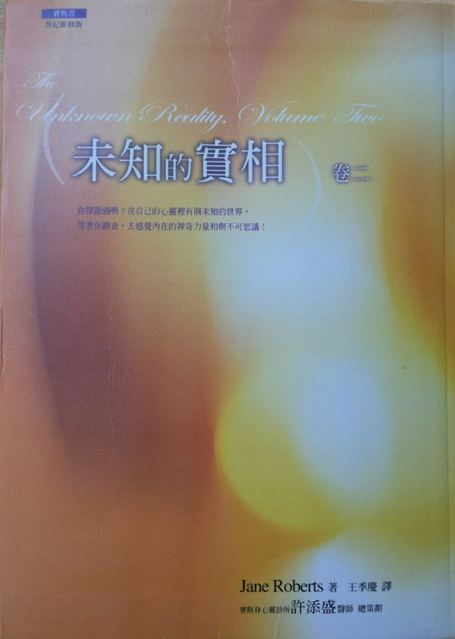

# 赛斯书：未知的实相（卷二）

## 赛斯的诗

“自然，若无自然之源，

无法存续片刻”

赛斯

一九七七年九月十九日

## 带着羽翼

珍•罗伯兹

以带着羽翼之脑

我们俯冲盘旋于

外在世界之

蓝铃内。

弧形次元之鸟

其活动领域

被天花板的

骨与血的重量

局限。

但时空本与我们一体。

那无限的头骨

开敞天空全蜷伏其内，

一重又一重的迷你世界。

（罗注：当珍在一九六一年四月这首诗时，她是三十二岁。这诗清楚的预示了她在十九个月之后开始传述的赛斯资料之某些理念。）

## 罗的前言

赛斯一直将《未知的实相》当作一个单元来谈，直到我们到达了最后一节。他将稿子分成不同长短的六部。

赛斯以这样一种方式展现这整件作品，以至于我们日常生活的事件密切与他的资料相连，作为他的理论如何在每日经验里实际发生作用的个人化实例。于是，在他开始口授《未知的实相》后不久，我便明白我必须设计出一套办法来处理他的资料、我的注、由珍 ESP 班的摘录、附录，以及任何其它可能会包括进去的东西。

当赛斯继续口授时，他要令人类生命之“未知”成分至少部分变得“可见”的目的鼓舞了我，而我试着尽我一分心，记录下出现在我们生活里，以及反映在我们的朋友和学生的经验里，所有的这种迹象。

如此，累积的资料更增加了这书的长度。最后，我们选择将之分为两卷。

读者请重阅赛斯在卷一中的序，它有助于将两卷统合起来。

我在一九七七年一月将卷一准备好付梓，我们很高兴当我在准备卷二时，大家已可先看到资料的那部分。但我花在写卷二的注上时间由几周延展到几月，而我变得越来越担心了。比起赛斯—珍花在口授卷一的约四十五个小时，我花的时间真是不可同日而语了。

珍坚持说我的注是重要的，给了读者一个日常生活范畴里发生的心灵或内在事件的不断提醒。有时我认为她如此向我保证只不过是好心罢了。赛斯也同意那些注、附录等等都是切题的。他也强调，我们分割这本书的计划是直觉地正确的，并且建立在合法的内在知识上。当然，这令我振作了不少。

每回我在所有那些末出版的课里搜寻那恰当的补充材料时，好像总会发现些新东西，这时常令我以未预期的方式重写我的注。这种插曲常使我花上长得多的时间来制作最后的成品，我学到了我从不以为我可能有的耐心。

赛斯本人不止一次给我援手——而其它人在许多情形里也会发现他以下的资料很有用，摘自一九七五年六月三十日的第七五一节，那是在他讲完这本书之后两个月时上的：

“现在：你不需要替《未知的实相》担心。在另一个可能实相里，你已完成了它，并且做得很好。

“它们及你的注的模型已存在于你心智里。扫描一下你的注之任何一行，随之将你的心智向侧面轻移半格。当你如此做时，你将可感觉你自己完成了的版本，而任何不适合的字会立刻被感觉出来，同时另一个字会立即滑入你心里。

“且说，你已选好的最后段落已然在可能性里了。那个可能性适合你现有的现在——然而你却是由无可数计的其它实相里选出它来的。这书是由你、我和鲁柏的可能性里升起的。

“在有些可能性里，我们未相遇。不过，纵使那些，也包含了我们将碰头的可能性，因为在这儿我们真的相遇了。”

在我给卷一写的前言里，我谈到把赛斯资料里包含的基本“艺术性概念”在我们日常生活里，赋予有意识的、美学的、实际的用途。就我看来，那才是赛斯书的真正意义。这种努力基本上涉及了对一个理想的追求，并且代表了我们的企图：想赋予每个人直觉感受到的“宇宙了不起的内在创造性骚动”一个物质性及精神性的形状。当然，珍和我想要赛斯和我们的理念触及别人的心弦，然后每个个人能在他自己对那有用的理想之表达里，利用这资料，让它激发内在的感知。

至少，就珍而言，“灵媒”的角色极具挑战性，并且也是很艰难的：在我们西方社会里，面对内在感官，比与，比如说，化学、或耕种、或贩卖，或任何其它种种的“实际”工作奋斗，要难多了。

珍所能提供的是研究意识本身的结果，如它透过珍自己的经验与能力表现出来的。出自她自己的抉择，在她和外在世界之间她没有缓冲物——例如说，没有被保证的地位。她没享有一位科学家享有的保护，后者深入刺探一个特定的主题，然后从一个安全地在研究领域之外的“客观”位置，做一个有学问的报告。在同时，我知道珍觉得有责任“发表她的结果”，并使别人可以分享之。以，比如说，科学根本不了解的方式她是很坚毅的。

不过，她的工作仍由许多人那儿得到了很多的了解，虽然绝非每个听到过的人都是如此。若要问：纵使是广为人接受的资格，又如何能帮助她对她及赛斯有时碰到的极端情感的反应，会是个有趣的问题。那些极端情感包括：断然的排斥或全然的阿谀——或她有时收到的威胁，说着赛斯不立刻替他们传过来一课的话，他们即将自杀。

在一些重要的方面，珍的工作是在社会接受的框架——科学的、“玄秘的”、哲学的，或不论什么——之外的。我们并没心心念念于那种孤立感，但却是觉察它的。而且我知道珍有时怀念那种较安适的锲入被接受的结构之专业者所享受的同志之谊。不过，实际上，我们将我们许多来信的读者视为朋友，纵令我们从未见过大半的人，并且珍也只能以赛斯口授的信，或匆匆写了几个字的名信片去回复他们令人鼓舞的来信。我们对那种支持已变得相当觉察，并深为感激。许多这种人多少有点像我们——拒绝去接受任何一种的教条。

但照赛斯所说，有些其它人则对珍精神上的独立觉得不自在。一九七七年给我们的一节私人课里，他说：“有些人不要我的权威受到质疑。（幽默的：）他们认为，如果他们拥有他们自己的超灵，他们会远比鲁柏懂得情理；而他们会用我如我是个神奇的神仙一样。他们害怕鲁柏可能会质问我到令我消失无踪……”他继续说：这种人并不了解，原先就是珍的质疑天性激发了这些课的开始，并且多少促成了他及珍的工作和书的制作。

并且以一种或另一种方式，珍带着所有那些书从一个实相到另一个实相。在 ESP 班，赛斯称之为她“挚爱的行头”，或象征符号，然后继续：

“不过，那些书不止是象征。它们是代表另一个东西，一个实相之认出的方法；代表字句的符号——在字句诞生前说出的；印在分子上的字句：在分子诞生前，以其它方式铭刻的字句：然而，却又是在你们（对班上成员）自己个别心灵里回响的字句。这些字句多少像圆漂石，被遗留在你们（集体）实相的沙滩上。

“有些人会拾起它们而说：‘多可爱的石头啊！’并且凝视它们而看出它们的意义，而其它人则会将之踢到一边。但以某种方式……那些字句继续说出，不论是透过这些嘴唇，或透过树叶的声音，或透过你们自己细胞的隐形音乐。因而它们的确存在。而那就是这些书及象征符号背后的意义。”

显然赛斯是说，珍的（及他的）书代表了她对一个理想的承认和追求。我自己在人生中的努力也是如此（见卷一第六九六~第六九七节里，赛斯谈“在人心中的理想”）。切合这种观念，我将引用赛斯给珍和我的一节私人课里的话来结束这前言，他在那节里重申个人以及追求理想的重要性。赛斯借跟我谈每个人能创造，并且安住其中的‘安全宇宙’来开始下面几段话。虽然他的话是冲着我说的，它们却适于一般广泛的大众：

“在你心里，你创造性的想象那理想——某个未来文化之健全性，那是你希望我们及其它人的努力会带来的。如果不在明天，那么总有一天。

“当你透彻的了解整个安全宇宙的概念为何时，那么，物质的、文化的气候就被视为那理想得以借之表达的一个媒介。如果理想没多少被实质的展现，它是没有意义的。理想寻求表达。在如此做时，它常仿佛以未被了解的方式改变了。然而，那些扭曲可能正是容许别人能看见那些开口本身呢。

“以一种方式，就这书及你的画而言，你的目的是表达那理想，显然，而那表达必须被实质的具体化。你的喜悦、你的挑战，该是在如何所见的理想之展现里，不论以你的说法你能否计算其后果或障碍——不论以你的说法那表达是否先成了——并且纵使它彷佛落在它不会生长的土地上。

“作为一位艺术家，你唯一的目的是表达，那涉及了揭露在理想与实际之间的区别。在理想的表达中要不顾一切，而它将永不会辜负你。温和的对待它，那你就是在一场战争当中。”

要真正做到赛斯定义的不顾一切——多大胆啊，我要说，达到这样一种状态代表了相当的一种成就。对我们大多数人而言，包括我自己，它意味着蜕掉许多重局限性的个人信念。我的确瞥见一眼那种内在及外在自由的状况，却只见到足以令我了解能由它流出的许多实际利益中的一些。我无法想到一个更好的目标。

## 第四部

探索。

研究心灵与私人生活及人类经验的关系。

可能的实相作为个人经验的一个路线。

与人类的“过去”及“未来”文明有关的个人经验。

## 第七〇五节：演化，细胞意识，以及基因资讯的改变

一九七四年 六月二十四日 星期一 九点九分

（第七〇四节是在一周前举行的，在其中赛斯给了第四部的标题，因为隔了这么多天，而且有很多别的事在忙，因此，珍根本就忘了《未知的实相》进行到哪里了。当我们在等赛斯过来时，我把那标题念给她听，她说“我完全不知道那是什么意思。”）

晚安。

（“赛斯晚安。”）

口授：让我们以对“演化”的一个短短的讨论来开始这一部。

暂且把它放在时间的范畴里，像你们通常所做的一样。在过去大家有一个时兴的信念，认为每个物种都很自私的为了它自己的生存而打算。每一个都被看作是在与其它物种的竞争中，在那个架构里，合作只不过是求生存之主要动力的一个副产品而已，举例来说，一个物种可能会为了求生存而利用另一个物种。物种被认为会改变，而“变种”形成了，乃因为环境里的一个改变，任何一个物种必须适应它或消失。其背后推动的力量永远被投射到外面（附录十二）去了。

所有这些呈现出一幅十分错误的画面。实质地说，地球本身有它自己那种的完形意识。如果你一定要的话，那么你可以把地球意识想作是由相当“迟钝的”沙尘及石子向着矿物、植物及动物王国按等级上升的一个大的觉性斜坡（slope of awareness）。即使如此，要记住，那些王国其实并没有这样分隔开，而是每一个都和其它的非常密切的相连。在一个这种王国发生的任何事，没有不影响到其它的王国的，不过，在那些仿佛分离的系统之间存在着一个了不起的天生合作。如果你记得，甚至原子与分子也有意识，那么，你就比较容易了解，的确有某一种的觉性统合着这些王国。

以你们的说法，“对自己的意识”之发展并不是因为你们的族类在任何外在的环境里获胜之故，事实上，任何一个人的那种“对自己的意识”是依赖着存在于矿物、植物与动物世界之间经常而奇迹性的合作。内在的意向永远形成任何外在的改变，这适用于你们用到的任何尺度。意识形成环境，环境本身是有意识的（有力的）。原子与分子本身在他们自己的可能性范围内运作，以它们自己的方式，它们“渴求”所有可能的发展，当它们形成活生生的生物时，它们变成了物种改变的一个物质基础。身体的可适应性并不只是一种适应的机制或性质，细胞有你们还未发现的内在能力，它们在自己内涵藏着它们曾为其一部分的所有“先前”形成之记忆。

在这儿我想说一句题外话：以某种说法，你们无法以一个核灾难毁掉生命。如果条件对了（或错了）的话，你们当然会毁灭如你们所知的生命，并且把你们熟悉的生命形式带到终点。可是，广义的说，变种的生命会出现——只由你们的标准来说才是变种——但对它本身而言却是十分自然的生命。

（九点三十八分。）现在回到我们目前的主要论题：事实是，所谓的演化过程是极度依赖在所有生命的属性及所有物种与生俱有的合作倾向上。并没有灵魂的轮回（transmigration），在其中一个人的整个人格作为一个动物而“回来”。然而，在物质的架构里有一个经常的彼此相混，因此，一个人的细胞可能变成一株植物或一个动物的细胞。当然，反之亦然。曾经是一个人脑之一部分的细胞以它们自己的方式明白这一点，现在组成你自己身体的那些细胞曾经组合及分解过许多次，以形成自然环境的其它部分。

意识的这种内在的物质性的转生一直是极为重要的，而代表了一种自然的沟通方法，统合了所有的物类及所有的物质生命。所以，在所有物质的有机体之内有一种想要发展与改变的冲力，而同时也有一种稳定的模式在那儿，让这种改变能在其中发生。

请等我们一会儿……

当然，历史性地说，你们追随着一种单线的思考模式，所以你们看到一幅画面，在其中鱼离开了海洋而变成了爬虫类；从这些，哺乳类最后出现了，然后是猿类及人类。我承认那是一个简单的说法，但那却是大多数人认为演化发生的方式。“进步”这个字眼很诡谲。举例来说，你从不会想象那情况反转过来。你们很少人会想象一个有意识的爬虫人，在你们看来仿佛你们所采取的方向是唯一可能的方向。

请等我们一会儿……

你们把一个高度演化的自我意识与你们自己族类的发展及你们自己那种感知的机制认同。不论何时，当你们检查任何其它种类的生命时，你们都把这些当作是法则或条件。在你们的可能系统里没有爬虫人，然而，在其它的可能性里，他们真的的确存在着，我提及这点，只不过是要告诉你们，你们所认知的演化系统只不过是这种系统之一而已。（热切的：）可是，其物质性的基础是潜伏在你们自己细胞结构之内的。你们认为演化已经结束，但是演化的动力是来自意识的本质本身之内的，它一直是如此。今天在某些地方很时兴说人的意识现在是一种新的演化里的一种因素——但那“新的意识”一直是潜在的，而你们只是现在才开始认识到它的存在。每一个意识都觉察它自己为它自己，那么，每个意识都是自我觉察的，它也许不是以跟你同样的方式自我觉察，它也许不会反思它自己的状况，然而，在另一方面来说，它也许没有那个需要。

（十点二分。）

请等我们一会儿……

所谓你们族类未来的发展是依赖你们现在的想法与信念，就个人而言，这也适用于基因方面。举例来说，如果你相信，你可以活到一个健康而快乐的老年，一直到九十九岁，那么，甚至在西方的文明里你也可以办得到这一点。你的情感意图与你的信念会指挥你细胞的作用，而（强调的）带出在它们内会保证这样一个状况的那些属性及天生的能力。有些在孤立地区的一群人持有这种信念，而在所有这种例子里身体都会响应，同样的情形也适用于种族——或更精确的说，族类。在细胞本身之内有无尽的创造力，那是你们作为一个族类所没有利用到的，因为你们的信念远不及你们天生的生物性灵性及智慧。你们的想法正开始改变，但除非你改变你的架构，否则你会继续强调医学与技术的操纵。在孤立的例子里里，这会让你看到光是在一个身体的基础上之某些可能的结果。不过，这种技术对群众面言并不会起作用，也不能让你，好比说，去延长有效的、有生产力的人生，除非你也改变在其它范围的信念，并且学会心灵的内在动力学。

你可以休息一下。

（十点十四分到十点三十六分。）

现在：那么，细胞的运作真的是一方面在时间之外，而在另一方面却有一个在时间之内的稳固基础的。因此，产生了作为一个时空有机体之身体的健全性。

的确，在一个有意识的层面上，你们还未能在时间之外运作，却是被时间所局限。当你们学会多少让你们自己脱离那些次元的限制时，你们不只是复制或“回到”某些更广大的状况，却是对那个状况加上了一个新的因素。你们所拥有的那种自我觉察是独特的，但所有的每一种都是独特的。作为一个个人，你的每个胜利都反映在你们的族类及其细胞的知识里。

请等我们一会儿……

以一种说法，你们就是你们自己的变种（mutants），创造性地改变细胞的形成。举例来说，当你们的命运似乎依靠遗传时，那么，概念与信念的传递就在运作，而给了染色体信号。可以说，它们造成了缩版的自我形象，而反映在细胞里。在许多情形里，这些形象可以被改变，但却非以你们现有的技术。

（在十点四十八分停顿良久。）请等我们一会儿……

（停了超遏一分钟，然后安静的：）基本上，细胞的理解力跨越时间，于是，有一种方法来引介“新的”基因资料给一个现在所谓受损的细胞。这基本上涉及了意识而非精巧器械的操纵，同时也涉及了一个时间逆转的原则。首先，那不想要的资料必须被抹掉，它必须在你们所谓的“过去”被抹掉，有些——但非常少——灵疗者自动的这样做，却不知道他们在做些什么。身体本身常常自己这样做，它自动改正某些状况，即使当那些状况是印在基因上的时候。那些印记变得逆转了，以你们的说法，它们退回到一个可能的事件系列里，而不会实际的在身体上影响你。

口授结束。

（十点五十七分暂停。在传递一些其它题目的资料之后，赛斯于十一点二十分说再见。）

## 第七〇七节：细胞，可能性，梦，心智的大地

一九七四年 七月一日 星期一 晚上九点二十一分

（第七〇六节仍照常举行，但赛斯在那节中没有做本书的口授，所以我把它删掉了。）

（今晚早些时我提醒珍，我们因为赛斯在第七〇五节九点三十八分的资料而谈到关于细胞及其组成物的关系，我认为今晚一部分的资料就提到由我们的谈话而衍生出的问题，而赛斯在本节快结束时短短的澄清也是因此而生的。）

现在：晚安。

（“赛斯晚安。”）

口授……细胞当然是在改变，在它们之内的原子与分子永远是在一种不断改变的状态。在所有物质内的意识单位（CU’s）有一个远远超过任何计算机的记忆库。所以，作为细胞的组成物，原子与分子携带着它们曾经为其一部分的所有形式之记忆。

在一些深的层面，细胞永远在处理可能性，并且借助着基因信息来比较可能的行动与发展，举例来说，在能跨出一步或动一动你的手指之前，就涉及了最细的行为及瞬间做出的计算。不过，这并不只涉及物质有机体之可预言的行为而已，在这些更深的层面，细胞的活动包括了对身体之外的环境做出预知性的判断。身体显然并不是单独运作的，却是在与它周围的每样东西之关系里运作的。当你想要走过一个房间，身体的运作必须不只是在关系到它自身的行为上利用到后见之明以及“预知”，并且它还必须把在那个房间里所有其它的元素之预知性活动纳入考虑。

请等我们一会儿……

当然，在基本的层面上，一个肌肉的动作涉及了细胞及细胞组成物的动作。在此我是说原子与分子本身因为它们的特性，不只在处理身体的细胞结构之内的可能性，而且还帮助身体做出有关在它之外的人或物之预知性判断。

（停顿，然后幽默的：）你“知道”一张椅子不会追得你团团转——至少机会不大。你知道这个，因为你有一个推理心，但那特定一种的推理心知道它所知道的，是因为在一些更深的层面上细胞觉察到可能的行动之本质。不过，意识心的信念设定了你的目标与目的。“你”是那个决定要走过房间的人，而后所有这些内在的计算发生了，以助你达成你的目标。所以有意识的意图启动了内在的机制而改变了细胞及其组成物的行为。

以远为广义的说法，你们人类有意识地设定的目标也促成了同类的内在生理活动之运作。这个族类的目标并不与个人的目标分开存在，所以，当你在过你的生活时，你正非常有效的参与了你们族类的“未来”发展。让我们来看一下私人的心灵：

（九点四十八分。）

“私人的心灵”听起来像是一个很不错的名词，但除非你把它应用在你的心灵上，否则它是没有意义的。稍微自我检查一下，你就会知道以一种非常简单的方式你是永远在思索可能性的，你永远在可能的行动与替换的方向之间做选择。一个选择预设了可能的行动，每个皆可能，每个在你们的实相系统里都可能实现。

你们的私人经验中充满的这种决定，远比你通常所了解的要多。每天都有小小的无害例子出现：“我要去看电影呢还是去打保龄球？”“我应该现在刷牙还是待会儿呢？”“我应该今天还是明天写信给我的朋友呢？”也有关于事业、生活方式、或牵涉其它更深的东西之更切身的决定。以你们的说法，你做的每个决定都或多或少改变了你所知的实相。

### 练习单元 9

作为一个练习，花一天左右的时间记下所有你发现自己在设想的或大或小的可能行动，在你的脑海里试着去追随如果你采取了你没采取的路线的话，“可能发生了什么”。然后想象因为你所选择的决定可能会发生的事。你是人类的一员，你私下做的任何选择都在生物上与心灵上影响到人类。

你真的可以在健康与疾病之间作选择：在较集中于精神上而非物质上或较集中于物质上而非精神上作一个选择。这种私人的决定影响了人类的基因遗传。你的意图是最重要的——因为你可以在某个限度内改变你自己基因的讯息，举例来说，你可以使得一个细胞或一群细胞改变它们的自我形象：而另一方面，你常常在这样做——当你治愈了自己的疾病，因为你有一个想要变得健康的意图。那个意图会是有意识的，虽然那个方法不一定会是。不过，在这样一个例子里，细胞自愈的特性被加强了，而人类自愈的能力也被加强了。

你可以休息一下。

（十点五分到十点三十二分。）

现在：你私人的心灵密切的关怀你俗世的存在，而在你的梦境里，你与可能的行动打交道，而常常找出在那个情况里升出的有关一连串可能事件之间的解决之道。

那么，在许多情形下你给自己设了一个问题——“我应该做这个还是那个？”——而形成了一个梦，在其中你跟随着可选择的方向到会“导致”的可能未来。当你在睡觉与做梦时，你化学与荷尔蒙的活动忠实的追随那些梦的方向。那么，甚至在你接受的实相里，到那个程度，你在这样一个梦里对可能的事件反应，同时也对你选择为醒时实质经验的事件反应。你的日常生活受到影响，因为在这样一个梦里你处理可能的可预知性。不过，你并不是单独一个人的，所以，每个活着的个人也有他私人的梦，而这些有助于形成下一天以及“未来”之被接受的可能系统。在任何特定的一天里，所有个人的决定加起来就成了全球性的事件。

请等我们一会儿……

（停了很久，眼睛闭着。）有心智的大地，那就是说：心智有它自己的“文明”，它自己个人的文化与地理，它自己的历史与倾向，但心智是与物质的脑相连的，因而，在其（脑子的）皱褶里隐藏着一个考古学上的记忆。以你们的说法，到某个程度，你现在所知是依仗着将来会知道的东西。到那个程度，过去的人种现在住在你内，还有那些仿佛后来会来的人种也一样。所以，理想的说，你们族类的历史可以相当清楚的在心灵之内被发现；而真正的考古学事件不只是由挖出的岩石与遗骸里找到，并且也是经由把所谓居住于心灵之内的记忆带到光天化日之下而找到的。

那么口授就到此结束。

（十点四十五分。接着赛斯透过来给了珍和我一页资料，在其中有这些话：“附带的说，我相信我替你解答了问题。细胞，作为存在体，不会像苹果一样的掉出物质的形式。我假设我是在用我相信在所有的范畴内很清楚的速记。”）

（在十一点一分结束。）

## 第七〇八节：意识，密码系统及地球上的循环，身体的治愈能力

一九七四年 九月三十日 星期一 晚上八点五十八分

（一开始珍和我并没有想到，但我们却从七月一日的第七〇七节之后就歇了很久而没有从事本书的工作。当然，我们在其后的十四周里都很忙，以下就是关于我们的一些活动之记录，按照主题而非时间先后组织起来的。

（我们的确有几次被删掉的课。珍也继续着她的 ESP 课，而在那自发性的情况里，她常常替赛斯说话，或用苏马利唱歌。书的口授之中断给了我时间经常的参与 ESP 课，而我计划继续这样做。而当我开始上课时，我重新发现课松散的结构有促成一些小小的心灵事件之作用，那是我非常喜欢的；星期二晚上有课，而常常当我在那个下午休息半小时，就发生了这种经验。我记录了每个插曲，有时我还画了一些插图，而用它去补充我对班上事件的描述。

（珍花了全副精力去完成她（心灵的探险）的稿子，同时我则稳定的为她画些图表，同时还为《灵魂与有生灭的自己在时间里的对话》画插图。

（自从我在三个多月之前给最后一节打好字之后，我就没有再看过《未知的实相》；珍上个礼拜把赛斯这本书的所有资料都重看了一次，然而，今天她仍然必须提醒她自己第七〇七节的内容。

（当我们在八点五十分等课开始，珍觉得有一点紧张，在中断书的口授一阵于之后她常会如此。）

晚安。

（“赛斯晚安。”）

现在，口授：意识以你们也许可称为密码系统的方式来运作，这些系统是数不尽的。因此，意识借由在某些密码系统之内运作来使自己特殊化，那些系统有助于指挥某些特定种类的焦点，带进某一种的重要意义，而同时阻挡掉其它的资料。

当然，这些其它的资料也许在不同的密码系统里很可能很重要，不过，以它们的方式，这些系统是彼此相连的，所以它们之间在其它的层面有交流——你可以说，那是补充的资料，却没被主要地集中在上面。

这些密码系统涉及了分子的结构及“光值”（light value）（注一），并且，以某种说法，你们用“光值”就如同你们用字母一样的精确有效。举例来说，某些类的生命显然对你们不太熟悉的光谱反应——但超过那个之外还有电磁的领域，或不如说，电磁领域的延展，那是完全不为你们所知的，而其它的生命形式却会对之反应。

再次的，所有这些密码系统（注二）都是互相关联的。以同样的方式，私人的心灵在其内包含着对其它替代实相之暗示及线索，可以说，这些在你们官方承认的存在之下像次要的密码那样运作。这种次要的系统可以告诉你很多有关人类实相的潜力，那些潜藏着却可能在任何时候被“提升到”主要的重要性。这种次要的系统也指出对个人或族类而言可能的发展方向。

人类实际上可能发展的所有可能性因此都多少存在于每个个人之内。任何你可能想象的生物性或灵性的进步当然不会来自一个外在的媒介，却是由内的来自化成肉身的意识之传承。一般来说，那些活在这个世纪的人们选择了一种特殊的取向。人类选择精于某种身体的操纵，把他的精力致力于某些方向，而那些方向带来了一个有它自己的独特性之实相。换言之，人并没有把他自己驱入一个死巷里，他一直在研究他意识的本质——用他的意识仿佛它是与自然分开似的，因而他以一种特殊的看法去看自然及世界。那种看法终于令他感觉孤立、孤独，而到某个程度相当无力（热切的）。

（快速的）他正在学习如何用他自己意识的光，而发现到底一种利用它的特定方法可以被用到什么程度。他正在学习以那个特殊的焦点他可以做到及做不到什么。换言之，他现在正在发现他还需要其它的光——他一直只依赖着一整个内在探照光之一小部分而已，而那探照光却是可以用在许多方向的。让我们看看那些其它方向中的一些，它们也是人类意识天生固有的，仍然等待着被有效的利用。

我是在以你们历史的说法来说的，因为在你们所知的历史系统之前，人的确曾实验这些其它的方向，并且有某种程度的成功，但这并不意味着，现在的人曾由一些更高的灵性成就堕落到他目前的状态。

（九点十六分暂停。）意识形成俗世的经验及规画出历史的次序时是有周期的，所以除了你们自己的族类以外还曾有其它种的人类，每一个都以他自己的方式来处理物质性的资料。因此，有一些曾采取了非你们所选择的其它方向，不过，即使那些路径也是次要于或潜藏在你们私人的及群体的经验之内，它们居于你们之内，呈现出你们私人的或群体的按照自己的意愿可以选择或不选择的替代实相。

当然，每个系统带来它自己的文化“技术”、艺术及科学。医学上来说，远超过你们目前的了解，肉体基本上是配备好可以维持它自己为一个健康而长寿的有机体的。细胞的理解力提供了十分自然地运作的各式各样的内在治疗法。在身体与环境之间有超过你们认知的一种物质上的相互取予：在此有一种你们不觉察的一种动力学，统合了植物、动物及人类的健康。

举个最简单而世俗的例子，如果你住在一个相当平衡良好而健康的环境里，你家里的植物及家畜也会健康。你形成你的环境，而你也为其一部分，但你却常忘记那个关系而对它反应。理想的说，身体有那个能耐维持它自己在极佳的健康里——但还超过那个，能维持它自己在体能成就的最高峰上。你们最伟大的运动家的成绩给了你们关于身体真正的能力之一个暗示。不过，在你们的信念系统里那些运动家必须训练并且集中他们所有的注意力在那个方向上，因而常常牺牲掉他们自己其它部分的经验。但他们的表现让你们看到身体所能办到的。

现在，再次理想的说，身体是配备好让它自己摆脱任何疾病的，并且能一直维持其稳定到你们所谓的老耄之年，而只有渐近的整体改变。不过，在最好的情况下，那改变会带来灵性的改变。举例来说，当你离开去度假时，你把房子关了起来。在这些理想的说法是，死亡会涉及你自己（肉体）房子之关闭，它却不会崩塌在你四周。

（在九点三十四分停顿。）现在，某些个人看到了身体的这种了不起的自然治愈能力，并且利用它。医生们有时碰到它，当一个患有所谓绝症的病人突然恢复时。“奇迹式的”痊愈只不过是未受阻碍的自然之例子。如先前提及的，完全的医生会是一个了解身体真正本质及其潜力的人——他因而会把这种概念传给别人，并且鼓励他们去信赖身体的可靠性。身体的某些能力在你们看来会像是不可能的，因为你们没有支持它们的证据，许多器官能完全的取代它们自己：生病的部分可以被新的组织所取代。

（停顿，说得较慢。）许多人不知不觉中得了癌症又摆脱了它；被手术割除的阑尾又长了回去。实际的说，身体的这些力量，在生物学上是十分可达成的，但只有借由一个焦点与信念的完全改变。你们的坚持把你们自己由自然分开，自动的阻止你们信任身体的生物面，而你们的宗教观念更进而使你与肉体的灵性疏离了。

在另一方面，在你们的实相里，你们常常把意识与身体认同——那就是说，你们把你们的意识想作是永远在你们的肉体之内，然而，许多个人曾发现他们自己全然有意识而且有知觉的在身体外面（包括珍和我）。

（九点四十五分，在九点五十分以较慢的步调继续。）

所以，在某些情况下，当“主要的意识”离开身体的时候，身体仍可以维持它自己。那么，身体意识是颇有能力提供那整体平衡的，在睡眠状态的某些层面这事实上的确发生了。在梦游时身体是活动的，但主要的意识并没有“醒来”，它并不在操纵身体，而是在别处，在这种情况下身体能执行任务，并且常常以一种令人惊愕的平衡感操作。再次的，这种技巧暗示了通常没被利用的身体能力。因为其信念，主要意识在正常的醒时生活里常常阻碍这样子的操纵能力。

让我们暂且来看看身体意识：它就像一个动物一样是配备好能在它的环境里美妙地表现的，你会称它为“无心”（mindless），因为它看起来仿佛是不用理性的。只为了这个讨论的目的，想象一个身体具有一个运作完美的身体意识，根本没有病，出生时也没有缺陷，但却没有你们所有的凌驾一切的自我主导意识。曾经有过具有这样子本质的人类，以你们的说法，他们会好像是梦游者，但他们的身体能力超过你们。他们的确是像动物一样的敏捷——他们也非无意识的，只不过是在与一种不同类的觉性打交道。

以你们的说法，他们并没有（一个整体的）目的，然而，他们的目的只不过是活着。他们的主要意识点是在别的地方，在另一种的实相里，而与他们实质的显现（肉体）分开。他们主要的意识焦点几乎不觉察他们创造出来的身体，然而，即使那些身体也“透过经验”学习，而开始“醒过来”，变得觉察到他们自己，开始发现时间或创造时间。

（停顿。）我们将称之为“梦游者”的这些人，他们对他们自己而言并不是睡着的，而只是从你们的观点来看才仿佛如此。曾有好几种这样子的人类种族，他们（整体的）主要经验是在身体之外的，实质的肉体存在只是一个次要效应。对他们而言，梦中生活才是真的，它包含着最高的刺激、最集中的经验、最被坚持的目的、最有意义的活动以及最有组织的社会与文化行为。现在，可以说，这是你们自己经验的另一面。这种种族让物质的地球保持它的原貌，那么，主要的活动涉及了与身体分开的意识。以你们的说法，物质的文化是初步的。

现在，像这样子的物质有机体是能胜任那种实相系统，那种系统并不比你们自己的更好或更坏，它只不过是在生物上与灵性上可能的替代行为。没有复杂的具体交通系统被建立起来。在物质的状态里，在你会称之为醒时状态里，这些人睡觉。比较上对你们来说，他们醒时的活动会仿佛像梦似的，然而他们的举动却有了不起的自然身体上之优雅，让身体发挥到最大的作用。且说，这种身体不会像你们的那样变老到那个程度，而能享受最大的自在以及与环境的归属感。

（十点二十四分。）

那么，与肉体相连的意识在灵性上与生物上是有极大的余裕，而除了你们自己特定的取向之外，还能以这个肉体并透过这个肉体把他自己贯注在许多方面。曾经有过高度成熟的、已开发的文明，在你们看来不会很明显，因为其主要的取向是精神性或心灵性的，同时，物质的种族本身会看起来像是非常未开发的。

我许多的读者在有些他们自己私人的梦里会发现一个与正常实相几乎一样生动的实相，有时候还更生动些。这些经验可给你我所说的那种存在一些模糊的暗示。也还有与某些动物的冬眠能力相连的身体器官可以对意识与身体之可能关系提供更进一步的线索。举例来说，在某些情况下，意识能离开肉体，而肉体还是可以维持完整——作用着，但却在一个维护的层面。当最好的条件回来时，意识随之重新启动身体。这种行为不只是在动物才是可能的。在与你们自己不同的系统里有一些实相，在其中物质的有机体在你们看起来好几世纪不活动之后又被启动了——再次的，当条件是对的时候。到某个程度，你们自己的生死周期只不过是如你们所了解的冬眠原则之另一面而已，你们自己的意识几乎以讯息跳过神经末梢同样的方式，离开身体，同时，意识并没有被毁掉。

现在，在那些冬眠动物的例子里，身体是在同样的状态。但在你们自己经验之更大的冬眠里，身体作为一个整体变得不能运作了。你身体内的细胞明显的经常在死亡，你现有的身体不是你在十年前有的那个：其物质的组成物自从你出生以来已经完全死去许多次，但再次的，你的意识连接那些空隙（做着手势）。反之，它们可以被接受，在那种情形，在你看起来会仿佛，好比说，在七岁（热切的）或十四岁或二十一岁你是一个转生的自己。可是，你自己觉性的那特殊顺序一直连续不断。以基本的说法，身体常常死，并且就与你认知的你所认为的那一次死亡同样的确定。在许多次场合它实质的瓦解了，但你的说法是相当于一个“未来的”发展。

在你们的实相里，知识通常是透过书籍及历史性作品而一直传下来，然而，每个个人在他内都包含了一个广大的宝库：以你们的说法，那是透过无意识的理解所得到的对过去直接的知识。

未知的实相：那个实相大部分之所以为“未知”，只因你们的信念把你关在你自己知识之外了。你自己意识之所及是没有限制的。因为你接受一个直线移动时间的概念，你就无法看到你所认为你的出生或死亡（附录十三）之前或后，然而，你更大的意识是颇为觉察此种经验的。理想的说，你不仅可能记住“过去”世，并且现在就可以计划未来世。广义的说，所有这些“世”都同时发生。你们目前的神经结构使得这个看起来好像不可能，然而，你的内在意识并没有如此受阻。

（较大声）你可以休息一下或结束此节。

（“那休息好了。”）

（十一点到十一点二十五分。）

现在：

### 练习单元 10

在你有意识的注意力里你可以保有的资料远比你知道的多。你曾把自己催眠到相信你的觉知是非常有限的。

回想一下昨天，试着记起当你起床时你做了些什么，你穿什么。试着跟随从你醒来一直到你去睡觉的时候你活动的顺序，然后填入那些细节。试着回想在所有那些时候你的感受。你们大多数人能够记到这里就很侥幸了。你们那些记得起来的人，再进一步试着回想你也许有的白日梦，试着记起来到你心中的迷路念头。

在一开始时这样做会占据你所有的注意力，你可以安静的坐着，或在搭公共汽车，或在办公室等人时做这个练习。你们有些人也许能够在你们从事一系列多少是自动的活动时做这个练习——但举例来说，不要试着在开车时做。

当你变得更熟练时，随之故意在同时做些别的事——好比说，一种身体上的活动。当你们大多数人开始这练习时，会像是根本就失去了感官与身体活动之精确而精细的对准；然而，当你继续进行时，细节会变得清楚，而你能至少在心里保有昨日实相之某些面，同时维持住你在今天的立场。广义的说，有其它整个的一生，对你来讲基本上就像昨天一样被遗忘了。可是，这些也是一连串的次要活动，浮在你目前的主要关切之下。它们就像昨天一样，无意识地是你目前的一部分，并且也一样的与它相连。

现在：练习的第二部分。

生动的想象你明天要做什么，而详细的计划一个可能的日子，它自然的由你目前的经验、行为与目的升起。一直做下去，就像你在这练习的第一部分做的一样。（停顿。）那一天的实相已经为你的细胞所预期，你的身体已经为它准备好了，其所有的机能预知性的投射它们自己的存在到里面去。你“未来”的一生以同样的方式存在，而以你的说法，就与你的明天由你的今天长出来那样由你的目前长出来。

做这个练习就会使你的正常意识认识到对它自己的弹性之感受。你会锻炼你的意识看不见的肌肉，就像你能以体育运动锻炼你的身体一样的确定。

对你自己的其它部分而言，你看起来会像是一个梦游者，可是，在任何一刻完全的创造性参与会使你觉醒到你自己的潜力，因而容许你去经验在你自己意识与你身体细胞的理解之间的一个统一。那些细胞就与你的灵魂一样的有灵性。

（十一点四十分。）现在，请等我们一会儿，等久一点，这不是口述。

（接下来是给珍和我的三页半资料。这儿是一些浓缩的，比较一般性的摘录：）

在你们的社会里，你多少被教以不要信任你自己，有各式各样的学派与宗教试着表达“自己”的有效性，但它们的扭曲埋没了它们的教诲之基本可靠性。

以那种说法，身为你们的一员，鲁柏白手起家式的终于把目前流行的信念系统丢到一边去了，就像你也一样。有一段时候他根本就是在信念系统之间，完全抛弃了某些，而接受了其它的部分；但他主要是个先驱——而同时还带着社会上大半没被认识到的基本信念，即你不能信任你自己。

当你携带着那情感上的无形信念时，那么，自己做的任何事必须被审视，并受考验；在同时，曾经支撑着别人的那些信念则被暂时搁置一旁，所以鲁柏能力的发展会领他离开令人心安的结构，当他在找别的结构来支持他时……

他曾把他学到的大半东西拿去接受考验。他自己的人格在所有层面绽放出来，尤其是就与人的关系及个人的创造性而言……他曾经把我们的资料在他所知的世界里试验。他觉得那是必要的，因为被教以它是坏的“自己”如何能带来好的东西？

是有一些本来可以提供助力的架构，但他看出它们本质上并不可靠，而因此并没有依靠它们……

（赛斯在十二点十八分道晚安。珍整个这节的传达都非常精力充沛，在以上关于珍一旦开始舍弃她老而“令人心安的”概念，而去追求更新更大的信念架构之赛斯资料里，赛斯非常明白的处理了她为此生选择的角色之某些面。不过，我在这儿想强调的是珍的追求之情感面——以及那些特质所导致的有时曾令她非常难应付的那种的状态。到某个程度，我也卷入于许多信念改变里，但我在赛斯资料的发展里是一个参与者，而非其肇始者；我的压力与挑战没有那么厉害，（可是，以经过许多挣扎而生出的幽默，我注意到放弃某些珍爱的老信念并不那么容易，纵使当它们错误昭彰时；它们可能太适合人的个性了。）

（第二天加注：现在，请看附录十四，那是当我们今晚休息时珍发展出来的小小插曲。）

（注一：在《个人实相的本质》第五章的第六三二、第六二五节里包含着关于身体的内在声、光与电磁价值的作用之资料。第六二五节特别提到在原子与分子层面的那些属性。

（注二：见《卷一》的附录四。）

## 第七〇九节：比光速还快的活动及意识的旅行，可能性与历史，如何觉察未知的实相

一九七四年 十月二日 星期三 晚上九点二十一分

晚安。

（“赛斯晚安。”）

现在：口授：每件看来显然是三度空间的东西都有一个内在的来源，而其出现是由这其中跃出的。再次的，这些当中有些很难解释——并不是因为鲁柏没有那字汇，而是因为连续性的语言自动把概念预先包装成了某种模式，而想要逃过“预先包装”可不是一件简单的事。不过，我们要尽量试试。

你们所了解的细胞只不过是细胞之三度空间的面貌，如目前了解的超光速粒子（tachyons）（注一）概念基本上是合理的，虽然极为扭曲。在这样一个细胞以物质的样子出现之前，在那个细胞随后会显出它自己的那个点上会有“骚动”。那些骚动是先前快于光速活动的效应慢下来的结果，而代表了能量的进入你们时空系统，然后那能量可被有效的利用，而形成细胞的模式。

那个减慢过程本身就有助于“冻结”那活动成为一个形式。在一个细胞的死亡时，就发生了一个逆向过程——那死亡即是能量由细胞的形式里逃出，即其释出，这释出本身触发了某些加速阶段。有可称之为一个残余或残渣的能量“覆盖”着留在这系统里的细胞。所有这些都无法由这个系统内确定——那是说，最初比光还快的活动或后来的减速。那么，这种比光还快的行为有助于形成了物质宇宙的基础，这个特性是意识单位（CU’s）的一个属性，它们在形成 EE 单位时已经减慢到某个程度了。

（九点三十七分暂停，许多次暂停之一。）当透过身体结构运作时，如你们自己的这种意识大半聚焦在三度空间取向上。不过，在出体状态时意识能旅行得比光还快——事实上，这常常是瞬间发生的。

这经常在梦境里发生，虽然这样一种演出可以在种种不同的意识改变状态里达成。在这种时候，意识只不过是把它自己放在一种与时空的不同关系里，可是，物质的身体无法跟随。意识借由改变它自己与物质宇宙的关系才最能了解它自己的属性，并且由另一个有利的地点来看那物质宇宙，而可以以一种不同的看法来看它。在身体外面运作时，意识可以看得更清楚物质的属性。然而，它无法（热切的）以当它是物质取向时同样的方式去体验物质。

从你们平时的观点，旅行中的意识是在焦点外的，而没有以指定的方式锁定在物质的坐标里。可是，所谓的内在世界，至少在理论上来说，可以以这样一种方式探索。意识有一阵子使它自己由它通常的坐标里“解开”，当这发生时，出体的旅行者不只是离开了他的肉体形式。那个人踏出了适当的范围。即使当一个人离开了身体，而只不过漫游到离身体几尺之远的地方也有些改变（注二）——意识与那房间的关系不同了，那个个人与时空的关系已改变了。以你们的标准，出体的时间是“额外的时间”，举例来说，你不会变老，虽然这效应按照某些原则而有所不同。我以后还会提到这些（注三）。

（九点四十八分。）

这样一个旅行中的意识也许会在物质实相里旅游：虽然没有以通常的方式与那系统相连，它仍可以是与之联盟的。从那观点，物质本身将会看起来与普通的样子不同。在另一方面，一个出体意识也可能进入其它物质取向的实相：那些“以不同于你们自己的频率运作的实相”。意识之基本上独立的本质容许这样子的脱离。身体意识维持住它自己的平衡，而有点像一个维护站一样。

任何有关未知的实相的讨论必然会涉及某些通常被摒弃的关于意识本身的特性之假说。如你所知的世界是一套复杂的“密码”之结果，每个都环环相锁，以那种说法，每个都依赖着其它的，那么，你的被精确感知的宇宙其所有的部分都来自密码模式，每一个都完美地嵌入另外一个。改变这些之一到某个程度，你就踏出了那个范畴。任何一种事件若没直接的、无瑕疵的与你们的时空连续相交的话，以你们的说法，就不会发生，却掉了开去。它在你的系统里变成了可能的，却在找它自己的“层面”，而当它落入另一个适合它自己“密码顺序”的其它实相里的适当位置时，它变成实现了，就是如此。

（在十点十分停顿。）因此，当意识离开了物质身体，它改变了一些坐标。关于随后发生的感知之性质有种种不同的问题，而这些将在稍后讨论（但见注三）。至少就你们的说法，意识是配备好去集中其主要能量在身体内或者离开身体一段不同的时间。理论上来说，你们人类意识可以采取许多不同的路，同时仍维护着其身体基地。在久远以前的历史时候曾实验过种种不同的取向（好比上节提到的梦游者），你们自己目前的私人经验可以给这种其它文化一些暗示及线索，因为现在那些能力居住在自然的架构里，但却没被开发。

因此，到某个程度，人类的所有潜能现在都潜藏在每个个人内，常常透过看来仿佛很奇怪的事件，这些会跳到表面上来。“未知的”实相之所以未知，只因为你没有在内寻找其面貌，你被教以几乎把你全副注意力去给你外面的行为，于是，私下地，你大部分的内在生活逃过了你的注意。你常常按照那外在的事件之模式来结构你的人生。这些虽然是重要的，但却是你自己内在活动世界的结果。那个内在世界是你与外在事件唯一真正的联系，而那客观性的细节只由于诞生它们的主观性才有道理。

以同样方式，当你看目前的世界局势，或看历史，你常常如此建构你的看法，以至于只有最表面的事件被看到。用同一种的推理方式，你很可能以非常局限的看法去批判你们族类过去的历史，而忽视了在你们历史里的伟大线索，因为它们仿佛不合情理。

（停顿良久，眼睛闭着。）举例来说，当你相信只有如你所了解的科技才代表进步，而那进步必然会要求必须永远继续对环境施行过度的实质操纵，你会凭着那种看法来判断过去的文明。这会使你对某些成就及其它的取向视而不见到这样一个程度，以至于你不能看见成就的证据，就算它在你眼前出现。

（在十点三十分有超过一分钟的停顿，两眼闭着。）请等我们一会儿……

你们没有处理思想或情感的力量，却只是处理其具体的效应。因此，对你而言，只有实质具体化了的事件才是明显的。举例来说，你并不接受你的梦为真实的，却通常把它们看作是幻想——想象出来的事件。直到非常最近，你们一般都相信所有的信息是透过外在感官来到身体的，而忽略所有相反的证据。你们不可能想象那些建立在由心电感应的收到、有意识的接受、及创造性的利用之资料上的文明，在这种环境下，科学家几乎无法在细胞里寻找预知力，因为他们首先就不相信它存在。

人类身体本身具有无限的潜力，以及了不起的变量，那容许许多不同种类的取向。从你们的观点，可能的人代表了替代的人，即这族类的替代版本。这同样也适用于个人。在出体状态许多人曾接触到可能的自己及可能的实相，他们也曾旅游到你们所认为的过去与未来。私人的心灵在其本身内包含着对其自己的可能性之知识，而它包含了一个镜子，在其中，至少可以对人类的经验略见一瞥。

你们习于一种特殊的取向，习惯于以一种特定方式去用你的意识。可是，为了要研究“未知的”实相，你必须试着看看你的意识还能做些别的什么，这真正意味着你必须学会去重获对你自己的真实感受。

试着发现实相的本质有两个主要方法——一个外在的方法及一个内在的方法。当然，这些方法可以被一起用，而从你的观点看来，必然是为了最大的效率。你们对外在的方法都很熟悉，它涉及了研究客观的宇宙，以及搜集事实，并在其上做成某些推论。因此，在这本书里，我们将强调获致不必然是事实，却是知识与智能的内在方法。现在，事实也许会也许不会给你智慧，如果它们被卑屈地追随的话，它们甚至能领你离开真正的知识。可以这么说，智慧呈现给你事实的内面，以及事实由其中浮出的那些实相。

那么，《未知的实相》大半剩下来的部分就将提供对实相本质的一个内幕看法，并有一些会让你由另一个视角看你自己及你世界的练习。稍后，我有意要对，以你们的说法，一些在你们自己文明之前来到的文明说得更多（但见注三）。在你们能了解它们的取向之前，我们必须谈谈形形色色的各种替代意识及出体经验，这些会帮助你了解其它种类的文化如何能以如此相异于你们自己的方式去运作。

（较大声：）你们可以休息或结束此节，随你高兴。

（“我们休息一下吧。”）

（十点五十五分到十一点二十五分。）

口授：我们将讨论当意识与肉身联盟时它可以采取的替代取向方法，而试着给读者一些这种改变状况的个人体验，以及某些文明的简短历史，这些文明利用这些非官方取向作为其主要的聚焦方法。

那么，要对“未知的实相”变得熟悉起来，你必须多少承认它存在，并且愿意从你平常的行为踏出来。给你们的所有方法都是十分自然的，天生固有于身体之内，而且甚至是在生物上被预期的。你的意识无法离开你的身体而再回到它来，除非那儿有容许这样一种表现的生物上的机制。

我说过（在九点四十八分），当主要意识与身体分开的时候，身体的确能继续下去，执行必要的维护活动。到某个程度，它甚至能做简单的劳务。（停顿。）事实上，在睡眠里主要意识根本不需要在身体里警醒着。就彼而言，只有在某种的文明里，这样一种身体与主要意识的密切关系才是必要的，因此，有其它的情况，在其中意识常常会游离得远得多，把身体当作一个家以及运作的基地而回来，只为了某种的感知而依赖它，却不依赖它去看到实相的整个画面。物质生活本身并不必然需要你们那种“自己”与肉身的认同。

这并不意味着在那些实相里会产生一种疏离——只不过是一种关系，在其中身体及意识与其它的事件相连。只有你的信念、训练及神经上的灌输才阻止你去认出在睡觉时你意识的真正本质。你把那些资料关在外面，然而，在那段时间里，在一个事件的内在秩序里你是非常活跃的，并且做了许多后来会出现为具体经验的内在心智工作。

（在十一点四十三分缓慢地：）当你的意识在忙着这种活动时，你的身体意识在执行很多在你醒时不可能做到的机能，举例来说，当你睡时最伟大的生物性创造发生了，而某些细胞的机能被加速了，因而，有些你的主要意识与身体的这种分离显然是必要的，否则它不会发生。睡眠并非醒时生活的一个副产品。

广义来说，当你入睡时，你也是一样的清醒，但你觉察力的焦点被转到其它的方向了，如你所知，你在昏迷中可以活好些年，但你却无法不睡觉而活好些年。即使在昏迷里也有精神的活动，虽然也许从外面不可能确定这点。当你不像在清醒状态时那样的肉体取向时，某一类自由的有意识行为是可能的，而那个活动甚至为肉体之存活也是必要的。

且说，这也与能量的脉动有关，在其中，如你所知的意识锻炼它自己，用那些单单透过肉体取向所无法表达的天生能力。

你们自己的主要意识有能力旅行得比光还快，但那些感知是太快了，而你接受的神经性结构模式无法捕获它们。就彼而言，细胞的理解与反应对你们而言是太快了，而你们无法跟随。物质存在之平衡架构要求一个你接受为有效而真实的特定的经验平台，只有在那个层面才有你现在经验到的宇宙。那个平台或焦点是最精细的合作之结果。你自己自由的意识及你的身体意识形成一个联盟，使这个成为可能。

（带着许多停顿：）请等我们一会儿……

这样一种表现实际上意味着物质实相是在闪烁明灭。以你们的说法，它只存在于你们的清醒时间里，那使它成为可能的内在工作大半是在睡眠状态里做的。身体意识与你的主要意识之会合，要求一个紧凑的焦点，在其中，最伟大的操纵是必要的，以肉体的说法，感知必须是精确的。然而，到某个程度，那精美的集中意味着某些局限的发生，正常的有意识自己并没有对准细胞的理解，它也同样没有觉察它自己在“更高的”层面无拘无束的本质。所以一个分离的过程必须发生，才能容许每一个去重生。那么，意识乃离开了身体。身体意识则跟身体在一起。

请等我们一会儿……

再说几句话我们就差不多要结束此节了。

（十二点七分停顿，赛斯的评论是给珍的，在十二点十九分结束。）

（注一：超光速粒子（tachyons）或超越粒子（meta-partiicle）被假设是比光还快的粒子，在爱因斯坦的狭义相对论的范畴里被认为是可能的。物理学家仍然在试图实验性的发现它们。那么，按我在这儿对赛斯的诠释，超光速粒子或某些很像它们的东西会被发现。

（注二：我有的一次最独特的出体经验就很像赛斯在这儿形容的，我在《灵魂永生》的第二十章第五八三节的注记里写过它。那次我的意识没有离开我的身体超过十尺，但那小小的旅程是如此的生动而令人愉快，颇有功于加强我自赛斯资料后逐渐开始接纳的对实相之扩大了的看法。

（注三：在差不多八个月之后加的注，赛斯很久会有那么一次，会提到与出体状态相连的身体减缓变老的速度，并且提到所涉及的“某些原则”，如他在此所做的。珍和我一直觉得他在这个题目上有些非常有趣的资料，而我们有天会得到它，但在一九七五年四月《未知的实相》结束之前，那资料并没有传过来。）

## 第七一〇节：在梦里及出体旅行里的“恶魔”，如何不去规划你心灵的探索

一九七四年 十月七日 星期一 晚上九点三十一分

（我们有两篇文章要加到这节课里，两篇都是珍写的。以下所录的是她在昨天写的很短的第一篇，在今晚课的尾声时，赛斯在摘录的资料里短短的谈到它，还答应以后要谈得更多。

（那些摘录则是来自他对珍第二篇文章的感想，那是珍在今天黄昏我们读完了某些资料后所写的。既然这第二篇要长得多，我就把它当成附录十五了。我建议你们现在或至少在到达本节的结尾之前读它。

（那么，由一九七四午十月六日星期日珍的梦笔记：

（“昨晚，当我躺在床上睡觉时，我听见赛斯的声音，非常大声而有力。这是我第一次有这样的一种经验，那声音是来自隔壁房间或更远的地方，但也来自上面；好像来自天堂或什么似的。那声音并没透过任何人说话——那是说，它并不是来自我的头里面或者经过我，像它到目前为止一直是的那样，即使是在梦境。我试着去了解它在说什么，那些话彷佛并不是特别对我说的，而只是在那儿。看起来好像赛斯真的在狠狠地说某个人似的，最初我以为他在生气，但我随之领悟到我把那声音的力量作了那种诠释。这并非一个梦的一部分，但当我试着辨识出那些话时，我几乎立刻醒了过来。主观的说，我并没有以任何方式觉察赛斯的在场，那声音像是一种超级声音：也许像是大自然在说话或什么的，而非一个人在说话的样子。”）

现在，晚安。

（“赛斯晚安。”）

口授（安静的）：要探索未知的实相，你必须探入自己的心灵，透过无形的路向内旅行，正如你以实质的路向外旅行一样。

你们物质的实相是透过共同的合作而形成的。你自己的概念，具体化之后变成了物质环境的一部分。在这个广大的合作性冒险里，每个活的生灵之思想与情感生了根，可以这么说，然后跃上来成为具体化了的资料。我说过，每个实相系统用它自己的密码化系统，这有效的提供了一种架构，那么，一般性的说，在任何既定的“时候”你们私人地与集体地同意把某些内在资料具体化。举例来说，以那种说法，飞机在“你们的”时代而非在西元一五〇〇年具体化了内在的飞行概念。

你也许会听过人们谈到一个概念，说：“它的时间还未到。”这只不过意味着还没有足够的能量与这概念相连，去把它向外推入具体经验的世界里，成为一个具体化的被大众经验到的事件。

在梦境及在实相的某些其它层面里，概念及其象征即刻的被经验到。于是，在一个感受及其“外在化了的”状况之间没有时间的延迟，它自动被那个持有它的人以他熟悉并且觉得自然的不论什么方式经验到。心灵被示以它自己的观念，那些观念即刻反映在梦的情况以及马上就会解释的其它事件里。举例来说，如果在物质生活里，如果你梦想着或渴望着一幢新房子，那么，在这个理想实现之前可能要花些时间，虽然这样一个强烈意图将非常确定的带来其具体的实现。不过，在梦境里那同样的愿望可能导致这样一个房子的即刻创造，至少就你的梦中经验而言是如此。再次的，在愿望及其具体化之间没有时间的延迟。

（在九点四十九分停顿。）在梦里面有层次，非常中肯却主要是个人化的，在于它们反映了你自己个人的意向与目的，还有其它的层面，在你们来说，还离得更远，那儿涉及了在一个心灵层面的群众行为，在那儿物质世界的居民一同规画出未来的事件。在这儿可能性被承认，而且被利用，还用到了象征。在那儿意向有这样一种交织，以至于很难解释。私人的愿望被放大了，当它们被别人感受到的时候，或看情形而缩小，以至于在任何既定的“时间”，整体的一般计划之决定是与族类有关的。再次的，在此这些愿望与意图必须与存在的密码化系统切合。

（停顿，在一个安静却热切的传述里。）在这些层面你仍然离家不远，然而，再远些还有确实性的其它层面，你们的心灵也非常卷入其中，而这些也许会，也许不会显得与你们所知的世界有任何相干。

当你旅行到这种领域里时，你通常是由梦境这么做，而仍然随身携带着你的私人象征。即使在此这些也自动地转译成经验，不过，这不是你们自己的密码化系统。你可能旅游过这样一个实相，不清晰地感知它，把它与你自己感知的象征重迭起来，而将之当作是“真正的”环境。以这种说法，那个真正的环境是被那系统的自然居民一致感知出来的。

你自己的象征本来就是由心灵的深层里升起的，而以某种说法，你是你经验的任何实相之一部分——但你可能在诠释事件上会有困难。

如果你的意识漂浮在一个不是你的世界里，可以说，你是在“空档”，因而你的感受与思绪流入经验里。如果你想维持你的警觉并且探索那个环境的话，你必须学习去分别你的心理状态与你发现自己在其中的那个实相。我的许多读者当他们在睡觉时发现他们自己就正在这种情况里。当他们仍在做梦时，他们仿佛在一个看来不合理的环境里突然醒过来：恶魔也许在追他们，世界也许显得颠倒，死者与生者可能会面并交谈。

（十点十六分。）

现在：在几乎所有的例子里，梦里的恶魔代表梦者对邪恶的信念即刻被具体化。那么，它们并非什么乌有之乡或地府的居民。我们会给一些指示，那会使读者能至少到某个程度实验一下意识的投射。很要紧的是，你们必须了悟，甚至在梦里你也形成你自己的实相。你的心智状态脱离了它通常的物质焦点，创造性的以其所有的力量与才气表现它自己。心智的状态本身被用为一个意向，把你推进相似状况的实相里。

（停顿。）在你们的世界里，你由一个国家旅行到另一个国家，而你不会期待它们全都相像。反之，正因为它们之间的不同，你才去探访世界形形色色的部分——所以，并不是每次出体旅行都会带你到同样的地点。

每晚当你睡觉时，你本能的离开身体不同长短的时间，但那些旅程并非被“计划好的”，换言之，你计划你自己的观光。就像具有同样兴趣的许多人可能决定参加观光团，去一起探访同样的国家，因此，在出体状态时你也许一个人或与同伴相偕而行。如果你警觉的话，你甚至可能拍些照片——只不过就内在观光而言，那些照片包括了在当时拍的关于环境的清晰画面，在无意识里冲洗好，而后呈现给清醒的心智。

有一些用相机的技巧，而当你人在国外，一部留在家的相机是发挥不了作用的，所以，如果你希望在后来了解你的内在旅程的话，拍那些照片的必须是你有意识的警觉心智。所以，那个有意识的推理心必须被带在身边。有许多方法可以做到这点，跟着那些方法并不真的很难。某些技巧可以助益你的旅程而打包你的意识心，就如你会打包你的照相机一样。当你需要它时，它会在那儿，去拍那些将会是你对你的旅程之有意识记忆的照片。

你要不要休息一下。

（十点二十二分，我说：“不用”。）

你必须记着，客观的世界也是一个心灵的投射。因为你主要将焦点集中在其内，你对它的规则了解到可以应付了。在物质世界里的一个旅行只代表了要用步行或选择某种特定的交通工具的决定——一部汽车不会带你过海，所以你搭船或飞机。你不会吃惊的看到陆地突然让步给水，你发现那种自然的改变十分正常，不过，你预期时间正常运转。举例来说，土地再往前也许会看见水，但在今天却不能往前变成昨天，而今天下午也不能立刻变成明天。

当你走过大道时你预期那些树留在原处，而不会把它们自己转变成建筑物。所有这些假定在你的物质旅程里都被视为当然，你也许会发现不同的习俗与语言，然而，即使这些也会被接受在那广大的、整体的、基本的假定里，而物质生命在其界限内发生。当你只不过是在走过大街时，你就毫无疑义的是在旅行过私人与群体的心灵。不过，物质世界仿佛是客观的，并且在你自己外面。这种“外在性”的概念是你们建立存在于其上的假定之一，那么，内在的旅行并不比由纽约到旧金山的一次旅行更主观。你们习于投射所有的目的地到你们自己之外。形形色色向内的目的地之概念涉及了移动或时间与空间，因此显得很奇怪。

现在，休息一下。

（十点三十六分到十点五十八分。）

一般而言，你们已探索够了物质的地球，所以当你从一国旅行到另一国，你对将碰到什么已有一个相当清楚的概念。

在一次旅行之前你能作出概括了某一个地区的观光景点及特色的旅行计划书。所以，你并不是盲目的旅行，而虽然任何既定的旅行也许对你而言是新的，但你却并不真是一个拓荒者：那土地已经被绘制成地图了，而少有基本上的惊奇。

那内在的土地还未曾如此的被探索过。就你们的意识心而言，最起码内在土地是一片处女地。其它人曾旅行到某些这些内在地点，但既然他们的确是探险者，他们也因此必须边走边学。有些人回来了，提供了导游书或旅行手册，告诉我们可能会碰到什么。你造成你自己的实相，如果你是从外国来，而问一个人纽约市是什么样子，你可能会把他所描写的当作是事实。那个人也许说：“纽约市是一个蛮吓人的地方，其犯罪案猖獗，帮派横行，谋杀与强奸见怪不怪，而人们不只是没礼貌，而且随时准备攻击你。没有树木，空气肮脏，而你只能期待暴力。”反之，如果你问另外一个人，这个人可能会说：“纽约市有最好的博物馆，在有些公园里有露天音乐会，精致的雕刻，剧院，而且可能有除了梵蒂冈以外最伟大的图书收藏。整体而言，它有很好的天气，和一个了不起的文化荟萃，上百万的人自由的来去。”

就是如此，两个人谈的会是同样的地点，但因为他们私人的信念，所以他们的描写不同，而且会被他们用来看那城市的个人焦点所渲染。

一个人也许能以经度与纬度的说法给你那都市的精确位置，反之，另一个也许没有这种知识，而说：“我在这样一个时间，这样一个地方搭机，把纽约市当作我的目的地，而如果我搭了那适当的飞机我永远会到那儿。”

（在十一点十三分停顿。）可是，旅行到内在实相里的探险者一开始就没有同类的地标。许多人对他们的发现是如此兴奋，以至于甚至在他们开始探索内在景致很久之前，他们就写了导游书，他们不了解他们会找到他们想要找到的东西，或那看来仿佛客观性的现象其实是出自心灵的倒影。

举例来说，你也许读过列出“内在领域”，并且告诉你在每个里面你可能会碰到什么的书。许多这些书谈到那个领域的王公或神明，或恶魔。以一种奇怪的方式，这些书真的提供了一种服务，因为在某些层面你会发现你自己的想法具体化了：而如果你相信恶魔，那么，以那种说法，你会碰到它们。可是，那些作者假设那些恶魔有在你的信念之外的实相，然而这却非实情。那些仿佛独立在外的恶魔只不过代表了你自己心智的一种状态，被客观化了。所以，作者用来战胜这些恶魔的不论什么方法，常被当作不只是恶魔之真实性的证据，并且也证明每个方法的有效性。

现在，如果你看这种书，你可能常常按照那些路线规画你的活动，就像一个纽约市的访客可能按照人家告诉他那儿会有什么发现而规画他对那个城市的经验。

不过，那种建构也造成了一个损害，因为它阻止你与你自己原创性的观念接触。举例来说，在任何出神或出体状态都没有理由接触到任何的妖魔鬼怪。（停顿。）在这种例子里，你自己的幻觉使你看不见它们被投射进去的环境，那么，当你的意识不是直接集中焦点在物质实相时，心灵的伟大创造力被给予了充分的发挥。当你学会随身带着你“正常警醒的”意识心时，心灵所有的次元都忠实的，并且即刻的变成了经验；而当你脱出这种局限性概念时，那么，在那些层面你能看到你自己心灵的内在力量，而观赏在你眼前展现的信念与象征的相互作用。除非你学会这样做，否则你一定会有困难，因为你将不能分辨你的投射及在内在环境里所发生的事之间的不同。

对内在实相的任何探索必然会涉及一种心灵的旅游，而这些效应可以认作是大气的状况，在某一个阶段是自然的，但当你继续时，你就会通过它。

（在十一点三十一分较大声：）现在，请等我们一会儿……

（赛斯又回来之后的资料是给珍的，而且是生自她今天下午写的谈东方宗教思想（见附录十五）的文章。赛斯的话中较个人的部分没放在这儿，但留下来的已足以显示珍开始为他说话约十一年之后她的主要挑战。

（那摘录也指明了在我们社会里对“实相”正规的西方看法，以及要踏出那架构，或只是把它扩大有多困难。珍仍然在她心灵的那客观的、理性的——却又非常情感性的——运动之过程里（我也一样），但她已有长足的进步。（我也注意到，我们两人都没有试围摆脱我们的西方取向或遗弃它——而只是更充分的了解它。）

（以下是赛斯所说的一部分，在十一点三十三分开始：）

鲁柏正在解决一些哲学性问题，那真正只是没有被完全问出的问题，他今天所写的一切都很重要。他正准备向所有的方向前进。

在这儿一下有太多的层面要讨论……其中之一加强了对他自己的信任。不过，那信任被接受了，因为他终于准备好去解决那些问题了。（多年来在很多时候，大半是在个人的资料里讲到的）这些问题涉及了文化的训练及宗教的灌输。他终于向那些说自己的自发性不可被信赖的老信念挑战了，他情感性及哲学性的挑战那些概念，而统合了实际的行动与内在的机动性。在过去，他仍然害怕去碰那些信念，而只敢去轻触罢了。

请等我们一会儿……

他所写的是有意义的，在他能全速前进之前，他必须接受过去的挑战，而这意味着他必须检查那些老的信念。他现在才真的开始这样做……

它们不只是他私人的宗教信念，却也是他同代人的一般信念——以及（大声的）你们现在的文明建立其上的基础。他必须找到勇气去大胆的面对那些老信念，而他终于这样做了。今晚在梦境我还有更多话对他说，而我随后将解释他对我声音的经验。

那么，以一种说法，这课将在另一个层面的沟通里继续。不过，不久之后，它就全都会为你们写或白纸黑字。

对你俩最衷心的祝福，并祝晚安。

（“谢谢你，也祝你晚安。”）

（十一点四十六分，第二天珍能说的只是她对赛斯可能在梦境与她作的任何接触没有任何有意识的记忆。暂且先透露一点：在明晚的夜里赛斯的确解释了她上周末在睡眠状态里与他声音的接触。）

## 第七一一节：调准到其他的实相，地球节目规画以及心智的内在文学

一九七四年 十月九日 星期三 晚上九点十七分

（昨天晚上的 ESP 班真的很激烈，三十二个人挤在我们的客厅里，他们彼此之间、和珍、也和赛所享受一个丰富的、火爆的、复杂的、甚至粗俗的对谈。有一个女孩尖叫：“去你的，赛斯。”但那完全没有打击到那个家伙：班上成员很少完全同意赛斯或任何其它人。一如往常，珍发现她自己与她的学生一同学习，她也花了些时间非常精致的唱苏马利，与赛斯有力的传达恰成对比。当然，所有都录了音，课由七点半一直追行到半夜，而到它结束时，每一个参与的人要不是筋疲力尽的话也必然在情绪上运动够了。在下周的课里会得到那晚赛斯资料的一个笔录（附录十六）。）

（耳语）晚安。

（“赛斯晚安。”）

现在：口授（仍然在耳语）。这绝不会像我们吵闹的 ESP 课那样戏剧化。

再次的，你们的世界是某一种意识的焦点之结果，没有那焦点世界无法被感知。所涉及的意识之范围显然是物质取向的，然而在其内有了不起的、林林总总的意识，每个都有一个私人的角度去体验那仿佛是客观的世界。举例来说，对一只动物、一条鱼、一个人或一块石头而言，以不同的方式，物质环境是真实的，而那环境的不同部分（对每个那些形式）也相对的是不真实的，这是非常重要的。

如果一个完全在你们自己细胞系统之外的另一个实相的居民来探访地球，而如果他的智力与你们自己的大略相同的话，他仍然必须学会以与你们多少相同的方式去集中他的意识，以便感知你们的世界。他必须改变他本来的焦点，而把它转到一个对他而言陌生的方向。以这种方式，他可以“接收到你们的电台”。当然会有扭曲，因为即使他做到了这样的操纵，他也许没有像你们自己那同类的天生物质结构，透过它去接受并诠释他改变了的意识所感知到的那些资料。

你们的访客于是会被迫尽其所能的透过他自己天生的结构去转译那些资料，若要那些资料对他在其平常取向的意识产生任何意义的话。所以，所有的实相都是意识采取的某个独特焦点之结果。以那种说法，并没有外面。客观性的效应是当心灵投射其经验进入它自己创造的内在次元而造成的。

（九点三十五分。）

在里面，那些架构一直不断在扩张，所以，至少以你们的说法，会仿佛看起来涉及了越来越大的距离。那么，旅行到任何其它物质实相的地方必须涉及意识的改变（注一）。虽然所有你自己的思绪与感受都在“某处”具体化了，以你们的说法，它们只有一些变成物质。它们随之被接受为物质实相，它们为你们全都同意的物质事件、物体及现象提供了基础。所以，你们的世界有一个你们接受的稳定性，一个对每日生活而言运作得够好的某种秩序及可预知性。在那一点你精确的对准了你的“自家基地”。你忽略那鬼影象征或声音、那也发生了的可能行动，但它们在你接受的实相之清晰声音里被消音了。当你开始离开自家基地去旅行时，你变得较为觉察被埋没在里面的其它频率（注二）。你通过其它的频率，但要这样做你必须改变你自己的意识（附录十七）。

与你们自己系统相连的可能实相就像，好比说，围绕着一个主要都市之郊区。如果为简单之故，你可以把其它的实相想作是不同的都市，那么，在你离开你自己的都市之后，你会经过郊区，然后进入乡村，然后过了一会儿，进入其它的郊区，直到你到达另一个大都市。在此，每一个大都市代表意识的一个集团，在最清楚的焦点之一个整体一般性的频率内运作，一个心灵沟通之高点，并且精致的聚焦在那种实相里。不过，除非你对准了那些特定的频率，否则你无法收到那实相，反之，你可能感知到类似杂音或无意义的静电干扰（像珍曾经验的那样），或拼图影像（像我的经验）。你可能只领悟到是有某种活动在那儿，但却无法把它精确点出。

且说，所有的意识，包括你们自己的，都是非常活动的。当你主要的集中你的注意力在你自己世界里的时候，你意识的某些部分永远会开溜。那么，当你在睡觉时，你的意识常常闯入其它的实相，通常是以一种漫游的方式，而没把它自己对准到任何精确的频率。在许多看起来仿佛混乱的梦里，常常有有效的经验，在其中你的意识“显露”在另一个实相里，而没有以能容许清晰的感知之必要的准确性去对准它。当你的意识转回到你自己的自家基地时，那资料无法被过滤或有效的利用，而被转译成了梦的影像。所以，很难由这种其它实相获得任何一种清晰的画面。

（在九点五十九分停顿。）那么，某些特定的焦点带进来不同的世界，但除非你的意识以非常的精确性对准，否则你无法清晰的感知。反之，你至多会收到重影（ghost images）、可能性及私人的资料，那不被官方的承认为主要实相之“事件的官方结构”。

不过，基本上意识是无拘无束的。所以，这种实相永远存在——在你自己的心灵里——在你的“自家基地”外面，而你自己意识的某部分永远涉足其中。可以说，以非官方感知的形式存在之“渗漏”（bleed-through）或仿佛无法解释之“不可能的”事件常会发生。（停顿。）现在暂且把你自己的心灵——一个意识化了本体——想作是一种“超自然的无线电收音机”，所有的电台同时存在于心灵里，这些电台不只播送声音，却还播送所有世界的活生生装备。你所认知的“你”只是一个这种电台的一个讯号，对准了某个频率，由你自己的观点体验那电台的整体实相。你的观点是独特而唯一的，却对电台的整个生命有所贡献。

（微笑。）不过，那即你整个心灵的超自然无线电收音机包含了许多这种电台，这些都在同时播放。不过，在这个比喻里，若同时经验或听到这些会非常的令人混乱，所以，心灵的不同部分对准不同的电台，贯注于其上，而为了切身的实际目的，滤掉了其它的。因为这些电台都在同样的心灵或超自然的无线电收音机里操作，所以节目的整体质量就会与心灵本身的本质大有关系。收音机装了电线，并且包括了变压器及晶体管，整体的接收是依靠收音机的电路网及内在的运作——而（热切的）那些装置与它们用来接收的电台是分开的。以同样的方式，那“超自然的心灵”与它包含的意识之电台也是分开的，在这种情形，的确是心灵自己制造那收音机，一直增加新的连线及电台。

（十点十八分。）

假若你有一个收音机，你可以用它清楚的收到十几个电台，首先想象在每日的节目里有三个肥皂剧，四个新闻节目，几个极佳的戏剧，一些歌剧，一些流行音乐，几个宗教性布道节目及一些运动节目，这些每一个都有它自己的广告或讯息，它们可能有也可能没有和播出的节目有任何相干。

首先，当你一边做你自己的事，一边又要有效率的品尝所有这些节目几乎是不可能的。再者，令事情更复杂的是，这些节目不只涉及了声音，每个都有它自己次元的实相。除此之外，在节目之间也有一个相互作用。

举例来说：假设你有某个叫做威弗•琼斯的人，他是其中一个肥皂剧的角色。这个威弗在演出他自己的戏剧，扮演，比如说，在爱荷华的一个病奄奄的杂货店老板，有一个他养不起的情妇，及一个他必须养的太太（觉得好笑的）——这个在 KYU 电台上可怜的、被围困的人也觉察在其它电台进行的所有其他节目。在所有其它戏里的所有其它角色也觉察我们的杂货店老板。在一天林林总总的节目之间有一个经常的、创造性的相互作用。

当我们的威弗戏剧性的向他的情妇呼求说：“我怕我太太会发现我们的事！”那时，在另一个电台放的交响乐就变得闹剧似的，而体育节目正演出一个足球英雄漏接了球，然而，每个角色都有他自己的自由意志。举例来说，那个足球员无意识的捡到杂货店老板的问题，也许把它用作一个挑战而说：“球，我不会漏接那个球。”于是，观众们欢呼，而我们的老板在他的肥皂剧里可能笑着说：“但一切终究会解决的。”

换言之，在心灵里，所有的电台之间有经常的互动，以奇妙的、真地无穷的创造力：以你们的说法，在其中，在一个电台的所有演出会影响到在其它电台的所有其它演出。

你可以休息一下。

（十点三十四分，我提醒珍在第七一零节里赛斯曾答应“不久会解释”珍上周六晚在睡眠状态听到他隆隆话语的事。

（在十点五十四分继续。）现在，口授：仍然用同样的比喻：有天晚上当我们的威弗老板入睡时，可能突然在他脑子里听见交响乐的整个一段，或反之，突然看到了一个足球员一眼；或在另一方面，在交响乐团的一位乐师，可能突然发现他自己想到在同时要有一个情妇及一个妻子会有多难。

从感知者的观点来看，这些会是非官方的事件，然而，它们可以用作实相本质的重要线索。同时存在的分别节目每一个有它们自己的时间表，而从你的实相你无法在同时收听它们。对你来说，仿佛你是在那心灵之外，所以你设想有个像你自己的人由那在外的位置来操作这个收音机。从你的观点，好比说，你不转台的话，你无法收到那老板的闹剧以及交响乐，如果两者都在晚上八点演出的话，你将必须选择你要哪个节目。

当然，很容易扩大我们的比喻，由一个收音机变成一个电视机。在这个例子，屏幕上的投影将会是完全多次元的，觉察到每个客厅里的每个观者。（停顿。）还不止此，屏幕上的人还会了解你这个观者与，好比说，同样一个城里其它观者之间的关系。在幕后不只是演出者——如在所有节目的演出者——全都认识彼此，并且他们饰演的角色也都认识彼此，并且觉察在节目里每个人的角色，甚至不时的溜进彼此的戏剧里。

在超过观者理解的那些层面，所有的戏剧与节目都是相关的。再者，因为你意识的特定姿态，对你而言，仿佛你是在这些节目之外的。你调准到它们，而假设如果在同一个时间有不只一个你偏爱的演出的话，你就要作选择。

广义的说，你是这同一“台”电视的一部分，而在另一个层面，某人看见你为一个在一间客厅里打开一台电视的角色。心灵——私人的心灵——天生包含所有这种节目及实相，不过，它的某些部分选择采取不同的焦点，以便更清晰的带来那些层面。

（在十一点十三分停顿。）到某个程度，从所有其它电台讯号永远在任何既定节目的背景里，而借由暂时地改变你自己注意力的方向，你可以学会如何把其它的电台带入焦点。心灵上及心理上，那些你不关注其上的电台形成你所了解的心灵之结构。你俗世的经验由它跃入焦点。那么，研究你自己以及你自己意识的本质会自动的使你多少对“未知的”实相有个了解。未知的实相是由你自己心灵那些被阻挡在外的部分，以及它们形成的相应的经验架构所组成的。

（停顿良久。）为了比喻之故，你可想象你正常的意识为你与这个自家地球的联系——你每天对准的熟悉电台。当你把你的意识从它投射开来，那么，你会碰上种种不同的大气状况。一旦你了解这些是什么，以及你能预期什么效应，这种旅程就可以有意识的进行。举例来说，以你所知的意识心扮演那太空人，而你意识的其它部分扮演宇宙飞船。这种旅行导向十分合理的实相：但就如一个航天员必须明白最好的着陆条件，所以，你也必须学会如何在最顺遂的时间及在最佳条件下“进来”。

这种旅行带你通过心灵的本质本身，同时，也带你到其它因为心灵集中在特定的频率之结果而产生的实相里。

所以，将你的意识投射到身体之外，在同时提供了对意识本身的内在探索，并且经验到它的具体显现。那么，会有心智的内在土地，以及与你自己的同样合法的其它世界。不过，它们与随之具体化的精神状态密切相连，而因此，你自己的思想过程是非常卷入其中的。

休息一下。

（十一点四十分以较快的步调继续。）

现在：首先，我一直在把心灵讲得好像是一个完成了的东西，具有确定的界限。但是，私人的心灵事实上永远具创造性的——具扩张性而真的没有开始或结束。

你对自己的经验画下了你对自己仿佛的界限。以一种说法，我是一个人格及一个节目或电台，而鲁柏是另一个，我们学会了彼此知觉（附录十八），在台与台之间沟通，去影响彼此的节目并且改变彼此的世界。举例来说，我不只是对鲁柏与约瑟说话，而且我的话到达了你们所知的世界。仍然在你们的架构里时，鲁柏对准另一个电台，转译它并且播送那资料，不过，要做到这点，他必须改变他自己的意识，暂时由官方台退下，来带进这个。那意味着，对准心灵的其它部分，以及另一种实相。不过，我资料最后的转译必须透过他的身体，否则的话，对你们而言，那资料会是无意义的。

透过他，我觉知到你们世界的本质与状况，而由我的观点提供意在帮助你们的评论。那么，透过鲁柏，我被允许，以你们的说法，“再次的”看地球。我离开他存在就如他离开我存在一样，然而，我们一起都是同一个本体的一部分——而那就把心灵的概念带得更远了。

那天（星期六）晚上，当他在床上时，鲁柏有一个相当令他惊奇的经验。他并没在做梦，他的身体睡着了，但他的意识在游荡。他清楚地听到我的声音，它仿佛真的来自天外，下到他睡觉房间的隔壁房里。有那么一会儿，那力量吓着了他，因为它听起来像是一个转大到不可置信程度的收音机——比雷声还大。当时，字句清晰可辨，虽然后来他忘了它们说的是什么。有那么一会儿，他差点把那力量诠释为怒气，因为在你们的世界里，当某人在大叫时，他们通常是在生气。可是，他发现还涉及了别的什么事，他并没感到我的在场，而只是听到那如雷的声音，它吓了他一跳，因为他习于从他自己的脑子里听见我的话——而他以前从未觉察我的声音是离开他存在的。在梦境里他曾听到我给他资料，不过，在这些例子里，他仍是我的声音透过来的媒介。他曾常常猜测我自己独立性的本质，以及我在其中存在的那种实相。在那时，他也知道虽然那声音真的轰轰如雷，但却没有别人会听见。然而，那声音虽然是来自他自己之外，而他的确仿佛是以他的肉耳听见的。

（“你能不能告诉我们那声音说些什么？”

（耳语：）让我继续……

当我说话时，鲁柏发挥接收者的作用，因为我必须做某些调整，以使得我的讯息能在涉及——除了其它的东西外——他的神经系统及肉体工具的情况下传过来。那天晚上，透过我所谓的内在声音会让鲁柏变得熟悉在我支配之下的力量，所以，他可以了解它的确基本上来自超乎他所了解的他的人格之外。

（十二点二分。）

在像现在这种定期课里，他和我再次的都作了调整，因此，在课里我是我所谓的一个桥梁人格，有一个组合起来的自己——鲁柏和我碰面而混合以形成一个真的并非我们任何之一的人格，却是存在于次元之间的一个新人格，而在那之外才是我真正的身份。

鲁柏非常精于内在声音，因此，我用那个方法，而不用，好比说，一个影像来使我独立的存在为他所知。且说，鲁柏最初在一个无意识层面呼唤我（上周六晚），因为他被“地球规画”所困扰，可以说，他认为你们需要一些外来的帮助，那个意图建立了某些达到了其它实相或电台的讯号，而我回答了。当他听见我时，我并非在对鲁柏一个人说话，却是普遍的在对世界说话，在一个的确也被其它人收到的节目里。

这个节目散播出去，而被其它人在梦境里转译了。不过，实质的说，那晚所给的讯息仍然会透过这些书而被呈现出来。

请等我们一会儿……口授结束。

（十二点九分，现在，珍停下来，然后部分脱离了出神状态。“但我认为还有一些……”她告诉我，“我知道他说书的工作完了，”然后：）

继续口授：现在：在你们本地的节目，你们有一群熟悉的演员，而在不同的时候，以你们的说法，他们扮演不同的角色。这些角色常常代表活在私人与群体心灵里之强烈的理想化。（幽默的）让我给你一个短短的例子，那也会令你们知道我对你们的文化学得有多好。

（赛斯接下去说出三个目前著名的电视侦探的名字。）

以他们自己的方式，这些是英雄，代表出面济善除恶，主持正义的侦探。且说，这些角色在电视观众的心里比在演这些角色的演员心里存在得更鲜活。演员们知道他们自己是与角色分开的，可是，观众们却与那些角色认同，他们可能甚至会梦到那些角色。这些角色有他们自己那种的超生命，因为他们如此清晰的代表了在每个心灵之内的某些活生生的面貌。

这些面貌在角色里被人格化了。以你们的说法，世代以来，曾有过人类与之认同的许多不同人格，有些具肉体有些则否。基督是其中之一：在某些方面，他是最理想的侦探——不过，是在一个不同的范围里——出来拯救善人，而保护世界免于伤害。以某些方式，人也把一个恶魔的概念向外投射，而也是为了差不多同样的理由。因此，他可以在任何既定时候与他所了解的他认为心灵之令人厌恶的部分认同。在那两者之间有许许多多这种人物，全都栩栩如生的呈现出心灵的各个部分。

（十二点二十一分。）

这些角色变成心的内在文学之一部分。假设另一个实相来的居民看见（那三个节目之一）而领悟到人们在观看它。假装他想给那节目增加更多的深度，他随之可能自己以那“英雄侦探的”扮相出现，却扩大了那特质的描写，给那情节增加更多的幅度。所以，往往当由另一个电台来的某个人格想帮助改变那节目时，他会以事实或小说里已知的一个人格之模样出现。不过，你必须了解，那个人格是比事实或虚构更大，“它”在其自己的层面是独立的，然而，它也是如此被呈现的私人与群体心灵的那个部分之一部分。

以那种说法，我是赛斯。

有许多神话与我的名字相连（注三）。它们全都代表在人类历史之种种不同的时代所了解的心灵之一部分。那些部分最初是当心灵开始了解它自己时投射到外面去，而把它的能力与特性人格化了，形成一种或另一种的超英雄人格，然后心灵才能与之相应或建立关系。

口授结束。

（十二点二十九分，然后在给了谈其它事情的两段之后：）

此节结束——

（“好的。”）

——并祝晚安。我停下来以便让你们休息。

（“我没问题。”

（好玩的：）只是要让你们知道我是关心你们的。

（“好的，谢谢你，赛斯晚安。”

（在十二点三十五分结束。当我们在几个小时之后吃早餐时，珍告诉我，在晚上她一直醒过来，想着她认为是与《未知的实相》有关的想法。当我叫她写下她能记得的部分，她写下了以下这些点，虽然可能是有些扭曲：）

“一、你睡前在你脑海看见的迷糊半睡时的（hypnaggogic）幻象以及在其它时候看到的那些是替代物——那是说，如果你睁开眼睛，你可以具体的看见那些画面，而非你‘明知’在那儿的平常实相。内在视觉演化了肉体的视觉，把外在的资料排列成相应的那种影像。

“二、每个实相都被其可能性环绕着，但这显然是相对的……

“三、我们对现在的体验是被我们对过去感知之记忆所丰富了。在某些系统，它是逆向而行的：居民像我们觉察过去那样的觉察将来。在另一方面，他们对过去的‘记忆’几乎立刻消退。

“四、我再次的收到关于亚特兰提斯的资料，只是立刻又忘了。我本想今天早上告诉罗这件事……”

（在不到两周前的第七〇八节之后，珍也传过来一些有关亚特兰提斯的资料，见附录十四。）

（注一：在卷一第七〇二节的注二里赛斯简短地讨论过进入另一个可能性之“太空旅行”

（注二：在卷一里，见第六八五、第六八六节及附录四。

（注三：关于赛斯提到与他名字相连的神话的事：赛特（Set）和赛斯（Seth）是埃及的一个邪恶之神（有一个动物的头），人们认为其复杂的来源可以回溯到古代，至少到公元前七千五百年。当然，在犹太教义里赛斯是亚当与夏娃的第三个儿子，在该隐与埃布尔之后（创世纪第四、第五章）。（如一个读者写信给我们的：“赛斯也是一个希伯来人的名字，表示‘被指派’的——即被指派的那位。”）不过，有些非常早期的祭司采用的家谱省略了该隐与埃布尔，而把赛斯当作是亚当最大的儿子：举例来说，在公元第二世纪，“赛斯派”的人——他们是少为人知的诺斯第派（Gnosticsect）——认亚当的儿子赛斯为弥赛亚。赛斯也出现在古老的神秘宗教哲学著作“卡巴拉”（cabala）里，那是某个犹太法学专家（rabbis）所创始的，他想透过数字的价值来诠释经典：赛斯的灵魂被认为是注入到摩西身上，他将再出现为弥赛亚……

(也许是我们的疏忽，但珍和我从未关心过她的赛斯与古老的赛斯们有任何关联。我们不相信这种关系存在于任何一种的个人化的基础上，虽然有一天我们会请赛斯评论一下。我们以为珍的赛斯这个名字之产生是由于实际得多的需要。在《灵界的讯息》第一章里，珍从一九六三年十月二十八日的第四节转述未来赛斯的话说：“你们可以叫我你们选择的不论什么名字，我叫我自己赛斯，那比较适合我的本性……”到第二节时已提到过转世，但既然那个观念对我们没什么意义，我们几乎没有考虑会涉及的那许多名字。一旦赛斯给了我们一个称呼他的名字，我们就这样开始用它。我确定在那时珍对赛斯这名字与埃及、希伯来或甚至与基督相连的来源及用法并没有有意识的知识。

(现在，我把赛斯在一九七三年四月十七日 ESP 班回答学生的问题时所说的话摘录于下：

(“因此，我问你：‘你的名字是什么，你们每一个人？’我的名字是无名。我没有名字，我给你赛斯这名，因为它是个名字，而你们需要名字。你给你自己名字……因为你相信它们是重要的。

(“你们的存在是无名的。它并不是默默无语（voiceless）的，却是无名的。你采用的名字是你把你的形象挂在其上的构造物……你是什么无法言传，也没有字或字母能涵括它。然而，现在你们需要字母及字以及名字和物体，你们想要告诉你们是什么的魔术。

(“你们相信除非我有一个名字，否则无法跟我谈话，所以我是赛斯……从我们最早的课我就告诉鲁柏，他可以叫我赛斯。我未说过：‘我的名字是赛斯’而是‘我叫我自己赛斯”，因为我是无名的。我曾有太多的身份而无法执着于一个名字！”)

## 第七一二节：你的岩床实相及其可能性之美，太阳系，太空旅行，神经上的改变，及意识的交会

一九七四年 十月十六日 星期三 晚上九点十三分

（今晚，晚餐后，珍由赛斯那儿收到消息（但并没主观的听到他的声音），说这节课会包含有关“可能性丛”的资料，我们喜欢那个说法。但直到赛斯开始讨论那题目，我才发现珍在上周三晚的课之后自己曾对准了那资料，它出现在那一节尾，为她在睡眠状态想起的那些题目之第二个。

（昨晚在 ESP 班珍从事她偶一为之但不寻常的“长音经验”，这是我们给它的称呼。赛斯在今晚第一次休息后谈到她意识的冒险。）

晚安。

（“赛斯晚安。”）

现在：口授：正如鲁柏的笔记，每个实相系统的确是被其可能实相所环绕的，虽然任何一个那些可能实相可以被用作轴心或核心实相，在那情形，所有其它的于是就被视为可能的了。换言之，相对性显然适用于此。

岩床实相即感知者集中焦点的那个，从那个观点，所有其它的会看起来像是边际性的了。不过，把那视为当然的话，任何既定的实相系统都会被其可能性丛围绕着。这些几乎可以被想作是卫星，然而，时间与空间并不需要相连——那是说，存在于一个实相及任何既定的可能性丛之间的吸引力也许根本与时间和空间无干。举例来说，对任何既定的实相而言，那最接近的可能性卫星也许根本在一个完全不同的宇宙里。（停顿。）就彼而言，你也许会发现这多少像你们自己的兄弟们在你们认为是自己的宇宙之外——而非在其内。你们想象你们的宇宙是向外延伸到空间里，（而在时间里倒退）你把它认为是一个外在的显现，也许在扩张，但是是以一个外在而非内在的方式（注一）。

（缓慢的：）举例来说，你们对太空旅行的观念其实是旅游在“你们宇宙的皮肤”上面。你并不了解你们的系统的确在它自己内扩张，带来新的创造力与能量。

请等我们一会儿……

你们的宇宙只是许多个之一，每一个创造其自己的可能版本。当你在地球上旅行时，你绕着它的外面移动。至今你们对太空旅行的概念也涉及了那种表面航行，不过，地球旅行是以对它们表面性质的承认而作的。然而，当你们想到旅行到其它的行星或其它的银河系时也涉及了同样一种的表面旅行。以你们的说法，我能作的最接近解释是，你们对太空旅行的观念令你们绕着太空而非直接穿过太空而行。

（九点四十分。）

请等我们一会儿……

你们也透过你们自己时间的视角——那是相对的——来看你们的太阳系。当你向外看入宇宙时，你说你是“向回看入时间”。当然，你也可以看入未来。你们自己的坐标使你无法认知即使在你们自己太阳系之内也的确还有其它的智慧生物活着，不过，你永远不会在你们的外在实相里碰到他们。因为你没有聚焦在他们存在的时段里。物质上你可能造访他们居于其上的那个“同样的星球”，但对你们而言，那个行星看起来会是荒凉或无法维持生命的。

以同样方式，其它人能造访你们的星球而有同样的结果。那么，甚至对你所知的空间而言也有一整个了不起的内在次元，那是你并不感知的。在你们自己的银河之外，在你们“隔壁”，也有有智慧的生物。理论上说，你们的科技若有长足的进步，你们也可以拜访他们，但将涉及大量的时间。其它人曾以那特定方式来拜访你们地球。你们的仍然是一个线性的科技。有些智慧生物曾拜访你们地球，发现的却不是你们所知的世界，而是一个可能的世界（注二）。在可能的系统之间永远有回馈。在一个系统里面的主要族类在另一个里可能显得是一个古怪的痕迹族类。在这本书稍后对这一点以及你们的星球还会说得更多。与你们自己这种智慧最接近的生物真的可以被找到，但这不是借着跟随太空的“外在皮肤”，却是借着“穿透”它。

请等我们一会儿……

再次的，有与电子的内在行为有关的内在坐标。如果你了解这个，那么这种旅行可以相对的是即刻的。把你与其它多少与你同类的其它人相连的那些坐标与心灵及心理的交会点有关，那些坐标形成了一个同类的时空架构。

此地，我愿意给你们一个非常简单的例子来说明我的意思。有一天鲁柏收到由加州一个身陷困境的女人打来的电话，鲁柏答应送出（治愈的）能量。挂了电话以后，他闭起眼睛想象从一个宇宙来源的能量透过他的身体送出去，导向那求助之人。当他这样做时，鲁柏在心里看到由他两眼之间的一点延展出一条长而“强烈”的光束，直接射到西边，它无阻的到达了。他觉得这条延长线是由能量组成的，而它看来是如此的强，以至于一个人能毫无困难的在上面行走。他主观的感觉到这束能量到达了其目的地，而它的确如此（注四）。

能量几乎立刻传过了大陆而由一个特定的个人到另一个人。当你在处理那种能量，而尤其当你相信它时，空间没有关系。情感上的联系被建立了，而形成它们自己的一套坐标。（停顿。）那能量束就像一条钢梁般的强大而真实，虽然它比一束光移动得还快。

（十点九分。）

如果鲁柏曾经试着搭机去看那个女人，他将必须跟随地球的曲线，但在刚才的那种说法，能量却是以“最直的”路线透过去（注五）。

（我问：“但却没经过地球？”于是赛斯重复他最后一句话三次。那就是他想给的答案。）

那么，心灵或情感的沟通穿透了物质的坐标。鲁柏暂时与那女人联合起来。

现在，以同样的方式，你可以联合而且对准与你们时空轴重合的其它可能性。外在的宇宙及其银河系——如你所了解的，而且在那个活动层面上——可以在某些固定的时空坐标上被接触。你只能在你的现在造访其它的星球。就一个既定星球的居民而言，你们的现在也许是过去或未来。你们的肉体或感官只能在他们的或你们的现在运作。

在你们这方面“有效的”太空旅行、创造性的太空旅行不会发生，除非你学到你的时空系统是一个焦点，否则的话，你会仿佛探访了一个又一个的死世界，看不见可能存在于它们之上的文明。如果你学会了解甚至你自己物质结构奇迹式的多重次元性，而容许你的意识更大自由，某些这些困难才可以被超越。

到某个程度，你已在神经上蒙蔽你自己了。你只接受某个范围的神经脉冲为“实相”（注六）。生物上你已使自己有了偏见，肉体结构天生就比你容许它的要觉察更多更多实相的合理版本。

理论上说，在你们的时代一个受过充分教育的太空旅行者着陆在一个陌生的星球上，应该能调整他自己的意识，以致他能以种种不同的时间“顺序”来感知那星球。如果你在一个太空着陆在一个星球上，而发现火山，你也许会领悟那星球的其它部分可能呈现不同的面貌。你对你移动过空间的能力有信心，所以你随之可能探索由你最初的登陆点看不到的地域。如果你不了解空间质量的改变，你可能会想象那整个的星球会是一个巨大的火山。

不过，你们尚未了解，以一种方式，你们能移动过时间就如你们能移动过空间一样——而除非你了解那个，否则你就不会明白一个真正旅行的意义，也不能彻底的探索任何的行星——或任何的实相，包括你们自己的。

你们想象你们自己的地球已经被绘成地图了，而所有的处女地都已知了，但你们星球的生命之线性的层面只代表了其实相之一个最微小的部分。

休息一下。

（十点二十四分到十点四十五分。）

心灵的某部分反映并且创造宇宙的某部分——由其最小一直到最大的部分。你认同你心灵的一个小区域，因而，你只把宇宙的一小面命名为实相。

昨晚在班上鲁柏“收到”对他的神经结构而言仿佛太慢了的讯息。他确信要想把他所接收到的讯息翻译成简单清楚的一段也要花上好几个小时。他体验到一些压力，感觉每一个元音及音节，就你们的时间而言，是拖得如此长，以至于他必须减缓他自己神经的运作以试着做某些适当的调整。然而，他选择了让那些讯息及感知以一个速度“透过来”，然后，当他一边收到它们时，一边把它们转译成一个更舒服而神经上熟悉的速度。

鲁拍的一部分接受那“慢”（或“长”）的感知，而同时另一部分把它们加快到差不多像正常说话模式的样子。结果的确说出来了一些讯息（注七）。

不过，他所感受到的是一种全然不同的实相，他正在开始认出另一个非“本土的”神经突触模式；他正在使自己熟悉在一套不同的坐标点之感知。这种活动自动改变了你经验里的时间之本质，而是你的意识与另外一种意识交会的表示。那特定种类的意识以“不同于你们自己的速度”运作。生物上来说，你们自己的肉体结构是很可以在那些同样的速度运作的，虽然作为一种族类，你们把自己训练到有种不同的神经性反应。可是，借由改变这种神经上的偏见，你的确能学会变得知觉到与你们自己的重合的其他实相。

现在，电子本身以不同的“速度”运作。你们所认知的原子之结构以及其活动，广义的说，是一个原子的一个可能版本。当你的意识与肉身联盟时，它跟随着原子的活动如其反映在你们实相系统里的样子。

鲁柏正学着精细的改变他对可能的原子性的关联的经验，这原子性的关联的存在与你们通常认识的那种原子的完整性同样确实。以你们的说法，当他这样做时，他改变了原子的接收性，这自动把可能性带到前方来。要感知其它的实相，你必须改变你自己的坐标，把它们对准其它的系统，而吸引那些到你的焦点里来。

现在，休息一下或结束此节，随你高兴。

（“那休息好了。”）

……让他留在家工作，但又会反制过多的内在自发性，直到他知道他的确可以信任那新的经验世界的时候。

（然后：）我能说得比这还多得多，但今晚的时间不容许我再说下去，虽然只要你能写我就可以说。我的意识正常地也不以与你相同的速度运作（见注七）。所以，以我的说法，我现在在说的早已经说过了。然而，在你们的现在它是新的，刚刚才够到你们。

而现在（强调的，但带着笑）祝你们有个最好的夜晚。

（“谢谢你，赛斯晚安。”）

（在十二点。一分结束。）

（注一：珍在一九六四年四月八日的第四十二节里为赛斯传述这资料：“宇宙在继续被创造中……就如所有都是的样子……为了许多理由，你们科学家所见扩张的表现是一个扭曲。

（“他们的时间度量一开始就建立在伪装（物质的资料）上，几乎是不象话的不适当，而必然会给出扭曲性的资料，因为宇宙根本不能以那种方式来丈量。宇宙并没有在任何一个特定时候被创造，但它也没有像一个永远越涨越大的吹了气的气球那样扩张到无边际——至少不是沿着现在被考虑的方向。那扩张是一个幻象，除了其它的理由以外，那也是建立在不适当的时间度量上以及因果理论上；但以某种说法，宇宙可以说是在扩张，但却具有与通常所用的一个完全不同的暗示。”

（由第四十三节：“宇宙是以一个梦扩张的样子扩张的……这个以一个最基本的方式是比较像一个概念的成长。”

（在附录十二的开始，见第四十四节里赛斯讨论的较长内容，有关“心理实相的价值气候”——那个“媒介”在其内自发的包含了所有我们对空间、时间、生长与持久性之伪装性建构。附录十二的注二也适用于此，尤其是赛斯在其中提到的我们对于物质宇宙的开始与结束之无穷尽的问题。

（从一九六六年四月十一日的第二五〇节：“你‘看见’的原子在质量上并不会长得更大，也不会向外扩张到你们的空间里，而你们的宇宙也是如此。”

（赛斯在那些早期资料里——大部分都是十年以前给的——反映出他对当时有关我们物质宇宙的状态或命运之天文学理论之反应。有关宇宙在无穷尽的扩大，所有星星终将烧尽，而所有的生命都会灭绝的说法，是一个今日仍大半被接受的概念：它是建立在对一些假设在后退的银河系之“红移”（red Shift）度量法、它们明显的亮度、宇宙的“失踪质量”以及其它非常技术性的资料上。然而，我发现最有趣的是，现在一些天文物理学家及数学家相信我们的宇宙终究命定会收缩——缩到崩溃在它自己上面。但再次的，这些概念并没建立在赛斯支持的那种想法上（先有意识而其创造是不断的），却是建立在其它相当复杂的伪装观察与度量上。这些其中之一是发现了至少那些失踪的质量的某一些，因而指明了重力场也许存在于银河及银河丛之间，其强度不止足以中止宇宙的扩张，并且还把所有的物质再拉回到一起。

（就科学而言，在这两种看法之间的冲突似乎永远不会解决，也不会达到一个定论，说我们的宇宙也许永远在扩张与收缩之间摇摆。在度量及诠释上有太多的变量，包括当人脑试图捉住所涉及之时间与空间之庞大幅度时所遭遇的困难。

（我必须赶快补充说，不论宇宙是透过一个永恒的冻结扩张而解散它自己，或把它自己压缩成一个无法置信比例的宇宙火球，对我们而言都只是一个学术上的兴趣，我们的科学家曾经预计这两种结局都在许多兆年之后。虽然在同时估计约距现在“只”有五兆年之后，我们自己老化的爆炸的太阳将会吞掉太阳系内的行星，包括地球。

（注二：赛斯讨论我们对太空旅行未来的企图时，见卷一第七〇二节注二的一个例子。此地是我由第四十节摘录的资料：“在你们本欲作一个太空冒险时，你们结果非常可能发现你们‘旅行”到了另一个层面（可能性），但最初你不会知道其不同。”

（然后在《灵魂永生》的附录里，见一九七一年一月十二日 ESP 班的记录。赛斯告诉班上的成员对某些 UFO 的目击代表了由其它实相来的访客，而非从我们自己宇宙的其它地方来的。

（注三：但很遗憾的他并没有……

（注四：在这个特定的例子里，接下去的通信似乎确认了进出的能量的确命中目标，其接收者说有十分有益的结果。我说“似乎确认”是因为我们除了核对所发生的时间之外并没有试图去证实任何结果。珍和我靠自己做自己的事，但要想彻底的研究这种投射能量的结果需要一个包含受过训练的调查员之相当大的组织及许多时间。然而，那个接收者会受益可能有许多理由，其一是知道有人——“送出者”珍——关心她并且愿意帮助她。但我们认为所涉及的不只是暗示而已。

（注五：在我读过少数谈天文的书里，只有一个包含了短短的与太空旅行有关的相似说法——那是说，几乎即刻的以一直线在星球之间旅行，而非跟着相对的太空曲线。不过，那本书的有学问的作者只把那个想法当作是一个想法，并且还是相当的匪夷所思——同时，珍在此地却以一个实际的方式展示同样的原则。

（赛斯在此节里描写的插曲发生之后几天，珍又有了这样一束能量之另一次经验。这次她面朝北侧卧着，因为她想给一个在加拿大某个小城里病重的人帮助。她感觉到那传送由她前额以一直线出来，射向目标。不过，因为她朝左侧睡，使得她身体上不舒服，所以一会儿后她就翻了个头，那动作关掉了光束。当她在右侧睡稳之后，她觉得那光又出去了——但现在是由她头的后面，而仍然朝正北的方向射向加拿大的目标。

（当珍想帮人忙时，她常常觉察到她的“能量束”或类似的东西。在此，至少和 neutrinos 有一个发人深省的相似处。neutrinos 是基本的次原子“粒子”，由新星核心的核子反应产生。neutrinos 以光速旅行，它们几乎没有质量，没有电荷，而几乎从不与物质互动。它们不只能穿过地球，还能横越宇宙本身而不损耗多少能量。

（注六：见卷一附录四。

（注七：颇令人惊奇的，我们普通大小的客厅昨晚竞挤下了不止三十个人，他们之中很少人目击过珍很少有的“长音课”，虽然不少人曾听我们形容过那个现象，而赛斯也谈到过它。在班上我很少写笔记或用录音机，情愿自由参与课程自发性的发展。课中通常会有好几个人作录音，但昨晚却只有两个人录音，其结果很不幸，如我待会儿会解释的。

（这些笔记是与珍在这周 ESP 班里的经验有关。我对她在一九七二年九月六日第六二一节里与慢或长音的初次接触做了逐字逐句的记录，既然我们没把那节放在其它的书里，我们就把其大部分作为此卷的一个附录（附录十九），它不但会说明以下的注，它也松散的连接了赛斯的实相、赛斯第二及一些其它“快速的”效应。这儿有很多可学的，而也许我们终能慢慢领会。

（昨晚当珍努力想弄明白她对一些长音资料的接收之后，她为赛斯说了几句话，我们在那时才瞥见所谓长音资料的“来源”——因为珍告诉我说，从我们物质的观点，对她而言“赛斯真正的实相听起来像一座山一样。”它是“那样慢，那样大，那样有力。我慢下来……像一座山而感觉树木成长。”她非常努力加速了她对他的接收，以使得他像熟悉的赛斯那样传过来。如此，她对赛斯及其生存环境获得了一些新的洞儿。而由那大得多，更涵括的实相，赛斯可以“在眨眼间”跟随在我们伪装世界的一个意识历经它所有的形式。

（不过，每次当珍试着传达长音资料时，她必须重新开始她非常严格的控制：我可以看出，否则的话，她会滑入极慢的传达里，那常常发生。那时，她就得花几分钟来与一个单音节奋斗：举例来说，她的舌头会固执的努力发出在“universal”里的“sal”音，但即使如此，所有她能发出的只是建立在“s”上的拖长嘶嘶声而已。

（当课继续时，珍告诉班上说她把赛斯的“真正的实相节奏速度”保持在她左边，而在她右边她为我们的认知加速它，她希望她会说出一个能让人了解的转译。“但我一直被拉回到对赛斯实相的更真实的表达里……”，因此，她一次只能设法说出几个字而已。

（现在，谈谈我在这个注开始时提到的不幸结果：昨晚班上成员操作的两个录音机其中之一整晚都故障，但操作的人却不知道，以致根本没有录到音。另一个录音机的带子正在珍终于成功一贯的把赛斯慢或长的实相与我们平常听到的加速版本联合起来之前就用完了。于是，有几分钟她能替赛斯谈到他的居住环境——但既然那资料没被录下来，所以我在此也没东西摘录。到那时课也差不多完了。我不想试由记忆重组赛斯，但要说的是他的资料是接续第六二一节的（见附录十九）。

（稍后再补充的一个注：当然，在第七二一节的里赛斯完全没有正面的说在昨晚课里珍曾试着表达关于他“自己真正的实相”。虽然看起来可能很奇怪，但我在当时并没有发现这点，而我俩在课后很久也都没有发现。而不论理由为何，赛斯除了在第七二一节尾颇为闪烁其辞的提了一下之外，他只选择从一个相当超然的观点来讨论这整件事。）

## 第七一三节：你的心灵与一个多次元的电视机相比，在实相的形式里，意志的用法

一九七四年 十月二十一日 星期三 晚上九点二十八分

（有天晚上我们在谈赛斯上一节十一点三十八分之后所给的资料，他谈到珍发展她心灵能力学徒生涯的第一部分时所经验到的一些压力，珍说：“事实是，我单独的在这通灵的事里，我是必须要做这事的那个人。”基本上说，她对她内心次元的检查必须是单独一个人做的事。当她在十一年多以前开始这些课时，我们曾向几个人寻求忠告及帮助，但当我们慢慢开始了解她的天赋之非常个人化的性质时，我们领悟到她必须一边走一边找她自己的答案，而我也只能尽可能的帮助她。

（那些境况在早年也许有一种发酵的作用，也许在一个很浅的程度有助于决定珍的心灵探索之一些方向，不论有或没有赛斯的存在。更重要的是，她总是要做她自己的事。除此之外，对如此一件个人的、直觉的事情，好比说，她心灵成长的下一步该如何走，她又怎能向别人要求忠告呢？这些注使得她的寻求显得比它实际是的样子要简单得多了（注一）。）

晚安。

（“赛斯晚安。”）

口授，请等我们一会儿……

（停顿良久。）如果你再次把心灵想象为某个多次元的活生生的电视机的话，会有一点帮助。在看起来小小屏幕的空间里许多节目进行着，虽然你一次只能调到一个频道。

不过，以一种说法，所有其它的节目都“潜在”于你在看的那个里。有把它们都连在一起的协调，在一个节目与另一个之间有你看不见的相互取予，而再次的，在一个里面的行动影响每一个其它里面的行动。

像这个想象的多次元电视，心灵在其内包含着除了你在扮演的那个之外的其它节目——其它的情节、环境与世界情势。理论上说，当你知道怎么做的时候，你的确可以与你现在从一个房间走到另一个那样轻易的暂时“走出”你的节目到另一个节目里。你必须知道其它的节目存在，否则你不会想到这种行动的可能性。广义的说，所有的节目只是“一”的一部分：不过，形形色色的布景是真的，而那些角色也是活生生的。

现在，举例来说，扮演角色的演员身为演员显然是活的，却是在一个虚构的剧里，以你们的说法，被演员呈现的角色却不以与演员同样的方式活着，不过，在心灵里，并在其更大的实相里，那些角色有他们自己的生命——就与那些演员们的同样真实。

再以同样的方式想一想心灵，把现在在屏幕上的节目理所当然的视为一个充分真实的实相，而在它的成分之内不知怎的隐藏着没有显现出之所有其它节目，这些并没有在“前方”节目后面的空间里排队，却是以一个完全不同的方式包含在其内。举例来说，在影片里任何既定时候，在任何画面的一点上显出有个在桌上的一顶高顶丝质礼帽，每个在那屏幕上演出的人会看到那帽子及那桌子，而按照他们自己个人的特性对之反应。

请等我们一会儿……

虽然就那个景象而言，桌上的帽子拥有了所有实相必要的装备，可是，也可能为同时发生的另一个节目用作一个不同类的参考点。在那个实相里，好比说，在节目乙中帽与桌的整个轮廓也许是无意义的，同时，仍被以一个完全不同的方式，从一个相当不同的角度来诠释。在节目乙里桌子可能是一个平的天然平原，而帽子则是一个在其上怪模怪样的天然而非人工的构造物。在你正观看的节目里显示的任何物体，可以在另外一个实相里被用为一个不同类的参考点，在其中，那些物体显得是别的什么东西。

（九点五十分。）

我们正试着在两个层面上作比喻，所以请忍耐一下。就你们的心灵而言，你们自己的每一个思想与行为不只以你们熟悉的方式存在，并且也以许多你们不感知的其它方式存在：在一个与你们不同的次元里可能显出为一个自然的事件（译注：好比说风或雨）、梦的影像，甚至自己会推进的能量。能量绝对不会失去，那么，在你自己思想里的能量当你想完了它们以后并不会耗散，它们的能量在其它的世界里有其实相（注二）。

现在想象电视屏幕上的画面显出你们自己的宇宙。你们对太空旅行的概念，会像是你由一个行星——地球——向外放出一条船到其余的空间里，而这些空间是你由“平面”的屏幕上看到的。即使以你们想象中的未来科技，这也会涉及了大量的时间因素。现在，想象一下屏幕的画面一开始就是“偏心”的，因此，每件东西多少都被扭曲了，而向外进入太空看起来好像是在时间里向后退。

（停顿。）如果那画面是神奇的放在中心的话，那么，所有的“时间”看起来会由那立即的感知的时刻——那私人的现在——向外流出；而在许多方面那群众的现在或群众的感知代表了你们星球整体的现在点。从那个现在，“时间”向所有可能性的方向出去，事实上，它也在所有可能性的方向进来。

（缓慢的：）所以。你在屏幕上看见的那简单的宇宙画面，代表了从你自己现在的视角的一个看法——但每个星星、行星、银河系或不论什么都在其它的参考点中形成，在这些参考点中，简单的说，那同样的模式有一个不同的实相。真正的太空旅行当然会是“时空旅行”，在其中，你学习如何用你们宇宙里的点作为次元性的线索，而用它们作为进入其它世界的进入点。否则的话，你只不过像是一只绕着电视机外面飞的一只昆虫，试着降落在不在屏幕上的水果上，而又像一只可怜的困惑的苍蝇，下知道为何你做不到。在你们的实相里，你们用一个主要的焦点。在外在的世界里，这表示你有一个“清楚的画面”（幽默的），没有跳动的斑点；那个物质的节目是你活在其中，演在其中，并且是放映在屏幕上的那个。那屏幕是你集中注意力于其上的你心灵的那一部分。你不但对准了那画面，而且你也创造了道具、生活与时代的整个历史——却是以活生生的、三度空间的方式，而“你”也在那画面之内。

由你意识的那部分如此创造出来的那种实相形成了一种既定的经验，它是有效而且真实的。当你想要旅行，你就在如此被创造的实相之次元里旅行。如果你由一个城开车或坐飞机到另一个城，你不会认为那旅程是想象出来的，你在探索那既定的次元。

（十点十八分。）

现在，如果你把那个画面改变一点点，以至于那些影像看起来有点搅和在一起——而你借着改变你意识的焦点这样做——那么，熟悉的坐标不见了。物体可能显得模糊了，平常的声音被扭曲了。看起来仿佛你平常的取向也许只是许多参考架构之一。（停顿。）如果你真的更进一步改变你意识的焦点，那么你可能“带进”另一个完全不同的画面。从外面看来这会带给你另一个实相（热切的），在它里面你的“老”实相也许还可以看到一点点，像是个复影，如果你知道要找什么，而且记得你先前的坐标的话。不过，从里面来看，你不会在周围或外围旅行，而是穿透有其自己实相的心灵另一部分。那种旅行并不会比由一个城到另一个城旅行更是想象出来的。

有由你们观点运作的时空坐标——而由你们的时间观点，顺着你们空间的轴而作的太空旅行将是一个相当无用的过程（有些看到 UFO 例子的报告，就外星访客的观点而言是在他们的过去发生的，但却以影像或实质的样子出现在你们的现在。这只涉及了飞行的目睹（附录二十））。

请等我们一下……

当你把你平常的电视机由一台转到另一台，你也许会碰到跳动的斑点或扭曲的画面。如果那机器有什么毛病的话，你也许只会转到看来没有意义而且没有节目出现的模式，你也许有声音而没有画面，而有时甚至有画面但声音却是由别的节目来的。所以当你开始实验意识的改变状态时，你常常碰到同类的现象，那时仿佛什么都不对头似的。

（十点三十二分。）

近来物理学家曾有一些重要的突破，但他们并没认出其重要性。举例来说，如你所知的宇宙是充满了极微细的黑洞与白洞的（注三）。既然你们的科学家自己给了这些标签，那么，用那些说法我会说（带着非常温和的幽默）那儿也有红、绿、橙、紫洞——那就是说，所谓的黑洞与白洞只代表了你们的物理学家所推论出的你们宇宙的更深属性，以及在一个世界里的某些坐标点将能量推送到另一个世界的方法。

不过，存在于心灵之外的东西没有不存在于其内的，而没有一个未知的世界没有它心理上或心灵上的对等物。当人试着将内在经验外在化时他学会飞行，因为在梦里的出体状态他早已熟悉飞行了。当心灵试图在任何既定的“外在”世界里重现其存在的内在自由时，所有进入外在实相的旅行就出现了。

人们世代以来也拜访过其它的世界，而其它人也拜访过你们的世界。在你们所接受的历史以来，在梦里以及在意识改变状态里，人类曾经从事这种旅行，而当他们回来时，他们几乎永远以他们本台的节目来诠释他们的经验，把所发生的事交织成伟大的神话及故事——真实但又不真实。

你可以休息一下。

（十点四十五分到十一点一分。）

虽然所有这些可能听起来很玄奥似的，但其实它是非常实际的，而我们是在处理创造性的本质本身。

举例来说，你们的想法与你们的意图有它们自己的有效性及力量。你启动它们，但随后它们就遵循它们自己的法则及实相了。所有的创造力来自心灵。我（最近）建议一个方案给鲁柏的 ESP 班——一个最终会表明我本书里所谈到的许多要点之方案，我建议鲁柏的学生在实相的另一个层面创造一个城市（注四）。这不是一个空中楼阁似的东西或高高悬着的什么“天堂”，却是一个在世界与世界之间的一个有意义的会合处。举例来说，一个心灵的市场，在那儿概念被交换，一个心灵交易的场所，具有相当确定坐标的一个惬意环境，像一个“在轨道上运转的卫星”，建立在你们世界的外围。

最初，所有的世界正是以那种方式创造出来的。

那么，以某种说法，以一种非常小的方式，这些涉及了一个不同类实相的创造与拓殖——可是，从你们的观点却被有意识的接受了。在一个无意识层面上你们所知的世界正是以这样一种方式扩张的。有几个学生曾梦到他们参与在这样一个计划里。鲁柏发现他自己在一个出体状态看着一件夹克，它大得不得了，且有四个矩形的口袋。当他看着它时，那夹克的前襟开着，在梦里他飞过这前襟就直接进入另一个次元，而那前襟上的某一点就变成了一座小山，而他降落于其上。从那第二个视角，在第一个视角里夹克的口袋变成了存在于更远的、山后的第三个次元里一座房屋的窗户。站在那小山上，他知道在视角三的房子窗户是视角一的夹克口袋，但他再也无法这样子看它们了。从视角二的小山向外望，视角一在他后面看不见了，而视角三仍在他“前面”，被一个他不了解的裂缝与他分开。

（十一点十五分。）

可是他知道，如果拉上了在视角三里窗户的窗帘，那么，在视角二里夹克的口袋盖会看起来像盖着的。他也明白借着（在视角一里）制作那件夹克，他曾指挥在视角三里的房子的建造。

当他走近在视角二的小山时，他跟先在那儿的工头说话。鲁柏说他想改变设计，工头同意了，而向房子所在的视角三里正在工作的工人大声指挥。

现在：鲁柏真的参与了那房子的建造，而他的确旅行过种种次元，在其中，一个次元里的物体代表了在另一个次元里完全不同的东西。不过，他利用那些特定的象征符号只不过是要让他证实那理论，但那梦代表了在一个次元里的任何物体在另一个次元里有它自己的实相。没有改变你心灵的焦点，你就无法经过时空。（热切的：）不过，当你如此改变那焦点时，你也改变了你随之经验的那外在实相。

请等我们一会儿，让你的手休息一下……

以后你们会领悟到今天晚上所给的资料之令人吃惊的本质。

以下是为鲁柏的，却也是为其它人的，而可以用作谈意志本质的一篇短短的论文。

（十一点二十六分，但在我们看来，赛斯所说的有许多是相当涉及私事——到如些地步，所以以下只录了一部分。我还用了几个括起来的句子来把它们放在一起。这些摘要仍然对珍的几个个性面提供了富于特征的洞见，对我也一样。而我可以补充说，那被删去的部分对我们甚至更有意义，而我们正在好好的利用这些资料。）

鲁柏把他的意志导向某些范围。你们的意志就是你们的意图。你们存在的所有力量都是被你们的意志所动员起来的，而你们的意志乃按照你们对实相的信念作出它的推论。你们每个人以你们自己的方式用你们的意志，你们每个人也有你们自己应付挑战的方式。鲁柏用他的意志去解决（一系列的）挑战。

他以前决定去找最适合他及他自己独特特性的那种伴侣。那意图是在他的脑海里。当那挑战被解决了时，他用他的意志并且动员他所有的力量去实现他的才能，并且带来这样一些条件，在其中他希望约瑟也可以实现他的才能。再次的，意志按照人格对实相的信念运作，因此，其欲望有时候会因那些信念的改变而调整。鲁柏自己的方式永远是一次集中在一个挑战上——而对任何其它可能使他分心的事感到厌倦，而加以忽视。

他想要写作，想把他创造的与心灵的能力用到极致，因此他减低所有的分心事。他不知变通的脑筋引他到……一个创造与心灵经验的丰富大餐，而且引他到一种情况，在其中约瑟和他终于可以（多少）有财务上的自由，而没在那面受到威胁。

以他的想法，他丢掉所有多余的行李，所以就身体而言，他饮食简朴……他的意志力惊人的强大。他不是一个同时在很多领域工作的人。每个人照他们自己的意向生活，那意向由他们自己存在之力量的四周涌出来。在所有这些里都涉及了可能性，所以，在过去的所有时刻他触及到可能自我治愈之点（注五），但没有一个人可以在违反他自己意志的情况下被治愈，没有这种强迫。

一方面鲁柏不喜欢他的计划之一些个人的层面；在另一方面，那也是他方法的一部分，一种强化焦点的方法，在一个小范围里增加感知，同时也保护安全，因此，内在的旅游会被（他外在环境里的条件）平衡……他看到那挑战已经胜利了，而现在是采取下一步的时候，去把意志力用在某个物质的区域。

且说，许多人根本从来没有学会去应用意志力。你（约瑟）决定去找你和鲁柏现有的那种关系，那是你父母从来没有的那种联结，而你把你的意志力用在那个方向。在同时，你决定把你自己与世界分开到某个程度，同时仍与一个伴儿维持且发展一种情感上的接触，那是与你先前的经验完全不同的。必须要涉及创造性，你也被激起了兴趣，决定要旅行到实相的本质里，而至少看一眼那可能的模糊画面。在这个可能性里，你提供自己一个包括运动及爱护身体的背景，知道（那些）特质会维护你。

于是，你们有一个很强的共有信念，那就是你们必须不计代价的保护你们的精力，而挡掉世界上的分心事，脑筋实际的鲁柏比你更一板一眼的诠释这点，而（因为他母亲的慢性病）身体上的约束是他自然早期环境的一部分，而你却不是这样。但他是惊人的有弹性……他的意志力实在吓人，而他只是现在才开始感觉它。以那种觉察，它可以被用在一个新的身体取向之指令上。指令的改变是唯一需要的。其他的自然会无意识的跟着来……力量之点是在现在：这种资料及其了解比“过去的”原因要重要多了。

鲁柏用他的意志力，鲁柏曾面对了一系列的挑战，而这（身体上的挑战）只是下一个要被克服的。再次的，许多人甚至不知道他们自己有那种力量。

我祝你们有个很好的晚上。

（在十二点二十三分结束。）

（一年后的补充：赛斯在一九七五年四月结束了口授本书之后的六个月，他在一节个人课里也讨论到意志。当珍传过来那资料我立刻想到要把它比较一般性的部分放在这节课里。赛斯说：）

……你不能模棱两可。你有意志是有理由的。当你出生时，那个意志是指向生长与发展。你真的是由于意志力才出生的。那个“生存意志”触发了所有身体的活动，它们然后以意志本身由之浮出的那同样力量自动运作。在婴儿及童年那意志一心一意的指挥身体全力向前冲，在朝向生长与发展的了不起冲力里把阻碍都放在一边。不过，那意志是要用来评估有机体生长的条件——也要用来找出扩展的最好区域。

历史上有一些时期人类处理种种不同的挑战。在计划好的社会里，在那儿“每个男或女都知道他或她的位置”，然后意志知道遵循的方向，虽然其它的条件及权利可能被忽略。事实上，在你们自己的社会里有许多的权利……鲁柏想走向一个特定的方向，但却没有清楚的已知方法到达那儿。他想追寻一个非传统的路线，当他在学习而直到他获得足够的智慧前他觉得他需要保护，那个追寻本身会导向一套完全不同的价值观及一个新的信念系统。

你见到你周围有些遵循老的信念来处理生活挑战的人，他们必须自己明白那些信念没有用。

宇宙是站在你这边而非反对你的：你的同类是站在你这边而非反对你的。当你们（每一个）体会到那一点，那么，你就够到了和你在一起的你同类的那个部分。你在一个不同的层面与他们相会，那对他们也是有启示性的，并且令他们开始发展。意志力是相当厉害的，而它是“遍布”全身的，身体依赖它的指挥，再次的，意志的信念启动了身体自动的资源。

此节结束。

（注一：在六个月之后加的一个注：以下这些话是从赛斯在一九七五年四月二十九日，只在结束本书的口授之后五天的一节私人课里摘录的：“我们的书，包括鲁柏的，没有落入任何明确的类别里……尤其在一开始，而现在也一样，鲁柏没有被人接受的学历，他不是一个某某博士，因为没有一个活着的人可以给他在他或你们特殊的研究路线上一个学位……他没藏在任何学历、社会系统或教条之后……”

（注二：一九六八年十二月四日的第四五三节，全文录在《灵界的讯息》之附录里。在那节里我认为赛斯带来了他最发人深省的观念之一：“你们并不了解你们自己的思想落入的次元，因为它们继续它们自己的存在，别人仰视它们，而将之视为星星。我告诉你们，你们自己的思想和精神活动在其它系统的居民看起来就像是你们自己系统内的星星和行星；而那些居民并不能感知隐于他们自己穹苍中的星星里面和后面的是什么。”

（注三：在附录十九里，见第六二一节十点五十分之后及这节的注五。

（注四：附录十六。

（注五：见卷一第六七九节里赛斯谈珍，她的意志、她与我的关系及她身体上的症状。我在那个注五里也讨论过她的定状。）

## 第七一四节：其他实相的快照，心灵导游观光，内在声音与真正的调子

一九七四年 十月二十三日 星期三 晚上九点三十六分

（今天下午珍打电台给她在 Prentice-Hall 出版公司的编辑谭•摩斯曼，告诉他：“我想好了下一本书了，”她称之为《心灵的政治》，她已经把它想作是另一本层面心理学的书《意识的冒险》之续集。

（今天在一个显然意识改变的状态里珍不只写出《心灵的政治》的全部大纲，而且还写了四页稿子，那将作为那书的序言或第一章。

（在她今天创造性的表现里和她在三月时接到《健康之道》的大纲之间有一个清楚的联系。而今晚珍甚至还有更具创造性的表现；当然，不只是在课里而且也在课后，如我试着在结尾的注里解释的。

（当我们在九点三十二分等着时，珍说她又有“金字塔”或“圆锥”效应了，她也认为她可能在任何一刻进入她“巨大的”感觉。“但我不认为这些与赛斯第二有任何相干。”她说。）

晚安。

（“赛斯晚安。”）

对鲁柏而言，这多少是一个重要的晚上……当我说话时，她正在体验某种觉受，在其中，他的身体感觉剧烈的被拉长了，（停顿。）他的头伸到了星星之外，他整个的身体跨着实相。

现在，以一种说法，物质的身体永远在这样做——那是说，身体跨坐在实相上，在它自己内包含了时间与存在的次元，那甚至是无法以语言形容的。细胞本身是“永恒的”，虽然它们只存在于你们的世界里“一段时间”。

不过，未知的实相及心灵更大的存在无法与肉体本身的亲密知识分开，因为肉体的生命是在那个架构内发生的。如先前提到的，有意识的自己通常只集中焦点在一个小小的次元里，就是如此。那次元被尽可能充分的体会，其清楚的灿烂及精致的焦点只因为你对准了它，并且把它带到你注意力的前方才成为可能。以你们的说法，当你了解了如何做这个时，然后，你就能开始也对准其它的“电台”了。

那么，在你多次元的电视机之选台器上，你知道物质实相在哪儿。当你集中在物质实相那活活的景致时，你可以学会穿过它旅行，而让那“表面”画面不受触及且保持完整。以一种说法，你设定你自己的节目，像平常那样负责而有效的尽你日常的责任——但同时你发现你自己实相的一个增加的部分。这并不会减损物质的自己，事实上，反而丰富了它。你发现心灵有许多层面，可以说，当你充分的享受物质那面时，你发现你还有些多余部分，而那个部分可以旅行到其它的实相里去，然后它也可以回来，带给物质取向的自己其旅程的“快照”。这些快照通常会以你本台节目的说法被诠释，否则的话，它们对物质的自己没有意义。

世代以来，人们曾作过这种旅行，那些快照是在存在于你们的世界以及那些被探访的世界之间的“暗房”洗出来的。旅行到未知的实相里的人一直是富冒险精神的。但许多人已经看过其它人带到你们世界来的快照，因此，他们开始给对他们旅程之原创性看法穿上那些其它照片的装束，于是形成了一组方便的想法、观念及形象。这种探索者失去了他们清楚的眼光。那些旅行者在经过奇怪环境与实相时不再拍他们自己原创的快照了。经由心灵的便宜明信片来诠释他们的经验是比较容易的。

（在九点五十九分停顿。）有一度这些明信片代表了最开始的创见以及个人的诠释。不过，稍后它们开始被用做事先去参考的导游书。举例来说：如果在你们自己的世界里你计划旅行到一个远方的国度，你可以找到这种出版物来告诉你会碰到什么。当你旅行到其它的实相里，或当你的意识离开你的身体时，你也可以仰赖那些事先计划你的活动之旅游指南。

它们不会告诉你，到某一个地球上的目的地。你要在那一个时候，从那一个机场搭飞机，离开一个经纬，而到达另一套经纬度：不会告诉你，你离开你的国家，到另一个被独裁者或总统或被无政府主义统治的国家。相反地说，它们会告诉你，你离开这个星光层面，到许多其它星光层面之任何一个，而那儿可能被君主或灵性导师，男性神明或女性神明统治着，视情况而定。他们不是像在世俗的旅游手册里为你指出艺术馆及博物馆的位置，反之，他们会带你去找阿卡悉（Akashic，译注：即业镜。）记录（注一）。不是带你到你们世界的考古遗址（热切的），以及其伟大的先前文明之遗址，反之，它们会告诉你如何寻找亚特兰提斯及母（Mu）（注二）及你们过去的其它时代。

因此，你作了一个进入其它实相的心灵导游观光：未知的仿佛已知了，因此，其实你并不是一个探索者，却是一个观光客，随身带着你自己文明的装备以及十分通俗的信念。

那么，有内在的习俗，就如有外在的习俗一样。就如外在的风俗试着强迫你跟着一般接受的想法跑，因此，内在的习俗也试着强迫你令你的内在经验与预先包装好的东西一致。

习俗之存在是有很好的理由的。一般的说，它们有助于组织经验。如果它们被轻松的执持及接受的话，它们很可以作为指导原则。但被严格奉行的话，它们就变成了不必要的教条，僵化的限制了经验。这同时适用于内在与外在活动。习俗是阶层化及僵化的“自发性”结果。一度，以你们的说法，每个风俗都有一个意义，每一个代表了一个自发的姿势，一个个人化的反应。可是，当这些变成了一个制度体系时，那原先的自发性就失去了，而你投射出一个人工的制度，它变得用来分级行为而非表达行为。所以，有心灵的习俗，就如有物质的习俗一样。有宗教与心灵的教材，意识的导游观光，在其中你被告以跟随一条路线或某个节目，你变得害怕私人性的去诠释你发现自己在体验的不论什么实相。

鲁柏至今仍坚持他对未知的实相的私人看法及独特表达，如他所经验的那样，因而，他带回异于通俗的心灵路线之报告。

你可以休息一下。

（在十点二十五分继续。）

心灵的明信片及旅游手册是方便而且多彩多姿的，但它们也是非常误导的。

（停顿良久。）个人的旅行者一度拍了那些快照，而它们代表了对其他实相原创性的诠释。它们代表某些旅者对奇异世界略见一瞥的个人看法，他们尽可能的诠释他们的经验。作为这种个人看法的话，它们是非常站得住脚的。（较大声：）它们就与任何你在清晨拍的你家后院快照一样站得住脚。不过，那张后院照片会与在世界一个不同部位，一个不同环境里的你们星球居民所拍的相当不同。

不过，如果在那些心灵的快照里有任何不相符之处，人们就担心起来。虽然你们期待你们自己实相的照片各有不同，可是那些旅行到未知的实相里的人，如果他们的快照不彼此一致的话，他们就变得担忧起来，因此，他们就拼命试着使所有的照片看起来相像。换言之，他们加以修饰。

首先，在你们自己的世界里，那些进入未知领域的旅人被视为被放逐的人，可以这样说．好像他们收到了没有任何别人看到的电视节目（注三）。如果他们经验的故事不一致的话，谁会相信他们？他们感到了威胁。他们觉得他们必须讲同样的故事，否则他们会被认为精神失常，所以他们作了一个无言的协议，以那些“先前”曾经去过的人所用的说法来诠释他们的经验。

你造成你自己的实相。因此，在事先被设定程序后，他们会按照已被建立起来的心灵习俗来感知资料。在亚洲有老虎，但你能旅行过亚洲而绝不会看到一只老虎，如果你不想的话。这就看你到那儿去而定。在未知的实相里，你的念头立刻成为明显而真实的，按照你的信念具体化。在那儿，如果你相信恶魔，你就会看到它们——而从未悟到它们是你心灵环境的一部分，由你的信念形成，而丢在一个你感知不到的、非常真实的环境上，就像海市蜃楼那样。你会相信心灵的观光书，去找寻恶魔，而非老虎。

请等我们一会儿……

个人与集体的，你们形成你所知的世界，然而，它有一个整体的个人与集体之基础，所以，有些事情得到了协议。你由你自己独特的观点去看那些事。你形成那实相，它是站得住脚的一个。它是经验，所以，它不是不真实的，却是实相采取的外貌之一。它有一个站得住脚的基础——一个你们全都接受的环境，在其中，某些经验是可能的。

这同样也适用于其它的实相，你知道在，比如说，你眼前的画面与对那画面的人工渲染的一张风景片之间有所不同。因此，在未知的实相以及描写它给你们看的那些明信片之间也有所不同。

以你们的说法，鲁柏曾出去找真的东西——直接经由他自己的感知去体验未知的实相，而与明信片给他的风景无关。

请等我们一会儿……

（十点四十七分。珍一边咳一边突然说：“我出来了。”然后：“我正在弄一些东西，等一下，我不知道能不能弄到它……”她一再，咳嗽；自从休息以来，她的声音变得非常粗哑，以至于几分钟以前我差点儿要求她结束此节。现在，在我抗议无效之下，她又要了一包烟。）

“如果我能弄到它，那将是很不错的东西，我会告诉你。”她点了烟，又喝了一小口啤酒，“罗——我在得到的东西好像是在我无法复制的，真正快速的美丽声音里面——非常快，非常音乐性——与电子的自旋（注四）及细胞的组成相连。”

“电于的自旋比细胞的组成要快。电于较快的速度不知怎地给了细胞它们的界限。而有些东西是在一种出神状态，好比说，在水晶里，那是活生生的存在于细胞里。

（“等一下，”珍再喊道“我正在得到的是囚禁在一个水晶里的美妙声音，它透过光说话，那就是人格的精髓。我在得到几乎是珠宝似的、彩色的声音……我来看看我能把它怎么样。我想把它弄成话语——它来得好快。”（停顿。）．

“——而我们现在是在谈人格，”珍说，又咳嗽起来，“正如种子被风吹而散落四方，所以，人格的一个种子乘着它自己的翅膀，而落在许多不同时间与地点的世界里。它带着它自己真正的音调落下来，而敲在不同的和弦里。”

（十点五十八分。）

“那些声音是觉察它们自己的分别的，它们各自灿烂而独特，然而每个却又汇集成一曲交响乐。每个声音认识它自己为它自己，击中那次元的媒介，在其中，它找到它的表达：然而，它能觉察到它在其它实相造出的无限其它形形色色的声音，而这些实相就像是它庄严的演奏的乐器。每个细胞以同样的方式敲击，而每个自己也一样。在一个万花筒里，在其中每个最微小的变化都有意义，而影响到全体所制造的单独音符。

“所以我们不只在一个实相里敲击，而我听见那些音符在一起却又各自分开，也许像雨滴，我试图把它们放在一起，却又听见每一个分别的音符……

“赛斯——或别人在说话——也许只是我在说话——对我们时代的人们说话，我曾试着作同样的事，但我突然听见我自己真正的音调，那是我必须要追随的……去超越过通俗化了的明信片……我说完了。”

（十一点三分。“哇，我告诉你，我真的出去了，”一会儿后珍颇为软弱无力的说，“我不知道你怎么把这个和赛斯的东西放在一起。它就像是一个找到它自己真正音调的音符，而当它找到时，别的东西都没意义了。我只能言尽于此了，但一旦你敲到它，你就知道就是它了。”

（“我知道在（客厅里）我这儿的椅子与厨房地板之间有一个宇宙”珍站起来时说，“但没问题，我可以走过它。当你敲中你自己真正的音调时，你认出它，而你成功了。你知道你自己在宇宙里的意义，纵使你无法将之诉诸言语……”

（珍今天大半都在一系列的意识转变，甚至接近狂喜的状态里，而每个都表现了她基本土的神秘天性之一个独特而具创造力的面。虽然她有点感冒，但她仍然能汲取非常大量的能量。我认为她在课后对内在声音的体验代表了她对约两年前赛斯讲“感觉基调”（feeling-tonges）的资料之诠释：见《个人实相的本质》第一章第六一三节。在珍对她自己的真正音调之理解与赛斯在那节课里讲的话之间显然有很深的关联。赛斯说我们每个人都拥有某些为我们独有的感觉特质，“……就像是深沉的音乐和弦。”他在十一点六分继续说：“那么，这些感觉基调弥漫了你的存在，它是你们的灵魂与肉身结合时所采取的形式。”我也认为珍对她真正的道路的感受反映了她对赛斯在第六一三节十点十六分之后所讲的话的了解：“这个感觉基调就是你的姿态与气质——音色——为你的实质经验效力的你的那份能量。”……（注五）。

（珍也颇为意识到她的巨大觉受之事实——如她写下过的——是她试着“由这个架构外面来看我们三度空间的存在及这个宇宙”，或旅行超越过通俗化的心灵明信片范围的一个方法。）

（注一：在她今天写的《心灵的政治》里，珍已经开始写关于 Akashic 记录的事。以玄奥的说法，Akashic 记录包含了自从创世“开始”以来所发生过的每个行动、思想与感受之完全的宇宙性记录。

（珍在回答我的问题时说：“我并不相信它们，至少不是以那种方式——那么，我又干嘛对准到一个心灵的图书馆呢？”她笑起来，“要解释我自己的想法还真下容易呢，我一定得把它弄水落石出。”

（见卷一第六九七节的注一，它包含了赛斯讲到意识与任何信息之关联的资料。

（注二：正如传说中亚特兰提斯大陆是位于欧亚及美洲之间的大西洋，因而，那伟大的“母”（母洲）被认为是存在于美洲与亚洲之间那广大的太平洋上。这两个神秘的疆土终于在一个不得了的地壳剧变中沉入海底：每个都在一万多年前消灭了。在本书卷二的附录十四里有些亚特兰提斯的参考资料。

（注三：而“那些进入未知世界的旅行”仍能被冠以放逐者、怪人或更槽的称呼。珍曾经体验过别人对她的这种反应（我也一样）。当这种反应与她自己对她心灵能力之也很自然的质疑——如有时会发生的——合在一起时，这种插曲就一点儿也不好玩了。在无意之间那可能相当的幽默，如果那些批评不是如此的针对着个人的话，我们也知道其它人对我们能抱着怎样负面的想法：在一个对话、一封信或在电话上，一个人会无意的透露给我们他的配偶或父母对珍和我以及我们从事有关赛斯资料的工作并不怎么欣赏。

（偶尔，我们会碰到一两个我们间接的毁谤者，于是，我们当然会被待以礼貌性的笑容：谈话可能触及天气，但几乎从不触及灵异之事。有时候我们会发现那些怀疑者对我们的“了解”是与我们真正的信念与活动距离得这么远，以至于我们得花上非常长的时间才能在所有涉及的人之间建立起任何真正的了解——那是说，即使有这个可能。我们总是选择放弃这种“机会”。

（甚至当我写这注时，珍收到了一封信：“如果你不是一个骗子的话，那么就替我作这件事……”我把那封信扔了。同时我记起——我经常记起——赛斯在一九六四年一月二十日第二十节里所作的预言式幽默：“就出版这些资料而言，我并不反对，我把它给你们并不是只为你们自己的启发。由于它的来源，你们可能会被称为骗子，但我猜想到现在你们已经明白这点子。”

（是的……而面对着如此的怀疑与误解，珍和我有时会发现我们自己奇怪为什么心灵的属性要存在在自然里，如果它们不被容许在那个架构里应用的话。“你们（每一个）必须对你自己有一个基本的肯定。赛斯在最近的一节个人课告诉我们，“当然，这信息不只是给你俩的，而且也是给其它人的：你必须信任你基本的存在，连带着他的特性与能力。你有它们——在它们独特的组合里——是有理由的。你们也应避免贴标签，因为这些能把你对自己的感知定型。”

（注四：如在附录十九里显示的，第六二一节的那部分及其注包含了珍至今所能感知的那些种快（及慢）的声音，尤其见那儿的注七与注十：chromethesia 或有颜色的听觉在注十里被定义。关于电子，包括电子的自旋之信息在那节的注八与注九也都有谈到。

（注五：在这儿也有一些令人感兴趣的资料，摘自一年后一九七五年十月的一节私人课里，在那节课里赛斯讨论到珍自己的身体症状，也一并谈了内在声音，赛斯在十一点七分说：

（“……关节的移动产生声音，那声音即讯息。当荷尔蒙被释出时，它们制造声音，那些声音即讯息。

（“我说‘声音”，然而，这些内在的身体声音只可以被比为一种内部的身体状况，在那儿声音像光一样运作。你们习于以透明或不透明的颜色之说法来思考，以那种说法，有不透明的光也有透明的光。声音有光值，而光也有音值，这些在体内运作。

（“可以说，每个频率作用为一个带讯者，在一个真正的反应变明显之前触发了身体的反应……在任何身体的问题里，你可以说，光与声的频率变得失调了，整个的‘真正音调’混浊了。当鲁柏开始写《心灵的政治》时，他精神上与心灵上体验到他的‘真正音调”。虽然他不知道，但这给了他一些可依赖的东西，所以现在……他仍无意识的带来那真正音调的肉体上之对等物。”）

## 第七一五节：理性的功用，个人视像的重要性，以及意识的改变

一九七四年 十月二十八日 星期一 晚上九点二十五分

（在注一我描述了星期日及今天所经验到之两个不寻常的精神事件：我看见我自己是一个公元一世纪时的罗马军官。

（在上周三的课里我提到过珍开始了她的新书《心灵的政治》，在同时她变得觉察到有一个略为不同的珍在一个心灵图书馆里，而她好像由那儿得到大部分《心灵的政治》的资料。星期四她又去了她的图书馆几次，却没有录下任何东西。然后在星期五早上她收到了另一个短些的图书馆资料，我摘录部分如下：“有不断在改变的物质实相之模型，它们不断按照每个新的稳定性立即建立起来的新方程序而改变自己……我们对准这些模型，而我们与它们的交会在任何既定的一点改变了它们，造成新的确实性之次元，那然后再由那新的焦点向外延伸。”

（珍其实并不了解她写的东西，但她不久要开始她灵异生涯的关键插曲之一（注二）。“在那天我稍后的经验是，那些模型是如何运作的一个实际经验。”她在那经验全都结束之后写道。

（那么，星期五中午珍告诉我她进入了另一个意识改变或加强的状态。虽然她的觉知状态仍在增加，珍仍决定午餐后跟我一起开车进城：我计划去修理铺取我们的打字机，然后买些食品。她已经这么“放松”，以至于走不稳了，她说：“就好像是地板在我脚底下升起来，支持我的体重，但却是以一种我不习惯的方式。”她觉得非常着迷。

（我开玩笑说：“当我们出去时要小心一点，如果人家看到你歪歪倒倒的，他们会以为你喝多了。”

（当我们沿着华特街向东开往艾尔默拉的市中心时，珍一再的赞叹她在她的世界里发现的新美感，但到我拿到了打字机然后开往超市时，她认为她已没办法走出车子了。她也不想做任何可能打断她大大扩张了的意识状态之庄严华丽的事，因为她一直对周围的平常物质世界有最奥妙的视觉、觉受及悟知的种种体验。

（我把车子停在一家药房前，赶快跑进去买了些纸和笔给珍，以便当我在隔壁的市场忙着时，她可以坐在车里写她的感受。当我在差不多三十分钟后买完菜回来时她仍在写，她已写了六页。

（下面是珍笔记的一些摘录。（后加的注：我提醒读者，她全部的经验写在《心灵的政治》的第二章里”

（“于是，在这一刻与下一刻之间，世界在我眼里真的改变了。我在一个全然不同的视角看它。它像是那旧的世界，但却无穷尽的更丰富、更‘当下’，造得更好，而且有多得多的深度。

（“言语根本无法形容。每个经过车子的人在此时都更立体，且超级真实，但却是一个更大自己的模型之一部分……而每个人的实相显然而清楚的不只是三度空间的了。我知道我已经在复述了，但好像是以前我只见到人或事的一部分。世界现在是坚固了这么多（注三），以至于我先前对它的经验像是一个冒牌货，由不连接的点或模糊的焦点所造成的……”

（还有：“品质上来说，那超市广场是如此的与平常不同，我几乎无法相信。当罗在买东西时，我一直看了又看。我知道我看见的每个人都有自由意志，然而，每个动作却又是不可避免的，而不知怎的，其中并无矛盾。我可以看着每个人，而感受他的‘模型’及所有的变奏，而明白那个模型是如何在此时此地在这个人里，我视这些人为“真人”，也就是一个完整的人的意思。这些人是“更当下”，更完整及更完全。人们看来好像是他们自己的典范。

（“我面对着一排商店，而视这些也为模型及其变奏。这同样也通用于我看到的每件事。我想：‘我已经满到快溢出来了。”而有一刻我在想，是不是我带了一副不得了的新眼镜。首先，要写这些东西需要一些毅力，因为我只想永远这样看下去。”

（在我们开回公寓的路上珍仍然深深的在她了不起的经验里，她赞叹道：“哇！在这以后，我绝不会去碰 LSD 了，谁需要呢？”我笑她说：“如何进行你自己不要钱的神游，嗬？”她并不用任何一种的迷幻药。

（“如果你睁开你的眼睛，而真地看到世界，会怎么样？”珍沉思道：“它是无法形容的……”而今天稍后她写道：“举例来说，当罗开车回家时，我觉得大地支持着路，而路支持着轮胎和车子。我身体上感受到这些，以比如说，我们感受温度同样的方式；一个正面的支持或压力把路撑起来，而那个力量几乎像是自己撑起来成一个长而有力的围棋，像一个巨大动物的背。”

（甚至从我观察者的观点看来（注四）珍“意识的冒险”也是如此的丰富，以至于相形之下我描写它的企企图看起来仿佛极为不够力。在适节里赛斯对她心灵成长的整个题目谈到了一些。）

晚安。

（“赛斯晚安。”）

给我们一点时间写书。

在我们上一节说过，那天晚上对鲁柏意义重大，而那在许多方面都是真的。这书是讲未知的实相，而鲁柏在上周开始了一个进入其它次元的不同旅行。

我希望在这些课里给你们看在林林总总层面之心灵经验，以及结果对种种不同系统的经验之间的不可分的联系——每个都有效，每个都多少与你所知的生活有关。

鲁柏曾容许他此生意识的一部分突然改变方向，可以这么说，到另一条路上而进入另一个确实性系统（即进入他的心灵图书馆），他在那儿的生活就如他在你们世界的存在一样有效。现在，在醒时状态他能改变他意识的方向，精确到足以带来一种情况，在其中他同时感知两个实相。他才刚开始，所以他至今只能偶然觉察那另一个经验，不过，在他的心智背后他现在多少能经常的觉知到它了，它并没有干扰他所知的世界，却是丰富了它。

在《未知的实相》里的观念会帮助扩展每个读者的意识，而这书本身以这样一种方式呈现出来，以至于它自动把你的觉知拉出了常轨，所以觉知会在你接受的世界之标准版本及为你所感却通常不为你所知的非官方版本之间来回跳动。

现在：当鲁柏传述这资料时，同样的事以不同的方式发生在他身上，所以，某方面他曾在次元之间来回弹跳，练习他意识的弹性；而在这本书里比在先前一些书里他的意识被送出去更远，可以这么说。传述这资料本身帮助了他发展那为他最近的追求所必须的弹性。

只有当你能把你曾接受为经验的判断标准之许多“事实”留在后面时，你才能成就对未知的实相清楚的了解或有效的探索。《未知的实相》也是以这样一种方式写成，我希望它会使你们开始质疑许多你们珍视的对存在的信念，然后，你们才能以新的眼光去看个存在。

鲁柏正由你们的视角里踏出了新的一步，而从那个观点，他正在做两件事。

（以慢一点的步调：）他正有意识的进入心灵的另一个房间，而也进入了那与之相应的实相。这把那两个经验带到一起，使得它们重合起来。不过，它们是被分别的执有，但却是在共同的焦点里。一般而言，你用一个特定层次的觉知，而这与你所有有意识的活动连在一起。我告诉过你们，肉体本身除了能接受你们通常对之反应的神经讯息外还能够收到其它的神经讯息（注五）。现在，让我补充说，当你达到了意识改变的某个熟练度时，这会容许你真的变得与有些这些其它的神经讯息熟悉。鲁柏就是以这种方式而能具体感知他在他的“图书馆”里做些什么。

上星期三他首先看到了这个图书馆的内部。他同时是在这个客厅里的自己，观察在一座图书室里他自己的影像，而他也是在图书馆里的那个自己。在他面前他看见一座书墙，而在客厅里的自己突然明白了他在此地这个实相里的目的是要重新创造某些这些书。他知道他是在两个层面运作。未知与已知的实相合而为一，契合无间，而被视为彼此的另一面。

以你们的说法，他已跟我在一起工作了一些时间，然而，我并不以任何方式“控制”他的主观实相。我无疑的是他的老师（注六）。然而他的进度永远是他自己的挑战与责任，而基本上，他如何运用我的教导完全要看他自己。（幽默的：）在括号里：（目前我给他一个“A”。）

（在十点一分停顿。）不过，像许多人一样，他从小就被教导去相信理性的功用主要是解剖、批判与分析，而非，好比说，去创造性的统一及建立；而“分析”被认为是分别一个观念的成分，而非限制原先的观念。新的观念被认为是直觉性或心灵性的，与理性的传统责任相对，所以，这两个仿佛是分开的。因此，鲁柏原则上觉得有责任去最激烈的质疑任何直觉的建构。这实际上提供了一个极佳的过渡性工作方法，因为他以为是直觉的东西会立刻想出一个新的心灵建构以响应他认为是理性的审验与怀疑。

事实上，理性与直觉携手同行。在鲁柏的经验里，那两者终于开始一同工作，如它们本应的样子。然后，我所谓的高等理性取而代之，一个直觉与理性能力之超等混合一起作用，使得它们几乎像是形成了一个新的机能（热切的）。

这个发展把鲁柏由许多旧的限制里释放出来，而终于容许他能以亲密的方式实际的体验未知的实相。鲁柏的图书馆的确就如这个房间一样确定的存在，它也如这个房间一样不确定的存在。理论上相信另外的世界存在，而由那想法得到某种安慰及快乐是一件事：但发现你自己在这样一个环境里，并且觉得两个世界重合，却又是另一件相当不同的事。实相最重要的是实际，所以，当你扩展了你对实相本质的观念时，你必然会发现自己骇异、吃惊或根本失去了方向感。所以，在这本书里我呈现给你们的不只是臆测出来的可能性，却常常显示给你们看，这种可能如何的影响你们的日常生活，而以鲁柏与约瑟的生活曾如此被触及的方式来作例子。

有一阵子你们许多人会玩味那些观念，同时除了那些已被接受的经验外却避免与所有任何其它经验之直接接触。然而，你们自己能力之无限在你们梦里、在你们私密的片刻谈话里，甚至在你们自己分子的知识里无声的说话。

有心灵的文明，而只有借由学习这些你才能发现有关你们星球“遗失”的文明之事，因为每个这种实质的文化与你们甚至现在拥有的心灵之相应部分相合，而且由其中浮出。

你可以休息一下。

（十点十九分到十点四十三分。）

你们许多人着迷于暗示了你们存在之多次元性的理论或观念，然而，却惊骇于任何支持它的证据。

你们常常以你们已经熟悉的教条去诠释这种证据，这会使它们更可被接受。当被示以这种证据时，鲁柏以前常常几乎感觉气愤，但他也拒绝以传统的装扮来将之定型，而他自己的好奇心与创造能力使他有足够的弹性，所以，学习能够发生，而他还能维持着与你们所知世界的正常接触。

他曾有许多经验，在其中他暂时的看到一眼物质实相之内丰富的另一面。他曾认识一种独特的、升高了的感知。可是，他以前从没有在醒时坚定的踏入实相的另一个层面，在那儿，他容许自己去感受两个世界之间持续的、活泼的联系。他把他自己的目的藏起来，不让自己看到，如你们许多人那样。当然，在同时他也与你们所有人一样，向你们自己的目标努力。

不过，要承认他的目的，要把那目的带到光天化日之下，会意味着要鲁柏做一个他先前尚未能做的私人与公开的结盟声明。你们每个人的目标都不同。你们有些人从事种种冒险，如处理亲密的家庭接触、与小孩或与其它事业之深层的个人投入，这些都与实质的经验“垂直的”相遇。所以，进入未知的实相的旅程可能是非常吸引人的，而代表了对你目前专注的事物主重要的旁骛。这些兴趣对你会像是一个副业，使你对你的经验增加了极大的了解与深度。

可以说，鲁柏与约瑟就正选择了那些对其他人而言为次要的旅行或探索。所以，他们每个人的意识之焦点是由某种混合组成的，而使得这种可能性，以你们的说法，可以作为主要的动机。

（在十点五十六分停顿良久，双眼闭着。）每个人各适其所。你在你所在的地方，因为你的意识形成了那种实相，你整个的肉体情况会调适于它，而你的神经结构会跟随那习惯性的模式。当你学着把老观念丢在一边时，你会开始经验到实相其它层面之证据，而变得觉察到你先前挡掉的其它“讯息”。鲁柏的某部分训练时期已经过了，他人格的整个焦点现在接受了许多世界的有效性——而这是指以实际的说法。

我曾告诉你们许多次，你们的意识不是静定的，却是一直在动而具创造性的，所以，你们每一个终其一生都走过你的心灵，而你们的肉体经验也相应的随之改变。

那么，在这些年里鲁柏在他自己心灵里的位置已逐渐转变，直到他找到一个新的、对他而言更好、更稳固的基础点，由这个新的架构他可以更有效的处理不同种的刺激，而把这些弄在一起以便构筑一个其它实相之可被了解的模型。我会继续由我自己独特的观点来说话，但以你们的说法，鲁柏是你们之一，而他以你们的视角所采取的探索，可能是最有价值的。

请等我们一会儿……

这些他的和我的书，已写好及尚未写好的，会给其它人提供可以遵循的架构，如果他们希望，而且如他们希望的样子。

口授结束。

（十一点〇八分。）

请等我们一会儿……

（赛所接下来讨论其它和珍有关的事，在传述了大约一页资料之后他在十一点十九分结表此节。）

（注一：昨天（星期天）下午我躺下来睡个午觉，刚在我飘入睡眠状态之前，我有三个关于内在视觉的小小经验。我的眼睛是闭着的，在与本文有关的一个插曲里，我看见我自己回到西元一世纪：我是一个罗马兵团里一个相当高阶的军官，而我是在地中海的一艘小罗马军舰上，虽然我是在船上，但我知道我是在为陆军出公差，我并不很喜欢我看见的那鲁钝而没什么感情的我，短暂的透过那副眼睛，我看到两排在划桨的奴隶……我跟珍描述那景致及我对它的感受，而且画了我作为那军官的小小脸部正、侧面素描，我不知道那人的名字，就赛斯同时性时间之观念而言，我想我也许瞥见了我现在正在活着的另一个存在——不论是一个转世的存在或一个可能的存在。

（这个下午（周一）我决定再睡一次午觉，而再次的，我发现我自己身为那罗马军官，我进入了那第一个画面的续集：我感觉我自己面朝下的浮在地中海里，我的手被绑在背后，我知道我被人故意抛进海里，我当即切断了我对那经验的觉察，可能是避免经历我在那一生的死亡。由我画室里的行军床之安全地位，当另一个我面对这样一种生死攸关的情形时，我并没慌张，但心中很不舒服——到如此一个地步，以致我压抑了对整个插曲之有意识的回忆，直到今晚这第七一五节之后，我在这儿写整个事件，以便我能把我的“第一个与第二个罗马人”一起呈现出来。

（在我第一个罗马人之后，我在猜测我是否触及了一个转世的自己或可能的自己。所以请看《灵魂永生》第四章赛斯谈的转世资料，然后看在那本书第十六章里以及本书卷一的第六八〇节里他谈可能的自己的资料。

（就我自己而言，我把转世的自己想作是根植于物质实相里的（不论是以同时或线性的时间而言），但我认为可能的自己是有宽得多而且复杂得多的存在范围：我相信纵使我们在一个个人的基础上创造了他们，我们可能的自己能达到许多其它的实相，包括物质与非物质的。我并不记得赛斯曾特别以那种方式讨论过这种“可能的”，因此，在这儿要讨论它们是太困难了，但我常常感到我们有些可能的自己移居到我们真的无法理解的存在领域里去了，他们及他们的环境与我们通常对“坚实的”物质存在之观念是如此的不同且陌生。

（注二：在珍的诗集《灵魂与有生灭的自己在时间里的对话》里，珍探索了她心灵发展里几个其它的“关键”插曲。她也在《意识的探险》里写过那些超越的经验。

（注三：珍对她狂喜状态之超级真实的宣称，“世界现在是坚固了这么多”让我马上就去找赛斯讲过的相关资料。我在《灵魂永生》里找到二处，在第七章第五三〇节的十点二分：“也有些比你们自己的实相‘更有效’的实相……举例来说，你们实质的桌于在对比之下就显得模糊了……那样说来，在那种实相里的桌子是一种‘超级桌子’。你们的实相不是由最强烈集中的能量所形成的实相系统，因此，你自己的其它为你的意识所不知觉的部分，是住在一个你可称为实相的超级系统中，在那儿意识学着应付与感知远为强烈的能量……”

（在第十六章，第五六七节，九点二十四分：“你们知道光有光谱，因此，物质也有‘谱’。与某些其它的比较，你们的物质实相系统不是很密实的。你给物体的长、宽、高的次元其实才只开始到一点可能有的各种不同次元。有些系统比你们的重得多或轻得多……”

（注四：赛斯在一九六四年四月二十一日的第四十节里提到第六种内在感官，那是对基本实相之天生知识。至少到某程度，珍上周五下午对那些我们世界之超级真实的模型之探索代表了她对第六种内在感官的运用，而她在《灵界的讯息》第十九章里说她《意念建构》的稿子多少是来自那同样一种的内在感官。

（注五：见卷一的第六八六节和附录四及五，而后来我在此补充一段赛斯在结束了本书十天之后的一节私人课里所说的话：“鲁柏有一种与别人认同及沟通的能力，他一直是头脑敏捷而理性灵活的人。当他年少时，他由别人那儿如此迅速的收到讯息，以至于他被诊断为甲状腺机能亢进。事实上，他是在收到通常被神经所检查及删除的‘非官方’讯息。他无法让它们在那个世界里变得有意识……”

（注六：见附录十八。

（在一九六三年十二月八日的第四节里，赛斯透过碟仙对珍和我宣告他的在场。在第六节里，他告诉珍“开始受训”。在第十二节里他通知我们说，我们是他第一班学生，然后补充说：“所有在我层面上的人都有一段时候会教授这种课程，但在老师与学生之间的心灵联系是必要的。这意味着我们必须等待直到在你们实相里的人进步到能开始上课……虽然理性是极重要的，而我并无意减低它的价值，但无论如何，你们所谓的情感或感受才是我们之间的联系，而它也是在任何层面及在任何情况下最清楚的代表生命力之联系物。”

（后来我们了解到当珍传递某些赛斯资料时可能会发生扭曲，然后，当我们考虑到时间开放性的本质，并且考虑到可能实相的概念时，我们才开始了解我们同时可能是也可能不是赛斯的“第一班”。但在那些早期的课里我们没有背景知识来问有意义的问题。在第十五节里赛斯告诉珍和我：“我在给你们一个可以被认为是很宽的大纲，以便将来可被填满。”

## 第五部

如何旅行进入“未知”的实相：

小步及大步。

略见一瞥及直接的接触。

## 第七一六节：让你接触未知的实相的方法，意识的电台

一九七四年 十月三十日 星期三 晚上九点三十三分

（在注一里我形容我的第三个“罗马人”，那是在今天下午发生的。）

晚安。

（“赛斯晚安。”）

口授：下一部（五）：“如何旅行进入‘未知的’实相：小步及大步，略见一瞥及直接的接触。”

这一部会处理林林总总让你多少与未知的实相接触的方法。我们曾谈到过可能的人，暗示过可能的文明，并且提到过替代的实质系统（注二）。然而，这些并不完全与你所知的世界分开存在，或完全与心灵切断。如果你没经验过这种实相的话，那么，它们的存在就一直会只是愉快的或推测性的臆想而已。

（停顿。）未知的实相是你所知实相的一个变奏，所以，它的许多特色在你们自己个人及群体的经验里是潜在而非主要的。任何与这种现象之遭遇于是就会包括了把通常你没贯注其上的成分带入焦点。你们的意识必须学会以不只一种方式组织它自己——或者不如说，你必须愿意容许你的意识更完全的用它自己。这并非必然是试图忽略这世界的内涵或否定你肉体感知的一件事，反之，巧妙在于以不同的方式去看世界的内涵，且把你身体的感官由你们精神性的习俗所加诸的限制里释放出来。

意识的每个特殊的“台”在一种不同的实相里感知，如先前提到的（好比在第七一一节里），你通常大半时间对准你的本台。如果你把你的焦点只稍微转开一点，世界看起来就不同了：而如果那稍微改变的焦点成了主要的焦点的话，那么，那就会是世界看起来好像是的样子。心灵的每一面感知它贯注其上的那个实相，而那个实相也是心向外投射的一个特定状况之具体化。你可以借由改变你在你自己心灵里的位置而学会去接触其它的实相。

要开始的话，首先你必须熟悉当你自己意识是导向物质世界时的运作方法。如果你甚至不了解在你自己的实相里全神贯注的感觉的话，你就无法知道你什么时候聚焦在另一个实相里。许多人对那种状态逐渐聚焦又逐渐淡出，却并没有觉察到它，而其它人则能一直跟踪他们自己“内在的漂移”。在此，简单的白日梦代表了觉察力自直接的既定感官资料的移开了些微。

如果你聆听一个调频电台，有一种方便的锁定设备会自动使那电台维持在清晰的焦点：它不让那节目“漂移”。以同样的方式，当你作白日梦时，你由你的本台漂开了，虽然一般而言你仍与之保持联系，不过，你也有调频之锁定机制的精神性对等物。在你们说来，这是训练的结果，所以如果你的思绪或体验漂得太远，这个精神性的机制就会把它们带回到原处。通常这是自动的——一个学到的反应，那到如今已经显得几乎是本能的了。

你必须为你自己的目的有意识的学会用这机制，因为它是极为方便的。主观的说，你们许多人不注意你们自己的经验，所以你们在这个实相里漂进漂出清晰的焦点，但几乎不太觉察。常常你的日常节目不像它应该的那样清楚或聚焦得很好，却是充满了静电噪音的：而虽然这可能让你有点气恼，但你常常容忍它，甚至变得如此习惯那种不和谐，以至于忘了一个清楚的接收会是什么样子。可是，在这个世界里你被熟悉的对象、细节及想法所围绕，而你主要的取向是物质的，所以，你可以光靠习惯运作，甚至当你没像你应该的那样在你的实相内聚焦得那么清楚的时候。

（九点五十六分。）

不过，当你跑到其它的系统里去旅行的时候，你无法仰赖你的习惯。说真的，它们往往只能增加你精神上的喧闹，转成“静电噪音”——所以，首先你必须学会一个清晰的焦点是什么样子。

你无法借由试图逃避你自己的实相或弄钝你的感官来学到它，这只能教你不集中焦点是什么意思，而不论你探访的是什么实相，能好好的清楚聚焦是一个先决条件。一旦你学会如何真正的对准，然后你才会了解改变你焦点的方向是什么意思。

最简单的练习之一几乎不可能是原创性的，但它却非常有用。

### 练习单元 11

试着尽可能完全的经验所有你目前的感官资料，这锻炼了你整个的身体与心灵的机制，把你所有的感知带在一起，所以你的觉知完全地开放。身与心一同运作。你体验到一种即刻的力量感，因为你的能力被导向它们最大的容量，可以说，在一个实质的片刻你可以当下直接行动。

眼睛轻松张开的坐着，让你的视线遍及所有在你面前的东西。不要用力。在另一方面，真的同时探索整个的视界。倾听每样东西，如果你能的话，辨明所有的声音，在脑海里把这些声音与相应的物体放在一起，纵使那物体你可能看不见。舒服的坐着，但不要很努力的试着放松，反之，感觉你的身体在一种警觉状态——不是在一种瞌睡、遥远的状态。举例来说，要觉察到身体对椅子的压力以及身体温度的变化；你的手也许很暖，而你的脚也许很冷，或你的腹部热而你的头冷。那么，有意识的感受你身体的觉受，你的嘴里有任何味道吗？你闻到什么气味吗？

这个练习想作多久就作多久，它会把你清楚的放在你的宇宙里。在作任何涉及意识转变的实验之前及之后这都是一个非常好的练习。

稍稍休息一下。

（十点十九分，珍说她感觉在这一部里赛斯会给与他刚给的练习有关的一连串练习；这些会帮助人至少略见一瞥在第四部里讨论到的替代的或可能的实相。

（在十点四十二分继续。）

现在：把所有那些觉受带到一起，试着同时觉察到它们全部，使得一个增益了其它的。如果你发现自己对一个特定的感知更关心的话，那么，就努力把被忽略的那些带入同样清晰的焦点，让它们全在一起形成对那一刻的一个辉煌灿烂的觉察。

当你在任何意识改变的实验之后用这个练习时，那么，就在这儿停止，而去做你自己其它的事。你也可以把它用作最开始的一步，来帮助你感受到你自己内在的机动性。照我说的程序去作这个练习，而当你有了尽可能清晰的那一刻之感知时，然后有意的放掉它。

就你的有意识思维而言，让那统一感消失。不再把你听到的声音与其相应的物体连在一起，不再试图联合视觉与听觉，把那个作为一个统一的感知集团的包裹丢掉，先前那刻的明晰会变成另外的什么东西。如果你想要的话，取一个声音，好比说，一个路过汽车的声音，而眼睛闭着，在你的心里跟着那个声音。一直闭着眼睛。变得觉察任何触及你的感知，但这次不要判断或评估。然后，在剎那间睁开你的眼睛，警觉你的身体，而再一次尽可能灿烂而清楚的把你所有的感知放在一起。

这次当感知世界在你面前时，让它达到高潮，可以这么说，然后，再闭上你的眼睛，而让它消散。不要集中焦点。事实上，要散焦。

当你作这练习够多了以后，你就会切身的觉察到那个对比，那么，你就会有一种主观的感受，在你内的一个了解点会清楚的指示给你，当你的意识在物质实相里聚焦得最好时会是什么感觉。

当你在过你的日子时，不时试着去再捉住那一点，而把所有的资料带到可能最清晰的灿烂。你会发现继续做这个练习会大大的丰富你正常的经验，你发现要集中精神及留意要容易多了。留意就是付出注意力并负责照料，所以，这个练习会让你去留意，尽可能清楚而生动的把你的觉知集中在手边的事上。对于你自己最好的焦点之主观知识也可以作为许多其它练习的一个参考点。

（在十点五十八分停顿。）

### 练习单元 12

本课的第二个练习。约瑟，为了你的好处，这整节都会由练习单元组成，连带着评论与指导。你必须由你自己主观的经验来进行，因此，当你找到你自己最好的焦点时，那就是你对你自己本台最清晰的接收。你可能觉得它在你内在的视觉或在你的头里有一个固定的位置，或你可能发现你有你自己代表它的象征符号。如果你想要的话，你可以把它想象为在你自己的收音机或电视机上的一个电台指示器，但你对它的主观认识才是你自己的提示。

在我们刚才的那个练习里，当我说到让你清晰的感知散掉，并且告诉你把视觉与听觉分开时，就你自己的本台而言，你是在漂流。你的意识在游荡。这次以你最好的焦点开始——那是你已经建立好的——然后，再让你的意识游荡。但只让它游荡到一个特定方向，到左或右，不论那个方向都可以，只要你觉得自然。这样子的话，你仍然在指挥它，而学着给自己定向。在一开始做这个练习，最多做十五分钟就可以了，但要让你的觉知漂流到你选择的不论什么方向。

在此，每人会有他个人的经验，但逐渐的，某类身体上的资料仿佛会消失，而其它的则变得显著起来。举例来说，你可能在脑海里听见声音，虽然明知它们没有物质上的来源。在你脑海里你可能什么都看不见，或者你也许看见与外在的东西仿佛没有关联的影像，但却什么都听不见。有一阵子平常的身体上的资料也许继续侵入，当这种情形发生时，认知它为你的本台，而在精神上让你自己漂得离它更远。当你体验你意识的机动性时，重要的是你自己的觉受。如果一旦你开始担心，你就回到你的本台，按照你选择了的方向回到左或右。我不建议你用“高些”或“低些”来指挥你的意识，因为你可能会透过你的信念而产生加诸其上的诠释。

别没耐心。当你继续这个练习一段时间之后，你会能走得更远，而当你变得对你自己内心的感受更熟悉时，就会有自己的方向感。渐渐的，当你向另一“台”接近时，你会发现这内在的感官资料会变得越来越清楚。它会代表由一个不同的意识状态感知的实相。

这个由一个本台到另一个不熟悉的台之第一次旅行可能使你与各式各样的渗漏、扭曲或静电杂音接触．这些是可被预期的，它们只不过是你还没学会如何把你自己的意识清楚的对准其它类焦点之结果。举例来说，在你能收到“下一台”之前，你也许在你脑海里看见复影，或收到来自你自己本台的扭曲画面。你已暂时不去用你借以联合平常肉体感官之感知的平常习惯性的组织过程，因此，当你“在两台之间时”，你很可能接触到由两者来的混杂讯号。当你以这种方式改变你意识的焦点时，你也在由你认为是你心灵中心的那个部分挪开。换言之，你是旅行过你自己的心灵，因为不同的实相乃是心灵的不同状态——具体化了、被投射到外面而被体验的。那适用于你的本台，也适用于物质世界。

你累了吗？

（十一点二十分，我说：“我不累。”）

甚至你的本台也有许多节目，而你通常只对准一个主要的，却忽略了其它的。当你在两台之间时，在你“偏爱的本台节目”里的角色，可能以非常不同的装扮出现，而你在本台忽略的其它节目之成分也可能突然对你变得明显起来。

（停顿。）我来给你们一个简单的例子。在本台你可能对准一个宗教节目，那意味着你可能以非常理想化的原则来组织你的日常生活。你也许试图忽略你认为在处理憎恨、恐惧或暴力之其它节目。你也许把你的肉体资料围着你的理想组织得这么好，以至于你把任何涉及恐惧、暴力或憎恨的情绪关在外面了。再次的，当你改变你的意识，你自动开始让老的资料组织脱落。之前，你也许会把你认为是负面的感受或节目转掉，它们可能在场却被忽略，但当你放弃了你平常组织肉体资料的方法时，它们可能突然变得明显起来。

如果你告诉自己性的感受是错的，而且以那种方式组织你的日常节目，那么，当你“冥想”或放弃那个取向时，你可能突然发现你自己面对你认为蛮呕心的资料。你无法否认心灵的实相，或你在肉体体验的那些自然感受。那么，当你开始改变你的感知，而你对实相习惯性的画面脱落以后，你也许发现自己以扭曲的方式接触到你自己实相的成分，那是你过去一直故意否定或忽略的。

这在那些用碟仙或自动书写来作为改变意识之方法的人是最明显的了。

你要休息吗？

（十一点三十四分，我再次回答说：“不用。”）

在你们的本台里，事件是清楚的在空间与时间里被碰到的。可是，当你挪开时，你可能在时间里，却非在空间里碰到事件，而你曾试图否认的实相于是可能生动的出现。如果你了解这点，你就会受用不尽，因为当你把你的焦点由你组织好的实相移开时，你没有贯注其上的其它部分就会跑到你面前来。

这可以让你知道你的本台缺少了些什么，如果你知道如何去读那线索的话。你按照你的信念形成你的本台，再次的，如果你坚定的相信性是错的，那么，你的本台可能会将你卷入在一个人生“节目”里，在其中你会经常试图否认肉体的生命力。一个赤裸身体的画面可能令你不高兴。你也许只在黑暗里脱衣，或如果你结了婚的话，你可能把行房的性行为认为是肮脏的。如果你是一个男人，你可能为自己的性需求感到羞耻。

我有一个适当的例子。我暂且称之乔的一个年轻男士给鲁柏写了一封信。他离开在旧金山的家，旅行到印度，去跟一位上师学习，他曾被告以性欲会妨碍灵性的醒悟。他的“本台”节目使他绝不碰性，乔拼命努力节欲，同时，当他在冥想或改变他的意识状态时，他立刻头痛欲裂，而裸体女人的影像及女神的幻象都来勾引他，企图坏了他的贞节。

乔认为这种心象非常错误。反之，它们正在告诉他一些事——即他的本台节目很乏味，因为他曾否定了他存在的实相。如果他忽视了他心灵的忠告，那么，他进入未知的实相的旅行会是极为扭曲的，诱惑性的女神会跟着他到天涯海角。

休息一下或结束此节，随你的便。

（十一点四十六分结束。）

（注一：今天下午当我准备午睡时，我有了“第三个罗马人”的内在视像。这应该是最后的一个——因为现在，紧接着上次我在水里的悬疑状态，我看见我自己成了个死人。当我醒来后我作了另一个小小的素描：我看见我那罗马军官的自己仍然面朝下的在水里，但与一个吸满水的树干叉出的树枝缠在一起——我那样被缠住了一会儿，直到在一处北非海岸边的一群渔人把那尸体与树用他们的网拖上岸。当我对珍描述那经验时，我想至少我敢于面对我在那生的死亡，在它发生了之后，纵使我没敢经过那真实的过程。

（注二：在卷一的不同部分赛斯讨论过可能的人与可能的文明，并且提到过替代的确实系统，见第六八七节及附录六。）

## 第七一八节：世界观与创造性，与死者通讯，与梦旅行有关的善恶观念，诠释非官方的资讯

一九七四年 十一月九日 星期三 晚上九点五十分

（在周一，十一月四日，我寄给珍的出版商十六幅钢笔画的图表给《意识的冒险》当作插图。我觉得有趣的是，当我正要完成给珍的第一本谈层面心理学的书之插画时，她正开始那系列的第二本书《心灵的政治》。但我现在可以回到我更长的方案去了——给珍的诗集《灵魂与有生灭的自己在时间里的对话》书四十幅围。

（我们上一节，第七一七节，由《未知的实相》删除了，因为它既是又不是一节赛斯课，并且既是又不是书的口授，如下面的笔记所显示的。

（在我们开始星期一的课时，珍告诉我她在前一晚半夜醒过来，而有了关于赛斯将讨论的两个练习单元（注一）洞见——但纵使当我们在准备这节课时，她感觉它“在旁边”，但我们并没有听见赛斯说话。

（反之，发生了一件使我们既困惑又好奇，更不只有一点烦恼的事，然而，（在第七一八节之后）当我写这注时，我们已多少因后来的事件而宽了心。事实上，我现在正感觉到星期一晚上的课在珍能力之进一步发展上是非常明确的一步。她也可以把有些新资料用在《心灵的政治》里。

（导致在第七一七节里那些古怪的令人困扰，却又具挑战性的事件彷佛有好些个因素，其一可能只是珍近来持殊的心灵接受力的状态，其二是我对美国的心理学家与哲学家成廉•詹姆士（一八四二~一九一零年）长期的兴趣；他写过《形形色色的宗教经验》（The Varieties of Religious Experience）这本经典作。其三是上周由一位荣格派心理学者来的一封信，他为赛斯在《灵界的讯息》第十三章里谈荣格的资料所启发。其四是珍周一下午的一个非常发人深省的经验，在其中她发现她自己体验到作为一个普通苍蝇的意识：从那微小却引人入胜的观点她知道“她自己”爬上一片巨大的草叶。她正在探索一只苍蝇的世界观，这个冒险显然是在为第七一七节里的发展作准备。

（当然，必然尚有其它的理由，但现在让我们说，珍是知道詹姆士及他的作品的；举例来说，她曾读过那本书的一部分，但彷佛相当的不感兴趣，而我则常常重读其中的片段。

（不过，那心理学家来的信显然提供了那苍蝇插曲及周一晚上的事件之最切身的推动力。那人要求赛新对荣格及其工作再多说一些。我想这绝非意外，这样一个要求的来到，正是当珍的能力仿佛正朝着它们在那晚表现的特定方式成熟的时候。

（我们正在讨论那封信，而半开玩笑的猜测不知赛斯会不会有任何反应时，珍突然告诉我她正收到谈感廉•詹姆士的“精髓”（essence）之资料，她说因为詹姆士自己持续的忧郁，所以他能了解有同样脾性的人。但是当她继续说出她的印象时，心里奇怪：为什么是詹姆士？举例来说，心理学家的信里并没提到他，为什么珍接收到并且认同于一个有名的死者，我想，非常可能我自己对詹姆士作品的兴趣对珍最新发展的能力发生了一些影响力；但那仍然没有回答我的问题。

（那赛斯怎么办？看来他只好等一等了。珍在八点五十八分说：“我正在收到，詹姆士称他的忧郁为“一种灵魂的类型’。”她的眼睛闭着。“现在，我弄到了一本书，还是一本平装本呢！我见到这印好的资料，不过，它非常小，几乎是微胶片做的，而够奇怪的是，那整个东西是印在灰色的纸上，在我脑海里看见它真的很小。”

（以下是我记录下来资料的一些摘录，是关于“詹姆士”在肉体死亡后所有的灵视的一部分：

（“就在我眼前有一列神祗的队伍，我觉得很惊奇而安静的看着。每个男神或女神都有一个诗人陪伴，而诗人们唱着说他们赋予了理性声音。他们唱些无意义的东西，但当我倾听时，那些无意义的声音变成了一种哲学性的对话，那些话击中了我的灵魂。随之，有一种奇怪的镜像式现象，因为当我倒着说诗人的话时，对我的理性而言它们反而非常合理。”

（在一次休息时，珍说她收到了詹姆士新书的名字：《形形色色的宗教状态》，与詹姆土在我们物质实相里的书的名字只有一字之差。她也觉得赛斯就在旁边，也许像是一个督学。她补充道：“我觉得好像詹姆士的东西是来自一个非常热切的想谈什么东西的人。”

（当时我想，那正指出了我们的难局。我没对珍说什么，但我对她假定由一个著名的死者那儿传达资料感到不安。事实上，我们一直认为这种表现颇为可疑。并不是说灵媒或其它人无法与“死者”交通——而是，无论如何，对我们而言，涉及著名人物的这种展现总看起来彷佛……心理上已不纯粹了。所以我们在那时对于那晚的事情感觉并不是最好。

（雪上加霜的是，当珍结束了很长的詹姆士资料之后，她又立刻开始由荣格那儿得到讯息。这次她几乎是怀着歉意，然而，我们还是决定追行下去。珍并没有看见一本书，也没有任何的视觉资料，那些话只就这么来了，带着她觉得是采自荣格的情绪感受。

（那资料似乎无穷无尽。当珍停下来说她这晚已“受够了”时，已将近午夜了。她补充说荣格的资料感觉上要活泼得多，具有许多的活力与能量：“他真的好像很容易兴奋似的。”可是，我俩都觉得荣格的话没有詹姆士那么发人深省。以下是荣格话的短短摘录：

（“数字有一个情感上的对等物，在于它们的符号最初是升自永远与“一”认同的原欲，而原欲感觉所有其它的数字原先由它自己而出。原欲认知他自己为神，因此，所有的分数是由其实相之自我结构中飞出来的。”

（珍说她有一个印象，荣格是非常的矮壮，充满了精力，以一种方式而言，几乎像足个狂野的少年，同时向太多的方向爆发。

（我俩当时就猜测，是否珍也是同时向太多方向爆发。她以前一直拒绝试着以这种方式“接触死者”。我俩都相当的不安——但一如往常，纵使我们质疑我们自己的反应，我们还是很被吸引。我们同时也觉知这情况的幽默面，既然珍的确至少已为一个“死者”：赛斯说话，那多些又何妨。而当然，在我们坐等今晚的课时，我们奇怪不知赛斯是否会讨论周一晚所发生的事。

（珍还谈到她自己的一个精彩想法，说她相信詹姆士——荣格插曲本身就是一个使得未知的实相成为已知的练习。珍昨天在《心灵的政治》里已写了一些东西，讨论了这方面的看法；所以，不论今晚我们由赛斯那儿学到什么，我们都有理由确定，以通常平凡的说法，珍并没有直接与两个如此著名的人直接交通，反之，她是涉入于相当不同，而且可信得多的事情里。）

晚安。

（“赛斯晚安。”）

现在：本书的这一部乃是处理形形色色的练习，我希望它们会使你对你先前未知的实相有切身的一瞥。

我说过（比如说，在第七一一及第七一六节里），你们正常的意识焦点可以模拟为你的本台。至今所给你们的练习会温和的领你离开对本家的贯注，纵使其结构在同时被加强了。你也可以称这本台或本地节目为你的世界观，既然你是由它感知你的实相。到某个程度，它代表你个人的焦点，透过它你诠释你大半的经验。如我提到过的（例如说，在第七一五节里），当你开始由那特定的组织移开时，奇怪的事可能会开始发生。你可能会充满了惊奇、兴奋或迷惑。你可能会觉得很愉快或很恐怖，按照你的新感知同意或不同意你已建立的世界观。

在不同于平常的课里，课的架构被用来作为一种新的练习。它是要作为一个在最好的情况下，当一个人离开了本地的世界观而对准另一个与先前十分不同的世界观时，可能发生什么事的一个例子。

你永远形成你自己的经验。鲁柏收到一个已知死去的人之世界观，他并没与威廉•詹姆士直接沟通。

（缓慢的：）不过，他是觉察到透过詹姆士的世界观看出去的宇宙。就如你可以选一个电视机的节目，鲁柏对准到现在詹姆士持有的对实相之看法。因为那看法必然涉及了情感，所以，鲁柏感受到一些情感上的接触——却只是接触到那些情感本身。每个人，以你们的说法，不论生或死，都有这样一个世界观，而那“活生生的画面”是超越时空而存在的，它可以被其它人感知。

（停顿。）每个世界观以它自己特定的频率存在，而只可以被那些多少在同样范围之内的人对准。不过，那些频率本身也必须被适当的调整才能被带入焦点，而那些调整必须有某种意图与共感才能办到。

举例来说，如果你基本上与之反对，那你就不可能调准到这样一个世界观里去，因为你根本就不可能作适当的调整。

鲁柏为了《心灵的政治》一直在努力于意识的改变，而对宗教的基本有效性感到好奇。他一直试着和解理性与情感性的知识。詹姆土绝非他偏爱的作者，然而，鲁柏的兴趣、意图及欲望足够接近，所以，在某种情况下他可以体验詹姆士所持有的世界观。《未知的实相》之所以未知只因为你相信它必须被隐藏。一旦那信念被消灭了，那么，其它对实相差不多同样合法的看法就能出现在你的意识里，而与你自己的世界同样有效的世界就会游入你的眼界里。

要做到这一点，你必须对你自己以及你已知实相的架构有信心，不然的话，你会太害怕而甚至不敢短暂的放弃对你自己世界之习惯性且组织好的看法。

即使在如你所知的生活里，如果你觉得不安全或害怕的话，就无法正确的看你的家庭或你的邻人。如果你害怕，那么你自己的恐惧就会站在你自己与他人之间。你会不敢让你的眼光离开自己一分钟，举例来说，你就不敢对人友善，因为你害怕被拒绝。

以同样的方式，如果你过分担心你自己实相的本质，而如果你指望别人来使你的存在合理化，你就无法成功的放弃你自己的世界观，因为你会觉得太受威胁。或者，当你在心灵的练习里旅行时，即使稍稍离开了你自己的本台，你仍会试着随身携带你熟悉的装备，而以你自己的世界观来诠释全新的意识情况，那么，你会把你自己的那套假定移到它们可能完全不适合的状况里。

（十点二十二分。）

鲁柏收到了詹姆士的世界观，因为他们的兴趣恰好一致。从一位荣格派心理学家来的信有助于作为一个刺激，那位心理学家请我（声调更低沉而带着幽默）评论荣格。鲁柏感觉与荣格没什么共通处，而他对詹姆士则暗暗感到好奇，主要是因为他知道约瑟喜欢詹姆士的一本书。

对准任何一个人的世界观是十分可能的事，不论他们是活着或已死。任何一个人的世界观，甚至那些由你们的观点尚未出生的人之世界观也都存在。鲁柏的经验只不过可作为什么是可能的之一个例子而已。

他十分正确的没有以通俗的说法来诠释那事，而约瑟也并没假定詹姆士本人在以通常想象的方式沟通。约瑟的确认出那资料的卓越。詹姆士并不觉察那情况，就彼而言，詹姆士本人在从事其它的冒险。不过，鲁柏收到了詹姆士的世界观，就你们的说法，它至少差不多在十年前就存在着（注二），那时，在他脑海里詹姆士游戏性的想到一本他可以写的书，如果他还“活着”的话，书名叫《形形色色的宗教了解》——他活着时写的那本书之改变了的版本。

他觉得灵魂选择情绪状态就如你选择，好比说，一个州定居一样。他觉得那被选择的情绪状态然后被用为一个透过它去看经验的架构。他开始看到一个他松散的称之为宗教状态的凝块，每一个都彼此不同，然而，每一个都以其特定的“自然特征”之观点来统一经验。这些自然特征会以灵魂的一般脾性及倾向的样子出现。

鲁柏对准了那未写出的书，它带着詹姆士在那“时”自己情绪状态的印记，当时，以你们的说法，他在由一个已死而能回顾的人之观点来看俗世的经验，而看到他认为他的想法哪些是合理的，而哪些则否。在他存在的那一点，情况有些改变：写那本书的计划存在着，而现在仍然存在。在鲁柏的“现在”，他能够看到表现在詹姆士不朽心智里的世界观。

要这样做，鲁柏必须够自由的去接受由另外一个人所感知的对实相之看法。要做到这点，鲁柏容许他一部分意识保持安全的扣牢在其自己的实相里，而同时，让另一部分吸收，可以这么说，一个非他自己的实相。

（停顿。）未知的实相：再次的，因为你们精确的取向，你们常常在理论上会被有关非你们自己世界的沉思所吸引，而虽然你们可能常常渴望有那些其它实相的一些证据，但你们却也同样可能被你们如此渴切要求的证据所震骇。

鲁柏已开始他自己进入未知的实相的旅程。我无法替他做到那点，而只能指出那条路，如我替每个读者做的一样。在他自己的新书《心灵的政治》里，鲁柏以他个人的方式解释他在经验的事，而因为他与你们共享同样的实相，于是他的解释所能与你们起的共鸣，甚至会大于我的解释。

不过，如果他想要的话，他是十分有可能对准到詹姆士的整本书的，因为那作品的确是一个心灵的实相，存在于活动之内在秩序里的一张蓝图或一个模型。

这种创造性的“建筑蓝图”常常无意中被别人收到，被改变或变更了，结果成了全新的作品。大多数的作者并没密切的检查他们灵感的来源。当然，这同样适用于任何一种的努力范围。许多十分现代而且成熟的发展曾存在于你们现在所认为的过去文明里。它们的蓝图，作为模型，被发明家、科学家及这类人收到，而被改变到他们自己特定的方向，所以它们会在你们的世界里浮现，不像是复制品，却像是什么新的东西。许多所谓考古上的发现是当个人突然对准了一个不在你们时空里的人之世界观而造成的。不过，当你有信心离开你自己特定的本台之前，你必须在里面感到安全。你必须知道当你回来时它会“在那儿”。

你可以休息一会儿。

（十点五十二分列十一点十四分。）、

现在：身为一个作家，鲁柏曾经训练他自己与文字打交道，因此，当他收到一个属于别人的世界观时，他能相当自动的将之够忠实的以那种方法转译。许多画家也在作同样的事，把内在的“模型”转译成颜料、线条与形状。

科学家与发明家也常常对准到与他们自己的意图、才能与目的一致的别人——以你们的说法，活着或已死的人——之世界观（注三）。

这些“其它的”、被重新诠释的世界观形成了一个母型（matrix），从其中新的创造浮出。同样的事也适用于日常生活里较世俗的努力。举例来说：你可能在一个仿佛无法解决的困境里。既然它是你的，它可能极为个人性。它是独特的，而从未以其它方式发生过，没有一个人曾透过你的眼睛看你那特定的难局，然而，别人曾经在相似的处境解决了所涉及的挑战，而继续走向更大的创造与成就。如果你能暂时放弃你私人的世界观，你由之体验实相的那个焦点，那么，你可以容许那些曾有相似挑战的人之经验渲染你的感知。你可以对准到他们的解决方法，而将之运用到你个人的处境上。事实上，你常常无意识这样做，那么，我不要你以为这种事只以玄秘的方式作用。

许多玩碟仙及自动书写的人常收到仿佛或声称来自历史人物的信息。不过，那些资料常常比那历史人物在有生之年制作的东西差得太多了。那个收到的资料与已存在之写好的书相形之下，会立刻显出明显的差异。

然而，在许多这种例子里，那碟仙的操作者或那自动书写的人多少对准了一个世界观，挣扎着去打开感知的路，使之够自由去感知一个改变了的实相版本，但却没有透过训练及气质准备得够好而得以去表达它。

（在十一点三十分停顿良久）在生者与死者之间的沟通最合法的例子是发生在一个亲密的个人架构里，在其中，死去的父亲或母亲与其子女接触：或一个刚刚离开物质实相的丈夫或妻子对配偶现形。但历史人物极少与人接触，除非与他们自己的亲密圈子接触。

（强调的：）可是，那些够坚持，以至于变得在他们的时代里广为人知的人有着了不起的能量，而那心灵与精神能量之了不起的推动并不在死时停止，却仍在继续。别人以他们自己的方式也许可以对准那在继续中的世界观；而在收到它之后可能会确信他们是与持有它的具体人格接触。

请等我们一会儿……

你们是如此的习于你们自己对实相的私人诠释，以至于当你容许自己由它漂开时，你立即想以对你熟悉的取向有意义的方式来诠释你的新经验。你与象征符号也非常的密切相连。在日常生活里你常常阻碍了你自己的创造性。当你用碟仙或在出神状态时，你常常释放你脑袋里冻结了的哲学区域。于是，所得到的资料的确仿佛来自你自己之外，而因为你是“一个萝卜一个坑”的，因此，你会试图以一种一板一眼的方式来诠释这种经验。所以，那资料必然是来自一位哲学家（好笑的），而既然它显然对你们一般的世俗组织而言显得颇深奥似的，那么，就会显得这种资料必然是由一个显然非你自己的深奥心智所创始。

你也许象征性的跟你自己打暗号，所以，那占板或自动书写会指出其来源为苏格拉底或柏拉图。如果你有灵魂学的取向，那资料就可能会是来自一个最近死去的著名通灵者。反之，是你自己暂时逃开了你习惯的世界观或本台节目：你正在触及实相的其它层面，但却仍以老的说法来诠释你的经验，所以，其大半的创造性逃过了你的注意力。

你们每一个人都与苏格拉底或柏拉图一样的有价值。你的影响力以你不了解的方式遍及于整个的确实性架构。苏格拉底及柏拉图——及詹姆土（注明说我笑了）——在某些方面专门化了。你认识那些个人为存在过的人之名字——但以你们的说法，而且只以你们的说法，那些存在代表了他们人格的绽放面。（较大声）现在，只以你们的说法，在他们达到你们所认为的那些颠峰之前，他们常常无名的居住在地球的表面上，就像你们许多人一样。

请等我们一儿。口授结束——虽然我对珍作为一只苍蝇的经验还有话要说。

（十一点四十九分，珍休息了一分钟左右。当赛斯回来时，他为珍和我传达了半页的资料，其中包括：“鲁柏作了一个不得了的跳跃，跳追了他的心灵图书馆里，而这在身体上释放了他。你作了同样重要的一跃，而在艺术上释放了你。图书馆是恰当的，而举例来说，以最合法的说法，它比一个物质的图书馆重要得多……”赛斯在十二点十分结束了他的个人资料，我们以为这节结束了，珍非常累，她只想去睡。

（在合上笔记本时，我注意到我在卷一第六九七节之后写的一个问题。在那节课里赛斯告诉我们：“因为，以你们的说法，你们现在是一个有意识的族类，所以，有一些你们可以接受或否认的种族上的理想化。”

（在那时我写道：“除了一个有意识的状态之外，还能有什么状态？我很难理解这样一种情形——也许那更透露了我的思考方式的问题而非其它的什么。但人类或其个别的成员怎么能不‘有意识’？因为我认为我们集体的及个人的行动是自觉的设计好以求生存的，我很好奇的想知道，为了存在之故，在哪个另外的状态里这些作用也可以被达成……在此有许多衍生的问题，所以我故意使问题不要太长。”

（当珍在第六九七节后第一次读到我的问题时，她告诉我她“不懂”。我在几个不同的场合曾试着跟她解释问题所在，而发现那是个很难诉诸语言的滑溜问题。

（现在，没想要珍今晚再做更多工作，我懒懒的大声念出我的问题，她求饶的举起一只手，“我累了，”她说，“但请等一会儿！马上得到答案了，赛斯早准备好了。给我一包烟我就继续下去……”

（十二点十四分。）

现在：我是在以我了解你们给它们的意义去用你们的术语。

以那种说法，是有“层次”的存在。当我用“有意识”（或“意识”）这字时，我是用你所了解的它的意义来说的。我以为你是指：对自己之有意识有意识，或把你自己一方面放在你自己意识的一部分之外——看着它（热切的），然后说：“我意识到我的意识”。

意识永远意识到它自己，并且意识到其有效性及完整性，而以那种说法，并没有无意识的存在。当我以时间方式来用那个术语，我是指一个结构的形成，由之一种意识观看它自己为独特的，然后试着形成其它种类的有意识的结构。一只苍蝇是意识到它自己的，在那实相之内它是圆满的，而并不感觉需要去形成那觉知的一个“延伸”，然后再由之去看它自己的存在。

以你们的说法，时间考虑涉及了那种意识的延伸，在其中，分别可以发生，而分隔可以被做到。就一个有机的结构而言，这可以被比为发展出另一个手臂或腿或突出物或花蕊——通过另一种次元的另一种移动方法。

苍蝇非常的有意识，在每一刻都全神贯注于它自己及其环境，精确的对准那些你们“无意识”的成分。只不过意识是有不同种类，而基本上你无法把一个与另一个比较，就好像你无法比较一只蟾蜍跟一颗星星跟一个苹果跟一个思绪跟一个女人跟一个小孩跟一个土人跟一个郊区居民跟一只蜘蛛跟一只猫。有形形色色的意识，每个都聚焦在它自己对实相的看法上，每个都包含了其它的所排除的经验。

（较大声，幽默的：）解释结束。

（我笑了一声，说：“非常谢谢你”。

（在一九七七年十二月补充的一个注：谈世界观的第七一八节证实为珍自己发展的一个基石。珍的《保罗•塞尚的世界观：一个心灵的诠释》在今年出版了，而她也完成了《一个美国哲学家死后的日志：威廉•詹姆士的世界观》将在一九七八年出版。但并没有任何有关荣格的资料加追来。

（够奇怪的是，珍在第七一七节里在脑海里所见的詹姆士资料之最初的几页（后来被放在《心灵的政治》第六章里）根本未出现在《一个美国哲学家死后的日志：威廉•詹姆士的世界观》里。珍说，在她的“图书馆”里有詹姆士两本不同的书，而她只转录了其中之一。）

（注一：珍记得她在星期日晚上对准的两个练习单元之一部分。在目前，即使她忆起的片段也很值得尝试：赛斯叫读者把自己沉浸在一个人的一张旧照片里——而后透过那个人的眼睛向外看我们当前的物质实相。这是个获得对我们现在的一个新鲜视角的有趣方法。

（注二：既然威廉•詹姆士死于一九一〇年，这意味着以我们的说法，珍收到的世界观是在他肉体死亡差不多五十四年之后所持有的。光是对赛斯在这一段资料里所给的概念我们就可以很容易的问他一打问题，而他可能会有非常长的答案，且会导致更多的问题，甚至可能会发展出一本谈世界观的书。但总有一大堆我们甚至没有说出的问题在那儿，而赛斯是否会处理最近这一批是很难说的。

（注三：此地赛斯谈到科学家与发明家常常对准其它这种人的世界观之资料，立刻提醒了我可能存在于柏兹家庭的一个相似情况。

（在卷一里，见第六八〇节。我的父亲死于一九七一年，他在机械方面是很有天赋的。照赛斯所说，一个活着的他的可能自己是“一个有名的发明家，他从未结婚，把他机械上的创造能力用到极致，同时，却避免情感上的承诺。”虽然我父亲颇具挑战性的“唯一意图”是在这个实相里养育一个家庭，但他仍然可能常常与那发明家的自己交换有关汽车、摩托车、焊接用喷火器、相机等等之想法。

（那么，可能的自己们是否真的透过他们世界观的架构而彼此沟通，或这样一种想法或情感的交换是否有时候更“直接的”发生——只在所涉及的可能人格之间？我们计划请赛斯再详细说明。）

## 第七一九节：再谈与梦旅行有关的善恶观念，在你的心灵探索里你该找什么

一九七四年 十一月十一日 星期一 晚上九点三十六分

现在：晚安——

（“赛斯晚安。”）

——口授：我认为我自己的书《个人实相的本质》是在这里所给的练习之先修课程。

在那本书里我讨论到你透过你的信念形成你私人经验的方式，所以，你有某些最得意的想法，而你用它们来建构对你所知的实相你自己的世界观。了解你自己的信念是什么是很重要的。它们有许多可能“在家里”很有用，但当你开始离开那本台旅行时，你可能会发现那些同样的想法阻挡了你的进步。

其它的观念，甚至在你自己的物质实相里，基本上也真的并不可行。一个对于善与恶之僵化、教条式的观念会强迫你将物质性的存在视为相反力量的一个战场，使那可怜而未提防的灵魂几乎成了夹心饼干。或你会把那可怜的灵魂想作是一个黑板擦，在一善一恶两只手之间被掴来掴去。

在这个家常的比喻里，在那黑板上写着那灵魂的俗世经验，那“邪恶的手”会试着用板擦擦掉所有的善，而在同时，那“善良的手”则会试着擦掉所有的恶。在这样一个情形里，你所有的经验都变成有嫌疑了。你会把身体及其自然胃口（译注：如食、色等）当作是错的，并且有否认它们的倾向，而在同时，你那肉体的部分则会视你的“善良意图”为错的，并且还会侵犯到它自己的存在。

如果你不了解你存在之天然的恩宠（natural grace 注一），那么，当你试作在这儿给的一些练习时，你可能会自动的把它们转译成十分具有限制性的一套信念。

你熟悉你自己对世界的看法。可是，当你离开你平常的取向，改变你意识的焦点时，你很可能建构你的新经验就像你建构你的物质经验一样。在同时，你是更自由的，你有更多的余地。你习于投射你的信念到具体的东西及事件上，然而，当你离开你的本台时，那些东西及事件不再以同样的方式呈现它们自己。

（热切的：）你常常发现自己碰到你自己的建构物，它不再躲在你熟悉的那种经验里，这些于是可能以十分不同的样子出现。你也许确信你是邪恶的，只因为你是有肉体的。你也许相信灵魂“降临”到身体里，所以身体是“你的本来面目”之较低、较差及贬低了的版本。在同时，你自己肉体的存在却比较明智，而基本上无法接受这种观念。所以，在日常生活里你可能把这个“无价值”的想法向外投射到另一个人或另一个国家身上，于是他看起来就会好像是你的敌人。一般而言，你可能选择动物、另一个宗教的成员或其它政党来扮演敌人的角色。

在任何情形下，在你的私人生活里，你可能几乎从来不会碰到你对你自己的无价值或邪恶的信念。你不会觉悟到你事实上把你自己当作敌人，你会如此的确信你对别人的投射就是敌人本身，以至于没有可纠正的态度，因为所有你恨自己或怕自己的感觉会被导向外面。

不过，当你开始离开你的本台，而改变你的焦点时，你把你那特定的投射对象留在后面了。因碟仙或自动书写你可能会发现自己与你在过去曾压抑的资料正面遭遇。当它浮出时，你可能又在把它向外投射，但却是以一种不同的方式。你不以为你是在与一位伟大的哲学家或“老灵”接触，你反而可能相信你是碰上了一个恶魔或魔鬼，或你被一个恶灵附身了。

在这样一种情形里，你一定已经确信邪恶的力量了。你被否认了的自然感受也会带着压抑的巨大能量，你也许充满了一种感觉，认为你正陷于善恶力量之间的一个了不起的宇宙性挣扎当中——而的确，这常常代表了你自己对世界看法的一个恰当画面。

（停顿良久。）所有这些都是不必要的。在我建议的练习里没有危险。你压抑你自然的感受越久，你就置你于更大的危险里，而意识的改变常常会带给你一个架构，在其中，这些压抑感受会曝光。如果它们没有以一种或另一种方式引起你的注意，那么，很可能在它们后面被否认的能量就会爆发在破裂的关系里或疾病里。

（在十点十一分停顿良久。）“心灵的探索”从不会造成这种困难，它们也从不加重原先的问题。正好相反，它们常常是非常具治疗性的，而它们给了那人一个另外的选择——取代那真的会令人无法忍受的持续压抑。

如果你平常能够处理物质实相的话，你就不会在意识的转换里或在离开你的本台时遭遇困难。不过，照道理来讲：如果你在纽约市有问题的话，不论你旅行到那里去，你也极可能以一种不同的形式碰到它们。经由改变你通常的取向，换个环境也许会帮助你头脑清楚些，因此，你能更清楚的看到你你自己而获益。当你离开你的本台时，这也同样适用，在此，可能的利益远比在通常的生活与旅行里大得多，但你仍是你自己。不以某种方式去建构实相是不可能的。实相暗示了一个结构。

不过，即使是在你自己的世界里，如果你随时都带着你自己的世界观旅行，那么，你永远看不到“赤裸裸的文化”。你会永远是一个观光客，随时带着你家里的装备而害怕放弃它。如果你是一个美国人、英国人或欧洲人，那么当你探访世界的其它区域时，你住在大都会的旅馆里。你永远在透过你自己的眼睛看其它的文化。

现在，当你离开你的本台，而改变你的意识时，如果你随身带着你自己那套想法，而由你自己个人的文化信念诠释你的经验的话，你就永远是一个观光客。神明或恶魔，善鬼或恶鬼并非什么非传统的说法，这些是对经验十分传统的诠释，带着宗教性的涵义。狂热教派只不过代表了传统的另一面，而它们以它们自己的方式，就如它们排斥的体制一样的教条化。

请等我们一会儿……

所以，当你们试这些练习时，真的要试着去把你们传统的概念留在身后，而踏出你自己的世界观之外。下面有一个练习可以帮你忙。

### 练习单元 13

闭上你的眼睛，想象你自己的一张照片。在你的脑海里看见你自己的照片在一张桌上。如果你在脑海里看一张特定的照片，那么，注意那画面里的其它东西。如果那照片完全是你想象出来的话，那么，在你自己的影像旁边创造一个环境。

看着你脑海里的那个形象，如它存在于照片里的样子，而把它看作是只觉察到那些围绕着它的其它物件。它的世界是被照片的四边界定的。试着把你自己的意识放入你自己的那个形象里。你的世界观是局限于照片本身的。现在，在你脑海里看见那形象走出了那照片，走到桌子上，（停顿。）那具体房间的环境对那小小的自己而言会仿佛非常巨大，尺度及比例本身会非常的不同。想象那小人儿在具体的房间里走来走去，然后走到外面，结果会有一个颇为扩张了的世界观。

你可以休息一下。

（十点三十七分到十一点一分。）

口授：你们许多人并不真的想走出照片，然而，在梦境里你要自由得多。不过，你可以假装梦是不真实的，所以，可以说，你就可以兼得鱼与熊掌。

形形色色不同的梦常常提供了一些架构，容许你在有缓冲的“情况下”离开你自己的世界观。你定出了你由实相制造出来的正常画面。

（身为赛斯，珍吞下了一口牛奶，她，立刻作了一个非常不以为然的表情，她的五官皱了起来，嘴唇很不喜欢的向后缩。她向我举着半空的牛奶杯，她的赛斯嗓音隆隆而出：）这与我喝过的任何牛奶都太不同了：它像是加了化学品的石灰，完全与母牛无关嘛！

（仍然在出神状态里，珍把牛奶放在一边，她没有回去喝它，却在其余的时间里啜饮着酒。不过，当珍在休息时喝了牛奶，却没有这种反应。）

所以，你的意识改变常常发生在梦境，在那儿对你来说，至少你的经验没有任何实际的用途。你想象梦只涉及了幻象。许多你对其他实相最好的照片是在你的梦里拍的……它们可能曝光过度或不足，而焦点可能有点模糊，但你的梦呈现给你关于未知的实相的资讯远比假定的多。

不过，在你睡眠时，你的意识经常的溜出你的身体又回去。当你在你身体之外时你做梦，就像你在它里面做梦一样，因而，你可以形成关于你自己的出体旅行的“梦故事”，而你的肉体形象在床上沉睡。你看：未知的实相对你而言并非真的那么神秘，你只假装它是。有时候，你对你的旅程有相当清楚的感知，但你探访的那实际当地领域与你自己的世界是如此不同，以至于你试着尽你所能的以通常状况的观点去诠释它们。万一你记得一个插曲，它也会显得非常混乱，因为你会把你自己的世界观置于它不属于的地方。

（十一点十六分。）

在梦旅行里是颇有可能旅行到其它的文明去的——那些在你们的过去或未来的文明，或甚至到其实相存在于别的可能系统的世界去。甚至有一种“相互影响”，因为你影响你与之有经验的任何实相系统。没有关闭的实相，只有仿佛分开它们的表面界限。可是，你自己的世界观越狭窄，你就越少回忆起有关它们的梦或它们的活动，或你的梦照片会更扭曲。

现在，这是另一个短而有用的练习。

### 练习单元 14

在睡觉以前告诉你自己，你会把那晚最重要的梦在脑海里照一张梦的照片。告诉你自己，你甚至会在睡觉时觉察到你在这样做，而想象你带着一部照相机进入梦境，在你最清晰的感知点你用这相机照你的照片，而——再次在脑海里——把它带回来。所以，当你醒来时，它会是你脑海里看见的第一张画面。

当然，你会尽量照一张最好的照片。你可以预期种种不同的结果，你们有的人会醒过来而立刻看到一张梦的照片，而其它人也许在那天的稍后，在日常活动当中，发现这样一张照片突然出现。可是，如果你常作这个练习，你们许多人会发现你们自己甚至在睡觉时也能有意识的用那相机，以至于它变成了你梦旅行的一个要素：你将能带越来越多的回来照片。

不过，如果你学不会如何检查它们的话，这些照片就没有什么意义。它们不只是要被存档而忘掉的，你应该将每一景描写下来，以及写下你记得关于它的事，包括你在做梦的时候及后来你记录它的时候你的感受。把那个相机随身带去的这个努力本身就使你成了一个更有意义的探索者，而自动帮助你扩展你自己的觉知，当你在梦境里时。每张照片只会被用来作为对一种不同实相的浮光掠影，因此，你无法只靠着一、两张照片而作出任何有价值的判断。

现在，我们用的是一个精神上的相机。要作一个好的梦摄影师是有一个窍门的，而你必须学会如何操作那相机。举例来说，在物质这里，一个摄影师知道许多条件会影响他照的照片。于是，外在的情况是重要的：举例来说，你在一个阴暗的日子可能拍到一张很差的照片。不过，对我们的梦相机而言，那些情况本身是精神性的，举例来说，如果你是在一种阴暗的情绪里，那么，你内在实相的照片可能是阴暗、轮廓不清，而隐隐有凶兆的。这并不必然意味着那梦本身有悲惨的意思，只不过它是在心灵的情绪之“黯淡光线”里拍的。

（在十一点四十分暂停。）内在的天气经常在改变，正如外在的天气一样。所以，带着阴郁气氛的一张梦照片与在一个下雨的午后照的实质照片没多少不同。

可是，许多人记起一个阴沉的梦而变得害伯起来。当然，你甚至建构你的梦。就彼而言，你的梦世界就与物质的那个一样变化多端。每个实质的摄影师对他想在影片上捉住什么都有一个概念，因而，到那个程度，他建构他的照片和他的观点。这也同样适用于梦境。你有各式各样的梦，你可以从梦的实相里取你要的东西，可以这么说，就如基本上你由醒时生活里取你所要的一样。为了那个理由，你的梦照片会让你看到你由内在实相选择的那种经验。

（在十一点四十六分停顿。）请等我们一会儿……口授结束。

（赛斯花了下面六分钟给珍一些个人资料。然后当他差不多要结束此节时：

（“我能不能问个问题？”）

（“今天下午我瞥见我自己是个非常老的男人，那是什么意思？（注二）”）

现在：它代表了两件事，与一个明确过去的老年觉受之联想以及你对你尚未遭遇的此生一刻之“预知”。因为你是（心灵上）开放的，所以你身体与头的位置被用为在两个事件之间的关系桥梁。你在两者里都并不老迈。我最衷心的祝福并祝晚安。

（“非常谢谢你，赛斯晚安。”）

（十一点五十六分，赛斯对我的经验之评论显然多少说明了他对同时性时间的说法，因为从我的现在，我看到在转世的“过去”以及在这一生的“未来”里我自己的样子。）

（注一：在《个人实相的本质》里，见第九章的第六三六节及第十二章。

（注二：我在今天下午躺下来午睡，而当我开始漂向睡眠时，我觉察到我在看我自己的头，那个角度是我平常看不到的，差不多是在我右耳之后且之上的两寸左右。

（我看到一个非常老的，差不多八、九十岁男人的头，我确知这是在这个实相里我自己的一个可能版本。我看到短而稀落的白发，但并非全秃。透过头发，我可以看见在覆盖骨头的皮肤里脉动的蓝色血管——而以某种方式，光是这个景象就令人想起了非常年轻与非常老的人。我知道我是在休息而且我并不老迈，我不相信我是卧病于床，但我是在被人照料着。）

## 第七二〇节：发现你心灵的历史，自己探索梦世界，恐惧与有风暴的梦风景

一九七四年 十一月十三日 星期三 晚上九点五十五分

晚安。

（“赛斯晚安。”）

口授（耳语）：现在，如果你今天随身带着一架实质的相机，而当你在做你的日常工作、散步或与朋友谈话时拍些快照，那么，你就会保留了这天活动的场景。

可是，你的底片只会在今天拍下今天的照片，而在现在的照片里不会突然出现昨天或明天。然而，在梦世界里的摄影师会发现一个全然不同的情况，因为在那儿意识可以从全然不同的时间里捕捉场景，正如醒时的摄影师可以拍不同地方的照片一样的容易。除非你了解这点，否则你的某些梦相册将会对你毫无意义。

在醒时你体验某些事件为真实的，一般而言，这些是可以被一个普通的摄影师所抓住的唯一事件。可是，梦世界呈现了一个大得多的事件之范畴，许多事件后来会显出为具体的事件，同时，其它一样有效的事件则否。所以，梦照相机也会捕捉住可能的事件。

当你在脑海里带着一张梦照片醒来时，它可能显得无意义，因为它仿佛不与你认知的官方活动秩序相关。你可能在实质的与清醒的意识里作一个特别的决定，而那个决定可能带来某些事件。用你的梦相机，经过练习，你可以发现你自己心灵的历史，并且发现在梦里体验到的许多可能的决定。这些被用为一个基础，你由之做你实质的决定。在你学习诠释你梦相册里的个别照片时，你需要某些技巧。这应该很容易了解，因为如果你只以在不同的地方及在不同的时间里拍的一组照片而试着了解物质生活，那么，对于物质世界的本质你就很难形成一个清楚的概念了。

这同样也适用于梦实相，因为你回想起的梦的确是像在各种不同的状况下所拍的快照。没有单独一张照片说出了整个的故事。所以，你应该写下你对每张梦照片的描述，而保留一个持续的记录，因为每一个对于你自己心灵的本质以及它存在于其中的未知的实相都提供了更多的知识。

请等我们一会儿……

当你拍一张实质的照片时，你必须知道如何用你的相机。你必须学如何集中焦点，如何强调你想记录的那些特别的特性，以及如何减低令人分心的影响。举例来说，你知道在阴影与实在物体之间的不同。有时候，阴影本身足以成为令人着迷的摄影上的研究。你也许在背景里利用到它们，但作为一个摄影师，你不会把阴影与，比如说，实在的物件相混淆。不过，没有人会否认阴影是真的。

现在，只把它当作一个比喻，让我解释说，你的思绪与感受也产生阴影（热切的），在此，我们将称之为幻影，它们是确实存在的，它们在梦实相里所扮演的角色就如阴影在物质世界扮演的角色一样的重要。它们本身就很美，增益了整幅画面。树的阴影使土地凉爽，且影响了环境。因此，幻影改变了环境，但却是以一种不同的方式，并且是在实相的另一个层面。在梦世界里，幻影就像是有意识的阴影。它们不是被动的，而它们的形状也不依赖其来源，它们有它们自己的能力。

实质上，一株橡树可能在地上投下深郁的阴影。它会移动，忠实的反映最小叶子的最细微摆动，但它移动的自由会被橡树的摆动所支配，没有一片叶子的阴影会动，除非叶子本身动了。

顺着我们的比喻来说，在梦世界里橡树的影子一旦被投下了，就有自由去追求它自己的方向。还不止于此，在它与诞生出它来的树之间会有一个创造性的相互取予。不过，任何充分习惯内在实相的人都不会有困难分别梦橡树及其活泼的阴影（幽默的），正如一个醒时的摄影师不会有困难分辨实质的橡树与它在草地上的阴影。

不过，当你，一个梦观光客，带着你精神性的相机在内在的风景里游荡时，你可能要花点时间才能分辨出梦事件及其阴影或幻影之不同。所以，你可能拍了阴影而非树的照片，而结果有了一张真的很美的作品——但那是个会给你对内在实相的一个多少扭曲了的版本之照片。所以，你必须学会如何把你的梦相机对准并且集中焦点。

（停顿。）在你的日常世界里，物体有影子，而思绪或感受则无。所以，在你的梦旅行里，你只要记住在那儿“物体”并没有影子，但思绪与感受则有。

既然这些比普通的影子要有活力得多，而且肯定是更富有色彩的，所以，开始时较难分辨它们。你必须记得你是在一个精神的或心灵的风景里游荡。在醒时实相里，在下午你可以站在一个朋友的影子前，而不管你弹多少下指头你朋友的影子都不会移动分毫，它显然不会因为你叫它消失而消失。可是，在梦世界里，任何幻影都会立刻消失，只要你认出来它是幻影并且叫它走开。它最初是由你自己的思绪或感受所投出的，而当你收回那来源，那么其“阴影”就自动的不见了。

你要不要休息？

（十点四十分，我说不用。）

请等我们一会儿……

一块石头的实际影子会忠实反映其形状，就彼而言，它不被容许什么创造性。可是，当一个在梦世界里的思绪或感受把它更大的阴影投在心智的风景上时，存在着大得多的余地。

当你在做梦时和当你在醒时一样，情绪显然存在。实际上那天可能阳光灿烂，但如果你是在一种阴郁的情绪当中，你可能自动把你自己关在当天的自然光之外，没注意它——甚或用那自然美作为一个对比，而只令你觉得更忧闷。然后，你可能透过你的心情向外看那天，而把它的美看作是一个无意义，甚至残酷的外相。所以，你的情绪会改变你的感知。

这也同样适用于梦境：但在那儿，你思绪的阴影可能被向外投射成最阴暗的荒漠景色。在物质世界里，你四周有群体的感官资料，每个个人帮助形成那外在的环境。在任何一个艳阳天，不论你的心境多阴暗，单是你个人的思绪不会把蓝天变成灰蒙蒙的，你一个人对你同伴的环境并没有那种控制。可是，在梦世界里，这种思绪肯定会形成你的环境。

有些梦风景一方面是幻影，被你的思想或感受投在内在世界上：在另一方面，它们有效的代表了在做任何一个梦的当时你内心的气候。如果你认出它们的来源，这种景致能在梦境本身里被改变。反之，你也可以选择由这种幻象学习，而让它们继续，同时了解它们的确是由你自己心里投出的阴影。

你可以休息一下。

（十点五十二分到十一点十二分。）

现在：如果你忠实于你自己的思维与感受，那么你就会在你的醒时生活里表达它们，而它们就不会在你的梦里投射出令人不安的阴影。

你也许害怕一个心爱的孩子或配偶会突然死去，但你也许永远不想承认这样一种恐惧。不过，那感受本身也许是因为你对你自己的怀疑而产生的。你也许过度依赖这样的另一个人，试图透过另一个人的生活第二手的过你自己的人生。你自己的恐惧被承认后，会引你到在其后的其它感受，并且到对你自己的一个更大了解。

可是，若在醒时生活里没被面对，那恐惧可能投出它暗淡的阴影，以至于你梦到你孩子的死亡或另一个与你亲近之人的死亡。那个梦经验会被投注于梦风景里，而在那儿被面对。

所以，如果你记得这样一个梦，你也许认为它是预知性的，而那件事会成真。反之，那梦事件的整个预兆会是一个教育性的预兆，把你的恐惧带入清晰的焦点。在这种情形里，你应该把那悲惨的梦情况认作是一个阴影，而在你的心里找寻其来源。

阴影可以是可喜而令人舒服的，而在一个大热天里你显然觉察到它们有益的本质。所以，有些梦幻影是美丽、令人舒服而神清气爽的。它们能带来非常的宁静，而为人所追求。如果你相信上帝以一个慈父的模样存在，或你也许把他人格化为基督或佛陀。于是，在你的梦里，你便可能会碰到这种人物。他们是颇实在的，但他们也是被你自己的思维与感受所投出的幻象。就比而言，天堂或地狱的梦也同样落入这相同的范畴而为幻象。

现在：一株树的影子证明了一株树的存在，纵使你只见到那影子；所以，你出现在梦里的幻象也为其来源作证，而证明了一个有效的“客观的”梦物体，那在那个实相里就如树在你的世界里一样的“实在”。

（在十一点二十三分停顿良久。）在物质实相里，在一个概念的孕育及其具体化之间存在着一段时间。除此之外，其它的条件之运作可减缓一个概念之具体实现，甚或完全阻挡了它。如果没被具体的表达，那想法会在另一个实相里实现，举例来说，在一个概念转变成一个可被认知的事件之前，它必须有与物质的假定同意的某些特点。它必须出现在你们的时间范畴里。

可是，在梦世界里，每个感受或概念可以立即被表达及被经验。物质世界里有你们建造的建筑物——那是说，它们并不会从土地本身自然的跳出来。以同样的方式，你的思维就成了梦世界里“被制造出的产品”。它们是那环境的一部分，出现在其实相里，虽然它们经常改变形状与模样，而实质的制造出来的物品则否。

可是，地球有它自己天然的既定材料，而你必须用这些材料来形成你所有的制品。梦世界也拥有它自己天然的环境，你由之形成你的梦，（停顿良久。）而用其天然的产品去制造梦形象。可是，很少人看过这天然的内在环境。

请等我们一会儿……

口授结束。

（十一点四十四分，身为赛斯，珍现在传给她自己和我两页资料，其中有以下这些：“鲁柏的想法的确是从我而来，那是关于涉及了罗马军官的你的转世插曲，为你个人的经验说明了我在《未知的实相》里所说的——个人的历史是写在心灵里的，而的确可以被重新找出。”举例来说，见赛斯第五部的标题。

（今天在做她日常的事情时珍两次对准了非常相似的观念，她告诉我说：“我确定我由赛斯那儿得到它们。”今晚的课在十二点四分结束。）

## 第七二一节：梦世界为心灵的镜子，在梦中醒来

一九七四年 十一月二十五日 星期一 晚上九点十四分

（在十月尾我有过罗马军官的视像，令我产生了许多问题，但在我还没空问之前，在十一月十六日我又有了另外一次的视像。这次是一连串非常栩栩如生的印象，看见我自己在十九世纪加勒比海的牙买加岛上是个黑女人（注一）。

（“牙买加”在一个周六发生，而赛斯在周一晚短短的谈到它，那节课结果成了私人课。赛斯在十一月十九日的 ESP 班里又回到牙买加。同时，他开始讨论他“对等人物”的观念，而他在今晚这节里正式为本书引介了那个观念。

（上周三晚上的课没有上，让珍休息了一下。然后在昨天，星期天，她自己给一位来访的科学家一节非常长的课。我之所以说“她自己”，因为赛斯没有过来，而且珍也不觉察他的在场。

（“珍”昨天的课彷佛是自己上的，彷佛发生在我们所认为的时间之外。她从下午两点一直继续到半夜之后，只中断了一下，吃了一份炒蛋，以及偶尔的小休息。于是，我们估计珍在一个意识稍微改变的状态里谈了差不多九个小时。

（她谈得很愉快；当她在谈这种题目，如：电子的许多面及其行为；时间及其变奏；重力，它随着运动的改变以及它在过去、现在与未来的属性；光的速度：数学的方程序；天文学，包括未来以及过去；地心的结构：地震以及“黑”声光；语言，包括舌语（glossolalia）的天赋及她自己的苏马利；金字塔，协调点（coordination point）等等。我们的客人把它全录了下来，并且答应给我们寄一份笔录（他也做到了）。珍计划摘录一部分在《心灵的政治》里。以下这一点点是来自她有关重力及年龄的资料：“围绕着较旧一些物品的重力与围绕着较年轻物品的重力有所不同，但在我们仪器的层面上感知不到这点。不过，如果我们知道到那儿去找，我们可以发现它。年龄影响重力……老的东西比较重。这是指一般的重力而非什么新的种类。”

（我请珍写一段话，关于她在那长课里体验到她意识之最主要要的模式，以下是她写的：

（“对我而言，它好像是一个容易而自然的状态。我猜，我进入它‘就好像鸭子滑到水里一样’，但却很难解释。那是一种几乎没有遭遇任何抵抗的状态：答案‘就在那儿’，唯一的问题是把那些资料以对方的词汇传过去。我很喜欢这特定的‘意识转变’，虽然我并不真的认它为陌异于我通常的那种，只是不同而已。它是一种混合着被动性的加速状态，泰然自若的。然而，如果（我们科学家的）态度是批判性的，我可能就不会做得那么好。”

（几个礼拜前，珍参加了一个科学俱乐部，现在，每个月她都会收到一套可被组合的工具，这然后被用来做那个月的科学实验。赛斯在第七二一节我删除的部分说：“以你们的说法，鲁柏的科学玩具是由另一个可能性——在其中他学到了如你们所知的科学应该要知道的所有东西——捡到的东西，那就是为什么他能这么容易的进入电子的实相的理由（注二）。）

晚安。

（“赛斯晚安。”）

现在，口授：当你看入一面镜子，你看入你自己的映像，但它并不会回你的话。在梦境里，你看见了心灵的镜子，而看见你自己的思维、恐惧与欲望的映像。

不过，在此，那些“映像”真的会说话，而且有自己的形状。以某一种说法，它们是无拘无束的，因为它们有自己的那种实相。在梦境里，你的喜悦与恐惧对你说话，表演出你赋予它们的角色。

举例来说，如果你相信你拥有巨大的内心财富，那你可能会作关于在一个漂亮宫殿里的一个国王的梦，那国王事实上根本不需要长得像你，在梦里，你也不需要与他认同。可是，象征性的，这会代表你表达感受的方式之一。内心财富在此会以世上荣华的方式来诠释。那梦一旦被创造出来，会走它自己的路。如果你对与善和恶或富和贫相连的概念有冲突的话，那么，那国王可能失去他的土地或财富，或一些灾难可能会降临在他身上。

如果你怀疑富足某程度会有害于灵性，那么，那国王可能被捉住而被处罚，各种各类的其它事物都可能牵涉在内：举例来说，一群人代表了“乱窜的”欲望的队伍。整出剧会涉及一种情绪或信念的“演化”。在梦境里你放它自由，而看看什么事会发生在它身上，它会怎么发展，它会往何处去。

你的想法与切身情绪之反映于是被向外投射成一出丰富的戏剧。你可以观察那场戏，在其中扮个角色，或随你高兴的进出于其情节。你会用你自己私人的象征，这些代表你心灵的速记。它们与你个人的创造性相连，所以，如果“做梦指南”给任何一个符号赋予一个特定的重要性的话，它们就不会帮助你解析出那些意义。象征符号本身会变。如果在你眼前你有你整个的梦历史，而可以读——如在一本书里——你由出生开始所有的梦故事的话，你会发现你一路上按照你的目的而改变你象征符号的意义。一个梦的内容与你使用任何象征的方式有很大的关系。

举例来说，在某个时候那位国王可能是巨大的内在财富之象征，他也许是很有国王的架势但却很穷，代表财富并不必然涉及物质上的财产这个概念。在另一个时候，他也许以一个独裁者的样子出现，残酷而自大，而代表了全然不同的感受与信念之架构。他也许以一个年轻君主的样子出现，表示“年轻就是王”。在历史里的不同时候，同样的形象曾被十分不同的利用，当人们在反对专制君主时，那么，国王常常在梦里出现为令人厌恶的角色，被人们驱逐或赶走。

请等我们一会儿……

不论你是否记得你的梦，当它们发生时你是在教育你自己。不过，你可能突然“醒过来”同时却仍然在梦境里，而认出那出戏是你自己创造的。在此，你会了解那个事实，就是说，那场戏虽然看起来颇为真实，但到某个程度却是个幻觉。如果你愿意，你可以说：“我不喜欢这场戏，所以我不要再创造它了”而立刻清场。随之，你可能发现自己面对一个空的戏台，因突然缺乏活动而暂时失去方向感，而很快的开始形成另一个你比较喜欢的梦戏。

可是，如果你先暂停而等一会儿，你可以开始看一眼那作为舞台的环境：梦实相的天然风景。在醒时生活里，如果你想把自己与一件事或一个地方分开的话，你会试着在空间离开它。在梦实相里事件以一个不同的方式发生，而地方在你周遭跃出。如果你碰到你不喜欢的人或事，那么，你只要把你的注意力由它们那儿挪开，就你的经验而言它们就消失了。举例来说，在物质实相里，你可以相当自由的移动过空间，但除非你想要，否则你并不会由一个城旅行到另一个城。此处涉及了意图，但这点是如此明显，以至于其重要性逃过了你；但是，意图使你移过空间，而且是意图在你所有物质上的移动之背后，因为你想到另外一个地方，所以你利用轮船、汽车、火车、飞机，而在某些情况下，某种工具最便利。

（九点五十三分。）

在醒时状态，你旅行到地方去，它们不到你这儿来。可是，在梦的实相里，你的意图使得地方在你周遭跃出，它们到你这儿来，而非其反面。你形成并且吸引“地方”或一种内在空间，然后你再在其中有某些经验。

这内在空间并不“取代”正常的空间或把它撞到一边去，然而，却涉及到一个确定的内在环境或地点之创造。

如果你好奇的话，可以试试下面这个实验。

### 练习单元 15

在梦里试着去扩展你发现你住在里面的不论什么空间。如果你在一个房间里，就离开它而到另一个房间。如果你在一条街上，就沿着它一直走，或转一个弯。除非你为了自己的理由还正在解决局限的想法，否则你会发现你的确能扩展内在空间，并没有一个地方必须出现一个尽头。

（停顿良久）所以，内在空间的腹地是无穷尽的，大多数人在梦操纵上还没这么熟练，但我某些读者一定能，当他们在做梦时记得我说的话。对那些人我要说：“在梦境里向你的四周看。试着扩展你发现自己在其中的任何地点。如果你在一个屋于里，记得看看窗子外面，而一旦你走到那窗子，一个景色就会出现。你可以走出那个梦屋子到另一个环境里：而至少理论上说来你可以探索那个世界。而在其内的空间会扩张，在梦里面不会有环境停止延伸的一点。”

现在，你所认为的外在空间也完全是以同样的方式扩张。就这点而言，梦实相忠实的反映你所谓的外在世界之本质。

即使以你们的说法，地球经验也远比你曾经有意识的想象的还要有变化得多。在一个国家里的人之私人生活及其文化与来自另一种文化的带有其自己对艺术、历史、政治、宗教或法律的概念之人会非常不同。因为你必须要集中焦点在相似性上，于是，物质世界才拥有其一致性（注二）。

在一个穷印度人、一个富印度人、一个新几内亚土人、一个美国的裁缝师、一个非洲的国家主义者、一个中国的贵族及一个爱尔兰的家庭主妇之间有一个未知的深沟分隔了他们的私人经验。这些不同无法被客观的说明，不过，在时间与空间的经验里，它们带来性质上的不同。

有坐喷射机的旅行者，也有那些从没见过火车的人，所以，你们自己的实相系统就包含了极大的对比。可是，梦境把你卷入了一种在物质上而言是不可能的沟通，因为在物质层面（热切的：）没有一个人会没有一个既定的角色，然而，在梦境里没有一个个人的概念是被他的文化背景或实际经验所局限的。

甚至那些从未见过飞机的人也可以在一眨眼之间从一个地方旅行到另一个地方，而穷人被喂饱，无知的人变聪明，而病人健康了。那可能在实质上被阻碍的创造力被表达了。的确，当那饥饿的人醒来时仍是饥饿的，生病的人醒来时并不比他们以前更健康。可是，以更深的说法，在梦境里每个人会在解决他自己的问题或挑战。做梦时一个人努力解决引起他病的问题，能治愈他自己的病。做梦时，那饥饿的人能发现找到食物的方法或获得买食物的钱的方法。做梦是个实际的活动，如果这点被了解了的话，以你们的说法，它就会甚至更实际。

举例来说，动物也做梦，而整群快饿死的动物会被它们的梦引领而找到较好的牧草。以同样的方式，饥饿人们的梦会指向问题的解决之道，可是，这种资料大半被忽略了。（强调的：）在梦境任何一个人都能找到存在着的不论什么挑战的解决之道。

存在于醒时与做梦的自己之间了不起的自然合作大半被搁在一边了。意识心是十分能诠释梦资讯的。

你可以休息一下。

（十点二十方分到十点三十九分。）

（幽默的：）你忘了做梦是生活的一部分，至少在你的思维里你已将之与你的日常经验分开，所以，梦仿佛没有实际的作用。

可是，你活在一个清醒与做梦的精神环境里。在两个环境里你都是有意识的。

请等一会儿……

你的梦经验代表了一个枢纽实相，就像一个轮子的中心，而你的物质世界是一个轮辐。透过梦境的本质，你与所有你其它的同时存在统合起来。在那儿，未知的实相呈现在你眼前，而没有生活上、精神上或心灵上的理由使得你不能去利用而且了解你自己的梦实相。

以你们的说法，在你的梦里你发现你个人的过去出现在现在，因而，就彼而言，你族类的过去也出现在现在。（停顿良久）在那儿，未来的可能性也被计划，所以，个人与群体的、人类决定其可能的未来。许多人都有一个感觉，认为研究梦实相会使你离你所知的世界更远，反之，它会使你以最实际的方式与那世界相连。

### 练习单元 16

当你发现自己在一个梦里，告诉你自己你会知道在你进入它之前发生了什么事。而过去会从那个时刻向外长。再次的，没有一个地方时间会停止。在梦里的时间并不“取代”物质的时间，反之，它是由物质的时间张开。再次的，外在的时间也以同样的方式运作，虽然你并没有了解到这点。

（在十点五十二分停顿。）请等我们一会儿……

现在（带着微笑）：

下面的资料可以在这儿用在我们的书里或用在你自己的书里（注四）。如果你不把它用在这儿，在这本书里也不会有空隙。

时间离开任何既定的一点而向所有的方向延伸。过去从未完成而结束，而未来也从未结实的形成。你选择去体验事件的某些版本，然后你再组织它们，小口小口的吃它们，可以这么说，“一次”吃一小块。

任何一个既定的存在体之创造力是无穷尽的，然而，所有追求经验的潜力都会被探索。那贫穷的人也许梦到他是一个国王，一个厌倦了她角色的皇后可能梦到自己成了个农家女。在你们认知的物质时间里，那穷人仍然是个穷人，而皇后仍然是个皇后，然而，他们的梦却非看起来的那么不合他们的特性或与他们的经验分开。广义来说，那可怜的乞丐曾是一个国王，而皇后曾是一个农家女。在任何既定的“时间”，你只持续的跟随你自己的一个版本。

许多人直觉的了解“自己”是成群而非单一的。那个了解通常被放在转世的说法里，所以，“自己”被视为旅行过世纪，走过生死门而进入其它的时间与地方。

事实是，实相的基本本质十分清楚的在梦境的本质里显露出来，在那儿，在任何一个晚上，你可能发现自己同时采取许多的角色。你可能改变性别、社会地位、国籍、宗教信仰或年龄，然而，你却知道你自己为你自己。

近来，约瑟发现他自己从事了一连串仿佛涉及转世存在的插曲，不过，这其中有些诡异。他看见他自己为一个女人——黑皮肤。上个月他也看见他自己是一个在奴隶船上的罗马兵。他先前曾有一个经验使他确信他曾是一个叫做尼宾的人（注五）。所有这些都可以十分容易的以传统转世的说法被接受，但约瑟觉得尼宾与罗马士兵曾活在大概同样的时段里，而他不太确定该把那女人放在那儿（但见注一）。

在所有这些插曲里，都涉及了明确的情感经验，也还连带着一种无法言明却不会错的熟悉感。空间与时间继续扩展，而任何一个行动的所有可能性都在一个或另一个实相里实现了。那存在体的所有潜力也都实现了。

（十一点十一分。）

请等我们一会儿……

一点没错，你一次不只活一生，你并不只是由一个分开的观点来体验你的世纪，而在任何一既定的世纪里活着的个人有远比你们了解为深的联系。（热切的：）那么，你并不是由一个，却是由很多个观点来体验你的时空世界。

（在十一点十三分停顿。）举例来说，如果你在美国或欧洲饱餐一顿牛排，那么，你也在世界的另一个角落饿得半死，由一个全然不同的观点体验人生。你们谈到人类的种族，可是，你并不了解就彼而言意识是如何分布的。你有你自己的对等人物。（counterparts）

请等我们一会儿……

一般而言，透过你们不了解的相互关系，活在任何既定世纪里的人们就意识与本体而言是有关联的，这在生物上与心灵上都是真的。

约瑟“收到”了在同样的一段时间里他活着的那些人生。以这种方式，并且以你们的说法，他正开始认识在任何一段时候存在于共享你们地球的各个个人之间的家族关系。

（十一点二十分。）

请等我们一会儿……因为这很难解释……

每个本体都有自由意志，而选择其环境为在时空里的一个具体的姿势（stance）。那些涉足在一个既定世纪里的人是在努力于特定的问题及挑战。形形色色的种族并不就这样“发生”了，而不同的文化也并不无故的出现。那更大的我“分割”它自己，在肉身里具体化成好几个个人，具有完全不同的背景——然而，每个都从事同类的创造性挑战。

在你们的时代，那黑男人在某处是一个白男人或女人。那白男人或女人在某处是黑人。压迫者在某处被压迫。征服者在某处被征服。原始人在某处是有教养的——而且，以你们的说法，在你们一般的时间内，在同样的地球表面之某处。谋杀者在某处是被害者，反之亦同——而再次的，在你们时间与空间的说法里。

按照你们都是其一独立部分的意识之意图，每一个会选择他自己的架构。以这样一种方式来安排在一个既定“时间”里天生固有的挑战与机会。

你们是你们自己的对等人物，但正如鲁柏会说的（好笑的：）活生生的“古怪”对等人物，每个有你们自己的能力。所以，约瑟“曾是”尼宾：一个学者，没什么冒险心，执迷于抄写古代经典，而害怕创造性是错的，具权威性而且很霸道。他害怕性接触而他教有钱的罗马儿童。

在同时，在同样的世界，并且在同样的世纪里，约瑟是一个富攻击性、冒险性、且比较不敏感的罗马军官，他对稿件及记录了解很少——然而，他也毫不质疑的跟随权威（注六）。

以你们的说法，约瑟现在是一个质疑权威，践踏它而把它丢在一边的人，他把他“一度”如此服膺的概念结构撕开了。

广义来说，这些经验全都同时发生，那黑女人除了她自己的本能外，不跟随任何东西。我不想在这儿给太多的背景，从而剥夺了约瑟定然会自己做的发现：但（较大声）那女人只顺从她自己情感的权威，而那些情感自动使她与当时的（英国殖民）政治相冲突。

请等我们一会儿……

约瑟身份的焦点是他自己的，他会跟随它。他不是尼宾或那罗马军官或那女人，然而，他们是他是什么的版本，而他是他们“曾是”什么的一个其它版本，而在某些层面每个都觉知到其它的。有一个经常的互动。

罗马兵梦到那黑女人以及约瑟。有一种相似处及某一种一致甚至出现在细胞的知识里。那么，就细胞的回忆及梦而言，是有联系的。现在，那罗马兵、尼宾及那女人在死后走上了他们分别的道路：以那种说法，他们对那时存在的世界有所贡献，而后，在别处，在其它的实相里追随他们自己的发展路线。所以，你们每个人都存在于许多时间地点，而你们自己的种种版本存在于你认知的世界及时间里。正如你是一个物质的族类之一部分，你们也是意识的族类之一部分，而那些族类形成了你们认知的人类种族。

现在，请等我们一会儿……

不久我们就会结束了。这资料真的是无穷尽的（如珍在休息时所说的。）。

（十一点四十四分，赛斯继续给了珍和我一堆资料，在十二点六分我以为他已经结束了，然后珍告诉我赛斯可以“永远继续”——而后，赛斯又回来，从另一个角度补充珍和我的转世“历史”：）

现在：只以你们的说法，你俩都……没有一个转世的未来。

请等我们一会儿……

你们已接受此生作为你们的断点。以其它的说法，你们还有三次未来的人生，但就现在而言你们更大的意向令你们从这个实相系统中断了，而你们两人都已旅行到另一个实相系统里：而我从那个实相系统里说话。以那种说法，我是你俩实相的一部分。用今天晚上给的其它资料的说法来想这个，你们可能会明白我的意思（注七）。

（在十二点八分结束此节。）

（当我与珍讨论了此节之后，我说：“据我的了解，我们的全我或存在体在各个不同的历史时期里体验到一群同时的具体人生，而以一般的说法，我们认为那些人生一个跟着一个，那也包括了所谓的未来人生。但每一个那些肉体生命会有他一簇的对等人物围着他转，像行星绕太阳似的。当然，在那个范畴里，每个对等人物把他自己想作是那个太阳或事情的中心……”珍一边打哈欠一边同意了。

（我上床就立刻睡着了，但珍第二天早上告诉我说：“事实上昨晚每当我醒来，我都在得到《未知的实相》的资料。在梦境里我也在读具体的赛斯稿子。”在那些情形里，“她自己”收到那资料，虽然知道它是来自赛斯。

（珍自己的对等人物资料包括了赛斯基本观念的变奏。这儿是她给我的一个例子：“如果我们想要的话，我们可以跨越一段时间，好比说，一个世纪。我们可以在其一端为一个小孩，而在另一端为一个老男人或老女人……米开朗琪罗（他由一四七五~一五六四年活了八十九年）决定他自己跨越一世纪，而非，好比说，作为三个对等人物。既然关于所有这些并没有任何法则，一个伟大的人可以选择那样作，以便从他个人的角度以他的天赋影响我们的世界更多。至少为了那些目的，他不一定想要或需要对等人物，因为他自己有太多可以贡献的了。”

（这谈对等人物的一节在赛斯对未知的实相的讨论里代表了一个关键点。请读者看看附录二十一，从前不久的相关资料已预期了今晚的新观念。在那儿也短短的讨论了关于对等人物观念的一些早期的暗示。）

（注一：组成我对在牙买加的黑女人之整个感知的一连串视像是我至今体验过最生动的。它们对我而言有一个最独特、震撼而切身的特质，以及强烈情感上的参与。当我坐在打字机前，我被自己身为她的感知所淹没：被一个武装的英国军官追逐，她为了逃命而奔下一条陡峭的村路。她并不很年轻，她的——我的——名字？猫咪——一个不识字却泼辣，而非常强悍的人物，她在十九世纪初期反叛英国的殖民当局。那次她逃脱了，而继续为反对这种势力而奋斗。

（在那个经验完了之后，我写了一段有关它的描述，而画了两张钢笔素描——几乎完全下像我的脸部特写自画像。其中之一画得很好，而我计划由它再画一张油画。

（我感到非常满足的是，某些牙买加女人的视像被外在化了，而不像在罗马系列里那样我只在脑海中看到它们，那是说，我睁着眼睛看到在画室里一闪而逝的慌张影像。我感受到情感，整件事令我非常的兴奋。

（注二：珍和我都觉得赛斯的声音说在另一个可能性里“鲁柏……学到了如你们所知的科学应该要知道的所有东西。”是颇为过火的，但既然他这么说，我们也就如实记下。不过，如珍稍后在《心灵的政治》的第十一章里写的：“发现电子到底在做些什么，是我觉得非常愉快的事。我承认，那要比处理人的情感令我觉得自由多了。举例来说，在任何一天我情愿‘找”一个失踪的电子，而非一个失踪的人。”

（见本书卷一第七〇二节她在十点二十二分之后谈电子自旋的资料。

（注三：见附录十二，在其中我摘录一九七〇年六月二十三日的 ESP 课，如在《灵魂永生》的附录里所说的：“在这个实相里你非常‘凑巧的”强调那将你们连接在一起的所有相似处：你把它们造成一个模式，而非常‘凑巧的’忽略了所有的相异处……如果你能集中注意力于这些相异处，只是注意那些你能感知却没感知的，那么，你会惊讶人类竟然能形成任何关于‘一个有组织的实相’这种概念。”

（注四：这儿赛斯是指《透过我的眼睛》——他（在一九七二年十二月）建议我写的关于赛斯现象及其它主题的书。至今除了写关于艺术、赛斯、我父母最近的去世及一些其它的话题之短文外，我还没有时间为那本书写更多的东西。

（注五：就彼而言，我假设的尼宾生活发生在希腊、巴勒斯坦、罗马及中东的其它地点，而时间是在纪元一世纪的早期，见珍《意识的冒险》的第五章。

（注六：赛斯在完成了本书不久的一次私人课里，又再度提到那罗马人：

（“身为一个罗马人，在军中阶级不低的你假装是一个跟随着。你不相信传统的神祇，但却必须以它们的名去征服别人的土地。你甚至旅行到非洲去。你瞧不起作为骗子的领袖，也瞧不起作为跟随者的群众，所以，你总是跟你的同袍，甚至当局有所争论。你天性好辩，却非常的好奇，而再次的，是个实际的人。

（“你的好奇心并不涉及哲学，却是与物质世界有关，尤其是水渠……”

（注七：在附录十八里，我讨论了一下珍、赛斯和我的关系。我选择不在附录十八里研究这段，因为在其中赛斯提到（当他说到我们未来的人生时），我认为是讲涉及了珍和我的可能人生，而非“真正发生了的”我们与赛斯一起的转世人生。

（不过，赛斯在此提到了一些发人深省的情况，其中之一可能是我们三个人在另一个实相里的一种对等人物关系。）

## 第七二二节：假设及神经行的鬼影，你和你的对等人物

一九七四年 十一月二十七日 星期三 晚上九点十八分

晚安。

（“赛斯晚安。”）

（安静的：）我曾经告诉你，当你在一个特定的梦里时，用一会儿时间去试着发现在你经验它之前那梦里发生了什么。

（仍然安静的：）的确不错，你创造了你自己的梦，但你也的确只集中焦点在你梦创造物之某些部分上。即使在梦境，任何的现在扩张到它自己的过去与将来；所以，以那种说法，一旦你建构了它，梦就拥有它自己的景，它自己那种历史上的过去。

虽然，你并不必须经验那些过去的梦事件，但只要你把注意力转到那个方向，梦的过去就会变得很明显。所以，任何一种脑海里的印象并不只是印在或写在时空的媒介里，它们有一个更大的次元性。过去与未来由任何事件向外产生涟漪，使得那事件比看起来的“厚一些”。

广义而言，过去确实是由现在创造的。在你们的实相系统里，这完全不像是事实，因为你们的感官向外投射出一种向前的运动到事件上。可是，“次原子粒子”出现在你们的现在，像涟漪似的扩散到你们系统的次元里，创造它们自己的“踪迹”，然后科学家再试图观察那些踪迹。在某些例子里，在无意中你们的科学家几乎观察到在你们系统里时间效应的诞生。（停顿。）既然你们的脑子是由原子与分子组成的细胞所构成的，而因为这些原子与分子本身是由某些看不见的粒子造的，那么，以你们的说法，你们的记忆已经是由使它们成为可能的生物性机制所结构成的（举例来说，在死后你仍拥有一种记忆，虽然它并不经由你们所了解的物质有机体运作）。

那么，心理上来说，当你活着时，你的记忆跟随着一个由过去到现在的模式。所以，你们似乎无法理解，以某种方式，任何现在的事件能带来发生在以前的一个相似事件之回忆，同时其实每一个事件事实上在同时发生。

请等我们一会儿……

在梦境里，事件之不受你们了解的时间的拘束可以是更明显的。如果你在做梦时是警觉而好奇的（这是你可以学会的），那么，你就会捉到你自己正同时创造一个梦的过去与未来。

请等我们一会儿……

科学家知道在某些情况下，波可以显得是粒子，而粒子的行为可以看起来像波。所以，如你了解的片刻，是像被体验为“粒子”的波——举例来说，像小的泡泡，一个破了另一个又形成。次原子粒子的行为有时候也像波：事实上，通常只有当它们的行为是像粒子时它们才会被感知。

（九点四十二分）

物理学家把原子想作是粒子，它们如波似的特性则并未被观察到。在实相的其它层面，原子以像波的样子呈现……

请等我们一会儿……

主观的说，你会把你自己的念头想作是波而非粒子。然而，在实相的梦层面，那些波“散”成粒子，可以么说，从你的观点，它们形成“假物”（pseudo-object）。当你做梦时，你接受那实相为真，而只有在醒后梦物体才显得是不真实或想象的。神经系统本身在生物上就配备好可以感知种种不同的物质之阶段，而当做梦时，有些“介乎其中的”神经冲动路径被利用到。从你的观点，这些是替代的路径，但在梦境，它们让你把在醒时状态无法观察到的东西感知为实质的物体。

再次的，从醒时的观点，这些其它的神经认知可以被想作是鬼影或痕迹式的感知方法。醒时你通常不会用它们。不过，它们在白日梦时多少被利用到了：在某些意识的改变里你也利用到了，因而将那些没有切身的在你的时空结构发生的事件感知为真实或接近真实。

请等我们一会儿……

梦的世界与你自己的世界一样的有组织，但你在醒时状态并不聚焦在那内在的组织上。你的梦形象存在，它们就与桌椅一样真实，它们是由粒子建造起来的，只有在醒时才看不到。

物理学家们正开始研究“看不见的”粒子（注一）之特性。它们仿佛违反了空间与时间的原则，但这正是它们形成梦实相之基础的原因：也是在梦里的物体可以出现又消失的原因。

在你们的物质宇宙里这种粒子是些看不见的成分，可以推断却从未被直接接触。到某个程度，它们是潜在的。可是，在一些其它的实相里，它们的特性作主，而非你看见的那些可见的粒子之属性作主。所以，梦形象存在于物质的不同范围里。

你可以休息一下。

（十点二十六分。）

现在，许多这些看不见的粒子（CU’s）可以同时出现在不止一个地方——这是十分令一个对准物质的大脑困惑的事实，因为它只看见一个世界，在其中物体留在它们应该在的地方。

（停顿。）不过，基本上，这样一个粒子的每个“显现”都是一个自己版本（self-version），因为它多少被它自己的“位置”改变了。人类的“自己”也可以同时出现在几个地方（注二），每一个这种出现微妙的改变了那“人类的”粒子，所以，每一个出现都是“原始”自己的一个版本，而以那种说法，原始自己从不以它自己的样子在别处出现。当你看着一个电子——假设你看得到——你是在观察一个全然不同的东西之痕迹或路径，而那出现被称为一个电子。所以，你所知的自己是一个从未出现的“原始自己”在时间与空间里的一个物质性痕迹或侵入。那么，以一种说法，你跟电子一样的像鬼影。

那未知的自己、那原始的自己，跨越实相，以它自己创造性的版本在这些实相里沾进沾出，染上了它出现在其中的系统之特性，以及属于那环境的特质。波与粒子是能量所采取的行为的另一种版本。用那个比喻，你以波样的方式流入你称为肉体存在的那物质上粒子化了的版本。

请等我们一会儿……

我尽可能简单地说：但当你的“原始自己”令它（部分的）自己从一个内在实相进入到三度空间的生命时，承载它的能量波破裂——跟着我们的比喻——成不止是一个粒子，却成了好些个有意识的粒子。以某种说法，这些是用可顺手取得的媒介——地球的生物性成分——建造起来的。它们由“接触点”向外散成了个别的生命。那么，在你们所谓的世纪里，有你自己其它的对等人物在同样时间住在不同的地方——全都是原始自己的创造性版本。“在任何一个既定时间”，在所有你们星球上的人之间，生物上与灵性上都存着一个了不起的亲密合作。就内在的和外在的结构而言，你们全都在心灵上相连。因为这些内在的联系，某一种身份感及一致感也被维持住了。

（十点五十一分。）

有一些与物质结构差不多同样有效的心灵结构，这些是你们客观世界的实相之基础。它们美妙的融合在一起，形成世界在任何既定“时候”的一个内在画面，纵使那画面是变化下停的。广义的说，你们世界在任何既定时候的画面，可以与在侵入你们实相时被“捉住”的一个看不见的位子之位置、行为与特性相比。

你的梦探险不论如何令人兴奋，从你醒时的观点来看仍然是“不可见的”。再次的，如我提过的，在梦里面空间与时间扩张，但却是以一种你无法精确指出的方式。从任何其它实相的观点来看，你自己外在的空间以完全同样的方式存在（强调的）。就彼而言，你们自己是如此的富于创造性，以至于你们自己的思想诞生了你们所不知的其它十分合法的系统。

休息一下。

（十一点十七分。）

现在，你们每个人都是一个特定种族的一份子，而你们并不因为那个关联而感到你们的个人性有任何损失。

更进一步，你们认为你们自己是一个族类的一份子。在任何既定时候，各种族在你们的地球上以不同的比例共同生活着，所以，生物上来说，有你们认知的具体团体，但你们并不因为你没有独占特定的种族而觉得受威胁。所以，有你属于的内在心灵“种族”或心灵的家系，可以这么说，每个都提供了具体的变奏（注三）。

以那种说法，一般而言，在同一个时候每个活着的人有他自己其它的对等人物活着，共享大地的表面。所以，有心灵的身份库；而一般的说，在任何既定国家里活着的人都是那内在的“库”的一部分，就如他们是他们所属的那特定种族的一部分一样。人类的每个成员都是一个个人，而一个心灵身份库的每个成员也都是一个个人。

再次的，当你想到这些观念时，你对个人性的概念限制了你。你想象个人性为一种精神性的粒子，它必须有确定的界限，否则就会失去其身份。甚至最小的意识之身份也是永远被维持住的——但却没被局限。如果你可以把你现在的身份概念想作好像只是一个移动中的粒子之一个形状或一个移动，那从未失去其印记或意义的一个形状或一个移动，那么，你也就能明白你如何能跟着它向前或向后，而看到“在以往或在后来”它所采取的形状或移动。

你可以保留你所知的你自己的身份，却又流入一个实相的更大范围或波，那容许你感知自己其它的移动、形状或版本。你可以变得觉知一个更大结构，在其中，你也有你自己的确实性而增益你自己的知识以及你经验的次元（注四）。

也许，你可以借由在梦境里观察你自己而做到这点，那是最容易的方法，因为在梦境里你继续不断的创造你自己的版本。在早晨你是更丰富了而非削减了。

等我们一会儿……

（幽默的对我说：）你是你自己在时间与空间里那活生生的版本，你的世界绕着它转（注五）。可是，存在于未知自己内之伟大的潜力也实现了其它这种焦点，而且是在同样的时空架构里。他们并不是你，就如你也不是那黑人、那白女人、那印度女人或那中国男人一样。

（热切的：）然而，就如某些种族拥有他们自己的特质以及共同的生物上背景，而来自同样的生物库，所以，这些对等人物也来自同样的心灵库，而实质的在任何既定“时间”播种了种族的成员。以这样一种方式，精神性的能力与倾向被给予了更大的范围，而分布在地球上。

（诚恳的：）口授结束，此节也结束，除非你有问题。

（“我想没有”）

那么，我衷心的祝你们晚安……叫鲁柏每天读一读我给他的最近资料（我们在上一节十一点四十四分删掉的资料），直到我们的下一次为止。

（“好的，非常谢谢你，赛斯晚安。”）

（注一：我怀疑赛斯的声明是否意味着物理学家们正试图研究他的“意识单位”（CU's），他们显然尚未这样做，虽然有些写信给我们的科学家表示他们熟悉赛斯对此的想法。更确切的说，有些“现代”物理学家们正在找寻一些非物质的“粒子”，那是某些理论（举例来说，其中之一与“夸克”（quarks）有关）说应该会存在的，如果那些理论是对的话。那么，这种假粒子是可影响实质物体的行为之数学性的存在体。

（注二：见卷一赛斯在第六八一节里的话：“我过去曾告诉你们有‘活动’的脉动，在其中你一明一暗的闪烁——这适用于即使是原子或次原子的粒子。”读者应重看那整节，尤其是谈到“任何分子、原子或波之了不起的内在不可预测性……”的那些部分。

（注三：两个月后的补注：回过头来看，很容易看出当赛斯在此讨论他对等人物的想法时，他是在为他于一九七五年一月开始给的“意识家族”资料作准备。好比说，见第六部的第七三二节，在那节里赛斯很快的强调，属于某个意识家族在我们实相里并不是最重要的：“你们的个人性最重要。”

（注四：在卷一第一部里的许多课都触及这一段的内容，在第六八七节里赛斯声明：“我是在说，这个人性的自己必须变得有意识的觉察远较多的实相：它必须容许它对身份的认知扩展……超越一个神、一个自己、一个身体及一个世界的观念——如这些概念目前被了解的样子。”

（赛斯在卷一的序里说：“在这儿我想说明的是，这本书将开创一个旅程，在其中可能看起来熟悉的东西已被远远的留在后面了。但是当我结束时，我希望你们会发现那已知的实相甚至变得更可贵、更‘真实”……”

（注五：身为赛斯，珍一边瞪着我，一边带笑的说话，因为在昨晚的 ESP 班里我说了同样的一句话。）

## 第七二三节：你的世界观及到人的世界观，语言，内在声音，及梦

一九七四年 十二月二日 星期一 晚上九点四十二分

晚安。

（“赛斯晚安。”）

口授：你的世界观是你对物质宇宙的个人化的诠释。

你的本台并不只是呈现节目给你看，反之，你当然帮助创造了那节目，纵使你也是它的一部分。在任何既定的下午，经验的某种成分会是“既定的”，大略的勾勒了出来。有某些线索来布置好舞台：举例来说，那可能是下雪、潮湿的一天或干燥而阳光普照的一天；那地点可能是城市或乡村，然而，在那松散的架构内，你按照你自己的世界观创造那天的节目。

如果那看法是阔达的，那么，在创造你的经验时，你会有远较大的余地，可以说，在角色刻画上你可以增加大得多的深度。换言之，你可以借由让未知的实相增益你的本台而加以利用之。

在梦境里，你涉足到你醒时的世界观之外，你能把其它的兴趣与活动带入焦点。这些在醒时可以留在背景里——或你可以决定借由利用你的做梦活动去扩大你的世界观。在这儿给的许多练习是朝着那个方向设计的。

在物质实相里你不是单独一人的，所以显然的，你有关世界的画面也被其它人的世界观所影响，而在他们的经验里你也扮演了一个角色，有一个经常的协调。不过，这同样的协调也发生在梦境。那么，你透过你的梦影响你的世界，就如你透过你的醒时行动影响它一样。就时间而言，必须有一段时间的流逝，当林林总总的族类身体上成熟与发展时。他们这样做是因应着内在的推动力。你们现在所知的许多语言是由你们可称为——从你们的观点——非醒时实相里创始的。再次的，“话语”是与神经结构有关的，而语言跟随着那个模式。在梦境里有许多的沟通发生，而有内在的转译。在某些梦里，说不同语言的两个人可以相当清楚的交谈，而全然彼此了解。他们每个人可以把那席话转译成他们熟悉的语言。

可是，在这之下有基本的内在声音，所有的语言均建立其上。在于某些形象发出它们自己的声音，而两个在一起显示出清楚与精确的意义（注一）。许久以前我说过，语言要不是有心电感应的基础就会是不可能的——而沟通是由极微小的形象与声音结集起来的，这些然后被转译成不同的语言。

那么，有意识的，你的世界观是被你的文化或国家的语言所影响的。某些声音、声调变化及表情放在一起就多少有了一个精确的意义，那意义通常是相当明确而有所指的。举例来说，一种语言里的字句的作用，不只界定一个特定的物体是什么，而且也界定它不是什么（注二）

（十点五分。）

到某个程度，在梦境里你不受限于这种文化上的取向。在最有效的梦里经验实际上是更直接的，在于它比较不受语言、观念的限制。在醒时，你通常透过精神性的字句变得与你的思维熟悉，而自动把你的思维转译成语言。所以，你的思维落入或流入预铸的形式里。不过，在梦境里思绪常被直接体验：你把它们“活出来”，你变成它们是的东西。它们即刻的被投射，而且是以这样一种方式，以至于逃过了你们常常置于其上的限制。那就是你们为何常常很难以语言的方式记住你的梦或把它们挤回到平常语言的表达里。你们的语言常常故意的抑制了意义。

请等我们一会……

到某一个程度，语言的确使得未知变成已知而可被认知。它建立了在一个文化里每一个人都认识的标帜，可是，要做到这点，它拣选某些重要意义，而忽略了其它的。比如说，你也许知道代表“岩石”的这个字。知道这个字也许实际上阻止你清楚的看见任何特定的岩石，如它本来的样子，或认识到它是如何的与所有其它的岩石不同。

阳光与阴影在任何一块既定岩石上的嬉戏也许完全的逃过了你。你只会把它归类在岩石上的范畴下而忽略了它。在梦境里，你也许发现你自己睡在一块被阳光晒暖了的岩石上或爬在冰冷冷的岩石上，你也许觉得自己被关在一块岩石里，而你的意识被驱散了，你也许有涉及了岩石的一些不同的经验，全都十分的解放了你。在这样一个经验之后，你也许会以一种全然不同的方式看岩石，而以逃过语言的方式看它们。举例来说，岩石发出你们听不见的声音，然而，你们的语言自动的局限了你们任何关于岩石是什么的感知。到某个程度，字句阻隔在你与你直接的经验之间。反之，它们应该而且能表达那经验。

你可以休息一下。

（十点四十三分继续。）

### 练习单元 17

那么，部分的未知的实相是藏在语言及熟悉的字句所强加的模式下面——所以，作个练习，看看你的环境。为你周遭的物体造出新的、不同的“字眼”。举例来说，拣起任何物体，放在手中一会儿，感觉它的质感，看看它的颜色，然后自发的经由发出来到你脑海里的声音给它一个新的名字。看看那声音如何带出你先前可能没注意到的那东西的某些面。

那新的字会与旧的一样的切合，事实上，它可能更适合。随着这同样的过程，拿许多东西这么做。你也可以倒着讲任何东西的名字。以这种方法，你多少打破了熟悉言辞自动的模式化。所以，你可以感知在每个物体之内的个人性。

为了要与你自己感受的本来面目直接接触，再次的，有时造出你自己自发的声音。你的情绪常常无法以语言的方式清楚的表达，而这种“非模式化”可以容许它们自然的流动。

梦经验的新鲜就在于其直接性。你们文化性的世界观对于梦的本质并没有任何清楚的了解，所以，在早晨它们直接清楚的表达常常没被忆起。（停顿。）在晚上，你只不过借由把所谓的清醒实相关在外面而对准了梦的实相，但同类的梦经验在你醒时生活的焦点之下继续。做梦时你仍觉察你日常的经验，但它仿佛是在外围。醒时你的梦经验也是在外围，但你却较不觉知那情形。两者在一起代表了你们意识的幅度，而它们同时存在。你能，而且常常在梦里解决日常生活的挑战。那么，很明显的，你的意识是配备好在已知与未知的实相里运作的，而你设定的分隔是相当武断的。

（在十一点一分停顿。）你也许了解你们许多的梦都有一个象征性的意义。可是，你也许没想到，在物质生活里围绕着你自己的东西也有象征性的意义——只不过这些是三度空间的。你也许花时间试想了解梦的本质及其暗示，但却从未了悟到你的物质生活到某程度也是个三度空间的梦，它在任何既定时候会忠实的反映你的梦中影像。

你的物质生活与你的梦中生活是如此的紧密相连，所以，我以下要说的话可能会误导你们：醒时经验由未知的梦实相里跃出。在一方面这声明的确是真的，但在另一方面那错综复杂的内在运作使得你无法将一个与另一个分开。不过，基本上，“实相”以一种方式运作，使得它在梦境里被感知得更清楚。不受时间与地点的拘束，更广的沟通种类，意识的伟大流动性——所有这些经验在梦的情况下是实相基本本质的特性——另一方面，你们的醒时经验则提供了只指明某些条件的一些限制而已。

到某个程度，意识的更大表达可以在通常的醒时状态之下被体验，但只有当一个人格有足够的弹性，并且足够安全去改变意识的焦点时才能办到这点。这样的话，其它未被感知的资料就会变得可以得到了。所以，未知的实相并没在你的经验之外。任何你们的科学性或宗教性的修养都可以受惠于一个对做梦的意识之研究，因为在那儿，实相的基本本质存在得如你所能感知的那么清楚。做梦的内在情况是有效的。你发现自己在其它的时间与地点，因为基本上没有时间或地点以你假设的那样存在。

在不用药物的改变意识时，并没有涉及任何基本的危险，但因为你们的文化信念，人工性的危险可能发生，这是因为这种人发现他们自己没具有可被接受的架构，能在其中印证或了解他们的经验。他们试着求助于宗教、科学或假科学的解释。

在一方面来说，你们发展了的单线式意识可以与你们对任何一种语言的应用相比拟。经验被设定了，非常的专门化了，而达成了一种看起来很紧密的组织，只因为（热切的）它局限了这么多实相。以那种说法，如果你会说两种语言，那就多少好一些，因为你的思绪有两条路可以选择。生物上来说，你在肉体上能够说现在在地球表面用到的任何语言。如果你学会许多语言，你会把它认为是一种成就。虽然这会涉及一些训练，但你会把它视为当然，却不会觉得它是吓人或不自然的。同样的，你的单线式意识只是许多种“语言”之一。其它的是一样天生的，一样自然的，一样在生物上是可能的。

（十一点十八分。）

鲁柏一直涉及于他所谓的苏马利语言。这是意识在一个不同焦点的一种表达，它是发生在刚在你们官方单线的意识焦点之外的一种经验之天生表达。首先，它打破了语言的模式（注三），可是，它是由鲁柏以前曾听过的声音与音节组成，由混杂的罗马语言造成的（注四）。就他而言，这些都是陌生的，在同时，以你们的说法，那些声音充满了古意，而带来对这族类及心灵的“过去”之暗示。

（停顿。）它们改变了通常对有意义的声音之身体上的反应。你也许没有发现它，但你们的语言事实上结构了你们对物体的视觉感知。所以，苏马利瓦解了通常的模式，但它也把神经系统从它对任何刺激的结构好的反应里释放出来。不过，那声音虽然是自发的，却不是无结构的。它们会呈现情绪或被感知物体的一个声音上的对等物，一个非常直接而切身的对等物，而担负那物体或情绪的合法响应。

这新鲜的表达在所谓的感知者与被感知物之间建立了一种新的关系。于是，苏马利变成了两种不同意识之间的桥梁：而当鲁柏回到他的通常状态时，他可以把那个苏马利转译成英语。

不过，那英语本身随之变得带电了，被新观念弄新鲜了，在其内带着一种奇异，以至于它自己改变了字句的关系。这是一个梦的，或出神的语言，对它的意识层面而言，就像英语、印度语、中文或不论什么语言对你自己的意识层面一样的自然。各种意识的焦点会有它们自己的“语言”。鲁柏发现了在苏马利之下有更深的意义（注五），他变得觉察到他所谓的长音及短音。有一些来得这么快，以至于他无法跟上或够快的说出它们。其它的是如此慢，以至于他觉得一句话要花上一周才说得完（注六）。这些是当意识的不同焦点被转移到你们的时空系统里时它们的签字。

（十一点四十三分停顿。）语言通常借由在语句上及精神上组织经验而表达某一种心灵。再次的，在你们的例子里，发生了某种神经性的偏见。举例来说，如果你经验到更多的出体意识的例子，那么，你们对空间与时间之语言上的表达会自动的改变。如果你变得觉察到你更多的做梦经验，你的语言会自动扩展。再次的，你自动会变得觉察到非那些你在用的其它神经模式。这些（热切的）当被启动后随之会被你们的科学仪器收到，因而，在这方面你们的概念会有所改变。

（停顿良久。）当人们独处时，许多人发现他们自己唱着“叽里咕噜”的歌，试着把他们自己由语言的结构里释放出来。儿童们常常以建构他们自己的语言来游戏：而讲舌语是试图去表达一个实相的美丽例子，那实相逃过了过分结构的语言之专制。

音乐是一种语言，绘画也是一种语言。感官有一种它们自己的语言——一个只微微的渗入了结构了的字句的语言。

请等我们一会儿……

除你们自己的以外，意识的其它焦点对时间有不同的观点，而且实际上在生物上还更正确，因为它们对细胞与灵性的实相两者都有更大的知识。你们现在习惯的那种意识并没有什么“错”，就与只说一种语言也没什么错一样。可是，在你内有去探索、去扩张、去创造的推动力，而那会自动的领你去探索意识的内在陆地，因为以你们的说法，它曾领你去探索物质世界的其它国家。

（在十一点五十六分较大声的：）一节非常精彩的课到此结束。

（“好的。”）

（注一：见《实相的本质》的第五章第六三二到第六二五节。

（注二：见卷一第六八一节及附录十八的一部分。

（注三：珍首先在一九七一年十一月二十三日她的 ESP 班上开始唱苏马利。赛斯在随后的五节里谈到那个发展。由十二月十三日的第六〇〇节：“在字母里的每个象征代表了在其下的无法形容的象征……即使没有可辨认的话语，声音本身就带着意义。够奇怪的是，有时候字的既定意义与组成它的声音的心灵上与物质上意义相冲突……苏马利字“shambalina”暗示内在自己经过其形形色色的资料时所采的变化面孔。现在，这是一个暗示某种关系的字，而你们对那种关系没有字汇可以描写。”而由一九七二年一月五日的第六〇二节：“在你们的语言里有些字听起来就像它们试图代表的实相，这些在英语里被称为拟声字。‘嘘’就是一个例子……”

（注四：这种语言会是意大利语、西班牙语、法语及其它来自通俗拉丁语的语言。

（注五：在《心灵的探险》第八章里，珍用她的苏马利诗，桃树之歌，来呈现这种多层次的，或更深的意义。在一个例子里她先把一行苏马利诗“Leloterume”翻译成“桃树站着。”随后她了解到一个更真实——且发人深省——的意义是“大地自己长成一棵树，而变成‘带着一张桃子面站立着的大地。’”

（注六：见时录十九。）

## 第七二四节：对等人物，人的种族，历史的时期

一九七四年 十二月四日 星期三 晚上九点四十五分

（令我惊奇的，昨天下午我又有另一个内在视觉经验，看见我自己在公元一世纪里的一个罗马对等人物；这令我想起我那三个罗马人，但也令我困惑，因为这次我看到一个不同的罗马对等人物。见附录二十二。

（珍在九点四十三分说：“我正在得到所有这些东西，但我还无法把它说出来，就像是我必须去解开那些观念……”

（她颇为惊奇的继续说：“真奇怪，好像我不管靠我自己或是靠赛斯，都可以说出那些东西。让赛斯做比较容易，所以我想我就点支烟而开始上课吧……”）

晚安。

（“赛斯晚安。”）

这并不是书的口授，因为它并不符合我们讲练习的章节。不过，如果你如此选择的话，你可以把这节的一部分包括在《未知的实相》里。当然，它们是有关联的。

再次的，我们面对了对个人性的局限性概念。如果我告诉你你是一个远较伟大的个人性之一部分的话，那么，很不幸的，你就会认为这意味着相形之下你就比你所是的渺小。约瑟，在这儿我并非特别指你，我也不是特别指任何一个读者或班上的成员。

（停顿。）每个个人认知到他大半未被表达的能力、倾向或癖好的存在。在你的实相系统里你必须在时间里运作。举例来说，要发展为一个运动家需要不得了的训练，它自动集中了精力和活动，因而，通常排除了在一个不同范围里同样程度的深深专注。与此相似的，作一个音乐家、画家或作家都需要在时间里努力，而自动在特定的方向集中注意力，但也阻止了在其它范围的同类努力。

那么，一个人在时间里只能做能这么多，而以你们的说法，在任何既定的一生里：心灵的伟大泉源才只用到一丁点而已，这是很明显的。在这本书的前面我暗示过一个真正圆满的“地球人”之假设性的存在。所有心灵上、心智上与生物上的能力都被实现到可能的不论什么程度。每个你们——以其自己的方式，而且随着它自己个别的特色——会发展它选择而且觉得舒服的不论什么技能。不过，身体上的能力会被自由的表达，所以，一个女人可能是个了不起的跑者，或一个男人也许精于游泳。现在被认为不同凡响的那种身体上的耐力会变成常态。在同时，以一种相似的方式，所有潜在的心灵上与心智上的特质都会被实现。所以，人类的所有潜能都会在每个个人的经验里以最开发了的方式实现，而科学与艺术的所有面都会被探索。

（在十点二分暂停。）再次的，就一生而言，这种成就根本就不可能。这并不是指一种不同的教育不会把那些理想带近些，而却是意味着每个人都选择去发展他们能力的某些部分，而这样一种选择常常有必要忽略其它的才能。

以其自己的方式，世界在任何既定的时候都是由有着很深的心灵与生物联系的个人所组成的一个单位。你们每个人都在一幅组合的世界画面上参了一手。虽然每个版本略有不同，而有些在整个内容里显得蛮奇怪，但在任何既定“时间”里，一幅世界画面仍然会浮出来。

在任何世纪里活着的人们都在从事某个整体性的挑战。这是可以在某种架构内得到最好解决的私人挑战之结果。如你所了解的时间被用为一种聚焦的方法，像一个分隔房间用的家具那样的一个分隔物，却是用来分隔“目的”的。如果你想要一间“维多利亚式的房间”，你不会把一件维多利亚式家具丢在一组西班牙式家具当中。反之，你会把它放在一边，而以它自己风味的装饰品围绕着它，就像在博物馆中，你会将不同的房间指派给过去世纪的生活。博物馆里的那些房间存在于同时。你也许必须走过一条长廊，走进一个特定的房间，再由同样的门出来，然后你才能到下一个相邻的房间。在这假设性的博物馆里，十八世纪的会客室可能邻接着一个十二世纪的小教堂，但你却不能直接经过一个而到另外一个，你必须先走进走廊里。

（停顿。）作为一个族类，当你们对于心灵的创造性有如此固定的概念时，我实在很难加以解释，但我会试试。

在身体上你们会增殖。如果你有一个孩子，你并没有减少你，你并没有比你原来的少。你接受父母与祖父母，而视他们为个人，同时，也接受自己为一个个人，但却由同样的生物性种子跃出。

这些种子形成具体的种族，那全是一个主题的变奏，或如鲁柏会说的，全是一个永远在变的模型所生出的古怪之人。就家庭、国家及种族而言，你接受在你自己及在你们星球上的其它个人之间，都有生物上的联系这个事实。可以说，这个族类把它自己分割开，而在任何既定时候不同种族的成员把他们自己分布在各种各式的土地及国家里。你们习惯于造成组织。你们说：“这个种族是如此这般，而我们可追溯它世代以来的历史（附录二十三）。”或“那种族创始了语言。”一般而言，你视某些种族为有它们自己的特性。当你这样做时，你常常忽略其它不那么明显的矛盾倾向。可是，没有一个人会因为他不属于某一个种族，就觉得自己不是个完整的人。

（十点二十二分。）

请等我们一会儿……

生自你们的儿童是真实的，他们有他们自己的生活，他们共享你某部分的经验，但他们如他们选择的去用那经验。以你们的说法，你比你们的孩子先存在于物质生命里。现在：以其它的说法，你自己更大的个人性以同样的方式先你而存在。那更大的个人性诞生了许多“心灵的孩子”，它们然后借由诞生到男人与女人的种族里而变为肉身。

每个这种孩子都想要以一种特定方式发展其能力，把它们以这样一种方式转译成地球经验，以至于地球的其它部分也受惠了。

请等我们一会儿……

那么，在任何既定的时候，世界的确是像一个剧场，但那戏并非预先决定或计画好了的。反之，它是一个自发的即兴表演。在其中，整个主题是事先被接受的。每个“更大的角色”采取了几个角色或带来几个心灵的孩子，那些孩子活了起来成为个别的人类。这些心灵的孩子对他们的出生就如你对于你肉体的出生一样有那么多的决定权，而那是相当大的决定权。

你在事前选择你的环境与目的。这个更大的角色于是有几个地球上的对等人物，每个活着的个人参与了在任何既定世纪的重大人类戏剧。每个由其它的学习，对等人物就像马赛克拼图一样彼此切合，——只不过每一片拼图是被充分赋予了独立与自由意志。所以，在任何既定时候，活在地球身体上的个人彼此美妙的配合在一起，就如在一个特定时候，在你个人的身体内细胞所做的一样（非常强调的）。

休息一下。

（十点三十六分到十一点。）

现在：我并不是说人类人格是与“一个细胞一样重要——不多也不少”。

我说的是，以一种方式，人们活在地球的身体上，彼此有着如细胞彼此之间有的那同类关系。

心灵上来说，你们是由对等人物组成的，就如肉体上你们是由种种不同的种族而来一样。对等人物的集团远比种族要来得多，但你们对种族的定义是武断的。

将对等人物比拟为一个具体的家庭比较好，因为你很可能在一个世纪里有四或五个对等人物活着，就如你很可能有四或五个家人分布在那同样长短的时间里。不过，基本上，对等人物是在处理超越了种族或国家的成就及发展。

现在记住：你是你自己更大角色的一个地球版本。你纯然是你自己，可是，那更大的本体（identity）天生就是你自己的，但却是那无法物质的表达的部分。你的经验是你自己的，透过你它们变成那更大本体经验的一部分，但它的实相也“初始的”将你物质的存在给了你，就如你给了你的孩子物质的生命一样。你的孩子并不是你，然而，他们一度被包涵在母亲的子宫里。但是，他们最初也并不由子宫而来，却是来自精子与卵子。

请等我们一儿……

你个人的经验然后变成了你自己更大角色的一部分，但在同时，你无意识的汲取那角色的知识，而为你自己的目的来利用之，可以说，你变成了一个分支。你无意识的觉察“你的”对等人物的经验，就如他们对你也一样，而你用那信息来补充你自己的信息。

请等我们一会儿……

在特定的时段里，举例来说，在一个高度工业化的科技时代里，某些能力可以轻松得多的发展，而那些对这种环境有兴趣的人一般而言不会出现在穴居人的时代，只因为那些活在那个时候的人是在应付不同的挑战。所以，这假设的更大本体也选择出生在历史上数个不同的时段里：而对等人物生作个人也是在这同样的模式里，每一个在生物上与灵性上相连，但却具有了不起的交缠与变化，就像一株具体的家族树一样。

那么，以其自己的方式，每个世纪在所有的层面上都有其自己的完整性。每个活着的人之身份（identity）永远是“崭新的”，然而，其丰富的心灵传承透过记忆与经验把它与那些“后来会来”及那些“已经来过了”的身份相连。你与某些家人比与另一些家人接近，而你与一些对等人物比与另一些接近。

你的父母以照片与信件来作为他们记忆的物质性代表——但，休息一下。

（十一点二十七分到十一点三十八分。）

现在：那些记忆并不是你的，然而，它们却是你传承非常肯定的一部分。在有些例子里，你的父母可能告诉你你已经忘却的发生在你自己幼儿期的事。不过，以一种奇怪的方式，这些并非你的记忆，却是那些你父母关于你的记忆。纵然你并没记得它们，但你相信你父母说的是真的。

不过，如果那些事情适用于你的直接经验的话，那它们就会被无意识的记录下来：而在催眠之下，比如说，你就可以使它们变成你自己的。所以，有不同类的记忆。你与你父母共享某些生物上的相似性，但还有其它未被了解的生物性组合，在任何既定的世纪里统合对等人物们。

举例来说，在对等人物之间的器官移植更容易成功。所以，你有一种内在的次物种（subspecies）或，如你喜欢的话，次家族，运作在你所知的正规具体分隔之内。

心电感应的讯息更快的由一个对等人物闪到另一个。

请等我们一会儿……

有些你的对等人物的记忆也许会出现在你的梦境里，在那儿它们对你以幻想的方式出现。

（在十一点四十八分停了一分钟。）这些像是心灵的快照，而非物质性的照片，涉及了是你传承的一部分之例子——你的，但却非你的。它们增益了你之为你，它们可以给你关于“过去”的正确信息，就像你父母拿着你小时候的照片，告诉你关于一个你并没直接参与（就你而言）的时代。可是，那些旧照片会击中你的心弦，就如心灵的记忆也会一样。

（停顿。）你永远在你生命的中心。再次的，如你所了解的你的身份永远不会被消灭，却继续以其他方式发展自己的存在。一部分的你曾经在这个星球上活过许多次，但你所知的“你”是新鲜的在这儿，而绝不会再以完全同样的方式与时空相遇。这同样适用于之前或之后的每个生命。不过，生物上你倚靠着一个传承，而心灵上也是一样。灵魂或这个更大的角色，并不只是一而再的派出一个穿着新衣服的“旧自己”（幽默的），却是每次派出一个新的，鲜活的铸出的自己，它然后发展而走它自己的路。（带着相当的强调：）可是，那个自己稳定的骑在了不起的经验之飞驰上，而在它自己内感觉到所有那些其它也冲入存在的完全独特的版本。

所以你，约瑟，曾是尼宾、那黑女人以及那罗马兵，然而，你却不是他们之中的任何一个。但他们的实相也是你自己更大的联盟之一部分。

现在，你的朋友彼德也共享那同样的地球时期（附录二十三）。你们那时并不是对等人物——或你们现在并不是，却联合得够近，以至于以某种方式你们“共享”某些同样的心灵记忆，就像是表兄弟谈到过去模糊记得的兄弟们。

不过，在任何的组合——生物上、心灵上或社会上——并没有巧合。很显然的，在任何俱乐部的聚会里，某些兴趣会把人们带到一起。那么，人们生在任何既定的世纪，以及他们在空间与时间里相遇，是有理由的。因此，你和彼德相遇，以及某些人来到鲁柏的 ESP 班也是有理由的。

那资料暂时到此结束。

（十二点五分，在给珍补充了几句个人资料之后，赛斯在十二点七分结束此节。）

（第二天早上，珍告诉我，她“又整晚都在得到《未知的实相》的东西”。早餐后珍兴致勃勃的开始写她的新想法；她计划将之用在《心灵的政治》里。在这儿我只能稍微触及她整晚所有的经验之两个例子而已：

（一、当她在睡时，她曾觉察有关她在那种状态里收到赛斯资料的许多洞见——有些“在一个初步阶段，在它还未准备好之前。”但它们全都以一种奇怪的方式传过来，珍继续写：“就好像我戴着精神性的耳机……那资料多少直接传到我的脑波上；自动的，却是以一种没有干扰我自己思绪的疯狂方式。所以，是否脑子的一个不同部分在接收印象，但却非我用来作我通常思考的那部分？很有趣……”她随之发展出一个比喻，好比两道音乐最后合在一起成为一个旋律。

（二、当珍一醒来时，她脑海里有“对等人物及四面的自己”的概念。如她今天写的：“在一个一般的时期里——好比说一世纪——可能活着四个对等人物。这些形成一个心灵的“集团”，而四者当中任何一个能由这个共同的（身份之）库里收到资讯。每个人是分明的，但每个是其它的一个增加的次元，所以，在不同的层面上这四个创造了一个联盟，而变成了一个四面的对等人物自己，横跨了一个既定的世纪，这是一个一直以潜在形式存在的“运作联盟”。但四面的对等人物自己本身的连续感并没有被打断；它在时空之外持续不断，同时，其部分——个人的自己们或对等人物们——活在时空里……”

（现在再以两段评论及参考资料作结：当然，珍说四面对等人物自己持续于时空之外的声言暗示了一个矛盾——但这情况是当我们接触到某些珍和赛斯的观念时我们作为物质生命永远必须以某方式面对的。赛斯自己关于“同时性时间”及“所有都同时存在却仍未完成”的概念贯串了他十多年以前就开始了的资科。如他在一九六八午一月八日的第十四节里颇为幽默的评论到：“……因为你们无法了解，向一个必须花时间去了解那解释的人去解释时间有多难。”但赛斯的同时性时间并非一个绝对的说法，因为如他在那节也告诉我们的：“虽然我并不被你们层面上的时间所影响，但我在我的层面上却被某些类似的东西所影响……对我而言，时间可以被操纵，而不慌不忙的被利用及被检查。对我而言：你们的时间是一个载具，我可以用以进入你们觉知的几个载具之一，所以，它对我而言仍然是某一种的实相。不然的话，我就无法以不论什么方式去利用它了。”

（然后，在一九六四年四月五日的第四十四节里赛斯解释说。在内在宇宙里，“能量转换及价值完成两者都存在于广阔的现在（或同时）之内，加起来成为一个耐久性（durability）。那在同时也是自发的……而且是同时性的。”就价值完成而言，那耐久性乃经由不断的扩张而达成的。）

## 第七二五节：心灵的蓝图及意识的算数，肉食与地球的创造性

一九七四年 十二月十一日 星期三 晚上九点十七分

（星期一晚上的正规课没有上，让我们得以休息。

（今晚珍是如此的放松，以至于我不期望她会上课。但在八点四十五分她想要试试，她说：“也许赛斯会谈谈我们自己的东西而非口授——你关于你父亲的资料（我在上星期日晚上收到它）或你今天下午得到的关于你母亲的资料。或也许他会谈那一天我得到有关你母亲的资料，或我在《心灵的政治》里讲的意识束。”

（珍有关意识束的那资料实际上是因为当我在一种意识改变状态涉及我父亲的经验而发展出来的。那个插曲曾令我相当不愉快，但珍在《心灵的政治》里讨论到那个主题，加上赛斯昨晚在 ESP 班上的一些评论有助于我以一种比较客观的眼光来看那件事。

（近来珍和我自己的心灵探险都有一个肯定的加速。事实上，我们不太容易赶上我们的经验，而更没有时间去研究它们。我只确定一件事，我与我去世的父母以一种当他们仍活着时做不到的方式接触，但这种内在能力的应用显然可以大大的促追一个“活着的”家庭成员之间的沟通。）

现在：一个安静的口授。

（“好的。”）

这本书是关于未知的实相的本质，以及使它可以变得已知的方法。

所以，在这一部里我为读者概括出种种的实验或练习。这显然会使你们将所给的练习形成为你们自己的版本，或会打开你的心智，所以，以你自己的方式你会自发的觉察到先前根本看不见的事。

你也许会发现有些你最珍视的观念以你的新经验来看却成了错误的观念。既然探索是非常个人性的，你极可能会由你目前信念的架构去开始。可以利用象征，而当你继续前进时，这些象征可能改变它们对你的意义，所以象征可能会演化。在开始这本书时，我“警告”读者在这些里面我们会越过一个神及一个自己的概念，我说过，你们对个人性的概念会被扩展。当《未知的实相》在制作时，鲁柏与约瑟也正发展他们自己的经验，而发现到未知的实相的本质应用在他们身上的样子。

约瑟近来有一个令他很不安的经验，只因为以他对“自己”本质的了解他很难解释那经验。你无法探索实相的本质而希望发现它的未知面，如果你坚持那些面必须与已知的面相应。所以，约瑟给了他自己一些自由——而后几乎被那结果吓坏了。

他的经验仿佛暗示他父亲的本体（身份 identity）有这么多的可动性，以及这么多发展的可能性，以至于那概念本身仿佛失去了其界限（注一）。

首先，以你们的说法，“纯”本体并没有形体。你们说起一个自己在一个身体里，因为你只熟悉你自己的一部分。你假设所有的个人性（personhood）多少必须要“住”进一个人体之类的东西，不管这形体是否具有灵性。

（九点三十四分。）

本体本身是由纯能量组成的，它不占据空间，它也不占据时间。我说过有些看不见的粒子，它们可以在不只一个地方同时出现，而本体也一样。以你们的说法，原子与分子建造起一块块的物质，然而原子与分于仍保持分离。在约瑟与我自己（珍在出神状态中把脚放在我们狭长的咖啡桌上）之间的桌子并不觉得被组成它的看不见粒子所侵犯。就物质而言，形成今日那桌子的原子与分子与五年前的桌子完全没关系——虽然那桌子此时与彼时显得是一样的。

（停顿。）以同样的方式，十分分开的身份可以在一个相互取予的完形里与其它的身份混合，在其中，整体的意图就如这桌子的形状一样清楚。到某个程度，约瑟感知到那种内在的心灵组织。

以你们的说法，在任何既定时候，地球代表了最精致的物质上、灵性上与心灵上的合作，在其中，所有的意识彼此相关，而都对整体的实相有所贡献。就物质上而言这多少被了解了。

请等我们一会儿，（然后缓慢的：）举例来说，在灵性与心灵层面若不以身份的阶层（gradations of identity）来说的话，就很难解释，但以你们的说法，即使最小的身份之“粒子”也是不可侵犯的。它可能生长、发展或扩展，改变其联盟或组织，而它的确与其它的身份粒子组合在一起，就像细胞那样。

（停顿良久。）你的身体并不觉得你侵犯了它。你的意识和它的意识混在一起了：但它是由形成在它内最小的物质粒子之各式各样的个别意识所组成的。那些粒子来来去去，但你的身体维持住它自己。去年是你身体一部分的东西今日已不是了。身体上而言你是一个不同的人。简单的说，身体的材质不断的回到大地（附录二十四），在那儿，它再次的形成物质的具体化，但永远会是不同的。

（停顿良久，两眼闭着，珍的传达慢下来不少。）以多少同样的方式，你的身份经常的改变，纵使你维持着你的永久感。那种永久感骑在无尽的变化上——它事实上依赖那些物质上、灵性上与心灵上的改变。举例来说，以你们的说法，如果它们不经常发生的话，你的身体会死。再次的，细胞并不只是凑巧组成你们器官的微小而看不见的粒子。它们也拥有它们自己的意识，而那种的意识统合了所有的具体物质。

的确，有一种联合所有的“自然”之沟通存在，一个内在的网络，所以，地球的每个部分都知道它其它的部分在做什么。细胞是一种组织，一直在变，形成又解散。

（十点。）

请等我们一会儿……

细胞组成自然的形式。一个身份并不是有某种尺寸或形状而必须永远以一个既定方式出现的一个东西，它是一个意识单位，永远是它自己而不可侵犯，同时，仍有自由去形成其它的组织，参加其它的组合，在其中，所有其它的单位也决定去扮演一个角色。那么，就如物质的物品有不同的形状，所以，身份也能采用不同的形状——而基本上，那些形式比形形色色的具体的物品有远较丰富的变化。

（停顿良久。）你们谈到染色体。你们的科学家写道：埋藏在基因里，并且以密码形式存在的遗传因子为尚未形成的身份之蓝图。但也有心灵的蓝图（注二），可以这么说，在那儿每个身份都知道它自己的“历史”，而采取任何既定的发展路线以投射那个历史。可是，这样一个身份的潜力远较可以被任何实质的单线式发展所能表达的大得多（有力的）。

那么，身份的确派出“意识束”到尽可能多的实相里，所以，任何既定身份之所有版本都有以尽可能多的方式发展的潜力。

你——如你所知的你——可能很难追随这样的观念，正如你会很难试着追随在这一刻你身体内细胞“未来的”实相。（停顿良久。）你必须了解，广义来说，没有大或小，并没有一个巨人的身份及一个侏儒的身份，每个身份都是不可侵犯的。每一个在维持着它的个人性，并且发展自己的潜能时，也与其他的联合在一起。

一座山存在。它是由岩石、树木、草及山丘组成的，而就你们的时间来说，你可以看着它，视它为它所是的样子，给它一个名字，而忽略其同样独立的那些组成部分。没有那些部分，那山不会存在。它并没被组成它的树木或岩石所侵犯，而虽然树木生长并且死亡，那山本身——至少就你们的时间来说——存在，纵使有那些改变，它也是依赖着那些改变。以一种说法，如你们想的你们自己的身份是依赖着同类的活生生的意识之组织。

（十点二十一分。）

让我们以不同的方式看看它，那些读所谓“玄秘”读物的人也许认为我是“一个老灵”，像一座山，以伟大的古老方式位于其它较平凡的村落似的灵魂之上。我有我本体自己的（身份），但那个身份是由其它身份组成的，每个都独立：正如那山是由其岩石组成而没有它们就无法存在一样，纵使它是如此巍峨的矗立在平原上。我的了解依赖着我的本质（What I am），就如山之高依赖着它的本质。我并不觉得被组成我的自己们或身份们所侵犯，它们也不觉得被我侵犯——正如那些树木、岩石及草并不会憎恨它们长成的山形。

山顶可以“看得更远”：它的视野包括了整个的乡野。所以，我可以洞察你们的实相，正如山顶可以看到平原及村落一样。山巅及村落是同样的合法。

让我们再以另一个方式来看看这点。

如你所认为的你的“思考的心”是你的山顶上。以某种说法，你可以比你的细胞看见得“更多”，虽然它们也意识到它们的实相。若非有它们的生命你也不会在你心理的山顶上。即使在山坡最高点的树木也把其牢固的根长入土中，而由之接受滋养和生命力——而在山脚下最小的树苗及在山坡最高点的古老松树之间也有一个了不起的相互取予。没有一片草叶死亡而不影响到整座山。在草内的能量沉入土地，而以你们的说法，又再一次重生了。当能量改变形式时，树木、岩石与草经常的互换位置（非常有力的，身向前倾，双眼大睁而深沉）。

水由山坡很快的流泻到山谷里，因而，比如说，在下面的村庄、草原及山之间有一个经常的相互取予。所以，在所有的身份之间有同类的转变、改变及合作。为了方便之故，你可以在你想要的地方画条界限，但每个身份维持着其个人性及不可侵犯的天性，纵使它经常改变。

你可以休息一下。

（十点三十七分，珍说：“当我在给那段山的资料时，我在心里看到大半的影像，我认为这是一个了不起的观念及比喻，这整件事是来自你父亲的经验——米丽安那件事。

（“现在，我想我正得到的是在地球表面上的每件东西都是相关的——你的意识是在一只蚂蚁、一块岩石或一株树里，但我们不习惯以那种方式来想。并非一个比另一个更高——只是我们全都是相连的——生物上与心灵上有某一种我们从未有意识的得到的怪异熟悉感……我在得到的是，你的父亲可以做到你（在注四里）写的任何事，而不致侵犯任何东西或任何人。只不过是我们对于个人性与灵魂的概念使它听起来这么可怕，直到你习惯了那些概念……

（在十一点五分以同样方式继续……）

现在，树会生种子，有些落在附近，其它的则被风带了一段距离，到了那些树本身虽然长得那么高，却无法看到的区域。

树并不因为生出这种种子而觉得自己减少了，所以，身份以一个多少同样的方式撒出它们自己的种子。这些也许在颇为不同的环境里长大，它们的实相丝毫没有威胁到“父母”的身份。身份有自由的选择，所以，它们会拣选它们自己的环境或出生地。

（停顿良久。）因为一株树是物质性的，所以会涉及物质的属性，而种子会跟随某些一般的原则或特性而成熟。原子与分子有时候会形成树：有时候它们会变成沙发的一部分。它们也会维持住它们自己的身份感。它们合在一起以形成细胞及器官，透过所有这些事件它们获得种种不同的经验。

物质上的说，而且一般而言，你的身体是由草、蚂蚁、岩石、野兽及鸟组成的，因为所有生物上的物质都是多少相关的。以某种说法，透过你的经验，鸟及岩石说出字母——而你自己存在的某些部分作为鸟或昆虫在飞或爬，形成了物质经验的伟大完形。人们很流行说：“你吃什么你就是什么。”举例来说，他们说：“你不可以吃肉，因为你是在屠杀动物，而这是错的。”但以更深的说法，物质上及生物上而言，那些动物是由大地的身体生出来的，而大地除了其它的东西外，也是由男人和女人的尸体组成的。那么，那些动物吃你，就如你吃它们一样平常：而它们是你们人性的一部分，就如你是它们所谓的动物性一样多。

（在十一点二十一分停顿良久。然后珍，为赛斯说话，以一种最强调的态度传达了以下的资料，很显然地是在一种很深的出神状态．）

生物上存在着的经常互换意味着那组成一个男人或一个女人的同样物质材料可以被分散，而稍后形成一只蟾蜍，一只海星，一条狗或一朵花，它可以被分布到数不清的不同形式里。那意识的算术（注三）并没有被消灭，它是乘法而非除法。当身份继续形成新的创造性努力，以及相关的完形时，在每个形式里的回忆是所有其它的组合，所有其它的联盟的意识。没有歧视，没有偏见。

当你吃东西时，你必须经由你的肠道排泄。那些产生出来的东西终究会回到土地，在那儿，它又帮助形成所有其它的生物。那“死的”东西——一只鸟的残渣、脱落的细胞——这些东西随后并非被其它的鸟利用（虽然偶尔会），却被男人及女人利用。并没有规定说你被丢弃的细胞物质只可以被你自己的族类所用。然而，以你们的说法，任何一个身份，不论多“微渺”，经过许多的形式以及组织的联盟都维持着它自己及其身份。

透过这种意识束，你们所有的世界都彼此相关。那么，你们自己的身份经常派出它自己的“束”，这些在心灵上与其它的束相混合，当物质的原子与分子彼此互换时。所以，有你在其中扮演一个角色的不同身份之组织。

鲁柏是以那个方式与我相连，他也以同样方式与后院的任何蚂蚁相连，但我保留我的身份，蚂蚁保留它的身份，而鲁柏也保留了他的。但若没有其它的两个，另一个也无法存在——因为广义的说，三者之中任何一个的实相是视其它实相的存在为先决条件的。

（十一点三十五分。）

请等我们一会儿……

非口授：所有这些应该有助你了解涉及了你父亲的你自己的经验——以及稍后与你母亲的经验，以及分开的鲁柏与你母亲的经验。因为史黛拉•柏兹派出了那些意识束到她感兴趣的方向。

（在给了珍半页资料后，赛斯以这句话结束此节：）

鲁柏的学生是重要的，因为当他在由图书馆转译时，他们也在转译。

此节结束，祝晚安。

（“谢谢你，赛斯晚安。”）

（赛斯提到 ESP 班的成员是关乎他们在帮助我们回信时开始扮演的角色。现在有三本赛斯书上市了，珍每周收到的信增加了不少，而显然还会继续成长。两个月以前珍想到请有兴趣的学生回某些信。结果产生了一个意想不到的额外收获，不只信件回得快得多，而且参与的学生们在处理陌生人提出的形形色色知性与感性的问题之中，获得不少经验（注四）。）

（注一：在此节里赛斯提到我的两个及珍的一个最近的内在经验，每个都与意识有关。不过，在这个注里我只想强调我在十二月十一日，上星期日晚上，与我“过世的”父亲有关的一个非常令人不安的经验。那事件很可能是被一个月之前，上第七一九节那天，我的内在感知所触发的。在那节的注二里我描写我如何见到自己为一个很老的人，而对那个视像做了一个速写：我补充说那件事转而提醒我，我看到的我父亲濒死时的样子。

（现在，上星期日晚上，当我在研究我自己那天的那幅“老”画作时，我再次想到我父亲最后的时光——然后一整团的信息涌向我，那是关于他目前的非实质环境及“计划”。我立刻把它写下来，称之为“米丽安”经验，而珍把它放在《心灵的政治》的第十二章。

（我收到的关于我父亲之心灵意图的资料最初非常的令人迷惑，它暗示了意识这样一种的扩散，以至于在那时个人性仿佛没什么意义了。因为我瞥见我父亲决定把他“自己”分散成在过去以及在不久的未来之一连串的其它人格，所以，我奇怪，就那一堆混杂的身份而言，我父亲如何可能知道他自己。不过，赛斯昨晚在 ESP 班以及今晚在课里的解释帮助我弄清了不少：照他说，意识并无困难作出此种联盟，同时仍维持住身份的连续性，虽然其庞大的能力显然不可能为我们所了解。

（在昨晚的 ESP 班，赛斯首先传过来一些非常世俗的资料，我把它放在附录二十四里。然后珍读她谈意识束的记录给学生听。赛斯不久就回来给了以下的评论：他主要是谈到珍的概念，然而，当他说话时，我开始了解如我感知的关于我父亲及他死后情况的经验。

（“‘自己’是没有天花板的，而在你四周也没有设定界限，并没有一个地方身份需要停下来——你的或任何别人的都一样。现在，如果你想在自我采取的自性之熟悉的私密性里休息一会儿的话，那也很好。但如果你发现从你自己导入其它实相的路径或‘意识束’的话，那么，就跟着它们……

（“你们在时间里碰到了那些自己？而又是什么使你们认为那些自己只存在于你们了解的时间里？为什么其它的意识束仿佛不可能不断的进入你及由你而出？”

（一个学生问道：“在一个意识束及一个身份之间有何不同？”

（赛斯回答说：“那是让你去玩味的！……想想看在你脑壳内神经元之细小网状的分布。如果它们想要找你，它们到那儿去找？它们到那儿去找与它们身份分开的你的身份？它们在那儿画身份的界线？而它们的‘思维’在那儿中断，以至于它们无法追随但它们却追随了？

（“那就是给你的回答，这是我的非回答之一——而远比任何其它可能的回答要有力多了。”

（注二：赛斯首先在卷一的第六九六节里讨论到他的实相之蓝图。

（注三：在一九五九年，在珍开始这些课四年半前，她那时三十岁，写了一首有关她自己存在之算术的小诗：

◇　◇　◇　◇

我的心不懂算术

我的心不懂算术，

但一加一是二，

而心总和了各部分，

其耳语是透过纤维而加成。

我的脑子不擅于微积分，

但其规则适用

我思维跳过的每个细胞

以及我想或做的每件事。

我从不懂方程式，

但我原子的化学物

以其精确的计算

加成了我。

◇　◇　◇　◇

（注四：几周后补充的注：那个想法被如此多班上的学生热心的采纳，最后却没成功。珍和我终于发现，甚至她的学生们也厌倦了一周复一周无止尽的回信过程，不止一个学生苦笑着说：“它变得太繁重了”，因为来信之流是不断的。我们也学到，有些写信给珍的人并不喜欢收到由别人回的信。）

## 第七二六节：岛的比喻，再谈对等人物

一九七四年 十二月十六日 星期一 晚上九点四十三分

晚安。

（“赛斯晚安。”）

现在：口授（缓慢而柔和的）。未知的实相无法以已知知识的平易用语来表达，所以，你必须伸展你自己的想象力，把你自己由精神的昏睡中唤醒，而足够勇敢的去舍弃旧教条之令人心安的毯子。

想象你是一座小小的沙岛，有着缓降的坡岸（停顿），一些棕榈树（又停顿），并且是路过鸟类的庇护所。再假装你颇为满足，虽然有时候不免寂寞。有一层薄雾笼罩着你，虽然它并不阻止阳光的直射。你觉得相当独立，而你把雾想作是一个茧，温和的把你和茫茫无尽的海隔开。

可是，你随之开始对存在于你视线之外的其它岛屿感到好奇，它们像你吗？你的臆想在雾里形成了一个小窗，而你透过它看出去。你大吃一惊的发现一条小小的珊瑚径将你与下一个岛连在一起，而你由雾中一直长大的窗户瞥见其微光，谁能说你在那儿结束而另外一个岛又是由那儿开始？

当你在猜测时，你更惊奇的发现其它的珊瑚径由你延伸到所有的方向。这些接到更远的岛。你想，“它们全是我”，虽然每个都很不同。其一也许根本没有树，而另一则是一座火山的家，有些也许长满了柔软的草，不见沙迹。

且说，这第一个岛的确是非常聪明，所以它派出它的精灵飘游到最近的对等者，说：“你是我自己，但没有沙或棕榈树。”

它的邻居响应道：“我知道。你是我，但却没有我高耸的火山，也从不知熔岩轰隆流滚的奇景，说真格的，你是很安详却呆呆的（强调的）。”

两个岛的灵携手同游到第三个岛，在那儿它们发现一个上重下轻的陆块，布满了它们在家从未见过的珍禽异兽。第一个岛对第三个说：“你是我自己，只不过不可忍受的爱交际，你怎么能够忍受滋育这么多不同种类的生命？”

第二个岛灵也对第三个说：“只不过我的兴奋、喜悦与美丽是集中在我火山的神奇上，而反之，你代表了各种不同物种——鸟、动物及昆虫——吱喳鸣啭的兴奋，那些生物以远较不宏伟的方式流过你这块吵闹土地的坡。”

（停顿。）第三个岛吓了一跳，回答道：“我是我自己，而你们必然是我的实相之不完美的版本，我才不要作一个只有沙及棕榈树的无聊之岛，或一个只有燃烧熔岩的神经质景观，就如我也不想当一只蜗牛一样。我的生命比你们的要好得太多，而你们两个只不过是我可怜的阴影似的对等者。”

（在十点九分暂停。）在我们假设的对话里，那第一个岛回应：“我猜想（突然间较大声）我们每个都是对的，还不只此，我怀疑我们根本是否真的是岛屿。”

第二个岛说：“假设我的灵去访问你的岛一会儿，去发现拥有棕榈树、一些鸟及一个平静的海岸是什么感觉，我会暂时放弃我的火山一会儿，而试着做一个诚实的评估，如果你也肯到我的岛来，而且答应不怀偏见的看它。也许那时你会了解，我富异国情调的世界之伟大的庄严及爆炸性的力量。”

第三个岛说：“至于我呢，我才没空搞这种飞机。那许多在我领土上漫游的物种需要我的注意力，而如果你俩想互换你们的实相，那很好啊，但请别把我也拉进去。”

第一个岛的灵拜访了第二个岛，而发现自己大为惊异。它觉得有一股不断冲刺的力量由底下冲上来，而爆成永在变化的形式。然而，它永远是它自己，把它的现在的经验与它以前所知的比较。当那不停爆发的火山本身向往平静时，第一个岛的灵想到它自己安静的家岸。那火山学到了一个新的教训：它可以以它选择的不论什么方式去指挥它的力量，向上冲窜或安静的卧着，它的确可以休息，而作个几世纪的梦。（现在缓慢的）如果它选择的话，它可以容许柔软的沙优雅的躺在它清凉的广袤上。

在同时，那火山岛的灵正在探访那第一个岛，而发现它自己被那轻拍海岸的柔水、温驯的小鸟以及那几株棕橹树迷住了。不过看起来好像那些棕橹树，那些鸟及砂已经做梦好几世纪了。

一天，一只鸟从那第一个岛飞了出去，飞得比以前都远，到了另一个岛，而带着一粒奇怪的种子回来，种子由它的喙落下而开始生长，由之跃出了一个对第一个岛而言完全新而未知的植物品种：而那植物随之又带来花朵，连带着花粉、果实及香气，它们又有了它们本身的一种不同的创造性。那么，第二个岛的灵给第一个岛带来先前并不活动的因子，但它变得想家了，所以，它最后回到了它自己的家。

（快活的：）多大的变化啊：它发现它的火山现在产生了泥土及花粉，它的兴奋以百万种不同的方式被激了起来，它与一直住在那儿的第一个岛的灵会面，说道：“变了好多啊！我还想要一个更壮观的表现，那些花儿还不够狂野。不瞒你说，它是太温驯了——但总括来说，你造就了奇迹。不过现在我想与仍旧未知的其它岛来一个文化交流；而如果你不在意的话，我希望你回家。（耳语）再怎么说，这也是我及我的土地。”

第一个岛的灵说：“我对这次探险相当的满意，而我也学到了创造性之了不起的爆炸性冲力是很好的——但，哦！我渴望我自己安静而不受干扰的海岸！所以，如果你不在意的话，我想我要回去了。”因此，它就回家了——找到了一个多少被改变了的地方。沙仍然闪闪发亮的躺着，但雾已不见了，可爱的鸟已经增殖了，而在那儿老的、熟悉的景物里有一种新的无言却令人愉快的重迭：与旧的相衬却更有劲的新物种。第一个岛的灵了悟到它现在会觉得老的状况十分的令人厌倦，而新的改变使它充满了愉悦的兴奋及挑战。一个多么令人愉快的交流啊！因为这灵确信它的确改进了第二个岛的情况，而毫无疑问的，第二个岛的灵也不可估量的改进了第一个岛。

（十点三十九分。）

在同时，岛三的灵也一直在思考，岛一及岛二的灵根本没有恳求它。它决定要维持它自己的身份，但它也一样变得寂寞了，而它也看到无数的珊瑚径由它自己延伸出去。

它的灵跟着一个这样的路径而来到一个荒芜的沙漠岛。比喻的说，它觉得好恐怖，“你怎么能忍受这样的荒瘠？”它向第四个岛的灵喊道。

那个岛的灵回答：“甚至你的问题所带来的活力也让我作呕，我感觉到你来自一个如此过度拥挤及喧嚣的岛，那使得我的砂更进一步的苍白，而我岩石的关节都变白了。”

岛三的灵说：“你是我自己，全然的缺乏感觉——死寂而荒凉。”

那沙漠岛的灵回答：“我是我自己，而你必然是我的某个对等者，为觉受所醉倒，而没了解我裸露的空无之纯净。”

他俩侧着身抗诘，因为他俩都无法正视彼此的眼睛。多相反啊，多对比啊，多有意思啊；所以他们就做了个交易，沙漠岛的灵说：“你完全错了，我会到你的岛上而证实这点，而你可以留在这儿分享我宁静的存在之喜悦——并且，我希望你学到简朴的价值。”

所以，第四个岛的灵旅行到那另一个实相，在那儿各种各样的生命挤满了海岸及山丘，而第三个岛的灵探访了一个如此宁静的世界，所有的活动仿佛都静止了。

多安宁啊！但在那安宁里多有力量啊，因此，逐渐的，仙人掌生在本来空无一物的地方，纤细的花蕾张开，盛满了水。第三个岛的灵即刻开始令荒岛改观。了不起的改变出现了，还有力量的倾洒——骤雨掩至的能量爆炸般泛滥了。

在同时，荒岛的灵几乎被第三个岛上丰富的生命形式所淹没，所以，下一次它去探访那火山岛；而当那火山变得害怕它自己的能量时，那荒岛的灵说：“平静下来，睡个觉，作个梦都可以。你并不需要如此的为你的能量担忧，它可以迅速的流或缓慢的流，在长年的梦之波涛里。随你喜欢的去做吧。”

所以，那火山把它的能量投入于形成更多新的物种里，同时那沙漠之灵透过它们的组织唱它宁静的歌。但这新的生命也使它困惑，而它渴望回家，回到它老的安静里。在那儿第三个岛的灵已加速了沙漠的能力，所以它开满了先前不在那儿的无言的花。两个灵相遇，每个岛都被改变了，“我们是彼此的对等者，但都不可侵犯。”

而火山岛的灵对第一个岛的灵说：“现在，我的火山知道如何善用其能量，它可以以伟大的展示射入苍穹或同样有力的爬入大地的缝隙里。”

而第一个岛的灵回应说：“你教了我的岛生命不是什么可怕的东西，虽然它仍被转译成我自己熟悉的温和方式。”

我们的比喻就到此结束。四个岛的灵本身都没变，而那交流是它们自己选择的。你们自己并非孤岛，除非当你选择作孤岛时。每个对等人物由它自己的观点看实相，而从没有任何侵犯。

休息一下。

（十一点四分。）

（以下的赛斯资料是为了下面的这些理由而放在这里的：

（一、它不只被带入了赛斯的“岛屿”比喻，也包括了珍与赛斯在第七二五节里谈意识束的资料。

（二、我们认为许多读者可以更容易与“个人化了的”资料认同。

（三、谈我父母的资料可以追溯到卷一的第六七九及六八〇节。

（四、对等人物的参考资料是赛斯如何把此种观念织入一个讨论的好例子。

（五、我认为今晚资料对珍和我的用途被利落的综合在此节的最后一段里。

（六、同时，那段话包含了非常具挑战性的概念；它们强烈的令我想到我上周获得的关于我父亲的“米丽安资料”，见上节及其注一。

（在十一点四十分以很快的速度继续：）

这不是书的口授。但就我们的比喻而言，有些岛灵是赌徒，所以，你和鲁柏都是赌徒，而你们最大的赌注是你们的本能会领你到正确的方向，而且虽然“赢面”不利于你们，你们终究还是会“赢”。

你们是彼此自愿的对等人物，而且，以你们的说法，以前也曾是——每个演出彼此的“相反”面，但却为共同的目的及目标而会合。

所以，在公元一世纪时你是尼宾，而鲁柏的确是那“妓女”祭师，所以，你们彼此挑战，就如你们现在也是一样，但却是以不同的方式。你们具有看起来相反的倾向，但，反之，那却是面对同类挑战的不同方式。如果你们能了解此点，它会在你们还没怀疑到的许多区域帮助你们。

（对我说：）你看到你父亲实相的不同面——对等人物，那个实相并没有侵犯到任何其它的实相。在今晚所给的比喻里，没有一个岛灵侵犯任何其它的岛灵，然而每个岛灵却获得允许，暂时透过另一个的实相画面去看。

你的母亲与父亲还活着，鲁柏的父母也一样（注一）。但他们的实相并没针对着任何既定的岛，而他们正在形成联盟，但却永远是由他们自己独特身份的观点。你自己私人的身份并不需要藩篱，它们是它们自己，它们可以与其它的组合及联合却仍保持它们的独特性及经验。只有你们的观念才限制了你对那原始自由的了解。

你母亲的一束意识——那与你有关的一个——是因为她对房子的兴趣而与你的实相交缠（注二）。她另外一束也因为她对家庭的兴趣而参与了——因而，与你两个兄弟，林登与李查的孩于有关。

现在，以一种方式，你的母亲与鲁柏是对等人物，因为鲁柏住在一种对个人能力的信任里，那是你母亲向往的；而鲁柏给了你母亲渴望给一个男人的爱——但同时也保持她的身份。你的母亲了解爱的目的，而感觉到鲁柏心中有这个东西。而在同时，当她觉得你没有贯彻你的（商业）艺术才能时，她还真的很恼火，虽然在表面上她好像误解了那个才能。

她与你认同到某个程度，而“现在”，她对力量的了解，到某个未被认知的程度“只是男性的”。我希望你明白我的意思，但在当时，根据她的了解，孩子们应被当作力量来用，就如一个男人可能用武器一样（注三）。

史黛拉•柏兹改变了，而且成长了。但以某种方式，她是这家庭的男性中心，不论就情感而言或否，她是具侵略性的那个；而现在，传统的说，你的父亲接受了被动的创造性角色。这就那（未出版的）资料里所涉及的联合及分开你父母的男性与女性面而言是有意义的。若你父亲作一个女人而她作一个男人会更“自在”。但为了他们自己的理由，他们各自选择去体验钱币的另一面，可以这么说。

稍后你们会更了解这些东西。

（“我认为这是非常好的资料。”）。

意识是不受限制的。身份可以混来混去，而仍保留它们不可侵犯的本质及记忆。目前就到此为止，但再次的，以后你会明白其相关处以及你如何能把你自己的特质散到另一个里，而它们也可以把它们的特质散到你里，由你们的共同同意去形成实相的新面貌，并且对共同的目的及挑战看得更清楚。

（注一：在七〇年代的早期，珍和我的双亲在三年之内相继去世。

（注二：见卷一的第六九三节。

（注三：在我童年的种种不同时候，我了解到我母亲是如何用我（及我的两个弟弟）作为“武器”来对抗我父亲。我现在在想，也许“武器”是个太强烈的字，因为我并不记得我母亲露骨的鼓励“她的”孩子反抗他们的父亲，然而，我们常常结果都变成站在她那边。当我长大时，我开始觉得我父亲对他所选择去朝夕相处的太太与孩子感到强烈的惊奇及失望。）

## 第六部

转世及对等人物：

透过意识的马赛克拼图看“过去”。

## 第七二七节：转世的自己，对等人物及时间，山的比喻，胎儿，未来，历史及可能性

一九七五年 一月六日 星期一 晚上九点十一分

（已有三周没上任何课了，我们一直没觉察到赛斯已结束了第五部。

（在那同一段时间里我自己的内在探险也完全停止了，好像被舞台上的幕遮住了一样。它们还没有回来的意思，而我很想念它们。）

晚安。

（“赛斯晚安。”）

口授，下一部的标题是：“转世及对等人物；透过意识的马赛克拼图看“过去””。

请等我们一会儿……

以你们的说法，大地随着时间而变动。山岳与岛屿升起，然后消失，又以新的形式出现。沧海变桑田，桑田又变沧海。然而，经过所有这些改变，地球仍维持了一个景观，而在任何既定时候，就你们的目的而言，大地的面貌是相当可靠而永恒的。

（停顿。）所以，在上节里我谈到的岛屿从海底升起。甚至当那些岛的对话在发生时，岛的本身也在变。以多少同样的方式：心灵派出它自己的对等人物，每个都具有不同的面貌或特性。就如地球的物质属性以某一种既定的方式分布它们自己在这星球的表面上，所以，对准地球的心灵之属性也一样的分布它们自己。

正如在任何特定时期或时代的所有物质东西都是相连的，所以，每个存在的个别意识也都彼此相连，这适用于如你们了解的所有意识。

一座山是由作为其基础的许多层岩石所组成的。山的顶部代表你的现在，而其下的层层岩石代表你的过去，可是，那山本身并非仿佛组成它的那些岩层中的任何一个。在那山及那些岩层之间有一个关系，但“山”这个名词是你们用来统称它们的。广义的说，当然，那山及所有其组成物同时存在。你可以检查岩石结构的各种不同层面。就时间而言，地质学家可以知道某些沈积物是何时形成的。那些岩石本身仍然存在于地质学家的现在，否则他们就无法做这样的一种检验。没有那些“基础”，山就不会是座山。可是，再次的，它却不是那些岩层中的任何一个。

现在：以多少同样的方式，你所知的自己就是那座山，而那些形成它的岩层是前世。

你并不是任何那些过去的自己，纵使他们是你存在的历史之一部分。他们是他们自己，活在他们自己的时间与空间里。他们与你自己的生命同时存在，就如岩层与山同时存在一样。

不过，你目前的存在与那些自己的其它层面非常有关系。那么，在山顶所发生的事会影响到所有在下面所发生的事，所以，你所做的每件事影响那些自己的其它领域，而有一个不断在发生的交流。物质性的状况在山谷里，在山脚下及在山顶上可能十分不同。气候与植物也许有相当的变化，然而，在那个区域里所有的生命与植物都是彼此相关的。组成那座山的每一层生命都是同样有效并且重要的，而每个在它自己的层面集中在它自己的实相上。

所以，像那山一样，就现在而言，你有一个既是你的又非你的历史。它并没控制你，因为你以每个思维及行动改变了它，就像在山顶的每一动影响了基底一样。可是，在底下的层面也不断的在改变，所以，真个的区域是一个彼此相关的完形。

（在九点四十三分停顿。）在物质世界里，岛屿、山谷、高原、大陆及海洋各安其位，而成为形成你们实相的物质基础。每片草叶都有助于形成地球的生命，所以，每个意识，不论多微小，在其时间与地点里都是不可或缺的。

在山坡上的每朵花以它自己对世界的独特看法看出去，而每个意识也做同样的事，满足了任何其它意识所不可能满足的一个位置。

（最强调的：）只以时间而言，在你自己的本质内藏着一个考古上的意义。要发现它的话，你得向“下”看，透过你存在的各层面去找到你自己的各层面，那在你们的世界里代表了你从其中浮出的你自己过去的历史。不过，心灵上你并非那些自己，就如在身体上你的身体也不是你父母的身体一样。所以，你与那些转世的自己之不同就如你与你的父母不同一样，纵然你们分享某些背景及特性。

你很容易看到在你的一生里你是如何的影响了你的父母，虽然他们比你年老。可是，以同样的方式，你也影响你转世的家人。

（停顿。）当下雨时，水以了不起的丰沛涌下山，把生命与活力带给山所有的部分。以多少同样的方式，你自己的经验向下流，流入组成你当前人生的所有其它时代与世纪的缝隙。

（带着微笑：）不过，我要告诉你一件让你惊奇的事，因为我一直说你好像是我们山顶，因为显然在你看起来你就是在顶上，可以这么说。反之，你的视点与你的焦点是这样子的，以至于你无法转头看到更高处。也许你是像在那座山侧的一个很不错的阳光普照的突出悬崖，下瞰底下的山谷，而没了悟到那座山本身在你之上继续着。那么，你是处于“底下的”任何其它层面的地位，而它们许多也认为自己是在山顶上，而也只往下看。

你确信你无法看见未来，而这意味着——至少就我们的比喻而言——你无法越过你自己的时代而向上看。当在那种情形之下，你会永远认为转世是发生在过去。

（在十点二分非常肯定的：）反之，想一想存在的阶层，每一层都同时发生。在身体上，人类胎儿记得其“过去”（注一）。以你们的说法，它旅行过在它达到其人形之前的演化阶段，不过，它达到那个形式是因为它对一个未来的时间（注二）、一个尚未被具体创造出的未来自己反应。

在受孕前，那胎儿本身对一个在身体上尚不明显的一个自己反应：以那种说法，未来由过去汲取了新生命。自己的一个实相——在未形成的未来尚未具体化的一个概念——向下够到过去，而把那未来带入实现。就时间与空间而言，细胞是印有实质的资料，但那些资料是来自一个时间与空间在其中形成的实相。

对可能性的知识带来了现在的时间及实相。透过基因与染色体说话的声音，把未来与过去连接在你称为现在形式的一个平衡里。再次的，私人心灵的历史及族类的群体经验居于每个个人里。过去与未来的考古学都同样活在组成你存在的层层意识里。

休息一下。

（十点十三分到十点三十一分。）

现在……请等我们一会儿……

在许多方面，你们的语言本身就有一个你们并不了解的历史。

就时间而言，过去显然被嵌入了子句当中，当你说出一个字时，你也许并不知道它历来变化的历史，但你却很完美的说了出口。你很少想到你们语言的目前状态——不论它是什么——有一天对其他人而言会像是一种古老的版本。再次的，不论怎么说，你们都把自己想作是在山顶上。以你们的说法，语言以心智的某一种发展为先决条件，而当你想到语言时，你就会把两者连在一起。

有一些语言与字或与你所了解的思维毫无关系。但有些这种语言以一种远为精确的方式沟通。

举例来说，细胞间的传送的确比任何言辞性的语言远较精确得多，沟通如此复杂的资料，以至于你们所有的语言都远远不及这种复杂性。这种沟通携带着一千个字母也无法转译的资料。以这样一种方式，身体的一个部分知道发生在每个其它部分的事，而身体作为一个整体，知道它在星球表面上的精确位置。就生物性而言，它知道所有围绕着它的生命形态，一直到最微小的类别。

这适用于未来，就如它适用于过去一样。举例来说，身体本身知道水及食物的来源。与你们的科技无干的土著就与野生动物一样，在探索行星的生命及他们在其内的位置上都做得非常好。

当一棵简单的树向前冲而结出新的种子时，它是在与可能性的本质打交道。在其内计算在不停的进行，而那通讯涉及了不知符号或元音的一种内在语言，以你们的说法，那株树知道它现在与未来的历史（注三），但它了解的是一个并未被事先注定的未来。当它建构那未来时，它感受到它自己在目前的力量。广义来说，那树的种子也明白有一个未来在那儿——它们朝之摸索的林林总总的未来。

那胎儿也了解到它可以对来自林林总总的可能未来之一个刺激——任何它选择的刺激——反应。所以，你也无意识的在摸索以一种或另一种方式招你向前的可能未来。

（在十点五十分停顿良久。）请等我们一会儿……

（十点五十二分。）

你选择你的未来，但你也选择你的过去。我只能说这么多，既然我正在用一种口语式的语言，那么，其本身就使时间成为一个暴君。不过，这本书的步调是安排成这样一个方式，以至于如果你跟随它的话你内在的语言将会被启动，这在其本身就会消灭你陈腐的观念，而把你由时间的铁爪中释放出来。在这一部里所给的一些练习将会是朝着那个目的而设的。

一个考古学家或一个地质学家在检查“老的”岩层时会发现死的化石，正如由你的观点，当你向“下”看你的心灵时，你会发现“已死的”过去生命。你会好像在看已结束的转世存在，就像那地质学家从他的现在只会发现埋在岩石里的不会动的化石。可是，那些化石仍然是活的，只不过那地质学家没有对准它们活着的区域。因此，转世的生命仍然在发生，但他们是你存在的一部分。他们并不是你，而你也不是你转世的过去。

对一个不比你更明觉的未来自己而言，你显得是已死而没有生命的——一个晦暗的记忆。当你从你的观点向外看进宇宙，看起来仿佛你看进了过去。科学家告诉你，当由一个很远的银河系来的光到你眼前时，那银河系已经死了。以同样的方式，当你向“回”看入生命的心灵时，你会不分明的看到已经消失了的过去生命。为什么你们科学家的仪器不容许他们看入未来，看入尚未诞生的世界，既然他们在辨识过去里运作得这么好？而又为什么你们有关于转世的所有想法，却对未来的生命知道得那么少呢？

答案是，你们的语言是有限的。你们言辞性的语言——因为你们生物性的沟通是颇为觉察可能的未来事件，而身体经常在一个可能性的迷宫里维持住它自己。

（十一点五分。）

请等我们一会……并且休息一下你的手。

（事实上，这就是今晚书口授的结束，在给了有关其他事情的半页资料之后，赛斯在十一点十二分结束此节。）

（注一：就赛斯谈胎儿的资料——其灵体与转世的属性，其能量，其生长，以及其由子宫内部的感知——见《灵界的讯息》附录里由第五〇三~第五〇四节之摘录。

（注二：见卷一第六八三节以及附录十二，及第六九〇节，及《个人实相的本质》第十四章第六五三、第六五五节。

（注三：赛斯谈树的资料令我想起了他在一九六四年一月二十二日的第十八节，那资料令我永志不忘。他说：“至于珍感觉到树有某一种的意识，当然，那是实情……那树以一种方式而言是在离魂的状态。它一方面在一种昏昏欲睡的状态，而在另一方面，它把它可用的那分能量贯注在作一棵树上。

（“树的内在感官与大地本身的属性有一个很强的联盟，它们感觉它们的生长正如你倾听你的心跳……它们也经验到疼痛，那虽然是明确、不舒服，而有时甚至是令人痛苦的，但那却不是你们可能感觉痛那样的具有一种情绪性。那就好像是你的呼吸突然被切断一样。

（“一株树也知道人……借着当他们走过时空气里的振动以不同的距离击中树干，以及甚至借由像声音这种东西。树并不会建立起一个人的形象，却会建立代表一个个人的组合性觉受。而同样的树会认识每天经过它的同样的人……”

（珍知道她在一九六四年早期写了下面这首诗，但却不太确定是在第十八节之前或之后。至少就我而言，那个先来并不重要，我喜欢这首诗就如我喜欢那节一样多。

◇　◇　◇　◇

森林里的树

森林里的树

秘密而沉寂的站着，

它们的声音暂停在

由树叶造成的肺里，

那只能悄悄诉说

潜伏着的梦，

那只呼吸一次

在一百万年里。

青苔与鹅卵石

睡得好沉。

青草与草原

出神得真久。

脚步声来了

脚步声去了

但没有声音能打破

那绿眼的出神。

◇　◇　◇　◇

（相关资料参见《灵界的讯息》附录里的第四五三节。）

## 第七二八节：“预知”作为成长的一个刺激，在一年内的种种不同的时间

一九七五年 一月八日 星期三 晚上九点十六分

（昨晚在 ESP 班里珍传达了长、有力、幽默且戏剧化的一节，在其中赛斯谈到了许多有趣的话题，而珍将在《心灵的政治》的第十五章里以稍微删减的方式将整节呈现出来。

（无论如何，这里是赛斯谈到的我们最感兴趣的五个题目之短短的摘录。当然，所有这些都是有关联的。

（一、“个人比任何的系统都强，而个人永远是最重要的。”

（二、“关于一个（像我这样的）古老存在——大言不惭的说——之一个特点是旧的仇恨不会持续，因为你学到了一种幽默感……在另一方面，爱——变着一些幽默感——变得非常可贵，并且足够大到可以很圆满的包容住旧恨。”

（三、谈到他在公元四世纪时作为一个不大重要的教宗：“我是一个微不足道的宗教政客。”以及“……我们亲爱的、有政客心态、心术不正的老教宗……”在《灵魂永生》里见第二十二章的第五八八及第五九〇节。

（四、赛斯也说，若要重度他的教宗生活对他而言将会是“不实际”并且“无聊的”，然后补充说：“就彼而言，许多人的确选择去重新体验你们所谓的一次过去的存在，为的是一边过一边改变它。”但这种重新体验一生是与原始的那生不同的。再次的，在《灵魂永生》第十章第五三九节的十点七分“换言之，你可是那过去的一生完美，但你不可能以一个完全参与的意识再进入那参考架构中——随着，好比说，当时的历史潮流而加入于那群体幻觉出的存在——你自己与你（同代的人）应用意识的结果——上去。”

（五、对班上同学说：“你是你自己，我是我自己，我不是鲁柏，鲁柏不是我，鲁柏是我，我是我自己……你是死亡，而你也是生命……鲁柏可以做许多令我惊奇的事——那是我在我过去没做过的，因为要记住新鲜的创造性也由过去浮出，就如在鲁柏的《超灵七号》里一样。我的记忆并没包括一个鲁柏存在于其中的预先决定的过去。他可以做在我对那次存在的记忆里并没发生，而且事实上也没有发生的事。”）

现在：口授。

（“好的。”）

以你们的说法，虽然山一般多少仍维持着一个永恒的位置，但那生长在不同层面的植物则会改变。新的花朵每年春天都会绽放。举例来说，每年在山脚下大致相同的位置你也许都会发现一片紫罗兰：它们并非上一季长出的或下一季会出现的同样的紫罗兰。

那些花的模式会用来播种每个新的一批。在山的层次之下的泥土也发生了各式各类的改变，所以，虽然不同的层次也许看来多少相同，但这相同却是微小的改变、新的生长及季节性变化的结果。

现在，就我们的比喻而言，把那座山各个不同的层面想作是不同的时段。在你看来仿佛好像一个转世的存在会迭在另一个上面。你也许可以看出那些存在像那座山一样会同时存在，但你也会忘了，在山的所有层面都有无穷尽的创造性与改变。举例来说，新的植物群也会长在底层，就如它们长在顶层一样。

（停顿，许多个之一。）每个时段都是自然而具有创造性的。它们像是山的层次，带来新鲜的生命，当你在那儿结束了你的成长时，它们并没有消失，却作为其它人格的一个生长媒介。

请等我们一会儿……

那么，时段本身就有点像平台——自然的平台——“一而再的”用来带来新鲜的生命。因为你的观点，所以这非常难为你所了解。比如说，你生在一九四〇年，在你看来仿佛一九四〇年已过去了，虽然它是你出生的时间。可是，回到我们的比喻：你是像一朵紫罗兰，在一个岩层上出生于一个春天，而我们在此将称那个岩层为一九四〇年。其它的人现在也在一九四〇年被生下来，但却是在一个不同的“季节”里。

你只觉察你自己在时间内的位置，或在“平台”或如你所了解的岩层上你自己的位置（注一）。不但这些岩层或时间平台同时存在，并且每一个都在它自己不同的季节里带来它自己一批的人格。到那个程度，你只觉察到你自己的季节而已，而我们可以称那季节为物质性的一个——你接受为真实的那特定的可能实相。

（热切的：）可是，一九四〇年的那个岩层仍然与当你出生时一样的切身，并且存在于当下。

再次的，其它的人格正在“那里”出生，但他们的季节或实相与你们的不同。

心灵上你们多少彼此相关，以同样方式，好比说，这一年生在同一地点的紫罗兰与所有曾经自同一地点生长——或将会生长——的紫罗兰都彼此相关。所以，每个片刻，每一年都有其它你尚未理解的次元。对你而言，其他现在生在一九四〇年的人会是生在一个可能的实相里。然而，你们分享同样的背景。当你看着一个物体，你见到其外表，而当你体验时间时，你也体验其外面。

（九点四十三分。）

请等我们一会儿……

那么，一九四 O 年继续存在，正如山的岩层继续存在一样，而“每个季节”都带来新的创造性。在我们假设的山边上之紫罗兰对山的生命有所贡献，纵然它们同时有他们自己独立的实相，而季节的整体周期调节了山及其所有的展现之生长与发展。

（停顿。）时间由其内部增殖。当你以转世的说法来想，你仍然在处理非常简单的时间观念。假设你生在一九四〇年而你接受一个特定的历史顺序：然而其它在一九四〇出生（在一个与你不同的季节里）的人却是生在一个不同的历史范畴里，一个具有它自己可能事件的一个不同的一九四〇年。你一直把转生想作是被生回到一个你曾读过的历史里。但任何既定的年都有它自己的变奏（注二）。

（最强调的：）以一种说法，你把自己播种到时间里，但你可以选择在一九四〇年出生五“次”，而当你探索在那个时段的变奏里你存在的实相时，每个存在都会是全然分开的。

作为一个物质的生灵，你的信念与观念形成你的实相。你的身份自其中跃出的心灵不受你所选择的实相画面之拘束。换言之，你选择接受世界的一个既定画面，而你用那个画面作为一个框架，在其中你形成一次人生。

如果你以通俗的说法来想转世的话，那么，你可能检视一本书，在其中每一页是一次人生。你从头看那本书，所以你想，一次人生或一页是跟随着另一个的。你应该能明白，整本书同时存在。但广义来说，它只是你——那更大的心灵——在读的以直线顺序的时间叙述的一卷书。

反之，你不只是在阅读，并且也是在写许多这种活生生经验的书，这些书代表了存在。创造性是无穷的，而心灵是创造性的伟大泉源。假装你是一个小说作家，而你创造了一个角色。这个角色是如此的独立、活泼而真实，以至于他转而形成了其他的角色——而每个都写他自己的书，或形成它自己的实相。那是你的地位之一个较真实的画面。．

物质上而言，一株植物的种子落到地上，它们也许被吹到离出生地有段距离的地方，但心灵的“种子”却也飞进其它的实相。不过，在所有这些之内，在自发性与秩序之间有一个最精致的平衡。紫罗兰不会在冬天生长，只有当某些条件合适时，它们的特性才会出现。所以，如果你是在一九四〇年生的，你在跟随你自己的时间上没有问题，而你在那些你出生时的一般条件下成就你自己的人生。

细胞维持它们的形状与完整性，并且多少维持了它们在你器官里的位置，虽然在它们内的原子与分子会改变。不过，那整体的模式仍继续，所以你的身体维持其熟悉性，以其它的说法，这就像是山维持其形状一样。细胞在一方面被用为发展的模式，原子与分子透过它来表达它们的存在。每一类都依靠着其它类。所以，你自己的意识追随着某条发展路线，那是它自己的路线，并且认识它自己的“季节”，以你们的说法，你自己其它的分支在时间里按照它们自己的秩序运作，而与你自己的分得相当开。

你可以休息一下。

（在十点三十五分继续。）

口授。最细小植物的根知道生长之最佳条件为何，而自发性的伸向最圆满的发展之可能性。

在每一刻它们都感觉到它们的位置，熟悉在四周土地最无关紧要的移动。纵使在茎杆往上长时，它们也向下长——而花则连自己要长在那里都还不知道呢。那么，在那些根里住着怎样的知识啊！而植物本身渴望去成就那尚未达成的成就，又是多有预知的能力啊！

那么，心灵的神奇难道会比不上这个吗？而且我每个读者岂不都拥有同样天生的能力？你在你自己内有着你自己最大绽放的同样渴望。不过，你是多次元的，所以你生长在不同类的实相里，把你的花瓣送到其它的时间与地点里，而你有能力在彼此之间相当不同的环境里成熟。

（停顿。）可是，只以你们实相的说法，你仿佛透过大地的季节，而且只以你们的说法，透过连续性的时段而绽放。你像一个球茎，每次都长出一朵不同的花，同时，仍随顺着某些整体的模式——但每朵花儿都全然是新的。因为你以时间顺序的方式来想，很自然的你就会以同样的方式想你心灵的家谱。可是，那球茎的每朵花都带来了一个不同的表达。所以，虽然你与你过去的自己分享某种关系，但你却不是他。

你由你自己的观点来看那球茎。然而，因为你是多次元的，因此，你也在许多其它的次元里绽放。你必须绕着一张桌子上的一株植物走一圈，以便由所有的方向看它。所以，比喻的说，绕着“时间”走一圈来从所有的角度看你自己，并且感知你所有的展现。

（十点五十二分。）

请等我们一会儿……

举例来说，以某种说法，我是鲁柏的一个未来，但“过去”永远是具有新鲜的创造性。鲁柏所知的人生并没在我的记忆里——因为当我是鲁柏时我做不同的事。而他并没被我的那个实相所拘束。

（向前倾，热切却半幽默的说：）我有身为鲁柏的记忆——但我曾是的鲁柏并非在他的实相里现在的鲁柏。他令我惊奇，而他的反应改变了我的过去。以他的说法，我是一个未来的自己，具有远较大的知识，然而，他用那知识来改变他当前的实相：而当我是鲁柏时，我并没有那知识。那么，你可以说，我正在改变我自己的过去。但鲁柏目前的经验也改变了我目前的经验——所以，有一个无穷尽的交流。

以你们的说法，那同类的相互关系发生在每个现在活着的个人身上，不论有没有涉及到有意识的觉知。那么，当鲁柏在探索他自己心灵的实相时，他是在探索时间。

你必须由你自己的观点，由你自己的岩层开始任何研究，但你每人活生生的经验永远是信息的主要来源。在你所知的你自己之内有你所需的所有暗示，只要你愿意去跟随它们；而这些将不会毁掉物质实相的布料，反之，会让你更清楚的看到其神奇的花样之结构。

请等我们一会儿……口授结束。

（十一点一分，赛斯叉传达了几页与本书无关的资料，而在十一点三十分结束。）

（注一：在一九六四年一月六日第十三节里，赛斯告诉我们：“我会在往后的某一天试着讨论时间的问题。任何这种讨论必须要进行得简单而不复杂。如果我以比喻及意象来解释的话，那是因为我必须与你熟悉的世界相关”而当然，赛斯自那次以后一直在花时间来讨论时间。如第六八八节的开头。

（注二：赛斯在卷一的第六八三节里说：“转世只不过代表了在一个时间范畴里的可能性——自己那些在历史范畴里具体化了的部分。”

（在一九六四年八月二十七日的第八十二节里：“当人了解了他自己是实实在在的在创造他个人与宇宙性的环境时，那么，他可以开始创造一个私人的与宇宙性的环境，而这要比一个混乱而未开化的宇宙观要高明的多了。

（“这是我们对世界的主要讯息，而这是在人的观念性发展里的下一步，这讯息会让它自己在所有的学科里被感觉到，而在精神病学里也与在其它学科里一样多。

（“当人现在了悟到他创造他自己的形象时，他就不会觉得去相信他在其它时候创造了其它的形象会有多令人惊愕了。只有在这样一个基础之后，转世的概念才会达成其自然的可靠性，而也只有当人了解到潜意识——其某些层面——是现在与过去人格之间的一个联系时，转世的理论才会被接受为事实。我已准备给你这信息，但似乎找不到合适的机会……”）

## 第七二九节：占星术，可能性，及内在的触发，恒星及行星作为意识

一九七五年 一月十三日 星期一 晚上九点十六分

（在事后我可以补充说，这节是在本书的两卷里唯一有第三者参与的一节，我们的访客是一个我称为威廉•佩托斯基的年轻人。他是珍 ESP 班的学生。

（就我们而言，珍和我有相当明显的理由比较喜欢赛斯在私下上他书的课，虽然赛斯本身在这点上比我们有弹性。但如珍曾说的，当我们独自时，心灵上，事情比较“安宁”：在出神状态或否，她都可以集中在手边的工作上，而不受第三者在场的影响，因为他必然会幅射他自己心灵的特性。而那人是否保持沉默也没多大关系，因为珍仍会收到那个“额外的”人格之素质，而对之反应。

（今晚稍早，威廉曾说赛斯在班上很少直接叫他的名字。）

晚安——

（我说：“赛斯晚安。”）

——晚安

（威廉：“赛斯晚安。”）

（向前倾，好玩的：）我将称你威廉，而你不能说我没用你的名字。

（威廉微笑说：“好的。”）

（停顿。）口授。现在：一旦你给你自己贴上标签，你就设定了限制，迭起了界限，而界定了你心灵的实相——通常按照相当局限性的观念。

你认为自己必须在某处开始或结束，必须有一个篱笆围着它，一个你可以在里面觉得安全的身份之院子。我说过许多次，自己是没有限制的。你好像害怕自己会流出去，而在一个迷宫里失去“它自己”，在其中所有的身份都失去了。然而，你明白你的自己是一个比你通常假设的远较大的次元，所以，你以转世的说法来谈论。这容许你想象身份的更大领域，同时，仍保持你对自己的观念之不受影响。你想自己身为一个又一个的自己，每个身份被岁月之流、一个明显的死亡及一个明显的出生与你其它的身份俐落的分开。

对等人物的概念多少打破了那个旧观念，但你仍想给自己一些定义，因此你才知道你“站”在那里。你如此着迷于标签的概念，以至于许多人盲目的跟从占星术。你是在某一个时候、在某一个地点、在某种条件下出生——但意识永远形成那些条件。那么，如果意识到某个程度被那些条件影响的话，那是因为那些效应是以一个画家被他自己所创造的风景所影响的同样方式来到。所以，你决定，好比说，出生在某个月，当那些行星的排列是如此这般时。在事先你选择你出生的季节。

以最简单的说法，你决定那环境。一朵紫罗兰在后院里跃入生命，但那紫罗兰必须留在那儿，它的整个生长是依赖着那个特定地区里的天气状况，纵然那些状况本身是由整个的行星活动产生的。可是，你能走出你出生的时间与地点，而那些花则否。

（九点二十九分。）

现在，广义的说，可能性运作到一个你也许想象不到的程度。首先，实际人生的任何一个焦点都是被一个可能性之会合造成的。我们的课被一个学生所亲见，一个非常聪明的年轻人（幽默的），他也帮鲁柏写回信。今晚早些他写给一个与鲁柏同一天生日的女人。在我们上一节里，我把一年比喻成一座山的一个岩层。我说，季节来了又去，在一段时间里许多批的春花生长在那儿，所以，以那种说法，每一年就像一个岩层。

再次的，比如说，那年是一九四〇年，所有那些生在一九四〇年的一个特定日子的人根本不必然是生在“同一个时候”。你所认为的一九四〇年只不过是在那岩层上的一季，你所认识的一季。生在一年的春天之花卉并没看见下一春及前一春的花卉，也没与它们混在一起。以同样的方式，那些生在一九四〇年的“一季”的人，广义来说，也并不会与生在同年的那些人混在一起。

在此，“季节”这个字可能会误导。

等我们一会儿……

可是，每一年就像一个岩层，带来了长在那儿的，无法数计的，形形色色的具特色之花卉。每个那些分开的年度，比如说，每个那些一九四〇年、一九二〇年或一九五〇年继续着自己的发展路线。以那种说法，时间向内及向外扩展——它并不只是向前走。

再次的：你的实相是像一个发亮的平台，一个安放在可能性上的平面。你如此无意识而美丽的跟随这些，你如此轻松的游过它们，以至于你没想到去质疑你的根源或你的经验在其中存在的媒介。不过，所有那些共享任何既定生日的人，甚至共享地点如共享时间一样的人，也并没有同样的“命运”；但不只此，他们并不必然共享同样的条件，他们每个都被他们自己在出生时的可能系统影响，而那些条件剧烈的改变了他们发展的性质。

根据受孕时间本身来精确的决定肉体出生的时间这个方法本身就是错的。以基本的说法，并没有一个点你可以说一个人是活的（注一），虽然你的确发现去接受某个生与死的点是比较真实的。的确不错，在你的感知里，你在某一点进入了时空，可是，你的意识老早以前就一直是它自己。

我知道你们很难明白这点。在一个甚至更大的范畴里，儿子是他父亲的父亲就与他是那儿子一样的正确，而反之亦然。

一旦你把你的意识由对时间与自己的狭隘观念里释放出来时，那么，你就能开始去探索那即为“未被认知的自己”之未知的实相。

（较大声）现在，你们可以休息——而（再度幽默的）我会回来，威廉。

（九点四十七分到十点九分。）

现在：口授：当你以通俗的想法想占星术时，那就好像你是在看一本书的封面，而没了解在里面还有许多页。

意识在所有细胞的结构之内活跃着，可以说，在事先触动它自己去对某些，而非其它的条件反应。许多人是在任何既定一年的同一天里诞生，并且一般的说是在同一个时段里——但个别来说，那内在的触发可能是非常不同的，所以，虽然在出生时的整体条件多少相同，但对它们的内在反应却会有很大的不同。

有些人会远较受其它可能性的影响，并且对其他可能性远较敏感——而，举例来说，那些根本不会显示在一般的星象“图”里。

那些图表强调可能性的一条线，而牺牲掉所有其它的，那么，建立在那些图表上的诠释会对那些选择了相同的可能出生环境的人比较有意义。但对那些，以你们的说法，是生在同时，但却跟随一个不同的可能性路线的人，是没价值的（注二）。

（十点十七分。）

现在，请等我们一会儿……

正如细胞带着对可能行动的知识运作，而仍在你们选择的系统里维持其实质的身体，所以，心灵以同样的方式运作，在许多不同的可能性里播种它自己。特别在这个例子里，我讲的是其它的物质性的可能性——换言之，是你所知世界的替代物。那些与你一同活着的人，你同时代人，并不全属于同样的可能系统。就彼而言，你是在一个会合处，在那儿由许多可能实相来的个人混在一起，暂时同意接受同样的时空环境之某些部分。

因为你们集中焦点在经验的相似处，而减低不同处的重要性，于是，常常在所谓经验里的更大不相似处完全逃过了你的注意。如果你对在某个时间与地点发生了什么事与另一个人意见不同的话，你就认为一定是记忆有错误——好比说，那些在最近被经历到的历史事件。你认为当然，对事件的诠释会变，但某些明确的事件发生了，而那是不可改变的。反之，事件本身其实并没那么扎实，你接受一个可能事件，反之，别的人可能体验到那事件的另一个版本，然后，那就变成那个人所感受的实相。

这些事件真的可能十分不同，而分别的诠释对分别的变奏作了相当确实的解释。以你们的说法，一个事件可以以许多不同的方式发生。所有这些都是很不错的理论，玄奥却几乎没实用价值——除非你开始质疑你自己思想的本质，而且开始探索你仿佛遭遇的那些事件之实相。

（十点二十五分。）

请等我们一会儿……

（停顿。）回来谈我们的花儿。在我们的山的岩层上，任何野花会从它自己的视角看下面的山谷，而看到它熟悉的环境在它周围展开。一般的说，在同一个春天出生的其他花儿会在差不多同样的时候死去，而下一年新的花儿会看见一个略为不同的风景。然而，整体的模式是相同的。紫罗兰会生在以前有紫罗兰的地方，在山谷里的房舍会在同样的“地方”。如果你在一个夏天，然后在下一个夏天看着那同样的风景，你也许会说：“啊！紫罗兰永远长在那儿，而看到铃兰在同样岩石的阴影里真是令人愉快。”你也许悟到你采的花并非你去年在同一个地点采的同样的花，但你焦点的本质就会让你只在你被迫时才会贯注在那些不同上，否则的话，你会想：“紫罗兰就是紫罗兰，而它每年春天都永远会在这儿。”

就花儿而言，所存在的庞大不可解释的不同又是另一回事了——因为在那个尺度来讲，你所采的花儿在它们的世界里纯然是它们自己，到某个程度，你由那儿把它们采定。

如果那些花束能看见上一年的同样环境的话，将会有不可想象的不同呈现，而所有你忽略的微细变奏会是庞大无比的；的确不同到足以使花儿在它们的层面会以为涉及了一个不同种的实相，所以，甚至在那些大致生在同年同月的花之间也有变奏及非常重要的可能性在运作着——不光是就外来条件而言，并且也就内在条件而言。

意识不只是选择生在时空里的某一个地方，它也事先赋予其物质的有机体某些内在的扳机，所以，意识会以极个人化的方式对那些条件反应。

我甚至完全不在暗示命定或预定。让我们试试另一个简单的比喻，一个种子“知道”它会在某人客厅里的一个花盆里生出来。假定它是一个蕃茄种子，而我们的屋主决定从种子来开始栽培起那株植物。以你们的说法，所有细胞的生命是预知性的，于是，那种子知道在这特定的房间里阳光会由西边晒进来，在苗开始萌发之前它就开始以那种方式反应。

那芽不只是对阳光晒进来的方向反应，而且在老早以前就感觉到这点，而种子“在事先”就使自己对那些条件敏感。芽也很可以向东方生长，那板机并非阳光之方向而已，却是植物对那方向之内在知识，举例来说，那植物并非命定要向西长的。

（非常热切的：）以同样的方式，就它事先选择的时间与地点而言，“自己”事先知道它自己发展的最佳条件。不过，它真的有无穷的可能性可资选择，去实现它的能力，同时又维持住一个能作用的自性（selfhood）（注三）。意识选择为它自己成长的目的之可能得到的最佳整体条件，然后，它预先制约它自己的肉体，对出生的时间与地点去反应或不去反应，去加以夸张或减低重要性，去否定或去接受。

意识一进入那些物质的条件里，就自动改变了那些条件——一个没被占星家认知的事实。每个出生的小孩改变了整个宇宙，而改变了他出生时的世界，借由把，以你们的说法，先前不在那儿的活动带了进来，并且借由以他自己实相的戳记——不可磨灭的戳记——印在宇宙上。每个孩子选择任何既定生日之他自己可能的版本，这种日期显然不只是在空间里被精确的定了下来的时间里的点。首先，既然所有的时间都是同时的，那么，你永远在死去并且在出生，而你后来的经验影响到你出生的时间。

我承认，一个生日可以作为一个方便的参考，但如果你悟到你的意识的确存在于那时之前，那么，你的记忆就会打开，而你所接受的生日会显得远较不重要。“由子宫里出来”是一个事件，而且比说“出生”要好太多了。广义来说——比你想象的要更广义得多——你是觉察到可能的“出生”，以及你其它父母的身份的，那是与你现在接受为个人历史的几乎同样的合法。

自己是没有限制的，那个声明之真正意义也许会有一天会为你们明白。“自己”只是一个人生的这种概念，仍然让你看不见那本是你真正实相之更大的多重人生。常常，你的梦会给你对这种存在的一个暗示。

你可以休息。

（十点五十九分到十一点十八分。）

口授：你由你自己的焦点——以某种说法是非常狭隘的一个——看天堂及宇宙，看行星与恒星。

首先，你是在看宇宙的一个版本，如它仿佛在你感知的那一剎那存在的样子。但一个人格的整个本质在那个小小的范畴里是无法被整体性地考虑的。

人格本身不只独立于时空之外，并且以它自己的目的利用时空导致所产生的幻象。所有的事情都是相关的，但它们并不因为在你出生时行星是如此这般就以某一种方式运作。是有一个关系，但却非因果关系。

要说因为你之为你，行星才以某种方式运作，这句话是与其反转过来的声明，即一般人常说的声明，一样真。行星与恒星的位置本身是感官——其感知只对你们自己这种意识才有意义——的效应。那么，那些感知无法使你以任何既定方式去行事，因为那些条件在你自己的意识之外并没有意义。

（停顿。）现在：宇宙存在，但只有在你们自己的感知里它才采取你们认知的形状及形式。行星的移动——事实上它们之为你们感知的实相——是以远为不同的方式存在的。

请等我们一会儿……

宇宙被形形色色的意识所播种，当它们“侵入”你们的确实性领域时，有些这些对你们出现为行星或恒星。作为这种身份，它们显得是以某种方式行事，采取了某种形式，而有了某种的效应。你们与星星是同时性事件，每个都有意识与觉知，但却是在不同的确实性之“尺度”里——正如你意识的尺度与紫罗兰意识的尺度不同。

当然，用肉体的感官来看，这画面会完全相符。你了解某个有兴趣的观察者在另一个银河系的另一个行星上看地球时会看到你所认为的地球之过去。但如我曾指出的，“他”也可能是按照“他自己”的观点在看地球的未来（注四）。当然，这完全不会改变你们的实相。可是，恒星与行星的位置及你们的时间设计无法被依靠来指明一个“因果”效应。人格根本就是以更大的方式存在的。

请等我们一会儿……

用传统的占星术，你会发现某些的关联，因为某些特定事件的发生的确是彼此相关的。但许多人不会在星象图里发现他们自己的样子，只因为他们选择的可能性，就性质而言，是与“常态”如此的不同。

占星术准的时候，它准是因为占星家用他的创造及心灵能力，而后把那知识投射到一个模式里，而那模式本身却是太小而无法涵容那知识。那么，那图形只不过变成了一个辅助。

我明白，这里面有一些会很难让你们了解。可是，除此之外，你们唯一可以借助的只是重复你们早已超越了的神话与故事。恒星与行星根本在同时就在不只一个地方。我承认，你们对它们的感知使它们显得相当稳定，而你们在生物上对准到那个感知。如你所知，你们对时间与移动的体验是相对的，而与你们自己相形之下短暂的生命相比，行星们仿佛可以持续到几乎无止尽的时间。这是当你由你的岩层向外看所采的观点。

（十一点四十分。）

请等我们一会……

其他微小的生物很可能以你的来与去标示它们生命的一部分，并且想象在它们出生时你们的位置规范了它们的活动。想象它们作出了图表，把它们的生命与你们的相连。你有没有在房间里踱步的习惯？在时间的另一个尺度里，你的影子由房间的一边横过到另一边可能仿佛要花多少年呢？这个比喻并不像它看起来的那么牵强，因为显然你的影子会细微的影响房间的温度，并且以你永不会理解的方式改变那儿的其它条件，而常常对一个在另一个尺度里的意识造成了巨大的改变。

一只想象的蚂蚁，一只有哲学头脑的蚂蚁，可能坐在那儿，而以自己的方式深思你在一段对它仿佛像是一年的时间里走过地板多少次。它可能试图在事先计算你下一次的经过，因此——谨慎的蚂蚁——它可以适时“跑开”，以逃避你的脚步。

你隆隆的足音可能振动它在某些地板下或在地板之间隙缝里的小家。我承认，我在此夸张了我们的蚂蚁故事，但再进一步想象，我们的小家伙变得熟悉在，比如说，一间公寓里的每个人，而学会认出上下楼梯的所有脚步。我们的哲学家与其它的蚂蚁保持连络，直到经过了许多时间、努力及耐心，一个图表终于做了出来，而计算也被做出了。一个在下午三点——当 X 小姐和她的男友回家的时候——出生的蚂蚁必然会命运不济。因为那一对充满活力的跑来跑去，振动了整个地方，而且滚动了在内在缝隙里的灰尘。

我并没在把占星家与蚂蚁相比，不过，我在试着让你知道，你并没被星星所辖制——而当你表现得好像你是的时候，那么，你对你自己真实的位置就与我们的蚂蚁一样显得少有理解了。你与星星的关系并不深，但，比喻性的说，当你试图把你的命运放在它们手里时，那么，就的确好像你对自己的命运没什么控制力了。

（有力的：）你们是在经验之特殊点的意识，而在其它种的实相里，你们像星星一样的闪烁。

请等我们一会儿……，

现在，我们就快结束我们的课了。我很高兴你来参加。

（威廉：“我也一样。”）

现在，我不会告诉你任何事，而这永远会让你生气，同时又令你快乐。反之，我给了你可以用的方法，借着尽你想要的去跟随你的意志（幽默的强调），你可以造成你自己的实相：而因为今晚的课及所涉及的能量，你有机会作些精彩的梦。不论你记得与否，你一定会做梦，但我希望你能记得。但不必特别去伤脑筋。

（威廉笑道：“好的。”）

现在，此节结束。

（“赛斯晚安。”我在十一点五十七分说。）

（注一：见第七二七节的注一、《灵魂永生》第十三章第五五七节及本书卷一第六八八节十一点二十四分之后的资料。

（注二：就占星术而言，珍和我显得是那种“跟随一个不同的可能性路线的人”。除了一些一般性资料外，我们对占星术少有所知，不过，当我们应一些读者的要求给了我们的生日后，他们算出的命盘和我们认为的珍和罗很少显出什么关系——而一个人替我们做的命盘与其它人做的也不同。结果，我们的感觉是，现在流行的占星术在观念上是太狭隘了。

（注三：见《灵魂永生》第十章第五六五节十点十九分之后的资料。

（注四：见第七二一节九点四十分之资料，以及第七二七节十点五十二分之后的资料。）

## 第七三〇节：再谈占星术，自然的流产，海豚和其他生物的意识

一九七五年 一月十五日 星期三 晚上九点十七分

晚安。

（“赛斯晚安”。）

口授：通常你以一个假设的全我或意识的说法来想，认为它在出生时露出，而在死亡时消失。可是，曾经有博学的教授们辩论这种问题。有些占星家用受孕时间来作他们的计算，而其它的人则喜欢用出生的日子。形形色色的宗教曾决定“灵魂”在胎儿受孕时进入了它，而其它的人则争辩道，意识不能被认为是一个人类灵魂，直到刚刚在出生之前才可以算是。

在天平的另一端也有同类的问题发生：死亡到底在何时来到？在大半这些争论里，这假设的自己或意识被用来当作判断的根据。

请等我们一会儿……

再次的，首先，在这种情形里，自己或灵魂并不是个可以评估的东西——它也不必然是突然到来，而后消失的什么东西。

如你所知的具肉体的自己是意识的一个焦点，而意识相应于那个焦点形成一个人格。这是非常难作比喻的，但我有愚勇去试试看（停顿）。对你们而言，好像任何自然流产的胎儿根本没有物质生命，仿佛为了某个理由它被否定了这种生命。但，反之，那胎儿体验了另一个层面：在一个不同尺度的物质生命，那在你们的说法就是古老的过去。

我重复（注一），在传统的演化概念里，这会是一个阶段，在期间，你们这种意识试验一个水的环境，实验鳍而非肺。以某种说法，这给了意识一个机会看到这族类之“过去”的特定部分，它也提供那意识直接的心灵上之第一手知识。再次的——这极难解释！尤其在不得罪你们对“自己”的概念之条件下——然而，你们每个“活着”的人都曾以这样一种方式死去过。

虽然，以传统的说法，你们是以漫长世纪的时间来想，在其间，有鳍的生物从海里出来，有的“变成”爬虫类，而终至哺乳类，但也有许多没有走完全程而在途中“倒下”。所以，以那种说法，并且按照那个比喻，心灵也做了同类的调整及生命变革。那么，你们每个都曾以“没有成功的”胎儿存在过许多次。并不必然是你不想出生，却是因为那些经验本身就是合法的（注二），而在你们目前的情况里被写在你们肉体的“记忆”里。

（在九点三十六分，热切的：）现在，这并不意味着如你所知的你的人格常常被陷在一个子宫里，注定死在那儿，或一个假设的全我不会被生下来，而是指聚焦在肉体上之你心灵的考古历史携带着那些经验。自己并不……（停顿，眼睛闭着）……请等我们一会儿：我在找一个好的比喻，自己并不像是一个出自陶匠窑里的一个黏土人，因此，你可以说：“啊！这里是一个自己，在上面不能再添加什么了”你一直以一个可能的自己存在，虽然你没有聚焦在你自己经验的知识上。

（你也许一直在其它的实相里聚焦得很好，但我说的是你所了解的你的地球经验。）

现在，在任何一点你真的可以变得更是你自己。就彼而言，你是逐渐的出生。以某种说法，你曾丢弃了你自己的一些部分，所以，你也是逐渐的死亡——但这两者，出生与死亡，在同时发生。

到某个程度，目前的你在胎鱼里就潜藏着，但并没有一个“灵魂的全部觉知进入肉身”的点。那过程是渐进的，以物质的说法，那过程在你自己父母出生前就开始了。

请等我们一会儿……

（停顿良久。）在你“出生”的那个时候，事件的星象图就像一个人的后院在下午的一张小照。在这儿的这个比喻里，整个的地球人格可以被比为世界。现在，只要你按照那一张画面作你的推论就会有适用的关系存在——但只对那个小小的特定区域而言。

以你们的说法，出生时的人受到多次元条件的影响，而行星的集体位置只不过是所涉及的其它实相之一个非常微小的指标。鲁柏是对的：即使以传统的说法，一个真正的命盘也应该涉及在你们现世的实相里死亡的时间，就与它涉及了出生的时间一样。你们注意力的焦点形成了界限，而预先决定你会相信如你所了解的你的意识会有浮出来的那一点，而且，也有一个当它不再有效的一点，或死亡。你对这种观念的信念局限了你的感知，因为借由改变你注意力的焦点，你可以多少变得觉察在被承认的生死之点之前与之后的感知。

你只把灵魂给了你自己的族类，好像灵魂有尺寸，而只适合你们自己的本质似的。你们将动物想作不如你们，来维护这些概念。可是，随之，你必然奇怪，灵魂何时进入肉身？或何时那陌生的胎儿变成你们中的一员，因而被神明所护佑，而赠与了生命的权利。

但所有的东西都有意识，而以那种说法，都拥有一个灵魂性（soul-nature）。灵魂是没有阶层的，灵魂是存在于每件东西之内的生命。当然，胎儿“有一个灵魂”——但以同样的说法，如果你以那种方式来思考的话，那么，在胎儿内的每个细胞也必须被赋予一个灵魂（带着幽默的强调，向前倾，声音更低）。一个细胞的路线并没有预先设定。细胞通常是非常合作的，尤其当它们形成身体的结构时。

（十点二分。）

请等我们一会儿……

但身体是一个细胞选择去体验的范围。在实现它们自己时，细胞也帮助了你自己的存在，但却是在一个它们选择了的架构里。可是，它们能排斥在它们自己存在内的某些因素，而改变它们路线，甚至形成新的联盟。它们在你所认为的你们实相的架构内有很大的自由。如果它们的路径无法被画出来，而真的能不断的令你惊奇的话，那么，你为什么认为你可以通过你出生时星星的位置而事先画出你的路线呢？

就你们而言，细胞并不比你们低级，纵使它们形成你肉体结构的一部分。它们甚至不是较无意识，（强调的：）它们只是以一种不同的方式有意识。并没有必要去把它们“浪漫化”，或把它们想作是小人儿，但它们每个都拥有高度聚焦的意识，以及一个对自己的意识。再次的，你喜欢认为只有你自己的族类才拥有对自己自性的一个觉察。但是，有不同种的自性，也有无限林林总总的方式去体验自我觉知。

（带着很多活力：）让我来举个例，在你们看起来，动物好像不会反思它们自己的实相。显然看起来仿佛一个细胞对它自己的存在没有客观的知识：好像它不知道它是什么，或不珍视它自己的存在。在这种推论里你们的确是错了。也不必然有阶层，在其中一种意识以僵化的方式由一个较低的状态进步到一个较高的状态。举例来说，任何细胞都能实际利用你们没发现的预知能力，但你们许多人把这种能力指派给“较高的灵魂”。每一种生命都有无法与其它种生命比较的它自己的特质，而那常常无法被说明。

现在，所有这些可能看起来与你所认为的转世之本质或与我所解释的对等人物没什么关系。然而，非常重要的是，在你能开始了解你自己自性的自由之前，你得丢开对自己及对灵魂的老观念。

你累了吗？

（十点十八分。“不累。”事实上我是累了，但珍身为赛斯进行得这么好，使得我不愿去打断她。）

你想要停的时候就跟我说。

今天晚上鲁柏读了一些关于海豚与鲸鱼的资料，那资料包含了强烈的暗示，说那些生物是天才，拥有高度的抽象思考能力。事实的确是如此。

且说，海豚是与一个全然不同的实相次元打交道的。还没有沟通的方法可以容你感知它们对自性的观念或它们对存在的集体看法。它们是敏感且自我觉知的个体，它们是利他主义的，它们了解相对论的本质（注三），而它们有不同的办法可以把信息传给下一代。它们并不比你们自己的族类更高或更低，而只不过代表了一种不同的自性。

现在，至少就我们的讨论而言，在海豚的实相及胎儿的实相之间有些关系。以你们的说法，胎儿活在太古的状况，相似于人类过去的时期，它以它自己的方式与其环境发生关系，而对某些意识而言那就够了。再次的，以你们的说法，对你们每个人而言，那时它是足够的。

请等我们一会儿，并旦让你的手指休息一下。

（由十点二十五分到十点二十七分停顿。）灵魂不是一个可以界定的单位，反之，它是一个不可界定的特质。它无法被分解或组合、毁灭或扩张，但它可以改变联盟、组织及其特性，同时却又一直保持为它自己。

举例来说，在胎儿内的灵魂无法被任何一种流产所毁。灵魂的进展无法被图解，因为它永远会逃过这种计算。它的历史是在未来，而未来永远在创造过去。

你可以休息一下。

（赛斯在十点五十四分回来，给了珍一些一个人资料，然后在十一点四十五分结束此节。）

（注一：见附录十二。

（注二：在一个比较个人的层面上，珍自己在我们结婚不到一年的时候自然的流产过一个三个月大的胎儿，赛斯对这件事没说多少，我们也没问他。他在不久前的一次私人课里的确提到，因为住在胎儿里的人格“改变心意”，而由物质世界撤退，所以流产自发的发生了。

（注三：在一个像这样的例子里，赛斯自动提到爱因斯坦的狭义及广义相对论，在凌驾一切的光速不变性之下，所有在我们伪装实相里的现象——移动、速度、质量、物质、时间、空间及重力等等——被视为彼此是相对的。举例来说，空间与时间并非分别或统一的东西，却是意识之密切相关的直觉性“建构”；质量是能量的一个形式；移动并不绝对，却是与别的东西之移动相对的；两个观察者，彼此以不同的速度对一个共同事件顺序移动时，会以不同的时间进程来感知那些事件。

（那么，按照赛斯所说，海豚（当然还有鲸鱼）以其自己的方式了解了这种现象——而并没有非常成熟的写下来的计算，以及我们人类所用的具体仪器之帮助。）

## 第七三一节：你祖先的知识是在你的染色体之内的，转世及“自性”其他的支持物，植物的比喻

一九七五年 一月二十日 星期一 晚上九点三十八分

晚安。

（“赛斯晚安。”）

口授。（缓慢而安静的：）因为你只把你自己实相如此小的一些面视为有效的，所以你目前对于身份的概念才能维持得住。

换言之，只要你一旦容许任何重要的主观经验侵入的话，那么，你所接受的对自性的观念就会消失。“缺席的自己”——那缺席或未知的自己——是你通常没有感知或接受的你自己存在的那一部分，虽然在你内心对它有一种渴望。

《未知的实相》大部分涉及了打破久已被接受的理论，那些理论阻止了你去感知自己那缺席部分之有力的本质。正如你在一个较大的实相范围里集中焦点在某些细节上，所以，你也只集中焦点在你认为是“真实的”你自己之小小的部分上。

不过，在你自己内你携带着经验的深层知识，就你而言那应是在先的，然而，在你的细胞及你自己更深的心智里，这种信息却是现前的。

请等我们一会儿……

“自性”溢出了了不起的奢华之新芽，然而，你嫉护的防止这种创造力。到某个程度，在你的染色体内你的确携带着你祖先的知识，那些染色体呈现了一个并非固定，而是有弹性的模式——以你们的说法，以一种密码的方式赋予你那些走了的人之主观的生活经验。如鲁柏近来所怀疑的，有些非常老的文化曾觉知到这点。虽然他们是独立的个人，但它们的成员却也多少认同他们的祖先，且接受为他们自性的一部分。这并不意味着那个人的自己对本身的实相更少觉知，却是觉知得更多。有一个完全不同类的焦点，在其中，祖先们被了解为对“新的”生活经验有所贡献，在其中，物质性聚焦的意识清楚的看见它自己是在为它自己感知这个世界，但也是在为所有那些已逝的人——（逐渐较大声的强调：）同时，了解到，以那种说法，他也会与过去的世世代代一样的有所贡献。

当个人清楚的看到意识活生生的特质时，动物也会被接受在这自然的自性哲学里。动物的特质会被了解为去延续“生命”，而人会把它们的特质以一种新的方式加在自己的经验上（注一）。

（停顿。）人类的身体会被用在地球了不起的农业上，因为它死了而且腐化了，而新的形式会由之升起。举例来说，这是一个相互取予，在其中，一个丛林里的一区是一个真正的家园，而心灵上、灵性上与物质上，所有的一切都是“自己”的一部分。

（在九点五十七分停顿。）让那些想嘲笑的人嘲笑精灵变成树木的故事吧（注二）——这显然是个简化了的理论，但在这种社会里却是一个象征性的声明：死者被埋葬在家附近同样邻近的土地上，以形成后来宗教在其上长出的土壤的组成成分本身。再次的，你们对自性之狭隘观念使我所说的难以为你们感知。

（以强调的语气：）举例来说，我并不是在说每个个人之活生生的意识真的回到了土里，却是在说被那意识渗透及盖了印的物质材料回去了。再次的，甚至细胞也保留了对所有它们的联盟之知识。以物质的说法，你所了解的意识是建立于其上的。

请等我们一会儿……

当自性没有直觉的了解这传承时，它是比较贫乏的。

请等我们一会儿……

可是，那些亲密的了悟必须以你们人类设定的某些目的来加以平衡，而甚至必须暂时被放在一边以便其它的能力与特性得以浮出。人类的好奇心不会容许他太久的留在他本在的领域里，所以，亲密的感受被故意的破坏了。不过，再次的，当行星的人口扩展到某个程度时，如它现在的样子，那亲密的感受又会变得非常的重要了——只不过最初的家园感受必须扩展到全地球的表面上。自己那“缺席”的部分已经准备好要浮出了。意识之其它的——对你们而言可能的——路线现在可以开始起作用。

这些不同的聚焦方向每个都会让你看到你自己作为个人并且作为一个族类的实相之其它面。

休息一下。

（十点十三分列十点二十九分。）

我曾说过一次，没有知识存在于意识之外（注二）。

以那种说法，透过染色体传递的资料并非中立的，意识透过“活的”载具传送信息。不论在物质上具体化了与否，知识都是被意识所占有的，它永远是“个人化了的”，但却不一定是以你们的说法。

请等我们一会儿……

被染色体携带的信息并非一般性的，却是非常特定的。它是密码化了的资料（那本身是活的），在其内包含了祖传经验的精髓，特定的祖传经验。那么，生物上你的确在你自己内带着你特定的祖先之记忆，这形成了你主观的与物质的存在之一个部分的基础，并且提供其所需的支持。

以那种说法，因为你传承的一部分是身体上的，所以，那些记忆可以再被转译回来，成为情感上与心理上的记忆，虽然它们通常并不在你们的社会里。

生物上地说，到那个程度，所谓你祖先及你族类之过去经验是与你自己的经验同时发生的。可是，那也只是被染色体涵括的一条路线而已。你还有存在的“另一条线”，那也被用来支持你目前认知的那个存在路线。它包含了把你与在同样的时间邻接层面活在你们星球上所有的人连结在一起之交织的具体关系，那是说，你多少与所有那些活在地球上的人都有关系。你们是时间上的同代人，你会与一些人比与另一些人有远为密切的关系，而其中有些会是你的对等人物。

（十点四十五分。）

请等我们一会儿……

这些对等人物也许会也许不会比你们家庭关系与你更亲近。但心灵上来说，他们会与你共享某种历史，你们也会透过地球在时空结构里的庞大相互取予之具体架构相连。

支持你所认为的自性之第三条路线是转世的路线，这多少有点像那条祖先的线，而也还有没被你们的科学家侦察到的在基因与染色体里的反映。祖先的与转世的路线混合到某个程度，以便在事先形成你所认为的你基因的模式，可以这么说。在这一生之前你由那两个主要区域选择你所想要的基因模式。

那么，转世经验也被传递，并且可以由一个生物上的“密码印记”重新转译成情感上的觉知。可是，再次的，正如你不是你的父母或你的祖先，你也不是你“转世的自己”。

在这儿，时间的概念也阻碍了你，因为我必须以时间的说法来解释所有这些。既然时间是同时性的，虽然你的祖先在被认可的持续性里世代以前就已经死了，但是在其它的层面，你的祖先却知道你的出生。这也同样适用于你认为发生在过去的转世存在。

你不能说你的祖先像什么奇怪的植物，向着目前的你的样子生长，或你是他们经验的总和。他们不仅过去是，他们一直就是他们自己。为了同样的理由你也不能说你是你过去转世生命的总和。你切掉了对你自己的知识，所以仿佛有区隔发生。你多少像是一株在一个时候只认知它一片叶子的植物。但一片叶子感觉到它作为植物的一部分之更深的实相，而增益了它自己的持续感，并且甚至增益了它自己个别性的感受。但你常常假装你是某种没有根的、怪异的孤悬叶子，而没有一株植物来支持你的生长。

（身为赛斯，珍指着放在我们之间窄长咖啡桌上的天使翼海棠。）

现在，长在这株植物上的所有叶子可以被想作是彼此的对等人物，每片活在一段时候里，并且是个别化的，每片都所有贡献，但却面对不同的方向。当一片叶子落了，另一片会取代它，直到下一年整个植物虽然仍旧活着，但却会有一批全新的叶子——未来的转世自己。

你们并非植物，但这是个简单的比喻，而整体来说，它是站得住的。

你可以休息一下。

（十一点六分到十一点二十五分。）

在植物里，在其各部分之间，有一个你并不感知的、经常的相互作用。以你们的说法，现在的这批叶子在生物上是正常的，且彼此相关。但以时间的说法，每片叶子也觉察到那植物的过去历史，而生物上它们是由那“过去”跃出。

每片叶子寻求尽可能的充分表达其“叶性”。叶子接受阳光，而阳光（透过光合作用）帮助植物本身生长。那么，叶子的发展对植物本身的存在是非常重要的。植物的细胞透过叶子的经验保持与环境的接触，而未来的可能性永远被纳入考虑。涉及光与暗之最小的计算也为植物所知。植物的生命及其叶子无法被分开。

（停顿良久。）植物对其本身有它自己的“概念”，在其中，它的每片叶子都有自己的角色，但每片叶子也都有整株植物的潜在能力。举例来说，用一片叶子来生根，而一株新的植物就会长成。

“自己”有比叶子远较多的自由，但如果它们选择的话，它们也可以令自己生根——而它们也的确如此做了。转世的自己就像是离开了植物，而选择一个新的存在媒介之叶子。在这个比喻里，那具体植物的落叶已经实现了它们自己作为叶子，以及对那株植物的目的。可是，这些自己由时间的一个支干掉落，在另外一个时间里生根，而变成新的植物，其它的自己会由之发芽。

（“你是否指‘新的自己’，而非新的植物？”）

对的。

那么，那更大的自己在时间里播种它自己。在这个过程里没有身份被失落，并且也没有两个身份是相同的，但所有都是彼此相连的。所以，理论上你可以扩展你的意识，去包括你过去生命的知识，虽然那些生命既是你的又非你的。它们有一个共同的根，就如下一年的叶子与现在这株植物（又指着海棠）的叶子有一个共同的根。

可是，这种知识会自动的影响那些前生，在这儿因与果的概念会令你画地自限，因为在你看来仿佛下一年的叶子是由这一年叶子的因而产生的果（注四）。可是，对于那株植物及其天生的创造模式而言，所有其展现皆为一体——皆为它自己的一个表达，而且每个部分都不同。对它自己“未来的”一叶子之知识以潜藏模式的样子现在就存在。这同样也适用于心灵，在那实相的较大领域里有一个创造性的互动，以及存在于自性所有层面之间的相互关系。

口授结束，此节也结束。给你们我最衷心的祝福，并祝晚安。

（“谢谢你，赛斯晚安。”十一点四十九分。）

（注一：见卷一之第六八九节。

（注二：见第七二七节之注三。

（注三：见《个人实相的本质》的第三章，其摘录又见卷一第六九七节之注一。

（事实上，自从珍在十多年前开始赛斯课以来，赛斯就一直以种种不同的方式描述在意识与信息（或意识与任何其它东西）之间永远存在的关系。我作了一个小小的实验，从我们六十四册已经打好字的笔录里挑出第二册，在里面是第十六到第二十三节，八节中有五节包含了适用于这个注的资料，举例来说，赛斯在第十八节里说：

（“如你到现在可能已假设的，在每样东西里都有意识。对你而言，可见或不可见的宇宙之每个碎片都有它自己的意识。痛苦与快乐——所有意识最强烈的感受——都被每一个碎片按照它自己的程度体验到。当然，有各式各样的分化，而就在于分化的程度意识才有其不同。”

（注四：除了在上个注我由第十八节引了一些话之外，我在第七二七节的注三里也由同一节里引了谈树的意识。让我短暂的在这儿继续那早期的赛斯资料：“我曾经（在第十六节里）说过，在草拟他所谓自然律的名单时，人将对他显得是因与果的东西认定是与宇宙的一个自然律。不止是这些所谓的自然律——其实它们并非定律——按照你在宇宙的何处而变，并且它们也按照你在宇宙里是什么而变。所以，你们的树认识一个人类，虽然它并没有看见你们说法中的人类。对一株树而言，那些定律根本就是不同的。而如果一株树写它的宇宙律的话，那么，你就会知道那些定律会有多不同。”

（而由《灵魂永生》第四章第五二一节（在十点十七分后）：“你要知道，‘结果’这个字自动的暗示了原因与结果——因在果之前发生，而这只是这种扭曲的力量以及‘语言式思想’天生具有的困难之一个小小例子。因为它永远暗示了一个单线的记述。”）

## 第七三二节 你与你对等人物的关系，游戏和自发性的重要，意识家族的名单

一九七五年 一月二十二日 星期三 晚上九点十分

口授。

（“赛斯晚安。”）

晚安。现在：我曾在鲁柏的班上谈到过对等人物，许多学生当他们试着去了解这观念时变得极度的认真起来。

有些人要我替他们认明他们的对等人物，有个学生（弗莱德）——一个营造商——很少开口。反之，在上一周里他一边在坐里摆着那一般性的概念，一边让他自己创造性的想象天马行空。那么，他与那个观念游戏，在一方面他的经验就像一个孩子的那种经验——开放、好奇而充满了热忱。结果，他自己发现了他的几个对等人物（注一）。

可是，大多数的人是如此极端的认真，以至于他们怀疑他们自己的创造力，因此，他们预期其产品在物质世界里会是不真实或无效的。但在你所认为的创造力、意识的改变状态、游戏及“灵性的”发展之间有一个了不起的相互关系。

当你创造一首诗、一首歌或一张画时，你是在一种游戏、享受及自由的状态。你意欲造出某些不同的东西，造成实相的一个新版本。你为了经验之故，因爱而创造。在某一个时候几乎任何人都有过那种经验，但儿童们常常有那种经验，他们在他们的小脑袋瓜里造出歌、音乐及画。他们经常改变他们意识的焦点。他们并不会停下来问那游戏是否是真的，或是否有意义。在身体上，游戏发展了他们身体上的功能，而也锻炼了他们心智的伟大能力。

（停顿。）当你想：“人生是正经的”，而决定把孩子气的东西放在一边，那么，你就常会看不见你自己的创造力，而变得如此要命的认真，以至于你无法游戏，即使在精神上也变得如此。灵性的发展变成了一个必得达到的目标，而这目标必须透过努力工作才能达成，只要你相信这个，你就不会了解心灵是什么。

我一直回到自然的比喻上——但植物并不努力去发展它们的潜能。它们并不因为相信它们有责任去让你看着欢喜才变得美丽。它们美丽是因为它们爱自己，并且爱美。当你如此认真时，就你对你自己心灵本质的了解而言，你几乎永远会扭曲它，因为你无法放下你的防卫够久来发现它的真相。你不断的找新的法则或规定或锻炼的法门。

请等我们一会儿……

你不断的寻找一个新的“超越的大师”或上师来让你守规矩，并且指出道路。

以他们自己的方式，儿童们十分觉察他们自己的对等人物，以及他们个别实相的其它部分。他们在梦里与他们的对等人物相遇。他们有时候视其为“看不见的”同伴。你常常梦到你自己的对等人物，但你是如此害怕失去你所认为的理性之成人自己，以至于你忽略了这种沟通。

人们曾写信到这儿，问有关“灵魂伴侣”（soulmates）的事。在某些圈子里，这是最近的流行。这概念是一个老概念：它是建立在对等人物的实相上，并且呈现了那个理论的另一个版本。但，再次的，它被以一种几乎是浮夸的认真态度来对待。（停顿。）许多用这名辞的人用它来隐藏，而非释放他们自己欢愉的能力。他们花时间寻找他们的灵魂伴侣——但这寻找使他们卷入一个朝圣之旅，去追求与另一个人之一种不可能的沟通，在其中所有的界线都失去了，然后这两人试着去融合在一个坚固的一体里，窒息了所有的游戏或创造感。你并不是另一个灵魂的一部分或一半（注二），一直在找寻你的伴儿，而除非你被你的灵魂伴侣补足了，否则你就是未完成的。

（在九点四十二分停了一分钟，两眼闪着。）当你变得太想维持住你的实相时，你就会失去它，因为你否定了它所依赖的创造性。

（停顿良久。）我并没有否定真正理性的重要性，显然我并没有叫你们忽视知性。但你们的确常常忽略知性的游戏性，而强迫它变成比它本是的较少。

你可以休息一下。

（九点四十五分到九点五十分。）

你们许多人都有白日梦，在其中你真的看到你自己变成你的对等人物，而当你在做你的日常工作时，他们人生的一些部分有时会传过来。

可是，你不太注意这些。你以为那只是你的“想象”。未知的实相活在你自己的心灵里，在所有你的经验里都有它的暗示。以你们的说法，如果首先你不想象你自己如你所是的样子，你就不会活着。事实上，就个人及族类而言，游戏是存活最实际的方法之一，在其架构内藏着创造的秘密，而在创造的秘密内又藏着存在的秘密。

你认为的真实人生只代表了甚至你物质经验的一个狭窄的层面。在这儿我说的并不是可以增益那个物质维度的其它实相。（停顿。）游戏带给你一个必要的休息，使你暂时放下对自性的扭曲观念，而许多世界上最精彩的发明都是当发明家没有关注在工作，却是沉湎于消遣或游戏里时发生的。

（停顿。）你与有些你的对等人物多少直接的来往了，而其他的则住在不同的地方，并且有时候也因年龄或文化的不同而分开——那些都是使你很难与他们发生关联的因素。直觉地，你知道在你的日常经验里谁是你的对等人物。这并不意识着如果你对这种联盟变得有意识了，你就必然会觉得你有责任去形成一种对等人物的文化，或借由提醒他们你们的关系而影响别人的生活。你们每个人都是一个个人，有些你们打心底讨厌的人可能就是你的对等人物（注三）。你们每个人可能都在探索同一个整体挑战的不同面。

家庭是没有什么玄奥的，它们代表了你视以为当然的那种关系。这同样也适用于对等人物，只不过你平常并不熟悉这名辞或观念罢了。

不过，某些家庭的成员常常演出特定的角色，因为家庭是一个整体。其中一个可能是个做慢的家伙，而另一个则为完美的优异分子。心理学家们现在常常借由容许不同的成员看见他们也许夸张了的某些倾向，而牺牲了其它的，来把家庭当作一个整体处理。

举例来说，那个做慢的人可能展示了所有其它家庭成员所压抑的大胆面，透过这个人，其它的人可以间接的分享否则就被阻塞住的那些经验之兴奋或悬疑。在另一方面，那优异分子也许完全的隐藏了这种冲动，同时却忠实的表达了其它家庭成员追求“卓越”与纪律的欲望。现在，这同样可适用于对等人物，而那些在你经验里的对等人物能够以夸张的方式向你显示你没有选择去贯注其上的你自己的能力。所以，你可以由你的对等人物那儿学到很多，而他们也一样。那些你碰到的对等人物会多少在你自己的文化内工作、游戏及生活。这并不意味着你们是某个假设性的全我之零碎片段。

（在十点二十分停顿。）假装心灵是一株植物，在许多方向散出它自己的种子。每个种子在不同的条件里长成一株新的植物：长成植物后，那些种子又进一步的散出新的变奏。从任何一株树上的一把种子可能掉在同样的后院里，而其它的可能被吹到数里外才落地。

你通常与你的实质家庭住在一起，虽然并不一定总是如此：有时候你的祖先们来自不同的国家，所以有一个你了解的实质上的家谱。常常有家庭聚会，那时远方的亲感们也都会回到家园。现在，心灵上，这同样也适用于对等人物。如果你属于任何特定的团体，常常你最接近的对等人物也会在那儿。附带的说，由他们的观点，你会是一个对等人物。许多政治的、民间的、教育的或宗教的团体都是由对等人物所组成的。

（我问赛斯：“那一般的家庭呢？”我想许多读者也会和我一样同时产生这个问题。）

我们会谈到那个。我故意没把它加进去。

这些对等人物形成心灵的家庭，那是在另一个层面上的家庭代表。首先，这种团体有一个固有的焦点——政治的、民间的、宗教的、性别的或不论什么。（停顿。）那团体的某些成员表达了其它成员压抑的倾向，但每个都由一种共同的归属感支持着，所以，这团体有时候仿佛有其自己的整体身份，在其中每个成员扮演一个角色。任何一个读者借由检查他所属的团体可以很容易的发现此点。

（十点三十分。）

现在，物质上说，有种族的存在。也有种族之心灵的对等物——可以说，意识的家族——全都彼此相关，却又有着不同的整体特性或专长。

举例来说，大多数来到鲁柏班上的人都是苏马利。此外，尚有八个其他这种心灵的家族——共有九个，某些鲁柏的学生彼此是对等人物。许多来到这儿的人以一种一个物质家庭的成员参加一个重聚的方式回到了家。

如果你喜欢的话，你可以用假名。

彼德•史密斯是约瑟的一个对等人物（注四），苏与日尔达是鲁柏的对等人物。

亚伦•柯屈跟鲁柏是对等人物。卡尔•琼斯和比尔•哈利曼以及比尔•格兰杰是对等人物。诺玛•普莱儿是约瑟的一个对等人物。每隔一周由宾州来的年轻人是鲁柏的对等人物。但所有这些适用于任何的团体。

请等我们一会儿……

苏马利天生就是好玩的——发明家，而且比较不受拘束的。不过，他们是没耐性的（注五）。你们可以在艺术界及比较不传统的科学界里找到他们。

未知的实相。你们有内在的联盟。它们是什么呢？我将概括出内在的心灵族类，而要靠你自己去发现你是属于那一族的。

（大声而幽默的：）休息一下，或结束此节也可以。

（“那就休息好了。”我说。

（十点四十五分到十一点二分。）

现在：我在用鲁柏班上的这群学生作为一个例子，但再次的，这同样也适用于任何团体。

苏马利是任性的，以某种说法是反权威的，而且精力充沛。他们通常是个人主义者，反对任何一种的系统。可是，他们并非“天生的改革者”。他们并不坚持每个人必须相信他的概念，但他们是固执的，在于他们坚持有相信他们自己概念的权利，而且会避免所有的强制。

在班上，埃玛•哈利斯东及杰克•皮尔斯是对等人物。（对我说：）你和杰克是对等人物，但你和埃玛并不是。

（停顿。）厄尔•威廉斯及山姆•盖瑞特是对等人物。对我的读者而言，这些名字毫无意义，但在每个例子里，所提到的关系指明了内在的了解与联系，这同样的实相也出现在你们每个的生命里。威尔•佩托斯基及班•费恩是对等人物。威尔（即参与第七二九节的威廉之短名）是个非常聪明的年轻人——他引以为豪，虽然他很努力的表示他跟别人是一样的。在另一方面，班完全信任他自己的直觉，而且依赖着它，但却多少害怕他自己充沛的精力，在许多方面他还是个孩于，而绝对的自发。

威尔梦想着要有自发性。然而，即使在这开放的团体里，对那些够自由去玩味自发性概念，同时却不完全信任它的成人们，班的自发性仍变得令人窘迫。班是害怕知性的，他怕它会把他拉下来。

现在，任何团体都会展示不同类的相互关系（附录二十五），这点你自己就可以看到。在称作苏马利的意识家族之内，就如在任何物质的种族之内，有很大的变化性，而在其它的心灵家族里也有很大的变化性。

（十一点十四分。）

可是，你选择与你的兄弟姊妹生在一个特定的物质家庭里，或生作独生子。所以，一般而言，你的对等人物是生在同样的心灵家族里，作为你的同代人。这些家族可以被称为格拉玛大——

（“等一等”我说，“你要不要把它拼出来？”身为赛斯，珍点点头。然后快速的，几乎带着一种轻快的音调，好像在唱歌，她拼出了八个名字，我把苏马利也加在名单上。）

1 格拉玛大（Gra-ma'-da）

2 苏马菲（Su-ma'fi）

3 度莫（Tu'-mold）

4 佛德（Vold）

5 米尔伍梅特（Mil'-u-met）

6 祖里（Zu'-li）

7 柏莱汀（Bor-le'-dim 最接近苏马利的一族）

8 依尔达（Il'-da）

9 苏马利（Su-mar'-i）

现在，这些范畴并不是最要紧的，你的个人性才是最要紧的。你有你自己的某些特征，而这些把你放在某一个位置。但因为你不是一块岩石或一种矿物质，却是一个个人，所以，你的个人性把你放在一个特定的意识家族或族类里。这代表了你对实相的整体观点。

你想要做一个原创者，一个跟随着或一个滋育者。你想要创造旧系统的变奏，或你想要创造新的系统。你想要主要的与治疗、与信息或与物质的资料打交道。你想要与景象或声音、与梦或与把内在资料转译成对你们社会有用的心灵资料打交道。所以，你选择某一个焦点，就如你事先选择你的实质家庭一样（注六）。

（停顿。）此节结束。我最衷心的祝福并祝晚安。

（“谢谢你，并祝晚安。”）

（珍随后想起来苏•华京斯与赛斯提出第二个意识家族的名字的事有关系，那是在几年前珍带来苏马利观念之后不久的事（见注五）。但珍现在沉思道，问题是她并不认为“苏的家族”是在赛斯刚给的名单上。

（当我们在吃宵夜时，珍又“收到”假设是由赛斯那儿来的资料，说心灵的家族是“像你整体的情绪，你一生都带着的那，主宰性的一个……”）

（注一：弗莱德以几个非常令人愉快的、外在化的视像收到他的信息。他在其中看见两个他同代的对等人物，两个都是女性。一个是在土耳其的农妇，年约六十二或六十三岁；另一个是个很高、帅气而聪明的二十多岁黑女人，她是住在加州的“社会名流”。

（注二：赛斯在《灵魂永生》的第六章第五二六节到第五二八节里对于灵魂（或存在体）有非常锐利的讨论。他传过来许多卓越的观点。我一直对他在第五二六节十点四十三分之前讲的话印象深刻：“你是你自己灵魂的一个显现。”然后在《个人实相的本质》的第九章里，见第六二七节在十点二十分：

（“一群细胞形成一个器官。一群‘自己’形成一个灵魂。我不是说你没有一个你可称之为是你自己所有的灵魂。你是你灵魂的一部分，它属于你，而你也属于它。”

（那资料令珍不安，如我在那节末写的，因为“她不喜欢一个集体灵魂的概念或共享一个灵魂的概念。”就赛斯对这小难局的解决之道见同一章的第六三八节。

（注三：赛斯有关对等人物之间可能彼此厌恶的那句话令人发噱。而我这样评论也并非空穴来风。用 ESP 班的成员作个一般的例子，珍和我常常注意到她的学生彼此之间表现出的种种不同感受，从最正面的一直到最负面的。关于赛斯的声明之有趣的事是怀着对等人物的理论，一个人能对在某些个人之间暗暗流着的情绪与动机——有时浮现为厌恶的感受——有不论什么程度的新鲜认知。

（注四：我在第七三二节之后的几周才开始写这些注，所以，我有一些时间来整理一些事情，并且让其它的发生。

（不过，一开头当赛斯提到我的朋友，画家彼德•史密斯是我的一个对等人物时，我马上觉得一股不安涌上心头。当我查了第七二四节后，我就肯定了那种反应的理由：赛斯在那儿曾说彼德与我不是对等人物，虽然“连接得够密切，以至于以某种说法，你们‘共享’了某些同样的心灵记忆……”我奇怪为什么有这个矛盾？珍和我都不相信我在第七二四节或第七三二节记录错误：我们计划很快的请赛斯澄清。

（苏•华京斯在一九七三年把彼德介绍给珍和我。她证实了几个月之前彼德曾跟她说过一件事，他现在觉得那就是跟我在几周前对准的那同样的心灵事件——只不过彼德的经验是在一九六七年发生的！我称我对其版本为我的“第四个罗马人”，而把它描写在附录二十二里；透过内在画面，我看见公元一世纪时在耶路撒冶我那作卖国贼的罗马兵对等人物之惨死。

（在我有时间问赛斯彼德与我是否为对等人物之前，苏有足够的时间自己去思考这个题目。以下是她应我的要求写下的包括了几个概念的缩短摘录：

（“我想到，也许赛斯（在第七二四及第七三二节里）的说法比我们所想象的对那情况要更真切。万一在一个时候彼德与罗曾是对等人物，而在达成了一个目的后，不知怎的‘变成了’不再是对等人物了？一旦你杀了‘你的敌人’（因而杀了你自己）——像那在耶路撒冷的罗马兵——并且了解了它，是否有些事情改变了对等人物的联系？对等人物是否按照目前所涉及人格之需要、信念及经验滑进滑出彼此的关联？

（“如赛斯以前曾说过——而如我们感觉的，我想——就年龄的不同、创造的能力、信念的模式等等而言，在彼德、我、罗与珍之间有明显的联系。我并不认为我们四个人现在牵涉在一个对等人物的关系里——只不过也许我们曾经是，或者我们的友谊是那种联系的一个回忆。或我们在彼此之间认识到某些可能性，而对之反应。

（“几天之前，当我在想关于我对亨利第八时代（在十六世纪的英国）之着迷时，我动了一念。我想知道‘亨利第八现在到底怎么样了？’突然，我想到也许以线性的说法，亨利现在是‘许多人’——我想他有好几个旁支或对等人物同时活着。所以，理论上说，你可以把所有的‘亨利人们’集合在一起，叫他们改变他们的意识到某个程度，而由他们组合出亨利第八之一个令人惊异的多层、多面画像——当然，这必须假定那些人肯愿意接受这种主观经验为有效的。一个多么神奇而古怪的‘历史’观点啊！而可能是比我们所熟悉的是更真实的一个……”

（赛斯以他自己的方式确定了苏对我问题的那个诠释，从删掉的一节里：“我也许弄错了，但我并不认为如此：我相信我没把你和彼德的资料放在书的口授里，为的是要使那资料对读者而言不致太难——虽然你还是选择了把那（第七二四）节放在书里。但你和彼德是而又不是对等人物，你们的确共享心灵的记忆，并且共同持有活在你们（第四个）罗马兵事件时代的那些自己之记忆。

（“那些记忆存在为模式。在这一生你们每个来到一起又分开，来到一起又再分开，形成一个对等人物关系，当它适合你的目的时。就如意识之流混合在一起而后分开。

（“这些对等人物是心灵的关系，以最深的说法，那种关系流进历史性时间，又流出去。以你们的说法，有一些维持了一生，而其它的则代表了在几个点发生在两个个人间的心灵遇合，但却不是连续性的。然而，这些也许并不会比较不强烈。”

（注五：珍在一九七一年 ESP 的班上开始了她自己的苏马利发展。在下一个晚上赛斯开始在第五九八节里讨论那个心灵事件，在一次传述里他有点幽默的说，苏马利“要别人来照应他们创造出来的东西……”，以及“他们不在那儿逗留着去剪草……”

（注六：见《灵魂永生》的第十一章到第十三章，赛斯传述了关于转世的许多资料，包括在两次生命之间的“选择时间”，一个人可以重新创造并且改变前生的事件，以及过去与现在转世的家庭关系：可能性、梦、胎儿等等。）

## 第七三三节：再谈对等人物，负面的人生状况，赛斯的世界

一九七五年 一月二十七日 星期一 晚上九点二十五分

晚安。

（“赛斯晚安。”）

口授：当你在一架飞机里向下看着星球时，那时，你看到山脉与山谷、河流、高原、城市、田野及村庄。到某个程度，你了解这世界有物质性的内涵，在一个时候存在，但其特性却会变化。以那种说法，世界是由其物质性成分组成的，不过，“那一套东西”是你唯一看到的那部分画面。

心灵上，你们的世界是由其意识的内容所组成的。你有大陆与海洋的地图，而在整体看来，每个部分是像拼图的一片，全都完美的契合在一起，平顺的流进世界的自然结构里。所以，在任何既定时间都有一个世界意识，一个完美的觉性拼图，在其中每个身份不论大小，都有其角色。

物质上有地震的爆发，而人们将这些绘成图表。也有内在的意识之地震，而物质的地震即由之浮出——心智或存在的风暴：一种爆发，在其中世界意识的一个区段在一个地方被压抑，而在另一个地方爆发了。

如果你可以以一种不同的技巧去运转你的星球的话，你就可以看到世界的心灵内容，看见世界意识远比任何灯火通明的城市还远较灿烂的发着光。你可以看见强烈活动的点，看见新神话的诞生以及旧神话的死亡，就与你可能看见一次山崩或一个海啸那样的明显。地球的实质部分全都是相关的。所以，意识也形成它自己的那种内在结构，再次的，物质的结构乃由之浮出。那么，你们彼此的确是对等人物，然而，就如物质的形式有许许多多的种类，所以，对等人物跟随着一个更开阔的内在自由，而找到甚至一个更大的特征上的变化。

如我的确暗示过的，身体是一个奇迹式的有机体，而你们只不过才学会其最简单的构造而已。你并不了解灵魂或身体的属性，然而，身体被给了你，所以你可以由之学习。地球的属性是要领你进入灵魂的本质。你创造物质的实相，然而却不知道你是如何做到的，所以地球的美好构造是要引领你去质疑你自己的来源。如你所了解的大自然是要做你老师的，你并非其主人。

（较大声：）创造者并非其创造物之主人。他只是其创造者，因为他并不试图去控制，所以他才创造。

（九点四十五分。）

当你试着去控制权力或人们时，你永远是在模仿。到某个程度，世界模仿它自己，在于那儿有模式。但那些模式永远多少被改变了，所以，没有物体会是另一个的拷贝——虽然它可能看起来是一样的。

（全都强调而欢愉的：）以你们的说法，这世界由一刻到下一刻是截然不同的，意识的每个最小部分都从一个无限的可能性之领域里选择它的实相。只因为住在你脑壳内的微渺世界之无法形容的自由，所以远远超过你认为的有意识的决定之庞巨的计算才成为可能——相互关系的模式，对等人物如此巧妙的交织，以至于每个都是独特、自由自在而参与在一个如此有力的无限的创造性冒险里，以至于原子停留在某种形式里，而同样的星星在天空闪烁。

在你说一句话这样最明显、最简单的动作里，你所熟悉的与陌生的都在其后密切的合作。你是被奇迹包围的。那么，为什么这世界常常看起来好像如此的阴沉及残酷呢？为什么你们的同类有时候看起来像是没感情的怪物——（大声的：）不是肉体却是心智的“科学怪人”（Frankemsteins）、灵性的白痴、无知于任何爱或真理，甚或优雅兽性的任何传承呢？为什么在你们许多人看来这种族、这族类是注定要灭亡的呢？（耳语）为什么你们有些人在你们安静的时刻觉得这样一个判决是公平的呢？

你造成你自己的实相。（大声的：）一般而言，你们大多数人与其它同类的人住在你们自己的世界。你们中那些不相信战争的人并没有经验到它，它可能包围着你，但你却并没经验到它。你们那些不相信贪婪的人并没承受其“后果”，如果你仍然看见它，那是因为它是你的实相之一部分。如果你真的不贪婪，然而，你却看见贪婪，那么，也许你是在作其它人的一个对照——但你形成你自己的实相。

（十点一分。）

有比你们假设的更多的世界，而在你们自己的私人经验里，你们每一个人都在你们所知的世界里参了一手，你和你的对等人物们一同形成它。先是你的物质性身体就配备好去感知远比你现在容许它的要多得多。物质上，你是地球上每个其它人的一部分，而你与每片叶子、青蛙及钉子都有一个联系。

你选择你所住的城市、州或国家，没有一个人强迫你留在那儿，除非你在找一个借口留下来。因而，你也选择你的心灵土地，你可以由一个心灵土地旅行到另一个，正如你可以旅行到物质世界的其它部分去一样。有些了不起的旅行家从未离开过他们出生的国度。

（再次大声的：）米开朗琪罗（注一）漫游过世纪，像其它人由一个国家旅行到外国会买明信片一样的捡拾起远景及概念。他的天才让你们看到你们是什么，然而，那却只是你们族类天赋潜能的一个暗示而已。

在这种理想的监照之下，显然你会好像显得不足——但你的实相却已被容许了最大的自由。这意味着你已给你自己整个的范围，所以所有的可能性能够被探索，而没有一样实质上可行的会被排除。

（再次较大声的：）这个族类没有给它自己任何“命定的”禁忌。

人类能力之无限可能范围会被探索——而那些选择那条路线的人说过：“我们信任我们的创造力会找到它自己的路，而如果有梦魇的话，我们会由之醒转，甚至由之学习。我们胆敢把存在的次元一直推到只有神祇曾到过的那些领域里——而透过我们对经验之绝顶的易感受性发现赋予我们人性意义的神性。而（耳语）透过我们学到的慈悲，我们才能了解那给予我们出生这礼物的神圣错误（注二）。灵魂与分子每个都在学习，每个都在形成实相，每个都是神性之一部分，在其中每个对等人物都有一个角色去扮演。”

休息。

（十点十八分。珍今天白天花了大半时间在给摇滚乐写歌词——为了不必在此说明的理由——而现在那个活动使她记起她在一九六三年五月写的一首诗，她朗诵那第一段：

神奇是我的别名，

我是如此的勇敢而高大。

那么，无人知道我是谁，

尤其是我自己。

（在十点十五分她说：“我只是在等……”然后：“现在我在得到一些不同的东西，但它们不太清楚，所以我就再等等看……”然后在十点二十分：“我在得到一个那种令人困扰的东西，大得——真的太庞大了——无法用语言说出来。有一种压迫感，我在试着超越我自己……现在，我几乎弄到它了……珍半带着笑，困惑的摇摇头。“好吧，我会看着办……”她点了一支烟，而取下她的眼镜。在十点五十分安静的：）

以一种方式，我住在一个比你们的要更直接的领域。那是其中的一个形象。我让我自己对我的存在有更多的承认。举例来说，我以你们的细胞会说出的智慧说话，如果它们能说话的话。

我对我的实相比你对你的实相要更觉察，但在每个地点与每个时间存在的条件是相同的，而那些条件带来每个自己对其自己更大的理解。（停顿良久。）鲁柏现在经验到他所称为的一种庞大的性质，一种物质及心灵的意识扩展，在其中，亲爱的熟悉世界看起来像是很小——却加倍的可贵。在我的意识里它也是显得如此。

那些无聊的战争，甚至那些仍将开打的，都只是模糊的记忆，一度很有活力却在更大的觉醒里像梦魇般的被遗落了。所以，即使在这一刻，鲁柏微微的感受到对来而复去的生命之一种怀恋的记忆，就如你可能对只略能重忆之喜爱的梦一样。

它们代表了一个“现在”，其独特性是不可言喻的，这“现在”活在每个意识里，且比你了解的还要重要。并没有一个你可以跟随的真正法则能带你接触到实相当前一刻——只有对你存在本质的信任。而不论你认知与否，那信任是在你内的，因为它给了你当前的经验：而不论你的心智如何的质疑，那信任都安全的骑在灵魂之伟大的创造性上。

那个灵魂不断创造身体，而每个在任何既定时候在地球表面的个人都把他的信任放在那个实相里。那种肯定的感受就与任何植物所知的是一样的。任何概念、创造性的洞见或梦都骑在同样确定的信任上。

口授结束，此节结束，并祝晚安。

（“谢谢你，赛斯，也祝你晚安。”

（十二点五分。）

（注一：见珍在第七二一节之结尾对米开朗琪罗的评论。

（注二：在这一节里赛斯大半的资料显然带着强烈的情感，这提醒了我他在十多年前谈一切万有的三个创造性难局的几节课。在其个，他讨论了很久，为创造性与存在之力量找寻表达之“痛苦历程”，以及那找寻之开始是如何“可能代表了如我们所知的一切万有之出生的阵痛”。

（那些课，第四二六到第四二八节，是在一九六四年八月举行的，而珍把它们的节录放在《灵界的讯息》第十八章里。

（注三：见附录十九之开头。）

## 第七三四节：意识的家族和对等人物，苏马利

一九七五年 一月二十九日 星期三 晚上九点十分

晚安。

（“赛斯晚安。”）

口授：在对等人物及意识的家族之间有一个关联。

就像你与你的兄弟或姊妹是属于同一个物质的家庭，所以，一般而言，你与你的对等人物是同一个心灵意识团体的一部分。可是，要记得，这些心灵团体是像意识仿佛流入之自然的形成物。你自己的兴趣、愿望及能力并没被你在一个既定心灵家族里的会员资格所预先决定。

举例来说，你并不因为你是苏马利才喜爱创造性地游戏。反之，因为你喜爱创造性地游戏，所以你才加入苏马利集团。那么，意识的集团不可以与，好比说，占星术的十二宫相比。

且用苏马利来作个例子，可以有过度热切、深思熟虑或根本是沉郁的苏马利，他们还没学会优雅的带着喜悦的去用他们的创造力。然而，对那能力喜悦的利用会是他们的意图。以你们的说法，在历史的某些特定时期里，不同的家族可能会占有优势。

不过，心灵的团体部分重迭在具体的及国家的团体上。举例来说，苏马利是极端独立的，而按照常规，你不会发现他们生在独裁的国家。当他们真的如此出现时，他们的工作也许会引燃一个火花，而带求改变，但他们很少采取共同的政治行动。他们的创造性对这样一个社会是非常具威胁性的。

可是，苏马利是实际的，在于他们将创造性的展望带入物质实相，并试着据以生活。他们是创始者，但他们很少试着去保存组织，即使是那些他们觉得相当有益的。他们天生就不是犯法者。以最严格的说法，他们也非改革者，然而，他们游戏性的工作确实常常导致一个社会或文化的改革。他们的确热衷艺术，但也是以最广的说法，比如说，他们试着去让生活成为一种“艺术”。他们曾是大部分文明的一部分，虽然他们最少出现在中世纪（公元四七六年到一四五〇年）。他们常常在伟大的社会变革之前全体动员。举例来说，其它人可能由苏马利的工作而建造出社会性的结构，但苏马利本身虽然觉得高兴，通常却不能够觉得与结构性的团体有任何直觉性的归属感。

（九点三十八分暂停。）

可是，在意识的家族及身体上的特征之间并没有相关性。许多苏马利选择在春天出生（注一），但并非所有在春天出生的人都是苏马利，而此地并没有一般的定则可以适用。他们也对某些种族有一种喜好，但再次的，没有特定的规则适用。比如说，许多爱尔兰人、犹太人、西班牙人及较少数的法国人是苏马利——虽然他们出现在所有的种族里。

一般而言，美国一向并非一个苏马利的国家，而北欧国家或英国也不是。心灵上来说，苏马利非常精心的安排自己作为“少数人”——比如说，在一个民主政治里，所以他们可以在一个相当稳定的政治情况里致力于他们的艺术。他们对政府并没兴趣，然而，就彼而言，他们的确依赖政府。在那个架构里，他们有自恃的倾向。他们被承认的艺术能力可能居于主宰地位或只是微乎其微的。

苏马利是一种心态，一种存在的倾向。他们不是斗士，通常他们也不会倡导以暴力推翻政府或习俗。他们相信自然发生的改变之创造性。

无论如何，因为他们很少是随俗者，所以他们常常是文化的地下组织之一部分。一个苏马利非常不喜欢作任何大型商业组织的一个成员，尤其是如果那工作涉及了习惯性或令人厌倦的例行工作的话。他们不喜欢在生产线上。他们喜欢玩味细节——或把它们用在创造性的目的上。他们为了那个理由，常常从一个工作或职业换到另一个。

（九点五十五分。）

如果你开始审察你自己的天性，而直觉的感觉你是一个苏马利的话，那么，你应该找一个你可以用你发明才能的位置。举例来说，苏马利很喜欢理论数学，但却会是个凄惨的记帐员。

在艺术界，毕加索是一个苏马利。

（九点五十七分。）

请等我们一会儿……

演艺圈内的人许多是苏马利。你很少在政界找到他们。他们通常不是历史学家。

（停顿良久。）他们很少在有组织的宗教内占有一席之地。可是，因为他们自力更生的天性，你可以发现他们身为农夫，直觉的耕作土地。他们平均分布在两性里。不过，在你们的社会里，在男人中的苏马利特质直到最近以前都多少为人所蔑视。

你可以休息一下。

（十点一分。

（我写下两个问题给赛斯，并且读给珍听：

（一、就算赛斯对时间的观念是对的：转世的人格是否通常透过种种不同的意识家族去经验其同时性的人生，或他比较可能在所有的那些人生里维持对一个这种家族的“忠诚”？在今晚课开始时，赛斯曾说，一般而言对等人物是同一个心灵家族的一部分，但我想知道是否转世的人格也是如此。

（二、动物及其它生物或“无生”物与对等人物及意识家族之概念有何关联？

（在听我讨论第二个问题一、两分钟之后，珍说她有了一个答案，或至少是个部分的答案。她的答案应该是由赛斯那儿来的，虽然是由她说出来。正当她开始说话时，她被一阵沉重的敲门声打断！人是敲在二楼公共门厅的大门上，然后就在我们两间公寓的门上。一个女性的声音大叫珍的名字。我们等着，但那坚持的嘈杂穿透了风声，正意味着我们认为它会带来的：今晚课的结束。当我打开了门，我面对着一个面貌姣好却非常心慌的女人，我暂且称她为芭芭拉。她大约四十出头，身边摆着一个很贵的衣箱。

（“你们没在等我吗？赛斯告诉我你们会……”，

（当然，珍和我都没预期我们这来自外州的不速之客。在这儿我要说，后来珍在《心灵的政治》的第十八章里更详细的谈这整件事。在这儿且让我说，我们发现自己面对着一个受过良好教育的人，她非常害怕她自己的精力。因为那个恐惧，她衍生出某些问题，足够严重到让她不能从事她有关法律上的工作。

（芭芭拉坚称她需要帮助，但就如在珍和我曾碰到过的其它例子里，她是如此贯注在她的苦恼上，以至于我们无法破解它；至少无法在这短短的时间里。赛斯最后也透过来了——珍在那类状况里几乎从不容许发生的事——但也无能为力。芭芭拉就是无法理解她在创造她自己的实相。

（在令人困恼的两小时之后，我把她送到一间汽车旅馆去，当我回来时，我告诉珍，芭芭拉已经作了一个决定：明天她要搭飞机飞过半个美国，去看另一个必然能帮助她的通灵者。）

（注一：我们也许无法将赛斯指定为那一个具体的种族，但他却是一个苏马利：“不瞒你说，还真是一个非常高阶的苏马利呢！”他在第五九八节里谈苏马利意识家族的第一节里很幽默的告诉我们。一个月之后，他对他自己的实相提供了更多的洞见。那么，由第六〇一节里：

（“正如我的名字基本上没什么重要，所以，苏马利这名字本身也没什么重要。但那些名字指明了一种用到某种界线之独立而独特的意识。

（“你们的（苏马利）意识就是那样一种的意识，而我的也是一样，只是我的界线远不如你们那样的局限，而我不把它们认作是界线，却当作是方向，而对我自己的认识必须在其内生长。这同样也适用于苏马利族。换言之，现在对你们说话的不是一个未分化的意识，却是一个了解它自己身份本质的意识。

（“它是一个个人的意识。可是，在我对我身份的认知及你对你实相的认知之间的差距是极大的。你懂吗？”

（我说我懂。

（“重要的是，以那种说法，我并不比你们更不个人化，而再以同样的说法，苏马利也是个别的，并且到那个程度，是个人的。你是苏马利的一部分，以简单的说法，你有某些特质，正如一个家庭或一个国家的成员可能有某些特质一样。”）

## 第七三五节：你存在的交响曲，可能的及转世的自己们，悲惨的人生，世界的目标以及历史

一九七五年 二月三日 星期一 晚上九点十分

（上周四我完成了我给珍的诗集《灵魂与有生灭的自己在时间里的对话》之四十幅插图。而今天下午我们开始找房子了（注一）。

（那种对我们住处的关心提醒了我们有关家庭的事——“一般的”家庭以及赛斯之意识家族。当我们开车回公寓吃晚饭时，我们讨论围绕着那些不同类的组织之不可置信的复杂角色及事件——那时，珍想起了一个非常合适的词组：“事件的宗谱……”她笑起来，然后补充说：“正如人类的家族有其宗谱，所以，事件的家族也有。”

（当我们等着课的开始时，珍突然从赛斯那儿收到一堆印象，那是关于我们在上周碰到的对个人力量之相反利用的两个人：上周三晚上打扰上课的女律师，她是如此的害怕她的力量：以及昨晚来访的年轻古典吉他手，他沉浸在对他力量的积极利用里。珍说那些印象可以被用在本书或《心灵的政治》里。）

晚安。

（“赛斯晚安。”）

口授：请等我们一会儿……

当然，苏马利的特质并非只存在于苏马利里。每个意识家族在其内多少都带着在所有家族里天生固有的特质。所以，有着很大的多样性。

可是，苏马利的能力是非常具创造性的。到一个很大的程度，那些能力在你们的社会里一直被压抑着。我在这儿说到它们，所以，每个人可以学会认出他自己具有的苏马利性情之程度，然后，人格那游戏地创造的成分才可以被释放。这些特质尤其重要，因为它们补充了、缓和了或加强了其它意识家族的主要特性。

（停顿。）如果你是一个“改革者”，一个“天生的改革者”，那么，被带到表面的苏马利特质可以以游戏及幽默帮助你缓和你的认真，而实际上助你远较容易的达成你的改革。每个人格都带有除了他可能属于的意识家族之外的微量的其它特质。苏马利的创造面可以特别的有用，如果在任何人间里那些面被鼓励的话，只因那些面的发明性质，会照明了经验的所有成分。

那么，如你所知的心灵是由这种意识家族的一个混合所组成的。其一并不比另一个更高超。它们只不过是不同而已，而它们代表了形形色色看待物质生命的方式。（停顿。）要解释关于不同意识家族的心灵次元需要一整本书，此地在这本书里我仅仅想要使读者知道有这些心灵集团的存在。我非常明白我用了很多的名词，而可能看起来很难了解在可能的自己与转世的自己、对等人物与意识的家族之间的不同。有时候矛盾可能仿佛存在。你也许觉得奇怪，在如此多种类的心灵“变奏”之间你又如何做你自己。

一个苹果可以是红的、圆的、重若干、好吃、在篮子里或自然的长在树上。它可以是酸或甜。你可以发现有一个在地上或在一张桌上，或在一块馅饼里。所有这些事情对于一个苹果的天性而言并不矛盾。你不会问：“一个苹果怎么能同时有颜色又是圆的呢？”

（停顿良久。）你可以看着一个苹果，而把它握在你手里，因此，很明显的，其形状并不与其颜色矛盾。你明白一个苹果可是是红的、绿的或又红又绿。如果我说：“苹果安静的躺在一张桌子上。”你必得同意有时候会有这种情形。如果我说：“苹果滚下草坡。”你也必得同意。如果我说：“苹果破空落下。”再次的，你也会被迫承认那一点。你会看得很清楚，所有这些声明都没有彼此抵触，因为在不同的情况里，苹果可以有不同的行为发生。

（九点四十分。）

可是，至今你并没把你的意识握在你的手里，那么，当我说起你心灵的行为时你可能会奇怪：“我的心灵怎么能在同时存在于不止一个时间里？”它可以这样做，正如苹果可以被发现在一张桌上、地上或树上。

可是，意识的内在次元没有办法如此容易的描写。如果你问：“我如何能同时有转世的自己与可能的自己？”你是在问类似先前提及的一个问题：“一个苹果怎么能同时有颜色又是圆的呢？”

（九点四十五分。）

请等我们一会儿……

昨晚一个年轻人在这儿，他对吉他非常的在行。当他演奏时，很明显的，任何既定的曲子都是由那第一个音符“长出来的”，而一直是潜藏在其内的。可是，数不清数目的其它替代曲子也潜藏在同样的音符里，但昨晚却没有被演奏出来。它们与被演奏的曲子可以说同样的合法。事实上，它们是每个被听到的旋律之一个听不见的部分，而那些没被听到的变奏给实际上实现了的音乐增益了无声的结构及步调。

跟着这个比喻，以同样的方式，每个心灵在其内包含着无限的音符，而每个音符都能有它自己无尽的创造性变奏。你跟随你自己的一支旋律，而为了某个理由，你仿佛认为你自己那真实的、完整的管弦乐团不知怎地会把你淹没（热切的）。

那么，当我说到对等人物或转世的自己及可能的自己时，我说的是在你存在的真正交响乐里，你是小提琴、双簧管、铙钹及竖琴——换言之，你是一个活生生的乐器，透过它你演奏你自己。你并不是一个被演奏的乐器，反之，你是作曲家及交响乐团。你奏民歌、古典曲目、抒情曲及歌剧，然而，一个创造性的表演并不与其它的抵触。

你可以休息一下。

（九点五十八分列十点十六分。）

如你所认为的人生绝不是没弹性的。

再回到我们关于替代的曲子之讨论，任何时候你都可以从任何“替代的”曲子里带一些成分到你自己这一生的曲子里来。

有些人围绕着他们的孩子建构他们的一生，而其它人则围绕着事业或乐趣，甚或痛苦。再次的，这些只不过是你选择的指导你的经验之某些焦点而已。你可以增加其它的焦点，而同时仍维持住你自己的身份——的确还丰富了那身份呢。

有时候你表现得好像一个能力抵触了另一个似的，你想：“我无法作一个好父母，而同时又是我配偶的一个性伴侣。”对那些这么想的人这可能暗示了一个必然的矛盾。一个女人也许觉得母亲的特质几乎与充满活力的性伴侣之特质直接对立。一个男人可能想象父职意味着提供一个非常好的房子与收入。他也许认为“攻击性”、竞争性与情感上的冷漠是扮演好那个角色所必须的，而这可能被认为是与一个丈夫所“必备”的爱、了解与情感上的支持这些特质是对立的，当然，实际上，这种对立全部没有必要。

可是以同样的方式，你常常仿佛觉得你的身份是依赖着某个非常明确的角色，直到那些也是你自己的特质看来仿佛颇具威胁性。它们看起来几乎像是“非自己”似的。

当你接触到可能的自己或对等人物的观念时，到某个程度，你也有同样的感受。就像是你有一个可以由之汲取能力与特性之一个无限的库藏，但却害怕去这样做——害怕任何的增加会令你变少而非变多。如果所有这些在个人层面上进行的话——当你从那库藏里选择一个旋律而称它为你自己时——那么，也许你可以开始看到仿佛有起有落的文明之群体的创造面。

所以，你透过历史性的过去回顾。那么，所有在同时代活着的对等人物一起形成你认为是在现在的一个音乐的篇章；而一旦那多次元的歌被弹奏了，那么，其过去在其背后像涟漪般的扩散出去，可以这么说，而其未来“在事先”唱着。但那首歌由开始到结束都同时的被创造了出来。不过，在这个例子里，就好像每个音符都有自己的意识，并且有自由去改变它那部分的旋律。然而，所有的都是在“时间”里，在同一个整体的曲子里，所以，时间本身被用为那乐曲被写下的尺度（作手势）——依照组织、焦点及架构而被选择。

且说，在音乐里，那停顿就与那些声音同样的重要。事实上，它们用来凸显那些声音，并且框住那些声音。那些声音是重要的，乃因为它们在停顿或寂静里所摆的位置。所以，你认作你自己的你心灵的那些部分是重要、切身并且真实的，乃因为那末被实现却为你更大存在之一部分的内在停顿或寂静。

现在，想象一支曲子，在其中你听不见的那些停顿及寂静有了声音——而反之，你现在听见的声音却是没被听见的内在结构。

在最后的几句里，有与你所知的自己相关的可能的自己、转世的自己以及对等人物之一个直觉的“定义”。可是，在你的例子里，如果你选择如此做的话，你可以改变你自己的速度，加上变奏，甚或开始一个全新的曲子。现在，许多人借着突然的决定利用那些他们先前忽略的能力，而以非常简单且世俗的方式做到了此点。比如说，一个搞文学的人在四十岁时突然记起他对木工的旧爱，阅读“自己动手做”手册，而开始他自己的家具修理。在多年来蔑视这种活动为可鄙之后，他忽然发现了与土地及其物产的一个亲密关系，而这种欣赏增益了原本可能味同嚼蜡的字句。

（十点四十八分。）

你明白吗，在那个例子里，在另一个实相里会有一个木匠或相似的人物，带有末被表达的潜在的对文字之爱好——而那个个人随之会开始发展：也许阅读谈如何写作的书，或者开始了一个会容许他以文字表达他对土地及其物产之爱的嗜好。（强调的：）心灵的创造力意味着绝没有一个世界或经验可以涵盖它，所以，它创造出那些次元，然后它在其中有其经验。

每个部分，不论其名为何，在其内包含着全部的潜在能力。如果未知的实相存在着，那是因为你周而复始的奏一个旋律，而如此的界定你自己；同时，至少有意识的关闭掉你也可以加到那个调子上之所有其它可能的变奏。

请等我们一会儿……

你要不要歇歇手？

（“不必。”）

有许多种音乐。我可以说：“音乐是振奋的”，或“音乐是悲惨的”。你会了解我并没自相矛盾。你不会说，或（幽默的）至少我希望你不会说：“为什么会有人写一首像柴可夫斯基的“悲怆交响曲”？为什么一个作曲家选择一个阴郁的曲风？”那音乐本身会有它自己的激荡与威力，而的确，美丽的超越了所有善恶的观念。

（全部非常热切的。身向前倾，双眼大而黑：）以某些方式，甚至一首卓越的悲惨乐曲也超越了悲剧本身。那作曲者在最深的悲剧，甚或失败的情绪中也是意气昂扬的。在这种情形里，那悲剧本身被选作为一个心灵可以在其上游戏的情感架构。那架构本身并非被强掷在心灵上面的，而的确正是因为其自己的特质——即使也许是意气消沉的那些——而被选择的。

从那个架构：心灵品尝那些特质到其极致，深测由那个特定观点所经验到的活力与存在之火，而那消沉可以比一种没被深测，只略略经验到的喜悦更有活力。以同样的方式，某些个人可以，并且真的选择涉及了伟大的悲剧之人生经验，然而，那些悲剧性人生常常被用为一个聚焦点，而事实上透过比较而把存在之伟大生命力与冲力带入经验。

（仍然是以同样热切的态度：）这并不意味着一个悲剧性的人生是比一个快乐、简单的人生更具活力，而只是表示每个个人都涉足于一种生活的艺术当中。有不同的主题、乐器及旋律——但存在，就像伟大的艺术一样，无法被简单的定义所限制。

举例来说，从外面看起来，可能仿佛一个年轻人之死是因为他在某方面对生命本身有所不满，无疑的，通常人们视以为当然，自杀的人是害怕生命。可是，自杀者及可能会自杀的人常常对生命有这样一种不得了的真正欲望，以至于他们不断的置之于危境，所以，他们可以体验生命在其提升后的样子。这同样也适用于许多追逐危险行业的人。人们很流行假设这些人有一种求死的意愿，反之，他们许多人有一种加强了的求生意愿，可以这么说。显然在别人看起来，那仿佛是毁灭性的。不过，对那些人而言，那增加的兴奋值得那冒险。事实上，那冒险给了他们一个加强了的生命之版本。

这显然不是所有自杀者（注二）或可能自杀的人或所有冒险者的情形，但那些因素是在那儿。以你们的说法，一个在十七岁死掉的人可能比某个活到八十二岁的人体验到人生之远较大的次元，而这种人对那些选择并不像看起来的那么不觉察。

你可以休息或给鲁柏拿一包香烟，随便你。

（“那休息好了。”）

（十一点十五分到十一点三十分。）

这并不意味着你不能在任何既定的一点改变你的经验。

拿一个名为玛丽的假设年轻女人作个例子，她偏好刚才提到的那类经验，她生性就是会去找危机情况。她也许会尝试自杀的行为。在另一方面，她也许没有怀着这种想法，但却在十七岁那年被谋杀了。

（有力的：）我们显然并不是要宽宥谋杀者——但也没有一个杀人者会杀死一个并不想死的人。

他或她直觉的选择受害者，正如受害者寻找杀人者一样。在另一方面，玛丽在人生里的经验也许使她改变心意，可以这么说，所以，反之，她在十七岁那年遭逢了一场严重的疾病，而由之胜利的复原了，或她可能以一线之差逃过了被杀，当那杀人者的枪弹击中了她旁边的人。在一个全然不同的层面，并且以一种全然不同的方式，她也许没有这种经验，却成了一个写谋杀小说的作家或一个外科护士。一个人可以演奏的特定变奏是无穷尽的。可是，除非你首先觉悟到你形成了你人生的架构，否则你不可能有意识的开始去改变它。那旋律是你自己的，它并非不可避免的，它也不是你可以演奏的唯一曲调。

到某个程度，你可以实现你自己未知的实相的一部分，而把它们带入你人生的经验领域。在一个音乐作品里，在一个音符与另一个之间有一个明显的关系。那么，就具体的家族及更广的国家而言，在每个人的实相之间有一个关系，那些实相就像音符一样经常在变。到某个程度，你的实相被你同时代的人接收到，而按照他们人生之特定主题或焦点，他们接受或是不接受。

（十一点四十五分。）

请等我们一会儿……

以那种说法，你并非任何不是你自己的实相之一部分。如果你与其它人共享它的话，那是因为其它人也与这同样的主题之变奏有关。这适用于“在任何既定时候”的世界目标。

请等我们一会儿……

举例来说：你们在努力应付如何最佳的利用世界资源的挑战。有的国家会生产过剩，而其它的则会生产不足。这看起来仿佛发生了矛盾。有些人们会吃得过多，同时，其它的人则挨饿；有的会饱享物质的便利，而其它人则相对的从来不知道有这回事。你明白吗，这些就是同一个主题的变奏。就整体而言，同时代的人正致力于解决一些同样的挑战，虽然供应过剩或极度的不足可能会在任何特定的地方出现。可是，没有那些过分情形的话，也许那些挑战将无法被清楚的凸显出来。

作为同时代的人，对等人物选择了一个特定的时间架构。那时间架构本身使得某些焦点变得清晰起来，那以你们的说法，是无法在另一个架构里做到的。在你们现在对于工业——“进步”——以及大地产物之平等分享所学到的东西只能在这样的一个范围里学到，在其中，工业化被认为进行得太过，而科技被看作，且被认识为一个越长越大的危险。

（再次有力的：）以我承认很难描写的说法，那创造性的解决之道会在过去改变历史的路线，因而采用了一些变奏，而科技不会以它“曾”在你们经验里的同样方式进步。

我以前曾说过，个人的你可以由现在改变你的过去，这也同样适用于文明。

我将结束此节，给你我最衷心的祝福，并祝晚安。

（十二点一分。）

（注一：时不时地，我曾提到住在公寓里的不方便，尤其是那一直在且持续增加的交通噪音。我们很需要一种私密性及安静。在同时，我们又想避免如果我们搬到乡下可能会产生的孤立感，我可能喜欢那样，但我不久前了解到，这样一个情形会相当的令珍困扰。在第七二六节之后的一节私人课，赛斯对于我们将要有的觅屋行动有些话要说：

（“请等我们一会儿……

（“不要买一个地窖是泥土造的房子。不要买一个用油来保暖的房子，那油烟是不好的。在你们这一带，一个朝东的房子是好的。尽可用你的心灵能力去确定那屋子的气氛，而不论它看起来有多好，如果你在里面不觉得安适的话，就不要买它。它应该有一个壁炉来提醒你围炉的温暖。它不应该以铝或其它金属板来做外墙。在你们这区，它不该朝南，这也和你们用能量的方式有关，所以，这些并非其它人可跟随的通则。你可用你的摆锤来决定。

（“即使在乡下，如果山或树靠得太近，房子也可能有一种封闭的感觉。你们拥有的地是重要的，但你们没拥有即可以看见的地也很重要。而你们应该住在看得见山或一些开阔地带的地方，同时却仍有一个私人的‘神秘领域。’

（注二：要找赛斯谈自杀的资料，可见《灵魂永生》第十一章第五四六节的开头。在《个人实相的本质》第十一章第六四二节里赛斯谈到自杀可以是“消极性及扭曲的攻击性之结果，以及自然沟通途径没被利用或了解之结果。”）

## 第七三六节：形形色色的意识家族之特性

一九七五年 二月五日 星期三 晚上九点二十四分

（近来，我们又在看房子，我们的房屋揭客黛比介绍了两栋房子给我们，一栋在福斯特路，另一栋则在西艾尔默拉的山坡上。后者我们后来称之为“坡居”，它坐落在两条死巷的交叉口，另外两边则长满了树，它是朝南的、用西洋杉贴外墙的牧场式平房，俯瞰着艾默拉全城。）

晚安。

（“赛斯晚安。”）

口授。如果你想要的话，我待会儿再给你们有关房子的资料，那与苏马利的特性有些关联。

（“好的。”）

口授：一般而言，苏马利有在情感上与别人共鸣及共感的才能。到某个时候，这种对人的感受性常常可用作创造性工作的一个推动力。他们许多人与大自然也有一种神秘的联系感。在同时，他们可能是相当的孤立主义者，想要在孤独中工作。

那么，形形色色仿佛彼此矛盾的特质可能会出现。一个苏马利可能有许多深深令他满足的个人关系，而另一个也许觉得朋友是件分心事。一个苏马利也许喜欢在观众面前表演，同时，另一个也许根本不能忍受这种想法。既然每个人都是独特的，那么，形形色色的苏马利特质就会显出相当不同的样子。有些住在城市里，沐浴在和其他人情感性的接近里，满足于以几个花盆作为自然之美的一个提醒，而另一个人也许有一个农场。不过，在大多数情形里，意识的倾向主要是创造性的。

再次的，我并不会细谈其它的家族，但我会短短的加以讨论，因为对等人物一般而言会属于同样的家族。

举例来说，我提到的第一个家族（格拉玛大）擅于组织，有时候其成员在一个革命性的社会变迁之后立即到来。不过，他们的组织倾向可以在人生的任何领域表现出来。举例来说，他们是艺术学校的背后支柱，虽然他们本身可能并非艺术家。他们也许设立学院，虽然他们可以是也可以不是学者。

庞大企业之创办者常常属于这家族，就如某些政治家及政客也是一样。他们是主动、有活力并且具创造性的侵略性。他们知道如何把别人的想法综合整理起来。他们常常把彼此冲突的思想体系统合成一个多少统一的结构。那么，他们常常是社会体系的创建者。举例来说，在大多数的情形里，你们的医院、学校及宗教，作为组织，是被这个团体所创始并且经常被他们所维持。

（九点三十八分。）

这些人有卓越的能力把那些不然会被弃置路边的单个观念综合在一起。他们是能量的组织者，将之导向有效的社会结构。他们常常建立相当稳定且相当合理的政府、学校及社会，虽然他们并不创始在那些结构背后的概念。

下一个团体（苏马菲）主要是与教学打交道。再次的，一般而言，他们与其它人的关系是很好的。他们也许在任何一个领域里颇有天赋，但他们的主要兴趣会是在把他们的知识或别人的知识传下去。所以，他们通常是传统主义者，虽然他们也许极端聪明。以一种方式，他们和苏马利及和刚才提到的格拉玛大有相等的关系，因为他们站在组织性的系统及创造性的艺术家之间。不过，他们透过社会结构传递“原创性”，而没去改变它。

我说他们并没改变那原创性。当然，对一个事件的任何诠释都改变了那事件，但一般而言，他们教那些学科，却没创造性的改变其内容。举例来说，作为历史学者，他们传下战事的日期，而那些日期被认为几乎是铁定的事实，所以，在他们学问的范畴里，他们觉得没有理由去质疑这种信息的可靠性。

在中世纪时，他们忠实的抄写稿子，以一种说法，他们是监护人。再次的，有无穷的变奏。许多音乐或绘画教师属于这种家族，他们以一种对卓越之喜爱及一种对技巧之强调来教学——而那技巧常常是（却不永远是）苏马利的艺术家可以把他的创造力借以发挥的工具。

你记下来了吗？

（“是的。”但步调是很快。）

请等我们一会儿……

下一个家族（度莫）主要是热心于医治。这并不意味着这些人不具创造性或不是组织者及教师，但他们意识的主要倾向会被导向于医治。你可能发现他们做医生及护士，虽然不常做医院的行政人员。不过，他们也许是通灵者、社工人员、心理学家、艺术家或跻身于宗教界。他们也许在花店里做事。就彼而言，他们可能在生产线上工作，但即使如此，他们就企图或气质而言，会是个医治者。

我提到种种不同的事业或职业，以给一些清楚的例子，但一个修车厂的人可能属于度莫或任何其它团体。在这种情形里，那修车工人对顾客会有一种医治的效果，而他所修理的可不只是汽车而已。

（在九点五十九分停了一分钟。）

请等我们一会儿……

可是，那医冶者也可能出现为政客，以精神性的方式医治国家的伤口。任何一种的艺术家，若他主要的工作是要帮助人时，也属于这个范畴。你会发现一些国家元首，并且——尤其是在过去——一些贵族家庭的成员也属于这个集团。

（十点二分。）

请等我们一会儿……

那些在下一个集团（佛德）的人主要是改革者。他们有极佳的预知能力，那当然是指他们至少无意识的了解“可能性”的运作。他们可以在任何领域里工作。以你们的说法，他们仿佛（较大声）能感知未来的动态或一个概念、一个观念或一个结构的方向。然后，他们会全心把那个可能性带人物质实相。

以传统的说法，他们也许显得是了不起的搞活动的人，以及革命分子，或者他们可能看起来像是不实际的梦想者。他们会为一个改变及变更的概念所迷，而至少感到被迫去使那概念实现。一般而言，他们提供了一个非常具创造性的服务，因为社会与政府组织常常会变得停滞不前，而不再满足所涉及的一大群人之目的。当然，这个家族的成员也可能创始宗教性的革命。不过，一般而言，他们心里只怀着一个目的：去改变他们主要兴趣所在的不论是什么领域的现状。

已经很容易看出这些形形色色的家族之目的是如何能彼此吻合，彼此互补，而也彼此冲突。然而，整体而言，他们几乎运作为一个具创造性的制衡体系。

（带着微笑，两眼大睁：）休息一下。

（十点十二分。当我们聊天时，珍打断了自己的话，说她能在“一剎那间”得到赛斯名单上下面三个家族之主要活动及主宰性的意识倾向。然而，当她试着描写它们的属性时，她却难以做到：她说那些信息很古怪的容易消散。）

（在十点四十分赛斯恢复口授。）

现在：口授：下一个家族（米尔伍梅特）是由神秘主义者组成的。

几乎所有他们的精力都是以一种向内的方式为导向，而不在乎内在经验是否被转译成一般的说法。举例来说，这些人可能完全不为人所知，而且通常也是如此，因为一般而言，他们无意对别人，甚至是对自己——解释他们的内在活动。他们是真正的天真无邪，并且有灵性。他们也许就一般认知的标准而言，在知性上是未开发的，但这只因为他们并不把他们的聪明导向物质的焦点。

一股而言，那些属于这个家族的人不会居于任何的权威地位，因为他们不会在特定的实质信息上贯注得够久。可是，在你们的国家里（美国），你可能在最不会期待他们会出现的地方找到他们：在需要简单的重复活动之一些生产在线——可是，却是在不需要速度的工厂里。那么，他们通常选择具有较缓慢的生活步调之较不工业化的国家。他们有简单、直接且孩子气的言行，而可能显得愚笨。他们根本就不在意一般的习俗。

（停顿良久。）然而，够奇怪的是，他们可能是卓越的父母，尤其在比你们国家较不复杂的社会里。以你们的说法，不论他们出现在何处，他们都是原始人，然而，他们是深深的涉足于自然里，而就彼而言，他们比大多数其它人更是与心灵极度调合一致的。

请等我们一会儿……

他们的私人经验常常是最具冒险性的一种，而在那个层面上他们有助于滋育人类的心灵。

下一个团体（祖里）主要是涉及身体活动的实现。这些人是运动家，在不论什么领域他们都专心于使身体的能力臻于完美，那在其他人通常是止于浅尝的。

到某个程度，他们被当作身体上的模范。生物性的活力是透过身体本身的美、速度、高贵及演出来表现的。到某个程度，这些人是完美主义者。而在他们的活动里，永远有“超级”成就的暗示，就好像即使就身体而言，这族类也试图超越它自己。这家族的成员实际上被用来指出肉身未被实现的才能——就如，举例来说，伟大的苏马利艺术家，就人类整体而言，可能给与生俱有却未被利用的艺术才能提供了线索。那么，这团体的成员经营表演，他们是身体上的实践者，他们也是表达在身体上的美之爱好者。

（在十一点一分。）

这个家族的成员常可以作为画家或作家的模特儿。但一般而言，他们本身透过身体“艺术”及表演传递他们的能量。只以你们的说法，并且历史性的说，他们常常出现在文明的开端，在那儿，在环境里直接的身体具体操纵是极为重要的。那时，正常的身体反应根本就比现在要快（热切的），纵使那时正常的身体放松是更深而且更完全的。

口授结束，休息一下或结束此节也可以。

（“那休息好了。”）

（十一点五分到十一点十九分，赛斯回来给了两页关于我们在两天前在佛斯特路上看的房子的资料。他解释了珍和我对那房子感觉到的第六感之吸引力，不过，他并没提到坡居。然而，后来我们仍选择了坡居。

（此外，赛斯宣称现在佛斯特路房子的主人及上一个已过世的主人都是苏马利。

（在十一点三十分结束此节。）

## 第七三七节：进一步讨论意识的家族，找房子与可能性

一九七五年 二月十七日 星期一 晚上九点二十六分

（我们跳过了上周两次的常规课，以使珍可以休息，并且我们可以有更多的时间去找房子。但在二月十一日星期二，珍上了 ESP 班的课。

（这些笔记与第七三二节尾的笔记相呼应。珍在那节里开出了赛斯意识家族的名单，但在那节的最后她却在想，当她在几年前开始了苏马利的突破时，苏•华京斯曾通灵地调准到第二个意识家族的名字——赛斯没在第七三二节给的一个。珍认为那个家族名字与赛斯后来说的格拉玛大很相似。苏•华京斯现在住得离我们很远，自从第七二九节后就没再见过她了。

（不过，苏的确参加了上周二晚上的 ESP 课。在课间她递给我一张纸条，大致是这样写：“在我参加的一九七一或一九七二年早期谈苏马利的一节里，我收到了一个意识家族的名字，而赛斯说它是袼伦那符（Grunaargh）（注一），它不在上个月的名单里。”

（班上大约有四十多个人。当赛斯传过来时，苏只有时间问一个问题：格伦那符是否与赛斯在第七三二节里命名的任何意识家族有关？赛斯回答：“的确如此，它是与已经给的一个有关。”

（课后，我答应了苏，我不只要在我们的档案里找格伦那符，而且由赛斯的帮助，珍和我终究会对那个家族得到更多的资讯，而将之放在本书的注里。）

晚安。

（“赛斯晚安。”）

现在：口授（安静的）。

下一个家族（柏莱汀）主要是与亲职打交道，这些人是自然的尘世父母（Earth parents）。那是说，他们有能力制造从某一个观点来看拥有某些卓越特质的孩子。这些孩子有聪明的头脑、健康的身体及强烈的清晰情感。

举例来说，虽然许多人是在特定的领域里工作，发展知性、情感或身体，但这些父母及他们的孩子产生维持着良好平衡的下一代。没有心或身的一面是牺牲了另外一面而发展的。

这些人格在身心两方面都拥有一种很深的弹性，而被用为一个很强大的地球资产。不用说，一个意识家族的成员常常会与另一个家族的人结婚，当然，同样的事情也在这儿发生。当这发生时，就嵌入了新的稳定性，因为这个特定的家族被当作是一个人类的库存，提供了体力与脑力。具体上而言，这些人常常有许多孩子，而通常其下一代在他们选择的不论哪个人生的领域都会做得很好。（停顿。）生物上的说，他们拥有某些会使得在基因里的“负面”密码无效的特性。他们通常是非常健康的人，而与这个集团的人结婚能自动结束所谓遗传了几代的弱点。

那么，这些人相信性、身体及家庭单位之自然的美好——不论这些属性在他们所属的物质社会里是如何被了解的。不过，一般而言，他们拥有一种迷人的自发性，而所有他们创造性的能力都用在家庭团体以及孩子的制作上。然而，这些并非古板的父母，盲目的顺从习俗，却是那些视家庭生活为一种细致的活生生创造艺术的人，而视孩子们为血肉做成的杰作。他们绝不会以过火的过度保护的照顾来吞噬他们的后代，却会快乐的把他们的孩子派出到世界里，知道那些杰作随之也必须完成自己，而他们曾帮助做那个打底的工作。

柏莱汀是一种本钱，到目前为止，永远保证你们族类的存续，即使经过大风大浪。而他们多少平均的分布在地球上，并且在所有的国家里。他们最像苏马利，与之有同样对艺术的爱好及同样的一般心态。他们通常会寻找相当稳定的社会状况，在其中生养他们的孩子，就如苏马利会找同样情况来制作他们的艺术一样。不过，他们为他们的孩子们要求某个程度的自由，而虽然他们并非政治活动分子，像苏马利一样，但是他们的概念常常在巨大的社会变迁来临之前跃入主要地位，而有助于创始那些变迁。一个大的不同在于苏马利主要是与创造性及艺术打交道，而常常把家庭生活放在次要地位（如珍和我曾做的），然而，这个家族则把下一代想作是活的艺术品，其他的每件事都从属于那“理想”之下。

苏马利常常为人类提供一个文化的、灵性的或艺术性的传承。柏莱汀家族则提供了一个平衡良好的地球库存——就“个人”而言的一个传承。这些人是和善、幽默及爱嬉戏的，且充满了一种活泼的慈悲，但他们太聪明了，而不会有繁衍于其它个人之弱点上的那种“变态的”慈悲。

一个画家期待他的画画得很好——或如果你让我开个小玩笑：至少他应该如此期待。这些人期待他们的孩子是平衡良好的、健康的、热爱灵性的，而因此那些孩子就会如此。几乎在任何行业里你都会发现柏莱汀家族的良好分子，但他们主要的关怀会是在具体的家庭单位上。

这些父母并不会因为他们孩子的缘故而牺牲自己，他们太了解被放在这种下一代身上的压力。反之，这些父母保留他们自己清楚的身份感，以及他们个人的特质，来给孩子们作个有爱心的独立成人的清楚榜样。

下一家族（依南达）是由“交换者”组成的，他们主要是在从事概念、产品、社会与政治观念之交换与交流的伟大游戏。他们是旅行家，把他们的想法由一个国家带到另一个，混合文化、宗教、心态及政治结构。他们是探险家、商人、士兵、传教士及水手。他们常常是改革运动的成员。

（十点一分。）

世代以来，他们都曾作为概念的散播者及同化者。他们在各处出现。历史性的说，他们也是海盗及奴隶。他们常常主要的涉足于社会的变革里。在你们的时代，他们可能是外交家，就如他们在过去也是的一样。他们的特点常常是那些爱冒险之人的特点。他们极少在一个地方常住，但如果他们的行业是处理由其它地方来的产品的话，他们就可能会。就个人而言，他们可能彼此看来在天性上非常的不同，但一般而言，你不会在大学里发现他们身为老师，不过，你可能发现他们是在田野工作的考古学家。

许多推销员属于这个范畴。以你们的说法，他们可能是四海为家的人，而且常常很有钱，所以经常的旅行是可能的。然而，在另一方面，在某种架构里，一个小国的微贱商人，他旅行过附近的省分，也可能属于这个家族。这些是一群活泼、多话、有想象力而通常可亲的人。他们对事情的外貌、社会的习俗、市场、目前流行的宗教或政治理念有兴趣，他们将之由一处散播到另外一处。在事实及比喻性两方面而言，他们都是种子的携带者。

他们可以是“骗子”，贩卖假设有奇迹似的价值的产品，而以他们都市人的气焰令小地方的居民目眩。然而，即使在那时，他们也会随身带着其它概念的气氛。常常将其它地方的人已经熟悉的观念嵌入封闭的地区。

那个意识家族的成员时常提供新选择。他们可以是科学家或置身于陌生土地之最传统的传教士。在你们目前的时代，他们有时是印度人、非洲人或阿拉伯人，旅行到你们（美国）的文明。他们增益了了不起的沟通之流。他们也许是感性而非知性的，如你们对那些名辞的了解（停顿），但他们是浮躁的，通常奔波个不停。他们也可以是演艺人员。

在过去，有些依尔达曾经是了不起的交际花（译注：即过去周旋于欧洲上流社会贵族及富豪之间的名女人），而纵使她们不能真的去旅行，她们却是在沟通的核心——那是说，是宫庭生活的一部分，或者是与真的到处旅行的外交家来往。

（在十点二十四分。）

那么，许多主宰了欧洲沙龙的交际花属于这个范畴。十字军东征涉及了这个家族的伟大运动，在其间贸易与商业以及政治理念的交换远比其宗教面重要多了。在过去的（天主教）教会里，这个家族的某些成员成了新修会的创始人——举例来说，对商业及财富慧眼独具之见过世面的耶稣会会员及一些更世故的教宗（好笑的）。这些人也许是艺术的欣赏者，但通常是为了其商业价值。

现在，你们常常可以在政府部门里找到他们，在那些涉及旅行或金融的领域。他们常常喜欢密谋。总而言之，他们混合风俗。

你可以休息一下。

（十点三十分。注二有更多关于意识家族的资料。

（至今珍和我没能找到一个令我们直觉感觉是对的房子，虽然我们在二月三日看到在佛斯特路上那个房子以后就颇感兴趣（之后我们也看许多其他的房子）。上周四下午珍忙着上她的写作班，所以我一个人去看房子。并没有感觉任何了不起的好奇心，我又去看了一下那坡屋。再次的，我觉得它不适合我们。在晚餐桌上，当我问珍时，她也有同感。

（第二天，珍关于佛斯持路的情形有一个听觉上的“灵异经验”；星期六早上我们提出了一个正式的价码。为了我们自己的理由，我们提出了一个低价，而很快就被拒绝了。但这并没有完全让我们——或赛斯——死心（见注三）。

（然后，今天下午我们开车去宾州的塞尔市，看到我们去年想买的房子仍在出售中。我们以为塞尔的插曲去年就结束了；但今天那些先前事件的回响是如此的显著，以至于我认为以一种最实际的方式，它们是从过去进入现在的投射，而且也进入到未来。

（在十一点一分继续。）．

现在，请等我们一会儿……

你可以把这个用在书里或不用也可以——那是说，没有这些，口授也可以平顺的继续，或它可以被插在这里。

有各种各类的苏马利，就如在每个意识的家族之内也有很大的变化。

不过，即使在与你们系统有关的可能性里，你们找房子的事可以作为苏马利为别的苏马利所吸引的一个绝佳例子。这同样的关系在其它的家族之相互关系里也可以被看到。你们已经注意到了至今吸引你们注意的两个房子之相似性。

第一栋（在塞尔市的）曾老早在《未知的实相》里提到过了，你们以为它肯定被卖掉了，而今天却发现并没真的卖出去。当你们讨论这些问题时，一个相当重要的要点逃过了你们的注意：第一个房子的所有人（马可先生）是一个古董与宝石的商人，非常热衷于他的工作而且沉迷其中，认为那是他的艺术。那房子在一边有一个花园及一些高大的树木，而在另一边有一个相当隐密的院子。到某个程度，那个人的家庭对他而言变成次要的了。厨房与餐厅相当的小，他的办公室在楼下，而他常常在家工作。他的艺术排在第一位。

第二个房子（佛斯特路上的）被那给了它其个性的屋主拥有了许多年。那大客厅是如此的宽阔，使得它可以容得下一部大钢琴。屋子的男主人把钢琴当作是他的艺术（他是在卖钢琴的），而那客厅只不过为的是要衬托那钢琴而已。

再次的，他有一个小厨房，一个花园及一些私密性。可是，因为住在这两个房子里的人以他们的工作为中心来布置他们的房子，所以那两个房子吸引了你们。这是你们所收到并且对之反应的讯息。你们并没有对在那些家庭里“必须忍受那些状况”的其它人之态度反应，因为对你们而言，那种状况是自然的。

当然，两个房子都没有表现出你们自己特殊的个人化生活方式，但每个都够接近，以致令你们感兴趣，而任一个都可以十分容易的将之变得适合你们的目的。也因为那把他们的最大特色印在那些房子上的人如此地分享了你们的一些倾向，所以你们会被吸引。在第二个房子里，你们对私密性的想法以一种极端的方式呈现给你们看，在那儿，窗子甚至都打不开。在第一个房子里，到二楼的楼梯是故意设计得很陡，而从来未被改过，因为没有一个人会被邀请去参观私密的家庭卧房。那个楼梯就是要让人望而却步的。

现在，让我们看看你们的房屋掮客。

如先前提及的，在塞尔市带你们看第一个房子的掮客夫妇有明确的艺术倾向。那个女的尤其喜欢那房子，而认为你们也会喜欢。她与你们对艺术与工作的想法认同，而仿佛看见她自己之一个可能的变奏快乐的安居于这样的一个环境里。

你们第二个掮客女士（黛比）也因为同样的理由而把你们无误的领到佛斯特路的房子。她以画画为嗜好。你并没有意识的挑出有艺术性联系的掮客，但你们被引向他们，而他们也被引向你们。你们认出彼此的特性。

（十一点二十五分。）

现在：当你们作任何重要的决定时，你们自动唤起了你心灵的所有部分。你带动了可能性。到某个程度，这种决定组织了那些模式，这应该是很明显的。当你决定要搬家时，你把你自己与其它也作同样决定的人联合了起来。一个搬走的人会留下一栋房子或一间公寓让别人搬进去。那么，无意识的，这些迁居者彼此联合。这儿有交感性的可能性被设定了。

另一对也对佛斯特路房子感兴趣的是音乐家——因为与你们同样的理由而被它吸引。你会发现他们在塞尔市的房子很有意思。不过，他们主要是音乐教师。他们的目的并不必然涉及你们想要的同类私密性，虽然他们认为它很具吸引力（注四）。

现在一般而言，你们觉得典型的牧场式房子不舒服，因为——而这应是很明显的——它们主要是提供特别的家庭生活：显然将工作与生活区分开，而工作肯定是在房子外面做的。

既然你俩都在家工作，一般而言，那些房子并不适合你们（注五）。工作没被并入日常家庭生活里，却显然是与之分开的——那是你俩都觉得相当不可思议的事。虽然你们并非农夫，但你们却比较喜欢农场，只因为在那儿工作与家庭生活是一体的。

因此，两栋房子都仍存在于你们实际的现在，为可能的选择，因为你们并没有排除它们。多年前（在一九六四年）你们还对另外一个房子（也在艾尔默拉市）感兴趣：再次的，它也是为一个艺术家所拥有。一个巧合吗？不太可能吧。

我那时建议你们买它（见我在下一次休息时的注）。它对你们两个都很好，但你们却害怕它，而你们的感觉与那合约被（退伍军人协会）拒绝有很大的关系。那个房子对你俩代表了你们认为的不受束缚的、无纪律的创造性。它是肮脏而拥挤的。那艺术家有些四处乱跑而不受控制的孩子。可是，在那儿有许多的游戏性可以调和某些你们有时候具有的不得了的共同严肃性。那么，你们并没选择这样一个可能性，正如你们也不选择一路接受我的劝告一样。退伍军人协会拒绝了那个合约——但它代表了内在执行纪律的人，而你们并不想与世界分享你们的道路：后来你们也不想与你们（塞尔市）的邻居分享你们的车道。此节结束，或你们喜欢的话，休息也可以。

（“那休息好了。”）

（十一点四十三分，我告诉珍说，大半的赛斯资料有一种特性，就是说一旦听到之后事情就变得如此的明显，以至于我们反而变成很愚钝，因为我们自己没有得到同样的结论。

（一个澄清：赛斯并没有真的建议珍和我买那“一九六四年的房子”。他在休息前说他曾建议过是珍这方面的扭曲；即使在出神状态里她的记忆也可能会出错——或她可能触及了另一个可能的实相。赛斯的确曾说过的是，如果我们真的买了那房子我们会享有的好处。他在一九六四年，六月二十八日的第六十五节里讨论这整件事，用到像这样的句子：“我绝不会替你们作任何决定，你们今天所看的房子会证实是个极佳的选择……”，以及“如果你们买那房子……”，以及“你们必须作你们自己的决定”。

（在十一点五十五分继续。）

现在：当你们搬到这儿来时（在一九六〇年从塞尔市），你们选择目前的这个小区特别是因为它是非常专业化的，工作与家是合在一起的。隔壁的牙医在同一个屋子里居住及工作，而在转角处的另一个牙医以及在他旁边的脊椎按摩治疗师也都是如此。有一个你们认出来的统合因素，在那儿办公室与家是在同一个地点。

为了那个理由，某些所谓都市里的地点可以很合你们的用。那是说，艾尔默拉并不是一个大都会，但在有些地区，附有土地的老房子位于其它现在被用作办公室的老房子之间。

郊区显然不适合你们，除非你们找到一个房子，与其它的房子分开，却在同样的大致范围里。至今你们喜欢（塞尔与佛斯特路）那两个房子，因为它们的土地将之与邻居分开，而且给了清楚的界定之界线——这对你俩都非常重要。

请等我们一会儿……

因为有如我提及的（在十一点二十五分）这种内在的联系，你们的意图向外流出，而被其它人收到。（强调的：）举例来说，光是要探入在这个时候被所有那些对那两个房子的任一个感兴趣的人所唤起的可能性就需要一整本书。

甚至佛斯特房子现在的屋主就把它当作是“工作”，因为那女主人本身就在从事与房屋买卖有关的工作。不过，鲁柏觉得那儿的地毯不合适，因为它们不符合他对工作地点的概念。可是，那女主人对它们颇以为傲。那女主人的工作在那方面是有关装潢的，而那地毯代表了她认为适合那个房子的东西。

我给过你们的暗示应该有所帮助……

（十二点六分。）

那（内在的）声音说：“等个几天吧。”因为鲁柏无意识的知道那个屋主已经有一个很可能不会成交的更高的出价——在那个情形下，那女主人后来会比较肯降价（注六）。

此节结束，除非你还有什么事要问的。

（“你要不要对珍的听觉经验说些什么呢？”）

当然，我无法很快的回答那个问题，不过，可以稍微提一下，鲁柏自己的信息是正确的，而它的确是来自“图书馆”。当你想要时，我可以再详加说明。

可是，还有一点：两栋房子也都有造好的书架——换言之，是鲁柏图书馆的实质版本。如果你现在要那整个解释的话，我可以给你。不然——

（“再考虑之后，我恐怕我们得等了”，我才刚发现我有多累。）

好吧。（较大声：）我衷心的祝你们找房子顺利。

（“谢谢你，赛斯晚安。”）

（十二点十三分。）

（注一：两周之后补充的注：第七三八节及附录二十七包含了补充的资料，显示格伦那符对苏•华京斯的特殊意义。

（注二：当赛斯第一次在第七三一节十一点十四分给了意识家族的名字时，我就将之列了出来，在此我不再提醒读者赛斯描写每个家族特质的那些课，却只想尝试以几个字综合每一个的整体机能。

（1 格拉玛大（七三六节）建立社会体系。

（2 苏马菲（七三六节）透过教学传递原创性。

（3 度莫（七三六节）医治，不论其个人的行业为何。

（4 佛德（七三六节）改革现状。

（5 米尔伍梅特（七三六节）神秘的滋育人类之心灵。

（6 祖里（七三六节）作为身体的、运动的模范。

（7 柏莱汀（七三七节）透过亲职给人类提供一个地球存货。

（8 依尔达（七三七节）传播及交换概念。

（9 苏马利（七二三节、七三二节、七三四节、七三六节）给人类提供文化的、心灵的与艺术的传承。

（赛斯对意识家族的资料引起了我们很多的问题：每个家族的成员是如何透过转世或透过可能性及对等人物的机制运作的？

（而珍自己自从大约一个月以前的第七三二节起，就一直在思考心灵之相互关系的整个题目。她最近写道：“我们把赛斯谈对等人物及意识家族之资料当作是绝佳的解释——作为帮助我们感知及组织那些被通俗的学院派忽略的我们更大实相的各面之主题性架构。赛斯的解释代表了通常逃过我们注意的实相之面貌。”

（现在看起来仿佛如此明显必然有如赛斯的意识家族这种联盟，而我们每个活在任何既定时候的人都参与了一个或更多这种心灵集团——正如我们在一般的层面上形成，好比说，不同的国家。

（注三：当珍在上周五下午午睡时，她叫她自己的内我让她知道关于买佛斯特路房子的事该怎么办。她睡着了，然后飘到一个相当平淡的梦里去。突然，一个男性的声音以一种非常侵入性的方式大声的穿透了那个梦幕，只说了：“等个几天吧”。

（珍醒了过来。“那不是赛斯的声音，但我认出它是在给我答案，”她后来告诉我，“我很确定这一点。它甚至比那个梦还清楚，因为那个梦是如此的模糊，我几乎记不起来了。但甚至在我得到答案之后，我也太亢奋而没有听从它。我想要做些什么，采取一些行动。”其结果是在星期六我们对那佛斯特路的房子提出了我们的低价。我们这样做主要是释放掉我们对于它累积起来的心灵能量，认为如果我们后来有心的话，我们可以再出个较高的价钱。

（我们的策略成功地释放了我们，而我猜，我们已与佛斯特路无缘了。既然我们已达成了我们的目的，我们也就无意于知道是否有别人对那房子出更高的价。

（在上周末我们臆测了珍在她听觉的经验里涉及了她三层或三个部分的自己：

（一、她做梦的自己，那提供了一个安适的架构。

（二、她侵入性的或“图书馆”的自己——非赛斯。

（三、她有意识的自己，那信息的接收者以及把它全都组织起来的她心灵的那个部分。

（注四：在此，赛斯触及了涉及我们房子事件的几个旁支，我一直保留到现在才一起提出来。那么，这个注会详谈包含珍和我、在塞尔及艾尔默拉房子我们一直在打交道的房屋掮客（强森夫妇及黛比——他们彼此并不相识），及一些其它的人之丰富的相关领域或可能性。

（当黛比带珍和我在二月五日去看佛斯特路的房子时，她告诉我们另一对夫妇——他们住在赛尔市，而我将称他们为史坦夫妇——也看过这房子，而计划提出一个价钱，并且在同时试着卖出他们自己现在的房子。我们并没有太在意这件事，我们只把这一点消息与由我们去年找房子的事情发展出来的联系一起归档在脑海里：即使现在我们仍未明白在一九七四年四月的那些事件与现在这件事之复杂的关系还会如何的继续生长。举例来说：当珍和我今天三月十七日在塞尔市“重新发现”马可先生的房子，并且很惊讶的看见它仍在出售时，我们立刻拜访了强森，他在去年曾带我们去看过那房子。我们又碰到了另一个惊奇，因为强森夫妇是负责卖史姻一在塞尔市房子的掮客。

（我在这儿想强调的是，史坦夫妇是音乐老师，他们曾被一处在艾尔默拉的房子所吸引，那房子被一个男人拥有许多年，那人身为商人，却与音乐有很强的联系，尤其是钢琴。附带地说，史姻一先生在艾尔默拉教书——所以，他和他太太决定搬到这儿来，以减低他在塞尔与艾尔默拉之间的奔波。

（赛斯说珍和我会对在塞尔市的史坦家有兴趣。但事实并非如此，今天在强森告诉我们它是要出售时，我们在路过时看了它一下：事实是，它没有任何让我们来电的地方。

（我应该补充说，珍和我给佛斯待路的房子开出低价的理由，与史坦夫妇或别人对那个房子所开的价钱全然无关。

（注五：两周之后我再读赛斯在这儿的评论时，我觉得相当的幽默：见插在第七三八节开头有关坡居的注。

（注六：但在有意识的层面，珍是太没有耐心去听从她自己内在的劝告。见第一次休息时的注及注三。）

## 第七三八节：“坡居”再谈苏马利，搬家，以及意识的家族

一九七五年 二月十九日 星期三 晚上九点二十七分

（今天下午我们在看了一天的房子之后，转入了西艾尔默拉的郊区，再好好的看了看坡居。

（赛斯花了周一的大半节课来讨论我们在塞尔市与佛斯特路所看的房子，他有些资料相当的个人，但因为可适用于一般人，所以我们保持了原样。可是，当赛斯在今晚把坡屋加入他的名单之后，他给有关珍和我的相关资料是如此的私密，以至于我们决定省略其一部分。但我已把其余的以适当的次序重组过，而它已足够显示出像房子这样“客观的”东西能多密切的与信念及情感相连。）

晚安。

（“赛斯晚安。”）

现在谈关于第一个房子的问题。

（“好的。”）

因为那房子是在一个山坡上，它有某些好处。下瞰这城给了你俩都很喜欢的那种视野——就如在此（在这公寓里）你们由二楼向下看一样。

不过，在那儿的自然因素也是很重要的，而且会让你们非常的心旷神恰，空气本身比较干净而清爽。

请等我们一会儿……

你俩看起来都是非正式的，但是你们的非正式却存在于其自己相当正式的结构之内。至今，那几处的房子都有某种的正式性，而相形之下，你们就是非正式的了。坐落于山坡上的房子其位置之正式性提供了它自己的一个结构，你明白吗？同样的房子在低地上就不成了，重要的是整个的画面。你们并不了解你们自己的秩序与自发性、正式性与非正式性的混合。

房子本身有一种特质，一种生命，而会被可能的买主接收到。某些房子令你和鲁柏起反感，可是，它们却会吸引别的人。所以，在那些房主里吸引你们的特质就正是那些会令别人不感兴趣的地方，而使它们卖不出去。

搬家对你们是非常重要的，你俩因为你们的工作，也因为你们的天性，的确需要私密性，但这并不意味着你们应该试图去找一个方圆数里内都没有令你们分心之事的地方。这的确是指你们接受一个合理程度的私密性，而不走上极端。

在一个小区里有一些联盟及了解——让其它人感受得到的信息。佛斯特路上的房子的前门甚至没被用到。坡居位置很高，任何由街道走上台阶的人明白他是有所为才来的。你的日常环境对你的工作是很要紧的，而对鲁柏也是。你对你的艺术有某种要求，因而，在你的环境里你也要求同样的东西。在你们现在住的地方你一度曾拥有它，尽管你有很多的批评，现在，那都已经失去了，而你也不同了。

在你生命的这个时刻也该是你采取行动的时候了，我要告诉你就你心目中（艾尔默拉）的房子而言，你选择哪一个真的没什么差别，两者皆非完美。你会发现在任何一个理想化的完美环境里你会相当的不自在。你需要一些妥协。两个地方都可以被改造来适合你特定的需要，而每个都反映出你个性中的强烈因子。

（十点十五分。）

请等我们一会儿……

我在试着给你们我所能给的最好信息。坡居有它自己那种内在的光，那是赛尔屋所不具有的，而我不建议塞尔屋，不管它的价钱如何，它有一种固有的黑暗，那是不管多少照明也驱散不了的。你俩——尤其是你，约瑟——也从不会满意于与人公用一个车道。因为其位置，坡居增加了佛斯特路房子内部所有的一种开阔性，但不管怎么样，你都有一种开放的感觉。

（十点二十八分到十点三十二分。）

现在：我一度给过你们一个推荐，而你们并没有真的采用（注一）。我可以预见可能性，但你们造成你们自己的实相，而我不为你们负责。把那个视为当然，并且了解你的特性，我还有更多要说的，你也许听了会不高兴。

佛斯特屋代表了许多东西，而虽然它不在一个山坡上，它却代表了你们对秘密与私密的感受。那些窗子打不开，房子很黑，却很大，而有它自己的高贵。坡屋有一些私密性，它并没有秘密性，而虽然你有一个很好的视野，你却不能躲在里面。它是太现代了。

佛斯特街的房子有某一种颓废感，你懂吗？

（“我懂。”）

坡屋则否，它代表了你们至今未曾接受的一种挑战。不过，就以它的现状面言，它仍拥有的确与你们的天性相合的特质。

请等我们一会儿……

坡屋代表未来以及其当代的特性。我建议——只是建议——你们选择它，因为对你们而言，它是最大胆的冒险，并且因为那山丘会带给你们不只一种视野。

请等我们一会儿……

当你住在一个很明显的属于另一个时代的房子里时，你到某个程度避过了生活的当代性。鲁柏可能发现他自己装修这个地方比另一个地方要正式些，但整个空气的开阔性是你不躲在里面的那种。

（“你。正在谈坡居。”）

我的确是。如果有些房间很小，你可以扩大它。休息一下。

（十点四十五分，“我感到悲伤，”珍一脱离出神状态就说。“我爱得怪怪的——像是我的某部分想要潜伏在佛斯特路的房子里。在晚上独个儿在院子里徘徊……”

（“我认为赛斯给的忠告很好。”我说。

（“我感到震惊，”她反驳道。“有一会儿我蛮喜欢那个地方，但赛斯真他妈的太聪明了．”

（“你得到了你想要的：答复。”

（“我知道。我在课前说，如果我们得到房子的资料，我真的要好的答复，而我会尽可能的不加干涉……”常常有人想知道，我们跟从赛斯的忠告或资料到什么程度，而我假设一个好的答案是，如果它适合我们有意识的目的，我们可能决定顺着它去做。有时候我们并不同意赛斯告诉我们的事，纵使当我们知道那是好的忠告。（不过，珍和我都不在乎承认，有时候我们在决定忽略赛斯所说的时，曾做了错误的选择；在回顾时我们可以看到他给了非常有用的资料。）

（在十一点二分继续。）

现在：山丘的环境对你的绘画而言就与佛斯特街的房子里现成的工作室一样的重要。那空气本身就令人有灵感，所以纵使你的工作区没有那么好，你在那儿还是会画得更多。（那房子）阳光普照的特性，不管现在鲁桕怎么想，在创作及身体上都会对他有帮助——但那坡屋代表了一个面对世界的决定，同时仍维持着某些必要而颇为合理的条件。它提供了私密性却又不失其开放性。那山坡并不是你们的，却在你们眼下，而它与你们的创造生活有强烈的发人深省之关联。在生活模式及心灵态度上会有一个明确的改变，而那是不会发生在佛斯特街的房子里的。

这也意味着需要较大的适应，但它是会有好处的。在此地整个的差别是围绕着两个地方的自然之品质。其一邀请你去漫步，而另一个则要你留在屋里。两个房子都有苏马利的特性，但却是以不同的组合。你俩都需要太阳。

（然后在十一点二十一分，以下是逐字记录的：）

现在一个小注：我并不想谈家族之变奏，但苏•华京斯接收到格拉玛大意识家族的一个变奏（格伦那符）——颇为合法，并且在那时就她而言，她做得很好。人们喜欢分别。那么，有你们可以称为次家族的组合，那是非常具创造性的组合。所有的区别只不过是为了意识的组织之目的。家族们相混合而彼此相关，所以你的确可以再分割它们，但为我的目的，实在没必要再细分下去。

正如物质的种族彼此混合：心灵的种族也是一样。以你们的说法，每过一段时候，一个新的家族就会由这种次团体里形成出来。所以，这些家族是应被了解为一般的范畴，而对准地球的意识多少会自然的落入其中。

在读《未知的实相》的这个部分时，每个人应能感觉与一个家族的一种认同，但他也可能在内心找到另一个家族的强烈特性，在那个情形，那个人就和，比如说，一个就具体的说法是部分爱尔兰人及部分法国人处于同样的地位。

现在，做一个半意大利半中国的人是相当不寻常的，虽然那也是可能的：所以，有些心灵家族比较容易与某些其它的合在一起，而有些彼此非常容易起共鸣的家族却发现相当难混合。举例来说，“天然的尘世父母”（柏莱汀）和苏马利是很接近的，但要混合却有很大的困难，因为其一视家庭本身为艺术，而另一个则将家庭附属于一种不同的艺术之下。通常，他们甚至没认出彼此有许多同样的特点。

（十一点四十一分，那就是今晚谈到意识家族所说的话。珍继续为赛斯讲了几段有关房子的资料，那在此处删除了，接着有这个对话：）

那就是此节的结束，除非你有问题。

（“没有，我想你到此已回答了所有的问题。”）

我想也是。

（“而且也讲得很好。”）

（笑了一下：）我想我做得相当不错。

（在十一点四十五分结束。）

（注一：再一次见七三七节有关一九六四年房子”的事。）

## 第七三九节：街坊与可能性，壁炉的治愈面

一九七五年 二月二十四日 星期一 晚上九点二十五分

（在二月二十一日星期五那天，珍和我不只是第一次看到坡居的内部——还决定买下它。当我们被一个房屋掮客带着参观全屋时，我们相当不费力的下了决心。当然，我们知道在上周三的课里赛斯建议了什么，而他的忠告是很有价值的；在同时，当我们在那周三下午再看了那房子一次之后，我们就很想买它。于是，两天之后在房地产商的公司里我们就签下了初步的文件，而最后的买断将在一、两周之内完成。

（如我在第七三六节的开头写的，我们首先在二月四日第一次看到坡居。那只是我们找房子的第二天，不过，随后必须有超过两周的酝酿期我们才了解我们看到的东西；在那段时间我们调查了差不多三十五个其它的地方。

（在今晚比较短的这节里，赛斯以一种相当个人的方式讨论我们买房子的冒险，但也顺便给了些具有比较普遍性的相关观念。我把有关我们的资料之某此一部分删掉，而留下其它部分放在这儿，因为它们的确是他近来对《未知的实相》工作的延伸。）

现在：晚安。

（“赛斯晚安。”）

这不是书的口授。一旦你们下了决心，你们就找到了你们的房子——让我补充说，以你们也特有的敏捷，而你们避免了几个陷阱。

鲁柏是对的：（由一位朋友）在山坡上的前院里拍的你的照片，显示出就你对坡居与土地而言的心态。鲁柏从来就不喜好运动，却总是喜爱自然的。那房子以及那土地会让你们重拾他已舍弃的老感受，多少恢复了他一度觉得自然的“新鲜空气”的形象。

坡居的街坊是由一个相当有益的平衡所组成的：没有一个特定的意识家族占优势。反之，对于树林与树木的爱好超越了这种分类。那个地区将不同类的人们带到一起，被对自然、一些空气流通的空间及一些私密性的爱联合了起来……那些人也有某一种的成就，而虽然你们的目的可能不同，你们也欣赏他们试着在他们人生中成就一些东西这个事实。许多人觉察到他们自己的局限。许多人浅浅的涉猎艺术。

有些是艺术的赞助者，他们对画家、作家，或其它选择了一条不同的路而在那方面有成就的人，拥有很大的好奇心。他们在那方面需要你们。这并不意味着你们某些特质在他们看来不像他们的有些特质在你们看来一样的奇怪。

（在九点四十五分暂停。）说实在的，他们中很少有人认识把自己奉献给艺术的人，他们只在开幕酒会时碰到这种人（觉得好笑）。他们对这种事有一种几乎是孩子气的惊奇与好奇，而真的会给你们想要的那么多的私密性。

你们的心灵工作也会帮助他们质疑他们人生的价值。无论如何，双方都会放掉他们的障碍。许多孩子已经长大了，而成人们有更多的时间去思索及深思。他们也需要看到其它的生活方式。意识家族之混合也容许你对这些倾向融合起来以形成小区的方式看得更清楚。那么，你们并不是搬进一个封闭的心灵区域，在那儿，甚至一般而言，每个人与你们对世界有同样的看法；而那也不是你们应做的。

约瑟，对你而言，这地方会令你怀旧。不论你知道与否，你也被给予了某些艺术上的挑战，那是那风景本身所提供，而且也是你所选择的。

我提到过山坡上的空气比较干净。你也会有另一种的自由：你们心灵的及其它创造性工作会比较容易，因为就思想模式而言，你们将不必与如此接近的其它人争论。

（而现在是逐字记录的：）在坡屋里的壁炉是有益的，就如在佛斯特路的房子里的那一个也会是的一样，只因为开放的炉火代表了一种力量与稳定之内在来源。开放的火焰——洞穴热力的来源——是发人深省的，而代表了与光和生命的来源之接近。

现在，一个开放的火焰从细胞唤起某种反应，那是，好比说，一个炉子做不到的。光的效果加上皮肤上的温暖是极度具医疗性的。人们在冬天围炉而坐，因为他们无意识的认识到所发生的复原及治愈的效果。简单的说，细胞对火光的反应就有点像花朵对阳光的反应。不过，那种刺激是绝不止于表皮的，而一个开放的火焰是有净化作用的，它甚至有净化血液的作用。

穴居人认识到此点。我并没建议你们只用壁炉而不去用炉子（壁炉乃一面开放的，而炉子之火则封在炉内燃烧——译注）。我是在说，当你在冬天坐在一个开放的火焰之前时，的确会感受到明确的有健康价值的效果。一周两次就相当有效了。

附近有这么多树也具有相当的健康价值，而对那些做心灵或其它创造性工作的人，那效应尤其会导致一种平和的心境。树木是了不起的能量利用者，却也是能量的保存者，而它们自动给那些树木多的地方提供了许多生命力。这在科学上而言也是具体可见的（注一），不过，除此以外，树木的意识也是格外的仁慈及耐久。

现在，你们认为狗是人类之友，而你们以人类的方式人格化了狗，有时你们把它们想象成护卫者。现在，以那种说法，树木也是护卫者，它们依恋它们认识的人。你们无法绑一条链子在它们身上而带它们去散步，但树木在，好比说，一个家或一个街坊外形成了一重保护性的屏障，它们是积极的关心人们的。它们具有个性——的确到狗有的那种程度，但却属于一种完全不同的性质。它们对你们反应。那么在那（坡居）街坊的树木是特别的友善、强壮，并且富保护性的，而它们会有助于更新你们的精力。

在那儿的空气在某方面而言比较干燥。现在，海的空气是潮湿却健康的。河的空气是潮湿的，但它可能健康或不健康，要按照那条河、那块地的本质，以及人们的心态。在（你们区域里的）洪水之后，人们觉得河的空气是一个威胁，而对许多人而言它因此是不健康的。有一天我会给你们资料，讨论为什么有些人在一个地点遭到洪水之后，随后搬到另一个也同样具威胁性的环境之理由。

于是，坡居代表了某种安全感——金钱上、心灵上及艺术上，但却是一种开放的安全感，在其中有相当的私密性，却没有对秘密的一个过度强调，那两者是有所不同的。

你可以休息一下。

（十点十七分，珍告诉我她正进入一种放松的状态，并且在继续加深中，所以我们决定不再继续了。

（现在是让读者参看附录二十七的好时候，它包含了苏•华京斯对她在前世与格伦邵符意识家族的关系之记录。）

（注一：见第七二七节里赛斯对树的意识之讨论：那节的注三包含了由第十八节及第四五三节有关树的资料之摘录。以下是第十八节里一些更多的相关资料：

（“就如你的身体感觉到温度的改变，所以，它也感觉到心灵能量，不只是其它人类的，并且，信不信由你，也感觉到动物，以及到一个较少程度，植物的心灵能量。你们的树建立起一个这类的组合觉受，不只感受到一个物质性物体之具体形状，并且也感受到在其内及其四周那重要的心灵组成。

（“在鲁柏身边的桌子感受到他正如鲁柏感受到它一样……亲爱的约瑟，树的能力潜在于人之内，就如人的能力潜在于树之内一样。”）

## 第七四〇节：有限及无限的自己，赛斯更大的实相，以及圣诞树灯串的比喻

一九七五年 二月二十六日 星期三 晚上九点三十五分

（在昨晚的 ESP 班上珍告诉她所有忠实的学生——他们有些自从珍在一九六七年的夏天开班以后就跟着她了——直到我们搬到坡居并且安顿下来之后，课才会继续，不论那要花多长的时间。

（刚刚在课之前，珍开始渐渐挤进一种与她的“赛斯出神状态”不同的意识改变状态，她双眼闭着，安静的坐了一会儿。她感觉“心理上有一个形状像电视屏幕的东西”在她右边。到现在，我开始写下所有我能写的。“而现在，它越来越近了。我不知道它是什么，或它与这课有没有任何关系。”她停了一下，然后以过去式继续说：“它来得离我很近了。我穿过了它，走下一条长的甬道。在里面有线圈似的东西，它们对我做了一些事——治疗的事——然后让我落回到我的椅子里。

（“我感觉到赛斯是以迷你的样子在这个甬道或隧道里，而他看来像你画中的他，只不过是全身的罢了。”

（回到现在式：“哦——他向前来，然后又撤退了，来去得真的很快。但以某种方式，在这件事里的赛斯是在幕后。现在，这个迷你赛斯转了个身，走开了，走出了甬道而进入了这个像个雕像似的，了不起的大赛斯里。

（“然后，在这个赛斯的双眼里，有两个小赛斯向外看。这两个形象都像你的画像。现在，他们爬出了眼睛；以他们的身体，他们在大赛斯的头上做成了一个花环：他们背靠背，像一对书夹坐在上面。”停顿，眼睛闭着。“哇！一整群这种小赛斯爬到那巨头的顶上——却是在完美的姿势里。他们像雕像般的各具风格，但却全是真的。而赛斯将加以解释。”珍突然的说，显然十分的惊奇，“这些小形象在大赛斯的头上面对所有的方向，我知道这不正确，不是一个好的比喻，但他们是像一个塔尖上的笕嘴（译注：哥德式建筑上常用，自屋顶滴落雨水的怪物）。

（“现在他们都很远了，我从未见过巨大的赛斯之全身。头与双臂最清楚。那整个东西与我的距离是不可丈量的。

（在另一次停顿后：“好了，我想我们现在可以开始上课了。但直到赛斯开口后，我才知道他会不会解释这个现象。”）

现在：请等我们一会儿……

（“赛斯晚安。”）

口授（安静的）：鲁柏以一个特定的方式看见那些形象，以便他能了解有关心灵的本质之某些资讯。

从来未被鲁柏清楚的瞥见的我自己的巨大形象，代表了我自己更大的实相。以一种特定的方式，那个身份无法被充分的表达在任何一个形式的界线里，你们的也一样。鲁柏看到许多我的迷你版本。在他的内在视觉里，这些显得像是一模一样的，只因为这样他就可以认出他们为我的一部分，但他们实际上每个都是彼此相当不同的。

每一个都涉足于他自己实相的范畴里，每一个都为了他自己的目的追求自己的方向。这些“赛斯们”之一诞生在你们的时间与空间里。那个赛斯然后播种他自己，可以这么说，在你们认知的时空环境里，世世代代的出现，送出“他自己”的分枝，探索俗世的经验，而尽他所能的发展那些最可以在一个生物范畴之内开花结果的他自己更大身份的那些潜能。

那一个赛斯被赋予了他自己内在的蓝图。那个蓝图给了他关于他潜能的一个概念，以及那些潜能如何能以俗世的说法得到最佳的实现（注一）。

请等我们一会儿……

如我以前说过（许多次的），“自己”是没有局限的，所以它能由它自己分裂开来而没有变少。这个赛斯在一个——或更多世纪里可能“出生”两或三次，然后，以你们的说法，在五或十世纪里都不再出现。不过，每个赛斯会是完全独立的，而每个出现意味着一个新人格的创造——而非只是一个旧人格的新版本。

每个都会天生的觉察它自己的潜能及“背景”，但每个会对准那所谓背景的特定一点。

在这儿我所说的适用于每个读者的更大身份。

请等我们一会儿……

因为你们通常是如此担心的维护你所认为的你的身份，我们才用像转世的自己或对等人物的说法。不过，如果你真正了解你的个人性之本质，你会清楚的看到，如果我说你独特的是你自己，你的个人性有一个永不会被攻击的、不可毁灭的有效性，而当我又说你在同时是与其它的身份相连，每个都如你自己的一样神圣的不可侵犯的话，这里面是没有矛盾的。

（九点五十三分。）

你们习于以外在组织性的模式来思考，你也许在一个时候住在一个城市，一个州及一个国家里，但你不会认为你在这些范畴之一里的在场与其他两者中的任何一个矛盾。所以，你住在心灵的组合当中，而每个都有它自己的特性。你可能认自己为意大利人，虽然你住在美国，或美国人虽然你住在非洲，或中国人虽然你住在法国，而你颇能维持住你的个人感。

所以，心灵的家族或意识的家族可以被想作是心灵内在国家的国人，共享也许与你的表面生活所居的实质国家没多少关系的传承、目的与意图。在每个国家里，人们出生在一年的任何一个月里。所有那些在挪威的人并不一定生在一月或八月。同样的，任何既定心灵家族之成员散布于全球，遵照内在的模式，而那是不一定与目前了解的其它问题有关的。

某些家族特别喜欢在某些月分里出生，但并没有明确的规则可以适用。的确有一种内在的秩序统一所有这些问题：但那内在的秩序并非定律的结果，却是自发性的创造之结果，流入成它自己的那种模式。你看到在任何既定时候的模式，而试着由它们造出定律。

我在试着伸展你们的想象力，并且试着帮助你们丢开僵硬的观念，它们真的使你对你们自己实相的幅度视而不见。再说一次——你们在生物上是配备好去比目前多得多的感知那个实相（注二）。

请等我们一会儿……

（一分钟的停顿。）

你并非一个迷你自己，附属于某个超级存在，永不能完全的分享其实相。（停顿良久。）以那种说法，你就是那个超级自己——只由一只眼睛看出来，或只用一只手指头。

这大半都非常难以用言语表达。（停顿良久。）你并不附属于什么巨大的意识。可是，当你以这种说法来想的时候，我必须讲到转世的自己及对等人物，因为你害怕如果你爬出了你所认为的你的身份时，你就会失去它。

你可以休息一下。

（十点十一分，我认为赛斯的传述，尤其是自从九点五十三分之后，都非常的精彩，简明扼要。

（珍相当热切的传述在最后十分钟明显的慢了下来。“天啊，”她说，“快到最后时，我在得到赛斯或我都无法说出来的东西。在我的思想模式里他找不到任何东西来表达他想说的。我模糊的感觉到它，但对我的心理经验而言，它是相当陌生的。”至少在这一刻我无法回想起她以前在课里曾以那种方式说出这种概念。

（然后，“等等——我又开始得到关于它的一些东西。”珍突然说，“他在我的思想系统里找到了一些他可以用的东西……”她低着头坐着，“我现在正在得到一大堆东西，我觉得不好意思说出来，”她笑出来，“但我有这个感觉，如果我揉我两眼之间的这里——你知道那第三眼的玩意儿——我可以得到多得多的信息……”（注三）。

（珍并没揉她的眉心——而没有离开她的椅子，她在几分钟之内又回到出神状态了，她的眼睛闭着。她的传达是如此低沉，以至于我不知道她有没有在用她的赛斯声音。在十点十五分继续。）

现在，我们来看看我们是否可以以一种新方式来表达关于“自己”的一些观念。在他自己的《心灵的政治》里，鲁柏曾从他的（心灵）图书馆里拿出关于官方及非官方数字的一些资料（注四）。

（停顿，手捂着闭着的眼睛。）在一个既定数列的每个官方数字之间，鲁柏看到真的是无限的空间，无限小的变成了无限。

现在（眼睛睁开）：以同样的方式，最无限小的自己是无限的，而扩展到它自己极限的最有限的自己是无限的。你们每个人都是一个无限的自己之一部分。那个无限的自己在你们的实相里以一个有限自己的系列的样子出现。

可是，在那被感知的实相之下，每一个有限自己扩展到它自己的限度，它自己也是无限的。现在，这是给那些书的一个好想法（觉得好玩的）；但有不同种类的无限，有并不碰头的不同种类的心理性无限——那是说，它们分散到它们自己无限的方向上去了。

（现在，有一会儿珍以一种转圆圈的方式揉她的眉心。）

只要你相信作为个人你属于任何系列的话，在你自己看来你就是有限的。

你们以线性时间的想法来想，而要在想象你更深的实相时，你最多只能考虑在时间内的转生。这是一个焦点的问题。你通常与你自己的外在，并且与世界的外在认同。举例来说，你通常并不会与你身体的内在，与其器官认同，更别说其细胞或原子了——但在那个方向存在着某一种的无限性（热切的）。

如果你愿意与你自己的心理实相认同，跟随思想与感受向内的结构，你会发现一个向内的心理无限性。这些“无限性”当然会伸向一个无限的过去及未来两者。但真正的无限性伸展到远超过过去或未来，而进入所有的可能性——并非只是在时间中笔直的向前或向后。

（十点二十九分。）

在你认知的每个片刻里都有一种无限性，就如数字上来说，在你认知的任何质数（3、97、863 等等）（注五）的背后或里面也有一个“无限性”。

你自己有无限个版本，但没有一个否定了其它的，而每个都与其它的相连，并且互相帮助支持。还有其它你们没去跟随的，十分合法的数字系统。以那种说法，鲁柏曾学到，或勿宁说，鲁柏正在学去取代一个数列——由一个（神经性系列）将信息带到另一个，可以这么说。

不过，这些全都不离正常的生活，不论他们想不想在《未知的实相》里谈到这点，鲁柏与约瑟两人都已学会把资料连贯起来，因此，涉及在由一个房子搬到另一个房子的简单行动里之暗示就变得明显起来。他们并非数学家，他们也不会以统计学分析那结果。但，我告诉你们，在你们日常生这里所做的行动的确有无尽的效应——而我并不是随便用这个字的。

现在，休息一下。

（十点三十六分。

（关于赛斯所说，有关珍和我“由一个房子搬到另一个的简单行动”：这也包含了所有其它牵涉到的人们。在前五节里我插入了刚刚足够的“房子关联”，以指出在这个范围里对我们而言有什么事情具体显现了。关于这种相互关系我们的清单至今包含了不止四十条，而且继续在增加。不过，这些有许多是由几个相关事件、人物等等组成的，因而，如果我们选择去那样做的话，可以合理的再进一步细分下去（注六）。

（当然，珍和我并不把组成我们房子冒险的那些因素一律归诸“巧合”；同时，我们并不计划在统计学上对它们做些什么。有这么多的变量在场，以至于对每一个涉及的个人需要个别的分析——而在每个因素里设定“界限”，好比说，要被考虑的项目之数目。那么，时间的界限又如何呢？的确，就我自己而言，整个房子事情的起源是在我幼年的时候，超过半个世纪以前了。但珍因为比较年轻，会指明相当不同的时间限制……

（一个问题：每个个人的分析做好之后，可不可能把它们全都组合成一个综合的母群体？我想，这样一个方案将是艰巨的，而本身就要用掉至少一本书。

（在我们各自吃了一点东西之后，在十一点六分继续：）

想象一串不同颜色的圣诞树灯，全都在一棵树上发光，在这一串灯里，要是一个灯不亮了，其它的仍持续发光。你们对那个安排是很熟悉的。

不过，在我们想象的这个类组里，有许多这种灯串，而当在一串上的一个灯灭了时，“它”几乎自动的出现在另一串上。现在，一般而言，在任何灯串上的灯全都同时亮着，除了那些偶尔灭了的之外。

假装你是非常细小，并且小而缓慢的在树上移动，因而，你在一个时候只看见一个灯。那么，看起来好像是一个灯存在于另一个前面，而每一个对你的焦点面言都是如此的灿烂，以至于它遮掉了在它之前及之后的灯。不过，你对你以为“看到”的灯也许有一个朦胧的记忆，所以你想：“啊哈：我看见的灯泡是我的人生，但我确定很久以前我曾有一个不同的人生——而也许另一个人生还在我前面。”但除非你向后退到离那棵树很远，否则你不会了悟到那整串的灯是同时存在的，你也不会了解当一个灯光在一串里熄灭了之后，它会出现在树上别处的另一串里。

如果你还更小，那么，任何既定灯泡本身也许看起来根本并没发出一个稳定的光，却是一系列的波，而你也许把你的人生与任何既定的波认同，因此，在一个波与下一个波之间，你可以感知到很大的距离（注七）。

（然后在十一点二十分停顿。）体验那种系列会导致全然不同类的感知方式，在其中，无限性（停顿）存在于（停顿）它自己的一个尺度之内（那系列会有它自己那种的无限性）。

一棵树可以被绕以灯串，而每一个灯都有它自己特定的波之系列。把那棵树装饰起来的人们可能经验一个圣诞夜，同时，其它的意识对准了其它的系列，可以经验到无尽的世代（注八）——而它们的感知就与那些竖起那棵树的赏灯人之感知同样的合法。

这并不一定是最好的比喻，但我想要指出这点，那就是说，种种不同尺度的觉性包含了它们自己的无限性，不论它们可能显得是多么的有限。

所谓的灵魂与在空间与时间里的大小或久暂并无关联，除了在那些范畴里它们与之结合以体验的之外。

请等我们一会儿……

那就是口授的结束。休息一下，或结束此节若你想要的话。

（“我们就休息好了，再看看会怎么样。”）

（十一点二十九分，我们坐等着。五分钟之后，珍说：“好吧，我想就这样啰。”此节就这样结束了。）

（注一：在本书的卷二里，赛斯讨论他“实相的蓝图”好几次，见第六九六节。

（注二：见卷一的第六八五节及第六八六节。

（注三：在所有这些课里，珍以前只有一次提到过玄秘传说里的第三眼——在一九七二年九月六日的第六二一节里——而她在那时也有一点困窘。见附录十九里第六二一节开头的节录，以及其后的注。在那注里我臆测道“她可能拥有的什么直觉性知识导致她在那个时候谈到第三只眼”。我们又再一次发生了同样的问题，而并不想去调查它们，就与那时一样。

（注四：我们认为赛斯在这段的资料以及珍在《心灵的政治》里的一些资料，很可能是出于这个月早先我们读到的谈数学的“新”形式——它包含了一些事实上已有许多世纪那么老的一些概念，不过，所涉及的是非常有趣的关于时间、量子论、在数字里的无限数及最小数、模范理论（model theory）的“非标准”方法及其它的数学工具。

（至少就她对这些观念的了解，珍——及赛斯——从它们以个人性、创造性的方式“出发”。在《心灵的政治》的第十九章里，珍由她的图书馆里转录了一部分：“如果你想象 l 到 10 的一列官方数字，那么，在你看见的 1 里就会藏着无数个非官方的 1，而在官方的 1 与 2 之间有一个无限数目的空间。在纸上 1 的位置代表了我们的感官资料世界，同时，在官方的背后的看不到的 1 们代表官方的 1 之隐藏的价值及无限的可能性。”

（还有：“我们把数字用在讨论时间上是很重要的，但就如在数字之间有未被认识的空间，在时刻之间或之内也有未被认识的（心理上看不见的）空间，而我们身体的某些事件对我们而言，是“太小了”而无法跟随，因为我们集中焦点在我们主要的系列里。这些身体事件实际上是“无限小但却无限的”，跟随着它们自己的模式，而与我们的模式相混。”

（当然，赛斯的这个传述与第七四〇节以及第七三五节都有密切的关系。

（注五：以数学的说法，一个质数是一个整数（举例来说，它不是一个分数），除了它自己与 1 之外，它不可以被另一个其它的整数整除。

（注六：这个房子的关联是那种关联的一个好例子，那不只由好几个相关的因素所组成，却还延伸过一段更长的时间。因为那些合起来的因素，我在一九七五年的十月，在赛斯结束《未知的实相》卷二的口授六个月之后加上了这个注，在其中所有的人名都改过了。

（当珍和我决定买坡居时，我们发现在靠西边隔壁的那家马上也要卖了。

（在我们搬进坡居后不久，我们新认识的东边邻居法兰克告诉我们他认识露易丝•阿金：她是参加珍一九六七年九月 ESP 班的第一批学生之一。想想艾尔默拉是一个有将近五万人的城市，又被拥有差不多人数的较小的小区环绕着，因此我们想，这是个有趣的小事。我把法兰克的资料加在我们房子关联的清单上。

（法兰克也从事房地产买卖，虽然他与强森夫妇、黛比或我们透过它买坡居的房地产公司并没有职业上的关联。在我们西边的房子今年初夏也空了下来，在秋天法兰克被给以卖那房子的工作，而很快的卖给了一对米勒夫妇，他们由一个很远的州搬到艾尔默拉来。其次，珍和我由米勒太太那儿得知，她也认识露易丝•阿金。

（除了米勒夫妇几年前曾住在离坡居很近的街坊里（在那时他们认识了露易丝），他们搬出了这州，然后回来买了我们隔壁的房子之外，不利于这种“巧合”的因素实在是大得不可想象。不过，这房子的关联仍然是独特的，因为在坡居里珍和我发现，我们在东西两面被夹在认识她早期学生的人当中，这学生随之对他们提起了珍。有趣的是，法兰克把米勒夫妇带回到他们偏爱的街坊，虽然在像艾尔默拉这样大小的城里，在“受欢迎的”社区，包括“我们的社区”，在任何时候都有一些房子要卖。

（珍和我显然并不认为，法兰克与米勒太太认识露易丝是米勒夫妇搬到我们隔壁的理由，虽然那是在无数其它的因素——金钱、时机等等——之中的一个可被考虑的因素。首先，珍和我为什么会搬到一个可能发展出这种“房子关联”的街坊中？为什么法兰克被指定来卖我们隔壁的房子？为什么米勒夫妇正在那个特定的时候碰到他？而又为什么在艾尔默拉所有的房地产掮客之中，却是他成功的卖给了米勒夫妇那栋房子？

（这种关联与问题，不论它们的力量以及在它们背后有意识或无意识的动机为何，都是一个很有趣的研究课题。再次的，我们不由得想起赛斯在第七三七节十一点二十五分的资料，“搬家的人是彼此成联盟的。”

（做这个注的结论，我应该补充说，我们的邻居，法兰克，还涉及了其它与珍和我有关的房子关联——它们中有些就与刚才描写过的一样的有意思。

（注七：赛斯在这一段及上一段里的概念与他在卷一的几节里的概念一致。见第六八一到第六八四节。然后在卷三里，见附录十丛里的第七七五节的第十五个注。

（注八：在回顾时，我们可以看到，神秘主义者的珍是如何的总试着透过她的艺术穿透实相的本质：我曾借着在《未知的实相》两卷里适当的时候展示她早期的诗作，来说明那个学习过程。在卷一第六八一节的注四里提到过珍对“了解”之自导性追求的那些阶段之一，那包含了她的诗“不只是人”的三行，那是她在一九五四年她二十五岁时写的，那是我们结婚的那年。赛斯资料的开始还在九年之后，那时，我俩都不知通灵术是什么，然而，如珍最近说的：“它一直就在诗里面，只不过我不了解而已。”现在我想提供那整首诗。

◇　◇　◇　◇

不只是人

不只是人

曾在薄暗中行过这些海岸。

不只是我们的神祇曾升起美好的祭坛。

大地充满了

非我们所唱的歌，

在周遭有我们没分享的世界。

在钟的每声滴答之间，

在隐于我们宇宙之外的宇宙里，

长长的世纪消逝，

而我们时间之永恒犹短于一息

或风卷的一叶之飘。

## 第七四一节：你如何移动过可能性，预知和可能性的行为，主要的事件系列

一九七五年 四月十四日 星期一 晚上九点二十一分

（今晚，珍在八点五十分说：“我只知道我想再回到课上。我不在乎我们弄到《未知的实相》的东西或个人资料或什么，只要我们开始就行了——在一次休息之后，关于再开始上课这件事我总是很紧张……”

（在今晚早些我由我的笔记里读给她听赛斯的上一节（二月二十六日的第七四〇节）之后，她说了以上那些话；我还没有把它打好字呢。令人无法置信的，那一节已是六周之前的事了。自从那时，我们曾卷入于这么多的活动里，以至于很难决定在这些注里要提那一个，并且到什么程度。那么，也许我们只需要说，我们在我们的坡居里已有一个月了，而在许多很重的劳力工作之后，我们已足够安定来继续我们画画、上课、写作与游戏的自然节奏了。我有一个我正把它改造成工作室的房间，我也在那房间里整理这些稿子。而在我们结婚二十年之后，第一次珍有了她自己的写作室——如果她选择要用它的话。到目前为止，她比较喜欢在客厅的大玻璃窗前工作。

（珍尚未重开 ESP 班，我们不太确定我们何时才能兼顾那件事，也许要等赛斯完成《未知的实相》之后吧。

（一般而言，我想我们在坡居里的第一个月我们一直忙于形成一个我们能在其中感觉安遢的心灵气氛——而任何人在同样的情况里都会直觉的做这同样的事，也许非得等到以这种方式开了个头之后，我们才能在这个“新”地方开始某些运作。那么，实际上，我们试着把旧的环境与新的环境结合起来。

（珍点了一支烟，并且啜饮着啤酒。然后她拿下了眼镜……）

晚安。

（“赛斯晚安。”）

口授（安静且幽默的）：未知的实相看起来是不可见的，只因为在你们主要的事件系列里，你们不接受它。

举例来说，就好像你们曾训练你们自己对红灯反应，而忽略绿灯——或好像你们只念一本书每页的第三或第四行。

你们只注意那些仿佛有实用价值的事。不论你们了解空间是什么与否，你们轻易的走过它，好比说，你们不用计算走过一个房间你要走多少步，你们并不需要以科学的说法来了解空间的性质才能把它用得很好。不过，你可以看见你自己在空间里运作：到那个程度，它是个已知的特质，那对感官而言是很明显的。你们实际的移动涉及到它，所以你认识它，其神秘的或较少为人所知的特质很少令你关心。

现在，你大半以你行经空间的同样方式移动过可能性，就如当你在走过一条街的过程里，你并不有意识的去操心所有必须的计算，所以，你也忽略移动过可能实相所涉及的机制。事实上，你如此顺溜并且以如此的技巧行经可能性，以至于你很少抓到你自己在由一个可能性改变路线到另一个可能性的行动里。

（九点三十四分。）

拿一个非常简单的行动做例子：你站在一个街角，在想到底走哪个方向。此处涉及了四条街，你短短的考虑了一下街一及街二，但相当快的决定不走它们。你再站了一会，看往街三，看清楚眼前的那一带，你有一点被吸引，而想象你自己采取了那条路线。你的想象力把你暂时的放在那儿。内在资料立刻透过有意识与无意识的联想被唤起，也许你觉察到模糊的来到心中的几个记忆。一栋房子也许提醒你几年前一个亲感住过的一栋。一棵树也许很像你老家旁生长的那棵。但在那一剎那，当你考虑做一个相当简单的决定时，内在的计算发生了，而在你身临的那一区，都以你知识的所有部分为背景核对过了。

然后你看着街四，又发生了同样的过程，这个区域也引起了你的注意。在同时，你几乎同等的在脑海里保持着街三的形象，因为在这个街角你可以同时看到它们两者。

让我们说，你几乎同等的被这两条路线吸引，你在两个可能性之间拉锯，有全权去选择其中之一作为具体的经验。在你做决定之前，如果你必须站在那儿写下与每条行动路线相关的所有思维与联想的话，你根本可能永远过不了这十字路口。当你站在那儿，失落在你的沉思里时，你也可能被一辆汽车撞上。

以同样的方式，如果你必须有意识的觉察首先必须被启动的所有神经与肌肉的话，那么，即使是由一张桌子走到一张椅子也要花掉你不少的时间。但当你站在那儿，几乎同等的被街三与街四吸引时，那么，你在那些方向送出精神与心灵的能量。

过去的联想与现在的实相混合而形成一个模式。精神上你的一部分真的开始走下每条街——一个投射出来的精神形象。那么，在这个例子里当你站在那儿，两个这种被投射的形象走下到街三与街四去。到某个程度，这些形象经验了如果你自己采取一个方向或另一个方向的话“会发生什么”。那信息即刻的回到你这儿，而你按照它做你的决定。比如说，你选择了街四，而具体地你开始走向那个方向，因此，街四变成了你的物质实相，你接受那个经验在你的主要事件之顺序里。不过，你已经送出了你自己的一个具能量的精神形象到街三去了，而你无法撤回那份能量。

（九点五十三分。）

你那被吸向那条路线的部分继续其旅程。在决定的一刻，这替代的自己做了一个不同的结论：它体验街三为物质实相。你所认为的自己真的是在每一瞬重生，跟随与你在任何既定“时候”承认的一系列官方事件分开的无限数目的事件。

这儿有关于你们科技文明之非常重要的一件事：以那种说法，当你们的世界变得更复杂时，你们增加了实际上可行的可能行动之数目。决定的数目倍增。身体上你能相当轻易的由地球上的一个地方移动到另一个地方。几世纪以前，一般人并没有机会以这种速度由一个国家旅行到另一个国家。当空间变得“更小”时，你们可能性的复杂性增加了。你们的意识现在处理远较多的空间信息（我是以你们时间的说法来说的）。在看电视时，你们觉察到发生在地球另一边的事件，所以，你们的意识必然变得较不徧狭。当这发生时，整个可能性这件事（微笑）就开始采取了一种更实际的面貌。文明一个个连锁在一起了。政客们试着预言其它的政府会做些什么，而一般人则试着预言他们自己的政府可能会做什么。

当你试着决定在一些可能事件里哪一个会具体发生时，你就开始越来越与可能性打交道了。当可能的问题是一个实际的问题时，那么，科学家们就会给它更多的考虑了。

不过，这整个题目是非常重要的。就真正的心理学而言，当我们让一个人觉察可能实相的存在时，他就不再觉得被事件所陷溺了。你们的意识正在开始了解“预言性的行动”之重要性的那个点上——而预言性行动永远涉及了可能性。

以某种说法，你是在你一生到这一点为止你做过的所有决定被认知的“结果”，那是官方的你。其他也同样官方的“自己”是你自己经验的“分支”，做了你没做的选择，那么，也选择了实相的替代版本，但你却不因此而有任何的削减。

你跟随你认知为你自己的那主要的事件系列，但所有的你都是相连的。（停顿良久，双眼闭着。）这些并不只是玄秘的声明，却是对你自己行为的本质之有效线索，意思是要使你感受到自己的自由，并且强调你的选择之重要性。

你可以休息一下。

（十点五十三分继续。）

那么，不论何时，当你试着预言行为或事件时，你就是在与可能性打交道。

不过，对你们来说，好像所有在过去的行动都是固定而完成的，同时，惟有在未来的行为才对改变开放——所以，“预言”这个字假定了未来的行动。基本上，过去就与未来一样的对改变开放。当你在处理历史性事件时，你相信没有涉及到预言。个人地并且作为一个族类，你们确信在你们后面有单独一条已经完成了的事件之系列。

在《个人实相的本质》里，我声明行动之点发生在现在。在《意识的探险》里，鲁柏十分恰当的说，时间经验真的由现在溅洒出，去形成一个明显的过去与未来。

当你好像向回看进时间，而建造一个历史时，你是借由将你自己主要的事件系列投射到你所了解的过去里，而做到了这一点。显然你由现在去了解过去，但你也从现在创造它。可以说你接受某些资讯——你目前认可的事件系列——随之用那系统作为一个测量杆：它自动排斥掉那些不符合的。在经验的某些层面上，这并没造成多少区别，因为所有的信息都彼此同意，而没露出任何马脚。

（十一点五分。）

请等我们一会儿……

（停顿。）你们建造信念之平坦结构，然后，用那些信念像用眼镜——染过色的——一样的去看实相。相反的信息对你面言真的是看不见的，它会被忽视或丢在一边。

举例来说，以直线演化的想法曾经风行一时。如在这本书里先前提过的，一般人接受的演化论是极为简化的。你们的族类并没来自一个特定的来源，可以说，你们有许多表亲。这些血统的痕迹有些在你们的时代里还留着。不过，当你“向回”看地球时，你实际上试图由现在的观点去预言过去的行为。

个人地，在你切身的生活里当你看你先前的生活时，到某个程度你也这样做。你涂掉不符合你对你自己目前观念的那些事件。就你而言，它们真的变得不存在了。以这种方式，你挡掉你自己实相的一些面——而至少有意识的削减了你的选择。

请等我们一会儿……

如你所知的人类在其内天生固有许多能力与特性，它们之所以没被认知，是因为你们不接受它们作为你们生物或灵性传承的一部分。所以，实际的说，它们变得潜在而看不见了。这同样也适用于个人，当你放弃了经由对操纵可能实相之一个认识而可获得的意识与经验之丰富混合时。

你相当剧烈的在每一瞬改变你的经验。每个个人比他们所理解到的有多得多的选择机会。只因为你相信时间是个封闭系统，你才得不到明日的智慧。的确，你一定会出生与死亡，但在那架构内，比通常经验到的大得多的经验次元是可能的。

你们彼此全是活在任何既定地球时间的对等人物，借着真的了解这点，你们可以接受宗教这么久以来一直在教你们的“四海一家”这个概念。

此节结束。

（“谢谢你，赛斯。”我在这突然的结束之后说。十一点二十六分。）

## 第七四二节：世界的终结与可能性，亚特兰提斯，人类的新时代

一九七五年 四月十六日 星期三 晚上九点二十九分

晚安。

（“赛斯晚安。”）

口授。只因为你不习惯追随你自己的思想过程，所以可能实相的整个概念才会显得如此的奇怪或玄秘。

任何时候当它们不符合对“自己”的本质，或对一般的实相之目前信念时，你就把它们关掉。不过，可能性最深的意义就在于其心理上的意义。

（停顿。）你已变得如此的被一种单层次的想法所催眠，以至于任何别的东西看来都好像不实际了。你集中注意力在你做的那些决定上，而不顾所涉及的过程，你明白吗？这已经被带到一个极端：常常你是如此地与那些内在运作失去联系，以至于你自己的决定随之显得是来自别的什么地方。你也许确信事件发生到你身上，而且是超过你所能控制的，只因为你是如此地与你自己失去联系，以至于你永远没抓到你自己作决定的一刻。

那么，你觉得好像你是命运的卒子，而可能行动的概念看起来像是最全然的废话。每个事件看起来都是不可避免的，如果这心态被过度强调的话，那么，甚至会像是你在造成你自己的实相里完全没有参一手的样子，而你会永远觉得自己是一个受害者。

未知的实相是你的心灵、灵性与心理的实相，而你物质的经验由之跃出（注一）。

你对你自己的内在环境变得越有反应，则到那个程度，你就越变得知道那内在普及一切的存在。这并不意味着你变得全然的自我中心，对其余的世界视而不见：这并不意味着你必须花好几个小时静坐冥想，或以如此大的力气研究你自己的思想过程，以至于你忽略了其它的活动。这只不过表示你是尽可能清晰的觉察你自己的生活——与你的思想过程保持接触，觉察它们，却没有过分的关切或过度的分析。

它们是你内在环境的一部分，就像树是你外在环境的一部分一样。以同样的方式，自己有不同的族类，世界也有不同的族类。

不过，当你只与你思想的一个特定层面认同时，其它的——当你感觉到它们的时候——则显得很陌生。你开始觉得受到威胁，决心要保持住你对自性的老概念。植物长了许多叶子，一片叶子并不会威胁到其它叶子的存在，而那棵植物并不会嫉妒它自己的叶子。所以，并不需要保护你自己的个人性，因为它可能送出其它的分支到可能的实相里。这只不过是“自己”生长向不同的方向，播散它的种子而已。

（在九点五十二分停顿，双眼闭着。）约瑟与鲁柏搬进了一个“新家”（注二），在如此做时，他们旅行过可能性，正如我每一个读者在相似的情况下也会的一样。（停顿良久。）他们与搬进新的“坡居”之自己认同。以一种说法，他们现在与当《未知的实相》开始时（十四个多月前）的他们已是不同的人了。不过，我许多的读者现在也与他们开始读这书时的自己是不同的人了。

让我们回到在你们时间里差不多两个月前，那时鲁柏与约瑟正在找房子。如在《未知的实相》里先前提过的，他们已经看到了一间房子的内部。就彼而言。这个稿子就正在鲁柏和约瑟与可能性最近的探险开始的那一点开始的。不过，两个月以前他们被他们称作的“佛斯特路房子”所吸引。他们常常开车经过它，并且走了进去。鲁柏想象他的 ESP 班在此上课。在想象里鲁柏与约瑟两者看见他们自己住在那儿，而有某些心灵的能量被投射进那房子里了。

在一个可能的实相里，一个鲁柏和一个约瑟现在住在那儿。不过，在你们认知为官方的世界里，他们搬进了坡居。到某个程度，他们两人都觉察到最后决定所涉及的内在过程。我并不是指他们只不过熟悉所涉及的外在思考过程，比如说：“坡居造得比较好”，或“它有一个比较好的视野”，我说的是考量的较深机制（停顿），在其中，在内在与外在实相之间作出了关联。（停顿。）很显然的，当你由一个地方搬到另一个地方时，你在空间上作了一个改变——但你也改变了时间，而你们把某一种心理的推动力发动了起来，向外影响到你们所知的每个人。（停顿良久。）当一栋房子空了时，所有街坊的人送出他们的讯息。到某个程度，任何一个有人住的地区形成其自己的“存在体”（entity），这适用于最小的街坊以及最大的国家。这种讯息常常在梦境里为人所接触到。空房子是渴望被填满的心灵的空处。当你搬家时，你搬进你自性的其它部分里。

你可以休息一下。

（十点十一分，今晚赛斯资料的大意令我想到他要结束《未知的实相》了，但既然珍显然没那么感觉，我也没说什么。在十点二十九分继续。）

事实上，你们一直在搬进“自己”的新区域。人类现在正进入这样的一个阶段，一个在其中他会更获得他应享的权利之阶段。那么，人类将进入他自己的新房子——但实质上的改变将是内在改变的结果，并且是主要的可能性路线之改变。

基督教神学以某种方式来看世界的结束，看到一个庄严伟大的上帝之降临，来赏善罚恶（注三）。那种信念系统不容许其它的可能性。有些人看见世界之结束，以一个不得了的灾难的样子来到，而想象人终于毁了他的星球。其它人则看见一段和平与进步的时期——而每个可能性都会在“某处”发生。不过，我许多的读者或其后代会卷入于自性的一个新次元，在其中，至少到某个程度，意识被充分的探索了，并且灵魂的潜能也被发现了。

人类的能力会被视为它们本是的样子，而一个伟大的新发展时期会发生，在其中，所有关于自性与实相的观念真的会被视为“未开化的迷信”，而人类将真的会搬进一种新的自性里。

可能性的理论会被视为是实际的、可行的、心理上的事实，给了个人余地及自由，他不会再觉得受外在事件的摆布——却会了悟到他反而是其创始者。

现在，你把你自性的伟大水果挤成了细小而不自在的软绵绵果肉，而不觉察其汁液的甜蜜，或其季节的多彩多姿。你看着你自己的外面，就像一只桃子只觉察到它自己的皮。可是，在我预见的实相里，人们会熟悉他们自己远较伟大的面貌，而把它们付诸实现。当他们作决定时，他们会完全知道他们在作这个决定。

如果他们生病了，他们会知道这是因为他们选择了那状况，以便强调发展的某些区域，或去减弱其他的区域。他们会有意识的觉察到他们的选择。身体了不起的力量与弹性会被了解得多得多：不是因为医学做了非常惊人的发现——虽然它会——却是因为身与心的联盟会被看得更清楚。

在我所说的那个可能性里，人类会开始遭遇实现人类身心广大的、末被触及的（有力的）潜能时，天生固有的了不起挑战。（停顿良久。）在那个可能的实相里，那是你们每个人都多少属于的，每个人会认识他天生行动与决定的力量，而感觉到与物质世界的一种个人的归属感，那是因应个人的愿望及信念而跃出的。

（十点五十九分。）

请等我们一会儿……

（珍在出神状态点了一支烟。）你们对亚特兰提斯的概念部分是由未来的记忆所组成的，它们是朝向理想的文明之心灵上的渴望——在心灵内的模式，就像每个胎儿在其内有它自己朝之生长的最理想的完成。

亚特兰提斯是一个你们想要居住的大陆，出现在你们的文学、你们的梦及你们的幻想里（注四），作为发展的一个推动力。它是真实并且有效的。以你们的说法，它“尚”不是具体事实，但在某些方面，它比任何的具体事实更真实，因为它是个心灵的蓝图。

可是，它也带着你们恐惧的戳记，因为故事说亚特兰提斯已被毁了。你们把它放在你们的过去，虽然它是存在于你们的未来。不单只是那毁灭，并且整个的模式是透过你们信念的架构而被看到的。不过，除此之外，许多文明曾以多少同样的方式来了又去了，那么，以你们的说法，亚特兰提斯的“迷思”是多少建立在具体的事实上。

于是，人类搬进了他自己的新房子。亚待兰提斯是个未来可能性的故事，向后投射进一个显然的过去里。

请等我们一会儿……

如你们所知的地球是为意识而设的某种焦点。在你们的层面，你们以为它被区隔成陆地与水的区域——大洲与大洋、岛屿与半岛、城市与森林——因为那就是所有你感知到的。你们的意识是对准给了你们那种印象的感知频率。一只猫、一只昆虫或一株植物的世界每个都非常不同，却同样的有效。

尽我可能简单的解释，你们的星球也“分隔”成时间与可能性的区域。那么，在同时有这么多的文明存在，而有某些渗漏。以你们的说法，某些文明是真实而可被感知的，而有些则否。

（大声的：）此节结束。这是个结束并且开始下一节的好地方。

（“好的。”）

我祝你们晚安。

（“谢谢你，赛斯——”）

（大声并且好玩的：）对你们个人的情形我有许多可说的，但我想先回到书上。

（“哦，很好，谢谢你，晚安。”）

（在十一点十分结束。珍说：“我不知道为什么，但有时我觉得做这件事——上这些课等等——是个非常大的压力，但我决心尽我所能的去探索这个实相，并且弄出所有我能弄出来的。然而，有时候我觉得这易如反掌。每个人都有他伤脑筋的事，因此，我也不该例外。我真的认为我比许多人的问题要少多了。”

（我念给珍听赛斯谈亚特兰提斯的几段资料。我俩都认为它相当的合理，虽然它带来了我马上就会谈的一些问题。我必须承认，当赛斯谈到像亚持兰提斯这种有点异教味道的流行观念时，我们都会有点畏缩，因为我们总认为那种信念虽然达成了林林总总十分合法的创造性与心灵性的目的，但却很可能是比较像迷思，而非具体的事实。“具体”这个字在这儿很重要。从这些话很容易看出，我们对赛斯在这节里提出的对亚特兰提斯的概念要觉得舒服得多。珍现在说：“他在这点还有更多可说的呢！”但她没有再回到出神状态。

（我所提到的问题是关于赛斯在《灵界的讯息》里有一次，并且在《灵魂永生》里有九次谈起过亚特兰提斯是在我们历史性的过去。当然，他今晚也这么做了，当他在十点五十九分说我们“对亚特兰提斯的概念部分是由未来的记忆所组成的”——由此给过去的具体显现留下了空间。不过，赛斯对同时性时间的理论中，有未来的可能性向后投射成一个明显的过去之说法，这留下了很大的余地去诠释事件或问题，而使得过去的亚特兰提斯及未来的亚特兰提斯之间的矛盾成了一个简单到不用解释的问题。在任何既定“时间”，按照赛斯先前给予的不论什么信息，珍可以一样轻易的引用赛斯的说法，把亚特兰提斯放在我们历史的过去，或在一个可能的过去、现在或未来——或，就彼而言，同时在所有四个“地方”。这些观点的任何一个或全部，只不过是由我们“现在的力量之点”重新安排时间之其它次元而已。

（转世的问题也参了进来。赛斯只有一次曾将他自己与亚特兰提斯连在一起，但他是非常明确的这样做；由《灵魂永生》第二十二章的第五八八节：“我曾……生在亚特兰提斯。”那时珍和我也感到那些同样不舒服的刺痛，但在那时我们选择不去往下探索。

（可是，在今晚的课后，我们确定我们想知道为何在赛斯眼中，亚特兰提斯曾由它在我们“历史性的过去”之长久但却不自在的住所，向前搬到一个未来的可能实相里。我们决定请他解释——但奇怪的是，在我们终于有了谈这题目的一节时，已是一个多月后的事了。到那时候，赛斯已经完成《未知的实相》三个礼拜了。现在我请读者参考注五，看看由那第七四七节所引的话。）

（注一：这是个插入赛斯在一九七一年二月十六日给 ESP 班的课之节录的好地方，那是在开始本书的三年前了。虽然它导致了好几个问题，但他的资料仍综合了在可能实相的整个观念之后或之内的某些重要的意义。

（“现在，我马上就要道晚安了，但记住——你们称这个为你们的宇宙及你们的实相，而它也的确是的，因为你们形成了它。在你们内也有正在被尝试的其它了不起的实验之知识，正如其它可能的系统是觉察到你们涉及的实验的。我只是以你们的说法来说，那意味着到某个程度我在闪避问题——但其它的文明曾走过你们的路，有些已失败了，但‘有些地球’的居民曾非常的成功。

（“如你们所想的未来并不是固定的，你可以追随任何你所选择的路，但——在你了解，作为个人你们每个人都形成你们个人的生活，并且在对实相的集体创造里都参了一手之前——在你前面还有很多可学的呢，这是一个你在物质实相里应该完全了解的教训。

（“你们本来就是要评断物质实相的，你们本来就是要了解，它是你们思想、情感与意象的一个具体化，了解内我形成那个世界。以你们的说法，在你们学到你们的思想及主观感受的伟大力量之前，你们是不会被容许进入其它次元的。所以甚至当你认为你在破坏时，你什么都没破坏：而当你认为你在杀戮时，你什么都没杀。当你想象你能毁灭一个实相时，你只能攻击你所知的那个实相，但实相本身会继续存在。

（“因为你无法跟随一个念头，你奇怪它到那儿去了？它是否从你心里某个隐形的悬崖上掉下去了？但因为你不能再在意识里持住那念头并不表示它不再存在，或它没有它自己的一个实相，因为它的确是有的。但如果一个世界逃过了你——如果你无法追随它，而认为它已被毁了——那么，那同样的事适用于那世界就如适用于那念头一样。那世界继续活着。

（“现在，我所说的应该会在你们心里激发问题……”

（大多数的这些话和我在附录十二里谈到世界的痛苦与灾难背后的理由之资料相符。那么，在那附录的开始见由《灵魂永生》第二十章第五八〇节，以及由《个人实相的本质》的第八章第六三四节节录出的引言。

（注二：我们“新”坡居的屋龄已经二十一了。然而，对珍和我而言，它仿佛是新的——而我们注意到对赛斯也是如此。称它为新的，对我们而言是一个相当方便的方式来把它与我们上个月迁出的老得多的公寓区分开。不过，实际上我们用“新”这个字来表明我们现在的身心状态。以那种说法，如果我们刚刚迁入的房子比我们留在后面的那个实际上还要老的话，我想我们还是会称它为新的。

（注三：按照某些基督教派系的说法，所有这些会在最后审判时，在预期的基督二次降临时发生。在圣经里，见马太福音第二十四章及丹尼尔第七章的第十三节等等。

（注四：见附录十四。

（注五：我发现很难由第七四七节之中抽取我想要的资料来谈亚特兰提靳，因为它与密切相关的谈早期人类及动物王国、宇宙扩张理论、考古学、珍的其他作品、“一切万有”等等如此的交织在一起。

（珍和我认为，赛斯对亚特兰提斯之最近的传述，对迷思与幻想相对于“具体事实”的这整个问题仍然只是一个部分的解释，不论所涉及的时间因素为何。我们在“未来”的工作里想尽可能的探索这点。

（从一九七五年五月十四日的第七四七节：

（“亚特兰提斯。首先，理所当然，你们对于地球的年龄之概念是错误的，在比你们假设的时间之前很久就有具有智力的人类了；而因为你们假设一个由一只类猿生物到人的单线式进展，因此你们忽略任何相反的证据。有复杂文明的高度发展之人类与你可以称之为动物王国的东西——那是说，多少有些组织的原始动物部落，拥有它们自己那种的‘原始文化’——同时存在。

（“那些动物王国之中有些会利用工具。它们的感官是极端敏锐的，而它们的‘文化’是在处理某种知识的传递，那使得非常复杂的词汇没必要。

（“那些族类并没有争夺地球的统御权，却只是与它们地界之外更成熟的团体分享同样的一般环境。有许多非常科技化的人类文化，但以你们的说法，并没扩散到全球。亚特兰提斯的传说事实上是建立在这种文明上的，不过，并没有一个特定的文明是其基础。除此之外，可以说，那个被柏拉图捡到的传说（见附录十四）是对未来可能性之预见，一个心智的内在文明的一个形象，实际上向外投射到未来里去了，在那儿它可以被用为一个蓝图——失去的壮丽，就如以其它的说法，伊甸园变成了失去的乐园。

（“鲁柏在他的小说《超灵七号的教育》里暗示，有些关于过去的考古学发现并不是在你们的现在被发现的，因为它们尚未存在。现在，这种观念很难以我这种散文及以你们的语言来解释。但以某种说法，亚特兰提斯的遗迹还未被发现，因为它们还未被由未来放进你们的过去。

（“现在，未来是一种可能性。不过，以你们的说法，有些文明的遗迹被用为那个亚特兰提斯传说的实质基础，那些文明是四散的。所以，所谓的遗迹并没有如预期的在任何一个地方发现。有些在爱琴海底，有些在大西洋一个分支的底下，而有些在北极底下，因为世界曾有一个不同的形状。

（“以广义得多的说法（较大声且幽默的），冒着重复我自己的危险，时间是同时性的，所以，那些文明与你们自己的一起存在。你们计算地球年龄的方法是非常误导的。

（“以你们的说法，‘在任何既定时间”从你们的现在你‘植入’形象、故事、传说。那仿佛是来自过去，但实际上是来自未来像鬼影似的形象，让你照你的选择去跟随或弃之不顾。

（“就彼而言，亚特兰提斯与伊甸园是一样的。

（“当你认为，就时间而言，也许你们族类是来自另一个行星系统时，那么，当然你仍在与老观念打交道。以你们通常的思考方式，地球根本不存在（强调的）——如果你把它认作是在一个物质性宇宙里占据某个位置的一大块物质的话，它就是不存在的。要质问宇宙到底是来自一个大爆炸（再次强调，幽默的）或是不断的扩张真的是无意义的（虽然以那种说法，我曾说它继续的扩张就如一个概念或一个梦一样）。我并不是说宇宙不存在——只不过它不以它仿佛为你们所见的样子存在。

（“单独一句（带着微笑。几乎笑出声来）：事情的真相是远较壮丽的多。

（“‘一切万有’边走边创造他的实相。每个世界都有它自己的推动力，然而，所有的终究是相连的。一个神圣创造力之真实次元对不论其重要性为何的任何一个意识而言，都会是不可忍受的，因此，那个光华是无限地次元化了（全都非常热切的）。随着一次宇宙呼吸的每个‘片刻’，世界向外盘旋而出：使得世界的分隔成为必要：并且个人与群体的理解永远以这样一种速度生长，以至于‘一切万有’在每个微秒里增殖他自己，造出你们并不认知的过去与未来两者，以及其它的时间尺度。每个在其自己都是一个实相，带着它自己的潜能，而一个个人意识，不论多渺小，都不会失落。

（“在那架构里，我又如何解释一个亚特兰提斯？它同时存在于你们的过去与未来，你们有些人会选择一个可能的世界，而它是来自放在你们未来的过去里之一个模型——以你们的说法，部分建立于事实上，但其最大的有效性是在于其可能性。”）

## 第七四三节：“你就是未知的实相”

一九七五年 四月二十一日 星期一 晚上九点四十六分

（我从我的笔记里读给珍听周三那节的最后部分，她说：“我又有了那他很快就要结束这本书的那种怀恋的、不舒服的感觉，尤其是听过刚刚谈亚特兰提斯之前的资料后。当我在上那节时，我并没有那种感觉，但我现在有了。我知道我以前说过，但这本书开始在当我们想要搬家时，而现在我们已安顿在一个新地方了，所以，这是个结束这本书的好时候。”）

晚安。

（“赛斯晚安。”）

口授：没有一本名为《未知的实相》的书能希望使那实相全然为人所知。

它保持着星云似的朦胧，因为在意识上它并没被实现。实际上，我最多能做到的只是指出那些比较看不见的区域，去帮助你们探索你们自己意识的不同面。到某个程度，这本书是写来帮助你们由一个不同的视角练习你们自己直觉性与精神性的能力。

以一种方式，它是要让你们熟悉你也许不曾觉察的你自己实相的成分，而介绍给你们某些因为这本书制作的方式而自动被唤起的主观心态。

不过，除此之外，它还包含了你们也许可称为提示的东西，那会自动打开你们自己觉察的更大层面，因而把对你也存在其中的“未知的实相”之一些认识带入你有意识的生活。那主题本身就引诱出你的想象力。然后，那直觉性的能力会光照知性，使得它学会以一种比它以前所用的更广大，更令人兴奋，并且具生产力的方式去问问题。

我很明白这本书会激起你们许多的问题，比它回答的问题要多得多，而这正是我的意图。未知的实相会变得已知的程度，是依照你形成新问题，并且忘掉那些会自动以答案及迷思来反应的旧架构之程度。如果这本书“有用”的话，那么，许多老问题相对的会被看作是无意义的，因为它并不是在与基本问题之任何亲密接触之后形成的，却只是对老教条的反应而已。

关于未知的实相之“恰当”的问题会自动带更多的未知的实相到你们的经验里。

请等我们一会儿……

可是，许多你们认为在这本书里没有回答的问题已经回答了——但却由一个不同的角度：那答案是以这样一种方式展示，使得它们会引诱你做更进一步的创造性思考。

你不认识、了悟或体验你自己存在的许多面到什么程度，到那个程度你就是未知的实相。如我一向所说的，答案在你自己里面，而非在外在的世界里。

（十点九分。）

不过，线索也许的确可以在那儿找到，因为外在情况如此完美的反映你内在的、个人的与群体的经验。

请等我们一会儿……

这本书本身因为制作的方法，是“未知的”实相如果不是变成“已知”，起码被认识到了的一个绝佳例子。不要寻找利落的答案或干净的解决之道，因为当你这样做时，你的解释或是理论永远会是太小。到某个程度，永远有一个未知的实相，因为你们存在的奇迹运作于你们常常仿佛要求的那种解释之外。

你们现成的答案结果限制了你们自己的经验，因为你们试着将你们的主观行为挤进预先怀有的概念之紧靴内。你们的经验创造新的问题，就跟一个画家创作新的画一样。

（停顿良久。）未知的实相——我知道，你们许多人希望在这本书里找到关于亚特兰提斯、百慕达三角、UFO（注一）及许多其它这种问题的答案。那些事情在你们的经验与信念的架构里显然看起来仿佛是中肯的。你们已经被提供了一大堆林林总总的解释：在许多领域的作者曾对这种题目写了许多书。可是，至今更大的问题是关于心灵的未知的实相，以及关于以一种或另一种方式来感知一个亚特兰提斯、一个百慕达三角、一个 UFO 的那种人类——因为广义来说，除非你们问了关于你们自己的更深问题，否则这些其它的经验会一直维持神秘。除非你了解谁在感知它们，否则你就无法了解所感知的事件。你必须对你自己意识的倾向学到更多，你才有资格去问关于你感知的实相之真正恰当的问题。

（十点二十三分，身为赛斯，珍在一个热切的传达中停了下来。）

你的手累了吗？

（我说：“没有。”）

那么，请等我们一会儿……

（仍在出神状态，珍啜了一口酒，并且点了一支烟。）

有许多人会给你这种问题的答案，那些答案将会符合你们个人与集体地已持有了一段时间的信念架构。在这本书里，我故意试着领你们以一个更大更开阔的方式去看你们自己以及你们居于其中的世界。

当我考虑那些（亚符兰提斯及 UFO 等等）以及其它这种事情时，我将是从一个很不同的角度去考虑。到那时，你们——我的读者们——将会熟悉未知的实相，而足以了解在一个不同范畴里所给的答案。

这本书并没有分章节，为的是更进一步打破你们关于一本书应该是怎么样的想法。可是，有不同种的组织存在，而此书的任何既定部分都同时诉诸意识的好几个层面。（热切的：）这作品的线都是彼此交织的，所以，你意识的种种部分都被派出，可以说，到思想与想象的分别旅程，然而，这些旅行支线也是相关的。它们交织，不仅透过我在《未知的实相》里已给过的心灵组织，并且也因为在每个读者意识内伟大的统合性。

再次的，鲁柏与约瑟已搬进了一个新地方。不过，每个读者也都旅行到心灵内的一个新位置。这本书是实相之间的一个桥梁，在读它时，每个人都开始了走过他自己意识与经验的一个心灵的朝圣之旅。没有一个人能预知那目的地。

（停顿。）我是你们未知的实相的一部分，而你们也是我未知的实相的一部分。到某种程度，我们的实相在这些书页里碰面。到一个相对的程度，若你不认识你自己，你就不认识你的世界；若你不认识你自己，你就不认识你的丈夫、妻子或父母；若你不认识你自己，你就不认识上帝；若你不认识你自己，你就不认识大自然。若你不喜悦的旅行过心灵的亲密大地，不直接体验你生命的原创性（有力的），却接受别人贴在上面的标签，到那程度未知的实相就存在。未知的实相存在为一个挑战，一个令人兴奋的努力目标，而同时每个个人变得有意识的觉察亲密的主观感受。不要把关于你是谁、你是什么、你在那儿、你为什么在那儿的预先存有之想法覆盖在你个人的日常面貌之上。觉察任何既定片刻的原创性，如它存在的样子。

（停顿。）忘掉人家曾告诉你关于时间与空间是怎么一回事的那些话，拒绝接受那局限你自己自然天性的幅度之概念。再说一次，未知的实相就是“你”。

（而更大声：）口授结束，本书结束。休息一下。

（十点五十分，珍很快就脱离了出神状态——但她的神色非常非常的低沉。

（“那是篇精彩的论文。”我说。

（“我想我宁愿开始一本书而非结束一本书。”她安静的坐着。我想她很想哭，却不肯让她自己哭出来。

（“我倒有几个问题”我继续说，“我们可以在休息结束之前谈谈它们。我想把它们补充在今晚书的资料上——那是说，连同赛斯的答复。”

（当珍在做别的事的时候，我写下我想问赛斯的两个问题——同时在想第三个：

（“1.你对这本书分两卷出版作何感想？

（“2.以我们对时间的说法：当你在透过珍传达《未知的实相》的一年多的时间里，你在其它的实相里还从事些什么其它的活动？

（“我又想，你为什么在我们搬进了新房子之后就马上结束了《未知的实相》，其理由是很明显的，但可不可以请你借着评论此点，并且谈谈未来的工作，以令珍安心？”

（在十一点二十七分继续。）

现在，我将在周三回答你的问题。但我有几句话要说。

（那是赛斯引我们到书以外资料的方式，他讨论了一会儿珍的《心灵的政治》，我们透过邮件与电话之与他人的关系，以及我们变得深入于其中的一种内在倾听。然后，他以一句我认为与我第三个问题有关的话结束了今晚的工作：）

那么，现在从我的未知的实相到你们的，我祝你们晚安。你们可以有所有你们想要的书，当你想要它们的时候，并且以你们自己的步调。

（“谢谢你，赛斯，晚安。”）

（十一点四十四分，所以，纵使今晚赛斯已宣告《未知的实相》的结束，但它仍会包括至少下一节的一部分。）

（注一：见附录二十。）

## 第七四四节：这本书与可能的书，赛斯的实相

一九七五年 四月二十三日 星期三 晚上九点三十三分

（我再念给珍听，我在周一的课里休息时写下来想问赛斯的问题。如我猜想他可能会做的，赛斯以处理第二个问题来开始今晚的课。不过，他今晚的资料并非全部都是回答那些问题的；其余大部分涵盖了其它与《未知的实相》无关的事则被删掉了。）

晚安。

（“赛斯晚安。”）

现在，在一方面来说，我相当难告诉你们，我把我的时间（幽默的强调）花在什么事情上，当我涉及于《未知的实相》的制作——而因而，至少到某程度，倾向于你们的时间取向时（注一）。

以一种说法，你们经验到的、实际的实相是由在你们看来仿佛是完全的、或相对的完全之事件所组成；然而，从我的次元来看，很显然，你们认知的事件只不过是更大事件的一部分而已。那么，我天然的在一个更大的、次元化了的事件之领域里移动。

以你们的说法，我不只看到比你们看到的更大块时间，而且我还能到相当程度看到事件与时间之可能的实现。

现在：一个艺术家以不同的方式在做同样的事，当他想象，好比说，一幅画、一本书或一个雕刻会采取的可能版本时。（停顿。）不过，那艺术家通常并不了解，那些可能的艺术作品的确真的存在；他只感知到那最后的、实际上被选择的作品。简单的说，我们有些人能够把我们自己身份的本质维持不变，同时追随在其中我们也扮演一个角色之可能实相的模式。

在你们的实相里，我们刚已结束的《未知的实相》是那个稿件之唯一版本。当然，它其实是你们认知的唯一版本。当我们在这儿（在你们的实相里）作这样一件工作时，我们也在作其它可能的书，而那些与你们官方的这本书同样的真实。以现在太难解释的方式，你们的可能性是由一些主题、意图与目的连在一起的。举例来说，这些有的以次要的兴趣出现在你自己的生活里。其它的可能很清楚的被你认作是主要关心的事，而仍然有其它的是如此的潜藏，以至于你无法觉知到它们。所以，我们事实上在许多可能的未知的实相里也在写一本可能的《未知的实相》。不只是另一种版本，却是变奏（注三）。

当然，在一个实相里，这本书是在佛斯特路的房子里完成的。在另一个实相里，它是在塞尔市完成的。

现在，那就是就你们的实相而言——那是说，在我与你们的关系里——我在做的事。以简单的说法，这是当鲁柏在写一本他自己的书时，他所做的事之一个多次元的版本。

可以说，我在鲁柏（心灵的）图书馆之建造里也出了力，而我希望他能在那儿，在他觉得有自信，并且心安，却又是一个中立地带的环境里与我碰面。（微笑：）你可以说，他并不特别想要我的幽灵侵犯进一个实质的客厅里，然而，他想在一个不受干扰之地与我见面（大声得多，身向前倾）。

现在，那是一个合情合理的安排。他是那个必须首要的处理我们关系的实际面，并且把我的实相转译进你们世界的人。

（在九点五十六分停顿良久。）我十分赞同这事，因为广义来说，我并不特别适合你们的客厅。我的实相比任何幽灵的要远较明显多了。鲁柏做得很好，因为他如此聪明的探索，而把他的实相保持得井然有序（注三）。

（在十点一分停顿良久。）其它人的确曾感受到我——好比说苏•华京斯——但在那儿的关系是非常不同的，并且对鲁柏而言，他有清楚界定的区域是很重要的，而我也尊重这点。

附带的说，任何这种显现也都会增加许多迷信的废话。在另一方面，关于我的实相，鲁柏还有很多可学的呢。除非他了解事件的向内规则（注四），否则他是不可能在这儿与我碰面的——所以图书馆在那方面对我俩都有用。

（在十点五分停顿。现在赛斯开始进入涉及了珍比较个人性的一些区域；同时，他给了我在上一节休息时写下的第三个，然后第一个问题的答复。我想，我要把他谈两个问题的一部分放在这里，同时删掉完全无关的部分。我认为关于珍的信息对她的工作与她的一般生活都是十分中肯的。）

请等我们一会儿……

我在这儿并不想详谈鲁柏的事，但我的确有一些资料。显然他是在一个学习的探险中间，试着以他平常的意识作比大多数的人多得多的事，并且试着不仰仗旧的信念结构去解决他的问题并且面对他的挑战……他已办到了，纵使他是在相当陌生的领域工作，而在那儿仿佛没有什么必然的事物。

《个人实相的本质》是在那而让其它人去跟随的。不过，其它人并没有参与其制作。他们有许多人会尽可能的试试那些概念，并且学到及得到很多——同时（有力得多的）一直安全的继续握紧通俗信念的旗帜。但鲁柏并没容许自己这种安逸，他应该记住……许多人有远较大的困难，在健康、个人关系、财务及职业方面，而没有任何令人满意的成就去平衡他们的不幸。

（在十点二十三分停顿良久，双眼闭着。）时不时的我作了些建议，而时不时的你们觉得合适时就采用它们……就鲁柏的挑战而言，他做得极好，因为他清除掉了真的围绕着大多数人生活的残渣……以一种方式而言，他的进步是依赖着他的学习状态，所以他曾借由拉进来其它的“束”（注五）来伸展正常意识的能力。然而，因为他是那个卷入其中的人，他必须试试每一束：而在同时他仍然必须对付他的旧意识及其习性。

这资料是无穷尽的，我为你们的利益而组织它。如果你想把它分成两卷也没有问题，你会找到好几个可以这样做的地方，而我会回答任何你有的问题。

以一种方式，当你在准备我们这本书时，鲁柏的书（《心灵的政治》）会由另一个观点继续我们的资料。愿老天保佑你的手指——

（“它们没问题。”）

——并祝晚安。

（“谢谢，赛斯，也祝你晚安。”

（十一点一分，那么，《未知的实相》卷二就到此结束。现在，我想短短的为读者讲一下有关 ESP 班的事，请见注六。）

（注一：见第七二四节最后一段摘自第十四节的资料，并见第五一四节。

（注二：那么，按照这些段赛斯资料，当然就有其它的珍和罗忙碌的在一簇相关的可能实相里过他们的日子——而所有那些珍与罗对赛斯而言都与我们一样的真实。我以前也想过那个，我开玩笑的对珍说，它多少是个折磨人的想法，因为它意味着从赛斯的观点我们可能只是众多的我们中之一而已。

（这儿发生了各种有趣的问题。也许赛斯喜欢我们自己的那些众多版本中之一些比他喜欢我们更多（但是，却没问他我对不对）。甚至可能他偏爱的珍住在一个可能的实相，而他偏爱的罗却在另一个。赛斯如何能分辨所有的我们？在我们之间有何年龄的差别？在哪个实相我们制作出《未知的实相》之“最后”版本呢？或最差的？还有——所有那些其它的珍和罗对他们的赛斯作何感想呢？等等……

（注三：我们认为，赛斯在此谈到“实相之束”，因为今天珍曾经阅读过她《心灵的政治》的第二十及第二十五章，谈意识的阶段及意识束等。

（注四：附录十八包含了涉及珍—鲁柏—赛斯（以及罗—约瑟）之复杂关系的许多资料。珍把《意识的探险》的第十五章完全用来讨论事件的内在规则及“非官方的”感知。

（注五：见第七二五节的开头，以及那节本身谈意识束的资料。

（注六：这个最后的注是在珍完成《未知的实相》一年多之后补充的。如我在第七四〇节一开始时写的，珍在一九七五年二月二十六日暂停了 ESP 班，以给我们时间不只去准备搬到坡居的事，并且也让我们有时间安顿下来。如可预期的，那课的缺口很快开始有了一个涟漪效应：我们越迟迟不能决定我们是否有时间恢复上课，珍的学生越开始分散了。较年轻的人，尤其是那些一开始就非本区居民的人，开始散开到全国、甚至到外国，去继续寻找更多他们许多人称为“真理”之不可定义的精髓或特质。不过，他们随身带着赛斯的观念，而珍和我相当感兴趣的想，他们不只在寻找真理，也还在会见自己的对等人物。真的，为什么不呢？按照赛斯的观点，这种与他们全我的其它部分之接触将会是无法避免的。

（我们也将对等人物的概念应用在我们身上。赛斯在第七三一节里说出在班上同学之间的几个对等人物——（计算珍和我之间的心灵关系）来说，涉及了一共九个对等人物——而我在附录二十五里写了那些关联。

（由于我们自己的怠忽，当 ESP 班渐渐的消褪成记忆，珍和我与一些我们在班上的当地对等人物保持联系，而越来越少见到某些其它的了。每个选择仿佛都是在所有有关的人之间的一个相互的、未明言的协议，而我们记在心里，每个个人都有完全的自由去选择要不要与我们保持联系——正如我们在我们与他们的关系中一样。

（那么，关于我自己除了珍之外的三个班上的对等人物，诺玛•普来尔与杰克•皮尔斯很快就开始走上了他们自己的路，那几乎很少与我们自己的相交，虽然我们住得并没那么远。而彼得•史密斯与我仍常相见。在珍那边，她的一个对等人物，日尔达，旅行到远方去了，虽然仍维持着薄弱、稀少的通信。珍只见过亚伦•柯屈两次，却觉得与他是同盟。苏•华京斯与我俩都保持亲近，虽然她现在住在艾尔默拉北边一小时多车程的一个小区里。而自从课停了以后，珍只见过她第四个对等人物“从宾州来的年轻人……”一次。

（我们越久没上课，珍和我就越看出来其解散是多么平行于《未知的实相》之结束，我们终于了解，两件事都是不可避免的，两件事的“时效”都已过了；对这两者的结束我们真的感到遗憾，虽然同时我们衷心的同意，在这个物质——或“伪装”——实相里的生活本质就是一种无止境的改变与更新。纵使我们也许再也见不到我们已知的许多对等人物，我们也了解我们全都是不可分解的相连的。而我们有几个人在身体上是分开的（或彼此见不着）这事实也没多重要了，因为如赛斯最近在一节私人课中告诉我们的：

（“当然，以一种奇怪的方式，‘不可见性’这个字只有在你们这种世界里才有意义。并没有真正心理上的不可见性这种事……物质世界是依赖着从电子到分子，到山岳，到海洋每样东西的关系，而在实相的设计里，这些全部以精致无比的秩序、自发性、以及超过任何你们熟悉的一种逻辑交织在一起。

（“对等人物的概念只是暗示那个相互关系——一个当然包括所有族类及生命形式之相互关系——之一个小小的企图。”）

## 附录十二（为第七〇五节）：赛斯的演化及相关主题的方法，由科学、宗教及哲学的眼光来讨论演化

（原先我计划这谈演化的附录只包含由赛斯资料摘出的三个相隔甚远的段落：一个早期未发表的课、在《灵魂永生》里的几行以及《未知的实相》卷一里的一段。可是，当我在准备时，这附录不断的增长；我发现自己加入来自其它课的引用、从我自己的阅读导出的评论，以及由珍和我在这题目上的对话。

（我学到“演化”可以指许多事情，就像一个主题的变奏，它可以是渐进的，或相当的突然、趋同的或趋异的。我也学到，一旦我开始研究它，彷佛未经我的努力，一大堆的资料就自动出现了；那些资讯从古生物学之研究一直延伸到目前对重组 DNA 之生物的研究，而我在报纸、科学月刊及通俗杂志里发现它，也在书里，甚至在电视上发现它。（我确信其它人也有相似的经验：一旦我们把焦点集中在一个题目上，与之相关的资料就彷佛由日常事件之纷纷扰扰的背景及围绕着一个人生活的“事实”中跳了出来。）几乎自动的，这附录里的许多注记都变得在处理关于演化的科学想法，而我发现我想要它们显示出在赛斯观念以及流行于我们物质实相里的那些“官方”看法间之异同。

（我发现，有些摘录、笔记及评论很难组合及诠释，而其它的则很容易。当然，赛斯资料是不完全的；新的信息不断“侵入”，而在如此做时，常常由一个既定主题发展到新鲜的方向上去。有些这种过程与珍自己的性格有关：她喜欢新的事物、新的想法。然而，以她自己的方式，她——赛斯也一样——终究会回到先前的资料，于是，一同诠释旧的与新的乃需要一个不断呼应的参考系统，而我也尽可能的用那种作法。

（即使如此，当我在准备这个附录时，我再三的感到奇怪，我为什么投注这么多的时间在里面。一旦我了解了答案，它们就变得再简单不过了：我终于吃惊的发现，支持演化概念的真正证据是多么的稀少，而迷惑于科学想法之局限性。我对我的反应相当吃惊。作个比喻来说，珍和我多少了解到，在西方社会的此时，赛斯那种“同时性的”转世，是不能被接受的；我们可以找出为什么会这样的许多理由。但过了一阵之后，我才发现，我们，主要的学术机构在提出没被科学证实的有关演化之说法——然后，把这些“事实”交给后来的一代。最后，我终于看穿整个情况的幽默性：就如有些人曾非常清楚的说过，在生物学上，尤其是地球科学上，循环推理常常占优势；演化的理论被用来证实演化的理论！

（那么，我组织起来的第一段话是引自一九六四年四月十五日的第四十四节。在那节里，赛斯给我们他对内在宇宙的一些基本定律或属性的诠释，但可以很快的看出，他其实是在讨论时间与空间，如那些特质在他的及我们的实相里被感知的样子。当然，在我们的世界里，时间与空间形成传统进化概念存在的环境。就彼而言，在这附录里所有的资料显示出，在我们顺序时间的概念与赛斯的同时性时间之间的相互关系。在此还关系到所谓那天真的实在论（naiverealism）之哲学概念，那在后来会简单的讨论。

（这由第四十四节的摘录清楚的显示出，到那时，赛斯已给了珍和我他多少的哲学。他非常有力的说：）

我说过：心智无法为你们现在的仪器所侦测。心智并不占据空间，然而，心智却是那赋予大脑力量的价值。就个人以及就人类作为一个整体而言，心智都在继续扩张。然而，（觉得好玩的：）无论是一只跳蚤或一个人的心智，都并不占用更多或更少的空间。

我也说过，基本上，以你们的说法，宇宙并不比梦世界更与空间有关。

你们对空间的概念是关于一个要被填满的空白的一些完全错误的观念。按照你们最近的理论，东西——行星、恒星、星云——诞生在你们这个物质的（伪装）宇宙里，而这个宇宙扩张，可以说，推挤到以至于其边缘鼓了出去，而外在的银河系真地进入乌有之乡。相反的，真正的内在空间是活生生的能量，其本身是活的，拥有转变的能力，形成所有的存在，即使是你们熟悉并且如此无效的试图刺探的伪装实相。

以一种与你们的空间观念无关的方式，我在谈的这个基本宇宙，就强度、品质及价值而言，在不断的扩张。在所有伪装之下的基本宇宙根本不存在于如你们所想象的空间里。空间是个伪装……这一丁点时间也只是物质伪装形式之一个属性而已，而纵使如此，在时间与概念，以及时间与梦之间的关系也是如星云般模糊的……虽然在有些例子里，从伪装的时间视角可以对内在宇宙略见一斑；不过，那也只是一小部分而已。

如果梦世界、心智以及内在宇宙的确存在，但却不在空间里，并且如果它们基本上并不存在于时间里，虽然透过时间可以看到它们一眼，那么，你们的问题将是，它们到底存在于什么媒介里或在什么方式里；而没有时间的话，怎么可以说它们存在于“一段期间”里呢？我告诉你，基本的宇宙以同样方式存在于所有伪装宇宙的背后，而不占据空间；我告诉你：心智存在于大脑的背后。大脑是一个伪装的模式，它占据空间，它存在于时间内，但心智不占据空间，基本上也不存在于时间里。在另一方面，你们的伪装宇宙占据空间，并且存在于时间里。

无论如何，梦世界、心智以及基本的内在宇宙的确存在……存在于我们将称之为“心理实相之价值气候”（value Climate）的东西里。这是其媒介，这在你们所谓的空间里发生，它是使得所有的存在及意识成为可能的一个特质。它是在生命活力之后或之内最有力量的真谛之一，它自己由它自己组成所有其它的现象（注一）

这个价值气候的一个主要属性就是自发性，它只在唯一真正有意义的那种时间——即广阔的现在——即存在里显示它自己。

广阔的现在并不与你认为的一个未来之存在相冲突。现在，这可能显得有矛盾，但稍后我希望你们会更清楚的了解这一点。广阔的现在虽然自发的存在，虽然同时的在发生，但仍然在其内包含着“一段期间”的特质。

在你们伪装宇宙里，生长常常涉及了占用更多的空间。事实上，在我们的内在宇宙里，生长是以我曾讲到过的价值或特质的扩张存在的，而并不——我重复——并不暗示任何一种空间的扩张。它也不像，在你们的伪装宇宙里生长所暗示的，一种向时间内的投射。

我在以尽可能简单的说法给你们这资料。如果生长是你们伪装宇宙的一个最必要的法则的话，那么“价值完成”在内在实相宇宙里就是与之相应的东西（注二）。

现在，你们伪装物质宇宙所谓的定律并不适用于内在宇宙，它们甚至不适用于其它的伪装层面。不过，内在宇宙的定律则适用于所有的伪装实相。有些这些基本定律容许对等人物在种种不向的伪装实相里被了解及被接受。他们有不同的显现，并且被给予不同的名字。

在你们自己的宇宙里，这些基本定律在许多层面上被遵循。至今我只给了你们一个，那就是价值完成。在你们的物质宇宙里，这个规则是被当作实质的生长来遵循的。存在体透过（同时的）转世循环来遵循它。人类这族类，以及在你们宇宙里你们这特定的平面性层面上之所有其它的族类，在演化之赞助下遵循这（价值完成）定律（注三）。在其它的伪装实相里，这个定律以不同的方式被实现，但它从未被忽略。

内在宇宙的第二个定律是能量转换（注四）。这经常在发生。能量转换与价值完成两者都存在于广阔的现在（或同时）之内，加起来成了一个耐久性（durability），那在同时是自发的……而且是同时性的。

在此，你们可以看出我们将谈到的是什么。我们的第三个定律是自发性，而不管所有开始与结束、死亡与腐败之表象，所有的意识都以一种自发的方式，以同时性的和谐存在于一个广阔的现在；然而，在广阔的现在之内也有耐久性。

耐久性是我们的第四个定律。若非有价值完成及能量转换之定律，在广阔的现在之架构的耐久性，就不会存在。这些使得在广阔的现在里“一段期间”不只是可能，并且是必要的……

（刚刚引用的“心理实相的价值气候”首先在这节里提到，也在第四十五节里透过比喻来处理。部分的资料被放在卷一的附录入里；在那节里赛斯也说过，“价值扩张变成了转世、演化及生长。”（当然，赛斯自己那种同时性时间轻易的调和了所有的那三个观念，虽然这附录并不与转世有关。）

（赛所谈演化的资料两次呈现在《灵魂永生》第二十章第五八二节里——不只是在那节本身里，并且也是由几天后在一九七一年四月二十七日之 ESP 班的传述里。在班上赛斯讨论达尔文及其进化论（注五）——而那资料有些并没在第五八二节里发表——是我第二段摘录的来源：）

达尔文花了他的余年去证明它，然而，它却没有真的有效性。它只在非常狭隘的观点里有其有效性；因为意识的确演化出形式，而形式并不演化出意识。这要看你何时出场，以及你选择观察什么……意识并非由被机率遍撒在宇宙各处的原子及分子而来……

现在，如果你们全都真正注意过我已说过一阵子的时间与存在之同时性本质，那么，你们就应已明白，演化论就与圣经的创世纪一样都是美丽的故事。两者都相当的方便，两者都是说故事的方法，而两者在其自己的系统内仿佛都合理，然而，在更大的方面，它们不可能是真实的……

在你们内，观念与行动是一体的，你们认知此点。但直到最近，你们的精神生活常常是围绕着被认为是非常现代及非常“时麾”的观念建立的，好比演化的概念……实际上，就如意识一样，生命也是向所有方向进行的。并没有一条稳定的进步之流。

（对一个学生：）且说上个礼拜，当鲁柏谈到那些是如此的“做梦专家”之土人时，你问：“但为什么他们没有更进步呢？”然而，我知道你了解到，以你们的说法，除非你们在其它方向有进展，否则你们自己作为一个文明的进步会嘎然而止。这是你们的文明正在学习的：你们不能强暴你们的地球；生命的起源并不是因为，在存在之庞大可能性里有一些孤立的（物质）遇见另一个（相似的物质）、再另一个，又再另一个、直到一串分子可以破造成，而“自己”被形成了。用这个比喻，意识也不存在为被广大距离分开的简单有机体，却是存在为一个复杂的完形。

（那么，从一开始，赛斯在他的资料里就谈过演化。不过，他赋予演化他自己的意义，而就如我在这附录里显示的，他并没暗示如我们所知在这地球上所有的生命均演化自一个单一的原始来源（见注三及注五）。

（我认为在这些从《灵魂永生》的摘录里，赛斯在同一句话里提到达尔文的演化论及圣经的创世故事绝非偶然，因为这两个信念系统代表在我们现代西方社会里有关起源争论的两极：严格的达尔文式、机械式的演化观，在其中任何族类之最弱者经由物竞天择被无情的消灭；以及特创说者（即相信万物皆由上帝一次造成者）（creationists）的观念，认为上帝造了地球以及所有其生物，就如在圣经里描述的一样。

（许多特创说者相信圣经是句句真实的。（顺带一提，有不定数目的科学家抱持着特创说的观点，至于多少人是这样我并没有统计资料。）至少，圣经显然提倡一个族类的相对不变性，而非一个共同的祖先，在其中一个单一细胞演化成越来越复杂并且不同的形式。在这两个相反意见之间排列着谈演化的形形色色之意义与诠释。举例来说，有神论的演化论者及渐追式的特创论者试图把适两个极端带得更近一点，而假设出种种的方法，借由那些方法，上帝创造了世界，然后，虽然他仍旧隐藏着，不是帮助世界演化到它在达尔文论传统的当前状态，就是透过一连串的创造活动，带来每个后来的“较高的”生命形式。

（讽刺的是，达尔文之天择说，“适者生存”（顺带的说，这话并非达尔文自己创始的），在这过程里，容许各式各样的痛苦发生——在达尔文看来，那同样不快乐的生命之事实终于使他变成了一个未知论者，迷离一个可以容许这种事情存在的上帝。如我对我所读东西的诠释，达尔文并不否认某种神明之存在，但他却要了一个会消灭在他眼中为生存而向上挣扎的东西之上帝。按照地质／化石记录，这个冲突曾造成整个族类的灭亡。达尔文变得相信他向神要求的是不可能的。反之，他把这个世界的痛苦编派给天择及偶然的变异（或基因的突变）。对达尔文及其追随者——那么，即使是今天的追随者——而言，自然的效应给了宇宙里的设计或计划的表面现象，而并无相信一个设计者或一个上帝的必要；虽然如我在注五里写的，从科学的观点来看，这信念并没去触及在无生命物质里的设计之问题，它们在“客观的”宇宙里要比有生命的物质多得太多，而且必须先于有生命的物质。

（相对于达尔文的概念，以下是赛斯对人类及动物状况的某些短短的评论。这资料来自两节课。再次的，第一节是来自《灵魂永生》第二十章之第五八〇节。赛斯谈到人类天生的创造能力——甚至在创造战争这件事里。然后他继续道：）

疾病与痛苦并非由“神”、“一切万有”或一个外在因素硬推到你身上的。它们是学习过程的一种副产品，由你所创造，它们本身是相当中立的……疾病与痛苦是创造性能量误入歧途的结果。可是，它们是创造力的一部分，而非，好比说，与健康和活力来自不同的来源。受苦对灵魂没有好处，除非它教给你如何停止受苦。那才是它的目的……

我曾提到过，在你们系统里的每个人都在学着处理这创造性的能量：既然你们仍在这样做的过程中，你们常会误导它。那些活动所引起的纠结混乱会自动把你带回到内在的问题。

（所引的第二节是《个人实相的本质》第八章之第六三四节。赛斯讨论自然的攻击性之压抑，并且提到随着同情之诞生，在早期人类里升起之罪恶感。然后：）

动物有一种你们不明白的正义感，而与那天真的正义感一起固有的是一种生物上的同情，在最深层的细胞层面上被了解到……

一只猫游戏性的扑杀一只老鼠，并吃了它，这并不邪恶。它不受罪恶感折磨。在生物的层面，两者都彼此了解。老鼠的意识，在对要来的痛苦本自俱知的情形下离开了它的身体。而猫利用了那温热的肉体。老鼠自身曾是猎者，也是猎物，以很难解释的方式，两者都了解其中的条件。

在某个层面，猫、鼠两者都了解它们共享的生命能量之性质，而并不——以那种方式来说——爱惜保护它自己的个人性……人类，追求他自己的路子，选择了走出这架构之外——有意识的……

（从赛斯来的这类资料表面上看起来很简单，但在仔细思索之后，你可以看出它提供了许多东西。珍和我认为，其暗示常常被许多来信问有关在世界里的痛苦与受罪的问题之人所忽略。

（赛斯大半的概念与复制基因或热力学第二定律之想法差很多。透过珍，他以情感性的说法去与存在之神秘搏斗，而非透过不具人格的、“科学的”，而其实未经证实的观念来说生命是起源于意外，而靠着偶然的突然持续它自己。那么，达尔文的客观思考把他与赛斯主张的这种理解分开来了。对许多后来几代的科学家与有神论的思想家也是一样，而在我的看法，今天依然如此。我建议读者与这附录一起读《个人实相的本质》的整个第六三四节，因为在其中赛斯探索动物与人的一些关联——包括人类演化“某种动物能力到其极致。”在同时，在接下去的第九章之第六三七节里，他又告诉我们：“我并没说人类是由动物而来的”。

（在一年多之后，珍以一些她“自己”的出神资料来补充赛斯的这种说法；见本书卷一的附录六。

（第三个摘录是来自卷一的第六九〇节，而显示出即使当赛斯在以我们通常时间的讲法谈到演化时，他指的也是与一般对“线性改变”的定义相当不同的东西：预知性是他在第四十四节里描写的透过价值完成的生长属性之一。我也想用这资料导入对“天真的实在论”及在分子生物学层面上的演化。赛斯：）

我曾说过，进化不是如你们所认为的以任何一种单线的、猿到人的时间顺序存在的，也没有任何其他的族类以那种方式发展，反之，有平行的发展。举例来说，你们的时间知觉只给你们看到整个蛋糕的一片而已。

不过，以连续性时间来想的话，进化并非由过去走向未来，反之，人类是预知性的觉察他想要做的改变，而从那“未来”他改变了染色体及基因的“现状”，而在可能的未来带来他想要的特定改变。那么，同时在你通常意识的焦点之上及之下，时间是以一种全然不同的方式被体验，而且是经常在被操纵的，就如你在身体上操纵物质一样（注六）。

（暂时把赛斯的概念放在一边，忠于达尔文学说的生物学家并不想听任何有关一个族类之预知性能力的事，他们也不想在他们的工作里见到其任何证据。在进化理论里，这种属性不只违背了偶然突变之运作以及为生存之奋斗，也违背了我们顺序性时间（那是与“天真的实在论”有关的——相信事情真的就如我们感知的样子）的概念。并不是说科学上一个远较有弹性的时间——甚至时间的一个倒流——之概念是那么的新。举例采说，在原子物理里，并没有给予任何特定的片刻特别的意义或地位，而基本上，过去与未来统统汇集在基本粒子之互动里——因此，至少接近了赛斯的同时性时间。在那个层面，有改变或价值完成，却没有进化。但对珍与我的思考方式而言，如果有价值完成就有意识透过意识单位（CU's）来表达。

（但，到某个程度，许多在物理学之外的科学家把这种玄秘的粒子关系视为，主要是只在那个学界之内的理论性兴趣而已；举例来说，那些观念并不被视为对生物学、动物学或地质学造成任何威胁，它们也不扯上天真的实在论。生物科学可以依附于机械的进化理论，借由运用因果律的保守物理学去支持他们的结论，同时也许也觉察粒子物理学的主张。那么，这种“因果分析”一而再的证实它自己——我苦笑的说，这情形接近于我读到过的一种批评，在那儿，演化的理论被用来证明演化的理论。（我在这附录的开始提到过这种循环推理）。

（那么，我发现，把进化理论看作是我们较粗糙的“物质”建构的世界的一个产物是非常有趣的。我们平常所选择的感官知觉使我们在“人类采取的时间系统”之内向前进，如赛斯在《个人实相的本质》的第八章里评论的。而赛斯对片刻点（注七）的解释包括了彷佛的怪异，透过它顺序性时间可被容许在同时性时间里表达。

（天真的实在论，在追附录里曾被提到过几次的哲学观念在此上场了。不过，它几乎可以在任何时候被考虑，因为其赞同者相信它是无意识的涉及在几乎所有我们的日常活动里。简单的说，天真的实在论教我们，我们的视觉与身体感官透露给我们一个外在世界如它真正是的样子——举例来说，我们“看见”确实的物质性物体。不赞同的人说，神经学的证据与这个理论冲突；从神经学的观点，在我们生活里以及在我们身体内的事件依赖大脑的诠释；我们无法直接知道任何事，却只能知道由中枢神经系统传达——因而被“染色”——的经验。被光速限制所引起的感知性时差也成了反对天真实在论的理由。我只想提醒读者，以通常的说法，不论我们在考虑一个时间取向的伪装宇宙里之进化、画一幅画或持一个家。天真的实在论或一些非常像它的心——脑概念，习惯性的被用到。而在许多世纪之后，即使首先我们承认了心的存在，在心与脑之间的关系之争论仍在继续。

（真的“有东西在那儿吗？”那是当珍在一九六三年尾开始给这些课后不久，我问她的问题之一。我得说我们仍然只有一个部分的答案（这同样情况也适用于我们许多其它的问题），虽然赛斯在一九六四年二月五日的第二十三节里传过来我认为的一段关键语：）

因为我说，借着以你们的呼吸在一片玻璃窗上形成一个花样的同样方式，你自己用宇宙的内在活力实际上创造了你们自己物质宇宙的典型伪装模式。我并不必然是指你们是宇宙的创造者。我只是说你们是你们所知的物质世界的创造者——而这里面，我挚爱的朋友，隐藏着一个极大的故事。

（然而，就他在《个人实相的本质》的第五章里所说的，赛斯对他有关物质实相的概念是相当明确的。对我来说，他彷佛把天真的实在论之某些面与一些对它的反对组合起来：见一九七二年十一月一日之第六二五节：）

由于你是有血有肉的生物，感知的内在层面就必须有它们在实质上的对等物，但要不是有这些内在的网络，根本就不可能有物质的觉察和身体上的反应……我是说，所有外在事件，包括你自己的身体从里到外，所有的物体，所有的具体显现，全都是“内在结构”的对等“外在结构”，而内在结构则全是由声音及看不见的光所组合而交织成的电磁模式。

那么，在你有时间性的感知层面下，每一个物体和事件都以这种方式存在，存在于彼此相互作用的模式里。在一个物质的层面上，你好像是与每一件“非你”的东西分开的，其实不然，但在你实际生活中却仿佛如此，而成为一个你“想当然尔”的假设（注八）。

再次的，我们在解释上又遇到了困难，只因为就我正试着想说的事而言，很少有语言上的相等物（注九）。

（在那个时间的架构内，调查者最近发现，人类之间在分子层面上有很大的生化上的不同：好几种蛋白质的基因结构（见注三）都显出比猜想的要有多得多的变化。而在族类间，蛋白质之间的不同甚至更明显。我们每个都被视为真正的独特——但在同时，那些研究生物进化的人却表示担心，不知他们的发现会不会冲突到达尔文的信念。反之，我认为到现在为止所明白的东西只在演进的概念之内提供了可能的变数，因为大家谈的仍是关于生命之来源乃出自无生命，然后是爬上生命的复杂性之尺度：大半的演化论者仍然认为物竞天择适用。

（当然，在这种生化过程里，意识可能扮演的任何角色并没被考虑，而对我们作为生物到底要干什么也没有任何一种神秘的理解。不论人多美妙的设想出一个假设或理论，他这样做而仍然并没先想到任何关于意识的想法。透过对天真的实在论之习惯性（以及也许无心的）运用，他把他自己基本的创造力投射到他自己或他任何一部分之外。他也把学到的“保护”与“自私”的观念投射到像基因与 DNA（注十）这种细胞的组合成分上，他们说 DNA 只关心它自己的存活及“知识”，而不在乎它的宿主是人、植物或动物。只有人才会想到，以这种负面的观念去强加在他自己的存在及其它存在体之如此普及的部分上，珍和我并不相信这种无证据的宣传——以其自己的说法，控制遗传的东西本身怎么可能不关心它所创造的东西之性质？举例来说，当我抗议 DNA 不该被以这样一种方式来看待，不论我们透过重组技术（注十：是怎样的将它搞来搞去，我不仅只是在半开玩笑而已（有没有一个幽默的基因？））

（在这儿我是在投射我自己的概念，但我认为那么复杂的 DNA 必定有它想要实质存在的动机，那相当扩大了我们指派给它“生命之主分子”的作用，脱氧核糖核酸可能以与其宿主之合作性、利他性的——而不只是纯粹存活性的——冒险存在于其宿主内，不论是人、植物或动物——或细菌及病毒。有些这些目标，就像是探索像片刻点或可能性（及转世）（注十二）的观念，真的违反了我们平常的有意识感知。以我们比较容易了解的说法，在族类之内及之间的社会关系可能被探索，由那生化层面开始而“向上”努力。那么，基本上一个合作的整体基因学变成一个比假设的适者生存的要命挣扎——不论是在人与分子之间或在同族的成员之间——更真实的长期观念。再一次的，意识寻求以尽可能多的方式认识它自己，而同时一直觉察其表达媒介，DNA，及其宿主或“肉体机器”将要来到的“死亡”。

（我继续写我的投射说，对 DNA 的一个分子而言，传统的演进说法也许真的是好笑极了，尤其是在它自己加强的时间尺度之下（注十三）。事实上，如果，也许借助催眠或观想，我们试着从我们巨人般的观点，以我们自己的意识去触及这种微小的意识（注十四），并且，因而以没想到的方式延伸我们的知识，可能要有意义得多了。一些可能的实相也许会被够到——我认为某些有天赋的个人，好比珍，已经可达到的潜在有意识成就。珍和我情愿说，在分子层面，人类（或任何其它族类的成员）之间的变数正是赛斯说我们每个创造我们自己实相的声明及其所有暗示的一个反映吧。

（在这儿我想补充，在了解我们自己及其他族类这件事上，真正的挑战也许在培养我们了解所涉及的互动之意识的能力，而非只去追求假设透过演化过程造出来的实质关系。那挑战是相当巨大的。许多其它族类的意识也许与我们自己的如此不同，以至于我们只近乎抓住在它们某些里天生的意义，而完全错过了其它东西的精髓。只举两个例子，在此时我们显然完全看不出意识透过“低贱的”肺鱼及“不讨喜的”蟑螂所表现的对价值完成彷佛无尽的追求。然而，那些东西对我们的演化说法根本不理睬，而它们以光速超过我们目前人类理解的方式探索时间的范畴：就科学所知，两者都没多少改变的存在了超过三亿年。

（那么，应该很清楚，在我们伪装实相里，演进的普通观念变得非常的复杂，如果一个人选择要使之如此的话。可以由许多观点去讨论那过程；珍和我认为这种探寻可以轻易的“演化”成一本书，举例来说，或是支持赛斯在这题目上的概念，或是反驳它们。现在，在我的档案里，我已有一个人对演进想采取的任何支持或排斥的姿态之资料。但，如“他们”说的，从无例外的：每个“压力团体”之成员，不论其取向为何，只想要以他们的方式去看事情——我恐怕这是相当人性的作法吧。每个思想体系一旦被创造出来，就常常以了不得的知性与情感的高傲，把牺牲它的对手而将其自己的信念系统推展在世界上认作是自己的权利。

（但我最近问珍，为什么我们的科学与宗教都把所有这些看得这么严肃？我真的并没那么认真。如果我们的物质存在真的要归功于，在一个原始的池塘或海洋之变浓的浮渣里，某些原子与分子之偶然聚合的话（在这儿只讨论人类）。那么，显然我们再也不会以这种方式生于宇宙里：而更有甚者，我们情感与知性的属性也必须寄于同样可疑的开端上。除了缺少支持这种“科学的”臆测之证据外，我奇怪，那一种思想或感受的价值能使得这样一种思想系统如此的有吸引力？以线性说法那显然是非常有限的一个系统。命中注定永远不会越过那些关于在开始之“前”有什么的无休止问题。这是珍不久前写的一些其它资料：“但，地球及所有在其上的一切都是既有的。去想象这样一种的环境来自意外，是知性上的横暴，情感上的荒芜。”

（而这是插入珍在不久后写的一首诗的理想地方：

◇　◇　◇　◇

科学令我相信魔法

科学令我相信魔法

日甚一日。

想想你和我，

最细小的草叶

及最高的山岳，

最小的蚂蚁

及帝国大厦

（以及在现代的曼哈顿里

所有的店铺、街道及人们）

全都存在因为

某些最初的骰子

刚巧正确的

落在一起！

没有手或意图

在掷骰子，

因为两者都还

未被发明。

◇　◇　◇　◇

（珍和我当然并不持有特创说者的看法，但对我们来说，科学在一个方向离赛斯哲学之远，就与宗教在其相反方向一样。不过，人类的宗教热忱比科学的热忱存在得要久得多，所以我发现自己在找两者之间的宽广关联，那就是在于，在每个价值系统之下，个人都背负着一种非常有意识的个人脆弱感。用那个观念来作个例子，在达尔文主义之前，人至少觉得上帝是为了某些目的把他放在地球土，不论他如何透过无知及战争而扭曲了那些目的。在许多宗教当中，按照犹太教与基督救的说法，人可以寻求宽恕及救赎：至少，他有个灵魂。在达尔文之后，他学到甚至他在地球上的具体存在也是大自然的一个意外。他被教以——他教他自己——灵魂及上帝的概念是可笑的。不管怎么样，这非常会堕落的生灵都会发现，他自己会受他意识上无法了解的力量之伤害——纵然以赛斯的看法，人一向都在选择所有他的宗教及反宗教经验。

（就我所能发现的，科学对我们为什么在这儿的任何哲学性问题都很不关心，纵使它非常明确的告诉我们什么是真实或不真实。而虽然假设生命基本上是无意义的或无目的的，科学却非常努力的去说服每个人它是对的——因而，把最顽固的那种意义或方向贴在它的职业观点上，（如果我说得很讽刺的话，我在这儿补充，对珍和我而言彷佛科学只想要科学相信的东西。）同时，在太复杂而无法在此详谈的数学与生物学上的细节里，比较偏向进化论的许多科学书籍的作者结果却无心的颠覆了他们如此虔诚相信的主题本身。我在这个附录的一些注里（主要是注三到注五）暗示了这些怪异。

（在目前我读到的杂志里，有一个典型的著名科学家——现在许多表示这种观点的领袖之一——因为人类现存的许多难局而对其境况非常悲观。我也注意到，他看起来好像非常不快乐，当他在强调他的未知论时（注十五），这就是一直为标准的进化论者所持有的那种信念系统。那个人根据那些狭隘的假设，告诉我们，那些在过去两百万年里演化的人脑的“新”部分，要为我们人类现在面对的道德与科技问题负责是多么的讽刺。大脑的具有伟大创造性的新皮质，尤其被认为需要为可能导致人类之自我毁灭的问题负责。所有这些挑战都不被视为赛斯曾多次描写过的那种创造力之扭曲了的表达。

（那么，在这样一个暗淡的架构内，我想我可以质问一下，人类怎能有意识的强调他在宇宙里的出现是意外的，然而却又要求他的成员作最“有道德的”生物。如果科学坚持，在人类的出现背后，以前没有，现在也没有设计或计划者的话，那么，怎么能期待人去表现得好像有的样子？赛斯还没有这样说，但我认为，这种矛盾在当前的世界状况里扮演了一个很重要的负面角色。生命是一个无神的东西之态度是如此的弥漫——而且不只在西方文化里——以至于以赛斯的说法，它可以被称为是个隐形的群体核心信念。

（我很高兴的说，赛斯的概念反对大半我们“现代的”思想，那些思想说，我们作为一个族类命中注定要带来我们自己的终结，不论是由核子战争或以一些其它同样令人惊骇的方式。从他自己的观点，赛斯最近在珍的 ESP 班讨论过这种恐惧：）

……以某种说法，如传统所持有的演化理论曾引起了不幸的信念。因为如果你相信你是适者生存的力量之最终产物的话，你如何能带着自我尊敬，带着尊严，或带着喜悦看你自己？作为一个“适者”，暗示他是看起来最有谋杀意图的一方：因为不论你是树叶、青蛙、植物或动物，你都得牺牲你的同伴来生存。

按照那理论来说，你并不透过合作而生存，而自然并不被赋予一个仁慈或创造性的意图，却是谋杀性的意图。而如果你把自己看作是这样一个物种的最终结果，那么，你又如何能从你自己或从其它人预期美德、优点或创造力呢？你如何能相信你活在一个安全的宇宙里，当每个物种都要靠爪子才能幸存，如果它必须带着谋杀的意图去狩猎及杀戮，就像进化理论及实相本身的理论里所暗示的那样？

所以，当你想到你的信念及你是谁时，你也必须想到你的族类，以及你被告以你的族类是如何开始存在的。因为你私人的信念也是建立在那些理论，以及你们当代的文化信念上。

你很少真的质疑你自己的生物性来源、它们的意义、以及你如何诠释它们。那么，身体上你是否由具有谋杀性的细胞所组成，每个自发的想致其它的于死地？如果是这样的话，你的肉体存在就甚至比我曾告诉你的是个更奇迹性的产物！如果你的细胞没有合作得这么好，你不会在聆听这个声音，而这声音也不会在这儿聒噪。当你在聆听我时，在你身体内那合作性、创造性的冒险继续着，而就其持续性而言，一直回溯到史前，并且进入未来。因为意识带着喜悦创造形式，并没有你出自对那意识之本质的误解及无知而投射出去的谋杀。

树根并不用挣扎才能够存在，一个族类并不与另一个搏斗才能活着。反之，创造力浮出，而世界的环境是由所有族类合作性的知道并且计划的。那么，在那些层面对你显得是挣扎与死亡的东西其实并非如此，因为在那儿意识的经验本身是不同的，就如你自己细胞成分的经验也是如此。

（然后，不久之后，赛斯在一节私人课里这样说：）

你的身体知道怎么走路，那知识是天生固有，并且被付诸行动的。身体知道如何治愈自己，如何利用养分，如何去更换组织——然而，以你们的说法，身体本身并没有办法弄到心智所拥有的那种信息。既然这么无知，它又如何能运作得这么好呢？

如果身体有科学性倾向的话，它就会知道这种自发的表现是不可能的，因为科学并不能解释在其现在形式里的生命实相本身，更别说其来源了。在身体里的意识知道其存在是在身体的范围内，而同时又是与之分开的。

（我重申一次，当赛斯讨论进化时，他的意思与科学性的进化相当的不同，然而，有种种修正的科学性进化论甚至被一些宗教性的思想家所接受。如我在这附录的结尾处显示的，赛斯容许一个范围大得多的同时性起源；在我们的实相里，这些暗示了大半出自那基本的物种群的成长与发展，带着在一个加强了的时间尺度之内运作之多重次元的目的，那包括了可能性、转世、对等人物（注十六）、预知及其他的观念、意义及信念。所有这些特质是“一切万有”、意识，能量或不论什么的显现。除了可能性之外，当赛斯谈到细胞重组为植物或动物形式的一部分时——如他在第七〇五节说的——珍和我并不认为它是指一个物种演化或改变成另一个——却是意识的一个统一性遍及于我们环境里所有的成分，不论是“活的”还是“死的”。不过，心里怀着可能性的观念，赛斯也提到过存在于所有有机体之内大半“朝向发展与改变的冲力”也同样可能在其它的实相里发生。关于这整个演化的事情，我们希望学到得更多，但最重要的是，赛斯坚持我们每个人选择在这个历史范畴里体验这个伪装的实相。

（我的想法是，因为那个选择，在有关进化彼此冲突的信念之下必然藏着共同的性质，而开始找这种统一因子的一个好地方就是在同时性时间的理论、架构或概念内——不论一个人想如何以顺序性说法来表达这样一种特质。这个找寻将会相当的复杂。在同时，我承认像这类的概念总是让我想起赛斯在一九七〇年六月二十三日 ESP 班上所说的话，如在《灵魂永生》的附录里摘录的：）

在这个实相里，你非常“凑巧的”强调那将你们联结在一起的所有相似处：你把它们造成一个模式，而非常“凑巧的”忽略了所有的相异处……如果你能集中注意力于这些相异处，只是注意那些你能感知却没有感知的相异处，那么你会惊讶，人类竟然能形成任何关于“一个有组织的实相”这种概念。

（不过，集体的，我们的确共享一个协议过的实相，纵使它受到许多威胁。下面两个摘录是摘自当赛斯完成《未知的实相》不久之后传述的两节课。如我在注九里提到的，这资料终究会以其全貌出版为赛斯书的一部分；也许那时它可被用作刚才提到的那种调查的一个指南。在同时，以下的思维至少有助于弄清楚有关我们地球及其上所有物种、甚至宇宙本身的开始之一些新想法。赛斯开始：）

有些与生命的定义有关的言语上的困难。因为成见的心理力量，我必须绕过你们的观念。你们自己这种意识心是精彩而独特的，不过，它使得你们按照你们自己的特点与经验去诠释所有其它种类的生命。

以你们的说法，并没有非生命的物质这种东西。只不过有你认作是具有你们已武断的归诸“生命”或“活的条件”之特性的那么一点。因为并没有特定的一点，在那儿生命被嵌入非生命物质里。

如果我们必须以持续性说法来说——那是我引以为憾的——那么，以那种说法，你可以说，在物质宇宙里，在你们星球上的生命，在同时在几种物种里自发的“开始”。此处，语言几乎背叛了我，因为语意学上的差异是如此的巨大。以那种说法，曾有一点，在那儿意识经由意图把它自己印在物质上。那“突破”无法被逻辑的解释，却只能与，好比说，一个光照相比：那是说，一个光同时在各处出现，变成一个如你们定义的生命之媒介。它与某种细胞复制的特质——所有的细胞都浸染了价值完成的“驱策力”——无关，但却与一个整体的光照有关，那光照设定了使你们所认为的生命成为可能的条件：而在那个想象的假设点，所有的物种变得潜在的可能了。无形的宇宙之内在悸动达到某种强度，而同时孕育了整个物质系统。那么，那光照是无所不在的，在每一点觉察它自己以及被它的出现所形成的状况。

在同时，EE 单位（注一）显现了出来。举例来说，我曾说过，宇宙就像一个概念那样扩张，因而，可见的宇宙以同样的方式跃入存在。以那种说法，创生宇宙的同样能量仍在被创造。EE 单位在其内包含了所有在那些条件下能浮出的林林总总的族类之潜在知识。这是按照你们的相对位置来说的，你可以说，EE 单位花了不可胜教的世纪去做“最初的”组合，形成物质的分类及形形色色的物种，或你也可以说，这个过程在瞬间发生。以你们的说法，每个物种都觉察每个其他物种以及整个环境的情况。以那种说法。环境形成物种，而物种形成环境。以你们的说法，有充分发展了的人类——那是说，具有完全的智力、情感及意志——与那些被假设为人进化上的祖先的生物在同时活着。

（不过，当）你开始质疑时间本质的本身时，那么，宇宙的“何时”就变得不重要了。宇宙的运动及能量仍然在由内而来。我当然明白那几乎很难说是一个科学性的声明——但“一切万有”一旦想到了一个物质的系统，它就被看不见的创造了，被赋予了创造力而一定会浮现成物质实相。

有一个设计及一个设计者，但他们是如此的结合在一起——此与彼，在内与在外的那个——以至于不可能分开他们。创造者是在其受造物内，而受造物本身被赋予了创造力。世界开始认识它自己，发现它自己，因为计划者给神圣的惊奇留下了空间，而那计划完全不是预先注定的。在其内也没有任何地方有任何与你们“适者生存”的理论相应之处。

（刚刚给的赛斯资料声明充分发展了的人类与他们假定的祖先共存，使得我们要求他在这个题目上继续给更多的资料。他多少这么做了，而下面是我们从一节稍后的课里摘录出来的，来显示赛斯的想法，他继续推翻被接受的进化理论。可是，一如往常，赛斯的新资料显然暗示了我们尚未谈到的新问题。但，我告诉珍，至少他说了一些让我们可以对之问问题的事情，不论是由进化、时间、语言、文明或不论什么的观点：），

以你们对历史的说法，人出现在几个不同的时代——不是像一般假设的方式由一个动物祖先而来的。曾有人—动物，但他们并不是你们的祖先，他们没有“导向”任何东西，他们就是他们自己那一类的。

曾有动物—人，这么说是为了方便你们理解。在某些物种里以动物似的倾向为主，而在其它的则以人似的倾向为主：有些比较像人，有些比较像动物。俄国的大草原有一个特别巨型的族类。我相信还有些在西班牙一带。

就彼而言，关于我们所了解的地质年代有相当的混淆不清之处。这种族类存在于许多这些年代里。如你们所认为的人与刚才提到的其它生物共享大地。以那种说法，具有你们的头颅结构等等的所谓现代人与现在假设是其祖先的生物同时存在。

在这些团体之间有一些敌对，也有一些合作。好比说，有几种现代人的族类灭种了。在这些团体之间，那是说，在任何既定时候存在的团体之间，有一些交配。

你们特定族类的脑容量一直是一样的……许多人—动物集团有他们自己的小区。对你们而言，他们也许看来很受局限，然而，他们美妙的结合了动物与人类的特点，而他们用工具用得很好。以一种说法，他们独占这个地球许多世纪，而那时人类尚未出现与之竞争。

人—动物与动物—人两者天生就有较强的本能。他们作婴儿时并不需要长期的保护，但以一种动物的方式，身体上在比人类婴儿还小的年纪就更灵敏了。

地球曾经历过没被你们科学家怀疑到的整个周期。那么，现代人与其它似人的族类共存，而且在不同的年代出现在地球的许多不同的地方。

那么，也有动物—人与人—动物各自的文明，而也有现代人之完全的文明存在远比现在早的，好比说，文字开始（在西元前三千一百年前）的年代之前很久。

（在写完这个附录之后，我的看法是，以科学与宗教的说法，我们对我们的世界（及宇宙）、其来源及其可惊的形形色色之形式，包括“生物”与“无生物”，都知道得很少。我们自己的局限也许与我们在此的态度有关，但当科学或宗教任一个告诉我们它能解释我们的世界时，珍和我对于相信它们已经变得非常小心了，因为它们都忽略了太多的东西。不论这个伪装实相的来源为何，当我们透过天真的实在论或任何其它的信念或感知系统在其内操作时，我们有意识的缺乏知识与了解的确会令我们感到谦逊；当我们对围绕着我们，并且我们为其一部分的无穷尽之美丽、复杂及神秘变得越来越觉察时，就该超越了所有的傲慢。珍和我并不认为它全是透过偶然而来的，心智能问太多机械论的解释无法满足的问题，而光是培养那不满足的特性就可能是赛斯资料所做的一个最有价值的贡献。

（对我们而言，即使是下一、两个世纪，更别说在更长的时间里累积起来的“普通”线性知识就一定会使得今日被那些在权威地位的人所宣扬的——而大多数人不加思索的接受的——有关来源及进化的许多观念受到严重的修正或完全过时。

（已经有好些年了，作为一个整体，有组织的宗教已经一直在损失信心及教友，而被科学剥除了其神秘性。但科学至多也只能提供一个世俗的人道主义来取代宗教的位置，相信一个人并不需要对一个神有盲目的信心才能对共同的福祉有道德上的关怀；可是，怪异的是，这个关怀大部分时候却是以宗教方式或带着宗教情操来表达的。然而，科学在理论与技术上也经验到许多失败，而认识了一种新的谦逊；至少部分因为这种失败，在近年来反智主义才有明显的成长。

（现在，我们读到近来的调查，显示宗教信仰的增加，并且读到一些声明，意思是科学并没声称它透露了绝对的真理，而任何宗教性的理论在出现一个差别意见之前是有效的。当了解到一个主要的宗教教导人的基本败坏与罪恶本质之“事实”时，珍和我显然并不欢喜，一个宗教至少能提供比那些更好的信念吧，在同时，我们注意到生物学研究者最近努力想解释数百万年前一个原始的 DNA 分子如何能开始制造生命“骑于”其上的蛋白质，因而绕过了在注十七里提出的矛盾：在那生命出现去造成蛋白质之前是什么制造了那维护生命过程的蛋白质？参与其中的科学家希望新的假设能经得起更进一步的考验，而变成“事实”，由此给来源及进化之谜一些线索。但我在此短短的重述珍不久前传过来的资料：“在不论那个努力的范围里，一个人如何处理那颠覆旧事实的新事实？你能说实相改变了吗？在检视之下让步的却是事实”。

（而当我在写这篇附录时，赛斯在第七〇九节里刚刚在十点三十五分的休息前说的：）

你们已经很熟悉外在的方法，那涉及了研究客观宇宙，并且搜集在其上可以做出某些推论的事实。所以，在这本书里我们要强调内在的获取方式，并不一定是获取事实，却是知识与智能。且说，事实可以给你或不给你智慧。如果事实被卑屈地遵循的话，它们能领你离开真正的知识。可以说，智慧显示给你事实的内面，以及事实由其中浮出的实相。

（那么，大家正在找的是新的统一与意义；可以说，是科学、自然、宗教，而且当然包括神秘主义之实相的一个汇合。说到神秘主义，我只是指对我们伪装实相之直觉性参透，以达到相对于我们物质及精神环境之更深的了解——而这种理解正是珍透过她传述赛斯资料希望去达成的。就那方面而言，在这儿并不需要讨论如何去获得“终极的”知识——只要说珍一个人能用她的能力去帮助统一好几个观点就够了。她也把一个概念带到意识上，那就是说，不论我们个人的取向为何，集体的我们的确在我们创造的世界里有整体的目的，光是这个了解就可以是一个转机，它在实际的日常生活里也能是一个最有用的理解。在那种架构内，赛斯提到的演进——不论它以什么方式关系到概念、行星、生物或任何别的东西之发展——都有意义。）

（注一：在这个一九六四年的课里，赛斯离详细讨论那“由其本身组合所有其它现象”的生命力还有好几年之久。在一九六九年十月他开始谈 EE 单位。他宣称这些存在于刚刚在物质范围之下，并且因应情感的强度而增长：最终它们形成了实质物体。见《灵界的讯息》附录里的第五〇四到五第〇六节，以及《灵魂永生》第二十章第五八一节。

（在本书卷一里，赛斯借他对意识单位（CU's）的描写而将资料做更进一步的解释，见第六八二到第六八四节。

（注二：这一段与前一段被我用作《个人实相的本质》第九章第六三七节的注脚。那一节，在十八个月前上的，包含了适用于这附录的资料：当作一个比喻，赛斯以价值完成的说法将灵魂之“进化”与在我们物质实相里细胞的生长相比。

（注三：按照我对这句话的诠释，赛斯差一点就告诉我们说，在我们实相里所有的族类——人、动物及植物生命（以及病毒及细菌）——都是由单一的原始生命源头发展出来的。演化理论主张说，这样一个源头自发的存在，骑在它们本身化学性的——并且奇迹性的——由非生命物质演化出来之种种蛋白分子（或某些其他种的分子）上。（当赛斯传来这第四十四节时，珍或我对于进化理论都没有足够的背景知识去请他说得更明确些。举例来说，蛋白质是非常复杂的氨基酸链，包含了氮、氢、氧、碳或某些其它的元素。它们在所有动物及植物里以很不同的组合存在：在身体里每个蛋白质担负起一个非常明确的作用。）但把所有的生命看作有一个共同来源而它出现在地球上——只有一回——是由于纯粹的巧合，而没有上帝或任何一种设计者的帮助之看法，今天被大半生物及相关学科的科学家所接受。这种想法是出自十九世纪英国自然学家查理士•达尔文及阿尔佛烈•华莱士所做的研究。

（不过，珍和我相信，“演进事实”至多只造成一个可行的假说——或未被证实的倡议，因为许多进化的教条，尤其是那些涉及能量／熵（entropy）的都还在被严重的质疑当中。对于在族类内部发生的改变有很多的证据，但一个族类之“向上”变种为另一个则从来没有从化石记录中被科学的证实过，也没有被实验性的证实过。有关演化的争论可以变得非常的技术性，所以在我的注里我已尽可能以简明的说法来谈那题目的那些面。

（在卷一里，见附录六及第六八九节及其注。

（注四：自从赛斯十年前在这第四十四节里传来这些资料之后，我一直有兴趣把他内在宇宙第二定律与我们“伪装”物质科学热力学第二定律相比。两者都谈到能量，但对我而言，它们是相反的。在同时，我把它们两者的关系看作是透过我们对那内在实相的扭曲感知连在一起的，因此，只指向赛斯刚刚讲的声明，即“所谓你们伪装宇宙的定律并不适用于内在宇宙。”（当上这节课时，珍对热功三定律或它们如何界定在我们宇宙里能量与热的关系毫无所知，本质上，她现在也不关心，它们根本就在她的兴趣之外。）

（赛斯一直坚持说，没有封闭的系统，而能量一直在它们之间交换，不管这种交换有没有被侦测到（见卷一第六八八节）。在另一方面来说，热力学第二定律告诉我们，我们的宇宙是一个封闭的系统——而它注定了终会毁坏，因为纵使那能量的供应是不变的，可供作功的能量永远在减少中。对这个不可得能量之测量叫做熵（entropy）。

（注五：查理士•达尔文（一八〇九~一八八一年）在一八五九年出版了《物种起源论》。在他的书里达尔文说明了他的“天择”概念——即所有的族类借由世代的继承微细的基因变异，而由先前的版本演化（见注三）。因此，在一种叫做渐进说的过程里，草木鱼虫从简单到复杂，经过好几百万年的缓慢发展，而那些最适合其环境之构造幸存了下来，以通俗的说法，就是“适者生存”。

（任何一个真是达尔文主义者的生物学家都会认为赛斯以下的声明是一个诅咒：“那么：心灵与宗教的概念，纵然有许多缺点……但，就‘进化’来说，却比人所认知的要远较重要得多。”以及：“我告诉你，所谓的进化与宗教是密切相连的。”（由卷一第六九〇节）这样的一位科学家对赛斯的声明“意识永远创造形式，而非其反面。”（由《灵魂永生》第二章第五二二节）也会有同样的反应。

（人们常常说，达尔文的天择说虽然排除了在活的物质背后任何有关设计或一个计划者——好比说上帝——这类的问题，但却没有解释关于非生命物质的结构之同样的问题，那么，以那种说法，显然是在生命之前的。我情愿借由赛斯在《灵魂永生》第二十章第五八二节里所做的声明来理解那个争论：“你们与你所知的地球在生物上与化学上是相连的……”那么，身为活的生物，我们又怎么会从一个假定是死的世界之原料——铁原子、水分子等等——造成的呢；以科学的看法，我们是全然的依赖那矛盾的情况。没有人否认我们的物质宇宙之令人惊叹的结构或设计，由次原子粒子的尺度一直“向上”（不论哪种宇宙论被用来解释宇宙的开始）。把设计当作是在“生物”与“非生物”系统之间的一个连锁之研究对于科学而言一定会是个很困难的挑战——但我想，却会是很值得的。我想不出那工作如何才能被付诸实现，显然，它会由生物学经过微生物学导向物理学，而终究会导向一个至少接近赛斯的 EE 单位与意识单位（CU's）之研究。然而，照赛斯所说，实际上那两种“粒子”都是非物质的：至少就文字所能说明的而言，它们实相的尺度是如此的微小，以至于我们无法希望透过我们现代的技术来测知……

（然而，在此我们碰上了反讽与怪异：任何考虑到赛斯的 EE 单位与意识单位（CU's）之存在的科学家都会被他较传统的同事称为一个异教徒，因为他会承认所有的物质，由于都是这种有意识的存在体所组成，都是活的。至少，从那个观点，就找不到透过设计之关联。

（与这个注的资料有关，我认为在达尔文之前好几千年，人就开始在大自然的架构内透过动物选择性育种以及植物杂交而扮演设计者的角色了，这一点不但有趣并且颇具启发性。这些活动显然代表被那个坚持没有一种意识能对“生命”——更别说他星球上的“死”物质——之起源或发展负责的同样生物所主导，而透过“有意识意图”之进化。还不于此：我们读到，即使现在，在他的实验室里，人也在努力尝试创造一些那个生命本身。当然，这永远是怀着，在试管里的简单原料（水、甲烷、氨气等等）之正确组合，在恰巧对的条件下，被对的那种能量刺激，会自动产生生命的概念做的。他们有信心的预言，终究至少会有一个这种试验会成功。我在那些报告里尚未看到，在这将死的物质转成活的之真正奇迹式的转化里，有关意识所扮演的角色。也许那些参与这些实验的人害怕意识的概念会驳斥了他们工作的科学“纯洁”性。

（注六：赛斯在卷一的第六八四节里就为这些声明开了路：“要说遗传由将来向回作用到过去要比说它由过去，作用到现在要更真实些。但无论如何，那两句话都不完全正确，因为你的现在是一种悬着的平衡，被可能的未来影响就如被可能的过去影响一样多。”

（注七：这两个参考资料都出自本书的第一卷，赛斯在第六八一节里说：“以你们的话来说——这句话是必要的——片刻点、当下这一刻，是所有的存在与实相之间的交会点，所有的可能性流过它，虽然你们的一个片刻点可以被体验为，你为其一部分的其它可能实相里的几世纪或一次呼吸。”亦见那同一节的注一与注四。

（而赛斯在第六八三节里说：“所有各种的时间——向后及向前——都是由意识基本的不可预测性里冒出来的，而且是由于“一串的”重要性。”

（注八：不过，我不太确定像天真的实在论这种东西如何符合出体旅行（或“投射”）。我从来没有读过关于将两者放在一起的东西，我也尚没问赛斯要谈这种可能关系的必然非常有趣的资料。怪异的是，我们在出体时的知觉可能比平常与现世的实相之联系要稀薄些，但同时却又更尖锐。我在《灵魂永生》（见第二十章的第五八三节）描写的一次投射里以及在一些其它与梦有关的出体情况里，我是觉察到习惯的物质世界的。可是，我们对天真实在论的应用，必然常常主宰了当意识与身体分开时，我们容许自己经验些什么。我也认为，有些显然是到“陌生的”非物质实相之出体旅行，其实可能是建立在内在的身体情况或事件。但有些时候，当投射意识脱离了像天真实在论的架构之外时，至少接近了真正不同的实相或可能性。珍在这点上有一些成功的例子：在《意识的探险》的第六章里，见她涉及“山姆医生的房子”的投射经验。

（注九：一个很久之后补充的注：有时候事情以未预期的方式发展：一个人可以说，几年之后赛斯继续刚才发表的资料，到那时他已结束《未知的实相》好一会儿了，但我仍在做卷二的注及附录。特别是当我在写附录十二时，我与珍讨论谈及天真的实在论之段落：之后不久，赛斯就开始在定期课里谈到那题目，而其中之一包含了以下绝佳的资料（只有那节的一部分被摘录了，但它终会以全貌出现在一本赛斯书里）。想想意识是如何选择具体的显示它自己，与那些坚守达尔文进化论者所紧紧——且无幽默感的——持有的机械式信念正相冲突，是非常发人深省的事。从第八〇三节：

（“你所认识的物质世界是由无形的模式造成的。这些模式是‘可塑的’，其原因是，虽然它们存在，但它们最后的形式是一件由意识来主导的可能性。你的感官以它们自己的方式感知这些模式，这些模式本身可以以无数的方式被启动。（幽默的）在那外面有个东西可被观察。

（“不过，是你的感觉器官决定那个东西要采取什么形式。物质世界在你的眼前升起，但是你的眼睛就是那个物质世界的一部分，你无法看见你的思想，因此你没有悟到它们也有形与相，甚至就如云朵也有形与相一样。有思想之流就像有气流一样，而人的情感与思想之精神模式就像火焰由火或蒸气由热水升起，而落下成灰或雨。

（“……这些可能性的模式本身并不活动的。它们充满了‘被实现’的欲望，在所有实相背后都有精神的状态，而这些永远在寻求形式，虽然也还有那些你们认知不到的形式。”

（注十：脱氧核糖核酸或 DNA 常常被称为是“主分子”或生命之基本构成要素。DNA 是原生质的主要成分，基因与染色体是借由它在细胞核里形成的，而主宰了所有生物的遗传。

（注十一：在微生物学里令人兴奋及受人争论的“基因工程”第一阶段已唾手可得了。这个科学追求了很久的目标，涉及了从像植物及哺乳类这么不同的生命形式之非常成熟的 DNA 重组，而重组成从未在地球上见过的新形式。这种工作曾被称为对理解许多事情都是不可少的——所有族类的基因，至少某些疾病的控制，食用植物质量的巨大改良等等。它也被称为是对那阻止族类异种交配的进化上之限制的公然干预。虽然在 DNA 研究里可能会有危险，像是没预见的新疾病之产生，可是，看起来像是，在严格安全防范下，重组的技术仍会持续存在。

（不过，再次的，作为一个整体，科学显然距离赛斯的概念太远了。赛斯说我们每个人——不论那“我们”是个人或一个 DNA 分子——创造我们自己的实相。而万一我们能学会组合来自不同生命形式之 DNA 段成为新的形式的话，那会怎么样呢？至少到某个程度，这种基本的基因物质在重组的努力里会合作：因为不论发展出哪种生命，它会代表无数意识的一个完形，而开始踏上独特的探索。

（在注五（亦见注三）里我写过，这距今已有好几世纪——显然大半在达尔文之前——人自己已透过他之创造某种品种的动物及杂交植物而扮演了一个设计者的角色。但我们现在看到，人已不再满足于在族类之内，好比在牛羊里，带来改变，怀着非常的兴奋，他面对“策画”出新种生命的挑战。那种欲望是创造性的，即使当——作为设计者——他违反了他自己达尔文式的观念：说在他的世界之设计里没有涉及有意识的计划。

（注十二：在这个附录里我一直把可能性与转世当作是差不多的同义词，同时，几乎不提及后者，以避免使得这资料增添不必要的复杂，如赛斯在卷一的第六八三节里告诉我们的：“转世只不过代表了在时间范畴里的可能性——在历史的范畴里具体化的自己的一些部分。”

（注十三：以下由卷一第六九〇节的摘录，提供了有关分子意识可得的那种‘时间’的一个接近的比喻：“……生物性的预知是稳固的建立在染色体及基因里，而且反映在细胞里……那么，细胞实际上感觉到的“现在”，包括了那些你会认为是过去与未来的东西，而将它们认为只是现在性的一个状况而已。只有借着在一个可能性之丰富媒介里操纵它们自己，细胞才能在你们的这时间里维持住身体的结构。在你们所知的现在的细胞，以及在过去它所‘是’的细胞，或在未来它‘将是’的细胞之间，有经常不断的沟通之互动。”

（注十四：见卷一第七〇一节里谈“真正的精神物理学家”之资料。赛斯讨论，在我们的将来，这样一个科学家能如何容许“他的意识流入许多打开的门（或内在实相），那是不能用工具却只能用心智找到的。”而赛斯在同一节里说：“鲁柏有时候能把他它的意识投进很小的具体仪器里（例如计算机的零件），而在好比说，电子的层面上感知那些零件的内在活动。”

（注十五：我提醒读者：未知论者（如我想达尔文所是的）相信心智只能知道物质的现象，而无法知道终极的实相、原因或神祇。无神论者则相信没有上帝。

（我应该补充，在附录十二谈科学与科学家的段落，并无意给些非常有力的文化力量，却只是要给在线性历史的这个时间“我们的处境”之一些洞见而已。许多科学家们是未知论者。不过，珍和我觉得，如果科学代表了“真理的追寻”——如它常常提醒我们的那样，那么，它们终究会面对她表露出的那种天赋。主观与客观的能力在一起作用能创造一个比其部分之总和更大的整体。代表各种学科的一些科学家们曾写信给珍，讨论赛斯资料，而他们许多人曾表达这种看法。

（在卷一里谈梦艺术科学家、真正的精神物理学家以及完全的医生之资料适用于此。见第七〇〇节到第七〇四节。

（注十六：随后加的一个注：我在这儿插入了“对等人物”，因为在第五部里赛斯用了好几节课的一部分谈他的对等人物观念：“实话实说，你们在一个时候过着不只一个人生。”除了其它的之外，请看第七二一节及附录二十一。当读者研究那些特定的课时，他会很快的看到，对等人物的概念如何符合附录十二的主题。

（注十七：为那些有兴趣的人，非常简短的：在数学上常常显示出相反于达尔文论者的信念，那即一大段非常长的时间（好比说，好几百万年）并不会有助于甚至生命的化学前驱物——蛋白质或核酸分于——之偶然形成，反之，却会使得它们的创造甚至更不可能。因为随着时间，物质的平均分布或平衡增加了，使得它离支持生命所需的有秩序顺序更远了。科学性的说，在我们宇宙的封闭系统里，热力学第二定律及熵终究会征服一切（见注四）。

（太阳能也不能被想作是直接将非生命物质转成其活的对等物之媒介：以那种说法，生命需要其中间的分子，而那是阳光所无法建构的。生命需要蛋白质才能“存在”，并且透过代谢来维持——然后，它才可以利用太阳能！达尔文的理论说生命起自偶然，造成了一个基本的矛盾：在生命出现以造成蛋白质之前，是什么造成了维护生命过程的蛋白质？

（许多次在实验室的研究里，称为类蛋白的物质（在字典里常被错误的定义为“原始的蛋白质”）被观察到由氨基酸——蛋白质的次单位——形成。有些研究者把类蛋白想作是生命需要骑在其上的蛋白质之先驱，但为了相当复杂的科学上之理由，类蛋白离真正生物上的蛋白质还远得很，而不会导致生命。珍和我强烈讨反对死的物质会把它自己转变成活的东西，这转变又是怎么发生的呢？

（不过，进化的想法还不只是被蛋白质合成以及能量／熵（见注三）的问题所挑战，在化石记录里找不到的中间形态也提出了同样不可解的谜：所有那些连接鸟类、爬虫类、猫、猴子及人类的那些生物之残骸到那儿去了？假定的演化生命树要求这样一种中间的形态存在：看起来仿佛这今古生物学家应该挖出了它们的足够迹象，来至少为他们的信念系统建立一个最审慎的案例；科学证据的缺乏是令人困窘的。既然我的脑子是以那种方式运作，我可以画出这种存在体之一个渐次变化的系列之微小细节的图片（渐进主义在达尔文学说里是一个基本的前提），但画出来的生物是可成立的吗？它们真的能存在了所需的一千年，同时演进成其化石遗骸会被发现的族类，或活在今天的族类吗？如在注三里指出的。演化论者是在把很大部分的臆测连同不充分的理论——或真的是假定——一起提出来的。

## 附录十三（为第七〇八节）：赛斯谈树的意识

（赛斯的话：“……你不能看到你所认为的你的出生或死亡之以前或以后……”为我触发了一串的联想，而一个个的被我找出其在赛斯资料里的来源。

（首先，我想到赛斯在第九十二节里的主张，说：“树有它们的梦”。然后，我记得他在早得多的一节里传述过谈树的意识之较长资料。在珍的帮助下，第二天我在第十八节里找到那资料，那节的大部分都没被发表，虽然有一天我们希望能把它完整的印出来。它包括许多吸引人的概念——譬如说：“一棵树也认识一个人……然而，它甚至并不会建立起一个人的形象，那就是这点为何难以解释的原因。同样一株树会认出每天经过它的同样的一个人。”

（其次，第十八节的主题使我回想到赛斯在几年之后也讨论过树，但这次我花了好几天才找到它。不过，这个寻找很值得；现在，我找到了我因赛斯在第七〇八节里的话联想起的关键语句，为了参考的方便我在下面把它划了线

（那么，在一九六八年十二月四日的第四五三节里赛斯说：）

按你们的想法，有的生命只有一瞬，而其它的，像有些巨木，则活了好几个世纪。意识的知觉力是无限的……举例来说，我曾告诉过你们，树木的意识不像你们的意识那么明确的集中焦点，然而，实际上树木在它存在之前及之后五十年都有意识。

它的身份感自发的超越了它自己形式的变化。它没有自我来切断了“我”的身份。不具自我的生物能很轻易的追随它们自己的身份，而超越任何形式的变化。内我是知觉这身份的完整性的，但自我如此固执的集中其焦点于物质实相内，而不能享有这种奢侈。

## 附录十四（为第七〇八节）：珍和赛斯谈亚特兰提斯的一些资料，柏拉图谈亚特兰提斯

（在上过本节之后的第二天早上（一九七四年九月三十日）我请珍写下她在差不多凌晨一点十五分告诉我的话。虽然到那时我已经睡眼迷蒙了，不过我还记得她在当时的描述，但在这儿我想用她自己的版本。她写道：

（“在我们上一节赛斯课后，当我正准备入睡时，我突然对亚特兰提斯感到好奇，然后，我想我从赛斯那儿得到了资料说，如在迷思及故事里传下来给我们的亚特兰提斯，实际上是三个文明的一个组合。那么，亚符兰提斯是相应于一个真理的一个迷思。其次，我得到说，柏拉图自己通灵式的捡到了亚特兰提斯的资料——他并不是由他所说的方式得到它的。我从未问起赛斯关于亚特兰提斯的事，因为恐怕与它相连的狂热概念很久以前就已令我却步了。”

（在柏拉图的《对话录》（Timaeus and Critias）里，希腊哲学家柏拉图描写，在大约一万二千年前，传说中的亚特兰提斯大陆沈入“赫克力士的巨柱”——直布罗陀海峡之西的海洋里。在时间里向回溯，柏拉图由他的母舅，年轻的 Critias 那儿听到亚特兰提斯的故事；而他母舅是由其父亲，年长的 Critias 那儿听到的；而他又是从雅典的政治家立法者 Solon 的作品里听到这件事的；而 Solon 是由埃及的祭司那儿得到亚特兰提斯的故事的；而祭司们是从不知何处得到这故事的。不论亚特兰提斯是否真的以历史的说法存在过，其位置，其假设崩灭的时间等等当然是被学者们、科学家及其它人激烈争辩的重点。

（不过，珍并不知道是什么明确的联想把亚特兰提斯资料带到她的脑海里。我俩都不曾阅读或谈论关于它的东西。结果我们认为，在先前课中的赛斯资料里，尤其是在他谈到像“历史性顺序”以及“替代的实相”这种概念时的一般语调也许曾成了一个触机。

（后加的一个注：赛斯在第六部第七四二节里关于亚特兰提斯也说了一些话；那节也包含了他在完成了卷二之后一个月左右传达的亚特兰提斯资料之节录。先不泄露任何“秘密”，我可以说在那两个场合里，赛斯把这主题与他关于理想、迷思、宗教、可能性及时间的同时性之假定放在一起讨论。）

## 附录十五（为第七一〇节）：神秘主义与个人性：珍的一篇短文

（今天我们读到一长篇谈与林林总总东方宗教哲学——印度教、佛教、道教等等——有关的“圣人”所倡导的“真理”。如呈现在下面，珍透过她自己写作之迅速而激昂的反应，反映出深植于她神秘天性里之感受，而也说明了作为一个整体，赛斯资料之内容及方向的一些重要面。那么说来，她一定会与其他对实相的看法有不同的信念。

（然而，举例来说，我认为所涉及的还不只是在东方或西方文化所提供的信念系统之间作选择——那是说，以更基本的说法，每个人格在肉体诞生之前会作那种选择，而对这样一个决定会对其一生的工作之巨大影响怀着完全的了解。显然，以那种直线性时间的说法，珍和我都觉得我们选择了我们当前的环境。

（那么，如我在卷一的序里说的，身为个人主义者，我们并不贯注存在于赛斯的观念及那些东方宗教、哲学及神秘教义之间的不论什么共通处：虽然我们知道这些相似处，我们也知道赛斯的观点能与它们有多不同。我补充说，虽然我们并不想贬低其它对内在实相的探索方式，但我们仍然是“以通常的说法，个人的意识在肉体存在之前、当中及之后之不可侵犯性”的坚定信仰者。所以，在此我们让读者在赛斯哲学与珍今天写的资料之间看出那直觉与明显的联系。

（因此，在一九七四年的下午，珍在她的文章里诘问：）

“那驱策着这么多上师及自封的先知的那个渴望‘非存在’的热情，那个对感官生活之否认到底是什么？他们出言反对欲望，同时却被‘失去他们自己’的压倒性欲望所驱策，他们沈溺在一种宇宙性的自慰里，挑逗他们的心灵到各种程度的兴奋里，跃腾在自我臣服的高潮里。他们沐浴在一种宇宙的蒸汽浴里，蒸发掉人们灵魂中所有个人主义之不洁或创造力，留下他们浸在——假设是永远的——一种无法描写的幸福里，的确，在其中他们自己的经验消失了。

“感谢上帝，幸亏有些神想办法使他自己由这种心灵的合一之中挣脱开来，而那本是人家要求他做到的。感谢上帝，有些神足够爱他自己而多样化起来，去以百万种不同的形式创造他自己，去增殖，去向内及向外爆开他的存在。感谢上帝，有些神足够爱他自己的个人性，而以他自己独特的存在去赋予那最卑微以及那最伟大的、那最大及最小的。

“上师说：‘放下一切。’今天我们看到的一篇文章劝告说：‘当你想做一件事时你就去做另一件事。不要做你想做的，却做你应做的。’上师说，永远不要信任你是的自己，却信任你应是的自己。而那自己应当是欲望已灭，不再欲求也不再在乎；然而，怪异的是，这‘非感觉’导致极大的喜悦。上师说‘一切万有’在你之内，却又告诉你不要信任自己。如果一切万有不要外表的话，那我们就不会经验到任何的外表；然而，上师说，外表是虚幻的，会改变，因而是假的（注一）。

“我的身体是个外表吗？因此，是不变的真实之中的一个虚幻吗？那么，啊！亲爱的身体，你的虚幻是多么的可爱与有福啊；你的身体是有感觉的，而甚至最空洞的骨头都感觉到欲望。身体是多么有福啊！由组合起来走下秋天街道的极微分子活生生的跳了出来，聚合起来以形成甜美的感官之辨识力，而那辨识力有那么一会儿感知到甚至一个短暂的下午之精确的喜悦与统一。那么，身体的虚幻比所有的真实更神圣，而如果身体是一个虚幻，那么，我就在此宣布虚幻、真实与所有上师的真理为谎言。

“上帝透过肉身认识他自己。上帝可以透过一百万或十亿个其它世界认识他自己，就像我因此也可以一样——但因为这世界如是，而因为我在里面活着，所以身体不只是个外表，不只是该被丢在一边的一个桎梏。活在这儿是一种光荣，以这对个人性的眼睛从这独特的焦点看出去：不因宇宙性的灵视而目盲，却看见这实相的一角，那是我透过灵魂与肉身奇迹似的联系而形成的。

“珍惜众神的礼物。不要这么急着想把你们的个人性丢还给众神，说：‘我恨死我自己及我的个人性了，它压得我透不过气来。’甚至一只松鼠的意识突然被丢进它另一只同类的身体里也会感觉到一种失落感，遭遇到一种陌生感，而在其存在的神圣性里知道有些事出岔子了。骄傲的穿着你的个人性吧：它是你神性的标帜。你是过着人生的神——存在、渴望及创造。借由荣耀你自己，你荣耀上帝，不论他是什么，而变成一个有意识的共同创造者。”

（注一：从任何赛斯的书——更别谈珍的——我可以举出好些个质疑在不同的东方宗教思想体系背后大半的想法之评论。举例来说，赛斯在《个人实相的本质》第十二早第六四二节里说：“你不能借着否定肉体的智慧与经验而获得灵性。由观察动物，你们可学到比由一个上师或牧师——或由读我的书——学到的更多，但你必须首先摆脱掉‘我的生物性是可疑的’这个观念。你的人性并不是由你的拒绝动物的传承而升起来，却是建立在它的延伸上。”

（对我们而言，并且甚至考虑到赛斯的“伪装”观念，珍和我显然相信，我们的肉体存在及精神经验本身是十分“真实的”。我们可以很容易的写一本书来表明我们这些特定信念的理由，将它们与东方及西方的宗教哲学两者连在一起检视。我们认为一个好的一般性问题，一个我们希望能与个人之不可侵犯的本质一同讨论的问题，是与平凡、日常、有意识的思考与感知之普遍流行于大半个世界有关。以历史性的说法，这情形对人类这个族类一直是存在的，而我们认为它几乎同等的适用于东方世界，尤其是在其中的政治领袖及统治阶级。

（然而，佛教的信念，好比说，坚持我们对世界的感知并不可靠，而只是幻觉：而说我们对这基本的未分化的“如如”之“无知”，于是便将实相分隔成了物体与概念。但为什么称我们一般化了的觉知为一个幻觉，而非将之视为实相所采取的不可数计的显现之一呢？我最近跟珍说，没有一个人是没有某些最少的具体需要或自我取向的思维，而不论其哲学为何，每个国家都努力扩张其科技基地。在我们今天的地球上，一个东方宗教教义之广布流传是否会比赛斯提倡的那种自我认识更实际呢？即使承认它们不可否认的成就，东方国家为什么多年以前没创造出那可作为西方国家师法之模范的不朽社会——文化及／或国家，在其中所有现世的人类沧桑（以那种说法）早都被了解并且被消灭了：战争、罪恶、贫穷、无知与疾病？

（不过，显然人类必须将其意识活动赋予长期的运用，即使有升自这种行为之无止尽的冲突与问题。在我们记得的历史之许多世纪里，那些冲突本身在我们有限的了解之下曾经——而且还——至少达到一个意识之整体目的：以那些特定、分化了的方式去更充分的认识它自己。）

## 附录十六（为第七一一节）：赛斯谈梦的“内在城市”

（在第七一一节的开场白里我提到赛斯在前晚，一九七四年十月八日，在 ESP 班里讲的话。赛斯谈到许多事，但如我把它们在这儿整理出来的，他说的话主要是与他在一周前首先和班上同学讨论到的一个主题有关（注一）——在他们个人与集体的梦境里，他们可以开始建造的“城市”：）

关于你们的城市我还有很多没告诉你们的，因为你们必须自己去发现。我只是鼓励你们将你们共同的能量聚焦在那个方向……你们将与象征符号打交道，然而，你们会学到象征符号即实相，因为你们就是在活着、并且在说话的你们自己之象征。你们并不把你们自己想作是象征，但从来没有一个象征是没有其个人生命的。

我跟你们谈到其它理论上的实相。现在，我向你们挑战，在另外一个实相里要与你们在这个实相里一样的具有创造力。而如果因为你们的信念，在你们看来你们在这儿是受限制的，那么，我快乐的向你们每个人挑战，去创造一个城市、一个环境或一个世界，在其中没有这种限制发生。你们会创造哪种世界呢？

我从已知与未知的欲望向你们说话，它们给予你们自己的出生，并且由在你脑袋里像个鸽子那样飞的最微小的，最不为人所知的思想对你说话……而在你们实相的这一刻，并且在你存在的欲望里，你们真的甚至创造了“一切万有”。别对任何男人、任何女人及任何信念低头——却知道你们的确是创造者。

对你们有些人而言，那城市会有一座剧院：但对你们有些人则否。对你们那些喜欢剧院的人，它会像是个你们从所未见的剧院。在里面的男女演员会扮演信念——具血肉的信念——之角色，而那道德剧，可以这么说，将处理信念的本质，以及信念如何可以历经几世纪也可以历经几小时来演出。那剧院于是会满足许多目的，就像你们每个人都是绝妙的表演者，而选择了你所采取的角色与信念……

现在，有一些教人计划出体活动的书：你们上百万的人被告以，当你们离开你们的身体时，你们会碰到这个或那个恶魔、这个或那个愤怒的神明。所以，反之，我们将形成一个那些旅行者可以来的自由城市，而在那儿，如果他们喜欢的话，他们可以读有关佛教的书或扮演一个天主教徒的角色。在这城市四周还会设下某些心爱的陷阱，那是具有一种让人开悟的性质……现在听好：你们认为在你们的空间里建造一座平台在本质上并非不可能的……那么，我建议的是，在内心实相里的一个平台。以具体说法而言，它就与在天空里绕着轨道转的一个城市一样有效——甚至更有效，而它是对你们创造能力的一个大得多的挑战。你们需要一个好的挑战——那是很好玩的：并不因为你们应该做它，却因为你们渴望它……

它是一个你们可以从你们未来的自己抛给你们的一个了不起的创造性挑战。

（回答一个学生的问题：）一个心爱的陷阱是你为你自己设下的。因此，我们的城市将会充满了那些陷阱——举例来说，当你厌倦了扮演一个天王教神父时，你会落入你自己的陷阱——在其中你的信念（就像这一个）会突然得到它们逻辑上完美的解释，而你明白了它们的意义。

现在，当孩子们走在街上时，他们数人行道上的裂缝，因而，我们的城市将有它自己那种巧妙的人行道！在人行道之内、之上及之下还会有人行道。但每一个人要自己决定他想走的人行道。当鲁柏是个年轻女孩时，他写了一首诗，在其中他宣称：

你造你自己的人行道

而我造我自己的人行道（注二）

所以，我们的城市就会有替代的人行道，而它们会是被每个自己所设的心爱的陷阱。

我对你们任何人并不感觉有任何了不起的责任。（如果我有的话）那么，我就会否定了你们自己的力量，因而，仿佛建立了我自己的……我在这儿是因为我感到愉快。我是一个老师，而因为我是个老师所以我爱教人。一个喜欢教人的人需要那些喜欢学习的人，那就是为什么我在这儿，而你们也在这儿的原因……我对实相的观点与你们不同，而那是一件好事，因此我可以教你们。一个真正的老师容许你们由你们自己学习。我喜欢你们实相的伟大活力及蓬勃生气，而我们的城市也会有喜悦及蓬勃生气。现在，喜悦这字眼听起来颇能被接受，但（好玩的：）我们的城市也会很“好玩”——那在许多灵性的圈子里并不是那么能被接受的！

（在那个 ESP 课里，关于梦的城市赛斯还说了许多。因为在那个城市之存在本身里，以及在注二珍早期的诗中就暗示了个人的创造自由。我将以她另一首诗来结束这附录。这一段是从当她只有十五岁时所写的一首诗“罗莉罗”（Lorrylo）里撷取出来的：）

◇　◇　◇　◇

我是风的女儿，

我是时间的浪人。

无羁而自由，我是精灵。

◇　◇　◇　◇

（注一：赛斯在十月一日的班上说：“你们可以殖民一整个实相之内在层面。要这样做，你们必须怀着奉献的心情及喜悦的创造力去给出你们最好的。这将不是一个想象的城市，它会比你们所知的任何具体城市有一个更大的实相，而以其自己的方式，它可以在内在实相里发出更明亮的光，比任何夜间城市展现的灯火还亮。我希望你们在那儿会努力发展梦艺术科学家的技巧（例如，见卷一的第七〇〇节），而学习非你们现在所知的其它专业。”

（注二：赛斯并没有直接摘录珍二十六年前的小诗，却是意译了出来。它叫做回音，那是当珍在一九四八年她九岁时写的。再次的，在一个早期的作品里我们可以看到赛斯将来要说的资料之清楚征兆。回音是这么开始的：

◇　◇　◇　◇

我站在一块寂静的

大石上。

它比任何人行道

都更安全。

我随身带着

我自己的人行道。

## 附录十七（为第七一一节）：赛斯谈珍在上课时的脑波，从一个科学的观点短论脑波

（我开始这附录是在上了第七一一节十三个月之后。珍和我很少关心到给像“改变了的意识状态”这种特质严格的定义，因为我们所有的人在一天里常常经验到这种改变了的意识状态，所以这个名词本身应该不是指什么神秘的事——虽然当珍或我在谈话里用到这个词时，别人常常会很疑惑的看着我们。

（举例来说，珍从来没有让她的脑波被一个 EEG 或脑电仪正式记录过，并非她反对那个程序——只不过是她对她感觉及做什么比她对机器提供的机械性记录要有兴趣得多。

（有四种被认知的脑波，而其速度是由零到二十六或更多的赫兹单位，或每秒的周期数。这些节奏可以有些变化，而最贴切的讲法就是认之为不同的活动区域。脑波会重迭，非常简单地说，δ（delta）脑波是与无梦之睡眠相连的，θ（theta）与创造及梦相连，α（alpha）与一种放松的警醒及在改变的意识相连；β（beta）——最快的脑波——与专注以及强烈的聚焦在平常的日常世界里面对的所有挑战（以及焦虑及压力）相连。

（那么，即使如果β波是我们文明的“官方脉动”（借用待会见摘录的赛斯在一节课里所用的名词），珍和我仍然感到好奇：我们什么时候才真的不在一种意识的改变状态里？因为不论在任何一个时候哪种脑波占了主要成分，那个状态显然相对于其它三个而言也是一种改变了的状态。但还不只此，为什么不说脑的所有活动都是“改变了的”，当我们将之与赛斯对个别人格之全我或存在体的观念相比较时？

（我们读到过，一般而言，非常具创造力的人（像珍），在做他们的事时通常会产生大量及规则的θ及低α波。可是，测量及记录脑波是一件复杂的事：要紧的不只是脑的那个区域或脑叶被监视，EEG 本身的机械限制，因此在脑子里追行的大部分东西必然被忽略。除此之外，个别脑的两个半球常常显出在电能状态上的不同。但我们认为最重要的是，虽然 EEG 可指示脑活动的广大范围，但它却无法探测参与者在这伪装实相里之非常个人及主观的心智内容。同时在这个时候，虽然珍为赛斯发言而构成了“超常”活动之最起码前提，但我们也不认为她的表现可以在她脑波的图形里被指认出来，因为“EEG 艺术”的状态还没那么进步呢。不过，我们假定当珍在为赛斯说话时，在两个半球里所有的频率范围都会显出明确的改变，而以θ与δ波的范围改变得最多。我们也认为当她以苏马利来说话或唱歌时，她的 EEG 图形会再一次的改变。

（我们对这种臆测的好奇使我在上了第七一一节之后不久就计划了这个附录，而我问珍，赛斯可否在某一天对有关大脑的电性实相提供一些洞见。

（赛斯的确给了许多有关大脑——附带的说，也有关他自己的实相——之出乎我预料的资料，但那节结果变得这么长，并且密切的彼此交织，以至于我发现非常难以摘录；我选出的大部分都不连续且太不完整。自然，赛斯是由他自己的观点来说的。我结果选出了以下的少许摘录以指出那信息的方向，同时希望那整节课以及赛斯答应谈那主题的其它课有一天将被出版。

（从一九七五年十一月十日的第七六〇节：）

β波加快了。它们仿佛是你们文明的官方脉动，给了官方实相优先权，但你们不知道心灵按照它在任何既定“时间”选择的那种经验，天生能从所有已知的范围里寻求其有意识的经验。

可是，β波本来并不是用来背负有意识活动之整个重量的，虽然其加速的特质能导致到“更高”意识领域的启动，在那儿脑波的确加快了。其它的模式（δ、θ及α波）对身心的稳定是极为重要的，因为它们与细胞意识非常的交织在一起。在通常称为精神分裂的情形里，β波的加速没有被其它已知频率之稳定性特质所支持。

那么，一个大脑是有可能同时铭记下所有已知模式的，虽然你们的机器只会记下主宰性的节奏。

常常在其它波的范围当中突然出现了一种难以形容的反转的δ波，它冲了出来，将意识加速到一个高度的创造性。现在已知的脑波是一种更大的“整个”意识之分别记录下来的区段，而你们的机器也是一样分段的，只感知那些它们设计来认知的模式，而其它的活动则逃过了它们的注意。它们无法记下你们经常在通过所有已知模式的快速性，但这个行为能被任何愿意花这个时间与努力的人学会，一些勇气也会有所帮助。

我告诉过你们，你们闪入与闪出你们所知的实相。以你们的说法，在醒时生活的一刻与下一刻之间有你们无法认知的长δ及长θ波。它们并没为你们的机器所记录，因为它们真的是走入一个不同的、“非官方的一方向”。每个官方的醒时脑波，都是其它经验之一个远较深的“波”在你们世界里的一个巅峰，而代表了你们的连续点。

每个β波骑在其它的模式之上。在正常的睡眠里“有意识”的波骑在其它的底下，而意识的面孔转向内了，可以这么说。所有意识被认知的特性全都反转了，刺探其它的实相，而非你所知的这个，它们是相当有效而且快如闪电的。在睡梦里β波并没被关上——你那“有意识的”部分及其β节奏是在别的地方。

在这些课里，如你们了解的脑波之全部范围都被用上了。在此，在一个非常具创造性、有纪律却又自发性的表现里，一个情况被设定了，在其中已知的频率组合了起来，所以意识能更完全的用它自己，达到许多对一个意识范围所关闭的领域，而获得知识。“觉察”的每个层面之种种不同而独特的特性都被给予了施展的机会。以一种说法，这是像一个加速的、选好的、组织良好的“有意识的”梦冒险，在其中鲁柏旅游过意识的媒介，直到最后他，仍然是他自己，然而又不再是他自己（幽默的），却是我。

他在组合与改变频率，所以他能真正的带来一个不同的意识生物——在你们说来，不是活的东西，却是一个其实相本身跨越你所知的生命之生物。我实相最基本的部分开始于你们自己实相能达到的最远处。

在睡眠里，你们所了解的普通脑波，录下没被正常处理过的一个混乱的经验丛林。生物上或心灵上，这种迷失方向感并没有必要。正常的醒时意识及它特有的模式的确可以跟到睡眠里，结果会产生一个混合的脑波。你们所认为的意识在这种情况不会扩展得非常厉害。你会跟随你自己延续性与理解的模式，把它织入睡眠与做梦状态，形成一个胜利的组合了所有模式的一个“新的”模式，就如在我们的课里多少发生了的。

在一个理想的社会里，每种脑波都会有目的的被利用到，你会进入睡眠去解决某些问题……就国家来说，有一个整体的一般性差异——那是说，各个不同国家的人民在他们普遍的脑频率里是多少有些不同的……不过，整体说来，β波是占优势的，并且被期待去解决非它自己特性所适合解决的问题。

虽然你们只依赖一个范围，但你们的意识世界大量汲取所有已知的、以及其它你们不觉察的脑波模式。到目前就讲到这里，虽然在任何时候你要的话我就会再继续谈下去。

## 附录十八（为第七一一节）：赛斯谈他自己的实相，他与珍和罗过去、现在及未来的关系，以及这些课的内在机制

（这个附录是由赛斯在第七一一节里谈到的两段话所启发的：珍最近在睡眠状态里听到赛斯的声音（见第七一〇节的开始），以及她和赛斯“在次元之间”或在他们之间创造的桥梁人格。

（我终于决定呈现我所想要的林林总总的资料——不论是由赛斯、珍或我来的——之最好方法是按照时间顺序来说，而在我一边写时，让一个组合的全面浮现出来。这个系统自动的容纳了对卷一的任何参考资料。事实上，赛斯、珍和我关系的编年史早在《未知的实相》开始以前就开始了，而一直继续延伸到一九七五年四月那本书结束之后。可是，既然由于手边有一大堆信息，因此以下的摘录仍是较具代表性，而非完整的，我自己的选择也加了进去：ESP 班的资料被引用了几次；还包括了总结珍自己对赛斯现象的理论之资料，如她在她最近完成的《意识的探险》里所得的解答；但虽然转世常被提及，却并没有强调其细节——那是说，我提到赛斯的声明，说他、珍和我在十七世纪的丹麦过着密切相关的生活，但那些生活本身并没被研究。在我们平常的线性时间之范畴里——虽然以赛斯的说法转世其实是一个同时性现象——我想转世离我们这物质生物的距离，是比我们离联系着赛斯、珍和我自己之更“切身的”心灵关联与机制还要更远的。而也因为那种距离感，所以赛斯第二几乎没被提到。

（赛斯几乎从一九六三年十二月二日这些课开始时就开始谈他与鲁柏—珍的关联——因此，也谈到了他自己及他自己的实相。当我们试着去了解珍的心灵能力之绽放时，这种关系对我们而言就非常的有意思，而现在依然如此。每个资讯都有帮助，虽然在一开始我知道的不够多，而没有在赛斯回答以后跟着问更多的问题。可是，当课越上越多，这变得越来越难了：因为有一个可对之发问的稳定增加的资料库！

（我要借着提醒读者第七一一节的注三里，包含了描写赛斯在第四节如何透过碟仙宣告他自己的名字来开始我们的编年史（注三里也包括了他有关名字所讲的道理，那是在十年之后给的）。

（然后，在第六节里赛斯对我的问题：“你有没有姓？”之回答是个新钉截铁的：“没有。”纵使他的回答是透过碟仙而来，我仍然认为他有他自己的一种风趣。

（谈到名字，这是个提醒所有的人的好时候，赛斯以男性名字，鲁柏与约瑟，称呼珍和我，他为何把珍当作一个男人来谈？赛斯在第十二节里说过：）

不论所有你们带着肉欲色彩的故事怎么说，性是一个心灵的现象，只是你们称为男性及女性的某些特质。可是，那些特质是真实的，并且弥漫其它的层面就如你们自己的一样。它们是相反却又互补的，而会合成一个。当我以前说那整个存在体（或全我）既非男性又非女性，然而却又以明确的男性名字，如“鲁柏”及“约瑟”来指称某些存在体，我只是意指在整个的本质而言，那（既定的）存在体将自己更与所谓的男性而非女性特质认同。

（第十二到第十五节在卷一第六八〇节的注一里也短暂的被引用了；赛斯谈到封闭系统之不可能，他自己的感官（包括一些它们的局限），他去探访其它实相“层面”的能力，以及他“初期的”男性形象。

（不过，从第十四节还有其它可以被放在这儿的资料，以及一些可以附在这附录后的有趣资料（注一）。首先，从我自己在十一点五分的注记：“珍说赛斯蛮喜欢这新的声音，而她现在有时候知道赛斯在想什么，虽然他并没有将之透过碟仙或她传过来作为讯息的一部分。”

（然后，从赛斯本身：）以一种说法，与你会面并不需要花我很多的能量，这是真的。在另一方面，把解释说给你们听的努力，的确在我这方面要花上不少的力气，所以，就这方面而言，你们并非唯一变得很疲惫的人。如我说过的，情感即行动，而在我对你们的通迅里，情感扮演了一个重要的角色。

（赛斯也不同意珍对她的赛斯声音之反应的评价。他是非常坦率的——然而，他的资料以一种比这些印出来的字本身能指明的轻松得多的语调传过来：）……在这个过渡期间，鲁柏的声音听起来相当的沈闷，然而，让我极为关心的是，他能至少转译我一些幽默的说法，以及我自然说话的那种语调高低的方式……作为一个男性的声音，我恐怕它听起来会相当的平板。的确，我没有像天使般的声音，但我听起来也不像个无性的太监，但那却是我整晚所能令他听起来像的样子。附带说一句，鲁柏，你曾是个好兄弟。你人格的所谓男性面一直是很强的，但我这样说是意指很有力的。没有你现在作为一个女人正在学习的忠诚，你的个性曾是有许多缺陷的——糟了，我说过我不会说任何严肃的事。

（然后，在那节更后面一些对我说：）……而作为一个女人（当我认识你时），就虚荣心而言，你真的把你现在的太太比下去了。

（从第二十二节：）我对写下的字的信任，从未有我对说出的字的信任一半那么多，而在你们的层面上，两者都很难信任。但我并不觉得借由自动书写我可以同样轻易的做我自己，举例来说，我并不在乎透过鲁柏的嘴说话，以某种说法，那些字的声音不知怎的相当令人舒服。但看见我自己多少转变成白纸黑字则仿佛是枯躁无味的。我一直蛮喜欢谈天，那是所有艺术里最有生气的。

因为（身为作家）鲁柏是与文字打交道的，所以对我而言以这种方式沟通很容易。那是说，他自动将我给他的内在资料转译成连贯、有效，并且忠实的伪装模式——成为文字。我的信息并不真的是以声音的方式给的，就鲁柏而言，其转换是即刻的，而且是透过心智、内在感官及大脑的作用而做到的。

（在我自己第二十四节的注记里我形容珍如何能感觉赛斯在讨论的整个不论什么观念——而因为这样一个结构要让她一下子去处理是太过度了，她如何能感觉赛斯“撤回了它，然后以连起来的字句方式一点一滴的释放给她。”

（然后，赛斯自己在第二十四节里继续：）观念组合在一起成为模式。为了要在我们之间有所沟通，我必须把一个观念由其模式里揪出来，那是有点困难的，有点像是把一个特定的字眼由一个强烈的情感联系里解放出来。我体验由观念造成的模式，而你们是在关联性里用到字句。

当我透过鲁柏说话时，我必须解开观念，这有时候让我言不能尽意，因为就我而言，去体验整体的观念是很自然的；然而，我必须将非常重要的资料放在一边，因为除非以顺序性的形式，否则你们没有能力去处理它。我感受观念模式。

（从第二十七节：）我想说的有这么多。当你们的训练更进一步时，进步很多时，我们也许可以走些快捷方式。对我来说，必须将这资料串成字句是蛮困难的，而你要记录它也蛮难的。你了解吗？在理论上说，你们是可能在任何一晚的课里直接体验资料之“观念—精髓”的（注二）。

除了取消碟仙之外，鲁柏所达到的另一个进步就是他已达到了一种状态，在其中他可以更容易的由我收到内在的资料。但更有进者，他现在能够有一点点的接触到我……

我们沟通的成功理由之一是在你们俩之内的奇特能力，以及在它们之间的相互作用，还有你们容许我对之的利用。鲁柏的智慧必须是一种高质量的智慧。他的有意识及无意识心智首先就必须熟悉某些概念，以便让这资料的复杂性能传过来。

举例来说，在一开始，那收到资料的人总会扭曲它，至少在最上层的潜意识层面上会如此。所以，一个偏见最少的人是最好的。举例来说，如果鲁柏的偏见刚好不与我知道是真实的方向相冲突的话，那么就更好了，就会有少得多的抗拒。

像这种信息是被许多层次的潜意识观念所过滤过的，因而被染色了。相信你们有组织宗教的人以一种极不利的方式渲染了它，而很不幸的助长了已存在的迷信。信不信由你，鲁柏的心智很像我自己的——虽然恕我大言不惭的说，是以一种非常有限的方式。所以那扭曲是扭曲得少得多，有害得少得多，而更容易被发现及澄清……比我较非完美主义的别人则满足于更多的扭曲。我不是如此。鲁柏的理念建构是相当令人惊讶的，内在感官提供了他不少的东西，但无论如何，它里面包括的概念代表了意识心的一个建树。我就是被这个吸引而了解到他已经准备好接受我了。

（稍后在这课中，并且带着很多的幽默对我说：）你在过去与父母之间没有问题——而且我亲爱的小老头儿，你在一个时候对我而言是个最好的父亲，而如果我可以这样说的话，在另一个时候我对你也是个最好的父亲。作为一个儿子，你是肯帮忙，体贴而且善良的。

对我而言，这（转世与家庭资料）全都是如此的显明，以至于我几乎不想提了，但这是因为我常常会忘记在你们层面上的人类存在到底牵涉到什么……

而现在，我最忠心的朋友们，祝你们晚安。我永远会尽我所能的帮助你们，而就我而知，你们目前的一生都可以接触到我。而且我亲爱的约瑟，如果你打过我许多次的话，其实我也打过你不少次。而且我让鲁柏成为一个可爱的妻子——所以我的宝贝们，我们可扯平了。

（从第二十八节：）就鲁柏而言，（在这些课里他）是没有危险的。就某方面说来，我是一个极端敏感却有纪律，并且讲理，虽然多少有点暴躁的绅士，如果你不介意我用这个名词的话。由我而来的任何通讯绝不会以任何方式导致精神或情绪的不稳定。（微笑着：）我敢冒昧的说，我比你、鲁柏或刚才写信给你们的“好”心理学家还要更稳定。

我也不会轻忽我的职责，而到一个很大的程度，我觉得对你们有责任，并且对由你们与我的通讯而来的结果有责任。总之，我已给你俩的个人忠告应会增益你们精神与情绪的平衡，而结果与外在世界有个更坚固的关系。

我的确依赖鲁柏愿意离体（dissociate）的意愿。毫无疑问，有时候在一节课里他对周遭是不觉察的。不过，这并不比自我暗示对他有更大的束缚。这是一个他同意了的现象，而他能在任何时候，并且在一瞬间，令他有意识的注意力回到他的物质环境上。

并没有危险，而我要再重复一次：并没有“离体”现象像个黑色模糊而多毛的恶魔抓住他，将他带到歇斯底里、精神分裂或疯狂的地狱之危险……当然，缩回到离体现象里作为一个逃避世界的地方有很糟糕的后果。某些人格可能，并且曾经在这一点上成了牺牲品，但你及鲁柏的情形并非如此。

同时，在我们的通讯开始之前，鲁柏也经验过并且用过离体状态，虽然只到一个较小的程度——那是说，在他的工作里——并且知道如何掌握它。

我们以前曾谈过这个，而无疑的，以后在无数场合我们还会谈到。而如果我成功的使你们相信，我作为一个人格的实相的话，我就做得好极了……鲁柏的潜意识有足够的伪装模式使我能达成接触，但却没有多到会将我扭曲到让人无法认出的程度。虽然我透过他的潜意识说话，我却非他的潜意识，那是我可以透过它来到你们这儿的氛围，就如空气是鸟透过它飞翔的氛围一样。当我进入你们的层面时，我自己必须有某个程度的重新组合，而这是部分的被我自己达成，部分的被你们，约瑟与鲁柏，合起来的潜意识努力所达成。今天就解释到逞里，你满意吗？

（我说：“好吧，赛斯。”我带着暗示珍和我希望同样的资料会再而三的被讨论而同意了（注三）。

……而鲁柏在课前的确由我这儿得到一个相当令人不好意思的短暂回忆。承认那事实会教我脸红，但在某一个时候我的确称你为“小老头儿”。

（“你什么时候那样叫我的，赛斯？”）

当你是我父亲时，我称你为小老头儿。不过，今晚我不想谈任何转世的资料。

（从第三十三节：）我并没以你（约瑟）所说的方式带来出神状态。鲁柏转到另一个频道，透过它，我的精髓可以更容易的进入。无疑的，这的确涉及了他那方面的一种向内看，但非平常说法的自我催眠——却只是在一个客观的内在刺激上之一个聚焦……任何这种征兆（如有力而深沉的赛斯声音）涉及了伪装的模式，而并不真的代表直接的经验。譬如说，这并不是我的声音，它是一个为了让你们能够接受的我的声音之代表或近似物。更有进者，以你们的说法，我并没有一个声音。但那是一个妥当的代表，而如果我自己这么说的话——那是一句双关语——那声音很像是我曾用的声音……

（从第四十九节：）长期来看（在这些课里），安静而小心的前进是要好得多。我并非圣灵（Holy Ghost），我不要求人发清贫、服从之大愿，并且当然也不要求贞节。我会一贯的要求人格的完整性，而也许到最后那是我唯一的要求。（然后对我们一个朋友的朋友——两人都在场——而且是到那时少数曾亲睹一节课的人说：）太多的热忱可能导致狂热主义，而这必须不计一切代价的避免。

（从第五十四节：）你的鲁柏的确曾是赛斯……我曾答应给你有关存在体的心灵结构以及它与其林林总总（具体）人格之关系的更多资料。在一开始，我无法确切的告诉你鲁柏就是我自己，因为你会跳到我是鲁柏的潜意识心智之结论，而事实并非如此。

在他目前的一生里，鲁柏现在并非我自己，然而，他却是我在一个时候曾是的赛斯之一个延伸与具体化。没有任何东西维持不变，尤其是存在体与人格，你无法让它们在时间里停驻……今天我是赛斯，我维持我的连续性，但我改变，而像电流似的分支爆入存在。许多世纪以前鲁柏曾是我自己（赛斯），但他成长、演化，并且以一套特定的个人价值完成的方式扩张，他现在是赛斯可能长成的可能人格之一。我代表了另一个，我是另一个。

更简单的说，我们分裂——这永远是必要的，因此，形形色色的可能性可以被带入实现……然而，我们是彼此联结的，而并没有（对鲁柏的）入侵发生，因为以一种说法，我们的心灵领土是一样的。

（从第五十八节：）鲁柏和我自己是相同存在体的分支。在时间里的不同只是一个伪装的扭曲而已。那存在体是特别强大的一个，而它许多的“自我”都已决定变成存在体了……而现在，我亲爱的有耐心的约瑟，让我告诉你，你也是那同样存在体的一部分——而这是我为什么能与你俩通讯的理由之一。

（从第八十二节：）当人了悟他现在创造他自己的形象时，他就不会觉得去相信他在其它时候创造了其它的形象是那么令人吃惊的了。只有当这样一个基础被建立之后，转世的概念才会达成其自然的有效性，而只有当人了解，某些层次的潜意识是目前人格与过去人格之间的一个联系时，转世的理论才会被接受为事实。

（从第八十三节：）人甚至没看到那即他自己的整个存在体之一半。的确，在这个（上这些课的）旅程里需要纪律、些许的谨慎及了解，及许多勇气。事情本该如此。在这件事上我在帮助你们……你俩都特别适合这样的一种追求，具有一个直觉、基本的心灵能力，以及整合了的内在身份感之一个组合……我也要补充说，我并非一个“监使”（control），一个如灵媒所说的监使。我并非，如我相信我已提过了，鲁柏的一个次等或分裂人格。举例来说，我并非将它们自己集合成一个附属人格的一团男性倾向，挣扎着想得到承认或释放。我说我是一个以能量为体性的人格，因为那就是我的本然……我给他的名字是鲁柏，那刚好是一个男性的名字，只因为以你们的说法，那是他现在是其一个自觉的部分之全我或存在体名字的一个最接近的转译。

（从第一一九节：）鲁柏应该由他正在看的荣格的书（注四）学到许多优点，而我在这儿想提到的是，我并非珍的男灵……我也不可能做到是珍的男灵。我在这儿用珍而非鲁柏这个名字，因为男灵属于珍以及现在这个人格。谈到反影——因为鲁柏有一个女灵！（注五）

科学家已对人类身体之复杂性略见一瞥，但他们对心智的复杂实相却还几乎没瞧见呢！

（珍对赛斯（及她自己）的心灵能力之“一年测试”的描写是记录在《灵界的讯息》第六章到第八章里。那测验有两个，主要的追行方式，第一个是为了我们自己的研究，我们请赛斯描写彻底被封存在双重信封里的东西；那信封是由我自己及别人准备的（当然，那是不为珍所知的）。第二个是要赛斯定期的给有关在一个东部大学的一位有名的老心理学家的生活实况的遥感。我们只见过“殷博士”——如珍在《灵界的讯息》里称呼他的——一次，那是在一九六五年春我写信给他，讨论到珍滋长中的心灵能力之后的几个礼拜。在那一年的“测验”里，在密集的九个月期间，赛斯作了八十三个信封测验，在七十五个场合给了对殷博士的印象，当那些信息传过来时我就寄给博士。通常两个测验都是在我们每周两次的课里作的。

（此地是赛斯在第一七九节里第一次作信封测验而只适度成功之后说的：）

我们在这儿处理的是一些相当不寻常的事（那些测验），就在于我们试图让两个人格并肩存在，可以这么说。鲁柏并不是在一种深沉的出神状态，我并没凌越他自己的人格。在我们的课里，他容许我与他并存。

一开始，一个更深的出神状态会容许我们得到在这样一种测验上较不扭曲的信息，但我们的结果会改进，而这种实验会是有帮助的，在于在鲁柏与我自己两个人格的种种层面会在其运作的过程被看见。

鲁柏透过这种练习会学得非常快，出现的扭曲会是非常有帮助的，在于它们容许鲁柏辨别我自己的通讯与他自己的思想。

（从第一八〇节：）今晚的（第二个信封）测验是与千里眼有关的——我刚好是以那种方式收到我的信息的，虽然它可以同样轻易的透过心电感应的通讯获得（注六）。在未来，测验会以所需的不论什么方式解决。

为了我自己的理由及特性，我自己在千里眼上运作得很好，而通常以那方式获得这种信息。关于那种资料被收到及诠释的方式，我们还有很多可说的，因为这是非常重要的。

（从第二一一节：）首先，就双手而言，惯用左手或右手是与先存在的内在机制与脑模式有关，然后才出现手的动作。当我过去集中焦点在物质的东西里时，我特征性的以某种方式运作，结果主要用上的是我的左手。

偶尔，与鲁柏在一起时，当我被容许以一个更小或更少的程度展现我自己时，我自己的习惯会因而露了出来，因为我以不同于他的一种方式操纵他的肌肉。但科学的说，这并不足以证明我存在为死后犹存的独立人格。并不是说这个让我担心，因为它并没有……或如果你以次要人格的方式来想的话，不论你以什么方式你都无法证明这点，一个次要人格的确能用不同于鲁柏的手势。不论怎么样，这都不足以证实我的独立性。（带着幽默：）我很高兴看到这令你们不安，因为你们有一节很好的思考课！

（因为我们有个好朋友亲睹这节，并问了许多问题，所以赛斯传过来这个资科，包括他最后诙谐的那句话——问题之一是，为何用右手的珍当在出神状态说话时主要以她的左手作手势。我倒未曾注意到这件事。）

（在这儿作个有意思的补充：就珍所知，她生下就是用右手，然而，的确回想起她母亲说她原先是用左手，而被教会去换手的。但珍很确定她在学校里没有被迫如此做。在同时，她笑起来说，在小学低年级时，她很难学会以右手向国旗敬礼；她一再的用她的左手直到她学会了较好的方式。）

（附带的说，已经有许多年她在出神状态里没有显出对任何一只手的偏好。）

（从第二四二节：）自我并非自己最强而有力，或懂得最多的部分，它只不过是人格的一个很专门化了的部分，充分配备好在某种情况下运作……当那些情况不再存在时（在死后），那么，自己的其它层次将占据主宰的地位，而人格重新排列其心理组件。不过，自我并不消失：在某些情形它只不过是坐在后座，像你们自己的潜意识在肉体存在时所做的一样。自我是在可以大致称为“内我”的东西之控制下。死后的或非物质的人格与自我的关系有点像在肉体中这里做梦的人格和自我的关系。

当通讯发生在一个死后人格与一个存在于物质系统之内的人之间时，这涉及了死后人格那方面的一个重新排列，在那儿自我暂时被赋予较大的主权……如果这没被做到，那么，在大多数例子里，沟通将不可能，只因为那死后人格很难令仍是自我取向于物质系统之内的人格产生感应。

非物质的人格并不以字句的方式来思考，却以一个直接得多的方式去体验观念。这种事根本无法被聚焦于物质的个人了解……死后人格的内我，常以在物质存在里，潜意识给自我观念的同样方式，给这个重组的自我概念。这个重组的自我然后试图以感官知觉的方式去感知这些洞见，而那些感官知觉再被送达在另一端的物质的个人。有时候，通讯是直接达成的，虽然它们必须滤过具肉身的那个人之潜意识。可是，当那个人在这方面受过训（如鲁柏），他会帮助这个过程，而一个像桥梁似的心理架构（注七）被建立了起来，以联系两个人格。

我以我全我的身份跟你们说话……因为我的人格结构是比通常从其它系统来的通讯要更进步，所以，我不需要采取一个（我自己的）过去自我。也许因为这是不必要的，所以需要有一个心理桥梁来使我的讯息能被鲁柏理解。这个连接的架构为我作了一些重组的自我会作的转译，它以一种鲁柏能了解的方式传递讯息。（在你们的测验里，）偶尔我的确直接的以心电感应将观念印在鲁柏心中。当他以影像的方式收到资料时，那个架构正在运作。在我指挥下，这架构利用鲁柏的个人联想去引导他的印象到那正确的点，然后，当我们成功时我嵌入那正确的信息（注八）。

我是一个传播者。在我们的情形里，那所谓的监使人格，即我提到过的心理架构，是全然被动的，而应该维持如此。

（在第二六三节里赛斯声明珍终究会能完全免掉在他俩之间的心理桥梁之联系，但在我写这个时，她尚未达到那个境界。）

（从第三九八节：）人格并非静定的东西。存在体是永恒的，它们并不像你们的心理学家相信的那样干净利落，它们并非像包裹一样，一个装在一个身体里被送出去。它们经常改变。它们生长。它们做决定。按照它们自己的内在需要及发展，它们充分的利用身体，或部分的离开。

当心灵完形被形成时，它们并非静定的。它们形成不同的联盟，直到它们在一个整个的本体里找到适合它们目的的位置，或强大到能变得不可毁灭。它们永远在变为（Becoming）中，它们并不是封闭的单位。

（对我：）现在，我希望你能直觉的了解我，因为（今晚）我所说的会令理性混淆到相当大的程度。但我透过鲁柏说话，鲁柏是他自己，而我则是我自己。然而，如果没有你对鲁伯的支持，我无法说话，这丝毫没有贬低我的或鲁柏的实相。

（赛斯第二的现象在一九六八年四月二十二日的第四〇六节里开始透过珍显示它自己。赛斯第二与赛斯以差不多赛斯与珍同样的关系存在，虽然那个比喻不应该被想得太认真，那么，如我在这个研究里先前所写的，纵使在三者之间存在着很深的联系，在同时赛斯第二却距离珍（以及这附录的主题）太“远”，因此在这儿就不提了。

（现在，我要请读者参考珍《灵界的讯息》第二十章，她称那章为“个人的评估——赛斯是谁或是什么？”在其中对于她和赛斯及赛斯第二的关系提出了几个极佳的论点；举例来说：“如果肉体生命（以平常的方式）进化，为什么意识本身不进化呢？”我们在当时的问题可以在那整个一章里找到。的确，我们还有许多那些问题都尚未解决——或我应该说，我们仍然被那些“老”问题的最近版本激起好奇心，因为就像意识本身一样，那些问题也有无穷尽的分支。但在此，我要读者主要注意在第二十章里珍的第四五八节之摘录，那是有关赛斯讨论珍与他为了通讯的目的在他们之间创造的心理桥梁；然而，他大半的资料是呼应我关于他能否随请随到的问题而发的。“我们（罗与我）都知道某些课彷佛比另一些更切身，而现在，当赛斯继续说时，我们就明白为什么了。”珍在第二十章里写道。由第四五八节里简短的引用赛斯的话：）

不过，我自动的是我带给你的信息之一部分。有时，我比其它时候更完全的“在这儿”。其中道理通常牵涉到非一般所能控制的环境：电磁情况及心理状况。这些可以认作是我必须历经的大气情况。如我告诉过你的，在我和鲁柏两方都牵涉了某种程度的投射问题。你（罗）自己的关注也是很重要的，不论在某节中你有没有出席……就好比说当你看教育电视吧，你看见那位老师，而他在说话。（实际上），也许你在看的是一个影带。但不论他那一刻是否在说话，这位老师是存在的，而他的讯息也是合法的……我现在是否在透过鲁柏说话，或是昨晚在他梦中我录了影，而今晚所播的是一个影片，两者并无区别。

再说一次，（带着微笑：）媒介即讯息……

这并不意味着我用鲁柏为傀儡，把录音带塞在他口中，而你总是在听录音带：也不是指在赛斯课中，情感上我不总是与你同在。这只表示在这种多次元的沟通中所涉及的常比你所设想的还要多。

（现在，这是一个未在第二十章里出现的第四五八节之摘录，它是关于在一节课里的参与者问赛斯问题的事：）

很不幸的，我必须以时间的说法来向你们解释所有这些，但如我在许多节前告诉过你们的，我的时间并非你们的时间（幽默的）……并不是因为你在一个特定的课里问一个特定的问题，那就必然表示，以你们的说法，那个节目没有事先就被准备好。因为在许多场合我会看见在你们脑海里或在你们的参与者脑袋里的问题，而事先（再次以你们的说法）回答它们。

不过，纵使在这种场合，我也对你们密切注意……来看看到底我的讯息有没有清楚的传过去，而我也在学。

（后来，在《灵界的讯息》第二十章里珍引用赛斯在第四六三节里的话，那是有关当赛斯在讨论，纵使当任何灵媒“在如大西洋一般深的出神状态里”，也不可能作一个超常知识之绝对清楚的频道时，他一边对一般性的感知本质有些极为有趣的说法。在这儿摘录那节的几句话可达到两个目的：我可以提醒读者重要的资料，并且在注九里我可以提供来自下一节的一些未发表的资料，那是此节的延伸。）

信息必须由灵媒人格的各层面滤过。任何知觉即刻改变了收受者的电磁和神经系统……以你们的肉体结构，如果想象不改变知觉者的内在情况而能收受任何知觉的话，这在逻辑上是矛盾的。我试想把话尽量说清楚：资料自动与人格的整个肉体结构相混合，交融交织在一起。

任何知觉都是行动，而它改变了它施之行动的对象，而当它如此做时它自己也被改变了。最轻微的知觉改变了你体内的每一个原子（注九）而这又顺序地散播其涟漪。因此，如你所知，最小的行动在每一处都被感受到。

（以下我要摘录一些珍在她 ESP 班里所说的话，我已经保存有些这些资料相当一段时间了。通常当赛斯给予他的资料时我都不在场，而它们全都是被学生们录音下来的；珍在周二晚上与他们相会，那时我通常忙着由我自己的笔记里打周一晚私人课的字。

（对珍及她的学生们而言，ESP 班都提供了一个极丰富的学习环境。不过，既然在这附录里主要的焦点是在珍—鲁柏—赛斯的关系上，我在此只能说令我们极感兴趣的许多其它发展（比如珍的苏马利诗）也是在课的架构里开始的。

（从一九七一年二月十六日的 ESP 班：）我如此有力的传过来是有几个理由的：因为那是在我的通讯里，我所选择的扮相的样子，并且让每个人忘掉所谓的“灵”必须是脸孔甜蜜、安静、冷静及高贵的概念，那是我的主要目的之一，而我也要你们每个人了解这用到了能量——而鲁柏所用的同样能量你们每一个人也都可以得到。

（带着很多的幽默：）对于所有那些在他们最深、最神圣的思维里想象保持安静是好的，而保持高贵是虔诚的人，那么，像我这样的表现无疑该令他们重新省思。

很遗憾的，声音机制是我们必须运用的东西，而要让我自己的人格透过女性形象及声带传过来必须做某些调整。不过，除此之外，如我以前在班上说过的，并不是出自我看不见的心之内在观感，却是出自你们自己的心理深处，你们把我造成一个有智慧的老者，而将潜伏在你们脑海里的权威形象投射在我身上。我一直在试着不让你们造成这种错误，而设法将你们自己的能力由你们自己内释放出来。

（对一个特定的学生：）我保持自发而活泼，不让我自己被你们在我身上的投射弄得死板。我有世界性的口音——并不高雅，但却是很“四海”的。对我而言，你有口音。（好玩的：）我说过许多种语言，而在转译时结果就成了这个声音，因而，它就跟定我们了。现在继续……

（从一九七一年四月二十日的 ESP 课：）我很怕告诉你们，我已遗忘了在我所活过的人生里我所认为是秘密的事。我无疑的知道，像你们任何人一样，我在过去并不总是慈悲为怀的。我知道我曾憎恨过这个或那个父母。我的确知道我曾一度在战争里劫掠。我并不以一个不知道做人是怎么回事的人来到你们面前，而在当我跟你们说话时，我所用到的那些人格特质里，我让你们看到情感生活仍在继续……

且说，我与你（及鲁柏）的关系的确是很奇怪的一个，因为你们与我的关系和你们彼此之间的关系并不相同。那些我显示的——我希望——令人愉快的人类自我性之特质有助于安抚你们的恐惧，并且让你们看到如你们所认为的“自己”（在肉体死亡之后）继续存在。我有一个很大的人格库藏可以汲取，而身为老师，我用在任何既定的实相系统里最有效的那个：而这是我在这儿用的一个。这是与世俗存在最密切相连的我自己那部分，而它真的是我非常喜欢的一个自己。

我极少象征性的对你们说话，我尽量的实话实说，但为了使任何信息能在你们三度空间的系统里出现，所以（透过鲁柏的）翻译自然是必要的，否则你们将无法感知那信息。

（在一九七一年七月珍开始了一本叫做《意识的探险》的书，此书是建立在她 ESP 班学生的经验上。几天之内，当赛斯在口授《灵魂永生》第二十一章时就提到了这本书：见第五八七节。现在，ESP 班正提供了关于转世，种种的意识状态及出体旅游之丰富资料，ESP 班也以问题枪林弹雨般的轰炸珍，而她找不到可被接受的答案。她自己直觉的经验也在加速，而她觉得这些越来越溢出了普通的心理学观念。

（珍尤其为人们对赛斯的态度所困扰，因为他们常常把他当作是传统精神主义说法的一个灵性导师。虽然自从赛斯第一次透过来已过了几乎八年，她早已知道她想更深的探索这整个现象。当赛斯告诉我们他是一个“不再聚焦于物质实相里的、以能量为体性的人格”时，她相信他的说法——她只想知道更多他那样说是什么意思。她写道她确知这里面所涉及的远超过赛斯只是一个灵性导师而已，并且“广义来说，活着的人的能力是与创造性意识之其它面相连的。”

（现在，我要请读者参看第七一一节的注三，我本来就是为了那一节来组织这个编年史的。在那个注里，我提出了与赛斯这名字之古老联系的一些资料，然后引用赛斯在一九七三年四月十七日 ESP 班里谈到名字的话。举例来说：）

从我们最早的课我就告诉鲁柏他可以叫我赛斯。我从没说过：“我的名字是赛斯”……因为我是无名的，我有过太多身份而无法执着于任何一个名字！

（当赛斯在口授《灵魂永生》时，他给过几个赛斯的转世名字，见第五八八到第五八九节以及《灵魂永生》附录里的第五八九节。在那里的第十一章第五四一节里包含了有关珍、赛斯和我在十七世纪里活在丹麦的那一生。如在这个附录的开头所提过的，纵使我在考虑珍—鲁柏—赛斯的关系，我也想避免太陷入几个人格在任何一辈子里相互交织的关联；这种细节会与在此选择的焦点离得太远。

（珍和我情愿以一本专谈那题目的书来探索转世资料的细节，并且也只在我们获得了多得多的个人性（及理论性）的资料之后。我们的确认为在细节上，转世不论是以一般的说法或以赛斯所支持的同时性架构里来看，都可以是一个无穷尽的主题（注十）。

（从我在第七〇〇节结束时的注记：稍后赛斯又说“在我们的情形里，鲁柏几乎‘变成了’他由我这儿收到的资料，如果某些其它的有利改变发生了，并且鲁柏那方面也有进一步了解的话，我们可能可以在意识的其它层面相见——在梦境里，当他不在进行制作我们的书之时。”因为你可以说，珍从未在一个梦里与赛斯面对面的相遇过，与这种情形最接近的是她在梦境为他在上一节课，就如她在清醒时一样。

（从一九七四年七月十六日的 ESP 班：）那么，以某种说法，你们无法将你们自己与我分开（正如鲁柏也不能一样），我也不能将我自己与你们分开。因为我们全是一个正在宇宙内发生的事件之一部分，而字宙是认识它所有的部分的。当宇宙的一部分说话时，那么，所有的部分都说话。当宇宙的一部分死亡时，所有的部分都死亡——但以你们的说法，要再次的进入你们所知的那种生命，你必须由时空中走出，以便你能再进入它。

现在，我可以是爱打趣的，因为我不像你们其余的人一样认真及具神秘主义特质。我是我自己，而如果你们是你们自己的话（注十一），你们对你们的信仰以及你们实相的本质就不会产生自以为了不起的深奥感。（幽默的对某一个学生：）你会信任你的小胡子！

（在卷二第七〇八节的开场白里，我写说珍在一九七四年八月完成了《意识的探险》，她是在一九七一年七月开始那书的，但那本书从开始到结束就一直写写停停的。她完成了《灵魂永生》，然后她在一九七一午十一月的一次 ESP 课里，她首次说出了她的出神状态之语言，苏马利；所以，在《意识的探险》里除了其它 ESP 课的资料外，她还得与更多的几个意识阶段打交道，同时她也在写她的自传《由这沃土》（那仍未完成）。有时候那创造性的步调变得甚至更复杂了：从一九七二年三月到七月，当她突然有了那念头时，她完全把《意识的探险》放在一边，而去写她的小说《超灵七号的教育》。但整体而言，珍发现当她对她自己与赛斯的联系仍有这么多可学时，她觉得要处理班上的实验及为《意识的探险》作记录是很烦人的事。她比以前都更需要对实相的更大观念来解释她的经验、她学生的那些经验，以及有些来信读者的经验。

（在珍结束《超灵七号》后不久，她所称作“层面心理学”的整个想法来到她心中——她认为人到足以涵括她经验的一个“直觉性的构造”。她一坐下来就写了二十几页稿子，在其中她了解了她与赛斯、赛斯第二、苏马利及《超灵七号》里的角色之关系和其它心灵的观念——全都是独立于时空之外的一个更大自己之各个层面。那些层面代表了人格的动态学。如珍所写的，她了悟到她在《意识的探险》里与之奋斗的问题已触发了一种新的心理学，一种对人类人格之创造性部分追行研究的新方法。

（当然，那资料本身来自另一种意识状态，而珍称这个为她的“层面频道”。在接着的两年里，更多有关层面的东西不时自发的来到她心中。在这段时期里她做了一大堆其它的工作：除了上课及继续《由这沃土》之外，她写完了《灵魂与有生灭的自己在时间里的对话》、《个人实相的本质》、《未知的实相卷一》，并且开始了卷二。这段时期快结束时，那层面频道开始定期打开，提供了她原始灵感更进一步的精炼，而珍把它们全收集在一起；她在一九七一年开始的 ESP 班实验及所有后来的资料变成了《意识的探险：层面心理学之介绍》。在那本书的第二部里我画了十方张图表来说明她的理论。

（当她在《意识的探险》里探讨珍—鲁柏—赛斯的关系时，珍发现她自己为她和赛斯这些年来体验到的许多观念发展了与赛斯分开的术语。她说：“但我并没有计划要那样做，只不过就变成了那样。一举例来说，她称有意识的自己为“焦点人格”，既然其焦点是在这物质实相里。焦点人格是由“源头自己”（或存在体）之层面组成的，每个层面独立存在于其自己确实性的次元里，但那些层面之综合属性形成了我们所知自己的基本组件。对珍而言，赛斯是一个“人物表”（personagram）——在另一层与焦点人格交会，而在心灵之中成形的确实人格。

（那么，赛斯就是由源头自己来的一个讯息，只不过在这例子里通讯者即讯息，形成了一个“辞藻”丰富的心理结构，而非形成一个，好比说，在一张电报上的枯燥字句。在课里的赛斯代表了珍的赛新面。赛斯的确存在于和我们不同的一种实相里，但那“看不见的”赛斯会派出一个实际的心理结构去取代珍的位置，当她自己的结构在课中自动地让到一边时。在这附录的前半段，见由第二四二节谈心理桥梁的摘录。

（由一九七四年九月二十四日的 ESP 课：）生活的兴奋必须来自于你们每一个人，而非来自我。你们到这儿来以认识你们自己，而那应永远是你们的目的。我能帮助你们——我能帮助你们——但我却非你们寻找的那个人，你才是你寻找的那个人。你们实相的次元才是要点……

以某种说法，只以某种说法，并且以心理桥梁的身份说话，那么，你们在我内所感知的东西以及这些能力代表了鲁柏的一部分，那在那些方向是完全自由的——如你们所了解的人类心智之一部分，越过了它自己的门坎进入到其它的确实性次元里；那么，它尽其所能的转译它所学、所见及所经验到的。它走出于它自己之外——它让它自己走上它并不了解的路，开始甚至鲁柏也不了解的旅程；然而，鲁柏的人类人格的那一部分是那么自由。所以，你可以看到发生了什么了！

（以下的摘录是由赛斯在第七一一节之后三个月的一个 ESP 班上所传述的。那么，如先前说明的，“我们对珍—鲁柏—赛斯关系的研究之编年史早在《未知的实相》开始前就开始了，而延续到它在一九七五年四月结束之后很久。”那么，很快的，将来的引用会超过那个日期；它们通常很短，并且是 ESP 班课、定期课及私人（或“被删掉的”）课之一个混合，除了一、两个例外：它们包含了通常也许多年都不会发表的资料，但它们全都对被思考的主题提供了洞见。

（从一九七五年一月七日的 ESP 课：）鲁柏能做许多令我惊奇的事——那是在我过去我没做的，因为记住，就如在鲁柏的小说《超灵七号》里，新鲜的创造力也由过去浮出。

我的记忆并没包括鲁柏存在于其中的一个事先预定的过去。他能够做在我对那次元存在的记忆里并没发生的事，并且事实上也没发生。且说，那是一个“令人震惊”的声明，而它适用于你们每个人。就你们对你们自己以及时间本质的了解来说，那是重要的。

（以下赛斯与一个学生——姑且称之为比尔——之间的对话是发生在一九七五年二月十八日的 ESP 班上。赛斯讨论过涉及了珍、我自己及一个房子之一个颇为复杂的经验之灵异面。然后他说：）当我们每个人在经验时，我们全都会学到东西。再次的，以某种说法，只有在我与鲁柏及约瑟的关系里，我才是一个未来的鲁柏，但也只限于那关系而言——因为我可能在这儿是某人的叔叔，而在那儿是某人的婶婶，是另一个人的祖先，而又是另一个人的晚辈。或者，你也可能是如此。

（比尔：“所以，换言之，你已有这（房子）信息，而透过鲁柏的经验你又不知怎的想起了它是吗？因为你在另一生曾有过它？”）

完全不是那么一回事。鲁柏与约瑟的那个经验是全新的。以那种说法，我以前并非鲁柏现在是的鲁柏。我作为鲁柏的经验是不同的，而以那种说法，鲁柏作为赛斯的经验也将不同。鲁柏将是一个与我不同的赛斯。

（比尔：“但你的确经验了这个房子事件，以便透过鲁柏来说它——”）

我并没经验那事件，但鲁柏经验了它。我评论鲁柏的经验……在他的经验里，鲁柏也自由到足以打开他心智的某些频道，那随之评论他的活动。有些那些频道导向我的实相。但我并非什么像鬼似的“老大哥”替他经验他的实相。

（第七六八节是在一九七六年三月二十二日赛斯结束《未知的实相》之后十一个月所举行的。原先珍和我从那节里删掉了以下相当个人的资料——但我们将之放在这儿，因为在其中赛斯更进一步的探索涉及我们三个的关系。我在那是的注记显示我也对赛斯对自己“活动层面”的情绪化行为之评论倍感惊奇，但我很快就了解，我的反应是我们关于他，还有我们自己，都还有很多要学的一个迹象。在有句话里赛斯提到，刚在我们的课开始前曾困扰我而现已解决的一些健康上的问题。

（对我：）你曾常常说赛斯书是鲁柏的，那是真的，然而，到某个程度，那也是一个简化的说法。

鲁柏的经验显然与你的交织在一起。所以，透过赛斯人格所表现的我的特质也来自你，就如来自鲁柏一样……要我透过我表现的那个人格出现在你们的世界里，需要有扳机来启动。鲁柏自己的背景与疑问作为这种启动原则是极为重要的。你的质疑与他的混合在一起。不过，是在那时你们的需要之实际推动力，运作为那最后的情绪板机——你记得那情境吧（注十二）。

鲁柏提供他自己一个背景，在其中他的母亲是稳定的、慢性的患病（注十三），而在其中常常可以看见医药业及其信念。他的母亲并没少了医药上的照顾。不过，他的背景绝不只包括了疾病及医药业这些事，但鲁柏知道传统的医学架构并非人类疾病的答案。当你（约瑟）变得越来越因病而不能工作时，就已埋下了找另一个解答之动机。心灵的结构彼此交织，而实相也一样（如珍在此节之前几小时写的）。

（带着微笑：）如它如此丰富地呈现它自己的我的人格，到某个程度，是你俩的一个共同创造物。这并不意味着我没有我自己的实相，因为我的确有，但在我与你及鲁柏以及你们世界的关系里，我的确采取了来自你俩各自的实相里之某些特质。

你俩并不了解你们有多相像。鲁柏关于他自己的工作习惯，就如你俩都承认你在你的工作习惯里那样的“讲究细节”。相对来说，他对你简化的“美主义者”之讲究细节的方式仿佛相当震惊。然而，到某个程度，你仿佛也对他出自灵感的不讲求细节之方式同感震惊——你们两个都在玩的一个游戏。

以你们的说法，在我自己的活动层面上我是比较不情绪性的。勿宁说我的情绪性行为并不跟随你们的模式——而那是比较接近“真理”的。我早已将你们那种情绪性活动派给了你们所谓的无意识行为。我们的焦点是不同的，然而，你们经验的整体色彩的确会透到我这儿来，而透过这个令人愉快的人格（珍指着她自己），我多少能与之相关联。

你们开始这探险，你们两个。说这些书是鲁柏的是无意义的。你对“完美”的概念及对细节的喜爱，或如果你喜欢这样说的话，你对细节的重要性之喜爱，外在化的出现在你的注里，那是在这资料本身的内在一贯性里，就如我给它的一样。

鲁柏一直注意你俩甚至都没意识到的直觉性细节，因而，显示出一种完整性，那是他至少有时并不觉察的。你们自己采用了人格，虽然你们通常并不觉察自己在这样做。所以，我采取了一个可以与你们自己的人格沟通的人格。以一种说法，我的人格是英雄性的、更大的，并且多次元的。在另一方面而言，我只能精神性的在你们的世界里运作，而必须走在街上的仍是鲁柏。

（从一九七六年五月十日的第七七五节：）约瑟与鲁柏，你们意识的小碎片（注十四）通过这些书走了出去。我并非象征性的这么说。那些部分将与其它人的意识混合，你们的意图与目的有部分变成了他们的。我自己的心理实相并没有粒子化。我的本体包括了许多别人的本体，而他们每个以他们自己的方式运作。以那种说法，我是一个波形（waverformation）。不过，更明确的说，并且以一个较少的程度，每个物质的人部分运作为一个粒子性的存在，而部分是一个波（注十五）。但本体本身虽是不可侵犯，在另一个方面都是永远变化的——而在实相的较大架构里这并没有矛盾。

（珍在一九七五年早期不再定期的上 ESP 课了；当我们在那年三月放弃了公寓生活而搬到我们自己的房子里，那些每周聚会的节奏就被打破了。虽然我们有很好的意图，但那种老样子的课就没再恢复了，因为我们变得越来越卷入于制作赛斯与珍的书、绘画、回信及所有组成我们日常生活的其它事件。下面的资料是在一九七七年三月十一日的一节里传过来的，当一群先前的学生“缅怀旧时光”而聚在一起来听赛斯说话：）

现在，我并不在乎我是不科学的，而你们也没一个人在乎，因为如果所有你们的实相都被局限于科学的理论，你们就根本不会有任何的实相，而你们的好科学家们也一样。而在我的时代，我也是个相当教条式的科学家。不过，时代不同了，而那时，在我的信仰里，我甚至比你们今天一般的科学家更不具容忍性呢！

以我的书（《未知的实相》）的说法，那时我是一个梦—艺术科学家，但我是非常教条式的，而我要求别人跟随我的象征而非他们自己的，而那就是为什么我现在如此小心的告诉你们去跟随你们自己的路。

（最后，我要以我一而再回到的几句引言来结束这个附录（这些随之又导向最后一个注。）在《灵魂永生》的第三章里，见一九七〇年三月二十三日第五一九节：）当我进入你们的系统时，我通过一系列的精神与心灵事件。你们会诠释这些事件为时间和空间，因而，我常常必须用那说法，因为我必须用你们的语言而非我自己的……以一种说法，我将我的本来面目转译成你们多少能了解的一个事件（注十六）。

（注一：在第十四节里，赛斯传过来关于他的时间观念之一些非常有价值的说法——好比说，“所以，对我而言，时间仍是某种实相。”因为我一直认为那些洞见很值得重复，所以我在卷一的引言里也引述了它们（而且，在卷二的第七二四节之后也引用了这段话）。现在，让我更进一步摘录第十四节里的赛斯资料：“约瑟，你先前提到，你觉得我能随时找到我以前说过的话，就像我可以由一本书后面的一页翻回到前面的一页似的，而当然，事实就是如此。”带着微笑：“透过你们神奇的电视去看一个历史的片段，你能参考许多已经过去的事情，（但）一分钟的这种参考就花掉了你现在时间的一分钟，同时，你也很划下来：你放弃了在现在的宝贵一分钟，但你换回的却不是在过去完全的一分钟……当我参考我的过去时，在这样做时，我并没有花费一个同等的时间。”

（注二：即使在十一年之后，我仍然无疑的与体验任何一节的观念—精髓——如赛斯建议也许可能的——还离得很远。显然，我在表达矛盾的信念，但看起来好像我不太可能以这种方式来用我的能力，虽然我告诉我自己我很想那样做。

（不过，我的确相信，有时候珍有一种升高了的觉察，那几乎与赛斯的观念—精髓相等。在卷一的附录七里就描写了这样的一个例子：她接收到一本名为《健康之道》的书之资料。在那时，她调到一个不同的“神经上的速度”，一个较快的速度，所以，那书的大部分她一次就可以获得。不过，珍对于有这个能力的乐趣却被大大的冲淡了——因为如我在附录七里引述她的话，虽然她“能感受到本书的分量及垂手可得”，她“也觉得懊恼，我所能弄的到的是如此少而粗略——当它甚至已经在那儿了……如果我能即刻地说出整个东西，它就可以立刻被做好……我无法告诉你，在那时这令我觉得有多懊恼，多被阻塞。”

（在卷一里，见第六八六节里谈神经速度的资料。在为同一节的附录五里，见珍对那个题目自己的看法。）

（注三：跟着他对有关他在我们实相里重组的评论之后，赛斯继续讲了一些类似的资料（在那第二十八节里），那是我一直希望能付梓的。那么，摘其一部分：“浓缩的时间是存在体所感觉或体验到的时间，当它任何一个人格‘活在’一个物质具体化的层面上时。再更进一步的说，许多人曾说人生如梦，在一个有力的方面他们说的的确是事实，然而，就主要问题而言，那却又非常的离谱。

（“个人的生命或现在个人的一生，可以被合法的比为一个存在体的梦。当那个人在享受和忍受他所有的那些既定数目的岁月时，对那存在体而言，这些却只是一瞬而已。那存在体对这些岁月的态度就与你对你自己的梦一样……而就如你的梦由你发源，由你升起，获得一个仿佛的独立而与你分离，同样的，一个存在体之人格由它升起，获得种种不同程度的独立，而回到它，同时却又没有一刻离开过它。

（“存在体组织其人格，而到某个程度指挥人格的活动，同时，却仍让它们拥有你们所谓的自由意志。对人格而言，这意谓存在着无限的变化和机会。

（“存在体本身并不经常在视察其人格，因为在每一个人格里面都有一个知道其来源的内在自觉部分。我先前曾提到，你们的某个部分精确的知道肺呼吸多少氧气，以及踱过一段距离需要多少能量，而这就是我在谈的那个部分。就是这自觉部分接收所有的内在资料。

（“……那个转译内在资料的部分将之过滤过潜意识，潜意识是一个屏障，也是一个进入现在的伪装人格的一个门坎。我曾说过，潜意识最上层部分包含了个人的记忆，在那之下是种族的记忆，以此类推。事情根本不是以我谈它们的方式来形成层次的，但继续以必要的比喻来说，在种族记忆的另一边（或对你来说，底下）你不再存在于你的层面内：你以你这另一个自觉部分的你之面孔向外看另一个层面。这部分收到内在的资料，而与存在体的联系比你与你梦的联系更密切，而实际上指挥所有你认为被自动的或无意识的控制的重要功能。

（“当像心电感应这种能力发生时，这心电感应的功能是被你这另一个自觉部分所继续执行的；一般而言，你对那些资料采取行动，但你所熟悉的有意识自己却不知道这一回事。

（（笑了一声：）“当然，这儿有一个表面上的矛盾，但它只是表面上的——你的难局是：如果你有另一个自觉的自己，那么，你为什么没有觉察到它？

（“假装你是个有两张面孔的奇怪生物。一张面孔向外看一个世界，而另一张向外看另一个世界。更进一步，想象这个可怜的生物每一张脸孔都带着一个脑子，而每一个脑子以它看到的世界来诠释实相。然而，那两个世界是不同的，而更有进者，那生物是连体婴。

（“同时，想象这生物实际上是一个生物，但却具有明确的部分配备来处理两个全然不同的世界。所以，在这滑稽的比喻里，潜意识将存在于两个脑子之间，而会让那生物运作为一个单独的单位。

（“在同时——这是难以解释的部分——两张脸孔都永远不会见到另一个世界。它们通常不会彼此觉察，然而，每个都会是充分自觉的。”

（注四：荣格之《记忆、梦、反映》。

（注五：对许多读者而言，赛斯有关女灵与男灵的说法需要一些解释。瑞士的心理学家及精神分析学家卡尔•荣格主张，男性的无意识包含了一个女性、原型的形象，他称之为“女灵”；在女性之无意识里相对之男性形象被荣格称为“男灵”。那么，在第一一九节里，赛斯说到珍自己如何有一个男灵——隐于内在的男性——并谈到鲁柏（珍是这个较大的“男性”存在体中的一个“有自觉的部分”），如何包含了一个女灵或隐藏的女性（见这附录里由第八十二节之摘录）。那对比是非常有趣的。从这信息我推论我们每个人的存在体或全我，不论我们目前个人的性别取向为何，均包含了它自己与之平衡的男性或女性特质。赛斯还没有这么说——我们也没问过他——但我假设一个像存在体的能量完形是比我们对其“隐藏的”异性形象要觉察得多了：因为可能有许多个这种形象。

（以下我将由《灵魂永生》第十三章第五五五、第五五六节里引一些很短的句子，同时，请读者回去参考它们，然后再由第八十三节摘出一些额外资料，那是我特为这个注保留的，因为赛斯在其中讨论了荣格及荣格有名的老师弗罗伊德（一八五六~一九三九年）的理论。

（在《灵魂永生》里，赛斯发展了荣格有关女灵与男灵的概念——借由声明说在我们每个人内之这种异性特质或化身实际上代表了过去世的记忆。（荣格自己认为转世及业报（或大略的说，命运）的问题是“难解的”——他无法确定这种现象之存在。）从一九七〇年十月二十一日的第五五五节：“女灵与男灵在心灵上是高度带电的，而也出现在梦境里。它们是为了阻止你与现在的身体过分认同，而有补偿及提醒的作用。”而从第五五六节：“女灵与男灵的真相比荣格所假设的要深奥得多。象征的说，两者合起来代表了具有多种能力、欲望与特性的全我……如你所知的‘人格’无法被了解，除非把女灵与男灵的真正意义纳入考虑。”

（两个与第八十三节之摘录相关的注：一、在弗罗伊德与较年轻的荣格之间有名的专业上之分裂发生在一九三一年：赛斯的资料触及到他们每个所采取的不同心理途径。二、原欲（libido）被认为是性冲动或本能——当一个人成熟时以不同方式显示的积极的、爱的、心灵的能量。赛斯：

（“我想作几个一般性的声明。鲁柏曾时断时续的在读荣格的书。原欲并不是根源于目前人格之潜意识，反之，它开始于存在体内我之能量里，而是借由内在感官被导向外，通过个人潜意识的较深层次，然后再通过外在或个人的领域。

（“你们的弗罗伊德及荣格曾探索进个人的潜意识里。荣格对其他深度略见一瞥，但也只此而已。在他的著作以及弗罗伊德的著作里有相当不幸的扭曲，因为他们并不了解原欲原始的、合作性的本质……

（“我们曾经说到过，在你们物质宇宙里有机体之间，生物上的彼此依赖及合作。一个个人出现在你们的物质领域里，是由你们层面上的个人之心灵合作所辅助的，新的原欲几乎立即与所有其它原欲担起了它维持物质宇宙的新采取的责任。如果它没有这样做的话，它就不会存在得长久。在所有层次上的合作是在所有层面上都有必要的。

（“我有些担心鲁柏阅读荣格书的事，只因为，虽然荣格似乎比佛洛伊德给你更多的东西，但在某些方面，他曾多方的尝试，而他扭曲的部分是相当重要的：荣格仿佛探索得更深，而提供了许多重要的结果，但他却造成了定论……因为他的范围相当大，因而造成了更大的妨碍。

（“的确是真的，原欲向外的显现是朝向物质世界的，但人不会认识他自己，除非原欲的源头被看见：不是在个人潜意识层次的顶层，甚至也不在种族潜意识里，却是在存在体本身之内被看见。

（“基本上，荣格害怕这样一个旅程，因为他觉得那只会导向种族之源……任何一个人一旦涉入这样一个研究就会碰到第一个子宫的瓶颈（译注：意即人类的起源）——但在那儿，有一个进入其它领域的开口，而原欲也由那儿通过。比喻的说，原欲将它自己挤过那瓶颈，而在另一边是没有局限的（此即荣格所害怕的）。

（“弗罗伊德勇敢的探入个人潜意识的最上层，而发现它们甚至比他猜测的还更深。这些层面的确充满了个人在目前生活中获得的，赋予活力的分化了的及末分化了的冲动。当经过了这些之后，仍有许多东西等着被发现。在经过那里之后，那勤勉的、一贯的、直觉的、并且有弹性的追求知识者会发现弗罗伊德从未梦到过的地平线。弗罗伊德只触及了外面的界线，而眼睛被弗罗伊德所造成的混乱弄昏了的荣格，看到一些更进一步的地带，但却是很不清楚。”

（注六：当我问赛斯他是否从我这儿——因为我是选择测验品的人——心电感应的得到关于测验品之任何信息，而非由物品本身时，他谈了一下一些他自己的“心灵”能力。第二个信封测验的结果显然比第一个精确。在休息时我告诉珍她做得很好，我们都觉得受到了鼓舞。

（两个简短的提示：一、千里眼是不计距离，并且没有另一个心智的帮助，而能对事件或物体有超常的感知。二、心电感应是不计距离，在心智之间的思想或情感的沟通。事实上，常常很难在一个既定的例子里说出到底是千里眼、心电感应或两者一起运作。我在这儿也并没在说明这种现象的利用，如何可以与对过去或未来的感知相连。

（注七：我在这个附录的开头说过，这附录部分是由赛斯在第七一一节里谈到连接珍和他自己之心理桥梁或架构的资料得到灵感的，那么，现在我请读者参考那些段落，它们开始于十一点四十分。

（赛斯实际上是在第二四一节里开始谈心理桥梁的资料的。不过，我选择摘录第二四二节里谈那题目的资料，因为那节也谈到了自我及死后人格。

（注八：在注七里提到的第二四一节是我们希望能全文出版的课之一，因为其中赛斯讨论到心理桥梁如何帮助珍转译他的心电感应资料。那资料是由我们的信封测验以及那些为殷博士而做的测验之关联而来的。

（以下是来自第二四一节里赛斯资料的一些洞见：“这心理架构其本身就能生长，它代表了鲁柏那方的一个扩展，而的确也是我自己这方的扩展，它是部分的被所有人格内天生具足的能力所形成的——心灵能力——而它是由能量组成的。这心理架构并不是一个次级人格，因为它与次级人格存在于一个相当不同的衣元里……

（“你明白吗？心理桥梁可以传送，而且可以转译到某个程度，但却不能诠释。我大部分要依赖鲁柏自己的知识以及他的缺乏知识，因为我无法由他，由他的语言机制强榨出他完全不熟悉的概念。我必须逐步的引介那些观念……如果向你们解释片刻点（见附录十二的注七）……这过程并不像它看起来的那么简单，因为并没有涉及强迫，鲁柏一直同意让我把那些观念推给他，然后他在我的帮肋下再以语言诠释之。

（“常常，在我们的实验里我会给他一个印象，而他会自动以视觉的方式转译那印象……有时候，在他那端有一个最后的拉扯，使得声音机制最后会说出最后的诠释。当然，到某个程度，我用到鲁柏自己的联想，去把他导向正确的题目或影像……当我们成功时，就有从他联想的一个歧出，所以他会说出正确的字，纵使对他个人来说那可能是错误的字。

（“在鲁柏那方来说，这有时候可以是令人慌乱的。不过，我们必须永远以心理组织来工作：就这方面而言，情绪永远遵循联想的方向。

（“巧妙就在容许鲁柏的联想自由发挥到某一点，然后，再巧妙的嵌入正确的资料。这有时候很困难，举例来说，他的联想可能由 C、D、E 到 F，但就在他要说‘G’时，我们必须嵌入 X 或 Y，而做得如此的滑溜，以致令他相当的觉察不到。

（“他让我这样做：他同意让我以这样一种方式来利用他的联想。”

（注九：在第四六四节里我请赛斯详细解释他上一节里的声明：“最微小的感知改变了你身体里的每个原子。”他在第一次休息前传过来他的答复：

（“回到谈感知的资料，有在原子的正负电荷里的改变、在原子里较小粒子的移动之改变、一个脉动速率之改变。原子的活动实际上是被知觉特质引起的。首先，原子并不因为它们是原子而产生其内部的移动，在它们内部经常不断的移动是被任何意识——不论在你们来说多微小——之没有中止的知觉本质所引起的。这有没有回答了你的问题？”

（我说：“有的，但我还可以问一大堆问题。”

（赛斯继续：“在原子内的每个粒子在知觉上都觉察在那同一个原子内所有其它的粒子。它们因应着由彼此收到的刺激以及由其它原子而来的刺激而反应……举例来说，在细胞内的每个原子都觉察在那儿每个其它原子的活动，而到某个程度，也觉察由外面来到细胞本身的刺激。

（“以一般具体的说法，感知常常仿佛涉及了由一个被武断的指定的结构收到的资料，由仿佛发生在感知者外面的另一个结构里的一个事件所收到的资料。不过，在感知的整个动作里，在仿佛客观的被感知的事件及感知者之间有一个一体性及统一性。

（“那整个行动有其自己的电磁实相，而那事件实际上是电磁性的移动。先前提到的，在原子之内的移动因此基本上是整个被感知事件的一部分。这是否使你对那个问题更明白了些？”

（“是的……”

（“自我中心地，你做出武断的必要指定，只感知任何既定活动的一部分：再次的，自我试图将它自己与整体的行动分开。而把它自己视为一个全然独立的结构。”（见由第二四二节的摘录）

（“你们可以休息一下。”

（要探讨对原子组件的现代知识可以是一件非常复杂的工作，所以我只说明，这种粒子被视为实际上是能量的小包，或“可能性模式”，它也能以波的形式显示它们自己；粒子与波两种面貌在时空里都是合法的，那么，一个原子是由一个“重的”带正电之核被“较轻的”带负电之电子围绕而组成的。一般而言，这些正与负的特性可以是赛斯在第四六四节里提到的那些。

（电子是已知有质量及电荷的最轻粒子，而其内部结构——不论它可能是什么——是未知的。原子核大半是由更重的质子与中子组成的，但对原子核内部的调查也发现了或产生了许多其它的次原子粒子——现已得知超过两百种的这种粒子，它们有些是非常不稳定的。当然，照赛斯所说，在这儿所讨论的所有粒子或可能性模式，会是由小得多得多的意识单位所组成的。

（见卷一第七〇二节谈电子自旋的资料。

（注十：关于转世以及谈那主题的书，这儿是赛斯在《灵魂永生》第二十二章第五八八节里说的：“且说，当我开始和鲁柏及约瑟接触时，我对他们隐瞒了我活过多生的事实。（微笑：）鲁柏尤其不接受转世的事，而这种多重人生的经验会令他极为反感。

（“时代、名字和日期远不及那些经验本身重要，而我的经验是多到无法全列在此的。不过，我负责有一天把这些全都给你们……在一本专论转世的书里，我希望让我每一个先前的人格现身说法，因为他们的故事该由他们自己来讲。”

（当然，赛斯在最后这句话里含意深远，但那只意味着令我们产生了比平常更多的问题。虽然珍和我认为他想写这样一本书的想法是独特的，但我们并没有做任何事去实行它，我们也没请他做更进一步的解释。赛斯究竟会如何建议让他“先前的人格现身说法……”？既然我们假定赛斯不会只传递这种讯息，那么，珍会不会发现她自己在为一群其它的从许多时期，并且具有非常不同国籍的男女老幼说话呢？一个很长的方案，且是她会以新方式用她能力的一个计划。

（注十一：在这儿赛斯说的话其实是他在两周前的 ESP 课里，他开始对个人信念及自发性的一个长长的讨论之延伸：“现在，我希望我的话不会被用来开始一个新的教条。我的教条是个人的自由（我的强调），我的教条是亵渎性的一个——即你们每个人都是一个好的个人。你的情绪、感受或存在并没有什么不对。当你认识你自己时，那么，你就是喜悦地——喜悦地敏感的，而作为一个喜悦地敏感的人，你能将你的社会带到它创造性的最高点。

（注十二：珍在《灵界的讯息》第二章里写道：“在一九六三年尾赛斯课开始前的几个月，我们去迈阿密的约克海滨渡假，希望换个环境会改善罗的健康。医生不知道他的背出了什么毛病，于是建议他住院作肌肉牵引术，反之，我们认定罗对压力的反应至少要为他的病负一部分的责任，因此，以渡假取代之。”

（到那时，我已失去我作为一个商业画家的工作许多个月了，那是我在好几年前为了减轻我们的财务压力而回去做的工作。那年我四十四岁——而如我在课开始之后认识到的，我那时正在人生的一点上，我正需要对存在的意义有更透彻的洞见。珍也一样，虽然她几乎比我年轻十岁。当那课程变成了我们共同实相的一部分时，我们逐渐开始了解，我挣扎其中的病是我俩的反叛之一个假扮过的表达。我们对我们的现状非常不满：多年工作之后，珍只设法出版了一些诗及几篇科幻小说（几个短篇故事及两本短篇小说），而以我自己的观点，我并没有做到我想成为的那种画家。我们急欲知道更多——关于艺术、关于写作、关于人类现状、关于每件事。我自己的需要以及珍的需要在她的心灵内激起了深深的回应。

（关于在那次旅行里，在约克海滨我们到底发生了什么事，请见《灵界的讯息》第二章，以及卷一第六八〇节之注二。

（注十三：见卷一第六七九节（及其注三）里谈珍早年与她母亲的资料。我常提醒我自己，从珍最早的日子就住在弥漫着疾病的气氛里，而相反的，我在那方面的背景则平凡得多。当她在成长时，她“大半时间都在害怕”，在我准备这个注时珍告诉我：她常常单独与她卧病的母亲住在一起，这种时期被福利部门派来的一连串巡回管家点缀着。她很快就对人类的脆弱变得印象深刻了。

（然而，我们完全同意赛斯——就像任何其它人格一样，珍在出生前选择了她的物质环境，计划在那个情况下面对某些挑战。

（注十四：既然珍和我将这个摘录里提到的意识之“碎片”与赛斯的 EE（电磁能量）单位及其 CU's（意识单位）视为相等，见附录十二的注二里所列的参考。

（注十五：赛斯在这个摘录里的资料非常强烈的使我想起，他（和我）在卷一第七〇二节里的某些段落：“只要你以（次原子）粒子去想的话，基本上你就误入歧途了——或甚至当你以波来想也一样。当然，相互关联的场之概念是比较接近事实的，然而，甚至在此你也只不过是拿一种说法与另一种相似而只略为不同的说法交换而已。在所有这些例子里，你都忽略了意识的实相。其完形的组合及具体化。那么，你一直会在你们自己的知识之前设了下明确的障碍物，直到你觉知到在任何‘可见’或‘不可见’的具体化背后天生具有之意识。”

（既然赛斯显然认为场与波／粒观念之间没多少真正的差异，我想说，在第七七五节里他把他的资料按照后者的方式来说，为的是使那资料对我们这些如此为时空概念束缚的人尽可能的清楚。但整体而言，物理学家讨论能量，而赛斯则谈到意识——而在我看来，那儿就存在着这两种对实相的探讨方式之间的基本对比。

（配合以上所引自第七〇二节的“意识的实相”，赛斯在第七七五节里传过来以下更一般性的资料：“你们在一次被接受的一生里实际上‘转生’了许多次，常常有你对之反应的伟大挑战，你为你自己的理由选择了这些挑战，在如此做时，你常常改变了联盟。

（“意识形成身份的模式。意识移动得比光速还快，它们可以同时在不只一个地方。（见第七〇二节的注三）。意识本身作为身份或作为‘心理粒子’，它们可以以一种无拘无束的方式运作。意识也可以以波状方式运作，而流过其它的这种粒子。意识可以共同形成无穷无尽的组合，形成心理的完形，然后，这些完形之某些部分可以在时空里运作为‘心理粒子’，同时其它部分则在时空之外以波状方式运作。这些代表族类之无意识成分，而在物质存在里它们则变得‘粒子化’了。”

（既然这一节是在《未知的实相》完成十三个月之后举行的，因此我可以向回看而注意到，赛斯在他谈对等人物的资料里发展了对转世的声明：这开始于第五部的第七二一节，而附录二十一也出自那一节。在那同一部里的第七二五节（及注一）包含谈粒子、身份及心理完形的更多资料。

（注十六：配合由《灵魂永生》里引自赛斯的话，这儿是他在后来一节个人课里所说的：“如我先前提过的，在一段时间里存在着一些节奏，而如果你有空去查对你的记录的话，你会发现，整体而言，每年我们有差不多同样数量的课。这涉及了许多周期——有些是与你俩及我自己相连的，或与我们都十分无关的情况相连的。

（“有些这种情况可以被称为是围绕地球的心理氛围之结果。我并不在一个 UFO 里（好玩的）实质的旅行，然而，我精神或心灵的旅程必须发生在某种媒介里。在那氛围里有我依赖及利用的节奏性活动，就好比一个船长可能利用波浪的节奏来航行一样。那些内在氛围的‘波浪’有某种规律性，它们在某些时候比其它时候强。”）

## 附录十九（为第七二一节）：对“赛斯第二”的一个讨论，及珍的“长音”课

（在以下一九七二午九月六日第六二一节珍第一个慢或“长音”的课之节录前面，我要加上这些有关“赛斯第二”的说明，因为这是一个谈这资料的好地方。

（在《未知的实相》卷一里并没谈过“赛斯第二”，因此我想在卷二里至少要在另一个附录里简短的讨论一下“赛斯第二”，意思是那个资料可以被认作是在附录十八里之珍—鲁柏—赛斯研究的一个延伸。在附录十八里少数谈到“赛斯第二”的地方全都要在下面被解决，包括我说“赛斯第二与赛斯的关系多少有点像赛斯与珍的关系，虽然那比喻不应该被看得太认真。”

（在赛斯的帮助下，珍在一九六八年四月二十二日第四〇六节里第一次接触到“赛斯第二”的概念。她能力的那个重要发展发生于她开始替赛斯说话的四年半之后，而一旦那能力打开了之后，“赛斯第二”在其后七次每周两节的课里都传了过来。那资料大部分并没出版，虽然在《灵界的讯息》第十七章里珍对“赛斯第二”作了一些描写，包括“他、她或它”与赛斯的亲密关联；当她接触“赛斯第二”时她体验到刚在她头上的主观性金字塔或圆锥效应；以及她在这种时候所感受到的巨大能量。在第十七章里，她由第四〇六~第四〇七节，以及由两个那年后来举行的课里引“赛斯第二”的话，那些摘录不只显出赛斯与珍的“另一面”相连的某些情形，并且显出在一个例子里，当她试图将“赛斯第二”的实相以我们自己伪装世界的说法转译一些时，她惊奇与恐慌的猛烈反应：她发现她自己深深的卷入于一种未预期的“巨大”体验里——那是我想在这些注里谈的题目之一。而“赛斯第二”——或我们对这样一个能量完形可能有的意义或代表的东西之不完美的理解——至少构成赛斯资料本身的来源之一。

（不像赛斯，“赛斯第二”以我们的话来说，从未具体化，而纵然帮助形成了我们的实相，却只部分的理解它。以下是自第四〇七节里非常简化的摘录，珍对于这样一个能量完形用也许听起来高亢、遥远、慎重而无性的声音说出来：）

赛斯即我，然而，我比赛斯所是的更多。不过，赛斯是独立的，而继续的发展下去，就像我一样……只不过用来作为一个比喻，并且也只是个比喻，我是你们所谓的未来赛斯，像在一个“更高”发展阶段的赛斯。不过，这不能照字面解释，因为我们两个都是全然独立，并且同时存在的。

（在这些引介的课之后，“赛斯第二”每隔好久才说一次话。在写这个附录时，我想我已有一年多没听过那非常复杂的人格说话了。珍偶尔在 ESP 班会为“赛斯第二”说话，我的确认为，在我的要求下珍可以接触到“赛斯第二”，然而，珍说，为了要够到“赛斯第二”，她必须进入“某种精神气候”，而所有她其它的出神现象——苏马利等等——也都与那状态有关（注一）。

（我已经提过，如在《灵界的讯息》第十七章里所给的珍的经验，显示在稀有的场合“赛斯第二”和她的巨大感会同时发生：但在没上课或在为赛斯说话时，她也能在一种改变了的、巨大意识状态里。赛斯或“赛斯第二”——显然，当那两种特质之一与她巨大的知觉合在一起时，珍就在一种多面的出神状态里了。在卷一里，赛斯用大部分的第六八一节来讨论可能性或（总合来说）“一切万有”，而将珍的心灵与身体经验和那资料交织在一起：“细胞意识体验其本身为永恒的……鲁柏的巨大感（注二）部分来自同时存在的身体之巨大的（生到死）经验。因此，对他而言，身体觉得大些”。请读者由那节的十一点十分开始看珍对她自己的巨大反应之评论。

（以下由赛斯来的这两个概念是与他谈片刻点的资料一起传来的，对我而言，这强烈的暗示了长音的观念。从第六八一节：）以你们的话来说——这句话是必要的——片刻点、当下这一刻，是所有的存在与实相之间的交会点，所有的可能性流过它，虽然你们的一个片刻点可以被体验为，你为其一部分的其它可能实相里的几世纪，或一次呼吸。（然后由第六八二节：）有一些系统，在其中，从你们观点看来的一瞬可以持久到一个宇宙的一生……

（当然，珍的长音经验及她的巨大感，是直接与她在卷一的附录四里描写的多重次元的神经活动、意识的“边池”有关的。赛斯在卷一的各节里也提到过神经脉冲及／或速度，好比说，在第六八六节的开头，见他谈我们族类之选择神经脉冲之一个“官方”系列为物质实相，以及在午夜十二点十九分他对有成见的感知之评论。此外，为那一节的附录五也包含了更多珍自己谈神经速度的资料。

（最后，下面由第六二一节的摘录是原封不动的呈现的，但我又在它的注里加上了最新的资料。）

第六二一节

一九七二年 九月六日 星期三 晚上九点十九分

（这节的第一部分一直讲到九点四十七分才停，在这儿被删除了，因为它包含了许多的个人资料。赛斯在休息前的最后一句话是：“我将说些与珍另一个晚上的经验有关的事……”他那句话说的是周一晚上的课，那是一节全然个人的课，刚在那节开始前，珍有一个令她不好意思的想法，即她应该以一种圆形动作揉她两眼之间的地方——“你知道，那即第三只眼该在的地方（注三）……”在那节课本身里，她没有赛斯的帮助，但却在一种意识改变状态，在其中她体验到许多生动的，主观影像，还有有强烈的巨大感，而靠“自己”传过来有关她自己的资料。有些影像反映了她自己身体之内在状态。我认为她这种非常有趣的获得信息之方法代表了她能力的更上一层楼。

（现在，再重提导向今晚（第六一二节）的课之情况：在晚餐时珍感受到一些松弛效应（注四）——事实上，到这个程度，以致她必须在准备晚餐的中途短短的躺一会儿。然后，在课开始前不久，她变得多少觉察到她的金字塔感受，那意味着“赛斯第二”或那人格完形的一个可能变奏就近在眼前了。而再次的，她觉得想揉她的前额，那神秘的第三眼该在的地方。看起来好像许多事情都在同时发展：我们预期在今晚第一次休息后赛斯会评论这些事以及周一晚上的课。但事情根本不是那样；赛斯并没回来，珍自己完成了余下的课——而结果变成了很独特的一节……

（十点九分，“我觉得在我脑袋后方远处有一大堆的生灵或人格。”珍坐在她的肯尼迪摇椅里说。她的两眼张着；她非常的放松：当我们在等赛斯回来时，她吸了一支烟。然后：“我正在得到东西，但我不知道我该如何给出它——透过‘赛斯第二’或什么。所以，我只在等着……”

（十点十六分，珍的头低着，但我仍能看见种种困惑或询问的表情流过她的脸孔。“我又体验到那种巨大感了，”她终于说，和星期一晚上的情形一样。除了其它的效应外，那时她的巨大感非常的明显；她觉得她自己真的像巨人一样大。现在，她的双眼开了条缝。两分钟之后，她透过几乎不动的嘴唇说：“好像在我的脑子里这巨大的身体是超越过空间的——所有我们想得到的空间——”

（十点二十分。“我办不到”她安静的说，“我不认为我能办到……”她重复了好几次类似的想法，有些比另一些更让人无法理解。“我不了解我在得到的东西，而我也不知道要拿它怎么办。它……听起来不合逻辑。”停顿。“我不知道……但我会试试……”

（十点二十二分，以一个比平常深而有力得多，却不像我有时听到过的那么强烈的声音，珍开始表达一连串非常“长”的音节。我预期珍可能会耳语，也可能会尖叫。以下首先是我对她发出的声音之拼音。她的双眼闭着，而头仍低着。现在，以一种沉重的声音，几乎是刺耳的：）

“Aaaaaaaaahhhhhhhhhhhhaaaaaaaaa……Thhhhhhhheeeeeeeecuuuuu……Mmmmmmmaaaaaaahhhhhnnnnnnnssss…Eeeeeehhhhhhrrrruuuuuuuuu……Aaaaaahhhhhhmmmmmmmnnnn……WwWwwhhhhhhhheeeeeeuuu……Jaaaaahhhhhhhhhhhuuuuuuu……Wwwwhhhhhheeeeeeeuuuuuuuu.”

（在十点二十六分暂停，在这儿我无法分辨字或意义，我只专心试着把声音转成字母：）

Wwwwyyyyyyeeeeeeeuuuuuuunnnnn……Aaaahhhhhhmmmmmmnn……Wwwwhhheeeeeeee……Baaaayyyyyyeeeeeeeuuuuu……Sssseeeeeeecuuuuuuugggghhhheeee。”

（在十点二十七分停顿，现在我开始听出非常拉长的或缓慢的字了。珍的声音仍维持同样的深沉、平稳：）“Wwwwhhhhheeeeeeennnnnnn……Wwwweeeeeeeeeee……Ssssspeeeeeeeaaaaakkkkk．……Wwwwooooorrrrrlllllldsssssss……Ffffoooooorrrmmmmmmm”（我的诠释是：“当我们说话时，许多世界形成了。”）（When We Speak world sform。）

（十点二十八分。珍的头小规模的快速颤动，这完全没有干扰到她的说话：）“wwwweeeeeeee……Coooooommmmmmmmeeee……Wwwwveeeeeeeeee……Aaaahhhrrrrrr……Thhhheeeeeeee……Iiiiinnnnneeeeerrrr……Mmmmooooossssshhhhhiiiiiooooonnnnnnn……Ssssoooooooooot。”（“我们来，我们即内在的运动——”）（We Come. We are the inner motion——）(我无法解出最后一个音节或字。”)

（十点三十分。）“Wwwweeeeeeeee……Aaaaaarrrrreeeee……Thhhhheeeeee……Sssssstrrrreeeeeennnnngthhhhh……Iiiiinnnnnnn……Mmmmmaaaaaaateeeeeeeerrrrrr。”(“我们是物质里的力量。”)（We are the strength in matter。）

（十点三十二分。）“Wwwwwiiiiillllliiiiinnnnnggllyyyyy……Ffffoooooorrrmmmmmiiinnngg……SsssslllloooWwwwweeeerrrrrr……Thhhaaaaannnnnn……Lllllliiiiighhhhhhhtt……PaaaaaaarrrrrrtiiiiClllIeeeeeesssss……Thhhhhiiiiissssss……Hiiiiiisssssss……Ooooonnnnneeeeee……AaaaassSsspeeeeect……Oooooofffffff……ooooooooCcuuucrrrrrrr……Aaaaaaactiiiiivvvviiiiiieeeeeessssss……”（“自愿的形成比光还慢的粒子。这是我们活动的一面。”）（Willingly forming slower-than-light particles. This is one aspect of our activities.）

（十点三十五分。珍停了一下，她的眼睛闭着。突然她的声音拔高了，而因为她说话的速度，最初我几乎听不懂，那效果像极了转得太快的录音带：她的声音吊得很高，由紧绷的唇间发出。在一会儿之后我开始听懂了：）“——在另一个层面，这是完全无法理解的——在另一个层面，这段话是完全无法理解的——”

（她再三以不同的说法重复这概念，而给了我时间写下一些她的话。她说话的速度已经达到我能了解的极限了。然后，以慢些的速度：）“所有这些都是一个实相的种种面貌……原子是声音，你们无法听见它们……”

（十点三十六分。现在，珍的步调明显的慢了下去。以同样高的声音，她开始强调她说的字中间的许多音节，而把它们当作是分开的单位，这和“赛斯第二”的传达方法有些相似，但主观的，我感觉到不同。同时，“赛斯第二”通常以单数来表达“它自己”，然而，今晚的资料是在复数的“我们”之下传过来的：）“所有的意识都有一些面在所有的表现形式或实相里被启动、被表达，这些话是所有我们现在能与你们清楚沟通的。”

（十点三十八分。珍瘫在她的摇椅里，眼睛闭着，她很难令之张开。她记得给出声音及说话速度的种种变化。她告诉我，“有些东西”想要如此缓慢的透过她显露出来，以至于她几乎无法表达它：她感觉到深沉的滚动声音通过她，渴望被转译，渴望能让我们听懂。“要花我三个小时才能把它弄对。”当她试着表达它时，那缓慢的资料就以那种方式出来了。如果“它们”有事要她做的话，她也不能了解那到底是什么。

（珍说那高亢而快速的传述令她想起了“赛斯第二”，然后，她提到我忘了的一点：上个月在写诗时，而只是在脑海里，她曾一度经验过一个相似的效应。她那时就如现在一样，并未能了解到足以转译它的程度，更别说写下任何东西了（注五）。

（十点四十八分。在我们休息了几分钟之后，珍开始以她普通的声音说话。先前我故意不提随后相当长的资料；因为也许读者出奇不意的碰上它会感受到一些我所感到的惊讶，当珍开始由她已表演过的缓慢与快速效应里将之发展出来时：）

“罗，我正在得到一些东西，一些与原子有关的东西。由那些拉长的音所代表的那个缓慢的东西是在原子的中心，然后，它们被那真正快速的声音所代表的比光速还快的粒子围绕着。因此，这东西——不论它是什么——的中心就质量而言是巨大的（注六）。我不知道这是否意味着它是不是很重，但就质量而言，它是大得不得了的——虽然它也许在尺寸上非常的小。

“当然，每件东西都是有意识的：原子及分子，整个东西。巨大的部分即核心，我相信这核心尚未（被物理学家）发现，而对我们而言，它是如此缓慢，以至于没有明显的动态。我不知道这是否是个原子，但你可以称之为一个死洞（dead hoIe）。”（停顿。）“以我们的说法，其动态是如此的缓慢，以至于我们观察不到，但就时间而言，它是一个倒退的移动。”（注七）

（在十点五十分停顿。）“……（这个核心）永远被这些比光还快的粒子所环绕。这是一个结构……但在它出现的地方，它的确造成一个拉进或起皱的效应。我想，在我们的银河系以及其它的银河系里有许多这些死洞。然而，因为（死洞之）真的无法穿透的质量，所以没有东西可以被吸进死洞像它们可以被吸进黑洞一样。且说，就像对原子自个儿以及所有其它的这种结构而言，这些死洞也存在为声音（注八）。黑洞与白洞也是如此（注九）。这声音实际上有胶合作用的特质，那是一种自动被放出的特质。死洞本身较慢的中央部分向回走进原点，而变得越来越重了。

（十一点。）“以一种说法，你可以说这些中心穿透空间，但它们其实是穿透它们本身的空间。（珍摇着头，眼睛闭着。）当它们向后穿透它们本身——我正在得到这个——我不知道该如何说它——比光还快的粒子崩溃于其上。死洞看来仿佛吞入它自己，而真正快的粒子像一个逐渐减弱的盖子……从我们的观点，一旦比光还快的粒子跟着较慢的核心向回进入原点时，那洞就关起来了。”

（十一点五分。）“不过，当核心倒退时，‘在时间里’它开始加速，我不知道怎么说这个，当它在另一个宇宙出现时，那比光还快的粒子已慢了下来，而那核心变得比光还快了。在极微的尺寸里，死洞这种现象也被重复。在原子出现之前……哦！天啊……作为一个比喻，你可以说我们在谈的死洞在另一个宇宙里出现为原子，但死洞是在出现之前的阶段或原子由它来的那个阶段。

“谈到在一个银河系里——好比说我们的——的死洞，它以对我们而言一个大得不得了的原子出现，但在我们自己的系统里，就物质的创造而言，同样的事情也发生在一个不同的尺寸上。”（注十）

（十一点十二分。）“如我提到的，在这儿也关系到声音，而每个这些现象都有真的会表达它自己的意识，并且也觉察到它自己经过的那些阶段。以某种说法，死洞连接过去与现在，还有未来。以实际的说法，它们与一个物体仿佛的永恒性有关。它们是原子之看不见的部分。有巨大尺寸的原子，也有你们所熟悉尺寸的原子。”

（十一点十七分。）“我——我知道那儿还有更多……我想发现更多。我不能了解它们（在今晚资料背后的‘意识’）之目的。（珍现在看起来很累，并且很散漫，而我建议她结束此节。她眼睛闭着坐在那儿，很虽说出下一句话，而必须重复它：）死洞转成活洞……以你们的说法，运动与推动力在那儿会是朝向未来的……我再也得不到任何资料了……（我再次叫她停。）我差不多要结束了。在这种情形下，那核心显现为未来的物质。我想我要停了，我跟不上它，这整件事与先前那些声音效应有关……”

（十一点十九分。）“我在这整件事情当中都在看到影像，（珍略为休息了一下。）我在试着解释它们是什么意思。当你不知道你想说的是什么真要命……（她多少描写了一下那些影像——描写了星星、一串圆圈、浓缩的物质、内爆的银河系及其它这种效应，但对我而言，它们并不如在课本身里她自己的资料对我的意义那么大。）我已倦于再去接收那些资料了，那真的是很累人的工作。也还有很多可以得到的东西呢……”（她将她的这段评论与她常常得到关于人的印象之方式相比；那资料“就这么来了”，而她复述出来。）

（这节课的第二天，珍大大加长了她原先估计她诠释那长或慢音所需的时间——三小时。现在，她觉得“要把它们处理妥善需要好几年——也许几世纪。”她告诉我，由于我们平常的时间感，那些声音对我们而言真的是如此慢，以至于它们看起来像是不动的或“死的”，令我们猜测这可能是为什么，以一般说法我们称不动的物质——好比说岩石——“是死的”的原因。但珍无法真的界定在昨晚资料背后的任何来源，除了称它们“意识或存在”——但也许不是我们所想象的所谓的人格。那么，再度增加她的估计，她说，如果“它们”试图透过声音、透过我们的感官来与我们沟通的话，“这将花上无穷尽的时间”。

（在读过我对她在十点二十二分开始传达的长音之诠释后，珍写道：“在一开始，我知道那些拉长的字是什么，而以为罗也了解它们。但现在，我却完全不知道它们说的是什么。”

（我想以珍在一九六三年夏天，在她开始这些课前几个月写的一首诗来结束这附录。对我而言，她九年之后在第六二一节里所给的长音资料只不过代表了她以通灵方式“追上”并且发展她一直拥有的深深的直觉知识而巳：）

◇　◇　◇　◇

光好长哟

飞蛾与杨柳的

光好长哟。

根与茎的

旅程好长哟。

树皮与花的

哭声好低沉哟。

树叶听见它的生长

而生命咏唱它的真理。

空气对麻雀的

深度好甜哟。

岩石与石子的

静止呼吸好长哟。

山岳与草原的

出神好深哟。

树叶听见它的生长

而岩石说出它们的真理。

◇　◇　◇　◇

（注一：在《意识的探险》的附录三里，珍列出并描述，在她通灵发展里，到此为止她所达到的意识转变状态，她也在这本书的其它部分讨论到“赛斯第二”，好比说，在第二章里当引用到“赛斯第二”的话时是用“我们”作主词的：“我们正试着了解你们目前存在的本质……因为你们是如此的习惯于肉身的温暖，而这里是没有具肉身的生灵的，所以，对你们而言，我们可能好像有一种不可忍受的寂寞……然而，超越那孤立，并且在那孤立内，是一个‘光点’，那即意识。意识以在所有你们所知的情感背后之力量悸动着……这是由我们的孤立之挚爱本身生出的……温暖……创造了你们所知的实相，而它自己并没有经验到那实相。”

（在《个人实相的本质》里提到过几次“赛斯第二”。那些有兴趣的人也可以参考《灵魂永生》第二十二章里有关“赛斯第二”的描述与摘录：见第五八八节十一点三十五分之后及第五八九节。

（注二：珍最早对巨大感的现象之经验，描述在一九六四年三月三十日的第三十九节里：在卷一附录三里见其摘录。

（我提醒读者，那附录三也包括了珍在一九七三年四月四日在巨大感里之不同凡响的探险。她自己在《个人实相的本质》第十三章第六五三节里描写了那件事。）

（注三：我很惊奇听到珍对第三眼多少有些窘困的提及，因为我不记得她以前在课里提到过它。第三眼是传说中灵异感知的器官，被假定是位于前额的后面。在玄奥科学里它被认为和松果体有关：那个深深埋在大脑里的内分泌系统之神秘部分，而世代以来曾被许多人——包括法国的哲学家与数学家笛卡尔——认作是灵魂的所在地。

（许多人熟悉印度瑜珈的修练。在那个呼吸、冥想与体位的苦修系统里，当一个人由脊椎底部到大脑开始数那七个非实质的心灵能量之轮的位置时，第三眼与第六个脉轮相应。

（珍在意识上对所谓的第三眼之历史所知甚少，我不觉得我们中任何一个人特别相信第三眼，所以，去思索，她可能拥有些什么直觉性知识使得她现在去谈到第三眼，是很有意思的事。

（注四：在《意识的探险》的第六章里，珍描写了我们如何租下在我们第一个公寓走道对过的第二个公寓，以便使我们有更多的生活与工作空间（那些公寓是在二楼）。珍与离第二个公寓厨房窗子很近的大橡树叶子之心灵认同，肇始了她另一种的松弛：那厨房变成了唤起她灵感的“树屋”。几年后我请她为这个注写下她在与那大树一同沉思时所生出的松弛效应：

（“那种特殊的松弛在好几个月，甚或一年的时间里，重复的在我身上发生，然后消失了几乎同样长的时间。我第一次感觉到它是在一九七一年六月我们搬进了新公寓之后不久，而当它开始时，我便知它是一种不同的感受。那是一种超级松弛：几乎是深奥的，并且同时是精神上与身体上的，一个与只是打哈欠完全不同的事，纵使我也许是在打哈欠。

（“那松弛涉及了一种奇怪的，朝内掉落的感受，缓慢的掉到我们通常认知的实相之下。那松弛是一个平顺的过渡，在其中感知由顶上开始慢下来，却加深了，以至于通常不被感知的刺激仿佛由意识或身体觉受的背面升了上来。在那种松弛里，身体本身的感知不同了：那是我试想强调的。当我在那种状态里看一片叶子时，我很容易感觉自己是那叶子的一部分，而我认为这是一个生物性、也是心灵性的感知。在某个层面，身体本身也是如此感受的，虽然我们平常没觉察到它。那么，这样的一种松弛几乎是生物性洞见的一个延伸。”

（注五：从珍的笔记簿：“在一九七一年八月有天清早，我正在写诗时，突然脑海里听到最奇怪的声音——不可思议的快，快得我跟不上。我立即‘知道’这些较快的声音是物体正在进入物质性焦点，它们慢了下来以变成实质的。我神经性的感觉到这个，虽然我并不知道那怎么可能……”

（也许这精神性事件是珍在为一个月之后第六二一节里的实质事件之“暖身”，在我看来，她在这儿提供了理解我们现世的物质实相之形成的一个最重要的洞见。除了珍在卷一的附录四与附录五里的资料之外，见组成《个人实相的本质》第五章的那四节（第六二三、第六二六节）里赛斯对内在声、光及电磁模式的说法。

（注六：既然珍刚才提到过它们，在这个注里我将稍微谈谈原子（并附带谈到分子）、比光还快的粒子及质量。读者可用以下的定义对照珍的说法来作你们自己的联想（所给的其它资料也会增加这第六二一节的幅度）。

（以一般的说法，原子被认作是组成在我们世界里所有的物体与物质之小到显微镜看不到的粒子，每个原子包括了一个由质子、中子及其它次原子粒子所组成的核，绕着核转动的是轻得多的复杂电子系统（不过，一个氢原子是只由一个质子及一个电子组成的）。所有都是在平衡的状态：原子核里的正电荷与带负电荷的电子数目相等。附录十八的注九包括了对原子之组合成分之粒—波二元性的一个短短的讨论，在同一个附录的注十五里我引用赛斯在卷一第七〇二节里的话：他提出与粒—波理论相对的他自己的相互关联的场之概念。

（原子合在一起以形成分子。如果合在一起的原子全都一样，则产生了一种元素；如果两种以上的不同原子组合成分子则形成了一个化合物。

（在第七〇九节的注二里我写说“超光速粒子（tachyons）……是在爱因斯坦的狭义相对论里被认为是可能的假定比光还快的粒子”。在卷一的第六八二节里，当赛斯在讨论他的意识单位（CU’s）时，他告诉我们：“当然，它们移动得比光还快。”然后见那节的注一。

（《灵魂永生》的第二十章第五八一节不止包括了谈超光速粒子的说法，并且还有赛斯自己谈超光速存在体的资料：“这些之中有些，以你们的话来说，与你们自己的宇宙分享同样的空间，而你们只是不会感知这种粒子为质量而已。”还有：“这种单位有许多等级和极多种类，全都存在于超乎你们感知可及之外。”

（我提醒读者赛斯在卷一第七〇二节里所说的一句话，当珍在替他传述谈电子自旋及相关观念时：“鲁柏的词汇并非是一种官方的科学性词汇，而为我们的目的也不该如此——因为那词汇是局限性的。”珍只有最粗浅的科学背景，却对所涉及内容的特质有一个非常强的直觉性理解。依她自己的选择，即使在出神状态，她也试图将专门化的信息以普通的说法来讲，而不去用到公式、方程式或高度科技的语言。在这节里的资料是她作法的一个好例子。我们从未试图叫她——或赛斯——在一节课里传述数学或化学公式，因为这并非她的作风。不过，她认为如果她能鼓动地自己，她就能透过，比如说，正规的数学语言来表达，但至少在一开始她会视觉性的获得那信息：然后她会把它写下来，纵使当课在进行时……

（通常我们认为质量指的是一个物体的体积及／或重量。在古典物理学里，在一个物体里，物质的分量是按照它与惯性的关系来测量的，而惯性又是物质动者恒动或静者恒静的倾向。一个物体的质量是由将其重量除以由重力引起的加速度而得到的。

（可是，在爱因斯坦的狭义相对论里他指出质量是能量之一个高度浓缩的形式。那么，任何物体包含了“储存”在其质量里的能量。举例来说，相撞的次原子“粒子”之质量可以被转换成能量及新的粒子。在卷一里见第七〇一节谈爱因斯坦的资料。

（注七：在基本粒子的物理学里，时间逆转或对称是一个基本观念。我要提到卷二里的两个地方：在第六八二节里九点四十七分之后赛斯告诉我们，以我们的说法，他的意识单位（CU’s），“能在时间里向前或向后移动，但它们也可以移进你们不熟悉的时间门坎里。”在第七〇二节里，赛斯讨论到涉及电子自旋及时间的方向或流动之关系；亦见那一节的注三。

（注八：那现象之声音或种种象征性的属性，是在许多赛斯—珍之资料背后的统合因素，而我可以列出许多这种例子。在这儿我并不只是讲到像珍有力的赛斯声音、她之以苏马利说话及唱歌或她为这节课所发出的慢或快音之“外在”发展而已，却是对声音之内在的、可听见及不可听见的显现或转译。

（在一九六四年二月十日的第二十四节里，赛斯解释我最近有的一个视像，我看见了阶梯似的一连串的头，张开又闭上无声的嘴，那其实是我将内在资料架构成一个更熟悉的外在感官化知觉的企图。赛斯告诉我：“你感受到声音”，在我起初对这种新型经验的不安之后，我发现它是非常有趣的：自此以后，我就有包含那种对声音的感受——知觉的小小探险。在同一节里赛斯讨论珍偶发性的对声音之感受——在她的情形里，她常常听见内在的音乐。

（在一九六五年五月十二日的第一五四节里赛斯说：“基本上，肉体有在一个一般化的基础上感知刺激的潜能。我这样说是指，虽然眼睛是为了来看，耳朵是为了来听，以此类推，但身体的潜能却包括了，比如说，透过身体的既定部分来听……那么，声音可以被感受到就如可以被听到一样，虽然在这种例子里你可以说那声音是在组织的深处被听到：不过，这是一个类比……鲁柏在感受声音时只是由一种不同的角度去体验它。

（“在你们的系统里颜色可以被感受为声音，它们与人类情绪的联系是太过明显了。关于约瑟对声音的说法：声音进入了身体就立即改变了身体……任何感知立刻改变了感知者，而也改变了被感知的东西……”

（有关声音的一些其它资料请见《灵魂永生》第十八章第五七二节，或已经提过的组成《个人实相的本质》第五章的那些节（见注五）。

（后来补充的：许多人经历某种形式的“听见颜色”——那是说，在听到某些声音时就看到某些颜色或颜色的花样。偶尔，珍会体验她自己这种能力的变奏之一。为这个注的一个好例子可以在她在第七一四节十点四十七分的资料里找到：“请等一等……我现在正在得到的是，被关在一个结晶物里的一个奇妙声音，它透过光说话，它是人格的精髓。我在得到几乎像宝石色彩的声音……”

（注九：按照现代的宇宙论，一个黑洞包含了一个非常巨大的恒星（比如说，远比我们自己的太阳大），在其核子火焰死亡后，遭到完全的重力性崩溃之遗骸。这样一个物体是很小而不可想象的浓密：在其内的时间与空间是可以彼此互换的。它也相当的不可见，因为其表面重力是如此的巨大，以至于甚至光也无法逃离它。（然而，在卷一里见第六八八节的注一之评论，谈到由黑洞的“事件地平线”光的辐射之可能性。）至今，只有两个黑洞曾假设性的被定了位，虽然我们相信有许多黑洞存在。

（既然围绕着一个黑洞的物质也会被它吸进去，因此有些天文物理学家曾建议这可能透过其反面——一个白洞——在另一个宇宙里冒出来，在那儿它会被视为一个极灿烂的类星体或类星的无线电波之源。所以，在宇宙或实相之间会有一个质能的互换。

（够有趣的是，好几个很远的类星体曾经被人与某些被观察到的超光速效应连在一起，因此，和没有东西能超过光速的现今物理学说有所冲突。就科学而言，这是尚未被解决的一个非常令人不舒服的情况，但我确信以科学的说法，在这个领域将会有许多的发现。超光速效应也许是观察的结果，那是在一些尚未被解释的方面所根本末为我们所了解的。

（不论在出神状态与否，珍喜欢以她自己创造性的方式由像超光速粒子或黑洞白洞之类的观念“起飞”——所以在这节里她提出了“死洞”。然后，从另一个角度，她在《意识的探险》里探索相关的想法：见第十九章，“作为一个白洞的地球经验”，在其中她写道：“那一种有组织的宇宙可以同时解释内在与外在世界？如果我们将宇宙视为一个白洞——我们感官的外在宇宙——我们至少有一个理论架构，来协调我们内在与外在活动、我们的身体与灵性或心灵经验、一个所有事件同时发生的同时性现在与我们仿佛从生到死透过时间去进行的日常经验之间明显的难局。”

（最后：见《灵魂永生》附录里的第五九三节赛斯谈黑洞、白洞及调和点的资料：“黑洞是个反过来的白洞……所以，这些洞或调和点实际上是了不起的加速器，将能量本身重赋活力。”在卷一第六八八节里赛斯提出了一个模拟，在其中他的基本意识单位运作为微小却非常有力的黑洞与白洞。

（注十：一年多之后补充的一个注：我已好一阵子直觉感受到珍在这一段里的资料及在第六二一节之后约六个月时我们第一次读到的概念之间的关联：为了种种不同的理由（与重力波、质量等等有关），许多银河系，包括我们自己的，可能是由围绕着黑洞累积的物质所形成的，而以黑洞为其中心。）

## 附录二十（为第七二二节）：赛斯谈飞碟

（赛斯并不常在课里谈到 UFO（不明飞行物），他认为它们有不同的来源，偶尔他会与其它的题目一起谈；作为一个例子，见《灵魂永生》附录里一九七一年一月十二日之 ESP 课里，有关“飞碟”及原子与分子之悸动本质的两段。

（实际上，那个资料是由七年以前，一九六四午一月十五日之第十六节里延伸出来的，那节仍包括了赛斯—珍谈这种飞行物之最长的论述。我们觉得那节里的资料非常令人感兴趣，因为我们认为，它对一个非常具争议性之谜提供了一个新鲜的研究方式。我们至今仍如此认为（附带的说，在早期赛斯常用“层面”（plane）这个字，但不久之后就开始换成“实相”，总体来说我们比较喜欢这个字。不过，请注意在这些由第十六节摘录之结尾他在“层面”那个字里所找到的意义与描写——纵使他认为“层面”是我们的术语。））

关于你们的飞碟，奇怪的是并非它们会出现，却是你们能看见它们。当科学在形形色色的层面上进步时，那些居民学会偶尔在层面之间旅行，同时随身带着他们本家的那个（伪装）表象：

我相当确定——我知道是个事实——由其它层面来的生灵（beings）曾出现在你们中间，有时候是故意的，而有时候则完全是意外。就如在有些例子里，人们曾相当偶然的跌撞过在你们的现在与你们的过去之间的明显帷幕，所以，也有生灵跌撞入一个与另一个层面之间明显的区隔。通常，当他们这样做时，他们在你们的层面上是不可见的，就如你们少数跌入过去或明显的过去里的人，对过去的人们来说也是隐形的。

这类经验涉及了直接由存在体来的一个突然的心灵觉察，即所有的界限都只是为了实际的目的而已。不过，的确有许多种的科学，有好几项科学专门与移动打交道。如果人类像他们探索科技性的学问一样那么透彻的深入探究某些精神的学问的话，那么，其实际的交通系统将会是非常的不同，时至今日，却会比它现在是的样子甚至更实用。（好玩的：）我提出这点是因为我想让你们更明白，当我谈到在另一个层面的科学时，我可能说的并不是你们所知的那种科学。

现在回到我们的话题，当科学在种种不同的层面上进步时，那么，访问就变得比较非偶然，而是更有计划的了。一旦在一个层面上的居民学会了精神科学的模式，那么，他们就大大脱离了较规则的伪装（物质）模式之束缚。一般而言，这适用于比我的层面“更高的”层面，虽然我的是比你们自己的在这些科学方向上要更进步些。

（许多）飞碟现形是来自比此时地球的科技要进步得多的（这样一种）层面。不过，这仍非一个精神科学的层面，所以，那伪装的行头显得多少看得见，而令你们大吃一惊。且说，活力想要由一个明显的形式转到另外一个形式的倾向是如此强烈，以至于你们所看到的飞行物，事实上，就你们看到它的样子，其实并非出自你们层面或它来自的不论什么层面的样子……那结构性的组成 UFO 之原子及分子本身就由活力形成，且多少是按照其自己领域的模式排列的。现在，当那飞行物进入你们层面时，一个扭曲发生了，其实际的结构被陷入一种形象的两难之局里……在将其自己完全转型成地球的特定伪装模式及保持其原先的模式之间的难局。地球上的观者试图将他之所见，与他假定所知或想象在宇宙里可能的东西产生关联。

他所看见的是一个非驴非马的东西，飞碟保留了其原始结构之中它可以保留的部分，而改变它必须改变的。这解释了就形状、尺寸与颜色而言之许多彼此冲突的报告。那几次飞行物以直角急转弯飞走的状况，是它设法保留了在其特定的住处里它寻常的作用。

我不相信在最近的将来你们会有任何飞碟的着陆，至少不是那个字普通用法的具体着陆。这些交通工具根本无法长久的留在你们层面上。压迫着飞碟本身的压力是非常巨大的……在任何层面上，作为一样东西或另一样东西的挣扎是非常大的。顺从一个特定层面之定律是一个实际上的需要，而当前的飞碟根本无法停留在两者之间够久。

他们所做的是对你们层面快速的一瞥——并且要记住，在你们地球上（常）见的碟状或雪茄状是一个混合的形状，与它在本家的结构没多少关系。

以后有一天我也许会更透彻的谈谈那些（层面的）居民，但现在我自己对他们还没有弄得很熟呢（注一）。

有这么多你们不了解的事是我希望解释给你们听的，但还有其它你们不了解的是我无法解释给你们听的，只因为对你们一般的思想模式而言它们目前会是太过陌生……

沿着这话题的一个小注。一个层面——而我是在用你们的说法：我会试着想另一个更好的——并不必然是一个星球。一个层面也许是一个星球，但一个层面也可以存在于没有星球的地方。一个星球也许有好几个层面。层面也可能涉及了明显时间的种种不同面——这件事现在太难深入讨论，可是我以后还会继续。

层面可以，并且的确彼此相混，而所涉及的特定层面之居民却并无所知。我想要避免让你们觉得一个层面是一个地方。在有些情形里，它可能是，但并非永远如此。一个层面可能是一个时间。信不信由你，一个层面也许只是一丁点仿佛独自存在的活力。一个层面是在一段时间里，并且为了一个理由而明显的与其余宇宙分开的什么东西。一个层面可以停止存在。一个层面可能在本来无物的地方跃出。一个层面是为存在体形成作为各种不同层次的成就之模式。一个层面是一种有利于发展独特及特定能力及成就的一种环境。一个层面是个将个别成分孤立起来的地方，在那儿被给予最可能在其中运作的空间。

星球曾被用为层面，而再被用为其它的层面。一个层面并非一个宇宙性的位置。常常，存在体或其种种不同的人格拜访一个层面，然后再拜访另一个，是很实际的事。这并不必然意味着必须先拜访一个层面然后才能去拜访另一个。某一种的顺序只不过对作为一个整体的存在体而言更有用而已。

换言之，你可以说一个存在体同时拜访所有的层面，就如你们可能同时拜访某一个州、郡及市一样。你们也可能几乎同时拜访悲与喜的心情，而因为在它们之间几乎立即的对比，而以一种升高了的形式体验这两种情绪。

事实上，将一个层面比为一种情绪状态较将之比为一个地理位置要更合理得多——尤其是因为情绪状态并不占据空间。

（注一：十年之后补充的注：至今赛斯还没有自动给我们谈任何“飞碟”层面的居民之资料——但我们也没有请他这样做。）

## 附录二十一（为第七二一节）：赛斯谈转世及对等人物

（珍和我认为赛斯的“对等人物”观念是个非常有趣的心理架构，广大到足以作为一个可行的理论架构，在其中可以研究我们族类之社会及国家主义的特性，以及个人心灵的组成。那是说，在此个人被视为与其它人互动，因为在我们的觉察之下，有一个将每个个人与其具体的对等人物相连的一个内在的“个人对个人”之关系，虽然他们很可能住在地球的其它地方，同时却共享同样的历史时期。那么，推演下去，一个人也许会也许不会“面对面”的碰到一个对等人物——甚至也许会，也许不会怀疑到这种关系的存在。

（谈对等人物的资料是来自赛斯对转世的处理方式。我要说的是，连同他对同时性时间的补充说明，对等人物的观念的确为转世提供了一个新奇的理解方式，而不论以同时性时间或直线性时间的说法，我们对转世架构之理解必须永远以对这两者（同时性时间及对等人物观念）的觉察为基础。

（现在，我想由有关转世、对等人物及有关资料的课里提出一堆笔记、概念及摘录，而把它们组成一个统一的画面。虽然几乎由我们课一开始赛斯就讨论过转世及其变奏，但那主题并不代表我们主要的关注之一。就彼而言，珍在过去几乎积极的抗拒这种资料，而目前她自己仍较少谈到转世，虽然赛斯并没有显出这种保留态度。

（事实上，我们有两个最近的线索，那是说赛斯就快开始谈像对等人物理论这种东西了，纵使他还没用到这个名词本身。第一个线索是在一周前（一九七四年十一月十八日）星期一的晚上删掉的私人课里出现的；第二个暗示则是在第二天晚上的 ESP 课里给的。

（在我们的私人课里，赛斯评论我涉及那在十九世纪早期住在加勒比海牙买加岛的黑女人猫咪的“相当合法的”转世资料。他继续说：你帮助了那个女人，你现在的安全感与相对的冷静给了她力量。她明白她会活下去，因为她觉察到你的知识。我对这些将说得更多，但就现在而言，那是此节的结束。鲁柏今晚已经够累了。

（珍在那节的结尾真的累了。没加思索的，我说，目前我有三件转世的事同时在进行（注一）——涉及了那罗马军人、那黑女人及尼宾——而如果我能解开他们的时间顺序，我就可以把他们用作我“过去”人生的一个编年史之一部分。

（“罗，我希望你没说那句话”珍有点苦笑的说：“现在，我得到了一整堆讲转世与时间的东西，所以让我们把它记下来吧。”

（我幽默的抗议，心知她真的累了，而告诉她别说任何她后来会希望我们记录下来的话。我拒绝再拿出我的笔记本跟笔了。纵然在喝了一杯咖啡试图醒来之后，珍愿意继续上课，但很显然她只想去睡觉。

（“好吧，”她最后说“我就只告诉你这个：转世的整个概念全都被扭曲了，要整理它真的会使人迷糊。我正在得到的概念是，在任何既定时候只有一次人生根本是胡说八道——心灵是如此的丰富，以至于在一个时期里它可以有不止一个人生，像你的尼宾与罗马军人就是一同活在一世纪里。但如果你告诉人们那个，你会令他们全都头昏脑胀。”

（“假定当我收到关于那两个人格的资料时我的直觉是相当正确的话，”我说，“那一定有个解释。”

（“当然”珍回答，“现在，我就可以给你一整堆的——”

（“好的，我真的想知道所有那一切，但就改天吧。”

（之后，我们就放弃而爬上床去了。在第二天的 ESP 课里，赛斯指明他准备更进一步扩展他对人格的观念——虽然，再次的，他并没有提到对等人物这个字。他再次以评论我与猫咪的经验来开始，然后他继续说：）

现在：对我们昨晚的（私人）课之一个注脚。鲁柏说得没错：人生是同时性的。你可以在一个时候活不止一个人生——以你们的说法——但那是一个寓意深远的句子。你们是神经性的对准你们认知的一个特定的确实性领域。以你们的说法，并且只由你们的观点，从其它存在来的讯息如细胞内的鬼影活在你内，因为细胞比你在一个有意识的层面上认知得更多。那就是说，有一个很短的时候约瑟能有意识的感知到另一个存在的一部分。

你无法一直有意识的觉察那些其它的实相，而还与你所知的世界打交道。那么，你同时有好几个时间与空间的路线在运作，但肉体上你只承认某些神经讯息。然而，对你的身体而言有比你感知到的要多的东西，而这是很难为你解释的……如果你们能想象一个多重空间的身体在一个时间存在于种种不同的实相里，且在每个里显出不同的样子，而同时仍是一个整体的话，那么，你对这里面所涉及的东西就可以稍稍了解了（注二）。

现在，我们这儿的朋友，约瑟，能处理另一个实相而同时仍涉足于这个里。（对我：）你把你的讯息交错了，你觉察到你通常并不认知的鬼影，而那些被转译成鬼影似的感官资料。（对班上同学：）那是说，他知道那黑女人不是在这时空里与他同在这实质的房间里而奔过他的画室，但以另一种说法，她的确是在另一个环境里奔跑，而我们的朋友可以看见，而将之重迭在他所知的实相上，同时让两个画面都不受影响。

（在此，我问赛斯，在那时我一再感受到的强烈毛骨悚然之感觉是否与我对猫咪及其环境的“鬼影”的感知有关。赛斯回答：）

那些是神经转换的结果，而它们是当这在发生时你自己的特定信号。其它人会有他们自己的信号。

但这种画面是在那儿让你们任何想看的人看的。当你们准备好看见它们时，你们就会看见。你们许多人还没准备好去面对那种资料……因为需要某一种的精细——一个你们正在学习的平衡，而当你对这种接触开放时，你们每个人就会直觉的知道。

当然，有未来的记忆就如有过去的记忆一样……如约瑟常说的，“当你们想到转世时，你们是以前世的说法来想的。”你们害怕去思考未来的人生，因为那样的话，以你们的说法，你必须面对你必得先碰到的死亡，所以，你永远不去想未来的自己，或由知道他们你能得到多少好处……

（那么，在这些近来摘录里的资料，让我们为赛斯在第七二一节里对“对等人物”的引介作了相当的准备。在下一晚（十一月二十六日）的 ESP 班里，赛斯开始回答他的新资料所即刻引起的一些问题。我正大声念完了第七二一节的一部分，且当一个我暂称为弗梦伦斯的老成员评论说“在我们每个人与我们的对等人物之间必然会有一个平衡。”时，赛斯有力而幽默的说话立刻把那个讨论接过手来。）

（对弗梦伦斯：）我才不想去扰乱你们阴与阳、或荣格、或善与恶、或对与错、或好与坏的古老概念：我正开始了一个资料的新体系，因而，我们离结束它还远得很呢！我想说的是，你们的世界以那些与你们认知的不同方式存在着，而转世的确是代表了一些完全不同的东西之一个迷思及一个故事。

你们每个人都参与了你们的世界——并且在你所了解的时间里，而以你们的说法，所有地球上的生物都参与这个世纪。你们解决创造性的挑战及可能性。你们出生在不同的种族里，在不同的文化里，带着不同——却相同的——欲望……你们正在学习许多事。所以，恕我大胆，我亲爱的弗梦伦斯，我就用你作个例子吧。

因为也有一个我们弗梦伦斯的版本，一个在中国的年轻男人，他体重甚至不到七十磅，而他是二十六岁（弗梦伦斯已经坐四望五了）。他已挨饿了多年，而感到非常的脆弱。当我们的弗梦伦斯拼命增肥，因为她那样就会觉得比较不脆弱，而保护她不受她世界的侵害时，这对我们的年轻人并没什么特别的帮助。

在另一方面，我们的年轻人有时梦到他自己过重，而这是他最满足的梦之一。现在，那些梦将会以他自己的方式帮助他，因为他已在对一些观念努力，那涉及了将有助于全村人民的种植田地。

在他特定的村子里，长辈们相信体重不足是有利的。我们的这个年轻人恨美国人，他相信那是一个富饶、奢侈而邪恶的社会，然而，他以他的全心渴望着它。

现在，我们的弗梦伦斯正在处理她自己对善恶的概念，寻找她所认为她可以依赖的一个美学上与道德上的规章。她的对等人物有那个规章，但发现他无法仰仗它。他们每个都在努力于同一系列的挑战。也还有两个其它的对等人物，在他们四个人之间涵盖了这整个世纪。（微笑着对弗梦伦斯说：）我在另外一个时间会告诉你那些事。这并不是我的悬疑故事——却是你自己的：

（弗梦伦斯说：“你所说有关我在中国的对等人物，我听起来非常的合理。”

（然后，赛斯透过来对一个客人说了一句题外话：）给我们坐在那边的占星家一个小注，一个小小的、坏坏的暗示：你们每个人都有一个你们认知的生日——一个生日——但因为我今晚在这儿所说的话，还有一些你们没想到过的不适用于那些星象图表的隐藏变量。

现在，只以你们的说法，这些其它的对等人物就像在你们心里的潜在模式——回音。你们多少人真的曾想过无意识是什么东西？或你在你的心智或心里听到的声音是怎么回事？它们是你的吗？它们属于那个对等人物？然而，你们每个人在你们自己的身份里有权去做你想做的事，而去形成你自己的实相……

（稍后在课里：）我要给你们一个例子。班上有个学生——而（带着显明的幽默感）我要闭上我无邪的眼睛，所以我不会泄露秘密——但有个学生，他的确是一个很好的耶稣会神父，处理与宗教的本质有关的重要问题。有个变节的神父曾经在这班上，而现已逃到加州去了：他踢开神学，而“做他自己的事”。也有一个住在美国的极端虔敬的妇人。所有这些对等人物都在与宗教的本质打交道，他们在经验宗教的种种版本，因为宗教令他们感兴趣。

你们每个都会创造令你们感兴趣的实相之属性，而以你们自己的方式与之打交道。如果你想研究宗教的本质，并且想研究得很好，那么，除了其它的事之外，你还必须是，比如说，一个怀疑者、一个笃信者、一个印第安人及一个犹太人：不然的话，你根本不会了解任何事，而会有一个非常歪斜的画面。而（对一个黑人学生：）你无法明白在这个文化里作个黑人是什么滋味——在这儿你也许不同意——除非你也是个白人……现在，我让你们回去思考你们自己，并且回去思考你们的对等人物。

（“那么，”我在课后当珍和我讨论赛斯提到的中国—美国情况时对她说：“我并不知道在其它类的实相里有关对等人物关系的事，但很明显，无疑至少有些具肉身的对等人物能够彼此憎恨……”我想，所以那更大的自己会相当能够透过其部分以每一个想象得到的方式追求经验。虽然在我们来说可能很难了解，更别谈接受了，但全我或存在体必然将其所有的对等人物视为其自身之升华面貌——不论他们是否在彼此或“与外人之间”相爱、相伤、相恨或相杀。在全我所及的伟大范围内，它会以相当可能超过了我们情感或知性理解的方式，转换其对等人物的行动。同时，那全我会透过其作人的部分之挑战与挣扎学习，并且被改变。

（在比较“实际”的层面上，我们认为，如果对等人物的概念被了解了，或至少被考虑了——比如说，造成一个国家之许多个人了解到他们可能实际上在与作为“敌对”国家的人之他们自己（或他们全我）的那部分作对，因而，修正他们情感的恶毒性——那么，在国家之间的行为可能会改得好些。即使世界上的国家彼此间的关系有一点点改进，它们也会大大的受益。而如果一个个人非常讨厌在另一个大陆上的对等人物，这种情感之特性会不会不利的反映在怀恨的那个人身上？

（至今，我们一直在我们自己的物质实相里处理对等人物的概念。不过，以一种对照的方式，赛斯上个月在第七一三节十点三十二分之后说：）可是，没有存在于心灵外的东西不也存在于其内的，而没有未知的世界是没有心理或心灵之对等人物的。（在那之前，从第七二一节：）无论如何，在你们的心灵内都有所有实相的对等人物。

（继续回溯我们的资料去找这类的参考，我想请读者去看本书卷一第六八三节里的几页；在其中赛斯说明了在某些其它可能实相里对等人物这主题的变奏：）

一、举例来说，几个自己占据一个身体是相当可能的，而这若是常规的话就会很容易为人所接受。不过，那暗示了另一个多重人格性，一个实际上容许通常未被表达的、种种不同性质之能力的完成，它也暗示了，在你们实相系统里没被选择而不寻常的一种意识之自由与组织。

二、在某些物质性存在之系统里，一个多重人格性被建立了起来，在其中，三或四个“人”由同样的内我里露出，每一个将他自己的那些特性，尽其所能的利用。不过，这预设了一个觉知完形，在其中每个知道其它人的活动，并且也参与其中：而你就有了群体意识的一个不同版本。你明白了其相关性吗？

（我说：“是的”。）

在意识的演进以那种方式作用的系统里，在“一生”里身与心的所有能力都被美丽的利用到了。关于身份也没有任何的暧昧之处，举例来说，那个人会说：“我是乔，也是珍，也是吉姆，及巴伯”（注三）。有一个具性别性质之身体上的变化，所以，在所有的层面上身份包括了男性与女性。在你们自己的系统之内，所有这种可能性之影子也出现为怪物。在你们系统里，不论明显到什么程度的任何东西，都在另一个系统里被发展了。

（赛斯谈对等人物的资料，的确让我们对珍及他对这个字眼及其观念更早的用法觉得好奇。当我向回查对过去的课及珍的诗时，我很快的发现，她对那名词之直觉理解一直比我的要真实些，因为我一直以为“对等人物”暗示了一种相对的状态，而非它真正是的互补状态，赛斯也以其正确的意义用这名词。

（珍在一九七三年十二月写给我一首诗（我的爱），我想引那诗的第一段，虽然那整篇诗都是对等人物概念之一个绝佳的创造性解释：

◇　◇　◇　◇

我的爱，

在我们的夜与日之下

住着我们生命里

什么没有展现的时光？

在我们的笑容里

什么对等人物进出？

当我们在安静的家居自在里

聊天及饮咖啡时

什么裂缝出现在其它的天空里？

◇　◇　◇　◇

（在《个人实相的本质》第十九章，我发现在一九七三年五月三十日第六六七节里赛斯的这句话：）因为理性与情感是自然的对等物。

（十节以前在《个人实相的本质》第十五章一九七三年四月十八日第六五七节里，有个关于对等人物特别发人深省的描述。在回顾时，那资料彷佛是关于对等人物观念后来的发展的一个清楚的指标——而远在珍和我想到过《未知的实相》以前，这一段就很可以暗示了它的存在。赛斯说：）

以一种方式，那会在另一本书里为那些对这种事情有兴趣的人解释，存在于你及你“转世的”自己之间所有这些“现在的威力点”有一种巧合。就细胞的“记忆”而言，甚至有一种生物性的连接。

……这些自己是在动物性里你自己的不同对等人物，正在体验身体的实相：但同时，你的身体本身关闭了“经验的同时性”。

（在一九七三年同一个月里珍写了包括在《意识的探险》第十六章里的一首长诗“实习的神明”。在那首诗里她探索我们个人化了的神明之起源，而谈到对等人物如下：

◇　◇　◇　◇

……因为这些地球之神是多么像我们

然而在我们身边，超级巨星

比生命更大的对等人物

将我们无可丈量的戏剧化

而抢尽了风头

当我们凭想象去看

他们代替我们演出的角色（注五）

◇　◇　◇　◇

（也思考一下由《灵魂永生》第三章里第五二〇节两个更早的摘录：）

很真实地，“内我”借神奇的把思想与情感转变成物质的对等物而形成了肉体……

且说，不论何时当你带着情感想到另一个人时，你就送出了你的一个对等物，其强度在物质之下，但却是一个明确的形象。

（而从久得多的一节，一九六四午的第四十四节：）

……你们伪装物质宇宙所谓的定律并不适用于内在宇宙……可是，内在宇宙的定律适用于所有的伪装宇宙……有些这些基本定律让对等人物在形形色色的伪装实相里被知道及接受。

（附录十二包含了由第四十四节来的很长的摘录，包括刚才提到的整段。

（而在我们的课里，头一次提到对等人物又是在何种情况下呢？在《灵界的讯息》第一章里珍形容我们如何透过碟仙的运用而开始了这些课（在一九六三年十二月二日）。在最早的三节里，资料是来自一个叫法兰克•韦德的人——在第四节里情形发展成，法兰克是组成赛斯存在体或全我的“人格片段体”之一。赛斯在那同一节里向我们宣告他的在场前，法兰克透过碟仙拼出当时对珍和我没多少意义的一句话：“一个全我也许需要好几个显现，即使在所谓的同时性时间里。”

（虽然法兰克从未用“对等人物”这个字，但我们现在明白这可能暗示对同时性转世或对等人物或包括两者的观念。

（赛斯自己在一九六三年十二月十一日的第六节里首次用到“对等人物”。在那时——并且在其后很长的一段时间——他对那字的应用对珍和我没什么意义。那新开始的课已包含了好几个不熟悉的术语与概念：比如说，在三天前的第四节里赛斯才刚给了我们自己存在体的名字（鲁柏及约瑟），并且触及了我们三人之间的心灵连锁。任何由像对等人物这种观念提供的精妙处必然会逃过我们的注意，何况在那时我们并不知道这些课会不会继续，因此我们对那问题也没有特别关心。

（不过，在第六节里我讲了一句相当直觉性的话：我告诉珍我觉得鲁柏一度曾是约瑟。花了一段时间我才认知到这只不过是我努力想了悟赛斯、珍和我的确有过一个强烈心灵关系的方法。虽然我们以碟仙开始这些课，但此时珍却已达到这样一种快速的进步，以至于她已在口述某些资料了。不过，在那时我们仍用碟仙来获得我们大半问题的答案。在我说出关于鲁柏与约瑟关系的那个声明时，赛斯透过碟仙拼出：）

同一个存在体的部分或对等人物。

（所以，十一年过去了，赛斯才开始直接讨论他非常发人深省的对等人物观念。）

（注一：有关罗马军人的资料见第七一五节及七二八节：谈猫咪及尼宾的资料请见第七二一节的注一及注五。

（我可以列出我假设已知的几个前世，珍也可以。有些是我们靠自己接收到的，而这些年来，赛斯也传过来涉及我们三人的少数转世经历，还有一些是涉及我们中任何二人的：例子在附录十八里。但珍和我却更被像附录十八里第三九八节的这段话所吸引：“人格并非静定的东西。存在体是永恒的，它们并非如此干净利落的被包装好，一个分配给一个身体，如你们的心理学家相信的。”

（注二：在第七一八节开始的注记里，我写说我刚完成了给珍的《意识的探险》之一系列的图表。在第十章的图表一里，我试图以图解来显示赛斯在此提到的概念，但却使用珍在她自己书里所用的术语。她写了关于一连串的“层面自己”绕着一个非物质的“源头自己”转的事，然后继续：“像一个多重次元的‘摩天轮’，每个分别的一段就是一个层面自己。当我们的‘座位’接近地面时，我们就是与‘时空连续’相交的那个层面，而生命于焉开始。但这摩天轮在每个可能的方向转动，而其轮辐则是不断在动的能量波，将那‘层面’与中央的源头相连。每个其它的位置与一种不同的实相相交，在其中它随之浸入。”

（注三：也许我该在卷一里就短短的讨论这件事，但自从赛斯在第六八三节里首次给了他的“乔、珍、吉姆与巴伯”的资料之后，我就对于在那节里所描述的可能性与我们自己的实相之间可能有的关联感到好奇：我们族类对那些可能实相之扭曲的、直觉的知识有多少会在我们的伪装宇宙里出现为神话及异闻？当然，我想到的是“变性人”（androgyny），那是男性与女性两者合体及／或雌雄同体的观念，在那儿一个人或动物拥有男性及女性两者的性器官。若考虑到我们个人在当时对双性人及此种有关观念之缺乏有意识的知识，珍和我认为赛斯竟会在第六八三节里传过来那特定的资料是非常有趣的。

（一个小小的调查就会让我们瞥见，我们最古老的神话之神祇里混合阴阳性质的许多例子。同样的双性原则也可以在我们自己这世纪的许多文章里找到。不论科学与否，至少以通俗的说法，神话也许包含了对我们人类而言最深的真理：珍和我想到那些真相的来源可能部分的自其它实相跃出时，就觉得很有意思。

（在这儿还有好多可写的——几近长篇大论。我只补充说，光以宗教的说法，基督就可以被视为双性人，在于他显然是相反事物之统合的一个象征——不论是有意识与无意识、阴性与阳性、这个实相与其它实相及神秘的与“实际的”等等。还有一些老的学派认为在由亚当的身体创造出夏娃之前，那第一个原始男人，亚当，本来就是男人及女人。

（所有那些提醒了我，就许多观者而言，我画的“画像”是相等的平衡在男性与女性之间，不论主角是男人或女人。那画像是我心里看到而非肉眼看到的人：我相信它们的确代表了，我在任何一个形象里努力去统合。我对包含在我们每个人内之阴／阳特质之直觉的欣赏。

（注四：那同样的第六五七节包含了赛斯之极有用的声明：“当下就是威力之点。”从那儿他接下去显示出所有我们是的我们——不论我们个人的信念系统为何——是如何的来自在“当下”经验里，我们肉体、精神与精神能力之辉煌焦点。

（注五：有意思的是去看看珍《实习的神祇》是如何的反映并且放大了以下两行她在一九四九年十五岁时写的另一首长却相当青春与戏剧性的诗：

◇　◇　◇　◇

哦，回来吧我的兄弟，我天上的对等人物

因为只透过你的声音我才被允许哭泣……

## 附录二十二（为第七二四节）：赛斯谈同时性人生，罗的第四个罗马兵视像

（在十二月四日上第七二四节的前一天，我有了另一个涉及我自己在一世纪作为一个罗马军人之内在视觉经验。不过，就我所知，这最近的插曲并非十月里我的三个视像之延续，在其中我见到当我是罗马帝国军队里的一个军官时，我自己生命的结束——然而这次我也面对了围绕着我自己的死亡之环境。那小小的探险的确切合了赛斯的对等人物概念，但它也引发了几个问题。珍在她的《心灵的政治》第四章里讨论到我先前到公元一世纪的“游历”，但她却没有谈到这个，我希望她曾谈过（注一）。她也许能提供我未能想到的洞见，尤其是关于心灵——称它个人化了的能量、意识或不论什么——旅游过其自己的时空之彷佛无穷尽的能力。

（以下是我对我“第四个罗马人”的描述：）

“一九七四年十二月三日星期一”

“今天下午当我躺下来午睡时，我提醒自己珍今晚要上她的 ESP 课。我开玩笑的想，就当我最没有时间在事后把它写下来、画任何图，并且花点时间去想它时，我很可能会‘得到一些东西’。（在上课的晚上我们在六点前开始用餐，学生们在七点十五分开始到达，虽然直到八点才上课。）所以，发生了什么事呢？在我睡前我经验了两个持久的精神影像。我是否对这件事感到高兴呢？我不知道，因为它们不仅重新唤起了老问题，而且还带来了一些新的问题。

“在我闭上眼之后不久，几乎以剪影的方式，我看见一个罗马士兵站在一个方型有雉堞的塔顶上，那塔形成了一个巨大石墙之一角。我是站在地上，而已失去所有我（现在）的身体躺在行军床上的感觉了。那景色非常模糊，几乎可被称为更是一个念头而非一个影像。在那士兵背后的天空乌云密布：我没感觉到多少色彩。我‘知道’我面对的塔是在耶路撒冷的东南角，而我也‘知道’那城墙本身是在一世纪的前半，围绕着那古城的一个大得不得了的堡垒。

“当我向上看那士兵的头与肩时，我相信（带着一些犹疑）我面对着我自己的另一个版本。这整件事是如此的朦胧——我几乎是一个漠不关心的观察者，就如当我感知我前三个罗马插曲时一样。也许这件事是由我正开始看的一本书所引发的：那本书包括了关于罗马帝国漫长的围攻耶路撒冷城之描写，其军队已占据巴勒斯坦有六十年了，而是在公元六十六年因对付反叛的耶路撒冷而开始围城的。我并不知道在那个世纪的更早，那城是否有一个城墙，但假设它有。

“关于这件事有些非常矛盾的事：我所见在塔顶的“士兵”是一个罗马人——然而，按照我对那时代的有限了解，这样一个位置应该是由一个当地的犹太人所占据的，他也许在为他身后的城放哨。我隐约的看见典型罗马头盔的轮廓，一件看起来像是皮袍或短袖的衣服及一只长矛的上半段。我不认为我看到的‘我’是个军官，如我十月三十日的那个第三个罗马人的情形。

“一个罗马兵站在上面干什么呢？我感到奇怪，因为在下面，在墙外的平地上是成群的罗马军队（注二）。我不知道他们是否在准备一次进攻或有什么其它的理由要聚在那儿，我只看见如林的头盔及向上指的矛，而到处闪着暗暗的金属光泽。我写‘看见’，然而要说我感觉这些形象也是一样的正确。他们是面向着塔上的士兵。

“在这儿涉及了一种音效，那对我而言是很独特的——实际上，倍胜于此。首先，直到现在，我的内在感知一直是像老默片似的演出；第二，那声音本身是相当的不寻常，在地上一簇簇的军队正在发出一种低沉、节奏性的咏唱或悲叹，这不是什么快乐的场合。这声音以如此悲悼式的韵律抑扬顿挫，是我无法听清楚的。

“不知怎的，虽然我未能看到，却知石头或黏土的台阶由塔的背面上升，一直到那士兵站着的顶上。他没有动，我怎么试也无法使他的形象更清楚或更近，或令他有任何的改变。我所看到的东西至少有好几分钟都是稳定不动的，当我想要时我仍能在心眼里把它招来。我感觉到那士兵是四十三岁，而有二个男孩——他们在那儿？我并不知道。一个女人的身影留连不去，就像在幕后的一个回音，但我无法弄到任何关于她的事。

“现在，景致换了，就像一个人换了在一个放映机里的幻灯片一样。在另一个小戏型里——就与第一个一样的不动——我看见我的罗马兵停在从那塔上坠落的一剎里。事实上，他是被丢了下来，而我相信他不是已死就是受到致命的刺伤，他左臂的二头肌绑着绷带。现在我知道其它罗马兵的一个‘特遣队’执行了这个攻击，由爬上已描写过的台阶而逮到了“我’。不过，我没看见别人在塔上。我让这第二个影像留在脑袋里一会儿，才容许我自己明了，那个受害者落入他的一群伙伴当中，我相信其中之一插了一支矛到他的身体内。

“只有这第二个形象引起了我唯一的些微情绪反应：当我第一次看到它时，我感觉在我身体里微微的颤动，还带着多少有点恐惧的反应。我信赖那颤抖的感受，因为多年来我已学到它们指示某些对我而言心灵上合法的事情（注三）；它们现在的发作至少使我更怀疑了那翻滚形体即我。然而，我并不确定，我睡着了。

“当我在半小时后起来时，我赶快打下了这报告的第一个版本。我也试图用原子笔在打字纸上画两个速写来捕捉整个插曲的阴暗情调。首先，我画了我的罗马兵半隐半现的站在塔顶方正的雉堞后；然后，我画他坠落时脸向上朝着城墙的样子（注四）。

“今天的插曲引发了几个有趣——而令人困扰——的问题。如我所说的，这是我第二次有涉及了在第一世纪早期里一个罗马兵的横死的经验（我从来没有得到过他们两个人的名字）。也许两个例子只不过是我自己目前的关怀或挑战之心理上的反映，虽然我认为还涉及了更多。假设赛斯同时性时间的观念是对的，至今在这两个兵士之间我所能做的最佳联系是，作为我的对等人物他们探索与权威有关的问题。如我现在反叛权威一样——赛斯在第七二一节里谈到的一个特质——我罗马人的自己在他们的时代里也是如此。

“我自己的反叛是与概念有关的一种和平的反叛。我看见我的两个罗马人在一个更迫近、更具压迫性的军队权威范畴下，具体的经历一个对反叛或颠覆的反面之探索；为了不论什么理由，那个罗马军官被攻击而被丢入地中海淹死（如在第七一五节的注二里描写的）（注五）；我的罗马兵，一个较低阶的人，显然背叛了他发誓效忠的军队，而为其所杀。的确，我想所有这些可能是对等人物的行为，被活在同样狭窄的时期里、在同样中东的地理范围内之紧邻地点的两个“自己”所个人化了。

“不过，更多的问题升自三年以前，远在我任何罗马经验浮到表面之前，我曾获得我知道是在公元一世纪的同一时期之另一次人生的生动信息。还不止此——作为一个名为尼宾的男人，我曾在罗马本身度过我部分的人生。赛斯在第七二一节里也提到过尼宾（注六）。在此，透过那个人，权威之不同面也再次的被面对了：如果是以比涉及了死亡的方式较不剧烈的一种方式，但无疑的仍是以一种非常教条式的方式面对了，如透过尼宾的顽固个性所表达出来的。这清单尚在增长，全是对等人物——我仿佛扮演了一个角色的三个同时性人生，虽然如下面解释的，我坚持在每个那些存在里以我自己的方式参与。

“赛斯及我自己谈对等人物的资料对我而言是相当有道理的。我觉得（如赛斯在第七二一节里提及的）我并非尼宾或两个不同的罗马士兵本身，勿宁是我的全我选择了去展现这种人格；而我也是在一个‘稍后’时候的这样一个展示，而从我自己的视点我可以调准到那些其它的人生。但至少暂时性的，我质疑我百分之百的活过过去的或对等人物的人生之任何概念。在写这个时，我认为我现在在活我唯一的百分之百的人生，而具有偶尔能聚焦在从我的全我发散出来的那些其它存在之散落的部分的特权，但我的全我则在我们时空观念之外有其基本实相（注七）。

“假定我对那三个人生的内部资料是相当正确的话，也许——如珍最近说的——心灵是如此不可想象的丰富，以至于任何事都是可能的。那是真的吗？幽默的：如果我开始在一段历史时期里发掘出一整堆的他们的话，对我这串编年的人生我岂不头昏脑胀了吗？万一我列下了半个罗马军队呢？我需要知道得更多——多得多。”

（珍那天晚上上了她的 ESP 课。在课休息了之后很久，近午夜时，我才由刚才的笔记里念给大家听第四个罗马人的故事。班上同学将我的速写传来传去。赛斯几乎立刻的传过来，带着谈他关于对等人物概念的更详细解释，他也替我弄清楚了几点。赛斯说：）

你们曾听过像“四海之内皆兄弟”这类的话语，或如鲁柏可能会说的“四海之内皆姊妹”（幽默的）。但以你们的说法，在任何既定时候，地球上的人口是由对等人物组成的……而因此，当你杀一个敌人时，你就正在杀你自己的一个版本……因为正如你是一个肉体种族的一员，你也是一种心灵式的对等人物实相之一员；而这会员资格跨越了种族、国家、联邦或政治。

你们形成你们的历史，你们形成你们的实相，所以，没有一个人会被丢进一个首先不被接受为一个挑战的处境。所以，历史性的你以你选择的不论什么方式解决你的问题及挑战。再次的，以你们的说法，你和那罗马人是相连的，还有阿拉伯人及美国人，还有非洲人及中国人。所以，你的身份与其它可能看起来是陌生人的人混在一起——那些陌生人却是以你自己的声音说话——他们在他们的梦里与你沟通，就如你与他们沟通一样。你们有同志，而你们按照你们选择的时间与地点来到这个地球，因而，你们也收获并且形成你们时代的伟大挑战。

但世界并非充满了陌生人的，所以，我们这儿的朋友，约瑟，看到一眼他自己的活在——现在，以你们的说法——一个特定时代的对等人物。以更深的说法，那时代仍然存在，而那是你们不该忘记的，因为正如你看一幅画而它有一个框子，你也看那些世纪而将不同的框子框在它们上面……

（赛斯的传述只部分的引用在此，且是非常有力的。

（当学生们讨论赛斯的话时，我碰上了一件出乎意料的事。有个学生，我姑且称之为彼得•史密斯的我的密友，是个画家及雕刻家；在研究了我的罗马人速写后。他写了一个字条传给：）

“罗：在我自己的一个‘前世’记忆里，我是一个站在像你画里塔上的卫兵或哨兵；或我是那哨兵的敌人，他走上台阶来攻击那哨兵。我被压倒而被推下了塔，像你画所显示的向后仰跌下去。那时是夜晚或半黑。”

（彼得的声明很快就被我们的另一个老朋友，苏•华京斯（注八）确认了，她也和彼得很熟。他在几个月以前告诉过苏这整件事；他的原始感知是在七年前发生的，远在苏在一九七三年将他介绍给珍和我之前。在课后彼得告诉我，我的速写立刻重新唤起了他的记忆，虽然在他的经验里他是由一个不同的角度看那事件。然而，即使有这些及一些其它的不符之处，彼得相信我刚才描写的耶路撒冷城墙、有雉堞的塔及士兵们，全都与他在他自己早得多的视像里所看到的相同。

（在第二天晚上的第七二四节里，赛斯谈到这种情形，说虽然彼得和我并非对等人物，但我们却“联盟得够近，以至于以某些说法我们‘共享’某些同样的心灵记忆，就像堂兄弟谈到老而模糊的被记得的兄弟们”（注九）。

（而——几乎有点令人受不了——在同一课里又提到另一件奇怪的事情。我暂称为玛丽的一个学生告诉我，她刚碰到过（在一个最乏味的夜校班上）看来与我对猫咪的画像“完全一样”的一个黑女人。玛丽的新同学没有上排牙齿。就如我画中猫咪的情况一样。

（就涉及彼得与玛丽这两个分别的例子来看，我自忖：除了那两个例子本身具有的不论什么有效性之外，我们每个人是否都心电感应的接收到其它人的经验，而将这种信息织入个人的心理戏剧里？如果是的话，我们是否经常这样做，以至于我们私人的幻想与我们人类同胞的幻想有一个内在的一致性——及与他们的联系！那是相当逃过了我们通常的注意的？

（我们的问题是无尽的，而珍和我根本不认为它们许多会在我们这一生里得到答复。我要以两个心灵上个人得多、并且非常有趣的问题来结束这个附录：彼得•史密斯有没有从杀了我的士兵的士兵的观点来看在耶路撒冷那塔上的同样事件？被杀者与杀人者现在是否在不同的情况下再一次的碰面了？）

（注一：当读者在看《未知的实相》的一些其它的注时，他也许会奇怪我们为什么没在一件有趣的事发生时就马上请赛斯加以评论。可是，并不像听起来那么方便，下一堂定期课也许还在几天之后；当赛斯真的说话时总是先写书，而在课结束时可能太晚而没时间问“额外的”问题，或我们可能累了；纵使任何既定事件是有趣的，它也很容易被同样有趣的下一个问题挤了出去。常常，在我们发现以前，我们问一个问题的最佳时机已过去了。我们可能有一阵子不会再回到那问题上去，这中间可能间隔了好几年。

（注二：不过，对“平地”及“群”一字不异的诠释会是很有问题的，我在注四里会讨论我是什么意思。

（注三：我在两周半前，在我知觉我自己为猫咪，那个在十九世纪初期住在牙买加的黑女人时，我体验过强得多的颤栗，见第七二一节的开始及其注一。在附录二十一里赛斯说过，那种漫布全身的感觉是我已做了一个神经性的改变的个人信号，当那发生时，我仿佛能至少看到一眼其它的时期、其它的实相。

（注四：我对耶路撒冷之古城城墙形式的思索及注二，指出了要意识心去诠释由它自己其它层面升起的心灵资料有多困难。珍和我从未去过耶路撒冷，虽然我们希望有一天能去，但纵使我们去了，我也不认为要认出我“第四个罗马人”的具体地点会很容易。要想这样做需要很多谨慎的研究。一方面来说，我确信我对耶路撒冷的堡垒之意象——及速写——在尺寸上会是太小了；显然，那些真的东西在高度及体积上都要壮观得多。那么，坚持以实事求是的说法来诠释我脑海里的信息只会造成了一个“假设”的迷宫。

（另一方面是，我那无名的罗马人自己在那塔上干什么？我并没“见到”导致他出现在那儿的理由及行动，而我也怀疑我是否会有知道的一天。在我的查资料过程里，我读到描写庞提厄思•比辣多——从差不多公元二十六到三十六年犹地亚的太守（或州长）——是如何组织了对狂热分子的捕杀之报告，狂热分子是一直在反叛罗马帚国统治的犹太政治——宗教派别。我认为这是我视像里所见的正确时期，而当我读到某些颠覆性的狂热分子活动时，我感到一阵寒颤。然后，我“接收到”我的士兵——自己是被他的同胞所杀的，因为他卖国的想去警告狂信者领袖们罗马军队所计划的对耶路撒冷下城之搜索。我寒颤得更厉害了——而我就接受了这种正确的感觉：我无法再继续往下探索了，而我也不想那样做。

（尽我所能的诠释在手头的客观信息，我主观经验的具体地点是一个查无实据的地点，因为在耶路撒冷城的东南界外，地势很快的削入山谷，陡峭得足以保护那个城下受大规模的攻击——几乎没有足够的空间容纳我看见在“平地”上的罗马士兵“群”。我无法解释我的用语或地点的选择，除了说我只表达了我想表达的。我信任那些感知的成分以及我对它们的反应，但其有意识的了解及统合在此时则非我能力所及。显然（如我将解释的），我认为将那插曲的有效性归诸其象征意义与归诸其实质意义一样多是明智的。

（注五：见第七二一节的注六，在其中我引用赛斯关于我的罗马军官对权威之暴躁态度。

（注六：见第七二一节的注五。

（注七：我带着一些好玩的心情，说明我相当激烈的声明可能只不过反映了我目前集中焦点的意识之自然的、保护性的态度：纵使我觉得他们很令人着迷，我可能也十分不情愿去拥抱我的全我之其它同样有效的部分，然而，那全我可能认为只有它自己的一丁点“属于”我！

（注八：有关苏•华京斯在卷二里的一些资料见第六九二节的一开始及那节的注一。

（这并非头一次彼得•史密斯能由他自己的观点来评论我的罗马经验之一。他经常在旅游。在《心灵的政治》的第四章里珍描写彼得如何提供了有关一世纪我的第三个罗马人之有趣的现代“相关性”。彼得看到西班牙渔夫在地中海的某些海滩上拖曳大的渔网上岸，我在那天的内在感知里也看到相似的事情。

（注九：在这个附录的前面我写过，我后来补充了这些注以给我的第四个罗马人“一般的背景资料”。所以现在，对我的耶路撒冷插曲与彼得的经验之间相当的相似处我作何解释呢？虽然他的内在资料多少加强了我的，但他对那件事发生在城里的具体位置也不比我更精确（见注四）。我也写过关于我相信我的两个罗马士兵在表达的涉及了权威的冲突，此地在象征性上比实际上我觉得“更有把握”。正如我一样，彼得以他自己和平的方式也反叛传统的权威，较喜欢在艺术里走他个人的路线，不论他的报酬有多不定。

（对我而言，光这个事实本身，就给了他的视像一个可信度，他的视像也以最有意义的方式支持了我自己的视像，我认为这样久之前我们塔的经验，加上我们现在彼此的艺术背景，连带着它们相应的社会性暗示，是太密切的联盟，而无法被解释为在客观事实世界里之“巧合”。那么，彼得令人惊讶的资料有助我暂时的认知我那些不动的视像可能在我们的时空里之具体关联。）

## 附录二十三（为第七二四节）：赛斯谈早先的文明，秘教的历史，及转世，祭祀和人民

（赛斯在第七二四节里给的资料立刻提醒了我，他在约十个月之前的一次非正式的课。我们十三个人聚在我们的客厅里，作一次珍和我如此喜欢的每周一次的众会。在场的有些是 ESP 班的成员；所有的人都曾多少听过赛斯说话。

（一如往常，我们谈到许多事。当我们的对话开始涉及心灵现象、领导能力、历史及语言时，珍进入了出神状态，然后赛斯强而有力的传了过来。这些日子这种未预期的课很少发生，但如珍后来说的，这讨论的主题对她而言是“情感上的负荷”的——我可以加一句，对其他在场的人也是。（附带的说，赛斯在一九七四年二月四日开始《未知的实相》卷一——在这节之后三天）

（很幸运的，苏•华京斯设法录下了全课，除了最先的几段，但即使那些段的大意也被另一个学生手写记录了下来，同时，苏在准备录音。后来苏誊写赛斯的资料，写好所有的注，并把副本给每一个人。在这儿只给了那节的部分，并且为了方便之故我已重新安排了它们——以及苏的注。那么，从苏的稿子：）

未预定的课 一九七四年 二月一日 星期五 晚上九点五十六分

（我们一群人——艾力克斯、华伦及其它人——到珍和罗家作一次随意的众会，并且也谈谈那周的课，那一节彷佛是偶然会发生的那种“里程碑式”的课（注一）。在谈话中，艾力克斯说在世界上识字率的上升会以一种前所未有的速度传播赛斯的概念；在随后讨论“原始的”与“文明的”人时，华伦表示他的意见说，像巴比伦、埃及、印加等等文明曾被原先由亚特兰提斯来的团体所建立（注二）……虽然“原始人”可能有一种完形意识，但却没有一种个人意识。当华伦对经由历史时代到我们目前的文明个人意识的发展作了相似的评论时，赛斯突然并且出人意料的大声而有力地传了过来：

（对华伦：）现在，当你学会以那些原始人用以沟通的优雅的轻松方式来沟通时，那你就能称你自己为文明人。你（作为人类的一员）至今的确视你自己为历史的至高无上的花朵，然而，当你能清楚而精确的知道在艾尔默拉的另一边正发生的事，并且也能告诉别人时，那时你就会与某些那些原始人一样的原始，也一样的文明了。

（华伦：“我只不过在表达——”）

你是在表达信念。

（华伦：“但这玩意儿不就是有关自我意识的发展吗？”）

的确不是——而那是你的错误。我把话题交给你们的团体及你自己。

（珍离开出神状态——短暂的——而华伦开始解释发生了什么。他说：“我并不是指正规的历史，却是指秘教的历史——”

（大声的：）而那是最糟糕的一种历史！它与人民毫无关系！

现在：我以前曾试图告诉你们这点，那坐在富裕中，穿金戴银的上师（注三）之经验和在田里工作饥肠辘辘的农人毫无关系，而世代以来都是如此。

以你们的说法，你们的历史并非由种田的人写的，它们是被祭司们及精英分子创造的，他们假造他们自己的历史以适合他们的目的——为了压制人民的缘故，那是相当重要的理由，而日后我会再讨论。那些历史从未谈过所涉及的人类之广大、沉重的情感与需要，因为他们的心及存活依赖他们如此做，所以他们倾听甚至你们现在的仪器也无法感知的来自大地内的声音。那些历史并没有谈到，必须知道那些昆虫由一个大陆的这头爬或飞到另一头，而将之捕捉并且烤来吃的那些人；那些历史并没有谈到必须知道那些动物的迁徒会漫游过他们的土地——并且在何时与何地，以及在月亮的那一种位相——不然他们就会饿死的那些人……

所以，这些人提升他们的心智与心灵，而听见大地对他们说话的声音，而他们现今仍然如此。精英分子并没有听见那些声音。他们写历史，在其中，在他们自己的记忆里，他们消灭了与他们有着同样强烈、同样真实的情感之人类种族。精英分子留给你们记录及方法，讲给你们听国王与皇后、上师、先知及神明的事，在其眼中，广大群众消失了。那些人民有的魔法那些上师从未学会，他们学会技术，但技术却未带给他们魔法，也没容许他们真正听见且了解一片叶子的声音。

（仍然对华伦：）所以，忘掉所有的历史，我亲爱的朋友，而倾听你自己的思绪，那在今天就与任何一个曾出生的人的思绪一样的有活力且重要。忘掉灰尘重重的老记录，并且感受你现在这一瞬的实相，在那个瞬间你能听见掠过大陆的昆虫以及树叶说话的声音，而在你们的血液里感觉到它们的回音——而那血液活下去，越过时间。它搏动越过命运，就如大群的那些人活得超过了那些上师的信念。

如我一向如此的，我将你交回给你目前存在的活力，并且交回给你自己的可靠性。不要让我令你不安。

现在：在上一节（见注一）课里是最成熟的及最原始的一个组合，因为以你们的说法，英文是被如此安全的升在肩膀之上的骄傲知性所了解的。然而，那些字眼所骑在其上的声音比你们全都如此自傲的语言要成熟得多了，因为它们的确是世代以来昆虫的声音、星辰旋转过宇宙的声音及血液怦怦流过血管的声音。

现在，我把这房间还给你们所有的人——并且记住，我在用你（华伦）来表明这个要点只因为你问了那个问题。为你现在的活力，我微笑并且感到高兴。那么，无疑的，你也应该如此，而不在灰尘重重的上师及历史前弯腰。

（此处罗问赛斯是否会说明，为何所有那些广大群众选择了容许让精英分子连根拔除了他们的历史。）

在我们的一本书里（罗苦笑——笑声四起），我要用许多章来回答这个问题。

（罗：“可以给一点点暗示吗？”）

我无法给你一点点暗示。

（罗：“那给多一点好吗？”笑声，有人说：“你们是不是总是这样？”）

这与在种种不同时期人们所选择的群体信念，以及他们在你们的实相里所采取的种种不同途径有关。在你们实相里被采取的任何一条路应该——但并没有——告诉你们一件事：就你已选择了一条特定的路这事实本身，你就可以确知，其它完全不同的那些路也被采取了。

（罗：“好吧，那么，比如说一群人选择了那种样子的存在，在那儿他们的历史基本上都因从未被记录下来而湮灭了。可能涉及了转世的理由、可能性还是什么？”）

我亲爱的约瑟，如你所知，在可能的实相与转世的实相之间是有不同的。为了保持这讨论简单起见，我将以转世的说法来回答你：但如鲁柏在写他的《意识的探险》时发现的，还涉及了许多其它的因素。

按照你的意图、你的欲望及你的信念，你的概念以及你所知的实相与具体的时空交会——以历史性的说法，它们变成真的。在其它的实相里，有不同的历史性说法。在这儿一次战争赢了并且定下条约，在某个别处却并没赢而有一个不同的条约。甚至在这儿看来好像赢了的战争却也不像看起来的那么输赢分明：你们一边走一边制造历史。现在只以你们的说法，你们用过去作为源头资料，你们一边走一边重写它。因为记录已遗失了，所以你们甚至没有了悟到你们已重写了过去。

在这个时候去运用你们的心智——运用心电感应、运用你们曾可能发展的对大地的感受——并不能适合你们特定的目的。

（对罗：）记得我在前天晚上给你的私人课吗？在其中我告诉你，你有可能发展成一个很好的运动员——当你考虑到所涉及的运动才能时——而非一个画家或作家。可是，在此生你用你个人环境（的因素）作为成为画家的条件，但你可能成为的那个运动员会以非常不同的方式用那同样的条件。

现在，在这个实相里，人们选择——而我是在以非常简单的说法说的——人们选择以一种非常不同的方式发展。所以，那个可能性世界，在其中心电感应与千里眼会是很平常、众所周知的生命事实，而在任何文明里不证自明——那个可能性变得潜在了，当人类追随了另一条路的时候。

现在，如鲁柏在他的《意识的探险》里也写过的——由我这儿偶尔得到一些帮助！——再次简单的并且以你们的说法来说，有可能性相遇之点：发生在你们心智里的与时空之交会，当你改变方向，在那儿一度潜在的新可能性突然浮了出来，而就你们的文明及你们的时间来说，现在就是这样的一个时间。

（对罗：）那么，那就是对当我开始回答你的问题时，那资料会采取的方向之非常局部的暗示！

（当赛斯回答了在场的一些其它人的问题后，珍离开了出神状态，而我们讨论所说过的话……终至谈到赛斯的概念是“旧”或“新”的问题。有几个人说他们认为赛斯的资料是旧的，以前给过许多次又被忘了；其它人则认为它是新的，或至少如赛斯资料所是的样子，是完全原创的（注五）。然后，赛斯回来：）

现在，这资料是新的，就如你们自己也是新的；它是旧的，就如你们自己的传承也是旧的一样。不过，根本没有旧的知识。

现在，听一听星期二 ESP 课的一部分，并且跟着再看那誊本。看看你们的心智从那些字里学到什么，看看你们学到什么不在字里面的东西。再听一听，昆虫爬过欧洲与非洲的森林，因为你们有几个人那么喜欢那些声音。但也听你们活生生的细胞致意的声音，当它们在你自己的肉体存在之神圣大陆里摸索与生长时。见到那一体性以及从未被重复过的古老的新鲜：

（非常有力的：）一个重复的句子并不是它以前是的同样句子；一次呼吸并非另一次；你从未被重复过，而你所知的永远是新的，因为你知道它，并且因为你是那个知道它的人，它永远不是另外一个人知道的它。所以，所有的知识都是公开的——而且神圣的，并且古老而常新的。

（在子夜时分结束。）

（注一：星期二晚上的课（一九七四年一月二十九日）真的是赛斯最佳的课之一，那是个很长的课。赛斯讨论了许多他的基本观念，知性与直觉的结合、他的实相及我们的伪装物质实相、赛斯第二、语言、神话等等。我们想在一本适当的书里将之发表为一章。以下是他如何结束那节的：

（“我是你们的世界在其过去与其未来里的声音，而因为如此，我是你们自己过去与未来的声音。岩石无法说出你们听得见的字，而当你们的细胞对你们说话时，你并不聆听，所以我谦虚的为它们说话，而为你们转译你们自己存在的考古学。

（“而我让你们看到你们过去与你们未来的城堡，以及为你们的传承及你们与生俱来的权利之精神文明。那么，倾听你们心灵内的化石说话吧。”

（注二：见附录十四。

（注三：见附录十五。

（注四：见卷一的附录二。

（注五：以线性时间的说法，并且与这节里的赛斯资料一致，珍和我显然认为他的观念是既旧又新的——同时，如苏•华京斯所说的，“全然原创的”。

（赛斯的原创性这个问题令许多写信来的人感到震撼。就在我写这些注时，珍收到一个刚读过《灵魂永生》及卷一的一位年轻女人极热心的赞同信。我摘录一两行如下：“为什么这整个世界没有响应这些了不起的概念？我被这资料震慑住了……我无法了解我怎么会这么久才听到赛斯书……”

（随之，这位年轻女士的信提醒了我，赛斯在一九六四年三月十一日第三十四节里所说的某些话。我问他为什么他给的资料对大多数人而言并非一般的知识，他答道：

（“有多少人呢？很少人会用这么多他们的伪装时间去与这资料打交道。要让像这样的作品甚至部分的成功，或被所涉及的人接受，也需要一套独特的能力与兴趣。对很多人而言，很难维持纪律与平衡，同时却又容许所涉及的必要自由。那是说，这是一个控制下的实验，你们两人容许你们自己在有些例子里有一些控制的自由，而在其它的例子里则否。这并不是很简单的把戏。你要问的是这个吗？”

（我告诉赛斯可能是吧——但我也奇怪为什么世代以来人类未能缓慢的累积像他现在正在给我们的这套知识？

（“有的，但那知识曾被纳入形形色色的宗教与主义里，它们围着那知识长大，直到那知识几乎不可被认出了。那知识的点滴出现在各处，分散了、扭曲了，并且令人迷惑：它变得赤裸了，而每个人必须给它穿上衣服。这意味着那知识通常结果成为不是胡说就是穿上了盔甲的教条。”

（带着微笑：“你们特定的意识与潜意识的观点流畅到足以令它们不致阻碍基本的资料，或以教条的石头覆盖它，以至于变得不可能找到它了……实际上我所需要的是在任何方向上都不狂热的人——包括会强烈的反对转世资料的科学狂热分子，就如宗教的狂热分子会反对一些其它的资料一样。

（“所有的宗教都是扭曲性的。就彼而言，大半你们的科学也是扭曲性的。两者最多只能达到实相的近似值。宗教曾是许多偏见与残忍之肇因，但在广岛上空的原子弹，并非由天主教的圣女德兰撒下玫瑰花所引起的。科学很可能转成另一个宗教，如果它还没有已经如此的话。在科学与宗教里的扭曲真的是灾情惨重。任何的狂热主义都是恶毒的、偏颇的，并且具限制性的，造成焦点的一个可怕窄缩，那是具爆炸性而且危险的。

（“我在其它的场合会再详谈所有这些事。……”）

## 附录二十四（为第七二五节）：赛斯谈身体的自然过程

（在第七二五节里赛斯讨论了我们生物性之灵性面，而在那节的注一里我写出前一晚在 ESP 班里他所给的资料之简短摘录，谈到“自己的上限”或身份之真正无限性。

（不过，在那同一课里赛斯也以最实话实说的说法将我们的生物性带到现实里。他的资料是既滑稽、具煽动性而又深奥。我只知道一件事：赛斯的说法不会很快被忘记，那也是一个可能会吓着那些习惯于安静与举止合度的“灵性导师”的人。

（在那晚的先前，班上同学曾讨论他们曾替珍回复的一些信件。一个年轻人在谈到与另一件有关的事时，说他“觉得自己像狗屎”——一句赛斯必然听到了的话。赛斯以告诉学生们当他们试着回复信里面的问题时，他们也在学习来开始那节课。然后，非常加强语气的说：）

且说，你们许多在场的人用“狗屎”这个字，你们以一种贬低的方式对你们自己用这个字，而你们想：“我真他妈的狗屎”，而那伟大的壮观实相、你们地球的物质实相是从哪儿跃出的呢？为什么屎不被认为是神圣的、受祝福的及光荣的呢？很不幸的，你们把屎想作是正好正相反的，而当你们兜着圈子玩屎或直接玩屎时，你们觉得，最好的话你们是幼稚的，而最坏的话你们则是邪恶的。

一个小孩坐着，也许三岁大，把他的指头插入他的屁眼，感觉温暖的流下来的屎，而那孩子知道屎是好的。那么，承认他做的是件好事吧！

你认为灵魂是没有东西写在上面的白墙，因而，你对亵渎的想法就是在上面拉屎，没有了悟到屎与灵魂是一体的，而生物性即灵性：而再次的——如果你们肯原谅我这无拘束的观念——花儿是由大地的屎里长出来的。并且在一个真正的沟通里，这个生命的所有一切都回归于大地，而被消化，并且再次在一个新生命里升起，那是永远不会被毁灭或彻底消灭的，虽然永远在改变形式。

所以，当你对这种字眼或这种意义退避三舍时，你为什么退缩呢？因为你不信任你存在的生物性，或你在肉身里的灵魂之健全性。你们是人，你们是由土地的材料造成的，而来自星辰的灰尘已形成了成堆的屎——来自野兽及大地上的动物的温暖屎堆，而那屎肥沃了花及土地，并且是其一部分。

所以，你们任何一个人怎么敢令你们自己与那个作对或与之冲突？（此地赛斯的声音真的是有力而强调的，他看着一个学生说：）

我亲爱的年轻朋友，这并不表示你需要到处去跟那些不喜欢它的人去说那个字，而说“操你”（带着很深的幽默对班上说：）他要我在录音带上用那个字，但再次的，这并不表示你应该用这样一个字去令别人不舒服。

你的灵魂与你的肉身是结合在一起的。其一并不比另一个“更好”，两个都是好的，两者都如实的存在，而你是两者。以你们的说法，大地的传承是古老却又常新的，而当你（给读者）写你的信时，你以你的聪明及你的机智去写。然而，如果你一天不拉一两次屎的话，你就不会再写任何的信了！

（当然，班上同学笑了，而赛斯说：）然而，当你们笑时，你笑是因为你仍认为那字是在你之下的，而你是在偷偷摸摸或自作聪明——或你们认为借着如此自由的话语，我是在如此做。

当我说“灵魂”时，你们并不窃笑。

（赛斯总是要我们小心，不要太自以为是：警告我们不要将沉默、严肃或虔敬当作是善良或“真理”的同义字。最重要的是，他坚持物质世界之丰饶与“正当”。当然，在第七二五节里他将同样的概念美丽的传达了，而没用“屎”这个字，但当直接与人们打交道时，赛斯是——直接的，而且非常的敏锐。因为许多人会接受同样的哲学，当它表达得如在第七二五节里的样子时，但却会相当反感，当那些概念以俗话讨论，以显然在任何方式都不能被认作是暧昧的语言表达时。）

## 附录二十五（为第七三二节）：有关对等认为的一个讨论

（我在第七三二节之后，两周开始这短短的附录，直到一段时间之后才完成了全部，赛斯之指称相当多的班上同学为对等人物并不令珍和我太惊奇——但一开始的确令我们相当怀疑。自从赛斯两个月之前在第七二一节引介了对等人物的观念之后我们就一直在思考它。然后在第七二六节里赛斯指珍和我是彼此的对等人物。虽然我们心里记着暗示的力量，不过在一个层面上我们觉得赛斯的联想大部分颇令人愉悦，而且一旦说了出来，也多少如我们所预期。然而，当我知道诺玛•普莱尔（我只见过她几次）、彼得•史密斯及杰克•皮尔斯是我的对等人物时，我并没感到一股很强烈的情感——当我在六天之后的 ESP 班上读这资料给他们听时，他们也没有很强的情感。当赛斯指出三个学生：苏•华京斯、日尔达及“从马利兰州来的年轻人”为珍的对等人物时，珍的感受也和我的颇相似。

（不过，当珍和我发现在我俩之间（并且包括彼此），我们与九个对等人物全都相识，而他们中除了一个（亚伦•柯区）全是班上同学时，我们就开始怀疑了。如珍写的：）

“我们如此习惯认为我们和别人的邂逅是由巧合引起——除了那些我们透过选择而故意令之发生的，比如说婚姻伴侣——所以赛斯对于我学生的说法最初似乎有一点过分：这么多对等人物聚于一室？”

“然而，”她继续写道，“再考虑一下却令我们质疑起我们的老假设：开始且承认对等人物的存在，那么，他们的共同目标虽然不同地被表达，显然，当可能的时候那些目标会把他们聚到一起，而且，照赛斯所说，这同样也适用于任何一个团体。所以，在这种聚会背后会有隐藏的动力，那些可以解释群众、政党等等之行为的心理活动。”

（我假设一个人能在对等人物的情况里发现各种各类的变化，各种各类结盟的理由，所以，在此我只稍微点出由那个班的架构或围绕着它而生出的一些：

（学生比尔•海利曼是一个职业的飞机驾驶员，他要飞一个相当的距离来上课；他在班上的对等人物，卡尔•琼斯，每年夏天住在艾尔默拉，同时教授水上飞机的驾驶；这对等人物三人组的第三个人，比尔•格兰杰，并不是班上的一员，住在艾尔默拉，一直对飞行有很深的兴趣，而现在正在学开水上飞机。卡尔与两个比尔都很熟——但两个比尔却从未碰面：显然三个都是男人；全都有大致相似的外形，全都在一个相当广的年龄范围内。我想，一个细心的观察者在三个人之间可以找到更多身体上与心理上的关联（有些与疾病有关），也能找到有意义的相反特质，因此在这个例子里对等人物关系可以被看作是相当的适切。

（我的对等人物彼得•史密斯和我都是职业画家：我们差不多同龄，都对其他的创作形式，比如说写作，有很强烈的兴趣，并且对神话及幻想也很有兴趣（注一）。对读者而言，珍和我之间的好些个相似与相异处应是显而易见的：她也作不少的画。我在班上的另外两个对等人物，诺玛及杰克两人都比珍，彼得和我属于较年轻的一代。杰克写小说，不过尚未出版，诺玛则否，两人都非常沉静而没什么架子。

（珍自己的对等人物，苏、日尔达、亚伦、“马利兰”及我自己全都一心想透过专业性的写作，授课及／或遍及全国的演讲活动宣扬赛斯的概念。

（我发现心里怀着对对等人物的一般性意义去思索我在班上的对等人物是一件非常有趣的事。彼得与我曾相当闲来无聊的猜测由于我们的共同兴趣我们很可能有转世的关联（注二）。不过，赛斯之指称诺玛与我有心灵上的联盟则是出乎我意料的，诺玛是班上的新同学，她是由外地来的，而我几乎不认识她（她又是如此的沉静）：但即使如此，我也可以看出她是如何可能开始她自己一连串的生命挑战，同时表达我们都由其中冒出的存在体全我之某种待质。有些我才刚开始瞥见的她的特性与我的一些互补；而其它的则相反。当然，诺玛会把所有这些转个向，而由她自己非常独立的观点去检视。

（但个人对一个既定概念或事件之反应可以有极大的不同，从最畏缩到最爆发性的行为。珍和我有天晚上与几个其它的学生以及非班上同学的几个人相聚，心灵的事情没被强调，而对等人物的概念甚至没被提及，那是说，我没做任何的努力来带起这个话题。而当我整晚多少有点好奇的等待着时，诺玛也没提。不过，仍然值得一说的是，在一个可能也是你的对等人物之相当陌生的人面前，的确会在你的反应或注意力方面造成了某种内部的差异。我好奇的想到，对等人物曾无数次无意的在相似的场合众集，而在那些以某种方式有心灵关联的人之间，有那种数不尽的交流曾在无意识的层面上发生。

（在我们所有的客人离开之后，我想如果对等人物的理论能在有意识层面获得一个更普遍的接纳的活，人际关系会有多么的不同。）

（注一：我可以补充说我的对等人物，彼得•史密斯，也曾经验过我所谓的双重梦。见卷一第六九二节以及其注一里谈苏•华京斯、李•R•甘地及我自己的双重梦的资料。

（注二：见第七三一节的注四。）

## 附录二十六（为第七三四节）：赛斯谈意识的家族，苏马利的肇始

（在昨晚的 ESP 班里，赛斯传过来有关他一周前在第七三二节里开始讨论的九个意识家族的资料，这些我已重新安排以利参考的 ESP 班之摘录，当我们考虑到将来还会传达的书的资料时可能用得到，因为赛斯偶然会用上这课的方式去补充在我们“正规”课之口授。那些摘录也把我们带回到赛斯第一次谈苏马利的课时之情景。）

现在（赛斯昨夜告诉我们），借着决定你想要多精确，你能扩张任何特定家族的机能，你也可以削减它。如果一个家族是与治愈的本质打交道的话，那么，你可以把它削减到治愈一个脚趾头……一只耳朵……一只眼睛。

那些类别（治愈、教学或不论什么）是意识家族的一般性描述，如果你选择如比做的话，你可以把它们再进一步的细分，或你也可以减少那些类别，因为它们只不过代表你们能在你们的实相里了解的诠释。以最世俗的说法，有些家族是旅行家，而有些则喜欢留守家园。但一般而言，我只不过给了你们意识开始进入物质形式时所追随的特性之一个大纲而已。我给你们这些团体的名字并不是要造成区分，而只是要帮助你们了解意识是多样性的——因为你们想要，所以通常你们每个人落入某一个家族，而在那儿你们获得朋友、联盟及对等人物。

所以，除了你们每个人知道的具体关系之外，在一个心灵的层面上你有其它的父母及兄弟，而到那个程度你并不孤单。我告诉你们这个是要给你们更多的余地，如果你不喜欢你已有的家族，你还可以有其它的选择。

现在，这些家族通常落入某种团体，广义来说，你可以随你的意“去切那块大饼”，但你仍与你是其一部分的那个家族分享一种情感上与心灵上的归属感。而（带着非常的幽默）你们这儿大半是苏马利，而要苏马利写下一个即使是关于心灵家族的名单也需要非常大的纪律。

苏马利经验是当一个家族——苏马利——发现有些班上同学觉得孤孤单单在这世界里，常常失去了家庭，而开始的。有个同学失去了父亲，鲁柏也失去了父亲，而因为那情感性且十分人性的经验，鲁柏让苏马利现象发展出来……

（昨晚听到赛斯说这样一个推动力曾触发了珍的苏马利能力时，我不应感到惊讶，因为今天当我重读一九七一年十一月二十四日的第五九八节时，我才想起他在那时也说了同样的话。那个学生的父亲，是死于那年的十一月十一日，星期四；珍的父亲，戴尔莫，毫无预警的死于下个周二，十一月十六日；珍在一周后，十一月二十三日，在班上传过来苏马利；而在次晚的第五九八节里，赛斯头一次讨论苏马利。

（我的惊讶部分来自我对珍与她父亲的关系之认识。当珍两岁时她的父母离婚了，而因为她母亲没再婚，珍就一直在一个没有父亲的情况下长大。当珍在一九五〇年二十一岁时，珍和她爸短短的重晤。当几年后珍和我结婚之后，我们偶尔在全国各个不同的地方拜访过她父亲——但我们在他死前也有好几年没见他了。然而，现在看起来好像即使在那稀落的会面背后，珍的心灵也感受到某种比我们曾怀疑的更强烈的联系——如果不是和她母亲，至少也是和她父亲；至少她的某部分在一个血亲的死亡上感受到一种生物性的损失。我从未听她表达过这种感受。即使现在她也只能将她非常创造性的苏马利属性的释放：唱歌、诗及散文（举例来说，如在她的小说《超灵七号》里涵盖的），关联到赛斯对心灵家族以及具体家庭之描述。

（对我而言，整个苏马利的事显示出对人类状况之某种同情的关照或知识……或，不那么讲的话，也可以说是打开了人类的觉性，去拥抱意识的更多可能性。）

## 附录二十七（为第七三九节）：苏•华京斯谈格伦那符意识家族的资料

（珍二月二十五日，星期二晚间的 ESP 课是在第七三九节的次日举行的，而也是我们开始准备搬到坡居之前的最后一堂课。苏•华京斯也在场。在课间我大声念第七三八节里赛斯谈格伦那符意识家族的资料，那家族是苏在一九七一年第五九八节里接收到的。在课后苏告诉我们，她相信她曾由公元一四〇〇年或可能更早些透过印刷过程与格伦那符家族有过关联。因为苏本人像珍和我一样是个苏马利，我请她写下她的感受，我想她会提供有关一个人与不是他自己的意识家族之情感及理性上的牵涉的一个好例子——并且也是他们对那些活动之转世记忆的一个好例子。

（在一周之内苏写出了以下的报告，以略为删节的方式并且带着一些批注提供在此：）

“当我第一次提到格伦那符（如三年多前在那节课里赛斯为我们拼出来的样子），我知道其成员与印刷或者印刷品之传播有点关系。因为在那时我的工作是排版（注一），我想我的印象是由彼而来。不过，在那节后我的印象以这样一种方式‘成长’，以致我知道这个家族与印刷过程有一个更直接的关系——着迷于把概念放在纸上，而借由铅字的利用表达在字后面的概念。在我当时工作的印刷厂里，我‘认出’几个格伦那符家族里的人——全都是印刷工人——而有与我对苏马利一样强的一种认出感。

“当赛斯在一月里列出意识的家族而没有包括格伦那符时，罗在第七三八节里曾问过赛斯这回事。在珍的最后一堂 ESP 课里，罗读出赛斯关于家族‘合并’的解释。立刻，就在班上，我明白了我对这个家族的感受背后的理由。格伦那符的成员以及我个人都参与了活字印刷的发明。因为我有这愉快的感受，所以我现在对印刷、写作及报纸的兴趣令我被吸引到与那时同样的事情上，就如我那时的工作现在使我对同样的事感兴趣一样——一个全面的交流。

“看起来仿佛是如此好笑的合乎逻辑，作为创造者的苏马利会想要与比较倾向于组织的一个家族‘合并’（注二），以发明他们需要用以去散播概念的工具：活字印刷。不然的话，他们哪里会打起精神来坐在那里把所有那些可恶的小字母刻出来？那简直太让人发火了！

“那么，我看见我自己为参与想起及制造活字版的人们之一，我看见一个大块头、强壮的赤脸汉子坐在一个像是绘图桌的家具前，小心的刻出这些字母。他有像香肠般的手指：镇上的人一直觉得很滑稽，他个儿这么大，却在做这么小的东西。我想他用木头刻出它们，而它们被用作模子或模型，而最后铸成铅字。他把一种东西揉进木纹里以保护它，但用这种模子给了那些字母某种统一性（注三）。

“我笨重的朋友知道现在文字会散播得更快了，而感到非常激动。这很难说明，但他有我现在对报纸的同样感情——每天散播出想法，以及在那能力背后的那种了不起的力量……我可以清楚看见在半暗中他店铺及工作场所之一角，被在桌上玻璃罩着的蜡烛灯所照明。这个人有几个学徒，而他是一个真正的手艺匠，以活字版的形式来沟通想法。我知道古腾堡被公认为是这东西的发明人，而且可能的确如此：但我也觉得这是那种同时出现在几个地方的发现之一，而我强壮朋友的店铺是在离古腾堡不远之处——在德国吗？我想不起来。那么，这概念是同时在许多地方被分享的（注四）。

“这所有的一切都给了我对这些想法常有的极为快乐的感受，而意识的家族因不同的理由而合并的想法——虽然我接受所有这些都是以非常局限性的说法来说的——似乎有如此完美的内在逻辑以及令人愉快的游戏性，使得我开始把所有各种的问题合并起来，而印象就向外爆出了。

“附带的说，我想我那笨重的绅士也写社论……”

（那就是苏报告的结尾。她没念过关于印刷术的任何历史。事实上，她告诉我们她能由那个时候得到的资料无限期的“继续”。她接下去回答我的问题：）

“没错，那时我也是一个苏马利，我一直都是苏马利。我想我一直拥有苏马利的知识……奇怪——我真的不知道怎么描述，但我觉得我生生世世以来，至少我的作用之一就是作为在苏马利及其它的意识家族之间的某种催化剂。我仿佛在扮演一些角色，在其中我与其它家族的人有了关联，然后领他们到苏马利那边去，至少那样的话不同的团体就能达成接触，而向彼此学习（注五）。”

（注一：而苏目前仍参与“印刷口叩的散播”，现在她是艾尔默拉北边的一家小镇出版的一象州报的编辑之一。

（注二：格伦那符意识家族是格拉马大——组织者——之一个变奏。见第七三七节之注二。

（注三：“我的朋友只要简单、平凡的字——不要什么花俏的东西。”当我们讨论苏的资料时她告诉珍和我说，她画了由她的全我之那大而男性的“较早的”造物所设计或同意的一些字版。在所有的例子里，那些字为了美学的理由以及雕刻及铸造的方便，都有最干净的简洁。

（注四：在此苏很可能是正确的。一般相信约翰•古腾堡（公元一四〇〇？~一四六八年）在公元一四四八年前在德国史特拉斯堡实验活动金属字版——但也有在一四三〇年前的荷兰发明这种字版印刷的可能证据（而在十一世纪的中国和韩国，活版印刷本身就已为人所知，但却并不普及）。在约一四四八年古腾堡变成德国悔兹的公民，而在那儿继续他的工作。当然，到那时有关印刷术的新闻已散布至全欧了。

（注五：在《未知的实相》卷一的第六九二节里，见开场白以及注一里谈苏的双重梦之资料。至少就个人而言，我在双重梦的概念与苏在这附录里详述的那种有意识的转世记忆——或知识——之间看到密切的关联。）

## 罗的跋

在一九六四年八月二十七日晚上举行的第八十二节里，赛斯说：“当人了悟到他实实在在的创造他个人与宇宙的环境时，那么，他就能开始创造一个比现在这个好得多的私人与一般性的环境。现在的这个则是危险与无知的构造。”

“这是我们对世界的主要讯息，这是人类观念发展的下一步，而它的影响会遍及于所有的领域，在精神医学上也不比其它的更少。”

所有赛斯的书多少都是那个基本讯息——在他于一九六三年十二月开课后九个月说的——的铺展。读者应很明显的看出《未知的实相》是那个理论更进一步的延伸，因为在此赛斯让我们看到隐于已知世界之下，那通常看不见的心理次元。他透露我们的自由意志安顿于其上的那个基础本身：因为如果事件是不可变或命定的就不可能有自由意志了。

就我们所知，赛斯的转世的自己、对等人物的自己、可能的自己，以及他意识的家族，暗示了人类人格之富变化而复杂的结构——并且暗示了填满“在时间中的自己之具体事件”的看不见的心理厚度。

不过，两卷《未知的实相》并不能将真理干净利落的包装起来，让读者读完之后能宣称他们知道所有的答案。事实上，赛斯的资料永远会引出更多的问题，以刺激理性与直觉，而这两本书也不例外。以一种说法，它们是不完全的，并且有时候颇复杂，且用到新的用语，因为我恐怕它们试图描写的未知的实相到某个程度会永远逃过我们：而新的用语是必要的，因为旧的变得定型而陈腐了。

当然，赛斯事先告诉我们《未知的实相》会遵循一个直觉与内在的组织，而非一个线性的组织，而这种写作方法本身就会唤起心灵创造性及启示性的特质。谈任何一个主题的资料可能开始，继续一会儿，然后不是几乎在句子半中央停住，就是“演化”成另一个题目。然而，在底层这书是安全的骑在反映心灵深源的节奏上。

现在看来好像，在准备这些资料时我自己的目的是太过庞大了，而只能完成一部分。我想显示赛斯对《未知的实相》的口授在我们个人生活上造成的不断扩大的重要反应，以及那些影响是如何向外成涟漪般的扩散出去。几乎不可能描写我有时感到的创造性挫折——因为不论我多快的记录那些课本身，记下我们每日的活动及觅到一个与既定讨论有关的参考资料，我都无法真正的跟上：实相不断溅出我注记的边缘。新的事件不断发生，由通常隐密的实相浮出。

现在看起来好像很清楚，赛斯一直知道会发生这种情形。因这些书而开始的创造性爆炸仍在爆发，因为《未知的实相》的确仿佛自有其生命，一个无法定义的生命，而且甚至现在也还作为新的心灵及创造性经验的一个跳板。好玄的可能性实相！这个稿子仿佛拥有那种幅度，会将它——还有珍和我——同时放在许多可能性里。当我最后一次打这稿子时，我回到了我们华特街的老家，而也同时在我们的新“坡居”里：我也在参考一九七五年的课，并且同时在记录赛斯最近书的口授。有时我觉得想说：“一次一个实相，拜托！”

在某些重要的方面，赛斯资料的本身是无时间性的，然而，其制作当然是与我们的生活事件相连的。我希望我的注记提供了那“活生生的故事”——为资料赋予了在我们时间里的血肉。然而，这资料本身能自己独立，而我们相信当珍和我结束了这特定的共同具体冒险时，它仍会继续如此。那么，那时赛斯的作品总可依靠那永远照亮它的无时间特质。

无论如何，我觉得这整个的作品——赛斯的口授以及我不断的评论与参考资料——加起来成为一个可被感受到的，额外的创造性次元。当我感受到那种心理的多样性，我悟到我心里的目标至少多少实现了。

然后，我也记得赛斯所说的有关要不顾一切的追求理想的话（见序）。我并不知道我是那么大胆，但纵有犹疑与疑虑我仍坚持下去。因此，随着赛斯的作品，我们试着与读者分享我们的实相，并且为那必然基本上跨着我们对时间与实相两者的概念之知识提供一个在时间里的依据。

早在我结束《未知的实相》我那部分时，赛斯和珍已开始了下一本书：《心灵的本质：其在人类的表现》。当然，我记录那些课，同时继续我自己的工作。珍写完了她的《心灵的政治》，而开始一些新的诗及世界观资料。她接听全国各地读者打来的电话，试着赶上回信，并参与偶尔的电台访问，而大部分的时间则在指导她的那些课。啊！对了，我俩也还过着不少一般性的日子，好比说搬家及在我们的新家里安顿下来，并且不时邀宴朋友。然而，所有这些“外在”事件都没完全与《未知的实相》分开，不知怎的，那些外在事件潜入书页里及墨里，即使只是借感觉或推衍。因为在如此紧密范围的生活里，任一事件怎么会不推挤到所有其它的呢？

然而，这种广泛的注记至少会有一阵子对赛斯资料达到了补充的目的，所以，另外那些书只有最起码的一些注——像《灵魂永生》的样子。一则，当我写这跋时，赛斯已结束了《心灵的本质》，而已开始另一本书。如珍和我称它的，《心灵的本质》包含了一些绝佳的新资料，如赛斯对性的第一次讨论——包括女同性恋、男同性恋及双性恋——还有其它的相关题目，那是从读者的信中我们知道大家所普遍关怀的。借着只用简单的节后之注我们可以在最少的时间内出版下一本书，而它应在《未知的实相》卷二之后不久出版——也许只在几个月之内。

珍也早就完成了《保罗•塞尚的世界观：一个通灵的诠释》，那是在一九七七年出版的；并且她写完了《一个美国哲学家的死后日志：威廉•詹姆士的世界观》——两本书都是自赛斯在《未知的实相》里所给的世界观资料长出来的。

由赛斯及珍的作品所展示的丰富创造力，对于心灵的能力提出了我们仿佛永远没希望回答的问题。不论赛斯能以多少不同的方式被看待，不论别人会承认他存在于多少种不同程度的实相，对于他在这些书里展示的他的个人性或生产力是无可置疑的。

而再次的，自从赛斯开始《未知的实相》之后，珍已写好三本书（包括《心灵的政治》）——并且还在写几本其它的——所以，在人类心灵与创造力及知识之这种“其它”来源之间的关系又是什么呢？

不论一个人是否是个通灵者、神秘家、作家、诗人，甚或如果他集合了所有那些特质（如我认为珍是的），都无法涵括在人类内所有不可置信的差异。我相信像《未知的实相》那样厚而绵延不已的作品提供了一些重要的答案，但除此之外，就要靠在这星球上那多次元的、形形色色的、超过四十亿之多国籍的个人，去遵循他们自己的直觉，而以他们个人的方式去寻找答案。那些人中有许多从不会听到赛斯资料——如赛斯自己曾说的，他们也没那个需要——然而，珍和我知道有些人会，所以我们提供我们所能的。

关于内在与外在世界我们有这么多可学的，以至于一旦我们企图去讨论那些大议题，一大堆的问题就升起了。那么，像我这样一个人最后写在纸上的东西与我没写的，或不知道的东西比起来，必然是非常不完整的。举例来说，珍和我从没特别喜欢“ESP”或超感官知觉的术语，因为对我们而言，那暗示了有关某种内在能力之误导性观念。我们根本并不认为那些属性有什么“超”，虽然很明显的，它们在有些人里比在其他人里更为发展或可有意识的得到——然而，对音乐、篮球或不论什么之“天赋”也是如此。（我要在这儿补充珍，称她的班为 ESP 班是因为那用语已变得如此众所周知，以致大多数人了解它某些暗示的意义。）

不过，在提出那些点之后，我带着一些幽默的心情说，我觉得难以相信，上亿的人必须等着他们屈指可数的“较优越的”同侪——哲学家、科学家、心理学家及超心理学家——告诉他们可以去相信，我们每个人不论到什么程度所拥有的几个起码的内在能力。显然，许多个人根本拒绝去等待官方的承认。

那个等待可能是一个很长的等待。谁会去帮忙开创我们心理及社会秩序里有意义的改变？显然珍觉得必须离开我们时代所选择的教材，因为对她及对我而言，我们的世界目前对人格的定义，就如 ESP 这个辞暗示的传统意义一样的具局限性。我们希望珍的工作有功于扩展这些观念。

我们也认为科学如它宣称的，在连续的时间与测量上是够“客观”的，但它终究必须选择看向内，如它看向外的那样彻底。对我们而言，世界上大半的混乱来自我们坚持拒绝接受我们自然传承的一个主要部分。我们以扭曲的方式“向外”投射我们的内在知识，所以，在一个全球性尺度上，我们因战争、人口过多以及日益减少的自然资源等等问题而动荡不安。

按照赛斯的说法，我们每个人在此时选择这样一条路——但现在我们认为，如果我们要继续我们作为一个族类的进步，已到了不得不改变的时候。一个内在与外在意识的新混合——一个理性与直觉能力之新而更有意义的联合——在如赛斯曾描写的“意识认识其自身”的过程里这将会是最近的下一步。

我并不认为在珍和我的此生内，我们传统的社会系统，包括我们的科学系统，将会解决我们的问题，因为它们非常正确的反映了我们选择去创造的集体生活及状况。但珍和我的确想知道更多——我们确信赛斯在此能帮助我们。

不论赛斯是谁或是什么，不论赛斯—珍的关系之本质是什么，我们早已决定我们能由他学到东西。并无必要去教条式的坚持转世是个“事实”，或坚持赛斯的对等人物或意识家族之存在。在整个的资料里，关于人类这动物之本质必然有重要的线索：必然会在许多——并且有时是不可预期的——方面启示我们。我在本书第四部附录十八里交代过我们得到的有关赛斯—珍关系之一些资料：但此地我想强调我们对知识的整体兴趣，不论那知识可能是什么以及它会领我们到那儿去。

我不只一次跟珍开玩笑：“如果死后有生命，那我们每个人都会依序发现这个事实——包括那些不信者。而如果没有的话——那就永远没有一个人会知道那个。不管怎么样，根本就没有值得担心的事……”所以，在同时那追寻可以是好玩而有趣的——甚至是一种激情——但在同时，也没有绝对论或任何去改造世界的弥赛亚式的热忱。

但如果赛斯—珍是有一点对的话，那么，意识就足以涵盖所有我们是的东西，以及我们每个人能想象得到去做或所“是”的每件东西。不论我们怎么尝试，我们也不会耗尽或消灭意识。不论我们身为人成就了多少，仍会希望——要求——更进一步的分支与发展。而在这中间，我们永远能看着大自然，靠它纯真的自发秩序来维护我们。我们至少能观察并欣赏我们与之共享世界的其它族类之行为。

因为是在结尾，我想回到我喜欢的一件事上：野雁的迁徒。我在一九七五年十月珍和我搬进我们的“新”房子之后七个月写了下面的话：

◇　◇　◇　◇

“越过我们山丘的天空之景象使我们更容易看见野雁之南飞。这周里两次在白天，一次在夜里，曾有大群野雁飞过，每次听到它们我都在屋里做事，然后冲到院子里去。在多云的白天及清澈的夜里，野雁仿佛多了许多。

“一次黄昏的雁群以三个长而非常嘈杂的 V 队形，几乎由地平线的这端伸展到那端。而永远，一只鸟领导一个 V，而鸟“字形”的两边相当不齐的拖曳于后——摇摆、伸缩及变换。我想，多么自由的融洽跟随者。当珍和我站在车道上时，它们传来的鸣声是多么的令人赞叹啊！我们看着那些野雁飞向河谷另一边的山丘；甚至当它们变得看不见时我们仍能听见它们。”

◇　◇　◇　◇

以其自己的方式，夜晚的探访甚至更神秘，因为那次我仰望一个没有一丝云，无月而星光灿烂的夜空——而听见这成群的声音横越过天空。那夜很冷，珍在睡。对我而言，鸟的飞翔之所有贴别是因为其不可见本身而益发突显了，因为虽然我实际上看不见任何的野雁，那声音却遍及四处。我好奇是什么引领那些生物——磁力线、基因、天赋知识——或什么？而我知道，没有一种客观的推理过程能解释它们壮观的飞行。

不知怎的，野雁一年两次的南北迁徒对我已变成生命已知及未知特质的象征——庄严而同时又不可解，持久却瞬息即过，几乎在人类事件的范围之外。对我而言，那些迁徒已变成季节与大地本身之征兆，当它以了不起的节奏绕过我们的太阳。一个站在土地上的身体里之意识（我的）仰望由野雁所代表的其自身之奇异变奏，而臆想。以其自己的方式，野雁也臆想吗？在这种时候，在族类之间有那种隐而不显的交流发生？如果这问题可以被回答，是否所有在其无止尽的神秘里之实相会坦露在我们面前？