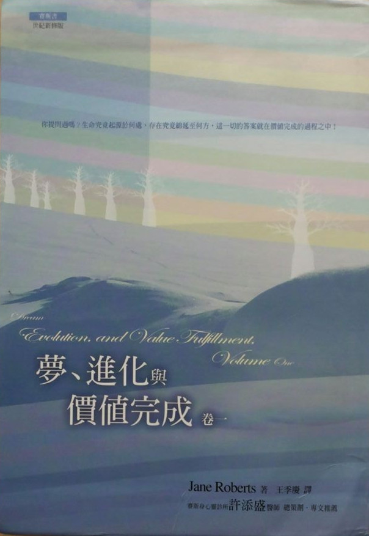

# 赛斯书：梦、进化与价值完成（卷一）

## （新时代系列）总序

王季庆

自九岁那年，我认真地思考我是谁？我由哪里来？往哪里去？而引起了我的大疑大惑后，这些问题就一直潜隐于意识的某处，不时地困扰我。这半生踽踽独行于“人生”的风景里，我热切地生活着，不肯放过任何景色。经过荒漠，吃过风沙，踏过荆棘也悠游欣赏过各种美景：艺术的、科学的、感性的、知性的……心灵接触到这些美景，自然是欢欣雀跃，但未曾解决的“终极关怀”（ultimate concern）的问题，总令我不安、恐惧和悲伤；繁花胜景的美，徒然牵动“花落人亡两不知”的惊悚，真是情何以堪！

经过对心理学和哲学的探讨，对宗教的依附，心中隐隐然有所期待，却又不太能抓住我到底在渴望什么。十几年前翻译的《先知》，现在看来，已然透露出端倪。一九七六年接触的“赛斯资料”，打破了我不少成见，也解答了我很多问题，虽然其中有很多理论是无法印证、甚至超乎想象的，我深心的“直觉”却与之呼应。回国后，我勉力译了几本“赛斯资料”，同时自己也继续钻研中西哲学和佛学。那时，我并不知道有“新时代运动”（New Age Movement），只是每次去美国必然泡在书店里，找一些谈形而上学或心理学之类的书回来看。其中，在“雄鸡”（Bantam）平装书里，有一些在封底印了男女二人手牵手的图样，下面写“新时代从书——对意义、成长和变化的寻求。”这标识使我心动，开始注意所谓“新时代”的书。

这是在我已经看了许多属“新时代”范畴的书之后才真正了解“新时代”的意义，而且知道“赛斯资料”已经成为其中的典范书。

“新时代”是指“宝瓶座时代”（The Aquarian Age），西方神秘学认为现在是一个转型期，正准备进入“宝瓶座时代”。“宝瓶座”象征人道主义。人类由追求社会的、物质的、科技层面的进步，将演进到注重“心灵”、“精神”层面的探索，找到超越人种、肤色、民族、国籍以及宗教派别的人类心灵的共通点，认知人类的“同源性”和“平等性”，从而达成“四海一家”与“和平”的远景。

在这世纪未，“末世”的恐惧像乌云一样笼罩在许多人的心上，许多声音警告我们：人类即将面临灭绝的命运。但也有人预言，在动乱之后，二十一世纪将是个心灵的世纪。如果相信“你创造你自己的实相”（You create your own reality）——“新时代”的重要共识之一，那么人类的前途，就靠大家的心灵共识展现出那一种的实相了。综观世界各地，极权国家对民主和人权的逐渐开放，大家对“和平”、“救灾”、“非暴力”、“环保”等等攸关人类共同命运的观念的关注，并付诸行动。可以说“新时代”的影响力正在逐渐扩大、加深。

“新时代”运动在欧美正是方兴未艾，百花齐放，有关的书籍和传播节目、工作室等琳琅满目，而各种灵媒、催眠师、上师（Guru）等正各擅胜场，其中层次自然是良莠不齐。去芜存菁后，我只简单地介绍几个最好最有力的观念：

一、我们皆为“神”的一部分：传统的“神”，是一种超越的“外力”，父性的、权威式的判官。“新时代”则倡导这个“一切万有”、“宇宙意识”、“生命力”、“能量”为一切的源头、本体、本来就有、不生不灭、不来不去，而我们皆为其一份子。大涅槃经说：“一切众生皆有佛性，一切众生皆可成佛，”我们本质上是不灭的精神体，无形无相。这个“一切万有”正如朱子在中庸导言里所说的“放之则弥六合，卷之则退藏于密”。在“本体”未彰显展布为“现象界”之前，在无时间无空间性中，它寂然不动时，是孕含万有的“空”，它的创造力和梦化成了现象界。而我们那纯心灵的部分进入到肉体，来体验物质实相，心灵是不灭的本体，宇宙是“如幻如化”的现象。

陆象山说过：“吾心即宇宙，宇宙即吾心。”又说：“万物森然于方寸之中，满心而发”。

二、你创造你自己的实相：也就是“万法唯心造”。我们都是自己命运的主宰，我们不必受外界任何权威的摆布，不能再怨天尤人，而必须对自己的一切负起责任。外界的一切，只是我们内心世界的投射，我们在此“自编、自导、自演”一出出的喜、怒、哀、乐、悲、欢、离、合的好戏。

三、肯定人生的意义：不虚无、不悲观，把人生当作学习的过程，去面对我们自己创造的“实相”。人生提供了我们的心灵能直接体验物质实相的机会，在错综复杂的人际关系和五光十色的现象界，我们发挥创造力、想象力，最要紧的是，入世的生活，使我们生出悲悯之心。纯知性的思考必须加上人生经验、沉思反省和直接的感触才能酿成“智慧”。在人生的戏里，又不可一头栽进去地过分入戏，还得能“抽离”，作一个观者，才能去除“我执”，才有希望了悟“无限心”。佛家所倡“悲智双运”放诸四海皆准。

四、道德的内在性：没有“天堂”和“地狱”。（除非你的信念造给你一个）。没有“人格化的神”来审判你。道德不应是规律的道德（morality of rule）而是德性的道德（morality of virtue）。孟子说：“仁义内在”，道德是无条件的无上律令，是无所为而为，不靠宗教的戒律或国家社会的规定。所谓“良知”就是我们内在的“神”，每个人只要反躬自省，都明白应如何做，这就是“自律道德”，肯定了人的“性善”，没有原罪，也没有永罚的恐惧。这对传统基督教义下生长的西方人有非常的震撼力。罪恶感和恐惧只是人发明了来控制人的手段。天罗地网刹那间消失无踪，而人可以在喜悦、坦荡中做人——“自在的人”。

五、心身健康是自然状态：现代医学越来越发现人身体的疾病绝大多数是起自心理的因素。“新时代”更有些人主张身体的自然状态应是健康的，而疾病来（disease）自心理不适，因此只要自己能改变，或在他人帮助下改变心理状态，就可恢复健康。而西医由“头痛医头，脚痛医脚”的支离状态也渐进而注重整体（holistic）治疗。

六、环境保护：为了人类的存续问题，为了给我们及后代一个更美好的生活空间，人们开始觉醒不能只盲目地“开发”或短视地滥用天然资源。基于“爱生命”，便得负起自然界的协调者、保育者的角色。“我们的”地球的种种变化，如臭氧层的被破坏、森林的消失、气候的失常、资源的滥用、污染的泛滥等等，几乎都是全球的影响，需要人们共同的关注和努力，也促成了“地球村”的观念。“爱生”与“惜福”当是“新时代”的特质之一。

七、无条件的爱（unconditional love）：“一切万有”的本质就是无条件的爱，是在所有上面所说的那些概念之后的一个共通性。中国人说的天（乾）是阳性创造原则，地（坤）是阴性的滋育原则。西方宗教的“神”代表阳性的“意志”，即创造原则，而“圣灵”代表阴性的“爱”，即滋育原则。万物都生自这阴阳的交感。“新时代”倡导“无条件的爱”，是基于我们的“神性”，及我们都是同源的兄弟姐妹。这不是“贪爱”，不带私欲，不带强迫性，不是“已所欲，施予人”；而是温柔地接受，温暖地关怀，并且是由爱自己开始。认识自己内在的“圆明自性”，因而自爱自重。把这爱扩而充之，像阳光一般地普照，无条件、无要求、无批判。这种爱是不虞匮乏，源源不绝的，而且给予即获得。

东方的儒、道、佛的传统里，都找得到与这些观念暗暗呼应的说法。西方正统基督教影响下的西方人，近年来从古老的西方神秘学和东方哲学、宗教里重新挖掘、汲取精神的养分，而得到了相当高明的洞见。

孙春华，胡因梦和我有志一同，盼望借着介绍新时代讯息而把喜悦和爱带给愿意接受的朋友。“新时代”不排斥某种宗教，也不局限于任何组织、宗派。在曹又方和简志忠的支持和鼓励下，我负起主编的任务，选些国外的好书以飨读者，并商请国内的名家与我们分享一些人生慧见，愿这系列像“爱的活泉”解了你心中的干渴。我深深觉得我要带给大家的就是“爱的讯息”，因我曾是个惊恐不安的孩子…当我了悟生命即光即爱（Life=Light=Love），就渴望去安慰每个犹在惊恐中的孩子。

## 译序

这是珍•罗伯兹生前口授的最后一本“赛斯书”，也是众多赛斯书的爱好者引颈盼望了许久的巨著。

在我们台湾，“赛斯书”也拥有为数不少的忠实读者，他们一致的感受是：赛斯书仿佛唤醒了他们内心长久以来已具有的智慧与之呼应。然而，也有少数并未深入去咀嚼、感受其深思的人，却批判赛斯书过于理性，而忽略了爱与直觉。其实，只要真正去读赛斯书，这种偏见就不攻自破了。因为，读赛斯书时，他们的脑往往并不能全然了解，更不能证明赛斯所言不虚，但他们的心却明白它已找到了真理的源头和依归！

本书提醒我们都应有“信心”，我们是安然偃卧于“一切万有”的怀中。那也唤起了人之为人对“一切万有”的“无量光”、“无量寿”和“无量爱”的无限“希望”，以及对“一切万有”的每一份子油然而生的“爱”。如在第九一二节里说的：“……信、望、爱被附在已建立的宗教信仰上。反之，这些是基因的属性。”

每本赛斯书都有些章节非常深入的谈到肯定和爱，以及我们作为人所承受的“恩宠”和“护持”。赛斯所言并非混沌的滥情，而是说明了“爱”的来源和意义。

如《先知》里畅言的，人应“以理智和热情为你在航海的灵魂的舵和帆”，本书也提到：

●需要知性和直觉并用。（第八八三节）

●人的推理心是建立在一个直接感知上——一个推动他的思维，使得思想本身成为可能的直接感知！

●思想、感受与直觉的主观属性，是探查实相的第一手工具。（以上第九〇八节）

●当理智被教导以远较不受限的方式去用其能力时，直觉与推理能力能以平顺得多的方式一起运作……

●我会一直谈到在直觉与推理能力之间的平衡，而我希望引领你们朝向那些能力的结合……使得两者都被不可计量的加强了……

●我并不是提倡依靠情感高于理智，或其反面。（以上第九一四节）

此外，我想先节录一些很新鲜而发人深省的段落以飨读者：

●大自然的鱼虫草木各自代表“地球”活化的一部分，而“人”则是地球在“思想”的那个部分——人以他自己的方式专精于世界之有意识的工作。（第八九九节）

●灵性上来说，人的“目的”是去了解爱与创造的特质，在知性上与心灵上了解他存在的源头，并且怀着爱心创造他目前并不觉察的其他实相次元。（第九〇一节）

●单单是年纪本身从不会导致任何身体灵活度或心智能力或欲望的任何减退。（第九〇二节）

●既然你们有了现在的基因构造，你们有意识的意图和目的变成了扳机，启动你们所需要的不论什么基因性或转世性的因素。（第九一一节）

末了，我要特别感谢许添盛的精神支持和实际上做笔录的帮助，以及陈建志热心仔细的校订以及在文字和编排上的宝贵建议。

## 赛斯语录

（罗注：以下是当珍在与赛斯合作《梦、进化及价值完成》之前及当时，她从赛斯传过来的那些课中的摘录。）

“很不幸的，科学甚至捆绑住了它自己最具原创性的思想家之心智，因为他们不敢偏离某些科学原则。所有的能量都包含意识。那句话基本上是个科学上的邪说，而在许多圈子里，它也是个宗教上的异端。承认那简单的声明，的确会改变你的世界。”

——摘自 1979 年 7 月 12 日的私人课

“有时我觉得好像人们期待我去合理化生命的状况，但其实它们并不需要任何这种合理化。”

——摘自 1980 年 1 月 16 日第八九六节

“基本上，意识与大小无关，如果真是那样，那么，就需要一个比地球还大的球体去包含单单一个细胞的意识了。”

——摘自 1980 年 5 月 21 日第九一七节

“以肉体活在你们运转中的星球上，安全的偃卧于你们的黄昏与晨曦之间，你的存在被四季与自发性秩序之整体运作所支持。这是一件礼物，一份恩赐，一种精妙的喜悦。”

——摘自 1980 年 11 月 26 日第九二九节

## 珍的诗（附罗的评论）

（当珍在制作《梦、进化与价值完成》时，她因身心的病痛多有耽搁。最后，当她为本书传到最后六节时，她为自己写下了以下这资料：）

在 1981 年 10 月 23 日星期五，我从赛斯那儿收到以下的讯息：“照料在你眼前的事。你并没有责任去拯救世界或找到所有问题的解答——却有责任去照料宇宙中属于你个人的特殊一角。当每个人这样做时，世界就在救它自己。”

同一天我写下：

◇　◇　◇　◇

晨曦微露。

我为什么该躺在床上

忧心我的身体或这世界？

在时间被记录下来之前

晨曦尾随着黄昏

而大地所有的生物

都偃卧在他们时间之

可爱的架构里。

◇　◇　◇　◇

“在写了上面那首诗后，我感觉到一种信心——而体认到，如许多人一样，我已变得害怕信心本身了。那是隐藏在我最深处的恐惧……”

## 赛斯序

### 私人课

1979 年 9 月 13 日 星期四 晚上 8 点 40 分

（实际上，赛斯是以下一节，第八八一节，来开始他为本书《梦、进化与价值完成》的序言，那是珍在十二天之后口授的。我选择先呈现这一节私人课，因为在其中赛斯提供了有关珍和我的某些资料，我认为那适用于所有我们透过课及书与他的合作，并且也适用于我们自己个别的创作生活。我认为他今晚的资料是在说明珍是“通灵者”或“神秘家”，因为至少对我而言，这意味着在这次人生里，她选择尽其所能的穿透实相或意识的深度。

（有许多读者写信问我们有关动物意识的问题，首先，我想以赛斯在 9 月 10 日第八七八节里的资料作为一个部分的回答。

（我们的猫，咪子，约在三周前动了卵巢割除手术，而另一只小公猫，比利，明年将被阉割。珍和我觉得愧疚，因为我们剥夺了它们在生命中的繁殖角色，也因为我们不让它们四处自由的奔跑。第八七八节是在星期一晚上 9 点 7 分开始的——只在赛斯完成了《个人与群体事件的本质》之后五节，而在他开始《梦、进化与价值完成》之前三节。那天稍早我做了一个纸团给咪子玩，它以快如闪电般的反射动作，一直把纸团在客厅里拍来拍去，并且当珍进入出神状态而开始讲话时，它还在珍的摇椅下玩。以下是那节的摘录：）

晚安。

（“赛斯晚安。”）

看到你们咪子滑稽的动作，给了我一个借口开始今晚的主题：动物意识。

我想只借着要你们质疑几个被视为理所当然的观念来开始。

（停顿。）把人类永远看作是自然的掠夺者，看作是大自然家庭破坏性的一员，甚或视之为与自然分离而被给予自然作为他的生活基地，多少是很时髦的看法。

把人看作……污染他自己的生存环境的生物多少是很时髦的，而我也并不姑息人在那方面的行为。不过，还有其它的论题，以及很少被问到的问题。你们忽略（整体的）动物意识有其自己的目的及意图。的确不错，为了人类的消费，动物在最残酷的情况下被屠宰——因为那时它们只被当作食物来对待。

（停顿。）野牛不再像它们以前那样四处漫游。可是，自有文明以来，有过上千种农场畜养的动物活了一阵时候，好好的被照顾了一段时候——这些动物通常若非因为人对肉食“贪婪的”胃口就不会存在。人们往往以这种方式考虑这个问题，却很少想到，某种形式的动物意识选择进入物质形体，某些动物族类被人珍视并且保护，或这些动物族类的意识与这样一种（整体的）安排有任何关系。

你不能说这些动物在这交易里占了便宜，但你可以说，人类和某些动物族类一同形成了一种安排……那的确对双方都有利。人比他体认到的更是自然的一部分，而在更大的活动领域里，人也无法采取自然界的其它成员不为它自己的理由而同意的任何行动。

在此记住，好比说，我曾经给过有关细胞的沟通，以及统合所有族类的广大相互沟通之网的其它资料。当然，动物能与人沟通。而当然，人能与其它种族——与所有的族类沟通。

这种沟通一直在进行，在这点上，人无法承担对这种沟通变得觉察，只因为你们整个文化是建立在动物“天然的”附属地位之上的。屠宰动物的人，无法承担去对待那些动物为活生生意识的拥有者。

（在 9 点 26 分停顿良久。）在这一切之下有一个重要的统一，一种心灵的沟通，大地之活意识的一部分死亡，以确保所有的自然之持续生命。不过，当这礼物被如此的误解，而奉献者被如此糟的对待，这种自然的圣礼就完全变质了。

基本上，许多农夫爱动物本身，并且喜欢它们的样子——但“喜欢动物”本身并不特别被认为足够阳刚。因此，在你们的社会里，如果你喜欢动物，你不可以喜欢它们本身，却必须要有其它的理由。如果你想与动物在一块儿，那么，你必须变成农夫、兽医、牧牛者或不论什么……

许多动物喜欢工作及目的，它们喜欢跟人一起工作。马喜欢它们对人类世界的贡献，它们了解它们的驭者，远比它们的驭者了解它们要多得多。许多狗喜欢做家庭的保护者。在人与许多动物族类之间有很深的情感联系，有情感上的反应。举例来说，海豚对人类世界有情感上的反应；在一个农场里的动物，对农夫的生活及他家庭每个成员的整体心理内容，都有情感上的觉察……

意识——任一种意识——是充满了内容的。以某种说法，农夫的动物了解他是个接生婆，负责它们的某些生育。食物来自他的手。动物自己了解任何物质的生命都会死亡——而物质的资产都必须回到它们所来自的大地……

（在 9 点 45 分停顿。）动物一点儿都不责怪人。如果作为一个族类，你们真的发现自己在与动物沟通的话，你们就会有一个全然不同的文化，一个的确会带来一种最深奥的意识变革的文化。

你们会很方便的忘却了，你们从所有的动物那里学到了多少。如我在以往的课程里曾提及的，你们从观察动物行为学到了许多医药：你们学到要避免什么植物，而培养哪些植物；你们学会了浸入水里去弄掉虱子；你们借由观察动物学会社交行为。到一个可惊的程度，你们一度能与动物认同，而它们也一样。它们曾是你们的老师，虽然它们并没选择你们的路。很明显的，若非由于那些动物，你们不可能变成现在的样子。

被驯养的动物有它们自己的理由选择这样一种状态。举例来说，去认为你们的猫（比利及咪子）理想上应该在户外空旷处跑动是很正常的，因为那是在野外的猫族会做的事。

在野外的猫族是在探索一种自然，但在那种自然里，在环境中应运而生的自然的族群数目将会比现有的少得多，而你们的猫也不会存在。那么当一只家猫，较喜欢罐头的精美猫食，而非老鼠或蚱蜢时，为什么会好像反自然，甚至有一点变态？家猫是在探索一种不同的自然，在其中它与人类意识有某种关系，这关系改变了它那特定种类意识的实相。

你们的猫在屋子里，在所有方面就与在外面一样的生气勃勃。它们了解它们与你们人类实相的关系，它们喜欢对你们的生活有所贡献，就如任何野生动物喜欢作为其团体的一部分一样。它们的意识倚向一个新的方向，揣摩观念的边缘，感受一个不同种的觉察之开口，而形成与任何其它意识联盟同样自然的意识联盟。

（10 点 1 分，现在赛斯讨论一两个珍和我的其它问题，而在 10 点 27 分结束此节。）

（以下是我前面提到过的 9 月 13 日的私人课，我一直在期待赛斯开始口授《梦、进化与价值完成》。从他那儿我们得知“价值完成”是某种难以定义的价值之创造性发展，它增进了所有生灵——不论是否为人类——的生命品质，而那品质也不只是道德性的。

（“我想我差不多准备好了……”在珍非常轻易的进入出神状态之后，她的传述非常的活跃并且精力充沛，与赛斯开始说话之前她睡眼迷蒙的状态刚好相反。）

（带着幽默：）评论。

（“好的，赛斯晚安。”）

（停顿。）在我们的课开始前，你们俩认为你们自己明确的是个作家——或不如说，是个诗人——以及一个画家。我想要澄清一些要点。

一直到那时，你们主要与做个诗人及画家认同，因为那些名称仿佛最近乎切合你们的能力与气质。鲁柏的写作令他与别人有所不同，而你的绘画也令你有所不同。这些是创造力可能被认出来的有形证据，所以，你们与仿佛最适合你们的成分、特性及传统认同。

到某种程度，你们有你们自己独特的位置，虽然它们是比较不寻常的，却仍可为社会所认可。你们并不知道你们有一个所属更深的、更老或更丰富的传统——一个更古老的传承，因为在你们的社会里找不到有关它的暗示。自从我们的课程开始以后，在不同的时候仿佛有过分裂性的冲突，举例来说：鲁柏是个作家还是个通灵者？你是个画家或不是？你写过的东西又如何呢，那些为我们的画而写以及你有时计划自己要写的东西？

那种冲突只存在于创造力的整个观念都被区隔化的社会里，在期间创造过程常被视为导致明确产品的内在的生产线：一个在其中创造力本身的本质大半被忽略的社会，除非其“产品”达到特殊的目的。

今天鲁柏在为《个人与群体事件的本质》写的序里，有关诗人之久被遗忘的能力及其角色的说法是对的。在诗人这个名词最深奥的意义里，鲁柏一直就是个诗人。因为诗人并不仅仅把句子串在一起，更用节奏与声音、押韵与叠句为方法，以形成他自己的意识可以上冲的台阶，而送出一个意识的“句型”。

（8 点 53 分。）

当早期的艺术家们试着去描摹大地的风貌时，他们希望了解创造力本身的本质。以我在我们下一本书里（幽默而故意不在乎的）将描述的方式，诗与画是既具机能性又有美感的，但一向以来，诗与画主要涉及的是人想了解他自己及其世界的企图。艺术——在此特指诗与画——的原始机能已大半被遗忘了。以那种说法，真正的艺术家永远主要是——再以你们的说法——通灵者或神秘家；他特定的艺术是他了解自己创造力的方法，也是探索宇宙广大创造力的方法——而它也被用作尽他所能去展示他知识的一个容器或陈列柜。

那是你俩都跟随而且忠实跟随的传承，它有一个光荣的传统。如鲁柏从我这儿正确的接收到的，还涉及了我们将称为心理艺术的一组成就，而你们也卷入其中。

（对我：）我要你明确的了解，比如说，在你的写作与绘画之间并没有、而且也不可能有冲突。因为以最基本的方式，它们代表探索创造力本身的意义及源头的不同方法。

以通常的说法，我给你们的课是那创造力一个新的延伸——但再次的，那延伸有一个古老的传承。（再对我：）当然，你自己的写作是艺术，它也是感知及了解创造力的一个方法，是个自己会再加倍学习的方法，而你有独特的配备从一个最不寻常的观念去发现领悟力。

好比说，探索你自己对我的感觉：这些年来它们是否有改变？我有多少是像我自己，或部分是珍，或部分是鲁柏，或部分是你，或部分是约瑟，或不论是什么？了悟到你是在你想要在的位置，并且了悟到你的能力并不彼此冲突，而你也不与那些能力冲突，这将自动以超越明确界定的一种新的整体创造力完成并发展所有那些能力。

现在：当鲁柏开始信任他自己时，如他已开始的，身体的（关节炎的）盔甲就松了，而创造能力甚至变得更可得了。因此，他有了新的创造力以及他自己采取的身体上的步骤，它们全部都是一起发生的。

他相信创造性的自己的本质必须明确，所以它只可在某些区域被信任。他相信他需要建立起强烈的精神性以及肉体性屏障，以对抗他自己的自发性。他正开始了解，人格的自发性及创造性层面正是给予生命的那些层面，它们能而且必须被信任。他现在知道他并不必减缓下来，而松弛会导向“动”。

（9 点 9 分。）

他的确从我这儿收到在我们的新书里将要涵盖的主题的部分名单，那本书将被称为《梦、进化与价值完成》。

（停顿。）当然，这书必然将包括谈论创造力的真实本质，以及它被文明所利用及误用的许多资料。你并不需要挣扎才能信任你自己生命的冲力，那冲力永远是要领你朝向你自己最佳成就，且以一种也会利益人类的方式。

当你信任你自己生命的冲力时，你是永远被支持的。告诉鲁柏这点。

那么，我要你俩在创造力更大光照之下去了解那点，了解其真正的意义。你们已采取了正确的路线，所以，从你们的脑海里放掉任何留连不去的冲突及怀疑的想法。这样一种立场会自动的清除涉及像税、性别角色或不论其它什么事的所有问题——你们两人都是。

你俩正在学习创造力的本质，如其它极少数人曾做或能做的——而那一定会使新的创造架构成为可能，并且对那些只在较小的架构里引起困难的情况提供新的解答。

你有问题吗？

（“没有。珍最近进步很大，而我非常高兴看到她如此。”）

他应该——我是在预言，他将会。此节结束。

（“谢谢你。”）

祝你们晚安。

（“赛斯晚安。”）

（9 点 16 分，正当课结束时，珍迅速的回到她开始为赛斯说话之前的非常松弛的状态，她的头猛然的松垂下来。）

### 第八八一节

1979 年 9 月 25 日 星期二 晚上 8 点 50 分

（今天我太太再一次又非常的放松，事实上到了这样的一个程度，以致她睡了好几次。在她身上好像发生了许多有益的肌肉变化。在晚餐时我建议，如果她今晚有课的话，赛斯也许可以评论一下她目前这一连串的松弛。在 8 点 30 分她把我叫出了我的写作室。现在，她很紧张，因为她觉得赛斯准备要口授他本书的序了。）

（耳语：）晚安。

（“赛斯晚安。”我笑了起来。）

序：这本书是我至今为止最具野心的作品。

也许有人会说，要写下任何一本源自心理源头的书，那需要雄心壮志，因为这源头离你们对创造力的一般概念是这么的远。举例来说，要一个具有肉身的人去制作一篇稿子是一回事——而甚至那种创造力也涉及了从未出现在稿件上的广大而隐藏着的心理运作。

如我大半的读者所知，我并不宣称我现在是一个具有肉体的人。（停顿。）但我的确宣称，在另一个存在的层面，我有个独立的实相。我的身份来源看似奇怪，只因你们对自己的来源了解得这么少。今晚我开始这本书，我已给过书名，而珍•罗伯兹（在十二天前）已能感知部分将被包括在此的某些话题。不过，到现在为止，具体的东西只有罗勃•伯兹写下我说的这些话的纸张。

就时间而言，有天将会有一本厚书。虽然这稿子尚未以一本具体书的样子存在，但那书本身、那概念及字句，以最紧要的方式说来，在现在就是十分真实的。在所有各种的创作里暗示了某种特质，但却普遍被忽视了，因此，它们是不明显的。我们所涉及的这种创造性过程，能将某些那种特质显现出来，并且阐明人类心灵通常一直隐而不显的许多面貌。

我透过鲁柏——或如你喜欢的话，透过珍•罗伯兹——说话。鲁柏有他自己的创造能力，并且也把它们用得很好，而大半因为那些能力，我们的接触才（在 1963 年 12 月）得以发生。科学家喜欢说，如果你们向外看宇宙，你就是向内看时间。那个说法只有部分真实，不过，当你向内经过心灵时，以你们的说法，你才的确开始“向内”朝存在的源头推进。你的创造力并不只容许你去画画，去说或写故事，去创造雕刻或建筑，它们并不仅为你们的宗教、科学及文明提供一个基础，并且也是你们与存在源头本身的联系。

（9 点 10 分珍在出神状态停了很久。）

请等我们一会儿见……

（停顿良久。）你的创造能力首先提供了容许你去形成一个信念系统的力量。

（停顿。）现在：当你相信意识不知怎的由死的物质浮出时，你就永远不会了解你自己，而你会永远在寻找生命采取了形体的那一点。你必然永远会对宇宙的一种机械性诞生感到奇怪——而你的世界的确看起来好像是由多余的零件所造成，它们不知怎的刚好以这样一种方式落在一块儿，使得生命随后出现了。

你们心中充满了疑问，关于：形形色色的族类是在何时何地出现的？有些鱼何时自海洋浮出，而学会呼吸空气？而你也一定会奇怪：在这两者之间的时间里又发生了什么？

举例来说，有多少爬虫试着长翅膀而失败了或飞不起来——或，在第一只胜利的鸟飞在大地风景的上方之前，又有好几百万的爬虫试过多少次呢？有多少只鱼只形成了一半的肺就死了，只因它们离水边太远而无法再度潜入波下？（现在，更热切的：）或有多少鱼拍鳍后退到水里，而发现自己在这样一个过度阶段，以致既无法再活在水里，又不能呼吸空气？

所以，以那种说法，在第一个哺乳动物以完整的肺安然站立，呼吸地球上最早的空气之前，又有多少水居动物死去了呢？

科学家现在说，能量与物质为一。他们必须踏出了悟到意识与能量及物质为一的下一步。

（在 9 点 22 分停顿。）

请等我们一会儿……

那么，在这本书里我们将从另一个观点看着宇宙的起源、物种的起源及生命的起源。我希望这个观点将提供另一个架构，透过它，你们能了解并研究物质实相及你们在内的角色，并且感受到连接每个个体与意识源头本身庞大具创造性的错综复杂。

要做到这一点，我希望去探索一个更具意义的进化观念（注一）——而那观念必然涉及了对主观实相及其在人类意识“进化”上的影响的讨论。

宇宙并不源自你喜欢想成的一个外在的及客观化的源头。你自己物质的身体提供你结实的肉体肖像及外在的展示。举例来说，你的梦不会突然代替你的容貌，而外在化于你的肖像上，它们一直隐藏着。你的梦出现在你自己心智的内在银幕上。

我从不想要让任何我说的话以这样方式被解释，以致看起来好像我在以任何方式否定物质的存在的完满、有效及庄严。不过，我的确想指出，你们通常称为做梦的状态，只是事件的内在实相一个朦胧的指示（热切的），是物质世界由之浮出的事件的内在秩序。我希望让你们看，梦的本质曾如何帮助形成人的意识。我希望让你们看，意识形成环境，而非其反面（带着许多手势）。

我希望让你们看，所有的物种都被我所谓的价值完成所鼓动，在其中每个寻求为它自己并同时为其所有其它族类增添生命的质量。

这进一步将所有的物种统合在一个合作性的冒险里。一般而言，因为你们的科学家与宗教两者向外投射到世界上的信念，这大半一直不为人所见。所有你们最伟大的文明，全都先存在于梦的世界里。你可以说，宇宙将它自己梦入存在。

（在 9 点 40 分停了一分钟。）

请等我们一会儿……

一般而言，醒时与睡时状态，一直是你们主要关怀的意识的唯一层面，在你们看来仿佛这是你们进化过程的结束——但在地球上曾有过专门利用意识的许多焦点的文明，就好比你们是转注于工具的利用上一样。

梦可以是极为明确的，它们可被用以提供咨询的来源。在作为人“进化性发展”的一部分上，以及在你们所认为的现代生活里的可能性上，我都希望显示梦的实际重要性。答案在你最没去找它们的地方。宇宙仍在被创造，正如在每个片刻每个人也是一样。

（9 点 47 分。）

序写完了。那应让鲁柏觉得好多了（幽默的），并且请等我们一会儿。让你的手歇歇吧……请你打开那瓶酒好吗？

（在给珍一点资料后，赛斯结束这节说：）我们又开始一本新书，而我相信你自己活泼的心智会把有趣的问题带到前方来。

祝你们晚安。

（“谢谢你，赛斯晚安。”）

（9 点 56 分。）

（注一：最近我买了两本“科学特创论者”（scientific creationists）所写的书，他们强烈反对进化论的观念。很简单的说，特创论者相信上帝在约一万年前创造了宇宙（显然包括了地球），他们主张自从那主要的创造事件发生之后，所有地球上的生物基本上没有什么改变。举例来说，他们可以解释恐龙的消失，以及我们在周遭不再见到的其它数目庞大的生物种类。在另一方面，进化论者则相信宇宙在一百亿到两百亿年前之间开始存在；地球本身则约四十六亿岁；而按照化石记录及其它的证据现实，其有机体至少在三十五亿年前便首次升起，而开始进化。不过，科学也相信，对“第一因”的研究，涉及了非科学的却是哲学与神学的问题，例如我们自认如此熟悉的宇宙究竟为何能进入存在？而那个开始的原因又是什么？）

## 第一章：在开始之前

### 第八八二节

1979 年 9 月 26 日 星期三 晚上 9 点 14 分

（珍今晚又是颇为放松，但仍决定试试赛斯课。她正在读我推荐给她的那本谈“科学特创说”（scientific creationism）的书。她对那书的感觉既暧昧又怪异，她不只一次的说：“你必须小心那些家伙，”她意指那些特创论者，“否则他们会牵着你的鼻子走。你必须不断的思索，我每回只能看那么多页……”好笑的是，有人写信给我们，对赛斯数据也保持同样的看法，但珍并没提到这类的事情。

（然而，除了和进化论（及一个古老的宇宙概念）正面冲突外，特创论者的信念的确提出了一些在我们看来很有趣的问题。我这话并不指珍和我之所以支持特创论只是因为我们对进化论的质疑。我们只认为任何一种信仰系统，都太不足以对实相有太精详的解释。

（珍预期赛斯今晚会开始他的新书。当我们坐着等课开始时她说：“哦，在我脑子里有关这本书的句子，我正等他将它们安置好。”然后，他没有称以下数据为第一章、口授或其它就开始了。）

（耳语：）晚安。

（“赛斯晚安。”）

现在。（长长的停顿，许多次之一。）宇宙昨天将开始；宇宙明天已开始。（The universe will begin yesterday. The universe began tomorrow.）这两句话都十分的无意义，时式错了，或许你们的时间感完全被搅翻了。然而，说“宇宙在某个遥远的过去开始”，在基本上也是同样的无意义。

事实上，先前的那两个说法，虽然不合逻辑，但的确暗示了（停顿）一种现象，显示出时间本身只不过是个创造性构造。时间和空间，以某种方式而言，是你们宇宙家具的一部分。

对时间一刻刻过去的体验本身，是属于你们心理上的房间，就和钟挂在你们墙上一样。一旦科学或宗教要探索宇宙的起源时，他们会在过去里找它。宇宙现在正在被创造。以你们的说法，创造在每一刻发生，而时间的幻象本身亦在现在被创造。因此之故，用一个时间性的方案——其本身也是非常相对的——来寻找宇宙的起源，多少也是会徒劳无功的。

你们的现在，或当下这一刻，是个心理上的平台。似乎宇宙是以某种能量的最初爆炸开始（“大爆炸”论），而进化派却不能解释其原因。许多虔诚的人们相信一个神存在于一个较大的实相次元，他创造了宇宙，而他自身却在其外；他启动了这个创造。许多人跟随上面两种信仰的其中一种，相信不论宇宙的来源为何，这“宇宙”必然会耗尽其能量。已确立的科学十分相信，现在没有能量可被创造或毁灭，而只会转换其形式（如热力学第一定律所述）。科学把能量和物质基本上视为一体，只在不同环境下显现出不同的样子。

（9 点 31 分。）

以某种方式，科学和宗教两者都在谈一个客观的被创造的宇宙。不是神“造了它”，就是在一个最初的能量爆炸之后，物质以某种不可解释的方式形成了。而以一种尚未能解释的方式，意识由那本来是死的物质中显露了出来。

反之，意识形成物质。如我先前说过的，每个原子和分子有它自己的意识。意识、物质和能量是一个的，但意识发动了能量变成物质的变化。以那种说法，你们宇宙的“开始”，是意识扩展的一个胜利，即意识学会了将自己转译成实质的形式。就与任何意念从你们所认为的主观性露出成为实质的表现那样，宇宙以同样方式，但以不同的程度，露出成为实质。

此书每一个读者的意识，（以你们的说法）在宇宙形成之前即已存在，但那意识是还未凸显的。你们和在宇宙形成之前的存在最接近的状态——只是个近似状态——是梦境。（停顿良久。）你们的意识是一个无限的原创性的创造过程之一部分。

因为传统宗教加诸其上的含义，因此，我将故意避免“神”这个字。在整本书里，我将一直试着解释这神圣过程的特征，我称这过程为“一切万有”。一切万有是如此的为其创造物的一部分，以致几乎不能“分离创造者和被造物”，因为每个被造物都不可磨灭的在其内带着其源头的特征。

如果你会以为宇宙是遵循着一个机械性的模型，那么，你必须说这“宇宙性机器”的每一部分创造它自己，而在整个的“未来构造”中知道它自己的地位。你更必须说，个别的，那每一部分很乐意的由它自己的源头中出来，剪裁得刚巧适合其地位；同时，那个别的源头，也同样密切的是每个其它个别部分的源头。

我也并不是说宇宙是某个“心理机器”的结果，而是说，意识的每个部分都是一切万有的一部分，并且宇宙以一种自发的、神圣的秩序落到一块儿（专注的）——而意识的每部分在其内带有对全体的不可磨灭的知识。

世界的诞生，代表一个神圣的心理上的觉醒。以你们的说法，在地球形成之前，每个参与物质宇宙的意识，都梦到过这样一个物质的存在。以比你们的说法更大的说法来说，说宇宙尚未形成和宇宙已然消失是相当真实的。然而，仍以更大的说法，事实上宇宙一直是以某一种的状态存在着的。

对于宇宙的目的，你们最接近的了解，可以在你们对于自己孩子的发展的那种挚爱感情中找到，在你们要他们能充分发挥其能力的意图中找到。

（9 点 58 分。）

你们最高的热望能给你们一些模糊的线索，那和在你们最细微的行动背后的伟大创造性冲力有关。而你们自己最细微的行动之所以可能，只因你们已在物质世界中被给予了身体。你们已被给予了生命。在每一刻生命都被更新。你这么安稳不费力的骑在生命的能量上，以致你有时浑然不觉。（停顿。）你并非被配备了一个定量的能量。然后就用完了，死了。再次的，反之，你是在每一刻重新被创造。

今天说得够多了。本节结束，祝晚安。

（“谢谢你，赛斯晚安。”）

（10 点 2 分，“那真够短，但我不在乎，”珍在离开出神状态后说，“我相信那就是今晚所有的了。若还要更多时，我不会像关上水龙头那样的停下来。”

（“我可以假设那就是第一章吗？”

（“哦，好的，他一直没说。好吧！明天我会画画，然后忘掉关于进化这整件事……”

（但当我两晚后（星期五晚上）在给这数据打字时，我可以注明说珍根本没画画。反之，她继续写她自己的《珍的神》（God of Jane），她也看完了特创论的书。）

### 第八八三节

1979 年 10 月 1 日 星期一 晚上 9 点 6 分

（耳语：）晚安。

（“赛斯晚安。”）

口授。这章的标题——我忘了给你们——是：（在开始之前）。

现在：你不能以科学证实（你们的）世界是被一位（停顿）发动此事，但却把自己留在领土之外的神所创造。你也不能以科学证实世界的创造是偶发事件的结束——因此，你也不能证实我将告诉你的事，不能以通常的方式证明。

无论如何，我希望随着我的解释而给你们看某些暗示和线索，那可让你们知道在哪儿找主观的（subjective）证据。

首先，你透过你自己主观的知觉过你的生活。我将试着在你自己意识内唤起那些事件的记忆，那是当世界在形成时，你自己的内心在心灵密切卷入的事件——而虽然这些可能看似为过去的事件，然而，即使现在它们也还在发生。

在宇宙的开始之前，我们将假设一个全能的、创造性的来源和存在。（停顿。）我们希望能证明这神圣的主体性（subjectivity）现在仍在你们经验的世界里，就如在宇宙开始之前那样。再次的，我称这最初的主体性为一切万有。我正在试着说出一些观念，那是几乎违抗了知性的，除非那知性是彻底的为直觉的力量所强加。因此，在你读此书时，在你读此书时，你将需要用你的心智和你自己的直觉。

一切万有，在那开始之前，在它自身内包含了所有可能的创造的无限动力。一切万有拥有（停顿）如此宏伟的创造力，以致它最微妙的想象、梦、思想、感觉或情绪也获得了一种实相，一种生机，一种强度，那几乎必须要有自由才能做到。是来自何处的自由？去成为什么的自由？

那经验，那主体的宇宙，那一切万有的“心”（mind），是如此璀璨，如此分明，以致一切万有几乎迷失了，神游于这不断繁生、不断成长的内在风景之内。每个心念、感觉、梦想或情绪本身，都盖上了这无限主体性所有属性的不可磨灭的印记。每个因其自己的创造力而发光、颤抖。

在开始之前，有个无始亦无终的内在宇宙存在着。我用“开始之前”这句话，因为这样你们比较容易消化吸收（举例而言，那同样无限的内在宇宙现在仍然存在。）

（在 9 点 31 分停顿。）一切万有在其内包含了所有的存在的知识，连同它们的无限的可能性，而“一旦”一切万有想象那些无数的情况，它们便存在于我所谓神圣的事实之内。

一切万有只知其自身。它全神贯注于自己的主观经验，当它自己的思想和想象获得它们自己的活力，而传承了它们的主体创造者的创造力时，它甚至感到神圣的惊奇。（那些心念和想象）开始和它们的“造物主”有了一个对话（全都非常强调的。）

具如此宏大活力的心念开始想它们自己的心念——而它们的心念又想出心念。一切万有，好像在神圣的惊讶和惊奇中，开始倾听，并开始回应这些心念和梦想的“世世代代”——因为这些心念和梦想彼此也是相关的。没有时间，因此，所有这些“发生”于同时。事情的次序是被简化了。于是，以你们的说法，同时，一切万有自发的想新的心念，作新的梦，并卷入了新的想象中——而所有这些又牵涉到那些现在已经历无限世代而常存的互织互缠的心念和梦想（带着许多手势和很多强调）。

因此，除了这自发的创造，这同时的神圣觉醒之“流”外，一切万有开始观察他自己主体的子孙之间发生的交互作用。（停顿。）他倾听，开始对一个心念或一个梦反应或回答。他开始有意的引发这些历代精神的子孙所要求的那些精神的状况。如果他以前曾寂寞过，他不再寂寞了。

你们的语言再次造成一些困难，因此请尽量无害的接受“他”这个代名词。当然，基本而言，一切万有相当超越任何一类或任何性别的意义。于是，当一切万有悟到它自己一再滋长的心念和梦，其本身渴望享受它们生而赋予的那些创造的更大礼物时，它（注一）开始感觉越来越大的压力。

很难试图把任何像人类动机那样的东西指派给一切万有。我只能说，它着迷于“需要”从它自己的存在去钟爱的创造，去钟爱的以这样一种方式改变它自己的实相，以使每个最微妙的可能的意识进入存在（停顿良久）；它着迷于“需要”看见任何可能的意识的交响有机会去出现、去感知并且去爱的这种需要。

我们迟些将讨论“爱”这个字在此处更圆满的意义，而这一章只是将来数据的大纲。

于是，当一切万有的每一个无上的心念、梦、心情及感觉，紧绷在它们存在的边缘上，寻找那当时未知的、尚未被发现及尚未被想到的释放时，一切万有开始觉知到一种创造性的骚动。我说的是，这种神经性的子孙包括了所有在你们地球曾出现过或将出现的意识——全都是温柔的潜藏者：第一个人类，第一只昆虫——每一个对它们发展的可能性都有一种内在的知识。一切万有，爱它自己的子孙，而在它自己内寻求这神圣的难局的答案（全都很关注的，眼睛大睁而颜色幽深，带着很多的手势）。

（在 9 点 57 分停顿。）当那答案来到时，它涉及了先前无法想象的神圣灵感的跃进，而它如此的发生了：一切万有遍觉它真正无数种的、不可置信的子孙，来看看这甚至更壮丽的梦，这个客体性的自由的梦，到底需要何种状况？究竟要开哪扇门，才能使物质的实相从这样一个内在的领域内浮现出来？以你们的说法，当然，当一切万有把所有那些条件放在一起时，它在刹那间看到了那些客观世界所需要的精神性创造物——而在它想象那些世界时，以你们的说法，那些世界就被实质的创造了。

然而，一切万有并没将它自己与那些世界分开，因为那些世界是从一切万有的心念里创造出来的，而每一个皆有神圣的内涵。所有的世界都是被那神圣的内涵所造，所以虽然它们在一方面是外在的，然而在另一方面也是由神圣的东西做成的。而在你们宇宙里每一个假设的点（停顿），在最基本的说法上，那是和一切万有直接接触的。在一切万有的部分里都有整体的知识——然而，一切万有是比其部分的总和要更多的。

神圣的主体性的确是无限的，它永不能全然的客体化。当灵感的神圣化火花爆炸成为客体性时，当你们的和其它的世界被如此造出时，那儿的确是有一个不可想象的比例之爆炸。

第一个“物”（object）是个几乎不可忍受的团块，虽然它并没有重量，而它爆炸了，立即在一瞬间便开始了形成宇宙的过程——但却不涉及时间。你们可以想象要花掉无限长时间的那个过程在一瞬间发生了，而一切万有巨大的心念最初的客体性物质化爆炸成了实相。以你们的说法，这是个真实的爆炸——但对涉及那个突破的那些意念而言，它们体验它为一个胜利的“首次”灵感之狂乱，一个成为另一种存在的突破（最专注的）。

当意识把它自己变成自然的许多面时，地球就出现了。原子和分子是活的、有知觉的——它们成活的、有知觉的元音及音节，经由它们意识才得以形成物质。

但以你们的说法，虽然是被完全设计好了，但这仍然大半是一个梦的世界。一般而言，这世界有所有现在你们已知的物种。这些全都与意识的众多种类有关，它们吵着要被释放，而那些意识被一切万有自发的赋予了适合其需要的形式。因此，你们所认为的那些个别化的意识，就生成到物质的界域了。那些意识在开始之前已然个别化了，但却没有凸现出来。但个别化了的意识并非都是那么大胆，它一开始并没全然的把自己附着于其实质的形象上，却常常在其“古老的”神圣传承内歇息。以你们的说法，就像是，地球及其所有的生物都在半做梦的状态，而不像现在那样关注于物质实相之内。

（10 点 8 分）

且说，当个人化的意识在一切万有的巨大主体性之内时，除了它自己的独特性之外，它享受一种有护持性的合一之感，一种知道它与其来源为一的令人安慰的知识。因此，在（你们的）世界的开始，意识的起伏波动很大，一开始是轻轻的关注，但并非十分像它最先的意图看起来那么完全的独立。

你们曾有过“梦游者”（注二），那是你们人类古老的成员，他们主要的心志集中仍隐蔽在那更早的主体性之后，以那种话来说，他们是你们真正的祖先。

你累了吗？

（“我没有问题。”）

且说，早期人类必须依赖他伟大的内在知识。休息一下。

（10 点 23 分，赛斯很突然的叫停。“是不是有只猫在外面？”珍立即问，环顾四周。比利，我们八个月大的小虎猫，睡在靠近我们的一张椅子上。两分钟之前它开始发出一些我以前没听它发出的高阶音，我暗忖那些噪音会不会打扰在出神状态的珍——果然。但我不知比利的小伴咪子在哪儿，后来我发现它被关在四面围着纱窗的前廊里了。

（珍说：“我不想失掉这资料。”她很快的回到出神状态。在我试着写笔记时，咪子开始在我身上爬来爬去，低声鸣叫并摩擦我。在 10 点 30 分继续。）

所有的物种一开始都强调一个很主观的取向，那时当他们学着在新的物理环境中操纵时极为重要的。

（珍停下来，眼睛闭着。咪子仍在我怀中腻着。然后：）

此节结束。

（10 点 31 分。“哦。”我惊讶的说。

（珍说：“我告诉你怎么回事。我本来正弄到更多的资料。我很有兴趣去做，并且也知道来的是什么，但像那样子回去后我就得不到它了。”

（我告诉珍这节很精彩，是她最好的一节。我告诉她，这节引起了许多问题，但我不认为有人曾对我们的宇宙、我们的世界及历史的“起源”处理得更好。

（“在课前我得到了一些——关于在地球形成之前最先的那些人——你可称他们为非具体的存有。但现在说出‘实体的存有不可能包含那么多的意识’这句话像是很蠢。然而，我直到那节完了才知道，才真正的确定……哇，那真是个很好玩的情况，我真的很享受它……”她满意的说。

（但我必须承认我也吃了一惊。当我在记录时，赛斯这么快而强有力的透过来，我几乎没时间想到问题。我问珍，他到底想做什么——把科学的宇宙起源理论“大爆炸”，说所有都发生于数十亿年前，和特创论的学说——同样的那个宇宙是近来一个自发的、神圣的创造，合在一起？我们的地球及所有它的生物到底“进化”了没有？可能有同时的进化吗？（我猜，此地我们又回到了“同时性时间”那个矛盾。）赛斯即刻的“形成宇宙的开始进程”如何——不涉及时间——与地球上的化石相符合？他是不是在说宇宙的成长或进化是经由一连串的梦境？

（我告诉珍，就我所知，原始的极度稠密的情况，或存有的不可想象的爆炸因而导致的宇宙形成，是个直截了当的事件；一旦开始就一直继续。举例而言，在实质和非实质之间，没有任何起伏变动或时开时闭的平衡状态。这理论是科学目前假设其宇宙创造的“标准模式”。

（那么，赛斯自己关于可能的宇宙与可能的地球之概念，又如何契入他今晚的数据——如我确信它们一定会的？我很快的看出我的问题可以一直继续下去。我告诉自己赛斯的书才刚开始，所以我只好耐心的等待了。

（咪子的亲热表演早已结束，而从我怀里跳了下来，在珍和我谈天时它就不见了。）

（注一：在此，赛斯显然是在做实验，因为当谈到一切万有，他立刻回去用“它”，而不用“他”。“它”也不见得全然令人满意，但珍和我并没质问赛斯此事：我们偏爱用“它”，因为它涵盖了一切万有之内在的任何一种性别取向和机能（当在此节稍后，赛斯读到一切万有而用“他”时，我在记录时以“它”取代了）。

（注二：赛斯首先在《未知的实相》卷二里讨论到“梦游者”——见 1974 年 9 月 30 日第七〇八节。）

### 第八八四节

1979 年 10 月 3 日 星期三 晚上 9 点 13 分

（今年秋天的气候是不寻常的暖——温暖并常有雨或雾，但在一年的这个时候却极受欢迎。树木似乎远远的落在事件之后；只在最近我们才看到它们叶子的第一波变色。在干干的蛰伏了一个长夏之后，草又开始长了。

（昨晨，我第一次听见此季的野雁南飞，但它们在浓密的低云之上，因此看不见。今天下午我听到也看到了它们，并且叫珍也来看——一个宽广的、散开的、变动的人字型队伍，消失在我们下方小城所在的山谷上。与下方的大片土地相形之下，雁阵显得很脆弱，但这只是幻象：就与地球上的每个存有一样，那些鸟的每一只都知道它在做什么，每一只都有能力去找出它个别的价值完成。

（在我们坐着等这节课之前的几分钟，我刚好打好上周一晚上的课的记录，而珍在感觉赛斯来到之前刚好有时间看过：“好的，我准备好了……”）

现在：（微笑，然后小心的：）让我们回到我们的故事或起源。

我们在一个特殊的秋夜坐在此处。透过鲁柏，我显然在口授此书，而约瑟坐在一个很特殊的咖啡桌对面的沙发上，记下我的话。

今年是 1979 年，而时间与日期的概念似乎不可磨灭的与（每个人的）心理混在一起了。你们能够记得去年，而到某个程度可以回想你们生命的过去岁月。似乎是你现在的意识往回漫游到过去，直到最后你不复记忆为止——而在一个有意识的层面，至少你必须以第二手的证据来看你出生这件事，而很少人对这件事有有意识的记忆。

为了我们讨论的目的，我必须把这书多少放在时间的架构里表达。我必须尊重你们的特殊性，不然你们不会了解我在说什么。

（停顿，许多次之一。）因此，虽然这本书是在时间的传统里口授的，但我必须提醒你们，基本上那个传统不是我的——更有进者，基本上，它也不是你们的。

于是，我用“在开始之前”这名词，而我将依某种顺序谈地球的事件。然而，以最深的说法，使试图单独运作的知性蒙羞的是，开始即现在。因为那神圣的主体性的同时性性质，所以那神圣的主体之决定性的爆入客体性永远在发生中，而你们在“每一刻”都被给予生命（That critical explosion of divine subjectivity into objectivity is always happening， and you are being given life "in each moment" because of the simultaneous nature of that divine subjectivity.）。

（停顿。）我们依然称我们下一章为（在开始之时），把某些事件以顺序的形式罗列给你们。希望在此书其它部分的某些精神练习，会容许你们跃过传统的事件架构，而以统合的知性及直觉，感觉你自己个人存在于一个“宽阔的现在”的那部分，这宽阔的现在是大到能包含所有时间的片断的。

## 第二章：在开始之时

第二章：（在开始之时）。

再次的，以你们的方式说，能量等于意识等于物质；而以那种方式（界定是必须的），意识是那个原动力，指挥能量转变形式，形式转变为能量。你们发现或想象的所有可能的可见或不可见的粒子——意指假定的粒子——都拥有意识，它们是能量化了的意识。

在能量本身之内有某些与生俱来的特性，而既然你们到今天仍不能视能量为意识，因此那与你们对它们的解释相当不同。

（9 点 35 分。）

最重要的是，能量具有无限的创造性、发明性和原创性。能量具有想象力（任何在读此书的科学家可以在此止步。）我并不是在把人类的特性归于能量，反之，你们人类的特性是能量的特殊性的结果——一个相当重要的不同点。以你们的说法，你们所认为的空间是充满了看不见的粒子的，它们是物质实相未言明的部分，是你们的世界存在于其中未凸显的介质。然而，在那方面来说，原子和分子是言明的，虽然你们用（未得仪器之助的）肉眼看不见它们。造成原子和分子的较小粒子变得“越来越小”，最后终于逃过了一种物理仪器的检验，而这些粒子有助于联接未凸显与已凸显的实相之间的间隙。

为了这个对（你们的）世界之开始的讨论，我暂且（注一）只管已知的特质——原子和分子。在一开始，原子和分子想象实质上可能的无数形式。它们想象数不清的细胞可由它们自己的合作创作中升起。能量是无止境的、丰富的，它们不知什么是限制（全都关注的）。以那种说法，原子将细胞梦成物质的存在——而由那物质活动的新门坎，细胞的意识梦着那可从无法形容的冒险浮出来的无数组织。

再次的，实际上所有这一切即刻发生。然而，包含在其中的心理经验的深度是无法测量的，因为这涉及了一种价值完成，而每一个意识都涉入其中。那价值完成的特性，恐怕是一切万有这存在中最重要的成分，而且也是一切物种的传承的一部分。

价值完成本身是最难形容的，因为它把一个有爱心的灵（presence）——一个对自己的神圣繁复性有着天生知识的“灵”——的本质，和一个无限大的创造能力合在一起，而这灵试想把它自己倒转的繁复性最微妙、最遥远的部分也带着到价值完成。转译为较简单的话，能量的每一部分被赋予了一种与生俱来的创造性，而试图以所有可能的变奏完成它自己的潜能——并且在这样一种的方式下，以致这样一个发展，也更促进了实相的各个其它部分的创造性潜能（全都非常强调）。

那么，以那种说法，在开始时有个几乎不可想象的时期，那时，有活力的意识用它自己的创造能力，它自己的想象力，以胜利的喧嚣做着实验，试过一个又一个的形式。以你们所想到的用语，没有什么东西是稳定的。如你们所想到的意识转成了物质，而又转成纯粹的能量，然后又再回头。

（在 9 点 56 分停顿。）主体性仍大半在当家。就像个初次离家的少年，个人化的意识也多少会想家，而常常回到家园——但逐渐增加了信心，而最后离开去形成一个（宇宙）。

且说，因为一切万有在它自己之内包含了如此全能的、丰饶的及神圣的创造性，它主观经验的所有各部分全都获得不可形容的确实性次元。举例而言，一切万有的思想不只是像你们可能有的那样只是思想，却是至上的、多重次元的精神事件。那些事件很快的发现，如果它们想要进入客体性的话，必须要有个变形（停顿）——因为没有客体性之本身能包容存在于神圣的主体性事件的全体实相。而只有在那范围内，它们相对的才得以维持。可是，它们却在开始之前渴望其它的经验，甚至渴望一种不同性质的价值完成。它们感觉有一种价值完成，要求它们应用到它们自己的创造能力。它们渴望去创造，如它们被创造了那样，而一切万有在一种神圣的困惑里，还是悟到了这一直就是它自己的意图。

（停顿。）一切万有明白了这样一个分离也可容许你们（停顿）产生一种不同的精神艺术，在其中创造者自己创造，而它们的创造物也创造，将一切万有偏离中心的（eccentric。注二）版本带入存在。以某方式而言，若无此分离，一切万有是无法造出东西的。对最微妙的可能意识和凸显，给予挚爱的护持，挚爱的鼓励——那即一切万有的意图。

（停顿良久。）一切万有知道，即使这个目的也是一个更大目的的一部分。就时间而言，那个目的的实现，将使另一个极重要的主观性灵感爆入客体性，或爆入另一个形式。然而，以更深的说法，那目的现在也已知道，而整个的宇宙多少在梦着它，就如一度分子意识梦着它可能“形成”的器官。

（10 点 15 分。）

我要强调，我在此所说的不是关于一种灵性的进化，而是一种扩张。然而，我们暂且将讨论限制在世界开始时的意识，强调物质生命的第一个基础大半是主观的，而做梦的情况不只有助于形成你们人类的意识，而且，以那种说法，也用来给人对他的物质环境提供一个稳定的情报来源，并且在所有各物种间用为一个内在的通讯网。

口授结束。

（10 点 19 分。）

等我们一会儿见……

提醒我在下一节讨论那些主观的存有（entities）学习如何把自己转译为实质的个人。

（衷心的：）口授结束，此节结束。衷心祝你们晚安——

（“谢谢你。”）

——我欣赏你们的小房间（珍的写作间）安适的特殊性质，在山边的房子里，偎依在实质的巢窝，这特殊的街道和小城之中。尤其是当我们在讨论这么复杂的题目时——这题目似乎颇为浩瀚，但它正是在讨论你们是如何能感知到这特殊的夜晚的。

我最衷心的祝福——晚安。

（“赛斯，谢谢你，晚安。”）

（注一：在十六年前的第十九节里，赛斯就说过：

（“你们的科学家可以数数他们的元素……那是说，他们会创造及发现越来越多的元素，直到他们快发疯为止，因为他们永远会创造真实的（非物质）东西的（物质）‘伪装’。而当他们创造仪器去处理越来越小的粒子时，他们事实上会看到仿佛无止境的越来越小的粒子。

（“当他们的仪器更远的深入宇宙时，他们将‘看见’越来越远的东西，但他们会自动的将他们明显‘看见’的东西转变成他们熟悉的伪装模式。他们会是他们自己工具的囚徒。

（“特别设计来测量科学家所熟悉的震动的仪器，将被一再的重新设计。最后，这些仪器将发现各种各样仿佛不可能的现象，直到科学家们了悟到有些事情错得一塌糊涂了。那些仪器是预备用来捕捉某种伪装的，而既然它们是被老练的想出来的，它们将会尽到它们的作用。我不想涉入太深。不过，那些仪器本身自有办法将你们不了解的数据转变为你们能了解的说法。科学家一起在这样做。”

（另外，见《未知的实相》卷一第六八二节。

（注二：我一直很喜欢珍在谈判到意识的任意一部分能创造它自己的新版本时，用到的“偏离中心的”这个字：她在字典上对“eccentric”的意思：不寻常、怪异或不从俗的之外，又加上了她自己原创性的诠释。

（珍在一九七四年十月，在她第一次有意识的经验到她的“心灵图书馆”（psychic library）之后，开始谈到“意识之偏离中心”，而在接下去的一次超越的经验里，她突然开始看见在她周遭的世界的每个部分——例如，每个人、每座房子、每片草叶、每只鸟——的伟大“模型”：我们平常的世界相形之下突然显得相当寒酸了。珍写道：“每个人都是个典型，然而，每个人却也是个奇妙的怪人（eccentric）……我们看到我们每个人都是可笑的怪人，不仅是因为我们都有‘自己的’内在模型，并且也有自由去偏离它们，这一切都使得这‘模型’活了起来，而且有创造性。”）

### 第八八五节

1979 年 10 月 20 日 星期三 晚上 9 点 20 分

（自从三周前的第八八四节之后，已过了五个定期课的日程；我们错过了其中四个，但在十月十日的确有次私人的或删掉的课。我们很忙，珍努力写她的《珍的神》，也写了一些诗（有些是谈转世的，我计划当赛斯在这书中谈到那主题时，把它们呈现出来）。十月七日星期日那天，珍第一次看到苏•华京斯的《与赛斯对谈》——她写的关于珍以前教的 ESP 班的书的稿子。那件工作结果比珍想象的长了很多，苏还有几章要写。两位女士花了一天阅读手稿，我也有机会看了一些。苏后来笑着承认，她本来有些紧张，想象珍或我可能的各种不好的反应——但她做得更好。她有全然的自由以她自己的方式写《与赛斯对谈》。次日，珍开始为她将为那本书写的序打草稿。

（上个周末晚上，我们与一位从纽约来的心理学家有个很有意思的会面。我们的访客录下了赛斯词藻丰富的资料，他答应寄一份誊本给我们。

（今天珍又写了三首精彩的小诗，我希望有一天能予以出版。

（然后，今晚珍开始写关于我们的猫，比利和咪子的“一篇有趣的东西”，它们是十个月大的一对兄妹：“在最初，比利和咪子还都不是猫咪呢，只是想要做小猫的一点云和天。也还没人知道猫是什么，因为上帝还没造任何的猫。如果不是为了比利和咪子，也许猫根本不会存在……”这故事写的有条理，珍以十分幽默的方式展示她的东西，令人回想到她的第二本关于“七号”的书，《超灵七号更进一步的教育》，和她的《埃玛儿》，却又不同。

（在最后一刻，珍令我惊讶的问我要不要上课；我以为因为她对自己一般性的不满，她会不想上课。赛斯没称此节为书的口授，但它确然适用于此书。而在一开始他谈到珍今天容许她自己享有的创造自由——虽然似与她有意识的焦虑抵触。）

（耳语：）晚安。

（“赛斯晚安。”）

几句题外话。鲁柏忘了担心，因为“他不是在工作”，他自然的游戏的创造力就冒泡泡的升到表面，而今天他写了诗。不过，诗并不适合他目前对工作的看法，因此，那精彩的创造力几乎不算数。

以某方式而言，宇宙以今晚鲁柏的故事开始的同样方式开始：以创造的欲望——出自欢喜，而非责任感。

我们目前书里的许多概念，将使科学家用非常怀疑的态度看待，虽然，当然其中有些人会理解我说的话。这对你们而言必然很尴尬，因为（停顿）最深的真理无法被实质的证明。（停顿。）科学惯于问十分明确的问题，而如鲁柏近来写的（在《珍的神》里），科学通常有明确的答案——纵使那些答案是错的（带着些幽默）。

不过，错的答案能彼此切合，而展示一个完美的画面，其自身是一个很棒的构造——为什么不呢？因为任何不适合这构造的答案就被丢开了，永不出现。因此，以某方式而言，我们在处理科学丢开的东西。那么，我们最后展示的画面必然不会适合已确立的科学。

但是，如果那种性质的客观证据被认为是证明事实的优先条件，那么，如你们所知，科学同样也不能证明它对“宇宙”起源的看法。它只建立了一个假设，那假设在其四周收集了所有与其相合的数据，而再次的忽略那些不切合的。更有进者，科学的课题在人心中没有找到一个呼应的肯定：事实上却唤起了最深的反感。因为在心里，人很知道自己的价值，并且明白他自己的意识不是个意外（注一）。那么，心灵，在自己内拥有一个内在的肯定，这激励肉体的出现，这肯定使人们不至于被他自己的心理构造物完全蒙蔽（全都很强调，很快的说出）。

（9 点 33 分。）

更有进者，在人的意识内有个很深的、主观的、纯洁无瑕的有意识的标准，他最终用以判断他那时代的所有学说和信念，即使他的理智暂时被卑鄙的教条所淹没，他内在的完整却永不会被愚弄。

人有个部分知道。当然，纵令肺或消化过程不阅读关于身体“机构”的有学问的论文，那部分也会出生而长大成熟。因此在我们的书里，我们希望能在不论从事哪一行的读者之内，唤起一种主观的证据，一个概念和存在之间的共鸣。许多人写信来，说不知怎的，他们感觉好像从来就对我们的数据很熟悉似的——他们自然如此，因为这资料代表在每个个人的内在知识。（停顿。）以一种方式而言，创造性的游戏是那形成你们宇宙的远为伟大的特性之人类版本。对你们自己实相的本质，有各种各类确定的、甚至是明确的主观证据，只要你们一旦真正开始寻找它，尤其是借由比较你的日常生活和你的梦中世界。

换言之，主观的游戏当然是所有创造的基础——但远胜于此，它还是主观和客观实相的伟大内在游戏的主因。

你们的朋友（那心理学家）怀着所有应有的敬意，及最善良的意图，但却搞错了对象。他对他的价值测验非常热心，而他的热心才是最重要的。然而，主观心智的本质永远不会对这种测验开放。那测验比什么都代表一种机械的心理学，就好像你能把人类的价值分解为一种心灵的原子和分子组成的合逻辑的字母。那是一个很好的尝试（幽默的），但却代表了心理学想使一个很差的假设有意义的最佳尝试。

当然，你可以随你的意思去做（关于做那个测验），但我们的主要目的是超越心理学的界限，而非在现有的心理学花园里小心翼翼的走。

至于鲁柏，他因为合同及外国的纠纷之故，变得对工作过分忧心。如果你们能理所当然的认为所有这些问题都会创造性的依你们的利益获得解决就好了。他对放松仍有些害怕，那使他感觉有罪。可是，他的身体在响应。因此，让他记住，创造是游戏，而当他容许他的心放掉其忧虑时，创造力不断显现出来。

你有问题吗？

（“我想没有。”）

你做得很好，而你（为《个人与群体事件的本质》）所写的注，正以自己的规律组织起来，就随它们去吧。

我祝你们晚安。

（“赛斯，谢谢你，也祝你晚安。”）

（九点五十七分。“他就在那儿。”珍带着笑说，“那很好。”

（来访的心理学家留给我们两套赛斯提到的测验。在我们与他见面的期间，珍拒绝填那测验。而现在也无意去做。甚至我们的客人也说那测验是非常试验性的；我相信他的一个同事实际上证明了大部分的测验。我认为他们（也许无意的）采取了负面的导向——那是说，受测的人必须从一系列多少是负面的可能性里做选择，按照他个人的信念系统将明确的选择排出顺序。

（显然，赛斯实现上一节尾他所做的声明：“提醒我在下一节讨论那些主观的存有（entities）学习如何把自己转译为实质的个人的事。”不过，今晚我也没问他。珍也没提这事儿。当课的常规被打断时，这种疏忽很容易发生——当我们在一次中断时变得关心其它的事情，我们很可能没那么注意到某一节课。当赛斯真的传述刚才讲的那信息时将会是非常有趣的。）

（注一：至今，物理界几个世界顶尖的科学家们已经公开声明，他们相信基本上意识在我们的世界或宇宙里扮演着主要的角色。为了在此无法详述的太复杂的理由，甚至某些数学家也赞同此种观点，而试图穿透到我们实相的核心。

（可是，有一个大胆足以这样想的科学家，就有二十个坚决反对的科学家。就大多数科学的唯物论者而言，只有物质的东西是真实的；对他们而言，意识只不过是一个表面现象，是大脑的生理学及化学事件的消极的副产品而已。他们相信身体的死亡是一切的结束，而一切终究是无意义的。他们轻蔑的称他们反叛的同事为“万物有灵论者”（animists）——相信所有的生命形式及自然现象有一个与实质物体无干的精神性起源（这种异教者也被称为“生机论者”（vitalists），一个与万物有灵论者有关的名词，而长久以来为科学家所轻视。）

（珍和我常常对此处显然的矛盾感到好奇，因为唯物的科学家除了用心智——或意识，那可怜的表面现象——来研究并分解物质之外还能用什么？（更别说那不可计数的实验证明了“物质的东西”根本不是坚固的或客观的，却“只是”能量！）那么，我们有了心智否认其自己的实相，更别说其重要性的了。就我们所知，人类在地球上是唯一认真从事此种徒劳无益的行为的生物。我认为很讽刺的是，唯物论者花了许多年的功夫获致他们专精的教育及名望，而他们随之用这两者来告诉我们所有努力（当然也包括他们自己的）终极的无意义。但对唯物论者而言，心脑二元性在正统的说法并不科学，但它也并非可被伪造的：那是说，并不能说在什么精确的条件下心脑二元性能被证明为误。我们同样可以理解，那些接受心智的真相的科学家们对上面那些话的回答是，“只有‘物质的’东西才是真的”的概念也无法被证明为误。

（且不论赛斯对于其它可能的实相，甚或人类在地球上的起源曾说过或可能会说什么，我认为在历史的这个阶段，任何人——不论是否是科学家——要教条式的声明说生命是没有意义的，或是个闹剧，或我们在此时只能精神性的理解有关我们实相的属性并不真的存在，都是极危险的。在“未来”的发现，很可能会证明这种局限性的观点是错误的。科学家的历史本身就包含了许多学说与“事实”出了差错的例子。更有进者，我们人类为什么会想依赖表面现象这样脆弱的观念来理解我们的实相呢？的确，我们对我们自己可能实相之个人及集体的无知，在我们线性历史的这个时候是最重要的。如果最终因为人类无休止的对意义的追求，我们最后也没以一种官方的方式回到我们对每件东西——有生命或无生命——内都有灵的古老观念的话，珍和我也不会惊讶。这样一个最新版的万物有灵论或生机论的观念，会讲从次核子事件，一直到在可观察的宇宙里可想象的最大的天文现象之发现，都包括进去。人类的确知道他们自己的价值，如赛斯在这节里声明的。

（近来，珍以她自己的方式评论这些问题，她所说的将出现在《珍的神》后面的某一章里：

（“无疑的，我们需要相信生命有意义。那个信念很可能是一个生物上的必要。如果我们是如科学所主张的——只是在一个本身被几率创造出来的宇宙里，被无心的组合的元素所形成的生物，到处被混乱所包围着——那么，我们又如何能产生意义或秩序的概念呢？

（“科学会说意义的概念本身只不过是大脑状态的一个反映，就如我们意识的幻象也一样。但一个不尊重意识的科学家，结果必然创造它自己的幻想，它无视于经验的实相和存在的证据，而在如此做时，它否定而非加强了生命的价值。”）

### 第八八六节

1979 年 12 月 3 日 星期一 晚上 9 点 20 分

（自从赛斯于将近六周前的最后一个定期课（第八八五节）传过来后，我们只上了三节私人的或删掉的课。我真希望我能在这儿展示那些课，在其中赛斯给了我们很有价值的信息——不光是关于我们自己（包括珍的多少不健全的身体状况，她的“僵硬”），还关于在我们的内在和外在实相，或和他称之为架构一和架构二之间经常发生的无数交换。那部分的数据有些是个人性的，但大半是普遍性的。

（在后记中，我提到珍的第二本诗集的想法，她在主题上已经进展到一个程度，以致赛斯能在十一月二十一日说：“爱的诗集是个好主意。”到现在，珍想要在那诗集里包括我们自一九五四年二月相遇以来，多年来珍赠给我的一些诗。上个月她打电话给谭•摩斯曼谈这本书，他们讨论书可能的标题，但珍还没有喜欢的。

（在后记中，我也写过关于三里岛和琼斯镇和伊朗事件所掀起的宗教意识和科学意识的伟大盛放：我认为它们一旦生出便会继续长大，似乎它们自己有生命似的。自第八八五节后，珍和我一直看着这些效果稳定的增长。现在，我们国家对三里岛意外最初的关切已大到包括浮尘的问题，关于我们为何在靠近庞大的人口中心建了核能发电厂；当一个严重意外发生时，要在那些地点实施一个大规模的疏散，似乎是暴露出一连串无法克服的挑战。

（至于伊朗，在一九七九年二月时，一群马克思主义暴民领导的伊朗游击队，在该国首府德黑兰占领了美国大使馆，暂时俘虏了七十余位美国人。我说这种情形可能会再度发生——果不其然：在十一月四日，伊朗学生攻击美国大使馆，抓了六十三个人质；另三个则被监禁在伊朗的外交部。回教好战者释放了十三名美国公民，他们在感恩节到了家，但回教好战者继续囚禁其余的五十三个美国人。伊朗藐视我们整个国家。

（此处所说的可能性并非原创性的想法，但这些意识的增殖，暗示我们人类这方面某些相当惊人的能力——因为这种发展显示，纵令我们活着，像是在一个全盘的意识，或一切万有的不可置信的丰富之内的小小生物，我们的行动仍能致使那伟大的意识探索它自己的新范围。我得说，这是我们这方面相当可怕的创造能力，而我们不知不觉的视之为理所当然。当然，我们个人和集体的一直在这样做。

（今天早些时候，珍和我曾谈到赛斯恢复写书的工作，但当他如此做时，我仍感惊讶。珍同时也强烈的希望在这一节中得到一些惊人的咨询。）

（在开始时相当缓慢和慎重的：）现在：在一开始，没有天父、阿拉、索洛亚斯德（译注：袄教鼻祖）、宙斯或佛陀。

反之，在最初，再次的，是有个神圣的心理完形（gestalt）——我是指一个存在，其实相不能以“存在”（being）这个字来定义，因为它就是所有存在由之而出的那个来源。那个存在存在于一个心理的次元（长长的停顿），一个广阔的现在，在其中所有过去、现在或未来的一切东西全都保持在它的密切注意里，在一个神圣的范畴里安立不动——这范畴是在这样一个灿烂的关注里，以致最伟大和最低下的、最大和最小的，都同等的在一个多重眷爱的不变焦点里。

你们对开始和结束的观念，使得这样的一个情况极难解释。因为以你们的说法，宇宙的开始是无意义的——即是说，以那种说法，并没有开始这回事（热切的）。

如我解释的，宇宙是永远在进入存在，而每一个现在的一刻，都携带着它自己固有的过去。大幅度的可用数据个人地或全球地组合成每一个片刻，然而你们却协议只把这数据中的一小部分接受为事实。举例而言，你们只接受合乎你们对在时间内运动的概念的那些数据，结果是你们考古学的证据通常展示一个符合你们对历史、地理的时期等等概念的画面。

（9 点 34 分。）

意识心（conscious mind）以一个壮丽却有限的眼睛去看，它缺乏所有周边的视觉。我用“意识心”这如你们所定义的名词，因为你们只容许它接受五官所能及的那些实质数据为证据——同时，自然，五官只代表一个实相的相当平面的看法，那只与最明显的表面相关。

肉体感官是内在感官（inner senses）的延伸，内在感官是每个具体物种的一部分，不论其程度为何。内在感官提供给所有物种一个内在的沟通方法。那么，细胞拥有内在感官。

原子感知它们自己的位置、速度、运动、它们周遭环境的性质和它们所组成的物质。你们的世界并不是就这样聚到一起，无心的原子这儿那儿的形成，无脑的气体聚合成元素——再次的，世界也非什么遥远客体性的神所创造的，像在宇宙的生产线那样，装上一件件零件，有的还带着缺陷（带着些幽默），而在每个地理性的季节都推出更好的产品。

宇宙是自神的本质生成。

宇宙是神圣的创造性和意图的自然延伸，钟爱的由内而外形成——因此，在有物质之前先有意识，而非其反面。

在某些基本而重要的方面，你们自己的意识是那神圣完形的一部分。就你们的尘世经验而言，把物质和意识分开是个形而上学的、科学的和创造性的错误，因为意识在物质生命中将它自己具体化为物质。

（停顿长久。）你们的意识在你们肉体死后仍会存活，但它们也将采用另一种形式——一个本身由“意识单位”组合成的形式。你们有一种习性，想要以意识的阶级组织来思考，而以地球来说，人类居其首列。例如，圣经说人是被置于宰制其它动物的地位，而看起来仿佛是，若把动物的意识升级，就必然多少贬低了你们自己的。可是，那神圣的完形是以这样一种方式来表现，以致它的质量（停顿）是未被稀释的。它不能被掺水稀释，以致基本上，存在的一部分是比其它部分在尺度上更高或更低。它们全都是 A 级品（好玩的）。

拒绝容许意识心用更大的注意范围，你们就限制了它的容量，以致你们对其他物种不同的、变化多端却丰富的经验，一直是关闭而无知的：它们的确看起来比你们低下。你们容许了某种顽固的、不知变通的头脑来提供你们定义，对除了你们之外的实相加以分类，而非加以照明。

（在 9 点 55 分停顿良久。）那么，在一开始，有个变成客观化了的主观世界。以你们的说法，那时物质并非永久性的，因为意识也还没稳定。于是，在一开始，有一个梦的世界，在其中意识形成一个物质实相的梦，而在那世界之内逐渐苏醒。

山脉升起，又倾颓。海洋涨满，浪潮鸣啸。岛屿出现。季节本身也未稳定。以你们的说法，磁场本身起伏不定——但所有的物种在一开始就在那儿，虽然是以同样不稳的方式。因为当梦的世界突然破入物质实相时，那儿有着一个群体创造事件被完成时所具有的喧嚣的兴奋和混乱。当意识试验它自己的形式时，有多得多的可塑性、动态、变化及消长。物种和环境一同在协奏中、在光荣的组合中形成它们自己，以致每个都成就了它自己存在的要求，而同时也增益了物质实相的所有其它部分（全都非常热切的，带着许多手势）。

那种样子的事件，根本就不合你们对“世界的开始”的观念，以为意识是从物质升出，几乎像是个深思熟虑的决定，或以为有一个外在的神，创始了一个神圣却机械化的自然世界。

（停顿。）这个观念也不适合你们对善与恶的想法，如我在这本书后面会解释的。神或一切万有，在最深的意识来说，是完成的，却又未完成。再次的，我明白对你们的心智来说，这似乎显得矛盾。可是，以一种说法，一个创造性的产品，有助于完成一个艺术家，虽然一个艺术家当然永不会完成。且说，以某种方式而言——这是个附有条件的说法——当你们在学习时，一切万有或神也在学习，而按照你们的知识做调整。我们在此必须非常小心，因为对神圣的妄想有时来得太轻易，但在一个基本的意义上来说，你们在你们内部全都带着一切万有不可否认的印记——以及一个与生俱有的能力——能力——去以你们自己的方式瞥见你们自己更大存在的不可否认的证据。你们与亚当和夏娃、罗马人、埃及人或索玛利亚人一样的接近“你们的”世界的开始。这世界的开始只在这片刻一步之外。

在这本书里——因为这是口授——我有个目的，那就是改变你们对自己的概念，在你们不朽的意识和肉体的传承两方面，对你们显示你们历史的一个更真实的画面。

口授结束。

（10 点 13 分，赛斯在给了珍一些数据之后于 10 点 32 分结束此节。珍说：“我没有想到他会用那种方式进行，我真高兴又回到书上了。”）

### 第八八七节

1979 年 12 月 5 日 星期三 晚上 9 点 17 分

（今天珍和我在我们的遗嘱上签了字，我们的律师和他的太太作证。珍今晨有些沮丧，她没能好好写作。遗嘱的明显涵义没使她开心。在信赖她的冲动下，她午睡了两个小时——然后，当她醒来时，因为她睡了觉，而病态的对自己不高兴。晚餐时她比平时更安静，虽然她说她想上课。

（她身为赛斯的转述大部分是比较抑制的。）

（耳语：）晚安。

（“赛斯晚安。”）

现在：口授。（带着许多停顿：）当我说到梦的世界，我不是指某些想象的领域，而是指像概念、思想及精神行动那种的世界，你们所知的所有形体从中而出。就事实而言，这更是个内在宇宙而非内在世界。你们的物质实相不过是那内在组织的一个物质化而已。所有可能的文明首先存在于那内在心智的领域。

（停顿良久。）那么，在一开始，物种尚无它们现在所具的形体，它们有假形（pseudo forms）——如果你喜欢的话可称之为做梦的身体——而且它们在肉体上无法生殖。它们对时间的经验完全不同，在一开始，整个地球在一种梦的世界里运作。以你们的说法，这指时间可以加快或拉长。那是一种心理时间。

再次的，形体出现又消失。（停顿。）然而，以你们的时间而言，梦的身体采取了实质的形体。肉体的生殖是不可能的。不过，那并没有对所有的物种同时发生。于是，有一阵子地球有一个混合的物种人口，有已完全采用实质形体的物种，也有尚未有实质形体的物质。然而，不论有无实体，形体本身是完成了的。鸟是鸟，鱼是鱼。

（9 点 30 分。）

在一开始，也有其它不同的物种：“人－动物”及“动物－人”的组合，及许多其它的混种：以你们的说法，有些还持续了相当长的一段时间。这适用于所有的范围。有梦的树木，长着梦的树叶，它们逐渐的在那梦中有了知觉（带着温和的强调），转成实质，越来越关注于物质实相，直到它们的梦之种子最后带来了实质的树木。

也许有其它我可用的术语，在某些方面比“梦的世界”要有力。可是，我在强调梦的联系，因为梦境是每个读者都熟悉的，而它代表了与你们物质世界从中露出的那种主观实相最接近的标准。梦境之所以显得混乱、朦胧、可疑、甚至无意义，就因为在生活里，你们是如此灿烂的关注每日的实相，以致梦显得像是静态的客观背景噪音，是当你睡觉时遗留下来的。但对一个不是贯注于实质经验或对其组织无经验的人，实质经验也会显得时那样。

（停顿。）再次的，世界是以任何意念产生的同样方式产生的。物质世界的扩张，正如任何意念的扩张一样。我为了你们的启发而谈你们所认识的世界、所知道的地球，但当然，有可能的地球，与你们自己的一样真实。它们与你们自己的共存，而且全都在某一方面相连；每一个带着关于其它地球的暗示和线索。以科学的术语而言，并没有线性的进化，却有意识的大爆炸（停顿），能力的扩张，在所有物种的各部分展开着，而这些仍在继续。它们是意识用以表现它自己的内在操纵。

在此书的稍后，我将讨论其中一些，但它们代表新的了解的直觉性挑战。例如，动物的行为模式，完全不是你们假设的那样固定与完成了的。你们的实质经验，是梦事件与你们所谓的客观行为交织而成的。

要不是由于你们的迷思，你们不会发现任何“事实”。

请等我们一会儿见……

口授结束。

（9 点 48 分。现在赛斯透过来，就珍和我在架构一与二之间所做的心理操纵，以及我们如何能在那些过渡期互动，发表了很长的议论。在 10 点 13 分结束。）

### 第八八八节

1979 年 12 月 10 日 星期一 晚上 9 点 4 分

（上周六晚上盖博士（姑且称之）来访，他是附近一个著名大学的心理学教授。他在 11 月 16 日写信给珍。当珍回盖博士的电话时，他说一位甘博士（另一个假名）吩咐他与珍联络。甘博士是一个中西部大学的社会系教授，他要盖博士叫珍接受一些灵异能力的测验（这两个科学家并未曾谋面。）

（那天的会面很愉快。盖博士认识一些超心理学界的重要人物。盖博士和甘博士俩都对巫术深感兴趣。赛斯透过来几次，对盖博士传述了组织得很美的小小论文，谈到他如何能够放松，以使他如此感兴趣的灵异信号能透过来。奇怪的是，盖博士没带录音机，而我们也不用录音机，因此，长久以来的第一次，赛斯资料一边来就一边同样快的消失了——这对我们是个怪异的经验。赛斯也与盖博士讨论巫术的实施和其后的动机。而为了回报赛斯，当我们三人围坐在客厅桌旁时，盖博士也为我们表演了他自己小小的魔术表演，使我们甚为惊讶与好奇。

（如珍事后评论的，盖博士没说一句他对赛斯的反应，虽然我观察他像许多人一样的对那个人格全神贯注。珍说：“我猜他会写信给甘博士。”我们没问盖博士他想做什么。就那事而言，我们甚至没问他甘博士到底叫他对珍和赛斯——或甚至我——调查些什么。盖博士留给我们一本书，是一个科学家写一位有名的灵媒，我们看完后我会立刻寄还给他。）

（带着微笑：）晚安。

（“赛斯晚安。”）

口授：你们只能对以某种方式落入你们感知范围的一个事件正确的定位。

你们无法精确的定位微观或宏观的事件。你们无法精确定位“看不见”的事件，因为纵使你们精确的仪器能感知它们，它们并没在同样的时间范围内会面。我要简短的谈谈这种概念，以便稍后我们能讨论宇宙的位置。

任何你们感知的事件，只是那事件真实幅度的一部分。观察者和被观察之物是同一件事的一部分，彼此改变了另一方。在任意一个实相系统和任何活动层面，这相互关系永远存在。例如，以某种说法，甚至一个电子也“知道”透过你们的仪器它在被观察。在仪器本身之内的电子，与科学家也许试图“孤立”来观察的电子之间，有一个关系。

可是，撇开那个不谈，还有我们暂且称之为所有电子的集体无意识这东西，它组成了那仿佛是在科学家观察的电子之外的整个事件。在你们的活动范围，你们要想能适当的鉴定一件事，在时空中投射它们，唯有把大得多或小得多的事件的某部分孤立出来，而把一事物极度特定的定则认为是真的。

（停顿，许多次之一。）光可被定义为波或粒子，而在许多其它例子里也是同样的情形。例如，意识可以被定义为波或粒子，因为它能以其中一种来运作，而显得是其中一种，纵使它的真实定义也必须要包括将自己形成这种形式的创造力。

你们无法给宇宙的开始精确定位——因为（突然较大声）那个开始同时也是太大和太小，不能被含容在你们任何明确的陈述里。虽然在那些明确的陈述里，每件事都干净利落，而且完整。你们在时间与空间的戏院里，实在是以无比漫不经心的方式在运作的。时间和空间，每件都是心理属性的结果。（停顿。）当你们问宇宙有多老，或世界有多老时，那时你们已经确认时间和空间多少是几乎绝对的性质。你们的问题是，只有走出通常经验的范围之外，才能找到答案——因为在那经验之内，你们总是被带回到开始和结束，顺序而来的时刻和其内似无其它来源的证据的一个世界。

（在 9 点 23 分停顿。）你们所知的物质世界是独特的，对宇宙本身的重要性是不可或缺的，它是那个宇宙天生的一部分。然而，它也完全是它自己的实相，那实相是依赖组成它的每一种生命的感知力。那是意识的一个创造，由那神圣的存在完形升起为一个独特的表现——而那神圣的存在完形具有如此不可想象的幅度，以致它全部的实相无法出现在它自己的诸多实相、它自己的诸多世界中的任一个内。

再次的，空间是个心理的属性。时间亦然。那么，宇宙并没有在某个时间的特定一点，或在空间的任何特殊位置开始——因为（较大声）说真的，所有的空间和所有的时间同时出现，而看起来是同时的。

你们无法精确定出意识的位置。

（停顿良久。）当你在做梦时，你无法精确定出你梦的位置，好像你能决定你做梦的床旁边的椅子或柜子的位置。可是，内在的位置是真的，而有意义的活动能在其间发生。物理的空间以同样方式存在，只不过它是个为群体分享的心理属性——但在开始的某个“时候”并非如此。

在一开始，物理空间有着你们现在所知的梦的空间那种特性，它似有个较私密的性质，而只是逐渐的，以那种说法，它才变得为公众所分享。

（停顿。）这样一个世界是什么样子呢？你们又如何能把它与你们所知的世界连起来呢？

此章结束。

## 第三章：梦游者，在早期出神状态的世界，物种的苏醒

（9 点 36 分。）

第三章。

（“第三？”）

第三：（梦游者，在早期出神状态的世界，物种的苏醒）。那是标题。

（停顿。）

请等我们一会儿……

你们曾教你们自己只对某些神经模式反应，而忽略替代的那些，而那到现在只变作了背景活动。可是，那些你们在生物学上认为真实的百万种神经刺激的冲力，却是由这背景活动支持的。那些其它的背景刺激现在已经很难被你们认明，但它们一直是在你们清醒意识的腹地里，在你们通常的联想之下，像是梦中的呓语。

神经学上来说，你们只对准着你们身体一部分的实相，而对那伟大、微小却喧嚣的通讯无所知，那是一直在精微却重要的细胞世界里飞来飞去的。

以你们的说法，电子能预知，而你们的细胞意识亦然。你们身体在时间中相对的恒久性，就依赖电子在处理可能性时了不起的行为。（停顿。）细胞的稳定性，以及它在肉体环境中的可靠性，就是依赖它即刻通讯和即刻决定的天生属性。因为每个细胞都与所有其它的细胞在通讯，且透过意识场（fields of consciousness）而与所有其它的联合，在其中，不论哪种程度的每个存在体都参与其事。

在一个层面，你们的细胞遵守时间法则，但在其它层面却违反它。所有这些通讯是实相中属于人类部分的一部分，而它们完全存在于你们所认为的正常意识之下，它们是心理活动的结果。

（9 点 51 分。）

请等我们一会儿……

“在一开始”你们只察觉那种心理的活动，它“还”是有用的：并非有小粒子（停顿良久），反之，是有意识的小单位，逐渐的把它们自己建造成大的——但意识的一个小单位，你明白，并不“少于”大单位，因为每个意识单位在它自己内包含着一切万有天生的传承。

你们想到你们所知的意识心，以为是唯一一种意识，具备有意的意图，觉知自己为它自己，而有能力了解逻辑和象征。其实那只因为你们特定的活动范围，并因为你只能以在一个特定的心理频谱（spectrum）之内给事件定位，所以那才看起来仿佛是真的。

口授结束。为我们的朋友……

（10 点 1 分。现在，赛斯给了珍几段数据，而在 10 点 10 分道晚安。即使他今晚有多次停顿——我大半没予指明——珍的传述仍常是十分热切而有意义的。以它们自己的方式，那些停顿给赛斯的某些数据额外的标点和强调。）

### 第八八九节

1979 年 12 月 17 日 星期一 晚上 8 点 40 分

（我相信昨晚是入冬以来最冷的——差不多九度——而今晚当我们坐着等上课时，也没暖和多少。不过，在我们这地区，今年冬天是特别的暖和。至今地上大半尚无雪痕。

（珍在 8 点 30 分叫我，说她准备要上课了。她说：“我最好开始，不然我可能会延期，我觉得这么放松。我也在从赛斯那儿得到关于这书的许多好东西……”而那就是上周三晚我们没上定期课的缘故：她变得太放松了，而懒得去关注于进入出神状态的事。）

口授。

现在：我叫物质的建材为 CU’s——意识单位（units of consciousness），它们形成存在于你们理解和经验之中的物质。意识单位也形成其它你们并不感知的物质（注一）。

CU’s 也以“粒子”或“波”的方式运作。不论它们以何方式运作，它们是察觉自己的存在的。以你们的话来说，当 CU’s 以粒子运作时，它们在时空中构建了一个连续性。它们采取了特殊的特征，借由建立明确的界限而确立自己的身份。

（停顿良久。）那么，当它们以粒子来运作时，它们采用某种形体，而由那些形体的“中心”体验它们的实相。它们集中或关注于它们独有的特殊性。以你们的说法，它们变成了个体。

可是，当 CU’s 以波状运作，它们在它们自己的自觉四周并不建立界限——而当运作如波时，CU’s 的确能同时在不只一个地方。

我了解这多少是难以理解的数据。不过（停顿），在其最纯粹的形式，一个意识单位能同时在所有的地方（有力的）。既然它是有能力同时在所有地方和所有的时间，那么，要说当它运作如波时，一个意识单位是有预知性的或具有千里眼，就是多此一举的。

那些意识单位是建材，建构了你们真实的肉身、树木和岩石、海洋、大陆，以及如你们所了解的空间本身的凸显。

（当我第一次没能听懂时，赛斯非常大声的重复最后一句。）

这些 CU’s 能如分别的存有或如本体（identities）般运作，或它们能如一个力量在一个广阔、和谐的活动之波中合流。事实上，意识单位一直在以这两种方式运作。没有一个本体，一旦“形成”，曾被消灭，因为其存在是“它所属的整个意识波”中不可磨灭的一部分。

（9 点 4 分停顿，许多次之一。）可是，每个“粒子化”的单位，骑在波和粒子两者同属的意识场所设立的继续不断的冲力上。意识的每个粒子化的单位，在其内天生包含着对所有其它这种粒子的知识——再次的，因为在其它的层面，单位是如波般运作。基本上，这些单位运动得比光还快，以你们的说法，它们慢下来以形成物质。（停顿。）再次的，这些单位可被认作为存有或力量，而它们能以任意一种方式运作。形而上的说，意识单位可被认作是一切万有采取行动以形成（你们的）世界的那一点——那永不终止的创造性灵感的即刻接触，进入精神性的焦点，那确然神圣的本源的变形，这本源从神圣事实的更大实相中，将物质世界带入了存在。再次的，科学上来说，这些单位能被认作是物质的建造材料。伦理上来说，CU’s 代表世界在价值完成中的壮观的基础，因为每个意识单位都彼此相关，为另一个意识单位的一部分，每个都参与“在生灭的经验”的整个完形中。我们将看看这如何应用于你们对物种的态度，以及人与其它有意识的存有和与它们共有的行星之间的关系。

（在 9 点 17 分停顿。再次的，就像珍开始口授本书后常有的事，她替赛斯的传述透露出一种充电的、振奋的味道。像上面那段中的字句，以一种强而几乎庄严的样子由她口中说出。很容易看出她喜欢做这件事——如果必要的话，她允许自己忘形。也许她展现的方法与三个月之前赛斯在他的序中所宣告的相符合，他说：“这本书将是至今我最具野心的作品。”）

那么，在开始，CU’s——意识单位，存在于一个神圣的心理完形内，被赋予那“超越的本体”之不可想象的创造力。它们自己开始创造、探索，并完成那些使它们独具特性的天生的价值。它们以波和粒子两者运作，一部分为它们自己的创造性骚动所指挥，一部分被一切万有的不可满足的创造力所指挥，而开始了那将时间、空间和你们整个宇宙带入存在的工作。那么，它们是最先的存有。

我要你们试着想象一种情况，在其中（停顿良久）存在着一个心理力量，在其性能内包括了同时在微观及宏观层面活动的能力；它能在其自身形成（停顿良久，眼睛闭着）上亿各自分开的、不可侵犯的独特身份（identities），而它仍可作为那些身份的一部分而运作，作为一个是它们的来源的较大单位——在那情形，它是粒子由其中浮露出的一个波。那描述适合我们的意识单位。

（9 点 26 分。）

意识单位由内而外地建造你们的世界。作为实质的生物，它们贯注于你们所谓的实质身分上：分开的、个别的差异性，将自己创始性的变化和创造性的潜能，以及自己获得全然创始性经验的机会，赋予每个实质的意识，并提供给它一个从中参与实相的观点或高台——在那个层面，这观点是别的个体无法以相同方式体验到的（全都非常热切地）。这是任意物种或任何程度的任何个体，当它碰到客观宇宙时之独享、永远常新、私密而亲切的直接体验。

在其它的层面，虽然每个个别性仍维持，它却骑在意识的波状构造上。意识单位同时存在所有的地方，而造成你们细胞的意识单位知道所有其它这种单位在时间与空间里的位置。

那么，在一开始，这些单位同时以身分或粒子及波运作，以你们的说法，主要的贯注还不是实质的。你们现在所认为的梦境，在那时是清醒的境况，因为它仍是被认可的有目的的活动、创造性和力量的形式。梦境一直仍是两个实相之间的联系。而作为一个物种，你们真的是先会梦游后才学会走路的。你们在睡眠中走路。你们梦到你们的语文。你们在梦中说话，而后写下字母——而你们的知识和知性，总是由你们心智之所从出的伟大内在实相来发动、锐化和推进的。

物质靠它本身永不能产生意识。光是一个心智不可能只由机率而进入存在；如果物质本身不先因有意识而活着，充满了要存在的意图，一个念头无法从无量数的神经末梢跃过。一个相信生命无甚意义的人很快地离开了生命——而一个无意识的存在永不能产生生命（热切地）。宇宙也非单为了一个物种，而被一个只是那物类的超级版本的神——和最坏时候的人类一样地刚愎和具毁灭性——所创造。

（9 点 45 分。）

反之，你们有一个内在的活动次元，一个广大的多重空间的创造范围，一个变成它每个创造物的一部分，却是比它所有部分的总和还要大的创造者。一个创造者，它能知道它自己如一田间的小鼠，或如那田野，或如田野所倚的大陆，或如支持着大陆的行星，或如支持这世界的宇宙——一个完整却可分割的力量，它是一个，又是无穷多个；一个同时是永恒而又会死的力量：一个一头栽入它自己的创造性，形成四季，而又体验四季的力量；在个别化中享荣耀，却又永远觉知所有个别化的经验之内、之后、之中的伟大的合一：每个过去与未来的片刻从它向每个想象得到的方向流出之力量。

（珍以了不起的流畅热情传述那一整段，而我在它刚透过来时尽我所能的打上标点。我想，我没听过她比这次更辩才无碍地、更笃定地为赛斯说话。这书使她振奋。）

（停顿良久。）可是，以你们的时间来说，我们将说到一个开始，而在开始是早期人类的梦容许他能应付物质实相的。梦的世界是他最初的学习园地。在干旱时他会梦到水源所在；在饥荒时他会梦到食物所在。也就是，他的梦让他可以通过千里眼方式看到大块陆地。他不会在你们现在视为理所当然的尝试错误的过程上浪费时间。在梦里他的意识以波状运作。

在那些早先的时代，所有的物种以一种对现在人类而言相当无意识的方式共享他们的梦，因此在梦中人也向动物探询——远在他学到跟踪动物之前。食物或水在哪儿？那块地的方位如何？人类探索这行星，因为他的梦告诉他陆地在那儿。

那时人们不是像现在看起来那么孤立，因为早期人类在他们的梦里互通他们各自的位置、他们文化和了解的象征、及他们艺术的性质。你们现在常以为颇为偶然的所有发明——从第一件工具到火的重要性的发现、或铁器时代或不论什么的来临——所有的那些发明，即为梦世界的灵感和通讯的结果。人梦到他的世界，而后创造它，而意识单位首先梦到人和所有你们所知的其它物种。

（在 10 点 2 分停顿）在我讲得太远之前，我在此要强调一点，就是：梦世界不是个漫无目的、非逻辑或不具知性的活动场。只是你们自己的视野关掉了它广大实相的大部分，因为在做梦的知性可胜过你们的计算机。因此，我并不是把思考能力放在不重要的地位——而却是说思考能力以你们所知的样子出现，乃是因为做梦的自己不受阻断的利用了联合的知性和直觉的全部力量。

如你们所知的思考能力（停顿），无法与那些即是你们自己内在实相的一部分的更大性能相比。

口授结束

（“好的。”）

（10 点 8 分，现在赛斯透过来给珍和我一段——此地节略——然后：）

你有问题吗？

（“关于我对每天看电视新闻这件事的评论，你有什么想法？”（注二））

你们看新闻或否无甚相干——但你们对世界的事件的想法却是极要紧的。

你们从哪一个视角看世界的事是极重要的，而真的，现在大众传播带给意识心比以前多得多的枪林弹雨。但那也是个令人看见他自己活动的枪林弹雨，甚至包括在第三世界内成长的新民族主义，那些国家的确是从一个在被世界的眼睛注视的新视角开始。

你们国家面对着它自己政策的后果——它的贪婪及善意，但它们是以一个新的方式被公开出来。世界将被视为一体，但是，可能在整个税法的评估上有所改变，而那些过去没付多少税的人现在会付得更多些。

狂热主义的后果也被公开出来。以你们的话来说，以前从来没有一个私自的个人能以这样的方式来看世界，或被迫与他政府的政策认同。那在其本身就是一个创造性的成就，表示人对他的世界的不平等并没闭上眼晴。

口授结束。祝你们晚安。

（“赛斯，也祝你晚安，非常谢谢你。”）

（10 点 18 分。“好大的能量哟！”珍一离开她极佳的出神状态便喊道，“我就觉得我们在得到些好棒的东西——我就有那种感觉。我不那么记得他说了什么，但我就感觉到那棒极了的信念。你懂我的意思吗？”

（我当然懂，我为这一课恭喜她。）

（注一：后来我请赛斯评论他最令人好奇的声明，他的答复很短，而虽然我很想请他再加以说明，但我并没要求他。不过，我确信“其它种类的物质”这题目有着几乎无限的延伸。赛斯：

（“意识单位的确形成了不同类的物质实相——如鲁柏本身在他有些诗里的确暗示过的。可以说，有许多次元与你们自己的世界一样的实质，但如果你没聚焦在它们上面，你根本不会觉察它们的存在，却只感知到空无一物的空间。

（“在宇宙里从没有东西被遗失、错置或浪费掉，因此，你们自己思维的能量，虽然它们仍是你们自己的思维，却有助于形成你们没感知到的物质实相的自然属性。因此，你们自己的世界也是由意识单位形成的，其自然的成分是你们看不见的其它意识单位之闪闪发光的残余物。”

（注二：今晚稍早我问珍，我们为什么每天晚餐时都拿电视上那坏新闻无休止的枪林弹雨来喂自己。在伊朗的人质危机就是一个例子。我说我们世界大部分的问题彷佛都是来自架构一的思考方式，而我们人类是如此沉湎于这种有意识的行为——地区性、全国性及世界性地——以致好像我们很少有机会挣脱那铁笼。我进一步告诉珍，我们的历史反映出，我们顽固的拒绝去调整我们对架构一式的操纵法的深深依赖，纵使我承认这种长期的群体行为有许多复杂的理由。

（我也觉得我的质疑是由于珍和我近来的努力，我们想改进习惯性的思考方式，从架构二提取更多的要素来帮助我们创造每天真正想要的结果。我用赛斯在一月一日给我们的一套励志箴言作为辅助——虽然很奇怪的，珍并没对它们那么在意。不过，我俩都注意到自己近来在心态与内心的平静上都有进步。）

### 第八九〇节

1979 年 12 月 19 日 星期三 晚上 9 点 17 分

（当上课的时间迫近时，珍处在一种烦躁的情绪中。当我问她今晚有没有问题要问赛斯时，她的态度既古怪又尖锐。她想在八点开始，但没成功。在九点十分时她说：“但现在我感觉他就在附近。”在课开始时她的传递相当慢。）

现在，晚安。

（“赛斯晚安。”）

口授。这个内在宇宙是由有知觉的能量场形成的完形，它包含了我们将暂称为“信息”（information）的东西——但将来我们要做些评论，因为这不是你们习惯的信息。

每个意识单位天生在其内拥有全体所能得到的一切信息，而当它以粒子运作时，它的特殊性质就是依赖那伟大的内在知识之“整体”。只因所有其它这种粒子的位置、相对位置及情况是已知的，任何一个这样的粒子才能在其所在之处，在其所在之时，成为其所是之物。

（在 9 点 23 分停顿良久。）再次的，以最深的方式，你们的物质世界是在每一个点开始，在这每一点这些意识单位肯定它们自己去形成一个物质实相。不然的话，生命不会被一代又一代地“传下来”。每个意识单位加强、放大它自己生存的欲求，而你可以说，由其自己内部激出一个原始欲望的爆炸性火花，而“爆”入一个肇始“实质的物质化”的过程。意识单位变成我称之为 EE 单位的东西，而以那方式开始了它自己那种实体经验。

就如意识单位那样，这些 EE 单位也以“场”、波或粒子运作——但以你们的说法，它们更接近物质取向。可以说，它们的模子已定型：它们已然开始那些必要的特别过滤过程，而那将带来物质的形体。那些 EE 单位开始处理将助你们形成世界的那种信息。在 EE 单位用它们自己的方式组合，以形成最微小的物质粒子前，真是有无数的步骤。此地甚至发生了最伟大、最温和的拣选过程；这些单位在某个运作层面把它们自己从其更大的“信息”场中解放出来，以便专门化成各种不同的成分，而那将容许无懈可击地适合你们世界的原子和分子之产生。

（到现在，珍正从上一课她为赛斯说话的那种流利浑厚的声音之中，进入一种较柔和的方式。）

首先，再次的，你们有不同阶段的梦形象的假物质，可以说，那只逐渐地——以那种说法——凝聚，而变成实体上有生活能力的东西，因为在你们认知的物质和物理学家理论上的反物质当中，有数不清的种种“物质”。

换言之，形体存在于你们所认知的那些层面之外的许多其它层面。你们的梦中形体与你们的具体形体一样真实，只不过是在另一个活动层面。它们适合它们自己的环境，而相当令人想起在（你们的）世界开始时的那种形体。

虽然你们及所有其它的物种在那时是我所称的“梦游者”，但你们的身体已经能作用了；而以一种方式来说，那时你们尚不知如何正确地用身体。且说，从一个清醒状态，你们不了解你们的梦中身体如何似乎能飞过空中，违反了空间、甚至时间，及与陌生人交谈等等。然而，以同样方式，你们曾一度必须学着应付地心引力，应付空间与时间，在一个物体的世界里操纵，只简单地呼吸，消化你的食物，及做所有你们现在视为当然的生物上的操纵（全部极为强调地）。

你们担当不起与这种身体太过认同，直到你学会如何在它们内存活。因此，在梦境中，当这些新的身体和地球取向的意识，看见它们自己精神性地演练这身体的所有部分时，生命的真正过程于焉开始。在所有那些背后，是组合这身体的所有意识单位之聪明绝顶的理解及合作。每个加入它自己的信息和特殊知识到整个的身体组织，每个涉入最错综复杂的关系场中，因为身体效率的奇迹是存在于所有部分之间的关系的结果，而把身体与不具体呈现的其它层面相连接。

（9 点 48 分。）

意识单位把它们自己变成 EE 单位，以一个你可称之为环形的方式，而非线形的方式，而在同一个过程里形成环境及其所有居民。当然，以那种说法，有其它形形色色的意识的具体显现，不只是一个行星及其居民，却是一整个有知觉的意识的完形。以那种说法，实体取向的意识的每一部分，由其特有的观点来看实相与经验，其它一切似乎都绕着它转，虽然这可能涉及一个比你们自己的场较小或较大的一般性场。

因此，对岩石而言，比如说，你可被认作是它们环境的一部分，而同时你可能认为它们只是你的环境的一部分。实际上（停顿），许多其它类的意识，虽以它们个别的方式集中焦点，却比人对地球统一的性质更有所知觉——但人在走他自己的路时，却以相当不为平常的知识系统所知的方式，也对所有其它意识的价值完成有所增益。

如果你记得，基本上，每个意识单位对其他每一个单位的位置都有所知觉，而这些单位形成所有的物质，那么，也许你能直觉的了解我的意思。因为不论人获得什么知识，不论任何一个人能累积什么经验，不论你生产了什么艺术或科学，所有这种信息都即刻的被那组成物质实相的其它每一个意识单位在其它的活动层面感知——不论那些单位形成的是一块石头、一滴雨滴、一个苹果、一只猫、一只青蛙或一双鞋的形状。制造出的产品也是由原子和分子组成，也是骑乘在转变成 EE 单位而后成为物质的成分的意识单位上。

真的，你们所具有的是个已具体显现及未显现的意识，但只是相对的说。你并不感知物体的意识，它不对你显现，因为你的活动范围要求有界限来框起你们的实相层面。

你们所有的制成品也是源自梦的领域，显然它们最先是被抽象的构思，而以相同的方式，人造出他最先的工具。人天生具有（停顿良久）所有那些能力——给予他特征的能力——以及那些以你们的说法尚待发展的能力。并非他到现在还没用它们，而是在你们所认为的文明之连续性主线上，他还没关注于它们。有关那些能力的暗示，永远在梦境，在艺术、宗教、甚至科学里出现。它们出现在政治与商业里，却是作为大半未显现的直觉背景，而大半被忽略。我们在此书稍后会回到这上面去。

（10 点 12 分。）

人的梦一直给他一阵动力、目的及意义的感觉，并给他形成他文明的素材。世界的真实历史即为人的梦的历史，因为它们对所有的历史性发展多少都要负责。

梦对农业的发展负责，对工业、对国家的兴亡、对那曾为罗马的“光荣”以及罗马的毁灭也一样。（停顿。）你们目前科技的进步，可几乎直溯到印刷术的发明，到爱迪生的发明，那是梦中灵感的直接显现。但如果我现在告诉你们是真的，那么很显然，当我说你们的物质世界是源自梦世界，我必然是指与通常对梦实相的定义非常不同的东西。再次的，我可以选择另一个用语，但我想强调每个人与那另一个实相的密切联系，那实相的确发生在你们所认作的梦境里（全都很热切的）。

那比喻将助你们直觉的了解像痛苦、贫穷等情况的存在，否则那些似乎没有适当的解释（如今天珍和我曾讨论过的）。我希望也能对大自然那确然似乎暗示弱肉强食、适者生存的部分，或对一边是一个有报复心的神的惩罚行动，而另一边是一个邪恶力量的胜利的情形有所解说。

不过，暂且在我们伊始的故事里，我们仍有一个时隐时现的间歇性宇宙——以那种说法，它逐渐的显现较长的时间。你们在一开始真正有的是没有形体的意象（images），慢慢的采取了形状，如灯光明灭闪耀，而后稳定成尚未完全实质化的形状。然后这些采取了你们现在认为形成物质的东西的所有特征。

当所有一切发生了时，在你们这一端，意识负担起越来越多的特殊化取向及更大的组织。在“另一端”，意识使自己从较大的活动场中挣出，以容许这特殊化的行为。再次的，所有这些意识单位以存有（或粒子或波或动力）的样子运作。以那种说法，当然，意识形成对时间的经验——而非其反面。

（在 10 点 29 分。安静的：）口授结束。一个小注……

（赛斯透过来给了珍两句话。然后：）

我祝你们晚安。我们将有一节课，题目任你们选，时间随你们订。

（“赛斯，谢谢你，晚安。”）

（10 点 31 分。我觉得赛斯最后的话颇为幽默，反映了在课前珍心情不好的理由之一：在写书的课和在其它我们一直想获得一些赛斯数据的主题之间，她感觉矛盾。目前这些题目包括像琼斯镇、伊朗、架构一和架构二的话题，以及今年早些我提出的关于人类生殖的一个题目，称作“精子小区”（community of sperm）。我在两篇论文中讨论过，并且也问过这问题，那是关于两亿到五亿在受孕时没有与卵子达成接触的精子所扮演的角色。我也想知道在一个男人的身体里，所有的精子之间必然在进行的深层生物交流，以及为什么在一次特定的射精里最“适合的”精子显然并不永远会使卵子受精。赛斯已在一、两节里给过一些答复，而我们想要更多。我原本计划在这儿从我们共同的数据里提出一些摘录——但我现在看出我没有篇幅这么做。

（结果珍今晚的传述很棒，她的态度稳定，而且比她在星期一晚上的课要少些停顿。虽然她没有达到在上一节中她触及的那雄辩滔滔的高峰，但那种情况的成分今晚也还是有的。）

### 第八九一节

1979 年 12 月 26 日 星期三 晚上 9 点 7 分

（这一晚上是圣诞前夕，我们没上课而邀了几个朋友来。

（今晚的课并非正式的口授，但它包含了与此书相关的许多事。当我们在 8 点 50 分坐着等课的开始时，珍说：“我不在乎我们有一个堂讲书的课，或谈其它事情的课。我只在等，我甚至没感觉到他在附近……”她认为这很奇怪，因为在过去两天她从赛斯处拾到了一些对各题目的洞见。我们曾对所有那些加以讨论，却没记录下来。

（在 9 点 6 分。“我想我准备好了，它却不像是关于书的。有时我得到第一句……”）

（温柔的，眼睛黑而发亮：）晚安。

（“赛斯晚安。”）

（幽默的：）今晚的主题：“伟大的期望”（Great Expectations。译注：中译为《块肉余生录》，为狄更斯著名小说）——因为我在此提到狄更斯的书。

现在：在这一刻，1980 年以它所有的潜在版本存在。当然，因为涉及了群体事件，所以对地球表面的每一个人而言，并没有一个完全不同的一年——但有真的数不尽的群体共享的 1980 年的世界“在侧翼”，可以这么说。

以你们的说法，既然你们已然建立了某一大团的可能性作为来年的素材，那么，这就不是只决定你想要把什么事件物质化为实相那样简单的事了。举例来说，如你，约瑟，相当不可能忽然变成一个裁缝，因为你对可能性的选择中没有一个曾导向这样一个行动。

相似的，英国再怎么样也不会在明年变成一个回教国家，但在可行的可能性、私人和群体的选择范围之内，世上的人在选择他们可能的 1980 年。

（停顿良久。）我在慢慢的来，因为有些问题我想澄清，那是很难解释的。

一个人考虑的任意一个可能的行动，是那个人有意识的思想的一部分。不过，就在那之下，人们也在考虑其它的可能性，那也许不会到达有意识的层面，只因为它们被推到了一边，或因它们没被有意识的认知。当你们想到真实事件的时候，我要你们试着把它们想作是可能性活化了的代表——即是精神性的可能性之实质版本。你们没有有意识的关切的那些可能性留在心理的外围！可以说，它们在那儿又不在那儿。

你们的意识心只能接受某一个顺序的可能性为被认可的经验。如我说过的，在可能性之间的选择经常在进行，在有意识和无意识的层面皆然。你们未感知为有意识经验的精神事件（停顿），到某程度却是你们无意识经验的一部分。这个人适用，当然整体来说，同样也适用于世界性的事件。每个行动寻求它所有可能的成就。一切万有寻求所有可能性的经验，但在这情形里，在这样一个较大的架构里，好比说痛苦或死亡的问题，根本不适用，虽然“显然”它们在物质层面里适用的（全都十分有力）。

（9 点 25 分。）

基本上，伟大的期望与程度毫不相干，因为一支草也充满了伟大的期望。伟大的期望建立于对实相本质的信心，对自然本身的信心，对你被给予的生命的信心，而不论它的程度为何——举例来说，所有的孩子是生而具有这种期望的。童话故事的确是——虽非永远是——一种地下知识的传讯者，像你们对灰姑娘的讨论，最好的童话故事中总是最伟大的期望获胜：物质世界的不幸成分能透过伟大的期望在一瞬间改观。

你们的教育告诉你们那一切都是胡说，而说世界是单单被它的物质面所界定的。但你想到动力时，你会想到好比说核能或太阳能——但动力是人心智内的创造性精力，那容许它们去用这种动力、这种能量及这种力量。

真正的动力存在于敢臆想尚未实现之事的想象力里（热切的）。想象力，辅以伟大的期望，可带来在可能性范围之内的几乎任何的实相。1980 年的所有可能版本都将发生。除了那些你们选定的，所有其它的将留在心理的外围，在你们有意识的经验的背后——但所有这些可能版本将在某方向相连。

在你们的社会里，最重要的教训从没真正出现过：带着伟大的期望，连同对架构一和架构二的活动的知识，对被导向的意志之最有益的利用。非常简单的：你要某种东西，你有意识的凝注于其上一会儿，你有意识的想象它来到可能性的前列，更接近你的现实。然后你把它像个小石子似的丢入架构二，两个礼拜尽量不要去想它，以某种节奏这样做。

去年我给了你们一些新年的立志，我看它们似乎（带些反讽）可以起死回生。

（我告诉赛斯：“我每周读它好几遍。”实际上他是今年一月一日给我们他的新年志向的（注一）。）

告诉鲁柏——鲁柏现在没读了——它现在与那时一样的好。它有助于集中心智和想象力。那种集中帮助你们去行动、去存在。

现在，请等我们一会儿……

（9 点 37 分。赛斯透过来给了珍两小段。然后：）

现在：在我们的书里，我将尽我所能的解释你们宇宙的起源，并且是以这样一种方式，以致回答了大部分最切身的问题，但人们目前对实相的观念是如此狭窄，因此我必须常常诉诸比喻。

以最基本的说法，当 1980 年发生时，进入你们宇宙的能量（以你们的说法）就好像世界昨天才被创造那么的新鲜——相当难解释的一点。1980 年的所有可能版本，旋转分出它们自己可能的过去，就如旋转分出它们自己可能的将来一样，而任何在 1980 年存在（再次的以那种说法）的意识，也是你们所认为的世界之始的一部分。

（对我：）在你母亲老年，她不只简单的选择去相信一个和其它家人所接受的不同的过去——她有效的改变了可能性。她并非自欺或执迷。且说，她在那方面的记忆并没出毛病：那是她所变成的那可能的女人的记忆。

像整个的美国人质事件（在伊朗），任意一个实质事件成为一个焦点，吸引了它所有的可能版本和结果。人质的情况（现在已是第 53 天）是个物质化了的群体的梦，它意在将其重要性与活力显示在实相的政治和宗教舞台上，意在将信念的冲突戏剧化，并把那冲突向外投射到众所周知的领域。在人类行为最基本的层面，每个涉及的人都有意识或无意识的自愿参与，当然，1980 年即刻被那事件先罩上了阴影。这世界将拿它怎么办？

当然，你们电视和新闻的通讯体系是这事件本身的一部分。在某方面，这事件在此时以这种方式发生要好得多，以便问题在世界舞台上清楚的呈现。如此，它们实际上就会远不如它们可能会是的那么暴烈。

像它们前所未有的，宗教信念将被检查，还有它们的联系以及和政治的挂钩。阿拉伯世界仍需要西方，而再次的，当他们至少到某种程度必须考虑世上其余的人时，那些问题现在曝光比较好。

对于你们不想要它发生的事，不要再给它任何个人的有意识的考虑。（停顿良久。）不论什么程度的任何这种贯注，都把你们与那些可行性绑在一起，因此，贯注于你们要的事上。至于就公共事件而论，要了解到有时候甚至人们比他们所知的要聪明。

你有问题吗？

（我想，恐怕有一百万个呢。但我告诉赛斯：“不，我想没有。”）

那我祝你们结婚周年快乐！

（“谢谢你。”）

——以及最吉利的 1980 年。晚安。

（“谢谢你，赛斯晚安。”）

（9 点 58 分，珍和我明天庆祝我们的结婚 25 周年。）

（注一：赛斯的新年志向——

（“一：我要赞同我自己、我的特色、我的能力、我的好恶、及我喜欢做的事和不喜欢做的事，了悟是这些形成我独特的人性，它们被赋予我是有其道理的。

（“二：我要赞同并为我的成就感到欣慰，我同样要元气旺盛的把它们条列下来——同样有力的记得它们——就如我曾奋力的记住及计算我的失败或无成就。

（“三：我要记住我生存于其中的“存在的创造性构架”。因此，构架二的可能性、潜能、看似奇迹的事及快乐的自发性将在我心中，而因此‘创造性的生活’之门打开了。

（“四：我要明白将来是个可能性，就平常的经验而言还没有任何事存在，它是块处女地，被我现在的情感和思想所播种。因此我将种下成就和成功，我将借着记住在未来没有我不想要它在那儿的事存在而做到这个。”）

### 第八九二节

1980 年 1 月 2 日 星期三 晚上 8 点 47 分

（12 月 27 日我们结婚纪念日的晚上，珍为我们一些已婚的年轻朋友上了一节没在计划中的课。虽然她因为所涉及的工作量而很少再做这事，但她这种创造性的自发表现，对她的帮助和对涉及的其它人的帮助一样多。我用圣诞节我送珍的录音机录了下来；我们的朋友将寄给我们一份录音带的誊本。

（上周一是除夕，赛斯没来。反之，珍和我开了个派对，第二天我们已准备好回到我们的写作和绘画上，但首先我得先把假日的道具——包括我们美丽的圣诞树——都清掉。

（周末期间我们和出版公司 Prentice-Hall 为《个人与群体事件的本质》和《珍的神》签了约，今早寄给他们了。我们在那两个案子上都进行得很好。我告诉珍，我给《个人与群体事件的本质》所写的注是我写过最具挑战性的。我们每天六点就起身，以便在午餐前就能好好做一上午的“工”。）

（耳语：）晚安。

（“赛斯晚安。”）

恭贺新禧。

（“谢谢你，也祝你新年好。”我说，明知赛斯数据对“时间”的了解定然与我们的大不相同。）

口授。那么，在世界一开始时，你们每个都在场，虽然你们也许现在是以一个略微不同的方式在世界里。

记住，每个意识单位是一切万有的一个片段、一个神圣的部分。那么，也许我马上要解释的会比较合理些。

以你们的说法，有那么一段时间，梦游者多少停留在那个活动层面；而有许多世纪之久，他们将地球表面利用为好像是其它活动的一种背景。他们真实的生活是你们现在称之为做梦的那种。在睡着时，他们做精神性的工作（停顿良久），在他们个别的心智以及其联合的心理工作中，构筑所有令人目眩的意向（images），那在后来会变成一个精神的水库，人们可从中汲取。在那多次元的阵式里，意识精神性的学习，把它自己形成为 EE 单位、原子和分子、电子和染色体。意识精神性的形成那些模式，而所有实质生命可以流淌过其中。世界于是进入了物质的存在。不论它们采取什么形状，那些意识单位都是不可毁灭而有活力的，而虽然人的形状是梦的意象，意识却把形状带入实质的物质里。

意识拥有最不可想象的机敏，而从不失去任何的效能及潜力。例如，那些意识单位可以和其它的相混与组合，形成记忆和欲望、神经的成就与认知、以及结构和设计的百万种不同的顺序。

你们现在以一种垂直的方式读你们自己的意识，只与它的某些部分认同，而在你们看来，仿佛任何其它的感知组织、任何其它对身份的认知，颇为必然的会否定了你们自己的，和使得它不能运作。可是，在世界的开始，意识有无数的集团及联盟，许多也被承认的其它的身份组织，以及你们现有的那种心理取向——但（你们的）这种取向并非最高的一个。虽然一般而言，地球上的物种在一开始就以你们现在所知的形状存在，但物种的意识却颇为不同。所有的物种透过林林总总的身份认明而更亲密的相连，自那时起，这身份的认明便已进入知觉的底层了。

（9 点 5 分。）

那么，最初，世界是一个梦，而你们所认为的醒时意识是那个在做梦的意识。那样来说，地球的整个环境是精神性的建造，由一个个有意识的原子建造的——每个原子最初是由意识单位所形成的。我说过，这些单位能被当作存有及力量来运作，因此，我们不是在说一个精神力学，却说的是“存有”这个字真正的意义：具有不可想象的创造力及灵异属性的存有，由无限心智（infinite mind）推动出来的有目的的片段体，当那心智是充满了那给予世界光明的灵感时。那些存有，以你们的说法，是如此的古老，留下它们自己在出神状态的有目的的片段体。可以这么说，那些形成了岩石和丘陵、山峦、空气和水，以及所有存在于地表的成分。

（在 9 点 13 分停顿一分钟。）以那种说法，那些存有是在出神状态，但它们的潜力并没有减少，在它们之间永远有经常的沟通。

（停顿良久。）在其它你们并没认知的层面，它们和你们之间也有经常的沟通，以致在每个物种和其环境之间有无止境的相互作用。

（停顿良久。）并没有一个地方，在那儿意识停止而环境开始，或其反面。每种生命形式是与其它每一种一同造成的——以那种说法，环境和有机体彼此创造。可是，在形状完全的实质化后，所有的物种仍以梦游者的方式运作了数世纪之久，虽然以那时存在的尺度来说，时间的过去并非以现在同样的方式来考虑的。在那个期间，把非实质的意识和物质联合在一起的工作完成了。例如，地心引力的影响被稳定了，季节采取了最适合在各个不同地方的生物的节奏，环境和生物彼此适应。

一直到那时，主要的沟通仍遵循着意识单位的典型模式（停顿良久），每个单位知道它与地球上所有其它意识单位的关系。生物仰仗着内在感官，同时学习运作新的、高度特殊化的肉体感官，它们将感知瞄准在时间和空间里。这种感知的瞄准是极为重要的，因为当在肉体里的意识被完全唤醒时，它与时空的交叉（必须是）无懈可击。

梦身体变成了肉身体，借着感官的应用向肉体的频率调准——这种频率是如此有威力及诱惑力，它们够到了每一种生物，从微生物到大象，把它们全包容在一个时空定位（space-and-time alignment）的有内聚力的网里。

在最开始，人的梦是与切身的肉体存活相关的，它们给人情报——那种情报是新的肉体感官出于必要而不能容纳的。那些感官只能感知切身的环境，但人的梦弥补了那个缺失，借着它给以前很容易得到的那较大的一般性情报和利益，而填满了他的意识。当他睡着时，人能利用那包含在组成他肉身的那些意识单位之内的情报库藏。

（9 点 30 分。）

现在：当人做梦时——人实际上回到了一种醒前的状态，那是他肉体生命本身由其中露出的状态，只不过现在他是一个新的生物，一种新的意识了，而所有其它的物种也一样。在梦里，所有的物种使自己和它们的老联盟相熟，而以不同的方式读它们自己的身份。“它们记起以前的情形”。它们记起它们形成彼此。

我承认，这故事比一个简单的上帝创造世界的故事，或在一个无意义的宇宙里透过不可靠的几率而实际造出世界的故事要难懂多了。我的故事却较庄严伟大，因为其真理的成分，将在那些够开通而愿意倾听的心智里找到共鸣。因为人的心智本身，就有愿正确阅读的活生生的愿望，而对他们自己广大的传承有所感知。并非只是人有一个不知怎的受到祝福的灵魂，而他的其余部分却没被祝福，而却是，以那种说法，（他所知的）每件东西，不论其尺寸或程序，都是由“灵魂质”（soul stuff）做成。每一部分都有它自己的身份和有效性——从没有任何一部分曾被消灭或毁掉，虽然形状可能会改变。

（全都流利而热切的：）我出于必要，必须以连续系列的方式来说这故事。但世界和其中所有的生物，实际上，像某一首随兴做成而一直在演奏的乐曲那样的组合在一起。在其中，音符本身是活的，并奏出它们自己，以致演奏家和音符是同一个，目的和演出是一体，而每个演出的音符继续弹奏它所有可能的版本，形成它自己所有可能的曲子，而同时又参与在所有其它乐曲的主题、旋律和音符里——因此，每一个音符演奏出来，界定它自己，却也借它在整个的曲式中的位置而存在。

有意识的心智无法处理那种多重次元的创造性，但当它被自己的主题带着跑——仍是它自己——时，它却能扩张到一种新的认知。

以某种方式，你们的世界在创造力所作的曲子里追随着它自己的主题。可以说，你们想知道你们是在哪儿进入音乐产品中的（停顿）。我在此用一个音乐的比喻，来指出我们也在与感知的频率打交道。（你可以说）你们对准了地球的管弦乐曲，而你们对时间的感知仅只是习惯性的结果——在世界开始时你们必须学会的感知习性。在你们的肉体感官逐渐变得较警觉和明确化时，你们学会那些习惯。

（9 点 47 分。）

你们为自己“设定了时间”——但更广大的感知总是出现在你们意识和梦境的背后。是梦境的伟大活动使你们，作为心理和肉体的生物，可以去认知和居住于你们所知的世界（较大声）。

口授结束。

你对自己的梦的解释做的非常好，而鲁柏无意中以他的诗增益了它。

你有什么问题吗？

（“你对今年的开始有什么话要说？像你在去年所说的新年立志？”）

（带着相当的幽默，瞪着我说：）我以为上回我给了你我 1980 年的演讲。

（“好吧。”）

继续讲立志。我期望像今晚这样的课将助你们了解架构一和架构二的本质，以及你们的精神活动在形成实质事件上的重要性。

（“我正想到那个。”）

我祝你们晚安。

（“谢谢，赛斯晚安。”）

（9 点 12 分，珍说她在课中跑得很远——后来当我们在聊天时，她说她从赛斯处得到下一节他要给的关于我们自己的世界，物种和文明的情报。那么，赛斯有能力现在就把那些数据传过来的。纵使在关乎像赛斯课这样不平凡的现象上，只有珍和我自己对时间和习惯的习性才不让赛斯如此做。不可避免的，下周一晚上珍将为赛斯转述的课，将与她今晚能制作的略有不同。在此有许多有趣的暗示。）

## 第四章：古老的做梦者

### 第八九三节

1980 年 1 月 7 日 星期一 晚上 8 点 43 分

（珍早早的叫我上课，只为确保在她变得太放松之前上一课。她曾计划要回到中间有休息的方式，以使她能上长些的课。到 8 点 40 分时，她感觉到赛斯就在附近。“如我所说的，我会尽量去做……”）

（带着令人惊奇的豪爽：）晚安。

（“赛斯晚安。”）

口授：新的一章（第四）：（古老的做梦者）。

请等我们一会儿……

按照你们的时间尺度，有对你而言如永劫那么长的时间，人在梦境远比他们醒来的时间长。他们睡很长时间，如动物们都是的那样——可以说，醒来只为运动他们的身体、补充体力，后来则为了交配。那的确是个如梦般的世界，但却非常迷人又充满了活力。在其中，做梦的想象力骚乱的玩这新的冒险所惹起的所有可能性：想象各种可能的语言和沟通方式，织出伟大的未来文明之梦的故事，其中充满了它们自己本生的历史——并建造精神性的构架，而因为他们现在和时间联盟了，这架构自动的创造了过去就如创造了未来一样。

到某种程度，这些古老的梦为每一个从事尘世冒险的意识所分享，以致生物和环境一同形成伟大的环境实相。河谷与山峦及其居民，一同把他们自己梦进了存在与共生状态。

就彼而言，人类——从你们的观点——以一种慢得多的步调生活。例如，血液不必那么快速的循环过静脉（及动脉），心脏不必跳得那么快。并且以一种重要的方式，生物在其环境中的合作不必如此的精确，既然在两者之间有一种弹性的意识之相互取予。

以几乎不可能描写的方式，基本法则还未很坚固的建立。地心引力本身还没行使它遍及一切的支配力，以致空气是更有浮力的。人以一种奢侈的、亲密的方式觉知空气的支持力。他以一种不同的方式觉知他自己，以致他与自身的认同并不仅止于他皮肤之内的范围：他能跟着它出去，进入他形体四周的空间，而以一种你们已遗忘的原始感官经验感觉他与大气合而为一。

（8 点 58 分。）

附带的说，在这段时间，最高级、最有创始性的精神活动，包括身体的机能、它与环境的关系、它的平衡和温度、以及它经常的内部改变。当意识单位借做梦状态把它们内在的知识转译成实质的形式时，所有这些非常复杂的活动都在梦中为人所学习并锻炼。

然后，以你们的说法，人开始和其它的物类一起更完全的醒转到实质世界，发展外在的感官，与时间、空间更精确、更微妙的相交接。然而，人仍然睡眠和做梦，而那个状态仍然牢固的连接着他自己的本源，以及他所知的宇宙的本源。

（在一个稳定却大致相当沉抑的转述中停顿。）

人梦到他的语言。他梦到如何用他的舌头形成字句。在他的梦里，他练习把字符串起来以产生意义，以致最后他能有意识的开始一句话，而并不真的知道它是如何开始的，却有他能够并愿意完成这句子的信心。

所有的语言都以在梦中所说的语言为其基础，不过，当人变成较少是个做梦者，而较多的沉浸在特定的时刻里时，语言的需要就升起了。因为在梦境他和旁人及其它物种的沟通是即刻的，那么，语言升起以取代那内在的沟通。在人所谓的早期文化——洞穴绘画和宗教——里，有个很大的、在所有之下的根本统一性，因为当人试着将内在知识改换为物质的确实性时，他们全是由那共同的源头所喂养的。

身体学会维持其稳定、其力量和敏捷，在对天气和地水火风四大的互补反应里达成一种平衡的状态，去梦到那意识心独自无法包容的计算。在睡眠里身体学会在其梦中治疗它自己——而在那状态的某些层面，甚至现在意识的每个部分仍对所有其它部分的健康和稳定有所贡献。你们的宇宙远非一个剑拔弩张的宇宙，而根本是建立于其各部分怀着爱心的合作上。那是被赐予的——生命的赐予本身就带来那合作的实现，因为一个合作性的内在关系，身体的各部分以一个单位存在；而那些在你出生时就存在（最强调的），当你还没浸染于任何相反的文化的信念时。

（9 点 14 分。）

如果不是为着这最基本的、原始的爱合作，那是生命本身的一个先天的特质，生命不可能持续。每个物质的每一个体，把那初始的热切和生命的欢喜当作它自己的准则。不论哪种物类的每个分子，以及每个意识，不论其程度如何，都自动的寻求去增强生命质量的本身——不只是为它自己，也是为其实相的所有一切。

这是生命的本有特征，不管有什么可能引导你去误解大自然的行动的信念，使得有些生物显得仿佛应受谴责似的。

（停顿。）以某种方式，那些古老的做梦者透过他们广无边际的创造力，梦到在其过去、现在与未来里的所有“生命之生物”（life’s creatures）——就是说，他们的梦为那些非如此不能被释出而进入实际性的那些存有打开了时间和空间的门，举例来说，就像意识单位是一度由一切万有的心智中释放出来一样。

从古到今，所有可能被确实化的存有一直是存在的，它们（以前）一直存在，而它们将会一直存在。因其特性，一切万有必须以它所有可能的形式存在（be all that it ever be），因此，存在不可能有终结——而以那种说法，也没有开始。但以你们的世界而言，意识单位同时扮演为力量，以及扮演为势力强大的心理存有，把你们世界的种子种在一个有想象力量的次元里，而这次元生出了物质的实相。以你们的说法，那些存有是你们的祖先——但（它们）并非只是你们的，却是所有形成你们世界的意识的祖先。

你休息一下。

（9 点 25 分。很久以来第一次，珍真的在一节中间休息。我告诉她：“你做得很好。”

（“是啊，我真的很成功”纵使她的转述是较安静的，赛斯有时仍以相当的能量透过来。珍说：“在冬天，我喜欢早些时候上课，以便我能早些结束，而看半小时的电视——这样很轻松安适，尤其是当我俩独处时……我想剩下的课将是关于我的。”

（她说对了。从 9 点 34 分开始，赛斯回来了给了她相当分量的数据（注一），然后在 9 点 58 分结束此节。）

（注一：看看赛斯给珍的数据如何从他今晚写书的工作中衍生出来，是很有意思的。在此我只摘出我笔记中的几页——刚够显示即使在他较私人性的资料里，他如何能违反常俗：

（“现在，活着是很容易的——如此的容易，以致虽然你活着、休息、创造、反应、感受、触摸、观看、睡觉和醒来，你却不必努力去做那些事。由你们的观点，它们已经为你做好了。

（“它们在架构二已为你做好了——附带的说，对架构二进一步的讨论将与我们现在的书搅在一起。不过，你们的信念常常告诉你们，生活是艰难的，再次的，宇宙是不安全的，而你们必须用尽你们所有的资源——当然，不以任何像是快乐的放纵这类态度去度日，却要保护自己不受生命暗含的威胁之害；你们被教导去预期那些威胁。

（“但你们的信念还不止于此。在西方的文明里，由于来自科学和宗教两者的影响，你们相信也由内而来的威胁。结果是你们忘了你们自然的自己，而变得卷入于一个二手的、大半是想象的文化里：个人及群体的，被负面地投射到未来的信念。人们以某种疾病或夸张的行为来反应。

（“生活是容易的，因为它是容易的，所以是安全而可靠的。这话是为了鲁柏的好处……”

（稍后，很幽默的：“只要你们受得了我，我是愿意给较长的课的。如果你们喜欢，我愿意一个晚上做这本书，下个晚上做另一本，或讨论私人的数据，或其它一般性的问题，或一周两次讲我们现在的数据——不论什么你们想得出来的妙法都可以。”

（珍在课完了后说：“就某个心不在焉的人来说，我做得还不差。”她精神振作了一些。我们重又被赛斯现有与潜在的创造力所震慑。“如果不是为了我们收到的所有那些信件，我要试试至少一周上三节。”她又说，“但以你目前正在做的那么多工作，你不再有打字的时间了。”

（“我会挪出时间。这是值得的。”我提醒珍，在她当年开 ESP 班的时候，她常常一周上三节课。当我们在 1975 年准备从我们城里的公寓搬到这山坡小屋的时候，我们上了最后一节 ESP 课。）

### 第八九四节

1980 年 1 月 9 日 星期三 晚上 9 点 8 分

（对此节而言，天气仍然是不合理的温暖，地上仍光秃秃无雪。今冬我们很少有雪，真难以相信。

（我们在 8 点 50 分等着上课时，珍觉得很累，她刚读完今天中午从我们出版社转来的 48 封赛斯书迷来信中的 25 封；在课前她需要一点时间来放松，并且做点笔记。不过，那堆信意味着人们在读我们的书，而为此我们真的很感激。在假期当中，我们从读者那儿收到比以前都多的圣诞卡，事实上，我们仍继续收到卡片。“看那些信我真的累坏了，”珍说，“但它们有些写得真好。”因为我没时间帮她，这些日子她都自己在回大半的信。）

晚安。

（“赛斯晚安。”）

（一开始带着许多停顿：）口授：在这段我们表明为属于做梦者的期间，当对准地球的意识的“结构”形成了“自己”（the self）这现象，某些主观的行动发生了。

所需要的是可以在一个时空架构里有效运作的一个高度集中及精确对准的实质自己，那个架构是与实质生物一同形成的——不过，那个自己却多少必须被某种基本上独立于时空之外的信息和知识领域所支持。一个不可或缺却也不被允许去使实质焦点偏离的知识。

（停顿良久。）那内在的信息必须多少连接地球表面的每个意识。地球生物必须能在一刹那之间反应，然而，使得这种反应成为可能的内在机制，却是建立在无法被大脑有意识的记住的计算上。举例来说，在你们的时间架构里，如果你必须有意识的运用参与动作——或说话，或任何这样的身体动作——的所有肌肉的话，你就永远不可能像你现在这样迅速的动作。如果你首先必须觉察所有语言的机制，而在一个字被说出来前有意识的运作它们的话，你显然无法在这样一个物质层面上沟通。然而，你必须有那种知识，而且你还要以一种不会干扰你有意识的思想的方式去拥有那知识。

基本上，自己并没有真正的区隔，但为了解释之故，我们必须以那种说法来讨论它们。首先，你有内在的自己，那创造性的做梦自己——再次的，由那形成你的本体以及形成最早的地球居民之本体的意识单位、有觉性的能量所组成。如先前解释过的，这些内在的自己们（内我）在它们四周形成它们自己的“梦体”（dream bodies），但那些梦体并不需要有具体的反应，它们不受地心引力及时间、空间的束缚。

（在 9 点 23 分停顿。）可是，当身体变成具体时，内我形成了身体意识以使具体的身体更觉察它自己、它的环境，及它在环境内与别的东西的关系。然而，在这事可以发生之前，身体意识必须被教会变得觉察它自己的内在环境。身体是由电磁单位怀着爱心，经过所有原子、细胞、器官等等的阶段形成的。身体的模式来自内我，因为所有涉及这冒险的意识单位，一同形成这环境与生物的组织，彼此密切配合。

那么，讨论到现在，我们有一个主要住在精神或心灵次元的我，将它自己梦成物质形相，而最后形成一个身体意识。内我给予那个身体意识“它自己的一堆具体知识”，它胜利的制造出的具体成就的广大库藏。（停顿。）身体意识并非“无意识的”，但为了你们所说的操作目的而言，（身体）拥有它自己的意识系统，那到某个程度是与你们所认为自己的正常意识分开的。身体意识几乎不能被认为比你自己的意识要差，或比你内我的意识要次等，因为它代表了由内我来的知识，并且是内我自己意识的一部分——派给了身体的那部分。

那么，如我常常说的，每个细胞在时间里运作得这么好，是因为以那种说法它是预知性的。细胞觉知地球表明所有其它细胞的位置、健康及活力。它觉知每个海岸上每粒沙的位置，而以那种说法，它形成地球意识的一部分。

在那个层面，环境、生物及自然世界的元素全部都联合在一起——我们常常会重复谈到的一点。你们所认为的你们的智慧如此清楚而精确、如此逻辑（带着幽默）、有时如此高傲的运作，乃是因为智力骑在那了不起的密码化的“古老的”“无意识的”力量——立即知晓的力量——之冲刺上，那即身体意识的一个特性。

（停顿，许多次之一。）我们讨论到现在，仍只有一个内我及一个身体意识。当身体意识发展它自己，完美其组织时，内我及身体意识一同道出了一种心理的双关语。

（在 9 点 42 分停顿。）

请等我们一会儿……

我所能想到的最好的比喻是，直到那时，自己是像一个心理的橡皮筋，以极大的力量与活力向内向外弹，但却没有任何一种够僵化的心理架构来维持一个身体的姿势。内我仍然与梦实相保持关系，同时，身体的取向，以及身体的意识，获得一种伟大的身体冒险、好奇及惊奇感——如本来计划的——因此，再度的，内我将其意识的一部分放在一个不同的包装里。如它一度形成了身体意识，现在它形成了一个向身体调准的意识，一个自己，其欲望和意图的取向是内我无法单独做到的。

（全都带着强调的节奏：）内我太察觉它自己的多重次元性，所以以你们的说法，它透过在时空中的身体，给它自己一个心理上的诞生。认识它自己为一个实质生物的自己的那个部分，即你认识为你通常有意识的自己的那个部分，在看来仿佛来了又去的文明中，活在季节的架构之内，觉知于时间的设计之内，且在灿烂觉性的一刹那中发呆。那就是警觉于当下的精确性里的那个自己，其肉体感官和光与暗、声音与触觉密切相关。那就是过着肉体生活的自己。

它就是那个向外看的自己，它就是你称为自我性的觉察的自己。内我变成了我所谓的内在自我。它看入你自己的意识及你身体的意识两者由之浮露的那个内在实相，那觉性的心灵次元。

那么，你是一个自己，但为了操作的目的，我们将说你有三个部分：内我或内在自我，身体意识，以及你所知的意识。

可是，这些部分是密切相连的，它们就像是意识的三个不同系统，在一起运作以形成整体。那区分——那仿佛的区分——并非固定的，而是在不断的改变。

（在 9 点 57 分停顿良久）

请等我们一会儿……

到某种程度，在物质宇宙里、在所有的物种及所有的粒子里，这三个意识系统都多少在运作。以你们的说法，这意味着三个系统的比例可能会有所不同，但它们永远在运作中，不论我们说的是一个人、一块岩石、一只苍蝇、一颗星星或一个原子。内我代表着你主要的身分，你真正的自己。

（非常快速的：）“地球是个好地方，但我不会想要住在那儿。”我相信这是一个略微修饰过的老生常谈——但事实却是，你是物质性的生物，因为你真的“喜欢”住在地球上，你真的喜欢这状况，整体而言，你真的享受这特定的一种挑战及这特定的一种感知，即地区环境提供的知识和了解。

（全都非常热切的：）以你们的说法，那个环境无疑的包括了受苦，如果喜悦一向是地球经验的一个特性，那么，受苦也是一样，而那个主题将在这本书里论及。不过，在此我只想提及一个面，即身体觉受的重要性，不论是哪种觉受——因为除了其它的事之外，身体的生命还提供给你一个感受及感觉的生命，一个光谱，必须包括在其整体范围内所有可能的觉受的经验。

现在，如你将看到，所有的生物，不论其高下，能而且的确会选择在它们的实像范围之内那些它们会经验的觉受——但到某个程度，所有的觉受都会被感觉到。举例来说，稍后我们会讨论心智的部分及其对痛的刺激的诠释，但我要指出，那些被肉身生活吸引的人，首先而且最主要的是觉受的品尝者。基本上，除此之外，在刺激之间有种种头脑上的分别。身体天生就是要反应的，它天生就是要借由对一个不是它自己的环境反应，借由面对你可以称为自然压力的东西去感觉生命及活力，借由对地心引力反应，借由与其它身体接触，借由改变它自己的觉受，借由洋洋自得于平衡与不平衡之间。

（在 10 点 14 分停顿良久，然后缓慢的：）

请等我们一会儿……

所以身体意识被给予了对它自己事项的一个超等的感觉、一个对身分的确定感、一种天生具有的安全感，那允许它不只在物质世界里运作，并且成长。它被赋予一种大胆无畏的感觉、一种天然力量的感觉。它是完美的形成以切合其环境——而那环境也是完美的形成以保有这种生物。

存有或意识的单位——由一切万有之广大无垠的心理领域爆入客体性的那些古老片段体——无畏无惧，因为它们在时间与空间里喜悦的放纵它们自己。它们创造新的心理存有，打开了“在之前”都关闭着的一个神圣创造力的区域，因而，到那个程度，扩张了一切万有之经验及广大的存在。在如此放纵自己时，既然它们在自己内包含着它们和一切万有与生俱有的关系，它们当然并未被抛弃。以那种说法，一切万有也变成了实体，在其神圣的远处，被从泥土窜入空气的每片草唤起，被每个出生及每个生物之存在的每个片刻唤起。

所以一切万有是沉浸在你们的世界里，现身在每个假设的点里，而形成物质的每一部分都由之创造出来的“材料本身”。

那就可以了。

（10 点 25 分。）

现在，我为鲁柏欢呼。他的确有很好的心理上的进展，那意味着他也有身体上的进步。

我想再补充一点点，我的能量是常常以你们未预期的方式与你俩同在。此节结束，并祝晚安。

（“赛斯晚安。”）

（10 点 26 分结束此节。）

### 第八九五节

1980 年 1 月 14 日 晚上 9 点 17 分

（我们的朋友，戴维•约德[非真名]，今年 48 岁。他是个单身汉，在高中教书。当我们在 1960 年 5 月从赛尔市[Sayre]搬到靠近艾尔默拉市中心的一间公寓时，我们认识了他。那栋房子一度曾是豪华的私人宅第。三年之后珍在那儿开了班；的确，我们在那儿呆了 15 年。最初戴维住在二楼我们公寓的对面，最后，当刚在我们下面的一间大公寓空出来时，他就搬到楼下去了。再过后，珍和我租下他在二楼住过的公寓，所以，结果我们有了并排的两间公寓；那时我们需要更多的空间，但并不想搬家。

（戴维是我们认识过最好心的人之一。珍在 1967 年年底开创了她的 ESP 班——因此，以后的七年半，每星期二晚上我们的朋友都要他忍受头顶上一大堆的叫嚷及敲击。他知道珍是在干什么，但对“灵异现象”只有一丁点儿兴趣。戴维从未抱怨过那喧哗，虽然有时候他躲到后面的一间小房间里，或离开那房子直到课结束。好像我们一直为吵到他而道歉。

（当我们自己装不起电话的时候，戴维让珍用他的电话打给我们的出版人。他给我们他的杂志和报纸——一直持续到现在。有时我们跟他交换家具，有时他以非常合理的价钱卖给我们他要换掉的家具。他非常注重整齐，而有一个次序井然的生活。他买了一部电动割草机，多年来他都是自己割草，而没有向房东要任何补偿。

（1975 年三月珍和我买了就在艾尔默拉城外的坡屋，而几周之内戴维也在下面山谷离我们不远处购买了他自己的地方。我们没有像以前那样常常看到他，但每周的一个早晨在他去学校的路上，戴维都会将他的杂志及报纸留在我们的后门，不论我们有没有起来或看到他。

（在上两周戴维没有按时上坡来，但珍和我都是如此忙碌，以致几乎没注意到那件事。然后，上周四早上当桃乐丝——她也是个老师，并且是我们住在公寓时的一个朋友——打电话告诉我们说戴维住院时，我们真是大吃一惊。戴维第二天要做冠状动脉绕道手术。我们一直以为戴维的身体状况极佳；他不久前开始慢跑，而到现在每周跑三天，每次跑 15 英里。当戴维躺在医院里时，他问桃乐丝为什么这发生在他身上，正当他试着照顾自己、帮助别人，并且“做好每一件事”时？

（每次我们认识的某人碰到严重的麻烦时，珍和我都会重新质疑我们的价值，以致我们置身其中的社会的价值，因为这种挑战仿佛从每个人的实相中某个远远的角落里不招自来。我们心里也想着去年死于癌症、年仅 39 岁的另一个朋友。

（现在戴维恢复得很好，但尚无法接见访客。珍每天打电话到医院去问候他；她正准备做一本独特的诗画集要送戴维。我在替戴维跑腿，最后会接他回自己的家。

（今晚赛斯谈到一般的疾病与受苦，而特别谈到了戴维。我将他数据中一般性的东西摘录于下，却完全不谈戴维本人。我们完全没想到要强迫赛斯谈戴维的数据；那样做会是侵犯了戴维的隐私。不过，今晚的数据增益了我们对于像自由意志与选择、善与恶、疾病与健康等主题的了解，并且反映了多年来人们问过我们的许多问题。

（当我们坐着等上课时，珍说：“我几乎宁愿觉得你是盲目几率或意外的受害者，而非由于你自己愚笨的无知或者选择才生病的……”当我说我试着不再担心这种事情时，她回答说，她最好也回到写书的工作，而忘掉世界的问题。“来吧！赛斯，我在这儿。”但纵使她觉得赛斯在身边，她知道赛斯不会给书的口授。）

（耳语：）晚安。

（我在回答时也开玩笑的耳语：“晚安，赛斯。”）

多少世纪以来，罗马天主教会的结构将西方文明保有在一起，而给了它意义及箴言。那些意义及箴言流过了整个社会，而被用为知识、商业、医药及科学等等所有已建立的模式的基础。

教会对实相的观点是为人接受的那个。那个时代的信念结构了个别人类的生活，我再怎么强调这个事实都不为过，所以，个人生活最私密的事件被诠释以赋予如此这般的意义，而当然国家的事件、植物及动物的现象也是一样。世界的观点是一个宗教性的观点，被教会明确规定，而其用语同时是真理及事实。

疾病被默默忍受，疾病被上帝派来以清算灵魂，以清洁身体，以处罚罪人，或只是教导他安分守己，不犯骄傲之罪。那么，上帝带来的苦难被认为是生命的一个事实，并且也是一个宗教事实。

（在 9 点 25 分停顿很久。）有些其它的文明曾相信，疾病是被恶魔或邪灵派来的，世界是充满了善灵和邪灵，无影无形而与自然本身的元素混合在一起，而人必须走一条谨慎的路线，否则他将冒犯那些较危险或淘气的存有。在人的历史里有各种各类的咒文，以安抚在事实及宗教的真理里众人信以为真的邪灵。

去看着那些信念结构而耸耸肩膀，讶异于人对事项的扭曲观点是很容易的。不过，对疾病的整个科学观点也是几乎一样的扭曲（带着好笑的强调），它是同样费力的酝酿出来的，并且与“无稽”交织在一起。它与上帝派出疾病作为惩罚，或疾病是淘气恶魔不受欢迎的礼物的“事实”，几乎没有两样。

现在，中世纪的教会人士可以画人体种种不同部位的图示，说明人们由于沉浸在特定的罪里而患了某种疾病。逻辑的头脑一度觉得那些图表颇令人信服，而在身体的某个部位患了某种病的病人，会认为他犯过所涉及的种种罪。那整个的信念结构在其本身内被视为合理。一个男人也许由于他父亲的罪而天生畸形或多病。

现在，基本上，科学的架构是同样不合理，虽然在其中事实也往往看似证实了它们自己。举例来说，有病毒的存在。你的信念变成了自我证实的实相，而在讨论人类苦难时，不可能不把那纳入考虑。理念是由一代传给一代——而那些理念是你们所有实相的载具，包括其喜悦及其痛苦。可是，科学根本就是个很差的治疗者。教会的观念至少给了受苦一种高贵：它的确来自上帝——或许是个不受欢迎的礼物——但毕竟它是由一个坚定的父亲，为了孩子自己的好处而给孩子的惩罚。

当然，科学将事实与宗教的真理分开。在一个由几率形成的宇宙里，适者生存是好的行为的主要法则，疾病变成了不容于其族类本身的一种犯罪。疾病意味着你不合适，因而带来了所有种种先前没被认真的问过的问题。举例来说，那些“基因较差”的人有没有权利生殖？

疾病被认为是来得像一场暴风，个人没有什么办法去反抗的物理力量的结果。对令人厌恶的无意识那“新”弗洛伊德式的概念，跟导致了一个新的难局，因为那时——就如现在——人们广泛的相信，由于在婴儿期的经验的结果，潜意识或无意识很可能会破坏有意识人格的最佳利益，将之诱骗到疾病和灾难里。

以某种方式而言，那观念以心理的魔鬼取代了形而上的魔鬼。如果生命本身被科学视为没有真正的意义，那么，当然，苦难也必然被视为无意义。就他的出生、他人生的事件及他的死亡而言，个人变成了几率的受害者。疾病变成他与“个人存在看似的无意义”最直接的接触（全都十分热切的）。

你透过你的思想影响你身体的结构。如果你相信遗传，遗传本身在你的生命里就变成一个强烈的暗示性因素，而能将你相信一直在那儿的病痛带到身体来。直到最后，你们的科学仪器发现了那“出了错的机制”或不论什么，而就有了每个人都可看见的证据。

（在 9 点 50 分停顿。）以你们的说法，显然有一些状况是遗传的，而在出生之后几乎立即显示出来，但与你们相信是遗传性的疾病——许多癌症、心脏问题、关节的或风湿性的病变——比较起来只占了非常少数。而在许多遗传性疾病的病例里，透过应用我们有一天无疑会谈到的其它精神性方法，可以造成较好的改变。

苦难有许多种，就如喜悦也有许多种一样，而我无法给你一个简单的答复。作为人类这种生物，你接受生命的条件，然后再从这些条件里创造你生活的经验。你生入信念系统，就如你生入实质的世纪里一样，而自然有以种种的方式去诠释生活经验的自由（全都热切的）。苦难的意义、本质、高贵或耻辱，将会按照你的信念系统被诠释。我希望一边讲，一边给你一个实相的画面，把苦难放在它适当的视角。但这是最难讨论的一个主题，因为它最深的触及了你们为自己与人类所抱持的希望，触及了你们为自己与人类所感到的恐惧。

请等我们一会儿……

你曾教你自己只觉察且追随你自己意识的某些部分，所以，思想上你将某些主题认作是禁忌。对死亡与受苦的思绪包括在这些当中。那么，在一个将适者生存及物竞天择视为最重要的一个族类里，任何一点点的受罪或痛苦，或对死亡的情绪，就变成了丢脸、生物上的耻辱、懦弱及近乎精神失常。生命必须不计代价的被追求——并不因为它是天生的有意义，却因为它是唯一的游戏，而再好也不过是个几率的游戏。你只能活一次，而那一次还处处被疾病、灾难及战争的威胁所围堵——而如果你逃过了这种激烈的环境，那么，你顶多只能有这样一个生命，那不过是由于无生命的元素短暂的进入了意识与活力里的结果，且这生命必然会终止。

（在 10 点 5 分停顿。珍以一种混合着速度、讽刺与幽默的强调语气，替赛斯转述了所有以上的数据。）

在那个架构里，即使爱与狂喜的情绪，也被视为不过是神经元放电或化学素对化学素之不稳定的活动而已（停顿）。光是那些信念就带来了苦难。在你们的时代里，所有的科学都被设立来宣扬直接相反于人心的知识的信念。你们曾注意到，科学曾否定情感上的真实，科学不只是否定了情感经验的有效性，并且它还如此坚定的相信，知识只能从外面、从观察自然的表象而获得。

我谈到生命的质量，而说真的，至少在许多世纪之前，男人和女人们也许死得早些，但他们却过着更充实、具有更令人满意的质量的生活——而在那方面我不想被误解。

现在，宗教在某些面里也真的曾颂扬受苦，将之提升为主要的美德之一——而在其它时候，却也曾贬低受苦，将病人视为被恶魔附身，或视疯子为非人。所以，这儿涉及了许多问题。

可是，科学视身体为一个机器，提倡意识是困于一个机器模型里，以及人的受苦是来自机械性的原因等观念：你只不过给那机器一些较好的零件，一切就会没问题了（好笑的）。当然，科学能运作得像魔术，所以，在某些场合，对科学的信仰本身仿佛会造成奇迹，举例来说，新的心脏会给一个人新的心。

（10 点 16 分。在讨论戴维的私人情况后，赛斯在 10 点 30 分后回到他较一般性的数据。）

疾病被用于人的动机的一部分。我的意思是，人类的动机在某些时候会涉及疾病，因疾病常常是达到一个想要的结果的方法——一个达成某些事情的方法，那时一个人认为除此以外也许无法达成的。

一个人可能用疾病来获致成功，一个人也可能用疾病来获致失败。一个人也许用疾病作为表示骄傲或谦逊、获得注意或逃避注意的方法。疾病是另一种表达模式，而科学从来没有提及疾病也许有其目的，或很多目的。但我并不是指那些目的本身必然是很糟的；疾病往往是一个人为了获得他认为重要的事物的被误导的企图。疾病可以是一个荣誉或不荣誉的标志——但当你看着人类的画面时，毫无疑义的，到某一个程度，并且是个重要的程度，受苦不只有其目的和用处，并且，为了某些理由，还被积极的追求。

大多数人并不寻求受苦的极端经验，但在那些极端之下，有各种可以被认为是痛苦不同程度的刺激，那是被积极的追求的。当然，人之涉足于运动里是一个现成的例子。在期间，社会的奖赏与身体上了不起的成就的希望，将运动员导入普通人会认为是最痛苦的活动里；人们爬山，在追求这种目标里，心甘情愿的承受很大的痛苦。

（10 点 37 分。赛斯再传来一些更多关于戴维的数据。然后：）

我并不想让任何这些数据显得太简单化，但在这种讨论里，我们必须从某个地方开始……这离疾病的整个故事还差得远呢！但就今晚而言，这些是足够了。如果你可以的话，鼓励你的好太太跟着你的榜样决定不再担忧。这该是第一诫。

（“好的。”）

我衷心的祝福，并祝晚安。

（“谢谢你，赛斯，也祝你晚安。”）

（10 点 45 分。“我的天，你的指头一定快要断了！”，当珍很快的从极佳的出神状态出来时，她喊道。她从她的摇椅挪到沙发上。“你为什么没有要求休息？”

（“你似乎不需要休息。”但我也变得对这课如此感兴趣，以致我什么都忘了。不过我的右手现在很累。

（“我不大记得他说什么，”珍说，“但我有个感觉，赛斯意思是要用这数据来接触我自己最近一些想法的危机——对在世界里所有的痛苦与受罪根本没有任何解答——这整件事如此之大，以致你无法说或做对任何人有用的事……”

（我告诉珍，那也许可解释她对戴维的病的反应，包括她为戴维制作的书。我又说，虽然赛斯没称这节口授是为《梦、进化与价值完成》，他却大可这样说：它的一大部分至少可有助于回答人们的问题。）

### 第八九六节

1980 年 1 月 16 日 晚上 9 点 9 分

（我根据我的笔记打完了星期一晚上的课后，刚好来得及准备上这课。同时，珍打电话给在医院的戴维。令她惊奇的是，戴维听起来比珍上次和他讲话时更衰弱了，而他要我将明天的访问延到周五下午。

（其次，珍迅速的浏览了我近来的一批赛斯所谓的“赛尔背景之梦”。自从 12 月 22 日起，我已经录了六个以我家乡为背景的长而复杂的梦；在其中我探索关于写作与绘画，我与社会及画市的关系之形形色色、有时互相矛盾的信念，还有与我已逝父亲的关系，因为他代表了一些其它的信念。最近我问珍，赛斯会不会有所评论。

（今晚赛斯真的评论了——而非常有见地的将所有梦放到一起。“在你的心里，赛尔代表了你的童年，”他在结论里说，“而到那个程度，对你个人而言，也代表了所有人的童年。因为，再次的，到某个程度，每个人都觉得，作为一个整体，人类多少是在他自己出生的那一刻诞生的。”

（我们在 9 点 40 分休息了一下，当我称赞珍说得对时，珍说：“我要告诉你，我只不过看了一眼你笔记本里的那些梦，我花了不到五分钟，真想不到。”她笑了起来，对赛斯的能耐颇为高兴。

（“我对那些梦事件的记忆，就与我对最近做的任何别的事的记忆一样真实。”我说，“去买东西、或工作、或不论什么……”我一直对我简单的观察感到好奇，因为至少对我而言，一旦它们开始成为过去时，梦事件在我的生命里占据了一个越来越重要的地位。我想，当一个人在现在醒来时，他远较可能称一个梦“只是个梦”，而不给它一个与他在醒时状态里“真的”经验相等的实相及有效性。

（珍想赶快回到课上。纵使以下的数据并非书的口授，但为了明显的理由，我将它放在这儿。在 9 点 52 分继续。）

继续我们对受苦的讨论。我觉得有时候好像人们期待我来将人生的状况合理化，当它们其实并不需要任何这种合理化的时候。

你们的信念令你们看不见关于人的心理之许多否则可轻易得到的知识——可以用来回答许多关于受苦原由的问题的知识。说真的，其它问题还更难回答。不过，男人和女人生而就有关于所有的觉受及关于所有可能的人生经验的好奇心，他们渴求所有各种的经验，他们的好奇心并不限于漂亮的或现世的事务。

人们生而就有一种去突破限制的欲望——去（幽默而大声的：）“探索人类足迹从未到过之处”——我相信这时对一个著名电视节目的引言的盗版。人们生而就有一种戏剧感，一种对刺激的需要。生命本身就是刺激。最安静的情绪骑在壮观的分子活动的冲动上。

当你们成为成人时，你们忘记了自己许多十分自然的倾向、感受及内在的幻想，因为它们不适合你们曾被教以相信你们是的那种人，或经验，或族类的画面。你们生命中，原本是那些感受的自然延伸的许多事件，就因此显得陌生（停顿），相反于你们最深的希望，或仿佛它们是被外在的力量，或是淘气的潜意识投掷到你们身上似的了。

儿童的思想对人类的天性给了极佳的线索，但许多成人并不记得任何童年的思想，除了适合或仿佛适合他们关于童年信念的那些。

孩子们玩被杀死的游戏，他们是试着想象死是什么样子。他们想象如同“蛋头”（Humpty-Dumpty）从墙上掉下来，或跌断他们自己的颈子会是什么样子。他们想象成人会赞同的角色，也放纵同样多的创造力去想象悲剧性的角色。他们往往相当觉察到他们以“意愿”使自己生病来逃避困境——而也以意愿使他们自己再好起来（带着幽默。注一）。

他们很快的学会去忘记他们在这种插曲里的角色。所以，后来当他们是成人而发现他们自己病了时，他们不只忘记了是他们引起了那病，并且很不幸的，也忘记了如何以意愿使自己好起来。

（10 点 5 分。）

如我所说，有各种等级的受苦（suffering），而我以一种非常一般性的方式开始这个讨论，在正规的书的口授之间，我也会不时的继续这讨论。尤其是在过去的时代，人们清算自己，把灰抹在头发上，并且以铁链鞭打自己，或挨饿，或做其它的自我惩罚。换言之，他们为了宗教的缘故受苦，而这习俗至今也尚未完全消弭。他们并不只是相信受苦对灵魂有益——附带一句，这个声明可以是真的也可以是假的，而我稍后会再加以说明——但他们也了解另外的一件事：身体只能承受这么多的苦难，然后它就会释放掉意识。所以，他们希望能达成宗教的狂喜。

宗教的狂喜并不需要身体上的受苦作为一个刺激，而这样一个方法终究会有损于宗教上的了解。不过，那些插曲是诸多的方法之一，代表人能主动的寻求受苦，作为达成另一个目的的手段。而说这种活动是不自然的并不切题，因为它存在于自然的架构之内。

（停顿良久。）苦行是应用“受苦”的一种形式，它通常是如此为人所用的。人们并没被教以去了解他们自己对经验的了不起的胃口。一个小孩很自然会对受苦感到好奇，想要知道它是什么，去看它——而借此他学会去避免他不想要的受苦，去帮助别人避免他们不想要的受苦，而更重要的，去了解本为他传承的情感与觉受的种种层次。如果他了解这个，作为一个成人，他不会造成别人的痛苦，因为他会让自己去感觉自己情感的真实性。

如果你否认你自己情感的直接经验，却透过太严厉的苦行去掩盖它们，那么，你就能非常轻易的伤害别人，因为你将你麻木的情感状态投射到他们身上——如在纳粹俘虏营，人们遵守命令折磨其它的人——而你首先借由麻木了你自己对痛的敏感度，并压抑你自己的情感，你才能这样做。

（10 点 25 分。）

人对痛的易感性帮助他同情别人，因而帮助他更主动的减轻存在于社会里各种不必要的痛苦的起因。

请等我们一会儿……

今天晚上就到此为止，我对你俩最衷心的祝福。我只还再说一点：每个人的具痛苦性质的经验，也记录在我们将称为世界之心的那个东西上。造成痛苦的每个失败、失望或未解决的问题，变成了世界之经验的一部分：这个或那个方式是行不通的，或这个或那个方式曾被试过，但结果不好。所以，以那种方式，甚至受苦的弱点或失败也被解决了，或毋宁说，被弥补了，因为在那些数据里做了一些调整。

就彼而言，每个人私密的，而却也是为所有的人类过他的生活。从一个独特的观点，每个人为他自己也为人类整体尝试新的挑战、新的情境及新的成就。

（快活的：）此节结束，并祝晚安。

（“赛斯，非常谢谢你，晚安。”）

（12 点 27 分，“天啊，那真是精彩极了。”当珍从很好的出神状态及转述里出来时我跟她说，“我真希望我们能找个机会在某地方用到这资料，而不是让它束之高阁。”因此，纵使我将上一节非写书的课插入到本书里，我却没有很快的对这节做同样的决定。

（“我也在想该怎么做，”珍说，“但别去管它了，也许有一天我们能在一本书里用到它，但同时我才不会去操心这件事。也许赛斯会继续这样做，而有一天它变成另一本书也说不定。谁知道呢？”

（我笑了，并告诉珍她不会去担忧的新决心听起来很像我。）

（注一：赛斯关于儿童在游戏里“试着想象死是什么样子”的概念，无疑对我自己儿时活动增加了一个直觉性的次元。在二十年代末期，我们那伙孩子最喜欢的游戏就是“牛仔与印第安人”。而当我们在附近的田野里游玩时，我们所有的人假装我们杀了敌人，或我们被杀了。我们玩得开心极了，经常玩这种游戏直到筋疲力尽。

（我也赞同赛斯说的，儿童“往往相当觉察到他们以意愿使自己生病来逃避困境”。我记得很清楚，我在某些场合这样做——通常是要避免一些学校的活动——而甚至在那时我也觉得很惊奇，因为我父母没有弄清楚我在搞什么鬼。（在危险期过了之后，恢复健康简直是易如反掌！）

（珍说我从没告诉过她有关故意生病的事，虽然我以为我有。我问她有没有那样做过，“当然咯！”她说，“在天主教的小学里，我知道有时候我令自己生病，以逃避像图解句型及背乘法表之类的事。我好怕那些东西——我想是在四年级左右。我想有一次我也令自己得了腮腺炎。”

（珍又说她那群玩伴没有玩我们那类游戏。“我们也许偶尔装死——你知道，躺下来闭上眼睛，但也只是那样。”在五年级的历史课里，珍学到关于法国皇后玛丽•安东尼的故事，她于 1793 年在巴黎被送上断头台。“我常常一个人假装是她，”她说，“我会是勇敢而轻蔑的，知道我将被砍头——诸如此类。”

（于是，我俩都有点惊奇，觉察到对我俩而言，至少有些我们“想象的”经验都围绕着我们早年学校生活打转儿。）

### 第八九七节

1980 年 1 月 21 日 星期一 晚上 9 点 15 分

（对一年的这个时候而言，天气仍然非常暖和；在白天温度往往不到冰点，而当真的飘了一点雪时，也马上就融化了。今天早晨我从医院接戴维回家，下午我带我们的虎猫比利去看兽医。自从上周六比利就不太对劲儿，它美丽的皮毛失去了光泽，体温高达华氏一百零五度，兽医给了它一针并开了些药丸。然而那兽医并不知道比利为何会生病。珍和我奇怪比利的病在我们和戴维的事之间扮演了什么角色——那的确是在赛斯数据出现之前我们不会有的一种想法。

（我们也注意到，当比利失去了胃口时，它的同胞小猫咪子就变成如珍形容的“无事忙”，在房子里及走廊上玩耍奔跑，好像以它自己的方式，它在试图补偿比利不寻常的缺乏活动。

（“我希望赛斯会谈谈比利为什么生病！”晚餐后我对珍说。她回答说她宁愿慢慢来：她变得非常的松弛，而不想卷入可能会干涉到她越来越舒服的状态的“深入问题”。事实上，我太太只希望她还能上课。她一直在忧虑戴维、世界的情形、人类的脆弱、比利及她自己，而必须很努力才能改变她的思绪。

（不过，珍知道若是她上课的话，赛斯数据会是为书的口授。今晚当她在洗碗时，她从赛斯那儿接受到这讯息。）

晚安。

（“晚安。”）

现在：口授：那么，再次的，你们的世界并非被某个外在化的、客观化的上帝从外面创造了它，而令之开始运作的。举例来说，许多宗教的理论家相信，有这样一位上帝以这样一种方式创造了世界，而败坏的过程几乎在那创造结束的同一个假设的时间就开始了。

这样一个概念很像一些科学性的概念，后者认为宇宙在衰退中，其能量在消散，而秩序逐渐的瓦解成混乱。两种说法都想象一个完成了的创造，虽然其一是一个神圣的制品，而另一个则不过是偶然事件的一个结果。

（停顿。）可是，整体而言，虽然我必须以系列性的讲法来解释它，但我们说的是一个经常不断的创造。我们在讨论一个宇宙的模型，在其中，创造是继续的、自发的，并且同时的在每个地方发生。在一种广阔的现在里，所有我们对时间的经验都是从那里浮现出来的。在这个模型里，永远有新的能量，而所有的系统都是开放的，纵使它们看起来也许是分别的运作。再一次的，这个模型也建立它每个部分之主动的合作上，那些部分以某种方式也参与了整体的经验。

在这个模型里，形式的改变是创造性合成（creative syntheses）的结果。这个模型的来源，被了解为出自一个广大、无垠及神圣的主观性——一个在每个意识单位之内的主观性，不论那单位的层次为何。那么，那时在创造本身之内的一个主观的神圣性，一个如此大的多次元创造性，以致它本身是创造者及其创造物。

（在 9 点 37 分停顿良久。）这个神圣的心理过程——而在这儿“过程”并非最好的字眼——这个神圣的心理上的彼此相关状态，由它自己的存在形成了层出不穷的世界。你们的宇宙并非唯一的一个，在自然界里没有东西孤立的存在：而以那种说法，你们宇宙的存在本身就预设了其它宇宙的存在。

这些宇宙在过去、现在及未来会以我解释过的同样方式被创造——而再次的，所有这种系统都是开放的，虽然在运作上来说，它们也许看起来并非如此。

真的有无限量的序列（sequences）无误的被启动，那使得你们自己的世界之存在成为可能。我承认有时候我无法想象一个人能想象他的世界是无意义的，因为一个人体的存在本身，就涉及了一个几乎不可置信的分子与细胞的合作，那是即使透过几率最顺遂作用的丰富结果，也不可能造成的。

（无论如何，今天珍为赛斯的转述都不是她最快的，虽然那个“人格能量元素”相当热切并且带着不止一点幽默感结束了上面的一段话。但是，现在珍的步调更慢了下来；她停顿了很多次。）

以一种说法，你们的宇宙及所有其它的宇宙跃自一个次元，那是所有实相的创造源头——可以说，一个基本的梦宇宙，一个神圣的心理苗床。从那儿，主观性的存在被它自己想创造的无限欲望所点燃、光照、刺激及穿透。其力量的源泉是如此之大，而使其想象物变成了世界。但它被赋予了如此光辉灿烂的一个创造力，以致它寻求最精致的完成，因为即使它最微小的思维及它所有的潜力，都被一个真的超过所有想象力的善良意图所引导。

（9 点 47 分。）

那个善良意图在你们的世界里是很明显的。它在联合矿物、植物及动物王国的合作性冒险里，在蜜蜂对花朵的关系里，是很明显的。而你们却相信其反面；你们已对人类自己的合作天性，他天生对同伴之谊的渴望，他想照顾别人以及（带着苦口婆心却温和的强调）利他性行为的天生倾向视而不见。但我们将在本书的后面讨论那些事。

稍微休息一下。

（9 点 50 分。当珍从出神状态出来时，她非常的放松，我没提及她中间有很多长的停顿；光是最后一段她就花了三分钟，她的头轻晃着，她的眼皮颤动着。“他不该让我休息，”她说，“这是我最糟的一次……，我想回到两小时的课程……”当我在写这笔记时她安静的坐着。当然，她说“最糟”是指太放松，我告诉她并不一定要继续上课。“我不知道我还能回去吗？我是如此……”

（余下的课见注一。）

（注一：（赛斯在 9 点 59 分回来。）

（口授结束。

（“现在，生命或者有意义或者没有，它无法有时有意义有时没有——或人的生命有意义而其它物种的生命没有。但意义并非永远都是明显的，因为当我们讨论它时，我们当然是从一个人类的观点去讨论。

（“举例来说，为什么大卫生了病？我们曾讨论过那点，那涉及了几个层面——但意义往往落入一些几乎无法形容的范畴里。

（10 点 5 分。）

（“以一种奇怪的方式，你们的猫对天气反应——倒不是反应太大，而是与它对天气的情绪性诠释认同——以一种方式，变成了天气的一部分，对天气开放；但以你们的说法，却变得沮丧了。

（“对那猫而言，这是一个经验。还有一些额外的暗示，在于它接收倒你们对你们的朋友戴维的共同感受——但那并非原因，只不过是个附加的色彩。天气状况及动物行为之间的互动很少被了解。举例来说，你们另一只猫以一种相反的方式反应，积极的提供它自己额外的刺激。

（“稍后有一天我们会说得更多。祝你们晚安。”

（“谢谢你，赛斯。”）

（10 点 10 分。

（“我以为今晚你不要赛斯说任何有关比利的事呢。”当珍很轻易的离开出神状态时我问她，她以她自己的方式回答这问题：“不过，是我的错——那是附带了很强的情绪的资料，他本来还要说更多的。关于疾病的资料对我而言仍是相当的令人激动。”我想她自己身体上的困难必然在此扮演了一个强烈的角色，虽然她并没这样说。“这件事令我生气，”珍安静的说，“在休息时我可以感觉他已完全准备好去深入比利的情况，而我开始觉得心中都纠结起来。我没有告诉你。然后我对自己说：‘赛斯，你就去谈吧！’所以他为什么没有说那只猫将会没事呢？”

（在回答我另一个问题时，她说她情绪上的激动也涉及了在 1979 年 2 月，我们的猫比利一世的死。显然的，比利一世曾是我们现有的比利之前任；现在的比利在外表及脾气上都与它非常类似。“我真受不了我自己，”珍说，“我希望我们当初叫这只为威立，但我知道那全是迷信的胡说。”

（而就在结束的时候，我听见咪子在厨房玩我替它扎起来的纸球。地窖的门是开着的，它再三将纸球踢下地窖的台阶，跟着球追下去，再把球带上台阶，而又再次踢飞下去——看起来好像它仍然必须为我们表演。同时，在恢复中的比利，则在客厅一张舒服的椅子上打瞌睡。）

### 第八九八节

1980 年 1 月 30 日 星期三 晚上 9 点 28 分

（自从在九天之前上了第八九七节之后，珍替赛斯传述了三节不凡的私人课（注一）。今晚她相当的轻松，有点想逃学去画画。我告诉珍如果她想画画，她并不必得上课，但如果她真的进入出神状态的话，我倒希望赛斯谈谈我今早的梦。在那梦里我是一个与我父亲同年龄的妇人，而我父亲已死的事实并未进入那个梦。）

口授。

（“好的。”）

（停顿良久。）如你们所认为的清醒状态，是梦境的一个专门化的延伸，而由之浮现到你们觉知的表面；正如你们的物理位置，是首先存在于心智领域的位置之明确的延伸。

那么，清醒状态的源头是在梦境里，而在清醒状态里你熟悉的所有物体、环境及经验，也都源自那内在的次元。

（停顿。）不过，当你检查梦境时，通常你都是从醒时实相的架构去那样做。你试图应用你通常判断事件标准的实相规则，去度量梦经验的幅度，所以，你没办法感知梦境的真实特性。除了在那些稀有的场合，当你在你的梦境之中“变得觉醒”时——我们在本书稍后会讨论这件事。但以一种说法，说宇宙是以你自己的思想与梦境发生的同样的方式被创造出来是真的：自发性的，却又有一个天生固有的令人惊异的秩序，以及一个内在的组织。你想你的思想，作你的梦，而对其中涉及的不可置信的过程没有任何清晰的知识。然而，那些过程正是在宇宙的存在本身背后的过程。

同时，以一种说法，你自己就是那将你们的世界梦入存在的古老做梦者。你必须了解，我并没有说你们是被动的、倏忽即逝的梦者，失落在某个神圣的心智里；而是说你是一个神圣智慧之独特的创造性示现，那个神圣智慧之创造力为所有的实相负责，而那些实相本身被赋予它们自己的创造能力，且带着想要圆满的潜力及愿望——那神圣过程本身的继承者。自发性知道它自己的秩序。

（9 点 41 分。）

我已经说过许多次了，世界的各部分以基本上违反了较小的因果率或前后关系的一个秩序，自发的聚到一起。再次的，就彼而言，你的梦境带给你关于你自己生命的来源及你们世界的来源的许多线索。

计算机不论多伟大、多复杂，却不会做梦，因而，就所有它们不可置信的讯息存储而言，它们必然缺乏那最小的植物或种子所拥有的未言明的天生知识。任何计算机拥有或处理的任何数量的信息，也无法与组成这样一个仪器的原子及分子所拥有的未言明的天生知识相比。计算机没有被配备去感知那类知晓，因为它无法做梦，所以它没有配备来做这种事。在梦里，原子和分子天生的知识被组合及转译，这被用为感知到的信息及知识之苗床，而梦境由之升入其物质形势。

在你生前你是主观的“活着”；在你死后你也将会主观的活着。你的主观生活现在是被透过你称为清醒的那种专门化的意识状态来诠释，在其中，你只承受将落入某些时空坐标里的经验为真实，你的更大的实相存在于那些坐标之外，而宇宙的实相也一样。（停顿。）你们为你们自己创造生活，当你一边走一边改变它们，就像一位作者可能改变一本书，变更那些环境及改变那些情节。那作家只知道它创造了，而并没了解创造力赖以发生的自发性秩序，那过程发生在意识的另一个层面。

以最基本的方式，世界是自内而外的形成的，并且是自做梦的实相形成为具体的实相——而那些过程发生在实相的另一个层面（安静的强调）。

休息一下。

（9 点 50 分。我认为休息来的相当早。赛斯在 10 点 10 分回来，而他的确讨论了我的梦，直到 10 点 30 分道晚安。）

（注一：我们称那三个非常深入的课为私人的或被删除的课，因为它们生自我们自己对戴维的挑战、对我们的猫比利、对比利的同胞小猫咪子的顽皮动作、及对几个其它个人问题的反应。不过，所有那些数据有一种一般性的吸引力，而我希望能在几句话里显示赛斯数据的变化多端及深度。

（举例来说，他在 1 月 23 日告诉我们：“你们的身体意识就像任何动物的意识一样。咪子在阶梯上跑上跑下，是人和动物天生被赋予的对于兴奋与活动之喜爱的一个例子。动物们喜欢被拍、被摸及被爱，它们以它们自己的方式对暗示反应，而就彼而言，你们的身体意识对你们对它有意识的对待反应。为了这个讨论的目的，且将你们的身体设想为一个健康的动物……动物们及你们自己的身体意识一瞬间都是‘年轻的’。我认为你们当然了解我在谈的动物及身体意识的‘心态’，因为它们的确拥有它们自己的精神属性——心理上的色彩——而尤其是情感的‘状态’。”

（赛斯资料大半反对身体在某个年龄限制内会衰退的科学的机械性模型，那个模型被认为身体会衰退的信念的力量所煽动。透过我们对未来恐惧的投射，我们是如何为自己加上不必要的压力，而不利的影响了我们那聚焦于现在的身体意识，关于这些赛斯说了很多。心灵感应、“分子的精神状态”及细胞意识，全都深深的卷入于所有的这些讨论里。）

### 第八八九节

1980 年 2 月 6 日 星期三 晚上 8 点 11 分

（星期一晚上没有上课，所以我们得以休息。

（我估计我已完成了我想为《个人与群体事件的本质》写的三分之二的注。珍一边做本书，一边又回去写《如果我们再活一天》及《珍的神》，对后者她正在一种“创造性的高潮”上。

（昨天及今天早些时候，珍曾将她从赛斯那儿接收到的东西潦草的写下来；她将之放在课的笔记本里，如果我有时间就可以打字下来（我没有打）。然后今天稍后她重读赛斯给本书的资料。）

晚安。

（“赛斯晚安。”）

口授。（停顿。）当然，当人光是有他们的梦体时，他们享有极大的自由，因为那些身体并不需要吃饭穿衣。他们并不需要在地心引力下运作，人们可以如他们所愿的在风景里四处漫游。他们还没有认同为他们自己到任何很大的地步，或与环境以及其它的生物分离。他们知道他们自己是他们自己，但他们的身份感并不像现在与他们的形体密切相连。

不过，梦世界是一定会醒来的，因为那是它替自己设定的方向。再次的，这个醒转自发的发生，然后，却有它自己的秩序。就这个讨论而言，地球上其它生物实际上比人醒来得早，而比较的说，在人这样做之前，它们的梦体已经形成物质性的身体。所以，动物变成在身体上可以有效的操作，同时，到某种程度，人们流连在梦的实相里。

植物先动物而醒——而这些不同程度的“清醒度”是有其理由的。基本上，那与科学从外在界定的物质分类无关，却与意识的内在联合及与意识的族类或家族有关。当所有踏上物质实相的意识，分享（持续良久）那造成物质上有效的世界不可思议的创造性成就时，那些联合就发生了。

（9 点 4 分。）

再次的，如你们所认为的环境，是由活生生的意识组成的。举例来说，古老的宗教谈到自然的精灵，而这种说法代表来自史前的记忆。那么，部分的意识将它自己转化成你们所认为是大自然的东西——绵绵不绝的大洲、海洋与河流、山峦与山谷及大片的土地。物质世界的创造性冲力，必须从那活生生的结构升起。

（带着强调：）以一种说法，鸟类与昆虫的确是地球正在活生生的飞翔的一部分，就像是，再次的，以一种说法，熊与狼、牛与猫，代表了地球将它自己变成活生生在它表面上的生物。而再次的，以一种说法，人变成地球在思想的部分，而当人在想着他的思想时，人以他自己的方式专精于世界之有意识的工作——那工作是依赖其余的大自然，一个维护他生存的大自然不可或缺的“无意识”的工作（全都非常热切的）。而当他思考时，他在为微生物、为原子及分子、为他体内最小的粒子、为昆虫、为岩石、为天空的生物及空气与海洋思考。

人思想就与鸟飞翔同样的自然。他替其余的物质实相看着物质实相：他使地球活了起来，透过有意识的双眼看着地球自己——但那意识是受到恩宠去那样做，因为它是地球架构如此亲密的一部分。

（停顿。）当人从梦世界醒转时是个什么情形呢？

本章结束。

## 第五章：“伊甸园”，人“失去”梦的身体而获得了“灵魂”

（9 点 15 分。）

第五章：（伊甸园，人“失去”梦的身体而获得了“灵魂”）。

伊甸园的传说代表了人作为肉身生物之觉醒的扭曲版本。他变得全然的在他肉体里运作了，而先前对他而言如此真实的那个梦体（dream body），在清醒时只能间接的感受到了。现在他在一个必须被喂饱穿暖，被保护不被自然力侵害的身体里，去面对他的经验—一个遵从重力及地球法则的身体，他必须用肉体的肌肉从一个地方走到另一个地方。在理解的灵光乍现中，他突然第一次看见自己的存在不仅是与环境分开的，并且也是与地球其它所有的生物分开的。

就彼而言，那种分离感一开始几乎令他受不了，但人是大自然那个注定要由一个局外的观点来看他自己的部分。再次的，他是大自然那个注定要专长于观念之自觉运用的部分。（较大声：）他将长出知性之花——一朵必须安全的深深根植于大地的花，外散出新的心灵种子——那不仅是为他自己，也是为自然的其余部分，而他也是自然的一份子。

但人向外看，感觉他自己突然的分离了，而为其孤单感到惊讶。现在他必须寻找食物，然而，之前他的梦体并不需要食物的滋养。以前，人既非男又非女，而是组合了两者的特质，但现在肉体也就因性别而分化了，因为人必须实质的繁殖。有些失落的古代传说，以一种更清楚的方式强调这突然的性别区分。可是，到圣经传说出现的时候，历史事件及社会信念被转变成亚当和夏娃的版本。

在一方面，人的确感到他从一个高的身份地位掉了下来，因为他记得先前梦实相的自由——其它生物仍到某程度沉浸其中的一个实相（注一）。附带的说，人的心智在那一刻就有你现在赋予他的所有能力：能包容想象与理性之对比的伟大包容力，追求客观性与主观性的驱动力，以及充分具备发展语言的能力——一个敏锐的心智，它存在于穴居人之中的聪慧程度，就与现代街上任何一个人的一样。

（9 点 35 分。）

但如果人突然感到单独而孤立，他也立刻被世界及其生物伟大的千变万化所震撼。每个与他自己分开的生物都是一个新的神秘。他也着迷于他自己的主观实相，他发现他自己在其内的身体，以及在他自己与其它像他的人及其它生物之间的不同。他立刻开始探索（停顿）、分类、指出并命名来到他注意范围内的其它地球上的生物。

以一种说法，这是意识与它自己玩的一个伟大的创造性却又宇宙性的游戏，而这游戏的确代表了一种新的感知。但我要强调，一切万有的每个版本都是独特的。每个都有其目的，虽然那个目的无法轻易的以你们的说法来界定。例如，许多人问：“我人生的目的是什么？”意思是：“我该做什么？”但你的生命及每个生命的目的是在其存在里面（热切的）。那个存在可能包括某些行动，但那些行动之所以重要，乃在于它们是由你生命的本质里跃出的。而生命单纯的借着存在，就必然会完成其目的。

（在一个稳定而相当快的转述里停顿良久。）当然，人的梦体仍是与他同在的，但现在肉体遮蔽了它。梦体是无法被伤害的，而肉体却可以——当人将其经验大略的从一种转变到另一种时，他很快就发现了这一点。在梦体里人什么都不怕。梦体不会死，它在肉体死亡之前及之后都存在。在梦体里，人曾看到动物“杀”其它动物的情景，而他们看到动物的梦体毫发无损的浮出来了。

他们看见地球就这样改变其形式，但每个意识单位的身份都存活下来——而因此，虽然他们看到死亡的画面，但他们并不认为这就是死亡，虽然许多人现在将之视为仿佛不可避免的结果。

人看出为了让世界继续，必须要有一个肉体能量的交换。他们看着“猎者”与“猎物”的戏剧，见到每个动物都有所贡献，所以地球的具体形式才可以继续——但被狼吃掉的兔子存活在一个梦体里，而人知道那是它真正的形式。可是，当人在肉体里“醒来”，而专精于感官的应用时，他不再感知被杀的动物释出的梦体跑开来而仍然在山麓里跳跃。他保有他先前知识的记忆，而有相当一段时间他能偶尔重新捕获那知识。可是，他变得越来越觉察他的肉体感官：有些事显然是令人愉悦的，而有些则否，有些刺激该被追求，而其它的则该被避免。因而，有一段时间，他将愉悦及讨厌的事转译成善与恶的粗略版本。

基本上，令他感到愉悦的就是善的。他被赋予了强烈清楚的直觉，那是要引导他朝向他自己最了不起的发展，及他自己最伟大的成就。以这样一种方式，使他也能帮忙带出所有其它意识族类之最高的潜力（热切的）。他的自然冲动就是要提供内在的指导，那刚好会引导他到这样一个方向，因此他会追求对他自己及别人都是最好的事务。

（诚恳的：）口授结束。

（9 点 50 分，在给珍和我几句话之后，赛斯在 10 点 13 分结束此节。）

（注一：当我打这节的字时，我以为赛斯在此自相矛盾，因为在那节的前面，他说过：“地球的其它生物实际上比人先醒来，而相对的说，在人那样做之前，它们的梦体把它们自己形成为肉体。”然后，我开始想，赛斯实际上是指，人比其它生物更大程度的将自己与其梦体分离——以致纵使那些其它的存有在人类之前变得能“有效运用身体”，它们仍比人对它们的梦体保留了一个更大的觉察。我要记得请赛斯详细解释这一点，虽然我也认为他在此节的后来也间接的提到了这点。）

### 第九〇〇节

1980 年 2 月 11 日 星期一 晚上 8 点 47 分

（晚餐后，珍重读我上周六的梦的记录，以及我第二天晚上的清醒事（注一）。这两件事都涉及了对颜色或光的强烈感知，而我告诉珍，我欢迎赛斯谈论它们。我对在我的两次探险与我们近来读到的濒死经验之间的相似性尤其感兴趣。在那些濒死体验里，人们常常报告他们接触到强烈的白光。显然，在我自己的经验里我并没接近死亡，但我真的觉得透过它们。我对有史以来一直在被强烈追寻的“宇宙之光”有了惊鸿一瞥。

（今晨我试着画一小幅油画，描绘我自己站在我梦中所见的水晶色彩的墙壁前面。画那自画像本身没什么问题，但结果我却有很大的挫败感。我多少也预见了失败：只用油彩我根本无法画出光与色的梦墙之虹彩。到上课时我卡住了，我该抛掉画了一半的画或试着完成呢？当然，我可以明天早上再试一次，但不知何故我却不愿承认今天的失败。）

（耳语：）晚安。

（“赛斯晚安。”）

现在：题目：光。

如我曾告诉你们的，有一个内在的“心理”宇宙，而你们自己的乃由其中浮出，那内在宇宙也同样是架构二的源头；它是所有实质效应的因由，并且在所有物理“定律”背后。

这样的一个内在宇宙不但是与你们自己的不同，并且需要一个全新的物理学才能对其实相真正的或实际的解释——而这样一个发展又必先有一个全新哲学的诞生。你明白吗？物理学无法先发展。

与其说这种发展超过了人的能力，不如说以人目前的立足点而言，这涉及了实际上不可能做到的操纵。相对的说，理论上，人们可以在一眨眼移到一个较优越的立足点，但目前我们必须大半用比喻。那些比喻也许可以引导你、鲁柏或少数其它人到一个更有利的观点，以使某种跃进变得可能——但，你明白吗？那些跃进不只是知性上的跃进，也是意志与直觉的跃进，全都融合并且集中在一起。

你问到的光，以其自己的方式，是由那另一个内在的宇宙来的。在你们的世界里，光有些属性及限制，它被肉眼感知，而到一个远为少的程度也被皮肤本身所感知。在你们的世界里，光来自太阳，它是一个外在的源头；而在你们的世界里，光明与黑暗显然看来是相反的。

当你们还住在公寓时，鲁柏有几次瞥见了所涉及的一些法则——有一次是当他试着写一首关于根本无法诉诸语言理解的诗时（注二）。我不知道如何解释某些事，但以你们的说法，在黑暗之内有光。光不只有具体形式的显现（热切的），所以，纵使当它没有具体形式时，光也是遍及四方的，而那光基本上是远比任何实质种类的光强，而所有的颜色都由其中浮现出。

你们觉察到的色彩，只代表了整个物理光谱很小的一部分：但你们认知的物理光谱，只代表了另一个更完全的光谱——存在于物理定律之外的光谱——无法想象的小的一部分。

（在 9 点 6 分停顿。）所谓空的地方，不论是在你们客厅里物体之间的空间，或是在星辰之间看似虚无的空间，都是“空间”（space）的一种具体的表象，或错误的表象——因为所有的空间都充满了意识单位，洋溢着一种光，而生命之火的本身就是由之点燃的。

肉体或感官必须过滤掉这种感知，可是，那光真的是同时无所不在，而它是一个“觉知之光”（knowing light），就如鲁柏的《一个美国哲学家的死后日志：威廉•詹姆士的世界观》所感知的（注三）。

现在：在某些场合，有时在濒临死亡时，但常常只在有意识的出体情况，人可以感知那种光。举例来说，在有些出体经验里，鲁柏看见比任何实质的颜色更为眩目的颜色，而你在梦里看到同类的颜色。它们是你内在感官所感知的较大光谱的一部分，而在梦境中你根本不依赖你的肉体感官。

在那个梦里，你的忧虑第一次被反映出来——你的朋友弗洛，也同样面对的关于男性雄风与老化的担忧。所以，你看到你俩在一个廉价商店里，那只不过代表了商业世界，在那儿物品被出售：你们在那世界仍有价值吗？你们仍有男性雄风吗？你们每个都要经过试验。（停顿。）其它的人看到你们，但并不关心，这表示说是你们自己在担心，但也表现了你们感觉世界也许并不真正的在乎你们。

结果你们没做试验，反而看到了一个闪闪发光的玻璃的景象，它有发亮的颜色及七彩棱光，丰富而复杂，代表了生命与性本身的真正源头——在这扩大多次元的拼图中，性只是其中的一面。你是在看你自己存在的多面的光之代表。

现在：那灯光插曲。在这儿你照你该做的做了，你观看那内在的光，但灯罩有两个目的：其一，如你臆测的，给你一个让你舒服的形象，事实上替你的眼睛遮光。不过，在看到灯罩与（二次世界大战）纳粹用人的皮肤做的实验之间的关联这点上，鲁柏是正确的。（昨晚在电视上）关于无性生殖的繁殖及纳粹暴行的电影，令你们再次对生命的本质及人的不朽感到好奇。与无性生殖繁殖的关联，是从在老的新闻故事里，由人皮做的灯罩而起的——虽然你的灯罩只不过代表了那些人皮灯罩，而且是用布料做的。不过，那关联是在底下，而也代表了你的感觉：纵使那些人被凌虐致死，他们的确又再重生了。他们没被消灭，他们的意识的确像灯泡，在新的灯里打开了。那么，那光连接了生与死，那光也代表了纯粹觉知。

（9 点 26 分。）

在谈到一个内在的心理宇宙时，我很难解释我的意思。（停顿。）不过，在那个实相里，心理活动不被你所知的任何物理定律所局限。举例来说，思想有你不感知的属性——那些属性不仅影响物质，并且会在你们的实相之外形成它们自己更大的模式，而遵循它们自己的物理定律。终你一生，你在其他的次元增加或者建立你自己的实相。

（停顿良久。）举例来说，你所看见的那些画存在于那儿，而它们每一个方面都与你画室里的画一样真实。在这儿我并不是象征性的说。的确有你看不见的光，你听不见的声音，以及你感觉不到的觉受，所有这些都属于内在感官的领域。内在感官代表你真正的感知力量，它们代表了，好比说，你本有的非实质感知“设备”。你可以相当容易的分辨肉体感知：你可以分辨你看见的与你听见的东西，如果你闭上眼睛你就看不见了。

虽然我在过去曾借分开其机能与特性来描写内在感官，但基本上它们以这样一种方式一同运作，以致以你们的想法，会很难将一个与另一个分开。它们以一种完美的自发秩序作用，觉察到所有的同步性。那么，在那心理宇宙里，存有是可能“同时无所不在”，同时觉察到每件事的。你们的世界是由这种“存有”——那形成你身体的意识单位——所组成的。你有的那种意识心无法保有那种资讯。

（9 点 44 分。）

请等我们一会儿……

（一分钟的停顿。）不过，这些意识单位自己积累起来形成心理的生灵，其数目远比你们银河系里星星的数目多得多（比四千亿更多）。而每个这种心理的形成物有自己的身份——如果你喜欢的话，可以说有自己的灵魂——在整个存在的结构里有自己的目的。

那是今晚我们就那题目所能谈到的极限。我们需要一些新的例子来解释那些观念，但那光本身代表了那个内在宇宙以及所有理解的源头。

此节结束。

（“我可不可以问个问题？”）

没问题。

（“今天早上为何我那幅小画进行得不太理想？”）

首先，你觉得自己表达不出那个理解。那些颜色比任何物质性的颜色要灿烂得多，因而，以一种方式，你试图做一件太实事求是的转译——太实事求是是因为一个真正的转译需要你在物质基础上所没有的颜色，甚至象征符号。如果你把那些颜色想作是你在里面，甚至在你自己的细胞理解之内，那么，你就不会这么小心了，你听懂了吗？

（“懂了。”）

你太过小心了。

（“是的。”）

此节结束。

（“谢谢你。”）

（9 点 59 分。我告诉珍，赛斯叫我把梦里的颜色视为我细胞结构的一部分，是个很精彩的想法。结果我并没有放弃我的梦画。）

（注一：我将只报告与我对光及颜色的感知有关的那部分梦，但将描述我隔天傍晚整个的醒时经验。

（“我的朋友弗洛，和我在我家乡赛尔的一家廉价商店里。我俩都穿着衣服，却知道我们都必须做某种性能力的试验。我们站得离店面的大玻璃窗很近——几乎所有的人都能够看见我们，包括那些在附近桌子用餐的人们。然而，似乎没有人注意到我们……弗洛必须先受测，他踏入一个像收帐员用的那种小亭子。当我在等着轮到我时，我转身看向窗外——突然发现自己三面被墙包围着，那墙从地面延伸到天花板，是用最美丽的钻石样玻璃水晶做的复杂且色彩缤纷的格子窗。我无法形容那些多面的墙天生的闪烁及璀璨，正以温和的橘、棕、红、紫色发光颤动。每种颜色都被镶在一个很细的黑框里，就如在一个粗糙得多的比例上，一片彩色玻璃窗可以被弯曲的铅条包住一样。当我在几小时之后写这记录时，我仍能“看见”那些梦里的光与色。我曾试想画一幅我最美的梦中影像……却不知道我要如何才能办到……”

（至于第二天晚上的经验：

（“珍和我在看了一个电视影片之后，在 1 点 15 分左右上床。那影片的主题是第二次世界大战。珍安静的朝右躺着，背对着我。当我面朝上，在一种非常舒服而平静的状态里休息等着入睡时，我觉察到两个极明亮的光在我右边发亮，在珍的身形之外，但却在我的眼角余光之内。我知道，或看到那些光是来自圆柱形的白布灯罩的普通桌灯，而它们坐落在像我们客厅里的那种圆形橡木桌上。最近的灯的罩子比另一个灯罩更大且更高，但这好像无关紧要：我很快的发现那两个光都亮得不得了——的确，光是这么强，以致虽然我很想转头去直视它们，但却制止了自己，因为我不确定我是否能受得住那种强光。不过，我明白那灯罩既令人舒服又具有保护作用，而我对这个冒险既不害怕也没有不安。我知道我没在做梦，而那经验是非比寻常的。我也知道，如果我想的话，用意志力我可以把那些光“转到”我前面来，而我试着那样做，也做到了：当那些光移动时，它们变得甚至更强烈了，以致我很快的决定我不想面对它们刺眼的光芒，即使有灯罩也不行。

（“它们立刻令我想起昨晚的梦，在梦里我看到许多的色彩。但虽然这些光‘只是’白色的，但它们是既暖又凉，其强度无法形容，而真的包含了各种色彩。

（“当珍在我身边睡着时，我享受了那经验一会儿，然后让我自己缓缓入眠。”

（第二天早上珍对我自己对那些灯罩所代表的意义的理解，补充了一个相当出人意料的洞见，而令我感到惊奇。赛斯在这节的后半段也讨论了珍的说法。

（注二：我们差不多在五年前从我们城里的公寓迁入这坡屋，但珍认为她在那之前几年曾试图写赛斯提到的那首诗。我非常好奇的想看那首诗，以便我可以在这儿摘录一些。珍有好几堆笔记本、诗稿及各式各样的零散笔记，但我俩都无法挖出我们所要的。真令人懊恼！那时我们没像现在这么小心的归档。

（注三：见《一个美国哲学家的死后日志：威廉•詹姆士的世界观》第十章，珍写于 1977 年 3 月 31 日的那些话。）

### 第九〇一节

1980 年 2 月 18 日 星期一 晚上 9 点 20 分

（就身体症状而言，珍近来觉得好多了；她有一些很好的自发性放松时段，而她的走路也进步了不少。她的创造性作品也相当不少，她一直努力在写《我又重生了》，那是她为她的诗集《如果我们再活一次》所写的最长的一首诗。

（今天我去看我们的验光师，那结果令珍和我感到非常有趣（注一）。）

（耳语：）晚安。

（“晚安。”）

口授。（停顿良久。）那么，在这次觉醒的时候，人的确体验到某种与他的梦体类似以及与他自己的内在实相——他的梦中世界——分离的感觉，但他仍比你们现在对那主观的存在远为觉察得多。

他自己的梦之实际性也比较明显，因为，再次的，他的梦给了他关于，比如说，在哪儿可以找到食物的精确视像。而有好几世纪之久，人类就像现在你看到的野雁那样的迁徙；所有那些旅程都真的遵循在梦境里所给的途径。但人开始越来越与外在环境认同了，他开始把他的内我几乎想作像是一个陌生人了。内我被他视为灵魂，而仿佛有一个二元性——一个在物质宇宙里行动的自己，以及一个在非物质世界里行动的分开的精神性灵魂。

那些早期人类将蛇视为最神圣的根本、最秘密并且最有知识。无疑的，在那早先的经验里，蛇看似为土地的一个活生生的部分，而由大地的肚腹升出，且从所有地祇的隐藏源头升出。人们好奇的看着蛇从它们的洞里现身。那时——现在也是——蛇同时是阴性和阳性的象征。蛇仿佛来自大地的子宫，而拥有大地的秘密智慧。而尤其在其伸长的形状里，它也是阳具的象征。蛇之蜕皮也是重要的，因为人天生的知道他会蜕掉自己的身体。

（在 9 点 31 分停顿。）不论意识的程度如何，所有的意识单位都拥有目的与意图，它们被赋予了创造性的欲望以及去增益存在品质的欲望。它们有能力去响应形形色色的行动暗示，它们的行为及机动性有很大的弹性。所以，举例来说，在人类里，人有意识的经验真的可以以一个几乎无穷尽的方式被组合。

内在与外在自我并没有一个水泥似的固定关系，但却能以几乎无限的方式彼此关联，而仍保有具体经验的实相，却借主观生活的内在领域给具体实相加上各种不同的颜色。甚至看似未修饰的历史事实，也会因为它们无可避免的浸润其中的象征内容，而被非常不同的经验到。以你们的说法，一次战争真的可以被体验为一个惨烈的灾难、一次人类蛮性的胜利——或被当作人类精神克胜邪恶的崇高胜利。

（停顿良久，然后非常热切的：）我们以后还会回到战争这题目上来。不过，我想在这儿提一提，人基本上并没被赋予“好战的特性”，他并不自然的去谋杀，他并不自然的寻求毁灭他自己或其他人的生命。并没有生存竞争之战——但当你透射这样一个概念在自然的实相上时，那么，你会以那种方式去解读自然及你自己与之相处的经验。

人的确有要活的一种本能及欲望，而他也有要死的一种本能及欲望。这同样也适用于其他的生物。每个人在他的生命里，都与他自己的同类以及其他的族类，从事一个合作性的冒险；而在死亡时，他也以一种合作性的态度行事，将他的物质肉身回归大地。（停顿。）具体上来说，人的“目的”是去丰富在其所有次元里的存在的品质。灵性上来说，他的“目的”是去了解爱与创造的特质，在知性上与心灵上了解他存在的源头，并且怀着爱心创造他目前并不觉察的其他实相次元。（停顿。）在他的思索里，在他思想的品质里，在其流动里，他的确是在实验一种独特的及一种新的实相，形成其他的主观世界，而它们随后长成意识及歌，它们又随后由一个梦的次元绽放成其他的次元。人正在学习创造新的世界，为了要这样做，他接受了许多挑战。

（停顿良久。）你们全都有实质的父母。你们有些人也有实质的儿女——但你们全都“有一天”也是梦中儿女的精神性父母。那些孩子也会在一个新世界里醒来，第一次四面张望，而同时觉得孤立、害怕却又胜利。所有的世界都有一个内在的开始。所以你们的梦都在某处醒来，但当它们醒来时，它们本身带着创造的欲望醒来，而它们生而就有一个纯正的新意图。凡是与宇宙、与一切万有和谐的东西，都有一个自然天生的动力，会化解所有的阻碍。所以，就自然而言，要繁荣反而容易得多。

你可以休息一下。

（9 点 56 分到 10 点 9 分。）

你们现在都知道像自动口传及自动书写，还有梦游这种活动了。这些在现代都给了人早先与世界及与自己的关系一些非常重要的证据之暗示。

在那开始时，梦游一度是非常普遍的经验——远比现在普通——在其中内我真的教肉体走路，因而阻止新冒出的肉体取向的理性问太多的问题，阻碍了身体平顺的自发性移动而挡了它自己的路。

以同样的方式，人天生就具有语言的固有倾向，以及透过绘画与写作来达成符号的沟通的固有的倾向。首先，以在他梦里开始的一种自动方式说话。以一种方式，你几乎可以说，在他有意识的了解语言之前，他就在用语言了（安静的）。他并不只是借着“行”而学，而是“那”行本身就在教他。再次的，若有一个尖锐质问的理性，过分好奇字句是如何形成的，或哪些动作是必要的，那么，他就无法做到这些。他的绘画也同样是自动的。你几乎可以说，“他虽具理性”，居然还学会了用语言。所以，语言拥有几乎是神奇的特质，而“道”（word）被认为是直接来自上帝（译注：圣经创世纪说：“太初有道。”这“道”的原文即 word）。（10 点 9 分，在给了我于注一里摘录的资料之后，赛斯在 10 点 30 分道晚安。）

（注一：简单的说，当我远是少年时，我的母亲带我去见我们的家庭验光师。我的父母认识他好些年了，那仁慈的绅士带着最大的善意，给我戴上了远近视两用的眼镜。度数并不高，但一旦有了那个习惯，我在后来的四十年就毫无异议的戴着眼镜。一直到珍开始传来赛斯资料所包含的概念时，我才开始质疑我戴眼镜的“需要”。没有特别在意我在做什么，我开始不经常的戴了。当我在写作或画画时，眼镜经常碍我的事，不过，因为我的驾照上注明了我需要眼镜。除此以外，通常只有当我觉得疲倦时我才戴。在同时，纵使我的信念在进步中，我也避免给自己负面的暗示，说我的眼睛仍然不完美。

（上星期我从现在的验光师（我将称他为约翰）那儿收到他的例行通知，说自从我换眼镜后已过两年了。我告诉自己别理这事，却开始觉得眼睛不舒服，不论我戴不戴眼镜。我认为暗示的力量正在作用。因为有人取消预约，所以我那天下午就见到约翰——而得到了一个惊喜，因为他的检查显示出，自从上次的验光后我的视力已经进步了，我现有的眼镜度数变得太深了。出于习惯，我以为情形正相反呢！约翰也很惊讶：在他订较浅的镜片之前，他又重验了一次以确定他没错。当我离开他的办公室时，我觉得心情为之一振。

（当我跟珍解释了这种情形后，我说我必然做了一些正确的事。而在今晚课程的私人部分，赛斯给了我一些非常有趣的评论：

（“你想要一些对你身体的活力、弹性及复原性的能量之肯定。你也想要再次获得那只要你选择做艺术家终其一生你都可以办到的证明。你用验光师通知这件事来给你自己一个非常好的教训，因为你的确隐约担心并且奇怪你的眼睛是否越来越坏。在通常的情况下，那些“症状”会被诠释为问题的征兆。反之，你发现所谓的症状是你的眼镜已变得太深了的征兆，因为你的视力不只是维持住了，而且非常令人惊奇的改善了，并且是以一种在医学上可以被证明的方式。

（“你的眼睛进步了，因为你的确学会更放松了，而那进步首先发生在你主要兴趣的区域——你的工作——但这代表了你到了一个整体更新的时候，因为并不只是你的眼睛长在你的头上。”）

### 第九〇二节

1980 年 2 月 20 日 星期三 晚上 9 点 8 分

（今晚赛斯建议“这节的一部分可以附在本书之后”，但我觉得不如逐字逐句的提供它一般性的大半资料，而去除他谈我的一个梦的资料。）

现在：再谈几句有关眼睛的事。

你给你自己看了一个有关自然人的能力的重要例子。我曾说过，所谓的奇迹只不过是未受阻的自然的结果，而显然那例子就是如此。你现在在这个世界里被提供了身体及其活动的一幅画面，而那画面看似非常理所当然，它仿佛不证自明。

当然，你是被提供了一幅人体的画面，如它反映人的信念及被人的信念影响的样子。举例来说，医生们预期在三十岁之后视力会开始退化，而有无数的病症“证明”这种瓦解的确是个生物上的事实。

再次的，你的信念告诉你身体主要是一个机制——一个最令人赞叹的机器，却仍只是个机器（较大声），没有自己的目的，没有任何意向。一个由各种零件组合而成的“无心”工厂，只不过以某种预定的方式长在一起了。科学说并没有意志力这回事，然而，科学却将求生的意志指派给自然的存活——却是一个没有超越其本身意义的存活。而因为身体是个机器，所以它被预期在这么久的使用之后必然会衰退。

在那个画面里，意识没有多少戏可唱。可是，在人类非常早期的历史里，以你们的说法，在如我们书里所描写的那“觉醒”之后，有好几个世纪人们都健康的活过长得多的一段时间——而在某些例子，活了好几世纪（注一）。一方面，没有一个人曾告诉他们这是不可能的，他们在世界里的惊奇感，他们的好奇感、创造力，以及鲜活的精神上与物质上探索的广大领域，使得他们生气勃勃而强壮。不过，另一方面，老人因为他们对世界获得的资讯而非常的为人们所需要及尊敬。他们被需要。他们教导其他的世代。

在那些时代，高龄是处于一种被尊崇的地位，随之带来新的责任与活动。感官的有效性并没有褪色，而生物上来说，那种性质的种种更新是十分可能的。

（对我：）你今晚说到世界上的有些政治家根本就不年轻了，以及一些在晚年里不只有所成就（停顿），而且也打开了新的地平线的人。他们之所以能办到，是由于他们个人的能力，而也由于他们在回应世界的需要，并且是以在许多情形里一个较年轻的人无法做到的方式。

在你们的社会里，老年几乎已被认为是个不名誉的状态，关于老年的不名誉之信念，常导致人们在到达了所谓的终结点之前做出——有时十分有意识的——把他们的生命结束掉的决定。可是，一旦人类需要较老的成员所积累的知识时，那情况几乎立刻逆转，而人们会活得较长。

在你们的社会里，有些人决定年轻人被排除在生命的主流之外，不给他们有意义的工作，因此，他们的青春期被不必要的延长了。结果有些年轻人为了同样的理由死去：他们相信年轻的状态不知怎的是不名誉的。他们被哄骗、安抚，有时被当作有趣的宠物那样对待，被给与科技产品使其分心，却不被容许去用他们的精力。子承父业的老系统曾有许多不幸的误用，然而，年轻的儿子被给予了有意义的工作，感觉他是生命的主流的一部分。他是被需要的。

（9 点 34 分。）

所谓标榜年轻的文化，不管它对年轻人的美与成就仿佛的夸张，实际上结果却贬低了年轻人，因为少有人能符合那画面。那么，年轻人与老年人常常都觉得被排除于你们的文化之外。两者也都分享了加速的创造活力之可能性——年老的伟大艺术家或政治家总是拣选那种活动，并且用之来放大他们自己的能力。会有那么一个时候，这样的人的经验会扣合在一起，形成一个更清楚的新焦点，而提供了一个新的心理架构，从其中，他最了不起的能力能浮出以形成适当的方式，或为了适当的理由承认他们的成就……

人的求生意志包含了一种意义与目的感，以及一种对生命品质的关心。你的确被给予了一个很明显的画面，那仿佛非常生动的暗示了人会稳定退化的“事实”；然而，即使在你们的世界里，如果你去寻找的话你也会看到相反的证据。

电视上的奥林匹克转播，让你们看到年轻人的伟大能力的证据，不过，在那些运动员的活动与正常的年轻人活动之间的对比是非常强烈的。（停顿。）你们相信必须用严格的训练与纪律以带来这种成果——但那仿佛特殊的体能只不过代表了人体天生的能力。在那些例子里，运动员透过训练终于能令人略微瞥见身体自发的能力。那训练是必要的，因为你们相信它是必要的（全都带着强调）。

（9 点 53 分。）

再次的，在我们谈到受苦的资料里（比如见第八九五节），我提到疾病有其目的——在你们的社会里它有一个挽回面子的性质——所以，在此我谈到的是身体自己的能力。就那方面来说，感官不会退化，单单是年纪本身不会导致任何身体灵活度、或心智能力、或欲望的任何减退。死亡必然会降临到每个活着的人，然而，时间与方式基本上是看每个个人而有所不同的。在任何年纪，有意义的工作都是重要的。你无法以嗜好来令老年人满足，正如你也不能以嗜好令年轻人满足一样。但有意义的工作意味着也具有游戏的活力的工作，而就是那游戏在其本身内含着一种治疗及创造性的伟大特质。

现在，以一种方式，实际的说，你的眼睛以一种游戏的方式改进了它们的能力。感官想要超越自己，它们也“透过经验”学习。你近来画得比较多，你的眼睛多少变得更投入了，你的眼睛享受它们在那个活动里的角色（热切的），就如耳朵享受听觉一样，那是它们的目的。你自己想画的欲望，加入并且加强了你眼睛天然想看的欲望。

当然，你们大多数人想到身体的症状时，你们以一种致命的严肃来看你们的身体，那到某程度阻碍了内在的自发性。你将你局限性的信念置于自然人之上。

在此，你的梦（注二）以它自己的方式也符合这一点，你明白吗？因为那生命之船在意识的表层之下也迅速而美丽的航行，旅游过心灵的海水……你在表面下的层面进步得非常快。阻碍并不多，可以说，你畅行无阻，而那梦的确意味着对你的进展的一个内在视像。

（10 点 2 分。）

现在，这节的一部分可以被附于此书之后。

（“我正想问你这件事呢。”

（在讨论了我的另一个梦之后，赛斯于 10 点 11 分道晚安。）

（注一：当赛斯告诉我们，在古代有些人曾“活了好几个世纪”时，我第一个念头就想到圣经里那些远祖的长寿；而我第二个想法是把赛斯的话整个删除，以使珍和我根本不必为这件事烦恼。珍对赛斯的说法并未感到不安，而我能了解我自己最初反应的幽默面——然而，在他给我们资料的这么多年里，赛斯从未提到看似不可能的长寿的事。

（我查了几本圣经，但一个人只需读读创世纪第五章就可以知道亚当及他的九个后代，一直到诺亚或大洪水时代的人所被记载的长寿。亚当真的活了 930 年，或亚当与夏娃的第三子赛斯真的活了 912 年吗？（为什么圣经里没记载夏娃的年龄？）在赛斯之后所列名的第五个长老伊诺，只活了 365 年，却是圣经上记载活得最老的米苏希拉之父。米苏希拉活了 969 年，他的儿子拉美活了 777 年，拉美的儿子诺亚活了 950 年。

（在创世纪第十一章里，亚伯拉罕祖先的名单以洪水之后诺亚的长子闪姆开始，他活了六百多年。一般而言，亚伯拉罕的祖先活得不像亚当的后代那么长，在闪姆之后他们的年龄大约在 148 岁到 460 岁之间。亚伯拉罕自己“只”活了 175 岁。

（我关于那些古老长寿者的问题，导致赛斯在两节私人课里自动提供了更多的资料。

（第一：“在那些古早的年代，人的确活到今日会令你们惊奇的年岁——许多人活了几百年。这的确是因为他们的知识及经验被极迫切的需要，他们被尊崇的看待，他们将他们的知识铸造成诗歌及故事，而可以传诸后世。不过，除此以外，他们的精力是以与你们的不同的方式被利用的：他们交替于清醒与做梦状态之间，而当睡着时他们就不那么快的变老，此时他们的生理过程慢了下来。虽然这是真的，但他们做梦的心智过程并不慢下来。在梦境里有一个大得多的沟通，使得某些课程是在梦里被教导，同时，其他的则在清醒状态进行。当肉体存在继续时，要被传递的知识就越来越多了，因为他们并不只传递私人的知识，并且也传递属于整个团体的全部知识。”

（第二：“圣经是寓言及故事的聚合物，其间混杂着一些早得多时候的不清楚的记忆。可是，你们认知的圣经不是第一部，却是由当时的人试着向回看，重述他的过去并预言他的将来时，所形成的好几种先前的圣经所组合而成的。这种圣经的存在，没被写下，却由以前提过的说法者口传下来。要过了很久之后这些资料才被写下，而当然，到那时很多都已被遗忘了。这还不包括，当林林总总的派别为自己的目的用那资料时，窜改的事实或根本的误导。”

（赛斯第一次谈到说法者及其口授传统，是在 1970 年 11 月 5 日的第五八八节，见《灵魂永生》附录。

（注二：以下是从我梦的笔记本浓缩来的，关于我今天下午梦的内容：

（“在璀璨透明的颜色里，我梦到一艘船——一艘暖灰色及锈橙红色的货船——沉入海中。我在水面下斜着身子，以一个观察者的身份看每件事，我看着那船平平的透过蓝绿色的海水沉到平坦的黄棕色砂质海底——但那船并没沉着不动，反而开始“行驶”或破砂而行，几乎像是沿着路在开的一部车。我看见屡屡黄沙优雅的由货船的船尾扬起。船能在水下这样航行的事实，对我而言是个启示；我知道，以某种方式，这是我未来的好兆头，我觉得很高兴。色彩很美，我真的想画一幅这样梦的画。”）

### 第九〇三节

1980 年 2 月 25 日 星期一 晚上 9 点 16 分

（当我从我的笔记本打每一节的字时，我把它们归于两种档案之一。我们已经到了“定期”课或书的课之七十七卷，以及私人的或“删掉”的资料之二十二卷。以下是珍今天早上写的一个小注，她把它插在第七十七卷里了：“上周末从赛斯那儿得到一点东西，那是关于地球感知方格（grid of perception）是如此构建的，以至于……每样东西都必须同时被创造，否则方格里就会有‘空洞’。”

（然后，当我们坐着等此节时，珍告诉我，今晚晚餐后她从赛斯那儿收到资料，“那是我不太确定的资料，因为我不懂赛斯的意思……”在这儿涉及到她关于哺乳动物、物种、亚种及生物之其他分类的问题。我认为她来自赛斯的两个直觉显然是直接相关的——而她心灵的某些创造性部分从未停止“工作”。我很快试着解释生物的分类学（taxonomy）。我在描述写像“门”（phylum）及“属”（genus）这种名词上各知一二，因为我手边并没有一本字典来印证我的记忆；不过，我的确助珍了解了哺乳动物并不是任何其他集团的一个亚种，却是温血动物的一个主要类别。

（有趣的是，珍对分类学词汇的知识有限，然而赛斯竟能用我认为是正确的一般术语来讲这堂课。不过，纵使如此，他仍在有些这种基本分类上加进了他自己的意义。）

晚安。

（“赛斯晚安。”）

口授。（停顿。）你所知的世界以它现在的样子存在，乃因为你自己是感知之巨大的“有意识的格子”一个活生生的部分。

以那种说法，每个细胞都是一个发讯者与收讯者。所有生命的较大区隔——哺乳类，鱼类及鸟类等等——都是那活生生的格子网绝对必要的一部分。不过，世界的画面并不只是传达及收到那些讯息的结果，却也是由在那些讯息之间的关系所造成的。那么，以你们的说法，所有的生命的大类别“在世界的开始”就都存在了，不然的话，那使得肉体生命的知觉本身成为可能的感知格子里，就会有大洞。

以一种说法，物质宇宙是从必然为其源头的另一个实相“搬过来的”。世界本是，现在也还是，在时间及你们所了解的空间之外的次元（热切的）创造的。

其他的实相就如你们自己的一样的合法，一样的重要，且一样的“真实”，与你们自己的共存。并且就你们的理解来说，“在同样的空间里”——但当然，就你们的经验而言，那些空间及实相彼此会显得是相当分开的。不过，没有系统是封闭的，所以基本上，造成一个世界或实相的活生生的感知格子，也与所有其他这种系统“接上了线路”，而在其间有一个交互作用。

（在热切的转述里于 9 点 30 分停顿。）组成你们世界的感知格子，给了你如你所经验的世界画面，因为你的肉体感官将你置于整个格子内的某个位置。举例来说，动物虽然是你们经验的一部分，却也在另一个层面“调准到”那个格子。哺乳类、鱼类、鸟类、人类、爬虫类及植物等等大分类，每个都是那较大的感知模式绝对必要的一个部分——而以那种说法，甚至在你们时间的开始时，那模式就必须是完全的。

（9 点 35 分，我们的猫比利，如它最习惯做的，跳上沙发，把自己卷成一个球，紧贴着我的左肘。）

在种种不同的时段，那“格子网”可能比在其他时段沿着某些电路负载更多的讯号——所以容许了某些创造的余裕，尤其是就组成你们较大分类的物种而言。举例来说，一直是有鸟类的，但在这庞大的活系统的所有部分之间，那“内在”与外在沟通的伟大的互动里，有一个创造性的互动，那容许在那类别之内，并且在其他每个类别之内有无限的变奏。

你们的科技沟通系统是一个有意义的建构——一个了不起的建构——但却建立在你们与生俱有的知识上，那知识是关于在所有物种之间的内在的、细胞的沟通。我那样说并没有剥夺理性为那科技而自诩自赞的权利。

（9 点 42 分。）

生命的大分类给了你那些模式，意识在其内形成它自己，而因为那些模式看似相当稳定，所以很容易错过它们在每一刻都被充满了新鲜能量的这个事实。人类在其肉体的发展里，并没经过那离水登陆以变成哺乳类的假想生物假定跟随的阶段——但每个物种的确在其内含有“其过去”的知识。再次的，这有些部分极难表达，而我必须试着赋予旧字新的意义。（停顿。）不过，物质生命的转世层面具有一个非常重要的目的，提供了一个内在的主观背景，而这样一个背景是每个物种都需要的。

那么，就所有的物种而言转世都是存在的。可是，一旦一个意识选择了其物质存在的较大类别时，它在其“转世的”的存在里就停留在那个架构之内。举例来说，哺乳类原来为哺乳类，但物种可以在那分类之内改变（注一），这提供了伟大的基因力量。而在那些分类里的意识，因为它们的癖好与目的而选择了那些类别。举例来说，就意识而言，你们认为动物仿佛有一个有限的身体活动的范围，比如说，一只动物不能决定去看张报纸，报纸是在其实相之外的。实际的说，动物们在某些其他区域有一个广得多的范围，它们对它们的环境、对环境分开它们自己、并且也对作为环境的一部分，都有一个亲密得多的觉察。（热切的:）就彼而言，它们的经验是与另一种关系打交道。

（刚才珍在转述里停了好几次，我觉得赛斯是在找最能让他的意义尽可能清楚的字眼。）

这些感知格子在你们的时间次元里“并不永远存在”，因为你们的时间次元无法保有任何在它外面的东西。不过，一旦一个世界存在了，它就印在永恒上，所以，它“同时”存在于时间内及时间外。

当你问：“世界是什么时候开始的？”或“真的发生了什么？”或“是否有一个伊甸园？”你是在指如你所了解的世界。但以那种说法，在你们认知的地球存在之前，在同样的空间就有地球存在过（注二），而它们是以本书前面的章节里我告诉你们的方式开始的。地球的模式在你们的时间次元里继续，虽然，在那个时间次元里那些世界必须消失，以便继续“它们在时间外的存在”。那些模式又被填满了。

（10 点 3 分。）

在地球的例子里，感知的格子只是被不同的利用。在某些时代，某些区域变得重要了，而在其他时代则较不重要。以你们对时间的概念，我只能说，当形成某个特定地球的整个意识完形已尽其所能的形成其实相，尽量满足它们个别与集体的能力时，然后，它们怀着爱心把格子交给其他人，而继续参与，以你们的说法，非物质的存在。而那已经发生许多次了。

那么，你们关于伊甸园的故事是个有关地球最近一次开始的传说。再次的，每个世界都是如此巧妙的建构的，以致每个意识，不论其程度，都扮演了一个重要的角色。而你们的每个行动，不论多不重要，都以一种或另一种方式与每一个别的实相及每一个别的世界相连（全都十分强调）

现在，以一种说法——虽然我在这个客厅里说话时，我看到时间没有过去多少——今晚我们到某程度已超越了时间，因为在我所说的话里的确有暗示与幻想——韵律——如果你准备好了的话，可以让你稍微感受到时间范畴之外的存在。即使要试着以语言表现这种资料，也必然会造成涉及了感知的改变。因为，虽然那格子网对你们的感官而言显得相当的稳定，给了你们关于实相的一个可靠画面，但这也是因为你们曾训练你们自己只接受某些信号，而其他信号在其他层面是可以得到的。举例来说，你可以调准到细胞意识。

既然这资料必须是可被理解的，因此，鲁柏和我一同形成我们自己的感知途径——他从他那端，而我从我这端，因而我们来回穿梭，好像穿过某个庞大电脑的电路一样——却是一个活的电脑。

（10 点 8 分。）

口授结束，此节结束，除非你有问题。

（“在我现在正为《个人与群体事件的本质》整理的一节里——那是有关一年前我们的猫比利一世之死的第八三七节——你说根本没有任何像一个猫意识的这类东西。”赛斯点头。“今晚的课提醒了我那节，我看出它们是如何的彼此呼应。”

它们的确是。比利可以如他选择的生为它的分类之内的任何一种哺乳动物。

（“那不会变成了六道轮回的观念了吧，会吧？”我在想人也是一种哺乳动物。”）

那是另一回事——那是指人生作动物。我把人放在他自己的一类里。不过，要记住，还有片段体，那也是另一回事（注三）。

（“上个星期六早上，我有仿佛是两个完全相同而并排或在同时的梦，但它们并不像在一个双重梦里那样，一个在另一个里——”）

你知道，在一个时候你可以有不只一个梦。你也可以体验可能自己的梦的版本，但总会有一些接触点——那是说，你为什么会收到这样的一个梦总有一个理由。人们所有的梦形成了一个集体的梦架构。梦存在于其他的层面，而当然，在物质层面它们影响身体的状态。以这种方式，世界的行动是在集体的梦沟通里解决的，那在同时既是公共的又是私人的。

国家以那种方式解决全国共同关心的事务。当你在睡觉和你在清醒时你都一样在思考，但当你睡着时你的思绪有一个更丰富的次元性投影：它们因象征与影像而变丰满了。

此节结束，并祝晚安。

（“非常谢谢你，晚安。”）

（10 点 25 分。“哇，我有个感觉，我们有非常棒的一课。”珍一旦离开了出神状态就很热心的说。我同意了。她又说：“我真的在努力摆脱科学关于进化的信念或任何像那样的东西。”

（摘自我梦笔记里 1980 年 2 月 23 日，上星期六早上的记载：

（“如平常一样有颜色：我几乎记不得任何东西了，但珍建议我尽量写下来。我有两个梦，并排着。我相信它们彼此相同，在每个里有同样的人物及同样的解答：我在山坡旁的一个新房子里做出了一个决定。这决定涉及了在一个有名的电视节目里的一个男性角色。我们昨晚看了那个秀。不过，我觉得很奇怪，我怎么能有两个并排的梦；好像它们本该是前后顺序的。我并没有一个梦在另一个梦里面的那种感觉，像在我称为的一般双重梦里那样。”）

（注一：在此，赛斯在一个珍和我很少与他共同探讨的题目上，告诉了我们一大堆的事。我们还想知道更多。哺乳动物是温血的脊椎动物里最高等的，它们通常是多毛的，而它们的幼儿是靠母乳喂养的，举例来说，狗、猫、海牛、狮子、海豚、人猿、蝙蝠、鲸鱼、地鼠、树獭及鹿等等都是哺乳动物。我替赛斯的诠释是，一个意识可以在这种形式范围内选择。不过，为了在这节后面暗示了的理由，灵长类的人（也是一种哺乳动物）在此并不在赛斯所指之列。

（我发觉对有机体科学的、系统化的分类非常令人着迷。光就人而言，就可以从最广泛的分类，以下面这种越分越细的方式归类：动物“界”；脊椎动物“门”；哺乳“纲”；灵长“目”；原始人“科”；人“属”；人“种”。

（注二：几乎从这些课的一开始赛斯就告诉我们，以我们的说法，我们所知的地球只是曾存在于同样的“空间”或“心理实相的价值气候”里的一连串地球中最好的一个。不过，按照赛斯的说法，这当中涉及了多得多的事。以下摘自 1964 年 2 月 26 日的第二十九节：“在你们地球上有数不尽的层面，或不如说，有数不清的层面与你们的地球同时发生。对那些看似占据了你们地球的同一空间的居民而言，你们坚实的地球并不那么坚实。所谓占据了同一空间的概念本来就是错误的，但我看不出我们如何能避免这种用语而仍能令你们懂。”

（即使在那时，珍、我和赛斯就都不太喜欢那陈腐的用语——“层面”，而“心理实相的价值气候”是赛斯想创始一些更好的术语的一个尝试，见《未知的实相》卷一附录八。

（注三：珍和我一直认为，佛教的轮回只是指一个人的灵魂转生为动物的形式。不过，实际上，那术语是指灵魂投生入任何的形式里，不论是人类、动物或其他的生命形式——因而，是与平常的转世或转生成同类的说法有所不同。在许多文化里对轮回的种种诠释是很古老的。赛斯在《未知的实相》卷二第七〇五节说：“并没有灵魂的轮回，在其中一个人的整个人格以动物的样子‘回来’。然而，在物质的架构里有一个经常的彼此混合，因此，人的细胞的分子可以变成一株植物或一个动物的细胞，而当然，反之亦然。”在《个人与群体事件的本质》第八四〇节的注二里，我摘录赛斯在 1979 年 3 月 5 日的八三八节：“我想避免人的灵魂轮回成动物的故事——那是对某个完全不同的事之极为扭曲的版本。”

（在 1963 年 12 月 8 日的第四节里，珍和我透过碟仙接触的人格法兰克•韦德，用指针拼出他较喜欢被称作赛斯的讯息——而从那以后就一直是赛斯了。在法兰克宣称他自己为赛斯之前不久，我问他，人曾否“生作动物”。他的回答是非常直接的：“不会。”我再问他：“是否你部分的心灵现在仍活在地球上？”那答案在当时对我们而言是非常奇怪的：“非常小的部分，我几乎忘掉它了。我观察它但不去管它，那是个狗的片段体。”法兰克不肯告诉我们这狗在哪里。

（珍早在 12 月 15 日的第八节里，就给了她第一次替赛斯说出的答案。虽然那时对许多我们在课里的问题她已在脑海里收到迅速的答案，她仍常常谨慎的印证那些反应——借由至少让答案的开头用碟仙一个字一个字的拼出来（我在第一节就开始把每件事写下来。）

（在那第八节里赛斯给了我们谈片段体的更多资料：“以某种潜隐的方式，一个人格的所有片段体存在于一个存有内，而各有它们独自的意识，它们并不察觉那存有本身……存有以一种你会称之为潜意识的方式来运用某片段体，那是说，没有给予意识的指挥。存有给片段体一个独立的生命，然后，多少忘掉了它们……举例而言，即使思想也是片段体，虽然是一个不同的层面。”然后，珍口授了最重要的一句：“另一种片段体叫作人格片段体，则独立的运作，虽然是在存有的赞助下。”

（当我在同一节里问赛斯他发人深省的字眼“片段体”时，赛斯回答：“就我所知，那是我创始的字眼。”可是，在下两节之内当他继续对人格及存有、转世、时间、梦及其他相关题目越来越深的讨论来发展他的资料时，他开始将“片段体”这个字让贤给其它的术语了。当他在这本书里回到这字时，我颇为惊讶。我设计了这个注以补充在《灵界的讯息》里对片段体的描述。

（在第四节举行了几年之后，没有告诉我们关于那题目的任何别的事，赛斯自动的提出，他的狗片段已经死了，而我们也没有再追问下去。）

### 第九〇四节

1980 年 2 月 27 日 星期三 晚上 8 点 54 分

（“赛斯晚安。”）

（一笑：）口授。

（“很好。”）

现在。（停顿。）行动在时间架构内的出现，实际上是与你们世界之开始有关的一个重要的发展。

以最基本的说法，伊甸园的故事讲的是人突然觉悟到现在他必须在时间之内行动了。他的经验必须被神经性地结构，这立刻带来在一个行动与另一个之间选择的重要性，而使得做决定这件事变得极为重要了。

这时间架构在地球经验内也许是最重要的，并且是最影响到所用生物的那一个。在时间之外的经验或存在里（停顿），没有做某种判断的必要。在一个“时间之外”的状态里，理论上说，数不尽的指令能同时被跟随。可是，地球的时间架构给经验带来一个非常清晰的新焦点——而在时间的压力下，再次的，某些活动相对的会比另一些更必要，相对的比另一些更令人喜欢或不喜欢。在一个更多林林总总的可能行动之中，人突然面对了做选择的需要，而那是在那范围内他“以前”没做过的。

（9 点 2 分。）

以你们的时间而言，早期人类仍有一个神经上较大的余裕，有替代的神经途径。那实际的说，在那时比现在要更可能。那些途径现在仍旧存在，但它们却已变得像在神经活动的背景里幻影般的讯号。

（珍停下来，双眼闭着，仿佛在搜寻适当的字眼。）再次的，这很难解释，但自由意志在所有的意识单位里作用，不论其程度如何——但（耳语）它在那程度的架构之内作用。人拥有自由意志，但那自由意志只在人的程度之内运作——那是说，他的自由意志多少为时空的架构所局限。

他有自由意志去做他能做的任何决定（热切的），这意味着他的自由意志是受限的、有意义的、有焦点的，并且是被他的神经结构框住的。具体的说，在时空里他可以选择在某些方向移动。不过，那时间架构给了他的自由意志意义及一个在其内运作的范围。我们现在谈的是你们所认为的有意识的决定。

（停顿良久。）你只能做这么多有意识的决定，否则你会被淹没，而且陷入一种做决定的经常难局里。时间组织可以做的选择。那么，先前提到的觉醒，发现人由其先前的“做梦情况”醒了过来，突然面对行动的必要：在一个时空世界，一个选择变得不可避免的世界，一个他必须在其中从可能行动中选择的世界——并且从一个无穷的形形色色可能行动中，选择他想具体实现的事件。这几乎会是一个不可能的情况：若物种——意指每个物种——没被赋予它自己的表达与活动途径，而使得某些物种比较容易以某些方式行动的话。而且，每个物种有它自己整个的特性及癖好，那更进一步界定了它的影响范围，在其中它能够行使它做选择的能力。

（9 点 17 分。）

每个物种托组成它的意识单位之福，也都被赋予了其他每个物种情况的一个整体的内在画面（停顿），而进一步被基本冲动特殊化，使它被导向于选择最能满足它自己的发展潜力，同时也增进整个世界意识的整体利益。这并不会消弱自由意志，就如人的自由意志并不会因为他必须由胎儿长成成人而非其反面，就被削弱。

在所有物种之间的差异是由这种组织引起的，所以，选择的区域被清晰的画出，而自由活动的区域也被清晰的界定。所以，可能行动的整个完形已然多少聚焦于物种的分化里。可是，在可能活动的广大结构里，更多的分化仍是必要的，而这就透过转世存在的内在通道被提供出来。

举例来说，每个人都生而有他独特的个别一套特性与能力、喜好与厌恶。那可用来在一个世界里组织个别的行动，在那世界里有无数条可能的路都是开放的——而个人的冲动基本上是要引导每个个人，朝向最适合他的发展的表达途径及可能活动。不然的话，以实际的说法，自由意志会几乎无法运作：个人将面对如此多的选择，而使任何决定几乎都不可能。如此一来，基本上，个人就不会有朝向任何一个行动的特殊倾向了（全都十分强调）。

“等到”伊甸园的故事被写成你们圣经故事的时候，整个画面已经被看作是善与恶的观念，这实际上是在人类发展上很久后才出现的。人类心灵的内在转世结构，在人肉体的存活上是非常重要的，因而，他们能梦见前生而记起，比如说，如何走路或说话。他们生而有如何思想的知识，生而有语言的癖好，他们被他们随后忘掉的记忆所导引。

在时间架构里，每个个人的私人目的也出现在较大的历史舞台上。因此，每个人形成他自己的文明的角落——而在一个既定时期里，所有的个人都有私人及整体的目的、设定的挑战、以及他们会试图在历史舞台上演出的可能行动。

（在 9 点 37 分停顿良久。）

请等我们一会儿……

（停顿良久。）口授结束，你有问题吗？

（我的脑子仿佛一片空白，我试着思考了几分钟，然后摇摇头。）

那么，我就祝你晚安。给你俩我最衷心的祝福。

（“谢谢你，赛斯晚安。”）

（9 点 39 分，珍说：“在课前我知道赛斯将谈到伊甸园、选择及转世，我感受到这一大团的资料，而再次的，我觉得他是令人震惊的，他又再一次的有所突破。”

（当珍看钟时，她说：“天啊，那真短哪！”课上了四十五分钟，“我觉得我已经走开五个世纪之久，几乎可以去到月球了。我想我得了心理时差症。”她说——一个很棒的形容。“怪得很，有时当你回来时你无法相信时间过得这么短，但你却无法以任何其他方式得到那资料，不管怎么样，我觉得那资料很好。”）

## 第六章：基因遗传及转世偏好

### 第九〇五节

1980 年 3 月 3 日 星期一 晚上 9 点 27 分

（这节短短的课几乎是书的口授。我把它放在这儿，因为它显出在我们的生活的一天里的一件事——一个电视节目——如何影响了珍传述的一节赛斯资料。而理所当然的，还涉及了其他的因素，我在这节的末尾会提到其中之一。

（珍在晚餐后非常的放松。当我走到客厅去等上课时，我发现她在看教育电视台上那种迷人的、好几个主题的科学节目：形形色色的专家们在讨论像分娩与声音、克里安摄影（kirlian photography。译注：即克里安发明能照出人或生物之“气”或“灵光”的技术）、天文及粒子物理等等。当那节在 9 点结束之后，我用自己有限的知识为珍解释粒子加速器——“原子撞击器”——是如何运作的。她部分的了解了我告诉她的，我建议她很快的看看我最近归档的谈这类题目的文章，但她不想看。

（她说：“我想我不该看那节目，它把别的东西赶出了我的脑海，我不觉得赛斯在附近。”还有：“我不知道我是否能有一课。”我叫她回到她的放松状态。她终于在 9 点 19 分说：“我有点觉得他来了。”

（我开玩笑说：“也许他才从最近的银河系回来呢！”

（珍回答说：“不是的，只不过在那节目前我觉得他有许多复杂的资料要给，而之后我就收不到了。”我们继续等。在 9 点 23 分：“现在，我知道他有一个新章节的标题了……我希望他传来一些东西。我觉得非常奇怪，事实上我觉得我是在出神状态，”然后，珍带着无心的幽默说：“但却非对的那个……”结果显示她从没有过像这样的一节。）

晚安。

（“赛斯晚安。”）

现在。（停顿，安静的：）我们一直在试着形成某种神经性的桥梁，以便传述一些对我们的书特别重要的资料。这就是令鲁柏不知所措的原因。

他的确收到了我们下一章（六）的标题：（基因遗产及转世偏好）。而我试着在不同的层面上给他这个另外的资料，然后，待会儿它真的会被转译成适当的英文句子。

我们也在与可能性打交道，而那资讯与你最终接受为具体经验的那些资料有关：你为什么接受它，它来自何处，以及你没有经验到的那些事件“跑到”哪儿去了。所有这些资料都关联到任何个人从属于整个族类生物的库存，以及从内在转世的库存收到的基因讯息（注一）。我们将确保鲁柏会收到他在必要的层面所需的资讯，以使那资料可被口语化。所有这些也都与那些区域密切相连，在其中，自由意志可以被自由的利用，以将可能的事件变成具体被感知的事件。

我现在过来只不过给你这个解释。鲁柏在他自己的层面也经过颇为加速的治疗过程——你可以说是在微观层面。

再说一点我就结束此节了：有天晚上当你睡着时他看见你的表情，他的诠释是颇为正确的，而他醒过来看到你的表情也并非巧合。你深深的沉浸在你自己整体的治愈过程里，在其中你自己的某些了解被传达到你身体的各种器官，以致你的身体进入了一个远较良好的整体关系。那个关系也是你眼睛进步的原因之一，而鲁柏在你根本还未觉察之前就能感知你内在的不同。

鲁柏的迷迷惑惑一部分也是他自己身体内治疗过程的结果，并且再次的，在亲密的微观层面改变了关系，因而向上透过形形色色物质的形成而发出它们新的“治疗的震颤”，所以，告诉鲁柏去享受它把！

此节结束。

（“谢谢你，赛斯晚安。”）

（9 点 42 分，赛斯所提到的我在睡时面容的改变，触及了一个珍和我好几次都想问他的问题，珍今天又提了一次。我眼睛的进步已由我们的验光师约翰在 28 日证实了。在那之前的某一晚珍醒了过来，打开她的桌灯，坐在床上吸烟，如她有时那样做的。她注意到我睡着时的表情，“几乎是一种幸福的表情，虽然我不喜欢那个样子，而且那也不是个恰当的样子。”她第二天早上告诉我，“但我以前也看见过你的睡容，而我知道那不同。”

（在今晚的课后她笑着说，“几乎像是你在重生。当有天晚上巴伯夫妇带着他们的婴儿来访时，我在那婴儿的脸上看到了差不多同样的表情——只不过你的像是它的成人版本——你知道我的意思吗？”

（今晚我只能回答——如我在那时一样——我很高兴她看到了，但我并未有意识的觉察任何身体上的改变。我俩都没将我随后眼睛的进步与她的洞见联想在一起，虽然我们也许早该想到。但这种联想在事后了解要比事先预见容易多了。

（我现在提醒珍说，今晚那在晚餐时约翰曾敲我们的后门。她惊奇的叫了起来：在意识上她已忘了那件事，因为，当我在后廊跟他短短的谈了几句时她并没看见约翰。约翰在回家路上顺道送来了我的旧镜片，因为在四天前，当我将偏爱的老镜框换上度数较浅的新镜片时，他忘了给我。我告诉珍，由于今晚课的主题，我觉得不管约翰有没有来，赛斯都会提到我眼睛的现象。然而，我又说，因为赛斯资料的性质，我一定会认为在那简单的解释之下必然有“更深的”关联——在其中，电视节目、珍对它的反应、约翰的出现及今晚的课全都有关联。珍同意了。）

（注一：基因是在每个细胞里顺着线装的染色体排列的基本单位，它们可以将遗传特征传递给动物及植物的后代。基因主要是由蛋白质 DNA 或去氧核醣（táng）核酸的双股螺旋所组成的。每个基因位于染色体上的一个特定位置，好比说，人类在每个细胞里有 46 个染色体，及大约十万个基因，而基因提供蓝图给五万种左右的蛋白质之合成。我敢说，当科学家深入探索基因的复杂性时，我们对自然的广大组织的好奇将会继续增长。而在所有这些里涉及自由意志的哲学问题又怎么说呢？如果所有一切都被我们的基因遗产所设定了，那我们到底还有多少真的自由呢？（这是除了在哲学、心理学及宗教里对自由意志存在不存在的争论之外，另一个相关的问题。更有进者，现在我们对于遗传来的基因之平等性或不平等性，也有许多更新的问题！）

（就彼而言，对于我们假定的转世遗产也可以问同样的问题：究竟那个观念留给我们多少的自由意志呢？我们是否注定要跟着未知及未实现的非物质转世事件、倾向及目标，就如我们要跟着物质的、基因的那些呢——那是说，这两者是否在一起运作呢？那两种天赋到底有多不可变，而如果我们选择的话，任意一个的哪些部分是我们可以关掉的呢？解剖一个基因到甚至原子的成分，究竟能否获得转世的线索呢？在《个人与群体事件的本质》赛斯告诉我们：“意识形成基因，而非其反面，而快要出生的婴儿是透过染色体结构来增加新资料的力量。”是第四章 1978 年 3 月 13 日的第八二七节。）

### 第九〇六节

1980 年 3 月 6 日 星期四 晚上 8 点 52 分

（珍和我得了重感冒，显然是被上周末晚上我们的访客之一传染的。昨晚因为我们觉得很严重，所以就没上正规课。实话实说，我们已记不得上次得感冒是什么时候了。

（今天下午珍说她从赛斯那儿得知，我们得病是因为我们想要用身体的免疫系统；换言之，那些结构需要锻炼。今晨，我有一个模糊的相似念头，而它令我想起我星期六晚上的感觉——我们的朋友在团体中不断的打喷嚏，事实上是个拖长了的攻击性行为。

（“我一直在收到一些迷人的东西，”珍在洗碗时说，“它来来去去的。今晚如果我的声音可以支持的话，我要试着上一课。此外，整晚坐着看电视也令我觉得无聊，看两个晚上也就够了……”

（今晚的课并非书的口授，但我放在这儿的大部分都对我们的社会行为与社会健康传达了有用的洞见，而如我在注一里提示的，那些状态也能包括我们与动物的互动。

（珍开始上课时，她的声音有点哑，而且很轻，但很仔细的听时，我能听得清楚。）

现在。

（“赛斯晚安。”）

主题：病毒是身体整体保健系统的一部分，而且是生物性的声明。

如我以前说过的，病毒有许多用处（注一）。身体含有各种类型的病毒，包括那些被认为是致命的，但那些通常不仅是无害或不活动的，而且还对身体的整体平衡有益。

身体维持其活力，不仅透过你感知到的身体的动作和灵巧，而且也透过你并不感知的极微细的灵巧以及在微秒之内的行动。在身体内部环境里，以及当身体与外在环境相遇时，都有同样多的动作、刺激及反应。身体必须不时的“清洗它的系统”，清点它的库存，升高它的温度，更强烈的启动它荷尔蒙的活动。以这种方式，它保持免疫系统的清晰。那系统永远在运作。到某个程度，那是身体分辨自己与非自己的一个办法。

（9 点 1 分。）

以某种方式，那系统也使得身体免于浪费精力，以保持生物上的健全性。不然的话，就会像是好像你不知道你自己的房子从哪儿开始或结束，因而试图让整个邻里都试图暖和。所以，有些“被病毒引起的”不适被身体接受为受欢迎的扳机，以发动来清理那系统，而这个用于你们现在的不适。

不过，永远还涉及了更多的事。因为被你们认作可传染的那些病毒，的确多少代表了在生物层面上的一个沟通，它们是生物性的声明，真的是在生物上达成的社会性沟通。而它们有许多种。

（声音仍很轻，速度却不慢：）当一个臭鼬被吓着时，它放出一股很臭的气；而当人们被吓着时，他们有时也会以相同的方式反应，生物性的对环境里他们认为具威胁性的刺激反应。他们放出一大股“臭”病毒——那是说，他们事实上从他们自己的身体内收集并且动员那些有潜在伤害性的病毒，生物性的触发或启动它们，而在自我保护下把它们放到环境里去，以击退敌人（有力的）。

以一种方式而言，这是一种生物性的侵略。不过，病毒也代表了当事者正在摆脱的压力；那是一种声明。在战争或不得了的社会动乱里，当人们觉得害怕时，那声明常常以一种很强烈的方式被说出。

现在，你们的朋友曾经去看奥林匹克运动会（上个月在纽约的宁静湖），而他被他在看那运动的全景时感受到的了不起的身体活力所充电。（因为那个以及其他个人理由）他无法宣泄他感受到的强烈能量，所以他为了摆脱它、保护他自己，而掷出他威胁性的生物姿势：那些病毒。

（一笑：）你们的身体有好一阵子没有收到这种好东西了，所以它们与兴致勃勃的用这种东西做扳机，来重新激发免疫系统。

许多人看过奥林匹克运动后也有像你们的朋友的这种反应，因为他们不知道如何利用及释放自己的精力——就好像与这种成就相比时自觉很不如。

（在 9 点 17 分停顿。）在身体之间有各种各类未被注意到的生物上的反应，而它们基本上是社会性的，是在与生物上的沟通打交道。再次的，以一种说法，病毒是处理或控制环境的一种方法。这些是自然的相互作用。既然你们是住在一个世界里，在那儿，整体而言，人们是够健康而能透过劳力、精力及概念而有所贡献，所以健康是主宰性的部分——但在所有的肉体之间有生物上的相互作用，那是健康的基础，而这机制包括了并未被了解的病毒的相互作用，以及甚至生病的期间。

所有这些都关系到人的意图及他的了解。不过，当然，那同样的关系不仅存在于人类的身体之间，也存在于人和环境里的动物及植物之间，并且就整体而言，那也是产生了物质经验的活力之无穷尽的生物上沟通的一部分。

给鲁柏的一个关于维他命的提示：服用二或三周是最有效的，那样它们就能有刺激并且提醒身体的作用。然后停用二或三周，因而身体能随之靠自己生产那些你提醒了它你想要的元素。维他命的任何长期服用整体而言对你并无益处，因为你太轻易的给了身体它需要的东西，因而身体靠自己产生这种东西的能力就变得迟缓了。你懂了吗？

（“懂了。”）

（9 点 27 分。）

等一会儿……

某些“疾病”有避免其它疾病的作用，而身体本身是它自己绝佳的调节者。

显然，当你信任那些能力时，它们运作得很好。可以说，身体的系统知道什么疾病正在酝酿，而常会事先建立对抗的方法，把你体验为某种疾病的东西给你——但实际上却是阻止另一种病况的一个声明。

在都市里有很大的交通流量，而身体在一瞬间知道如何跳开一辆驶近的车子。在身体的内部环境里有大得多的交通流量。在你无法想象的那么短的时间内得做一些决定——一些几乎还没开始前就已结束的反应；当身体对其内在实相反应，并且对从外在环境来的所有刺激反应时，那些反应快到你无法感知它们。身体是一个开放的系统。虽然在你看来身体仿佛如此坚实。但在它和世界之间有经常的化学反应、电磁性的调整、平衡的改变及关系的变化——在身体及每个其他实质事件，从行星及日月的位置，到最小的砂粒的位置，到任何一个人的肠子里最小的微生物，它们之间的关系所发生的改变（热切的）。

所有这些调整都是在没有你有意识的注意下做的，然而，却与你整体的目的及意图相符。

此节结束。

（“谢谢你，那真是太好了，晚安。”）

我给你俩最衷心的祝福。

（9 点 53 分。“天啊！我不知道我能不能做到，”珍说，“但我觉得所有那些东西都在一个好大的圆里，而我非把它弄出来不可。当我那样做时，我觉得很高兴，而当我不需要那样做时，我也很高兴。”所以我再一次的眼见它的发生：珍事先觉得很糟时，她仍成功的上了一课。虽然她的声音仍然喑哑，但当课进行时她的转述却增加了活力与强度。就像是她从赛斯那儿得到一股能量似的——然而，一旦上完了课她就宣布她想上床休息了。）

（注一：赛斯最先在 1964 年 1 月 26 日的第十七节里提到病毒，那时我请他评论一下我们的狗米夏，及珍从她兼差的艺廊门房那儿得来的一对小猫不久前的死亡。当时我 44 岁，珍 34 岁，而以通俗的说法，我们都仍在奋斗中——不只在学习关于我们及世界，并且也在那世界里寻找我们的创造方式。赛斯对我问题的答覆不仅令我们有些惊讶并且悲伤，而且还打开了一些洞见：

（“刚刚在那些动物死亡之前，那环绕着你们个性的特殊气氛是破坏性的、短路的、并且充满了内在的慌乱。我并不想伤害你们的感情，但我遗憾的说，那是在你们层面上的一个自然现象。事实是，那些动物是收到了你们情绪的感染，而按照它们较微小的能力替它们转译了那情绪。

（“当然，病毒及感染是有的，它们永远在场，它们本身是片段体，没有伤害意图的奋斗中的小片段体。信不信由你，对所有这种病毒及感染，你们都有一般性的免疫性。理想的说，你们能无惧的和它们居住在同一个层面上。只有当你给予无言的同意时，这些片段体才能在你身上造成伤害。到某种程度，像家庭宠物这种较微小的依赖性生命，是依赖你们的心灵力量的。没错，它们有它们自己的，但无形中你们加强了它们的精力与健康。

（“当你们自己的个性多少是平衡的时候，你们在照顾这些生物上根本就没问题，并且实际上还以你们的创造及同情力量的余渣去加强它们的存在。在有心理压力或危险的时候，你十分不自觉的保留而不给予这强烈的强化。

（“在猫的死亡里，两只猫都遗传了那杀死它们的怪病，那是由一种病毒引起的。在第一只猫的情形里，你们还能加强它的力量并且维持它的健康一阵子，随后，你们自己需要那份能量了。因此，第二只猫几乎没享受到这种强化，而很快就完蛋了。

（“那狗的病几乎是与生俱来的，但无论如何，你们也没法维持它的健康许多年。当然，我想澄清的是，动物无疑的的确有精力维持自己的健康，但一般而言，这会被动物在情绪上依附的人之活力强烈地加强。事实是，当你们的狗最需要那额外的情感活力时，你们没办法给它。你们并不需要自责，那是你们无能为力的。

（“像人一样，动物感觉到它们什么时候是个累赘，而那只狗感受它是个累赘，而也是个令人讨厌的东西。我情愿你没问我这个问题，但既然你问了，且既然你俩都爱那只狗，这问题就值得回答。”

（米夏是一只混种的谢德兰牧羊犬，是我们养的最后一只狗。它的确是我们的一个良伴，即使现在，当我在 16 年后写到它时，我仍然感觉到对它的强烈情感。）

### 第九〇七节

1980 年 4 月 14 日星期一 晚上 8 点 47 分

（我们很难相信珍在上一回的定期课，3 月 6 日的第九〇六节之后，已过了五周半了。这期间她只在 4 月 9 日上了一次私人课。

（在组织起赛斯书时，我大半的决定是关于把什么放在一边，而不是要把什么包括进去。关于 4 月 9 日的课我也有同样受限制的感觉，在其中赛斯谈到艺术的创造：不只是由“自然的人”，而且也是由其他地球上的生物——对了，还有花儿（注一）。

（虽然珍一直在享受许多段时间的放松，但她也有因全身僵硬及行走困难（她的“症候”）而起的阵阵忧愁。但她终究摆脱了感冒的最后阶段，而感觉到一股想上课的精力。她自己的写作也一直进行得相当好。

（今天珍重读了本书的最近几节；她想在今晚恢复写书的工作，而一整天都从赛斯那儿收到东西。她偶尔告诉我点滴的资料，但我并没记住。珍在 8 点 20 分就叫我上课，她说：“关于回到书上，我仍觉得紧张……”

（她说了给第六章的第一句话时，我立刻就想起她今天下午正确的说给我听过，说那是赛斯会开始这一节的方式。）

（耳语：）晚安。

（“赛斯晚安。”）

口授。

（幽默的：“好！”）

（缓慢的：）第六章。现在：任何对基因遗产的真正讨论，必然也会引起涉及自由意志与决定论（注二）的问题，而到某个程度，那些议题也会导致关乎推理心本身的性质问题。

如你们所熟悉的推理是在时空范围内，并且是以一种特定方式作用的精神或心灵过程的结束。那么，到某个程度，推理——再次的，如你们所熟悉的推理——最缺乏可得的知识的结果。因为答案不在你面前，你才试着去“推理出来”。如果答案在的话，你就会“知道”，因而就不用质疑了。

人类的与物质的推理心是一个独特现象。（停顿长久。）它依赖着有意识的思考及解决问题的方法，而它是个自然的人类进展，且是在其自己活动架构里一个令人啧啧称奇的精神发展。

你们的科技是那推理心的结果之一：不过，因为缺乏一个更大的、切身的知识领域，“推理”才必要。思想是精神活动，按照时空的尺度来规范的，所以思想像是只按照某种尺度建造的精神性构造。你们的思想使你们成为人。

（在 8 点 59 分仍旧缓慢的：）可是，其他的生物有它们自己那种的精神活动，它们也有对实相不同种的切身感知。不过，所有的族类都是被它们在情绪状态里的参与所联合起来的。不只是所有的生物族类都有情感，而且全都参与了情感实相的次元。人们认为只有人有道德感，只有人有自由意志——如果自由意志真的可能的话。当然，“道德”这字眼有无穷尽的暗示，然而，动物们有它们自己的“道德”，它们自己的社交礼法，它们自己与所有其它生物无懈可击的平衡感。（停顿。）它们有充满爱意的情感关系、复杂的社会（注三）。而且至少以某种说法——一个重要的说法——它们也有它们的艺术与科学。但那些“艺术与科学”并不是建立在你们所了解的推理上。

动物也拥有独立的意志，而虽然我在此是强调动物，然而，这同样也适用于任何大或小的生物：昆虫、鸟、鱼或毛虫；也适用于植物生命；适用于细胞、原子或电子，它们拥有与它们存在条件相符的自由意志。

存在的条件大半由基因结构决定。那么，自由意志的作用当然必须符合基因的完整性。基因结构使得实质有机体成为可能，透过有机体生命才能被体验；而到一个很大的程度，那结构必须决定在世界里可能的那种行动，以及意志能够被有效表达的方式。

海狸没有去结蜘蛛网的自由。（停顿良久。）在人类里，基因结构大半决定了像身高、眼睛颜色、发色、皮肤色这种身体上的特征——而当然，更重要的是决定了手指及脚趾的数目，以及其它你们族类的特定身体属性，一个人无法用他的自由意志去像一只鸟那样的飞，或去做人体没有配备去做的身体上的行为。

可是，在许多方面，身体是配备好去做得比你相信的要好得多——但事实仍然是，基因结构限制了意志。基因结构及染色体讯息，事实上包含了远比你能用到的多得多的资讯，举例来说，那基因资讯可以以无数种方式组合起来。（停顿良久。）族类在任何可能的状态下都照顾自己，所以，基因讯息也携带了无数的扳机，而如果必要，那扳机会改变基因的组合。

可是，除此之外，基因讯息还以这样一种方式印在密码上，以致在那些讯息与任何一个个人的目前经验之间，有经常的相互作用。那是说，没有一个基因事件是不可避免的。

现在，除了这身体的基因结构外，还有一个心灵资讯的内在库存，那以你们的说法，会包含那个人“过去的”历史——转世的历史。这提供了一个心灵特征、倾向、能力及知识的整体库存，那是这个人的遗产的一部分，就如基因结构是身体遗产的一部分一样。

举例来说，因为那转世的结构，所以一个极聪明的人可能会生自一个白痴家庭。音乐才能可能就此完整的出现——

（9 点 27 分，我们被突然响起的电话铃声吓了一跳。）

休息一下。

（一个以前参加珍 ESP 班的好朋友打了我们没登在电话薄上的号码，问一些有关神通的问题。当然，珍被震出了出神状态，当我挂上之后，我们奇怪为什么这么清楚我们常规的朋友，没有想到我们可能在周一晚上这个时候上课。然而，在 9 点 30 分珍恢复上课，就好像未曾有过任何中断一样。）

因此，音乐能力可能以伟大的技术性圆熟的出现，而不受限于基因上的家庭背景。而再次的，特性的转世库正是这类事件得以发生的原因。那内在的转世心灵结构，也触发某些基因信息而忽略掉其它的，或触发了基因讯息的某些组合。当然，实际上——说我笑了——所有的时间都是同时的，因而，所有转世的人生都是同时发生。

（停顿。）也许比喻会有所帮助，一个演员将他自己投入角色里，甚至暂时的忘却他自己，但在一个比那戏剧更大的范畴里，却仍以他自己的样子活着并且运作。戏中的角色在演出时仿佛是（创造性的）活生生的，他的感知为那架构所局限；然而，要演那个角色，演员却汲取他自己人生的经验。他将他自己的了解、同情心及演技集中在上面。而如果他是个好演员，那么，当戏演完时，因为演出了那个角色，他变成了一个更好的人。

现在，在转世存在的较大架构里，你选择你的角色或你的人生，但你说的话及你遇到的情况，却并非预先决定的。纵使当你在过你的人生时，“你”也活在一个较大的活动架构内，而在时间里的你与时间外的你之间，有一个难以想象的互动。

（停顿良久。）在时间内的你采取了一个推理心，它是你为你人生戏剧的目的而用的一种创造性的心理面孔。在我们比喻里的这心理面孔有某些正式的、仪式性的特色，所以，在思想上与心理上，你倾向于只看到在那戏的正式结构里可得到的那些资料。举例来说，你无法看进未来或看进过去。

你依据推理定出你的位置，不然的话，在一个物质架构里，你的自由意志将会没有意义。因为可做选择的数目是如此的庞大，以致你无法在时间内下决心去行动：这么多创造的机会，唾手可得的更大的知识，你会被这么多刺激所淹没，以致你真的无法有具体的反应。而你们现今特定的那种文明、科学及艺术就不可能达成——且不论其瑕疵，它们仍是推理心伟大成就及独特产品。

没有推理心的话，画家就没有作画的需要了。因为他精神视像的直接性，会是如此的即刻且令人眩目，如此在精神上圆满自足，以致不需要去试着实际画出它来。所以，我从无意贬低如你们所了解的推理心的品质或卓越。

可是，你们利用推理心时已变得如此专门化，如此的偏爱它，以致你们倾向于用推理心作为唯一的尺度，来判断知性生活及检查所有其他类的意识。你们大半到处都被其他类的意识所围绕，你们大半忽略了它们的确实性，也无视于它们在心灵上与你们的手足关系——尤其是那在动物王国里的意识，它们处理另一种形式的“知晓”，却与你们分享深刻的情感经验的实相，并且天生就能觉察生物与心灵的价值，但却是以你们有偏见的检查所无法得知的方式。

到某程度，那情感实相在做梦的时候在其他层面也被表达了——就像你们自己的实相也是一样——在其中，动物和人一样，都参与了一个庞大的合作性冒险，那有助于形成你们的生命首先必须存在于其中的心理氛围。

口授结束。除非你有问题，否则此节也结束。鲁柏现在可以放松了（带着幽默）。

（“好的，我没有问题，这资料很棒。”）

（10 点 1 分。课一结束比利和咪子就跑出去玩了。）

（注一：以下是 4 月 9 日的课之摘录（附带一句，我们并没要求这课），赛斯讨论了珍和我作为艺术家的个人功能，以及在我们选择的可能实相里，艺术的一般性作用。一如往常，赛斯加上了他自己的更深广的洞见：

（“不论什么程度的所有生物，都有它们自己对美学的欣赏。许多这种生物将它们的艺术如此完美的融入生活里，以致几乎无法将两者分开：举例来说，蜘蛛的网或海狸的坝——而还有数不尽的其他例子。这根本不是‘盲目的本能行为’，却是秩序井然的自发技艺的结果。

（“艺术并非只有人类才能从事的特定的事，虽然人喜欢如此相信。首先，艺术是一个自然的特性。我试着横跨你们的定义——举例来说，花朵以某种方式视它们自己为自己的艺术创造，它们对自己的色彩有一种美学上的欣赏——当然，与你们对色彩的感知不同。但在最基本的艺术的说法上，自然寻找超越它自己，纵使那些说法可能也包括了十分实用的目的。那么，自然的人是一个自然的艺术家。以一种方式，绘画是人去创造的自然企图，以对他自己实相做出一个原创却有条理的、精神却实质的诠释——而更进一步的为人类创造了一个实相的新版本。”

（大声的对我说：“你仍在学习，你的作品仍在发展中。如果事实不是如此，那你不是很不幸吗？任何真正的艺术家对已完成的作品永远有一种艺术上的不满，因为他永远觉察到在他感受到的理想及显现之间的张力及拉扯。以某种说法，艺术家是在对一个感受到却永未清楚表明的问题或挑战寻找一个创造性的解决，而那是一个事实上永远休止的冒险。以一般的说法，这必须是个没有清楚表明目的地的冒险。以最基本的说法，艺术家无法说他要到哪儿去，因为如果他事先知道的话，他就不在创造而在复制了。

（“真正的艺术家是投注于他自己和宇宙的一个内在工作里——一个他做的选择，而艺术家真的常常背弃了被认可的知识途径。而更有进者，明白了那点之后，他常常不知如何估计他自己的进境，既然他的旅程没有可被认知的创造性目的地。就其本质而言，艺术基本上是要将不论哪里的艺术家置于与宇宙和谐之境，因为艺术家汲取的创造能量，乃是生育由之浮出的同样能量。”

（注二：个人意志是说人不受逼迫，而有自由去选择与他特定的道德及理想一致的一些行为的哲学立论。决定论则是相反的理论，说每件事，甚至个人的行径，也是被一个人意志之外的条件所决定的。

（世代以来，哲学与宗教的思想家曾创造好些涉及自由意志与决定论的各种复杂概念，所以，这两种理论都不像表面看来的那么简单。举例来说，人很久以前就把自由意志的观念与他能否故意选择“恶”的问题连在一起，现今仍是如此。在上帝的全知全能面前，人是否自由？人仍然在与这个问题奋斗，不知道那些特质是否引起事件或能不能引起事件，以及事件是否涉及了命定。与决定论相反的，是人一直在为其个人责任奋斗的概念——相反于全然被他的传承所控制，他能根据他自己历史的复杂模式，来形成思想与行为的新合成。

（很奇怪的，对珍和我而言，决定论作为一个观念总像是少了什么似的——因为如果真是如此，那么显然人类设定了决定论在其内运作的那些界限，然后又反抗它，我们又为何如此呢？换言之，在共同及个人的尺度上，虽然它们可能很广大，但我们的确创造了共同与个人的实相。

（我想要补充的是，即使就宗教决定论的概念而言——比如，说人无法知道上帝的意志，或人是相当依赖神圣的恩典——以那种说法，我们仍在创造我们对上帝的本质的有意识的概念。所以，再次的，我们有一个运作于我们的官能与智力界限内的决定论：那是另一种架构，我们在其内不断试图了解“生命的意义”。

（注三：见《个人与群体事件的本质》第五章谈物质文化与文明的资料。）

### 第九〇八节

1980 年 4 月 16 日 星期三 晚上 8 点 49 分

（今天早上我给珍看我正在画的油画人像，那是随着赛斯在 4 月 9 日的私人课里为我讲了谈艺术的资料之后，我在一周前开始画的我那想象的男性头像之一。我跟珍解释说，虽然它还未完成，但那幅画像包含了我已经知道会在下一幅里更进一步发展的改进。一旦我开始以某一个模式画幅画，它就变得多少固定在那个表现里了；如果一个人要完成那实质的画，这是不可能避免的。那些感受到的、额外的改进，必须等待下一个努力；那么，在现在与未来之间的一个创造性张力就被建立了——一个我常常感觉到的，一种想跳到下一步的不耐，纵使我仍在画目前的这幅。我请赛斯今晚评论这幅画，如果他肯的话。）

（耳语：）晚安。

（“赛斯晚安。”）

现在：如先前提及的，推理心代表了人类在时空范畴里的思维活动。

再次的，推理心涉及了尝试错误的方法。它设定了假设（停顿），而其存在本身是依赖着可得知识的贫乏——那是它寻求去发现的知识。

在做梦状态，推理心的特性改变了，而由一个清醒的观点来看，它的活动可能看似扭曲了。可是，实际发生的却是，在做梦状态里，你被提供了某种直接的知识，而那常常显得超出了普通说法的范畴。那直接的知识并不是按照你心智的推理部分所了解的架构组织起来的，因而，在梦里你多少遭遇到大量你无法分类的资讯。

那资讯也许不会符合你们可被认知的时间或空间。事实上，有许多重要的议题与做梦状态相连，那可能涉及某类的基因启动：动物这方面的资讯处理，文明化元素的嵌入或再嵌入——而所有这些也与做梦的转世层面相连。

我以前没触及过某些这类主题，因为我想在人类起源，及人作为一个族类在历史上出现的较大范畴里呈现它们。我也想提出某些要点，当梦侵入并且形成文化的环境时，强调梦的重要性。梦有时也有助于显出一个个人或一组个人所采取的有利途径，因此，有助于澄清自由意志可被最有利的导向之方向。所以，我希望涵盖所有这些题目。

（停顿良久。）首先，让我们暂时回到推理心及其用处和特征这题目上。就推理心而言，它仿佛必须在它自己之外寻找资讯，因为它是与身体感官一同运作的，而那些感官只给了它有关在任何既定时候环境的有限资料。今天的肉眼无法看到明天早上到来的黎明，今天的腿无法走过明天的街道，所以，如果心智想知道明天会发生什么，或在肉体感官领域之外现在正发生什么，那么，它必须试着借推理去从它可得的资讯演绎。它必须依赖观察，然后随之做出它的推理。以一种方式，它必须先划分，然后再得到结论。对于那从实质上可得的部分所无法感知的整体，它必须试着推断其性质。

（9 点 10 分。）

孩子们从数手指开始计数。后来，不用手指了，但计数的概念保留了下来。有史以来，一直有人思维里显出极可惊的数学伟迹，而几乎是在片刻之间达成的。有些人若活在你们的世纪里，会将电脑比下去（就好像现在有些人的确将电脑比下去了）。在显出这种成就的大多数例子里，它们是发生在根本太年轻而不可能学过科学性的数学程式的孩子身上；常常这种伟迹是为那些在其他方面被列为白痴的人所呈现的，他们没有能力做知性上的推理。

的确，当涉及到一个小孩的时候，他越深入去用推理心，他数学能力的发展就越差了。其他被归为智能不足的儿童（或成人），能够说出任何过去或现在的日子会落在一周的哪一天，而其他人在从事林林总总的重任时，能够保有从任何既定的时间算起所发生的事的精确记忆。再次的，有些孩子有极高的音乐造诣及熟练的音乐技巧——在得到任何一种进一步的教育协助之前，就有所有这些成就。

且说，这些儿童有的继续下去，变成了伟大的音乐家，同时，其他的则在半路上失去了他们的能力。所以，在这种例子里，我们在和什么打交道呢？我们在与直接认知打交道。我们在与心灵的自然感知打交道，至少当我们在以人类的说法来说时。我们在与自然的直接认知打交道，如它存在于人经验到的推理心之前及之后的样子。

这些能力有的在那些被归为智能不足的人身上显出来，只因为推理心的所有力量都没被启动。在这种情况的儿童，推理心在所有各层面都还没充分发展，所以，在一个特定领域，直接认知以其璀璨的能力显现出来。

直接认知是一种内在感官，以物质的说法，你可以称之为遥感（remote sensing）。你的肉体及你物质的存在，是建立在某种直接认知上，而它即推理心本身的作用的由来。科学家喜欢说动物透过简单的本能行为运作，没有意志力：蜘蛛织网，海狸筑坝，鸟做窝，都不算是成就，因为按照这种推理，这种生物不能不这样做。蜘蛛必须织网，如果它选择不织，它就无法存活。但以那同样的推理——当然，我不附从它——你应该也补上说，人在他的智力上也没有功劳可言，因为人必须思考，而他不得不这样做。

有些悲观的科学家会说：“当然，因为人跟动物同样都被它们的本能所驱使，而人之声称他有自由意志只不过是个幻想。”

（9 点 33 分。）

可是，人的推理心连带其逻辑与演绎，以及观察的迷人能力，是建立在（停顿）一个直接感知上的——一个推动他的思想，使得思考本身成为可能的直接感知。他思考，因为借由思考他才能知道如何思考，纵使思考的真正过程对推理心而言是个迷。

（停顿良久。）在梦里，推理心放松了它对感知的控制。从你们的观念来看，那时你几乎面对了太多的资讯。当推理心在快醒来而重组其能力时，它试图捉住它能捉住的，但其推理之网根本无法保有那么多的资讯。反之，资讯却在心灵的其它层面被处理了。梦也涉及了一种心理上的视角，那是没有具体的对等物的——所以，这种问题是最难讨论的。

就物质的存在而言，以及就非常依靠清晰可见的行动之感知的自由意志之利用而言，推理心是极为必要的、有效及合理的。可是，在较大的存在架构里，推理心只不过是组织资讯的无数方法之一，如果你喜欢的话，你可以称推理心为一个心理性的档案系统。

你做梦的自己拥有逃过你注意力的心理次元，而那些次元有连接基因与转世系统的作用。再次的，你必须了解你所知的自己只是你较大身份的一部分而已——这身份也在你自己之外的历史时代里实质化过。你也必须了解，精神活动是最有力量的。一般而言，你从你自己的视角体验你自己的梦（停顿良久），我只不过试着给你一种梦情境的一幅画面，或给你看你通常不觉察的梦活动的一副画面。

如果你正有一个梦，在其间，从你自己的视角你仍是你自己，那么，另一个转世的自己也许从他的视角有同样的梦——当然，在其中你扮演一个次要的角色。在你的梦里，那转世的自己也许出现为一个次要的角色，且相当的在你注意力的边缘。而如果那梦包括了关于一曲戏或一个发明的概念时，那么，那戏或发明可能出现为在两历史时代的一个具体事件，其程度则要看活在那时间里的那两个个人诠释资讯的能力。但世代以来，文化不只是以物质的方法传播的。能力与发明并不依赖人类的迁徙，但那些迁徙本身却是在梦里所给的资讯本的结果，那些梦告诉人类的部落在哪儿可以找到较好的家园。

（较大声：）口授完毕。

（“好的。”）

（9 点 55 分。）

请等我们一会儿……

直接认知：你知道你所知道的东西。

（对我：）你的知识知道如何透过你学到的技巧流露出来，去用那些技巧，并且变成它们的一部分。因此，一张画就以一种自发的智慧出现了。那就是你正在学的东西，那就是那幅画显示的东西，那就是你在的地方。

到某个程度，每个视像、每个主题，如果你容许它的话，它都会在技巧上自己做细微的改变。你的冲动就与你的色彩一样有深浅层次，它们应该与你的笔触浑然为一。所以，在每一点油彩里，你主题的概念几乎被神奇的包含在内了，而那就是你在学的东西，或不如说，你在学着利用你的直接感知。

此节结束。

（“谢谢你。”）

祝你晚安——并且告诉我们的朋友（珍）在心态上要更游戏些——我说，努力用功（很幽默的）去游戏。

（“赛斯晚安。”）

（10 点 1 分。）

（注一：稍微回想，这便变得很清楚，但我想，说明珍对赛斯资料的表达显然是她直接认知的结果是很重要的。因为她必须以文字做线性的传述，那是要花时间的，所以，她无法像那些数学天才计算出数字，或音乐家写出音符，一样的清晰直接。从 1963 年尾赛斯课的开始以来，我即察知珍传述赛斯资料的速度，而开始在每节里记录所涉及的时间（From the very beginning of the sessions, in late 1963, I appreciated the speed with which Jane delivered the Seth material, and began recording the times involved throughout each session.）。我现在认为，我自发的开始那样做，是反映了我自己对她的直接认知的直觉性了解，且远在我俩知道如何描述它之前。而当珍即席的为赛斯说话时，她的传述甚至更快。当她在 ESP 班上替赛斯说话的那些年里还要更快——有时甚至快得令人咋舌。

（当然，还涉及了更多的东西。我读到过数学天才爱他们的数字，并且在一个常常不确定的世界里依赖数字的可靠性。珍对文字有一种深爱。可是，文字可以是非常捉摸不定的工具，且由一种语言到另一种语言就会有所改变。虽然透过赛斯资料，珍本就传达了深刻的意义，那意义却继续在转译成的其他语言里发展。这种心理性的成长，以及所涉及的许多挑战，使得她的作品与精神计算机的数字或音乐家的音符有所分野，因为后两者不需要翻译：例如那些和善的数列，在任何语言里都有相同的总和。在珍自己的直接感知里，她是在与通常离这种可靠性与接受性相当远的感受及概念打交道。

（那么，不论赛斯是谁或是什么，在珍的许可之下，他将他的资料加入珍的推理心所拥有的资讯里——因而，提供那资讯给其他人的推理心。）

### 第九〇九节

1980 年 4 月 21 日 星期一 晚上 9 点 5 分

（中午珍在小睡之前收到了一封信，那位男士解释说他娶了一个手有基因性畸形的女人，他们刚生了一个女儿，也有这同样的“毛病”。那个人显然从阅读赛斯资料那里学到了很多，而透露出关于他和他太太一开始为什么选择结婚的洞见。然而，他仍表达了忧伤，并且问：“为什么？”他被必须每天与一个所谓的畸形妻子住在一起的挑战所困扰，而现在又加上了一个女儿。珍预备告诉他说，他和他的家人其实比他们所以为的要过得好得多。

（在珍午睡时，珍有个小小的出体经验，她一醒来就描述给我听。然后，这个下午她从赛斯那儿收到说，在新的一章里赛斯将会解释，除了其他原因，身体的畸形是在我们族类的基因库里所包含的极大范畴的能力的显现，而我们保留这种弹性，为的是万一需要很大的改变时可以派上用场。她还说，我们基因上的条件也与我们转世的模式相连。那么，为了让我们的族类在许多不可预期的方面保持适应性，那可能造成所谓的残障的属性是需要的。珍还说了更多，但在那时候我没有把它写下来。她以为赛斯今晚可能会评论来信者的情况。）

（耳语：）晚安。

（“赛斯晚安。”）

口授。现在：人类在生命里与物质实相的第一次接触，是他对他自己意识的体验。

他觉察一种不同的存在。首先，他接触到他的意识；随后，他接触到世界——因此，当然，我在说的是，每一个人都有一个比你们通常在人生里所熟悉的意识架构更大的身分。

当你出生时，你了解你有一个新的意识，你探索其分支，它是你存在于肉身里的主要证据。基本上，每个人必须透过直接接触来面对现实的经验。当然，这接触是透过运用肉体感官来感知及诠释物质资讯而发生的。不过，那些感官的利用就依赖着你意识的本质，而那意识透过运用自己的属性，来察觉它的力量与行动。

那些“属性”就是想象、创造、心灵感应、千里眼和做梦的能力，以及逻辑与推理的机能。你知道你做梦，你知道你思考，那些是直接的经验。（停顿。）任何时候你用仪器探索进实相的本质时，不论那仪器多么精密，你都是在看一种二手的证据。举例来说，做梦的主观证据，比一个关于扩张中的宇宙、黑洞、甚至原子及分子本身的证据，要远较“令人信服”且不可推翻。虽然在许多方面，仪器的确可以是非常有利的，但它们给你的却仍只是二手而非一手的探查工具——而它们远比思想、感受与直觉的主观属性，更扭曲了实相的本质。

（9 点 21 分。）

所以，人类意识没有发展出可用以检查实相本质的最好及最适当的“工具”。就因为你们用了其他的方法，才使得很多证据不为你们所见——那些证据会显示出物质宇宙以与你们所设想的十分不同的方式存在。

你们被教以不去信任你们的主观经验，那是指你们被告以不要去信任你们与实相之最初的及第一手的联系。

转世的证据是十分可得的，有足够已为人们所知并且被列表的例子来证明转世的事实；而除此以外，还有在你私人生活里心理上一直看不见的证据，只因为你曾被教以不要贯注在那个方向上。

有足够的证据可以证明死后的生命的事实。所有这些都涉及了直接经验——为个人所遭遇的插曲非常强烈的指涉了对死后生命的假设；但那假设从未被你们已确立的科学当真。举例来说，对转世与死后生命的证据，比对黑洞的证据要多得多。（好笑的：）很少人曾看过一个黑洞来支持那最一般性的声明，然而却有数不清的人曾有指涉了人格死后尤存的私密的转世经验或接触。

那些经验是很平常的，它们曾被各种时代的各种人报道，而它们代表了一种常识性的知识，那是有名的大学的学者所不屑的。在这整本书里，我们将常常谈到大多数人以某种方式接触到的经验，它们却没被已确立的知识所认可。所以，在这整本书里，我会透过基因学、转世、文化及私人生活，来谈到梦的种种不同的特性。我们也会考虑在个人的价值完成里有关自由意志及其角色的事。

（一个结尾的注，在 1982 年赛斯完成了他给整本书的课之后写的：

（当我们在 1977 及 1979 年分别出版了赛斯《未知的实相》两卷后，珍和我决定要让他的书短些。我们再也不想要分成两卷了——当然，这次我们又来了！

（当我们开始把赛斯给本书的口授组织起来，并且加上珍和我的注，再加上由其他相关的课里的摘录时，情势很快就变得明显，这整个作品已变得太长而必须分成两卷。一开始，首先我为读者感到抱歉，因为这本书将被中断，但却又为我们自己感到高兴，因为除了呈现赛斯的口授之外，我还有空间去发展那些赛斯、珍和我自己的其他个人性及世俗性的主题，我认为它们给这本书增加了更多意义的幅度。）