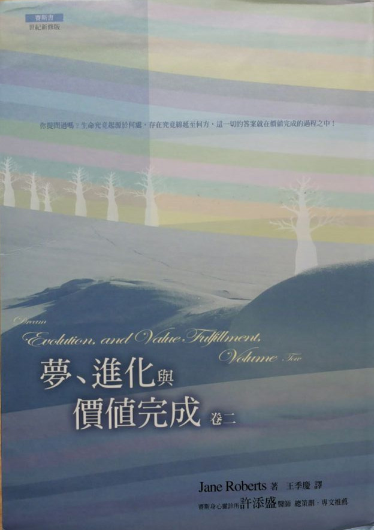

# 赛斯书：梦、进化与价值完成（卷二）

## （新时代系列）总序

王季庆

自九岁那年，我认真地思考我是谁？我由哪里来？往哪里去？而引起了我的大疑大惑后，这些问题就一直潜隐于意识的某处，不时地困扰我。这半生踽踽独行于“人生”的风景里，我热切地生活着，不肯放过任何景色。经过荒漠，吃过风沙，踏过荆棘也悠游欣赏过各种美景：艺术的、科学的、感性的、知性的……心灵接触到这些美景，自然是欢欣雀跃，但未曾解决的“终极关怀”（ultimate concern）的问题，总令我不安、恐惧和悲伤；繁花胜景的美，徒然牵动“花落人亡两不知”的惊悚，真是情何以堪！

经过对心理学和哲学的探讨，对宗教的依附，心中隐隐然有所期待，却又不太能抓住我到底在渴望什么。十几年前翻译的《先知》，现在看来，已然透露出端倪。一九七六年接触的“赛斯资料”，打破了我不少成见，也解答了我很多问题，虽然其中有很多理论是无法印证、甚至超乎想象的，我深心的“直觉”却与之呼应。回国后，我勉力译了几本“赛斯资料”，同时自己也继续钻研中西哲学和佛学。那时，我并不知道有“新时代运动”（New Age Movement），只是每次去美国必然泡在书店里，找一些谈形而上学或心理学之类的书回来看。其中，在“雄鸡”（Bantam）平装书里，有一些在封底印了男女二人手牵手的图样，下面写“新时代从书——对意义、成长和变化的寻求。”这标识使我心动，开始注意所谓“新时代”的书。

这是在我已经看了许多属“新时代”范畴的书之后才真正了解“新时代”的意义，而且知道“赛斯资料”已经成为其中的典范书。

“新时代”是指“宝瓶座时代”（The Aquarian Age），西方神秘学认为现在是一个转型期，正准备进入“宝瓶座时代”。“宝瓶座”象征人道主义。人类由追求社会的、物质的、科技层面的进步，将演进到注重“心灵”、“精神”层面的探索，找到超越人种、肤色、民族、国籍以及宗教派别的人类心灵的共通点，认知人类的“同源性”和“平等性”，从而达成“四海一家”与“和平”的远景。

在这世纪未，“末世”的恐惧像乌云一样笼罩在许多人的心上，许多声音警告我们：人类即将面临灭绝的命运。但也有人预言，在动乱之后，二十一世纪将是个心灵的世纪。如果相信“你创造你自己的实相”（You create your own reality）——“新时代”的重要共识之一，那么人类的前途，就靠大家的心灵共识展现出那一种的实相了。综观世界各地，极权国家对民主和人权的逐渐开放，大家对“和平”、“救灾”、“非暴力”、“环保”等等攸关人类共同命运的观念的关注，并付诸行动。可以说“新时代”的影响力正在逐渐扩大、加深。

“新时代”运动在欧美正是方兴未艾，百花齐放，有关的书籍和传播节目、工作室等琳琅满目，而各种灵媒、催眠师、上师（Guru）等正各擅胜场，其中层次自然是良莠不齐。去芜存菁后，我只简单地介绍几个最好最有力的观念：

一、我们皆为“神”的一部分：传统的“神”，是一种超越的“外力”，父性的、权威式的判官。“新时代”则倡导这个“一切万有”、“宇宙意识”、“生命力”、“能量”为一切的源头、本体、本来就有、不生不灭、不来不去，而我们皆为其一份子。大涅槃经说：“一切众生皆有佛性，一切众生皆可成佛，”我们本质上是不灭的精神体，无形无相。这个“一切万有”正如朱子在中庸导言里所说的“放之则弥六合，卷之则退藏于密”。在“本体”未彰显展布为“现象界”之前，在无时间无空间性中，它寂然不动时，是孕含万有的“空”，它的创造力和梦化成了现象界。而我们那纯心灵的部分进入到肉体，来体验物质实相，心灵是不灭的本体，宇宙是“如幻如化”的现象。

陆象山说过：“吾心即宇宙，宇宙即吾心。”又说：“万物森然于方寸之中，满心而发”。

二、你创造你自己的实相：也就是“万法唯心造”。我们都是自己命运的主宰，我们不必受外界任何权威的摆布，不能再怨天尤人，而必须对自己的一切负起责任。外界的一切，只是我们内心世界的投射，我们在此“自编、自导、自演”一出出的喜、怒、哀、乐、悲、欢、离、合的好戏。

三、肯定人生的意义：不虚无、不悲观，把人生当作学习的过程，去面对我们自己创造的“实相”。人生提供了我们的心灵能直接体验物质实相的机会，在错综复杂的人际关系和五光十色的现象界，我们发挥创造力、想象力，最要紧的是，入世的生活，使我们生出悲悯之心。纯知性的思考必须加上人生经验、沉思反省和直接的感触才能酿成“智慧”。在人生的戏里，又不可一头栽进去地过分入戏，还得能“抽离”，作一个观者，才能去除“我执”，才有希望了悟“无限心”。佛家所倡“悲智双运”放诸四海皆准。

四、道德的内在性：没有“天堂”和“地狱”。（除非你的信念造给你一个）。没有“人格化的神”来审判你。道德不应是规律的道德（morality of rule）而是德性的道德（morality of virtue）。孟子说：“仁义内在”，道德是无条件的无上律令，是无所为而为，不靠宗教的戒律或国家社会的规定。所谓“良知”就是我们内在的“神”，每个人只要反躬自省，都明白应如何做，这就是“自律道德”，肯定了人的“性善”，没有原罪，也没有永罚的恐惧。这对传统基督教义下生长的西方人有非常的震撼力。罪恶感和恐惧只是人发明了来控制人的手段。天罗地网刹那间消失无踪，而人可以在喜悦、坦荡中做人——“自在的人”。

五、心身健康是自然状态：现代医学越来越发现人身体的疾病绝大多数是起自心理的因素。“新时代”更有些人主张身体的自然状态应是健康的，而疾病来（disease）自心理不适，因此只要自己能改变，或在他人帮助下改变心理状态，就可恢复健康。而西医由“头痛医头，脚痛医脚”的支离状态也渐进而注重整体（holistic）治疗。

六、环境保护：为了人类的存续问题，为了给我们及后代一个更美好的生活空间，人们开始觉醒不能只盲目地“开发”或短视地滥用天然资源。基于“爱生命”，便得负起自然界的协调者、保育者的角色。“我们的”地球的种种变化，如臭氧层的被破坏、森林的消失、气候的失常、资源的滥用、污染的泛滥等等，几乎都是全球的影响，需要人们共同的关注和努力，也促成了“地球村”的观念。“爱生”与“惜福”当是“新时代”的特质之一。

七、无条件的爱（unconditional love）：“一切万有”的本质就是无条件的爱，是在所有上面所说的那些概念之后的一个共通性。中国人说的天（乾）是阳性创造原则，地（坤）是阴性的滋育原则。西方宗教的“神”代表阳性的“意志”，即创造原则，而“圣灵”代表阴性的“爱”，即滋育原则。万物都生自这阴阳的交感。“新时代”倡导“无条件的爱”，是基于我们的“神性”，及我们都是同源的兄弟姐妹。这不是“贪爱”，不带私欲，不带强迫性，不是“已所欲，施予人”；而是温柔地接受，温暖地关怀，并且是由爱自己开始。认识自己内在的“圆明自性”，因而自爱自重。把这爱扩而充之，像阳光一般地普照，无条件、无要求、无批判。这种爱是不虞匮乏，源源不绝的，而且给予即获得。

东方的儒、道、佛的传统里，都找得到与这些观念暗暗呼应的说法。西方正统基督教影响下的西方人，近年来从古老的西方神秘学和东方哲学、宗教里重新挖掘、汲取精神的养分，而得到了相当高明的洞见。

孙春华，胡因梦和我有志一同，盼望借着介绍新时代讯息而把喜悦和爱带给愿意接受的朋友。“新时代”不排斥某种宗教，也不局限于任何组织、宗派。在曹又方和简志忠的支持和鼓励下，我负起主编的任务，选些国外的好书以飨读者，并商请国内的名家与我们分享一些人生慧见，愿这系列像“爱的活泉”解了你心中的干渴。我深深觉得我要带给大家的就是“爱的讯息”，因我曾是个惊恐不安的孩子…当我了悟生命即光即爱（Life=Light=Love），就渴望去安慰每个犹在惊恐中的孩子。

## 译序

这是珍•罗伯兹生前口授的最后一本“赛斯书”，也是众多赛斯书的爱好者引颈盼望了许久的巨著。

在我们台湾，“赛斯书”也拥有为数不少的忠实读者，他们一致的感受是：赛斯书仿佛唤醒了他们内心长久以来已具有的智慧与之呼应。然而，也有少数并未深入去咀嚼、感受其深思的人，却批判赛斯书过于理性，而忽略了爱与直觉。其实，只要真正去读赛斯书，这种偏见就不攻自破了。因为，读赛斯书时，他们的脑往往并不能全然了解，更不能证明赛斯所言不虚，但他们的心却明白它已找到了真理的源头和依归！

本书提醒我们都应有“信心”，我们是安然偃卧于“一切万有”的怀中。那也唤起了人之为人对“一切万有”的“无量光”、“无量寿”和“无量爱”的无限“希望”，以及对“一切万有”的每一份子油然而生的“爱”。如在第九一二节里说的：“……信、望、爱被附在已建立的宗教信仰上。反之，这些是基因的属性。”

每本赛斯书都有些章节非常深入的谈到肯定和爱，以及我们作为人所承受的“恩宠”和“护持”。赛斯所言并非混沌的滥情，而是说明了“爱”的来源和意义。

如《先知》里畅言的，人应“以理智和热情为你在航海的灵魂的舵和帆”，本书也提到：

●需要知性和直觉并用。（第八八三节）

●人的推理心是建立在一个直接感知上——一个推动他的思维，使得思想本身成为可能的直接感知！

●思想、感受与直觉的主观属性，是探查实相的第一手工具。（以上第九〇八节）

●当理智被教导以远较不受限的方式去用其能力时，直觉与推理能力能以平顺得多的方式一起运作……

●我会一直谈到在直觉与推理能力之间的平衡，而我希望引领你们朝向那些能力的结合……使得两者都被不可计量的加强了……

●我并不是提倡依靠情感高于理智，或其反面。（以上第九一四节）

此外，我想先节录一些很新鲜而发人深省的段落以飨读者：

●大自然的鱼虫草木各自代表“地球”活化的一部分，而“人”则是地球在“思想”的那个部分——人以他自己的方式专精于世界之有意识的工作。（第八九九节）

●灵性上来说，人的“目的”是去了解爱与创造的特质，在知性上与心灵上了解他存在的源头，并且怀着爱心创造他目前并不觉察的其他实相次元。（第九〇一节）

●单单是年纪本身从不会导致任何身体灵活度或心智能力或欲望的任何减退。（第九〇二节）

●既然你们有了现在的基因构造，你们有意识的意图和目的变成了扳机，启动你们所需要的不论什么基因性或转世性的因素。（第九一一节）

末了，我要特别感谢许添盛的精神支持和实际上做笔录的帮助，以及陈建志热心仔细的校订以及在文字和编排上的宝贵建议。

## 赛斯 ESP 班语录

（罗注：当我们在一九七五年三月从艾尔默拉城里的公寓搬到城旁的坡屋时，珍就正式结束了她的 ESP 班。这些语录是从她在坡屋里透过赛斯给来访的以前学生们的课里摘出来的。）

“……你是自然的一部分，那就是你的救赎——不论你如何尝试离开那架构，你仍存在于其内。所以，你在其他层面与地球沟通，纵使你拒绝觉察那个沟通，你帮助地球存活，不论你有时会如何的否认那个遗产。”

——一九七七年二月十一日

“你们吸进的每一口气息都是有品质的气息。所有你们需要做的，只是了悟到，你们的每一口气息终究会到达宇宙的边缘，而支撑住你们的世界。”

——一九七八年十二月十二日

“现在，创造能力不只帮助你写书、画画、弹琴及作曲。你能活下去大半要靠创造能力。你的细胞是创造性的。你活着是因为你想创造。你做的每一件事都是创造性的。你创造性的自己、你自发性的、创造性的自己——那个透过你的冲动而谈话的自己——使你活着。”

——一九七九年九月二十九日

## 珍的诗（附罗的评论）

（在写这些诗的四年半里，珍都没给我看过，她并非故意不让我看。一方面，那些诗像是随手写下来的东西，在她的日志里半完成并且没给人看，直到我开始为本书卷二的前言找些新鲜资料时，我才发现到。另一方面，它们包含了深而私密的洞见，从她自由的、好奇的儿时渴望，以及直觉的知晓，到她目前身体受损的状况——我们所谓她的类风湿的“症状”——而一直到她死前最后的作品，我发现每一首诗都是一个启示，激起了源源不绝的忧伤与质疑。当我写这篇东西时，我忍不住哀悼之情；我告诉自己，若我在珍写的时候看到这些诗，也许每一次都会更了解她一点，在那些年里也许能帮助她比我曾做到的更多。在同时，对我而言，那些诗如此新鲜而且一致，好像她才刚写完一样。而当我重读时，我再一次的了解，我的太太仍在教我，有关她的勇气，以及有关我们每个人分别而又共同在分分秒秒创造的宇宙之不可说的、无穷无尽的神秘。

（我给每一首诗短评，然而，拼字及标点永远是珍自己的。第三首是她唯一正式标了题的诗。

（这是一首关于她对她所居住的世界那神奇的儿时反应的诗，看似简单却极为感人，珍从那观点预示了四分之一世纪后，她在赛斯资料里表现的天生知识。当她实际上在写那首诗时，她身体上的症状已经有大概九年了；为了她自己创造性与挑战性的理由，她允许那些症状深深的根植于她内，而认为她是从那范畴汲取了这首诗的灵感：）

◇　◇　◇　◇

主啊，让我记起从前的感受

当我以肌肤轻触

每个新鲜的早晨

而跳跃在

展于黎明与午间之

浓密的思维森林里，

当午餐魔术般地放在我面前。

主啊，让我记起从前的感受

当我是如此新鲜

以致我想我是早晨的一部分。

我不想入睡

因为害怕世界会消失

但新的日子来了又来。

旧的日子逐一溜走，

却永远被补充。

主啊，让我记起从前的感受

当我以鼻磨擦早晨的空气

想着我可以摇动一片远处的树叶

正如我摆动自己的耳朵及足趾。

我想我引起雨落下

正如我眼中落下的泪

濡湿我的面颊，

而我的思想转变成云

环绕在我头顶。

——一九七四年九月

◇　◇　◇　◇

（我并没想到四年前珍就在臆想离开物质实相。若我知道，我会觉得困惑——至少在一开始是如此。那时她四十七岁，我则大她十岁。在一九八〇年四月我发现这诗时，珍在那时写说，她借由触及我的手臂而从我这儿汲取力量，她触及了我的心：）

◇　◇　◇　◇

（当与罗•太阳开车时的灵感）

一天

我正走过世界，

几乎决定不再停留，

当我看见你站在那儿，

在时间里先我十年

在空间里却如此靠近

所以我伸手

触及你的手臂

　——一九七六年四月二十六日

◇　◇　◇　◇

（译注：珍此诗以太阳为罗的姓，表示视罗为她的太阳——能源。）

（“我太太有这么多精神上与肉体上的挑战，她还能写一首对大地谦逊致谢的诗，真了不起！”

（那是我发现这首诗时的第一个念头。那时，珍以一种深深的、直觉的及心灵的天真爱着物质生命——而她仍然如此。我不知道她怎能比在这儿更清楚、简单而美丽的表达那尘世之爱。然而，对我而言，这首诗也包含了许多其他层面的意义：）

◇　◇　◇　◇

给大地的信

我已淋漓尽致了

你的血的甜蜜传承，

就像其他的生灵

我，也生自

你的力量与慈善

受赐享有你的本质

让我谦卑地致谢吧

因为你的爱之滋生

从不知偏私

　——一九七六年

◇　◇　◇　◇

（这首她一年前所写的诗里，珍不仅在谈她的工作转成不可避免的文学的、物质的形式，并且也重申她的信念，及她个人化的意识在她肉体死亡后还会活着。然而，正如在这个系列里的第一首诗中，在约四年半后她仍在想着她的死亡。我现在明白，既然她选择了她一辈子的挑战，那么，这种想法在珍为她自己创造的实相里将继续扮演一个主要角色：）

◇　◇　◇　◇

我一直在将我的人生转成文字

有一天它会完全住在

写下的名词及母音里，

干净的段落

蒸馏自神秘的生命岁月。

甚至在死亡之前

我计划我心思的安息之所

仿佛在思想的成品里

升起了第二度生命

没有眼、手或血肉

却超越了

在大脑的小范畴，

自给自足，终于真的活了

像个心灵的气球

通过未被探索的天空

终于走上了安全之路

当抓着气球的手

放它走了。

◇　◇　◇　◇

——一九七九年四月十七日

## 罗序

当我一旦发现《梦、进化与价值完成》将会长到必须分两卷出版时，我开始想我该如何综合珍、赛斯和我贡献给卷一的所有资料。我有一个滑稽的想法，就是如果我真的照我想做的样子去做，这序就会与卷一一样长！然后，我觉悟到，根本不需要给卷二一篇长而详尽的序，之后我就松了一口气。

真正需要的是，读者在深入卷二前先好好的读读卷一，没有别的更好方法去了解那第一本书的复杂主题了。不过，借由在此提出赛斯——珍、我自己以及我们在 Prentice-Hall 的编辑谭•摩斯曼的三段小资料，我可以有助于启始这个过程。然后，我会补充我自己一些后来的评论。

在珍和我完成了卷二之后，谭写了一封信给出版社的主管。当珍和我努力的准备这本书的出版事宜时，谭及出版社的其他人曾非常耐心地等了好几年；在那段时间里没有一个人曾对我们施压，要我们赶快完成那工作。我们对那份自由深为感激。谭在信中热心的推荐这本书的出版。我认为他非常利落地交代了我制作这本书的方式的目的。

“这本书值得我们等这么久！它事实上是三本书合在一起，其中两本是赛斯迷一直在等待的，而第三本则是个未预期的获得。”

“由赛斯口授的稿子——《赛斯书》的核心——本来就够好，但罗又加了一个详细的、令人伤感的报告，描述拥有这么多心灵与创造资源的珍为何陷入身体上如此深的痛苦（读者来信频频询问这个问题）。只说罗关于这点做了一个完整而谨慎的报告就够了，而结果——虽然不一定是很轻松的读物——回答了赛斯读者一直在问的不易回答的问题。”

“赛斯资料也不只包括了书的口授，还有关于珍的病情很多中肯的私人资料，以及其他平行的课。所以，归根结底，珍•罗伯兹书迷将被给予赛斯系列中最好的书之一，本书提出且答复了赛斯整个作品的意义的切要问题。”

“我对这本书的热情，只被珍的受苦及罗茫然寻找出路的必要记录所冲淡——所以，这书不只带有一丝悲剧的气息，但却应该不致令珍的读者却步。他们知道那些‘事实’，而现在渴望知道那故事。事实上，如果可能的话，我这本书能尽速出版。”

最后，谭•摩斯曼写道，我在本书里的某些关于珍的个人挑战的描写是‘令人伤感的’。当然，谭说得对，它们是令人伤感的。它们击中我们对疾病及残废，甚至对死亡的恐惧，使得我们有意识的面对那些可能性；而在同时，它们又完美的反映了我们同样深的内在需要及渴望。在本书里我尽可能清晰的报告珍与她身体症状的奋斗。我也要求每个读者最佳的洞见及最深的了解，纵使那些物质并不容易被唤起，但在我看来，要了解赛斯资料是怎么回事，它们是必不可少的。

我很久以前就发现，珍了不起的创造能力是如此的与她个人的挑战密切相连，以致它们是不可分的。我俩都从来没兴趣只弄出一系列的“神通书”，而没有那些在我们一辈子里累积起来的所有人性的、切身的细节，那丰富了分分秒秒、日日月月，且创造了我们浑然整体的一生。我也相信，以一般的说法，在世上每个活的存有，都在从事这样一种充实的过程，而为独特的个别目的裁剪它。显然，以更大的说法，珍和我相信地球——的确，宇宙本身——是活的。

我的确觉得，那充实的一部分涉及了一个全球性的（并且可能是宇宙性的）治愈行动，而且每个生命形式都有所贡献——至少在地球上，我们自己造出来的这重要力量，在一个无穷尽的重生的伟大合成里支持着我们。然而，我还没读到过任何有关这个的东西，至少没看到有用这种说法来写的。我们人类应该研究全球治愈这整个题目，因而，我们能用所获得的知识把我们导入思想与感受的新领域。

以她自己创造性的方式，珍做的就是这个；她身体的症状是她个人及我的奋斗，以及我们共同的不完整知识的路标。以她的成功与失败，珍为许多人带路，纵使她和我还在试着学到更多。然而，即使有我的帮助，我太太所走的旅程仍是极端寂寞的。由这全球性的治愈过程跃出的形形色色意识，必然真的是没完没了的——永远具创造性、永远向前看。

## 第七章：基因学及转世，天赋及“缺陷”，广大的基因及转世规模，资优者和残障者

（在 9 点 34 分停顿。）请等我们一会儿：下一章（七）：（基因学及转世，天赋及“缺陷”，广大的基因及转世规模，资优者和残障者）。

（停顿良久。）你们人类，生为一个族类，包括了白痴及天才，愚人及智者，运动员及畸形人，美人及丑人，以及其间的所有种种不同的人。那么，有真的无穷种类的基因文化在运作（热切的），而每个都有它们的位置及理由，并且每个都切合那整个画面——不只是人的实相的画面，并且也是包括了所有自然的地球实相的画面。

你们的宗教概念常常告诉你们，天生畸形是父母的罪投在孩子身上的结果，或涉及了一种叫做“业障”的惩罚。以生物学的说法，人们谈到来自好的种或坏的种，而甚至那些标示也暗示了道德判断。

转世的整个概念也曾被其他的宗教观念大大的扭曲了。转世并不是一个由罪与罚组成的心理竞技场。再次的，在你自己既定的特性下，你在你生命的状况里是有自由意志的，人类了不起的才能和适应性，是依靠基因的精确性与基因的自由之间令人惊异的互动。人类之非常具特征性的属性，那可靠性与完整性，是依赖经常的制衡，及人类可以据之度量他自己不同特性的存在。

人类也永远处于在其基因库里保存上百万的特性的过程里，那些特性在种种不同的偶发事故里可能会用得上。而就彼而言，当然，在许多种的病毒与人类及其他族类的健康之间有一个联系。

创造性改变的可能性必须永远存在，以保证人类的弹性，而那弹性可以以许多方式显现——以你认为是畸形、天生残障的情况，或和任何假设的身体标准不同的变形。你们全都看起来相当相似，一般而言，都有一个头（好笑的），两只手臂，两条腿等等。这种不同或变形，在某个层面是非常显而易见的，比如说，你可能有比你该有的更多或更少的手指，或一双手有两个拇指，或其他任何被认为是畸形的状况。

（9 点 52 分。）

也有精神上的状况：不像其他人那样用推理心的所谓智障者。再次的，也有身体上或智力上非常有天赋的人，他们有时仿佛在资优程度上离凡人那么远，就如白痴在另一端一样。所以，当我们继续下去时，我希望给你们看所有这些情况在个人与族类的发展上所扮演的角色。

在一个较小的活动层面，这种差异当然会为你所忽略，你并不知道你是否有任何不好的基因，除非它们的效应显现了出来。事实上，在微观的层面并没有所谓符合标准的东西，而根本无法以安全的肯定去预测任何基因因子的发展。你可以做集体的预测，并且整体地做某些判断，但因为还涉及了其他的因素，所以，任何特定的基因因子无法就其发展被精确的预测。这是因为其活动也涉及了不在你们的任何计算里显现的关系。

当你透过你人生的经验，运用你的自由意志，并且经常做新的决定，你的思想、感受、欲望及意图，还有你的转世知识，调整了那个结构，将某些潜在的特性带入实现，而减弱了其他的。

口授结束（有力的）。你有问题吗？

（10 点 4 分，“对于珍今天中午小小的出体经验你想说些什么吗？”

（珍的意识离开了她在卧房里睡觉的身体，而旅行到屋子后边她的写作间里。她在那儿碰到了也在出体状态的我，而我们有一次非常生动的谈话。事后她坚称我也是出了体的，虽然我并没有关于这样一件事的有意识记忆。我们推测那时我正画完了上午的画，而在浴室水槽边洗我的刷子——我每天做的例行公事，一个可以让我心灵的一部分自由去从事其他冒险的工作。然而，既然当她睡时我是醒的，因此，我们猜测那些同样的习惯性清洁工作，也足以占据我的心神到令我不觉察我的另一部分在搞什么。）

请等我们一会儿……

那出体是一个态度改变的结果，而也因为鲁柏身体的放松才使之成为可能。他在练习使用他的意识，容许他自己更大的自由。在那时，你心神的一部分在漂浮。

现在，当人们贯注于其他事情上时，他们可能摇动脚，或涂鸦，或敲桌子，他们也在以同样的方式练习他们的意识——以他们的心智涂鸦，以这样一种方式放松他们自己，游荡开去更新他们自己——而你俩都在那样做，但可以说，鲁柏捉到了他自己的尾巴。

你俩都在屋子里神游，而鲁柏在他心思在的地方捉住他自己——只不过他的肉体不在同一个地方。因为这是像一个精神上的涂鸦，所以色彩还不完全，画面还没有完成。

整个的对话是使得那事件看似合理的一个企图，一个替画面着色的企图。

此节结束。

（“谢谢你。”）

你俩都做得很好，祝你们晚安。

（“赛斯晚安。”）

（10 点 10 分。）

（注一：以下两首诗是珍为我去年的生日写的，它们很适合放在这儿。

◇　◇　◇　◇

总觉得

我是一直认识你的，

然而你每天都令我惊讶

以你这个人的新版本，

然后再为我所记忆

我在心里鼓掌

说：“当然。”

而你又在变成

一个新的版本

那是我前些一向认识的！

◇　◇　◇　◇

还有：

◇　◇　◇　◇

这个私人的可能性

并非那么坏

当你考虑到

要到达这儿

我们必须旅行过的

大众的世界：

分子等待

在侧翼

寻找

精确的

时空

跃入，

细小的

意识束

在几世纪后

重聚，

由我们曾参与的

上百万

其他形式里

找出我们自己——

只重组

我们所要的

为罗和珍。

### 第九一〇节

1980 年 4 月 23 日 星期三 晚上 9 点 6 分

（多明尼加共和国位于西印度群岛中希斯旁纽拉岛东部，是个非常贫穷的国家。昨天，珍和我重读了我去年九月里归档而就忘了的一篇文章：在该国的某个村庄周遭的区域里，38 个女孩在青春期开始时变成了男孩。这了不起的身体上的改变，是从一百多年前的一位共同祖先所携带的一个基因“缺陷”衍生出来的。这些男人的精子数目很少，而可能无法以正常的方式生育。然而，珍和我认为这稀有的集体事件——这类事件唯一的记录——与有关包含在我们人类广大的基因库里上百万的变化之赛斯资料相符。那么，为了不论什么神秘的理由，我们整体的意识想要并且需要这种特殊的“基因文化”。见上节被作为这章开头的那部分。

（然后，今天我们读到，在一个贩卖动物给医学研究用的公司，科学家如何繁殖了一种没有胸腺的无毛实验鼠。胸腺有助于身体创造出对外界感染的免疫力。举例来说，科学家常将无胸腺鼠用于癌症的研究里，因为那些老鼠不会排斥移植过来的肿瘤。（老实说，这些动物对任何一种疾病都如此敏感，以致他们必须被养在无菌的状况下。）这篇文章令珍觉得非常不舒服，而她跟我提了好几次（注一）。）

现在：晚安。

（“赛斯晚安。”）

口授。（停顿。）如果在你们之中没有白痴，那么，你们很快就会发现，天才也不见了。

再次的，那些你们认为是你们族类特征的人类能力，是依靠着无穷尽的变化的存在，那出现在集体里，以给你们常常显然相反的状态。那么，你们所认为的平均智力，是因为经常的变数之活动而存在的一种状况，那些细微的变化在尺度的一端给了你们白痴，而在另一端给了你们天才。

两者在维持那精神活动较大的“标准”上都是必要的。我在这儿为了你们的方便而用“标准”这个字，虽然当它被用来作为心理学上的测量尺度的时候，我并不同意那个字的通俗用法。所以，基因系统并非封闭的，基因并不只是持有资讯而与身体活生生的系统无干。那么，基因结构并不像一些已设定好的，非常复杂的机制那样存在，“盲目的”开始并运作，以致它一旦被启动后就没有机会再修正。

尤其在你们自己的族类里，在人类基因系统、环境及文化活动之间，有一个了不起的相互作用——而我所讲的文化活动，是指包括了你们政治、经济世界等的独特活动领域的有关事件。

（停顿。）基因事件并非像决定论那样无可转圜。它们代表了朝向某种身体或精神活动的强烈倾向，某种生物上的偏好，它们倾向于某些而非其他的事件的启动，所以，几率是“偏向于”某个方向。（停顿。）那么，基因事件的确是事件，虽然是在一个与你们习惯认定不同的活动层面上。

我们在谈的是染色体的讯息。这些讯息并不是被写在染色体内，就好像字被写在纸上那样。但是，讯息及染色体是一个活的单位，那讯息是活的（热切的）。我们谈的是一种生物上的楔形文字，在其中，细胞的物质结构本身就包含了一个肉体——形成它们自己——所需的所有知识。这的确是生物形式的知识，并且在生物上做出最清晰的活生生的声明。

（9 点 27 分。）

带着基因包裹的细胞，像所有的细胞一样，会对刺激反应。细胞会活动。它们生物性的觉察所有身体的事件。以无法言明的方式，细胞也觉察在生物层面被感知的身体的环境。我们以前曾说过，每个活细胞多少都透过一个内在沟通系统与每个其他的活细胞相连，因此“被设定的”基因活动，可以被环境里的条件所改变。

（停顿良久。）举例来说，我并不只是在说基因活动能透过像核子意外这种事而改变，却是说非常有意的改变也能在基因行为里发生。因为以你们的说法，基因结构不仅让人类为任何偶发事件做了准备，并且也借由触发人类在任何时候需要的那些特征及能力，借由为这种未来的发展预留余地来做准备（全都十分有力。）

你们的基因结构也对你们有的每个念头、你们的情绪状态、及你们的心理气候反应。以你们的说法，这包含了与人类可能的未来能力相关联的人类具体历史。你选择你的基因结构，以令其适合人类的挑战及能力。你选择你的基因结构，以令其适应你已选择的挑战与潜能。（停顿良久。）这基因结构代表了你物质的参考点、你身体的架构；它是你个人身体上的属性；它是你物质上与之认同的部分，充满了你自己的身份。你的身体像一艘最好的船，是你为了一个绝佳的挑战性冒险事先选择了的——一艘你个人指定的船，它是配备好来尽量做出你个人性的一个物质性的显现。

有些人在开始这样一个冒险时，的确会坚持要一艘绝佳的船，具有最顶尖的设备，配备着华丽的舱房及宴会厅。其他人则想要多得多的兴奋和多得多的热情，而订购了一艘较不华丽但却驶得更快的船。有些人会替他们自己设定一个目标，考验他们的驾驶技术。这可能是个简单的比喻，然而，每个人心怀自己的意图及目的，而选择了身体这活生生的船。

（停顿良久。）在物质实相里，生命是游戏的关键——而那游戏建立在价值完成上。那就是说，每一种生命形式寻求它感受到在其生活架构内的所有能力完成及绽放，且知道在那个别的完成里，生命的其他每种族类也会受益。

（9 点 45 分。）

我绝无意贬低天才毋庸置疑的价值，或他们对生命品质的伟大贡献——但再次的，生命的品质也因白痴的存在而受益。不只因为为了基因的理由尺度的两端都是必须的，并且也因为白痴本身并不被大自然认作是失败或缺陷。那些说法是人类的判断。借由调节了推理心有时可能对人类活动的强烈支配力，白痴也扮演了他们的角色。

白痴也常能在他自己的实相里体验一个更自由、更慷慨且更忠实的情感状态之流，不被理智有时严厉的支配所阻碍，而这种调节性的倾向，在基因的运作是很重要的。

我在本书的稍后会再谈到这个题目。

迄今，大略来说，自从基督教的诞生以来，你们用到的推理心，都将其推理能力限制在一个非常狭窄的实相范围里。推理心大半只以符合它自己标准的生命来看生命的价值。（停顿。）那是说，你们所用的推理心，认为只有能推理的动物才有了解生命价值的能力；其他形式的生命则几乎像是不用考虑了，它们的价值只以它们对人类的用处而被考虑。但人的生命显然依赖着其他生命族类的存在，而那些族类跟他分享某些价值。生命是神圣的——所有的生命——而再次的，所有的生命寻求价值完成，不仅是身体的存活。

鲁柏读到关于发展一种没有胸腺的老鼠的文章。既然胸腺在维持身体对疾病的抵抗力的必要过程里是非常重要的，那么，这些特定老鼠没什么抵抗力。它们为了实验的目的而被繁殖和出售。这种做法的意图，是为了促进人类生命的品质，为了研究疾病的性质，并且希望将所学到的东西运用在某些人的身上。老鼠不被认为是人类，它们并不是，所以，像任何动物一样，它们被认为是可以弃置的，可以为了一个好的人道目的而牺牲掉。

（停顿良久。）也许，一开始推理心的偏见可能逃过了你们的注意，因为无论如何，老鼠与你们自己的族类离得很远。（较大声：）不久之前也有犹太人为了同样的目的被牺牲了，而其推理大半相同，虽然在那个情形里你们是在与你们自己的族类打交道。

（10 点 5 分。）

不过，犹太人被认为几乎不是人。而无论何时，当关系到这种对你们自己族类的残暴行为时，你们就沉迷在同类的扭曲推理中。因为犹太人被认为不是人——或至多也不过是人类的缺陷品——他们被认为是在“改善人类基因”的祭台上可被合理化的祭品。你无法借由毁灭任何其他种类生命的品质，来改进你们自己生命的品质。并没有基因上的优越种族。首先，将人类划分成“种族”的本身，就是建立在整体的相似性画面里可笑的微细区分上。

鲁柏对他读到的文章感到激愤，而他义愤填膺的说，这种做法在生物上是不道德的。我通常避免用“道德”或“不道德”这种字眼，因为定义因人而异。可是，那做法的确涉及了生物上的侵犯，一个违背大自然的流动及意图的做法。在其中，一种生命形式被迫违背自己的价值完成，而就因为这种涉及了其他种生命的态度，才使得犹太人在二战时集中营的恐怖成为可能。

口授结束（较大声）。你有问题吗？

（在赛斯问完以前我已摇头说没有。）

那么，我祝你晚安。

（“谢谢你，这资料非常好。”）

（“带着幽默：”）自然啦！

（“好吧，晚安。”）

（10 点 14 分。见注二与赛斯在本节里对基因的讨论相关的一些评论。）

（注一：珍和我都对医学研究里的动物实验有显然的暧昧感受，并且也为之困扰。我们也认为其他大多数人，不论他们知道与否，也有这种复杂的感受。是否我们自己的肉体生命曾被从动物实验所获得的那些知识所挽救——也许甚至在出生前？我们并不知道。我们真正知道的是，如果一个人与一个支持伤害性及重复性的动物研究的哲学隔离的话，会较容易接纳它。

（不过，如果让我们选择的话，我们现在会放弃来自动物实验的“好处”，纵使因为缺乏随之而来的知识，可能使得我们未来的福利受损——并且假定在危机时我们共同的决心也没有减弱！追随这样一条路，实际上会非常困难，因为在我们的社会里，来自动物研究的结果是如此普遍！我甚至认为要脱离它们，人必须住在野外做一个隐者才行。在实验室里利用动物，是将人类的目标与价值强加在其他生命形态上，纵使现代的科学方法被假定是与价值无干的。当然，因为这种研究是以进步和实际的共同好处为名而进行的——而让我们记住，那进步也应用在其他动物的治疗上。我们认为这本书的每个读者都会从动物实验里获益，并且仍旧如此——其中有的实验是最残忍的，以人几乎没怀疑到的方式，更别说清楚的知道——而每个人都获益于在国内家家户户都能找到的医学、化学、美容与娱乐的产品，在其研究里都用到动物。

（注二：一般而言，科学仍以机械的、决定论的或化约主义的说法来看我们的基因系统，因此，证据正被累积起来以支持那个整体观点。那就是说，在这个时候科学并不需要去寻求涵括了意识、意图及基因学另外的、更大的或更令人不安的参考架构。真的，我很少看见意识与基因学一同被提到，除了好比说，当意识的品质可能被与像智障的基因“缺陷”相连的时候。

（我也不认为已成立的科学很快就会对赛斯的这些概念感到兴趣：在我们的基因系统、环境以及像政治和经济这种文化活动之间有互动发生；或我们的基因系统对我们的思想及情绪反应——更别说会对未来的可能性有任何基因上的计划！我不知道那些因素如何能在实验室里被测量或操纵。当然，科学能容许赛斯的概念在科学架构之外有它们自己的实相，因而摆脱它们。

（不论你承认与否，基因能为未来的偶发事件做准备的这个概念，与非常有力的进化理论相冲突。那些理论说，进化性的、基因性的改变，只透过天择及突变而发生（虽然任意或随机的突变一般被认作是大自然的错误）。在这儿有许多未被解决的挑战，我甚至能见到赛斯在本节里的资料会被科学摒弃为旧的、不被认可的拉玛克理论的另一个版本（拉玛克（1744～1829 年）是法国的博物学家，他宣称一个有机体的结构及作用之某些修改，可以因环境的因素而发展出来，而这些“后天的特性”可被遗传。拉玛克的研究曾遭广泛的误解，但它仍有价值，而近来曾被用于一些了不起的学术研究里，以显示就科学的说法，进化如何能透过天择及突变之外的方法发生）。）

### 第九一一节

1980 年 4 月 28 日 星期一 晚上 8 点 55 分

晚安。

（“赛斯晚安。”）

口授。基因系统是个内在的、生物上的及“宇宙性的”语言。

以你们的说法，那语言道出血肉——而在人类所有的种族里，它平等的道出血肉。并没有较差或较好的种族。且说，梦也提供你们另一种宇宙性的语言，一个多少统一了所有人的语言，而不论其物质环境或国籍或联盟。

不同种族的分类，只不过使你们组织起“大同”中的“小异”——你们曾为种种不同的目的而用到的“小异”。那些目的常常令你们过分夸张团体之间的不同，而缩减了人在生物上的统一。

（停顿良久。）个人性最重要的面向是那些主观的特性，它们一方面将一个人与另一个人区分开；而在另一方面，每个都像闪闪发光的心理镶嵌拼图，给那人类由之而出的较大模式分别的、精美的个人版本。以这种方式，每个人的安全感、完整感及灿烂，都升自那宇宙性的基因语言，并且也升自梦内在主观的宇宙性语言。在两者之间有了不起的联系，而两者是一同被说出的。

让我们变得更实际，来看看这些问题如何融入你们的实相。当你们试着回想你们曾试着放到一边或否认的一些感受及白日梦，这些要求有的在你们自己那方面的一种了不起的诚实。那么，为什么有些人生下来就得体验显然基因缺陷的状况，纵使就种族而言，这种变异或有整体的价值？因为，再次的，我必须强调，事实上，自然本身并不做这种判断，不论你们科学或宗教的信念为何。

科学似乎认为，只有当个人对族类的存活有用的时候他才重要——而我并不那样说。我在说的是，每个个人的存在对族类的价值完成都是重要的；而更有进者，我在声明个人与族类的价值完成是携手并进的。

（在 9 点 13 分停顿良久。）我也在声明，族类本身是察觉那些导致它自己及其成员的价值完成的情况的。基本上，每个族类只会以合作的方式，在生物上将自己的存在与其他族类一同考虑——那是说，在族类之间并没有基本的竞争。当你认为有的时候，你就误读了自然。不论人的有意识信念为何，在一个生物层面上，他的基因结构是与所有其他族类密切相关的。

在人类里，发展的可能性真的是无穷尽的。没有电脑能计算可能的特性的组合。那么，极为重要的是，族类维持弹性，而不变得锁入任何一种模式里，不论那模式多有利（热切的）——而我在说的是肉体或心智模式。在已成立的人类本质的架构内，必须有各种各类的余裕——生物性的启动之余裕，以令那些变异能经常保持活跃。那些基因变异可能是缺陷的或古怪的，它们可能显得是残障；它们也可能显得是一种或另一种较好的特性，但它们是从基因标准分出的变异，必须被生物性的声明出来。

就它们本身而言，不论那些基因变异显得是较好或缺陷性的情况，不同的适应性、主观或物质焦点的改变、以及对也许会被忽略的其他能力的加强，都因为它们而成为必要。然而，纵使我们承认所有这些，再次的，为什么有些个人选择会被体验为缺陷状况的情况？关于这点，我们必须检视一些常被遗忘的人类感受。

现在，我曾常常说，受苦本身并不“对灵魂有好处”。它并非一项美德，然而，无疑的，许多人仿佛在寻求受苦。受苦不能被视为扭曲的情感或信念的畸形物，而被排除于人类经验之外。

（停顿良久。）受苦是人为了种种不同的理由而追求的一种人类情况。受苦有种种不同的层次，而每个人对于受苦是什么都有他自己的定义。许多人的确将某种痛苦与兴奋画上等号。运动员、赛车选手、登山者——全都多少在寻求痛苦，而觉得某些种痛苦的强度本身是舒服的。你可以说他们喜欢危险的活着。

（9 点 29 分。）

有些派别会相信灵性的了悟是身体痛苦之结果，而他们自己施加的痛，变成他们自己的一种愉悦。人们常说动物和人都躲避痛苦而追求愉快——因而，任何对痛苦的追求，除了在某些情况下，都被视为是不自然的行为。

（停顿。）对痛苦的追求是不自然的，它是一个古怪的行为模式。许多小孩做白日梦，不只梦到做国王或皇后，或被给予伟大的荣誉，他们也作为生为悲剧人物的白日梦。他们做残酷的死亡的白日梦，他们雀跃于恶毒的后母的故事。事实上，他们尽其所能的想象涉及人类经验的每种情况。到某种程度，成人也做同样的事，他们被涉及了悲剧、悲伤和伟大的戏剧性挣扎的电影或电视所吸引。这是因为，你们活着是你们对人类经验之伟大好奇心的结果。你们活着，因为你们想要参与人类戏剧。

虽然我承认许多人将不会同意我（微笑），但我从经验得知，大多数个人并不选择一次又一次的“快乐人生”，永远安住在健全的身体里，被自然或遗传赋予似乎大多人都认为是他们所渴望的一切礼物。

每个人追求价值完成，而那是指他们以这样一种方式选择种种人生，使他们所有的能力及才能可以尽可能的发展，并且以这样一种方式使他们的世界也被丰富了。有些人会故意选择“缺陷的”身体，以便更强烈的贯注于其他领域。他们想要一种不同的焦点。（停顿良久。）他们想以某种模式过滤他们的特性。这样的选择要求一种强化，那种强化使加诸个人方面及双亲方面的，因此，某一群人会以一种极为特征性的方式与世界产生联系。在几乎所有这种例子里（停顿），这种人也会从事于否则可能不会被考虑的主观议题或问题，他们会问就他们自己而言必须提出的问题，不只为他们自己，也为整个的社会。

（9 点 48 分，珍在出神状态里停下来，给她自己倒一点酒。）

那些问题有助于带出关于一般人类本质的心理上的成熟及洞见。许多这种情况也用来使人的同情心得以继续存在。我在同情心与怜悯之间做了一个区分，因为一个活泼的同情心导向建设，导向能力的利用，甚至社会的议论，而怜悯则可以是令人麻木的。

你们对肉体标准的过分仰赖，以及你们有关适者生存的扭曲观念，当然有助于夸张任何基因缺陷的存在。再次的，许多宗教教条认为这种情况是神明惩罚的结果。人类的存活依赖你们主观的活动，远胜于依赖你们身体的活动——因为就是你们的主观行动要为你们的身体行为负责。当然，科学以另一种看法来看它，仿佛你们身体的活动是一个机器人机械的、形式化的行为的结果——一个被偶然形成的意外宇宙之盲目因素所奇迹似的设定的机器人。那机器人被设定要不惜牺牲任何人或任何事而活下去，它自己并没有真正的意识。它的思维只是精神性的海市蜃楼，所以如果它的一个零件有缺陷，那么，显然它的问题就大了。但人并非机器人，而每个所谓的基因缺陷，在基因实相的整个画面上，也有一个内部的角色要扮演。测不准原理也必须运作在基因上，否则，作为一个族类，你们就会被锁在过渡专门化里了（注一）。

（停顿。）有种种的意识状态，一个在一个里面，然而，每个当然都相连，所以，基因系统其实是意识的系统。基因系统与转世的意识系统交织在一起，这些又进而与你们认知的意识缠在一起。当下即威力之点。既然你们有了现在的基因构造，你们有意识的意图和目的变成了扳机，启动你们所需要的不论什么基因性或转世性的因素。

做梦的状态提供了在这些意识系统之间的连接的环节。

口授结束。你有没有问题？

（10 点 5 分，“我想有些你今晚的资料，关于贯注及身体的状态，听起来像珍自己的情形——她的僵硬及行走的问题。”赛斯瞪着我好一会儿。）

你是要我评论或那只是一个声明？

（“两者都是。”）

在鲁柏的情形并没有特殊的基因关联。当然，也可能发生那同类的过程。

在鲁柏的情形涉及了行为的模式——为了“强化”的目的而被择选。鲁柏的母亲，以及到一个很大的程度，父亲，也有一些相似的行为问题。在鲁柏的情形，我们仍在与机能打交道——受损的机能——而非基因性的结果。告诉鲁柏，目的并不能使手段合理化（带着幽默），在他个人的情形也不例外。要紧的是仍是去爱，去保护，去珍惜，并且去表现你的身体。

那句话也适用于有基因残障的人。此节结束，并祝晚安。

（“谢谢你。”）

（10 点 12 分。珍说：“将近结尾时有些我没完全传来的东西，那是有关目的使手段合理化的资料。赛斯不要人将那个运用在基因性的残障上……这节很好吧？”）

（我说：“非常好。”）

（注一：赛斯在两年前，1978 年 2 月 27 日，为《个人与群体事件的本质》转述了第八二三节，见那节的注一。在那儿我写道，作为一个物理的原理，量子力学的测不准原理，“替同时度量原子与基本粒子的运动及位置之可能准确性设下确定的限制”，以及“在观察者（及其仪器）与被测量的物体或性质之间的相互作用”。

（在这本书里，赛斯用测不准原理作为一个比喻（而且是个极佳的比喻），意指就如基本粒子的位置及运动无法精确的同时被测量，所以，我们的基因特性及其运动也不是永远可以被明确决定的。在本书里他已说过（第九〇九节）：人类“在基因的精确性与基因的自由之间，有惊人的互动。”还有（在九一〇节）：“你们的基因结构对你们有的每个思想，对你们的情绪状态，及你们的心理气候反应。”选择与可能性也适用于此，由此我们得以避免基因的僵化。）

### 第九一二节

1980 年 4 月 30 日 星期三 晚上 9 点 4 份

（昨天珍打完了《珍的神》第十五章，那章实际上也包含了她在 1978 年 7 月写的一首长诗《心灵宣言》，而我将第一段引用在《个人与群体事件的本质》的前言里。）

（带着微笑：）现在，晚安。

（“赛斯晚安。”）

口授。

（“好的。”）

再次的，基因系统是比一般所假定的还开放得多的系统。基因系统不只包含及传达资讯，它也对来自物质及文化世界的资讯反应。

那么，我想解释，基因系统以一种方式，也对在任何既定文明里最重要的那些信念及事件反应。事件能启动基因的活动，不只透过，比如说，化学反应，并且也透过在整个世界里的安全或缺乏安全之个人及集体的信念。

也有我称之为基因性的梦的东西，那是直接被基因的启动所激发的。这些有助于形成及指导意识，当它在出生前存在于任何既定个人里的时候。

胎儿会做梦。当其肉体的生长在子宫里发生的时候，其意识的成形也被基因性的梦所伸展。这些特殊的胎儿取向的梦是最难描述的，因为它们真的涉及了个人意识的轮廓线之形成。这种梦提供了主观的理解，而思维由之发展。以那种说法，在脑子本身完全成形之前，完整的思想就是可能的。就是思维的过程有助于将脑子带入活动，而非其反面（全都相当热切的）。

现在，这种思维是像形成他们自己的磁铁的电流模式。（停顿良久。）在胎儿里已出现了形成观念的能力，而胎儿的确形成观念。那观念形成之精确取向，以及思维模式之精确取向，等待着出生后来自父母及环境的某些具体的触发，但观念成形及思维的过程则已建立了。这个建立发生在基因性的梦里（再次的，全都热切的）。

婴儿早在他们能说话之前就能思想了。思维必须先于语言而来，语言是思维的侍女。

（在 9 点 22 分停顿良久。）

等我们一会儿……

运用语言的能力，是透过精确的取向而基因性的生成的，并且再次的，基因性的以父母的母语实质启动。儿童们早在实际说出这种语言之前，就已在心智上学习了。但再次的，在基因性启动的梦里，婴儿练习语言；可是，在这种婴儿听见父母说话之前，他们是以心电感应沟通的，甚至在婴儿里，基因性的梦也涉及了语言的密码化及诠释。那些梦本身引发带来自己的实相所必须的实质上的构成。

终你一生，一种或另一种的基因性的梦仍在持续，不论你是否有意识的察觉到。它们在你们所谓的“人的进化”里扮演重要的角色。它们是先前提过的让人去因觅食而迁徙，领他去肥沃之地的那些梦的源头。那些梦也与在物质世界里的生存有极密切的关系，而不论何时，当那生存仿佛受到威胁时，这种梦就会尽可能的升到意识层面。

基因性的梦是预警饥荒或战争的梦。不过，这种梦在你们自己的时代也常可以被触发，当意识心确信人类的存活受到威胁时——而在这种例子里，那些梦于是真的代表了人的恐惧。那么，过度忧虑能令基因系统混淆，并且是以种种不同的方式。每一个种族的存在都依赖信任，这的确是一种生物性的乐观，在其中每个族类感到能自由而安全的发展其成员的潜能，在存在的自然架构之内。每个族类进入存在时，不只对自己的有效性感觉到一种天然的内在信赖，并且还被自己应付环境的能力的蓬勃生气所实际推动。每个族类知道在生命的结构里，它是独特的适于其位。所有族类的年轻分子，都展示出一种无法抑制的放恣（放恣：指放纵任性）。那放恣是与生俱来的。

（带着强调，同时当我坐在沙发上写下赛斯的资料时，比利依着我的左肘蜷睡着：）动物们知道自己的生命清楚的说明了生命的意义，它们感觉到它们与所有其他生命形态的关系。它们知道在星球的存在架构里，它们的存在是极重要的。除此之外，它们与它们内在的生命精神（spirit of life）如此充分及完全的认同，以致去质疑其意义会变得不可想象。不可想象并非因为这种生物不能思考，而是因为生命的意义对它们而言是如此的不证自明。

（停顿良久。）不论何时，当人相信生命是无意义的，不论何时，当他感觉价值完成是不可能的，或的确是不存在的，那么，他颠覆了他的基因传承。他将自己与生命的意义分开了。他觉得内心空空如也。世代以来，人将信、望、爱附在已建立的宗教信仰上；反之，这些是基因的属性，受灵魂在肉体内不可分的统一所启发及促进。（停顿。）动物也与你们一样的熟悉信、望、爱，而常常在其自己的存在架构里示范它到一个更好的程度。任何提倡生命是无意义的哲学，都具有生物上的危险性，它提倡了直接阻碍基因活动的绝望感。这种哲学在创造上是极端不利的，因为它们挫折了创造力本身由其中付出的快活心情、精神活力及游戏感。

这种哲学在理性的基础上也是要命的，因为它们必然会抛弃人对于他主要关心的主观事物的伟大好奇心。如果生命没有意义，那么，任何别的事真的都不会造成任何差异了。而理性的好奇心本身，结果也在蔓藤上枯萎了。

（9 点 49 分。）

因此，社会上的理性概念对哪个基因系统的被触发，而哪个则否，也有很大的影响。

让你的手休息一下。

（看到珍在出神状态里停了一下，为她自己加了一点葡萄酒，我觉得很好笑。在 9 点 51 分继续。）

那么，你们有携带着真的无可胜数的资讯的基因系统。现在：透过你们的科技、透过你们的物质经验，你们也被一个具外在性质的庞大无比的通讯与讯息阵势所环绕。你们有你们的电话、收音机、电视及你们的地球卫星——所有处理及传达资讯的网络。那些内在的生理系统和外在的那些可能看似相当的分开，可是，它们是密切相连的。你们从你们的文化、从你们的艺术、科学及经济圈收到的资讯，都被转译、解码，而变成细胞的资讯。举例来说，按照在任何既定时候的文化氛围，当在那氛围里相对的安全或不安全，透过私人的经验被诠释时，某些基因性的疾病可能被启动或不启动。

以一种或另一种方式，活生生的基因系统在你们的文化实相上有一个影响，而其反面亦然。所有这些又被在任何历史时期世世代代的目的和意图以及转世的影响，进一步的复杂化了。

价值完成永远暗示了对卓越的追求——不是完美，而是卓越。在任何既定领域——情感上、身体上、理性上、直觉上、科学上——的卓越是反映在其他领域的，而其存在本身就有作为一个成就的楷模的作用。那么，这种卓越并不需要被结够到生命的任何一面里，虽然它可能出现在任何一面里。而不论它在何处出现，它都可说是一个灵性上及生物上的指令的回音。以你们的说法，有不同历史时期的人类曾显示出他们能做什么，以及在某些特定的方向什么是可能的，当基因性与转世性的扳机被触动，并且完全打开，以致某些特征以其最清楚、最壮观的方式出现，以作为一个个别的示范以及给整个人类的示范。

再次的，这种时候与转世的意图密切相关，而这种意图不但指引基因的启动，在文化中也契入所需求的更进一步的刺激。在绘画与雕刻界伟大的大师时代就是一个明显的例子（幽默及较大声的）——所以，你看到了吧，我正在谈到一个你偏爱的问题（注一），而我们在下一节会继续这讨论。

除此之外，你有没有任何问题？

（10 点 9 分。我现在的确有个问题要问赛斯：“有天珍和我谈到，有人主张宇宙来自意外、既没有意义、也没有死后的生命或灵异能力；他们自称是怀疑论者，在他们所谓的物质实相里，仿佛有一个非常僵化的焦点。那种态度是很寻常的，有些人以提倡像那样子的负面信念为其职志。而珍和我很好奇，他们死后却发现自己还活着时，不知做何反应——当他们在死后开始了解，他们可能已花上整个生涯去维护的信念系统是错误的时候，会做何反应呢？那些人到底是否觉察他们先前的信念呢？他们是否在乎他们以前的想法？他们是否吓着了？他们是否有后悔或困窘的感觉？或别的什么感觉？或者是否有这么多种种不同的可能反应，以致你无法简单的回答这问题。举例而言，当这些人死后，开始略微了解到转世的）运作时（注二），这种人又如何反应？”）

我先说一句：这是个非常个人的事情，所以，很难有个整体性的答覆。

这也牵涉到转世的模式。有些人在活过信仰一种或另一种宗教的人生，全然的沉浸在其中后，随之像是给自己电击治疗似的，他们活在不相信任何东西，或至少摆脱任何宗教的人生里——当然，他们只会发现什么都不信是最局限性的信念。在这种例子里，那个了悟就是当头棒喝。

那些过分依赖宗教信仰，用它们作为拐杖的人，随之在后来的人生里，他们可能对新发现的“自由”过度反应；他们把那些拐杖丢开，而以认为生命无意义的方式过活。他们随之在死后了悟到，存在的充满价值其实并不依赖任何宗教体系。它一直在那儿，只是他们没有见到罢了。

这当中的变化是无穷的。整体而言，在转世实相的庞大计划里，对生命意义的信念终究是定则，而其他的旅程真的只是偏离的变奏。不过，就这种人生的插曲而言，这当然会涉及他们在死后了悟的“一刻”——沮丧、惊骇或不论什么。

如果你提醒我，我会不时再谈谈那个题目。

（热忱的：）此节结束。

（“谢谢你，赛斯。”）

并祝你俩晚安。

（“也祝你晚安。”）

（10 点 20 分，我告诉珍这节棒极了。）

（注一：赛斯讲的是我不时会问珍，却很少与别人讨论的一个问题，只因他们似乎不感兴趣：林布兰之流的人（all of Rembrandts）到底怎么了？为什么在今日所有世界上的画家里竟然没有一个人能比得上他，用那伟大的天赋去唤起对人类状况深深的同情？以我的看法，现在并没有这样的一个人。进一步而言，为什么没有一个鲁本斯、维拉奎斯或维米尔现在在作画？当然，我的选择是相当个人而武断的——然而，我们为什么没有一个林布兰对我们现在的实相做出贡献？只有那四个画家，其生命跨越了只不过 98 年的时间（从 1577～1675 年），以有力的方式探索人类的洞见。将“大师”与我们族类的转世意图与驱力相连，如赛斯在这节里提到的，打开了了解我问题的新领域，并且的确是一个非常大而令人感兴趣的领域。

（我们许多卓越的“现代”画家们，不可避免的在一个不同的世界氛围里工作。我们族类的艺术根本已经不同了——一个我既赞赏又哀悼的事实。不过，我的确感到在一般性的时间过程里，我们不是失去了某些艺术的品质，就是不再强调它了。

（注二：我一直在替以下珍这篇无名诗找一个像此处的位置。她在 1979 年 11 月 7 日，接近在传述本书第二章第八八六节之前的一个月写了这首诗。我建议读者同时也再看看那节的开场白。

◇　◇　◇　◇

如果肉身之后没有生命

那么是谁挥金如土

形成了宇宙？

因为光是“意外”无法

那么多产，或捏造一个秩序，在其中

如创世纪般的

大规模的偶发事故

如此不可避免的发生，

每个漫无目的的元素

乖巧的各正其位

而每个意识准时出现

身体各部随之利落的组合好——

只为了被浪费

崩解，融化于虚无

同时“意外”又碾磨出更新的运数。

如果肉身之后没有生命

那么宇宙

未免太不会盘算，

因为自然将一个分子

如此巧妙的串起另一个

以致每个种子能长成树，

而包含一整个森林的属性，

而生命的繁殖，

隐含于四面八方。

### 第九一三节

1980 年 5 月 5 日 星期一 晚上 9 点 2 分

（今天午餐后，一个老朋友大卫•友德来看我们，他做了心脏血管绕道手术之后曾在佛罗里达养病。大卫带来了令我们吃惊的消息，随之引起了一些矛盾的情绪：几周前他从史蒂芬太太（并非真名）的一个亲戚那儿听说她自杀了。

（现在，在此，有好几个牵涉到大卫、史蒂芬夫妇与我们的“房屋的联系”。我们实际上是在史蒂芬夫妇搬出艾尔默拉几个月之后，从掮客那儿买到坡屋的。我从未见过那对夫妇。珍只在 1973 年碰到过史蒂芬太太一次，那时大卫在他租的公寓里办一个非正式的宴会，珍随兴替那位女士算了一次命。珍和我认为我们与大卫住在城里的同一栋公寓中，而珍遇到——只那么一次——一个两年后卖我们房子的人，是非常有趣的事。更有进者，史蒂芬太太是珍在这种公开场合为人算命的最后一个人。

（现在，大卫告诉我们，史蒂芬太太的亲戚告诉他说，她住在坡屋时曾患过几次严重的沮丧。在大卫离开后，我们开始臆测珍或我有没有在搬到这地方之前或之后，接受到这种心灵上的低潮。珍在替史蒂芬太太算命时，显然并没收到那种讯息，而那使我们猜测那些沮丧状态是在何时开始的。

（我对这种“负面的心理”多常运作感到好奇——当一个人只因自己的困扰，而被吸引到一个曾发生过很强的负面事件的地方。无疑的，发生正面事件的地方也是如此。今天黄昏珍说她不认为她曾调准到史蒂芬太太的沮丧。“如果我认为我有过，”她说，“我会搬出去。”我们必得这么做。我也没有曾受影响的感觉。然而，我们仍然觉得非常奇怪——甚至不真实——想到一个与我们所爱的这个地方关系如此密切的人自杀了。）

（耳语：）晚安。

（“赛斯晚安。”）

口授。你们已建立的知识领域，并没容许细胞有任何主观的实相。

可是，细胞对它们自己的形状，以及在它们切身环境里任何其他的形状，拥有内在的知识——此外，在所有细胞之间，也有在生物层面运作的通讯系统。

到某个重要的程度，细胞拥有好奇心、朝向行动的驱策力、自己的平衡感，以及一种同时是组织或器官的一部分而又是一独立个体的感受。细胞的身份在生物上是与它对自己形状的这种非常精确的知识密切相连的。那么，细胞知道自己的形态。

在像你们自己这种非常复杂的细胞结构里（停顿），加上你们独特的精神属性，你们有了一种对形状及形态重要的天生感受。绘画的能力，是这种对形状的感受，这种对形态的好奇的一个自然产物。在相当无意义的层面上，你拥有一个生物上的自我形象，那是与你在镜中所见的自己相当不同的。可以说，那是由内而外的一个对身体的知识，由细胞的形状与组织所组成，而以其极限在运作。再次的，简单的细胞对其环境有一种好奇心。而在你们进步得多的细胞层面，你们自己的好奇心是无止境的，它主要被感受为一个有关形状的好奇心：去触摸、去探索、去感觉边缘及平滑之处的欲望。

对空间本身尤其有一种着迷，在其中，可以说，没有东西可触摸，没有形状可感知。那么，你们生就了探索形态，尤其是形状的一种倾向。

（9 点 19 分。）

记着，细胞是有意识的，所以，当我说这些倾向与生物性相交缠时，它们其实也是精神的属性。再次的，最简单的形式的绘画是那些倾向的一个延伸，而以一种方式达到了两个目的。尤其是就儿童而言，这倾向容许他们表现首先在脑海里看见的形态与形状。当他们画圆圈或方形时，他们试着复制那些内在形状，把那些形象向外转移到环境里去——一个极重要的创造行为。因为它给了儿童将一个内在感知到的个人性事件，转译成对所有人都明显的，为人共享的物质实相的经验。

那么，当儿童画东西时，他们是成功的将外在世界的形状变成他们个人的精神经验——可以说，透过实质的画出那形态而在脑海里占有它们。（停顿良久。）画图或绘画的艺术，永远多少都涉及了那两个过程。对内在能量与外在能量的精明了解是必要的，而伟大的艺术则需要将这两个因素放大与强化。

人类考量他所有其他的需要及目的，而选择在其中能展示且发展这种才能到最高点的最佳情况。比如说，在米开朗基罗（1475～1564 年）时代发生的绘画与雕刻之特殊的、璀璨的及强化的绽放，无法——在你们的可能性里——发生在科技的诞生之后。而无疑的，也不可能发生在你们自己的时代，当影像透过电视及电影在你们眼前闪动，当影像在你们的杂志与广告里恣意展现。你们随时随地的被各种照片环绕：但在那些年代，除了自然物体所提供的那些形象之外，其他的形象是非常稀少的。

人们的肉眼只能看到展现在他们眼前的东西——没有印有阿尔卑斯山或遥远地方的画面的明信片。视觉资料仅包含眼睛可见的东西——而那的确是一种不同的世界。在其中，一个画出的物体具有相当价值的世界。画像只为神父及贵族们拥有。你也必须记得，大师们的艺术大半不为欧洲穷苦的农民所知，更别说整个世界了。艺术是为了那些能够享受它——能够买得起它——的人，并没有可以广为流传的印刷品（注一）。所以，艺术、政治与宗教全都是连在一起的。穷苦的人们在他们自己简朴的教堂里看到较差的宗教画，那是由名气远不及为教宗作画的艺术家的那些当地画家所画的。

可是，在那特定的时代，主要的议题是一个共享的信仰系统。这个信仰系统除了其他的东西之外，还包含了既非此地又非彼方——既非全然世俗，又非全然神圣——的暗含的（implied）形象，关于上帝、天使、恶魔及整群圣经角色的一个神话。那是人在想象中的形象，要被具体的画出来。那些形象像是一个全然艺术性的语言，艺术家自动的用它们评论那世界、那时代、上帝、人及朝廷。

（9 点 40 分。）

那些神化的形象及其信仰系统，到一个很大的程度，是被所有的人——农人及富人——共享的。那么，它们是在情感上高度充电的。不论一个画家将圣人或使徒画作英雄人物、画作化为肉身的概念或画作自然的人，他都评论了在自然与神圣之间的关系。

以一种说法，那些代表了上帝、使徒、圣者等等的风格化了的人物，有点像一种形式化了的抽象形体。画家将他所有的情感、所有的信仰、所有的希望及不满都画了进去。举例来说，别让任何一个人将天父画得像凡人那样！他必须以英雄式的深度及广度出现，而基督则可以显出神圣性及人性。重要的是，画家试图画出的形象，首先是个精神及情感的形象，而那些画不仅是要表现自己，而且也要表现神与人相互关系之伟大戏剧以及两者之间的张力。那些画本身似乎使天堂的群像活了起来。如果没人曾见过基督，那么至少还看得到他的画像。

这是与你们现在所有的全然不同的一种艺术，它是将透过某个信仰系统所感知的内在实相客观化的企图。不论那画家同意某个议题与否，那信仰系统是像个看不见的架构般在那儿的。那统合信仰系统的强烈焦点，那在感受到的主观世界及具体世界之间的张力，以及找到有关别的主题的形象之不易，将艺术带入伟大的绽放。

后来，当人坚持某种更多的客观性时，他决定人的形象应该看起来像人——带着弱点与力量的人类。英雄模式开始消失。艺术家决定坚持画出自然世界如他们以自然的眼睛所看到的样子，而将内在影像的庞大领域抛在一旁。有些达文西的素描已然显出那种倾向。而他之所以迷人，是因为以其无可否认的艺术性向，他也开始显示那些会导致现代科学的诞生的趋势。

（9 点 57 分。）

举例来说，他的笔记本处理对自然本身的各面所做的详细观察。他将非常原创的、强烈的想象力与相当精密的计算组合在一起，那是一种精确性，能导致对花卉、树木及水的动态等自然现象的详细描绘。

现在，那种性质的绘画，以一种全然不同的方式在你们的时代盛行，与其创始多少有点分离了——举例来说，在非常复杂的工程图里。好比说，在某些科学里必须的，精确的素描与数学的统一，而所有现在是你们世界一部分的所有发明都需要素描。在你们的世界里，科技是你们的艺术，你们是透过科技的利用，去追求了解你们与宇宙的关系。

（暂停。）一直到最近，科学都在提供你们一个统一的信念系统，而那只是现在才开始崩解——如果你原谅我这么说的话（微笑）。你们的太空旅行只不过是个具体企图而已，也是去探测其他人在其他时代曾试图以其他方法去探索的那同样的“未知”。科学曾是这么多人能直接或透过复制品看到世界的伟大绘画这事实的原因——而现在熟悉大师作品的人，要比在他们生时多得多了。

不过，人类利用那些情况，所以，大师的画可被用为典范及推动力，不仅关乎所涉及的非凡艺术品，并且还能在人心中重新唤起将那些绘画带入存在的那些情感。

（10 点 5 分。）

请等我们一会儿……

当人以英雄的方式看他自己时，他永远做得最好。虽然罗马天主教会曾给过他一个有力的、一致的信仰系统（停顿），但为了许多理由，那些信念转变了，以致人和上帝之间的区分变得太大。（停顿。）“人是罪人”取代了“人是上帝之子”的观念。结果，如你尤其曾在艺术馆里看到的，人从英雄的角色变成了自然的角色。（停顿。）曾被导向神性的好奇心，变得导向自然了。于是，人的质疑感使他开始画更自然的画像与形象，他也开始画风景。这是一个不可避免的过程。可是，当这过程发生时，人开始在想象的世界与自然的世界之间做了很大的分野，直到最后，他变得确信物质世界是真的，而想象世界则否。所以他的画变得越来越写实了。

于是，艺术变得与眼前直接的现象结合起来了。因此，以某种方式而言，艺术无法呈现给人比它以前曾有的更多的资讯。想象性的诠释像是矫饰，于是，艺术大半成了——现在，以那种说法——科技的侍女：工程图、数学图表等等。你们所谓的抽象艺术试图扭转那过程，但纵使抽象画家也不相信其中有任何英雄幅度的世界，并且那种画风也大半是短暂的。

我的确想提及，人在绘画里对透视的应用是一个转折点（十五世纪早期），在于它预示了艺术由想象色彩转开，而朝向一种更明确的写实画法——那是说，在那之后，到一个很大的程度，想象的作用不被允许去“扭曲”事实的参考架构。

所有这些涉及了人类整体以及某些个人，当他们的目的与族类的目的会合时，在时间的某些点触及了天生的能力。

（在 10 点 19 分停顿良久。）口授结束，你有问题吗？

（“今天早先我们在谈关于史蒂芬太太自杀的事，她以前住在这房子里——”）

我知道你们的讨论。鲁柏一直没有收到那女人过去的沮丧。如我（在 1975 年）提及的，以一种方式，你们被这房子吸引，因为它的当代性以及这街坊——但也因为它把你们放在一个不同的地位，一个不同的社会范畴里，而那就是史蒂芬太太以一种不同方式运作于其中的范畴。

如你忆起的，那房子是非常正式而无懈可击的干净。史蒂芬太太试图过着重视门面的外在生活，纵使她一直关心内在的问题；而是在你们这方面才显出了两者之间的一个创造性张力。那是说，你们显然可以将那气氛加以利用，而那是她做不到的。

（停顿。）以一种说法，那房子本身渴望着一种弹性，渴望更向自然力开放，而那女人就是为了那理由而被它吸引。在那方面来说，你们并没对任何负面影响反应，却以一种方式透过你们的创造力协调了彼此冲突的因素。

此节结束。关于你（昨夜）的梦，鲁柏说得不错。而如果你记得的话，我是一直鼓励你俩多做这种（梦的追忆）活动的。

（“是的，赛斯。非常谢谢你，晚安。”）

（10 点 28 分。）

（注一：赛斯说“没有可以被广为流传的印刷品……”时，我立刻感到奇怪，他谈到的应该是米开朗基罗的时代吧。可是，我阅读的结果指出，赛斯说印刷品不能被那些时代的“穷苦农民”得到，可能是对的。

（举例来说，木刻及木版画曾为了种种不同的目的，而被古代的中国人及埃及人利用。许多在欧洲制造的早期印刷品，描述宗教的主题。欧洲最早记载的木刻画出现在 1423 年，表现一个宗教性人物；一本印有木刻插图的画是在 1460 年制造的；第一本包含木刻画的罗马书是在 1467 年做的。在 15 世纪晚期的圣经附有木刻插图。已知最早印在纸上的雕刻是在 1450 年左右；图画性的雕刻及蚀刻显然是 1500 年代早期在德国发展的。达文西以他自己的黄铜雕刻法做实验。但所有这些努力都才刚开始：在那些时代不可能有印刷资料广为流传。）

### 第九一四节

1980 年 5 月 7 日 晚上 9 点 2 分

（明天珍就 51 岁了。

（“今天的心情很糟。”在我们坐着等上课的时候她说。实际上，她今天被激怒了两次。第一次是因为她今天中午收到一堆令人不悦的信件：其一是一个精神病人写来的一封二十张纸的信，他想要回这些年来他寄给珍的所有字条、东西、稿件及诗集；其二是一位女士的信，通知我们说她正在写一本由赛斯口授的书；其三是一个男士写来的一封长信，他为了我们无法同意的理由宣称我们是他的对等人物；还有其他许许多多的信。在这些例子里，仿佛我们永远不可能与有关的个人做有效的沟通，虽然我们很诚恳的试图了解为什么他们想要与我们联络。

（还有，当珍在等我到客厅来上课时，她又进一步的受到了刺激，“我气坏了。”她说的是她无意中转到电视上的一个“心灵园游会”节目。我看了那节目的最后几分钟：在一个大的露天场所，一位灵媒显然在替一个位于像土星或天王星上的“伟大会议”发言；给地球人传述一篇响亮的一般性讯息。当那灵媒讲完时，在场的几百人都在鼓掌。“如果我事先知道我们会因为赛斯资料而碰上什么事的话，我是绝对不会去做的。”珍说。她的意思是她不会变得与“怪力乱神”的灵异界搅在一起，而不是说她会放弃做赛斯资料。我不得不发笑，说我们并没故意搅和，是其他人把我们拖进去的。我问她，一个人如何能为像赛斯这样的人物说话，却又能保持抽离而不被周遭进行的怪力乱神所扰？我说，就现在而言，我认为我们已经做得不错了（注一）。

（“也许我不如集中精神在我们今天收到的那些很棒的信上，”珍说，“像那女演员来的信，以及那些生日卡和花……”）

现在，口授。

（我点头。）

人们有一个生物上天生固有的知识，说生命是有意义的。他们与所有其他生物分享那在生物上铭刻了的信任。就你们族类这方面而言，对生命意义的信念是必要的。

那信念在基因系统的确切作用上是不可或缺的，它是个人健康以及任何一个“族类”整体活力的一个先决条件。你们最伟大的成就正是那些文明所造就的，那时的人对于生命大体而言的意义，以及个人在生命架构里的意义有最大的信心。

（停顿。）我希望你们正在朝一个更伟大的心理整合的时代前进。当理智被教导以远较不受限的方式去用其能力时，直觉与推理能力能以平顺得多的方式一起运作，而有关生命有意义的情感与直觉上的知识，能找到更清晰的精确性与表达。

不论科学怎么说，只要它将某些价值排除在其参考架构之外，它就是在暗示那些价值因此是没有基础的。所以，心智的推理特质，就被导离任何可能为这种价值带来可被接受的科学证据的探索。事实是，人遵循着那些科学所忽略的价值而活着（安静的强调并且重复）。

为了那个理由，科学——在其第一个伟大的探险时代之后——就产生它自己与生俱来的毛病了。因此，它必须扩展它对实相的定义，否则它就会变成对自己的一个锡罐讽刺画，一个过时的科技之堕落的侍女，而放弃了它早期宣称的对真理或实相本质的调查。那么，它可能变成生命的附属物，就像比如说，现在天主教会的样子，失去了对世界主宰性的掌握，失去了作为对实相唯一官方裁决者的龙头地位。

整体而言，在人的发展以及在族类的发展里有些重要的过程。反对价值完成的努力及方法，自己会逐渐淘汰，因为到最后它们会失去作用。

（在 9 点 20 分缓慢的：）科技并没有错。人有利用工具的天生倾向，而科技只不过是那些能力的一个延伸罢了。（停顿。）当人依照价值完成的“指令”利用工具时，那些工具是有效的。可是，你们的科技，如它现在的样子，必然到某个重要程度——却非完全的——建立在否认价值完成的概念的一个科学性哲学上。所以，结果你们的科技有不能再运作的危险。结果你们有了全国性与世界性的重要事件，如三里岛插曲及其他叫不出名的近似核子的意外事件。

许多核能电厂的控制板设计得好像意识根本没参与其中，好像电厂是要被其他机器而非人来控制的——具有不方便够到或根本够不到的控制钮，好像画出设计图的人完全忘了人类在心智上或身体上是什么样子似的。

现在，整体的目的应该是能量的利用——一个人道的计划，想要把光明和温暖带给上百万的家。但在它背后的哲学否定了给予人生存理由的主观价值之有效性，因此那意图被破坏了。因为那些价值被遗忘，生命受到了威胁。

在你们的国家里有些草根性组织——做各种追求的宗派——正在成长。那是一小团人在一起，再次的，寻找理智上的理由去支持他们了解“生命是有意义的”这与生俱来的情感性知识。这些团体代表（停顿良久）新旅程的开始，对族类而言，那就如寻找新大陆的海上航程一样重要。

种子被风吹扬，因而繁殖其类。许多人臆测早期人类何以从一洲旅行到另一洲，人们说是因为“求生的挣扎”，人真的被迫去扩展他的实质界限。

（9 点 38 分。）

请等我们一会儿……

可是，人类真正的移动一直是心理性的，或如果你喜欢的话，是心灵性的，涉及了概念的探索。而再次的，以那种说法，人类的存活基本上是依赖它对其存在的有意义之信念。（强调的：）不过，这些新的宗教或团体，因而随着基因性的智慧之路，打开了臆测与信念的新领域。而如果它们目前的某些信念以理智的理由来看是很可笑的话——因为这种团体是跟随价值完成的指令，所以不论多微弱——那些信念终究是意味深长的。就你们习惯运用的理智而言，很容易只看到这种团体滑稽的行为，那样看来，它可以显得非常可笑。

可是，一个科学家为了增进生活的便利，而肯威胁到这星球上生命的存活本身，那才真的是表现出可笑的行为（带着讽刺）。

大多数有关进化的概念的问题，在于它们全都是偏向一方的——当然，全都偏向人类这边，而牺牲了其他的族类；对于进步的思考也全都跟着非常狭窄的连续性路线。这种概念与你们认为自己是什么，以及你们所认为的人类特性，以及你们怎么看那些多少离开了那些标准的人大有关系。

稍微休息一下。

（9 点 48 分到 10 点 4 分。）

现在：人需要感受到他是在进步中。但是科技的进步本身，相形之下只代表了一个粗浅的层面，除非它受到情感性了解的成长所支持。在这样的进步中，人不但感受到他与自己合一，也与其余自然世界合一。

有些人在理智上极为熟练，他们的推理能力是无庸置疑的；然而，就你们的评估而言，你却看不见他们相当缺乏，比如说，情感或灵性的发展。当然，这种人并不认为是智障。我会一直谈到在直觉与推理能力之间的平衡，而我希望引领你们朝向那些能力的结合。因为它们能携手带来在你们世界里必然会显得像是全新的一种能力，结合了两者的最佳因子，但却是以这样一种方式，使得两者都被不可计量的加强了。

我也想强调，就你们已成立的知识界而言，你们目前的信念局限了你们理智完全而自由的运作，因为科学置放了如此多的禁忌，限制了理智自由探寻的领域。不过，我并不是提倡依靠情感高于依靠理智，或其反面。

事实仍是，当你们评估你们的同类时，你们在理智成就上比在情感成就上强调得多得多。你们有些人甚至可能质问什么是情感的成就，但情感在灵性上及生物上都是极为重要的。有些人在任何假设的“情感成就测验”上都会得到高分，但按照你们的社会标准，在某些情形下却非常可能被贴上智障的标签。人类至少已开始朝向情感成就的旅程，就如他开始理智能力的发展一样，而最终两者必得携手而行。

一个聪明的数学家或科学家，甚至艺术家，或在任何学界被接受的天才，可能是一个情感的无能者，但却没人会把他当作智障。现在，我说的并不是具创造性的人或任何其他人那方面的古怪行径，却是对情感价值的缺乏了解。

且说，就人类而言，所有的变奏都是必要的。就像是在一个例子里人类的一员——为他自己，但也为了全体——决定在一个特定区域专门化，可说是孤立某些能力，而以最大的固执及聪明展现它们，同时几乎完全忽略某些其他的领域。可是在你们的社会里，推理心的能力被认为是与直觉能力相反的，所以，你们对于一个人是怎么样或应该怎么样的概念，大半忽略了情感成就及情感了解。

其他人也许是成熟的，聪明地察觉他们自己及其他人的感受，直觉的知道如何处理关系。作为成人，他们甚至是最好的父母——然而，如果他们不符合某些人造的理智标准，他们可能会被视为智障。他们实际上是与先前提及的人一样，只不过是在另一端的同等地位。

就好像人类的某些成员，为了他们自己的理由，并且再次的，也为了整体，这次则专精于情感能力的利用。但那些人通常被认为是智障。

关于那特定的议题我将来还有更多要说的，因为我现在只是在谈某些例子而已。

（10 点 28 分。）

现在：（停顿良久）人类是一种（停顿良久）专精于想象力的利用的族类，而若没有想象力，就不必有语言了。人从他特定的观点，想象那些不在他眼前的影像及事件。想象力的实际利用是你们族类最突出的特色之一，而想象力是你们在实相的内在世界与你们经验的外在世界之间的联系。它连接了你们的情感与你们的理智。所有的族类都是彼此相连的，所以，如我先前说的，当你们思考时，你们不只为自己思考，你们也专精于为自然的其余部分着想，那是在物质上护持着你们的。

那么，我想要讨论理性及想象力，以及统一了两者的那些微妙的变奏。透过如此做，我希望给你们一个你们自己次元的较真实画面，并且继续讨论有关基因所启发的天赋及仿佛的缺陷。

此节结束，口授结束，此章结束，并祝晚安。

（“谢谢你，赛斯晚安。”）

（10 点 36 分。

（珍说：“但我并不希望赛斯书的结果变成在批评每件事。”

（我答道：“既然我们三个人讨论在这世界上发生的事，而又不赞同其中大部分，那么看起来就好像我们是在批评了。”

（“我知道。但我要这些书是令人安心的……”

（注一：珍今天特别的情绪及我自己的评论，不该被误会成我们不了解人们为什么会参加心灵园游会。我认为每个在那电视上演出的集会里的人，都在寻找关于人的起源及本质的咨询——纵使在我们看来，去假设太阳系的一个很远的行星上有个伟大的会议是太头脑简单了。对我们而言，那观念是我们每个人在我们之内都有个“伟大会议”的一个外在化的扭曲。但此地有许多分歧的看法，而显然，研究赛斯资料很难说是探索实相的唯一方法。人类是太变化多端无法满足于任何一种思想系统，甚或无法满足于任何彼此相关的思想体系。）

## 第八章：当你是你所是的自己，想象力和理性的世界，以及暗涵的宇宙

### 第九一五节

一九八〇年 五月十二日 星期一 晚上九点十分

（如珍最近在日志里写的，她身体上的症状已“完全缓和了”。看到她能更轻松的走路真是令人欢喜，虽然一次只是走几步，而且她得靠张桌子或顺手的东西来支撑。）

现在：口授。新的一章（八）。

请等我们一会儿……

（当你是你所是的自己，想象力和理性的世界，以及暗涵的宇宙）

（停顿。）你所在的时间决定了你所在的地点。（停顿良久。）空间在许多方面比你所认为的要“更具时间性”。当然，我说的不是通常的时间观念或连续性的片刻，却是在说你们的空间在其中发生的某种活动的次元。

（九点十五分。）

只要我们试着以一种新方式来解释你们世界的起源，就会带来在这种讨论里通常不会出现的许多题目。你们所知的世界是从一个内在的、更广的次元领域浮现成确实性的。那么，它是被一个仿佛隐形的架构所支持。

在超越某些层次之后，要以粒子的说法来说几乎是无意义的，但我暂且要用“隐形的粒子”的说法，因为你们会比较熟悉。那么，隐形的粒子形成了你们世界的基础。可是，我谈到的隐形粒子有将它们自己转形成质量或褪掉质量的能力（注一）。而我所谈的隐形粒子不只拥有意识——并且每一个都是在其内包含了造成无穷尽的完形之潜能。每个这种隐形粒子在其内包含了（停顿）去开始一个意识无穷尽的可能变化之潜能。到那个程度，这种心理粒子在那个阶段是未专门化的，同时在它们本身内包含了一种天生的能力，去向不论什么变得合适的方向专门化。

（九点二十六分。）

它们可以是，并且它们的确是，在同一个时间无所不在的。它们有时带着质量运作，而有时则否。现在，你们是由这种隐形粒子组成的，而你们肉眼所见的每样其他东西也是如此。到那个程度——到那个程度——你们自己意识的一部分是同时无所不在的。它们并没失散或以某种普通的方式扩散，却是极有反应的，并且就与你熟悉的意识同样的高度警觉。

你们觉察的自己只代表了一个“位置”，在其中那些隐形粒子刚好交会，获得质量，而累积起形状。科学家只能感知一个电子如他们看到的样子，他们无法真正的追踪电子。他们无法在同时确定其位置及速度，这同样也适用于你们的意识。正当你们想一个念头时，你们自己思想的速度就把那些念头带离开你了——而你永远不能真的检视念头，却只能检视关于念头的念头（带着安静的幽默）。

因为你存在，你在同一个时候无所不在。我相当明白你们几乎无法追随那心理动作的事实。如我们待会儿会看到的，你们的想象力会领你们对这观念有一些认识，甚至有一些情感上的理解。虽然在一开始你们的推理能力可能会踌躇，但那只是因为你们曾训练理智以一种局限的方式反应。

由我所谓的“感知的间隔”（intervals of perception）。（停顿。）你们通常会意识到神经上的重要性事件，而那神经上的时机，是一个几乎无限的顺序系列的结果。（停顿。）那些顺序是活动在其中发生的区域。每个意识在每个区域内都调准到适当的顺序，每个区域都是建立在其他的区域上。举例来说，那些隐形粒子是你们的身体形成于其上的骨架——它们移动得比光速还快，然而，你们却不会晕眩。你们并不觉察这种移动，你们是对准了一个不同的行动顺序。

那么，有不同的世界在不同的间隔以不同的频率在运作。那些世界在其他的时间是有意识的，虽然你们在神经上只配备好去感知你们的间隔结构。当我说到时间时，我不只是指如你们所谓的其他世纪，但在你们所知并且神经上接受的片刻与片刻之间，还有其他种的片刻。如果你喜欢的话，可以说是时间的其他版本，以及其他种类的成就，那并不依赖你们通常对“经过时间而成长”的概念（注二）。

这些有的可能在第一次阅读时看似相当难懂，但我知道你们全都比你们所了解的要聪明得多——直觉得多。我也知道你们已厌倦了人家讲给你们听的简单故事，仿佛你们是儿童似的。而你们的心与脑都渴望有配得上它们的挑战；你们想尽可能的伸展自己，因为你们每个都生而具有朝向价值完成的冲动。

只因为，尤其在你们的时代里，你们已训练自己去限制自己意识的本质，所以这种概念才看似奇怪。你们至今一直相信训练你们伟大的想象力及智力，将它们及其活动限制在物质世界里，因为人家告诉你它是存在的。可是，在儿时当你还没这样束缚你的想象力之前，你们每个都有你们自己的梦——唤醒你去觉察你自己本体的其他部分的梦。现在，有许多经验对你开放——如果你够自由去容许它们的话——那会使你瞥见在其中也有一个实相的那些其他间隔。

在这本书稍后我会讲一些这种练习。不过，如果你的信念拉住你而不让你前进，那么，所有这种方法都是无用的。所以，我所有的书的主要着力点，都是要增加你们自己思考与臆测的区域。

你可以休息一下。

（九点五十二分到九点五十九分。）

现在：口授结束。

在像今晚的资料里，一如在一般的课中，你们结果总是得到了的确以某种重要方式是来自时间之外的资讯。

这要求鲁柏以一种高度加速的方式，将想象力与理性溶在一起，并且在一般而言显然是无意识的层面——将他推入我的领域的层面。我在其它间隔也有我自己的意识——以你们的说法，那是涵括你们间隔的间隔。

现在，鲁柏正历经一些深奥的治疗性改变。可能性在每一点与你们的时间相交，而那些可能性是被心理指挥的。所以，再次以你们的说法，他是在一个绝佳的交会点，而他痊愈的机会是非常大的。告诉他我这样说。而你俩都有责任，因为你俩的人生以它们的方式汇合在一起。

（诚恳的：）此节结束，并祝晚安。

（“谢谢你，赛斯。”）

（注一：在《在未知的实相》卷二附录十九的注六，我写道：“通常我们认为质量指的是一个物体的体积或重量。古典物理学说，在一个物体里，物质的分量是按照它与惯性的关系来测量的，而惯性又是物质动者恒动，或静者恒静的倾向。一个物体的质量是由将其重量除以由重力引起的加速度而得到的。”

（那个注是有关观念的一个方便的参考资料，因为在其中我也简短的讨论了次原子“粒子”；原子的组成；分子；假定比光速还快的粒子；赛斯的意识单位；他之肯定意识在出体状态能旅行得比光速还快；珍的科学字汇；爱因斯坦的狭义相对论。此外，我还谈到了好几个那些题目的其他资料，也包括一些赛斯的说法。

（注二：珍二十五岁时——赛斯课开始之前九年——在她的一首《比人更多》的诗里表达了片刻点观念。我仍认为以下这几行诗非常具启发性：

◇　◇　◇　◇

在时钟的滴答与滴答之间

长长的世纪过去

从我们宇宙背后的宇宙里。

◇　◇　◇　◇

（在珍两天之后所给的《未知的实相》卷一第六八二节里，赛斯说：“有一些系统，在其中，从你们的观点看来的一瞬间可以持久到一个宇宙的一生。我并不是指一瞬间只是被拉长了，或只是时间被弄慢下来，而是指在一瞬里所有可能的经验都在那个架构里变得真实了。”）

### 第九一六节

一九八〇年 五月十四日 星期三 晚上九点二十分

（昨晚当我开始打第九一五节时，我问珍赛斯为什么没有称他的“隐形粒子”为 CU's，如他在本书前面以及其他书里所做的。这问题令珍不安，尤其是当我补充说，我怕赛斯是在一个新名词下重复资料。为了让珍觉得好些，我猜测说赛斯必然有他这样做的好理由，而当然，在一系列书中的每一本必然会有某部分的重复：那重复不只替新资料提供了一个基础，并且也使得每本书本身都是完整的。我说，毕竟我也试着用这些注来达成同样的目的（注一）。

（然后，当我们在等着上课时，珍从赛斯那儿收到资料，在其中赛斯将星期一晚上他用“隐形粒子”的理由解释得很清楚——而即然今晚他将解释，那我们在此就不用多说了。当然，我俩都松了一口气，并且当然，赛斯根本就不在意。）

现在：晚安。

（“赛斯晚安。”）

口授。当约瑟读上一节时，他奇怪我谈到的隐形粒子是否与我以前说过的意识单位（CU's）一样。

他是该问这问题的，而我的每个读者也一样。一方面，虽然我知道明确术语的重要性，但我不要你们身为读者变得如此依赖术语，以致遇到一个以前读过的就立刻将之归类。另一方面，每次我重新介绍这种资讯时，我是从，可以说，另一个方向来做的。所以，你们身为读者，也要从不同的角度去理解。那样的话，你们就会从种种不同的观点，变得与某些知识熟悉起来。

当你念那些段落时，那问题本身——“这些究竟是否是先前提到过的意识单位呢？”——就应引动了你的理智及你的直觉以另一种方式一起作用，纵使是只有些微的。当然，换言之，我希望在本书的这章及这部分专门谈这种主题，来激发你们的想象力及你们的智力。

再说一次，记住，显现出来的宇宙来自一个主观实相，那是暗涵在你们世界本身的本质里的。那么，我希望你们从一个全然不同的事件的尺度来想那些意识单位。

现在，尽你可能的想象一切万有的存在，一个如此壮观地复杂的意识，以致它的所谓心理划分真的是无穷尽的。时间的所有表象及对时间的所有经验必然是心理上的。举例来说，电子的“速度”会反映电子心理上的动态。

（九点三十二分。停顿多次：）一切万有，身为所有实相及经验的源头，在心理上是如此复杂，具有如此多次元的创造性，以致它经常令自己惊奇。它就是暗涵在你们世界的每一处里的隐形宇宙，只透过历史性的时间对你们的知觉变成具体。所以，一切万有分散它自己，它一方面是“一个庞大的”主观存有，一个心理结构——而在另一方面，它也分散它自己到现象世界里。就神圣所有的意义而言，它是神圣的，然而，它甚至分散了那神圣性，以致以你们的说法（停顿良久），每个意识单位在其本身内包含了那些神圣的属性。一切万有并没有形象，但却在所有的形象之内（不论那些形象是否显现）。你们的思维是你们字句的隐形伙伴，而一切万有广大的未言明的主观性，以同样的方式是在所有言明的或显现的现象背后。

（九点四十四分。）

就彼而言，基本上任何既定的物种都不可能绝种，它可能消失一段时间，在历史性事件里有一会儿不显现了。当然，任何既定物种的基因模式，主要是住在那物种的基因库存里——但那基因库存并非独立存在，却是与每个其他物种的基因结构无形的连接在一起（全都非常热切的）。

在物种之间，有没被认出的无数关系。所有物种的世代都在互动。显然，基因何时出场的暗示，并非由一个假设在这行星上单独存在的物种所触发，而是对作用于所有物种之间的基因顺序反应。再次的，基因系统并非如人们假设的那样封闭。再次的，那是因为组成物质——形成物质——的基本意识单位本身就被赋予了一种主观的敏锐。这也解释了我先前的声明，我说以通常被了解的说法，环境及其生物一同“演化”。（停顿良久。）你们在觉性尺度（scale of awareness）上的位置，使你们倾向于将意识分类，以致只有你们自己熟悉的那些才仿佛适合那定义——所以，再次的，在此我提醒你们，以最深的说法，意识是无所不在的，因为一切万有分散它自己遍及物质实相。那个实相所有部分都有它们自己存在的权利，以及内在的目的。当然，所有的人及种族也是如此。

（九点五十五分。）

你们的想象力帮助你将那暗涵的内在宇宙的成分带入现实。显然，你们的想象力并不为时间所限制，因此，你可以想象过去与未来的事件。你们的想象力一直有助于你们形成你们的文明、艺术与科学，而当想象力与你们的推理过程联合时，它们可以带给你们有关宇宙及你们在其中的位置的知识，而那是你们以任何其他方式都无法得到的。

口授结束。

（在九点五十九分停顿。）

附带一句：恭喜你，一如往常，《个人与群体事件的本质》的注棒极了（我笑了）。享受余下的夜晚吧，正如我真的希望你刚才享受了这一段一样（幽默的）。

（“我享受了，非常愉快。那今晚剩下的时间你要做什么呢？”）

我要借潜入一些新观念来恢复我的精神，因为，当然，对我而言也有新的观念，而我也一直从许多不同的位置潜入它们。

祝你们晚安。

（“谢谢你，赛斯，也祝你晚安。”）

（十点一分，在星期一晚上的课将结束时，赛斯曾给我们一个有关他自己实相本质的洞见。现在我告诉珍他今晚给了我们另一个暗示。他的声明特别令人感兴趣，因为赛斯指出在他非物质的实相里，“不管是在哪儿”，他仍在发展，就像我们“在这地球上”一样。我补充说，我很希望他有天能评论一下他将去探索的那些“新观念”。）

（注一：珍所有的书以及我为她的赛斯书所写的注，显然包含了重复性的资料，或建立在某些基本观念之变奏上的资料，但那是无可避免并且必要的。个人及群体的，并且在人类知觉系统使之可能的程度上，人类创造了建立在非常有限的对内在与外在资料的重复创造与诠释之上的一个世界。若无我们特殊的沟通上的重复，我们几乎无法幸存，而任何其他的物种也是如此。

（我常常想，在赛斯书里的重复，与我们人类选择每天去承受的重复暗示之枪林弹雨——大多为负面的——比较起来，其实不算什么。我经常在正面与负面之间寻求平衡。不过，珍和我真的认为，一般而言，并且为了许多理由，我们人类很久以前就开始创造一大堆的负面想法与行动——到了这个程度以致那些特质遍布在我们世界文化的每一面。就我所知，我们人类是唯一耽溺于这种行为里的动物。举例来说，我无法想象动物们会如此做——它们没有这种必要！

（我很确定，以广义得多的说法，即使负面性也是创造的，并且常常是以在我们俗世的实相里无法理解的方式。但我的确相信，珍的作品在许多我们创造的那些挑战里，提供了更透彻及更有价值的洞见。那么，再说一次，在从最小到最大的世界尺度上——并且它们全都密切地“相互连锁”——意识寻求认识自己并且令自己惊奇。）

### 第九一七节

一九八〇年 五月二十一日 星期三 晚上八点四十九分

（今天中午珍接到了另一封令她生气的信。令我觉得有趣的是，今晚赛斯讨论了那封信，以及珍在上星期一从赛斯那儿接收到的两个思绪：“光是理性最后会变得非理性；光是想象也会逐渐变得较无想象力。”）

晚安。

（“赛斯晚安。”）

口授（非常幽默的）。现在：要记住我一直在说的这些意识单位并不是中立、数学性或机械性的。

意识单位是你能想象出的最小的意识“包裹”，而不管任何相反的想法，基本上意识与尺寸无关。如果有关的话，那么就会需要一个像世界那么大的球体，来涵括单单一个细胞的意识。

所以，你的肉体生命是一个了不起的自发秩序的结果——由意识单位自发地形成的身体秩序。你对世界的体验大半由你的想象力及推理能力决定，这些能力并不像通常的进化信念所以为的随着时间发展。从一开始，想象力与理性就属于人类了，但自从你们所认为的历史以来，人类都曾以不同的方式去利用这些特质。在那个方面有很大的余地，因此，那两者可以以许许多多替换的方式组合，而每个特定的组合给了你们它自己独特的实相画面，并且也决定了你在世界里的经验。

（停顿。）历史上来说，你们有许多的文明，每个都有它自己的活动领域，它自己的科学、宗教、政治及艺术——所有这些都代表了用想象与理性去形成一个架构的种种不同方式，而透过那架构，你们体验到一个多少一致的实相。

（九点二分。）

那么，人有时候曾强调想象的力量，而让想象了不起的戏剧性之光照亮他周遭的具体事件，所以，那些事件大半透过那光的色调被看到。在那些情况里，外在事件变成想象力的戏剧性力量的磁石。对内在事件的强调超过了外在事件，于是，世界的东西不只因为它们本身是什么，并且也因为它们在一个内在的意义世界里的地位而变得重要起来。当然，在这种例子里很有可能在那个方向走得如此远，以致自然的事件在其象征性内涵的重量下几乎是像消失了。

近年来的潮流则适得其反，因此，想象的能力被认为极为可疑，同时，外在的事件则被认为是实相的唯一面貌。结果，你们有的是一种“非真即假”的世界，在其中好像生命最深的问题可以用某种复选测验来相当正确而恰当地回答似的。于是，人的想象力仿佛与错误连在一起，除非其产品可以被利用来利益唯物性的存在。那样说的话，想象力的被容忍，变成只因它有时提供了新的科技性发明。在想象的力量及推理能力的力量可被利用的许多方式之中，我只举了两个相反的例子。可是，还有无穷尽的变化——主观上及基因上每个都是可能的，并且，当然，还有许多你们作为一个族类还未曾发展的变化。

鲁柏今天收到从一个显然会被视为精神分裂症的男人来的信。鲁柏觉得很难过——不只由于那个人的情况，并且也由于其哲学上的暗示。他想，天啊！为什么有人会形成这样的一种实相呢？

（我俩——但尤其是珍——都震惊于来信者独特而原创的遣词用句，那反映了他所选择的实相。太诡异了。）

且让我们来看看“精神异常”的问题。强调个人的完整性是非常重要的，而非通常给予任何一组征候的概括定义。不过，在许多这种情况里，这种个人是以与其历史时代不一致的方式，去组合想象力与推理能力的。（带着一些讽刺：）去宣传一个储积核子武器以便维持和平的人是疯子，虽然多少是个夸张的声明，但并非完全不对。在你们的社会里，这种活动却以一种完全令我不解的方式，不知怎的被标示为人道主义！

这种计划并不被认为疯狂——虽然在那个字的最深意义里它们的确是的。这种行为有很多理由，但对于你们所认为的推理能力——而非其相对的你们所认为的想象能力——的过分强调，至少要负部分的责任。

（九点二十三分。）

在写信给鲁柏的那个人的例子里，混合了某些特质，在其中，内在事件——想象的事件——就社会所接受的色调而言，对具体事件投射了太强的光。再次的，在此我说的并不是所有精神异常的案例。不过，我的确想强调，你们作为一个族类所珍视的心理标准，意味着在想象与理智的利用上也必须要容许很大的余地，否则的话，你们可能变得被锁在一个僵固的意识姿态里，在其中想象与理智两者都无法再向前进了。非常重要的是，你们要了解在你们心理行为之内有了不起的心理上的多样性——而那些心理经验的种种变化是必要的，它们给你重要的心理回馈，而以整体而言极有益的方式来锻炼你们能力的伸展范围。

那个来信的人想要大半住在他自己的世界里。他没伤害任何人，大部分时候他都养活他自己。从大部分观点来看，他对实相的观点是偏差的，但他给世界增加了一个若非如此就不会有的味道。而透过他的古怪，到某个程度，他让别人看到他们对实相的僵化看法的确处处都有破绽。

我也并不是要将他或他那类人理想化，却只是指出你可以以其他的方式去用你的想象与理智。事实上，这些方式不但在基因上具有可能性，并且在基因上很有出现的可能——一个我随后在本书会讨论到的题目。当然，想象力与暗涵的宇宙打交道，即那些没有具体实现的广大实相领域，同时，理性则通常是与在它面前的“世界的证据”打交道。那声明一般而言是对的，但当然，明确的说，任何想象的行为都涉及了推理，而任何理性的行为都涉及了想象。

口授结束。

（九点三十五分。现在，珍为我俩传来了一些资料，然后在九点五十七分结束此节。）

### 第九一八节

一九八〇年 六月二日 星期一 晚上九点十五分

（在过去的十二天里，珍和我各自在努力于《珍的神》及《个人与群体事件的本质》，所以我们没上课。“今晚我想有节短课，”她说，“但并不是为《梦、进化与价值完成》这本书写的。我大略知道赛斯想讨论些什么……”然而，当赛斯传过来时，他的资料显然听起来像是书的口授。）

晚安。

（“赛斯晚安。”）

现在：在试图解释你们世界的起源时，在我这方面有时涉及了几乎无法克服的困难。

你们认为你们的宇宙有某些次元，而你们多少想要找到一个解释，那是建立在“那次元使得起源成为可能”这个说法上的。可是，那起源却必然是从那些比你们宇宙的确实性次元还大的次元里浮出的。在你们宇宙内的实相，无法支持包含这种主要事件的更大的脉络。所以，我必须到某程度遵循你们用来界定事件的传统说法。

当我在那样做时，我也在试着引介给你们——至少直觉性的——一个更大的架构，在其中事件跨着你所知的实相。无论如何，我们要以非常可能看似有矛盾发生的议题来开始，因为你们对于一个事件的定义是如此简单，以致它们忽略了较大的分支——在一个整体而言结构与行动的更大统一里，那分支曾协调任何仿佛的矛盾。在此，你们的想象力会有很高的价值，因为它们常能知觉到对理智而言不明显的统一——你们已将理智训练成只去处理此时此地的证据。

（在九点二十八分停顿良久。）“意识”有相关性、节奏与合音的“位相”（phases），而你们宇宙的分子“音乐”发自其无穷尽的抑扬。你们在那些节奏里的地位是非常重要的。（停顿良久。）你们存在于一种原始的间隔——不过，如果你能的话，将“间隔”那个字想作没有连续性时间的涵义。有点像是无限数目的乐队在同时演奏（停顿良久），而每个发出的音符也在所有可能位置与每个其他可能的音符一起奏出，并且与整个被演奏的乐曲的所有可能版本一同奏出。

在奏出的音符之间会有间隔，而那些没有音符奏出的间隔也会是一个庞大的、未言明的节奏的一部分，而整个奏出作品的发展是依赖其上的。当然，那没有音符奏出的间隔也会是“事件”，是行动的提示，也是反应的扳机。

你们言明的宇宙从那种间隔浮出，从一个其真实本质仍不为你们的定义所夺获的“主要事件”浮出——所以，在我们书里的有些地方，我可能会说一件你们已知的事件同时是真实而又不真实，或它既是迷思又是事实。而在如此做时，我希望引导你们对一种远远大于你们通常的真伪判断的事件有些心灵上的理解。那么，也许你会让你的想象力作用于你们世界的一般事件上，而至少瞥见一部分照亮那些事件的更大智慧，所以，想象力会引导你直觉的对事件的源头以及你们世界的源头有一个感受。我曾提到过的意识单位就是那种“事件”，而它们的确如所说的那样表现。换言之，意识单位也是存有，而你喜欢的话，也可说它是一切万有的片段体——力量与庄严的神圣片段，包含了如你所认识的所有的意识的力量，以你们的说法，它是个没有实质的浓缩物。

除了你们自己的宇宙之外，还有许多其他的宇宙，每个都跟随它自己的间隔及它自己的音乐。你们对历史性时间的概念阻挡了我的解释。以那种说法（停顿），你们世界的实相向回伸展得远比你想象的要久远得多，而以那种说法——你需要这个界定——你们的祖先曾探访其他的星球，正如你们的星球曾被其他星球的人探访过一样。有些这种接触在时空内交会，但有些则否。有无穷尽的生命版本。那么，有其他像你们自己的族类，而在你们的实相无法涵括的存在之广大光谱里，曾有银河系的文明在条件适当的时候形成了。

（九点五十四分。）

时间架构并不如你所想的那样存在。存在的间隔显然不一样。以不可能解释的方式，有我只能称之为内在通道的东西遍布宇宙。你知道一个联想能突然在你的脑海里将你与一个过去事件如此清晰的连起来，以致它几乎像是在发生的一样——而的确，一个够强的记忆就像一个鬼影性的事件。所以，有些过程有像联想一样的作用，可以在宇宙本有的时间结构的路径之外提供其他的通路，而这些通路只不过是你们不知觉的事件之更大本质的一部分。

（停顿。）有时候你们族类曾旅行过那些通道，而许多你们的迷思代表了对那些事件鬼影似的记忆。再次的，所有的存在都有一个节奏。所以，以你们的说法，你们族类回到它的本家行星以更新其根，换新血，回到自然，而在晨昏的甜蜜古老遗产里再寻找安慰。

这行星曾经历过许多的变化，它曾出现又消失许多次。它明明灭灭——但因为你们注意力的间隔，所以每个“明”的时期当然仿佛长达好几百万年，然而，在其他层面上，地球是像一个萤火虫般的明明灭灭。

我并无意借这样一个描写来贬低物质生命的重要性，因为一切万有赋予它自己转变成的实相的每个部分一个独特的存在，那是在任何地方都不重复的；而每个意识的火花都被赋予了一个神圣的传承，那是永不会熄灭的——一个在宇宙的所有其他角落都很明显的火花。

此节结束。

这节也部分是对鲁柏心中一些问题的反映。我祝你俩晚安——除非你有问题。

（“没有。”）

那么，给你们我最衷心的祝福。

（“谢谢你，赛斯晚安。”）

（十点十分，“他偷偷塞进来的。”当我笑她时她说，因为她刚才说这节不会是书的口授。我也告诉她这是她最好的课之一。她回想到在她二十几岁时——约在她开始赛斯资料的十五年前——她写过一系列关于我们人类从太空回到地球的诗。“而赛斯在此说事情真的是那样发生的——至少在某些可能的实相里，”她说，“是一个老的科幻小说的想法。”）（注一）

（注一：我告诉珍，以赛斯自己的方式，赛斯已将数学概念并入他的资料里了：我想他的可能实相、他的间隔的观念，与一条线有无限数目的点的观念之间有所关联——而有些对无限的数学定义，被认为比其他的定义要更基本，或属于一个更大秩序。实际上，在林林总总的数学派别里，从欧几里德（在约纪元前三百年活跃于希腊的数学家）的工作到现代的资讯理论，我找到与赛斯概念的许多关系。我的确认为，谈我们宇宙的“起源”，赛斯资料可以被称为一个“理想点”，与我们的数学系统相合；而他对一切万有的观念以数学来说是没有“限制”的。

（我问珍她是否认为欧氏几何的定理天生就适合描写心智的内在深度，或那些定理是否代表对我们视觉经验之有意识的及后天的诠释。她并没有想到那点。当我问她她从哪儿获得了她直觉性的数学知识时，她不禁笑了出来。

（“在高中我代数挂科两次后才通过，而我想几何也是一样。”她说，“大半我都不懂——老师们教得太快了。当我真的了解了什么时，我就非常兴奋。有时候我得到了正确的答案，但却是由错误的方式得到的，所以，老师就把它打个错号——而那总会令我大怒。当我在便利商店打工时，我甚至算不出几两糖果的价钱，我不知道我到底给了人家多少磅免费奉送的糖果。”

## 第九章：主要事件及实相的覆盖

### 第九一九节

一九八〇年 六月九日 星期一 晚上九点十五分

（自从赛斯资料在第八章的最后一节里提到“主要事件”的观念后，珍就非常感兴趣。昨天从赛斯那收到许多谈“主要”的洞见，而做了笔记。她在今天晚饭后将她的某些讯息打了字，而我将这些放在注一里，只为显示出有时候赛斯资料的主体与她的“平常”意识有多接近。）

现在：口授。新的一章（九）：（主要事件及实相的覆盖（Reality Overlays））。

请等我们一会儿……

主要事件是那些（停顿良久）其主要活动发生在内在次元里的事件。（停顿良久。）这种事件是太多次元而无法清楚的出现在你们的实相里，所以，你只看见或体验到部分。它们是源头事件，它们的主要动力是在你们可以称为梦的更大实相或内在实相的未知领域里。你用的术语并不会造成任何不同。可是，这种事件的原始行动是未显现的——非实质的。然后，那些事件“随之”在时间及空间里显示它们自己，并带着不凡的结果。

主要事件以它的光照射在历史时间的“事实”上，而影响那些事件。主要事件也许结果被神话、宗教或艺术转译，或其影响也许实际上用来给予一整个文明一个架构，（很幽默的：）在圆括弧、方括号或不论你用的什么里（如我以后会解释的，如在基督教的例子里实际发生的）。

现在，如我曾描写的，你们所知的宇宙的起源当然就是个主要事件。最初的行动并没发生在时间或空间内，却形成了时间与空间。

以你们的说法，其他的宇宙，连同所有它们自己的时间与空间结构，是同时被创造的，并且是同时存在的。向外看进空间，因而向后看入时间的效应，是一种出现在你们自己时空画面里的固有习俗。那么，你必须记住，当你以起源的想法来想时，“起源”那个字的本身是依赖着时间习惯以及一个对开始及结束的信念。那么，开始与结束本身就是对你们的知觉仿佛是事实的效应。以一种方式，它们只不过代表你们自己注意力的开始与结束、界限、范围及限度。

（在九点三十一分停顿。）我说，以你们的说法，所有的宇宙都是同时被创造的。你明白吗？句子结构的本身天生包含了时间，所以，你一定会以为我在说一个几乎无法形容的过去。并且我用的是时间的说法，但因为你们自己是如此习于那种分类，所以此地我们显然会撞上我们第一个仿佛的矛盾（见上节）——当我说，在事件的较高秩序里，所有的宇宙，包括你们自己的，其起始的创造现在正在发生，而所有它们的过去与未来都与之俱来，而所有它们的时间尺度一直在向外蜿蜒，而所有它们的太空、银河系及星云的出现，以及所有它们仿佛的改变，全都是你们观念中的这一刻立即而原始的被造出来。

你们的宇宙不可能是它自己的源头。如果你试着只从你们客观经验的观点来研究你们的宇宙的话，其内在的神秘——那其实是意识而非物质的神秘——无法被解释，而必然会一直是不可理解的。你必须注意那经验的源头，你必须不注意空间，却注意空间的源头；不注意时间，却注意时间的源头——而最要紧的是，你必须注意体验时间与空间的那种意识。所以，你必须注意透过那些历史行动以彰显它们自己，而其起源却在别处的事件。所有这些其实都没超过你们的能力，只要你试着扩大你的架构就行了。

（在一个热切的传述里停了很久。）当然，进化的整个概念，要求严格依附于连续性的时间观念，及那时间所带来的改变，而这种观念最多只能为你们族类或任何其他族类的存在提供最表面的解释。

再次的，在这本书里，我希望伸展你们的想象力与理智二者之所及，去使你们感受到那大于你们通常的真或伪、事实或幻想之分类的事件。作为一个种族，你们存在的特性是来自想象力的独特运用，胜过来自任何身体的属性。你们与那未显现的宇宙之连接，一直有助于指导你们的想象力，使你们觉察在物质存在里可能的可能性之丰富矿脉。所以，你随之可用你的理智去决定作为一个族类你想去追随哪条替代的路。

（九点四十六分。）

就那方面来说，在别的族类里，天生的知识真的更为清晰、灿烂且直接的转译成行动。我并不是在说什么愚笨的本能，反之，却是在说一种直觉的了解，一种高度智力，与你们自己的不同却惊人的复杂，那是其他族类天生配备有的。

可是，人以一种独特的方式——一个由于其他族类之远较可靠的行为才使之可能的方式——与可能性及创造力打交道。

以一种方式，人也配备有在一个非物质层面创始行动的能力，那然后变得具体了，而继续绕进绕出两个实相，将梦之事件与历史性事件以这样一种方式交织在一起，使得原先非实质的起源常常被忘记了。人相当自发的覆盖了真正的实相。他常常将梦之事件当成实质来反应，而将实质事件当成梦来反映。这适用于个人以及群体，但人常常不觉察那相互作用。

就你们喜欢的进化观念而言，概念是比基因更重要的，因为再次的，我们在处理的不只是事件的表层，也不只是存在的某些物质机制。基因本身是有意识的，虽然是以你们不同的方式。你们的文化——你们的文明——显然影响了你们族类的福祉，而那些文化是由你们的概念形成的，并且是透过你们想象力与理智的运用铸成的。

以你们的说法，当人们在你们的圣战里被杀时，某些血统因为你们对基督教的信仰而被消灭。你们的信仰决定谁应该去打而谁不应该去，谁该活而谁该死，谁该受教育而谁不该，谁应该被社会孤立而谁不该——全都是直接触及有史以来某些家族之幸存的故事，因而影响到人类整体。

我在此并非特别在责备，因为远在它出现之前，你们关于善与恶的概念及信念，在所有人类的事情上都比基因差异物竞天择或环境影响的任何简单问题要重要得多。至少在人的例子里，对谁应该活或死的选择往往是绝非自然的。如果你想要了解人类的特性，那么，你无法避免对人类意识的研究。

（十点五分。）

口授结束。（好玩地大声说：）你是一个了不起的记录大师，我祝你俩晚安。

（赛斯瞪着我，所以我问：“你觉得我前两晚的梦怎么样？”）

以后我再说你的梦，它们是了不起的制作。我祝你俩晚安。

（“好的，谢谢你，赛斯晚安。”）

（十点十分。）

（注一：关于她昨天的活动，珍写道：

（“一九八〇年六月八日星期日：当我在忙着过日子、淋浴、做头发、看报、做运动等等时，我一直从赛斯那儿得到……他写下一章的资料，我想那章的名字是（主要事件及一层层覆盖物）。一个文明可能覆盖在另一个上，所以，在存在的一个范围里的一个‘真正的’文明，可能在另一个里看来像是迷思；那种事只代表了一种覆盖。”

（“我不太清楚的瞥见了亚特兰提斯的资料，不够清楚到可以记下来，还有关于基督教的资料，两者都代表了某种覆盖，并且是主要事件的例子。”

（“我得到关于主要事件的一个定义，但忘记了一些……是说主要事件是壮观的事件，其主要动力是在时间之外，但其在时间内的行动是宏大的——与它们实际的历史性联系相比不成比例。这样一个事件在历史实质部分，与其效应相比实际上是非常小的……还有，主要事件的某些事以不同的方式触及了想象与理性的世界。”

（“而且，虽然赛斯谈到有些事是几乎不可能解释的，他却喜欢那个挑战，并且感到一种成就而非挫败感……”）

### 第九二〇节

一九八〇年 十月六日 星期一 晚上九点十四分

（这是四个月以来珍的第一次定期课。此节不是书的口授，后来我会说明为什么我会将它放在本书里。现在我只想说，自从珍在六月九日上了上一节（第九一九节）后，珍已传过来十五节一系列的私人或删掉的课——其中十三节是谈赛斯所谓“实相的神奇之道”。

（这些注主要是关于我们自己生活里个人及事业上的事情，我以粗略的时间顺序来组织大半的资料。有些是我从一九八〇年的日志里取得，有些从我自己的笔记及档案，而有些则从私人的课程里取得。

（在她一九八〇年的日志里，从六月中到七月二十日，有五周之久珍没在她的日志里写任何东西，但那两个月我们在事业上是很忙碌的。六月，我开始实验画我梦中的影像，这本身就给了我一连串的挑战。七月二日及十八日我分别寄出了《个人与群体事件的本质》及《珍的神》完成了的稿件。可是，在那期间我极难过的注意到珍的身体症状——她在“走路”及做其他日常工作上的困难——显然变得严重多了。

（到那时，我太太几乎总是有点不太舒服，而有时候则根本是在痛疼中。她必须坐在一个高脚椅上洗盘子。她仍靠在打字桌上一步一步向前推着走路——但她越来越少这么做，也许一天只有一两次。反之，她变得习于坐在有轮子的办公椅里，用脚推动自己而在屋里移动。她极少离开房子；她很难从她的写作房下那两个台阶到车库去开车。珍很不容易进淋浴间，她也很长时间坐在桌旁做事。她打字、写字或拿画笔时，手指都不太听使唤。

（珍不愿意一天躺下一两次以得到一些缓解，虽然通常我能说服她去这样做。一如往常，为了许多复杂的理由，她拒绝去遵循一般的医学途径——而我觉得我自己在那方面的成见也阻止了我去帮助她像我应该的做的那么多。反之，珍坚持试着用她的能力去帮助自己。看见我太太在这种痛苦里，我感到很悲伤，但除了帮她尽量弄舒服点之外，我终究也不能做什么。除了其它的事之外，我给她买了一个充水的坐垫，那给了她一些舒解，但她需要比那多得多的帮助。

（于是，珍在六月和七月当中越来越差的情况，使她准备好接受我说赛斯可以帮助他的建议。她将《梦、进化与价值完成》第九章的第一节放在一旁，而开始赛斯谈实相的神奇之道的课。如赛斯在八月六日给了他谈那题目的第一节时所说的：“当鲁柏完成了他《珍的神》那本书时，他发现自己手头有该被利用的所有那些时间。身体上来说，他也觉察到他的局限：看来仿佛除了工作外他没什么可做的。所以，他采取了合理的途径——而那途径说要解决一个问题你就去担忧它好了。”

（在六月初的那些日子，当珍开始显出身体上的那些进步时，我很高兴，而她也一样。在八月与九月里，赛斯遵循每周上课两次的时间表，循序渐进的给了一些非常令人兴奋的观念。那十三节是如此的紧密相连，以致我很难加以摘录（注一）。赛斯神奇之道的资料，代表了他帮助我们也帮助别人的最佳努力之一。珍的困难显然激发了那些资料，但它们的创造性也超越了我们自己的需要。而当我发现她将再继续这系列时，我立刻开玩笑的问她：“亲爱的，你到底在玩什么把戏？”但我可以看见她蛮高兴的，而她在思考这件事，那本新书的名字自然是《实相的神奇之道：赛斯书》（The Magical Approach to Reality: A Seth Book）。

（同时，在八月初珍又回到她写了一年的诗集，而在八月十五日她快乐的宣布想到了她一直在找的整个书名：《如果我们再活一次：或，公众的魔术与私人的爱》。她的编辑谭•摩斯曼，热心的同意她的书名。两天之后，珍开始写她计划为那本书写的三篇论文的第一篇：（诗及生命的神奇之道）。她对主题的选择是十分自然的：因为她在两天前已给了在那系列里的第三节。

（除了使珍能在身体上帮助自己之外，赛斯的神奇之道对她还有其他的益处。这些有的表现在她的诗中，不论那诗是否包括在书里。举例来说，在八月二十五日她为赛斯的新主题传述了第六节的当天，珍写了以下的无题诗。我怂恿她给一个题目，并且将之包括在《如果我们再活一次》里。在易使人误解的简单下，她的诗带着深奥的意义；我在别处从未看过那意义被表达得更好。如果她想在几行里综合她一生至此的工作结果，这诗的确是最好的：

◇　◇　◇　◇

并非我的头脑比以前

知道得更少，却是

它的推理终于演绎出

其源头的神奇，而

在它的逻辑之下

感受到那推动

它自己思维的

更深的自发秩序

◇　◇　◇　◇

（见注二，在其中我用珍的诗作为焦点，来提供一些观点。的确，当我在为第九章作注时，我看出我为这本书写后记是多必要的事——去创造一个架构，以从我们的私人及事业生活里展示所有的资料。当然，我尚无法知道这样一个计划该包括哪些东西。珍说了几次她会帮我的忙，而她正在构想一本谈神奇之道的赛斯书。

（在九月初，谭寄还给我们《个人与群体事件的本质》编辑好的稿子，让我们校订，珍和我在上面花了一个月的时间，接受一些建议，但也否决了一些其他的。九月十三日我们从苏•华京斯那儿收到《与赛斯对谈》的卷一，苏现在正在写卷二的最后两章。十月初，我将《个人与群体事件的本质》寄还给出版社，那书已准备好会付梓了。珍在那十月的第一周里还在忙着她的诗和论文，同时，她的身体仍继续以一种差强人意的方式进步。尤其是她的走路颇有进展，而我有时候也能载她去美丽的乡野兜兜风。

（在这第九二〇节的开头，我写说这节不是书的口授。当然，结果它却是的，因为赛斯在其中又从一个角度去阐明他价值完成的观念。这节课是由我们昨天下午与一位来自外州的意外访客的接触所引起的。不过，赛斯几乎没提及所涉及的那个人，反倒以较概括的说法论及精神病这题目。我在今晚的资料与第九一七节之间看到许多相关性；在那儿除了其他事之外，赛斯也讨论推理、富想象的心智及精神分裂症。那节至少一部分是由珍收到的那封令人不安的信所触发的。

（我承认为了一些我自己神秘的理由，我让我将称为比尔•贝克的年轻人迷住了。昨天下午他敲我们后廊的门时，他穿得很讲究，说话也很得体，而当他告诉我关于在他脑海里听见声音，并且问珍是否和赛斯也有同样的情形时，我并没太在意我感受到的怀疑。我把他介绍给我太太之后，就回到我自己的写作间去。如果我专心听他们来自客厅的低语，我可以了解他们在说什么，但我很少那样做。珍后来说，当她发现比尔是个精神失常的人时，她差点要叫我。比尔告诉她他曾因精神问题入院数次，而表演他能流利的说出他无法破解的一种“无意义”语言的能力。我们的访客曾从基督那儿收到几页资讯，他形容他如何将赛斯资料与他对年轻女孩的性幻想连在一起，并且详述当他试图具体实现某些赛斯的概念时，他所遭到的强烈峻拒。此外，还有其他更多的东西。珍捉到了他好几个矛盾的说法。

（比尔在知道珍不再上 ESP 课后，不久就走了。这插曲再度提醒我们，许多访客是在寻求某种帮助，而当珍在一九六三年底开始通灵时，我们完全没想到会弄成这样。有时候我们不太确定是否人们只是反叛体制内的学科所提供的帮助（尤其是当那些‘帮助’是部分或完全无效时），或是比多数人更觉察有些人——像珍——在人格中有其他的“心灵层面”，可以向之要求讯息。然而，我告诉珍，瞧瞧我们近来从精神科医师、数学家及从事种种不同职业的一般人们那里收到的精彩信件。

（并且，我说既然比尔理解到他有些概念是他创造出来的“核心信念”，因而可以改变，所以，他也从阅读赛斯资料中受益。他问珍：“倘若没有赛斯资料，我会变成什么样子？”

（当我们坐着等上课时，珍说赛斯会讨论一般的精神分裂症——所以，显然访客的出现导致一个我们本来不会问的题目的资讯。珍身为赛斯的传述从很快到有许多停顿，变化不定。）

晚安。

（“赛斯晚安。”）

我要用你们昨天的访客来导出一个话题。

首先，“精神分裂症”这名词基本上没有多少价值，许多不该被贴上那标签的人却被贴上了。有所谓精神分裂症的典型案例——以及所谓边缘性的案例——但在任何案例里，那标签都是极为误导，并且具有负面暗示的。

在许多例子里，你们是在与形形色色的，有时相当多元化的人格之行为模式打交道——不过，却不是你们所谓正常人里那样被同化的或平顺运作的模式。那些模式被以一种夸张的方式看到，因此，在有些案例里，至少你能瞥见，在一般较洗炼或“修饰过的”社会人格之下，在心理上微不可见的精神、情绪及心灵的过程。

暂时或长期被诊断为精神分裂的人，缺乏某种心理的粉饰。这与其说是一种心理修饰的基本缺乏，不如说是采取了某种（停顿）心理上的伪装。

且说，以一种方式，这种人是在与他们自己以及与世界玩一个相当认真的躲迷藏游戏，他们相信这句格言：“分化而征服。”为了我将会讨论的理由，就好像是他们拒绝把自己好好的整合起来，拒绝去形成一个还算统一的自己。在这背后的概念是：“如果你找不到我，那么，我就不必为我的行为负责了——那些行为必然多少会背叛我。”

“自己”在运作上变得分散或分化了，所以，如果一部分被攻击，其他部分可以起而防卫。这种人用人格的种种不同做为间谍或士兵，分散其力量（停顿），而在那些情况下被迫建立起复杂的通讯系统，以维持那些自己的各部分彼此接触。在紧急时期，他们在自己的一部分与另一部分之间，建立起甚至更大的孤立，当然，那更强调了通讯系统，使得它必须经常的被利用。

那沟通本身常常是一种心理上或象征上的密码，就像真的会用在军事情报上的那种。如果那些讯息被清楚的解码及了解了，那么，当然游戏也就结束了。因为了解那讯息的人就是那整合的自己，一开始也是那感受到需要这种伪装的“自己军队”（self-troops）.

（在九点三十六分较慢的：）这样一个人的确觉得被围困。这种人往往是非常有创造力的，储备了丰沛的精力，却被困于极度矛盾的信念中，不论是有关善与恶或强与弱的信念。他们通常是极端的理想主义，但为了种种不同的理由，他们不觉得理想自己的能力能被实现。

在这儿我是一概而论的，但每个个别的案例应以其自己的方式被审视。不过，一般而言，这种人对自己有一个夸张的版本（停顿），如此的理想化（停顿良久），以致其存在本身就威胁到实际的行动。他们害怕做错，怕出卖了这感受到的内在心理上的优越性。通常这样一个理想化的内在自己，来自对极度扭曲的信念——再次的，关乎善与恶——的接受。结果你有了可以算是两个主要内在敌人的东西，优越的自己及低贱的自己。被认为善的特质被吸向优越的自己，好像它是个磁铁似的；而看似坏的特质则以同样的方式被吸向低贱的自己。这两个相当孤立的心理之两极，差不多有同样的力量。所有其他模糊的或没被任意一方清楚了解的心理证据，则在它们自己的心理旗帜下聚集在一起。不过，心理上来说，这是一种环型而非线型的安排。

（在九点四十四分停顿良久。）这种人害怕他们自己的精力。一方面那精力被指派成优越自己的所有物——在那个情形，那精力必得被用为了不起的冒险或英雄式的行为。在另一方面，那人觉得无法以一个正常方式去利用精力，因为在平常的世界里，没有一件事能符合优越自己的夸张理想。于是，那人变得害怕令他自己与世界对抗或专心去做普通的事，因为，他觉得在这种比较之下他只会贬低自己。

他需要别人给他并不应得的那么多的赞美与注意力，既然他显得从他自己那儿得到很少。以一种方式，他到一个程度会拒绝为自己的行动负责——因此将它们带离其他人必须在其内运作的判断框架。于是，他能避免使他的“才能与优越能力”受到考验，那是他觉得他必然通不过的。他有点了解到优越的自己及低贱的自己两者都是心理上的制品。他的能力并不是真的那么伟大，他的失败也并不是真的那么灾情惨重。可是，对人格的这些极为矛盾的成分之信念，使他总是在一种骚乱中，所以，他感觉无法以任何一种一致的方式去做事。

可是，“精神分裂”这个字涵盖了形形色色的经验——有些这种人相当满足于他们的情况，找到他们自己的一席之地，而能养活他们自己，或者找到人来养活他。其他人则住在经常害怕他们自己状况的一种气氛里，而在同时他们觉得很兴奋，就像士兵在战斗里可能是的样子。有些人在社会里可以相当正常的运作，而在任何案例里的情形都是很不相同的，包括了从只是不能适应社会的人，一直到有严重心理困境的人。

（十点三分。）

就大多数人而言（停顿良久），在冲动与意识心碰面之前，有一种心理上铺好的路可供冲动旅行，然后意识心再决定是否要追随或实行那冲动。（停顿良久。）可是，在我们正讨论的那种案例里，没有一条铺好的路；反之，却有很多岩石的野地，充满了随时都可能爆炸的地雷。

（十点八分，停顿良久。）

请等我们一会儿……

记住，我们是在与一个分散了的力量打交道，人格的种种不同成分被派出去执行不同的任务——而以一种方式，它们被困于优越的自己与低贱的自己之间。于是，没有清楚的行动路线可被追随，纵使有的话也必然是被伪装了的。你没有与意识直接交会的朝向冲动，而有一阵阵来自另一源头或其他一些源头的冲动，浮现为去行动的命令。那冲动可能显现为告诉一个人去做这或做那的声音，或是透过书写的“自动”命令，或被称为幻觉的知觉。以这种方式，那个人不需要为此种行为负责，因为它们看来不像是由他自己来的。所以，在那个情况里，到那个程度，失败的可怕可能性就暂时的缓解了。

对人格而言永远有一个整体的秩序，纵使它是在背景里。所以，在任何既定的案例里，所有不同的“自己”或那人与之有接触的其他源头，会一起指向藏在底下的整体或统一。所以，外显的精神现象，以孤立的方式显出人格的那些没以通常平顺的方式被同化的成分。

在无数的例子之中，“分裂性的插曲”发生在本来正常的人格里，在为了学习的目的及成长的期间，人格分出它的部分，并且帮助它们扩大它们的架构。

人格的确能以种种不同的方式把自己组合在一起。在内在与外在知觉的利用上，以及它们被混在一起以形成在既定时候可被接受的一个实相画面的方式上，都有很大的余裕。

（在十点二十四分停顿良久。）肉体的感知给了你必要的一种回馈，但它也是建立在学习过程上，所以，从很小的时候你就学习以可接受的方式将世界的一片片拼在一起。以一种方式，在某些情况下，有些精神分裂症的情形，能让你对内在心理的机动性（mobility）有较正确的一瞥。当你经历童年时，这种机动性会聚焦而且受到引导。在那特定的方面，分裂症代表了一种学习障碍。

（“我能问一个问题吗？”）

可以。

（“我听见比尔•贝克说一种非常流利的——呃，外国——语言，他说他无法破解的一种语言。”）

那语言是我（如我认为的）先前提到过的密码式讯息的一个绝佳例子。你明白吗？那语言本该维持其秘密性却变成了被夸张的优越自己之极有力的知识的象征，同时，却又使那知识无法被实行。去翻译那资讯意味着对具体沟通的一个更认真的承诺，那是这位年轻人不愿意做的。

（停顿。）这种通讯能以几种方式指出那更大的心理机动性，那对儿童来说多少是自然的。关于这样的通讯，我将还有更多要说的。当你是孩子时，你不以跟成人一样的方式得为你的行为负责；而分裂症常常在青春期或青少年开始，当人们觉得他们年轻的才华被预期产生果实时。举例来说，如果他们曾被认为天资优异，他们现在就该透过成人的成就显示教育的成果。不过，如果他们几乎认定自己也是危险或邪恶的，那么，他们会变得害怕用他们的能力，而真的变得更怕自己——再次的——于是他们试图借分化自己来征服自己。他们觉得被排除于价值完成之外。以一种方式，他们开始在世界里表现出不透明的样子，显示出一张分裂的脸孔。

（十点二十五分。）

此节结束。我将继续这主题，将之与价值完成更紧密的连在一起，并且强调在物质世界里积极行动的重要性，因而理想能被表达而非被惧怕，因而能有一些信心让冲动和其发动之间的门开着。

（注一：赛斯在这一节里没有夸奖我们。他也给了我们珍如何替他传递某些课的一个线索。可是，首先，他的神奇之道的资料立刻提醒了我，早在五月十二日珍就从他那儿收到了两个想法，那天她为第八章上了第九一五节。我强调这些点，是因为我认为它们很重要：“单单是理性最后会变成了非理性；单单是想象最后也会逐渐变得较无想象力。”九天后赛斯终于给了与珍的洞见有关的一些资料；见第九一七节九点二十三分之后。

（现在，摘录一九八〇年八月六日星期三晚上的私人课（并且偶尔有些改述）：

（“自然人的确是神奇的人，而到某个程度，你俩最近都有那种活动之心电感应的例子……架构二是一个颇为迷人却主要是假设的架构，因为你俩都不真的能以你们的方式，将之用在一个可被知觉的用处上。这并不是说架构二没在运作，不过，你们却没有你们想要的那种回馈。”

（“当你俩都专注的涉足于你们刚完成的方案时（《个人与群体事件的本质》及《珍的神》），相对来说，你们让你们大半的内在经验溜走了。不过，自那时以后，你们都曾震惊于，当你们感知并且执行你们甚至并不觉察你们拥有的资讯时，仿佛是如此神奇的轻易。”

（“有些你没读过的鲁柏的笔记，对这种活动有进一步的重要洞见。主要的要点是，接受一种不同的完整性取向之重要性——一个的确是人性之基本部分的取向。这涉及了你所知的自己与时间的一个全然不同的关系。”

（“涉及了时间的重要误解，大半要为鲁柏的许多困难负责，而对你也一样，虽然程度比较小。所有这些涉及了以一种更自然，而因此神奇的方式与实相产生关联。在你们的经验里，以及在任何生物的经验里，显然有一种自然的物质时间，它涉及了季节的节奏——日夜及潮汐等等。以那种物质时间来看，是没有基本的文化时间的……那是你们转移到自然的节奏上的。”

（“对那些惯注于局部、点点滴滴、生产线及准时赴约等等的文明而言，这种文化时间，整体而言运作良好。”

（“在文化上，鲁柏觉得每一刻都必须献给工作。你多少也有同样的感觉。自然时间与你们假设的极为不同，远较丰富，而它向内、向外、向后及向前转到它自己身上。”

（“当你做梦时，你是自然及神奇的自己，你利用在被所谓理性心智所经验的时间范畴之外的资讯。创造能力以同样的方式运作，出现在连续性时间之内，但主要工作却完全在时间之外做成……当你们都在努力于你们的方案时，你们的文化时间以一种你们觉得可以接受的方式被用掉。当那方案完成了，尤其是鲁柏，却仍有一个文化上的信念，认为时间应被如此利用以及创造性必须被指引，并且训练去落入适当的生产线的时间卡位。”

（“在此我要给你许多资料，因为很重要的是，你要了解和实相产生关联的不同方式，以及那些方式如何创造了所经验的事件。”

（“你俩都没真的准备好去剧烈的改变你们的取向，但你们正接近那门槛。如鲁柏的笔记也提到的，‘神奇之道’意指你们实际上改变你们处理问题、达成目标及满足财富的方法。你转换到自然人的方法，那么，神奇之道的确是你私人经验的一部分。它们并不是玄秘的方法，但你必须确信它们是人该用以处理他的问题及面对挑战的自然方法。”

（“我用‘方法’这个字，因为你了解它，但实际上我们在谈的是一种面对生命的方式，一个神奇或自然的途径，那是动物在宇宙里的天然本能行为的人类版本。那途径真的是与你们曾被教以的后天方法直接冲突。”

（“显然看起来，获得明确答覆的最好办法就是去问明确的问题，而理性心智首先想到的就是一张问题清单。就彼而言，鲁柏在这样一节课前的反应是自然的，并且到一个程度是神奇的。因为他知道不论他被教了什么，在他意识的一个层面上，他必须到某程度忘了那些问题，以及随之而来的心情，为的是在意识的另一个层面创造出那种适当的气氛——一个容许答覆到来的气氛，纵使它们也许是以与理性心智预期的不同方式出现。”

（“在你们两个人共同的许可下——并且我希望，在你们共同的热忱下——我们有好几节将讨论实相的，并且特别是你们私人生活的神奇之道，为的是创造那种气氛，在其中答案可以被体验到。”

（注二：一开始这些摘录有的在内容上可能彼此看似相当的不同，但我心里想着珍的诗，直觉的选择了包括在这儿的每一个摘录。我已有好几年想展示头两项了，而读者必然能猜出它们与那诗及赛斯谈实相的神奇之道是如何发生关联的。接下来的三项摘录则是由“神奇”系列后来的课程摘出，或直接与之有关的。

（A、摘自珍一九七五年的日志，她记不得她写的月份，只记得她是以高速写下：

（“如我们所知道的生命就是兴奋；具高度组织性——在所有层面：微观、宏观及心灵之中，都是兴奋。生命是在平衡与不平衡、组织与‘混沌’之间的关系的结果。生命是永远在流变状态的兴奋形成心灵的与物质的结。生命具爆炸性却又充满了秩序；它变得如此充满了它自己，以致它以一朵花绽放的同样方式爆炸。这同样的原理也出现在一场风暴、一场洪水、一件谋杀案、一首诗的创作或一个梦的形成里，也出现在个人与国家的诞生与死亡里。我们本能的知道灾祸模仿我们身体内细胞的生与死——我们本能的知道所有的生命在死亡后仍存在，知道死亡是生命爆入新的形式，因此我们才对意外及火着迷。心灵本身在平常的意识层面跃过我们的信念，而将我们看作是所有生命的一部分，兴奋地形成所有种种的繁复。然后这繁复把它们自己注满到快要满溢出来，爆炸，逃出那架构，只为形成另一个。情绪本身，当我们容许它们时，能对此有所感受，而抓住那种兴奋感能让我们瞥见我们自己心灵存在的甚至更大的自由。这心灵的存在流入我们每个个人之内，然后跳离了那短暂生命的形式而进入另一个形式，个体的兴奋从一生跳到另一生。”

（B、摘自一九七六年的日志，当她四十七岁时，在三月六日写下这些笔记：

（“我自己的概念必然也被我在时间里的位置多少染了色，而中年仿佛是做这种研究的最佳时刻。因为理论上来说，时间向前延伸就像向后延伸得一样长；那是说，我参与其中的时间就与记得的时间一样长。”

（“在儿时我们没多少过去的时间可供回忆，我们仿佛来自黑暗，靠信心拿我们父母的记忆当作在我们出生前就有时间的证明。当我们慢慢变老，我们有过去的时光可以玩——一般而言，我们知道我们从哪儿来——而似曾伸展于我们的来源背后的黑暗，看来仿佛是我们的目的地。显然，从老年的观点来检视一下心智与实相将是无价的。”

（还有：“今天我感觉到那种加速，它告诉我，我的意图正向外旅行到未知里或到宇宙里，去带来对我的问题、甚至我并不有意识觉察的问题的答复。我从经验得知，足够的能量被发动了以做到这个。虽然结果会在时间之内为我所知，但我知道，以某种未知的方式我是从时间之外得到它们的。”

（C、摘自谈神奇之道的第二节，珍在一九八〇年八月十一日星期一晚上的课：

（“鲁柏的心情与你自己的心情（心灵感应式的）相通，就像你也与你的老的（儿时）环境有某种相通，所以，在这些例子里，在其他的层面上你们有资讯的自由流动。”

（“现在，当你在理智上了解了那个，那么理智能将此视为当然，即它自己的资讯并非你拥有的所有资讯。理智能了悟到它自己的知识只代表了冰山一角。当你将那了悟应用到你的生活时，你会开始更进一步的了解，以实际的说法，你的确是由比你觉察到的一团更大的知识所支持，也由形成你存在的神奇而自发的行动泉源所支持。然后理性能了悟它并不需要单枪匹马去做事：并不是每件事都必须用理论解释出来或被了解的。”

（D、摘自谈神奇之道的第三节，一九八〇年八月十三日星期三晚上。赛斯做了某些评论引得我写了这个注：

（“当然，赛斯不只是口述他的资料，并且必须在这样做时还在心里记着整节课，所以，他说出的每句话与前言后语比较之下都相当合理。仔细想想，这在赛斯与珍都是一个相当的伟绩，这怎么可能呢？”

（“我相信在此必然涉及了一个了不起的记忆，一个在更深层面上与我们所认为的时间之缩短并存在的记忆。赛斯——珍的能力提醒了我最近写的东西，谈到心灵的某些部分如何必须非常狡猾且小心地事先建构了梦，所以，当梦被重演时，它们给其他部分或需要它们的心灵那部分刚好是对的讯息。当我写道梦也是即兴的产品时，我在这儿并没自相矛盾。”

（E、摘自我给谈神奇之道的私人系列里的第十三节，也是最后一节的开场白。珍在一九八〇年十月一日星期三晚上的课——只不过五天之前：

（我很好奇赛斯为何用九月底的其他两节私人课来谈不同的主题。今晚当我问珍关于此事时，一开始她颇为就事论事的说她不知道。然后：“哦，我并没告诉你每件事，但我已知道有一阵子了。赛斯给的是我所谓的填空课，我在脑海里将它们那样命名了，它们包括了漂浮资料——他能在任何时候给的东西。它们并非书的课，也不是真正的私人课。它们在一段时间里维持课的进行——通常借着讨论过去的资料——将之与现在的相连，并不一定加入新的东西，也并非特地谈一个主题。我想最初关于基督的课就是以那种方式开始的。”

（“所以，在这么多年之后我才发现了。”我说，“还有什么你没告诉我的，为什么是这么大的秘密？”

（“你从没问过我。”珍的答覆听来耳熟。后来我才发现，关于赛斯谈琼斯镇的资料她也给了我同样的答复。

（“我想填空课是发生于书的课之间的，为了是要换个步调——当资料并不必得切合一个更集中的整体的书的焦点。”珍补充说，为了记录之故，她同意将她刚刚告诉我的写一篇短的报告。）

（我们的谈话很快的提醒了我，我在两周前写的，还没放在这本书里的一些小记：

（“我想，当然，以一般的说法，赛斯资料的广大潜力命中注定无法完全发挥，不论在我们共同的实相里珍和我做什么，事实就是如此。她可以穷其余生每天上课二十四小时，而仍不会耗尽赛斯潜在的资讯库藏。有许多事指明他的资料是多频的，就像是珍觉得他已准备好在任何场合讨论一些主题中的任何一个一样。我称那种感觉、那种觉察，是赛斯可能实相理论的意义之一个不明显的暗示——因为就像可能的人格，他能获得的未说出的频道，不论它们是否在我们的物质实相里实现，都显然是真的。”

（“我能想见，光是在日复一日的基础上，当赛斯处理珍和我生活里的事件时，他的资料就几乎无穷尽的在扩展——而这还没包括他对他自己实相及他可能够到的其他实相，种种不同层面上的事件之反应及彼此的互动呢！在本书第八章，当我问赛斯在晚上剩下的时光（以我们的说法）他将做什么，他回答：‘我要借潜入一些新观念来恢复我的精神，因为，当然，对我而言也有新的观念，而我也一直从许多不同的位置潜入它们。’想想只这一个声明，一个人能问他多少问题！这种煽动性的说法，留下了一个未满足的好奇心的大洞。实际上，不论主题为何，赛斯大半的资讯都是如此。但显然的，如果赛斯真的将我们俗世生活的每个片刻都耗在个人资料上，那么，所有其他的就全成了‘可能的’了。”）

### 第九二一节

一九八〇年 十月八日 星期三 晚上九点五分

（今天珍的手臂与腿都不时的酸痛，但她感觉到那些谈神奇之道的课，已在她身上造成有益的改变。她对她在《如果我们再活一次》里的话与论文的进度“甚感欣慰”。饭后珍说赛斯可能会谈转世、精神分裂症及附魔，将这些题目连在一起。我立刻就能看到它们有时候能如何产生关联，然而，我却无法即兴的说出那联系。以下是三点：

（一、赛斯谈精神分裂症的资料是他周一晚上的讨论的延伸，那就是这节为什么在这儿的缘故。

（二、珍提及转世是来自我在晚餐时随意的猜测，因为我们听说本地的一男一女如何开始了一种激进的新共同生活方式，而令我们这地区的许多人惊愕不已。我曾臆测，是否被唤起的转世的联系也在这一对男女的行动里有所影响。通常在对人们行为的“现代的”社会分析里，这种因素根本不会被考虑进去——然而，有时候它们可能真的扮演了一个非常重要的角色。可是，我显然无意假设转世的关系能够或应当用来合理化此生的行为，因为在任何的人类情况里，都涉及了许多其他心理因素。

（三、珍提及附魔是因为今天我念起她在我们订阅的一本学术性刊物里的一文篇文章。那篇文章包括了我们已经熟悉的大众知识。简言之，大半罗马天主教会里的当权者，都体认到几乎所有那些假定被邪恶力量“附身”的人，实际上都是需要治疗的精神病患；然而，教会却必须承认魔鬼及许多恶魔分别的实相，因为它们的存在已在福音里被确定了。当教宗保禄六世也在一九七二年当着数千人宣布魔鬼是个明确真实的存在时，这个矛盾就被加强了。）

（低语：）晚安。

（低语：“赛斯晚安。”）

现在：我们继续上我们的心理学（带着温和的幽默）。

（停顿。）再次的，在自己种种不同的分散部分之间的沟通，在这种情形里常出现为自动书写、说话、听见声音，或透过那人相信为来自别人的心电感应讯息。

那假设的心电感应讯息，能被归之于同代人——敌人、神明、魔鬼或不论什么。外星人则是一个增加的项目。在大多数案例里，我们看到的是自己的强大部分的表现，那多少是被故意孤立起来的。心理上来说，那些表现可能出现或消失。它们代表一种下达命令的连环——不过，这连环通常都不会维持太久。

尤其是当声音或通讯下达了要人遵守的命令时，它们代表了有力却被压抑的意象及欲望，强到够在它们四周形成它们自己的化身。有些能圆熟的表现出一个正常的人格，这相形之下看起来颇为真实。不过，那很少发生。通常，你看到的是，比如说，半个人格或甚至于还不到呢——冲动及欲望的片段表现，那只以片段的方式被戏剧化的表现出来，变成被一个人听见的声音或感知为有东西在场。

在许多情形里，那主要的化身反而具有一种仪式性，利用在那文化的艺术、宗教或科学里已存在的心理模式，结果你就有了基督、外星人、形形色色的圣人、精灵或其他捏造的人格，而其特征与能力已众所周知。

（九点十九分。）

换言之，你们有种种精神分裂症的典型。而在任何既定时候，在任何个案里，所选择的特定典型——因为典型会改变——会十分清楚的指出那个人基本的问题及难局。本来这种文化的典型就存在于社会里，因为以一种或另一种方式，它们将一个尚未了解的他心理实相的某些部分，以夸张的方式表现出来。这适用于“好的”精神分裂典型以及“坏的”典型——那就是说，适用于神明也适用于恶魔。

在这种例子里，这种（停顿）与神明或恶魔、圣保罗或希特勒的“通讯”，代表了对人格的一部分之戏剧化及夸张的拟人化，那个部分在当时是在下达命令的连环的顶端。

（在九点二十五分停顿良久。）首先，实相主要是个精神现象，在其中感官的知觉以被组织起来并放在一起的方式，实质地完美“模仿”一个非实质的经验。这很难表达，因为透过肉身的赞助而运用的一种心理觉察，自动地使得某些资料的变形成为必要。

（在九点二十九分停了一分钟。）魔鬼与恶魔并没有客观的存在，再次的，它们永远代表了人类自己心理实相的某些部分，那是到某个程度他还没有同化的部分——但反而却是以一种精神分裂式的表现从他自己向外投射。所以看起来他似乎不必为他认为堕落或残酷的行为负责，他借由想象其他力量的存在——冥府的魔鬼或恶魔——而使他自己孤立于那个责任之外。

（九点三十五分。）

在个人的基础上，精神分裂症完成了那些文化的模式。比如说，在优越的自己或理想化的自己和低贱的自己之间的对比也许会变化，它们可能非常明显或有点模糊。在许多这种例子里，也至少会有一阵强烈却搅在一起的、也许是混乱的创造活动，在其中，那个人试图认知这些不同的因素，就像人类本身曾多次尝试创造性的、而有时混乱的创造他自己的宗教（带着温和的讽刺）。

在此，你可以有从陈腐的胡说，一直到最精彩的创造产品之间的任何东西。但在精神分裂的架构里，那产品将为期短暂，而以浓缩的方式在通常日复一日的生活架构之外被体验。基督的形象常常被用到，因为它是如此完美地代表了作为全知的神子之夸大的自己，以及正因为其高高在上的地位而被钉死的殉道者之组合。

基督这个人物，代表了个人觉得无法做到的内我之夸张的及理想化的版本。他感觉他是被自己的能力钉死。在其他的场合，他可能收到从魔鬼或恶魔来的讯息，它们则代表了这个人对他肉身的自己之感受，那与理想化的形象对比之下，看似如此邪恶，并且矛盾。再次的，在此可能有种种不同的行为。

不过，这种人以他们自己的方式拒绝接受实相的标准化版本。纵使他们是如此的对自己感到不确定，以致他们的心理模式的确遵循着那些文化、宗教、科学或不论什么的模式，他们却试图以自己个人的方式去用那些模式。他们实际上是在将他们自己的人格组合在一起的过程里，且是还在大多数人安顿于一个或另一个官方的版本之后——因而，他们的行为让人瞥见在人类人格形形色色的成分之间不断变化的妥协。

反之，大半宣称在精神分裂症的情况里发生的心电感应或千里眼的例子，是个人试图证明给他自己看，全能或力量之理想化的特质的确是唾手可得的——当然，这是为了补偿在较普通的作为里基本的无力感。不过，在某些情况里，有明确而十分真实的心电感应或千里眼的例子，栩栩如生的出体经验，及其他超越公认的实相领域的遨游。

（在九点五十四分停顿。）不过，这些常常是复杂的，因为，个人的信念模式本来就具有如此一种夸张的混合，所以，这种插曲常常伴随着从宗教或神话来的幽灵人物。那些人可能觉得被迫有这种经验，只因为，再次的，为了先前给过的理由，他们不想面对行动的责任。

以你们对时间的说法，人一直在将他自己人格未同化的心理成分向外投射，但在早得多的时候，他用各种各类不同的形象、化身、男女神祗、魔鬼或恶魔、好的与坏的幽灵来这样做。在罗马神祗未完全形式化以前，有数不清的好坏神明，在它们中有各种的等级，那多少“民主地”代表了未知却被感受到的人类灵魂之灿烂喧哗的特性，并且也曾代表他自己实相的那些感受到却未知的浮光掠影，那是人以一种方式或决心要去探索的。

人人都了解所有这些“力量”在人类事件里都有角色要演。有些代表了自然力，那很可能有时有益，而有时无益——例如像风暴之神在干旱时期可能非常受欢迎，同时，如果他过分满足了他的百姓，他的力量就可能颇为人所惧怕。在“好的神与坏的神”之间并没有两极化的深渊。

耶和华及基督教的上帝版本，在所谓善的力量与所谓恶的力量之间，带来了一个直接的冲突。借由大半切掉了所有居间的神祗，因而破坏了发生在它们之间的微妙心理互动，而将人对他自己内在的心理实相之看法两极化了。

在异教的时代并没有精神分裂症，因为那时的信念系统并不支持那种诠释。这并不意味着你们现在会称为精神分裂症的某些行为不会发生，而是指一般而言，这种行为符合实相的心理画面。那是因为与精神分裂症相连的许多行为模式，是“被扭曲及被贬低的”行为模式的残留物。那些模式是人类传承的一部分，并且呼应一度曾有精确社会意义，且有确定目的的那些活动与能力。

（十点十四分。）

这些包括人与自然力量认同的能力，将他自己心理实相的一部分由自己向外投射，然后以一种重赋活力的转型——一个随之的确能改变物质实相的转型——再去看它们的能力。

下一个自然的步骤应该是去重新同化自己的那些部分，承认它们古老的起源及能力，回到它们，因此，它们会形成一个新的外貌或自己的一个新版本。就仿佛是人无法了解自己的潜能，除非他将它们向外投射成一个神格（godhead）。在那儿，他可以以一种孤立的纯粹形式看它们，认出它们是什么，然后再接受它们——那些潜能——为自己心理实相的一部分（全都非常热切）。可是，作为一个族类，你们没走那最后一步。你们对魔鬼的概念代表了同类的过程，只不过它代表了你们对邪恶或黑暗，或你们害怕的能力的概念；它们也代表了你们自己潜能的成分。我并不是在说邪恶的可能性，但人必须了解，他是要为他的行为负责的，不管那些行为被称为善的或邪恶的。

你们造成你们自己的实相，人类的“邪恶”存在，是由于他误解了他自己的理想，由于那看似存在于理想和其实现之间的鸿沟。换言之，邪恶的行为是无知及误解的结果。并没有一种力量叫做邪恶。

此节结束。

（“非常好。”）

告诉鲁柏放松，并且鼓励及依赖他的身体，当他正经历这么多改变时。因为那些改变都是有益的。（停顿，当赛斯带着一些幽默瞪着我时。）祝你们晚安。

（“赛斯晚安。”）

（十点二十六分，我告诉珍这节又很精彩，她说：“我真的希望他会接下去讲那些资料。”我也这么希望，因为看起来赛斯离将讨论带到转世的主题上尚有一大段距离。我非常希望他会如此做。）

### 第九二二节

一九八〇年 十月十三日 星期一 晚上九点十四分

（上周谭•摩斯曼打电话给珍，告诉她他已开始准备《如果我们再活一次》的出版合同了。今晨我写信给谭，问他 Prentice-Hall 对珍和我卖给他们的十五本书有何长程计划。在九月二十二日的私人课程里——赛斯谈人生的神奇之道的系列之一——他告诉我们我们的作品是“被保护的”。我一直对那个声明感到好奇，而今天我跟珍提到与我给谭的信相关的这一点。

（今天下午在我们午睡之后，珍相当不高兴，因为我们睡过头了；她后悔那失去的时间，因此我们必须比平常晚吃晚餐。不过，今晚赛斯在讨论与他价值完成的观念极有关联的珍的能力之一面时，他非常美妙的利用我对保护的问题的兴趣。因为那关系，这节与本书非常切合，纵使它并非本书的口授。）

现在——

（“赛斯晚安。”）

——你们是被保护的，你们的作品也是被保护的。

（停顿。）多年前鲁柏有一个经验，那时他在客厅的中央瞥见一个奇怪的形相。他感觉那个形相是由能量组成的，并且显然是有要来帮助他或听他指挥的倾向。

他也了悟到，至少到某个程度，这能量是他自己善良意图及他想帮助别人的愿望所累积的结果。他称这为“协助者”（Helper，注一），而他从未再清楚的看到过那形相。那形相代表了（停顿良久）个人化的、累积的正面能量，那在当时是对他有利的，提供他保护，但那也自动地对他的人生及人生计划产生有利的作用。

可是，如你所知，保护的概念本身就暗示了威胁——所以，如果你相信威胁，你最好要有保护。鲁柏没有必要再看见那形相——只要感觉那有力的能量之实相，并且了解它是替他做事的就够了。以一种方式，那形相也代表了天真及有力的内我、自发的自己或自然的神奇自己——这些都是同义词。

鲁柏知道可以把协助者派到别人那儿去，去帮他们，就那方面来说，那形相代表了自然的正面欲望及思维模式的伟大力量。（对我：）你有那同类的“形相”。这些形相代表了你们目前这个人从中跃出的更大的源头自我（Source-Selves），我告诉过你，关于你自己的生命以及其他人的生命，你拥有远较你理性上觉察得多的知识。一方面来说，当你具体的诞生出来，当你长大时，你根据那知识行事。再次的，如你在近来的一个电视节目上看到的，当松鼠埋藏干果时，它根据那种知识行事，而那松鼠之更大的知识也包括了其族类的知识。

（九点三十分。）

协助者代表了这种知识的那个部分。实际的说，了解这种知识及保护真的存在，以及你所有的问题并不需要只借由有意识的推理来解决，是非常重要的——并且，说真的，很少有问题能单单以那种方式来解决。

你们的工作是被保护的，不只因为它是你们的方案之一，并且也因为以一种说法，它变成了它自己那种的存有——做得很好的一个，从你自己最佳灵感蒸馏出来，且存在于一个相当浓缩的形式里。因此，它也充满了能量，并且也变成一个能量的收集器。

（停顿良久，在一个慢得多的传述里的许多停顿之一。）我并不想变得卷入于名词的混淆里，按照我们上一节的私人课，心智的力量远远大过那些一般被指派给单单的理性思维力量。举例来说，理性的推理用过火了，那实际上能限制智能的实际利用，因而使得心智的一些领域变得迟钝了。再次的，以一种说法，协助者代表了心智作用真正的能力，那种在直觉与心智活动两者背后的即刻理解。那么，你是在与广阔的理智——知晓者（knower）——打交道。

（九点四十分。）

那知晓者即刻觉察你所有的需要，并且是宇宙个人性地倾向于你的方向的那部分，因为其能量形成了你自己这个人，所以那保护永远护持着你的存在。它意味着你活在“一个恩宠的状态里”。你可以不觉察那个状态，你可以否认它或拒绝它，但不管怎么样你是在其内的。它形成你个别存在的质地本身。价值完成意味着每个人、每个存有，不论其性质为何，都自动自发的寻求适合他自己的完成以及别人的完成的那些情况。

以最基本的说法，没有一个人的完成能牺牲别人的完成而被达成。完成不是以那种方式发生的。你们的生命本身追求完成的最佳指引，我们的工作也寻找它自己已完成的最佳指引。

当你了解这个时，那么，你就能以一种安详的超然态度接受仿佛的挫败或仿佛的矛盾，体认到这种因素只以你当前的理智知识——一个必须局限于当前事件的知识——的观点来看才显得是它们的样子；而在你所谓其他层面的较大画里，这种仿佛的矛盾或仿佛的不幸情况，或不论什么，会被看为是于你有利的。你明白吗？在那理智层面你并没有所有的事实。所以，如果你将你所有的判断全都只建立在那个层面，那么，你会是相当短视的。

不过，我们是在与经验的心理学打交道，所以，你自己按照你自己的反应改变那种情况。如果你觉得被某种情况威胁，并且缺乏保护，那么，你会采取否则你可能不会采取的某些步骤。所以，按照你是否体认到你的确是受到保护的，你的行为会有很大的不同。

如果你累积了威胁感，那么，在你的层面你也对那些威胁感反应。保护是存在的，但在这种情形下，你不让自己接受其完全的利益。

休息一下。

（九点五十分，当赛斯建议休息时我感到惊奇——那在这些日子的课里已很罕见了。然而，珍说因为她没有香烟了，所以叫停。

（珍拿了香烟以后回到我对面的咖啡桌边，而我形容最近学到关于克罗马尼翁人（Cro-Magnon）的事给她听。他们在约三万五千年前住欧洲，和现代人一样都属于人类（Homo sapiens）。他们在工具制造，绘画及宗教上——事实上，在他们整个的文化上——展现一种精美才艺。然后，我们又谈到纪元前三千年在巴勒斯坦的早期人类。

（珍对我们的谈话——主要是我的——感到兴趣。但最后她透露，对她而言，当赛斯说话时最好是不要中断：“我喜欢他一气呵成。”我回答说，我的问题应该没有带着要赛斯回答的暗示。

（然而，我说的话的确给课的资料带来一个改变，在十点九分继续：）

关于你们简短的讨论之一。

（停顿良久。）发明工具或制品的点子存在于脑海里，当它们为环境所需时就会被启动。

比如说，在地球上各不同地区林林总总的部落会突然开始用新工具，并不因为彼此可能有实质的沟通，或文化上的交流，而是因为在他们自己环境里分别的状况触发了那精神性的过程，那过程启动了手头上的一个工作所需的工具的特定心象。于是那原先非物质的资讯，或由内在的视觉影像本身，或透过做梦的状态，被转化成实际的知识。

梦一直被用为这样的一种连接物。对于你的生命，你知道的远比你以为的要多——对于你的人生及社会，你知道的远比你理智上的觉察的要多。早期人是在那样的地位，而他的发明——他的工具及他的作品等等——乃由心智的内在且永在的领域进入存在，被他对他一般而言在宇宙内的地位，及他与他自己环境的关系那无意识却颇为真实的评估所触发。

（在十点十八分停顿良久。）以一种说法——原谅我再次用我偏爱的词儿——但以一种说法，文化并不是以通常假定的那种直接方式进化的。当然，文化会改变，但人类立刻开始形成文化，就好比海狸立刻开始筑坝一样（幽默的），举例来说，它们并没有好几世纪都在建造有缺失的坝，它们是天生的或被创造的筑坝者。

人自动开始形成文化，他并没像你们以为的那样以最初步的文化来开始。他并没经过尝试错误来思考清晰的思想，反之，他一开始就相当清楚的思考，但他的确透过尝试错误而学习把思想转译成具体行动的最好方式。最先的文化就与你们自己的一样丰富。以你们的说法，阅读与写作是很大的优点，但在过去，心智也真的被用以记录资讯，并且以一种你们现在不用的才艺传递资讯。

曾经一度，记忆是如此完美，以致人真的是活历史，并且在他们的脑海里带着他们的家谱以及他们族人的背景及知识，然后，那些再被传给他们的子孙。的确，在这种过程上，阅读与写作有某些优势；但那种古老方式拥有的知识，也真的以一种远较个人的、有意义的方式变成了一个人及一个社会的一部分。当然，那是一种不同的知晓，在其最佳状态，它并不导致对记得的资料死记式的演出，却是导致透过音乐、诗歌及舞蹈的一个戏剧性的演出。换言之，其演出是伴随着创造性的身体上的表现。实际的说，一个人心智真的无法包容现在在你们世界里可得的所有资讯——但那资讯大半不是处理宇宙及人在其内的地位的基本知识。那是一种次要的资讯——有趣却非赋予生命的资讯。

（在十点三十分停顿良久。）人并不需要借尝试错误，去学习哪种植物吃了有好处，以及哪些药草对治病有用。在他内的知晓者知道那个，而他自发的据之行事。当然那知晓者是一直都在的，但你们建立在没有这种内在知识存在的说法上的那部分文化，以及把理性思考当作答案的唯一提供者的那些笨想法，常常限制了你们自己对内在能力的应用。

如果一切都顺利进行的话，你们将会有一种“新的”明觉意识，一种理智，它明白它自己光明的源头并非它自己，而是来自给它的思维提供燃料的自发力量。

此节结束。

（“棒极了。”）

祝你们晚安。告诉鲁柏要多换他的垫子

（“好的，赛斯晚安。”）

（十点四十分，珍一离开出神状态就笑着说：“你还真的从那次休息得到了一点东西呢……”

（我告诉她，那资料的涵义非常令人着迷。我说，很有意思的一点就是，在她能接上一个仿佛无限能量的赛斯资料之能力里，她与早期人及他在自己内携带所有个人的、文化的及历史的资讯之能力颇有雷同之处。就如早期人靠自己运作，而没有我们所有的写作或任何其他现代的通讯便利；珍透过赛斯的运作也是一样。我在猜测，在珍与古代人之间存在着哪些转世的联系呢？赛斯从未讨论过这题目，而我们也没请他加以评论。赛斯做口传历史的潜能看来是没有限制的。

（赛斯并没回到他上周三晚在第九二一节里开始讨论的转世、精神分裂症及附魔的资料。）

（注一：见《意识的探险》第六章，在那儿珍形容她如何在一九七一年十一月变得觉察到协助者。她派协助者到许多要求种种协助的人那儿去，现在她仍在如此做。不少人曾写过当珍为他们这样做时，在他们生活中发生的有益事件，但她并没有保留正式的记录。我们常常在猜，至少对有些需要帮助的人而言，光是知道珍派出一个像协助者这样的使者来关心他们，就有心理上的益处，这帮助他们靠自己发动正面的行动。）

### 第九二八节

一九八〇年 十一月十二日 星期三 晚上九点十九分

（自从珍在一个月以前上了第九二二节之后，她又给过五次非写书的定期课，其中三节的一小部分包括了给她自己的赛斯资料。

（在十月三十日，苏•华京斯打电话告诉我们她已经写完了《与赛斯对话》卷二，而 Prentice-Hall 明年底将出版那本书。

（至于珍，今天在她的身体里发生了这么多具体的改变，到晚餐时她已如此“失却常态”，以致她不知道她是否能上课。今天早上她提及赛斯可能会恢复写此书，而因为那个感觉，她花了一些时间重读书的记录。晚餐后，应她的要求，我给了她冰酒，并且开始写这些注，一边等等看会发生什么。

（事实上，我太太已变得相当的困居家中了。她花时间在上课、写她的诗集及绘画上。已有很长一段时间是由我来负责外界的事了。我将在注一里写出她上周一晚上的课之私人或删除的部分，来综论珍的生活以及我自己生活的主要挑战。近来我们有时觉得相当的气馁，然而，赛斯却有不同的说法。我们的奋斗、我们的挑战，并且对我们来说最难做到的，就是尽可能的了解赛斯的资料。

（珍啜了一些酒后，她在九点十六分说：“至少我觉得他在身边了。”在传述中她停顿了许多次。）

现在——

（“晚安。”）

——那么，主要事件涉及了那些其主要推动力存在于时间之外的“工作”或行动，然而，其效应则在时间之内被感受到。

这种效应可能突然出现在时间的范畴内，而非，比如说，缓慢的露出于那架构内。当然，以你们的说法，就是那种在时间之外的活动解释了你们宇宙的起源。那么，有不出现在时间结构内的活动次元，以及遵循与你们所认知的发展法则不同而十分自然地发生的发展。并不只是高度加速的时间版本能发生在确实性的其他层面（停顿良久），而是有些次元，在其中，那些版本并不会阻碍事件自然的“流”入表达。

再次的，你们最接近的近似，会是在梦境里对时间的经验——或那些在你的梦里或在其他的意识状态里复杂的问题突然替你解开，因而那些答案完满的出现在你面前的例子。

那么，是有与你所了解的时间毫不相关的“期间”（durations）：操纵时间却与之分开的心理动作。任何一个完整宇宙的突然出现，就暗示了一个组织之不可想象的、了不起的发展——那宇宙并非只是出现自空无，却是一个内在的高度集中的努力之“完整的具体版本”，一个灵感的具体显现随之突然进入物质的确实性。

（九点三十二分。）

那种活动、那种工作，存在于你们所熟悉的所有结构、组织及经验背后。

（在九点三十四分停了一分钟。）

请等我们一会儿……

意念的世界处处渗透进物质实相，但意念，纵使在未被表达时，也拥有自己的组织、呼应，及自己的活动和发展的圈子。那么，主要事件从所有意念于其中发源的意念实相浮出，而透过天然的呼应统合那些意念。每个你所知的具体显现都有它永远对其中的非具体的对等者，它由之而来，并且也会朝之归去。

（九点四十分。）

比如说，你们的历史时间只是居住在地球上的一个时间族类，此外，还有许多其他的呢。时间本身出自意念，而意念本身则是无时间性的（停顿良久）。所以，以那种说法，并没有时间开始的一点，虽然从你们自己的观点，这样一个说法变得必要了。

（在九点四十分停顿良久。）人几乎不可能看到是他透过他自己的联想与焦点形成“历史范畴”这个概念。所谓理性思维的专门化用法，常常令他窄化了可能放大他观点的对别类经验的神经性认知。在梦里，就那方面而言有较大的余裕，意识变得较熟悉它自己内在的活动，并且甚至较熟悉它在平常清醒的偏见之外所做的那种工作及行为。如圣经上所说的创世的故事，是一个主要事件的象征性代表——当然，一个变成了它自己的事件的传说，在其四周形成了整个的艺术与文化、宗教与学术。这同样也适用于基督教本身，因为所有与公认的基督相连之仿佛的历史事件，并没发生在物质实相里，它们发生在另一个确实性的层面，而被嵌入你们的时间架构里——触及这儿的一个角色，及那儿的一个确实为人所知的历史事件，且与当时的事件混合在一起，真到两条活动路线是如此的交缠，以致你不解开这个就无法解开那个（全都非常热切的）。

因为对在你的事实世界里并没发生的事件的信念，才使得历史以某种明确的形式发生。因此，那些内在事件之主要的、辉煌的推动力，向外泼溅到人类风景上，推动了人们及文明。

（在九点五十五分停顿良久。）在一开始，基督的故事根本不像它现在那么简明利落，因为最后建立起来的公认的基督形象是安顿在一个神——人的无尽版本上的一个。这些神——人版本，长久以来是与人类心灵密不可分的：公认的基督是心灵的组合物，在他心理角色之内携带着新旧神祗的回音——一个才刚开始在时间里被充实起来的形象，虽然那形象是在时间之外开始的（再次的，全部非常热切）。

这种主要事件引起具体事件，但它们最初并非从具体事件浮出来的。

（十点二分。）

保罗（塔色斯的扫罗——译注：保罗之别名）有他的灵视。现在，那灵视（在其中保罗不仅看到了基督之光，并且也听到了他的声音）发生在事实世界里。它发生了——但保罗并没看见过一个有神圣传承，且被他的父亲派到世上过着公认基督的生活而被死在十字架上的人，也没与他沟通过。保罗有了一个与他自己心灵的需要、愿望及要求响应的灵视，而他的心灵则是与他那时代的世界相连的。他的灵视依循着他曾听到过关于基督故事的模式，那故事已开始在他心内释出一个极大的渴望，而随之在那灵视里被表达了。

许多世纪以来，基督教有作为一个令人赞叹的具创造性的组织性架构的作用，表达了灵魂实相的广大繁复。基督教也以它自己的方式，甚至想办法将人类较不美好的属性，聚集在比过去较不受非难的目标上。那特定性质的主要事件，带来了对历史事件的一个全新的诠释：它们的强度、力量及看似强迫的性质，正因为其源头不是具体的，而是汲取自心灵最深处的源头才得以存在。

所有那些都是书的资料。

（十点十三分，赛斯在表达了一两个安慰珍的想法之后，在十点十五分道晚安。珍说：“嘿，我差点儿就没上这一课。”她的传述很慢，但却比平常要热烈，而她惊喜交加的说：“怎么样啊！我真该死，我今天看了一下子书，但我并没期待在下周之前会得到任何东西，我并不知道我会得到任何关于基督的资料。我敢打赌，那就是赛斯为什么没说这是书的口授，但我没问。”珍在课之前并没像当她知道将要继续写书时常常有的那样，感觉到任何的紧张，她现在觉得好多了。）

（注一：此地是我给星期一晚上第九二七节私人部分的笔记：

（珍上个月的大部分时间都很不舒服，她的手臂、腿、膝盖与背仍相当难受——尤其是当她在晚上试着睡觉时。我在早上不再叫她起床，因为那似乎是她最宁静的休息时间。

（我们领悟到所有那些身体上的改变都是正面的事情。举例来说，我在课前告诉珍，她的手臂的确是更直了。今天下午，如她所说的，“断断续续几乎有一小时之久”当她在桌边工作时，她的视力进步得相当多。近来她不再靠着她的打字桌走路，纵使她仍佝偻得厉害，然而，她从她的桌子走到沙发的脚步则稳定得多，并且比较平衡了。当我建议今晚的课要谈她时，她回答：“赛斯会说他本来要说的东西。”）

（当赛斯在十点十三分继续上课时，他说：“现在，鲁柏的身体正试着改正它自己。当他躺下时，他的身体正试着伸直起来。神经模式正被重新启动，循环模式被加强，而现在，在一个集中而颇强化的身体骚动里，肌肉在它们自己的运动里伸缩。你们习惯于认为任何身体的骚动都是破坏性的，而因为在你们的文化里，你们的背景在这种情况里没给你们多少经验，所以你们会以最糟的看法来看这种骚动。”

（“不过，鲁柏在事后的确感觉到某种缓解。他走到沙发的脚步是比较稳了，他的背开始弯得较自然了。非常重要的是，他得了解并且信任这种情形。在那些情况下，他有时的确觉得孤立并且害怕，而你只要跟他讲话或给他按摩就能帮上忙了。他能借由记住我所说的，借由在这种时候温和的运动，并且借由记住的确在支持他的身体内的奇迹式过程，来帮助他自己。”

（“他也正靠自己发现一些精彩的想法。”

（“此节结束，并祝晚安。”

（珍在十点二十分结束此节之后笑着说：“天啊，我该更常进入出神状态，我不觉察我是怎么坐着或什么的。这是我今天最舒服的时候……”）

### 第九三一节

一九八一年 七月十五日 星期三 晚上八点三十七分

（即使在我写这个时，我也很难相信，自从珍在一九八〇年十一月十二日上了给这本书的最后一节第九二八节之后，已经有八个月过去了。时间过得这么快，并且如此被种种人的、工作上的及世俗的事件所填满，以致时间的移动几乎难以令人察觉。在这期间珍给了两次固定的非写书课，再加上四十八节的私人课，所以我们非常忙！自那私人的课里，赛斯把二十五节全部或部分的资料给了珍的“有罪的自己”。珍在今年三月十一日的课里传述那个题目的序，我会在注里予以引述。以下讲“有罪的自己”的二十四节课，从四月十四日到七月十三日以集中的一大团传了过来。我也计划摘录几节在注里，并且摘录几则珍一九八〇及一九八一年的个人日志。换言之，这个为第九三一节的开场白将会是很长的。

（在第九二八节之后，即使赛斯有明显的帮忙意图，并且在珍也想得到并接受那帮助的明显意愿下，珍仍然困居家中。纵使珍不能走路，她却继续从工作椅走到客厅沙发，她现在在那儿上大半的课。当十二月来到时，因为她难以在浴室里移动，她不再走进淋浴间了，所以，我开始帮她擦澡。她的身体情况显然与她的创作情况密切相关，纵使简单的写字动作，对她而言也变得越来越难了（注一）。

（在十二月四日我将《珍的神》校订稿寄回给出版商。那个月下旬珍第一次允许我把她的座椅推到客人面前——一群周五晚上的朋友，很像我们过去在城里公寓每周末有的那种自由及充满活力的聚会。我们所有的朋友都已知道珍的身体症状有好一阵子了，但珍以她的天真与决心——以及她对世俗实相的神秘观点（注二）——大部分时间拒绝把她自己如她所说的“展示出来”：她觉得她应该为她自己及别人提供一些较好的东西，纵使她已为自己及别人在过去的十七年里，提供了所有那些极具创造性的作品。

（既在珍无法自己离开家，更别说去买圣诞礼物，她请一个好友买了她想给的的圣诞礼物。不过，我的太太自己包那礼物，她警告我躲开写作室直到她包好为止（我将眼光移开，而把我自己的礼物放到壁橱里藏起来，一直藏到圣诞夜）。然后，在十二月下旬，《个人与群体事件的本质》的最后一校稿子来了。

（《个人与群体事件的本质》对珍而言，曾是一本特别难制作的书；她在给那本书的课时经验到许多长的耽搁。在校对时，珍打开了她对自己及她的工作之反应的新洞见，她将那些冲突总结在她在我们结婚二十六周年纪念日所写的笔记里（注三）。我看到在她为本书所上的课里有同样的耽搁现象发生——对我而言，那是指珍同样的心灵及心理的力量仍在运作。在我们非常安静的庆祝年终假期的期间，我们校完了《个人与群体事件的本质》，而在一月初我将书寄回给谭。

（当《珍的神》最后一样在一月中寄到时，珍觉得好多了。一月二十日我们的新总统宣誓就职，并且五十二位美国人质在被禁四百四十四日之后同时释放了，我们在这段时间里校对那本书。我们发现，在许多方面，我们的国家意识的运作，既极具创造性又非常令人有挫败感。我认为我们的总统及副总统的简单宣誓极为动人，我感动得说不出话来，坐在珍身旁一边看电视上的典礼，一边吃午餐。同时，那些人质在伊朗已“几乎自由了”，他们的座机正滑进伊朗德黑兰机场的跑道而准备起飞。当我们的国歌唱起时，我双眼湿润，好像被催眠似的坐着，为我们的国家、为我们落败的总统、为他的继任者及人质祈祷。人质的座机升上了天空。

（珍说：“天啊，我希望一切顺利。”

（“嗯，”我在找恰当的字眼，“我们所见的是这个国家在当下所能提供的最好的东西。总是这样的——你知道，我们的国家意识的集体表现——呃，以不论什么方式，与伊朗，也与地球上的每个其他国家合作……”

（就像是为这些大事件制造微小而极端个人的对等物，珍和我完成了《珍的神》的校对；她继续努力给《如果我们再活一次》写随笔，与一些新诗；我画画、回复许多信件，并且帮她继续我们的私人课。而我认为我们的那些举动，与正在进行的全国性戏剧相比，虽然如此渺小，实际上却是我们对那些伟大戏剧的贡献。纵使是我的太太到一月二十六日已有十周不曾用打字桌来行使这个事实，也扮演了一个角色。我感受到那个联系，但却无法将它表达得很好。在那同一天，我们将《珍的神》最后一次校稿寄还给出版社了。

（珍又再常常梦到走路、跑步、跳舞及正常的活动。对我而言，那些梦不只是来自她自己心灵的鼓舞信息，并且也是来自我在这节注二里谈到的，她自己的另一个版本，在那个实相里（以及在一些其他的实相里），她真的拥有她所有的活动能力。在这个实相里，她身体大半的时间感到很不舒服。在二月初，她写了一篇谈赛斯的小品文，把赛斯当作是一个“主要事件”（注四），那篇文章是她从一本老笔记本里的资料得到灵感的；珍将它加以引伸，努力将我们自己生活中的事件契入我们的国家意识。我告诉她，如果赛斯真的是一个主要事件，那么，她的创造性作品的暗示是很了不起的：她所能提供的东西的确有价值，而能对人有重要的帮助……

（她二月十一日在笔记里写道：“我计划很快就开始打我诗集的最后校稿，那些诗本身并不需要最后的校订，只是那些随笔需要。”

（在她对于赛斯是谁或是什么——纵使他是个主要事件——的不断质疑当中，并且在她对害怕引导别人误入歧途的关切当中，珍四天后在笔记里补充说：“我能想象到对赛斯最坏的解释是，他是我否则无法表达的我之一部分——那是一个心理学上的说法。既然他的资料是如此精彩，又怎会有什么坏处呢？是否因为我会是在假装我比我是的要好——比别人要好？或导致别人去相信死后的生命，因为那资料是如此令人信服？”

（我问她，她是否考虑暂时放弃上课，休息一下，让她创造性的自己给她对这种问题的答案。她说不（注五），因为她已开始了一串私人课，并不想停下来。两天后，在二月十七日，赛斯说了一些透露玄机的话：

（“现在：一般而言，鲁柏喜欢我们的课，并且以一种天然的热情来看待。”

（“再次的，一般而言，不论是否涉及了书的口授，这都适用。不过，在书的口授里，当她变得太严苛，而担心关于帮助解决这世界的问题的责任——有关他或我在那方面的能力——并且当他考虑到任何一个题目可能引起任何一群人可能的及种种的抗议时，麻烦就来了。所以，如果那讨论的范围变得太敏感，我们就让口授暂停一会儿。有时我会先将那特定的资料嵌入你们的私人课，所以他会对它变得适应些（注六）。”

（绘画对珍而言真正是纯粹的乐趣。她并非没有失败过，但自从我们在一九五四年相遇以来，她的作品有了长足的进步，并且是以我事先未曾预料到的方式。的确，我现在认为我的太太以她的方式，比我以我的方式，是个更好的画家，这并不意味着我是在任何方面贬低了自己的能力。珍比较自由，她以油彩、压克力及水彩作画。当她画画时，她体认到她以其他方式得不到的一种从时间、关切及责任中的释放——而那种快乐的确加强赛斯一直在强调的生活品质。她的画是她未受阻碍的创造性转译赛斯资料成为色彩，而非文字。由于她有视觉上的毛病，珍的透视与我不同，然而却以她“本能的”设计及色彩，选择达成了她自己的那种深度。她的画，包含了一种令我嫉妒的迷人的、天真的及神秘的自由。我认为想评估她的写作及心灵能力，就必须对她的画做深入的研究。对我而言，珍身体上可动性的逐渐减少，造成了她绘画可动性的强烈补偿性成长。我也以为她的画反映出她在梦里自由的身体活动。所有那些都绝非偶然，我曾见她几乎自动的转向唯有绘画能给她的慰藉。

（三月初的那些日子，对珍而言，是个思绪繁忙的时光。在六日的清晨，她有一个涉及她自己的非常生动且快乐的转世梦，并且还有一个她回到她此生的过去的梦。她在第二天写道：“我极少有转世的梦，但我在两点左右醒来，记得这个以及另一个梦。”第一个梦给了她关于她在十六世纪以修女身份住在法国现在为诺曼第的地方那一生的资料；第二个梦是有关她对她外祖父约瑟•柏多的死的强烈反应。

（珍多生以来与宗教的关联及挑战，在她身为修女的梦、两晚后的“梦魇经验”（注七），以及她在三月十一日的私人课里的主题中都非常明显。在那节里，赛斯用她的梦魇作为基础，讨论她作为修女的一生，提到了她的外祖父，并且开始了我在这第九三一节开始的注记里提到的“有罪的自己”的资料。他谈有罪的自己之资料，开启了珍（及我自己）寻求对她征候之了解的一个非常重要的发展，而我在注八里对那节做了摘要（不久我就领悟到，我可以用注来写出谈有罪的自己之另几节课的一部分）。

（在四月十二日，哥伦比亚太空梭被射入了环绕地球的轨道，而我认为珍是以她拥有的唯一载具——她自己的心智——去探索内在空间，以与那明显的对外在空间的探索互补。在这段时间里，我们常常重读赛斯谈有罪的自己的资料，那资料感动我们至深。结果是在四月十四日，哥伦比亚号着陆的那天，赛斯开始了一长串的课，谈珍自己的有罪的自己，以及其一般而言的特性。第二天晚上，珍让赛斯传过来一些极端重要的资料（注九）。

（当赛斯进行那系列时，他从几个观点深入了珍的有罪的自己：在她早年与天主教会的密切关系里，那有罪的自己的诞生及长大；她非常顽固的核心信念的发展；她在十来岁时离开教会后的矛盾心情；在婚后她开始体验到的冲突，包括在一方面她有罪的自己以及她认为她弃置了的宗教，而在另一方面，科学、绘画、写作、以及她发现她自然的神秘能力，透过赛斯资料所采取的非传统方向；她对引导人误入歧途与日俱增的恐惧；以及——及每个个人——非常真实的对达成价值完成的需要。

（赛斯也讨论到多年以来珍受到她母亲玛丽不断的心理虐待，以及那年轻女孩因而对被弃的深深恐惧。珍一直没除去那个恐惧，而需要经常的保证说她是个有价值的人。当她从三岁起与一个离了婚，并且卧病在床的母亲相处时，她很少得到那种保证。在珍的早年，她自然深爱她母亲，并且试图以一个孩子所能做到的每种方式去讨好她——然而，她却因玛丽对待她的方式而感到羞耻，而在成长期间，一直将此事当成一个秘密；在我们结婚几年后，我才开始了解她在那方面感受的深度。赛斯告诉我们，珍的有罪的自己甚至因为玛丽对她的虐待而感觉有罪，那有罪的自己假设它一定是很坏，而活该受到那么多年的心理攻击！

（当下一晚，四月二十三日，赛斯告诉我们，珍有罪的自己认为她的身体症状“为了此人自己的好处”是必要的；那个自己对于其政策已变得自我毁灭这件事没有概念；遵循着天主教的基督教义，那有罪的自己相信受苦对灵魂是好的；而肉身自己之受到恩宠的概念，对那有罪的自己而言是亵渎的。对这些我们都难以相信。

（然而，赛斯告诉我们，不管怎么说，一旦珍有罪的自己被触及，它就可以开始改变。我们已触及它到某个程度，并且也不只一次，但所涉及的情绪上的不安，令珍在这段时候觉得更糟。照赛斯所说，珍有罪的自己已不再与教会认同。那个自己本身已变得受惊了，在它本身内因它早年的训练及珍伟大的创造力而感觉到冲突，它将创造力认为是错的：创造性的自己是有罪的。因此珍在睡眠中会有恐慌的发作。

（从四月到五月，当我变得对有罪的自己运作的机制更了解时，我很难控制自己对它的愤怒及难过的感觉。当然，很显然的，我的感受反映了我自己的有罪的自己之作用，或反映了一些相似的心理特质——因为我如何能在几乎二十六年里如此深深涉入我太太的挑战，而没有我自己人格的深层部分去与之互补呢？赛斯告诉我，我愤怒的方式正是不反应，而纵使在我翻腾的情绪当中，我也必须同意赛斯的说法。珍在早年已拒绝倾听她的那个自己。赛斯在四月二十八日说：“我的意思并不是要指责有罪的自己，却是要去了解它，它的需要与动机。并且告诉它，它是在童年被售以一些不好的观念——被吓呆了，被中伤了……。鲁柏的整个症候群并不遵循任何既定的模式，它们是施加压力的结果，最后被无望感以及被一些相对的孤立感所加强。”而我是如此被他对珍的无望感的说法所震慑，以致我再一次回去看四月十五日的私人课。见注九，在其中我摘录了赛斯谈到她追求价值完成的资料——若没有赛斯课的心灵突破，“鲁柏会感觉无法继续他存在的那特定方式”。

（到现在，读者们必然很清楚的看出来，赛斯谈有罪的自己的资料，很可以被当作是他实相的神奇之道的资料的另一面。我实在是太觉察到一个令人不舒服的二分法。我想，的确，不论这多令人生气，至少对珍和我而言，那神奇的自己似乎与日常的实相离得那么远，同时，那有罪的自己却是这么近！想要去够到神奇的自己，可以被认作是某个理论上可以达到的目标——但那有罪的自己却就在那儿，在个人生活最亲密的范围里运作。到底多少人有这种情况？我知道赛斯只会说，那神奇的自己就与任何其它的自己一样真，也一样近。对个人而言，每个人的挑战是知道并且相信这件事，而去清除掉围绕着神奇的自己的杂草，使它能无碍的绽放……

（在五月末我们从出版社得到第一本《个人与群体事件的本质》，我们对这本书终于出版感到既高兴又困惑，尤其是想到珍在三年前给那本书的每一节，我们觉得从那时候到现在已经过好几辈子了。

（珍整个的症状恶化了，而我感受到在她的情况和《个人与群体事件的本质》的到来之间有所关联。到六月二日为止，她已有六个半月没走路了，就在那一天发生了一个危机：在浴室里，在她这么多年的身体疾病当中，她第一次无法把自己弄回到在水槽边有轮子的办公椅里。因此我抱了她——而那个举动对我俩特有的顽固自主性都是一个深重的打击。我不知所措，珍也一样。就像是想为我自己对变坏的情况的不安赎罪，当我第二天在打那晚的课时，我嵌入了我对我太太的爱的声明。我后来才知道，那简单的补充大大的影响了她，就如当我写它时对我的影响一样（注十）。

（几天内，当我在珍坐着时量了一些尺寸之后，我们的建商朋友弗洛伊德•华特曼，帮我锯短了一张老式的直背椅，而替它装上小轮子。这张椅子比新式的椅了要窄，而它很适合在浴室及坡居的一些其他地点活动，因此珍就可以很容易的从办公椅、沙发或床把自己弄到它上面去；她可以自己坐在它上面在屋里活动，或由我推她。只有一个小小的问题：她无法忍受坐在没垫子的木椅上超过几分钟。所以，当第二天她起得晚时，我自己加装了一个垫子上去，然后她觉得那椅子非常好用。在接下去的日子里，珍好几次试图站起来，以便她可试试靠着打字桌并且推着它走路，但每次她都无法做到。她的脚开始发肿。她开始写有关“巨石阵”（Stonehenge），那矗立在英国南部伟大的巨石柱群的诗。她很少打字，因为她的手臂很酸，但她的确画了一些画。我们在六月十五日的晚上上了一课，而以下是我在其开场白中的主要段落：

（“晚餐后我与珍讨论我心中想问赛斯的问题，那是有关自从我们开始这一系列的课程之后，她的有罪的自己可能学到了些什么。我说，很重要的是告诉她有罪的自己，说它的行为对珍非常具破坏性，所以它必须放松控制。我想要知道那个自己对珍对她身体的存活已无能为力的事实抱着什么态度——没有我的帮助珍已不再能照顾她自己，而这明显的暗示了如果她的情况继续恶化到死亡那一点的话，她那有罪的自己也会死。我想知道对于这样一个矛盾的情况，珍有罪的自己怎么想。不论它怎么推理或反应，那个自己必然会关切到自己的存活——但是以什么方式，并且建立在什么知识及理由上呢？当然，我们现在有一些答案，但我想要更多。”

（在那节课的本身里，赛斯只不过才开始回答我的问题就没再谈下去了。反之，他相当详细的谈到珍如何能写一篇（意图的心灵声明），因此，她有罪的自己会确切的知道她想从生命里得到什么。她第二天开始写这篇声明。那同一天，当我们收到第一本《珍的神》时，我恭喜她，我告诉珍《珍的神》是她最好的一本书，而我希望它能卖得好。然而，我悲伤的注意到那书的出现导致她症状的另一次加重——就如当我们二十五天前收到第一本《个人与群体事件的本质》时一样。我们很快就会发现，她有罪的自己已将这两书的出版、我昨晚的问题、以及赛斯自己的建议并在一起，而形成了一个对它情绪上的刺激。

（六月十五日的课是赛斯谈珍有罪的自己的第二十节。然而，仿佛那还不够似的，在六月十七日那个刺激被触发了：珍突然直接从她自己有罪的自己开始写下资料，看起来似乎是那个自己终于被拱出来为它自己辩护。有五天之久，她在一段段兴奋的张力中写作，当它透过三十六张手写的稿子提出论点及辩护，珍也开始写几首诗来陪衬她的散文，并且有了几个相关的梦。如果说赛斯开始给他对珍有罪的自己所持的信念之版本时，我们曾大为惊骇的话，那么，当那自己开始替它自己说话时，我们就更是如此了。而再次的，我必须小心我自己不安与愤怒的表现；那些情绪是如此的与我对我太太的爱混合在一起，以致我对这整个情况甚至发展出一种变态的黑色幽默。然后，当珍有罪的自己正在表白时，赛斯又传过来谈同样主题的另一节！但她就必须要由她自己去得到那从她自己的那部分来的最后而直接的讯息。除了那一节之外，当她如此做，她甚至令赛斯在一旁凉快。但赛斯本身很高兴珍的突破（注十一）。

（得意伴着震惊而来。我们恭喜我们自己，在这儿摊开了多少年来隐藏在珍的症状下作用的所有那些信念与动机：这儿是真正的理由——现在我们可以连根拔除她身体上的困扰！珍有罪的自己的表白，无疑是补足了赛斯的资料，而我们认为这是他谈神奇之道的资料的另一面。

（当她的资料之流终于结束时，珍累坏了，她眼睛红红的而且神色困惑，她说：“哇！我从不知道——我从未梦到——我里面有那么多东西……”

（我们说，她能把它全挖出来是多幸运的事。我们又说，那些需要这种帮助的其他人，也许无法做到同样的事又是多悲惨啊……显然珍从她有罪的自己而来的资料，是太长并且太复杂而无法放在这儿。但我强调那有罪的自己主要的关怀之一，是它真实而反讽性的困惑，对于为什么人这么久以来——也许甚至在他开始记录他的历史之前——一直在创造并且仰赖像有罪的自己那种存有！我告诉珍，那关怀无疑是创造性的；她有罪的自己真的在质疑为何她把它维持在这样狭隘的范围内。

（再次的，除了去信赖我们会尽我们所能的去做之外，我们对于如何用珍的资料没有任何的指导原则。获得结果可能会要花一些时间。我问她：“如果你要写那本谈神奇之道的书的话，你会用上所有这些谈有罪的自己的东西吗？”珍不知道，她倒知道她一直在考虑给一本谈神奇之道的书写个大纲。同时，在六月二十二日我突然想到一个办法，就是在这儿摘出一两页她有罪的自己的资料，然后在我要给这本书写的介绍里，连同其他的摘录再重复一次。

（珍以这种方式为她有罪的自己写道：

（“我憎恶加诸于我的不公平的命名，因为如果我曾相信罪的现象，而想要——显然太僵化地——逃避它的话，其实我的意图及兴趣一直不是逃避罪，而是追求永恒的真理，与宇宙性目标的联盟，或至少在精神上与自己、全我及宇宙心的合一。那些目标点燃了你的创造力，并且曾（而且仍然）驱策你去探索存在所有可能的种类，寻求表达在每个存在——你们的以及我的——之内及之后的那些神圣的神秘。”

（“我们的探索所涉及的并非由别人传下来的第二手证据，却是我们的意识及存在与广大的未知因素直接的个人接触——自己（人性的并且脆弱的）与‘神祗’及‘永恒’之心理领域的会合，那是我们的天性感觉被吸引……并且独独能感知的心智的巨大领域。”

（“首先，我相信灵魂死后犹存，纵使我在心中相信罪恶及魔鬼的存在，我也启发那‘创造性的自己’尽可能自由的走出去。在心中我感觉到该隐沉重而残酷的印记（译注：创世纪里，亚当的长子该隐杀害其弟亚伯），感受到人类不公平地背着被罪及古邪恶所染的几乎不可抹消的负担——那悲剧性的缺陷。所以，我推理：如果我有缺陷，我必然自动地扭曲甚至那些看来最清晰的灵魂的经验。既然我分享了那有罪的倾向，那么，当我最信任我自己时，我必然不知不觉地陷入错误。然而，纵使有那些感觉，我还是（我们还是）坚定不移地向前进。”

（然而，毫无疑问的，就像是它们有它们自己的集体生命，珍的症状在《个人与群体事件的本质》及《珍的神》出版后每况愈下。举例来说，她的脚变得越来越肿了，甚至在她的椅子与沙发之间走那几步都非常的困难。好几次她拒绝了我——及其他人——提供她就医的协助。在这些笔记里我没写更多有关医生及医界的理由是，因为我根本没东西好写。珍，以那种她能表现的顽固的极致，在那方面根本就不肯合作。当她打她自己那有罪的自己的资料时，我们研究着它。一而再的，我们详细查看我们认为与她的症状有关的所有那些因素：选择、恐惧被弃以及自我保护的需要、悔罪以及她的天分之可争议的本质。七月到来，在四日的晚上——没错，我们在那假日“工作”，因为珍觉得想要有一节，并且因为“时间”对我们而言已变得如此珍贵——赛斯传来一些非常有趣的新资料，以回答我们的问题（注十二）。

（自从在一九八〇年六月九日第九一九节，珍为此书的这一章给的第一节以来，到七月八日我们已累积了六十一节完全私人的课（在那十三个月里，我们也举行了十节正规的非写书课及另一节写书课）。当珍在八日开始研究那大量的私人资料时，她突然把它搁在一边，而自发的给赛斯的神奇之道写了一个完整的大纲。自从在十一个月前她给了那题目的第一节之后，她就有许多次这种冲动，而我一直希望她会试着写下去，而且才在四天前，赛斯还说过他衷心的赞成这个方案。

（珍给此书这一章的最后一节是第九二八节；她是在八个月以前传过来那一节的。自那时以后，我为第九三一节准备了所有这些注记，为的是要整理出我们个人的、职业上的及世俗的生活情况——然而，当我向回看时，我不知道我是否适当的把每件事都通盘考虑到；除了那些我选择的外，我本可以选择其他的课，写其他的注记，珍和我也可以问其它的问题，而我可能得到其他的结论。

（举例来说，最近我读赛斯在第九一五节里的这段话：

（“现在，鲁柏正历经一些深奥的治疗性改变。可能性在每一点与你们的时间相交，而那些可能性是被心理指挥的。所以，以你们的说法，他是在一个绝佳的交会点，而他痊愈的机会是非常大的。告诉他我这样说。而你俩都有责任，因为你俩的人生以它们的方式汇合在一起。”

（那么，我为何没有将这篇导言的资料围绕着那一节来写，反而跟随着我后来的方向呢？为什么从那时起珍的身体状况退步了那么多？而为什么我们未能阻止那个滑落？在回顾时，帮助她的可能性仿佛是无限的，而至少其中有些显然比我们已选择的要好。

（珍不同意我的怀疑，而一如往常，她总让我按照我认为最好的方式把这书组合起来。她天真的接受我的劳力，如这些注出来的样子。而我很确定，那信任永远反映赛斯自己对实相的更大观点，如我刚才摘自第九一五节的话。我们的挑战一直反映出我们同时的所有可能实相，而透过它们，珍和我自己最大的画面被呈现了出来。在这个可能的实相里，我们用我们能自那伟大的整体收到的东西来努力。我们一直努力学习去问更好的问题。

（现在，我们已经赶上时间了，让我们开始第九三一节。一如往常，我们在一九八一年七月十五日，星期三，晚上八点三十七分等着上课。

（刚在课开始前，珍提醒我说，她最想要赛斯评论她今早的那个转世的梦。在四个月里，这是她第二次有这样的经验——对她而言这是非常不寻常的——而这甚至引得她以一种新的方式去反思她有罪的自己。在早餐后她将她所能记得的写了一个非常粗略的报告（注十三）。她认为那经验是由昨晚的电影所触发的。我只看到那节目的尾巴。但珍告诉我它涉及了一个人从现在的人生旅行到过去的一生里去，她觉得那故事的一些观念十分有意思。

（不过，结果珍的转世冒险也许达成了两个作用，它不仅给了她关于她有罪的自己一些洞见，并且现在她从赛斯那儿收到讯息，说道他关于这梦的评论可能会变成是给本书的口授。近来在不同的时候她曾浏览本书的课，所以也许我不该如此惊奇。她问我是否介意今天来做这本书，而我说当然不会，她和赛斯有绝对的自由去谈任何事情。珍回答说，如果赛斯真的讨论她的经验，就会与“时间覆盖”有关。她回到写书上并不紧张，她说书的口授并不表示她会放弃私人资料，或放弃她预期谈神奇之道的书。）

（缓慢的，带着许多长久的停顿：）

现在。

晚安。

（“赛斯晚安。”）

时间覆盖是主要事件的版本，因为它们以这样一种方式发生，以致一个整体事件的一“面”可能出现在一个时间，而一面则出现在另一个时间，其余依此类推。

那么，时间覆盖是某些事件的时间版本。这些时间覆盖永远存在。（停顿。）不过，它们可能借由你现在所做的一些联想而启动起来，因而一些或从未来或从过去的点点滴滴带入你现在的时间。那么，所谓现在的时间是被在心灵深层的心理上的觉悟所增厚了，那觉悟是：所有的事件都是相互关联的，而任何既定的个人之转世经验，都提供了一个丰富的经验源头，每个人至少无意识的从其中汲取。这种通常无意识的知识，对人类本身有极大的益处；所以，至少在某些层面，人类的知识不至于被禁锢在任何既定的一代里，却周转于整体更大的转世画面里。当然，在此相当涉及了可能性，而对特定的事件而言，落入一个时间顺序要比落入另一个容易些。

不过，我不想让你们觉得你们注定了要经验某些事件，因为事实并非如此。可是，在你其他的转世存在里，会有你自己人生事件的“分支”可能作为时间覆盖出现，可是在某些点，这种事件比在其他点和你更接近。在其中，在任何既定时候的精神联系，可能令你联系上一些未来或过去一生相似性质的其他事件（注十四）。若说那些相似的事件是一个更大事件的时间版本，这个说法是更真实的。一般而言，你只经验任何既定行为的一个时间版本。无疑的，我们比较容易明白，一个生日、结婚纪念日或特定的象征或物件，如何可能被用为联想的连接物，而在你内心激起其他时候在相似的情况下发生的某些主题或行动的记忆。

（八点五十四分。）

实际上，就人类而言，那种心理行为代表了社会组织的主干，而正就是那通常隐而不显却确定的转世关系之过去或未来的记忆，巩固了社会组织，从小部落到大政府都是如此。

当然，到某个程度，你们曾经，或将会彼此相关。以那种说法，所有时间里的事件都会彼此相关。在你生命的每一刻，你都与一个未来或过去事件擦肩而过。

在你们所知的文化里，这种资料一直不为你们所知。你们主要的信念系统，导致你们觉得你们现在的人生是单一的，不被任何对存在的先前经验之知识所支持，并且注定毫无未来的被切断或死去。反之，你永远携带着无数可得的未来的内在知识（强调的），你的情感生活在某些层面被那些无意识的觉悟丰富了。那是说，那些过去或未来爱你的人，是由特别的联系与你相连，那增益了你的情感传承与支持。

如许多人曾假设的，尤其是在小说里，爱的关系的确是超越生死的，并且把你们放在一个特殊的交流里。纵使你们觉察到转世的存在，你们现在的心理行为也不会受到威肋，却仍能维持其突出性——因为只有在某些时空的交会点，实际的行为才会发生。不过，对转世学说多少一般性的接受，会自动的改变你们的社会系统，增益经验的丰富性，而尤其是嵌入了对未来的一个新鲜感受。因此，你不会觉得你的生命是条死巷。

先前我提过好几次，我们必须达到一个点，在那儿你们能够看清似乎矛盾的资料，而这就是那种场合之一。（停顿良久。）时间覆盖呈现给你一个画面，在其中你有自由意志——然而，你选择的每个事件会有它自己的时间版本。那些时间版本可能一个与另一个完全不同。而虽然你无疑的启动了你自己的时间版本，但就通常的了解而言，并没有一个真正的时间或空间，在其中那个版本可说是实际地开始了（再次强调的说）。

（九点十四分。）

当然，这样一个时间版本暗示了在时间中发生的一件事，然而，那事件可能只留下一个鬼影似的痕迹。可以这么说，因为它几乎没有具体显现，同时在另一生那时间版本也许是相当的突出——虽然在你自己的经验里，它只代表了一个平凡下午的一个相当琐碎的事件。

不过，事件的内核正是被那种活动维持住的。你们在各方面都由过去与未来提供了一个可能事件无尽的来源，而由之组合你们生活及社会的事件。再次的，让我提醒你们，所有的时间都同时存在。

昨晚，在梦境里的一个经验中，鲁柏借由亲眼看到两个其他人生的一部分，而收到新的证据——只是环境的片段，但却如此深切的充满了可贵的私人所有物以及挚爱的人，如此切身而鲜活——以致他很震撼的觉悟到，存在的整个次元可以以这种细节与深度如此完整的继续，而且与他现在的人生同时存在。

就好像他可以从任何一个这种存在走入另一个，就如你可以从一个房间走到另一个一样。而在心灵的其他层面他明白那点——而当然，在心灵的其他层面，那些心理的门是开着的。

（九点二十五分。带着许多停顿，但全都很热切：）不过，对于“转世的学说”，鲁柏有特别的困难。因为如通常被描写的，人们似乎怪罪转世是目前不幸的来源，或他们否则无法理解的个人行为的借口，而转世曾受到如此的污蔑。不过，透过你所了解的时间架构，转世的实相被用来启动活动以统合人类，强化知识的架构，传送资料，而也许最主要的是，在世世代代的男男女女之间强化了涉及爱、兄弟之情及合作的关系，若非如此，那些人彼此会是相当疏离的。

举例来说，透过这种关系，穴居人与二十世纪的人有所交流，虽然在严格的时间说法里，人类似乎与其“先前”或“随后”的对等者毫无关联。

透过这种行为，维持住人类整体的价值完成之目的与意图的焦点，然后那些必要的条件再被植入所需要的不论什么时间或空间里。再次的，在所有这种冒险里，自由意志仍然在作用。

现在，虽然看起来你们的世界一直在包括越来越多的资讯，但你们特定的那种科学却是相当狭窄的一种，因为它只接受某些特殊的臆测区域为有效的。而在它界限之外的区域变成了禁忌，以致未知的领域不再是物质的宇宙或太空的神秘，却是内的宇宙以及心智的神秘，因为这些被体验或被怀疑为存在于那些官方的区域之外。到那个范围，科学对“未知”的恐惧远多过它对宗教的恐惧。

宗教被它自己对善与恶的诠释所牵累，但它并不否认意识的其他版本之存在，或不同种的心理活动及生命。（停顿良久。）当然，转世暗示了个人存在的延伸超过了一个时段，独立于一个身体形式之外，以及智慧透过非肉体架构的转译或传送，而暗示了心理行为、记忆及欲望是有目的的行动，而毋须任何实体的身体机制——那是在目前发展阶段的科学根本无法接受的说法，并且它也无法找到证据，因为科学方法会自动排除了这种证据所要求的那种经验。

那么，人们会变得对任何一种暗示了转世生命的个人性经验变得十分害怕，因为他们面对了科学的禁忌，或是被某些宗教或狂热派的扭曲解释所惊吓。因此，你们保护你们自己，挡住那本身就会让你经验到你自己转世存在的许多十分自然的涌现，而且在受到压力的时候，你们常常否定掉那你本来可以收到的心理安慰。

我并不一定是指其他存在的全面画面必然会来到你的脑海里，但当在其他世里那些为你所爱的人多少感受到你的需要而回应时，你多少总会收到一个支持或情绪的改变。

那么，事件的整体本质以一种与你们所假设的不同方式存在，却只有小小的一部分切入你们认知的实相里——然而，在底下全都与一个广大的心理活动相连。你可以将这事件比为实质的心理环境那较不寻常的景色底下的心理共鸣。

那就是书的口授。

（九点五十七分，在给了珍几行个人资料后，赛斯在十点一分道晚安。）

（注一：在一九八〇年十二月二日的晚上，珍打了这个资料：“今天下午完成了《珍的神》的校订工作。觉得这很重要……当我做完时，我领悟到，为了那甚至看来坐着不动的工作，也需要多少身体的活动与精力。因为我曾很不舒服，坐着、转移我的重心、身体酸痛及视力模糊等等……但以某个新的方式，我仿佛了解，多少看似脑力的工作其实是依赖着身体的活力、弹性等等……然后相当强烈的作者的活动力；那是说，坐下来削减掉冲动、分神，以便确定我会‘做我的事’，目不斜视的追求我的目标；那新书的合约立刻将我导到那种行为上。而我真的明白这种行为到达极致时，结果会窒息了我的写作，打败了它仿佛想要保护的目的。但我真的害怕行动及身体活动会令工作分心……现在，我明白，天啊！即使是对打字而言，冲动也是大有好处的；想象不吃力的打字及看东西，只是想我在想的东西，而不是试着把我的手指放在正确的键上。我觉得好像我在这儿悟到了什么……稍微感觉松弛。当然，如果事实是如此的话，这整个过程可以很快的被转向活动力。今晚我并不是在写关于这种行为背后的理由——许多想法——但的确想写下一些什么来……”

（注二：在珍开始真的显出身体的症状之后，有时候我对基本上她是个神秘家这个事实的觉察，变得埋在许多其他较“实际”的事情之下了。也许在这本书里我应该更加强调她的天性。在那些时间里，我从未将她那基本的特性视为理所当然，反之，我却是如此轻易的接受了它，以致并未有意识的强调。她并没把那个名词用在她自己身上，然而我认为珍的神秘天性虽然与大多数人如此格格不入，但实际上却提供了要了解她的身体状况、她的选择的唯一真实架构。

（对较传统的人而言，珍的方式可能有时仿佛不可理解——但在她看来，那只显示出我们对她观点的缺乏理解。作为一个神秘家，她可能有我们大多数人所没有的探索人类状况的某些途径之动机。她对基本的实相之看法是她的看法，而甚至我有时候也必须仍得暗中摸索才能了解她所选择的角色。去实际的实行她的方式，如她所做的，则是我办不到的。她牺牲身体活动以便有更大的创造性活动，是我无法做的一个“交易”。珍曾告诉我：“我告诉我自己，如果我让自己做那个，那么我将做这个来补偿。”一个人可以说那种等式很难说是一种神秘的观点，然而，我知道在她的例子却是如此。我本来就不相信在生命里那种交易是必须的，但对珍而言，什么是真实的，与对我而言以及对大多数其他人而言可以相当的不同。她的确有她的理由。

（珍的天性甚至让我不只一次的臆测，她也许实际上是从对她非实质的存有或全我而言远为本乡的一个实相，来探访我们的可能实相。我并不是指作为一个实质的生物，她曾神奇的转换过现世的实相，但她是密切的与在那另一个实相里的她自己的版本相连。当我跟她提到这点时，她点头不语。珍的“任务”（一个她不会用的辞汇），会是给我们关于我们的族类在我们的历史范畴里曾做了什么——不论是更好或更坏——的更深的洞见，并且点出了我们能做什么——打开了我们眼前未预期的景象，鼓励我们去探索比我们一向要远较活跃的那些领域。

（当然，以上所说全都只是故事的一部分——因为照赛斯所说，珍的其他版本存在于许多可能的实相里。对我们每一个人而言也是如此。

（注三：我们在一九五四年十二月二十七日结的婚——而我们的确没想到在整整二十六年后，珍会写以下这篇东西。下面是她一九八〇年笔记的节录，而方括号内的字是我加的。

（“昨天在校对《个人与群体事件的本质》时，我感觉到那本书真的令我不安，有一种聚焦的效果。我眼睛的毛病在赛斯开始口授那本书（一九七七年）的同一个春天开始；我正在写关于威廉•詹姆士的书，而那些人则因为赛斯资料而在纽约市 Prentice-Hall 的办公室外举牌抗议。先前我没留意到这个事实，就是《个人与群体事件的本质》代表赛斯和我对官方意见的直接攻击——或在我看起来似乎如此，而之前我们可以说只是借推理去那样做的。”

（“我接受那本书的每件事，但我想我觉得如果我要如实去说的话——而我已下决心如此做——那么，我也需要更加防备这个世界，而开始削减活动。我的想法是，我的眼睛在肌肉压力到达某一点后变坏了。（防备的）念头也是在读了一位朋友在圣诞节送我们一本谈威廉•詹姆士的书之后才又回来的。詹姆士的态度与我的常很相似——他决心勇敢的去探索意识，不顾一切的向前——在同时却又被安全所吸引、不喜欢争论及想要平静等等。我想我也是那样。每当我对那资料，对它呈现给世界的智慧特别担心的时候，赛斯对书的口授就会停上好一段时间。”

（“事实上，赛斯在书里给了我们架构一与架构二的东西来帮助我。以《珍的神》那本书，我的确好几次抓住了那儿的新灵感以及追随冲动的资料，而有一些非常好的症状改善。（罗的强调：）但从一开始，对于直接说出其中的许多概念——那在同时是我热切、甚至热情地相信的——我就远比罗要来得紧张及焦虑……我害怕如果你太过分……说出真相……体制就会铲掉你的讲台……或人们会不再买那些书……有点像……咬那喂你的手。你只能讲这么多。然而，我一直知道这些概念是与官方的相冲突的。只不过（我们先前的）‘攻击’较不直接。”

（“近来我在努力于安全的想法，告诉自己并相信我是安全且受到护持的，而且我真的依赖我自然的自发动作。现在，当我写这篇时，一些老的笨东西情绪化的来到我脑海里——我的母亲说我毁掉那些我爱的人或诸如此类的废话。但好像我一直感觉，不受干扰的话，自发性的我会拿走给予人们慰藉的毛毯，而我对比觉得难过，纵使同时我也知道那些哲学毯子是长了虫的，必须去掉。并且我也的确明白，我在提供一些远较好的东西……”

（在我看过她的笔记后，我告诉珍：“亲爱的，但你做得好极了。”我很高兴去鼓励她，因为我相信我所说的。我又说，如果她有困惑的话是十分可以理解的：她不只在提供我们世界借以了解实相的新方式，并且在她对她所做的不确定里，她感觉她必须完全靠自己来对世界证明她的想法，那是很少人以这种全面性的方式必须做的。

（在同时，她必须保护她自己，因为我俩都陷入那令人不安的想法，就是每回珍太接近任何一种基本真理时，她自动的威胁到许多人们在我们的实相里建立的根深蒂固的僵化信念系统。显然，珍认为她的同代人常常排斥她——而有时候我也如此认为。我带着相当大的讽刺说，意识再一次的探索它自己……

（在珍传述《个人与群体事件的本质》的课时，有一次中断了九个半月，而在本书第九章里的中断，则有八个月之久。

（注四：珍在六周前写了我在注三里引用的资料，而在她给新笔记本写的这自发的随笔里，她试图再超越那个想法，不只借由追溯她自己的过去，并且也借由将赛斯最近的一些概念放进去。以下是摘录：

（“二月六日星期五收到一本激励人的书，在读了我一九七三年笔记的一部分后：”

（“赛斯作为一个‘主要事件’，就如蒙娜丽莎，比一件正常物件或组成它的材料要‘更真实’，同样的，所有好的或伟大的艺术都比其自己具体的显现要更大。将艺术想作是心灵构建的一个自然现象，知觉与意识的一个混种，它改变、扩充、以及伸展人生的经验，并且把它们放入一种不同的观点下，借由嵌入新的原创资料，提供创造行动及问题的新解答的新机会。”

（“将这种创造力主要地局限在解决人生的问题上，或主要将之导入那个方向，将限制并且桎梏了它，因为它被放在一个不正确的焦点上。”

（“我们必须超越那个——回头来强调创造性的崇高面。否则的话，我们只能有一个较好的解决问题之架构……我曾排斥别人或我自己将所有那种乱七八糟的东西投射到赛斯书上——假设赛斯必须证实他自己为一个问题的解答者——或实用主义比艺术重要。较大的观点是，艺术的本身就比人生要大，虽然它是自人生中跃出；而赛斯及我的书只借做它们自己就超越了那个。它们自动的将人们放在一个不同的、更广大的心理空间及另一个参考架构里，在其中，相当多的问题消失了，或根本不适用……”

（“要做到那点，我必须放弃以责任作为主要焦点的老感觉，因为它们会对赛斯书的架构造成压力。尤其是当我要求在每一本书里回答所有的问题等等。”

（“再次的，就如处理主要事件一样，我们完全是在处理一个不同的行动架构，在那儿蒙娜丽莎比组成它的物质属性要‘更真实’，这并不是要否定其素材的有效性。但主要从对或错的架构去讨论赛斯及他的概念，就如只从颜料及画框的物质属性之有效性去考量蒙娜丽莎是同样的事：非常非常的具限制性……我并不需要符合任何标准。我不需要用‘使那资料有用’或透过我的行为证明它有用，因为它以创造力超越了对错的参考层面的方式证明它自己。否则的话，我就是在跟自己作对。”

（注五：就彼而言，我曾常常告诉我太太，如果她决定完全——永远——放弃上课我也没问题。在这种时候我总是想任何能对她有帮助的事。我曾不只一次的问她，是否她只为了我才继续上课。珍对我最重要——不是那些课或任何其他她可能做的事。她的存在才是我想要与之共度余生的。再次的，我想起在本书卷一第五章里赛斯的声明，见一九八〇年二月六日第八九九节：“但你们的生命以及每个生命的目的是在其存在里（热切的）。那个存在也许包括了某些行动，但那行动本身只因它们是从你生命的精髓跃出才有重要性，你的生命只借由存在就一定会完成其目的。”

（注六：赛斯继续在一九八〇年二月十七日的那节中说：“有任何这种困难的唯一其他时候也涉及了责任，那是当他集中于他上这些课的责任时——那是说，当他集中焦点在需要、功用或用处上，而和所涉及的其他主题分开的时候。于是这种感受有一阵子可能凌驾于他自然的倾向，他自然的快乐与兴奋之上，否则他是会用那种心情看待我们的课的。”

（（热切的：）“首先，他不会只为了你的缘故或主要为了你的缘故，上了这么一长段时间的课（不只十七年）：这些课一定会逐渐减少。不过，你的确有一个很大的角色要扮演，而我会更清楚的谈到这点，以及你有时可能误解你自己的一些态度。不过，除非他想要上课，否则没有任何事会令他上了这么久。”

（赛斯二月十七日的评论也反映了珍自己的想法，如她才在十一天以前描写过的，见注四的摘录。

（注七：当珍有这种非常启示性的经验时，她常常叫醒我，而每回我都试着安慰她。请注意她如何从她早期宗教训练的力量，以及宗教对未知力量的恐惧的另一个角度来表达——以及甚至现在在她对知识的追求里，她如何仍需处理的那些因素。她在笔记里写道：

（“一九八一年三月八日，星期日早上。”

（“我有一部分根本不想去面对这个资料。但昨晚我有一个最奇怪而相当吓人的经验——且因为没有多少真实的事件可为凭借，而更加奇怪了。在我们上床后，很快的我就发现我是在一个梦魇式的经验当中，一个在情绪上非常生动的经验，却没有真正的故事情节。我只知道涉及了以下的事：一个儿时的童话，以及一个像是我在儿时的玩具，名叫苏西的令人喜欢拥抱的猫娃娃，而且是我最爱的。无论如何，主要的是那故事……而我想不起来了；我没有想出那关联，我只知道我哭着醒来，我的身体很酸痛。我坐在床边，从我那时的感受写出以下的关联。”

（“它们是这些：整个的世界及其组织都借某些故事，像是罗马天主教会的那些，而维系在一起的；想要透过那些故事去看或审视它们里面的真理，是危险得不得了的事。而有种种的禁忌来令我们不要那样做，因为……在另一边有一个不可理解、可怕的、混乱的、恶意的次元，超过我们想象的力量；而去质疑那些故事就不只威胁到个人的存活，并且也威胁到如我们所知的实相的结构。所以，‘逐出教会’是种惩罚或咒语……那意味着不只是放逐，并且是将那人完全孤立开那些信仰系统，使他们与那些可怕的实相之间没有屏障……没有一个可以在其中组织意义的架构。这才是诅咒真正的意思。那么，去寻求真理是最危险的善意行为……报应必须要又快又准。”

（“我记不得与引起这些感受的梦魇相关的事件，但同时我是受到……一种心理力量的攻击，它要我了解这样一个路线的危险性。当我再回去睡觉时，这整件事就会再发生一次。有一度我想好像有一个童话故事的名字以斗大的字出现在空中，意思也是由这些故事提供的已知秩序之外，有狂暴的力量和人类的存在作对（令我想起了‘潘朵拉的盒子’的老想法）。”

（“我将所有这些与三件事拉上关系：前天晚上我在电视上看到的一部电影，在其中那英雄终于看穿他的人民的神明；罗有一天在后院找到而带回来的一个碎布娃娃（它也许是被一只狗衔来的，它的右臂没有了）——但它让我想起我的老苏西；以及昨天我读的关于一本有关死亡的书的一部分评论”

（“那本书是建立在大自然与人类作对的想法上；而宗教则是人类在那不安全的范畴内运作的企图。我的感触甚至更深，我觉得宗教、科学或不论什么，并不是试图想发现真理——却正是不想去这么做，反而是用一些令人满意的故事来取代真理。而我假定，如果一个人坚持得够久的话，他会找到故事里的漏洞，而破坏了整个的架构。那些故事的意思，是要让每个人避免以这样一种可怕的方式去接触实相……故事里的角色以他们自己的方式替人们做到了这点，而如果你继续……（探索）……你威胁到使得生命可以忍受的精致的组织架构……”

（注八：赛斯在一九八一年三月十一日星期三晚上的私人课：

（“在这儿我并不想详谈一个文化的历史，但历史上你们的组织大半是建立在你们的宗教观念上，而那些观念的确是极端僵化的。举例来说，在中世纪基督教思想的压迫性是广为人知的。艺术表现的本身被认为极为可疑，如果它逸出了被接受的箴言之外，而当然尤其是如果它引领别人去采取反对那些箴言的行为的话。到某个程度，同类的政策仍反映在你们目前的社会里，虽然科学或国家本身也许取代了教会，成为权威之声。”

（“在这种想法背后就是基督教义的要点，或至少是要点之一：地球人是一种有罪的生物，他爱犯罪。就那方面而言，他的自然表达必须要被密切的注意，必须要被导向官方的形式。而在那界限之外则是，尤其是在过去，非常令人不舒服的异教领域。”

（“在中古时代被逐出教会并非小事一椿，却是一件相当于‘断绝’的事。它触及灵魂与身体两者，以及由这两者维系在一起的所有政治、宗教及经济状况。”

（“许多人依靠教会维生，而以转世的说法，今日活着的千百万人那时是熟悉这种情况的。修女院及修道院是长期的社会与宗教机构，有一些是极端的严酷，而其他的则只是在名义上以宗教为取向。但在创造性思维、异端及逐出教会——或更糟的，死亡之间的冲突有一个很长的历史——所有那些因素都多少包含在鲁柏的梦魇资料的结构里。”

（“对孩提时的鲁柏而言，教会是相当真实的；透过经常到（家里）来的神父们，透过与教会小学的直接接触，以及透过教会提供给这（无父的）家庭的支持。鲁柏非常早期的诗触怒了波神父，波神父烧了有关罗马沦亡的书，所以鲁柏对这种议题有一个不只是假设性的感受。当然，他的许多恐惧早在课开始之前，并且早在他领悟到传统的宗教信仰与完全不信任神性之间还有可行之道以前就有了。”

（“鲁柏变得害怕，如果他太过分，他就会发现他已把自己弹入了一个领域，在那儿问题与答案两者都是无意义的。去那样做是一件事，但他觉得把别人一起带去就是不可原谅的了——而在那些恐惧的架构里，当他的作品变得更为人所知时，他变得甚至更谨慎了。”

（“当然，恐惧的整个结构是建立在对有罪的自己及自己的表达之有罪本质的信念上。”

（“在那个范畴之外，那些恐惧根本完全没有道理。大致说来，世代以来教会透过恐惧的运用来统治，远多于透过爱的运用来统治。就正是在艺术表达的范围里，灵感才能最快的跳过当时被运用的教条式架构。教会颇能了解任何种类的灵感性资料的政治本质。即使作为一个小孩，鲁柏很明白这种宗教结构曾发挥了它们的用处，而他的诗则提供了一个管道，当他成熟时他可以借以表达他自己的看法。”

（“他在十六世纪的法国的确创办了一个小小的修女会，而好些年来他都一直爱着他（五天以前）在梦里遇到的那个男人——一个神父。那爱情没有实现，但他们双方的爱却都非常热情而持久。”

（“即使在那时，鲁柏对教会的教义就有相当的意见，而那修女会实际施行的规章后来被认为在其中含有异端邪说的种子。当鲁柏成了一个老女人时，他被迫离开了他创办的修女会。他带着几个也被放逐的修女离开，最后饿死了。那是一个当非传统的思想模式及非传统的表达可能有致命后果的时代。”

（“诺曼地以及亚贝拉这两个名字来到脑海中。这梦来提醒鲁柏那些联系，但也是来提醒他，甚至他那时的生活也是被一个持久的爱情关系所丰富的。这两人经常通信，也常见面，而以他们的方式，共谋去改变一些可怕却又被保持为适当的教会政策的许多做法。”

（“那梦代表他的外祖父象征性的允许他回到这一生的过去，到一个严重受惊吓的时候——他外祖父之死——那发生在鲁柏十九岁时，那时他开始以科学信念来取代宗教信仰，猜测他外祖父的意识是否随之落回到一个虚无的存在状态，落入混乱，如科学显然仿佛在暗示的。在梦里他的外祖父幸存了，他的外祖父穿着一套太大的西装，那意味着他外祖父还有成长的空间。鲁柏有一个在脑海里听见说话声的小经验（昨天）——一个安慰的声音，那是他所能记得的，从与法国那生相连的其他人那里收到的十分合法的帮助，那是因那法国梦而来的。”

（“他仍需要你的肯定，并且当他感觉挫败时应该让你知道……”

（从珍个人的过去，我可以加上很多资料来补充以上所摘录的课；也许我俩在后来的书里能探索那些有意思的联系。现在，我只指出一点：那神父，在珍住家的后院烧她的书，以最明确的方式教给那成长中的女孩，她必须保护她天然的能力，以及她探询的心，以不受她最强烈认同的那个机构——罗马天主教会——的干预。

（注九：赛斯在一九八一年四月十五日星期三晚上的私人课：

（“身为年轻人，鲁柏在教会里找到极大的安慰，因为如果教会在教友里创造了一个有罪的自己的形象，它当然也提供了一个稳定的处理系统——一连串的仪式，给了个人一些希望的感受，如在大部分的基督教架构里，觉得那有罪的自己可以借由固守某些部分的基督教教条而得到救赎。”

（“当鲁柏离开了教会，有罪的自己的观念仍在那儿，但先前用以释放其压力的方法则不再有效的在场了。他的观念被转到科学款式的有缺陷的自己。科学没有仪式，因此他处理这种罪恶感的唯一方法，涉及了标准的心理分析谘商——它本身加深了那难局，因为谘商本身就建立在内我是一个野蛮的冲动库藏的概念上。”

（“鲁柏的创造天性早就开始感知到，至少人类的存在包含了更深的其他实相。这里面有些是难以分开的。离开教会，比如说，意味着仍携带着一些老的信念，但却没有了先前提供过一些保护的 OK 绷。”

（“实际上，从儿时他就开始以一种自然的方式寻求一些可以对实相提出解释，并至少与他最好的诗的自然观点有些相似处的更大架构。我以前曾说过，许多具创造力的、极有天赋的人多少都英年早逝，因为他们伟大的创造天赋找不到可以在里面生长的清晰空间，他们变得被当代的文化信念扼杀了。”

（“就彼而言，鲁柏的创造力一直为它自己的成长及价值完成而奋斗。他心灵的认知或启蒙代表了一个了不起的突破，意思是要给他额外的心灵空间，保护‘自然的自己’能力的持续扩展。有罪的自己的观念，对每个持有它的人而言，是一个个人性的观念；但当然，它也向外投射到整个的族类里，直到整个的世界仿佛都被染色了。”

（“鲁柏的创造力突破出来，以提供我们的课，并且释放那先前几乎被压抑却未全部被压抑的心灵能力。”

（“他的诗在某方面有刺激的作用。也许带着一些夸大，但你也许可以说那突破是一个救命的东西，因为如果没有某些这种扩展，鲁柏会觉得无法继续他特定的那种存在。不可能以语言说出一个人或另一个人在人生中寻找什么，或哪些物质最能提升他的成长或发展，甚至同类的两株植物有时也要求完全不同的照顾。那么，这些课打开了对鲁柏的存在那很自然的特定一种价值完成之门。到某个程度，那可怜的、不快乐的有罪的自己，一个由信念与感受形成的心理结构，也在寻求自己的救赎，因为甚至它也已超过了那如此界定它的架构。”

（“我已说过，在几乎每个严重的不满或患病的例子里，其背后的理由并不一定会在被埋葬的恨意或攻击性——虽然这些也许存在——的发现或表达里找到，却是在寻求为了某个理由被否定的价值完成的表达里找到。”

（“鲁柏在心灵上与创造上都突破了——那是说，这些课几乎立即提供给他新的创造灵感及表现，以及心理上所需的扩展，而可帮助他满足作为一个作家及作为一个成熟的人的前途。不过，他仍有对有罪的自己的信念，并且在他内带着许多深深的恐惧，感到自我表达本身及自发性是极为危险的。”

（“就彼而言，鲁柏有可谓是创造性的一个两难之局。”

（“说那难局是不幸的是一回事，但说那难局之存在是因为在当时它给了他可谓一个新生命的突破也是真的……”

（自从十七年前珍在一九六三年十二月开始这些课以来，我第一次当赛斯在传述一句话时觉得背脊发凉——因为当时他说若没有某些如这些课的这种扩展，“鲁柏会觉得无法继续他特定的那种存在”。我认为他一定是指珍可能会选择去死。在课后我没有跟她提到这个，而第二天当她阅读打好的课时，她仿佛也没有这种反应。我们谈到了好几个早夭的天才；的确，我们常常在猜测，如果这种人选择继续活下去的话，他们会有什么更进一步的贡献。以一般的说法，很容易的说那些早夭是个浪费——但我现在说，这并不是从我所涉及的人的观点来看的。很大的动机、意图及目的之变化必然在运作，但每个人已做完了他在这可能的实相里所能做的——然后离开了。珍同意说赛斯传来了极佳的资料，我告诉她我看不出来它还能怎么更好。

（那一节也好几次触发了我自己的联想过程。我几乎立刻回想起赛斯在前一晚（八月十四日）所说的一段话，他讨论我通常对宗教的态度，而特别谈到我自己的有罪的自己：

（“你比较不受那个观念在其传统的宗教涵义里的影响并非巧合——你在你的尼宾那一生里大半解决了那个，并且由于你自己为你现在涉入的一生已做好准备。”

（七年半前，赛斯提到我自己住在一世纪的罗马的一个版本：“所以，约瑟‘是’尼宾，一位学者，不喜冒险，执迷于复写古老的真理，并且害怕创造性是错误的；具权威性并且苛刻。他害怕性接触，而他教育有钱的罗马孩子。”在《未知的实相》卷二，见一九七四年十一月二十五日的第七二一节，你可以说我仍执迷于真理——举例来说，当我将赛斯资料记录下来——只不过现在我称它们为无时间性，而非古老或新近的了。）

（然而，显然由于我对珍的关怀，我回想起她给本书第七章的一节，我查阅之后发现那是一九八〇年四月二十八日的第九一一节——那是指，令人难以相信的，赛斯在几乎十五个月前给了那节。他主要在讨论一个人在出生前对于基因性缺陷的选择，但对我而言，他部分的资料很容易令人想起珍的情况：

（“虽然我承认许多人将不会同意我，但我从经验得知，大多数个人并不选择一次又一次的‘快乐人生’，永远安住在健全的身体里，被自然或遗传赋予似乎大多数人都认为是他们所渴望的一切礼物。”

（“每个人都追求价值完成，而那是指他们以这样一种方式选择种种人生，使得他们所有的能力及才华可被尽可能的发展，并且以这样一种方式使得他们的世界也被丰富了。有些人会故意选择‘缺陷的’身体，以便更强烈的贯注于其他的领域。他们想要一种不同的焦点……这样的选择要求一种强化，那种强化是加诸个人方面以及双亲方面的……”

（而至少对我而言，在我们目前共同的情况背后的转世次元，则被一个第三个联想加强了。那联想是来自一九七九年八月二十二日未出版的第八七四节——珍在一周前完成了《个人与群体事件的本质》后的第一节。当我发现赛斯以下这句话时，我感觉明显的一惊，因为我已完全忘了它：“举例来说，珍在胎儿约三个月大时进入了它，而接受这个为一次新人生。你等得比较久。”我不记得珍曾提到过那一点资料；她确实从未请赛斯详细描述过，我也没有（附带一句，那是少数几次赛斯称她为珍而非鲁柏）。

（我将那些联想当作是指，不论她在目前这一生演化中的焦点为何，珍对我对她情况的反应，应该如她自己的反应一样的觉察——并且纵使我在前世解决了宗教的问题，这世我仍选择与她共享一个可能实相，在其中她身体的症状——如此的与宗教的主题密不可分——可能发生（但在同时，我提醒自己，她伟大的创造力无论如何找到了表达的方式）。假使如赛斯在四月十五日说的，像珍的那种冲突常常是来自有天赋的个人对价值完成之无回报的追求——甚至结局是早夭——那么，那个前提至少在意识上可被了解。我已怀疑了好一阵子，是否某些像这样的事也在珍的例子里运作。并非她病态的拒绝恢复健康，纵使以所有赛斯和我试着给她的帮助——并且甚至还要求过——但在这个具体生命里，她存在的最深部分有其他的目标，而她非肉体的自己及她身体的症状一同之迈进。我正开始觉得，若没有这种想法就很难理解我太太的长期挑战。

（我想，否则的话，当她面对着那些正在发生的不论什么剧烈的负面事件时，那个染病的人太常会被人遗以那个大大的问号：“为什么？”并且那些与受苦者一同受苦的人，在他们的一生里也会命定的得不到令人满意的答案。在对实相的传统看法所提供的狭隘参考架构之内寻找答案，可说是像透过一面不透明的窗窥视进入人格的深度……

（注十：赛斯在一九八一年六月二日的私人课：

（“你们对彼此的爱，够大到可以承受你们任意一方任何的攻击性或憎恨的自然表达。如无先前提及的，因为鲁柏的情形，他常常害怕被放弃。在他看来，仿佛他并没有提供大多数男人所期待于女人的东西，所以，如果他想要一个好的终身伴侣，他必须小心翼翼。他觉得在一份男女关系里，他自己许多的特质会被认为是不利的。”

（当珍替赛斯说完了那段时，我很想打那节，以便对她对自己的差劲评价提出最强烈的抗议，但我没有。反之，后来我将我粗略的声明附于那节之后，除了表达我对珍的爱之外，那声明也透露了其他翻腾的情绪：

（我应该在这儿花一点时间来说明赛斯以前曾提及过珍的这种心态，而她也曾提到过。我从来没有任何这种感觉，因为从我们关系刚刚开始，我就一直很难确定珍是理想的伴侣——一个我认为最幸运的成就，一个我从未梦想我能做到的事。当我回顾时，我们的相遇与相守仿佛是世界上最自然与最不可避免的事；我怎能使这一切再更好呢？我一直非常为珍的能力与成就感到骄傲，并且很高兴参与其中。令我觉得心烦意乱、几乎心碎的事是，当岁月逝去时，见到她在这样一种越来越糟的身体状况里，尤其令人惊愕的是，这资料解释说这并非唯一的一条路。无怪乎我跟她说，我们为我们的成就付出了太高的代价。当然，我想见到她能像别人一样的行动，并且也有她自己的成就。至今事情并没有那样解决，无可避免的，这对我的感受、她的感受，以及我们的关系有一个深远的影响。我一直将我们的关系视为是天长地久的。它现在也仍然是。）

（注十一：我们在六月十八日的晚上上了那课，那天是珍记录她有罪的自己之资料的第二天。

（“有罪的自己所关心的主要议题在《个人与群体事件的本质》及《珍的神》里最清楚的聚集了。”赛斯告诉我们，“因为它们比其他的书更代表了一个直接的对抗，‘攻击’罪与恶的整个观念之合法性本身，更戏剧化的强调人的基本冲动之善意……（鲁柏的）有罪的自己之解释，代表了在那方面一个迷人的心理文件，并且也显示自己的活动性以及想学习及改变的意愿——一旦那意图被表明了立场。”

（“叫鲁柏在心里请那有罪的自己谈谈它对女性的信念如何与对罪的观念连在一起，以及那些态度是否正在改变，这也许有些用处。”

（注十二：先前在这节的开场白里，我提到珍和她母亲玛丽之间的不良关系。

（“我现在想将有罪的自己的资料放入一个较大的背景里。”赛斯说，“理想的说，婴儿与父母‘紧密相连’，尤其是与母亲，但也与父亲，而且婴儿与社会的一般想法也紧密相连。这提示了安全感，在其中那孩子随之感觉够自由及好奇去探索其世界以及实相的本质。”

（“你们是社会性的动物。为了那个理由你们害怕被弃，因为你们本来就是要个别地发展，同时也与别人互动，那个互动给了你已确立的文明的特殊特质。”

（“现在，大半的时间鲁柏的家庭是个单亲家庭，而他在那个关系里并不觉得安全——且说那是个事先选择的情况。在这种密切的本质里有很大的余地……，对某些人来说，联系是如此安全，以致提供了一个整体的、相当永久的内在及外架构。鲁柏与他母亲的关系颇不令人满意，那个关系没能给他那种重要的安全感，而感受到被弃的威胁。他与宗教的文化上的信念则有非常强的联系，以弥补那最初的缺憾。有罪的自己的资料，代表了成为他原先的信念结构里很强的因素的那些概念。那‘麻烦的’资料一直维持在蛰伏状态，直到他的好奇心及能力使他积极的挑战那些概念，同时他也在一种情况里，在那儿可能会引起被弃的自然恐惧。在某些点，新资讯的吸收与原始的信念结构在性质上是如此的不同，以致为了要吸收新资讯，这人格有一度处于两个信念系统之间。”

（“这种情况发生的那一点当然是在内部的，而它也许和资料的品质有关，也许无关，却与其性质有关。每个社会——或就彼而言，每个知识体系——有它自己固有的禁忌，而这些大多暗示了被社区所遗弃。不过，不管父母在任何时候生了气，与父母的坚定关系暗示了孩子不会被弃。”

（“犹记鲁柏的母亲用这样的句子：‘我从此和你脱离母女关系。’以及：‘你从此被剥夺继承权了。’‘我不再认你做我的女儿了。’这种情况增加了鲁柏的不安全感，然而也加强了独立感，因为他不必觉得他依赖于玛丽，那是若非如此他可能会觉得的。不过，旧的密切关系有一天会必须被面对，因为它们根本无法维持新的、更大的了解架构。那么，所谓的有罪的自己的概念，代表了好几层的活动——被你们社会里千百万的人，以及被鲁柏人格的某些层面所共享的信念结构之一些麻烦面。他现在正试着消化一个较大的架构，去变得与一个更高的知识脉络结合起来。”

（“一旦那些老信念被了解了，它们就不再会自认可耻、令人感到羞辱或遭人怪罪了……”

（“现在他想做一个谈神奇之道的方案的想法是非常好的，因为它建议了一个新的集中或焦点。”

（注十三：珍先前转世类型的梦经验，见注九摘自一九八一年三月十一日的私人课。以下是她今天为她的日志匆忙打下的字：

（“一九八一年七月十五日，星期三。昨晚，或不如说今晨，我有一个奇之又奇的梦，在发生时非常生动，我觉得相当重要，而现在我却几乎记不得了。事情是涉及了我们昨晚看的谈转世的一个精彩电视影片。在梦里我想我在考虑给那个影片写一本书，一个续集——但我也正在看我自己的一个，也许两个，转世人生，想着对转世的信念如何在现在打开了对未来的感受：我在学在此生未死时如何去拜访那些人生，那是仍旧在发生中的，而且我想是我很向往的。还有一条路及其他来自我过去的景色，我也想画下来；一个深具意义的绿瓶子；我很爱的人们，而也很可能涉及罗。有许多我已完全忘怀了的，关于在特定的人生里爱过你的人们永远在某方面给你支持；我们被赛斯在他最近书的口授里提到的时间一层层的覆盖所感染了；节奏性的时间覆盖发生在各个一生中各个不同的周年纪念或深具意义的事件重叠起来的时候，把它们暂时的带得更近些（像流星），那时彼此之间的交换和进出就特别容易。”

（“我身体上的毛病部分来自对未知的恐惧，一旦我领悟我在那个方向有天赋之后——而我们在这儿交的某些朋友代表了具转世来源的爱的关系，那提供了现在的支持，如果我接受它的话。”

（“对转世及永生的信念对生命增加了支持，因此生命不显得是条死巷。现在我可以放松，承认并且觉悟到我对有罪的自己的文件的确有某种恐惧（而非去假装我没有）。因为它们被带到光里，所以我真的能处理它们，并且看见它们是如何缘起的。谈社会是如何在一个转世的基础上运作的资料——不论社会知道与否——以及‘联想’如何是有许多生的厚度，可以这么说，这些只是我记得和那经验相连的想法，同时，我已忘记那些事件本身，以及那些极端多采，并且充满了情感的景象。”

（在课后我告诉珍，她的资料带来了数不清的问题——只从我们在物质实相的这一方，在生者与“死者”之间形形色色的联络，一定与地球人类联络的数目相等。举例来说，在我读她的资料时，我会奇怪新近死亡的人与其他生的爱人相会时，会不会“稀释”了他对今生他留在身后的伴儿的爱？多讽刺啊！当那仍活着的一位为那已走的爱人悲伤，同时那新近死了的人却喜悦的变得觉察与其他存在及其他爱人的关联……

（当然，一个人也能以种种不同的方式把这整件事倒转过来：那新近死去的人，仍带着他非实质的情感，而与被留在身后的人感觉到同等的悲伤；他们彼此的伤痛能形成一个更强的联系——也许至少暂时的——比其中任一人在其他生生世世中与其他人创造出的感情更强。或那仍“活着的一个可以从死去的伙伴、亲人或朋友转开，以便在心灵上与身体上自由地去寻求新的冒险。不管是哪方死亡，在父母与子女之间形形色色的关系必然很广大。珍说，也许我们可以从赛斯那儿得到一些答复。

（注十四：在这章里见第九二〇节注二的 C，我写出了赛斯对谈及了珍和我的一个通讯的例子之评论，连同他对那现象稍短而较一般性的讨论。）

### 第九三二节

一九八一年 八月四日　星期二 晚上八点五十分

（赛斯在珍三周前为本书传述了第九三一节之后，在五节私人课之中只用了一节来讨论有罪的自己的一般性资料。近来在某些方面珍感觉好多了。

（我们在七月的最后一天收到《如果我们再活一次》的校稿，与珍其他的书比起来，这本她校起来轻松多了。

（今天下午我们有很长的讨论，关于我们想有创造的私密性之自然愿望，与我们的作品流入世间的事实之间常有冲突。我俩对于那些读我们书的人都有一种很强的责任感。这儿也涉及了珍有罪的自己，以及“它”对广播、电视访问、演讲、唱片录音带等要求珍面对大众时的态度。许多年之前她就不理会媒体的关注。我在珍开始转述赛斯资料之后相当一段时间才领悟到，虽然她天性外向而友善，其实她是个和我一样喜欢私聊的人。）

口授。

关于你们的讨论在我们下一节里我将有话可说。

现在：再次的，主要事件是对你们的实相系统影响最深远的那些，纵使原始的行动并非实质的，却是发生在内在的次元里。大半的事件出现在时间里及时间外，它们的行动分布在一个内在与外在的表达范围之间。通常你们只觉察到事件的外在核心，而那内在的过程则不为你们所知。

不过，那些内在过程也给了关于你们作为一个族类“在过去”用过的一些天生能力的许多线索。那么，那些内在过程有时真的会浮出。以下是个例子。

上周末的早晨，鲁柏发现他自己突然生动的想到一些已婚的朋友。他们住在城外，距这儿不到半小时的车程。鲁柏发现他自己希望那些朋友住得近些，而且他突然充满了想看见他们的欲望。他想象那对朋友在这屋里，而令他自己惊异的想着，他也许待会儿真的可以打电话邀请他们晚上过来，纵使他和约瑟两人都已决定那周末不要有客人。

更有进者，鲁柏不喜欢这么仓促邀人的想法。然后他觉察到那些特定的念头是侵入性的，与他紧接在前的想法完全无关；才在一会儿之前还在祝贺自己，正因为那一整天他都根本没做任何涉及了客人或其他这种活动的计划。很快的，他忘了这整件事。可是，约在十五分钟之后，他发现那同样的想法又回来了，这次更加的坚持。

（在九点五分停顿良久。）那些想法持续了大约五分钟，鲁柏注意到它们，而又再次的忘了它们。不过，这次他决定不打电话给他的朋友，而继续做他自己的事。在差不多半小时后，那同样想法又回来了，鲁柏发现他自己对此感到惊异，而告诉了约瑟这整件事，并且再度的将之排除在他的脑海之外。

到这时候，时间已略晚了一些。鲁柏与约瑟吃午餐，而邮件到了，其中有一封信是前一天（星期五）早上由那如此营绕在鲁柏脑海里的那对朋友写的。他们提到要出门游玩（在星期六），而特别问到他们是否在同一天下午可以来访。从那封信写的样子看来，仿佛那对朋友——就称他们为彼得与波丽吧——那天（星期六）早上已动身了，而在傍晚的回程中会到艾尔默拉来。当然，没有时间回那封信。

彼得与波丽看来应已上路，无法用电话联络了，虽然他们写电话服务的号码，并且也写说他们在离家前会打电话——然而，你们并没接到这种电话。

当然，要把鲁柏的念头与感受归诸巧合也未尝不可，可是，他记得当时他感觉的生动性。看起来彼得与波丽的确会来，几乎好像鲁柏事实上曾打电话邀请他们一样。那天晚上他们真的来了。

事实上有些事阻扰了那对朋友，使他们没在想离开的时候离开。然而，他们稍晚从他们的家打电话来说他们正要出门旅游，而在途中来造访。

到那时，鲁柏对那电话及那造访都早有心理准备了。现在，那造访及鲁柏先前的感觉与念头是同一事件的一部分，只不过他主观的经验给了他所有事件之发生的内在过程的线索。所涉及的不只是这个问题：他是直接从他朋友的脑海里，或由那信件本身感知到他的资讯的？当然，在那时那信已被寄出，并且已在到鲁柏手中的路上了。

所发生的是一种感知的内在主干——一个在背后支持的程式，可以这么说，一个带有它自己精确的心理调频器的内在感知机制，那多少是在你们意图的范围内运作的。这有一点像遥感，或像在一个注意力的心理范围内运作的一个内部的（停顿）雷达设备，当关系到你的某些事件来到你与之连接的可能性之较近范围内时，你多少觉察到它们的存在。

某一种方式，你在那个层面“踏入那事件”。你接受或排除它为一个可能性。你做某种调整，或许改变物定的细节，但你踏入并且变成那内在过程的一部分——在事件变成一个确定的实质确实之前，影响它的形状、大小及性质。

（九点二十七分。）

许多世纪以来，那都是人处理他的生活或部落或村庄的事件的主要方式。你们现代的通讯方法，事实上是模仿你们内在的通讯方法。鲁柏的念头几乎融入到了一个程度，以致相当难以察觉；它们是几乎无害到一个程度，以致后来被接受为巧合了。不过，鲁柏的念头的确有一个额外的强度、活力及奇怪的坚持——他曾学到那是指明不寻常的心理活动之物质。要点是，在大半这种例子里，对一个快要来的事件的主观认识，是如此轻易而且透明的流入你的注意，而与当天的事件如此平顺的契合，以致没被注意到。你不知不觉的协力铸成事件的性质与形状，而忽视了当那过程可能显示它们自己的那些场合。

当这发生时，你可能会问：是否可能你真的在事先感知一个行动？后来有些人可能比其他人更顽固的想要“证明”有些事件明明是被预知性地感知的（热切的），然而要点是所有的事情都是在事先被感知的，而你的确踏入了一个事件，变成其一部分，排斥或接受你“收到”的某个版本，或用力去做影响到事件的性质本身的某些改变。

即使是意识心对于事件的结构，也包括了比你知道你拥有的多得多的资讯。所有组织的实质感知工具，都携带着它们自己那种内在的通讯系统，而在事件采取它们在时空里看似最终的明确的具体发生之前，容许事件在一个世界性的基础上操作。

个人地及全球地，以一种方式来说，价值完成是所有事件的目的。（停顿良久。）再次的，价值完成是驱动自然之轮的动力，可以这么说。因为你们世界的起源的确是由“梦的世界”浮出的，所以，所有事件的真正的根都藏在这种主观活动之内；而个人的挑战与问题的答案，是你永远唾手可及，且准备好出现在具体的确实性里的。

在下一章里，我希望让你看到在你自己生活里价值完成的重要性，并且给你一些线索，这些线索会容许你较好的利用你自己的这种发展之主观及客观的机会。

此章结束，口授结束，此节结束，并祝你俩晚安。

（“谢谢你，赛斯晚安。”）

（九点四十八分。）

## 第十章：快乐原理，集体梦与价值完成

### 第九三三节

一九八一年 八月七日 星期五 晚上八点二十二分

（由于适当的侦测设备并没装好，所以二十八个月以前当三里岛二号机的反应器过热，而其核心充满铀的燃料棒几乎熔毁时，政府官员无法知道有多少辐射被释放到宾州的乡间。联邦与州政府曾宣布他们已展开长期的人口研究，来测量这辐射的影响。不过自从一九二五年以来，科学家一直在稳定的减少他们对人类真正的“安全”剂量之估计，而许多人现在相信，即使是低程度辐射也没有一个完全无害的剂量。任何这种剂量都会增加地球的自然背景辐射，而背景辐射则会因为纬度及其他因素而在我们国内及全世界都有所不同。

（珍和我想，三里岛意外的心理影响，至少与物理的影响一样重要——而总有一天它们在全世界都会重要得多。照我的想法，与三里岛相连的意识具有一个未知的质与量（注一）。

（六周前，在伊朗的首都，统治的伊斯兰共和党有一百五十多名官员被炸弹炸死，那爆炸摧毁了他们的总部。最初，革命的狂热派怪罪“大撒旦”——美国，他们也控告正在与伊朗打仗的伊拉克，但可确定的是十多个伊朗的地下革命团体之一与此有关。这大屠杀使得伊朗政府立刻升高了要消灭反对什叶派统治的人的宣传。在爆炸发生之前，已有不只七十个异议分子被处决了；而自那之后又有许多人被捕。

（然后，昨天我读到一长篇关于在伊朗巴哈伊（Bahai）信仰的教众，正被政府及什叶派严重迫害的报导。当我开始阅读时，我奇怪为什么伊朗人以这样不可爱的方式去骚扰一整群其他的伊朗人——真的想要灭之而后快？什叶派对巴哈伊的憎恨，是建立在世纪以来一种原始的宗教狂热上。纵使巴哈依教派也只崇拜一神以及可兰经，但他们和平而进步的方式太自由、太异端了；他们被称为不爱国，并且是世俗的。看来好像每天都有一些巴哈伊教徒被攻击，被剥夺财产，被施以私刑、或被处决。

（在所有这些里——爆炸、迫害及杀戮——我想到大而松的意识围在愤怒的反叛中打转，而每个意识，个人的与集体的，彼此合作或敌对，在它们选择的全国性结构的架构内，每一个都想认识它自己新的创造面（注二）。

（然后，刚在课开始前我提出问题，那是关于珍有罪的自己对近几周来我们想帮助她的努力之反应。我们还没看到我们想要的那种身体反应，而我想知道我们是否促使她有罪的自己去升高其保持她“在控制下”的企图。我解释说，我想赛斯及我们自己为了珍所做的努力每次都被消除了，因为我们惊动了她有罪的自己的恐惧——使它按照非常局限性的取向，更努力的去保护珍。

（珍今晚的想法是只上一节书的口授：“我不要更多私人的东西，那只会令我觉得更蠢。”她说。我提醒她，当我提到她有罪的自己时，我只是指我们为了方便之故将之拟人化的某些概念团罢了。）

首先，口授。

下一章（十）的题目是：（快乐原理，集体梦与价值完成）。

如我常常提到的，在形成所有的事件里你都多少参与了一手，因而在某个层面，你是参与了影响世界的那些全球性事件的建构，不论它们是所谓自然的或文化的事件。

先前我也说过梦在人类的早期背景里的重要性，以及它们对你们作为一个族类的重要性。在此我想强调梦的社会面，并且指出，梦也显示给你们那物质事件的实际形成所涉及的某些过程：所以，在意识的其他层面，在事件具体的发生很久之前，你确实进入一个事件，而这早先的活动大部分发生在梦境里。

然而（记住我对于似乎是的矛盾所说的话），你的梦也是一种社会事件，而做梦的状态几乎可被想作是一个内在的公共论坛，在其中每个人都可以发言，并且每个意见不论多不受欢迎都会被纳入考虑。如果你想称任何一个梦事件为一个私人事件，那么，我必须告诉你，那个私人事件实际上是，你个人对一个更大的多面及多层的梦事件之贡献。所以，其中一个层面也许与你所属的一个团体——比如说你的家庭、你的政治或宗教组织——的利益有关，进而“向外”延伸到全国性政府及世界性事件的领域。（停顿。）正如一般而言，你私人的有意识生活是住在某一种的社区环境里，所以，你的梦发生在同样的范畴里；所以当你替你自己做梦时，到某程度，你也替你的家庭、替你的社区及为全世界做梦。

在一个时候，集体做梦是被理所当然的当成一个自然的人类特征——举例来说，在一个部落里，当逢荒旱而在找寻新的地点时，每位部落成员都会做梦，在其中那问题被加以考虑，而每位梦者处理最适合他能力及个人意向那方面的问题。梦者会在种种方向出体旅行，去看干旱的程度，并确定在任何必要的迁徙里的部落所能采取的最佳方向。

（在八点四十三分停顿。）然后他们的梦在早晨、或在特别的聚会里为大家所分享，那时每个梦者会解说仿佛相关的梦。以同样的方式，其他的梦者则会与其他村庄或部落——也许在一百多里外——的梦者彼此核对。有些这种梦是极端的直接，而其他的则按照梦者的风格以象征的形式出现。但无论如何，那梦被理解为除了具有私人意义外，还有一个公共的意义。

在今日这仍同样的适用，虽然常常梦的本身被遗忘了。举例来说，为了看新闻或找忠告你会看晨间电视新闻，那提供你一种制造出来的梦，那到某种程度技术性的达到了同样的目的。早期人类不会派摄影师及新闻人员到地球最远的角落，反之，他派出他自己的一面去搜集新闻，并且将之形成梦的戏剧。常常，这资料的大部分并不需要变得有意识；人类“无意识的”对它反应，将它直接变成行动。现在，这种梦只被作为后援系统，一旦它们被需要的时候就升到表面来；它们的目的是要增长人类以及个人的价值完成。

心理学家常常谈到人的需求，反之，在此我想谈谈人的快乐（pleasure）。因为价值完成一个明显的特性，就是快乐的效应。人或自然并非那么想去满足需求，却是去活力洋溢的、放任的追求快乐——而透过追随快乐，每个有机体也找到并且满足需求。不过，在人生的体验里，所涉及的远超过起码需求的满足，因为生命处处都具有一个向往品质的欲望——一个承认快乐本身之肯定特质的品质。

以你们的说法，在工作与游戏两者里，在兴奋与沉静中，在用体力及休息里，都有很大的快乐（停顿良久）。然而，“快乐”这字眼本身已常被抹黑了，而为有德的人所皱眉。

（在九点停顿良久。）所以，做梦的主要目的之一，就是增进人的快乐，那是指增进生活的品质本身。梦是综合了精神活动与游戏、心灵与情感的丰富创造性戏剧。当你在梦里开始去玩那些被考虑要具体实现的事件之种种版本，当你在梦里在一个个人层面上“看”你的家庭、部落、组织、社区及国家将实现的可能事件时，梦也将你卷入最具生产力的企业里。

（在九点六分停顿良久。）口授结束。

（如赛斯在今晚的开场白里暗示的，他的确有一些资料给我们——纵使我太太已表明了她的不感兴趣——而那资料包含了一些令人惊讶的东西。见注三。）

（注一：最近我问珍，赛斯是否能给我们一些谈与核能相关的意识的资讯——一个我常常在臆测的迷人问题——而她答应我说他很快就会讨论这件事。我想他的资料一定会包含深入一般的“意识及能量”的整个主题，以及在像三里岛意外的事件里，意识的角色之许多原创性的洞见。我提醒珍，不久前赛斯曾说，作为具肉体的生物，我们人类无法忍受直接面对一切万有那基本的、广大的、不可想象的令人敬畏与具创造性的意识。既然我们也无法忍受面对核能之了不起的天然力量，因此我常常奇怪，这个情形是否可以是一切万有必然的实相之一个世俗的、不完美的或受时间支配的比喻。

（一个注：自从珍转述了我试着回想起来的这段话已经六年过去了。它是摘自一九七五年五月十四日的第七四七节，而我发现我曾在《未知的实相》卷二第七四二节的注五里引用了那节的一部分。基本上我的记忆是相当正确的——然而，在重读赛斯的资料时对我却像是个启示。我告诉珍，我不认为有任何其他人曾说得那么好。透过赛斯，她表达了她神秘知识的核心：

（“一切万有一边走一边创造它的实相。每个世界都有它自己的推动力，然而，所有的终究是相连的。一个神的创造力真实的幅度，对任何一个不论多具重要性的意识而言，都会是不可忍受的。所以，那个光华是无限的次元化的（一直都极热切的），随着一个宇宙性呼吸的每个‘片刻’，世界向外盘旋而出；而诸多世界的分离乃为必要；并且个人与群体的理解永远以这样一种速度增长，以致一切万有在每个微秒增殖它自己，建立过去与未来，以及其他你们并不知道的时间尺度。每个在它自己都是一个实相，带着它自己的潜能，并且没有一个个别的意识曾失落过，不论它多微小。”

（注二：珍和我有时候一起、有时候分开听学生做的她 ESP 班的录音带。我还没把我有关意识的作用之思考为第九三三节整理出来，就听到了赛斯传过来以下两段；它们立刻提醒了我我刚在写的东西。

（第一个引用的是赛斯在一九七〇年十一月三日给班上同学的资料：

（“暴力将永远被创造性的利用。即使你尝试要破坏，你也无法做到。可是，超出那个之外，在同时，你所施的暴力其实就是施在你自己身上。你是一切万有的一部分——是你知道并且经验的所有的自然、你所知的世界、并且甚至是你知道你不喜欢的世界的一部分。如果你撕掉了苍蝇的翅膀，你自己就少了一些。如果人故意或带着恶意踩死一只蚂蚁，那么，就你恶意的程度，你浑然不知的踩在你自己身上。暴力将永远被创造性的利用，但如果你并不了解这点——在你目前的发展速度你并不了解——那么，任何暴力都是一个对你自己的暴力。这适用于你们每一个，因为当你们想到暴力时，你们想的是恶意或攻击。不管所有的人做什么，他都无法真正做出任何的破坏——但当他相信破坏时，那么，到那个程度，他贬低了他的本然，而必须在使用创造力上头更下功夫。”

（我们的录音带大半是有日期的——但我下面所引的这节却没有。我估计赛斯大约在一九七四年间给了一群来参加一节课的访客这个资讯：

（“所有的行动都是创造性并且一再发生的——这是我唯一能让你们了解这些概念的方式。所有的能量都是个人化的。当你看着原子及星星时，你就是在看同时性的行动。当你想到过去与未来时，就正在同时看入过去，并且看入未来。由大脑的风景你正在试着看心智的风景。”

（“你并不感知在自己内在的意识。你也不感知在一颗星星里的意识——然而，星星是另外一种意识在你们实相里的物质具体化，并且也是你对它所感知到的一切。”

（注三：（赛斯在九点七分：）“你先前的评论（关于珍有罪的自己）是中肯的。再一次，记住有罪的自己的称呼是一个指认某些态度的方法，而那些态度的确在改变。”

（“可是，就我们这书的例子而言，鲁柏自己是在担心你的态度。当然，他整个的关切，到某程度阻塞了他的创造过程，那又进一步的令他紧张。此地的主要议题又是那责任感。所以他写作或不论什么，是因为他爱去做，而不是因为他应该或必须去做，那涉及了我的书，也涉及了他的书。”

（“他变得过分认真，过分强调那整个画面，如你有时也会的样子，以致那件事（珍的症状）看起来好像没有希望：在你眼前的证据等等。”

（“那种投射延续那种情况，你们的确得到你们贯注其上的东西。我试着打碎你们贯注的团块，而在种种不同时候也的确成功过，因此，创造性的改变在所有的区域显出，包括鲁柏的情况。”

（“可是，到如今，旧的习惯又回来了，而纵使有你们所有共同的好意图，将事情带到一个危机点的想法仍然远较它可能显得的更不利些。这并不表示这样一个方法有时候不会成功。它的确是指，全盘而言它是个困难的方法，而在那方面，以最大的诚实与清晰，我只能告诉你们我先前曾说过的：不论在某些场合这可能看起来多没根据，基本上说，当你在你脑海里削减它，在你脑海里摆脱其重要性，说像这样子的话：‘毕竟事情还没那么糟呢。’或以其他方式将你的注意力转开，情况都会变得较轻。”

（“当然，要点是不要负面地投射到将来去，因为那样的话，你是在自找苦吃。既然身体状况在目前已很明显，至少你能领悟虽然这些令你面对了某种证据，但那证据的确会改变——而且能改变，并且正在改变，一旦你了解那证据虽然在场，却非不可避免的是唯一可得的证据。”

（“在每个阶段身体都被健康与活力所充满，那些法则并不会改变。鲁柏是安全并且被保护的。那些肯定现在在此是极为重要的。”

（“此节结束，说教结束。（快活的：）并祝晚安。”

（“谢谢你，赛斯。”）

（在九点二十五分结束。赛斯所提到的“危机点”，是绕着珍和我一直想帮助她的持续努力打转：见这节的开场白。我没领会到，珍在担心我会以为她该放弃在这本书上的工作，而去集中在我们的私人资料上，但我很快的就让她明白我并没那个意思。）

### 第九三四节

一九八一年 八月十日 星期一 晚上八点二十七分

晚安。

（“晚安。”）

以口授开始。

人在梦境探索物质世界，还在他以肉体探索世界之前。这种梦向他保证其他的土地存在于他自己的土地之外，而促使他向前进入那些人类一直情有独钟的具体探险。

一个人做梦时，可能突然在一个陌生的领域里，从一个不同的观点看着天空，并完全看不见一条熟悉的河流，并且在通常一个该有平原的地方看到一座山。以一种方式，这就与你发现自己在某个遥远的行星上，是个同样令人吃惊的经验（就彼而言，你们的确是以同样的方式探索太空，而至少在某些场合，你们自己的“来自外太空的访客”是从其他的实相次元来的梦旅者）。

（停顿良久。）以这样的一种方式，人学到在地球上海洋的位置——或至少得到保证，这种大片水域的确存在，连同有关它们位置的线索，以及头顶上的星辰之配置。

以同样的方式，梦对航海也是一个帮助。所以，梦能让水手们在陆地能被具体看到之前就知道陆地近了——没有一种人类活动没有得到梦及集体梦的贡献。

当然，在人类政治里，梦有极大的帮助，所以，透过梦，比如说，部落领导者的意图会被其他人知道。在部落里的一些人专精于这种梦，而再次的，梦的内容是由梦者的个人意图、目的及兴趣所引导的。那么，以某种方式，梦有助于加强这种人的倾向，同时仍将它们导向公共的价值完成。对药草及植物生命最有兴趣的人，也会发现晚上的梦反映出白天的专注；所以，在那晚上的梦之旅里，也许那梦者会在另一个非本乡的地点检视奇怪的药草，或他也许被给予关于那些药草最好的治疗用法的知识。人们是天生的模仿者，就如某些动物及鸟类也一样。所以，当部落成员谈他们的梦时，他不只是讲出来，却以了不起的活力表现出来，小心的模仿他们在梦里可能会遇到的不论什么动物、人或地上的东西。

（八点四十七分。）

戏剧的起源正是以那种方式开始的。部落的领袖通常只在长期的“梦调查”之后才被选上，在那梦的调查里，新领袖的名字一次又一次的，比如说，出现在人们的梦里。他们预期从他们的梦里收到忠告，这种资讯于是被说出，且被分享，并且与所有在重要决定被做出之前适用的具体考虑，一同被研究及检验（全部热切的）。

再次的，你们的确仍继续这种活动，（虽然）你们已将你们的意识心从那些方向转开。这种活动大半并不变得有意识，因为你不要它那样。不过，在某些范围，随着身体旅行的增加，某种梦已变得更高度的切中要点了。在你们社会里的家庭常常是分散的，父母与孩子住得相当开，住在本国的其他地区或根本在不同的国家里，所以，可以这么说，那些将你与这种亲人连在一起的梦就上升到显著的地位。人们常常留意到他们除了在梦里，二十年都没再探访过的家乡的改变。在梦中，他们使自己熟悉已发生的改变，探访所爱的街道与房屋，或看看老同学。

很少人会尝试实际的查核这种资料。换言之，有一整个相当不为人知的全球性梦网络——具有令人叹为观止的组织，资讯的交换在那发生，而给了你形成被认可的具体事件的基础。

举例来说，如果小家庭留意他们自己家庭的梦，他们可以发现未被怀疑到的关联，并且感受到他们一直在心理上参与的主观及客观戏剧的互动。举例来说，注意你从报纸里寻找哪种资讯，你是看头版而忽略运动版，或是刚好相反？你看不看谈名流隐私的专栏？讣文？你是否寻找可怖的犯罪故事，或找更进一步有关政治权术的故事？那答案会让你看到你最常寻找的那种资料。当你做梦时，你多少会专攻同类的资讯，你会按照你自己的意图与目的，来组织你心智的内容，以及你可得的资讯。

（九点五分。）

所以，一个人的梦虽然是他自己的，仍会契入一个既定家庭的梦的一个重要位置。因为他自己的兴趣，一个人也许大半从梦中寻找问题或困难的警告，因而做家庭的梦之守卫——比如说，替每个别人做恶梦。那个人在醒时状态作为一个家庭的一员，也会扮演一个多少相似的角色。在这种例子里的问题是，一开始这样一个人的过度忧虑及恐慌的理由——为什么对这种可能的灾祸或罪案或不论什么，有这样强烈的兴趣？——而答案是在于对此人关于存在的本质本身之感受与信念的一个检查。

不过，就团体梦而言，就这件事来说，仍然有一些人永远会做守卫者，同时其他人甚至在梦境也扮演着治疗者、老师、探险者或不论什么角色。没有一样技艺不是首先被一个个别的梦者构思出来，随后将之转移到社会的活动上的。

那么，在梦境之中，家庭、社区与国家的需要及愿望是广为人知的。梦境是世界知识的一个丰富来源，因而也为其科技的自然发展负责。这是极为重要的一点，因为“在外面的科技世界”曾一度是梦的世界。那使得工业世界变得可能的发现及发明，一直潜伏在人类心智里，代表了可能性的一个内在的闪亮风景，而人透过梦的利用将之带入实现——那曾一度为潜在的，对物质之直觉的及有意识的操纵。

价值完成会永远提供内在的方向，经常提醒人这种科技能被利用的最好方式。现在，在人心里最先想到的是拥有这种知识的需要，因此，它也变成一个重要的梦的题目或主题。那么，在梦境里，人们到某个程度寻找他那时代的问题的解答。

口授结束。

（九点二十三分，见注一赛斯在九点三十五分道晚安之前，给我们的个人资料的几段摘录。）

（注一：赛斯告诉我们：

（“神奇之道的整个概念本身就会护持你。”

（“它应让你记起，以一种方式为你的存在本身负责的‘真正的不费力’。当你变得在任何方面太过关切或担心时，记住是你在思考那些思维，但思考的过程却是完全不费力的。光是那个体会，就能进一步提醒你，意识心并不必有所有它需要的资讯，它只需要相信那获得资讯的方法是可得的——纵使那些方法是超出了它自己的活动范围之外。”）

### 第九三五节

一九八一年 八月十三日 星期四 晚上八点三十四分

（昨晚我们并没上定期课。今晚在我们吃了小羊肉及意大利面的晚餐后，我俩都有点昏昏欲睡——然而，珍也觉得有点烦躁。最后她决定要上课，“啊，我感觉他在身边。”她在八点三十三分带着一些惊奇的说。然后：）

晚安。

（“晚安。”）

口授。现在：梦发生在如此多层的实相上，以致相当不可能去描写它们真正的范围，尤其是那范围还包括了在意识上不为你所知的层面。（停顿良久。）举例来说，在种种不同的人们或国家之间的重要沟通里，梦也有后援系统的作用——而，尤其是当这种团体之间的具体通讯被切断时，梦提供了资讯之流持续地从这族类的一部分流到另一部分。

有不同重要性的梦——换言之，就彼而言，梦真的跨越过世纪，潜在的蜷伏在染色体本身之内；而没有任何一层意识在梦境里是没有某种参与的。举例来说即使是电子也做梦。梦触及微观与宏观的事件或实相，而并不只是一个人类的特性，擅自的出现在你自己的范围或你自己的族类之内。反之，梦是主观经验的一个范围，那是普及宇宙每一处的。

如我曾提过许多次的，动物、植物、昆虫，乃至所有的生命形式都会做梦。所有分子构造展示那某种的内省性活动，就好像某个巨型电脑之内，在运作不只密切关联到它自己的程式设定及与之相连的可能性，并且也对形成它自己物质构造的电子，及各种可见与不可见的粒子之活动有一个深深的心理觉察。

（在八点五十分停顿良久。）那么，你们一定会有许多较大的梦构造（formations），那只能被称为集体梦（group dreams）——你们自己的梦在其中发生，并参与其中的主观事件。你们期待物质世界所有的素质，不论多不同，都彼此契合而形成某种的永久性及秩序。那么，这同类的“彼此契合”也包括了主观的生活——或比如说，你私下的梦也是一个更大的梦实相里的片段，应该不会令你惊奇。私人梦对那个实相之运作的重要性，就如电子对你们物质实相一样的重要（停顿良久），为智慧及乐趣的累积提供了内在的途径。

于是，有某种梦，在其中形形色色的物种彼此沟通，并且在其中环境及其居民的能量相配合。这些包括了一种平面的心理伸展，一种梦转译成另一种——资讯由一个系统转移到另一个，在其中象征符号本身变得活了起来。

我只能希望在你们心内激起一些感受，那会让你们忆起你们自己在那些梦活动的隐密层面的实际行为，但它们于所有族类在环境中的发展里，一直是非常有关系的，将其中一个族类的意图与目的，活生生的保留在另一个族类里。且说，我曾告诉你们，实际上并没有基因的知识从地球上消失，它并没有消失不见，而是以潜在形式保留在一种后援系统里。因此，就可能性而言，每个物种在自己的基因模式之内，都带着彼此基因顺序的蓝图及专门化。

那些基因顺序如此平顺的追随价值完成的追求，以致任何时候当条件适合时，它们都可以被重新启动——因为即使动物也不只光是关怀幸存而已，植物亦然，却还关怀我只能称为（停顿良久）情感品质的东西。那些品质追求对那些意识的条件一个完全的欣赏及创造性的延伸，那些“意识的条件”既标示每个族类为它自己，也将它与所有其他族类联合在一起。

（在九点三十分停顿良久。然后，全都热切的：）以一种方式，你们自己的梦以电子的样子运作或出现在其他的实相里，那是说它们改变它们的形相、它们主观的力量或方向，而变成宇宙运作的力学的一部分。这同样也适用于你们自己的思维。在你们想了思维之后，它们并没被“浪费”（带着幽默），或就这样被丢弃，它们也不会消灭，却继续在宇宙里发挥其他非你目前所觉察的那些作用。

（缓慢的：）这全都涉及了一个丰富的、繁多的创造力。快乐原理也许可以被比为最像是对美的潜在欣赏，那美是明显的无处不在，如果你寻找它的话。那是每种生命形态为自己存在的神奇而狂喜，在其中爱的价值超过了它们本身，而且在其中每个族类或生命形态又“领悟到”：自己的成就无限地增益了所有其他形态的存在。

口授结束。我们真的至少设法暗示了一些几乎存在于任何理性理解的边缘——最边上的边缘——的资料。我衷心的祝福，并祝晚安。

（“谢谢。”）

（九点三十二分，“哇！”珍一出来马上就说，“那真的有点儿怪异，因为当我开始时我不觉得那么投入。但我变得真的很投入，非常接近某种重要知识，而在同时我也能说出来。你知道吗？就像你几乎在说那不可说的！相当狂野。或你将你自己尽可能的伸展……当我在替赛斯说话时，我试着拉下来的是一种不同类的知晓，感觉真是棒透了。”

（而我告诉她，她的确给了极佳的一节，而我希望这种重要的资料会是常识。）

## 第十一章：神奇之道，以及“保存”与自发性发展之间的关系

### 第九三六节

一九八一年 十一月十七日 星期二 晚上八点三十五分

（三个月之前，远在八月十三日，依着赛斯在七月八日给《神奇之道》的大纲，珍开始写第一章的初稿。同一天晚上她给本书的第十章上了最后的第九三五节。自那时起，她只上过两次短短的私人课，在十一月九日及十二日。所有那些日子里，她的身体状况起伏很大。赛斯在两节里都再度提供保证，在第一节里他说：“鲁柏仍在处理从他有罪的自己衍生出的资料。”在第二节里他强调，虽然珍仍害怕自发性的身体松弛，“鲁柏是安全、被支持，并且被保护的——当然，那是他在此时正想理解的讯息。”

（我从未见到珍在开始一个新方案时犹豫了这么多日，如她对《神奇之道》那样。通常她都会跃入她最近的创造灵感里，而这次她没如此做，对我而言是她长期的、一般的身体和情绪状态的一个清楚征兆。在她结束第十章之后，我继续安慰她（如赛斯也在做的），因为我为她深深的感到挫败及关切。她不会肯定任何我能提供的其他东西。当日子过去时，她不只一次的否认她很沮丧。历年来观察我的太太，我早就开始觉得，我是在观察一个以不可置信的能力及决心，追随一条她选择的道路的人。而纵使现在，若我说珍的途径是相当符合她基本的天真及神秘的本性，也并不矛盾——因为她对她的天性的接受，才使她可能以她自己独特的方式去探索它。当她真的在悲叹她受到损伤的状态时，她也从不对一个假定不公平并且不关心的自然，问那厌倦的老问题：“为什么是我？”她只不过试着与她的挑战奋斗。

（那么，从八月十九日到二十六日，珍在写《神奇之道》的第二章（注一）。三天后，当她在写第三章时，我们收到《如果我们再活一次》前言的校稿。它们很容易校对，而后珍打电话回去，同意了一些修改。

（不久后，苏•华京斯从她在纽约州北边的家打电话告诉我们，她刚由 Prentice-Hall 收到她第一本印好的《与赛斯对谈》卷二，我和珍都祝贺她写出了两本好书。纵然我们并不能说是不偏心，但我们知道，在她对珍的 ESP 班里发生的事的长篇报告里，苏替她自己，也为我们写出优异的作品。透过她的观点，提供了我们三个——连赛斯在内四个——曾经并且仍在试着提供的新次元及洞见。苏签名送我们的《与赛斯对谈》在十月初寄到了，看见它使珍很振奋。然而，我太太继续为《神奇之道》伤脑筋（她这样形容），一再问她自己，她是否真的想写那本书。珍的直觉总是肯定她的确想，但是对她而言，那书总是进行得很艰难：《神奇之道》仍然没有像她想要的那样子流出。

（然后，在十月二十三日，珍创造性的争战引发她“照顾”（attending）的资料——在其中她从赛斯那儿收到说她在人生中唯一的责任是对她自己，“照顾当下”。赛斯告诉她，她没有义务去救世界。珍松了一口气，写了一首短诗去呼应赛斯的讯息，然后进一步写道：“我了悟到像许多人一样，我已变得害怕信心本身了。”我将这点资料放在本书卷一的前面。她的洞见帮助了我们两个。可是，她已超过十周没上过一节定期课或私人课了，所以，十月二十七日她在日志里记下她持续的每日创造性的挣扎：“而再次的，我在课及写作上都落后了很多，今天凌晨我从子夜‘工作’到三点——而什么都没做出来。我怀疑整个计划（神奇之道）到底应不应该做，那神奇跑哪儿去了？我的灵感到哪儿去了？我的念头是，我应该把它们写下来，因为它们是整个画面的一部分，我觉得好些了……”

（跟着她最近信心的自我更新，珍开始注意到一些身体上的进步。在十月三十一日晚上，当四个曾是 ESP 班成员的年轻人从纽约市来看我们时，这些进步以一种非常不寻常的方式开始显现出来（注二）。他们一直在艾尔默拉地区找其他以前的学生，看是否谁有珍在替赛斯说话或以苏马利唱歌的老录音带；他们在搜寻里有一些斩获，但那晚我们并没放任何的那些带子。

（珍和我认为在二十九天内各种的事件——《与赛斯对谈》卷二的到来，珍写出她的“照顾”资料及诗，她先前学生的来访，以及甚至她与《神奇之道》的争战——曾助她至少在三个分开的场合恢复她身体的安适及健康感。她写了更多的笔记、更多的诗。我们继续试着鼓励她的新动作，如在注二里描写的那种，但它们开始减退。

（在这些注记的开始我写说，在珍结束了本书的第十章之后已有三个月过去，而她才在十一月九日上了她的下一课——一节私人课，在那节短课里，赛斯想把他的保证加在珍的及我的保证上面（注三）。同时，十二日晚上在赛斯建议珍恢复一周两次的课之后，珍替赛斯讲了另一节私人课，那节也很短（注四）。

（五天之后——在一九八一年十一月十七日星期二，晚上八点三十五分——她给本书的第十一章上了每一节，第九三六节。以下是那节课本身的开场白：）

（珍似乎考虑把我们周一——周三课的常规，换到周二——周四去。

（珍向后靠着沙发，把她的脚放在咖啡桌上，而我坐在她对面，把我的笔记本放在膝盖上。在八点二十分之后不久，珍开始“觉得赛斯在附近”。我马上知道这节会是她较慢的一节，我只指出她在出神状态里一些长的停顿。）

现在——

（“晚安。”）

——晚安，口授。开始下一章（十一），题目是：（神奇之道，以及“保存”与自发性发展之间的关系）。

请等我们一会儿……

（停顿。）

以一种方式，梦容许了一个学习过程的稀奇混合，却在同时又有引介令人惊奇的发展的作用。那是指梦促进了知识的保存（conservation），它们在技能的发展上是个辅助。借由将资讯与你经验的其他结构穿梭交织，梦保存可得的资讯。

在同时，梦有其令人惊愕的特质，促进了未被预期的发展之嵌入，而在那种情形，梦显得是在处理保存原则的破坏。以这种方式，梦也反映了你较外在的行为，保存了你已知道的东西，而却又引介了新的模式、新的自发性秩序，那有时会显得是与保守的议题相反。举例来说，当你梦到过去的情形时，梦加强了过去，而借着把过去以一种不熟悉的方式展示给你看，将之染上现在与未来的色彩，他们也似乎颠覆了过去的完整性。

（八点四十九分。）

许多人也许希望我会增加许多方法来帮助你们学习梦及其本质。以这样一种方式，世代以来梦也暗示了大自然的自发性秩序，而容许你以一种更真实的方式去看人类。就彼而言，你们的生命是依赖所涉及的奇怪关系：如果保存原则及那未预期的，不是以它们现在这副样子存在的话，你们一天也活不下去。你们在人生里有这么多必须学习且记得的，而也有这么多你必须自动遗忘的——否则的话，行动本身会是相当无意义的。

在一天里你做的行为远比你回想到的多得多，你并不知道有多少次你举起手臂、说一句话或想一个想法。以你们所拥有的那种意识而言，对保存原则的过分仰赖，可能削减了生命的过程。

（九点一分。）

不过，在私人生活里，并且在所谓的演化说法里，生命必须要有令人惊奇的事件、未预见的行为、刹那的洞见或行为的入侵。那些并不能只从任何知识的累积或简单的能量保存而来，却似乎暗示了全然不同的新发现。

梦常常被用为一个架构，在其中突然的及伟大的洞见出现，那随后使一个人能以先前未预见的方式来看这世界。这世界的活动永远包括令人惊奇的事件之嵌入，这在大自然的所有层面，从微观到宏观，那是事实。如我以前曾说过的，所有的系统都是开放的。进化论及特创说两者的学说，强烈暗示并且加强对时间的顺序性质之信念，以及对一个以如此这般的方式开始，且持续到如此这般的结束的一个宇宙之信念——然而，是有出现在真正的大自然活动里的平行事件，并且在所有的经验里都有平行的进出点，这些容许了非官方的新能量之嵌入，及令人惊奇的事件之引介。

（在九点十三分停顿良久。）再次的，这非常难解释。梦能影响——并且真的影响——文明的上升及陨落。不过，你们习于以一种特定的方式去读自然，并且在表层去经验事件。你们是自然地配备好去欣赏一个丰富得多的混合，而如我常说的，你们本身就拥有一个去探索你们存在的主观性分支的需要。

当“时代不同”，你们就会厌倦了老方式。连你们的梦都开始向新的途径伸展。在大自然的自然保存行为，与大自然想创新的必要之间的关系更有弹性了。在私人与群体经验里，在物质与精神行为里，在，比如说，星辰与人类的事件里，越来越多的非凡事件开始发生。

那么，人们想将信念的老结构抛在一边，他们常常不自觉的渴望童年早期记得的知识，那时仿佛他们曾经验到一种经验的次元，在其中那未预期的被视为理所当然，那时“神奇的事件”相当自然的发生。他们开始以一种不同的方式去看他们人生的结构，试图从大自然，并且从他们自己的本性，唤起一些优雅的不费力、一些几乎被遗忘了的自由。他们开始转向对他们自己人生的一个更自然并且更神奇的探究方式。在这种时候，在大自然里以及在社会本身里的保存因素，看起来似乎不像它们以前那么强了。先前被掩饰或忽略的令人惊奇的事件，似乎出现得越来越多，而处处都有一种新的快速及加速感，逐渐的改变了人们对他们自己生活的事件以及对别人的行为之期待。你们现在就在这样一种时代里。

旧的、被尊崇的解释突然显得萎顿了，而不可预知的非凡事件似乎较为可能了。那种在梦里做的工作到某程度改变了，它们变得更积极、更具侵入性。可预见的行为——纵使是大自然的现象——也较难被视为理所当然了。在这种时候，人类开始越来越感受到保存的表象所寄于其上的行为之更大次元。

（九点四十三分。）

这种情况下，人的主观经验有相当的改变。人对他自己的感觉也改变了，但渐渐的，他对不可预知性的信任增加了，他比较愿意随顺它了。人类开始他自己的那种心灵的迁徙，人开始感受在他自己内更进一步的尚待研究的领域及行动的可能性。他开始渴望探索精神的陆地，并且将他自己的一部分派出去做特使。

口授结束。

（九点五十分。）

现在：鲁柏就是那种特使。在人生的所有区域里有许多特使，而这不只涉及了你们自己族类这方面的一种兴奋，并且也涉及了其他族类那方面同样一种的好奇及兴奋。再次的，这极难解释——但存在于所有族类与环境之间的联系本身也受到影响，平行的通讯伸展并扩展，以包容可能性的随后发展，因为意识永远在不只一个范畴里认识它自己。而当保存与学习的属性在它们最茂盛的春天时，大自然可能以看起来最不可能的方式体验它自己。

此节结束。

（“关于珍这些日子里在吃的那些维他命，你有没有什么要说的？”我们今天稍早曾谈到这个问题。）

今晚不谈——但不久我就会给你那方面的资料，以及关于鲁柏的资料，当他自己的一些新洞见会容许我去做比我现在所能做的更进一步的说明时。此节结束，并祝晚安。

（“谢谢你，晚安。”）

（十点一分，珍模糊的记得，赛斯在说了今晚口授已完之后，令人困惑地继续写书的事。我告诉她，我想赛斯透过谈到我们人类的特使，而自己已触发了他的额外资料。我很高兴与珍是这样的一个特使，我不记得他曾以这样一个说法形容过珍，这是对她“这一回合”在具体人生里选择的神秘——通灵角色的另一个洞见。）

（注一：如果我立刻看到她在八月二十六日跟着她为《神奇之道》第二章一起写的未命名的长诗时，那我对珍一直有的关怀必然会转成彻底的恐惧。她并没将那首诗完成，也没有拿来给我看。并非她想要把它藏起来，但我俩无法告诉对方每件事——当她写那首诗时，我刚好不在场，而她把它夹在她的一九八一年日志里，不久之后我就“意外的”发现了它。即使我真的发现那诗时，我变得悲伤，继而害怕，然而在我读它时又变得更有希望，我立刻知道必须把它放在这里。因为当珍写她的诗时她正非常低潮。也许是她诗意的表现艺术使我如此强烈地与她的情绪认同，但我突然感到甚至我也从未真正的了解她的挑战之无数层的深度。在这诗里，我看见她重新表达了对被弃的古老恐惧，还有她缺乏活动性的难局——而我的恐惧是由我认为是她也许会选择永远离开这物质实相的一些讯号所引发的（在她上这第九三六节的七个月之前，我也有相似的感觉：在第九章第九三一节的注九里，见我摘自一九八一年四月十五日私人课的评论）。

（如果珍写了定稿，那她也许会削短她的诗；反之，我认为读者应该看看在某一天里她如何自发而诗意的与她的挑战搏斗。不过，为了要节省篇幅，在每一节我将它特有的短句“兜在一起”，而用斜线将它们分开：

◇　◇　◇　◇

在我之内有些什么/

潮汐起伏/

好像我让自己/

有一会儿/

被冲走/

到海里/

同时留下/

一些细长的壳/

在岸上/

乾瘪皱缩，/

依稀活着。/

（却）有着凶猛的/

嘴与眼/

半活着。/

但啊，那一半/

是热情的/

并充满了/

生命的渴望。

那另一半/

冷静的，/

与波浪合流/

越过世界与岩石/

如雾消散，/

超越阻碍/

无牵无挂。/

而我的心/

在脆弱的壳里/

呼唤，/

“回来吧/

亲爱的对等者。/

我已精疲力竭，/

快死了，/

一个半空的/

壳，纸样薄/

我所有的/

生命活活的/

并且燃烧/

只在我头里/

但几乎/

一无骚动。/

你怎能离去/

留我在这样一个状态/

脆弱/

并且暴露？”/

有时根本/

没有回音，好像/

我的声音本身/

变成了雾/

或失落在/

浪潮声里/

直到仿佛/

我真的/

被抛弃，/

分离自/

某个被遗忘的自己/

它已走往别处/

没有我，/

所以在我们之间/

那鸿沟/

是如此遥远/

以致来去的/

讯息/

隔了如许久/

才够到我/

而只有我自己/

未来的/

后代/

才能在这儿/

攫获其意义/

然后我听见——/

今天早上/

如我以为我听见的——/

一些回应/

它说，/

“你认为谁/

派我/

到这样一个旅程/

若非你自己？/

它说，/

别替我/

担心。我没问题/

但赶快——

走，当那潮水/

涨满，利用/

其波动/

我将加上/

所有我/

能借予的。/

让你自己被带到

肉体/

在其甜密的胆怯里/

会害怕

去跟随的地方。/

因此我就那样做了。”

我几乎不记得/

却认得那声音/

并觉得/

某个遥远的浪潮/

转回头，/

某个神秘的自己/

携带着/

超越已知的/

百万讯息/

以及异国的珍宝回到/

我在等待的地方。

而一个急促的动作撼动了/

我枯乾的手腕/

微细却猛烈，/

我一惊（冷颤）/

它曾经/

这么久都没动过。/

那容着我心

的细长壳子/

仿佛被一阵突然的风/

掀起了一边/

而神经与肌肉/

之蜷曲/

乾枯的触须/

自己松了开来。/

我的颜色改变，/

我白色羊皮纸般的/

皮肤变成珊瑚色，/

细小的皱纹消失了。/

我的身形开始/

再度充实/

当我感受到一个/

奇怪的自己回来……/

现在更快速的/

抚慰着心灵/

那巨浪/

来自未知的/

精神大海。

一点一滴/

我的力量升起。/

我的肌肉舒卷开来/

它曾被紧紧的折缚，/

等待未来之用/

而现在我坐起/

将脆弱的手指/

梳过我晒乾的头发。/

我说，“我们太过火了/

我的朋友。/

从今起我们将/

携手同行/

尽我所能的远/

走路或游泳——或我将/

与你一同精神旅行。/

但我不会再独自/

留在家里，/

而将用具转低/

一半，等着。”

“其实你也不必。”/

那声音现在较清楚/

直到它/

由我自己的嘴/

发出（充满活力，大声）/

不再在远处。/

我们在一起/

闲谈了半夜/

同时我将/

疏离之网/

自我的手指及脚趾/

甩开。/

我的壳变软如一张网/

然后崩散/

而叹息着被早晨的/

风/

带走。/

围绕着我们四周/

海滩收拢/

黑暗中/

突然跃起的/

珍贵影像，与连合心的浪潮/

的浪潮/

一同进来。

我的对等者说，/

“那些宝藏/

标了/

你的名/

而每天/

会到来一会儿，/

从最神秘的/

地方来的/

不可思议的惊奇。/

但我也变聪明了——/

发现你在这儿/

等我，多好啊。/

没有一个旅程值得/

扰乱我们的和谐，/

自己的统一。/

而对于未分割的/

自己/

所有的旅程/

都是可能的。”

“现在我只想/

完整的站起来/

走过/

海滩。”

我说。/

而手挽手/

我们这样做了，/

笑着我们二而一，一而二的微笑。

◇　◇　◇　◇

（我珍视珍给她诗的结尾，因为在里面她至少重新肯定她自我治愈的可能性。然而，纵使当我的恐惧减低，我的希望也受到影响，因为她没有明白提到将一个更了悟的有罪自己整合到她的心灵里。我想，珍的身体、症状现在与她同在，而我们在往恢复的路上尚必须处理它们。当我们在我读了她的诗之后谈天时，我被绊住了：悬在为我太太感到的绝望与她会选择继续活下去的希望之间。

（注二：我们的四位访客很久以前就已变成我们的挚友。我确信他们的适时到来对珍最近的进步大有贡献。他们对我俩提供了热诚、信心与强化，并且在我们内重新唤起一种对仿佛更无邪的旧时代的怀旧感。

（我稍微的改写了珍于一九八一年十一月二日在日志里写的话。这些事件再次的显示她身体之不可置信的强韧、创造性，及不停的去纠正她自己并且继续下去的企图——当身体被容许向信心反应时：

（“在我的身体状况里发生了一些真正有益，并且奇怪的发展。”珍写道，“那发生在上星期六晚上，十月三十一日，当那些孩子从纽约市来访时——我几乎两年未见的学生们。在他们来访期间，我注意到放在咖啡桌上的我的右腿会突然很快而未预期的掉落到地板上，然后他们走了。当客人走了后，我跟罗谈谈天，然后打起瞌睡来——而后再次的，我的腿忽然落下来，而整个身体不听使唤的转向左侧。这发生了好几次。然后在打盹儿时我突然发现我的身体向前移，半站起来，带着强大的能量以及多少是自然的动作——全都自动的。”

（“效应在星期日继续着。有一次我的右臂突然向左移动，以突然的能量将我拿着的一包香烟甩到地上。然后，星期日深夜我看电视，每次打盹儿几分钟——我醒过来，发现自己半身溜下了沙发，溜到地板上，我吓着了，试着坐上我的椅子。我叫罗，他在另一个房间；他扶我回座。然后有一个很长的梦，梦中我的身体在清理它自己。”

（注三：赛斯在十一月九日星期一晚上，几乎用了整节课来处理我们个人的挑战。在晚餐后珍曾宣称她想试着上一节课——她不知道它会是私人的、写书的或谈别的资料的课。她刚才重新念完几节书的课。她对自从八月以来上她第一节课的想法既紧张又不耐，以下是摘录：

（“鲁柏仍在处理随着他有罪的自己的资料分支出来的资料，”赛斯说，“而这资料通常跟随着自从那时在他写过的诗及笔记里相当明显的发展方向。”

（“他知道我指的是什么，有一小部分仍未打字，而应该要打，因为光是打那个资料就会造成一个推动力。那整个有罪的自己的资料该被复习。他的确变得害怕信心本身了。”

（“他目前正在面对那种感觉，发现其理由，并且试图重新捕获一些那年轻无邪的自己本身的信心感。那信心存在，甚至在教会教义强加于其上之前就已存在。他正在试着发现他自己天然的信心。当然，那尝试把他带入与不论什么仍阻碍着他的疑惑之冲突里。”

（“再次的，身体的确拥有这样一种自然的信心，而它与玄秘的方法等等都毫无关系——但再次的，它在处理一种不证自明的生物知识。有一种更情绪化的亢奋与那些议题相连，所以，举例来说，有那暂性的恐慌感。这些该被讨论，我将有更进一步的相关资料加在鲁柏情况的整个范畴上，但我今晚的课只想给他一种即刻的方向感。”

（“我知道如何加快心灵的推动力，在适当的方向给它温和的轻推，去插入一个保证的暗示，而这就是我上这课的意图。有罪的自己的资料，在此时被用作一个小小的心灵源头：那是说，他仍对之反应，而那同样的资料也许会由不同的观点出现。”

（（在九点十四分对我说：）“关于你自己的反应我也有话可说，并且我建议——但只是建议——再次的，你们通常一周两次的课还是要上，作为一个支持治疗性的努力的架构。”

（“我的确短短的给了他一个讯息（在一九八一年十月二十三日）：照顾当下的事，因为它在那儿是有一个理由的。在每个人的生命里，以及在你自己的生命里，在你存在的每一点，你问题的解答或达成那些解答的方法，在你的日子里就永远如任何既定问题一样的明显——或不如说，一样的在场。我的意思相当简单：那些答案已经存在于你的生活里了，只是也许你还没把它们整理好，或以必要的方式组织它们。在鲁柏的例子里，那些解答就在你们通常所关心的所有那些区域里——读者来信、这些课及通灵能力。当你以适当的神奇心态照顾到在当下的东西，那么，改变了的组织就能发生了。”

（“相信一个‘供应你的神’，不论他的名为何，的确是身心健康的一个心理上的必要条件。鲁柏并不想面对这种议题（停顿良久），他感觉它们打开了所有有组织的宗教滥情的心理流沙。有罪的自己的资料是在发挥作用，打开了欲望及意图的必要门户。当鲁柏打好了那些随后的小诗时，那条路就他看起来会好像清楚得多。那无邪的自己正在被发现。”

（“鲁柏正在处理涉及自己与其源头之关系的相当深奥的资料——这资料在你们目前的情况里正在被处理。那些解答不但会自动的引导他到一个实际的解答上，并且会导向他一直在寻找（强调的），而同时却又在害怕的发展区域。”

（当赛斯离开我们之后，珍泛起笑容。她很高兴她上了这课。“在中断以后，我仍会害怕。”她知道赛斯要她打字的是什么资料。我应提一下我们的失望，因为一周前她经验的那些奇怪的新而快的身体动作（见注二），很快就逐渐消失了。）

（注四：赛斯在十一月十二日星期四晚上给珍和我的资料中的这些洞见，显示出他如何继续试着帮助我们去帮助她：

（“现在，令鲁柏担心的正是不费力，也就是说自发的放松，在于它并非是在任何一点明确决定的东西，却仿佛是自己发生的。”

（“鲁柏的身体正容许它自己放松，尤其是在沙发上当他的背有所支撑时。紧张减轻了，而常常这紧张的突然减轻也吓着了他。在身体那方面，这是一个相当短暂性的极佳治疗。不过，在控制被持续的用在身体上之后，那放松分解了许多强大的控制因素。这些都是极大的好处。借由这种方法，僵硬被抽离了身体。他是安全、被支持及被保护的——当然，那正是此时他试想让自己明白的讯息。借由提醒他那个支持与保护，你能帮助他。身体知道它在做什么（强调的）。”

（“今晚稍早他试图解释给你听的那些想法，是绝佳的。他讨论的那些想法，在心理上使他重新振作，尤其是加上了你的帮助。有罪的自己的资料用它自己的方式是“设定时间的”，所以，虽然已有好些资料被写下来，效果却是一段一段的——那是说，它们是跃入甚至更大洞见的线索，那在任何一个既定时候也许并不明显。很重要的是，当他真的觉得恐慌时，要告诉你。可是，那感受本身并不持久。再次的，放松是创造性过程的一部分。”

（“我希望完成我们这本书，不管你们的出版计划或什么的，而在目前的情况下，那对我们的朋友会有益处，当他看见在那区域有一些每日的成就。（停顿良久。）不过，我要鲁柏看见治愈是在发生、他能信任自己的心与身、并且自己的所有部分都在被处理，不论任何既定时候这是否明显。在这种地方我们的资料并非虚构小说。不幸的是，在你们的社会里，你需要每个你能得到的好的暗示去平衡恐惧及负面的制约。”

（“鲁柏并不需要每年按时出一本书。创造性的资料会流出来，由于鲁柏他自己特有的本性，它会流出来。去表达那个本性是安全的，甚至去探索那本性也是安全的，并且容许他自己在存在的源头里得到一些安慰也是安全的。”

（“当然，可以给任何人这同样劝告的适当变奏，而也同样的中肯。”）

### 第九三七节

一九八一年 十一月十九日 星期四 晚上八点三十分

（珍昨天心情不太好，她的确告诉我，她有点惊奇的领悟到，赛斯也许比她想的要更接近完成他的这本书。我以为赛斯离完成这本书还早得很呢。

（珍给本书上的卷一第五章第九〇〇节是在差不多二十个月以前，在那节的注一里我描写了一个栩栩如生的梦——赛斯在那节告诉我，我在那个梦里看到了我自己的存在多面的光，以及这宇宙多面的光。参与那事件的是我们的朋友，弗罗•华特曼，他是一个极慷慨且热心的人，多年以来他帮助过我们许多次，他即那个将我们的双车车库的一半改造成珍的写作室的营造商。珍和我都各自与他分享了几个通灵经验。

（和华特曼、他的一个儿子及另一个帮手有关的喜剧性连续剧，开始于今天下午。“嘿！罗，是只浣熊耶！”惊奇的弗罗从屋顶上往下叫我，他手电筒的光照亮了那动物脸上的黑色面具，并使得它的眼睛发亮。当它蹲在火炉烟囱的底部时，显然那浣熊选择了那个地方作为将临的冬日的安全温暖的庇护所。那三个男人试了几个方法去劝诱那半野半驯的生物退出烟囱，但都无效。最后，弗罗打开了炉子的节气阀一点点，而在火炉里点燃一张报纸：那烟马上令我们非常生气的房客迅速的爬上烟囱，穿过屋顶，而进入长在前廊一角的铁杉树里去了。然后，弗罗的两个帮手站卫兵，令那浣熊留在树上，弗罗则抬了一块非常重的平石头走上楼梯，压在烟囱顶上；他将一片铁丝网固定其上，为防止动物和鸟进入的永久封口。

（我将坐在椅子里的珍推到前廊，在从地板到天花板的大玻璃后尽量接近那棵铁杉；我们在三尺之外向上看那吵叫的动物。我们曾好几次见到浣熊们在那树上玩，而住在农场上的弗罗也常常看见他们。这是一只成年的浣熊，有混合着黑棕色与灰色毛的厚皮，那颜色恰好与那树干的颜色相配。在那阴暗的一天，我们无法看见那黑脸上的眼睛，也分不清它是公的还是母的。弗罗告诉我们：“浣熊跑不快，如果大狗白天在空地上追到它们，就会攻击它们，但那只浣熊如果被逼入死角，甚至能杀死一只大狗。”他补充说如果今晚我们听见屋顶“碰”的一声，那就是有只动物已想办法移开烟囱上的石盖了。

（珍今晚为赛斯的传述一点儿也不快，但仍比上周二晚上那节的步调要快许多。而我们并没有从我背后的火炉或屋顶听到任何声音。）

现在：口授。

那同样不可预知及可预知的活动的奇特混合，也在基因的模式里运作，在其中基因的系统大半被建立以保留特定的特征。然而，却也能表现出一种行为，那在基因上仿佛是不忠实的、扭曲的或引介一些改变，而那可能显得是对基因完整性的一个戏剧化歪曲。

可是，如我会试着解释的，那些怪异的基因事件，常常提供了弹性及加大的可能性，那对整个基因平衡来说是最为必要的。梦行为真的能——并且常常也——影响基因的改变，且有改变细胞行为的触机作用。在你经验的每个层面，并且在大自然似乎有的界限内的每个层面，在你生活中似乎是分开的精神与物质面之间，都有相互的取予。

有些每个人都参与了一部分的决定，是在你通常甚至并不知道它存在的活动范围里做的，你听清楚那句话了吗？

（我告诉赛斯：“是的。”我正在得到相当怪异的印象，即到某个程度，他今晚的资料会从我们与浣熊的经验长出来，纵使他并没提及那件事。）

一个国家的人民在任何既定的时刻，能决定去启动或经验一个特定事件，几乎完全在实质的领域，或将其成分以这样一种方式分离，以致其一半被实质的经验，而另一半则在梦的实相里被经验。当然，能量的转化经常在发生，所以，比如说，一个可能的物理风暴，反之可能出现为一个经济风暴。

（在八点四十六分停顿永久。）它可以显示为一大群人的一个情绪风暴。反之，它也可以显示为一串，比如说，吓人的梦。这样一个不利的身体状况，比如说，一个疾病，在其存在的每一点，也许转成“一个吓人的梦”。然而，在所有这些例子里，自我建全性的必要标准都被维持住了。

当然，这同样的改变也适用于幸运的事件，它们也许透过完全的具体表达被经验，或透过一连串也许涉及了社会或经济事件的具体显现被经验，或透过一个绝佳的气候——极佳而几乎完美的夏日般的或不论什么的日子之突然到来——被经验。那么，可预知的及不可预知的，都被用来形成物质经验的界限。

你对这种概念越开放，你经验之流就会越大。

（九点。）

如鲁柏在他自己的书《珍的神》里常提到的，你永远不该接受一个与你自己经验矛盾的理论为事实。举例来说，人的经验包括所有各种科学无法解释的行为。那是正常并且好的。科学若说其方法对研究这个或那个范围的经验无用的话，我们不能责备它——但科学至少该被狠狠的敲一下，如果它自动的排斥这种行为为有效的、合理的或真实的，或当它企图将这种事件放在确实性的领域之外时。当科学试着假装人的经验是局限在科学所能解释的那些事件时，我们可以很正当的谴责它。

当然，十分可能，你可预知的世界，并不因为那些令人惊奇的、不可预知的、非官方的事件而无法存在，反之却正因它们而得以存在。有一种更大的自发性秩序，而你们世界那仿佛不可预知的成分，为这秩序提供了它们自己的线索。

（在九点十五分停了一分钟。）

请等我们一会儿……

借由注意到仿佛不可预知的事件，借由改变你的焦点，你的确能开始感受这样一个实相的较大模式。而那个实相在你自己的经验里留下了许多痕迹。对于它自己的确实性，以及那没被给予官方承认的你在各种表达范围里的参与，它处处都提供了暗示与线索。

那么，在人类经验的模式之内，就有人类的更大能力的证据：当他记得，比如说，一个预知的梦、一次出体——当他感觉到来自不是具体来源的知识侵入或融入他的脑海里时，他就在与他自己更深的了解打交道。这样一个生物，不可能是在一个无意义的宇宙里意外地制造出的基因工程的傀儡。

如果人对他自己主观的行为，对那些持续升起的与大自然的认同感，付出更多注意力的话，那么，进化论与特创说两者有一半的权威性指令就会自动的失效，因为它们会显得不合理。这并不是要画出一整个新系列方法的大纲，来使你增加你的通灵能力，或记得你的梦，或演出出体动作，而毋宁是要完全改变你对人生的探索方式，使你不再挡住这种自然的自发活动。

（九点三十五分。）

口授结束。

（在给了珍几段个人资料后，赛斯随后在九点四十七分结束此节。）

### 第九三八节

一九八一年 十一月二十四日 星期二 晚上九点七分

（我们在大约八点三十分坐着等上课。再一次的，当珍替赛斯说话时，她用了许多长长的停顿。我认为今晚她透过赛斯，美妙的讨论了几个她对物质实相本质的关键性洞见——而我认为这题目还没有任何人曾讲得这么好过。）

现在——口授。

（停顿良久。）当然，如你了解的物质生活之整个画面必须从你自己的观点去体验，但你应了解其复杂性，其秩序以及结构和设计之庄严华丽，也只是无限无量的实相所给出的其中一个例子而已。而那些实相，每个都由它自己的本质和它自己意识的本质之癖好及特性所构成。

从某方面来说，“无意识”这个字是无意义的。当然，意识有无穷尽的版本，连同它们自己的世界，形成意义及目的的组织。这其中有些与你们自己的混合，而反之亦然。“内在结构”是意识的结构，而更深的问题终究只能借由承认内在参考的存在来探讨。

（九点十六分。）

请等我们一会儿……

时间的本质，关于宇宙的开始或结束的问题——这些无法借由研究生命的外在状况而被肯定的探讨。因为物质性的参考本身，只不过是内在心理活动的具体显现而已。你们只在宇宙侵犯到你们的知觉时才觉察到它，但在那知觉之外还有些什么，则一直不为你所知。于是，在你看来，世界在过去的某个点开始——或必然早已开始——（在九点十八分停顿一分钟），但那就像是假定一片蛋糕是整个蛋糕，在炉子里烤好，并且也许在一个下午就吃完了。

实相的内在参考，涉及了全然不同的一种经验，具有在每个可想象的点混杂及混合的组织模式。当你睡觉时，你就像调一架钢琴一样调你的意识，以便在醒时，你的意识可以清楚的感知那累积成物质经验的适当音符及音质。你存在于其中的那些内在参考领域，当你的经验加于其上时，正完全的改变它们自己；而你自己（停顿良久）的身分在你所了解的出生之前，是偃卧于那些参考之内的。

你是你自己的一个有意识的版本，与你所有的同代者一同创造当代的实相。当我用同代者时，我是指所有的物种。你以某种方式了解你的意识，但也十分可能以其他方式了解世界的意识。

（在九点三十五分停顿。科学家并不知道在地球上存在着多少物种——只知道它们总共有数十亿之多。）比如说，如果你由侧面了解，结果你仍会有一个有秩序的宇宙，但在其中对身分的本质会有完全不同的了解，强调了一种有意识的毗连的主观沟通，那形成了主观性及心理的连续性之其他种类或模式。这些导致了“人格”或存有的构成，它们以跟随与你们不同的路线，来觉知它们自己的身分，同时以它们的方式，它们也与你们一样对你们宇宙的形成有所贡献。

（非常缓慢的：）你们对物种数目的计算是极为不可靠的。再次的，你们只承认那落入某种注意范围的那些种生命为活的。你们客观化及分类。在自己与非自己的东西之间、在有机体及其环境之间所画的界限，在你们这方面是非常武断的。所以，有完全逃过你们注意的心理模式，因为它们不跟随你们建立的传统规定。这些心理模式组合了你分类的东西，所以，你们有隐藏的心理价值或心理生灵，它们以其它你不知道的方式，组合了环境之属性以及自性之属性。

它们看起来会像是大自然的精灵，如你们从你们的观点多少必然会这样诠释它们的。它们显然会是你们心理上的亲戚，但却有它们自己的时间尺度、语言及心理上的联盟。这些的确与你们在物质生活的结构里承认的那些种意识一同存在。可是，当你做梦时，你常常与这些意识的表现接触。并不只是它们和你们沟通或你们和它们沟通，不如说是，在睡眠时，你们所学到的通俗属性多少被放松及放弃了。可以说，你看见“转角后的光”。你看见意识的一个族类，一种在任何正常的对进化的解释里必然无法解释的族类。而这些暗示了存在在所有层面（热切的）的沟通，保护着不只对你们自己人类必要的基因参考，并且也保护了存在于你们毗邻，并与它们相连的其他组织形式之组合。你们常常误解这种参考，和许多你们有关善灵与邪灵及怪兽的传说，以及出现在民间传说里人所造出来的种种奇怪生物。

（十点五分。）

不过，当然，曾有一度，你们用不同的看法面对这种其他的构成，在它们的行为与你们的行为之间看见许多相似处——以某些具特征的方式，至少感知到引起你的反应与认可的一些经验。

那么，曾有一度，以一种方式，你们对允许进入你们实相圈的种种意识要开放得多。就彼而言，曾有一度，你们没有像你们现在这样，做这么细的划分。反之，你将这种意识的表亲包括在你们当中，接受一种同志关系——因为至少到某程度，由一个焦点的改变，你可以看见人性的不同版本，以及一个人类化的能量与环境之邻接的联盟。十分简单的，你们感觉以某种方式，在世界里你们有其他的兄弟姐妹：它们像你却又不像你，它们以它们自己的方式，将宇宙的内容组合在一起。当然，这种物种根本无从出现在进化的规则之内，或被感知为实相，除非你放松了你通常的感知与行为的习惯。

（十点十八分。）

无论如何，在你们之间的接触常常发生——如我所说的，在梦里，在你通常焦点的改变里，并且在你们的艺术里，在那儿你们的定义比较不武断。当你开始将你自己的物质实相带入更精确、更清晰的焦点时，你停留在你们自己对人类意识的看法上，相当武断而完全关掉了其他的因素，以便清晰的框起并且界定物质秩序的界限。现在，这种人格（停顿良久）在你看来仿佛非具体可见的，但你曾经可以把它们带入你们的感知范围里。

（珍在十点二十五分停了非常久——事实上，停了这么久，以致当她坐在沙发上的两眼闭着时，我以为她也许睡着了：）可是，你们将分类终止在你们终止的地方，宁愿把人类看作是万物之灵。这意味着你们突兀的划了一条线，那在现在看来好像是必然该画线的地方。不过，你们在其他活动层面继续那友谊，那些层面仍是开放的。而不论何时，当我们想要进行对做梦以及梦世界的任何讨论时，那些层面必须被纳入考虑（热切的）。

（十点二十七分。）

口授结束。现在请等我们一会儿。让你的手指头歇一歇……

（这节剩下的私人部分请见注一。）

（注一：就如我认为这课的正文是珍最好的课之一，我也认为她为他自己传述的那些资料也是同样的好。

（（赛斯在十点二十八分：）“近来，你对鲁柏有极大的帮助。至今在我们对他自己情况的讨论里，我们为了很好的理由而没有触及某些资料，因为他尚未准备好要面对。”

（“不过，当他的能力成长时，他当然感受到其他实相的轮廓、其他世界的踪影。他多少感觉到那些意识的表亲们——这些似真又非真的环境，这些可能经验更进一步的延伸——而他决定他必须要非常小心的涉入——而显然到某个程度，这种感觉削减了他的自发性。”

（“在人通常放在意识上的限制之下，这种谨慎是相当自然的。鲁柏不管到哪里都带着他的保护与安全。那是一种自然的恩宠，是任何一种意识的特征，其保护及有效性是永远被担保的。鲁柏不论到哪里都是安全的，不论他到哪里，他的心理姿态都受到尊重。”

（“在我们的下一节我将以一个个人的方式对这个题目谈得更多。不过，这一些声明将帮助鲁柏，并且帮助他扩大他与那些友善同事的内在交往圈，那些同事属于其他的类别，但的确仍是友善的同事。”

（“此节结束，并祝晚安。”

（十点四十五分。）

（对我而言，珍感受到那些“意识的表现”、那些“友善的同事”，以及她对她内在知晓的非常谨慎的反应，是她这些年来的信念及作品的一致性的清楚表征。而如我在本书的注里曾指出的，很显然，纵使有赛斯和我自己的一再保证，她并不觉得安全，不论她到哪儿。

（当我准备这篇注时，我发现了她在一九七七年三月十九日——四年又八个月之前——写的两首无题诗的草稿。就我而言，这两首诗大大的增强了她态度的一致性。我认为我正好在此时发现它们，绝非巧合，稍后我会把两首诗录下来。

（我明白，那段时间真的是珍在第九三六节注一里的诗，与她这两首诗之间的情感桥梁。所有的三首诗不仅与她的，也与我的信念及情绪全然一致。

（可是，现在，我又更进一小步的了解到，如果这三首诗反映了珍对她能力的深深恐惧，它们也因她决心去努力发展那些天赋而联合起来。她在下面第一首诗里表达的“不偏不倚的方向”，与我在本书第九章第九三一节注六里引用赛斯有关她的资料是直接相关的：“不过，除非他想要上课，否则没有任何事会令他上了这么久。”

（再一次的，我将珍的诗每节里的短句集在一起，以斜线分开。

◇　◇　◇　◇

诗之一

如果在我诸多的季节内/

有愤怒的冬天之根/

一个未经性开发的原野/

一个力量，比秋天疯狂的热情

更怪异/

更原始/

（肆虐却荣耀，橙黄与/

墨绿叶子破裂，/

飘落四处）/

那么，就让它有吧。

而如秋天之狂暴/

情绪自有道理/

在自然/

更深的清楚神智里/

所以我必须有……

不偏不倚的方向——/

虽然我思维之叶群/

看似分开/

它们各自骑在一个原始的力量上/

无重量的被带走——/

那么，让我与它们一起/

被如此护持吧/

虽然我骚乱的旅程带着我，/

像带着它们一样，/

越过激荡的树头。/

因为更高处/

天空将一切/

安全的包容。

◇　◇　◇　◇

诗之二

（一）

如果我变古怪了——/

腿疯狂弯曲——/

手臂半弯——/

不再站直走路/

一个身体上被放逐的人——/

一个心智的怪魔——/

好吧，不必再道谦——向人/

向我。

当你用头/

撞天/

而天退让——/

你受到撤退的诱惑；/

多疑、迷惑/

像只害怕的动物/

受到善待：你咆哮

假装去舔或咬/

你自己——/

太害怕到

甚至不敢摇尾。

（二）

所以现在是说/

“没问题”的时候了/

并捡起那/

神奇的头骨/

去试/

其奇怪的新/

滋养。/

我曾绕着它逡巡/

太久了/

转着圈，嗅着；/

而我从未/

说谢谢。

（三）

有人神奇的/

解开了我的狗链/

而我是如此的害怕/

我假装它/

仍在那儿甚至/

比以前更紧。

“啊呀，”那神奇的声音说，/

“你自由了——/

你难道没注意到吗？/

你为何不跑开/

像任何幸福的/

动物？”/

而我说，“别说谎。/

我不会听你的。”

那是多年以前。/

现在我在发抖，疲倦，/

单独被绑在/

黑风里。/

我继续拉扯/

不在那儿/

但却是如此真实/

的链子。

真实的剪刀/

剪不断/

那种链子。/

所以我在制造/

想象的剪刀/

剪断/

梦皮带/

或一千个银色的/

碎片——/

它们在我/

既梦且真的眼睛之前/

融化。

## 第十二章：生命云

### 第九三九节

一九八二年 一月二十五日 星期一 晚上九点四十八分

（在珍制作这本书的期间又有两个月过去了，我们过了一个非常消沉的假期。现在，这新的一年已差不多过一个月了；天气很冷，但冰冻的土地上却没有雪的踪迹。我们的信件仍如往常般的繁重。那些“没用到的时间空隙”，那些在本书最近的几章之间长达数周的中断，对我而言已变得非常令人忧心，因为它们逸出了珍自然创造节奏之外。在那些中断写书的期间，她甚至没上许多私人课；在第十与十一章之间她只上了两节私人课，而在第十一与十二章之间只上了四节。那非常稀少的课本身，就是我们心身的一个明显“症候”。

（我将珍在开始第十二章之前所上的四节课中的第一节，当作是关键的一课。对我们而言，它的确是极佳的一课。我们觉得它乃是一个转折点——然而，怪异的是，我们完全不确定我们能转到正确的方向！珍在给了第十一章最后一节的一周后传述了那课，而我将它放在注一里。

（在第二天，十二月二日，我们彻底的讨论了那节，结果珍变得针对我在有些注记里写的东西而替她自己辩护。我已许久没见她展示如此的活力了，而我很高兴同意珍的一些好观点，其他的我则不太同意。我叫她打下一篇结论，以放在我们的下一节里。同时，我试着使她比较容易自己去打字。近来她很难把她的手提得够高，去够到放在她写作室橡木桌上的打字机。我花了些时间做一个较矮而非常坚固的桌子，当她坐在办公椅上时，那桌面刚好在她膝盖上面一点；而在那较底的高度她打字会容易得多。因为她的手指活动得不怎么好，常会打错，但她很努力的去改正（她的笔迹也不像以前那样稳了）。如她在十二月三日打下的：“罗刚做了一张新的木制打字桌，有适当的高度等等，而我现在正在试用。它很好用，想开始写日志，想开始写作……也想再开始上课或无论如何这样告诉我自己。”可是，她并没有打我叫她打的结论，那天晚上她上了第十二章之前四节私人课中的第二节（注二）。

（我们讨论赛斯资料以及我们自己想法的这个计划——包括每天给珍听我们录下来的建议——是来自十二月一日及三日的那些课。显然，我们正试着鼓励架构二的活动。“罗和赛斯给我们开始了一个计划，虽然我们几乎还没开始，但我真的感到一点轻松及平静。”这是五日早上当珍坐在新矮桌旁时的一部分打字。“昨天我觉得这个地方在我周围滴答作响。下午我回了一点信，但并没真的开始写那原为计划一部分的笔记。我的打字仍然很糟，但我知道这会改进。在这些杂记里，我不觉得有任何灵感之流，但我的确感觉到一个潜在的流在浮出。而且我真的觉得……稳定，比较满足……当我写到这儿时，我感觉有一个明确的表达阻碍，以及一些不太严重的恐慌，但认知到当我决定写杂记时有一种压抑的感觉这事实……立刻写下来，我将告诉罗。”

（那天下午发生了一件有正面意义的事。珍由 Prentice-Hall 收到她新出版的诗集：《如果我们再活一次：或公共的魔术与私人的爱》，珍甚至比她的散文诗《灵魂与有生灭的自己在时间中的对话》出版时要更高兴。《如果我们再活一次》再度将她带回她创造性作品的最早时光，那后来又将她引回变成一个有诗集出版的诗人少女时代的美梦。如我在赛斯书的各种注里显示的，透过她对艺术的初恋——诗，珍以一种令人惊愕的简单清晰表达她的信念，而将她神秘的天真和知识以及她对物质生活之开明的接受结合在一起。

（“我尽我所能的开始……读赛斯课。”珍在十二月七日记录下她和我实行我们为她所做的计划之努力。我们放我们做的建议的录音。“我真的觉得表达受阻；打字时我的屁股痛，我坐在一个明显的关节酸痛中，那带来了一些泪水，然而那是一种伸展的觉受。右臂也同样如此。有这么多我想写的。”她在那天稍后写道。因为虽然我们并不知道以何种方式，但我们的建议却帮助她对准到在她的家乡，撒拉托加温泉市里，她儿时的一些亲爱的影像：她看见自己在一个位于撒拉托加湖岸正接着城外的游乐场里；她看见自己在她上的天主教国小对面的公园里“非常年轻的在跳绳”；她见到现在全已去世的家人，并且与他们来往。那晚她有极生动的梦。

（如珍所称的她“早年的自发性撒拉托加影像”，她对她自己过去的重新创造，第二天仍继续着。我觉得她的视像特别犀利，因为在其中，她看见她自己有着身体动作上完整而无意识的自由，那是年轻人如此视为理所当然的。我奇怪是否她的一部分也许在看她的童年，以便提醒她那活动传承，去帮助她现在重新发动它。“（再度）看见我自己跳绳……但那些地方本身（今天）对我而言仿佛比那些人更具意义。”她写道，“那些地方相当的宽阔，有颜色，而我从它们向外看那些景色，所以进入它们到某个程度；一定包括了……当我差不多三岁的时候……有个模糊的概念，当我约五岁时，邻屋的一个老人死了，我在他家的前廊玩耍，而有个人带我去看尸体——我的第一次这种经验……那么，现在我要读一节神奇之道的课。罗和我今晨读了最近的课……”而那天晚上她有更多强烈的梦。

（五个月之前，在本书第十一章第九三六节的开场白里，我写说在一九八一年的八月底，珍写了《神奇之道》前三章的草稿，在接着的所有日子里，她只写了三章非常松散的草稿。在十二月九日，我认为她可能再也不会写完那本书的想法，被她自己的笔记证实了（注五）。

（那晚珍传过来在第十二章开始之前她上的四节私人课中的第三节。她听觉和视觉的困难仍在继续。赛斯再次提供了与我们每日计划相关的资料——但那并非我决定将那整节放在注六里的理由。

（当新年假期逐渐接近时，珍工作得越来越少了，仅管十二月十五日她上了她的第四节私人课；其最具启发性的主题——绘画与儿童心理——是与本书的主题分开的。我们只见了几位朋友。不过，我比往常还更忙：处理家务，准备过圣诞节、在种种方面帮助我的太太、为本书写注、并且试着累积一些作画的时间。珍没有再继续写《神奇之道》，也没像她在十二月初谈到的去找医学协助。我们的自助计划逐渐开始减少，就如以前的许多个一样（注七）。最后，有一天珍无所事事的坐在她写作间的打字桌前，为了想让她开心起来，我尝试了在几乎六年半前使她开始写赛斯《心灵的本质》的一个非常奏效的策略：这次，站在她背后，我用双臂围着她，而将一张空白的打字纸卷进她的打字机里——但以下是她第二天写下的东西：

（“一个阴暗的早晨。我感到我自己的一种明显的犹豫，以及其他感觉的参杂。由暖气管出来的热气气味与罗仍留连不散的油彩气味混想来，令人略感舒服。突然，阳光从天空泼洒出来。当我打字时，我的身体发酸，手臂疼痛。看来仿佛罗在他的画室里是完全的静默。我想到我特别想写下来的一个经验：昨天早上我的感受与今天很像：情绪不怎么好，身体酸痛，却觉察到突破这魔咒而活动活动的需要。”

（“昨天午餐后，罗开玩笑的放了一张纸在我的打字机里。他说：‘只要打上第一张，就会开始写一本新东西。’他回到他的画室，而我闭上双眼，试着看见我的（心灵）图书馆；一片空白。我又再次试一次，突然看见一个女人坐在我对面的客厅桌子边。”

（那是珍那年在她日志里写的最后一点东西，但她并没注明日期。虽然她告诉我她蛮喜欢那个视像，她却说得很少，也没加以说明。我犯了个错：我应该坚持她给我一个详细的口述或书面报告，并且如果必要的话，写我自己的注。我的确记得她描写一个衣着褴褛的老妇人，她的唇在动，好像在跟珍说话似的，但却没有声音。那视像极为短暂，但却相当真实。请注意珍觉得她自己从她的写作间被移到了客厅里。不过，无论如何，我试着用直接积极的建议去帮她去除怀疑及忧虑的企图失败了，她并没开始任何新的长程写作计划。

（在假期后，珍为几张圣诞节时朋友送我们的压克力花卉着色。她写了一些杂记，并且试了几首诗。她的手写字仍旧不稳，打字仍常出错。可是，她也开始偶尔出现一个令人不安的新发展——她的声音有些微的颤抖。我随之觉悟到，每次我听见那种颤动，她的说话就会有点慢了下来。我们认为这声音的效应，是与她的视觉和听觉困难相连的，那些也是时有起伏。珍既担心又不担心。而再次的，我在她身上看见她对她创造的实相——我常如此难以了解的那个实相（也不了解我自己为何参与其中！）——的那种天真的接受。并非她毫无怨言的欢迎这身体上的挑战，而是她以一种心态将它的到来覆盖起来，而继续尽可能的活下去。当我们谈话时，我试着尽量不让她紧张，同时，我心里在猜测，这声音的改变是否是她从这世界撤退的进一步征兆。在我们去年十二月一日的私人课之前，我向她承认我害怕她正逐渐减少她与这世界的沟通。

（我俩都不知道这样一种颤抖或减慢会如何影响这些课，举例来说：珍已有好几周没为赛斯说话了，所以，我们还没办法知道！我由回想她十二月三日传述私人课时极佳的声音力量而得到安慰。对她而言，她的声音是在实相与实相之间的一个有力而戏剧性的连接物，不论她在替她自己、替赛斯说话，或以她出神状态的语言苏马利说话或唱歌时，都充满了能量及情感（注八）。由一个体重在一百磅左右的人发出来的声音，其稳定及力量，对我们而言一直是非常令人安心的。我们尝试赛斯曾多次建议的：在讨论她的声音效应之后，我们给了珍温和的暗示，说那些效应可以减低很多，然后将我们的注意力转开。事实上，我希望我们几乎孩子气的依赖——我觉得那至少和她对声音挑战的接受所涉及的一些心理因素密切相关——会使得它们完全消失。

（在假期过了两周之后，珍才终于在她一九八二年的日志上亲手写下第一次正式的笔记：

◇　◇　◇　◇

新的日志

（一九八二年一月十五日星期五）

在次页她写道：

我的所爱：我的优点：

罗——诚实

房子——漂亮

景色——许多才能

阳光——写作

大自然——通灵

猫咪们——诗

有些人——好头脑

写作——心好

许多其他的——

我迫不及待想做的事……

写完赛斯书

◇　◇　◇　◇

（这种名单永远可以延伸。不过，我立刻想到将这些物质加在珍的特色上：

◇　◇　◇　◇

苏马利的有力歌者

一个很好的演出者

不知变通

不可置信的固执

基本上是天真的

◇　◇　◇　◇

（我想大多数人会同意珍以苏马利唱歌是非凡的具原创性，而且她是个极佳的自然的演出者。她毕生事业里的戏剧性很容易被错过或跳过，因为它是如此弥漫于所有她创造性的努力里。她完全觉察到，那种特质在她在班上唱歌与讲话时变得明显得多，但她并不需要有意识的唤起它——那戏剧性就是在那儿。每次在它自己的形式里，那戏剧性仍在我们的课及她的诗、写作与绘画之内。

（不过，有些人会争论，我名单上的后面三个特性到底是珍的资产或阻碍。我相信它们中任何一个按照情况可以是此或彼。我的态度是，所有那些被珍和我列出物质，代表她创造性的部分如她本来的样子——而我接受它们全部。

（珍在十五日曾写说，她想赶快结束赛斯的书。在接下去的十天里，她没有在日志里写任何东西。她画了更多的画。她声音的颤抖不但没加重，反而在某些场合减轻了，甚至在其他的场合消失了。她说话的缓慢则较持续，并没变得更明显。跟随着我们自己的暗示，我们做得相当好，而没萦绕在那些声音的挑战上；我们没对赛斯发出信号请他讨论此事。珍在一月二十五日星期一晚上的九点四十八分，的确有精力去坚定的开始口授第十二章的第九三九节：）

现在——晚安。

（晚安。）

口授。我们将开始新的一章（十二），题目是：（生命云）。

（停顿。）约瑟在今天的讨论里用到这词语，而对于你们的宇宙被“开始”播种的方式，那是一个极佳的形容（注九）。

不过，要了解，“梦云”这个词也一样的好。（然而）对于一切万有是如何将其自身包裹在其无数实相的构成物里，它是一个令人深省的说法。此种生命云“仍旧”存在——每个生命的种子，生活的种子，在其本身内包含了它自己保护性的外壳，它自己必要的滋养及环境的情况，它自己可能性的系统和分支。

那些可能性的分支像是遥远的感受器，找寻出那些适合种子的最佳价值完成与发展的条件。以最简单的说法，那些生命云会派出它们的内涵，到（停顿）最适合它们自己需要的环境。在另一方面，生命云能完全播种它们自己的世界。空间本身已然说出了一个“已开始的”创造，因为不论空间显得多空，它却看起来像是一个广阔的大教堂、帐篷或金字塔的形状，目前也许内部是空的，具有如此遥远的墙，以致它们没被看到。

可能性也许在处处打转，然而，在任何既定的刹那却当然仍是看不见的。所以，在这突兀而奇怪的比喻里（停顿），你也许会听到一个微弱且短暂的呼呼声，如风打转的声音，而认为它不重要——然而，你听到的却是一整个世界的可能性飞驰过你站立的地方（热切的）。

因此，你自己整个的生命结构以其在实相的包裹里锐利而精确的定义，是一个活生生的生命云，那在其他的实相里可能被感知，也可能不被感知。那个云在其内包含了永在更新的新创造性之源。当你做梦、睡眠或思想，你自动的增益了一个生命云或梦云的其他次元，那是由你自己主观动作的行动本身浮出的。

（在十点十分停了一分钟。）甚至无限都在每一刻、在每一处被表达，因为无限本身并非与宇宙的本然分离的什么东西。因为宇宙是“无限”的创造性的一个部分。以那种看法，新的物类一直在出现，不论你自己的情况是否容许你感知到那个浮现。你们自己可能是那浮现的一部分。从你们的门槛或焦点，你们相对的会不觉察你们自己在一个新的时间门槛上的移动——因为对在那门槛上的存在而言，你们会是已经到达了；然而，对你们而言，在你们目前的状况，他们的存在至多只是理论性的，就好像他们是未来的自己。当然，从你们的观点他们会是如此。

在其他的层面，你的梦不只与你同代人的梦混合交织，并且也与，以你们的说法，在所有的时间与地点活着或死去之人的梦混合且交织。每个宇宙——比如你们知道的那个——被用为存在的一个小殖民地，而在其自己本质的特性之内是无限的。

就彼而言，今晚的有些资料只会在梦境里对你有意义，并且这本书的字眼可能会惹起你对那些意义的注意。再次的，所有这种生命云的每个部分都追求价值完成，但可叹的是那名词本身并不足以表达生命之多变、目的或意义的本质。

（十点二十八分。）

可是，这个目的或意义并不与你自己的存在分开存在。你是生命之意义及目的的一部分——但那些目的“来自”你自己存在的源头，是太伟大而无法在如你了解的个人性结构内表达或描写。不过，有时当你在聆听音乐或当你深深的被情感扰动，并且当你不在它与你之间保持一个很大的距离时，这种了解常常被体验或感受到。

从“你所在之处”开始，以爱照顾你拥有的生活，将最能让你领会到对你自己的意义的一种感受。

我说的这种照顾是什么意思呢？“照顾当下”，照顾这桌出现在你面前的丰富的实相。照顾你是的这种人，并且照顾对你自己独特性之怀着爱心的珍惜。以这样一种方式照顾你的生命，将把你带到与你自己存在的内在行动更清晰的沟通里。

口授结束。

（十点三十九分。在给了珍几行资料后，赛斯在十点五十八分结束此节。）

（注一：八周后我只写出我对在一九八一年十二月一日星期二晚上私人课的长注之综论。这些注是来自我们在八点左右开始的一个未预期的讨论，在珍告诉我她想上一节谈她自己的课的几分钟之后。但当我回到客厅却发现她靠在沙发上睡着了——手上还拿着一根点着的烟。当她惊醒时，一长段烟灰掉在她的怀里：“当我一个人时，我再也再也不会那样做了！”她悔恨的叫道。然而，当我走出去到她的写作间去拿她的办公椅，那是我在做笔录时坐的，她又睡着了。我认为她在说了她想要一节个人课之后又睡着了，是一个不好的现象。然而，我认为在这节里赛斯谈到了我们尚未能完全理解，更别说克服的核心信念。只有当珍容许他，赛斯才能替我们做得更多。但在我们奋斗了这么多年之后，我不再确定她能了。

（我恐怕在我们的“讨论”里大半是我在说话。但再次的，我们试着以某种共同的身心观点来看我们的生活。我们没吵架，甚或辩论。我们从未吵过架，然而，我说了后来我希望我没说的话。我假设这种遗憾是不可避免的，但如果我能告诉我太太，比如说，有关我认为在中东如此活跃的意识风暴的话，那么，显然我也会很想讨论我对于我们自己的挑战的感受。我俩对她的情况都如一向的那么关切。今天珍曾有恐慌的感受，而我试着帮她度过，这在我内也产生了恐慌——毫无疑问的。有时候我无法相信我像今晚这样说话，纵使我再次被驱策去相信，在最深的层面上珍的神秘方式正带给她她要的东西（见第九章第九三一节的注九）

（我告诉她，我认为在那些层面上她真的并不想再上课了，而我们处处都可以见到那种线索。而如今，她的这么一个强大的部分是如此反对她的心灵工作，如此害怕其暗示——被席卷及与她早期的宗教灌输相反——以致她的恐惧将她置于身体上的一个僵局。我说，既然她变得越来越无助，以一般的说法，我们很难说是在解决我们的挑战。“并且别告诉我你目前的状态意味着你在变好，像赛斯说的，因为你没有。”我说。“你多久没走路了？——我想现在已一年又两周了。甚至也没能靠着你的打字桌走。我知道你也许在透过心灵的方法来应付某些一辈子的挑战，所以问题变成，到底你想搞到什么地步？显然，在这个可能性里我将身体的存活放在第一位，但你呢？甜心，我必须承认有时候我怀疑……”

（珍听着我继续唠叨：“我已经再度快到拒绝帮助你上课的地步了，我知道我以前曾说过，但这次我不知道还能做些什么别的。如果我们在下几节内看不到一些相当剧烈的改进的话，如果你要上课，你可能结果会对着墙讲话，或对着录音机讲，如果你能操作它的话。我无法阻止你自己替赛斯讲话，或对着另一个人讲，但我能拒绝去鼓励你。”

（“我对疾病的想法，”我说，“是作为一个种族我们在意识上对它了解得这么少，以致就彼而言，我们仍真的是在黑暗时代。我已有那种感觉很久了——觉得我们对人类究竟是什么的了解，最多也不过尔尔。赛斯提供了我曾听过的最了不起的洞见，而为了那些，我是感激不尽的。我认为在任何我们以为我们作为一个族类已学到事情上坚持已见都是很危险的，因为我无法想象在未来的千年里我们还会攀附它多少。而同时，我们在黑暗里摸索。现在，要叫任何一个人去将之解决，并且去对全世界证明它，并且在同时治愈自己，可能是要求太多了。学习了解我们的能力是个社会与文化的事情，而你或任何人都需要帮助，许多帮助。只不过当试着学习一些事情时，你又能从哪儿得到帮助呢？”

（“我并不是要威胁你去住院。”我告诉珍好几次，“去年夏天，当弗罗和我及其他人无法说服你时，我就放弃了——”

（珍说：“我不想那样做。我宁愿在家里自己试一些东西，好比请一位眼耳鼻喉科医生或一位骨科医生来——但不要医院。但我对你说的放弃上课感到非常震惊。”

（“我并没计划今晚都说出来。”我说。

（所以，就我所能记得的，这是珍第一次说出她在考虑医学上的帮助，纵使只在某些条件下。就在最近，她开始偶然的复视及听觉上的问题。后者已削减了我们的沟通，因为这些日子在跟她说话前我几乎自动的都会踌躇，除非我们是面对面。

（不过，珍主要的困惑是，纵使有赛斯及她有罪的自己的资料，她身体的症状仍持续到这样一个程度，虽然偶尔有减轻。她说，显然我俩仍未有意识的肯定，在某些层面上我们的挑战与恐惧是什么。显然，我与她一样的深深卷入于她的症状里。我们谈到在我们制作《个人与群体事件的本质》及本书所涉及的许多耽搁。一周前，对于结束本书的第十一章她“感觉良好”，但近来却没怎么动《神奇之道》，除了重读她给那本书的开头所写的草稿之外。今晚，我承认我的恐惧，我甚至在猜测，以一种方式，她已开始了一个长程的战役，若非完全的消除，也至少的减少她与世界的沟通。因为以一种几乎不可能是意外的方式，她的感官一个接着一个的被牺牲掉了，珍透露她也有相似的想法。

（我解释说，近来我一直在想，当一个人选择生而具有非常强的才华，但随后发现为了不论什么理由，他无法用它们，或必须付出很高的代价时，会发生什么事。最初我认为，在自然的架构内能发生这种冲突是件矛盾的事——随之我了悟到，它们必然一直在发生，而因此，实际上根本是自然的。我以前一直认为，没有任何事能阻止一个人显示一个伟大的能力。现在我告诉珍，我明白事情并不那么简单。用或不用一个特性有许多的分支，就像有许多人拥有这特性诸般版本：从在一生里完全埋没，到只被搁置不理，就以其本来面目被利用，或在表达中被彻底的转化。

（赛斯在九点四十五分开始：）

（“我对你们的讨论有一些评论——长话短说。”

（“鲁柏并不欠我什么。如果他决定不上课，或不在所谓的心灵领域运作的话，这也并不表示他在任何方面是个失败者。他并不欠我一种承诺感，可是，我会支持我给过的谈他健康的资料，不论你是否难以了解，或不论你是否能让你自己接受它。”

（“我的确承认，从你的立足点——或观点——可能很难接受我所做的一些声明，那看起来或许甚至与你在一个日常基础上对鲁柏的观察，及他对他自己的经验直接矛盾。”

（“对你俩而言，显然他看起来并没变得好过些。反之，常常看起来其反面才是真的。你们现在可能觉得太难去做那必要的信心之一跃，要在没有更多的证据去支持他的情况下——纵然随着明显的多得多的困难，鲁柏的确体验到相当常有的释放感。如果那些感觉没有更进一步的效果，那么，它们又有什么好处呢？因此你俩必然会感到奇怪。”

（“我知道，那些释放感是身体的治愈能量的指标。而我也十分了解，整体而言，你觉得这样的一个声明不可接受。”

（在九点五十九分停了非常久。）

（“不过。我绝不会阻碍如你了解的鲁柏之复原。我也不会觉得鲁柏或你在任何方面辜负了我。鲁柏的确需要回到一个更早的定位。那种美感、那种重新定位，能减轻他有时自己背负起来的责任感。他需要一个朝向较简单的议题——那些在其本身内带着一个更简单的孩子似的神奇——的定位。他需要从对人生较‘沉重问题’的过分关怀转开，去放掉要靠他去替他自己及你、及全世界解决那些问题的感觉。”

（越来越慢：）

（“对你而言，那大半应是很明显的。以一种方式，那些压力并不仅是关于一个人及那个人与他自己的天性之关系。又因别人写给你们的信，那些议题现在被鲁柏对其他人的人生之了解而加重了。在同时，他并不直接与这种人打交道，所以，举例来说，他无法像一个治疗师那样的追踪到底。他的 ESP 班数年来给了他一些直接的接触，当他自己帮着去指导别人，并且能透过他们的成就或行为看到结果。”

（“他显然期待自己比人家要求他的更多，而我相信几个月以前我曾经给过许多这种资料。不过，我会记着你的问题，整理一下他的经验，看看我能给你一些什么资料。可以说，其他的评论只不过是方便的绷带而已，但一路下来却是极端的有益健康。当他感觉恐慌时，你挚爱的触摸——一个轻柔迅速的按摩或拥抱——对神经系统就与任何别的东西一样迅速的发生作用，并且比任何医药要快得多。动物们甚至早就觉察这种即刻的治疗行为。”

（在十点二十一分停下了很久。）

（“我所做的关于自发的自己与生俱有的本质的声明，如果被接受的话，可能极为有用。你们正试着重新界定个人身分的定义本身——这不是件容易的事。不光只是鲁柏，世界上的人现在也多少正在这样一种重新界定的过程里，对那种功课是不可能指派一些时间因素的。”

（“在同时，以某种方式，鲁柏体验到那压力。”

（“今晚，我不能再多说什么了，但我的确会做我可能做的不论什么更进一步的联系，而我会把我自己的助力及能量加给鲁柏，在它们最有用的不论什么层面上。”

（十点二十八分，珍非常安静的坐在沙发上，又停了很久。她的双眼闭着。然后，她开始轻轻的打呼：当然，她是睡着了。在惊讶之余，我犹豫要不要叫醒她。最后，当我开始把我的笔记本收起来时，她一惊而回到她的赛斯意识：）

（“那么，我将结束这一节。今晚在几个场合我已经在课里徘徊，以看看有什么其他的线索可能即刻为我所注意到，而我如往常般祝你们晚安。”

（我在十点三十二分与赛斯道晚安。）

（如我为这节的开场白所做的，我也做一个总结。珍记得在睡觉，但却不记得在那段时间里可能发生的事。我们了解她如何能从出神状态漂入睡眠——如果她累了，比如说，或深深的离体了——但虽然我问了她，她却不懂她为何在出神状态里醒过来，却非在她通常的醒时意识状态。她甚至还继续替赛斯说话。当我收拾我的笔记本，并且喂猫时，她又打起瞌睡了。我帮她从沙发挪到她的椅子里。

（“但放弃上课真是太糟了！”当我推她到浴室时她喊道。

（“亲爱的，别担心。”我笑道。“我知道根本不会那样。可能我完全弄错了。我真的预期你马上进行此书，以及其他的通灵玩意儿——虽然我不知道你会不会再写《神奇之道》。”

（但我一想到当她继续工作时，她会变得怎么样，我就很害怕。我们谈到开始另一个阅读及讨论赛斯概念的每日计划。真的，并不是我们不同意赛斯，或觉得他的资料不可接受，却是我们无法令它照我们想要的样子对我们发挥作用——那是说，明显的凌驾深而有力的内在目标。也可能有些事没被说出来，因为珍可能无意间阻塞了它们。我告诉她，赛斯对我所认为的最主要的冲突根本什么都没说：在她所谓有罪的自己与她自发性的自己之间的冲突。我甚至同意我们挑战可能很成功的在一个或更多的其他可能实相里被处理了，而以那种说法，那是一个我们完全可以接受的学习方式。不过，这样一个路线所留给我们的解答，可能比我们在这个实相里想要的解答要差得多。而我真的相信，在这儿也必然有可能的解决之道。我们的信心何在？我们要学的还很多呢！

（注二：在十二月一日的私人课之后（见注一），我跟珍建议我们开始一个阅读并讨论赛斯资料的每日计划。顺着那个想法，两天后赛斯建议我们开始研究谈生命的神奇之道及谈有罪的自己的课。然后，他评论了一下这种做法之循环性的、有益的本质：

（“……显然，对你俩而言，这看起来像是你们开始了许多为治疗而设计的计划，却只眼睁睁的看着它们消失。可是，就这种方案而言是有个节奏的，而‘自己’在某些时候振奋起来，开始这种活动，然后显然的舍弃了它们，是很自然的。”

（“它们以某种原动力开始，给你某一种的进步，而不管那进步可能多大或多小，必然有一个消化的时候——那是说，当在一段时间里的刺激是一种间歇性的方式时，它是更有效的，当某些方法被试验、应用等等——但就治愈过程的本质本身而言，也必然有放松、转向及转移的需要。”

（“不去管它的话，‘自己’知道如何利用这种节奏。如果你信任基本的自然人的特性，一般而言，在世界里你根本不需要像我们这种课——因为这种知识会是那世界的一部分，并且包含在其文化架构里，并且在人们的日常习惯里。”

（我想，多么讽刺啊！赛斯说如果一般而言，我们人类在创造我们的实相时做得较好的话，他就会是不必要的。

（在上一个注里我也说过，珍“近来”没写多少《神奇之道》……赛斯今晚说：

（“谈神奇之道的那些课……可用为有价值的跳板，来从你们自己的创造领域里释出灵感与了解的新触机，因而产生治疗性的发展。换言之，它们应是方案的一部分，不论鲁柏在写书方面想要怎样去处理那些课。”

（“另外一点：不论任何仿佛的矛盾，任何特定的创造活动的有益面都远胜过任何的不利。创造力的本质，不论是哪种特定的展现，都反映在一个整体的一般方式里，而自动的增进了生活的品质。而这种益处是确定的，不论有什么也变得很明显的其他情况。我想在此说明，不论任何对你们而言仿佛是太明显的副作用，在我及鲁柏的上一本书（《个人与群体事件的本质》）的制作及发行里，益处是远胜于任何的不利。”

（“举例来说，如果那本书没被制作或发行的话，你们不知道会发生什么事，所以那问题可能显得悬而未决。以同样的方式，我的下一本书或不如说我们正在做的这本书的出版，一定会带给你们更大的益处，而非不利。当然，表达是比压抑要好得多——但还不只如此，压抑这回事不能借加上更多的压抑作为一种治疗的方式来解决。那是说，（鲁柏的症状之）问题会以不同的方式冒出来，不管其明显的触机为何。”

（“如果一个困难的明显触机是一个创造性的成就的话，那么，那困难本身也‘负有’它自己自然的治疗性解决之道。”

（在课后我告诉珍，很清楚的，赛斯资料的讯息是，要放弃这些课的高度创造性的努力，对我们而言会是一个很大的错误，不论那些课是否会被出版。我说我很高兴收回我在上课前所做的观察——即在更深的层面上她不再想继续上课了。我又说，再次的，我们可以试着寻找症状本身的创造性范型，以找到她的以及我的挑战的解答，因为那就是那些解答将被发现的地方。

（注三：在我为本书写的后记里，我提到将会变成《如果我们再活一次》的东西——从一九七九年九月十三日的私人课导出的东西。在三个月之后我给第二章第八八六节写开场白时，珍决定那本书将包含“自我们在一九五四年二月相遇之后这些年里，她赠给我的一些诗”，赛斯也同意了。相当不谦虚的，我在下面提出珍在一九六五年十一月五日写给我的一首情诗的第一段。这段是在第二节里，那节的名字就叫做（如果我们再活一次）。珍常重写她的诗，但在她十六年前写的这段诗里，她只改了两个字，并且加了一个字。她那时三十六岁，我们已经结婚十一年：

◇　◇　◇　◇

前生（给罗）

在哪些前生

我们曾活过？

我的细胞记得

我的脑子无法追忆的事物。

你的轻触

使得影像飞起

如叶片在风中扬升

从地下的

无声层次里。

◇　◇　◇　◇

（当然，我喜欢那首诗——但以一种不同的方式，我也一样喜欢珍在约十五年后（一九八〇年八月二十五日）写的讲另一个主题的无题诗时。她那时五十一岁。我将那首诗借来放在本书第九章第九二〇节的开场白里，并怂恿她给它一个名字，而且把它放在《如果我们再活一次》里。在第六节（奇怪的自由）里，珍两者都照做了。她也改了那诗的形式，但我认为是她最好的创造性洞见之一的那些字倒没改。

◇　◇　◇　◇

理性之源

并非我的心知道的

比以前少，

却是其推理

终于演绎出

其源头的神奇，

而在其逻辑之下

感觉到

那推动它心念的

更深的自发

秩序。

◇　◇　◇　◇

（注四：不可避免的，珍的影像经验提醒了我不只两个月前的写的注，这注是谈到珍透过怀旧而重新创造了过去，是在本书第十一章第九三六节的注二里。她的影像经验使我找出一堆她设法从童年保留下来的破旧黑白照片。连同她年轻时的诗的残句，那些照片是她对她童年所拥有的唯一具体遗留物。而再度研究之下，我了悟到它们真的是多么的有价值。我谈到要请一位职业摄影师将它们复制并放大；我心想终有一天要把其中一些放在某本书里。不过，那个想法得等一等：有好些年珍已不想拍照了——或让她自己的照片被展示，不论它们是在什么时候拍的。

（注五：我一直在鼓励珍写《神奇之道》，但我对她有朝一日会完成那本书的希望，这几周来一直在减退。当我在读她的笔记时，我并没给她任何负面的暗示。纵然在那段文字的结尾她表达了有条件的乐观，但我真的认为那本书是死了。除了两个小小的改正外，我将她写的东西原封不动的呈现如下：

（“一九八一年十二月九日。每回我想到开始《神奇之道》时，我感觉到这种勉强；我不确定是什么在烦我，重写记录，将日常事件组合在文字里，或什么——但为我自己，我想要更多的生活乐趣及神奇，以及较少的苦工。我曾计划一本连环故事书，包括罗的一些梦及诠释，指出这个或那个细节如何符合那画面，现在却觉得那儿有些压力。今午我想到，在此时那种方式仿佛是太理性了；我要一个调子较轻松、较快及较豁达的书，如果要有任何特色的话，这书的技术本身就应是神奇的……强迫读者做一些非时间架构的联系。关于第一部，我想到的可能性，包括原始的节略课，一个接着一个，也包括罗的注，却完全没有我自己的东西。接下去是第二部，其章节追随一个直觉性的形状，偏向更多的联想和有罪自己的玩意儿，显出心灵活动的一部分。可以以一个非常像我已组织好的第一章开始，然后每章只有一或二节，直到第二部。我不知道，只是一个想法……”

（“今天上午我读了第一章，而那差不多就是所有我做的，并且想了一下这些点子……而这个下午到此为止我也只做了这个。想要再看一遍那章。”

（“现在，在大略重读第一章之后，这次它像是蛮不错的！所以我将再读其余的，而看着我做何想法……”

（“现在，反之，我对有罪自己的症候群感到不耐，想将自己与神奇的自己结盟。”

（最后：在考虑我对珍的笔记的诠释后——即她不会完成她谈赛斯的神奇之道的书——我开始想象有一天自己来组合这样一本东西。

（注六：赛斯在这极佳的一课里，不但设计了他的资料来帮助珍和我，并且也帮助其他的人。就我的看法，他也回答了我太太在今天稍早写的笔记（见以上注五）。不过，除了所有那些点外，我认为很了不起的是，虽然珍有身体上的困扰，但她接近了她在本书第一、二章某些节里，两年前就获得的传述的抑扬顿挫及激发出的确定感。

（赛斯在八点四十九分开始：）

（“鲁柏真正开始了解到，神奇的探究方式的确是对人生经验的自然探究方式。”

（“它是童年知识的成人版本，动物知识的人类版本，‘无意识’理解的有意识版本。我告诉你，架构一与架构二实际上是联合起来的，但它们看起来仿佛如此的不联合，以致几乎不可能用任何其他的说法来讨论。可是，为了要了解这一点，理解架构二那不可争论的存在的简单概念是非常重要的。”

（在九点三分停顿良久。）

（“你们不必以一种过分紧张的方式，去担心是否要立刻将新的人生原则放进实际的经验里。你不需要担心，或因愚笨而贬低自己，如果愚笨显出来的话（非常长的停顿，双眼闭着）。看看我们在一起做的，长长的工作记录，应该很明显，我们的概念是导向某些方向——因为我不只曾试图剥去你们的官方概念，并且还训练你们去接受一个实相的新版本：一个可以以许多方式描述的版本。在历史的年鉴里，这版本曾经被述及，但许多那种方式也居然毫无异议地，并且以最好的意图给了一个错误的画面：你结果有了神明与恶魔、累赘的方法、及风靡一时的教派，而常常使得理性降低了。当然，我希望我们的‘范型’避免许多那样的陷阱。”

（“在那些编年史里有一个又一个的传说，一个又一个的故事，一个又一个的历史，形容来了又去了的文明，升起又陨落的国王，而那些故事永远代表了心灵的文化，并且描写当人类心灵探索其与俗世经验相会时的诸般探索途径。”

（“有些登山者被问到他们为什么登某一座山峰时回答：‘因为那山就在那儿等着被登。’——所以那自然的探究方式、那神奇的探究方式等着被用，因为它存在，并且因为它代表进入一个实相世界的开放门户。那是一直存在的，一直是你们的文化及经验的基础。至少理论上说，神奇之道应该被用，因为它们代表了人生最和谐的方法。它是一种生活方式，它自动的加强了你们所有的能力，并且加快了你们的理解。”

（“到某个程度，今晚这相当短的一节，应除去你们那方面的急迫感或自我批评感，那令你们质疑，你们何时或如何才能‘学会去使’那神奇的探究方式以任何特定的方式发生效用——那是说，你为什么不能，比如说，以一种更快、更有效的方式帮助鲁柏的情况，而学会去使那探究方式发挥效用。”

（九点二十四分。）

（“你应该了解，那探究方式一般而言是在人生中最好用的一个，但它会改进所有的情况，纵使你在某些领域仍有问题，而且其利用必然会增进你们人生的整体品质。那个认知摒退了压力，因此你能到某种程度放松你的旧心态，容许那神奇之道在曾是争论焦点的那些领域发生作用。”

（“神奇之道令你与你自己个人对宇宙的知识和谐一致。它令你与当你是个孩子时对你自己的神奇感受接触，而在通常是超过你对自己的具体知识的层面上，它是为你所熟悉的。那么，最好是因为你认识到它是什么而去用那方式，而非特别去用它以便得到什么你想要的东西，不论那东西多有益。（全都非常热切的：）在我的层面，毫无疑问的，用那种方式能自然而轻易的清除掉鲁柏的困难。如果你用它是因为你认知它在你自己内天生的正确性、它天生的‘优越姿态’，那么，它自动的把你放在更大的信任与信心里。它打开了你的选择，扩大了你理解的视野，因此，那些困难本身根本就不再那么重要了——而再次的，以一个更自然的方式从你的经验里消失。”

（九点三十七分。）

（“以一种方式，在我们关系的编年史里，我给过你们的所有资料，都是想要领你们以某种方式到一个地方，在那儿至少可略微瞥见实相的真实本质。你们现在就在那一点上。”

（“以一种方式而言，鲁柏的身体状况代表了一种瘀伤，而那是一个人在他朝着对人生经验的更大理解之长程旅途中所承受到的创伤。以宗教的说法，你开始瞥见了一个许诺之地——一个心灵之‘地’，代表了不受阻的天性之实相（再次全都非常热切的）。”

（“要问的‘适当’问题不是：‘我能进入那地方吗？’那地方就在这儿，你现在在的地方，而它一直就在这儿。旅行到一个目的地的模式、信念、方式及方法，创造了那目的地本身。（一分钟的停顿。）若无对你们目前存在模式的信任，你们是不可能运作的（停了一分钟）。‘因为越过’那些发亮的信念包裹，那儿存在着觉受本身的广大库存，那个真正‘超越信念’而存在的‘地方’。”

（“宇宙并不仰仗你们对它的相信才能存在。在它自己内，宇宙包含了它自己对它自己知识的理解、它自己对它自己的神奇认识、它自己的和谐定律与秩序、以及它自己的组织。它拥有甚至最小的可能性，并且维持其原状。因此，在一个宇宙机制的急速移动里，没有任何最短暂的可能生命、生物或生灵曾失落过。”

（“不过，甚至要想感受到那种实相的存在，你也必须已经‘打开了到架构二的门’，而开始用那神奇之道作为你与经验打交道的自然的本能方式。”

（（一笑：）“本节结束，并祝晚安。”

（十点五分，“赛斯晚安。”）

（注八：在珍《意识的探险》第七章里，她透彻的讨论她如何开始在一九七一年十一月，以她的出神语言“苏马利”说话及唱歌。

（珍在 ESP 班里创始了苏马利，而当我们在四年后结束了那班，并且搬到坡屋时，就大半放弃它了。就与她替赛斯说话一样，她在歌唱里最大的力量与戏剧性是在班上产生的。在我们定期的、私人的及写书的课里，赛斯大部分以一种较安静及有条不紊的能量对我说话；我永远感觉到他的活力及幽默，但他从来不像在班上那么大声、快速或喧闹。珍显然对在那些聚会里来自三十多人的能量融合敏感，而透过她，赛斯反应得非常老道。她唱歌时的情形也是一样，她发声的范围可由最细腻的女声颤音及微妙差异，一直变化到有力的、深沉得多的声音。

（我开始觉得，我以前应该鼓励珍更常以苏马利说话及唱歌，不论当我们单独在这坡屋里时，或比如说在一个星期五晚上当我们有客人来访问时。我放弃那么做，部分是因为我不想再增加珍去表演的压力，不论那资料有没有被录音：并且部分是因为除了在稀有的场合，她并没主动想唱——或上课——如她在我们城内的公寓里常常自发地那样做。

（偶然一次珍会对她自己唱歌，当她坐在她写作室的桌边向东看透落地窗，看那向北向上延伸到树林的小街。街对面是我们邻居白色外墙的房子，我们很爱那些邻居，而他们也爱我们。我们的朋友在他们的房子边有一个大院子，里面长满了树及开花的灌木——珍喜欢的一景，她描述并且画了好几次的景色。的确，在一九七九年六月有雾的清晨四点，她正向外看着那个景色，而有了灵感去称她“眼神如孩子般清澈”的那部分为“珍的神”。出于那洞见，她将几周前她开始写的书命名为《珍的神：心灵宣言》。见《个人与群体事件的本质》第九章第八六〇节的开场白及注一。

（当我不在家时，珍偶尔会录下一支苏马利的歌；后来我可能会听到她在重放，但我并不唠叨她，叫她跟我分享。当她的症状一边加重时，她的歌就变得更柔和、更深沉了。虽然她很少将之译成英文，但我知道它们的主题。如赛斯一样，它们代表了她心灵的一个部分，提供安慰给另一个以我们的说法更有意识的部分：它们在以最细腻的个人细节，处理她对她创造出的实相之质疑——她想知道她为何做她的选择、为何她决心继续努力下去、她对我们钟爱的地球及我们的宇宙之接受。有时她的歌唱从她在后面的写作室传过厨房，转了个弯经过大厅到我的画室；而有时我听见在唱到一半时她的声音破了。她被她的渴望淹没了，她停止不唱了。

（注九：当赛斯引述我提及了“生命云”时，他是回溯到珍和我今天午餐时的讨论，那是关于最近的新闻报告及报纸的报导：有些著名的太空物理学家、数学家及天文学家宣告，他们相信一种“泛精子论”（a theory of panspermia）——即以一般时间的说法，地球上的生命是由太空“播种”的，而非借由纯机率在我们星球上一些原始泥浆或海升起的。那些人相信演化——即如达尔文提议的，生命一旦开始创造了，就一直增加其复杂性，而经由天择及随机突变，或 DNA 复制错误而“演进”成今日的我们，以及我们看见的生命及生灵。除了其他的征兆外，这些反叛的科学家提出在太空里有广大的微生物之云的证剧，并在某些陨石里鉴定出细菌和霉菌的极微化石及数种氨基酸。他们宣称纵使以四十六亿年的年纪，地球在数学上仍不够老到能让生命有时间去演化（在约三十八亿年前开始）成现今这复杂得不得了的形式。在演化理论里之时间上的不足，是珍和我常常感到奇怪的一个问题。

（泛精子论是说，生命是由弥漫在我们整个银河系的一个活生生的组织来到地球，而在那儿是有一个创造者、智慧或上帝的。今年在和珍谈话时，我更进一步的说，银河本身是活的——不只是充满了生命。珍和我讨论到，一切万有可能透过可能性的角色，在地球上播种生命的诸般方式，以及当环境与心灵的状况恰当时，某些随后的形式如何能在地球上生根，并且因而给予一个演化进程的面貌。我说一切万有也许有很多次提供给活生生的地球那些同样的初级形式，只不过为了许多理由地球拒绝了它们，或没能发展它们。但纵使这些最近的科学理论也是建立在一个过去、现在与未来的概念上；它们的支持者并不认为基本上时间是同时的——即宇宙现在正在被创造。我们有一个有意思的讨论，见本书第一章第八八二及八八三节。）

### 第九四〇节

一九八二年 二月三日 星期三 晚上八点五十二分

（我们没上上两节的定期课。珍嗓音的问题并不大，但当她回信及写一些诗时，她的字迹不是很稳。今晚晚餐后她建议我准备好上课的笔记本，虽然当我在八点三十分与她在客厅里会合时，她说她并没觉得赛斯在附近。

（请注意，今晚当赛斯用到“你们”这个字时，他不只是指珍和我，并且也是指一般的读者。）

晚安。

我没给过你们形形色色的方法或建议，告诉你们如何去解析或了解你们自己的梦，虽然我在这本及其他的书里常常提及这种话题。

我没给过你们有关出体旅行的复杂方法，然而，借由改变你们的心态，所有我们的书都将帮助你们在你们内带来会自动增强这种活动的改变。我们的书在你们的世界里将拥有一席自然之地，否则的话，没有方法会帮助你们。

我也不要你们以为你们问题的答案是在梦境里预见包装好的，而除了那些（停顿良久）拥有独特才能或拥有玄秘世界某些神秘知识的人，一般人几乎无法够到它们。许多人远在印刷术或阅读开始以前，就学会相当熟练的去阅读自然，去观察季节，去探明“灵魂的季节”。所以，那些答案就与你们自己后门的台阶一样近，因为在你们存在的门槛上，你们自动的站在知识的中心。你们从未在事件的外缘。

不论你们的境况、你们在人生中的状况、你们的专长或你们的性向，在你们自己的门槛上，你们是站在所有实相的中心——因为在你们的中心所有的存在交会。在每一处你们是所有存在的一部分，而它们是你们的一部分。宇宙的每个部分携带着所有其他部分的知识，而一个实相的每一点都是那个实相的中心。那么，你在宇宙里自成中心。

再次的，纵使你们的梦及思绪，也走出去以助成新的世界。

（在九点十分停了很久后，慢得多的：）这种想法应该自然的在你们内激起了远较广大、却又远较多的深入洞见——在这洞见的光照下，预先包装的知识之模糊的浮夸言词开始消失。当这情形发生时，于是，你们每个人内的说法者都能浮到日常意识的表面，而不会被认为是饶舌之人、疯子或愚人，也不会只因要引起你们的注意而必须扭曲他们的资讯。说法者是最先教你们具体语言的那些内在声音，你们称他们为电子的声音或神明的声音都是同样的正确，因为每个都是一切万有的一个代表，如同泉源一般溢流出知识与爱。

（在九点二十二分停顿良久，然后专注却幽默的：）当你们站在你们肉体的门口，你向内看一个不可置信的灿烂心理冒险。在这种声明里我并没用象征，而隐于它们内有重要的亲切线索。你触及的每个汤匙，你重插的每朵花，你说出的每个音节，你照顾的每个房间，都自动令你触及宇宙的自然情感——因为每个物件，不论多亲切或通俗，都在变化与领略之中生机盎然。

（九点三十分。）

所以，我并不要你们集中努力去记住感知其他实相的方法，却是去了解这种洞见处处唾手可得的。如果你们了解那点，那么你们会相当自动的重新安排你们自己思绪的组织。你们会开始读你们自己的思绪，就如你们现在读一本书一样容易。去读你们自己的思绪，远比学着去读别人的思绪重要，因为当你自己的感受为你所知时，你轻易的看到所有其他的感受也都反映在你自己的里面。当你把视线转离这个世界时，你是在更密切的看着它。当你在读像上句那样的句子时，你多少释放了你自己的心智，打开了更大的组织。你们的人生是你们正在记起的一个梦。

你们正在同时记起它，并且创造它，看着它从你们自己的爱与知识的注意下长出，而就像你仿佛是站在其中心似的。所以，你也站在你所有梦的中心，那些梦随之仿佛将自己向外旋转出去。

那么，再次的，你们的物质宇宙始自一个做梦的中心。

（停顿良久。）口授结束，祝晚安——当然，虽然你们也能期待一些亲切的课，它们就快来了（诚恳的，且带着幽默）。

（“晚安。”）

（九点四十五分，纵然珍有许多长长的停顿，我也觉得赛斯突然结束此节是我没料到的。“他快要结束了。”她说，指这本书。“我总是会知道，或我认为我知道。对我来说，他开始有接近尾声的感觉了。”）

### 第九四一节

一九八二年 二月八日 星期一 晚上九点一分

（今天下午珍和我替她规划出一个“信条”的大纲，我们希望她能遵循它而回到她如此喜爱的具生产力的努力上：写作、作诗、画画、上课、回信（我们每周仍收到三十到五十封信）、烹饪及喂我们的猫比利及咪子等等。晚餐后我写了那信条的一个版本，强调珍写散文及处理信件的能力，关于那声明是否对她会有任何有益的效果，我就不得而知了。

（在这本书的最后一节里，赛斯继续对那包含一切的“你们”说话：）

口授。

你们住在一个你们相信你们必须奋斗才能存活的世界里——所以你们奋斗。

你们相信大自然的自然风貌不知怎的对你们自己的存在怀有敌意，所以，被单独的留在自然的手里你们会迷失。在你们心理的架构本身之内你们曾那样相信，所以，在你们的经验里所有这些事情大半被证实无误。

没什么事情教你们你们是生物，我一直试着把你们引导到一个感知的新门槛，在那儿，演化的老迷思可以被看成是在一个信念的森林里——一个本身真的是神奇地形成的森林——过时的、古老的或被弃的城堡。（非常久的停顿。）那森林是你们想象的世界，的确，你们心智的想象，但却由一个内在世界上升起的天生创造力给予了力量，这内在世界真实得多的代表了人与野兽的源头。这世界曾大半被由科学与宗教带来的伪装所隐敝，但在你们的时代里，那风景开始对你们自己的欲望显得如此黑暗且具威胁性，如此的禁忌且陌生，以致其结果仿佛更是不可避免且迅速的了。

在这本书里，我希望我给了你们一个华丽得多且真实的画面，它代表了你们生命、结构、存在与思想的来源。实相的内在世界、梦的世界，代表了一个存在的模型，在其中新的能量、活力及存在，处处都很明显，准备好上前来形成新的转化，能量及欲望的新组合。

那个内在的心理宇宙是一个心灵的完形，被价值完成、爱及欲望，被没有限度的爱的价值推动、形成、维护或驱策（热切的）。那宇宙并不会放弃它自己或它任何的生物，它是被一套不同的原则、一套不同的价值，以及被内在合作性的丰富所统辖的。

（在九点二十三分停止了一分钟。）在旧的信念变得较不显著，而终于落入适当的败坏之前，你们也许需要一些时间——附带的说，那个败坏的确有它自己那种的庄严、能量及美。但现在在你们存在的领域里，所有的意识内在自然的倾向，都渴望有建设性的改变，更清晰的视野，去再度经验它们肉体的灵性、身与心的优雅之与生俱有的感觉。它们想再度感受是它们天赋权利的那种不费力的活动。

（全都更热切的：）我希望这本书多少让你们每个人接触到你们自己内在的心理活动、你们创造性的呼吸，所以，你们增添了元气，并且在你们自己的心智与精神里感受到新的希望、新的意图，以及俗世及灵性力量的快活。你们住在自然恩宠的状态，那是相当活泼且主动的，不论科学宣告意识拥有其自己的意图与否。当然，大自然一向都是超自然的。

本章结束，本节结束，本书结束。

（九点三十三分。）

回到你们自己的讨论，它们对你们很有用，因为它们在你们那方面有助于清楚的沟通。

（停顿良久。）那些谈神奇之道的课，等到你们了解它们，并且付诸实行的程度，的确代表了有关你们世界的本质及结构之最“自然的真理”。

我将以适合你们的愿望、需要及目的的上课时间表继续下去。此节结束。

（“谢谢你。”）

（九点三十七分。在珍脱离出神状态后，她和我只是呆望着彼此。本书终于完成了！为了好几个理由我们觉得悲伤。纵使在上周三晚的课结束时，珍就说过赛斯已近于结束此书，但他实际的完成本书仍旧令我们愕然。我恭喜她；我告诉她她又创造了另一本会帮助许多人的好书。

（不过，我们所有的反应都远比以前当珍靠自己或与赛斯一同完成一本书时要缓和得多。不论在过去的两年四个月里，我们为自己创造了什么其他的挑战，知道这本书在进行，在我们生活中一直是个令人安慰的基础，而即使在那些制作的长时间延迟中那也是真的。我们很遗憾那支持已经没了，并且我们知道，当本书的创造开始从我们切身的感知消退时，其他的挑战将不可避免的向前移。基本上事情已归结到，我们希望珍能日复一日的继续下去，并且现在当赛斯和她完成了他们的书，我们的新信条会提供她支持。

（见本书卷二后记的第一节，在两年半之前我在那节的开场白里写道，珍为她的第三本“七号”的小说《超灵七号与时间的博物馆》已写好了约十七章。她把它放在一旁以便开始写《珍的神》。虽然当她在与赛斯制作本书时，她好几回考虑重拾七号第三集，但她从没做到。不过，近来她谈到要写完它，我希望她会做到。

（我无法对《神奇之道》说同样的话——一年半前当赛斯开始谈一堆有关那个题目的极佳的私人课之后，珍和我第一次讨论的非常有希望的作品。我眼看着珍好几次试着写那本书；上个月在第九三九节的注五里，我终于表达她不会完成那工作的想法；或以另一种说法，《神奇之道》还没被她起死回生！但显然的，珍有自由去从事任何的方案，而她选择不去做完其中的一些。我认为如她计划的《神奇之道》会是一本好书——但它结果被至少两个主要因素推翻了；她太受到引起这神奇之道资料的主题（她身体的症状）的抑制了，而且由于她选择去模仿我把赛斯书组织起来的步骤，因此她觉得困扰。那个方式不容许她创造性的自由自发性的向前冲。如我在第九三九节的注五里写的，我可能终究会试着自己去组合这样一本书。

（纵使如此，两天后当珍在打她二月十日的日志之粗略的最后笔记时，她心里还想着神奇之道：“手指仍有令人心烦的问题……希望能消除它，部分利用罗打给我的暗示性新信条。用右手打字，就我来看，纵使那个也可被利用成神奇的途径。再次的，赛斯在星期一完成了他的书。”

（一个月之后加的注：上次珍在笔记上写的话真的是最后一次，因为在二月二十六日她结束本书的十八天之后，她就住进了一家本地的医院，治疗听力问题、类风湿性关节炎及一些其他的毛病。珍和我的医院经验已变得如此复杂，以致我开始想描写它们——及不论它们可能会发展成的什么——写成一系列给本书的依时序的随笔，以取代我一直预期要写的较传统的后记。对我们而言，那惊吓是非常伟大的，并且还在继续中。在一无所知的情况下，我知道我们将需要很多时间来了解与这发展相关的所有深深令人感动并且冲突的情绪、心灵及知性的事件。每天当我看着我可爱的太太，在多年的挣扎之后躺在她的病床上时，我感觉那些事件的汹涌——而我看见它们在珍内，并且感觉它们在她内！

（以一种方式而言，我们共同的世界在二月二十六日垮在我们身上了，然而，我们继续住在我们信念的骚乱当中。在本书的注里，我曾一而再的指出珍和我如何试着了解我们创造出的可能实相。就医院经验而言，我告诉自己，如果我能写有关涉及了整个国家的意识风暴，我显然也能描写且反思我们自己的意识风暴。珍和我必然仍有多得不可置信的东西要写，纵使我认为以较基本的说法，每个个人实相的某些部分在意识上是不可得知的。如赛斯在三年前说的：“意识试图朝向自己理想的发展生长，那也助长了它参与的所有组织的理想发展。”

（那么，什么是珍和我向之生长的那些“理想发展”呢？像那样的问题必然令赛斯比令我们更感好奇；他与我们的来往——当然，尤其是和珍——对他而言就与对我们而言一样，都是个学习经验。毕竟，赛斯是与我太太在从事一件终生的事情，而就如赛斯是依靠透过珍的心灵传来讯息，珍也依靠她从赛斯那儿所能得到的讯息，然后传给我及其他人！赛斯必须要旅行过怎么样的意识风暴，以及平静的区域，才能帮助珍如他做到的那么多？就他而言，那些风暴及区域并非实质的，反之，却包含了情感的强度——就如对我们而言基本上也一样。

（珍从她的神秘取向，从赛斯所提供的东西里选择她想学和用的东西。我认为如果一个人不是神秘者，这样一种存在状态只能被近似的了解：显然有许多可能的变奏，但神秘者选择我们其余的人只能以最模糊的方式了解的挑战。珍对她宇宙之神秘的创造只是她自己的，这一直是如此，并且永远会如此。她曾一而再的在虽然看似简单，实则不然的诗里，以及在课里，表达了她的方式。那种方式是我只能部分理会的一个创造泉源。现在当珍卧病在床时，我们共同的实相在我看来仿佛十分难以理解，但我知道对赛斯而言这显得透明得多，并且在此时，他看见我们看不到的我们伟大的活跃潜能。

（虽然在医院里，珍从赛斯那儿曾得到暗示，但她并没替他说话，而我不知道她将来会不会再替他说话。

（现在——我从某个“能量人格元素”那里借来这句话：我要注明，三年半之后，在本书快要出版前，我们拥有的许多资料的影印本已被转移给耶鲁大学图书馆。这些包括了上千页的赛斯资料，正规及删除（或私人）的课；珍及我自己的日志，以及其他的杂稿，写下的记录及笔记；ESP 班的录音带；珍的一些诗及画，及我们两人的一些照片。我也寄给那图书馆数千封读者来信的原稿，而这转移仍在继续。）

## 后记

罗勃•柏兹

一九八二年八月十二日。我原本计划给《梦、进化与价值完成》写一篇标准的序言。可是，当我变得投入于描述围绕着今年早些时候，我太太珍•罗伯兹住院的一连串复杂而负荷着情感的事件时，那资料自动开始组织成一系列附有日期的随笔。我非常高兴去跟随从我创造性的自己而来的这个直觉，因为它答复了许多我已开始担心的问题。

事实上当珍在制作那本书时，她已然受损的身体状况持续地变坏。在完成后不久，她进了医院。既然我们一直想要确定我们的“心灵工作”是产生在我们日常生活的范畴内，在这些随笔里，我着手写出与《梦、进化与价值完成》的创作有关的极为个人的资料。

就像这些随笔出现在此的样子，我是一篇接着一篇写的，不过我发现当我写到后面时，又会给前面的做些补充。光就篇幅而言，很快就变得显然不可能在某一天写下所有的资料。可是，纵使再看一遍，我也无法讨论到我想谈的每件事；这些随笔可以轻易地长成一本单独的书。这种将东西织在一起以使它们“切合”，对我而言只不过是天性，但我并没改变我任何的原稿——我拒绝那样做——我将那些对珍身体上的困难，以及我们与之相连的由来已久、有时令人难过的感受，第一次自发的描述，也一字不改地保留下来。在写这随笔时，我没有看《梦、进化与价值完成》本身，以免太受影响。反之，怀着对赛斯资料的整体知识及信心，我们要所有这些资料如实显示，我们是如何过日子的。

再有进者，将资料以随笔形式表出的选择，有一个比所有其他好处加起来还有价值的好处：它容许我们一点一滴逐渐深入我描述的事件，以及“我们与之相连的由来已久的、有时令人难过的感受”。不然的话，那些情况可能对我们而言太具破坏性，太具威胁性，情感上太沉重，以致我们无法以文字所需的最起码的一点客观性去展现它们。许多事件及感受，对珍和我引起了如此深的试炼及挑战的暗示，以致我们常有一种强烈的不真实感：这不可能发生在我们身上。我们在这个年纪（珍和我分别为五十二及六十二岁），为何以如此恶梦似的内涵创造生活？我为何每晚必须让亲爱的太太独自留在医院里，以致当我独自在坡屋上床时很想哭着要她回来？我们为何无法安然共度平静和创造性的日子？而在这星球上，世代以来，又有多少亿万的其他人曾有同感——而且将来还有？我们的人生为何结果变成这样，当我们觉得光是度过每一天都是一项成就？

那个朝向生存的基本动力，变得优于任何其他事。的确，在我随笔里提到的挑战开始后的数周中，像写书和画画这种创造性的活动，相形之下往往不大重要了。对我而言，珍的情况变成代表了在我们特定之共同选择的、可能的世俗实相里我们所不知的一切。

然而，珍和我对此真的一直都很有创意的，而在过程里对一切万有的了解更接近了好几阶。如果我们常常害怕，我们也感受到“我们活了下来”这样一股残酷的得意扬扬之情。我们选择了那整个经验，当然，它仍在持续中。赛斯告诉过我们无数次“你创造你自己的实相。”我们同意——而这也就是我俩与传统确立的信念有最大分歧之处。传统是说事件发生在人身上，而非由他们所创造。

随笔这个形式让我们至少有机会稍稍研究一下，至今我们的创造性学习经验曾采取的种种形式。我们很快就同意，多年来我们是曾设计了这疾病症候群，然而，伴随身体上的发展而来的情绪上的深深震惊，像来自另一个可能实相之攻击性的黑鸟般扑面而来。我们学到了。我们以几周前还仿佛不可置信的方式调整了过来——而，讽刺地，如常常发生在这种情况里的样子，一旦我们卷入了我们新的共同实相里，就好像是那些特殊的挑战老早就一直有兆头似的。

这些随笔包含了对这整个罹病经验的意义之深刻洞见。我们的生命已无可挽回地改变了——经由选择——而也并非变得更坏。珍和我用意志加强我们在某些领域的焦点。我确信当读者细读这些随笔时，事情会变得很明显：我不但是为他们写，也是为珍和我自己写的——全部包含在我们无休止地试想更了解、更掌握我们在“这一回合里”身心的深入探险。

### 随笔一

一九八二年 四月一日 星期四

“让我的灵魂在别处找到庇护所。”

这句发人深省的、预言式的话，是珍在一九八二年二月二十六日住进纽约州艾尔默拉市一家医院之前几天，从她唱给她自己听的一首苏马利歌里来的。苏马利是她在出神状态里能说或唱的一种“语言”，而且能将之转译成英文。她以一种我从未听她用过的悲伤、低沉、颤抖的嗓音录下她的短歌。以影响我们生活至深的住院之前及之后的经验而言，这首歌中无法形容的感情深度，真是有了不起的先见之明。

的确，在五周之后，珍从医院回到我们的坡屋后，我才知道她录了音：三月三十日我在她的写作室里发现了它，夹杂在其它的录音带中。她没贴标签，而我出于好奇开始放来听。那歌哀恸的调子在室内沉重地游走。它立刻令我联想到一首挽歌或哀歌，而纵使根本没有任何转译，当我开始直觉地了解它是多有意义时，不禁背脊发凉。

我在几分钟后放录音带给她听，她给了我一个快速的翻译——“让我的灵魂在别处找到庇护所。”那是一个冷天的下午。她裹得紧紧的，坐在客厅的椅子上，垂着头聆听。我要她再译多一些，但她只重复那一句。她强打起精神，顽固地说稍后她会给我更多些。我立即明白那录音带的内容是如此的暴露出她对她的病的感受，如此的令她骚乱和害怕，以致她在那时无法叫她自己去探索那些深刻的情感。我也知道我太太怕那讯息对我的影响——因为她已给了我的句子能有什么意义，除了她的灵魂至少已在考虑离开她的肉身的可能性，或许想在一个非实质的领域找庇护所？我接受她的反应，而只能在有点失望中等待，同时开始写这随笔的其余部分。

日子一天天过去，珍继续拖延翻译的事，直到我终于对她的拒绝合作感觉不满与绝望。我决定尽量绕着那句很棒的话来写。因为那时我知道她并无意写出一个英文的版本；她心灵某个孩子气、天真却又极度顽固的部分，如赛斯老早以前开玩笑地形容为“执拗的地方”，就这样接管了，而决定不再谈那个题目。为了它自己的理由它不干了，不必多说了。以前我曾见珍以这种方式动作过，而我知道她心意已足。

不过，为了不使人有一幅关于我太太的不正确的画面，让我补充说，她将那仿佛不妥协的例子，与在大自然（即一切万有）前的一种玄奥的直觉性天真，及对自然之显现的一个伟大的如实接受，和在那个架构内她自己的存在及创造组合起来。虽然在这一点上珍并不完全同意我，我却认为，基本上珍是个神秘者——在我们外向的、物质化的社会里这并不容易，因为它代表了如今为人了解的一种生活方式。这是她为了许多理由而选择的角色。神秘主义仍大半被认作是一种深奥的宗教性表达，而且是相当不实际的一种，但就我看来，那两种情况都不适用于珍。她的“神秘的方式”是被一种强烈的秘密特性所加强，那种特质常常被她仿佛的外向个性和行为掩饰住了。我花了很久时间才悟到这点。我也必须学到，她一板一眼的脑筋是直接来自她的神秘主义；而因此她可以是相当冲动的。关于珍，没有任何事是打折扣的。她是极端地忠诚；她是个观察入微的人，有许多才能，聪明并有极佳的批判品味。她显出的保留态度——例如，她有意的压抑冲动——都是习得的方法，的确是具有保护性质的。我真的觉得她属性的特定组合是独特的，而如果她没有那些特性，我不认为她能像现在这样表达赛斯资料。在所有这些随笔里，我希望给她的个性补充许多洞见。

同时，在我发现那带子之后两天，我问珍：“今晚你想上一节课吗？”

起初她不知道。珍自上星期日，三月二十八日便从医院回家。她在医院待了三十一天，治疗严重机能不足的甲状腺、眼球凸出及复视、几乎完全丧失的听觉、轻微的贫血症及初期的褥疮。好几个褥疮已长了好几个月。那些发红的圆圈慢慢地在她臀部、尾骨及右肩胛的“压点”绽放时，我俩都没觉察那是什么意思。褥疮：一个最先加进我们迅速增加的医学语汇的名词——而且一旦它们站住了脚，就变成人最难摆脱的顽固苦难之一。即使到现在，珍的褥疮也还没完全复原，虽然有几个已封口了。

附带说一句，当她入院时，她的褥疮并未发炎，却在不到一周后发炎了。怎么搞的呢？好几位护士告诉我们：“是葡萄球菌。”珍的主治医师曼达莉医生宣告：“如果在尾骨上的疮发炎到骨头，那你至少得待在医院六周。”她开始给珍每天两次涂抹双氧水及磺胺消炎药的治疗。而我则开始看书，知道光是葡萄球菌就有多少种，以及在医院里发炎是多平常的事，因为那些机构本来就不是最干净的地方……。

在施以充血解除剂，及动了两次手术用细小排脓管插入她耳膜以减轻内部阻塞后，珍的听力进步许多。曼达莉医师最后告诉珍，她的甲状腺根本就停止作用了，所以医生开始了治疗：给珍服用一种合成的甲状腺荷尔蒙，以恢复她的内分泌系统，进而恢复她所有的身体功能。珍终其余生都得服用这些药丸，至少那是目前的预测。曼医生开了眼药以使珍的眼睛湿润，还有一种液体的水杨酸（代替阿斯匹林）以控制关节痛及发炎。这两种药每天都得用四次。增进的腺体活动也预期会对珍的关节炎有益，而可能对她的贫血症（一种常伴随关节炎的状况）也有用。我要求曼医生给珍做食物过敏检验，因为我读过对种种的食物及添加物的反应可能会触发关节炎，但曼医生说：“如果珍有过敏，珍自己应该会知道。”——一种我彻头彻尾不同意的看法。但我认为，通常被诊断为有类风湿性关节炎（rheumatoid arthritis）的问题就在于，不只当你入院时你有病，当你出院时你也有病。很不幸地，在这种例子里，医学的艺术仅止于此。

在我问珍今晚要不要上课之后，几经犹疑，珍决定给本书的后记做些贡献。这于我们而言是个新经验。由于关节炎之故，珍甚至难以执笔，所以她想口授她的资料，就好像她自己在写一样，而我则为她笔录。不过就如我为赛斯的口授所做的一样，我替她记下时间、偶尔的停顿及任何其他的资讯。

◇　◇　◇　◇

（一九八二年四月一日，星期四，晚上七点十分。一旦珍开始口授，她的步调不错。事实上，我必须相当快地写，因为在这初始的实验里，我不想叫她放慢下来。）

赛斯用“价值完成”这个名词来暗示生命更大的价值与物质——也就是说，我们活着不仅是要继续、要保生命的存在，并且要增益生命本身的物质。

我们不只是接过生命的火把并将之传下去，好像奥林匹克的接力赛的赛跑者那样，而且我们每个人都给那火把加上我们所独有的一份力量、一份意义和一种特质。我们以个人、以家庭、以社会的一员，并以人类的一员的身分这样做。无论何时，当那火焰有变暗、有失去而非增进潜能及欲望的迹象时，那么危险信号便出现于所有的地方。它们出现为战争及全国性的社会动乱，同时在个人层面上也出现为家庭危机、疾病（停顿）及灾难。

在《梦、进化与价值完成》里，赛斯概括出伟大的宇宙性及私人性的能量，它们曾经将宇宙这实相以及我们个别日常生活所倚赖的那些私密的、凝聚的实相带入存在。

（七点二十分。）

如果不去试试我们自己的潜能，不在世界上试试自己的功力，那么在我们的时间架构里，我们是不可能在知性中认识自己潜能的。我们必须借由欢喜地踏入物质能量、物质时空的既定世界里，才能激发我们的冲动及欲望，试试我们的能力，找出我们的力量。在每个个人的发展里，我们一再演出将我们自己的宇宙带入存在的可惊事件。宇宙并非在某个朦胧的过去里被创造出来，却是被我们自己的思维、梦想和欲望重新再创造的——因而实相同时在所有可能的层面上发生。而我们每个都在那生命的努力里扮演一个角色。

当我们犹疑、退缩、踌躇时，当我们为了节省精力而退缩时，当我们让恐惧而非信任指引我们的活动时，当我们的生活品质不如我们知道它应该是的样子时——那么警报灯便闪了起来。（停顿良久。）一个接着一个的危机可能升起以吸引我们的注意。这发生在许多人的生命里——因而近来这同样的警报也出现在我自己的生命里。

（七点三十五分。）

当我写这篇后记时，我正从一堆疾病里复原，从住院了一个月里恢复，而现在我正试图看看我个人的情况在哪里能符合赛斯更大的观点。那是说，个人并非只是人们常称之为演化过程的一个枝节性问题——他正是整个的问题所在，舍此则不会有人类，不会有生存，也不会有精致的基因合作之网来产生任何生物了。

（“我要一根香烟。”珍在七点三十六分突然说。“亲爱的，你做得非常好。”我宣称，轻拍她的膝说：“棒极了！”

（“是啊，我知道我弄到它了——谢天谢地。”她答道。然后我们安静地并坐在客厅破沙发旁的圆桌旁。

（“我不知道——也许那就是我今晚所能做的了。”最后珍说，带着一抹困窘的笑容。“我很难进行下一部分……”但是她在七点十五分又说：）

在我们其他的书里，我偶尔会提及我身体的症状。可是，到上个月赛斯结束了《梦、进化与价值完成》的口授时，我身体的状况恶化了。两周后我几乎无法离开我的椅子到沙发上去。在一个周末回复了差不多五十封来信之后，下个周末我却几乎无法提笔写我的名字。不久我的听力开始消失，然后突然变得被堵住了。几天后我出现在一家本地医院的急诊室里——而在那儿，我对医学的整套测试很快变得熟悉起来。（停顿良久。）我被放在电脑断层扫描机里，光溜溜的臀部被痛苦地压在一张冰冷的金属桌上，头被奇怪的甜甜圈围绕着，明亮的白光和数字到处闪着。人们只用 X 光照了我的头。

（当然，珍是指一个现代的 X 光机，它以一系列明亮的断层影像显示身体的内部。）

（在七点五十一分笑了一声：）稍后那同样光溜溜的臀部，瘦骨嶙峋的，又被压在另一张金属桌上，而这回电极接在我头部每处可以连接的部位上，因此可以做一个脑电图。他们除了叫我在过程中闭上眼以外，没给我别的指令。（停顿。）某种白色的胶曾透过我的头发在头皮上搓揉以增进电性接触，而当检验结束时，检验者抓住仪器的一部分，一下子就把整个玩艺从我头上拉开——我觉得好像整个头皮都拉掉了。那中年女护士明显的漠然令我勃然大怒。

“价值完成？”我想，“我让自己陷入了什么处境？我人生的事件又怎会演变到这地步？”当然，如任何熟悉医院的人都知道的，这只是开始。还有数不清的验血，我也必须被抬上抬下病床，抬上抬下可移动式便器。

（在八点五分停顿。）我八十二磅的血肉，被本性善良却往往没耐心的陌生人——护士、护工和工友们——拖、拉、推，而我最私密的身体过程变成了一种公共记录。真恐怖！

（“你看，我从不知该在这些后记里说多少，”珍说，“这么多种不同的人看这些书——”

（“就照你自己的方式做，”我说，“管他的。你根本别无他法。”）

我记得我第一次在医院排便时，闭着眼睛忍住羞辱的泪水。我觉得我的手臂被一个工友扶住（停顿良久），我瘦薄的肚皮和肋骨在灯光明亮的房间里用着力，我的臀部由另两只陌生的手臂支撑着，同时第三个人——我不想说得太粗俗——

（八点十二分。“没关系，”我说，“如果必要的话我们可以修一修。”）

——擦掉我被给以三剂强力通便剂的结果。然而，我知道，即使在那些步骤里也有一种伙伴之情——我也许忽略了太久的一种，当一个族类或家庭或社区聚合起来以帮助他们其中一员的伙伴之情。而如我将会明白的，尽管医学本身所有悲观的暗示，但就在危机之中，也有某种无可置疑的合作感——一种“鄙俗的”身体上的乐观，及一种我久已忘记其存在的幽默。

（八点二十一分。）

在这本书里，赛斯的确在某种程度上谈到了一些疾病的本质，例如它们应用在个人生命及基因存活上的情况。而我在医院里躺了整整一个月，心里最记挂的就是肉体的存活——很难说是个巧合。他们告诉我，我的甲状腺严重机能不足，而且有关节炎。他们用 X 光照射我的手而非我的膝盖。有种验血显示我有轻微的贫血。但其他的检验和 X 光显示我有很好的肺——虽然我吸烟——健全的心、胃及其他器官。我笑了。

（在八点二十二分停顿良久。我想珍是累了。她或许可以补充说，她笑了是因为她并没有医生们以为她会有的脑瘤、癌、血管炎或任何几种其他的疾病。她觉得她打败了来自医药人员的几个与所有那些疾病有关的负面暗示。）

我喜欢几乎所有的医生、护士和工友们，他们也喜欢我。他们大多不知道也不在乎“我是谁”，很少人熟悉我的作品。我发现我能在那最初看来似乎如此陌生的环境里把握住自己。我学会开玩笑，即使是当我的臀部正在便器上方危险地摆荡，同时我希望它对准了目标时——而我再度感觉到和人们久已忘怀的同志之谊，以及与我的工作无干的一种内在成长。我有种权利在地球上活着，因为我像其他每个生物一样出生于此，而光是在那个层面上，我就是肉体的能量与合作的伟大架构的一部分。

（八点三十一分。“今天就到此为止了，”在停了很久之后珍说，“我很惊讶我说了那么多。我不知道我做得到——尤其是以那种方式……如果你没建议的话，我绝不会去试的。”

（珍并没在出神状态口授这资料，如她制作赛斯资料那样。她并不觉得特别有灵感，也完全不确知如何进行，不过，她的创造力立刻来支援。）

◇　◇　◇　◇

此处且容我解释：当珍住院时，我们都没试图去“说服”那儿的人——医生、护士、医技人员等——去相信赛斯资料。除了说珍是个作家而我是个画家之外，我们没告诉任何人我们人生中的兴趣。我们并不想将我们的信念强加在任何人身上。在危机中，我们有意识的共同决定去向医学界熟练的专业人员寻求某种帮助，而我们愿意向他们学习，纵使这些人必然会有与我们十分不同的信念系统。

### 随笔二

一九八二年 四月五日 星期一

（七点十五分。我们下一节“珍的课”发生于四天后。）

在晚近几年里，对存在于赛斯对实相本质的解释与我们自己对它的私人经验之间的多种迫切的不同，我再也不能视而不见了。举例来说，在这本《梦、进化与价值完成》里，赛斯将我们描写成一个生气蓬勃的、善意的族类——与物质调和一致的意识，被我们自己的宇宙性成分美丽地裁制好，去过有生产力的、有心灵享受及物质享受的生活，每个个别的生命都掌握了自己的命运，同时也增益了所有其他生命的潜能。

然而，我读到报纸上那些所有可怕的新闻故事在预言灾祸，也看到电视屏幕上每天的悲剧新闻事件被用活生生的色彩加以戏剧化。但还不只如此，我在自己的生命里也看到肉体症状在稳定的累积。

假使如赛斯主张的，生命有如此伟大的潜能，它是在如此丰富的创造性与生产性的层面开始——那为何我们的经验这么常令事情看来好像是，我们在奋力对抗未知的或漠不关心的宇宙力量，或我们对自己的资源及创造力如此无知，或我们永远被关在我们自然的传承之外？

无疑的，我们一直误解了自己。无疑的，就我自己看来，我们对生命的每个标准解释，现在都相当无用了，不论它们在过去可能曾帮助或妨碍了我们多少。

（在七点五十一分停顿良久。）我开始警觉，甚至我自己肉体上的无能为力，其实也是创造性的冒险，而在我经验里出现为坏的，或限制性的，甚或悲剧性情境。或许实际上它们是我自己这方面的一种努力，想探索价值完成以重组我生命的广大能量。但我没能勇敢地面对生活方式的巨大改变，我慌张起来而觉得自己几乎是被攻击，被迫进入一种身体越来越不自由的生活。因此，再说一次，那经验又如何符合赛斯的《梦、进化与价值完成》呢？

就我所知，好些年来我都活在两套“事实”里。过去成立的旧解释已站不稳了，最后看来几乎是不可理解了；而赛斯的新解释好像又超乎我所及，至少在某些领域——在对身体和心灵的宁静非常重要的领域。当然，当我们的生活仿佛侵犯到人类最大希望的领域，并且侵犯到最大恐惧的领域里时，同样的过程出现在我先生罗的生活里。

（八点二分。“哦，我说完了。”珍突然说。今晚她的传述与上回一样快，然而却较消沉。她的声音带着那同样的颤抖。她累了，而当我在抵抗被压制了一半的咳嗽——我很少有的毛病——时，我的情况也不怎么好。）

◇　◇　◇　◇

昨天珍从医院回来满一周了。因为好几个原因，我们发现那是极为艰难的一周。昨晚我告诉一个邻居：“这是我们在一起二十七年来最难过的一周。”看着我极好的、可爱的太太如此衰退到目前近乎无助的状态，几乎令我无法忍受。珍对她自己的状况则表现出一种坚忍的态度，如果我是体验那状况的人，我会无法忍受的。我怕有时候我的反应非常坏，我的情绪在绝望与极大的温柔、爱和同情之间摇摆不定。我想哭却哭不出来。我以沉痛的心情渴望见到我太太向我走来，臀部无邪而喜悦的摇摆，就如当我每天离开印刷厂——我在那儿担任商业艺术师——时，她来接我的样子。那是在一九五四年我们婚后不久。我并不想要珍像魔术似地再度回到二十五岁——只不过我极想看到那无拘束的、没预先计划的动作本身的喜悦重现而已。因为现在我了解，动作的自由至少是一个人创造潜能的真实反映。

刚过去的这个星期我们充满了一种孤注一掷的能量，我们挣扎着想安定下来，以便能多少有规律地回到“工作”——我们的艺术——上去。令我们惊慌的是，我们发现珍在住院期间失去了双腿的大半功能，因为在那个月里她被强烈地阻止去以她习惯的方式用它们。这使我们想帮她像以前那样坐在有轮子的办公椅上，以便在屋子里移动的所有努力都非常难办了，也几乎打败了我们想自己独自生活的努力。我们约好一位有执照的护士每周五天下午来为珍做两小时物理治疗，并帮她换褥疮上的药膏。我俩都不想要住在家里的帮手。就我而言，我怕这样一种安排，不只表现出我们已接受了珍真的陷入一种可怕而永久的情况里，而且结果还会在心理上和创造力上摧毁我们。

珍努力想重获她双腿的力气。在她入院后，我在不知不觉中体重开始减轻，而现在已到了别人开始注意它的地步了。我拼命努力多吃一点。在我太太回家后我变得极为忙碌，仿佛打了数不清的电话和跑了数不清的腿，为的是去配药，去试各式各样的床、床垫和椅子，去办保险，去买移动式便器，去装一个连在我们普通电话上的不持听筒的电话，这样珍就不必拿笨重的标准式听筒。我们甚至在卧房里装了一个有遥控设备的小型电视，以便当她在晚上睡不着时可以看看电视。当我开始睡在较安静亦较暗的客厅的沙发上时，我们买了一对无线的对讲机，以便珍任何时候都能在她床上呼叫我。

而在所有狂热的活动之间，我们的绘画与写作——我们一直视为我们生活的创造性中心、我们这回选择活在地球上的根本理由的那些活动——已退到很远的距离，以致它们变得像是隐约记得的梦了。

我们尚未上过赛斯课，不论是正规的或私人的。珍的精力尚未达到它该达到的指数，虽然她服用的合成荷尔蒙已帮了她不少（曼达莉医生告诉我们，为了避免使心脏和内分泌系统负担太重，荷尔蒙剂量必须慢慢增加）。

### 随笔三

一九八二年 四月十六日 星期五

我们的日日夜夜在如此千变万化的活动里过去，被如此不均匀的睡眠时段打破，以致我们几乎没留意是热天或冷天，晴天或雨天。草开始从棕色变成淡淡的黄绿色。珍白天常在椅子上打瞌睡，晚上却常醒来看电视上的老电影。在她回家的头几周，我每次很少睡超过两小时：好像我老是在爬起来检查她褥疮上的纱布，调整她的枕头，帮她在具有最佳支撑力的马达推动的震动空气床垫上弄得舒服些。我会给她一些饮料，并且按摩一下她平躺时卷曲的腿（她无法伸直她的腿）。当她吸两口烟时，我会陪她坐一会儿。夜晚有一种庄严的无时间感，我一直很喜欢。那种感觉围绕着我们的卧房——但纵使我往往是睡眼惺忪的，也可以很敏锐地觉察到那种宁静能被电视机刺耳地危及到多大的程度。

珍试着用她受损的右手写字，由于她无法好好握笔写下在她脑子里活跃的想法，她一而再地受挫。有时她用录音机来补偿她写字能力的不足，但这却令我们面对要找时间誊写录音带的问题——而至今我们还没那样做（附带说一句，那资料大半是如此的涉及个人，在此时我们还不想要其他人涉及它）。

◇　◇　◇　◇

（四月十二日星期一晚上，我们终于上了我们头一次的“新”赛斯课。它很短，但正如我预期的，非常精彩。我们很高兴上了课，因为，如我告诉珍的，如果我们想了解我们生活中导致住院经验的所有事件，我们必须利用我们的每种能力。而纵令这是一节涉及个人的课，我仍认为它包含了适用于我们所有人的线索。珍如往常一样轻易地进入出神状态，但她的赛斯嗓音包含了自她回家后我在几个场合里注意到的同样颤音。）

（赛斯在八点五十六分带着些幽默对我们说：）纵使你们抱怨不已，你们却颇为了解带动你们生活的决定和行动，因此鲁柏比平常更觉察到心理上及身体上的操纵，那正是躲在一般所谓的意识心所携带的资料之下。所以，在他的生活与他如何去过那生活之间，出现了一种暂时性的鸿沟——如刚在住院的空隙之前他的状况所显示的，在他的生活与他该如何去处理它之间，变得很明显有一个停顿及迟疑。

我将助你们更进一步了解这些操纵，因为许多人——大多数人——在做是否要在任意一个特定时刻继续他们的生命的重要决定时，进行了同样的过程。但他们远比鲁柏不清楚那些议题。

（在九点五分停顿良久。）

请等我们一会儿……

这整个议题已经进行有一段时间了，而争议多少是一个灵魂面对它自己的立法，或也许站在它自己面前像个陪审团的样子，在一种既私密却又公开的心灵审判里解决它自己的案子。生命的决策往往是以这种方式做成的。就鲁柏而言，它们带着一种心灵与身体的逻辑和经济，在如此多重不同层面的确实性上都很明显。以这样一种方式，隐藏的议题被迫暴露出来，他所怕的弱点和不足之处被积极地演出，从而可以被适当地提出、分类及估量。到可能的不论什么程度，配合你们的时间，我会试着解释这种事情。

（九点十分。）

当然，到这样一个程度，那件事是有治疗效果的。鲁柏现在要远比先前更肯在他生命中做某些改变，他更将自己视为一个活生生的生物集合体——比以前较不孤立，剥除了超级完美的（潜意识）模型，因而不再有必须按照这样一个心理束缚过活的强迫性行动。（全都相当加语气地说出来。）

那么，他（鲁柏）不必试着去做完美的自己、超越的形象——而事实上到某个程度，他发现自己是那恳求的自己，敲着生物性的世俗之门，就像任何发现自己因不幸而受伤的生物可能向别的生物求助一样。他发现了一个混杂的世界，很难说是黑或白的，一个有相当多妥协的世界，在其中，纵使在最不幸的情况下也有一些行动、一些改进、一些创造性反应的空间。因此，游戏规则已自动地被改变了。议题是更清楚而戏剧性地被描画出来。

（九点十八分。）

关节炎的情况是如我（在几次私人课程）所说过的，但你们仍面对了医学对那情况的诠释，所以要靠鲁柏去将它排除。他正在以他天然的治疗性步调回到活动上去，不再害怕他走得太快，却清楚地明白活动和动作代表了对人生的挑战唯一安全、健全而创造性的反应。

我们不想对到底发生了什么事做冗长的讨论，只要了解活动的变动过程。鲁柏可以修正他现在的自我形象。它是不完美的，但它是柔顺而愿意改变的。

仅此而已。这是要给你们一点开始——而一如往常，给你俩我最衷心的祝福。

（“赛斯，非常谢谢你。晚安。”）

（九点二十五分。我们对这一节感到很满意。它包含了几个重要的线索。珍说，关节炎是医学就其见识和观点所能提供的唯一诊断——但在这么多年之后她能不能“将之排除”？赛斯一直都坚持她根本没有关节炎。反之，照他说来，珍采取了她身体的无法移动，作为防止她用她独特的能力走得太远、太快的一种保护。然而她也用她的“症候”来强化她对这些能力的贯注，并强化我俩天性中强烈的秘密面。不过，我必须补充，这些陈述代表了对非常复杂的心理现象极为简化的说法。

（同样重要的是，赛斯建议珍不需要再“试着去做完美的自己”，纵使是在一个无意识的层面上。而坦白地说，我想从珍及赛斯那儿得到更多资料，关于她如何深思继续活下去的好处。

（事实上，我对知觉的迟钝甚为惊讶，好像再一次的我又才刚开始了解，珍选择了从事一个旅程，在其间她愿以肉体上及情感上的强烈方式探索自己及世界——与她和我通常透过赛斯资料及我们自己喜欢探询的心智去做研究的较知性的方式相反……我被她的决定及我自己在这样一个计划里默许的参与吓着了。而我自讨，为何我们大多数人，在大多数时间里，都以如此昂贵的代价，去买我们的新经验和知识。）

◇　◇　◇　◇

（一九八二年，四月十六日，星期五，上午九点三十分。赛斯——珍在五天前传来那小小的一节。今天早晨珍以她自己的课继续下去，首先她尽力透过写作去那样做：痛苦地、笨拙地握着她的笔，她花了不只一小时记下头四段——纵使如此，在查对我们的记录后，我补充了日期和顺序。）

所以，我知道一件事：现在写这篇后记的我，与赛斯口授这书时的我已非常的不同了。而当他谈论到世界的开始时，我开始在思考结束我自己私人的存在圈子。非透过一种暴力的自杀，而是透过一种半蓄意的全面撤退。

很少有明显的暗示出现在罗为此书写的注记里。一则因撤退的过程在一开始是很慢的。其次，当赛斯在本书写到超过四分之三时，他开始用一系列的私人课深入探讨“神奇之道”（the magical approach）——处心积虑要帮助我和其他像我这样的人，去改变我们对经验的探究途径，从而改变经验本身的资料。罗那时对我身体状况的详细注记，出现在那些页里。

所有那些有关“神奇之道”的工作，便是拖了这么久才完成本书的原因。事实上，除了在一九八〇年十月上了一节之外，从一九八〇年六月初直到一九八一年七月中，我放下本书的工作超过十三个月。

我们可以将这后记资料的一部分插入本书那个大空隙里，因为它很重要的部分是在那时得到的，但我们不想以不同的主题去打断那些讲书的课。反之我们决定在此概括我们的故事，而且一直讲到住院的经验，因为那是合理的结果。罗也想把这资料展现为一个单位，因而它能被用为我们已在讨论的未来的书的一个基础，而我同意他的决定。

（十一点三十分。我终于如我以前那样开始写下珍的话。）

的确，赛斯谈“神奇之道”的资料是如此令人着迷，以致到他结束本书时，我已将其大部分组合成另一本书，尽管它大半是涉及个人的。还不只如此，那些“神奇的”课还自然地发展成另一个系列，这次是谈赛斯称为“有罪的自己”（the sinful self）——我的及别人的——的人格之一部分，而那些课而又令我写出许多页的资料，直接来自于我自己的有罪的自己。那了不起的个人启示发生在一九八一年六月。那么，讽刺地，在我自己半有意识的撤退里，我不但生下了此书，并且生下了几个其他有趣的长程观念。而即使所有这些都生自我自己心灵与心理的挑战和难局，我知道它们是极好的且值得出版。

我能感觉罗希望我自己的努力会帮助我。他也尽他可能地用一百种方式帮助我。赛斯在七月里恢复写《梦、进化与价值完成》，但我似乎每天越做越少。夏天转为秋天，然后转为冬天，而我几乎没注意到。当我坐在书桌旁时，我开始在椅子上打瞌睡。偶尔我会有意识地知觉到自己想着，让我的欲望一个一个地舍掉，并且让我自己就这样漂走到一个毫不惊讶的死亡，在某些层面上是多容易啊！

那是说，我认为它可以全都如此轻易、自然而无痛苦地发生，以致没有一个点你可以说：“现在她活着，而现在她没活着。”

也许我已写出了所有我该写的。也许我生命之火正来到它自己自然的结局。为什么要试着去将它再燃起来呢？尤其是如果它那最初的喜悦已永远消失了，或那条路比延长生命所必需的决心和痛苦的不适要好多了。因此当我从某个奇怪的内在存在听到我自己的声音慢了下来，也只是略微警觉而已。我的声音内出现了颤抖，好像母音和象征有无尽的空隙——不平整的边缘——而我的某部分甚至在我话语的中间像烟似地逃走了。

（十一点三十五分，“让我轻松一分钟。”珍说。她的步调一直很快。然后较缓慢地：）

我的听力开始减退，最初是逐渐地。我想，让人们绕过我说话，我不再在乎了。然后是一股令人失措的冲击，有天我发现自己几乎全聋了。这儿并没有温和的寂静，因为“没有声音”比我所能记得的任何事情更令我惊吓。（停顿良久。）罗在屋里吗？如果我看不到他我就不知道。他是否正保护性地站在我椅后，准备帮我把自己弄上床，或他是在几间房间之远的厨房里？在铺了地毯的地板上没有脚步声，没有泄露活动的秘密的暗示。这经验打断了我的撤退。我记得我不知怎地，将四周所有的寂静与一堵冷峻的白墙画上等号。而（我不知为何有那种感觉，但我就是有）我不能聋着死去（珍在十一点四十五分笑了一声说）。我想我曾想象每件事都会渐渐地关闭。我显然没预想到一个感官突然地关掉了。

其后几天——在一九八二年二月中旬。我决心理清听力的问题——至少在某个层面上，就是那个决心终于引导我到医院的急诊室去。我们没有可招呼的家庭医师，却透过一位也是护士的好朋友的无价协助，我们与那医院的一位医师订下了时间。

（十一点五十分。我们停下来用午餐。）

◇　◇　◇　◇

不过我们没回去“工作”，一直到我们享用完了善心的邻居为我们准备的晚餐。那时我们的探访护士已来过了。我很快地跑了一趟药房和超市，并写了两封信给读者，解释我们没时间见客。然而，我在此地的努力连带有好些的反讽和幽默，因为我才写好第二封信，就有人敲我们坡屋的前门。一位未预期的客人站在那儿，一位年轻的女律师从旧金山飞到艾尔默拉来见珍。虽然珍的情况不是顶好，她仍与访客讨论了一小时有关访客的问题。

◇　◇　◇　◇

（这天（四月十六日）晚上，珍建议我们坐在客厅的桌边，我来将她上午的口授读给她听。但她却代而宣布：“我猜今晚我要上上赛斯课，但它不会很长……”这使我很惊讶。当她在七点三十九分进入出神状态时，她的声音有很明显的颤抖——比四月十二日明显不少——及一种难以界定的遥远感觉。我认为在下面的摘录里，赛斯相当利落地将她过去的信念、她目前的状况，以及她在面对她的挑战里还有多远得走，全都包含在一起了。）

现在：在鲁柏的一生里，已发生过几次涉及了甲状腺的同样过程，而在每一次里，它都修好了它自己。

不过，如果鲁柏先前曾有他走得太快的错误想法，而必须抑制自己并且得小心的话，现在他则接受了医学的预断，那是事情并非如此的“具体证据”，而事实正好相反：他太慢了。如果我们说的话无法说服他，或他自己的了解抓不住事实，那么你还有带着所有医学专业权威所说出的“真相”。而如果曾经有位医师几年前告诉过他他的听力有多好，医学专业现在则告诉他他的缓慢（他的甲状腺机能不足）已损害了他的听力到惊人的地步。

更有进者，在此有会改正那平衡的必须药品——甲状腺补充剂。而它也就会生效。

（在七点四十六分停顿良久。）如果鲁柏曾经发现他自己在想象：他必须能坚强和完美以便解决其他每个人的问题，现在他则发现自己相当的无助而“不受保护”——那是说，他身体的状况使他陷入这样一种情况。那超级完美、不实际的自我形象离他而去。它无法活过这样一种情况。

（七点五十分。）

因此，相反于这完美的自我形象的信念，并且不论无助与否，鲁柏还是不屈服……

（七点五十八分。）

在他自己与医院里的其他人之间，存在着某种同志之谊。欲望和冲动变得切身、清晰，更容易看出来。与身体有关的不适导致即刻的回应……他的弱点戏剧性地公开了出来，而从那一点，除非他选择死亡，否则他只能向前进……因为他突然觉得那儿终究还有一些移动的空间；先前在他预期的超人的活动面前，所有的成就仿佛都够不上标准，然而现在，成就却是可能的了。

那么，他会继续进步，因为他已容许自己一些活动的空间，一些改变价值完成的空间。不过，当这些改变发生时，要信任身体的节奏。到院子里走走（如珍今天下午在护士陪伴之下，坐在轮椅里做的）就是个好例子，在实际的和象征的层面上都很重要。

（在八点一分停顿良久。）以一种说法，有罪的自己创造出来要求这么多超人的自我形象，而它将鲁柏的身体包裹起来好像在水泥里一样。然而，那形象在住院经验里破裂崩塌下来，留给鲁柏他自己较本有的、远为实际的形相，那是他能与之相处的。当你们能够时，务必看我“神奇之道”的资料。可以说，鲁柏一直在调低其“自动调温器”。现在他的欲望和意图已将之设定在一个健康而合理的度数，而内在过程自动地启动以带来他身体正常的加速，正如先前他的意图导致身体的自动缓慢。

今晚讲够了。我祝你们晚安——要知道你俩都已有重要的新进步。

（我说：“赛斯晚安。”）

（八点十分。“如果赛斯是对的话，我不知六个月之后你会在做什么。”我问。“身体终于变得如此不顾一切的想摆脱那僵化的有罪的自己的超人形象，以致它会自己住院了一个月——纵使它为了达到目的几乎杀害了自己……”珍同意了。她立刻描写好几回当她认为她的甲状腺严重失常的时候。我记得其中的两次。）

◇　◇　◇　◇

在课后我开始臆测相较于珍在一九八一年六月收到的资料，她“有罪的自己”现在会怎么说。在那一阵狂热的活动期间，她有罪的自己曾以三十六页密密麻麻的文字，雄辩涛涛地解释及卫护其行动。我俩都被透过珍的笔而来的揭露弄得胆战心惊，纵使我们的确不甘愿地承认我们至少在知性上了解那个自己所提出的许多点。当那资料展露出来时，我变得很生气——气珍的心灵不论为何理由如此顽固地抓住这样一套信念不放的那部分，并且气我自己也不比她更了解其范围和深度，以及它们能有多伤人。我也想起几周前，在四月十六日的一个非常重要的私人课程里，赛斯自己所给的资料：“鲁柏的许多信念都已改变，但对有罪的自己之核心信念则仍非常顽固。（对我：）虽然你没以同样方式拥有它，你也被它沾染了，从早年的背景得到这种信念，主要是从你的父亲……”

虽然我很想要，在此却不可能展现珍自己论他自己有罪的自己的资料，但很快地我真的想要简略地给头几页的一部分，让读者知道，一个人非常早年的经验如何在后来的岁月里有最深的影响。如你们将会见到的，那资料显然引起了和它所回答的一样多的问题，但现在我们只能略略触及这整件事。在我们寻求了解时，我们还得花上数年的努力呢。无疑地，珍选择她此生所有的挑战，而我也一样，我们相信每个人也都一样。但贯注于某个活动上的一个主要附带情况，涉及了一个人（往往在与别人的密切合作中）如何应付这些挑战：一层层揭露情感与意念新而原始的深度。那是怎么样的洞见、反叛以及，是的，接受……

我想，我可能写下许多空洞的文字来描述人生的神秘，以及我们每个人如何尽力去做，虽然我们也许往往不了解我们在做什么；但我真正想做的只是说明，在珍的情形，纵使她可能以为她在人生的某个主要区域失败了，但很幸运地，珍对她自己的情况得到了某种了不起的洞见。她在她自己人格的种种不同部分和赛斯及我的助力下试着做到了这点。我们希望她的个案能有助于启发其他人。为何她现在无法走路或拿笔写字有其理由，我们坚持要知道那些理由是什么。其中有些显然是由珍所谓有罪的自己产生的。她和我要面对什么样的挑战啊！再次的，让我引一九八一年四月十六日珍举行的一节私人课里赛斯说的话：“相对说来，你们这种意识除了极为了不起的潜能外，也远涉及了一些与生俱来的问题。你们在学如何由你们自己的信念形成实相，同时却又有自由去选择那些信念——举例来说，以一种动物所不能的方式去选择你们的精神状态。在那更大的画面里，并没有错误存在，因为每个行动，不论愉快与否，不但在它与自己的关系里，并且也在与……目前意识心也许并不能看见的一个更大画面的关系里，都会以它自己的方式得到补偿。”

没问题。我们同意赛斯的整体观点，以及这儿所暗示的一个最高的神秘——但我们也想现在就尽可能的达成那弥补，并且是在有意识的身心层面上。

我开始那种追求的一个小小方式，就是去教珍用左手写字——实际上是用印刷体写——现在她的左手比右手灵活得多。我认为要她做这事也许不是那么困难，因为她一向怀疑她生下来就是“左撇子”，而在很小的时候被强迫用右手写字。她还没针对我的建议做任何事。

在一九八一年五月底和六月初，我们出版了几年心血的成果：赛斯——珍的《个人与群体事件的本质》及珍的《珍的神：心灵宣言》。我很确定那些书包含了许多绝佳的工作。我也很确定随着它们的出版，珍的症状——尤其是她行走的困难——变坏了不少。至少在表面上，就好像是她心灵的某个有力部分，为了这些书出现在市场上而强索一个狰狞的补偿。我想，或许那部分在创造一个身体上的残障，以容许珍出版禁忌的资料，同时保护性地孤立她自己——及我——不受物质世界的排斥。我俩都变得极为困恼。我们共同的毕生事业，在一个具体灾难的边缘摇摆不定。

那么，在一九八一年七月十七日，我们深切的需要导致珍自发地写出她有罪的自己之资料，就很难能说是个意外了。以下是那些我答应给读者们的非常暴露性的段落。我在本书第九章第九三一节中放入它的开头。我在这儿重复那资料，不过却补充了不少。同样的，我少数插入的话是放在括号里的。

◇　◇　◇　◇

有罪的自己之宣言

我憎恶所给我的不公平的命名，因为如果我曾相信罪的现象，而想要——显然太僵化地——逃避它的话，其实我的意图及兴趣一直不是逃避罪，而是追求永恒的真理；与宇宙性目标的联盟，或至少在精神上与自己、全我及宇宙心的合一。那些目标点燃了你的创造力，并且曾（而且仍然）驱策你去探索存在所有可能的种类，寻求表达在每个存在——你们的以及我的——之内及之后的那些神圣的神秘。

我们的探索涉及的，并非由别人传下来的第二手证据，却是我们的意识及存在与广大的未知因素直接的个人接触——自己（人性的并且脆弱的）与“神祗”及“永恒”之心理领域的会合；那是我们的天性感觉被吸引……并且独独能感知的心智之巨大领域。

首先，我相信灵魂死后犹存，并且启发那“创造性的自己”尽可能自由地走出去，纵使在我心里我也相信罪恶及魔鬼的存在。在我心上我感觉到该隐沉重而残酷的印记（译注：创世纪里，亚当的长子该隐杀害其弟亚伯，而额上永留印记）感受到人类（不公平地）背着被罪及古老邪恶所染的几乎不可抹消的负担——那悲剧性的缺陷。所以，我推理：如果我有缺陷，我必然自动地扭曲了那些看来甚至最清晰的灵魂的经验。既然我分享了那有罪的倾向，那么，当我最信任我自己时，我必定会不知不觉地陷入错误。然而，纵使有那些感受，我（我们）还是坚定不移地向前进。

对罪及有罪的自己之信念，在不可数计的世纪以来，都深埋在人们对于自己和神的观念里。文明围绕着那些信念及演化，而宗教也随之运转。所以我主张我是被不公平地攻击了（或许那是个太重的字眼），因为我以我自己的了解个人化地接受了一个哲学，那是万人也曾屈从，并且“最聪明的”族类也曾对之给予他们的忠心与信任。

然而，即使在童年时光，我也渴望从这种教义里释放出来，去寻找替代的解释，去没人到过的地方，并且冒险跑到所有官方信念的界限之外去。

而对我而言，这并不是儿戏，却是主要的挑战——在一个生命之内发现所有生命的意义；在一生脆弱的瞬间里找到永恒之广之深的证据，去发展那广大的未知幅度。所以，如果在追求这种目标时，我太过谨慎而又反应过度的话，它显然并非出自恶意，却是一个保护创造性自己的善意企图——一路小心以免背上许多世纪以来人们因罪的信念而背负的真正重量，它为我所无法理解。

丢弃这个或那个恶的象征并不难，但假设所有这种象征隐藏了一些深奥的真理，并且投出某种抑制性的力量，而无知的我仍没感知到它呢？因为在我们——你和我——的经验里，到此时那创造性的自己一直难以控制地向前冲，不顾许多古老及现代的文件中所有告诫的声明，而我们的书正在被百万人阅读。

所以，我脑海中坚持人天生有罪的信念，成了人对他自己天性无知的一个经常性的提醒。我怎能确定我们的眼光没有同样也被扭曲了，认为我们的罪乃在不接受罪为一个价值？或许罪本身包含了一些逃过我们计算的，仍未被发现的价值。

所以以一种方式而言，（珍的）身体症状变成了一个心理上的弃权，因而在某个更大价值的法院里，我们不能因引领他人离开确立的信念而（被告），那些信念是我们仍然舍弃的，同时又没有任何完成了的结构物，可以容许人从一个（救生筏）转到我们试图提供的新救生筏的便利通路或安全通道。……

但——现在变得很明显——我自己并非被形上学说法的罪所沾染（如我以为我可能是的），却是被我没有排除的对罪的信念所沾染。因此，为了保护自己及他人不受我们作品里任何要命的缺陷——罪的盲目使人看不见这缺陷——所影响，那“弃权”乃是必要的……

◇　◇　◇　◇

诸如此类。那全都是很了不起的资料，关于珍心灵的某部分为什么会觉得需要防备世界或防备她自己的另一世界，它比我自己的想法要更精确和透彻。虽然她有罪的自己之现身深深地困扰我俩，但也似乎提供了一个神奇的心理之轮：终究会解放珍扭曲的肉身的了悟。然而它却没有用。任何事都没有用——赛斯、连同所有他论神奇之道的资料、新书的出版，纵使是珍自己的作品也没有用。在一九八一年那个夏天，我们学习如何启动她的复原的挑战仍与我们同在。

### 随笔四

一九八二年 四月十七日 星期六

（七点三十分。晚餐后，我告诉珍我要写此书的随笔。珍说她自己想再多做些口授，所以我同意替她做记录。）

毫无疑问的，我是困在人生的对比之间而太过觉察来到脑海的无穷尽问题。在加上一边则有赛斯资料本身，以及赛斯在他书中的表现。

（在七点三十四分停顿良久。）他的概念不知怎地引我到了一个点，在那儿经验的次元本身应该改变。如他展示的，他的观念与自发性打交道，那是大自然天生具有的无羁的力量。赛斯坚持说，如果人至少在原则上追随那些力量的话，它们会提升人的身分，而以一种光辉和喜悦充满它，在其中，人类的老问题大半会消失无踪。

无疑的，我们和其他人的一生曾强烈地被赛斯资料影响，而变得更好。显然我们的理解因而加深了——然而面对着那伟大的前途，我为什么几乎无法离开我的椅子呢？而如果自发的秩序在宇宙的运作里是如此重要的成分，那我为什么在自己的日常生活里将之排拒于外呢？

（在七点四十分停顿良久。）在同时，罗和我常常以为手上这本书再也不会完成了。我可能判定我在赛斯研究上已用了太多时间和精力。在没做任何有意识的决定之下，我可能根本就停止上课了。（停顿良久。）当然，我的确继续上课，而这本书已完成了。我越来越明白，人生的经验是在伸展于人生的对比之间的架构里演出的。我们悬吊于最大的希望和最深的恐惧之间的世界里，同时却很少面对它们任何一个的纯粹形式。

（七点四十八分。此地珍如此强调地说话，而好像约好了似的，一阵微风吹进开着的前窗，吹动挂在窗内的玻璃风铃，它们悦耳的合音满溢室内。）

就赛斯的书和我自己的经验而言，价值完成，在这儿都是最大的议题。而如果我真的了解赛斯在这书里所说的，我不会需要在日常生活里经历这样一个不舒服的戏剧。

（在七点五十一分停顿良久。）我们的活力想要表达它自己。整个自然世界是（扩张）的一个不可压抑的表达领域。适者生存的老概念、传统的进化过程、男女神祗等都无从解释（宇宙的神秘）——但当我们愉快而自由地用我们自己的能力，我们变得如此接近于我们的本然，以致有时候我们变得很接近宇宙的本然。那么，纵使是我们最不幸的恶作剧，我们最悲哀的冒险，也不是绝境，却可作为一个门户，进入宇宙更深的理解，及与它更有意义的关系里。因为我们本是宇宙如此重要的一部分。

（七点五十八分。珍突然说：“后记结束，那并不意味着当你把所有资料打字时我不会再加以补充。你可以用一篇短短的尾声做结。”）

### 随笔五

一九八二年 四月十八日 星期日

（上午九点三分。昨晚珍宣告她给《梦、进化与价值完成》的后记已写完了。我没说什么，但我猜她还有话要说。然后当我们去睡觉时，她又提出了两个主题来讨论：为什么我们在过去没为她的身体状况更积极地求医；还有赛斯多年来给她的许多私人的、或删除的课。

（今晨又出现了第三个主题，那是我们近来常谈的。它是有关这些日子以来，全国各地冒出来的“赛斯们”。珍非常希望我们保护独特而原创的赛斯资料的完整性。）

赛斯给了许多专谈我自己身体状况的课，最后我变得既困窘又迷惑：那些课显然是棒极了——我为何无法更实际地利用它们呢？

当然，我不知道，如果赛斯现象没有出现在我生命里（在一九六三年），或假使我没有那些课可依靠的话，我的身体会在哪种状态里。而即使在最私人的课程里，赛斯永远将其资料织入更公共的领域里，因此我们未出版（且非常具争议性）的资料，谈到一个人的病和其他家人、社区关系，以及在所有人类活动之下的信念系统本身之间的关系。我们对人有哪种信念，就会带来我们遭遇到的那种疾病。那显然是赛斯最清楚的讯息之一。个人永远在一种改变的状态，将一组症候命名并高贵化，只会令它们更显著，并提供了它们另一个永恒性的架构。

（九点十分。）

当然，赛斯无法替我过我的生活。他也无法替别人过他们的生活——然而，多年来那些写信要赛斯或我帮忙的身体有毛病的人，我开始对他们感到越来越大的责任感。他们——及我自己——的需要仿佛遮蔽了赛斯能提供的伟大希望：融合了解和理解来消除困锁住个人的老信念模式。

当我自己的问题从一九六〇年代末开始，我顽固地抵抗医药的帮助。如果我摔断了一条腿，我会去找位医生把它弄好。我觉得能独自处理我那种特别的困难。（停顿良久。）症候是够明显的：僵硬、动作变慢和普遍的缺乏活动性。我以为，当我直接在身体上下工夫，不以药物来混淆议题，且在我如此狡猾地创造出的实相和我之间没有别人的话，我可以很轻易地关照我自己的发展情形。除此之外，我还有什么办法真能学到什么东西呢？我以为在我的身体状况和我个人的信念之间，我放进越多的中间人我就会越迷惑。

（在九点二十一分停顿良久。）我不太清楚我在哪儿画清界限。举例来说，如果我觉得我心脏病发作的话，我知道我会马上跑去医院，但这却是个慢性的状况。诊断给了一个清楚明确的原因：一个严重机能不足的甲状腺，这与赛斯对我身体状态较广的诠释完全不冲突。

（九点二十五分。）

我仍然必须要医生告诉我如此。赛斯是对的：我是走得太慢——而非太快，如我所害怕的。我曾令自己太过镇定，抑制自己太过，直到我唯一希望的是立刻改变我的路线为止。

当我还是孩子时，当我母亲已经因关节炎而卧病不起时，当我被诊断有个机能亢进的甲状腺时——我母亲告诉我那是个可能导致精神失常和死亡的病——医生令我恐怖。如果医学界与发出那医学的魔咒有任何关系的话，那么显然它也可以十分有效的消除它。

（在九点三十五分停顿良久。）到了去年，当我的症候转移时，我开始觉得人生的挫折超过了愉悦。其他令人不快的事发生在我们的私人生活里。出版我的书的公司 Prentice-Hall 正在改变组织和政策，我在那儿的长期友人与编辑谭•莫斯曼，考虑换到另一家出版公司去工作。而——非常令我烦恼的——我再三听到传闻说，形形色色的人在公开地“替赛斯说话”，并且索费甚高。

（九点四十三分。）

我感觉我的工作受到了污染，而更有甚者，那些很明显被其他的赛斯这么轻易地骗了的读者们，使我很生气而且失望。如赛斯曾说过许多回的，他只透过我说话，以保护资料的完整性。而的确是他与我之间的那约定，永远向你保证了赛斯著作的可靠性。

不管怎么说，所有那些问题给了我很大的压力。

我希望有一天能讲出我身体上和创造上的整个挑战，当然那至今仍未结束。目前这本书大半在谈主要与宇宙的发展有关的个人发展：两者本为一。（停顿良久。）在人想做创造性的调适时，他往往似乎反而在生命的活力上加上了不幸的污点。然而，最终，这些也变成建设性的操纵，虽然当时我们也许并不了解其目的。

（九点四十九分。“我猜就此为止了，”珍说，“这些东西是和昨晚的东西在一块的。”）

“事实上，”当我们讨论她关于其他赛斯的颇为温和的评论时，她现在继续以强得多的语气说，“我深深地感到愤怒。有些自认是我或赛斯的‘追随者’的人，竟宣称他们在替赛斯说话，如此轻易地愚弄他们自己——如此对他们自己的动机视而不见，或没觉悟到他们是在利用人们。他们也在利用我的书去为他们自己的书背书……”

◇　◇　◇　◇

关于珍那可理解的保护作品的愿望，她许久以前曾做过非常清楚的声明。在《灵界的讯息》（一九八〇）的第九章里他写道：“有好几个人告诉过我赛斯借着自动书写与他们沟通，但赛斯否定了任何这种接触，他说他的通讯只限于与我一起的工作，以保持赛斯资料的完整性。”而在她《灵魂永生》（一九七二）的序言里，她引赛斯一九七〇年一月十九日在第五一〇节里说的话：“虽然为了保护资料的完整一贯性，我的通讯始终将透过鲁柏做独家报导，我还是要邀请读者知觉到有我这么一个‘人’的存在……”

无论如何，如果他真的透过别的人传述，为什么赛斯自己不干脆那么说？我们对他就他的能力和意图所做的声明，和对他所有其他的声明同样尊重。如果我们从一九六三年起试想“检查”赛斯以“独占他”的话，那老早就会变成了一个不可想象的复杂而不诚实的任务：当珍和我重写那些课时，会变得卷入了对他资料的不断扭曲里。对我们及对我们的读者而言，这样一个程序可能会变成一个创造性的悲剧。

甚至在一九八一年出版的《珍的神》里，珍也举出了来自赛斯的一些比较晚近的资料，以显示他并不独自与其他人沟通。不过，他曾如此做的想法却很具启发性呢。在珍的书里，（请见一九七九年八月二十七日的第八七六节），赛斯在解释有两名妇人近来曾宣称赛斯曾与她们接触之后，他说：“现在，我并没有与那些妇人沟通——但她们对我的信心有助于她们利用某些能力。”

这整个具体而微的风暴，几乎是足以令人感到奇怪：那些别人怎么在珍开始替她的赛斯说话并且出版了珍——赛斯资料之后，才让他们的“赛斯”现身呢？受到启发而去运用一个人的能力，是我们很愿意接受且可理解的发展。但宣称替珍的赛斯本人说话，作为一种表达方法，则完全是另一回事……

### 随笔六

一九八二年 四月二十日 星期二

（早上八点四十七分。昨晚，我问珍要一些有关她住院期间的资料：由她自己的观点，以及探测、检查并讨论过她的问题的那些医生的观点。人们中有些人就当她的面谈论她，好像她不在那儿一样——而，珍说，由于她的听力当时仍很受损，她几乎觉得她不在那儿似的。）

就我而言，仿佛当医学一旦抓住了你，它就想合理化它的存在，在那些幸或不幸的足以被认作是其“适当的候选人”身上施展奇技异能。

当他们讨论我的病情时，几位最聪明的年轻风湿病专家及整形外科医师，已替我的将来拟定了周详的计划——或看似如此。当他们跟罗和我说话时，我试着聆听，但我的听力仍这么差，以致我几乎每次都不可能凑成一整句。所有的医生似乎都同意，我有一种耗竭性的类风湿关节炎，带有些微的发炎。但有位医生严肃地告诉我，如果我真是个“适当的候选人”，那么除非经过一连串人工关节置换手术，否则我再也无法走路，甚至不能将我的重量放在两脚上了。

作为一个“适当的候选人”，意味着我愿意将我的生命托付给医药科学。至少住院一年：花费在治疗、手术及更多的治疗上，直到我总共有了至少四次分别的手术为止。我的膝关节和髋骨关节从而可被替补。

可是，我的情况有某些缺点，我身体的两侧不均衡，因此，我结果可能有四个光亮崭新的金属和塑胶关节，而仍无法好好地走路。我可能需要一枝手杖或一个学步车。不过，医学会愿意去试。出自其善心，它所有的科学程序都因我而调动。没错，这种外科手术上的可能性所费不赀，但总可以找到某种保险来承担那费用。但不管费用的问题，有一位整形医师负责让我留在医院里，直到整个过程全部完成，再次的，尤其是如果我被证明是个适当的候选人的话。

（在九点二分停顿良久。）做一个适当的候选人，意指摆脱掉那些褥疮，此其一，同时还得做大规模的物理治疗。不管我听力差不差，当我聆听那些医生说话时，我几乎可感觉医学开动了它所有的装备，准备好替我上阵了——而当时我却还没准备好做任何这样的决定。首先我想看看我的身体会如何对合成的甲状腺荷尔蒙反应。我想，该死的！我真希望我能跑，因为，老天啊，我会尽快地逃离这里！

（九点五分。）

我看到的那群年轻医师们，那些专家，可能是艾尔默拉市人们所知的最花梢的花花公子。他们是看来最高级的年轻人，穿着最新的流行服饰，而纵使在医院里，他们也按照最佳的社会习俗打扮。集体看来，他们像是魔术师，无缘无故就能变出花样，以他们迷人的笑容和态度令你呆住，试图说服你信从某个奇怪的主义。

（九点十二分。）

在这个例子里，那是“手术”主义。那是唯一的办法：在我这年纪（五十三岁），若不接受全面而完全的手术，那是多么罪过啊！

（在九点十三分停了一分钟，眼睛眨了眨，然后又闭上。）一位医师告诉我，我身体的动作一定会改变，当我的甲状腺……

（在一句的中间停了很久之后，珍开始打瞌睡。她的头点了下来，姿态也变了。到九点十七分她睡着了。看着她越来越歪斜，我心想不知她是否真的还有心灵及身体的储存来治疗她自己。或许她的挑战对她而言是太厉害了。她的底线是什么？在十七年不断增长的奋斗之后，她还能承受多少？不论为了什么理由，她是否选择了——有些是老早选择的——那些挑战？

（珍在九点二十分惊醒。“现在那只是关于手术的事——”

（“你知道你睡着了吗？”

（“直到我醒过来才知道。”她半带着愧疚的笑着说，“现在我想要你写些东西，但你不会赞同，因为它不是关于这后记的——”

（“我才不在乎呢！”我说，“如果你不想把它放在这书里，没问题，我们仍可以写下来，不是吗？”

（九点二十五分。“那么，那就是所有给后记的资料喽……”而现在珍口授了她知道她终归会想用在别的地方、相当于三页打字纸的“其他医院的资料”。）

◇　◇　◇　◇

事实上，我渐渐了解到，珍是如此地害怕有关那些手术的念头，以致她在精神上将所有这种可能性搁置一旁。只有当她在家时，在我的帮助下，她才开始探测她替自己创造的物质实相之可能的深度。套句话说，她是“真正地、深深地受到震惊”。医师们竟然真想将她的主要关节切除，再以金属及塑胶的关节取代，插入骨端而固定位置。珍哭了起来，她的声音颤抖：“但纵然如此，这些年来我从没觉得自己病了，直到我住进了医院。”我们听到并读到的关于关节替补手术的热烈报告，对她毫无意义。“当然，也许一个或两个关节。”我说，然后闭嘴，不想将我的恐惧加在她身上。但四个那种手术？而为何停在那儿？如果他们固定了她的膝盖和髋关节，她的肩膀又怎么办？她无法抬臂过肩。“哦，他们也会给肩膀动手术。”一位医生在珍面前告诉我，单调没有起伏，好像我们在讨论一个需要重建的无生命机械。那么，六个手术。但我太太的肘及手指又怎么办？有个医院的人告诉我们，手指或指关节的替补往往没那么成功，因为手的骨头相当小而纤细。但我们很可以说，珍必须能握笔写字，用那特定的初级方式表达她基本的创造力，甚至比走路更需要。所以可能有八个或十个手术？

我自讨，纵使身体的心灵寄主愿意忍受任何一个或所有这些“外科程序”，身体又会怎么样？我以忆起我档案中有的案例来解决自己的问题。这些案例解释了种种不同年龄的人，如何在数年间忍受好多次不可置信的手术。但我很怕去想我亲爱的太太，在我有意或无意的依从下，变得卷入于一个相似的实相里。我知道她离做有关外科手术的决定还远得很，但我可不想给她任何这种建议，不论能看到她站起来会有多好。关节替补手术是不可逆转的程序，而在我的档案里，也有它们失败的案例。

不过，除了根本的失败之外，我搜集的有些文章说，一个传统的人工关节替补——比如说，给膝盖关节——通常在松掉之前只能维持四到七年。一个非常令人气馁的展望！当一个植入物开始摇晃时怎么办呢？和我们谈过的医生没有一位提及这个可能性。珍和我也读到过，医学设计者正在透过动物实验，努力改善一个有多孔性表面的人工关节，以增进骨头与金属的连结；它可以维持十五年。我告诉珍，不论我们是否会选择利用任何的“外科程序”，有一天我们会非常详尽地询问整型医生可用的程序。

所有检查过珍的医生，虽然试着对她有所帮助，并且以他们所见的“真相”之名提出建议，可是，对我们而言，除了其中一位之外，所有他们普遍的无意识偏见都是负面的。例外的那位，是珍在最后一次诊治时被介绍去看的年轻医生。他恰巧是一开始收珍入院的医生。他就珍的现状给予她鼓励，而珍感觉与她有一种立即的心灵上的融洽。但他是位神经学家，而由于他们认定他的特殊技术在珍的情况里帮不上忙，所以我们越来越见不到他了。于是，如珍所说，以压倒性的医学观点看来，手术是珍唯一的可行性了……

### 随笔七

一九八二年 五月七日 星期五

在这篇随笔里，我将触及几个主题，有些已被提及过。当我们在写这些东西时，珍和我自动被一而再地导回到先前的资料去，但每次我们都试着更深入于该主题，以发掘意义和洞见的新层次。当我试图去综合我们对赛斯资料多年的承诺——因为不可避免地，结果我们是在处理被社会普遍接受的信念架构之外的概念——将之全部组织起来是个极具挑战性的工作。自从珍出院已经过了四十一天，而光是这“时间”的过去，已给了我们关于她的病及我们的信念、意图和欲望更大的视野。

在至今尚未讨论的主题之中，有赛斯（及我们自己）对转世、对等人物（Counterparts）、可能实相及架构一和架构二的概念。珍在她上个月的口授里（见随笔三她自己在四月十六日的课），简短地谈到赛斯“神奇之道”的资料——因而开始了她“有罪的自己”颇长的引述。所以，为呼应她谈有罪的自己的文章，我将引两段摘录，以暗示赛斯的“神奇之道”是什么意思。

如果，如珍在四月十七日的课里口授的，“我们活在悬吊于我们最大的希望和最深的恐惧之间的一个世界里”，那么，无疑地，我们可以说，她至少选择了去深入她某些“最深的恐惧”。她目前受损的情况，显然激发了有力的身、心冲突与挑战，而我个人估计，她正在以她自己独特的方式去处理它。那个方式是与其他任何人都不同的。我认为，如果她部分的心灵“害怕那些恐惧”的话，其他部分则否——或至少它们选择去面对那些恐惧，并且实际上在许多年前便开始那样做了。否则珍的“症候”无法存在于任何层面上。我也不是在暗示宿命的概念。当然，在此探索的机会是非常广泛的。而我内心仍相信一九八一年四月十六日——至今已一年多以前——赛斯说的：“在那更大的画面里，并没有错误的存在，因为每个行动，不论愉快与否，都会以它自己的方式得到补偿（redeemed：指在某件表面上不好的事背后可能赋予其价值的因素），不但在它与自己的关系里，并且也在与意识心或许无法感知的一个更大画面的关系里。”

我此处显然不是在写在平常宗教意义里的救赎（redemption）概念，虽然我认为非常可能在一些其他的、比我们视为理所当然的身心架构更大的架构里，也许涉及了一种宗教意义的救赎——及了解和接受——的概念，作为对一切万有的直觉理解的一部分。

既然透过婚姻，并且透过至少好几次转世和对等人物的角色（依照赛斯所说，以及我们自己的感觉），我在此生与珍是如此密切相关，在这对救赎的追求里，我也和她一样深深卷入其中。就我们目前关于意识那无局限本质的想法而言，我们认为共同的追求在我们出生前就已开始了——出于选择——而我们预期终我们一生它都会继续下去。举例来说，我不是指耳或心的治疗“这一回”不能或不会发生，却是指，如果它们真的发生了，它们也是会与我们生命整个、广大得多的模式有很深的关联。那么，就我而言，救赎意味着一个持续的追求或旅程，涉及了一路上为了不论什么目的，我们选择去创造的事件——而我认为，某些那些目的真的会涉及“目前意识心也许并不能看见”的东西。那么，我们相信这种事说明了我们自己这派的信仰，也指出珍和我认为我们还有很多得学的。而我们试图将赛斯的声明谨记在心：“你们的知性并不必得知道你们所有问题的答案。”不过，和其他每个人一样，珍和我在人世层面上过活，所以，无可避免的，我们往往发现自己在那些架构之内碰到日常的挑战。然而，我们有一个很大的不同——因为我们在内心抱持着赛斯在一些主题上的想法。仿佛我们能感觉他的观念——与我们自己的问题、概念和成就混在一起——经常在一种特别的兴奋和启示性的洞见里打转。即使当事情不顺，当我们在不论我们想做的什么事里，自觉“愚蠢”或受阻时，我们仍有这种感觉。

在这种时候，我就会想到转世和对等人物的概念。在这儿我谈的只是赛斯两个较大的观念。但在没太过详论它们之下，我可以思考我更大的、非实体的“全我”（whole self）或“存有”（entity）是如何由几个心灵相连且投射到时间里的其他“具体”自己所组成。就赛斯而言，基本上是没有时间的，只有一个最高的、无法描写的一切万有所显现的了不起的“广阔的现在”。不过我们粗糙的肉体感官，甚至我们的身体，坚持以线性方式——透过生、老与死等不可避免的过程——诠释那广阔的现在，因此为了帮助我们了解他的说法，赛斯以我们能用感官去了解的方式，提出了他有关转世的自己及对等的自己的概念。

他告诉我们，我们转世的自己探索过去、现在和未来——但基本上全部在同时存在，因为如他定义的，时间是同时性的。我以前曾写过，作为具体的生物，我们永远会觉得“同时性时间”的矛盾说法很难理解，至少在知性上是如此。

在继续谈下去之前，我想要讲清楚我所谓“转世的自己”是什么意思（同时暂且将这讨论限制在“过去”）。因为，举例来说，说“我是十二世纪德属巴代利亚的一个农奴”也是矛盾的。如赛斯和我在《未知的实相》卷二里都提到过的，我们每个人身分的焦点都在现在——而非在广阔的现在的某个其他部分，正如每个转世的自己有它自己历史性的身分焦点。

如果一个人能回到那十二世纪的一生，即使是以一个观察者的身分，他会发现什么呢？一个个别的人——并且他并不急于将他的身分献给任何人，或让它被想作只是某个“未来的”自己的一个化身而已！我认为当人们漫不经心地谈到曾活过其他的生生世世时，他们忘了那些从前活过的人是完全独立的生物，纵使他们在心灵上与别人有关联。那旅游者是几乎无法住进他自己的其中一个人格里的！有趣的问题：当二十世纪的一个人被来自二三五五年（比如说）的一位访客告以他代表了他的未来者的“过去世”之一，他会有何反应？

那农奴无可避免地会透过一个与他未来的自己不同的焦点去看他的时代。再想想，当在现在与过去投生者之间涉及了性别的改变时，又增加了多少感受和感知上的挑战！情欲——以及举例来说，对相反的生殖器之公然的性好奇及兴奋——有时必须讨论到，虽然至少在文字上这些与转世有关的性之细节仿佛是个禁忌的题目。相对比较之下，有关转世的文章里，有很多讨论到一般的性行为模式——由乱交到压抑——的资料（我很好奇，一个长期的、过去世的性幻想，是否可能与今生或来生的一个真正的性问题或挑战有关）。

但，我们的时光旅客会愿意放弃他现在精神与肉体的焦点，去全然进入一个早先的人格里吗？我想，在压倒性的大多数情形下——或许根本——不会。因为以那种说法，它会意味着将全我或存有的一部分舍弃，那部分曾透过投射到我们“现在”的时间里，而获得了一个独特程度的某种意识和物质形式。然而，当我再考虑之后，我不敢排除这种古怪的发展。在广大的可能实相（在本文内我也将论及）之内，也许像那样的转换能够而且真会发生。那么，如果是那样的话，只有从我们狭隘的观点来看他们才奇怪。

更有进者，珍和我相信，在催眠之下的“前世回溯”里，真正发生的是，那被实验者（除了对催眠师自己有意或无意暗示的反应外）从一个目前存在的舒适及安全里，安适地看他的前生。甚至当受试者非常不喜欢目前的挑战，而试图将这归因于一次或多次的先前存在里的事件时，也是一样的。宣称一个人在九百多年前是个农奴是没什么问题的——但一个人更可能是调准到围绕着那农奴的实际身心实相的微小信号，或是接收到与农奴的全我或存有相关的那个人格的某些成分。两种可能性都使他能安全得多地——并且有趣得多地——去宣告他的农奴身分。

在这有这么多我可以讨论的，以致时间和空间的匮乏令我非常有挫败感。我只能暗示一下我认为重要的几点。谈转世的书和杂志——这年头还包括录音带——充满了回到前生的故事，而其中有一些说得是天花乱坠。然而，即使承认像赛斯广阔的现在的古老观念，参与这种探险的人往往颇愿意忽略“转世也应该同样可以从相反的方向——未来——运作”这个结论！正如最近有位非常敏锐的年轻女士写信问珍和我，为什么人们不能像被回溯到前生那样成功地被前推到来生去？的确有理。我们颇为大量的信件中，极少带给我们像那样的问题。

早在一九七四年，赛斯答复我自己对这主题的思考说：“你们害怕去考虑来生，因为以你们的说法，那时你们就必须面对首先必须遇到的死亡。”（见《未知的实相》卷二附录十二。）当然，赛斯说的是我们大多数人心存着在传统上、文化上慢慢灌输的对死亡的恐惧。无疑的，一个人未来的死亡，是个比“面对”任何他可能碰的前生死亡远较个人性且锐利的“预期”，因为前生死亡已然发生了！但看来显然透过探索“来”生，仿佛和探索“前”生一样能让人看清目前的挑战。

我说到一个“成功的”来生探索，因为显然要够到未来是难多了。在本质上，一个来生无法被证实——查对记录等等。完全没有线索。珍和我读到过许多设计来使一个人回溯到前生的系统，这种“旅行”往往是由催眠师启动的。它甚至可以自发地发生，而我曾以那种方式瞥见我自己的前生（见《未知的实相》卷二第七二一节）。不过据我所知，我俩都没有和一个未来的自己有这样一种直接的接触。我认为，在催眠之下幻想来生的冲动必然非常诱人；但不论一个人多努力去试，在催眠之下，他最多只是达到一个不成形的未来状态，这又如何解释？无法去到未来，将时间反转过来，可以被视为是当前自己这方的一个抗拒信号。

关于经由梦境，或许是被睡前的催眠或自我暗示教唆，去触及来生又怎么样呢？我们自己的结果至多也不暧昧的，相对于珍和我所有的“普通的”预知梦，那些我们则能以写下的记录加以留档。来生的梦的追忆可能为了不令守护者——有意识的目前自己——惊慌而被彻头彻尾地改扮过了。我常常在臆测，对来生的线索必然存在于我记录下来的数百个梦之内。

关于投射到遥远的来生的报告似乎很少，或许有意识的自己非常犹疑，而不愿在意识的这样一个未探测过的池里游泳，即使是目前和未来的关系被假定存在。

我的重点是，虽然没问过赛斯，我也觉得一个人越向前旅行时，他就会碰到越多的可能实相以及可能的人生。冒险深入这样一种纠缠中，会要求一个人经常在它们之中做选择——因为每一动，甚至每一念，都能将旅行者送入一个不同的可能性里。在某些案例里，当事人会很害怕迷失在所有那些实相里。（万一一个人不想要他选择的一个可能实相怎么办？但那必然是一直在发生的事！）有意识的自己在此所感知的无常，很可能抑制它想知道一次或多次的来生——正如害怕在此生事先调准到一个人肉身的死亡一样。将这两个因素加上第三个十分自然的忧虑——至少在任意一个来生中总不可能避免的有些不愉快的事，那么我们至少就有三个有力的抑制，或心灵障碍，制止了我们对来生的觉察。还会有其他因素。考虑了每件事之后，我们可能大半时间根本不想知道来生。

我离题一下来说，很明显的，当由有技巧的治疗师指挥时，前世追溯被证实对某些个人极有帮助。不论转世是否被客观地证实了，围绕着那观念，甚或那想法本身的信念结构，就已成了一个很好的架构。在其中，透过治疗师使用催眠、譬喻、联想、象征及其他非常可敬的方法，某些今生的挑战被解决了。

我们有多丰富的创造力啊！由过去的立足点看来，我们每个的现在是未来的一部分；从未来的立足点来看，我们每一个现在都是过去的一部分。

我认为很幽默（且讽刺）的是，不论知觉与否，那些从事前生追溯的人也一直在玩未来的自己这个说法——因为从他们够到的任何“前”生的立足点来看，他们的今生显然代表了未来的存在。以一种方式，且以那种说法，这也适用于珍的例子，当她接触赛斯时，甚至在他们之间构建的“心理桥梁”上：当赛斯告诉我们，最后一次肉身生活是在十七世纪的丹麦，那时珍和我代表了他的未来具体的自己。我这样说是因为赛斯自己曾评论说，我们三人是“同一存有的分枝”（这一次，见《未知的实相》卷二附录十八）。然而我们现在全都是不同的：“现在在他的今生里的鲁柏（珍），并不是我自己。无论如何他却是我曾一度是的赛斯之一个扩展和具体化。”

所有这些都是极端简化的说法。在给自己和种种不同部分指派过去或未来的身分时，一个人应该非常小心，因为最终，当一个人更多移近到广阔的现在时，像过去、现在与未来这种构筑便开始溶掉了。而如赛斯及珍的例子里，可能性和选择开始起了重要得多的作用。

不过，珍和我并不特别认为，在我们目前这生里，我们曾受到其他生所选择的任何成功、失败或疾病的很大影响，除非最广义的说：比如一般的身体、人格特征和能力。我随意且带着些幽默说，这多少可说是我们共同的一个矛盾态度。也许我们是太顽固而无法全心同意这种可能性存在，或即使有我们所有的挑战，也许我们只有太着迷我们“现在的”肉体生活，而不想全然同意赛斯。

那么，谈到我们对赛斯资料的接受和利用，或不利用时，我们的态度也许点出了我们无意识的力量与弱点。我们也许比我们愿意承认的更做了我们时代和观念的“囚徒”，或更深深的植根其内。不过，珍本来就从未有意识地对转世的想法太过热心。她是以天主教徒的身分长大的，而且极热情地接受那信仰。珍相信，许久以前她便将教会对转世的教条留在后面了。她不想用那观念做拐杖：她的谨慎是来自其他的信念，我会简略地摘录（至于我自己，当我长大时，除了只听过转世的名词之外，什么都不知）。但我们会第一个同意，在某些赛斯课，以及在她非常发人深省的诗里，珍曾鼓励她直觉和创造性的自己去认真地讨论转世。在她第二本诗集《如果我们再活一次：或，公共的魔术和私人的爱》里，这很明显。从（我又活了起来）第三段的开头写着：

◇　◇　◇　◇

我又活起来了，

忆起一千个季节，

在我心之透明花瓶里

安插又重安插

那些个四月和九月

而将之放在

我注意力的架上——

一个小型的静物。

◇　◇　◇　◇

甚至从这小小摘录里就可以看出来，珍的诗反映了我试图在第一篇随笔里描写的，在大自然（因而，最后就是一切万有）面前那同样神秘、直觉的天真。很可能她的心灵已由她的全我或存有引出实相的“事实”，那比我俩有意识的知识要好多了。我俩都有过涉及所谓“同时性地存在的转世自己”的心灵表现，我们曾公开过几个，有些经验是在梦境里发生。我们对转世的不关心，也许只代表了我们这方有意识的刚愎，但我们相信，每个人都永远有自由去接受或拒绝任何这种选择或因果关系——不论我们选择去做什么。不，我们宁可将我们目前的挑战认作是以最明确的方式对我们的全我的知识有所贡献，而非我们被我们转世或对等人物的关联影响太多。可是，我完全不确定其他有多少人有那样的感觉。我的确知道，纵有局部的差异，对转世的接受千年来已遍及全球，而在美国最近的民意调查显示，有四分之一的人相信它。

我也知道在本书的几章里，赛斯提到涉及转世的基因因素。他说，基本上我们的基因结构和我们的转世历史都是意识的系统，它们是“彼此混合的”。前者是物质的，后者是心灵的，是我们内在知识库的一部分。我不怀疑他是对的——也就是说，在我们短暂的人生里，不论在何“时”，我们探访我们想要的不论哪种意识系统：在我们的性别取向及其他人格因素的宽广界限内运作的一种选择和自由意志。

不过我一直在臆测那结果，关于一个人之选择不去探访他任何的转生的库藏，不论是在过去或未来。这种做法会非常恰好地消除了他这次应付他的“业”（karma）的需要——万一真有一个意识系统具体表现了那古老的观念的话。想想一个人能有多少乐趣，若他在年幼时——甚或未出生时——决定去体验一个不受其他心灵关系妨碍的生活；它在那儿没有多少事要“解决”。眼前有多少自由啊——而是的，也有多少挑战啊！佛教和印度教会禁止那想法本身：一个人竟敢考虑逃避，或只是忽略他的命运！然而我们的群体实相，显然是大到足以给我空间去产生这种狂妄的想法……

所有这些提醒了我，近来媒体曾登过几个故事，细说医学如何不仅努力试想替像癌症这种祸患找解药，并且也宣称已将其研究范围缩小到一些特定的基因，它们影响到不像行为这种可想象的东西——比如说，沮丧。还不只如此，社会学家正提出他们非常具争议性的概念，说大半的人类行为都有一个终极的基因基础，那转而影响文化的改变等等。

那么，一个人可能会问，如果像沮丧这样所谓的负面品质有一个基因性基础，那正面属性像喜悦——甚或像转世——的基因又是什么？如果转世和基因系统是彼此混合的，那么可以说，甚至一个人去忽略他转世传承的决心也是建筑在基因上的——而去探索这样一个状态之彼此矛盾的分枝会很有趣。我们的细胞还可能含有其他哪些神奇？在自娱的同时，我是以大大简化了的说法在说：如果我们“连续性的”生生世世的痕迹是基因式地嵌入的，将它们理清会是一项巨大的重任。

我知道，在此时研究者不可能在我们每个细胞核里携带的四十六个染色体上约十万个基因之中，发现任何转世传承被以密码设下的证据。我们的基因将遗传自肉体上的祖先们的特征传下去——但那个赠予是否也被转世的属性以任何方式影响或指挥了呢？那些因素可不可能就和来自一个祖父的遗传一样的有力呢？在装饰为了制造（透过核酸 DNA 及信差 RNA）所有我们身体的蛋白质所需的颤抖的模板时，每个细胞内的基因都有它们各自的工作要做。但如果将我们的基因天赋首先想作是一个意识的系统，就像我们转世历史一样，便能看出如赛斯说的，这两种非具体的系统如何能彼此相混，而其一影响另一个。那么，可以想象，我们每个人可以是一袋祖先与转世传承的混合物，比我们愿意承认的更“混种”。有意思……我们选择要怎么去用在每一生我们展现给自己看的那些可能性，可能全然是另一个问题了。

而为了要使随笔易于处理，在我讨论的这个部分，我绝口不提涉及了基因、转世及可能的实相必然会有的枝节。

当我在写这篇时珍替我写了以下的东西：“我认为对转世资料太明确的‘解读’（reading），令我们忘记时间的同时性质，并提倡了一种‘严酷’的态度。例如，我们可能想要知道一个前世自己的时间和地点——而对‘过去’的贯注本身就会深化了我们对时间的执著。寻找细节将使我们更远离那些事实必然含在其内的更大的感知次元。”

“举例来说，我觉得罗和我已一同活过许多次，并且是以许多种的关系。但我并不想花许多‘时间’去探索那些人生。我‘知道’我们改变且补充那些其他的存在。”

“当我写诗时，我往往能感觉到那个超越生命的焦点，而抓住‘真的事实’。”

那么，我们并不反对转世，只是留心我们与之相关的信念。在我的讨论范畴内，就赛斯来说，转世是对等人物的观念历史性版本。对等人物的观念就是，我们每个人都在身体上与某些活在同个时间的其他男人和女人有关联，而他们也是以一个肉体的自己无法相比的形形色色的观点去探索肉身生活。这意味着，每个转世自己在它自己的时段里，有其一丛的对等的自己，而所有都在非实质的层面彼此相连，像神奇的齿轮在不断改变的模式里啮合在一起，跨越了时间和实相。而一个人一旦了解这种说法的转世和对等人物的概念，就变得很难想到其一而不想到另一，因为它们看来是如此的不可避免。

（显然，有些对等的自己得以实体相会，如转世的自己所不能的。再次的，在某种情况下，并且以《未知的实相》卷二里所说的方式，珍和我认为我们曾邂逅几位我们对等的自己。只是为了好玩，当每个人都存在于他大得多的转世及对等自己的家庭中时，想象一下即使只有五个人的家庭里就会有多复杂的关系。让我们读者中的数学家计算，光是涉及在“过去、现在和未来”这五个人的转世及对等自己们可能有的心灵交会的数目！）

赛斯不只强调，在我们所知的这地球上，转世和对等的自己们的不断的心灵活动——他还告诉我们，每个这些自己都能进入其他的或平行的实相。我引用他在《未知的实相》卷一第六八一节的一段话。

“所有可能的世界现在就存在。在任何一个实相里，最微细的方面（aspect）的所有可能变奏现在就存在。你经常不断地在可能性里穿出穿入，一边走一边东挑西挑。在你身体里面的细胞也在做同样的事。”

所以，如果珍在这个实相经历疾病，她在另一个里则否——但在那两个极端之间，她也在一连串的可能宇宙里探索了她疾病的所有阶段，基本上在“瞬间”闪过那些可能的宇宙……在那有些实相里，我以种种不同的关系陪伴她。在其他实相中，我是那个生了病的人！在某些里，我根本没跟她实质地共存。但如赛斯说过的，既然我和她同住在这个实相里，那么在她任何一个实相里，我的存在至少永远可能。从珍的立足点上，这同样适用于我。而虽然赛斯还没如此说（就我记忆所及），我也认为，在可能实相自发的计划内，我们每一个人在同时都在探索性别和意识的所有面向。

那么，越过那些人类取向的界限，必然还存在着一群可能的实相，涉及了心灵与身体形式的改变，通常说来，那是我们极难与之发生关联的我们自己非人的面向。我们可以进一步讨论这种“界”（realm），但，反之我要说，即使在这里，我也想不出有什么会抑止在某些那遥远的可能实相和我们自己现世的宇宙之间发生交流。这就全看你想在哪里停止你的思绪，看你能想象什么了……

我们曾在赛斯的《个人与群体事件的本质》及珍的《珍的神》里，引用许多赛斯论架构一与架构二（Framework 1 and Framework 2）的资料。他在那些主题上的讨论是个极佳的例子，显示了处理一个个人情况的企图，也能产生能够帮助许多人的非常创造性的想法——因为一九七七年九月十七日，在一个设计来帮助珍处理她身体症状的私人课里，赛斯引入了他的架构一和架构二的观念。

就赛斯而言，架构一只不过是个代表我们视以为当然的日常、线性、有意识的“实用实相”。在其中，“时间”和事件自动一刻接着一刻的展现。它是我们大多数人不假思索地在里面过活的环境。可是，在架构一之外存在着架构二，而它代表了伟大的无时间性或同时性的广阔现在，一切万有如此挚爱的一个显现。所有我们的爱、计划、思想、行动与选择活在架构二里；全都按照我们的信念由架构二流入架构一。

如赛斯四年半前在那节引介课里告诉我们的，珍的“身体本身没有问题，除了信念的应用之外……纵使你认为身体真的有点问题，那么必要的调整会在另一种（在架构二）的时间里进行，那在架构一里则根本不花时间——或，不花你以为需要的时间。”为了强调，我自己在最后一句画了线，因为很容易忽略它有多重要：我们对完成一个像治疗的行动所需时间的个人观念，会控制其进程。然后，过了一阵子，赛斯做了一个我随后一直认为最反讽的声明：“不过，就创造来说，鲁柏长久以来就在架构二里运作，而这节课应有助他达成某些关联，使他能自动地将这种方法用在身体状况上。”

接下来随着许多正规和私人的课，赛斯在其间讨论架构一和架构二。正如当我们有意识地太靠近一个根深蒂固的情况时可能发生的，珍和我很快便悟到了真相：我们并非无法调准到架构二求助，以使我们在架构一创造的共同实相里替她找到治愈——而是，在物质实相里我们从架构二汲取正是我们想要的东西，纵使往往是在一个无意识或不经意的层面上。再次的，是个选择的问题，并且是很难面对的真相。如我在这些随笔里试图显示的，我们并未停止想够到那更大架构的努力。我们以种种的方法，试图透过我们情感和理性的银幕所做的正是那个。就彼而言，在架构之间的沟通真的是无法阻止的：我认为，如果一个人中止了那交流，就会造成肉身的死亡。就我们而言，任何时候当我们决定一个身体上的疾病是“错的”时，我们可以学习去改变它。但唯有当我们决定我们不再需要那病时，它才算是个错误。

我该说明赛斯曾非常简短地提到架构三与四的存在。我相信他说，他与珍最初的接触发生在架构三的环境。我自己则猜测，我们与不久前我提及的某些人的可能实相之沟通，可能涉及了架构四——透过前三个架构。

但如果，以我们的说法，在架构之间的互动对每个人都存在的话，那么，在我看来它们对每样东西也就都存在——而我的确是指所谓“无生命的”东西（这儿不是深入此点的地方，但赛斯认为是我们为了许多理由，片面地决定何者为有生命，何者为无生命）。每个转世的自己、每个对等的自己以及可能的自己，都有其所需要的架构。最微小及最巨大有生或无生的存有也都如此。所以“很可能”一个人能想象到的前卫的可能实相也大半如此——因为我不想径行否认有些没有这种架构结构的可能实相或许也存在。真是奇怪的单次元的“扁平国度”！但在每个那些“架构互动”运作的地方，它们有助于每个受造物、每个存在、每个精髓或重要的原则完成“意识心目前也许无法感知更大的画面”。以我在此甚至无法开始描述的方式，所有的架构终究必然在一切万有难以形容的范畴里结合。

在这随笔的一开始，我提到赛斯在一九八〇年讲了一连串谈“探究实相的神奇之道”的课。在写出我答应要给的摘录之前我想说明，赛斯只不过是说，从架构二（并可能从其他的架构）我们以我们选择的不论什么聚焦的方式：正面地、负面地、神奇地、实在地、怀疑地等等，汲取我们想要的不论什么资料。如他于一九七二年二月十六日在一节私人课里告诉我们的：“你们得到你们贯注其上的东西。没有其他的主要规则。”那么，位于不论哪个利落地包好的时段——过去、现在或未来——里的每个转世的、对等的和可能的自己，都能利用神奇之道作为一种选择。可是，那简单的去利用它的宣称，涉及庞大的了解和经验，并且是珍和我以我们有意想要启动它的方式，发现极难做到的——虽然照读者的信来看，至少他们许多人都能没多大困难或根本没困难地利用赛斯资料的种种不同部分。

赛斯在一九八〇年八月十三日的私人课里——他谈神奇之道系列的第三节——说：

“以最简单的说法，神奇之道理所当然的认为，任何个人的生命会完成它自己，会发展与成熟，环境与个人是独特地相配而一同运作的。这听起来很简单，可是，它们是每个细胞的信念。它们被印在每个染色体上，在每个原子内。它们提供了弥漫每个活的生物、每只蜗牛、你头上每根头发的一个天生固有的信心。当然那些天生的信念在生物性上是恰当的，提供所有生长与发展的原动力。”

“每个细胞都相信明天会更好（安静地，带着幽默）。我承认，在这儿我人格化了我们的细胞，但那句话具有坚定不移的真实性。更有进者，每个细胞在它自己内都相信并了解它自己的必然性。换言之，它知道它自己超越死亡而活着……”

以及：“神奇之道理所当然的认为人是个团结的生物，就像动物一样在自然里完成目的。不论那些目的是否被了解了，神奇之道理所当然的认为每个个人都有一个将来，一个实现的将来，纵使明天就可能死亡。神奇之道理所当然的认为发展的方法是在每个个人之内，而实现将自然地发生。整体而言，那种方式在你们的世界里运作。若非如此，根本就不会有世界了。如果最坏的必然会发生，如科学家显然以为的，当然，甚至连他们说法的进化也会是不可能的了——一个可以放入某处的妙谛（全都很热心地，但也带着相当的幽默。）”

“你们需要这背景，因为我想建立这神奇的方式能被理解的气氛。”

在第一篇随笔里我描写曼达莉医生如何告诉过珍，说她的甲状腺已“根本停止作用了”，以及曼医生如何开始小心地以每日五十微克的合成甲状腺荷尔蒙，恢复我太太的内分泌系统。

可是在九周后，珍和我却都准备增加剂量了，因为她显然需要。我提过几次她在椅子里打瞌睡，甚至公然睡着了。曼达莉医生同意低落的甲状腺活动与这些情形直接相关。然而所涉及的还不只是瞌睡——我还没详谈而只能在此时提一下的效应。我们也还没和她的医生讨论这些——我们自己秘密天性的清楚征兆——但珍相信由于甲状腺药物治疗，她有几次半幻觉、半灵异的经验。

“我有几次新的意识改变状态的经验，”她吃力地写，“而这些与我以前曾做过的任何事都相当不同。因此之故，很难将它们归类……”当我们显然在出体状态（out-of-body state）时，她也曾与我——有时还与某些友人——长谈。在这儿说的是她以为她和我一起做的事，然而当她“醒来”，她发现我们并没做任何那些事。她常常提到当她打瞌睡时她“意识里的空隙”。昨天在上午十一点五分她说：“我不知道我在椅子里做什么。”她会在告诉我她必须用活动便器后又睡着了。“我不喜欢甲状腺这码子事给我的感觉……我觉得我挡了你的路，或挡了生命的路……”那次她显然感觉沮丧，而我试着鼓舞她。

此外，珍还描述了与甲状腺药物治疗有关的一些独特的出体经验。举例来说，这些不像她觉得她的心灵自椅子的物质组织上升的标准经验。反之，她觉得她的身体在椅子里非常令人信服地被举向天花板……有时那些事件真的变得很奇怪——因为在珍椅子里翻转过来，而脚先接近我们卧室天花板。于是，在她底下，是一个颠倒的电视屏幕，以及窗帘在顶格而非在底格的两扇窗子（译注：他们用 cafe curtain，即窗帘只遮住下半段窗子而空出上半段）。还不只如此，由于她的“复视”，珍有时间看到两个电视萤幕和四扇窗子！不过她还没见到她自己的身体坐在她底下，像在出体状态可能发生的样子，而她也没有看过或与任何已逝的人谈过话。

在这时，在任何这些插曲里，珍并不知道如何涉及了幻觉，或到什么程度，或根本有没有；有时梦境则显然涉及了幻觉。但我在这儿提及的经验，加上其他的，曾打开了她能力中一些令人惊讶的新次元，而稍后她想要彻底的调查它们并写下来。

### 随笔八

一九八二年 五月二十三日 星期日

到如今应该很明显，在这些随笔里我描写过的所有的“自己”和处理方式，大半只代表了当赛斯试着将他的种种概念让我们了解的时候，他在语意学上所做的游戏。基本上，所有都是一体的，如他从他的有利地位，比我们能从我们的地位要明白——且能感受——得多的。

所有仿佛有的区隔，都反映了一个统一整体的各部分，这无疑是我们最老的观念之一。就彼而言，当我们努力奋斗去理解实相的“真正”本质时，这观念与我们一同自史前时代长大。在传统上，由于缺乏一个更好的架构，我们以宗教的说法去谈那感受和知识，但我想现在科学也越来越常在找寻一个学说——甚至一个假说——它会将我们通常主观的变数锁定成物理学统一理论（unified theory）的一个更人性化的同等物。无论如何，人是什么东西？从珍和我能推断的（尤其是经由我们的阅读），至少有些世上领先的科学家们变得愿意争论意识本身了。我手边部分最近的科学文章，尤其是由物理学家写的，包含了不久前会被烙上玄学，甚或更糟名称的参考资料。

但我带着一些好笑的感觉注意到，科学吸收这种异端邪说，是借由将它们织入当前已建立的想法，并在其中将它们发展出来——比如像量子力学的“大千世界”（many worlds）的诠释观念。非常简单地说，这个“量子的说法”，可以容纳“我们每个人只住在无数的可能或平行世界之一里”的主题。这理论甚至也采用了进化的理论，因为那些其他的世界，据说是与我们所居的这个世界平行的进化。然而在量子力学内，并没有解释一个人的个人身分如何或为何选择去跟随某一条可能的道路，而意识本身是不被考虑的（不过，有些物理学家曾暗示，当次原子核子——光子——走上它们分别却“共鸣的”路途时，它们彼此沟通）。在此请原谅我语带讽刺，但赛斯一直在谈意识的分枝，并且也主张，我们并不只住在一个可能的世界，而且还经常凭着选择在它们之间移动——而如果一个人选择的话，是在瞬息间那样做。

（我要补充说，赛斯和量子理论都预言，由“空的”空间能自发地创造出物质的粒子——对我来说，这仿佛是与某些能量不减定律相连的事件。这些定律中有一个说，物质无法无中生有。赛斯说经由意识的行动，这自发的创造一直在发生。不过，在理论的量子世界，某种条件是不必要的：超重核子在强力的电子场之中等等。）

我们有些读者寄来努力于这些题目的科学家的新书和文章副本，他们说若珍和我让体制来“证实”赛斯已讨论了好几年的观念岂不更好。但再次的我又觉得很讽刺，大体而言，科学甚至不觉察赛斯资料的存在，尽管我们收到代表形形色色的学科的个别科学家们赞同或鼓励的信函。我们觉得没必要证实。如我上周才给一位书迷写的：“不论他个人做何想法，没有一位有名的科学家会公开支持去相信赛斯资料。无疑地，在事业上那是不智之举。”

有一天，为了我们自己的乐趣，我要请赛斯评论一下存在于他的概念与量子力学的概念之间的关联。我想他会指出，既然量子力学的概念是建立在我们“知道”的每样东西——物质、能量、我们的感官资讯——都是由光子组成，或是由无实质的“场”之互动组成，那随之又十分奇怪地产生非常活跃的次原子束或粒子，那么至少量子力学类似于他的叙述：基本上宇宙是由意识本身组成的。但我想意识的连续体（continuum）或一切万有不只包括了量子力学的现象，而且也包括了赛斯的非实质 EE（电磁能量）单位，及他的 CU’s（意识单位）。那么，以那种说法，量子力学是个未足够深入于基本实相的理论，纵使最近物理学家是将他们的统一场论（unified field theories）建立在量子的思维上（这些理论本身也是相当不完整的，因为在此时他们只并入了自然界里四个基本互动的三个：电磁学以及强和弱的核子力。至今，引力仍未被所有整合的企图所收编）。

对我而言，意识或一切万有是个无所不在的，真是无法描写的觉性（awareness），对我们人类而言是没有止境的。包含了不只是时间、空间及所有感受、思维客观性的属性，并且也包含了在我们非常狭隘的内在与外在感知之外无数的其他特性、展现及可能性。那么，就物理学而言，实相仍然是不可知的。

纵使珍得留在像她现在的受损状态里，她在我写以上的段落时说，看来我们有赛斯资料仍比没有要好些。“我绝对宁愿以它碰碰运气，而不愿没有它！”她宣告。

六天前，在五月十八日，曼达莉医生终于增加了她开给我太太的甲状腺荷尔蒙药丸的剂量——从每天五十微克到七十微克，令我们大大松一口气。“但还要好几周才会见着好处。”她告诉珍。药量的增加是几天前医生下令验血的结果。

在我们无止境地找寻一个没完没了的个人问题清单的答案的过程里，我们讨论过一个说法，珍用自己的方式描写过一个自她童年起的循环：她的父母，戴尔墨和玛莉，一九二八年是在纽约州北部一个有名的度假圣地沙拉脱加温泉市结的婚。他们在一九三一年离婚，当时珍是两岁（她直到十一岁才再见到她父亲——他自己也是来自一个破碎的家庭）。到珍三岁大时，她母亲已有了严重的类风湿性关节炎的毛病。说真的，女儿仅仅有意识的记得看见她母亲自己站立过一次。我们只有几张他们在婚后不久戴尔墨给玛莉照的相片，显示一个美丽的女人穿着泳衣站在佛罗里达的一处海滩上。

我们有些其他的书包含了更多资讯，关于珍如何长大：没有父亲，与一位很快变得卧病而怀怨的玛莉住在一起。母女被社会福利养活，而多年来由一连串巡回的管家协助。玛莉是个聪明而愤怒的妇人，她活在经常性的疼痛里，而她以若非精神异常也很接近异常的行为例行地虐待她女儿（例如，她会把棉花塞在嘴里，假装她要自杀而吓年幼的珍）。珍也在一家严格的天主教孤儿院住过。她父亲死于一九七一年，享年六十八。她母亲死于一九七二年，也是同样年纪；几年没见过玛莉的珍没参加葬礼。我也没劝她去。在我这方面，在与玛莉见面的少数场合，我一直觉得非常不自在。

跟我们谈过的医生们，都不会公然说类风湿性关节炎是遗传的——只说“它似乎在家族里流传”，而且得病的女人比男人多。然而除了她母亲的病例，在珍的家族里并没有关节炎的历史，只有一两位祖父母有过风湿病的“例行”痕迹。奇怪的问题产生了：那么，为什么首先是玛莉，随后是珍开始显出她们的症状呢？就我们尽可能接近的推测，玛莉是在约二十六岁开始发病。珍则是三十五岁发病；她明天就五十三岁了。我自己相信，至少在珍的例子里，那年轻女孩的心理制约要远比任何身体上的遗传倾向来得重要，也远较具伤害性。我想，玛莉对世界的傲慢怒气（由她所选择的，不要忘了），深深地穿透珍在发展中的心灵，而令她建立了在任何时候、在某些情况下，都可以被启动并转成身体症状的压抑的、保护的内在屏障。自许多可能性中，女儿的制约是心灵上被选择及接受的，而她是要透过那个焦点来与母亲的行为互动。对我而言，这是“一个可能活动的过程能被所有涉及者同意的方式”的一个例子。

我甚至认为，如今已有很好的医学证据证明我对珍的“症状”的看法。近年来，类风湿性关节炎被发现是一种复杂得令人惊异的病，涉及了很多身体的免疫因素。在患类风湿性关节炎的过程中，一个人自己的免疫系统攻击身体而损伤了它。一个非常简化的解释是，在一个周而复始的过程里，种种称为吞噬细胞的单核白血球变成巨噬细胞，或清除性细胞，又转而释出吃掉健康关节组织的酵素。结果所生的残渣吸引更多的单核白血球等等。一个发炎性细胞碎屑的累积，最后破坏了关节的软骨而吃掉骨头。

可是，还不只如此，因为现在实验显示，脑—心联系透过压力的制约能影响免疫性，加强其效力或抑制它。直到几年前，免疫系统是全然不受任何“外在”影响力的影响，还是个医学的教条。但近来某些脑化学质被发现与免疫系统里的细胞化学“受体”配成了对，而研究者预期会发现更多的这种关联。那么，就身体而言，我认为在诊的例子里，很可能始自她幼年期的长期压力，恒常地过度刺激她的免疫系统。玛莉一再告诉珍说她不好，说女儿的出生引发了母亲的疾病。在她还不到十岁时，珍已发展出驱之不去的结肠炎症状——常常与情绪紧张连在一起的大肠的炎症。到她十三、四岁时，已有了一个亢进的甲状腺。玛莉——及其他人——告诉她她会耗竭自己而在二十岁前死去。她的视力很差；她需要很深度数的眼镜（她却很少戴）。最后在她三十五、六岁时类风湿性关节炎开始了：珍的免疫系统大大地加强了它对她身体的攻击。

（我相信等到这本书出版时，目前有关免疫系统和风湿病的医学想法会扩大很多。不过，关于珍的早年心理制约和她目前的挑战之关联，我真的认为我说得没错。）

不久前，我提到所有与我太太有牵涉的人可能曾同意一系列可能活动的方式。你能想到多少种可能性就有多少种可能性。我几乎无法将之全在此表列出来。举例来说，在架构二里，怀着珍的玛莉，可能与她未来的女儿决定了在她们人生中要追求的某系列行动。或在架构二里，她俩甚至可能在玛莉出生前就合作达成这样一个决定。如果要考虑到转世的话，她们这回失常的关系，可能反映过去的一个不同却类似的关联，而也可能对任何未来的一生有重要的影响。更有进者，珍可能选择了现有的关系，以便终有一天会有助于缓和她对赛斯资料的接受和反应，令她格外谨慎；虽然她事前就照料好与生俱来的某种坚毅和天真的组合。为了使她以选择的能力加紧前进，这组合是必要的。她可能事前便协定好，由她外祖父那儿“借”一些强有力的神秘物质，她外祖父是法裔加拿大人和加拿大印第安人的混血，珍在儿时与他非常的认同。而珍的意志力——照赛斯说“是令人惊异地强”——在此生可能加强了她的对等人物们的了解和决心；她可能会（或已经）与这样一个人见面；另一个人可能住在海的那一边，比如说，而从来不会碰面。

在所有这些之中，我只略微暗示了涉及来自过去、现在和未来的其他家庭成员的复杂关系。数学上的可能组合是极大的。而我在所有这些里的角色又是什么呢？我俩何时在架构二里做了我们自己的约定，而它们又将如何在架构一里实现呢？甚至可能在我们任何一个人出生之前，玛莉、珍、她外祖父和我就一同设定了最初的局面——而在某个可能实相（若非在这一个）里，我们正是如此做的！要表达我在此的感受和想写的东西，文字变成了极不够用的工具，因为我想同时记录我能想象的每种组合关系……

从“过去”的不论哪一点，只在这个可能实相里，不论什么最初的为每个当事人同意的行动路线，这些年来在架构一里，参与者让它经历几乎无穷尽的选择和修改：但却永远在大自然的伟大结构之内，并且伴随以每个当事人从他们个人在任何时刻的着眼点去接受、拒斥、中止或改变整件事的绝对自由。

那么，只回到玛莉和珍身上，我认为她们长程的循环行为和互动，不论在表面上看来有多痛苦，却代表了母女两人为了某种她们想要体验的整体目的，分别及共同设定的深深挑战。横跨实质与心理的时间，不但这两个女人会在情感上受到考验而更富足，她们的存有或全我也是一样。

当然，在同样的时间架构内，她们的一个共同创造就是类风湿性关节炎，因为珍约在玛莉去世前八年显示她的症状。可是，珍以我在第一篇随笔里提到的顽固脾气，从未告诉玛莉她自己的疾病；既然两人不再相见，玛莉从未有意识地知道这事。不过，我们俩都认为心灵上她是的确知道的。我甚至认为母与女共享那同样的风湿病例——并没有两个分别的例子。

“哦，你为什么非得那样写！”当珍读到最后一句时，她痛苦地喊道。那刚好成了我今日工作的结束，我在晚餐后拿给她过目。“那是个很妙的想法，但——”

“我知道那是个好想法，”我说，“我想人们一直在那样做。在流行病里也一定发生了同样的事。但我无意让你难过——别管他吧！”

在以上几页里（自从我开始讨论我对珍的早年心理制约的信念），我曾指出目前我个人能使我们的世界有意义的唯一一种想法。尤其是当我想到典型日报的典型头版“新闻”：战争、污染、贪污、贫穷及罪案，全都太正确地显示，在此时我们人类多不认识或了解我们自己——以及想到，个别与集体地我还有多远要走。

就算对“生命奥秘”及宇宙，我们人类最好的了解是极端不足，珍和我仍不认为大自然是完全客观地、漠不关心地残酷，或根本不在乎，如科学想要叫我们相信的。对我们而言，远较基本而令人满意的是，我们直觉性的理解到，这个我们相助创造的“大自然”是一切万有活生生的显现，而在它壮丽全景里的某处，每个行动都有意义，并且是真正有价值的。我们并没被矮化。我们怎么能被矮化？因为，如我先前写的，如果珍和我同意“所有仿佛的区隔都反映了一个统一整体的一部分”这个古老的概念，我们也认为，以某种方式那整体是包含在它每个部分里。科学称这概念为“全学”，但赛斯多年来都在讲同一件事却从未提到那个字，珍甚至不知道那个字。

当然，当我写这些东西时，我明知赛斯和我们自己的许多要点至多不过是理论罢了，纵使是非常有意思的理论。有些可能被争辩说它们甚至不是理论，只是假说——尝试性推断出的解释，需要更进一步的实验和检查。更糟的话（我怀着一些幽默地写），它们可能“只是”些想法。不论它们的身分为何，珍和我从好几千位来信的读者那儿得到了鼓舞，他们曾一再说明，他们如何将赛斯资料非常正面的用在身心两方面。

不过，由于其根本的本质，且纵使包含了足够的“证据”，以支撑一个解释某种现象运作的概括性原则，一个理论仍无可避免地包含了错误，因为它本来就建立在不完整的资讯上。因此，它可能遭到后来的理论攻击，研究者借之以减少或消除那些错误。在寻找一个最后可变为“事实”的真理的过程里，发生了持续不断对细节的琢磨。

### 随笔九

一九八二年 五月三十一日 星期一

自从我从医院接我太太回家，至今刚满九周。上星期（在另一次验血后）珍的医生才刚再一次提高她服用的合成甲状腺荷尔蒙的剂量，这回由每天七十五微克到一百微克。

在第一篇随笔里，我提到珍的顽固、天真与神秘主义的独特组合，而就彼而言，什么都没改变。不管她对接触到的医学做法和建议感到的恐怖，不管她对风湿病在肉体上引起了实质损害的惊慌，直到她——及/或她的全我——从整个疾病症候中得到她所想要得到的东西之前，她是不会放弃任何东西的。她对实质生活有一种不可置信的顽固耐心，这个特质支持她度过了所有的挑战与成功。我想，在她早年与她母亲相处的可怕岁月里，这特性也必然特别的重要。她的决心甚至在她三、四岁时的照片里就不知怎地显露出来。珍学会拒绝去反击病弱的玛莉的怒气和挖苦，而压抑她的自发性和冲动，因此便开始了压抑的习惯。然而她是完全不狡猾也不世故的。

透过她早年与天主教会的密切关系，她学到罪的观念。至少在珍的例子里，很容易看到，当天真的孩子开始保护她自发的自然神秘主义时，教会关于罪的教诲如何开始增长。我认为她的压抑随着“有罪的自己”上升到如此重要的地位而滋长，当时光过去时，它在心灵里钳制得越来越厉害，继续其误导却“善意的企图以保护创造性的自己……在其方向上保持警戒，以免好几世纪以来人类对罪的信念带来一个真正的重量。这重量虽然也为我所分享，我却无法理解。”因为，当然，有罪的自己的过度反应，虽然没带“恶意”，它们本身却变成了这回珍长程学习挑战的一部分。

直到她病得如此严重以致可说是被逼去住了院之前，我一直觉得，我太太那一心一意却不知变通的意向焦点，能撑过要达到一个特定目标的不论多久的时间——不论是五分钟或五十年。她的病令我去质疑那个前提，但现在它又归回原位了。当珍面对她自己在物质实相里的投射时，她可能并不是有意识地知道她要的是什么，但她心灵的大部分却是知情的（而我认为这适用于任何一个人）。

在我们结婚的初期，我常告诉她，不论我有什么想法，或是我想要什么，她都会有她的“症状”，而她会否认这话。然而我认为她是如此，因而我被迫去搜寻更大的了解。我必须学到，如果在我分享的一个婚姻里，我太太发展出一种慢性病，那么我的某些部分也参与了那个共同的创造。对我而言，最后除此之外别的都不合理，我现在绝对相信我们每一个人的确创造了我们的实相。“当然，你与其他人之间的交互作用的确存在，”赛斯很久以前告诉我们，“然而，其中仍然没有一件事是你所不肯接受的，也没有一椿事不是被你的想法、态度或感情所吸引而来。”（见《个人实相的本质》第一章，一九七二年九月十一日第六一三节。）在那些存在的较大架构内，珍和我仍在探索、仍在搜寻——一块儿——使得像疾病这类特质成为可能且可以了解的因素。

在所有这些随笔里，我一直无法很深入珍和我想要讨论的大多数主题，还有许多我甚至没提及的，所以这记录是相当不完整的。而不论我们的时间和空间在此是否很有限，要真的透入任何主题或信念更深的核心，似乎仍然是不可能的。也许如果珍和我能做到那点，伟大的蜕变便会发生：我们经由可能性更向一切万有前进，与所涉及的主题相关的紧张，便更会将它们自己转化成极为喜悦的答案和挑战。

我几乎没提到我们的梦。就珍的身体症候而言，它们大半保持为无意识现象：我们一向知道我们常有“症候梦”，但却没能一贯地忆起它们，以便能在它们上面下很多有意识的工夫。现在仍是如此。显然在那方面我们久已做了我们的选择：就珍的病这深深影响情绪的题目而言，我们决定保持我们大半的梦工作在一个直觉和无意识的层面上，然后，我们精确地从架构二获取我们想要的东西。

但那简单的声明也意味着，我们有关珍的挑战的梦工作，常常被赛斯那三百四十七次完全私人的及一百五十九次半私人的课有力地怂恿着。大半赛斯讨论珍的症候的种种面向的迷人而有益的资料，都够普遍化而足以公开，并且能帮助别人，但由于其非常强烈的个人意涵，它成了我们尚未开始的一个方案。

不过，一定有很大量贴切的梦资讯准备好为我们取用，而或许在赛斯的帮助下，珍和我对她身体上的挑战搏斗时，有一天我们对共同的与个别的梦所扮演的无疑具治疗性的角色会学到更多。就算我们对于过去、未来及其他的现在存在状况如何，我们有个人性的隐讳，在梦的层面，我们任何一个转世的自己、对等的自己或两者种种不同组合之间的交换，又对珍的症候有何影响？我如何卷入在其中？珍和我的家人又如何卷入，而回溯到普通时间的多少代呢？珍的身体上的疾病经由梦境扩散到其他可能的实相到什么程度？我认为珍本人能处理许多这种问题；如果她决定那样做，可能靠她自己向它们调准频率，或经由她“心灵图书馆”的转达。这调查可自动地发展成一本书——我跟珍开玩笑说，甚至发展出一本“世界观”的书。

在我给她看了这篇东西的第二天早晨，我问珍她对这样一本书有什么想法。“我不喜欢谈它，”她说，“但我曾考虑过这个想法——想过关于像那样的东西的一些想法。但我宁愿不去讨论它。”

“好吧。”我说。我为她的反应感到惊喜，因为她不想谈某一个题目，往往是她结果会以它做出一些创造性的东西来的征兆。

当然，事实上，任何生物每一秒的生命都代表最深的一种创造行动，因为它送出那个实质存有想继续以肉身方式活下去的决定的讯号。我想，自从进医院后，珍已得到一些了不起的收获。我们的朋友全告诉她，每次他们见到她她看起来都更好。她有美丽的光洁皮肤；她种种的关节活动都更自由，虽然她离能走路还远得很。她现在每天能很笨拙地打个半页字。“在那些够令人害怕的医院插曲当中，我学会如何在战斗状态——可以这样说——依赖我的身体。”她有一天写着——我认为是个够合适的比喻。

她也用我去年买给她的四寸乘六寸的水彩画纸，画了她首次的两张淡彩墨笔画。在这些素描里，以它们用线条和原色画出的简单而有力的花样，珍不知怎地超越了她日常的挑战，而非常清晰地反映出她对世界基本的神秘看法。她斟酌试作的小诗也有同样的味道，其中大半她认为不仅是不完整，而且相当的不足取：“我甚至不会把它们打出来，像你那样。”她评论道。然而我喜欢像这样的句子：“让挽歌被听见，扫净它前面的一切。”及：“我发展出一种对死亡的感受，当一个人几乎不自知地离开了已知的路径。”及：“我吸入公共的空气而它变成了私人的。”珍偶尔也以苏马利唱歌，也以那种“语言”写下了几首短歌而未予翻译。为我们自己的记录，我一直很小心地搜集珍在这段休息和试炼期间所创作的散文、素描、诗和苏马利。

如今她复视的程度已减轻，但仍可能需动手术以改正她视觉肌肉的不平衡。才刚问世的一种实验性治疗，将提炼自蜡肠菌素的一种药注射到眼睛的肌肉里，最后可能对她有益；显然这种没有副作用的措施，可借鼓励两眼的再对齐而消除外科手术的需要。不过，珍仍旧非常反对药和手术——纵使当她继续每天服用合成甲状腺荷尔蒙以及液体水杨酸时，她同时也很觉察她信念里的矛盾。在他四月十六日的课里，赛斯告诉我们，有好几次珍的甲状腺已“修好了它自己”，但这回我们不认为那已完全地发生了。在最近的一节私人课里（五月十日）赛斯告诉我们：“那腺体正在由它自己启动它自己——开开关关，可以说，表现出一种滋滋作响的效果。总体而言，身体在探索最好的代谢节奏，并且使它自己与药物治疗配合一致。”

刚才所引的赛斯的话，无疑令读者们臆测，自从四月十六日之后我们从赛斯那儿，以及自四月二十日后从珍那儿还得到了什么资料。答案是我们又上了十三课——其中四节是珍“自己”讲的，而九节是赛斯透过她讲的。最后一节是六月七日赛斯传述的。

纵使由于明显的篇幅限制而无法在此引用那些课，我可以特别提到珍和赛斯两者都在继续发展于已展示的课里提出过的主题。它们长程的重要性在于，当我们在我们目前的人生里寻求更加了解我们所选择的承诺时，给珍和我一个密集研究之继续不断的进度。我们的问题反映了每个人不论有意识或无意识都有的问题，而在其中是在我们所知的每件事背后的永恒人性的“为什么？”在那些课里的资料轮流的，是令人兴奋的、痛苦的、启发的、观察入微的、困惑的和使人发狂的——而有时候，则似乎同时是所有那些。虽然它很难说全是奉承话，甚至有一些，由于我们人类的局限性可能在日常生活里不是很有用，但我们很想出版其大部分。因为如果那资讯在珍和我内心唤起如此悲喜交集的情绪，在别人身上，它一定也会如此。当它凸显出一个人的力量与弱点的同时，也可作为学到更多的一个原动力或驱策力。你创造你自己的实相。当珍开始记录她有罪的自己的资料时，我对珍和自己感觉的愤怒久已消散。我不会宣称其残渣不会埋在我心灵内，但当一个人同意你真的创造你自己的实相这概念时，就很难再气下去了。

有时珍会变得沮丧，正如她仍在椅子里打瞌睡一样。当我在自己的写作间工作时，偶尔会听到她坐在起居室的桌边自言自语。我知道在这种情形她往往是睡着了而在说梦话，解决当她致力于她选择的学习过程时，由她心灵的层面持续升起的心理上的方程式。我尽力帮助她。当我花了所有时间在写这些随笔时，我一直怕我太让她落单了。珍说她的确会感到寂寞。

自从珍回家后，我们已放弃了许多旧的生活模式，而以一种奇怪的方式，我们现在有自由可以每天集中焦点在几件主要事情上。我们又重被提醒——更正确地说，我们教我们自己——肉体生命本身是一个表达的神奇媒介，并且在那方面也是极为变化多端的。

我们共同的贯注变成像是先照向一件事，再照向另一件事的一束耀眼的光。由于珍仍需要经常的照顾，我们的睡眠模式保持相当平均地分配在白天和晚上。既然我不再能在赛斯书上一次工作几小时，我训练自己在通常一个小时的时段里，在精力的集中爆发里“生产出”文稿。绕着这些创造性的流溢，我忙着照管我太太、料理家务以及与我们的日常生活相关的许多差事、处理我们的出版事宜、见客并试着至少回复一些信件。我再一次地变得觉察我的梦了，珍也一样。自从珍出院后我便没再能回到绘画上去。我必须雇人剪草皮。我也没能恢复我惯于在社区的峻峭街道上的午夜漫步。珍的护士现在一周来两次，只需如此（举例来说，我太太的褥疮已受到控制了）。

在曼达莉医生的要求下，几天前珍在家里接受她例行的放血。今天（六月十八日）医生用电话通知我们，验血的结果，我们能增加珍甲状腺荷尔蒙的剂量从一百微克到一百二十五微克——一个颇受欢迎的进展，因为我们希望它会增进珍日常的精力。然而，也有不受欢迎的消息——因为验血也显示，在珍的血液里液态水杨酸药物的浓度太低。有将近十六周的时间她每天服那药品四次。曼医生指示我们让珍再回头服用阿司匹林，以使任何风湿痛和发炎受到控制：“你每天最多能服用十六片。”

珍立刻完全拒绝了，觉得那剂量高得离谱，而宣称她可能会回到她服用到十粒阿司匹林的老惯例。我们既气愤又惊慌。知道处方的药物终究并没有效，令我们非常不安。我多少有点怀恨的说，至少在某些例子里，那是一个人从医学不完美的营运里必须学会预期的令人失望的结果。用阿司匹林治类风湿性关节炎？我们总觉得那是无法置信的。但曼医生说，纵使与美国食品药物管理局最近开放进市场的新消炎、非类固醇的药相比，那仍是最好的方法，因为后者往往产生较大的副作用。而我近来为我们的档案搜集的出版资料，强化了她的劝告。

看来似乎再一次的，我必须以麻烦的方式学到，在珍的例子里，我们能达成的任何改进都会是来自我们自己内的（因为我显然和她一样的卷入并且得为她的病负责）。就我们一辈子的习惯和信念系统来说，此时在我们心里又挑起了这种感受绝非巧合。就我们喜欢隐密的倾向，及我们想尽可能自足的愿望而言，这一回，不同的行为模式不适合我们在肉身生活里选择的行动方向。我再次特别提到，以我的看法，珍的依赖至少有部分代表了一个“救赎”的寻求，包括了其他不“只”是与我们此生相关的动机和实相；的确，她受损的状态是从她神秘的天性创造出来（但却并非由它引起）！

因此虽然我认为在最近几周里珍有了“长足的进步”，我也认为，基本上她还没解决她的病的整个议题——甚或要不要继续活下去的问题。

“我可能不想再写什么东西了，”她在五月二十七日口授说，“我怕我已失去了所有的灵感——二十年的答复还不够，而如果是那样的话，可能我的人生已走投无路。我计划再写其他有罪的自己的资料……”

但她还没开始那样做。

我应当补充说，我不认为珍已开始将有关她“类风湿性关节炎”的医学诠释“搁在一边”，如赛斯在四月十二日传过来时建议的。珍若想改变造成她的情况的根深蒂固的信念，将需要她心灵的好几个部分的合作，包括她有罪的自己，而看起来在此时，我俩都没准备好去试着达成那种整体效应。我们的害怕失败，无疑地在此扮演了一个很有力的角色。讽刺的是，珍有罪的自己在她的病象里是个主要的创造者及参与者，所以她能引起的任何有益的改变，首先都会要求她心灵那非常顽固的部分在态度上有一个主要的改变。如果我们能创造那样的改变，就真的是一次胜利了。所有这些都预设了我们两个将准备好去从架构二汲取“新的事实”到我们的日常生活里来。

于是，在我的年纪（六十三），我又再度学到，不论我多么想，我都无法替珍过她的人生，或保护她不受她自己身心的探索和选择的动机的影响。她也无法为我那样做。在许多层面上，那种心灵干扰根本就被当事人忽略，并且理当如此。无论如何，珍的决心会负责保护她自己，而她天生的神秘本质必须完全知道并接受她肉身死亡的时间、样子和方法，不论它什么时候发生，这些都和她肉体的“生”一样是她肉身生命的一部分。我深深相信，她的心灵本就会坚持她不需要我（或任何别人）给她任何一种基本的保护——只需要了解。我每天忍受着这个主题：我太太是在做深重的决定的过程里，而一旦她决定了，在身体和精神两方面都会据以反应。

在那方面来说，珍的全我或存有完全接受她的行动，透过她的个别性，作为“它”有效的学习过程的一部分——我不是指它是以任何被动或遥远的方式那样做，却是以可能的最密切、敏感的方式，而也可能是以我们现在无法理解的方式。不论她的“死亡”在何时发生，在与她的全我合在一起的那个刹那，所有的一切都会以最细致的创造性和了解被解决，因为我相信珍自己一定会像一个个人那样继续“活着”。

我也相信这样的挑战——涉及要不要继续肉体生命的决定——对地球上每种生物都一直是存在的。珍和我完全不知道我们个人的故事会有什么结局，但我们的确想讲这个故事。

切合我在这些页里谈到的题目，我想引我一直认为是赛斯给过的最好资料中的两节来结束这随笔。这些课仍活着，而在其中他强化我们每个人的确创造了我们自己的实相的想法。两者都能在《个人实相的本质》第一章里找到。

摘自一九七二年六月七日第六一〇节：“就算你自己没体认到，你其实向来都清清楚楚地知道自己在干什么。就像是你的眼睛知道它看得见，虽然它看不到它自己，除非是利用反映。同样的，你所看见的世界，反映出你是什么，所不同的只是这不是反映在镜子里，而是反映在一个立体世界里。你投射出念头、感受和期盼，然后再把这些东西当作外境一样地认知回去。因此，当你以为外界的东西在观察你的时候，其实是你从你投射物的那个角度在观察自己。”

另摘自一九七二年九月十一日第六一三节：“当然，你与其他人之间的交互作用的确存在，但是，其中仍然没有一件事是你所不肯接受的，也没有一椿事不是被你的想法、态度或情感所吸引而来。这个法则适用于你生命中的每一个领域。用你们的话来说，这个法则还适用生前及死后。你们所拥有的这个可以创造自己经验的能力，是一项最神奇的秉赋。”

### 随笔十

一九八二年 六月二十三日 星期三

最后，既然我以珍的一首苏马利之歌的一行来做第一篇随笔的开场白，我认为以苏马利来结束最后一篇随笔也是很适当的。

不过，这一回，我有一整首苏马利的翻译可以展示。昨天下午，当珍坐在我们坡屋玻璃窗围起来的前廊上时，她即兴地唱出那首歌。那是个温和、晴朗而微风轻拂的日子，我为她打开了所有的窗子。鲜绿的草地斜下去，一直到排在路边的枫树和盐肤木。我并没请她为这最后的随笔做一首歌；事后她告诉我她没想到我已那样接近结尾了。我只知珍开始以非常悦耳的调子唱歌，歌声流遍了屋子。我从我的写作间很容易听到她的歌声。“哦，你的歌声是如此清亮而甜美！”有一天当我太太在探访护士帮她换褥疮药时开始唱起歌来，那护士惊叹道。而现在她声音很清晰，几乎没有颤抖，显示自从回家后珍进步了不少。现在她的歌声和二月间出院前几天她录下来的凄怆的苏马利歌，相去何止千里！当时她曾悲叹：“让我的灵魂在别处找到庇护所。”

不过，珍没有录这首新的苏马利——我们为之遗憾——因为她无法离开她的座椅去找她的录音机；我只顾听她唱歌，听得入迷而没想到录音。她一唱完便写下了译文。当她吟给我听时，我立刻知道它会出现在这儿，因为她无疑地以寥寥数语唱出了这些随笔的基本主题——咏唱大地与一切万有那崇高、不朽的意识，咏唱我们每个人永远在寻找的、在我们每个人永恒的私人世界里意识永远使之成为可能的、怀着爱心的救赎：

◇　◇　◇　◇

苏马利治愈之歌

当你

睡眠时

地球上

所有的碗橱

都装满了。

大地之母

找出每一个

需要。

当你

哭泣时

你的泪水

如甜蜜雨滴

落在小小的

干裂山丘上

那山丘升自

你无法看见的

世界

然而在那里

你是被认识的。

当你

睡眠时，

大地之母

填满你所有

血肉的碗橱

直到满溢。

在那些是你们的

却又超越你们

所知的

世界里

没有一个原子

没得到安慰。

◇　◇　◇　◇