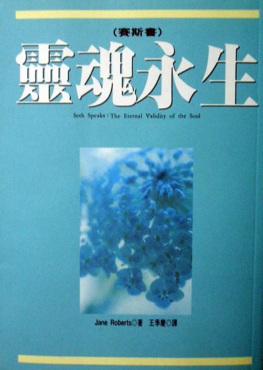

# 赛斯书：灵魂永生

## （新时代系列）总序

王季庆

自九岁那年，我认真地思考我是谁？我由哪里来？往哪里去？而引起了我的大疑大惑后，这些问题就一直潜隐于意识的某处，不时地困扰我。这半生踽踽独行于“人生”的风景里，我热切地生活着，不肯放过任何景色。经过荒漠，吃过风沙，踏过荆棘也悠游欣赏过各种美景：艺术的、科学的、感性的、知性的……心灵接触到这些美景，自然是欢欣雀跃，但未曾解决的“终极关怀”的问题，总令我不安、恐惧和悲伤；繁花胜景的美，徒然牵动“花落人亡两不知”的惊悚，真是情何以堪！

经过对心理学和哲学的探讨，对宗教的依附，心中隐隐然有所期待，却又不太能抓住我到底在渴望什么。十几年前翻译的《先知》，现在看来，已然透露出端倪。一九七六年接触的“赛斯资料”，打破了我不少成见，也解答了我很多问题，虽然其中有很多理论是无法印证、甚至超乎想象的，我深心的“直觉”却与之呼应。回国后，我勉力译了几本“赛斯资料”，同时自己也继续钻研中西哲学和佛学。那时，我并不知道有“新时代运动”（NewAgeMovement），只是每次去美国必然泡在书店里，找一些谈形而上学或心理学之类的书回来看。其中，在“雄鸡”平装书里，有一些在封底印了男女二人手牵手的图样，下面写“新时代从书——对意义、成长和变化的寻求。这标识使我心动，开始注意所谓“新时代”的书。

这是在我已经看了许多属“新时代”范畴的书之后才真正了解“新时代”的意义，而且知道“赛斯资料”已经成为其中的典范书。

“新时代”是指“宝瓶座时代”，西方神秘学认为现在是一个转型期，正准备进入“宝瓶座时代”。“宝瓶座”象征人道主义。人类由追求社会的、物质的、科技层面的进步，将演进到注重“心灵”、“精神”层面的探索，找到超越人种、肤色、民族、国籍以及宗教派别的人类心灵的共通点，认知人类的“同源性”和“平等性”，从而达成“四海一家”与“和平”的远景。

在这世纪末，“末世”的恐惧像乌云一样笼罩在许多人的心上，许多声音警告我们：人类即将面临灭绝的命运。但也有人预言，在动乱之后，二十一世纪将是个心灵的世纪。如果相信“你创造你自己的实相”——新时代的重要共识之一，那么人类的前途，就靠大家的心灵共识展现出那一种的实相了。纵观世界各地，极权国家对民主和人权的逐渐开放，大家对“和平”、“救灾”、“非暴力”、“环保”等等悠关人类共同命运的观念的关注，并付诸行动。可以说“新时代”的影响力正在逐渐扩大、加深。

“新时代”运动在欧美正是方兴未艾，百花齐放，有关的书籍和传播节目、工作室等琳琅满目，而各种灵媒、催眠师、上师等正各擅胜场，其中层次自然是良莠不齐。去芜存菁后，我只简单地介绍几个最好最有力的观念：

一、我们皆为“神”的一部分：传统的“神”，是一种超越的“外力”，父性的、权威式的判官。“新时代”则倡导这个“一切万有”、“宇宙意识”、“生命力”、“能量”为一切的源头、本体、本来就有、不生不灭、不来不去，而我们皆为其一份子。大涅槃经说：“一切众生皆有佛性，一切众生皆可成佛，”我们本质上是不灭的精神体，无形无相。这个“一切万有”正如朱子在中庸导言里所说的“放之则弥六合，卷之则退藏于密”。在“本体”未彰显展布为“现象界”之前，在无时间无空间性中，它寂然不动时，是孕含万有的“空”，它的创造力和梦化成了现象界。而我们那纯心灵的部分进入到肉体，来体验物质实相，心灵是不灭的本体，宇宙是“如幻如化”的现象。

二、你创造你自己的实相：也就是“万法唯心造”。我们都是自己命运的主宰，我们不必受外界任何权威的摆布，不能再怨天尤人，而必须对自己的一切负起责任。外界的一切，只是我们内心世界的投射，我们在此“自编、自导、自演”一出出的喜、怒、哀、乐、悲、欢、离、合的好戏。

三、肯定人生的意义：不虚无、不悲观，把人生当作学习的过程，去面对我们自己创造的“实相”。人生提供了我们的心灵能直接体验物质实相的机会，在错综复杂的人际关系和五光十色的现象界，我们发挥创造力、想象力，最要紧的是，入世的生活，使我们生出悲悯之心。纯知性的思考必须加上人生经验、沉思反省和直接的感触才能酿成“智慧”。在人生的戏里，又不可一头栽进去地过分入戏，还得能“抽离”，作一个观者，才能去除“我执”，才有希望了悟“无限心”。佛家所倡“悲智双运”放诸四海皆准。

四、道德的内在性：没有“天堂”和“地狱”。（除非你的信念造给你一个）。没有“人格化的神”来审判你。道德不应是规律的道德而是德性的道德。孟子说：“仁义内在”，道德是无条件的无上律令，是无所为而为，不靠宗教的戒律或国家社会的规定。所谓“良知”就是我们内在的“神”，每个人只要反躬自省，都明白应如何做，这就是“自律道德”，肯定了人的“性善”，没有原罪，也没有永罚的恐惧。这对传统基督教义下生长的西方人有非常的震撼力。罪恶感和恐惧只是人发明了来控制人的手段。天罗地网刹那间消失无踪，而人可以在喜悦、坦荡中做人“自在的人”。

五、心身健康是自然状态：现代医学越来越发现人身体的疾病绝大多数是起自心理的因素。“新时代”更有些人主张身体的自然状态应是健康的，而疾病来自心理不适，因此只要自己能改变，或在他人帮助下改变心理状态，就可恢复健康。而西医由“头痛医头，脚痛医脚”的支离状态也渐进而注重整体治疗。

六、环境保护：为了人类的存续问题，为了给我们及后代一个更美好的生活空间，人们开始觉醒不能只盲目地“开发”或短视地滥用天然资源。基于“爱生命”，便得负起自然界的协调者、保育者的角色。“我们的”地球的种种变化，如臭氧层的被破坏、森林的消失、气候的失常、资源的滥用、污染的泛滥等等，几乎都是全球的影响，需要人们共同的关注和努力，也促成了“地球村”的观念。“爱生”与“惜福”当是“新时代”的特质之一。

七、无条件的爱：“一切万有”的本质就是无条件的爱，是在所有上面所说的那些概念之后的一个共通性。中国人说的天（干）是阳性创造原则，地（坤）是阴性的滋育原则。西方宗教的“神”代表阳性的“意志”，即创造原则，而“圣灵”代表阴性的“爱”，即滋育原则。万物都生自这阴阳的交感。“新时代”倡导“无条件的爱”，是基于我们的“神性”，及我们都是同源的兄弟姐妹。这不是“贪爱”，不带私欲，不带强迫性，不是“已所欲，施予人”；而是温柔地接受，温暖地关怀，并且是由爱自己开始。认识自己内在的“圆明自性”，因而自爱自重。把这爱扩而充之，像阳光一般地普照，无条件、无要求、无批判。这种爱是不虞匮乏，源源不绝的，而且给予即获得。

东方的儒、道、佛的传统里，都找得到与这些观念暗暗呼应的说法。西方正统基督教影响下的西方人，近年来从古老的西方神秘学和东方哲学、宗教里重新挖掘、汲取精神的养分，而得到了相当高明的洞见。

孙春华，胡因梦和我有志一同，盼望借着介绍新时代讯息而把喜悦和爱带给愿意接受的朋友。“新时代”不排斥某种宗教，也不局限于任何组织、宗派。在曹又方和简志忠的支持和鼓励下，我负起主编的任务，选些国外的好书以飨读者，并商请国内的名家与我们分享一些人生慧见，愿这系列像“爱的活泉”解了你心中的干渴。我深深觉得我要带给大家的就是“爱的讯息”，因我曾是个惊恐不安的孩子……当我了悟生命即光即爱，就渴望去安慰每个犹在惊恐中的孩子。

## 自序

珍•罗伯兹

这本书是个叫赛斯的［人］写的，他自称是一个“能量人格元素”，已不再贯注于肉身的形式里。他每周两次透过我来说话已有七年之久。

然而，我的灵异能力的开启始于 1963 年 9 月的一个晚上，当我正在写诗时，突然间我的意识离开了身体，而一些惊人且新奇的概念如弹雨般的轰击我的心智，在回到我的身体之后，我发现我的手已自动写出了一篇东西，解释了其中许多的观念，这篇东西甚至还有个标题——［物质宇宙即是意念的建构］。

因着那次经验，我开始钻研灵异活动，并且计划就这个题目写本书。为此，在 1963 年底，我的先生罗和我用一个灵应盘（类似中国的碟仙）来试验。在最初几次之后，一个自称“赛斯”的［人］开始向我们传达讯息。

罗或我都没有任何灵异方面的背景，而当我开始在心里“预知”灵应盘的回答时，我以为那一定来自我的潜意识。然而，过不了多久，我觉得非把答案大声说出来不可，而在一个月之内，我开始进入出神状态，替赛斯说起话来。

这些讯息似乎是由“意念建构”结束处开始的，后来赛斯说我的意识扩展的经验代表了他首次与我接触的尝试。从那以后，赛斯陆续传送来的文稿，到现在已累积了六千多页打字纸了，我们叫它“赛斯资料”，其中谈的题目包括物质、时间、实相、“神”的观念、“或然的宇宙”、健康及转世等等。也就是为此之故我们才继续下去。

随着我在这方面的第一本书出版之后（译注：即时报文化已翻译出版的《灵界的讯息——赛斯资料》，原名 Seth Material），便接到陌生人求助于赛斯的信。我们为那些最需要帮助的人举行赛斯课。其中许多人因住在美国其他各地而不能出席，但赛斯的劝告却帮助了他们，而他借信件所给的有关个人背景的资料也都正确无误。

对赛斯课，罗一直是逐字逐句的以他自己的速记系统作笔记，过后在一周内他将之打字下来，他的支持和鼓励是无价的。

依我们自己想来，我们已与“宇宙”约会了六百多次，虽则罗自己绝不会那样形容它。这些约会就发生在我们灯光通明的大客厅里，但更深入地说，它们是发生在人类人格的无垠无涯的领域之内。

我并无意暗示我们已获得了任何对真理的基本观念，也无意给人一个印象：我们在屏息以待“未遭扭曲的世代的秘密”倾泄而出。我只确知每个人都能通达直觉的知识，而得以略见他的内心世界之一斑。“宇宙”就这一点对我们每个人说话。对我们而言，赛斯课就是发生这种沟通的一个架构。

在 1970 年出版的《赛斯资料——灵界的讯息》里，我解释了这些事，并以赛斯的摘录表明了在各种不同题目上赛斯的看法。我也描写了当我们试着了解我们的经验，并将之置入正常生活的范畴内的时候，我们与心理学家以及超心理学家接触的经过。也描写了我们为证实赛斯的天眼通能力所做的测验。对我们来说，他胜利地过了关。

从日渐增多的赛斯资料中选择一些有关任一题目的摘录是极为困难的。因此之故，《灵界的讯息》那本书必然留下了许多未答复的问题和未探索的题目。然而，在它完成了两周之后，赛斯口授了目前这本书的大纲，在这文稿里他将可自由地以他的方式将他的想法写成书。

以下是在 1970 年 1 月 19 日第五百一十部分所给的大纲的一个副本。如你们将看到的，赛斯叫我鲁柏，而叫罗为约瑟。他说这些名字代表的是我们整个的人格，以别于目前的肉身里的我们。

◇　◇　◇　◇

“我打算开始自述一些资料，请你们多加包涵！我现在告诉你们我自己这本书的一些内容。我先要向读者解释关于它写成的方式，以及我自己的意念能由鲁柏说出来，甚或能以语言转译，这其间的必要过程。”

“我不具肉身，但我却将写一本书。第一章将解释我如何及为何写这本书。”

（【罗注】现在珍说话的速度相当慢，她的眼睛常常闭起来，话中常做停顿，有时停得相当长。）

“第二章将描写你可谓的我目前的环境，我目前的特性，以及我的同伴。所谓的同伴指的是我接触的其他一些［人］。”

“再下一章将描写我的工作，以及它带我进入的那些实相的次元，因为正如我旅游到你们的实相，我也到其他的实相，以完成我应完成的目的。”

“再下一章将谈谈对你们来说的［我的过去］，以及我曾［当过］哪些人和认识哪些人。同时我要明白指出并无过去、现在或未来，并且解释，虽则我可能用［过去的生活］这种说法，这其中并无矛盾。这可能要花上两章。”

“再下一章将谈到我们相遇的故事——你（对我说）、鲁柏和我，自然是以我的观点来说，以及早在你们知道任何灵异现象或我的存在之前，我接触鲁柏的内在知觉的方式。”

“再下一章将谈谈人在死亡那一刻的经验，以及在这基本探险上的许多变数。我会以我自己的几次死亡作例子。”

“再下一章将谈到死后的生活及其多种变数。这两章都将谈到与死亡有关的转世，并将强调最后一次投生结束时的死亡。”

“下一章将谈到人与人之间爱与亲情的感情病的实相——说到在连续的投生间这些感情的演变情形，因为有些中途而废而有些维持了下去。”

“下一章将谈到对我和其他像我的［人］来说，你们的物质实相看起来如何。这一章将包含一些颇为迷人的要点，因为你们不仅造成了你们所知的物质实相，而且也以你们目前的思想、欲望和感情，在其他的实相里形成其他十分确实性的环境。”

“下一章将谈到梦永远可作为进入这些其他实相的门户，以及作为一个开放地区，经由这开放地区，内我瞥见它的经验的许多面，并与它的实相之其他层面沟通。”

“下一章将更深入地谈谈这题目，重述做为教师和向导的我进入别人梦境的各种方法。”

“下一章将谈到任何意识——不论它是否具有形体——按照它的程度所用的基本沟通之法。话题将转而谈论，如你们所了解的人类所用的基本沟通之法，而指出这些内在的沟通是独立存在于肉体感官之外的，而肉体感官只不过是内在知觉的延伸而已。”

“我会告诉读者他如何及为何看到他所看到的，或听到他所听到的。我希望透过这整本书让读者明白他自己是独立于他的肉体形象之外的，而我希望由我自己来给他一些得以证实的理论的方法。”

“下一章将谈到在我所有的存在中，我与那些我在资料中谈到过的［金字塔完形］有过些什么经验，及关于我与你们称为［赛斯第二］及远较我进化得［多次元意识］间的关系。”

“我给读者的讯息将是：基本上来说，你们不比我更是个具肉身的人。在告诉你们关于实相时，我也告诉了你们自己的实相。”

“我将会用一章专论世界上的宗教，及在它们内的曲解和真理。三位一体的基督，及关于一个失落的宗教的一些资料，它属于一个你们毫无所知的民族。在你们的地球存在“之前”，这些人住在占据和你们现在的地球同一空间的一个行星上。他们由于自己的错误毁灭了它，而当你们的行星准备好了时，他们便再转生于地球上。他们的记忆成为你们现在所知的宗教诞生的基础。”

“有一章会谈到［可能的神］与［可能的系统］。”

“有一章专门回答问题。”

“在最后一章里，我会叫读者闭上眼睛，而对我存在的实相及他自己的内在实相有所知觉。我会教你们一些方法。在此章里，我会邀请读者用他的［内在感官］以他自己的方式来看我。”

“虽然为了保护资料的完整一贯性，我的通讯始终将透过鲁柏作独家报导，我还是要邀请读者知觉到有我这么一个［人］的存在，因而他能明了由其他实相来的通讯是可能的，并且他自己也能接受非属肉体的知觉。”

“那么这就是本书的大纲，但它只大略勾勒出我的意向而已。我没有给一个更完满的大纲，因为我不要鲁柏对我有所预期。我将透彻地讨论这种通讯所涉及的困难，指明所谓的超常通讯是由各种不同的实相层面而来，并且那些通讯说明了它们存在于其中的实相。因此我会描写我的及其他我所知的实相。”

“这并不是说我所不知的其他次元是不存在的。在我们的课里我将会口授此书。”

“这是我们的书的标题（面带微笑）《赛斯如是说 Seth Speak——灵魂永生》。”

“我用［灵魂］这个名词，因为它对大多数读者而言立即有其意义。我建议你为自己准备些好的笔。”

◇　◇　◇　◇

正因为我熟知写一本书所费的力气，所以当赛斯说要写本他自己的书时，我颇为谨慎，虽然我明知他做得到，但心中仍不免犯嘀咕：“不错，《赛斯资料》是真的很重要，但赛斯知道怎么样写书吗？他知道所需的组织，或如何针对公众说话吗？”

罗一直叫我别为此担心。朋友和学生们似觉惊异，在所有人之中偏偏我倒有疑问。但我想，在所有人中，除了我谁还该有疑问？赛斯已说出了写书的意图，但他能完成它吗？

赛斯从第 511 课开始口述这本书，时间是 1970 年 1 月 21 日；在第 591 课时完成这本书，时间是 1971 年 8 月 11 日。我们在这些课中并不完全用在写书上，有些课中谈到个人的事情，有些课中帮助那些需要帮助的人，还有一些回答与本书无关的哲学问题。除此之外，我还去度过几次假，可是赛斯总在这些［罢工］之后，正确的接下去口述本书。

在他写“他的书”的期间，我每天花四小时写我自己的书，指导我每周一次的 ESP 班，并发现我自己被《灵界的讯息》出版后的读者来信所淹没。我同时还开办一周一次的创作班。

出于好奇我看了赛斯的头几章，后来就不再碰了。偶尔罗告诉我一些他认为我的学生可能会特别感兴趣的片段。除此之外我对书不予注意，放心满意让赛斯去弄。一般而言，我不把他的工作放在心上，甚至几个月都不看他的草稿。

阅读这完成了的书是个愉快的经验。整体而言它对我是全新的，虽然每个字都是由我的嘴说出来的，而我曾奉献许多个夜晚在出神状态来制作它。这点对我来说格外的奇怪，因为我自己是个作家，惯于组织我自己的资料，追踪它，并且像个母鸡般地呵护它。

由于我自己的写作经验，我也熟知把无意识的资料转译为有意识实相的过程。这在我写诗时格外明显。不论赛斯的书还涉及了别的什么，显然某种无意识的活动是在“高速档”运转。那么，很自然地，我发现自己在比较有意识的创作经验与赛斯书所涉及的出神状态的过程，我想要发现我为什么感到赛斯的书是他的，而我的书是我的。如果两者皆由同一个无意识而来，那么为什么在我的感觉里有主观上的不同？

从一开始这些不同就很明显。当在写一首诗，我沉浸在灵感里时，那时我很来电、很兴奋，充满了一个急迫感与发现感。但是，正在这些发生之前，一个构想似乎无中生有地来了。它是现成的，就这么突然出现了，而由它涌出了连绵不绝的新创意。

那时我是警醒的，却又开放而富感受性，悬在“宁静的专注”与“被动”之间的一种奇异的心灵弹性里。在那一刹那，那特定的诗或意念对我而言是全世界独一无二的事。这种极度个人性的投入，与促使这意念“出生”所涉及的工作和游戏，全都使这首诗成为我的。

这种经验从小即为我所熟知，它是我存在的基石。没有它，或当我没在那种情境里工作时，我就变得无精打采而且忧伤。在我写这序言时，我现在便有点那种同样的发挥个人创造性的感觉，它是我的。

我与赛斯的书就没有这种关联，对它所涉及的创作过程也毫无知觉。我像在定期课里那样进入出神状态，而赛斯透过我，经过我的口，口授此书。这创造工作与我相距这么远，因此在这方面来说我不能称这作品为我自己的。反之，一部完整的——精彩的——赛斯作品交给了我，为此我自然是极端地感激。

可是，我发现只有我自己的写作才会给我，我所需的那种特别的创造性的满足感——有意识地投入于无意识资料，“追寻的兴奋”。并不因为赛斯在做他的事，我就可以免除做我的。如果我不继续自己的工作我会觉得被剥夺了什么。

当然，任何人都可以说，在赛斯书里那神秘的过程与我的正常意识离得那么远，以致最后的成品只看起来是来自另一个人。我只能说明我自己的感觉，并且强调，赛斯的书以及赛斯资料的六千页底稿，并没影响到我自己创造性表达的需要或责任。如果两者都来自那同样的无意识，却似并未减缓我工作的效率。

纵使如此，我知道赛斯书的制成还是少不了我。他需要我用字遣词的能力；我想，甚至我的取向气质。显然我的写作锻炼有助于转译他的资料，有助于给予它形式，不管这是多么无意识地做到的。我猜想，某些人格上的特征也是很重要的——例如我能敏捷的转换我意识的焦点。

在第四章里赛斯也如此暗示，当他说“现在，当我写这本书的时候，它的资料到某个程度是经由这位在出神状态的女性之内在感官来指挥的，这是非常有组织的内在精确性与训练的结果。当她全神贯注于物质环境时便不能从我这儿收到资料——它便无法被翻译或诠释。”

不过，如果只把赛斯书当作是“无意识”产品的一个例子，则它很明白地显示出，组织性、辨识力和推理力等品质显然不只为“有意识的心智”所独有，并且它也展示了“内我”的能力和活动的范围。我不相信靠我自己，我能得到与赛斯书并驾齐驱的作品。我最多能做到的是，也许在某些诗作或论述里偶尔达到某种高水准，但它们却缺乏赛斯在此自动提供的整体的统一性、连贯性和组织。

除此之外，在课中我的某些独特经验，似乎对我的没能有意识地涉入创作过程有所弥补。例如，我常参与了赛斯的大能量和幽默，享受一种情感上的富足感，并且在一个非常奇特的层面与赛斯接触。我清楚地感觉到他的心情和活力，虽然它们不是对我而发，而是对他当时说话的对象。当它们流过我时我感觉得到。

如罗的注所显示的，在替赛斯说话时我也常有别种的经验。举例来说，有时我看内在的视象。这些可能把赛斯正在说的话以画面表明出来，因此我在以两种方式接收资料；或者它们也可能与稿子完全无关。在课中我也有过好几次出体的经验，那时我看见实际上发生在几千里外的事。

赛斯用这本书来展示以下这些事实——人类人格是多次元的，我们同时存在于许多实相里，灵魂或内我不是与我们分开的东西，而正是我们存在于其中的那个媒介。他强调“真理”并不是由追随一位老师又一位老师，一个教会到另一个教会，一种训练到另一种训练而找到的，却是由向内看自己来找到。那么对意识的深入知识，“宇宙的奥秘”，都不应该是不让人们知道的秘教真理。这种资料对人而言就如空气一样自然，对那些向内心源头诚实地寻求的人也是同样可以企及的。

照我的看法，赛斯写了一本在它那类书中的经典之作。在小心地以一个“人物”称他之后，我觉得必须补充说赛斯是个机敏的哲学家和心理学家，对人类人格的种种所知甚深，对人类意识的自傲与悲哀也了如指掌。

当然，令我个人深感好奇的是，这本书透过我而写出，但我有意识的心智却并没有时时在关怀地核对、组织与批评，如它在我自己的作品中所做的那样。那时，虽然我创造性与直观性的能力被予以相当大的自由，有意识的心智仍然是居于控制地位的。可是这本书却又不是“由它自己”写出来的，像某些诗仿佛是自己产生的那样。一个作家有时会说某一本书是“自己写成的”，我了解那是什么意思。然而，在这个例子里，这本书来自一个特定的源头，不只是从“天外”而来，并且它浸染着作者的却非我的个人风格。

这整个“创造性的冒险”也许是先有赛斯这个人物之被创始，而后由他来写书。赛斯也许是个和他的书一样的被造物。如果是这样，这是个多次元艺术的绝佳例子，在“无意识”的如此丰富的一个层面造成，以致于那艺术家对她自己的伤口也无所知觉，而与任何外人一样地深感好奇。

这是个有趣的假设。事实上，赛斯在他的书中也提及了多次元的艺术。但赛斯还不只是写书而已，他是个发展完全的人格，具有多方面的兴趣：写作、教书、帮助别人。他的幽默感十分具个人色彩而不像我的。他很精明，他的态度是入世而非空灵的。在与人面对面的接触中，他知道如何简明地解释复杂的理论。也许更重要的是，他能把这些概念与日常生活连接起来。

赛斯也时常出现在我学生的梦里，给予他们有效的指导——教他们运用他们才能的方法或是达成某种目的的方法。几乎我所有的学生也都常有“上课的梦”，在其中赛斯对他们全体说话，就像在正常的课里一样。有好多次当这种“梦中课”正在发生的时候，我醒了过来，而我心中仍听见赛斯的话在萦绕。

当然，学生梦见赛斯并不稀奇，也不是说他们只该梦见我。但赛斯确乎已在他们眼中建立了独立的地位，甚至在梦境也变成了教导的工具。换言之，除了制作连续不断的赛斯资料和此书外，赛斯也已进入了许多人的心和意识里。

不论他的地位如何，一个人在七年内能做到这些，已是很大的成就，何况赛斯是一个非实体的人物，那就真的是令人惊愕了。把所有这些活动都归于一个无意识的虚构之物似乎太过分了。（在等量的时间里，我出版了两本书，写完了另一本，并且开始了第四本。我提这个以示赛斯并未吸取任何我自己的创造力。）

罗和我并不视赛斯为一个幽灵，我们不喜欢这个名词所暗含的寓意。事实上我们反对的是对幽灵的传统观念，那是延伸自对人类人格的十分局限的概念，只是多少未变地被投射到来世。你可以说赛斯是一个被戏剧化了的“无意识”或一个独立人格。我个人看不出这两者有什么矛盾。赛斯也许是个戏剧化人物，演出一个非常真实的角色——以我们能了解的唯一方式解释他的更广大的实相。这是我目前的看法。

首先，对我来说“无意识”这名词并不妥，它仅只暗示一个本来开放的心灵系统，具有统一各种意识的交互连接的深根；一个我们全在其中互相连接的网状组织。我们的个人性由它升起，同时也助其形成。这源头包含过去、现在与未来的资料；只有自我在经验我们所知的时间。我也相信这开放系统包含了我们之外的他种意识。

由于我自身的经验，尤其是“出体”状态的经验，使我深信意识是不必依赖物质的。目前有肉身这副模样确乎是“我的”主要的存在模式，但我不以此而推断所有的意识必须如此取向。在我看来，只有最盲目的自我主义才敢拿它自己的看法来界定实相，或把它自己的限制和经验投射到其余的存在界上。

我接受如赛斯在此书中所描述的多次元人格的概念，因为我及我学生的经验似乎证实了它。我也认为在那意识的开放系统和无限泉源里，有一个独立的赛斯以与我们相当不同的角度运作。

以何种角度？老实说，我不知道。有一次当我试着为自己、也为我 ESP 班的学生澄清我的概念时，写下了一个简短而直观性的声明，我认为最接近我的看法。罗曾告诉我有关“说法者”的事，赛斯在此书中对他们如此称呼，他们是历代以来不断对人们说法的人，提醒人内在的知识，以使它永不会真的被遗忘。这个意念唤起我的灵感，使我写下这一篇小品。它指出我认为赛斯及其他像他的“人”也许存在于其中的那个架构。

◇　◇　◇　◇

“我们以我们所不了解的方式合成。我们是由元素、化学物质及原子所组成，但我们却开口说话并自取名字。围绕着我们的内在，我们组织了外在物质，凝结成肌肉与骨骼。我们的本体或人格由我们所不知的泉源涌起。”

“也许我们一直藏在一个创造或然的范围里伺机而动；四散而茫然的——在十三世纪扫过欧州的风雨中——在起伏的山峦间——在涌过另一个时地天空的云朵里。身为尘沙，我们也许曾吹过希腊的门廓。也许我们曾无数次地明灭于有意识与无意识之间，被我们还不太了解的对创造与完美的欲望与渴望所触及。”

“因而现在可能有其他的［人］（如赛斯），也没有形象，但却有知——他们曾是我们现在的样子，但还要更多——他们记着我们已遗忘了的。也许经由意识的加速他们发现了其他的存在形式，或其他我们也为其一部分的实相之次元。”

“因此我们给那些无名者名字，就如我们本也是无名的。我们倾听，但通常我们试图把他们的讯息挤入我们能懂的观念里，给它们穿上陈腐的样版形象。但他们却就在我们周遭，在风里在树梢；有形的和无形的，在许多方面也许比我们还活泼——那些说法者。”

“透过这些声音、这些直觉、这些闪现的灵光与讯息，宇宙向我们说话，向我们每个人说话。对你们说，也对我说。学着聆听你们自己的讯息，不要扭曲你们所听见的，或把它译成陈腔滥调。”

“在班上（一般而言，并且在生活中）我认为我们的确在对这种讯息反应，有时以几乎孩童似的智慧将它们演出，形成原创性、个人性的戏剧——由我们内在唤起无可名状的意义之戏剧。”

“这也许是神明们沉浸其中的那种戏剧，创造自它生成，而向各方面蔓延。我们内心也许在对神明们响应——那内心的了解之火花，超越了我们自己三次元的知识。

◇　◇　◇　◇

也许赛斯将我们领出了凡俗的范围，进入一个本来就是属于我们的境界——不论我们在肉体之内或之外它都是基本的。他也许是集合在一起的我们的声音，说道“当你们是有意识的身体时，要记得过去和未来，当你们没有身体，作为无羁的能量，没有名字却只有不需舌头的声音，具有不需肉体的创造性时，你们是怎么样的。我们即你们自己，里外翻了个面而已。”

然而不管我对赛斯或实相本质的看法如何，这稿本必须独立成书。它具有赛斯这［人］的印记，正如任一本书都自有其作者不可磨灭的烙印，丝毫不爽。在这本书内的观念值得一听，不论其来源，而又正因其来源。

当我们的课刚开始时，我想过以我自己的名义出版这书，以使它可以因它的价值被接受，而不导致对它的来源的疑问。然而，这似乎是不公平的，因为赛斯资料产生的方式正是它讯息的一部分，并且也强化了这讯息。我们把赛斯的口述如我们所收到的那样印出来，按照次序，既无增润也无减损。他显然明白口说和写作用字的不同。他在 ESP 班上的课比较不正式，有相当的相互交流。这本书却更像我们自己的私人课，此书大体是在课里传递的。可以更明确的看出，所强调的是其内容，更着重文字而非口语性的陈述。

赛斯的语句结构也没被改变，除了在偶尔的例子（例如少数几次我将一长句变成两个句子）。赛斯也指明了很多标点符号。在这种时候，我们只如他所示加上破折号、分号与括号，而把他指示的话语本身省略，以免让读者分心。赛斯也指示我们在某些字句上划线。

赛斯的句子往往很长，特别是就口语演说而言，但他却从不弄乱或与造句法或意义脱节。不论何时当在这方面似有困难时，我们查核原先的课，就发现是在腾写过程中某一处出了错。（我特别注意到这点，因我尝试着以录音机口授信件，而明显地很少成功。在头几句之后，我很难记得我说过了什么，或我是如何地表达它的。）

校对主要是牵涉到修正罗的笔记，当他把它们弄得更像样一点。在有些情形，不属此书的资料也包括了进去，若它们似与正文有关，对本书的表达方法有间接的说明，或对赛斯本身有所洞见。如罗的注记所示，赛斯在书完成后立即口授“附录”。好笑的是，我并不晓得赛斯已经开始了“附录”，倒花了好几天在猜测到底该是谁来管这档子事——而如果是赛斯管，他何时会开始。

这儿再说一件有趣的事：为我自己的书我要写三遍草稿，有时到末了仍不尽满意。此书口授出来却就是它最后的定稿。赛斯也远比我更忠于他订的大纲。不过，他也偶尔离题，正如每个作者应有的权利。

1971 年 9 月 27 日

珍.罗勃

慈于纽约艾米拉市 Elmira

## 第一部

## 第一章 我不具形体，但我却在写书

### 第五百一十一部分

1970 年 1 月 21 日 星期三 晚 9：10

（在开始这笔记前，让我提及当珍在出神状态为赛斯说话时，她有些明显的改变。通常珍以惊人的速度出入于出神状态。除了相当短的片段外，她的双眼在课中并不闭上，有时眯成一条缝，半开，有时大睁，而且眼珠颜色比平时幽深很多。她多半坐在她的甘西迪摇椅里上课，但偶尔也站起来走动。在出神状态中她吸烟，也喝一点葡萄酒、啤酒或咖啡。有时当她的出神状态非常深时，她说她要费几分钟才真正脱离出来。在赛斯课后，不管多晚，她差不多总是与我一同吃饭。

（她在出神状态里说话的调子，音量与快慢可以差不多像是聊天时一样，但其中有很大的变化尺度，通常是比她（自己的）声音深沉有力。偶尔她的“赛斯之声”的确很是响亮、有力得多且带着明确的男性泛音，在其后有明确的、巨大的能量。不过我们大多数的课是相当安静的。赛斯说话带有一种难以确指的口音。曾被指为俄国、爱尔兰、德国、意大利、甚至法国的腔调。有一回赛斯幽默地说，他说话的方式事实上是由累世生活的“四海为家的背景”得来的。珍和我认为他的口音只是他个人的，而按照听众各自的种族和感情背景，它激起各人不同的反应。

（当珍在出神状态时，她还一直表现出两种效果。其一是她的样子比较刚硬，另一是她脸部肌肉重组而显出一种绷紧的样子，我想那是由于一股能量或意识的注入。有时候这种效果十分突出，而我能很容易地感受到赛斯的直接在场。

（我想珍在课中的这种改变，是由于她创造性地接受了我们称之为赛斯的一个存有，一个原素的一部份，同时也是由于她将之视为男性时，她认为它该有的样子。她转变成赛斯的方式很具有原创性，观看并参与其转变很是有趣。不论程度如何，赛斯是突出而亲切的在场。我是在倾听“另一个人”，并与之交谈。

（在课开始前，珍说她感觉相当的紧张：她想赛斯今晚会开始他自己的书。在这些课里她感到紧张是相当不寻常的。我一再叫她放心，叫她忘了这事，让这本书按它自己的方式出来就成了。）

现在，约瑟，我向你道晚安。

（“赛斯晚安！”）

我们的朋友鲁柏的确感到怯场，这多少是可以理解的，因此我容忍他。

然而，让我们开始第一章。（微笑）鲁柏喜欢的话可以写篇序。（停顿）

现在，你们听过代人打猎的鬼，我可是名副其实的代人捉刀的鬼，虽然我不赞同“鬼”这个名词。你们通常确实是看不见我的形体。我也不喜欢“幽灵”这字，但是如果你们对那字的定义是指一个没有肉体的“人”，那么我必须同意那个描述适用于我。

我对一群看不见的观众讲话，但是我知道我的读者是存在的，因此之故，现在我要求他们每个人也给我同样的特权。

我写这本书是由一位女性的赞助，我已变得十分喜欢她了，对别人来说，我称她为“鲁柏”及男性代名词的“他”似乎是很奇怪，但事实是，我在别的时间与地点就已经认识有别的名字的她了。她曾经做过男人也做过女人，而那个曾经活过这些分别的人生的整个本体，可以用鲁柏这个名字来称呼。

不过，名字是不重要的，我的名字是“赛斯”，名字只是称谓、象征而已。但既然你们必须用，我也就用了。我经由鲁柏的合作写这本书，他替我说话。在这一生鲁柏取名为珍，她的先生罗•罗伯兹写下珍所说的，我叫他约瑟。

我的读者可能假定他们自己是有形的生物，被肉身所束缚，囚禁于骨、肉和皮囊里。如果你们相信你们的存在要靠这肉体的形象，那你们就感到有灭绝的危险，因为凡肉体的形式都无法长存，而不论在年轻时多么美的身体，到老年都无法保有同样的精力和魅力。如果你认同于你自己的年少、美貌、聪明和成就，那么你便会因这些属性必然会消失而时常耿耿于怀。

我写这本书以对你们保证事情并非如此。基本上说，你们并不比我更是一个有肉身的人，而我曾穿过又丢弃过那么多个肉身，我连说都懒得说了。不存在的“人”不能写书。我并不需依赖肉体形象，而你们也一样。

意识创造形相，而非其反面。并非所有的人格都有实体，只因为你们这么忙着关心日常事务，以致没有了悟到，有一部分的你知道它自己的能力是远超过寻常的自己所表现出来的。

你们每一个人都曾有过其它的存在，虽然你们没有明白意识到，但这个知识是在你们内的。我希望这书会帮我的每一个读者释出他内在的那极为直觉性的自己，并把对你最有用的任何个别的洞见带到你意识的面前。

按你们的时间来说，我是在 1970 年的 1 月底开始这本书。鲁柏是个纤细、黑发、敏捷的女子，她坐在摇椅里替我说这些话。

（九点三十五分时停了很久）我的意识在鲁柏的身体内，焦距对得相当好。今晚很冷。这是我们头一次在出神状态写一本完整的书，而鲁柏在课前有些神经紧张。这件事并不只是让这女人替我讲话这么简单，其中还必须有许多巧妙地操纵和心理的调试，在我们也就是鲁柏和我之间建立了一个所谓的“心里桥梁”。

我透过鲁柏说话和打电话是不一样，反之，我们双方都有一个心理的延伸和特性的投射，而我利用这个来沟通。以后我会解释这心灵架构是如何创造与维护的，因为它就像一条路一样，一定要保持干净而没有残砾。

读本书的时候，如果你问自己你是谁，比问我是谁要好得多。因为除非你了解人格的本质及意识的特性，否则你就不能了解我是什么。

如果你坚信你的意识是锁在你头颅内的某处而无力逃逸，如果你觉得你的意识只是在你身体的界限内，那么你便是太小看自己了，而且你会以为我只是一个幻觉。我不比你更是一个幻觉，这句话中自有其深意。

我可以老实地跟你们每个读者说（微笑）：我比你老，至少以你们认为的年龄来说。因此，如果一个作者能靠年龄来取得权威性资格的话，那我应当得一个奖章。我是一个“能量”的人格精髓，不再贯注于物质里了，正因如此，我能知觉你们许多人似乎已经忘怀的一些真理。

我希望提醒你们这些真理。我不是对你认为是“你自己”的那一部分讲话，而是对你所不知的、你在某种程度上加以否认、并且在某种程度上遗忘了的那一部分讲话。即使当“你”在读这本书时，也是你的那一部分在读它。

我对那些信神与不信神的人讲话，对那些相信科学会找到有关实相性质的所有答案，或不相信的人讲话。我希望给你们线索，使你们能够前所未有地亲自研究实相的性质。

有几样事我要让你们了解。你们并没有被困在时间里，像一只封于瓶内的苍蝇，翅膀因而无所施展。你们不能靠肉体的感官来给你实相的真实画面。五官是可爱的大骗子，说了一个这么天花乱坠的故事，以致你们对它确信无疑。你们有时在作梦时比在醒时更聪明、更有创造力，并且知识也丰富得多。

现在这些声明在你们看来可能极为可疑，但当我们讲完这本书以后，我希望你们会明白它们只是对事实的直接陈述而已。

我将告诉你们的，世代以来都有人讲过，而当它被遗忘了就又再说一遍。我希望弄清多年来被曲解的许多观点，而对其他的观点，我会给予我原创性的诠释。因为知识并非存在于真空，所有资料必然被持有者和传递者诠释而沾染上他们的特性。因此，我仅就我所知是以我在许多层面和次元的经验来描述实相。

这并不是说其它的实相就不存在。在你们的地球形成前我即有意识。在写此书时——及在大多数我与鲁柏沟通时——我由我自己的过去人格的库藏里撷取那些好像适当的特性。有许多像我这样的“人”格，不把焦点集中在物质或时间上。我们的存在在你们看来很陌生，因为你们不了解人格的真正潜能，而被你们自己有限的观念所催眠了。

（停一下，然后幽默地）你们可以休息一会儿。

（“好”）

（十点十八分。珍相当从容地脱离出神状态，虽然那是个很深的出神状态。她很惊讶时间已过了这么久。她也对赛斯当她在深度出神中开始了这本书松了一口气。“哦，他很聪明，”她笑道，“有人在搞鬼哟！”）

（赛斯在十点三十四分继续。）

我主要是个老师，但我本身并不是个舞文弄墨的人。我主要是一个带信息来的人，我的信息是：你们创造了你们所知的世界。上天赋予了你们的也许是最可敬畏的礼物：将你们的思想向外投射成为具体物质的能力。

这礼物附带了责任，但你们多半喜欢对你们生活中的成功自我庆贺，而将失败归罪于上帝、命运或社会。同样地，人类有一种倾向，把他自己的罪或过错投射在一个“老天爷”的形象上，看来老天爷他对这么多抱怨一定厌烦透了。

事实是，你们每一个人创造你们自己的物质实相；而集体地，你们创造了存在于你们俗世经验里的光荣与恐怖。你们会拒绝接受这责任，直到你了悟你们即那创造者！你们也不能把世上的不幸怪罪于魔鬼。你们已经成熟到了能了悟魔鬼是你们自己心灵的投射，但你们还没聪明到学会如何建设性地利用你们的创造力。

我大多数的读者都知道“肌肉因运动过度而失去了弹性”这件事情，反之，做为一个种族，你们已变得“自我过度而失去弹性”，被压抑在一种精神的僵化死板中，自己身上那直觉的部分不是被否认便是被扭曲到不可辨认。

（十点四十五分暂停）时间已经渐渐晚了，我的两位朋友明天都得早起。鲁柏正在写两本他自己的书，必须睡够。在我结束此节前，我请你们想象我们的布景，因为鲁柏曾告诉我一个作者必须小心地布置场景。

每周一和周三我透过鲁柏讲话，在这同一间大客厅里，灯总是开着的。今晚我很欣赏由鲁柏的眼看到的外面冬日景色的一角。

物质实相总令我心神爽快，而经由鲁柏的合作，当我写这本书的时候，我明白我欣赏它的独特魅力是有道理的。此地还应该提到另一个角色，猫咪威立，一个正在睡觉的可爱怪物。

（威立正在我们老式的电视机上睡觉——事实上是在打鼾。它的位置恰在珍的摇椅的后方。）

动物意识的本质本身就是一个非常有趣的题目，我们以后会谈到。这猫知觉到我的在场，好几次曾经相当显著的反应。在本书内我希望显示给你们看，发生于所有意识单位之间的不断的相互作用，以及那跃过族类障碍的沟通；在某些这种讨论中，我们将以威立来做现成的例子。

你可以休息一会儿或结束此节。

（“好！我想我们结束吧！”）

给你俩我最衷心的祝福。

（“谢谢！今天的内容非常有意思。”）

（停了一下，笑着说）我希望你们喜欢。

（“赛斯晚安。”）

（十一点，珍很快地脱离出神状态。她的速度整节都很好。她说她很高兴赛斯已开始他的书了。她说：“好久以来，每当我认为赛斯想要开始写书时，我就怕让他去做。”珍在想要不要在赛斯写作时阅读此书。如果说她等到原稿完成之后才看到，这会给读者深刻印象。但我们决定她看不看都没关系，因此当我打好字后她就会看这资料。）

### 第五百一十二部分

1970 年 1 月 27 日 星期二 晚 9：02

（周一晚的定期课延到今晚。珍的速度相当慢，中间有许多次长时间的停顿。她的声音如常，眼睛时常张开。）

晚安！

（“赛斯晚安！”）

现在我们回到书稿上。

既然我们提到了动物，让我说说它们的确拥有一种意识，然而那意识却没给它们如你们那么多的自由。但是同时，在应用它的时候，它们却也没有被某些的特性所拖累，而这些特性常阻碍人类意识发挥实际的潜能。

意识是感知实相的各种次元的途径。你们所知的意识是极为专门化的。肉体感官让你感知三次元的世界，但就由于它的这种本质，它同时也抑制了你对其他同样确切的次元的感知。你多半与你日常“以肉体为取向的自己”认同。你不会想到与你身体的一部分认同，而忽略所有其他的部分，然而当你想象“自我性的自己”担负着你的本体时，你却是在做同样的事（笑着说）——认“部分”为“整体”。

我在告诉你，你并非宇宙的一袋骨与肉，由某些化学物与地水火风等元素的混合物组合在一起。我在告诉你，你的意识并非由化学成分的交互作用意外地形成之某种炽热产物。

你并非物质的一个被弃的旁支，你的意识也不会消失如一缕轻烟。相反的，在一个极深的无意识层面，你以绝大的辨识力、奇迹般的清晰，以及对组成身体的每一个细胞密切的无意识知识，造成了你所知的肉身。这并不是象征性的说法，而是确实如此。

且说，因为你所谓的“意识心”不知觉这些活动，你乃不与你内在的这个部分认同。你宁愿和你在看电视、在做饭、或在工作的那部分认同——你认为它知道它自己在做什么的那个部分，但你自身这看似无意识的部分，其实知道的多得多，而你整个肉体的存在全靠它的流畅运作。

这部分是有意识、有知觉而警醒的。如此贯注于物质实相的你，却既不去倾听它的声音，也不了解你那偏重于物质的自身即是从这伟大的心灵力量之中跃出的。

我称这似是无意识的部分为“内在自我”，因为它指挥内在的活动。它把非由肉体感官却经由其他内在管道得来的资料联系起来。它是实相的内在感知者，而它的存在超越了三次元之外。它携带着你们每个前生的记忆。它探入实际上是无止境的主观次元，所有客观的实相都是由这些主观次元源源流出的。（停了很久）

所有必要的资料都经由这些内在的通道给了你，即使在你能举一举指头或眨眨眼或读这一句话之前，不可置信的内在活动已经发生了。你本体的这个部分本自具足千里眼与心电感应的能力，因而在灾难发生前你已得到警告，不论你是否有意识地接受这信息。在一个字都还没有说之前，所有的沟通都早已发生了。

（安静地）我可以时常停顿一下，好让你休息。

（“我还好”）

“外在自我”与内在自我一同运作，其一，让你能在你所知的世界里操纵自如，另一，带给你那些微妙的内在知觉，没有它们，肉体生活即不可能维持。

但是你还有一个部分，你更深的本体，它形成“内我”与“外我”，它决定你生存在此时此地。“这”就是你本体的核心，你从中跃出的“心灵种子”，你为其一部分的“多次元人格”。

至于你们那些想知道我将心理学家所谓的潜意识放在哪里的人，你可以想象它是在外在自我与内在自我之间的一个所谓会合之地。不过你必须了解，自己并没有真实的分界，因此我们说到各个不同的部分只是为阐明基本的概念而已。

既然我们是在对那些确实认同“正常有意识的自己”的人说话，我在这第一章里便提出这些事情，因为我在书中后来会用到这些名词，也因为我要尽早地声明“多次元人格”这个事实。

人格并不是意识之一种“此时此地”的属性，你若不能弄清这个观念，便不能了解你自己，也不能接受我的独立的存在。虽然在本书中我可能会说到的关于物质实相的一些事情，可能会令你大为吃惊，但要记住我是由全然不同的立场来看它的。

（珍在替赛斯讲话时常常停顿，她的眼睛也常常闭着。）你现在是全神贯注于物质实相中，也许在奇怪如果它外面有东西又会是什么呢？我是在外面，顷刻间回到我知道并且喜爱的一个次元，可是我不是你所谓的一个居民。虽然我有一个心灵的“护照”，仍然有些我必须克服的难题，如翻译的问题，进入的不便等等。

我听说，许多人在纽约住了多年，连帝国大厦也没参观过，而许多外国人倒对它很熟。因此虽然你住在地球上，我仍然可能指出一些被你所忽略，却在你们自己实相系统之内的非常奇怪而神奇的心灵与心理的结构。

老实说，我希望做到的还不止于此，我希望能带你游历你所能去的实相的各个层面，引导你游历你自己心理结构的各个次元——打开你自己意识的整个区域，那些你还没怎么知觉到的。因此，我希望不止于解释“人”的多次元面貌，还要使每一读者对他自己的更大本体略见一斑。

（平静地说）你可以休息。

（十点七分。珍很快很容易地脱离出神状态。她说她不知她的速度是快是慢，也不知过了多少时间。她说她的印像是，由赛斯来的资料是非常的浓缩，直接瞄准了读者，并且他努力使意念尽量清楚简明地传达过来。珍现在才告诉我，她在课开始前便已经很累了。她在十点二十九以同样的方式继续。）

你所知的自己只是你全部本体的一个片段。可是这些个片段的自己却不是像线上的珠子那样串在一起的。它们倒更像洋葱的层层的皮、或橘子的瓣，但都连在一个生命力上，虽然源自同一来源却向外生长到不同的实相中去。

我不是将“人”比为一个橘子或一颗洋葱，但我要强调就像这些东西由内向外生长，整个的“我”的每一片段体也是一样。你观察物体的外貌。你的肉体感官允许你感知外在的样子，然后对它反应，但你的肉体感官到某个程度也迫使你用这种方式来感知实相，而在物质与形式内的内在生命力就不那么明显了。

例如，我能告诉你，即使在一颗钉子里也有意识，但很少读者会认为我不是开玩笑，看到这里就停下来，而去向他们能找到的最近的一块木头中的钉子道早安或午安。

无论如何，在钉子内的原子与分子确实拥有它们自己的一种意识。组成这书页的原子与分子在它们自己的层面内也有知觉。没有一样存在的东西——不管是石头、矿物、植物、动物或空气——不是充满了它自己的那种意识的。因此你们站在一个恒常的盎然生机之中，站在一个有知觉的能量完形之中，而你们自己的肉体也是由有意识的细胞所组成，它们在自己内带着对自己身份的体认，它们甘愿合作以形成一个有形的结构，那就是你们的肉体。

当然，我是说没有所谓死的（无生命力）东西。没有东西不是由意识所成，而不论其程度如何，每一意识都欢喜的享有感觉与创造。除非你了解这种事，否则你就不能了解你是什么。

为了方便起见，你把那些跳过你肉体最细微部分之间的多方面的内在沟通关在外面，但即使当你是有肉体的生物时，你在某一个程度仍是其他意识的一部分。“自己”是无限的，它的潜能也是无限的。然而，因为你自己的无知你可能会采取人为的限制。例如，你能单单与你的外面自我认同，而与本是你一部的那些能力切断。你可以否认事实，却无法改变它。拿驼鸟作个比喻，虽然许多人将他们的头埋在三次元存在的沙中，而假装没有更多的次元，但是人格的确是多次元的。

（幽默地：）在这本书中我希望把一些头从沙里拉出来。（停顿良久）你们可以休息或结束此节，随你高兴。

（“我们休息一下。”十点五十九到十一点十分）

现在我们很快便将结束第一章，只剩一点点了。（好玩地：）那不是书的正文。

我不是要低估外在自我，只是你们太高估了它。它真正的本质也没被体认。

关于这一点我们以后还有话说，但就目前而言，只要你能了解你的身份感与延续感并不依赖自我就够了。

且说有时我会用到“伪装”这个名词，指的是外在自我所涉及的物质世界，因为物质外形是实相所采取的一种伪装。这伪装是真的，但在它内还有一个大得多的实相——一个赋予它形式的活力。然后你的肉体感官让你去感知这伪装，因为感官以极为专门化的方式与之配合。但要想感觉到那内在形式的实相，则需要另一类的注意力及更精微的操纵，这不是肉体感官所能胜任的。

自我是个善妒的神，它要满足它的利益。它不想承认任何次元的真实性，除了那些它在其中感到适意并能了解的以外。自我本来应做一个助手，却被纵容成一个暴君。即使如此，它仍比一般所假定的要有弹性得多，而且渴望学习。它并非天生就像它看起来那么的顽固。它的好奇心可以是极有价值的。

如果你对实相的本质有一个狭隘的观念，那么你的自我会尽其所能地把你关在你所接受的实相的闭锁的小范围内。反过来说，如果你直觉的创造的本能被给予自由，那么它们会把对更广大次元的知识沟通给你人格的最朝向肉体的这一部分。

（十一点三十五分。课被我们两只猫之一的隆尼打断了，它要出去过夜。赛斯一直进行得很好。珍很快地脱离出神状态。在我放猫出去后她等了一会儿，然后在赛斯能回来前她决定今夜到此为止。第一章好像还没完。）

### 第五百一十三部分

1970 年 2 月 5 日 星期四 晚 9：10

（通常这节该在昨天举行的，但珍为了想变化一下，试试星期四，在课前她说：“当我想到赛斯自己在写这本书时，我仍然感到怯场。”当课开始时，赛斯的确立即继续着“他的”书。）

晚安。

（“赛斯晚安。”）

现在我们继续。

这本书本身就可以证实自我并没有全盘占有人格，因为无疑的它确实是由另一个人格制作，而并非那名为珍•罗伯兹的作家。既然珍•罗伯兹所拥有的能力整个种族生来也就有，那么我们至少得承认，人类拥有的属性比平时我们归之于它的要多得多，我希望来解释这些能力是什么，并且指出每一个人都能用的一些方法，从而释放出这些潜能。

人格是一个不断在改变的完形感知形态。它即本体中能感知的那个部分。我不把我的感知勉强加诸于我借之讲话的这女人，她的意识在我们的通讯中也没被抹掉。反之，她的意识有所扩展，并且她能把能量投射向三次元实相之外。

这种远离物质系统的贯注可能使她的意识看起来像是被消灭了，其实，它反而更增加了。现在我从自己的实相界对这女人集中注意力，但她说的字句——这些在书页上的字句——原本并非语言性的。

首先，你们所知的语言是一种缓慢的玩意儿：一个个字母串成一个字，一个个字再造成一句，这是线型思想模式的结果。如你们所知的语言，部分而言，并且就文法而言，是你们物质世界的时间顺序的最终产品。你们在同一时间只能集中注意力于这么多的事情，而你们的语言结构不足以表达错综复杂的、同时发生的经验。

我知道一种不同的经验，非线型的、能够对无限的同时性事件贯注并且反应。鲁柏无法表达它们，因此如果想要沟通的话，它们必须平摊成线型的表达方式。这感知无限的同时性事件，并对之反应的能力，是每个“全我”或“存有”的一个基本特征。因此之故，我不号称它是我所独具的技艺。

每个读者目前即藏匿于肉体形式之内，因此，我假定（幽默地），他就只知道他自己的一小部分而已——如我先前提到的。存有即整个的本体身份，而每个人只是这本体的一个显示——一个独立并永远确实的一部分。因此，在这些通讯里，鲁柏的意识扩展了，却贯注于一个不同的次元，一个介于他和我的实相之间的次元，一个相当不受干扰的场地。此地在他的允许与同意下，我将某些观念灌输给他。那些观念并非中立的，因为所有的知识或资料都带着拥有者或传递者的个人色彩。

鲁柏把他的语言知识供我们利用，而我俩十分自动地带出了我将要讲的各种字句。分神是可能发生的，就如任何资料都可能被曲解。不过，现在我们已习惯一同工作，扭曲已很少了。

我的能量也有些透过鲁柏而投射，控制了他的肉体，他和我的能量一起在课中，现在就当我说这些句子时也一样。以后我还会讨论许多其他的枝节。

你们可以休息。

（9：46～9：55）

因此，我并非鲁柏潜意识的产物，正如他也非我的潜意识的产物。我也不是一个第二人格，伶俐地试图颠覆一个不安定的自我。事实上我特别留意使鲁柏人格的所有部分都受益，并使它们的完整性得以维持并受到尊崇。

在他的人格内有一颇为独特的设备，才使得我们有通讯的可能。我将尽可能以最简单的方式予以说明：在他心灵内有一个等于是“透明的次元性的回旋面”，它几乎可被当作一扇打开的窗子，经由他能感知到其他的实相。那是一个多次元的开口，到某个程度它不会被实质焦点的阴影所遮蔽。

肉体感官常使你看不见这些开放的通道，因为五官只按照它们自己的形象来感知实相。那么，到某个程度，我透过你们时空里的一个心理的回旋面进入你们的实相。以某种方式说，这样的一个开放的通道几乎像是鲁柏与我的人格之间的一个通路，因此两者之间能有沟通。这种在存在的不同次元之间的心理的与心灵的回旋面并非不寻常。只是它们不常被认出来，更不常被利用。

（长长的停顿，许多次之一。但整体说来，珍的速度要比与赛斯书有关的头两节快得多，而且更有信心。同时她也喜欢赛斯到现在为止所写的东西。）

我将试着给你对我自己无形体的存在的一些概念，让它来提醒你，你自己基本的本体与身份与我自己的也是一样无形体的。

这就是第一章的结束。

（好的。）

## 第二章 我现在的环境、工作与活动

（现在是十点十六分。珍停下来，揉揉她闭着的眼睛。）

我们开始第二章。

虽然我的环境在相当重要的方面与我读者的环境不同，我可以以轻微的反讽向你们保证，它是与有形世界同样的生动、多变并且充满活力的。它更有乐趣——虽然自从我不再具有身体以后我对享乐的概念已略为改变——因为它更有回报，而且对创造性的成就提供了多得多的机会。

我现在的存在是我所曾知的最具挑战性的一个，而不论是有形或无形的存在我都已有许多经验。无形的意识并非只住在一种次元中，就如在你们的星球上，不止有一个国家，在你们的太阳系里也不止有一个星球。

那么，我的环境并非你们在死后立即会到的地方。我不得不幽默地说，在你进入这一个存在的层面之前，你还得死好多次呢！出生时你所受的惊吓，比死亡要大得多。有时候你死了自己还不知道呢！但出生几乎总是意味着一个尖锐而突然的体认。所以不需要怕死，而已死过太多次懒都懒得算了的我，写这本书就是要告诉你是这样的。

我在这个环境中的工作比你们任何人所知的要更具挑战性，并且还必须操纵你们现在几乎无从理解的创造性资料，不久我还会再谈这点。首先，你必须了解没有客观实相存在，除了那被意识所创造的之外。永远是意识创造形式，而非其反面。因此我的环境是由我自己和其他像我一样的“人”所创造的一个存在之实相，它代表了我们内心发展的外在显现。

我们不用永久性的结构。好比说，我不住在一个城或镇里，但我并没暗示我们浮在虚空之中。我们对空间的想法与你们不一样，此其一，而且我们想要四周有什么样的形象就造出来了。

它们是由我们的精神性模式创造出来的。就如你们自己的物质实相是你们内在欲望和思想的分毫不差的复制品一样。你们以为实物不依赖你们而独立的存在，却没体认到它们其实是你们自己“心理与心灵的自身”之外在显现。我们了悟是我们造成了我们自己的实相，因此我们怀着相当的喜悦与创造性的狂放来做。在我的环境中你们会非常的迷惑，因为对你们来说它似乎缺乏一致性。

但是，我们知道支配所有的“具体化”的内在法则。我能现出你所谓有历史上的任一段时间，或昼或夜。这些变化的情形不会给我的同伴任何困扰，因为他们将这些变化视为了解我的心境、情绪与概念的一个直接线索。

（在讲这一段话时，珍走进厨房——仍在出神状态中——翻来翻去找盒火柴；她想点支烟。）

永恒性与稳定性基本上与形相无关，而与快乐、目的、成就与本体之整合有关。我“旅行”到许多其他的存在层面去，以完成我的责任。我的责任主要是个老师与教育者，而在那些系统里我利用对我最有用的任何教具与技术。

换言之，我也许用许多不同的方法来教同样的道理，而我选用的方法是按照我必须在其中运作的那个系统内天生具有的能力与假设。在这些沟通中，以及在这本书中，我用到我本体中可用的许多个人格的一个部分。在其他的实相系统里，我——较大的赛斯本体——在这儿所采用的这特殊的赛斯人格不会被了解。

并非所有的实相系统都是有形的，你可要明白，有一些对实质形相完全不知。如你们所了解的性别对他们也非自然的。因此我不会以一个曾经有过许多“人身”的男性人格来与他们沟通，虽然那是我的身份之合理而确实的一部分。

你的手写累了吗？

（“不累，我很好。”十点五十四分）

在我自家的环境里，我可以呈现任何我喜欢的扮像，它可以并且的确会随我思想的性质而变。然而，你多少以相同的方式，在一个无意识层面形成你自己的肉体形象，但其中有些重要的相异点。通常你没了解到，在每一刻你创造了你的肉体，而它是你对“你是什么”的内在概念的直接结果，而且它随着你自己思想不断变动的步调而有重要的化学与电磁方面的改变。

我们早就认知形相依赖着意识，我们只不过是能够全盘改变我们的形相，使它们更忠实地追随着我们内在经验的每一个极精微的变化。

你可以休息或结束此节，随你的意。

（“我们休息一下。”）

（十一点。珍的出神状态很深，虽然她好像脱离得够快。她说当她在课中她知道她讲的每个字，却几乎立刻就忘了。但是，到了十一点五分，她才知道原来在休息时她并未“完全脱离”。在十一点七分继续。）

改变形相的能力是任一意识与生具有的特性，只是熟练度与实现的程度有所不同。在你自己的系统内，当你观察生物在它的“演化”史中所经过的形相改变，你就可以看到这种改变以一种“慢动作影片”的方式呈现出来。

因此，我们也能同时采取好几个形相，虽然通常你不知道但你也能这样做。你的肉体形相能躺在床上睡着不动，同时你的意识却以梦中形相神游到相当遥远的地方。在同时你可以创造与你自己一模一样的思维形相出现在一个朋友的屋中，而你却完全不曾知觉。因此关于意识在任何时候，能创造什么形相，根本是没有限制的。

实际来说，我们在这些方面比你们进步得多，而当我们创造这些形相时我们是完全知道的。我与其他多少面对同样挑战，并有同样的全盘发展模式的“人”共享我的存在领域。这些“人”中有些我认识，有些则否。我们以心电感应沟通，但心电感应也同样是你们的语言的基础，没有心电感应的话，语言的象征符号将毫无意义。

只因我们的确以这种方式沟通，并不必然地表示我们使用精神性的字眼，因为我们并不。反之我们以我只可称之为“热与电磁的影像”来沟通，那些影像在一个“段落”中能够拥有多得多的意义。沟通的强度依赖在其后的情感强度，虽然“情感的强度”这样的说法可能引起误解。

我们的确有与你们所谓的情感相等的东西，虽然这些不是你们所知的爱、恨或愤怒。对你们的情感最恰当的描述是与“内在感官”有关的更为伟大的心理事件与经验，在三度空间里的实质化。

在本章的结尾我会解释内在感官。此地只说我们有强烈的情感经验就够了，虽然它与你们的经验大异其趣。它的限制要少得多，并且较为开阔，因为我们也知觉整个情感的“气候”，并对之反应。我们有更多的自由去感觉与经验，因为我们不那么怕被情感所席卷。

举例来说，我们的本体不会为别人的强烈情绪所威胁。我们能以一种现在对你们还非自然的方式游“过”情感，并将它们转译为其他非你们所熟悉的创造面。我们不觉得有隐藏情感的需要，因为我们知道基本上那是不可能也不好的。在你们的系统内情感可能显得惹人厌，因为你们还没学会怎么用它们。我们现在才在学习它们的全部潜能，以及与它们相连的创造性力量。

我们结束此课。

（“好吧。”）

我衷心的祝福你俩，晚安。

（“赛斯晚安，这节很精彩。”）

（仍然是赛斯，珍向前倾幽默地说：）

你是第一个读它的人。

（“是啊，我很荣幸！”）

（十一点二十七分。珍后来说她是真的出去了。她只知道赛斯谈到情感。）

### 第五百一十四部分

1970 年 2 月 9 日 星期一 晚上 9：35

（卡尔与苏•华京斯及他们的婴儿尚，为此节证人。卡尔与苏是珍 ESP 班的成员。）

晚安！

（“赛斯晚安。”）

我们的朋友晚安。你们来看一个作家工作，因此，如果你们不反对的话，我们就将继续第二章。

现在，既然我们体认到我们的本体并不依赖形相，所以，我们自然不怕改变它，而且知道我们能采用任何我们想要的形相。

我们不知你们所谓的死亡。我们的存在带我们到许多其他的环境，而我们与之混合。我们遵循在这些环境中所存在的法则。我们在这儿的“人”全是教师，因此我们也调整我们的方法，以使对实相具有不同观念的人都能了解它们。

意识不依赖形相，如我前面说过的，但它却总在想法子创造形相。我们不生存在你们所知的任何时间架构之内。分秒、钟点和年月已失去了它们的意义和魔力。不过，我们对其他系统内的时间情况十分清楚，而我们的通讯中也必须予以考虑，否则我们所说的不会被了解。

并没有真正的界线分隔我所说的那些系统。唯一的分隔是由于“人”对“感知”与“操纵”具有不同的能力所引起的。例如，你存在于许多其他的实相系统里，但却不感知它们。甚至当某个事件由这些系统侵入你自己三次元的存在时，你也不能诠释它，因为光是“进入”这件事实就已扭曲了它。

我告诉你们我们不感受你们的时间顺序，我们只游历过不同的强度。我们的工作、发展与经验，全发生在我所谓的“瞬点”内。此地，在瞬点内，最微细的思想已有了结果，最微不足道的可能性已被探索，彻底地检查过所有的可能性，最弱或最强的感受都照应到了。这很难解释清楚，但瞬点即我们的心理经验在其内发生的那个架构。在其中，同时的行动按照联想的模式彼此“自由”地相随。举例来说，假装我想到了你，约瑟。而当我如此做时，我立刻便完全感受到你的过去、现在与未来（对你而言），以及所有曾主宰过你的强烈或决定性的情感与动机。如果我高兴的话，我可能与你一起同游过那些经验。例如，用你们的话来说，在一眨眼的功夫，我们能跟随一个意识，经历它所有的形式。

面对如此经常不断的刺激，一个本体必须学习、发展与体验，才能稳住它自己。我们中有许多“人”迷失了，甚至忘了我们是谁，直到我们自己再一次的觉醒。现在，对我们而言这基本上已经变成自动的了。在意识无穷尽的变化里，我们仍知觉到存在着的全部“人格库存”的一小部分。我们所谓的“休假”，是去拜访十分简单的生命形态并与之混合。

在这个情形下我们沉溺于松弛与睡眠，因为我们能花上一世纪当一棵树，或做为另一实相中的一个不复杂的生命形态。我们以简单的生存之乐来使我们的意识欢喜。你明白，我们可以创造出我们生长于其中的树林。不过，通常我们是非常活跃的，我们的全副精力集中在工作以及新的挑战上。

我们随时可由我们自己，由我们自己心理的整体造出其他的“人”！不过，这些“人”此后必须用他们天赋的创造能力，凭他们各自的本事去发展，他们可以自由地走他们自己的路。不过，我们不轻易这样做。

现在你们可以作第一次的休息，待会儿我们再继续。

（十点二分。珍的出神状态很深。她说她在课前已精疲力竭。整个下午我们都在搬家具。不过，今晚赛斯一旦开始似乎就没问题了；甚至尚•华京斯在吃奶也没关系。十点二十分以同样快的速度开始。）

现在：每位读者都是他自己本体的一部份，并且是正朝着我现在同样的存在状况发展。每个人，在儿时与在梦境里，对属于他自己的“内在意识”的真正自由都多少有所知觉。因此之故，我所说的这些个能力是整体意识与每个人本自具足的特性。

如我告诉你们的，我的环境不断在变化，但你们自己的也是如此。在这种时候你把十分合法的直觉性感知加以合理化而不顾。好比说，如果一个房间对你突然显得又小又挤，你更会认定这种尺寸的改变是出自于自己的想象，而房间并没变，不管你的感觉如何。

事实是，在此种情况下，那间房间在某些主要的方面会有相当确实的改变，纵使实际的尺寸仍然维持一样。这个房间给你的整个心理上的冲击将已经改变。而除你之外，别的人也会感觉到它的效果。它会吸引某种事件而非另外一种，并且它会改变你自己的心理结构与荷尔蒙产量。你甚至会以十分具体的方式对房间的改变的状况有所反应，虽然在尺寸上它的宽度或长度似乎并无改变。

我告诉我们的好友约瑟在“似乎”这个字的旁边划上了线，因为你们的工具不会显示实质的改变——既然是在这样一个房间内的工具，其自身也已经有了同样的改变。

你们经常在改变你们的肉体及最密切的环境的形相、形状、轮廓与意义，虽然你们尽量忽略这些经常不断的变化。相反的，我们容许它们完全的自由，因为我们知道我们被一个“内在的稳定”所策动，它当得起自发性与创造性，并且悟到心灵的和心理的身份感是依赖着创造性的改变。

因此我们的环境是由精致的不平衡所构成，而容许“改变”尽情的活动。你自己的时间结构使你误以为物质有相当的永恒性，而你对其中经常的变化视而不见。你的肉体感官尽可能地限制你只感知一个非常形式化的实相。通常，只有经由直觉的应用，以及在睡梦中，你才能知觉，你自己的或任何别的意识本质上是在快乐地变化的。

我的责任之一就是要在这种事情上开导你们。我们必须用那些你们至少相当熟悉的概念。在如此做时，我们因而利用我们自己的那些人格中，你们能与之建立某种程度的关系的那个部分。

我们的环境没有止境。以你们的话来说，不会缺乏可在其中运作的空间或时间。现在，对没有合适的背景与发展的任何意识而言，这都会给他极大的压力。我们没有一个简单、安适的宇宙可躲藏在内。我们对在我们所知的意识之外缘闪现的其他相当陌生的实相系统仍然保存警觉。各种不同的意识种类之多远远超过物质形相，而每一种意识皆有它自己的知觉模式，居住在它自己的伪装系统里，但是所有的这些意识，对存在于所有的伪装之下并且组成任何实相的实相都有内在的知识，不论这个“实相”被称为什么。

现在你们可以休息。

（十点四十四分到十点五十六分。）

现在，在梦境，许多这种自由对你们而言都相当地自然，你们常为练习应用此种潜能而形成梦中环境。以后，我至少会谈到一些如何认识你们自己的那些心灵技艺的方法，将它们与你们在日常物质生活中的熟练相比较。

因此，由学着改变及操纵你的梦中环境，你能学着改变你的物质环境。你也能建议特定的梦，在其中看到一个你想要的改变，而在某种条件下，这些改变随即会出现在你的物质实相中。现在你常在不知不觉中做这事情。

整体意识采取各种形式，它却并不需要总是在一个形式之内。并非所有的形式皆为具体的。因此有些人格从未有身体。他们沿着不同的方向进化，而他们的心理结构也与你们的迥异。

到某个程度我也曾旅游过这种的环境。可是，意识必须显示自己，它不能不存在。它是非常实质的，因此它必须以别的方式显示它的活性化。例如在某些系统，它形成高度整合的数学与音乐的模式，它们本身又成为对其他宇宙系统的刺激。不过，我对这些并不十分认识，不能很熟稔地谈它们。

如果我的环境不是个永久性的结构，那么就如我曾告诉过你们的，你们自己的环境也不是。如果我知道我现在是经由鲁柏在通讯，那么以不同的方式你们每个人也在与其他的人格，或透过其他的人格以心电感应沟通，虽然你们对你们的成果少有所知。

现在我要结束此节，我想为我们这儿的小朋友（尚•华京斯又在吃奶）唱支催眠曲——这不是为本书的。但我没有好嗓子。

我衷心祝福你们全体。晚安。（开玩笑地强调：）这份稿子的确是最初的初稿，也是最后的完稿。

（“赛斯晚安。谢谢你——很有意思。”）

（十一点八分。赛斯的临别赠言是回答今晚早先苏的一个问题：他的书需要修改几次？到目前为止，珍的意见是此书不需要任何修改，除了将偶尔有的一个不很顺的句子重新安排之外。）

### 第五百一十五部分

1970 年 2 月 11 日 星期三 晚 9：20

晚安。

（“赛斯晚安。”）

我们回到第二章。

现在：以一种非常真实的方式，你们所用的感官创造了你们所感知的环境（译注：佛家用语则为五根创造了五尘）。你们的肉体感官使得你们必然感知一个三次元的实相。可是，意识具有内在的感官。这是所有的意识与生俱有的，不论它发展的程度如何。这些内在感官与某一意识在采用某一特殊化的形式——譬如肉体——以便在某一特定系统内运作时所用的感官互不相涉。

因此，每个读者都有内在感官，并且到某个程度经常在使用它们。虽然在自我的层面上他并不知道他在这样做。至于我们，则相当自由且有意识地运用内在感官。果真你能这样做，那你便会知觉我生存于其内的那种环境。你会看到一个没有伪装的情况，在其内事件与形式是自由的，而非胶着在一个果冻似的时间模内。例如，你不仅能看见你目前的起居室好像聚集着一堆看来永恒的家具，而且你能够转移焦点，而看到组成各物的分子与其他粒子极广大而恒常的舞蹈。

你能看到一种磷光似的光辉，那组成分子本身的电磁“结构”的灵光。如果你愿意，你能浓缩你的意识，直到它小到能游过一个单分子，而从分子自己的世界向外看，观测这房间的宇宙，以及互相关联、不断变动的星状巨大银河系。现在所有这些可能性代表一个合理的实相。你自己的实相并不比任何其他的更合理，但它是你所见的唯一的一个。

运用内在感官，我们就变成有意识的创造者，或共同创造者。但不管你知道与否，你是个无意识的共同创造者。如果我们的环境对你似乎是没有结构的，那是因为你不明白秩序的真实本质，它与永久的形式完全无干，只是由你的着眼点看来是如此而已。

在我的环境中，没有下午四点或晚上九点。我这样说是指我不受时间顺序所限制。但也没有什么能阻止我去体验时间顺序，如果我如此选择的话。我们是按照经验的强度来感受“时间”，或类似时间的东西——一个“心理时间”。具有它自己的高峰与低谷。

当时间仿佛加快或减慢，是与你自己情绪性的感受有些相似的，但在一些重要的地方却有极大的不同。我们的“心理时间”若以环境来比喻，可以比之为房间的墙壁，但在我们的例子，墙壁会不断地改变颜色、尺寸、高度、深度与宽度。

实际上说，我们的心理结构之所以不同，在于我们有意识地利用一个多次元的心理实相，你们天生也拥有它，但在自我的层面上却不熟悉它。那么，自然我们的环境会有肉体感官永不能感知的多次元性质。

且说，当我在口述此书时，我将我的实相的一部分投射到系统之间的一个无区分的层面，那儿比较没有伪装。比较起来它是个不活动的地带，如果你以物质实相来想的话，那么这地带可比之为紧接着你们大气层之上的地方。不过我是在讲心理的与心灵的大气层，而这些地带与鲁柏处于肉体的自身离得够远，因此通讯比较可以被了解。

在某方面来说它也与我自己的环境有距离，因为在我自己的环境里，把资料以偏向物质化的术语加以说明，对我而言会有些困难，你们必须了解这距离并不是指空间的距离。

你可以休息一下。

创造与感知之间的密切关系，远超过你们的科学家所体认的。

你们的肉体感官创造了它们所感知的实相，这句话说得很对。对一个细菌、一只鸟、一只昆虫及一个站在树下的人来说，一棵树是非常不同的东西，我不是说树只是看来不同，它的确不同。你透过一套高度专门化的感官来感知它的实相，这并不表示它的实相以更基本的方式存在于你感知的那个形式，而非存在于细菌、昆虫或鸟所感知的形式。除了你自己的外，你无法以任何其他的方式去感知那棵树的十分确切的实相，这适用于你所知的物质实相中的任何东西。

并不是说物质实相是假的，而是说，意识以各种装扮来表现它自己，而实质的画面仅只是感知这些装扮的无数方法之一而已。肉体感官迫使你将经验转译为物质性的感知，而内在感官却打开了你感知的范围，允许你以自由得多的方式去诠释经验，而创造新的形式和新的通道，经由它，你任何的意识能认识自己。

意识也是创造力的一个自然自发的运用。你现在是在一个三次元的范畴内，学习你的情感与你心灵的生活能创造各种物质形相的方法。你在心灵的环境中操纵，这些操纵而后自动地印在物质的模子上。且说，我们的环境本身具有与你们的环境不同方式的创造力。你们的环境是有创造力的。在于树会结果，在于一个自给自足的原则，好比说，大地养活它自己的生物。你们自然的创造面貌是种族最深的心灵、精神与物质的倾向之具体化，以你们来说这些倾向建立于无限长的时期之前，而且是种族心灵知识的库存之一部分。

我们赋予我们环境中的元素更大的创造力，那是难以解释的。举例来说，我们没有会生长的花，但我们心理天性中强烈而浓缩的心灵力量会形成新的活动次元。如果你在三次元的存在中画一副画，那么这画必然是在个平面上，仅只暗示了你无法插进去的那个完全三次元的经验。然而，在我们的环境，我们能够创造我们所想要的任何次元的效果。这些能力并非我们所独有，而也是你们的遗产。在这本书里，你以后会看到，在你其他的意识状态中，而非正式的、清醒的状态中，你比你以为的要更常常在练习运用你自己的内在感官及多次元的能力。

既然我自己的环境没有易于界定的物质成分，当我在此书中解释到某些相关的题目时，你们将由推断来了解它的本质。由于你自己的心理结构，才使你自己的物质环境在你看来是这个样子的，如果你主要是靠联想的过程来获得你个人的延续感，而不是靠自身在时间中移动而得的熟悉感，那么你会以完全不同的方式体验物质实相。过去与现在的物体能同时被你看到，它们的出现因联想性的联系而得以合理化。假使你父亲在其一生有八只他偏爱的椅子，如果你的感知机构主要是建立于“直觉性联想”，而非建立于“时间顺序”的结果，那么你会在同一刻看到所有这些椅子；或者看到其中一个时，你会知觉到其他的。因此环境本身不是一个分离的东西，而是感知模式的结果，这些是由心理的结构所决定的。

因此，如果你想知道我的环境是怎样的，你必须先了解我是谁。为了解释，我必须先讲一般性的意识的本质。在如此做时，我等于是告诉了你们关于你们自己的许多事。你们本体的内在部分对我将告诉你们的事情已知道很多了。我部分的目的是，使你的自我性的自己认识你的大部分意识都已熟知的知识，那是长久为你所忽略的。

你向外看进实质的宇宙，而按照你的“外在感官”所接收到的资料诠释实相。比喻地说，我要站在物质实相内而为你向内看，并且描写那些意识与经验的真相，那是你目前因为太着迷而看不见的。因为你对物质实相着迷，而你们现在是处在与这个我透过她写书的女人同样深的出神状态里。

你们所有的注意力全以高度专门化的方式集中在一个发亮的、耀眼的点上，即你们称之为实相的。在你们周遭还有许多其他的实相，但你们忽略它们的存在，抹煞了所有由它们而来的刺激。你们将会发现这种出神状态是有道理的，但你们必须逐渐醒过来。我的目的就在打开你们内在的眼睛。

我结束我们的课。我们已接近第二章的结尾。现在祝你们晚安。

（“赛斯晚安，这一节很棒。”）

（十一点十二分。珍很快地自很深的出神状态出来，她说：“我什么都不记得”。）

### 第五百一十八部分

1970 年 3 月 18 日 星期三 晚 9：25

（珍休息了一个月左右。她只有两次正规的课——一次为了朋友，一次为我们私人——而只有一次为她每周的 ESP 班（班上的课没有编号）。珍在猜想这暂停对赛斯的书是否有影响。然而，在给了我一些对我的书的很精明的资料后，赛斯在九点三十三分很平顺地继续此书的口述，就好像在二月十一日到三月十八日之间没有任何时间的流逝。

（注：我想，借不时地记录下时间，来显示赛斯用多少时间来讲述某一个数量的资料，会很有意思。）

那么，请稍候片刻。我将给你第二章的终结，以及下一章的开始。

自然，我的环境包括那些我与之接触的其他“人”。沟通、感知与环境几乎是不可分的。因此，在对我们的环境的任何讨论中，我自己与我的同事之间的通讯方式就是极为重要的了。

在下一章中，我希望给你有关我们世界的一些简单的概念，关于我们所涉及的工作，我们存在的次元，我们所看重的目的；最要紧的是，组成我们经验的那些我们关心的事。

## 第三章 我的工作及它带我进入的那些实相次元

（九点四十三分）

我像你们一样有朋友，虽然我的朋友可能比较是长年老友。你们必须了解，我们以与你们十分不同的方式去体验我们自己的实相。我们知觉到你们所谓的我们“前生”的那些自己，那些在各种不同的其他的存在中我们所采取的“人格”。

因为我们用心电感应，所以纵使是我们想要彼此隐瞒，也是很难的。我相信，你们一定觉得这似乎侵犯了隐私权，但我向你保证，即使是在现在，你们的思想也是一无隐敝的，你的家人与朋友对它们都十分清楚，我再加一句，而且很不幸的，你的敌人对它们也一样清楚。你们只是不知道这事实而已。

这并不表示我们每个人对别人来说都像一本翻开的书那样一目了然。刚好相反。有这么一种叫做精神的礼节、精神的风度的东西。我们对自己的思想比你们对你们自己的要明白得多。我们了解我们有选择思想的自由，我们以辨识力和技巧来选择它们。

（九点四十九分暂停）在其他的存在中，经过（尝试错误法），使我们很清楚思想的威力。我们已发现没有一个人能逃避心象或情感的巨大创造力。这并不表示我们不是随兴而自发的，或我们必须在一个与另一个思想间慎重考虑，忧虑其一可能是负面的或毁灭性的。以你们的话来说，我们已超越过那些了。

不过，我们的心理结构的确表示我们能以比你们所熟知的多得多的方式来沟通。例如，假设你遇见一个你久已忘怀的童年友人，现在你们也许没多少共同点，但你们可以以教师与同学为话题愉快地谈一个下午，而建立某种的融洽的关系。

因此，当我“遇见”另一人，我可能可以以某一特定的前世生活的经验为基础，与他相处甚欢，即使在我的“现在”我们少有共同点。例如，我们可能在十四世纪做为完全不同的人而彼此相识，借着讨论那些经验我们可能沟通得非常好，正如同你与你假设的童年朋友借着回忆你们的过去而建立融洽的关系一样。

不过，我们会很明白我们是我们自己——我们是多次元的“人”，在我们存在的某一层面共享多少是共同的环境。你将来会明白，这是个只适用于目前的相当简单的比喻，因为过去、现在与未来并非真是以那种情形存在的。

但是，我们的经验并不包括你们所熟悉的时间分隔。我们有比你们多得多的朋友和同事，只因我们对现在暂称为“过去”转世中的各种联系是有知觉的。

（十点）

因此，我们手头可以说当然拥有更多的知识。在你们来说，你们所能提及的任何一个时代，我们中都有某些人是由那儿来的。而在我们的记忆中带着在那特定的一生中所获得的不可磨灭的经验。

我们不觉得有隐藏我们的情感或思想的必要，因为到现在我们全都认清了所有的意识与实相彼此合作的本质，以及我们在其中的角色。我们是精神昴扬的幽灵，还能是别样的吗？

（“我猜不能。”）

只因为我们能十足指挥我们的精力，它并没被转移到冲突上去。我们并没有浪费它，而是为那些独特与个人性的目的去运用它，那是我们“心理经验”的基本部分。

且说，每个全我或多次元人格，都有它自己的目的、使命与创造力的努力，那是它自己最初而最基本的部分，而且那也决定了那些使它永恒不朽并永远寻求的品质。我们终于能自由地在那些方向运用我们的精力了。我们面对许多十分艰巨的挑战，而我们了悟不仅是我们的目的本身很重要，并且在我们努力去追求它时，所发展的意外旁枝也很重要。在为我们的目的而工作时，我们体认到我们正在为别人劈荆斩棘地做开路先锋。

我们也怀疑——至少我是，这些目的其本身将有我们从没悟到的意外结果、可惊的后果，而它们只会导向新的途径。体认到这个使我们能保持一点幽默感。

（十点十一分）

当一个人生生死死了许多次，每死一次都期待着完全的灭绝，当他随之发现，存在仍然在继续的时候，那么就有了一种“神圣的喜剧”的感觉。（译注：此处套用但丁《神曲》原名，语意双关而幽默。）

我们开始学到“游戏”的创造性喜悦。例如，我相信所有的创造与意识是诞生于游戏的特性而非工作的特性，诞生于加快了的直觉性的自发性中，在我自己所有的存在中，以及我所知的别人的经验中这都是不变的常态。

例如，我与你们的次元沟通，并不是靠我要到你们的实相层面的意志，而是靠想象我自己到那儿。如果我以前就知我现在所知，则我所有的死亡都成了探险。在一方面来说，你们把人生看得太认真，但在另一方面，你们看“游戏性的生存”却不够认真。

我们享有一种极为随兴自然的游戏感。但我假设你会称之为负责的游戏。它确实是有创造性的游戏。例如，我们拿我们意识的机动性来玩，看看一个人能把它送出去多远。我们经常对我们自己意识的产物及对我们能跃过的实相次元感到惊奇。可能看起来我们在这种游戏中无益地运用我们的意识，但由另一方面来看，我们所造的通路仍继续存在，可供别人利用。我们用精神性的路标给任何来者留下信息。

我建议你们暂停。

（十点二十五分。珍轻易地脱离了出神状态。她以一般的声调平顺地传达资料，没有长的中断。但她很惊奇地发现已经过了一小时。就她记忆所及，当她讲话时，她没有意象或幻象。十点三十五分以较慢的步调继续。）

因此我们可以是精神昂扬的，但却都会用并且了解游戏的创造性用法，不但是达到目标与目的的一个方法，而且其本身就是一种惊人的、创造性的努力。

且说，在我当教师的工作中，我神游到许多的存在次元，就好像一个巡回讲学的教授可以在不同的州或国家里发表演讲一样。不过，其相似点大致止于此，因为在我开始工作前，我必须建立一个初步的心理结构，并且要先学着认识我的学生，才能开始教学。

（现在珍的传述慢了不少）

对我学生在其中运作的那特殊的实相系统，对他的思想体系，对有意义的象征，我都必须有一个透彻的认识。我必须准确地测定学生的人格稳定性。那人格的需要不能被忽略而必须加以考虑。

当学生在持续进展时，必须受到鼓励，但不得过分。我的教材必须以一种学生在了解实相的情况时所能明白的方式提出，尤其是在早期。即使在严肃的学习能开始之前，也必须非常小心的顾虑到此人格的所有层面都多少以不变的速度发展。

在最开始时通常我会提出资料而不露任何我在场的迹象，看起来像个令人惊愕的启示。因为不论我多小心的提出那资料，它仍然注定了会改变学生过去的观念，那本来是学生人格很坚固的一部分。不管我说的是什么，但学生自然会被推入心理与心灵的行为与经验，那在他有意识的层面看来似乎十分的陌生。

（在十点五十一分停顿。）

按照我学生所生存的系统的不同，有不同的问题。举例来说，在你们的系统，并且就我透过她写这本书的女士而言，早在我们的课开始以前，我这方面就已做了最初的接触。

她对最初的会面从来没有有意识的知觉，她只感受到突如其来的新想法，而既然她是个诗人，这些想法像诗意的灵感那样出现。在几年前的一次作家会议，她涉入了一种情况，那种情况很可能在她准备好之前，就导致了她灵异的发展，那时那些与会人士的心理气候触发了那种情况，而在她不明白发生了什么之前珍就进入了出神状态。

（在十一点一分停顿了很久。一九五七年，在珍卖出了她最先的短篇小说后，她受邀参加在宾州密尔费的一个科幻作家会议。我因自己的工作而没能同去，因此珍与西莉儿•康伯勒斯（现已去世）一同参加那会议，她是个朋友，一个有名的作家，住在靠近我们家的宾州赛尔城。

（在某夜的一次讨论会中，珍进入了出神状态。由于此事——一直到多年以后，我们才知那是出神状态，发展出一个作家小组，他们称自己为五人组，珍为其中一员。五人组的会员间以轮转方式交换长而复杂的书信，组中其他四人当时比珍要有名得多。）

我在她小时候就知道她有心灵的异禀，但必要的洞察力是透过诗而得到的，直到此人获得了在我们这个个案中所需的必要背景。因此，当我获悉刚才提到的事件，就留意使之结束而不让她再继续下去。

可是，那却不是一次意外的演出。比喻来说，这人在并不自知的情况下，决定试试她的羽翼。因此，我工作的一部分，就是从她幼年的时候就开始设法训练她——所有这些是为由我们的课而开始的严肃工作做个初步准备。

这是我在许多存在层面的正常活动的一部分。因为人格结构的不同，我的工作也是非常变化多端的。虽然在我工作的好些系统中有某些基本的相似点，但在某些次元我不能做老师，只因他们对经验的基本概念对我的天性来说是陌生的，而他们的学习过程也在我的经验之外。

你可以休息。

（十一点九分。珍的出神状态很好。“我丝毫不知说的是什么。”她的步调已增快了一点。在十一点二十分继续）

在下一节中我们再继续我们的书。

（赛斯为一位新寡的妇人做了几段口述，她曾要求一节赛斯课。）

现在我祝你们晚安。

（“赛斯晚安。”）

我衷心的祝福——如果你不必笔录，我会跟你谈得久一点。

（“谢谢”。十一点三十分结束。）

### 第五百一十九部分

1970 年 3 月 23 日 星期一 晚 9：10

晚安。

（“赛斯晚安。”）

且说你们对空间的概念是大谬不然（大错特错）的。在我与你们的活动范围接触时，我并不像某种精神超人，飞过金光灿烂的天空而进入你们的物质领域。

在以后的章节中我会再谈这点，但以一种很真实的方式来说，你们所感知的空间根本不存在。对空间的错觉不但是由你们自己的肉体感知机构所引起，而且是由你们所接受的精神模式——在你们的系统内，意识进化到某一阶段时所采纳的模式——所引起。

（九点十六分。和上一节一样，我将不时指出时间，以显示赛斯传递资料的速度。）

当你到达或出现于肉身生活时，你的心智非但不是一张空白的纸，等着经验在上面书写长卷，而且你已装备有远超过任何电脑的记忆库。你以已经具备的技巧与能力面对在这星球上的第一天，虽然它们可用可不用；而且它们不仅是你所认为的遗传的结果。

你可以将你的灵魂或存有想成——虽只短暂的而且只为这个比喻——有意识且活生生的、受神感召的电脑，它设计它自身的存在以及生生世世的生活程序。但这电脑赋有如此高的创造力，它所设计的每个不同的人格都跃入意识及生命，又从而创造了也许电脑本身从未梦过的实相。

（九点二十五分）

但是，每一个这种人格对它将在其中运作的实相都带有预先建立的概念，它心理上的配备是特为适合这种非常专门化的环境而剪裁的。它有充分的自由，但它必须在它被计划好的“存在范畴”中运作。可是，在人格最秘密的隐敝处，藏着整个经过浓缩的位于电脑内的知识。我必须强调，我并不是说灵魂或存有是一部电脑，只是请你由这种方式来看看这事，以便弄清楚几点。

每个人格不但天生具有在它的环境中——以你们来说就是在物质实相中——获得新的存在方式的能力，而且创造性地增益它自己意识的那种品质，而在如此做时就穿透了这专门化的系统，突破了它所知的实相的障碍。

（九点三十分）

且说，所有这些都有其目的，以后将会讨论。但是我在此提及这整个主题，乃是因为我要你们明白，你们的环境并不如你们所想象的那么“真”。那么，当你出生时，你已“被制约”以某个特定的方式去知觉实相，并且在一个很有限却非常强烈的范围内来诠释经验。

在能清楚地给你们关于我的环境，或我在其中运作的那些其他实相系统的一个概念之前，我必须解释此点。举例来说，在你们和我的环境之间并没有空间，没有实质的界限分隔我们。老实说，你们透过肉体感官或科学仪器所见，或由演绎得来的对实相的概念，与事实很少有相似处——而这些事实是很难解释的。

（九点三十四分。赛斯——珍为了强调而向前倾，还打着手势，眼睛黑而大睁。）

你们的行星系统同时存在于时间与空间里。你们经肉眼或仪器所感知的宇宙，看似由距你们远近不等的银河、星星及行星组成。然而，基本上，这是一个幻象。你们的感官和你做为物质性生物的存在本身都设计好你如此感知宇宙。你所知的宇宙，是当事件侵入你的三次元实相时，你对它的诠释。那些事件是精神性的。这并不意味好比说，你不能旅行到在那物质宇宙里的其他的行星去，就像它不指你不能用桌子来摆书、眼镜或橘子（如我们的咖啡桌上现有的），虽然桌子本身并没有固态的特性。

（九点四十二分。在一个快速的开始后，现在珍的速度慢下来不少。）

当我进入你们的系统，我由一连串精神与心灵的事件中经过。你们会将这些事件“诠释”为空间与时间，而我时常也需用这些术语，因为我必须用你们的而非我自己的语言。

基本假设是我所说的那些对实相的预设观念——你们在这些协议上建立你们生存的概念。举例来说，空间与时间就是基本假设，每一个实相系统有它自己的这样一套协议。当我在你们的系统内通讯的时候，我必须应用和了解这系统所根据的基本假设。做为一个老师，去了解与应用这些是我的工作，而我曾在许多这种系统中生存过，做为我的“基本训练”的一部分：虽然你们可能那样称呼它，我的同事和我却给它不同的名字。

你可以休息一下。

（九点五十二分。珍几乎立即脱离出神状态，“我觉得好像那个电视秀上的一个人。”她说，指今晚我们刚才看到的一个受欢迎的科幻节目。她试着形容在赛斯开始讲话前的一刹那她的一个意象，又说实在无法诉诸语言：“我看见……一大片像星星一样的东西。一个概念从我们这里对着它投射出去，因之它似乎要爆炸了。但概念其实就在这里。她说，向她放在下巴下方合成杯状的双手点点头。

（在休息时珍由赛斯处得到一个虽短而清楚的信息：我们应当把我们的床转回向北，而不是现在这样朝西。

（在十点二分重新以较慢的步调开始。）

存有或灵魂的本质具有远比你们的宗教所赋予它的多得多的创造性和复杂性。灵魂应用无数的感知方法，并且还有许多其他类的意识听其指挥。你们对灵魂的概念真的是受了你们三次元观念的限制。灵魂能够改变它意识的焦点，它用意识就好像你用你头上的眼睛。现在在我的存在层面，我就是知道我并非我的意识这个事实。虽然这个事实好像很奇怪。我的意识是我可用的一项属性，这点适用于本书的每一位读者，纵使你们可能不知道这件事。那么灵魂或存有是比意识要多的。

因此，当我进入你们的环境时，我将我的意识转到你们的方向。在某一方面说，我把我是什么转译为你们多少能了解的事件。以一远较有限的方式而言，任何一个艺术家，当他将他是什么，或其一部分转译为一张画时，也在做同样的事。在此，我们至少可以用这样一个的发人深省的比喻来说。

当我进入你们的系统时，我侵入三次元的实相，而你必须根据你们自己的基本假设来诠释所发生之事。现在不论你们知觉与否，你们每个人在梦境也都侵入其他的实相系统，而你们正常的有意识的自身并没完全参与。在主观经验中，你将物质性存在留在后面，而有时候在梦中你怀着强烈的目的与富创造的有效性来行动，虽然在你醒来那一刹那，就遗忘了那梦。

当你想到你存在的目的时，你是以日常清醒时的生活来想的，但在这些其他的梦的次元里，你也在为你的目的工作，而那时，你与你自己存有的其他部分在沟通，努力做一些与你在醒时所做的一样有意义的工作。

（十点十七分。）

因此，当我与你的实相接触时，就好像是我进入了你的一个梦里，当我经由珍•罗伯兹来口述这书的时候，我知觉到我自己，却也知觉到在我自己的环境里的我：因为我只送了我自己的一部分到此，就如在你写信给一个朋友时，也许送出了你的一部分的意识，却仍然知觉到你坐在里面的房间里一样。当我口述时，我的意识的一部分现在是存在于这出了神的女人之内，所以我比你在信中送出的多得多，但这比喻是够接近的了。

如我先前提到过的，我的环境不是一个你们所谓刚死的人所在的环境，但以后我会描写在那种情况下你会碰到什么情形。你们与我环境的一个很大的不同，在于你必须把精神活动具体化为物质。我们却了解精神活动的实相，体认它们灿烂的确实性。我们接受它们的本来面目，因此我们不再需要先将它们具体化，再以如此僵化的方式来诠释它们。

我以前很钟爱你们的地球。现在我能把我意识的焦点对着它，而如果我愿意的话，也能像你们一样地亲身经历它；但我也能以许多方式去感知它，那是你们在这辈子办不到的。

且说，有些读者将立刻直观性地领悟我在说什么，因为你们早已怀疑，你们是透过虽然色彩丰富但极度扭曲的转形镜头来看经验。也请别忘了，如果广义地说物质实相是个幻象，它是个由更大的实相所引起的幻象。这幻象自身有其目的和意义。

你可以休息。

（十点三十一分。珍又很快地脱离出神状态，不过她记不起任何的资料。

（并不一定想今晚就得到回答，我问了一个珍如果为此书写序时也许会想到的问题：她能不能在一个月内每晚为赛斯口述而完成此书，或她需要某种分量的日常生活经验，也许要经过好几个月，才能让书传过来？

（在十点四十分以同样缓慢的步调继续。）

也许这样说好些：物质的实相是实相所采取的一种形式。不过，在你们的系统，你们把焦点非常强烈地对准在一个相当小的经验面上。

我们能自由地旅游过数目不等的这种实相，而我们目前的经验包括了在每个实相中所做的工作，我无意贬低你们现在的人格或肉体存在的重要性。刚好相反。

三次元的经验是一个无价的训练场所。你所知的你的人格连同它的记忆，的确会长存，但它只是你全部本体的一部分，就像你这一生的童年是你目前人格极为重要的一部分，虽然你现在早超过一个小孩很多了。

你将断续成长发展，也将渐知其他的环境，正如当你离开了你童年的家时一样。但环境不是客观之物，独立存在于你之外的物体的聚合。相反的，你们造成了它们，而它们就是你们自己的延伸：由你们的意识延伸向外的精神活动的具体化。

我会告诉你，你究竟如何地造成你的环境。我按照同样的法则造成我自己的，虽然你结果造成实质物体而我却不然。

现在我等下一节再就此点继续写书。

（“好的。”）

（十点五十六分暂停。）现在回答你的问题：这书可以每夜接着写，或以我们现在的方法也行。总是留有一些余地给自发性及意外之事，因此你们经验中的任何事都可以拿来做例子，或做个引子，导出一个或我本就有意的讨论。

我只是建议鲁柏试试把床位移一星期，再看他以为如何。

（“好吧。”我们的睡房很小，不容易把床放成南北向；此外，那样珍就不能由唯一的窗子看出去了。我们并没照赛斯的建议把床转向。）

我衷心祝福你俩，晚安。

（“晚安赛斯，谢谢你。”）

（十一点，“我有些怪怪的感觉，”当珍脱离了出神的状态时说，“我觉得似乎自赛斯开始口述此书以来并没多少时间过去。但主观地我却觉得到此为止书里已有一大堆的资料了——可以说我是在表达一种累积的或丰富的经验。也许我在找某种疯狂的措辞，像浓缩的丰富……”

（珍于是用了一个图书馆的比喻，却没有暗示她是“由某处的一个图书馆”得到资料。）

### 第五百二十部分

1970 年 3 月 25 日 星期三 晚 9：09

（就我们所知，赛斯今晚会继续口述第三章。在开始前的一、两分钟，珍告诉我她由赛斯那儿得到了一丝灵感——几个句子。她说：“然后我就准备等课开始了。但我仍无法告诉你，我到底是怎么做的。”）

晚安。

（“赛斯晚安。”）

回到我们的书。

（间或停顿。）你们的科学家终于学到了哲学家世代以来已知的事情——既“心能”影响“物”。他们仍需发现心创造及形成物这个事实。

现在，以实质上说，你最初切身的环境就是你的身体。它不是像你被囚禁其中的某种人体解剖模型，存在于你之外像个壳子。你身体的美或丑，健康或残障，敏捷或迟缓，并不是在你出生时就无所选择地强加了给你。相反的，你的体型，你具备的个人环境，是你自己的思想、情感与诠释的物质具体化。

非常确实地，“内我”神奇地把思想与情感转变为物质的对等物，因而形成了肉体。是你在栽培肉体，它的情形十足反映出在任何时候的你的主观情况。你用原子和分子建造你的肉体，将基本的元素造成一个你称为你自己的形体。

你直觉地知道你形成自己的形象，而且你独立于它之外，但你却不知道，借着把你的思想与情感推进成为物质——突破进入三次元的生活——你创造了你更大的环境及你所知的物质世界。因此，内我独自又集体地放出它的心灵能量，形成触须而合生为形体。

（九点二十三分）

每一情感与思想有它自己的电磁性实相，完全的独一无二。它天生就可以按照你想包括的种种不同强度，与某些其他的情感与思想结合，以某种方式来说，三次元物体的形成方式有点像你在电视荧幕上所见景象的形成方式，但两者间有一个很大的不同。而如果你没调准到那特定频率，你将完全看不见那物体。

（珍身为赛斯，为了强调，在说话时身向前倾。今晚她的传递略有不同，我想她是对我们自己的环境反应。声音似乎由我们上方与下方传来。珍曾说一句话，然后比平时要中断得久些，因此她惯常的节拍有点变了。）

你们每个人都无意识地扮演着“变压器”的角色，自动地把非常复杂精密的电磁单位转变成实物。你们正在“物质密集的系统”的中央，被较弱的地区所环绕，在那些区域里你可称为“假物质”的东西仍继续存在。每一思想与情感自发地以单一复杂的电磁单位存在——附带地说，这尚未被你们的科学家所感知。

（九点二十七分。）

一个思想或情感的电磁强度决定要具体化的物质形象的力量与永久性。在我自己的资料中，我详细地解释此点。此地，我只要你们了解你们所知的世界是一个内在实相的反应。

基本上你们是由与椅子、石头、生菜、小鸟同样的原料所造成的。在一个庞大的合作性努力里，所有的意识合力造成你们所知觉的形相。现在，因为这点为我们所知，我们乃能随意改变我们的环境与我们的物质形相而不会造成混乱，因为我们知觉其背后的实情。

我们也体认到形相之永久性是个幻觉，既然所有的意识必然是在一种变化的状况。在你们来说，我们可以同时在几个地方，因为我们了悟意识的真正机动性。且说不论何时，当你带着感情想到另一个人时，你就送出了一个你的对等物，其强度在物质之下，但却是一个明确的形相。这形相由你自己的意识向外投射，完全避过了你的自我的注意。当我带感情的想到某人，我也在做同样的事，只除了我的意识的一部分是在那形象之内，而且能与人沟通。

你可以休息。

（九点三十七分。珍很快地脱离出神状况。屋中的噪音仍继续着。刚才在她传递时曾受到干扰，我的笔记也受到干扰。尽管如此，她仍很惊奇居然已快过了半小时。

（然而，在九点五十六分她坐着等待回到出神状态时，珍说：“不是今晚我太累，就是这房子让我受不了，但现在较难开始……”在九点五十八分继续。）

环境主要是意识的精神性创造，向外推而成为许多形式。例如，我有一个我偏爱的十四世纪的书房，我对它非常满意。以你们的实质条件来说，它不存在，而我十分明白它是我的精神产品。我却很享受它，而我常常采取一个具体形相以便坐在桌旁，而由窗子看外面的乡间景色。

现在当你坐在你的起居室里，你也在做同样的事，但你却不明白你在做什么；目前你多少受到限制。当我与我的同事们相会，我们常把彼此的思想转译为不同的形状或形相，只为了纯粹喜欢这样做。我们有你们所谓的一种游戏，在那游戏里需要一些专门技术，我们看我们叧一个能够把某一个思想转译为最多的形相，而以之自娱。

有如此精微的特质、如此不同层次的情感在影响所有思想的本质，以致于没有一个思想是完全相同的——顺带地说，在你们系统内的实物也没有一个是另一个完全相同的副本。组成它——任何物体——的原子和分子有它们自己的本质，从而濡染并修饰了它们所形成的任何形象。

在你感知任何实物时，你接受、感知并集中在其持续性与相似性上，以非常重要的方式，你对某个现实场中的不同点予以封杀与忽略。因此，你有高度的分别心，你接受某些特质，而忽略另一些。例如，你的身体不仅是七年就完全改变一次，它们更随着每次呼吸而不断地改变。

（十点十二分。）

在肉体内，原子与分子不断在死亡与更新。荷尔蒙则在一种不断运动与改变的状况。皮肤与细胞的电磁属性继续不断地跳跃与变更，甚至自己逆转。在一瞬间组成你身体的物质与这一刹那形成你身体的东西在很重要的方面有所不同。

你对你身体仿佛的永恒性很注意，如果你以同样执着的态度去感知你体内的经常不断的改变，那么你会惊异你以前怎么会认为身体是一个或多或少恒常不变的，有内聚力的存有。即使在主观方面，你也的确制造了一个比较稳定、比较永恒的有意识的自己的概念，并贯注其上。你强调那些从你“过去的”经验回想到的概念、思想与态度，当作是你自己的，而全盘忽略那些一度是“特有的”而现已消失的那些——也忽略你不能抓住思想这个事实。以你们来说，前一刻的思想已消逝无踪。

你们尝试维持一个经常的、较为永久的实质而主观的自己，以便维持一个相当不变而较为永久的环境。因此你们永远处在忽略这种改变的地位。那些你们拒绝承认的事，就恰能使你对实相的真实本质、个人的主观性和仿佛环境绕着你们的物质环境有一个深得多的了解。

（十点二十三分。以上的段落讲得快得多。）

当一个思想离开了你的意识心后，它怎样了呢？它并不就这样消失。你可以学会跟踪它，但你通常很怕把你注意力的焦点由三次元的存在移开。因此，思想看起来像是消失了。同时你的主观性仿佛具有一种神秘而不可知的特质，甚至你的精神生命也有一种隐伏的坠落点，一个主观的悬崖，思想与记忆由它上面翻坠而消失入空无。因此为了保护你自己，保护你的主观性不至流逝，在你假设的危险地点，你矗立各种不同的心理障碍。你明白，反之，只要你体认到，除了在你主要与之认同的方向外，你自己的实相还在另一个方向继续，你便可以跟踪那些思想和情感，因为这些已离开你意识心的思想与情感会引领你进入其他的环境。

（十点二十九分。）

思想似乎经过这些主观的开口而消失，事实上，这些开口好像心灵的回旋面，连接你所知的自己与经验的其他宇宙——在那些实相中象征活了起来，而思想的潜能也没有被否认。

在你们的梦境，这些其他的实相与你自己的实相间有所沟通，两者间有经常不断的相互作用。如果有任何一个点，在那儿你自己的意识似乎闪避你或逃离你，或如有任何一个点，在那儿你的意识似乎完结了，那么这些就是你自己建立起心理与心灵障碍的地点，而这就恰是那些你们应当探究的区域。否则你觉得好像你的意识是关闭在你的头颅之内，不能动而且受限制，而每一个遗失的思想或忘掉的记忆至少象征一次小的死亡，而那并不是事实。

我建议你们休息。

（十点三十六分。这次珍的出神状态较深；她没被任何噪音所扰，在十点五十二分继续。）

现在：今晚的口述到此结束。

（现在赛斯简短地讨论了一下珍在昨天下午所经历的一些“出体”事件。）

那么，我就结束此节，并且给你俩最衷心的祝福；我还想提醒鲁柏我对他的床的建议。

现在晚安。

（“赛斯晚安”。）

（十一点五分。见第五一九节，赛斯在其中建议珍试着把我们的床转为南北向。我们仍未照做。

（珍仍阅读赛斯为他的书所给的资料。我可以感到她对这些资料的担心已减退了许多，但同时她对它的兴趣仍然与从前一样地热烈。）

## 第四章 转世剧

### 第五百二十一部分

1970 年 3 月 30 日 星期一 晚 9：08

（珍开始以普通的声音说话，速度适中，很少停顿。）

现在，晚安。

（“赛斯晚安。”）

我们现在要开始我们的下一章。我相信是第四章。

（“是的”）

你们自己的环境所包括的远比你们可能假设的要广得多。早先我说到你们的环境，只就你们日常的物质生存及你目前有关的周遭之物而言。实际上，对你们更大、更广的环境你们所知甚少。把你现在的自己当作是戏里的一个演员——这难说是个新的比喻，却是一个合适的比喻——背景是设在二十世纪，你和每个其他的参与者创造了道具、布景与主题：事实是，你们编写、制作并演出整出戏。

但是，你如此专注于你的角色中，如此被你所创造的实相激起兴趣，如此被你的特定角色的问题、挑战、希望与忧伤所迷，竟忘了他们是你自己的创作。这出感人至深的戏，连同它所有的快乐与悲剧，可与你的目前生活、目前环境相比拟，不论是在个人或全体来说。

但同时还有其他的戏在上演，在其中你也有角色要演。这些戏各有其背景及道具，而且在不同的时期发生。一个也许叫作“十二世纪的生活，”一个也许叫作“十八世纪的生活”，或“在纪元前五世纪”，或“在纪元三千年”。你同样也创造了这些戏剧，而且在其中扮演角色。这些背景也代表了你的环境，环绕着你的整体人格环境。

但是我说的是参与这个时代戏的那个部分的你；而你整体人格的那特定部分是如此地沉浸于这场戏中，竟不知觉你还同时在演其他的戏。你不了解你自己的多次元实相；因此当我告诉你：你在同时过着许多不同的生活时，仿佛是很奇怪或不可思议。你很难想象同时身处两个地方，更别说同时身处两个或更多个不同的时代或世纪里。

（九点二十四分停顿。）现在简单地说，时间不是一连串的片刻。你所说的话，所做的动作，似乎是在时间里发生，就像椅子或桌子似乎占据了空间。但是这些表像是你“预先”布置好的复杂道具的一部分，而在剧中你必须接受这些当作是真的。

且让我拿“下午四点”作个更近的例子。你可以对一个朋友说：“我下午四点和你街角见。”或在一个饭店见，喝杯酒、聊聊天或吃顿饭，你的朋友就会很精确地知道他在何时何地能找到你。这件事会发生，虽然“下午四点”并没有基本上的意义，只是一个经过协定的指定——如果你喜欢，可称为君子协定。再举例说，如果你在晚上九点去看戏，但戏中的情节是在晨间发生的，而演员们正在吃早餐，你便接受戏里所指的时间，也假装那是早上。

你们每个人现在都参与了一个大得多的演出，在其中你们都同意某些基本假设，把它当作戏能在其中发生的架构。那些假设是：时间是一个接一个的一连串片刻；有个客观的世界存在，非由你们自己创造，也不受你们知觉的影响；你们被束缚在你们所穿戴的皮囊之内；以及你们是受时空限制的。

（九点三十五分。）

为同样的理由而接受的其他假设包括：所有的感知是经肉体感官而来；换句话说，所有的资讯来自外界，没有资讯来自内心。因此你被迫极端贯注于戏里的活动。现在这些形形色色的戏，这些创造性的时代剧就代表你所谓的“转世的人生”。

基本上它们全都同时存在。那些仍然卷入这些非常复杂的所谓转世存在的激情剧研习会的人们发觉很难看破它们。有些人可以比喻为在两次演出之间的休息期间，试着与那些仍在演出的人通讯：但他们自己只是在所谓的侧翼，也只能看得这么远。

这些戏似乎是一出接一出地演，因此这些通讯似乎更加强了“时间是一连串的片刻，循着单线过去，从某个不可想象的开始到某个同样不可想象的结尾”这个错误的观念。

你的手累了吗？

（“不累。”时间为九点四十二分。）

不但就个人而言，而且就整个种族而言。这导致你们以非常有限的方式去想“进步”这件事。甚至连你们中那些思考过转世的人，你想：“不错，人类由中世纪以来一定有进步，”虽然你极怕它并没有，或你转向技术的进步，说道：“至少在那个方向我们已大有长进。”

例如，你可以含着笑而自己这样想着：很难想象一个罗马元老院的议员用扩音器向大众演讲，而他的孩子看他在电视上表演。但所有这些想法都极易导人入歧途。进步不是以你所想的样子存在的，时间也不是。

在每出戏剧里，对个人与全体而言，都准备了不同的问题。进步与否能以这些问题是以哪种方式被解决或没被解决来估量。在某些时期有伟大的进步。例如，伟大的分支出现了，而以你的观点可能根本不把它当作是进步。

你可以休息。

（九点五十一分。珍很快地脱离出神状态。她说：“哇！赛斯对那个还有许多话要说呢——我觉得它已满到这儿了。”她触触她的前额，“我时时会得到一大片我不能用语言表达的东西；你知道我的意思吗？但他将会为我们解析。”

（她继续说：“很奇怪，我今晚并不特别觉得灵通，但资料却很棒。那以前也发生过。当有我不喜欢的人在场，或由于某种理由他们使我不来劲，那我们亦不会有一堂课——资料过不来。但当只有我们时，我不必感觉灵通，不论怎样资料就会过来，而且总是很棒的。”

（珍以较慢的速度于十点十五分继续。）

附带地说（幽默地），你不需记录这个。我用“现在”开始一句话，常常只是告诉你该出场了的暗号，并不一定要与我们的稿本写在一起。

（“好，我知道了。”）

现在：（幽默地较大声：）在有些戏里，一般地说，每个演员似乎都在努力解决一个较大问题的一小部分，而整出戏则是为解决那较大的问题。

虽然我在这儿用“戏剧”作个比喻，这些“戏”其实是极为即兴的事，演员在戏的架构之内有充分的自由。接受了以上那些假设，而并没有排演。如你在本书后面一些会看到的，是有观察员存在的。就如在任何一个好的戏剧制作中一样，在每一出戏里有一个全面的主题，例如：伟大的艺术家出现在某一特定的时代并非只因他们生在其中，或（因）其条件优异。

（照赛斯所说，每个人选择他的轮回里每一生的时间和地点。）

那出戏的本身是关于“将直觉性的真理实现为你所谓的艺术形式”，其创造力产生如此庞然与全面性的效果，以致那戏本身会唤醒潜藏在每个演员之内的能力，并做为行为的典范。

发生了精神上、艺术上或心灵上的复兴期，因为介入戏中的那些人的强烈内在焦点是朝向于那些目的。每出戏的挑战也许不同，但其伟大的主题是所有意识的灯塔。它们是做为模范用的。

（十点十七分。）

你可要知道，进步与时间无关，而是与心灵或精神的焦点有关。每出戏与任何别的戏都完全不同，因此，假设你在此生的行为是由前生所引起的，或你在今生为前生的罪过受罚是不对的。所有的人生是同时的。

你自己多次元的人格天赋能拥有这些经验，而同时仍维持住它的身份。自然，它会受它所参与的各种不同的戏的影响。如果你喜欢，可说是有一个即刻的沟通与即刻的回馈系统。

这些戏剧并非没有目的。在这些戏里，多次元的人格经由它自己的所作所为而学习。它尝试过数不清的形形色色的姿势、行为模式、态度，结果也改变了别人。

你要知道，“结果”这个字自动地暗示了原因与结果——因在果之前发生，而这只是这种扭曲的力量以及“语言性的思想”天生具有的困难之一个小小例子，因为它永远暗示了一个单线的描述。

（十点二十六分。）

你即为这种“多次元的自己”，你拥有这些人生，你创造并演出这些所谓的“宇宙激情剧”。只因你现在贯注于这个特定的角色，就以为你的整个存有就是它。你为自己制定这些规则是有其原因的。意识是在一个变成为的状态中，因此我所说的这个多次元的自身不是一个完整且已完成的心理结构。它也是在一个变成为的状态中。

它正在学实现的艺术。在它内有无量的创造泉源，无限的发展潜能，但它还没学到加以实现的方法，必须在它自身内找到方法，把在它内的那些数不清的创造带入存在。

（十点三十二分。）

因此它创造种种不同的情况而在其中运作，并给自己设下挑战，有些挑战在你们来说一定会遭失败，至少在一开始是如此，因为它首先必须创造那些会带来新创造的情况。而所有这些它都是怀着伟大的自发性与无限的喜悦来做的。（停顿）

因此你创造出来的环境远比你知道的要多。每个演员扮演他的角色，集中焦点于戏里，都有一个内在的指导原则。因此，他不是被弃置于一个他自己所创造却遗忘了的戏里，透过我所谓的内在感官，他能得到知识与资料。

（十点三十九分。停顿很久。）因此，除了那些完全局限于这出戏的范围内的资料之外，他还有其他的资料来源。每个演员直觉地知道此点，而且在戏本身之中，已设有某些片段，已留有余地以便每个演员能休息而消除疲劳。在这种时候他的内在感官告知他他的其他角色，而他领悟到他是远超过在任一出戏剧中出现的自己。

在这些时候他了解到在剧本的编写上他也有份，而他是不受当他积极关注于剧中活动时所受的那些限制的。当然，这些时期与你的睡眠状况和作梦情形相吻合，但也有其他的时间，当每个演员相当清楚地看到他是被道具所包围，当他的洞察力突然刺穿了戏剧表面的实相。

（十点四十四分。）

这并不表示戏不是真的，或不应拿它当真。但它的确表示你是在扮演一个角色——一个重要的角色。不过，每个演员自己必须领悟此剧的本质与他在其中的角色。他必须在戏的三次元背景的限制中实现他自己。

在如此重要的制作背后，有伟大的合作，而在演他的角色时，每个演员首先得在三次元的实相中将他自己具体化。除非多次元的自己将其一部分在三次元的实相中具体化，否则它无法在其中演出，你懂吗？

（“我懂。”）

然后，在这实相之内，它才能引起在其他情况不能出现的各种的创造与发展，可是，它接着必须经由它自己三次元部分的另一次表演，另一次实现，而把它自己推离开这个系统。

在它三次元的存在中，它以某种方式帮助了别人，那是只能在这情况下做到的，而它自己也受到益处，而得到了在其他情况下不能得到的发展。

我建议你休息一下。

（十点五十五分。珍的出神状态很深。在十一点二分恢复。）

因此，戏的意义你内心是知道的。只是你有意识的部分演得这么好，而且是如此稳固地专注于戏的背景范围之内。

你能够得知任意一生的目的，它就在你所知的有意识自己的表层下。还有各种的暗示与线索。你唾手可得你全部的多次元人格的知识。当你领悟到此，这知识让你能更快的解决问题或接受你所设的挑战；同时也打开了更广的创造区域，使得这整出戏或演出更加丰富。

（十一点八分。）

因此，按照你允许“多次元自己”的直觉与知识流过“有意识自己”的程度，你不但把你戏中的角色演得更称职，并且对整体次元加进了新的精力、洞见与创造性。

当然，在你看来似乎你是你自己唯一有意识的部分，因为你只认同在此特定的演出中的你。可是，你的多次元人格的其他部分，在这些其他的转世剧中，也是有意识的。因为你是一个多次元的意识，“你”在这些实相之外的其他实相里也是有意识的。

你的多次元人格，你的真正的本体，真正的你，在任何这些角色中，都意识到它自已的本来面目。

今天口授完毕。现在给我们一点时间。

（停了一会儿之后，赛斯接下去回答了一些我们人的问题。）

你们还有问题吗？

（“我想没有了，时间不早了。”）

那么我就真的要结束此节了，给你俩我最衷心的祝福。

（“赛斯晚安，谢谢你。”）

（十一点二十四分。到现在赛斯对他的书的制作已成为课的架构之一个自然部分。同时他也开始有些逸出了在一九七 0 年一月十日的第五一 0 节中所给的大纲。但我们已预料到此，珍说赛斯是自己作主的。到现在已有许多人知道他的书了。

（一个后来加的注脚：除了一次之外，在此节之后珍没再看此书，直到赛斯又写了许多章。）

### 第五百二十二部分

1970 年 4 月 8 日 星期三 晚 9：13

现在，晚安。

（“赛斯晚安。”）

我们继续。

全盘来说，这些“时代剧”有其特定的目的。由于意识的天性使然，它总想在尽可能多的次元中具体化——从它自己创造出新的知觉层次、新的分支。在如此做时它创造了所有的实相。因此，实相永远是在一个变为的状态。例如，在你所演的角色里，你所想的思想仍然是完全独特的，而导致了新的创造性。你自己的意识的某些面无法以其他的方式完成。当你想到转世时，你假设有一系列的进展，其实，这种种不同的人生，是由你的内我所生出的。它们不是被某个外在的媒介强加诸于你的。它们是当你的意识开放而以尽可能多的方式表现它自己时的一个具体发展。意识不被限制在三次元的一生里，它也不被限制于仅只有三次元的存在。

于是你的意识采取了许多形态，而这些形态并不需要彼此相似，就如一条毛毛虫并不像一只蝴蝶一样。灵魂或存有具有完全的表达自由。它改变它的形态以适合它的表达，而它形成环境就像设好舞台布置，它形成世界来适合它的目的。每个布景又带来新的发展。

（珍停顿了许多回）

灵魂或存有是高度个人化的精神能量。它形成了你所穿的任一个身体，并且是你的肉体存活背后的原动力，因为你由它得到你的活力。意识永远不能静止，而在寻求进一步的创造。

（九点二十八分。）

因此，灵魂或存有将它自己的属性赋予了三次元实相和三次元自身。在三次元自已里仍潜存着存有的能力。那个三次元自己，那个演员，能够通达这个资料与这些潜能。在学着应用这些潜能时，在学着重新发现它们与存有的关系时，三次元自己更提升了成就、理解与创造的层次。三次元自己变得超越了它所知的自己。

不只是存有更强大了，而且它的被实现于三次元世界的那部分，现在也增益了那世界本身的特质与天性。没有这创造性，你们所谓的地球生命就会永远是荒瘠的。因而灵魂或存有将生命的气息赋予了身体及其内的三次元自己。三次元自己然后从事它自己打开新的创造区域的目的。

换句话说，存有或灵魂，派出它们部分的自己以打开否则不会存在的实相的新途径。（九点三十九分停了很久。）存在于这些实相之内的三次元的自己，一定要把它们的注意力完全贯注于其中。一种内在的觉知给了他们精力与力量的泉源。但是，他们终究必须了解他们是在演戏，而“最后”从他们的角色，经过另一番领悟而返回到存有。

有一些人是完全明白地出现在这些戏里。这些人格明知它们只是角色，而自愿扮演某个角色，以便引导其他的人迈向必须的了解与发展。他们引领演员们超越他们所创造的自己与背景，而看得更远。可以说这些由其他存在层面而来的人格监督这出戏，而出现在演员之中。他们的目的是打开三次元自己内的那些心理的门户，以释出三次元的自己到另一实相系统中作进一步的发展。

现在你可以休息，等下再继续。

（九点五十分。珍的出神状态比较浅。在九点五十八分继续。）

现在，你们正在学做共同创造者。你们正在学着做“神”，就你们现在理解的“神”的意义来说，你们正在学着负责任，任何一个个人化的意识的责任，你在学着为了创造性的目的管理你自己这份能量。

你会与你所爱及所恨的人紧紧地绑在一起，虽然你将学着放松、放掉，化解那恨。甚至你将学着创造性地运用恨，来把它转向更高的目的，最后把它转变成为爱。在以后的章节中我会更加阐明此点。

你的物质环境里的背景，有时很可爱的那些行头设备，你所知的生活的物质面，全都是伪装，因此我叫你的物质实相为一种伪装。这些伪装却是由宇宙的活力所组成的。岩石、石头、山岳与大地是活的伪装，由你无法知觉的微细意识形成互相连锁的心灵之网。在其内的原子与分子有它们自己的意识，就如你体内的原子分子也一样。

（十点七分。）

既然你们在形成这物质的背景中都插了一手，既然你把自己隐藏在一个肉体的形式中，那么应用肉体感官你只能感知这迷人的背景；而在其内或超越它的实相就逃过了你们的眼。可是，即使那演员也不仅是三次元的，他是一个多次元自己的一部分。

在他内有些感知的方法可允许他看透伪装的背景，看穿舞台。他经常运用这些内在感官，虽然他自己的演员部分是如此地贯注于戏里而对此不察。以广义的方式来说，肉体感官实际上形成了它似乎唯一能感知的那个物质实相。它们自身即为伪装的一部分，但它们好似覆盖在你们天生的内在感知上的眼镜，强迫你把一个可见的活动场“看”作实物；因此你只能靠它们告诉你在表面上所发生的事。例如你能说出其他演员的位置或时钟的时间，但这些肉体感官却不会告诉你时间自身即为一个假相，或意识形成其他的演员，或你所看不见的实相存在于那真是如此明显的实物之外。

但是，你却能用你的内在感官去感知存在于这出戏及你在其中的角色之外的实相。当然，为了要做到这个，至少你必须暂时把你的注意力由正在发生的经常的活动中转开——也就等于关上了你的肉体感官——把你的注意力移转到先前逃过你注意力的那些事件。

（十点二十分。）

的确是极端简化的说，这效果有些像是换戴另一副眼镜。因为基本上说对内我而言，肉体感官是人造的，就像对肉体自身而言，一副眼镜或助听器是人造的一样。因此，内在感官极少完全有意识地被用到。

例如，如果在一刹那之间，如你所知的熟悉环境消失了，而被另一套你还没准备好去了解的资料所代替，你不止会感到迷惑，更会相当害怕，由内在感官来的那么多资料必须转译为你能理解的用语。换言之，这种资料必须要想办法让做为三次元自身的你所了解。

你可要明白，你那特定的一套伪装并非仅有的一套。其他的实相有完全不同的系统，但所有的人格都有内在感官，那是意识的属性，经由这些内在感官通讯得以维持，而正常的有意识自身对这些通讯很少知悉。我部分的目的就是让你们知道这些通讯中的一些。

（十点二十九分）

那么，灵魂或存有并非阅读书的你。你的环境不只是你所知的环绕你的世界，也还包括了你现在不集中焦点于其上的前生环境。你真正的环境是由你的思想与情感组合起来的，因为从这些你不只形成了这个实相，而且形成了你参与的每一个实相。（停顿了很久。）

你真正的环境并没有你所知的时空。在你真正的环境里你也不需要字句，因为沟通是即时发生的。在你真正的环境里你形成你所知的物质实相。

内在感官允许你感知独立于物质形式之外的实相。因此我将要求你们全体且放弃你们的角色，而试试这简单的练习。

现在你们可以休息一下。

（十点三十六分。珍这回的出神状态较深。她说：“我知道第一次我没进去那么深，因为我听到那警笛。”在约九点三十分时，一辆救火车经过离我们家两条街的地方；到现在珍才记得告诉我她听见了。“当赛斯在写书时我听到那种东西使我担忧。我不想扰乱了任何事。”

（在十点五十三分恢复）

现在，假装你在一个照亮了的舞台上，舞台就是你现在坐在里面的房间。闭上你的眼睛，假装灯光没了，背景消失了，而你是孤单一人。

每件东西都是暗的。静下来，尽可能生动地想象内在感官的存在，暂且假装它们与你的肉体感官相应。从你心中除去所有的思绪与忧虑。保持接纳的心情，轻轻地倾听，不是听实质的声音，而是由内在感官来的声音。

影像可能会出现。接受它们像肉眼所见的东西一样的确切。假装有一个内在世界，而当你学着用这些内在感官去感知它时，它会对你显现出来。

（十点五十八分）

假装你这一辈子对这内在世界一直是盲目的，现在才慢慢的在其中看到东西。不要用你最初可能感知的不连贯的影像或最初听到的声音来判断整个的内在世界，因为你还在相当不完美地运用你的内在感官。

在睡前或休息状态做一会儿这简单的练习。甚至在做一件你不必全神贯注的普通工作当中，你也可以做这练习。

你将只是在学着把焦点集中于一个新的知觉次元，好比是在一个陌生环境里拍些快照。记住你将只感知到片段。就只接受它们，在这阶段不要试着做任何全盘的判断或诠释。

一开始每天做十分钟相当够了。现在在我写此书时，书中的资料到某程度就是透过这个在出神状态的女人的内在感官而来。这种工作是极度有组织的内在精确性与训练的结果。在鲁柏强烈地贯注于物质环境时，她不能由我这里得到资料，资料不能被转译或诠释。

因此内在感官是在各种不同的存在次元之间提供通讯的管道，然则即使如此，当资料被转译为具体形式时仍免不了有某种程度的扭曲。不然的话，它根本完全不能被感知。

口述结束，你有问题吗？

（“我想没什么特别的问题。”）

当你要一个比较不正式的课，或有问题，那就让我知道。

（“我会的。”）

（幽默地：）我愿意由我的写作苦差中偷闲。

（“我会的。”）

那么，我最衷心的祝福。晚安

（“赛斯晚安，非常感谢。”十一点十分。）

### 第五百二十三部分

1970 年 4 月 13 日 星期一 晚 9：13

晚安。

（“赛斯晚安。”）

我们将结束第四章。

（“好的”）

现在，我花了些时间强调我们每个人都形成自己的环境这个事实，因为我要你们了解你的生活与环境是你自己的责任。

如果你相信并非如此，那么你便是受到限制的人；你的环境于是代表了你的知识与经验的总和。只要你相信你的环境是客观并独立于你之外话，那么，到一个很大的程度你会感到无力去改变它，去超越它，或去想象也许比较不明确的其他选择余地，在此书的后面我将解释各种让你彻底改善你环境的方法。

（九点二十三分。注意上段第一句的分号。赛斯要求我就那样标点。在口授此书时，他常作此类要求。）

我也曾就环境来讨论转世的事，因为多派思想过分强调转世的影响，因而他们常把现世的环境解释为在“前”生所决定的不变的、不可妥协的模式的后果。如果你感到你受环境左右而无法加以控制的话，你会觉得较无能力去应付目前的物质实相，去改变你的环境，去影响与改变你的世界。

这些抑制的理由终究是无关紧要的，因为理由会随着时间与你的文化而改变。你并不因原罪或任何童年事件或前生经验而被判了刑。举例来说你的生活也许比你以为你所愿望的要令你不满足得多。当你希望你是更伟大时也许你是更渺小，但你的心灵上并没被“原罪”或弗洛伊德的“婴儿症候群”或“前生影响”的阴影所笼罩。在这儿我要试着把前生影响解释得清楚一些。它们就像任何经验一样地影响你。不过，时间并不是关闭的——它是开放的。一次人生并没被埋葬在过去，而与现在的自身和将来的自身不相连。

（在这段珍的速度相当的慢。）

如我先前解释过的，这些生生世世或这些戏剧是同时发生的。创造与意识从不是线型的成就。在每一生中你选择与创造你自己的背景或环境；在此生你选择你的父母与来到你经验之内的任何童年事件。你写剧本。

（九点三十五分。）

不过，正像一个真的是心不在焉的教授，有意识的自己把这些全忘了。因此当剧本中出现了悲剧、困难或挑战，有意识的自己就怨天尤人。在此书完成之前，我希望指给你们看你们如何精确地创造了你经验的每一分钟，因此你才能开始在有意识——或几乎如此——的层面来负起你真正的创造责任。

当你读这本书的时候，不时看看你坐在里面的房间。椅子、桌子、天花板与地板可能看来非常真实与坚固——相当具永久性——同时在对比之下你觉得自己极为脆弱，被困于出生与灭绝之间的片刻。当你想象物质宇宙在你走后还会久存，也许你还会感到嫉妒。但是，在此书结束时，我希望你领悟到你自己意识的永恒有效性，以及现在看来那么安然的你的环境、你的宇宙的那些物质面的非永恒性。你写下来了吗？

（“是的”。）

那就是第四章的结尾。可以休息一下。

（九点四十四分到十点零二分。）

## 第五章 思想如何形成物质——交会点

给我们几分钟。

（随着有两分钟的停顿，到十点四分开始。）

第五章：在你读本页上的字时，你悟到你在接受的资料并不属于字句本身。印刷出来的文字并不包含资料，而是转达资料。如果资料不是在纸页上，那这被转达的资料又是在何处呢？（停顿）

当你看报，或与别人谈话时，同样的问题也适用。你们实际的字句转达资料、情感或思想，但显然思想或情感与字句并非同一样东西。纸上的字是象征符号，而你们同意与它们相连的种种意义。想都不想地你们把以下事实视为当然：象征符号并非实相，而字句也不是它们试图转达的资料或思想。

现在同样地，我告诉你物体也是象征符号，像字句一样，转达一个实相的意义。真正的资料并不在物体内，就像思想也不在字句内。字句是表达的方法。同样的实质物体也是另一种表达媒介。你习惯于你借语言直接表达自己这个概念，你能听见你自己说出它，你能感觉你喉头的肌肉在动，而如果你有觉察力，你能感知在你自己体内的众多反应——那些伴随着你言语的所有的活动。

（十点二十九分。）

物体是另一种表达的结果。你的确像创造字句一样的创造了它们。我不是指你光用手或由制造过程来创造它们，我是说物体是你们人类进化的自然副产品，就像字句一样。但是，审查一下你对你自己的言语的知识。虽然你听到字句，并且认出它们的适当性，虽然它们也许多少接近你想表达的感觉，它们却并非你的感觉，在你的思想与你对它的表达之间必然有一些缝隙。

当你领悟，在你开始说一句话时，你自己都不很知道你将如何结束它，或甚至你如何形成字句时，语言的熟悉性开始消失。你自己并不有意识地知道你如何操纵庞大的符号金字塔，由其中选出恰如你所需的那些字眼来表达某一个想法。就那件事而言，你甚至不知你是如何思想的。

你不知你是如何把这页上的这些符号转译为思想，然后贮积起来，或把它们变成为你自己所有。既然在意识的层面上正常语言的结构极少为你所知，那么你同样的对你所做的更复杂的工作——就如经常地创造你的物质环境做为一个沟通与表达的方法——也不知觉就不足为奇了。

只有由这个观点，物质的真实本质才能被了解。只有由理解这种思想与欲望的经常转译的本质——并没译为字句，而是成为物体——你才能领会你是真正超越情况、时间与环境的。

现在你可以休息了。

（微笑，在十点三十六分。）一个附注：我很高兴。

（“高兴什么？赛斯”）

我很高兴这章起头起得好，因为我想我发现了一个比喻，一个能把读者由物质形相的人造束缚中解放出来的真实比喻。当读者把物质形相当作他自己的一个表达方式时，他即会领悟他自己的创造力。

（十点三十八分。珍的出神状态很好，她的速度颇慢。她说在开始时的两分钟的停顿是因为她是有意对赛斯将如何开始第五章（不过问）。她也体会到如果她“只是坐在那儿”，赛斯自己可以做得来。

（当赛斯说话时，珍有一大堆影像。她说，他对此章胸有成竹；而且，他把他的物体用为沟通方法的概念异常栩栩如生地“显示”给她。她却无法描写她看到的影像。

（正在告诉我这点时，珍忽然记起在她说话的某一段时候，她似乎站在分隔我们的起居室与她书房的长长的、高及天花板的书架旁，这距她在课中总在用的摇椅有六尺之远。

（现在，珍忽然有一个“记忆”：她在书架的地带给了赛斯资料的一部分以及她由一个不同的角度看起居室。她不记得她曾出体。她说：“那个记忆像个梦似地回来。”她也记不得更多了。例如，她不记得看见她自己在摇椅里，或看到我坐在沙发上作笔录。她对她离开了身体而能看到她自己替赛斯传递资料的想法大感兴奋。

（在十点五十六分继续。）

现在，很容易明白你把感觉转译为文字或身体的表情与手势，但却不那么容易了解就如你把感觉转译为符号，符号变为文字一样，你也同样不费力地、无意识地形成你的肉体。

（在十一点一分停顿很久）你一定听过环境代表某一个人的个性的说法。我告诉你这不是象征性的真理，而是实际的真理。在纸页上的字只有墨与纸的实相。它们所传递的资料是不可见的。做为一个物体，此书本身只是纸与墨。它是资料的运送工具。

你也许可以争辩说书是人工印制的，而非已经印好、装订好而突然由鲁柏的头壳中蹦出。然后你必须借或买这本书，因此你可能想：“当然，我并没创造这书，就如我创造我的字句一样。”但在我们结束前，我们将会明白，基本上说，你们每个人创造了你们拿在手中的书，而你们整个的物理环境出自你们的内心，就好像语言出自你们的口一样自然，而就好像人形成他自己的呼吸一样，他也同样不自觉地、同样自动地形成物体。

今晚的口授结束（微笑）。

（“赛斯晚安，谢谢你。”十一点十四分。）

### 第五百二十四部分

1970 年 4 月 20 日 星期一 晚 9：18

（今晚珍觉得不太舒服，但决定坐等上课，看看会怎么样。当她开始说话时，速度相当慢，大半时间她闭着眼睛。）

晚安。

（“赛斯晚安。”）

现在，写我们的书。你们物质世界的奇异、特殊的外貌依赖于你们的存在，并在其内集中焦点。例如，对那些不存在于其内的“意识”来说，物质宇宙并不包含固态的、有宽度与深度的物体。

有其他类的意识共存于你们的世界所居之同一“空间”，他们感知不到你们的物体，因为他们的实相是由不同的伪装结构组成的。你们感知不到他们，一般而言他们也感知不到你们。不过，这是一个一般性的声明，因为你们的实相有些点可说是能重合，而且是重合的。

这些点并没被认出来，但它们是你可称为双重实相的点，包涵了很大的能量潜能，的确是实相在那儿合并的交会点，有数学上纯粹的主要交汇点，为惊人的能量泉源，以及次要交汇点，数目很多。

（在九点二十九分长久的停顿）有四个绝对交会点，在那儿所有的实相交叉。这些交会点也做为能量流过的通道，也是由一个实相到另一实相的“回旋面”或隐形的路径。以你们的话来说，它们同时也是变压器，供给了大部分的发动能量，以使创造得以继续。

你们的空间充满了这些次要点，你以后会明白，这在让你把思想与情感转变为物质时是很重要的。当思想或情感达到了相当的强度时，它便自动吸引这些次要点的力量，因此是高度充电的，并在一方面是被放大了的，虽然不是在尺寸上。

这些点侵入你们所谓的时间与空间。因此，“以你们的话来说”在时、空中有某些点，比其他的点具传导性，在那儿概念与物体会被更高度的充电。实际地说，这表示建筑物会更耐久；在你们的范围内，概念与形式结合得较为恒久。例如金字塔，就是十分好的例子。

（慢下来，在九点四十三分。）

这些交会点——绝对、主要或次要的——代表纯粹能量的积聚或痕迹，如果你以尺寸来想它，它是极端微小的——例如比你们的科学家所知的任何质点还要小，而是由纯粹能量组成的。但这些能量却必须被催动。一直到那时为止它是蛰伏的——而且它不能被实质地催动。

（九点五十分）

现在：这儿有一些线索，也许会对你们或数学家有所帮助。在所有这些点——即使是次要点——的周围都有极微的地心引力的改变。在这范围内，所有的所谓物理定律都有某种程度的摇摆不定的效果。在形成所有的实相与现象的无形能量结构内，次要点也同时在某方面做为一种支撑，做为结构的强化。它们虽是纯能量的痕迹或积聚，但在不同的次要点之间，以及主要点与绝对点之间，在可用能量的量上却有很大的不同。

你可以休息。

（九点五十七分。珍现在觉得好些了。当我告诉她她讲得这么慢时，她觉得很惊奇。在出神状态她对她的停顿及其次数并没有知觉。“那时我没有任何时间观念。”她说，“我的空间被填满了。我不知还能怎么形容它……”

（在十点十七分以同样的方式继续。）

因此，这些是能量浓缩集中的点。次要点要普通得多，而且实际地说，影响到你的日常事务。在有些地方造住宅或结构物要比其他地方好，在这些点，健康与活力得以加强，在其他条件都相同之下，植物会生长繁盛，似乎所有的有利条件全聚在这些地方。

有些人能直觉地感觉到这种地带。它们发生在交会点所造成的某些角度之内。这些点本身显然是非实质性的——也就是说，它们是看不到的，虽然它们可以用数学推算出来。但是，它们是以“加强了的能量”而被感觉到的。

（十点二十三分。）

在某一个房间里，植物在某一特定的区域会比其他区域长得好，倘若在两个区域都具备光线这类必要条件之下。你们所有的空间都弥漫着这些交会点，因此某些看不见的角度就形成了。

（十点二十六分。）

这是极为简化的说法，但某些角度要比其他的更“在外围”，在生长与活动的所有条件上就比较差些。在谈到这些角度时，我们把它们视为三次元的，虽然它们当然是多次元的。既然这些角度的本质并非本书的主题，我在这儿不可能加以透彻的解释。这些点的作用在某些时间似乎比其他时间要强些，虽然这些差异与交会点的本质或时间的本质都不相干。其他的因素影响了它们，但现在我们不需要关心这些。

（十点三十一分。）

“浓缩的能量点”是由你们正常范围内的情感强度来催动的。不论你知不知道，你们自己的情感或感觉会催动这些点。因此，更多的能量会加到原先的思想或情感上，而加快了它投射成物体的速度。不论情感的性质如何，这都适用；在此只涉及了它的强度。

换句话说，这些点都像是隐形的发电场，当它与任何够强的情感化的感觉或思想接触时便会被发动。这些点本身以一种相当中立的态度强化了发动它的不论什么东西。

因这些资料是新的，所以我们进行得相当慢，但主要是因为我要它转译得尽可能的精确；而鲁柏的缺乏科学背景使我必须巧为设计。

你可以休息一下。

（十点三十九分到十一点十四分。）

现在：这是极为简化的说法，但任何意识的主观经验自动地以电磁能量单位表示，它们存在于物体的范围之“下”。如果你喜欢，可称它们为初期粒子，它们尚未露出为物体。

这些电磁能量单位由各种各样的意识里自然的发散出来。它们是对任何刺激反应而形成的不可见的构成物。它们极少单独存在，却以某种法则结合在一起。它们时常改变形式与脉动，而它们相对的“持久性”依赖在其背后的最初强度——也就是，在产生它们的最初的思想、情感、刺激或反应背后的强度。

（十一点二十一分。）

再次的，非常简化的说，在某种条件之下，这些电磁能量单位凝结成物质。那些有足够强度的电磁单位自动地发动我所说的次要交会点。因此，以你们的话来说，它们以强度较低的单位更快地加速，并推进为物质。对这些单位来说，分子看来就像星球一样大。原子、分子、星球与这些单位只不过是同一原则的不同体现而已，也就是这个原则使这些单位本身得以诞生。只因你们的相对位置，以及你们的集中焦点于一明显的时间与空间内，使这看起来似乎难以置信。

因此每一个思想或情感以电磁能量单位存在，或在某些情况下以这些单位的组合存在，它们常借着交会点的帮助，以显出来而变成物体的建造材料。这露出成物质是一个中立的“后果”，与任一思想或情感的本质无关。因此，伴随着强烈情感的心象即成为蓝图，而与它相当的物体、情况或事件即按照它而出现。

现在：口述完毕。你有问题吗？

（“没有”）

我们的第五章进行得很好。我最衷心的祝福，并祝晚安。

（“赛斯晚安。非常谢谢。”十一点三十二分。）

### 第五百二十五部分

1970 年 4 月 22 日 星期三 晚 9：14

（在今晚赛斯为此书作口授前，有四页我们删去的个人资料。在十点二分后重新开始。）

因此，一个情感或思想或心象的强度，是决定其随后的实质具体化的重要因素。

强度是电磁能量单位据以形成的核心。按你们的话说，核心越强，实质具体化得越快。不论是个可怕的或可喜的心象，这都适用。现在这儿有一个很重要的问题：如果你是个性情非常热烈的人，而你以生动的情绪性的心象去思想，这些心象会很快地被形成为实质事件。如果你同时有着极悲观的天性，沉溺于会有潜在灾难的想法和感觉，那么这些想法将被十分忠实地复制成经验。

因此，你的想象力与内心感受越强烈，则领悟到这内心感受变成实质事实的方法就更重要了。在你的思想与情感孕育的那一刹那，它们就已开始迈向实质实现的道路。如果你恰巧住在一个交会环境很强的地方，我所说的具不寻常的传导力的那些地区，那么如果疾病和灾难是你思想的本质的话，看起来就好像你被疾病或灾难的洪流所压倒，因为所有的思想在这个环境都是非常快生长的。另一方面来说，如果你的情感与主观感受相当平稳，相当乐观，并且具建设性的创造力，那么你好像觉得你拥有非常的好运，因为你愉快的假定都这么快就实现了。

简而言之，在美国、西岸、东岸的一部分、犹他州、大湖区、芝加哥区、明尼阿波里斯区和一些其他西南地区是有极佳的交会活动的地带，具体化会很快地出现，因此建设性与破坏性的因素都有很高的潜力。

（十点二十分。）

等我们一会儿。

举例而言，这些交会点自身发动原子与分子活动的情形就像太阳帮助植物生长一样。交会点催动了原子与分子酿生性的行为，大大地鼓励它们的合作能力，也就是它们群集成组织和结构性团体的倾向。

交会点放大或加强了这种行为，这种物质本性内天生具有的潜在自发性。它们就像是心灵的发电机，将还没成为实质的推进成实质的形式。

现在你可以休息一下。

（十点二十五到十点三十八分。）

现在，这不是一本讲技术的书，因此这不是透彻讨论这些交会点的活动、行为或效果的时间和地点；也不是讨论电磁能量单位——那些我所说的意识的天然发散物——的时间与地点。不过，我要你们知道，思想与情感是用非常明显的方法、透过相当确实的定律来形成物质的，虽然目前这些方法和定律也许尚不为人知。

为那些想更深入研究这问题的人，或那些也许对科学的角度感兴趣的人，在赛斯资料的其他部分这些过程将被清楚的说明。我们在讨论这类问题只因它们触及了人格的多次元面。它们允许你将某些主观经验具体化成为三次元的实相。不过，在我离开这题目之前，让我提醒你，不只是你自己的而是所有的意识都或多或少地放出这种发散物，这也包括了细胞的意识，因此一个看不见的电磁单位的网充满了你们全部的大气；然后，在这个网上，并且由这个网，物质的粒子才形成。

现在：光是谈这个题目就可以写出一整本书。例如，关于主要与绝对交会点的“位置”的资料，对你们可能极为有利。你们为自己的技术以及造出耐久的用品、建筑物与道路而感到骄傲，但其中的许许多多在与“过去”的其他结构相比之下却微不足道。

如果你们真正了解“概念变成物质”的方式，你们所谓的现代技术就会有一个全面的修正。并会使你们造出远比现在耐久的建筑物、道路和其他结构物。当在物质之后的心灵实相被忽略的时候，你们就无法有效地用那些确实存在的方法，你们也无法蒙受自利。除非你先领悟“你自己的”心灵实相，以及它之不受物理法则限制，你才能了解本为你实质存在的真正原动力的那个“心灵实相”。

因此，我的首要目的，就是使你知觉到你是其一部分的那个“内在本体”，并清除掉阻止你认识自己的潜能与自由的那些理性与迷信的残砾。然后你或许能开始学习运用自由的许多方式。

口授到此结束。很可能是第五章的结束。你可以结束此节或休息一下，随你便。

（“那我们就休息好了。”）

（十点五十八分。结果此节就此结束。我俩都累了。珍的速度比上一节快不少。她的眼睛大半是闭着的。）

## 第六章 灵魂与其知觉的本质

### 第五百二十六部分

1970 年 5 月 4 日 星期一 晚 10：00

（因为我注意力分散在绘画上，所以今晚的课弄迟了：我工作到相当晚，需要一个短短的休息。珍感觉很好。她的步调相当快——我相信是自赛斯开始他的书后最快的一种速度。珍的态度轻松，声音平常，眼睛常常闭起来。）

晚安。

（“赛斯晚安。”）

现在，我们将有一节短课，开始口授下一章。

有了到此为止所给的一点点背景，我们至少可以开始讨论此书的主题：灵魂的永久有效性。即使当我们在探索其他的题目时，我们仍会试着阐明这内我的多次元面貌。有许多错误的概念与之相连，首先我们要设法铲除这些。

首先，灵魂不是你所拥有的什么东西。它就是你之为你。我通常较喜用“存有”这个字眼，而不用灵魂，只因为“存有”这个字没有与那些特定的错误概念连在一起，而它的涵义在组织性的意义上比较不带有宗教性。

问题在于你们常把灵魂或存有想成一个已完成的、静态的“东西”，属于你却不是你。灵魂或存有——换言之，你最亲密有力的内在本质——是而且必是永远在变的。因此，它并不像个被珍视的传家宝。它是活生生的、有反应的、好奇的。它形成了你所知的肉身与世界，而它是在一种“变为”的状态。

现在，在这个你的自我所专注的三次元实相里，“变为”预设了某种到达，或一个目的地——给那曾在变为状态中的东西一个结束。但灵魂或存有基本上存在于其他的次元，而在这些次元，“完成”并不依赖到达不论是心灵上或别的方面的任何一点。

灵魂或存有总是在一种流变不居或学习的状况，而且在与时间或空间无关却与主观感受有关的发展中。这并不像听起来的那样神秘。我的每个读者都在玩一种游戏，有意识的自我假装不知那全我确实知道的事。既然自我确是全我的一部分，那么它必然基本上知道这些事。但是，在它对物质实相的极端贯注中，它假装不知道，直到它觉得有能力实质地利用这些资料为止。

因此，你确实可以与内我相通，你并没与你的灵魂或存有断绝关系。自我喜欢把它自己想作是掌舵的船长，可以这样说，因为自我本来就在动荡不安的物质实相的大海中打前锋，它专心在这个任务上，不愿分神。

在自身的不同层面之间总是存在着心理上或心灵上的通道，自我无异议地接受由人格的内在部分来的资料。事实上自我的地位大半依赖这种对内在资料的无异议接受。换句话说，自我就是你以为是你自己的“外在的”自己——你的那个部分，它之所以能维持它的安全与它表面上的统率权，正是因为你自己人格的内在层面不断地支持它，维持肉体的运作，并且与由外在和内在状况而来的多种刺激保持沟通。灵魂与存有经过转世、经过存在及在可能的实相中的经验，不但没有萎缩，反而得以扩展——以后我会再解释“可能的实相”。

（十点十九分。注意从十点起给了多少资料。）

只因你对自己的存有具有极为狭窄的观念，所以你才坚持它有个几乎是贫瘠的单一性。在你体内有亿万的细胞，但你却称为你的身体为一个单位，还认为它是属于你自己的。你的确是由内而外地造成了你的身体，然而你是由活生生的东西来形成它的，而每个最小的粒子都有它自己活生生的意识。有丛生的物质，同样的，也有丛生的意识，每一个个体都有它自己的命运、能力与潜能。你自己的存有是没有极限的：所以，你的存有或灵魂怎么有界限呢？因为界限会包围它而否定它的自由。

你可以休息一下。

（十点二十四分。珍以同样的快速度在十点三十三分继续。）

现在：灵魂常常好像被认为是块宝石，最后被当作礼物呈献给上帝，或像是以前有些妇女看作是她们的贞操一样——极端地被珍视而却必须失去的东西；失去它是表示给了接受者一样美好的礼物。

在许多哲学里仍保留了这类的概念——灵魂被还给一个最初的赐予者，或被溶解于存在和非存在之间的某种模糊状态。但是，灵魂最重要的是具有创造力。可以由许多观点来讨论它。我对它的特性能有某程度的描写，而的确大部分的读者，如果他们有非常强的动机，如果这是他们最关切的，读者能自己找到这些特性的。灵魂或存有本身在任何宇宙中都是最有冲劲、最有精力、最有潜力的意识单位。

它是浓缩到一个你不可信程度的能量。它含有无穷的潜力，但它必须努力达成它自己的身份，形成它自己的世界，它内心背负着所有生灵的重担。在它内有超过你能理解的人格潜能。要记住，我说的是你的灵魂或存有，也是一般的灵魂或存有。你只是你自己灵魂的一种示现而已。你们中有多少人愿意将你的实相，你整个的实相，局限在你现有的经验之内呢？但当你想象你现在的自己是你全部的人格时，或坚持你的本体在无穷的永恒中一直维持不变时，你就是在自我设限。

（十点四十三分。）

这样的一个永恒的确会是了无生气的。在许多方面，灵魂是一个初期的神，以后在本书中我们会讨论“神的观念”。但是，就目前而言，我们只关切到存有或灵魂，那个更大的我，即使现在也在每个读者经验中的隐密处对你悄悄耳语。我希望在这本书里不只给你保证你的灵魂或存有的永久有效性，而且帮助你在你自己心内感觉到它充满活力的实相。不过，你首先必须对你自己的心理和心灵结构有些概念。当你对你是谁、你是什么有了某程度的了解之后，我才能把我是谁、我是什么解释得更清楚。我希望使你对你自己的那些深具创造性的方面有所认识，从而能用它们来扩展、扩张你整个的经验。

（略带幽默地：）那是口述的结束。现在请等我一会儿。（停顿）

是我决定开始这一章的，由我来开始总使鲁柏觉得好过一些。下一章是什么内容暂时卖个关子。（笑著）请给我一段时间。（停顿）

现在：在你的人像画里要记着游戏的感觉与轻松的手法。不然你便失去了你的闪亮颜色而陷入你并不想要的晦暗。记着灵魂就在你所见的皮相之下——而当你画一个坐在椅子上的身体，纵使形体上它是不动的，其实它也是经常在一个几乎是神奇的活动状态。

（此地，出乎意料的，赛斯说到上个月我在画的一幅大的人像，今天它让我费了很大的劲。这幅画画的是我父亲所住的医院里的一个病人。对象沉默而相当僵硬地坐在他的轮椅里。一切进行顺利直到在画他衣服的颜色时我遭到困难。最后，我觉得如此气恼，结果竟重新来过。

（一如往常，赛斯对绘画的观察十分精彩；我以前已提过许多次。我也从未听过珍以赛斯的方式讨论绘画。这两个人由相差极远的角度来看这个题目。）

在那明显的静止状态之内，你想要那种极度加速而冷静的活动的感觉，那无法被实质地表达——它必须由画中放射出来，而不管你的人像之明显而虚幻的表象。

也许你太过强调椅子，把它当作把你的人物多少包住不动的束缚因素。如你所知，他当然也创造了椅子，因而，也创造了限制。我相信在右下角你有一些困难，（的确不错）也许是需要更多透明光——但不要加得太明显。你正慢慢解决这些问题。你有问题吗？

（“我想没有。”我眼睛太累了没办法思想。）

那就结束此节。我最衷心的祝福并祝晚安。

（“谢谢你，赛斯，资料很好。”）

谢谢你在疲倦时还作笔录。

（“哦，我还没累到那样。”）

（十点五十八分。珍的速度从头到尾都很好。）

### 第五百二十七部分

1970 年 5 月 11 日 星期一 晚 9：12

晚安。

（“赛斯晚安。”）

现在，我们将继续已开始的一章。

许多人想象灵魂就是一个不朽化了的自我，却忘了你所知的自我只是自己的一小部分；也就是说，人格的这一段就这么永无止境地被继续投射下去。由于你们很少了解到你们实相的幅度，所以你们的观念必然是很狭窄的。在想到“不朽”时，人类似乎希望发展出更长远的自我，但他又反对这种发展可能涉及改变的观念。经由他的宗教，他说他的确是有灵魂的，却问都没问灵魂是什么，再次的，他似乎常常把它当作是他拥有的一样物件。

即使是如你所知的人格，也是不断的在变的，并且不常是照你所预期的样子——事实上，多半是以不可预料的方式。你坚持把你的注意力贯注于你自己行为里的点点滴滴的相似点；而在上面建立起一个理论，“自己”反而是遵循你为它改写的模式。而这经过改写的模式阻止你看到真实的自己。因此，你也把这扭曲的看法投射到你对灵魂的实相的观念上。因此，你以对你的“必朽的自己”的本质所持的错误观念来想你的灵魂。

（九点二十五分。）

你要明白，即使是“必朽的自己”都比你所知觉的要神奇和奇妙得多，并拥有比你所归给它的多得多的能力。即使只就“必朽的自己”而言，你也尚未了解感知的真正本质，所以你几乎不可能了解灵魂的感知。因为灵魂首要的就是感知与创造。再记住你现在就是一个灵魂。因此，在你内的灵魂现在就在感知。它现在感知的方法与你的肉体未生前及死亡后都是一样的。因此基本上你的内在部分——灵魂质——在肉体死后不会突然改变它的感知方法或它的特性。

所以，你现在就可以发现灵魂是什么。它不是在你死的时候等着你的某样东西，也不是什么你必须拯救或赎回的东西，它是某样你不可能失去的东西。“失落或拯救你的灵魂”这句话被大大地误解和扭曲，因为它是你确实不可毁灭的那个部分。在本书中谈到宗教与神的观念那一部分我们会再详加讨论。

你所知的你自己这个人格，你认为最宝贵、最独特的你的那部分，也是永不能毁灭或失落的。它是灵魂的一个部分。它既不会被灵魂吞蚀、也不会被抹煞、更不会被征服；在另一方面，它也不能从灵魂分离。不过，它只是你灵魂的一面。你的个人性——不论你怎么想它——继续存在。

它继续生长、发展，但它的生长与发展极为依赖它是否领悟到，它虽是明确的、个人的，但它也只是灵魂的一种示现而已。按照它对此领悟的程度，它于是学会舒展创造性，并用那些它与生俱来的能力。

现在不幸的是，如果只告诉你你的个人性继续存在并就此打住，那是非常容易的事。虽然这可视作一个相当合理的寓言，而且它以前就曾以那特定的方式告诉给人们，但这个故事的过于单纯化就正是其危险之所在。真相是，你现在的人格与你过去和将来的人格——以你所了解的时间来说的——所有这些人格全是灵魂——你的灵魂的示现。

（九点四十二分。）

因此你的灵魂——你现在的灵魂——你为其一部分的灵魂——那灵魂是一个远比你先前假设的更富创造性与更神奇的现象。如前面所提及的，当你们对这点没有明白了解，当你们为了单纯化的缘故而把这样的观念加以稀释，那么你们就永远无法了解灵魂的强烈活力。因此，你的灵魂具足由所有这些其他人格的经验淬取到的智慧、资料与知识；而在你内你有通达这些资料的通路，但除非你领悟到了你实相的真实本质。让我再强调这些人格在灵魂内独立存在着，只是其一部分，他们中每一个都可以自由地创造与发展。

但是却有一种内在的沟通，一个人的知识可提供给任何别人——不在肉身死后，却就在当下这一刻。现在，如我前面说过的，灵魂本身不是静态的。它甚至透过组成它的那些人格的经验生长与发展。尽量简单地说，它大于它各部分的总和。

（九点五十分。）

现在，在实相中没有封闭的系统。在你的物质系统中，你知觉的本质多少局限了你对实相的观念，因为你有意地决定把你的焦点集中在一定的“现场”里面，但基本来说，意识永不可能是个封闭的系统，所有这种性质的障碍都是幻象。因此灵魂本身不是个封闭的系统。但是，当你想到灵魂，你常常这样子的想它——不变的，它是一个不变的、一个心灵或精神的堡垒。但堡垒不只是把侵略者挡在外面，它们也阻止了扩张与发展。

此地有许多的事情很难用言语来形容，例如，因为你替你的“本体感”这么的担心，所以你抵抗这个概念，也就是说灵魂是一个开放的精神系统，一个创造力的发电场，向各方向射出——然而事实的确是如此。

我告诉你们这个，也同时提醒你们，你们现在的人格永不会失落。灵魂的另一个字眼是存有。你晓得要给你一个对灵魂或存有的定义并不是件简单的事，因为即使要以逻辑的方式来对它略为探讨，你也必须在精神上、心灵上、电磁学上了解它，并且也了解意识与行动的基本天性。但是你却能直觉地发现灵魂或存有的本质，在许多方面，直觉的知识比任何别的都要高超。

要对灵魂有这样直觉性了解的一个先决条件，就在想要达成它的愿望。如果愿望够强，那么你便会自动地被引到会带给你主动而明确的主观知识的那些经验。有些方法能够让你做到这个，在本书快结束时我会给你一些方法。

（十点二分。）

至于现在，这儿有一个简单却十分有效的练习。当你读到这里时，闭上你的眼，试着在你内感觉到你自己的呼吸和生命力所由来的动力之源。你们中有的人第一次尝试就会成功，其他人也许得多花些时间。当你感觉到你内在的这个源头，就试着感觉这力量由你整个的肉体，经由指尖与脚尖，经由你身体的毛孔，以你自己为中心向各方流出。想象其光芒不减，然后透过树叶及天空中的云彩，透过下方的地球中心，甚至扩展到宇宙的终极。

我的意思不是指这只是一个象征性的练习，因为它虽以想象开始，却是建立在事实上的，由你的意识和你灵魂的创造力所发散出的东西的确是以那种方式向外伸展的。这练习会给你对灵魂的真正本质、创造力与活力的一些概念，由你的灵魂，你可以汲取你自己的精力，而且你是它的一个个别而独特的部分。

（幽默地：）你可以休息一下。

（“谢谢。”）

（十点十分。珍曾在很深的出神状态，她的速度很快，停顿很少。她说，赛斯可以很愉快而不间断地继续下去。只因我故意让我疲乏的右手猛落在沙发上他才叫停。珍感觉很好。她不觉得已过了一个钟头。注意已讲的资料的份量。

（一如常例，珍说她对五月四日所给的此章的第一部分没有印象。在十点二十七分以同样快的方式继续。）

这个讨论并无意成为一种玄秘的表演，而对你的日常生活没有实际的意义。事实是，在你对自己的实相抱持着狭窄的观念时，你就无法对你自身的许多才能加以实际的利用；而当你对灵魂有一个偏狭的观念时，那么到某个程度你便把自己由你自己的存在和创造的源头切断了。

且说，不论你知道与否，这些能力都是在运作的，但通常它们并不是在你有意识的合作下运作，而是虽然你不知到，它们仍在运作；而常常当你真的发现自己在用它们时，你就会大为惊恐，不知所措，或感到困惑。不论人家以前怎么教你的，你必须了解，举例来说，基本上，感知不是肉体性的。如果你发现自己正在用肉体感官以外的什么来感知资料，那么你必须接受这就是感知运作的方式。

通常发生的是，你对实相的观念是如此的狭窄，不论何时，当你感知到任何不合于你的观念的经验时，你就受到惊吓了。我并不是只在说那些被泛称为“超感官知觉”的能力。这些经验对你而言好像超乎寻常，只因为你已经有那么久否认任何那些非经由肉体感官而来的感知的存在。

所谓的“超感官知觉”只给了你对内我收受情报的基本方法的一个粗浅而扭曲的概念，但围绕着超感官知觉建立的观念至少较为接近事实，并且代表了对“所有的感知基本上是肉体性”这样的概念的一种改进。

且说，几乎不可能把对“灵魂的本质”的讨论与对“感知的本质”的讨论分开。让我们简短地重新温习几个点：你们形成你们所知到的物质及物质世界。肉体的感官确实可以说是创造了物质世界，就在于肉体感官强迫你以肉体的方式去感知一个可用的能量场，并且在这实相的场上强加了一个极为专门化的模式。用肉体感官，你无法以其它的方式感知实相。

（十点四十四分。）

这肉体的感知绝对没有改变内我本来就所具有的、基本的、不受束缚的感知，那是内我的特性，而内我也就是在你内的灵魂的一部分。内我知道内我与灵魂的关系。你可以说，内我是“我”的一部分，做为灵魂与目前人格之间的信差。你也必须领悟到，虽则我用像“灵魂”或“存有”，“内我”与“目前人格”这些术语，但是我这样做只是“方便上的”说法，因为其一个就是另外一个的一部分；并没有一个特定的“点”，在那儿其中一个开始而另外一个结束。

如果你想想心理学家用“自我”、“潜意识”，甚至“无意识”这些术语的方式，你自己便能够很容易地明白这些了。那些在一瞬间前似乎为潜意识的东西可能到了下一个刹那就成为了有意识的。一个无意识的动机在某一点也可以是有意识的。即使是在这些用语中，你的经验也应该会告诉你，文字本身造成了在你自己经验中并不存在的分界。

看起来你似乎单单由你的肉体感官来感知，但你只要扩张你对实相的自我本位的概念，你就会发现，即使是你自我本位的自己也十分容易接受非实质情报的存在。

（在十点五十三分停顿）当“自我”这样做时候，它对于它自己的本质的概念就会自动改变而扩张，因为你已经移除了对它的成长的限制。现在，任何感知的活动改变了感知者，因此灵魂——被当作一个感知者——也必须改变。在感知者与似乎被感知的东西之间并没有真正的分界。被感知的东西往往是感知者的一个延伸。这看起来可能很奇怪，但所有的活动都是精神性的，或者你要说心灵的活动也可以。这是一个极端简单的解释；但思想创造实相。然后思想的创造者感知物体，他不了解在他与这似乎是分离的东西之间的联系。

这个将思想与情感具体化成为物质实相的特性，是灵魂的一种属性。现在在你的实相中，这些思想被造成为实质。在其他的实相，它们可能以完全不同的方式“被建构”。因此你的灵魂，也就是你，从你的思想与期望的本质中建构出你实质的每日实相。

所以，你很容易的能够看出来，你的主观感觉真的有多么的重要。这个知识——也就是你的宇宙是意念所建构的——能够立即给你线索，使你能够改善你的环境与情境。当你不了解灵魂的本质，没领悟到是你的思想与感觉形成物质实相时，你就会觉得没有力量去改变它。在本书的后几章，我想要给你们一些实用的资料，使你们能够实际地改变日常生活的真正本质与结构。

（珍身为赛斯，带笑地向前倾。）你累了吧？

（“休息一下也好。只要一会儿。”珍仍在出神状态，好玩地一直看着我。她的眼睛非常黑。我说：“我没事，你要继续吗？我很好。”）

我不想良心不安。现在我们所需要的是你有一副额外的手指头。你一定要休息一下。（幽默地：）我不想让你工作过度。

（“没问题的。”）

（突然声音大而有力：）我可以通宵口授，一个晚上，然后你就可以省掉三节。

（“我相信你行。”）

（十一点九分。再一次的，珍的出神状态很深，再一次的我的手产生作家的痉挛。我不怀疑赛斯可以讲个通宵；此地唯一的限制是在我们自己。珍感觉到一股很强的能量。

（当赛斯在十一点二十八分回来时，他宣称今晚为他的书所作的口授到此结束。然后他又给了珍和我一两页的私人资料，十一点三十五分在快活的心情中结束此课。）

### 第五百二十八部分

1970 年 5 月 13 日 星期三 晚 9：03

现在，晚安。

（“赛斯晚安。”）

（微笑：）又到了作家时间。我们将继续口授。

灵魂直接感知所有的经验。你所知觉的大多数经验是以实质的包装包好来的，你却把包装当作了经验本身，而没想到看看里面。你所知的世界是意识所作的无限个具体化之一，这样看，它是有意义的。

但是，灵魂却不需要遵照物质实相里的法律与原则，它也不依赖肉体的感知。灵魂所感知的乃是在你所知的实质事件之下的精神性的活动与事件。灵魂的感知不依靠时间，因为时间是一个物质界的伪装，不适用于非物质的实相。

很难对你解释直接的体验到底是如何作用的，因为它以一个完整的知觉之场的方式存在，而与实质的线索如颜色、尺寸、重量和感官无关系，那些正是你的肉体感官所披戴的。

（九点十九分。）

我们用文字来描述一个经验，但显然文字本身不是它们所企图描述的经验。可是，你肉身的主观感受深深牵涉到文字性的思考模式，所以你几乎不可能想象一个不属“思想——文字”的经验。

每个你知觉到的事件已然是一个内在事件——一个被灵魂直接感知的心灵或精神事件的转译，但是由“自己”的物质导向的部分转译成肉体感觉的用语。

那么，不如说灵魂并不需要一个肉体来达到感知的目的；感知并不依靠肉体的感官；不论你是在此生或彼生，感觉都在继续；而且，就当你在读这书的时候，灵魂的基本感知方法现在仍在你内运作。可以这么说，你在物质系统内的经验是依赖一个肉身的形体与肉身的感官——同样的，因为它们诠释实相而将之转译为物质性资料。也可以这么说，灵魂直接经验的一些蛛丝马迹可借着暂时关闭肉体感官而获得——由拒绝用肉体感官做为感知者，而求助于其他的方法。你在作梦状态时如此地这样做到了，到某一种的程度，但即使在许多的梦里你仍倾向于把经验转译成似幻觉的实质形相。你回想起来的大部分的梦都是这一类的。

可是在睡眠的某种深度，灵魂的感知力比较不受阻碍地运作着。你可说是饮自纯粹的感知之井。你在与你自己存在的最深处及你创造力的泉源沟通。这些没被实质转译的经验在早上不会留住。你不会以梦的形式记得它们。可是，后来在当晚，你就可能由在我所谓的“深层经验”中所得的资料而形成一些梦。这些梦不会是那个经验的精确或接近的转译，毋宁是具有梦的寓言性质——你知道，那是件完全不同的事。

（九点三十五分。）

现在，在睡眠状态中发生的这意识的特殊层面，还没有被你们的科学家精确的认定。在其间，发动了能量以使睡眠状态可能发生。的确不错，梦容许了肉身导向的自己消化目前的经验，但同样这经验的确又还原成它的原始成分。可以说它解体了，它的一部分被保留作“过去的”肉体感官资料，但全部经验却回到它原始的直接状态。

那么，灵魂与你为了解它所需的肉体衣服分开，而“永恒地”存在。肉身性的存在是灵魂用以体验它自己的真实性的方法之一。换言之，灵魂创造了一个世界给你去居住、去改变——一个完全的活动范围，在其中新的发展与新的意识形式的确能出现。可以说，你继续创造你的灵魂，而它也继续创造你。

你们可以休息一下。

（九点四十三分。有时候珍的传递接近了上节的速度。在十点五分以较慢的速度重新开始。）

现在，灵魂是永不缩减的，基本上自己的任何部分也不。

灵魂能被认作是个电磁能量场，你是其一部分。当你这样想它时，它是个浓缩行动的场——一个“可能性”或“可能行动”的发电场，这些可能性或可能行动在寻求表达的方式；它是一个非实质意识的集合体，却认知它自身为一个本体。你可以这样子看它：我引用我透过她说话这个女人的有一次在诗中所说的：“这些原子说话，以我的名字称呼它们自己。”

但是，现在你的肉身是个有一定形状的能量场，当有人问你的名字，你的唇把它说出来——但那名字却不属于说出这些字母的唇的原子和分子。那名字只对你有意义。在你的身体内，你无法明确指出你自己的本体何在。如果你能在你的身体内旅行，你找不到你的本体住在哪里，但你却说“这是我的身体”、“这是我的名字”。

（十点十四分。）

如果连你在你体内也找不到你自己，那么声称拥有细胞与内脏的你的这个本体又在哪里呢？你的本体显然与你的身体有些联系，既然你不难分辨你的身体和别人的身体，而你也无疑的不难分辨你的身体和你坐在上面的椅子。

以较广义的方式来说，可以由同样观点来看灵魂的身份。它知道它是谁，的确它比你具肉身的自己更确定它的身份。但在那电磁能量场中又在哪里能够找到灵魂的本体呢？

它使它自己的所有其他部分重生，并且给了你自己的本体。当人问它：“你是谁？”它只简单地答：“我是我。”同时也替你回答了。

（在十点二十分暂停。）现在以你们所了解的心理学用语来说，灵魂可以被认为是个主本体，它自己就是许多其他单个意识的完形——一个无限的自己，能以许多方法与形式表达自己，也仍能维持它自己的本体、它自己的“我性”，即使当它知道它的我性也许是另一我性的一部分。我确知这个在你们看起来似乎不可理解，但事实是，比喻地说，即使它现在可能与其他这类能量场相溶合或旅行过这类的能量场，这个“我性”仍然维持着。换言之，在灵魂与灵魂之间，有种互取互予，发展与扩展的可能性是无止境的。再说一次，灵魂不是一个封闭的系统。

只因你们目前的存在是如此极度的贯注于一个狭窄的范围里，所以你给你自己的定义那么严格的限制，然后又把这些限制投射到你对灵魂的观念上。你为你的肉体的身份担忧，而你限制了你的感知范围，因为害怕你不能应付更多的知觉而仍维护住你的我性。

灵魂并不为它的身份感到害怕。它对它自己有信心。它总在探索。它不怕被经验或感知所淹没。如果你对本体的性质有更透彻的了解，你就不会，譬如说，害怕心电感应，因为在这种担心的背后你恐惧的是本体会被别人的暗示或思想卷走。

没有一个心理系统是封闭的，没有意识是封闭的，不管在你自己的系统内有什么相反的表现。如人们常说的，灵魂是个旅行家，但它也是所有经验、所有目的的创造者。可以说，它一面走就一面创造了世界。

这就是“心理性存在”的真正本质，而你是它的一部分。如我先前说过的，在本书后部我会给你一些实际的建议，使你能认识你自己的一些更深的能力，并把它们用在你自己的发展上、享乐与教育上。

意识基本上并不是建立在那些你现在那么关心的善与恶的先见上。按照理论，灵魂也不是。这并不表示在你们的系统或一些其他的系统中这些问题不存在，或我们不是宁可从善去恶。它只表示灵魂知道善与恶只不过是一个大得多的实相的不同显现而已。

现在你可以休息一下。

（十点三十七分到十点四十一分。）

我要再强调，虽然这听起来很难懂，当你学会体验你是什么时候，直觉地这就会变得更清楚了，因为如果你不能在你的肉体内旅行而找到你的本体，你可以旅行过你“心理的自己”去找。

除非你亲自开始这样的一个旅程，否则你不可能相信，透过这向内的探索，你可以感知这么多奇妙的事情。你就是一个灵魂；你是一个灵魂的特定的显现，你若认为你必须对自己存在的本质保持无知，那真是荒谬之极！也许你不能把你所知清楚地以言语表示，但这绝不能否定一旦你开始向内看时所获经验的价值或有效性。

你可称此为一个精神的或心理的或心灵的探索，随你的意。你不是在试着去找你的灵魂。那样讲的话没有东西可找。它没有失落，而你也没有失落。你用的字眼也许无关紧要，但你的意向却的确要紧。

口授完毕。现在请等我们一会儿。

（在十点五十一分暂停。和上一节一样，赛斯以给珍和我讲述一页个人资料来结束今晚的工作。在十一点一分结束。

（珍近来没有读赛斯的书。可是在听过我对这节的描述之后，她叫我在打完字后给她两页的副本。她要念给她 ESP 班的学生听。）

## 第七章 灵魂的潜力

### 第五百三十部分

1970 年 5 月 20 日 星期三 晚 9：19 分

晚安。

（“赛斯晚安。”）

我们再开始口授，我们开始第八章。（注：这显然是说溜了嘴。）

在你看来，你只有一种形相，即你感知到的肉体，没有其他的。同时，看起来好像你的形相在一个时间只能在一处。你的确有其他你不知觉的形相，同时你为了不同的目的而创造了不同的形相，虽然你也不能实质的知觉它们。

你主要的身份感是关乎你的肉体的。因此，举例而言，你极难想象你自己没有它，或在它之外，或在任何方面与它切断。形相是能量集中的结果，它的模式来自有鲜明指向的情感上或心灵上的概念影像。强度是最重要的。举例来说，如果你有极为鲜明的欲望想要在某一个地方，那么一个与你完全相同的假实质形相可能就在那儿出现，而你意识上并不知晓。那欲望会带着你的人格与影像的印记，虽然你一直不知觉这影像或它在另一地点的出现。

虽然这心念影像通常不会被别人看到；在将来很可能科学仪器可以感知到它。目前，那些已经会用内在感官的人可能会感知这样的影像。任何强烈的精神活动——思想或情感——不仅会以某种实质或假实质的方式被建构，而且还会带着最初孕生它的人格的印记。

（九点三十分。）

有许多这类初期的或潜在的形相。为了帮你想象我所说的，你可以把它们想为鬼影，或幻影，好比说——虽然这只是为了比喻——刚刚在物质之下的形相，还没完全露出于你所知的物质实相之中，但却是够鲜明而且可以被建构的。如果你能看到它们，你会认为它们的确是相当真实的。

实际上，每个人常常放出他自己的这种复制影像，虽然具体化的程度可能有所不同。例如，有的形相比较清晰，有的比较模糊。不过，这些形相却不只是投影——“平面的”影像。它们对空气或大气有确切的影响。很难解释它们为自己“制造空间”的方式，虽然它们有时能与物体或形状共存，甚至重叠于其上。在这种情形一定有一种相互作用——一种在肉体知觉之下的交换作用。

例如，你可能突然非常希望你是站在一个你所喜爱的却遥远而熟悉的海滨。这强烈的欲望于是就会像是一个能量的核心，由你自己的心里向外投射出一个你的形相。然后，你所想象的地方就会吸引这形相，而它立即就站在那里。这种事清发生得非常多。

在通常状况之下人看不见它。在另一方面来说，如果欲望还要更强烈着些，能量的核心就更大了，而你自己意识之流的一部分会移转给那个形相，因此有一瞬间在房内的你可能会突然闻到海边那咸咸的空气，或以其他的方式知觉到这假象所处的环境。

（九点四十四分）

此处知觉的程度会有很大的不同。第一，你的肉身是极强的情感焦点的结果，你心灵的奇妙能量不只是创造了你的肉身，而且还维护它。虽然对你来说，在肉身仍存在时它看来像是够永久的了，不过它却并不是一个有持续性的东西。它依然是在不断的脉动状态，而因为能量的本质与肉体的构造，肉体事实上是一明一暗地闪烁着，也就是说一瞬一瞬间地存续着。

这很难解释，而为了我们眼前的目的，你们并不完全需要了解这脉动的理由；但即使就肉体来说，你也“不是”像表面上看来那样常在这儿的。你的情感强度与贯注创造了你肉体之外的形相，但这些形象的持久性与程度则有赖于任一情感的源头的强度。

因此你们的空间充满了初期的形相，相当鲜明如生，但是却是在你能感知的物质的一般结构之下。

（珍身为赛斯，手伸过在我们之间的咖啡桌来拿我半满的啤酒杯。我写下这个是因为下面的事：）

鲁柏谢谢你。你不需要写下这句话。我们不时慢下来以便选择那特定的字，因为这资料有些是相当难的。

（“很有意思。”在开始后不久我就注意到珍说话的速度有近乎规律性的变化。这先快后慢的节拍的每一段似乎最多只包括了几段话。这效应今晚比一般要明显得多。）

那么，这些投射事实上是经常在发出的。比你们现在的更成熟的科学仪器不但会清晰的显示这些形体的存在，并且也会显出环绕的在那些你能感知到的物体的周围的每种不同强度的振动波。

（九点五十七分。）

为了使你们更清楚这点，看着室内你眼前的任何一张桌子，它是实质的，坚固的，你很容易感知它。现在打个比喻，如果你能想象在那桌子的后面有另一张跟它一样的，但却没那么实质的桌子，在那个后面又有另一张，在另一张后面又有一张——一张比一张更难感知、更模糊，消褪到看不见了。而在那张桌前有一张跟它一样的桌子，只是比“真的”桌子看来没那么实质——它同样地也有一串更不实质的桌子延伸出来。桌子的每一边都一样。

其实每件以实质出现的东西也存在于你所不能感知的方式里。只当实物达到某一个“程度”，当它们似乎合并成物质时，你才会感知到它们。但它们在别的层面确实存在而且有效。

现在你可以休息，在另一个层面放轻松。

（十点二分到十点二十分）

也有些比你们自己的实相“较更为更有效”的实相（停顿）；为了做类比而打的比方，比起来你实质的桌子在这样的对比之下就会显得模糊了，它们就好像是那些我们刚才想象过的很模糊的桌子。这样说是因为在那种实相里的桌子可以说是一种“超级的桌子”。因此，你们的实相并不是由最强烈集中的能量所形成的实相系统。它只不过是你们对准频率的一个实相，你们是其中重要部分的一个实相。你能感知它只为了这个理由。

因此，你自己其他为你的意识所不知觉的部分，确实是住在一个你可称之为实相的超级系统之中，在那儿意识学着应付与感知远为强烈的能量，并且学习建构真的是不同性质的“形相”。

那么，你的空间概念是极为扭曲的，既然对你来说空间只是看不到任何东西的地方。它很显然地是充满了各种的现象（停顿），却对你的感知机构完全不留痕迹。且说以种种不同的方式，偶尔你也能在某种程度上对这些其他的实相调准频率——你间歇性地这样做，虽然许多的时候这经验失落了，因为它没有实质地被记住。

（在十点三十分停顿）再想想你送到海边去的这个形相。虽然它没有具备你自己的肉体感官，它自己却在某个范围内有感知力。你不知不觉地却是透过十分自然的法则把它投射出去的。这形相由强烈的情感欲望建立起来。（停顿）这形相然后遵循它自己的实相的法则，它到某个范围是有意识的，只是比你们的程度要少些。

再用一个比喻，你是被一个极度渴欲想以肉体形式存在的超我送出来的。你并非这超我的傀儡。你将遵循你自己的发展方向，而透过一些根本无法在此解释的方法，你增加了超我的经验，同时，也就扩展了超我的实相的本质。你同时也保证了你自己的发展，而你也能汲取超我的才能。

你也不会被在这情况下看起来好像如此卓越的超我所吞没。因为你存在，你送出你自己的相似投射，如我以前所说过的。意识的实相是无止境的，它具体化的方法也是无止境的。而每一本体的可能发展也是无止境的。

我想今晚开始这一章以使我们有个好的开始。然而我会给你一节短而轻松的课。

（“我没问题。”）

你常常打呵欠。

（“那没什么关系，现在我觉得很好。”）

那就休息一下再继续。

（十点四十三分。珍的出神状态很好。课的正常节奏仍继续着。在十点五十四分以较慢的速度继续。）

现在：让我再一次说清楚：你所知的你目前的人格的确是“不可磨灭的”，在死后仍然继续生长与发展。

在我们现在的讨论的中途，我再提及此点，为的是要使你不会感到失落、或被否定、或者不重要。我们所谈的形相的形式与种类显然有无限的层次。那由我们的“超我”投射出的能量，那造成你肉身诞生的强烈本体的火花，那独特的推动力，在某些方面却与灵魂的老观念有许多相似处——只是除了那老观念只包含了一部分的故事。

（在十一点一分停顿良久。当珍讲这资料时，她很明显地在许多句子间停顿。）

当你做为一个个人继续的存在与发展时，你的全我或灵魂有如此广大的潜力，它永远不能由一个人格完全得到表达，如我在前面的一章中略为解释的。

由非常强烈的情感的贯注，你能创造出一个形相，而把它投射给另外一个人，他于是可能会知觉到它。这可以是有意识或无意识地做到的；而那是颇重要的。这讨论与所谓的灵体无关，那是完全不同的东西。肉体是灵体的具体化。

（十一点五分。）

不过，灵体不会长时间的舍弃身体，它也不是像先前所用的那个海滨的比喻里头，那个被投射出去的东西。你目前不只是贯注在你的肉体上，而且也贯注在一个事件的特定频率里，也就是你所谓的“时间”。其他的历史时代及转世的自己都以同样的有效的形式同时存在着。再说一次，你只是没有向那些频率对准而已。

你可以知道过去所发生的，而有“历史”的存在，因为按照你接受的游戏规则，你相信过去——但是不是未来——可以是被感知的。如果游戏规则是不同的，你可以现在就有未来的历史。你懂吗？

（“我懂。”）

（在十一点十一分停顿良久。）在实相的其他层面，游戏规则变了。对你们来说，死后你可以相当自由地感知。未来与过去看来一样的清晰，可是即使这也是极复杂的，因为过去不只有一个。你只接受某种类别的事件而忽略了其他的。我们谈到过事件，因此，也有可能的过去事件存在于你的理解之外。你选择这些事件中的特定的一组，然后把这组事件锁定，当作是唯一的可能，而没有领悟到你是由无限种过去事件中去选择的。

那么，显然就有可能的未来和可能的现在了。我在试着以你们的说法来讨论这个问题，因为基本上，你必须了解，如果是讲到真正的经验的话，“过去”、“现在”与“未来”这些字眼并不比“自我”、“有意识”或“无意识”这些字眼更有意义。

我将结束今晚的口授。在这可能的晚上，（幽默地，）我选了可能的选择之一。给你俩我最钟爱的祝福。

（十一点二十分，在这之后，赛斯给了两页非常有趣的资料，有关一位心灵研究作家和他的太太；他们曾亲临被删除的上星期一，五月十八日的第五二九课。那么，今晚的课实际上在十一点三十五分结束。）

### 第五百三十一部分

1970 年 5 月 25 日 星期一 晚 9：22

晚安。

（“赛斯晚安”）

我们再开始听写。

你不只是其他个别独立的“你”——每一个贯注于它自己的实相——的一部分，而且还存在着一种交感关系。例如，因为这种关系，你的经验不必要被肉体的感知机构所局限。你可以汲取属于这些其他个别独立的自己的知识。你可以学着把你的注意力由物质实相挪开，或去学习新的感知方式，使你能扩大对实相的观念，并且大大扩展你自己的经验。

（九点二十八分。珍的传递渐渐开始加快。）

只因为你相信物质实相是唯一有效的一个实相，所以你没有想到去寻找其他的实相。“他心通”或“天眼通”这种事情，可以给你对于其他种类的感知的暗示，但在正常清醒状态或在睡眠时，你也卷入了相当确定的经验。

所谓的意识之流只是思想、意象和印象的一条小溪，而它是一条深得多的意识河流的一部分，这河流代表了你自己更深远的存在与经验。你花了所有的时间审察这条小溪，因而被它的流动催眠了，被它的动作迷住了。同时这些其他的感知与意识之流流过你而你没有注意到，但它们的确是你的一部分，它们代表你在其他实相层面也涉入的十分有效的事件、行动与情感以及你的各面。

（九点三十五分。）

你对这些实相与对你的主要注意力现在所贯注的实相一样积极地、活泼地关心。因为你向来只关心你的肉身与实质的自己，你就把注意力给了好像跟它打交道的那个意识流。然而那些其他的意识流是与你不知觉的其他“自己的形相”相连的。换言之，身体只是在某一个实相里的你的一个显示，但在这些其他的实相里的你有其他的形相。

在任何基本方面“你”并没有与这些其他的意识流分离；只是你注意力的焦点把你由它们以及它们所牵涉的事件隔开了。可是，如果你把你的意识流想成是透明的，那么你便能够学会去看透它，看到在它底下的那些在其他实相的事物。你也可以学会升到你现在的意识流的上面，而感知到那些比方说跟它平行的东西。重点是，只有当你认为你受到局限，或当你没领悟到那个自己根本不是你全部的本体时，你才会被局限为你所知到的自己。

其实你常常不知不觉地对准到这些其他的意识流里去——因为再说一次，它们同样的是你的本体之流的一部分。因此所有的都是相连的。

任何创造性工作都使你涉入了一个合作过程，在其中你会学着浸入这些其他的意识流中，而获得了一个比由你所知的那条狭窄的、平凡的意识流所得的远为多次元的感知。因此之故，伟大的创造力乃是多次元的。它的源头不是来自一个而是来自多个的实相，而它也染上了那个源头的多元性。

（九点四十九分。）

伟大的创造力总像是比它的纯物质次元的实相还要伟大。与所谓的平凡对比，它看来几乎非人间所有。它能使你心荡神弛。这种创造力自动地提醒每个人他自己的多次元实相。因此，“了解你自己”这句话比大数人可能假设的意义要深远得多。

其实在独处的片刻你可能对这些其他的意识流有所知觉。例如，有时你也许听到语句，或看到影像，那好像是在你自己思想范围之外的，你可能依照你的教育、信仰和背景来做种种诠释。在那方面而言，它们可能出自几个不同的来源。可是，在许多的时候，你无意中把频率转到了你其他的意识流中的一个，暂时打开了一个频道，通到那些实相的其他层面——你的其他部分所居之处。

这些意识流中可能有一些会涉及了你所谓的一个“转世的自己”的思想，贯注于你所谓的另一个历史时期中。相反的，有时候，按照你的性向、你心灵的柔软度、你的好奇心、你的求知欲，你可以“接收到”一个“可能的自己”所涉及的事件。换言之，你可能开始知觉到一个比你现在所知的远为伟大的实相，开始利用那你还不知道你所拥有的能力，并且确知无疑：你自己的意识与本体是独立于你主要的注意力贯注在其中的这个世界。如果以上所有我说的不是真的，那么我不会在写这本书，你也不会在读它。

（略带幽默地：）现在你可以休息一下。

（“谢谢！”十点一分到十点十分。）

不管你是醒着或睡着，你这些其他的存在十分快活地继续下去，但在你清醒时，你通常把它们阻挡在外。在作梦状态你对它们知觉多得多，虽然有一道作梦的最后程序，常常给强烈的心理和心灵经验戴个面具，不幸的是你通常所回想到的就是这梦的最后版本。

在这最后的版本里，基本的经验被尽可能地转变成物质化的样子，所以已经变形了。不过，这最后的修饰过程不是由你更深刻的层面所做的，却是比你所了解的更近乎一个有意识的过程。

我可以用一个小提示来解释我的意思。如果你不想记得某一个梦，你自己会在十分靠近意识的层面，把它给删掉。甚至你常能抓到自己正在有意地忘掉一个梦。修饰的过程几乎是在与这同一个层面发生，虽然并不完全一样。

基本经验就在这儿被匆忙地尽可能地用物质世界的衣服打扮了起来。这并不是因为你想了解这经验，而是因为你拒绝接受它基本上是非物质的。并非所有的梦都是这类的。有些梦真是发生在与你日常活动相连的心灵或精神的领域，在这种情形下就不需要经过打扮了。但在睡眠经验的最深处——附带说一句，你们所谓梦的实验室里的科学家还没有触及到它呢——你在与你自己本体的其他部分及它们所存在的其他实相做沟通。

（十点二十分。）

在这种状态里你同时也致力于与你所知的兴趣有关或无关的工作与努力。你在学习、研究、游戏；你什么事都做，只除了没有如你以为的在睡觉（微笑）。你极为活跃。（幽默地：）你卷入地下工作，卷入真正直接而实际的生活之中。

且让我在此强调，你根本不是无意识的。你只是看来如此，因为照例在早上你全不记得这些东西了。但是，到某个程度，有些人是知觉到这些活动的，也有方法可以使你回想起它们到某个程度。

我不想贬低你有意识状态的重要性；例如，当你读这本书时，你应当算是醒的，但在许多方面当你在醒的时候，你比在所谓无意识的夜间状态还要休息得更多呢。那么在睡眠中你对自己的实相还了解得更多些，并且可以自由运用你在白天忽略或否认的能力。

（十点二十六分）

例如，在一个非常单纯的层面，你的意识常在睡眠状态中离开了身体。你与你认识的其他层面的实相中的人们沟通，但远超过这个，你创造性地维护你的肉体形相并使它复苏。你处置每日的经验，把它投射到你所认为的将来，由无限的可能事件中选择你愿将它具体化的那些，而开始那把它们带进物质世界的精神上与心灵上的过程。

在同时，你把这些资料提供给所有你本体的这些其他的部分，它们住在完全不同的实相中，而你从它们那儿接到类似的资料。你并没与你平常醒时的自身失去了联系，你只是不贯注于其上，把注意力挪开了而已。在白天，你只是把这个过程反过来罢了。在此用一个比喻来说，如果你由那另一个视角来看你每日正常的自己，你知道，你可能发现肉体上清醒的自己与你现在睡眠中的这个自己一样奇怪。但是这比喻是不成立的，只因为这个在睡眠的“你”比你引以为傲清醒的“你”知识广博的多了。

（十点三十五分。）

这看起来好像有的区分，并不是武断的或强加诸于你的。它只不过是被你目前的发展阶段所引起的而已，而且它的确会变化。许多人游历到其他的实相里——可以说游过其他的意识流，而把这当作是他们正常清醒生活的一部分。有时奇怪的鱼会由这些水中跃出呢！

在你们看来，我显然是这样的一条怪鱼，由其他的实相次元中游上来，观察一个属于你们的而非我自己的存在次元。所以说，在所有这些意识流之间、所有这些心理与心灵经验的象征性河流之间，都有通道存在。不单是由我的次元，由你们的次元也一样可以作一些游历。

最初鲁柏、约瑟和我是同一存有或整个本体的一部分，因此象征地说，有些心灵之流结合我们。所有这些意识全都汇合成一个常常被比为“意识之海洋”的东西，一个流溢出所有的确实性的井。从任何一个意识开始，理论上你会找到所有其他的意识。

（在十点四十三分停顿。）且说自我常常充任一个水坝，来挡住其他的感知——不是因为它有意如此、或因为自我的天性使然、或甚至因为这是自我的一个主要功能，却只是因为你以为自我的目的是抑制性而非扩展性的。你真的想象自我是自己很弱的一个部分，它必须与自己的其他强壮得多、又有说服力、而的确更危险的部分对立而保卫它自己；因此你就训练它戴眼罩，相当违反它的自然倾向。

自我的确想了解与诠释物质实相，并与它有所关系。它想要帮助你在物质存在中生存下去。但由于你给它戴上眼罩，乃妨碍了它的感知与固有的弹性。然后因为它的没有弹性你又说这是自我的自然功能与特性。

自我无法与你不许它去感知的一个实相发生关联。当你不许它用它的能力，去发现那些它必须在其中操纵的真实情况时，它仅能助你苟延残喘。你把它给戴上了眼罩，而后还说它看不见呢。

你可以休息一下。

（十点四十九分，珍曾人事不知，她说：“我告诉你我今晚真是出去了……”她的步调很好，偶尔有短的停顿。在十一点二分再开始。）

那是听写的结果。现在等我们一会儿。

（照他近来的模式，赛斯以两页其他资料做为结尾。这次资料是有关珍多年写诗和写小说的训练其背后的理由。我认为是非常妙的。赛斯解释珍的诗一直是“她想要了解存在和实相本质的这个欲望的一个创造性分支，她探索心灵的方法，……进入其他的领域……一个调查的方法和一个探究其结果的方法。”

（赛斯又说她的小说是珍的“探索可能性与试图了解其他人的方法。她所有的“写作”是她的创作生活的一部分，但现在她更为直接地调查实相的本质……这人的主要兴趣极为统一。没有东西会被遗漏。创造性的自己正在运作，你知道——完全走向它想去的地方。”

（赛斯说，珍的心灵经验本身引发其他的创造性努力，引领她投入更深的，真的是无限的宇宙的创造力之源……

（在十一点二十一分结束。）

## 第八章 睡眠、梦与意识

### 第五百三十二部分

1970 年 5 月 27 日 星期三 晚 9：24

晚安。

（“赛斯晚安”）

每人所需的睡眠量不同，而永远也没有药能让人完全不用睡眠，因为太多的工作都是在那个状态里完成的。不过，在两段较短的睡眠之中比在一次睡眠中能做得更有效率。

如果在睡前给自己适当的提示——保证身体完全恢复的建议，两段三小时的睡眠对大多数人来说应该是足够了。在许多情形里，十小时的睡眠实际上反而是不利的，会造成心与身两者的呆滞。在这情形下，灵魂离开身体太久了，结果造成肌肉的失去弹性。

（珍的传递相当快，而且整节课都是如此。）

就像“少吃多餐”的确会比一天三大餐要好得多，因此睡几次短觉也比睡那么长的一觉更有效，而且还有别的好处。有意识的自己自然而然地会对它梦中的探险记得更多，而会渐渐地把这些加入自我所认为的全盘经验中。

较多、较短的睡眠，结果使有意识的贯注达到更高的顶峰，并且身心活动都有更稳定的更新。在“自己”的各区域或各层面间也比较没有那么确定的分界。结果会造成精力更经济的利用，和养分更有效的利用。你所知道的意识也会变得更有弹性、更有活力。

这不会导致意识或焦点的模糊。相反的，更大的弹性会使有意识的贯注趋于完美。在醒时与睡时的“自己”之间看起来有很大的隔阂，主要是分工的结果，两者被分得很开——分给了其中一个一大段时间而分给另一个更大段的时间。那么，它们是因为你对时间的应用而被隔开的。

（九点三十六分）

本来，你们是“日出而作，日落而息”的。现在有了人工光就不必如此了。于是你就可以从你们的技术得到你目前没加以利用的机会。整天睡觉整夜工作却并非答案，那只是把你目前的习惯颠倒过来而已。但如果以不同的方式来划分二十四小时，会更有效果、更有效率。

事实上，有许多种不同的办法都比你们目前的要好。理想上说，一次睡五个小时你可获得最大的利益，比这再多的时间就没有那么管用了。那么那些需要更多睡眠的人可以有个两小时的小睡。对其他人则一次四小时的睡眠和两次小睡会极为有利。给了身体正确的提示，身体只要花现在一半的睡眠时间就能够恢复了。无论如何，活动八到十小时比不动八到十小时要使身体振作和有效率得多呢。

你已训练你的意识去遵循某些对它而言不一定是自然的模式，这些模式增强了醒时的自己与睡时的自己之间的陌生感。你到某个程度以“暗示”迷醉了身体，使它相信它必须一次睡足多少个小时。其他动物呢则是累了就睡，而以自然得多的方式醒过来。

如果改变这些睡眠的模式，你会保留更多对你的主观经验的记忆，你的身体会更健康。照所订的小睡模式，一共睡六到八小时就够了。如果不是一次睡得太长的话，即使那些现在以为他们需要更多睡眠的人，都会发现他们其实并不需要呢。全部系统，肉体的、精神的与心灵的，都会获得利益。

自己之间的分界就不会那么的严格，肉体与精神的工作会轻松一些，而身体本身有固定的时间能获得休息与更新。不像现在，不管它的情况如何，它都必须至少等上十六个小时左右，才有得休息。因为其他在作梦状态中与化学反应有关的理由，改变了睡眠模式之后，身体的健康也会跟着改进。这特定的时间表对患精神分裂症的人也会有帮助，一般而言对有沮丧问题的人，或那些精神不安定的人也会有帮助。

（九点五十二分）

你的时间观念也会比较不那么的强烈和死板。创造能力会加快，许多人都有的失眠问题也大半能够克服——因为他们害怕的常常是在那段长的时间里，他们所认为的意识似乎被消灭了。

睡眠起来时应吃一小餐或点心。这种进食和睡眠的方法会大大地改善各种新陈代谢的毛病，也有助于精神与心灵能力的发展。因许多的理由，晚上的身体活动与白天的身体活动，对身体有不同的影响，理想上来说，两种影响都需要。

例如，在夜间的某些时候，空气中的阴离子比在白天强得多或多得多；在那段时间的活动，尤其是散步或户外活动，从健康的观点上是极为有益的。

黎明前的一刻对重病人常常代表的是一个危险期。意识已经离开身体太久了，于是这样的一个回来的意识不容易应付有病的身体机制。为此之故，医院给病人药物使他们睡过整夜的做法是有害的。在许多情形下，对一个回来的意识来说，要再一次地接收病体是太辛苦了。

这种药物也常常阻止了能帮助身体复原的某些必要的“作梦周期”，于是意识变得非常的迷惑。所以，在自己的不同部分之间的分界有些基本上是不必要的，却只是习俗与方便的结果。

例如在较早的时期，虽然没有电灯，在夜间睡眠也并不是长而持续的，因为睡觉的地方并不像现在那样的安全，例如，穴居人在睡眠中仍然保持着对掠食者的警觉。在外界环境，自然的夜的种种神秘面貌使他保持部分惊醒的状况。他常常醒过来，查看附近的地方和他自己的避难所。

（十点四分）

他不像你一样睡上长长的一段时间。相反的，由黄昏到黎明的整个时间内，他的睡眠分成两、三小时的段落，中间穿插着极清醒与警觉的活动时间。在他冀望他的掠食者正在睡的时候，他也潜行出去寻找食物。

这导致了意识的机动性，的确进而保证了他的肉体的幸存，他也记得那些在他梦中出现的直觉，而在清醒时加以利用。

许多病症其实就是由于你们的这种分界，和身体长时间的不活动，和注意力的焦点放在清醒时的实相或梦中的实相太久的关系。你正常的意识能够因为那些你睡时到其他真实场所的出游与休息而受到益处，所谓睡眠的意识也会由经常到清醒状态中游历而受到益处。

现在你可以休息。

（十点十分。珍的出神状态很深，她的步调一直很快。不过她却例外的记得一些资料，她近来并没阅读关于睡眠的书。她说“整个东西对我来说是太玄了！我从没有思考过这样的概念，至少不是有意识的。”在十二点十二分以同样的方式继续。）

我在这儿谈到这些事情，因为这种种习惯性模式的改变，一定会导致对自己本质的更大了解。人格的内在作梦的部分在你看来似乎很奇怪、很陌生，不只因为基本上焦点的不同，而且因为你清楚地把一个二十四小时周期的相反部分分给自己的这些不同的区域。

你尽量的分开它们。在这样做时你把你直觉的、创造的和心灵的能力，十分清爽地与你肉体的、操纵的、客观的能力分开。你认为你需要多少小时的睡眠并没有关系。睡几个短些的觉则对你要好得多，而那时你确实只需要较少的时间。最大的睡眠单位应该是在夜晚。但我再说一次，在六到八小时肉体的不活动之后，睡眠的效率会减低，而害处也开始了。

以我所说的这种交替的活动段落，荷尔蒙和化学的作用，尤其是肾上腺的制造，会作用得有效得多。身体的损耗会减低，而同时所有的重生力量会用到极限。新陈代谢快与慢的人都会获得利益。

心灵的中心更会是常常被发动，而人格的整个本体会更加强而维护得更好。结果意识的机动性与弹性会更加助长意识的集中，疲乏的水准会永远维持在低于危险点。结果身心双方都更平衡。

其实很容易采用这种时间表。例如说，那些按美国工作时间做事的人可以在夜间睡四到六小时——随个人的不同，而在晚餐后小睡。不过，我要说明白，任何超过六到八小时的连续睡眠都对你不利，至于十小时的睡眠则可能有相当的害处了。那时当你醒过来，你并不觉得休息好了，却觉得精力耗光了。你没有好好照顾你的身体。

如果你不了解在睡眠期间你的意识确实真的会离开你的身体，那我所说的就毫无意义了。你的意识的确有时会回来查一查肉体的机制，而原子与细胞的简单意识——身体意识——总是与身体在一起，因此身体不是个空壳子，但当你睡着时，自己主要的具创造力的部分真的离开了身体，而且离开了一大段时间。

（十点三十九分。）

由你们目前的睡眠习惯，导致了一些强烈的神经质行为的例子。梦游症在某程度也与此有关。意识想回到身体，但它已被催眠了而相信不可惊醒身体。过剩的神经能量接管了，而唤起了肌肉活动，因为身体知道它已经太久不动了，再下去的话会导致严重的肌肉痉挛。

同样的例子适用于你的饮食习惯。你把身体的组织一下子撑饱一下子又饿坏。这对你意识的本质、你的创造力、你精神的集中程度都有明确的影响。例如，照着这样的方向，你在夜间真的把你的身体饿死，而由于这么长的时间都不供给身体食物，乃增加了它的老化。所有这些都反映在你意识的力量与本质上。

你的食物应分配在二十四小时之内，而并非只有在醒来的时候——也就是说，如果睡眠模式按照我所建议的改变了，你在某些夜间时间也会吃些东西。可是，在任一个“进餐时间”你会吃得少得多。少吃多餐比你现在的做法，在身体、精神和心灵上都有益得多。

改变睡眠模式会自动地改变饮食模式，你会发现你是一个更为统一的本体。例如，你对你的天眼通和他心通等能力的觉察程度也会大得多，而你也不会像你现在一样，觉得在作梦的自己与清醒的自己之间有条鸿沟。这种疏离感会消失大半。

你对大自然的欣赏也会增加，因为一般而言你对夜间多半不熟悉。你对梦中发生的直觉知识能利用得好得多，而你的情绪周期也不会像现在那样明显的摇摆。在生存的所有领域你都会觉得安全得多。

老化的问题也会减少，因为刺激不会这么长时间地减低到最少。而有了更大弹性的意识，会更加尝到它自己的喜悦感。

你可以休息一下。（突然较大声地：）如果你自己都不去尝试，你怎能期望别人去做呢？

（玩笑地：“我也不知道。”）

如果你照这儿所给的劝告去做，你自己的创作也会更有效、更有效率。

（“好吧，我们会试试看能做到多少。”

（十点五十三分。珍的出神状态又是很深，她的步调很快。说真的，她的速度使我写字写得手都要僵了。这次休息结果是有记录的课的结束。

（现在，赛斯和我享受一个不作笔录的闲谈，这是近来的第二次。他更详细地解释一个改变了的睡眠模式会如何相当改进我的绘画。在说完之后，我真希望我曾把这对话记录下来，因为它也可作为许多一般都适用的资料。珍说她“今晚根本没上课的情绪。”

（自这节后——我在六月一日打下这段——珍和我多少实验过改变过的睡眠模式，我们可以说赛斯的概念似乎大有可为。晚上在较短的睡眠之后，我们很容易就醒过来，很清醒并且抖擞待发。我们以日间一到两次的休息来补充这模式。这系统使我们所有的活动都增加了一种不同凡响的敏锐感受。）

### 第五百三十三部分

1970 年 6 月 1 日 星期一 晚 9：20

（在给以下这些资料之前，赛斯给了珍和我五页的个人资料。在十点十分休息后，他重又口授他的书的第八章。）

（幽默地：）听写。

（“好的.”）

现在：众所周知在睡眠状态中意识与警觉性都有所起伏。某一段梦中活动的确真的取代了某些醒时的活动。但在正常醒着的意识里也是有起伏的，意识的节奏是，紧张的活动之后接着一段活动少得多的时间。

当然，有些醒时状态与睡眠状态很接近，这种中间状态把前者和后者混在一起，因此其节奏常常没有被注意到。身体状况的改变跟随着这些意识的不同层次。在醒时意识较呆滞的那段时间，精神会不集中，刺激有各种程度的中断，意外事件会增加，而且一般而言身体也比较迟钝。

（十点二十八分。）

因你习惯于睡一段长时间继之以醒一段长时间，你便没利用到意识的这些节奏。高峰在某些范围内被抑止了甚或忽略了。自然的醒时意识的尖锐对比与高效率只利用到了一丁点。

我在这儿给各位所有的这些资料，因为它能帮助你了解并且利用你目前的能力。你对正常醒时意识要求得过多，把它活动的山与谷全给弄平了，有时当它实际上在最差的时候要求它全速前进，放弃了意识可能有的伟大机动性而未予以利用。

（十点三十三分。）

在本章先头所给的关于睡眠习惯的建议，会导致这种节奏的自然利用。你会更常常地经验到高峰，注意力会更集中，问题可以看得更清楚，而学习的能力也利用得比较好。

（今天早先我对珍说，似乎“更……得多”这个词在资料中出现得相当多。现在赛斯——珍向前倾，微笑着假装强调。）

我正要说：更利用得好得多。

（“是的。”）

现在：这一段长时间却给了醒时意识而无休息时间，使得血液里累积了化学素，要在睡眠时才排出。但同时它们使身体迟钝又妨碍了意识上的集中。于是你所习惯的长时间睡眠真的变得必要了。一个恶性循环就是这样的形成了。这迫使身体在夜间受到过分的刺激，增加了身体的工作，使它在一个长时间里继续不断的做身体的净化工作，那是理想上在几段短些的时间休息就可以做好的。自我感到受到威胁，因为它必须长时间的“休假”，因而变得怕睡觉，而对梦境建立起阻碍来。这些都是极为不自然的。

（十点四十二分。）

结果产生了一个仿佛的二元性，以及自己的一部分对另一部分的不信任。在这个过程中，失去了许多有实际价值的创造性资料。前所提及的分段睡眠法更容易得到这些资料，而醒时的自己会更觉得神清气爽。梦中的象征会显得更清晰，而不在你现在这么长的睡眠时间里被忘掉。

肌肉会更有力气。血液的净化也比当身体这么长时间的俯卧时更为有效。最重要的是在自己的各个主观层面之间，会有更——如果你能原谅我——好得多的沟通，安全感也会增加，而且特别是对儿童而言，能较早的培养创造能力。

现在你可以休息一下或结束此节，随你便。

（“我们休息一下。”十点五十分到十一点四分。）

一个清楚、不杂乱、聪明而有力的意识需要有经常的休息时间，如果要维持它的效率，如果要它正确地诠释实相的话。不然它会扭曲它所知觉的东西。

休息或睡眠治疗——很长的睡眠时间——在某些案例中有所帮助，不是因为长时间的睡眠本身有益，而是因为毒素已经蓄积了这么多，才需要这么长的时间。你现在的习惯必然妨碍了学习的过程，因为在某些时段意识是适合于学习的，你却试图在没有认知的最差时段强迫它学习。只因为这人为的分隔，创造与心灵上的能力被抛到了背后。这个导致了二元性而影响了你所有的活动。

在有些情形，你真是当你意识可能在它的最高点时强迫你自己去睡觉。附带地说，这是在黎明前的时间。在某些午后的时间意识低沉了，需要恢复，你反而不让它去休息。

举例来说，如果醒时意识的各个阶段如目前睡时意识的各阶段一样的被详加审查，你便会发现比你所以为的大得多的活动范围。某些过渡阶段完全被忽略了。在许多方面可以说意识的确是闪烁不定的，其强度变来变去。好比说，它并不像一束稳定的光。

现在我要结束我们的听写了。给你俩我最衷心的祝福。

（“也祝福你，赛斯，谢谢你。”）

（十一点十五分。珍脱离了出神状态，对这么快结束感到惊奇。）

### 第五百三十四部分

1970 年 6 月 8 日 星期一 晚 9：05

（上星期三，六月三日，没有课。

（今晚八点三十分的时候，珍和我讨论赛斯写书的进度。珍有些担心。她现在不再阅读这本书，但她领会到，赛斯没有实在地遵照他在开始一章的口授前所给的大纲。我告诉她，我想赛斯是以他所想要的样子来写；她同意她不如放轻松而就让它出来。

（我现在想描写两种效应，一种是珍的，一种是我的，两者在课开始的几分钟前几乎同时发生。再者，我的经验与课开始后的另一种效应混合了起来——但以后再说那个。

（一、当我们坐着等课开始，珍告诉我，在我画的“鲁柏与约瑟”油画中，约瑟的脸正由客厅墙上他所在之处对着她微笑。当珍知觉到那微笑的效应时，她把眼光由油画挪开，然后很快地看回去。那效应仍在，她说：它持续了也许有两分钟，直到九点课快开始前才消失。

（当珍坐在她的甘西迪摇椅中时，正面对那副画，但因我坐在沙发上我是背对着它。在我几次转身去看的时候，我没看到任何不正常的事。珍告诉我，代表我自己本体的约瑟给她一个大大的、画本身实际并没有的笑容。眼睛的表情首先改变，笑容由眼向下散布到嘴。前额没动。就好像画像突然活了起来，虽然鲁柏画像的头并没有改变。

（珍并不特别喜欢这幅画，以前也从未在上面看到这种改变。

（二、我的效应是关于我视觉上的一个干扰，而并没真正失明。今晚它并没有产生后遗症，在以前那些年也没有，除了很轻的头疼之外。今晚我没头疼。奇怪的是，我从未对这现象感到紧张。由于我有些爱守秘密的天性，即使在孩提时，我也没有把这件事告诉父母或去看医生的冲动。后来没有后遗症，以及我的神智一直保持清晰也许是使我心安的原因。

（这效应总是使我想到海市蜃楼，开始刚在我直接视线偏右方有一小而亮的锯齿状的光。现在，我又忆起了那几乎已忘了的事，我知道这灿烂、闪闪发光的形状会展开，以致它会遮住我看的东西，虽然我还保有外圈的视觉。

（有时这干扰笼罩了一片相当大的区域，因此我很难看到，举例来说，眼前的画纸，或手上的笔。闪光的强度不定。有一回我躺下来，闭上眼睛，因为反正做不成任何别的事。此种效应最多持续半小时，多半要短些。

（现在，我再一次对我对这件事——它的源起完全在我所拥有的知识之外——一向的镇静反应感到奇怪。以前当干扰增强而遮住了大半的视野时，我曾体验到一种奇特的又暗又亮的感觉，客观世界与具有丝绒般深度的、光暗交替的茫茫，一大片图案混在一起而无法区别了。

（今晚的经验不是那么强烈。我首先发觉它的开始是在大约八点五十分时，我立即给自己暗示以尽量减低它，因为我不要因延迟上课而使珍焦虑不安。在同时珍开始形容她在画上看到的微笑；当她叫我核对一下时，我能清楚地看到那副画，虽然我的视觉效应仍在增强。然而我的暗示很有用，到九点五分上课时，我领悟到不但我的经验已达到它要去的最“远”处，而且还正在撤退。到九点十五分，它连最后的痕迹也没了，我的视力清楚了。

（好戏在后头；因为在这经验减弱时，它被取代了，或导入了另一个不同的事件。这个事件对我而言是新鲜而又最有趣的。接下去的注和赛斯在课进行当中都解释了这件事。我在这儿先说，新的效应涉及了我的逐渐失去拼字能力，然后是失去书写能力……

（珍开始以缓慢的步调替赛斯说话，与她近来一些课的较快步调适成对比。当课开始我必须稍费一点力来看清纸张以便写字。）

晚安。

（“赛斯晚安。”）

（在课刚开始前我曾评论说今夜很平静，天气很暖和。）

我希望我没有打破你的平静。

（“没有”）

我们再继续口授。（停顿，许多次中之一。）意识有许多特性，你们当然已知道某一些，不过，还有许多并不那么明显，因为你目前大半是以这样的一种方式用你的意识，以致于它的知觉显得十分不“自然”的样子。换言之，你透过你自己的肉体机制来知觉你的意识。当你的意识不经由肉体的媒介来运作时，如它在“出体”以及一些“离魂”的情况时，你对它就不大知觉了。

（到我写最后一句时我觉察到——仍然没有感到烦恼——我得花比平时较长一点的时间才想得起我对这种常用的字眼如“是”、“如”、“甚至”等的简写或代号。这动作当然本该是自动的。不过视觉上的干扰现在已消散得差不多了。

（到九点十二分我开始偶尔拼错一字。为了让你们明白所发生的事，我把我的笔记所包含的一些错误放在改正的字后的括号里。

(译注：英文为“拼音”文字，中文则否，故原文拼音之错误无法如实表达。罗听见某字无误但手不从心或一时想不起正确拼法。）

不论你在身体内或外，意识的特性都是一样（相）的。不论在死后意识所采取（去）的形相为何。我所提及的意识的峰与谷，多少都存在于所有的意识内。你意识的本质基本（木）上与它现在的没什么不同，纵使你也许不知觉它的许多特性。

（我捉到自己由最后一句中省略了“不”字，到现在我已很明白有点不对劲了。我越来越得有意的努力以写下正确的笔记。在以下的资料中，我想不起我惯用的一些代号而必须写出本字来。）

例如，你的意识具有他心通和天眼通，纵使你也许并不知道。在睡眠中当（常）你常假设你自己是无意识（思）时，你也许比你现在的你还有意识得多，却只是在用你在醒（星）时生活里不接受为真的或有效（笑）的意识能力而已。所以你把它们关（干）在你意识经验（捡）之外。不论是你的或我的意识都十分独立于时间与空间两（雨）者之外。在死后你只是觉察到一直在你内在的意识的更大威力罢了。

（九点二十一分。我写下以下的句子极感困难。许多字拼错了，有些错得这么厉害我把它们划掉，赶紧再试——而改正过的也含有错误的幽默结果，到现在我的视觉已非常清楚了。

（我第一次对自己认输，想也许我该请赛斯慢一点，但同时却领悟到他的步调本来就很慢。我没问他到底是怎么回事。那个大人物透过珍的眼睛看着我，毫无在课间发生了任何不平常的事的样子——）

当然，既然意识有那些能力，你现在就能发现它们并且学着用它们。这对你的死后经历会有直接（拉）的帮助，如果你在事前了解，举例来说，你的意识不只是不被你的肉体所囚禁，而且（目）能随意创造其他的部分，你就不会被你自己的反应（映）的性质吓那么一大跳。那些将他们的意识与他们的身体“过分认同”的人，会无故地受到自己所创造出来的折磨，留连在尸体旁边。的确，它们是相当绝望的灵魂，以为自己没有别的地方可以去。

（在以上的一段，“事前”我写成“司间”，然后划掉它再试了两次。我现在决意努力拼得正确写得清楚。有进步。有些像刚由沉睡中醒来而立刻费力地贯注于物质实相。）

如我以前所说的，你现在是一个灵，那个灵拥有一个意识。那么，这个意识属于这个灵，但两者却不是一样的，灵可以把它的意识打开或关闭。意识的天性可能会闪烁消长，但灵则不会。

我并不喜欢“灵”这字，因为它附有几种暗示，但它适合我们的目的，因为这个字的确暗示与实质的形体无关系。

意识并不在睡眠中恢复精神，它只是转到其他的方向。那么说意识是不眠的，而它虽可以被关掉，却不是像一盏灯一样的。

（九点二十八分。我刚才经验的拼字困难突然变本加历地回来了。当我一边拼错一边划掉那些字的同时，我还得担心去赶上赛斯的相当慢的步调。这是头一回我想要请求休息，我却仍没惊惶。一整段我都有困难。）

关上它并没有熄灭它，像关上开关，一个光消失的时候一样。随着这样的一个比喻，如果意识是像一个属于你的光，即使当你关上了它，那儿仍会有一种微微的光，而非黑暗的。

（到现在我已紧张得坐到了沙发的边上，弯身在我面前咖啡桌上的笔记本上。这是个我极少用的姿势——也许我以为这会帮我与这个经验搏斗。我请赛斯等一分钟。）

因此，灵永远不在它的意识被熄灭了的一个虚无状态。因此，了解这点非常要紧，因为……

（在我的笔记上，余下的句子却看不清楚了。都成了蟹形文字。我相当惊讶地请赛斯再等一等。在这儿这遗漏了一两句，而几乎要放弃记录了。不过，我还想再试一次，珍身为赛斯，不置可否地坐着等，眼睛是睁开的。）

了解意识永不熄灭是非常重要的……

（九点三十五分。我又一次很快地落后了很多。当我发现自己把“熄灭”写成了“熄减”，我放弃了，请求赛斯暂停一下。他马上停下来。我非常困惑，我头脑清楚，却真的无法继续笔录了。我仍旧不觉惊恐。当我开始对珍解释我为何必须停下来时，我才发现除了所有这些事之外，我还没办法前后连贯地讲话。然后赛斯短短地回来了一下，带着一个大大的笑容。我记得他说：）

约瑟，你今晚是在演出这资料……

（听了这话我马上了解了，虽然那效应没那么容易消散。和珍说话时我犯了许多错误，但说话的困难永远比不上拼字或写字的困难。一开始珍对我在课前与课间的经验觉得很担心；她后来告诉我在这一刻她几乎决定不继续上课了。但她终于相信我的一再保证而明白我身体没毛病。

（赛斯应我的要求暂时中止口授，但在一个短短的休息当中建议我让珍在脱离出神状态之后打开房中所有的灯。然后，我该想象我的意识越来越亮，像光一样充满了房间；我会发现我所有的能力很快就回来了。接下去的一些资料我就记不得了。

（就这样，今晚我经历了看、写、拼字和说话的变换状态——当然，全是我具体的沟通方法的一面。坐在灯火通明的房中，我向珍详尽地描写每件事，包括早年的视觉效应。她在猜我的失去沟通能力是否与我父亲的老化及肉体的退化有关。我不知道。近年我和他之间并没有发生任何不寻常的事。

（慢慢地我恢复整理笔记。我非常盼望赛斯解释这一切。他是对的，到十点三十分我已好多了。最后我补好了笔记，告诉珍我已准备好继续上课，现在我们收到有趣的资料——是关于我对今晚的事件为什么这么奇怪的一点也不恐慌。在十点四十七分以快些的步调重新开始。）

在约瑟这么好心帮忙的示范演出中，把刚才给的资料付诸实现了好几点。

早些我说过，你只熟悉你透过身体媒介来运用的你自己意识的那些特性。你依赖身体来表达你意识的感知。再者，你倾向于把你意识的表达与身体认同。

在我们的示范中——当然也就是刚才约瑟所提到的自己的经验，这是约瑟同意去做的——约瑟允许他的意识撤退，并且到某个程度开始切断了它在身体上的表达。他并没有有意识地知觉他的同意，只为如果正常的醒时的意识知道的话，它一定会害怕，这种的表演与示范就无法演出了。当我说到意识变成模糊的时候，约瑟就经历到它了。

（十点五十五分。这可能是个诡谲处，也可能不是。赛斯用“变模糊”这个字。固然我身体有些表达能力退缩了不少，我却还保持头脑清醒而警觉，并且，出自习惯，满脑子都是想用它们的念头——我也没觉察到有任何一种的意识升高，或突然的他心通或天眼通的能力。

（现在，我记笔记没有困难了。）

给我们一会儿。实际上，这是一个对意识的操纵练习。临终时，这类的事情以深浅不同的程度发生，当意识领悟到它不再能借着身体的媒介来表达自己时。如果临终者过分地与肉体认同，那么他就很容易的惊慌失措，以为所有的表达就此切断了，而由此他的意识也就快要熄灭了。

这种对灭绝的相信，这种对本体即将在下一刻被消灭的确信，是一个严酷的心理经验，它本身就可能带来不幸的反应。结果相反的，你发现意识根本是完整的，而它的表达比以前还要不受限制得多。约瑟潜意识地选择了去干扰那种他当时正在用的表达方法，只因它们的干扰会引起应得的注意。

在我给了这个我希望是合宜的背景资料之后，我们现在所要做的是，以几章来谈谈在肉体死亡之后及死亡的当时，存在的本质为何，并涉及在轮回完毕之后，肉体最后一次的死亡。在我们能够开始之前，对你自己意识的本质与行为有一些了解是很重要的。

你可以休息一会儿。

（十一点六分。珍的步调这次快了不少。在前一段，我只对其中两个字的拼法略感困难。在十一点二十分较慢的继续。）

约瑟，在我们的示范里，你也用到了过去经验中所汲取的一些知识，那是当你前生在丹麦，在最后一场病中运动机能受到伤害时。最后这句话是题外话，而非纯粹的口授。

（按赛斯说，我们三人在十七世纪的丹麦曾有过关系。我是个地主，珍是我的儿子，赛斯是个香料商人。见第二十二章。）

现在我结束这一节，随之结束我的书的第一部分。现在给我们一会儿——口授到此结束。

（但赛斯还没做完他写书的工作，以下的资料显示我的视觉效应与在这一节里所发生的事件的关系。极有趣的是，在由所有的夜晚里我会选中今晚来设法获得视觉资料，虽然近日来我心中一直在自问我下一幅画的主题为何。我没对珍提过这事。）

早先的视觉经验是潜意识层面上不成功的初步尝试，想为你的画去找出一些模特儿的形象。在模糊的黯黑部分，模特儿应会出现，你懂吗？

（“我懂。”）

视野里模糊的地方代表了一种振动的混乱。你无法实际地以肉眼得到资料，虽然你一直试着去做，但在那一点你也无法以一个内在的视象的样子接收到它，反之你结果差一点得到一个代替品。在背景里永远有一种动的感觉，视觉上便被诠释为一种不稳定，一片模糊。

现在，今晚早些的时候，当鲁柏和你在（晚）餐桌上谈话时，你默许了我的实验。鲁柏心电感应地知觉到这个安排，虽然不是在有意识的层面。在某方面来说珍所见的微笑的画像是你搞出来的。鲁柏对这示范演出的安排是有所知觉的，但对你会选择来诠释这个经验的特定方法多少有些担心，带笑的画像是要向她——珍而非鲁柏——保证没有问题。你发出了那个保证，而鲁柏由约瑟处接收到了它。你懂吗？

（“懂”我想是个非常有效的方法。）

现在今晚我要结束了。

（“今晚很有趣。”）

谢谢你从旁协助。祝你俩晚安。

（十一点三十六分。“赛斯晚安”。我在最后一次休息后，在拼几个字上又碰上小小的困难，只此而已。）

## 第二部

## 第九章 “死亡”经验

### 第五百三十五部分

1970 年 6 月 17 日 星期三 晚上 9：00

（六月十日与十五日的定期课没有举行，以便让珍休息。不过在我去看牙医的途中，我们自已确曾做了一个相当成功的催眠实验。昨晚珍上了她的 ESP 课，但赛斯没有出现。）

晚安。

（“赛斯晚安。”）

我们将开始第二部，第九章。我们给它命名为（“死亡”经验。）

在濒死的那一刹那发生了什么呢？这个问题问起来比答起来容易得多。基本上说，“死亡”并没有发生在所谓的一个特定点，即使在突发的意外中也是一样。不过对这个你以为实际的问题，我也要试着给你一个实际的答案。对大多数人而言，这个问题的真正意义是：当我就肉体来说不再是活着的时候，会发生什么呢？我感觉如何呢？我还是我自己吗？在我活着时推动我的那些情感仍会继续推动我吗？有没有天堂或地狱？是神还是魔、是敌人或者我所爱的人会来迎接我呢？最重要的问题是：当我死了，我还仍旧是现在的我吗？我还记得那些我现在所爱的人吗？

那么，我也用那种用语来回答你的问题。但在我如此做之前，有几个关乎生死本质的似乎不实际的考虑，是我们必须处理的。

首先，让我们考虑刚才说过的事实：并没有一个分离的、不可分的、特定的死亡点。生命是一个变为的状况，而死亡是这变为过程的一部分。你现在活着，你是一个知道它自己的意识，在已死与正在死的细胞中闪耀着的认知力。你活着，同时你身体的原子和分子死了又复生。因此，你是活在许多的“小死亡”的中间；你自己形象的一部分一刻刻地崩溃掉而又被取代了，你却几乎想都不想这件事。因此在某个程度你现在是活在你自己的死亡之中——就身体来说，在你的身体内发生了众多的死亡与重生，纵使如此，却也正因如此，你仍然活着。

如果细胞没有死，也没有被补充，肉体的形象不会继续存在，因此在现在，如你所知的，你的意识在你的永远在变化中的肉体形象的周围闪烁。

在许多方面，你可以把你现在所知的意识比喻为一只萤火虫，因为虽然在你看来你的意识好像是连续的，其实不然。它也是闪烁不已，时明时暗的。虽然如我们先前说过的，它永远不会完全的熄灭。可是，它的焦点远不如你假设的那么恒常不变。因此正如你在你自己众多的小死中活着，虽然你没领悟到，甚至在你自己意识的闪耀生命中，你其实也常常是“死的”。

我在用你们自己的说法。因此，说到“死亡”，我是指完全不贯注于物质实相内。现在十分简单的，当你的意识活在肉体里时，它其实也不是所有的时间都活在肉体里，并且定位在肉体里的。

（在六月二十二日打字时，我奇怪我有没有把赛斯的话转录正确。珍和我决定我有——而它的确是合理的。）

这听起来可能很混乱，但我希望我们会把它弄得较清楚。意识是有脉动的，虽然再次的你可能没有觉察到它们。

想想这个比喻。你的意识有一瞬间是“活着”，贯注于物质实相里。现在在下一瞬间它完全贯注于别处，在一个不同的实相系统里。对你的思想方式来说，它不是活着了，或者是说它“死了”。下一瞬间它又“活了”，贯注于你的实相，但你却不觉察那介入“不活的”瞬间。因此你的连续感是完全建立在一个相间隔的意识脉动上。这样你清楚吗？

（“清楚。”在九点二十五休息。）

记住这是一个比喻，因此“一瞬间”不能太实在的诠释。那么，有我们所谓的意识的一个背面。现在，原子与分子以同样的方式存在，因此它们在你们的系统内是“死了”或不活动，然后又活了或又活动，但你不知觉它们不存在的那一瞬。既然你的身体和你整个的物质宇宙都是由原子和分子所组成，那么我要告诉你，整个的结构也是以同样的方式存在的。换言之，它闪烁生灭，并且以某种节奏，如呼吸的节奏，在生灭。

有一个全盘的节奏，在它们内有无穷的个人性变化——几乎像是宇宙的新陈代谢。以这种说法，你们所谓的死亡只不过是插入了较长一段那不为你知觉的脉动，可说是在另一个实相里作较长的停留。

至于肉体组织的死亡，只是你们系统中你们所知的生命过程的一部分，“变为”过程的一部分。如你所知，从那些组织中新的生命将会萌芽。

意识——人类的意识——并不依赖肉体的组织，所有的物质却莫不由意识的某部分带入存在。例如，当你个人的意识以我不久即将解释的一种方式离开了身体，那时原子和分子的简单意识仍维持着，没有被摧毁。

你可以休息一下，我们将再继续。

（“你有没有一个标题给你书的第一部？”）

我还没有，我才给你的标题是第九章的。既然我们现在谈到了细节，我会给每一章单独的标题。

（九点四十分。珍的出神状态很深。在九点五十七分继续。）

现在：在你目前的情况，你武断地认为你自己是依赖一个指定的肉体形象：你与你自己的肉体认同。

如先前说过的，终你的一生，那个身体的部分死去，而你现在所有的身体没有包含一粒“它”十年以前所有的物质。那么，你现在的身体与十年前的是完全不同了。我亲爱的读者，你十年前所有的身体已经死了。你却显然不觉得你已经死了，而你很能够用你那由全新的物质组成来的双眼读这本书。那瞳仁，你现有的“完全相同的”瞳仁，十年前并不存在，你的视力却似乎并没有太大的差别。

你可明白，这过程进行得如此平滑，以致于你根本不会觉察到。前所提及的脉动，时间是那么的短，你的意识得以快活地跃过它们，但当发生了较长的脉动节奏时，你肉体的感知无法跨越这间隙。因此这就是你所感知为死亡的时候了。所以，你所想知道的是，当你的意识从物质实相被引开，而一时之间它仿佛没有形体可穿戴时，发生了什么事呢？

相当实际地说，并没有单一的标准答案，因为你们每个人都是个个体。当然，一般说来，有一个答案可供回答死亡经验的主要问题，但死亡的类别与意识所遭遇的经验大有关系，也涉及意识本身的发展程度，以及它整个的处理经验的独特方法。

你对实相的本质怀有什么概念将强烈地渲染你的经验，因为你将以你的信念来诠释经验，正如你现在你以你认为什么是可能，什么是不可能的概念来诠释你的日常生活。你的意识离开身体的快慢，依据许多的变数。

（在十点十一分暂停。）例如在许多衰老的情况里，人格中极有组织的部分已然离开了身体，而正在认识新的环境。对死亡的恐惧本身能造成这么大的心理恐慌，以致于你为了自保与自卫而降低你的意识，从而陷入一种昏迷状态，这也许要花些时间才能恢复。

相信地狱之火会使你发生地府情况的幻觉。对样板天堂的信念能引起天堂似的情景的幻境。你永远按照你的概念和期望形成你自己的实相，这是意识的天性，不论意识发现它自己在何种实相中。我向你保证这种幻象只是暂时性的。

意识一定要用它的能力。一个样板天堂的乏味与沉滞不会长久满足这个奋发努力的意识。会有老师来解释死后的情况与环境。所以，你没被孤单地留下，迷失于幻觉的迷宫之中。在死后你也许立即就明白了你的肉身已死了，你也可能并不明白。

（十点二十分。）

你会发现自己在另一种的形体中，这个形体在你看来大致是实体的，只要你不试图在物质的系统中去操纵它，否则的话它与肉体之间的不同便会昭然若揭了。

如果你坚决地相信你的意识是你肉体的产物，那么你也许会试图紧抓住肉体不放。不过，有一类的“人”格，可以说是荣誉监护人，他们随时准备给你辅助和帮忙。

这种荣誉卫士是以你们说来还活着或已死的人所组成的。那些活在你们的实相系统里面的人，当肉体在睡眠时，在“出体”的经验里面执行这些活动。他们熟悉意识的投射及其其所涉及的感觉，而他们帮助那些不再回到肉体的人熟悉这一切。

（十点二十六分。）

这些人特别有用，因为他们仍与物质实相有所牵连，对死亡者所涉及的感觉与情感更是有切身的了解。这种人对他们夜间的活动或有记忆或没有记忆。所以说，对意识投射的经验和意识的动机性的知识，对死亡的准备是非常有用的。也就是说你能够事先体验死后的环境，明白你将来会遭遇的情形。

附带地说，这并不必然是一种阴霾的工作，死后的环境也并不阴沉。相反地，它们比你现在所知的实相往往要热烈和快乐得多。

其实你只是学着在一个新的环境里运作，在其中适用不同的法则，而这些法则远远比你现在所用以运作的实质法则要有更少的限制。换言之，你必须学着了解并运用新的自由。

不过，即使这些经验也会因人而异，而且即使这种状态也还是一种变为的状态，因为许多人将继续进入其他的物质生活。有些人将在全然不同的系统中生存和发展他们的能力，因而暂且留在这个“过渡”状态。

现在你可以休息一下。

（十点三十五分到十点四十八分。）

（略带幽默地：）对你们中间的那些懒人我无法提供任何希望：死亡不会带给你们一个永恒的休息所在。如果你希望的话，你可以休息一会儿。可是，死后你不只是必须用你的能力，而且为了那些在你前一生中未加利用的能力，你还必须勇敢的面对你自己。

那些对死后生命有信心的人，将发现你自己更容易适应新的情况。至于那些没有这种信仰的人，也许可由一个不同的方式获得它，也就是照我在此书后面会给你们的练习去做。如果你是不懈怠的、有所期待的、有决心的。这些练习将使你能扩展你的知觉到实相的这些其他层面去。

其实，你所知的意识已习惯这些离开肉体的短暂空隙了。较长的空隙则会令它迷失方向到或多或少的程度，但这些并非不平常的。以你们的说法，当肉体入睡，意识常常离开物质系统相当长的时间。但因意识不是在正常的肉体醒时的状态，它不察觉到这种空隙，而比较不担心。

（十点五十分。）

如果意识在正常的肉体醒时状态中撤出身体同样长的时间，它就会认为它自己死了，因为它不能给次元和经验的空隙合理的解释。因此在睡眠状态，你们每个人到某个程度都已经历过意识离开了物质实相的情形，那与你在死亡时的经验是同一类的。

在睡眠的例子里，你又回到了身体，但你已然踏过了进入这些其他存在的门槛许多许多次，因此这种情形并不会令你感到如你现在也许假设的那么不熟悉。以后我要谈的“梦之回想实验”，及其他的精神上的训练，会使所有做我所建议的练习的人对这些点都十分清楚。

且说，在死后，你的朋友或亲人也许立即来欢迎你，也许不，这总是因人而异的。好比说，全盘来看，你也许对你在过去世所知的人，比对今生跟你亲近的人还要感兴趣得多。

（十一点三分。）

你对也是已经死亡的亲人的真正感情瞒不了你也瞒不了他们。没有虚伪。你不会假装去爱一个没做了什么事来赢取你的敬爱的父亲或母亲。在这死后的期间里，心电感应无扭曲地运作，因此你必须处理存在于你自己与所有在等着你的亲友间的真正关系。

举例来说，你可能会发现某个你只是当成是敌人的人实际上值得你敬爱，那么你便随之那样地对待他。你自己的动机将会明净如水晶。不过，你会以自己的方式对这明净去反应。如果你以前不聪明，你并不会自动地变聪明，但同时你也无法躲避你自己的感觉、情感和动机。你是否接受你自己心中较低的动机或从它们中学习仍是看你自己如何做决定。不过，成长与发展的机会是非常丰富的，而可听凭你使用的学习方法非常的有效。

你审查你已离开的那一生的料子的质地，而你学着去了解你自己思想与情感如何造成了你的经验，而这些又如何影响他人。你还没有知觉到你自己本体的较大部分，直到这审查完毕之后。当你领悟到你刚才离开的那一生的意义和重要性，那时你才准备好去有意识的知觉到你的其他存在。那时，你才变得知觉到一个开阔的觉知。“你是什么”开始包括了你在其他的过去世中曾是什么，而你开始为你下一次的肉体生活做计划，如果你决定要再去一次的话。反之你也可以进入另一个实相层面，然后再回到一次肉身生活，如果你这样选择的话。

（十一点十五分。）

现在这是口授的结束。你可以问我问题或结束此节，随你便。

（我准备了有关绘画的问题，因此这课直到十一点二十六分才结束。）

### 第五百三十六部分

1970 年 6 月 22 日 星期一 晚 9：18

晚安。

（“赛斯晚安”）

现在，我们再继续口授。

你所谓的意识当然可以在肉体死亡前完全离开你的身体。（如先前说过的，没有一个精确的死亡点，但为了你的方便，我当它是有来说的。）

你的有意识的自己——你可以休息一下，管你的家务。

（我已然把笔记本放在一边。我们的黑猫隆尼，正在抓客厅的门。珍半在出神状态——一种后来她形容为“古怪的”感觉——坐着等我，同时我跟着那猫走出门厅。在我回到公寓内之前，我们的报童来了；等我付完了报费，珍已离开了出神状态。最后在九点二十七分继续。）

按照当时的情况，你的意识以不同的方式离开肉体机制。在有些情形，虽然没有先前存在的领导或组织。有机体自身仍能作用到某个程度。在主要意识离去之后，原子、分子和简单的组织意识仍继续存在一阵子。

依照你的信念和发展，在你这方面也许有也许没有迷失感。现在我不一定是指理性的发展。理性应与情感和直觉携手同行，但如果理性太强烈地与情感和直觉作对，那么当新近得到自由的意识抓住理性对死后实相的概念，而不去面对它发现自己在其中的那个特定实相时，便可能有困难发生。换言之，意识能否认感觉，甚至试图强辩以否定它自己目前独立于肉体的情形。

（九点三十二分。）

再说一次，如前面提过的，一个人能如此确信死亡是一切的终了，以致于导致了什么都不记得的“空白”——虽然只是暂时性的。在许多例子，当意识离开了身体之后，它当然立即会有惊异感以及对情况的一个认识。例如，它也许可以看到尸体本身，许多葬礼中都有一个贵宾夹在人群中——没有人怀着跟它一样大的好奇和惊异注视着尸体的脸。

在这时，许多不同的行为出现了，每一种皆是个人背景、知识与习惯的结果。死者发现它自己所处的环境常常是因人而异的。栩栩如生的幻象可以形成与任何活着时同样真实的经验。我告诉过你思想与情感形成物质实相，而它们也形成死后经验。这并不表示那经验是无效的，正如它也不表示肉体生命是无效的一样。

某些形象曾被用来象征由一个存在到另一存在的这种过渡，这些象征里面有许多是极为宝贵的，就在于它们用人们能懂的说法提供了一个架构。渡过冥河是其中之一。濒死者期待着某种程序多少以规律的方式发生，他事先已经知道了地图。在死时，意识栩栩如生地幻想出那条河，已死的亲友也进入了这仪式，对他们来说也是个奥妙的典礼。这条河与你所知的任何一条河一样的真，对一个没有正确知识的孤单旅人也是一样的诡诈。向导永远会在河边协助这种旅人渡过。

说这样的一条河是幻像是没有意义的。你要明白，象征即实相，路是计划好的。现在，那特定的地图一般已不再通用了。活着的人不知如何解读它。基督教曾经相信天堂和地狱，炼狱及最后审判日；因而，在死时，对那些如此相信这些象征的人，就演出了另一个典礼，而向导们就扮成那些死者所钟爱的基督教圣人与英雄的模样。

（在九点四十八分暂停。）然后以这个为架构，以他们所能了解的说法，死者被告以真实的情况。群众性的宗教运动世代以来满足了那个目的，给了人一些可遵循的计划。至于后来那计划看来像是儿童的初级读本，一本有精彩故事的教科书——也并没有什么关系，因为主要的目的已经达成了，死者没有什么迷失感。

在那些没有持有这种群众概念的时期，就有更多的迷失感，而当死后生命完全被否认时，问题就不免放大了。当然，许多死者发现他们仍有意识时是乐极了。而其他人则必须从头学某些行为的准则，因为他们不知他们自己的思想或情感的创造潜力。

举例来说，这种人可能发现他自己在一眨眼间在十个不同的环境里，而完全不明白其背后的理由。他看不出任何连续性，而感觉他自己毫无节奏或理由地从一个经验被抛到另一个经验，永没领悟真正的是他自己的思想在推动他。

（九点五十五分）

我现在正在说的是死后即刻发生的事，因为还有其他的阶段。向导们为了帮助你离开幻象，乃变为幻象的一部分以便于对你有所帮助，但他们首先必须取得你的信任。

我一度——以你们的话来说——也扮演过这样一个向导；就和鲁柏现在在睡眠状态走的路子一样。由向导的角度来看，情况是相当难处理的，因为心理上必须极为小心谨慎。如我所发现的，一个人的摩西也许不是另一个的摩西。有几回我曾扮过一个相当可信的摩西——而有一次，虽然说来令人难以置信，我还是对一个阿拉伯人扮的呢。

（十点）

顺便说，这阿拉伯人是个非常有趣的角色，为了说明所涉及的一些困难，我来告诉你他的故事。他恨犹太人，但不知怎的，他执迷于摩西要比阿拉有威力得多的念头，多年来这是他良心上的秘密罪恶。在十字军东征时他在君士坦丁堡待过一阵子。他被捕了，结果与一群土耳其人在一块儿，全部都要被基督徒处死，在这个例子是很恐怖地处死。一开始，他们强迫他张开口，把烧着的炭塞进去，他向阿拉哭叫，然后在更绝望中向摩西哭叫，而当他的意识离开他的身体时，摩西就在那里。

他相信摩西甚于相信阿拉，而我直到最后一刻才知我应运用哪个形象。他是个很讨喜的家伙，在当时的情况下，我不介意他似乎为了期待为了争取他的灵魂将会有一战。摩西和阿拉是该为他一战的。虽然他死于武力，他还未能摆脱尚武的观念，他无论如何都不能接受任何一种的和平或满足或任何的休息，直到打完某种仗为止。

我和一个朋友还有一些其他的人上演了这场好戏，阿拉和我由天上相对的云堆中叫嚣，各自宣称对他的灵魂有所有权——而他，可怜的人，吓得在我们之间匍匐于地。现在我虽幽默地讲这个故事，你们必须了解是那个人的信念使它发生的，因此我们慢慢的做好它来放他自由。

我向耶和华呼救，但是没有用，因为我们的阿拉伯老兄不知到耶和华——只知到摩西——而他的信心是在摩西身上的。阿拉拔出一把宇宙之剑，我使那剑着了火，他便丢下了剑，剑掉在地上使大地也着了火，我们的阿拉伯老兄又哭叫起来了。他看见阿拉身后的盟友，因而在我的身后也出现了盟友。我们的朋友相信我们三人中必有一人被摧毁，他极端地怕他会是那个受害者。

最后我们由其中出现的两个云堆彼此靠近了。我手中拿着一块石版，上面写着：“你不可杀人。”阿拉拿着一把剑。当我们更靠近时我们交换了这些东西，而我们的随从也打成一片了。我们合在一起，形成一个太阳的形象，然后说道：“我们是一体的”。

这两个完全反对的概念必须合而为一，否则那人心中永远不能平安，只有当这相反两方统一起来，我们才能开始向他解释他的处境。

你可以休息一会儿。

（十点二十分。珍的出神状态很深，虽然她想得起赛斯历险记的一部分。她说，当赛斯说故事的时候，她有一系列与资料并行的影像，现在她却无法形容它们。

（珍实在是没有地理或距离概念，这个事实无意中在课里反倒对她有利。另一方面来说，在本地环境中，她有一种不会错的方向感，能由罗盘指出方向，这可比我行多了。在十点四十三分继续。）

现在，做这样一个向导需要极大的修炼。

例如，在我刚才说的事件之前，我已经花了许多世在我每日的睡梦中，在另一个向导的教导下学做向导。

举例言之，我可能会在所形成的幻觉中暂时迷失了我自己，在这种情形另一个老师必须把你救出来。对心理过程的灵巧小心的探索是必须的，而你可能卷入的形形色色的幻觉是无穷尽的。例如，你可能扮作死者非常眷爱的已死的宠物。

所有这些幻觉活动通常是发生在紧接着死亡后的很短的时间内。不过有些人因为先前的训练和发展，而完全知觉他们的情况，而等他们休息了一会儿之后，如果他们想要的话，他们已准备好进步到其他的阶段了。

例如，他们也许会觉察他们那些转世的自己，十分轻易地认出他们在别的人生中所知的人，如果那些人还没再投生的话。他们现在可以故意的制造幻觉，或他们可能“重度”前生的某些部分，如果他们如此选择的话。然后有一段“自我检讨”的时期，可说是提出一个结账报告，因而他们可以看看他们整个的表演、他们的能力和弱点，再决定他们要不要回到物质实相去。

（十点五十五分）

你要明白，任何一个人可能经历这些阶段中的任何一个；除了“自我检讨”之外，其中许多阶段可以完全闪避掉。既然情感是如此的重要，如果有朋友在等着你是极有利的。

可是在许多例子里，这些朋友已经进到其他的活动阶段去了，而常常会有一个向导暂时假扮某个朋友，以使你觉得更有信心。

当然，只是因为大多数人相信你不能离开你的身体，所以在你的一生里，你才不常常有意识地有“出体”的经验。这种经验远比文字能够使你对你所将遭遇的情况有个了解。

你要记住，在某一方面，你们的肉体生活是群体幻象的结果。一个人与另一个人的实相间存有广大的鸿沟。死后的经验又与你现在所知的生活同样多的组织，非常的繁复。你现在就有你私人的幻象，只是你没有领悟到它们是什么而已。当人格正在剧变时，或是当相反的概念必须统合时，或者如果其中的一个概念必须对另一个让步时，如我刚才说到的那种具强烈象征性的接触，也可能在你的睡眠状态里发生。这些是非常刺激的、重要的心理与心灵事件，不管它们是在死前或死后发生。

（十一点五分）

这些事件在梦中发生时，往往能改变一个文明的方向。在死后，一个人可能把他的（前生的物质）生命视为一个动物，而他必须与之达成协议，这样一场战斗或接触有长远的后果，因为人必须与他自己所有部分达成协议。在这个情形，不管这幻觉以他骑着这动物、与这个动物做朋友、驯养这个动物、杀死这个动物或被这个动物所杀作为结尾，每一个可行的选择——（珍咳嗽起来，然后停下来，喝了一口啤酒。）都被小心地权衡，而其结果将与他将来的发展大有关系。

为了鲁柏之故，你最好休息一下。

（“好吧。”）

（珍的嗓音现在相当粗哑而微弱；我相信在几分钟之内她就会被迫停止。在七年的课里，珍极少有任何声音上的干扰，这是几次中的一次。

（在十一点十一分我念资料最后的两段给她听，但她或我都无法看出这与她的嗓音问题有任何情绪上的关联。珍格外喜爱动物。也许赛斯的例子引起这反应，我想，但她此时似乎也不表同意。在十一点二十分继续，以比平时更大但较粗的声音。）

我们不久就会结束这一节。

这“生活象征化”可能被那些在他们活着时很少想到反省的人所采用。因之，它是自我检讨过程的一部分，在其中一个人把他的生活做成一个形象，然后处理它。但并非每个人都用这方法。有时一连串这种插曲是必要的——

听写到此结束，给你俩以及你们身边的可爱的怪物我最衷心的祝福。

（“晚安赛斯，谢谢你。”我们的猫威立，在我旁边的沙发上打盹。十一点二十五分。珍很快地恢复了她平常的嗓音。）

### 第五百三十七部分

1970 年 6 月 24 日 星期三 晚上 9：04

（一位外市的商人，约翰巴克雷见证了此节。约翰如约带来了一卷录音带，在带上他概述了数年来赛斯给他在职业方面的意见，以及它们成功与否的情形。结果很好。

（当有见证人在场时，珍常是如此，她开始以快进、有生气的步调讲话。她的眼睛大睁而且很黑，她的声音比平时要大，就好像她由约翰汲取了额外的能量而立即用上了它。）

现在：晚安。

（约翰与我：“赛斯晚安”）

我们的朋友晚安。如果我给我的书作些口授，我希望你不在意。在我能抓住他（指着我）时我一定得抓住他，如果我想把我的书写完的话。

（心情极佳地：）我们正在写些冒险故事。那么，继续吧。

鲁柏的一个学生奇怪在刚死那个时候的经验里有没有任何的一种组织。既然这是许多人心中都会有的疑问，我就在此谈谈它。

首先，从我到此为止所说的一切，你们应该可以很明显的看出，并没有“一个”死后的实相，而是每一个经验都不相同。不过，一般说来，这些个人的经验会落入某些范围。例如，对那些仍旧强烈地贯注于物质实相的人，以及那些需要一段复原与休息时间的人，有一个最初的阶段，在这个层面有医院和疗养院，那些病人还没领悟到他们根本就没有毛病。

在有些案例里，对疾病的概念是这么强，以致他们在世的岁月是绕着这个心理中心而建立的。现在他们又把病况投射到新的身体上，就像以前投射到旧身体上一样的。他们被给予各种不同的心灵性质的治疗，而且告诉他们，他们身体的病况是来自他们自己的信念问题。

（九点三十二分。）

其实有许多人并不需要经过这个特定时期。不用说，医院和训练中心以你们的话来说是非物质的。事实上，它们常由实施这必要计划的向导们在共同维护。如果你愿意，你可以称之为群体幻觉。事实上对那些接触到那实相的人，那些事件是相当真实的。

也还有训练中心，在这儿按照一个人了解与感知的能力给他解释实相的本质。至少在最初对某些人仍用熟悉的比喻，然后才逐渐让这些人把它放弃。在这些中心有某些课程，对于那些选择回到人世的人给予一些指导。

换言之，他们被教会把情感与思想转译成具体现实的方法。在这里不像在三次元系统，在这种思想的开始与它们的具体化之间是没有时间之隔的。

所有这些或多或少在同一个层面发生，不过你必须了解此处我把问题简化了。例如，有些人不经过任何这样的时期，却由于他们在前生的发展与进步，他们已准备好开始更有雄心的计划了。

先前已谈到过这种发展。我有些读者也许没察觉他们自己任何的心灵能力，也许会以为他们注定要有个拖得极长的死后训练了。让我赶快告诉你，所有这种能力并不一定是有意识的，而且有许多是你在睡眠状态不知不觉发生的。

现在我建议你休息一会儿，我们会再回来。

（“但愿如此。”我开玩笑地说。）

我总是回来的，像个坏钱币，你没法甩掉我。

（“好吧。”九点四十二分到九点五十八分。）

在死后你也许全然拒绝相信你真的死了，还继续把你的情感能量集中在你前生所知的那些人身上。

好比说，如果你曾执迷于某一个特定的计划，你可能试着想要去完成它。永远会有向导来帮助你了解你的情况，但你可能如此全神贯注而对他们全不留意。

我不在这一章谈鬼的问题，以后再另行讨论。现在我只说对物质实相大量的情感贯注可能阻挡你进一步的发展，就够了。

当意识离开了身体，走开了有好一段时间，那么联系当然就断了。在“出体”的情况联系仍然在。那么一个已死的人很可能完全误解了死亡经验而试图再进入尸体。当此人几乎唯独与他的肉体形象认同时，可能发生这种事情。

这是不常有的。但无论如何，在各种不同的情况下，这种人将试图再度发动肉体机制，当他们发现了肉体的情况时，会变得更惊恐。举例来说，有些“人”在凭吊者走了很久之后，仍然在尸体旁边悲哭，而没有领悟到，好比说，在那些肉体有病或内脏已不能修复的地方，他们自己却是健康而完整的。

他们就像是担心埋藏好的骨头的狗。至于那些没有把意识完全与肉体认同的人，就发现很容易离开肉体。够奇怪的是，那些生前憎恨肉体的人反倒发现在刚死的时候他们很被肉体吸引。

（十点七分。）

那么，所有这些情况按照所涉及的人而可能发生，或可能不发生。可是，在离开肉体之后，你将立刻发现自己在另一个“身体”里。这是与在“出体”时你用以旅游的同样的形体，让我再一次提醒我的读者，他们每一个人在每晚睡眠中都会离开身体一会儿。

这形体看起来会像是具体的。但一般说来仍在肉体内的人看不到它。它可以做任何你现在在梦中所做的事，所以它会飞，会穿过固态的物件，它是由你的意志直接推动的，你想到哪儿就到哪儿。

好比，如果你心想，不知道住在纽约州普市的沙莉婶在做什么呢？那么你会发现你自己在那儿。可是，通常你不能操纵物质的东西，你不能拿起一架台灯或掷一只盘子。你一死这个身体立刻就是你的，但你不是你将有的唯一的形相。就此而言，这不是个新的形相，它现在就与你的肉体交缠，但你不会知觉到它。在你死后的一段时间内，它将是你所知觉的唯一身体。

（在十点十五分暂停）很久之后，在许多层面上，你终将学会按你有意识的选择而采取许多形相。你可明白以某一种方式来说，你现在就在这样做，将你的心理经验——你的思想与情感——十分确实却不自知的转译为物质的东西。在你死后，当你想象你自己是个孩子的时候，你可能突然发现你具有那孩子的形相。所以，有那么一段时间你可以操纵这死后的形相，使它以你上一生任何时期的样子出现。你也许在八十岁去世，在死后想到你在二十岁时的青春和活力，于是就会发现你的形相依照这内在的形相而改变。

大多数人在死后选择一个较为成熟的形象，那通常会与肉体能力的顶峰时期相符，不论肉体的顶峰是在何时达到的。相反的，另一些人选取，当他们达到了最伟大的精神或情感的高峰时的那个形相，而不在乎美貎或年龄。你懂吗？

（“我懂。”）

因此，你会对所选择的形相感到满意，当你想与其他你已认识的人沟通时，你通常会用这个形相。虽然在与生者作此种沟通时，反之你也许会用你想接触的那个人所认识的你的形相而出现。

现在你可以休息一下，我将再与你接触。

（身为赛斯，珍指着坐在我身边的约翰•巴克雷。今天下午约翰曾参加一个和他的业务有关的聚会，在那儿有香槟酒供应，他现在有睡意……）

他是在梦境。

（“看来如此。”）

（约翰微笑：“只是试想渐渐听懂你的话，赛斯。”）

（十点二十五分到十点三十七分。赛斯终于打断了珍、约翰和我在休息时的长谈。）

现在：我可以继续口授吗？

这些死后环境不一定存在于其他的星球上。它们不占空间，因此“所有这些是在哪儿发生呢？”这问题基本上是无意义的。

这是你们自己对实相本质误解的结果。因此没有一个地方，没有一个特定的地点。这些环境存在于你所知道的物质世界之中而不为你们知觉。其实只是你们的感知机制不允许你调准到它们频率的范围而已。你只对一个极为特定而有限的范围反应。如我以前说过的，其他的实相与你自己的实相共存。在死时你只是舍弃了你自己的物质行头，对不同的范围对准频率，并且对另一套设定反应而已。

（十点四十三分）

由这另一个观点，你可以在某个范围内感知物质实相。不过，的确有分隔它们的能量场。你全盘的空间观念是如此扭曲，使得任何真正的解释都极为困难。

请等我们一会儿。

举例来说，既然你的感知机制坚持物体是固态的，因此它们坚持像“空间”这样的一件东西是存在的。其实你的感官所告诉你关于物质的本质是完全错误的，而它们告诉你关于“空间”的观念也是一样的错——对基本真实来说是错的，但当然跟三次元观念是符合的。（幽默地：）在活着时的“出体”经验中，遭遇到许多与“空间”有关的问题，在死后也会遇到。所以，在这些插曲里，“时间”与“空间”的真正性质变得更明显了。例如，在死后，经过“空间”不必费“时间”。“空间”也不以距离的说法存在。时、空都是幻觉。的确有阻碍存在，但都是精神或心灵上的阻碍。例如，有些经验的强度在你的实相里是以几里几里的距离来诠释的。

在死后你可能发现自己在一个训练中心。理论上，这中心在物理空间来说可能就在你现在客厅的中央，但在你与你仍活着的家人——也许坐在那儿想你或看报——中间的距离与你所知的空间毫不相干。你与他们分离得比，比如说，假如你在月球上还要远呢。

理论上，你也许可以改变你自己注意力的焦点，离开那训练中心而看到这房间和它的住客；但是在你们中间的距离却仍然与里程数无关。

（十点五十五分。）

口授完毕。我怕我会使我们这儿的朋友睡着。（珍身为赛斯，指着约翰。他笑了。）

（约翰：“抱歉我给你那种印象，赛斯。”）

那是个真的印象。

（约翰：“我今晚该挨骂了。”）

现在：你们有什么问题吗？

（约翰：“只是一般性的，没有任何特殊的——”约翰于是与赛斯聊了一会儿，课于十一点四分结束。

（我为这节的原笔录包括赛斯昨晚，一九七 0 年六月二十三日，在珍的 ESP 班上的谈话。赛斯在那节中也谈到组织——但是除了别的实相的组织，也还谈到在我们自己实相内的组织。既然那一课回答了珍和我常问的问题，我们把它几乎整个地包括在附录里。）

## 第十章 生活中的“死亡”情况

### 第五百三十八部分

1970 年 6 月 29 日 星期一 晚上 9：07

晚安

（“赛斯晚安。”）

（幽默地：）现在：第十章（生活中的“死亡”情况）。（赛斯重复这章的标题以确定我的标点正确。）

如果你领悟到在你目前的存在里，遭到“死后经验”是个正常部分，你就不会把那种经验看成那么陌生或不可解了。

在睡眠和梦中，你涉入的存在次元，就与你在死后经验的相同。你不记得这夜夜探险的最重要部分，因此一般而言，那些你的确记得的部分，就好像是古怪或混乱的了。这只是因为以你目前的发展情形，你不能有意识的在一个以上的环境中操作。

可是，肉体在睡觉时，你的确有意识地存在于一个前后一贯的、有目的的创造状态，而你从事许多我告诉你在死后会遇到的活动。你只是把你注意力的主要焦点转向一个不同的活动次元，在其中你的确一直在持续地运作。

（九点十五分。）

现在，就如你对你的醒时生活有记忆，就如你保留了一大团这种记忆以便作每日的实质接触，就如这记忆的泉源提供你一种日复一日的连续感，同样的，你作梦的自身也有一个同样大的记忆团。就如你的日间生活有连续性，同样的你的睡眠生活也有连续性。

所以，你有一个部分是知觉到每一个梦中遭遇和经验的。梦并不比你的物质生活更幻觉化。就那个作梦的你而言，你醒时具有的自己才是个做梦的人：你是它派出去的做梦者。你的日间经验是它做的梦，因此你是以一种极具偏见的眼光去看或想你做梦的自己，把你的“实相”视为当然，而把那做梦的自己视为幻相。

（九点二十分。）

不过，对你的“存在”来说，梦中实相远比物质的实相要自然、天然得多了。如果你在梦境发现不到前后连贯的情形，是因为你把自己催眠到相信根本没有连贯存在。当然在你醒来时你试着把夜的探险转译为实质的说法，试着使它们套入你那常常是有限度扭曲的实相本质中。

在某个程度这是自然的。你贯注于日间生活中是有其理由的，你把它当作一个挑战。但你本来也就想要在这样日常生活中的架构里成长与发展，并扩展你意识的限制。要去承认你在睡眠状态比在醒时状态的许多方面更有效率和创造力是很困难的。而承认梦中的身体不受时空限制而的确能飞，多少会令人感到震憾。假装所有的这种经验都不是真的，而是象征性的，好比说，发展出复杂的心理学理论来解释梦要容易得多了。

简单的事实是，当你梦到你在飞时，你常常是真的在飞。在梦境，你多少是与那些“不贯注于物质实相中的意识”在相同情况下运作，而那些情况是那些意识的天然环境。所以，你许多的经验就与你在死后可能遭遇的完全一样。你可能与已经死的朋友或亲人交谈、重游过去、问候老同学、走过实际存在于五十年前的街道、不花任何时间而游过空间、向导来接你、教导你、你教别人、做有意义的工作、解决问题、发生幻觉等等。

在物质生活里，在概念的孕育和它具体的建构之间有一段时间。在梦的实相里却非如此。因此可以说，在事先熟悉死后实相的最好方法就是去探索、了解你作梦的自己的本质，但是没有多少人想花这个时间和力气。

不过，方法是有的，而那些真的用这些方法的人，在死后当他们注意力的全部焦点都转向那个方向时，他们不会感觉陌生。

现在，你可以休息一会儿。

（九点三十四分到九点四十七分）

既然你有意识的记忆是这么强地与身体内的知觉相连，所以虽然在睡眠中你离开了肉体，醒时的意识却通常还记得有这一回事。

在睡眠状态里，你记得在梦中你遇见的每一个人，然而在你的日间生活里你可能没有见过有些人。在睡眠状态中，你可能与完全住在世界的另一部分的人有多年的密切交往，在醒时状态他们对你而言却是陌生人。

就如同你日间的努力是有其意义与目的，你的梦中探险也是如此，在其中你也达到你自己的各种不同目标。在死后经验里你会继续这样的努力。你肉体存在的背后的那些活力、力量、生命力与创造力，都是由这另一个次元中发动的。换言之，在许多方面你是你作梦的自己的一个有血有肉的投射。

不过，你所理解的那个“作梦的自己”，只是它自己实相的一个影子，因为作梦的自己是个心理的参考点。以你们的话来说，是一个心理的连续点，把你本体所有的部分都带到一块儿。只有发展到最高境界的人，才能知觉到这梦中的自己它更深的性质。换言之，它代表你的整个本体的一个强力的统合面。就此点而论，它与你所知的具肉身的你经验是一样生动，“个性”一样丰富——事实上还更丰富些。

暂时假设你是个孩子，而我正在试着做这件特定的工作向你解释发展到最高峰的成人的你将是什么个样子——在我的解释里头，我说那成人的你在某程度已经是你的一部分了，是现在的你的一个自然发展或投射。而那孩子会说：“但我会怎么样呢？我一定要先死了才会变成这另外一个我吗？我不想改变。如果现在的我不死，我怎么可能变成不是现在的我的那个成人的我呢？”

当我试着向你解释这内我的本质时，我多少是处在同样的地位，因为你虽然能变得在梦中知觉到你那内我的本质，你是不能真正赏识它的成熟或能力的。但它们却是你的，就跟那大人的能力属于那小孩一样的。在梦境里，你除了学其他的事之外，你还学着如何建构你自己日复一日的物质实相，正如在死后，你学着建构你下一个具体的一生。

（十点七分。）

在梦中你解决问题。在日间你只是有意识地知觉到你在睡眠中所学到的解决问题的方法。在梦中你定下目标，正如你死后定下下一生的目标。

且说，没有一样心理结构是容易以言语来形容的。只是为了要解释一般所知的“人性”，就用到了各种各类的术语：原欲冲动的我、潜意识、自我、超我；所有这些都用来区分组成具体人格的互相交织的活动。作梦的自己是同样的复杂。因此你可以说它的某个部分处理物质实相，具体的操纵与计划；某部分处理保证肉身存活的更深层面的创造性与成就；有个部分处理沟通，而与现在一般尚不知的人格更广博的成分打交道；有些处理你可称为“灵魂”或“整体的个人存有”，那个真正的多次元自己的持续的经验与存在。

灵魂创造肉身，而创造者很少会鄙视他的作品。灵魂创造肉体有其道理，创造具体的人生也有其道理，因此这些都不是要导致你厌恶世俗生活，也不是要使你对于那些围绕着你的感官之乐无动于衷。任何内在的旅程应该让你在现在所知的生活中，发现更大的重要性、美和意义；但完全的享乐和发展指的是利用到你所有的能力，以同样多的惊奇与热忱去探索内在的次元。所以，有了正确的了解，你现在便可能对死后的景象、环境与经验变得相当熟悉起来了。你会发现它们与任何你已知的世界一样栩栩如生。此种探索将完全改变你们先入为主的对于死后的存在是阴郁的看法。不过，你尽可能地舍弃掉偏见是很重要的，因为他们会阻碍你的进步。

你可以休息一会儿。

（十点二十三分到十点三十九分）

一般说来，如果你对物质实相相当的满意，在研究这些内在环境上就处于较好的处境。

如果你在生活中处处看到邪恶，如果邪恶似乎超过了善良，那么你还没有准备好。如果你心情沮丧，你就不该开始这些夜间的探索，因为在此时，不论你是醒是睡，你自己的心灵状态都容易感受使人不愉快的经验。如果你希望以内在经验来代替实质经验，你也不该开始这种研究。如果你对善良与对恶的观念是激烈的、无法转圜的（转圜：1. 挽回；2. 调停，斡旋），那么你还没有具备在这其他的次元中，从事任何有意识的操纵所必需的了解。换言之，在精神上、心理上、心灵上你应尽可能地有弹性，对新的概念、创造开放，而不过分依赖组织或教条。

你应当是相当能干与富同情心的。同时在你的物质环境里，你应该是够外向到足以处理你现在的生活。你需要你所有的资源，因为这将是一个积极的探索和努力，而非消极的退缩，更必然不是懦弱的撤退。此书将近尾声时，会给那些有兴趣的人一些方法，以使你能有意识地探索这死后的情况，同时对你的经验与进度能控制得住。

可是，在此我想多少更透彻地描写一下这些情况。在实质生活中你其实是看到你所想看到的东西，由可用的实相范围里你感知某些资料——按照你对实相是什么的概念，而由你精心选择出的资料。那些资料本来就是你创造出来的。

如果你相信人性本恶，你就不会体验到人的善良。你对它完全封闭。他们于是将永远对你表现出他们最坏的一面。当你认为别人不喜欢你时，你会心电感应式地使这样的事情必然发生，而你也将把你的不喜欢投射到他们身上。

（十点五十四分）

换言之，你的经验跟随着你的期望走。在死后与梦中的经验以及任何“出体”的遭遇中，这个原则也适用。如果你执迷于恶的概念，那你就会碰上恶的情况。如果你相信魔鬼，那你就会碰见它。如我先前提过的，当意识不是针对着肉体时，它有更大的自由。再说一次，思想和感情不经过时间流逝就建构实相。因此如果你相信你会遇上一个恶魔，你就会创造出这样的一个“心念形相”来，却不知它乃是你自己的创造物。

因此，如果你发现自己正以这种方式专注于肉体生活的邪恶上，那么你还没有准备好去作这种探索。当然，是可能在这种情况下碰上属于另一个人的“心念形相”的，但若你本来就不相信恶魔，你总会认识这现象的本质而不受其害。

如果那是你自己的心念形相，那么，事实上，借着问自己它代表着什么，你把什么样的问题这样子的具体化了，你还可以从它那儿学到点东西。你在死后也可能幻觉到同类的东西，把它用为一个象征，而经历某种天人之战。当然，如果你有更多的了解，那是不必要的。你将在你自己的了解层面上，解决你自己的概念、难题或两难之局。

现在，结束今晚的听写，我将结束此节，除非你有问题。

（“你知不知道昨天我跟珍说什么——有关我们周游促销《灵界的讯息》的事？你对此有任何意见吗？”）

这点我以后再讨论。

（“好吧”）

不会过太久。那么我最衷心的祝福，并祝晚安。

（“晚安，赛斯。今晚讲得很有趣。”）

我希望使你继续对我的冒险故事感兴趣。

（十一点二分。珍的出神状态曾很深。“他已把那章所有剩下的部分计划好了，”当她出来时，她说，“我能感觉到整段整段的资料全预备好了。但现在，它开始褪色，走了……”

（结果，我们没再问赛斯有关促销工作的事，他自己也没再提此事。《灵界的讯息》于一九七 0 年九月出版，我们是曾周游促销。）

### 第五百三十九部分

1970 年 7 月 1 日 星期三 晚 9：18

（在前天的课的结尾，珍告诉我赛斯已将第十章的余下部分计划好了。今晚，现在，她却说她一点都不知道赛斯将如何继续讲这一章。

（今天非常热而湿黏。暴风气候已酝酿了几小时，终于在九点左右开始下大雨，雷电交加。我们不知会不会上课，因为赛斯以前曾告诉我们闪电会干扰出神状态。但课却照常开始了；至少，赛斯显然没被打扰。）

现在，我们将继续口授。

死后的环境现在就存在于你的四周。

你目前的情况以及所有和你有关的各种物理现象，就好像是由你们自己内部向外投射出来的一部连续放映的电影，强迫的你只看到那些被换了位置拉格出来的影像。它们看起来是那么的真实，使你发现自己处于经常对它们反应的地位。

（在九点二十三分停顿。到现在暴风雨是如此喧闹，以致赛斯提高了他的音量。）

可是这些影像被用来遮掩了其他同时存在的十分有效的实相，并且你实际上是由这些其他的实相中获得运作这物质投射的力量与知识。你能“把你这人生放映机设定为空转”，也可以说，停止放映这些影像，而把你的注意力转向其它同时存在的实相中。

首先，你必须领悟它们是存在的。作为我以后将给的方法的初阶，你不妨不时地问问自己：“在此时我实际上意识到了什么呢？”当你的眼睛睁开时这样做，当它们闭起来时也这样做。

当你的眼睛睁开时，不要视为当然只有此刻可见的物体存在。向那好像没有东西的空处看看，在无声中倾听。在无物的空间里每一寸都有分子的结构，但你却叫自己看不见它们。还有其他的声音，但你已制约了你的耳朵让它们听不见那些声音。在梦境里你用你的内在感官，而在醒时你却忽略了它们。

（现在灯光暗了一两次。）

内在感官是为感知非实质资料而准备的，它们不被你投射入三次元实相的影像所欺骗。其实，它们也能感知实质的物体。你的肉体感官是这些内在感知方法的延伸，在死后你就得依赖它们了。你在“出体”的经验中用到了它们。它们继续不断的在醒时的意识之下运作。

（风雨大作之后，在我们这区发生了意外或火灾或两者皆有。几辆警笛尖鸣的汽车与卡车疾驰过两户之外的华纳街。我以为所有这些喧嚷会打破珍的出神状态，但并没有；她停了几分钟，又继续了。）

因此你甚至能对死后的知觉本质变得熟悉起来。

换言之，其环境、状况和感知的方法不会陌生。你不是突然被抛进“未知”之中；那“未知”现在就是你的一部分。在这肉体出生之前它就是你的一部分，在肉体死后也是一样。可是，一般而言，有史以来这些状况大体上都从你的意识中被抹除了。人类对他自己的实相曾有过各种不同的观念，但在上个世纪他似乎故意转过脸去不予理睬。这有很多的理由，我们将试着谈谈包括其中的一些。

休息一下。

（九点三十七分，照开始的时间来说，休息来得很早。珍说：“情形不安定，我几次受到打扰。”她特别知觉到警笛声。她说她的出神状态是“悸动着”或如波浪般；她会进去很深，然后摆荡到接近她平常的意识状态。但就我所知，资料仍是一样的好，她讲话的方式也没改变。

（雨、雷、电不灭弱地持续着，噪音在全城来回肆虐。那暴风雨激烈到甚至这么坚固的大房子有时也会震动。九点五十二分，当珍再继续时，她的声音比平时更大了，虽然步调较缓慢。）

于是在许多方面来说，你现在就是“死的”——与你将来所可能的一样的死。

在你忙于日常的杂务与碌碌终日之时，在你正常的醒时意识之下，你也经常贯注于其他的实相，对你肉体的有意识的自己并不觉察的刺激反应，以内在感官来感知情况，并且体验那些在肉身的大脑里甚至没有记录的事件。

在死后你只不过是知觉到了你现在忽略的这些活动次元。现在，肉体生活占了上风。到那个时候，它就不会了。可是，你也不会失掉它；例如，你会保留你的记忆。你只是跨出了某一个特定的参考架构。在某种情形下，你甚至可以以不同的方式去运用那些看起来似乎是曾经给予你过的过往岁月。

（十点一分）

举例来说，我告诉过你，时间并不是由一连串的一个在另一个前面的“片刻”所组成的，虽然你现在是以那种方式感知它。事件也不是发生在你身上的事，它们是你按照你的期望与信念造成的具体化了的经验。现在你人格的内在部分就知道此点。死后你不再贯注于受时间和事件影响的肉身了。你可以用同样的时间与事件作为原料，像一个画家用颜料一样。

（十点七分。我们这儿现在正下着一场非常历害的大雨。）

也许你的命有七十七年那么长，死后在某种情况之下，如果你选择如此，你可以随意地经验那七十七年中的事件——却不一定是前后相续的。你可以改变那些事件。你可以在代表你的七十七年岁月的特定的活动次元中操纵。

如果你发现严重的错误判断，你那个时候可以改正它们。换言之，你可以使之完美，但你不能以一个完全参与的意识再重新进入那个参考架构中，也就是说，那样的架构是在当时的历史潮流中，你自己与同时代的人应用意识的结果而产生出来的那群体幻觉的存在。

有些人宁选这个而非转生，或更正确的说，把它当作在新的转世之前的一种研究。这些人常常内心是个完美主义者，他们必须回去再创造，他们必须纠正他们的错误。他们用最近一次的前生作为一张画布，用相同的“画布”他们试着要画一张较好的画。这是许多人在从事的精神上与心灵上的练习，需要极大的贯注，而并不比任何的存在更为虚幻。

现在你可以休息。

（十点十四分。珍的出神状态比刚才还要深，但她对只讲了这么短的时间感到惊奇；她以为她已出去较久了。到现在雨开始减弱了一些。她说：“今晚仍是个奇怪的晚上。”在十点三十一分继续。）

你可能觉得你想“重温”生活中的某些旧梦，以便更了解它们。你的生活经验是为你自己所拥有的。这种旧梦重温无疑地并不陌生，在日常生活中，你也常常想象自己曾以一种不同的态度做某些事情，或在你心里重新玩味一些事情以获得更多的了解。你的生活是你自己个人的“经验——看法”，而当在死亡时你把它由群体的地球时间的范围里拿了出来，那时你便能以许多方式来体验它。要记住，事件与物体不是绝对的，而是可塑的，在事件发生之前与后，它们都可以被改变，它们从来不是安定或永久性的，即使在三次元的实相中它们可能看起来如此。

任何你在三次元存在中所知觉的事，只是一个更大的实相在那次元中的投射。你所意识到的事件，只是那些活动的片段侵入或出现在你的正常醒时的意识而已。在梦境及在白天醒时意识之底层，你对这些事件的其他部分是相当清楚的。

（十点四十二分。珍的步调现在是相当的慢。）如果你想知道死亡像什么，那么你就要开始觉察当你自己的意识离开世间的活动时，它是个什么样子，你会发现它是极为活跃的。常常这样做之后，你会发现你的正常醒时意识是非常有限的，而你一度认为是“死的”情况，似乎更像是“活的”情况了。口授完毕。

今晚由于大气的影响，情况有一些不稳定，但我们无论如何还是上了课。

（“我认为今晚的课很好。”）

不过，我们还是结束吧。在这种情况下对鲁柏有额外的压力，没有必要延长它。祝晚安。

（“也祝你晚安，赛斯。”十点四十六分。珍说她觉得没事。虽然她的出神状态今晚多少有些变化，她真正感到的唯一“额外压力”是在休息后有些难以回到出神状态。

（后来我们谈论珍最近的想法——如果每日上课一连六天，看看赛斯在如此武断订出的一段时期中能将他的书完成多少。看到书的一部分以那种方式产生会是很有趣的。不过，这想法从没实现过，虽则在三月里当在进行第三章时赛斯已表示过他愿意试试这样办。见第五百一十九部分中，十点三十的休息时的注，以及赛斯接下去所说的话。珍在三月三十日的第五百二十一部分后就不看这本书。现在是七月一日了。）

### 第五百四十部分

1970 年 7 月 6 日 星期一 晚 9：29

（“晚安，赛斯”）

我们将继续口授（停顿）。

刚才所形容的那种其他的存在和实相与你自己现有的共存，而在醒时的状态，你们对它不知觉。其实，在你的梦里你常能感知这种其他的情形，但你常把它们卷入你自己的“梦”里，在那情形，当你醒过来时你很少有清楚的记忆。

同样地，在生活中，你就与所谓的鬼魂与幽灵同住，并且就此点而言，对其他人来说你自己也看来像是幽灵，特别是当你在睡眠状态中放出你自己强烈的“心念形相”时，或甚至当你无意识地游出体外时。

显然鬼魂和幽灵的种类之多，就如人的种类之多一样，他们也和你们一样，对他们的境遇有的很警觉，有的不警觉。可是，不论是就人格或形体而言，他们并不完全贯注于物质实相中，这是他们最大的不同点。有一些幽灵是幸存的人由于留连不去的深度焦虑而放出的“念力形相”，它们表现出与你们日常经验中所常见的同样的强迫性行为。

好比说，促使一个心神困扰的妇人去重复一项行为的相同机制——比如说不断地把手洗了又洗——也会引起某一种的幽灵一再地回到同一地点。在这种情形，那样子的举动通常是由重复的动作所形成的。

为了各种理由，这样的一个人格还没学会消化吸收它自己的经验。这种幽灵的特征与被困扰的人一样——虽则有一些例外。整个的意识并不在场。这人格的本身似乎是在作一场恶梦，或一连串一再重复的梦，在梦中它回到了物质环境。那人格的本身是“安全且健全”的，但它的某一部分在解决尚未解决的问题，而以此种方式放出能量来。

（九点四十四分）

他们本身是相当无害的。只是你对它们行为的“诠释”可能会引起问题。其实在生活中，在生活的情况中，你也会偶尔在实相的其他层面以鬼魂的样子出现。在那儿你的“假象”引起了一些评论，而且是许多神话的依据——而你却不知不觉。

我现在是一般地说。再次的，在有些例外里记忆仍保留着，但一般而言，鬼和幽灵对他们给别人的印象并不比你当为鬼魂时更有知觉，而当你出现为鬼魂时，你是相当无意识地在很陌生的世界中出现的。

思想、情感和欲望合起来创造了形相，拥有能量，并且是由能量造成。它将以尽可能多的方式显示自己。你只认识具体的肉身，但如此书先前所提过的，你不知不觉地放出你自己的假象；这与灵体旅行或投射完全不是一回事，那是复杂得多的事。

你以灵体形式出现的那些实相比人间进步得多。你常常是因为迷失方向而被认了出来。你不知该如何操纵。（幽默地：）你不知道民俗。但不管你有没有肉体，如果你有感情或感觉，这些会有形相，它们会有一个实相。如果你很强烈地想一件东西，它会在某处出现。

如果你极想在另一个地点，你的一个假象将会被投射到那个地方，不论它有没有被别人感知，不论你自己对它有没有意识到，或你的意识是否在它内。这对那些已离开你们的物质系统及仍在其内的人一样适用。

（九点五十五分）

所有这些形相都叫做次级构造物，因为一般而言，人格的全部意识并不在其内。它们是自动的投射物。

那么，在主要构造物里，一个意识，通常在完全有知觉和警醒的情形下，采取了一个形相——并非他“天生的”那个——有意识的把它投射，常常是投射到另一个实相层面中。即使这件工作也是相当复杂的，很少为了沟通的目的而这样做。

有其他容易得多的方法。我曾多少解释过，由一个可用的能量场来构建形相的方式。你只知觉你自己的构造物。因此，如果一个“鬼魂”想要与你联络，他可以透过心电感应去做，如果你想做，你自己也可以构建那相应的形相。或者他在与你心电感应地通讯的同时，可以送给你一个“心念形相”。你们的房间里现在满满地是你不感知的“心念形相”，再说一次，你现在与你死后一样的是个鬼也似的现象。你只是对这事实不知不觉罢了。

你忽视某些温度的变化与空气的骚动，以为是你的想象，它们其实是这种“心念形相”的指示。你把常常伴随这种形象的心电感应的通讯抛到背后，你不顾所有那些线索，它们指出其他实相是十分有效地与你自己的实相一同存在，当你在一个存在中时，你被看不见却有效的证据所围绕。“生”与“死”这些字眼的本身就限制了你的了解，在本来没有障碍的地方树立了障碍。

你可以休息。

（十点七分。珍很轻易地脱离了出神状态。她今晚的情绪与往常略有不同。她的声音很轻，在态度与步调上几乎像是闲谈，虽然有时速度会变化。在十点十八分以同样的方式继续。）

有些已经逝世的朋友和亲人真的会来拜访你，由他们的实相层面投射进你的，但一般而言，你不能感知他们的形相。不过，他们并不比你在投射入他们的实相时——如你在睡眠状态中所作的——更像鬼，或更“死”。

可是，一般而言，在那些场合他们能够感知你。你常常会忘了这种“人”是在各种不同的发展阶段，其中有些比另一些跟物质系统有较强的联系。以你们的用语来说，他会不会来拜访你与他已死了多久没有多大关系，而是与你们之间的关系的强烈程度有关。

不过，如先前提过的，在睡眠状态你可以帮助新的死者，完全的陌生人，去适应死后的情形，虽然在早上醒来时你不会知道这件事。因此其他的人、陌生的人在你睡时可能与你沟通，甚至会在你一生的各个时期指导你。

对你解释你所知的生活情形已非易事，因此，跟你讨论你不知觉的复杂事件更是极其困难的。

在这一章里我要说明的重点是：你对你死后将遇到的所有情形都已经熟悉了，而且你在某范围内能变得有意识地知觉到这些情形。（微笑，在十点二十九分停顿。）

这章结束了。

## 第十一章 死后的选择与过渡的机制

在死后，有无限的不同经验对你开放，全都是可能的，但按照你的发展，有一些经验比其他的可能性高些。非常一般性地说，有三种主要的范围，虽然例外和特例可能走别的路子。

你可能决定再投胎一次。或如果不这么做，你可能决定贯注焦点于你的前生，用它作为新经验的素材，如前面提过的创造你所知事件的种种变化，依你的选择来作些改正。或者你可能完全进入另一个“可能系统”；这与转世投胎十分不同。在这种情形，你将会超越所有“时间是连续的”的想法。

有些“人”，有些人格，比较喜欢一种把过去、现在与未来围在一个似乎合逻辑的结构里的生活组织，这些人通常会选择转世。另一些人天生较偏好以不寻常的直觉方式来体验事件，而由联想过程来提供组织。这些“人”会选择一个“可能系统”为他们下一个主要努力的目标。

有些“人”只是发觉自己不喜欢物质系统，就这样脱离了它。不过，一直要等到所选择的转世轮回已经完成，这才做得到，因此只有那些经由转世而已在那系统中尽情发展了他们能力的人，才能作这种选择。

有些“人”，结束了转世，可能选择再进入轮回中作为教师，在这种情形，他对自己更高的本体总有一些认识。还有一种比较犹豫不决的中间阶段，存在的中间层面；比较来说，那是一个休息地带，也就是由这地带，最常有从亲人处来的通讯。活着的人在梦境投射时所拜访的也往往是这个层面。

（十点四十五到十点五十四分。）

不过，在选择的时间之前，还有一段自我检讨时期，你可以得到你全部的“历史”。你了解了“存有”的本质，而“存有”的其他比你更“进步”的部分会给你劝告。

例如，你将知觉到你其他转世的自己。你与累世相识的人也会有情感上的牵连，其中有些关系可能会取代你在最近一次前生中的关系。可是，自我检讨的时期，也是由你自己系统里来的人的会合处。

对迷失方向的人，会给予所有必需的解释。那些不知自己已死的人在此地被告以他们的真实情况，并且尽可能地帮助他们恢复能量和精神。这是一个研习和理解的时候。就是由这个地带，有些失常的“人”有了那些回到物质环境的梦。

可以说这是个系统与系统之间的交会场所。一个人在此地的情形和发展，比他逗留的时间长短更重要。这是过渡的一步，却是重要的一步。你在梦中曾到过这里。

现在，口授完毕。我想我只是结束上一章而开始这一章。除非你有问题否则我就结束此节。

给你俩我最衷心的祝福，晚安。

（“赛斯晚安。非常谢谢你。”十一点五分。）

### 第五百四十一部分

1970 年 7 月 13 日 星期一 晚 8：40

（在七月八号没有如期上课。谭•摩斯曼——珍在出版社的编辑今晨来电话，说她的书《灵界的讯息》的第一版已由印刷厂送达出版社。他今天会寄一本给珍。

（今天下午，当我躺下时我给自己建议要有个投射经验，但没成功。然后，晚餐后不久，我有了一次像第八章第五百三十四部分的课中所描写的视觉干扰。当它在进行时我告诉了珍。她又一次觉得很担心，但我却照旧地不觉惊慌。这情形持续了约半小时。

（在第八章中，赛斯说这是我画画而试图看到模特儿的方法。现在我既已有了心理准备，希望今晚能看到些真正好的东西，但并没什么发展。唯一的后遗效果是轻微的头痛，像以前一样，而这也很快就过去了。

（我想，也许这干扰是投射建议的一个延后了的反应。刚在课开始之前，我用摆锤卜卦问了几个问题——我心里并不确知应不应该用这技巧去探索非物质取向的资料。我通常用摆锤得到极佳的资料；现在我知道视觉干扰的效果，是来自我想去感知由一幸存人格所发出的心念形相的一个不成功的尝试。那么，这印证了赛斯所给的关于这眼睛现象的理由。通常我们用摆钟来得到刚在正常醒时意识之下的资料。

（我同时也知道并没有涉及我哪一幅特定的画，也没涉及我今天下午想投射的努力；我不认识那幸存者，摆钟未能告诉我那人是谁。

（有了这个解释，我想不必再问赛斯这件事了。我的确希望他会对此有所评论；但他没有……珍和我这次例外地都提前准备好上课了。）

现在，我祝你们一个早的晚安。

（“赛斯晚安。”）

继续口授：转世所牵涉的远比再经历一次肉体存在的简单决定要复杂得多。因此在我正谈到的中间时期的那一段，就会考虑许多的问题。

当绝大部分的人想到转世时，他们以一种单线式的过程来想，在其中灵魂在每个接续的生活中使它自己完美。这是种极端的简化。这一个主题有无数不同的个人变奏。因此转世的过程可以有许多方式来利用，在这休息的时候一个人必须决定他利用转世的独特方式。

（八点四十五分。）

例如，有些人选择在某一生中孤立出种种不同的特性，然后几乎专门在这上面努力，可谓把某一生建立在一个主题上。由一个物质世界的观点来看，这样一个人格看起来非常的一面倒，离一个发展均衡的人还远得很。

在一生中智能可能会故意地非常高超，他可以尽他所能地发挥那些心智的力量。然后那整个人格再彻底地研究这些能力，智能的利与弊被小心地衡量。这同一个人可能透过另一生专门在情感上发展，而故意很少的表现其心智的能力。

再次的，他在人世间表现出来的可能不是个发展得很好或很平衡的人格。特殊的创造力也可能以同样的方式被专门化了。如果把这些人生看作是一般所谓的一系列的进步，那么你就会有许多问题得不到解答。无论如何的确是有发展的，只不过在这些发展如何发生的方式上，这些人有他们所偏好的选择。

（八点五十一分）

借由在某一生克制他们自己，人格也学到了他们所没有的东西，好比说，智力的发展的价值和目的。于是在他们内心便生出了要拥有它的欲望——举例来说，如果先前他们不明白智力发展的目的。因此在做选择的时候，人格决定他们在下一生中发展的方式。

有些人会选择以较轻松的速度及更均衡的方式来进步。可以说，他们将促使人格的所有部分一同工作，甚至一再地遇见他们在其他的一生中所知的人。他们会颇和缓轻松地，而非以一种爆炸性的方式解决问题。他们像舞者一样地调整他们的步调。

在这段休息与选择的时候，你会得到所有的意见和忠告。为了许多理由，有些人的确在他们被劝告再转世的适当时间以前就转世了。这在短时期看来常常是很不幸的，因为尚未作必要的计划。但长远看来，由这样仓促的“错误”里仍能学到很大的教训。并没有时间表的存在，但一个人若等上比三个世纪还要久才转世是非常不寻常的，因为这使得他非常不容易认识环境，而且与地球的情感牵连已经变弱了。

在下一生的各种关系必须订定下来，而这涉及了和那些将牵涉在内的人作心电感应的沟通。那么，这是一个有许多投射的时期。有些人根本是独行侠，他对地球上的各个历史时期并没有任何强烈的感情就投胎了。还有些人喜欢和他们在过去某个特定历史时期同时代的人一同回来，所以有些集体的转生模式，在其中有许多人（但并非所有的人）——都一同地卷入于转世的周期里。

（现在，在九点二分时对我说：）你，举例来说，不是在那样的一个周期里运作的。现在：当然也有个人的周期，在其中家庭的成员可能一起转世，彼此之间采取了不同的关系，而你曾卷入几次这种的转世。

在转世存在中可以探究不同的深度。有些人选择“彻底的投入”。这些人格专修肉体的生活，他们对这个系统的知识最为广博。为了获得这些知识，他们需要去活过你们的每一种种族——对大多数人是没有这种要求的。他们强烈的全神贯注于历史性的阶段。这样的人多半英年早逝，却活得非常热烈，他们比大多数其他的人经历更多的生生世世。换言之，他们在尽可能多的历史时期中回来，终于帮助造就了你所知的世界。

你可以休息一会儿。

（九点八分。珍的步调大部分时候都相当快。她的声音很安静。当她脱离了出神状态我们听见报童走上楼梯。我付了钱给他。

（几年前，在这些课开始之后不久，赛斯告诉珍和我，我们三个在十七世纪曾在丹麦活过。自那以后，我才想到我对那个时期的西欧艺术，包括仑布朗、弗尼尔、范戴克和鲁本等人的作品的兴趣并非巧合。现在我跟珍谈到，我很好奇我的艺术事业是否与我在丹麦那一生有任何关联。我也想知道我那时活了多长。

（在九点二十分以较慢的步调继续。）

现在：口授。反正，纵使在你还没开始你第一个转世轮回之前，你们就都是旅人。我尽可能简单的说就是了，当你们进入物质的实相系统时，你们并不一定必然具有相同的背景。如先前说过的，人间生活是一个训练阶段，但我却希望你尽可能地忘掉你对“进步”的一般概念。

例如，所谓的好、更好、最好的概念能使你误入歧途。你是在学习尽可能完全地存在。在一方面来说，你是在学着创造自己。当你在转世轮回中如此做时，你把你的主要能力贯注于物质生活上，同时在发展人类的品质与特性，在开启新的活动次元。这并不表示“好”不存在，或对你而言你不会“进步”，但你们对于“好”与“进步”的观念是极度歪曲的。

且说许多人格在某些特殊的方面有不同凡响的才能，这些才能可能在接下去的生生世世中一再地显现。它们可能被调节加减，以各种不同的组合被用到，但整个说来仍然是这个人的个人性与独特性的最突出的记号。例如，在全部的转世轮回过程中，虽然大多数人采取了不同的营生、职业与兴趣，就某些人来说，却有一条非常明显的连贯线。它偶尔会中断，但总是在那儿的。例如，他们可能几乎专门做神父或教师。

在本书中将有更多专谈转世的资料，但此地我想指出，在两世之间的这个选择时期，有许多问题是利害攸关的，不只是建议有关投胎那样简单的一件事情而已。

有些时候，有些人格也许会被给予一个常规之外的休假，（幽默地：）可以说是抽空到实相的其他层面去作一次去而复返的旅行。不过，这种情形并不常有。这种事也是在此时决定的。那些转世轮回已完而选择离开这系统的人，有更多的决定要作。

进入可能性的领域，可以与进入转世轮回相比。在一个完全不同类的实相中，将有一个持续不变的知觉焦点与存在。当作了这样一个选择之后，多次元人格中本就潜在而只略为被你瞥见的力量将被汲取和利用。

在可能系统里的心理经验与你所知的有相当的差异，但在你自己的心灵内已有对它的暗示。此处人格必须学着以完全不同的方式来集合事件群，而毫不仰仗你所知的时间结构。

（九点四十分）

在这个实相，理解与直觉的能力终于合作得这么好，以致于在它们之间鲜有区别，这是在别的实相里都没有的情形。那个决定过转世生活的你，与选择获得可能系统内的经验的你，是同一个“人”。不过，在系统之内的人格结构是十分不同的。你所熟知的人格结构只是你可用的许多的知觉形式之一。

因此，可能的系统就像转世系统一样的复杂。我告诉过你所有的行动都是同时发生的；因此，一方面来说，你同时存在于两个系统里。可是，为了向你解释这牵涉到“作决定”，并且为了分别这些事件，我必须把它们简化到某个程度。这样说吧：“全我”的一部分贯注于轮回中而处理那里的发展。另一部分贯注于可能性而处理那里的发展。

括号起来：（当然，还有一个可能系统，在其中没有转世轮回存在，以及一个转世的轮回，在其中没有可能性存在。）人格的开放与弹性是极为重要的。朝向各种存在的门户可以是开放的，而人格可以拒绝看见它们。

另一方面来说，所有可能的存在都是开放的，而意识却能在本来根本没门的地方造出一个门来。在这个选择和决定的时候，有向导与教师来指出选择的余地，来解释存在的本质。所有的人格并非在同一个发展层面上，因此有高级班教师与“较低”层面的教师。

（九点五十一分）

但这并不是惶惑混乱的时候，而是具有伟大的觉醒与不可置信的挑战的时候。稍后在本书中将谈到神的观念，会增进你对在此章未说到的一些事的了解。

至于对那些选择将最近一次的前生事件重新组合，“任意地混合或配对”——好比说以新的方法再加尝试——的人，也会给予教导。在许多这些案例中，有严重的问题和某种的顽固僵化，加上前面提过的追求完美的特性。

他们将再一次经历人世的岁月，但不一定是以连续性的方式。个人可以选择任何方式来利用那些事件；改变事件，把它重映一遍以显出对比；有点像是一个演员再次放映他演出的老电影来研究它一样。只是在这例子里，这演员当然能改变他的演出或是电影的结尾。他对那些年里的事件有完全的自由去处理。

但是，其他的演员们只是“心念形相”而已，除非几个同时代的人一同参与其事。

现在你可以休息一下。

（十点，在最后的传述中有人搬进我们楼上的公寓。一旦脱离了出神状态，珍说她一直被头上的嘈杂所扰，但她“紧抓住出神状态”直到休息时。在十点十二分以同样慢的速度继续。）

现在：在这些情况下，那人格当然是有意识地操纵事件，并研究其各种不同的效果。这要求十分强烈的专注。

他已被告知与他共同演出的人的本质，举例来说，他明白他们是“心念形相”，并且是他自己的“心念形相”；但再次的，“心念形相”的确拥有某种的实相与意识。他们并非让他任意摆布的纸牌道具演员。因此，他必须考虑到他们，他对他们有某种责任。

他们的意识将会成长，而在一个不同的层面继续他们自己的发展路线。在某一方面来说，我们全都是“心念形相”，在谈及神的观念的资料中将进一步加以解释。可是，请了解我不是指我们缺乏自动自发的行动力、个人性或目的——在此同时要记住你的生活是由内而外的。那么也许这个声明对你会更有意义。

现在：在这个选择的时候，所有这些事都会被考虑到，而作了适当的准备，但作计划的本身也都是历炼和发展的一部分。因此，这过渡生活的每个点点滴滴都与被选择的时期一样的重要。换言之，你学习计划你的存在。你也在这些休息时期与你一再遇见的人结成朋友——也许，就只在这过渡生活的时期。

你可以和他们讨论你在转世轮回中的经验。他们就像是老朋友。例如，教师们自己也在一个循环里。较资深的那些已经接触过转世与可能性系统，他们自己也正在决定他们本身经验的“未来的”性质。可是，他们的选择并不是你们的选择。虽然在以后的章节中我也许会提到可供他们选择的某些生存领域，在此我们暂且不谈。

现在等我们一会儿。口授结束。（在十点二十七分暂停。）

（我打呵欠。）

（觉得有趣：）你还清醒吗？（“是的。”）

那就等我们一下……

我们给你两段分开的人生的资料。其一非常短暂，一六一一到一六三五。这是在丹麦。然后一六三八到一六七四。在其中之一，资料是如我（在几年以前）所给的，我是个香料商，云游四海。我也卖绘画颜料或可作为颜料的东西。现在再等一等。（停顿。）

有一个画家的三人组。我们能得到什么算什么。发音很差。我们在找一个名字声音听起来像是 M•A，然后是达米尔（我对语音的诠释）。我不知是否是马达米尔（做手势。）这儿大约有点与音乐和“皮尔金特组曲”的关联。你懂吗？

（“我懂。）

森林和木炭。煤炭的火。我相信，你现在是在一间茅屋的地面上工作，涉及了做木炭的最后过程。

（停顿很久。）

与范•艾尔弗有关，虽然我不确知到什么程度。

（我曾画了一幅范•艾尔弗的画像，他是个十四世纪（丹佛或挪威）的画家，赛斯由他那儿得到绘画技巧的资料。）

威督（拼音）这名字和一个那时经销绘画用品的德国公司，同时在染布与染衣服上很有名。

很难兜拢这些资料，虽然得到它们并不难。

小范•艾尔弗（所在的城市是）乡村画家的销售所，但更多的画家专为富农和他们的田地与庄园画像。这些画自然是挂在屋里面最体面的位置。

可是，即使是较穷的农夫也由较无天分的画家那儿买他们的画像，许多无名之辈的画家也就以接受免费的食宿来抵他的画作了，而也就画得越发的慢了。

（珍，身为赛斯，微笑而向前倾。）现在，你有一段时候是那种次等的画家。不过并不是潦倒一生的。你混得比那些只得到免费食宿的要好一些，于是便买了些地准备安顿下来。

不过，当时你有两个朋友仍继续的去旅行和作画，偶尔来造访你，你有些嫉妒他们。其中之一在当时渐渐有名气。他叫范戴克，但并非著名的那一个。你爱上了你的土地但也怪它，认为如果你没获得那土地你可能会成为一个有名的画家。

你以为你会安顿下来在你的好农场上画画，但反而变成了一个农夫，而且是个好色的农夫。你要知道，这与你现在对金钱和财产的暧昧感觉有点关系。

Raminkin 或 ra——man——ken（两者都是我对拼音的诠释）是我所得的最接近的姓。H、E、I、M 这些字母组成名字或与刚才所给的姓是相连的。（强调地：）你那时也画过我的像。

（“那很有意思。”作为赛斯，珍指着我给赛斯画的像；它挂在我后广播墙上，因此当她坐在她的摇椅里时是面对它的。）

你这次画得比较好。

（“那很好。”）

等我们一会儿。那是我最后的完全的转世，那次我转生是因为我对海的爱恋而采取的，我当时怀着很强的心愿想把概念由一个国家散布到另一个国家。与我一同旅行的那些人也参与了概念的播种。我们在当时所知的世界中散播它们。

弗兰克•韦德是我的一个片段人格。他自己将继续转世，走他自己的路。我们有许多人留下片段人格像你们留下孩子一样。你懂吗？

（“我懂。”弗兰克•韦德是在一九五三年后期，课刚开始时我们最初得到的名字。）

现在我祝你们晚安。

（“祝你晚安，赛斯，非常谢谢你。”）

哪天你必须用炭笔给我画一幅画像。

（“好的。）”

也许我甚至会现身坐着给你作模特儿，虽然只是短暂的。

（“好吧。”）

（十点五十七分。珍的出神状态很深。对我们前世我们只收到很少的资料，为了各种个人的理由，我们宁愿在这件事上等一会儿。我们觉得有关丹麦的资料很有趣。虽然，到头来珍和我并不确知我到底是有两个短短的一生或较长的一生分为两个活动范畴。

（这跟着又使我觉得奇怪今晚的课是否与几年前的一课互相矛盾，在那节中赛斯说我在丹麦曾活到很老。珍那时是我的儿子。事实上并没有矛盾——只是我们这方的一个误解。在附录的第五九五节赛斯对这事说得更详细。

（我在此生也画了一大堆炭笔画。）

### 第五百四十六部分

1970 年 8 月 9 日 星期三 晚 9：20

（赛斯在过去五周暂停了写书的事。其中两周是因为我们在度假，但其他时候我们都非常忙。在其余的时间里所举行的四课，大部分是关于九月四日珍自己的书——《灵界的讯息》——出版所引起的事，以及一个计划中的电台与电视的促销旅行。

（现在我们总算能稍微轻松一点了，我们极有信心赛斯会轻松地继续写第十一章，虽然珍有好一会儿没看它了。果然如此。）

晚安。

（“赛斯晚安。”）

现在：我们将继续口授。

什么时候进入选择时间要看一个人从肉身生活过渡之后的情形与环境。有些人比其他人需要多花些时间来了解真正的情况。

如先前解释过的，其他人则必须丢弃许多阻碍性的概念与象征。选择时间可以几乎立即发生，以你们的话来说，或者它可以被延后一段相当长的时间，而在同时进行训练。自然，延缓选择时间的主要阻碍是一个人心里怀的错误概念。

在某些情况下，对天堂或地狱的信念可能同样的不利。有些人会拒绝接受更进一步的工作、发展与挑战的概念，而相信传统的天堂情况是唯一的可能。他们可能的确有一段时间住在这样的一个环境里，直到他们由自己的经验学到“存在必然要求发展”，而那样的一个天堂将会是枯燥无味、无聊透顶，真的是“死气沉沉”的。

那时他们就准备好进入选择时间了。其他人可能坚持为了他们的罪过他们将被打下地狱，而因为这种信念的力量，他们可能有段时间真的遭遇到这种情形。可是，不论在哪一种情形之下，总有教师在场指导，他们试着破解这些错误的信念。

在“地狱”的人常常较快恢复神智。他们自己的恐惧触动了他们内心中有回应的解脱。换言之，他们的需要较快打开了通往知识的内在门户。因此，他们的情况通常不像在天堂的情况拖得那么久。

不过，两样情况都延后了选择时间和下一次的存在。在此我想说明一点：在所有的情况下，每个人都创造了他的经验。我不厌其烦的一再这么说，因为这是所有的意识与存在的基本事实。在肉身死后，任何一个人并没有他必得经验的一个设定的特别“地方”或情形或情况。

好比拿自杀者作为一类来说，并没有任何特定的“惩罚”为他们而设，他们的情况也不见得特别糟。他们被当作“个人”看待。可是，任何一个在此生没有被面对的问题，就得在另一生面对，不过，这并不是只有对自杀者适用。

自杀者结束自己的生命，也许是因为他除了按照自己选择的非常特定的条件外，他拒绝生存下去。如果是这种情形，那么他自然需要重新学习。可是，许多别的人当在物质系统里时，选择了否认经验，他们的肉体虽然仍然活着，也和自杀了没有什么两样。

（九点三十八分。）

与一件自杀行为相关的种种条件也是重要的，还有个人的内在实相与体悟。我在此提到这点，因为许多哲学主张自杀的人会遇到一种特别的、几乎是报复性的命运，事实并非如此。可是，如果一个人杀了他自己，相信这个行为将永远消灭他的意识，那么这错误的想法可能会严重阻碍他的进展，因为罪恶感会使他的处境更为恶化。

再次的，还是有教师来解释真正的情况，并且应用各种的治疗法。例如，这个人可能被带回到他作决定前发生的事，然后给他一个改变决定的机会，引起一个“遗忘”的效果，使得自杀事件本身被忘了。直到后来当那个人较能面对和了解自杀这个行为时，才告诉他，他曾经自杀过。

不过，这些情况也显然地阻碍了选择时间。不必说对世俗的过分执迷也有同样的效果。在这个例子里，这个人常会坚持把他的感知能力与精力的焦点对准人世。这是一种心灵上的拒绝接受死亡。这人明明知道他在你们来说是已经死了，但他拒绝完成心灵的分离。

当然也有一些例子是当事人没有领悟到死亡的事实。他不是拒绝接受，而是没能感知到死亡。在这种情形，这样的一个人也会过分执迷于人世，也许在他自己的家或周围困惑地徘徊着。自然，选择的时间也必然延后了。

因此，过渡的方式是极为变化无常的，就如肉体生活的机制也是变化无常的。我所提及的许多阻碍不止在死后阻碍了进步，而且在你们自己尚在人世时也是一样的。这点无疑地应该加以考虑。对性别特征的过强认同也能挡住进展。如果一个人想到本体身份时过度强调他的男性或女性的身份，那么这样的一个人可能拒绝接受在转世存在中会发生性别改变这个事实。可是，这种对性别的认同也在人世生活中阻碍了人格的发展。

你可以休息一下，我们再继续。

（九点五十三分。珍的出神状态很好，她的步调相当快，声音轻。但她不像昨晚当她为 ESP 班上课时那样活跃有力。在十点十一分继续。）

一般而言，虽然刚才所提到的问题会成为阻碍，但总是有例外的。对天堂的信念如果不是一个执迷的信念就可以被用为一个有用的架构，作为一个运作的基础，于是乎一个人就往往容易接受所给予他的新的解释。

在许多例子里，甚至对审判日的信念也是个有用的架构，因为虽则并没有人会对你们“赏善罚恶”，但这个人因而有了作某种灵性上的审察与评估的心灵准备。

那些透彻了解“境由心造”的人，困难最少。那些已经学会了解梦境并在其中运作的人将最有利。对恶魔的信念在死后是极为不利的，就如在生时也是一样。一种系统化的善恶对立的神学理论也是很不利的。例如，如果你相信所有的善必须被恶来平衡，那么你就把自己束缚在一个非常狭窄的实相系统里，而在其内含藏着极大的痛苦折磨的种子。

在这样一个系统里，甚至“善”也变为可疑了，因为一个对等的“恶”必会随之而至。神佛对魔王，天使对恶魔——在动物与天使之间的鸿沟——所有这些扭曲都是阻碍。在你现在的实相系统里，你设立很大的对比与敌对的因素。这些在你的实相中被当作基本假设来运作。

它们是极端的表面化，大半是误用智性能力的结果。光凭智能无法了解直觉所最确切知道的东西。智能为了试图使人世生活对它而言有意义，乃设立了这些对比与敌对的因素。智能说：“如果有善，必有恶。”因为它要干净利落地解释事情。如果有上升，必然有下降。一定要有平衡。可是，内我领悟到由大得多的观点来说，恶只是无知，“上升”与“下降”只是利落的术语，被应用到不知有此种方向的空间上。

（十点二十五分）

可是，对于这种敌对力量的强烈信念是极为不利的，因为它阻止了人去了解这些事实——内在的统一与合一，互相的关联与合作等等的事实。因此，一个对这种敌对因素的执迷信念也许是最有害的元素，不但在死后也在任何的生存期间。

有些人在人世生活期间从未体验过这种敌对因素融合时的和谐与合一感。这种人在过渡期后还有许多的阶段得度过，而通常还有许多次其他的人世生活在他们“前头”。

也就是因为你们个人地并集体地形成了你们的人间生活，因此在选择时间之后，你们加入那些决定有大致同类经验的人。当准备作好之后，一个很密切的合作性冒险于焉展开。这些将随所选择的存在类型而变化。没有一个人的实相是与另外一个人的完全相同，却有大体上的分组。

你可以休息一会儿。

（十点三十四分。最先我以为他宣告休息是因为我们的猫威立在珍说话时跳到她怀里。她畏缩了一下，所以我以为它打断了她，但在脱离出神状态后，珍说她几乎不记得那事。她的步调又是蛮快的。在十点四十四分以同样的方式继续。）

简单一句话：你们可能认为，相信有“善”而没连带地相信有“恶”，似乎是非常不实际的。可是，这个信念是你能有的最好保障，在人世生活期间与其后都是一样。

这样的信念可能触犯了你的理性，你由肉体感官得来的证据也可能大叫地说那不是真的。但一个相信善而不信有恶的信念实际上是极为实际的，因为在现实生活中它会使你保持身体更健康，保持你心理上免于许多的恐惧和精神难题的干扰，带给你自在和自发的感觉，并且你能力的发展在那种心境下也较易完成。在死后它可以把你由恶魔、地狱及强制性惩罚的信念中解脱出来。你将更有心理准备去了解实相的本质如其本然的样子。我了解这观念的确冒犯了你的理性，你的感受似乎也否认它。但你却应该已经领悟到了，你的感官告诉了你许多不实的事情；而我告诉你，你的肉体感官感知的实相是你信念的结果。

你相信邪恶，你就必然会感知邪恶。你们的世界还没有试过那能使你们解脱的实验。基督教只不过是这主要真理的一个扭曲——我是指如你们所知的有组织的基督教。我在此不只是讲那些原始的教训，它们几乎从来没有被给过一个机会，在此书的后面我们将再讨论其中的一些。

那个会使你们世界改观的实验，是运作于一个基本观念上的；也就是你们按照你们的信念的本质创造自己的实相，而且所有的存在都是有福的，恶并不存在于其中。如果你们个人与集体都遵循这些观念，那么你们的肉体感官所佐证到的不会有什么矛盾。它们将感知这个世界与存在是“善”的。

这是尚未尝试过的实验，而这些是你在死后必须学习的真理。有些人在死后了解了这些真理，选择回到人间加以阐明。世代以来都是如此。在由物质实相内所缘起的可能系统里，也是这样的。

有些可能系统与你们自己的系统完全没有关联，比任何你现在所想象的还要进步得多，在这些系统里，我已讲过的真理是众所周知的。在这些系统里，个人创造性地、有目的地创造实相，他们知道该怎么做，而让意识的创造能力完全发挥。

（十点五十九分。）

我在此谈到这点只是为了要指出，有许多其他与你们的系统不相连的死后情况。当你在过渡期间尽你所能地学习了这些之后，你就准备好再前进了。不过，这过渡期本身有许多活动的次元和各种不同范围的经历。尽可能简单地说，可以看得出，每一个人并不“认识”其他每一个人。

世界上有各种国家或天然的分界，反之，你则有各种的心理的状态。对一个在某状态里的人，另一个状态看起来十分的陌生。与这些在过渡状态的人们的许多通讯中，透过灵媒而来的讯息显得极为矛盾。“死者”的经验并不相同；也就是说情形与情况有所不同。一个在解释他的实相的人，只能解释他所知的东西。再次的，这种资料常常冒犯了理性，理性要求简单、利落的答案与相符合的描写。

大多数从这些阶段与“活着的”亲人通讯的死者，尚未达到选择时间，还没有完成他们的训练。

（十一点六分）

他们也许还照着他们的旧信念来感知实相。几乎所有的通讯都是来自这个层面，尤其是当他们与活人在最近的前生中有亲属关系存在时。可是，即使在这个层面，这种讯息仍有其作用。通讯起码能够告诉活着的亲人存在仍然在继续，而他们能用活人能了解的方式做到这个。

他们能与活人发生关联，因为他们的信念仍然是一样的。在幸运的情况里，他们能一边学一边把他们的知识传过来。但是，渐渐地，他们自己的兴趣变了。他们在新的存在中建立了关系。

因此，到了选择时间，人格已经准备好到另一个存在去了。以你们的时间来说，这过渡期可能持续几世纪之久。它也可能只持续几年。可是，这又有例外。在有些案例中，一个人格很快地进入另一次的人世生活里，可能只在几小时之内。这通常是不幸的，是由想要回到肉身生活的执迷欲望所造成的。

不过，一个负有伟大使命的人格也可能作这种快速的转生，他不要或丢弃了一个旧的肉体，而几乎立即重生于一个新的，以便完成一个已经开始的重要而必要的计划。

现在我们将结束此节，除非你有问题。

（“我想没有。”）

衷心祝你俩晚安。

（“赛斯晚安。”）

你应该在这儿参加昨晚的 ESP 课。你会喜欢的……

（“我会去读它。”当 ESP 班在我们客厅上课时，我正在画室打一节的记录。一如平常，班上有个同学录下 ESP 班的课，在几天内我们就有一个塍本。）——而且你也不必作笔记。（停顿）今晚我非常有力地与你们同在一起，如果你给你自己建议，那我就能帮你“出体“。要告诉你自己记住“经过”。

（“好的，我很想投射。”）

那么，过后再见。

（“赛斯晚安。谢谢。”十一点十八分。珍的出神状态一直很深，她花了较长的时间出来。在此节的后部我能很容易地感觉到赛斯的直接在场。

（珍告诉我“在课的尾巴处”，她由赛斯那儿收到这概念：我可以把一节课录音下来，那么在它进行的当中，我就可以自由地作一系列的她为赛斯讲话的素描。由那素描然后我可以给她画一幅油画。珍确信这概念来自赛斯。她以前从没想到过；就此事而言，我也从未想到过。

（在上床时，我试作赛斯所说的关于投射的提示，但在早上我无可奉告。如果我一直等到上了床再给自己提示，通常都有困难，因为我太快就睡着了。珍以较悠然的态度接近睡眠状态。）

### 第五百四十七部分

1970 年 8 月 24 日 星期一 晚 9：10

晚安。

（“赛斯晚安。”）

我们将继续口授。（珍作为赛斯，以询问的眼光看着我。）除非你先有什么问题要问。

（“没有”）

在此我想再补充几点。如果在你们来说，你最后一次的轮回已经完成了，那这选择时间就多少会更复杂了。

首先你必须了解的是，你现在并不知你真正的本体，反倒与你目前的自我认同，因此当你想到所谓死后的生活时，你实际上是指你所知的自我的未来生活。在轮回结束时，你十分透彻地了解你的基本本体、你存在的内核是比你所有转世人格的总和还要广大的。

那时候，你可以说那些人格只不过是此时你自己的分段而已。在他们之间并没有竞争。从来也没有任何真正的分段，只是看起来似乎有分段，而在其中你扮演各种不同的角色，发展不同的能力，学着以新而多样化的方式创造。这些转世的人格继续在发展，但他们也了解他们的主要本体也就是你的本体。

因此，当轮回完结了，你拥有你所有前生的全部知识。那些资料、经验和能力就在你的手边。这只表示你实际地了解了你的多次元实相。我常用多次元这字，你要明白我的确是指那个意思，因为你的实相不只存在于转世的存在里，也还存在于前面提过的可能实相里。

所以，当选择的时候到了，可作的选择种类要比给那些必须再转世的人多得多。如果你有那种倾向和能力，你总有作老师的机会。但多次元的教学与你现在所知道的极为不同，它要求严格的训练。

这样一位教师必须要能同时教导所谓的一个本体的各个不同部分。例如，且说有某个“存有”在十四世纪、在第三世纪、在纪元前二百六十年以及在亚特兰蒂斯时代都有转世的片段体。一位教师即将同时与这些不同的人格接触，以他们所能了解的用语与他们沟通。这样的沟通要求他对这些时代的基本假设，及一般的哲学性与科学性思想的氛围，有完全的知识。

（九点二十六分。）

那“存有”也很可能正在探索好几个可能的系统，教师也必须与这些人格连络接触。所必需的知识量与训练使这样一个教学、传播事业要求极高，但这是可走的一条路。学习这种资料的过程必然会对教师的发展与能力有帮助。对能量的巧妙操纵是需要的，还要经常的在各次元间穿梭旅行。一旦作了这样的一个选择，训练立即开始，总是在一位实际的专家领导下。这天职——因为它是个天职——会引导这样一位教师进入他以前甚至不知其存在的其他实相领域中去。

其他的结束了转世而有一个不同的“总和天性”的人，可能会开始步入成为一个创造者的漫长旅程。在一个很不同的层面上，这可以比之为你们自己的物质实相中创造界的天才。

不用油漆、颜料、文字、音符，创造者代之以真实的次元——来实验，以尽可能多的形式——我不是指物质形式——来传授知识。你们会称之为“时间”的东西被操纵得好像一个画家操纵颜料一样。你们会称之为“空间”的东西是以不同的方法集合在一起的。

艺术于是被创造出来，用时间——举例来说——作为结构。以你们的话来说，时间和空间可以被混合起来。各个不同时代的美、自然的美、绘画和建筑，全都为这些初学者再创造出来，以作为学习的方法。他们最全神贯注的主要任务之一，就是创造出能在尽可能多的不同实相次元中造成影响的美。

举例来说，这么一件作品在你们的系统里看来是一个样，但它在可能的实相系统里也会被看到，虽则也许以完全不同的方式——你懂吗？它是一项多次元的艺术，如此的自由与自然，所以它会同时出现在许多实相里。

这样一件艺术是笔墨难以形容的。这观念也许没有相对等的文字。可是，这些创造者也致力于对他们所可及的所有各种实相层面中的人们提供灵感。例如，在你们系统中的灵感就常是这种创造者的杰作。

你休息一下，我们再继续。

（九点四十四分到十点。）

现在，这些“艺术形式”常常是实相本质的象征性表现。依照觉知到它的人的能力，它们会被给予不同的诠释。

在你们来说，它们可能是“活剧”。但是，它们永远是心灵的结构，存在于任何一个实相系统之外，但至少被许多人部分的感知到。有些存在于你可能称为星光层面的地方，你在睡眠状态中去探访时会感知它们。

（十点三分。我们的猫威立突然跳进了珍的怀中——正如它在上一节课里所做的。我本能地相当大声地跟它说话，怕它把珍吓得脱离了出神状态。我的声音使珍的眼睛闪动了一下，但她继续讲话。威立跳了下来。）

当你在半睡半醒，或在其他的离魂时期，你现世的心智也感知到其他的“艺术形式”的点点滴滴。有各种不同的多次元艺术，所以创造者在许多层面中工作。整个“基督”的故事就是这样的一个创造。

（在十点六分停顿。我打了下喷嚏。自课开始后这不是我第一次打喷嚏。）

也有些人选择作医治者，当然这涉及的范围远比你们所熟知的医治要多得多。这些医治者必须要能与“存有”所经验的所有层面打交道，直接帮助那些为“存有”的一部分的“人”。再次的，这涉及一种贯通转世模式的操纵，此处又再次的涉及了很大的变化，医治者对有种种不同困难的“转世的自己”开始着手……

（我打了三次喷嚏。）你要休息一下吗？

（“我想不要。”虽然我花了一分钟来考虑。）

所涉及的医治永远是心灵上和精神上的，这些医者总是等着帮助你现在所知的系统里的每一个人，并且也帮助在其他系统里的每一个人。

在更大的范畴里，有更多训练有素的、高深的医治者处置广大人群的“心病”。还有一些人综合了教师、创造者和医治者的特质。其他人则选择特别适合他们自己特性的发展方向。

我建议你休息一会儿。

（十点十五分。威立又再度乱搞起来，因此我把它放在另一间房里，关上了门。珍说她曾被威立和我的喷嚏所扰。她对我向威立的“近似吼叫”有模糊的印象。她说我的能量今晚非常散漫，她感受到这点。我的确不在最佳状况。当她在十点二十五分又开始后，我仍在继续打喷嚏。）

可是，我并不想在本章讨论意识的继续存在或发展目的。我只想说清楚进步的广大可能性是可能的，并且强调每个人都有完全的自由这个事实。

意识的发展是自然的属性，自然的阶段，并没有受到威逼。所有更进一步的发展是天生具备在你所知的人格内的，即如成人天生就在儿童内。

至于这些对死后事件的描写也许听来很复杂，尤其是如果你已习惯了一个关于天堂或永远的安息的简单故事，可惜文字无法描写我希望让你们了解的许多基本要点。不过，在你内心，你就有释出你的直觉而接受内在知识的能力。

在你读这书时，文字是要使你释出你自己的直觉能力。当你在读它时，你自己的梦将给你更多的资料，并且在你醒时会仍在你心内，如果你对它们够警觉的话。对你所知的生命并没有那么简单的结尾，“就”像天堂的故事。你有自由去了解你自己的实相，去进一步发展你的能力，去更深切地感受到你自己存在的本质原为“一切万有”的一部分。

（十点三十四分。）

那是本章的结尾，也是本节的结尾，除非你有问题。

（“没有，我想没有。”我太累而且不舒服。）

对你俩最衷心的祝福，晚安。

（“赛斯晚安。”）

现在：一个小注。你的一部分先前投射到你父亲所在的医院去了。鲁柏感觉到你有部分缺席了。你只是试想顺道看望他。在你心深处，你奇怪不知他现在是否知道他曾得过干草热。而就是这个引发了那无意识的投射。

无意识的自己是我们课的一个很重要的部分，即为此故鲁柏才感觉到这个缺席。现在晚安。

（“赛斯晚安，谢谢你。”）

（十点三十九分。为了很明显的理由，课结束得比较早。赛斯关于我的无意识投射的资料非常有趣。像那一类的事件是很可能很容易地引起我的喷嚏。在我父亲、我自己和干草热之间有很强的关联。

（这是干草热的季节。虽则我现在不大受扰，在早年我曾深受其害。我第一次发作是三岁时。在差不多同时我父亲永远地摆脱了它。不久前赛斯告诉我，我父亲把他的干草热给了我，而为了我自己的理由我接受了那“礼物”。

（在那儿余下的时间里，我的病象逐渐地减弱了。）

## 第十二章 转世的人际关系

### 第五百五十部分

1970 年 9 月 28 日 星期一 晚 9：35

（从九月七日到十九日，珍和我作了七个城市的广播、电视宣传旅行，以推广珍的书——《灵界的讯息》。我们发现这个经验很具刺激性和教育性；赛斯在波士顿的电视上现身说法，很受欢迎。

（自我们回家后，举行了两次赛斯课——来回答问题及处理因周游而引起的其他事情。现在那些都办好了，珍很渴望赛斯再开始写他的书。

（卡尔与苏•华京斯参与了这一课。苏带来一张问题单，我们把它加在我们本有的问题单里。）

晚安。

（“赛斯晚安”）

也祝旅行的朋友们晚安。我们将开始下一章，叫作（转世的人际关系）。

在你所有的转世的存在中，你一直在扩展你的意识、你的意念、你的感知、你的价值观。你挣脱了自设的限制，而在你学会脱离狭窄的观念与教条时，你精神上便有了成长。

可是，你学习的速度完全看你自己：对善恶的狭窄、教条性或死板的观念会妨碍你。如果你不选择在精神上与心灵上有弹性的话，关于存在本质的过于狭窄的观念可能跟随你几世之久。

这些死板的概念的确可以像牵狗的皮带一样，使你被迫像被缚的小狗般的绕着很小的圈子打转。在这种情形，也许在一组的人生里，你发现自己一直在与善恶的概念打仗，绕着一个困扰、犹疑和忧虑的圈子打转。

因为“物以类聚”之故，你和朋友以及熟人也都会关心同样的问题。因此，我再一次告诉你，你们对于善恶的许多概念是极为扭曲的，遮蔽了所有你对实相本质的了解。

如果你在心中形成了一个罪恶感，那它对你就是个实相，你必须去解决它。但你们许多人为了不充分的理由形成了罪恶感，而你们没有道理地为自己套上这罪恶感的马鞍。在你们行动的次元里好像有各类荒唐的罪恶。让我告诉你们，痛恨一种恶的人只会创造出另外一种恶来。

（九点四十五分）

由你们的参考点内，你们常常很难知觉到所有的事件都是为了达到创造性，或信赖你们自己天性中即兴的创造性。在你们的系统里头，杀戮显然是个道德上的罪，但是为惩罪而处死另一个人只是加重了原先的错误。有个建立了一个教会——如果你要的话，也可以说是一个文明——的一个有名人物曾经一度说：“如果有人打你左脸，就转过右脸让他打。”（《圣经》耶稣说：“有人打你的右脸,连左脸也转过来由他打。”）不过，那句话的本来意义应该被了解。你应该给他另一边脸，因为你领悟到基本上打人的人只是打他自己。那么你就自由了，而那个反应是个适当的反应。

可是如果你没有这样的了解而心怀怨恨的给他另外的一边脸，或者如果你出自一种假道学的优越感而给他另外一边脸，那么反应就一点都不合适了。

所有的这些都适用于你转世存在中的人际关系上，并且当然也与你目前的日常经验极为相关。如果你恨别人，只要你让那恨在你心中燃烧多少辈子，那这个恨就可以把你跟他绑在一起多少辈子了。在这一生及所有的来生中，你的注意力集中在哪些特质上，就会吸引那些特质到你的身上来。如果你极关心那些你觉得别人加诸于你的不公平，那么你就会吸引更多这种经验，而且如果这继续下去，那么它将会反映在你下一生中。不过在每世之间的确有“时间”来了解与沉思。

但是那些在此生中不利用这个机会的人，通常在此生结束时也不会这样做。意识会扩展。意识会创造。意识会尽全力那样做。可是并没有在你自己之外的力量来强迫你了解或面对这些问题。

那么，说“当这一生过去了，我会回顾我的经验，而修正我的道路”是没有用的。这就像一个年轻人说：“当我老了，退休了，我会去用我现在没去发展的那些才能。”你现在就在为你的“来生”布置舞台。你今日所思，不管怎么样总会变成造就你下一生的料子。没有神奇的魔咒可以令你聪明，可以使你充满了了解和慈悲，可以扩展你的意识。

（九点五十八分。）

你的思想和每日的经验包含了那些答案。在此生的任何成功，任何的能力都是由过去经验中努力获得的，它们理当是属于你的。因为你曾经努力地工作以发展它们。如果你看看身边的亲人、朋友、熟人和事业上往来的人，你也可以看出你是个怎么样的人，因为“物以类聚”，你们彼此吸引，由于非常基本的内在相似处。

如果在一天中不同的时候你花个五分钟检查一下你的思想，一个月做上好几次，你就的确会对你到此为止自己安排的下一生是哪一种生活，收到一个正确的印象。如果你不喜欢你所发现的，那么你最好开始改变你的思想和情感的本质。

就如同你在本书后面一点会看到的，你能做得到。没有规定说在每一生中你必须再遇见你以前所认识的人。但由于同类相吸引的天性，事实上却往往如此。

你们可以休息一下。

（“谢谢你。”我在开玩笑。）

（幽默地：）因为你是我这么好的朋友，我不叫你一直忙着。

（“感激不尽。”）

（十点四分。珍的步调很好，停顿很少。在休息时我们四人谈到上周六晚上的活动：我们跳完舞后，又在托比的酒吧与烤肉店享用辣香肠胡椒三明治来结束那个晚上。）

现在：我可比不过香肠三明治——但是你们现在并没有香肠三明治。我们继续口授吧。

你生在你现在这个家庭里也许有很多理由。但在你死后你也许会发现与过去某一生的某一个人有更强的情感关系。举例来说，如果你结了婚，而与你的配偶并不真正融洽，那么在死后你也许会发现一个过去的太太或丈夫在等着你。

常常，各种的团体——军事团体、教会团体、狩猎团体——其中的成员会在另一生中形成家属关系，然后再以新的方式解决他们旧的问题。必须把家庭视为心灵活动的完形；家庭本身有一个主观的成份，这个团体中却没有某个成员对此点有所知觉。

家庭都具有潜意识的目的，虽然家庭中的单独成员可能会追求这些目标却完全不自觉。可以说，这类团体事前在两次的肉体存在之间便已设立了。往往四个或五个人为他们自己设定了某一项挑战，而分配给每个成员不同的角色去扮演。然后在一次具体的存在中，演出这些角色。

内我对这些家庭完形背后隐藏的机制总是知觉的。那些曾经被情感紧紧绑在一起的人，常喜欢在许多生中维持着或紧或松的实质关系。不过，新的关系总是被鼓励的，因为你可以有向内生长的转世“家庭”。这些“家庭”有许多形成了实质的组织，那实际上是内在集团的外在显现。

先前我说到对于“对错”的死板观念，只有一个办法可以避免这个问题。只有真正的爱和慈悲，才能导致对善的本质有所了解，也只有爱和慈悲能够用来消灭对恶的错误而歪曲的观念。

（十点二十八分）

简单的事实是，只要你们一日相信“恶”这个观念，它在你们的系统内就是一个真实的存在，你们总会发现它显示出来。因此，你们对它的相信看起来非常合理。如果你们带着这观念经过以后的世世代代，经过了转世，那么你们就增加了它的真实性。

让我试着阐明我试着想告诉你们的。首先，爱永远牵涉到自由。如果一个人说他爱你，却不给你自由，那么你往往会恨他。但因他所说的，你又不认为你有理由去恨他。这类情感的纠缠不清本身就能导致好多生的持续纠葛。

如果你憎恨恶，那就要小心你对“恶”那个词的观念。“恶”会局限你，把你的感知弄得狭隘。它的确像一面黑暗的玻璃，使你所有的经验都染上了阴影。你将会发现你恨的东西越来越多，而且把所恨的因素带入了你自己的经验。

举例来说，如果你恨父母，那你变得很容易恨任何的父母，因为在他们的脸上，你看到了并投射了那些最初触犯你的人。在接下去的生生世世中，你也可能被吸引投生在一个令你发生同样情感的家庭里，因为那个情感就是问题的所在，而非那些似乎惹起它的因素。

如果你恨疾病，你也许会给自己带来生病的来世，因为那恨把它吸引到你那儿去了。如果反之你感觉……

（十点三十五分。珍，身为赛斯，忽然中断了。我们的猫威立从假寐中醒来，跳上了她怀里。我把它抓起来，但它的爪子抓到珍的腿，使她脱离了出神状态。我把威立放进壁柜里。珍安静地坐着，然后继续口授。）

如果你扩展你的爱、健康与存在的感觉，那么你在此生以及来生中就会被吸引那些品质；再次的，因为这样的品质是你所专注的事。痛恨战争的一代（珍看着卡尔）并不会带来和平。爱好和平的一代才会带来和平。

不论为了任何的主义、任何的人民团体或任何的理由怀恨而死，会吃上大亏的。你现在有各种的机会以更有利的方式来重新创造你的个人经验，并改变你的世界。

在下一生里，你将会以你现在的那些态度来做事情。如果你现在坚持地怀恨在心，你非常可能继续会这样做。在另外一方面来说，那些现在所获得的点点滴滴的真理，比如直觉、爱、快乐、创造力和成就在那个时候也将会有助于你，就像现在一样。

你明白了吗？它们是唯一真相。它们是存在的唯一真正的基石。像鲁柏有次说，恨一个暴风雨或者是对它摇拳头咒骂是愚蠢的。如果你想到小孩子或者是土人做这种事情你会发笑。把暴风雨拟人化而当它是个恶魔，专注于它的破坏性的因子，或那些在你看来是破坏性的因子，是没有用的。

形式的改变并不是破坏性的。暴风雨的爆炸性的能量是极具创造性的。意识不会被消灭。暴风雨是创造力的一部分。你们都由你们自己的角度去看它，一个人会感觉到在暴风雨内在的创造力的无穷循环，而另外一个人则会将之拟人化当作是魔鬼的杰作。

透过你所有的生生世世，你都会以你自己的方式来诠释你所见的实相，而那样的方式会对你造成影响，依序地也会去影响他人。一个真正的怀恨的人，会立即让他自己变成了这个样子：他按照自己有限的了解去预先判断了实相的本质。

在这里谈转世的一章里，我特别强调“恨”这个问题，因为“恨”的结果可能是如此的悲惨。一个怀恨的人总相信自己有理由如此，他绝对不恨任何他相信是好的东西。所以，他认为他恨得很公正，但是这个“恨”本身会把他据为已有，而生生世世地跟随着他，直到他学到了只有恨的本身才是毁灭者。

现在你们可以休息一会儿。开始聊聊吧，我会听着。

（“好的”）

你懂得我说的这些吗？

（“没问题，你为什么问？”）

（幽默地，向前倾：）你们是我的第一个读者。

（十点五十一分。休息时间在苏和卡尔的笑声中开始。珍的步调大半时间都很快。在十一点八分以同样方式继续。）

现在：我绝无意打断你们的有益教化的对话。记住你们所专注的话题，留待以后再谈吧。现在我们继续口授。

我想说清楚，去恨这个“恨”也没有好处，你还是落入同样的陷阱。

不论你能否感知到“恶”被化为创造力的方法，所需要的是：对生命力的本质的基本信赖，并且有信心，相信经验的所有部分都会被利用去达到更大的善。你所爱的在此生与在其他的生生世世中，也都会成为你经验的一部分。

该记住的最重要的概念是：没有人把任一生的经验抛在你身上。它是忠实地按照你自己的情感与信念而形成的。（身为赛斯，珍有力地传述这资料，她的步调快速。）由你的存在这个简单的事实里就可以明显地看出，爱和创造的伟大力量与能量。这就是常被遗忘的真理——意识与存在（的组合）继续下去并且吸收了那些在你看来似乎如此具破坏性的成分。

（在十一点十三分停顿。）如果你相信恨，恨的确很有力量，但你虽然恨生命，你仍将继续地存在。你们每一个人都曾经订下了约会，而后忘了它。可以这样说，它们是在你诞生入这个存在之前就签好字的呢。因此在许多情形，你所交的朋友，早在你于此生中遇见他们之前，就与他们很亲近了。

这并不表示在你目前的交往关系中的每一个人都是你以前就认识的，而当然它也不暗示一张令人厌烦的唱片在一遍又一遍地重播，因为每次的相遇以它自己的方式来说都是新的。请回想一下我所说的关于家庭转世的情形，而领悟到一个村镇也可能是由其他这样的村镇的过去居民所组成的，当这样的团体在尝试不同的实验时，就可能这样做。

且说有些时候也许会有这样的变化：现在的某一城镇的居民可能是曾居于一六三二年一个爱尔兰小村的居民转生而来。他们可能是换到爱达荷州的一个镇里。

有些想由“旧世界”旅行到“新世界”的人，可能在“新世界”中转生，你们也必须记住前生的才能在此生中也可以供你使用。你收获自己的回报。有关这些事的资料常常在你的睡眠状态中给你，有一种完形的梦，一种“根源梦”，过去生生世世中彼此相识的人现在借着这个梦来沟通。

在这种梦中，给了一般性的“大众资料”，然后个人照他们所愿的去运用它。好比说，当一个镇的团体成员们决定那个镇的命运时，就放出了发展的全盘计划。有些人总是选择诞生为某个团体的一分子——换言之，与过去同时代的人一起投生转世，而同时另一些人则轻视这种作法，而以孤立得多的姿态回来。

（十一点二十五分。）

这是个心理上的感觉问题。有些人在这种情形下比较更轻松、更有信心、更能与其他的人合作。你可以拿下面这个例子来做比方，小杜跟着他的幼稚园班一直到高中毕业，在一个转世的情况里面，他会总选择与同伴们一道回来。可是，其他有的人就情愿由一个学校跳到一个学校，独来独往，比较来说，有更大的自由、更多的挑战，但是没有前面所说的那种让人舒服的感觉和安全的感架构。

在每种情形下，个人才是评判者，不但对每一个接续的一生，它的时间、环境与历史日期，也对它的整个的特性，和完成目标的方法。因此有多少个内我，就有多少个不同的转世方式，而每个内我会选择它自己具有个别性的方法。

这章既然已经开始。我就可以结束此节了。我有个感觉，我们无论如何都会有些额外的课的。祝我在这儿的朋友们晚安；当你俩下次再出游时（赛斯曾助卡尔和苏作灵体旅行），我希望你们随身带着你们的记忆力——（对着我说）你也一样。

（“好吧。赛斯晚安，谢谢。”

（十一点三十四分。珍的出神状态一直很深，她的眼睛非常大而黑。她告诉我们：“赛斯仍在这儿。”

（现在我们四人之间开始了一个起劲的谈话。苏提起人口过多的问题。她奇怪怎可能如此：如果某一个数目的“本体”负责我们物质世界的创造，那么额外的人是由哪儿来的？我告诉她，按赛斯所说，组成本体的每一个人格能随它选择要多少次以肉体形象显示它自己。然后在十一点四十分赛斯打断了我们。）

现在，等我们一会儿。（停顿）首先，作为一个种族，以普通的说法，你们把自己认作与其余的自然和意识是分离的。

你们自己族类的幸存是你们最主要关切的事。对别的物类你们只考虑它对你们有什么用而已。你们对所有意识的伟大神圣性，以及你们在其中的关系并无任何真正的观念。你们对那伟大的真理是越来越不了解了。

在目前的情况里，你们仍然继续的那个概念——只管种族的幸存而无视其后果，以及改变环境以适合你们自己的目的的概念；这个会导致你们不顾灵性的真理。

因此，在物质实相里你们正看见它的结果。且说，那些回到人间来的人是为了好些不同种的理由而回来的。有些便是因为这种态度而被人世生活所吸引的。他们是那些在你们所谓的过去为肉体存在的奋争，而不顾其他物种权利的人。他们因受他们自己欲望的驱使而回来。

人类必须学会尊重个人的价值。人类也在学人类对其他物类的依赖，而开始理解人类在物质实相的整个架构中的角色。

现在：有一些人在这个时代诞生只是为了要帮助你们去了解真相。他们在逼你们面对问题，逼你们面对危机，因为你们仍然有时间来改变你们的方式。你们正在努力解决两个主要的问题，但两者都涉及了个人的神圣性，以及个人与他人及所有实体取向的意识之间的关系。

战争的问题早晚会教给你们，当你杀了一个人，基本上结果你是在杀你自己。人口过剩的问题也会教给你，如果你对你所居住的环境没有一种关爱之情，那么这个环境将不再供养你——你们不配得到它。你懂吗？你们不会毁灭这行星，你们不会毁灭花鸟、五谷或动物。是你们配不上它们而它们会毁灭你们。

你们在你们的参考架构内为自己设立了这个问题。除非等到你们确实看到你们自己有把“自然架构”撕破的危险，你们才能了解你们在自然架构内的角色。你们不会毁灭意识，纵使是一片叶子的意识你们也无法消灭，但就你们的情形而言，如果问题没有解决，这些意识都将由你们的经验中消褪。

不过，这个危机也是一种治疗法。它是你们因为自己的需要而设立的一种教学方法。而你们现在就需要它，在你们的族类出发到其他的物质实相去以前。现在在你们还没有旅游到其他的世界之前，你们必须在你们自己的后院里学到教训。因此你们为了那个目的而把这个问题惹到了自己身上，你们会学到的。

（在十一点五十五分结束此节。）

### 第五百五十一部分

1970 年 9 月 30 日 星期三 晚 9：17

现在，晚安。

（“赛斯晚安”）

我们继续口授。

在每一生中，你应该检查外在的环境以便习知你内在的情形。外在即内在的一个反映。

你应该了解你内我的天性，而表之于外。当你做到了这个，当内我对它自己的天性和能力变得比较明了时，外在的环境应该会好转。那么，理论上来说，在你每一生你会变得更坚强、更健康、更富有、更聪明，但是为了许多理由，事实上却并非如此。如我以前所说过的，许多人格采取了各种不同的经验，也许在一连串的转生中都专注于某个特定区域的发展，而忽略了其他的。

没有意识具有相同的经验或给它同样的诠释，因此每个人各以他自己的方式利用转世的机会。比如说，性别的改变是必要的。有些人在每一生都改变性别。其他人则有一连串的女性生活，然后一连串的男性生活，或反过来。但是全部的转世架构一定要涉及两种性别的经验。

如果去遵循一个“单一性别”的路线，能力上无法得到发展。一定要有为母与为父的经验。当你到达了那一点，即当你领悟到是你在形成你日复一日的存在以及你所知的生活时，你才能开始改变你自己精神上与心灵上的模式，因而改变了你日常的环境。

（九点二十五分。）

不过，这个领悟，应该与一个对内我能力的深刻直觉知识齐头并进。这两个因素在一起，能把你从任何由前生而来的困难中解脱出来。你人生的整个结构将随着这些领悟而开始改变，发展出精神上与心灵上的加速成长。

就你现今的人际关系、心态与经验而言，都有一个内在的逻辑。比如说，如果在某一生中你很恨女人，很可能在下一生你就是个女人。你明白吗？只有用这种方式你才能体会做女人的经验，然后做为一个女人去面对那些你过去所有的反对女人的态度。

如果你过去对病人没有同情心，那么你很可能就会带着重病而出生，这也是你自己选择的，于是你发现自己遭遇到那些一度为你自己所有的态度。不过，这样的一生，通常也还会包括其他的课题。没有哪一个人生只是为了一个理由而选择的，它也会提供许多其他的心理经验。

举例来说，患慢性病的一生可能也是一种磨炼方式，使你能够用到你在健康良好的一生中所忽略的更深的能力。比如说，完美快乐的一生，在表面上也许显得极好，但它也可能基本上是浅薄的，对发展人格没有什么大的帮助。

可是，真正快乐的人生是令人深深满足的，应该会包含了自发的智慧与心灵的喜悦。换言之，我并不是说受苦必然会导致精神上的成就，所有的病痛也不是仅仅为了这样一个目的而被选择和接受的，因为事实并非如此。

（九点三十五分）

疾病常常是无知和懒惰的精神习惯的结果。但是某种因为其他的特性而必须对他自己采取强烈手段的人，可能会采取这样的训练。在生生世世中有一个整体的人际关系的模式。然而这并不指你与同样有限、熟悉的几个朋友去经历各个不同的人生，只是换上了不同的面孔或服饰的演员一样。

一群人在各生中为了某种目的而相聚，又分离，也许会也许不会在某个不同的时间地点再聚。但是，再次的，这并没有固定的规则。有些家庭真的是他们祖先的转世，但这绝非是惯例。深刻的关系多少会继续，而其他的就消失了。

我要表明的一点是：发展与求知的机会在这一生、这一刻就存在，就像将来也会一样。如果你现在忽略了日复一日的发展机会，没有人能够在你死后或两生之间强迫你接受并利用更多的能力。在死后的经验中有老师在那儿，但是在你现在的存在里，老师也在那儿。

有些家庭在某个特定的一世里相聚，不是因为在一个过去的存在中有很大的吸引力或爱，却是为了相反的理由。那么，家庭可能由过去不喜欢彼此的个人所组成，以密切的关系再相聚，并为了一个共同目的而一同努力，学着较为了解彼此，而在一个不同的情形下把问题解决。

每一代有它自己共同的目的。就是这个——使内在的知识完美，使它尽可能忠实地向外具体化到这个世界。世代以来如你们所知的具体景象的改变，代表在各个不同的时期里活在世上的每个人内心中闪现过的内在形象。

现在你可以休息一会儿。

（九点四十八分。珍讲得一直很快，但即使如此，她说她的出神状态不如平常那样深。在我们公寓外的通道上人来人往的声音干扰到她。通常她不会注意到像这样的事。在十点五分继续。）

你没必要知道你自己的前世，虽然如果你了解这次你选择了你诞生的环境也许有益。

如果你现在仔细地检查自己的生活，你为你自己设下的挑战会变得很明显。这不很容易去做，但是却是每个人都能做到的。如果你把你自己由怨恨中释放出来，那么你便自动地把自己由将来任何的这类关系——或者任何根植于怨恨的经验——中释放出来。

知道你的转世背景，却不知道现在的你的真正天性是没有用的。你不能说：“这是因为我前生所做的事而造成的。”而使目前的环境或者目前的遭遇合理化，因为现在在你内心中你就有改变负面影响的能力。你可能为了某种理由而把负面的影响带入了你的生活，但这样的理由永远与了解有关系，而了解会移开那些负面的影响。

你不能说：“穷人之所以穷只是因为他们选择了贫困，因此我不必去帮助他们。”这种态度很容易在你下一次的经验中使你吸引到贫困。

（十点十三分。再一次的，当我们的猫威立跳入她怀里，珍的出神状态被打断了。我再一次地把它放进壁橱里，同时珍给我一个无可奈何的眼色。事实上威立不常打扰我们；但我现在心中暗自记住以后我们要回到我们的老法子，而在课前把它放在另一间屋里。当一九六三年这些课开始时，威立曾惯于有强烈的反应。在十点十五分继续。）

即使在转世轮回结束时，每个人的成就也都是不一样的。有些人拥有某种特质，在人类的经验中找不到对等的。对各种不同的人，人世生活本身也有不同的效果。有些人发现“人生”是极佳的表达与发展的媒介，对他们很合适。他们有技巧以具体的方式来表达自己，把内在的感觉忠实地客观化。别的人觉得很难，但就是这些人可能在其他层面的实相里做得好得多。

有些“坚仞的灵魂”在物质实相中活得很健旺，而他们可能有困难去适应其他非物质的活动区域。可是，在所有的这些区域中，深刻的心灵上或情感上的情况永远不会被否定。在往世中很密切的朋友，如果他处在能这样做的情况下，当你在梦境时会常常与你沟通，而你们的关系仍然在继续，虽然你意识上不觉得。

在一个无意识的基础上，对你过去所知的一个人的投生为人你会有所知觉。当然，你在梦中所遇见的陌生人，也往往是现在活着的人——同时代的人——你在前世中已认识的。

也有短暂的关系，接触了，然后就作罢了。例如，任何一生的一个配偶，也许代表也许不代表某个与你有过很深的历久不渝关系的人，你也同样的可能因为前生的极度暧昧的关系而与某人结了婚，选择了一个不建立在爱上面的婚姻关系，虽然爱可能会出现。

附带地说，双胞胎几乎永远涉及了一个具有极强烈——有时是执迷的——性质的历久不渝的心灵上的关系。我现在说的是同卵双胞胎。

我建议你休息一下。

（十点二十九分。显然今晚不怎么顺，珍又再一次在脱离出神状态时说，她知觉到在我们客厅外的往复脚步声。我曾希望她这次的出神状态深些。在十点三十七分继续。）

转世的目的也有很大的不同。我要强调转世是人所用的工具，他们每个人按自己的方式去用它。有些人喜欢做女人，或对男人的生活更喜爱。虽然两者都必须去经历，但仍有很大的选择与活动的范围。有些人在某一方面会有困难，而在其他方面相当轻松地发展。

因为挑战与环境是由人选择的，所以绝对不会涉及预定性。举例来说，有些问题可能会被延缓好几生。有些人想要解决他们最严重的那些问题，也许在一系列相当折磨人的人生和夸大的环境里，把它们解决掉。

其他性情比较沉着的人则一次解决一个问题。也许中间还休息一段时间，这是非常有治疗作用的。例如，一个人可能选择一次问题极少、极为美好、令人满足的一生，作为下一个充满所有挑战一生的前奏，或者作为对那么困苦的前生所采取的一个报酬。然而，那些彻底享受物质媒介而不为之所迷惑的人的确是做得很好。转世的“法则”是个人随他的需要而加以改编的。

我建议结束此节除非你有问题。

（“没有”）

我最衷心的问候。

（“赛斯晚安”）

（十点四十七分。珍的出神状态后来终于改进了。她说：“我刚开始感觉我在进入一个更深的境界，至少我什么都不觉得——但现在完全了！”）

## 第十三章 转世、梦以及隐于自身之内的男性与女性

### 第五百五十五部分

1970 年 10 月 21 日 星期三 晚 9：30

（自九月三十日以来，赛斯曾上了两堂 ESP 班的课；为我们的朋友约翰•巴克雷——他将迁往内华达州——上了一课；为珍和我上了两课，谈有关我们因这资料而在从事的工作；并且又一次在电视上透过珍讲话——这次是在我们重访华盛顿特区的一家电视台时。

（这个月初珍和我买了一本文选，包括了死于一九六一年的瑞士精神分析家卡尔•荣格写的一长段。当珍还没看完这一部分之前，赛斯就在十月十九日第五五四节中建议珍把那本书搁在一边：“暂时放下荣格。”但他并没有详加说明。无论如何这并非珍首次接触荣格的著作。

（留意赛斯如何从像荣格这样的资料“起飞”的方式是很有趣的事，他把它演绎开来，而将他自己的概念与诠释包括进去，如他在本章中所做的。

（下了一整天的雨。珍今天去看了“整脊师”，感到非常的放松——如此放松以致我必须问她想不想上课。她说她想要。她两眼半睁，当课开始时，她的声音非常温和，几乎是聊天的口气。）

晚安。

（“赛斯晚安。”）

现在，我们开始口授。

（我想获知赛斯对珍的身体状态的反应：“你觉得怎么样？”）

我觉得很好。不过有一点我要告诉我们的朋友：他最好别在下雨天去看“整脊师”。

（“为什么呢？”）

部分是因为那整脊师提到的肌肉反应，部分是因为在晴天身体的疗病机构运作得更有效些，在治疗之后他会更快地复原。无论如何有一点好处：他这回按照医嘱休息了“整整一个小时”，因为他觉得有此必要。

（“你是否宁愿放弃今晚的课？”）

我们上课没问题。不过为此今晚将是一堂短课，却是很好的一课。可是我想要对刚才的那些声明详加解释。

当然这样的一次治疗引起了组成脊椎的原子结构的操纵，其电性的反应会因气候与大气的情况而有所不同。在雨天，原子结构本身之内有更多的电阻——像是一种延迟的反应，在身体来说几乎不能察觉——可是在脊椎再平复到应该在的位置前会拖延一段时间。

在它们进入应在的位置的同时，还是有持续的活动。在晴朗的天气“反应延迟”的现象少得多，而受到刺激、扰动的原子能更快地平复下来。

现在：我们的下一章要叫作（转世、梦以及隐于自身之内的男性与女性）。

（到现在珍的步调加快了很多。）

如我先前提过的，每一个人都经历过男性与女性的生活。照例，对这些，你们并没留下有意识的记忆。为了防止一个人与他现在的性别过分认同，在男人内住着一个内在的女性化身。这在男性内的女性化身就是荣格所谓的“女灵”的真义。

因此，在男性内的“女灵”，是“内我”所曾涉及的所有先前的“女性生活”在心灵上的记忆与认同。在这“女灵”内包含了对现在这位男性过去的女性历史的知识，以及对此人天生禀赋的所有女性特质的一种直觉的了解。

因此，这“女灵”是一个重要的保障，阻止这男人过分认同于经由目前的背景、环境和教育而强加于他的文化上的男性特质。这女灵不但会影响个人，也影响到群体文明，柔化强烈的攻击倾向，并且在家庭关系中作了与女人沟通的桥梁，而当它透过艺术和语言而应用在传播和沟通方面时它也是桥梁。

因此，男人常梦到自己是女人。他作这种梦的特别方式，能够告诉他关于他生为女人时的转世背景。男性与女性显然不是相反的，而是相合的倾向。女祭司、母亲、年轻的女巫、妻子以及有智慧的老妇——这些一般型乃是原型。只因它们是“根性”，象征性地代表各种不同的所谓女性特质，以及男人所曾经经历过的各种不同的女性人生。

当然，它们也被女人经历过。然而，女人们不需被提醒她们的女性特质，但同样的，为了使她们不致与她们目前的性别过分认同，在女人内有荣格所谓的“男灵”或隐藏的男性。

同样的，这又代表了自己所曾涉及的男性生活——少年，祭司、富攻击性的“丛林男人”，以及有智慧的老男人。这些类型一般性及象征性地代表了目前这个女人过去所活过的男性生活。因此，透过研究在其中出现了这类型的那些梦，或在其中她们自己以男性的姿态出现的梦，女人可以对她们前世做男人的生活学到很多。

经由所谓的女灵与男灵，目前的人格乃能汲取前世作为另一性别的存在所获得的知识、直觉与背景。举例来说，在某些情形，这女人可能做得过分而夸大了女性的特征。在那种例子里，男灵或在她内的男性便来帮她的忙，由梦境带给她一大堆的知识冲击，而结果带来了补偿性的像男人样的反应。

当男人不论为何理由而过分认同于他所认为的男性特征时，也会有同样的情形。女灵或内在的女人会促使他作补偿性的行动，引起一大股直觉的能力，带来创造性的成分以抵销攻击性。

理想地说，不加干扰的话，这些运作的结果应该是一个平衡的个人与群体，永远创造性地利用攻击性，就像它的确可能是并且应该是的样子。

你可以休息一下。

（十点二分。“很好。”在珍脱离出神状态时我对她说。她说：“是啊，我能感觉到它是很棒，因为他还有许多要说的。”但她看来如此无力，眼皮沉重，如此眼神朦胧却放松，以致我怀疑她是否可能保持清醒继续下去。在十点二十一分以同样方式继续。）

现在：男灵与女灵自然在心里上是高度充电的，但这心灵电荷的源起与内在的着迷，则是与这些拟人化的异性特征十分合理的内在认同的结果。

（步调较慢。）

可是，它们不只在心灵内有一个真实的存在，它们还被“内我”以遗传式的密码资料深记在心——对过去心灵事件的遗传性记忆——转移到组成身体的那些细胞的遗传性记忆里。

每个“内我”采用一个新身体的时候，便将它所曾涉及过的以往身体的记忆强加于新的身体上，强加于它整个的遗传构成上。不过现今的特性通常掩蔽了过去的。它们是主宰性的，但其他的特性是隐性并且存在的，天生就在模式之内的。因此，现在身体的肉体模式具有自己过去肉体在遗传上的记忆，并且包含了其优点与缺点。

（十点二十九分。珍揉揉眼睛，她说得很慢，常常中断。）

我将尽量予以简化。在身体内现在有许多看不见的层次。你可见的最上层当然是代表目前的肉体形相。但现在其内还有些可以说是看不见得层次、阴影、隐性的层面，代表了曾属于此人先前的肉体形相。

可以说，它们被暂时搁置着。它们与现在身体的原子结构有电磁性的联系。按你们的思想方式来看，它们会是没对好焦点而不明确的。可是，他们是你们心灵遗产的一部分。你常可唤起先前身体的一个过去的长处来帮助你弥补目前的弱点。因此，身体不只生物性地带着它自己这一生过去情况的记忆，而且在那些先前的转世中，此人所形成的其他身体的记忆，也不可抹煞的与它实质地在一起。

女灵与男灵和这些内在的身体意象密切相连。这些身体意象在心灵上是高度带电的，同时也在梦境出现。它们为了阻止你与现在的身体过分认同，而有补偿和提醒的作用。

当然，它们是男性也是女性。当你生病时，在梦中你常会感觉你仿佛是有完全健康的身体的另外一个人。这种梦常有治疗性，一个“老些的”转世身体来帮你的忙，而你经由对它的健康的记忆而汲取力量。

（十点四十四分）

我们要结束这一节，下次再继续我们的资料，除非你有问题。

（“我没有问题。”）

那么，给你俩我最衷心的祝福，并祝一个美好的晚上。

（“赛斯晚安。非常感谢你。”）

（十点四十五分。一旦离开了出神状态，珍说她现在与课开始前觉得一样好，甚至更好。她对这突然的结束感到惊讶。在课中她感到“完全被动”，而在课进行时，我听到她的步调越来越慢。）

### 第五百五十六部分

1970 年 10 月 26 日 星期一 晚 9：08

晚安。

（“赛斯晚安。”）

现在：我们继续口授。

转世经验是“自己”这个架构的一部分，是活生生的心灵的多次元实相的一面。因此，这些经验不只会在梦境，也会在其他的活动层面里反映出来。

“目前的自己”这块衣料是与这些转世的“过去”交织在一起的，而从这些前世，“目前的自己”无意识地由它自己的仓库提取人格的特性、活动与洞见。往往前世记忆浮现到表面却没有被认出来，因为它们以幻想的方式出现，或被投射成艺术的创造。

举例来说，许多写历史故事的作家，是根据他们在那个时代的直接经验来写作的。这种例子代表了在目前的自己和无意识之间的一个极有用的融洽。无意识以这样的一种方式把这些记忆带到了表面，使现在的生活更形丰富。这个人多半变得几乎是有意识的真正知觉到了这个情况，他知道他的可靠资料的来源刚刚好在他知觉层面之下。

在梦中这转世资料也同样地常常被铸入戏剧的模中。在所有这些之下，女灵与男灵携手合作，再次的不是彼此对立而是融合的特性。当然，结合在一起时，它们代表了心灵上也是肉体上的创造之源。

女灵代表了那个必要的最初的“内向性质”，深思的、关心的、直观的、转向内的特性，创造力来自其中的向内贯注。

“被动”是对女灵特性的一个很差的形容词，因为它暗示了“缺乏行动”，而事实却远非如此。的确，女灵许可它自己承受别人的行动，但其后的动机是调整自己以与威力极强的其他力量一致的愿望和必要。因此，女灵想被卷走的愿望和相对的想休息的愿望一样强烈。男灵的特性则供给了攻击性的动力，把那人向外送回到身体的活动里去，得意地举着由女灵特性所获致的创造物。

“全我”显然是这些特性的总和，还要更多。在最后的转世之后，肉体的、有性别的创造形式就不再必要了。换言之，你不再需要肉体上的生殖。简而言之，“全我”包含了男性与女性的特性，很精细地互相调节、混合，以使“真正的本体”于焉升起——因为当一组特性必须被强调超过另一组时，就如在你目前的人间生活中必须如此的，真正的本体无法升起。

（九点三十分。）

之所以在你们的次元里采用了这种分离是有许多理由的。这些理由与人类选择如何去演化和用他的能力的特定方式有关。对此点我将再加说明，但它不属于此章。

男人的女灵或隐藏的女性自身投射到“他的”人际关系上是十分自然的，容许他不止对那些关系更为了解，并且能与他自己做为其他女性的人生相关联。女人投射其男灵在男的亲人与朋友身上也是一样的。女灵与男灵的真相比荣格所假设的要深奥得多。象征地说，两者会合起来代表了具有很多能力、欲望与特性的全我。

它们一起充作一个与生俱有的、无意识的稳定因素，不但在个人上，并且在文化上运作于你们文明的面貌之后。

如你所知到的“人格”无法被了解，除非把女灵与男灵的真正意义纳入考虑。一般说来，转世的模式是开放的，即在其内还有种种变化的余地。每个全我有它自己的个人特性。在指导大纲之内它可以按它认为合适的方式选择每一生的生活。可能有一连串没有被间断的男性或女性人生。这样的选择有些缺点。

不过，并没有法则来强制在不同的转世里的性别发展，除了你必须接受两种性别的经验，并且发展种种不同的特性。这并不是说你必须经历同样数目的男性或女性人生。举例来说，有些人发现做为某一性别比另一性别容易发展得多，他需要在他感到困难的那个性别上有更多体验的机会。

当选择了一连串单一性别的人生时，男灵与女灵在这种例子里就变得更重要了。男灵与女灵的原始模式来自尚未开始转世的全我。男灵与女灵随着个人的第一次的肉身生活一同诞生，而作为一个内在的模式，来提醒这人格它基本的统一性。这就是为什么在这些象征后有强烈的心灵能量，以及他们能转移与投射这种如神般的特质的另外一个理由。

（九点四十八分）

男人渴求女灵，因为对深处的无意识而言，它代表了那些全我的其他特性，一方面潜隐不显，一方面又挣扎着想要获释。这两者之间的张力，使得他以创造性来缓和攻击性，或创造性地利用攻击性。

其实，在这些象征与人类所卷入的奋斗之间有很深的关系。如你所知道的你的意识，你们目前特定的这种意识，是一种特别的张力，一种由全我的真正无意识里升起的特定焦点，所带来的“知觉”的一个声明。

（珍，身为赛斯，自九点八分课开始后讲到现在没有休息过，现在是九点五十四分。）

我知道你累了。

（“我没事。”）

真正的无意识并非无意识。相反的，它是如此极深的、无法形容的有意识，以致它洋溢出来。你所知的生活仅只是它在其中有意识的许多区域之一。在它所意识到的每一面，真的必须维持极大的力量与平衡，以使这特定的意识——经验与所有其他的分开。

（九点五十八分）

你们的实相存在于一个特殊的活动区域，在其中攻击性的品质、向外冲刺的特性是绝对必要的，以防止你落回到你最近才由其中冒出头来的无限的可能性里。但由这无意识的“可能性之温床”你得到你的力量、你的创造力，以及你自己那种既脆弱又有力的个人意识。

采用了两性的区分，来分隔与平衡这些最为必要却看起来相反的倾向。只有初级的意识需要这种控制。因此，女灵与男灵深嵌着与它们显然是相反的却必然是相成的倾向，它们在维护你们人类意识的特性上是非常重要的。

休息一会儿。

（十点三分。仍在出神状态的珍安静地坐了一会儿。我则让手休息一下。在十点四分继续。）

那么，在两性之间有一种天然的紧张状态，建基于远比肉体的原因要深得多的原因上。这紧张是来自你意识的天性，意识由女灵升起，但靠着男灵的“攻击性”而得以延续。我曾多少解释了其一对另一的着迷，是由于“全我”的内在知识的结果。全我努力奋斗以合一并成全为其一部分的看似相反的两种倾向，而获得它真正的本体和身份。

在轮回结束时，全我远比以前发展得多得多了。它在先前所不知的实相次元中体认、经验了它自己，而在如此做时，自然增益了它的存在。那么，这并不只是全我分裂为二，然后就又回到它自己的这样一件事。

（在十点十二分长长的停顿。）有许多关乎受孕的事应该在此处讨论一下。不过，这里又有活动的余裕和许多的变奏。通常在两世之间，你事先选择了你的孩子，而他们也选择你为父母。

（十点十五分）

如果你将生为一个男人，那么你的母亲就成了启动你内在女灵象征的一个刺激，使你自己以前女性生涯的模式变为你这一生的一部分。如果你在过去已认识她，你的母亲在生你时会涌现一连串的梦，关乎你俩在一起的其他人生。

这些梦甚至可能没有被她有意识地记录下来但在很多例子里它们是被记下来，然后又被遗忘了。她自己过去的男性生涯会帮助她与做为她儿子的你建立关系。在有些例子里，新的母亲可能觉得非常地具攻击性和紧张。有时这种感觉是由于男性气息启动了在她内的男灵，连带着因此而来的一股富攻击性的感觉。

你可以休息一下。当我们做得这么好时，我要把所有那些资料都传过去。

（“我认为它很有意思。”）

（十点二十二分。“哇——我真是出去了——我没法睁开眼睛。”珍说，正努力想睁开眼睛。在几次无用的尝试后，她又跌回她的摇椅里。我想她很接近睡眠状态。我叫了她几次，然后当她终于开始看来看去时，我建议她站起来做做运动。她把眼镜戴回去，站起来，开始四处走动。

（除了在我注明的地方以外，珍的步调一直相当的快。她对资料只有一个模糊的一般性概念。我告诉她我认为资料很棒，所有的都棒，特别是最后几页更好。

（结果这次休息就成了今晚赛斯书的资料的结束。赛斯然后给了我四页的资料。这儿珍的步调也很好。这一节生产出比平常多得多的资料。它在十一点十一分结束——完成了踏实的一天。）

### 第五百五十七部分

1970 年 10 月 28 日 星期三 晚 9：19

（我解释给珍听我的两个问题，并不一定期望赛斯今晚提到它。

（一、在第五百五十六部分，赛斯说许多写历史文章的作者是从他们直接的前世经验来写的。我的问题是关乎一个假设的实验，好比说拿一百位这种作者来作个实验，把他们催眠而不告诉他们实验的目的，一旦被催眠了，就问他们有关前生记忆的问题。我猜想不知他们中百分之几的人会回忆起任何事，而这种试验不知可否提供转世的明证。

（二、当一个非肉体的人格决定第一次的投生于肉体中时，他有哪些可用的过程？最初的生活是什么样子？是否比较容易有野蛮的倾向？或在某程度更“有教养”？或究竟有没有涉及任何预定的模式？

（既然我对这些问题已好奇了一阵子，我想赛斯书的读者也可能会有同感。没想到，事情的发展是，赛斯对第一个问题全没注意，而以一种最有趣的方式由第二个问题谈起。

（在今晚的课开始之前，我才在猜测说，如果这个月珍没在看那本包含了瑞士精神分析家荣格的一篇文章的文集，那不知第十三章会是什么样子。如我提过的，在十月十九日珍还没有时间看完它之前，赛斯建议珍把那本书搁在一边。见十月二十一日第五百五十五部分一开始时的注。此后我们俩都没有再看那本书。

（在此章中突然出现了荣格的影响——虽然以赛斯自己的方式处理的。但在我们自己生活中的事件也曾影响了此书的每一章。每一章的特定形式都可能多少受到为此章而举行的课是在何时举行，以及它所谈及的主题本身的影响。于是，甚至干扰也有其作用……）

晚安。

（“赛斯晚安。”）

（欢喜而开心地：）我真高兴你赞同我的书。

（“我认为它很棒！”）

还有许多没说的呢！

（“太好了。”）

因为这是一件活生生的工作，所以我们利用那些在你们自己生活里发生的事，首先就是我本人促使鲁柏拣起那本（包括有荣格的文章）书的。

（“我没想到那一层。”我确知珍也没有。）

然后，在他看了这么多之后，我要他把书搁下等以后再说。（停顿）我们将继续口授。

（可是，在此刻赛斯要我暂且把笔记放在一边，说他很遗憾在课中我得那么忙碌地记录。我们聊了一会儿，非常愉快的交谈。珍的眼睛又大又黑，她的传述很活泼；很容易叫人感觉到赛斯就在身边。这插曲少于一分钟。在九点二十分继续。）

组合成胎儿的原子有它们自己那一种意识。独立存在于物质之外的易变的“知觉——意识”，按照它们的能力和程度形成物质。因此，胎儿有它自己的意识，即由组成胎儿的原子所组成的简单的构成意识。这在任一转世的人格进入它之前就已经存在。任何物质之中——一个胎儿、一块岩石、一片草叶、一个铁钉，都有物质的意识存在。

转世人格，按照它自己的倾向、愿望与特性，并且带着一些预先植入的保障进入新胎儿。但是并没有定规说转世人格必得接管为它所准备的新形体，不管是在受孕时、在胎儿成长的最初期、或甚至在出生的那一刻。

其过程是渐进的、因人而异的，并且是由其他世的经验来决定；它特别依赖情感上的特性——不一定是由最近的前一生的自己，而是由许多过往的人生所导致的现有情感上的张力。

（九点三十二分暂停）有各种不同的入胎方法被采用。如果在父母与未来的孩子之间有很深的关系，如果他极渴望再与他们重聚，那么人格可能在受孕时便入胎了。不过，即使在这种情况，大部分的自我知觉仍继续在两次生命之间的次元运作。

最初，在这些情况之下他在子宫里的状态就像是在作梦一样，人格仍旧集中焦点在两生之间的存在里头。逐渐的情形就反过来了，最后他要想对两生之间的情形维持清晰的集中变得更难了。

在这些当人格在受孕时就入了胎的情形，几乎无一例外的，在父母与孩子间有很深的前世渊源，或者有一种不断的、几乎是执迷般的回返尘世的欲望——若非为了一个特定的目的，就是因为转世人格仍着迷于尘世的生活。这并非必然是不利的。这人格可能只是体认到它很喜欢肉体的经验，目前是“心向尘寰”的，而觉得尘世的氛围是可供它能力成长的丰富次元。

有些人格在受孕时受到吸引而入胎，是由于一个看起来较无价值的动机——譬如贪婪，或是有部分由没解决的问题所组成的萦绕不去的欲望。另外还有些从未全心投入尘世生活的人格，可能会拖延一会儿才完全入胎，甚至入胎后还一直与身体保持一个距离。在天秤的另一端，人死前也会有同样的情形。那是有些人把他们的焦点自物质生活移开，只单单地留下身体意识，其他人则与肉体留在一起直到最后一刻。无论如何，在婴儿的襁褓时期，人格的焦点并没有稳定的集中在肉体内。

休息一下。我们再继续。

（九点四十七分到十点。）

如我告诉过你们的，在所有的情形，决定是预先作好的。因此，当它所等待的受孕发生时，转世人格是知道的。虽则它可能选择要或不要在那一刻入胎，它仍是无法抗拒的被吸引到那个时间，以及那个现场。

偶尔，早在受孕发生之前，那个将会成为未来的小孩的人格会来探访未来的双亲的环境，这又是被吸引过去的。这是十分自然的。

在两世之间，一个人可能看到来生情景的闪现，不一定是看到什么特定的事件，而是体验到新关系的精髓所在，而在期待中提醒自己他自设的挑战。这样说来，在你家中“未来的鬼”就与“过去的鬼”一样真实。

你并没有一个全空的物质的壳等着被填满，因为新的人格常常在里面或附近飞翔，特别是在受孕之后频率与强度更渐渐增加了。可是，出生的震撼有几种后果，通常会把这人格可谓一下子完全拖进了物质实相。在此之前，情况是相当的单调，身体意识几乎是自动地受到滋养，反应很强烈，却是在高度控制的情况之下。

在出生时，所有的这些突然完结了，“新的”刺激“被”这么快速的引进，是身体意识到此时为止从未经验过的。

（十点十分）

它极需一个使它安定的因素。原先，身体意识由于和母亲在生理上与心电感应上有很深的认同，而得到滋养与支持。在细胞间的沟通远比你想象的要深沉。如果只考虑到身体意识，则其认同在出生前几乎是完全的。

在新的人格进入之前，胎儿一直认它自己为母体的一部分。在出生时，这种支持却遭到突然的否认。如果在这以前新的人格没有完全进入，它通常在出生时这样做，以稳定新的有机体。换言之，它安抚新的有机体。因此，新的人格按照它何时进入这次元，而以不同的程度体验出生的过程。

当它在出生那一刻入胎，它还是相当独立的，尚未与它所进入的形体认同，而是扮演支持性的角色。如果人格在受孕时或出生前的什么时间入胎，那么它就多少与胎儿的身体意识认同了。它开始指挥知觉——虽然不管有没有受到这样的指挥，知觉都已开始了——它将以最切身、直接的方式经历出生时的震撼。

（十点十九分）

这样的话，在人格与出生经验之间就没有距离。新进入婴儿的人格，做为一个意识，是闪烁不定的，因为在达到稳定之前还有一段时间。当这孩子，特别是幼儿，在睡觉时，举例来说，人格常常就离开了身体。逐渐地它与两世之间的情况的认同减少了，直到它几乎全部的焦点都定居在肉体之内。

显然有些人比其他人与身体的认同更完全得多。一般说来，对物质实相的集中焦点，有一个最适宜的时间，一段强化，与时间的长短无关，可以长达一周或三十年。从那以后它开始减弱，不知不觉地开始转移到其他的实相层面。

一个危机可能如此地损毁了这人与其身体的认同感，以致他暂时离开了身体，尤其是当危机发生在人生的最早期或最晚期时。于是他可能有几种反应：如果身体意识也受到震惊的话，他可能离开得如此完全以致于身体进入了昏迷状态。如果震惊是心理上的，而身体意识仍或多或少的正常地运作，那他可能回归成一个早先的转世人格。

在这种情形，这只是一个倒退，常常会过去的。此地我们再度关切到男灵与女灵的问题。如果一个人格相信它在男性生涯做得很差劲，它可能会发动女灵的特质，采取一个它很成功的过去女性生涯里的特性。把那个画面反过来，同样的事也可能发生在一个女人身上。

（十点三十分）

在另外一方面，如果这人格发现它曾与它现在的性别过分认同，以致深深地威胁了它的个人性，那么它也可能把相反的画面搬到显著的地位，做得这么过分以致于又去与那相反性别的过去人格相认同。

在早年人格对身体的把持是很微弱的，但渐渐会增强。人格为了它自己的理由，可能决定选择一个在美观上来说不可爱的身体。他可能从不觉得与它有关联，而显然这一次的人生能达到他心中预存的目的，在这身体与身体内的人格之间总有一个基本的可感觉到的距离。

先前所说的那些在受孕时就入胎的人格，通常都非常渴望人间生活。因此，他们会更完全地发展，并且很早便显出他们个人的特性。他们抓住新的身体就已开始塑造它。对物质的控制是非常有力的，而他们通常留在身体内，而不是在意外事件中立即死亡，就是在睡眠中死去，或者死于急病。一般而言，他们是物质的操纵者。

（十点四十分）

他们是感情用事的，他们常以即刻的、迫不及待的、明确的方式解决他们的问题。他们善用大地的材料，把他们的概念非常有力的转译成物质的形式。他们建造城市、纪念碑。他们是建筑师。他们关切的是形成物质并且照他们的愿望以塑造它。

一般而言，那些直到出生那一刻才进入你们的存在层面的人，在那些特定的方面来说是比较没有那么行的操纵者，如果可以这么说的话，他们是平庸之辈或普通人。

至于还有一些人则尽可能地抗拒这新的人生，即使他们选择了它。他们多少必须在出生时在场，但他们仍然避免与新生儿有任何完全的认同。他们在那形体之内或四周飞来飞去，但半带着勉强，这种行为有许多原因。有些人格只是较喜欢“两世之间”的存在而已，而且对理论性的解决问题比必须涉及的实际应用要关心得多。另一些人发现人世生活并不如他们想象的那样满足他们的需要，而他们在另一个实相与存在的场所会有更大的进步。

（十点四十八分。）

可是，因着他们自己的特性，有些人格较喜欢在他们自身与其肉体存在之间设下一定的距离。他们对象征符号要关心得多，而把尘世生活看作是极具实验性的，可以说几乎是以一种猜疑的眼光来看它。他们对操纵物质的兴趣，还不如对概念在物质之内出现的方式更为好奇。

一般来说，他们永远是对概念、哲学与捉摸不到的实相更感到自在。他们是思想者，于人于事总是有一点距离，他们的体型显示出肌肉的不发达。诗人和艺术家虽然也有一些这种天性，但一般说来是对尘世生活的物质价值有较深的赏识力，虽然他们有许多相同的特性。

所以，人对肉体的态度总是有所不同的，可能选择许多种不同的体型，但在全我方面总有一个笼统的偏好，并有主导全我的一些特征。因此通常所活过的各个不同的人生，还是有它自己的个人味道。

如果不讨论人格离开肉体的方式的话，几乎不可能谈人格何时进入肉体，因为所有这一切都与个人特性以及对物质实相的态度有极大的关系。与来生有关的决定不仅可在两世之间的状态达成，并且也在任一生的作梦状态里达成。

例如，你现在可能已经决定你下一次投生的环境。虽然在你来说，你的新父母可能现在仍是个婴儿，或在你的时间尺度下尚未出生，但仍能预作安排。

现在你可以休息一下。

（“说得好极了。“）

（十一点。珍的出神状态一直很深，她很难让她的眼睛保持睁开。“我喜欢他这么做——让我完全出去。”她说，“但当我回来时我不知道自己在做什么——我真是出去了。”

（这次休息就结束了今晚写书的口授。赛斯给珍和我几页的个人资料作为结尾。）

## 第十四章 创始的故事及多次元的神

### 第五百五十九部分

1970 年 11 月 9 日 星期一 晚 9：18

（十一月五日第五五八节的摘录包括在附录里）

晚安。

（“赛斯晚安。”）

现在来口授。我们开始下一章，名为（创始的故事及多次元的神）。（身向前倾，微笑但热切地：）你对那个题目觉得怎么样？

（“很棒。”）

就如任何人的“人生”是由那些超乎肉体所能轻易达到的隐蔽次元中升起的，就如它由无意识的源头汲取它行动的能量与力量，同样的，你们所知的现今的物质宇宙也是由其他次元中升起的，它也同样在更深的实相界中有它的源头，并由其中得到它的能量。

你所知的历史，只代表你们集中注意力于其上的一个单独的光而已。你诠释你在这其中看到的事件。并且你借着你看到的丁点事物，就投射出你对可能发生的事件的诠释。你是如此沉湎在你的专注里，因而当你对实相的本质感到不解时，你就自动把你的问题局限在你称之为物质实相的那小小的一刹那里。当你沉思“神”的形貌时，你不假思索地说它是“那一个光”的创造者。那个光是独特的，而如果你真的了解它是什么，你的确会了解真正的实相的本质。

你所认为的历史，只代表了无限可能性中的一条细线，只是你目前沉浸在其中的那个可能性而已。它并不代表你们的族类的全部人生，或肉体活动的总目录，也说明不了肉体生物的故事：他们的文明、战争、快乐、技能或胜利。实相远比你目前所能假设或理解的更变化多端，更丰富得多且无法形容。就如同你所以为的以及被你们的科学家所分类的“进化”，只代表了进化的可能路线之一，也就是你目前沉浸在其中的那一个的可能性。

（九点三十五分）

因此，还有许多其他同样合理、同样真实的进化性的发展，已经发生、正在发生或将要发生，全部在其他可能的物质实相的系统内。“可能的发展”之多变的、无穷尽的可能性，永不可能出现在一个纤细的实相架构之内。

怀着绝妙的天真和充溢的骄傲，你想象你所知的进化系统为唯一的一个，以为具体地说不可能有第二个。但在你所知的物质实相之内，就有关于其他物质实相的本质之暗示和线索。在你自己的肉体形象内，就潜伏着其他没用到的官能，它们本来可以出头的，但在你们的可能性里却没有。我谈的都是地球上的发展，那么众多实相就群聚环绕在你所知的地球四周。

没有一条进化的路线是死路，因此如果在你们的系统内它消失了，它会在另一个系统中露出。生命与意识的所有可能的具体化都有过它们辉煌的好日子，并且创造出那些他们能在其中繁殖的条件，而他们的“日子”以你们的话来说，是永恒的。

在这一章中，我现在说的主要是关于你们自己的行星与太阳系，但也可适用于你的物质宇宙的所有各面。那么你们只知觉到物质世界的一个特定的、微妙地平衡而又独特的部分。你不只是具有肉体的生物，形成血与肉的形象，嵌在某一个特定的时空里；你也是由某一个特定的可能次元里升起的生物，诞生自非常适合你自己的发展、充实与生长的那些现实次元。

（九点五十三分。）

如果你如今对存有或全我的本质有任何直觉性了解的话，你会明白它已把你放在一个可以实现某种能力、洞见与经验的地位，放在一个你们这种独特的意识可以得到滋养的地位。在这多次元的环境里，你最微不足道的经验都会引起比你的脑子所能想象得到的更大回响。因为如果你强烈地全神贯注于看来似是实相的小得不能再小的一面，虽然你似乎是完全沉埋于其中，其实只有“自己”最“表面”的元素在这样地出神。在这里我不喜欢用“表面”这个词，但我还是用了它，以暗示“自己”还有众多部分贯注于其他地方——他们中有些就像你陶醉于你的实相里一样地陶醉于他们的实相里。

存有——真正多次元的自己——是知道它所有的经验的，而“自己”的这些其他部分——当然也包括你所知的具肉身的自己——在某程度上都能得到这些知识。“自己”的这些各个不同的部分终究（以你们的话来说）会变成完全觉知的。这觉知将自动改变他们现在看起来的本质，而增益了存在的多样性。

你可以休息一下。

（十点三分。在今晚大部分的时间里珍的步调都颇慢。在休息时我打了几个哈欠。十点十五分继续。）

我们今晚的课会很短。

（“我没事。”）

既然我已开始了我们的下一章。不过，我还有一些评论，等我们一会儿。

（赛斯接下去给了珍和她的 ESP 班的一个学生一些个人资料。）

你还有其他的问题吗？

（“没有，我想没有。”）

我们的确开始了一些极佳的资料。衷心祝你晚安。

（“也祝你晚安，赛斯。”）

给你俩我最热切的祝福。

（“谢谢你，晚安。”十点三十四分。）

### 第五百六十部分

1970 年 11 月 23 日 星期一 晚 9：10

（近来珍除了为她的 ESP 班上了两次赛斯课外，都没上过课。）

现在，晚安。

（“赛斯晚安。”）

因此，有许多可能的实相系统，是以物质的资料为主的。但这种物质的可能性系统只代表了一小部分。你们每个人也都存在于非物质的系统里。我先前曾解释过，你最微不足道的思想或情感不只显现在你自己的存在场所里，而且也显现在许多其他方面。

如你所知，你全部的本体只有一部分“现在”为你所熟悉。因此，当你思考一个至高的存有这个问题时，你便会想象一个男性人格，具有你自己所有的那些能力，并且特别强调你所推崇的那些特质。这个想象出来的上帝于是随着世代而改变，反映出人对他自己想法的改变。

上帝被看成是残酷而有威力的，当人们相信这些是他们想要的特性，尤其是在他为生存的奋斗中所必需的。因为他对这些特性又羡又妒，他就把它们投射到他对神的意念上。因此，你按自己的意向铸造了你对神的概念。

在一个不可想象的多次元的实相里，对神的古老观念相对的就没有意义了。甚至这个名词——至高的存有——本身就是扭曲的，因为你自然就会把人性的种种品质投射上去。如果我告诉你“神”是个意念，你不会明白我的意思，因为你不了解在其中的一个意念具有实相的那些个次元，你也不会了解意念能创造与推动的能量。你不相信意念像你相信的实物那样，所以如果我告诉你“神”是个意念，你会把它误解成“神”是不太真实的——浑沌、没有实相、没有目的、没有具有动机的行动。

其实，你自己的肉体形象，就是你对自己的意念在物质的特性之内的具体化。没有你自己的意念，你不会有肉体的形象，但你却常常只知觉到肉体。就是那个“对你自己的意念”的最初力量和能量才让你这形象继续活下去。那么，意念远比你了解的重要得多。如果你肯试着接受“我自己的存在是多次元的、我居住在无限的可能性里”这个意念，那么你可能对在“神”这个字后面的实相捕捉到些微的一瞥，而且也可能了解，为何几乎不可能以言语来捉住对那观念的真正了解。

因此，“神”最要紧的是个创造者，并不是创造一个物质宇宙，而是无穷无量种的可能世界，比你们的科学家所熟悉的物质宇宙的那些要辽阔得多了。因而它不仅只单单地派了一个儿子去生活并死亡在一个小行星上。它是所有的可能性的一部分。

人们说过种种寓言，以及创始的故事。所有这些都是以尽可能简单的说法来传递知识的一种尝试，时常它们对于那些除了在你们自己的实相系统之外并没有意义的问题给了答案。

举例来说：既没有开始，也不会有结束，但却曾有寓言告诉你们关于开始与结束的故事。只因为以你们对时间的曲解，开始与结束看起来似乎是不可分的、合逻辑的事件。当你学着把你注意力的焦点由物质宇宙转开，因而对其他实相经验到一些微小的证据时，你的意识会紧紧抓着老概念不放，使你不可能了解真正的解释。不过，在你的梦中，在一些出神状态，以及当你在过日子时，甚至时常在你日常的意识之下，你都可以得到多次元的觉察力。

这种觉察赋予个人经验多次元的丰富性，这多次元的丰富性并不存在于你肉身的感官世界之外，而是与之混合、存在其中并透过且包围它的。若说肉身生活是不真实的就是否认实相遍及于所有的表象，而且是所有表象的一部分。以同样的方式，“神”并不是存在于物质实相之外，却是存在于其中，为其一部分，就如它也存在于所有其他存在系统中，并为其一部分。

（九点四十六分）

你们的基督形象象征性地代表了你们意念中关于“神”以及它和基督的关系。有三个分开的个人，他们的历史混在一起，而他们被人合在一起认作是基督——因此在你们的记录里有许多矛盾之处。这些人全是男性，因为在你们的那个发展时期，是不会接受一个女性的对等者的。

这三个人同为一个存有的一部分。当时你们只能把“神”想象为一个父亲。你们绝不会想到用人的想法之外、世俗的关系之外的其他方式去想象一个神。这三个人做出了一出非常象征性的戏剧，由极有力的浓缩能量所推动。

（在九点五十二分停顿良久）可是，记录下来的事件并没在历史上发生。基督的被钉十字架是个心灵的而非实质的事件。几乎是不可想象的宏大的概念被演了出来。

（在九点五十五分停顿）举例来说，犹大在你们的话来说不是一个“人”。他是——就像所有其他的门徒——一个被基督人格所形成的、受祝福的、受造的“片段人格”。他代表自我背叛者。他戏剧化了每个人个性中的那个部分：以贪婪的方式贯注于物质实相，而否认了“内我”的那个部分。

十二个门徒中的每一个都各自代表了属于一个人的不同特质，而你们所知的基督代表了“内我”。因此，十二门徒加上你们所知的基督（三位一体的那一位）代表了一个俗世人格——内我——以及与人的自我相连的十二个主要特性。就像基督为十二门徒所环绕，内我也是由这些物质取向的特性所环绕，每一属性一方面被吸引向外，倾注于日常的实相，却又环绕着内我而运行。

（十点三分）

因此，“内我”赋予门徒们物质真实性，就像你们全部的人世特性都是由你们的内在本质出来的。这是一个活生生的寓言，被赋予血肉而活在你们中间——为了你们之故而作出的一出宇宙戏剧，以你们所能了解的方法表达出来。

教训被明白地表达了出来，既然所有隐在背后的概念都拟人化了。如果你不怪罪的话，我会说这就像是一出小地方的道德剧，在你们宇宙的一角演出。这并不表示它没有你们先前所假设的那么真实。事实上，此地所说的话应该明白地暗示了“神性”的更具威力的那些面。

（十点七分）

当我讲得慢时，你可以在中间休息。

（“好的。”请注意赛斯还没休息过一次，珍的步调有时非常慢。）

三位基督诞生在你们的行星上，的确是在你们间生成了人。他们都没有被钉死。十二个门徒是由这三个人的能量——他们合起来的能量——而具体化现的。不过，他们接着被完全地赋予了个别性，但他们的主要任务是，清楚地在他们内表明所有的人与生俱来的某些能力。

（十点十二分）

不同方式的同样的戏曾经演出过，虽然戏永远不同，却又永远是一样的。这并不表示在每一个实相系统里都出现了一个基督，而是在每一个系统内，“神”的概念都以当地居民所能理解的方式显示出来。

这戏仍继续地存在着。它不属于，好比说，你们的过去。只不过你们把它放在那儿而已。这不表示它总在重演。那么，这场戏绝非无意义的，而以你们的话来说，基督的精神是合理的，它是你们选择去知觉到的可能的“神”剧。还有别的戏被知觉到，但不是被你们所知觉，现在也有其他这样的戏剧存在着。

你可以休息一下。

（十点十六分。珍的出神状态很深。在休息时，她的眼皮很沉重，睁不太开。“我知道他一直把我留在外面，直到我把那些资料差不多都弄过来了，才让我回来。”她说。一小时又六分钟，这是她最长的出神状态之一。我告诉她我认为这些资料非常好。

（在我们谈话时，珍回想起在传述时她有的一个意象，即使佐以手势她也没办法把它解释得很好。“像是基督做为一个中央支柱，有十二个球绕着他转，但同时又向外放光，”她说，“基督创造那十二个……”

（到目前为止，赛斯说了造成基督存有的三个人之中的两个名字——显然的，基督自己，以及施洗约翰［参看《灵界的讯息》第十八章］。在十点三十七分继续。）

现在：不论“钉十字架”有没有实质地发生，它是个心灵的事件，与所有其他与此剧相关的事件一样地存在着。

许多事件是实质的，但有些不是。心灵的事件与实质的事件影响你们的世界一样多，这是显而易见的。这整出戏因着人类的需要而产生，它是由于那个需要而被创造出来，生长出来，但它不是源起于你们的实相系统。

（在十点四十一分停顿。）其他的宗教建基于不同的戏剧，在其中概念的演出是因应各种不同的文化所能理解的方式。不幸的是，这些戏剧间的不同常常导致误解，而被用来作为战争的借口。这些戏剧也在个人的梦境里演出。神的化身人物首先在人的梦境里出现，于是准备了道路。

在灵视与灵感里，人们知道基督的戏剧即将演出，因此当它实质地发生时，人们就认出了它的本质。它的威力与力量然后又回到了梦的宇宙，经过物质的具体化增加了它的活力与强度。在个人的梦里，人然后再与戏中的主要人物相联系，而在梦境他们认识了它的真正重要性。

现在：神比所有它创造出来的可能的实相系统之总和还要大，它却又在这些实相的每一个里面，无一例外。因此它在每个男人与女人里，它也在每个蜘蛛、阴影与青蛙里，而这是人所不愿承认的。

神只能被体验被感受到，而不论你知与不知，你都由你自己的存在体验到它。可是，它即非男性也非女性，我用这些名词只为了方便之故。在最不可逃避的真理中，它以你们的话来说，根本“非人”，而它也非一个人格。你们对人格的概念太狭隘了，不足以容纳它的多次元存在的多重面目。

（十点五十五分）

由另一方面来说，它是人，就在于它是每个人的一部分，而在它广大的经验里，它保有一个它自己做为人的“概念形”，你可与之有关联。它真正是做成人身居于你们之中，因为它造成了你们的肉身，就在于它对那给你“私人的多次元的自己”活力与确实性的能量负责，这个“自己”又转而按照你自己的概念形成你的形象。

这私人的多次元的自己，或这灵魂，于是有一个永恒的确实性。它被“一切万有”的能量与不可思议的活力所维护着。

（十一点）

那么，你的这个内我不能被毁灭，也不能被减损。内我分享了“一切万有”与生俱有的那些能力。因此必须去创造，就如内我被创造出来那样，因为这是在所有的存在次元后的伟大天赋，由“一切万有”的泉源溢出的。

现在我们结束我们的课。

那一大团的资料先做为一个模型，我们将对它有所增益。我的口授完了。除非你有问题不然我将结束此节。

（我确有一两个关于珍和她的梦的问题。赛斯答复了之后，在十一点九分结束。）

### 第五百六十一部分

1970 年 11 月 25 日 星期三 晚 9：55

（九点十五分正当要开始的时候，珍说她想我们恐怕会被打扰，或是会有访客。不到十五秒之后就有人敲门，原来是卡尔•琼斯。他在康乃狄克州一个小城的高中教一门课叫“内在与外在宇宙”，用珍的书《灵界的讯息》作课本。卡尔是在感恩节假期去尼亚加拉瀑布附近的路上顺道来访。）

晚安。

（“赛斯晚安”）

也祝我们这儿的朋友晚安；我会好好记住今晚你（卡尔）是面带笑容的。现在：我们将继续写书，因此（对卡尔幽默地：）你可以看到一个作家在工作——如果你喜欢的话，可说是一个真正为人捉刀的“鬼作家”。

在适当的时候我会指认出第三位基督。不过现在我关注的是“一切万有”的多次元面貌。这样的一种实相只能被体认被感受到。任何事实都无法忠实地描画出“一切万有”的属性。

这个实相与那些属性将出现在各种不同的确实性系统里，而与那任一系统的伪装资料协调一致。你对多次元的“神”的内在体验可以来自两个主要区域：一是经由领悟到这原始的推动力量是在你以感官所能感知的任何事物中；另一方法是了悟这原始的动机力量具有一个独立于它与表象世界的关联之外的实相。

所有与多次元的“神”的个人接触，所有正统的神秘意识的瞬间，都永远有一种统合的效果。因此，它们不会孤立所涉及的个人，反而会扩大他的感知力，直到他能体验到尽他所能最多的实相的其他各面之真实性和独特性。

（十点五分）

因此，他会感到比较不孤立，比较不被隔离。他不会因为那个经验而以为自己在别人之上。相反地，他会被一种悟解的完形席卷，而他了悟他自己与“一切万有”的合一。

就像实相的有些部分你不能有意识地感知，还有其他的可能系统你无法有意识地知觉，因而也有“原始神性”的一些面貌是你此刻仍不能理解的。因此，有可能的神明，每一个以它的方式反映一个基本本体的多次元面貌，这基本本体是如此伟大、如此耀眼，以致没有任何一个实相——形式或某一种存在能包容它。

（十点十分）

我曾试着告诉你们一点关于你们自己思想之影响深远的创造性效果。那么，知道这一点，就能了解要去想象可以归属于“一切万有”的那些多次元创造是不可能的。“一切万有”这个词，可被用来指称包括所有那些可能的神明的所有示现。

你们有些人也许比较容易了解我所说的创始的简单故事与寓言。但是现在时候已经到了，人类应该再向前迈几步，以尝试理解实相的更深奥的面貌来扩展他自己意识的本质。你们已经长大了，超过听童话的时候了。当你自己的思想有一个形式和实相，当它们在你不知觉的其他实相系统里也有其确实性的时候，那就不难了解，为何其他的可能系统也被你自己的思想和情感所影响——或为何可能的神明的行动不被其他存在次元所发生的事所影响。

现在你可以休息。

（十点十五分。珍的步调很好。在一次普通长度的休息之后，跟着有一段没记录下来的资料，主要是赛斯在回答卡尔的问题。不过，所提到的有几点事后我希望我曾写下来（当我没笔录时常常是这样子）。我后悔没记下来的一点是：赛斯声明说，凡当一个人强烈地想念另一个人时，“想念者”的一部分会走出去到“被想念的人”身边等等。

（接着有一次休息。卡尔离开了，继续他西向的度假旅程——最近我对珍周末过度的心灵工作——包括为访客举行的课——渐感担心。现在我们谈到这件事——并没期望赛斯来讨论它——而彼此同意她必须松懈这种课外的探险，不管那“诱因”是多么有趣。）

（在十一点十分继续。）

现在我有些话要说。你对周末的建议很好，鲁柏也准备照办。当你在上定期课的时候，偶然有位访客不致烦扰你，但这种拜访应事先约好。

在大多数情形鲁柏对这种事潜意识地知道，却很少把它带到意识里去，因此在他来说只是有一种不安宁的感觉。他觉得他会被打扰，但又不是有意识的觉察到这事，你懂吗？

其次我建议我们定期的课暂且在你们后面的房间（我画室所在的地方）里上，我有两个理由。其一是，在两道门关上后，你可以确知不会被电话所扰。别理它就是了。其二是，让大家知道任何想参加私人课的人，必须事先安排，不然你听不见他们敲门，也就不会应门。

不过，这个换到后房的想法，会有加强在你们自己心中这些定期课的私密性的作用。所有与其他人有关的工作，则在别的不论什么赛斯课里做。

后房的想法也可用作一个心理的布景，以从日常生活所关心的事及与他人的关系中撤退。我并不是说你不该有时允许某些特定的人参加私人课。不过，我也不强调每周应有两次定期课，现在我这样说因为我知道鲁柏可能并且愿意听我的建议。

在夏季里，后面的房间不一定有好处。在我们的工作里曾有自然的变化发生，整个说来鲁柏对它们处理得很好。我们上课时间的不平均是归因于一个事实：通常我们期待他上三课而非两课。

在 ESP 班我们往往会有即兴赛斯课，而如你注意到的，他会漏掉我们的下一课。他认为上两次课就已相当够了。我们的定期课将永远是资料的主要来源，它们永远是我们特别着重的。虽然如此，心灵班的课也达到一项重要的目的。它们是一个从属或分支，但它们不应取代我们自己的工作。

目前每周不要有超过三节的课，直到我说要如此为止。如果我认为鲁柏不该有一节额外的课，可能你们看来只是因为我没有空。（我完全不如此认为。）不过，要记得我先前告诉你们的：有时候我是很直接地参与一节课，而有时候你们得到一节预制好的课。这是非常简化的说法，但你懂我的意思。

因此，在那种时候，利用“心理的桥梁”鲁柏就可以上课。我已把我所想的说得很清楚了。至于，他靠自己的印象而做的工作是一件全然不同的事，他并没有拉进来同类的能量。上课并没有由鲁柏那儿拿走了什么东西，而是他得对准在我们的课里他所用的那种能量，只不过就目前的环境和发展而言，一周三次就够了。

我们的两节课应该总是维持不变，在不汲干鲁柏的精力的情况下，总可以加上心灵班的课。不过，不应接电话。可以邀写信来的陌生人参加星期二的课。在某些情况，你们可以自己斟酌，在我们的课里，你们可以有客人，但这将是极少有的，如果你依照我所提出的大略程序去做，应不会有困难。

你有问题吗？

（“没有。”）

那么，我们将结束此节，或者休息，随你的便。

（“那我们就结束好了。”）

（十一点三十分，结果这并没完。在短短的休息后赛斯又回来，我们对心灵班的课和其他事讨论到十一点五十分。

（赛斯倒的确作了个预言：珍将写一本关于心灵班的极佳的书，而将引得许多人去读“赛斯资料”，赛斯又说资料本身有一天将以逐节逐节的方式全部出版，这也是我的一个个人的目标。）

## 第十五章 转世的文明、可能性、再谈多次元的神

### 第五百六十二部分

1970 年 12 月 7 日 星期一 晚 9：05

（遵照赛斯十一月二十五日的建议，我们在公寓后侧我的画室里举行赛斯课，在那儿比较隐密却没那么暖和；尤其是当门关着时。）

晚安。

（“赛斯晚安。”）

我们要继续口授，并且开始下一章。这章名为（转世的文明，可能性，再谈多次元的神）。

就某一方面来说，你们可说有转世的文明，就像有转世的个人一样。每个得成肉身的本体都在努力发展那些在物质环境中最能被滋育和成就的能力。他对他每次生存于其中的文明有其责任，因为他经由他自己的思想、情感和行动助长了这个文明。

他由成功中学习，也由失败中学习。你以为实质的历史是自穴居人开始一直继续到现在，但还曾有过其他伟大的科学文明；有些在传奇中提到，有些完全不为人知——但以你们的话来说现在全都消逝了。

在你们看来，你们做为人类彷彿只有一次的机会，来解决你们的问题，或被你们自己的侵略性、被你们自己的欠缺了解和欠缺灵性所消灭。就像你被赐予了许多次的生命来发展与完成你的能力，同样的给予过整个人类的也不只是你们现在所熟悉的这一个单线的历史发展。转世的结构在可能性的整个画面上只是一个小刻面而已。在其中你拥有所有你需要的时间，以发展那些在你离开轮回以前，所必须发展的能力。一批又一批的人们在各个不同的转世活动的周期里，遭遇到过一次又一次的危机，达到过你们的物质发展的水准，而他们不是超越了此点，就是毁灭了他们那个特定的文明。

在这情形，他们被给予了另一次机会，他们不只在无意识的层面知道他们自己的失败，并且也知道其背后的原因。于是他们在形成新的原始集团时，在心理上会比别人领先一步。其他那些解决了问题的人类，离开了你们的地球而到物质宇宙的其他点去了。不过，当他们达到那种发展水准时，他们在精神上与心灵上都已臻成熟，而能利用你们现在对之一无所知的能量。

（在九点二十二分停顿。）地球对他们来说是传说中的老家。他们形成了新的种族和人类，在身体上已不能适应你们的大气状况。不过，只要他们一天居住于物质的实相，他们便还在轮回中。可是，这些人中有一部分发生了突变而早已离开轮回了。

那些已经离开轮回的，已经进化到他们原来就是的“精神体”，你懂吗？他们已抛弃了物质形体。这一群本体对地球仍有很大的兴趣，他们给地球支持和能量。在某方面来说，他们也可被认为是地界的神明。

（九点二十八分。）

在你们的行星上，他们曾涉及在亚特兰蒂斯之前很久的三个特定的文明；那时，你们的行星本身事实上是在一个与今天有些不同的位置上。

（“你是指一个不同的‘运行轨道’吗？”）

目前暂且用“位置”这个词。尤其是对你们所知的三个其他行星的关系而言。地球的两极倒反了过来——顺便一提，在你们行星的历史中有三段长时期是如此。这些文明都是高科技的；事实上，第二个文明在那方面比你们自己的要高明得多了。

“声音”受到有效得多的利用，不但是在医疗上或战争中，还被用来作为车辆的动力，用来运送物体。声音用来运送笨重巨大的东西。

（九点三十四分。当珍说到上面“战争”这字时，她的语调和面部表情有一种“你想不到吧”的意味。）

这第二个文明的势力范围主要是落在现在所谓的非洲与澳洲，虽然在那时不但气候完全不同，陆地的分布也不同。因着南北极位置的改变，大片陆块由于不同的引力而有不同的分布。不过，大致说来，这文明集中于某个地区，它并未企图扩展。它是非常向内发展的，与一个大而无组织的、散居各处的原始文明同时共存于这行星上。

这第二个文明非但未曾企图“文明化”其余的世界，而且还尽其所能的阻止任何此类的进展。这第二个文明它的能力有一个长时期都是相当强的。

这个文明的成员大多是一个较早的成功文明的边缘团体，那个文明的大多数人已决定继续生存于你们物质宇宙的其他地区。可是，这批人虽然可以自由地进到其他的存在层面去，他们却特别迷恋尘世生活，同时也以为他们能改进他们曾参与过的最后一次的实验。

（九点四十二分。）

他们不再有兴趣像一个婴儿期文明那样从头开始，他们的兴趣在别的方面。因此他们的知识多半是本能地具备的，这个特定的团体于是很快地历经你们所谓的各种科技性的阶段。

最初他们特别关心想要发展出一种人类，能有种天生固有的免于“暴力”的防护装置。就他们而言，对和平的渴求几乎成了你们所谓的“本能”。身体的机能有些改变：当他们的心智发出强烈的侵略性命令时，身体不会反应。现在在心理上，你们在某些人的身上还可以看到这种遗迹，在他们想要对别人施以暴力行为之前，他们会先晕倒，甚至攻击他们自己的身体系统，因而阻止自己去施暴。

因此，这个文明不去干扰围绕在他们四周的土著。不过，他们确曾派出自己团体的成员去住在土人之间，与土人们通婚，希望如此能够和平地改变人种的生理。

他们把在你们的时代里被发泄为暴力的能量用在其他的追求上，但这个能量开始反扑他们。他们并没有学到如何应付暴力或侵略性，他们只是企图在生理上把“暴力”给去掉，却发现这样做却引起了新的纠葛。

你可以休息一下。

（九点五十二分到十点五分）

能量必须被允许自由地流过身体系统，以精神力量，或如你喜欢我们说用心灵力量来控制与指挥。

身体上的改变造成了对整个系统的一种压力。创造性的机能和基础——去付诸行动的冲动——被扭曲成了侵略性的意念而未被了解。以某种方式来说，呼吸本身就是一种暴力。他们把压抑性的力量预设在人的身体里，结果成为一个互相控制的动弹不得的系统，在其中行动上所必需要有的冲刺真的变成不可能了。

一个过度讲究良心的、抑制性的身心状况于焉形成，在其中“人”这有机体的天然的求生需要在每一方面都受到了阻碍。在精神方面这个文明很有进步，它的科技极为活跃并且在向前推进，当它努力发展诸如人造食品之类，使得它不必在任何的情况下为了求生而去杀害动物。

（十点十三分）

同时这个文明也试着不去破坏环境。它完全没有经过你们的汽车和蒸汽发动的交通工具的阶段，而很早便集中注意力在“声音”上。这种声音是人耳所听不见的。

这个文明是叫作“鲁曼尼亚”（Lumania），这名字本身在传奇里流传了下来，而在较晚的时候又被用到。

在肉体上“鲁曼尼亚人”是个非常瘦弱的民族，但在心灵上却是若非极有天分便是完全平庸的。你知道，在有些人，预设的控制引起了在各方向能量的如许阻塞，以致于他们天生的高度心电感应能力也受到了伤害。

他们在自己文明的四周形成了能量场，因而把自己孤立于其他团体之外。可是，他们没让科技毁灭自己，而越来越多的人觉悟到这个实验并没有成功。有些人在肉体死亡之后，离开了，去加入以前那个成功文明的那些人，他们已移居到物质宇宙内的其他行星系统去了。

不过，有些大的集团只是离开了他们的城市，毁掉了原先封闭着他们的力场，而加入到许多较低文明的集团里去，与他们通婚生子。这些“鲁曼尼亚人”很快就丧亡了，因为他们不能忍受暴力，也不能对之以牙还牙。不过他们感觉到，也许他们的变种的孩子会较少暴力倾向的结果，而却没有他们天生固有的抑制性的“控制神经”的反应。

（十点二十四分暂停一分钟。）这个文明实质上就这样的灭亡了。有少数变种的后代稍后形成了一个小团体，在下一世纪好像巡回者那样，在那一带与一大群动物结伴游荡。他们互相照应，而许多半人半兽的古老传说，就是由这些古老交往的记忆代代相传下来的。

事实上这些人做为第一个伟大文明的遗种，内心里永远保留着对他们来源的潜意识记忆。我现在说的是鲁曼尼亚人。这乃是在科技上他们跃进得那么快的原因。但因为他们的目的是如此的单纯——避免暴力——而非，好比说，建设性的和平发展创造潜能，使得他们的经验非常偏颇。他们被这样的一种对暴力的恐惧所驱驰，以致于他们根本不敢给身体系统自由表达的机会。

（十点三十三分）

这个文明的活力因此很弱——并不是因为暴力不存在，而是身体上的能量与表达的自由，在某些特定路线及由外界自动地被隔阻掉了。就人间而言他们很了解暴力的邪恶，但他们否定了个人以他自己的方式学到这一点的权利，因此阻止了个人创造性地用他自己的方法把暴力转到建设性的领域去。在这方面的自由意志被放弃了。

就如一个小孩自母胎生出后，有一阵子他的身体对某些疾病有抵抗力，同样的在他出生后也有一段时期，他也被保护免受心灵上的灾害，而且也为了使他心安，他仍带着往世生活与地点的回忆。因此有好几代鲁曼尼亚人由深藏在潜意识里的对过去文明的记忆所支持。但是，最后这些记忆开始减弱了。他们曾保护自己免于暴力，却非免于恐惧。

因而，他们得遭受所有平常的人类恐惧，并且这种恐惧还被加强了，因为在肉体上，他们即使是对大自然也不能有暴力反应。如果遭到攻击，他们必须逃跑。“打或逃”的原则并不适用他们。他们只有一个办法，就是“走为上策”。

（十点四十一分。）

他们的神的象征是男性——一个强大、身强力壮的男性形象，因此可以保护他们，既然他们不能保护自己。多年来他随着他们的信念而演化，在他身上他们投射了那些他们自己无法表达的特质。

很久之后他以老耶和华的身份出现，成为保护“选民”的“愤怒之神”。为了上述的理由，这些人对自然力的恐惧最初是极为强烈的，而在人们与滋养他们的大自然力之间造成了一种分离的感觉。他们不能信赖大地，因为他们不被许可去对抗其中的暴力而保护自己。

他们广博的科技和伟大的文明大半是在地下的。如此说来，他们是原始的穴居人，他们也是经由山洞才出得了他们的城市。洞穴并不只是无技艺的土人蹲在里面以求庇护的地方。它们常是通到鲁曼尼亚人的城市的门户。在这些城市被弃了许久之后，后来的未开化的土人找到了这些洞穴与开口。

在你们现在所谓的石器时代，那些被你们认作老祖宗的穴居人，常常不是在天然形成的粗陋山洞里，而是在洞后机械创造的甬道以及鲁曼尼亚人一度所居的被弃城市中寻求庇护所的。穴居人所造的工具有些是他们找到的成品的变形仿制品而已。

现在你们可以休息一下——加件衣服保暖。

（十点四十四分。珍的步调从头到尾都相当舒缓。到现在画室已凉了不少——所以赛斯才那样说。在休息后有三张不包括在本书中的资料，课在十一点二十五分结束。）

### 第五百六十三部分

1970 年 12 月 9 日 星期三 晚 9：15

（这节又在画室举行。快九点时我们如常坐待课的开始，但珍没有立刻“感到赛斯在附近”。她并没有特别累或在任何其他方面有何不快……）

现在，晚安！

（“赛斯晚安。”）

我们再继续口授。

虽则，“鲁曼尼亚”的文明是高度集中的，在于他们并没有企图征服他人或推展到较大的范围，但是几世纪以来他们确曾布置了前哨站，由那儿他们可以冒出来监视其他土著的踪迹。

这些前哨站是建立在地下的。从最初的城市到大片的殖民区当然有地下通道与哨站相连，是一个造得极为错综复杂而美丽的地道系统。因他们是个爱美的民族，地道墙上饰有彩画、素描，沿着这些内部支道还展示着雕刻。

有各种升降系统，有的载人，有的载货。不过，建造这种地道到那些前哨站——相当小型的、自给自足的社区——是不实际的；它们有些距离主要的商业活动区相当的远。

（九点二十一分）

这些前哨站散在许多地区，但有相当数目是位于现在的西班牙和比利牛斯山区。设置前哨站有许多理由，但其中一个原因是山区中住着体型相当巨大的人种。鲁曼尼亚人生性胆小，他们不喜生活在前哨，只有其中最勇敢和最有信心的才被派往到那里，而且也只是短期性质的。

（后来加的注：赛斯没有给鲁曼尼亚文明的日期。不过，有意思的是在一九七一年六月末，约在这一节之后八个月，报上登了个故事——还附有照片——关于在很接近西班牙边界的法属比利牛斯山脉的山洞中出土的一个“庞大的”近似人类的头盖骨。

（这头骨至少有二十万年了，代表了以前没被发现的一个种族。现在考古学家假想有好几种原始人在当时活在欧洲。那时期是在“尼安德塔人”之前，正当最后一次冰河季的前一个冰河季的开始。法国南部一带以有许多洞穴闻名，轻易地由流水侵蚀石灰岩床而成。珍对古生物学没有研究。）

再说一次，这些洞穴被当作向外的门户，而往往看似为洞穴的底部却是用一种物质造成的，这种东西由外面看来不透明，而由内部看出去却是透明的。当地土人用这种洞穴为天然的庇护所，鲁曼尼亚人因而可以没有危险地观察他们。这些人对你们的耳朵听不见的声音有反应。对暴力的特殊恐惧加强了他们所有的身体机能到了一种可惊的程度。他们永远保持警觉和戒备。

（九点二十九分）

这很难解释，但他们可以以精神力把一个“念头”沿着某些频率投掷出去——一种非常卓越的艺术——然后在一个特定的目的地把这念头以许多种方式转译出来，譬如，译成形状或色彩，甚或转译成某一种形象。以一种你们不能了解的方式来说，他们的语言极具排他性，只因其音调高低和频率的层次及间隔都是如此精确而复杂。

事实上，通讯是他们最擅长的事之一，而只因为他们深深地恐惧暴力，因而时常保持警觉，所以通讯能发展到这么高的地步。他们常以大家族聚合在一起，也是为了彼此保护。孩子与双亲之间的接触也是在一个非常的“骨肉连心”的层次，如果孩子稍有一会儿在他们父母的视界之外就会感到极不舒服。

（九点三十四分）

因此之故，那些管理前哨站的人们觉得他们自己处在一种非常不舒服的情况。他们的人数有限而且多半与他们自己文明的主要区域隔离了。因此，他们发展出一种更伟大的心电感应的活动，而与他们头顶上的土地发展出一种密切的交感，因此在上面凡事有不寻常的最轻微的震动或脚步，和最小的移动都会立刻被注意到。

常常有所谓的窥孔可通到地表面，由那儿他们可以观察外界，他们还放设了摄影机在那儿，不但对地球还对星星摄取最精确的图片。

当然，他们对地下的天然气的分布有完整的记录，对内部的地层也有密切的知识，对地震及断层留心地监视和预测。他们的降入地底下就如同其他任何离开了地球的种族所曾有的一样的成功。

（九点四十分）

如我告诉过你们的，这是第二个文明，也许是三个文明中最有趣的一个。第一个文明一般而言与你们自己的发展路线差不多，也面临了你们现在所面临的许多问题。他们大半位于你们称为小亚细亚的地带，但他们也向外扩散而旅行到其他地带。这就是我先前提到过的民族，他们最后到别的银河系的别的行星上去了，而创建鲁曼尼亚文明的人民便是由他们而来的。

现在我建议你们休息一下。

（九点四十三分，珍说她的出神状态不太好。她曾吸过烟而画室的空气不大新鲜，所以我们把通向公寓其他部分的门都打开了。我们通常把窗关着，因为赛斯的声音有传得很远的奇特能力。此外，今晚也很冷。在九点五十三分继续。）

在我们讨论第三个文明之前，我对第二个文明还想补充几点。

这与他们用图画来通讯有关，也与他们这种创造性的通讯所采取的非常排他性的途径有关。在许多方面他们的艺术要比你们的高超甚多，并且不那么孤立。举例来说，各种不同的艺术形式以一种你们几乎不知的方式彼此相连，而因你们对这观念是如此的陌生，以致我很难加以解释。

（十点整）

例如，拿个非常简单的东西——好比说一个动物的素描来说吧！你看它只是一个视觉上的物体，但这些人却是伟大的组合者。一条线不只是一条视觉上的线，而且按照一个几乎是无限种不同的区别和区分，它也代表某些声音，而被自动转译出来。

如果他想要，一个观察者可以自动地先把声音翻译出来，在他还没管视觉影像之前。于是，在一张看来只是动物的素描里，可以提供这动物的整个历史或背景。在一幅画中，曲线、角度、线条除了它们明显的客观机能外，也全都代表了音调的高度、音色与音值的非常复杂的变化系列；或者，你喜欢的话，可以说代表了无形的文字。

（十点七分）

线条之间的距离被转译成声音的停顿，有时也是时间里的距离。在图画里的色彩被用作像是通讯里的语言；代表了差不多像你们自己的色彩所代表的情感上的层次。不过，色彩强度之明暗被用来作进一步的修饰与定义——例如，或是加强由线条、角度与曲线的客观价值已传达的讯息，以及加强由已说过的无形文字传达的信息；或以任何的方式予以修正。此处你了解吗？

（“是的。”在十点十二分停顿。）

这种画的尺寸也有其信息。在一方面来说这是种非常格式化的艺术，但就“细节”来说，它又许可极为精确的表达，就“题材”来说，它又容许极大的自由。它很显然是极度浓缩、精炼的。这个技巧后来被第三个文明发现，有些模仿品的遗迹仍然存在着。但诠释之钥已完全失落了，因此所有你能看到的只是一张画，已经失去了赋予它如此伟大的变化的那些多重感官的因素。它存在，但你们无法令它复活。

也许我应在此提及，有些山洞，尤其是在西班牙和比利牛斯山的某些地区，和更早在非洲的一些山洞是人工建造的。这些人且能以声音来移动巨物，如我先前告诉过你们的，实际上用对声音的高度控制来运送物体，这就是他们的地道原来形成的方法，这也是他们在原先山洞不多的地带增建山洞的方法。通常，在山洞壁上的绘画是非常格式化的情报，几乎像是在你们公共建筑前的标记，描绘出在某一区域的动物和生物的类型。

在你们通常所谓的历史上的早期穴居人，后来把这些画当作临摹的范本。

你要休息一会儿吗？

（“好的，我想休息一下。”）

（十点二十分。在珍说话时，我因她吸烟的烟气开始咳嗽起来。她说她知觉到此点，但虽然如此，她这次的出神状态甚至更深。不管外面气温如何，我们还是开窗让画室通通风。在十点三十三分继续。）

他们的沟通能力，因而也就是他们的创造能力，要比你们的更活泼、更有活力和更敏感。当你听见一个字，也许在你心目中知觉到一个相应的形象。可是，对这些人，声音自动地、即刻地造出一个令人惊讶的栩栩如生的图像，它是内在化的，因此并非立体的，但的确比你们通常的心象要生动得太多了。

再次的，某些声音被用来指示，在时间与空间中物体在尺寸、形状、方向与存在的久暂上，令人惊奇的微细差别。换言之，声音自动产生灿烂的影像。因为这个理由，很容易分辨所谓的内心景象与外在景象，因此当他们坐着谈天时，他们常常颇自然的闭上双眼，以便沟通得更清楚，享受随伴着任何语言交谈的瞬息万变的、瞬间的内在心象。

（十点四十一分）

他们学得很快，而教育是个很刺激的过程，因为这多重感官的能力或设备自动把资料印在他们心上，不是一次只能透过一种感官通道，而是同时用到许多种。可是，他们虽然有所有的这些长处，以及敏锐的感知，他们却有一个与生俱来的弱点。当然，不能面对暴力并且学会去加以征服，严重地妨碍了某种向外冲刺的特性。在这些地方能量被阻断了，因此他们确实缺乏一种有力的品性或“有力感”。

我并不一定是指肉体上的力量，但他们用了这么多的精力去避免面对暴力，因而，举例来说，他们就无法把普通的攻击性感受引导到其他的区域去了。

现在我将结束此节，或如果你喜欢也可以暂停一下再说。不过我仍建议你结束它。

（我点头同意。）

我最衷心的问候，并祝晚安。

### 第五百六十五部分

1971 年 2 月 1 日 星期一 晚 9：05

（在过去几个星期里，珍只为她的 ESP 班有过赛斯课以及两次私人的课，只此而已，虽然我好几次希望能进行赛斯的书。许多事使得我们把它放在一边：其他的工作、假日、想改变一下步调的单纯需要，旅行以及我父亲的病危……

（现在珍说在停工一阵后再重新开始口授她有些紧张。她的感觉与开始这本书前相似。这书她只读到第四章最前面，虽然我给了她第六章的摘录，让她读给 ESP 班的同学听。我确知无疑，当赛斯继续口授时，我们根本不可能觉察任何不连贯的痕迹。

（附带一提的是，我们已重回到客厅上课。）

晚安。

（“赛斯晚安。”）

现在：今晚及星期三我们要回到我们的书，以后的每周一与周三也将继续写书，直到它完成。

现在口授。

我曾谈到一些有关鲁曼尼亚人的细节，因为他们是你们的心灵遗产的一部分。其他的两个文明在许多方面更为成功，但鲁曼尼亚人的实验背后之强大的意图却是极易变的，虽然他们未能在你们实相里解决他们所谓的暴力问题，但他们想要做到这一点的这种热烈的愿望，仍然在你们自己的心灵环境中回响不已。

因着“时间”的真实本质，鲁曼尼亚人照就像以前一样的存在着。在心灵的大气里，常常有渗漏发生。这并不是偶发的，而是某种亲和性使得这种效应跳越了本来看起来相当分离的两个系统。因此在你们自己的与鲁曼尼亚人的文明之间就有这种的渗漏情形。

（九点十三分。）

例如，好几种古老的宗教便拣起了鲁曼尼亚人的凶神形象。在它们身上，他们投射了对力量、威力与暴力的观念。这个神是用来保护他们的，当“非暴力”不许可他们保护他们自己的时候。

可以说，现在就有一个“渗漏”正在形成，在其中你们会瞥见鲁曼尼亚人对艺术和通讯的多次元观念，但只看到它的一个粗浅的形式。

当然，因为可能性的本质，也就有那么一个实相系统，在其中鲁曼尼亚人对“非暴力”的实验获致成功，而在其中以一种全然不同的人类诞生了。

（九点十九分）

所有这一切在你们看来也许非常奇怪，只不过因为你对存在的观念是如此特定与狭窄。可能的实相与可能的人类和神明的概念对你们有些人来说显得十分的荒谬，在你看此书时，你却只是“可能的你”之中的一个。其他的“可能的你”自然不会认为你是真的，也许有些会愤怒地质疑你的存在。不过，实相之可能系统不只是一个哲学问题。如果你对你自己实相的本质有兴趣，那么它就变成一件非常切身的、重要的事了。

就如鲁曼尼亚的一些特质仍然存在于你们的心灵大气里，就如他们的城市仍然与你们现称为自己的土地的地区同时并存，因而其他的可能本体也与你现称为自己的这个本体并存。在下一章我们将讨论你和你可能的自己。

（一个附注：照赛斯所说，鲁曼尼亚人存在于比亚特兰蒂斯时代还古久之前，是我们这行星上三个高度科技性文明中的第二个。在第五百六十三部分，赛斯提到他不久将讨论这些文明的第三个。这个资料一直没收到，若非因为赛斯此书的上两节相隔得那么久，这资料可能已传给了我们，我们根本忘了问他要这资料。）

## 第十六章 可能的系统、人和神

（九点二十四分）

现在我们开始下一章（可能的系统、人和神）

在你日常生活中的任何一刻，你对行动——有些是琐碎的，有些是极重要的——都有一个多样性的选择。例如，你可以选择打喷嚏或不打喷嚏，咳嗽或不咳嗽，走向窗子或走向门，抓抓你的手肘，救起一个溺水的孩子，学到了一课，自杀，伤害别人，或忍受侮辱。

在你看来，实相似乎是由你所选择的那些行动所组成的。那些你选择加以否认的就被忽略过去，于是没有选上的路子似乎是个“非行动”。但是，每个念头都实现了，每个可能性都被探索了。物质实相看起来像是由一连串的实质行动所构成。既然这是你对实相通常的判断标准，那么非实质的行为通常便逃过了你的注意、斟酌和判断。

（九点三十分）

让我们举一个例子。在你看此书时，电话铃响了。一位朋友要你五点钟和他见面，你站在那儿考虑。在你心中，你看到自己（一）说不而留在家里，（二）说不而到别的地方去，或（三）说好而按时前往。现在在你考虑的那一刻所有这些可能行动都有一个实相。它们都是可能具体实现的。在你做决定以前，这些可能行动的每一个都是同样的可行。你选择了其中之一，而由你的决定你使三者之一成为具体的事件。这件事恰当地被你接受为形成你正常生活的一连串事件的一部分。

可是，其他的可能行动仍旧一样的可行，虽然你没选择使它们具体实现，它们还是与你选择接受的那一件事情同样有效地被实行了。如果在某个被拒的可能行动之后有很强烈的情感负荷，它甚至比你所选择的那一行为有更大的确实性。

所有的行为最初都是精神性的行为。这是实相的本质。这句话再怎么强调也不为过。因此，所有的精神性行为是有确实性的。它们存在而不能被否定。

因为你不接受所有这些行为为具体事件，你无法感知其力量与持久性。不过你的缺乏感知力却不能毁灭它们的确实性。如果你本想做个医生，而现在却在干另一行，那么在某个别的实相里，你就是个医生。如果你有在此地没有用到的才能，它们在别处会被用到。

现在，再次的，这些概念对你们的精神血液来说可能似乎浓得不可能接受，因为你们习惯于连续性的思考模式和三次元的态度。

（幽默地：）你可以有一个三次元的休息。

（“谢谢。”九点四十三分到九点五十五分。）

且说这些事实并没否认灵魂的有效性，反而给了它无法度量的加强。

就此而言，灵魂可以被形容为一个多次元的、无限的行为，每一个微不足道的可能性都在某处被带进了确实性与存在；一个无限的创造行为，为它自己创造了无限的次元，在其中可能达到一种完成。

你自己这仿佛是幅织锦绣画的存在，根本非三次元的智力所能看到的。可是，这些可能的自己却是你的本体或灵魂的一部分，如果你与它们失去了联系，那只是因为你贯注于具体事件上而将之当作判断实相的准绳。

（十点一分。）

但是，由你存在的任何一点上，你可以瞥视到这些其他的可能实相，而感觉到在你所作的那些实际决定之下，那些可能行动的回想。有些人自发地这样做，通常是在梦境里。在这儿，正常醒时意识是僵化死板而不能改变的假定常常会淡掉，而你会发现自己正在做你先前所排除了的那些行动，却绝没想到你已窥探进自己的一个可能的存在了。

如果有个别的“可能的自己”，那么自然也就有“可能的地球”，全都在走那些你没有采用的路子。在清醒状态里，以一个想象的行为来开始，有时你可以沿着“没走的路”走上一小段。

回到我们先前的那个接电话的人。让我们假设他告诉他的朋友他不去。同时，如果他想象他作了另一个选择而同意赴约，那么他可能会经历到一次次元的突然破裂。就好像是有个缺口或裂缝在那儿将他带了过去，如果他运气好，而当时各种情况都正好，那么他可能突然觉得他接受邀约的整个确实性，就如他事实上接受了邀约同样的强烈。在他明白发生了什么事之前，他可能真的觉得自己离开了家而在从事那些可能的行动——那些事实上他选择不去做的行动。

（十点十二分）

可是，在那一刹那，那整个的经验会一股脑儿地扑向他。想象力会把门打开，而给他去感知的自由，但不会有幻象产生。这是一个简单的试验，几乎可以在任何一个环境下去做，然而独处的情景是很重要的。

不过这样一个实验不会把你带得太远，那个选择了你所否定的行动的“可能的自己”与你所知的自己，在某些重要的地方是很不相同的。每一件精神性的行为都打开了一个确实的新次元。就某一种方式来说，你最微不足道的念头都孕生了新的世界。

这并不是一个枯燥而形而上的声明。它应该在你心内唤起最强烈的创造力与推测思索的感受。任何生物或存在都不可能是绝育而不能滋长的，任何念头都不可能死去，任何才能也都不可能被荒废！

（十点十九分）

那么，每个可能的实相系统自然也就创造了其他的这种系统，而任何一个已实现的行为，在其背后，都会带来无限量的“没实现”的行为，而这些没实现的行为终究也都会实现。且说所有的实相系统都是开放的，它们之间的分界是为了方便而武断地决定的，但所有实相全都同时存在，每一个都彼此支持并彼此增益。因此你的所作所为也都反映在你“可能的自己”的经验之上，反之亦然。

按照你开放与接受的程度，你可由“可能的自己”的各种经验获得极大的好处，也可以从可能的自己所拥有的知识与才能而获益。你也常常十分自发地在梦境中这样做，而在你看来像是一个灵感的东西，常常是另一个自己想过却没有实现的思想。你调准频率后收到了它而把它给实现了，你明白吗？

你曾斟酌过而没用到的概念，也可以被其他的可能自己以同样的方式拣到。自然，每一个可能的自己都认为自己才是真正的“你”，而对他们任一个而言，你也就是那一个可能的自己；但透过“内在感官”你们全都知觉到你们是这整个完形的一部分。

你可以休息了。

（十点二十六分到十点四十一分。）

现在：灵魂不是个已完成了的作品。

事实上它根本不能说是个作品，而是“变为”的一个过程。“一切万有”也不是个已完成或未完成的产品。同样的就如同有可能的人，也有可能的神；但这些可能的神全部都是你称之为“一切万有”的灵魂或本体的一部分，正如你的可能的自己全都是你的灵魂或本体的一部分。

当然，“一切万有”可能在其中获致实现的次元远远超过你现在所能得到的。以一种方式来说，你曾透过你的思想与欲望创造了许多可能的神。他们变成了相当独立的心灵本体，在其他的存在次元里实现。这个唯一的“一切万有”所知觉的，不止是它自己的本质与所有意识的本质，它也知觉它那无限量的可能的自己。由这里我们再谈下去的话，所谈的主题已经无法以文字来描述了，所有的话都会变得无意义了。

“一切万有”的本质只能透过“内在感官”来直接感觉，或在一个较弱的沟通里，则可以透过灵感或直觉来感受它。这种实相之不可思议的复杂性无法以语言来诠释。

现在等我们一下。口授结束。

（在十点四十九分停顿。自休息后珍的步调慢了些，现在赛斯接下去给她一些有关她写作的资料。）

（“谢谢”）

星期三我们将写书，若有个人资料则放在末尾。

（“好的。赛斯晚安。”在十一点二分结束。）

### 第五百六十六部分

1971 年 2 月 15 日 星期一 晚 9：19

（上两周我们忙着我父亲的后事。）

晚安。

（“赛斯晚安。”）

现在：我们要换换样子写书，虽然在课结束时我可能会对你俩说几句。

那么开始口授：可能性是你看不见的心理环境中的一个一直存在的部分。你就生存于可能的实相系统中，它不是个与你分开的什么东西。到某个程度来说，它就像是你目前活在其中的一个大海，你在它内而它在你内。偶尔你会在意识的表层上臆测，如果你作的是别的决定，而非你原先所作的那个决定，那事情又会如何演变呢？好比说，选择不同的配偶，或在另外一个地方住下来的话。你可能猜测，如果你寄出了那封你后来决定不去寄出去的重要信函，结果又如何？而只有在这种小小的臆测里你才曾经质疑过可能性的本质。但在你和所有与你有过关系的人，以及在作重大的决定时所涉及的人之间，都有很深的关联存在。

（九点二十八分。）

这些关联并不是如云雾般的模糊不清，它们是把你们一个个绑在一起的极深奥的心理上的交互联系，尤其是存在于一个心电感应式的架构里，虽然这可能是在正常意识之下。可能发生却未实现的实质联系在实相的其他层面完成了。

你心中的隐形环境并非如你以为的那么寂寞，而你内在彷佛有的孤立感，是由自我的固执防卫而生出来的。例如，它看不出有什么理由要让你知道那些它认为与日复一日的日常生活无关的情报。

（九点三十一分）

我不喜欢“求进步”这句话，然而以你们来说，作为一个意识，“进步”就是变得越来越知觉到你自己本体的那些其他的具体化。可能的自己就是要获知其他的可能的自已，而了悟到所有的都是“真正本体”的种种不同的显现。

这些“可能的自己”并没有在某个超我中“迷失”、埋葬或被否定，没有了自由意志、自主性或个人性。反之，本体就是他们，有完全的自由去表达所有的可能行动与发展，不但在这实相里，也在其他你所不知的实相里。

当你在你目前的这一刻读这本书时，你正处于一个“可能性”的宇宙性之网的中央，而你最微细的精神性或情感性的行动都会影响它。

（在九点三十六分停顿）因此，你的思想与情感由你朝向所有的方向——不止是物质界的也包括看不见的——方向发射出去，而出现在你目前还不了解的次元里。且说你同时也接收到由其他与你相连的可能性系统里发出来的这种信号，但是由你去选择在那个可能行动之中你要使哪一个成真，或使它在你的系统里实现，就如同其他人在他们的系统里也有选择的自由。

那么，你发出概念，也收到概念，但你并没有被迫地去实现那些由其他可能的自己而来的未实现的可能的行为。且说，在你自己与其他可能的自己之间有种自然的吸引力，与能量的同时推进有关的电磁性关联。我这是指对你和在其他实相中的可能的你同时出现的能量；在所有的“你”之间有一种心灵上的关系，彼此有一种统一的、交感的、情感上的反应，这种联系在梦境中非常明显。

在那种状况下，自我的机能较为静止，在整个本体的各个不同部分之间，于是便有相当多的沟通。在梦中，你会对你本来也许会选择的可能的路子看到一眼。也许你以为这些只是幻想，其实你也许正在看确实在另一个可能系统里发生了的那些事件的一个合理的画面。

现在你可以休息一下。

（九点四十五分。珍对只说了这么“一丁点”资料感到惊讶，她说她以为她“滔滔不绝”地说出了一些伟大的新资料呢！在十点继续。）

然而，一件事可以被不止一个可能的自己所实现，而你与某些可能的自己比另一些可能的自己更相像。因为你涉身于这样复杂的一个“心理的完形”里，又因先前我所说过的确实存在的心灵联系，你能借用一些你人格的这些其他可能部分的才能与知识。

那种联系造成了相当持续不断的“渗漏”。不过，一旦你知觉到可能的系统，你也就学会对我在此称之为“善意的侵入性冲动”有所警觉。这种冲动看起来似乎与你自己目前的兴趣或活动不相连；“侵入性”是因为它们很快地进入意识，带来一种陌生感，好像它们不是你自己的。这些事常常能给我们各种的线索，比如说，你可能对音乐一窍不通，而某个午后当你正在处理俗务时，却突然有一股去买一把小提琴的冲动。

（在十点六分停顿）这样一个冲动可能表示，本体的另一个可能的部分对那种乐器有天赋。我可没有叫你现在就跑出去买一把小提琴，但无论如何你却可以在合理的范围内，把这个冲动付诸行动——比如去租一把小提琴，或只是让你自己对小提琴协奏曲熟习一些等等。

要知道，如果这冲动是来自一个可能的自己，你会更快地学会这乐器。那么不用说，可能的自己当然也存在于你的“将来”如同存在于你的过去一样。沉缅于你过去的不愉快里是非常不智的，因为可能的自己的某个部分或许仍然卷入在那个过去里。对过去集中注意可能会有更多的“渗漏”与不利的认同，因为那个“过去”是你和由那特定源头所跃出的任何可能自己的一个“共同背景”。

（十点十二分）

沉缅于可能会发生疾病或灾祸的念头里也是同样的不智，因为你洒下了负面的可能性之网，那本来是不必发生的。理论上你可以改变你所知的“自己的过去”，因为与可能性一样，时间也不是什么与你分开的东西。

过去以多种的方式存在着，而你只经验到一个可能的过去。借着在“现在”在你的心中改变这个过去，你不只能改变它的性质，它对你的影响，你还能改变它对别人的影响。

假设发生了某一特定事件令你非常困扰。那么你就在心中想象着，不仅它被抹去了，并且以一件本质上更有益的事件来取代之。现在这个想象必须要非常的栩栩如生，在情感上有确实的感受，而且要反复的观想。这并非自欺。你所选择去想象的事件会自动地是个可能的事件，也确实地发生了，虽然不是你在你“可能的过去”所选择感知的那个事件。

（十点二十四分）

如果这过程做得正确，你的念头也会心电感应地影响任何与原事件有关的人，虽然他们可选择拒斥或接受你的这个新版本。

这不是一本谈论技巧的书，因此我不去深入的谈这个特定的方法，只在这儿提提。不过，要记住，以一种最合乎的方法来说，许多没有在物质层面上感知或经验到的事件与真正感知与经验到的一样有效而且有意义，在你自己看不见的心理环境里也一样的真实不虚。

于是，以你们的话来说，你现在就在为无限量的将来的可能事件铺路。源自于你的那些思想、情感的性质，以及你依照你的习惯或特征而收到的那些思想与情感的性质会建立起一个模式，从而你会由那些可能的未来中选择某些事件，而让它们实际上变成你未来的经验。（停顿）

因为在各个“可能的自己”之间彼此有“渗漏”与交互关联，调准到“未来的事件”对你而言是可能的，那么假设你因循你现在的生活方向，你可能会碰上一件不幸的事情。但是你可以借由调准到这未来事件中，而避开了那件事情，没有去实际地经历它。比如，你可能作了一个关于那事情的梦而吓得半死，但这样的一个梦乃是由确实已经去经历这个事件的一个可能的自己所捎来的讯息。

（十点三十分）

那么一个孩子因此可能在一个梦里收到由可能的未来的自己所送来的讯息，这讯息具有这样一种性质，以致完全改变了他的一生。整个的本体“当下”就存在，所有的划分只是幻觉，因此一个可能性的自己能对另一个伸出援手，而经由这些内在沟通，你们所谓的各个可能的自己乃开始了解他们的本体本质为何。

现在这把我们引到了其他的探险，牵涉到整个的文明，因为就如个人有他们可能的命运，因此文明、国家或有居民的行星系统也一样。你所知的你们历史上的地球曾经有许多不同方面的发展，而有一个深深的无意识层面的联系来统合所有这种“示现”。

以它们自己的方式，即使原子和分子也对它们所曾经历过的种种形式保留了记忆，因而组成任任意一个文明的个人，在他们自己的心中深处，也都保留了对这民族过去在实相的另一层面时所涉及的实验与试炼，成功与失败的内在知识。

（十点三十九分到十点五十五分）

在某些可能的实相，如你们所知的基督教并没有盛行。在有一些里，男性并没做过主。在另一些里，物体的构成根本遵循着不同的途径。其实所有这些可能性就在你四周的空气里，可以这么说，而我尽可能忠实地描写它们，但我必须以你们多少熟悉的观念去谈。那么到某个程度，“真理”必须被你自己观念的模式滤过，你才有希望去了解它。

只这样说就够了：你是被其他的影响和事件所包围的。在这些里面，有某些是你在三次元的实相里感知到的，你把它们当作是真的来接受，而没了悟它们只是其他事件的一部分。在你的视野看不见的地方，你以为实相也终止了。因此，我再说一次，当你无事的时候，你必须训练自己在事件与事件之间、物体与物体之间检视，并且向内看看自己。特别要留心那些看似没道理的事，因为它们常常是你看不到的较大事件的线索。

口授结束。

（赛斯于是短暂地回答了两个私人的问题。）

那么，如果你没有别的问题或评论……（我摇摇头。）我想在星期三结束这章。我最衷心的祝福及一个美好的晚上，当我们弄好了，我们就会谈谈你的事。

（“好的，非常感谢你。晚安赛斯。”十一点六分。）

### 第五百六十七部分

1971 年 2 月 17 日 星期三 晚 9：14

晚安。

（“赛斯晚安。”）

我们继续口授。

物质的性质还没有被了解。你们在某一“阶段”感知到它。现在用你们的说法而尽量简单地说，在你们所见的物质之外还有其他形式的物质，这些形式是相当真实而生动的。对于那些对那个特定的活动层面有反应的人来说，它们是相当“具体”的。

因此，就可能性来说，你选择某些行为，无意识地把它转变成具体的事件或物体，然后再去感知它。但那些没被选择的事件也由你发出而投射成这些其他的形式。现在此地涉及了原子和分子的行为，因为再次的，这些原子、分子只在某一定的“阶段”才在你们的物质宇宙内出现。它们的活动只在某特定的震动频率的范围下才能被你们所感知。举例来说，当你们的科学家检验它们时，他们并没检验一个原子的本质，他们只是在探索一个原子在你们的系统里活动或出现时的特征。它更大的实相完全逃过了他们的注意。

（九点二十四分。）

你们知道光有光谱。因此物质也有“谱”。与某些其他的比较，你们的物质实相系统不是很密实的。你给物体的长、宽、高的次元，其实才只开始暗示到一点可能有的各种不同的次元。

有些系统比你们的重得多或轻得多，虽然这不一定涉及你所熟悉的所谓“重量”。那么，可能的行动就进入了和你自己的系统同样确切、同样坚实的物质——系统里。你惯于单线式的思考，因此你把你所知的事件想作是完整的东西或行动，没有想到你所感知的只是它们整个多次元存在的一小部分而已。

（九点三十分。）

广义地说，是不可能将一个实质事件与所有那些可能事件分开的，因为这些全是一个行动的各种面目。同理，基本上不可能把你所知的“你”和你不知的可能的你分开。不过，在各个可能事件之间，总是有内在的通道；既然它们全是一个行动在其成形中的表现，那么在这些事件之间的次元就是个幻象。

仅是实质的脑本身无法清楚察觉到这些关联，而其内在的对等者——心——有时则能感知到任一事件的深远得多的次元，经由突发的顿悟，或无法适当用语言形容的领悟。

（在九点三十五分停顿。）如我常说的，你所认为的时间是不存在的，可是在你们来说，如果原子的基本性质一旦为你所知，你就能了解时间的真正本质，在一方面来说，一个原子可以比作一个微秒。

看起来，一个原子好像稳定地“存在”了一段时间。其实不然，可以说，它是逐渐出现又逐渐消失，如此反复不已。它以一种极可预期的模式和节奏在波动。在你们的系统里，只有在这起伏的某些刹那，你们才能看到它，因此对科学家来说，原子似乎是稳定地存在着。他们不觉知原子有时候“不在”这儿。

（九点四十一分）

在它们没投射到物质世界的那些时刻，波动之“不在”的一刹那，原子“出现”在另一个实相系统里。在那个系统里，原子在波动之“在”的一刹那被感知到，于是，在那系统里原子也（似乎）看来很稳定。有许多这种波动的刹那，但自然地你们的系统对它无所知，也不知存在于它们之内的最终的行动、众多的物质宇宙和系统。

现在，同类的行为也在一个深沉的、基本的、秘密的、未被探索的心灵层面发生。以肉体为依归的意识只对原子活动的一个相位反应，而对那个特定的存在“醒来”并反应了起来，但在其间还有别的波动，在这些波动中意识贯注在全然不同的各个实相系统上，这些个的每一个都“醒来”并反应，而却不觉察有什么东西“不在”，并且只记得他们对之反应的那一特定的波动。

现在你可以休息。

（九点四十七到十点六分）

继续口授。所有这些个波动其实是同时发生的。在你们看来似乎在“波动”之间应该存在着空隙，而我刚才的描述已经算是最好的一个了；但可能的系统全都同时存在，基本上，照这样说，原子是“同时”在所有这些其他的系统里。

现在我们所说的是超快的脉动或波动，如此平顺而“短暂”，以致于你不会注意到它在波动，但由你们人间那端来看，也还有“较慢的”、“更广的”、“较长的”一些波动。

（十点十四分。）

这些波动影响到全然不同的存在系统，而非任何一个与你们自己的系统密切相连的系统。这些种类的意识的经历对你而言极为陌生。举例来说，一次这种波动可以用上你们的几千年。这几千年会被经历为，好比说，你们时间的一秒，而其中发生的事件则只被感知为一个“当下的片刻”。

那么，这类“存有”的意识也包括了很多的可能的自己与可能的系统的意识，而这些可能的自己与可能的系统都十分生动、清楚的被体验为“多重的现在”。这些“多重现在”能在无限个点的任一点被改变；所谓“无限”并非以一条无限的线那样存在着，而是指由意识的每一个生出来的无量的可能性及“可能的组合”。

（十点二十五分）

这些有“多重现在”的“存有”，对你们的特定系统也许会感知，也许不会感知。他们的“多重现在”也许包括了“人间”，也许没有包括。也许你是他们的“多重现在”的一部分而未曾知觉。以远为狭义的说法，你的可能的实相即“多重现在”。（停顿很久）一个眼睛中有个眼睛，这眼睛中又有个眼睛，如此无限量重复的景象也许方便你理解。此章结束。

（在十点二十九分停顿。珍讲得很顺溜轻松，似乎毫不费力。我告诉她资料棒极了。我发觉像“一方面来说，一个原子可以比作一个微秒”这种声明特别的发人深省。

（在一个很短的休息之后，珍给了我们自己几页的资料。这节约在十一点二十五分结束。）

## 第十七章 可能性、善恶的本质和宗教的象征性

### 第五百六十八部分

1971 年 2 月 22 日 星期一 晚 9：19

（到了要上课时珍觉得很轻松而瞌睡，但她却不想错过一课。她开始以较平常慢的速度说话。）

晚安。

（“赛斯晚安。”）

现在：口授。

本章题目（可能性、善恶的本质和宗教的象征性）。

基督教教义说到“基督升天”，自然是暗示向上直升到天堂，而灵魂的发展也常是以方向的说法来讨论的。进步假定就是上升，同时宗教性惩罚的恐怖景象——地狱——是被看成在所有东西之“下”的。

因此，以基督教的说法，发展是被看作只在一个单线方向的。举例来说，它很少被想成水平方向的。通俗的进化观念把这理论传布开来，说人是由猿猴循单线方向逐渐进化而来的。（幽默地：）基督其实也可以沿水平方向消失呀！

（在九点二十六分停顿。）“发展”这信息的内在意义是以当时人能了解的方式说出的，与他的基本假定一致。“发展”向所有的方向展开。灵魂并不是沿一连串的梯子向上爬，每一道梯子代表发展的更新而更高的一点。

相反的，灵魂是站在它自己的中心，在同一瞬间向所有的方向探索，扩展它的能力，涉入创造性的论题里，每一个都是极合法的。可能的实相系统对你开示了灵魂的本质。它应当会相当地改变你们流行的宗教观念。为此之故，善与恶的本质是个非常重要的要点。

（九点三十分）

在另一方面，十分简单地而以一种你目前不能了解的方式，恶是不存在的。可是，你显然仍面对着看似十分邪恶的事。人们且常说，既然有一个神，因此必然有一个魔——或说如果有善，则必有恶。这就像是说因为一个苹果有上一半，它就一定有下一半一样——却对两者皆为苹果之一部分这个事实毫不了解。（停顿；许多停顿之一。）

我们回到我们的基本理论：你经由你的情感、思想与精神活动而创造实相。这些中有些被具体地物质化了，其他的则在可能的系统里实现了。似乎，在任一点，你都有一个无穷的选择系统，有些选择比另一些看来更好或更差。

你必须了解，每一个精神性行动都是你要负责的一个实相。那就是你在这个特定的实相系统里的目的。举例来说，只要你相信有魔鬼，你就真的为自己创造了一个魔鬼，并且那些相信他的人们也将继续创造他。

（九点三十五分。）

因为别人赋予他的能量，魔鬼会有他自己的某种意识，但对于那些不相信魔鬼存在的人，不因为他的信念而给魔鬼能量的人，这样的一个假想的魔鬼是不存在的，也没有力量或实相的。换言之，魔鬼是个最高级的幻象。如前面所说过的，那些相信有地狱并透过他们的信念而把他自己指派到地狱的人，的确会经历它。但肯定不会以任何永久性的方式，因为没有一个灵魂是永远无知的。

那些有这种信仰的人，事实上对意识的本质、灵魂和“一切万有”缺乏一种必要的深刻信任。他们没有把心念贯注于他们认为是善的力量上，却是害怕地贯注于他们认为是恶的力量上。

（九点四十分）

因此，这幻像是由恐惧与限制创造出来的。魔鬼这概念只是某种恐惧的集体投射——集体是因为它由许多人所投射，却又是有限，因为总有些人不信邪恶。

虽然有些古老的宗教了解“魔鬼观念”的幻象性质，但即使在古埃及时代，这种（相信有魔鬼存在的）较简单而更扭曲的概念变得流行起来，特别是流行于群众之间。在某些方面来说，那时候的人没有魔鬼的观念就无法了解神的观念。

例如，暴风雨是非常具创造性的自然事件，虽然它们也能造成破坏。早期的人只能看到那破坏。有些人却直觉地了解到任何效果都是创造性的，不管它们表面看来如何，但很少人能说服他的同胞。

（九点四十七分停顿）光与暗的对比带给我们同一类的画面。善被看作是光，因为人在白天感觉比较安全。因而邪恶便被派给了夜晚。可是，在大量的扭曲之内，隐藏在教条之下永远有“每个效果在基本上都是一种创造”这样的暗示。

那么，并没有魔鬼在等着把任何人夺走，除非你们自己创造了它们，若是如此，则力量存在于你们内而不在假想的魔鬼内。“订十字架”与附带的戏在当时你们的实相内是有意义的。它由内在实相升起进入具体确实的世界，你们最深的直觉与洞见也源自于这内在的实相。

（九点五十二分。）

那么，人类把这些事件带出来，因为它最能将“灵魂不可灭”这个更深的无形知识传达到物质世界。对其他具有不同基本假设的系统，这出特定的戏是没有意义的。

你可以休息一会儿。

（九点五十四分。珍的出神状态很好。她的传述也加快了不少，自然我也常常见到她对这种能量与活力的输入反应，这能量与活力看来是由珍之外的来源注入的。不说别的，当她在上课前精神若不是最好，她的改变就越发明显。……在十点七分继续。）

上升或下降，光或暗的象征对那些具有不同的感知机构的其他实相系统来说将是无意义的。虽然你们的宗教是围绕着一个颠扑不破的“真理种子”建造出来的，它所用的象征却是由“内我”很技巧地选择出来，以配合这物质宇宙里那些你们认为合理的基本假设。其他的情报，例如在梦中的，一般来说也会以相同的象征给你们。不过，这象征本身只是为“内我”所用，它并非天生就属于内在实相的。

（十点十三分）

许多可能系统的感知机制和你们的大不相同。事实上，有些是建立在你们完全陌生的知觉完形上。举例来说，你并没有了解到你的“自我”是集体意识的结果。那个最直接面对外在世界的意识，是依赖着居住于你身体的每一个活细胞内的微细意识，而一般言之你只觉知到一个自我——至少在某一时刻。

在有些系统里，一个“个人”颇为觉知他有不止一个“自我”，以你们的话来说。他整个的心理组织就某种意义来说比你们自己的要丰富得多。你要知道，一个不明白这一点的“基督”不会出现在这样一个系统里。的确有你们不熟悉的知觉，的确有些世界，在那里你们对光的概念不存在，在那儿，就知觉而言，“人们”感到几乎无限层次的“热”而非“光”。

（十点二十一分。）

在任何这样的世界里，“基督”这场戏绝不能像它在你们自己的世界里那样演出。那么同样的，你们的每一个伟大的宗教也莫不如此，都是因应你们而生的。虽然如我过去说过，一般说来，佛教的描述比较接近实相的本质。可是他们没了解灵魂的永远有效性，就它绝妙的不可侵犯性来说。他们也不能把握对灵魂的独特性的感受。但佛陀，像基督一样，诠释了他对你们自己的实相几乎知道的一切。还不仅是对你们自己的物质实相，也是对你们自己可能的物质实相加以诠释。

（十点二十八分）

那些法门，在所有宗教背后的秘密法门，其意义就在引导人进入一个存在于象征和故事之外的了解境界，带他到他所知的物质世界之内与之外的内在觉悟。在古老的修道院里，特别是在西班牙，尚有许多未发现的文稿，说到在天主教的修会里有地下团体，当其他的僧侣在抄写古老的拉丁文稿时，他们则负责让这些密法继续下去。

从前在非洲和澳洲有些部落，他们从没学会写字，他们也知道这些密法，有叫作“说法者”的人，记住这些密法而向北传播它们，在基督的时代之前，甚至遍及了欧洲的北部。

（“你能否口授一篇那些‘说法者’的文稿？”）

那是可能的，但要花很多时间并且要有最佳的环境。

（“好吧，我自然希望有一天能看到它。”）

随口说一句，有关的工作可能要花上五年，因为有好几种说法，领袖也不只一位，每个教给他们的人民不同的方向。因为这些团体之故，世界对接受基督教义而言，比人们所假设的要准备成熟得多了。那些概念已经“埋藏”遍及欧陆了。

（在十点三十六分停顿。“埋藏”是赛斯在这儿要的字，我问过他以确定没错。

（注：赛斯以前只提到“说法者”一次。这是在一九七 0 年十一月五日的第五五八节十分出乎意料地发生的。那一节是为几个朋友解决某些问题而举行的，其有关的部分放在附录中。珍和我觉得“说法者”的概念非常有趣。我们想多知道一些，可能把它当作一个将来的计划。）

不过，许多重要的观念已失传了。强调的是实用性的生活方法——很简单地——能被了解的法则，但它们的理由被遗忘了。

柱伊德教的僧侣（译注：古代高卢的赛尔特族所奉行的柱伊德教的僧侣，包括预言家、僧侣、诗人、法官、魔法家等）由“说法者”那儿获得一些观念。古埃及人也是。“说法者”比你所知的任何宗教都早，“说法者”的宗教在许多分散的地区同时升起，然后由非洲和澳洲的心脏地带像野火般传过来。在后来阿兹特克人（译注：墨西哥中部的土著，一五一九年为西班牙人征服）居住的那个地带，当时有一个分开的团体，虽然在那时的大地陆块与现在有些不同，有些较低的穴居处当时偶尔会沉在水面下。

（十点四十一分。）

各种不同的“说法者”群世代相传。因为他们被训练得这么好，使得信息保持了它们的真实性。可是，他们相信把说的话置于文字的形式中是不对的，因此没有把它们记录下来。他们也用到自然的土地象征，但很清楚的了解如此做的理由。“说法者”曾个别地存在于你们的石器时代里，而且是领袖。他们的才能帮助穴居人得以幸存。可是，在那些时候在各个“说法者”之间很少有实际的通讯，有些并不知其他的“说法者”的存在。

他们的信息尽可能地“纯粹”而不扭曲。但就因为这样的缘故，世代以来，许多听到信息的人就把它转译成了寓言和故事。现在，大部分犹太经文里仍然带有这些早期“说法者”的信息的少许痕迹，但即使如此，扭曲也已隐蔽了信息。

休息一下。

（十点四十四分。珍说在我发问之后，当她谈到“说法者”的时候，她觉得自己“向回再向回再向回走”。

（此地要提一件有意思的事：目前有一件圣经参考资料在谈到以色列极早期的历史时，对“口述的传说”说了许多。“口传”比文字记载要早了好几世纪，也有助其形成。在这漫长的口述时期，为了各种理由而有许多的扭曲、遗失发生。近来的研究显示早期对“传统”的收集和记录要回溯到差不多纪元前十二世纪。这些随之导向圣经书籍的写作。在十一点二分继续。）

既然意识形成物质，而非其反面，那么思想存在于脑子之前，而当脑子不存在了以后，思想仍然存在。一个小孩在他学会生字之前已能连贯地思想——但他不能以无形的思想在物质宇宙里留下他的记号。因此这内在知识是一直在那儿的，只是等着变成具体的示现——真正地被赋予血肉。“说法者”是最先把这内在知识铭记在物质宇宙上的，使它在人间有形的显现出来。有时在几世纪里只有一、两个“说法者”活着，有时候则有很多。他们环顾四周就知道世界是从他们的内在实相跃出的。他们把这告诉别人。他们知道（停顿）那在他们身边看起来好像很坚实的自然物体是由许多微小的意识组成的。

他们了悟到由他们自己的创造性他们将概念形成为物质，而组成“物”的成分自身是有意识的、活的。因此对存在于他们自己与他们的环境之间的自然的融洽，他们知之甚稔，因而知道他们能由自己的行为而改变环境。

那我就在此结束今晚的课，下次再继续讲“说法者”。

（“鲁柏或珍曾是个说法者吗？”）

鲁柏是的。

（“你呢？”）

我的确是。还有两个你们认识的。其一在 ESP 班的资料里（第五五八节中）提到过，另一个就是你自己。（这我确实没想到。）至于在转世过程里的“说法者”，在任一生中，可以用也可以不用他们的能力，或也可以不觉知他的能力。我祝你们晚安。

（“你也一样，赛斯，非常感谢你。”）

（停顿）你必须记住，当作一项附注，“说法者”有成千上万个。

（“好的。”）

（十一点十三分，珍说她记得赛斯说我俩都曾是“说法者”。她有个快速的、几乎不予置信的反应：“哦，那是太恭维了吧。”然后她感觉到赛斯回来提到成千上万作为回答，这使得我俩都曾是“说法者”，而现在在制作“赛斯资料”这回事就不再有任何特别独特之处了。

（课后我在猜想是否赛斯资料本身即为“说法者”信息的一个扭曲的说法。珍说有此可能。事实上，她感觉，“说法者”的资料“可能更富诗意”。）

### 第五百六十九部分

1971 年 2 月 24 日 星期三 晚 9：25

现在——

（“赛斯晚安。”）

口授：一般说来（微笑），以你们的话来说，一旦是“说法者”便永远是“说法者”。在某些生中，可能非常有力的用到这种能力，以致该人格的所有其他面都留在幕后隐而不显了。在另一些时候这些才能可能很胆小地被用到。“说法者”都拥有格外活跃的感觉及念力的投射。

他们能借由沟通给人更深的印象。他们能轻易地由内在实相转到外在实相。他们本能上就知道如何运用象征。在无意识的层面上他们极富创造性，不断在正常意识之下形成心灵的架构，以供他们自己与他人在梦中或出神状态中使用。他们常出现在他人的梦中，而帮助作梦中操纵内在实相。他们化身成作梦者可以与之发生关联的形象，可被用为桥梁的形象，然后用它作为门户，以帮助人进入与你们自己的意识隔得更远的那种意识。

（九点三十分。）

神明的象征意义，譬如说，在奥林匹斯山上的神明这个想法，在冥河上的渡头——那类现像是由“说法者”创始的。因此，宗教的象征和架构必须不只存在于物质世界，也还存在于无意识的世界。在你们自己的架构之外是不需要像房子或居室之类的，但是在出神状态或梦与其他实相相遇时，却常常会看到这种结构。它们是资料转变成对你们有意义的方式。

举例来说，在死后，一个人——一群人——也许还继续造出这些，直到他们觉悟这架构已不再必要了。因此，“说法者”的活动不限于在醒时的意义。他们全天候的同时在醒时与作梦状态中尽他们的责任。事实上，大部分最重要的资料是受训者在作梦状态中记住的，也照这样传递下去。这些未被写下来的资料，因此也可以说，是由进入他种实相的梦中旅行或实地考察旅行时，以画面加以说明的。这种训练仍在进行中。个别的心灵架构或故事架构可能有所不同。例如，“说法者”可能利用通俗基督教的“上帝”与圣者的形相出现，全都是非常栩栩如生的。那么，作梦者有可能发现自己在一个极宏伟的后宫里，或反之在一个光华灿烂的田野或天空里。有些“说法者”把他们的能力限制在梦境；而在清醒时多半不知道他们自己的能力与经验。

（在九点四十分停顿。）

称这种梦或梦中的所在为幻像是无意义的，因为它们是对你们尚无法看到其真面目的确切的“客观”实相的描述。古埃及的宗教大半是建立于“说法者”的努力上，而他们花了很大的功夫训练“说法者”。可是，给予群众的外在展现却变成如此的扭曲，以致那宗教最初的统一性终于败坏了。

可是，那时他们就在以之后从未再尝试的方式，努力画出内在实相的地图。在梦境与接近人世的一些其他存在层面里，在形相的创造及象征符号的卓越应用上，是真的有极大的个人的活动余地。但在另一方面来说，所有这些都在一个“客观的”确切环境里发生，那个环境具有使这种现象成为可能的特性——那么，那个活动场所拥有它自己的规则。“说法者”是熟习那些规则的，而常常当向导。有时他们在组织内工作，像在古埃及，他们透过庙宇工作而变得卷入了权力结构。不过，一般而言，他们是孤单得多的独行侠。

因为时间的真正同时性，当然，他们是透过他们各种各样的“示现”而在同时对你们的世世代代说法。举例来说，偶尔他们也做中介人，把一个人格的两个不同的转世化身彼此介绍。

你们可以休息一下。

（九点五十一分到十点四分。）

物质实相内的法则说物体看来是固定而永久的，可是其他实相的法则往往就大不相同了。在那儿，精神活动的本质将遵循不同的路线，而所谓时间的“连续性”将不存在，但是经由运用不同的心理组合，感知组织将会存在。（停顿）

纵使你能感知它们，这种系统由外面来看对你们似乎是无意义的。你将无法观察到行动围绕着它发生的那些轴心点，于是那些系统的非常确切的法则，对你而言就会十分隐晦不明了。

“说法者”对许多系统里的法则都很熟悉。不过，广义言之，大多数的这些系统仍旧是与你们自己的这种实相有所关联的。内在宇宙多得数不清，而只有最高级的、发展到极点的完形意识才能觉知全体。那么，就这更大的范围而言，“说法者”必须被称为是“地方性”的。有种像是图表的东西，画出了许多附近的实相系统，我希望将来有一天能让你们得到这个。为了这样做，鲁柏必须更加强训练。有一些巧合点，在某种机缘下，可由这些点从一个这种系统进入另一个里。当然，这些个系统不需要在你所谓的空间里分开地存在。

（十点十九分。）

这些点叫作“交会点”，在那儿一个伪装系统并入另一个。有一些“交会点”在你们的系统里有地理上的位置，但在所有的情形里，要进入“交会点”，必要的起步就是得“调准频率”，而这种进入只能在“出体”的情况中做到。每一个人在他的梦中对“说法者”所拥有的资料都能通达。在睡眠模式里发生的与正常意识邻接的意识状态，无法被你们的 EEG 收到——那个邻接的“走道”，你的意识经由那儿旅行。

（EEG 或脑波探测器能在曲线图纸上绘出脑波模式。）

意识的以肉体为依归的那部分留在身体内，同时较高的直觉中心则被激发起来。自己的那个“缺席”部分不能由脑波模式来追踪，虽然在它离开与回来的那一点可能显出一个特殊的模式。可是，“出体”的本身无法用任何方法侦查到，画的线只显示在离开前的那一刻所显示的任何具特征性的模式。

其实这在每晚的睡眠中都会发生，它涉及了两个活动区域，一个非常被动，而一个则极端主动。在某个状况下意识的这部分是被动的，在接受情报。而在下一阶段当它透过行动来参与时，它是主动的——那时它透过参与和实例很鲜明的感知到所给予它的观念。这是睡眠里最受保护最隐密的区域，在这里也最具有恢复活力的特性，而“说法者”就是在这一个阶段里扮演教师与向导。

（停顿）然后，这资料在回来的时候常被自己的其他层面，如身体意识与潜意识，所诠释，把它变成对自己的这些区域有意义的梦。例如，一般性的教导可能被转译成涉及某一特定事件的实用性忠告。

你可以休息一会儿。

（十点三十四分到十点四十五分。）

睡眠有几个非常确定的阶段，而它们全都提供给人格各种不同的服务。它们也代表了不同层面的意识、领悟和活动。它们有一些身体上的变化相随，而有些变化是与年龄有关的。

在我们下一章里，我再详细地谈这些。至于目前，你们只要觉悟到，在意识由外在实相转移到内在实相时，会发生特定的步骤、确切的改变，而这些改变不是无目的的；并且知道，意识是由一条非常可预期的路离开而到达它的许多目的地，就已经够了。世代以来，“说法者”一直在教作梦的人在这些其他的环境该怎么做，也一直在教他们如何带回能对他们现在的人格有利的情报。一个人按照他的意图、当前目标和发展的不同，对这些旅行可以有不同程度的觉察。例如，有些人回想得非常清楚，却常常因为有意识的概念而误解了他们的经验。

很可能一个“说法者”在作梦时，去给另一个作梦的人帮助，那人在梦境的一个内在实相里有些困难。当然“守护神”的概念与此有极大的关联。一个好的“说法者”在一个实相里与在另一个实相里同样的有效率，他能在物质实相里创造心灵架构就像在内心环境里一样。许多艺术家、诗人与音乐家都是“说法者”，他们精力旺盛地把一个世界转译为另一个世界，他们形成存在于两个世界之间的心灵结构——而这个结构在同一刹那能被不止一个实相所感知。

（在十点五十七分停顿。）口授结束。现在你可以结束此节，如果你想问问题也可以。

（“你有没有什么要说的事？”）

没什么特别要说的。

（“好吧，那么就结束好了。”）

给你俩我最衷心的祝福，晚安。

（“也祝你晚安，赛斯。非常感谢你。”）

鲁柏应该做他知道他喜欢的食物。是的，并且对他的伙食多操点心。告诉他，要以创造的角度去想食物及准备食物。他对食物最不关心，他因必要才吃。叫他多以创造性的角度去准备他所喜爱的好吃食物，强调一种被人忘怀的老模式。当他那样想时会比较喜欢烹饪。

让他以美食来怂恿自己，那样他才不会觉得他在强迫自己进食。他喜欢肉汁和洋芋，但为了你不喜欢所以没做。他会喜欢奶油的。那么，在此处有你们需要协调的地方。

一项小嗜好。在不同的情况下烹饪可以成为他的一个嗜好，因此就指望那个吧。这与我要他做的运动一样都是强调身体方面的。现在晚安。

（“赛斯晚安。”十一点三分。）

### 第五百七十部分

1971 年 3 月 1 日 星期一 晚 9：10

（与上一节一样，珍开始以一种不慌不忙却十分认真的态度说话。）

晚安。

（“赛斯晚安。”）

口授：在醒时生活里也有各种不同的意识状态，你没有对它们集中焦点而通常对它们相当地不觉察。每种意识状态都知道它自己的情况，而且各自熟习于一种不同的实相。

“你”目前有一种“一次只集中于一个”的意识，在于“你”把这些意识的其他阶段关在你的经验之外，但你全部本体的其他部分非常亲密地涉入那些阶段里。这些意识的其他阶段创造他们自己的实相，就如你创造你自己的。因此，实相是意识本身的副产品。如果你能变得知觉到这些实相，你可能把它们看成是人间的其他地方，而非完全不同类的活动所在的领域或场所。如果你深入探讨这些领域，你会被迫以你自己系统的基本假设来感知它们，例如，把温暖与舒适的感觉转译为温暖的庇护所或房子的形象，或将恐惧感转译为恶魔的形象。

偶尔甚至在醒时，一个人格可能自动自发地换了档，可以这样说，突然发现它自己有一秒钟或几分钟在另一个这种领域之内，而通常会发生迷失感。也有些人经过训练而相当有意地这样做，但他们却常常没有了领悟到，他们是以他们的“老家”意识的价值观去诠释其经验。

（在九点二十三分停顿。）所有这些并不如它看起来那么玄秘。几乎每个人都有意识上的古怪经验，而直觉地知道他们更大的经验是不受限于物质实相的范围内的。大半的梦是像你从一个你大部分已遗忘了的旅程带回来的有生命的风景明信片。你的意识已经再次地定位于物质实相了，而那个梦是个把更深的经历转译为可认识的形式的企图。梦中形象也是极度“密码式”的，是潜藏在梦底下的事件的信号，这事件基本上是无法破解的。

“说法者”帮助你构成梦,它们的确可算是一种多次元的艺术产品——存在于不止一个实相的梦，其效果切开了意识的各个不同的阶段，以你们的话来说，那些阶段对生者和死者都是真的，而在其中生者和死者都能参与。因此之故，灵感与启示才会如此常是梦的一部分。

当你心念不以物质世界为焦点时，你才能比较容易听到“说法者”，去转译他们的教导，去练习创造形象，并且被教以维持身体健康的方法。在睡眠之最隐密最被保护的区域里，在实相的许多层面之间的明显障碍消失了。比如说，你觉知到了一些可能的实相，于是你选择你想在你的系统里实现哪一项可能行动。在梦境你贯彻其他的可能行动以观察其结果。你们自个儿这样做，但你们也在全国性与全球性的层面集体这样做。

你可以休息一会儿。

（九点三十四分。休息来得早了一点。珍感到惊讶，因为她以为已经过了多得多的时间。我告诉她那些资料极有意思。在九点四十分以同样从容不迫的方式继续。）

意识在不同的层面或阶段感知到不同类的事件。为了要感知一些这种事件，你只需学会把你注意力的焦点从一个层面转换到另一个层面。伴随着这些意识的不同阶段有微细的化学与电磁的改变，而在肉体本身也有在荷尔蒙的制造上与松果腺的活动上的实质改变。

通常你由清醒状态滑入睡眠，全然不觉你经过的各种意识的不同状况，但其间是有几种阶段的。当然，首先，带着不同程度的自发性，意识向内转离开物质，离开了当时的忧虑与关注。然后在醒与睡之间有一个未分划的层面，在那儿你变作一个被动却开放的“收受者”，这时你很容易收到心电感应与千里眼式的信息。

你的意识可能彷佛在飘浮。有各种不同的身体感受，有时是胀大，有时是下坠。两种感觉都是某些“片刻”的特征，在那些片刻你几乎抓到你自己了，几乎对这未分划的地区有点觉知了，然后你又把自己在其间的一些体验转译成具体的。例如，胀大的感觉是心灵扩展的一个实质的诠释。下坠的感觉是意识突然返回身体的一种诠释。

（在九点五十分停顿。）这一段时间只能维持几分钟、半小时，或可以再回去。它是意识的一个缓冲的，有支持作用的与扩展的阶段，在这个时候所给的“暗示”是非常有效的。在这一段之后，可能发生一个作假梦的活跃状态。在“假梦”里，心智本身忙着处理那些经过前两个阶段仍紧抓不放的世间的关注。

如果这些梦过于剧烈，这个人可能会醒过来。这是一个鲜活、热烈却常很短的阶段。另一个不分明的层面随之而来，当意识更坚定地对准其他层次的通讯，这次很明确的会有声音、谈话或形象出现。也许这好几种现象在争取这个人的注意。在这一刻身体相当地安静，而这人会跟着这种内在刺激之一进入意识的更深层面，而把它接到的讯息形成一些浅梦。

在这段时间中有某一刻他会进入一个深深地被保护的睡眠区域，在那儿他是在到其他层面的实相或可能性的门槛处。在这一点他的经验将超出了你们所知的时间范畴。虽然只有几分钟过去，他却经历了好几年。然后他会回向人间到一个你们的科学家称为 REM 睡眠的地带（译注：REM 即 Rapid Eye Movement，指眼球快速转动，大作其梦的阶段），他用所获得的知识，在那儿创造出人世取向的梦。

（十点）

然后这周期会再重复下去。可是，即使在你醒时，也几乎有同样的波动和阶段发生，虽然你对它们甚至更不知不觉，因为那时自我的自己十分有意的去遮盖住这些其他经验的区域。

可是，在清醒的知觉之下也有精确的阶段在，并有同样的化学的、电磁的与荷尔蒙的波动。你根本没察觉到你的意识在做什么，你自己连追踪它五分钟也做不到。只有那些有足够的决心去花功夫在这上头而去旅历过他们自己的主观领域的人，才能感觉到意识的次元之广。直觉上每个人却都知道他有一部分的经验总是逃过了他。当你突然想不起一个你应当知道的名字，在本质上你有同一种感觉：在潜意识上你是永远觉察的。

“说法者”的目的是要助你了解这多次元的存在，并且与它发生关联，而把它尽可能的带到你有意识的注意层面上。只有靠着去感觉、感受或直觉地感知你自己经验的深度，你才能对“一切万有”的本质略见一斑。当你更为觉察意识如何在日常生活中运作时，你便能学会观察它，看它如何运作于这些其他较不熟悉的区域。可能的实相对你只是可能的，因为你对它们无所知觉。

（十点十一分。珍的出神状态很好。她今晚的传述没有变声的效果，只有短短的停顿与最少的手势，是那种似乎可以无限的继续下去的传述。在休息时我问赛斯是否要给他的书的前八章命题，像他自第九章起所做的一样。在十点二十分以同样的方式继续。）

意识的这些阶段全是你自己实相的一部分，对它们的认识用处非常大。你可以学习“换档”，由你自己的经验站开，而从清楚得多的角度去检查它。你可以准备好问题或难题，自我建议在你的睡眠状态里解决它们。你可以建议自己与远方的友人谈话，或传递你也许无法用语言传达的重要信息。例如，你可以在实相的另一层面达成和解，虽然你在这个实相做不到。

你可以主导你肉体的治愈，告诉你自己，在睡眠意识的一个其他层面里你可以完成此事，而你也可以向一位“说法者”求援，请他给你维护健康所需的任何必要的心理指导。如果你有特定的有意识的目标，而且你相当肯定它们是有益的，那么你可以建议它们在梦中发生，因为梦本身会促进它们在人间实现。

其实你无意识地做许多这种事。可以说你常回溯到过往而“重新经历”一件特定的事件，以使它有个不同的结局，或说出你希望你曾说的话。认识意识的一个阶段能在其他的阶段里对你有帮助。在轻度的出神状态里，如果你问就会得到梦中象征的意义。然后你可以用这些象征做适合你个人的“自我提示”。好比如果你发现在一个梦里喷泉代表恢复活力，那么当你疲乏或低潮时，想想喷泉。当然，在另一个实相层面，你将会创造出一个喷泉。

（十点三十五分。）

在睡眠最被保护的区域里，你正在处理纯感性或知性的经验，与文字或形象都分离了。如我说过的，这些经验后来被转译为梦，必须回到意识里较熟悉实质资料的区域。在此发生了一个伟大的创造性的合成，与一个伟大的创造性的多样化，在其中造出的任何一个梦中形象，对“自己”的各个不同层面皆有意义——在某一层面代表你曾实践过的一个真理，而在另一层面代表这个真理当它更特定地应用到各种不同的经验或问题时。因此，会有一个蜕变，一个象征转成了许多象征，而“意识心”可能只感知到形形色色的梦影纷纷，因为内在的组织与统一是局部地隐蔽于意识的其他区域内，而好推理的心智无从追随过去。

可是，无意识和潜意识的区域对这资料比自我要觉察得多得多，因一般而言，自我只收到梦中资料的微量残渣。因此，“说法者”可以以历史人物、先知、所信赖的老友或任何能给这个人深刻印象的扮相。不过在那个原始的经验里，“说法者”的真正性质是显而易见的。梦的制作与任一个人的客观生活的制作都是一样需要“成熟练达”的一件工作。

口授到此结束，本章虽然还没完，也差不多快结束了。

（停顿）别担心前八章的命题——我们会开始着手的。我们将结束此节，或如果你想问问题也可以。

（“我想不用了，赛斯。”）

那么给你俩我最衷心的祝福——告诉我们的朋友鲁柏试试今晚的资料里所给的建议。

连着做三个晚上。现在向你道晚安。

（“赛斯晚安。非常感谢你。”）

我很高兴你欣赏我的书。

（“我的确欣赏。”在十点四十分结束。）

### 第五百七十一部分

1971 年 3 月 3 日 星期三 晚 9：17

（赛斯——珍今晚说话的速度不久就逼得我以非常快的步调跟着写以便跟上去。）

晚安。

（“赛斯晚安。”）

我们继续口授。

（“好的。”）

你也可由清醒状态的直接经验，来检查意识的这些不同阶段及心灵活动的波动。在下一章我们将让你对你自己实相的这些永远活跃的部分变得更有所知觉。此章完毕。

（赛斯上次告诉我们，他已接近此章的结尾，但我们当然没想到他会在下一节中以一两句话来结束。我们也不知道他为何要选择这个方法。好像两节之间的空档对他不存在似的。

（今晚我本想问他这事，但很遗憾的一直没问。既然珍不看这书，她是没法在这种地方提醒我的，除非我刚巧跟她讨论过，而我也忘了那样做。）

## 第十八章 意识的种种阶段、象征和多重焦点

下一章将叫作（意识的种种阶段、象征和多重焦点）。

不论你知道还是不知道，你意识的所有各面都聚合在你自己的人格内。

（停顿良久；在这一点步调还是很慢。）

显然意识能被转向许多方向，包括向内与向外的。你对你正常意识的波动有所知觉，更密切的注意会使这些波动中的有一些十分清晰。你不断地扩大或收缩你注意力的范围。有时你也许会贯注于一件东西几乎到了对其他所有东西浑然不觉的地步，因而你真的对你自己身坐其中的房间也不知道了。

你可能对一件记起来的事如此“有意识”，并且对它反应如此强烈，以致于你相对的对眼前的事浑然不觉。你把所有这些意识的起伏视为当然，它们不会使你不安。如果你看书看得一时忘了你自身的环境，你不会害怕当你想把注意力转回到现实时，它会不见了。在一个白日梦里，你通常也不会担忧能不能回到现在这一刻来。

到某个程度，所有这些都是你的意识的流动性以及它能很容易的被利用的小例子。以一种奇怪的方式，象征可以被看成是你在意识的各种不同层面的“知觉方式”的实例。它们变换的扮相可以作为路标。例如，火是一个具体化了的象征，因此一个真的火显然告诉你，你是在以你调整到肉体的意识去感知实相。

（九点三十三分）

一个想象的火的画面，自动地告诉你，这儿已涉及了另一种意识状态。一个在脑海里看见的火，温暖却不会烧毁东西，则显然表示另一些事。所有的象征意在表达感受，那些永不能以文字来适当表达的感受。象征代表感受的无穷变化，而在不同的意识阶段，这些象征会以不同的方式出现，但它们却会永远伴随你。

不过，也有几种例外，在其中涉及了纯知识或纯感受而无象征的必要。意识的这些阶段是很少有的，而且很少被转译为正常的有意识的说法。

让我们拿一种特定的感受为例，追踪它，看它在意识的各种不同阶段可能以什么样子被表达出来。（停顿）以一种喜悦的感觉开始。在正常意识，此人会以一种非常不同于他在低潮时的方式去感知切身的环境。喜悦之情改变了物体本身，在于感知者以光明得多的看法去看它们，以便以更清晰的方法创造出比较鲜明的物体，于是环境之美以回馈的方式似乎更加增强了他的喜悦。

（九点四十一分。）

可是，他所见的仍是具体的、物质世界的物体。现在，假装他开始作白日梦而落入一个幻想里。物体、人物或事件的画面或象征来到他内心，也许是来自过去、或现在、或将来的想象，此时这喜悦在精神上以更大的自由来表现，但是，是以象征来再现的。

可以说，这喜悦延伸到将来，光明也照耀到过去，可能涵盖了比在那一刻能以具体方式表现的更大的范围。再来想象这个人由幻想落入一个出神状态或一个深睡中。（停顿良久）他可能看到对他非常具有象征性的喜悦或兴致勃勃的影像。逻辑上说，它们之间可能没多少关联，但在直觉上这关联是很清楚的。他现在比在幻想状态进入了深得多的精神体验，而可能有一连串的梦，在梦中他能表达他的喜悦而与他人分享。

不过，他还是在与物质取向的象征打交道。现在既然我们在用这个讨论作为一个例子，我们就更进一步的继续追踪它吧。这个人可能形成非常快乐的梦中城市或人们，把快乐情绪的本身转译成对他而言很“恰当”的不管什么象征。洋洋喜气可能被转译成在嬉戏的动物、飞翔的人或极美的动物与景色。再次的，仍然缺乏逻辑性的关联，但整个插曲将被这情绪串连起来。

（九点五十一分）

这同时，肉体会得到极大的好处，因为那有益的感觉自动更新并加强身体的恢复能力。喜悦的感觉可能会导出基督、佛陀或先知的形象。这些象征是意识在各种不同阶段的具有特征性的变换场景。这经验应被当作是创造；意识在各种不同阶段天赋的创造行为。

在超越这一点之后的那些状态里，象征本身开始渐渐消失，变得模糊而遥远。在此处你开始缩回到那种意识的区域，在其中象征变得越来越不必要了，而它的确是个少有人烟的区域。象征闪烁明灭，最后终于消失不见。意识离物质越来越远。在意识的这个阶段，灵魂发现它自己孤单地与它自己的感受在一起，剥除了象征与画面，而开始感知只有它自己了解的庞大实相。

它感受到直接的体验。如果我们用喜悦作例子，所有它的精神性的象征与形象最后都会消失。它们曾由“喜悦”浮现，也将离它而去，因为它们并非原始经验而是副产品。灵魂于是开始以几乎无法解释的方式探索这喜悦的实相，而在如此做时，它将学会以前它根本绝对不能理解的感知、表现与实现的方法。

（十点一分。珍的步调一直很好。我告诉她我认为这节棒极了。

（在休息时我们每人各提出一个问题。我要确定到现在为止，所给的关于“说法者”的资料是否对他们用什么方法接触在清醒时与作梦时的人，作了足够的探讨了。我要知道更多关于训练“说法者”的事，由谁来主持，以及他们的直觉与梦的经验。

（珍的问题则来自第十四章的第五六〇节的资料：她想知道赛斯主张的组成基督本体的三个人中第三个人格的名字（在珍自己的书《灵界的讯息》的第十八章，赛斯给了这基督本体的成员：当然，包括基督本人，还有施洗约翰），我现在告诉珍我想赛斯预备在此书的后面更透彻地讨论这整个事情。

（在十点十九分以较快的步调继续。）

现在，在你们的种种象征中，物体是最明显的一种，而就是为这缘故你根本没了悟它们竟是象征。

在不同的层面，意识运用不同类的象征。象征是表达内在实相的一个方法。灵魂向一个方向工作时，它用它的意识，透过尽可能多的象征，透过活的、变化不定的象征意义来表达内在实相。于是每个象征自己本身多少都有意识、独特性和知觉。

在如此做时，灵魂继续创造出新的、可被探索的内在实相。而当灵魂向可谓相反的方向工作时，它自己剥除了所有的象征、所有的代表，而以不同的方式用它的意识学着探索它自己直接的经验。在它与经验之间没有夹着象征，它在一种价值完成中完美它自己，那是你目前所无法了解的，除了象征性地了解外。

不论你醒或睡，这些努力在继续着。可是，一旦你知觉到这些活动，你就可能在意识的不同阶段里抓到自己，甚至有时候——尤其是通过梦境——追随你自己的进展。在这一个时刻你的身体是你最亲密的也是最明显的象征。

（十点二十三分。）

在大多数的意识阶段里，你会用到你具有一个身体的概念。当你在任意一种“出体”经验里离开了你的肉体时，你实际上是在一个较它只稍微不那么具体的身体里离开它。这个身体“后来”也依次被舍弃而有个更不具体的身体，但“形体”的概念是个这么重要的象征，以致在你们所有的宗教性文学与来世的故事里都一直带着它。

在某一点它会与其他的象征一同消失。其实以你们的说法，在造作象征之前曾有一个时期；这时期与你们对实相的概念离得那么远，以致只有在睡眠的最受保护的区域里任何对于它的记忆才曾回来过。在你们看来，没有象征就只有“非存在”，但既然你们是如此的“着相”（着相：执着于外相、虚相或个体意识而偏离了本质），这是一个最自然不过的推论。

（珍的传递自休息后就一直很快，而且继续如此。）

那些发生于死后的意识阶段仍然全在与象征打交道，虽然在它的运用上有大得多的自由，对它们的意义也有更多的了解。但在意识的较高阶段就不再需要象征了，而“创造”的发生完全不用“象征”。

显然你现在还无法觉知意识的那个阶段，但你可以把在醒时生活与梦境中“象征”对你出现的方式记下来，而学者把它们与它们所代表的感觉连起来。你会学到在意识的不同阶段某些象征会个别的出现，而这些可在你自己的探索中作为“认知点”。例如，当鲁柏在梦中将要离开他的身体时，他常发现自己在一个给他一些探索机会的奇怪的房子或公寓里。

永远是不同的房子或公寓，可是这象征永远是个路标，指出你已达到意识的特定的一点，并已准备好进入意识的另一个阶段。你们每个人都有对你非常独特而具同样功用的某些象征。可是，除非你努力去自我探索，否则你在意识层上不会了解这些象征性的指路牌。

（十点三十六分）

有些这种象征会跟着你一辈子。有些在大转变时期也会改变它们的特性，当这些你无意识地与之熟悉的象征历经变形时，会导致某种迷失方向的感觉。类似的事也适用于你的日常生活。例如，也许狗对你而言是个自然的喜悦或自由的象征，但在看到一只狗遭横死的意外后，狗对你可能代表一些完全不同的东西了。

当然这是个显而易见的例子，但类似的“象征的改变”也可能在梦中发生。就此而言，狗的意外可能是个梦里经验，然后那事改变了你在醒时状态对狗的“象征意义”之有意识的感觉。一个人可能以恶魔、不友善的动物、甚或完全稀松平常的无害物体来象征恐惧；但如果你知道你自己的象征意思何在，那么你不仅可用这知识来解梦，同时也可以把它当作路标，指出你已进入了它们常在其中发生的那种意识状态。

因此，在不同的意识阶段这些象征会变，而且这些改变并没有逻辑上的顺序。但直觉性的创造会改变象征，很相似于一个画家改变色彩的方式。

你可以休息一会儿。

（十点四十四分。在十点五十八分以同样快速的步调继续。）

因此，所有的象征都代表着内在实相，而当你像耍球的艺人那样把你的“象征”换来换去时，你是在玩耍、变换内在实相。任何你表现于外的行动都是在内在环境、在所有你涉及的内在环境里造成的。

象征是充溢着情感和意义的心灵粒子，那也包括了那些有很强的吸引与扩张特性的物体，它们代表未由直接知晓（此地我所谓直接知晓，是指未经“象征化”的即刻的认识与理解）所感知的内在实现与实相。

那么，在意识的各个不同阶段，即使象征也会有不同的表现。有些寻求稳定和永久性，像你们的物体，遵循物质实相的原则或基本假设；而有些则变得快得多，像在梦境里，这些是对感受的更即刻的、更敏感的指示。再次的，就如物体出现在物理环境中，意识的各个阶段似乎也有它们自己的环境，以供这些象征出现。

表面上看来非属稳定的“心理物体”在某个层面的梦中环境出现。那么，在物质世界和梦境的两种情形里，象征都遵循法则。如我先前说过的，再说一次，梦的宇宙与物质宇宙是同样的“客观”，在其中的物体与象征是梦中生活的同样忠实的代表，就如物体之于醒时生活一样。

因此，“象征”的性质，不但可用来指示你所处的环境，也包括你在其中的意识状态。当你在一个如梦如剧的普通范围内正常的作梦时，梦中物体在你看来是恒常不变的，你视之为当然。你仍然是定向于肉体的。你把醒时的象征投射到梦的形象上。

（十一点十分。）

可是，在梦意识的其他状态里，房子可能突然消失，一幢现代的房子可能突然出现。在这个环境，“恒久不变”并非一个基本假设，逻辑性的顺序也不适用。

以这种方式动作的象征可以是你的线索，告诉你现在你在意识的另一个阶段，在一个全然不同的内在环境之内。感觉与经验不限于以“物体陷于顺序的时刻里”的呆板架构来表达。感觉自动地转换而以一种新的、流动的、即刻的方式表现。以某种方式而言，意识的调子加快了。

“实现”并不需要等几个小时或几天，经验也不受时间范畴的束缚。在意识的这个领域里，一刹那之间，一整本的书可以写好，或一个人一生的计划也可以透彻地被仔细审察。这特定的意识阶段是由许多次元组成的，而你们现在的时间即为其中之一。因而你的过去、现在与未来存在于它内，但只是那内在环境的一部分而已。你必须学认路，因为意识的状态与它们的环境以它们自己的方式向外延伸，就像你的世界在空间里延伸。不过经由在睡前给你自己适当的建议，并不难在这个阶段觉察你自己。（停顿。）

口授完毕。我们有个好的开始……

（“我认为它很好，非常的发人深省。”）

除非你有问题否则我将结束此节。

（“我的有关‘说法者’的问题怎么样？）

我相信那已经谈过了。

（“还有第三位基督的事？”）

那个“将会”谈到。（半幽默地：）要是你有任何想讨论的事，尽管发问。（较大声而更强调地：）我最衷心的祝福，我很遗憾昨晚你没在我们的 ESP 班上课。

（“我也觉得遗憾，赛斯，但你知道我很忙。谢谢你，晚安。”

（十一点二十四分。今晚步调又很快。我的手好酸了。）

### 第五百七十二部分

1971 年 3 月 8 日 星期一 晚上 9：40

（这节开始得晚，因为今晚饭后，我们去了国税局。不过，珍喜欢出去走走并与人交往。她以很好的步调开始。）

晚安。

（“赛斯晚安。”）

现在：我们将继续口授，稍晚我有几句话跟你说。

到某个程度这种“象征的变化”也可以在醒时意识的不同阶段观察到。当你在休息，眼睛闭了，但醒着的时候，你的“心眼”常会看到一些形象和画面。有些会是实质似的具体东西。比如树木、人或房屋的形象。其他的则仅是瞬息万变的似乎由一个形状流入另一个形状。一般而言，甚至那些可辨认的形象也会很快地被其他的取代，像是个不断改变形状的万花筒。

这些内在画面可能在你看来没有什么条理，而的确在它们与你一瞬前甚至一小时前的思想之间没什么联系。到某个程度它们看来与你无干而且非你所为。可是，它们常常代表了当意识多多少少由世间的刺激转开时所显示的特征。当意识的状态改变，象征的形式就随之改变。

（在九点四十八分停顿。）在这状况下你所看到影像，代表那些刚在你开眼之前所经验的思想或感觉，或稍早时你心中最重要的思想或感觉。你的眼睛一合上，你的思想与感觉便由这种象征方法来表达它们自己。因为这些影像看似与这些思想与感觉在逻辑上没有直接关系，你认不出它们是你自己的，你也无法把它们跟它们所代表的意思连在一起。

在此我只是十分简单的讲。（停顿）想象地你能比实际上更自由的表达这感觉。在白天早先所感到的某个特定的恐惧，比如说，失掉工作的恐惧，当你闭上眼时可能就被转译为一串似乎不相干的象征，却无论如何全是与那一个恐惧相连的。

你可能在很快的一连串画面里看到地上的一个深洞。它可以被显然很穷而且来自另一世界的一个街头顽童代替。一具棺材也许会出现，或一个黑皮夹飞过空中。你可能看到一个酷寒、晦暗的冬天景色。久已忘怀的一本旧书中的一个人物可能出现又消失。在这些画面之间可能有一堆相反的象征，代表你的希望——一朵春花、一满桌食物、一套新衣，任何对你意味着“丰盛”的征兆。可能失掉工作的念头根本没有出现过，好像你已忘了它。

（九点五十七分。）

可是，透过象征的应用，你的情感得到了充分的发挥，每个影像随着隐藏在意识之下以致你毫不知觉的那些情感——情感之池——起落。无论如何，它们会自动引来这些影像。你由内省可以把这些影像与其来源连接起来，但它们常常会被你忽视，不为你所觉。

如果你让自己更久的闭眼躺着，那象征会继续改变它的特性，也许失掉它的一些视觉特征而在其他方向加强。例如，你可能以为你闻到一个特别的、你不喜欢的气味（再跟着我们假设的情况）。相反的，你可能把恐惧转译为一种恐怖的身体上的感觉，而突然觉得你在跌落，或什么讨厌的东西触及你。

任何这类特性不断在改变的象征，应使你警觉到你的意识状态已改变了。如果在此处你让你自己渐渐进入睡眠，你极可能会制造两三个象征这种恐惧的梦，而你也在梦的范围内考虑与尝试可能的解决办法。当然，“可能失业”这件事可能永不会以它的本来面目出现在这任意一个梦里。

不过对你的无意识来说，这个问题已成立并交给了它，在随后的深深被保护的睡眠区域里，“内我”那些更高的中心被许可发挥作用，而来协助人格的三次元取向的那个部分。这个较解放的自己把情况看得清楚得多，建议某种行动方向但并不下命令去做，而通知做梦的自己。做梦的自己于是制造出一群梦，在其中以一个象征的梦中情况来说明这解决之道。

（十点十一分。）

在梦快醒的时候会作出最后的且更明确的诠释，那时象征变得越来越明确了。而此时象征作用是极为狭窄的一面：你越接近清醒时的意识，象征就变得越有限而越狭窄。在某一特定的物质环境里，“象征”若越是唾手可得，它就越没有价值，当象征是作为一个醒时生活所具有特性的象征上。

到某个程度，一个象征越精确，它所能包含的意义就越少。在被保护的深睡时期作成的最重要的梦里，象征是够强却又是够浓缩的了，所以它们能被分解，用在一连串表面不相干的梦里作为“连接物”，保持它们最初的力量而仍旧以不同的扮像出现，在接下去的每一个“梦的层面”里变得越来越明确。

就当你在忙着过日子时，你的意识也在波动，如果你养成观察你的心智状态却不加诠释的习惯。你可捉住自己以这些不同的方式“制造象征”。你所遭遇的每一实质事件都在你的心灵内被分门别类地储存起来，变成一组明确的象征。这些“象征”并不代表这经验，它们包含了这经验。以你目前的一生来说，这些代表你个人的“象征银行”。

（在十点二十分停顿。）在你白天的象征与你作梦的象征之间有很大的统一性。当然，许多象征以一种神奇的“速记”方式负荷着远比一个经验更多的经验，因此一个象征会唤起不止一个特定经验，也还包括了那些类似的经验。因此，你个人的象征银行便牵涉到极多的个人的联想，而这个银行在梦境的运作与在醒时一模一样——但具有更大的自由。且以你们的话来说，不但向过去的事中“提款”，也向将来“提款”。

因此，在梦境，你用到更多“象征”，因为你觉察过去与将来的象征。这些象征的强度不同；通常它们群集在一起。那么这种多次元的象征会以许多方式出现，而非仅是可见的影像。它们不仅会影响到你自己的物质实相，而且也影响到所有你所涉及的实相。以某种方式来说，你所知的象征只不过是更大的象征之末端而已。

你可以休息一下。

（十点二十八。珍的出神状态一直很深。她极端的放松。她偶尔提起，在出神状态时她常不知自己的眼睛是睁是闭。我告诉她，她几乎总是直视着赛斯说话的对象，并且她在某个范围内，身体动作和声音效果变化相当大。在十点四十三分继续。）

现在：继续口授。

当我谈到你个人的“象征银行”时，我是想指明这个银行是你的，自你出生之后甚至出生之前。对你来说，它包含着你“过去世”的象征（又对你来说，你今生再把象征加存进去）。可是，这个“象征银行”必须被催动。例如，在你出生时你有视觉上的影像，那是内在的视觉影像，在你第一回睁眼的那一刹被你催动的“象征”。这些是你的学习机制。你一再尝试正确地运用你的眼睛，一直到外在影像与内在模式一致为止。这是极重要的，而还没被你们的科学家所了解的。

“睁眼”这动作催动了内在的机制。如果眼睛本身有点毛病，好比说，如果它们是瞎的，那么那特定的机制那时就没被启动。这人为他自己的理由也许选择了要生而眼盲。如果那些理由改变了，或如果发生了内在的心灵发展（停顿），那么肉眼会被治愈而内在的机构也被启动。像这一类的变化多得不胜枚举。可是，内在的象征银行，就像是个提款户头一样，除非你去“提款”，否则它不会发生作用。如我在这书里早先提到过的，你在学会语文之前先会思想，但你在你“心灵的”指端已有过去生生世世的经验来指导你。

（在十点四十九分停顿。）那些好比说连续两次生于同一国家的人，第二回学说话要快得多。有些婴儿在学会新的语文之前会用前一生的语文来思想。所有这些都与象征的应用有关。

“声音”本身就是个象征。你了解到，由某一个“静默点”，声音开始而越来越响。你所不了解的是，由那同一个“静默点”——那是你的“非感知点”——声音也开始而越来越深入于“静默”，却仍然有意义且具有与你所知的声音同样多的变化，而这些也都是“象征”。没说出的思想有个你听不见的“声音”，但在实相与感知的另一层面它却听起来非常清晰真切。

（十一点整）

再说，站在那儿的树木也是一个你感知不到的声音。在你梦中，尤其是超越过能追忆的梦，有些意识的区域，这些声音在那儿自动被感知，而转译为视觉影像。它们的作用就像是一种“速记”。如果给你某些声音，你就能重新创造你的宇宙如你无意识地知道的一样，而任意一个多次元的象征都能包含你所知的所有实相。

口授结束。（停顿。）现在我要说几句话。

（接着有一、两页的个人资料，在十一点六分结束。）

### 第五百七十三部分

1971 年 3 月 10 日 星期三 晚 9：37

（这课派蒂•密豆顿在场，她昨日由加拿大渥太华开车来艾尔默拉上珍的 ESP 班。在一九七〇年九月当我们在为珍自己的书《灵界的讯息》作宣传旅行时，在宾州费城结识派蒂。

（今天派蒂详告珍关于她以一个简单的、似瑜珈的技巧，所做对“制约训练”的研究。在一个“脑动电流描记器”的监督下，她学会了“打开”她的阿尔法脑波，使脑电面上显出阿尔法波来。这使得她达成某种放松却觉知的状态，在其中感知与感觉维持着理想的平衡。

（这种“阿尔法技巧”被认为有许多医学上的潜能，虽然并不确知这状态是如何产生的。每个从业者都有他自己的解释与对它的“感觉”。赛斯在本节开头给了“阿尔法”一个短评。

（派蒂热心地告诉我们，赛斯在第十七章的第五六九与五七 0 节中谈到“意识的种种不同阶段”的资料与她近来的研究密切吻合。此外，她的评论与情报与目前这一章如此配合，使我开始奇怪是否她现在来访并非“纯属巧合”。我们并未与她通信。

（注：派蒂看了赛斯书的最近几章，但珍没有。不过她俩曾讨论过那资料。）

现在。

（对派蒂打趣道：）我不认为你学我的声音学得很像，我的声音可没那么难听吧……我有几点要说。

“阿尔法状态”是个门槛，是介于人格的肉身取向的部分与内我之间的初步状态。鲁柏常把他自己推过这状态而到达更深的状态，而大致来说对它不甚熟悉。

照他的特性，当他离开身体时他也是这么做，几乎不在阿尔法的门槛处停顿而是由那儿起飞。

我想先作些口授，虽然后来我可能有些评论，所以请等一会儿。

（在九点四十二分停顿。）现在：就肉体而言，“色（视觉）”、“声（听觉）”、“香（嗅觉）”合起来给你主要的感官资料而组成你的肉体官能。可是，在别的层面，这些是分开的，因而嗅味有一个视觉上的实相，而，如你所知，视觉资料也可以以别的感官知觉来感知。

象征可以聚合或分飞，可以分开或统一的被感知。即因为每件事对你而言有自己的象征，所以你对它们有你独特的组合方式。这些象征可以用许多方式被转译或感知：例如，像一串音符，像几种感觉的组合，像一连串的意象。在意识的种种不同阶段，你会以不同的方式去感知象征。于是，“整个多次元象征”在那些别的意识状态也有其实相，但在实相的其他层面也都是如此。

（九点四十五分。）

你们好像以为你们的思想是秘密的一样，虽然到现在你该知道并非如此。例如，不只你的思想透过心电感应的沟通而明显易见，而且有时候在你不知不觉中它们也形成了你可称为“假象”的东西，就在你平常感知的物质范围“之下”或“之上”。

因此，就好像你的思想以物体的样子出现在其他实相之内——它们本身是活的，有活力的，在别的系统里长出来，就如花或树在物质系统里好像无中生有地长出来一样，可以说，这些“假现象”然后在某些别的系统里被用为“原料”。它们是在你帮忙播种却不感知的实相里既有的“自然现象”，创造的原料。

以这样的方式来说的话，那么，你的思想遵循着法则。它们的行为与活动也遵循法则，你们并不了解这些法则，虽然你称你的思想是你自己的。于是它们被其他类的意识操纵，如同一直变化不已的自然现象，不与你相干。在这种系统内的固有意识对这现象的起源并不知道，也不知你自己的实相。它们把它们感官所接受的证据认作是实相，就如你们大多数人一样。他们不会想到这现象是源自它们自己的系统之外。

假如，我对任何一位读者用这样子的声明而援引为例，我将会被指控为：“说那物质实相是宇宙的丢弃物所组成的。”然而我并没有那样去说，在刚提到的案例里也没这样暗示。

在你们的系统里你们直接参与物质实相的形成。你们的自然现像是个人、群众与集体的思想、感觉与情感的具体化。在这方面来说，你的系统比刚才说的那个要较富创造性。在另一方面，在这些其他系统之内，有个强大而革新的“集体意识”正在发展。在其中个人的身份和本体感是保持了，但在个人之间许可有更大的内在活动，有一个大规模的“象征联营”的创造性交流，更方便由其中提取精神上与心灵上的象征。即因如此，这些人更清楚地认知创造性形象与他们对大自然所感知的资料之间的关联。他们故意改变与变化他们对自然所感知的资料，并且拿它来做实验。

（在十点停顿）所有这些都涉及了以一种最亲密的方式来运用象征。在你人格的某个层面，你知道所有不同的运用象征的方式，不仅在你的系统也在别的系统里。如前面提到过，没有一个实相系统是关闭的。你的思想、形象与感觉，因此改变了在一些其他系统里的自然现象。

不过，在那些系统里发展出来的革新模式也可以在你自己的系统内多少地被感知到。系统与系统之间有经常不断的渗漏。在你种种不同的意识阶段你经过了可以与许多这些系统相关联的区域。有些你所经过的阶段对别种意识是天生固有的领域，而在你经过这些时，你会发现自己以属于那个层面的特性之方式来运用象征。

现在，你可以让指头休息一下。

（对派蒂：）如果你想一个美好的念头，你可以令一朵花在那儿（在客厅里）长出来。

（十点三分。珍的出神状态很好，她的步调很快，声音安静。在休息期间，当我们三人在尝试“阿尔法状态”的时候，珍猛然发现她自己已投射了出去。

（一株雄伟的西科梨树，比二层楼还高，本来长在我们公寓西边的那一片地上。我们常由客厅的窗子欣赏它。去年那邻屋的房东，一位专业人士，把树砍掉了，腾出地方来作停车场。珍说她似乎利用阿尔法状态作为投射基地，进入过去而进入该树；她发现自己有那么一会儿在它的一丛丛叶子里，向外窥视……

（在十点二十四分继续。）

现在：象征在其形式上应该是流动而变化不已的。而有些可能被用作局限原创性经验的窗子，因此成了欺瞒而非照亮、启迪的方法。当这发生时总是涉及了“恐惧”。

“恐惧”被带进意识的各个阶段充当造成变形的镜头，隐蔽了所有象征之自然的次元（深、广等），充当对自由流动的一个阻挡与妨碍。具有爆炸性的象征可用为释放的原动力，把那些被关的东西放出来。若没有自然界的暴风雨你们全会发疯。

很少有人了解象征的侵略性本质，也不了解侵略性与创造性之间的关系。这些绝非相反的特性，而若没有一种侵略的冲击，象征将缺乏其高度的活动力。它们会存在于一种永久不变的环境。

就是意识的创造性与侵略性这两面能使它利用象征，能经过经验的各个层面，而思想的侵略性把它自己推入——虽然这是为你所不知的——你不了解的实相。

侵略性与被动性两者都在“生育象征”的背后，因为两者都需要。它们两者也都在“死亡象征”之下，虽然这点没被了解。当侵略性与创造性的比例不适当时，当意识太过偏向此方或彼方，当“象征”对你所居的特定心理环境而言，不是流得太快就是太慢时，就产生了“迟钝”。

（十点三十二分。）

于是就发生了许多的停顿。尽可能简单地说，有一个几乎不可思议的一刻，一个“空无”发生了，一个象征被困于动与不动之间，一个“悬而未决”的时候。当然这以许多方式被转译与反映出来。在这种时期，就各方面来看，事实上某些象征可能失去了意义，脱离了个人的经验，只留下“迟钝”的空隙。

这种空隙十分真实地存在于许多系统。你在许多层面碰到它们。例如，你可能发现自己在经历一种意识状态，在其中似乎无事发生，没有心理的景致或可认识的象征发生。这些不仅在心理上或心灵上存在，而且以空间来说，也存在如“空白的区域”。这空间最后可能会有新的象征填入。如果你感知够敏锐，有时你能捉到自己正遭到这样的实相的状态，在其中无物出现，而除了你自己的意识外也没有明显的别的意识的踪迹。

这种空白点可以被播以新的象征的种子，而常被用作通道，经过它插入新的创造性概念与发明。因此，这些空隙被别人认出，而被看作黑暗的空间。它们也代表了对那些探索内在实相的心灵旅行者的无阻力区域。它们代表不拥挤的区域，但也是开放的通路，自身不活动而被动地等待着。有些象征也是这样被动地等着被催动。

以你们的话来说，它们代表未来的经验，目前还潜伏着。因此这些“迟钝”的空白点到某个程度是具有创造性的，就在于这些其他的象征可能游进它们内而被看到。

现在你可以休息一下，我们会再回来。

（十点四十三分。大多数时间珍的步调又是一直很快。我写得手快吃不消了。以同样的样子在十一点十二分继续。）

我们即将结束口授，请等我们一会儿。

（停顿）。阿尔法层面是未区分的。如果你要的话，你可用那儿的能量。它是源头或水塘，在那儿能量的库藏存以备用，存在于较内的自己与外在的自己之间。从人格的较深层面，符号与预兆都进到这个区域里来。

因为它处于这样的境地，它在操纵人体上又有些特别的用处。当你们正在学的时候，自发性在此是极端重要的。你在进入阿尔法状态之前的意识大半决定你将有那种经验，它自动地把你的注意力集中于那些特殊区域。

心中没有目的地在那些区域涉足一番也是很有益的，因为此处你可能会得到你无意中要的不论什么必须的情报。当你学着探索这地带，你可用它作为其他活动的发射台。在这样做时，你把你的肉身托付得很安全。

当你的意识离开身体的时候，阿尔法状态为你维护身体的良好状态。当然不论怎样它都会这样做。可是，对前世的答案处于一个更深的层面，如果你想的话，你可以从阿尔法状态去“钓钓”看，看能不能钓到它。

（派蒂：“只是随便地？就像丢一根线到水里那样？或者是否可能给它一些指引？”）

你可以给予指引到某个程度，但你必须从阿尔法状态中寻求指引，从那些较深的层面里要求它。或者，经过更多的训练你也许可以亲自进入那些区域。这就更直接了。

（派蒂：“我能否只靠尝试这些不同的状态而发现我自己？”）

（微笑：）你知道你能，否则你不会问我这问题。

（派蒂：“那个回答很好。”）

（接着有两页多的资料给派蒂。之后，因为我的右手真的麻了，我把笔记本放在一边，参加派蒂和赛斯的即兴讨论。赛斯的能量与活力似无穷尽——他的步调甚至加快了。在十一点三十七分之后此节结束。我们全都累坏了。）

## 第十九章 替代的“现在”与多重焦点

### 第五百七十四部分

1971 年 3 月 17 日 星期三 晚 9：26

（星期一没上课，因为珍需要休息。今晚的课开始前她也非常瞌睡与放松，但她要上课。不过，一旦她开始为赛斯说话，她的态度就变得相当活泼了，她的声音也变得非常清晰而精确，而稍微有点大声。）

晚安。

（“赛斯晚安。”）

现在：我们继续口授，开始下一章，称为（替代的“现在”与多重焦点）。

让我们以你所知的正常醒时意识开始。离这只一步之遥就是你们全都曾不知不觉地滑进去的另一个意识层面，我们将称之为“A-1”。它邻接于你们的正常意识，与它微微地分开；但在其中却可出现非常明确的效果，那在你的通常状态是不存在的。

拿你已熟悉的物质资料为基础，许多能力在这个层面可被利用，而且目前这一刻也可以以许多不同的方式体验。在你的正常状况你看见肉体。在“A-1”状态你的意识能进入别人的肉体而治愈它。你也可以用同样的方式感知你自己的肉体形相的状况。按照你的能力，你可以清澄而警醒地，有意识地由内部操纵外面的物质。

“A-1”可以被用为一个侧面的平台，可以这么说，由那儿你能由一较清明的立足点来看实际的事件。当你在用它时你可以暂时免受身体上的压力，而用那自由，你又可以再去减轻身体上的压力。似乎不可解决的难题常常——却非一定——能解决。在此时你给自己的建议有效得多。并且你较容易形成形相，而它们也有更强的活动性。因此，“A-1”只有一侧步之遥，却是重要的一步。

（在九点三十三分停顿。珍已发现她很能应用“A-1”作为一个“侧台”。对她这是个很自然的方法。如她所说：“在我脸颊右边就有个小人形，我可以派这小小的我到各处去，也可以叫她做事。”当别人要求她时，她曾经以这小型的自己进入别人的身体，去检查各种的疾病、它们的原因等等。我自己尝试在这方面的技巧，我曾经可以进入譬如说珍的膝盖里去。

（在我给珍描述第十章的第五百七十部分之后——该记住是赛斯建议我如此做——珍对这些可能性的兴趣开始增长。一周后派蒂来访，带来了她关于阿尔法状态的情报，我的进展也因而加快了。）

你可以把“A-1”当作一连串导向意识“更深”状态的步骤的第一步，也可把它当作一连串邻接步骤的第一步。意识的每一个更深层面也可用作导向其邻接层面的第一步。“A-1”是很容易进入的，当你倾听你喜欢的音乐，当你沉醉于一种令人愉快的安静消遣，你就能感受到那不同的感觉。它也许由你自己身体上具有特征的线索伴随着，也许你以某种样子轻扣手指，也许有一种特定的手势，你可以瞪视或作梦般的向左或右看。

这种身体上的线索的任何一个，都可以助你区分这种意识状态与平常主宰性的那种意识状态。你只需认知它，学着把握它，然后进一步实验运用它。一般而言它仍是肉体取向的，因为其能力通常是导向于内在的感知以及操纵物质或物理环境。因此你可以由平常所没有的各种独特立足点来感知“现在这一刻”。

你可以感知你的肠子或你的手存在的此刻的实相；经过练习，你也能体验在你肉体内同时存在的当下片刻的内在宁静与骚动。这使你生出无量的赞赏与惊欢，并且与组成你身体的活的肉体物质有一种统一和谐的感觉。经过练习你能变得直觉性地觉察你的内在肉体环境，就与觉察外在物质环境一样。

（在九点四十三分停顿）练习得更多，你自己心智的内容会变得唾手可得。你会看到你的思想像你的内脏一样清楚。在这情况你可以透过你会认知的象征而象征性地感知你的思想，例如看见混乱的思想像一堆杂草，而你于是就可以将之丢弃。

你能要求你心中思想的内容被转译为一个强烈的形象，象征性地代表个人的思维与整个的精神景致，然后取出你不喜欢的而以更积极的形象取代。这并不表示这内心景致必得永远全是阳光普照，但的确表示它应该是很平静的。

一个黑暗而抑郁的内心景致应使你警觉到，使你立即着手改变它。虽然对于任何一位读者而言，要达到任一个特定的成就，要比另一个难些，但这些成就都不是我的读者所做不到的。你也必须了解我是以实际的方式来说话的。例如，以刚才所示的方法，你能改正一个身体上的情况。不过，如果事情如我所说，那么借着检查思想的内在景致，你在此便可发现起先导致肉体疾病的来源。（停顿）

情感和感受也可以同样方式来审查。它们看起来不同，流动性要大许多。例如，思想可能以固定不动的结构，如花或树，房子或风景出现，感受则会更常出现在水、风、气候、天空等的流动变化和色彩的改变里。那么，借由向内看进身体，任何肉体疾病在“A-1”这状态里会被感知而发现；然后借由改变你所见，你可能发现自己进入你的或别人的身体，像一个很小的人，或像一点光，或根本没有任何实体，却知觉到内在的身体环境。

（九点五十四分）

那么，你以你想到的不论什么方式去改变任何需要改变的地方——借着把身体的能量导向那个方向，借着进入那肉体而把需要调整的某些部分整顿一下，借着推拿脊椎的某一段等等。然后由这“A-1”意识的邻接台，你以你认为是你特性的不论什么方式，感知你自己或他人的抽象思想模式。

也许你感知思想模式好像常在你或别人心中看到的快速闪现的句子或文字，或像印成文字的黑色字母。或许你听见那些字或思想被表达出来，或你看见先前提及的“景致”，在其中思想象征性地形成了一个画面。

这将显示给你思想怎样引起身体上的疾病，以及涉及了哪些思想。然后应该对“情感模式”做同样的事。这可被感知为猝发的、在变动的暗色或明色，或仅只感觉到一特定的强烈情感。如果它很强烈，一种情感能以多种这样的扮相被感受到。在思想与情感这两个例子里，你都以极大的信心摘除那些与疾病相连的。这样子，你在思想、情感和肉体三个层面都做了调整。

“A-1”也可以被用作创造、贯注、研究、消遣、休息与冥想的一个伟大的架构。你可以发展出你自己在这个状态的一个影像来帮助你，把它想象作一个房间或一个令人愉快的景致或平台。自然而然地，你就会为你的“A-1”状态找到自己的象征。

你可以休息一下。

（十点二分。珍的出神状态很深，而我写字的手可证实她讲话的快速。她说，尽管她在课要开始前很瞌睡，她却“澄明清澈的感觉到赛斯的存在”。她的确说得格外清楚。她同时还知觉到赛斯正在说的话，通常并非如此。

（这资料是赛斯如何以一种原创性的方式发展一个概念的又一个例子。最初我奇怪他的“A-1”状态是否只是重复派蒂给我们的阿尔法资料，但很快地显示出他只是用阿尔法作一个起飞点。他已然大大的超越了它。

（在十点二十一分以同样的快速方式继续。）

现在：这状态也可用作跨向意识的下个状态的一步，导向一个更深的出神状态；无论如何，却仍然与你了解的实相系统相关。

或者它可用作导向意识的一个邻接层面的一步；因此，也就是说离同一层面上的正常实相两步之遥。在这情形它不把你导入对“现在这一刻”的更深的审视与感知，反之却进入一个我将称之为“替代的现在这一刻”的觉察与认知。

你将离开你所知的现在。这导向了此书先前提到过的探索，也就是进入了可能性。当你试想解决与将来的安排有关的问题、会影响到将来的决定、以及事实上在其中必须对将来做重要决定的任何事件，这种状态是极为有利的。在这状态你可能尝试不同的替代性的决定与一些可能的结果，不是只去想象它而是以相当实际的方式。（停顿）

这些可能性就是实相，不管你作哪个决定。例如，就好比说你有三个选择而你必须选一个。你利用这个状态选了第一个选择。你做那选择的时刻是你所选择的现在。作了那选择之后，这个“现在”被改变了，而你十分清楚地感知到它改变的方式，以及由这改变，哪种行动与事件会流进属于那特定的“替代的现在”的将来里。

（十点三十分）

对这选择之外的另外两个选择你也同样的这么去做，全都从那种意识状态的架构下。在每个案子中，方法是相同的。你作了决定，然后你变得知觉到不论是哪个选择在你体内的实际效应。你以我先前谈到的自疗方式进入了你的肉体。以非常的敏锐你能看到这决定会有什么样的肉体上的影响——肉体的情况是否维持一样，在它内是否有一种极健康的感觉，还是有些重大的毛病在开始萌芽了。

以相似的方式你探索精神与情感方面，于是你把注意力转“向外”，朝向由这“替代的现在”所导致的环境。事件会出现在你的脑海里，你可能很强烈地经历这些，或只是观看它们。它们可能变得如此生动而你一时忘了自己，但如果你维持与这意识层面的接触，这很少会发生。一般而言，你非常明白你在做什么。

按照当时的情况，你可以同样地做以发现这决定对其他人的个别影响。然后你回到正常意识，经过你用作开端的“A-1”状态。休息一会儿之后，回来作第二个决定，再作第三个，以此类推。当然，你然后在你的正常意识状态，由你收到的情报与经验再作你要的决定。

（十点三十五分）

名称没多少关系。为简明起见且叫这意识层面为“A-1-a”。

你明白吗，与此相类还有一个“A-1-b”，仍然由一个可用为许多其他目的的“替代的现在”开始。

（停顿）一般人不是那么容易进入那“A-1-b”，而它所处理的是：“团体的现在”、集体的可能性、种族事件、文明的动向。它对从政者与政治家会是最为有利的，它也一样可被用来探索可能的过去。此时它则对比如说获悉古老的废墟及消失了的文明有用，但只在当这些资料存在于那特定的可能过去时才行得通。

下一相邻的层面该是“A-1-c”了，这是刚才说的那个的延伸，在其中有更大的行动自由、机动与经验。在此你对所感知的事件多少有些参与，超过此点不必要再深谈这些情况，因为一般而言你不会涉及它们，而它们所导向的实相与你自己的甚少关联。它们是离得太远的意识状态，而在平常的状况下，这是你目前的意识在那特定方向所能走到的最远的地方。

第一个状态“A-1-a”，对你是最实际最容易的，但通常在你愿意踏出邻接的下一步以前你必得对“A-1”有相当的了解和感受，不过，在它的限度之内它容许很大的扩张。例如，利用它，你可发现如果“我做这个或那个”会发生何事。记着，这些全是邻接的层面，水平地向外推出。

（十点四十七分）

现在，直接在“A-1”之下，你将有“A-2”，用到上下方的比喻，那是个稍微深一点的层面。它比“A-1”稍微不那么肉体取向。你仍极度的清醒与觉察。以你们的话来说，这状态可用以探索在你所知的可能系统之内的过去。

在此你会知道转世的过去，如果某些个人的疾病不能由“A-1”解决，你也许必须进入“A-2”去发现它在过去世的来源。这状态由一较缓的呼吸模式而明白的显示出来，并且还有——除非给了别的指示——多少稍低的体温与较长的阿尔法波；它是一种较慢的频率。

不过，此时你与环境仍然有关，并对它有知觉。为了更大的效率，这可以被挡掉，但不是必要的。例如，在许多案例里眼睛可以睁开，虽然闭着也许更容易些。此地感受性加速，不必一定得遵循“A-1”所给的方法，而“过去的你”的精神面、肉体面与情感面都会出现。

（十点五十五分）

依照在这状况的此人的特性，它们可以以不同的方式被感知到。这可用来发现一个观念过去的渊源，或找到遗落在那儿的任何东西，只要它是在你的可能系统之内。

直接位于其下的是“A-3”。你在这儿又有一个延伸，是与群体问题有关的——地壳的变动，你所知的你们行星的历史，对居住其上的种族的知识，动物的历史，天然气与煤层，以及扫过这行星而改变了它的各个时代。

你可以休息一下。

（十点五十九分。珍的出神状态又是非常好。她曾体验到许多形象，但现在无法诉诸语言。我写字的手瘫了，因此之故我们没继续，纵使我极想继续。

（珍说，赛斯心中已有了其他的“方向”，涉及到右与左；虽然他还没借比喻而大大深入这些地区，他却已都计划好了。她可以“看见”这些方向，它们是与可能性有关的。

（珍告诉我如果继续下去的话，赛斯本要说到派蒂•密豆顿上周的来访是从一九七 0 年九月我们在费城结识她时就已萌芽了。赛斯知道当他进行有关意识的种种阶段时，她极有可能会在此。这证实了我自己对她的来访时间的猜测；见第十八章第五七三节前面的注。

（这并不是说派蒂到这儿来是命定的。自由意志永远在运作。她只是“收到”这是一个见我们的好时候的念头，而选择要作那次旅行。赛斯然后用她的关于阿尔法的情报作为他自己谈“A-1”,”A-1-a”,”A-2”等资料的一个推动力。）

### 第五百七十五部分

1971 年 3 月 24 日 星期三 晚 9：05

（与她近来几节中的紧张方式相较，珍今晚的传递有很长的部分是安静而放松的。）

晚安。

（“赛斯晚安。”）

现在，我们继续口授。

“A-4”把你带到一个层面，低于物质之形成，这是概念与观念在其中可被感知的一个层面，虽然它们的表征不会出现在你所知的现在的物质实相之内。

许多最深的灵感来自这个层面。这些概念与观念有它们自己的电磁性的本体，不过在这个意识层面上却出现为“象征性的风景”。这很难解释。例如，那思想不以假象出现或僭取任何的假具体化，他们却被脑的一部分——那些看似没有用到、科学无法解释的部分——活生生地感觉、感知和收到。

这些概念与观念显然是来自意识。可是，他们代表一些初期潜在的发展，可能会也可能不会在物质实相里发生。所涉及的这个人特有的兴趣和能力，与他认知这意识层面里的实相的程度有很大关系。

（在九点十六分停顿。珍，作为赛斯，停了好一会儿，因为一辆救火车高鸣警笛驰过这房子。）

不过，在这儿可得的资料代表了许多可能系统的建筑材料。它是个开放的区域，许多其他的次元都可以进入。常常在睡眠状态可以得到这些资料。完全的革新，震撼世界的发明——这些可谓全在这巨大的库藏里等着。强烈的个人的“信仰改变”常是来自这层面的影响（停顿）。

其实任何一个人都能经过这些层面而维持相当的不为所动及不知不觉，也能无所见地旅行过此地。个人的全盘性的目的与特性会决定他感知与了解的品质。所提及的资料在所说的每一个意识层面都有，但它必须透过有意识的欲望或强烈的无意识的欲望而被找出来。若非如此，那么可得的礼物与潜能就依然没被用到，没被争取到。

（九点二十五分。）

意识的种种状态其实也是彼此相混的，很显然的，我用“深度”的说法只为方便讨论。这些状态始自自我或醒时意识——即贯注于外在实相的外在自己，它们是宽广的，更像是供探索的平原。因此，每一个意识状态也向很大的邻接区域开放，而按照你的兴趣与欲望你可采取许多的“通路”。

就如你日常的醒时状态感知到一整个全是物质资料的宇宙，因此这意识的每个其他状态所感知的实相是同样的复杂、多变而生动的。为此之故，才这么难解释在任意一个意识层面中可能的经验。（停顿良久。）

“A-5”打开了一个次元，在其中，至少在理论上来说，能接触任意一个人格的生命意识。这牵涉到不仅是与以你们的话来说已过去的“人”沟通，并且与将来的“人”沟通。这是个极少达到的意识层面。比如说，它不是大半的灵媒所用的层面。它是个会面的地方，在其中由任何时、空、或可能系统来的“人”都能彼此以大家都清楚了解的方式沟通。

既然过去、现在与将来并不存在，这是个水晶般的清明的意识沟通的层面。当然，那些涉入其中的人对他们自己的背景与历史都有极佳的知识，但在这状态他们还拥有一个广大得多的眼界，在其中私人的与历史的背景被看作是一个更大的可知全体的一部分。

（九点三十五分）

在这个层面上，讯息真的是闪过数世纪，由一个伟大的人传到另一个。“未来”对“过去”说话。伟大的艺术家一直都能在这层面上沟通，而当他还活在世上时，他真的有许多时候是在这个层面运作。只有他们人格的最外层部分屈从于历史时期的指挥。

对那些已达到了这状态并善加利用之人，沟通是最清晰不过的。你们必须了解这种沟通是双向的。举例来说，里奥那多•达芬奇也知道毕加索。有些伟大的男人和女人不为世人所知，他们同代的人忽略了他们，他们的成就也许被误解或实质上被失落了，但在意识的这个层面他们分享这些交流、沟通，而在存在的另一个层面他们的成就被承认了。

不过，我并不是在暗示只有伟人才能分享这种意识的沟通。（停顿）到这境界来的人，必须具有一种非常的纯真，因此，在这条件下，许多在人世说来最卑微的人也分享这些沟通。有一个没完没了又最有意义的对话在整个宇宙间进行。（停顿很久。）在你们的过去与你们的未来的人对你们现在的世界都有所参与，而过去曾遭到和未来会遭到的问题在这层面被讨论。这是沟通之心脏。人们多半是在睡眠的一个被保护的深沉层面，或在一个突然自发的出神状态中接触到这层面。这种接触的发生产生了巨大的能量。

现在你可以休息一下。

（九点四十七分。珍觉察到她的步调在大半的时间里都相当慢。在十点五分以较快的方式继续。）

现在，如果想把在任何这些意识状态里所收到的情报保持在你记忆里的话，则必须先把它诠释给正常的醒时意识。

在许多例子里，就清醒的自己而言，这些记忆仍旧是无意识的，但这经验本身却能完全改变一个人生活的结构。而不论“自我”是否对它们有所觉察，透过这种内在的沟通和启迪，本会招致灾祸的航线能被避开。

在这些个不同层面的经验可能以象征来诠释。它们可能以幻想、小说或艺术作品的方式出现，而有意识的自己并没悟到它们的来源。且说在任何这些意识的不同阶段，其他的现象也能被感知——例如，“心念形相”，能量的展现，来自个人潜意识的投射及来自集体无意识的投射。其中任意一个或所有这些皆可能会采取象征性的形式，而依据当事人的态度以有益的或威胁性的模样出现。你们应该把它们看成是十分自然的现象，其意图常常是中立的。

通常它们是一种“雏形”，活动性是由接触到它们的人赋予的。因此，它们活动的性质将是由这人格向外投射到那个相当被动的具体形相上。碰到这些形相的人只需把他的注意力转开就可以“撤销”这现象。这并不表示这现象不是真实的，只不过它的性质是属于另一类和另一个程度。

它自己也有一些能量，但却需要由感知者来的附加能量才能发生任何的交互关系。如果这样一个具体化看起来有威胁性，那你就祝它平安而撤回你对它的注意力就好了。它是由你对它的贯注，并按照你贯注力的强度与性质，汲取其主要的动能。在你旅历过这些意识层面时，你一定不可随身携带人间的基本假设。尽你可能地把它们舍弃，因为它们能令你误解你的经验。（停顿。）

在“A-5”之下，还有一些其他的觉察层面，但在此有一个层面会并入另一个的更大倾向。例如，在下一个层面，以你的话来说，你可能与从未以肉体化身显现的各种意识相沟通——在你们的现在或未来这些人格都没有一个物质的实相，但他们却以“守护神”与“监护人”身份与你们的实相系统相连。

几乎所有从这层面来的经验都将以“象征”来代表，因为若非如此它们对你将毫无意义。这些经验多少都与非物质性的生命、非肉身的意识与形式，以及独立于物质之外的意识有关。这些经验对你永远有支持性。在这儿常常涉及了“出体”的经验，在其中投射者发现自己在一个不同于尘俗的或一个极美且壮观的环境里。

环境里的“东西”都是源自投射者的心，都是他的概念——例如，他对死后生活的概念——的象征。一个或几个“说法者”会以投射者最能接受的任何一种扮相出现，不论是“神明”、“天使”或“使徒”的扮相。这是由此层面而来的经验的最大特征。（停顿）

不过，按照投射者的能力与了解，可给予他更彻底的讯息，可能他能相当明显的看出来，“说法者”的确只是那些更伟大的本体的象征。有些人能更清楚地了解这讯息，那么非实体的“说法者”的真正本质就能让他晓得。

于是他可能更深地投射到那环境里。同时在这状态可看到历史性的过去与未来的伟大景色。所有这些意识层面都充满了各种各类通讯的交织网，而涉足其中的人能照他的目的去追寻其脉络。

（十点三十三分）

分子结构散发出它们自己的讯息，但除非你对准了频率去感知它，否则很可能把它们诠释为静电杂音或无意义的噪音。以上所说的这些意识层面的任意一个你都可以在一瞬间通过，而对它没留意；或，至少理论上说，你也可以花掉一辈子的时间探索任一个层面。

例如，你可能对前面三层毫不知觉，却在第四层有几次十分确实的经验。对那些知道它们是什么及如何去用它们的人，那些阶段是在那儿的。许多人十分自发地找到他们自己的路。至于在水平方向上的其他邻接层面，使你涉入种种替代的实相，每个跟你自己的离得更远。这些实相中所牵涉到的许多系统，在其中你所知的生与死根本不发生，你感受那儿“时间”像是重量一样；这些系统中的基本假设与你自己的如此不同，以致你只能把任何经验当作幻想来接受。

为此之故，你较不易向那些方向旅行。在有些层面里面有些天生固有的阻碍。举例来说，由你的宇宙投射到一个反物质宇宙是最困难的。即使你思想的电磁结构也会受到反面的影响，但理论上，从一个这种意识的邻接层面你却是可能投射过去的。

我建议你休息一下。

（十点四十二分。珍的出神状态一直极佳，她的传递还更快了。在十点五十五分继续。）

通常你在梦境自动自发地落入而游历这样的意识区域，早上只记起一个奇妙的梦。就如身体一样，意识必须利用它所有的部分与活动。因此，当你在睡觉时，你的意识把自己转向许多这种方向，不管它愿意不愿意，常常感知到它在各种不同阶段所能得到的实相之点点滴滴。这多少也在你正常的肉体焦点之下发生，甚至于当你在从事你的醒时活动时也一样。我所说的替代的现在，并不只是感知一个客观现在的替代方法。有许多替代的现在，而你的注意力只集中在它们之一。

不过，当你让你的注意力动摇的时候，你可能常常落入一种状态，在其中你暂时对另一个替代的现在看到几眼。全我——灵魂——知道它在所有这些系统中的实相；而你，作为其一部分，正向着同样的自我觉察与发展的状态努力。

当你熟练了之后，在你睡时你不会不由自主的被卷进其他的意识阶段，却能了解与指挥这些活动。意识是灵魂的一种属性，一个能被转向许多方向的工具。你不是你的意识，它是某种属于你和你的灵魂的东西，你正在学着用它。依照你对意识各个层面的了解与利用到什么程度，你也将学会了解你自己的实相，而“有意识的你”才会变得真正地有意识。

那时你能感知物质实相是因为你想要感知它，内心知道它是许多实相之一。你却不因为无知而被迫只单单感知到它。

（十一点二分）

口授完毕。现在你可以问我你有的任何问题，或是结束此节。

（“我希望你在书中谈谈珍和我今晚在晚餐桌上所讨论的问题，关于当你在对一群人说话时——把我们每个人当作在这时空的个体而集中焦点时——你实际上看到什么。”）

我会留意包括这点。我的感知在本书的先前几章谈到过，但不只是以那种方式……

（在一九七一年二月九日的 ESP 班的赛斯课里，赛斯给了关于他感知的特定面貌的极佳讨论，就是我以下所说到的。自那以后我一直想请他在他自己的书里对这点再多说一些。此地是那次赛斯课录音的节录：

（“现在（幽默地）：没人问我当我进入出神状态是怎么个样子。进入一个出神状态只是强烈地把焦点集中在实相的一个非常明确的区域。因此，我把我之为我的一部分抛掷或投射到此，因为我能利用“我的人格”的范围远大过你能利用的范围。我能有意识地这样做，但如我提到过的，当我在这儿时，我却仍觉得很难对着你看而与你在这一刻里认为的“你自己”建立起关系；因为我看到的是“复合体”。因此我需要某种训练瞄准在你所熟知的时空里的你。

（“你们觉察到的是在某个暴风雪的晚上坐在这房间里的自己，而班上有些人在场，有些人缺席，还有些新人在此。可是我却对你们自己的那些内在部分熟悉，你也知道它，但自我性的自己把它藏而不露，因此我必须经常的提醒自己：“哦，对了，我们的威尼斯大林女士（赛斯对一学员的昵称）认为她在这特定的小时坐在这特定的房间里，穿着一件蓝衣裳。”

（“但你要知道，我却觉察到在几个不同的存在里的几个不同样子的威尼斯女士，全都在同时发生。我必须记住她不知觉到这些，而当我对她说话时，我必须用在这特殊时刻对她说来合理的一个称呼。”

（“到某个程度，我就像是由你自己的一个层面到你自己的其他层面的一个沟通者，因为我提醒你是什么。今晚你们花了很多时间沉溺在对“死亡”的思虑里。说起来，我倒有好多次是个非常有生气的尸体；然则，你们也都一样。你自己的内在部分对这点知道得很清楚。你由坟墓走开的次数多得你都数不清——你们中很多人还的确将由更多的坟墓走开。那么，你为何还要在这个时刻去操心要将你自己的存在合理化？”

（赛斯的传述现在快了不少，而我们活泼地就刚才所引用的主题交换看法。我并没试着记录这段对话。）

我确信当你读我的书时会喜欢它。

（“我现在就喜欢它。”在我们又交谈了几句之后：）

现在我要向你道晚安……

（“赛斯晚安。非常感谢你。”十一点五分。）

### 第五百七十六部分

1971 年 3 月 29 日 星期一 晚 9：17

（从三月二十六日到二十八日，珍在艾尔默拉星报的人事栏内登了一则启事，声明她意欲开办一个“创作班”，这是她想做很久的事。因此之故，今天她一直接到电话，而在九点我们坐等赛斯课开始时又接了一个。

（赛斯有所置评，虽然我们并没请他赐请。）

现在：晚安。

（“赛斯晚安。”）

就帮助他人而论，鲁柏在他的 ESP 课能做得好得多，或再另增一堂 ESP 课都有用得多。我并不是叫他不要开创作班。他可以随他所喜的做。无论如何他都会用到相同的概念，只是方法不同。打电话来问创作班的人只是用它来作个借口而已，他们感到一种向多方面发展的需要。

（够奇怪的，关于写作班的小启招来不少问 ESP 班的电话。人群为后者而云集令珍很关切，因为在这公寓里已经挤不下了。她告诉我当她考虑这问题时，她感到“又惊又喜”。）

现在，请等我们一下。（停顿）你关于降神会的建议及鲁柏对其他实验的建议——这两者都是最好的。

他的定期班不能再扩充了。有实际上的限制。可是，还有其他较不具体的限制，与所涉及的人们的交互反应有关。还有其他你们没想到的可能性。

（在九点二十七分停顿很久。）现在：请等我们一会儿，我们即将继续口授。待会儿你可以对那资料发问。

在此讨论意识的各个不同层面，可能显得与日常的醒时意识离得非常远似的。这其间的分隔是十分武断的。这些种种不同的阶段，全都代表在你自己灵魂内与生俱来的不同属性与方向。它们的线索与暗示即使在你所知的意识里也出现了影子与反映。那么，即使正常的醒时意识，对所有其他存在的痕迹也即非毫无所知，也不是完全缺乏其他种类的知觉。只因你通常以有限的方式用你的醒时意识，以致你不是经常地接触到这些线索。

它们永远在场。你跟随它们的话，就能给你对那些其他方向及那些我们曾说过的其他层面有一点概念。例如，常常看似不相关联的象征或影像会出现在你心中。通常你会忽略它们。如果你反过来接受它们而把注意力转向它们，你们就能跟着它们到几个其他的层面，比如说，至少很容易到达“A——1”与“A——2”。

（九点三十五分。）

在你如此做时，那象征或影像可能会变，因而你看不到，好比说，在最初的印象与下一个之间有多少相似处。可是，它们之间也许有非常重要的直觉上、联想上与创造上的联系。通常事后回想一下会让你看到为何一个影像会溶入另一个中。一个单一的影像可能突然开放成一幅全然抽象的风景，但如你不承认刚刚位于现在知觉之下的那些最初的线索，你对这些就都不会知道了，只要你愿意去看，就可看到那些最初的线索几乎是透明的。

替代的焦点只是一种状态，在其中你将你的意识转向其他非习惯性的方向，以便感知十分合法的，与你自己的实相同时存在的实相。你必须改变你的知觉去感知任何实际上不是为了物质形式而设的实相。这多少像是由你的眼角或心角的“余光”看出去而非向前直看。（停顿）

用替代的焦点，经过练习以后，你可能感知在任一指定空间中已填满，或以你的话说将填满它的不同的物质组成物。在某些梦境你可能探访一个特定的地点，而后感知这地点好比说在三个世纪以前与五年以后的样子，却从未明白那个梦的意思。对你而言，似乎空间在某一刻只能被一个特定项目填满，而那一个必须挪开来才能让位给另一个。

其实你只是以这种方式感知而已。当你用“替代的焦点”的时候——你就不必要通常卫护、指挥及限制你感知的那些基本假设，你可以自你所知的这一刻走开，又回到它而发现它还在那儿。意识只是假装屈从于时间的概念，在其他层面它喜欢与这种观念游戏，而由发生于时间范畴之外的事件上感知到伟大的统一性——例如，它可以混合来自不同世纪的事件，把历史的和私人的环境摘出时间架构之外，然后借由检查它们而找出和谐与接触点。

其实，你在睡眠时甚至也这样做。如果你没在醒时这样做，那是因为你把你的意识控制得太紧了。现在你可以休息一下。

（九点四十八分。步调很快。在十点五分恢复。）

现在，如我在此书里稍早曾提过的，虽则你的“正常醒时意识”对你似乎是连续的，而你通常并没觉察到空白点，无论如何它却有许多的波动。到一个很大的程度它只对它自己及它自己的感知有所记忆。于是，在正常的意识里，似乎好像没有真正的其他类的自己，也没有其他的区域或层面。当它碰到“空白点”而“回来”时，它挡掉了曾发生过“不作用的时候”的觉察。

它忘掉了那个“踉跄”。在它作为它自己时它无法觉察替代意识，除非用什么方法使它从这“健忘症”中恢复。

（十点十三分。在课前我们忘了把我们的猫——威立——放到另一个房间，现在它跳进珍的怀里，因此我必须把我的笔记本放下。当我抱它回画室时它打着呼噜，珍在出神状态中耐心地等。）

它在实相里跳进跳出。有时它走了，而你却没觉察到。在这种场合你的注意力集中于别处，在你可称为“微梦”或“幻象”的境界里，或在相当超过正常焦点之外的思想的联想性和直觉性的过程里。

在这空隙里，你的确以非正常醒时的意识感知到其他类的实相。当你回来时，却断了那根线。正常醒时意识假装从来没有任何间断。这种情形相当有规律的发生，只是程度不一，而按照你的活动，由每小时十五次到五十次不等。

在种种不同的时候许多人的确逮到了他们自己，因为那经验是如此生动以致它跃过了那空隙，可以说，那时候感受是如此强烈，甚至令正常醒时意识也觉察到它。这些偶尔发生的经验对肉体的意识是相当必要的。它们被如此巧妙又如此细密地织入了你的觉察之网，以致为你的心灵与感觉的氛围渲染了色彩。（停顿）

正常醒时意识织出织入于这广大无垠的支持性之网。你的内在体验是如此复杂，几乎无法以言语形容。正常的醒时意识，虽然它自身有记忆，显然并不是所有的时候都保有了所有的记忆。有人说过去事件的记忆掉回到潜意识里。它并没有过去，而是非常活的，我说“活的”是指生活着而且活动着，虽然你不集中焦点于其上。

你人格的内在部分对你所有的梦也都有记忆，这些全同时存在，可以说悬挂着，像高悬在一个黑暗城市上的灯，照亮心灵的各个部分。这些个记忆系统全都互相连接、交相辉映。其实以同样方式，你对往世生活的记忆也全都相当完整，全都在整个的记忆系统里作用。

（在十点二十三分停顿）在意识的“空白点”或某种起伏波动的时期，这些记忆系统常被感知。一般而言，带有自己记忆系统的有意识的心智不会接受它们。当一个人格了悟到这种其他实相存在，而意识的其他经验是可能的，那时他便发动在他自己内的某些潜能。这些改变在心智内以及脑内的两种电磁连接，甚至改变了感知的机构。它们把能量的库藏合在一起而建立了活动的途径，让有意识的心智对这种资料增加它的敏感度。有意识的心智不再被它自己拘束。它经过了一个相当大的蜕变，负起更大的机能。它将渐次地感知到以前对它关闭的一些内容。它不再需要害怕地感知那暂时的“空白点”，作为“不存在”的证据。

刚才提到过的意识的起伏常是十分微小的，却非常的重要。有意识的心智很明白它自己的起伏状态。当一旦它被引导去面对这个时，它并没发现“混乱”，或者是更糟的“不存在”，却是找到了它自己的能力与力量的泉源。这人格于是开始用它自己的潜能。

现在你可以休息一下。

（十点三十五分。虽然她的出神状态很深，珍对她话说得较慢有所觉察，她说这是因为赛斯要她一定要用对字。她也有过许多的影像，但现在已说不出来了。她只能说像是“记忆形成的照明系统”等等。我告诉她我认为这资料很丰富而发人深省。在十点四十七分继续。）

在幻想的时候与意识在创造的时刻，两者都代表进入这些其他区域的极佳道路。在意识平常的富创造性的状态，日常的醒时意识突然为来自这些区域的能量所支持。光是醒时意识不能给你富创意的状态。的确，正常醒时意识对富创意状态可以跟对空白状态一样的惧怕，因为它能感到那个“我”被丢到一旁去了，它能感到能量的上冲，那是它无法了解的。

起伏的低点正就是这种经验产生之处，因为正常意识暂时在衰弱状态而正在休息期间。其实，整个肉体机构都经历这种正常的、通常相当被忽略的起伏。这些期间也在起伏，随着与特有的人格有关的节奏而波动。对于有些人，这种“波动”比较长而缓慢，其内的山谷是渐渐倾斜的；在另一些人则反是。

对于有些人，这种谷底状况较为明显，超乎标准之外。如果那情状没被了解，那么这人可能发觉他不容易与外界事件发生关联。如果他在那状况下能够感知意识的其他区域，他也许会发觉自己在更大的困境——没了解到两个实相系统都是合理的。

（十点五十五分）

这起伏也有如季节变迁一般的改变。来自意识的任意一个层面的事件全都反映在所有其他的区域里，每一个按照那特定层面的特性而实现出来。就如一个梦像是丢进梦的意识之池的一粒石子，它的涟漪遍及各个层面，因而任何出现在这池中的行为也各有它自己的扮像。而替代的焦点容许你感知任意一个行为的众多表现，感知某一个思想的真正多次元的实相。它丰富了正常意识。

不论你觉察与否，你在这些其他层面都是很活跃的。你不止在实际生活里及梦境里学习，也在这些你对之无记忆的“内在的存在”里学习。特殊性质的创造能力或治疗能力常以这种方式来训练，只在这之后才浮出成为物质世界的确实性。

在这些次元里，你未来的思想与行为就如它们已发生了一样的真实，也一样是你发展的一部分。你不仅是由你的过去，也是由你的未来及替代的存在所形成，这些伟大交互作用是你灵魂架构的一部分。因此，你能改变你由任何这些其他意识层面所了解的“现在”。

口授完毕，已很接近本章的结尾了。

（在十一点四分停顿。赛斯给了珍一些关于她的写作班与其他事情的个人资料。在十一点十二分结束。）

### 第五百七十七部分

1971 年 3 月 31 日 星期一 晚 9：13

（今天下午珍开始她第一节的创作课。）

现在：晚安。

（“赛斯晚安。”）

我们开始口授。

这些意识的种种层面中的任何一个都能作为正常的代理意识，而由那特定立足点来看实相。

因此，在其他系统里的其他类的“人格”，以他们自己独特的观点也瞥视到物质实相。可以说，由这角度窥视它，你不会认出它是你自己的老家系统。从某些这一类观点看去，你们的物质很少甚至没有永恒性，而同时在另一些不是你们自己的其他观察者眼中，你们自己的思想却是有形有象的。

在旅游过自己的各种状态时，这些其他人格会尝试获得一些焦点而感知到你的环境，试着使他们大体上不熟悉的资料显得有些道理。既然他们中有许多人对你们的时间概念并无所知，他们会发现很难了解当你们看事件时，在事件与事件之间是看到时间间隔的，他们也不会感知到你加于你的正常环境上的“内在组织”。对其他那些也触及可能性的地区而言，你们的系统显然是个可能的系统。

（九点二十分）

即因这些其他系统与你的邻接，因此你的与他们的也是邻接的；那么替代的焦点容许其他实相的“人格”感知到你自己的实相，就如至少理论上说的，替代的焦点也容许你瞥入他们的存在。

此章结束。

现在我给你一项作业，并且也给你一个参与我的书的机会，你可以用此节剩下的时间来做一个极佳的问题清单，在下一章（问题与答复）中提出来。

如果你已有别人想问的一些问题，当然一定要把它们包括进去。但这些问题应该是你们想问的而非我提出的问题。这样它们对读者才会比较切题。

然后在下一节把这些问题给我，随你喜欢一次提出一个或两个，我会回答。你可以把问题按标准分组，但不必一定如此。如果好几个问题恰属一个大主题之下，这就会是个挺方便的处理方法。

（“鲁柏可以问问题吗？”）

你俩可一同开单子。你不一定得在下一节就列好全部的单子。一个答复可能会费好些时间。

（“那正是我在想该怎么办的事。”）

那么，我建议你俩开始工作。

（在我写字时电话开始响。珍仍在出神状态但似没被打扰。我觉得有些不耐，让它响到停止。）

我就在这儿不走，来给你们一点灵感。

（九点三十分。这是几年来最短的一节。我还在惊奇于这么快的结束；我甚至没跟赛斯道晚安。我已开始在想我们是否该问我们认为别人会感兴趣的问题，或只是我们自己自动自发想起的问题。

（珍查了在一九七〇年一月十九日第五一〇节里赛斯为此书给我们的大纲，他果真曾列出（问题与答复）这一章。我已忘了。不知为了什么原因我现在感到不安；也许我认为以这种方式干扰此书的流畅不是个好主意。

（珍自第四章第五二一节后没读过赛斯的书；尽管受到诱惑，她总觉得不去担心它比较好。我们不认为她没看它会妨害她提出问题。除了她自己对本书口授内容不完美的记忆之外，当然她还曾接触过它。我给过她两小段念给她的 ESP 班听。最近她与派蒂•密豆顿讨论了一下这本书；而有时我也谈到过它，虽然并没参考已打好字的资料。

（在课结束的一小时内，我们已列出了十五个问题。我们还要为四月五日星期一的课开列一张更长的单子。）

## 第二十章 问题与答复

### 第五百七十八部分

1971 年 4 月 5 日 星期一 晚 9：30

（如赛斯在上节指示的，我编好了为这章的一张问题单。它并不完全，但令人惊奇的，已经有了五页打字纸与约五十二个问题。我提出了许多问题，但也与珍商议过。这单子包括了苏•华京斯以前提出来的许多有趣问题中的一些，我也把这些存了下来，和那些我们自己及他人对有关各种老课程所提的问题一起。我们认为，所有的问题都有一种无时间性的特质。

（今天稍早我曾告诉珍，我怕这些问题对本书并不十分有代表性，而要编组一个真正恰当的问题清单需要对每一章有密切的研究。当然，我们并没这样做——部分由于时间限制；部分因为珍不想那么有意识地涉入。我们只能希望，凭着直觉这会是个适当的清单。

（几乎已成惯例，我们在九点坐下来等课开始，但赛斯不像平时那样准时出现。当时间过去，珍说她想她是因为这些问题而有些紧张；在晚餐后她看过它们。为了较有私密性，这节在我的画室举行。终于，珍取下了她的眼镜。）

现在，晚安。

（“赛斯晚安。”）

（幽默地：）就以你们精彩的问题清单开始。

（“哦，首先让我读给你听单子开头的一段：这里面有些问题也许与你预备在以后几章中要谈的主题相关。若是如此，请让我们知道，我们就把它跳过去不在这章考虑。”）

一言为定。

（“好吧。这儿是第一个问题：你说过你会告诉我们有关第三位基督的事。还有，我们需不需要对属于基督存有的其他两人——基督自己与施洗约翰——知道得更多？”）

现在暂不谈宗教的问题。

（“那包不包括说法者的资料？”我打算问几个关于说法者的问题。）

不——只是有关世界宗教的问题及那些关于第三位基督和有关的题目。

（“好吧，第二个问题：珍在替你说话时，说有成千上万说法者的声明是正确的吗？或是扭曲了的？”见第十七章，第五六八节。）

它没被扭曲。“说法者”按照他们自己的个性而被赋予不同才华，有些比另一些能力要大得多，但他们全都在内在资料的传播上扮演了一角色。因此，以你们的话来说，有些“说法者”会比另一些要有成就得多。举例来说，真正重要的“说法者”的数目比所给的数目要少得多。

伟大的“说法者”还不到三十个。

请等我们一会儿。

（在九点三十五分停顿。珍的步调相当慢。）基督存有是一个。佛陀是另一个。这些“说法者”当他们没有肉身时与有肉身时一样活跃。基督存有在出现为所谓基督“人格”前有过许多次转世；佛陀亦如是。

最伟大的“说法者”不只是转译与传播内在资料，并且和你们物质系统相连的其他说法者比起来，他们还更深入这些实相的内在领域。于是他们增益了基本的内在资料。最伟大的“说法者”不需要大多数人所必须的密集训练。他们独特的特性组合使这成为不必要的。（停顿，许多次停顿之一。）

在另一层次上，爱默生也是个“说法者”。

一个名叫毛本都（我的拼音）的人……

（“你要不要把它拼出来？“）

M-A-U-B-U-N-D-N，在纪元前十四世纪的非洲。在所有各种的存在状态中，“说法者”比大多数人都更活跃得多，不论这些存在状态是物质或非物质的，醒或睡的，在两世之间或在实相的其他层面。就像某些肉体资料是由遗传因子的结构所传递，因此这内在资料也是以密码方式保存于那“说法者”所居住的不论哪种心理结构之内；但是远比其他人格要容易取得。不过它常常需要“触机”才能释放出来。这种“触机”可以在醒时或梦境中发生，而它们的用处是打开知识的库藏，并使过去的训练可以被用上。

我知道你有个关乎第一个“说法者”的问题。

（“是的。第四个问题：是否可以指出第一个说法者的名字，或形容他？）

较广义地说，并没有第一个“说法者”。想象你在同一刻想身在十个地方，而你真的把你自己的一部分派到这十个地方的每一处去。想象你可以把自己分身到那十个方向，而十部分中的每一个都是有意识，警醒而有知觉的。

你——作为十个的你——在这十个地方的每个地方都会觉察到你的存在。不可能问十个中哪个最先到，除了说那决定拜访十处的起始者开始了一切。“说法者”就是如此的，同样他们也不是在他们可能出现的某时某地起始的。

你还有其他“说法者”问题吗？

（“嗯，那带来第三个问题，即你已开始谈到的说法者资料的原始来源是什么？它由何处何时而来？”）

“说法者”资料的原始来源是每个人本自具足的关于实相本质的内在知识。“说法者”就是要保持这些情报活在世间，要负责不让人把它埋在内而阻塞了它，要把它——这些“法”——带到有意识的自己的注意之下。

换言之，他们说出内在的秘密。实际地说，如此书稍早提到过的，在有些文明里，他们扮演一个远较重要的角色。有时他们是一直有意识的、自我中心地觉知到这些情报，就是在那时它被记住了。他们悟到它在一个无意识的层面是永远可以得到的。

可是，他们利用记忆把情报印在肉体的大脑上。无论如何对他们而言，在内在与外在存在之间一直都有很大的交互作用，就如今日也有的一样。在梦境所获得有意义的情报在早晨被记住了。一个说法者在梦境帮另一个复习功课。在另一方面，恰当的物质资料也在梦境由一个传给另一个，两种状态都被高度利用。（停顿）

你还有更多说法者的问题吗？

（“第五：门徒中有“说法者”吗？）

我把这个保留给谈宗教的那一章，可以更简单地处理它。

（“第六：“说法者”在两世之间时可否与我们合作呢？）

我相信那已经回答过了。

（“是的。”看在九点三十五分的资料。我这么忙着写字，以致没悟到这问题已被考虑过了。）

他们能，而且的确在这样做。你俩都正在被在两世之间的其他“说法者”训练，这发生在你们的梦境里。那些说法者自己所达到各自的效率显然程度各不相同。

（当然，以上的资料引起更多的问题：好比说谁在训练我们？我们在前世认识他们吗？等等。我不知该怎么办，就没问问题……）

他们的工作大部分是在非实质的状态下完成的，尘世的生活有些像是很重要的实地考察旅行。

（“第七：你在这书中会谈到赛斯第二吗？”）

我的确会。我们现在暂且不谈那个。

（在此赛斯与我有个对话，我不必把它记下来。赛斯说这章的目的是换换口味，不再长篇大论的口述。它也是设计来叫读者想想他自己的问题。“那么我猜你也要等会儿再管第八个问题：你是否为赛斯第二的灵媒？”）

也等以后再谈。

（“第十一：在第十七章里你说在珍能传述一篇“说法者”的稿子之前，她需要更多的训练。而即使在那时，所涉及的工作也可能要花上五年时间。是哪一种训练？”）

我那时说的是特指你会称之为一篇古老的“说法者”稿件的东西，而我以为你指的是那个。

（“是的。”）

即使那原始的语言已经经过转译，鲁柏对它所用的字句还是有很多不熟悉的。甚至在基本观念上也有不同。欲维持翻译的纯粹，各种不同的内在感知训练是必要的。这些语言有的是和图画而非文字打交道。在有些资料里那些象征符号有多重次元的意义。经过鲁柏来传递这种情报会是个极艰巨的任务，但是有可能的。常常文字是隐藏在图画内的，而图画又隐于文字内。我们谈到稿子，但这些大半都没写下来。

有一些是写下来了，但是在晚得多的时候，有部分存在地下和洞穴里——在澳洲、非洲的一些部分，及比利牛斯山的一区。

现在我建议你休息一会儿。

（十点十二分。珍的步调加快了不少，好像她已失掉了某种紧张。她说现在她对“问答”这种形式觉得自在多了。我也是的。画室凉了不少。珍说她在出神状态时不冷，但现在觉得冷了。

（我告诉她在单子上面下一个问题是第九号，是和赛斯在经过她说话时的感知有关，这是从 1971 年 2 月 9 日的 ESP 班得来的灵感；那一课的摘录包括在第十九章的第五七五节里。同时我想到另一个说法者的问题，我把它写了下来。在十点四十分继续。）

现在两个问题你要我先答哪一个？

（“我们就叫这个第十一 a：那么你是否同意这些赛斯课是对珍和我的说法者训练，被提升到了一个有意识的层面？”）

它的确是的。以你们的话来说，当一个人到了他最后一次的肉体生活时，这内在情报必须被有意识地认知（停顿）,那么此人格的所有部分在他死时就熟知它“内在情报”了。如此则此人格不再会不管他愿不愿意就被卷回到另一次尘世生活去，不然的话，那种状况是很可能发生的。

他自己那个有意识的肉身取向的部分变得熟识了内在情报。到某个程度，他有意识的感知到“思想的实相”是物质背后的创新者。于是这样一个人在死亡那一刻便能了解种种幻觉的本质，而了了分明的进入下一个存在层面。而那些被带到有意识层面的情报于是便传下去给他人，而能实际地被认知与应用。

现在，下一个问题。

（“第九：你告诉过我们，你将详谈当你经由珍对满座屋子里的人说话时，你感知到什么。在那节 ESP 课里，你说到你自己进入了一个出神状态，以及你为了要在我们的时空里对准我们所需的努力。”）

我对一个房间里的人们的感知与他们对自己的感知非常的不同；我可以知觉他们的各种前生与来世的人格，却无法知觉他们的可能自己。

我“看见”他在转世时所采取的各种面貌。在你们来说好像你在看一组迅速移动的画面，全都代表一个人的各种姿态。在与房间里的那些人沟通时，我必须记住限制我的评论而只贯注在这个特定转世的“现在自己”身上。

我自己看这个集锦影像，它并不显现在珍的眼睛上（停顿），她的眼睛没有多次元深度所必要的感知力。不管我是否透过珍的眼在看，我清楚地看到这集锦影像。我用她的眼睛因为它们替我把焦点缩小到这个人所知觉的“现在自己”身上。

这样子与你们的系统沟通需要极大的努力与更大的辨识力，按照这通讯者与物质系统“距离”的远近而异。好比说，我的基地就不在物质系统内。我必须在一个精准时间，在你贯注于其上的时空这精确点进入你们的实相，这需要准确性，而这时就用得上“辨识力”了。

我可得知在屋里那些人现在与未来的经验，就与他们现在的经验一样的真。因此我必须记住什么是他们认为已发生了的，或尚未发生的，因为对我两者为一。可是，这些活动的模式也是一直在变的。例如，我说我知觉到他们过去与未来的行动与思想；实际上我知觉到的却是永远在变易与变化的模式，包括了在未来与在过去的。

（十一点。）

有些我看到在未来与这些人明明有关的事情，可能不发生在你们的物质系统里。它们存在为可能性，为潜在的，已在思想里实现却未转变成明确的具体形式。我告诉过你没有事情是注定的，我必须对准一个在你们来说的将来日期，而探索它所有的细节分支才能确定我早先在你内看到的可能行动哪一个后来会实现。

沟通方法可能有很大程度的不同。一个以物质实相为基地的通讯者，好比说，在两世之间的“人”，会发现在许多方面更容易与你们沟通。不过，他能够给的情报也会因他的经验而受到限制。无论如何，我确有一个人间生活的记忆，在把你们的精神资料转译为物质形式时，这自动的对我有帮助，举例来说，此地利用鲁柏的感官也有很大的帮助。有时我看见这房间和这些人像他看见的一样，或不如说像他的感知机制所见的一样。

在这种情形我转译或读那资料。而后像你用一个电脑的资料一样的利用它，那有没回答你的问题？

（“棒极了。”）

你可以问下一个问题了。

（“第十：你会不会告诉我们在这些课开始前你接触珍的一些方法？”）

在较早的一章里我已提到一些。作为珍，她大半的训练在梦境里发生。她常在“出体”的情形里去上课，最初是由各种不同的“说法者”来教导。所获的情报常经由诗而被带到有意识的层面（在十一点十五分停顿很久）。

有密集的训练她向内对准焦点；一个外在环境逼她向内找寻答案，以及一个很强的宗教背景，在其内最初的成长得以发生。那就够了。

（在我大略察看下面第十二、十三、十四三个问题时，停顿了很久。）

如果这是转世的资料，现在先不谈。

（它是的。我跳 到第十九个，一个我几乎懒得写下的问题：“当你不透过珍说话时，你有兴趣感知我们的日常生活吗？它是否可能？”）

我并没养成观察你们的习惯。可是，我们在我们的心理完形里是相连的，因此我对你那方面任何强烈的感觉，或任何一种强烈的反应都有所知。这并不是说我必然觉察你生活中所有的事，或我总是把从你那儿收到的感觉分解成明确的细节。

（在十一点二十五分停顿。）因此，我大体觉察你们的情形。如果任何事扰乱了鲁柏，他会自动地发给我关于它的讯息。在我提到过的限制内，我对你们生活中的未来事件是知道的（停顿）。我对你整个灵魂的活力比对你早餐吃了什么要关心多了。

我想那该答复了你的问题。

（“好的。那很有意思。我不知是要求休息呢或是结束此节？”）

我大概要一起处理关于进化与片段体的问题，我建议它们等到下一次。你可以结束此节或休息，随你的便。

（“那么我猜我们还是结束了吧，抱歉这样说。”）

今天问题很好，我就知道它们会不错的。

（“我本来有点担心。）

我希望你现在放心了。

（“是的，我非常高兴。”）

我最衷心的祝福，晚安。

（“赛斯，非常感谢你，晚安。”十一点三十分。）

### 第五百八十部分

1971 年 4 月 12 日 星期一 晚 9:13

（星期三的第五七九节是为一对夫妇，他们有个孩子有严重的问题。这个家庭住在另一州，我们从前从未见过面。后来我们得知赛斯的资料对他们很有帮助。

（今晚的课开始前，我跟珍讨论了两个我希望赛斯会予以考虑的问题。我们同时也想要一些个人的资料。这课还是在我的画室举行。）

（“赛斯晚安。”）

现在：你要开始问问题呢或是要个人的资料？

（“先来个问题好吗？”）

那就问吧。

（“第二十：如果每件事都存在于现在，怎能经由不断的创造与扩展而予以增加？或换个方式说：如果我们是不断地在创造，“一切万有”现在怎能以完事的样子存在？”）

“一切万有”并没完成与结束。

（停顿很久。珍的步调时快时慢。）

在你们三次元系统的一切都是同时地发生。每件行动创造了它自己的其他可能性，或其他的行动，由永不静止的宇宙的无穷能量而来。答案是“全部”比其部分之总和为多（停顿）。

“一切万有”同时地、无止境地创造它自己。只有在你们特殊的参考架构之内，在“同时”而却“无穷尽的”行动之间似乎有一个矛盾。这主要是与你们的时间观念，以及“延续”的概念所造成的扭曲有关，因为“延续”对你们而言，是以在一个时间架构内继续存在为先决条件——预设了有“开始”与“结束”。

存在于那参考架构之外的经验并不靠你们所说的“延续”才能存在。并没有“完美的结局”，并没有已完成的完美，凡超过了它的更进一步的经验就为不可能或是无意义的。（停顿很久）“一切万有”是无限与无穷尽的同时行动的源头。每件事都是同时发生的，却没有你们所谓的“开始”也没有“结尾”，因此在任意一个既定点也没有你们所谓“已完成”的东西。

（九点二十五分）

你们对发展与成长的概念，还是在暗示一个朝向完美的单线行进，因此对你们而言，你们会很难想象无所不在的这种秩序。一个完成了或结束了的“神”或“一切万有”终究会闷死了它的创造物。因为完美预设了一个点，超过了那点，发展是不可能的，而创造力也到了尾声。

如果那样就会有一种秩序，在其中只有命定论可以作主，每一个部分都照一个特殊的秩序配合起来，没有自由去改变给它的模式。其实，秩序的确是有的，但在这种秩序内是有自由的——创造的自由，那即“一切万有”的特性，保证它的无止境的变为。

在那无止境的变为里，有些你会称之为“已达完美”的情境，若非在其中伏有创造性，则所有的经验都会命定的嘎然而止。但这伟大的复杂性并不是很难处理的；事实上，它是与一粒种子一样的简单。

（九点三十二分）

“一切万有”是无穷尽的。以一种你现在还不能了解的方式，无限性就藏在“同时的行动”之内。

请等我们一会儿。

（停顿很久。）一切万有在它自己最卑微的部分之内也是“活的”，例如它甚至在一个“分子”里也是有觉察。它赐与它所有的部分——或它的“创造物”——它自己的能力，于是那些能力又转而变为灵感、推动力、指南与原则，然后这些部分再用它寻求更进一步地创造他们自己、他们自己的世界与系统。这是豪爽而慷慨地赠与的。

（在九点三十七分停顿很久。）这些“创造物”以种种不同的方式利用这些力量与能力。在你们自己的例子里，人类是经由利用这些礼物而形成他的实相的。他在学着有效地、妥善地利用它们。他利用它们以存在，它们形成他的实相的基础。在那架构内，人类个人以致全体也许看起来好像在犯错，在给他自己带来不健康、死亡或孤绝，但他仍在用那些能力来创造一个世界。

人类借由观察他的创造物而学到如何更善用这些能力。他借由看见他工作的物质具体化来检查他内在的进步。这工作、这实相仍是一项创造性的成就，虽则在任一既定时间，以你的话来说，它可能绘出一个悲剧或不可言说的恐怖。

（“嗯，那么你正导入了下一个问题。第二十一：你对世上的痛苦与受苦怎么解释呢？”许多人问过我们这个问题。

（九点四十三分。）

我的确正要解释这一点。举例来说，一幅关于一次战役现场的伟大的画会显出画家的能力，当他在它所有的可怖戏剧里把那不人道却又太人性的战争情状全都投射进去的时候，画家是在用他的能力。同样的，当人创造了一次真的战争时，他是在用他的能力，而它们是很明显的。

画这样一幅景象的画家可能为了几个理由而这样做：因为他希望透过描写这种“惨无人道”来唤醒人们看到其结果，使他们畏缩而改变他们的方式；或是因为他自己是在一种如此病态与混乱的状态，以致他以那种特别方式运用他的能力；或者是因他着迷于“毁灭”与“创造”的问题，以及用创造力去描绘毁灭的问题。

在你们的战争里，你们是用创造力来创造毁灭，但你们却无法不具创造性。

（九点四十八分）

疾病与痛苦并非由“神”或“一切万有”或一个外在因素硬推到你身上的。它们是学习过程的一种副产品，由你所创造，它们本身是相当中立的。在另一方面来说，你自己存在的本身，你们地球的实相与本质，你在其中有这些经验的整个存在，也都是你们所创造的，应用我刚说过的能力。

疾病与痛苦是创造性能量误入歧途的结果。可是，它们是创造力的一部分，它们并非，好比说，与健康和活力来自不同的来源。受苦对灵魂没有好处，除非它教给你如何停止受苦。那才是它的目的。

在你们特定的活动层面里，老实说，没有一个人能充分或彻底地用他们可利用的全部能量，或完全具体化你内在感觉到的本体，那是多次元的。这内在本体正就是那蓝图，你终究会比照着它来判断你的实际行动。你努力去尽可能地表现在你内的全部潜能。

（九点五十八分）

在那架构之内，是可能在健康的身体内有健全与健康的心智，有一个健全的星球。仅只为维持你们的星球与你们的存在，所释出与用到的创造性能量是不可想象的。你们可用的能量其量之大，足以给你们在其利用上有极大的活动余地。

我提到过在你们系统里的每个人都在学着处理这创造性的能量；既然你们仍在这样做的过程中，你们常会误导它。那些活动所引起的纠结混乱自动把你带回到内在的问题。

现在，你可以休息一下。

（十点二分。这结束了赛斯书的资料。个人的资料用掉了余下的时间。在十一点六分结束。）

### 第五百八十一部分

1971 年 4 月 14 日 星期三 晚 9：16

（四月八日星期四的晚上，有三位来自纽约州罗彻斯特的女生到访。她们很有兴趣谈论珍的书《灵界的讯息》。她们也给了我几个问题请赛斯在他自己的书里答复，如果他愿意的话。珍和我在课前很快地把它们看了看。）

晚安。

（“赛斯晚安。”）

现在：我们就以你们谈到的第一个问题开始吧。

（由 M.H 所问。她的问题是建立于一个理论，凑巧我也听到过：有一群科学家假设有一类次原子的粒子，永远是以比光速还快的速度在游动，按照相对论的理论，没有一个粒子可被加速到达光速，因为当它接近光的速度时它的质量会变成无限大；但科学家绕过了这阻碍，只声明这个假设的粒子有一个想象的适当质量——非静止质量,它的速度从来没有低于光速过。于是 M.H 问：“这些超光速的粒子是否与赛斯在《灵界的讯息》的附录里讨论的电磁能量或 EE 单位相同或相似？”）

从前我告诉过你们物质或形体有许多等级，那是你们没感知到的。在你们说来，这种构造的粒子当中，有许多运动得比你们的光速还要快。

其实，你们的光只代表一个比你们所知光谱甚至更大的光谱之一部分而已；当你们的科学家研究其性质时，他们只能调查侵入三次元系统的光。当然这也同样适用于对物质或形体结构的研究上。

的确有由这种超光速粒子组成的一些宇宙。以你们的话来说，这些中有些与你们自己的宇宙分享同样的空间。你们只是不会感知这种粒子为“质量”而已。当这些粒子慢下来到一个程度时，你们的确体验它们为“物质”。

有些这种粒子激烈地改变它们的速度，而有时以你们的较慢速率出现，通常是以循环的方式。有些这类粒子的内部涡动比循轨道运转的部分速度要大得多。从每个意识散发出来的“情感的电磁实相”自发地形成电磁能量单位（也就是 EE 单位），就如，举例来说，气息由肉体自动地呼出。

（九点二十七分）

那么 EE 单位乃是意识的散发物。思想或情感的强度决定这单位本身的特性，当到了某种强度时它们就被推进到物质实现。不论对你们来说这有没有发生，它们会以微小的物质粒子的方式存在——好比说像是“潜物质”或“假物质”。

有些这种粒子会落入超光速的集团，而在那架构内有可被感知的活力。那么这些超光速粒子自然存在于它们自己的那类形式内。这种单位有许多等级和极多种类，全都存在于超乎你们感知可及之外。不过，把它们这样子全堆在一起来谈是会招致误解的，因为在所有这些之内有伟大的秩序。

（九点三十三分）

虽然你们不体验它们为“质量”，但对某些这种单位的存在，你们并非全然无所知觉，你们把它们有些诠释为事件、梦中事件、所谓的幻象；而有时某些范围的这种单位被你们诠释为“穿越时间的运动”。

它们全都放出某种“气氛”或反映，而渲染了你们所知的人间事件。你自己的感觉也有一些被推进到这种系统内的一个实相里去，在那架构内采取了它们自己的质量与形状。在创造与维护你们正常的实相时，你将你的日常醒时意识如此集中，以使它在必要的范围内变得有效率。你想要将之具体化的“概念”与“感觉”，在它们自己内带着会把它们置于适当范围的“机制”，那范围是在为了具体发展所必需的电磁场之内的。

（在九点四十分停顿。）不过，你的意识也有能在其他场所创造实相的配备。在某些梦中或“出体”的经验里，你自己的意识移动得比光速还快，在这种情况下你能感知到某些这种“质量或物质”的其他形式。

EE 单位其实就是实相的最初形式：会自动孕育生长的种子，适于不同的环境，有些在物质的架构内出现，而有些完全不顺应它的先决条件。且说某些实相系统是由超光速粒子组成的一些中心所圈成，这些粒子的速率开始朝向边界韵律化的渐渐减慢，以你们的话来说经过了很大的距离，直到实际上外圈的较慢粒子到某种程度囚禁了中心的质量，虽然它们动得快得多，却是在一个有限的区域之内。

（九点四十五分）

如你们现在可以看出来的，这种单位的行为形成了任意一个既定系统的“特定伪装”，同时那外围活动有效地建立了内在本体感与外在的界限。一般而言，简而言之，这些全是你认为的“物质”的各种不同的样子，不过，同样的情形也适用于负物质或反物质，不管怎样那是你未曾感知的。但在这种系统内活动的等级也是同样的多种多变。

可是，基本上没有系统是封闭。能量由一个自由地流到另一个，或不如说是彼此渗透。只是伪装结构给人封闭系统的印象，而惯性定律并不适用。它只在你们自己的架构内显得是个实相，并且是因为你们狭窄的焦点。

在其他系统内这种“物质”的持久性与相对的稳定性变化相当大，而以强度来决定所有这种显现的力量。不可见的 EE 单位形成你们的物质，代表任何物质粒子由之出现的必要而基本的单位。

（九点五十二分）

它不会被具体地感知到，你们只见其结果。既然意识能旅行得比光还快，那么当它没被身体的较慢粒子所囚禁时，它能变得觉察某些这种其他的实相。不过，未经训练它不会知道如何诠释它所见的。肉体的大脑自动把思想或情感形成肉体器官能用的适当范围与强度的 EE 单位。

现在你可以休息一会儿。

（九点五十六分，珍的传述在较快与较慢情况之间交替，但她的出神状态一直很深。当我告诉她这资料对这问题是个很棒的答复时，她说：“我只知道我在好远的地方……”

（关于超光速效应的一个注：在这节之后的星期日，纽约一家主要的报纸报导航天员曾观察到，一个类星体的两部分显然以十倍于光速的速度彼此分飞。这是个惊人的发现，一个按照物理定律不可能的发现。

（quasar-guasi-stellar-radiosources——是光与无线电波特别强力的来源。大多数科学家相信它们存在于我们可观察的边缘。如果是这样的话，它们是如此之远以致它们的能量要费时兆亿年才能达到我们。在十点二十分继续。）

那么，这些 EE 单位是物质的心灵建材。现在：你可以接下去问下一个问题。

（“第二十三：你有没有与任何其他的人接触或透过他说话，像你与珍这样？”）

没有。但如先前在此书提到过的，我的确在其他的实相层面与某些人接触。

（赛斯停下来。因为我问他由 M.H 来的第二个问题：经验到“内在振动性触觉”是否类似看到一个神光？）

不。“内在振动性触觉”是个较远个人性的经验，更像是“变成”你所感知的东西的“一部分”，而非像看一个神光（停顿）。

（译注：由构成万物之 EE 单位发散出之“光”或“气”，克里安照相可显示。）

（*罗注：“内在振动性触觉”是我们的“内在感官”之一。赛斯在《灵界的讯息》的第十九章列出了这些感官。改写于下：用这感官，一个站在一条典型的街上的观察者会有这样的经验：他会“变成”在他注意力范围内他所选择的任何东西：人们、树木、昆虫、草叶。他会保留他自己的意识，而多少以我们现在感觉冷热的方式去感知种种感觉。这感官像是“神入”或称“同理心”，但更生动得多。）

（“准备好我问下一个问题了吗？”）

我在等着。

（“第二十四：当你要来的时候，珍从来没有阻止你通过吗？”）

有几回在特殊的状况下我表达了我愿意来的意思。我对那些状况比鲁柏知道得多。有些这种状况发生在我们课相当早的时候，当鲁柏对自发性的出神状态有些担心时，因此在使她明白我在场之后，我便顺着她当时的决定去做。在有一些场合某些条件不太好，通常鲁柏在他那方对这些有负面的反应——亦即，这干扰是那种会扰乱他而非我的情形。

（许多节以前，赛斯告诉我们，他有一个狗的人格片段体仍在地球上，然而他不肯告诉我它在哪儿。“第二十五：你还有任何一种具体的片段体在地球上吗？”）

现在没有。我的狗已去了。

（“第二十六：动物是人类的片段体吗？”）

（微笑：）这是个好问题，你最好给我一点时间来解释清楚。

（十点三十分）

以某一种方式来说，你是你的“存有”的片段体。你却当自己十分的独立，而非被抛出去的二手货；因此狗与其他动物不只属于人类这方面的迷路的心灵能量的显现而已。

动物有不同程度的自觉意识，的确就像人那样。可是，在它们内的意识与你们自己的一样合理与永恒。并没有什么规定阻止一个人格把他自己能量的一部分投入一个动物的形体里。这并不是灵魂的轮回，它并不表示一个人能转生成一个动物。它的确是指人格能把他们能量的一部分送进形形色色的形体里。

（十点三十五分）

举例来说，也许转世轮回对某一个人已结束了，但在他内心对他过去常常涉足的地球上的自然界有些许眷恋之情。因此，他可能用这种方式投射他意识的一个片段体到一个动物身上。这样做之后，他便以一种对那动物来说很自然的方式去体验地球。那么，一个人并不是个动物，他也没有侵犯，好比说，一个动物的身体。

他仅仅把他的一些能量加进动物现在已有的能量，把这活力与该动物自己的相混。不过，这绝不指所有的动物都是这种片段体。如任何养宠物的人都知道，动物有它们自己的个性与特征，并且有感知它们所能及的实相的独特方式。有些动物鲸吞经验，靠着与友善的人类接触，它们的意识能不可量度地加快，而对生命的情感上的涉入得到了很大的发展。

意识的机制仍保持一样。它们不因动物或人类而变。因此对任何一个个别的意识的发展，或任何一个本体的成长并没有设下任何限制，不管是在身体内或不具身体的两种意识，都找到它自己的范围、它自己的层面。那么，一只狗在其他的存在里并不限定是只狗。

再说一次，在一个本体能操纵一个复杂的具体有机物之前，意识的某种水平是必要的，要有某种知识，某种对能量组织的了解。

（十点四十五分）

如你所知，意识有一种很大的维持个别性的倾向，但同时却又要加入到完形里去。一个动物意识在死后可能与其他这种意识形成这种完形，在其中能力被集合起来，而这共同的合作，使得譬如说一个“物种的改变”成为可能。

不过，在这些与其他的案例里，天生的个别性并没有失掉，却保持着不可磨灭的印记。意识的天生性就是必须改变，因此身份也必须改变——并不是一个身份把另一个遮住了，而是建于其上，同时每个接下去的一步都被保持而非被丢弃，你要知道。

在这种交互关系中，每一步，或每一个身份，都被所加进的其他人的感知不可丈量地丰富了。如先前提到过的，思想包含它们自己的电磁实相，不论你能否感知，它们都有形状。那么，随着你的每一“念”，你由自己送出形状与形象，对那些身在它们被推进的实相系统里的生灵，这些形状与形象可以是十分合法的实相。

以同样的方式，其他系统里的人格能送能量到你的系统里。既然这种事件不是从你的系统里发源的，你就不了解它们的重要性。

现在你可以休息一会儿。

（十点五十四分。珍的出神状态又很好，她的传述变化不定。今晚赛斯书的资料到此结束。余下时间被牵涉到我们自己与他人的事用掉了。在十一点二十分结束。）

### 第五百八十二部分

1971 年 4 月 19 日 星期一 晚上 9：20

（在课前我们把一封珍在 1971 年 3 月 16 日由 Mrs.R.收到的信看完。她的儿子于 1970 年 6 月 28 日失踪了。珍在 4 月 4 日写信给她，答应很快就给她一些消息。）

晚安。

（“赛斯晚安。”）

现在。开始你的节目，首先你为我准备了什么？

（“可否先答复 Mrs.R.的信？”身为赛斯，珍伸手来拿信。）

把信递给我。现在，请等我们一会儿。

（眼睛闭着，珍往后靠在摇椅里，折起来的信在她右手里。）

这男孩到过好几个地点，在医院有一个短短的停留。他的肺似乎有问题。我相信他去过底特律，（停顿）也去过佛罗里达州，靠近一个以 P 开头但名字很长的小城。

他心里也非常想念加州。三十六。（停顿）他有个工作，似乎是在个工厂的地方，在一个相当暗的环境，有一列列我假定是机器的东西，还有处理过的大窗户以使阳光不会很亮地照进去。

或是这样或是那地方一半在地面以下。“乔治”之名与他有关。也许是个朋友。我相信他还发了个电报，或是给某人，或他将发电报给他母亲。

与两个年轻女人有关。（停顿很久）不过，做母亲的会听到他的消息，那就是我到目前所知的一切。

（以上资料以很爽朗的步调传递了。我们无从知道对像 Mrs.R 这种问题，赛斯的答复会有多长。不论是什么长度——一、五或十页——我们在我把此节打字后立刻送一份副本给写信的人。我们要求一封回信，来看是否可能核对这资料。在这案例里，我们没听到 Mrs.R 的消息。）

对你们关于进化的本质的问题，我们将试着给一个解释。

（第二十七：一般所认为的“进化”是一件事实或是非常被扭曲了的事？

（关于这个问题，在八天后的 ESP 班赛斯对达尔文及其进化论说了以下这些话：

（“他把余年花在想证明进化论上，但它却没有真正的确实性。它只在一个非常狭窄的观点里有确实性；因为意识的确使形体进化，而形体并不使意识进化。所有的意识的确同时存在，因此它不是像那样进化发展的。进化论是按照你何时进入这画面，以及你选择要观察什么，以及你决定要观察哪部分的戏剧而立论。其实，反面才比较对，就是说已进化的意识把它自己化入许多不同的模式里，而如雨般降落到实相里。意识并不是来自偶然地被散布到全宇宙或散布到许多宇宙的原子与分子。意识的到来并不是因为无生命的物质突然跃升成活动与歌曲而载欣载奔起来。意识首先存在，而进化出形体，然后再由其中开悟显示它自己。

（“其实，如果你们全都对我一再说的时间与存在的同时性真的付出注意力的话，那么你们该已知道，进化论就与圣经的创世纪一样是个美丽的故事。两者都相当方便，两者都是说故事的方法，而两者在它们自己的系统内也似言之成理。但是，在较大的方面来看它们不可能是实相……不——任何形式的物质。不论它多强而有力，都不可能自我进化成为意识，不论再加进去其他什么物质也无用。没有意识，则不会有物质在宇宙里四处浮游，等着另一个成分来给它实相、意识、存在或生命之歌。”

（班上一位同学：“每一小点物质都已有了意识吗？”

（“的确，而且意识在先。你是相当对的。我谢谢你提出这个问题。（微笑）有许多提出问题的方式。［译注：问题与物质为双关语］）

（九点三十分）

冒着一再重复自己的危险，让我声明基本上如你们所知的时间并不存在，而所有的创造是同时的。（好笑地：）那应回答了你的问题。

（我说：“我早已想到了那个。”如我在第一次休息时告诉珍的，关于“时间事实上是同时的”这知识，当人问某一类问题时会令人混淆；这知识已回答了一半的问题，但我们要这问题余下一半也被考虑。）

我们将详尽地说明。

（“好吧。”）

地球上的所有年代，在你们来说“过去的”与“现在的”两者都存在，“将来的”年代也一样的存在。“现在”，你可以把它写成大写的现在，在你想来是现在的时间，有些生命形式正在发展中，但他们不会实体地出现，直到你们到达了你们的将来。你了解吗？

（“了解”）

可是，他们现在存在，就与恐龙现在存在一样的肯定。你只选择把你的注意力集中于一个极为特定的时空座标的场所，接受它们为“现在的实相”，而把你们自己关闭在所有其他实相之外。我特别要指明，复杂的生命形态并非先前较简单的形态之结果。广义来说，它们全部同时存在。

在另一方面来说，必须要比较复杂的意识组织才能形成、进入比较复杂的物质结构而赋之以生命。所有结构皆由意识形成。以你们的说法来定义，一个片段体是一个不如你们自己那么发展的意识。自然界的有生命的部分都是你们自己创造力的结果，是你们自己能量的投射和片段；是从一切万有到你这儿而又由你这儿出去的能量，像你形成你自己的形象一样，它也形成它自己的形象。

（在九点四十二分停顿）既然你不觉知未来，也不了解生命向所有的方向散布，那么你必定假设现在的形式一定是建基于过去的形式。你们对那些不支持这学说的证据真是置之不理。（微笑，诚恳地：）自然我不只是指你个人而言，约瑟。

换言之，没有所谓单线的发展。被作为一个物类的你们，投向外的片段成分当然也增益了你的物质实相，因为若没维持这么好的平衡，若没这合作，你们这种特定的环境是不可能存在的。

我常常告诉你们，你们对自己的观念那么局促，实在是太对不起自己。你们的身份感、自由、权力与爱会不可限量地加强，如果你们能了解，“你们是什么”并不是以你们皮肤为界，却是继续向外，一直到那似乎不具人性的、或异已的物质环境。

由生物学上你很容易了解，以肉体而言，你是地球与其中每样东西的一部分。你们由同样的元素造成，你们呼吸同样的空气。你不能留住你吸进的空气，而后说：“这是我自己，充满了这空气，我不要让它走。”不然你会很快的发现你其实并没那么独立。

你与你所知的地球在生物学上与化学上是相连的；但既然它也是由你自己投射出的心灵能量自然而然形成的，既然你甚至与四季都有种心灵的交互作用，那么这“自己”必得在一个远为广大的范畴被了解。这样一个范畴会让你分享许多其他形态的生活经验，去追随你只微微理解的能量与情感的模式，去感受一个世界意识，在其中你有你自己独立的部分。

你可以休息一下。

（九点五十四分，我告诉珍她以一种快得相当多的步调传述了对我的问题的这个极佳的答复。在十点四分继续。）

我答完了上个问题，所以继续吧。

（“第二十八：我画过任何说法者的像吗？”）

你的确画过。一是卡尔苏•华京斯买去的一幅画（我们曾半开玩笑地叫它“摩西”）；一张是我的画像（停顿）；一张是你尚未画完的——即教务长（赛斯对 Tom.M,ESP 班的一个成员是的友善称呼）。最近问到过的一个女人的画像。以及你的蓝色男人（停顿）。那即是给你的答复。

（在第十七章赛斯告诉过珍和我，我们俩都曾是说法者，既然我没画过任何自画像，我无论如何是不会被包括在这名单里的，但赛斯的确忘了提及我替珍画的像。我没抓住这省略，因此我也没问这事……

（当赛斯告诉我，我画了一张说法者的像时，我将之诠释为在组成那位说法者的存有的许多个人格里，我对其中之一对准了频率。

（在赛斯课开始后，我开始了一系列的人像画，而在意识的层面我并不“认识”这些人。最先我不大了解画他们的灵感由何而来；我只把想画他们的冲动付诸行动。当我脑子里想着别的事的时候，对这引起画像的念头便自发地来到，我总是感到惊奇。有时我真就看见一幅幻景，十分清楚地在我面前而且是综艺色彩的。这幻景呈现的或者是已完成的的画，或是那个要被我画的人。有几回我明知那主角已死。显然，画像中说法者的像不多，而且我也没有一次悟到我是在画这样一个人。

（我最近画完了赛斯提到的蓝色男人。我画了一个现代衣着的男人，但事实上，赛斯很快乐的告诉我，主角是个女性的天眼通，在十四世纪住在君士坦丁堡，我自己的知觉在无意识上的扭曲使得我画了个男人身形。赛斯给了她 Ianodiala 的名字。这幅油画画得很成功，是以蓝色与绿色画成的。

（在早年我全没猜疑到灵感资料会有这种来源。现在我相信它们是时常存在于无意识层面之中的那些东西之一；但为了要把创造行为的潜能扩展到极致，我很想见到别人学会在一个故意的、有意识的基础上培养这种幻象与感知。在我看来这会有很多好处，在这方面有许多可学的。

（“你现在要不要交待有关“死海经卷”与 Yahoshua 的问题？”这是关于一封珍在四月十二日收到的信：与《灵界的讯息》里的赛斯的第三位基督的资料有关。）

我们把它留到我们谈宗教的那一章来讲，在其中我们会回答你们其他相关的问题。

（第五十二：在一九六八年八月十四的第四九一节，你说：“分钟与小时也有它们自己的意识。”你没有详细解释。）

（微笑：）而现在你要我详加解释。

（“嗯，我也不知道。我在猜想是否这个问题太复杂了，你无法给我们一个简捷的回答？”）

那等我们一会儿……

（停顿）你们所感知的“时间”是侵入你们自己系统的其他事件的一部分，常被诠释为“在空间里的移动”，或为“分隔事件的东西”——如果不在空间里，那么不用时间的观念就不可能加以定义。

其实分隔事件的不是“时间”，却是你们的“感知力”。你们“一次一件”地感知事件。相反的，你所看到的时间是心灵上对经验的一种组织。一件事看起来的开头与结尾；看起来的诞生与死亡，只是经验的其他次元，就如高度、宽度、重量。相反的，当一个“终点”是一个特殊经验——或若你喜欢宁称之为“人—事”的一部分时，看起来你彷佛在朝着那个终点生长。

（十点二十六分）

那么我们在谈的是多次元的实相。全我或存有或灵魂永不能以三次元的形式完全地具体化，但它的一部分却能被投射入那个次元，在时间上伸展到这么多年，占据了这么多空间等等。这存有把这整个事件，这整个的人——事与其时间因素，或你们所谓的“年纪”只看作是另一个特性或次元。不过，这“人——事”并没被切断，只是它的更大的实相不能在三次元内展现而已。反之，它是由你感知不到的、在物质的强度范围之上或之下的原子与分子所组成——而所有这些以它们自己的方式都拥有意识。

以更广义的说法，分与秒也并不存在，但在时间或你视为的时间之背后的那个实相，那“在时间外的”事件，是由那些也有某种它们自己的意识的单位所组成。它们形成你们看来似为时间的东西，就如原子和分子形成你们看来是空间的东西。（停顿）

这些是动得比光速还要快的单位，侵入、侵犯到物质却从未具体化的极佳能源。它们在其他的系统会受到不同的诠释。到此完了（微笑）。

（十点三十五分。那只是书的口授完了。这实际上是一次休息。赛斯以有关其他事情的几页资料作结。在十一点十六分结束。）

### 第五百八十三部分

1971 年 4 月 21 日 星期三 晚 9：30

（昨晚，星期二，当珍在客厅上 ESP 课时我去睡了。那时差不多是十一点三十分。在我躺着假寐时，我提示自己在早晨我会记得我的梦而把它写下来。够奇怪的，我并没有提及“灵体投射”。

（我睡得相当不安稳，在 ESP 班仍在进行时我醒了好几次。最后，我模模糊糊地觉得听到班上成员的车子开离房子隔壁停车场的声音。然后我睡着了。珍后来说她是在十二点四十五分上床的。

（我知道的下一件事就是我在我们黑暗的浴室里飞翔。我是在一种无身体的状态而一点都不烦心。

（浴室在我们公寓的中央；客厅在它的一边，卧室与我的画室在另一边。为了不让我们的猫威立晚上上床，我们把它放在客厅而关上浴室靠那边的门。现在我发现自己悬在那门的前面，无法穿透它。

（我没感到惊惶或恐惧。我灵体的眼睛看得见。在我右方一些微弱的光线由一扇开着的窄窗透进来。开着的门则在很深的暗影里，但我知道我在它前面。虽然在我身“后”的卧室里，我的身体仍躺在珍旁边睡着，我没为它操心。最先我没悟到我是在投射——好比说我没有想到命令自己穿过门进到客厅去。但慢慢地我才知道我是在自己身体外，在这非常舒服的无重量状态。对我实际离开我的身体而移进浴室来这回事我则完全不记得。

（在我颇不寻常的投射里，这是第一次没有恐惧的因素在场。然则我相信我认为门不能被穿透这个平常的有意识的概念使我被挡住了。在遭到这关着的门所造成的“此路不通”后，我又睡着了一会儿。当我再变得有知觉，显然在几分钟后，我发现自己刚刚浮在躺在床上的我自己肉体的上方。

（我恰巧是平躺着睡，两臂搁在身侧。我的灵体在差不多同样的位置，也许在六寸之上。我的情况是出奇地稳定、舒服；我觉得很清醒，知道我在做什么而十分自由且无重量。我听见自己在打鼾，对此事没十分注意——尚未。我知道自己不是在做梦。我甚至记起好几次读过当一个人投射时，他知道那情状和作梦状况的不同。这一点现在我可以直接体证。我非常高兴。

（这次我有个不同类的幻象。我好像特别注意我的双腿，悬在我肉体的腿之上。我兴冲冲地摆它们，抬上抬下，享受它们拥有的自由与轻快的美妙感觉。我知道我肉体的腿无法那么自由地运动，虽然它们很健康。我灵体的腿感觉相当像橡皮，它们是如此地松弛而有弹性——不知怎的，从我面向下的位置，我可看见它们颜色很淡而从膝盖以下是半透明的！

（既然我的投射似乎是如此稳定，我开始想它给了我一个很大的机会。再次地，我不觉害怕，只是自信满满的。我想这是一个做点什么事的大好时光。这才是个很好的冒险时机，我告诉自己我愿意试任何事——到某个别的实相去看看、撞穿门进入客厅、到屋前的街上逛逛……

（在这段时间珍一直躺在我身旁。她后来说当她上床时，我正鼾声大作。我的注意力现在开始改变其焦点；我才第一次真的听见自己的鼾声。我对刚在“我”下面我肉体的头发出的声音之大惊奇不已。当我醒时我不可能仿造出那声音。

（我好几次十分有意识的、故意的企图“开始行动”，由我的身体走开，却不成功。我努力并没打破这投射；我只是仍在我本来的地方飞来飞去。然后我有了个主意：我要用我打鼾的声音作为一个动力，送我一飞冲天而进入别的实相，把我的肉体远远留在床上。

（我故意开始“更”大声地打鼾——如果还可能更大声的话。我要建立起一个庞大的“声音——动力”，用它作推进力，虽然我不知道这该如何发生作用。奇怪的是，我满喜欢躺在我肉体上方的感觉，以及我能用后者来发出声音这两件事。在此这暗示了一个双重意识，因我对两个身体都有知觉。

（要不是我听见我的鼾声音量真的增加了，就是我对它更历害地集中焦点。不管怎样，我的主意却不管用。我还是不知道到底我会不会成功地起飞，因为现在珍对我说：“亲爱的，你在打鼾。翻个身。”就像当她听我打鼾听得不耐烦时常做的。我清楚地听见她。我立即停止打鼾，但没动。我不记得重回到我的身体。最后我轻轻推她，费了些劲才告诉她发生过的一些事。她认为我听来好像仍在出神状态。

（我觉得好像可能会再投射，因此在珍安静地躺在我身旁时我一再尝试。我并没成功，虽然围绕着整个插曲的很舒服的氛围仍非常确切地留连不去。这投射虽然很小，却似如此轻易、自然，使我奇怪为什么它不是件经常发生的事。我一直都知道有比我能够完成的多得多的可能性——刚在我当时的能力之外有美妙的可能性，如果我能打破那——障碍。我完全没感到任何恐慌，我完全没看到或感觉那“灵体的银带”，最后我睡着了。

（这次经历引起了一两个问题。我将之加进第二十章的单子中：一、我自己的投射是如此的愉快，但更重要的是它包含了这么多潜能，以致令我奇怪：为何西方人没对这些能力知道得更多？二、为什么西方人没培育它们、利用它们？我希望赛斯今晚会加以评论。）

晚安。

（“赛斯晚安。”）

恭喜。

（“谢谢。”）

下面的话是对你说的：你选了那个时候试做那实验，可以说你是有备无患的，因为一旦你被吓着了，你很清楚鲁柏就快要来睡觉。不过，你已准备好再试一次，选了个缓慢而容易的方法，安适的环境，也使得它容易做些，因此在你真的做出任何太冒险的事之前，你能对那感觉变得熟悉一些。

（“我在珍上床之前试过这样做吗？”）

没有。你在她没来前开始试，但直到她来睡时你才成功。人对时间的感觉，在身体外与在身体内可能相当不同。你知道有了一次成功的经验你会自由得多，因此你选择了最好的情况。

你的确有可能离开公寓。不过，打鼾也算是给鲁柏的一个信号，你知道他会叫醒你，这是打鼾的原始动机。你明白，如果你不喜欢这实验，它就会被中止。可是，同时你又觉得很高兴而决定用那噪音作一个推动力，但接着就发生了鲁柏对鼾声的通常反应。

你现在应会发现你自己记起来好几次这种经验。

（当我由我的笔记打好这一节的字时，是四月二十五日，星期日。自从四月二十一日起我就一直满怀希望等着另一次的投射，却落空了。在另一个不同的场合我有一次相当小的“出体”，其后几乎有两周之久尾随着一连串不完全的投射，或包括这种现象的扭曲成分的梦。这很奇怪，尾随在地震后的余震差可比拟。）

现在来回答你的问题：西方人选择了他的精力向外贯注，而大大忽略了内心世界。社会与文化各方面，甚至连宗教方面自童年起都自动抵制了这种经验。在你们的社会，会“出体”完全没有任何社会利益，倒有许多反对它的禁忌。

（九点四十分）

当然，这是所有涉足于那文明的人的共同选择。在大家都达到中庸与了解之前也有些平衡存在。有些人选择转世到外在取向的社会，以补偿它过去活过的极为内省式的人生，那时他对物质的操纵很不在行。你明白吗？人们学到内在实相与外在实相两者都必得了解而予以建设性的利用。

当然不论你记不记得，在睡眠状态都经常发生投射。当有某种理由要忆起它们时，当涉及到一些功续或明显的成就时，好比在那些认为利用梦与投射是非常有利的社会里，你就会记起那些投射。

举例言之，如果你目前在经历一种生活，在其中你选择特别强调人体的旅运上面，那么经由飞翔的梦，模糊的记忆，你可能被激励而努力于好比说飞机或火箭的发明。但如果你确实了解你自己的意识的确能神游于体外这个事实，那么朝向人体载运工具发明的推动力就不会那么强烈了。那么，你还有什么问题？

（“第五十三：在一九六八年八月十四日的第四二九节，你说有些人格可以同时是几个存有的一部分。”）

我曾多次提到此事。“自己”并没有界限，它的发展也没有阻碍。一个人格可能“最初”是某个存有的一部分，而独立发展出十分不同的兴趣。它可以靠自己走一条孤独的路，或反之它可以把自己攀附于或被吸引到另一个志同道合的“存有”那儿去。原来的联系不会被切断，但新的联系建立起来了。

（在九点四十七分停顿。“第四十六：在《灵界的讯息》的第十九章你给了一个“内在感官”的名单。还有没有更多你还没有告诉我们的“内在感官”？）

的确还有。不过，它们是与那些潜在性的、平常在你们这特定系统里不会遇到的经验有关（停顿）。

几乎任何细胞都有能力长成为任何既定器官，或形成身体的任何部分。它有能力去发展成感官器官，而实际地说，如果这细胞变成一个手肘或膝盖，那这能力就不会被发展，但它是在那儿的。这不仅适用于你们自己的物类，在许多例子里也适用于物类与物类之间。在所有的生物里，有些基本单位有能力形成动物或植物的生命，有能力发展在任意一种这种生物中固有的感知机制。

因此之故，理论上你是可能由一只青蛙、或一只鸟、或一只蚂蚁的眼中看世界的。在此我们谈的是肉体的感官。在意识向一个特定的伪装系统对准频率时，“内我”通常所应用的感官之外，也有潜伏的“内在感官”。不过，有些内在感官是无法以具体方式来表达的，只有用比喻来暗示它们的性质。在本书中没有必要讨论它们。它们属于一本特为讨论内在的感知方法的书。

（“第五十五：这问题是来自你对第十一个问题的答复，当我问你关于珍为了要传递古老的“说法者”手稿之一所需要的训练。你说那些古老语言有些涉及了图画与象征符号。当她在出神状态里，以你的帮助她能否画出一些图画——字或像征？我只是好奇，想知道她能不能画出一个近似“说法者”的语言？”）

这是可能的。

（“那会是非常有趣的。”赛斯停下来，所以我问：“她现在能不能试？”）

这不是时候。（停顿）在这些图形之间有许多被扭曲的内在关联。“母”（MU）文明用了些象形文与符号。

在你们查核你们的问题时，我建议休息一下。

（“好吧。”）

（十点．珍和我看了看所剩的一些问题，但因为她似乎累坏了，我建议我们结束课的这个部分，余下的课给了个人的资料。在十点五十八分结束。）

### 第五百八十四部分

1971 年 5 月 3 日 星期一 晚上 9：35

（除了 ESP 班外，珍上周没作心灵方面的工作。）

晚安。

（“赛斯晚安。”）

我将回答与转世或宗教无关的问题。

（我们刚在课前谈到那些主题，虽然我没计划在今晚问及它们。“第五十八：除了你在一九六四年五月四日的第五十节里所给“内在的宇宙定律”之外，还有其他的吗？）

有的，但既然我在这本书不包含那些，我在另外一个时候会把它们给你。

（我问这问题是因为我认为在上节课里赛斯对第四十六的答复触及了那些命题之一：“无限可变性与变化定律”（The Law of Infinite Change ability and Transmutation）。虽然，鉴于他现在的答复，我没再更进一步地追问这事。）

（“第四十四：如果你以前没能透过珍来说话，你会试着透过别人这样做吗——或不管怎么样你正在如此做？”）

我也曾透过他人说话。你明白吗？“这次”的安排早已经做好了。的确鲁柏不必非得接受这安排不可。如果那样，这资料也会被给出，但以不同的方式。

那我就不会以这种方式说话，因为这工作需要某种特殊的融洽，而所涉及的人那方面要有确切的特性。透过另一人，资料可能以一种简单得多的方式给予，但我要它尽可能不被扭曲并且完全的多次元性。如果鲁柏不能参加，这资料会给一个以你们的话来说还活着的说法者，他也是涉及创造工作的。

目前还活在你们系统里的人，除了你们自己之外，没有一个在过去我与他有很大的融洽性的。这样一个说法者会大半在梦境收到资料，而把它写在一系列的论述与小说化的叙述里。

可是，若鲁柏未曾接受这工作，极可能他会选在另一生中来完成这个任务，如果那样的话，我就会等他。不过，决定权总在于他，而如果他根本不接受，也会有其他的安排。

（对我：）至于你则早已预见你在这些课及我们工作中的角色，多年前你所画的一幅画清楚预示了你心灵的努力之发展。这画你卖掉了，它在现在我的画像所挂的地方挂了一阵子。那是一幅约瑟的画像；换言之，即你当时直觉地感知到你自己的内在身份。你没在意识层面上觉察到这关联，但你却有意识地觉知这幅画对你的强烈冲击。

（自然我知道那幅画。那是一九五四年在珍和我还未结婚前，我在佛罗里达画的。我有它的照片，心想哪天再重画一次。当然，这意指我只是画一幅那旧画的新版本。不可能真正地复制它。然而我并不后悔卖了那张画。）

它也代表你那追寻的、在创造性上没满足的部分，在寻找更进一步的了解与知识。存在于你和鲁柏之间的奇特关系也是一个先决条件，同时你的准许与接受也是必要的。

如果你一直不肯参与，这课程就不会开始。你们曾与同一个“存有”相连，虽然你已由它跳开了，但内在的关系加增了可用的能量。可以说，你有助于稳定那电路。你也发动了最初的能量与原动力来帮助鲁柏自己的能量与动力。

这种工作不只使得选择一个个人成为必要，而且也是一个必须考虑到许多其他因素的努力。例如，我们知道鲁柏需要你的支持，就如我们也知道这工作本身会有助于你自己的创造能力。

所有这些是在你们还没开始这特定的一生之前，由你俩，也由我决定的。甚至鲁柏理性上的质疑与常有的很深的“勉强”感觉也事先就知道了，而被改装成有助于所涉及的工作。

这资料并不是要给“天生的信徒”，而是给聪明的人们，并且是给一个会质问它的“灵媒”，他不仅为他自己去质问，也为了所有那些与他有同样疑问的人。因此，当鲁柏渐渐有所了解，当他继续发展，他不仅为自己，也为那些追随他的冒险的人赢得了胜利。但我们也需要一个平衡，因而你先充当这样一个人，直觉地认知内在情报的价值及资料的重要性，虽然你对这类概念并不熟悉。

（十点）

在深得多的层面鲁柏那方并没有“勉强”，不然他的能力不会以这种方式发展。他在开始的批评同时也可作为是在安抚有第一次经验的“自我”，保证它不会被推到一边或在任何方面受到损伤。

做为“灵媒”所需的特性非常像一个具有强烈创造性的人所需的一样。一个坚强的、肯予支持的“自我”是必要的，尤其是在开始的阶段。在严重的人格困扰可能随着伟大的创造力同时发生的时期，自我是被创造能力的力量吓坏了，害怕自己可能被它压碎。

在这种情形下，自我太僵化，而不随着此人的整个创造性经验一起扩展。当然这能发生在“通灵术”这种事上，就如能发生于任何其他的这种创造活动上一样。不过，在此例中，鲁柏的自我逐渐开始放松它的僵化，而在一个渐进的过程里，容许整个的人格——包括它自己——扩展。

现在暂且结束口授，还有一个私人的注。你可以看出以上的情报在何处与鲁柏接上了关系。如你目前所读的书里说的话，把“肌肉铁甲放松”这个主意很不错。

你可以休息一下，然后我们将继续此节。

（十点九分。珍的出神状态很深，她的传述很快。她说当赛斯说到一九五四年的画时，她可以很清楚地看到它，包括它宽宽的、老式的金框。她告诉我最先她已忘了框的样子，但现在却正确地描写出来。自然在我们对它的重要性还未有任何有意识的觉察前这画已卖掉了。这不仅是在课开始前，而且是在我们甚至还没怀疑这种可能性之前。课的余下部分从记录中删去了，在十点二十八分结束。）

## 第二十一章 宗教的意义

### 第五百八十五部分

1971 年 5 月 12 日 星期三 晚 9：35

（在课开始前，珍和我看了一遍为第二十章所列的单子上余下的问题。她说：“我希望赛斯快说宗教和转世，把它们弄完了算了。”我们早已发现珍对那主题很敏感，特别是宗教；她在年少时在那方面受过严格的训练。不过，与那相连的，她自个儿发展了一股很强的、真正的宗教倾向。她很明白这种早年的环境留下了它的记号，虽然她在十九岁时就已离开了她的教会……

（多少令我惊讶地赛斯今晚开始了第二十一章，但我不久便知道他并没把我们的问题留在后面不管。此节又是在我的画室里举行，因为地方相当小，珍决定不吸烟。今天下了一整天的雨，此时还在下。）

晚安。

（“赛斯晚安。”）

如我说过的，对宗教与转世的问题在适当的时机会得到答复。在本文进行中我也会处理你们几个其他的问题。因此我们开始下一章，叫作（宗教的意义）。

在“全我”之内永远有内在的觉悟。每个人心内均理解“所有存在的意义”。对“多次元存在”的知识不只是在你现在有意识活动的背后，而且每个人内心也知道，他有意识的生命是依赖着一个更大的确实的次元。这更大的次元无法在一个三次元的系统里具体化，但对这更大次元的知识由“存在”的最深心处泛滥流出，向外投射，改变它所触及的一切。

这“泛滥流出”的知识以一种非比寻常的光辉与强度，浸染了物质世界的某些成份。以你们的话来说，那些被它触及的东西，会被转化成比原本更多的某个东西。这内在知识企图在物质景观之内为它自己找个安身之处，把它自己转译为具体的方式。那么，每个人在他自身内都拥有这内在知识，并且以某种方式他也寻求在世上证实它。

（在九点四十五分停顿，附带地，以上的一段是对一九六三年九月由珍自己的心灵启发所流出的结果的一个绝佳的小小描述。她的超越经验导致她的文稿——“物质宇宙是意念建构而成”，而随之又导致这些课。见她给本书的序言。

（一个小记：现在我看见珍在出神状态中点了根烟，觉得很好玩。）

外在世界是内在世界的反映，虽然绝非完美的反映。内在知识可比为关于家乡故土的一本书，被一个旅行者随身带到一个陌生的国度。每个人天生就有一种渴望，希望他自己能“体证”这些真理，虽然他看到在这些真理与他所生活的环境间有很大的不同。

每个个人都在进行一出内在的戏剧，一出“心灵剧”。在某方面来说，这剧的本身是个心理现象，因为每个物质取向的自己都感觉被孤单地推入一个陌生的环境，不知它的来源或目的地，甚或它自己存在的理由。

这是“自我”的两难之局，尤其是在它的早期状态。它向外找寻答案，因为这是它的天性：在物质实相之内操纵。可是，它也感觉到，它与不在它辖治之内的自己的其他部分有一种深刻而历久不渝的联系，那是它所不了解的。它也觉知这“内我”拥有它自己的存在建立于其上的知识。

以你们的话来说，当它长大时，它向外求证这内在知识的存在。“内我”以它的支持来扶持“自我”。它将它的真理形成“自我”能处理的物质取向的资料，然后它把这些向外投射进入物质实相的范围。“自我”看到这些真理如此被具体化后，发现自己较易接受它们。

如此，你们常碰到一些事件，在其中人被伟大的启迪所触及，与人类的群体隔绝而被赋予极大的力量——一些历史时代与其他的相比之下显得灿烂得超乎自然；先知、天才与帝王，以比人类伟大的比例显现出来。

（十点）

其实这些人被其他的人选了出来，以向外显示所有人直觉地知晓的内在真理。这儿有许多层次的重要性。在一方面来说，这种个人由他们同伴那儿收到他们的超自然能力与力量，容纳它并在物质世界展示它给所有的人看。他们扮演那受祝福的“内我”的角色。没有肉体的“外衣”，那“内我”实际上无法在物质实相里运作。不过，这能量是由“内我”而来的十分有效的投射。（停顿良久）

于是被它这样触及的人，以某种说法，实际上的确变成了他似乎是的人物。他在外在的宗教剧里以一个不朽的英雄身份出现，就如“内我”是内在的宗教剧的不朽英雄。

（十点八分）

这种神秘的投射是个持续不断的活动。当一个伟大宗教的力量开始减弱，而其实际的效果越来越少时，那时那内在的戏剧再度加速。因此，人类最高的渴望又将投射到人间的历史上。这些戏的本身会有所不同，因为你要记住，它们首先是在内建立起来的。

这些戏会被形成，以对任一既定时刻的世界情况产生影响，因此它们是以最能给民众印象的象征与事件来表达的。“内我”很巧妙地做到这个，因为它精确地知道什么能给“自我”深刻的印象，以及哪种人格最能充当在任意一个既定时间的信息之化身。那么，当这样一个人出现在历史上，他就被直觉地认出来，因为路早已铺好了，而在许多例子里宣告这样一个来临的预言也早已给了人了。

这样子被选的人并不是恰巧出现在你们中间，他们不是随便被选的。他们是自愿承担起扮演这角色的责任的人。在他们出生后，他们对他们的命运有或多或少的觉知，而某些触发性的经验有时可能会唤醒他们完全的记忆。

他们十分清楚地是在充当“一切万有”的人类代表。既然每个人是“一切万有”的一部分，你们每个人也都多少充作那同样的角色。但是在这样一个宗教剧里（停顿良久），那位主角对他的内在知识要有意识得多，对他的能力更为觉知，更能利用，并且极为喜悦地熟知他与所有生命的关系。

现在你可以休息一下。

（十点二十五分。在休息之后，赛斯——珍传述了五页极佳的资料，有关我的绘画与相关的题目。此节在十一点三分结束。

（珍知道赛斯已开始了他谈宗教的一章后，松了一口气同时又非常好奇。我最后终于给了她这资料的一个副本，以回答她所有的问题。她这么喜欢它以致把它念给了 ESP 班听，她对此书的一些先前的段落也这样做过。）

### 第五百八十六部分

1971 年 7 月 24 日 星期六 晚 9：01

（这是自五月十二日以后的第一节定期课，在这长时间的后面有许多因素：珍对休息的绝对需要，我们想要加以处理却搁置了很久的困难与问题，与其他人一起做的一些事，一次度假，以及又多租了我们公寓走廊对面的几个房间。不过，在这期间珍有时上了 ESP 班的课，并在课上赛斯也给了几课。

（珍较喜欢赛斯就由他这章中断的地方开始——我确信他有十足的能力做到的。她笑道：“但我不在乎他做什么，只要我们上课。”她因为口授的中断多少有些紧张，虽经我的一再保证。虽然她还有大部分没看过，她却极希望看到赛斯完成他的书。

（此节在我们的老卧房里举行，这房间现在清干净后成了我画室的附带部分，我们非常喜欢所获得的多余空间。）

现在：晚安。

（微笑：）欢迎回来——现在等我一会儿，我们将以重拾我们论宗教的一章来开始。（停顿）

善与恶，神与魔，拯救与咒诅的概念，只是更深的宗教价值的象征；如果你愿意，也可谓为宇宙价值，那是无法被转译为物质人间的说法的。

这些概念变成了我所说过的这些宗教剧的极有活力的主题。演员可能一再地“回来”扮演不同的角色。因此，在任一既定的历史性宗教剧里，那些演员可能已经在你们过去的历史场景中出现过，今日的先知即过去的戏里的叛徒。

可是，这些心灵的存有是真的。说真的，他们的实相不仅包括了他们自己本体的核心，也还被俗世的观众所投射的思想与情感所加强，而这出戏就是为那些俗世观众而演出的。

（九点五分）

心灵上或心理上的认同在此极为重要，而且的确是所有这种戏的核心。在一方面，你可说人与他自己蓄意创造的神明认同。不过，人不了解他自己的发明才智与创造力量的卓越品质。那么，若说神明与人彼此创造，你就甚至更接近真理了；但只在你对你的定义很小心时才是如此——因为，到底神明与人的区别何在？

神明的属性是在人自己内天生就有的那些，被放大而变成了强有力的活动。人相信神永生不死。人也永生不死，但他们已忘了这点，就只记得把这特性赋予他们的神明。那么，显然地，超乎这些俗世历史的宗教剧——那似乎一再重现的神明与人的故事——之外，还有灵性的实相存在。

（九点十分）

剧中演员的背后，还有更有力量的“存有”，他们已颇超越了“角色的扮演”这回事。那么，这些戏本身，那横扫过世世代代的各种宗教——其实只是影子，虽然是对人有帮助的影子。在善与恶的架构之后，是一个深远得多的精神价值。因此，当所有的宗教在试图抓住“真理”时，必会有相当大的程度害怕它会永远逃过它们。

只有“内我”在休息时、在冥思中，可偶尔看到一眼这些无法具体表达的内在实相的一部分。这些价值、直觉或洞见是按照每个人的了解程度给他的，因此关于它们的故事常会有所不同。

例如，在一个宗教性的历史剧里的主角，在意识层面上也许明白，也许不明白这种情报是怎么给他的。但是也许在他看来他的确知道，因为一项教条的来源，其意义会以这主角所能了解的说法解释给他听。历史上的耶稣知道他是谁，但他也知道他是组成一个“存有”的三个人格之一。到一个很大的程度他也分享其他二人的记忆。

我提过许多次的第三个人格，在你们来说还未出现，虽然他的存在曾被预言为“基督再临”（Second coming——马太福音第二十四节）。这些预言是以那个时代的通行文化而言的，因此虽然这预言已把舞台准备好了，但他造成的曲解很可叹，因为这基督不会像预言一直在说的，在你们世界末日时来到。

（九点二十分）

他不会来奖赏正直的义人而把作恶者扔到永远的地狱里去。不过，它会开始一个新的宗教戏剧，会维持住某些历史的连续性。可是，就如以前那一次一样，“他是谁”不会被普遍地知道，不会有全世界都信服的光荣宣告。在他来临时基督教将是一团糟，他将回来重整基督教，并建立一个新的思想体系，当世界迫切地需要的时候。

（九点二十五分）

到那个时候，所有的宗教都将在严重的危机里。他将颠覆宗教的组织——而非统合它们。他的讯息将是关于个人与“一切万有”的关系。他将清楚地说出一些方法，使得每个个人与他自己的“存有”能达到一个亲密接触状态；“存有”在某个程度是人与“一切万有”的中间人。

到公元二〇七五年，所有这些都已完成。

你在此可作个注，预言家诺斯特拉达默斯（Nostradamus）把罗马天主教会的解散看作世界末日。他不能想象没有它还有文明，因而在看他后来的许多预言时你们心里应有这个准备。

基督的第三人格的确会以一位伟大的通灵者著称，因为就是它将要教导人类来用他们的内在感官，唯独内在感官使得真正的灵性成为可能。当转世的记忆浮升到意识的表面时，杀人者与受害者将互换角色。经由发展这些能力，人们将会对“所有生命的神圣性”有切身的认识与珍视。

有几个在那个时代之前诞生的人，会以不同的方式重新唤起人们的期望。有一个这样的人已经生在印度靠近加尔各答的一个小省份里，但终其一生他的传教活动似乎都保持为比较地方性的。

另一位将生在非洲，一个黑人，他的主要工作将在印尼完成。以你们的话来说期望早已设立，而将会被新的先知所加强，直到基督的第三个人格真的出现。

它将把人们领到这么多世纪以来宗教所依赖的象征背后去探究其真意。它将强调个人的灵性经验，灵魂的开扩性，而教人们认识他自己实相的多次元面貌。

现在你可以休息一下。

（“谢谢。”）

（九点三十七分。赛斯幽默地谈到休息，因为步调大半都很快，少有停顿。珍的出神状态很好。我必须比平常更辛苦地作笔录，因为我久未练习；我同时发现我一时已忘了一些我自己的速记方法所用的符号。

（在休息时珍读了一下《灵界的讯息》的第十八章的一部分——原本来自一九六九年七月二日的第四九一节——然后宣称她认为那里谈到的三位基督及今晚赛斯所给的情报有个矛盾。此地是有问题的那段，从“神的观念”那章：

（“从前有三个人，他们的人生在历史上变得混淆起来而被混在一起了，他们组合起来的历史被认作是基督的一生——他们每一个在心灵方面都有极高的禀赋，都知道各自的角色，并且甘愿接受它。这三个人是一个“存有”的一部分，在同一个时代获得了“人身”。不过他们却不是生在同一天。这“存有”为何没以一个人的身份回来是有理由的。其一，一个存有的全部意识对一个肉体的载具来说是太过强烈了。其二，这存有要一个非如此不能得到的更具多样性的环境。

（“这存有一度生为施洗约翰，而后他又以另两种身份降生。其中之一涵括了大多数有关基督的故事所论及的那个人格——以后我再告诉你关于那另一位。在这一个存有的三部分之间经常有沟通，虽然他们生死异时。人类由它自己的心灵库藏中，从可资应用的、已个人化的意识的联合库藏中召唤这些人格。）

（我也开始觉得奇怪。我们一直以为造成基督存有的三个人格已经活过又死了，但现在赛斯却在谈到关于第三人格在下一世纪回来的事。该怎么解释呢？我们并不懊恼，但是我们的确感到不安，当课在九点五十七分继续时。）

现在：让我们继续。

在历史上的第三位人物，在你们说来已诞生了，而且是整个基督人格的一部分，自己承担起一个“狂热分子”的角色。

这人有卓越的能量与力量与伟大的组织能力，但是他的无心之过使得一些危险的曲解永存下去。对那个历史时期的记录是分散而互相矛盾的。

那么就历史上而言，这人是保罗或扫罗。他的责任是来建立一个架构。但它应是一个意念上的架构，而非法规上的架构；是人的架构，而非团体的架构。在此处他跌倒了，而将来他将以刚才提及的第三位人格的身份回来。

不过，照那方面来说，并没有四个人格。

（“我懂了。”）

那么扫罗费了很大的劲把他自己建立成一个分开的本体。好比说，他的特性好像和历史上的基督有相当的不同。他是在一个强烈的个人经验中“皈依”的——这件事是为了要使他着重个人的角度，而非组织性的角度。但他早年生活里——不是作为一个青年时，而是更早时——的一些功绩被归给了基督。

（十点五分）

所有的人格都有自由意志，并且也自行解决他们自己的挑战。扫罗也不例外。不过，如我们现在对事件的了解来看，这种在组织方面的“扭曲”在历史的架构里也是必要的。因此，在另一个层面扫罗的倾向是被了解的，它们也有其用处。不过，也就是为了这个理由他将再度出现，这一次是来毁掉那些扭曲。

其实他自己并没创造这些扭曲，再把它们推到历史的实相上。（珍停下来，一只手举到她眼上。）他根据他发现自己被迫承认的某些事实而创造了它们：在当时的那个世界里，若想把基督教的概念与无数的其他学说与宗教划清界限，若想在互相敌对的派别中间维持住它，则必须要有俗世的权力。他的工作就是要形成一个有形的架构；而甚至在当时他也很害怕这个架构会把概念扼杀，但他别无他法。

（“为什么有保罗与扫罗两个名字？”）

人们叫他这两个名字。（停顿）可是，当第三个人格在历史上重现，他不会被称为老保罗，却将在它内带着所有那三个人格的特性。

（珍又停下。“我能问一个很蠢的问题吗？”）

可以。

（随后赛斯和我有一段短短的交谈，因为说得太快没记录下来。我很想知道这基督存有的三个人格是否以及何是以人身相会。看起来在他们之间应有卓越的心灵交互作用，而我想对这个多知道一些。珍作为赛斯，礼貌地倾听我这摸索性的问题。）

很容易看出你对圣经一无所知——

（“真的。”）

——因为对那些熟知圣经的人，这会是相当明显的。

保罗试图否认知道他自己是谁这回事，直到他的“皈依”经验之后，以寓言的说法，他代表了“自己”的天人交战的部分，与他自己的知识作对，并且是极为专注于俗世生活的。他仿佛从一个极端走到另一个极端，先反对基督然后又赞同它。但这内在的“激烈”总是在的，这内心的烈火以及他试着去隐藏了那么久的对事实的认知。

他代表的那部分是为了要处理物质实相与其操纵的，因而这些特质在他内就很强，而多少支配了他。当历史性的基督“死了”之后，保罗就得把灵性的概念具体实践出来，他得继续下去。可是，在如此做时，他种下了一个“组织”的种子，而这个组织将会使那些概念窒息。他在基督之后逗留，“恰”如施洗约翰在基督之前来到。你要知道，这三个人在一起延展了有一段时期。

约翰与历史上的基督各自演出了他们的角色，并且对自己所作所为感到满意。唯有保罗在最后未感满意，因此那将来的基督会围绕着他的人格而形成。

这些人格为其一部分的那个“存有”，你们可称为“基督存有”的那个“存有”，是觉察到这些问题的。俗世的人格则对它们无所觉知，虽然在出神与超越的“狂喜”的时候他们得知了许多事。

保罗同时也代表了人的好战天性，那必须与人类在当时的发展一同纳入考虑。当下一位基督人格出现时，你们所知的人性里的那种好战特质将全然改变其性质，并且将被扬弃，因此保罗的在场是很适当的。

（十点二十七分）

在下个世纪里，人的内在本性随着这些发展，将把它自己由过去的许多束缚中释放出来。一个新纪元真的会开始——并非一个人间天堂，却是一个较健全与公正的世界，在其中人较明白他与地球的关系，以及他在时间这范畴内的自由。

现在你可以在时间之内休息一会儿。

（十点三十分。大部分的时候珍的步调又都很好，但她很轻易地出离了出神状态。她对赛斯已点明了基督存有的第三位人格松了一口气。虽然她说她没为这资料挂心，我却知道她平常更在乎想得到它。

（在休息时我们讨论的是关于我想读者也许会有兴趣的几点：其一是赛斯用在保罗身上的“狂热者”的指称。最初我以为他会说在保罗、扫罗与狂热派——在公元第一世纪时在犹地亚的犹太宗教的一个分支——之间有了关联。那时“圣地”被罗马人占领，而保罗是个犹太人又是罗马公民，近来我在一本谈“死海经卷”的书中谈到这些支派，而我自己对这经卷与这支派的兴趣颇感困惑；但在今晚听到赛斯所言之后，我假定他不会对这些题目说得太多。

（另一个问题是关于下一世纪里第三位基督出现的国家和他的名字。同时，赛斯能否或肯否对已生在印度的宗教人物，及将生在非洲的那位黑人提供任何资料？）

（当我们在休息期间继续谈天时，珍告诉我，她已知我所问问题的答案。这些答案来到她心里，她说她并没得到这情报的确切字句，但感觉到它而必须加以转译：

（一、赛斯把“狂热者”用在保罗身上的意思，是对他的气质的一个描写——而非涉及“狂热派”的。我后来加的一个注：然而，将会谈到更多关于保罗与狂热派的事。

（二、那个在下个世纪将眼见第三位基督出现的国家——其名字与日期——现在还不会给我们，但可能在以后会给。她说，赛斯曾故意地抑制自己不要更加明确。这是为了防止大众对生在某特定国家、似乎符合他所给的描写与日期的人有过度的反应。那样就会非常不公道而且令人误入歧途。

（三、为了同样的理由，赛斯在这时对于印度的宗教人物，与未来将在印尼工作的非洲人也不再多说。

（在十点五十分继续。）

现在：让我们继续。

鲁柏刚才给你的答复是对的。

我想澄清某些点。这随着“基督再临”而来的“新宗教”将不是你们所谓的基督教，虽然基督的第三位人格将创始它。

这人格将提及历史上的基督，将认知它自己与那人格的关系；但在他内这三人组合将形成一个新的心灵“存有”，一个不同的“心理形态”。当这蜕变发生时，在人类的层面也会创始出一个蜕变（强调地），因为人的内在能力将被接受与发展。

其结果是一种不同的存在。你们现在的许多问题是来自灵性上的无知。当他自己认识到他自己的存在也包括了另一族的人的这种会员地位，没有人会卑视来自另一族的人。

（十点五十五分）

当每个个人都知觉到他自己在社会的许多层面与许多角色中的经验，没有一个性别会被认为优于另一个性别，在社会里的任何角色也没有优劣之分。一个无限制的意识将感觉到它与所有其他“有情”间的关联。（停顿。）意识的连续性将变得很明显。由于所有这些发展的必然结果，社会与政府的结构将会改变，因为它们是建立在你们目前的信念上的。

人类人格将收获到现在看来似不可能的好处。一个无限制的意识将暗示多得多的自由。从出生开始，儿童将被教导以“人的基本身份并不依赖身体”，以及“你所知的时间是个幻象”。孩子会觉察它许多个过去世，也将能认同在你们说来它将会变成的老人或老妇。

（十一点二分）

那时青年人就可得到许多所谓“随年岁而来”的教训，但老人却不会失去他们年轻时在灵性上的弹性。这点本身就很重要。但为了现实的理由，未来的转生将仍会被隐蔽一段时间。

当这些改变发生的时候，在脑内新的区域会被发动，以便实际地处理它们。那么，在肉体上绘制脑子的地图将是可能的，在其间往世的记忆被唤起。所有这些改变是灵性上的改变，在其中宗教的意义将逃过组织的束缚，而变成个人生活中活生生的一部分，在那儿心灵架构而非物质架构形成文明的基础。（在十一点五分停顿，眼睛闭着）

人的经验将会如此扩展，以致在你们看来人类种族似乎变作了另一种。这并不表示不再会有问题。但的确表示人将有远较博大的资源供其运用，而且也预设了一个更丰富与远较多变化的社会架构。不论男女都会发现“四海之内皆兄弟”，他们之间不仅以今生的关系相待，而且也包括了前生的关系。

家庭关系也许会出现最大的改变，在家庭内将容许现在所不可能有的情感上的互动。意识心将更觉察到无意识的资料。

我把这些资料包括在这谈宗教的一章里，因为你们必须了悟，你们许多问题的根源正在于精神上的无知，而你们唯一的限制的确是精神方面的限制。

（十一点十四分。）

我先前提到的在第三个人格方面的蜕变，将有如此的力量与威力，会从人类本身之内唤出这种同样的特质，这些特质是一直都在的。它们终究会突破肉体感知力的重重面纱，以新的方式扩展那感知力。

现在，人类缺少这样一种焦点，而第三位人格将代表那个焦点。附带地说，在那场戏里将没有“钉十字架”这回事。那个人格将真的是多次元性的，明白它自己所有的转生，它将不把自己限定一种性别，一种肤色，一个种族。

（十一点二十分）

因此，前所未有的，它将突破对人格的俗世观念，解放人格。它将有能力随意的表现这些不同的效果。将会有很多人害怕接受他们自己实相的本质，或被示以真正本体的幅度。

为了鲁柏所提到的几个理由，关于第三位人格将用的名字或诞生的地方，我将不再提供更多详细的情报。太多人也许会被诱惑在时机未成熟时就跳进那形象里去。

所有的事情并不是预先注定的。不过，为了这个“显现”所作的架构已在你们的可能系统里建立了。这第三位人格的显现将直接地影响现在所知的原本的基督历史剧。在这“显现”和那历史剧之间有而且必然有相互的影响。

你可以休息一下，或结束此节，随你的便。

（“我们休息一下吧。”）

（十一点二十五分。我选了休息是指望可能有更多的情报会透过来。珍说她记不起自上次休息后的任何资料，在出神状态中她没有时间消逝的感觉。

（我俩都累了，也都饿了，所以我们考虑过结束此节，而在我们弄点东西吃时一边看看电视上的旧悬疑片或恐怖片。然后我想起赛斯尚未给他的书头八章的标题。他在第十七章里曾叫我们别担心此事。他能否现在给那些标题，或珍必须先看一遍那些早期资料？虽然说起来似乎不可能，但从她早在第四章停止一节一节地看此书后，已经过去了一年多。在十一点三十九分继续。）

在对你们的两个问题回答一、两句后我就向你们道晚安了。再次的，鲁柏今天下午已由我处收到了这个：当我偏离了最先所给你们的大纲时（在一九七 0 年一月十九日的第五一 0 节里），我就会给章节的标题。不然的话，那些在大纲里所作的声明仍然适用。如果你想要的话，你就可以自己把标题加上去。我插入了许多本未提及的章节，所以从以后就用那些标题。

现在，你还有别的问题吗？

（“有的，但我想我们以后再问吧。”）

（幽默地，眼睛大睁而非常黑：）你不来上 ESP 课，因此你不可能很想念我。

（“我是常常想念你的。”）

我们也将有一节私人的课，并继续我们的书。我想念我们的私人课。

（“我也是的。”）

为了你自己的自由，有些晚上你们还是可以录音并与我谈天，不必记录。

（“那就是我拿录音机去修理的原因。”）

那么，我最衷心地祝福，晚安。

（“赛斯，非常谢谢你，和你谈话很愉快。”）

那永远是件乐事。

（我对这幽默的加重语气发笑。“晚安。”在十一点四十五分结束。）

### 第五百八十七部分

1971 年 7 月 28 日 星期三 晚 9：17

晚安。

（“赛斯晚安。”）

我们继续口授。

当然，这外在的宗教剧是不断在开展的内在精神性实相之不完美的代表。这些各种不同的人格，在宗教历史里的神明与先知——他们吸收了居住在某一段时间的人们所抛出的集体的“内心投射”。

这种宗教剧贯注并指挥内在实相中必须以物质来代表的那些面，并且希望能澄清它们。（停顿很久，眼睛闭着。）这些戏不仅出现在你们自己的系统里，也有很多投射到其他的实相系统里去了。不过，宗教之本身永远是内在实相的外在表象。其实只是原始的精神存在才赋予物质存在以意义。以最真实的说法而言，宗教应包括人在寻求意义与真理的本质时所有的追求，性灵上的追求不可能只是某些孤立的、专门的活动或特性。

外在的宗教剧的重要性和价值，以赖它忠实地反映内在而私密的精神生活的本质的程度。只要一个人感觉他的宗教表达了这种内在的经验，他才会觉得它是恰当的。可是，大多数的宗教就其本身而论，把某些类别的经验设定为可容许的，而否定其他的。他们限制了自己，把“生命的神圣性”的原则只应用在你们自己的族类上，并且常是应用在其中非常有限的集团上。

（在九点三十分停顿）从来没有任何一个教会能表达所有“个人”的内心体验。从来没有任何教会发现它自己能有效地消减其成员的内心体验——它只是表面上看似做到了。被禁止的经验只会被无意识地表达出来，积累力量与活力而上升，形成一个相反的投射，从而形成另一个更新的外在宗教剧。

这些戏本身的确表达了某些内在实相，而对那些不信任和内我直接接触的人，它们被用作表面上的提醒者。他们会把象征认作是实相。当他们发现不是如此时，他们觉得被出卖了。基督以“父与子”的说法来讲，因为以你们的说法，在那时候，这是所用的方法——它说这个故事以解释“内我”与这“活在肉身中的个人”之间的关系。没有任何新的宗教真的会惊吓任何人，因为其戏剧已然主观地在人心中演过了。

当然，我所说的对佛陀与对基督一样地适用：他们两个都接受了人们的“内心投射”，而后试着具体地代表这些。可是，他们比那些投射的总和还要多。这点你们也应当了解。回教则远远不及。在这例子里，投射是以暴力为主的。他们的确近乎是经由“暴力与流血”来受洗及与神沟通，相比之下，爱与亲情变成是次要的了。

在这些持续的外在宗教剧里，希伯来人扮演了一个奇怪的角色。他们的一神概念对他们而言并不是新的。许多古老的宗教相信超越所有其他之上的一神。不过，这个在所有其他之上的神却远比希伯来人所追随的神要温和。许多部落相信——相当正确的——充满在每个生物之中的“内在灵性”。而他们常说到，好比说，在树里的神明，或花中的精灵。但他们也接受一个涵盖整体的“灵”的真实性，这些较次要的精灵只是它的一部分，而全都和谐地一同工作。

希伯来人构想了一个督导神，一个愤怒、公正而有时残酷的神；于是，许多支派否认除了人之外其他的生物还拥有内在灵性的概念。早先的信仰则为内在实相的一个好得多的代表，在其中，人观察自然，让自然说话而透露它的秘密。

（九点四十五分）

然而，希伯来的神代表了一个极为不同的“内心投射”。人越来越知觉到“自我”，及一种凌驾自然的力量之感，而许多后来的奇迹是以这样一种方式表达，以致“自然”被迫以不同于常态的方式来行动。神变成了人反抗自然的同盟。

早期希伯来的神变成了人的“脱了缰的自我”之象征。神的行为跟一个被激怒的孩子完全一样——如果这孩子有那些力量——以雷霆闪电与火来对付他的敌人、毁灭他们。因此人正在露出的“自我”带来了情绪上与心理上的难题与挑战，与“自然”的分离感更增加了。“自然”变成了对付别人的工具。

在希伯来的神出现之前不久，这些倾向已很明显。在许多古老的、现已被遗忘的部落宗教里，也有向神氏求助，使“自然”与敌人作对的事。不过，在此时之前，人觉得是“自然”的一部分，而非自其分离。“大自然”被认作是他自己的一个延伸，同时他又感觉自己是大自然的延伸。那样说来一个人不能把“自己”当作攻击自己的武器。（停顿）

在那个时候，人跟马、树、蜘蛛的精灵说话谈心，知道在其背后的内在实相里，这些沟通的本质是被知道与了解的。在那个时候，人们不像你们现在这样怕死，因为大家都了解意识的周而复始。

在一方面，人渴望走出他自己之外，走出他的心理存在所居的架构之外，去尝试新的挑战，走出一种意识模式而走入另一种。他想要研究他自己意识的过程。在一方面来说，这意识指远离那给他宁静与安全的“内在自发性”。在另一方面，在他来说这提供给他一种新的创造性。

在我谈那点之前，我建议你休息一下。

（十点一分。珍的步调在一个缓慢的起步后加快了相当多。我告诉她这资料极精彩。今晚的课是在我们的客厅里举行，既然除了我们之外这房子是空的。在课开始前就开了冷气，但在休息时珍却觉得热，她说，在出神状态里她没感到任何身体上的不适。

（在休息时，我念了一遍有关三位基督存有——施洗约翰、基督与保罗——之间的关系的问题。在听了一会儿之后，珍叫我现在不要追问这件事；她建议我在本章结束时问这些问题，如果在那之前赛斯没有自动回答它们的话。在十点十三分继续。）

就在这个节骨眼上，内在的神变成了外在的神。

人试着形成一个新的领域，想获致一个不同类的焦点与觉察。他的意识转了个弯，转到它自己外面去了，为了要这样做他越来越不贯注于内在实相上，而因此开始一个过程，内在实相只被当作它向外投射到物质世界的样子。

之前，人和所有其他生物明白他们内在的统一性，毫不费力地创出环境再去感知它。为了要开始这新的冒险，必须假装这内在统一性并不存在，否则这种新的意识总是要跑回它的家以求安全与慰籍。因此似乎必得切断所有的桥梁，同时当然那只是个游戏而已，因为内在实相永远在那儿。这种新的意识非得故意不去看它，才能开始维持一个独立的焦点。

在此我多少是以“历史的说法”来说给你们听的。不过，你们却必须了悟这过程与你们所知的时间完全无关。这种特别的意识上的探险，以前曾发生过，以你们的话来说将会再发生。

（此地赛斯在开个小玩笑，因珍近来写了些东西，她曾尝试性地名之为“意识上的探险”。）

可是对外在宇宙的感知于是就改变了，在那感知者看来它好像是陌生而与自己分离的东西。

（十点二十四分。）

因此，“神”变成一个投射出去的概念，与个人无干，与“大自然”也分了家。它变成人的正在浮现的“自我”之反映，带着它所有的光辉、野蛮、力量与统御的企图。纵然有其明显的不利，这个探险却是极富创造性的，代表意识的一个“进化”，丰富了人的主观经验，而的确增益了实相的幅度本身。

可是，为了要被有效地组织起来，内在与外在经验就必须表现为分开的、不相关联的事件。历史上来说，“神”的特性随着人的“自我”的改变而变。不过，“自我”的这些特性是被强烈的内在改变所维持的。

（珍，作为赛斯，说话时常常强调地做手势。自她休息后步调一直很快。）

内在特性这种最初的向外推进而形成自我，可以比拟为无数星辰的诞生——一件起源于主观层面与内在实相之内的事，而产生了不可测量的后果。

“自我”由内而生，因此必须一直夸耀其独立性，同时又不得不维持对它的内在根源的确信。

（在十点三十分停顿。仍在出神状态中珍不慌不忙地啜啤酒并点了支烟。然后：）

我们会有很棒的一章。

（“太好了。”）

“自我”对它的处境感到害怕，恐怕它会落回到它所来自的“内我”。但它的出现给了“内我”一种新的回馈，“内我”不只可以由一个不同角度看看它自己；而且经由这个新角度，“内我”可以瞥见，它以前所不知的种种发展的可能性。以你们的话来说，到基督那时候，“自我”对它的地位已很笃定，因此投射出的“神”的画面也可以开始改变了。

“内我”是在一个不断成长的情况，因此，每个人的内在部分把这知识向外投射。这种需要——人类心理上与精神上的需要——要求内在与外在两方面的重大改变。本来被埋没的慈悲与了解的特质现在能露面了。它们不只是私人性的，并且是整体性地涌起，增加了一个新的原动力，并带来了一个自然的“新”方向——开始将它所知的它自己的所有部分召唤到一起来。

（十点三十八分）

因此当“自我”认知它对内在实相的依赖时，人对“神”的观念开始改变，但这场戏必须在目前这架构里解决。回教教义基本上是如此暴烈，就正因为基督教教义基本上是如此温和。并非基督教教义没有混和了暴力，或回教教义完全缺乏爱，而是当心灵在其发展过程中与它自己斗争时，否认某些感觉与特性而强调了其他的，因而历史性宗教的外在戏剧代表并追随这些内在的渴望、奋斗与追寻。

（现在稍慢：）所有现在所给的这些资料必须与以下的事实一同考虑，即在这些发展之下有一种力量，其永恒的面貌与创造的特性是不可否认而又切身的。换言之，一切万有代表我们全体从之源出的实相。（停顿。几次中之一。）一切万有，按其天性来说就超越了行动、意识或实相的所有次元，同时却又是它们每个的一部分。

（十点四十五分）

有一个面孔在所有面孔后面，这却并不表示每个人的面孔不是他自己的。我曾经谈到过的再进一步的宗教剧，在你们说来还未发生，代表了内在与外在戏剧两方面的另一个阶段，在其中露出的“自我”对它的遗产变得觉察多了。在维持住它自己地位的同时，它将能与自己的其他部分有大得多的交往，而且也提供给“内我”觉察的机会，那是“内我”靠它自己所无法获致的。

因此，“神明”的旅程代表人自己向外投射的意识之旅程。可是，一切万有是在每一个这种探险里的。它的意识、它的实相在每个人之内，也在人所创造的神明之内。最后那个辞用小写，而神明永远应该用小写的。一切万有才是大写的。

自然，神明获得了一种心灵的实相。我并不是说因此他们不是真的，我却多少是在给实相的本质下定义。在某种范围内以下的说法是对的：“小心你们所选择的神明，因为你们将彼此互相加强。”

休息一下。

（十点五十五分。步调一迳很快，我执笔的手感觉得到。如赛斯允诺的，这是很棒的一章。珍说她能感觉到他有时暂停一下以确定她在传达时选择了对的字。她说她那时仍是在出神状态，甚至还在说话，但赛斯会等着。在休息时她却不记得任何的资料。在十一点八分继续，冷气机仍开着。）

这样一种神明和人的联盟建立了某些“引力场”。一个执着于某个神明的人必然大半是执着于他自己的投射。在你们来说，有些投射是创造性的，有些是破坏性的，虽然后者很少被人认知为如此。

可是，一切万有的开放观念，却把你由你自己的投射中大大地解放出来，而让你与你所知实相背后的灵性有一个更有效的接触。

在这一章我还想提及其他贴切的几点。

世代相传下来一些古老故事，说是有各种的神明和恶魔守卫着所谓到其他实相层面与其他意识阶段的门户。灵界被整齐地安置好，标上了数字并加以分类。

在进入之前要通过考验，还有应当奉行的仪式。其实，这些全都是极为扭曲的说法。想要如此严密、精确地表达内在实相的任何企图注定是失败的、极度误导的，并且以你们的话来说有时还很危险；因为你们的确创造你们自己的实相，并按照你们的内在信念活在其中。因此，也要小心你们接受的那些信念。

让我利用这一刻再说一次，并没有魔鬼和恶魔，除了你们的信念创造出来的那些以外。如前面提到过的，善与恶的效果基本上是幻觉。以你们的话来说，所有的行为，不管它们看起来是何性质，全是更大的善的一部分。我并不是说一个好的目的能使你认为的一件恶行成为合理。当你仍接受善与恶的效果时，那你最好还是选择善。

（十一点二十五分）

我是在尽可能简单地说明这个。可是我的话语背后有深奥的复杂性。只有在你们自己的实相系统里，“对立性”才有意义。它们是你们的基本假设的一部分，因此你们必须把它们当作基本假设来看待。

可是，它们却代表了你们不了解的深奥的统一性。你们对善、恶的观念大半是来自你目前所采用的这种意识。你感知不到全体，只感知“部分”。“意识心”以一种迅速、狭隘却强烈的光集中焦点，从一个特定的实相界只感知到某些“刺激”。然后它把这些刺激放在一起，连结了所有相似的东西，而任何不被它接受为实相的一部分的东西，它都感知不到。

于是，对立性效果是欠缺感知力的结果。既然你们必须在如你感知的世界里运作，那么对立性将会显得是“存在”的条件。可是，这些因素是为了某些理由而被孤立出来的。你们在被教导，你们也正在教自己去处理能量，去与一切万有一起变成有意识的创造者，而发展阶段或学习过程之一，就包括了将种种对立都当作是实相来处理。

在你们来说，善与恶的概念帮助你认识存在的神圣及意识的责任。对发展中的“自我”而言，对立的概念也是必要的指导方针。“内我”对统一性的存在知道得很清楚。

口授完毕，这一章也快结束了，在本章结尾时问那些你们心里想的问题。

（“好的。”然而，在这章进行当中，赛斯自动地回答了许多我们对宗教的问题；我们本来把这些问题包括在第二十章的单子里。）

我向你们道晚安；并且（微笑地强调）昨晚我们表现甚佳。

（“你的确是不错。谢谢你赛斯，晚安。”

（十一点五十七分。赛斯说的是珍的 ESP 班。如常常会发生的，我们录了一长段赛斯课。可以再补充一句：今晚赛斯也很棒。）

### 第五百八十八部分

1971 年 8 月 2 日 星期一 晚 9：01

（在今晚的课之前，珍和我各自记下了想问的问题。

（在这章的前头，第五百八十六部分里，赛斯说，到了纪元 2075 年，第三位基督——保罗或扫罗——将演出“基督再临”，自然会对宗教与世界产生了一个更深远的影响。珍认为不到一个世纪的一段时间却包含了这么多的戏剧性转变是太短促了些。她要我问赛斯是否她在传述时曲解了这资料。

（例如，这人格在何时出生才会有时间带来这么巨大的改变？我们假定有发生了一个扭曲的可能性。

（我的问题是关于基督存有的三个人格——施洗约翰、基督与保罗——之间的关系。在他们之间发生过何种心灵的相互作用？是否以强烈或特殊的方式发生？当他们一天一天地过活时，他们的梦与其他的心灵经验——除了记录下来的例子外——是否经常是不同凡响的？

（所有以下的历史性日期都是十分地概略的，但它们显示了在三个组成基督存有的人的人世生活之间相重叠的模式。

（施洗约翰生于公元前八年到四年之间，而死于公元二十六到二十七年。耶稣生于公元前八年到五年，而死于公元二十九到三十年。塔色斯的保罗（扫罗）生于公元五到十年，而死于公元六十七到六十八年。

（施洗约翰的母亲，伊丽莎白，是基督的母亲玛利亚的表姐。公元二十六到二十七年，约翰在基督开始其传教工作时给他施洗，他时年约三十。当时约翰已很积极的从事他自己的传教工作，常称他自己为“一个更高贵更强的人之先锋”。在他给基督施洗后不久，被黑洛德•安提帕斯囚禁在死海附近的马加鲁斯堡。

（基督与保罗是否曾碰过面还不能确定。在基督死了几年后保罗皈依了；在那之前他曾是一个狂热的迫害基督徒的人。约翰与保罗也不像是曾见过面。

（按照历史记载，基督存有的所有三个人都遭到横死。庞提阿斯•拉多下令在耶路撒冷附近把基督钉死在十字架上；希律下令砍了约翰的头；而保罗则在尼禄治下的罗马附近被砍头。

（《灵界的讯息》的读者曾请赛斯详细说明在那本书第十八章《神的观念》中所给的三位基督的资料。有些人想知道是否三位基督中之一可能曾是“正义教师”；这个人物早在公元后一世纪曾是犹地亚“狂热派”的领袖。在基督教诞生时曾有四种知名的犹太教派在那儿盛行。

（其他的问题是基督关乎本人的各种不同的名称。珍和我保存了这些问题，现在我们在课前看了一遍。在课开始时珍的步调比平时要慢很多。）

晚安。

（“赛斯晚安。”）

请等我们一会儿，我们就会继续。

在任何一个特定的历史时期，一个宗教剧可能终于浮露出来作为外在的代表，但也有许多次要的戏剧——“投射”——没有全然被采用。自然，这些代表了可能的事件。它们之中的任何一个都可以取代那实际的外在戏剧。在基督的时代有许多这种演出，因为许多人感到内在实相的力量而对之反应。

换言之，有“可能的基督”以你们的说法在那时生活着。为了几个我不欲在此深入的理由，这些投射没能足够忠实地反映内在事件。不过，在大致相同的地区里，有二十来人对内在的心灵气候反应，而亲身感受到作“宗教英雄”的吸引力与责任。

（在九点九分停顿。）他们中有些太被那时期的痛苦与热诚所感染、羁绊而未能超越它。那些文化利用了他们。他们无法利用各种文化作为新概念的发射台，反而失落在那时的历史里。

有些追随着基督所用的同样模式，继续表演灵事迹与治疗，也有一群群的信徒，但却无法维持住那必不可少的心灵注意力的强而有力的焦点。

所谓的“正义之主”，就是这样的一个人，但他过分狂热的天性妨碍了他。

（在我所读过的有关这个主题书里，“狂热教派”的领袖总是被称为“正义的教师”。对包括了“死海经卷”的稀少记录的诠释，引起了争论，但看起来他或是在公元六十六年左右在耶路撒冷被杀的 Menahembenjulah，或是幸存而继承了他的一个侄子。）

他的死板阻止了任何真正伟大的宗教性释放所必须的自发性。他反而跌入了乡土主义的陷阱。如果他扮演好了那个可能的角色，他可以有助于保罗。他是基督存有里的保罗部分的一个可能人格。

（在九点十七分停顿良久。珍的步调仍相当慢。）

这些人天生就了解他们在这场戏中的角色，以及他们在一切万有内的地位。他们全都是极有眼通与心电感应的能力，能看到幻象及听到声音。

他们在梦中有所接触。保罗有意识地记得许多个这种梦，直到他感到被基督追逼为止。就因为一连串重复的梦，保罗才迫害基督徒。他觉得基督是在他睡觉时追逐他的一种魔鬼。

可是，在一个无意识的层面，他明白这些梦的意义。而他的“皈依”，当然只是一个追随内在经验的具体事件而已。

施洗约翰、基督与保罗都在梦境里相连，在基督尚未出生之前，约翰早已觉知基督的存在。

因为他特殊的责任，保罗需要最强的自我中心的力量。为此之故，他对他的角色远较少有意识上的觉察。自然，这内在知识在实际的“皈依”经验里爆发出来。

这资料是为了回答你们的问题。

（“很有意思。”）

（在九点二十五分珍停了很久。仍在出神状态里，她点了根烟并喝了一点饮料。）

现在来回答鲁柏的问题：那诞生将在我所给的时间发生；在所给的时间内（公元二 0 七五年）发生。其他的改变大致发生在一个世纪的时间内，但其结果早在那时以前就显示出来了。

因为你们所谓的未来的可塑性，那个日期不能被认为是确定的。不过，所有的可能性都指向它的方向，因为内在的原动力已在形成这些事件。

除非你还有另的问题，本章就到此结束。

（“为了好奇之故，你能说出“正义的教师”是如何死的吗？”这是来信的人所问的一个问题。）

请等一会儿。

我所给的名字是正确的，虽然它本身是个译名。在一次战斗里，他把一个山洞当避难所，他与一小群人在那儿，被另一派的人所杀。杀人者带走了他们在那儿找到的某些文稿；但他们没找到其他的，而这些尚未出土。

那最后的避难所靠近大马士革。有一段时间“正义之主”试着隐藏在那城里。可是他的身份被发现了，他和一队人逃到大马士革与小得多的一个邻镇之间的山洞里，有一阵子那山洞曾被用作堡垒。他们在那儿被斩首。

现在你可以休息；然后我要开始下一章。

（九点三十五分。但珍并没有休息，只安静地坐着，仍在出神状态里。）

为那些有兴趣的人加一个小注。“狂热派”也分成两个主要团体，其一终于由另一主要团体中分裂出来。将来会找到的其他的文件，将会澄清有关历史时代的几件重要的事。（停顿）。保罗一生中有个短时期参加了一个“狂热派”团体。这是人所不知的。它没被记录下来。

（珍坐在出神状态这么久，以致我又开始问一个问题；但是她举起一只手叫我等。）

事实上，有一个时期，作为“狂热派”的一员他过着双重生活。不过，他转而激烈地反对他们，就如他后来转而反对罗马人而加入基督徒。在他皈依之前，他知道他有个目的与任务，而以他生命的所有热情他把自己投入他以为他找到了的不管什么答案。

现在你休息一下。

（九点四十分。珍的步调开始时很慢，在她的传述进行时增快了。她的出神状态很深，她说：“在赛斯开始讲圣经资料时，我真的出去了。”

（我发现赛斯的情报极为有意思。虽然在许多情形那时我法避免的，但珍说她情愿不知道关于赛斯将要讨论的历史时期的任何事。例如，她没读过有关“死海经卷”的任何东西，虽然我在几次不同的时候对她解释过一点点。她对圣经也不熟。

（自然，我们以前并不知道赛斯在谈宗教的一章里将如何提出他对第三位基督及相关事情的资料。我俩听到他宣称保罗与“狂热派”的关联都很惊讶。我们心中自动涌现了许多问题；但我们必须告一段落才行，因此我们勉强决定不去问那些问题。

（珍对圣经历史抱持了与她对她的一些其他能力一致的态度；她常告诉我，当她给一位素不相识的人解答一些疑难时，她感到自由得多。当她试着猜封起的信封里的内容时也是这样，她情愿不知道是谁准备的，或它们的来源等等。）

## 第二十二章 辞别和引介：由我自己的经验来看多次元人格的种种面貌

（在十点继续，珍的声音，作为赛斯，与通常略有不同。也许是更抑制的，不是那么快活或那么轻松。）

现在，我们要开始下一章，我们将名之为（辞别和引介：由我自己的经验来看多次元人格的种种面貌）。

（“那些全在此章的标题里吗？”）

是的，用一个冒号分开这两部分。请等我们一会儿。（停顿）

在历史上的基督时代，我在罗马是个名叫米兰尼鄂斯的男人。在那一生我主要的职业是个商贾，但我是个非常好奇的绅士，而我的旅游使我接触到许多种不同的社交圈。

身体上我是圆而壮的，举止上毫无贵族派头，而衣着上则邋遢惯了。我们有一种由某种干草做的鼻烟。我经常用它，常常溅了一些在我的袍子上。

我的房子在城西北部最热闹的地方，刚过了你们所谓的市中心。在我贩卖的货物里有驴子用的铃铛。这听起来可能不像是很伟大的产品，但在罗马城外的农家却发现它们极有用处。每个铃都有一个特别的声音，而一个农家可以根据铃的声音，从无数想象的驴子中认出他们自己的。

（十点八分）

在罗马城内，许多行业也用驴子来驮负重物，尤其在较低贱的行业里。铃铛的数目、它们特殊的高低音调、甚至其色彩全都有意义。因此等着购物的穷人和奴隶在城市的喧嚣中能够凭借特定的铃声辨认要买的东西。常常是来自堆满了东西的驴车上的不新鲜的食物。我主要做的是布匹和染料生意，铃铛只是我生意的一小部分，但它们令我着迷。由于我对它们的兴趣，我在乡间附近一带旅行得比任何一个谨慎的人所该做的更多。铃铛变成了我的嗜好。我的好奇心驱使我去旅行以寻找不同类的铃铛，并且导致我与许多本来不会碰到的人接触。

（十点十一分）

虽然我没有学识，却很精明，脑筋也灵活。我发现在罗马城内或城外不同的犹太教派，都各用特殊的铃铛。虽然我是个罗马人也是一个公民，但我的公民身份对我并没什么意义，除了在我忙着日常生活时给了我最起码的安全。而在我的生意里，我碰到的犹太人与罗马人一样多，我在社会地位上比他们也高不了多少。（这是此章中赛斯第一次的幽默点滴。）

罗马人对当时在罗马城内犹太人的数目不太清楚。他们靠猜测。属于“狂热派”的驴子所挂的铃上有一个眼睛符号。（珍，身为赛斯，指着她的一只眼。）他们偷偷进城，躲开其他犹太人就像躲罗马人一样。他们很擅长讨价还价，常常使我亏得比我该亏的还多。

我从“正义之主”的一个叫雪拉巴的堂兄弟那儿知道有关他的事——

（“你能拼出那个字吗？”赛斯拼了，结果与我所写的相同。）

（由以上几段里可看出赛斯将其肉身的位置由罗马移到了犹地亚，却没有说他如何或何时这样做的。我想要知道他搬迁的办法，但决定现在不再多插嘴。）

就我当时的猜测，雪拉巴是一个所谓“神圣”的杀手。我在耶路撒冷外的一个臭驴厩里和他说话的那晚，他喝醉了。就是他告诉我关于那眼睛的符号。他也告诉我那人，基督，被艾森斯派（Essenes）的人绑架了。我不相信他。而在他告诉我的时候，我也不知道基督是谁。

（在十点二十八分停顿。珍的步调一直很慢。据知，盛行于第一世纪开始时的“圣地”的四个主要犹太教派是 Sadducees,Pharisees,Zealots,Essenes.）

比较说来，在基督活着时只有极少的人知道他的存在。坦白地（也是幽默地）说，我知道有个人是主角，但我不确知是谁。在梦里，这情况终于被我和许多别人知道了。

一般而言，基督徒并不要罗马籍的皈依者。后来我是其中之一，而因为我的国籍，我从来没被信任过。我在那出戏里的角色只不过使我认识了它在世上的基础；在那时代作了个参与者，不论是多么微末的一个。在你们说来，许久之后，我会成为第三世纪里一个不重要的教宗，与一些我的旧识又重逢了——而且——如果你容我幽默一下——再次地熟悉铃声（译注：天主教仪式中常用到。）

（赛斯首次在一九七一年五月十五日珍的 ESP 班上谈到他作为一个次等教宗的那次转生。那节约有十八个人在场，还录下了音，因此以下是逐字引用的。赛斯是在一种亢奋的、却有些不敬的情绪里：

（“——因为我在公元三世纪时是个教宗。我并不是个很好的教宗。

（“我有两名私生子（同学们哄笑）；一个潜入我私人书房的情妇；我养着一个魔术师，以备万一我靠自己弄得不太好的时候；一个管家，在我“雇用”她的时候年年怀孕；还有三个女儿，在我不肯要她们时入了修女院——而只有三行微不足道的文字谈到我，因为我的统治没有维持多久。

（“我有一个大家庭——我是说，我来自一个大家庭，而我雄心勃勃，如那时所有聪明的年轻人一样。我没去从军，因此没别的可干，只能参加教会。

（“有一阵子我不在罗马而在别处从事宗教工作。我写了两条教会法。这些都显示给你们看每件事都会有一些好结果。因为我是个如此好吃的人，终致死于胃疾。我的名字不是克里门（回答班上一个人的问题）。虽然克里门是个可爱的名字。

（“我本来是叫作普罗东尼斯。现在等我一下。姓不怎么清楚，而这不是我的教宗用名，而是我的——若你肯原谅这用语——贱名：Meglemanius 三世，来自一个小乡村。

（除非我召来我在那时的自己，否则我对细节的记忆不是那么清楚。但就我现在回想起来，在没与我们的教宗朋友核对之下——你必须了解他已走了他的阳关道——我已经尽可能地接近事实了。我们在那时没有这么多卫士，但我们有许多价值连城的偷来的画和珠宝。这些珠宝和钱有一些用在你们所不知的远征上，那是与派到非洲的船和贸易有关的；而我这生的兴趣与我后来涉及一种薄荷科香料的一生（在一六 00 年代作为丹麦的一名香料商）有关。我喜欢嗅东西的习惯可回溯好几个世纪。

（“在那时有两兄弟强固地联合起来以控制意大利。也许我该说是两个男人，一个身份较高而另一个是他的大臣，我以教皇身份与他们论交；我也曾派军队到北方作战。

（“我们还没开始对赎罪券大力坚持，因此我没有赎罪券带来的外快。我既相信又不相信，就如你（对班上的一人）先前既相信而又不相信一样，而我很擅于瞒过我自己我信什么和不信什么。一个人的权位越高，越不容易在这种事上自欺。

（“我很喜欢我的第一个情妇，她叫玛丽亚。当时没有如你们现在所用的这种健全的法规，也享受不到如你们现在所属的如此安全可靠的政府。

（“暗地里对我从小就被灌输的宗教信仰及“上帝”我的确是相信的。一直要到后来我才疑惑这么一位上帝怎会选我担任这样一个位子——就在那时我才开始起了疑惑。在那一生之后我有四生处境非常恶劣，为的是使我了解奢侈与贫穷、骄傲与同情之间的不同。在其他世纪里，我也有过机会走过做教宗时我所走过的同样的街道。做教宗的我轻快地触及这些街道；但身为农夫时，我背负重物踏着沉重的步子，直到我学到了我必须学到的教训，就如你们每个人也都要学你们自己的教训一样。”

（在写这些时，我们不知赛斯讲的是哪个教宗。当我在打这节的字时，我猜想不知道赛斯——珍说到第三世纪是否是个错误。“如果是如此，我那时反应不够快，没抓到错误；我本可立即问他的。”既然在去年五月的课中赛斯说到公元三百年，我个人认为更可能他当教宗的转生是在这日期之后，在第四世纪时发生。既然我们现代对时间的计算是建立于假设的基督诞辰日上，第四世纪包括了公元三 0 一年到四 00 年。《大英百科全书》在公元二九六到四 0 一年间列出十一位教宗与两位僭称的教宗。有些统治期很短，有些任期的日期不太确定或者是估计出来的。

（自然我们对讨论中的这次转生想知道得更多些。如赛斯已经指明的，此地有丰富的情报等着被发掘。这引起了一个珍常常面对的两难之局。在任一个时候，在可得的这么多的可能性中，到底该调查什么；然后，作了选择之后又如何找时间来做这研究。）

我的目的并不是要很详细地讨论我的往世，而是用它们来强调某些要点。首先，我曾经多次生作男人或女人，我也曾把自己浸淫在各种各类的职业里，但总是抱着学习的念头以便我能教别人。因此，我在人世生活里有一个坚实的背景，以作为我目前“工作”的先修科目。

我并没扮演任何崇高的历史性人物，却对日常生活家常的、亲密的细节——正常的为成功而奋斗、对爱的需要——变得很有经验。我知道父亲对儿子、儿子对父亲、丈夫对妻子、妻子对丈夫的无法言宣的渴望，而一头栽入亲密的人际关系网中。在你们有所谓的历史之前，我是个鲁曼尼亚人，而后来生在亚特兰蒂斯。

参照你们的历史而言，我在穴居时代回来，做一个“说法者”。其实我一直都是个“说法者”，不管我实际上的职业为何。我曾在丹麦作香料商，在那儿我认识了鲁柏与约瑟。我有几生是黑人——一次在现在叫作衣索匹亚的地方，一次在土耳其。

我做僧侣的几生是在我做教宗的经验之后，其中一次，我曾是“西班牙宗教裁判”的一名受害者。我做女人的经验变化多端：由一个平凡的荷兰老小姐到圣经里大卫时代的一名高级妓女，还有几回是有着一堆孩子的卑微母亲。

且说当我开始与鲁柏和约瑟接触时，我对他们隐瞒了我活过多生的事实。（微笑）鲁柏尤其不接受转世的事，而这种多重人生的经验会令他极为反感。

时代、名字和日期远不及那些经验本身重要，而我的经验是多到无法全列在此的。不过，我会留意，有一天把这些全都给你们。有些我在鲁柏的班上给过，有些，虽然不多——曾出现在《灵界的讯息》那本书里。

在一本专论转世的书里，我希望让我每一个先前的人格现身说法，因为他们自己的故事该由他们自己来讲。因此，你该明白，那些人格仍旧存在并且是独立的。虽然“我现在是什么”一度好像包含在那些人格内，我却只是他们的种子。以你们的话来说，我能记得我曾是谁；可是广义来说，那些人格应替他们自己说话。

也许此地你会看出一个相似之处，当你将这情形与在催眠下的“年岁倒溯”相比。不过，那些人格并没被锁在“我现在是什么”的里面。他们照他们自己的方式向前进。他们并没被否定。在我来说，他们与我同在，但却是在实相的另一层面上。

休息一会儿。

（十点五十六分。珍说她真的出去了。如有时会发生的，在我们闭谈时，与资料相连的记忆与意象开始回到她中心。她体验到一种扩张感，和一大群人的印象。然后她记起了一个有脏干草的臭厩房，以及“三个人穿着很粗的布料做的肮脏棕色袍子”。

（珍在半出神状态里坐着，她“现在比在课间看到更多的东西”。就好像在她内有一点光集中于一个小地区。她看到油脂或一点蜡掉在其中的一件袍子上而弄脏了它。在厩舍里有长长的椭园形干草束，一捆堆在一捆上面“以保持其干燥，一直堆到了屋顶。每一捆都是绑起来的却没盖着”。

（现在她闻到很腐臭的东西，她不相信地说：“赛斯的货物里有某种肥皂——某种可怕的硷水与玫瑰水混合，”她的鼻子皱起来，“这是在某种纺织好的袋子里；两个相连的就如你丢在马背上的那种——我几乎可以看见它在我眼前。我可以画出它的形状，虽然没什么大不了。”

（她终于说：“好了——在你开始谈起它后，所有那些都现出来了。我没有任何大些的幻象，我不知道应顺着它走多远。当我看到那个双袋，那是所有我看到的——”

（现在珍显然比开始此章时轻松多了。她在深深地打呵欠，一次又一次，眼泪也流出来了。我建议结束此节，但她要继续。在十一点十九分重新开始。）

有好几生我都有意识地觉知我的“过去世”。有一次在做僧侣的时候，我发现自己在抄写我自己在另一生里所写的一篇稿子。

我常常耽溺于对重量的喜爱，并且真的很胖。有两次我死于饥饿。我总是发现我的死亡具教育意义——以你们的话来说，是在事后。在两世之间追踪那“导致某次死亡”的想法与事件永远是一个教训。

我的死都没令我惊奇过。在过程中间我感到那不可避免性，那认知，甚至一种熟悉感：“当然，这种特定的死法是我的，别的都不成。”于是，即使是最古怪的情形我也接受，几乎感受到一种完美感。没有此死，此生不能适当地结束。

当死亡发生时，“内我”感受到它的自由而有一种极大的谦卑感，却又有一种极大的狂喜。我所有死亡补足了我的人生，因为对我而言似乎别无他途。

（在十一点二十九分长久的停顿。）如果我要的话，以你们的话来说，我可以重过那些人生的任何部分，但那些人格走了他们自己的阳关道。你了解我说什么吗？

（“是的。”）

在一个主观层面上，在我每一生中我都充当教师与“说法者”。在几个直觉性很强的人生里，我是觉察这个事实的。你尚不了解意识内里的重要性。除了你在每生中的客观角色外，你的转世的挑战也涉及到你的梦境，那些在你所知的日常世界之下起落的创造性节奏。因此我在几生中以这种方式变成极熟练的说法者与教师，对比之下，这几生的表面生活则很无趣。

在这种情形，我的影响、工作与关心的事比我平静的客观追求要广博得多。我给你这情报是希望帮你了解你自己实相的真实本质。可是，我的转世人生并没界定“我是什么”，而你的也没界定你。

现在，你可以休息或结束此节，随你的便。

（“我们休息一下。”十一点三十五分。当我感觉珍也许想选择继续下去，就要求休息一下而非结束那节。这段说得很慢，珍知道她没有出去很久。

（在我们短短地谈了一下之后，她说：“我不知现在怎么继续，我知道赛斯计划了什么，但我不知道他打算怎么去着手。”

（“怎么了？我不懂……”

（“他将要让赛斯第二透过来。”

（在珍的书《灵界的讯息》的第十七章里，对“赛斯第二”讲得很详细。这人物偶尔会在 ESP 班上说话，但相当少在我们的私人课里说话。在本书的口授开始前赛斯给的大纲里，他告诉了我们将会解释“赛斯第二”。我们为第二十章所列的问题也有些是与“赛斯第二”有关的。我一时忘了这两点，才会感到惊讶。

（但现在，在十一点四十，珍不知是否要如我先前建议的结束此节，或是继续。她终于决定“这样安静地坐一分钟”，然后：“我不知要不要把它关闭——可能会再继续一个小时……”我告诉她我有兴致如果她也有的话。赛斯在十一点四十五分继续。）

灵魂认识它自己，并不会为术语或定义所搅乱。我希望能借由给你们看我自己的实相，而教你们，你们自己实相的本质。

你们并没被限制在存在的任一类别或角落。你们的实相与我的实相同样无边无际，无法量度。我希望借着此书说明意识与人格的功能，而放大你们的观念。

我一开始就说过，我由一个我相当喜欢的女士之口传授这资料。现在且让我告诉你们，还有别的实相也牵涉在内。下面几段将由另一个人物来写，他之于我差不多就像我之于我透过她说话的这女士一样。

（在十一点五十一分停顿。我现在眼见在珍身上开始了一种转化，当我们熟悉的赛斯撤退而赛斯第二开始变成中心人物。同时我知道珍正自经历到一个“圆锥”或“金字塔”降到她头顶上的感觉。珍过去常告诉我，虽然她感觉赛斯以一种非常温暖有活力而友善的方法到来，她却感到她的意识走出了她自己去与赛斯第二会面——像一阵风升上烟囱似的升到隐形的金字塔去。她并不知道她到哪里去了，也不知道她怎么回来的。她的身体似乎被留下，没被带走。

（珍端坐在她的甘西迪摇椅里，她的前臂放在椅子扶手上，她的脚平放在地毯上。这是个闷热的晚上；我们客厅的窗子开着，现在我开始意识到交通的噪音，我听见楼上公寓有人在走动。

（珍的眼睛是闭着的，但偶尔微睁。当她为赛斯第二说话时脸上有淡淡的笑容。开始她发出非常高的声音，非常遥远而正式，音量不大也没有什么抑扬顿挫。每个字都是小心而慎重的，几乎是文雅地说出。就好像是赛斯第二对声带或语句不熟悉，因而非常小心地以正确的方式用这些机制。两位赛斯之间的对比是不能再彻底的了。）

我们就是没有自己的舌头而说话的声音。我们就是你们所来自的那能量之源。我们是创造者，我们却也曾被创造。我们播种了你们的宇宙，如同你们播种了其他的实相。

我们并不存在于你们的历史里，我们也从不知人间的生活。我们的快乐创造了你们的世界所来自的狂喜。我们的存在状况使得我们之间的沟通必须假手他人。

语言的符号对我们没有意义。我们的经验是无法转译的，虽然我希望我们的意图可以。在意识的广大无垠的范围里，所有的事全是可能的。每个思想都有意义，你们的思想在我们看来就像光一样。它们形成模式。（每个音节都是这么小心地、分开地说出来。）

因为沟通上的困难，我们几乎不可能向你们解释我们的实相。你们只要知道我们存在就好。我们送出无量的活力给你们，并且支撑着所有那些你们熟知的意识结构。你们永不孤单。（停顿）我们一直在派遣了解你们需要的密使给你们。虽然你们不认识我们，我们却珍爱你们。

赛斯是我的参考架构、我们的参考架构里的一个点。他是我们的一个古老的部分。（停顿）我们是分开却又联合为一体的。（停顿良久）永远是精神形成肉体。

（凌晨十二点六分。此节到此结束。就如通常赛斯第二说话时的情形，并不宣告结束，也没有任何常涉及赛斯、珍和我的温暖以及情感上的交流。

（珍眼皮沉重。有好几分钟她很难让它们不闭上。在传述期间她在摇椅中没有改变位置，而她经历到了通常的圆锥效应。当一股嘈杂车声淹没了一两个字时，我必须请她重复一下。）

### 第五百八十九部分

1971 年 8 月 4 日 星期三 晚 9：04

（今晚一反常例，我们早就准备好上课了。我告诉珍我希望赛斯会讨论她昨晚的一个梦。它涉及我俩而且是非常乐观的；我确信它是以象征性的手法来谈我们的工作。赛斯的确在此节结尾分析了这个梦，因此我把那资料由他写书的口授中删除了。

（在将近九点时，珍开始显出一种典型的样子，在坐着等时她变得安静多了，开始由低垂的眼睛向两旁侧视；她似乎警觉地等着某个心里的信号。然后她告诉我赛斯“就在旁边”，马上就要开课了。当她把眼镜拿开，把它放在前面的咖啡桌上时，她就在出神状态了。她的步调在开始时相当的慢。）

我们继续。有些种类的意识无法以具体的用语释明。那创始了你们刚才读到的那一段话的“人物”就是这样的一位。

如我提到过的，在那人格与我之间和鲁柏与我之间存在着同类的联系。但以你们的话来说，赛斯第二离我的实相远比我离鲁柏的实相要远。如果你喜欢你可以把赛斯第二想象为我的一个未来部分，但这里面所涉及的远比这要多。

我自己在此用简单的说法，试着使这些概念清楚些。在出神状态里，鲁柏能与我接触。在一种某方面与出神状态类似的状态，我能接触赛斯第二。我们的关系很难解释，在意识重重的网里我们联合在一起，那么我的实相不只包括我所有转世的身份，还包括其它不一定与任何物质有关联的存在完形。

对此书的每一位读者而言，也都一样。因此，灵魂是无止境的。它不是个闭锁的灵性或心灵系统。我一直想办法让你们明白灵魂不是个分离的、与你分开的东西。它从没与你分开过，就跟神从没与你分开过一样。

没有必要创造一个分离的神，存在于你们的宇宙之外，并与之分离，也没有任何必要把灵魂当成是个遥远的存有。神或一切万有，是你最亲密的一部分。它的能量形成你的本体，而以同样的方式你的灵魂也就是你的一部分。

（九点十八分）

我自己的转世的人格、可能的自己、甚至“赛斯第二”现在都存在于我内，而我存在于他们内。以你们的话来说，赛斯第二是更高深的。以你们的话来说，他也是更陌生的，既然他无法像我这样与你们人间生活扯上关系，因为我在人世有深厚背景。

但是，我的经验仍然丰富了赛斯第二，而他的经验丰富了我到我能感知并转译它们为我自己所用的程度。以同样的方式，鲁柏的人格在与我的关系中得到了扩展，而我也由这经验获益，因为就连最好的老师也由每一种活动次元中学习。

广义地说，我的灵魂包括我的转世人格、赛斯第二及可能的自己。附带地说，我对我可能的自己与对我转世的人生都一样有知觉。你们对灵魂的观念根本就太过狭隘。我并不是真的在谈集体灵魂的观点，虽然也可以这样诠释。

灵魂的每一部分包括了全部——一个我确知会令你们吃惊的观念。当你变得对你自己的主观实相更有知觉时，你就会因而变得与你自己灵魂的更多部分熟悉。当你把灵魂想作是一个封闭的系统，你也就会那样感知它，而你就再也不会认识它更大的创造性与特性了。

（九点二十七分）

赛斯第二在你们来说的确在某个程度代表了我将要变成的样子，但是当我变成他现在的样子时，他又将是某种不同的东西。现在只有在相同的说法之下，鲁柏可能变成我现在的样子，但那时我将是很不同的另外什么了。

不论你们自己知不知道，你们每个人也都涉足在这同类的关系里。虽然对你们来说，转世的人生仿佛牵涉了过去与未来的事件，它们却是与你们自己目前的生活与意识平行或相邻的。相对来说，你们更大本体的其他面也都存在于这些附近或四周。

（珍做为赛斯很专注地说着，她的眼睛大睁而颜色很深。她在空中画了一连串大圆圈。）

对实相本质的答案，你们所寻求的对一切万有的亲密知识，就在你们目前的经验之内，不假外求。要找到答案，必须透过一个进入你们自己内心的旅行，透过你们自己以及透过你们所知的世界。

请等我们片刻。（在九点三十二分停了一分钟，眼睛闭着。）

我一度曾是十二个孩子的母亲。就教育而言，我是无知的，我一点也不美，尤其是在晚年，脾气狂暴，嗓音粗哑。这是在第六世纪的耶路撒冷一带。孩子们有许多个父亲。我尽可能地养活他们。

我的名字是玛莎芭。我们随处栖身，寄人篱下，最后全去乞食。但在那个存在里，肉体生活有比我所有的前生所知的更大的一种对比，一种敏锐性。一些面包皮对我比任何我前生尝过的蛋糕还好吃得多，尽管那些蛋糕上覆有多好的糖饰。

当我的孩子们嘻笑时，我开心极了，而不管我们多贫困，每个早晨都是个胜利的惊喜，因为我们没就此长眠，没给饿死。我故意选择了那一生，正如你们每个人也选择了你们自己的，而我如此做是因为我前面的几世享乐太多而令我太厌腻了。我太被保护了，使我再也不能清晰地把注意力集中在俗世能提供的真正了不得的肉体上的乐趣与经验上。

虽然我对我的孩子们叫骂，有时也怒骂大自然的力量。我却彻头彻尾被存在的高贵庄严所震慑，而且对真正的灵性比我当僧侣时学到的还更多。这并不表示贫困会导向真理，或受苦有益于灵魂。许多与我共享那些情况的人并没学到什么。它的确是指你们在事前就知你的弱点与力量在哪里，而每个人为了你们自己的目的选择了你们那一生的那种生活情况。

以你们的话来说我后来活过较富有的生活，而在我人格的完形里，那妇人仍活在我内——举例来说，孩子活在大人之内——她把后来的境遇与先前的人生相比，而充满了感激。她促使我更善用我的优势。

因此在你内，你的各个不同的转世人生在更大的方式说来是同时发生的。再用成年的比喻，就好像在你内的儿童是你自己的记忆与经验的一部分，但在另一方面却已离开了你，从你这儿走开了，好像你只是那个儿童变成的一个成人。因此我曾经做过的那些人，已走了他们的阳关道，却仍是我的一部分，而我也是他们的一部分。

我仍活在赛斯第二的记忆里，就像一个他由其中跳出的自己。然而我现在这个自己却非他从里面跳出去的那个自己。只因你们对时间与意识的僵化概念，使得这些声明对你们而言似乎很奇怪；因为我再说一次：在一个较大的范围里，我能记得赛斯第二。因此，所有这些联系都是开放的。所有的心理事件也全都彼此影响。

你可以休息一下。

（对我，较大声地：）如果你对某事没能清楚了解，就请提出来——因为如果你不了解，那么读者也不了解。

（“好的。”）

（九点五十五分。珍对赛斯曾讨论的那女人没看到什么影像。她记起在早期的课程里，赛斯怎么样谈到大半数的存有至少有三次转世人生——以及当她后来开始了悟到赛斯已活过许多世后她如何地感到“骇异”。现在，她觉得同时的“转世”生活的概念十分可以接受；这适合她情感上与理性上的脾性。当这些课开始时，珍特别被她所谓对转世的陈腔滥调所困扰，因为它们与善、恶、罚等概念的混淆在一起。

（现在她提到有一次赛斯在 ESP 班所讲的话，她说：“我全心同意赛斯的声明：转世是个迷思，就如它是个事实一样。”以下是在那一九七一年五月四日的课程里，赛斯讲的一部分：“因此你们对转世以及对所涉及的时间的了解，的确是个非常简化了的故事……转世就其本身而言，也是个寓言。好像对你们来说，你们很难了解你们活在许多实相里——以及许多世纪里——在同一个时间……”十点二十二以缓慢的步调继续。）

所有的存在与意识全是相互交织的。只有当你把灵魂想作是某个不同的、分离的、因而是封闭的东西时，你才会想到一位分离的神——一个好像与创造分开的人格。

一切万有是创造的一部分，但比创造之为创造还要多。有种不可形容的金字塔式的存在完形，它们的知觉包括的知识与经验在你们看来仿佛是很多其他实相。以你们所能了解的用语来解释，则是：它们的“现在”可能把你们星球的生与死包括在它们的时间的一刹那里。赛斯第二的存在是在一个这种意识银河的外缘。

（在十点三十分停顿）当赛斯第二说话时，鲁柏最初会有以下的知觉：他的意识随着一个内在心灵的通道，一个变活了的漏斗而向上拉紧，直到它根本无法再前进时为止。那时，在他来说仿佛他的意识经由一个无形的金字塔走出了他的身体，那金字塔的顶端是张开的，而且一直远伸到太空里去。

在那儿他好像与一些不具人格的象征接触，它们的讯息可以说是自动转译成了文字。他所到的那个点实际上代表在次元里的一个回旋面，一个在系统与系统之间的地方，它与能量及心理实相的关系远比与空间的关系更大，因为空间是无意义的。

在这种时候，我几乎总在场做一个翻译者。为了这种通讯，我对他们两个的实相都必须要有认识和理解。

（停顿良久。）赛斯第二所熟悉的是全然不同的一套象征及意义，因此，在这情形，要有两次转译——一次由我，一次由鲁柏。

我们希望，某些不能用其他方式传递的观念，能以这方法来传递。这种样子的实相与经验的混合，这些由一系统传到另一系统的讯息，不断地以各种不同的方式产生，以种种不同的扮像在你们的世界里出现——像是许多种不同的灵感。换言之，有人在冥冥中帮助你们。

不过，你们也在运用你们自己的能力，因为你们自己的个性大半决定了你们能接受多少帮助。当赛斯第二说话时，鲁柏所明显感受到的象征很合用，但向外也就是向内，因此意识也在向内旅行，就如他以为是向外旅行的一样远。

这种接触与知识每个个人都可得。一切万有对它所有的部分说话不是从外面用声音、小喇叭和号角，而是经由每个意识活生生的“灵魂质”来传递它的讯息。

现在，如果你要我谈谈珍的梦，我建议我们结束今晚的课。你可以休息，或我就开始梦的诠释，随你喜欢。

（十点四十五分：“你还是开始吧。”）

请等我们稍久一点（停顿）。

（赛斯于是对珍的梦传递了两页极佳的解释。这节在十一点五分结束。）

### 第五百九十部分

1971 年 8 月 9 日 星期一 晚 10:05

（今晚这节开始得晚，因为珍和我先去参加了为 ESP 班一个同学结婚二十五周年纪念所开的惊奇宴会，那是个很棒的宴会。

（今晚在晚餐桌上，我们在臆测赛斯给的关于他当教宗的那生的时间问题，他同时在一九七一年五月十五日的 ESP 班上以及本章的第五八八节里谈到过。当我在奇怪不知我猜赛斯当教宗的投生可能在第四世纪里发生是否正确时，珍说她“得到”公元三二五这一年。这看起来像是个认可。令我们更惊奇的是，赛斯在今晚的课里又增加了有关那生的资料。）

（“赛斯晚安”。）

是在三百多年。

（“谢谢你。）

为了你们自己的“启发”我再提供几个额外的小注。在那个时期以及之后的一段时候，记录常常是非常不可靠的。它们被假造了。有时会以一个人的名字代表一个包含好些年的朝代。

最初在位的那个人可能被暗杀了。另一人取代其位继续下去，就老百姓来说，好像没发生过变化的样子。下毒是常用的手段，甚至那些略微觉察实情的人也不敢明言。

记录上会显示是一个教宗的一个朝代，但一个、两个甚或三个不同的人可能曾任其位。政策上的改变——摇摆不定——是这种情形的一个线索。

现在等我们一会儿……

（在十点十一分停顿。）也有些被称为“小教宗”的人，那些人在受一种很具野心的训练，而且被人巴结着。你懂吗？如果他们认真地竞选，拥戴他们的人会得到很大的报酬。附带地说，这些人的行为跟其余的老百姓比并不特别坏。只是他们的地位给了他们较大的活动余地。

当我回忆我那时的生活时，就联想起了三二五与三七五这两个时间。再说一次，名字和日期对我现在并没什么意义。在那一辈子，我学会去了解人们与他们的雄心之间的相互作用，那常存在于理想与实际行动之间的鸿沟。

你也必须了解在那些日子里宗教离不开政治，人人期望任神职者是个极佳的政客。我似乎曾在一个听起来像是 Caprina 的地方待过一阵子，也是在那一生。

（在十点二十分停顿很久。）一个兄弟或堂兄弟对我很重要。他结果陷于严重的困境，在对西班牙的某些走私生意上被逮到。

在那时有个秘密团体叫做“神之母性的信徒”。他们被认为是异教徒，好几次有人送上反对他们的陈情书。这与教会教条里“童贞圣母”的地位有关。

现在我们已讲完了这些注了，你可以休息一下。

（十点二十五分。“我知道他在讲那些事。”珍说，然后补充说她只是随他去。她的步调一直相当的慢，但当她在十点三十二分继续时快了起来。）

现在：我们继续口授。

你们并没有命定要溶解到一切万有里。如你目前所了解的你人格的种种面貌将被保留。一切万有是个人性的创造者，并非毁灭它的方法。

我自己先前的人格并没有溶解到我里面，正如你过去的人格也没有溶解到你里面一样。全都活着而且充满活力。全都走他们自己的路。你将来的人格与你过去的一样真实。过一阵子之后，你们就不会再为这事操心了。在转世的架构里，你所想象的死是不存在的。

不过，我自己的参考架构已不再贯注于我的转世人生上了。我已把注意力转到了别的方向。既然所有的生生世世都是同时的，全都在同时发生，那么任何的分离全都是心理上的分离。我如我现在这样子存在，同时转世的人生——以你们的话来说——也仍然存在。但我现在并不关心它们，却把我的注意力转而集中在其他的活动区域里了。

（十点四十一分）

不管人格是在一个身体之内或之外，它都会改变，因此你在死后会变，正如你在死前会变一样。以那种方式来说，若在死后仍坚持要维持你现在这样是很可笑的。就像一个孩子说“我会长大，但我永不会改变我现有的概念”一样。心灵的多次元特质允许它经验到无止境的次元。在一个次元里的经验不会否定在另一个次元中的生活。

你们一直试图把灵魂挤进对存在本质之太窄的观念里，使它遵循你们狭窄的信念。岂知，通往灵魂之门是开放的，而它导向经验的所有次元。

（十点五十分）

可是，如果你认为你所知的灵魂是你自己的结尾或结论，那么你也想象你的灵魂是个有限的存有，单为它目前这一生的冒险所限，而在死后按照他在微不足道的几年里的表现而被盖棺论定。

在许多方面这倒是个轻松而安逸的观念，虽然对某些人来说，它所含的“永罚”的寓意可能相当可怕。不过，要暗示在“神圣创造力”的核心里的丰富华美，它是一个太过干净的概念。灵魂同时站在你所知的肉体生命的结构之内与之外。你并不会由于拥有一个永恒的内在意识而与动物和其他的生命分了家。这样的一个意识是在所有生物之内，也在所有不同的形相里。

你可以休息一下。

（十点五十五分，结果此节就此结束。）

### 第五百九十一部分

1971 年 8 月 11 日 星期三 晚 9：02

（这又是一节短课，珍和我已变得非常习惯与赛斯书的制作一同生活；我们已变得期待着每一个发展。但现在……在我们等着到九点钟时，珍说“我几乎不想上这一课了，我真的觉得怪怪的——几乎是依恋的。我能感觉到——我知道——赛斯现在很快就要结束他的书了，也许在今晚，我猜我不想让它发生。”自赛斯开始最后两章的工作后，她也曾偶尔提起这种感觉。）

（“赛斯晚安。”）

我们继续口授。（现在珍的步调颇快，她的声音很安静。）

我称这章为（辞别和引介）。辞别是我自己对你们说的，因我现在正在结束此书。引介则对每个读者都适用，因为我希望你们现在能够怀有对“自己是谁”与“自己是什么”的更大了解来面对你自己。

因此，我想把你们引介给你们自己。

你们无法借由遍访名师或博览群书来找到自己。借由追随任何特定的专门化的冥想方法，你们也不会见到你们自己。只有由安静地内观你所知的自己，你才能体验到你自己的实相，以及那存在于这当下切身的自己，和那多次元的“内在本体”间的那些关联。

一定要有一种意愿、一种默许、一种愿望。如果你不花时间去检查你自己的主观状态，那么如果这么多答案仿佛都躲着你，你也无法抱怨。你不能把“举证责任”丢给别人，或期待一个人或老师对你证明你自己存在的合法性，这样的一个过程必然会引你落入一个又一个的主观陷阱。

当你坐着读此书时，在你内的门户是开放的。你只要尽可能完全地体验你所知的这片刻——如它具体存在于这房中的样子，或存在于外面你所住城市街道上的样子。想象在这一刻时间里临在于全地球的经验，然后试着欣赏，那存在于这一刻却逃开了这一刻的，你自己的主观经验——把这个再乘以每一个活着的个人。

光是这个练习就会打开你的感知力，增加你的知觉而自动地扩展你对自己天性的欣赏。

有这种扩展能力的你，必然是个远比你先前想象的自己更有创造力与更具多次元的人格。我先前在这书里所建议的许多小练习，也会助你认识你自己的实相，会让你直接体验你自己的灵魂或存有的本质，并将使你与“你自己活力所源出的你存在的那些部分”接触。你也许会，也许不会与你过去的转世的自己或可能的自己碰面。你也许会也许不会当场捉住你自己正在改变你意识的层面。

不过，我大多数的读者一定会做成一些我所建议的练习。它们并不难，而且它们是在所有人的能力之内的。

可是，每个读者，应该多少以一种对他来说很新的方式感觉到了自己的活力，而发现扩展之路在内打开，那些路是他先前没觉察到的。这本书的本质、其创造与传述方法的本身，就应清楚地指出这个事实，即人类人格有远比一般归之于它的多得多的能力。到现在你应了解并不是所有的人格都肉体化了。如这本书就是由一个不具肉体的人格所构思所写，然后再具体化，因此你们每个人都能通达比那些通常被接受的还要更大的能力与通讯方式。

我希望我这本书多少给你们每个人引介了本来就是你们自己的“内在多次元本体”。

（较大声地：）我亲爱的朋友，那就是口授的结束，而此书已写完了。

（“很精彩，赛斯”。）

现在你可以休息一下。这是一个理所应得的休息。

（九点三十分。即使我们心有准备，这本书的结束仿佛还是突如其来。一旦脱离了出神状态，珍再度对赛斯书的完成表达了她奇怪的遗憾，虽然这正是我们一向努力的目标。她问：“他现在要做什么呢？你知道，我真不能相信事情已经完了。”

（我答道：“我们只有等着瞧吧。”对“赛斯课”下一步会发生什么事，我们说了种种开玩笑的话，但我可以看出珍并不真觉得滑稽。实际上，赛斯自己的书对未来课的发展包含了这么多概念，我们的难题将是“首先去探索什么”——而我们将很难得的有机会在闲暇时来完成这些研究。

（最后珍告诉我：“我现在只是试着放松——我想，他有些东西要给你，关于那些圣经时代；耶稣被钉十字架的事……问题是，我知道赛斯将开始告诉你什么，但我弄不太清楚，听起来不对劲。”

（我说：“嗯，很高兴知道你话还没说完。”以下的资料包括在此，因为它补充了第二十一章里的赛斯资料。当赛斯开始了那章后，珍和我发现我们可能会变得对圣经历史相当有兴趣，但我们没有多少时间去学。在九点五十分以较慢的步调开始。）

现在：为了你们的教化：

基督，历史上的基督，并没被钉十字架……现在你一定要给我一点时间。（停顿）

他无意以那种方式去死，但其他人感到为了要在每一方面都实现那些预言，钉死于十字架是必要的。

基督并没有参与其事。（停顿）有一件犹大在其中扮演了一个角色的阴谋，一个欲将基督造成一位殉教者的企图。被选中的人被下了迷药——因而有帮他扛十字架的必要（见路加福音第二十三章）——而人家告诉他他就是基督。

他相信他是基督。他是头脑不清的人之一，但他也相信是他，而非历史上的基督，要来实现那些预言。

玛利亚来了，因为她替这个相信自己是她儿子的人满心忧伤，她出于同情而在场。负责此事的团体要它看来像是：某一特殊部分的犹太人钉死了基督，而绝没梦想到整个的犹太民族会被“怪罪”。

（在十点停顿）很难理解这件事，即使是我也难以解开这谜……坟墓是空的，因为这同样的团体将尸体运走了。不过，玛利亚•玛达莲娜的确在事后立刻看到了基督（见马太福音第二十八章。停顿很久）。基督是个伟大的通灵者。他于是使伤口出现在他自己身上，而且同时以肉体以及在“出体”状态出现在他的门徒前。不过，他曾试着解释所发生的事以及他所处的地位，但那些未参与阴谋者不能了解，而误解了他的声明。

彼得三次否认主（马太福音第二十六章），说他不认识他，因为他认出那个人不是基督。

“彼得，你为何舍弃了我？”这话，来自这个相信他自己是基督的人——被药麻醉者。犹大指出那个人，因为他知道这个阴谋，害怕真的基督会被抓到。因此他把一个众所周知自命为弥赛亚的人交给了当局——以援救而非毁灭历史上的基督的生命。

（十点五分。珍的步调现在快了不少。）

可是，象征性地，“钉十字架”这概念本身表现出人类心灵的意义和深深的两难之局，因此钉十字架本身变成比当时发生的实际事件还要有大得多的真实性。

你要知道，只有头脑不清的人有危险或能够作这种自我牺牲或认为有其必要。只有那些仍为“罪与罚”的概念所困的人会被那种宗教剧吸引，而在其内发现他们自己主观感受的深切回响。

无论如何，基督凭其“眼通”能力知道这些事件多少会发生，以及它们会引起的可能戏剧。所涉及的那人的主观决定不能被动摇。他将被牺牲以使古老的犹太预言实现，而没人能劝止他。

（十点十分）

在“最后晚餐”之中，当基督说：“这是我的身体，这是我的血。”他是想显示在所有物质之内皆有灵性。灵与物彼此相连，却又分开——而他自己的灵是与他的身体分开的，并且他也在以自己的方式暗示不应再把他与他的身体认同，因为他知道那死尸将不是他自己的。

这全被误解了。于是基督改变了他的行为方式，常常在“出体”的情况下显现给他的门徒（见约翰福音第二十、二十一章，马太福音第二十八章，路加福音第二十四章）以前他较少这样做。无论如何他是在试着告诉他们他并没有死，而他们选择当他是象征性地这样说。（停顿一分钟。）

他不再必要以肉身出现，甚至在那情况下是令人尴尬的。他就以念力使他自己离开身体。

现在你可以休息一下。

（“谢谢你，真是太有意思了。”）

（十点十七分。“噢！”珍说，当她脱离了出神状态之后，“没人会喜欢那种讲法，但我试着放松让它出来，因为我自己对那个时代有那么多的问题……”

（我询问珍，但她没留下任何影像，对刚给的资料她也没有可加的。以下短短的传述回答了在休息时我们讨论的某些点。在十点二十八分继续。）

现在：他知道没有那些伤口他们不会相信他就是他本人，因为他们如此确信他带着那些创伤死去（见约翰福音二十章）。那些创伤本是用来作为认明身份的一个方法，当他解释了真正情况时就不用了。

举例来说，他吃东西以证明他仍然活着（约翰福音第二十一章，路加福音第二十四章等），但他们以为这是表示灵魂也能享用食物。他们想要相信他已被钉死而又复活了。

现在，我要结束今晚的课了。我祝你们有一个美好的晚上。

（“好的。谢谢。”）

告诉鲁柏还会有别的书。我谢谢你的帮助、合作与耐心。

（“我一直很高兴做这件事。”）

下回我们将有次私人课。

（“好的。晚安，谢谢你。”在十点三十分结束。）

（在最后两章里，赛斯差不多回答了我们本来为第二十章所准备的问题单上所剩下的问题。（注：马太、马克、路加和约翰福音大致上颇为一致，但在细节上则有许多不同。例如，在约翰第十九章，说到基督背他自己的十字架；在路加第二十三章，指明西利尼的西满替基督背十字架。在处理各种版本的福音的种种不同的观点上，曾经有人提出了许多复杂的问题与理由：它们可能是建立在“口述传统”及较老的平民文学或文件来源的基础上；福音是否来自对基督一生的一个目击者的说法“例如最近有人曾声称马克只是在他死了几千年之后写的”，福音是否应被认作只是在表达一个传统——基督的事实与他周围的气氛，而不管所有其他的事等等。）

（珍现在怀着很多预期与不少的紧张开始由第一页读赛斯的书，她为之惊奇不已。）

## 附录

赛斯花上三堂课及其他两课的一部分写这附录。它包括了对书中文本已论及的几个题目的补充资料，如交会点，圣经的时代与记录，物体作为象征，转世和意识的扩展。第五九二与五九四节特别吸引人，因为在课中发生的事件说明了口授的资料，并使之更凸显出来。

我们也加上了六节其他的课的部分内容。五次是 ESP 班上的课。其中之一是因为它与第九章对死后组织的讨论有关而被加进去；另一个包括对真正灵性的精彩描写。在余下的班上记录的摘录里，赛斯回答了读者心中可能有的问题。

这些课也显示出赛斯在与别人有个人接触时的样子。他对一位工程师解释“原子的脉动”，与一位护士讨论精神健康，与一位牧师讨论攻击性——全是班上的学员。第六篇是来自为一个学生所举行的一课中，在其中赛斯第一次提及说法者。

### 第五百九十二部分

1971 年 8 月 23 日 星期一 晚 9：35

（因为我对基督的时代所知甚少，我花了好些时间来作必要的额外阅读，以便我能为赛斯课写适当的注，苏•华京斯——珍的 ESP 班上的一员，并且是我们私人的朋友——很帮忙；她借给我许多谈那段时候的书，使得我能对历史性的参考有把握。

（珍和我被近来的活动弄得很累，差点想错过这节，只是她不想打断我们已建立起来的节奏。苏在场做为证人。我们全都期待轻松的一节——可能触及了我们三个人的目前的事，好比由一只病得厉害的猫，到我们上周五晚上的即兴“转世剧”。但我们确乎没预期赛斯继续谈他在书中开始的有关圣经时代的资料。）

晚安。

（“赛斯晚安。”）

我该吓你们一下，说：“第一章”，但我不会那样做。我向我们这儿的朋友（苏）道晚安。你不久就能读我的书的完整版本了。（对我：）我有一些注可为你所用。

（“好的。”赛斯的步调颇快。）

请等我们一会儿……

艾森斯派在希腊的一些神秘宗教里有很深的根，有一些艾森斯派设立了学校，而这些学校并不是表面上看来的那样。他们用了掩饰。在一个入门者能接近那内部的教义之前，必须先通过各种考验。（停顿）因此，除了通常所谓的那个艾森斯派外，还有其他的艾森斯团体。

（通常所知的艾森斯团体应是第一世纪之初基督时代在圣地的犹太教的一派。历史上他们被认为是一个和平的团体。）

如人们所知的艾森斯派是一个更大更古老的同志会的幸存团体，其中有一些存在于小亚细亚。他们努力渗透到国家性或团体性的文化里，因此，有某些基本的概念联合着艾森斯派，虽然他们常用不同的名字行于世。（停顿）有三个基本团体：一般所想的一个，在非洲的一个分支，以及先前提及的小亚细亚团体。不过，在这些团体之间少有接触，内部的教义本身也逐渐显出了重要的变调。

他们办的学校常常假装在其他领域授以教育。陌生人将被留在这外围团体。有些上这种学校的人从不知那些内部的入门者，以及在伪装之下所进行的更重要的工作。

有些狂热派的会员最初曾是艾森斯派。艾辛派在他们之前。施洗约翰在所有重要的方面都可说是艾辛派；但一个以这种方式踏向前的人，就自动踏出了他的团体，你们的朋友约翰就是如此。

（在此赛斯幽默地提到了我最近对施洗约翰的兴趣。“狂热派”是一个远较激进而半政治性的犹太教派，也在第一世纪早期存在于圣地——如我从最近的阅读中发现的。）

（九点四十六分。）

于是，某些艾辛派的人对约翰的进展有些嫉妒。有一个时候约翰曾试图将各个分歧的团体合为一个同志会，但他失败了。这失败沉重地压在他心上。火很少是温和的，而施洗约翰就与保罗一样充满了火。

他是个远较温和的人，却以他自己的方式也与当时的任何其他主要人物一样狂热。他反对他所反对的事比他赞成他所赞成的事要强烈得多。你明白吗？基督是要传递那讯息，而约翰是要为它预先铺路。

约翰年轻时曾与一位表妹联姻。因为他认为这是有罪的，终其一生他逃避此事，不予承认。

且说，这些人就像风帆似地被他们所扮角色的能量所充满，但他们必得有他们那时代的人的性格特色。在基督能宣称他自己超越了自然的人类之前，他们必须在人前以凡人的样子出现。

这些纠葛是在那宗教剧的范围内必须要有的，它们是有创造性的，因为在它们内携有对你们来说在当时当地所能生长的唯一的种子。（较快活地：）喂，我们不必如此正式。书的口授结束了。

（“真的吗？”）

真的。

（“好吧。”）

你们可以问我一个问题，或休息一下，随你们的便。

（“那我们就休息一下。”）

（对苏：）我常在梦中对此人说话，我不想占据你所有其余清醒的时间。

（九点五十六到十点）

记录常常被篡改；完全地假造，常常故意安插错误的记录。那时宗教即政治，它暗示对群众的控制与权力。统治者的任务就是要知道宗教的“风向”。那时以及后来，都有对事实的故意篡改。有些教派故意保留错误的记录作为掩饰，因此如果这些被偷了，那些强盗会以为他们得到了他们想要的东西。

在有些情形，伪造的记录——虚伪的陈述——已被找到了，同时在它们后面的真正记录却尚未被发现。

（停顿）你最好记住在哪一节里给了你这个情报。

（“我不太懂你的意思。”）

要不了多久你也许会有理由要查核我刚才说的，因为会有似乎与先前记录矛盾——它们的确会如此——的记录出现，并且正是因为刚才所说的理由。

艾森斯派保留了几套记录来混淆那些“狂热派”，另一套来混淆罗马人，而他们十分小心地护卫着那“内圈”的一套真实记录，从那儿造出所有的事实。他们并不像其他团体一样狂暴，但却是一样的精明。

（十点六分。）

可是，他们做下了记号来分辨种种不同的记录，真的和假的。（珍做为赛斯，停了下来，一只手拿到眼睛上。）现在，我不知道我们能否把这清楚地传过来……给鲁柏一张纸，我们一起来看看。

（这节是在我们的客厅里举行的，珍坐在她的摇椅里，面对着坐在沙发上的苏和我。我们的长咖啡桌在我们之间。在珍的左边有盏灯，在我身旁也有一盏灯。苏递给珍一张纸和一支笔，我则在继续记录。

（这是珍第一回在出神状态中写东西。她真的在画一些小的图形或符号，相当慎重地移动笔，眯着眼看纸。

（苏坐在珍的正对面，当珍把笔放下而开始为赛斯描写那些符号时，我做手势请苏把那些符数编号。珍差不多画了一分钟。描出来的符号如图所示，以赛斯——珍画出它们的次序编了号。

（第一个与最后一个符号，她试画了两次。）

1 号是想画出 2 号的尝试，2 号只是一个“作了副本”的记号，作了一个扭曲或篡改了的副本。中央那个（3 号）是“一个扭曲少得多的副本”的记号，而最后的记号（5 号）是“一个未经篡改的记录”。

这些是很差的版本。这个看来更像一条蛇，一条蟒蛇。

（当珍把纸举起来给苏和我看的时候，她指着最后一个符号，替赛斯加强语气地说。

（关于符号，在一九四七年学者开始获得现已出名的七个“死海经卷”。它们是在位于多半为干燥的昆兰谷或昆兰河床之上的山洞中找到的。这河床导向约一里之外的死海。在附近犹地亚沙漠的挖掘很快地露出一座修道院的遗迹，它在不同的时代，在公元前一八 O 年与公元后六十八年间曾被不同的犹太团体所占据。这昆兰居留地离耶路撒冷与伯利恒只有十五里。有些权威人士把它与和平的艾森斯派相连，同时另一些专家则同样强烈地把它与更富攻击性的“狂热派”联想在一起。

（在这节的几个星期之后，珍和我很感兴趣地读到，从昆兰发现的圣马可的“以赛亚书卷”包括了一些卷缘的符号，到一九六 O 年代仍未被破解出来；这是按我们所查阅的参考资料最近的一版所说的。附图画出来的符号，有些与赛斯——珍画的那些不止有一点想象——尤其是最后的一个。）

除了最内圈的人外，任何人几乎都不可能分辨出现的某些版本。这些符号不会孤立地出现，而是以这样一种方式，使得只有那些知道如何找它们的人才找得到。它们不会在首页上闪着金光（幽默地）。也还有其他的线索，某些出现在原文中的其他记号得与这些一起研究才行。

（十点十七分）

现在，在某些这种记录里，举例来说，日期记错的程度刚好可使得唯有精通此道的人才能认出一个不符之处。有些则会包括一个明显的错误，那些熟悉内幕的人会立即认出这记录是假的。

有些扭曲了的记录被认作是事实，当你了解到梵蒂岗还保存着其中的一些，真是令人好笑。在当时，教会相信这些记录可以伤害它。其实在这些特定的错误的例子里，这些记录反而可能对神职人员有助，但他们没有辨别真伪的见识。

现在你们可以休息一下。（对苏作手势：）她对我说得这么慢不大习惯。

（十点二十分。苏习于听赛斯在 ESP 班上更快的说话，在那儿是用录音机录音。我通常不给赛斯录音，而是直接用我自己的这种速记法逐字笔记；这在我后来把资料打字时省了不少时间。往往在我们的课里，赛斯仍说得快到使我一直得以最快的速度写。

（无疑的赛斯对梵谛岗保留了被篡改的记录觉得好玩，是由于他自己在某一生中短短地担任过教宗之职。

（现在当苏和我开始讨论珍在出神状态中所画的图时，赛斯回来了。）

因为这些对鲁柏是无意义的，所以就很难让他清楚地了解这符号。例如，它们该画得紧密得多，而非这样稀松。在实际上这些符号应出现为紧密集中的符号，线条也较粗。

（十点二十四分。在休息时，珍告诉我们，她不能以她在出神状态中所画的为本，再来重画那些符号的新版本。她说：“当我在画它们时，我脑海里相当清楚地看到它们。然而我现在却什么也看不到。”看着最后一个图，第 5 号，珍确实说了那蛇的尾巴应当是由较低的弯代表的。在十点四十五分继续。）

请等我们一会儿……

（停顿）在许多情形，记录被忠实地复制了，但名字被改掉以保护无辜者。

想想政府和外交人员目前所用的语言，想想你们政府所知与所告诉给人民的，中间的不同。常常当你在这种情况下听见一项否认，你立刻跳到正确的结论——就是在一个月左右会给同样的问题一个肯定的回答。

因此，文字除了用来透露也常用来掩饰。在文字的运用上，人们常常花了很大的力气以使知识不为多数人所知，而只给少数人。在圣经时代这更是真的。文学性的设计本身已成为形式化了的方法，表面上好像放任某种情报，同时实际上却供给错误的资料。在那些日子从来没有一个问题得到直接的回答（强调地）——只要是稍有学识的人都是如此。

直接回答一个问题表示你头脑简单，根本不会欣赏询问者的聪明才智，因为他很少问一个他真的想要得到答复的问题。这是极度仪式化的行为；不过，大家也彼此心照不宣。

换言之，你不了解如何适当的翻译许多这种记录，甚至当翻译本身是正确的时候也不见得有用。

你会叫整页的“死海经卷”为惊人的“伪作”，说实在的，既然整页整页，全不是真的。但这些都是在给情报之前为人所预期的夸张与润色。

（十点五十五分）

各种行业或多或少也都有这种做法。这些记录若在错误的时机被发现，那是生死攸关的事。常常有所篡改只是为了要把读者导入歧途，如果这些书落在外人手里的话。

至于那些知道内幕的人从来就不必担忧，他们不会被误导。在他们看来，情报很清楚，而扭曲显而易见。那么“经卷”里就充满了这种保护性的扭曲。前面我所提及的符号只是所用线索中的一些而已。它们以许多扮相出现，有时还与签字纠结在一起。

这些人颇为偏爱密码；甚至字母在书页上的安排，都有它们的意义。各种不同笔划的轻重或浓淡就强调某些事上来说有其意义。甚至有某种方法处理一个在前面的字，因此那个字会是一个线索，指出下一个字是错的。当然，只有那些知道内幕的人才会认出这个线索，而其他的人会快活地消化了错误的情报。

对重要人物的描写也被改了，以保证他们的安全，而为了同样的理由，背景也常是假造的，这些都是生死攸关的斗争。有些假造过的记录，文稿上有毒药——的确是要命的读物。

（虽然加了幽默，赛斯——珍在给这资料时是非常强调而严肃的。步调很快。在十一点停顿。）

那时许多牵涉在内的人的确过着双重生活，在他们的村子里用一个名字，而在同志会里用另一个。在有些情形，他们比较世俗的身份从未被泄漏，除了对少数几个人之外。后来，当基督徒被迫害时，他们用了许多安全措施——尤其是那些相信他们有责任苟活到能眼见新的“使徒信条”找到沃土的时候。

举例来说，保罗，或扫罗似乎常在他其实不在的地方。传出了话说他将旅行到如此这般的一个地方，而在那儿又预植了他到达的故事，同时他反而旅行到一个全然不同的地方。

现在你可以休息一下或结束此节，随你的便。

（“谢谢你，我们就休息一下吧。”）

（十一点五分。珍的步调在传述时一直很快。“好家伙，他的确精力十足，”当她脱离了出神状态时说。“我感觉好像我真的穿墙而过……”在十一点十五分以戏谑的方式继续。）

现在，我不想耽搁了你们的美容觉。

（“谢谢。我需要它……不，我不需要。我已够美了。”）

我猜你把这个放在课里以备将来的历史家之用。

（“不，我不会。”虽然，很显然地，我出于习惯继续在写。）

你应该靠你自己再得到更多的转世资料。

（“我觉得现在能够得到它了。”）

它是很容易得到的。它也引发更多“出体”经验的活动。

（“那该是很有趣的。”）

我会让你们都去。（对苏：）我很高兴你参加了这节。

（苏：“我也是的。”）

你应该准备好去经历更多的“可能的实相”。（较大声：）我必须留点嗓子，因为明晚我们可能有一个班上的课（幽默地，对我：）你真的想能听到我在那边开讲，不是吗？

（“当然，我通常都能听到。”）

（我们的公寓被一个长廊分隔。当 ESP 班在客厅举行时，我通常在走廊另一边的一间房里打字。有时我能透过关着的门听见赛斯。）

（对苏：）再说一次，我高兴你来了，祝你们两位都有一个美好的晚上。

（苏：“谢谢你。”）

（“赛斯晚安，非常感谢你。”）

（十一点二十分。赛斯所提关于我自己的转世资料，包括了珍、苏、我自己及其他数人自己制作的“转世剧”，通常是在我们周五的聚会上做。这对我们而言是个相当新的活动，既令人惊喜又很有益，是赛斯在 ESP 班上开创的一个实验之副产品。）

### 第五百九十三部分

1971 年 8 月 30 日 星期一 晚 9：06

（八月二十五日周三的定期课没有举行。

（这份资料是在此节的第二次休息后来到。首先我们收到的几页是关乎珍的心灵能力的一个非常有趣的发展：她越来越能感知一位有益的“助手”——她喜欢这样称它——的能力……在此有许多可学的。

（本周之初珍收到她编辑的信，要她为赛斯书写个序及一个附录。她在想不知第五九二节是否合适，我告诉她我认为赛斯正是那样计划的，她先是很惊讶，然后就同意了。我们决定完全让赛斯来决定要为附录制作什么资料。

（当珍在十点三十分继续这节时，她的步调相当快，活泼而加强语气的。）

现在：写我们的附录。

世界上所有伟大的宗教都诞生于主要的“交会点”附近（见第五章）。

在这种位置，种种改变都有出现得很快的倾向，因为以很大的活力，概念和情感被推进成为具体的实现。概念像野火一样地横扫人群。心灵的气氛丰饶如沃土。

创造力从这儿轻易地涌出，因而这种位置并不一定是平静的，虽然它们应是“和平”可以成长的最好土地。然而，任何或善或恶的概念都这样强力的变成具体化，以致靠近“交会点”的地方，人类的矛盾感受更是明显。

有些尚未被你们的科学家所确定的效应，发生在这种地区；这些效应在亚特兰蒂斯时期却为人所已知了，也曾被鲁曼尼亚人所利用。就你们的仪器而论，靠近这些交会点，“空间”以一种奇异的方式，皱缩了一个观察不到的程度。

我曾有些读者也许熟习你们的科学家最近发现的太空中的“黑洞”与“白洞”。

（有些物理学理论家近来曾假定，当一个非常巨大的星球的核心火焰终于熄灭时，它们巨大的地心引力会导致它们如此完全地崩塌，以致它们真能把自己挤出于存在之外。一个“黑洞”于是乎被留在太空里，而周围的物质也可能消失到它里面去。

（科学家更进一步的提出，经由“白洞”，这些正在消失的物质能在别的地方出现，在我们的或在其他的宇宙里。在我们的宇宙里，并且宇宙和宇宙之间都有一种“物质的周转”，以保持平衡。）

这些点的性质多少有点相似。思想与情感的电磁特性——其生气——被吸过这可比之为迷你黑洞的交会点，而它们的能量暂时由你们的系统消失，然而，却被无限地加速，而又由你可谓之为迷你的白洞里回来——现在是经过浓缩而非常准确的被导回到你们的实相系统里。

这只是个比喻，但为了实用的目的是个不错的比喻。再说一次，虽然对你们而言尚不可观察到，在这些点周围有一种皱缩的效应，在那儿，看起来好像空间本身渴望消失到这一点里面。物理定律在这儿还有其他的扭曲。已有几件被观察到，但却被视为是贴切的讯号而忽略过去。（眼睛大睁，边作手势）原子与分子在接近这些点时活动会加快，但在原子与分子之间的距离却保持不变。那一点是很重要的。

（在十点四十五分停顿。）这些交会点也有给你们的系统额外能源的功用。因此，熵（译注：新译为能势波定律［热力学第二定律］）不适用。那么，交会点实际上是额外的能量来源。无论如何，只有当浓缩的能量在你们的系统里累积起来时，它们才开放。我想把这概念弄得更清楚些。一个物质性的交通工具，好比说一艘宇宙飞船，绝对不能经过交会点进出于你们系统而幸存。

（在十点五十分停顿很久。珍的传递一直非常活泼。

（注：热力学的第二定律告诉我们，虽然在一个像我们宇宙这样的封闭系统里，能量的总和维持不变，能用来做功的能量的数量则经常在减少中。测量这不能用的能量的一个数学因子就叫作“熵”。赛斯从我们课的最开头时就坚持熵定律并不适用，而且并没有封闭的系统。）

在亚特兰蒂斯时代，有人利用这知识，经由集中而把某些思想加速，强调某些情感，再把它们由这些交会点送出去。因此就道路、建筑及这类东西来说，达成了很大的稳定性。这种计划是在对它们在各交会点间的位置经过周详考虑后才进行的。

在某种出神状态中，这种“把空间割成袋状的效应”可被知觉。

（“鲁柏能做这个吗？”）

（我不认为赛斯听到了我；正当我问这问题的时候，我们开着的客厅的窗外突然透进一阵交通的噪音。然而，回答来得倒容易。）

这几乎可以比为一种以空气来填塞。

现在闭上眼安静地坐着，试着确定主要或次要交会点的最近似的方向。这儿有些对你有帮助的要领。

心中怀着这个目的，你会发现你的内在视觉会朝向室中某一特定方向，甚至于你的思想似乎也随着那同样的方向。一条想象的线会帮助你在任一特定位置正确地认出最接近任一特定交会点的地方。想象从你的内在视觉点向外拉出一条线，它来自你似乎在用的内在心眼。让这条线与随着你的思想仿佛流向的方向而由你头顶出来的一条想象的线相交。

于是，在这情形，由这儿与这儿，你有一条想象的线。有一个角度，然后两线相交。它们将无误地指向最接近一个交会点的方向。

（珍为赛斯说话时，为了说明这个，她以一手触眼，以另一手触头顶。她从这些点伸展她的手，直到它们在一臂之长的地方相会，略为偏向她的右方。当她面对我坐着时，我大致坐在她的南方，因此这指她指出我们客厅西边的角落。）

次要的交会点弥漫了空间。例如，鲁柏将能告诉你在这屋里最近的一个交会点，有时这角度会较长，但这两条线将指向对的方向。因此，能量在那些区域最能效。

（停顿很久。）现在你可以休息一下，或结束此节，随你的便。

（“我们休息一下。”）

（十一点二分。在由一深沉的出神状态出来后，珍很安静。我大声的说不知最近的交会点是在哪里。这才由她那儿引出滔滔不绝的情报——她已忘记了它，直到我说的话提醒了她刚才发生的事。

（珍说在为赛斯说话时，她知道她所指明的两线在我们房间的西偏南角交会。她极断然地走到那一点去。它刚巧在我们的两个凸窗之间的墙内，在一个老式的、暴露的蒸气管后面。很可惜它挤在一个暖气设备与书架之间，不是个容易加以利用的地点。

（珍在屋内走来走去，说她觉得她的思想就只“偏向”那个方向。现在她已知交会点何在，她觉得不能想象她没有一向都知道它的位置。她说她不可能在精神上偏向于任何其他的方向。她背对着那点，快活地宣称她感觉那“两条线”由她脑后向那点延伸出去。在十一点十分继续。）

再用这黑洞与白洞的比喻：说得更清楚一点，白洞就在黑洞之内。你听懂了吗？

（“懂了。”）

电磁的特性被吸进黑洞，而加速到超乎想象的程度，在黑洞之内的加速与活动由其他系统吸进了不可置信比例（我跟赛斯核对过这个字）的额外能量。

这更大的加速就改变了所涉及单位的本质。同时，黑洞本身的特性也被这活动所改变。换言之，黑洞是个反过来的白洞。电磁的“物质”可以由同样的“洞”或“点”——现在成了白洞——再出现。

可是，这再出现又再次地改变了它的特性。它又再度变得“饿”了，而又成了“黑洞”。同类的这种活动在所有的系统里进行。因此，这些洞，或交会点，实际上是了不起的加速器，将能量本身重赋活力。

我们将结束今晚的这个资料。

（于是，在停顿了很久之后，突然就结束了。但赛斯又回来了。）

在交会点的资料后面加一个注，指明是附录。这不是我们的书（幽默地），这是我们书的附录。

（“好的。”）

对你们最衷心的祝福，晚安。

（“赛斯，非常感谢你。”）

当你有时间录音时，我也会腾出时间给你。

（“好的，现在晚安。”）

（十一点二十一分。在课后，珍再试赛斯找交会点的方法。她又再一次发现自己指向屋子的西偏南角。她说：“那次我得到一大堆东西。”意指她在出神状态之后收到一些额外的情报。“那些线形成三角形的或通气管的形状，里面含有能量。那就是为什么通灵者谈到金字塔形状——那些线使能量集中。”

（她喊道：“没错，那就是和赛斯第二接触时，我为何获得三角形效应的理由。只不过当我在一个赛斯第二的出神状态里的时候，交会点是在一个不同的方向，它由我的头顶上出去，远离了这房间与房子，进入一个不同的实相。）

（珍于是想到让她的 ESP 班的学员试赛斯的方法。她想看看他们是否会指出他们是否会指出与她相同的点。）

### 第五百九十四部分

1971 年 9 月 13 日 星期一 晚 9：40

（上周只举行了一课，而那是个早已过了期的，答应给朋友的一课。

（苏•华京斯目击了今晚的课。她本想在课前离去，但在八点五十分的时候珍邀请她留下。苏意外的出席是个很好的例子，说明了自发性事件如何以一种非常富创造性的方式影响一节课——如后面所引用苏的笔记会显示出来的。

（一如往常，珍不知今晚的课会包括些什么。她说：“我希望是给附录的东西。”她的情绪好极了，甚至可说是很高兴的。这种特质也在此节中出现，表现在赛斯要求我用最正确的标点与分段时，他的滑稽的、过分啰嗦的态度。

（因我自己在画室工作的耽搁，我们开始得晚了。珍与苏在客厅里有说有笑，等我带着笔记本加入他们。珍的传述相当轻快，偶尔有一个很短的停顿。）

现在：我向你及我们的朋友（苏）道晚安。对你们之间的关系我有些有趣的评论，但我们必须为我们的附录工作，因此我们将继续那件事，其他的情报在它该来时就来了。

物体即为象征。

你们通常只把它们认作是真的东西，你们有时把思想、意象与梦当做是其他事情的象征，但事实却是，具体的物体本身即为象征。它们是代表内在经验的外在象征。

因此，有你们全都同意的集体的物质象征，也一样有私自的、个人的象征。

如你们所知的，物质生活的整个性质和结构，都是那些选择运用物质性象征的“存有群”所制作的一个象征性的声明。因此，“身体”是“你是什么”或“你认为你是什么”——而这可能的确是两件不同的东西——的象征。

（赛斯实际上为了最后一句的破折号作了一个啰嗦的幽默要求：珍的双眼非常黑，由我们咖啡桌的那一边倾身过来，轻柔地对我说话。）

任何身体上的病痛都是一个内在实相或声明的象征。你全部的一生是以身体来作的一个声明，写在你所了解的“时间”上。

新的一段。

（非常安静地：）一旦你了解了物质实相的象征性本质，那你就不会再觉得是被它“陷”在里面。你曾形成了这些象征，因此你就能改变它们。当然，你必须学会在你自己生命里的种种象征的意义，以及如何把它们的意义转译出来。

要做到这个，你首先必须时常提醒你自己，具体的状况是象征性的——并非一个永恒的状况。然后你必须在你自己内心寻找那象征所代表的内心的实况，不论问题是什么，或你的挑战的性质如何，都可按照这相同的过程去找。

（九点五十分）

因此，你切身的物质环境是一个内在情况的象征性声明。内在情况是不固定的，因为你永远在一个变为的状态。你独自不受干扰时，你会自动把自由移动的、自发的“内在事件”转译为物质实相，因而改变了你的环境，也改变了那些象征。

可是，如果你想象那环境或具体状况即为真实，那么你可能感觉被它所困，而花精力去打一只纸老虎。环境总是由内在来改变的，在内在与外在的情况之间有即刻的回馈，但改变物质环境的机动性、必要性与方法总是由内而来的。

新的一段。

（又是一个非常安静的、带笑的、有礼的要求。我说：“赛斯，这次我比你要早得多了。”）

在此书中所给的概念，有许多在解决个人问题上都非常有用。如果这些观念被了解了，那么这个人应当了悟，他在物质生活的结构内具有“有目的地运作”的自由。你们有许多人这么惯于向外看——而接受物质世界为实相的标准——以致于你们没想到去向内看。其实，你们存在的整个架构是不断的由内向外流，而被投射成那些物质的象征，然后你又误将这些物质象征当作是真的东西。

（对苏，她坐在沙发上，我的身边。）我对细节也很在行呢。

新的一段。

（赛斯大声而加强语气的一个幽默，因为在近几周来珍和我在校对此书时所做的工作，查核所有包括在内的我的注记等等。）

因此，内心的戏剧永远是那最重要的戏剧。“你一生的故事”是你所写的，是此书的每一个读者所写的。你们就是那作者。因此，你没有理由看了这戏而觉得被它所困。改变你自己情况的权力属于你自己，你只要去运用它。

对某些其他类型的意识而言，你们的物质实相很清楚地以它的象征性形式被了解了。物体，作为象征，帮助构建了你们生存架构的本身。然后你们才能十分自由地操纵那些物件。

你可以休息一下。

（“谢谢你。”）

（十点。珍的步调相当的好。不过，她的眼睛常常闭着，那是颇不寻常的。

（当她脱离出神状态后的第一件事，就是要知道这节是否包含有新的资料。我必须告诉她我不知道；我太忙着写字了。我也不能把所有赛斯的书记在心里，纵使我刚刚还在处理文稿。但是，珍说，她也不能够——而她才刚看完那整本书。

（注：当此课举行时，珍已完成了一半对赛斯书的序的最后草稿。

（苏说这资料对她很有意义，而她现在了解她今晚的不约而至并非一件“意外”。她在此还有更多可说的，特别是关乎她对珍和赛斯的印象，以及在这些课里所涉及的巨大能量。事情发展成：苏开始在课开始前以及课进行中间体验到并且形成了一些印象。

（苏的评论是这么的好，所以我请她把它写下来。她就在余下的休息期间写了。然后偶尔在课的其余时间加上一些。它们以稍经删节的形式呈现于此：

（苏写道：“当我在课前坐在这儿的时候，我获得了一个对赛斯的前所未有的印象。在我们谈话的时候，就像是珍、罗和我在某种熟悉的速度旅行，虽然这与运动毫不相干。当刚在课前赛斯来到附近时，好似珍内部的什么东西开始发动、旋转或加速，越来越快直到达到某个不可置信的另一个速度——那叫作“赛斯”的珍之意识的一部分。

（“在那一点，那速度正对，而事情不知怎的就“成了”。珍拿掉她的眼睛，就如她总那样做的。我几乎能听到这动作；然后那赛斯人格开始讲话。那“赛斯第二”的经验该是这速度的一个甚至更大的加速，在珍所描写的“金字塔效应”那一点达成。

（“甚至就在休息中间当我告诉珍这件事时，我都可以感觉这加速又开始了，当珍的意识准备继续这通讯时。那几乎是个从内到外的进入出神状态的过程，而当我几分钟后看着“赛斯”时，似乎珍的意识由她睁着的眼里冲出，超越了我对速度是什么的理解。我现在不得不觉得奇怪这通讯怎么可能退回成为文字的。

（“我这样说并不表示说我认为赛斯与珍是同一个人格；我的感觉是这个加速连接同一意识的两个部分，它们平常是如此的不同，以致实际而言是两个分离的人格。当我自己写作顺畅时，甚至热心地谈话时，我能认出这同样的加速感觉；但在赛斯的眼睛后面那广大、不可理解的速度的感觉要远超过那个。我能同时在珍和赛斯两人内非常清晰地感觉速度这玩艺儿，而我觉得我部分地被它们带着走。

（“当珍由出神状态出来时，再一次的，对我它是个几乎可以听见的经验——从一个高而轻飘的哀嘶慢下来到我们正常的“声音”或速度的一种感觉。感觉有一种极大的变化。就像是这加速的一部分是与一个次元相接，在那儿声音不止是一个“听觉上的”东西，而是个极妙的、极重要的感觉。快接近每次休息的结尾时，我能感觉它又开始了。”

（珍在十点二十五分以较慢的步调继续。）

我们的朋友苏的观察非常接近鲁柏的主观感觉——如他在休息期间告诉你的——的一个精彩描写。

我要读者看看鲁柏的（序），在其中他将身为一个作家的他自己的创造经验，与那些他在我们课里的感觉相比。有几点他还不了解的，因此在这儿，我愿把它们弄清楚。

（停顿了一下。）

新的一段。

在我们自己的课里，他并没有有意识地觉察正在做的创造性工作，正因为他已走出了意识心所能追随的范畴。他已将他自己的一部分投射到一个全然不同类的主观实相里，一个全然不同的活动次元里。

再谈谈他的“序”，他说他想念在自己的创造性工作中所遇到的那种追逐之乐。你明白吗？在我们的工作中那加速是如此的快而强，他不可能有意识地跟随它。所谓的无意识与这现象并没多大关系。不过，这现象却与在每个意识之内与生俱有的那些特性极有关系。这种能力极少被利用到极致。这些特性这么快地和他连了起来，以致大脑根本没有觉察到它们。

（在十点三十分停顿，许多中之一。）鲁柏的确一直拥有这能力到一个很强烈的程度。就转世来说，为了各种不同的理由，在他此生的早期部分，他一直不让自己知道利用这能力的那些方式。可是，在上课期间，这内在存有的所有特性都被加速：本知的、直觉的、创造的能力以远超乎你们所谓的“标准”的速度在作用。

不过，这却是一个意识本来的“存在次元”，当它不是肉体取向的时候。鲁柏有能力，而且也会更进一步地探索这次元，过去只是他的缺乏信心才使他未能前进。

这加速把他推到一个状态，在其中他能运作得相当好，同时超越了所有那些他个人会称为他自己的正常的心理实相。

（停顿。）

在这样一个状态里他真的在用不可置信的力量，那是就“能量”而言；当他在学怎么用这能量，而直到他学到可以把它用上的其他目的之前。在许多情形下……当然，这能量也可用作他所接触到的那种活力的精彩示范。

现在你可以休息，做完你的笔记。

（“好的。”）

而我愿意“超人珍”休息一下。（停顿，指向苏：）此人在等他回来，以便她能感受到那个不同。

（十点三十七分。苏坐在沙发边沿，密切地注视着珍由一很深的出神状态出来。她再一次谈论珍的“速度”的改变，她说：“有一种声音伴随着我所不能描写的那些速度。就像是在一个音乐即其实相的次元里——在那儿，声音不止是听到东西了。然后当你离开它时——”苏吹着口哨，模仿火车汽笛消褪于远方的“多普勒”效应。

（当苏与珍问我关于此事的时候，我必须告诉他们我并没觉得任何不寻常的事，但另一方面来说，我在课中很少感到什么不寻常的事。集中精神于写字也帮助我把其他的效应关在外面了。好像我永远在写——正如我在这段休息时间里也大半都在写字。

（当我们在等赛斯回来时，苏又有所期待地注视着珍。“哇，那加速是太妙了！”她惊叹道；刚在回到出神状态之前，珍告诉我们她感觉椅子在她身子下面振动……在十点五十七分继续，时有停顿。）

在我们课里鲁柏有的许多经验，她事后都想不起来。因为“物体”就是象征，在某种频率的范围内存在好像实相一样，因此当然在那些不同频率的范围，也就有其他的实相；但在那儿“物体”就不是主要的象征了。

当鲁柏回来物质系统内时，在这样一种次元里的经验是极难转译的。在我这一方，也有必须做的调整。举例来说，我降下来好几个层次以便达成接触。

我然后再尝试作一种的确可说是创造性的努力，而鲁柏也参与其中——就是把这种内在资料转译成具体用语，并且把我能带来的这些其他实相——你们是其一部分——的那些线索带进你们的实相。

（在十一点停顿。现在赛斯以一种安静而觉得好玩的态度，常常给有关标点等等的指示。珍的眼睛常常闭着。）

由我自然的视角来看，你们的“物体”并不存在。当然你们内在的实相是存在的。且说，鲁柏在身体上也经过一些改变，虽然这些对他的体质来说大半是自然的。（幽默地：）在此生开始前他就注意到那个问题了。

他以一种不寻常的、并符合他目的的方式来利用神经的连接，他的脉搏正常。然而，“加速”在一个肉体的层面上开始，同时用到了荷尔蒙与化学素，然后从那儿跃过神经末梢。脑的两半边都开动了，现在就肉体来说，“加速”就是由那些神经的连接发起的，而它在身体上的效应被切断了。

许多失踪的个案可以多少以同样的方式来解释：当“加速”够强，又够突如其来的时候，就把这整个人格扫出了你们的系统。

现在为了我们朋友苏的缘故，我正在加快这“加速”作用，看看她是否能感知它。这常常在梦境里发生——当你似乎短暂地进入了一个令人惊愕的新次元时，那梦境本身就涉及了这样的一个“加速”。

（我一边写字，一边很快地看了一眼坐在我旁边的苏。她安静地坐着，注视着珍。珍的眼睛现在是张开的，她的步调较快，她的声音略为大了些。）

每个艺术性的创造多少都涉及了同样的原则，虽然是以一个较少的程度。现在，我不能再维持这额外的加速度了，否则我会说得这么快，使得我们的朋友没法记他的笔记了……

（随着最后一句话珍的声音突然变大了许多——一个苏和我常常目击的效应。不过，当她为赛斯说话时，这音量离她的潜能还远得很呢。在有些场合她的声音那么大，使我的耳朵都嗡嗡作响。我曾听过珍的非常大的声音效应，就带有如此响亮的尖锋，不可置信的一直维持了几小时之久，而在事后没有任何声嘶力竭的迹象。）

现在，不要记笔记……

（他又大又急速的声音很快地安静下来，赛斯向我解释他将在我们用录音机的一节里给一个“加速的好示范”。苏也可以参加，而希望我也能像她一样清楚地体验到这加速。这个插曲在十一点十分的休息时结束。

（当珍脱离出神状态时，苏又一次“强烈地觉察到珍的速度遽减”。她也有一些难以描写的视觉上的效应；为了把这些感觉抓住，她开始补充她自己的笔记，而这些在此节之尾被引用。

（“有时在 ESP 班里，我可以带全班去作一次真正的“加速探险”。如果他们去得成的话。”珍说。她用森林中的树木来作对照的例子，把它们的消极被动状态和加速相比，还有和她有时得到的“真的能够穿墙而过”的感觉相比。这儿有更多我没记下的。

（在十一点二十分继续。）

我很快就会结束此节。自然，我们的朋友今晚来此并非巧合，除了给你们为附录所需之情报，我所给的论物体与象征的某些情报毫无疑问也适用于苏。

（对我：）我为你难过……

（“为什么？”）

因为你一直不停的在写。

（“我没什么。”）

在此我可以对基督和门徒的宗教剧作一点补充。

就像鲁柏读过此书的主要部分后说的，那内在的戏才是那“真的”戏。基督变成了“那被钉死的人”，犹大变成了出卖者，虽然基督并没被钉死而犹大也没出卖他。因此，那真相就在那迷思里，那真相即那迷思。在这种情形，那些内在事件总是占优势的，不论实际发生的事实是什么，都只是那些内在事件的象征而已。

现在我向你们道晚安。

（“赛斯晚安。今晚听讲很愉快。”）

（对苏：）我要让我的朋友鲁柏滑回来了。

（苏：“好的，晚安。”）

（十一点二十五分。一旦脱离出神状态，珍没什么要说的。“我只坐在这儿，看你们这两只忙碌的蜜蜂。”她笑着看苏和我分别忙我们的笔记。

（苏写道：“在十一点十分的休息之前，当赛斯告诉我他正加快这“加速”看我能否觉察它时，我明确的感觉到更大速度并“看见”珍的身体改变了。它似乎变小了，好像我是经由望远镜倒过来的一端来看它。这又与“运动”连起来，好像那身体的频率也变了，而珍的身体正很快地掠过了我，纵使当它停留在同一处的时候。

（“然后，当珍在上一次休息中由出神状态出来时，我感觉好像在我面前的一个力量被放走了，因此如果我不小心的话就会摔倒。而现在在课完后，我又有同样的感觉。”）

### 第五百九十五部分

1971 年 9 月 20 日 星期一 晚 9：01

（此节的第一部分是为帮助解决一位友人的个人难题，她将赛斯的情报录了音，然后在九点四十五分休息时离开了。

（在我们这部分的课，我有两个问题，我们期待赛斯的回答会包括在他书的附录里。第一个问题：按照赛斯所说，他、珍和我在一六 00 年代住在丹麦，我只是想弄清有关我活了多长的资料，如在第十一章第五四一节的末尾的注里所给的。

（第二个问题：赛斯是否想给他书的第一部与第二部定标题，如他给每章定标题一样？在十点五分继续。）

现在。

（“赛斯晚安。”）

你看吧，我必须说得慢一点。

在第十一章里，你在丹麦那一生的情报是正确的，除了有一处误解之外。那是一辈子分成了分开的两段——真的是被不同的兴趣、能力的贯注与生活方式所分割开的一辈子。

除开在那一章所给的情报外，在有关那辈子的某些过去资料有扭曲的地方。这些并不是被鲁柏对转世的感觉所引起，而只是把许多细节串成正确的特定模式时，所产生的结果。

举例来说，我所说的有些名字，适用于你们的朋友而非你们自己。不过，整个的画面，那一次人生的合法性，并没受到那个曲解的影响。我的确是个香料商人。你原先是个画家，却相当戏剧性地变成了一位地主，而一反你年轻时的作风。

当鲁柏还是个男孩时，他也曾涉猎画艺，而你憎恶此点，那时你已长得脑满肠肥。你要他进入更实际些的工作，你对你自己早年做为巡回画家的流浪很感羞耻。

此地，分隔是建立于，你想拥有产业的想法，相对于你的做一个画家的身份。在此生那也一直令你相当的不安。

（十点十三分。这讲得对极了。不论是为何理由，我在此生不顾所有的阻碍坚持做一个画家。

（在一九六六年一月十六日的第二二三节，赛斯说我在丹麦那一生叫作 Larns Devonsdorf。我的太太那时被称为 Letti Cluse。我的儿子——他现在就是珍——叫 Craton。赛斯，一个有钱的商人、旅行家和世交，名为 Brons Martzens。）

在那节中鲁柏所给的我大概的旅程表是正确的。可是，在那节的其他部分则有一些扭曲。

（在十点十五分停顿良久。）当然，现在这么令你们关心的细节的确是重要的，但是以一个更大的角度来看，只有你们人生中深刻的情感经验才在“后来”被记起来。基本上名字和日期对“内我”是无意义的。因此在转世资料里，情感的重要性会较生动地透过来。扭曲要少得多。

你把你目前感到极重要的名字和日期看得很重，你坚持要得到那些资料，以增加前世所叙述的确实性，但这些却正是最先被遗忘，而且在心理上最没价值的事。

（十点二十分）

因此，某些名字会立刻跃入眼前。你还坚持这些名字给整齐地排好，但是，“内我”在这方面常常感到很大的困难，因为名字根本就没什么关系。有意识的人和事，带着强烈的情感分量，会远较清晰的透过来。与情感性的事件相联的日期也能被回想起。前生是（微笑）像个必须被拼拢起来的纵横字谜，但在其中心却是这字谜所缘起的情感的实相。

（赛斯所以微笑是因为珍新近发展出对纵横字谜颇为强烈的兴趣，我也喜欢它们。我们一直在猜测我们的“迷上它”背后的象征性理由。）

许多这种对转世的叙述被自由的洒上许多人名和日期，只为了满足那些坚持要这些资料的人，因为否则的话，那些资料的情感上与心理上的合法性就可能不被接受。这适用于任何种类的转世资料，不论它是如何获得的。

那么，如果所说的一生在你们来说是最近的一生，细节也许比较容易回想，也远较精确。但甚至几世纪前的前生在细节上也可以很完美，如果它包括，譬如说，战役或非常重要的事件，在那种情形下因为在那时所发生的事，这个日期本身会在此人心理留下深刻的印象。

（十点二十九分。）

任何负荷着强烈情感的经验都会伴随着一大堆的细节，但平常的日期与平常的名字则很少有意义。它们在你们自己的实相也很少有意义。基本上来说，人际关系是远较重要的，而这些你不会忘记。

然而，这些生生世世全盘同时存在。这点你不该忘记。不过，无用的行头则对那些种种的人格都不重要，不论是在“现在”或“那时”。你懂吗？

（“懂的。”）

转世的结构是沿着你现在所知的人生这同一条线建立的，它们会有相似之处。有些人比其他人对细节更感兴趣：你的某个特定的“先前的人格”可能很喜爱细节，在那情形你就会发现很丰富的细节。任意一个人格的特殊好恶也会与一个特定的转世插曲的描述有很大的关系。

对某个贫苦、无知、狭窄的人格探问有关他那时代的历史的深刻问题是没用的，他根本不知道答案。因此对任意一生的“画面”，通常是透过活过那一生的那人的经验而来的。

（在十点三十五分停顿。）我再说一次：那些对他重要的细节会浮露出来。在我本身的例子里，我这么不贯注于对我自己的转世自己身上，而他们也已独自走了这么远，以致我很少有直接的感受。但既然我们（赛斯、珍和我）曾有过如此深的缘分，那些关系仍然是重要的，在你们来说我们目前的关系在那时就潜存着。对你而言，丹麦那一生就如这一生一样地存在着，“你”只是集中焦点在这个现实的画面里罢了。

现在你可以休息一下。

（“谢谢你。”）

（十点三十七分到十点五十分）

现在：转世的结构是个心理上的结构。你不能以任何其他观点来了解它。围绕着它建立的种种扭曲与误解可以说是够自然的，如果考虑到你对“时间的本质”仿佛具有的“实际经验”的话。

那些个人生的真实性、合法性和直接性的确与你目前这一生同时存在。在一生与另一生之间的距离只存在于心理上，而非以年或世纪的说法存在。不过，心理上的距离，可能还更广大得多。有某些前生，就如在此生中有某些事件，是你不愿去面对或与之打交道的。还有些情形，你的人格在某一生与另一生可能有很大的气质上的差异——因此你现在的自己根本无法与那一生的经验发生关联。

你会较强烈地被在某方面加强你这一生的那些“前生”所吸引。你了悟到你早期的记忆是很贫乏的。你们多半对孩提时期所过的日子鲜少有记忆。你利用到在那时所获得的知识，而虽然它是你的一部分，你却并没有有意识地觉察到它；因此你也没有有意识地觉察到其他的转世生活。

（幽默地耳语：）新的一段。

在此书的前面，我在好几个场合提到“替代的现在”，而转世的生生世世的确就是“替代的现在”。在你与你的转世自己之间有经常的相互反应。如你的朋友苏所说，有“全盘的一直不断的活动。”

（十一点一分）

换言之，那些自己并没有死。你对这个的了解一定很有限，因为你自动地以在一个时候只有一个生活经验的观点来看。并且以直线型的发展来看，以你们的话来说，一个“转世的自己”能知觉到你的环境，有时还透过你自己的人际关系而与别人相互影响。

某些“现在发生的事”的确能引发这种交互作用。不过，以十分不同的方式来说，重新投胎了的人格，虽与你交互作用或透过你来交互作用，在其他层面上它仍能有其他的经验。

（此处珍的传述颇为有生气又有把握，好像赛斯要她作手势以强调这资料似的。）

因为时间是开放的，当你想到这一点的时候，你也能影响你认为是过去的转世的自己，而偶尔在他们的环境中反应或对他们的环境反应。你在梦境通常会做这事，但这通常是在紧接着“醒时意识”之下的层面完成，在你从事日常的生活时被你抹掉了。

（十一点七分。）

强烈的情感上的联想常能激发这种反应。（停顿）如一般解释的转世，以一生在另一生前面的说法，的确是个迷思；但这个迷思却让许多人能部分地了解他们不然便会摒弃的事实——当他们还如现在这样坚持“时间的连续性”这个观念时。

现在你可以休息一下，或结束此节。

（“我们休息一会儿，赛斯。”）

（十一点。珍曾“走得老远”，如她常说的。她只记得资料开头的一两句。她今晚所有的出神状态都很深。离开这样一个状态要花较长的时间；她的双眼偶尔还会上翻等等。

（在休息时，我重复我对赛斯的书的第一部与第二部的标题的问题。在十一点二十四以同样的方式继续。）

我们不必分别命名这两部分。我曾想到让第一部特别处理内在与外在的直接环境，然后在第二部分导向赛斯与其感知力的较大实相。我就是这样做的，但这资料是如此地交织在一起使我觉得给过的分隔就已够了，而不想再加强一个划分的想法。

（微笑：）我虽还可以继续好几小时，但我建议你还是休息吧！

（“它会被珍惜的——我是指休息。”）

（虽然我是有点累了，但显然赛斯能轻易地转移到一个状态里，那儿他的精力似乎不可穷尽。）

我祝你有一个最美好的晚上。

（“我认为今晚你给我们现场客人的资料（在第一次休息之前）很精彩。”）

的确不错，那是为她特地裁制的。

当讲完了附录，而你对此书的工作也结束之后，我会给你尽你所要的那么多节课——在合理的范围内——为你自己。并且用录音机。

（“好的。赛斯晚安，谢谢你。”）

（十一点二十七分，她在休息几分钟后说：“蛮奇怪的，最后那回我真是出去了，但只有那么短的时间，以致我真的感觉到了从“这儿”到“那儿”又回来的“转移”。苏用的那个字——“加速”——是个好字眼……”见第五九四节。）

### 第五百九十六部分

1971 年 9 月 27 日 星期一 晚 9：24

（晚饭后，珍和我为赛斯书做了一小时左右的校对工作，然后出去散步。是个温暖有雨的秋夜，天已黑了，非常的惬意。四处散布着潮湿的落叶。

（到八点半我们已回到家。我们坐在客厅里没开灯，因而我们可以很容易地看清外面。今天珍写完了赛斯书的序。这又提醒了她关于她自己的手稿——“物质宇宙即意念结构”——她在序中谈到的。她今天又读了一遍那篇稿子，仍然觉得极有兴趣，她再一次说终有一天她自己会把它发挥一下的。

（在我们谈话时不知不觉已过了九点。当我们终于准备开始上课时，我开了两个灯。珍想为赛斯书的附录想要更多资料。她说今晚客厅看起来似乎“不同”，意味颇深长，但她又说是个“很好的不同”。她开始以一种非常安静的声音为赛斯说话。她的步调颇慢，她的双眼常常闭着。）

晚安。

（“赛斯晚安。”）

鲁柏在他的序里所提到的物质宇宙即意念结构，的确代表了我们第一次正式的接触，虽然鲁柏在那时并不知道这回事。

那经验发生在一个他能接受的架构里——也就是高度加速了的灵感。只有当他在经历对他而言仿佛几乎不可忍受的那么强的灵感之后，他的意识才离开了他的身体。如果反之他的习惯是把他导向，比如说，一般的祈祷的话，那么那个架构也可能为他所用。在所有这种例子里，有几种特质是很明显的：内省的能力，深度集中的能力，在沉思中失去肉体取向的自己之锐利边缘的能力，以及一种强烈的学习欲望。这些必须伴以内在信息，相信能直接收到适切的知识。对那些相信所有的答案都已知的人，就没有什么探索的必要了。

这种情报，这种由灵感触发的写作，通常是出现在已被固定成形的人格架构内。因此这种知识出现于其中的那个范畴常常会有所不同。在有些情形，这架构本身是最后一次被用到，而最初由灵感而得的知识——这知识本身——脱离了这架构，而超出了让它出生的那范畴之外。

（在九点三十五分停顿，许多停顿之一。不过，珍的传述到现在却更有力了。）

最重要的是，在意识的扩展状态收到这种情报的那些个人，已经在他们自己内感觉到他们不止与地球本身，并且还与更深的实相有深深的联系。在有意识的层面他们常不觉察这个在他们自己内的基本特质。但他们不接受别人所给的答案，却坚持找他们自己的答案。

这些寻求也许显得不稳定。有一种微妙的不耐，一种神圣的不满，驱策他们向前，直到在他们自己人格内的边疆终于被打开。所获得的知识然后必须被这具有肉身的人格所整合，但是，这种样子的有效知识天生就会放出它的光而开出它自己的路。

由某些这种经验所发动的能量足以在一瞬间改变自己的一生，并且还能影响其他人的了解和行为。这是一个活动次元的知识侵入了另一次元。它们是能量很高而易变的。收到这种情报的人本身是它的一部分而不自知。他现在人格的整个“感觉基调”也直接的被他所收到的情报改变了。

按他对自己的“梦想”忠实到什么程度，他能得到千载难逢的扩展的可能性。可是，他得到的情报常常是与他先前持有的概念相冲突的。否则的话，这种经验的有时具爆炸性、侵略性的特质就没有必要了，因为就不会有阻碍了。

（在九点四十五分长长的停顿。）然后这种人格就常常必须学着融会他的直觉知识，学着改造知性的架构，使它强到能支持他的直觉知识。这种人格也常天生就有汲取不寻常的大量能量的能力，他们通常在一个相当年轻的时候就得学会不浪费精力。举例来说，在学到了这教训之前，他们可以看起来好像是同时向许多方向进行。

三十几四十出头的人常常会卷入这种事，只因在那时这种人格“想知道的需要”常常到达了顶峰。所需的行为模式已充分建立，精力也被导向了一定的方向，而这个人已有足够时间去了悟那些被普遍接受的架构与答案对他没有多少意义。

这种经验在它们最强的时候，能从私人的领域把直觉知识推出来以改变文明。那不可置信的能量永远是在最初的经验里，在它内含有浓缩的能量，所有其他的发展都由之而来。

涉足其中的人可以以许多方式反应。他必须经过很大的调整，还常常有行为上的改变。此人现在悟到他的确是一个活生生的各种实相交织成的网，而这变成了直接的有意识的知识。

（这当然正是发生在珍身上的事。在九点五十八分停顿。）

这种知识不仅需要更敏于反应也更负责任的行为，并且还牵涉到先前可能缺乏的一种悲天悯人之心。这种悲悯带来一种强烈的、挑战性的与热烈的敏锐性。许多人会经验过不寻常而十分正当又强烈的意识扩展，但却发现他们自己无法把新知与过去的信念连起来，以造成处理这敏感性所必须的改变。的确，他们不够坚强来容纳这经验。在这种情形，他们试着把它关掉、否认、忘记它。

（十点五分。）

另一些人则从不许它逃出它所源自的范畴或架构。于是他们无法脱逃，他们无法释放自己。举例来说，如果这情报最先由他们的“神”而来，他们就继续以他们特定的方式来想“神”，即令这经验与所给的情报应早已把他们带得远远超越了这样的一点。

（在珍为赛斯说话时，她的声音仍相当安静，但她的传递现在更快更热烈了，她用了许多手势。）

举例来说，鲁柏也可能造成同样的错误，要不是他的经验已把他带得超越了那促使它诞生的灵感架构的话。（停顿）那么，在他的情形，他被推进到新的观念里，因为他有排斥旧观念的见识，以及向前进的勇气。

这向前进使他涉入了（长久的停顿）我对“神的观念”的想法。在我们开课之前，他是如此地幻灭，以致他甚至不愿考虑任何有关“宗教事务”的问题。

（对我：）你累了吗？

（我们一直都没休息过，但我摇头表示不累。现在雨下得很大。除了那声音之外，我还听见有人在我们上面的公寓走来走去。）

其实这种经验或这种通到知识的门户是每个人都可获得的，而且每个个人都或多或少参与其间。它们以远非如此明显的方式出现，常是在似乎突然作成的直觉决定、有益的改变、直觉的预感里。常常，在人生的中途，一个人好像突然以一种具体的方式清楚地看见事情的端倪，而把他的事整顿好。例如看起来似乎朝着灾难走的一生突然“反败为胜”。这些全是同一经验的变奏，虽然是以较不明显的形式。

（在十点十五分停顿）在正常生活与日复一日的经验里，你可得到所有你需要的知识。不过，你必须相信是如此，以“向内看”以及“对你的直觉开放”，把你自己放在一个能收到它的地位，而最要紧的还是想收到它的欲望。

以几段以前我说起，像鲁柏这种人，他们自身就是他们收到的知识的一部分。这适用于每个人，每个读者。（停顿良久）有一个很大的错误在世上运作：人们相信只有一项伟大的真理，它将出现而他们就会知道它。但一朵花即一真理，一个灯泡也是，一个白痴及一个天才、一个茶杯及一只蚂蚁也是。可是，在外表他们却少有相似之处。

（十点二十四分）

真理即所有这些看似独特的、分开的、不同的实相。因此鲁柏是他所感知的真理的一部分，你们每个人是你们所感知的真理的一部分。

“真理”经鲁柏反映出来，而在某种方式变成了新的真理，因为它是被独特地感知到的（就如对每个感知到它的人来说，它都是独特的）。那样说的话，它不是更差的真理或更真的真理，它变成了新的真理。

现在你可以休息一下。

（十点二十六分，珍花了几分钟才离开出神状态。她的声音在大半时候保持安静，但已变成非常热烈。她完全不知道她已说了超过一小时的话。她说：“哇，他这回真的让我出去了。我也知道为什么。楼上的噪音开始令我心烦，因此赛斯把我放得甚至更深些。

（“然而我知道我会为附录得到一些谈“意念结构”的东西。”她继续道，“真是个愉快的晚上。”她对这节感到非常快乐。我认为她今晚对噪音很敏感是因为她不想在获得这特殊资料时受到干扰，现在楼上的公寓安静了。

（深度的出神状态的效果仍留连着，珍一再地打哈欠。她在房里走来走去，啜饮一罐啤酒并吸了一支烟。暖雨继续下着。我问珍是否想结束此节，但她选择继续下去，尽管她哈欠连连。

（在十点四十五分以同样方式继续。）

这种“新真理”的确仍可以是非常古老的，但真理并不是一样必须永远有同样的外表、形状、形式或大小的东西。因此，那些执着地保护他们的真理不被质疑的人，反而冒了毁坏他们知识的合法性的险。

再次的，那些对他们的答案如此确信无疑的人，将会缺乏那可引导他们进入更大的了解次元的“想知道的需要”。当然，任何合法的意识扩展其本身即为讯息的一部分。这人格发现它本身接触到活生生的真理，就明白真理只以那种方式存在。

在我用了“意识的扩展”这用语而非更常用的“宇宙意识”（停顿），因为后者暗示了在此时人类尚不可得的那么大的经验。（停顿）。与你们的正常状态对比之下，强烈的意识扩展其本质上也许显得是宇宙性的，但它们仅只略微暗示了你们现在可能达到的那些意识状态而已，更别说能开始接近一个真正的宇宙性的觉察了。

（十点五十五分。）

在本书中所提出的概念，应该可容许很多读者扩展他们的感知与意识到一个令他们不敢相信的地步。此书本身是以这样一种方式写的，以致凡有心学习的人都能受益。不止写出的字本身有意义，并且存在于字里行间的看不见的联系也有意义，而且对人格的各不同层面各有其意义。

（珍，在出神状态里，几次试想点燃一根火柴，但它显然是太潮湿了。她最后不得不放下她的新香烟。）

任何直觉性情报的正直依赖收受者的内在正直。因此意识的扩展要求诚实的自我评价，对自己的信念及偏见的自觉。（在十一点一分停顿良久。）它带来一件礼物及一项责任。因此每个希望反观自心，希望找到他们自己的答案，希望赴他们自己“与宇宙的约会”的人，就应当对他们自己人格最隐密的作用方式变得非常熟悉。

完了（作为赛斯，珍向前倾，她的双眼睁得更大而相当的黑。）

（“好的。”）

那么属于我们的附录。你可以问问题、休息或结束此节，随你的便。

（“那我们就休息一会儿。”十一点二分到十一点九分。）

这种自我认识本身就非常有益，在一方面来说也即为自己的酬报。不过，如果你不愿改变你的态度、信念或行为，或检查那些你认为是你独特的个性的话，你就不可能清楚地向内看。

换言之，没有检查你自己，你就无法检查实相。你不能离开你自己而与“一切万有”接触，你不能将你自己与你的经验分离。（停顿）你不能利用“真理”，它不能被操纵。不论是谁，凡是以为他在操纵真理的人其实是在操纵他自己。你就是真理。那么就发现你自己吧！

而现在，我要说晚安了（做为赛斯，珍拍拍她的膝盖，笑着。）

（“好的，赛斯。非常感谢你。”）

当环境许可时，我们仍将有我们自己的课。

（“没问题。我猜是在这儿完成之后。”）

最衷心的祝福。

（“也祝福你。谢谢，晚安。”）

（十点十六分。当珍终于由另一个很深的出神状态出来时，她说：“啊，我觉得真快乐，但我想我差不多只够气力爬上床了。”她又在打呵欠，而且非常的放松。可爱的小雨还在继续下着。）

### ESP 班的课

1970 年 6 月 23 日 星期二

（当录下此节时，有十六名珍的 ESP 班的学员在场。在这课里——此地稍微节略了——在他众多问题之中，赛斯讨论了在我们现在的实相里的组织。见第九章的第五三七节的有关死后组织的资料。）

在任何时候，如果你想要组织那就会有组织。你构造你自己的存在，而且任一特定时间，你都会选择具有完全如你所需的那么多组织的那些实相。

在这个实相里，你非常“凑巧地”强调那将你们连结在一起的所有相似处；你把它们造成一个模式，而非常“凑巧地”忽略了所有的相异处。从一个广大的感知领域里，你选择把你的注意力贯注于某些特定的区域，而忽略所有其他的。因此就这小小的区域来说，你们之间有完全的协议。你无法感知的广大区域则完全不困扰你，而你也不问关于它的问题。但它却是存在的。

我以前曾说过：如果你能集中注意力于这些相异处，只是注意那些你能感知却没感知的相异处，那么你会惊讶人类竟然能形成任何关于“一个有组织的实相”这种概念。（做为赛斯，珍看看玛丽和阿尔特坐着的沙发。）我现在看着你们两人之间的地方。当其他人看着这儿坐在讲究的蓝沙发上的我们的朋友时，他们看到一个道地有组织的画面。这儿有一个人（手指出去），那儿有一个人，中间留有空间。这画面是蛮平衡的。它显得完美而有组织。

可是，在我们的两位朋友之间的空间却并不是“空”的。你们认为它是“空”的，因为你们看不到在那儿有什么东西。画面看来非常有组织。可是，只要你一旦了悟这画面是不完整的，那你们必然会开始问新的问题，而关于“完美的组织”的老概念就消失了。

如你所知，你们并不感知在这房里到处游走的原子和分子，也看不到充满了我们两位朋友之间的空间的原子和分子，也不知那些力量——力场——的存在。既然他们坐在沙发上，那沙发的作用就是联合他们。他们到底坐在什么上？即你们感知为实体的“虚空”。

其实，若没有你们特有的肉体感官，你们不会感知沙发为实体。与你们有不同感知机制的意识，对我们现在已出了名的蓝沙发并不知觉。你们造成这组织。你们的思想感知一个组织。你们执行这组织，而真的是创造了它。

（由一位同学来的问题：“我们全都创造相同的组织而看见相同的沙发吗？”）

（对玛丽和阿尔特：）我有把握你们两个人都大致同意你们是坐在一张沙发上。你们并没感知相同的沙发。你们只感知你自己的“意念结构”，却看不到别人的“意念结构”。心电感应地，你转换你的意念以与你所知的别人的想法合作。你们彼此同意沙发在这儿。一点不假的，确在你们的物质系统内——因我知道这是下一个问题——你们能丈量你们的沙发。我随时准备有人会拿只尺来量它，然后对我说这沙发是这样长：这怎么能说它不是同一张沙发呢？

可是，在你们的物质系统内，仪器本身就是扭曲的，自然它们会与所量的东西同意。没有理由不如此。心电感应地你们全同意物体所放的地点，以及它们的尺寸。

你们以一种奇怪的方式来运用原子和分子，你们把你们的概念移置到它们上面。你们以某种特定方式感知它们。我并没在怪你们，在我的时代，我也曾那样做过，这里面自有很好的理由。但事实是物体并不是实质的，除非当你相信它是的时候，而“组织”是由你内心移置到外在之上，而非由外在移置到你身上的。你形成了你所知的实相，纵使这桌子支持住你的手臂，而你能靠在它上面写字，我仍要告诉你桌子不是实体的。

只要你能在上面写字，这并没什么差别，只要你能坐在你的蓝沙发上，它也没什么差别。但当你离开你的实质系统，而肉体的感知不再是定规的时候，那时你就必须学习新的“基本假设”了。

“基本假设”即那些在任何实相系统里，你们所同意的定律。举例来说，你们“同意”什么物体是实质的——它们到底是或不是并没什么区别，只要你们对这点同意。你们的意识应该在一个身体内，你们死也不愿被发现你的意识在你的身体外面。那是个禁忌！其实，事实是你的意识并没被囚禁在你的身体之内；但只要你相信它是的，再次的，你就死也不肯被人发现你的意识在身体外面。而当你真的发现它在外面时，的确将会有些惊愕。

还有其他你当作是实相的基础基本假设。在实相的其他层面，也有其他的基本假设。这些都是你用以辖治你的经验的仿佛成立的定律。想到纸不是实体，而笔也不是的话，那我们的记录者还做得真不错呢！你们能用“虚空”做出来的东西实在可惊！

（休息和讨论。）

你们真的是多次元的人格，如我以前说过的。你们发展到某一点的时候，你们会越来越觉察你们本来面目的真实本质。举例来说，你的一部分对你们刚才讨论的“脉动”就非常的觉察，它也觉察到“记忆”的脉动性质。当这脉动是在这物质实相之内时，那时你们，如你们所知的你们自己，有对“这个存在”的记忆。当这脉动是在另一次元中的时候，就有对“那个存在”的记忆。其实你们整个本体有一个部分有这两者的记忆。整个的人格结构居住在许多次元里，并且是同时的。

你们对任何心理学概念还处在最开端的地位。你们对你们现在是什么根本就不了解；而就如我以前说过的，当你问我有关死后生活的问题的时候，你自动地转移——如果你肯原谅我这么说——这“无知”到下一个领域里。因此，有时我不知如何回答你们的问题。你们正在学习认识你们自己，以你们现在进行的速度，那还得花你们相当的时间！

现在：当你正确地了解如何用“心理时间”的时候，那么你就多少能学着改变你意识的本质与焦点。你能把它转向许多方向，你也能把它自物质实相转开而贯注在其他的方面。这并不指你的肉身会孤独无助地被留在此，它的真意是指你将开始探索你自己的实相，以及你在其中存在的那些其他的实相。

不过，你必须甘愿承认有其他的次元而你存在于其中。你也必须对你的血肉之躯有信心——相信当你回来时它会在这儿，我向你保证它会的。别无他法——我再重复一遍——别无他法可以获得关于其他实相的亲身的情报，除了经由对你自己意识的探索与操纵之外。

当我跟你们说话时，我极少用像“爱”这种字眼。我没告诉你有一位“神”在一扇黄金的门的另一边等着你。我也不会为了使你安心而告诉你：当你死了，“神”会以所有它的无上慈悲等着你，而你的责任就到此为止。因而就如我昨晚在最后一章里所说的，我对懒惰者没有提供希望，因他们不会找到永远的安息。

可是，经由在你们自己内心的游历，你将会发现你的意识与其他意识的统一性。你将发现把“意识”赐给所有的东西的那“多次元的爱与能量”。这不会令你想要躺在那众所周知的慈怀里安息，反而会激励你在“创造”这件工作上做得很好；而你的确会发现并感受到那种“上帝临在”的感觉，因为你将在分子之舞的背后，也在你自己内与你的邻居内感觉到它。这么多人所想要的是一位走过大街，对大家说：“主日快乐。我就是我，追随我吧！”的“神”。但“神”是巧妙地隐藏在它的创造物内的，因此它即一切，而一切即它；在认识万物的时候你就认识了它。

（休息与讨论）

你们对“心理时间”讨论了很多。我并不光是指我教的冥想方法。我的确是指你们主动去做的主观活动与探索。你们懂吗？我很高兴！

实际上，你现在就与“神”同在。没领悟到这点的，正是你自己。你明白吗？你曾相信过许多故事，象征性地说，它们是非常重要的。如我先前说过的，它们在你们的生活与你们的发展中有其地位，但有些时候你们必须把它们放下，而没有它们，有一阵子你们也许会感到孤独。

（问题：那么我们是需要那些信念作我们发展的一部分啰？纵令我们后来把它们舍弃？）

是的，纵令有些像我自己这样的人将会到来而拿走了慰藉人的毛毯——因为虽然早先它们帮助你成长，过了一会儿它们却会阻碍你的发展。不过，事实仍然是：要找到“神”你并不是非死不可，“一切万有”就是当下，而现在你就是“一切万有”的一部分。如我常告诉你们的，你们现在就是一个“灵”。现在，发展的大道就是开放的。如果你想的话，现在你就能出发并探索非物质的环境，但我看不到任何学生冲进那隐形的门口！

现在我将结束我们的课。但我希望你们都仔细地读我所说过的话的副本。偶尔，当你没有其他事可做时——没有更好的事可做时——那就试试，试着感觉你意识的脉动里的空档，试着跳过那空隙！

我问你们全体道晚安。

（十一点二十五分。）

### ESP 班的课

1970 年 6 月 23 日之前

（这是珍的一个学生所保留的，是几节不是遗失了就是没完全录下来 ESP 课之中，所剩的残章断简，见第九章。）

真正的灵性是一件喜乐而且入世的事，与大人的假正经不相干，与冗长的话和充满悲愁的面孔也不相干。它却的确与在你内的意识之舞有关，以及在你心里的心灵探险的感觉有关。

那就是灵性的意义；而如我以前告诉过你的，如果我能的话，我愿在屋里跳一下快活的舞，好让你明白你的活力并不倚赖一个肉身形象。它既不倚赖你的青春，也不倚赖你的身体。你的活力摇铃且歌唱，响彻这宇宙，响彻你整个人格。使得所有的创造成为可能的是一种喜乐感。

因此当你拉长了脸时不要以为你是富有灵性，当你为你的罪而贬低自己时不要以为你是灵性。在你们系统内的季节来而复往，不论你以为你是罪人或圣人，太阳仍照在你脸上。宇宙的活力就是创造性、喜乐和爱，而那即灵性，那就是我要告诉我的书的读者们的。

现在，如我答应过你们的，休息一会儿……

### 第五百五十八部分

1970 年 11 月 5 日 星期四 晚 9：50

（这段课的摘录包括赛斯第一次提及“说法者”以及他们在转世过程中的作用，补充了第十七章的“说法者”资料。

（这节的缘起是因仑•华及他的太太葛莉丝——ESP 班的学员——要求赛斯帮忙解决一个涉及他们家庭的难题。在就那情况讲了一些非常有趣的资料后，赛斯在十一点十五分左右热心地谈起“说法者”的资料。所有我们在场的人都很惊讶，如赛斯用到的“说法者”这术语，在当时对珍和我与对仑和他的家庭而言，都是没听说过的。）

我们已认识好几个前世曾为僧侣的人。现在（对仑：）在早于基督时代的一生，公元前一二 OO 年时，在东方，你是一个属于密教传承的团体里的一员，你们是流浪者，足迹遍及小亚细亚。

你们在脑袋里带着讯息和法律，那是在一个已几近于被遗忘的时代给予你们这类人之一的。这些是“道德律”。它们源自亚特兰蒂斯时代。在那以前，这些“则律”是来自另一星球种族所给的。这种族与亚特兰蒂斯的起源有关。这些讯息被演为文字和语言，而在亚特兰蒂斯的时候被记载下来，但在那之后它们则是以口传方式传下来。

你们的人从他们的长者那儿学到那些“则律”，他们被称为“说法者”。你是个“说法者”。这是为何你觉得这么容易称别人为你的兄弟的原因。现在：特别是在你管辖之下的三个人（在仑担任监督的制造业工厂里），是那最初的一组人的一部分。你的太太、你的儿媳与你的儿子（这晚全在场），也是那组人的成员。不过，你的太太与你的儿媳那时是兄弟。

现在请等我们一会儿……

（停顿。）

你在一个大动乱的时候旅行过小亚细亚，不论你到哪儿去，你都说法——那是指你说到伦理道德，你花了十二年的训练来记住这些道德律。

且说后来艾森斯派的人也牵涉了进来。我对那个字没有把握。

（艾森斯派是在基督时代活跃于圣地的犹太四支派之一。他们是一个和平、爱深思默想的团体。圣经里没提到他们。如果赛斯指艾森斯散播“说法者”的道德律在，好比说，公元一世纪，那么这当然是比仑在公元前一二 OO 年晚许多世纪的时候。）

（仑的太太，葛莉丝：“赛斯，我们在那时有没完成我们的目的？”）

在那一生中，有的，你们必须给我一点时间。在那团体内有混乱、歧见。对回想到的字眼的意义有歧见。那团体变得分裂了。这团体的一部分旅行到我们现称为巴勒斯坦的地方，另一些人在下个世纪里移居了，而出现在南欧。

有关 B-A-E-L（拼出来）有个主要的扭曲。有个团体聚集在一起，把 BAEL 当作他们心目中的“神”。你（仑）是和另一个团体在一起。在丛林中有一个城市——M-E-S-S-I-N-I（拼出来）是我所能作的最接近的翻译。在小亚细亚，在那儿那时留有一个过去文明部分片段。一个新城市被建立起来而后来也消失了。可是，当老的讯息再一次以写下来的符号来表示时，就在岩石上留下了字迹。但你的同胞已消失了。而你直到现在才又找到他们。

（十一点二十七分。珍的出神状态曾非常好。她很难睁开眼睛，然后又很难保持它们睁开。她说，当在给这资料时她看见了形象，但现在却无法对我们描写。

（在十节课之后，赛斯告诉珍和我，我们也曾是“说法者”，虽然他没说到日期或国家，或是否珍、仑和我也许在重温建立在另一个也许非常古老的时候的友谊。在我看来，至少在这一生，仑和我以相当奇特的方式相连：我们几乎同龄，许多年之前我们在靠近艾尔默拉的同一小城里长大；我们知道彼此的家庭——我们却没见过面直到一九七 O 年……

（可能是反映他早先的“说法者”习惯——那可能在一个主观层面还在继续——仑活跃于业余的教会工作，并对圣经与有关主题所知甚多。他对赛斯的一些资料详加解释，我后来则由各种参考书上查核其中部分资料。珍由于实际上对所说的历史时代毫无所知，对赛斯资料是如此发人深省非常高兴。

（赛斯——珍拼出的神的名字 BAEL。大多数来源拼为 BAAL，可能发音如 BEAL。AKKADIAN 形式的 BEL 则是用在古老的米索不达米亚。BAAL——主——是古老的闪族的一些当地神明的名字或头衔。在基督诞生的好多世纪之前——按照叙利亚的楔形文字记载，早到公元前一四 OO 年——BAAL 崇拜出现在叙利亚和以色列。就赛斯对仑提及公元前一二 OO 年，以及在他的团体内对 BAAL 信仰的冲突来说，这日期非常有意思，BAAL 最常是指生殖力之神，它用石头做的形象可能是代表阳物的。按照正统以色列信仰，BAAL 或自然崇拜是偶像崇拜，是对任何道德价值的否认。

（在我们谈论我们都毫无所知的 MESSINI 城时，赛斯回来了一会儿：）

（RAMAH 是几个巴勒斯坦的城镇通用的名字，在希伯来文的意思是“高”。圣经用典把这名字与有些崇拜仪式中的“高地”相联。这些地点，以色列人排斥为不道德的，并且威胁到以色列的信仰，包括了不合法的崇拜对象——BAAL 的圣柱为其中之一。我由课后的研究中发现所有这些情报，在那时我们对这些一点都不知道。在十一点四十八分继续。）

以你们的话来说，并且只有以你们的话来说，基督的来临本就是基督再临。（停顿）以那种说法——再次的，这很重要——只以那种说法，它在亚特兰蒂斯时代出现，但除了几个幸存者还记得外，记录被毁了，也被遗忘了。

现在，再次地以那种说法，它是个一再出现于你们的物质实相之内的存有，但它只在两次被认出来。一次是在亚特兰蒂斯，一次是在带着所有那些扭曲世代相传的基督故事里面。因此它出现又复出现，有时让人认出他有时则否。如我曾告诉你们的，它并不是“一个”人格，却是个高度发展的存有，有时以他自己的一个片段体出现。

在你们来说，神把它自己永恒地织入了你们的时空结构中，一再地诞生入血肉的世界，为其一部分同时又独立于其外，就如你们也全是它的一部分却独立于它之外。

现在：既然我们这儿的小朋友（仑的媳妇雪莉）在担心我吵扰了邻居（非常大声地），我将作个我希望是温柔的微笑，并祝你们一个温柔的晚安，连同我可以给的祝福。

（在十一点五十五分结束。珍的出神状态又很深，她花了一些时间才从里面出来。她说：“哇，我现在觉得那能量如此强烈，流过我，载着我走……）

（课后仑按照圣经马太福音解释基督再临。他也告诉我们耶稣在马太、马可与路加福音中好几次预言他自己的死亡与复活，以及导致门徒们的不安与误解。甚至在他被钉十字架之后，复活了的耶稣在种种不同的场合也没被认出。）

### ESP 班的课

1971 年 1 月 5 日 星期二

（这节随着班上讨论转世与可能性之后而来，赛斯的评论和学生们的问题显示 ESP 班的课的互相调适的特性，并表明了它们的范围。）

现在：古老的罗马还存在，同样的，埃及与亚特兰蒂斯亦然。你们不但形成你们所认为的未来，你们也形成过去。人家一直在告诉你们简单的故事，而它们也是很动听的故事：但如果你们没准备好听到更多的事，你们不会在这房间里。

你与所有你转世的自己，或人格，并没被囚禁在时间里。在你所认为的你现在的自己，以及你过去的和未来的自己之间有经常不断的相互作用。若非如此，那我不会在此说话，因为我并不是鲁柏的过去的自己。每个人格都是自由的。时间在所有的方向都是开放的，否则像“可能性”这样的事不会存在。因此，你现在所采的行动可以帮助一个所谓过去的人格；而所谓未来的人格也可插足进来而在你疲惫的路途上扶持你。

同时，你现在的行动可以影响未来的人格，就如影响到过去的人格一样。你必须试着伸展你的想象力来感觉这些实相，因为光凭知性你无法理解，“心理时间”是你感知这些事实的最好方法。

你能感觉那些你未必能用语言形容的东西，因为你比你现有的大脑要多。我不是个诗人，但如鲁柏的一首诗说的，将大脑想作你围绕着“内我”所形成的一个网。这网帮助你在一个时空世界里操纵，而且就如任何蛛网那样的混沌、不稳又脆弱——也在一个同样不稳的平衡中。你形成这个网，然后感知世界，但你的观点非常小，而你感知到的花园则非常的亲密。然而，你有远较广大的感知能力。我要你了解你的“内我”或“灵魂”的本质，因为它是实相的一个焦点，由它涌出了别的实相。它并不是囚禁在日或周或月甚至世纪的小小盒子里的。

现在我让你们全都休息一会儿，我在一个“非时刻”之内就回来。

（在休息时，一个学生，想要知道赛斯是否为珍人格的一部分。）

鲁柏没法像我这么容易地回答你。我们最初是同一存有的一部分。我沿着我自己的路而他沿着他自己的路演化。因此我们俩都是独立的。

（J•S：“换言之，一个存有的所有部分都在演化？他们是否如“一个整体”那样发展？”）

我演化以形成我自己的存有，鲁柏也将如此，但在你们来说，他尚未到那阶段。当然，在另一参考架构他已达到了。他也涵盖了他自己那些较未发展的部分，因他们全如“一个整体”存在。他自己的所有部分对这通讯皆有所知，只在你们来说，我能被认作——我曾告诉过鲁柏此事——是他将来的“第六个自己”；但这只是要让你们明白这概念，因为他将不会变成现在的我。那是不可能的。我是我自己。

有某些答案是不能诉诸语言的，却必须直觉地了解。但我存在并能通讯这个事实应该显示给你，以简单的说法，你人格的其他“较高面”有时候能予你帮助。

（J•S：“你一直在教转世这门课吗？”）

（微笑：）我真不知拿你怎么办。早在当今这一代迷上了大麻以前，我们已学到香料能做什么。我们在大海上吸 OREGANO 薄荷而飘飘欲仙。（在一六 OO 年代）我们把香料带到丹麦；我们的确有些愉快的旅游。我们远探非洲南岸。我是个相当讲究美食的人。

所有你所谓的过去现在就存在于你内，你能重新捕捉到你的记忆而发现你的过去。你并没被囚禁于时间里，除非你相信你是，而世上没有比“信念”更重要的东西。如果你相信你只存在于此生的范围内，如果你相信你命中注定要死或灭绝，那你在此生就不会用你的自由。在你的“过去”显出来时你否认它们的能力，但除你自己之外，没人把这枷锁强加于你。要了解你多次元的自己就是要去用它。

（J•S 评论说赛斯不大给预言。）

我并不是谨慎，而只是很实在。当你了解实相的本质时，你就了悟对未来事件的预言基本上是无意义的。你可以预言一些事件而它们也可能发生，但事实上在每一刻你都在创造未来。

在你们来说，时间是可塑的。大部分的预言是以非常扭曲的方式作出来的；它们可能把公众导入歧途。不仅如此，而且即使当这些预言者全盘失败了，对“真理”却并没有帮助。实相并不是以那种方式存在的。你能把频率调整而感知某些可能性，从而预言“它们将会发生”，但自由意志却永远在运作。没有一位高居在一座巨大的象牙塔里的神说：“这在二月十五日的八点五分将要发生。”而如果神都不预言，那我看不出我自己如此做的道理。

（ANNIEG：“那么对于预知性的梦你以为如何？”）

有些是全然合理的。不过，常常是一个梦所涉及的暗示性导致了那事件，因此当这梦成真时看起来仿佛你曾经看入一个已然存在的未来。反之，是你形成了那事件，没悟到在你睡眠的时候它才肇端。这问题无法回答只因有太多的枝节，但从这个实相的一刹那，你不仅形成且改变了未来，而且也形成并改变了过去。在“可能性”的运作里这点非常重要，因它意指你改变并影响所有的事件，而且你们的书都是一种好看的小说，只告诉你你对“过去”的目前概念。

（SALLYW：“我要怎么样改变我的思想方式来使我的家人健康，而不是使他们生病？”）

回到这儿，我们有个从听众来的问题。（微笑：）你必须了悟你并不是独自形成事件，而是涉入一个合作性的冒险。那么通常你不应独自为一事件负责，因为他人也参与其创造——为了他们自己的理由。这问题不是在一个晚上就能回答得了的，但每个意识却都有它自己的防卫系统与它自己的活力；你应当信赖你自己的。

经由你们所不知的方法，心灵感应地你们通力合作以形成你们所知的物质实相。你们织出一张张心灵实相之网，它然后再结合成物质实相。你们并不一定是独自在织这些网，而是共同的。你的思想与其他人的思想互相交织。你对你自己的思想负责。你需要学习思想与情感的威力，但这应使你充满了创造的喜悦。你一旦觉悟到你的思想形成实相，那你就不再是事件的奴隶。你只需要学会那些方法就行了。

（S•W：“但我不知道怎样学那些方法。”）

你在这儿就学得到。你将由阅读及倾听你的“内我”来学习。这些方法千百年以来就已知；不只是如你所想的千百年，却是如你所知的这地球的一辈子，甚至在那之前——当磁极是相反的时候，当天上还有其他的星星，当这些星球并非你所知的星球的时候。

你可以休息一下。

（TERRYB：你从哪儿弄到 OREGANO？你以什么方式吸它？）

是从印度群岛来的，它是干的。

（在休息时讨论到的问题之一是关于人类肉体的“永恒”程度。）

在我们自己的课里，我曾解释了一些在班上未提过的事，以下就是：在这一个你似乎存在于这宇宙的片刻，你却并不存在于其中。原子和分子有一种脉动性质是你不常常感觉到的，因此在你看来好像是持续存在的原子或分子，反之却是一连串你无法记住的脉动。

物质是非永恒的。你只是感知它为持续的，因为你的感知机制并没有能觉察那脉动的装备。现在，我是对我们这儿的朋友（ARTO，一位工程师）说话。因为他的背景，他对我在设法解释的东西也许能理解一些。

（ARTO：“这些脉动在我们来说是否极快？”）

它们的确是的。但在某种情况下，“内我”舍弃了它通常对肉体感官的倚仗，就会对这些在你看来似为空无的时刻有所觉察。

你的意识以同样的方式起伏，它一下在这儿一下又不在这儿，但物质的自己只贯注于那些在物质实相里的片刻。可是，因为意识起伏，你自己的“其他部分”对那些当意识不是贯注于“物质实相”的时候有所记忆，而这也是你的整个存在的一部分。

这远不及它听起来那么复杂。举例来说，不管你记不记得你的梦，你的某一部分，在催眠之下能记起在你一生中所作过的每一个梦。因此你的某一部分也记得那些当你不贯注于物质实相里的那些非时刻，当你的存在是全然在另一个实在的次元里时，而你在感知我将称之为——以你的参考术语来说——非间隔时间的时候。我比较喜欢非间隔时间这名词多过于“非时刻”。

它的确就在这一生里；而同时这些“非间隔时间”在其他的时间次元里是一段时刻。

（Jim H：“这可不可以与灯塔的旋转灯光相比呢？”）

可以，如果你喜欢这样比喻。

（Art O：“我想到的比喻是有关电磁波的。一种整流过的载波，我们能觉察的“间隔时间”是正波而“非间隔时间”是负波”。）

这就是我为何针对你说的原因。

（Art O：“脉动除了正负两者外，还有没有更多的？”）

有的，而全我对所有这些实相都有所知。你们全知道你们自己及你们的弱点与失败，那为何假设你所知的自己是你唯一的自己呢？我这样说并无不友善之意。的确，你一定想到过你还没用到的才能，与你最深的存在相连的其他实相也还没在你所知的存在中表现出来。

（对 Art O：）我要你想想我所说的“非间隔时间”的暗示。

（J•H：“一个非间隔时间对我们存在的另一面会是个间隔时间吗？”）

正是，而他们不会感知你们在这儿的存在，因为对他们而言，它会是个“非间隔时间”。

（J•H：“这会不会是对“我们所有的人生都同时存在”的钥匙？对非时间的钥匙？”）

的确如此。某个晚上我会告诉你，你该改变你对“人生”这字的观念。这是我对一些相当重要的资料所给的第一个暗示，不论是在我们的私人课里或是在班上都是第一次。只要想想当你用“人生”这个字时你指的是什么，就明白这用语是如何的狭窄了。

我将结束我们的课。但我有一个短评。我以前说过：你们将来再也不会比现在更“死”。现在如果你了解那短评而思考它，你就会了解今晚我所说的背后的许多事。

（ArtO:“那么我们过去也从不曾比现在更“活生生”？”）

那是正确的——只不过在你现在涉及的生活里，你并没有贯注在你活力的全部潜能上。

（J•S：“曾有过 MU 这个大陆吗？”）

有的。现在，我告诉你们记住你们的梦。在你们的范畴里，我再告诉你不只要记着你的梦，并且要学会在梦的半中间醒过来，而了悟你能在它们之内操纵。它们是你的，并非什么被推到你身上而你对之无能为力的东西。

（J•S：“我们在用我们的存在像我们用梦一样吗？”）

我所说过的话适用于你刚才说的话。在某个范畴内你所称为“物质实相”的是个梦，但在较广义的范畴来说它是个你创造出来的梦。当你了悟你形成了它时，你就进入你的“全我”的记忆里。

而当你了悟你以同样方式形成了你一生的事件时，你就将学会控制你全部的意识，不论它在此生以何面目显示它自己。透过所有这些你必然会了悟你并不是无能为力的。你还要记住，这一生是个经验的次元和真实的次元，即使相比之下，它只是在一个较高层实相里的一个梦，在那层面你有较广大的意识。

### ESP 班的课

1971 年 1 月 12 日 星期二

（此节的第一部分有关班上的一位同学和她不愿更深入的内观她自己的态度。）

她非常适当地在班上代表了你们每个人在某种程度都有的感觉，涉及你们的“内我”……她以一种夸张的方式让你们看到她的感觉，因此当她说话时，她不只在替她自己说话，也在替这房中的每个人说话，连鲁柏在内。

（对那人：）你的确替班上做了一项有用的服务，但我期待你态度的改变。因为当你开始向内看自己，你将为别人立下一个好榜样，而你也一定会那样做。

（在休息时珍念了有关诺斯提派的一些资料的摘录。随之有对上周的课里赛斯介绍的资料——关于原子与分子的脉动本质——的讨论。这接着又导致大家去思考所谓飞碟现象之可能来源。）

一个小注：在某些方面，这些脉动代表了在你们某些飞碟事件里所发生的事，因为你们并没有像你们认为你们看到的那种交通工具。我现在说的只是某些案例，也就是当你们有来自其他实相的拜访者的时候。

事实的真相是：你们有一个想要彼此交换伪装实相的企图。进入你们的星球的生物无法以他们的原形出现在它内。既然他们的原子构造与你们的不一样，为了使接触成为可能，就必然得发生扭曲。因此你们就碰上了某一套的感官资料，然后你们便试想理解发生了什么事，但你要知道，这感官资料表示这事件已经被扭曲到某个程度了。你们常看到的具体交通工具乃是你们对实际上在发生的事件的诠释。

你明白吗？我们在这儿的朋友很可以以“不明飞行物”（UFO）的样子出现于实相的另一面而吓着那儿的居民。你们忘了意识才是唯一真正的交通工具。你的意识也没有任何一部分是囚禁于你内的，它以一种面貌或另一种面貌具体化。我用“具体化”这个字是为了使你能了解，但它是扭曲的，既然它会使你们以为是一种物质性的显现。但如你们所知，所有的实相却都不是实质的。

举例来说，理论上你们任何一个人都可能扩散你的意识而变成屋中任何一件物体的一部分——或飞开去，把你自己扩散到太空里——而没离开你的“本体身份”。这在你们来说是不实际的，但你们许多人却在睡眠中这样做以恢复精力。意识就其天性而言本就背负着感知的重任。这是你们习于想到的那种意识。在你们来说，你不能想象它没有感知；但意识仍能是有生命与活生生的，却无你们所谓的“感知”。那一句的最后部分很重要。

（对 Art O:）现在，我坐在那边的亲爱的科学家朋友，原子与分子对你可能显得很微小，却也背负着它们的意识与责任的重担。然而却有一部分的意识能快活地以一种没被它们的本性所限的方式去感知；它能游戏似的感知，将感知当作是它自身的创造性的一面，而没有责任。以某种方式来说，甚至那在你周围的空气也以它自己快活的意识歌唱。它从不知道常常压迫你的那种意识的重担。（对大家说：）在你们来说，你们这么怕死，以致你们连一秒种也不敢关掉你的意识，因为你们怕如果你们真把它关了，说真的，谁又会在那儿把它再打开呢？

（Art O：“在这意识的扩散上是否涉及：“整个存有”？或只是我们现在所知的部分？）

这就是银河形成的方式。也就是宇宙扩展的方式，他就是“存有”形成的方式。现在，那就是你的答案。仔细玩味一下这几句话吧！

我很高兴今晚你们在思考，你们全体——那就是我要你们去做的。意念并没有实质性，除非你将它们化为已有。把意念当作朋友或敌人都行，跟它们争执或爱它们也好，但一定要运用并体验它们，并且不只是以你的知性，也以你的感受。

（Bert C：问到与自己建立关系及与他人建立联系的问题。）

除非你能对自己诚实，而变得有意识地觉察你自己，否则无法诚实地与别人建立关系；因为你将会把你自己的恐惧与偏见投射在他们身上。你无力帮助他们，因为你在自己心内有太多不安全感。现在，个人的与群体的，你们形成你们所知的物质实相。要改变你的世界你必须改变你的思想。在每一天的每一刻，你都必须有意识地觉知你对自己说的是实话，因为那就是你投射出去的实相。

（Bert C：“听起来光是完成那件事的头一半就像是一辈子的任务了，在你能开始与他人建立关系之前。”）

的确是的。不过，心电感应真的存在。那么别人对你的所思所感大部分也都有所知觉。

（Bert C：“知道我真正的感受而不管我可能有意识地投射出什么？”）

真正的感受并不一定暗示暴力或攻击性的感觉。它们也暗示埋藏在你自己的恐惧之下的爱与接受的感觉，和那些你不敢在物质实相中表达的感觉。

（Bert C：“那我想我了解了，即我意识的所有这些不同层面都在和人沟通——不只是被我有意识地表达出来，也还心电感应式地和人沟通。”）

的确如此。当你向外投射你的意念时，你常表现出好像它们不是你的，却属于别人的样子。因此你理应了解你的意念和感受是什么，而不被它们惊吓。

（J•H 说起发现一个人在工作时睡着了。Jim 解释他有关于这事的意念与感受，想知道他怎么才能改变它们。）

你的确可以改变它们，但不要否定你自己想扭那人脖子的那部分。你这么害怕这想法以致你立刻把它抵制了。让我们来想想看，你怕“恶比善更有威力”这个概念，你也很怕你的一个偶然飘过的暴力念头却比善的活力更重要而有力。至少你还觉察到那想法。假设发生了以下的事，即在你来说你已进步到你不再觉察到那种感觉的地步。

（J•H：“我是不会自动想到这家伙有什么好的，我也不会压抑负面的想法而不觉察我所感受的。”）

当然，因而你的肌肉紧张起来，肾上腺素的产量也增加了。你想扭他的脖子，但你说：“我的好小子，上帝保佑你。希望你快乐又长寿。”

心电感应地，我们的好小子完全清楚你的感觉，你却与你的感觉分了家。在你现在的灵性进度来说，你只是在想象你想祝他好运。肌肉却已在你的身体里收缩起来，因为你不承认你真正的感觉。

假设三周之后我们又有另一次邂逅，我们可怜的无知工人又在他工作时睡着了。我们的好牧师经过，他看见那懒鬼躺在地板上小睡，他想：“我真想踢你，让你知道你在哪里。”但又想：“哦，不，我不能有这种违反基督徒精神的想法。暴力是错的。”因此甚至在他对自己承认他的感觉之前，他已隐藏起了任何对自己的攻击性的承认，而弯下腰说：“我的好汉，希望你长寿而快乐。上帝祝福你的人生。”他沾沾自喜的想着：“我一天天地更有灵性了。”

同时，他的肌肉收缩了十倍，因为在它们背后的思绪被否定了，肌肉乃不可能有活动的机会。我们可怜的工人再次潜意识地觉察这个企图，但只到某个程度而已。

三个月之后，你经历了一个真正倒霉的日子。你对什么事都看不顺眼，而现在你发现我们的朋友又在地上躺着；也许这次他在你要他完成的一个比较重要的工作上睡着了。（幽默地：）即使是在一个幻想中，我也不敢指控你做了这样一件举动，但这次你真的是疯了。再次的，为了要有灵性——那并不是真的有灵性——你理应否认你的真感受，而再次说：“上帝保佑你，你平安地去吧。”

这次，那心灵受不了了。现在最好的是你突然冒起火来踢他一脚。最坏的则是你又一次抵制了对那郁积的、完全自然的、现已准备要爆炸的攻击性的承认——因而你放出了一个与所有曾发生的事件完全不成比例的“心念形相”。这“心念形相”给你的朋友带来严重的伤害；而所有这些全是因为你害怕你的一次偶然的攻击性思想比住在你们每个人之内的生命力还要更有威力。

（Jim H：“在一开始，在我们还没加重挫败感与附带的情绪负荷时，你会不会建议我们采取一个行动？好比这样跟他说：“喂，快醒醒，这样是不对的。虽然我自己可能也做过这种事，但这真的让我不高兴。我们必须起来动手做事了。”在那个层面上对他说实话会不会阻止了这些情绪负荷呢？”）

会的。不过，最重要的事是承认这种感受为合法的，有它自己的存在领域，承认它是你自己的一部分，然后选择你想怎么对付它的方式。你不能把别人当作你的出气筒；生气只是一种沟通方法。

（Jim H：“我不想把我的愤怒针对着他或我。一来，我不想踢他。二来，我也不想在某些方面伤到我自己。）

最开始并并没有气到要踢他。这个念头存在，但还没强烈到会带来身体上的反应的地步，即使你已完全地承认了。你懂吗？

（Jim H：“懂。我想学会如何处理这种感情，而不去试图压抑它们。”）

首先你应该承认这感受存在为你自己的一部分，在自我的层面。不论何时当你把你的感受对你自己关闭掉的时候，在你来说，你的活力就减少了。那么，尽你所能的，以你选择的不论什么方式用语言沟通这些感受吧。利用愤怒作为沟通的一种方法，往往它会导向你没想到的结果，而且是有利的结果。

你必然了解我对你的例子作了我对别的例子同样的处理，所以请不要被触怒。你明白，我不要你们任何一个人把这概念用作抚慰你“滴血的心”的表面化的绷带……因此你不如我故意说的那么坏。你也许有所指出的那种倾向，但每个在场的每个人也都如此，包括鲁柏在内。

（Jim H：“在那情况里你如何对“坏”下定义？”）

我不对“坏”下定义。当我用那个字时是照你们自己的定义。你们有个想法：“好”是温和的，而“坏”是暴烈的。这是因为在你心中暴力与破坏是同一回事。用这个比喻的话，那么柔和的声音便是神圣的，大的声音便是恶毒的；一个强烈的欲望就是坏的欲望，一个淡淡的欲望就是个好的欲望。你变得害怕把想法或欲望投射出去，因为在你心底你认为有威力的东西就是邪恶的。

（Jim H：“我在这儿的第一晚，你说：“我们还会常常见到你。”好像颇为肯定的样子。我常常奇怪你为何这样确定？”）

因为我知道你为何到这儿来，而且我知道你的太太也会来。我并不是说没有自由意志的存在。我只是对这个可能性的领域作了一个简单的声明而已。

（J.H：“对我而言，那暗示了一个对我们生活的预知。”）

在你们来说的确如此，但那种知识你们也能得到。我不在单单一个晚上连一个题目也无法清楚地讨论完，更别说一百零一个题目了。不过，关于你早先所作的一个短评：你在几乎你所有的生生世世里，都曾很强烈地卷入你所谓宗教性的努力里。而你其余的前生也一样以宗教性的热诚卷入相反的努力里，以你们的话来说，但我们稍后再谈那个。神圣的灵魂翻了个面成了耽于肉欲的，让我们这样说。

你总是卷入有关“善”与“恶”的问题，你在埃及的两个文明里活过两次。在其中之一，你在这儿的朋友（Bert C）也在内。今晚要详谈那一生是太晚了，此外，你俩都还未到能由它获益的时候。那也不是个只为叫你听得愉快的迷人故事，而是当你们能了解它时，会对你有帮助的故事。

我反而更关心你们大家对今晚鲁柏所念的资料（谈诺斯提主义）的反应。至于说如果在你们看起来好像是一个学员在独占一节课的话，那就记住我以前说过的：一个人所说出的问题即许多人未说出的问题。

对你们许多人来说，好像你们一生下来就已沾染了罪恶。（对 Jim H：）在你有一次前生里，你不但衷心相信这点，并且还以此教人。

如鲁柏会这样说的，你在这儿的“贱内”（Jim 的太太 Jean）在那一生完全不赞同你的想法。不过，在那时她是个男人，而你是个女人，一个女祭司。你的朋友也是（Bert C）。在那生，做为一个男人 Jean 对你的人格有一种扩展的影响，但你非常偏爱仪式和对法术的信仰，也执着于存在本身即为邪恶与错误的概念。你的确是现在被称为诺斯提派的一员。

（诺斯提主义是一种精选的宗教与哲学系统，统合柏拉图主义、东方学、基督教义与二元论的特色。它包括了基督教以前的时期与后来，而采取了好几种形式。但在所有的派别里，它的中心教条都是说：知识——诺西斯——才是由物质的桎梏获得解脱的方法，更胜于哲学或信仰。

（Jim H：“我现在如此强烈地反对诺斯提主义就是为那原因吗？因为我已越过了那一点？”）

还不止此，却也因为你在你自己内心感觉到对那信仰仍有一些同情。你一面在放你自己自由，也一面认出在你心灵内还有一个偏向那方的倾向，因此不论何时你听到这种概念你就大肆挞伐攻击，没悟到你却是在猛攻你自己。

（Kathy B：“我对这诺斯提的文献有相似反应是否也是这个原因？”）

你在那时是个男人，而且是他的一个朋友。其实几乎所有到这班上来的人在某一个时候都从事过这种努力。你们全曾在其他班级同过班，虽然不一定是同我在一起。因为你们长久以来的兴趣，某些观点将对你们许多人造成很强烈的震撼。联想不仅在一世中运作，而且在你们来说在两世之间也在运作。现在说出的字和辞将启动了你们的记忆，如果你们允许它的话，那些记忆会变得活起来的。

（对 Art O：）即使坐在那边的我们的“非洲之神”也能忆起他的前生，只要他肯允许他自己那样做。

（Art O：“那一生是否我现在喜爱非洲音乐的原因？”）

它是原因之一。另外的理由与你有音乐倾向的另一生有关。

现在我就要祝你们大家晚安了。

（对 Mart M：）不过，对我们这边的朋友，我有一个讯息，很简单的几句话。当你不知道做什么好时，放松，告诉你自己你的其他部分的确知道；他们会接管。让你自己休息一下。提醒你自己现在的你在许多方面就是个非常成功的人。成功不必一定要牵涉到伟大的才智或崇高的地位或庞大的财富；它乃是与内在的正直有关的。记住那一点。

现在，我祝你们全体晚安。

### ESP 班的课

1971 年 2 月 9 日 星期二

（这节课也包含了赛斯所给的，已摘录在第十九章第五七五节里的非常有趣的资料，关于当他在对一群人说话时，他自己的知觉状态。）

现在我的确有些话要对这个人（苏•W）和那个人（Jim H）说，并且也多少是对你们所有的人说。你们并不需要为你们的存在辨护。好比说，你们并不需要用写作或传教来为你们自己辨护。存在就是它自己的最佳理由，根本不需要辩护。只有当你了悟此点，你才能开始去利用你的自由，否则你会太过卖力的去试。

这也适用于我们的朋友鲁柏。如果你变得过于坚决的想为你的存在辨护的话，那么你就将开始关闭你生命的一些区域。对你而言，只有那些代表安全的存在理由才有意义，而其他的区域将开始消失。你不必以任何方式辩护。

如果你们每个人，每天花上十分钟，对你自己的实相开放自己，就不会再有“自我辨护”的问题，因为你将了悟你自己本体的奇迹似的性质。我以前在班上说过，你永远也不会比现在更“死”，也不会更“活”。在生活里，你可以和你认为的任何死尸一样的死——甚至，对照之下，还要更死得透些。

当我到这儿来说话的时候，我集中我的能量，但却不是朝着这房间，把它当作一个目的地，因为以你们的话来说这房间对我并不存在。以你们的话来说，这房间甚至对你们也不存在。你们假装同意它存在；我们并不在时间或空间的任何地点相会。发生于此地的真正相会，和这个房间或你们以为自己是的人并不相干。你们知道你们幻觉出这房间，在此你们与当你们在心理时间里一样，都是在出神状态里。我只是要你们了悟，如果此生是个出神状态，那么你就可以把你意识的方向转去感知现在就存在的那些更大的实相。你们能觉察你们自己更大的本体，就像我一样。你就坐在你自己的奇迹内却还在要求一个奇迹。我要打开的就是你的“心眼”。

如你们自己也知道的，你们只接受那些在此时适合你目的的建议、想法与成见。因此，你并不在你前生的任何一种神经病的掌握中，也没有来自此生的任何你不能克服的恐惧。我没说你必然会克服它们，但那却是在你能力之内的。

按照你的了解，你作你自己的决定。你不可能被一个你不了解的恐惧由实相的一个层面追逐到另一个层面。你在此生也不能被来自你早年或所谓的前世的恐惧所威胁，除非你如此彻底的相信恐惧的本质而允许你自己被它征服。你的每一个人格都可以从实相奇迹似的库存中，自由的接受与发展那些你想要的经验与感情，而摒弃那些你不要的。

让我给你们一个更具体的例子，你们每个人可以以你自己的方式去用它。假设一种最坏的情况，即你在此生有以下的背景：你很穷，你是个少数民族的一份子，你不是知识分子，你是个女人，你身体有一项严重的残障，你一点也不美。虽然你在一个所谓的前生中为你自己设下这些挑战，并不表示你不能用你所有的勇气与决心去解决这些问题，你设下它们，预期你会解决它们。你设下它们并不是把它们像磨石般绑在你颈项上，而在事先希望你会淹死。

你所需要做的只是觉悟到你自己的自由。你形成你所知的实相，不是奥秘性的、不是象征性的、也不是哲学性的那样做，也没有哪个超灵替你形成它——你也不能把那重任放在那儿。在过去你们曾集体的及个人的，为了你个人实相的本质——那些你的确不喜欢的方面——而怪罪一位上帝或命运。

人格被赋予了最伟大的礼物；你得到的正就是你所想要的东西。你由“虚空”中创造了属于你自己所有的经验。如果你不喜欢你的经验，那就观照你内心而改变那经验。但也要明白你要为你的喜乐和胜利负责，而创造任何这些实相的能量是来自“内我”。你怎么样用它就看你个人的个性。

（在休息时，班上的人讨论命运与宿命的问题。）

哪天晚上我希望我们坐在这边的女士跟我谈谈宿命论。

（Bernise M：“我希望你讲给我听。”）

你并非“已编好程序的”。没有一件事是因为它必得发生而发生。你现在有的每一个想法都改变了实相。还不只是你所知的实相，而是所有的实相。没有一个你的行动会使一个将来的你必然以某个特定方式行动。有好些活动的“库藏”，你可从任何活动中汲取或选择不汲取。

（B•M：“我们是否作“即刻的”决定？好比说，我今天在想洛杉机地震的事。一个人走出去在街上被一块落下的砖块打死了。整栋楼里就这一个人走出来，这是什么造成的？”）

这个特定的人在一个你们会称为“无意识的基础”上，对将发生的事是相当清楚的，他并不是注定要死。在你们来说，他为了自己的理由，选择了死的“时间”与“方法”两者。

（B•M：“不管是谁在选择，他命定了要死。”）

不是命定的。他选的。没人替他选择。

（B•M：“但他在事前作了这个决定。”）

在什么事以前？

（B•M：“在他被杀死以前。”）

他知道他已准备好到其他的活动层面去了。他无意识地四处寻找方法而选择那些马上就可以用的。这个特定的人，三天前已做好了计划。并没有涉及“宿命”。只因一枝树枝掉下来，并不表示它命定要以那特定的“方式”或“时机”掉下来。在“自由选择”与“宿命”之间有很大的不同。

（Jim H：“提到那生为少数民族的女人时，你先前不是说，在我们来说，这儿由一个先前的人格设下了挑战。”）

由那个“全我”。

（Jim H：“是当那先前人格回到“全我”那里作一段时间的重新评估时作的决定吗？”）

再次的，你们必须了悟，我们为方便之故才说到“区分”存在。可以说，在同“时”，这个人投生入一个少数民族，而在一个完全不同的时代，它也许生下来就富有、安全而贵族化。它正在找出经验与扩展有不同方法。你懂吗？

（J•H：“我了解。我以为你也许是指那挑战是由“全我”所设。”）

的确。要记住，我们在谈的是你“整个的本体”。那个目前只觉察它的一部分的只是你自己；而你又坚称这一部分为“你自己”。你即那个作这些决定的自己。

（Bert C:“这个生具这么多似不可克服的障碍的可怜人，如果她在自我层面有意识地说：“我不干了。早知道我就情愿生为贵族。”她有什么办法可想吗？”）

可是，“内我”了悟有些潜能在那儿，那是在其他环境之下不一定会在的——那些才能不只能帮助现在这人格，还能帮助其他的人，甚至一般的社会。

你们争论的重点是被情绪上的障碍带来的，而那是由用语的不同而引起的。就好像你选择了在贫民窟工作？一天。如果你选择这样做而后对你自己说：“我为什么要选择在贫民窟工作？我情愿在第五街工作。”就会很可笑。你明白你选择的理由，你整个的本体明白那个理由。你瞒住目前的自己，以保证这目前的实相不是个假装的实相。

一个试着穷上一天以学习贫穷是怎么回事的有钱人学不到多少，因为他无法忘怀他可以使用的财富。虽然这一天——或一年或五年——他与穷人吃得同样糟，住得同样破，他知道他有他的大厦可回。因此你瞒住自己这些事，以便你能与当前的境况建立关系。你忘记你的“家”，以便你能带着丰富的经验回到它那里去。

“意识”不常由“平衡”造成，反而是由精妙的“不平衡”造成，而在某程度觉察所以能集中正是这种不平衡所引起的兴奋状态的结果。在这种状态永远不可能知道所有的元素，因为新的元素永远在被创造出来。我说的并不是物质元素，而是“意识的心理特性”，因为即使是那些特性也是在继续出现与改变。

你现在就不是十分钟之前的你。无论是生理上、心理上、精神上或心灵上，你都不是同一个存在，而十分钟后你又会不同了。如果否认这点就是试图把意识强挤入它永远脱身不得的某个僵固的形式，也就是对意识运用规则，来造就一个非常整齐的心理景观。

（现在赛斯的声音真的开始隆隆而出。）

现在我希望你们再次了悟你们可得到的能量。如果鲁柏能用，你们每个人也都可以以你们自己的方式来用它。我要你们打开你们在自己心灵内所树立的障碍；这声音只用来作一个象征，代表了当你利用那些你们天赋的能力时，你们每个人都可得的能量与力量。

你们应该听到你们自己对我声音的回音，那是你们自己的能量与喜悦的一个象征。忘掉你那个偶尔会畏缩的自己，相反的，记着你自己这存在的神奇本质，它即使在当下这一刻也正经由你的指端歌唱。那才是你们在寻找的实相。充分的体验它吧！你们需要像我这样的一个死老头来告诉你们生命是什么吗？我真该替你们惭愧呢！

现在，我祝你们晚安，我给你们一切我能给的祝福。祝你们在体内和体外旅游时，都很宁静、喜乐而平安！