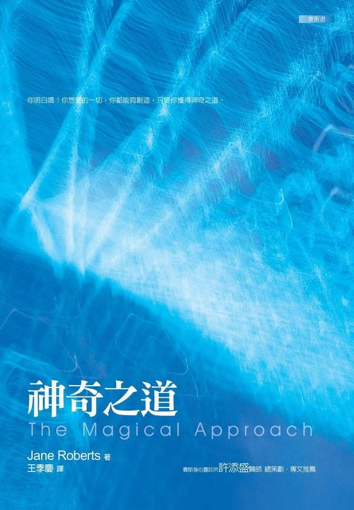

# 赛斯书：神奇之道

## 魔术表演

我们都是多么神奇的魔术师啊，

将黑暗变成光明，

将看不见的原子，

变成世上令人目眩神移的剧场，

由秘密的微观壁柜里，

拉出物体，

（有人，也有兔子，）

将冬天转成夏天，

将很多个的片刻，

经时间之活门消失。

我们在很久以前，

已学到这方法，

以致它们成了无意识的，

而我们却催眠自己去相信，

我们是观众。

所以我很好奇

我们是在哪儿实习的，

在哪些魔术大师的手下，

我们学会如此平顺地形成实相

以致我们忘记了告诉自己

这个秘密？

## 序：魔术成真的一天——赛斯描述何谓「神奇之道」

每周两个晚上（如我大半的读者都知道的），当我们的邻居们去看电影、逛商场，或与来访的朋友一同看电视时，我则是进入一种出神状态，「变成了」赛斯，呈现了所谓的第二个生命或生命里的另一个生命。事实上，这些课通常为时约一到三小时，而我知道，有许多人花上比这多得多的时间来打高尔夫球或网球。

所不同的，是在我们的情形，罗和我通常没有现场观众（至少没有我们看得见的）。然而花在这出神状态的那几个钟头，却使我先生和我——以及世界——身上所受到的冲击与实际所花的时间不成比例。

身为赛斯，我先前已制作了五本书：《灵魂永生》《个人实相的本质》《未知的实相》上与下、《心灵的本质》，以及《个人与群体事件的本质》。而他的第六本书——《梦、进化与价值完成》——已完成了一半。此外，还有我自己的十二本书。不过，由于赛斯不写回信，也不打字，因此，罗和我花了很多的时间和精力，来处理那些出神状态下所产生的种种成果。

在一九八〇年的夏天，我差不多有两个月没上赛斯课，我在进行我自己的书《珍的神》（God of Jane）的收尾工作。罗则在准备赛斯的《个人与群体事件的本质》的出版。在那个六月与七月间，我俩也都陷于大多数其它人所陷入的同样事件里——比平常要热的夜晚及白天、微微影响到我们地区的纽约州旱灾，以及政党为他们各自的大会所作的争论和计划所造成的新闻热潮。有些晚上，坡后小树林里的虫鸣比我们电视机的声响还大，但这使我烦燥不安的暑热，却将罗变成了宛如南太平洋的土著，他穿着剪短了的牛仔裤，看起来酷毙了，他的长发卷成自然的螺丝卷，而他结实清瘦的身躯，似乎很享受那暑热，但我却变成了一块海绵，增加了十磅的疲乏。

在写完《珍的神》后，我有一段空档，于是，我重读了我尚未写完的《时间预言》这本小说的十七个章节，并且浏览了一下许多组的笔记，想看看有没有一些可用来写书的材料，却一无所得。

于是我向我「自然的自发性自己」要求提供一些点子，而在一九八〇年的八月五日，比预期时间要早些的，我梦到自己坐在一台搬家拖车里，而那部车又被一部更大的车拖着走。而且我们还有一个关于座位安排的争执，但终于解决了。我把这个梦解释成我很快就会有新的创作，所以要做好准备，因此，我请罗帮我将我所有的写作材料，从我在那写完《珍的神》的通风小室，搬到新的屋后天井的房间，表示我已准备好再开始了。

因此，在八月六日，我和一迭刚买的稿纸、新的打字带，以及我希望是新鲜的心，坐在天井屋里，看着我对罗最近的梦所写下的诠释。那是个非常炎热的八月午后。世界的种种都各适其所。每个片刻的画面，也都喀喀一下卡入其位，如它们通常是的样子：每个瞬间都很精确的导入另一瞬间。

所有的活动彷佛全都在外面发生，从由后山吹入我小书房的太热的风，到摇曳过地板的外面的树影。

我正在看罗写的几页笔记，是有关于在午餐时，曾提到我对一个通信读者希望自己有「即刻的魔术」的一些评论记录。当我随意的读着这些笔记时，有些部分却特别吸引了我的注意力。罗写道：我们所谓的魔术，代表（反映）了我们自然传承的一个基本部分……我们容许心灵属性——千里眼、心电感应及预知能力——的扭曲版本，浮升上来成为魔术。他字句里的某些东西，以一种新的方式打动了我。罗和我常常讨论这种题目。他曾说我们是沉浸在「魔术」里的，不论我们怎么称呼它，而心电感应等等的展现，只不过是我们的魔术「显出来」的地方罢了。当我读完他的笔记时，不知道为什么，我受到了启发，或勿宁说，我感觉到一种内在的心理动作正在发生——这个动作就像在地板上摇曳的树影那样的确定却又微妙。一个「平衡」的改变——一个重要的、通常却隐藏着的心灵行动，在顷刻间改变了我及那午后。当我觉察到灵感的涌现时，我懒懒的瞥向厨房，那桌子的影像，还有前面门廊，以及透过开着的门看到的绿叶，都令我心中为之一动。我想把这个景色画下来，所以我应该拍个照，这样我以后就可以参照画出一幅画。然而不到两分钟，却见罗拿着他的相机出现在我桌边了。他几个月前才买了闪光灯，尚未试过呢！而现在他告诉我，他还剩下一张底片，他想要替我拍张照。这之前，他一直在房子的另一端，拿他的相机拍来拍去。而我在这里，根本不可能得到有关他当时活动的实质线索。然而，现在，他手里拿着相机，就站在这儿。

我的感受「没错」，这件事是具有重要意义。它彷佛太完美而有意义地切合先前的事件，它好像在说：「是的，你的确魔术般地在运作。」……而这就是那些感知如何发生作用的一个例子。如果罗在那一瞬没进来，我就不会知道我关于相机的念头与他在同时的想法或活动有任何关系。那么，我们的思维到底有多常与别人的思维发生某种关联？我告诉罗，在他进来之前我正在想什么。我的直觉是由于我的心境——正在诠释罗的梦及读他的笔记，所以我与他或他的心境有了一种特殊的交通，促成了内在的沟通。我们开始讨论这话题。突然，我对这个……罗谈到的「神奇的取向」（magical orientation），有一大堆想法想要写出来。我想赛斯的「架构二」当然会是这个神奇的区域。然而，赛斯数据的那部分除了一开头之外，在情感上，「架构二」从来没有打动我。可是不知怎的，罗的这几句话却打动了我，或许我只是准备好了吧。对实相的神奇取向会包括知性的活动，那是不用说的，但与生活发生关联的方式，则也会完全不同了，处理难题或健康上的问题，及达到目标等等的方式，都会非常的不同。「行动」这个字，也会有与它现在不同的意思。

罗的笔记帮助我了解到，所有这些并不如它通常看起来的那样陌异。「神奇的取向」也许与我们在这个及大多数现代的文化里之训练直接冲突，但它会是我们看世界的自然方式的一部分——被我们对「理性地」做事方式的信念覆盖住了的一种方式。附带地说，那种「理性的方式」结果被证实为并不如此理性。但我想，在每个人的生活里，总会有一些事，是可被用为达到一种神奇取向的路标的……

我将风扇拿进卧室——屋子里最凉快的房间，然后坐在床沿，开始写下我对罗的笔记、相机事件，以及我所谓的神奇关联的感受。

不管原来燥热与否，我不得不注意到这房间已彷佛跃入一片绿意中——树叶在颤动，而那棵枞树如此靠近窗户，以至于如果你让窗子打开得够久，一枝树干就可以长进来。

当我在写时，风扇轻轻的呼呼响，转动了空气，轻抚我的皮肤，同时绿叶在眨眼——而我觉得一种恍惚状态终于接近我脑际。我知道赛斯那晚会再开始上课——如果我愿意的话……。

我露出笑容。我愿意。然而，在间断了两个月之后，我也很紧张，就如在任何长时间「出神状态的休假」之后，我总会的样子。假设——只是假设——我无法再开始，或如我（在十七年前）突然得到了那技巧似的失去它？或赛斯说一些别人听不懂的话？其实我并不是真的担心这种事会发生，但我很不舒服地觉察到它们也可能会发生。我喃喃自语：「无聊，只因为天气太热！」由于我知道赛斯会谈到神奇的「关联」（connection），我勉强地再露出笑容——而谁又能比赛斯对「神奇」知道得更多呢？他一开始不就神奇地出现了吗？

在四点左右，气温窜到了华氏九十二度，我就想要将赛斯课延后。不过，罗和我睡了一小时，并且在咖啡桌上吃晚餐，同时看晚间新闻。「像黄瓜一般的凉爽。」当罗说今天天气多好时，我却扭来扭去地想要让自己舒服一些。然后在刚八点半后，我终于开始感觉赛斯在身边了。

一切进行得很顺，在中断了一段时间之后，赛斯又一次的（已超过了一千次）神闲气定。在我心智的门坎处，那些「心灵的排档」转动了。罗准备好了纸与笔。我啜了一小口加冰的葡萄酒。风扇呜呜的吹着，透过打开的门与窗，一股稍凉的微风吹了进来。然后我取下眼镜，「变成了」赛斯，开始说话。罗坐着，光着的腿架在咖啡桌上，拿着笔——课开始了。

## 第一部分：生产线时间 VS 自然的、创造性时间，理性心 VS 艺术心

一九八〇年 八月六日 星期三 晚上八点四十八分

晚安。

（「晚安，赛斯。」）

现在，一如往常的，我们将以我们自己的方式开始。

你和鲁柏在你们最近一连串的共同活动里，包括你们的梦等等，以及鲁柏和你自己的笔记，全都是朝着正确的方向走，你们在处理对你们个人而言，是重要且也有一个广大得多的冲击性议题。

自然人（natural person）的确就是神奇人（magical person），而对这种活动，你俩在某程度上，最近都有了一些实例。你们在过去及现在一直在试着教自己一些事，可是要解明这些，需要相当的时间，但你们的行为和经验，当然都是你们信念的结果。「架构二」一直是个颇为迷人、但主要是个假设性的架构，因为以你们的说法，你俩都没能真的想出任何利用它的办法。这并不是说它没在运作，只不过你们并没有得到你们想要的那种回馈。

当你俩都专注地投入在你们刚刚结束的方案里时，相对的说，你们也让自己许多的内在经验不知不觉的溜走了。不过，你们俩仍一同运作，随即想到了一个点子——一个重要的点子——允许你们以自己的方式去诠释架构二的数据。你们有了即刻的回馈——在你俩之间的一个创造性的互动，这包括了你们的梦，以及那照相机等等。很显然地，你俩都为你们彷佛感知到信息——你们甚至并没察觉到你们拥有的信息——并且对之采取行动的神奇的轻易性所震撼。

在有些你还没看过的鲁柏的笔记里，对这种活动有进一歩的重要洞见。事实上，重点在接受一种不同的整体取向——的确并非任何次要的附属物的取向，却是人性的一个基本部分——的重要性。如你自己及鲁柏的笔记所申明的——鲁柏的要更清楚些——这涉及了你所知的自己与时间的一个全然不同的关系。在此，从鲁柏的照相机经验，和你自己最近的梦，你可以看到一些关联性。

对于时间的一些重要误解，是鲁柏的许多难题的大半原因，并且也是你自己问题的原因，虽然所占的比例较少。所有这些涉及了以一种较自然，也因而神奇的与实相打交道的方式。在你们的经验里，以及在任何动物的经验里，无疑的，有一种自然的物理时间。这涉及了季节的节奏——日、夜，及潮汐等等。就那种物理时间而言——那是在地球的生物学上所涉及到的——并没有基本的文化时间。也就是说，对这个自然的节奏，你们很文明的加上了时钟、片刻与时辰等等的概念，而且你们还将它凌驾在自然的节奏之上。

（九点五分。）

整体而言，对于集中精神在偏见、琐事、生产线、准时赴约等等的文明，这样一种文化时间很合适，与你们所了解的工业化社会很合适。

可是，任何一个艺术创作者所涉及的时间，却是追随着大地自己的时间。创作者的时间来自季节与潮汐，纵使如此，在你们的社会里，你们却非常努力地去将创作者的时间，配合我所谓的生产线时间（assembly-line time）。如果你是一个作家或画家，那么，你就好像必须去制作这么多幅画，写那么多的书，或不论什么；就好像，比如说，一个汽车工人必须装配多少个汽车底盘一样。尤其是，如果你想以你的画来谋生的话，你便落入了认为「每分钟都是宝贵的」的心态，你的意思是，每分钟都必须是有生产价值的。但是，不论你用每个片刻来做什么，事实上这每个片刻本身，都必然是有价值的。

由于许多我们曾讨论过的理由，在文化上，鲁柏觉得每个片刻都必须奉献给工作，你到某个程度也会有同样的感受。但我说过，艺术性的创作是随着季节等等的时间运作的，以一种自然的时间——但这自然的时间与你所以为的非常不同。它远较丰富，并且它会视自己的情况而向内、向外、向后及向前。

当你在做梦时，你是你自然而神奇的自己，你运用了你所谓的理性心所体验的时间范畴之外的数据。创造力就是以同样的方式运作的，它出现在顺续时间（consecutive time）之内，但它主要的工作，却全然是在顺续时间以外做的。当你完成了你的计划，有好几天，你觉得很悲伤，但你发现了自己的这种情绪，而将自己很漂亮的转了过来，在那方面，你很有理由感到自豪。

同样的事也发生在鲁柏身上，虽然在程度上带着一些个人的差异，但理由是一样的。当你俩都在进行那些计划时，你们的文化时间被用在你们觉得可被接受的一种方式上。创作时间与文化时间到某个程度汇合在一起，因此你们可以每天看见创造力之产品的即刻证据由打字机里出来，就好比任何产品由一条生产线制造出来一样。你们在「运用」（using）时间，如你们的文化训练所教你们去做的那样。

你要休息一下吗？

（「不要。」）

（九点二十五分。）

当作品完成了，尤其是就鲁柏而言，他仍然有时间应该如此运用，以及创造力必须被导向，并且训练去落入恰当的时间空档这样的文化信念。可是在某个程度而言，他却是在试图用一种生产线的时间，来制作你们的创造性产品。当你们在打稿件，以及从事很多身体上的劳力时，这可能行得通，但整体而言，你们是以一种「错误的」方式在用时间，尤其是对任何创作艺术家而言。再次的，鲁柏尤其会犯这个毛病，虽然就此而言，你也不例外（赛斯带着一些幽默的说）。

（停顿。）在这儿，我要给你们很多数据，因为让你们了解与实相打交道的不同方式，以及那些方式又如何创造了你们所体验到的事件，是很重要的。

你们两人都还没真的准备好彻底的改变你们的意向，但你们正在接近那个门坎。如鲁柏的笔记也提到过的，「神奇之道」意味着你们实际的改变了你们处理问题、达成目标，及赚取财富的方法。

你们改变到自然人的方法上去。这样，它们就真的是你们个人经验的一部分了。它们不是玄秘的方法，但你们必须相信它们是自然的方法，人们本来就该用它们来处理问题，及面对挑战。

我会用「方法」这个字，因为这样你们才了解，但实际上，我们在说的是一种生活之道，一种神奇或自然的生活之道，那是动物在宇宙里自然的本能行为之人类版本。

那种方式的确与你们被教导而学得的方法直接抵触。你们曾以种种不同的程度执着于那些方法，因为无论如何，全世界彷佛都是那样办的，它们是处理事件的共同方法。不过，我要再说一次，以过去几天你们的经验，你俩不都对工作——真正的工作——能被完成的神奇轻松——感知到在时空之外的事件等等——感到讶异吗？

所有那些都可以转移到你们生活的其它领域去，尤其在鲁柏（身体方面）的困难上，我很了解这是你们共同关心的事，而我知道你们上这些课，就是想要明确的答案，我也总是尽我所能的给你们了。

但很显然的，似乎想得到明确答案的最好方法，就是去问明确的问题，而理性心首先就会想出像一张问题清单那样的东西。所以就此而言，鲁柏在这样一节课前的反应是自然的，并且也很神奇，因为他知道，不论他曾被教过什么，他都必须在意识的某个层面到某程度忘记那些问题，以及伴随着它们的心情，以便在意识的另一个层面创造出适当的气氛——容许答案到来的那种气氛，纵使也许以不同于理性心所预期的方式。

在你俩共同同意——并且我希望也在你俩共同的热忱之下，我们将有几节课要讨论和实相打交道的神奇之道，尤其是针对你们的个人生活，为的是要创造那种气氛——可以在其中体验到答案的气氛。

（九点三十九分。）

试图将了不起的创造冲力符合生产线时间，本身就一定会导致冲突、不满及挫败。如果我们心里首先记住适当的创造与神奇的取向，那么其它的事情都会各就各位。你不会对创造性的自己说：「现在是七点半，大家都在生产线了，我也已坐在桌子旁，生产吧！」

生产线时间并不真的珍视时间！只不过将时间视为可以被用在确定的预设目标上。在那种状况下，享受时间变成了一个弱点或一项罪行，而你俩在某程度上都曾如此看待时间。就具有极大天赋的创作者而言——如你们的情形——不论你们做什么，那个「自然人」都是非常重要的。所以，他强烈地憎恶放在他的经验上的任何基本上无意义的限制。举例来说，他知道如何享受每一天，如何从每一个接触搜集创造性的洞见，如何经由做家事或其它的活动，来丰富自己的具体生活。他不喜欢被告以他必须在不合理的限制下如此这般的做事。

自然人绝不是非理性的。他将所有的经验集合在一起，并转化之。你们会有这么多的问题，都是由应用错误的取向到你们的生活及活动上所引起的。

我说错误并不意味着道德判断，而是指应用一种方法在那无法以这样一种方式适当地表达的追求上。作为一个社会，生产线时间以及伴随着它的信念，给过你们许多利益，但你们不该忘记，那整个的架构最先被设定，为的是缩减冲动、创造性思维，或任何其它的活动——那会导向除了「不用大脑的重复性连贯动作」之外的任何事（热切地）。

换言之，那整个的架构本来就是要给你们一个标准化的、大量生产的实相版本，它没有一个观念能（敲着桌子）合理的应用在创造性的努力。带给你们创造性成就的取向是位于相反的方向。

创造力本身有它自己固有的纪律，举例来说，那种纪律是在一个梦里能翻遍未来日子，以找到为了要做某一个声明所需的精确数据的纪律。

所有这些数据都适用于鲁柏的状况，而对它的了解，能创造出那种风气，在其中会出现有益的结果。

你要休息一下吗？

（「好的。」）

那待会儿我们再继续。

（九点五十三分二十点五分。）

当鲁柏写完了他的著作（《珍的神》）时，他发现他手上有那么多他应该去利用的时间。他也再度觉察到他实质上的局限︰似乎除了工作之外，他没什么可做的，因此他采取了理性的方式——就是欲解决问题，你就要去担心它。

同时，自然人真的露面了。鲁柏顺随着他的冲动，替你解梦——所有那一切将你俩导入新的创作活动。但你明白吗，那并不是工作。他所需做的是，真正的放松，而非证明他能，或应该，或必须立即开始另一本书。真正的创造力来自享受这些片刻，这些片刻随之完成它们自己，而创造过程的一部分，的确是「放松的艺术」——放下——因为那会启动神奇的活动，而那是鲁柏必须学会的。

再说一次，关于神奇之道，我将有许多话要说，并且，我真的认为，这词汇将更帮助你们每个人将架构二带入你们的经验。至于就鲁柏的现况而言，他不该，好比说，一星期都只穿同一件牛仔裤，却该替换着穿，当然，两三件长裤就可以替换多次。

就气候而言，以及对一个行动如此受限的人而言，他的内衣是很差的一种。他也该更多变换他的睡衣。当他谈到一项活动时，你建议他再想一次会是很棒的建议。那会使他觉悟到，他的活动已变得有多受限了，而再次的，遵循着理性所开的处方，他会为之担忧不已。

然后，他会将自己的现况与理想中所渴望的状况相比，所有那些作法更令他情绪低落，并且更加强了他对暑热、椅子的压力等等的敏感。

我要你们了解，我们真的是在与两种全然不同的处世之道和解决问题的方式打交道——在此我们将称之为理性的方法及神奇的方法。理性之道在某些状况相当有效，比如说物品的大量生产或某种科学的测度上。但就人们对理性之道的了解和利用上，总的来说，理性并不该用在对人生的整体处理上，及解决主观的问题上，而应用在客观的测度或计算上。

理性方法尤其无法用在任何艺术上。或许下面这句话是句陈年老话，但，尺的测度与心的测度绝对无关，而它们永远不能用来表达最微小的细胞自动做出的无法计算的测度。单单是目前所用到的理性心智本身（目前它是个相当人工化的建构，一个变得地位显著的作用），永远无法了解你为了作出「伯蓝那（Brenner）梦」所采取的梦的度量。

（十点二十四分。）

鲁柏维持住一个强大的理性处事方法，以确保他会管制住他的灵异活动，因为，（很讽刺地）在你们的社会里，这似乎是唯一合乎理性的方式。那么，你们的问题没被解决，当然大半是由于你们采取了错误的方式，而那是由于你们两人都还没被说服。你们仍然紧抓着那些养成的信念。就那方面来说，鲁柏比你受的苦更大。

当然，老的信念以及理性之道在各个方面都被增强，因此，它的确极有力量。如果你利用神奇之道，并且容许自己以那方式运作的话，它的力量会更大，因为它具有你们基本的自然取向的力量。

理性之道才是附加于其上的东西。我想你俩都已准备好了解那一点了。

在这节里的资料，正是那真能让鲁柏脱出目前困境的资料，但我们下一节再继续讨论。以前我曾给过你们一些这种数据，正如不久的将来我会给你们的。不过，回头看你们自己近来的经验，这数据现在会更有意义，并且别具重要意义，因此这一回，你们真的可以好好善用它，而且我也会尽量说得更明确一些。对于你们近来的梦或它的暗示，我也会回答你们任何的问题。再回来与你们一起，令我很欢喜。好了，今天口授结束，祝你俩有一个很好而神奇的晚上。

（「赛斯，谢谢你。」十点三十分。）

## 第二部分：理性之道，科学的硬里子实相，知性与神奇之道

一九八〇年 八月十二日 星期一 晚上八点四十三分

（今天我给珍买了一个「水垫」，让她减轻坐的困难，但晚餐后，我们将它充水时，却觉得不合用。我还给珍买了三种内衣来试试……在上课前，我们花了——小时左右的时间看纽约市的民主党全国代表大会。我们只看了第一段，主张「关闭的」议会的卡特集团，打败了主张「开放的」议会的甘乃迪集团。

（我开玩笑的跟珍说，民主党也许在他们的大会中达成了一个团结秀，但到了十一月选举的时候，他们很可能就会以说出类似下面的话「我们败了，但我们是团结一致的。」来对抗里根。对我而言，这种政治上的情况，意味着要在卡特和里根之间作选择，这几乎是令人无法忍受的，而且我很好奇，为什么我们的国家要选择这个如大家所说的「阵痛」之苦。

（「嗯，」珍在八点四十分时说，「我已觉得较舒服了，不如我们现在就开始吧。我觉得他就在附近。至少我比这一阵子来觉得好多了。」我们曾重读了好几遍上一节的内容，并且每天都做「赛斯的新年立志」「（Seth's resolutions，译注：赛斯用来勉励他们俩写的「新年立志」范例。）。珍每天走动两回，用她有轮子的打字桌作为支撑——虽然我们今晚跳过了一次，以看电视代替。今晚的天气潮湿，但并不太热。透过敞开的窗户，我们听见知了和蟋蟀了不起的韵律。然后……）

现在——

（「晚安，赛斯。」）

晚安。在你们的文化里，你们并没有将知性（intellect）运用过度，但在你们的处世之道里，你们却依赖它，而排挤了你们「所有」其它的才能。

知性是绝顶聪明的，但现在，独自地，它的确是以一种与人格的其它部分并不相同的方式，孤立于时间与空间中。当它承受到「过大的」压力，连同随之而来的所有一般架构或理论基础时，它的确可能会害怕、偏执，因为它并无法真的感知事件，直到它们已经发生了为止。但它并不知道明天会发生什么，而既然它受到了过度的压力，它的偏执倾向就会让它担心可能发生的情况。

可是对知性而言，那些倾向并不是自然的，因为只有当知性被「迫」以这样一种孤立的方式运作时——不只是被孤立在时空里，并且在心理上与人格的其它部分孤立开时，才有这种倾向出现。

而那些部分原本是要带给它所没有的额外数据，以及一种神奇的支持的。

我们一般所谓的对人生的理性处理方式，是非常悲观的，带着它自己独自的方法及问题的「解答」，它自己达成目的及满足欲望的方法。许多人是如此的沉湎于这种处世之道里，以至于心理上对任何一种其它的取向都盲目了。但很显然的，你与鲁柏并非如此，不然你们就不会上这些课，也不会有任何其它的这类活动。

当然，理性之道对某类人会比其它人更合适，纵使它们有不利的因素。你们住在一个工业化的、科学的社会里，因此理性之道的利益和极大的不利，在这社会的与政治的世界里处处可见。但任何一种艺术家都会觉得这种方式最不友善，因为在几个重要的区域，它都直接的与人的创造力之巨大推进力相抵触。不过，你与鲁柏的确有证据可证明「硬里子」（hardbed）实相是十分不同的。在过去，你俩有时都曾感觉到自己多少处于不利的地位，觉得我们的作品在理论上很迷人，在创造性上有效，但却并不必然包含着对于任何一种「在科学上有效」的硬里子实相的任何声明（语气很强调地）。

（八点五十六分。）

你们并不认为自己在处理虚构的东西。在另一方面，你们也不愿称它为事实。而事实上，你们是在与事实的一个更大版本打交道——如我以前所说过的——由之，事实的世界浮现了出来。

除了这些课外，在你们的生活里，也有许多令人称奇的点点滴滴的证据，不过在某程度上，它们显然是被你们在这些课里所获得的知识所激发的。它们仍然是孤立的、零碎的点点滴滴，在那种情形下，它们开始给你们看到一个对实相的更大事实表述。

所有这些数据都适用在你们一般的生活，以及鲁柏的身体状况，因为你们对自己在那方面的情况必得了然于心，而大半的数据会让你们澄清疑虑，并且解除了留连不去的疑惑；那些疑惑使得你们——尤其是鲁柏——用一种偏颇的努力方式来抓住理性，以维持住你们以为的一种平衡的观点和开放的心。由于你们曾被教以的定义，就好像只有这一种狭隘的理性似的，而如果你舍弃了那狭隘定义的界限的话，那么你就变得非理性、狂热、疯狂或之类的了（非常强调地）。

那被认知为单薄的、冷酷的「理性」，其实是覆盖着一个深远的自发理性的虚假外表，而且，本来就是因那神奇的理性的存在，才给知性提供了基础。那么，你们所接受的理性，就只不过是每个自然人都有的「自发的内在理性」之一个小小的线索而已。

现在，在你睡着时所作的梦里，当你彷佛是不理性的，当你的知性似乎没有在运作时，你感知到了有关你过去的实质环境的信息。你看到你的老邻里（在一九八〇年六月十日）——柏蓝那宅邸的院子里遍地都是动物和工业废物。你以自己的方式象征性地看到那情况，但你事实上已知道柏蓝那产业已被污染了。你仍然爱着那片地区。你与它有某种呼应。多多少少地，你在注意着有关它的消息。

不过，你也多少将过去理想化了，所以你并非只「直接的」得到那信息，却是以这样一种方式收到它，以达到心理上的目的，并且更进一步织入不止是那个梦，并且包括其它一系列的梦里的行动。

（九点十五分。）

不论你有没有看到那段（出现在艾尔默拉报纸上的）报导，那梦都达到了它的目的。事实上，不论你记得它与否，那梦都达到了目的，不过你却是记得的。你记得它，因为你想将你自己知道的例子带入你有意识的范围。形成那梦的你的那个部分知道那污染，但也知道那补偿金、报上的报导，及你看晚报的习惯。所有那一切涉及了自然的、神奇的意念之心理动态。它显示给你看，理性世界的法则是充满了漏洞的。它显示给你看，理性世界的观点并不代表安全堡垒，反之，却是完整利用知性和直觉的障碍。

在诠释了你的梦后，鲁柏从他的书房非常清醒却放松地看入厨房。他想到请你用你的照相机拍一张桌子的快照，照出半开的前门，以便稍后他画那景象。你的相机是无法照进所有那些的，那是他从没想到过的一件事。然而不到两分钟，你出来了，并走进他的书房，还带着你好几个月都没用过的相机。鲁柏刚看过你的笔记里的想法，他最近也才在想关于神奇之道的事。所以你出来就像是在响应他一样。好像在说：「是的，神奇之道的确在运作，而这就是它运作的模样。」

鲁柏的心态与你自己的心态相呼应，正如你与你从前的环境有所呼应一样，因此，在这些例子里，你在其它层面有一个信息的自由流通。

且说，当你在知性上了解了那一点时，那时知性便能理所当然的认为，它自己的信息并非你所拥有的信息之全部。它能了悟到，它自己的知识代表了冰山的一角，当你将那个了悟应用在你的人生时，你就开始更进一步的了悟，实际的说法就是，你真的是被比你有意识地觉察的还要更大的知识团，以及形成你存在的神奇、自发的行动泉源所支撑着的。知性随即能认知到，它并不需要孤军奋战；并不需要推理出每件事才能了解它。

（珍现在身为赛斯，很强有力且充满了信心的传达了以上的话，我认为这数据棒极了，计划将它拷贝下来，钉在我画室的墙上，以便随时参考。）

这资料是事实。我并不是说我不常用隐喻，或我不会偶尔被迫用象征性的声明，但当我那样做时，我总是会先说明的，并且甚至那些声明也是我对「大过你们能对它下定义的事实」的最好描写而已。那么，当知性处于相信它必须多少单独解决所有个人问题的地位时，能够并且也真的会形成强烈的偏执倾向，当它被示以任何全球性困境的画面时，它则必然会那样反应。

环绕着这架构建立的理性之道强调，解决一个问题最好的方法是集中精神于其上，将其效果投射到将来，去一再反刍其结果，「面对面地瞪着赤裸裸的事实」。

然而这带来一种氛围，在其中问题更放大了。知性必须单独的——看来似乎如此——处理不只是今天的问题，并且处理在它投射的灾难重重的明日里那个问题的影响。这用意良好的贯注、这解决问题的决心、这理性之道，随即引起一种甚至更深的无能感。贯注在问题上，带来一种机械性的重复，一种重复的催眠性聚焦。

（九点三十六分。）

且说，在某些方面而言，知性是个了不起的组织者，因此，如果这个贯注持续下去，知性便开始沿着同一方向组织它的感知和经验。那是一种误导的企图，借由找到与它自己一致的信息而找到秩序。于是，它搜集证据，以证明它的观点，因为如你了解的理性心智必须为每一件事找一个可接受的理由（语气热切地）。

当然，在同时，十分有效却不符全部画面的岩床（rockbed）证据渐渐变得被抛弃、忽略或丢掉了。它在那儿，但没被用到。作为证据，它却不见了，变得不活动了。所以，还需要我说吗，那种解决问题的方法是很差劲的方法，它引起的问题要远超过它解决的问题呢！

就鲁柏的状况而言，他常常认为，他面对着他的病况并无改善的「证据」，它越来越糟了，存在的证据都说，这种状况的确会变坏而不会改善。他有时候甚至认为他这样想是实事求是的。

当然，所发生的正是我刚才大略讲的。其它十分真实、十分实在的证据——而且永远在任何时候在他身体上都是显而易见的——被忽略，被认为是不重要的，太琐碎而不值得注意或当真，因为它并不符合他已发展出来的所谓理性的画面。

（「你要不要给个例子？」我问赛斯，但珍仍很平顺地继续讲下去，以至于我不知他有没有听见这问题。）

那过程就与我上面那段讲的一模一样，因此我要你们了解那一点。任何改进，除非被说出来，否则大半都被忽略了，不被认为是无可否认的证据，同时，任何困难都必然被认作是可靠的证据，因为它们符合上面说过的全面搜集资料的知性。它们是具重要意义的，同时，进步却看起来完全不算一回事。

（现在赛斯开始给予我的问题有关的信息。）

上一周，鲁柏在下巴、颈子和肩膀一带有了一些舒解。有些时候，三或四回，他的眼睛视力大有改进。有一段时候，他的脚踝和膝盖有更大的活动自由——某种活动——但所有这种证据都大半受到忽视——或更糟些，被讽刺地对待，因为他并没能走得更好。

你收到有关柏蓝那的信息，因为你与那环境有呼应。就此而言，你收到了内在的证据。你忽略掉无数的其它点点滴滴的信息。鲁柏收到自己的相机活动，因为他与你有呼应。他必须与他身体试图给他的活动力的证据有呼应，因此它可以建立起对自己身体的一个新画面。

你改变你的焦点。你改变你认为具有重要意义的东西。这一节让我们开始了一个对生命、对解决问题的神奇之道的讨论。我希望强调该去做什么，而非不去做什么，虽然有时候我必须清楚地分辨这两者。

如果你彻底了解这一节，并且，如果你有意想真正地改变你的取向，那么，便会自动创造出一种氛围，在其中，你所向往的改变会发生。

本节结束——。

（「谢谢你。」）

——晚安。

（九点五十五分。珍一脱离出神状态，我就告诉她这一节非常棒。可是我也相当的生气，因为赛斯的信息总有办法令事情看来彷佛不证自明似的；然后，人就总会自我恃度，任何基本上如此清晰而简单的事，怎么可能会如此轻易地被那些最急切地想要使用它的人所错过或误解。在个人练习期间，我常常体验到这些现象，而结果每次都下决心下一次要做得更好一些——看得更清楚，去做所有那些会轻松不费力地带来想要的结果的事。珍往往有同感，虽然由她的某些话来判断，我认为她近来比较不常有那种感觉了。然而，这种资料会带给人希望，而去思考它，至少在我这方面，它会导致暂时的真正了解和随之而来的希望的感觉。事实是，我真的相信这信息是好的，而且是有用的，基本上，它是人们所能得到的最好的一类信息。

（以上所说的一些要点很能为珍接受。然而，由于我们的感受，我们有一个活泼而有益的讨论，所以，总括来说，这节是非常好的一节课。我为这一节的一部分作了一个注，摘录在赛斯最近的书《梦、进化与价值完成》里。）

## 第三部分：人和其它族类，将错误当作是修正行动，神奇之道的定义。

一九八〇年 八月十三日 星期三 晚上八点五十七分

（今晚上课前，我刚刚打完了周一的课的后半节。我对珍说，我认为那是很棒的一节，而我想为我们打一份从九点十五到九点三十六分的数据的拷贝。赛斯那时解释道，知性必须了解，它并不需要孤军奋战，它是受到自己的其它部分所支持和帮助的。我认为这个洞见能大大有助于珍。我也告诉她，我想在赛斯目前的书《梦、进化与价值完成》里放入一部分周一的课。

（注：民主党全国代表大会已进行到第三天了。当我在晚餐后打着字时，我知道珍正在客厅听电视上的演讲。我随即想到我忘了一件事！上周六，我们本地的报纸曾刊登过一则短文，意思是说，有位我们听说过的通灵者最近曾预言，当卡特和甘乃迪在大会上发展成势均力敌、僵持不下的局面后，西弗吉尼亚州的参议员罗勃•比尔德会获得民主党总统候选人的提名。我看过那文章，并且也叫珍看。我本想留下它，但那报纸结果被绑进今早要丢的垃圾捆里了。既然卡特的势力能让他赢得一仗，使大会在周一第一节大会里「对外关闭」，那么卡特就注定会在第一次投票获得提名。所以，通灵者的预言错了，而那预言显然是已全国皆知的。

（因此今晚当我记起我忘记剪下那文章放入我的预言档案里时，我就告诉珍说，如果必要的话，我们还是知道可以在哪儿找到它：就在报社。我在想，当公众人物的预言没实现时，他们会如何反应，我希望他们的错误不会被合理化，或只用来作宣传，既然通灵者必须为他们的话负责。我们会继续注意有关那个主题任何随后的报导，但我想它都会像昨天任何其它的新闻一样的淡去。然而，在这种情形下，那些预言者私下又是怎么想呢？没有人是完美的。珍没尝试过预言类似的事件。对于珍的一些预言，可参见附录一。

（珍说她今晚并不太想上课，她只不过是「敷衍一下」罢了。我建议她，不管怎么样还是上课吧。她有时候会觉得舒服些，所以我们的新计划正有一些结果了。）

晚安。

（「赛斯晚安。」）

（带着一些无表情的幽默。）现在我听说，所有其它的族类都在保护自然，可是同时人类却有毁灭它的癖好。

（参考我一九八〇年七月十七日的批注。）

我曾听说，除了人之外，其它的生物都是以一种自然的优雅行事。我曾听说，除了人之外，所有的大自然都（停顿一下）自我满足，人却充满了不满足。这种思维自然地跟随着所谓「理性思考」的权威意见。当你们思索这种思维时，你们以最牵强的理性思索来想它们——也就是说，对被迫独自运作的知性而言，那思维相对的说，彷佛是不证自明的，与自己的其它机能无关。那么它真的看起来好像是：人不知怎地和大自然分离了——或，更糟的，成了行星表面上忘恩负义的败类，几乎成了寄生虫。

那个观点本身，就是知性问题的症候。在你们的文化将知性所放置的位置上，它的确看它自身为相当孤立的，与人格的其它部分分离，也与其它生物及自然本身分离。举例来说，科学因此说，生物——除了人之外——是以「盲目的本能」来运作的，而那个名词本意就是用来解释所有其它族类的复杂行为。所以，在人和动物、知性与自然之间的鸿沟彷佛更加深了。

以那种说法，要说人的知性也是本能性的——如我先前说过的——并没有什么不对。他立刻开始思考。他无法不用他的知性。再说一次，知性神奇地、自动自发地运作。它最锐利的推理过程，是生自那自然的神奇行动的一个结果。（从容地。）

（停顿。）知性被教以与它的源头分离。就彼而言，它觉察到一种无力感，因为，到某个程度，它是哲学性地从它自己的力量之源被切断了。所以，当它看着政治事件的世界时，问题彷佛无法解决。由于知性的信念系统，并且，由于它与其它信息来源切断了，人做了许多对知性而言彷佛是错误的决定。那些许多个错误的决定或「糟糕的步骤」，往往代表了自我修正的行动，按照没有被意识到的知识所做的决定，但这逃过了你们的意识而不为所觉。

（九点十四分。）

以同样方式，某些个人生活中的决定或事件，由于某些理由，对知性而言都可能显得是不利的，然而，它们其实也是由于你们的信念并不为你所感知的自我修正的作法。目前所用的理性之道，带着一个基本假设说，任何错事都会变得更糟。当然那个信念是极为不利的，因为它违反了人生的基本原则。就你们的历史而言，如果这是实情，世界绝不会存续超过一个世纪。

有趣的是，即使在有医药科学之前，就有相当多健康的人。并没有抹灭整个人类的疾病。

当你以为会发生最坏的事时，你就必须永远防卫着。在你们的文化里，人们几乎像用一项武器似的用「知性」这个字汇，来保护他们自己对抗将要来临的灾难。他们必须对所有各种的危险警觉。

他们开始搜集危险的证据，以至于对人生任何其它种类的取向都彷佛是不智的，而在那个架构里，作为一个实际的人，就意味着要防备最糟的事发生。

首先，如果你了悟到，知性本身是自然的一部分，是自然人的一部分，是神奇的过程之一部分的话，那么你就不需要过度用它，强迫它感觉被孤立，或将它置于会发展出偏执性倾向的情况里。

正如你们的直觉一样，知性本身也是为生命的神奇过程所支持的。它是被孕育你们和世界的更大能量所支持的。既然你们做了那个分辨，那力量是在世界里，并在政治世界里运作的，就如它在自然世界里运作一样。

可是，当你遵循着那所谓的理性之道时，你必然会觉得受到威胁，与你的身体分离了。你的思维和你的身体彷佛分开了。在精神和身体之间，彷佛出现了分隔，然而再次的，它们每一个都被那些神奇过程支持着。那理性之道抵触了我只能称为人生的指令和人生的自然节奏的东西。它与生物的健全性相抵触，并且，再次的，它不合道理。

当然，现在，那理性之道是与先前提及的科学概念相连的：生命为混乱所包围，为生存而奋斗等等。我并无意要贬低知性。它是非常重要的，但不瞒你说，它是与猫须一样自然的东西。它并非什么附加于自然的东西，而是自然的一部分。

（赛斯在此作了一个有关猫须的幽默比喻，因为我们的猫，比利，正在客厅到处追逐一只看来灰尘仆仆的飞蛾，且颇为疯性地喵喵叫。）

以最简单的说法，神奇之道认为理所当然地，任何一个个人的生命会完成他自己，会发展与成熟。环境于个人是独特地彼此适合，并且一同合作的。这个听起来非常简单。可是，以口语的说法，那些是每个细胞的信念。它们被印在每个染色体上，每个原子上。它们提供了一个与生倶有的信心，渗透于每个活的生物、每个蜗牛和你头上的每丝头发里。当然，那些根深蒂固的信念在生物上是合宜的，提供所有成长与发展的推动力。

（九点三十二分。）

每个细胞（停顿。）都相信明天会更好。（安静地，带着幽默。）我承认，在这里我是将我们的细胞人格化了，但这个声明有一个稳固的真实性。更有进者，每个细胞在它自己内都对它自己的不可避免性，具有一个信念及了解。换言之，它知道它死后犹存。

天堂的概念，虽然有那么多的扭曲，曾运作为一个理论架构，向知性保证了它幸存。科学则相信其反面，相信知性在死后的全然毁灭，既然那时候人们已经完全与知性认同了，这对他是一个令他希望破灭的重击。它拒绝给予人一个必要的生物上必须的东西。（很热切地）。

所有这些理由都隐藏在人类群体问题的背后，并且适用于每个生命。再次的，我想指出，鲁柏早先就决定，作为一个孩子，他要依赖他的知性，而非依赖美貌，就像他觉得他母亲曾经依赖美貌的样子。如我以前说过的，在他的例子里，他也觉得女性特质是与知性发展相反的那些特质。（停顿。）不过，他在直觉上与知性上，都有天赋，而自然地被推向在这两个领域的成长——他觉得那两个领域强调了矛盾的特性，而非互补的特性。

现在，在所谓通灵的领域，拿任何一个人——或不如更切题的，任何一个女人——来说，鲁柏试图证明他是讲理的、理性的，可是他觉得那种人从来没有学会用他们的推理能力，反倒是信任游走到他们脑子里的想法。所以，去怀疑他自己的神通是具有保护性的。

（停顿良久。）他也觉得知性的质疑能力并非只是它的一个功能而已——其实它是——却是它的主要目的。但其实它并不是。以你们的说法，知性的主要功能是在人格与世界的关系里，做出清楚的推论与区分。可是，你们的社会的确认为理性之道是带着男性味道的一个——所以就此而言，鲁柏又有了一个额外的理由，去做这样一个理性之道的拥护者。当然，所有与性相连的信念都是错误的，但他们却都是那「理性」架构本身的一部分。

（九点四十四分。）

显然，我将说的这句话是太简化了点，然而，几乎就像是，如果你把整个理性之道反转过来，认为理所当然它所有的假设都是错的，还更好一点，因为它们的确是错的要比对的多（热烈地）。再次的，你明白吗？区分在你们这方面是武断的，再次的，知性是极为自发的过程的结果，它自己对那些过程是一无所知的，而被认为如此没有自律及不合理的直觉，却是建立在比意识心所能理解的、远较壮观的计算上。知性无法跟随它们，所以那区分并非基本的：它们是信念与习惯用法的结果。当然，因此我分开地讲到它们，如你们认为它们应该是的样子。

神奇之道视为理所当然，人类是一个整合的生物，就像动物一样完成在自然里的目的，不管那些目的被了解了没有。（停顿。）神奇之道视为理所当然，每个个人都有一个未来，一个达成目的的未来，纵使明天死亡可能就会来。神奇之道视为理所当然，发展的办法是在每个人之内，而完成会自然的发生。整体而言，神奇之道在你们的世界里运作，如果没有它的话，就根本没有世界。如果最坏的事注定会发生，如科学家们显然这样认为的，那么以他们的说法，即使是进化也会是不可能的，当然——这也是一种好想法。（很热切地。）

你们需要这个背景数据，因为我想建立一个氛围，在其中，这个神奇之道可以被理解，然后细部的数据才能被利用。

当然，在你的梦里，你是在对神奇自己的本质形成新概念的过程里（透过我的绘画），并且也正在借由影像实现那个概念。那个梦尤其是在另一个觉察层面所做成的「工作」的一个例子。

鲁柏最近与「玛丽」在心灵上的讨论，以及你自己有关玛丽与素描簿的梦——所有这些经验指出一种精美的推理，那是在通常被认为不合理性的觉察层面进行的。那种数据丰富了知性，并且令它觉得安心。

还有一件事：记得叫鲁柏告诉你，他在情绪方面觉得怎么样，因为现在你能在那方面帮助他。他必须觉悟到，放松也是创造过程的一部分。不去管它的话，它会做「对的事」。在下一节里，我们会继续这个讨论，同时，要注意会带给你有关神奇之道的一个更好概念的其它暗示与线索。

这一节到此结束。

（「很好，谢谢你。」）

给你俩最衷心的祝福，祝你们有个神奇的满足夜晚。

（「谢谢你，你也一样。」

（十点五分。「我一点都记不得。」珍说。「我只知道在上课前，我脑海里完全没有那些想法。」

（这显然是神奇的——在课中，珍身为赛斯的表现。以下的批注，是赛斯在这节里的资料勾起的灵感，是我在两天之后写的：

（「当然，赛斯不只口授了他神奇的数据，并且在如此做时，还必须将，课放在心里，因此，他所说的每句话与他之前说的，以及随后的句子相较，是有意义的，一旦你停下来想想这一点，便知那就赛斯和珍而言，都是个伟绩。但这是怎么可能的呢？赛斯并没有预先的底稿，而在上课间，他也无法参考我的笔记，以便核封他已经说过什么。

（「是的，一点也不错，这儿必须涉及超强的记忆力，伴随着在更深层面上，对我们所认为的时间的缩短。赛斯的能力令我想起最近我写的谈人格或心灵的某个部分，必然是狡猾而谨慎的在事先构筑梦，因此，当梦被重放时，它们对需要的那部分心灵给予了恰好的讯息。当我写说，梦是个自发的制作时，我在这儿也并没有自相矛盾。

（「这些对赛斯能力的评论，当它们在如我所描述的样子被思考时，彷佛是显而易见的，但我不认为以前我曾以那种方式思考过赛斯能做什么。它们令赛斯的表现更了不起了。见八月十三日那节九点四十分之后的资料，关于知性和『无自律及不合理』的直觉。事实上，在这儿，整节课都适用。」）

## 第四部分：科学及科学的画面，欲望就是行动

一九八〇年 八月十八日 星期四 晚上九点十分

（正当珍脱下眼镜，进入出神状态时，我打了三个喷嚏。身为赛斯，她以觉得颇有趣的样子瞪着我，一直等我到准备好做记录为止。）

晚安。

（「赛斯晚安。」）

现在，我想要以读一读你的玻璃门的梦（两天以前）的最重要信息来开始，因为它的真相也同样适用于神奇之道。

也就是说，那个梦给了你关于我们所谓的神奇之道的一个主要特征的例子。鲁柏在他的诠释里没有强调这一点，除此外，那诠释是绝佳的。

主要的议题是，你能相当轻易地扩大玻璃门上的洞。轻易是关键词眼。对于知性的世界而言，一扇玻璃门必然被认为是坚固的，就如它在肉体感官的世界里那样。以其它同样实际的说法，的确，在事实的更大架构中，那门当然根本不坚固，正如没有任何物体是坚固的。显然科学已知此点。

科学委派自然世界为自然事件的领域。所以，它对自然的观点是机械性的。可是，自然本身，像自然的其余部分一样，却都拥有一个丰富的内在心理上的深度，那是科学由于它自己的定义，所无法感知的。举例来说，心电感应和眼通，是自然效应的一部分，但它们却属于一个比科学定义广大得多的自然，以至于令它们看起来是非常不自然的古怪行为，而非意识的自然成分。

（停顿一下。）也就是为了那个理由，它们才看起来彷佛掉出了「正常」领域之外。不过，这种特性却是自然人的基本属性。在科学方法的赞助下，它们显得不大对，因为科学方法本身就是被设定好来感知只适合它预见的模式的信息。这种能力显得是不可预知的、不连续的，只因为相对地，你们对事实上相当恒常不变的心理行为如此的不觉查。那是说，这种能力如此平顺、如此连续地运作，并且以如此轻易的方式（热切地），以至于只在某些情况下，你才对它们变得觉察。你们觉察到的好像是怪异特性的孤立暗示。

基本上，知性能处理许多种类的信息和信息体系。它比你们现在容许它的要远较有弹性。它能同时处理好几个主要的世界观，了悟到它们每个都是感知和处理实相的一个方法。到某个程度，历史性地说，那种情况在过去运作——只是比较上来说——当人们了悟到，的确有个复杂而丰富的内在世界，那是可以以某种方式向它接近的：那个世界与物质世界并肩而存，以至于两个世界是交会的。某种方式在一个领域管用，而其它方式则在内在实相里管用。

（九点二十九分。）

知性能处理这两种按不同假设运作的方式。不同的假设适用于不同的实相。

我并无意于理想化那些时代。可是，在所谓的现代，可以说，知性被贬低了。科学感知到外在实相的壮观复杂性，却对任何主观性根本不予认可，完全视而不见，直到它将主观性认作只是一个丢弃的产品，意外地被无心的物质所形成。

所有这一切都适用于你们的情况，因为我要你们在知性上和情感上，透彻了解目前思潮的错谬，因此你能明白，我们的数据的确不只提供你们「创造性的数据」，并且给了你们现在存在于其内的架构一个更实在的展示。

那么，在现代，知性终究只剩了一个可被接受的世界观，一套假设，对实相和经验的一个主要的处理方式。到一个很大的程度，可被接受的假设与为人类遗产的一部分的天生固有的生物、灵性及心理上的假设直接抵触。知性的确试图规范经验，合理化感知。当知性借由拥有好几个世界观而丰富自己，随之，在将它们混合成有意义的模式，将信息整理、分类，及将它送到适当的地方时，知性会做得非常好。

举例来说，它了解眼通的数据是人格整体特性的一部分，所以它并不害怕感知它——并且它有能力将这种信息上的混乱，与目前肉体感官的感知分开来。那么，有秩序是它的一个主要特性。当它只被给予一个世界观及一组假设时，它有秩序的本性令它抛弃所有不适合的信息。就好比一张拼图，当它只有不到一半的小图片时，它却被迫去形成一个有秩序的画面。

但我们不能怪知性。在那种情况下，它已尽力而为。

现在，在你的梦里，你相当清楚地看到，在物质实相与神奇的次元之间的门坎，物质实相的源头是在神奇的次元里。你被示以——或给你自己看——两者之间不同的规则或假设。那只狗想吃食物的欲望，引它神奇地穿门进来，因为自然生物的欲望是以一种与你们对工作的概念完全无关的「轻易」被满足的。我想要做的是，引介一种不同的工作观念——非常有价值的、重要的工作，那是在另一个层面，并且以另一种方式执行的。

（九点四十八分。）

当然，还有一个主要的例子就是，为维持每种生物活着和呼吸的「工作」已完成，令行星们各安其位的「工作」已完成，令一个进化论者能沉思他的理论的「工作」已完成了。

现在，在你的梦里，你感觉到了那一种工作或行动的感受。它就是世界的天赋力量，自然的天赋力量。它就是价值完成被引导着的力量。换言之，当然它就是「一切万有」的能量。问题出在，对人生的理性观念将人与他自己力量之源的感受分开了。当他有问题时，理性方式的解答彷佛是唯一的答案，而当然，往往它根本就不是答案。

鲁柏想确定他是对的。（停顿良久。）他试图在同时向前进又不向前进。他试图要大胆和谨慎，勇敢和安全。当然，这在某程度也适用于你们每个人，正因为你们在知性和直觉力两方面，都有强大的天赋。到某程度，你俩都试图合理化你们的创造力。理性方向的思维觉得创造力非常的造成分裂，所以以那种说法，作为非常有天赋的创作者，你们无论如何都会遭遇到一些困难的。

然而，现在已是时候了，你们该视这种困难为挑战，是你们自己选择的一个创造性冒险的一部分。你们选择了那冒险，因为它是最适合你们自己个人的价值完成的那一种。在为你们自己调解许多观念和矛盾时，你们也替许多别人领路。再次的，如果你们将你们的工作认作是一场冒险，一场令人兴奋的创造性冒险，而不是以你们老说法的「工作」的话，会有相当大的帮助！

这会容许你们将内在的、神奇的「工作」感受包括进你的计算里。它也会开始给你们对鼓舞你俩和你们生命的神奇支持力的一个感受——那是鲁柏可以依恃的支持，而那能带来他身体上的困难的解答。在此，再次的，那主要的字眼是轻易或不费力。如果你想要（停顿良久）在物质世界喂一只狗——而它是在门的另一边——你必须打开门。但在内在世界里，你或狗可以毫不费力的穿过那门，因为欲望就是行动。欲望就是行动。

在内在世界里，你的欲望不费力地带来它们自己的完成。那个内在世界和外在世界互相交会并交织。它们只看起来是分开的。（停顿。）在物质世界里，时间可能必会逝去，或不论怎么样，情况可能必会改变，或不论怎么样，但欲望会带来适当的结果。不费力的感受才是重要的一点。鲁柏用知性去了解此点，是相当适当的，并且，现在只要简单的说：「那不是我的领域。我要将那问题的解答留在它所属的地方。在这儿，我们将利用神奇之道。」

现在，如果你想的话，就让你的手指休息一会儿吧。

（「好的。」）

（十点九分。）

现在，暂说一句：在我们下节课里，我将继续以上的讨论。

鲁柏有时候觉得无望，因为理性之道的假设往往导向那个方向，并且因为在那些其它领域，他对自己能得到他想要的那种持久的结果，还不够有把握。这适用于你俩有时的态度。

当然，在有意识的层面，你俩都没了悟或不想了悟我们的课所暗示的那种完全的废除和翻修，而许多年来，随着对实相的较新观念，你们也想办法保有许多官方观点，没准备好去了解这涉及了一种全新的思考方式，一个个人与实相的新关系。因此，你们处处零碎的尝试一些新的方法，而有相当好的结果。

当然，其实这些课暗示了一个全盘的重新定位（强调地），而那全盘的重新定位，不费力地带来鲁柏和他的身体、他的生命，以及和你俩都已开始的冒险的一个新关系。他自动地会变得更健康，因为那架构容许他这样做。

几个世俗却有用的要点是：他当然必须被容许一些未受干扰的写作时间。你俩都不了解你们对卧房的态度。你俩都避免在里面做爱。当然，卧房是唯一不是你们整体活动的一部分的房间。它彷佛孤立于你们的生活之外。举例来说，你们不装修它。这部分是一些老想法的结果，那种想法认为，睡眠是生活或人格的分开的、孤立的部分。

如果卧室显示更多些你们其它的兴趣，你俩在里面就会觉得好得多。对鲁柏来说，可以放一些书或书架。那个房间并没有显示出他工作的证据，你明白吗。它或许也该挂一些你目前的画，换句话说，就是它该是与你们的生活有更紧密的联系的地方。

理想地说，一张新床应是有利的，不论在实质上与象征上来说。放松——例如，躺下来——对鲁柏来说也会较容易些。或者一张行军床或类似的东西——一张躺椅之类的——都是他写作室的一部分。

你喜欢在客厅午睡，因为那儿有动人的景色。你们的新陈代谢是不同的，这很自然，而在一般情况下，就你们既定的午餐时间而言，鲁柏需要一顿好餐，无疑的，有时候最晚会吃到五点或六点。

不然的话，他就会有一种自然的毛燥感。而如你自己已发现的，你需要你的绘画时间。他则喜欢黄昏时在他的写作室里，虽然季节跟那略有关系，然而当可能的话，那仍然是个好主意。你所给他的保证和信心是非常有帮助的——并且记住，它们不是以实质的方式运作的。

现在我祝你们晚安，并且为你的手指感到庆幸。

（「它们没问题的。」）

晚安。

（「谢谢你，赛斯，晚安。」）

（十点二十九分。）

## 第五部分：思想的风格，将神奇之道与所谓的理性之道合而为一

一九八〇年 八月二十日 星期三 晚上九点八分

（我们在八点四十五分开始静坐课程。珍这一阵子来感觉好得多了。她曾说：「我觉得我的背部好了百分之七十五。」现在她又说了一次。我已回头再继续进行赛斯最近的书《梦、进化与价值完成》的编年史，并且也画了一些涉及我自己的梦的画。珍在诠释那些梦上做得极好；我有一些夜游是源自读《神奇之道》的这些课的资料。）

（耳语。）晚安。

（「赛斯晚安。」）

现在继续我们的讨论。

科学的参考架构已变得与「理性思考」相等到如此一个程度，以至于思维的任何其它倾向仿佛自动地成了非理性了。就此而言，思想已变得太专门化、偏见化和没弹性了。

现在，思想是有风格的。每个个人有他自己独特的思想风格，有他自己对于臆测、幻想（停顿）、用主观及客观数据的怪僻方式的一个奇特、丰富而个人性的组合（停顿）。可是，科学曾如此主宰了思想世界，以至于许多一度被认为相当「理性」的细微差异和领域，已变得十分不可敬了。科学试图固守着它能证明的东西。很不幸的，它于是倾向于建立起一个只建基在某些数据上的世界观。你们结果有了分别的学科：生物学、心理学、物理学、数学等等，每个有它自己那一堆事实，被非常小心地守卫着，每个提供它自己的世界观：透过生物学看到的世界，或透过物理学的眼睛看到的实相。没有一个能综合所有那些信息的领域，或将一个学科的事实应用在另一学科上的学问，所以，全面来说，科学以它那套理性思考，无法提供关于「实相是什么？」平衡的、建议性的、假设的、广泛完整的概念。看来彷佛每个人实际上是孤立于某种重要的方面——比如说，被赋予一个基因传承，以及某种份量不明确的能量来驱使身体这机器（热切的）。意图、目的或欲望在这种状况下并不适用。

再次的，个人在他自己的环境里，是个陌生人，几乎是个外星人。在那环境里，他必须奋斗才能生存，他不只是得对抗切身环境之「不关心的」力量，并且得对抗基因决定论（the genetic determinism）。他必须对抗他自己的身体，过分强调身体对天生痼疾、疾病的易感患性，并且对抗一个固有的定时炸弹，可以这样说，假设灭种会无预警地到来。科学并不强调大自然的合作力量。它以区分、明确化及分类自豪，而一般而言，对于当然也完全一样真实的统合力量却相当盲目。所以，当我说到自然人也是神奇人时，很容易会将那个概念转换到非我所指的更孤立的说法去。

（九点二十三分。）

并不只是每个人都在一个「神奇的」次元里有其源头，而是他的整个生命都由之浮出，并且，个人的源头本身也是支持着整个星球及其居民，以及你所了解为宇宙的整体建构的那能量本身的一部分。

相互关联的场（field）或层面（planes）连结着所有各种的生命，并非经由，比如说，一个系统——一个生物的或灵性的系统——支持着它，却是在它存在的每个可想象的点支持它。你并非被给予一定份量的刚才提到的能量。「新」能量到处可得。再次的，并没有关闭的系统。再次的，环境是有意义且活生生的，在你身体的所有各部分和环境的所有各部分之间，有经常的沟通。

（停顿。）以你们的说法，这意味着你并不需要单单只依赖你所认为的你的个人资源。基本上，价值完成是存在的最重要特性之一，因此，所有的东西都以提供整个建构整体的价值完成的最好方式个别地并一同地行动。

你出生是因为你欲愿出生。一株植物为了同样的理由而活起来。不过，你却是住在与一株植物不同的参考架构里：你可有更多的选择。你与大自然的互动是不同的。你的知性本是为了要帮你做选择用的。它容许你在一个实质的时间范围内，感知某些可能性。当知性被容许尽可能清晰地感知物质状况时，你是在正确地使用知性。它随即能对你想达成的目标做出最有利的决定。

（停顿。）那些目标通常是观念化了的欲望，而一旦形成了，它们便像是磁铁似地，由那些广大的相互关联的场里，汲取最适合完成那些目标的那种状况。知性本身无法带来那些目标的完成。

单单是知性无法带来身体的一个动作。它必须依赖它的确启动的那些其它的特性——那自发的「内在复杂性」的排列，那有秩序的神奇。就是如此。

当知性被正确地运用时，它想到一个目标，而自动地令身体开始朝向它移动，并且自动地唤起其它不为它所知的沟通层面，因此所有的力量一同努力朝向目标的达成前进。拿一个假设的目标作为一个标的（标的就是目的）。当正确地运用时，知性想象那标的，随之想象地达成它。如果它是个实质的标的，那个人会手握弓箭站着，只想着射中红心，精神贯注其上，也许做出几个学到的姿势——正确的足部动作之类——而身体的神奇特性会完成其余一切。

不过，当知性被不正确地运用时，就像是知性感觉必须不知怎的知道或亲自指导所有那些内在的过程。当错误的信念系统和负面倾向与所谓理性的推理运用相连时，那么，就像是我们的射手看见那标的，他不去将他的注意力导向它，反之，却贯注于所有他的箭可能出错的种种不同方式：它可能偏左或偏右、落得太远或不够远、在空中折断、由他手中跌落，或以种种其它方式背叛他的意图。

（九点五十二分。）

当然，他已自标的处完全移转了他的注意力。他曾将他恐惧的画面，而非他原先意图的画面，投射在目前的事件上。他的身体响应他的心象和他的思维，带来反映他的迷惑的行动。

换言之，神奇之道和所谓的理性之道应该以某种方式合而为一，以产生最好的结果。有人有时写信给你，谈到他们想赚钱的意图——或不如说，想发财的意图，他们说，他们贯注于钱财上，并且以完全的信心等待它，相信由于他们的信心和贯注，金钱会被吸向他们。举例来说，他们可能会做「威力之点练习」（the point of power exercise）。不过，他们也可能辞了职，忽略想找其它工作的冲动，或采取理性之道，却单单地依赖神奇之道。当然，这也不会有效。

当鲁柏应用神奇之道，以及当你用它时，你们就明白，它完美地与存在的其余部分融会起来，鼓舞知性，鼓舞身体的动作——因为它启动身体上的属性。

我将继续描写两种方式一同运作的方法。可是，我想点明的要点是，你们个人的力量泉源是那更大的「交互关联场」的一部分这个事实，你们的存在安全地偃卧其中。它并非你们必须努力去追求的什么东西。在你们出生时及出生前，它就不费力地是你的，并且它还随身携带着它自己情感上和直觉上的理解。如果你们了解这个，那么，大体而言，你们许多的恐惧将会全部消失了。

（现在，令我惊讶的，赛斯回答了我今天早一些曾问珍的有关苏•华京斯的一两个问题——我能在我给《梦》那本书的编年史里用到的资料。苏近来曾给我一些信息，而我最近的问题都是那些的延伸。）

谭决定《与赛斯对谈》应该有插图。乔治对那个安排却不很热中。他认为详尽描写似乎并没必要。如果必要的话，我可以画画。

（「好的。」我说。意指我并不需要那详细描写，但赛斯显然误解了我的回答，以为我真的要谭希望那本书有插图。当他读到有关乔治的画的素描时，他立刻想到插图。当然，苏想帮乔治一个忙，以弥补旧的议题。但照乔治的情况而言，还有其它的可能性，就是这件事至少产生了一个想法。如果乔治需要钱，他可以替出版社画别的插图。这给了他一种受肯定的感觉。）

今晚就说到这里了。再次的，我祝你们有一个神奇的夜晚——并且记住，在所有你们的存在层面寻找暗示和线索。

（「谢谢你，赛斯。晚安。」）

（十点八分。纵使这节较短，珍的传述却常常是热切并加强语气的。我告诉她这是很好的一节课。当然，那是在第二天晚上我整理这节纪录时说的。今天我寄给苏一页赛斯谈知性的资料副本，以及以上赛斯讨论到有关乔治的一系列问题。我预期她的回答会与赛斯的符合。

（今天珍在床上的时间比一般要多，在她每天必做的工作之间，她都是躺下来的。）

## 第六部分：动物与推理，超过我们控制的事

一九八〇年 八月二十五日 星期一 晚上八点四十九分

（珍继续显示出进歩的征兆。但近来她不止一次的被有些读者来函的内容——由于读者信上的悲痛——所烦扰，使得她不由得诚挚请求赛斯给予各种的协助。今天，是一位住在肯德基州的女士来信引起了珍的烦恼。这位女士因癌症而割掉了两边的乳房，并且还有一大堆其它的身体和情绪上的问题。我建议赛斯今晚评论一下珍的反应，我也告诉珍，她的反应可能有些部分是由于她个人所受的挑战所造成的，是她自己的脆弱处境所激发的。

（自从赛斯开始这一连串的个人课程以来，整个而言，珍的「走动」已进歩不少，尤其是上周更加的进歩。她现在可以靠着她的打字桌，一次走上十歩，而非先前的一两歩。但我们也又变得大意了：她一天只走一回，而非我近来建议、她也同意、并且赛斯在最近一节课里也附议的一天两回。不过，我们对她的进展仍然非常高兴。

（我们在八点四十分坐待课的开始。今晚又将是另一个美丽的晚上。天色暗下来了，知了和其它昆虫群正唱着有节奏的合唱。它们的音乐在附近的树林里回响着。）

（耳语……）现在——

（「晚安！」）

——晚安！

（停顿许久……。）我们现在部分的困难是来自目前（停顿）融合科学取向的理性主义，即是以个人被定义的方式为基础。作为人类，你们认为自己是（停顿）进化阶段的「顶端」，就好像所有其它的存有，从第一个细胞以来，却不知怎的存在于一条稳定的进步路线，以动物为顶点，而最后以人为推理的（reasoning）动物。（当然，附带地说，所有那些进化都是意外地发生的。）

而新的说法就是：你们社会上所熟悉的那种特殊的、融合的理性思考，认为理所当然的是，人作为一种人类的身分，以及个人的身分，首先并且最主要的是与知性相连。你们认同自己的知性，而尽量将你们同样重要的人性成分丢到一边。

也就是说：在你们历史上的过去，当人们认同于灵魂时，实际上就心理的可动性而言，他是给了自己更大的余地，但最终，所持有的灵魂观却归结为对知性的一种不信任。（停顿）那个结果是教条的不可避免的后果。当然，就是因为如此，所以最近人与知性过分的认同，一部分是由于对那些过去历史事件的过度反应。不过宗教或科学两者都无法给予其它生物很多主观的次元，无论如何：再次的，就你们人类而言，你们喜欢认为你们自己是推理的动物。

（九点一分。）

不过，动物真的会推理。它们并不在和你们同样的领域里推理（热切的）。在它们真的推理的那些领域里，它们相当明白因与果。不过，它们的推理是运用在你们自己的推理并不适用的活动层面上。所以，动物的推理往往对你们而言并不明显。动物是好奇的。它们的好奇心是运用在你们很少应用你们自己的好奇心的领域。动物拥有对自己的一种意识，而没有人类的知性。你并不需要人的知性，才能觉察你自己的意识。没错，动物并不像人一样，会思考它们自己身分的本质（停顿），但这是因为那本质是直觉地被理解的。它是不证自明的。

我只想让你们明白，身分感并不需要仅仅与知性相伴。你们的知性是你的一部分——你的认知过程的一个重要的、在作用的一部分——但它并不包含你的身分。

（在九点十分停顿良久。）或许，借由将任何一个人都看作是个小孩，可以更清楚地了解自然人。以一种方式，孩子发现他自己的知性，正如他发现他自己的感受一样。「首先」是有感受。孩子的感受产生了好奇心、思想和知性的运作：「我为什么感觉如此这般？为什么草是柔软的，而岩石是硬的？为何温柔的碰触给我慰藉，而同时一个耳光却伤了我的心？」

感受和觉受产生了那些思维和知性的问题。以一种方式，孩子感觉——感觉他自己的思维从一种相对的、心理的不可见性上升成切身的、重要的信息。在那儿，有一个你们已遗忘的过往。孩子首先与他自己的心灵实相认同——然后发现其感受，宣称，为己有，并且发现他的思想和知性，而据为己有（语气十分热切地）。

孩子首先探索他心理环境的组成成分，主观知识的内部因素，并宣称那内在的疆界为己有，但孩子却不将他的基本存在与他的感受认同，也不与他的思想认同。举例来说，那就是为什么年幼的孩子能如此轻易地死去。（仍然热切地。）他们能松开自己，因为他们还没将他们基本的存在与人生经验认同。就是如此。

当然，在大半的情形，孩子们长大了（停顿），虽然在自然广大的整个画面里，相当大比例的个人的确采取了其它的路线。他们有其它的作用，有其它的目的，他们透过另一套行动参与生命。

他们影响生命，同时他们自己并不会全然地沉浸其中。他们年轻轻地死去。他们被堕胎。可是，在生命的整个画面里，他们仍然是一个重要的元素——永远影响后来版本的心理底色的一部分。

不过，理想地说，孩子们终于宣称他们的感受和思想为他们所有。他们自然地与二者认同，觉得每一个既有效又重要。可是，当你成人时，你已被教以尽量切断你与你感受的认同，而以你的知性取向来想你的个人性。你的身分似乎是在你的脑袋里。所以，你的感受和你的心智活动往往显得相当矛盾。你试图单单利用推理来解决所有的问题。

（九点二十七分。）

你被教以去埋没知性，为了要做它该做的工作所需的直觉能力本身——因为知性必须与自己的感受部分查核，以得到回馈、支持，以及对于生物性状况的知识。不给它那种回馈时，知性可能会在疯狂的试车时，停在原地打转。（停顿良久。）在每一刻，从最微细的层面，身体对于（停顿）它在物质实相内的位置，多少都经常有个确定的画面。

事实上，那张画面是由亿万个不断变化的较小快照——或不如说动画——组成的，决定那么多的状况、位置和图像，以至于它们永远无法被描述。在任意一个特定片刻，你结果拥有了一张占优势的实相画面——那是心理、生理和电磁阶层活动的结果。一张画面被置换在其它画面上，而不断在做的计算，使得所有组成物质存在的组合物相遇、交会，以给你生命。

所有这一切，都不是知性在一个知性层面上需要管的事。当然，在生物的层面和电磁的层面，知性表演伟迹，那是它用它的理性无法有意识地知道的（热切地）。以刚才提及的过程，「可能行动」的亿万个画面也自发的被拍摄，以你们的说法就是，那些可能的行动将要——或也许——会在随后立即被需要，从极微细的行动到一条肌肉的运动、开一辆车、读一本书，或不论什么。

知性的主要目的之一，是给你在一个「可能性的世界」里一个有意识的选择。要正确地做到那一点，知性必须对它所关心的事，在它的层面上，做清楚明确的决定，因而展现它自己的实相画面，以增富整个的建构。（停顿良久。）在一方面，你被告以几乎全然地与你的知性认同。在另一方面，你被教以意识的花朵——知性，是个脆弱的、易受伤的附属物——再次的，是一个意外的创造物，没有意义，也没有支持——没有支持是因为你相信，在它「底下」藏着「原始的、动物性的、残忍的本能」，理性必须使出它所有的力量去对抗它。

（九点四十六分。）

纵然如此，男人和女人仍然借由重新发现更大意义的身分——那是接受直觉和感受、梦和神奇的希望为「个人性」之重要特性，而非附属物的一种身分感——而找到他们许多问题的答案。当我告诉你，要记住你自己的自然人时，那么我就是真的想要提醒你，别光只与你的知性认同，而应去扩大你身分的范围。然后自然而然地，那些其它的、往往被唾弃的特性，便开始毫不费力地将它们的丰富成就和活力，增加到你的生命里。

（九点五十分。）

现在，稍等一下。

（停顿。）关于鲁柏，新的取向正带来结果，而结果真的不费力地出现了。关于咪子（我们的一只猫）的事，的确涉及了在其它层面的行动——一个神奇的取向。鲁柏做得很好。请他记住，创造性的活动在他内无时无刻都在进行，而当他没觉察时，往往正是他最活跃的时候。只有当创造活动涌入他有意识的觉察时，他才觉察到那些时刻，而到那时，「工作」却已经完成了。

他并不需为其它人的实相负责，但却得为他自己的实相负责。……（停顿一下，双眼开着。）那生病妇人的实相，并不至于在任何方面威胁到他自己的实相。不过，那情况显示他有时仍认为他应当能解决所有的问题，相当有效的暗示、线索和解释（热烈地）。（停顿良久。）事实上，你们可能认为你们想要的那种「一个萝卜一个坑」式的答案，就更大的画面而言，的确会引你多少走偏了，因此鲁柏必须说：「那并非我的领域。」他可以送她能量，偶尔写张小笺；但那特定的问题是那妇人的，而非鲁柏的。

那个问题的理由是鲁柏和你在哲学上关心的事，但那个问题的答案将会逐渐明朗化。再次的，我认为，所有的这些信息，在提供一个整体的理解氛围上都是必要的，那个氛围将容许你们将自己的活力和力量，以一种毫不费心的方式释出，以这样一种方式，使得你们自己的问题开始解决。

我在说的那种取向，代表我能给你们关于人与他自己和世界的自然关系的最真实画面。这是它发生作用的方式。这是实质的。

这节就在此结束——并且，再次的，祝你们有个神奇的夜晚。

（「谢谢你，赛斯。晚安！」）

（十点七分。我告诉珍，如果赛斯没有自己提到它，我也会请赛斯评论她读信的反应。珍说她也想听听有关信件的讯息；在课前，珍很少问赛斯任何特定事项。我告诉她，她做得很好。

（关于赛斯所说关于咪子的事：上个月，我们的两只猫——咪子和比利——生了满身跳蚤，虽然它们常常待在外边，但这对它们而言，也是相当不寻常的。我买了除蚤项圈，不费力的替比利套上一个。但是，当我试图将另一个套入咪子的头时，它却跟我反抗缠斗不已，而珍又无法帮忙。在我们能和咪子恢复友谊之前，它主动地避开了我们好些天。

（上周六，二十三号那天，我买了另一对除蚤项圈。而这同时，咪子的情形已变得惨极了，我于是下了决心，一定要想办法给它戴上除蚤项圈。一位朋友曾建议用毛巾来预防它抓我。那天下午，当我准备开始进行这件工作时，珍建议我在毛巾上洒一些猫薄荷（译注：一种植物碎末，猫嗅后会产生类似酒醉般的陶醉感）。我在后阳台哄诱咪子一阵之后，设法使它在毛巾上的猫薄荷里打过滚，但并没法成功地把它全包在毛巾里。我只得带着扭来扭去的咪子进入厨房。珍正在洗碗。我跪在地板上抓住咪子，这同时，珍也在心里试图安抚它——这时，我就成功地将除蚤项圈套上了。事实上，咪子的反抗还不到我怕它会有的一半那么厉害。我以为这次如果它反抗得太厉害，它可能会完全不理睬我了，但事实并非如此。珍说当我哄诱咪子让我给它戴项圈时，她送给了咪子一连串的暗示。

（结果事情就都很顺利。那天下午，我喂了咪子几次，又跟它恢复了邦交。咪子并没试想弄掉那项圈，其实它有一种药味。现在——几天之后——当我在周三晚上打这一节的字时，咪子似乎已觉得好多了。）

## 第七部分：知性有如一个文化工艺品，创造一个人自己的经验

一九八〇年 八月二十八日 星期四 晚上八点三十七分

（昨晚，珍因为湿热的天气而感觉很不舒服，以至于她没有上定期的课。昨天气温高达华氏九十四度；到睡觉时仍然是七十五度，而湿度是百分之六十八。我觉得后者对她的影响最大。她说今晚的课会很短。我常常犹豫着要不要讲出来，但几天前我已经说过了，我觉得她对天气的反应，除了那些与环境情况有关的外，必然还有其它的理由。就以现在这种情况而言，在这种环境下，生活就会变得艰难起来。我也并不是——直在说要住在一个「理想的」环境里。

（今天凉快多了。当我们在八点三十分坐着等待课的开始时，我穿着剪短的长裤，居然有点寒意。珍感觉好多了。她的走动继续在进歩。她整个身体也是一样。她非常成功地维持住了稳定的进歩，我俩对此都感到衷心的欢喜。

（今晚赛斯评论了天气。他非常安静地开始这节课，并且，在课进行中停顿多次，包括几次长的停顿。）

晚安。

（「赛斯晚安。」）

现在，知性远较一般了解的要「社会取向」得多。

再次的，这其中有些是很难解释的（停顿），但以某种方式来说，知性是个文化现象。就是如此。它是如此令人惊讶的富于弹性，在于按照任何既定的历史时期的信念结构，它可以循着那些信念的方向定位自己，用它所有的推理能力，将这样一幅世界的画面带入焦点，搜集互相一致的资料，而排除那些不一致的。

举例来说，显然心智能用它的推理能力而达成这样的结论：在世界的运作背后，有一位唯一的神，或有许多神，或神只是个幻想，或世界本身是由没有合理解释的来源跃出的。也就是说：就像统计学一样，推理能力能用来导出几乎任何的结论。再次的，这是借由在任何既定的推理体系里，只将与该体系的前提相符的证据纳入考虑的结果。

这种弹性容许人类在心理、文化、政治和宗教的活动里，整体上有非常大的变奏。（停顿良久。）

可是当任何的推理体系变得太僵化时，总是会做出一些调整，以容许其它信息的侵入——当然，否则的话，你们的信念体系永远都不会改变。

你们的族类与其它族类有共享一种对同类的亲属感。这是一个了不起的相互取予的概念。于是，一般而言，对于大家同意的实相的一个合理画面是什么，你们结果有了一种共识。你们的体系曾对许多经验表示不赞同，认为它们是逆向的怪癖行为，因为你们的信念体系曾如此将行为体制化，并且如此狭隘地界定了「正常」。（停顿良久。）我想强调的是，知性是社会取向的。当然，知性是特别地适合对文化信息反应的。（停顿）它想要以别人的心智看世界的方式去看世界。借由那种行动形成了你们的文化环境，你们所感到骄傲的文明。

（八点五十四分。）

那么，知性帮助你们的族类转化它自己自然的目的和意图——自然人的目的和意图——成它们「合适的」文化范畴，以致自然人所拥有的那些能力，能够对当代的文明有益。

那些目的和意图，真的是改变了世界。知性的期望和意图自动自发地激发适当的身体机制，以带来必要的环境上的互动，而透过你的知性来表达你的意图，指导你对世界的经验。

在这儿，我是为了我们的讨论而谈知性，但要记住，它在处处都是受到保护的。换言之，它是有后援系统的（感觉好玩地）。如果知性相信世界对存在是个威胁的话，那么，当然，那个信念将改变其意图，因而改变了身体的活动。那么，知性信念的运作就有如强大有力的暗示，尤其是当知性与那些信念认同，以致在知性与它认为真实的信念之间没有多少距离了时。

（在热切的传述间停顿。）我在尽我所能的解释知性信念的非常实际的面向，以及它们将经验吸向你的力量。曾有一度，你俩都难以了解这些概念。（停顿。）你们自己的人际关系、你们对于你们个人想要哪种人为伴侣的个人信念，引起了无法计算的行动，而终至造成你们的相遇——然而，当然，这一切都是「十分自然地」发生的。你们的信念引得你们与比较容易导致它们的肯定的元素相应。它们由架构二汲取所有必须的成分。它们由其它人那儿诱出与那些信念相符的行为。

举例来说，你们自己对外国人、出版社、人类的愚蠢和缺乏品德的态度——和信念——令你们与另一方的同样信念，造成了翻译上的大惨败。你们可以从那些同样的人诱出全然不同类的行为。也就是说，物以类聚。举例来说，那同样一票人，全都与你们一样，相信人的可靠性等等——但在那时，在那种情况下，你们每一方——或不如说，你们全体——都在许多层面上呼应。书出版了。

它帮助了许多人，而那是因为就你们许多的正面信念而言，你们也是相呼应的，而那的确胜过了其它的书。

你贯注在什么上面，你就得到什么，而你的信念大半要为你贯注于其上的那些领域负责。

（九点十四分。）

并没有什么神奇的方法，只有你一直都在使用的自然方法，虽然在某些例子里，你将之用在你认作是真理的信念上，而它们其实是相当有瑕疵的假设。譬如附带的说一个小小的例子——鲁柏最近了悟到的例子，一个自然方法的美妙例子。鲁柏很美妙地运用它，纵使结果最初并不可喜。它也显示了鲁柏正在滋长的了解：

他听到明天的天气预报（昨天），哀叹起来，因为想到明天又将是一个非常不舒服的华氏九十度高温，想象自己一定会很悲惨。真的，他开始觉得更热了。一瞬间，他记起了先前不舒服的日子，而在下一瞬，他就将那些感觉投射到即将到的周末去。他觉得被陷住了。在这过程的中途，他试图觉察自己的思路，但他认为自己的身体受不了那热度——而这信念胜过了他想改变自己的思绪的企图，因此它们一直继续回来，差不多有十分钟之久。

不过，他继续提醒自己，无论如何在今天他都不需要去担心明天。他告诉自己，那预报可能是错的，而他开始以知性来堆积证据，那证据多少可以带来一个不同的、比较有利的经验。他借由认出他先前曾以老法子建立起的画面，借由搜集所有符合它的证据而做到这点。他利用同样的过程，只不过接上一幅比较有利的画面，而这过程生效了。这一切，你需要的只是觉察。

你的经验会跟随你的贯注、信念和预期。心智是个了不起的分辨者，它能用推理带来你们架构内的几乎任何可能的经验。

现在：鲁柏的身体无疑地正在恢复正常的动作。躺下来是非常好的，不过，额外的四处走动，从一个地方到另一个地方，是最有益的。他臀部的灼热感，有时候甚至像烧起来似的，还有腿和脚里的，全都代表额外的移动和有益的活动。有时候在晚上，走动可能令他感觉不舒服，但当身体躺着休息时，它正以某种方式激发它自己。

叫他每天写一首诗，并且画一幅墨笔速描。他有过这个想法，那是个好想法，能同时使身和心两者都在放松。

（带着一些幽默地。）我认为你画的狗非常棒。

（「谢谢你。」）

我并不是画家，但和别人一样，我也知道我喜欢什么。

好了，这一节就到此结束，我最后一点要说的是：在鲁柏身体里的改变，就如任何预知性的梦一样的神奇。

祝你们晚安。

（「谢谢你，赛斯。也祝你晚安。」

（九点三十分。这的确是相当短的一节课。但我告诉珍，它还是非常的好。赛斯提到的我的画，是我正在画的有关我八月十六日的梦——在梦中，我跪在厨房的防风门边，而我的手穿过玻璃门去触抚格斯——我们对街邻居的狗。赛斯和珍两人都曾分析过这个绝佳的梦。今天，为了让珍明白我进行了多少，我把我根据那个梦所画的一张炭笔画拿给珍看，我只在某些部分加上了一点点初歩的色彩。

（我告诉珍，从一开始，那个梦的主题就令我想画它，但我却似乎缺乏勇气以油彩去画出。不过上周末，我开始用炭笔起了一个稿，心想我只要试试看我能做什么……而到目前为止，一切都很顺利。）

## 第八部分：自然是人类的看守者，自然的神奇推理和信赖

一九八〇年 九月三日 星期三 晚上八点五十五分。

（周一珍没上课。她似乎太松懈了。其实，在那时她正经验着很多有益的身体上的改变，以至于她不太想集中精神。今晚相当的湿热——在上课时，温度还超过华氏八十度——这令珍相当的不舒服。「要不是因为周一没上课，今晚我就不上。」她说。

（她身体上的进歩正以赛斯所说它们会发生的整体上的方式在继续着。今天早上，我注意到珍的膝部比上个月它们所能做的动作有很大的进步。她的小腿可以前后摆动约四寸，所以已发生了膝关节的改变。她的走动比以往也要好些。她在上、下午各中间，会在床上休息约半小时，大部分时间都是在作笔记、写诗等等。

（我正忙着理解种种不同的编年史，以作为我给赛斯的下一本书《梦、进化与价值完成》写注的背景和参考资料。今天我也在为一位荷兰出版商及获得珍的《超灵七号》小说电影摄制权的电影制作人准备编年史。）

（轻声地。）晚安。

（轻声地。「赛斯晚安。」）

现在（停顿。）人类喜欢将自己认作是自然与世界的看守者。但是，至少就此而言，若说自然是人的看守者；或就肉体而言，人的存在是自然和所有其它族类优美的支持之结果——这是更接近事实的。若没有那些其它的族类，你们所知的人类将不会存在，的确，若没有那些族类彼此之间继续的合作，及它们与环境之间的相互关系，人类不会存在。

（停顿。）就如所有族类一样，人在自然内有他的目的，并且，就你们所了解的，人以他自己的方式「思考」，但他也是自然的思考部分。再次的，以你们对「思考」这个用词的了解，他是那个思考的部分。

（九点一分。）

等一下……

也可以说，人处理思考在自然上的影响。他增益了其余的自然。（停顿。）因此他增加了不同类的精神组织，那是自然本身所要求、预期和欲愿的。动物并不读或写书，但它们的确经由它们经验的范畴，并经由直觉的知晓去直接「阅读」自然。人类的推理心给自然增加了一层大气（停顿。），比如说，那就与围绕着地球的辐射带一样的真实。

到一个很大的程度，思考心指挥伟大的自发力量的活动，而能量之细胞式的组织（energy-celluar organization）则是身体伟大的能量源头的队长。推理心界定、判断、处理世界的实质物体，也处理当代流行的文化诠释。

现在暂且以理想的说法来想一想你们自己的政府。每个公民都是个别的人，他们有自己的生活和兴趣。而如果政府拥有他们的忠诚，以这样一种方式运用他们的能量，可使得大多数的人都能受益，就如政府本身一样。然而你无法真正的点明什么是「政府」，虽然你可以提出总统府就是它的权力中心。当然，政府是由许多人组成的，而的确一直向下扩展，甚至到它最卑微的公民，但政府能指挥能量、货物、商业、权力等等的利用。

人民依靠政府来实事求是地定义世界的状况，并有适当的情报得知外国的活动，还有与其它政府维持适当的通讯，等等。现在，在某些重要的方面，推理心就像在这个比喻里的政府。如果掌权的人有偏执狂的话，那么他们会过分高估任何特定世界情况的危险性。他们会反应过度，或过度动员，在国防上用掉不成比例分量的能量和时间，而剥夺了其它方案的能量。当偏执的信念在掌权时，推理心就以同样的方式运作。因此，它告诉所有的公民——或身体的细胞——动员起来，警醒起来，削减所有不必要的活动，等等。

当政府是偏执狂时，它甚至开始削减它自己人民的自由，不赞成人民有在较自由的时代里可被接受的行为。同样的情形适用在此情况下的意识心。且说，人民可能终于叛变，或他们会采取某些步骤，以确知他们的自由被恢复了，身体的细胞也会这样做。

因此，显然我们所想要的是，确实保证意识心及其推理过程，能对世界的本质和在其中个别的公民做出适当的调整。后面我会再回过头来谈在自然里人的意识心的目的，而那讨论的一些部分会放在我们的《梦、进化与价值完成》里。

（九点二十五分。）

人类的心智其实不如说是个过程。它并非一件完成的东西，而像一只手臂或一条腿，是一个关系及一个过程。这过程在我只能称为「自然的推理」里有它的源头。

举例来说，当你出生时，你被赋予了比你认知的多得多的知识。我并不是说如你们了解的基因信息，而是说一个自然却直觉的推理过程，那是存在于身体所有各部分之间的关系之结果。那种「推理」是思考由其中浮露出的源头，而你们可以将它想作是神奇的推理。

每个生灵都是怀着信赖出生的。

并没有像「杀戮本能」——如人们赋予这词汇的暗示和意义——这样的东西（热切地）。举例来说，在几乎无法对成人的你们描写的层面上，所有的婴儿都知道，他们是在一个只适合他们，而非任何一个别人的环境中——那是为他们的需要而剪裁的——的一个适当的位置里出生的。你们往往能以肤浅的方式看出，动物如何在「自然的条件」下，如此完美的适合它们的环境，因此它们的需要、欲望、设备与环境的特性如此的相合与结合。你们却并没能那么容易地看出，那同样适用于人、他的精神与物质环境、他的市镇或国家或文化，但是婴儿从出生的一刹那开始，就已会信赖。

你们也许认为信赖不是与推理相连的属性，但它的确是，因为它代表了生物对于它被赋予的支持与生倶来的了解。自然人仍然感受到那信赖。目前世面上也有许多关于玄奥知识或魔法知识的书。它们大半都充斥着扭曲，但它们全都是想揭露人类自然的神奇推理的努力。以后我还会对这个主题多加讨论。

现在：如果在我们开始我们最后的一组课时，鲁柏去看了一位医生或灵疗者，然后在一周左右，发现自己竟能靠着他的打字桌横越过厨房，或许有十三或十四步之多，而先前他只能艰难的走上三步时，他也许会将这种进步归诸医生的治疗或灵疗者的能力上——但他必然会印象深刻。他也会对他的脚能有显著的更大活动，现在已延展到肩背部的腿部的松弛感，印象深刻。

因为鲁柏已开始利用和了解这份数据，所以那些进步以它们自己的方式神奇地发生了。这让他对身体自然的治疗过程同样的印象深刻——事实上，更加的印象深刻吧。当他容许自己去信任自己的生命，和他自己存在的扶持时，那过程将会自然地流动，并且正在自然地流动。要好好的运用最近这些课。因为，再次的，是你们的了解发动了一切的。他的臀部正在产生一些改变，而了不起的进步已经「在酝酿」了。不过，它们必须被容许发生，而当你们的了解，你们与永远是你自己的自然能量有更大的相交时，那就会发生。

（停顿。）再次的，我祝你们有个神奇的美好夜晚。

（「非常的谢谢你，赛斯。」停顿。「晚安。」）

（九点四十八分。有数分钟之久，赛斯和我带着一些幽默瞪着彼此。当珍脱离了出神状态之后，她告诉我，她由赛斯那儿收到了他喜欢我画我八月十六日的梦中的「狗」——格斯——的方式。今天早上，我已完成了薄薄的底色，而现在必须等几天等它干。而在同时，我则在继续我印象派的树画，以及一幅有关我梦中的一个男人和蓝衣男孩的画。）

## 第九部分：身体的推理即逻辑，信念系统

一九八〇年 九月八日 星期一 晚上八点四十三分

（「只希望我能应付得来。」珍又再说一次，指上课。「这同时我的身体里又有这么多活动，也是很难应付的。」她笑起来。她指的是在她整个身体里发生的一连串持续的改变——进歩。举例来说，在此刻，她的足踝和脚就有明显的改变——会疼及痒。现在她的手臂看来较长也较直。今天，当她帮我做完在编纂《个人与群体事件的本质》里我们所想做的更改时，她就觉得相当的「没劲」。她帮了我很大的忙，帮我写了一些注，我只要在将稿子还给出版社以前，再增写我想写的东西即可。

（她晚上睡得很不安稳。当她醒来时，有时会做做运动。我建议她不如起身，但那些运动似乎能代替起床会引起的身体上的活动。

（珍在八点四十二分打了个哈欠。「我几乎感觉到他在附近了……我想我来试试看……」她啜饮了一口酒，然后笑着说。「我想这课会很短。」）

晚安。

（「赛斯晚安。」）

这是一节短课。

在鲁柏的成绩里有一项相当不平常的进步：就是能站起身来。那是身体神奇推理的结果——因为身体如此迅速、如此清楚和如此简明地推理（停顿），以致其推论、其逻辑太快了，知性无法跟得上。身体直接地推理。身体的推理将它自己转化成行动，而没有东西站在它高贵的逻辑和逻辑聪明的实行中间。鲁柏不可能跟随所有必要的操纵，以使近来的进步得以发生。我再说一次，无疑地身体的努力就与写一本书或一首诗一样的神奇、有创意（热烈的）——但在过去，鲁柏信赖他的创作能力，就好像它们是什么他必须保卫、不让他肉身的自己干扰的东西一样。

你俩终于在理解上迈了大步，尤其是由于我们近来的课的结果。而在鲁柏那方面，是由于他容许的态度之改变，以及改变了的身体习惯：鼓励它活动，及那现在包含了肉体而非试图去排除它的扩大的身分感。

身体并非一件工具，去听从你心智的命令。（停顿。）你的身体是「在身体上具体化的心智」的表现。甚至现在也的确有更多的进步在发生，而只要鲁柏的心态持续在进步，你就能期待这种进步——因为，再次的，身体很有能力完全治愈它自己，并且比你们以为的要远较容易得多！

举例来说，鲁柏并不需要有意识地做任何特定的事，只要说出他的意图，而身体的治疗机制立即便加速起来。可以这样说，就是由于他开始减低了压力，而真的开始了解理性心在与身体的关系当中，它的能力和局限。

（八点五十九分。）

你俩都相信，有眼通式的梦、出体经验、在艺术上的创造性冒险，是十分可能的——但到某程度，你俩却都怀疑，同样的力量或能量能被有效地导向所谓身体健康的实质领域，或严酷的现实（带着很强的幽默），再次的，对实相的运作方式，这数据的确比老的官方信念有远较有效的解释——而再次的，我们并不只在处理能唤起人的、创造性的假说而已。

那么，如果我们有些概念吓着了出版社的话，也没有必要感觉惊讶。

（「我正想问你那事呢！」）

如果我们的概念已经被世界接纳了，那根本就不需要我们的工作了。当然，出版社的意图是好的，而在它们的信念系统下，几乎再没有一件事要比公开地不赞同医学事物更是近乎「亵渎」的了。

那是说，有些不赞同是可接受的。举例来说，攻击医学上的腐败，或医学上的错误，或特定的诊所，是在许可范围之内的，但若要攻击整个结构的信念系统，则又是另一回事了。

他们的抗议应该正好让你们看到你们的工作为何是如此重要。再次的，你们必须记住，你俩都选择了这些挑战。你们想要涉入这新论题的开启。可以说，你们是想要自己经验到（热切地）——发现的兴奋。

（略带幽默地。）万一你们有时以为我并没有充分觉察到你们的社会传统习俗的话，事实上，我真的已经缓和了我在《个人与群体事件的本质》里对许多主题的说法，以使那本书在你们时代的范畴里，不致被认为太令人讨厌。暗示是在那儿的，但就新知识而言，你们的信念系统必须被容许软化和改变，而非愤怒的将新知踢到一边去。

好了，这节课结束，除非你还有问题。

（「没有，我刚才正想问关于出版社的事。」）

在那件事上，我言尽于此。他们是主流出版社，那意味着，他们的书是给各行各业的人看的——会摆在图书馆和书店等等里面。我们的书与你们时代的其它数据以这种方式竞争，要比，好比说，由一家专卖某种书的出版社出版，或一直被珍护着，要好多了，因为我们是对所有人说话。

记住这节的最后部分，你的胃就不需要烦扰你了（我笑出来。）——或，更清楚地说，你就不需要烦扰你的胃了，因为那才是问题的秘密所在。

祝晚安。

（「赛斯，非常谢谢你。晚安。」

（九点十八分。「我回来了，看看我的眼睛。」珍半带幽默地说。真的，她的眼睛已放松成了一条缝——虽然当我们谈话时，它们渐渐正常地张开了。「我很高兴我完成了这节课。」她说，「但我之前真的不知道我是否能做到……」

（当我们想到赛斯所说，他曾缓和他给《个人与群体事件的本质》的一些数据时，我们又笑了起来。珍说：「我真不敢想如果他没有的话会怎么样！」

（「今天我对我的身体非常有知觉，」她说，「以至于我不禁好奇，在课间我是否也能觉察到身体，但我只记得在饮酒——我通常只记得那种事。」

（参考九月二十二日的课，其中谈到和出版社（prentice-hall）的医学「与己无涉声明」的情形这件事上，我们自己的想法和感受，以及赛斯更多的数据。）

## 第十部分：教育与文化，自然人

一九八〇年 九月十日 星期三 晚上八点四十八分

（今晚八点三十分时，我打好了周一的短课。昨晚我忘记打字了，因为我是如此地沉浸在校订《个人与群体事件的本质》的工作。然后，当我将打好的那一节归入我个人第二十三号档案时，却惊讶的发现——我原先为九月三日的课所记录的速记笔记竟夹在那里。也由于忘了夹在那里，所以我也就忘了打这一篇的字。我相信在远超过一千节的课里，那是头一回我忘了打字。我曾经因为在忙别的事，而故意忽略了几节，但却从没这样忘了任何一节。珍曾记挂着这九月三日的课，可是当她几天前问我时，我还告诉她我把最近的数据都包括进去了。我记得当时我还心中奇怪她为什么会问起呢……（再一次的，当我们准备上课时，珍非常放松。「其实我现在就可以上床了。」她说，「但时间还太早——现在上床我一定整晚都会起床的。但我现在却又没感到赛斯在附近，但且看看吧……

（我的脊椎里有各种各样我不熟悉的感觉，但是是好的感觉。赛斯是怎么坐的呢？我没法坐得很舒服。

（今天下午，我在床上躺着，觉得非常舒服。我有一种真正流畅的感觉，我的背部也一样。现在我感觉到赛斯在附近了……」她啜饮着葡萄酒，同时我写下了她的这些话。）

（柔和地。）现在开始上课。

（我点头微笑。）

鲁柏的身体现在正以一种非常好的速度修复它自己。它这样做，是由于鲁柏在给它不同的「命令」。他正在给它对世界的一幅不同的画面，而他所以这样做，是因为他终于改变了他许多旧的信念。事实上，身体对这种信息的反应永远是即刻的，不论其结果是否立刻显现出来。鲁柏开始对整个实相是如何运作的，抱持着一个更「实际的」画面。他正设法挣脱许多不利的文化信念——与许多其它人一样，你们都认为理所当然的信念。

你们可能与那些信念打仗、搏斗，但它们仍具有很大的力量。你们到很重要的程度仍然相信它们。有一度，鲁柏对有关引导其它人另创蹊径的整个想法或恐惧，就是建立在那些旧信念上。现在那些想法己消失无踪。你们个别地及共同地正在接近一种心态，那代表了远较自然的心态，那是自然人生来就有的。

在你们的文化里，教育是个大杂烩（带着讽刺和幽默的强调。）——教育不只来自学校，也来自报纸与电视、杂志与书籍，来自艺术及文化本身的回馈。为了这个讨论的目的，一般而言有两种教育——一个集中焦点在教孩子应付自然世界，而一个则在教孩子如何应付文化世界。但显然的，这些却往往是合在一起的。根本无法分开它们。

可是，你们的教育体系虽然有那么多的理想主义，却终究大半是使得儿童的自然个人的人性倾向窒息了，你们反而过度的强调文化性的组织。于是，要儿童顺应文化，而非顺从他自己个别的自然倾向，就变得更重要了。他自己特别的应对自然的方式不被赞同，因此，教育并不是顺着孩子的能力而努力，却是反对它们。于是，教育常常违反了自然人的天性。

（九点十二分。）

但这并不表示有些孩子在你们的体系下，没有表现得很好。（停顿。）我也并没在暗示说，孩子们不需要教育，或某些训练和指导不是有益的。孩子们会在让他们感兴趣的课题和问题上，每次一钻进去就是好几小时。可是他们却常常会被叫开，而结果他们自然的专注习惯就受到了伤害。

你们现在正忘却这种学习方式，并发现这特定的忘却过程的确是非常具教育意义的（强调地）。你们正接触到你们自己自然的知识。

（停顿。）当然，在许多例子里，你们都学得太好了。自然人的你喜爱画画。这与当你在学校里作为一个男孩必须做的东西无关。你很幸运有你和包曼小姐的关系。你的才能使你与她相呼应。

你可以信任你的自然倾向。就此而言，作为自然的能力和倾向的表现，这些课是自然地来到的，它终于露出头来了，纵令你们当时具有的共同的官方看法。

不过，这些课带来了一种往往与旧教育及当代社会的官方观点直接冲突的新教育。当然，你们必须为自己考验它们。鲁柏觉得他自己比你负更大的责任，因为是他为我发言。个人的追求是一回事——但公开地追随一样东西，又是另一回事了。（热切地。）不过，不论这些课是否发生了，你俩一旦相遇，由你们的关系带来的可能性，意指你们多少会追寻一种更大范畴的意识——由于你们的才能，那个范畴不会一直保持是个人的，却一定会吸引别人（热切地）。

（九点二十三分。）

且说，自然人并不能在过去或现在找到，却是在一层又一层的官方信念底下，所以，要找到最开始创造信念的人，你是在处理信念的考古学。如我常说的，眼通、心电感应或不论什么的证据，并非发生在人类经验里的古怪而孤立的例子，却代表了日常行为的自然模式，那是由于行为和实相的官方画面而在你们世界里变得隐而不显的。

每一天，身体的自然治愈过程让人们摆脱疾病，修复情绪上或身体上的病——而这种例子大半没被记录下来。鲁柏接受一首诗的神奇，却不接受健康或可动性的神奇，因为他确信，可动性阻碍了他的其它能力。

他也相信——你也一样——你俩都需要受保护，不受外在世界之害。近来我给你们的许多概念，的确是在《个人与群体事件的本质》里（如珍今天说过的），但它们现在已变得活了起来。同样的，所给过的许多其它的观念和想法，也将具有一个新的重要意义，并且增富你们的经验，因为你们将比以前更对它们开放——尤其是鲁柏，对那些轮回、死后的生命，及其它的活动领域等有关的想法。

鲁柏本能地喜欢你的树画。它代表了某种意识状态——一个在两者之间的觉察次元的门坎，在其间，几乎可以捕捉到想象力和感官正在将一个对象组合起来，或在将世界带进一个感觉到的、全新实相的动作里：一种非常的意识状态，而且是——我相信鲁柏提到过——你在「人脸」上可以利用的意识状态。

（「谢谢你，赛斯。」我对那些善意指点心里默默说。并且我已经想过用那「技巧」在画人脸上。）

那么，当然，鲁柏的身体正在神奇地与自然地修复它自己，这种机能与当制作一本书或一首诗时进行的内在努力，同样的具有创意——他终于想通了这个事实。当你校对完了，而鲁柏的恢复甚至更明显时，我们将回到每周上一节写书课，并且每周继续上一节这一系列的课。我们也能预期在视力上的一些进步，因为我们正在做那方面的努力。

我祝你们有个美好的夜晚——并且要记得提醒我增加更多谈教育的数据。

（「谢谢你，赛斯。」）

晚安。

（「晚安。」）

（九点三十七分。「我没想到我能上课。」珍说，「但当他来到时，我知道我能。」我告诉她这节课非常精彩。

（我也告诉她今天下午我想到、但现在难以表达的一些事。这些课，在处理珍的进歩上，证实了多年来赛斯所给我们的数据的有效性。当然，这有一个缺点，在于我们并没有医学纪录上的她的「症候」的官方证据。不过，我们的确有许多认识我们的人的证言，加上多年的课的纪录，加上我们自己的记忆。（我常常臆测其它人无法了解珍的挑战的深度。）当我们谈天时，珍笑起来说，她由赛斯处收到「最好的书还没来呢！」的讯息。）

## 第十一部分：多重次元的心灵剧

一九八〇年 九月十五日 星期一 晚上八点五十二分

（今天珍真的「提不起精神」。随着她身体上的进歩，却感觉很多肌肉上的不舒服，使得她很难集中精神。到八点三十分，当她洗完了碗碟时，整个疼痛的情形已消褪了一些，但她放松到显得如此的软弱无力，我几乎难以期待她会想上课。她一再地打哈欠。八点四十分时，令我惊讶地，却听到她在客厅叫我——我正在厨房桌边看杂志——说她会试图上一节短的课。「我感受到关于宗教的什么东西……」

（「哦，上帝！」我开玩笑的说。因为我最近正为试图给赛斯在《个人与群体事件的本质》中的一段话——关于基督复活与升天的——写一个注而困扰。由于好几个理由，干扰是其中之一，使我觉得很难下笔，而只得将周末花在阅读上，以提醒自己一些背景资料。我希望那注是有条理的，不要太多细节。珍也贡献了一段很精彩的资料。我跟以前一样，觉得整个宗教的议题令人困惑又矛盾。我从没预期到珍会在今晚由赛斯那儿得到任何谈宗教的资料。但很显然的，我自己对那个课题伤的脑筋，已促使了珍的这番努力，我想。

（一直无法下笔所受的干扰之一，就是有关地下室浴室漏水的问题。昨晚，我发现地下室的一部分地板——包括我用来储放我们读者来信的老「防空洞」——已淹了四分之一寸的水，刚刚好浸透了我将纸箱放在上面的 2×4 寸的木条（为了防水）。可是如果木条吸入了够多的水，是很可能渗入非常易透水的纸箱的。这样的话，我就有一些潮湿的信件得起死回生——虽然其实这并不太难。

（今天下午，水电工弄通了房子的下水管，而我花了很多时间，用拖把吸出了六桶脏水。

（珍替赛斯的传述看似一如往常，只不过她在句子之间停得较久——就好像她的每次停顿，是要聚集去对付她非常放松状态的推动力。但资料仍一如往常地精彩，而我会在给《个人与群体事件的本质》写注的同时，将它打好字。）

晚安。

（「赛斯晚安。」）

基督并未被钉死在十字架上——所以他并没有复活，走出墓穴，随后他也没有升天。可是，以圣经戏剧的说法，基督是被钉死了。他自墓穴起身，而升入天堂。不过，复活和升天，的确是一个戏剧性事件的两部分。（停顿。）

就教条而言，光是由死中复活，显然还不够让人们会追随基督。你无法有一个在其中新复活的死人与生者混居的世界。在这样一个复活后，存在的必是一个灵性的领域。

（停顿。）且说，在历史的事实里，并没有钉十字架、复活或升天的事。以历史的说法，并没有一个如圣经上说的基督（停顿），没有一个他的一生与圣经所列的细节相合的人。教会的组织是个历史事实。基督教的力量、奉献精神和能量，及组织性专门知识是无可争辩的。基督教是建立在伟大的宗教与心灵的洞察力上，也是无可争辩的。在某个程度上，它涉及了对主观实相的直觉性重组，然后才可变成客观性的实相。

（在九点五分停顿良久。）可是，我告诉过你们，事件世界源自概念世界。这好像无可置疑，在发生了「某些事」时（如我常说的）——而如果你能回到过去，隐形地硏究那个世纪，你会发现基督教的诞生（也如我说过的，虽然我比较喜欢说「我很想看真的发生过什么」）。但基督教并不是在那时诞生的。（停顿良久。）你可以说，阵痛（热切地）是发生在那时，但诞生本身得等上一阵子之后才发生。

犹太的牧羊人代表该被丢弃的胎盘，因为，在新宗教未诞生前的早期，是犹太的传统滋养了它的。如你所知，基督是个普通的名字，因此，当我说，有个名叫基督的人卷入那些事件里时（见《灵魂永生》），我并无意说他是圣经上的基督。他的一生是最终用来组合圣经基督的形象的那些人生之一。

群众心灵正寻求一个改变、一个推动力、一个绽放、一个新组织。一个救赎者的想法一点也不新，且是在许多传统里的古老想法。如我以前说过的，那部分的世界充斥着可能的救世主、自我宣称的先知们，等等，而以那种说法，人类伟大的心灵欲望照亮并且充满那个心理风景，以一种新的急迫与意图充满准备好的心理模式，只不过是个时间问题罢了。有过许多位被放弃的救世主（带着温和的幽默。）——其环境、特性和能力几乎是所需要的那一位——几乎完全符合心灵的条件，但他们由于一些理由而不适合：他们是错误的种族，或他们的时机不对。他们与时空的交会并不符合要求。

（停顿。）你们必须了解，在你们有一个实质事件之前，存在的一长串心理实相。你们必须了解，人对于成就、戏剧化和心灵创造的需要和容量。在那些时代发生的事，现在也在你们自己这时代发生：你们现在有数不清的导师，有很多彷佛在行奇迹的人，并且有些真的行奇迹。因此，在那些日子里，有些颇不相连的事件，被用作伟大的心灵活动的焦点：人们想要相信，因此他们的信念改变了历史的方向。事件根本没发生并没有关系——只要信念发生了。而信念是人们对于（停顿良久）直觉性知识、内在知晓和灵性理解的反应。

（九点二十五。）

这些全都必须流入实相，透过人自己的理解，流入心理的模式。当他经验历史时，它们必须流入历史事件。它们必须触及时代，而它们借由为后代子孙转化那些时代来触及时代。

我要你们了解（停顿），那个成就（停顿。）在其伟大处是令人兴奋不已的——由于人由他的心灵形成这样一个多重次元的心灵剧，以致他的光击中这个或那个人，这个或那个地方，并且形成一个比任何一个实质事件所可能是的更强而有力的故事，更令人兴奋——因此它才有那么大的力量。（强调地。）

可是，再次的，以那种说法，奥林帕斯山上的神祗们也一样的真实，因为人类所有的丰富，都是无法以文字表达或形容——却同被创造性地表达或代表的一个内在实相的代表和心灵的戏剧化。

（停顿良久。）对这种数据太「一个萝卜一个坑」的翻译，常常导致悲伤，而创造性的推动力也变得丧失了。当然，伟大的神秘和伟大的问题，是仰仗人类由之弃绝他的宗教的内在实相的本质，并且也将宗教带入诞生的创造能力本身（十分热切的）。这种活动大半是每个自然人与大自然以及自然之源头的个别关系的结果。

（停顿。）现在，鲁柏进展得很好，而在你的帮助下，你俩都将对你们本是的自然人变得越来越觉察。现在，你还有问题吗？

（「没有，我认为你讲得很周全。」）

那么我就祝你晚安了。

（「赛斯，非常谢谢你。晚安。」）

（九点三十八分。珍对于她不但选择上课，并且也讨论了基督数据，和我一样的惊讶。她说，虽然她是如此放松，可是一旦她进入出神状态，「赛斯在那儿，就在那儿……」。但现在她与课前一样的轻松。她在传述中做了很多次久久的停顿，我指出了其中几次。

（当我们谈话时，珍笑道：「你不必把这些都记录出来，但我有个感觉，如果我让他如此做的话，赛斯会更早一些的在很久以前就说出所有……」

（「哦，」我说，「如果我也曾鼓励他那样做的话，也许他会的。」

（她同意我的说法。）

## 第十二部分：把新概念带到世界里

一九八〇年 九月二十二日 星期一 晚上九点四分

（上周三晚上，珍没有上她定期的课。今晚她也不怎么想上课，但她还是决定上了，因为她不要「整个晚上都闲坐着」。在经过华氏九十度高温的一天后，天气仍然非常闷热。照电视上所说，今天从下午五点九分开始，已是秋天的第一个黄昏，不过，珍的状况一直很好，昨天她起来走动了一二次——未经特别查证地，我记得那似乎是她一天内走动最多的一次。她的身体仍在持续的进歩中。

（整个礼拜，我们都在为《个人与群体事件的本质》这本书的编校稿做额外的医学上的注。甚至在今天，珍还在和出版社的编辑——谭•莫斯曼谈关于那本书的种种事项。我非常不喜欢这整个情况。处在这种困恼中，上个周末我告诉珍，我想回到作画上去了，从今天早上就开始。但事情并没有如我预期的那样发生。我们甚至曾考虑要收回《个人与群体事件的本质》，不出版了，虽然今天早上谭向珍再保证说，事情会圆满解决的。

（我没有把珍在周末写给谭的一对长信寄出；但在今天上午的电话里，珍已和他提到了所有的要点。现在我们想到在《个人与群体事件的本质》的序文中附上我们自己的「与我无涉声明」（译注︰dis-claimer，等于划清界限的意思，如注明某书中的说法不代表出版社的意见，故出版社不负任何法律责任，云云。）那个声明是我们在那本书中随后发现的赛斯资料的一个非常适当的引用。今天我给谭寄了一份它的副本。

（这整件事引起了我某程度的沮丧。我告诉珍，我觉得出版社为我们的其中一本书所计划的「与我无涉声明」只不过是这种想法的开端罢了。由于过度反应，我想象当我们所有的书再版时，都会加上他们的那篇声明。在周末，我们讨论了各种可能的情景，考虑我们对整件事可以选择的反应方式。

（今晚我们并没有请赛斯讨论出版社的情况——但赛斯带着相当讽刺的微笑出现……）

晚安。

（「赛斯晚安。」）

我有一点简要的意见。

第一，关于出版社为什么是我们的出版者，我想给你们一些意见。这样，也许我们就能澄清一件往往似乎包含着一些神秘的事情（觉得有趣地）。

（「那真好。」）

一旦说出来，那解释显然看起来就很明显了。（停顿。）我们可以说，出版社代表了目前你们国家所抱持的最多元的思想方式——就是说，在它整体的赞助下，你们有最传统的「体制取向」的教科书，专心于存续传统的概念。在那儿，你们有对教育的贯注，如教育在那层面被了解的样子。

可是，在 Prentice 的赞助下，你们也有像这样的书系——那是专谈相当反体制的想法和概念的书系——包括所有各门各派的灵异、科学或宗教上的怪癖，热中于那些抵触体制，并且处处与它挑战的事情。并且在那儿，也是贯注于教育的，因为那些书写来是要教导人的。

我们的书没有出现在 Parker 的标签下。（停顿良久。）以它们自己的方式，它们是在两种相反思想之间的桥梁。它们是太过反体制而不能被用为大专教科书，但其本身又太合理，而不能被认为是古怪的东西——如 Parker 类的书那样。

我们的书是在正规的零售部门。这对法律部门——热中于将实相完全按照法律来转译的部门——来说，造成了一个问题。在 Parker 书系和 Prentice 零售书部门之间，几乎存在着你可以称之为精神分裂性的关系。教课书组代表在一般理性思想的说法里知性的运作，而在那些书里，相当缺乏想象力、心灵、诗和创意的特质。而这种特质的确被认为是威胁，因为它们不接受容易的答案，并且也与现状不合。

在另一方面，许多 Parker 书则强调创意、直觉、想象力的利用，但却相对地没有任何清楚的推理、逻辑，或根本没有对传统的尊重。在这里，我予以简化了，以表明我的意思。那么，在某个程度来看，Prentice 就是总是处于一种创造性的张力，因为看似相反的、看似矛盾的成分，都透过这些部门来表达。

（停顿良久。）不过，由于那些部门，也的确使得那些不可能混在一起的书，有一个很大的出版余地。

（九点二十三分。）

Prentice 做得比它知道的还多。身为一个公司实体，就如所有的组织一样，它也有有意识及无意识的意图，因为它们必须反映隶属于公司的人们。Prentice 多少是个教育机构。它试图以前卫概念向前飞，但同时也要保护着它侧翼的大专教科书。（好笑地。）但它不知道，我们的作品是事实抑或虚构。它知道那作品并非伪造的。举例来说，它知道我出现在课里，但它并不知道，我的概念是否符合一个更大的实相，或它们是否是一个殊胜的心理创造力的结果。

当然，我所提及的适用于 Prentice 的特性，也多少适用于谭。他的确能对非常直觉性的作品表现出非凡的热忱，同时在另一方面，他以自己的方式，对于已确立的学问与教育又有很大的敬意。

且说，就在 Prentice 里的形形色色的人而言，这种倾向往往分别地显现，因此，有的人会是非常固守陈规而不喜变通，而同时也有其它人可能对前卫的、情绪上令人兴奋的作品有反应。出版社——那家出版社——具体而微地代表你们时代的两极思想，从最传统到最怪异的。因此，它代表了形形色色不同的公共意见。

法律部门知道如何与 Parker 书打交道（谭不是告诉珍，他们在所有的 Parker 书上，都附有「拒绝承认关联」吗？）它们知道如何与传统的教科书打交道——但是，我们的书组合了所有那些元素，超越了它们。如果 Prentice 在心底如它的法律部门一样的传统，它根本就不会出书，或许教科书例外。

我们的书，借由将知性和直觉的力量合在一起，试图将新概念嵌入现存的世界里——换言之，借由将 Prentice 的两个极端带到一起。

（停顿良久。）现在，我们一直在讲神奇之道，让我温和地提醒你俩，我说过，你们必须愿意由老的取向系统完全转变到新的，如果你们想要新的方式在你们的人生里充分发挥作用的话。当然，很不凑巧，那包括了你们应付 Prentice 的方式。

现在也如我以前说过的，当面对困难时，传统的、理性的方式告诉你去彻底的检视问题，将它投射到未来，并且想象它悲惨的结局——而因此，面对一个「否认书」的看法（为《个人与群体事件的本质》），在某程度上看，那也是你俩所做成的。你们将否认书视为事实，在脑海里想象它已在我们的书页上，将所有那些投射到未来的书上，并且还另加斤两地想象这个著名的否认书也出现在所有的书上。

那是个「别去做什么」的绝佳例子。

（九点四十二分。）

的确，你俩都自己开始返出了。你们至少质疑过那方式。当然，在同时，你们的神经系统对你们作品所暗示的威胁有所反应，那个威胁现在存在于过去、现在与未来。

（热切而快速地说。）你们是受到保护的。你们的作品是受到保护的。当你觉悟到那一点时，你们就是由自信而行动。你们的确警觉到自己的错误。鲁柏提到那些他觉得忧虑的地方，但却不是带着周六他会有的同样的感受——而当你们觉悟到你们是受到保护的时，你们自己的知性可以凭经验而得到足够的保证，因此在理性之道行不通的例子里，就不会觉得需要以它解决问题。

以最深的说法，如果用到否认书时，它会因之是可追溯既往的，然后就持续地去用它，那样的假设是不合理的。那个结论并非建立在事实上，却是建立在只适用于一个可能性、一系列可能行动上的理由——或首先就建立在用上一个否认书的可能行为上。所以，再次的，我们在处理的是有关推理心被教如何反应的一个整体教训。这些其实是，知性被训练去用到它能力的一部分，去缩小距离、集中在任何既定系列的可能行动之最悲观的行动上，然后当它们是事实来处理的一个例子。

（较大声。）让我补充说，我在该书中保护了我们的侧翼——

（「你显然做到了。」赛斯幽默的话语是说《个人与群体事件的本质》稿件的第四五七页。在该书中，珍和我决定用他的话，加上一个注，因为他强调，人们应该继续去看医生，直到他们心里很清楚他们的信念的时候。）

——但别忘了，你们以自己的方式，以及那个公司实体的确都共享一个教育性的意图。

当然，我还有更多要说的，希望那能让你们以一种清楚的方式用你们的知性，并改进你们的作为。再次的，你们若说「在这情况里——或在任何情况里——不可能为我的知性所知的元素」，是相当正确的，因此，知性能考虑那个事实。不然的话，你们期待知性去推理，同时却否定了它应有的安慰，那即是，知道它并不需要只靠它的知识去做推理，却还可依赖直觉广大的神奇信息库藏——以较大的说法，就是所有的知性信息都必须由此涌出。所以我认为你俩最终都在那方向上用到了新的处理方式。

（九点五十九分。）

现在：鲁柏的情况很有进步。他感觉比较活跃了，而他会渐渐活跃。他应该常常读最近这一组的课。（停顿。）你现在还有问题吗？

（「大概没有吧！）

画出你有关光的经验的那张画并且当然继续画你其它的画。

鲁柏急于让出版社以他们最佳的方式将我们的书问世。但他们也得与他们自己偏执狂的倾向，以及使用过度的知性奋斗。而这时如果你能运用你的神奇之道的话，它会让你过关的。

衷心的问候，我祝你们晚安。（带着一种欣悦的、安静的热情。）

（「非常谢谢你，赛斯。晚安。」）

（十点四分，对一个今天并不怎么想上课的人来说，珍今天的表现好极了。）

（「幻象，一九八〇年九月二十一日，星期日，晚上十一点四十五分：

（「我衣着整齐地躺在床上，等珍用完浴室。一如平常，在我右边五斗柜上的小灯是开着的。我平躺着，头略略偏向那微光。我相当困，进入了似睡似醒的状态。然后我变得觉察到，我又再一次感知到「宇宙之光」，如赛斯称呼它的。这次的经验比我上三次的要温和些，但仍然非常令人好奇。

（「我不想因由臆测自己是在一种出体状态的经验，而令情形复杂化。我悟到，当我平躺着而头略向右偏转时，我无疑地在看向我左方，看到通向一个房间的一扇无花色的坚固木门的顶端——而我的视点是在上面，刚刚在门框的上方，门框很靠近低的天花板。在我这方的门是暗色的，而向我这边开了最多三公分。

（「现在，在门的背后是一片灿烂并会悸动的光——但我只能在几近关起来的门的顶部，看到它的一小部分。这回，我在此经验中的反应是相当客观的。我知道我在创造什么。举例来说，我并没有在这种时候可能袭卷过我的那种寒毛竖立的感受。

（「当我脱离这经验一会后，我决定将它画成一幅油画，就像今年我先前三次——在二月九日、十日及六月十六日——对宇宙之光的感知之后我所做的。而很显然的，在今晚小小的探险里，我再一次地保护自己，不正面面对宇宙之光全部创造性的强烈，而借由只容许自己在门的顶端，对它小心翼翼的一瞥而已。赛斯告诉过我，身为一个具肉身的生物，如果我曾稍微接近面对那可怕的、有意识及创造性的力量的话，我会受不了的。」

## 第十三部分：罗运用神奇之道，预知

一九八〇年 九月二十四日 星期三 九点二十四分

（今天，珍情况不是那么好，因为发生了肌肉的改变，她有很多处疼痛。开始时她不能决定是否上课，然后在九点十分时，她决定不要上了。但当我说我要回去打周一晚上的课的纪录时，在一个相当幽默的回心转意里，她又决定今晚还是要上课。「反正如果他来了，他会处理得很好的。」

（珍说，「虽然我现在并没觉得他已在附近。」可是，当我在九点二十分写这些注记时，她开始感觉到赛斯的在场了。「你并没被抛弃。」我说。

（在我们坐待上课前，珍才看完我对九月二十一日（星期日）晚上，我的「宇宙之光」经验的描述，以及我对今天午睡时我有的……眼通……预知经验，这是有关我想到的一篇小说，以及在今晚的艾尔默拉晚报及明星报里的一篇文章。我在我的梦笔记里描写了上述两件事。

（「我希望我除了用眼通或预知这两个字汇之外，还有其它的字汇可用。」我说，因为我多少有些不愿意将它们和报纸上的经验连在一起。因为在当时，我丝毫不觉得那些特质或说法可能会适用于我所感受到的东西——现在我也不觉得。我说，也许我只是怕那经验并非眼通，但在这种例子里，我觉得我们的词汇在某些无法形容的方面是很狭隘的。我的报纸经验附于此节之后。

（我必须说，我并未预期赛斯今晚会讨论此事，我也没请他这样做。同时，对于一个最初并不确定他想不想上这节课的人而言，珍的传述非常棒——但一般而言都相当快，并且从头到尾都加强了语气。）

（「晚安。」）

如果你先阅读过你读到的那篇文章，然后在一种半醒半睡的状态，创造出你对一篇小说的想法，并且充满了对那母亲的特性描写，那么你会说整件事涉及了因与果。

科学可能会承认，小说的想法本身是极具创意的，是当心智用经验作为创造性的原料时，一个心智在活动的例子——但是，当然，你是在读到那篇文章前就先有你的经验的。而当这样的事发生时，科学就随即宣称，那两件事根本彼此不相连，反倒是巧合模式的结果。

而以你们的说法，不论是只涉及了一分钟、十分钟、一小时或两小时，你都是在事前对你还未实际接触的一条标题先有反应。你具创意地反应了，用预知的故事作为你要写一篇小说的基础。你把它转变成了艺术的目的。

（九点三十一分。）

请等我们一会儿……

当你躺在那儿时，刚刚在你的意识——平常的意识——之下，你觉察到自己在小睡前并没有把报纸拿进来，你本来有拿进来的习惯。而几乎是在一种梦的层面，你懒散地猜想着报纸里会包含了什么故事。如你曾怀疑的，在故事里包含的医院的混乱，是与你最近曾处理的医学概念有关（为《个人与群体事件的本质》写额外的注，以及一位医生写的那本书。）——而你也看出，在此有一个绝佳的小说点子，除了别的之外，它还可以将那些想法带入重要地位。

那么，小说的点子是来自过去和未来的事件，虽然你很快就会追上了那些未来事件。你的心智直觉地组织所有那些数据，以一种全新的方式将它放到一起。有时当这种事件发生，当预知性的板机被实质地发动时，它甚至没能被认出来，因为它在事前太早就发生了。（对我说。）你是以一种具创意的方式组织精神的和实质的事件。在这例子里涉及了一篇小说，因为，虽然那观念强烈地涉及了图像，却延伸过一段时间，而使得文字描述变得必要。

你用到了神奇之道。你提到自己在自然地行事和展现能力，那些能力是你们的社会大半不予承认的。那一类迅如闪电的组织经常在身体内进行着，当它处理你结果或会或不会对之起反应的可能景象时。

报纸上的文章中所论及的事件本身，指向同类的神奇关联。事件中的年轻人的细胞，永远在彼此沟通中，而在这样一个重聚所需的所有那些因素，都在那神奇的活动层面发生。知性上，有意识地，那些男孩子完全不知道他们是三胞胎。你个人是活在一个丰富的创意点子的世界里。你的知性是觉察到那一点的。（停顿。）它习惯于深具创意地工作。聚焦的知性的确能启动直觉能力——以及治愈能力。所以你能得到你贯注在它上面的东西。

（九点四十五分。）

知性是个重要的组织者，纵使它并没觉察到它最佳的想法常常由之浮出的神奇活动层面。

这是一节非常短的课，不过，当你观察世界的事件，比如说，当今的世界局势（几天前开始的两伊战争）时，试着去扩大你知性所及的范围，因此你就能将世界事件认作是：对未来与过去的触机反应，而在现在形成的活生生的多重次元「小说」。以你们的说法，未来对过去的冲击——或不如说，未来对现在的暗示——是极为重要的。而这种预知性的反应，就与你通常认为对过去事件的反应一样的重要、众多且真实。（热切地。）

这将现今的世界事件放在一个全然不同的角度里。那么，人们是根据就历史而言尚未发生的事件而行动——但那些发生在未来的事件，以某种说法按照那事件的特性，不是将它们的影子投回到现在，就是光照过去。永远有比普通的感官数据所显示的更多东西在进行着。

不过，在你的比较简单的经验里，你可以看到这种活动的暗示。人们可能借由无意识地将未来事件转译成画或电影，而对它反应。他们可能借由采取某些在当时彷佛不合理、甚至不可理解的政治性步骤来反应——那些步骤只有事后来看，其逻辑才会出现。

当然，这同样的事发生在人类行为的所有区域里，同样也发生在动物、甚至植物的行为里。这未来投影到现在，或未来光照现在，在时间里感知到的事件的形成里，代表了一个重要的因素。以另一种方式来看，那三胞胎是在他们的过去，对现在——他们的未来事件反应，因此，他们在那过去的任何片刻的每个行为，都是在他们原先的分离这件事，和他们未来的重聚这件事之间的一个张力——一个创造性张力——的结果。

我并不是指那重聚是不可避免的或注定的，但你可以说，那可能性的活力放大了原始的张力。不论是就创作上的努力或身体的情况而言，我要鲁柏将所有这些应用在他自己的情况上，因此他会开始了解，他能在现在开始对一个未来的复原反应。

（在十点一分停顿很久。）他可以看到，一些「放下」的时段是多么重要。而你的经验则发生在当你近乎睡着，却只是在放松、没有忧虑，而你的知性在自由流动的时候。你没在阻碍它。知性暂时脱出了局限性信念的束缚，而它自然地利用——且选择利用——神奇之道去答复一个非常单纯、现已遗忘的知性问题：在今天的报纸里可能有什么新闻？

通常的答案，或通常用来获取一个答案的方法，在当时都不方便，因为你并无意爬起床，走到外面去拿报纸，因此你可以说是知性自个儿按下了神奇之道的钮，以可能的最迅速且最容易的方法弄到信息。

不过，它并没光给你标题——纵使标题和故事也都是以快得令你跟踪不及的方式感知的。你所觉察的，是你自己对那资料的反应而生的创造性幻想。

且说，不去管它的话，知性常常会就以这种方式解决问题，当它被容许去这样做，当你忘记大家假定什么是可能，又什么是不可能的：当你忘记你的心智假定该是平凡而狭隘的时。

（停顿。）这一节课就到此结束——

（当「赛斯」倾身向我时，我对「他」微笑说：「我正是这样想。非常有意思。」）

——祝你们晚安。

（「谢谢你。也祝你晚安。」

（十点九分。「亲爱的，这节课精彩极了。」当珍很快地脱离出神状态时，我告诉她，她很高兴。对一个之前还迟疑要不要上课的人来说，她做得很好，而她的传述常是快而加强语气的。我告诉她，看来彷佛是赛斯用我的报纸事件，具体而微地概述了他最近给我们的这一组个人课。「你无法要求对那整件事有更好的一个示范了。」我说。

（我预备将这节课节录成一、两页，编到我为赛斯最近的书《梦、进化与价值完成》写注的建议笔记里，我是指有关时间的数据。我也认为，我们至少要在心里想办法记着这节，别让它在时光流逝时，遗失在档案间——这也是我想在《梦、进化与价值完成》一书中用它一部分的原因之一。否则，既然它是个人课程，可能就不会很快地出版。

（一个小注：这件故事的发展……在星期四上午——这节课的另一天——珍和我在一个著名的综艺节目里，看到了报上文章里提到的三个年轻男人。非常有趣，他们其中之一说，他曾作过关于自己有兄弟的「梦」。其它两个人则没那么确定，但至少指出他们并不觉得他们是单独一人。电视主持人并没提到，这三兄弟实际上是四胞胎中的三位这个事实——而照报上说，第四个兄弟出生时便死亡了，这三兄弟也没提此点。我也跟珍提到，有两个兄弟过继的人的姓之相似：Rellman 和 Gel-land。）

## 第十四部分：自己，放松与不费力

一九八〇年 九月二十九日 星期一 晚上九点十八分

（《个人与群体事件的本质》的编校稿我只剩几节没审。完成后我便能将它与第一次的打字稿做比对，然后可能在这周末，就能将编校稿寄回给出版社去印刷。那本书预计在一九八一年五月上市。

（即使处在有些担忧和怀疑的期间，珍的情况仍持续的在进歩。现在，她正不耐地等待赛斯的到来。最初我以为她会放弃这节课的。她终于觉得「她的男孩」在附近了。「我很高兴，」我开玩笑地说，「我本来有点怕他可能只会来到柯尔曼街二条街外那么远。我可不想一直闲坐着呆等，浪费我的时间……」）

现在——

（「晚安。」）

当然，若说在现代心理学的时代之前，人们对他自己的观念只处理了有意识的外在面，这种说法并不真实。虽然有人，曾写过，直到那时之前，人认为他自己是一种平面的「自己」——比如说，缺少潜意识或无意识的复杂性。

反之，在心理学的出现之前，在心理学绘制出「自己」之可被接受的或被禁止的、危险的或安全的部分之前，人们是用「灵魂」这个字眼来包括他自己整个的复杂性的。那个字眼够大到可以包含人类的所有经验。它够大到足以提供空间给传统与非传统、古怪或平常的心态和经验。它空间够大到足以保有身体上感知的或心理上感知的实相之影像。

且说教会终于将它所有宗教律法的诅咒，去反对某些心理的和神秘的经验——当然，并不是由于教会不认为它们是真实的，却正是由于它对于，比如说，启示性经验可能对建立在一个统一教条上的世界秩序，会有分裂性的影响，是认识得太清楚了！

举例来说，人们并不认为「女巫」是疯狂的，或神志不清的，因为她们的心理信念与一般百姓的信念太一致了。反之，她们被认为是邪恶的。可是，无论如何，心理经验的广大范围有某种架构来包含它。（停顿。）圣者与罪人（停顿）每个都可进入可能的英雄主义或绝望的了不起深度。虽然有人把所有宗教上的危险放在它上面，心理的实相却绝不是个平面经验。事实上，正由于教会如此深信心理活动可能有的了不起范围，所以它才如此教条式地和不知疲倦地想维持秩序。

（在九点三十三分停顿良久。）很不幸的，随着一个科学纪元的发展，发生了一个本不必要的发展。如我以前提到过的，科学之坚决要维持客观，几乎立即带来心理实相的一个人工的萎缩。不能在实验室里证明的东西，根本就被假设为不存在。所以，任何体验到「某个不可能存在的东西」的人，多少是受到迷惑或精神错乱的。毫无疑问，为世人接受的心理次元，刚好就在现在心理学开始的时候，开始萎缩。

（停顿良久。）现代心理学是试图令人随从新的科学世界观的一个尝试。它是个令人符合淡化画面的一个尝试，并且制造出其存在本身不知怎地就与它自己相斗的一种生物。以达尔文主义的基础，进化的人类无法是具有灵魂的一种生物。在其心理的根处，它必然隐藏了为生存奋斗的血腥遗迹，使它陷入目前它不自在的角色里。（停顿。）毫无疑问，教会将灵魂派定在一种受压迫的地位，被陷在其天堂的来源与原罪之间——但还涉及了一种心理的活动性，保证死亡后好继续的存在。

新的心理学关闭了死后的活动性，同时给予每个个人一个令人厌恶的原始的过去遗产——一个由基因传来的遗产，那最终只导向坟墓。（停顿良久。）于是，在生与死之间，心理活动被减低了，纵使同时任何死后经验之可能性还被认为是最不合理及不理智的臆测。

（在九点四十三分停顿良久。）在你们的民主政治里，任何一个人都可能从一个贫农之子上升成为总统。流浪汉可能变成社会的显贵。不识文墨者可能变成教育程度很高的人。可是，成为伟人的想法却被认为非常可疑。「自己」被捆绑住了。伟大的热情、欲愿或意图——或天才——并不符合那画面。

（停顿良久。）且说，有些人不愿符合那个模子。他们会由你们的科技获取他们所能得到的东西，但以有意识且自发的方式，他们借由夸大所有你们社会曾压制得那么好的那些人类倾向而报复——并且仍然如此。举例来说，如果你能有理性而无信心，那么，的确，你将会看到，也可能有信心而无理性。当人类经验变得以这样一种方式缩水了——压紧了，那么，你可以说，以一种方式它也在两端都爆炸开来。

随同伟大的英雄事迹，你们也做出了凶暴残忍的行为，但每个都是爆炸性的，代表被抑制的能量之突然释出，那本来是被禁止的，因而人的群体心灵有时像爆炸开的焰火般表现它自己，只不过因为压力必须被释放。

甚至你们可怜的被误导的道德或宗教组织，也以其方式在对科学取向的社会说：「那么，信心又怎会是不真实的呢？我们会用它来改变你们的法律。我们会将它转变成力量——政治力量。到时看你们怎么说？我们被嘲笑得太久了。现在让我们看看谁在笑。」

狂热主义横行，因为曾被主流社会否定的人类倾向和经验，以爆炸性的力量爆发，而那倾向本身必须被接受为人类经验的特性。以爆炸性的具体而微的方式，伊朗是世界的一个例子，附带着历史背景和一个现代的政治背景。现代心理学根本就没有一个对「自己」的观念来解释这种实相。

现在，在这世界里，（对我说）你早就形成了你自己的信念和策略。在中年时你被给予我们的课——或如果你较喜欢，可说你们俩给了你们自己这些课。你们认识到我们数据的整体活力（停顿良久）——但，再次的，你们并没觉悟到，它意味着你们心态的完全重新定向。你们并没了悟，你们不仅被给予了对实相的一个替代的看法，却是被示以，你们所能得到，关于「实相是什么，它是如何运作的，以及它意味着什么」的最接近的近似讲法。

（十点七分。）

在我对你们的传统习惯和制度的处理上，我曾是非常温和的——因为我并不想要你们反抗你们的世界，却要一个更令人满意的世界。在我们现在的书（《梦、进化与价值完成》）传来时，我们将讨论，我们的概念如何能被个人就价值完成的说法来应用，因此个人能开始重新收回本来就是你们合法遗产的那些经验次元。

现在，就鲁柏而言，我要他记住不费力的概念，因为，虽然他怀着最佳的意图，但他一直太过用力了。（停顿。）我要他记住，放松是创造力最伟大的斗士之一——而非其敌人。他天生被赋予敏捷的身体和心智。提醒他，表现他自然的节奏、记住自然人是安全的。你最重要的灵感不费力的为你所有。我要你们看到，你们有多少信念是旧架构的结果，因为那样的话，你们会发现自己越来越释放自己，因此你自己的力量会来驰援。

这节结束，祝你们晚安。

（「谢谢你，赛斯。」

（十点十四分。珍对课中大部分的数据都没有概念——就是说，她并不晓得赛斯要传述什么。

（不过，她记得刚在上课前，她接收到赛斯会提及与她自己情况相关的「不费力」。）

## 第十五部分：自然人与时间的自然利用

一九八〇年 十月一日 星期三 晚上九点三十二分

（今天，在珍上午的「运动与休息」时段，我问她，对于赛斯为什么在周一晚间的课里传给我们那些数据，她有没有任何看法。最先她颇实事求是地说不知道。然后，她说：「我并没告诉你每一件事，但我已知道有一阵子了，赛斯在给我所谓的『补充』（fill-in）课，或『漂浮的数据』（floating material）——他任何时候都可以给的东西。其实这并不是个人的课，也不是要写书的课。它们有点像是一种『保养课」。没错，它是种好资料，可是……」

（「所以在这么多年之后，我才发现那个，」我说。「还有什么你没告诉我的吗？为什么把这当成是这么大的秘密？」

（「你从来没问过我啊！」她说。那句话听来很耳熟。后来我从以前的资料中，发现关于某些在《个人与群体事件的本质》里的赛斯资料，她也曾给过我同样的答复。

（「哦，对于我没怀疑过的事我没法问你。」我说。我请她将刚才她告诉我的，写出一篇短短的报告，而她在做完运动后，坐在床上时，写下了它：

（「一九八〇年十月一日。已经有一段时间，有一些我在心里标示为「补充」的课，或将它们认作是「漂浮数据」的课。它们维持着课的进行。好像保养课一般，但通常是借由讨论过去的数据——将之与现在的连接（称为『连接课」比较更对些）——但同时却不一定增加新的推力，并且并非明确地谈一个主题。」

（「基督课原先就是那样开始的。」

（「我认为这种连接发生在写书的课之间，是为了改变一下歩调——这样的数据不需要符合比较集中的、整体的书的焦点。」

（珍对于她活动的中断变得越来越不耐烦了，那是由她每天数次的休息时段造成的。同时，例如现在她的背部已大有进歩也是原因。当我们坐待上这节课时，她就正在生气。「我气得没办法谈这件事，」她说——但同时她却差不多谈了二十分钟左右。我跟她说，我知道她并不想休息，而我也没什么可提出的替代方法，除了叫她减少休息次数之外。我想她会改变她的时间表。「天啊！赛斯，你最好想办法让我脱困，」她狠狠地说。「由于我情绪太卷入了，我无法上一节谈它的课——所以在你能那样做之前，你必须先让我镇定下来……」

（我的确说过，她的走动是恢复的关键：她走动得越多，对她身体其它部位的持续压力便少些。

（然而，我也无法将她花在走动上的数分钟与半小时的休息时段划上等号。

（不过，虽然她在抗议，但当我们谈话时，珍已觉得赛斯在附近——然后，当赛斯出现时，他的确讨论了我们在当时所关心的主题。）

近来，我们的朋友似乎变得比较有野心些。几周前，他还几乎等不及在约好的时间躺下来，不管他是否不喜欢那样，只因为那是如此的舒服。

现在，事情多少有些改变。尖锐的不适已过去了。几周前，他仅仅能设法在厨房里走上两步，更别提走过整个客厅长度的两倍，或考虑在晚餐后走动了。

而他现在想在晚餐后走动走动的这个事实，就是个明显的进步。他的焦躁多少是自然的——但也自然是建立在他觉得，当他躺着时，那是死时间（觉得好玩地），或无用的时间、被强迫不能活动的这个概念上。当然，如果他提醒自己，不论他觉察与否，并且不论他在做什么，他创造性的心智仍是在工作的，并且，至少，这种手段有加速创造性的潜力，如果他容许他的知性在这种时候进入一种自由驾驶的状况的话。你可以叫他在更觉察自己什么时候真的很累，或不舒服时，再躺下来。

当然，在晚餐后散散步是非常好的——不过，重要的是，在黄昏时看电视前，如果他坐累了便躺在床上。

再次的，一个重点是记住，在任何既定的一天，往往有好多段时间他的心情都极好。他应当集中注意力在那些时段，而不是集中在当他觉得忧愁或不高兴的时段，为那些反应严责他自己。

以那种方式，好情绪会变得更长些。它们会增加。它们变得具重要意义。以这种方式，他将发现是什么促进了这些好心情。随后，对于我所谓的「每日假设」，我还有些话要说，因为每个人都有这样一个每日假设——好比说，对周五的假设可能跟对周一的假设很不相同。借由这种实用的假设，你建立了你每日的经验。

（九点四十四分停顿良久。）在某个层次上看，鲁柏对晚餐后躺下来的不满，也意味着他对自己自然的节奏知道得更多了。因为和你一样，他也感觉到那时及在夜晚前他的节奏的加速进行。这是因为你们个别并共同地持有的许多信念，到夜晚便多少放松了，因为它们往往只运用在日间的活动，当其余的世界彷佛是从事于朝九晚五的生产线式的世界经验。

你们对晚上时光没有投射那么多的负面想法，这也通用于大多数人。那至少是这些课为何在晚上举行的原因之一，在那时，至少你们不大会试图以工作日式的世界价值去包围它。

一般而言，那也是为什么鲁柏比较容易在晚上收到这种信息，因为共同地，你们在晚上比较不会受到如在一天的其它时候会妨碍你们的限制——不只是白天可能有更多访客，也因为你们比较不会被你们在一天的任何既定时刻该做什么的成见所侵袭。

在白天，你们自己节奏的自然与神奇之流更常被打断。这也适用于其它人，由于你们认为在任何既定时刻你们该做什么，或什么是社会所尊重、适当、正直，甚至以有限的说法，什么是道德的（语带讽刺地）想法。

（停顿良久。）你们安顿在一个好像是自然地建立的体系上，是你们历史性过去的独特结果，在其中你们的主要活动是白天的活动。举例来说，好像很自然地，早期人类在白天进行他所有的主要活动，在天黑后躲藏起来。（停顿。）可是，事实上，早期人类是一个天生的夜猫子，而很早就发展了用火照明，在天黑后进行许多活动。当许多自然的猎食者睡了时，他也擅于在黑暗中狩猎，聪明地以很高的准确性运用他所有的感官——这些学习过程的结果现在已丧失了。

（十点。）

无论如何，人类绝非单单是个白天的生物，在山洞里的火，就将活动延展到很晚。是农业使得人类转变成一个较白天节奏的人，而有好一阵子，还有许多来自早先的夜晚农业活动的信念在留连不去。

因此，许多人的自然节奏仍是倾向于这个方向的，并且对整个的族类而言，它们永远是一个可行的替代节奏。

鲁柏有些那方面的倾向，许多具创意的人也一样，但这些节奏往往几乎全然被文化上习得的节奏覆盖住了。当然，夜间取向的文化以一种不同的方式欣赏夜晚，并且实际上，以几乎差不多被遗忘的方式利用他们的意识（停顿）。我相信古老的神仙故事和神话仍然幸存着，但谈到这些地下世界，或黑暗世界——它们可并不是像我们通常诠释的那样，是指死亡的世界。

换句话说，在这种情况下，知性与想象力携手同行。并不是人们比较不重视实质的数据，却是像它以不同的方式组合——在黑暗中他以一种比较统合的方式，依赖他的内在与外在感官。你人格的夜晚部分对你变成了陌生人——因为当你与你所认为的理性之理智认同时，那么你便更进一歩将它与白天时光、与在早晨变得可见的客观世界，以及与那时在你眼前轮廓分明的实质物体认同。

（十点十分。）

可是，在那些时代，人更认同他直觉性的自己及他的想象力，而这些，在某个程度，在那时比在现在，更指挥了他的知性用在何方。

当然，这意味着一种多少比你们自己的要更精确的语言，因为它经常在表达的观念，不仅描述了客观事件，也还有主观事件的广大复杂性。（停顿。）举例来说，在一个人和他的梦自己之间，以及在部落的所有成员的梦自己之间，有现在不可能描述的无数种关系。尤其是在比较温暖的气候里。人们自然是在夜间活动的，而在白天花许多时间睡觉和做梦。

当然，你们必须记住，使用钟表是个相当晚近的现象。（停顿。）人们以时间的节奏感或流动性时间的方式思考，却不以武断的分成一份份的时间来想。因此，就生物性而言，你们已适应了你们自己形成的一个时间环境。然而，再次的我要说，具创意的人往往至少在某些层面上是觉察到那些关联的，而鲁柏尤其是在某程度上一直有那种感觉。而在这方面，你则大半掩埋了你自己的自然感受。

要不要称这节为「补充课」，随你们的便——

（「我刚巧正想问你这问题呢！」）

这是鲁柏的说法，不是我的。你还有问题吗？

（「没有了，除了那个关于补充课的问题。」）

从一开始，课就是建立在鲁柏的能量（自然之流）上的，是以这样一种方式利用它的。

这节课结束了——但对你而言，那些节奏比你曾怀疑的还要更自然。你总是有自由的，但你往往没有去利用它——你颇为武断地只利用那二十四小时的时段，社会所划分好的一段段的时间——但这是只有在你容许之下才成立的。你可以以你所希望的任何方式去利用它。

（「哦，」我说，多少带点自卫地，「其实我一向喜欢在晚上上课，在晚餐后工作等。」）

你只不过触及到我所说的那种自由的表层而已，虽然你无疑地比大多数人都做得好多了。

祝你们有个美好的晚上——

（「非常谢谢你。」）

——这有部分是对你关于夜晚时光的评论的回应。

（十点二十五分。珍对于「……他要说什么，或有别的什么事」都毫无概念。并说今晚她的确想办法有了一节关于她自己的挑战的课，但由于是同时的，所以她感觉有些不悦。但事实上，她的传述往往是快而有力的。

（在课后，我提醒珍说，她刚才有了一节很棒的课——除了她之外，没有别人做得到的事——但她并没给自己多少功劳。我这样说是因为，当课后她坐在沙发上时，说自己今天没做到任何事：

（「……只除了睡和到处躺躺……。」）

## 第十六部分：珍的正面性结果

一九八〇年 十月六日 星期一 晚上九点十四分

（下面的个人资料是来自定期课第九二〇节。赛斯常常这样做——不论我们有没有请求他——以给珍和我的长短不拘的评论来结束写书的或一般的课。

（十点三十八分。）

鲁柏的身体在持续地反应。腿和手臂在伸长，并且变得更有力些。很快他就应该在某些方面感觉到增加的动作敏捷度。他在集中精神于好的心情上做得很好，而结果好心情了。我祝你俩有一个美好的晚上。

（「谢谢你，赛斯。」

（赛斯点点头而闭上了珍的双眼。

（「晚安。」

（十点四十分。）

## 第十七部分：珍的技巧与人类一样古老，人类的众多能力

一九八〇年 十月十五日 星期三 晚上八点五十五分

（今天，在午餐时，我念了珍为即将出版的诗集最近写的一些诗。

（我刚打好周一晚上的课的最后几页，我问珍她对我最后的注觉得如何：我在想，珍在没有借助任何现代的助力之下，为赛斯说话的能力，与古代的人曾表现的能力之间有没有任何转世的关联。

（那时，照赛斯所说，古代人会经能够在脑海里携带着他所有的历史。正如古代人并没有我们如此习惯的新闻媒体，珍也在没有所有那些现代助力之下替赛斯说话。……我并没预期赛斯今晚就会谈到这相关的资料。）

晚安。

（「赛斯晚安。」）

现在，鲁柏的技巧古老得与人类一样古老，而的确没错，所有你们的艺术、科学和文化的成就，都是自发的精神和生物过程的分支。

（停顿。）有时候，我相当小心地选择我的用字，因为我明白可以被放在它们上面的种种不同的诠释。也许以下的解释会将我的意思表达得更清楚些。

首先，如我近来常常提到的，推理心是自发地激发的。人类在其自身内包含着所有，举例来说，形成一个文明所必要的自发属性。（停顿。）当然，你们所有的理性活动——你们的政府、社会、艺术、宗教和科学——都是在人类结构里与生倶来的内在才能之具体实现。就拿你们戏院里的电影来说，这些是在你们时代里，人类自然的演戏才能的具体化——演戏在人类的行为里，是个极为重要的特性。

举例来说，早期人类自发地扮演着其它动物的角色。他扮演一株树、一弯溪流、一块岩石。演戏变成了一种教学方法——一种传递信息的方法。（停顿很久。）人类永远拥有他所需的所有知识。要务在使它能具体的为人所得。像鲁柏这类人，以许多方式转译内在的知识——借由演出它，借由唱歌或跳舞，借由在山洞的墙壁上画出影像。将这种信息实际的利用，则是知性的工作，因而直觉与知性能携手合作。（停顿良久。）那时，人类以一种更直接的方式处理自发的知晓。

（在九点十分停顿。）要解释所涉及的形形色色浓淡不同的心理学是非常困难的。以你们的说法，早期人类的确以一种更自发、更自动却并非没头脑的方式行事。如果你记得我们最近的书（《个人与群体事件的本质》前面的部分），那么这信息该恰恰合适，因为意识是由内而外地露出的。动物喜欢戏剧，而它们以自己的方式做戏。

只有人类可以自由地转译他的内在信息。举例来说，他能够形成许多不同种的文化。他以众多的方式整理他的科学、宗教和语文，但永远必须有一个内在信息向外进入感官世界的转译。现在仍然是如此。就彼而言，人类的才能并没有衰退。举例来说，思考就与一向的那样是自动的（好笑地）。只不过，你们的文化以强调你们所谓的理性思考方式来整理种种不同的元素。

当人类需要某种才能时，它们便升到前方来，就如鲁柏现在的例子。当你在画画时，你也在转译内在知识。早期的画家画画以与人分享他们在梦中看到的影像。换句话说，他们在睡眠中练习做梦，因而也学会以物体的影像尺寸来想，而在他们真的移动物体之前，在他们心中将物体移来移去。

诗是艺术，也是科学。它传达了有关人和宇宙的相当必要的信息。对于许多山洞里的画也可以这样说。那时你们所有的——你们现在仍然有，虽然你们并不那么觉察它——是在内在与外在感官之间一个绝佳的取与予。借由吟诵、舞蹈、做戏、绘画和说故事，人们自发地将内在感官数据转译成实质的实现。身体的感官只把你自己的敏感度的线索呈现给你而已。

鲁柏转译我给他的画面，却并没有意识地觉察到，他是以一般的说法正在收到数据，或在翻译它。它必须被分解，尤其是按照一个时间架构来分析，然后变成能够利用你们文化所持有的世界观的观念。每件东西都必须被弄歪，以适合非常坚信物质优越过心智的那种生物的观点——那种生物是沉浸在一个特殊的生物架构里的。

（九点二十七分。）

我无法忽略那些信念结构（热切地）——否则，我所说的会真的变成令人无法理解。所有这些都自动地被照顾好了。

（停顿良久。）现在，人类有形形色色的才能，每个都是必要的，每个都增益了你们的整体成就与属性。有些个人选择专门化，在许多次的存在中都跟随着才能的特定方向——不过，都将这些与他们生于其中的时代配合。就彼而言，你俩都曾是说法者（speakers）。方法可以改变。你们可能透过绘画或音乐、透过出神活动来「说法」，但你们会专长于内在感官的应用，并专长于转译人类的内在知识，将它带到被认为是官方意识层面的普通意识层面上。

（在九点三十五分停顿长久。）你们知道声音是什么，然而如鲁柏所知，你们认为的声音，只不过是声音的许多频谱之一而已。举例来说，除了将内在影像转译成画之外，你可能不知不觉地在将感官上看不见的声音转译成影像。以一种相当不可能描述的方式，若说我们的课实际上将多重次元的影像转译成了字句，也一点不假。对于我所说的那种影像，你们没有文字可形容，因为它们并非物体，也非物体的画面，也非影像的影像，反之，却是内在的次元，每个都是分开的，并且发光的，是相连的知识三棱镜，在它们内，有比你们目前能开始想象的还要多的实相。

到某个程度，我必须从那些实相旅行到你们的理解力里，将我自己挣脱开来，以便形成一个永在改变、永在活动，永在移动的存有，可以同时在此地讲话而在彼地现身。所以我同时是既远又近的。不过，那个与你们的距离也代表了「人类心灵」所及的范围，以及它由之形成的心理活动的广大走廊，你们的世界也是由此浮露出来的。

因为世界是如此组成的，每一个世界都是另一个的一部分，并没有不相连接的。并没有一个心理的或心灵的地方或空间，在那儿那些世界彼此分开地存在，因此，你不能说，一个世界是比另一个进化得较高。

（在九点四十五分停顿良久。）现在有与以前曾有的一样多未开发的边疆，而并没有会毁灭意识或终止地球生命的大灾祸。当你以地球的毁灭，或世界的终结来想的话，你想的当然是时间的连续（continuum of time），以及开始和结束。从你在空间与时间里的观点，看来彷佛行星们来了又去了，恒星殒落了，而当你向外看入太空，看起来则像是你向回看入时间。（停顿良久。）不过，在存在里有伟大的悸动，与你们所了解的时间毫不相干的悸动，却是与强度相关的。

以最深远的说法，世界永远曾在，并且永远将在。它改变它活动的模式，它来来去去，但在它的来与去中，它永远是它自己。对我而言，那是极为简单的——但就你们的观念而言，它可能彷佛暗示了不能兼容的纠葛。

这节结束。再次的，我要给我们的朋友一个备忘录——要信任形成他自己影像的宇宙之伟大力量，要信任他的自发性，以及他身体想要放松、移动和创造的自然冲动，当它们以它们自己的节奏显示自己时。

祝你们在你们甜蜜的屋子里享有一个亲爱而舒适的晚上——等下有篮球赛可看，还有在你们的时空里如此特定的所有可爱东西。

（「谢谢你，赛斯。晚安。

（九点五十六分。「哇，我真的出去了，」珍说，「那真的令我震撼。你能知道你在外面那么远，带着所有这份能量，但你却无法跑得更远，你知道我的意思吗？同时，这又是如此简单……在某方面来看，这节课是有些不同的。我的感觉是，是我不同，虽然我并不知道你记录了些什么不同的东西。现在我在看着钟——而看来彷佛你是如此遥远，以至于好像我得花四个小时才回得来。但在课中我对时间并没有任何感觉……

（这节真的是非常好的一节课。）

## 附录一：珍的三个预言冒险，赛斯的评论，珍心智的内容

这个附录包含珍•罗伯兹的三篇（未发表的）谈三种不同的「预言」和预知经验的随笔。另外也包括了一段赛斯有关珍在一种相似经验上的才能的摘录。

珍在她的书：《如何开发你的 ESP 力量》、《意识的探险》、《心灵的政治》及《珍的神》里，都讨论过「预言」和「预知」。

珍在一九八〇与一九八一年写下这些随笔。这里是摘自她的日志，我尽可能的不修改，以保存她的原始精神。珍通常为她「自己的」书写好几次草稿，却以最终的稿本形式说出她替赛斯传述的书。

◇　◇　◇　◇

（一九八〇年五月）

这小小的事件令我非常着迷。

周三晚，赛斯课后，在上床前，我突然开始好奇，不知罗在六〇年代卖给利布晚餐倶乐部的几幅画是否仍在那儿。

当我们躺在床上准备要休息时，罗和我开始谈起那些画。我记得并且描述了其中三幅，虽然要点是，对于我们通常忽略，而科学无法证明或反对的心智之心理内容保持警觉，在那儿我们重视经验更甚于理论。

这是另一个典型的例子，科学会简单地标示一件事为「巧合」，而未能给予任何客观性证据来支持其论点。

「自然的」主观经验——所涉及的感受——给了相反的解释。它们坚持，涉及的不只是巧合，那事件是具重要意义的。

而在这种例子里，我们完全有权去顺从直接经验及我们的感受。

我们太常只想全速向前进——我们要崇高的憧憬。但在此，在这些主观行动的微妙旁道里，我们很有可能看到一些具体事件所倚赖的这些隐蔽的心灵行动……以及今日的事件又如何与去年的事件彼此摩擦，就像同一株树上的叶子一样。以及，赛斯去年八月的课如何像是很新鲜的适用于今天的事件。在同时，这整个事情是既鬼祟又明显的。

举例来说，今天，在我开始工作之前，在「一九八一年八月二十四日，预言。」的标题下，快速地我潦草写下十个短句。我花了约三分钟左右。（完全以珍所写的样子呈现于下。）

预言——一九八一年八月二十四日星期一——中午

1 雪球机

2 重约了曾取消的约会

3 鸡蛋盒子

4 突出的三角——也许是礼物

5 雪鞋？

6 盒装蜡笔

7 送牛奶的人

8 侦探

9 炉子早送来了

10 两位数的系列

一点左右，当罗和我在厨房吃完午餐，并且在等候邮差时，一位读友出现了。一位通常一年出现一次的年青人。他是我在《珍的神》这本书里描述过的，觉得他自己是个被包裹在男人身体里的女人的那个人。他有些自杀倾向，使我曾经一度很为他担忧。但他这次出现时，满面笑容……活泼泼的，并且长胖了几磅。

罗必须去银行一趟，所以他在邮差来后就先离开了。我看了所有的信件。今年凉爽的八月空气吹过屋子，我拉紧了毛衣。有一封信特别引起我注意，因为它是来自一位老友，艾德，一开始介绍罗和我认识的人；我们曾经很长一段时间失去了他的消息，直到两年前，他突然自阿拉斯加寄信来。

因此，当我一边听我们的访客（我称他为赖瑞）说话时，一边读那封信。我的思绪拉到了当艾德和罗与米其，史皮尔蓝一同制作那侦探连环漫画麦克•翰墨的年代。然后我，到两年前，艾德从阿拉斯加寄来的第一对信，打破了二十年之久的沉默，他当时在那里滑雪。事实上，现在在我眼前的信也提到了阿拉斯加滑雪之旅。那可能是令我突然打了个小寒颤的相关事项。

赖瑞这时正在告诉我，他有了个新工作，在一家便利商店管收款机，我点了点头，但寒颤的感觉仍持续着，直到我查核我的预言时。

有一些现在完全合理起来了。我圈了 1、5 和 8 三项（见前面的预言单子），那是：「雪球机、雪鞋、侦探」。它们无疑地全都适用于艾德的信，在其中，他提到他的阿拉斯加滑雪之旅，以及当他和罗画那侦探连环漫画时，他有的朋友。

当我做我早晨的预言时，那对信本身已在邮差的邮车里。

那些预言并没什么了不起，但它们令我有种满足的感觉。我猜想，「雪球机」和「雪鞋」是我想描述任何滑雪设备的诠释。除了滑雪之外，艾德可能用雪车及雪鞋。所以，我当它们是相当接近的预言，尤其是在夏天，当正常的联想通常不会涉及雪的时候。我也把「侦探」算是个「离奇」的预言。

我的眼睛扫描了一下我的预言单子。第 3 与第 7 项——鸡蛋盒及送牛奶的——是否可适用于赖瑞的杂货店工作？这些我只记下是可能的。然后我想到「送牛奶的人」（milkman）的另一个关联——我的这位年轻读者赖瑞，一度只肯喝牛奶，他那时是在吃自然食品。事实上，当我在看我的预言时，我曾请他喝牛奶……我突然记起了另外一件事。那天早晨在开始工作之前，我坐在书桌前，毫无来由地想着罗和我相识的方式。没有任何特殊的理由，今天我有个冲动，想写写关于那个相遇的事，却不想写这本书——《神奇之道》，而花了整整十分钟去想那整件事。在记忆之快速且历历在目的影像里，我看到那头一次会面：那是一个春天的晚上：我第一任丈夫和我正将车子开到我母亲的房子前；一辆车子很快地冲到我们车前停下。然后听到了艾德•罗宾逊的声音——即三十年后的现在，从阿拉斯加写信来的艾德，也就是在今天的预言里所提到的侦探连环漫画那时的制作人——以及一位陌生人的声音。

低头到我们车窗的陌生人就是罗。艾德认出了我丈夫的车而跟着我们，叫我们探视过我母亲后去他家，见见他新的工作伙伴罗。

今晨所有那些都到我脑海里来了；而那天稍晚我即收到了艾德的消息——在做出三个似乎符合他的预言之后——当然这也并非不可能只是「巧合」。但无疑的，必然有某一点，在那儿感受本身就是意义；在那儿，心的证据直觉地认可知性必须质疑的东西。而我知道，那些记忆和思绪与我后来的预言，以及中午邮件中艾德的信是相关联的。在艾德的信到达前，我便对它起了反应。

（「结果。」）

第 1、5 项：在今天从艾德•罗宾逊的来信中——也许是我们收到的第三封信？

无论如何——我们在一九七八年听到——从阿拉斯加——他的消息，他在阿拉斯加的未开发地滑雪。而二十年后，他今天又提到阿拉斯加的滑雪。当我们认识艾德——二十多年之前——他是在为米其，史皮尔蓝画麦克，翰墨的连环漫画。罗加入了他，而那就是当我遇见他（罗）时他在做的事。

第二天，一九八一年八月二十五日，星期二，我草草写下另一个短短的预言单。回头去读，我读到「好友，骊歌。」我想，不会吧，在刚才听到一位老友的消息之后。记起昨天艾德的事，我讽刺地想，这必定是个老友周。而，在某方面来看，这预言是对的。一位送我们这周买的炉子来的送货员，认出罗和我是他在六〇年代短短认识过的一对夫妇，那时我们常常去看梅波夫妇（我们二十年没有消息的老友——又来了！）而他那时就住在他们楼下。

周二晚，另一位老友来访，并放他在一九八〇年的圣诞新年期间，在伦敦所拍的幻灯片给我们看，还提到他们大家合唱了「骊歌」。（译注：英美人士习惯在新年除夕的子夜时分合唱此歌。）

我有个感觉：事件一直在被踢出踢入「突出性」！但捕捉住那个动态则又是另一件事了。（以下是完全照珍所写的呈现于下。）

预言——一九八一年八月二十五日中午

1.蒸汽铲

2.从迪克、戴维处有更多消息

3.法文的法兰克

4.银质垂饰或项链

5.水产业

6.老友，骊歌

7.犁

8.夜——光辉

9.希望——名字

10.企图心过强的人与父亲

「结果」

第 6 项：不坏。今天从席尔斯百货店送我们新炉子来的人，结果竟在二十年前认识我们，他说他住在我们的老友，艾特利和莉迪亚，梅波的楼下。梅瓦夫妇在六〇年中期搬走了。

第 6 项：另一位老友在八月二十七日，星期四来访。他放了一些旅行幻灯片给我们看。提到他们全都一起唱骊歌！（除夕夜）赛斯在《梦、进化与价值完成》第二卷里，描述珍的另一种预言经验。以下是第九三二节的摘录，珍在一九八一年八月四日传述那一课：「上周末的早晨，鲁柏发现他自己突然生动地想到一些已婚的朋友。他们住在城外，距这儿不到半小时的车程。鲁柏发现他自己希望那些朋友住得近些，而且他突然充满了想看见他们的欲望。

他想象那对朋友在这屋里，而令他自己惊异的想着，他也许待会儿真的可以打电话邀他们晚上过来，纵使他和约瑟两人都已决定那周末不要有客人。

「更有甚者，鲁柏并不喜欢这么仓促邀人的想法。然后他觉察到那些特定的念头是侵入性的，与他紧接在前的想法完全无关；才在一会儿之前，他还在祝贺自己，正因为那一整天他都根本没做任何涉及了客人或其它活动的计划。很快的，他忘了这整件事。可是，约在十五分钟之后，他发现那同样的想法又回来了，这次更加的坚持。

「那些想法持续了大约五分钟，鲁柏注意到它们，但又再次的忘了它们。不过，这次他决定不打电话给他的朋友，而继续做他自己的事。在差不多半小时后，那同样想法又回来了，鲁柏发现他自己对此感到惊异，而告诉了约瑟这整件事，并且再度的将之排除在他的脑海之外。

「到这时候，时间已略晚了一些了。鲁柏与约瑟吃午餐，而邮件到了，其中有一封信是前一天（星期五）早上由那如此萦绕在鲁柏脑海里的那对朋友写的。他们提到要出门游玩（在星期六），并特别问到，他们是否在同一天下午可以来访。从那对信写的样子看来，彷佛那对朋友——就称他们为彼得与波丽吧——那天（星期六）早上已动身了，而在傍晚的回程中，会到艾尔默拉来。当然，鲁柏和约瑟已没有时间回那对信。

「……当然，要把鲁柏的念头与感受归诸巧合也未尝不可，可是，他记得当时他感觉的生动性。

看起来好像彼得与波丽的确会来，几乎好像鲁柏事实上曾打电话邀请他们一样。那天晚上，他们真的来了。而且，事实上有些事阻扰了那对朋友，使他们并没有在该出发时离开。然而，他们稍晚从他们的家打电话来说，他们正要出门旅游，而在途中会来造访。

「到那时，鲁柏对那通电话及那造访都早有心理准备了。」

## 附录二：神奇的取向与可能性的取向，珍脑海里的对话

珍•罗伯兹的第二篇随笔：两人的梦，赛斯开始一个新方案。

一九八〇年八月六日。

我们又回来上课了。我只花了几分钟就脱离了出神状态。「然而我应当留在出神状态里，」我说，「因为我比整天以来都要舒服些。」因为热度根本不会干扰赛斯（或替他说话的我）。而回到我平常的意识状态，我马上又热了起来。

罗说：「有人今晚说了一大堆话哦！」我展开笑靥。蟋蟀和木甲虫的鸣声从屋后面夏季茂密的树林中升起。我记不得我身为赛斯说了什么——而我并不确定我知道神奇是什么——或不是什么——但我知道，夜晚是——神奇的，充满着它自己自然的庆典。而不知怎的，赛斯课就与夏夜一样的自然和顺当。

我开始写越来越多的诗，相当被赛斯在讨论的许多概念所吸引。事实上，我坐在床边，窗子开着，风扇开到最大，我草草写下很多诗的短句，试着让自己别去想将近华氏九十度的稳定高温。有时候我想，如果罗再说一次这是非常棒的一天，我会大叫的。

在我们的生活四周，还浮着好几个其它的主题……苏•华京斯有关我的 ESP 班的书《与赛斯对谈》将在秋天出版。一种模糊的不安在我脑海里增长：看来好像 Prentice-hall 花了不寻常的长时间来正式地通过《珍的神》和赛斯的《个人与群体事件的本质》。我期待很快就听到好消息。在同时，讨厌的跳蚤继续在屋中横行霸道，而所有这些，当我们在回到各自的工作室之前，看着新闻上民主党与共和党的争战时，不知怎地都包围着一连串的兴奋。

然而，当赛斯的神奇之道的概念将其光照射在目前的行为上时，所有这些事件彷佛都发生在一种与以前略微不同的气氛里。在我们的生活里持续出现许多微妙的「神奇」取向的例子。我们彷佛在平常事件完全形成之前，捕捉到一些浮光掠影，而感受到不可见、却清晰地在过热的夏夜里骚动的可能性之动向。在最初，这些暗示性的事件只扩张了我们的想象力和思绪，但后来它们变得多起来，并且持续不断，以至于当我们做正常的决定时，必须将它们纳入考虑。

就像许多例子一样，这些并非玄秘的惊人幻影，却是一种模糊的事件，很难认明，或是像下面的这一个二手的事件。在八月七日晚餐时间，一位年轻读友不期而至。我称他为约翰。当罗看到他时便展开了笑靥；约翰以前曾来过两次（二年一次），他脾气好、长得帅，热情、健康又强壮。他很迷人，并且自己也知道。我们跟他聊了一小时（同时，晚餐也变凉了），但他是那种在很多方面都有天赋而尚未稳定下来去集中发展其中特定的一两样才能的人。他像是个垂涎一盒巧克力糖的小孩；每块糖代表了他的一样才能，而在忖度不知先细细品尝哪一块。在谈话的某处，带着笑意的惊奇感，他告诉我们，当他开车穿过艾尔默拉到我们房子的路上，发生了什么事。

当他开进城时……他在街上看到一个看来面熟的女孩。也难怪——他第一次到这儿来时，在一间酒吧见过她。「我只来过这个城两回，当我以前来看你们的时候，」他说。「然而，今天早些，开过一条街时，我突然认出一个看来面熟的女孩。我将车放慢下来，再看看。她在人行道上走，而一点没错，那就是我第一次到艾尔默拉来时，在一间酒吧遇到的同一个女孩。我简直难以相信，但我停下车来，而我们聊了一会儿。她立刻记起了我。因此那种会面的机率必定是像天文数字吧！」女孩告诉他，他可以在她那儿过一宿。巧合吗？我们只跟他谈了一小时，而他说他先前在想，他整个晚上要做什么……因此，神奇的活动层面到底发生了什么呢？

那同样的夜晚，我有个脑海里的对话经验（结果发现是预知性的）。我想，两个例子都代表了在神奇层面的活动和通讯。它们代表一种活动性……一种心理的动向，在通常有意识层面之外的其它层面。

我们下一次约定的赛斯课是在下个星期一——另外一个气温高达九十几度的日子，而我发现自己满怀预期和希望：赛斯会讨论那些议题吗？我再次觉得，一整「套」新课的数据就要来了——而我想要能将之实际的利用。见第二节，连带着罗被剪辑过的短文，只删掉了非常个人的资料。

## 附录三：珍与罗会见一位多疑的心理学家及他的魔术

珍的诗：「魔法如空气般公开……」

格兰马西是一位心理学家兼魔术师。他来到我们家，是因为他是位科学家在寻找一些真正的魔法。他是个矮壮、肤色深、发色也深的人，有着柔和的棕色大眼，当他是位心理学家时，他的双眼保持半闲，当他是位魔术师时，则变大起来，既有威力又诱人。对一位科学家而言，他的眼睛和手都真的是太富表情了，而甚至当他是位魔术师时，他也试著作一位科学家——或许在那时更甚于其它任何时候。

他打开了一个小录音机，带着似锡的音色的古典乐在室内回旋。他低下他深色的头只一会儿，然后抬起头来，那些柔和的眼眸现在……在同时既更柔和又更无情，他的双手随着音乐的节奏而动；他的整个身体是一个动作的奇景；肩膀、头部、手臂、胸膛——他整个身躯对音乐反应。然后在他命令之下，四个银元穿过桌面消失了，而落入他桌下的掌心。纸牌出现又消失。他是在他自己的出神状态里；罗和我看着看着也一样出起神来。而，他心中隐隐有个不大可能实现的希望：有一天，不知怎的，钱币会真的穿过桌面……

「或是某些事会发生在我身上，那将证明人生有不止是平常的因与果的事，」他对我们说。「我几乎相信是有的。但在我自己的人生里，我找不到它。它不是我会耍的把戏，」他含意深远地说。

「但如果别人告诉我关于我自己而没人知道的事……」

「为何不抓到你自己拥有你假设不应有的知识呢？」我建议道。

「比如预知性的信息？我从来都没有过。我就是那个意思。」他说。

我回答道，「你难道从来没在某个人真的打电话来之前的一剎那，就知道他会打来？或你难道从没在门铃响之前就知道它会响？或刚刚在你真的遇见一位很久没见的人之前，知道你会遇见他？」

「巧合，」格兰马西阴郁地说。「我会那样子解释这种例子。」

「但如果你写下这种例子，并且保证记录的话，你可能发现，要将它们指派给巧合的话，例子是太多了一些，或发现根本无法适用于某一些，」我说。「你会有你自己越来越多的例子要检查。你无法证明巧合是否能为此种事情负责，但你可以考虑非官方的假设为一个可能性。你可能发现在你自己的生活里，你就有你忽略掉的对预知的证据。」

他耸起了浓浓的眉毛：「我仍然宁愿有一些真正了不起的事件发生。我是说，为什么不呢？」

他展开笑容。「就像你在《灵界的讯息》里写的，你俩做的「纽约时报」的广告测验。那才会令我信服呢！」

罗回答，「那个测验是我们做过的许多个之一。我们什么都没打折扣。当你用巧合作为对每件事的一个方便的解释时，你便永远成不了大事。」

格兰马西点点头。「我认识一位魔术师，他可以复制一个通灵者能表演的几乎任何一件具体的显现……」

「那就是为什么我们根本不去搞可以被复制的效应的原因，」赛斯突然说，「却只有这个演出及我们的书，那是无法复制的，因为，这些书里的资料是哪儿来的呢？它们一直继续在从哪儿来呢？」

「呃，」格蓝马西说。罗笑出来。而在一眨眼间，我变成了赛斯。「瞧吧，」我说，「没有绳子，没有藏在纸牌中的牌，在我身边的地板上也没有玩把戏的袋子。」微笑而热诚的，赛斯谈着魔术、因和果，但在同时，他展示了一项超过表面聪明灵巧的操纵的魔术。从不论哪一界来的另一个人格加入了宴会。

我们没录下那一节真是太不幸且相当的不寻常。在我想到提醒格兰马西说，如果赛斯透过来他可以录音之前，赛斯便来了。不知怎的，但至少我心里这样想，没有录下这节，增益了其魔法般的质量……自发的心理或心灵的转变来了又去了……我们坐在客厅的桌前，灯光清晰地照在我脸上：格兰马西可以跟随赛斯的心理变迁，看见我五官的改变，非常微妙地接受了那些其它的轮廓。并且赛斯的声音是快活而隆隆响的，你不需要费力去听那些字。也没有准备好的讯息。我们以前并不知道格兰马西是位科学家，直到那天晚上他说出我们才知道，而赛斯对他说话时，勿宁是当他是个魔术师，而非一位科学家，告诉他去信任他戏剧性和想象的本领。

◇　◇　◇　◇

魔法如空气般

公开，

如此明显

与清晰，而显得

透明。

而我们透过它看

处处

在我们周遭

升起的世界。

当我们在早晨

醒来，

世界永远在那儿

等待。

我们从未捉住它的来或去，

而它最微小的部分，

也没在我们眼前

消失，

却保持不变。

但所有那些都暗示着

太多的精确，

那是不可能靠

它自己发生的。

一整个世界神秘地

无中生有，

将它自己

分毫不差地

拼拢，

既无说明书，

也无先前的经验。

这样一种精巧的

产品，

反倒令我想，

必然有

为我们忽视的

线索。

我们喜欢以为

单单是机率

集合起世界的

碎片，

缝合几大洲，

将无言的元素

转成鱼和鸟，

以及，最后，

你和我。

魔术大师们

变的法术，

包括时间与空间，

令人讶异的戏法，

如此技艺纯熟

和迅速地产生，

以致我们为其效果

瞠目结舌，

而错过了在

日与夜，

炫耀手势下的

快速动作。

从其神奇的魔术袋里，

制造出一种又

一种神妙的

生命形态，

鱼、

鸟、

猴、

人

（不只是鸽子或兔子）

以如此机敏的

技巧和迅捷，

以致我们聪明人以为

一个转变成另一个！

在同时

耍弄着成千上万的

原子，

将它们旋转成

人和鲸鱼，

扭转的细胞，

狡猾的

由稀薄的空气中，

旋转出坚实的山，

将鱼变成

飞翔的鸟族——，

那才是个魔术表演！

## 附录四：珍的身份范围 VS 科学界的挑战

萝柔•戴维斯

在珍于一九六三年末开始传述赛斯数据之后，当她的灵异能力开始快速地成长时，她不得不变得想有意识地扩大她的「身份范围」（scope of identity）了。当然，后来，事情才变得越来越明显，原来，她对于灵异的事的最初怀疑和问题，使得她必然得面对这样的一个基本议题。并且，我们的特点也是，当我们试着对于我们在做的事了解得更多时，我们会自己单独地工作很久。但我们的天真，使得当我们真的开始向外伸展时，变得相当无法接受我们面临从有学问的「体制」来的怀疑论调。大部分而言，那种排斥仍在继续。那么，珍为她自己及为赛斯两者，会对存在于她的灵异能力及如赛斯先前在《神奇之道》第六节里描述的「目前科学取向的那类理性主义」之间的不一致，如此雄辩滔滔。

自从我的伴侣萝柔•李•戴维斯在十四年前开始研究珍的工作后，她便非常意识到在我们的文化里，如此平常的理性主义的主宰地位，及她感觉到在她自己内更大的发展之间的冲突。当她为《神奇之道》研究珍已出版和未出版的笔记、日志和书籍时，萝柔发现，我太太原先有意称这本书为《神奇之道：珍/赛斯书》，并且当它是「一个通灵的自然主义者的日志」。如果珍计划补充赛斯原本的课，她可能会包含些什么进去呢？我们发现她好几个有关的随笔，而在这些附录和她的序里展示出来。萝柔指出，珍在一九八〇年《珍的神》里，对于文化上的接受性，写了一些有力的片段——在她替赛斯口授《神奇之道》的同一年。（Prentice-Hall 在一九八一年出版了《珍的神》。）举例来说，在珍自己的书的第十二章，她开始借摘引她自己的笔记，而开始对那主题的一个充满热情长达四页的讨论：

科学推崇怀疑主义，除非怀疑主义被应用在科学、在它的假设、过程或方法上。我们所需要的是更多的怀疑论者，他们不怕用被用来检视其它另类的学科和努力领域那同样细致的鉴别力，去判别科学宣称的结果，就像「纽约时报」，科学发行「所有值得印出来的新闻」，意思是指，所有适合官方接受的对实相的观点的新闻。那些新闻已经被隐形地检查过了，然而我们却都该按照那种对经验之官方定义去过我们的生活。

被珍的观念所鼓舞，萝柔在一九九四年九月二十七日写道：

科学自一个曾被「巫术」充满的宗教世界里升起。它是以保护人不受自然世界的某些神秘影响，并且要防御它而开始的。从那之后，它便发现，它否认了它升起来以便去驯服的那些实相。

珍•罗伯兹和罗勃•柏兹收到过各种各类科学家的信，他们中许多都是学院中人。在某些方面，赛斯数据获得了体制的信任；举例来说，被在大学里教授，作为有学分的课程。但读者们往往害怕公开承认，他们是在形而上的出处找到真理的。他们被科学至今接受进入其家族的界限所局限：就民族优越感而言，完美的「一套」信念，而否认、避免并排除了形而上的神秘。

至今，形而上学只是娱乐，我们文化的一个「过继的科学」；只为了灵感和概念的目的，而成为科学的外延家族之一部分，却没有被信任为科学的真理。被不赞同，甚至恐惧着。

历代以来，科学真理一直在重写。我相信，形而上学是一种同理心反应的科学。

《神奇之道》是不被科学接受的处理实相的方法的一个完美例子。然而，「神奇之道」有用。

我可以怀着惊异的心情，从我自己的经验那样说。最开始时，它可能似乎没能给你你预期的结果，但你是在与广阔的时间打交道。你的时间表可能必须改变。你可能开始带来并非你认为你在追求的经验，然后，后来才将你原始的要求具体化。你的希望焦点（wish-focus）消失到架构二、三及四里，然后后来再重现。自然的魔法：这个过程带给你，比你想象的还更复杂的概念和证据。

生命和实相的复杂性，包含了在价值完成内的正面及不那么正面的经验两者。「神奇之道」能帮两者。我很有兴趣听听你们的神奇硏究。

我很荣幸能为此著作当一名研究和编辑上的助手。我有绝对的信心，赛斯、珍•罗伯兹以及罗会明白，我是如何全心全意地那样说。

## 后记

罗勃•柏兹

这本《神奇之道》是在一九八〇年我的太太珍•罗伯兹，在出神状态下，替赛斯——那个「能量人格元素」——所口授的。但由于珍的疾病，以及我们制作其它书的压力，使得这本书无法迅速地出版。

然后，珍在一九八四年去世，享年五十五岁。那时我是六十五岁。在同时性时间的架构内，由我的位置回头看，我惊异的发现，在这本小书由安柏•艾伦（Amber Allen New World）新世界图书馆出版之前，一转眼已过了十年。为什么会延误这么久？发生了什么事？珍的书的新版本编辑和出版者——珍妮德•米尔斯建议我写篇短文解释这个状况。多年来，有许多人曾问起过这本书，而我对每个关心的询问都非常感激。

我知道发生了什么事，然而在意识上，我永远无法理解所涉及的所有心灵因素。在珍死后的第二天，我又回去工作，完成了最后的两本赛斯书，以赶上早已过期的出版期限。为了在耶鲁大学图书馆的档案保管处里面的珍和我作品的收藏，珍和我的好朋友——黛比•哈莉丝，开始给所有的赛斯课以及珍 ESP 班的笔记影印副本。但虽然我尽量使自己忙碌，并且对世界展现一张笑脸，内心里我却是麻木的。一年来，每天好几次我哭着想我太太。照赛斯所说，纵使时间是同时性的，我需要「时间」来走过漫长的恢复之路。

珍和我与萝柔•李•戴维斯通信已有好几年之久。在我太太去世五个月之后，我第一次打电话给她，她在洛杉矶一家艺术与人文科学中心当行政助理。当我们通话的时数迅速累积的时候，萝柔和我透过梦，了解到我们曾分享转世的关系。在一九八五年八月，她搬到艾尔默拉，在好几方面和我一同工作。她帮助我继续进行黛比•哈莉丝开始的庞大方案：为耶鲁图书馆的档案保管处影印上千页珍和我的作品。她回复信件，并且整理出一份邮寄名单。她帮我替 Still point 出版社校对赛斯的《梦与意识的投射》。后来她还帮我校对安柏•艾伦出版的《灵魂永生》及《个人实相的本质》的新版本。

她替珍《神奇之道》的资料做硏究，那是她「最梦想参与」的书。如她最近形容的，萝柔至今已做了赛斯的「形而上学的学徒」十四年了。纵使我们有我们的相异处，我们互相支持而复杂的关系仍会持续下去。然而即使如此，当岁月过去，我开始看更清楚，要由珍的死亡恢复过来，得花掉我的余生；而在同时性时间的架构内，不可胜数的其它人，也曾体验到那个事实，或正在如此体验，或将会如此体验。也许有一天，我会写一些有关珍和我人生的细节——但并非现在！

除了少数几个亲近的朋友——包括苏•华京斯——之外，我很少见人。在《神奇之道》里提到过苏，也提到过珍在 Prentice-Hall 的编辑——谭•摩斯曼。谭在许多方面都予我们极大的帮助。在一九八五年的春天，谭开始出版他非常有意思的季刊「超心理学：不具肉体的智慧（Metapsychology: The Journal of Discarnate intelligence）。在许多期里，他都包括了赛斯资料。而在同时，我则又回到绘画上去，在珍最后两年的生命里，我曾放弃作画。我画出在我梦里我看到她的样子。除了关于珍的逝去，及我对那件事的反应写下的「悲怀笔记」外，我没有写别的东西。有一些悲怀笔记是一种蓄意的治疗。

当销路渐渐下降时，我们挚爱的书一一绝版。我以为读者的信也会少下来，它们到某程度的确减少了，但令我惊喜的是，它们继续以那种较慢却稳定的步调到来。我努力试着答复每一封信。（到现在我仍然如此，虽然在写这篇时，我已落后很多，有时当萝柔和我整理《神奇之道》的稿子时，我只回复即刻的业务函件。）

在珍死后的几年里，我与诚心想看见珍和我的作品继续出版的我信任的老朋友们——比如像李察•坎德尔及苏珊•德利梭，研究可能的出版机会。李察在七〇年代曾是珍 ESP 班上的一员，在珍去世之后，从事法律的他，在我的解决一些旧的及问题重重的出版纠纷里，帮了很大的忙。同时我常常感到奇怪，尝试去出版赛斯书，不论新旧，到底有没有用——如果销路下跌，干嘛又要出版？

也许人们已厌倦了赛斯数据。不论我们的努力有多少价值，至少珍和我已经尽力而为了。无论如何，世界显然会继续下去。

我们的书持续地绝版，而在一九九〇年，我开始与一位文学经纪人——安妮•玛丽•欧法若——合作。她嫁给了李克•史戴克（Rick Stack），一个涉足于有关心灵事物的作家、出版商及演说家：他也是 ESP 班的一员，没有安妮锲而不舍的帮助，我怀疑我是否仍会继续出书。因为她「找到了」珍妮•米尔斯及安柏•艾伦（新世界图书馆）。就像萝柔一样，这两位女士也是极度热心的要让珍的书继续印行。当重新出版了两本书之后，珍妮告诉我，她「想立刻同时出版所有的书」，并且补充说，已经有人要求她这样做了。

一九九三年，我看到我在不同时期参与过的三件事达到了最高潮：国际赛斯网络（Seth Network international）的琳达•道尔及史丹•乌考斯基出版了以赛斯为中心的杂志「实相转换」（Reality Change，即 RC 杂志，是一九八〇年六月由茉德，卡德威创办的；她以油印方式发行两页简刊开始。）新近扩张的季刊。Vernal EguinoxPres 的理察•罗柏兹出版了《赛斯读本》（A Seth Reader），包含了六本赛斯书的摘要。巴伯•泰瑞尔制片公司的巴伯•泰瑞尔，出版了一卷录像带「赛斯现象」（The Seth Phenomena），在其中我讨论珍和我的作品。

我还没为耶鲁大学图书馆复制完珍和我的稿子。说实在的，那个长程的努力并不需要有一个明显的结果，因为我由经验得知，永远有更多的东西可以加进那个收藏里。

李克•史戴克和我已经讨论了好一阵子一个很有意思的方案：由李克私下来印刷在一九七〇年《灵界的讯息》出版之前，珍上过的前五百一十节完整的腾本。这会是一个庞大的工作。这一套八本书，将被称作《早期课程》（The Early Sessions），在一开始时，只卖给订购者。

在她上、下两集的《与赛斯对话》中，描写珍 ESP 班描写得很好的苏•华京斯，最近开始替《与珍•罗伯兹对话：一个多重次元的回忆录》（Conversations with Jane Roberts: A Multidimensional Memoir）搜集资料。

非常幸运，我提到过的所有这些人及其它人的帮助，使我能实现十年前在珍临终前我对她的承诺。那时她要求我出版她所有的作品。我知道现在我的太太住在我内，正如「在她现在所在之处」，我也住在她内一样——就如同在我们近二十九年的婚姻中，我们一直彼此分享的一样。那二十九年的同时性时间，以不可置信的深度与速度逝去。

那么，生命继续下去，只不过是不同了。当然，我的感受虽然由于是我自己的，而且很独特，它们却同时也与每个其它人的感受密切相系。既然没有一个人能活在真正的孤立里，事情就必然是如此。在这个纵使我们并不知道我们在这样做，然而却全都一同创造的可能实相里，我们每一个人都是一个不朽的部分，一个无尽的知觉、美与情感的火花，而有时候也是矛盾与否认的一个火花。

我怀着敬畏的心，看着我们每一个人在这实相内，都尽我们所能地表达对这个「奇妙的神秘」之创造性了解。