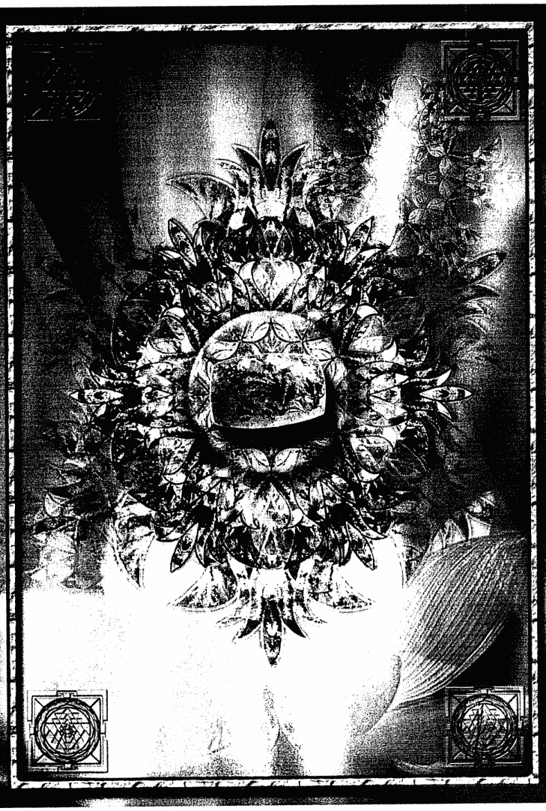
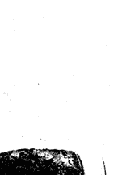

# 水晶女神888-1

### 獻詞——

獻給布蘭德，我的靈魂姊妹與摯友。
你散放的耀眼光芒為這個世界帶來無限光明。

### 致謝——

特別感謝來自天界與地界的多位老師與指導靈，在陰性智慧啟蒙道路上一路支持我前進。我經常說，神聖母親總是會特別照顧助人者，祂真的給了我許多恩典，包括優秀的出版商、細心的編輯、聰明（而且風趣）的行銷經理、令人驚嘆的行政管理天使、才華洋溢的平面設計師、當然，還有多位善於組織的女神，祂們獻身於愛的道途，協助我透過工作坊和巡迴講座，將神聖母親的志業傳遞給世人。對這一切，我懷抱衷心的感激與感謝。

## 1. 女神度母（世界之母）
喜馬拉雅冰晶（純淨）
以慈悲心來顯化

## 2. 女神拉克希米（自我價值）
枝狀瑪瑙（豐裕）
以無設限來顯化

## 3. 女神塞克美特（神聖怒火）
火瑪瑙（內在火焰）
以熱情來顯化

## 4. 女神薩拉斯瓦蒂（聲音）
鸚鵡螺化石（螺旋）
以言語來顯化

## 5. 女神伊什塔爾（大膽反抗）
星葉石（重生）
以尊嚴來顯化

## 6. 女神赫卡特（交叉口）
雲母（融合）
以抉擇來顯化

## 7. 女神瑪曇吉（差異性）
血石（內在基督）
以獨特性來顯化

## 8. 女神芭絲特（感性）
貓眼石（揭露）
以歡樂來顯化

## 9. 女神蓋亞（狂放的恩典）
海洋碧玉（感覺美好）
以信賴來顯化

喜馬拉雅冰晶

枝狀瑪瑙

火瑪瑙

鸚鵡螺化石

星葉石

雲母

血石

貓眼石

海洋碧玉

## 內在價值工作坊

深入你內心的真實

你有多久沒有傾聽自己內心的聲音？

你經常神色匆忙地過生活嗎？
常常感到情緒低落、悲傷、易怒、甚至失眠嗎？
隱約知道原因，却又不是太有把握......

你願意聽聽你的身體在跟你說些什麼嗎？

了解情緒如何控制你的人生，從內在找到自我價值。
擁抱脆弱，你會更完整。

更多內在價值工作坊介紹

## 推薦序

### 完美時機去直面黑暗的恩典之書

很喜悦地，在完成《水晶大師333》推薦序的一年之後，收到了《水晶女神888》的第一冊書稿。《水晶女神888》是《水晶曼陀羅神諭卡》所包含的《水晶天使444》、《水晶大師333》外，最後一塊也是最重要的一塊拼圖。

為何是最重要的？因為這本書的內容，會帶領讀者直面內心的黑暗與恐懼，也溫柔地分享、說明與接住，並運用女神的特質與力量，協助這些我們過往不願看到的部分浮現，告訴我們不用害怕它，而讀者會看到這本書的時機一定是完美而剛好的。

我收到書稿的時間距離截稿日約有兩個月，原本感到信心滿滿、游刃有餘，因故一直到截稿日的最後二週，才開始著手閱讀。時序剛好是上完金字塔課程三階，接受愛希斯女神的賜福之後，亞伯老師在課程上說到了關鍵，我們的周遭充滿了恩典與賜福，只是接收到的狀態與量因人而異，課程中，花了很多時間清理與淨化那些阻礙我們接收賜福的部分。就如同四葉幸運草的種子滿布空中，但只有適合的土壤才能讓其適性生長，看起來十分幸運，其實努力耕耘的時間很長。

這部分對應到《水晶女神888》內談論到星光場與星光體的部分，我很喜歡阿蓮娜的說明，星光場像是一片巨大的宇宙級造物海洋，我們的星光體是在其中優游的生物。只是在我們的星光體中，充滿了已知、未知、不想承認的，由家族傳襲或是文化制約的思想、感受與渴望。透過修練，清除其中未被解決的痛苦，我們會變得比較寬容、沒有評斷、思想開明，我們的星光體會變清澈，就能接收到更多的恩典與賜福，而我們自己的神性本質也可發光穿透，由靈魂光輝淨化成具體的光輝。

《水晶女神888》以度母能量開始介紹，祂能防護別人的投射與意念攻擊，將這些能量帶入恩典之地中，同時也化解屈辱之傷。屈辱之傷非常難解，因為當事人防護心很強，藏得很深，有時連自己都沒看見。這個章節我看得很卡，並且心有戚戚焉，因為我在現實生活中，偶然地知道了某人很強烈地將她自己隱藏的被傷害感投射到我身上。成為被八卦的對象感覺很新鮮，但說不難過是假的，心情還是有被微微影響到。雖然我知道我沒有問題，我只是被投射了，可是我深深為對方感到難過。在這裡也要跟大家分享，新世紀的能量沒有甚麼能夠被隱藏，所以當你在別人背後評斷時，請隨時做好對方會一字不差完全聽到的準備。

這是我人生第二次遇到這種事，第一次是好幾年前，因緣際會地發現有個群都在罵我，剛看到時，我的世界幾乎都要崩毀了，因為我曾經以為罵我的那些人算是我的閨密。我還是太沒有心機，但你想跟對方分享的，不代表是對方真的想聽的。我也由那個被撕毀的經驗開始，努力想由自身建構出來的美好世界中，同步看清楚別人對我的投射與自我認知之間的差距。這就是我由《水晶女神888》中感受到的，女神會給你很多美好的禮物，但那個形式絕對跟你想像的不一樣。你以為收到的是個禮物，打開來是個炸彈，但浴火重生過後，你會發現更輕盈、更自在，可是你要撐過那個面對炸彈以及拆炸彈的過程。最終你會深深地臣服，這禮物如此的巨大而珍貴，幾乎每次歷歷磨練後，都能再度升級打怪。

我開公司時，第一首選原本都是跟拉克希米女神有關的名字，當時怎樣都無法選到，卻因緣際會地讓我登記到聖哲曼的名字，用在海內外二家公司與房子的命名上，至今超過十年。在《水晶女神888》中，我深刻明白，我無法以拉克希米女神命名的原因，是因為我完全沒有準備好，若以豐盛女神為名我會遇到什麼事情。在女神眼中，允許生活中去經驗黑暗與光明的掙扎與摩擦，甚至與黑暗合作、交託我們的掙扎，把它們看成一種意識開發的方法，神性意識就會油然而生。祂教導我們如何敞開，如何有創造力跟能力，好處理那些消耗、需要被廢棄的物質，將其轉化成肥料，讓我們更有生命力、更與旺。我很喜歡書中所提及的，若要向幸福與繁榮保持敞開，我們需要與人們、場所、能量根源建立連結。因為金錢是依附於人而存在，愛則是來自人與人之間的連結，而開悟則是以接納與關懷萬事萬物為基礎。所以我們要學習管理我們本身的能量，以及處理別人在我們身上加諸的影響。

當我閱讀到塞克美特女神的章節時，我意識到這也是我逃避的面向之一，身為靈氣的從事者二十多年，不動怒早已是深刻於心上的行為準則，雖然不是那麼容易做到，但只要動態靜心的活動走到需要憤怒大吼的層面，我通常都無法進入那個流動之中。阿蓮娜建議我們學習憤怒的益處，如果避開憤怒，就無法為自己設定必要的界線。承認對自己憤怒的批判，才能釋放憤怒，在閱讀到這個章節的夜晚，我的橫膈膜熊熊燃燒著，我的壓抑就藏在橫膈膜裡。但意識到憤怒，不代表要無意識地對他人發怒，這樣做只會損失找到憤怒之下隱藏的珍寶指示的機會，也傷害了與那個人的關係。塞克美特女神教導我們，如何有意識、有智慧地回應我們自己的憤怒，與憤怒同在，意味著學習在憤怒中保持覺知，憤怒過後才有辦法看得更清楚。將憤怒作為引領我們通往誠實與洞見的一把火，而不是炸毀別人的炸藥。接受自己的情緒，可以提升能量消化的能力，更有效處理代謝與釋放的議題。當我們的能量場流動，我們能無條件接受自己與我們的各種情緒狀態，光就能由細胞內爆發出來，靈性臨在於那樣的寬敞中自然地發展。當我們勇敢到足以敬重自己的情緒，包含憤怒，我們就得到了啟蒙的邀請，深入到細胞內的怒火，這讓我想起動漫《斗羅大陸》內，主角面對海神之光的考驗時，那種寸步難移、喘不過氣的感覺，可是妥善運用考驗，就能使其成為很好的成長與鍛鍊的資糧。

《水晶女神888》包含了女神意識、水晶療癒與永恆智慧的融合，在每個章節中，作者阿蓮娜都用自己真實的生命故事來書寫她與這些女神的相遇、女神在那段生命經歷給予的教導與支持、她如何挑選對應的水晶礦石屬性來連結女神能量，並向女神能量頂禮。不得不說，阿蓮娜真的有股魅力，坊間通靈的書籍如此之多，很多其實都無法在生活中得到驗證，只能當作小說閱讀，而阿蓮娜是以自己的親身經歷，穿越過那些，跟我們分享她如何在生命中落實神性的教導，並回應自己的生命功課、面對的各種考驗情境，甚至是在星光界遇到的魔考。芭絲特女神章節內的親身經歷，其實也療癒了我內在那些不可言說的部分，我看到美麗優雅的芭絲特女神在黑暗中美麗地走過的身影。至此，我終於整合了我由小到大，在星光界探險的許多小碎片，我不再將這些世界之間視為有分別的，無論哪個界發生的事情，我都有力量去選擇與面對，並接納那是我的一部分。

看到了《水晶女神888》第一冊最後一個章節的早晨，我驅車前往新竹。在車上打開收音機時，剛好聽到主持人仔細解說缺鐵性貧血的症狀，並提供補鐵的飲食建議，我不由得大笑，這則訊息真是為我而來。最後一個章節是蓋亞女神狂放的恩典，蓋亞會設法透過許多媒介，將我祈禱的回應傳送給我，生命中總是充滿各種共時性。蓋亞女神狂放的恩典，不迎合我們的恐懼，祂希望我們活著，成為可成為的一切，並與生命一起茂盛地成長；我們需要交出事物該如何開展或進展的觀念，放下操控或指揮的嘗試，學習接收而非拿取。我想起我在金融業進取的十四年，心想事成的顯化在那幾年進入了高峰，很年輕就成為分公司主管與協理，有幾年的時間，光補稅就要補到超過百萬。我是怎樣由每天都覺得很多錢降臨到我身上，到把一切都歸零，則另外用了十年的時間。在創業的道途中，學習用接收而非拿取的方式，來顯化目前這些，中間還伴隨著許多大大小小的業力考驗，唯有走過，才能深刻感受到，這些黑暗時刻的淬煉真是極大的恩典與禮物，那是人類的小我不會喜歡，但是女神對我們很有信心的事。

這本書每個章節都有顯化的主題與療癒的冥想，我個人認為光是閱讀冥想前面的部分，就有很大的開啟與轉化。這麼多年一直與揚昇大師合作的我，必須說，跟女神還真的不熟，可是我也到了必須進入黑暗世界冒險，找回曾經隱藏跟散落的片段，整合為一的時刻了。有些墜落的振動頻率太深，深到要用女神那敞開的維度與自由度來溫暖地包容與呵護，才能收集那些碎片，整合為整體，然後才由內而外地發光。我們或多或少在生命之中，都經歷過那些歷經死亡又重生的過程。女神與水晶的合作，對於歷經那些片刻的我們，會很有幫助，也對走過那些歷程而不明所以的自己，有了很美麗的洞見與提升。祝福所有有緣得見此書的朋友，由細胞深處，綻放出來自你靈魂獨一無二的美麗光彩，我內在的神性向你頂禮。NAMASTE ！

- 台大財金系、中央財金EMBA碩士畢業。
- 聖哲曼空間執行長、太拉水晶 Tara Crystaline 負責人。
- 紫色火焰侍奉者。

## 推薦序

### 你我都是具有叛逆精神與愛心的勇者之輩

等待已久的水晶靈性系列《水晶女神888》一書終於問世了，在這一系列當中，作者阿蓮娜·菲雀爾德以來自高階靈性導師的慈愛導引而撰寫了這本書。特別的是，《水晶女神888》從編譯到上市與大家見面，花費了近三年的時間。誠如書中所傳達的重要教導，去經驗與學習「神聖的陰性能量，並臣服於其中」，感謝參與翻譯本書的兩位譯者，由於你們的用心及發揮的女神之能量，讓更多走在靈性覺醒道路上的同伴們，有機會接收到《水晶女神888》想傳遞的高頻能量訊息。

這是一本以女神能量為主的書籍。人類意識的感性面需要得到更大的擴張，其中探討了神聖陰性能量如何運用在生活層面上，而帶著覺知與神聖陽性能量共同創造出豐盈的智慧。書中深入地介紹了每一位女神的面向，而這些面向攜帶者不同的能量，如何有意識地去學習和接觸，最後運用這些能量來療癒和轉化人類意識，並成為一位擁有覺知、勇敢、智慧的療癒者。

作者在書中提到，「所有能夠依循神聖陰性能量來行事的人，都是具有叛逆精神與愛心的勇者之輩」，我被這句話深深感動而心有戚戚焉。在我的經驗中，所謂的具有叛逆精神者，只是因為他們選擇了無時無刻尋求進化，進化則意謂著不斷地改變和更新，而大多數人不願意改變，甚至害怕改變。願意迎接改變是需要勇氣的，這就是勇者之輩。大多數人也並不知道當我們在意識上有所改變，我們的生命就擁有更好的選項，這時候我們的內在就會感覺到更大的自由。

本書中，與我有最深連結的是女神塞克美特，二〇一八年我造訪了埃及的塞克美特神殿，當我看著女神並擁抱祂，淚水竟無法控制地流淌滿面，感覺我被強大的力量所支持著，有一種什麼都不怕的感覺。這股力量裡又充滿著被深深接納的愛，我至今依舊無法忘懷。後來慢慢才理解，原來在成長的道路上，學習如何將憤怒的情緒轉化為建設性的能量，就是女神塞克美特所代表的神聖怒火。這本書讓我更了解到，可以將憤怒當成帶領我們通往誠實和洞見的一把火。

願打開這本書的你，就像打開心的能量，讓愛與和諧平安地護持擁有美麗靈魂的你。

王牧絃
生命潛能出版社負責人。

- 「美國P.E.T溝通效能認證講師」資格。
- 資深「完形心理導師」及「超意識心靈發展工作者」。
- 精通八字、易經、風水、姓名學、蓮花生大士星相學等深奧的東方命理學。
- 飾我右人文空間館長，設計專屬個人的靈魂飾品，為配戴者帶來水晶能量的支持。
- 在心理諮商與靈性領域深耕多年後，找到以女性溫柔力量連結內心平靜，並讓生命蛻變為彩蝶的力量，現為能量調癒師。

## 序言

### 為什麼我被這本書所吸引？

諸多不同面貌與面向的女神，都是神聖陰性能量的化身。但這並不表示女神的化身面貌只與女性有關；事實上很多男性也都對神聖陰性能量的修練道路有濃厚興趣，而且這樣的人愈來愈多。他們對拘泥於傳統的「男子氣概」定義興趣欠缺，因為這種定義否認男性擁有感性、溫柔，與熱情的一面；他們想要將這些特質融入自己的生命，成為一位現代男性。這樣的人也一定會受到這本書吸引。

神聖陰性能量此刻正在覺醒。這是神聖陽性能量與陰性能量在靈性上重新取得平衡的時刻：陽性能量要靠陰性能量來落實，而陰性能量需要靠陽性能量來維持精神上的輕盈。陽性與陰性能量重新取得平衡，彼此關係更為和諧，人類文明才得以進展。人類心靈的意識層次也才能開始擴展。

神聖陰性能量的覺醒對整個人類族群來說是一項新的教導。這項教導是在靈魂層面上運作的，學習慈愛與崇敬萬事萬物，將其視為神聖本性的一種美好展現。要習得這份教導，我們需要先療癒潛意識當中精神與物質的分離對立，這種對立感乃是從父權社會開始的（父權社會壓制的對象不只是女人，也包括男人）。在父權制度之下，男人與女

## 序言

人已經被塑造成某種固定角色，對於人類意識當中的陰性面向加以否認，因而對人類靈魂的真實成長與提升形成莫大阻礙。父權制度、智性與理性至上的思維傾向，在人類意識發展上一直扮演著重要角色，人們對於這種存在方式（精準地說，是思維方式）的需求，長久以來被過度誇張化，事實上，人類意識的感性面需要更為擴展，才能讓這個星球上的生命更加繁榮茁壯。

有許多獨特的靈魂，他們就站在這個意識轉變的浪頭上，為其他人披荊斬棘，開闢出光明的道路。你會被這本書吸引，因為你就是這些靈魂的其中一分子。你會對這本書的內容有非常直接的感應，甚至你會在中看到許多你早已知道的知識。當然，它也可能為你帶來思想上的挑戰與質疑。請試著進入你的心，和書上的這些知識共處，藉由這種方式，讓自己在這世的生命得到更進一步的療癒。

有一件重要的事情我們必須知道，這個新興意識並非是要回復到過去父權社會與理性主義出現之前的舊時代；也不是要對我們已經走過的時代加以否認或感到羞恥，而是去認知到，人類目前的意識層次已經到了極限。這沒有什麼好羞恥，也沒什麼好感到恐懼的。這是人類意識發展階段的一個自然終結，因為人類的進化需要更深層次的覺知與覺醒。如果我們已經準備好要進入小學一年級，我們就不用再重複去上幼稚園，靈魂的進化也是如此。我們人類是在精神上不斷成長、演化的物種。神聖陰性意識的覺醒將是我們下一階段重要的學習課題。

## 水晶女神888
CRYSTAL GODDESSES 888

只要我們每個人都在日常生活中和靈性旅途上向神聖陰性能量致敬，我們就能夠協助這個新興意識在地球上誕生。我們想要誕生出什麼樣的心靈意識、想要成為什麼樣的「父母親」、孕育出什麼樣的思想、以多大的願力讓它在現實世界中顯化，這都與我們內在的陰性意識有關，無論我們本身生理上是男性或是女性。

神聖陰性能量意識的核心就是「力量」。它本身就是一種力量，是一種對於我們所珍視的價值的理解與選擇。當我們內在的陰性能量明白什麼是真正有價值的事物，我們內在的陽性能量（無論你是男性或女性）就會選擇向其致敬，藉由設定優先順序、設定界線，來支持那些價值。為了能夠真正落實我們的價值，我們必須去了解自己內在的真實感受。如果無法感受，我們幾乎不可能區辨出什麼是我們覺得真正有價值的事物，更不可能知道什麼是真正重要、真正能帶給我們感動的事物。如果你曾試圖用頭腦來解決某個問題，你就會知道，它會對它所認定的事實據理力爭，同時又對一個完全相反的事實深信不疑。無論任何事情，頭腦都可以為它找到辯解的理由。這就是我在法律學院學到的東西！那時，我發現自己居然有能力用理性思維來辯論兩個完全相反的事實。這件事讓我學到，要去信賴自己內心的感覺，而不要去相信心智在特定情境下說服自己去相信的。也就是從那個時刻開始，我踏上了發掘神聖陰性能量意識的道路。

當你被內心的真實感受所觸動，放下邏輯與理性思維，那麼你就是活在「以心為向」的神聖陰性能量法則之中。當然，邏輯與智性依然有其重要性與用處，而且人類已經運用那些素質為意識的開發取得巨大進展。不過，若將僕人反認為主人，那絕非明智之舉。理性思維有其用處沒錯，但是，在決定我們生命方向、選擇，及行動有關的核心價值時，並不能只依靠它。

假如我們想要擁有展現真實生命所需的能量，而不僅只是活著、隨波逐流，那我們就需要把生命建構在熾熱的愛與真實情感之上。沒有發自內心的真實熱情，生命就會變成一種苦差事，我們就得時時強迫自己去做我們認為「應該」做的事，沒辦法真正發自內心、受真實情感的推動來行事。活出真實的靈性生命經常會面臨挑戰，因此需要巨大的能量。愛是世上最強大的動力燃料。當我們的理性思維與「應該」全部枯竭之後，它能使我們保有持續前進的動力、紀律、幽默感，以及自我鼓舞的勇氣。

所有能夠依循神聖陰性能量來行事的人，都是具有叛逆精神與愛心的勇者之輩。神聖陰性能量的本質是療癒和轉化人類的意識。神聖陰性能量是生命之母，孕育萬物，但除了對萬物保有一份敬重之外，其也蘊藏了一種叛逆精神，無時無刻不在尋求進化。也許是這個原因，那些依循神聖陰性能量道路而行的人，似乎都跟主流群眾格格不入。這表現在非常細微的方面，比方一個人對於生活方式以及工作的想法與選擇。神聖陰性能量道路的實踐者通常無法接受主流大眾的價值觀；他們發現，體制、結構、要求，以及缺乏想像力，就是靈魂的殺手。主流價值觀不僅否定人的創造力，還箝制我們成長的自由，使我們無法發揮真正的潛能！對神聖陰性能量保持敞開的人，他們的心中充滿愛，而且渴望自由。不僅自己如此，他們還希望所有眾生都得到這份自由。

假如你對此也有共感，你就是陰性神聖能量道路的實踐者。這並非對於神聖陽性能量價值的否定，而是一種意識上的轉換，讓神聖陰性能量恢復其應有的地位，讓兩種能量並駕齊驅，實踐與心契合的生活。神聖陽性能量的明光因此得以保護、增強、尊崇、服務以心為導向的道路，而不至於阻礙人類的靈性進化。

走上這條道路需要極大勇氣，因為這否定了主流意識中普遍認同的正確生活方式。雖然舊有的統治體制和理性至上主義正在消亡，但這個過程非常緩慢，而且許多人並不知道我們有更好的選項可以選擇，因此畏懼改變。不過，仍然有一些人，他們擁有智慧、洞見、勇氣，願意去擁抱這個改變，他們是人類意識變革的先鋒，堅守愛心、耐心、力量、決心，並鼓舞其他人跨過這條信心與信賴之橋，進入神聖陰性意識的領域，將人類的靈性進展推向新的境地。

能夠擺脫大眾媒體心理制約的人，他們不會根據那些未經檢驗的意見來反應，因為他們知道，那些意見大多是有人為了自身利益而藉由外部力量去操縱群眾所製造出來的；他們能夠依據自己的感受和想法去判斷，因此也比較容易跨越這條信賴之橋，並進入新的生命意識形態。大眾媒體總是在助長恐懼和不安；其中充滿了各式各樣愚蠢和有毒的訊息，因此，只要能夠擺脫它的制約，我們就會感到輕鬆許多。但是，放棄接受大眾媒體的洗腦（包括印刷出版品、電影、電視，或其他型態的媒體），並以更慎重的態度來明辨真相，也是要付出代價的。當你聽從自己內心的聲音，靠自己去判斷和思考，你會覺得非常孤單無力，這種情況可能會持續一段時間，直到遇到與你頻率相近的人，他們能夠與你共鳴，這種被孤立的感覺才會消失。

此外，有時候你可能會覺得自己好像快被逼瘋了，因為在這個瘋狂的世界裡，你是少數保有清醒理智的人。你感覺自己跟這個典型社會格格不入，而且你知道你不可能變成跟他們一樣。你生來就與眾不同。你注定要走上一條不同的道路，這條路看似不可能達成，但卻是一條更好的路。儘管你內心對此相當明白，但並不表示這條路將毫無挫折、一帆風順。你會跟你的領路人一樣，成為宇宙中最有力量的存有。聽起來相當激勵人心，但是偉大的靈魂勢必承擔偉大的責任，有時你會感覺這條路艱辛難行，似乎超出自己所能負荷的。就我個人而言，如果不走上這條路，我會覺得更悲慘，因此我自己並不介意被賦予重擔。當然，有時候這條路的確非常難走，當面對挑戰時，能夠始終對自己保持真實便成了這個重擔的一部分，而唯有如此，人類意識才可能往前邁進。

你是被賦予神聖智性、勇氣、與智慧的人，你有能力承擔這份責任。無數慈愛的女神會化身成神聖母親的眾多手臂來協助你，水晶王國的存有也會在這條路上助你一臂之力。神聖母親的願望與你的心願相互契合。我們是休戚與共的共同體，是同一陣營的人，正在為人類族群的全然覺醒而奉獻心力，雖然過程中有人似乎認為自己受到逼迫而拼命尖叫、踢打、抗拒。如果你曾經跟一些想要繼續緊黏著電視、繼續麻木不仁的人對話，你就會知道我在說什麼。

儘管你可能不太相信，但神聖陽性能量確實希望神聖陰性能量可以受到眾人的尊崇。因為這會讓它更有機會成為自己一直以來想要成為的那種人，一個具有保衛力量、熱情的聖戰士，為崇高的理由——愛——而奮戰。它希望讓這道光可以散布到陰性心靈之中，藉此喚醒人們的喜悅。男性以及陽性能量都需要竭盡自身所能，讓自己轉化為美麗、強壯、熱情、以及具備保護力量的人。無論你在生理上是男性或女性，只要你對陽性能量保有一份真實的尊敬，能夠同理父權制度帶給男性（以及女性）的傷害，知道人們在父權制度之下，被迫只能扮演單一的男性或女性角色，無法成為一個真實而完整的人，那你就會明白，陽性能量對於喚醒神聖陰性能量扮演了何等重要的角色。陽性能量與陰性能量是明顯不同的兩種能量，但卻非截然分離。因為其中一種能量若得到成長和療癒，另一種能量也一定會因此受到影響。這兩者必須同步成長、彼此相互完整、更加相繫珍愛，才能成為和諧、熱情、相互支持的共同體，順利同步運作。這份神聖夥伴關係會讓地球人類的生命更加開展，創造出更有智慧、更有慈悲心、更有力量、更自由的人類文明。

無論如何，重要的事情還是要先做。我們必須先走出無意識的狀態，踏上神聖陰性的道路。當陰性能量得到療癒，陽性能量也會跟著治癒，最終成為真正和諧的一體，解脫、平靜、清晰的人生使命便在我們心中自然地顯露出來。踏上神聖陰性道路的第一步，就是開啟你身體的覺知意識。所謂「開啟覺知意識」的意思是，承受痛苦，同時學習承受幸福、狂喜與激情。實質上來說，第一步就是要活在當下，面對生命中的一切境遇，不要拒絕，不要轉身逃避、躲藏，或是抗拒。聽起來可能很簡單，事實上也有許多簡單的方法可以啟動這樣的意識，但實行起來並不容易。我們需要願景、需要信任。為什麼我們要做這件事；我們需要勇氣；我們需要不斷記起隱藏在身體內在的意識，會透過我們當下的身體活動自然地被激發出來，比方舞蹈或瑜伽。不過，假如我們的心智意識沒有與我們的身體意識同在，因為藥物或過度思考的關係而與身體分離，如此一來，意識就無法被我們所捕捉。瑜伽或舞蹈練習可以成為我們「透過肢體動作來喚醒意識」的方法，卻無法催化意識的產生。當然，有做總比沒有好。假如你很努力練習喚醒覺知力，願意將你的心智帶進你的工作中，那也會有很大的幫助。這樣做是值得的。沒有覺知，終其一生我們可能就是一具會動的行屍走肉而已。有了覺知，即使只是在準備早餐，都可以成為一種喚醒意識的冥想。要喚醒意識，無關於我們在做什麼事情（雖然有些事情的確比其他事情重要，特別是能夠帶給我們幸福感的事），而關於於我們對當下的動作是否有所覺察。最終，我們會培養出一種「是」（being）的存在狀態，即使我們正在「做」（doing）。透過覺知，意識得以被喚醒，洞見、感受、直覺、智慧，以及臨在感便因而誕生。

激發身體內在意識的另一種方法是寫日記。它不單單只是一種分析和紀錄，而是去碰觸你內心深層的感知與覺受。此外，利用繪畫或文字書寫將夢境內容或所看到的心象畫面記錄下來，也是一種不錯的方法。

假如你覺得光寫日記還不夠，或是這種方法不適合你，你也可以用跳舞、繪畫、佈置聖壇，或是其他更有創意的形式來進行。比方親近大自然、走出日常例行公事的常軌、到海邊散步等等，都可以幫助你去掉頭腦，進入你的心。音樂也是一種方法。很多人會藉由音樂來脫離頭腦，以進入身體的層次。你也可以根據這本書（或整套「水晶靈性系列」的書籍）當中所寫的「療癒步驟」來啟發你的覺知意識，這些內容都已經有錄音檔可供下載（編註：https://alanafairchild.com/product/crystal-goddesses-888-guided-healing，讀者可透過該網址下載本書的療癒步驟音檔，但請注意該錄音檔為英文發音，且須付費），你可以使用這些科技產品來服務你的身體，開啟陰性意識能量的道路，免於和真實自我失去連結。

與身體保持連結，是進入神聖陰性能量道路的基本前提。通常，這會是我們起步時遭遇的最大絆腳石。你可以試著回想，在你最初踏上靈性道路而展開療癒工作時，你的身體裡隱藏了多少情緒和痛苦呢？那簡直就跟地獄沒兩樣，是吧？我自己剛接觸靈性療癒時，也曾懷疑自己內心的悲傷和憤怒到底有沒有盡頭。經過十幾年的療癒，我現在才稍稍感覺自己能夠真正活在當下，不至於被過去未解決的痛苦所制約。覺知和療癒是永無止境的過程，愈快起步愈好。我是藉由喚醒身體覺知、尊重自己出現的所有情緒，才超越了過去那些未被解決的痛苦。現在，只要感覺內心有什麼情緒出現，尤其是進行內在深層轉化時，我依然是使用這個方法來解決。這是認識真相的一種方法，它讓我在生活中愈來愈少「被動反應」（reactive，受到過去未解決的痛苦情緒所引發），愈來愈多「主動回應」（responsive，唯有活在當下才會發生）。

我們的覺知力愈是敏銳，就愈能察覺和清除儲存在身體裡面的痛苦。有時候，那是我們自身本有的，尤其當我們進入此生靈性探索的更深層次，希望憶起我們本身即是純潔無瑕的神聖存有時。但很多時候，我們還是需要釋放那些陳舊的事物，像是羞恥感、罪惡感、憤怒、恐懼等，才有辦法去感受和看見我們自身存在的真實樣貌。如果這些感受被這一世或前世的一些事物擋住，我們就很難看見它的真相。身體自己會知道如何將這些東西釋放，我們只需要盡自己的責任，全然活在當下，決心踏上神聖陰性覺醒的旅程，讓身體去做它該做的工作——療癒它自己。

有時，你可能也會感覺到你的身體正在清理儲藏在無意識之中那未被解決的痛苦，那痛苦甚至是無意間被代代相傳下來的。直到有一天，有一個足夠堅強的人，他能夠帶著意識去目睹其存在，經歷它，並將它釋放。要完成這件事，需要敏感度和力量。有時候這看起來像是極為艱難的挑戰，但事實上它只是一種「能力」，當我們愈來愈深入自我療癒，我們就擁有愈大的空間可以接收神聖恩典，並親身經歷這些恩典為我們生命帶來的奇蹟。你可能會說，這樣的報償實在遠遠超過我們的努力，不過我要先承認，這條路走來其實並不容易。除了要去承受那些釋放的情緒、面對我們過去的各種痛苦，還要有足夠的信賴，相信自己有能力撐過這個痛苦的過程，讓恩典繼續在我們身上運作，直到所有痛苦都被釋放。

在療癒進行之初，遭遇的挑戰會最大，因為痛苦太過強大，而我們還無法看見未來的報價。我們可能會去想像未來的美好，但卻無法真正知道其模樣，直到有一天親眼見證它的到來。我們無從得知這條療癒之路會有多辛苦，但還是得堅持下去，只因我們想要與神聖母親的恩典同頻共振。這份恩典值得我們這樣做，但諷刺的是，在這條恩典之路上，我們卻很難感受到恩典，尤其是在進入深層療癒時，那種痛苦就像瀕臨死亡絕境一般。就算我們知道，死亡是邁向新生之路，但我們的痛苦並不會因此有任何減緩。

這需要很多內在療癒工作，才能讓我們準備好，舉步踏上身體意識與神聖陰性能量的覺醒之路。整體人類才剛剛開始要擺脫以競爭、輸贏、支配為基礎的父權制度——這是一種用盡手段也要犧牲一人以換取另一人的表面成功，而完全陷入無意識的存在狀態。在這些行為之下，其實隱藏了非常多未被解決的痛苦。我們的心和生命，就在這種生存狀態下活生生被切掉了一部分。在我們身體恢復意識之前，這些痛苦全都需要被釋放。無論我們的心智需要學習不再關閉身體的反應，我們的意識要變得強大到可以敞開自己去接受它們，並承受、同理所看到的真相，即使我們還無法理解身體為什麼會有那些反應。

在我個人的療癒過程中，有一段時間我對馬特別有感受。馬是一種擁有無窮精力的動物，而且對於它身邊的人有非常強的情緒感受力，這讓我嘖嘖稱奇。在馬面前，你幾乎無法偽裝任何情緒。如果事實上你很害怕，無論你如何假裝勇敢，它們都會顯得非常不安，而且不會聽從你的指示。如果你裝出一副很兇的樣子，但事實上你心很軟，馬兒也會知道。我就曾經在一次「跟馬說悄悄話」的課程中有過這樣的體會。一匹馬向我走來，將牠的頭擱在我肩膀上，我被牠的溫柔與信任深深觸動，以至於後來我根本無法對牠擺出兇狠的態度，我無法用夠客觀的態度來跟牠相處，所以我失敗了，我沒辦法學會訓練馬的正規方法。不過，因為我選擇欣賞牠們的即時反應、真誠、毫無偽裝。在這種情形下，我當然知道該怎麼站在馬身邊，才不會被牠們的後腳踢到。

對馬有了更多瞭解之後，我才明白為何有那麼多療癒師要用馬來協助人們治療成癮症。在我們這樣的文化裡面，意識進化到此一階段，成癮症幾乎已經變成我們的生活方式之一，我們得藉由一些無意識的習慣來舒緩那些未被解決的傷痛。傷痛的內部仍存著理智的成分。這個部分不斷對我們吶喊：「真是瘋了！我就要死在裡面了！這樣我沒辦法活下去！」我們內在的這個部分被那些真實景象嚇壞了，因而選擇成癮。或許我們內在在這個成癮的自己是在擔心，假如我們承認自己的真實感受，別人就會認定我們是怪人或是失敗者。也許我們認為，沒有了某些事物來倚靠和支撐（比方工作、感情、理想# 水晶女神888
CRYSTAL GODDESSES 888

等），我們便活不下去，即使那樣東西正在消磨我們、摧毀我們。我們一方面覺得需要放手，一方面又不確定自己是否已做好準備，有足夠的能力靠自己成長和前進，於是我們成癮，讓自己變得麻木，這樣我們才能去應付內心的這種衝突。

然而，當我們放下我們的傷痛，釋放來自童年或前世的痛苦之後，你的身體就能從一個完全精準且直觀的地方，誠實而清晰地發言。就像馬一樣。因為不受智性頭腦的束縛，牠不會說謊。牠擁有自己的智慧。長久以來，社會總是教我們與自己的身體和實相分離，有時甚至只要連續坐在學校或辦公室幾個小時，這種社會化的過程就完成了。雖然某些方面這是無法避免的，但也沒必要為了讓自己不去感受，就完全聽從社會的指揮，繼續用一半的生命，過著大家認為正常的生活。

看見真相確實讓我感到心痛。主要是因為，我知道它並不像許多人所認為的那樣必要（我知道人們根本沒有必要用這種方式活著）。隨著我們身體意識覺醒、看見真相，我們確實會心碎，因為我們終於看清，我們有很多觀念是被教導而來的，而非原本就該如此。我們終於知道，過去自己浪費了多少精力、承受了多少不必要的痛苦，而終於有機會從惡夢中醒來，新生命終於有機會展開。這樣的心痛是值得的，是一種光榮，因為它讓我們有機會放掉一直以來的習慣，決心去過不同的生活，同時願意把這份光明帶給別人，讓他們知道自己也可以做出相同的選擇。

有很多人確實向我坦承過，他們很嫉妒我現在的生活。讓我感到最驚訝的是，其中有一些是我身邊很親近的朋友，他們明明知道我在這個追求自由生命的過程中承受過多大的痛苦。愈大的自由，相對也意味著愈大的責任。缺少責任的自由，最終很可能只會是一種逃避現實的幻想，那根本不是自由，因為不管你逃避什麼，最後你都勢必要跟它正面碰頭。

我為自己生命帶來的恩典，事實上每一個人也都有辦法獲得，只要願意去實踐自己內在的療癒工作。原本我想像這個工作是一種懲罰或自我否定，但其實不是。當我考慮從事法律這一行時，我感到很苦悶，因為覺得那並不適合我，而且隱約可見這份職業一定會讓我忙碌到沒有時間過自己的生活。這種工作和內在工作性質完全不同，各有其困難之處。雖然有人可能會嘲笑說這沒什麼難的，但當他們開始走上自己的道路之後，他們就會嚇得渾身發抖。

所謂內在工作，本質上就是關於對自己和對神的信賴。唯有內在療癒工作才能帶來外在的改變，因為我們願意放下，願意面對自己的恐懼，然後在這過程中逐漸變得堅強。

我們是踏上了這個旅程後，才擁有了這份能耐。

在神聖陰性意識覺醒的道路上，需要依靠強大的陽性精神能量（女性與男性身上都有），才能走得長遠。這種精神力量是透過我們在此生或前世的自我修練才獲得的，它能使我們有足夠力量來面對內在痛苦，對隱藏在我們身體裡的真相有所自覺，因為我們當中有一些人（而且為數不少）與地球所有人類和動物均存有一份共感。因為當中的痛苦實在太多，有時甚至讓人難以忍受，特別是對一個高度敏感的人來說。我們必須學習憐憫自己並對自己仁慈，不要讓自己陷溺於痛苦的情緒大海之中。過去，我不自覺地陷溺於童年和青少年時期的遭遇之中，後來我帶著強烈的憤怒去拒絕那樣的生存方式。這並不表示我心中沒有愛，或是不再被情感或憐憫之心深刻地打動，而是我在學習如何切斷與吸血鬼的連結，改而去服務那些願意對自己的療癒負起責任的人。我必須學習說「不」，好讓自己能夠更勇敢地對生命以及我的人生使命說「是」。

我們每一個人內在這份強烈的陽剛精神，透過一次又一次去堅持我們所知的真相，而逐漸得到精煉，即使它有違大眾主流意見，或者跟我們原先對於愛與自由的觀點相左。當我們發現，這個工作似乎沒有盡頭，我們內在的一部分會這樣說：「夠了，這個身體也需要愛與憐憫，今天我要休息了！」我們內在的這個自己，對強大的情緒無所畏懼——無論這個情緒是我們自己的，或是地球母親的——因為它明白重建的價值，特別是經歷重大破壞或失去之後。陽剛精神也能幫助我們維持自然平衡的前進步調，使我們有緩衝的空間去面對挑戰，而不至於因為太過激進而全軍覆沒。它會讓我們知道，何時該直接接受挑戰、何時該暫時停下腳步，整軍待發。這份力量，讓我們得以在最脆弱的時刻對自己說：「我愛你。現在讓我來抱抱你，我們一起蜷起身子在沙發上讀本好書、看看美麗的風景，休息一下吧！」

或是在你需要的時候有辦法對自己說：「你已經堅強到足以經歷這些了，接下來一定會沒事，痛苦很快就會過去的。」

## 序言

一旦你踏上神聖陰性道路，內在療癒過程就同時展開了。它不是恆常如一的狀態，而是如波浪般起伏不定。在波浪的高峰時，我們會比較關注外在情勢；低潮時則比較向內關注自我、進行自我療癒工作。遭逢低潮時，我們就像活在另一個世界一樣。當我們沉潛並進入那個內在的自我空間時，外部世界就失去了它的拉力。過去我經常處在這樣的狀態，甚至長達七年的時間。長期處在這樣的空間裡，需要極大的勇氣，更需要力量和智慧，你才會知道如何讓自己破繭而出，回到現實世界。這種突破相當痛苦而艱難，那時我才明白為什麼嬰兒出生時會大哭。一開始，在那樣一個深層的內在療癒空間裡，就像進入母親的子宮，我們只需要關注於自己的成長。要長久深入其中，將外在世界丟在一邊，確實並不容易，但是當我們一旦習慣這個與世隔絕的避難所，要重新出來面對世界，也不是一件簡單的事。

在陰性能量覺醒的道路上，我們將學會如何在內外兩個世界之間轉換。對進階的靈魂而言，長時間專注於內在的自我療癒，這是靈性成長必經的階段，最終，我們將學會如何活在內部世界，同時又投身於外部世界。當我們習慣在內外兩世界之間來去無礙地轉換，對這兩個世界便不再有強烈的分別感。比方，我們可以一邊在雪梨進行通靈對話或烹煮晚餐，一邊同時將靈魂的光和療癒透過通靈傳送給住在英國的某人。一個進階的靈魂，可以一邊坐在沙灘上與周遭眾人共享歡樂時光，同時又能深入內在進行反思，並自發地覺察到有某個阻礙或難題在當下被化解著。陰性能量的覺醒不是線性的，也不受時間／空間的侷限。它是無限廣闊且多面向的。這就是陰性力量的一種型態，是我們踏上這條道路之後，被賜予的眾多力量當中的一種。

這本書的讀者群當中，應該有很多人已經以療癒師的身分踏上了陰性能量的覺醒道路。你們的靈性成長意謂著，你以教師、療癒師、導師的身分接受神聖訓練，無論你是否正式針對這個主題進行療癒工作。你的角色是眾人所需的，它可以引領人類走向新的道路。這份領導力可以透過你在玄學領域的職業展現出來，也可以表現在你如何教養孩子、你的工作態度，以及你與其他人的相處關係，或是透過藝術、音樂、寫作，或其他創作方式展現。在最深的層次上，它會顯露在你是否能夠真實展現你自身內在的陰性智慧和心性價值，因為我們的世界才剛開始要起步去認識這份智慧，而這份智慧對於我們人類以及這個星球的繁榮都是必要的。

我感謝你的靈魂，能夠有勇氣在這一世轉生為一名女性，或是轉世為一位擁有陰性智慧，並且能夠尊崇陰性意識法則的男性。願你品嚐到陰性意識力量的喜悅，並且有力量去經驗到什麼是聰明的女性或有智慧的男性，然後，把你的知識與體會分享給其他人，同心齊力在這個星球培養一種充滿愛的支持與智慧的嶄新意識，如此一來，神聖陰性能量與神聖陽性能量就能在充滿愛與和諧的高階頻率當中，共同成長茁壯，達成靈性意識的進化。

### 我如何知道自己是否已踏上神聖陰性道路？

當神聖陰性能量選擇與你一起工作（它始終會主動選擇），你一定會知道。

對我而言，這條路是因為各種危機而開始的。原先我很開心地沉浸於陽性能量世界的精神與光，但是突然間，這個世界關閉了，我感覺自己像是頭先著地，被重重摔回到現實世界當中，像一顆大蘿蔔一樣。聽起來有點怪，但我真的感覺，曾經讓我與天界光明能量合一的頂輪，突然整個被翻轉過來，直直插入地面。那種感覺真的很怪，讓我很不舒服。先前我用來獲取光明力量的方法，對我不再有用。我感覺悵然若失、困惑迷惘。

我原先喜愛的棲居之地，彷彿陷入了一片黑暗。

我花了很長一段時間，才適應了那樣的世界，然後重新開始去體會它們的美與智慧。起出是透過夢境解析，然後是瑜伽、舞蹈，最後是音樂和歌唱。這些才能都是唯有透過身體才能進行的。我夢想著歌唱的喜悅，但唯有先放棄追求虛幻的光，學習愛這個現實塵世，我才有辦法讓這個夢想在有形世界中實現。

在《水晶之星 11.11》（Crystal Stars 11.11）這本書中，我會談到更多這部分的經驗，對於那些習慣活在光中，而無法落實於有形世界的人來說，應該會有幫助。到目前為止，我可以說，這是一條透過身體與心的統合，從陽性能量之光進入到神聖陰性能量之智慧的啟蒙之路，唯有在意識上與實際生命經驗整合，方能獲得。

上面我提到過，我曾經在黑暗的內在世界待了七年。並非我刻意要待這麼久，而是，我的確花了很長時間才學到了我所需要知道的。在那段時間裡，我不再像先前那樣只活在靈性的世界裡，所以我在工作上遇到了困境，感覺我的許多個案也因此不知所措。那段時間，我的教學能力退步了，舉辦課程和工作坊的靈感也完全枯竭。我已經失去衝勁。雖然事後證明，當我重新恢復靈性能力時，它的力量比先前更為強大，但那時我並不知道會有這樣的結果。我完全不知道自己發生了什麼事，只覺得自己彷彿進入一片虛無，而我必須在當下承受這一切，因為相信那可能是成長必經的過程。除此之外，我一無所知。

在神聖母親的黑暗子宮裡，我學到了很多事情，包括我需要學習平衡。作為一個行事傾向極端的人，我花了很長一段時間才學會這件事，一直到現在，我都還在學習探索它的深度。由於那些年我不斷向內探索，我的夢境內容也愈加生動清晰，有時甚至對我造成不小的干擾。透過那些夢境，我釋放了自己內心深層的情緒，這是我在清醒的意識狀態下無法達成的療癒效果。

對我而言，這是一種邀請，讓我有機會與神聖陰性無形的奧祕療癒世界連結、與其直覺性又奇妙的符號語言連結、與其幽默感和療癒天賦連結，這些全都是透過夢境學到的。我開始信賴我的夢，同時，相信我的身體直覺力。我發現，我的身體是擁有自身智慧的動物，就像馬一樣。它總是精準無誤，唯有當我不聆聽它，或是不喜歡它告訴我的內容，而試圖自作主張，不依照他的意見行事時，它才會變得混亂。

這個經驗，讓我對於人類究竟需要得到何種啟蒙，有了完全不同的認識。人類不只需要陽性精神，還需要與陰性的創造性能量建立愛的療癒關係，而這個陰性能量會化身萬物，包括我們的身體。這兩種能量保持平衡，我們才能擁有完整的生命。在靈性進化的階梯上，轉世為人並不是臨時興起或是因為誤闖；它是意識啟蒙進程中非常重要的一步。唯有透過這條道路，透過真誠、熱情、無私奉獻的愛，我們才能將靈性之光帶入生命之中。

熱愛動物、海洋、樹木的人一定知道，這些神聖創造物需要多麼強大的愛，才能達到真正的療癒、守護，以及感激。已經走在神聖陰性意識的覺醒道路上的人一定會知道，對於動物和大自然的和感激，本身就是一種強大的激勵力量。一個薩滿之道的實踐者，對於動物療癒力量的感受會非常真實——對我而言這條路就是，將意識和無意識、光明和黑暗的精神界域整合起來，達成療癒和覺醒。

動物能夠幫助我們記得這個真理，真實的生命經驗往往勝過我們的智性思維。我還記得有一次，我聽靈性導師安德魯哈維談到他與貓咪的奇特關係，那隻貓多年來一直是他的靈魂動物與靈魂療癒大師。當他談到這隻貓咪的死亡，教室裡每一個人都感動得熱淚盈眶，包括他自己。然後他提到，在先前的課程梯次當中，他也說了同樣的故事，有一位年輕女性非常客氣地問他：「為什麼我們這麼需要動物呢？」然後他回答：「這位小姐，我無法回答你的問題，因為我覺得我很想把你殺了！」那位小姐最後怎麼回應他，我不知道，也無法提出詢問，因為我對老師的回答一方面覺得困擾，一方面又覺得好笑，以致我當下無法即時思考。凡是了解動物如何帶給人類愛與活力的人，一定都感覺得到，這位年輕小姐提出的問題代表他的靈魂受過傷，因此感受不到自己與自然界之間的連結，而正是這種連結支撐著我們內在的大自然記憶，以及陰性的狂野。

好幾年前，我在新南威爾斯的一個鄉村小鎮舉辦工作坊。因為想要做點運動，我決定在住處附近的叢林裡練習跑步，結果不小心跑得太遠，四處張望都看不見我住的那棟房子，我發現我迷路了！起先，是對自己這個城市女孩在這種困境下完全無一是處而感到氣急敗壞，接著又因為隻身被困在無人的叢林裡而感到萬分恐懼，我知道沒有人會來幫我，於是，我呼求地球母親的幫助。不久，我眼前出現了一群袋鼠。牠們盯著我看，我也盯著牠們看。然後我說：「我需要回到我的房子，但我不知道該往哪個方向走。」就像電視劇「史基匹」（編註：Skippy the Bush Kangaroo，澳洲的電視影集，描述一個小男孩與其寵物袋鼠的冒險故事）裡的情節一樣，他們全都轉到同一個方向。我嘆了一口氣，「好喔，我人生的怪事又多了一樁！」然後我就跟在牠們屁股後面跑，牠們竟然就這樣把我帶回了我的房子。從那時起，我對跑步的雄心壯志大大減少了，但對於大自然母親，以及其袋鼠子民的敬畏卻與日俱增。

幾年前，我在本地一座海邊市場遇到一位動物毛皮供應商，他賣的主要是一些遭到撲殺的有害物種毛皮（在澳洲通常是野兔）。因為道德考量，我向來都拒絕購買動物毛皮，但是他的攤位對我卻像是有一股特別的吸引力，我不確定那是什麼東西，因此很想一探究竟。儘管感到衝突，但是內心深處也確實存在著一股強烈的好奇。我用手碰觸了那張毛皮，然後把它披在身上，我突然感覺跟地球、跟大自然母親、跟被製成這塊毛皮的那隻動物的靈魂，以及跟我自己的身體感到非常親近。從我的道德角度來看，這實在太令我驚訝，但也感受到一份美好和騷動。無論如何，我都無法否認它讓我感覺到的那份扎實的力量，這是我過去從未有過的感受。

有時候，動物受苦比人類受苦讓我更難以忍受。這是我性格中的古怪之處，我知道很多人都跟我一樣。我不想當一個偽君子，言行如一對我來說很重要，我說的話之所以能夠幫助別人，正是因為我在靈性成長道路上始終真誠無僞。我需要讓自己保持內外如一。即便如此，我還是無法否認從這張兔毛所經驗到的連結。我知道事情不僅止於此，重點不是那張毛皮，而是關乎我內在更深層次的真實自我。不久之後，在一次教學工作坊當中，我內在世界裡的那位薩滿就被啟蒙了。透由那次啟蒙，我開始有能力運用地球能量，以更有力的新方法，在更深的層次上療癒人們的靈魂、協助人類的靈性成長。

這整個經驗就是我走上神聖陰性能量道路的啟蒙——我受到市場攤商的吸引，真實地面對我原先對於使用動物毛皮的內心衝突，在接觸之後，感覺與大自然相融而得到療癒，並感到震驚，原來我也有這樣的潛能，可以成為這樣一位療癒師，以更深刻、更有力量的方式來協助人們成長。我並非在當下就立即明白這個意外轉變的含義，而是到後來我才逐漸明白這件事，以及隱藏在其中的智慧，雖然整個過程我內心依然充滿掙扎。

一直以來，我與神聖陰性能量的邂逅都是不期而遇。因為其為我生命帶來的禮物，都是我不曾接觸過、或是過去被我忽略、或者我無法完全理解的事物。每一次的邂逅都讓我驚訝，甚至內心充滿不安，每一次都召喚我走出原本的舒適圈。這條道路帶領我前往的地方，不僅超出我預期，有時甚至不是我所渴望的。如果我們能夠由衷被愛感動，不要有期待或執著，也不要管我們的心智說了什麼，那個看似隱而未顯，但意志卻無比清晰的神聖陰性能量就會自動在我們生活當中運作。如果我們想要為其服務，想讓自己變得更完整，我們就得信賴它、遵從它的帶領，有朝一日其智慧就會自然顯現。

在此過程中，我必須去認識和尊重我自己內在的陰暗面與光明面，無論是私底下或是在眾人之前。我寧願成為一個真實而完整的人，如同黑暗與光明乃是一體兩面，我內在的陰暗亦是來自我的心，因此我不願成為一個虛偽的人，只表現光明的一面。神聖陰性道路要求的是一個完整的心性，因此對於真心想要走上這條道路的人來說，只表現光明面並不會有幫助。碰巧，我內在的陰暗面當中有一位薩滿巫士，他想要將地球能量與我內在向來習慣的光明面向——神聖陽性能量結合起來。這兩種力量的結合，絕對比它們單獨存在還要有力，但我內心必須要有足夠的愛，我必須有能力接受真實的自己，才能讓這兩種能量真正結合起來。當然,我多年以後才明白整個狀況,才知道這是一種多麼美妙的結合。在此之前,我只有全心信賴,然後做好我自己的內在療癒工作。

當然,還是有很多人會對他們自己以及別人內在的黑暗面加以批判,這些我都明白。有時候,愛並不是一件簡單的事。我們的心智常常會想要與它對抗,這些我都能感同身受。我對動保人士心存感激,我也贊助關注動物福利的慈善機構,因為我對他們的義行深深感動,因此我完全能夠理解這份熱情背後的憤怒。那也是神聖陰性能量其中一個面貌的展現,但是我們還是要很小心,不要助長了我們社會的恐懼與仇恨,那只會讓我們的慈悲心有減無增。我對於那些殘忍捕殺動物的恐怖行為完全無法苟同,而且經常在看到那些照片之後淚流滿面。在那個時候,我只能對大地神聖母親熱切祈禱,才能稍減我內心的痛苦。我祈求祂讓所有動物,以及因為失去靈魂而做出殘忍行為的人皆能得到解脫,因為事實上,他們更需要的是愛,而不是批判與仇恨。

陰性能量之道並不是要你變成一個軟趴趴的濫好人。你只要看看那些呈現憤怒形象的女神就知道了,祂們都有一張黑臉,而且怒氣沖天,因此,憤怒不是問題,重要的是我們如何表達。憤怒可以是愛與轉化的工具,而非散佈仇恨與恐懼的退化性手段。奉行慈愛之道的人,也可能會誤入恐懼與仇恨的歧途,從某個道德的制高點盲目相互攻擊。明辨是非是好的,但是,去傷害同道的其他療癒師,並不會對我們正在努力的目標有任何好處。

我有一位很要好的朋友，他吃素，但卻被一位女士惡毒地指控為兇手，說他沒有奉行徹底的素食主義。那位女士在我朋友的臉書到處貼上「兇手」的字眼。而我這位朋友是一位個性溫和又很有力量的光行者，在陰性能量覺醒的道途上，他是一位真誠而慈愛的老師，幫助過好幾千人。透過他的工作，他為世界帶來正面的貢獻，這種建立在愛之上的療癒，跟那些建立在恐懼與仇恨之上的行為，有著天壤之別。無論那些行為多麼正當、多麼熱情，或者有多麼高貴的動機，我們一定有善加分辨的眼光，不要讓別人來踐踏我們的道路。在我們有能力時，我們應該相互幫助，並且保持謙虛、讓出空間，讓神聖力量來展現我們無法達成的奇蹟，不要因為嫉妒、批判、恐懼，或是仇恨心理而去傷害另一個人，那並無益於為人帶來光明。我們能做的是，致力於增長自己的慈悲之心。

因為，神聖陰性能量所選擇的武器，始終都是愛。

明白我們每一個人內在都同時擁有黑暗與光明的一面，然後以智慧去選擇你想要去餵養哪一面的你。沒錯，在這些面向之下，只有一個巨大的、像甜味爆米花一般不斷跳動的靈性生命，但我們來這裡就是為了在這個物質塵世學習和成長。而這就是神聖陰性能量的實踐之道。其所有的創造物，皆是光明與黑暗共存，而我們只是以人類的形體轉生在這個世上罷了。最終我們仍要對這個主題有所回應。而你會選擇用愛，還是恐懼來回應呢？

心中有愛，並不表示我們不能表現強悍，或者不能為我們想要追求的真理奮戰。愛

## 序言

的力量非常強大。它的奮戰方式和恐懼截然不同。陰性能量智慧的其中一種展現就是，不要為了達到目的而不擇手段。用仇恨來終結仇恨，是永遠不可能奏效的。我們必須超越它。我們必須用更聰明的方法主動出擊，讓自己與愛同頻共振。這才是我們真正的力量所在。我自己的作法是，先去處理存在於人類意識當中的問題根源。我先從自己身上開始，然後再進一步跟其他人分享。有很多人可能不是從這個根源處下手，他們可能會選擇政治或社會運動的方式，這些方法都很好。我們必須依照各自擁有的天分和恩典，分工合作、互相幫忙。

我從這個世間得到的回饋，有百分之九十九都是愛，我深深感激人們接納、欣賞，以及感謝我所做的事情。不過，仍有少部分的人寧願選擇攻擊我，而不是支持我做的事情。但這就是我生命的一部分，我完全接受。讓我感傷的是，那種攻擊通常是因為我們的小我凌駕了我們的心所致，因為事實上，每個人在那樣的時刻，都擁有自由意志可以去選擇愛或恐懼。無論人們認為自己的批評有多麼正當，只要那個行為是出於恐懼（這就是助長攻擊的燃料），那都不算是愛的得勝。

當我們與女神合作，我們就獲得了力量。在我們使用這份力量時，一定會受到挑戰，那時，我們是要選擇更多的恐懼，還是更多的愛呢？自以為是的偽善，會模糊掉這兩者的界線。我們始終都擁有選擇權。有時候，我們對自己的選擇要非常小心。因為權力愈大，相對為我們的行為帶來的業力後果也愈大。很多時候，我認為某個評論應該是可以被接受的，但對方的反應卻超出我的預期。有些東西對我來說是一小滴水，對別人來說卻是軒然大波！

我們只能對自己的反應負起責任，無法對別人的回應負責。不過，我們還是可以運用外在世界對我們的反應來觀察，該如何使用我們得自女神啟發後的這份逐漸增長的力量。我們會怎麼使用那份力量？我們要拿它來做什麼？我們能否敏感地去察覺到它對別人帶來的影響，因而能帶著更多的慈悲去使用它？選擇權永遠在我們身上，該對它負起責任的也是我們。這就是為什麼這些教導只有在靈魂道途的進階層次才會進行，因為那時我們才夠成熟（希望如此！），可以完全為自己的選擇負起責任。除非我們能負起責任，通過初階「測試」，知道如何負責地運用我們的力量，否則，我們一定會拒絕更高層次的教導。你可能會認為自己只是這條路上的初學者，但若非你已經超越基礎層次，並正在往更深層次的意識進行探索，好讓你的靈魂可以去實現它此生來到地球所肩負的使命，你根本不會接觸到我或者這本書。你現在正在閱讀此書，表示你已經準備好要踏上這段旅程，或者，更大的可能是，你早就已經走在這條路上了。這本書要帶給你的，就是完成這幅拼圖需要的所有小圖塊。

當你負起靈性領導者的角色任務（無論公開地或較為隱密地），你就會了解到，你來到這裡並不只是为了療癒你自己，而是同時要為這世間眾人的正向療癒做出貢獻。你會對各種不同的事業充滿熱情，這是必然的。這個世界需要那樣的熱情，才能推動更多出自於意識的行為。然後你就會明白，正是透過我們的自我療癒，我們所身處的世界才能往成熟的境界邁進，因而有能力進行轉化和改變。因此，我們每一個人都要開始根據自己被賦予的——比方這具肉身、覺醒的意識、獨特個性、生命經驗、挑戰、機會——在各自的崗位上努力。唯有從這裡開始，更偉大的成長與療癒才可能發生。當我們內在的陰性意識覺醒，我們就會明白，世間萬物無分無別。當我們變成一個健康的人，我們就能把那個健康的能量帶給其他人，然後他們也會因此得到力量，可以做出健康的選擇，如果他們也同樣如此盼望。

在陰性意識覺醒的道途上，我們學習信賴大自然，因為完整與成長就是其本然傾向，而我們的工作就是進入我們的內在花園，為它除草、施肥（肥料就是我們放下執著之後得到的好處），並且相信，一定會有適量的陽光和水從我們的靈性明光之中涌出，並供我們取用，那就是我們內在熱情的滾燙之火，以及內在情感的流動之河。

## 與女神合作

這本書是「水晶靈性系列」的其中一本，另外兩本分別是：《水晶天使444》(Crystal Angels 444)和《水晶大師333》(Crystal Masters 333)。這三本書都是為了協助你臣服於高階靈性導師的慈愛導引而撰寫的。而這本書將帶你進入神聖陰性的各種化身，讓祂們來協助你完成人生使命的道途。你現在會被這些訊息吸引，表示你已經踏上這條路了。

每一位女神，在不同文化當中各自有其豐富的出身歷史，也分別擁有不同的個性與樣貌。在這些複雜多變的外貌之下，卻擁有同樣一顆巨大又熾烈跳動的心。就像一個女人，可以在這一刻無比溫馴；下一刻卻火爆熱情、溫柔、幽默、調皮，或悲傷，那都可以在他身上展現，同樣的，偉大的女神也有千變萬化的樣貌。無論祂當下展現的是哪一面，表相之下都是同一位神聖存有，其真實本心就是宇宙，也就是無條件的愛。如同一位慈愛的母親會適時回應他的孩子的需求，女神也會在我們的靈性成長道路上時時餵養我們的靈魂。

當我們展開女神能量的意識啟蒙工作，我們的生命就會開始產生變化。女神是寬闊、大膽、又活潑的能量。即使是個性內向的女神也擁有蠻橫自大的一面，因此，我們必須謹慎運用祂們的能量，使其通過我們而流動，並為我們帶來療癒，而不是認為自己就是祂們。這是很有可能的，如果我們的小我特別虛弱，或是在某些情況下受到挑戰，有時它就會想要去抓住某樣它認為能幫它阻擋一切威脅的事物，那很可能就會發生這種情況。

把自己想像成一位女神，也許可以讓我們暫時不用去面對有限的肉體生命較為黑暗或負面的那一面，但是，這是非常不健康的，因為事實上我們並不是女神，我們的目的也不是要成為女神。我們是神聖人類，誕生於地球是為了敬重我們自身的靈魂本性，去愛與接受我們這具因福報而有的肉身。

若不敬重人類有的限制，或學習讓女神能量通過我們而流動，而自認為是女神，將會是一場災難。就像希臘神話當中那位用鳥羽和蠟做成翅膀的伊卡洛斯，初次飛翔非常開心，而愈飛愈高，最後因為太過接近太陽而使蠟翼融化，最終墜海身亡。人類，即使是成聖之人，也注定無法飛到太靠近太陽的地方。我們注定要活在地球上，和天界的光共同合作。我們生在這裡自然有其理由，雖然我們可以了解為什麼有人會被這樣一個幻想吸引，但那並不是為了試圖逃離地球，到天界避難。逃離現實、把自己假想成女神、脫離塵世，只會讓自己變成邪惡之徒，為人們的生命帶來災難。這樣的人，最終仍是要回到塵世大海中，學習情感的功課。

女神不只是神話中或小說裡虛構的角色，而是真實的生命存有，擁有強大的力量，如果可以了解這點，就可以治癒我們想要從現實中逃離的虛幻渴望——比方，我們可能會裝腔作勢地認為自己是埃及女神愛希斯。最近在我的一個工作坊裡，有位年輕女士向我坦承，說他過去某一世曾經是愛希斯女神。事實上，很多人都曾經對我說過類似的故事，說他們自己是愛希斯、其他女神或歷史人物，比方埃及麗奧佩托拉（Cleopatra）等。有時候，因為這一世的生命實在太痛苦了，以致我們的小我會被這種想法吸引，幻想自己過去某一世曾經是某個人。這種幻想實在太美好了，以致我們的小我很難抗拒。不過，那位年輕女士對別人告訴他的這個資訊其實感到非常困惑，這樣的訊息並沒有帶給他力量。當他的療癒師帶著善意相信他所說的故事，的確可以讓他感到安慰，但我卻不用這樣的角度來看事情。我跟他解釋，他可以傳承愛希斯女神的精神，就像愛希斯女神依然活躍於世，為人類的意識進展努力貢獻一己之力。我建議這位女士，應該要當他自己，而不要當愛希斯。他可以愛這位女神，甚至認同祂的故事和使命（你也可以），但他還是應該去完成屬於自己獨一無二的神聖使命，這個使命的神聖性，就跟女神所肩負的使命一樣。事實上，這就是女神能量的一種展現，而愛希斯也是一樣。我的這些訊息稍稍解除了他的困惑，也讓他可以重拾對自己的信心。當我們運用女神能量為眾人謀求更大利益時，創造無條件之愛的氛圍，是最安全也最明智的方式。

我發現，比起美麗的天使存有以及揚昇大師的療癒，女神的療癒更能讓你擺脫心理把戲。這並不是說女神能量的療癒比較具破壞性或負面，而是說，祂們會選擇用最適合你的方式來與你合作（祂們的選擇可能跟你想的不一樣），並把你推到最正確的道路上。有時候那意味著，你必須與你想逃避的那個內在自我和解。薩滿療癒之路，是結合了自然界與靈界（而非僅依靠我天生擅長的靈界通靈）來工作的意識啟蒙之路，我經常在那過程中看到自己內心的黑暗面，然後學習去接受它、對它心存慈悲，因為它不只存在於我內在，也存在每一個人類心中，更普遍存在於自然界中。我知道我是一個光明的存有，但是這份光明的能量會與意識交互作用，光明與黑暗兩者都會透過我而顯化在有形世界中。這始終不是一條容易的道路，但過程當中收穫的果實卻非常豐碩，它讓我有能力以更有效的方法為我自己的靈魂之光服務，也讓我在這條道路上幫助更多的人。黑暗是可以為光明服務的，或許更精準的說法是，假如我們知道該如何選擇去回應它，那麼黑暗就可以為愛服務。盡最大可能，用最聰明的方式來跟黑暗合作，而不是對它心生恐懼、試圖躲避它，逃避只會讓我們更加陷入無意識之中、更加遠離自己的心。

在運用光之天賦進行療癒時，我同時也盡可能對黑暗面保持覺知；否認自我本性當中的黑暗，是相當愚蠢且不負責任的。我必須覺知它的存在，並對它懷抱慈悲之心。唯有踏上這條道路，我才能學到如何使自己的慈悲心增長，而不害怕身處黑暗、不恐懼黑暗。假如你不先承認某樣事物的存在，你便無法以更有智慧的方式去回應它。這並不表示我會因此陷溺於自己或他人的邪惡黑暗世界。我心存憐憫，並且主動去覺知這股想要偷偷摸摸損害我生命的力量。我感到訝異，這股黑暗力量常常是以非常隱晦的方式存在，而不是如我們所想的，明顯地表現出令人厭惡的模樣。有時候，它甚至對人有著極大的誘惑，唯有真正經歷過，我們才知道，它只會助長我們的死意，而不會帶來生機。

完美主義就是最好的例子。有時，唯有真正經歷過這兩種境遇，我們才知道是什麼在為死亡服務，又是什麼在為生命服務。心智沒辦法導引我們做到這一點。唯有心可以辨別什麼對生命有益、什麼會損害生命，那些有損生命的事物，有時甚至會偽裝成邏輯、安全感、理性，或正義。女神不會對這些有所批判，但祂們會帶著熾烈的熱情，為愛而集合起來，因為祂們知道，一切生命經驗都是為了服務愛，自始至終都是如此。

當偉大的女神舉著重步踩進你生命，你的世界將大大改變。相信我，祂們的腳步絕對會非常重！祂們經常很務實，不太在乎什麼神聖不可侵犯、什麼靈性之類的，而且你永远抓不到祂的小辮子。祂就是這樣召喚我的。祂會一步一步剝除那些我認為自己非擁有不可，想緊緊握住的事物。聽起來很討厭是吧——雖然不是經常如此——不過我相信那是因為，祂要送給我的禮物當中，有一項就叫做「自由」。

在運用這些內容進行療癒時，我建議你可以加上一個簡單的動作，呼請無條件地愛你的高我和指導靈進入你的日常練習中。你將會非常感激其慈愛的支持與善意。至少一天一次，只要簡單地這樣說就可以了：「我呼請無條件地愛我的指導靈，請在今天幫助我。」假如你今天有受到驚嚇，你可以多進行幾次。這將有助於你面對挑戰，接收神聖性能量為你帶來的覺醒機會。無論你的靈魂需要什麼樣的成長，它都會帶來給你。這對於小我來說可能沒有太大意義，但是當我們祈求並信賴，它就會以美妙的方式自然地發生作用。我們真正需要的是做好準備，面對生命中的一切際遇，接受它們原本的樣貌，即使我們在當下並不了解，在更高的層次上那件事情之所以發生的理由。這就是所謂的……人生！

### 什麼是顯化？

幾年前，我與一群力量強大而且頻率相近的女性一起執行一項計畫。我們聚在一起討論我們想要創造的事物。其中一位女士一開頭就大放厥詞，說我們需要把細節弄得非常清楚，要以想像把每一個層面都設想得很周到，然後才開始執行。我一聽到這，整個心都沉了下來。這跟我的工作方式完全相反！

我知道我跟他不合拍，我甚至沒開口說任何一句話。對於這項計畫，我嚴重懷疑，而且非常確定它很快就會無疾而終。當時情況真的很棘手。這群人裡面有不少人似乎都認為，指出我的錯誤之處是他在這裡應該扮演的角色，我應該用與以往不同的方式來做事。其實這對我們正在進行的事業並無特別助益，但它卻清楚地讓我看到，自始至終，我們的磁場都不合。

那次經驗讓我了解到，在實現夢想的道路上，我選擇的顯然是一條非典型的道路。事實上，它甚至可說是一種逆行法。我的經驗是，敞開意識，然後跟隨我的人生道路，無論它要帶我去哪裡、要求我做什麼。當然，走在這條路上，我偶爾還是會耍脾氣。服從不是我的本性，即使對神的意旨亦然，雖然我真心認為他比我聰明百萬倍。因為保持開放，神聖計畫就能自然為我顯現下一步。某些時候，我可以清楚地知道有些事物正在透過我而顯化；但有時我只是帶著意識踏穩每一步，臣服於那個我所未知的更大全貌。甚至要等到很多年之後，我才了解了其中一小部分的意義，才明白那些事情為什麼會在我週遭或我身上發生。所以，可以說，我本身就是被顯化的對象；是在覺知共振與臣服之中被作用的對象。這才更接近事實的全貌。

這本書當中的「療癒步驟」，就是要幫助我們踏上那條路。只要我們把路讓出來，神聖意旨就能顯現它全部的榮光。

當然，也有一些較小層次的顯化，是透過我個人的意圖，以及宇宙回應了我的願望而創造出來的。這類顯化大多屬於日常生活的層面，比方找停車位、購物折扣、最適合出門購物的時間、選擇最適合居住的房子、汽車維修，以及基本生活所需的種種事物。

有時候，這類顯化會「突然發生」。我的意思是，在當下我們並沒有意識上的察覺，因為事實上沒有任何事情是「突然發生」的，它們始終都在神聖計畫的進程之中。

有時，我們也需要一些日常的小型顯化，比方要找停車位，我們可以向停車天使請求協助，或者我們要尋找遺失的寵物，可以請失物天使來幫忙。這兩組天使都擁有神奇力量，只要你向祂們直接發出請求就可以了。你只要說：「停車天使，現在請幫我找到停車位」，或是「失物天使，請幫我找到遺失的寵物，謝謝你」。

女神能夠協助我們顯化的事物，不只是在有形的物質層面，也在無形的精神生活層面。在祂們的國度裡面，這兩者無分無別，因此，神聖陰性能量能夠協助我們顯化各種事物，從兼具神奇能量與美味的盛大晚餐，到充滿愛的情感關係，讓我們得以順利邁向靈性成長的下一階段。

這時，你就可以運用視覺化想像來勾勒它的細節，絕對會有效。我曾經用過這個方法來顯化我想要的車子、房子、表演裝備、科技產品，以及各種東西。也用此法讓快遞物可以在我在家的時間送達，也在二手書店找到非常難找的書。甚至我還運用這個視覺化冥想法買到一件漂亮的絲質土耳其式長袍。

見過我的人都知道，我有一件澳洲設計師設計的土耳其式彩色長袍。這位設計師設計的衣服都很美，但價格非常昂貴，我喜歡在打折時跟著搶便宜（多虧有購物折扣天使的幫忙）。近期他有一系列東方風格的作品，其中一件色彩繽紛的土耳其式長袍，上面還有龍的圖案，非常吸引我，我可以想像自己穿上那件長袍，對眾人談著觀音的畫面。

不過，那件衣服真的很貴，我根本買不起。那時，店裡面還販售著其他同樣質料的衣服，但那件土耳其式長袍卻是限量的，只要店裡一展示出來，就會馬上賣掉，網路商店根本買不到。

幾個月後，這位設計師在臉書發表了網路銷售的訊息，銷售速度之驚人，連我祖母跟我提過的老式百貨公司的拍賣盛況都比不上。他說，有一次他在百貨公司裡試穿一雙鞋子，突然有個人急急忙忙地衝過來，把他正在試穿的鞋子搶走，拿去櫃台付帳。我祖母大聲抗議：「那是我的鞋子耶！」結果那個女人居然說：「不是！是我搶到的，那是我的鞋！」我的祖母一臉震驚，也顧不及他斯文禮貌的本性，大聲要求那個女人把鞋子還給他，最後，當然是我祖母贏了。也許那位女士應該呼喚一下購物天使來幫他找到適合的鞋子，這樣就不用去搶我祖母的那雙鞋了！

設計師一開放網路銷售，同時間有那麼多人在網路上搶購，勢必會造成伺服器當機，不過，我還是排除萬難，瀏覽了那次網路銷售的商品。我最愛的那件「觀音」長袍並不在其中，但是因為這波折扣機會難得（我確實有貪小便宜的個性），我真的很想买一件土耳其式長袍，最後，終於讓我看到一件喜歡的。跟我最愛的那件款式不同，但它的外觀看起來也是我喜歡的，當然，也因為有打折。

那天稍晚，我到一家購物中心去買一些日常用品，剛好那位設計師在那邊也有設櫃。我突然想到，也許可以過去看看那裡有沒有我網購的那件土耳其式長袍，先看到底適不適合我。我承認，這完全就是種逆行法，但我就是這麼做的。店裡果然有那件長袍，但它的顏色沒有我在網路上看到的那麼亮麗，不過，整體來說還是很不錯，而且我知道我會想要穿它。我又向他們問了一次我最喜歡的那件「觀音」長袍，他們告訴我，那件早就賣完了，而且不會再上市銷售。這下真的沒輒了，但是我心裡盤算著，也許可以買到二手的吧，因為我相信它最後一定會自己來找我。

幾天之後，我收到了我網購的那件衣服。包裹一拆開，簡直不敢相信自己的眼睛。躺在我眼前的，居然就是那件「觀音」長袍，那件沒有出現在網購品項裡，而且早就售罄的土耳其式長袍！不知是哪位包裝員「搞錯」，居然把它當成我的訂單寄了過來！我

## 序言

知道，是我在無意間讓這件事顯化成真。後來，我真的穿著它在雪梨的身心靈慶典中做了關於觀音的演講，穿著這件充滿活力的衣服，我真的非常開心、非常享受。

不過，也有很多次我對於這個方法的結果並不滿意。受到一般人高度讚譽的方式，對我來說結果卻是悲劇。雖然我的確實現了一些想法，但那些欲望是來自我的心智，它使我的視野、知識、渴望都受到限制，結果，我所實現的常常並不是我真正想要的。這種由心智驅動的顯化技術，確實成功幫我攻下了幾座山頭，但後來卻發現那些山頭並不真的適合我，我決定放棄那個方法，開始從我的心和靈魂出發。我相信，神聖智慧知道什麼是我成長路途上真正需要的，即使我自己並不清楚。而且，神聖智慧也知道為我帶來我所需事物的最佳方式。因此，對於我的願望，我轉而以更大的信任來取代對於細節的安排。我想要去服務、實現我靈魂的天命，以勇氣和誠實活出真實的我，以此為基礎，去創造、書寫、教學、舞蹈、唱歌、療癒、通靈、表演、鼓舞他人，同時與最高、最廣大層次的神聖本心連結。我相信，神聖本心會帶領我走上不斷開展顯化的道路，揭露我生命的真正面貌。事實上，這的確在我生命中發生了。

我仍然時時心繫著那件「土耳其式長袍」，但我的主要焦點則改放在更大的藍圖上。假如我聚焦於我想要的某樣事物——比方我想要的住處——我會把重點放在它的「內在精神」，而不是「外觀形式」。以這個例子來說，我會祈求一個能夠幫助我療癒，能夠讓我感動，而且靠近大自然的家，那是最適合我的。然後我全心相信這件事一定會發生。

假如有需要調整內在精神，比方，倘若我覺得自己需要一個空間更大、光線更明亮的房子，然後我就這樣祈求，但是我全心相信它會發生，而不是去引導它發生。有一個比我有限的心智意識還要巨大的智慧正在引導我，我愛它，而且信賴它。

當我們專注在這個層次上，我們就能夠創造、顯化出我們真正想要的事物，但它發生在更大的層次上，而非發生在我們有限的心智意識和身體所能感知的範圍，也因為這樣，有可能我們在這個過程中會喪失信心。在我走到今天這一步之前，我努力過很長一段時間，甚至超過十年。九年半前，我就想要達到今天的這個成果，但當時的我並不了解，要踏上這一步，抵達我想要的境界，必須先做好多少準備。這樣的改變不只發生在我自己內在，也發生在我與所有幫助過我實現夢想的親密友人的生活中。

至今我始終保有這種「前瞻思維法」。現在，我還有許多計畫想要實現，但是我並不確定那會是什麼樣子。我的意思是，我對這些計畫的內在精神非常清楚，但我會給自己時間，讓自己更了解它們的核心，同時創造足夠的外在形式條件，這樣我就可以對自己說：「對，就是這樣，現在我們可以動手了！」然後整個過程就會自動開展、成形，並吸引到適合的人和機會，來一起推動這個計畫。我希望不用再另外花十年來實現這些計畫。我覺得大概一兩年就夠了，但事實是，你無法知道你不能知道的東西（one cannot know what one cannot know）。這種顯化法的根本精神就是，我們必須將那個狀態活出來。我們不是從理智層面去操控而讓它發生，而是必須去跟隨它、信賴它。

## 女神的智慧如何在這個世界運作

女神的智慧本領廣大無邊。祂會透過人們來顯化其智慧，透過在情境中反覆出現的訊息，提醒你注意。大約十年前，一位個案告訴我，說他把車子的CD播放器設定成隨機播放的模式，結果其中有一首曲子被重複播放的機率卻高過其他，有時甚至重複三次以上，有一次更連續重複播了七次！這首曲子似乎跟我個案的生活經驗有關。「你覺不覺得歌詞裡藏著要給我的訊息？」他這樣問我。我回答他：「沒錯，很可能就是這樣。」

女神本身就是力量，而且祂會以各種化身顯現。據說牠們有時甚至會化身成動物，比方狗狗、貓咪等。蓋亞女神就是透過祂的動物朋友來傳遞訊息和指引。女神也會透過書本和教導對我們說話。如果你感覺這本書上寫的某些內容，就像真的有人在對你說話，而且與你的生命經驗共鳴，那你就可以確定，那是神聖陰性智慧透過那些特殊的話語在碰觸你。那些話別人讀起來是否有相同感受，或是能不能起共鳴，則一點都不重要。

重要的是，去了解我們內在的神聖本心始終都在進行創造，而且經常是在神聖的靈魂層次上工作，那是我們的心智無法了解的。雖然我們看不到，但顯化確實一直在發生，只是，它發生在一個更大的規模上，我們必須接受神聖智慧知道自己在做什麼，也知道該在什麼時機顯現。只要能夠信賴，我們就能看到結果。

### 為什麼要與女神能量合作？又該如何進行？

如果你受到召喚，你就自然會與女神一起進行療癒——因為在那當下，你就是會想要做這件事。你可以用任何一種你喜歡的方式與祂們合作，只要你每次都能大聲宣示你所做的事情皆是秉持著無條件的愛。

女神會依據我們能夠接近的頻率，發出不同實相層次的振動。比方說，假如我們和草藥女神喀耳刻（Circe）一起工作，祂的能量有可能會毒害我們，也有可能為我們帶來療癒，端視我們的動機是否發自慈悲心和愛，或者摻雜了其他不純的動機。女神對所

重要的是，女神透過我而寫的這些話語，是不是能點醒你，如果能，那就對了。

女神是為神聖陰性智慧的慈愛計畫而服務的，祂們會在你的生活際遇和環境當中創造出許多情境，讓人可以透過祂們的靈性教導而進化，無論是對群體或是個人，祂們都可以透過自然事件的力量，或是藉由某項功課的學習，對人類提供有力的支持——無論是愛的關懷，或是有力的棒喝，那都是女神之愛的展現。生命本身就是一間神聖教室，在這間教室裡，人類認識到何謂靈性成長，而女神則負責將生命絲線編織成一張神聖又充滿慈愛的貴重壁毯，我們所有人皆身在其中。

有人都一視同仁，但是因為與祂一起工作的人意識層次有所差異，因此得到的經驗也會不同。

有一件事很重要，一定要記住，女神能夠賦予你能量。他們能夠增強我們的能量，但是要注意，與高階存有一起工作，絕對不能輕忽宇宙法則。因此，假如有人在較低的意識層次使用女神能量，施放違反自由意志的咒術，或是下詛咒，那麼他們的行為和動機就會形成業力，報應在他們自己身上。我無法保證被我的療癒工作吸引的人一定都能在特殊意識層次上有所共鳴，但是，了解我們的意識如何在宇宙中運作，確實會有幫助。

如果我們運用女神能量來協助人們的靈魂解脫，我們就能在這條路上得到無數的愛、支持和協助。要以何種心態來進行療癒工作，選擇權始終在我們身上。

有一段時間，我跟者一位靈性導師學習，他說過，我們應該在使用力量時有所克制。他說有人讓他很生氣，他突然很想「用他的怒火燒光那些人」——當然，他沒有這樣做。我不確定是否該感激他沒有真的這樣做，但他的那個念頭似乎讓我感到不安。

不久之後，我就陷入我人生的黑暗期，我對某人感到非常非常憤怒，甚至腦海閃過一個念頭，很希望那個人受到懲罰。我以為我一直努力在追求靈魂解脫，但這個念頭卻突然讓我驚醒。我應該是遇見女神赫拉（Hera）的陰暗面了，這位女神長期以來一直受到風流成性的丈夫（編註：指宙斯）的欺凌，因而對那些不尊重的人爆發怒意。所幸，我並沒有被這種情緒吞噬，反而是清醒地看著自己的黑暗面出現，並以憐憫之心看待這個真實的自己，它是因為受到傷害才出現這種反應。我承認這個情緒的存在，並告訴它，我了解，也接受它的感受，但它不是我的全部，只能讓它發洩到這裡為止。我讓自己回到那原本的，富有慈悲心的狀態，以此來對待所有與這件事相關的人，同時讓整件事在這裡結束。

重點在於，當你擁有力量時，你就會不時受到考驗，看你是如何使用這份力量。就我個人來說，我對這份力量始終保持感激。我知道，如果我們沒有反覆受到這些微小（但是重要）的考驗，我們很容易就會替自己找到藉口，去濫用這份力量，以致做出讓自己後悔的事。若要保持靈性療癒工作的純淨，我們可以時時呼請無條件之愛的指引，讓我們的動機始終是以人們的至高利益為考量，如此，我們就能得到護持的力量。

此外也要注意，有些女神會透過與你通靈來傳訊，而且你可能會在療癒服務中暫時被女神附身，這是非常難得的經驗。在當下這可能會讓我們的身體受到一些限制，但是這種方式卻能夠快速又有效地讓人們從自己的「東西」當中解放。在某些文化裡面，比方印度，這種事情很常見。最近我有一位個案跟我說，他的父親經常被黑暗女神「迦梨」（Kali，又譯卡莉）附身（後面的章節會提到這位女神），在出神的通靈狀態中傳遞各種訊息。在《水晶大師333》以及這本書中，我們會討論到如何辨別那些宣稱可以接收其他靈體通靈的人，他們所傳遞的訊息之真偽。因為就算有人真的可以通靈接訊，他們自己身上攜帶的「東西」也經常會對原始訊息造成扭曲，或有所增添，以致讓訊息可靠度大打折扣。擁有正確的洞察力，能夠讓我們帶著慈悲之心去接收有用的資訊，然後放掉那些無用的訊息。跟女神能量通靈時也一樣，這樣做絕對萬無一失。

女神絕對不會專屬於你，或是其他任何人，即使有人宣稱他們會通靈，或是被某位女神附身，而且真的在附身當下展現很大的力量。女神絕不專屬任何人！女神就是女神！祂們透過我們的身體來展現祂們的能量，但是就像所有的神聖力量一樣，我們永遠都不可能去安排或擁有祂們的能量。我們可以學習與祂們的頻率同頻共振，盡可能努力做一個純淨的通靈管道，然後勇於面對過程中出現的所有事物。與女神一起合力工作，會迫使我們成長，因為我們必須與祂們的高頻能量共振——其結果是，我們甚至可能比接收能量的人得到的成長更為巨大。

當你發現你似乎開始為某一位特定女神服務時，那真的會令人非常開心。祂們經常在暗中進行，我自己就是在好幾年後才發現某位女神開始跟我一起工作，而且是已經進行了很長一段時間的深度工作，突然地因為某個原因，祂選擇了一個特別的時刻現身，讓我知道祂的存在。而事實上，祂同時也跟其他人一起工作，了解這件事，我們就不會對其執著，能夠自由自在地愛祂，而且知道祂也愛著我們，互相沒有羈絆。自由度愈大，彼此的細綁就愈少；忠誠度愈深，熱情也就隨之而來。這幾乎是一種愛與被愛的學習。

雖然不同的女神各自有其不同的宗教與靈修傳統，以不同方法進入人類的覺知意識之中，但祂們本身並不會受到這些傳統的限制。因此，我們也不該受限於我們自身的信仰背景，而去排斥某些女神，不願意與祂們一起工作。我知道有不少人會對此感到不自在，如果這本書的讀者當中也有人有這樣的感覺，那我很抱歉。我衷心希望你能夠信賴你自己的慈愛道路，根據你感覺為真的神性展現方式來工作。

### 為什麼是這幾位女神？

不同宗教有無數不同的女神。我選擇透過這本書與各位分享的這些女神，都是多年來與我合作的女神。我從祂們身上得到力量、得到啟蒙，走上祂們所引領的道路，我覺得我可以用一種建設性的方式，將其智慧與恩典分享給你。

儘管有無數女神的療癒能量可供我們使用，但我相信這幾位女神的能量，在人類意識進化發展史來到當前這個特別的節點上，更有其特殊關連性與助益。尤其我的工作是著重當下的靈性實修，這更是我選擇這幾位女神的主要原因。

不過，我也知道有很多人完全能接受這本書的概念，因為他們認為，不同的宗教和靈修道路都通向同一個神聖本源。我很幸運我的成長過程就是如此。我對很多不同宗教教傳統都很著迷，從小就是如此。有些很吸引我，有些則不是那麼喜歡，但始終對不同宗教意象感到著迷與好奇。我一直都知道，在某個層次上，這些意象的背後要傳達的根本精神就是愛。

與我所有的療癒工作一樣，它們都是憑藉直覺建構起來的，因此我相信，在這些選擇背後，一定有更巨大的計畫。

### 什麼是888?

數字攜帶著振動頻率與訊息。我很清楚這本書會帶有數字八的高頻率能量振動，因此書名會有很多個8。如果可以的話，我很想將它取名為888888888，但顧及到可能會讓封面看起來有點亂，只好作罷。

數字8的能量振動特性是，掌控、權力、權威、力量、領導力。這些似乎都是屬於陽性能量的特質，某方面來說的確是這樣沒錯，但它依然必須透過陰性智慧的淘洗，這些特質才能夠被用來為愛服務，而不致於被恐懼所主宰。神聖陰性能量，是當代我們這個星球上能夠主導人類意識方向的一股重要力量。它正在召喚我們這些已經有足夠覺醒意識的人，善用我們自己內在的這股力量，不要對它感到害怕。透過數字8的振動能量，它希望我們明白，我們不僅應該為自己負起責任，也要為我們身處的世界負責，它對我們有信心，因此要把它的力量交給我們，因為它知道我們會用這股力量為眾人謀求更大利益。即使我們花時間去祈求它為我們找到一個停車位——這是基於我們了解，在神聖母親的這塊土地上，每一個人都擁有一個屬於自己的停車空間——這完全無關乎輸贏競爭，不是要我們用這股力量去打敗另一個人。這是一種選擇——選擇是否要將力量用在競爭輸贏之上。我選擇不要！

我對於神聖數字有著強烈的愛好，自從我開始撰寫這一系列書籍，宇宙就一直透過數字來與我進行大量溝通，瘋狂程度更甚以往。這真的很有趣，也是非常美妙而強烈的經驗。於是我另外又專門為數字寫了一本書，協助你更深入去了解，如何運用數字的振動能量來進行療癒，而不需要成為一個數字學專家。書名叫做《數字訊息》（編註：Messages in the Numbers，中文版亦由生命潛能出版），同樣由藍天使出版社出版。

到這裡，你應該可以了解，這整本書就是要透過數字8的能量為你帶來療癒，就跟《水晶大師333》主要透過數字「33」的振動能量來療癒；《水晶天使444》主要用「44」的振動能量來療癒一樣。

### 如何用水晶療癒？

除了雲母（清潔時需要特別小心用柔軟的除塵布擦拭，以免在你手中碎掉）以及黃水晶之外，你都可以定期淨化水晶，特別是如果那些水晶有被你或其他人碰觸過的話。假如是固定擺放在房間裡，那就不需要經常淨化，等到它們「積滿了」、需要清理，你一定會感受到，通常大約從數週到數個月不等，清理之後才能再繼續使用。

如果你對自己有信心，你甚至可以在每個月滿月這一天，先將一塊白水晶（石英）清理乾淨，並重新下指令進行「程式編碼」（program），然後用它來淨化你收藏的所有水晶。方法很簡單，只要在滿月這一天，將那塊白水晶握在左手中，然後呼請白水晶天使，以及所有無條件地愛你的靈性存有（包括你的高我或靈魂體）來協助你。先對它的服務表達感謝，然後請求它將先前累積的負能量以及編碼全部清除乾淨，然後將你的右手放在這塊白水晶上方，對其下指令，請它用純淨的白光幫你淨化家中（或其他場所）的所有水晶，直到所有負能量都被清理乾淨，就可以停止淨化指令。

另外一種力量強大的淨化法稱為「觀想淨化」。觀想一道明亮的紫光，其間閃爍著白色光點，在你的頂輪上方閃閃發光，並發出火花的嗶啪聲響，讓這道光往下穿過你的前額，流進你的口部，然後將這口氣吹到你需要淨化的水晶上。帶著這個意圖，讓這道美麗的紫色能量幫你清除所有的負面能量。你可以重複這個吹氣的動作至少七次，直到你感覺水晶已經完全清乾淨。經過多次練習之後，你的注意力會變得更加集中，然後你就可以用短而有力的一口氣將一塊水晶完全淨化。另外一種方法是播放優美的音樂，比方嗡（Om）字法音或是其他梵咒 CD（我也有錄製過一張 CD，叫《神聖聲音》〔Sacred Voice〕、一張 DVD，叫《梵唱舞蹈》，還有另一張名為《靈魂之聲》〔Voice of the Soul〕的專輯，裡面都有很多梵唱可以供你使用），或者，也可以用燃香的方式，同時淨化空間和你的水晶。

如果在療程進行中，水晶有碰觸到你的身體，那麼使用水晶前後都要淨化一次。如果是擺放在空間裡的水晶，沒有用來作為療癒工具，那可以數個月淨化一次，但如果那個空間經常充塞許多情緒能量或壓力，就數天或數週就淨化一次會比較好。水晶如果很乾淨，它的能量會很飽滿，而且清澈純淨；如果髒了，就好像陽光穿透一面骯髒的玻璃窗，有點混濁。這股沉重混濁感是累積而來的，因為你的水晶很賣力地幫你淨化與調和能量。

請放心，水晶永遠不會有「太乾淨」的問題，好的能量也絕對不會被你清走。會被清走的只有水晶裡面不乾淨的部分。儘管放心進行，它絕對不會傷害到你本人或是你的寶石。水或陽光確實會對某類水晶造成影響，比方褪色或潮解等。例如岩鹽（Halite），它是一種鹽晶；比方玫瑰岩鹽，外觀相當美麗，但卻很容易融化、潮解。如果你有疑慮，可以只使用紫光吹氣淨化法或煙燻淨化草藥棒來淨化你的水晶。使用煙燻淨化草藥棒時，你可以用一根羽毛或藉由你的呼吸，帶著淨化的意念，輕輕引導這股煙（傳統上多是燒乳香或沒藥）「透入」你的水晶，將它完全淨化。

很多人都會疑惑，那些被清走的負面能量跑到哪裡去了？其實它哪裡都沒去。而是，當你使用紫光吹氣淨化法，會使能量本身的型態產生改變，從一種型態轉換成另一種型態。這是紫光的療癒特性之一，我們在《水晶大師333》這本書裡有提到。如果你對這個吹氣技術不太在行，那你也可以一手握著水晶，然後另一隻手往上舉，大聲說出（或在心中默想）以下這段簡短的禱詞：「我召喚無私之愛的存有來協助我淨化我的水晶，將負面能量蛻變成無條件的愛。透過我個人的自由意志祈請，所願如是！」然後你就可以放心點上你的香，或／並播放你的音樂了！

配戴在身上的水晶，必須比擺放在環境中的水晶還更常淨化才行。並沒有硬性規定多久清理一次，只要憑你的直覺即可。有時候它也會直接對你說話，要求你去淨化它。就像你走在馬路上，看到一輛骯髒又滿是灰塵的車子，然後，好像有人隔著後車窗的那面髒玻璃一路對著你說：「快把我洗乾淨！」類似這種感覺。

### 什麼是水晶天使？

每一種水晶都擁有屬於它自己的天使。有時我們會稱它為大自然精靈、超靈（oversoul）、提婆——來自梵文的deva，可概略翻譯為「光明覺者」、「天神」（Shining One）。水晶天使就是靈識、覺知意識、智慧，以及各個水晶「家族」（species）獨有的振動頻率。我們在療癒過程當中呼請的就是這些存有。

舉例來說，假如你手上握著一小塊藍綠色調的天河石，你就能運用這種水晶獨有的能量，加上全世界各地的天河石所擁有的集體意識，來進行療癒。無論那些天河石是已經被挖掘出來打磨成寶石，或是尚未出土的礦石，每一塊已經生成的天河石，從帶有深藍色調的綠，到最鮮綠的藍，每一塊天河石的能量，都會透過天河石水晶天使的意識全部連結起來。

僅僅透過意念，我們就能連結這個神聖的全息集體意識。你手上的這一小塊水晶，也擁有它自己獨有的能量，因為它的色彩、形狀、大小都是獨一無二的，但是它的能量頻率，跟所有天河石的能量是一致的，並沒有分別。這就是為什麼就算非常小的一塊水晶，也具有強大的力量。

召喚水晶天使，能夠協助你與更大的力量連結，取用該種水晶的整體療癒屬性及能量效力，同時，使你手上正在使用的這塊水晶的個別特性，能夠得到更大的發揮。一旦你有能力連結水晶天使，你就未必需要隨身帶著實體水晶。對此你可能覺得不可思議，但我個人運用這個技術已經很多年。當有人遇到困擾來找我諮商，而我腦海直覺出現一種水晶，我就會召喚那位水晶天使，請求祂以無條件的愛，將其意識與我個案的身體及靈魂連結起來。結果都確實有效!這為我省下不少時間，不需要在療程中途去櫥櫃翻找能夠符合我個案能量振動的水晶。

以實體水晶來進行療癒，固然有趣而且美好，也可以讓我們學習具體感受水晶所擁有的獨特能量，但是，這並不是連結水晶療癒智慧的唯一方法。尤其，假如我們在某個情況下受到某種水晶吸引，但當下無法立即取得那種水晶，那你只要閉上眼睛，然後在心中默念或大聲說出這段話:「透過無條件的愛，我現在呼請孔雀石(或任何一種我# 如何用曼陀羅療癒？

和這個系列的另外兩本書《水晶天使444》、《水晶大師333》一樣，在這本書裡我們也同樣可以運用水晶曼陀羅圖片來代替實體水晶。使用方法同一般實體水晶，可以將曼陀羅放在你的治療室裡面、晚上時壓在枕頭下方協助你進行療癒，或者單純注視著這些圖，又或者以它來進行冥想。至於要用哪一種方法，你的心自然會引導你。

## 如何閱讀療癒步驟？

## 又該如何進行療癒？

療癒步驟通常會進入深層狀態，你可以邊讀邊進行，也可以事先用手機或電腦先錄製好內容，然後再播放。錄製的時候要慢慢說，要把內容講清楚。冥想時，你的速度要放慢些，因為你正在進入更深層、更屬靈的空間。

需要的水晶〉的水晶天使，請求你的療癒力量現在進入我的身體、心智，以及靈魂中。透過我個人的自由意志祈請，所願如是。「慢慢吸氣、吐氣，在心中帶著覺知以及接收的意圖。這樣就完成了！

本書的每一章都包含一個小節的療癒步驟，我發現，將身體、心智、靈魂三者一起放在每一章的一個小節來闡述，會比較容易，不過，這個系列的第一本書《水晶天使444》則是分開成三個段落來闡述。藍天使出版社也已經將這些療癒步驟製作成音檔，可前往CDbaby、Amazon、iTunes等網站下載收聽，同時也有手機app應用程式，讓你花很少的錢就能實際與我的聲音和能量連結，以最不費力的方式，來完成這些療癒步驟。有興趣的話可以拜訪我的個人網站www.alanfairchild.com，以瞭解更多資訊。

最後，如果你本身正在進行心理治療或服用精神治療藥物，你最好能夠跟你的醫師或治療師打聲招呼，說你正在進行能量療癒。假如你的醫師或治療師也相信能量療癒的效果，那麼他們也有必要知道該怎麼協助你完成療癒。如果你發現你的醫師或心理治療師並不支持你做這種療癒，那麼你可能必須考慮更換治療師。有一位教導我靈氣的老師經常跟學生強調，能量會改變人的意識狀態，因此當你進行能量療癒時，你必須確定你的心理治療師是一位心胸夠開放的人，能夠在這個療癒過程中接受你的諮詢。你值得擁有這樣的照顧。

# Chapter 1
## 女神度母（世界之母）
### 喜馬拉雅冰晶（純淨）
### 以慈悲心來顯化

祂聽見世間眾生的哭泣。他們的悲泣聲在祂心中迴盪。甚至在我們意識到自己的悲傷、恐懼、憤怒之前，祂就已經察覺到了，而且立即以慈愛來回應我們。源源不絕的悲憫之情從祂心中流瀉而出，祂以恩典慈愛撫慰所有受苦的人。

# 女神度母（世界之母）

在藏傳佛教傳統中，度母（Tara）就是聖救度佛母。祂被描繪成各種不同顏色的法相，代表其各種不同化身，其中最常見的是綠度母和白度母。祂既勇猛又慈悲，有著智慧並帶來護佑。

在最近一個巡迴教學課程上，我又親身遇見了度母，而且力量比之前更為強大。很多人都會將祂拿來跟觀音比較，也有人認為度母就是觀音。我自己覺得，度母的化現身相與觀音很相似，但我不認為他們是同一尊神。究極而言，所有女神都來自同一本源，只是化現身相各有不同。這點跟人類很像！因此，我想單獨認識度母，真正去感受祂這尊神聖化身的根本獨特之處。

就跟所有的神聖會面一樣，這次我也是因為一連串事件、直覺，以及同步性的引導，才有了這次特別的經驗。在這次會面之前，我並不知道那些事情發生的真正用意。當時，我在澳洲一個鄉下地方進行教學，那次的巡迴課程是由我的一位個案所主辦，我們已經結識超過十年。他一直在愛的道路上奉獻心力，也非常尊敬我的工作，總是不辭辛勞地傾注心力於舉辦課程。因為他的緣故，我才有機會遇見許多人，分享神聖之愛的體驗。我們將這次課程分享在臉書上，獲得相當大的迴響，回應非常熱烈，只有一位表達了負面看法。

即使當時我們並不知道自己需要保護，神聖的護佑之力依然現身了——這就是讓我最感驚訝的事情之一。以這個例子來說，當我了解到整件事情之後，我恍然明白，這是一份恩典，要我保持謙卑，繼續專注於自己的工作。如果護佑之力還沒出現，那是因為我正在學習某項寶貴經驗，而且是我自己可以應付得來的。一旦完成學習，護佑之力就會再次出現，我也再次進入慈悲恩典的國度。

在這次課程中，主辦者提到我一年前見過面的一位女士。雖然我擁有驚人的記憶力，通常見過面的人我都會記得他們以及他們的能量場，但是對於我個案提到的這位女士，我的記憶卻一片空白。我完全想不起來他是誰，聽了我個案的解釋之後，我才想起：「喔，對！我記得他。他最近好嗎？」然後我想起一年前跟這位女士的談話，還有我跟他說過的事情。我記得他，因為他講話很直接，而且有趣。但是，我對他的記憶似乎很短暫，每次我跟他見過面之後，我都很快就會忘記，直到下次又見到他，我的個案得再跟我解釋一次，我才會想起來。這件事一直重複發生了好幾次，我跟我的個案都覺得很奇怪，但我卻完全不知道為什麼會這樣。

過了好幾年，有一天我正在做晨間瑜伽和冥想。我每天做的晨修練習都不一樣，因為我每天的感受不同、心理狀態不同、生理感受也不一樣。就在那一天，我進入了一種不尋常的深層喜悅狀態。當我在做瑜伽和冥想時，眼淚不自覺從我臉頰滑落，我哭了。我感受到一股很深的愛、非常溫柔、非常喜悅。完全無法言喻，只能沉浸在那氛圍之中。

我感覺自己非常脆弱，但同時卻有一種不可思議的幸福感受。

我感覺自己整個人好像都在發光，離開那個微妙狀態之後，我開始準備早餐。我的個案告訴我，我一直無法記住的這位女士，從來沒有忘記我。就在我洋溢滿滿幸福感的那天早上，他在臉書上寫了很多污衊、攻擊我們兩人的評論。我發覺我對那位女士有一種憐愛，他對我的恨意讓我感到很悲傷。我了解，在那些惡意評論背後有他自己的故事，但我並不欣賞他對我們所做的這些行為。我在臉書上回覆他的留言，感謝他的賜教，但也墾請他不要在我臉書貼這些負面或攻擊的評論。

那天傍晚，我夢見我的個案告訴我，那位女士已經退出臉書。當然，他也沒再回覆我，但難過的是，我覺得等他舔完傷口之後（我對他懷有憐愛，但也態度堅定），過幾天可能會再回來，發動另一波攻擊來為自己的行為辯駁。這是當一個人從小我發動攻擊時慣用的模式。他們必須合理化自己的攻擊行為，而且會有無窮的精力和決心和對方對戰，直到他們覺得自己獲勝了。我對他的行為並沒有妥協，也沒有接受他的發言，因此他一定會再回來，直到他覺得打敗了我。

大概過了三天，我做完晨練習起身，感受到一股必須和度母連結的強烈衝動。於是我把我錄製的《神聖聲音》CD當中的度母梵誦加入播放清單中，開始我的晨修。

隨著瑜伽和冥想的進行，我再次感受到一股情緒強烈襲來。我聽見一個聲音說：「祂為眾生而悲泣」，我的眼淚隨即撲簌落下，我感覺我的心突然完全敞開，感受著祂的溫柔與愛。最後，我進入深層冥想。我突然看見度母現身在我眼前，祂的眼睛逼近我的眼睛，讓我無比震撼。接著，祂在我身上跳起舞來。祂的足底也有一隻眼睛，正在凝視著我。我感應到，萬事萬物似乎完全逃不過祂的雙眼。霎那間，我與祂合為一體，而祂手上抱著一隻小貓。我突然明白，那不是一隻小貓，而是一個巨型生物，那是整個地球。祂把整個地球抱在其慈愛的懷中。我感受到非常深的祝福與敬畏，然後瞬間我被送到一個充滿震顫能量之地，我的全身內外都跟著顫抖。我感覺自己無限擴展，進入到非常深層、充滿悲憫的祥和之境。在祂的慈悲憐愛之中，一切皆是純淨。我內心充滿感激，在受到怨恨攻擊之後，我能再次感受到愛的純淨無染。

果然，每次我有過這種深刻的體驗之後，那位女士就會來我臉書發表更負面的話語。我發覺，他的留言都帶有非常負面的能量，而且很多是針對我。事實上，只是為了要讓我注意到他，他的能量也被自己的投射消耗掉了，所以我選擇讓他離開，我相信他會從他能接受的老師那裡得到他真正需要的幫助，如果他已經準備好要讓這件事情發生。於是我將他封鎖了，包括在臉書上，也在能量上。這對來說並不難，因為度母賜予我的恩典已經深入我內心，我能夠以平靜和慈愛之心來面對這件事。

在攻擊發生的時候，由於宇宙母親深層的慈悲，讓我能夠受到神聖之愛的護佑，不致受到傷害。這次的攻擊似乎很微小，帶著感傷，而且微不足道。即使如此，我仍感受到這位女士用自傷的方式來展現他內心的仇恨，我感到悲傷，因為我真的對他懷有憐愛之情，希望他活得快樂。當攻擊發生的時候，我並沒有意識到攻擊，只感覺到被護佑著我的神聖慈悲恩典所感召。

我相信，我之所以能得到這份護佑，是因為在那次課程中我深入許多艱難課題，而且懷著真摯的愛來提供我的服務。這份護佑之力讓這個課程可以深入人們內心並獲得效果，而沒有被負面意念帶上歧途。如果我被那位女士投射出來的恨意淹沒，我自己的能量頻率一定會下降，無法真正帶給人們支持。神聖母親的恩典幫助我免於落入這個悲慘的結果。

雖然這次課程在這位女士身上所引發的效果也是度母恩典的一部分，但他選擇做出何種回應，卻是取決於他個人的自由意志。他可以選擇面對自己的痛苦、尋求療癒，敞開自己去接受神聖母親的恩典，成為他工作上的助力，同時開展他的事業；或者，他也可以選擇將自己的痛苦投射在別人身上，以此責備別人。這次他選擇了後者，但也許將來他會做出另一種選擇，成為更自由的人，並與世人分享他的療癒天賦。一切就看他如何抉擇。宇宙神聖母親平等憐愛世人，祂可以滿足一切人的需要，幫助那些向他提出祈求的人。祂一召喚，我們就回應，祂的恩賜超凡脫俗。

如果我們願意追隨，度母就會賜予我們療癒恩典。療癒需要花功夫，不是不需要任何努力，奇蹟就會突然發生，但是令人驚訝的是，很多人的確是這樣想的，他們會把自己的力量交給一個療癒師（甚至是某位女神），而規避自己在療癒過程中遇到的困難。療癒的恩典本身是一種奇蹟沒錯，但並不代表我們自己不用負起責任。就像注射了一支超能量精神維他命針，因而擁有能量，能夠獲得洞見，促使意識狀態產生改變，將過去所學的知識統合起來，進而身體力行，讓我們的行為能夠與新的意識狀態相符。

根據我個人經驗，度母的恩典能讓我們擁有力量，支持我們繼續走在療癒之路上，就算面對內在最頑強抗拒的傷痛。度母的恩典，讓長達幾十年未能解決的難題突然開始動搖，療癒因而成為可能。在此情況下，你會感受到一種不可思議、奇蹟般的輕鬆發生在你身上。你帶著一個傷痛活了那麼多年，幾乎就要相信它是你身上不可分割的一部分，你根本拿它沒辦法，你甚至可能無法想像沒有它該怎麼活下去，尤其是那個藏在深處並瀰漫於你內在，以致蔓延到你整個生活中的傷痛。不過，度母的廣大神通勝過我們一切的掙扎。祂的恩典讓療癒變得可能。

因屈辱而受的傷，通常藏得很深，而且會進入我們的潛意識，抗拒著療癒。我相信這就是上面提到的那則攻擊行為實例發生的原因。我遇到過很多次類似的經驗，碰過各種不同類型的人，讓我不得不相信，這個現象幾乎是現代文化裡一種情緒和心理的流行病。而在這種令人不愉快的、未化解的被拋棄經驗之下，深藏的就是屈辱之傷。

這種被拋棄的經驗可能是真實發生的，也可能是將各種不愉快經驗解讀為被拒絕或被拋棄所衍生的一種感覺。會產生這種被拋棄的感覺，可能是因為小時候在學校不合群而遭到霸凌或欺凌，因受到屈辱而受傷。或者由於父母離異，或是父母其中一人因病、染上癮疾，或是死亡，而無法陪在孩子身邊。對一個小孩子來說，這些經驗都會讓他感覺自己被遺棄、被拒絕，因而在心底埋下一種「是不是我有問題？」的深層疑惑。這種感受會在小孩的心靈中暗自運作。當然，也可能他真的被大人遺棄。比方，父母認為懷了這個小孩是一種「錯誤」，或是意外懷孕，或者更幽微的情況是，孩子的撫養者認為這個孩子太過特異，他們沒能力照顧他、愛他、接受他，因而拋棄他，這種情況就是真正地地被拒絕。我們也會有一種經驗，就是被我們所處的社會文化拒絕，因為我們不想跟這個社會妥協、不願意跟身邊其他相同背景的人一樣。性別也可能會是被拋棄的原因，比方父母親很想要生男孩，結果卻生下女孩，相反的情況亦然。

這種拋棄之傷，通常發生在我們非常脆弱，又覺得自己內在不夠堅強時，因而讓別人的行為或意見擊潰我們的自尊，這種傷害往往非常深。比方童年時期，我們相對上防衛力比較弱，或者，雖然童年時期過得還不錯，但後來因為環境被迫改變，人生進入低潮而自信心受到打擊，就很容易受到傷害。與人交往時，一開始尚稱理性，但在自我價值磨損之後，逐漸出現不愉快經驗，兩人關係惡化，加上許多情緒上無法表露的被拋棄感不斷出現，最終滋生怨恨與困惑。

這種被拋棄感甚至會在家族中傳遞，一代傳過一代，因為整個家族都沒有人真正地去面對和解決那個傷害。比方移民家族，總是覺得自己受到社區其他人的排擠，或是家族歷史中有女巫、巫醫、靈媒（不管有沒有公開），或者有人有精神疾病（不管有沒有公開），讓這個家族成為被社會遺棄的一群。直到家裡有人（或許那個人就是你！）開始覺知到需要去療癒這些傷害，而開始深入去挖掘，才了解到這些傷害並不會因為祖先的死亡而「自行消失」，它必須透過治療才有辦法真正化解，否則，這種痛苦會在家族中一直延續下去。

無論這種脆弱的心理狀態是如何形成的，被拋棄的經驗會在我們內部成為一種潛伏的毒，暗中為害我們。在內心深處，我們認為自己是沒有價值的，認為自己的存在是一種錯誤，這種想法必然會影響到外在行為。同樣的，除非我們對於自身行為有所覺知，我們才有辦法真正進入內在深層傷害，面對它，進而用愛來化解它。理性上我們或許知道父母的離異並不是我們造成的，但是身為小孩子，我們內心還是會感到非常困惑，覺得自己被遺棄、被拒絕、受到背叛。小孩子無法表達那些複雜的感受，也不容許表達那些被視為禁忌的憤怒或悲傷情緒，於是這種受傷的感覺逐漸內化，壓抑的情緒會變成一種潛意識的信念，認為是自己導致父母離婚（畢竟，小孩子總是相信世界是繞著他們而轉，這是他們跟世界建立關係的一種方式，無關乎好壞對錯）。

這種內在受辱的傷痛呈現於外，可能會出現的行為包括，負面的自我暗示、選擇那些不會善待他們的伴侶，或是，就算自己很有意識地想要好好照顧自己、疼愛自己、吃健康的食物，他們也無法尊重自己的身體，不斷批評自己的身體，無法保有健康的習慣。有些人創傷非常嚴重，甚至會出現自我分裂的傾向；他們對自己非常怨恨、厭惡、無法疼愛自己，這種感覺往往藏得很深，以致連自己都很難察覺。但是總有一天，這種自我怨恨感還是會爆發出來，變成具有破壞力的行為，比方酒醉駕車、找人打架、傷害他們所愛的人，或是把自己所愛的人推開。

這種屈辱之傷是藏得最深的傷害之一，而且當事人通常自我防衛心很強，不承認自己過去有受辱或被拋棄的經驗。他們具有很強的批判性、極高的優越感，而且過度自信，傲慢地認為自己可以掌控一切，以此來掩飾自己內心的傷痛。事實上，這些行為底下隱藏的就是恐懼，他們害怕自己被忽視、害怕自己沒有價值、害怕自己無能為力。也許是因為過度補償的心理，受到屈辱之傷的自我總是會在外在言行上表現出美好、迷人、充滿魅力的一面，讓人察覺不出他們的問題，除了讓人覺得有點過度自信之外。不過，只要稍微用心一看就知道，在引人注目、看似充滿魅力的特質底下，他們對人其實有很強的排拒心理，完全無法與人親近。無論他們表現得多麼溫暖和開放，如果你不小心威脅到他們的存在，他們內心壓抑已久的憤怒就會爆發出來，因為藉由憤怒，他們才能保護自己免於感受到巨大難忍的痛苦，而這些，全都源自幼年被拋棄和受辱的經驗。

這些人外在愈是表現得光明美好，表示他們內在受到的屈辱之傷也愈深。他們會吸引身邊許多與他們有類似創傷經驗的人，而且在潛意識中設下許多嚴格的規定，避免與人們發展出真正的親密關係，以免再次受到傷害。

我認識很多療癒師，他們身上都帶有這樣的創傷。外表看起來很開放、能夠付出、慷慨大方、樂意助人，但是當你稍微掀開他的表面並往下探觸，你就會發現，那些都只是虛浮的光，裡頭沒有黃金。如果你試著想要進一步與他們深交，他們會瞬間翻臉，現出惡毒的一面，讓你再也不想靠近他們。有時，他們可能還會反過來羞辱你，以此來宣示他們對你擁有操控的權力，這樣他們就不會被你傷害。他們絕不會展現自己脆弱的一面，即使你對他們根本毫無其他企圖，除了真心想要跟他們做朋友。

無論你有多麼想要接近這些人，即使你是他們的枕邊愛人，也絕不可能真正碰觸到他們內心，因為他們的內在自我已經變得非常弱小，躲藏在層層的防衛和傷疤背後，你根本碰觸不到。結果是，你傾盡一切的愛，對這份友誼或感情不斷付出，但就像把水灑在貧瘠的焦土上，無論如何都無法滲透到堅硬乾涸的地表之下。

表面上，這些人看起來都非常成功，而且經常擁有大批擁護者。他們會展現迷人的風采，讓人感覺自己特別幸運，可以獲得他們的青睞，而紛紛搶著接近他，然後他們就會展開操縱的遊戲——這是他們賴以生存和避免再次遭到拋棄的一種方法——你會感覺跟這些人相處起來非常困難，而且痛苦。

如果你是敏感的人，而且做過一些內在功課，你就比較能夠看出這些人的心思，不會掉進他們編織的錯覺困境裡。你能夠帶著憐憫心，對這一切了然分明。這種覺知力，需要多年的自我修練才能獲得。你必須先承認自己內在的傷痛，去療癒它，然後才有可能避免掉進別人的糾纏戲碼當中。一開始你其實會有點困惑，為什麼別人看不出這種戲碼，但最後你會知道，他們之所以看不見，是因為他們自己內在也有類似的傷尚未解決。

典型受到屈辱之傷的人，通常不是過於理想化，就是會貶低自我或他人。我們要不是全世界最棒的，要不就是最差的；別人不是天使，就是反基督！又或者，我們如果不是最美的，就代表我們醜陋又一文不值，除了自我厭惡、自我怨恨之外，什麼都不是。這是一種極為痛苦的心理狀態。

尤其在感情關係上更是痛苦，由於傷害仍在暗中運作，往往我們吸引到的伴侶不僅過於理想化，還會不斷貶低我們，讓人困惑不堪。前一分鐘我們出類拔萃，是全世界最棒的人，下一分鐘我們就被嫌棄身上太多油，不值一顧，或是洗碗方式不對，讓對方很失望等。我們因此感到羞愧、失去自信，自尊也受到損害，覺得非常痛苦，既沒有足夠力量離開這段關係，也沒有力氣再去親近對方，或是試著療癒對方的傷痛。這是受過屈辱之傷的人相當典型的行為模式，因為他們既希望你陪在身邊，但又不想跟你太親近。

這就是他們避免再次被拋棄的完美處方。

被拋棄的傷害——無論是真實經驗，或是一種感覺——都會深入影響到我們對自己的感知，並在無意識當中創造出一種頑固但卻相當不理性的自我信念，認為自己是不好的，不值得擁有我們最想要的東西。這種頑固與無意識的結合，造成了療癒上的困難。我們無法去療癒我們不承認的東西。而唯有開始注意它為我們生活帶來的影響，才能認知到這個傷害，然後去承認它。在真正注視這個傷痛、療癒這個傷痛之前，我們得先能夠看到它的表面徵狀。

當傷痛浮現，只要我們一看到有人受到眾人喜愛、欽慕，或是擁有我們渴望的東西，我們就會覺得那等於是在我們的傷口上灑鹽。對我們來說，那種感覺真的非常痛苦，於是我們就用批判來遮掩那個痛苦，用批評對方來隱藏我們的嫉妒。

最近我去找一位通靈師時，就經歷過這樣的事。通常我去尋求心理協助或療癒時，

## 第一章 女神度母（世界之母）

  都會非常注意那位療癒師是否真的能帶給我幫助。每隔兩三年，當我遇到成長關卡而需要聆聽別人的意見時，我就會去找通靈師。有人推薦給我一位女士，說他是「唯一跟我層次比較接近」的人，而且其他人對他的評價也很好。當時，我對生命有很多疑惑，百思不得其解，因此決定冒個險，希望能夠儘快解決當時困擾我的兩個問題，也就是結束我的感情，並搬到新住處。

  他確實是一位很優秀的通靈人。他的舉止氣度與我非常不同。在個性上我們是截然不同的兩種人，我之所以喜歡他，是因為他非常坦率。他會將他感應到的事情一五一十地跟你說，這是我最欣賞他的部分，不過，他有時也會挑剔別人，而且曾經不禮貌地批評一位對我職業生涯有重要提攜的人。我跟這個人並沒有過節，因此沒在談話中提到他。事實上我對他是充滿感激的。但是這位通靈師卻自己提到這個人，而且對他有著諸多批評。他的批評讓我有點困擾，但我心想，那就是他的風格，沒太去在意，也沒有讓這件事影響到我對他的看法。我認為那是他自己的問題。

  就在通靈即將結束前，他突然說：「很抱歉我做出這樣的批評。當你一進來，我就感覺對你非常不爽，當我了解到你的一些事情後，我發現你過的生活正是我所渴望，但卻得不到的。」

  後來我才知道，這位通靈師之前除了跟那個人有接觸過，也認識一些在我職業生涯上提攜過我的重要人物，而這些人最後決定不跟他合作。他覺得自己被那些人拒絕了，因此對他們多所批評。

  我跟他說，他在這個圈子很有名，而且顯然很想幫助別人，但是我們的能量相當不同，那些人可能跟他的風格並不合拍之類的。其實我不知道這樣說對他有沒有幫助。療程結束後，他說他想要幫助我，想要繼續跟我聯絡，這加深了我的不悅，但我知道他確實沒有惡意。最後，我決定斷絕與他的來往。至於那位推薦我去見他，認為我跟他程度相當的人，他們確實有很多驚人的相似之處。這真是太奇怪了！

  至少，這位通靈師有勇氣承認他的嫉妒。很多原因讓我在療程中感到不舒服，但我佩服他的坦白。他很清楚自己的嫉妒心是他的內在自我在說：「我也想要！為什麼我不能也被愛？」

  事實上，我們可以承認這種感覺，理解它是因為受到拒絕而受傷，並且認知到，我們其實是值得被愛的，但首先我們必須先停止受到這些舊傷的影響，不要自我棄絕。我們要關注自己的感受，為自己負起責任，而不是責怪別人。批評和責怪不只是一種對他人的拒絕，更是我們對自己的拒絕，因此拒絕去感受我們心裡的痛苦。

  當然，如果痛苦埋得很深，我們確實很難對它有所意識。這就是為什麼我們需要透過一些方法，讓身體裡面儲存的記憶和感受能夠浮現到我們的意識層面來。在序言中，以及本書每一章結尾的療癒步驟，都有提到這些方法。透過自我療癒來回復身體的意識，釋放過去記憶中的「垃圾」，讓自己重獲自由，可以去經歷不同的生命，不會因為不願意去面對自己的感受，而一再反覆經歷那些舊傷痛。要走到這一步，需要時間。如果我們能夠承認當下發生在自己身上的事，也許會比較快到達。也就是說，接受我們對他人的批判，知道那是我們內心存在著痛苦所致。事實上，批判只是批判者的內心投射，而非被批判者真是如此。這樣想，可以讓我們快速解決這個問題。但這並不表示對方完全沒有問題。誰會完全沒問題呢？不過，只有負起責任的人能得到療癒。你無法幫別人做功課。你可以批評任何你想要批評的人，但這樣你只會在原地空轉，哪裡也去不成。

  你的批評根本幫不了他們，無論你的立意有多麼「良善」。

  一旦你開始感受到這個傷害的本質，你就會看到，它在我們的文化中是非常普遍的現象，無論在媒體或電視上（尤其一些電視節目總是不斷以貶抑、羞辱、揭發、嘲笑他人為樂）、在時尚圈和電影工業、在典型的辦公場所裡、許多公司和機構裡存在的心理和情緒暴力（比方一天八個小時把自己的身體鎖在辦公椅上）、在健身房和許多瑜伽學校（經常強調訓練出完美的身體或體態，而非更尊敬和善待自己的身體），甚至某些靈性圈（威權是來自老師這個人，而非來自每一個人內在皆有的偉大神聖之心），這種現象都層出不窮。不管到哪裡，你都會覺得自己不夠好（雖然很可能你得到的訊息是相反的），不管到哪裡，你都覺得自己受到情緒上的操控、受到過度限制，你無法伸展基本的個人自由、無法表達自己的意見、無法自由移動你的身體，你看到的這些，全都是內在傷痕的外在表現。

  我相信，現代社會大多數人多多少少都在助長這個傷。因為我們已經被社會制約，深信自己必須得到別人的愛和接納，這是一種深沉的社會傷害，導致了我們彼此相互棄絕、相互羞辱。

  假如你渴望自由，想要做自己、過自己的生活，而不需要尋求他人的肯定，那麼你就是一位勇者，注定肩負起擺脫這個傷害的任務。你是一個解放者。你來到這裡是為了療癒你的內在傷痛，並且讓別人看到他們也有解脫的可能。

  當我們療癒了自己內在的傷痛——透過恩典、自我修練，並相信我們能得到幫助，而且不害怕再度受傷——被拒絕的感受就不會瞬間變成被羞辱。

  當我們恢復自信，拒絕就只是拒絕。那是生命經驗的一部分。你了解，並且接受，並不是每個人都會愛你，但你覺得沒關係。因為他們愛不愛你都跟你無關，那只是他們的選擇罷了，於你毫無影響。很可能你也無法愛每一個人！縱使你對一切眾生懷抱善意，你也可以躲開那些像是瘟神般的人，因為他們的能量讓你不舒服。這就是生命的真相。無關好壞，它就是如此而已。放下批判，易地而處，你就會發現純淨無染的心。

### 喜馬拉雅冰晶（純淨）

  喜馬拉雅冰晶（Tibetan quartz），有時也稱為西藏黑水晶（Tibetan black quartz），是一種力量極為強大的療癒石。大部分的喜馬拉雅冰晶都是透明的，內部極少含有雜質，但也有些內含有較多黑色雜質（通常是碳），看起來顏色就接近灰色。

  我第一次邂逅喜馬拉雅冰晶，是跟我的一位個案一起前往他好友在北昆士蘭麥凱市開的水晶店。我們坐在櫃檯前，專心看著眼前那些水晶。我的個案選中了最小、最不起眼的一塊喜馬拉雅冰晶。由於生性謙和低調，他總是有辦法看到其他人看不見的美。我輕輕拿起他選中的那塊小水晶，仔細查看，但當下幾乎握不住它，因為我一拿起那塊水晶，它突然就發出一聲「嗡」字咒的巨大聲響！

  根據我的經驗，所有的喜馬拉雅冰晶都帶有「嗡」字咒化現的療癒振動能量，儘管每一塊喜馬拉雅冰晶的能量大小均不相等。「嗡」聲愈大者並不必然就比較好，能量愈強者也不一定就比較佳；最要緊的是找到適合自己的水晶。有時能量較溫和的反而比較有用，有時則需要力量較強的水晶。要信賴自己當下的感覺。我們絕對能夠以直覺去感受自己真正的需要，並吸引到真正適合自己的水晶。

  當我們臣服於「嗡」字咒的能量，它就能淨化我們的能量場和住處，為我們帶來平安。「嗡」字咒和喜馬拉雅冰晶結合在一起（碰巧它們都擁有西藏這塊土地的靈性與純淨振動能量），能夠創造出無比純淨又細緻的療癒能量。

  不久前，我和我最好的朋友在澳洲穆倫賓比（Mullumbimby）的美麗水晶城堡度了一個小小的假。在繁重的工作之後，我們準備好放鬆一下。一如往常，我們大聲歡笑嘻鬧，並在園區到處閒晃，大口呼吸著當地的空氣。

  喧鬧笑聲中，我們突然聽到一記高亢的「嗡」聲，《大鐘詠（痛苦的結束）》（The Great Bell Chant — End of All Suffering）開始了。這首曲子是由越南佛教高僧一行禪師（Thich Nhat Hanh）朗誦，並由另一位比丘法念（Phap Niem）所吟唱的優美梵誦，比丘的吟唱聲充滿慈悲、光明與平靜，讓我全身震顫不已。水晶城堡每天都會透過大型揚聲器播放這首曲子，更增添了此地神聖氛圍。

  我們淘氣的動作安靜了下來，周遭一切彷彿都靜止了。我聽著僧人的吟誦，全身震顫，充滿幸福，我看到我朋友也不自覺地將手放在心口上。我們同時發出一聲「啊！」，隨即跌進沉默，讓純淨、慈悲的梵唱洗滌著我們。

  七分鐘左右的梵唱結束後，我們都感覺被淨化了，心境也有了轉變。神聖振動淨化了我們的內在，讓我們放下一切繁重工作的思慮，活在當下。這個經驗只是週末療癒之旅的一小部分，其餘就留待女神薩拉斯瓦蒂（Saraswati）和鸚鵡螺化石（ammonite）那一章再繼續談。這也是喜馬拉雅冰晶的作用。強大的振動不僅清理、淨化了我們的能量場，也重新校準了我們本身以及周圍能量場的頻率。就像母帶給我們心境提升的喜悅，喜馬拉雅冰晶和其「嗡」字咒振動也能提升我們，進入慈悲、光明、慈愛的實相之中。雖然不一定會像這些例子那樣戲劇化，但它確實是一種力量極為強大的晶石，而且時間愈久，效用愈明顯。

  喜馬拉雅冰晶對於療癒師以及習慣負面思考的人特別有用，因為這些人生性非常敏感，能量場也很開放。曾經有一位印度吠陀占星師這樣跟我解釋：「你是一個乾淨的靈魂，就像一張美麗乾淨的白紙，所以黑暗能量會很想要在上面寫字！」這是非常生動的一種說法。如果你也是這樣的人，你一定明白這個比喻，因為你很容易受到旁人以及周遭環境情緒起伏的影響。這是一把雙面刃。當你去過那些曾經發生傷害或災難的地點或購物中心，你會有所感覺，而且事後需要自我淨化，才能重新回到正常狀態。

  幸運的是，這樣的生性敏感與開放也有好處，只要你置身大自然或進入真正的靈性圈，你的能量很快就能復元。我跟我朋友那次開車到穆倫賓比的水晶城堡度假，途中我們一度懷疑自己到底是不是已經到了那個地方。我們兩個都不曾去過那裡，而且手機也已經沒電，因此只能仰賴我們自己內在的自動導航系統，偏偏當我們兩個在一起時，那個系統好像就會失準。我們兩個只要搭在一起，能量場好像就會變得有點亂——很多的愛、很有創意、很療癒，但也有點狂放不羈！

  我想，我們朝著注定要前往的方向開，我的頂輪確實感應到水晶城堡的能量。我可以感受到那個地方的平靜氛圍。有兩件事讓我很震驚，首先，假如在我們實際上看到它之前就能感應到它，那它的能量絕對比我所想像的還要強大。其次，我們很可能距離城堡已經不遠。才過了一下子，我們就看到了一座路標，然後依照指示駛入一條彎道。

  有一次我從新南威爾斯（New South Wales）南岸開車前往臥龍崗（Wollongong），也有過類似的感應。當時我路過那巨大的佛教寺院——南天寺（Nan Tien Temple），感受到寺院附近瀰漫著寧靜的能量場。在還沒到達之前，我就感應到了，因為我感覺我的心變得很開敞，平和的光進入我的身體，讓我感覺很放鬆。過了沒多久，就看見寺院了。第一次發生這種經驗時，我並不知道為什麼會這樣，直到看到寺院，我才恍然明白。那個能量振動強大到連我的肉身都感覺得到，不禁使我心生敬畏。如果你知道要前往臥龍崗的路上會經過多麼擁擠的車陣、多少重工業工廠，你就能明白，那座寺院周圍的能量場相對有多麼祥和寧靜，寧靜到足以切斷那麼重的污染（各種形式的），可見那股能量有多大。

  喜馬拉雅冰晶可以為我們周邊場域和住家帶來類似的淨化效果與祥和氛圍。很像是在水晶內部安置了一位僧人或一座寺院。如果某個空間經常有人生病（包括心靈或肉體上的疾病），或者在其中的人經常作惡夢或發生爭吵，表示那個地點的能量場有問題，因此導致在其中活動的人也會出現狀況。將喜馬拉雅冰晶放在那個房間的角落，會讓這個情況大大改善。

  如果你你自己或家人、朋友正在進行藥物治療、放射線治療、化療，或排毒，無論是肉體或情緒、心理層面（比方在感情中曾受到各種虐待），那喜馬拉雅冰晶都能在這些方面幫助你得到身心的淨化，讓你的身體恢復到基本的純淨狀態。

  如果你因為各種生命經歷而變得心情灰暗、抑鬱、疲憊、充滿敵意，或是滿腹苦楚與怨恨，那麼請記得，那些狀態都不是真正的你。真實的你是光與愛的純淨生命體。只要將你的認同從行為反應轉向內在本質就可以了。喜馬拉雅冰晶能夠協助你改變這種認知，不從行為反應去認定自己，而是去感受自己內在真實的純淨本性，同時也不去否定那些生命經驗為我們帶來的成長。

  請記得，這種晶石裡面蘊藏著「嗡」字咒的振動，就算你的耳朵聽不到它的振動聲，它還是能影響你的周遭環境。

  如果你將喜馬拉雅冰晶放在你睡覺或放鬆休息的地方，結果發現自己無法好好休息，那表示你的敏感度正在增加。你可能需要將喜馬拉雅冰晶移到家中其他地方，才會對睡眠造成刺激和影響。但有些人可能會覺得這種晶石能夠讓他們平靜。每一個人的感受性都不同，要相信自己的感覺。

### 以慈悲心來顯化

  對於已經能夠信賴神聖之愛的人而言，以慈悲心來顯化願望是一種進階的修練方法。因為，當事情沒有依照我們的期待發生時，你就會發現要信賴相當困難。就像這句話所說的：「盛宴比飢荒更容易讓人升起信賴之心。」在「女神蓋亞（狂放的恩典）」那一章，我們會進一步探討盛宴與飢荒這兩者帶來的不同禮物，而現在，我們只需要了解一件事，一切境遇當中皆存在著慈悲的種子，而我們是憑藉著這個悲憫之愛才得以使願望顯化。

  若要以慈悲心來顯化願望，我們必須放下自己原先所認定的創造法則。在顯化願望的過程中，行動仍然扮演了重要角色，在「女神杜爾迦（千手聖母）」那一章中，我們會探討「意識覺醒所引發的行動」，以及「經過鞭打教訓而行動」這兩者的差異，同時也會談到如何利用發願來促使事物成真。

  以慈悲心來顯化，談的不是外在如何作為，而是著重於我們的意識狀態、內在心態，以及我們是否能夠順服神聖計畫，以此來形成一種磁場吸引力，讓我們所求的事物顯化成真。這並不是說行動或外在作為完全不重要，而是說，我們的焦點必須轉而放在內部意識的形成，透過改變內在心態來實現所求。在此過程中，任何一個行動都是發自內在意識狀態以及因緣自然流動的結果，也因此，需要費力去執行的事情自然就比較少。

  以慈悲心來顯化願望，它的基礎是建構在了解與完全相信這個想法——根本而言，宇宙是仁慈的，而且會全力協助我們的靈魂得到解脫。即使當我們遭遇逆境挑戰，它也會保護我們、支持我們、悲憫我們。所有的逆境都是為了幫助我們成長。那是一種祝福。也許一開始它會偽裝成別的樣貌，或者讓我們看不出來，但無論如何，它都是神賜予的祝福。

  一個人能否擁有慈悲心，取決於你能否相信宇宙是一個支持你、有創造力、慈愛，而且有智慧的存有。假如我們無法相信有一個更大、更根本的慈愛智慧順應我們內在的召喚而來，而且無時無刻都在指引我們回歸到愛，那麼我們就無法相信慈悲心是一股強大的創造力量。你知道嗎？要藉由慈悲心來顯化願望，根本之道在於先療癒受辱之傷。因為如果那個傷一直存在，我們就會一直相信自己是被拋棄的、沒有價值的，且內心充滿羞愧，而無法相信愛！

  假如我們可以成長、學習信賴宇宙的慈愛本質，那麼這位慈悲存有的創造力就會在我們內心茁壯，然後進一步顯露在我們的生活中。我們會在生活中不斷經歷外顯的奇蹟，但這個過程中最美的部分是，我們實現的不只是「有形的事物」，也是一種以信賴與愛的臣服為根基的「生命方式」。不只我們自己受益，同時使一切有情眾生受益。我們把「好的」能量帶進來，讓它成為一種療癒意識，使我們的生命受益，之後向外擴展到全世界。

  隨著我們的靈性逐漸成長，我們會愈來愈意識到，宇宙與我們其實是一種鏡像反射。在生活中，我們會遭遇各種不同境遇，有些是正面的，很有建設性；有些則充滿挑戰，具有破壞性。我們以什麼心態來回應這些「機會」和「挑戰」，決定了這些經驗最後會如何發展。心碎的經驗會讓我們更勇於去愛？還是因此心懷恐懼將自己封閉起來？或許一開始我們會害怕，但最後還是決定不讓痛苦阻止了我們去愛的能力，因此選擇更加敞開自己的心，勇敢去愛。一個能夠承受巨大失落的人，必然也能夠敞開自己去接受更廣大的愛。

  透過這種成長，我們逐漸明白，我們對生命際遇的回應，就是宇宙對我們的回應。這就是鏡像反射效應。當我們付出，我們的心是敞開的，生命也會以相同方式來回應我們。當我們具備識別力，我們就能夠揚棄那些對我們無益的事物——無論它是一件事情、一份感情、或是一樣物品——宇宙也會以此回應我們，為我們帶來更合適的事物。如果我們以恐懼來回應，那麼宇宙就無法以它的慈愛之光與我們連結。如果我們敞開自己並相信愛，它就比較容易以愛來跟我們連結。這不是神愛我們多少的問題；而是，一個雙手抱胸的人，別人根本很難去擁抱他。

  當我們以慈悲心來顯化，我們的心是開放、沒有執著、充滿愛的，於是我們會經驗到宇宙以更大的慈悲來回應我們。我們對自己和他人都會變得更柔軟、更寬恕、更仁慈，並能夠放下判斷，這是我們在療癒路上能夠擁有的最大解脫與改變。我們不會失去自己的判斷力，而會變得更能夠允許自己和別人自由，並走他們自己的路。我們也會更有熱情去為那些受苦的人、有仇恨殘暴行為的人祈禱，以善意對待他們。

  雖然，遇到這些人或情境時，我們其實很難不退縮，不過，如果能夠堅持信念，繼續祈禱療癒發生，就會帶來建設性的結果。如果我們批判了，我們也能夠以慈悲心來原諒自己，是因為沒有意識到我們自己的痛苦所致，然後繼續祈禱，千萬不要又批判自己，陷入惡性循環的迴圈！假如我遇到非常無情的評論，我通常不會回嘴，而會默默去感受，並從內心深處為其祈禱。我以真實感受在心中呼請神聖母親。當我無法接受某人的行為時，我會以這樣的祈禱來療癒自己，因為那些深陷痛苦的人，或許他們根本對自己的行為毫無自覺。

  慈悲心為你生命帶來的顯化，是更深刻的平和寧靜，是我們接納生命旅程必然經歷的考驗與磨難。你會感到很驚訝，我們之所以痛苦，是因為我們批評了一件事或一個人，而不是實際上遇到什麼困境。當我們的批評和抗拒逐漸減少，我們看事情的方式也會跟著改變。我們不會把生命中的阻礙歸咎於我們不配，或者我們是壞蛋。我們會如實地看待生命中發生的不如意，然後問問自己該如何回應。當我們踏上這條路，我們內在在某些重要的事物就開始滋長了。我們會敞開自己，如實接納生命一切境遇。我們會更柔軟，同時也更加堅強地去面對神聖本心的各種展現，即使在那當下我們的心智根本完全不知道發生了什麼事。當我們遇到不如意的事，我們不會為它貼上失敗的標籤，我們會將它視為成長的禮物。如果我們能夠選擇這樣的心態，我們就能夠接受它，然後以平靜的心來面對它。我們會接受我們的痛苦，去面對它、解決它，然後終有一天將它放下。由於我們心懷慈悲，我們的心因此更加柔軟，更能接納一切。

  如此，顯化就會變成一種恩典的自然展現，而非刻意而為。我們允許生命自然地在我們身上展現，而我們自己的生命也開始愈來愈向神聖天命靠近，即使有些事情在當下看起來有點混亂。

  當我們以慈悲心來顯化願望，我們就是允許神聖之愛通過我們，讓它成為燃料，點燃我們的生命之火，或是讓它成為捏塑黏土成形的手，最後創造出一件作品。雖然在這過程中，我們在某段時間可能會感覺自己一事無成，但是當我們繼續努力修練，在自己的內心世界下功夫，清除錯誤的見解，最終，我們會進入那原本就無染的純淨之境，讓神聖之愛透過我們而流動，並進入世界。如果我們不去抗拒這股流動，我們就會愈來愈接近神聖本心；我們會成為慈悲心的源頭，宇宙就可以將慈悲心交還給我們，我們也因此被提升到與愛融合為一的境界。

  在此過程中，我們會創造出更多的平靜、更多的愛、更少的恐懼、更廣闊的流動，並與神聖本心更加親近、更加契合，而這神聖本心，就是我們一切欲望的真實面目——無論我們以為自己想要的是一件土耳其長袍、想要開悟解脫，或是介於這兩者之間的某樣事物，甚至是以上全都想要。

## 第一章 女神度母（世界之母）

當我們的心進入這種慈悲狀態，意謂著我們更能夠放下仇恨、恐懼，以及由這兩者所衍生的痛苦。然後，我們就與神聖力量的溫柔面更加靠近了一些。

所有這一切，皆來自一項最單純（但卻並不容易）的修練，那就是培養慈悲心。

### 療癒步驟

如果你發現自己深陷在仇恨、恐懼、批判、八卦耳語、工作場所的政治陰謀，或是人際關係的權力遊戲當中，感覺元氣大傷或疲累不堪，那這個療癒步驟將能協助你，轉化過去的受辱之傷，同時療癒你的心，使它回到純淨無染的狀態，敞開自己接受廣大無邊的慈悲力量。

假如你在靈性成長路途上已經來到更深入的階段，無論是自身的體會，或是與人群接觸所得到的經驗，一定都會有黯淡無光的時刻，讓你感受到世間存在著眾多難以解脫的痛苦。難免，你會看到自己內心的巨大黑暗；你需要學習如何以慈悲心去承擔自己內在或身邊這些黑暗的磨難。擁有慈悲心，你就不會因為驚嚇而將自己封閉起來，也不會因為看到或知道了一些事情而變得不知所措、沮喪，或感到負擔沉重。請記得，在這些黑暗的經驗當中，隱藏著愛與療癒的良機。我們可以自主選擇，以什麼樣的方式去回應這些經驗。透過療癒，神聖母親可以讓一切黑暗轉而為愛服務。慈悲心能讓這件事情成真。

有時候，當我們的潛意識傷痛被地球上的某些人或組織（甚至被我們自己）觸動之後，我們真的很難不感到憤怒、不受到驚嚇。我們可能需要用塞克美特女神（Sekhmet）的怒火來對抗它，之後的章節我們會詳加敘述，但我們同時也需要以度母的冷靜慈悲心，來撫平心中的怒火，讓我們不至於燒盡自己。如果你把自己燃燒殆盡，根本就沒辦法再做什麼！

作為人類，我們都在持續成長和進化。當我們失去耐心且充滿挫折，或是在不自覺之間失去慈悲心、開始批判，這個療癒步驟會對我們有幫助。從慈悲心出發，而非批判心，我們的行動會更有力，同時也能擺脫較低頻率的振動，重拾影響力，不再耗費能量、削弱自己的力量，而能在愛的療癒旅途上，彼此相互支持。

任何時候，只要你感覺自己陷入批判、無法做出正確判斷，並需要回到內心純淨無染的狀態時，你都可以進行這項練習，讓自己重拾對眾生的慈悲心。

#### 步驟

可能的話，請選一個讓你以不受干擾的地方。如果你有度母心咒，或其他輕柔的療癒樂曲，你可以小聲播放，來當作背景音樂。

拿一塊喜馬拉雅冰晶，和／或打開這本書中的喜馬拉雅冰晶曼陀羅，幫自己布置一個小聖壇，作為這個療癒步驟中注視的目標。你也可以在聖壇上點一支蠟燭或是香。要華麗或是簡單，都隨你意。

攤開雙掌，掌心朝天，大聲說：「我呼請為眾生哭泣的女神度母，無條件的恩典與無私之愛，請拯救我們！聖母，請讓我們擁有這份慈悲心！」

閉上眼睛，持續至少八次呼吸，同時觀想，度母的聖光從天而降，灑在你的掌心之上。請專心感受，這道光是否帶著某種感情或顏色。

接著，將你的雙掌翻過來，掌心朝下，放在你的聖壇上方，然後把你接收到的這道聖光傳送給你的聖壇。一邊觀想，慈悲的聖水從你的雙手落於聖壇上，過程無比輕鬆自然，毫不費力。

然後，移動你的雙手，掌心朝下對著地球，大聲說：「我呼請喜馬拉雅冰晶水晶天使。我呼請「嗡」字咒的純淨無染力量，願它淨化這世間一切苦難。願聖母的慈悲之聲終結世間一切苦難。願眾生皆得喜樂與自由。所願如是。」

觀想一道帶有黑色螺旋淨化能量的白色聖光，從地底下升起，聚集在你的雙手掌心。至少持續八次緩慢的呼吸，讓這股力量自然地進入你的身體。

完成之後，輕輕地將雙掌對著你的聖壇，觀想這股能量集中灌注到你的聖壇。接著，舒服地坐下或躺下，輕輕注視著你的聖壇。你可以用心靈之眼觀想自己注視著這座聖壇。可以閉上眼睛，也可以眼睛微張，輕輕地注視就好，不要用力。

請說出以下這段話：「聖母與祂的療癒水晶，將祥和與愛帶給一切眾生，即使面對最黑暗的時刻與處境，亦能感受聖母慈悲恩典的光明與慈愛，一切苦難皆得以解脫，敞開心懷接受其慈悲安慰。一切眾生將得喜樂與自由。憑藉聖母恩典，所願如是。」

感應這股能量正在流動。你可以感受到這份情感，無論是強烈的或者隱約的。無論發生什麼，都請帶著這份慈悲心，接受當下的一切。你可能會感覺到負面能量開始從你內部往外衝，想要離開你的身體。請放心相信，度母會引導你、保護你安然度過整個過程。

安靜坐著，至少持續八次緩慢的呼吸，完成之後，雙手合十置於胸前，然後反覆誦唸下面這句度母心咒。大聲誦唸出來，至少重複八次。這句心咒的唸法如下：

# OM TARE TUTARE TURE SOHAM
（嗡達列 都達列 都列梭哈）

誦唸完畢之後，閉上眼睛，雙手合十，讓療癒能量逐漸穩固下來。

然後說：「願這份療癒能量傳送到最需要的地方。」

如果你有某件事情需要療癒，可以加上這段話：「同時，我請求這份能量可以療癒我的問題，我願盡我所能服事這道光，謝謝你。」

完成之後，雙手合十並置於眉間，輕輕低頭頂禮。然後張開眼睛，輕輕將你的聖壇整理乾淨。這段療癒會帶給你慈悲的能量，當你得到淨化，你自然而然就能將這份療癒帶給其他眾生，同時化解你自己的問題。

執行完這個療癒步驟之後，你可能會出現比較強烈的情緒，要對自已溫柔。在執行療癒步驟的過程中，如果受到干擾、看到什麼畫面，或是聽到自己內心或外部環境出現什麼聲音，你都可以選擇隨時停下來，也可以繼續。療癒的方法有很多種，而這是一個簡單而且有效的方法，可以協助你更迅速地提升你的慈悲心境。

願你在努力精進中得到庇佑，獲得豐盛與公正的回報。

# Chapter 2

## 女神拉克希米（自我價值）

枝狀瑪瑙（豐裕）

以無設限來顯化

從內在最深處，祂閃耀出金光，以神聖之愛溫暖你的心。祂促使你記起自己是誰。當你憶起自己的神聖本心，你就能接受祂豐裕的贈禮。這是真正的財富——生命的繁榮幸福與圓滿、靈魂的覺醒。祂是豐盛的承載者，對於一心信靠祂的人，祂的慷慨是無止境的。

## 女神拉克希米（自我價值）

在印度古代靈性傳統中，拉克希米（Lakshmi）是掌管財富和靈性開悟的女神，形象相當性感、溫柔、美麗。據說祂可以庇佑信徒獲得美貌、財富、魅力、靈性天賦，以及覺醒。這樣的庇佑真是相當吸引人！

拉克希米女神的故事能夠幫助我們了解，以我們人類之身走上的道途，能接近祂在我們生命中的臨在。我之所以喜歡古印度的神話故事，有兩個原因。首先，這些故事就是一齣由諸神主演的連續劇，劇情非常複雜、峰迴路轉、角色極多，而且祂們可以不斷輪迴轉世，以不同形象出現。你永遠不會對劇情感到無聊，或是猜到接下來劇情會怎麼發展！其次，這些故事的規模堪稱長篇史詩等級。當我開始探索印度的靈性故事時，我很驚訝，這些故事對於我們視野的教導和啟發，幾乎是沒有止境的。它不會過度聚焦在人性的戲劇性情節上，儘管重點仍是放在如何處理人性。這些故事也會談到神的力量、神力的多面向本質，以及神力如何為地球演化與宇宙轉化提供指引。這些故事都相當複雜，因此，我在這裡提供的是我個人版本的拉克希米女神故事，希望可以提煉出有用的元素，而不會因為內容相對上比較簡單，而冒犯到任何人。

拉克希米女神的誕生，傳說始於多位擁有偉大力量的神，包括為光明服務的神，也包括為黑暗服務的神，祂們聚在一起談論著一種甘露。據說，甘露可以消解業力，讓人解脫痛苦，並獲得偉大神力。不只如此，它還可以讓人長生不老。由於實在太誘人了，不管天神或惡鬼（編註：這裡提到的惡鬼應是指阿修羅）都很想得到它！

不過，甘露藏在宇宙深處某個凹洞裡，只有透過攪動意識的乳海才能將其釋放。這可是一件大工程！一旦成功，那個攪動的力量就可以把甘露從宇宙凹洞裡攪出來，動作快的人就有機會搶到它！惡鬼希望自己可以先搶到手，天神們當然也希望奪得先機，好讓甘露的神力可以為光明而服務。

最後，雙方人馬決定停止爭奪，合力完成攪動意識乳海的巨大工程，這樣一來，甘露才有可能從四洞深處被推出來，否則它將永不見天日。

最後是一條蛇（編註：此指印度神話中的蛇神那伽）把自己變成一支「攪棍」，由光明與黑暗兩股勢力合力抓住其尾巴，猛烈地上下移動，慢慢攪動意識乳海，終於累積足夠能量，讓意識海洋開始以螺旋方式旋轉，而且攪動的力量愈來愈大。

就在這股攪動力來到巔峰之時，一道金光從螺旋形的乳海意識漩渦當中浮現。金光之中，走出一位絕世美女，祂就是甘露的化身！眾神皆停下動作，目不轉睛盯著這位令人驚嘆的美人。一陣沉默之後，眾神又開始紛紛表示這位美女是祂們專屬的寶物，再次陷入爭奪之戰！

爭奪之中，突然這位美女開口了，祂以冷靜的語氣說，祂叫拉克希米，會選擇自己想要去的地方。接著，祂向眾神表達感謝，讓眾神一一歸位，然後悠然地走到懷有「神即是愛」之基督意識的毗濕奴身邊，對祂說：「我選擇跟你在一起。」事情就這樣解決了。其他諸神也因為敬佩其將自己奉獻給愛，決定拋下自私之心，協助祂的義行。

現在讀來，這真的是一個很棒的故事。作為人類的我們，也同樣會面對這些問題，我們應該學習拉克希米女神的心，並接受祂的金色恩典。如果我們只接受自己光明的部分，我們便無法認識真正的祂；我們必須接受黑暗面的存在，才能與其合作，協助我們自己的靈性成長。

這個故事的發源地——印度，很明顯是一個能夠接受光明與黑暗並存的地方。跟世界上其他國家一樣，印度正在學習成為一個現代國家，但在精神面上，他們卻遠遠超越其他現代西方國家。你只要與印度人稍微交談，即使對方僅有一點點宗教基礎，你就會發現，他們對於惡鬼、天使、宇宙計畫保持著非常開放的態度。但是在西方，我們卻必須在靈性道路上修持一段很長時間，才能稍微了解一點關於靈性的事。

我這一世的印度初體驗，是我十幾歲時到印度旅行的經驗。那時我高中剛畢業，因為第一次出國旅行而感到興奮。我下了飛機，看到我的朋友和其家人隔著機場的安全玻璃等著我，當下立即讓我對印度這個地方感到震撼。過去我從未到過像這樣的地方；我對這裡的氣味感到很不習慣。我的嗅覺向來敏感，而這裡的臭氣濃到像是被一張毯子悶住，在我到訪的這些日子裡，這張毯子從來沒有被掀開過。這裡的人口之多，也完全顛覆我對於個人隱私空間的概念。向來，即使人們離我有點距離，我也有辦法感覺到他們就站在我身後。但是在印度，人與人之間的距離是一個完全不同的概念——可以說，根本沒有距離這種東西存在。在擠滿人的火車上，一個陌生的當地婦人會把他的頭靠在你肩上打起盹來；他連問都沒問就直接這樣做了。我也很不習慣街上此起彼落的乞討聲，還有荷槍實彈的軍人在孟買街頭巡行。

撇除文化衝擊不說，這個地方的色彩以及時間消失的感覺，仍讓我深深著迷；當然，還有這裡的精神遺產和食物，實在好得沒話說。除此，我也從這裡的人身上看到一種不可思議的熱烈人情味。在印度，你能感受到一種活潑的生命力，極為原始，且沒有任何僞裝，我對此感到深深著迷、無力抗拒。總而言之，印度改變了我對這個世界的稚嫩視野，為我打開了一扇通往悖論的大門。當時，我並不知道神聖經驗正在我身上發生。蒼涼與美好、光明與黑暗、莊嚴與混亂，全都混雜在一起，沒有羞愧、沒有躲藏、沒有否認。就這樣明白地攤開，如實存在，赤裸，而且樂意被擁抱。

那就是神聖。光明與黑暗的悖論，浩瀚廣大，無邊無際——除了神性之外，它還能是什麼？即使在黑暗中亦然。何處沒有神性？當然，神性無處不在！我們尊崇我們的心，並且誠實行事。如果我們是天使的後裔，熱愛光明，而且渴望以愛服務世人，那就是我們要做的。我們不會認為只有自己才是神聖的，而其他人不是。我們會扮演好自己的角色，知道自己是這個廣大靈性生命劇本的一部分而已，而且不會試圖憑心智去理解神聖，因為——就像拉克希米女神和印度對我們的教導——神聖絕對不是用邏輯心智來理解的。唯有「心」能獲得心智無法捉摸的智慧。拉克希米女神能庇佑我們獲得生命的一切賜予，包括靈性面的啟蒙與物質的財富和幸福。當我們能夠像接納光明一樣，也接納黑暗在我們生命劇本中所扮演的角色，我們便能得到其全部的護佑。

任何一個想要透過創傷經驗獲得智慧的人一定都知道，黑暗有時候也會是一位力量強大的老師。拉克希米女神憑藉著祂的黃金覺醒意識，讓我們從內外世界的爭鬥當中超脫，單純地走上愛的道路。只要我們允許自己在生活中去經歷黑暗與光明的掙扎與摩擦，你就能獲得拉克希米女神的智慧與福佑，並催生出秉持心性來生活的神聖存有，就像天使與惡魔合力攪拌平靜無波的意識乳海，從核心深處將黃金意識推擠出來一樣。是光明與黑暗兩者的互相摩擦，以及靈性上渴望得到成就，而孕育了黃金意識的誕生。若想要找到祂的黃金慈愛意識，我們就不能拒絕黑暗，而是必須與其合作。

當我們呼請拉克希米女神（在接下來的療癒步驟中會有詳細說明），表示我們已經準備好要交付我們的掙扎。我們不再等同於那些掙扎，而是將它們看作是一種意識開發的方法，如此，神性的黃金光芒就能透過我們而顯現，我們本身即是那神聖之光。在我們接受自身內在光明與黑暗之衝突挑戰的同時，我們也已準備好要面對這個衝突背後的更高層次目的——也就是神性意識的催生。當我們能夠超越一切（包括我們對於黑暗的批判或對於痛苦解脫的渴望），只為愛而服務，我們就能完全臣服於造物主不可思議的神聖計畫，並廣納一切。大多數時候，我們並不了解這件事，但我們的心需要的不是邏輯，而是智慧、愛、熾熱的目標和信念。唯有如此，拉克希米才會靠近我們，因為祂選擇活在愛所棲居的心靈之中。當我們擁有一個開放管道讓祂得以靠近，我們就活在神聖視野之中。因為我們敞開自己、廣納一切，神聖意識就不用費盡心力來符合我們的信念系統，我們也更能夠接納神祕與未知的神聖意識，因為，那就是我們即將發現的事實。

這時，拉克希米所賜予的豐盛財富和靈性禮物就會自然而然地降臨在我們身上。祂的奉獻沒有止境，因為在愛中，一切都「是」。有人可能認為，有形的物質財富與無形的精神開悟兩者無法相容，因此人必須放棄物質俗世才能得到靈性開悟。當我們能學會看穿遮蔽神聖之光的物質假象，直接看見和感受光明，那去分別這兩條不同的道路，也許會有幫助。然而，在此過程中，只要是與愛相符的道路，一定會要求我們將精神與物質合而為一，因為神聖造物的本質即是如此。拉克希米女神教導我們，祂所賜予的禮物是完整且不受局限的，最終，一切皆可為愛的道途而服務。我們是否可以明辨真相，並且不帶任何批判，堅定地採取與我們的心共鳴的行動？拉克希米是愛的化身，但祂可不是笨蛋！祂選擇為愛服務，因為愛能夠讓祂看見自身存在的意義。祂沒有選擇一個帶有優越感、飄在半空中，而且把祂占為已有的神；祂選擇的是一個擁有廣大胸懷，並尊重祂擁有選擇自身命運的權利與力量的神，而且這個神威力強大、慈悲為懷。祂選擇了「愛的上主」（Lord of Love）來作為祂的配偶、祂的摯愛，因為這位神願意支持祂的力量、智慧、與光。祂毫不猶豫地選擇了這個能夠為祂服務的神，因此，祂也讓自己成為有價值的神來作為對祂的回報。祂是一個偉大的典範，向我們展現了什麼叫做優秀的品味、判斷力、自我價值，以及自我尊重！

一旦化解了與自尊或羞愧感有關的舊傷，我們就比較容易對生命保持敞開的態度，去實現我們內在的價值。當我們允許自己去培養自尊和自我價值時，我們的行為自然地就會改變。我們不會為了保護自己而與生命經驗對抗，而能相信生命本身是想要給我們滋養的。拉克希米女神能夠幫助我們根除與羞恥感有關的問題，特別是我們對於自己身體和性慾的羞愧感。

我最喜歡的一個拉克希米女神故事，是關於一位真心侍奉拉克希米女神的少女，她藉由儀式來召喚自己內在的拉克希米女神，並與祂的神祕教導合一。於是人們開始流傳關於這位少女的神力與前衛精神，甚至連諸神都對她感到好奇，祂們想要知道這些讚譽到底是不是真的。於是三位印度男神——濕婆、毗濕奴、梵天——決定聚在一起，來考驗這位少女的靈性實力（由此可證明，這些男性即使是神，有時祂們的行為依然像個小男孩！）

男神們把自己裝扮成乞丐，去敲這位少女的門。在印度文化裡面，人們對待客人就像對神一般的敬重，因此他很大方地讓這群人進了他的家門，給祂們食物，招待祂們過夜。當他準備食物時，男神們決定用侮辱的方式來考驗他，要他赤裸著上身餵他們吃飯。在任何一種文化裡，這都會被認為是非常值得質疑的要求，但是在當時的印度，那卻是最冒犯人的一種語言。

不過，這位少女並沒有被祂們嚇到，也沒有感到被羞辱，反而很慎重地問祂們是不是真心想要這樣。「沒錯，」祂們回答，「我們是認真的！」

於是他點點頭，走到平日敬拜拉克希米儀式的水盤旁邊，以手掬起一些聖水，就在這幾位行為不端的男神還沒有機會搞清楚他要做什麼的時候，他就把水灑在這些男神身上，將祂們變成了小嬰兒，然後一個一個把祂們抱到胸前，餵祂們吃奶。

這個故事可以有很多種解讀，而我個人的解讀是，這位少女以奉獻之心扭轉了整個情勢，他沒有反擊，而是保持著尊敬的態度來主導整個局面，或許可以說，是以帶有幽默感的智謀來取勝。他沒有因為對方的語言而貶低自己。有時候，我們會因為有人對我們不尊重，而感覺受到了貶抑。而拉克希米卻教導我們，要堅定自己的自我價值，並且了解到，對方的態度反映的是他們對自己的評價，而不是對我們內在價值的評價。

我曾經遇過一次類似經驗，事發非常突然。當時我正在住家附近一間購物商場裡買東西，一名男子突然轉過身來，用猥褻、挑逗的眼神盯著我看。我看看他，發現一件有趣的事。我發現自己居然沒有任何情緒。過去，對於這種眼光，我大概會感到羞辱、骯髒，甚至很可能會急著逃開這種不禮貌的眼神，讓自己躲起來。然而，那時我對自己的感覺卻非常良好。我注意到，對方（大部分可能是無意識的）是把他的羞恥感，以及他在性慾和女性方面遇到的問題投射到我身上。事實上我自己並沒有那些問題！對於他的行為，我完全沒有一點怒意。事實上我也不需要生氣，我對他只有同情。這完全不是刻意的，而是發自內心油然而生的心情，對此我覺得很感激。

整個過程只有短短幾秒，但那已經影響了我日後的人際互動。過去，我常常覺得被男人貶低，認為他們只是把我當成性慾的對象，對我完全不尊重，也對我這個人完全不在意，也不關心我對他們的感受。我相信，那些確實地遭受到性虐待的女性應該也有這種類似的心情，他們內心充滿掙扎、愧疚，而且誤以為責任是在自己身上，即使這些事情完全不是出於他們的意願。假如一個很尊重我的男人對我有慾望，那該是一件很美的事。但如果對方自己在跟女性相處和性事上都有困難，結果我卻把他的問題攬到自己身上，認為是自己身體的問題，那可是天大的錯誤！我花了好幾年的時間療癒我的自尊之後，我發現一個很棒的附加效果：我已經不會潛意識地把對方未解決的問題攬到我自己身上。我可以看清楚，那是他們自己的問題，他們得自己去面對。那些問題，跟我這個人或我的身體完全無關。

不久前，在我完成一場有力的靈性演講之後，我在機場排隊，準備登機，心情感到非常平靜，而且全身充滿活力。當時我穿著很正式，行為舉止也和平常沒什麼不同，但我卻感覺整個人充滿了性力女神夏克緹（Sakti）的神聖能量，而且我身邊的人也對這股能量有所反應，即使他們並沒有意識到這件事。通常，當我處在這種能量狀態，人們常常會靠近我，想要跟我交談，或是一直盯著我看。雖然這讓我感到不安，但接下來我也會盯著對方看，所以這沒什麼。假如你是一位療癒師，那你可能會發現自己跟我有類似的經驗，當你完成一天的治療之後，對方會被你吸引，有時候是因為性的吸引力，有時是別的原因。他們會想要跟你親近，因為他們下意識感應到你身上的能量，並對其有所回應。

排隊登機時，我感受到好像有人被我身上的能量吸引，我本能地轉過身，看到一位年長的男人用不安的眼神盯著我看。我可以感受到他的意念。他整個人很黑暗，他從我身上感受到一種純潔，因此想要玷污它、破壞它。我以心接收他的訊息，然後默默地把一個訊息傳送回去給他。我對他說：「你並不是真的想要破壞我的純潔。你只是想要記起自己的美，你不想要讓自己的黑暗面來毀壞你。事實上你沒辦法摧毀純潔，你只需要卸下對它的恐懼。它就在你內心之中。你想像自己是黑暗，但其實那並非真正的你。」

我沒有因為這個男人的眼光而感到不安，或覺得自己被羞辱，反而對他充滿同情，這是拉克希米賜予我的禮物。祂所賜予的自我價值恩典，讓我了解到，我有力量可以選擇我對自己的感受，其他任何人都無法改變我對自己的看法。

堅信自己的存在價值，然後看見別人內心的傷痛，並給予細膩的回應，這種方式雖然是無形的，但力量卻非常強大。這是真正的療癒工作。對我們這些已經走在療癒道路上，多少已經做過靈性療癒的人來說，幫助尤其大，因為我們確實知道這件事對於增進人類福祉有多重要。

有許多真正有力量的療癒師，他們經常默默地做一些事，甚至也有不少高知名度的療癒師，他們也經常在大多數人看不到的地方默默貢獻自己的力量。當我們知道自己所做的事情是有效的、有益處的，我們的服務能力就會更加提升，無論人們有沒有看到。當我們貢獻出自己的療癒力量，在善業法則之下，我們終將獲得恩典回報，無論這種療癒是否以公開的方式進行。

有的時候，在眾人看不到的地方，一個療癒師的確能夠更有效地幫助其他人；但有的時候，一個擁有廣大知名度的人，在助人工作上也會有其效益。這完全取決於這位療癒師的靈魂本身需要什麼樣的成長，以及用什麼樣方式能提供最好的服務。拉克希米女神能夠幫助我們看清這件事，而不至於因為別人對我們的認可與否，影響了我們對自己的價值評斷。這真的令人感到非常暢快！它能幫助我們真正地看清自己所做的事情的價值。如果你喜歡公開自己，並且有能力面對別人對你的批判，那拉克希米女神就會幫你守住心中的明光，做好你的工作，然後讓其他人自己去選擇，究竟是要基於恐懼來過生活，還是要跟你一樣，基於愛來活出自己的人生。

從很久以前，我就是拉克希米女神的崇拜者。女神迦梨——在本書後面章節會提到——則一直都是我心中最愛的女神。我並不是刻意要選擇，而是我下意識地覺得祂的能量比其他女神更吸引我，很長一段時間都是這樣。迦梨女神的能量非常強大，充滿對禁忌的挑釁，讓許多人感到害怕。我不確定是否其他女神也會像祂那樣，對個人成長的要求那麼高。後來，我開始接觸觀音女神（Kuan Yin），然後是愛西斯女神（Isis）、薩拉斯瓦蒂女神（Sarasvati），當然還有拉克希米女神，以及這本書提到的所有女神，我才了解到，雖然祂們外表看起來可能不像迦梨女神那樣嚇人，但事實上，祂們都是神聖陰性能量不同面相的展現，在我們的個人療癒上也有不同的要求。如果我們想要愈深入了解一位女神的智慧和展現，相對的，我們就要愈深入療癒自己內在相應的部分。拉克希米女神當然也不例外。

隨著我跟拉克希米的連結日漸加深，不斷接受其恩典，我才發覺原來自己還有那麼多療癒工作要做。之所以有這個發現是因為，有一次我跟摯友準備舉辦一場獻給拉克希米的舞蹈工作坊。我們討論了工作坊的基本大綱，由於距離舉辦時間還有好幾個禮拜，我們決定先公布活動消息，使其在網路上流傳。如同我在序言中提到的，當我們起心動念想要與神聖陰性能量一起工作，就已經足以啟動整個療癒過程，隨著我們愈漸深入自己未被解決的創傷，我們感受到的痛苦也會更多，一直到它被完全化解為止。

決定舉辦拉克希米女神課程之後，接下來的數週當中，我試著將其咒語運用在我的聲音療癒工作中，我發現，有一股完全不同層次的力量在這個咒語中啟動了。當我們意識到自己能夠與一句咒語合而為一，用我們全部的生命去體現這句咒語所要召喚的，那我們本身就成了一句活生生的咒語。這真的很了不起！就我的體驗而言，拉克希米咒語的力量與迦梨、杜爾迦，或是薩拉斯瓦蒂等女神完全不同。我想要喚醒我自身內在潛藏的拉克希米力量，如此，我才能夠有更深入的體會，好提供給來參加課程的學員，讓他們不虛此行。

在課程進行的幾個禮拜當中，我完全沒有料想到自己會需要去面對好幾年都未思及的老問題。好像我生命中所有尚未解決的問題，都因為拉克希米女神的恩典而浮現，躲也躲不了。當然，在我一開始起了心念與拉克希米女神連結時，療癒就展開了；只是我不知道這個意圖會帶我走到這麼深！我完全沒有意料到會有這麼多阻礙在我眼前，讓我不得不去面對關於自我價值、自尊、自我觀感低落的深層問題。一開始我並沒有意識到，這些情緒上的危機跟我所追求的女神能量有什麼關聯，因此有好幾天的時間處在一團混亂中，發現之後，才終於能夠積極去面對它。

當我在面對這些問題和感受時，我了解到，拉克希米女神會暫時將自己的恩典隱藏起來。如果我們祈求祂的庇佑，那一開始很可能出現的是充滿痛苦的抵抗，因為我們希望祂賜予我們美麗與財富，是基於我們覺得自己不夠好，希望藉此獲得補償，那祂給我們的祝福就會是要我們去解決那個「覺得自己不夠好」的問題，之後，其他事物才會降臨到我們身上。因此，如果能夠坦然接受我們覺得自己不夠好，或是覺得自己不值得，那麼祂就沒必要再幫我們做什麼療癒，而可以直接將祂的恩典送給我們。我的問題之所以會被觸發，其實是因為祂回應了我的祈求的緣故。祂以其恩典回應我，而我卻回答祂：「喔不，我不能接受！」這是一種無意識的反應，這就是為什麼跟其他女神比起來，我比較感受不到祂的力量。因為我內在一些尚未解決的問題，阻礙了我去感受祂的力量。一旦那些問題得到療癒，祂就會跟其他女神一樣，在我身上展現其活力。

因為我習慣自己是一個有力量的人，因此迦梨女神對我來說沒問題。我感覺自己蠻能夠順暢表達自己，因此薩拉斯瓦蒂女神對我來說也沒問題。雖然在祂們面前，我還有很大的成長空間，也經常面臨挑戰，但在那過程當中，我很清楚發生了什麼事。但是對於拉克希米女神，則像是我內在有一些東西無意識地阻礙著祂的力量。祂透過我而發揮著力量，把我內在深層的事物帶進意識，好讓我可以療癒，可以更加靠近祂。有時，祂似乎會徵召另一位女神前來協助，但祂始終在我身邊，以其最大的力量與智慧來回應我的祈求。

在女神之夜，我的好友和我一起用我們的儀式為大家進行療癒。我唱誦拉克希米女神心咒；我的朋友演奏水晶頌缽。我分享了前面提到的拉克希米女神故事，然後教大家唱誦拉克希米女神心咒（我會在稍後的段落中教大家）。然後我們全部的人一邊吟唱拉克希米心咒，一邊隨之起舞。跟往常一樣，當所有人開始進行這個活動時，整個空氣中瀰漫著聲音，而這次，就像有厚厚的金色光芒佈滿整個空間，彷彿我們就在那光中舞蹈和吟唱。然後我的朋友接手，整個舞蹈沸騰起來。喧鬧聲四起，眾人狂歡，我的朋友靠過來，在我耳邊低聲說：「這是拉克希米俱樂部吧！」我們都笑了出來。

當晚結束之前，為了讓這股強大的療癒能量落實下來，我們讓所有人圍成一個大圓圈，相互給予回饋和提問。有一位女士非常特別，大概是我所見過情感最豐富的人之一。他像一顆興奮又滿載幸福能量的炸彈，不斷對我發出讚美。任何他能想到的，都可以讚美一番，包括我的頭髮、我的聲音、我的耳環——「喔，我的天啊，太美了，你在哪裡買的？」還有我的服裝、我的舞蹈、我的音樂、我的教導、我就像拉克希米女神一樣金光閃閃等。而我卻感覺他身上綻放出拉克希米女神的金色光芒，透過他口中說出的話，以及所傳遞出的一切，我感覺自己被他完全接納，內心充滿幸福與感激（而非尷尬或否認）。我滿心歡喜地接納，沒有任何歉意，也沒有任何異議，我感覺自己對拉克希米的愛又有了更進一步的體認。

有很多男性或女性，因為長期被人誤會、不被了解，而自我尊嚴受到貶低、不被人尊重，生存價值感也一點一滴削弱，因此感到非常痛苦。通常我們無法清楚意識到這種狀態，直到自己陷入某種困境，才開始懷疑自己為什麼會一直處在這種狀態，或者發現自己甚至不敢去追求自己真正渴望的人或感情，因為我們從來不覺得自己值得擁有那些事物。我們可能已經習慣了不受注目，因此連想要被人看見的欲望都放棄了。特別是擁有美麗靈魂之光的人，他們的存在本身就有助於療癒這個世界，因此，對於這種令人傷的事情，拉克希米女神非常想要幫助我們改變。

通常，人們知道我是讀法律的，都會感到很驚訝。我猜想那是因為，他們看到我經常開懷大笑、走新時代靈性之路，還燙了一頭狂野的螺絲捲髮（corkscrew curls），看起來智商好像不高。我從來不會對這些想法認真，或是覺得被侮辱，唯一令我感到沮喪的是，我似乎很難被人了解。就像我在上一章提到的，那位通靈師說，人們會因為我看起來很可愛、很友善，因而低估了我，他們無法了解我內在那股如鋼一般堅強的意志力。這倒是真的。真正了解我、知道我有多少能耐的人，真的屈指可數。雖然因為工作的關係，我已經慢慢被更多人看見，但我依然會受到過去經驗的影響。有時候，人們雖## 第二章 女神拉克希米（自我價值）

  然有看到你這個人，但他們並不是真的有「看到」你。我想你應該懂我這句話的意思。總之，對於這種狀態我並不是很愉快，而我又不是那種能夠大方地到處去跟人宣揚自己長處的人。我想，願意真正花心思去看見別人內心的人，總有一天會出現，他們能夠以我向來欣賞和敬重的心靈品質，辨識出哪些是真正有料、成熟，又有幽默感的人。

  不久前，我跟一位認識超過一年的女士成為了更親密的朋友。我們初次共進晚餐時，他向我展現了他的另一面。我簡直無法相信這個女人是這麼的有洞見、聰明，而且有能力。我一直都很喜歡他，但他卻不曾向我展露他的這些面向。他是一位受過訓練的精神科醫師。因為需要苦讀多年，我相信這是一項值得驕傲的成就。我問他，為什麼要把自己藏起來？你這麼棒！應該要讓人們認識你才對！他回答我說，我會是一個比他更好的精神科醫師，而且他不想讓人覺得不舒服。我嘆了一口氣，因為我發現自己也有同樣的情形，當我面對別人對我的工作表達欽佩之意時，我也會感到害羞。如果人們對我感到有興趣，我還可以應付，但如果是對我打從心裡仰慕，我就會感到非常害羞。他說他很驚訝我擁有這麼強的心靈感應力，但我卻想不起來我曾經跟他提到過這部分的能力。我們彼此從對方身上看到了自己。這真是非常令人驚喜的事情，也讓我知道了很多事。拉克希米女神的手一直在默默工作，祂溫柔地催促我們，不要再把自己的優點藏起來，應該被世人看見。

  幾天前，我和一群人聚在一起狂歡，其中一些人我認識，其他大部分我都不熟。當時因為覺得很好玩，而且感覺當時能量很強，於是我很自然抓起麥克風，用帶點粗獷、狂野的聲調加入了一些吟唱。我感覺能量在流動，隨著鼓手的鼓聲與舞者的舞蹈，整個場子掀起了一股神聖能量的狂潮。過了一陣子，我做了我經常會做的事，也就是退出舞台中心。當表演結束，我又變回那個內向的我。後來，一位鼓手過來告訴我，他隨著我的聲音而舞動，能量變得非常狂野而自由，感覺非常興奮。接著，一位女舞者也過來跟我說，「你真是太神了！謝謝你！謝謝！」他彎身向我行禮，然後親吻我的腳，然後接著說：「不要把你自己的聲音藏起來！它們可以把人的負面能量趕走！你有很棒的天賦！」

  每當我唱歌、表演，或是教學，我都沒有任何保留，完完全全地展現，就看當時團體中的人能接收多少。有人能夠肯定和欣賞我這種開放，真的讓我很開心，很感謝他們溫暖的語言和行動回饋。

  我可能永遠都無法變成那種人——坐在晚宴中，滔滔不絕地說自己是一個多麼有天分的療癒師（這種行為聽起來很讓人討厭，但這類人通常生意都很好，因為他們很會推銷自己！），但我希望我能夠學習更放開心胸來跟別人分享我自己，不是出於不成熟的自負，而是出於成熟的自重。這是拉克希米帶給我們的眾多祝福之一，也是讓我們敞開自己，接受更多祂所給予的禮物的一種方法。

  祂說祂已編織出金色道路，我們只要跟隨其中一條線往前走就可以了。一次一小步，然後在正確時間踏出下一步，祂會一路給予我們指引。

### 枝狀瑪瑙（豐裕）

  這是一種視覺上看起來非常美麗的水晶，色調通常混合了白、藍、黑，或者黑、棕。它不像其他種類的瑪瑙有環狀紋帶，而是帶有蕨類植物圖案，有時相當精細複雜，甚至是手繪圖一樣，不太像天然形成的圖案。

  我在此能夠分享給你的，拉克希米女神所帶來的最大祝福就是：「親愛的，願你能了解你的真實價值。」其他所有的祝福都是根源於此。

  當我們與祂一起合作，我們就能更加融入祂的世界，好運也會愈來愈多。有些時候發生。拉克希米也是以這樣充滿喜悦的心情和開放的頻率在運作的。

  有些人會比其他人更常遇到這類事情，因為他們身上一直帶著幸運的「頻率」，他們對此覺得自在，對生命非常開放，並期待良善之事發生，而不執著於它該用什麼方式、透過什麼人、在什麼時候發生。

  這裡我想要提一下，據說，拉克希米是幸運或好運女神。我知道很多人說他們不相信運氣，因為是我們自己創造了自己的現實等。但我不認為這兩件事是不相容的。運氣或好運其實是一種「振動頻率」，讓我們可以在正確時間前往正確場所，有意識地將機會帶來的禮物轉化為對我們有益之事。也有人稱之為「共時性」（synchronicity）。

  我第一次看到枝狀瑪瑙時，完全沒有概念這到底屬於哪一類礦石，卻第一眼就愛上了它。當我看到那些精細的圖案，簡直無法相信那不是手繪的，驚訝之餘，我盯著那顆礦石看了很久。我猜想，那家水晶店的店員大概會以為我跟這顆石頭完全不對盤，但是我很幸運，當時我已經做足了自我價值的療癒功課，不太會被他的態度困擾，所以繼續盯著那顆石頭看，我完全被那顆礦石內部蘊含的美迷住了。

  枝狀瑪瑙大多作為首飾之用，這也是為什麼我會有機會遇見它。當然也會有圓邊小碎石在店裡販賣。雖然經常被拿來當作致富之石，據說能帶來幸福和好運，但它的價格並不昂貴。我想這代表了一個很重要的意義。一種能夠帶來豐盛財富的石頭，卻並非遙不可及。枝狀瑪瑙帶來的並不是少數特權階級才能擁有的財富，而是一種豐裕的生活方式，是人人觸手可及的富足。它讓我們的夢想與渴望成為可能，而非遙不可及的幻想。

  因為來自大地，所以這種礦石也蘊含了大地的智慧在其中。它能夠創造出數個系統，彼此之間相互支援並保持平衡，就像它所呈現的枝狀圖案一樣。這種礦石攜帶著生態系統以及相互連結的智慧；它的圖案看起來就像從礦石裡長出來的一樣，生動又朝氣蓬勃。

  若要向幸福與繁榮保持敞開，以實現我們的夢想與渴望，我們需要與人們、場所，以及能量根源建立起連結。如果我們本身個性很敏感，又經常以退縮的方式來面對攻擊，或是外在較為厚重的低頻率振動，那麼我們在追求各種形式之財富的路上，遇到的挑戰就會更大。畢竟，金錢是依附於人而存在，愛是來自人與人之間的連結，而開悟則是以接納與關懷萬物為基礎。要實現這些夢想，我們必須學習如何與人連結。意思就是說，要學習如何管理我們本身的能量，以及處理別人在我們身上所加諸的影響。這就是拉克希米女神會提供給我們的協助。枝狀瑪瑙教導我們如何建立連結、如何敞開，好讓生命透過我們而發生。它也協助我們學會如何變得更有創意、擁有源源不絕的能量（就像大自然一樣！），並有能力去處理消耗我們，而不是供給養分的那些情況。我們可以善加利用那些需要被廢棄，或已經枯萎或死亡的物質（無論是我們內在的某種質地或是一段不健康的感情關係），讓它成為肥料，帶給種子養分和生命，讓我們更有生命力、更興旺。

  拉克希米教導我們，無論內在或外在，就算遭遇光明與黑暗的戰鬥，依然能夠去找尋最純粹的黃金，而枝狀瑪瑙與拉克希米的結合，能夠幫助我們改變我們與外在塵世、與人類、與金錢，以及與各種形式的財富之間的關係。我們可以維持在塵世的一切運作，同時對自己保持真實，無須對別人的能量感到害怕。即使我們有意識地選擇不讓某種特定能量進入我們的生活，我們依然可以接受它是我們生命中的一部分，然後帶著自信去決定，我們要用什麼方式與它互動，以及要互動到什麼程度。

  如同我們之前提過的，拉克希米擁有的能量與「自我價值」有關。而「重視自身價值」的其中一個影響就是，讓我們具備力量，可以去選擇該調整自己哪些不和諧的部分。以拉克希米的例子來說就是，讓他自己與「愛的上主」同頻共振。很棒的選擇！當我們與人交往時，如果能把這股選擇的能量帶進來，我們就會覺得自己更有力量、更有辨識力、更能為自己設定界限。不過，如果對方的行為傷害性或毒性太強，不管你設了什麼界限都沒用，這時，最聰明的做法就是清楚切斷與對方的連結。其次，當我們療癒了自己內在的這個選擇能力，我們便可以療癒我們與他人的關係。我們可以憑藉它本具的智慧，讓自己更能適應外在環境，能夠從中成長，枝狀瑪瑙能夠協助我們自然地判斷什麼時候該放下、怎麼放下，以及該在什麼時候、用什麼方法去調整我們對這份關係的態度和反應，讓彼此能夠雙贏。我們可以選擇投入塵世、保有這份關係，並且從它提供給我們的事物當中獲益。也就是說，我們能對世界帶來好處，也為我們與對方的關係帶來好處，因為我們不會逃避，而是帶著意識投入其中。

  枝狀瑪瑙的作用在於，它可以將這個選擇投入的力量轉化成強大的顯化工具。我們可以藉由快速移動的電子脈衝（它是我們與我們所需事物之間的無形連接線），將我們需要的事物吸引過來。由於能量可以快速流動，各個接收的管道也非常敞開，因此我們所需要的事物就可以無縫地傳遞給我們。我們愈是投入、愈是保持開放，神聖陰性能量就愈能透過人們，以及為愛之途徑服務的機會分享給我們。這並不是以「開放」之名來解決你人際關係中的錯誤行為；在拉克希米女神所教導的自我價值課程當中，這是「行不通的」。也就是說，我們是透過我們的心靈頻率，為我們的事業吸引更多有價值的盟友，讓所有人都能從中受益。

### 以無設限來顯化

  我經常說，我在我生命之中所顯化的事物，都不是因為我自己的努力。也不是因為我的思想、我的期待，即使我算是相對上心靈比較開放的人，神的視野也絕對比我更寬廣，因此祂一定比我更知道我需要什麼，也知道如何實現這個需求。

  我們對靈性與金錢的根本偏見，以及認為這兩者能否統合並不矛盾，這恰恰反映出我們可能需要在思想、態度，以及信仰上徹底屏除自我設限，讓拉克希米透過我們的生命來編織其金色魔法。枝狀瑪瑙溫柔、堅定，而且始終如一地鼓勵我們成為那神聖的，換句話說，就是成為大自然，並不斷地創造和發展，而不自我設限。我們必須願意承擔未知的風險，並對一切可能性保持開放。如果我們一直想要活在熟悉的已知世界，那我門必然會心痛，除非我們清楚意識到，真正的安心乃是來自我們體認到，宇宙始終愛著我們，而且希望我們成長。

  正如本書引言以及之後每個章節所提到的，顯化的途徑有很多。有時候太過努力想要逼迫某些事物出現，最後反而會把它推得更遠。當我們投射出一個信念，相信自己必須得到某樣事物，當我們真正開始在這個概念中安頓下來，我們就已經擁有了我們內心所追求的事物。接下來我們只需要去使用這個能量，讓它壯大到足以自然地吸引志同道合的人，或是足以與更高的頻率和諧共振，使其成為我們生活中真實存在的一部分。這時我們的行為就不再只是一種「期望」，而是接近「實際結果的顯現」。

  當我開始與拉克希米合作時，我已經走在靈性道路上。在我開始創辦前面提到的那個舞蹈工作坊時，我很訝異竟然會碰到這麼多與自我價值有關的功課。每次我開始要對外教學，總會在工作坊展開之前就發現自己還是有所不足。這讓我感到很驚訝，我原本認為自己在培養自信和自我價值上已經做了很多功課，但事實上每次都還是會發現一些更深入的課題需要克服，比方我對於金錢的看法。我發現自己有一個小怪癖，我似乎比較習慣於多次小金額的消費，而不願意一次花一大筆錢，即使最後前者所花費的錢跟後者相同，有時甚至更多。

  當我發現自己的這種模式，我開始自問為什麼，我想知道自己是否可以放掉造成這個行為模式的那些信念。是什麼原因造成我在無意識下花了更多錢？最後我發現，我內心仍然有一個根深柢固的想法，認為自己無法得到自己真正想要的事物，因此我必須用更多非我真心想要的事物來加以補償。這是跟自己在無意識當中進行的一種可笑的討價還價。它跟我的財務狀況無關，因為買很多小金額的東西加總起來，其實跟一件大金額的東西差不多。當我能夠允許自己擁有一件自己真正想要的東西，就不再需要那些退而求其次的選擇了。

  當我愈深入去探索，情況就愈加得到改善，我覺得自己比以前更快樂，也開始更自然地照顧到自己在其他方面的需求。我能夠在健康的紀律、單純卻充滿祝福的生命品質、我的選擇，以及我的財產之間維持一種良好的平衡。因為我覺得比以前更快樂、更成熟，有能力帶著更輕鬆愉快的心情，與我過去無法真正喜愛的人事物相處。最近，我清理了百分之九十以上的書籍和水晶收藏品，一部分轉售，一部分捐贈，我很訝異自己在這過程中非常自在。那些都是過去二十年我所精挑細選的收藏品，對我來說非常珍貴，我之所以能夠以自在的心情去處理它們，一部分是因為聽從我的高階指導給予我的建議，我相信這是正確的時機，另一個原因是，我覺得自己已經做好準備，發自內心願意去做這件事。

  我感到很驚訝，這個過程我居然這麼自在，能夠幫我的美麗水晶和書籍找到新家具的令人非常開心，而且我把數百本靈性和療癒書籍捐贈給當地圖書館，應該可以幫助很多人。我也發現，此刻我生命所需要的水晶已經和之前不同，過去幫助我成長的那些水晶，現在它們想要為別人服務。我尊崇它們的願望，因為它們曾在我的道途上幫助過我，現在我讓它們離開。有時它們會自己提出要求，要我將它送給特定的人，所以我會將它們包起來，當作隨書的驚喜贈禮一起寄出。我相信，它們很清楚自己想要去哪裡。

  鬆開我過去無意識中給自己的限制，這是我個人療癒的一部分。限制本身並不必然是壞事，有時它們也會有很大的幫助。比方，我們要花多少時間跟誰在一起？要不要順著自己的欲望而行？要自我放縱還是自我約束？我們要否定自己到什麼程度才要對外尋求幫助？這些限制對我們都是有益的。

  拉克希米的療癒和枝狀瑪瑙的力量所帶來的這種「無設限」，並不是要我們變成超越人性限制的超人。它的重點是要改變我們的思考和行為模式，以便神聖意識能夠在我們身上進行它要做的事，為我們原本基於局限性思考而認定無法解決的事情，提供有效的解決方案。重點是，我們能夠離開原本舊有的模式，學習放心信賴，即使不知道事情會如何發展，仍然能夠在過程中感到放心。其終極的心態就是一種信任的樂觀主義，順服於神聖造物的智慧。

### 療癒步驟

  如果你發現自己始終期待著「事情應該要怎樣發展才對」，那這個療癒就是你需要 的。如果你發現，無論你多麼努力嘗試、多麼用心祈禱，事情仍無法符合你的期望，那 這個療癒也很適合你的需要。如果你有上述兩種情況，要不是你選擇行動的「時間點」 有問題（若是這種情況，拉克希米會幫助你放鬆和自然流動），那就是神聖意識對你有 個更好的安排（若是這種情況，我建議你放下自己的堅持，讓枝狀瑪瑙以其能量來幫助 你取得更好的機會）。

#### 步驟

- 關掉手機或電話，給自己一段不受干擾的私人時間。關掉電腦。你可以為自己播放 一點輕柔的音樂，或是點上蠟燭或薰香，盡量讓自己感到放鬆、專心、舒服。
- 如果你有枝狀瑪瑙，可以拿出來使用，和／或翻開本書的枝狀瑪瑙曼陀羅。
- 找一個安靜的地方躺下來，全身放鬆，並確定你身上的衣物足夠保暖、舒服。
- 凝視這塊枝狀瑪瑙和／或枝狀瑪瑙曼陀羅，然後唸出以下這段話。不一定要唸很大 聲，但一定要讓你的聲音在空間中振動。一邊唸，一邊細細感受那些字句。放慢速度， 發自內心將這段話唸出來：「我呼請拉克希米女神無條件的愛。我呼請你的療癒金光，並臣服於你的慈愛福佑。我呼請枝狀瑪瑙水晶天使，以及大地母親透過這塊水晶所展現的療癒力量。現在，我呼請我的神聖靈魂並展開療癒旅程，讓這個轉化可以極為深入又充滿仁慈，而且純粹。所願如是！」
- 閉上眼睛，將一隻手放在心輪部位，另一隻手置於腹部。慢慢吸氣、吐氣。想像隨著每一次吸氣，都讓自己愈來愈遠離你平日所身處的有形世界，隨著每一次吐氣，愈來愈進入你的內心。
- 當你感覺你的覺知已經深入你的內在，開始觀想、想像，有一道燦爛的金光在你身體上方閃閃發亮。這是拉克希米女神的能量。觀想這道金光照耀在你身上，充滿慈愛、溫暖的能量。
- 在你身體下方，也有一股愉悅、清涼的能量。這是枝狀瑪瑙的能量。觀想這股能量從清涼、廣大的地面往上升，將平靜、愉悅、清涼之感帶進你的身體。
- 慢慢地，讓自己在清涼與溫暖的兩股能量當中愈來愈放鬆，感覺自己的身體好像浮了起來，被這兩股能量的振動支撐著，並在其中休息。
- 當你準備就緒，慢慢將你的意識拉回到你的腹部，然後說出以下這段話：「出於我個人的意志，我現在選擇放掉一切束縛的連結繩索，包括我與別人的關係、我跟事情、記憶，或物件之間的連結，因為這些繩索阻礙我對神聖的豐盛事物保持開放，讓我無法 獲得療癒的解方。現在，我放掉我的羞愧感，無論我是否意識到這個羞愧的存在，我放掉所有阻礙我認清自我價值、造成我自尊低落的一切問題，無論這些問題是來自這一世或其他世，因為它們阻礙我接收來自神聖母親的豐盛祝福與療癒。憑藉拉克希米女神的恩典，所願如是。」
- 觀想這道金光在你頭頂上方閃閃發亮，然後穿過你的頭頂，向下進入你的頭部、喉嚨，再往下進入你的胸部和心臟，然後沿著手臂進入你的雙手。
- 將一隻手放在心臟部位，另一隻手放在腹部上，讓這道金光緩慢而堅定地將所有不健康的連結繩索通通拂去。無論你是否意識到這件事正在發生，在你進行這個練習的時候，它就已經發生了。
- 觀想這道金光慢慢停止閃爍，或是至少在八次呼吸後停止閃爍，讓你的覺知繼續深入你的心輪。觀想任何你想要解決的問題，或是想要為自己或世界顯化的事物。看著它，在你心輪中感受它的存在。觀想你可以打開自己心輪的背面，藉由呼氣將你要解決或顯化的那件事物從心輪的背面送出去，讓它穿過你的身體，進入涼爽的枝狀瑪瑙礦石。觀想地球正在將它吸收，進入枝狀瑪瑙的結晶層當中。
- 全身放鬆，感受這份輕鬆與平靜的清涼喜悅。
- 慢慢將意識拉回到幫你吸收問題並顯化願望的枝狀瑪瑙上。現在，能量正在結晶層中緩慢移動，以旋轉的方式將問題轉化成解方。正確的人、機會、療癒，以及恩典，現 在正透過地球磁場的智慧慢慢被你吸引而來。繼續保持放鬆，感覺自己像是飄浮在半空中，觀想枝狀瑪瑙的能量智慧自你身體下方的地面浮現，慢慢穿過你心輪的背面，流進你的身體，直到你全身都充滿了晶石的光芒，這道光繼續從你皮膚底下放射而出，在你身體四周形成一圈光場。現在，你和你想要解決的問題、想要顯化的事物已經達到協調狀態。
- 保持放鬆，慢慢呼吸八次。
- 當你覺得自己已經完成這段療癒，請觀想拉克希米的金光被點燃成兩道閃耀的金色能量，分別從你的心輪和腹部放射而出。
- 慢慢坐起身，誦唸以下這句古代的拉克希米女神心咒，至少唸八次，以此來結束療癒步驟。觀想心咒的聲音進入你的身體，增強了你心輪和腹部的金光能量。

  這句心咒的意思是：「我呼請豐盛的陰性能量法則，及其所帶來的繁榮、美好、療癒，以及開悟，我臣服於其療癒智慧與恩典。」心咒的唸法如下。

  OM SHRIM MAHA LAKSHMI YEI SWAHA
  （嗡 室利 瑪哈 拉克希米 耶斯瓦哈）

  緩慢且大聲地唸出這句心咒。觀想咒語的聲音穿過你全身。慢慢唸，不要急。只要繼續練習，就會愈來愈容易。若你感覺已經唸得差不多，想要結束這段練習，就起身坐直，凝視枝狀瑪瑙和／或枝狀瑪瑙曼陀羅，然後說：「願我得以體驗豐盛、繁榮，以及開悟，好以最佳的方式服務神聖計畫。我允許一切障礙得以消除，憑藉祂的慈愛恩典，讓我與神聖計畫和諧共振，生命之花繁榮綻放，活出真正富足的人生。所願如是。」

當你準備就緒，雙手成祈禱狀，並置於心口，然後彎身敬禮。現在你已經完成這個療癒步驟了。

接下來數天、數週，你會發現有一些事物會透過夢境、生活際遇來顯現，並得到淨化。如果這段時間大量出現關於自我價值、金錢、接受與付出、設定界限、肯定自我之美，或是其他相關問題，請不要太過驚訝。只要觀察它們的出現，然後感謝這個療癒步驟，因為那讓這些問題有機會得以消除。如果無法單純以觀察來化解這些問題，那麼請重複進行這個療癒步驟三次，但是一星期不要超過一次。慢慢來，要有耐心，這段期間可以多多使用曼陀羅。可以在睡覺時將它放在你的床鋪附近，幫助你進行療癒的整合。只要你努力，很快就會看見成果。

## 女神塞克美特（神聖怒火）
### 火瑪瑙（內在火焰）
### 以熱情來顯化

狂野的女神怒吼，大步穿越火焚的沙漠。祂擁有女性身軀與獅首，全身散發出力與美。凡是阻礙祂的神性之路者，祂皆化為熊熊烈焰將之摧毀。唯有真理禁得起祂高強度的怒火，抵抗所有的不公不義、所有使愛斷念且妨礙生命的一切。祂正義凜然地摧毀必須終結的事物，為生命服務。

小時候的我非常迷戀母親的藏書，包括好幾本大開本的全彩世界地圖。我內在的吉普賽靈魂早就夢想著發現新大陸，我會盯著地圖上不同的地方，想知道它們是什麼模樣，探訪那些地方又會是什麼樣子。母親還有一本藏書，是探討人類歷史的大開本全彩書，書中有一部分談到了古埃及。彩色圖片點燃了我的想像力。我坐著並埋首於那本書中，感覺到自己彷彿穿越了四道冰冷的牆壁、黑暗的客廳，循著時間回溯。

凝視著書上那些美得出奇的古埃及女神，我目瞪口呆。沒有任何的言語或概念可以解釋我當時的感受，我被征服了。關於女神的某樣事物擄獲了我的心，就好像遇見了失散多年的朋友，而之前你罹患某種失憶症，使你忘記是如何認識他們的。那份連結是那麼的明顯，我毫不懷疑它的真實性。我認識祂們，卻不知道是如何認識祂們的。二十歲出頭時，我終於到埃及旅行，更強烈地感覺到那是一種連結。

尤其是塞克美特（Sekmet），還有愛希絲（Isis）和芭絲特（Bast），感覺祂們就像是我的靈魂姊妹。擁有女身獅首的塞克美特，似乎散發著精神力和力量；跟祂在一起讓我覺得很安全。祂的名字源自埃及文字 sekhem，可以翻譯成「力量」，字面意思是「祂是威力強大的」。祂還有一個特別的稱號非常吸引我，那就是：「邪惡在祂面前顫抖的那一位」。

塞克美特是太陽女神，握有太陽的力量。祂也是神性正義的引渡者，擁有制定業力的大能。祂是古埃及掌管司法正義與神性律法的女神瑪亞特（Ma'at）的守護者，因此祂的稱號也包括「疼愛瑪亞特且憎惡邪惡的女神」。祂不分析，也不決定業力；祂只是帶著不可動搖的決心立即行動，與神性的真理合而為一。

或許因為這點，塞克美特也被稱作「毀滅女神」。在埃及，祂有一群極受歡迎又而有力的狂熱信徒。據說，只有在祂無意間酒醉時，祂那毀滅性的殺戮欲望才會平息下來。這是很棒的隱喻，幫助我們理解塞克美特的智慧教導。由於熊熊烈火毀滅不再為我們服務的一切，所以在某個時候，我們勢必需要臣服於至福和童心未泯的放縱。所有的熊熊烈焰必須用喜樂來平衡，否則烈焰會變成具破壞性的，毫無建樹。也因此，與感官享受和喜悅地玩樂相關的芭絲特女神，正是平衡塞克美特的神性姊妹能量。

塞克美特是戰爭女神、勝利女神，也是療癒醫藥女神，雖然一開始可能看不出來。祂是大家熟知的「生命女神」（Lady of Life），也是內科醫師和執行療癒的神職人員的守護女神。塞克美特透過祂的毀滅面向和建設面向為從事療癒工作的人們提供保護，對祂來說，毀滅和建設是同一回事，因為祂就像一顆活生生的太陽，依據神的旨意來創造和毀滅生命。有時候，祂被稱為「尼塞」（Nesert）或「火焰」，意指沙漠中正午的太陽，這就是祂的力量。祂是最明亮、最強大的光。

身為療癒師，我們需要光的力量為生命服務，也需要協助處理通常是被這樣的光吸引而來的強大黑暗。我們需要祂的毀滅面向，因為那是祂的能量和意識保護場的一部分。

有一天，我戴著塞克美特墜飾出門，一位埃及男士走過來問我：「你是療癒師嗎？」我有點驚訝，並給了他肯定的答案，然後問他怎麼知道的。他回答說：「哦，我看見你戴著塞克美特，祂是為療癒師服務的！」在他的世界裡，那似乎是再明顯不過的事。他了解塞克美特以及那股為愛服務的「神聖怒火」（sacred rage）之力。

當我們從事某種療癒專業、走在神性的個人療癒之路上，或是兩種兼具時，就需要療癒自己與情緒的關係。憤怒時常惡名在外，被當作具毀滅性的情緒，典型的憤怒角色給人帶來負面的刻板印象。或許我們把憤怒視為暴力或攻擊的行為，專門用來懲罰或羞辱他人。憤怒是非常威力強大的情緒，當它升起時，我們往往不知道該如何在能量面上處理它。不過，我們始終可以選擇如何表達憤怒的強大感受。

我與個案們合作多年，尤其是在擔任心理治療師的時候，我非常害怕他們的憤怒。他們年幼時，曾因父母親的羞辱而相信自己的憤怒確實非常糟糕。有一位個案特別擔心他的憤怒可能會毀滅我。我們一起工作時，這位個案的高我試著將母親對於他的憤怒所感受到的恐懼和排斥帶進意識面。這位母親有自己的種種理由來否定女兒的憤怒，或許這位母親從來沒有學過接納、主張、承認他自己內在的憤怒，而且沒有覺知到不該把他的模式繼續傳遞給女兒。治療進行期間，我與個案的母親有過幾次短暫的接觸，發現他有著被動的攻擊性，且極具批判性，這幫助我了解我的個案正在面對的課題。我感應到的是，這位母親不但恐懼而且排斥可能在情緒上和心理上促使女兒與他分離的任何事物。女兒無意識地內化了母親對他的憤怒的情緒反應，把那些認定為某種真理。他相信他的憤怒是糟糕的，要不計一切代價去避免。

他必須將這層領悟帶進意識面的覺知，才能讓他對自己的憤怒的反應回歸到比較正確的視角。除非他有意識地主張自己憤怒的權利，否則他會繼續以非常痛苦且自我毀滅的方式表現憤怒，因為隱藏於內在的情緒並沒有消失；它們最後一定會無意識地表現出來，或是最終具體化為疾病。這位個案勢必很氣自己，而且透過危險又自我毀滅的行為傷害自己。終於，我們的治療關係接管了這一切，他能夠在我們的關係背景下經驗自己的某些憤怒。偶爾，他允許自己對我生氣，當他領悟到，在他激烈的表達之後，我還是在那裡幫助他，帶著尊重，那帶來治療上的突破。沒有人被毀滅，生命可以繼續前進。

這花了一些時間，但是他開始釋放因他的憤怒造成的恐懼和排斥。他體認到，他難以表達憤怒是源自於母親的議題，根本不是建立在其憤怒的真實價值上。因為這麼做，他就能夠重拾他的憤怒設法生出的能量和力量。這促使他放下令人窒息的心理支配，不再允許母親操縱他，同時重新定義母女的關係，針對母親的行為設定界限，選擇他希望為自己活出的人生。這對他們雙方來說都是具療效且有益的。當他被固鎖在童年時期那避開心中憤怒的模式時，他無法為自己設定必要的界限，無法讓自己得到自由，並做出個人的選擇。他必須經歷一種痛苦，也就是承認對自我憤怒的批判，才能釋放憤怒，並重新認識憤怒的益處。

學習療癒我們與自身憤怒的關係很少會是簡單的任務；憤怒八成是現代西方文化裡最令人畏懼、最被誤導、最被濫用、最被誤解的情緒。假如你的心地比較善良，還要去忍受這些，那就會感覺很艱難且不舒服。當憤怒確實升起時，我通常不喜歡去感覺它，但我確實發現憤怒是有幫助的，因為它總是提醒著我一些什麼。憤怒就跟任何情緒一樣，向我們表達來自自身直覺或深層感受的某些事物，那些對我們的安寧可是十分有用的。憤怒可以告訴我們，我們需要多多照顧自己、多休息，或是對某些人設定更牢固的界限。它也可能是一則訊息，提醒我需要與那正在消化我能量的某人保持距離，提醒我需要離開自己的頭腦，進入內心，或許是提醒我可能需要放一個下午的假，為自己找點樂子。

在憤怒的感覺之下，有許多有用的訊息，但是我必須先與憤怒連結，才能感應到埋藏在底下的是什麼。如果我被沖昏了頭，無意識地針對另外一個人傾倒自己的怒火，拿我斷定對方做錯的那些事加以指責或攻擊，那麼我勢必會錯失在我的憤怒之下找到那指引性珍寶的機會，也勢必會在過程中毒害了我與那人的關係。

假如無法以智慧好好操縱憤怒，憤怒就是威力強大且可能具有毀滅性的情緒。多數人都不曾被教導過該如何以智慧回應我們的憤怒，所以就連想像一下「感覺真的很生氣」也會很嚇人。我們只是不知道該如何處理憤怒，尤其是如果不想要大肆抨擊他人。所幸，塞克美特女神可以幫我們解決這點，祂的臨在幫助我們學習如何有意識地回應自己的憤怒，在本章的療癒步驟之中，我們將會深入了解這門功課。

記得有一次跟我弟弟吵架，他批評我某件事，而我認為那麼說沒道理。我氣的不是我們的意見不同，而是氣他認定自己是可以評斷我的法官。說「這件事令我脾氣極度暴躁」實在是輕描淡寫。掛斷電話後，我根本是怒氣沖天，整個人煩躁不安。所以，我只好與怒氣同在。我在客廳裡來回踱步，繞圈圈（我的公寓並不大！），同時怒氣沖沖地對神性大聲咆哮。我召喚療癒天使，以及可以懷著無條件的愛聆聽我的任何存有，然後說道：「嗨，我需要把這件事全部說出來，拜託你們聽我說，別讓任何負面能量進進出出……非常感謝！」我不希望我的話在無意間變成對我弟弟的心靈攻擊，但是我的確需要把自己的感覺全部說出來，多少了解一下是什麼令我那麼生氣。

我花了不少時間來回踱步，說出那股憤怒。我不斷訴說，彷彿有全世界最優秀的決策諮詢團隊正在聆聽。我八成做到了！我把這件事完成了，把事情說出來，直至感覺到似乎參透了什麼為止。我領悟到，我有那麼強烈的感受，很大一部分是因為覺得不公平，但是同時，沉重又大量的憤怒其實來自於我弟弟，對於被塑造成照料我母親的需求的角色，他感到被操控卻無可奈何，而對此非常生氣。他無法有意識地處理那件事，因此需要發洩，而我剛好成了他的出氣筒，這是我們的談話感覺上對我很不公平的部分原因，因為不是心底真正的想法，而是在倒垃圾。然而，我有慈悲心。我跟他在同樣的家庭動力中長大，所以我親身體驗過，也理解，雖然其中往往是含有愛的，但是也有一些具挑戰性的面向要處理。所有在我內在沸騰的怒火就這樣過去了。怒氣蒸發了，我自由了，更清楚剛才是怎麼一回事，也能夠放下。我總是發現，寫日記，或是在客廳裡大聲對天使「訴苦」，都是有助於處理情緒的方法。當然，如果有人碰巧發現我對著「半空中」喃喃自語，我肯定看起來很生氣！

然後當某人無法遏制自己的憤怒，也沒有將憤怒內化，而是將憤怒向外投射到你身上時，憤怒還有另外一個面向。那可能感覺很像心靈攻擊、情緒虐待，甚至可以具象為身體的虐待。我們可能對這種人的憤怒感到恐懼，甚至連他們自己都感到害怕，因為他們知道自己確實失控了。

我認識一名像這樣的男子，只要有可能，他就壓抑自己的憤怒。我不確定為什麼，或許他不想成為憤怒的人，或是他害怕自己的行為表現無法像平時那樣沉著，且在自己的掌控之中。多年來，他被不斷復發的憂鬱症折磨著，直到他學會表達心中的憤怒。他還沒有學會非常有意識地表達憤怒，但那確實緩解了他的憂鬱症！最終，他會像火山一樣爆發，他會以具體的行為表現出來，有時候大喊大叫、大力撞門、捶牆、把洗衣籃扔到院子裡。雖然那是戰勝憂鬱症的好方法，但是如果他要在情緒面上變得成熟，就需要多多培養如何表達憤怒。他的行為關閉了他在親密關係上的溝通，使他無法真正解決發生在他身上的事。

不幸的是，在他的親密關係之中，他覺得那是可以接受的行為。雖然他承認那樣並不理想，但他不認為值得為此做些什麼。因為不願意用比較建設性的方法努力解決他的情緒能量，導致他與伴侶之間產生分歧，伴侶在情感上無法與他交流。這絕大部分是因為，他其實並不想要在情感上體恤自己或對方。他的伴侶對此感到非常傷心，或許也非常生氣。不過，女方選擇了尊重他選擇想要如何生活的權利，他絕對有權利決定要為自己個人的成長投注多少的精力。女方下定決心，他自己也有權利選擇想要如何生活。真相是，他們無法好好生活在一起，或是在情感上以某種令女方滿意的方式和睦相處，儘管兩人之間有著情感上的依戀、愛和感情，最後還是結束了這段關係。

如果我們把自己的憤怒內化了，它最後會以疾病的形式從內在摧毀我們，如果我們把憤怒導向外在，摧毀的則是關係中的愛、信任和敞開。認為憤怒是強大的力量因而要謹慎應付固然是對的，然而，如果我們對其太過顧忌，就不會好好探究，於是憤怒最後可能會無意識地摧毀我們的身體和情感關係。我們都知道，逃避不會讓事情消失；我們必須直接面對處理。

與憤怒同在意味著，學習在怒火中保持覺知，不抗拒，但是也不容許怒火把我們吞噬到無意識地付諸行動的地步。那可能需要多年的內在修練，才能親眼見證強大的情緒，並允許它們順其自然地發展，然後選擇該如何回應。有時候根本不需要回應，有時候則需要做出重大的決斷和行動。除非我們能與憤怒的感覺共存並呼吸著，同時與隱藏在其下的真相連結，我們才會知道是否需要採取行動。真相可能是，需要結束某段關係、某人不尊重我們，或是我們需要讓自己平靜地、明確地、篤定地設定界限，但問題不在於憤怒的情緒本身。問題出現在當我們試圖因心中的憤怒而行動，或是將憤怒表現出來時。

當我們在怒氣中表達自己，或是試圖在那個當下解決問題，那不可能帶來最為成功的結果。「盲目的怒火」（blind rage）這個說法其中就包含著暗示。在憤怒過後，我們才有辦法看得更清楚，但是怒火中燒時，我們恐怕欠缺洞察力。當然，我們可以在極度清明的時刻生氣，那是有可能的。在激動的怒火冷卻下來之後再行動，可能還是比較明智的做法。一旦憤怒過去，我們能夠用比較冷靜、平靜的頭腦回應，才更有可能比較有建設性地處理手邊的情況。不要白白浪費憤怒，好好聆聽憤怒，然後依據需求而回應。

有時候我靠運動來釋放自己的憤怒。我可能會跳跳舞或做些運動。我有些個案會在自己的車裡大聲唱歌，把車窗關上，因為他們覺得這是保有個人隱私又可以視需要釋放情緒的唯一方法。更多時候，我實際上只是靜靜地站著，呼吸，而憤怒像野火一樣狠狠燒過。在那種時候，我覺得自己彷彿是一把活生生的火焰……就是「尼塞」，像塞克美特一樣。

儘管憤怒的火焰很強烈，但是它往往理性、快速地通過，然後出現反問自己的機會：「是不是有什麼跟這有關的事情需要完成？」有時候，沒有事要做，可能我只是疲倦或怒火中燒，然後某人或某事在我不穩定的狀態下激怒我，於是我變得脾氣暴躁。我需要讓自己的憤怒升起後落下，如此才能意識到我需要休息一下，好讓自己再次進入比較歸於中心的狀態。不過有時候，另一個人做了令我非常生氣的事。那個人是否有能耐跟我好好談談那個議題呢？當我冷靜下來時，我可能會把觸角往外伸，試探性地提出那個話題，看看我們能否意識清醒地好好談談。如果那個人只想要責備或自我防備，那麼我通常會懶得再進一步探討。如果那個人真心想要討論一下，那麼我們可以更进一步了解對方，雙方都可以從中學習和成長。當然有些時候，我也會直截了當地把事情攤開，但是我比較不喜歡那麼做，因為已經說出的話無法「收回」。最常見的情況是，一旦了解對方所從何來，我最終會生起慈悲心（即使需要好一陣子），然後繼續向前邁進，放下這件事。

當我們學習認清自身感覺的真相（包括憤怒在內），會很有幫助的是，不將不可能達到的標準強加在自己身上。曾經有些時候，我對某人的行為感到非常洩氣、無法忍受、惱怒，氣到我直接讓其脫口而出。對我來說，那意味著說出（有時候是用很大的聲音，且帶著大量的情緒）我當時感覺到的真相。現在，一般而言，我寧可保持冷靜，但是在那種時候，我實在是沒有能耐保持冷靜。我現在可以想起的兩個情境（而且我很確定，過去三十九年來還有許多類似的情境）都涉及在關係中有著我一點也不欣賞的長期情緒操縱模式。一個是親密的家庭成員，另一個是戀愛的伴侶。在這兩個情境中，當我真的直接爆炸時（即使事後我對自己的行為感到羞愧），事件的當事人都非常震撼，因而開始留心我，並立即為自己的行為道歉，也馬上停止那些對我來說非常痛苦的事。這令我非常震驚。第一，他們兩人都不是特別愛道歉的那種人；第二，即使我覺得自己已經失控，但那樣的溝通卻是有成效的。我期望這是因為我由衷說出自己的真實感受，即使我的表現比平時粗野。

幾天後，我與我的導師一起反省我的行為，他說了一段令我永生難忘的話。他說，或許發生的事正是當時所需的；它當然沒有毀掉那段有問題的關係，只是讓對方更懂得尊重。我想要與你分享這點，因為我們企圖有意識地對待這種可能具有毀滅性的情緒，所以當我們覺得自己沒有帶著足夠清醒的意識處理情緒時，可能會對自己太過嚴苛並過度批判。想要修練自己，讓我們在自己的關係中變得更有意識清明，這固然是好事，但我們也要允許自己像個人類。追求完美是無濟於事的，承諾不斷進步才是比較明智的。

這並不表示關係中的虐待行為是被容許的。虐待行為是一種情緒的、心理的、靈性的病態，為了關係的幸福以及個人的靈魂，這種病態需要被承認屬實且加以關注。那確實意味著，可能有些時候，事情讓人情緒混亂，這不僅是可以預料的，而且有時候其實是具建設性又很有幫助的。那可能是踏入誠實和脆弱的一步，而且由此開始，如果對方處理得來，彼此就可以愈來愈親密。

你怎麼知道對方是否處理得來？如果某人在情緒上、靈性上和／或心理上都生病了，那麼他們一定無法心懷慈悲地尊重和接受脆弱，反而可能企圖操縱或控制你，透過羞辱、挑剔、評判，或是任何其他類型的心智或情緒遊戲，又或是以權力競逐來回應你的脆弱。你可能無法確定這種虐待是否正在發生。當我們實際上就處在那個模式中時，## 第三章 女神塞克美特 (神聖怒火)

可能很難辨識，一直要到後來回顧時，我們才會領悟到，功能失調和虐待行為達到什麼程度，而且謝天謝地，我們已經成長並跨越了。

然而，你所知道的必然足以讓你感應到是否有什麼事不對勁。如果公然與對方好好分享之後，你感覺不到與對方更親近，反而對自己升起不好的感覺，例如軟弱、羞恥、骯髒、討厭，或不安全，那麼你可以非常確定，你們的關係中出現了某樣不是特別健康的事物。這些感覺是你的內在自我正在讓你知道，這段關係裡或你的內在有事物流歪斜了，你需要進一步調查，才能為自己賦予力量，在情緒上變得比較健康。如果你感應到你的任何關係中出現這種類型的回應，那麼你一定需要你的憤怒啊！它會幫助你說出：「不行！這是無法接受的。」它也會為你帶來需要的能量和動力，讓你下功夫去了解，當初你為什麼處在這樣的模式裡，幫助你感覺煩躁不安到要請求神性的協助並據此採取行動，讓你成長並跨越這些痛苦的模式。你值得這樣的協助！

療癒的潛能存在於，當我們接受且逐漸意識到自己的憤怒，將憤怒用作可以帶領我們通往誠實和洞見的一把火，而不是可以炸毀別人的一管炸藥。當我們到達那個境界，一條路徑便為我們開啟。憤怒不僅與關係中個人的、情緒的歷程相關，也與我們的靈性旅程相關。接受自己的情緒且願意成熟地與情緒打交道，這讓能量可以在身體內流動。我們的能量消化力提升了，可以更有效地處理、代謝和釋放能量。情緒狀態得以流動，曾經可能需要花許多年處理的，可以在能量上代謝得更加快速，因此，或許我們可以自然而然地在幾天或幾週內逐步解決一個課題，而不是花幾年時間。

當我們的能量場得以流動，我們就很容易在各個層面擁有更多的能量，包括在物質身體上。整體而言，我們會比較健美、比較健康。這個狀態是因為學習更加無條件地愛自己而來的，也因此更加無條件地接受自己和我們的各種情緒狀態。隨著來自過去的情緒痛苦溫和地被清除掉，我們變得愈來愈會活在當下的那一刻，我們有效地清空自己的身體，騰出空間，光就可以從我們細胞內爆發出來。靈性的臨在將會在那樣的寬敞中自然而然地發展。我們的職責就是致力於提供那個寬敞，這件事本身等於像是邀請「神性」居住在你的身體內。

因為努力承認自己的憤怒，以及自己的所有情緒，我們變得更能夠吸引到靈性之光，更能夠邀請它的到來。聽起來可能很奇怪，參透我們的憤怒居然可以帶來更多的光，但事實的確如此。「神性」存在於萬物之中，女神也活在所有生命和我們的一切生命體驗中，祂想要得到完全的推崇。

最近我在一場「有意識的舞蹈」（conscious dance）聚會中體驗到這件事。我用聲音、水晶鉢和我的薩滿鼓，完成了一場薩滿式的地球祝福儀式。我感覺到內在許多的愛，並與我的身體和靈魂，及整個團體緊緊相連。那是我為團體提供療癒時常做的事。然後整個團體被帶領著通過五種元素，用不同的音樂護持每一種元素的特質。當我們進入火元素時，歌聲響起，是一首重金屬歌曲，叫做〈以其名殺戮〉（Killing in the Name），創作者名叫「討伐體制樂團」（Rage Against the Machine，我一直認為這個名字相當出色）。那首歌鏗鏘有力，然而，出現在一堂「有意識的舞蹈」課之中卻非常令人意外，因此歌曲一響起，我便忍不住地開心大笑。然後我回到自己的身體內，在大家的身體隨著音樂擺動時，我在這個團體中感覺到一波波的合一。我可以感覺到我們每一個人內在的憤怒。我可以如實地感覺到那股氣憤與怒火，因人民被如何對待而生氣；因不知全球的政治在搞什麼鬼而憤怒，憤怒在我們大家的細胞裡脈動著。我們跳舞、大聲喊叫、徹底放鬆，然後我內在發生了意想不到的事。我感覺到塞克美特女神的臨在，在那個空間裡，我與祂合一，祂與我以及我們大家合一。當祂跳舞時，我們是祂體內的細胞。那股怒火不再是我曾經認為的那樣，它以一道金色光波的形式而揭露。其中有狂喜（ecstasy），純粹只因為它具有神性又活躍，它也是純粹的、是十足的喜樂和至福。我的意思並不是，我離開了怒火和氣憤，突然間變得情意綿綿。那股怒火依舊和原來一模一樣，但是我能夠把它體驗成一種神性的現象，不僅是在我的心智和覺知裡，也在我內心深處的存在裡。它是強而有力的經驗，讓我體驗到生氣勃勃以及絕對鮮活的愛。我知道我曾經舞出「神性」。

事後我與這個團體分享我體驗到的那種合一和狂喜時，有些人知道我在說什麼，但是有一個女孩對我的體驗有著強烈的反應。他似乎認為我錯失了「對世界上正在發生的事感到憤怒」的重點。事實並非如此。我仍舊感覺得到那股憤怒，但是在感覺隱藏於神聖怒火中的真相時，卻接收到一份恩典的禮物，那是狂喜的愛。

我絕對相信，在每一個經驗之內和一切存在底下，都是愛。我這麼說絕不是敷衍，而是實事求是。無論我們的生命中出現什麼，都只是來自宇宙的一則邀請，要我們明白這個道理，即使是憤怒亦然。當我們不會躊躇不前、有所保留，或相信我們不配，或無法療癒我們需要療癒的部分，我們就是處在日漸增長的愛之振動中。同類相吸是相當容易的。宇宙一定會發出許多的邀請，讓我們了解生命的真相、神性的真相。一旦接受這些邀請，我們就會經歷大量的情緒療癒修練，結果我們內在的光也可以變得更加強大。

當我們勇敢到足以敬重自己的情緒，包括我們的憤怒在內，我們就得到了啟蒙（initiation），更加深入塞克美特的神聖領域。祂引導我們進入蘊藏在身體細胞內的真相，於是我們最終發現，我們正深入到細胞內的怒火。這可是十分有力的，它促使我們曾經印象深刻的憤怒在與太陽的光芒相較時，似乎像是蠟燭的小火焰！我一直處在那個狀態中，在那裡，憤怒是那麼的威力強大，使我幾乎無法遏制。我們需要塞克美特那令人印象深刻的容器，加上祂的凶悍、力量和智慧，在我們開始有意識地與這股巨大的能量合作時支持我們。觸及憤怒會帶來不舒服或不愉快的感覺，直到我們帶著憤怒來到恩典面前。誠如我在那次有意識的舞蹈聚會中體驗到的。然而，就連在憤怒的不舒服當中，憤怒仍舊是真實的、帶來解放的，並且可以帶著巨大的能量、熱情和清明，使我們敞開來迎接我們的生命之路和人生目的。但是，起碼在最初階段，憤怒往往涉及承受莫大的痛苦。

基於某個原因，怒火存在於我們每一個人的內心深處。怒火太多，多到你就是無法隨意取用，彷彿我們可以快樂地哼著曲子，然後禮貌地對鄰居說：「噢，天哪，那麼多，我快要抓狂了！」接著便出門去買牛奶。當你表達這股怒火時，或是更精確地說，當它開始向你展露時，你將會領悟到，你正在遇見「神性」狂野的面容。它不是隨便的，它不是溫和的。它是真理，而且它是使你寸步難移、讓你喘不過氣來的真理。當我遇見這種能量時，我不得不癱軟在地，手掌和雙腳都緊貼在地，設法讓自己落地，然後吸進、呼出，彷彿我即將分娩！我無法正確思考，脈動著並通過我的身體的能量太過強大。如果能夠站起來走動，我一定會扯著自己的頭髮，在街上狂奔，驚恐而痛苦地尖叫！事實上，我的身體爆出奇怪的巨響，而且我就是處在地球、神聖母親、上帝、宇宙，以及每一個存有的怒火和痛苦之中！這絕不是小事一樁。難怪我只能夠承受少數的短暫片刻，就再次停止並鬆一口氣，我再次被釋放，回到自己內在之中。

然而，那些短暫的片刻卻足以讓我立刻了解蘇菲傳統的教導（在《水晶聖哲 777》〔Crystal Saints & Sages 777〕一書中與神祕主義者聖哲魯米〔Rumi〕和苦行僧夏姆士〔Shams〕相遇時，我們會好好探討這些），那告訴我們，愛是瘋狂的女子，撕開自己的衣服，在山上狂奔。我可以看見他扯著自己的頭髮，驚聲尖叫。是的！我完全明白了！在那一刻，我突然明白了神性那「凶悍的慈悲」（fierce compassion）是什麼。

勝過我多年來研習所得。我了解到，任何時候，只要我們不是發自自己內心，不尊重自己的靈魂，那就等於是信步走到女神面前，將針扎入女神的眼睛！祂當然會尖叫，當然會不得不透過洪水、乾旱、火山爆發等來宣洩那些感覺。當我們阻撓自己的靈性成長，不尊重自己的任何部分，就是阻撓祂，不尊重祂。我們現在必須停止這麼做。或許這並不容易做到，但是在那個片刻，是的，那則教導昭然若揭。

曾經有一位學生，我與他分享了大量的精力和時間。他接受我提供的一切，把我當作嚮導、老師、良師益友，顯然非常尊敬，全心奉獻。然後有情況出現了，他感覺到自己內在升起的痛苦挑戰著他，我對他的痛苦的回應也挑戰著他，我要求他面對那份痛苦。他希望我舒緩他的痛苦，而我希望他與痛苦同在。然而，他的小我太過需要免於那份痛苦的保護。他改而選擇憤怒地痛批我、攻擊我，彷彿我沒有把該做的事做好，因為他很痛苦。十多年的愛、培育、指導和教誨就那樣被棄之不顧，他拿走了某樣寶貴的事物（我以為在我們的靈性關係中已經培養了那份對彼此的信任），然後以他的怒火將其摧毀。

他沒有將我出現在他的生命中視為他大可以感激相待的祝福，反倒覺得有權對我為所欲為，並認為我應該以他認定的方式行動。我感到絕望。他的美麗靈魂，連同巨大的潛力，都因小我的緊握不放而停滯了、卡住了。我感到身心交瘁。

然後一股凶猛的怒火襲來，我從絕望中驚醒，並再次感到熱情洋溢。我愛那個人類的靈魂啊！那才是最重要的事！首先，靈魂的存活是我承諾踏上這趟地球之旅的原因，承諾要在人類靈性進化的更大格局中扮演我的小小角色。那是無比珍貴的，不容許被小我吞噬。如果我的前學生選擇了他的小我，而非他的靈魂，我當然不需要絕望。

我沒有再設法繼續陪伴他，反倒是做了我認為從神性面上來看正確的事，而且不再與他糾纏。我們的關係一路走來，在沿途的某處，他已經開始利用「我出現在他的生命中」來增長他的小我，而不是支持他的靈魂，那樣的做法必須被中止。我完全退出，不再與他有任何進一步的關聯。我知道神性無條件地愛他，而他會為其靈魂成長吸引到適當的學習情境。而我覺得那不再是透過我。

然後我憶起《聖經》中耶穌「登山寶訓」（Sermon on the Mount）的教誨，我們一定要有智慧，知道要分享什麼、與誰分享。寶訓的教誨是，不要把聖潔的事物丟給狗，不要把我們的珍珠丟在豬面前，免得牠們用腳踐踏，還把它踩碎、嚼爛。我想到我的吠陀占星師拉姜·夏瑪（Rajan Sharma）曾經對我說過的，他告訴我，要堅定自信，不要讓別人的妒忌或負面性操縱我，只因為我內在有一片柔軟，那是大量的愛。這兩則教導都與神聖怒火有關。並不是說小我的極力自我保護需要是對的，而是神聖怒火敬重我們的靈性成長勝過那些小我需求。

透過因那次神聖怒火而變得更加清明的雙眼，我檢視了一下自己的個案名單，並開始進一步改變。如果一段關係不再滋養著這個人的靈魂，因為那已經變得過度依賴，或是我單純地感覺到神性指引催促我將這個人趕出巢外，那麼我就由愛出發，溫和但堅定地開始終止那個連結的過程。這對某些人來說很容易，對其他人則是非常困難。我太愛他們了，愛到不能再扮演引領他們遠離自己靈魂的任何角色，即使那個角色是個不知情的無辜者。

透過那股怒火的淨化，這些行動迅速發生。那份開啟帶來的結果是，我擁有更多的能量。我無法相信那些關係曾經變得多么的耗竭人心。他們以我為食，直到我切斷與他們之間的連結，感覺到曾經給予他們的一切回到身上，我才領悟到自己天生能量充沛。那真令人震驚。

透過這個過程，回到我身上的所有能量很快就被重新導向一份雄心勃勃的出版計畫，而這些著作正是經由那股能量誕生出來的部分成果。我的工作觸及的不再是幾個精挑細選的學生，不管是誰，只要有勇氣、承諾和責任拿起這本書，將其融会貫通（我可以肯定地說，這點有時候並不容易），並重視那些教導，而能夠真正吸收精髓，都將是我觸及的對象。靈性教導總是令我獲益匪淺，那促使我願意完成必要的工作。我的想法是，夠成熟的人們一定會得益於我所提供的內容，而我也不會浪費自己的時間或精力，或是無意間拒絕了真正希望得到我所提供的訊息的人。事情就這樣發生了。那股怒火幫助了我，讓我從當時正在執行的事情中離開，轉換成一種比較聰明且有效率的運作方式，而我誠摯希望，凡是能夠從這些文字中真正獲益的人們，都會接觸到這本書。

## 第三章 女神塞克美特（神聖怒火）

當我們與怒火相遇，其中必定會有毀滅的面向。如果我們對自己的情緒下功夫，學習敬重自己感覺到的怒火，而不是將它傾倒出來，或是導向另外一個人，那怒火就可以成為用來改變的能量資源。它不是要來摧毀我們，不過我們必須好好地逐步克服怒火內含的任何懸而未決的恐懼，才會感覺足夠安全到可以靠近我們內在對怒火的真誠體驗。事情發生之時，那感覺起來不會是愉快的。我們需要回歸自己的本心，讓能夠處理那類能量的高階存有（例如塞克美特）以充滿愛意的遏制護持著。然後我們才能夠在體驗怒火時變得具建設性。

在世界各地的女神傳統中，總是有一張神聖陰性的凶悍面孔，祂拒絕忍受人類以對生命無益的方式使用自由意志。祂透過身體說話，祂會對著不公不義和苦難煎熬大喊、尖叫和哭泣，尤其是針對有力量為些做些什么，卻什麼也沒做的人們。祂是內在那不斷抽打的鞭子，迫使我們行動、流動、臣服、貢獻、分享我們的資源，而且要誠實、善良、憤怒，下定決心不再忍受！

我們在身體內愈是意識清醒，就愈是發自內心地與地球母親和神性之愛連結，也愈是可以在內在發現怒火。我們有愈多的愛，就有愈多的怒火，這似乎是違反直覺的。但是，這就是我們談到的神聖怒火，而且如果我們有大愛，渴望在人世間好好服務，我們需要燃料補給我們的神性之火。對毀滅生命而不是哺育生命的事物發怒，是真正熱情的世界服務員使用的怒火，為的是有力量繼續走在那條路上，而不只是挫敗地將雙手高舉空中，認定既然事情太多，無法處理，那又何苦多此一舉。內在的神聖怒火被轉化成服務愛的能量和動力，賦予他們力量，得以繼續前進。

我們的怒火可能會被鎖鏈拴在辦公桌上，好像籠子裡的動物，被期待著一天八小時在人工照明底下不自然地表現自己，同時我們的身體逐漸關閉和僵化。這樣的憤怒可能是針對政客那些公然又愚蠢的決定，居然將有毒物質傾倒在美麗的珊瑚礁上，或是撤除對雨林區的保護。那個目光短淺、被貪婪驅動的決定可能使你怒火中燒，我非常確定，有這種感受的人不只是我！你大可以發怒的，因為當你實際上只是想要挺身而出、聲嘶力竭地立即針對某事大喊時，你卻覺得好像自己始終必須是善良的、禮貌的、屬靈的！怒火是凶悍的，而且當它透過塞克美特的臨在而得到疏導和遏制時，它是神聖的、聖潔的。你一定會知道神聖怒火與被小我驅動的平凡怒火之間有何差異，因為被小我驅動的情緒只在乎你是對的，使你覺得以某些十分低劣的方式表現是合情合理的（相信為達目的，不擇手段），而且它什麼也改變不了。被小我驅動的怒火在乎讓事情維持你想要的樣子。神聖怒火在乎改變現狀，放下控制，允許療癒改變的力道流經你。你將會感受到它的力量，但是它不會讓你的小我感覺有著巨大的力量！如果會有什麼感覺，你會因此感到非常謙卑，因為你一定會體認到神性之手透過你行動，你只要盡力保持與心同在，同時持續忠於不得不採取行動的衝動，完成你被引導要去完成的什麼事。神聖怒火是賦予能力的治癒能量，當我們治癒來自過去與氣憤和怒火相關的有毒關係時，就可以使用這股能量，敞開來成為實現神性正義的強大工具——要記住，塞克美特疼愛瑪雅特，憎惡邪惡！神聖怒火為真理服務，並譴責虛假。

對療癒師來說，取用自己的神聖怒火是至關重要的，因為它是所有事物中最能防止我們陷入沉睡的！當女神之火在腹中燃燒，將持續迸發的療癒能量傳送到心臟和頭部時，你不可能變得自滿、舒適、呆滯或無趣！你必須用所有的那些能量做些什麼。我們必須發亮、發光和分享，才能了解真理，說出善意和愛！我們必須活著，而且因為這麼做，我們的神性本質才能在人世間扎根，好好成長。這是我們當初化成肉身來到這裡的整個重點。

願你感覺到內在神聖母親的慈愛之火，願你曾經因熱情和清明進入你的生命之路和人生目的而益發深受感動，而且絕對地，發自內心深處，帶著愛怒吼。

### 火瑪瑙（臨在）

第一次看見火瑪瑙（fire agate）時，我便為其深深著迷。我想像，那有點像是第一個看見火的人類可能會感覺到的。有某種魔法在火瑪瑙之中，而我迫不及待地握住它，感覺它的能量（我預期這個體驗的愉悅程度肯定勝過第一個發現火的人類嘗試握住真正的火）。它保有瑪瑙的冷涼以及火焰灼人的熱度。

火瑪瑙的色彩並不特別鮮豔，它往往擁有比較樸實的外觀，但是非常美麗。紅色和棕色調是其特色，有時候隱約帶有灰色和白色。當火瑪瑙經過拋光，看起來就像是活生生的火焰在水晶內部的光澤下盤旋。色彩的條紋帶來律動感，宛如活生生的火苗。它確實是一塊令人驚嘆的礦石，而且相對平價，儘管不見得容易找到。

火瑪瑙為較低的脈輪帶來能量，對於在靈性之路上傾向待在上方脈輪中心，且正在學習將自己的天性向下帶到地球上的人們來說，這是非常有幫助的。如果你有許多點子，有熱情追求許多不同的目標或有興趣研習的領域，或是對於該如何創造自己的人生有許多不同的願景，但是這些並沒有以實質的方式轉化到物質世界裡，那麼你可以因火瑪瑙而受益。

如果你都在辦公室工作，或是擔任經常用腦的職務，想要為身體帶來較多的能量，好讓你可以睡得比較安穩，有更多的精力用在運動鍛鍊、處理雜事，或跑腿出差，而不是感到精疲力竭，一日將盡時只能癱在電視機前面，那火瑪瑙也可以助你一臂之力。我想像許許多多的讀者衝出去買一塊火瑪瑙，放在配偶的辦公桌上！你可能想要把第二塊火瑪瑙擺在客廳裡（電視附近！）。

如果你一直苦於過度接觸暴力、來自電視上的視覺攻擊、來自周遭遭受著苦的人們的心靈攻擊、有害的關係或其他原因帶來的情緒暴力，那火瑪瑙將會對你有益。它幫助我們處理身體的、情緒的，或心理的暴力造成的結果，溫和但強而有力地重建你內在的力量感，引導你憶起，你不只生存了下來，而且還在這裡閱讀著如何成長和茁壯。你不只是倖存者；還是成功人士。

如果你曾經，或是仍然容易憂鬱（這個症狀可能是源自於長期過度接觸暴力且壓抑了本該回應的怒火）、慢性疲勞、創造力或能量流動受阻、無助感或無望感，或是有許多點子，但卻沒有足夠能量將其化為成果，那麼火瑪瑙可能有助於重新點燃內在的能量，疏通那些堵塞。情緒可能會出現，那很好！那是表明事情有所進展的徵兆，你將能夠破繭而出，擺脫停滯的模式，那或許並沒有幫助你創造出你想要的事物。如果你已經有許多的內在熱度和激情，那火瑪瑙可以真正幫助你重新平衡內在的火焰，將它導向你的心。瑪瑙的冰涼可以自然而然地幫助你在熱情和情緒之火中找到你的目的感和清明感。火瑪瑙就跟塞克美特一樣，切穿非必要的事物。它將會幫助你找到焦點，讓你可以基於有用的和必要的事物採取行動，而不是陷在過去發生的事件裡，或是卡在未来的願景中，害你喪失自己的立足點，以及在當下採取建設性行動，以確保那些願景得以實現的能力。

火瑪瑙有助於將我們的臨在、覺知和焦點集中於身體內。因為臨在，我們能夠感覺到更大的清明，做出更多有益的决定，並明白需要先專注於什麼。如果你是成就導向型的人，你或許會列出許多待辦清單卻感到不知所措，然後飽受拖延之苦，因為你給了自己太多的待辦事項，那火瑪瑙可以幫助你落地，回歸當下，繼續完成需要達成的工作，好讓你的清單可以確實縮短，而不是堆滿永無止境又不斷增加的請求。火瑪瑙將會確實地支持你，令你脾氣暴躁到足以開口說「不」，拒絕你那執意強求又驅迫性的部分對自己提出不當的要求，而且反過來幫助你削減多餘的「行動」，讓你可以將能量聚焦在對你有意義的事物上。與其感覺愈來愈忙而團團轉，完成的事愈來愈少，倒不如少做一些，同時逐漸提高你的實際生產力。

如果你容易感覺到頭暈眼花或魂不守舍，火瑪瑙會鼓勵你返回到自己的身體內，學會單純地臨在可以是多麼的美好。如果你因為工作、財務問題、感情關係的戲劇性，或家庭緊急事故而承受著許多精神壓力，那火瑪瑙會幫助你從大地汲取向上的能量，透過你較低的脈輪支持你。如果不這麼做，我們可能會無意識地耗盡個人儲藏於「心」中的能量。如果我們是善於付出的那種人，可能會養成這種習慣而不自知。如果發生這樣的事，最終我們可能會感到虛弱、枯竭，甚至可能會因為咳嗽、呼吸道問題、感染或病毒而病倒。透過適度的休息、放鬆、良好的營養和補品來提升免疫系統，確實會有所幫助，但是我們也需要找到不同方法取得能量來源，而火瑪瑙可以幫助我們擷取浩瀚的儲備能量，那些是慈愛的地球為我們準備的，它如此優雅地支援如此豐盛的生命。

危機發生時，我們可能很容易訴諸頭腦，嘗試努力解決一切。這可能導致頭痛、心智耗弱、神志恍惚、失眠或精神折磨，尤其如果這個壓力與某個長期狀態有關，例如久病，或是長期的感情關係或財務問題。我們需要再次學習如何返回到自己的身體內。運動可以幫助我們做到這點，尤其如果這個運動涉及將焦點帶回到身體上，像瑜伽的平衡姿勢那樣，而不是盲目地運動，如果用力過猛，只會徒增壓力。

當我們極度聚焦在自己的思緒時，連結我們的感官、性愛和創造性的能量也可以幫助我們重新平衡。火瑪瑙有助於以有愛的、接受的、感激的方式，提升我們的性愛能量以及與性愛能量同在的能力，那將會吸引我們回到當下。

火瑪瑙具有刺激我們和幫助我們扎根的雙重效用。它可以激發你的靈感，同時又鼓勵你感到輕鬆、舒適、有保障，因此，對於正在展開的生命之路總是感到擔憂，而非信任和感覺良好的人來說，火瑪瑙正是完美的選項。

火瑪瑙也以它的保護屬性著稱，這點再次將它與塞克美特的力量連結在一起。火瑪瑙會在佩戴者或是與火瑪瑙合作之人的周圍產生能量場，處理他人傳送過來的負面能量，無論負面能量是無意或故意傳送過來的。它的運作與其他礦石的運作方式截然不同。有些礦石吸收負面能量，有些單純地引開負面能量，但是火瑪瑙阻擋攻擊，並藉由在靈性面上覺察到發送者所做的，而將攻擊歸還給發送者。其他礦石也可以幫助被攻擊的那方放下；火瑪瑙則是透過業力教導為發送者服務，讓發送者可以如其所願地選擇從中學習。請記住，與火瑪瑙的頻率共鳴的塞克美特，也為瑪雅特（神的律法、真理和正義）服務，並憎惡邪惡（無知，以及不願意成長並為靈魂服務）。有時候，讓一個人學習的唯一方法就是讓這個人覺知到自己在做什麼。我們既不能為自己決定這點，也不能傲慢地假設，認定我們可以教導別人他們自己的真理。我們永遠只能發自內心地生活，表達我們的光，而神性會照顧其餘一切。我們可以信任這點。

火瑪瑙是威力強大的礦石，但它也夠溫和，可以用在孩童身上。不過請注意孩子是否因為使用這種礦石而變得過度亢奮或活躍，若有這種情況，請換成紅玉髓（carnelian）之類比較溫和的礦石，可以比較溫和地帶來扎根和保護的作用。另外，只讓這樣的孩子在早上「玩」火瑪瑙，一週一次或兩次，而不是整天玩、天天玩。這同樣適用於敏感的成年人，這些人可能會發現，火瑪瑙太過強勁，可以偶爾使用，但不能天天使用。

### 以熱情來顯化

還有什麼比以熱情（passion）來顯化更令人雀躍？聽起來當然相當美妙，而且的確如此，但是它的到來確實伴隨著挑戰。

天生比較冷靜的人或許比較善於分析，容易退一步，先深思再行動，對這些人來說，學會表達熱情可能是對邁向完整有益的一步，而且那麼做可以帶來生氣、活力，以及改變和成長，好感受自己人生的雀躍。

個性本就浮誇或容易興奮的人，有時候必須學習如何扎根以及運用策略、時程安排、日常紀律等沉著的方式來淬鍊我們的熱情。或許這聽起來並不是那麼的令人興奮，但它確實為我們提供將熱情轉變成為實相的奇妙好處，而不是讓熱情虎頭蛇尾地結束，甚至更糟的是，儘管我們真的希望這個世界有所改變，卻因為情緒耗竭和慈悲疲乏害我們燃燒殆盡。

當熱情平衡時，它是實現人生志業的強大燃料。有時候人們想像，如果你熱愛自己所做的事，一切工作都會從那份熱愛出發。它不再是工作，只是喜樂。那麼說其實並非千真萬確。當然，其中也許有點真實性，但是並不完全。

當你發自內心生活和服務時，就會有至福和狂喜，毫無疑問。但也一定有深刻的、揪心的、令人心碎的成長，如此我們才能不斷成長得更加強健，更加臣服於神性力量，因此做起事來更能產生預期的效果。那就是為什麼我們需要熱情的原因。如果你不是完全熱愛正在做的事，為什麼要費心做那份工作，並經歷折磨人的苦惱，即使它確實帶來狂喜？

帶著熱情生活的人們可能會使許多人心生羨慕，但是那確實需要下功夫。真正的熱情使你忍受當你不想工作卻又必須工作的時候；當你想要自由和逃避的時候，而你卻必須承受愛的承諾、紀律、無聊、挫敗、不確定或恐懼。熱情使你在寧可不去的時候繼續前進。熱情可以激發你的靈感，為你賦予力量，好讓你大幅飛躍，而你原本並不打算這麼做。因為你知道，宇宙的呼吸透過隱形的翅膀舉起你，因為你正在活出你的神性天命。

如果你不知道你的天命是什麼，別擔心。它知道你，而且正在伸手觸及你，在恩典中經由你展現它自己，每天都是如此。你可能還沒有清楚地瞥見過它，但是它看見了你，它是你的神性，它正在發生。如果你還不知道你那偉大、崇高、非凡的生命熱情，也不必擔心。我們可能會認為它是一件事或一份職務，但有時候，它是比那偉大許多的事物。

我的一位朋友，其實就是我上一章談到的那位可愛女子，他受訓成為精神科醫師，而且虛懷若谷，不認為自己有多了不起。他最近告訴我，他正在尋找自己的熱情。

我喜歡他的誠實。那令我好好思索我的熱情究竟是什麼。我坐在這裡撰寫這本書，想到我做的所有事情，包括寫作、教學、唱歌、創作、作曲、研究不同類型的玄學和靈學教導、經歷心碎、面對失望、學會識別和滿足我的需求和欲念、在大自然中玩耍、漫步沙灘上、與上帝交談、與女神跳舞、通靈傳訊、療癒、躺在太陽底下、旅行、在機場做瑜伽、作夢、顯化、處理貓咪早上吐出來的毛球、選擇早餐該吃什麼，以及感謝最後那兩件事發生的時間不要靠得太近。所有這些事物，從顯然最平凡的，到似乎最珍貴和罕見的，全都是關乎於向生命致敬。對我而言，這意味著接受，生命的目的（從我的小小視角出發以及為了追求我獨特、熱情的生命之路）等於是人類靈魂的啟蒙。那是我的熱情。它是燃燒著的偉大戀愛事件，所有其他熱情都由此散發，所有其他熱情也都為這點服務。人們告訴我，當他們在我工作時遇見我，人類靈魂的神性覺醒便是他們愛我的原因。這些話往往直接從他們的嘴裡迸出，而我可以誠實地回應，說我也愛他們。因為我真的愛。我愛那個靈魂，你的靈魂。我希望它迸出神性之愛的火光，讓你知道它是聖潔的。然而有時候，熱情很難觸及。我確定你曾經有過那些時刻。你正處在充滿挑戰的成長衝刺期，一切似乎亂七八糟，你其實可以想像，放下你一直努力保持在半空中的那些球，悄悄離開，前往一座沒有電話、沒有人強求你（除了穿什麼樣子的比基尼泳裝，躺在海灘的哪一區）的熱帶島嶼度假。當我的摯友或我遇到「這樣的一天」時，我們時常互相提醒，告訴彼此我們多麼幸運，居然有熱情追求自己從事的工作。它是一筆財富，即使在不斷嘗試將這份熱情帶到愈來愈偉大的顯化當中時也會感到心痛。儘管如此，我們還是很感激它，而且內心深處，我祈願，想要發現自己的熱情的每一個人類，都可以完美且圓滿地被引領入自己的熱情之中。

### 療癒步驟

下述療癒步驟意在強化人們的力量，使其願意接收更多的神性支持、熱情的能量燃料，以及瑪瑙的康復、支持、冷卻、平衡的大地能量，以便進一步發現和顯化使人激昂的人生目的。

你需要一個空間，讓你的身體感覺私密和舒適。記得要關閉你的療癒儀式不需要的電氣設備。你可能想要播放你喜愛的動人音樂當背景，只要音樂不干擾你集中精神即可。另外建議找一塊墊子或一條毯子備用，方便療癒步驟稍後使用。

你可以點燃一根小蠟燭。你還需要你的火瑪瑙和／或火瑪瑙曼陀羅。如果你有喜歡的塞克美特圖片，或是雕像或項鍊，也儘管帶進你的神聖空間，放在你的祭壇上。

你的祭壇可以是事後又要回復成用來放腳和咖啡杯的小桌子，而為了這個儀式你特地將其清理乾淨！如果你有專用空間或療癒工作專用的小桌子，那就好好的運用，但是即使你沒有騰出這樣的空間，還是可以進行這個療癒步驟。

#### 步驟

1. 點燃蠟燭，將你的火瑪瑙和／或火瑪瑙曼陀羅及身邊任何的儀式療癒用聖物放好。
2. 可以的話，一開始兩腳站好，與臀部同寬，強健而穩固地雙腿著地，感覺雙腳與你底下的大地相連。不要屈膝，保持雙腿強健而筆直，但要保持自然，因為強迫關節彎曲會阻礙能量流。如果你站不起來，或者就是覺得站起來不對，那就以一種可以讓你的覺知真正落入身體下半部的方式坐著，讓你可以感覺到與你底下的土（earth）元素相連。
3. 當你準備就緒，大聲說出以下這段話：「我召喚火瑪瑙水晶天使，請求你的保護、扎根於當下、熱情的火焰，以及那促進康復的、冷静的遏制。」
4. 閉上雙眼或凝視你的火瑪瑙或曼陀羅，覺知到大地的能量向上觸及你。有冷涼、柔潤的瑪瑙，強健且具有恢復力，從左到右環繞著你，輕輕迴旋，保持你的安全。然後有地球那熔化核心的熱力，火的力量上升，呈漩渦狀，活生生的紅、橙、白色能量，將生命力從雙腳脚底一路向上帶到腹部，向上來到心臟。它從右到左環繞著你。允許自己看見、感應或感覺到瑪瑙冷涼的灰色與火能量的紅、橙、白色色調相混。允許火前往需要它的地方，允許冷涼前往需要它的地方，在你的身體內部以及身體周遭更大的能量場裡呈現完美的平衡。你可能會有意識地感應到這點，或是你可能選擇直接臣服，允許它自然而然地發生。
5. 如果你還沒坐下，現在可能會想要坐下，然後閉上雙眼，放鬆並進入這個步驟持續至少八次緩慢的呼吸，吸進，呼出。
6. 當你準備就緒，請大聲說出以下這段話：「我召喚塞克美特，力量和光明的古老神明，祂無條件地愛人。我召喚妳的光輝，疼愛瑪亞特且憎惡邪惡的女神啊！邪惡在其面前顫抖的女神啊！為我帶來妳的療癒，古老的母親啊，為我帶來妳的力量、妳的真理和妳的熱情，透過無條件的愛祈請，所願如是！」
7. 覺知到燃燒的太陽出現在你的上方，其中有一張紅色的母獅臉。這是塞克美特。祂可能堅定地凝視，也可能大吼。只要帶著崇敬和尊重注意祂。祂一定會出現在你面前，無論祂選擇什麼方式。
8. 允許祂的光照耀，以你感覺最適合你的任何方式與祂的光同在。可能是你踏進祂的光，也可能是祂的光照進你的心，或是照進你因阻塞的怒氣或壓抑的怒火而患病的任何身體部位。可能是祂的光轉變成火焰，燒掉過去的有害關係或情境的連結索。只要與正在發生的一切同在，無論你是否完全有意識地覺知到它。
9. 放鬆並進入這個步驟，持續至少八次呼吸。
10. 當你準備就緒，請發自內心，緩慢而帶著感情地說：「我現在出自個人的自由意志選擇，且透過神聖母親塞克美特的力量，滌淨和釋放任何的依戀、實體、記憶、態度、信念，或思想形式，以及其過去、現在，或未來的效應，那些正在牽絆我，使我無法體認和充分表達我今生最高的神性熱情。我選擇釋放我經歷過或親眼目睹過的任何羞愧、墮落、苦難和不公不義。我選擇主張那使我充滿熱情的人生目的，選擇全心奉獻於為我的神性在地球上展開服務，這是最重要的。我生命中的一切都為這點服務，如同我為生命服務一樣。我發自內心且在無條件之愛的保護下，允許無條件地愛我的塞克美特為我帶來我所需要的祝福和療癒，讓我所願如是。透過太陽神『拉』（Ra）的光、塞克美特的熱情、宇宙那無條件的愛而祈請，所願如是。」
11. 當你允許這些話產生共鳴，且在塞克美特的火焰中被燒毀之際，吸進，呼出，持續至少八次呼吸。當情況發生時，可能會有心裡或身體的感覺。不管你發生什麼事，只要與發生的事同在，並知道事情本該如此即可。
12. 當你準備就緒，大聲重複以下字詞，隨著氣息和意念說出這些話，允許那股能量在## 第三章 女神塞克美特（神聖怒火）

  你內在建立起來。當你說出這個詞組後，以大聲呼氣與吐出舌頭作為結尾！然後一遍又一遍地重複這個步驟，持續至少八次，直到你覺得足夠為止。由於這個練習，你在自己的能量場中建立了「拉」的能量（太陽的能量），祂遏制塞克美特，而塞克美特本身則與「拉」的熱情之光一起燃燒。在發現和/或促進你的神性熱情的路上，力量與遏制的平衡將會幫助你燒毀任何的障礙。吐舌頭允許能量的釋放，因為神性能量從內在散發，促使排毒過程開始。這個詞組是「塞克美特拉」。發音如下。

#### SEKHMET RA
（塞克美特拉）

  說完這個詞組時，你可以坐著、站立或躺下，只要你覺得適合，什麼姿勢都行，然後說出下述這段話：「在這個神聖的空間裡，我准許我的身體釋放曾經助長壓抑氣憤、怒火等感覺的情緒反應，讓它離開我的身體、心智和能量場。在神性的恩典場域中，我現在執行這件事。幫助我取用我的本性那真實之火，以具冷卻作用的恩典淬鍊，讓我可以在世界上無所畏懼地服務，在我的一切關係之中活出我的真理。基於更大的善，所願如是。」

  當你準備就緒，要勇敢，允許你的身體動一動或休息一下。你可能會感覺到某個涼爽的能量場正在吸吮你內在的毒性。這種情況發生時，你可能會覺得相當不舒服，但事後，你一定會再次感覺到健康許多，所以可能的話，保持與它同在。你可能想要哭泣或大喊，如果擔心打擾鄰居或家人，可以對著枕頭或毯子尖叫。你可能想要上下跳或重踏地板（這時候，有墊子或毯子同樣比較方便）。你可能會覺得凍結成冰。無論你的回應是大或小，只要與回應同在，無須評斷。

  當你準備就緒，只要回到你的呼吸，然後休息一下。

  儀式最後，雙手置於心輪區，呈祈禱狀，大聲說：「我被淨化了。我被祝福了。我完全可以接受我的神聖怒火。它展現出我的真理，而我毫不畏懼地接受這些真理。我到神性和生命的支持，依據我為生命和愛服務的真理採取行動。經由塞克美特的力量祈請，所願如是。」

  雙手呈祈禱狀，上舉至前額，輕輕點頭，讓頭部觸及指尖。當你準備就緒，只要清理你的空間，然後不疾不徐地返回日常生活。

  經過這個非常強而有力的療癒步驟之後，你可能會毫無理由地出現怒氣，或有其他的議題出現，或是作些令人印象深刻的夢。設法不要因此評斷自己，花些時間洗鹽浴，或是在海中游泳，優雅且感激地讓你的身體自行淨化。幾週內，或甚至幾天內，你一定會覺得因此而好多了。在等待情緒升起、落下時，你可能會想要記錄自己的憤怒，或是單純地跳跳舞或動動身體。請注意，如果你感覺到更加清楚感情關係或生命情境裡需要哪些改變，請准許自己依據需要，溫和但堅定地採取行動。如果你覺得受到吸引，要再次重複這個練習，最好等個幾週，讓自己有時間適應那些療癒效應。

## Chapter 4
女神薩拉斯瓦蒂（聲音）
鸚鵡螺化石（螺旋）
以言語來顯化

  光的螺旋自祂身上朝四面八方散射。祂發出「言語」，於是世界根據祂的意圖成形。能量上升、擴展，轉化成為新的實相，一遍又一遍。因為祂的每一個聲音，世界終結然後重生。祂的力量是絕對的。

### 女神薩拉斯瓦蒂（聲音）

  好長好長一段時間，我一直覺得與古吠陀那掌管聲音、療癒和智慧的女神薩拉斯瓦蒂（Saraswati）之間有一份特別的靈魂面親密關係。我注意到，我的密友們也與祂有一份靈魂面親密關係。或許這是同類相吸的關係。無論是男性或女性，我最親近和最親愛的靈魂夥伴往往是對靈性知識感興趣的音樂家或舞蹈家，通常作家會被透過音樂、言語或言語出現的聲音深深觸動。想到我的四位密友（兩男兩女），我很好奇我們怎麼有那麼多的共同點，然而卻又是如此的大相逕庭。

  隨著被喚醒的聲音療癒師和水晶療癒師愈來愈多，屬於薩拉斯瓦蒂管轄領域的聲音療癒當然也愈來愈受歡迎。水晶療癒也與聲音的振動合作。雖然有些人因為聽覺靈敏，可以聽見水晶的聲音，或是某些人可以直覺地感受到水晶的聲音，但是物質身體的耳朵是不容易聽到這些的。如果你曾經體驗過大型低音喇叭傳來的砰砰聲響，你就會知道，聲音可以被聽到，也可以被感受到，無論是情緒還是物質身體上。當我與我的水晶鉢合作，提供音樂和聲音療癒時，人們不僅可以聽見，當然也可以非常強烈地感受到。

  如果你是療癒師，熱愛音樂、舞蹈、書籍和學習，或是對你的言語之力，以及如何利用言語之力來顯化頗感興趣，那你就正在與薩拉斯瓦蒂連結。如果你覺得被歌唱、學習音樂、研習，或使用自己的智慧所吸引，那薩拉斯瓦蒂也在呼喚你。

  我最喜愛的靈性導師之一是一位奇妙的英國女子，他非常搞笑、頑皮，絕對獨一無二，他曾經告訴我，關於他想要創作的任何事物，只要有人對他說：「哦，你不能那樣做。」他的立即回應是表示（至少在心裡這麼說）：「看著吧！我會做的！」我們倆因此大笑，體認到彼此共同的叛逆氣質。他是真正的薩拉斯瓦蒂女子。他寫作、教學、顯化，也調整自己進入直覺的狀態，幫助人們經商買賣、靈性成長，其實包含了人生的各個領域。他依據自己的節奏前進，選擇按照自己的價值觀生活，其中一個價值觀是幫助人們找到自己的真理。薩拉斯瓦蒂連結到喉輪，掌管能量療癒以及根據自己的價值觀做出選擇，另一個人是否真正理解或同意我們的想法其實無關緊要。他的工作便是致敬著薩拉斯瓦蒂散發的力量和恩典。

  在古印度的教誨故事或《吠陀經》（Vedas）之中，有無數則薩拉斯瓦蒂的故事。吸引我的其中一則，是有關薩拉斯瓦蒂和祂丈夫梵天（Brahma）。幾位虔誠的祭司想要辦一場神聖的慶典，作為獻給薩拉斯瓦蒂和梵天的禮物。這個特殊的盛會將確實發生在非常罕見又威力強大的行星連珠（Planetary alignment）那一刻。

  梵天很高興！被如此推崇一定十分美妙吧！他告訴妻子這個確切時間的細節和重要性，而薩拉斯瓦蒂同意收下這場慶典作為禮物。祂說祂一定會出席，並准許籌備工作事先進行。盛大的慶典將近，籌備工作如火如荼地進行著。

  慶典當天，薩拉斯瓦蒂在祂的廟宇為自己打理裝扮，同時祭司們、與會者、助手、負責慶典的幹部們忙進忙出，為的是將一切打點妥當，並配合行星連珠的完美吉時。在慶典即將舉辦的地點，梵天坐在寶座上，準備好了並等待著。時間滴滴答答流逝，他有點緊張。千載難逢的時機是狹窄的機會之窗，錯過了就不能再重來，而他美麗的妻子居然還沒現身。梵天緊張地指示一位隨從跑去轉達訊息給妻子，要祂記得準時。

  隨從跑到廟宇的房間門前，緊張兮兮地敲著大門，大喊道：「至愛的薩拉斯瓦蒂，請原諒我打擾你，但是梵天說要提醒你，慶典就快開始了！」薩拉斯瓦蒂懶洋洋地回喊道：「是，是，我知道，我說過我會出席的。」

  梵天收到消息後，滿意了一分鐘左右，但是慶典前的最後幾分鐘過去了，還是沒有看見薩拉斯瓦蒂。許多人已經聚集過來，要親眼見證這個盛會，身旁的寶座還是空著，梵天非常緊張。祂派出更多的隨從，得到薩拉斯瓦蒂同樣的回覆。薩拉斯瓦蒂的寶座還是空著，而行星連珠即將開始！祂還是不見蹤影。

  在最後時刻，大家聚集過來，祭司們準備就緒，就連眾神（古代印度傳統中有許多神明）也聚集過來，要親眼見證這個重大事件。大家都在！每一個人都在！除了薩拉斯瓦蒂！

  梵天又再次確認了時間，已經是最後一刻了！他喚來隨從之一，說道：「快！行星連珠隨時會發生，而我的妻子還沒有現身！趕快找個人代替我的妻子，讓他坐在我身邊的寶座上，這樣這場盛大的慶典以及它必會帶來的所有好運才可能發生！快啊！」

  慌張的隨從衝進人群裡，看見一名年輕女子。他抓住女子的一隻手，說道：「你要來幫忙梵天嗎？祂需要你！」年輕女子對於這個請求感到震驚，但他同意了，於是被塞進薩拉斯瓦蒂的寶座，祭司們剛好正要開始儀式。

  當祭司深吸一口氣，準備開始慶典，就在行星連珠的那一刻，薩拉斯瓦蒂出現了，時間絕對精確而完美。祂走過去，要到丈夫身旁的寶座坐下，卻見到座位已經被另一個人佔據了。

  我想，最適合用在這裡的說法是：「靜到可以聽見一根針落地」。

  梵天看著祂，滿臉驚恐。尷尬的局面令群眾窘迫，而年輕女孩則是嚇壞了。只有眾神似乎被逗樂了，在前排座位上竊笑。

  薩拉斯瓦蒂滿腔怒火，為祂的寶座被另外一個人佔去這件事要求一個說法。梵天氣急敗壞，試圖怪罪祂最後一分鐘才來到現場，但是薩拉斯瓦蒂不接受任何說法。眾神們開始發言，要薩拉斯瓦蒂別再大驚小怪，祂回敬一連串的訓斥，教訓各個神明不要以傷人又牽強的方式對祂不敬。眾神嘲笑薩拉斯瓦蒂說的話，說不可能對祂不敬。當然，生生世世之後，祂的話確實實現了，眾神的看法最終改變了，但是這時，祂們並不相信祂的話。

  不過女孩卻得到薩拉斯瓦蒂的祝福。祂純淨的心和設法服務的善良本性得到女神的推崇。祂授予女孩神聖的榮譽，以此回報女孩的奉獻。女孩成為守護女神，保護追求靈性啟蒙但又沒有受過祭司和僧侶訓練的人們，協助這些人踏上自己的神性之路。女孩被命名為「迦耶德麗」（Gayatri），還有以祂的名字命名的特殊真言和禱告，好讓眾生們只要選擇開悟，就擁有開悟的權利。

  薩拉斯瓦蒂離開，留下廳內一片紛亂。祂生氣時所說的那些話，教導著眾神們，使祂們變得更有智慧，並最終顯化為祂對眾神所說的。如果梵天能夠完全而徹底地信任祂那強大又神聖的妻子所說的話，那麼一切必會大不相同。結果，梵天受到譴責，並被告知永遠不會再有獻給祂的任何慶典，因此在印度，沒有人舉行慶典膜拜梵天，不像其他眾神那樣。可憐的梵天啊！千萬不要懷疑薩拉斯瓦蒂。似乎古諺說得好——黃蜂尾後針，最毒婦人心（hell hath no fury like a woman scorned，意思是，女人一旦被藐視，可比地獄的怒火還可怕）。

  這個故事告訴我們薩拉斯瓦蒂的力量和恩典。祂的教導是，即使事情似乎在「最後一刻」，非常接近最後期限，我們還是要絕對信任神性的時機。神性的時機發生在對的時間。事情就是這樣。它不發生得比較早，也不發生得比較晚。如果你和我一樣，總是急於盡可能快速地把一切整理好，或許會發現很難在混沌中保持客觀，讓過程的每一個部分隨著它自己的節奏起落，那麼這就是特別重要的功課。

  如果你有遠見，很容易看見人們、地方、情境或關係的不祥之兆（我也常做這樣的事），那麼克制、耐心，以及允許一切依照它們自己的節奏展開的能力，就是薩拉斯瓦蒂的另一則教導。如果我們試著促使或強迫事物在時間未到之前發生，恐怕會搞得亂七八糟！我有過許多這樣的經驗，而且隨著時間的流逝，我領悟到，我正在製造莫須有的問題。從小被教養成要當個負責任、肯吃苦的女性，我花了好長的時間才學會什麼時候需要耐心，而不是行動。我必須培養信任神性的時機。誠如指導靈曾經多次對我說過：

> 「如果到達的時候，公車不在那裡，那麼趕著搭公車的意義是什麼？
當我們催促，而非信任，可能會引發業力的課題，以教導我們原本可能不需要學習的，只要我們能保有絕對的信任，相信當我們向神性要求某樣事物時，回應將會以完美的方式，在完美的時間到來。如果你一直犯著催促和逼迫的過錯，而不是親切地應允（我把自己歸為這一類），請不要太過擔憂。那麼做可能不會使你的生命變得比較輕易，但神性有方法將任何事物轉變成最終會帶來幫助的課題。以迦耶德麗為例，這名年輕女子在眼前的處境裡盡了最大的努力，於是喚起了莫大的祝福，而且那些祝福至今仍舊服務著每天為了開悟而唸誦著迦耶德麗真言的數百萬人，幫助療癒和喚醒這個世界。

  若要接收薩拉斯瓦蒂的祝福，信任是最為重要的。當我們記住聲音的力量時，就比較容易去信任，薩拉斯瓦蒂透過這則故事，非常清楚地闡明這點。接收到其言語的眾神認為，祂說出的那些事情並不可能。祂們傲慢自大，並嘲笑祂。然而，一連串的事件共同促成，讓顯然不可能的事情變成可能的，而且確實地發生，莫大的學習和智慧透過那些經驗而發生。在現有的情境裡也有大量的挑戰，學習可以透過這一切發生。在這則故事裡，薩拉斯瓦蒂教導我們，帶著明確的意念說出來的話一定會實現。它可能促使我們踏上意外的旅程，它可能會在落實的途中造成紛亂、動盪，甚至莫大的個人挑戰，但它一定會發生。薩拉斯瓦蒂不是外在的力量，祂居住在我們內在之中。身為人類，我們內在也擁有聲音的力量。我們可能像那些眾神一樣，還沒有學習便嗤之以鼻，而且相信某樣事物是不可能的，但是沒有什麼是不可能的。時間的流動讓事情成為可能的。我們必須信任這點，必須學習耐心，必須尊重言語的創造力。

  這就是我們為什麼要對自己的言語要有更多覺知的原因。「說什麼就會發生什麼」（what we speak about we bring about），這則教導是奠基於理解到一切造物均始於聲音。這則教導出現在基督教早一千多年的神聖文獻《梨俱吠陀》（Rig Veda）之中，也出現在《聖經》裡，「太初有道」（譯註：In the beginning, was the word.「道」即「話」或「言語」之意）這句話，就相當簡潔地總結了這則教導。

  在水中行進時，聲音比光更可觸知、更有力。想一想海洋深處，以及鯨魚如何運用有限的光線在那片浩瀚的空間中以不可思議的精準度溝通，那便是經由聲音而進行。我們在看似物質世界的範圍內生活和呼吸，但實際上，它是一個星光場。這個世界似乎是由風、水、土、火組成的（而且是在同一層次上），但是如果我們要在某個更高的層次看見它，那風、水、土、火這些元素——顯化創造的建構要素——實際上是存在於某種宇宙海洋內的。我們認定的「實相」（reality），包括物質世界以及我們的思想、感覺、感官、情緒和信念，都是在膠狀物質（如凝膠或原生物質）中成形的，稱作「星光層」（astral plane）。在某種程度上，我們全都是在更大的靈性海洋中游泳的海洋生物。超越那片海洋便是神性的境界。它是光，就連星光場也是從那裡衍生出來的。若要療癒或在這個人世間顯化，我們必須與星光場打交道。那是我們的環境，我們在靈性上或其他方面取得的任何進步，都是根據我們生活和呼吸的那片靈性海洋環境的狀態而發生。我以療癒師的身分與光合作許多年，才開始更充分地與聲音合作。我一直知道，我選擇的言語是療癒過程的一部分，但是當我真正開始帶著意念與聲音合作，並運用我的言語，也運用真言和唱誦時，療癒工作的力量便躍升至全新的層次。我很震驚，也很開心，並且小心翼翼。我知道思想有力量創造實相，但是言語就像是我們對類固醇的想法。言語是十分強而有力的。

  當我與真言（mantra，禱告形式的神聖言語，為的是顯化特定的實相）的聲音合作時，我自己的能量變得更加強大。我的靈魂還是跟以前一樣，但是聲音正在清理、療癒、重新安排我內在及周圍的星光場，好讓我更多的靈魂之光傾瀉而出，與我的身體合而為一。結果，我的靈性潛能增強了。我跟以前一樣，處在我的真實本性之中。隨著我的成長，那就是我所感受到的。我是同樣的，始終是同樣的，即使表達「我始終是、曾經是和未來是什麼」的形相、感覺、身體和能量場產生急劇的改變。我只是更成為我當下所是的樣子，以及我一直知道自己所是的樣子。

  與真言和神聖的聲音合作正在改變我的生命，由內而外。我們愈是敏感，就愈是立即感覺到聲音的效應。光可以是非常非常有益的，而我發現，最好同時與光和聲音合作。聲音往往以不同於光的方式在身體和情緒層次觸動我們。聆聽一首音樂可以轉化你的心境，使你想要跳舞。現在想像一下為那個聲音增添意念上的靈性能量，並帶著愛療癒。這是一個相當有力的組合！當我們覺察到這份潛力時，就可以更加覺知自己聆聽的內容，也可以為自己辨別感覺美好的事物。

  薩拉斯瓦蒂教導我們，透過明確的意念和聲音，就連最不可能的事件也可能，而且將會發生。有一則教導來自我們在《水晶大師333》之中遇見的美麗靈性大師尤迦南達（Yogananda）：業力法則指出，每一個人類的心願都一定會得到滿足。這是一則非常有力的教導，意味著，我們冀望的一切最終都會實現。它使我們領悟到，或許，對於自己冀望的，我們實在應當小心翼翼！這確實會發生，甚至是我們最小的心願和欲求。

  最近，我受邀在弟媳家中過元旦，與家人共享盛宴。我要帶些甜點赴宴。我想到之前往家附近的一間蛋糕店，他們有美味的甜點，除非絕對必要，否則我是不會親自烘焙的，所以我知道可以在這家蛋糕店的其中一間分店找到我要的東西。我幾週前才搬了家，當我在網路上搜尋這家蛋糕店的位置時，竟然發現我家附近並沒有分店。我設法看看該如何到達任何一間分店時，卻發現全都有點不方便，因為每間店都離我家好遠。最後，我打算就在自家附近另外找一家蛋糕店，然後一切都會好好的。

  大約一週前，我在雪梨東郊邦迪海灘的一家古怪的書店兼咖啡廳與新認識的朋友喝茶。我們聊得很愉快，什麼事都談，主要是靈性經驗。遇見心地那麼純淨、開放、善良的人實在很美妙。他告訴我，他與某位吠陀占星師如何相談甚歡，並說道：「很希望你能見見他，我會把他的詳細資料傳給你。」我一直對吠陀占星術非常好奇，於是不到一天，我就決定主動找他預約時間。身為受過訓練的西方占星師，我對比較西方占星術與古印度占星術的方法很有興趣。時間就約在跨年當天上午。

  我長途駕車到他家赴約，很好奇他會說些什麼。那次會談確實很有幫助，具有釐清的作用，浩瀚、自然的靈性焦點足以代表印度的智慧傳統。會談結束後，我開車回家，離開沒多久，就決定在一家購物中心停一下，我覺得可以在這裡買到第二天餐宴的甜點，同時吃個午餐。我做了這兩件事，並因今天的會談而感到開心，也思量著那位占星師所說的一切。

  我跳上車，準備長途跋涉返回位於北部海灘的家，開啟了GPS（全球定位系統），駛離停車場。突然間，我無法了解GPS的簡單指令。出了購物中心的停車場，我該左轉還是右轉？後來我意識到GPS正在引導我向左，可是我糊塗了，以為我應該直直向前開。在GPS重新規劃行程時，我很疑惑，為什麼我那麼沒有方向感。

  我抬起頭來，看見左邊竟然有一家我之前打算去那裡購買甜點的蛋糕專賣店！它藏在一小群商店裡，就在我剛才去的那家購物中心的轉角。我根本不知道有一家分店在這裡附近，但是它就在這裡。我沒有停車，因為我很滿意在另一家蛋糕店買到的東西，但還是很震驚，因為我之前觸發的那個顯化結果就在眼前。在對的時間，隨意又意外地在適當的地方找到其中一家分店，那實現了我最初的意圖。

  像這樣的事時常發生在我身上，但是儘管如此，它們還是令我不禁莞爾。有時候，顯化感覺就像與生命一起玩遊戲。你釋放一個意念然後等待，看看它會用什麼古怪的方式形成，並回到你眼前。

# 水晶女神888
CRYSTAL GODDESSES 888

你的星光場愈是精煉，就顯化得愈快。某人內在和周圍的星光場愈是稠密，顯化的過程就愈緩慢、愈吃力。星光層的稠密度取決於振動的品質，包括我們的身體之內，以及周遭人的念頭、感覺、情緒、信念系統和身體。舉個例子，信念愈黏稠、愈沉重，星光場也就愈稠密。如果星光場凌亂又滿載，就有障礙和混亂。以稠密的星光場來顯化事物，可以比作在海洋裡游泳，卻有泥漿、溢油、厚厚的海藻、碎片，甚至是舊船殘骸擋路。

我們的信念愈是莫基於恐懼，製造出來的振動就愈是稠密。我們的靈魂可能洋溢著愛，但是如果我們的身體被未經處理的童年創傷阻塞，或是被來自周遭世界莫基於恐懼的負面能量浸透，而且沒有因其淨化作用的釋放而減輕痛苦，那麼我們的星光場必定會過於沉重和稠密，導致我們的靈魂之愛無法明確展現並做出改變。當你把生命體驗成艱難又沉重的嘗試，並與負面能量對峙而不感到被擊敗，那知道你是「神性和純淨的靈（spirit）」可能會很令人挫折。

儘管可能令人不快，但是這個情境卻沒有什麼錯。我曾多次經歷，感覺到我內在的愛還沒有反映在我的人生體驗裡。它只是我們成長的一部分。我們必須記得，我們今天活出的人生並不是整個故事，它只是這個過程的一個階段。你的靈魂是閃耀的神性之光，它想在你的生命中彰顯其臨在，好讓它逐漸盈滿靈魂本身歡樂、狂喜和至福的特質。這不是一種絕不再感覺到悲傷的狀態（那是沒有幫助的），而是一種完全改變我們人生取向的方法，使我們擺脫活著的恐懼。不管怎樣，我們確實有必要去實踐，才有辦法推動這個過程。在這方面，薩拉斯瓦蒂用祂聲音的療癒力量幫助著我們。

大部分的我們都必須與自己身體內非常老舊的恐懼能量打交道。源自於祖先的生存恐懼導致我們情願拿取，而不是接收；情願競爭，而不是鼓勵，以及其他不與愛的靈魂振動共鳴的陳舊行為。恐懼是緩慢移動且黏稠的能量，它容易吸引泥土、灰塵和凌亂。因此，雖然我們想要的事物回應著我們的意念而開始靠近我們，但是它還是要經歷許多事情，才能真正觸及我們。有時候，我們想要的事物可能非常巨大，大到需要在自己的星光場內清除一些空間，做些繁重的內在提升工作，清出「老舊殘骸」（例如，因關係破裂或家庭祕密造成的創傷殘餘）。如果不做內在修練的工作，那我們正在顯化的事物可能要花好幾輩子的時間才能夠來到我們面前。如果沒有看見世界正在回應我們的意念，那麼我們可能會推斷顯化無效，或是我們辦不到，然而事實上，我們只需要精煉自己的振動，騰出空間，好變得更善於接收我們已經開始的創造。

如果你是個有遠見的人，而且你正在顯化的事物與你目前為止體驗到的人生完全不一樣（或許是使你擺脫健康不佳和貧窮，轉變為生氣勃勃的安康與繁榮，或是擺脫一份使你洩氣地想要拎起電腦並砸在牆上的辦公室工作，轉任一份職業，其能滿足你的靈魂，而且和平、優美得令你心碎），那非常美妙！它也意味著，你將需要完成大量的修練工作，修練你的星光場、修練你的內在、完成你個人的療癒工作、改變你周遭的振動、改善你的相處方式以及相處的對象。

如果你與較沉重的密度共鳴，而不是與你想要顯化的密度共鳴，因為你周遭主流文化的能量以及你與生帶來的信念都比較是奠基於恐懼，而不是愛，那你將需要一些療癒，你的夢想才能在物質世界裡顯化。如果你想要顯化在愛、至福、平安、信任的層次上共鳴的某樣事物，那麼我為你鼓掌。我曾經如此冒險過許多次，而且毫無疑問地會繼續這麼做。它是一個過程，不是一次性的顯化事件。在繼續使我們的意識彰顯和進化的過程中，我們變得能夠帶著更多的愛和更大的光活著。螺旋上的每一次轉彎，我們的內在世界就會改變，我們周遭的世界也會跟著改變。

我說的不只是改變自己，也包括改變我們周遭的世界。雖然我不是在建議你設法改變其他人（每一個人都需要為自己的旅程負起責任），但是當你完成自我療癒的工作時，你的關係很可能會改變。你可能會發現某些靈魂伴侶將在人生路上與你同行，不僅深入，而且持續很長的時間。其他人可能無法忍受你的頻率的高階振動，甚至可能主動地（不過是無意識地）嘗試暗中破壞你的療癒工作，為的是使你保持在他們覺得比較舒服的振動。這可能是因為他們不想失去你，但又不願意對自己下功夫，與你一同成長。然而長期而言，這麼做絕不會奏效，還會滋生怨恨。最終，你必須自由又不受約束，以活出你的真理，即使那意味著某些悲傷的分道揚鑣。當然，你將有空間吸引更多同樣振動的人進入你的人生。那是這條路上令人悲傷的部分，也是令人高興的部分。

當完成修練自己的療癒工作後，你可以享受的關係類型便急據擴展。愛的體驗深化，變得愈來愈無條件、純淨、遼闊。如果你的關係傾向於緊密依存，你會因此愈來愈愛這個世界，也愈來愈真誠，並被你遇到的人們深愛著，那麼顯化將會以比較強而有力的方式發生。當人們聚集並一起創造某樣事物時，魔法就會發生。當額外的手、腿、眼和心因愛團結在一起，加乘效應就會發生。

「加乘效應」（synergy）是指，二或多項事物結合後大過個別的總和。它發生在烹飪中，也可以發生在團隊合作時！每一部分的個別特質被彼此提升，共同創造出某樣更大的事物。當愛的較高頻率開始取代我們星光場內的恐懼和創傷時，我們開始自然而然地吸引更有益且更具加乘作用的關係。同步性與喜樂於是成為顯化的自然方式，當我們在振動較低、較為沉重、較為稠密的星光場內運作，這在我們「接近造物的路上較具主導性的辛苦跋涉」中增添了些許的變化。神性總是在運作，總是相當出色，總是帶領你更接近自己的意圖，但是當我們在愛裡，而不是在恐懼中，這個過程就更加明顯、立即、充滿電力、狂野而歡喜。未來還有工作要做嗎？當然！但是要做的不只是苦工！也有毫不費力且具流動性的體驗。

我與我最美麗、最長期且最忠實的學生之一一起經歷了這個過程。我們寫信給對方，通常是透過電子郵件主導我們的療程。我們像多年的靈魂老友般書信往返，結果，與神性以及彼此的崇高關係，卻在兩人各自的內在展開。

我帶著莫大的愛為他服務，而他以深愛我作為回報。在解讀時，不管我為他提供什麼，無論是令他顫動、使他反感和質疑、或是以溫和的敏感性觸動他的事物，還是與他對質、擾亂他、害他心神不寧數週的事物，他都為自己的回應負起責任，把回應處理好，然後回信給我，並且準備好好接收，一遍又一遍。他接受我的靈以及我的靈傳遞給他的任何事物。他愛我，以一種比典型的愛更無條件的方式。他的回應允許我成為神性，在他的療程裡無拘無束。因此，我們之間培養起一種非常特殊的靈性關係，支持他在人生路上跨出巨大的步伐，也為我帶來完全相同的功效。

透過與他一起完成的工作，我更知道自己是神性，因為他是那麼的開放、樂意、有能耐從我這裡接收。坐下來寫信給他時，我時常被一波波強烈的能量捲走，強烈到我閉上眼睛，等待它們向上捲，直達天堂。在如此狂喜的狀態中，我的手指只是打字，以某種方式將句子串連在一起，在能量流動的同時傳遞著訊息。當他接收到這些療程時，他感覺到這股能量，就像他和我一起在房間內。有些療程很溫和，有些則強烈到令人反感好一段時間。透過神聖的關係，我們一起被提升進入不斷增長的神性，而我們兩人的生命也經歷了某些強而有力的轉化。我懷疑祂們會繼續這麼做，而我只能形容那是發生在我們彼此的連結之中的「大量的神之允許」。

寫下那些療程時，我通常一坐一小時（偶爾兩或三小時），但是有一次，我花了好幾天又一個晚上寫信給他。那個療程自然而然地開展成一段自發的通靈傳訊，我只是經驗到正在發生的一切，沒有意識到它會變成什麼樣子。你看，那些療程對我們雙方來說始終是一次探險。

在療程進行之際，感覺某件重要的事也同樣發生在靈性層面，而且會穿透過來，直接傾注入我的心智、情緒、身體的星光場內。在我寫信的時候，一個靈性之名突然為我親愛的學生而出現。靈性之名是被賜予的禮物，幫助我們走在自己的道路上。它帶著薩拉斯瓦蒂的智慧和祂的聲音療癒力——一顆種子，當那位摯愛接收和使用這個名字的時候便會顯化成形。它像是一句個人的真言。這個名字可能會，也可能不會在人生的歷程中改變。然後再說一次，我們今生可能不會接收到任何一個靈性之名。如果需要靈性之名，你可以確定，它會在適當的時間來到你面前，再次強調，神性時機是薩拉斯瓦蒂的領域。

我沒有給人取靈性之名的習慣，在這具身體內的時候，這是我有意識地送給別人的第一個名字，所以對我們兩人來說都別具意義。因這個名字而帶出的能量非常不可思議。當我意識到正在發生的事情，我感覺彷彿天空的一部分已然敞開，正在解讀我在極為訝異的狀況下寫下的文字。在寫這一段的時候，我再次感覺到，那份透過我傾瀉的愛是那麼的強烈。感覺我彷彿正在經歷一次神性的誕生，實在是難以置信。我知道這段經驗會轉換這位摯愛的能量，為他開闢一條落實自己天命的道路，其中一部分是透過寫作帶出薩拉斯瓦蒂的愛和智慧。他已經是非常有才華的作家，也具有用口語表達自己的非凡能力。他具有薩拉斯瓦蒂的言語才華。

這個療程已經花費了不少時間，而我預定出門與兩位密友一同參加一場即興音樂會。我從洋溢著愛的療程退出，感覺上是漂浮著出門的，並打定主意要在隔天結束療程，接著才以電子郵件告知我親愛的學生。

那天晚上，療程的能量持續著。密友們和我有一種特定的即興演奏方式，一個人感覺到了什麼於是開始演奏，另一個人加入，然後是第三個人，我們讓三人之間的能量變成它想要成為的樣子。我們三個，個個都有能力不強迫任何事物，只是彼此一起進入深度的合一，傳導聲音、真言和音樂。那始終是一種至福又特殊的體驗，讓我們寂靜無聲地隨處坐著，事後像熱戀中的傻瓜一樣相視而笑。有時候人們過來聆聽我們演奏，只是為了跟我們一起陶醉。

在這個特別的晚會期間，鋼琴旋律、水晶頌缽、優美繚繞的鼓聲流瀉，伴隨自發唱誦薩拉斯瓦蒂真言和我摯愛的學生那新的靈性之名，也包括唱誦薩拉斯瓦蒂的名字。當音樂和愛傾瀉而出，我很感恩某個什麼催促著我把它記錄下來。第二天，我寫完那段療程，用電子郵件寄出，附帶說明如何用一場儀式完成命名的過程，以及前一晚的 MP3 音樂錄音檔，好為那場儀式伴奏，同時也為在療程中穿透而來的感覺發聲。在我們的神性關係中，它是一個優美的轉捩點，因此非常殊勝。

事後我領悟到，這一切都發生在與這位摯愛的宗教教養相符的「命名日」當天，而我情不自禁地在那個完美時機感覺到薩拉斯瓦蒂的特質。在這些事發生的那些時刻裡，祂的特質尤其明顯，沒有我們的請求，沒有我們的期望，有的是如此的完美，使我們情不自禁地了悟到神性臨在，結合所有其慈善的愛和滋養，催促著我們更深入顯化自己的神性天命。

我們可以運用療癒的聲音來協助精煉自己的星光場，促使我們內在和周遭的世界轉換，從而變得更有能耐顯化心中的願景，但是我們必須願意完成隨之而來的療癒工作。那意味著，我們放下曾經的樣貌，敞開來迎向可能的樣子，同時與那些將會升起的情緒（憤怒、恐懼、失落、悲傷）打交道。這可能涉及放下那造就我們的童年經歷，或是我們曾經緊緊抓住的身分或地位。它可能意味著，放棄我們曾經相信很重要的事物，或是妨礙我們的任何其他事物，其妨礙我們準備就緒，且變得清明到足以接收更多自己的光進入這個我們確實需要且想要它成為的世界。

當正在被釋放的事物不再有助益、不再被需要，甚至不再真正被愛時，可能會因此而悲慟。如果仍然愛著被釋放的事物，但是它卻被犧牲在成長的祭壇上，那麼一定會更為悲慟。我們在愛的道路上犧牲的一切絕非浪費，絕不是錯誤，但這並不意味著那是個簡單的過程。那可能是非常痛苦的，我們可能必須召喚我們內在擁有、儲備的一切真理和信仰，才能承受放手的過程。

如果你的顯化涉及的不只是你，還有許多其他人，舉個例子，如果你想要創造一個靈性職業，讓幾十萬人因你的工作得到祝福和感動（為什麼不構思如此大膽又充滿愛的想法呢？），那你可以預期會需要一遍又一遍地針對你的星光場下功夫。你的能量場需要變得足夠清明、強健和有力，你傳遞過來的訊息才會是穩定的、直接的、清晰的，才足夠觸及數十萬人的星光場。想像海洋的深處，尤其如果海洋堆滿垃圾或被污染了。只有最明亮的陽光才能穿過淤泥、穿透過去，並帶來光明。如果你想要用你的訊息觸及他人，就需要將你的光強力地留存在星光場內，才能讓可能纏住某些人的黑暗顯現，並將光明帶到他們的頭腦、內心和身體裡，以幫助他們走在自己的道路上。唯有當光照耀得足夠明亮，才能夠克服心智的混亂和懷疑、情緒的恐懼，以及物質身體層面的外在情況，為你想要協助的那些人的內心帶來平安、信任和愛的感覺。

為了讓你的光強大到足以做到這點，要針對自己下功夫，把自己當作生命的「靈性科學實驗室」裡的「天竺鼠」。這就是何以針對自己下功夫就能夠真正地協助他人。可以接收到你提供的事物的人們八成也已經針對自己下過一些功夫，或許還下過相當多的功夫。當然，海洋的某些部分無法接收到陽光，因為它就是太過稠密，陽光無法穿過，而那是生命的一部分。一定有人帶著像這樣的星光場，他們就是還沒有辦法敞開來迎接光。我們必須接受這點，與那些能夠與我們合作的人們合作。我們不設法改變本性，因為那會是很愚蠢的，我們改而學習用薩拉斯瓦蒂的方式工作。

在薩拉斯瓦蒂的故事裡，祂的話語需要好幾輩子才能顯化。這幫助我們理解靈魂成長的目標可以跨越好几辈子。今生本身是完整的，但它也是某个更大模式的一部分。记住这点可以帮助我们拥有更多的慈悲，对待我们似乎无法娴熟掌握的事物，领悟到我們不必成为每一样事物，我们只需要是我们自己。我们正在体验更大的灵魂显化。如果你是那种敢于梦想的人，并不意味著你的梦想今生不可能实现。那些梦想已经从你的内心发出，这个不折不扣的事实表明，或许你已经花费好几辈子努力迈向准备就绪，以迎接今生的显化。不过，萨拉斯瓦蒂的智慧有一部分在于祂的耐心。祂从不强迫执行其意图。祂从不怀疑，祂只是等待，知道完美的时间一定会到来。

这意味着，这一辈子发生的每一件事都是为了服务以你个人内心为中心的显化，即使有时候充满挑战。因此，我们可以记住，我们所说的话一定会被显化；只是显化到什么程度以及何时显化的问题。即使效果不能立竿见影，也要记住，你的言语有力量。透过这层理解，在说出什么话及如何说出那些话方面，我们可以开始变得比较有智慧、比较谨慎、比较用心、比较慈爱。还要记住，我们所說的一切都会进入人世间，也会朝我们自己而来。我们的言语可以是诅咒或祝福，当我们不知所云的时候，总是有机会回到自己的内心，请求宽恕、怜悯和慈悲。我们所說的一切都会被散播出去，传送给专注、有所回应又强力的宇宙。这个宇宙是一个创造性的场域，虽然我们控制这个场域，但是我们确实扮演与它共同创造的角色，因为我们是其中活生生的一员，属于其创造性的智慧。我们的言语成为一丝丝的线，交织成一幅活生生的织锦，那就是我们与声音的神性力量、薩拉斯瓦蒂的照護共同創造的人生。

如果你想要用聲音療癒你的星光場，本章結尾以及本書其他各章結尾的療癒步驟一定會護持你。

## 第四章 女神薩拉斯瓦蒂（聲音）

### 鸚鵡螺化石（螺旋）

鸚鵡螺化石（ammonite）是一種已滅絕的軟體動物的化石殼。這些古老的生物曾經居住在這個世界的海洋裡，它們的殘餘如今在海成岩（marine rocks）中被發現。水與這個創造過程之間的連結在許多傳統裡都是被推崇的。水是聲音的強力導體，薩拉斯瓦蒂教導我們，水是有效又具創造性的力量。水包含支持創造所需要的能量，宛如母親子宮內的液體。水的力量和那流動的優雅之結合，提醒我們意念的強度，以及在一切有意識顯化之中，我們所需的臣服。

鸚鵡螺化石中的螺旋結構是創造的基礎。它是透過我們的DNA、我們的脈輪，以及整個大自然而複製的形式。就連我們的銀河系轉動時，也可以看見螺旋結構。

鸚鵡螺化石協助創造與大自然的生命原力相應的順流能量模式。如果你容易一頭栽進情境裡，事後才領悟到這樣並不好，或是事後才明白，你無意間造成了些許騷動，那鸚鵡螺化石是你可以放在身邊的絕佳礦石，因為它會讓你穩穩地進入身體內，並將螺旋形生命能量化為你內在連結的力量。如果你注定要成為神性混沌的媒介（而且毫無疑問，有些人就是以這種方式被建立起來的，至少暫且如此），那麼神性之愛的衝動將會成為你行動的引導力，讓你可以製造出需要的動亂，卻依舊與宇宙的流動保持和諧。如果這不是你的角色，那鸚鵝螺化石將會幫助你避免不必要地觸怒他人。

如果你容易虎頭蛇尾，在創造過程中有許多令人洩氣的停頓和開始，或是覺得一生有太多未完成的事，那鸚鵝螺化石可以幫助你清理那些多餘的事物，聚焦在你的優先事項，找到你那通往和平的道路。如果你的內在或周遭有許多的混亂，因為你正在經歷重大的成長衝刺期，那麼就靈性上而言（甚至就物質身體而言，例如十幾歲的青少年），鸚鵝螺化石可以幫助你在改變的風暴中扎根，找到平靜的中心。

既然你正在閱讀本書，那就假定你已經是相當有深度的思想家，因此接下來這個重點對你來說不可能是個問題。不管怎樣，可能會帶來好處的是，知道鸚鵝螺化石也可以幫助我們潛入情境的表面之下，找到內在的真正課題。如果某人有膚淺和流於表面的傾向，不願意或無法看見事件與意識之間的連結，或是無法從一個人的歷史中學習並依樣畫葫蘆，那鸚鵝螺化石會很有幫助。

如果走在療癒之路上的我們困在只以某種特定的方式看見問題，那麼看見表面底下的能力就可以應用在我們身上。在與鸚鵝螺化石合作時，我們可能有時候什麼也找不到，只看見問題底下的「熱氣」（編註：hot air，指空談），領悟到所有的戲劇性事件不過是習慣性反應在開炮。看見這點時，我們可以單純地轉換自己的視角，選擇不再進一步為戲劇性事件灌注更大的力量。很多時候，只要不再火上加油，我們心懷感謝地找到的某個課題就會失去動力，或是自行煙消雲散。有時候，鸚鵡螺化石可以幫助我們以不同的眼光理解自己的課題，如此才能在療癒的過程中來到新天地。或許與其思考某個關係課題不夠好，或是對方很自私，倒不如只是領悟到，我們在關係中的掙扎是因為我們的基本需求沒有得到滿足，還有那段關係對我們或對方來說就是不健康。

鸚鵡螺化石扎根的特質使得它在你致力於重大的靈魂轉化時可以派上用場。就本質而言，這些轉化可能是相當混亂的，可以在你的物質生活中造成許多的變化和動盪，因為靈魂試圖以較少的約束和更大的自由表達它自己。最近，我與從雪梨搬到努薩（Noosa）的摯友在一趟公路旅行時有了這樣的經驗。當時我在北昆士蘭州的巡訪接近尾聲，我們決定教授一個療癒之舞工作坊，當初他以雪梨為基地時，我們曾經一起辦過這樣的工作坊。然後，我們認為我們會急匆匆地趕往拜倫灣探索、購物、大笑，好好玩幾天，因為極需休息一下。

在我們的迷你假期前幾個月，我們兩人都意外地為工作忙得不可開交。安排那個假期和工作坊的時間變得愈來愈少，然後我作了一個夢，夢見我們倆決定不辦那個工作坊，改成直接去度假！考慮到我們兩個實際上都是工作狂，這是一個最令人驚訝的夢。然而，在作了那個夢之後的幾週，我們決定要做的事恰恰就是不辦工作坊。我們可能很# 第四章 女神薩拉斯瓦蒂（聲音）

近似工作狂，但是還知道如何放鬆和作樂！分別了一年，在我們見面之前，我因為放假前的雀躍而尖叫。我們非常思念對方。

我體驗到了美好但未必是共同的體驗，我的所有旅遊安排水到渠成，毫不費力。我經常因工作出差，所以知道不會始終如此順利，因此非常感激。我的航班全都準時，我的行李是第一個下飛機的。我知道還要等一個小時，事先預定好的教練才會帶我去陽光海岸（Sunshine Coast），但我還是朝集合區走去，這麼一來，我就知道集合區在哪裡。我輕而易舉地找到了集合點，就在這個時候，我事先預定的同一家公司有一位排班較早的教練搭車來到這裡。我直接走到司機面前，詢問是否可以請這位教練帶我過去，不用再等一個小時，而司機親切地同意了我的要求。我發簡訊給好友，發現如果我也早到一小時，對他來說就更方便了。我感覺到，彷彿宇宙正在給我一個又一個的綠燈，方便歡度這個小小假期。

再次見到我的朋友實在是太高興了。我們聊天、散步，又再聊了許多，甚至要設法盡量不講話，才能好好用餐，然後又聊個不停。時間飛逝，很快就到了我們要租車去拜倫灣的時間。對於不熟悉拜倫灣的人來說，拜倫灣是澳大利亞靈性上的另類新時代熱點，它位於澳洲東海岸的最東端，有一股蓬勃發展的能量，周邊是神聖的澳洲原住民原始根據地和湖泊。有人告訴我，對原住民來說，該區的高強度能量使它成為一個方便通行之地，而非一個永久居住之地。與我合作了十多年的音樂製作人曾經告訴我，一起去拜倫灣的大部分情侶最後都不會繼續在一起，因為那裡的能量很強，強到任何在關係中已「破裂」的因素都會浮上檯面，而必須好好面對。總而言之，因為以前從沒去過拜倫灣，我很好奇，要親自體驗一下。

我的朋友已經決定拋夫棄子整整兩天，這是我以前從來沒想過會發生的事！終於，我們上了車，開始了我們那只有女人的真正週末。在那個當下，某件事發生了。在揭曉是什麼事之前，我要說，我們倆都是聰明的女性，曾經設法環遊世界，有時候只靠自己一個人，而且非常能夠找到自己環遊世界的方式！

然而，從一同踏進我們兩天靈魂時間的那一刻開始，就有一種混沌感，並不是負面的或破壞性的，但是令人不安（而且不知怎麼的，也有點好笑）。我們駕著車朝錯誤的方向行駛，前後共兩次，只好掉頭，然後好一陣子之後，又轉了一次同樣錯誤的彎。我設法矯正轉錯的彎以及各種尷尬。莫名地，我們確實在相當不錯的時間到達想去的地方，不過卻是由一種漫無目的的感覺主導著。直覺上，我不斷感應到能量的螺旋被激起，盤旋於周遭，彷彿我們正在被捲入某個無聲的旋風中，轉著圈圈，直到很難說是上升或下降為止。就好像我們內在的指南針故障了。

第二天早晨，早餐前，好友和我樂於運用我們的時間和空間靈修。我們倆都喜歡薩拉斯瓦蒂，於是隨興地決定祂將是我們晨間練習的音樂主題。我拿出我在某堂課上用過的薩拉斯瓦蒂播放清單，然後我們在拜倫灣小型精品旅店內的一間可愛、敞開、明亮的白色房間裡開始晨間練習。在友善又放鬆的感覺之中，聆聽著音樂和呼吸，我的好友伸展著身體、跳舞，然後休息，而我練習了瑜伽和冥想。練習期間，我有種鋪天蓋地的感覺，感應到我們的靈魂正處在某種彼此的共同創造之中。我體認到那個房間有許多的力量飛來飛去。我無法以有邏輯的語言描述，但我心中知道，我們正在互相療癒、為彼此賦能，以及對神聖母親薩拉斯瓦蒂和祂創造性的顯化方式敞開。我感覺到，隨興地選擇薩拉斯瓦蒂作為我們的晨間練習主題音樂有某種隱含的意義。

我們吃了早餐，並開始探索拜倫灣和優美的周邊城鎮。我們的聊天、散步、談話和動作都無意識地以螺旋狀運動。透過這整個多半充滿玩心的過程，我們聊得深入而坦誠，在某個比較深入的層次為自己啟動了些什麼。那個週末以來，發生在我們兩人身上的改變都是強而有力又實際的。多到我們就連想規劃下一趟旅行，還會不斷納悶，是否已經準備就緒了！我們已經整合了上週末以來的所有改變嗎？接下來會發生什麼事情？

當我們再次好笑、滑稽地四處漫遊，我感覺到那些混沌的螺旋陪伴我們回到了努薩。這些其實是我們的靈魂能量創造出的創意螺旋，是一種薩拉斯瓦蒂式的體驗。

回家路上，在漫無目的的盤旋之間，我們設法到達需要前往的地方，然後停在莫洛拉巴海濱（Mooloolaba）吃晚餐。我們在海濱區四處漫步，看見了一家好大的新時代商店正在半價拍賣所有商品，包括許多水晶。我心跳加快，說著感謝「討價還價天使」，就這樣進了商店。我被一尊獨自坐著的大雕像吸引而去，當然，那雕像就是薩拉斯瓦蒂。

我把好友叫了過來，指給他看，然後說：「我覺得這是你的。」我看得出好友當場就愛上它！幾小時後，吃完晚餐，我們回去取了那尊雕像，祂現在坐在我親愛的朋友家中，成了守護神，庇護著好友在人世間透過舞蹈、智慧和音樂（這些當然是薩拉斯瓦蒂的特殊恩賜）完成的精彩療癒工作。

鸚鵡螺化石幫助我們理解的那些螺旋，等於是顯化薩拉斯瓦蒂的創造能量，那非常強力地啟動創造，以致於有時候感覺起來就像是它淹沒了我們的感受能力。這些螺旋與鸚鵡螺化石當中的螺旋是相同的，不過與鸚鵡螺化石同在，它們便是落地的、固定的，因此會更柔軟、更容易整合。如果你正在經歷那種或許感覺自己正在倒退或事情分崩離析，記得這些會對你有幫助。這種時候，創造性的螺旋正在旋轉，旋轉到有時候我們看似從來不曾距離目標如此遙遠，但那些只是螺旋那提升性轉折的起點，那將會比從前更接近目標。鸚鵡螺化石提醒我們，螺旋的每一個轉折，每一個彎曲處，無論看似靠得更近或離得更遠，都會引領我們回到中心。

新時代圈子中有一種說法，認為你說什麼，就帶來什麼。有點像是，你等於是你所說出的（或許也等於是你吃下的）。記得我的第一位靈性老師遠在我尚未有意識地認定自己的能力屬實之前，就說我有「靈視」（Clairvoyant）。當時我還處在今生靈性研究的開端，而在進入學術界研究法律，兜了相當戲劇性的一大圈之後，我回歸自己的內心——並非出於熱情，而是因為我當時聆聽著社會制約的聲音，而非聆聽當時自己內在的聲音。

聽到這位當時我非常欽佩的老師說，我已經覺醒到某種程度，給了我相當的自信，讓我信任內在隱約的力量，而那引導我踏上截然不同的道路。透過他所描述的我，我准許自己如實地看見自己。不久之後，對剛剛成年的我來說，從小便視為理所當的天生內在視覺就變得更加真實。我養成了更多的信任，信任自己和我的感知能力，於是在自己的道路上前進的腳步變得更加快速，毅然決然且步履穩健。當然也曾經跌跌撞撞，但是大多數時候，我都信任心中那該往哪走的方向感。

我了解到，我們選擇用來描述自己的言語在創造自我形象時，確實有著相當強烈的力量。如果那個自我形象來自某顆敞開而慈愛的心，就可以仰賴它護持我們的成長。為了承認我的天生能力屬實，希望有一天能夠像我的老師感知到的那樣堅強而有力，那需要我有一個正向且充滿希望的自我形象，那個自我形象是被「我如何認定自己以及與他人談論自己」所支撐的。我發現，我愈是准許自己接受和信任我正在表達的自我感，當我遇見想要破壞、操控，或直截了當地跟我說「我是誰」的某人，彷彿他們比我更了解我的內心時，我就愈是堅強。

最終，就連經歷著自我懷疑的時刻，我的自我感也變得堅強得足以不放棄，甚至是在沿著這條路徑走了幾年，我親愛的老師因他事後許久才承認的個人問題而評斷和批判我的時候。那是十分痛苦且充滿挑戰的情境，儘管事實證明，那是我接收過的，最有幫助的動力之一，好讓我可以真正信任自己，超越其他任何人說的話，無論我曾經有多相信對方的權威。雖然當時很痛，但是我非常感激他後來展現的通情達理，道了歉，而且坦白承認他的行為。我非常尊重那點。

從他以及之後的老師那裡學到言語的力量，幫助了我培養和增長堅強的自我感，足以承受伴隨靈性成長而來的痛擊。你不想要以為自己完全知道一切（甚至是你自己），以致阻礙了更大的學習和智慧，但同時，你也沒有拋棄自己內在的權威，沒有無意間賦予他人凌駕於你的權力。你可以是開放的，很多時候，甚至願意是不確定的或「不知道」，而且仍舊能夠相信，如果某事看似不太對勁，你將會信任那個內在的警告。

### 療癒步驟

如果你正在經歷挑戰，無論是與另一個人的關係議題，還是與你自己的關係議題，都讓你覺得彷彿人們正在試圖跟你說「你是誰」或「你是什麼樣子」，而你需要找到自己的自我感、自己的真理、自己的言語和表達方式，那這個療癒一定會對你有所幫助。

#### 步驟

找一個你可以靜下來並不被打擾的地方，可能的話，保留一些隱私。隨身攜帶筆和紙，或是你的日記本。療癒音樂或寂靜無聲在這個特別的療癒步驟裡是十分重要的，請選擇你覺得適合的。帶著鸚鵡螺化石和／或鸚鵡螺化石曼陀羅，坐下，把日記本或筆和紙放在容易拿到的地方。

花點時間進入你的心，雙手呈祈禱狀，置於胸前，閉上雙眼。吸進，呼出，持續至少八次緩慢、有意識的呼吸，而且在這麼做的過程中，想像當你敞開以進入神聖空間時，你的覺知可以將日常世界拋諸腦後。

你可能單純地正在經歷測試，看看你是否可以主張「你是誰」的真理，並表達出那個真理。當我的一位朋友告訴他母親他是療癒師時，他母親有點刻薄地回答：「什麼，像耶穌一樣嗎？」我朋友並沒有因此被迫閉嘴，反而冷靜地回答說：「是的，差不多像那樣。」他平靜地、誠實地主張自己的真理以及他對自已能力的理解。他不允許自己被迫閉嘴、被評斷或被羞辱，也沒有試圖讓自己比另一個人更優異。他只是誠實地在人世間表達和分享自己。當我們准許自己這麼做，我們的道路便會敞開來迎接我們。

如果可以的話，請大聲說：「我召喚我的高我，以及我的高我的高我。我召喚無條件地愛我的薩拉斯瓦蒂。我召喚鸚鵡螺化石的水晶天使以及古老的螺旋智慧。我召喚神聖母親那無條件的愛、憐憫和保護，立即協助我置身在那與靈魂契合的顯化之中。所願如是。」

花些時間寫下你想要顯化的清單。你可以創造你想要的任何事物！不過千萬不要從恐懼或匱乏出發。如果你專注在會讓你的心感覺到慈愛、好玩、真實、美麗的事物，你一定會更為享受顯化的過程。人類誕生的宗旨是，當我們綻放成自己的真理，我們的需求就會被照顧到。為了在人生中取得神聖的成功，我們不必設法成為自己所不是的樣子。我們只需要成為你自己。所以要忠於你自己。什麼會讓你的心歌唱？你可能已經很清楚你想要創造什麼，或是你可能會敞開來讓自己看見，隨著你的成長和療癒，神性為你儲備了什麼。如果你不確定你的清單，那麼就單純地寫下「我的靈魂現在以無條件的愛，透過我，完全顯化為我。」如果你想要，可以將這句話新增至你的清單。最好花些時間整理清單，保持清單簡單明瞭。當清單被寫成符合真理的陳述，而不是你想要的事物時，會是最強而有力的，比方：「靈魂之愛在我的生命中，立即盈滿我的心」，或是「感恩之心使我的心充滿豐盛和繁榮的祝福」。

花些時間整理你的清單。當你準備就緒，將清單放在你可以很容易讀到的位置。凝視著鸚鵡螺化石或鸚鵡螺化石曼陀羅，將右手手指輕輕地放在螺旋最外圍的位置。仔細檢查你打算顯化的清單，逐一大聲朗誦。每一句陳述快讀完時，手指輕輕勾勒，從螺旋外緣一路來到螺旋的中心，暫停片刻，在手指到達螺旋的中心時，吸氣，然後完全呼出。然後移開手指，重新開始，直到完成你的清單為止。請記住，你可以隨時執行這個程序，執行愈多次未必就愈好。你可以有一句陳述，也可以有二十句或更多。取決於感覺這一次選擇什麼樣的陳述最適合你。

完成你的清單後，請說：「透过神聖母親的祝福以及神性恩典的完美時機祈請，所願如是。」

雙手呈祈禱狀，說出以下真言至少八次，以此固定你的療癒步驟。發音如下所示。

OM EIM SARASWATIYEI NAMALA

（嗡愛因薩拉斯瓦蒂耶那瑪哈）

當你準備就緒，只要低下頭，雙手呈祈禱姿勢，持續片刻，感覺與你的心連結，感謝一切美妙又能為你賦予能力的禮物，它們即將來到你面前，增進你為入世間之愛服務的能力。

然後只要把你所在的地方收拾乾淨，這個儀式就完成了。在接下來的幾天和幾週，請注意你的言語和念頭。如果發現自己的想法很負面，只要發自內心將愛傳送給你的心智，向你的心智一再保證沒問題，因為一切都已經在改變和創造的流動之中。務必善待自己。

如果你想要顯化與你的靈魂道途真正契合的某樣事物，或是你能夠採納某種更進階的態度，願意允許自己的靈魂透過你而顯化它自己，無論這趟旅程可能會如何起起伏伏，那這個療癒也一定會幫助你。

# 女神伊什塔爾（大膽反抗）
### 星葉石（重生）
### 以尊嚴來顯化

祂從天界降落到地球。宇宙是祂的披風，金星是祂的身體，而愛的光芒在祂的眼中燃燒。祂甚至能夠戰勝死亡，完全被納入愛的力量之中。對於接受祂的人們來說，他們發出的光更加明亮，受創的部分也將顯現，療癒因而得以發生。對於膽敢向祂敞開心扉的人們來說，祂慈愛的凝視目光修復他們對真實本性的神聖記憶。

# 女神伊什塔爾（大膽反抗）

在基督時期之前好幾千年，古代女神伊什塔爾（Ishar，又譯伊絲塔）在許多文明中均廣為人知。在蘇美（Sumer）文化裡，祂叫做伊南娜（Inanna）。腓尼基人（Phoenician）稱祂為阿斯塔蒂（Astarte）。在古代的巴比倫（Babylon），祂是伊什塔爾。

伊什塔爾給人的感覺是積極活躍的、敢於挑戰的、強烈要求的。祂想要被崇敬、想要愛人、想要被愛。當門戶因某個規矩而對祂關閉，無論之前是否有人反對或打破那條規矩，祂的回應都是，聲明「如果那些門戶不對祂開啟，祂將會破門而入，如果需要的話，更會將門踢開，遂其心願。」這樣的態度使祂體會到被他人拒絕的生命經驗。那些經驗是充滿挑戰性的，但也會帶來轉化。祂並不迴避其探險中固有的挑戰，但是祂也要求自己必定要成功。祂是勇敢無畏的女神。

據說伊什塔爾是我們所謂的金星（Venus），也就是我們的天空中，除了太陽外最明亮的星辰。身為金星，它總是不斷前進，變換著自己的位置，從早晨的晨星變成傍晚的星辰，持續與地球共舞，然後消失在太陽後方，並再次升起成為晨星。

金星存在於永恆的智慧之中，被認為是高度進化的行星，像是姊妹一樣的靈性嚮導，協助地球沿著通往更高意識的進化之路前行。伊什塔爾內含這種更高的意識和光，被譽為掌管愛、繁殖、性慾及戰爭的女神。自古以來，祂一直被愛著、崇敬著、恐懼著，祂的能量被認為可以帶來美，但也時常帶來巨大的紛亂和動盪。

金星擁有某種更高的意識，更高的意識包含更高的神性電壓。對接收方來說，某個強烈的更高意識之成效取決於傳遞意識的技巧以及接收容器的狀態。任何的課題以及任何的才華、能力或天賦，在接收載體（無論是人、地方或行星）的心智、身體或靈魂中，都可以因更高意識的強度而被放大。假如給予者與接收方之間電壓的差距夠大，那麼這樣的轉換就可以是有幫助的、令人振奮的、充滿愛意的，並帶來啟迪。接收方會感覺更好、更健康、更有活力、更快樂。假如給予者與接收方之間有許多的差異，那麼即使那個更高意識本質上是愛，結果可能也不盡如人意。就好像被太陽灼傷一樣，對接收容器來說，當曝光量太大時，結果可能是痛苦的。接收方並沒有感覺到振奮，反倒可能體驗到動盪、宣洩、恐懼、驚駭、紛亂或戰爭。他們沒有被那股能量所吸引，反而可能感覺到被排斥而想要將其擺脫。如果接收方的內在充斥著恐懼，導致恐懼在回應愛的臨在時開始升起，而且他們無法忍受，那麼情況更會是如此。愛是強大的力量。雖然看起來可能很奇怪，但是有時候，更多的愛未必更有助益。有幫助的是足夠的愛，支持成長和療癒。「足夠的」就是最好的。

這點在某方面解釋了伊什塔爾以及大部分的女神確實在過去幾千年來自人類身上喚起的各種回應。在療癒自己的過程中，我們能夠接收到更高的意識，體驗到它是滋養的。有時候那的確會引發疼痛。隨著我們的成長，我們體驗到更多的生命，並且開始能夠承受。承受莫大的苦難，無論是我們自己的苦難，還是世界的苦難（那代表我們更巨大存在的一部分），以及承受熱切嚮往那使我們的心盈滿虔誠的神性，都需要巨大的情緒力、心智力和體力。那會隨著時間以及意願而到來，要願意與生命相遇，成為終極的靈性私人教練，及願意透過經驗建立我們的神性力量。這會變成可能的，只要我們相信生命始終知道，什麼將會幫助我們達到下一個層級，什麼將會允許我們被服務和服務他人，以及如何透過我們的經驗將那點傳遞給我們。有了伊什塔爾帶給我們的自我接納和內在尊嚴的療癒，我們會準備就緒，且心甘情願，有能耐接收祂希望透過我們生命旅程的開展而照進我們內心的一切神聖光芒。我們將不將生命中的「負面」事件個人化，反而視之為契機，一旦突破，就有機會藉由某個偉大而慈愛的智慧之手，成為我們可以成為的一切。

在伊什塔爾的教誨故事裡，祂致力於意識的擴展，祂知道那是成為愛。祂下降到陰間，也就是死亡的世界，而且有能力擺脫那番經歷，再次復活，就跟金星一樣，在西方降落，成為傍晚的星辰，然後會有一段時間看不見它，但最終會在東方升起，成為晨星。

對伊什塔爾來說，那不是瀕死經驗，那就是死亡經驗，但卻是通向生命的死亡經驗。

儘管伊什塔爾是天界與人間的女王，但是祂卻被告知，祂沒有死亡的統治權。那個權力屬於陰間女王，也就是祂的姊姊埃瑞絲基伽爾（Ereshkigal）。伊什塔爾拒絕接受死亡有權力控制祂，因為祂知道自己可以成為終極的意識——愛。因此，儘管每一個存有和每一條法律都極力反對，但祂還是邁開大步，來到陰間的大門，猛力敲擊，要求對方開門讓祂進去。祂擁有指揮的能量，因此什麼都阻擋不了祂。祂不像孩子那樣強索，因為祂心甘情願承受伴隨其要求而來的苦難，並透過那份苦難為祂的成長負起責任。祂強烈要求成為生命的熱愛者，大膽地挑戰規矩和傳統，堅稱祂一定會知道且體驗到一切萬有，因為祂配得上生命的一切，而且一定會擁有！不僅如此，祂更是愛，因此沒有事物可以抑制祂的靈或成為祂的「終結」。

這種態度相當不尋常，通往陰間的那道嚇人的死亡之門並不習慣有女神威脅著要將它們踢倒。死亡之門開了，伊什塔爾踏進去，進入一場事實證明比祂原本預期還更充滿挑戰性的探險。

有時候，生命可能就像這樣。我們想要顯化某樣事物。我們希望自己的人生和自己的生活方式可以大過支配大眾意識的種種恐懼。我們不想被限制住，包括害怕擁有的不夠多、對生存的擔憂，或任何形式的恐懼。我們可能會設法對恐懼不屑一顧，過著不一樣的生活，打從心底反抗別人告訴我們的以下一切言辭：「你不可能與你想要的自由、嬉鬧、豐盛共存，你就是辦不到！」我們在心裡宣稱：「可是我一定會辦到！我不能屈服於恐懼！我不知道這個問題該如何解決，但是一定會解決的！」當我們不僅這麼想，而且開始相信它且據之採取行動，以一種阻擋主流意識以及「什麼是可能的」的巨大信念之方式，那伊什塔爾就是相當活躍的，在我們內在之中飛踢猛踹。

當我決定不想要把法律當作終生職業時，我經歷了類似的事情，因為我覺得，對我來說，把法律當作職業最終必會淹落到像個活死人。我記得我站在購物中心裡，盯著某件可愛的新家具。當時我正想從家中的安樂窩搬出去，活出在旅行時享受到的獨立生活。我想要活出自己的生命，但是要做到這點，我勢必需要一些事物，例如，一張床，一間起居室。我看著我喜愛的物品的價格標籤，嘆了一口氣。我從來沒想過會有能力購# 水晶女神888
CRYSTAL GODDESSES 888

  買那麼昂貴的東西。一時之間，這個想法停駐在我腦海裡：「如果我想要這些事物，就必須堅持以法律作為終生職業，這樣才能夠賺到不錯的收入。」很快地，類似伊什塔爾的叛逆便破門而入：「不！我想要財富，但是我希望按照自己的條件得到財富。我希望財富是發自內心的。我不要為了得到財富而出賣我的靈魂！財富一定會來到我身邊！不過是以一種不同的方式！」在那一刻，令我的家人大為吃驚的是，我決定離開法律，將它拋諸腦後。

  我那位慈愛的祖母正努力跟上她剛成年孫女身上的一切改變。當我告訴她，我不打算把法律當作終生職業，要改而從事靈性工作時，她並不太了解到底是怎麼一回事：「阿蓮娜，你確定你不想當辯護律師嗎？你會高不成低就喔！」我嘆一口氣，向她一再保證，我一定會好好的，不後悔拋開法律，即使花了五年的美好時光完成我的大學學位。千真萬確，我對那個決定沒有任何遺憾，也不曾想像過我的人生可以帶著不同等級的快樂沿著那條道路持續前進。每當祖母注意到我埋首認真閱讀某本探討巫術或脈輪的書籍，或是聽我談論指導靈的時候，她會說：「阿蓮娜，那很好，可是你還愛耶穌嗎？」我的回答是肯定的，我非常肯定我還是愛。最終，儘管我的抉擇為我帶來那些掙扎，她看到我變得愈來愈快樂、愈來愈健康，於是她可以心平氣和地看待我的決定。

  我有類似伊什塔爾的決心，要靠自己的條件過生活，鑑於當時看不見周遭有誰那樣生活，我可以說，此舉相當大膽。我所能看到的是辛勤工作，而這大部分會耗盡你的生命力，使你痛苦而焦慮，為的是賺到足以生存下去的金錢。我敢於為自己要求不一樣的事物，但是為了那份大膽，卻需要付出代價。

## 第五章 女神伊什塔爾（大膽反抗）

  所以⋯⋯伊什塔爾行使祂大膽的選擇權，下降進入陰間，付出了某些意想不到的代價。在七道門的每一道門前，某樣對祂來說很有價值的事物會被拿走。這些事物對祂來說非常重要——祂無法想像在沒有那些東西的狀況下活著，因為祂相信它們是「祂是誰」的一部分。祂放棄祂的王冠、祂的王位、祂的統治權、祂的身體活力和氣力、祂的自負與驕傲，甚至是祂的靈，直到最終一無所有。祂變得虛弱無力，祂的權力和身分被剝光了，直到完全赤裸，遠離祂的摯愛以及祂認識的世界，獨自在地獄的深處。然後祂被帶去會見祂那黑暗的姊姊——埃瑞絲基伽爾，也就是統治陰間的死亡女王與夫人（Queen and Mistress of Death）。埃瑞絲基伽爾將垂死掙扎的伊什塔爾吊在掛肉的肉鉤上。祂被吊死在那裡，持續三天三夜。

  決定公然反抗從小篤信的傳統生活方式，宣稱我的神性權利，可以選擇我想要如何過生活（包括我的財務狀況），這個決定與我的內心是契合的。如果沒有我自身的許多轉化，這個選擇也不可能被顯化。

  凡是經歷過任何類型轉化過程的人們一定已經知道，那是某種近似於經歷死亡的事情。這個過程涉及我們曾經認定的自我死亡，好讓我們可以成為不同的、更完整的自我版本。那可能會涉及許多痛苦，尤其如果轉化的過程涉及我們已經習慣以某種方式支持自己的某個身分或信念系統。如果我們發現只要從不去做任何我們真的無法接受的事，我們就可以愛自己，或是相信自己是有價值的，因為我們有才智；或是我們有價值，因為我們是律師、醫生、從不生氣的好人，或母親等等，那麼你可以大概可以猜測到，在轉化的過程中，那些信念將會受到挑戰。

  承受失去心愛的事物是很困難的。那可能是我們認為沒有他便活不下去的人，甚至那個人是我們曾經認定的自己，必須對其放手，好讓我們可以成為更加真實的自己。這可能意味著，接受我們是少於一維的存有，而且非常複雜，有黑暗和光明。對我們來說，或是對期望我們行為舉止一如往常的人們來說，那可能會很困難。

  有時候在轉化的過程中，不僅會發生內在的變化，也會出現外在的變化。我們可能被迫搬家，或是感覺別無選擇，只能終止某段關係，或是不再去見對我們的健康有害的家庭成員。在那些抉擇中，我們有失落。也有重新開始的機會，但還是有失落。為了處理失落，我們需要悲慟。即使我們在某個層面樂於放棄我們正在放手的事物，也不可能不經哀悼便放手。那意味著疼痛、傷心、憤怒、悲慟，而且那是療癒步驟的一部分。那並不好玩，但是卡在過去且無法向前邁進，最終會變得了無生趣。

  就我旅程的財務面而言，我基本上曾經對神性說：「我希望透過愛獲得財富，別無他法。」我當然不要透過恐懼或違逆自己的心而接受財富，而且我宣稱：「我就是受不了那樣。」當你想到這點時，那是相當大的祈禱，但我當時並沒有多想。我就是想像不到其他幸福的方式。就跟伊什塔爾一樣，我只是重重敲擊著眼前關閉的門，說道：「我不在乎其他人是否以某種方式做某件事。我想要找到我想要的！所以，請立即移除掉任何障礙，讓我進去！」

  因此，神性回應了我的祈禱。而且，這個回應並不包括讓我瘋狂地愛上某位億萬富翁，著迷於某種頹廢的生活方式，超出我最瘋狂的幻想。絕不是那樣，我的道路感覺到的那些力量反倒是透過不同的轉化模式而發揮得更好。我進入了一段真正艱難且充滿挑戰的自我療癒期，這樣我才能根據我曾經發出的諭令，在財務上真正地立足於世間。你以為我當時有什麼為自己好好部署的想法嗎？當然是沒有！但我還是會那麼做嗎？絕對會。有其他選擇的，不是嗎？要不不因恐懼而活著，要不就好好面對恐懼。兩者都很困難，但至少後者的痛苦在某個時候會真正結束，而且在這個過程結束時，提供一種不同的實相。不管怎樣，我要率先承認，現在這點是比較容易接受的，如今我在這個過程中已有所斬獲，不比剛開始的時候，覺得自己的生命快徹底完蛋了。當時，其實感覺好像我的世界已在我面前崩塌，我根本不知道該如何繼續前進，或是是否還能繼續前進。

  一次又一次的人生經驗都在財務上挑戰我。千萬不要誤解我的意思，我也得到了賜福。透過這一切，我能夠以某種方式養活自己，即使有時候很勉強。雖然如此，我始終還行。基於那些賜福，我幾乎無法讓自己輕易休息，因為強烈的恐懼正從我內在宣洩而出，如此才能夠將恐懼清除乾淨。那一刻，我可能還行，但是明天呢？然後後天呢？突然間，我不再敢於夢想，不再夢想有著昂貴標價的白色躺椅。我當時經歷著遠比財務拮据更糟的惡夢，我擔心自己的基本存活問題。對我來說，最為真實、最直接面對、最令我關注的是我對「掙扎」的信念。我其實正面對著已經內化的焦慮，關於金錢、操控、存活。我面對的是一頭力量很大的野獸。我以為我可以簡簡單單地決定，不要過著奠基於擔心自己的生存和焦慮金錢的生活，這兩者都衍生出操控和權力議題。我完全不知道真誠且有時候深具挑戰性的自我療癒工作會是多麼的深入，才能讓我接近我希望在人世間生活的方式。我還沒有獲得任何的那類事物，就必須先經歷擺脫自我習性的過程。直到我開始放下原本知道的一切，我才領悟到，我是多麼的我行我素！有形形色色根深蒂固的信念和行為要擺脫。當它出現時，我願意努力下功夫，但是我完全不知道到底會要求我什麼。

  有時候，那趟旅程是非常非常艱難的。有一次，我住在我所住過最昂貴的房子裡，也是有生以來負債最多的時候。當時與一位伴侶同住，而我知道他在財務上並不特別有責任感，萬一我需要資助，他勢必無法資助我。當時我的收入完全仰賴靈性解讀。有一天，我意識到，我的銀行帳戶確實只剩二十分澳幣，而且沒有明確的跡象顯示什麼時候可以賺到下一筆收入，或是那筆收入可能是多少。一部分的我知道，如果「宇宙」正在支持我，我有二十分或一分也沒有，都無關緊要。如果我需要什麼，那事物就會出現，而我會安全無虞。我也知道在那個層面上，我正在顯化心中最糟的恐懼、正在測試自己，好能夠去信任。我知道，如果在每時每刻都瀕臨許許多多潛在財務災難的當時，我都可以信任「宇宙」，那麼我勢必已經達到某個確實非常強大的信任層次。不過當時，我仍然堅信，需要操控才能確保一個人的安全。因此，儘管我內在知道，但是在另一個層面上，我完全被驚駭和恐懼控制住了。

  那份驚駭和恐懼帶我進入某個情緒掙扎的階段，持續了大約十八個月，顯化成每天的恐慌發作和令人非常不知所措的驚駭，因此我每天為自己占卜，試圖讓自己的頭腦平靜下來。占卜期間平靜感會持續存在，但是不久之後，驚駭便會全力反撲。那是一場活生生的情緒和心理惡夢。那整段期間，我內心唯一感到平靜的時間就是我在為人們占卜的時候，那時候，我會有意識地與指引連結，並專注在另一個人身上。我相信，正是透過那些占卜帶來的光，而不是收入，幫助我在某個層面擁有足夠的信任，可以一遍又一遍地面對恐懼，直到我可以一路克服為止。

  在那段期間，事實上是我這一生，我都以某種方式設法在財務上勉強過關。如果我需要，錢就會出現。我已經得到了「宇宙」的支持，讓我可以完成我的工作。那時候我也是這個樣子，不過我被恐懼蒙蔽了雙眼，幾乎看不清情況。當我需要錢去看療癒師的時候，就會有金錢出現。當我需要購買食物或支付租金時，我總是有辦法支付。久而久之，我擺脫了債務，扔掉了信用卡，覺得在財務上比較穩定，即使當初我聲明要選擇靈性之路的時候，也沒有預想到這樣的情況。不管怎樣，我擺脫了苦難的深淵，學習著信任，學習著更加放鬆。我愈是那麼做，「宇宙」就可以愈輕易地回應我以及我的需求。我還沒有想好辦法說服「宇宙」，我需要的是「棟位於馬爾地夫（Maldives）的可愛房子，每年可以在那裡放鬆三個月，有深情、性感、富有的丈夫寵愛著（舉例來說），但當時我還過得去，而且對此心懷感激。此外，我非常感謝終於能夠得到內心的平靜，讓驚駭可以讓位給比較精確的視角，並領悟到即使我對該怎麼做毫無頭緒，也沒有即刻的力量可以勉強提出解決方案，但事情可以，也會以它們應有的任何方式為我迎刃而解，我真的不需要為此擔憂。

  我繼續完成這個過程，不得不放下許多從小就一直相信「為了感到安全、強健、有力」而不可或缺的事物，例如操控，此外還要放下這個信念：為了真正的安全、強健、有力，我必須始終感到安全、強健、有力！那時候，我還沒有體驗到新的方法，但是對它有種欲求。我不知道我需要如何成長和改變，才可以參與我想要的顯化。我並沒有完全領悟到，唯有在我成長到能夠接受顯化的程度，顯化才可能會發生。即使我從小就被養成要相信，信任「宇宙」可以為我提供絕對的臣服是不成熟且愚蠢的（最好的狀況），或是純粹的精神失常（最糟的情況）。但是在某個層面上，我確實理解到，這正是我被要求要做到的，而且那麼做並沒有問題。我可以擁有我請求的事物，但是至於事物如何來到我身邊，我只需要信任。

  透過下降並進入危險的黑暗世界，我們可以療癒且因此成長，這樣的理念存在於薩滿信仰（shamanism）傳統裡以及榮格心理治療（Jungian psychotherapy）之類的其他轉化療癒之路中。有必要經歷包括剝奪我們的身分、對外在世界的依戀，以及在失落、悲慟、老死的經驗中搜集到指示，才能接受新的事物，這是舉世公認的。基督經歷了祂的下降，在客西馬尼花園（Garden of Gethsemane）內進入靈魂的暗夜（the dark night of the soul），隨後被釘在十字架（crucifixion）和復活（resurrection）。那是同樣的旅程，不同的視角。伊什塔爾在祂的智慧故事中經歷的也是同樣的旅程。下降以及與下降相關的死亡是新生的肥料。在人生中的不同階段，當我們感覺到事物分崩離析或悄然消失的時候，記住這點是件好事。即使我們沒有做出某份大膽的聲明，生命還是會發生，有時候，我們只是得到召喚，要活得精彩。那意味著，有些人事物，即使我們曾經愛過且現在仍舊愛著，但是對於那個更大的存在而言卻仍嫌太小，因此其必須離開。這是為我們的成長服務。有時候，我們可能會聚焦在結局，而那是悲慟過程的一部分。然而，若是在某個較深入的層面上，擁有（甚至只是）最模糊的體認，明白這個結局是某個更偉大的開始的一部分，在我們被帶領進入新生之際，就可以為我們提供足夠的希望，以承受死亡的陰影帶來的悲慟、失落、驚駭、痛苦或成長之經驗。

  由於死亡、離婚、悲劇，甚至某個身分的死亡（或許是因為孩子離家，或是在職場成為冗員），導致漫無目的、不確定性、深深質疑我們是誰、我們的目的可能是什麼，如此鋪天蓋地的深刻悲慟可能會觸發陰間經歷或下降。我們的陰間之旅可能會發生，因為沮喪、因為眼前正在浮現的靈性之路與之前的母親、好女兒、奉獻的妻子之「角色」衝突所產生的意識危機，或是因為我們身體內的某種疾病，或是我們感到無力協助的某位摯愛的身體或心智中的某種疾病。

  對進階的靈魂來說，進入陰間之旅有時候根本沒有明顯的外在誘因。內在的過程就和彷彿有個外在「起因」一樣強烈而真實，而且這位進階的靈魂有額外的考驗，考驗他們是否單純地因為敬重自己的感覺而接受下降的召喚，即使他們的生命中似乎沒有什麼錯，原本不必親眼見證進入某個轉化的過程。在這類情況下，這個靈魂正在向內成長，在某個時候，這將涉及進入黑暗，作為邁向完整的方法。處在這類情境裡，可能更是充滿挑戰性。我從個案口中聽過許多次，他們發現，如果經歷黑暗似乎有某種原因，那會比較容易接受他們正在經歷的黑暗。然而，確實有一個原因，它只是神性的，而不是肉眼可見的。透過那段經歷獲得的成長就是充足的理由。那個人經歷這類經驗所需要的信任，可以在他們的靈魂裡建立起更多的神性力量。舉個例子，如果他們在人世間執行療癒工作，那麼這個靈魂需要力量，才能有效地做好療癒工作。靈魂的暗夜可能是他們的靈性訓練的一部分。當沒有合乎邏輯的方法為那樣的黑暗辯護時，不懷疑自己的神智健全或不讓自己的經驗無效，可能是一項艱鉅的任務。然而，無論那一切看起來是否合乎邏輯，進階的靈魂都會參透這樣的經驗，向他們內在的真理致敬。伊什塔爾的重點在於生命和真理，並不在乎邏輯解釋或辯護。祂可以幫助我們接納我們的經驗之真相，無需解釋，也無法合理化。

  無論下降的明顯原因是什麼，當下降發生時，你一定會感覺到。抵抗它最終將會是不可能的。當下降的時間到了，如果我們不願意前去，就會透過疾病、憂鬱、受傷，或其他我們無法有意識地控制的力量逼迫要去那麼做。有時候，如果我們沒有領悟到正在發生的事應該是下降，也不曾有意識地與為我們而出現的感覺和經驗合作，最終可能會感到我們幾乎就像殭屍一樣。生命握有的吸引力是不一樣的。我們可能會上癮，嘗試避開內在導向和內在療癒的向下拉力，或是批評自己，疑惑為什麼我們不能有更多精力、不能更加專注，或是不能更加有活力。我們可能會比較沒有精力運動、性趣缺缺，或是反其道而行，透過過度的運動、性行為、購物、飲酒、社交等表現來抵制這個過程，直到那些事情變得極具毀滅性，我們不得不停下來為止，或是引發其他危機，我們因而被迫轉向內在。

  據說，伊什塔爾下降到陰間時，外在世界的一切性行為都戛然而止。這意味著，當進入深層的療癒危機時，我們的自然能量會重新定向。如果下降是進入某樣極具挑戰性的事物之中，我們可能需要將平時用於社交、玩樂、運動、性、研習或工作的能量，重新導向在能量面上支持我們的療癒步驟。這是暫時的，但是對我們生命中的某些人來說，這可能會很困難，他們可能會覺得我們突然間從雷達上消失，或是不再為關係投入能量。當經歷我們自己的陰間體驗，屢見不鮮的是，發現人生不再像往常的外在世界那樣運行。我們只能盡力向摯愛解釋這點，讓他們可以理解（即使只是部分理解）正在發生的事。我們也可以祈禱所有相關人等都會得到指引，以經歷這個過程。

  雖然可能很難，但是我們還死不到三天便急著出來，那麼我們的新生就沒有時間成形，完全的療癒就不會發生。這個過程的完整豐富性需要時間才能發生。只要有必要，我們就必須讓自己掛在隱喻的肉鉤上。

  在現代文化中，我們通常被教導要設法讓自己擺脫下行螺旋的意識，彷彿那是該要避免的壞心情。打起精神吧！好好微笑吧！感恩你擁有的一切吧！這樣的態度有時候有幫助，但是當你需要下降才能成長時，陳腔濫調不會有任何幫助，那就像用傘試圖阻止海嘯的襲擊。你只需要與它同行，看它帶你去哪裡即可。

  進入陰間的下行螺旋並不是一種壞心情。它可以帶給我們不可思議的能量、一系列的洞見，以及與真正的自我更深入地連結，允許我們領悟到，我們已經準備就緒，要釋放不再需要的事物，才能樂意接受從內在迸發的新生。就像種子只能從黑暗中開始它的成長之旅，有時候我們也需要黑暗。那有點像是修剪掉多餘的事物，讓我們可以在春天再臨時繁茂生長。當我們重新出現時（我們一定會自然而然地重新出現！），任何在內在藉由與夢境、願景、洞見、靜心互動而將我們的能量暫且重新定向的，都一定會幫助我們。就好像我們被往下拉，當適當的時間來臨，我們就會被推上去。在重新出現時，我們一定會變得更輕盈、更清晰、更果斷，能夠將更多的自己帶進我們持續經營的關係之中，以及我們將會吸引到自己生命中的新關係。

  薩滿和療癒師都在某個智慧進化的較高層次上理解到，死亡可以餵養生命。當然，死亡也可以毀滅生命。因為停止成長或抗拒我們的人生經驗，以及該經驗將會帶領我們到什麼地方，死亡能量可以變得專制、具毀滅性，足以破壞尋求從我們內在冒出來的新生命。當我們可以接受自行定義的死亡時，而且可以擺脫理解的需求，支持某份意願，願意成為、願意活著、願意誠實地對生命做出回應，而且盡可能地發自內心與靈魂，那麼伊什塔爾的鬥志便會從我們的內在浮現。祂大膽反抗，意在熱情地結合自己與生命的一切，在我們內在之中變得活躍。那個意念比恐懼更加威力強大，比操控的需求更能喚起人心。

  伊什塔爾的存在沒有任何一部分是在對生命說：「哦，是的，我希望把你有的全都給我，但前提是，我不必改變或感到不舒服，不必被迫面對或備受挑戰。」祂反而大膽地衝向前，對生命宣告：「我一定會擁有你！所有人！來吧！」祂從不因爲被要求的事而感到丟臉。如果愛人唾棄祂，或是某人的行為舉止令人失望，而且沒有帶著祂知道祂配得上的寵愛和奉獻，祂便會毫不猶豫地表達意見。祂從不是溫和而內斂的女神！祂持續不斷傾注光，而光來自於那不抑制任何事物的地方。祂不將羞愧或罪咎藏在心裡，因此能夠無條件地做自己。祂開放、誠實地對祂的所有人生經驗展現自己，而且在面對飽受羞恥和罪咎之苦的人可能覺得是羞辱尊嚴的根源時，祂毫不退縮。對祂來說，那只是樂於接受生命整體的一部分。如果在透過愛而追求完全又徹底的賦能之時，祂必須赤身裸體、被掛在肉鉤上，那就這樣吧。祂不將生命事件詮釋成人身攻擊或批判祂的價值觀，祂只是與生命事件交手，視之為學習經驗。如果由於一系列的境遇或另一個人的行為而使我们容易感到羞愧、尷尬、羞辱，或較無價值，那麼伊什塔爾大膽的愛和尊嚴可以幫助我們學會替自己打氣，不允許情境超出我們的掌控，或是不允許他人的意識拖垮我們，或暗中破壞我們的自尊和自信。

  伊什塔爾還教導我們絕對信任愛的課題。正是愛與慈悲最終解放伊什塔爾，讓祂從陰間升起，回復原狀。當伊什塔爾被吊死在肉鉤上時，祂那黑暗的姊姊，陰間女王埃瑞絲基伽爾，其實是痛苦萬分的。故事說道，埃瑞絲基伽爾當時正在設法生下孩子。祂正努力讓生命誕生，可是，為了完成這件事，祂需要伊什塔爾的真實樣貌，也就是「愛」。祂們倆彼此需要。當我們內在的埃瑞絲基伽爾痛苦萬分時，我們感覺到祂的痛。當我持續一整年每天驚駭、恐怖，正是祂試圖生下我。我感覺到的疼痛是我的黑暗自我試圖生下新的生命，試圖發掘我尚未觸及的自己，那些無條件地信任生命的部分，如此，我才能臣服於「宇宙」為我保有的更大計畫。只有一件事可以拯救埃瑞絲基伽爾，使祂免於極度痛苦，而且那與拯救伊什塔爾、讓祂重生是同一回事。那就是愛。

  故事說到來自地上世界的兩隻毛茸茸的小生物，帶著一位智者的指示，該指示是關## 第五章 女神伊什塔爾（大膽反抗）

於如何營救伊什塔爾，牠們冒險進入陰間，身負讓牠們重視的女王復活的使命。看吧，有消息傳出，女神被剝光衣服且瀕臨死亡，祂倒臥在地下世界，一個祂不屬於的地方。祂是愛，祂屬於生命，不屬於死亡。關於這兩隻臉部毛茸茸的小生物，有趣的是，故事的下一階段，也就是故事的解答，就取決於牠們，即使牠們其實沒有許多力量。牠們真正擁有的是忠實地執行指示的能力，而且牠們確實辦到了。當埃瑞絲基伽爾躺在祂的黑暗王座上，痛苦萬分地呻吟並扭動著身體之際，牠們直接來到埃瑞絲基伽爾面前。牠們得到那位智者的指示，要單純地重複埃瑞絲基伽爾所說或所做的一切。想必不是以一種惱人的童年遊戲方式，不是某人眼中帶著令人氣惱的眼神重複著你說的每一件事，迫使你分心，而是以慈悲的諮商師的方式，聆聽你說話，再將你說的反映給你，讓你感覺被聽見、被理解，這叫做「鏡映」（mirroring）。如果曾經處在後一種情境裡，你就會知道，鏡映本身具有十足的療效。當然，這也對埃瑞絲基伽爾有效。這兩隻毛茸茸的小生物徹底地回應祂，牠們始終在場，陪伴祂經歷祂正在經歷的一切。埃瑞絲基伽爾在那樣的在場陪伴中感覺到了什麼。牠們減輕了祂的孤寂，讓祂可以承受分娩的過程。祂提供獎賞，酬謝牠們在祂需要時所發揮的善意與協助，牠們要求以伊什塔爾作為牠們的獎賞，這個要求也獲得了同意。

是愛讓這則教誨故事得以開花結果。每當我們經歷著轉化的嚴峻挑戰，它幫助我們想起這是為了什麼！在我的道路上，有時候，我被要求的超出了所有預期。我應對了我

不相信自身能夠應對的事，要不是我確實經歷了，而且因為沒有事先獲得足夠的警告，所以我繼續堅持下去。有時候，我甚至只以不多的恩典和沉著來進行，有時候需要的甚至更少。

在我個人的成長過程裡，我接受了我的多次死亡。它是讓我在自己的道路上不斷地創造和向前邁進的事物，有時候會有相當重大的飛躍。當我面對似乎有點過分的事，或是想知道自己是否能夠忍受外界對我的要求，我便會想起為什麼我處在這個位置上。我記得我多麼熱愛神性，渴望無拘無束的神性盈滿我的心。我記得，當某人的靈魂對我吶喊，而我可以實際地回應時，我有何感受。我記得，當某人努力找到我以及可以幫助他們的修行方法時，我是多麼的痛心，以及對於自己在這條道路上橫亙於自己與真誠求道者之間的障礙有多生氣。我記得，我多麼真誠地疼愛由我幫忙走過這趟旅程的靈魂，以及我想要多麼深入且無條件地分享那份愛。我還記得那些毛茸茸的小臉的智慧。我竭盡全力慈悲地看待我的掙扎和疼痛，也竭盡全力承認且接納自己。如果我當時辦不到，就向可以幫助我見證正在發生的事的某人尋求幫助，因此，憑著臨在、覺知、誠實、承認其真實性，我發現可以更輕易地經歷這些。不論以前或現在，那都是促使我向前邁進，並經歷轉化過程的眾多死亡，一次又一次地回到人世間的要素。

走在療癒師這條路上的我們需要愛，才能帶著我們克服任何我們所被要求的。有時候我們必須下降，為了自己的成長，但是也為了有能力觸及他人。在進化史上的這段時間，黑暗相當厚重而圓熟，轉化的誕生之痛是非常強烈的，人們可能會迷失、困惑、漫無目的，甚至恐懼。身為療癒師，我們需要對人類的困境懷有慈悲和同理心。那份慈悲往往是透過我們自己的掙扎達成的。我們真正地了解苦苦掙扎著的某人是什麼樣子，因為我們曾經親自走過那趟旅程。透過那份得來不易的智慧，我們可以體恤他人，他人也可以認同我們。這是伊什塔爾特殊的部分。祂經歷過苦難，知道什麼是愛人和被愛。祂教導我們如何利用自身的經驗以更好的方式為生命服務，療癒自己的心和這個世界。

我深深地愛著伊什塔爾。當時間到了，需要去感覺哪一種水晶與祂充滿恩典、愛、戰爭、誕生、死亡、天堂等矛盾的能量互動時，我卻不太確定。我請求神聖的存有幫助我理解哪一種寶石可以與之互動。

在開始撰寫本章約十分鐘前，我在書桌上把幾張紙當牌洗，而一塊平坦、帶有光澤及銀色羽毛狀紋路的黑色石頭掉出來，並撞擊到地板。我把石頭撿起來，放在筆記型電腦旁。在某一瞬間，當時我坐著，直覺地感受著本章的各個主題，我拿起了那塊石頭，不自覺地將它貼在額頭上好一陣子。然後我把手拿開，凝視著那塊石頭，突然間意識到我剛才做了什麼事。「星葉石」（Astrophyllite）！當然！它與伊什塔爾的意識完美地互補，就像生命與伊什塔爾一樣。它具有不尋常的屬性，包含完整的振動範圍，從極低且稠密，到純淨而精煉。因此，誰都可以使用它，而且可以將光帶入所有脈輪，在凡是需要光的地方創造出平衡與校正。它的光明為我們需要看見和知道的事物帶來光。

「星葉石」意思是「整片星空」，它的表面暗黑，帶光澤的銀色內含物則在光中閃爍，它使我想起凝視著深黑色的夜空，有彗星尾巴和流星在四面八方迸現。當我凝視著星葉石，就好像那塊石頭裡蘊藏著一個宇宙。我覺得彷彿許多扇門戶將會大大地開啟，通向其他意識層面的門戶勢必暢通無阻，假如我可以在能量面上立即跳進去，就可以星際旅行，前往超越這個世界的其他世界。

星葉石是一種相當罕見的水晶，但是可以在碎石中找到，價格合理。葉子或羽毛狀的內含物可能是銀色或古銅色。

星葉石支持我們的旅程或下降進入陰間，進入療癒和轉化的危機，因為它握有釋放、死亡和重生的智慧。它握有深邃的真理，知道終結就是開始，就像大蛇咬著自己的尾巴。當一扇門關閉時，並不是因為我們被拒絕了，而是因為我們被要求選擇一條不同的路徑，用不同的方法穿越。有某樣事物更契合、更適當，那正在發生，而我們將改而選擇那條路徑。

絕不放棄的態度，單純地尋找另一條穿越之道的態度，就等同於伊什塔爾拆下了對祂關閉的那些門。祂並沒有聲明事情一定要按照祂的意思發生，而是宣稱祂不會被打倒。星葉石幫助我們記住，我們內在有多數的宇宙，我們是無垠又無限的靈性存有，可以對生命的一切開放。它幫助我們放下執著於認定「事物應該如何來到我們眼前」，放下執著於某扇關閉的門、執著於立即轉換且尋找為我們而開啟的那扇門。就跟伊什塔爾一樣，我們期待生命和宇宙的愛支持我們的成長，為我們提供存在的一切。因此，放下逐漸消逝的事物，敞開來迎接隨著生命而欣欣向榮並召喚我們迎向它的事物，就變得比較容易。

星葉石是誕生石，它的部分療癒屬性包括平衡身體上、心理上、靈性上有助於所有誕生階段的荷爾蒙。荷爾蒙的平衡幫助我們交出某些壓力，這些壓力來自因為要改變、要感覺與轉化的恩典更加契合、要接受被要求的不可避免的放下，而且與其感到失落的空虛，倒不如讓荷爾蒙的平衡變成一種工具，透過它，我們可以允許許多事物來到我們開放的存在之中。

星葉石支持靈魂出竅的經驗以及身體療癒。由於深邃的轉化以及正在產生的改變，讓心智平和的必要條件之一是，我們學會轉換視角。有時候，我們可能感覺到困在自己看待某人、某地、或某份關係的方式之中，而且互動是出於習慣，而不是想要回應。星葉石可能會開始感覺到，彷彿上述情境或關係本身是拙劣的模仿，而不是活生生、自發的生命表達。這可以讓我們對已知的存在體產生情緒上或心理上的安全感，但同時，我們必須注意，星葉石不會摧毀關係中或其他生活情境裡充滿活力的自由精神、真實性和自發性，免得我們淪落到感覺好像在自己的生命和關係中演出，不像現實，反倒比較像是實境真人秀。

星葉石幫助我們擺脫自己的期望，將其轉換成敞開來迎接其他視角。如果你曾經在認識多年的某人身上學到新的事物，發現你以不同的方式看待對方，你們的連結就變得更加生動而有趣，注入了全新的生命和新鮮的視角，那麼你便體驗到星葉石可以幫助我們取用的天賦。它幫助我們大大敞開自己的透視能力，因此變得對生命更加敏感、更懂覺察、更善於回應。

星葉石幫助我們活在對現在的接納之中，同時仍然意識到，我們選擇做的事和現在的樣子始終是一則顯化未來經驗的邀請。它幫助我們與自己的能力連結，設想未來，同時停留在奇蹟般的當下時刻，在那裡，我們採取切實可行的步驟，讓那個願景誕生。在這塊礦石幫助我們放下不再提供服務的事物，好藉此認識自己之際，它也幫助我們找到自己的人生道路和人生目的。我們愈是了解自己是誰，我們的神性道路和人生目的就變得愈來愈明顯，因為我們的人生目的和神性道路本質上是成為我們本是一切。我們的神性道路是我們本質的表達，它不是我們在身外找到的事物，而是在我們內在之中的事物，尋求在其一切宏大的特質之中被誕生出來。星葉石幫助我們領悟到，我們內在有事物，尋求在其一切宏大的特質之中被誕生出來。星葉石幫助我們允許那個可能性顯化。一個可能性的宇宙，而星葉石幫助我們與天生的心靈能力連結，然後精煉那些能力，讓這是一顆有遠見的石頭，幫助我們與天生的心靈能力連結，然後精煉那些能力，讓

### 以尊嚴來顯化

來自美國原住民傳統的霍皮族印地安人（Hopi）有一則教導讓新時代（New Age）的意識得以轉換：我們需要學習不要以為事情都是衝著自己而來。我們將會陷入許許多多的轉換運動之中，有時候我們將會領悟到，那個轉換比個人巨大許多。雖然關於如何回應這個過程，我們有自由意志，但是在另一個層面上，我們來到地球就是為了踏上這趟旅程，體驗其中的一切。

當某件事似乎「出錯了」，因為我們的小我認為它應該是別的樣子，那未必意味著，大於生命的某件事正在發生。我們總是可以擁有某個更大的視角，而且視角愈大，我們的基本神性尊嚴就愈完整。在那個層面上，沒有羞愧，沒有什麼可以感到丟臉，你也不曾在什麼事情上失敗過，只有神性的靈魂之光擁有著被顯化出來的經驗。對那個靈魂來說，它是一趟狂放的、興奮的、有趣的旅程。

在我們個別生命旅程的不同時間點上，我見過自己的靈魂本質，也見過他人的靈魂。在特別驚人的挑戰以及小我瓦解期間，靈魂發出的光完全不會比較昏暗，它通常大膽地發出令人敬畏的光芒，更勝以往！從「小我」的視角看，我發現這有點卑微，然而它確實為我們帶來希望。當你夠勇敢，可以在生命中某些事物逐漸消逝時保持臨在，而且足夠有意識，可以親眼見證正在發生的誕生就是那個過程的一部分，你可能會為自己體認到，你的靈魂正燃燒著神聖的光芒。當一直陷在人格分崩離析的陣痛中以及可能隨之而來的苦惱裡時，我有過超乎尋常的經驗，領悟到我的靈魂愈來愈亮，像太陽一樣，與我一起在房間裡。我通常會有點嘲弄地對我的靈魂說：「這個身體和心智明白你現在喜歡這個，但是這個身體和心智也需要慈悲！」在那個時候，有一種愛的感受，反而不只是房間裡的光。

居住在我們身體內的那位靈性存有有一份根本的純淨。我們的靈魂本質是絕不會被污染或縮減的，只會因為經歷過幾千世又幾千世的生命歷程而變得益發明亮。當我們能夠接受自己的這個部分，並更為認同它，而不是誤以為我們實際上就是我們的身體（不是只愛著我們的身體），在顯化面上便發生了一次深遠的轉換。我們開始領悟到我們天生的、神性的、高貴的本性以及不可動搖的尊嚴。結果我們變得更加狂野且熱愛生命。

我們不必隱藏自己可能的羞愧或屈辱，因為我們不再像以前一樣，把它當真，並賦予它力量。我們能夠放開來，好好表達自己。如果你曾經留神觀察表演者或運動員完全沉浸於他們在做的事情中，而且感覺到內在有些悸動（那是一種你不太能夠確認的渴望），那麼你正在表達這份內在尊嚴的需求，那提供你可以徹底而無畏地放下和活著的自由。

以伊什塔爾的尊嚴來顯化，等於是容許你對生命的貪欲以及品嚐一切的渴望得以出現，於是你將會因此變得更巨大、更大膽、更堅強。這需要相信自己以及信任生命，信任你必會在適合的時間被引導進入適合的經驗。在對的時機有對的經驗意味著，你不會被生命過度折騰或擠壓，而只是晃動一下或被輕輕一推，那力道使你足以藉由成長而恢復原狀。

如果你曾經因為完美主義而飽受煎熬，認為不完美的事物將會為自已或他人帶來恥辱，那麼你必定樂於取回你的尊嚴，因為你領悟到，它絕不是受到了制約，它本該如此。無論你的經歷是什麼，無論他人對你的經歷了解多少，你內在都擁有一個沒有被污染過的基本尊嚴。當你接受這點且向這點致敬時，你必會非常有膽識，大膽到你的生命將會對冒險開放，那可以顯化你一直祈願，但從不曾真正夢想過其可能性的事物。

### 療癒步驟

這是一套不錯的全面療癒步驟，適合凡是因挫折或充滿挑戰的人生經驗而感到羞愧或被踐踏時，或是因為你沒有在自己的道路上或人生中「繼續前進」而痛打著自已時，不然就是你將時間耗在讓自己感受不佳又有害的關係或友誼之後（或許你考慮著是否要繼續維持這樣的關係，這也可以作為你在這場儀式中的部分療癒目標）。這也是一套出色的脈輪淨化法，只要你準備好在自己的道路上邁出另一步，而且想要伊什塔爾的力量幫助你能夠真正全力以赴，毫不退縮。

#### 步驟

你需要七盞茶燈（tea light，譯註：放在薄金屬或塑料杯中的蠟燭）或其他蠟燭。如果你願意，可以為每一個脈輪的顏色選擇蠟燭，包括：紅、橙、黃、綠、粉紅、淺藍、深藍、紫色或白色。你會需要打火機或火柴，以及你的星葉石和／或星葉石曼陀羅。

可以的話，請關閉電器設備以及電話和電子郵件之類的通訊裝置，讓你可以專注在你的療癒時刻。關閉所有可能吹熄蠟燭或導致例如窗簾飄動進而引發火災的窗戶。要確保你置身在防火區內，而且蠟燭放置在孩童或家中寵物無法輕易觸及的地方。

將你的七個蠟燭排成一列。如果你用的是彩色蠟燭，請從紅色開始，一路排到紫色或白色。還不要點燃蠟燭，但把火柴或打火機放在容易拿到的地方。

將你的星葉石和／或星葉石曼陀羅擺在你的身體附近，然後舒舒服服地坐好。一開始，雙手置於心輪區，但雙手手掌張開朝上，以利接收，同時說出以下內容。

> 「我召喚我的神性本質、我的高我、我的靈魂，並召喚無條件地愛我的古老神聖存有（Golden One），金星。祂洋溢著生命的愛，不懼怕邪惡。祂有無數個名字。無條件地愛我的伊什塔爾，請與我同在，親愛的，用你的光輝和榮耀賜福予我。我召喚星葉石的水晶天使，星葉石是地球和星辰以及落在兩者之間的一切寶石。我現在召喚神的爱、光、力量的療癒、清理和保護。基於至善且透過憐憫與智慧祈請，所願如是。」

當你準備就緒，一手拿著你的星葉石，置於你可以舒舒服服地凝視它的高度。如果你只使用曼陀羅，那就張開雙手，手掌輕輕托住圖片，在你與圖片之間留出足夠的空間，讓你可以凝視星葉石的圖片。

凝視著星葉石或星葉石曼陀羅，允許你的視界變得有點柔和、模糊，或擴散。不要設法聚焦，只要讓眼睛放鬆一點，或是如果你想要，閉上眼睛也可以。當你準備就緒，舒舒服服地坐好，放輕鬆，想像或感知到你正踏入神聖的空間。

你的周遭是無盡的黑，有如羽毛般炸裂的光。有青銅色、銀色、淺綠和白色，陣列壯觀。就好像你正飄浮在美麗的宇宙裡，有星星在炸裂的火焰中逐漸消逝，然後再次重生。如此狂放的宇宙之舞在你周圍發生著。只要與它同在即可，看看你是否能夠感覺到它的能量——自由、原始、美麗、威力強大。

放輕鬆，吸進，呼出，至少八次。

當你準備就緒，請覺知到你的下方有一段下降的階梯。它們似乎是從黑暗中冒出來的，而在那抹黑暗深處，有一顆極度明亮又閃閃發光的星星。那是伊什塔爾，維納斯，古代的女神。你可能會感應到在那顆星星之內有某位女神的身影，或是單純地感應到光、色彩，甚至伊什塔爾的聲音。讓自己與為你而發生的事同在，並信任它。

祂對你說：「我一直呼喚你穿越時間和空間，取回你內在的光輝燦爛。我是你天界的姊妹，我們共享同樣的神性遺產。現在邁步向前，擺脫你的疑慮和羞愧。與我的光輝合而為一，我親愛的神聖存有。我現在會幫助你。」

想像你正在跨步，或許甚至是在跑步或跳舞，蛻去你的衣服，蛻去你的身分，成為一顆璀璨的星星。與祂一同下降，沿階梯而下，進入一片漆黑之地。你並不害怕，祂與你同在，你們一起發出巨大光亮。

在你們可以一起到達的最黑暗深處，允許你自己真正放下，將你不再需要的一切拋諸腦後。說出以下這段話：「我帶著愛，拋棄我不再需要的一切，沒有遺憾。由於為愛服務，我無所畏懼地放下，極其信任我正在成為的樣子，以及我本是的光之永恆存有。我天界的姊妹伊什塔爾是我的見證人，我在靈魂深處接收到祂的療癒恩典。所願如是。」放輕鬆，吸進，呼出，至少八次。

點燃你的第一根蠟燭，說道：「我的海底輪被清理乾淨，沒有生存的恐懼、家族創傷，我深信不疑。我的需求得到滿足，我的靈魂家族聚集在我身邊，現在被吸引進我的生命裡。所願如是。」

注視著那根點燃的蠟燭，觀想或發出意念：你的海底輪清澈地發出鮮明的紅色光，其位於你的脊柱底部。然後想像或感知到你與伊什塔爾正從黑暗的深處上升一層，回歸純淨的光。

點燃你的第二根蠟燭，說道：「現在，我的本我輪（sacral chakra）被清理乾淨，沒有情緒堵塞，沒有性方面的操控和心靈羈絆造成的老舊罪惡，那些不是無條件的愛。我選擇心懷慈悲地陪伴自己的陰影，我發現自己難以接受的那些部分。我選擇與我天生的情緒、創意、能量一同流動，慈愛地接納我自己。所願如是。」

注視著第二根點燃的蠟燭，觀想或發出意念：薦骨或臀部和腹部正顯露出清澈、鮮明的橙色光。然後想像或感知到你與伊什塔爾正從黑暗的深處又上升一層，邁向純淨的光。

點燃你的第三根蠟燭，說道：「我的太陽神經叢輪被清理乾淨，沒有來自今生或任何一世的羞愧，包括有意識和無意識的。我記取教訓，放下任何恥辱或令人羞愧、丟臉、墮落，或被貶低的業力記憶，讓我現在可以為愛服務。我擁抱我的尊嚴，我內在的主權和賦能。所願如是。」

凝視著那根點燃的蠟燭，觀想或發生意念：你的腹部，你的太陽神經叢脈輪，清澈地發出鮮明的黃色光。然後想像或感知到你與伊什塔爾正從黑暗的深處上升一層，回歸純淨的光。

點燃你的第四根蠟燭，說道：「我的心輪被清理乾淨，沒有任何愛的阻礙。陳舊的創傷、背叛、無法原諒、苦苦掙扎或心碎，現在以感恩之心將其釋放，儘管有著過去的傷痛和苦難，仍舊感激我的心變得如此堅強、如此對愛敞開。我信任我的心，敬重它去愛與被愛的需求。所願如是。」

凝視著你點燃的蠟燭，觀想或發生意念：你的胸部中央，你的心輪，清澈地發出鮮明的綠光，或柔和的粉紅色光，又或兩者兼具。然後想像或感知到你與伊什塔爾正從黑暗的深處又上升一層，回歸純淨的光。

點燃你的第五根蠟燭，說道：「我的聲音擺脫了恐懼、沉默和羞愧。我的喉輪現在被清理乾淨，沒有我曾經有意識或無意識地對自己或他人立下的任何誓言、謊令和詛咒。我的真理透過我閃閃發光，毫無保留。所願如是。」

注視著你點燃的蠟燭，觀想或發生意念：在你的喉嚨底部，你的喉輪旋轉和發亮的地方，正發出清澈鮮明的天藍色光。然後想像或感知到你與伊什塔爾正從黑暗的深處又上升一層，回歸純淨的光。

## 第五章 女神伊什塔爾（大膽反抗）

上升一層，回歸純淨的光。

點燃你的第六根蠟燭，說道：「我的第三眼脈輪敞開，看得清楚明確。我不害怕我所看見的。我看見真理，我看見愛，我看見現實。我信任我所看見的一切，也信任它引領我前往之處，因為我也看見，我始終被慈愛而完全地包覆在神的保護裡。所願如是。」

注視著你點燃的蠟燭，觀想或發出意念：在你雙眉的中心，你的眉心輪是清澈的，發著鮮明的深靛藍色光。然後想像或感知到你與伊什塔爾正從黑暗的深處再上升一層，回歸純淨的光。

點燃你的第七根蠟燭，說道：「我的頂輪擺脫任何的植入物、因虐待導致的創傷印記，或我自己與神性之間的阻礙。我信任自己的神性連結，我活出自己的神性本質。我總是被神性之光愛著、保護著、照亮著。所願如是。」

注視著你點燃的蠟燭，觀想或發出意念：在你的頭頂，你的頂輪是清澈的、發光的、鮮明的紫色，或是閃耀的、明亮的白色，而且彷彿有千片花瓣盛開，迎向最明亮、最純淨的陽光。

然後想像或感知到你與伊什塔爾正從黑暗的深處登上那最後一層，踏入純淨的光。

說道：「我不懼怕，我重生了，有我天界的姊妹伊什塔爾在我身旁。」

你與伊什塔爾穿越純淨的光，回到顯而易見的現實。回到你的身體裡，你的覺知放在雙腳，感覺到你肌膚上的空氣和你房間的溫度、溫暖的血液在血管中的感覺、你的心臟在胸腔內跳動、你呼吸進出的氣流。待在那裡，持續至少八次呼吸，依照你自己的步調慢慢來，雙手呈祈禱姿勢，置於心輪區，然後低下頭，結束整個程序。

凝視著你已點燃的蠟燭，知道你不一樣了，不同於剛開始這個程序時的你。花些時間輕輕地將蠟燭熄滅，或者如果沒有火災的危險性，而且你還在附近，那就讓蠟燭再燃燒一陣子，允許你已從內在深處取得的能量向上升起。

在接下來的幾週，注意你的直覺、行為、你內在或他人對你的反應方式有任何不同，這些是你的內在在工作開始展開的徵兆。

## 第六章 女神赫卡特（交叉口）

女神赫卡特（交叉口）

赫卡特（Hecate）是希臘女神的名字，掌管交叉口、門戶和抉擇，以及涉及花草、醫藥、毒物的行業。祂在許多城市和文化裡受到敬拜，包括古希臘和羅馬。

據說祂居住在陰間，也就是伊什塔爾（我們在上一章見過的女神）下降的地方。不過，赫卡特不只是下降到那裡，那裡還是祂的地盤。赫卡特的象徵符號是鑰匙、火把和狗。鑰匙代表祂有能力提供我們需要的事物，可以在我們行使抉擇的力量之時，開啟門鎖，穿越新的門檻，到達可以讓我們使用的機會和世界。往往我們需要做出的第一個抉擇是，選擇承認我們擁有抉擇的力量。我們始終擁有抉擇的力量。當我們認為在某種情況下別無選擇時，那是因為我們以某種方式限制了自己的思維。如果覺得自己別無選擇，表示我們看不清某樣事物。在與人們互動的這些年，我時常聽見「可是我別無選擇」。那可能是覺得，因為生命中另一個人的行為，使我們無權在生活中選擇快樂。我們無權選擇對方的行為，但是我們確實有權選擇如何回應那個行為。有時候，單純地選擇不參與另一個人的負面行為就夠了。有時候，那可以轉換某段關係動力，讓它朝著比較健康的方向移動。有時候，那股關係動力太過棘手，且不夠柔軟，以致無法回應改變的能量，因此只能以某種特定的模式繼續下去，或是在喚起改變能量的抉擇壓力底下斷裂（而不是適應抉擇的壓力）。

我曾經有過一段持續幾年但並不特別快樂的親密關係，儘管我非常深愛我的伴侶，他也深愛著我。關於那段關係中發生的事，我們是有權選擇的。我們有許多的選擇，那些全都導致我們最終分手。在我最終選擇另尋住處，離開那段關係，並繼續前進之前，我選擇了待在原地。我這麼做是因為，即使我並不滿意我們之間許多層面上的連結，但是我還想和他在一起。甚至在經過許多多次嘗試改變關係動力失敗之後，我還是堅持著，希望有所成長。那是我的抉擇。那個抉擇的結果是，那些年來，我在那段關係中的幸福感降低了。我在工作中、在友誼裡是快樂、充實又滿意的，這點對我和我生命中的許多其他領域都意義非凡，但令人難過的是，在我的主要關係裡並非如此。他的抉擇加重了這段關係裡的不幸感，但我選擇留下來也具有同等的重要性。在那段關係結束之前，我從不覺得自己必須留下或離開。儘管我對他的愛一如既往地強烈，然而最終，我感覺到我對自己的存在（being）的愛必須更強烈。如果我要選擇成長，而不是自我毀滅，那我必須離開。那段關係中不斷增長的不快樂正在耗竭我的氣力，暗中破壞我的自信。我已經來到了在交叉口遇見赫卡特的時候，而祂的鑰匙噹啷作響。我感覺到似乎其中一把鑰匙可以將我解放，離開那似乎正在轉變成不快樂監獄的一切，但那對我來說這不是容易的抉擇。我將不得不離開我深愛的男人。因為眼前這個抉擇的性質，我感到身心交瘁且震驚。我緩慢而痛苦地移動，經歷「不相信」的情緒過程，直到最終接受了我必須犧牲這段關係。在那個時刻，我接受了來自赫卡特的一把鑰匙。不久之後，祂的靈性鑰匙真的變成了我為自己找到的新家的鑰匙（其中包含許多靈性協助，我將在本書後續提及）。

我一處我從未想過會邂逅赫卡特的交叉口遇見了祂，並且體認到這件事，最終更接受了，然後用我的抉擇力量踏出了當時的親密關係，為自己選擇了新生的可能性。當我跨出那一步，驚人的事情開始為我而發生。當我選擇了自己，「宇宙」也選擇了我，我得到了協助，學習以更深邃的方式疼愛自己，而且能夠治癒我一直到那個時候才有辦法完全轉換的過往模式和行為。我開始以一種比以往更深入的方式了解幸福，即使當時正因為失去我一直愛著的男人而悲慟著。

火炬是赫卡特的另一種靈性工具和象徵，代表祂有能力在黑暗中發光，或是將知識帶到未知的領域，好帶來進步。往往當我們陷入某個情境，看不見擺脫之道或可能的抉擇時，我們正在接近決策權所在的交叉口，但是距離還不夠近，拿不到赫卡特的火炬。

事實上，抉擇的力量始終在我們內在之中，但是有時候，我們很難接受或看見它，因為我們其實不想開始進行被要求的事。做出的抉擇將會帶領我們踏上不熟悉的道路，這樣的前景可能太過嚇人，甚至太過刺激和精彩，導致我們不相信有可能成功。因此，我們猶豫，假裝沒有看見，相信我們的故事裡沒有「抉擇」這一項，延緩不可避免的決策時刻。有時候，我們真的需要這些行動來幫助我們放慢腳步，韜光養晦，同時蓄積力量，準備好做出人生的重要決定。

我前面描述過的那段親密關係絕不會走進婚姻，因為彼此的期望不同。雖然希望事情不是這樣，但是隨著我在自己的道路上成長，這段關係內的某些嚴重限制變得更難以駕馭。我最終離開的原因並不是新的原因；導致我們之間不快樂的動力一直存在於我們的整個連結中。直到赫卡特的火炬之光如此明亮，擺在我面前的抉擇如此明確，使我無法將事情再多擱置一天、一個月或一年為止，那些動力才日益增長。事情變得太過明顯了，我無法以別的方法假裝。

等我集結到足夠的氣力，可以做出我需要做出的抉擇時，我的伴侶也在他自己的內在達到了類似的覺知。雖然他承認他希望我留下，但是他也體認到，這段關係行不通。儘管如此，當我做了走出家門的抉擇時，那是如此的痛苦和憂傷，使我領悟到為什麼我需要那麼有耐心地對待自己。就算只早一點點，我都還沒有為這件事做好準備。赫卡特對著我揮動祂的火炬有一段時間了，但是我確實必須完全確定自己再也無法忍受這段關係的痛苦，因為離開的痛苦幾乎是我無法承受的。我知道它是我的道路上必不可少的一步，但是天哪！如果有任何一丁點希望，可以讓我留下來，不受到這段關係的負面影響，我一定會留下來。我需要絕對的確定，才能鼓起氣力離開，儘管那麼做延長了痛苦，延遲了我的最終選擇承認什麼是行不通的，並繼續我的人生。

赫卡特的圖騰動物是狗。在神話裡，狗，例如三頭犬刻耳柏洛斯（Cerberus），守護著地下世界，防止生者進入，令死者離開。阿努比斯（Anubis）是古埃及的狗或胡狼頭神，祂的角色類似於陰間的上帝。狗時常象徵門檻的守護者，就好像現代的看門狗或家庭的守衛犬。然而，刻耳柏洛斯不只是看門狗。據說，祂那經過提升的犬科嗅覺一嗅便能偵測出人類靈魂的純淨。憑藉祂代表過去、現在和未來的知識和視界的三顆腦袋，祂的無暇視界增強了三倍。此外，刻耳柏洛斯喜食生肉。簡言之，有這隻三頭地獄犬在，你討不到什麼便宜的！

門檻並不容易通過，尤其當門檻涉及重大的意識躍進，從一種生活方式到另一種生活方式。它們包含莫大的個人成長，才能為躍進做好準備。可能需要幾年的準備時間，而我們通常並不知道自己正在受訓，為某椿未來的生命事件做好準備。在那段準備期間，我們的意識將會得到磨煉。我們可能會在類似的課題上一遍又一遍地被測試，同時疑惑是否自己將會明白所有這一切的重點，好讓我們可以擺脫這個重複的業力模式。在某個更大的層次上，我們的靈魂正在學習處理某種特定的能量模式。

想像這個靈魂是來自某部落社群的薩滿或巫醫，與植物和大自然互動合作，讓他的部落可以在靈性上和身體上保持健康。這位薩滿發現一種植物可以幫助他打開自己的意識，進入強大的能量世界，讓他可以用這些為部落謀求福利。但是他知道，別人曾經設法使用這種植物，然後病得很嚴重，有些人甚至因此死亡。那種植物有毒，防止還沒有準備就緒的人們使用。凡是成熟度不足以運用那種植物伴隨著責任所授予的力量之人，必會匆忙闖入，嘗試取用那種植物那帶來立即性的修復或滿足的贈禮。凡是沒有準備好要跨越門檻進入更大意識，且欠缺準備和智慧的人們，便被帶向自己的滅亡。唯有成熟、睿智、有耐心的人，才獲准取得那種植物的力量，以及那種植物可以賦予的更大意識。就這樣，一點一滴地，這位薩滿開始攝取那種植物，允許自身的療癒力量學習如何與這種毒藥互動。他應用大自然的智慧，包括耐心、信任自己身體的自然療癒力、平衡生死能量的能力，慢慢地在自己內在之中培養出免疫力，可以擺脫那种植物的负面效应。他与那种植物培养起一种关系，他逐渐理解它，在自己体内与它合而为一，于是那种植物成为他的盟友。最终，他能够基于疗愈的目的与那种植物的能量互动，而不会生病或死亡。他获准跨越平凡世界的门槛，进入更大的世界，那是那种植物在他的意识里开启的。

在寻求更大意识的过程中，灵魂正在学习与之互动的「植物」就是生命经验。举个例子，在通向更大的爱的路上，我们时常强行打开自己的心，经历的强烈悲恸更甚以往必须忍受的，或是面对的恐惧更甚原本认为可以应付的。我们处理自己对生命事件（例如结束一段亲密关系）回应的方式可以比作学习如何代谢植物的「毒」。那些毒可以永久地关闭我们的心，藉此摧毁我们。然而，如果我们聪明、耐心、信任、觉知地回应，那些毒药其实可以让我们变得更强健，使我们的心更有力量，可以无畏地对爱敞开，而且愿意绝对信任地臣服于毒药的天赋。然后我们可以变得有力量，从某个真正得到扩展的意识出发，更有效地为我们的「部落」服务。

这个成长的过程要求我们跨越意识的门槛。如果你有能耐大幅成长，你就会定期面对这些门槛。有时候，看似每一阶门槛都比上一阶更令人生畏！有的时候，跨越门槛会变得比较优雅，因为我们掌握了这个过程需要的事物：信任、臣服、带着绝对的接纳流入本然的样子。

如果我们不准备在一生中承担那么多的成长，而且有许多正当的理由让灵魂选择比较缓慢的道路，那就會發現，我們的旅程較少涉及這些啟蒙的門檻，很可能以比較溫和的步伐前進。加速成長的道路有時候可能會有不少的動盪。無論我們把人生體驗成溫柔、崎嶇，或是兩者兼而有之，有兩大門檻是每一個人都會遇到的——「出生」和「死亡」。凡是在有意識的進化之路上經歷個人療癒和靈性成長的人們，必會在一生中遇見更多象徵性的出生和死亡門檻。

那隻三頭犬站在赫卡特身旁，守護著生與死之間的門檻，牠象徵尋求躍入新世界的任何人所面臨的真正挑戰。「新生」（new life）這份恩賜往往得來不易。即使它是神性帶著溫柔之恩典賜予的，我們通常必須放下某樣事物才能伸手觸及。這可能會對我們要求許多。然而，我們有許多方法可以較不費力地完成這個過程。在古希臘故事裡，只有兩位英雄能夠打敗刻耳柏洛斯，從死亡跨入生命的世界。這些神話教導我們，可以找到兩種通過三頭犬的方法，或是換句話說，那是我們跨越自己的生命門檻之必要條件。

大力神海克力士（Hercules）是擁有人力氣的超人原型，他是第一位成功通過地獄犬的英雄。他一手鎖住刻耳柏洛斯的喉嚨，將牠擊暈！這其實並不意味著，我們應該橫衝直撞地闖蕩人生，一路棍棒亂打，要人臣服！海克力士的舉動並沒有殺死刻耳柏洛斯，但確實讓刻耳柏洛斯失去知覺，時間長到足以讓他完成任務。我們可以從這則神話終汲取智慧。有時候，在人生中的某個交叉口做出抉擇，然後走到下一個門檻，那意味著邁出在某個層面對我們來說可能看似不可能的一步。採取我們需要的行動可能會遭到十分強烈的抵抗，以致於我們可能甚至無法嘗試。到了我們決定邁出那一步的時候，我們大概會需要強大的意志力，讓我們可以拒絕聆聽自己內在千方百計防止我們繼續前進的任何阻力。那等於是出手鎖住地獄犬的喉嚨，用我們全然的決心將牠擊暈，以便跨越門檻，進入新生，即使此舉只是暫時的。

在結束上述提到的親密關係時，我有過這樣的經驗。在離開當天，我心痛得厲害；我幾乎無法保持鎮定。當我情緒上已經非常煩亂，又想到搬家要付出的巨大體力，令我感到完全不知所措。我一點一滴地奮力推進，但是有某個片刻，我非常抗拒繼續前進，那阻力強烈到即使我們已經搬了三分之二的家，正在新家拆箱，我還是體驗到完全令我喘不過氣來的時刻。那時升起強烈的、幾乎不可抗拒的衝動，要告訴那些工人開始把東西搬回卡車上，調頭開回去！

我無法相信自己有那種感覺，但確實如此。我必須發揮所有的意志力，才能讓自己從中恢復過來，強迫自己繼續前進。我與自己達成協議，才能協助那個過程。我會把家搬完，看看幾天後有何感受。我在某個層面知道，如果能夠度過搬家日當天，我會開始安定下來，能夠處理我的悲慟，開始我的新生活，然後我會平安無事。但是我內在的海克力士與我內在的刻耳柏洛斯發起了一場相當激烈的戰鬥，刻耳柏洛斯不讓我沒有戰鬥便遷出奄奄一息的親密關係，進入我的新生活！

那次搬家終於完成了。在接下來的幾天，我打開屋子裡的箱子，開始適應新環境。我感覺到這個地方美麗的療癒能量，開始療癒我的心。即使是在痛苦的悲慟浪潮中，我感覺到更多的快樂，因為我能夠只是放輕鬆，做自己，那段關係的痛苦不再籠罩著我。我花時間好好地悲慟，並展開我的療癒步驟。我已經擊倒了我的阻力，時間長到足以允許自己跨越門檻，進入我的新生。我還是有情緒工作要完成，才能在內心、心智，以及身體方面轉換，但是我已經為自己帶來這麼做的機會。我需要海克力士的氣力才能完成這件事！

另一則教導我們如何戰勝那位難纏、嚇人的刻耳柏洛斯的神話是關於奧菲斯（Orpheus），他採用我母親所說的「音樂可以撫慰野蠻的野獸」。當我還是小女孩時，我會坐在休息室的鋼琴前彈奏貝多芬的曲子。一個小女孩演奏情感如此成熟且強大、黑暗而憂傷的音樂，很有可能看起來和聽起來都很令人訝異。但是我愛貝多芬的作品，它使我能夠透過指尖，將黑暗的童年情緒世界傾瀉而出。雖然我天生擁有相當陽光的本性，但是卻非常熟悉較黑暗的情緒和感覺的世界。有時候我感覺到自己內在彷彿雷雨交加，即使外面的天氣可能一直晴朗而明亮。我需要表達那些暴風雨，而身為兒童，音樂對我來說是有用的方法，可以好好表達。現在音樂對我來說還是如此！所以我會坐在涼爽而黑暗的休息室裡，讓我小小的手指頭敲打出憂傷、縈繞心頭的音符。

當時我家有一隻阿富汗犬，牠是我的兄弟們和我不斷催促母親領養的流浪狗。牠很野性，腿很長，有柔和的灰色軟毛，性格淘氣，還有與生俱來的速度。牠會逃出屋子，跳過圍籬，穿過我們居住的那條大路，試圖超越高速行駛的汽車。一旦得到自由，牠會漫步到當地的公園，而且還愛上造訪在戶外運動的馬兒，帶著彷彿相思病的熱情跟著牠們到處走。可能是因為馬兒是當地狗公園裡唯一比牠更快速且更巨大的事物！牠還偷了一塊陌生人放在窗台上冷卻的烤羊肉。我猜那些陌生人永遠搞不清楚那天的週日午餐到底發生了什麼事。牠通常會讓自己陷入各種麻煩之中，即使牠相對起來比較安靜的時候，還是很麻煩。牠會啃我媽從圖書館借來的書籍的书背（牠似乎喜歡裝訂膠水的氣味和嚼勁），一直嚼到我媽被圖書館禁止借書為止。牠真的讓我媽很丟臉！沒了圖書館的書籍，牠會幸福地仰躺著，四腳歪斜，啃著屋子裡的踢腳板，在原本精美的拋光木材上留下齒痕。牠驕傲、美麗，還是個麻煩精。幸好，牠不像刻耳柏洛斯有三顆腦袋。牠只有一顆就造成了大破壞！然而我還是非常愛牠。牠瘋狂的滑稽動作和一直以來的淘氣，只有在我彈鋼琴的時候才會減緩。牠會在休息室內漫步，然後平躺在地上，彷彿被催眠得出了神。我母親會悄悄地經過休息室的門，注意到那幅田園詩一樣的畫面，然後說我的音樂正在撫慰那隻野蠻的野獸。

在希臘神話裡，奧菲斯下降到陰間，冒著死亡的危險，試圖讓他死去的摯愛尤麗狄絲（Eurydice）復活。他利用音樂，彈奏著美麗的七弦豎琴哄刻耳柏洛斯入睡，讓他可以通過陰間的入口。

音樂是奧菲斯的神性天賦，那也可能是你的神性天賦。也可能是你與天使的靈性連結、信念堅定地打從心底祈禱的能力、熟練的水晶療癒工作、對某位女神的虔誠奉獻、內心裡對你的工作和孩子們的愛，或是你對舞蹈或藝術的熱情。它可能是你對大自然的熱愛或對生命的真正欣賞，還有渴望真正地活著，而不只是存在，以及渴望激勵他人做到同樣的事。這種天賦可能是很多事情。不管它是什麼，你都可以仰賴它，利用它來激勵自己，超越你可能會遭遇到的任何阻力，幫助你轉換，不管你的路上有任何的障礙。

奧菲斯運用他的天賦克服了從一個世界跨入下一個世界的障礙。這則神話的美麗之處在於，它賜予我們另一種方法。我們可能也需要海克力士的力氣和意志，但是我們可能會會發現，在克服甚至是顯然最可怕的障礙方面，較為溫和且洋溢著柔軟和靈魂的路徑也會是很有力的盟友。

我離開這段親密關係的部分原因是我真正熱愛神性，我想要繼續為神性服務。為了做到這點，我知道我必須在自己的道路上跨出另一步，我必須繼續成長。我知道，如果繼續留在那段關係裡，我無法真正跨出這一步，無論我多想要那麼做，或是我多麼希望那段關係夠有彈性，足以與我一起成長。我想要成長到能夠感應我正在成為的樣子。成為全部的自己，那是我的神性天賦。呼喚我走向那個自我的是愛的聲音。無論分手過程的所有其他部分看起來多麼艱難，但是那份溫和、持續不斷的愛的敦促，催促要放下、要信任、要真誠地邁向我感應到始終在那裡呼喚我向前的目標。它是令人慰藉又非常強## 第六章 女神赫卡特（交叉口）

力的。它是對愛的奉獻，那是無形的力量，支持我通過關係的死亡，允許我得以完整經歷。

有時候，你同時需要這兩種方法，才能通過刻耳柏洛斯，意志的力量以及你那奉獻、洞見、熱情、臣服、信任的神性天賦。有時候，你會蒙神賜福，以發現通過刻耳柏洛斯的第三種方法，屆時，牠實際上只是後退一步，讓你不受到挑戰便通過。當你的路徑似乎在你面前不可思議地大大敞開，巨大的變化出人意表地輕易出現時，便是這種情形。

在希臘神話裡，這是發生在波瑟芬妮（Persephone，又名Kore、Proserpina）身上的事，我們將在本書稍後會見這位女神。在季節交替之時，世界之間的門戶為祂敞開。這告訴我們，一定會有某個時間，適合我們跨越生與死、死與生，或是從一個門檻到另一個門檻，以展開我們旅程的全新篇章。在那個時候，我們已經完成了訓練與準備，我們已經就緒，於是事情發生。這是神性時機的恩賜，而赫卡特知道且敬重它。

赫卡特被召喚前來保護家眷，預防騷動的幽靈和鬼魂。赫卡特也在門口和交叉路口受到敬拜，為的是保護旅客免於受傷。祂管轄城界和城牆，換成現代用語，這包含已知和未知的邊界。祂是兩者之間或中間的女神，因為祂提供世界之間的連結和交流，無論是天界與人間，還是已知的現在以及召喚我們前往的未知未來。

祂被認為具有創造或抵禦風暴的力量，因此備受水手們崇敬。這點同樣適用於從事情緒療癒工作的我們。情緒療癒與水元素有關，赫卡特可以協助我們確保安全通過情緒動盪的風暴。

最初，赫卡特被描繪為形象單一的女神，但隨著時間的流逝，祂被描繪為有著三重形象。在奠基於自然界的智慧與愛的現代異教徒傳統中，祂往往被認為是三位一體女神（包括少女或處女、母親、老媼）的老媼面向。老媼的智慧是無條件的愛。然而，赫卡特很少被認為是柔軟、溫和的，即使人們可能期待有著無條件之愛的女神是柔軟、溫和的。老媼智慧是慈悲的，它具有洞見且誠實。它沒有個人小我的盤算，它清淨、純淨、不執著，而且老媼智慧唯一有興趣的是你的成長。

我最喜愛的榮格學派作家之一，非常出色的瑪莉安·伍德曼（Marion Woodman）解說道，她如何經由她的男性治療師體驗到這種老媼的智慧。本質上，老媼並不是當一個女人，而是擁有某種衷心的、真實的、無條件的智慧。為了說明她的論點，瑪莉安分享了自己人生的某件事。她的狗，她那親愛的同伴才剛去世。她的故事已經帶領我們進入赫卡特的界域。

那天瑪莉安按照預定時間前前往接受心理治療，在那一小時中，大部分時間都在談論除了愛犬去世以外的每一件事。在療程結束時，治療師做出評論，那促使瑪莉安提到她的愛犬才剛過世。她的治療師真的被瑪莉安打敗了！她的觀察有點悲傷，當瑪莉安的靈魂動物死亡時，他卻花了整個療程談論垃圾！真是浪費時間！這樣的評論並不溫和，然而卻很真實，帶領瑪莉安進入自己的心、進入真相。老媼的智慧突破了瑪莉安避免處理自身失落之痛的防線。這顯示出，在幾秒真實而慈悲的交流中，我們可以完成多少。老媼智慧是強而有力的，它不局限於特定的年齡或性別。它沒有年齡限制，但確實需要某種成熟度，而成熟的深度往往隨著年齡增長而開花結果。不管怎樣，它可能存在於年輕，但以其年齡而言成熟度令人驚豔的人們身上。這些人甚至是從小便能夠比較自在地與年長者相處，或許總是讓人覺得比較老成。他們時常被稱為老靈魂。如果你正在閱讀本書，你本身很可能就是個老靈魂。

在靈性求道者之間，有時候會妒忌這樣的智慧。老媼具有某種力量，當有意識地持有它時，它具有慈愛的包容性，但是有些人會感應到那股力量，他們無能操控它，於是想要削弱它。如果這樣的人相信自己本該握有那樣的權力，或擁有相關人等或領土，那情況更有可能是這樣，彷彿真正的權力或靈性學生可以某種方式被當作是他們的個人財產。渴望權力、操控、扮演上帝，而不是經歷真正體驗到神性所需要的臣服，那是靈性成長的陰暗面。

這樣的事就發生在我一位同事的學生身上。當他的心靈能力被喚醒時，他變得十分著迷於這些能力，著迷到他最終彷彿只是基於自己的利益使用這些心靈能力。當他的心靈能力可以看見、解讀，以及不當地操縱人們之際，老媼那「超脫」與「慈悲」的力量並沒有隨之發展。他表達力量的方式在業力上變得不潔。我的意思是，他的舉動並不中立，因為受到個人執著和動機的污染，不像老媼的行為，只是單純地為神性服務。

他運用自己令人印象深刻的能力來操縱他人，達成服務自己的目的。往往，被操縱的女性相信，他令人信服地洞見他們的本性是來自於與他們真正的心靈相通，於是將他的洞見誤認為親密。他們並沒有看見這是他有計劃地運用自己的直覺能力來引誘他們。如此假裝對他們有興趣，重點比較是享受他自己的洞察力，而不是真正對作為個人的他們感興趣。加上他長得好看，身材健美，個性迷人，對許多女性來說，那造就了不可抗拒的組合。

他的老師是我的學生，當他特別來找我尋求指引，看看該如何處理這個問題時，我感到失望、驚訝、憤怒。上述這名男子曾經多次從我這裡接收到「靈性能量的傳遞」（spark），我知道這些傳遞有助於開啟他今生的靈性力量。我擔心給了他太多的能量，但我知道自己是出於愛而自由地付出。我必須信任這是他自己的課題的一部分，信任容許靈性重新覺醒的是神性，而不是我，而且最重要的是，神性知道它在做什麼！然而，我強烈感覺到需要提出明確的指引和教導，設法減少進一步製造負面業力。我與我的學生商量，強調重要的是教導他，關於他做的事有什麼道德標準（或者根本缺乏道德標準），如果那還不夠，就要好好解釋，在業力上，這會在之後回頭，冷不防地啃咬他，那不會是愉快的！我告訴我的學生要強調，遲早他會被迫為自己的行為負起責任。他不可以繼續以為自己搭上了免費的便車，而且不會在某個時候撞牆。

當他睡過的一名女子懷了他的孩子時，他確實承擔了身為父親的一些責任，即使他對那段關係沒有什麼興趣。或許這是開始為他的行為重新平衡業力。我對這名男子的靈性成長參與有關，所以不知道他目前的情況。我確實知道，業力的重新平衡最終將會依據神的智慧而發生。也許唯有透過業力重新平衡的經驗，這位才華橫溢的年輕男子才能夠跨出他道路上接下來的每一步，或許甚至能培養出超脫和慈悲的靈性力量，讓他可以將自己的非凡才華投入，以追求更有價值的目標。

唯有在我們的自我感和控制力在人世間（往往是痛苦地）死過許多回之後，才會觸及老媼能量。也因此，老媼甚至沒有許多療癒師無意識地攜帶的那種隱藏的自負，那種自負可能使我們陷入以為自己知道另一個人應該在他們的人生中做什麼，以及他們應該何時且如何完成那件事。老媼經歷過太多的神性奧秘，因此不會落入陷阱，以為自己了解神的旨意，他們知道，神的旨意除了通常是完全深不可測的，還與「慈愛的恩典」不可否認的天賦合作，而他們最好毫無疑問地臣服於它。

老媼知道，他們絕不比流經自己的神性力量的管理人更偉大。他們能夠體認到那股力量，而且對自己因為有神性力量流經而變得十分強大負起責任，但他們不宣稱那股力量是他們的。他們體認到，他們既不是神性力量的創始者，也不是神性力量的指揮者，不過是神性力量通過的管道。他們體認到，自己的角色是純淨的容器，神性力量可以透過容器而顯化，於是他們為此做好分內的工作。他們那麼做，一次又一次地燒掉自己對結果的執著，學會更深入地臣服於為更大的真理服務。

這與小我的驚悚權力遊戲截然不同，後者利用自己的天賦提升小我，或是感覺自己很特別。雖然那是通往靈性成熟之路的典型部分，但是它與老媼的意識層次相去甚遠。當那種小我被清理乾淨，剩下的就是老媼了。經歷那樣的淨化並不怎麼好玩（委婉的說法是，它是一種極度的痛苦），但是可以流入我們的較空虛自我的那股力量是真正的神性臨在，對人類的療癒和賦予能力是非常有助益的。

在老媼的內在有寬敞的空間，那個空間不是矛盾衝突或與他人競爭，而是單純地有一份對一切眾生的慈愛尊重。這可能聽起來不怎麼樣，但這方面的由衷表達卻是罕見又珍貴的。如果你遇見老媼，就會明白這個道理。有他們在場，你必會感覺到完全沒有評斷或優越感。你將會感覺到你被看見且被接受，既沒有被高估，也沒有被藐視，而是被無條件地愛著。你將會為你的存在的一切宏大負起責任，你的掙扎將會被慈悲以待。你將永遠不會被老媼拿來比較、羞辱，或發現你有所匱乏。不過，你八成一定會被踢、被輕推，或是被堅定地推著，沿著你的路徑再向前行！有老媼在場，你的存在的絕對真理就會被揭露。它會是美麗的、令人心慌的、使人謙卑的，也可以是一則啟示！無論我們如何回應，它都是一份恩賜，因為它帶領我們更接近神性，而神性活在我們內在之中，也活在我們腦袋裡「運轉」的關於我們自己，以及我們人生的所有故事底下。

我第一次在意識上將赫卡特經驗為老媼，其中涉及一個簡單的願景。當時我坐在自己的休息室裡，沉思著我可以感應到在生命中攪動的那些變化。那時候，那些變化感覺的確還有好長一段路，而我確實還要準備好幾年，那些變化才可能顯化在物質世界裡。我感到有點挫敗。我一直透過夢境、治療、個人療癒做著非常高強度、長期、內在的修練工作。老實說，很多時候，我都有點過度活在地下世界裡。我喜歡療癒帶來的豐富性，但是我也沒有耐性等待重生。我不知道眼前還有幾年，也不知道我正在進行的修練工作對我來說是必不可少的，這樣我才能夠承受重生的挑戰，進入感覺與我內在的自己相契合的某種新意識。我確實知道，需要的時間比我希望的時間長！

我收到了法律學校的一位老朋友的電子郵件，他分享了對於旅遊和靈性的愛。我們過去都很熱愛一支名為「強烈衝擊」（Massive Attack）的 Trip Hop（譯註：是一種緩拍電音流派，起源於二十世紀九○年代的英國）樂團，並試圖釐清他們那些縈繞心頭的歌詞之含義。在他的電子郵件中，他寫了他的旅遊探險，而我好嫉妒。從大學時代至今，我一直無法出門旅遊，大學時，我住在家裡，為了旅遊而工作賺錢，然後在大學長假期間好好休假。我選擇了離開高薪的法律職業，進入以心為中心但薪酬不高的行業，成為心靈療癒師，犧牲了出門旅遊的能力（結果證明那是暫時的）！雖然我不會將我的靈性職業換成可以給我金錢出門旅遊的法律職業，但是想到他的探險時，我還是很氣惱自己欠缺謀生的方法。那些是我原本一直想要的探險啊！從外在來看，他的生活非常有趣，那是我相當嚮往的。他的世界似乎已經以直接且相反的比例擴展，相形之下，我的世界變得內在、寧靜而深入。

他問我在做什麼。當時，我的日子感覺上非常渺小，彷彿我的生活百分之九十五是發生在日記中的夢境、靜心、治療、內在療癒工作等表面之下，只有百分之五的事情在表面！我不知道該回些什麼給他。我發現這很可笑，但也有點尷尬。我要說什麼呢？說我一直在作非常不可思議的夢、經歷著深刻的治療突破嗎？

我最後還是回了信給他，如實地表達了我正處在某種內在療癒的過程中，那使我潛入內在的深處，而且當這樣的事發生時，物質世界裡並沒有多少的動盪。他的斯里蘭卡文化背景（大學時代，他介紹我認識印度的靈性經典《奧義書》（Upanishad））以及他母親熱衷於靜心冥想，導致他對我的探險比我預期的還要激動許多。雖然這並沒有完全消除掉我的挫敗感，但他的回應的確讓我的挫敗感緩解了一些。

除了事物確實在物質世界裡移動而不時出現的挫敗感，我其實很愛內在療癒工作。雖然有時候很疼很痛，但我可以感應到它的威力有多麼強大，對我有多大的好處。此外，它實在是迷人極了！我正在學習許多關於內在世界、療癒步驟、神聖陰性的訊息。它是我的靈性教育，為的是我的工作的下一階段（包括這本書）以及個人的療癒旅程。

我知道在某個時間，生命的巨輪一定會轉動，而我勢必需要升起，離開深淵，帶著我為自己贏得的智慧與他人分享。我只是不知道那會如何發生或何時發生。我最終學會了不要設法強迫這些事發生，而是要信任神性的時機，不過我不能說那是我可以輕易學會的一課，因為我相當沒耐性，熱衷於直接把事情處理好。我現在有時候還是有那樣的傾向。

不管怎樣，就是生命中的那個時間點，我看見了赫卡特。當時是晚上，我坐在起居室裡沉思，點著蠟燭，而我那隻叫做里歐（Leo）的毛茸茸大橘貓，在對面的長沙發上滿足地打呼。起初我不知道是祂。我看見一件連帽黑斗篷，感覺到一股威力強大，幾乎是擾人心神的臨在。祂不柔軟也不溫和，而且花了我片刻時間去感應是否要信任祂的能量是純淨的。祂將頭往後仰，當我看見祂的臉龐時，我倒抽了一口氣，放下了對祂的所有抗拒和不確定性。祂的眼睛！十分令人著迷，那次以後，我再也沒有見過像祂那樣的眼睛。祂的眼睛看起來幾乎是半透明的，彷彿清澈透明的冰冷湖泊，位於完全被白雪覆蓋的山脈下方。那雙眼睛感覺起來無窮無盡。它們注視著我，沒有在看，然而卻看見了一切。我可以看進祂的雙眼裡，看見整個世界。祂的眼睛不只是眼睛，而是視界的通道，充滿平和以及徹底通透的感知。我知道祂可以看見過去、現在、未來，沒有任何的扭曲。我永遠忘不了祂絕美的雙眼裡那份絕對且完全平和的感覺。好一陣子過後，祂退出了，逐漸消失不見。祂不發一語，我也沒有說話，但我知道祂是赫卡特，毫無疑問。

祂帶著我在幾年後才理解的無言訊息來到我身邊。在我被引導邁向某個交叉口的過程中，祂會保護我。在祂來訪之後的那一年，我忙著做出一系列會啟動我的生命之輪的抉擇。我勢必需要自己得到的所有學識，才可以將其看透，而且有時候，它勢必非常充滿挑戰性，但是我一定會受到保護，誠實地讓我看見需要什麼才能發生以及何時發生。

此外，我必須信任神的時機，信任如果我注定要通過某扇特定的門，那扇門就會在適當的時刻對我開啟。祂不只是我的道路之沉默見證者。從那一刻開始，祂便是今後多年我即將做出的重大轉換之守護者。我學會了信任那個過程以及信任祂，因此我的躍進愈來愈大。

那天赫卡特給了我另一份恩賜，再一次，那又是我今生過了好久之後才理解的恩賜。那是一份理解的恩賜，隨著老媼智慧到來。老媼被輕視了。在一個瞬息萬變且人們需要被待價而沽的文化裡，老師們有時候感覺被迫解釋自己有多麼棒，才能吸引學生，而學生反而發現很難信任隱約的感覺流動，或許學生們發現，對極有自信地行銷自己的人們做出回應是比較容易的，因此老媼可能受到低估。

然而，無論我們的公眾形象可能是什麼，無聲的內在修為是無法廣為人所知的，而那正是老媼的領域。那鮮少被看到，除非有另一顆開悟的心碰巧向內看，看見那裡正在發生的事。老媼看見，而且什麼也不說，從「心」知曉。那微妙又純淨，比展現最引人注目、最言過其實的靈性力量或能力更加強力。老媼在需要他的黑暗空間中移動，他的力量確實很大，但並不是所有人都認出他，除非他們因他的協助而受益，即使是那時候，可能有意識面的認可，也可能沒有。儘管如此，他的工作繼續支持更大的善。

我從赫卡特接收到的恩賜是，知道無論他人是否認可我的一切本性和我的所有真實樣貌，那都只是「儘管如此」。在你需要的時候，赫卡特也會為你帶來同樣的恩賜。有時候，甚至很多時候，我可能覺得長期被他人低估，但赫卡特的恩賜是，我絕不、永不犯下依據別人對我的看法而低估我自己的錯誤。我知道在我內在並成為了我的神性有什麼本領，而且這餵養了我、我的內在世界、我領會到的真實本性。當另外一個人體認到這點，它是一份美妙的、被珍藏的禮物，但那也只是錦上添花。

我所從事的靈性工作有一部分是許多人看不見的。有一部分的我，也就是內在的那位老媼，對此可以泰然處之。那份工作帶我進入充滿愛意的奉獻和至福，彷彿透過這樣的工作深化與神性的連結是一個秘密，是神聖的約會。對大部分（如果不是全部）在靈魂層次工作的療癒師來說，情況亦同。靈性工作不只是身體的動作和有意識的措辭；雖然它們很重要，但是靈性工作遠遠不止於此。在言語、觸碰或凝視背後的無形能量才是活動真正發生的地方。老媼使我們有力量敬重我們道路上完全私人的、內部的、蘊含在我們與神性之間的神聖自信裡的那些部分。我們每一個人都有這些部分，而且隨著我們的成長，它們成為可以被靈魂見證的光輝與愛的源頭，有益於人類的靈性進步，即使物質身體無法完全理解這點。

### 雲母（融合）

剛開始有點迷戀上雲母（Mica）的時候，我在一家水晶店當通靈師，水晶店位於我與男友合租的聯排式住宅（townhouse）附近的轉角，在雪梨內城西區的格利伯（Glebe）。當時我才二十歲出頭，剛搬去與我的第一任男友同居，展開我在玄學領域的職業生涯。我天生有能力勝任那份工作。當人們問我，我擔任占卜師多久了，而我回答大約六個月，他們都很震驚。多數人認為我一定已經從事這份工作十年或更長的時間，因此時常留下小費。儘管天生具有那份能力，但我還是有許多關於在玄學行業工作的常識要學習，而在那家水晶店工作是很好的起點。

有許多水晶和許多靈媒來來去去。有些人，例如我自己，建立了合理的客戶群，於是留在店裡一段時間。其他人來了又走。我認識了許多不同的人格，得知被吸引到這個領域的許多人本身不一定很健康。我認識的某些靈媒和療癒師，尤其是在我執業後期，他們曾經完成了許多內在工作和自我療癒，真正能夠從清明、慈愛的內在空間引導和協助人們。雖然像這樣的人不少，但我發現他們未必是典型的代表。

早期擔任通靈師的時候，我時常發現我忙著應付出於忌妒的心靈攻擊，有時候是徹頭徹尾的惡毒仇恨（仇恨很可能遮蔽了強烈的恐懼），來自想要在水晶店裡擔任療癒師的其他人。儘管水晶店的導向是療癒和水晶，但在那裡工作卻要應付許多的出言不遜、流言蜚語、惡意中傷。那其實是一個非常毒害人的工作環境，即使當我決定離開時，那裡是客戶找到我的一個途徑，但我其實還是感到如釋重負。後來那家水晶店歇業了好幾個月，那可能是最好的結果。

除了會見和幫助某些特殊人士以及學習如何在負面能量中工作的記憶，我還得到了幾塊以折扣價買下的精美水晶！其中一件是一大簇的雲母，那確實幫助了我對付那間療癒中心裡的有害環境。此外，這簇雲母也在我的旅程上和療癒工作中護持我，與各種能量互動，其中某些能量比其他能量更黑暗，也更混亂。

二十年來，我的高階指導最近第一次建議我清理我的書籍和水晶收藏。正如在第二章談論拉克希米時提到的，我賣掉並捐贈了兩百多本書籍和許多水晶。事後，我曾經拿出來出售的那塊雲母還在。雖然有人把它拿起來好好欣賞，但是沒有人購買。對此，我並不感到難過。我領悟到，它注定要陪我久一點，於是在那場拍賣會結束之後，我急匆匆地將它放回我療癒室內的書架上。

我相信水晶真的會選擇它們想要在什麼地方。我聽過水晶被偷的故事，而前主人卻說：「好吧，它們顯然需要和那個人在一起。」我始終認為那是非常了不起的態度，而且這樣的態度確實會吸引更多美麗的寶石來到這個人的生命中。

在我將那塊雲母放回到我的療癒室，而且開始對它有點著迷之後不久，一位每月輔導的長期個案依照預約來找我。在療程結束時，他提到，很遺憾沒能參加那場拍賣會，## 水晶女神888
CRYSTAL GODDESSES 888

因為他一直想要為自己的收藏新增一塊水晶。我知道他的工作，而且全力支持。他是一位才華洋溢的療癒師，不但與神的愛有深入的連結，而且有一顆非常純淨的心。即使現在寫到他，我還是能夠感覺到他的靈魂以一波波愛的浪潮穿透我。當我們當面互動，而我需要一點時間才能調頻以進入他的能量，我可以坐在那裡好一段時間，因為調頻進入的是非常美麗的能量！我們倆都私下欣喜於最初連結的那些時刻是多麼的強力，而且可以持續良久，因為我們倆都不太喜歡脫離我們所處的至福境界，也不想繼續進行到後續例如談話之類的療癒工作！

我覺得一定要讓他看看那塊雲母，他愛上了那塊雲母，也買下了它。當他說，「我完全知道要把這塊雲母放在哪裡，放在我的療癒室裡的觀音像前面」。我那短暫、意想不到的失落之痛迅速被治癒了。因為知道我的雲母朋友將會前往一位可愛、心地純淨的靈魂身邊，由觀音照看著，這使得與它分離變得容易許多。

雲母高度反光的表面意味著，雲母簇可以使每一粒灰塵顯現。不幸的是，清潔雲母卻不折斷脆弱的薄片還真是有點棘手。清潔這種礦石需要輕輕觸碰，否則它很容易在你手中斷裂、剝落、四分五裂。

雲母有多種顏色，包括美麗的淡紫色雲母，叫做「鋰雲母」（Lepidite）。我們與赫卡特互動時使用的雲母是青銅色的雲母，有時候也叫做「白雲母」（muscovite）。它形成超薄、半透明、高度反光的薄片狀或薄層狀，幾乎像是薄脆酥皮（編註：filo pasty。一種薄如紙張的酥皮，源自中東與地中海地區）。它富含礦物質，往往是奢侈的礦物質化妝品的基本成分之一（或許雲母的水晶天使曾經在此與伊什塔爾或拉克希米暫時合作）。

薄片的作用是，根據每一塊雲母的形狀，形成柔軟、有光澤的葉片狀、薄片形、圓柱形、甚至蓮座叢狀。雲母本身有光澤，彷彿內部攜帶著某種光，也將外在的光向你反射回去。即使是光線昏暗時，雲母也會展現出微妙的光輝，實在是很美。

雲母攜帶著融合（synthesis）的能量，那是將不同的能量、經驗、訊息匯聚在一起，然後創造出某種連貫的理解。據說它的反射特質允許我們看見自己和他人的陰影。與光互動時，重要的是能夠認出且慈悲地對待我們基於恐懼而不是基於愛的部分。如果你內在有強烈的光，你可能會無意間帶出他人內在待療癒的課題，就如同我們走在自己的道路上，與等級愈來愈大的神性之光連結會帶出我們內在待療癒的課題。那是頻頻去除介於我們與我們是神性存有（divine being）的意識體驗之間的事物。要接受我們不容易去愛的或無法輕易地相信它們是值得被愛的那些部分可能會很困難，也因此，那些部分往往保留在覺知的暗處，躲藏起來，不被看見。

雲母與我們個人靈性成長的衍生力結合，揭露出我們需要處理的任何事物，好讓我們能夠持續成長。然後我們可以選擇去愛我們的那個部分。在赫卡特的支持下，我們可以慈悲地接受：我們正在盡力而為，我們不是完美的，但是就我們的人生使命而言，我們卻被創造得相當完美。靈魂選擇缺陷和怪癖就跟它選擇的才華和技能一樣多，才可以以最好的方式向我們的神性成長之路致敬。我的一位個案有個常用的說法，即使是身處危機中，或居住在沒認識多少人的昆士蘭州西部（Western Queensland）農場上，在面對乾旱、洪水，或是他被交付的任何事物時，他說：「什麼都好。」因為雲母，我們開始學會「什麼都好」或「神性」，無論事情一開始看起來如何。

久而久之，雲母會將課題緩慢但強而有力地帶進意識裡，它也幫助清除阻塞，釋放所有脈輪的能量。它作用於連接物質身體與能量體（energy body）的整套神經系統。如果你傾向於從周圍的人們或地方搜集思想、心情或感覺之類的心靈素材，那無論你多麼保護自己，雲母都是有助益的。它協助身體排出不需要的事物。當雲母結合了充分的放鬆，可以溫和地促進能量的排出。當事物被釋放時，你可能會覺得有點可笑，但是有點像宿醉，這是你的身體正在清除毒素的徵兆。那種偏離中心的感覺將會很快消失，經過休息後，你一定會更清明、更有能量。

或許雲母最強大的屬性是心靈保護。如果你容易沾染他人的能量，那麼有雲母在旁，這種事發生的機率會大大降低，也會更快速地得到處理。這種石頭的心靈保護面向是基於它絕緣的物理特性。雲母實際上是用來絕緣電器的！在心靈層面，它幫助建立抵禦妒忌、憤怒和暴力的護盾。我在我的道路上遇過不少這樣的事，雖然我已經學會了接受每個人都有自己對愛的回應，而那就是個人旅程的一部分，但是我發現，雲母有助於增強免疫和神經系統，處理對我或我工作的任何被動回應（reactive response）。

幸好，我得到的慈愛回應多過其他任何事物，而我對此十分感恩。然而，對於受公眾矚目的任何人來說，雲母能量都是無價的護持，尤其是在領導和靈性領域。有時候會遇到恩將仇報的情形。即使我們確實擁有來自自愛的修練，在工作中還是必須實事求是、明白事理。我時常提醒自己，就連達賴喇嘛（Dalai Lama），他是地球上靈性方面最進化的存有之一，也會遭人批評和攻擊。是的，人們有時候的確對他發表那類的評論。當他們那麼做時，我震驚到無言以對。一旦我冷靜下來，便會對他發送慈愛又感激的念頭，而且感覺到自己笑顏逐開，因為幾乎是立即地，他的靈魂將那份愛加倍回報給我。因此我認為，如果他都不能免於應付批評，那麼非常有可能，每一個人都會不時遭到自己的負面性。或許，當我們學會在自己的存在之中保有更多的光的過程中，就會面對更多這樣的情況。雲母有助於使我們變強，使我們保持聚焦在真理，不會陷入另一個人以這類攻擊具現痛苦的苦楚之中。

雲母帶來融合，因為它幫助我們看見真相。它清理脈輪，允許我們表達自己的內在真理，少受他人能量的阻礙或扭曲。從這裡出發，我們就能整合我們學到的，釐清需要什麼，然後當這麼做的契機被創造出來或提供給我們時，帶著意圖邁步向前。當人性特別醜陋的一面展現在你面前時，無論那是在你自己的內在，還是在另外一個人之中接收到，你始終可以明白，邁向光明的一步即將來臨。「融合」將看似不一致的內容匯聚在一起，找到潛在的真相。我一直以來的經驗是，學習療癒也是在學習創傷。雲母幫助我們理解這點，也幫助我們更輕易地與明顯的悖論互動。

如果你是那些新世界服務員之一，被許多不同的路徑和物理療法所吸引，希望以某種獨特的方式將這些結合起來，那雲母可以幫助你找到共同點，又不會失去每一種療法的基本完整性。大部分在某條道路上進階到相當程度的老師都會告訴你，融合不是好辦法，選擇一條道路且堅持不懈，才能學有所成。我可以理解這麼說的價值，也可以看見獨特的靈魂內在想要統合事物的衝動。當這個衝動是無意識的，我們可能會淪落到有點混亂。有點像是，假如你過度熱衷於將調色盤上的顏料混合在一起，最終得到的只是糊狀的棕色。難道我是唯一在學校的美術課上做過這種事的孩子嗎？

無論如何，由於有意識的整合或融合，那些部分會保持完整。與其因為試圖使不同部分合為一體而失去個別的特徵，倒不如更加理解每一部分出現在更大整體中的位置。我與你分享這點，是因為你正在閱讀本書，而它是女神意識、水晶療癒、永恆智慧的融合，因此很可能你會成為那個正在融合的靈魂群體中的一分子。在這個人類靈性進化相當獨特的時期，你一定在尋找一種可以不被所有課程、抉擇、主題和旅程淹沒的方法。你必定會搜尋一種方法，可以走自己的路，而且不錯過可以取用的各種選項。

雲母幫助我們完成這個整合。這可能需要時間，而我們必須臣服和信任，但它一定會發生，而不使我們感到散亂、不完整，或是如多頭馬車般，朝四面八方追逐。

## 第六章 女神赫卡特（交叉口）

當我還小女孩的時候，我想要當歌手、老師、武術家、療癒師、女演員，還有作家和圖書館員，以及太空人。而且這只是聊舉幾例！

當我回顧自己的人生，就連在相當年輕的三十九歲撰寫本書，我也領悟到，所有那些事物的要點都交錯在我的人生裡，只是並非以典型的方式。我可以環遊宇宙（只是以「靈」遨遊，不是搭乘火箭！），從浩瀚的視角凝視（這一直是吸引我無論如何要成為太空人的原因），以及在我的靈性遊戲商店和靜修營裡教學、唱歌、跳舞。此外，我觸及宇宙的心智，祈求指引（那是任何人所能想像最了不起的圖書館）。在學習如何管理我的療癒能量的旅程中，武術界的不同氣功大師曾經教導我一些難以置信的課程。神聖劇院的表演面向現在出現在我與「神性馬戲團」（Divine Circus）的作品中（你可以在 www.divinecircus.com 找到更多的訊息）。儘管那些欲求看似不相容，儘管我非常絕望，不知如何將十五世或更多世的夢想濃縮為一輩子，但是最後，所有不同的脈絡卻融合成為那一趟旅程。現在要我回答「所以你的工作是什麼？」這個問題並不容易。但它確實使這份工作變得有趣而充實。

我也知道，在未來幾年中，我個人的發展將會繼續進化且整合更多的脈絡。這是融合。我認為我必須選擇一條路徑，放下其他一切，才能多少精通此道，所以那是我從前的做法。許久之後，我才開心地發現，原本以為必須犧牲的所有興趣，可以在不強制的情況下回到我身邊，因為在我自己的神性本質裡，融合的力量很強大。我始終想要找到

### 以抉擇來顯化

有時候，抉擇對我來說是很難的，因為我思想非常開明，不希望為了對某件事說「是」，而對另一件事說「不」。然後在設法完成每一件事之後，我的生命中會出現某個時刻，將抉擇從我身邊全數奪走。

那時候我剛開始進入上述提到的赫卡特視界。我被迫深深潛入我的內在旅程，在物質世界裡持續多年感到相當無能。進入那個階段時，我看見我不明白的異象，我在其中感覺到自己處在某段旅程的瓶頸，而且無法急著通過以完成每一件事，但勢必一定要勉強通過，最終才會獲得釋放，進入一段自由的體驗。那則異象其實是一則預言。

一種可以不失去什麼，卻將一切匯聚起來的方法。很可能你內在也有這種氣質，而我與你分享這點，讓你可以保有希望，不感到擔憂。你的整個天性都想要被誕生，即使那看似千變萬化，不可能發生，好似你必須活出七種不同的人生才能真正實現，但是只要我們願意帶著信任踏上旅程，透過融合的療癒力，那確實可以在一生之中發生。雲母幫助我們完成這件事。因此，當我們的靈魂被允許走自己的道路，且我們信任靈魂的融合力量時，做出向某一條路徑致敬的抉擇最終會引導我們走向實現所有的路徑。

我天生可以與靈對話以及毫不費力又全然地感覺、連結高層世界的靈動能力停擺了。取而代之的是，我感覺彷彿我的頭像蕪菁一樣插入土地裡。我無法通靈，無法調整頻率，唯一能做的是茫茫然過日子。哦，當時的感覺就是這樣。事實上，我勇往直前的傾向正在轉換，轉換為與我身體的智慧連結，好讓我能以一種較為具體、較不全是心智驅動的方式繼續為愛的道路服務。

這是很艱難的，我很不習慣。那個抉擇被我的靈魂「奪走了」，但是當我說我想要實現我的神性天命時，我確實選擇了它。我只是並非有意識地知道我的抉擇會帶來什麼。那就好像我對疑惑著「到底怎麼一回事」的個案們說的話，何況他們的高階指導告訴他們，他們的祈禱正被回應著。可能看起來不像那樣，但是不管發生什麼事，若那些祈禱要顯化其自身，所發生的都是必要的。哎呀，我們不知道到底自己在請求什麼！儘管如此，那卻是最好的。

所以用夢境和身體完成我內在工作的那一個抉擇，帶領我進入一條非常狹窄的路徑，耗費了十年中的大部分時間。了解我的人認定我生性豪爽，喜歡探索許多主題和興趣，喜歡做許多不同的事。所有一切當然都是服務唯一的愛，但是盡可能地以許多不同的角度和方法進行！所以我唱歌，我跳舞，我吟誦，我寫書、發現藝術、寫神諭卡、製作音樂、通靈、療癒、與水晶互動、與女神玩耍，也運用色彩、聲音和水晶鉢舉行薩滿儀式和團體舞蹈時空遊歷（Group dance journeys）等。

大部分時間，我有許多事要做。最近，我的經紀人開玩笑地說，他在跟他的狗說話（又是赫卡特！），說當他收到我在藍天使出版社公司的發行人與我之間，關於新產品理念的一系列電子郵件副本時，他才剛剛搞清楚我目前已經出版或即將出版的產品清單。我的經紀人絕望地對他的狗吐露心聲，說他想知道該如何才能夠趕上這一切。還好他似乎有能力趕上。或許赫卡特正透過他的狗在幫忙。

所以你可以想像，被如此限制和約束，我有何感受。在那些神性潛伏的歲月期間，我能夠居住在夢境和靜心構成的深層地下世界裡，心中沒有太多其他事物。事實證明，我正在破殼而出，但是當時，我的抉擇似乎已經被窄化成一條路徑（高強度的內在治療工作），而且我覺得我必須接受。我完全不知道，在那條狹窄路徑的另一端，多樣性、多元性、廣闊性正在等候著我。我的視界遇到了瓶頸，但當時我並不了解這點。

因為被窄化成一個抉擇，我相信當時我拒絕了許多我想做的事，那對我來說非常痛苦。感覺就像是正在犧牲我的許多本性。我那麼做是因為在靈性面上需要敬重那些被提供給我的事物。老實說，除了走上那趟旅程，我還能做什麼？即使那種時候，我迴避著我被要求進行的事，我也始終知道，我一定會繼續下去並完成那件事。

在那個抉擇的另一邊是遠遠超出我所能想像的。我告訴你這點是為了讓你知道，做出某個抉擇必會引導你進入你的天命，即使那個抉擇似乎放下了事物或衍生出失落。當那個抉擇對你來說感覺很真實，不管你認為那個抉擇的效應或結果可能是什麼，你都會# 第六章 女神赫卡特（交叉口）

被引導進入你的神性天命。

### 療癒步驟

這個療癒步驟是要幫助你從靈魂深處做出那個抉擇，如此你才能開花結果，在你人生的交叉口做出決定，體認到自己靈魂的融合能力正呼喚著你做出抉擇，好讓靈魂可以繼續完成它的工作，將你人生經驗的所有線索整合成一幅燦爛、實用、亮麗的織錦，讓你可以繼續生活、編織，並成為能與世界分享的神聖藝術。

#### 步驟

帶著你的雲母和／或雲母曼陀羅。可能的話，找一個你可以放輕鬆且擁有某些隱私的安靜空間。在療癒步驟進行期間，關掉手機或電腦。要准許自己真正抽出時間療癒自己。

當你準備就緒，說出以下這段話：「我召喚赫卡特，古代的老媼，代表無條件的愛之永恆存有，祂守護著門檻、交叉路口、出入口。我召喚你慈愛的保護與智慧。我召喚雲母的水晶天使、光的療癒之靈、我個人高我的綜合體，以及無條件地愛我的指導靈。我完全領受你的光明臨在進入我的身體、心智、靈魂。所願如是。」

閉上眼睛，想像、感應或感知到你正沿著由閃亮又反光的金屬雲母片製成的螺旋形樓梯下降。當你下降進入深沉、開闊的漆黑空間之際，就連在黑暗中，樓梯也閃閃發光。

在那個空間裡，你看見遠方有一個人影，身穿寬大、飄逸的黑色斗篷；帽兜蓋住頭部。注意許多條路徑匯聚在祂周圍，會合在祂站立的中心點。

如果你願意，傳送愛，或是將某件物品、某段關係、某個情境或一系列生活處境象徵性地放在祂的雙腳邊，當作祭品獻給這個人影。

當你準備就緒，你因為知道祂不帶評斷地看見你的一切而允許祂凝視你時，祂將會脫下帽兜。祂將會幫助你做出下一個抉擇，在你的道路上跨出下一步，即使你的心智並不確定你是否處在交叉口，或者即使你知道你在交叉口，但卻對如何前進感到困惑、害怕或猶豫不定。

祂拿起一根閃閃發光的金鑰匙，將鑰匙放在你手中。

祂後退一步，讓你看見眼前眾多的出口。允許你自己被吸引到感覺適合你的那扇門。如果你不確定，允許祂堅定地將你推向現在適合你的那扇門。在門前，將鑰匙插入門鎖，轉動。那扇門為你開啟，你踏進去，踏上你旅程的下一個階段。

赫卡特照看著你，而你感應到祂在你身邊，保護著，引導著，允許你帶著信任建造自己的路。

當你準備就緒，說道：「我現在准許雲母的水晶天使以及無條件地愛我的赫卡特，清除我能量場中的任何障礙，那些障礙使我現在無法全然探索我的神性之路，或是使我無法邁出步伐，穿越今生的交叉口，踏上我旅程中的下一條路徑。我也完全准許那些無條件地慈愛的存有，為我提供需要的任何保護，確保我走上那趟最能實現我那神性人生使命的旅程。透過我個人的自由意志祈請，所願如是。」

再次閉上眼睛，放輕鬆。至少深呼吸八次，緩緩地吸進、呼出，同時觀想、感應或感覺到你的覺知正從那個神聖空間以螺旋的方式返回，進入此時此地你的身體裡。感覺到你肌膚上的空氣、房間的溫度，以及雙腳的熱度或涼爽。

依你自己的時間慢慢來，睜開眼睛，雙手呈祈禱姿勢，置於心輪區，承認你的療癒修練屬實。

在完成這個練習之後的幾天和幾週內，要注意有什麼機會、內在的輕推，或外在的鼓勵來到你面前。不要害怕採取行動。要信任生命交付給你的一切。此外，要信任你自己的辨別能力和直覺力。這個練習完成後，將你的雲母或雲母曼陀羅放在床邊至少三天，協助你好好整合。

## 女神瑪曇吉（差異性）

### 血石（內在基督）

### 以獨特性來顯化

深綠色的女神對你微笑。你是祂的一員。你無法適應典型的模具，你生來就是要將模具摔成碎片，容許更真實的方式存在。祂以恩賜澆灌你，而在被束之高閣的恩賜中，你找到寶藏且被釋放進入偉大的成就、繁榮、愛和幸福。

我一直覺得自己像個害群之馬，誕生在一長串叛逆女性的家族中，特立獨行似乎是 我的家族遺傳。我的母親、我的外祖母、我的外曾祖母總是惹惱別人，他們我行我素， 走在時代的尖端。結果，我長大後相信，女人天生是能幹的、有動力的、獨立的、被賦 予力量的，我從沒想過女人會是其他樣子。小時候，我覺得很快樂，就做我自己，帶著 我所有的怪癖。我很敏感，喜愛樹木、海洋、大自然、跳舞、唱歌、閱讀、玩耍，往往帶著敬畏之情凝視著天空，擁有讓一切事物變得可能的生動想像力。

直到我開始接受學前教育，遭遇到教育體系帶來的社會化過程，我才因鋪天蓋地的恐懼和焦慮感而備受打擊。我意識到，我跟周圍那些人不一樣。我留神觀察某些比較受歡迎的孩子撒謊、作弊、偷竊、欺負其他孩子，沒有任何的被譴責感或懊悔感。那讓我目瞪口呆！我清楚地記得，一位一年級的同學對我們老師說了厚言無恥的謊言，怪罪我做了其實是他自己做的事，而我無言以對，太過震驚而說不出話來。我理解他為什麼那麼做——為了避免因為從教室玩具箱內拿走玩偶而惹上麻煩。但是我無法相信，他居然為了避開自身行動的後果而設法陷我於不義。面對這樣的行為，我不知道該怎麼辦。

在求學時期的多數時間，我都因為深度且無情的焦慮而相當掙扎。我討厭學校教育的暴力，來自某些老師和某些學生的心理攻擊以及偶爾的身體攻擊。我討厭這種教育體系以及懲罰、威權的方法，回首過去，我讀的學校多數比許多學校都還要自由！我一直很健康地尊重靈性權威，但是校服和校規對我來說似乎毫無意義。然而，我確實想要受教育，而且盡最大努力從我的學習經歷中獲得最大收益。一旦完成學業，我便迫不及待地品嚐自由。雖然我會想念每天看見朋友幾個小時，但是我已經準備好要將學校拋諸腦後。終於能夠走出那些大門，一勞永逸地將學校的一切拋腦後，感覺就像天堂。我好興奮啊！

## 第七章 女神瑪曇吉（差異性）

在大學又經歷了同樣的過程，直到我覺得受夠了為止。我接受心理治療，處理那些已經轉變為抑鬱和焦慮的部分，開始循序漸進地削去一層層苦痛，那來自於不適應以及感覺被評斷、被嘲笑而因此感到羞愧。隨著我開始放下那段痛苦的歷史，感到比較自在地做自己，無論他人是否接受，我吸引了一大群同樣不符合規範的其他害群之馬！突然間，有許多人可以一起玩耍，於是我結交了新朋友。我愈是了解自己，我選擇的友誼就愈是滋養。那需要時間、耐心和意願，才能一遍又一遍地放下有害的關係。久而久之，我找到了一些珍貴的人們，他們至今仍舊很美好，在我的生命中閃耀著光芒，他們完全接受我的本性。比起設法成為我不是的某樣事物，做我自己好玩許多了，而且讓我精力充沛，並減少了焦慮。我逐漸領悟到，我的差異性是可以自豪的事，我開始享受成為真正的我，因此公然反抗社會慣例可以是好玩的，打破傳統實際上可以是激勵人心的。我不是只為了反抗而做這些事，我只是竭盡全力活出我的真理，無論它們是否符合被人們接受的主流觀點。當我年輕時，這很困難，因為我今生一直頂撞權威人物，始終如一。隨著年齡的增長且成為（較高階）的自僱人士，我能夠運用自己人格中別人曾經感到難以應付的所有部分，為的是服務人們踏上他們的靈性之路。一切都完美地解決了。旅程上只有些顛簸的時刻。

在印度的古老傳統中，瑪曇吉（Matangi）是棄兒們的女神，是所有被社會拒絕之人的女神，那些人被認為不屬於有禮又值得尊敬的社會。瑪曇吉宣稱，在印度的種姓制（caste system）裡，這些人被稱作「賤民」。在我們的社會中，他們會是書呆子、處於劣勢的人、無家者、囚犯、患者、精神病患，或任何適應不良的人。文化的制約與這有很大的關係。在印度和東南亞的許多地區，被宣稱為「上師」（guru）意味著，你在不同的程度上被承認和理解，可以成為某文化靈性結構的一部分。這絕不是與眾不同。如果你要在西方發表同樣的正式聲明，別人很可能會帶著許多懷疑、不信任看待你，你被認為是邪教領袖或為了財務收益而詐騙他人的騙子。那樣的回應到底是準確的回應，還是完全沒有根據的回應，或許唯有假以時日才得以揭露。但是，你可以看見，文化制約與我們的觀點大有關係。在任何文化裡，瑪曼吉都是社會棄兒的守護女神。那些棄兒究竟是誰，在每一種文化裡都不一樣。

瑪曼吉時常被描繪成深綠色，但祂的膚色也可能是藍色或紅色，且被許多人尊為保護者、拯救者、療癒和繁榮的賜予者。

我第一次體驗到瑪曼吉，出乎意料地發生在某個聖誕節早晨。在基督生日當天遇見印度棄兒的女神是相當出人意料的，但是仔細想來，基督在許多方面都是社會的棄兒，這種巧遇也是絕對的完美。那天早上，在當天的社交面向開始之前，我沉迷於獨舞和靜心的時光。我感覺到扎根且被滋養，並被包含在那個空間裡，而且情緒相當激動——以一種美好的方式。感覺到與神性強力連結通常確實會令我感到情緒相當激動。

在那次靜心結束時，我的雙手不由自主地進入一個奇怪的手勢，那是我從來沒有比 過的手勢。手指互握，兩根中指舉起，我平靜地坐了一段時間。當我睜開眼睛，凝視著我的雙手時，對於正在發生的事，我很好奇。

那天上午稍晚，我用谷歌搜尋了那個手勢，發現它被稱作「瑪曩吉手印」（Matangi Mudra）。「手印」（mudra）是來自印度古代瑜伽的傳統手勢，它容許能量以特定的方向流動。手印可能是用眼睛、舌頭、手和手指，或身體其他部分創造出來的。在療程裡，尤其是在與團體互動時，我曾經不由自主地感覺到不同的手印，尤其是手勢的形式。多數時候，我都是在事後研究手印時，才知道它們的用途。在我的所有教學中，從來沒有遇過這個特別的手印，因此在某種意義上，它是屬靈的聖誕禮物。

再次感覺到情緒相當激動時（我是水象星座，很容易被感覺觸動！），我開始搜尋瑪曩吉的圖片，開始好好了解祂。我升起強烈的欲求，想要知道一切相關訊息，了解進入我體內並透過那個手印向我展示祂自己的神祕存有。我對發現的結果感到震驚。我很高興地發現，瑪曩吉是薩拉斯瓦蒂的譚崔版本，而薩拉斯瓦蒂與我有強力的連結（我們在第四章見過祂）。主流西方文化往往將譚崔（Tantra）視為神聖的性慾，但是譚崔沒那麼簡單。如果我們完全以西方主流的想法思考譚崔，那麼很可能只是因為流行歌手史汀（譯註：Sing，英國音樂家、歌手、作曲家、演員）曾經公開談論過他的性交持續時間頗長，他說那是他研究譚崔藝術的結果。那往往是主流文化認定的譚崔之始末。

在靈性、神聖關係和性慾的世界，以及某種程度的瑜伽世界裡，譚崔蘊含相當多的密技。有許多的工作坊和聚會只不過是因為聚焦在性慾，就聲稱是譚崔。單純地把「譚崔」與「性慾」兩個字對調，即使是有著比較靈性或神聖意圖的性慾，這樣的聲稱也並不精準。當然，這並不意味著，那些探討性慾療癒的工作坊沒有幫助。如果我們要把瑪曼吉理解成譚崔女神，就必須理解到，雖然祂可能與我們合作，治癒我們的性慾，但這並不是祂的主要焦點。譚崔像是一種薩滿信仰，因為它是一條致力於完整的道路。薩滿巫士試圖了解所有存在的世界，試圖為了學習療癒而航行、穿越那些世界。譚崔的修行者試圖了解所有存在的世界，不僅要航行、穿越那些世界，而且要整合他們在那些世界裡的經驗，好讓他們可以逐漸體認到，神性活生生地置身於萬物之中，因此要從苦難之中找到至福和自由。為了達到這個目標，當開始譚崔之路時，我們積極地找出自己曾經不計一切代價避開的，那些被拒絕、失落、禁忌的部分，帶著接受那些部分的意圖並最終發現它們的神聖性。這是療癒和神性覺醒的途徑。性慾可以是其中的一部分，但是更多時候，它是關於學習面對、接受和整合我們的情緒和身體經驗的其他面向，好讓我們可以帶領自己與虐待、貧窮、疾病、死亡之類的恐懼達成某種和平。譚崔擁抱生命的一切。對我們多數人來說，愛生命的某些部分比其他部分容易。譚崔要求我們調查我們轉過頭而不面對的事物，請求我們接受它。那不是一條容易的路。還好，瑪疊吉來到走在譚崔之路上的人們身邊，祂可以協助我們。當我們取回自己和自己的存在被拒絕的那些面向時，瑪疊吉透過祂的能力支持我們，扮演譚崔女神和領路者的角色。

將譚崔簡化成純粹的性慾追求反映出西方文化對性慾的癡迷。我相信這點存在於人類進化的這個時間點上是有原因的。儘管表面上對性慾抱持開明的思想，但是廣告和音樂錄影帶中卻迸出明顯的性意象，加上色情產業蓬勃發展，使西方文化非常偏向於讓身體與心智脫節，導致讓西方保持落地的唯一事物是對性慾的癡迷。它是一種讓我們保持對身體有興趣的方式。沒有我們的文化對性慾的迷戀，身體可能會被完全否決掉！那將會是災難性地否決神聖陰性的覺醒之路。那也意味著，人類靈魂的靈性進化需要下更多的功夫，那教導著我們用愛與身體連結，讓靈魂擁有一座聖殿，可以透過聖殿顯化神性的臨在。

當愈來愈多人受到吸引，踏上一條需要他們與自己的身體連結的療癒之路——或許是療癒性功能障礙、抑鬱、欠缺意義或目的，又或是疾病——心智與身體之間的分裂將會逐漸被克服。這是靈魂能夠成長並實現其成為神或彰顯神性的神性天命的下一步。假如沒有物質面向，一個人無法讓任何事物顯化，包括靈性光輝。正是「物質性」（physicality）讓顯化變得可能。

只有當我們停止以無止盡的強求或完美主義式的批評與我們的身體連結時，才能成長為由心的感覺領導的文化，那是我們透過讓愛存在自己的身體內而得以觸及的。當我們被心領導，就不可能犯下以自己的心智為自己證明無罪的暴行。「心」根本不允许這樣的事發生。想像一個主要是依循內心而做出決定的世界，它遠比主要依循智性心智的決定所創造出來的這個世界更為溫和、親切、尊重、永續。當然，在神性的進化中，每一樣事物都具有某個目的，但是在人類靈性發展的這個階段，「心」即將被引導到中央舞臺上。在基於各種理由而大量迴避身體的文化中（羞恥和恐懼是兩個常見的原因），譚崔之路以及例如瑪曇吉這樣的譚崔女神，支持我們取回我們與身體的連結，那樣的連結是生命神性體驗的某個神聖部分。

我們非常需要瑪曇吉的臨在。我們愈有能力帶著愛居住在我們的身體內，就愈可以透過自己身體的經驗學習關於四季的循環、生命、死亡、情緒的療癒力之類的陰性智慧。當我們熟悉了陰性智慧，就變得對單純地透過生命學習和成長更加敞開，懷著更少的恐懼和更大的信任。於是我們的靈性之路可以大大敞開，也因此，我們可以帶著更大的目的和熱情生活。我們會更意識到自己是誰，什麼對我們來說是真實的，如此才知道該做出什麼樣的抉擇。我們不必東奔西跑，設法找到自己的人生目的和道路。當我們重新與自己的身體、自己的完整連結，它便自然而然地發生，成為我們療癒過程的一部分。然後這使我們解脫，放下扭曲的關係以及個人的性慾本質。不再是著迷，以及往往潛藏在著迷之下的羞愧、恐懼和罪咎，我們反而能以譚崔的方式體驗到性能量，成為神性的另一個面向。我們可以擁抱自己的性慾，允許性能量上升，滋養我們的所有脈輪，而不是只停留在脊柱底部，停留在生殖區（當然，我們也可以愛我們的海底輪和性器官，將它們視為神性在我們內在之中的一種表達！）。我們可以開始感覺到狂喜的至福感，那是被我們的性慾觸發的，而且不局限於此。性慾與靈性開始交融，於是我們可以體驗到另一種狂喜的至福，在此，我們的每一個部分都被包含在慈愛的擁抱裡。這才是譚崔啊！

幾年前，一名二十多歲的男子來見我，想要做些療程。他長得很好看，有在打橄欖球，並與一名女子有親密關係，但是也與一名女性治療師一起探索著他所謂的譚崔。當我請他解釋他所謂的譚崔時，他的回答令我感到不舒服。

本質上似乎是，當時他正與他的按摩治療師發生性關係，而按摩治療師顯然對「譚崔」也很陌生，他們正在「一起發現譚崔」，以期最終體驗到全身的性高潮。他說那是他想要達到的目標。這樣的事態有許多問題，我實在不知道該從何說起。在我聽來像是，他的按摩治療師因為被他吸引而糾結不清，於是他們在一起了，其中一人引誘對方或兩造雙方互相勾引，結果兩人陷入一片混亂。原本專業的治療關係受到波及，轉變成性愛關係。他們繼續這樣的約定，稱之為「譚崔」，然而兩人都不知道他們到底在做什麼。

他們打破禁忌的同時，也在被禁止的事物裡搜尋神性，他們藉此發現了瑪曼吉，但是卻沒有覺知或責任。我懷疑他已經習慣了我行我素，而且期望那個趨勢持續下去。因此，他像個孩子一樣，會向女人強求他想要的事物，如果對方不能立即交付，他就會強制、哄騙、引誘和操縱他，直到對方屈從，將他想要的事物給他。當他的按摩治療師不能交付他渴望的結果時，他找上了我，認為我在靈性上更強大，能夠帶領他繼續沿著那條路前行。用非技術性術語來說，這一切有點令人討厭。

本質上，他對譚崔根本沒興趣。他實際上並不想要沿著哪條路更進一步。他希望保持原狀，他的所有防禦措施正常運轉，而且完整無缺，並把他特別渴望的全身性高潮傳遞給他。我意識到他其實並不知道他要求的事物的潛在後果。事實上，當情緒上如此停擺時，逼迫那麼多能量通過他的身體，可能已經造成了嚴重的心理傷害，甚至是他根本没有注意到的身體傷害。

那沒有多大的關係，因為他並不想踏上那趟旅程，進入自己的黑暗面，找到自己內在之中有狂野的色心存在，那可能會引導他進入他正在尋求的狀態。他完全被那個存在嚇壞了，根本沒有意識到，那存在於我們每一個人內在之中。我們必須用小我的所有防禦措施來瓦解小我，才能敞開來迎接我們內在神性的那個部分。那是一段漫長的旅程，很少會是簡單的。因此，雖然他渴望得到譚崔之路上的內在修練可能帶來的狂喜，但他並不知道，他透過誘惑、堅持不懈、露骨的侵犯行為來控制和操縱人們，以獲得他想要的事物的特質需要被犧牲掉。假如他要臣服於他渴求的強大體驗，他勢必要讓那些精心安排和操控離開。

我們的共同合作並沒有療癒得非常深入。兩次療程後，我了解他很高興見到我，很開心付錢，讓我為他處理大量的負面能量，這樣他就可以在離開時感覺比較好，而且像往常一樣，沒有興趣為自己做任何的個人療癒。我感覺好像我並沒有在我們的療癒中尊重我自己或他。那就好象動手打掃某人的房子，一週復一週，房子還是又髒了。我不是清潔工，我是療癒師。他並不想要療癒，想要的是清潔工。由此可見，我的意思是，他希望有人一次又一次地讓他感覺比較好，而不是他必須為自己的道路負起責任或是做任何的內在工作。一旦領悟到這點，我便「辭職」，不再與他合作。他繼續傳送電子郵件給我，要求之後進行療程，展現出他堅持不懈和嘗試誘惑的模式。我需要說許多許多次的「不」，他才終於明白我在拒絕他。然後他勃然大怒，很可能是因为感覺到被拒絕，我可以理解但不參與。最終他不再聯絡我。我不知道我是否是第一個對他說「不」的女人，但我期望我不會是最後一個。

透過那次經歷，瑪曩吉為我帶來某樣寶貴的事物。我准許自己不必只是因為人們找到我，就必須與對方建立友好關係。很簡單，對吧？然而，我的天生傾向是說「是」，而且往往不加思索，尤其如果對方正在要求靈性上的幫助。我喜歡把那個性格「歸咎」於我出生在虎年，因為虎年生的人據說率先行動，事後才想到行動的後果。我承認，這不是最理想的人格特質，尤其是在我必須踩煞車的時候，因為我已經過度投入，或是最終陷入我其實根本不應該置身的情境裡。

經歷過足夠的經驗之後，包括與上述男子合作的悲慘嘗試，我信任直覺以及先思考## 第七章 女神瑪曇吉（差異性）

  後行動的能力提升了。我還是不時讓自己陷入各種窘境，但是我已經學會了更快速地脫困，甚至只是說「不」，便完全避開不必要的戲劇性事件！對於已經犯下的錯誤，我並不太過苛求自己，這些錯誤也往往最終成為我書中有用的教學故事！

  瑪曼吉是以譚崔之方式表達的薩拉斯瓦蒂，祂類似於薩拉斯瓦蒂的陰影姊妹或較黑暗版本。祂們共享某些共同的力量。瑪曼吉也被譽為口語、智慧、音樂的女神。此外，瑪曼吉具有超自然的力量，包括擊敗敵人、將需要的事物吸引到自己身邊的能力。這些都是相當吸引人且可以供人使用的力量。

  瑪曼吉有能力將拒絕、被排斥、被拋棄，或被評斷的事物轉變成神聖的事物。如果能夠隨遇而安、苦中作樂，或是以某種方式讓逆境為你所用，那麼你就是在瑪曼吉的恩典之下。瑪曼吉庇佑能夠接受最糟糕的人生體驗（例如虐待、墮落、羞辱、被拒絕，或被遺棄）且利用這些作為催化劑，以獲取更大的靈性智慧、愛和力量的人們。凡是有祂在的地方，被棄置一旁的事物可以變得比黃金更有價值。我最黑暗且最艱難的掙扎，最終帶領我通往最多的恩典、靈性覺醒和賦能。這樣的事時常發生，因此我學會了接受我的道路是一條譚崔之路。如果我想要敞開來迎接更多的光，光一定會自然而然地來找我，但是這個方法一定包含先讓自己專注於我的黑暗，在那裡創造某個空間，清除掉老舊創傷，學會更加無條件地疼愛自己。關於那個過程，我能說些什麼呢？你或許會為了自己而去好好認識這件事。（起初）很痛，但卻很有效。

## 第七章 女神瑪曇吉（差異性）

  沒有什麼可以否認瑪曇吉的信徒，因為瑪曇吉主張他們的存在。祂知道，不管是在被拒絕的事物裡，還是在被接受的事物裡，神性都一樣多。祂的力量使祂能夠消融掉羞愧和評斷，在一切事物中主張神性的能量，即使是最討厭和最害怕的事物。那使祂以及與祂互動的人們敞開來，迎接用之不竭的能量庫和大量的神性力量。

  祂的工具包括象徵辨別能力以及切斷執著的劍；可以透過祂的愛抓住我們，並將我們帶進啟蒙的套索；以及維納琴（veena，樂器），其顯示了祂與薩拉斯瓦蒂的連結——同樣是音樂和創意性表達的女神。在祂的聖像中，這些象徵佔有重要的地位，而鸚鵡被認為是祂的神聖動物，也同樣佔有重要的地位。

  當我們與鸚鵡連結，或是鸚鵡在物質世界裡、夢境中、靜心時，又或是異象中找到我們的時候，顯示我們正為了自我療癒與瑪曇吉的能量連結。鸚鵡通常教導我們語言，提醒我們注意自己的溝通技巧。祂也教導我們如何運用色彩進行療癒，那是我們知道自己正在被啟蒙進入神聖陰性界域的一種方式。我們往往變得更加覺知到（甚至很可能是迷戀）色彩以及色彩如何影響我們的心境、能量和行為。除了那些廣義的玄學醫療，每一隻鸚鵡都有牠自己的獨特訊息要傳送給我們。我們可以透過牠的行為、與其互動的周遭環境感應到那則訊息，稍微上網研究也可能會有幫助。

  當我經歷著處理悲慟的艱難階段（因結束之前討論過的親密關係而造成）時，我請求幫助，想要理解我需要做些什麼才可以逐漸克服這個課題。雖然當時才離開那段五年關係六週左右，但是我擔心自己可能會陷在失落的感覺裡，不向前邁進。我已經向前邁進了許多步，正享受著我的新生活，但我也可以感覺到內心的沉重將我與過去捆綁在一起。那令我憂心，於是有一天晚上，我祈求可以看見我需要知道的任何事物。

  隔天早上醒來，我發現一隻彩虹吸蜜鸚鵡（rainbow lorikeet）在我的前門台階上掉了一根完好又鮮豔的羽毛。我看著羽毛，注意到一隻大膽的吸蜜鸚鵡在樹枝上倒吊著，鳥喙浸入甜美的鮮花裡，搖來晃去，玩得很開心。我凝視著那根羽毛，注意到色彩的圖案以及那些圖案與我的太陽神經叢脈輪和心輪中正在發生的事有關，還有羽毛上的黃色和綠色圖案結構如何鏡映出這件事。我感覺到大自然母親（Mother Nature）正在用愛讓我親眼見證。

  這些特別的鸚鵡與找出滋養你的事物以及享受美有關，兩者都是我踏入新生活以來一直採取的關鍵方法。本能地，在搬家之後幾天，我一直忙著找出與人們的滋養連結，培養新的友誼，於是以某種方式在我個人的存在之內感覺到更多的美，勝過長久以來所感覺到的。或許那是因為我感覺到被生命深深地愛著，且在我改變的過程中得到滋養（儘管當時也面對著挑戰）也由於一切匯聚過來的方式，我將會在本書稍後描述。

  我留神觀看那隻鸚鵡在鮮豔的紅花中覓食，感覺到大地母親捎給我的訊息：「找出你心中的甜蜜並定居於其中。」在鸚鵡出現之後，那些充滿情緒挑戰的日子裡，一波波的悲慟升起、落下，我會帶領自己的覺知進入我的心，感覺心中的甜美，藉此溫和但有效地將自己帶回快樂與平和之中。我心裡的能量感覺到溫和、慈善、安詳，我發現它正在放鬆、療癒，並落入我的存在之中的那個位置。那隻鸚鵡以及牠從大地母親那裡為我帶來的訊息是一種提示，提醒我這麼做可以支持自己經歷悲慟的過程。那非常有幫助。

  這隻鸚鵡也在提醒我表達自己的重要性。鸚鵡是健談、樂於提供資訊的鳥類，表達的意義就是牠們療癒智慧的一部分。當那段親密關係的破裂達到頂點時，我開始撰寫本書。在撰寫每一章之間，我收拾著行李，經歷著情緒和身體激烈動盪的時刻。非常艱難，但是那整個月，我繼續撰寫初稿，在分手之後的那個月，我適應了新生活，於是繼續編寫第二稿。雖然這麼做需要很大的勇氣，但是我也看見了這麼做具有支持的作用。寫作使我與我的心和我的真理保持連結，這幫助我保持內心敞開，接受我那悲慟的過程，接受在我寫作時非常臨在的靈性世界。那隻鸚鵡確認了這麼做是對的。我有點擔心自己極度悲慟的狀態可能會危及我的寫作，但文思泉湧，一如往常。或許靈感太多了！這本書比原本預期的長了不少。

  多虧那隻鸚鵡，我對如何處理自己的情境感到肯定。我做了某些進一步的研究，加深了我對鸚鵡智慧的理解，尤其是當牠那麼不辭辛勞，直接前來拜訪我。我很驚訝地發現，彩虹吸蜜鸚鵡的醫療部分在於有能力認出你的靈魂伴侶。我感覺自己得到指引，要敞開心扉，迎接真正的親密關係，允許那在時間適當時，療癒我過去的經驗。自從我再次恢復單身以來，一直有人討好我，但我謝絕了任何帶有浪漫意味的接觸，因為當時的我太脆弱了，無法與任何其他人有深層的牽扯，也對維持表面的戀情不感興趣。雖然我體認到我需要時間悲慟，但我也聽到了那隻彩虹吸蜜鸚鵡的訊息：當我感覺到真正的連結時，我會知道；當那份連結出現時，我可以好好信任。

  透過那隻鸚鵡，瑪曼吉再次出現在我的生命裡，並向我允諾祂那療癒性臨在的恩典與保護。那一根小小的羽毛帶給我莫大的安慰，以及我確實以正確的方式療癒著、接著著我療癒過程的信心，還有眼前的未來，那包含可以進一步支持我內心療癒的靈魂伴侶關係。我感激地接受了這些訊息。

  瑪曼吉這位女神引出我們內在的叛逆精神，鼓勵我們走自己的路，尤其是當那意味著，我們將以與眾不同或非比尋常的方式做事。祂是打破社會規範和公然反抗慣例的意識。由於瑪曼吉，我們開始學會，神性無處不在。我們可以釋放評斷，找到我們可能從來沒想過有可能的自由程度。

  這在許多層面都確實可行。對於從事靈性行業的人們來說，金錢往往會是種課題，而且不一定是因為他們不善於理財。而是對於正直、靈性、不錯的收入之間可以相辅相成這種信念，往往有巨大的障礙。人們願意支付高額費用給律師或網頁設計師，但是當提到療癒時，他們的靈魂卻相信應該要免費或便宜許多！沒有人說當前的財務「實況」反映在我們文化裡的優先順序是合乎情理的。然而，在譚崔之路上，我們正在學習找到並擁抱陰影。在企業界，那可能意味著，在業務決策中將環境問題納入考量。在靈性行業裡，那可能意味著，敞開來迎接財務的協助，由那些可以體認到你正在做的事多麼重要，並且有較大財力和足夠智慧的人們以贊助的形式提供。即使他們並不完全理解你在做的事，也願意為你的成功而投資。這也可能意味著，好好敞開你自己與金錢和財務相關的信念系統，請求神聖陰性讓你看見最為整合、最為真實的方式，可以在你的生命中體驗到更大的財務成功，只要那對你是有意義的。當我們整合自己的陰影以及令我們不舒服的任何事物時，譚崔以及譚崔女神瑪曇吉便來到我們身邊。我相信，瑪曇吉在聖誕節當天早晨出現在我面前，也是讓我知道我的陰影包含「基督意識」，而那是一股在後續幾個月和幾年當中，我以相當令人驚訝的方式愈來愈詳盡地了解到的能量。我曾在本書和《水晶大師333》之中寫過那些經歷。因此，瑪曇吉扮演我們個人神性的先驅。祂在陰影之中，一部分隱藏起來，直到我們宣稱我們所是的一切，逐漸明白自己是全然神性的，不只智力上是神性的，我們所有的細胞也是神性的。

  瑪曇吉存在於所有的行動、所有的事物之中，甚至在那些被認為不幸的行動之內，祂依舊全然和諧地與神性同在。高中快畢業時的期末考第一天，我在教室內撐開雨傘，當時大家都被嚇到。我怎麼能在考試第一天，做了一件從上高中第一天開始，大家全都懼怕且認為不吉利的事情！有人說，那會帶來厄運，我在考試期間一定會遇到麻煩。我挑戰地拒絕了那個想法，繼續當我的最優秀高中生。那個態度就是瑪曇吉。對於用浮木或廢物精心創造出美麗藝術的人們來說，其中也有瑪曇吉的存在。對於唱著與眾不同、被拋棄或被拒絕的智慧之歌的人們而言，也有祂存在其中。靠著被扔掉的食物為生的免費族，也是瑪曇吉的孩子。

  聖誕節那天早上第一次接觸到瑪曇吉之後，我開始在每一個地方見到祂。我在電視影集《歡樂合唱團》（Glee）中見到祂，該劇中有許多有藝術才華的書呆子學生，在學校被「得勢的」一幫人霸凌。那個節目吸引了數百萬的觀眾，當我觀賞描述著其有多麼成功的紀錄片時，我很驚訝居然有那麼多人可以與節目的內容起共鳴。似乎不符合規範的人比符合規範的人還多，而且他們絕對很喜歡有個節目或多或少地表達了他們的自身經驗。那些棄兒得到認可，且因此感覺得到力量的加持。瑪曇吉促使著人們感覺到祂的臨在。

  然後我感覺到瑪曇吉透過偏向左派的流行歌女神卡卡（Lady Gaga）表達祂自己，女神卡卡曾經穿過肉製的衣服，對超乎尋常、令人震撼的種種視覺上的自我表達和表演感興趣，而且他稱自己的大批追隨者是「怪物」（monsters）。

  然後我想到「神性馬戲團」，那是我心愛的舞蹈音樂之結晶，具有靈性上的優勢。當我開始致力於那個計畫時，它與我通常的工作截然不同，也因此有長期個案詢問我是否還是靈性老師！他們可以看見，神性馬戲團的表演大師相當不同於工作坊和神諭卡的阿蓮娜·菲雀爾德，於是認為我經歷了某種徹底的轉化。那是我的另一個面向，但並不意味著，他們認識的阿蓮娜·菲雀爾德消失了。他仍然活著、愛著、通靈著，但是除了靜心、吟誦、能量工作之外，我為我的靈性曲目新增了「神性馬戲團」和神性馬戲團浩室音樂（譯註：house music，一種電子音樂風格）。當我可以悄悄融合薩滿信仰和表演藝術、室內樂的時候，一切會變得更好！「神性馬戲團」比較像是經營瑜伽夜店，不是教授靈性課程。不管怎樣，在兩者之中，我都是朝著同樣的目標努力：解放人類的靈魂，進入愛和自由。對於可能沒有透過靈性書籍或課程與我連結，但是需要我的臨在在靈性上帶給他們某樣事物的人們來說，「神性馬戲團」提供一條截然不同的路徑。因此，當我開始學習成為DJ以及浩室音樂的結構時，我知道瑪曼吉與我同在，幫助我經由相當非正統的途徑幫助他人。透過瑪曼吉的智慧，我信任我可以以許多明顯和不那麼明顯的方式，透過我作為靈性老師的工作帶來光，而且那可能都是有益的。

  瑪曼吉就像祂那位比較不邋遢的姊妹薩拉斯瓦蒂一樣，也被稱作「娜達」（Nada），或是透過身體的能量線傳導的聲音能量。對於與聲音互動藉此療癒的我們來說，尤其是以非傳統或不尋常的方式療癒的人們而言，瑪曼吉將會以神的聲音透過我們而工作。對於想要透過音樂來療癒的人們，瑪曼吉就在我們身邊，透過我們所做的一切，帶來活躍的神性之光。

  在最崇高的層次，瑪曼吉幫助我們超越污染物，達成神聖的解放。據說，當消化力夠強大時，一個人可以消化掉一塊岩石！我當然不建議任何人照字面意思嘗試這種方法，但這個說法的重點是，透過瑪曼吉的神力，你可以獲得氣力，戰勝毒性，消化掉難以消化的事物。這是一種隱喻，代表有能力平和、鎮定地整合難以接受的生命各面向，超越評判，並接受生命的一切都是神性臨在的表達，可以滋養我們。那就是譚崔之道。

  此外，瑪曼吉的能量帶來實用的恩賜，幫助你戰勝毒物。鑑於我們世界的狀態，這是相當實用的。使用殺蟲劑和其他化學藥品意味著，在我們日常使用的產品中，物理性毒物（physical poisons）猖獗。我們的身體忍受著持續的，且因各種技術而日益增加的輻射曝晒量，這可能不利於我們的健康。在心靈層面，與他人的心理和情緒能量的接觸愈來愈多。在不久之前，遠距通訊需要電話，甚至信件，但現在有即時電子郵件、線上聊天、臉書、推特（Twitter）、Instagram、其他線上社群網路，讓用戶不斷接觸湧入的思想、意見、感覺和意圖。有時候，資訊流是令人振奮且有所幫助的。即便是有所幫助，光是接收到的資料量也可能使系統不堪負荷，承受的風險類似於耗竭我們的生命力和健康的毒物。與瑪曼吉合作，在能量上戰勝這種情況將有助於增強你的能量場，讓你可以努力改變你可以改變的事物，學習承受你不能改變的事物。

  我有個很好的朋友以多種方式擁有充分發展過的瑪曼吉能量。他並不屬於任何特定的社交團體，然而他似乎認識我遇見的每一個人，而我遇見的每一個人也都認識他。我可能在一個完全不相干的團體裡，而他的名字會出其不意地出現。他遵照自己的一套規則生活，對權威不是那麼的感興趣，不過在需要時，他會面對權威。他最親近的幾個朋友都很喜歡他，幾乎是崇拜他，然而這一點也沒有讓他沖昏頭。他是我見過最自然而然地不去評斷的人士之一。他只是接受生命的一切，以及生命的起起落落、失衡和健全。他喜歡學習如何吞下植物並允許自己的身體學習如何擊退毒素，藉此增強自己對毒物的抵抗力。我不知道他為什麼做這件事，也懷疑他是否真的這麼做，不過以他的獨特作風而言，背後必有一套哲理。我還懷疑，那是強烈地傳承自他某個身為薩滿巫士的前世，當時他與植物的藥用和毒物面向互動。我最好的朋友很難理解他說的一句話，於是他單純地接受他與大多數人（如果不是全部）處在完全不同的波長上！他絕對是獨一無二的，在各方面都有可能活在日常世界和日常世界的行事方式之外，然而卻成功地在日常世界裡移動著。

  第一次見到他的時候，他穿得很少，不過是一條牛仔褲加一張豹紋頭巾，同時狂放地打著鼓。他走到我身邊，抓住我的雙肩，稍微搖了一下，然後在我的耳朵旁大聲喊道（有好多鼓正在敲擊）：「嘿，我喜歡你的洋裝！」我的洋裝是動物印花，與他的大手帕超搭。然後他光著雙腳在室內跳來跳去，回去繼續打鼓。他彈鋼琴就像天使一樣，即使他今生從來沒有上過一堂鋼琴課。我們一起唱誦真言，他偶爾喜歡加幾句髒話。這逗得我一次又一次地發笑，但是有時候，那也的確冒犯到其他人。他為孩子們寫些關於接受人生一切的音樂和故事。他本身就是一股力量，也樂意接受每一種人成為他們自己。他對人們非常感興趣，而且並不想改變他們，只想了解他們。對於很少或從不曾因為自己的本性得到讚賞的人們來說，以及曾經對改變自己以適應他人的強求感到有壓力的人們而言，這種特質非常具有吸引力。當他們最終接觸到對成為他們的本性頗感興趣的某人時，那可是相當不凡的體驗。這是得到瑪璽吉庇護的男子，我覺得非常幸運，可以擁有他的友誼之禮。

### 血石（內在基督）

  「血石」（Heliotrope），也叫做「雞血石」（Bloodstone），是濃豔的深綠色，實際上看起來就像瑪璽吉的肌膚。血石源自於全世界不同的地點，相對容易找到，價格低廉，常見它出現在珠寶中，或是以碎石的形式存在。它的名字之所以叫血石，是因為石頭上出現的紅色水滴，有時候據說是基督的血液滴在綠色的大地上。

  基督本人是叛逆的人。祂搗毀寺廟、反對權威、憤怒，而不是順從又溫和，而且祂被拒於外，甚至遭到周圍多數人的奚落和嘲笑。祂的處境艱難，被嘲弄和誤解。此外，祂忠於自己，即使備受質疑，也試圖為自己的神性使命服務。

  身為棄兒，祂並沒有唾棄社會，而且理解到祂在社會進化中的角色勢必需要祂用新的思想和新的存在之道來撼動現況。祂必須挑戰傳統的信念和態度，以解放被恐懼大大奴役的人類靈體。今天，我們繼續與基督的教導合作，讓社會得以自由，一次一顆心，進入神性的慈愛恩典之中。

  帶著靈魂的熱情接近棄兒的角色，以及因小我受傷而使人感覺被社會拒絕，兩者之間是有差異的。從賦予能力和自我接受的立場看，這個差異可能出現在我們與世界交流的意願和能力中。我經歷過這種情況的兩個面向。我曾經苦於不適應和被評斷所造成的焦慮和羞愧，也因此被嘲笑。我學會了放下那一切，因為那是別人的課題，不是我自己的課題！現在我能夠向前邁步，進入我的本性，帶著力量、愛、大膽且具創意的好奇心，以及渴望帶著那份愛、自我、獨特性，與我盡可能接觸到的多數人們分享我的天賦。我希望可以鼓勵他們做到同樣的事。

  歸根究柢，根本沒有「正常」這回事，只有我們願意與眾不同到什麼程度，我們可以面對我們的個體性和獨特性到什麼程度，以及我們可以接受我們全都共有的部分到什麼程度。連結、歸屬、體驗愛和親密、貢獻，或留下遺產的需求是重要的人類驅動力。我們內在的差異是獨特的工具，使我們能夠取用這些共同需求並表達我們的神性之光。這是一切造物中同樣的神性之光，只是透過許多且不同的燈火表達。

  血石幫助我們接受內在的基督，神性叛逆者與普通人類全都當作包裹在神聖動物體內的神／女神，並顯化出獨一無二的生命經驗。它幫助我們感覺扎根於自己的身體內，對自己的「靈」敞開。

  在占星學中，血石與雙魚座的標誌（兩條魚）相關聯，雙魚座的符號也是代表基督的符號，加上與其他宮位不合的事物全都被推進第十二宮！第十二宮支配所有的禁忌主# 水晶女神888
CRYSTAL GODDESSES 888

題，尤其是靈性與無意識、神祕與奧妙，以及通常在常規社會之外運作地方，包括監獄、神祕學校、精神病院。在一個人的星象圖中，第十二宮是相當有趣的地方。它時常顯示出當事人隱藏的氣力和掙扎，以及內在表達神性的潛力。

與血石互動時，我們正在學習如何觸及社會無法接受的部分，且讓它正常運作。那可能看似有些怪異，但是想一想，我們的社會對作白日夢的感受，作白日夢是正常運作嗎？是懶惰嗎？還是注意力不集中的症狀導致的不良結果？如果我們甚至無法體認到我們需要不時逃離日常世界，可能最終會阻擋掉創造和解決問題的關鍵要素。在保持思想開明和善於接受可能性方面，作白日夢（雖然不該成天如此）確實扮演著某種有價值的角色。此外，刺激我們的想像力可以增強我們觸及神性那神祕體驗的能力，這點反過來促成「生命是有意義的、好玩的、豐富的」的感覺。與血石合作可以幫助我們在生活中找到健康的方式維持有點瘋狂的狀態並改變。你可能不想讓進精神病院這件事變得很輕易，但是當我們看見世界事務和社會以非永續的方式維持著，我們必須要有能力去感覺這有點瘋狂。我們無法接受，即使大部分其他人都告訴我們要忍耐、要服用藥物、要停止抱怨。克里希那穆提（Krishnamurti）很貼切地描述了這個現象，他說：「沒有健康的方法可以好好適應重病的社會。」舉例來說，多數人並不想探索監獄的概念，但是除非我們知道自己在哪些地方感到被困住、被剝奪了自由，否則我們怎能斷定是否要接受監獄且聰明地與之合作？還是要與之對抗且衝破藩籬？又或是兩者並行？血石幫助我們找到勇氣，拿回我們的力量，忠於我們所知道的，投入能量療癒它。就跟瑪疊吉一樣，血石拾起已被拋棄的事物，幫助我們找到其中的好處，將它轉化為我們的靈性優勢。

在物質層面，血石據說可以止血。士兵們過去時常隨身攜帶血石，在戰爭時用來療傷。在靈性和能量層面，血石可以幫助阻止傷口能量的流失（例如的傷口排斥反應）。此外，血石教導我們讓體內的能量流通以利自我療癒，教導我們獲得力量並找到我們的大膽反抗（或許在伊什塔爾的幫助下）和神聖怒火（與塞克美特合作），以挺身而出並成為自己。如果我們容易釋出自己的能量（血液通常代表生命力），沒有為自己保留足夠的能量，那血石也可以幫助我們記得照顧自己的需求。對療癒師來說，這是非常重要的。你必須維持安然無恙且強而有力！你正在做的工作很重要。雖然有時候為人服務可能很吸引人，但是你絕不該認為，你的重要性不如你服務的那些人。你是神性之光，你需要照顧自己，就像你照顧別人一樣，並藉此向那點致敬。這是我必須學習的事物。有時候是痛苦的一課，透過遇見不敬的學生和類似的事件，我才會領悟到，我配得上愛、尊重、關懷、撫育，就跟我試圖服務的那些人一樣。

在踏上療癒師旅程的途中，我們可能不經意地成為他人的榜樣，展現如何大膽而慈愛地發自內心如實地活著。許多人對女神卡卡以及《歡樂合唱團》的角色所奉獻的熱情都顯示出，人們多麼需要且渴望這點啊！這點不必那麼公開，或是靠穿肉製洋裝來完成（世界各地的素食者和時尚達人可以鬆一口氣了！），但是許多時候，我們選擇如實地活出的某個元素受到公眾矚目，因為其他人需要看見它，並因此得到啟發，然後他們才能夠踏上內在的旅程，有必要從他人那裡取回自己的認可感，將它轉變成發自內在給予自己的認可。

類似於瑪瑙吉賦予的恩賜，可以擁有勝過敵人的力量（那其實意味著，獲得贏過創傷的力量，透過它，我們將自己的力量贈送給另外一個人）。在古代的埃及和巴比倫，血石是用來擊敗敵人的。據說血石可以增強一個人的氣力，之所以能做到這點，是透過讓能量按照新的特定路線回到我們的能量場中，而不是讓能量流失或讓血液流出。當我們分心、注意力不集中，或是陷入他人的劇本或投射，而不是堅定地回到我們自己的真理、感覺、具體的感官覺受時，可能會發生能量流失或流血。借助於一塊血石，或是召喚血石的水晶天使，那是快速的方法，可以阻止能量流失，同時返回具體臨在的當下。

拒絕被視為與眾不同的底下是恐懼，有時候也是妒忌。人們可能無意識地設法平息使他們不舒服的事物，或是威脅要挑起沒有好好活出的某一世裡尚未解決的課題。血石幫助我們找到我們需要的力量，以免陷入那些投射。它支持我們釋放不合時宜的罪咎感，那可能使我們相信，我們必須以功能失調、自我貶抑的方式承擔他人的重擔，而不是讓自己發光發亮，同時激勵他人做到一樣的事。後者在情緒上、心理上，以及身體上的結果，都會使人能量滿滿並恢復生機。血石將會幫助我們理解其保護和提升勇氣的特質可以多麼的有助益，尤其是對熱衷於活得真誠的人們來說，憑藉的不是拒絕，而是歡慶我們的差異。這是基督與生俱來的無條件之愛，那份愛勇敢地對抗，但最終治癒了人世間破碎的「心」與「靈」。

## 第七章 女神瑪疊吉（差異性）

你可能想要知道，某些行為如何以及為什麼會產生預期的結果，而且或許，還能夠讓一套可以複製那些結果的方法變得完美。然而，宇宙之內含有一個元素，它是不可知的、難以預測的、狂野的。是的，它根據某些律法運作，但是那些律法中，肯定有一個是未知數！因為整體順序天衣無縫，有時候深藏在巨大的紛亂背後，但是依舊有一份神性的多變特質。有時候，它似乎徹底的難以預測。有時候，我感覺到它在我自己內在之中，也看見它活在其他靈性老師內在之中。雖然有愛，但它是難以預測的。它將會喚起意想不到的回應、陌生的迂迴和奇特的抉擇，可以為我們帶來最美妙的療癒體驗！這樣的衝動可能完全沒有邏輯可言，但卻是真實、自發的邂逅，無法以語言來解釋。它只是神性的臨在，蘊藏在神性的所有獨特天賦之中，按照神性的旨意發生。

當我們志在以獨特性來顯化時，我們就在召喚著某位宇宙級主角的自發性、恩典和隨意性。只要我們能夠發自內心真正呼喚，它就會像熱情的愛人一樣回應我們的呼喚。為此，我們必須保有絕對的信任，願意放下一切，只呼應著隨神性而來的衝動。這意味著，我們聽令行事，無論命令是否看似隨機。我今生寄出過數不清的電子郵件，其出自於內在的催促，於是開始了像這樣的事：「嗨，你不認識我……這可能看起來很奇怪……但是我感覺到這點……還有這點……然後我就把信寄出去了！」而且，這些電子郵件產生了明確又具建設性的結果。

有時候我們只要願意跳一支歡樂的舞，並採取行動，即使那麼做可能無法產生我們期望的結果，或可能不會有更好的效果，但請放下我們對「將會發生什麼事」的執著，然後採取行動。當我們在本書第二冊與杜爾迦（Durga）見面時，就會學到更多資訊，其關乎於為什麼那樣做會如此有用。

我們愈能夠這麼做，「宇宙」就愈能夠聰明地指揮我們邁向顯化。頭腦可以邏輯的方式看見事物，在一條直線上，從A到B。A是我們現在的位置，B是我們想要的終點。

然而，神性可能會看見，一條直線將會成效不彰。也許那些頻率與你想要顯化的事物不相容。何況無論你多麼喜歡青花菜，如果你要製作巧克力蛋糕，你需要的八成是可可粉！神性將會引導你找到你所需要的事物，根據什麼將會為你的神聖目的效力。如果你需要某些關係才能顯化某個特定的結果，那麼你將會得到引導，邁向那些關係。如果你需要居住在某個有特定頻率的地區（環境的能量可是很有力的，我們可能需要住在某個地區，才能幫助平衡神性之光或接收到神性的特定療癒振動），你才能繼續成長並為地球服務，那你就會搬到那裡。

這樣的迂迴曲折可能會帶領我們來到 C、D 和 E，最終才到達 B。當我們信任自己的衝動和古怪的想法，而前往那個地方，或是與那人交談時，可能看似我們正在遠離原本那簡單的，顯化 B 的路線！然而，神性是非常有效、實用的，即使我們正在走一趟相當有趣且風景秀麗的旅程，從 A 出發，經由 C、D 或 Z 到 B，都會比直接從 A 到 B 更有效率、更有效果、更有助益。事實上，也許我們根本不需要到達 B。也許 C 是我們真正想要的，但只是我們還不知道！

最近，我有一位個案決定要嘗試整套關於「信任」的廢話，看看會發生什麼事。通常，他是個策略家，十分擅長制定計畫，也能夠用軍事般的精確度準確執行。他當時和一位徹底相反的家庭成員住在一起，對方雜亂無章，無法按時赴約，即使他的生活依賴按時赴約而進行，他也無法事先規劃，更不用說執行計畫了。與其被這件事逼瘋，我的個案決定找到自己的這個部分，好好深入了解。他確定，隱藏在他那比較有條理的本性底下，一定有某些部分是他不曾有意識地去注意的。他雜亂無章的那一面一定在那裡的某個地方！

他敞開來接受這個自己較不熟悉的部分，去除掉當他的姊妹四處閒晃時他心中出現的計畫和挫敗感，他也開始閒晃，然後魔法發生了。他可以看見，透過臣服，他們被引導到如果事先規劃，絕不可能那麼完美地匯聚在一起的情境和地方。這原本是不可能的。領悟到這點之後，他很睿智地看見，有時候，他的家人拒絕規劃並不是非常健康的，而採取極端措施也未必是最好的辦法。此外，他從這段經驗裡學到了許多，能夠更加信任、更加臣服，並允許命運的奇怪曲折大顯神威。除了他的強大策略以及發自內心創造的意圖，他現在保持開放的態度面對生命隨機帶到他家門前的一切。

生命的突然轉變、計畫的扭曲、門當著我們的面砰地一聲闔上（同時在附近的某處，另一扇門開啟），這些都是宇宙的方式，自然而然地校正我們，要我們對準顯化。如果你留神觀看某人駕駛汽車，這人不只是握著方向盤，一動不動。方向盤要做出無數次的微調，為的是幫助汽車保持在既定路線上。我們與神性的司機也是同樣的道理。那份獨特性以及願意以超出尋常的方式做事、願意走不同的路、願意敞開來接受新的理念、願意讓自己被我們的人生經驗所引導，都是針對計畫所做的微調。

多年來，我在很痛苦的情況下學會這件事。當我著手做某件事的時候，我可是相當一心一意的，高度聚焦，只想要事情盡快完成。我肯定是腦子只專注在一件事上的那種人。花了好幾年時間臣服，我才學會軟化、變得比較複雜、更有能允許許多重的創造過程互相流通、供給、協助。我必須學會螺旋式移動，而不是直線運動。即使我只是想要工作，並把事情完成，也必須學習如何保持耐心、休息、調整、玩樂。一旦我可以准許自己那麼做，更好的方法就會顯露而出，或是整個任務會變得沒有必要。我領悟到自己得到某種天賦的引導，那令我印象深刻，大大勝過我那個相當令人印象深刻又固執的單軌思維！這一切全都始於信任和體驗，我才能夠敞開來迎接神性天賦（divine genius)獨特、多變的那一面。

### 療癒步驟

如果你傾向相信,為了顯化,你必須知道如何、何時、在何處,以及如何親自整理出每一個可能的細節,那麼這個療癒步驟將會有所幫助。如果你相信沒有計畫就無法成功,那麼這個療癒步驟將會幫助你放手,臣服於你的道途的天賦。如果你覺得自己總是必須表現得完美無缺、合乎時宜,或是必須忽略少走的路,那這個療癒將是絕佳補品,滋養你內在那個需要一些愛、承認、准許才能存在的叛逆者。

據說,重複瑪晏吉真言的人們可以得到祂的祝福和恩賜,而且誠如我們發現的,有許多這樣的人。在這個療癒步驟裡,我囊括了一句簡單的瑪晏吉真言,讓你可以逐漸養成你個人與祂的連結。

#### 步驟

隨身攜帶你的血石和／或血石曼陀羅。凝視著它，然後說出以下這段話：「我召喚瑪臺吉，叛逆者和棄兒的神聖母親，祂以無條件接納的力量疼愛我、庇佑我，母親，你是祂的孩子，試圖活在真理，而不是慣例之中，請你用你的繁榮、啟蒙、恩典和保護支持我。我向你的神性本質致敬，感謝你的臨在。我現在召喚血石的水晶天使、大地的血石、基督能量，以及基督能量賦予我的療癒力量、勇氣和氣力。所願如是。」

閉上眼睛，想像或感知到你周圍有一片深綠色的能量場，場內閃爍著亮紅色的斑點。想像你在那個能量場中休息，持續至少八次緩慢的呼吸，吸進和呼出，或是呼吸時間長到你覺得舒服即可。

當你準備就緒，請說出以下這段話：「透過瑪臺吉與血石的療癒恩典，我聲明我完全信任流經我全身的神性天賦，包括我發現很難去疼愛和接受的那些部分。我現在出於我個人的自由意志，選擇寬恕我自己和某些人，那些人曾經鼓勵我無視我的叛逆精神或強迫我做事，只因為他們認為那是對的，而非鼓勵我信任我心裡知道和感覺到的。我選擇永遠地寬恕我捨棄了自己的力量，而且我現在取回所有能量，透過血石療癒場，清洗和淨化，回到我的能量場之中。我釋放我與另一個人之間的所有連結，包括今生或任何一世，好讓我們全都可以自由。出於我個人的自由意志，我選擇信任我內在的叛逆者，信任使我與眾不同的事物，信任我自己的獨特性以及神性正在開展的計畫之獨特性。所願如是！——」

觀想或想像你可以感應到、感覺到，或聽到神聖陰性的聲音，彈奏著某種弦樂器或任何其他樂器。那音樂可能是超凡脫俗的，或是你認可的某樣事物。祂可能也在唱歌。那是瑪曇吉的聲音。

允許你自己接收祂的聲音⋯⋯不著痕跡地⋯⋯在內心裡。無論你是否聽得見，這聲音都具有療效。

想像、看見、感應到或感覺到你生命中用了一半、殘缺不全，或是被拋棄一旁的能量。它可能是你小時候有過的夢、沒有得到滿足的關係、未竟的事情、不需要卻緊緊抓住的事物、迷路的孩子或動物、讀了一半的書、已經開始但被遺棄了的計畫、不需要攜帶的多餘重量、體內引發疾病的毒素，族繁不及備載。注意你身邊是否有任何其他的有毒能量，來自不健康的習性或關係模式，或是你覺得傷害著你的其他任何事物——即使其中存在著有益的面向——或是你正在與之連結，其能以某種無意識的方式幫助你。此外，你可能會看見海洋或工業破壞及工業產生的廢物造成的有害污染。保持與為你出現的事物同在。

> 說出以下這段話：「我召喚瑪曇吉的天賦，祂敬重一切，且將凡是被棄置一旁、被污染或被遺棄的，轉化為神聖的。所願如是。」

#### OM MATANGAIYEI SWAHA
(嗡 瑪曩蓋耶 斯瓦哈)

重複這段真言至少八次，只要你覺得恰當，就繼續重複唸誦多次。當你完成這個程序，只要讓雙手呈祈禱狀，置於心輪區，便完成了你的療癒步驟。

在完成這個療癒步驟之後的幾天和幾週內，請注意是否有你覺得需要釋放、取回，或完成的事物。這是療癒的效應正在努力修復你的身體、心智和心。要信任它。

運用以下真言完成你的療癒步驟，這是向瑪曩吉致敬的真言，幫助你啟動祂在你身體內和我們周圍世界裡的療癒意識和臨在的力量。發音如下。

> 最後說道：「我向瑪曩吉鞠躬致敬，這位母親讓所有曾經不潔的事物再次潔淨。感謝你的恩典與恩賜。母親啊，願我在愛中為這個世界服務，因為你的智慧在每一個人類的心中發光發亮，那裡現在非常需要你的智慧。所願如是。」

觀想或感知到那些能量現在正被向上牽引，變成正在迴旋的光之力量，從凌亂無序的一堆能量，變成一股螺旋式上升的能量，在流經巨大的深綠色光濾鏡之際，它們被轉化和淨化了。然後那股能量可能轉變成其他事物，例如象徵符號或動物，或是單純地返回到你的能量場，或進入地球的能量場之中。無論發生什麼事，要與之同在。

# Chapter 8
女神芭絲特（感性）
貓眼石（揭露）
以歡樂來顯化

撥浪鼓擺動，甜美的香氣升起，透明的絲質面紗嬌媚地飄蕩，被輕柔的微風捕捉到。運動、色彩、氣味。一席感官的盛宴。身體放鬆，正向的念頭升起。祂以奶和蜜賜福，內在保有著吸引的力量。

## 女神芭絲特（感性）

芭絲特（Bastet 或 Bast）是古埃及的貓首女神。祂統治感官享受、聲色之娛、舞蹈和音樂的領域。人類對祂的崇拜可以追溯到至少西元前三千五百年，而祂的廟宇，包括古埃及城市布巴斯提斯（Bubastis）的廟宇，都是用粉紅色的花崗岩雕刻而成。祂那古老的敬拜地點被譽為有史以來最美麗、最女性化的神廟之一。

當我的智性威脅著要鎮壓我比較狂放和自由的本性時，終生養貓作寵物這件事（這是其他貓主人會開的玩笑，因為我們通常是貓奴）一直幫助我與芭絲特保持連結。記得我好忌妒我的暹羅貓塔芭莎（Tabatha），當時我捧著一本超大型的法律書，研究著一宗無聊的法律案件。我平衡著那本巨型書，因為書太重了，我雙手捧著一半，另一半放在書桌上，迫切地想要研究，而塔芭莎直接漫步過來，一屁股坐在大書的中間。牠無恥地主張自己有權利成為關注的中心。我看著牠，羨慕牠的美麗。等牠坐夠了，才從書本上爬下來，緩緩地將自己塞進書桌的上層抽屜裡，抽屜裡的牠蜷縮起來，滿足地發出呼嚕聲，並躺下來睡個愉快的長覺。我好疲倦、好無聊、好沮喪，極需暫時休息一下，進入我歡樂、放鬆的芭絲特本性，於是我出其不意地感覺到一陣突發的忌妒！我的貓正在表達我需要允許自己表達出來的事物。我需要疼愛自己，小睡一下！而不是對我不感興趣的事物埋頭苦幹，變得如此悽慘！這或許就是為什麼貓咪被許多人疼愛的原因之一。牠們可以是尊嚴和自我照護的象徵，啟發我們療癒自我忽略和懲罰態度造成的創傷，明白我們的身體需要玩樂、休息和放鬆。

祂的影子姊妹或另一「面」就是塞克美特，也就是我們在第三章見過的凶狠獅首女神。若塞克美特會燒毀房屋，芭絲特則會以愛溫暖房屋，不過兩者都有強烈的保護天性。芭絲特可以幫助我們學會放下使我們困在腦袋裡，並擔心別人對我們的看法之羞愧和壓抑，好讓我們可以繼續全然地活出人生。

芭絲特是太陽神「拉」的女兒。祂的故事提到，祂晝夜與父親生活在一起，把自己轉化成貓科動物以保護父親。祂被稱為「拉」的「全視之眼」（all-seeing eye），可以穿透黑暗，攻擊任何需要打破詛咒的地方，讓邪惡無法生根。祂的全視之眼是一種無所不包的覺知。

你是否曾經注意到，當你不著迷於思考問題，改而放輕鬆，或從事某項為你帶來歡樂和喜悅的活動時，問題就比較容易釐清，解決方案可能直接來到你面前？放輕鬆，好好地享樂，讓能量流動、轉換，如此事情才能夠發生。我們的成長並不局限於透過掙扎、受苦、疼痛。謝天謝地！生命本該是平衡與多樣化的旅程。當我們真正致力於自己的道路，或許參透了或這或那的棘手問題時，可能會忘記自己的喜悅本性。我接受過多年的心理治療，才體會到單純的快樂時刻。它並不特別與什麼事物有關，事實上，當時我坐在雪梨的污染當中，在一條交通繁忙的馬路上，那是我向來最不喜愛的事情之一，而我只是感覺到快樂高漲。事後我跟我的治療師談到這事，他看起來有點驚訝，但問道：

> 「哦，難道你認為那會是很痛苦的嗎？」

我猜在某種程度上，我已經習慣了不斷的焦慮以及內在的工作就是帶出更多痛苦的情緒創傷，因此對於喜悅沒有多想。當喜悅開始從我內在冒出來，那是一種愉快的錯愕。我學會了如何為了療癒而召來喜悅，學會了允許那一部分的我在想要的時候，能夠發笑、歡慶、跳舞、唱歌，不管關係破裂或是可能會發生在我身邊的其他挑戰。我學會了

# 水晶女神888
CRYSTAL GODDESSES 888

駕馭我的一波波情緒，發現在悲慟、生氣、盛怒和恐懼之間，也有大量的快樂、喜悅、高興、嬉鬧的調笑。那是我正在會見芭絲特。我已經非常習慣塞克美特，領悟到祂帶來歡樂的姊妹也住在我內在之中，實在是很美妙的驚喜。

當我們與邪惡、黑暗、有毒能量，以及可能以某種方式傷害我們的任何事物互動時，很容易讓防禦心變強。有防禦心的難處在於，它不一定使我們變得更強健。就像無法彎曲的樹枝一樣，施加足夠的壓力，抵抗力最終可以啪地一聲折斷樹枝。如果我們能夠保持在比較柔軟的狀態，能夠從某個童心未泯的地方出發並做出回應，即使是面對有毒的能量，我們也可以自然而然地喚起芭絲特的力量，那往往能夠完全迴避掉有毒的能量。訣竅是不要害怕有毒的能量。聽起來很難，但實際上並不那麼難。由於實踐，我們學會了，當有毒或令人不快的能量在場時，我們與生俱來的能力是堅定但平靜地拒絕它定居在我內在之中的權利。

我將為你舉個例子。我仔細考慮過是否要與你分享這個例子，因為我擔心它可能會讓某些人感到害怕。不管怎樣，我向天使們祈禱，祈求讓我看見，將這段經驗囊括在本書裡是否最終會有幫助。我做了研究，了解許多人正在經歷這類經驗，而且確實被這些經驗嚇到，並感到困惑而需要幫忙。因此我想要分享這則故事，關於一段令人不安但最終有所幫助的親身經歷，以及我如何終止這場邂逅，以及如何在將來防患於未然。

為了讓這則故事聽起來合理一些，我需要解釋一下，我們有一個星光體（astral body）。在本書稍早遇見薩拉斯瓦蒂時，我們談過星光場（astral field）。不但全體人類的整個星光場宛如一片巨大的宇宙級造物海洋一路搖晃，我們每一個人也都有自己的星光體，那是我們個人能量場的一部分。星光體就像是一顆能量大氣泡，精緻度不如我們能量場的靈性部分，稠密度不如我們能量場的物質部分（也就是我們的物質身體）。它存在於我們的身體與靈魂之間，當我們清除掉其內未解決的痛苦時，星光體就變成橋梁，身體與靈魂可以透過它團結起來，將我們的靈性之光帶進我們的物質生活，於是我們可以活出自己靈性本質的美與愛。當然，訣竅在於清除未解決的痛苦。我們的人生經驗讓我們注意到那點，然後我們努力療癒它，經歷個人的旅程，通往更偉大的意識。

我們的星光體包含我們的思想、感覺和欲求，那些我們承認屬實且容許的思想、感覺和欲求，以及那些我們不是那麼心甘情願地接受，甚至不知道存在我們內在之中的思想、感覺和欲望。那些思想、感覺和欲望中的一部分是我們有意識地選擇的，而其他的思想、感覺和欲望將會在那裡，透過我們的家族和文化制約傳承下去。透過你個人的修練，你將會發現到，關於「正確的」做事方式，你的意見少了許多，而且你變得比較寬容、沒有評斷、思想開明、較不害怕。隨著你的星光體變得比較清澈，你的神性本質可以發光並穿透，從靈性的純淨化成具體的光輝。

星光體不受時間和空間的限制。因此，儘管你的物質身體處在此時此地的這個化身中，但是你的星光體卻包含與其他化身有關的欲求、記憶和經驗。因此，舉例來說，我們可以絕對安全地宣稱我們今生是療癒師，然而或許會感到恐懼，害怕如果那麼做，我們將會被處死！尚未被處理的恐懼來自另一世，當時那是確實的危險或實際發生過的事，這可以在星光體中被感覺到，即使它與今生無關。我們面對這些恐懼，彷彿它們是真實的，因為從前它們對我們來說是真實的，而且一旦承認屬實，我們就可以下功夫治癒它們，將其釋放。

星光場中的邊界是往外擴散的，它們不像物質邊界有清晰的開始、停止和定義。當你在情感上與另一個人連結，你可以感覺到對方的感覺，而且被對方的能量所影響，那麼你們倆的星光體已經融合了。即使你們在物質身體上不是連結在一起，也可以感覺到彼此。因此，有時候在我們的星光體內，我們會注意到問題的想法、尚未了結的感受，甚至是他人的記憶。

我深愛的祖母快要去世時，我有過這樣的經驗。有一次，我感覺到他那過世已久的丈夫與他的星光體連結。幾近垂死的他看起來容光煥發，被他對丈夫的愛照亮了。我在房間裡可以感應到祖父叫喚著祖母，用他叫喚祖母的專屬小名。不久之後，祖母去世了。當時我還坐在他的身體旁邊，而且感覺到也看見他狂踩著自行車沿街而下的記憶，當時他是個年輕姑娘，滿頭紅髮飛舞。祖母從來沒有說過這件事，直到後來我問幾位親戚，他們證實了這則「故事」，我才知道我親眼目睹的是祖母星光場中的記憶。我仍然與他連結著，即使他離開了我曾經愛過且稱之為「祖母」的身體，他正在向前移動，進入靈性世界，尋求進一步的成長和發展。這是我們的星光體之間有意識的連結。當時，我並沒有好好探索，只是坐在祖母的身體旁邊，試圖與祖母不再居住在那具身體內的事實達成協議，然後那件事就發生了。當你能夠以某種技巧和準確度建立起這種連結，而且辨別出那確實是你正在做的事情時，它就成為一種心靈能力，你選擇如何使用，它便為你所用。

當你清醒時，你的星光體通常附屬於你的物質身體，與有思想、感覺和情緒經驗的你一起在世界上到處移動。當你睡著時，它離開你的身體，旅遊到各式各樣的地方。它所屬的星光場比我們的信念和情感構成的有限世界浩瀚許多。這個比較浩瀚的星光場包含任何人曾經有過的一切思想、感覺、情緒和經驗！那裡有已故的親戚、早已逝去的世界的記憶、未來世界的願景。有黑暗、苦難、光明和愛。有無窮的可能性，可以好好探險。因此，當我們的物質身體在夜晚躺下來睡覺時，我們的星光體便去執行可以讓它們活著並健康地成長的事情。

星光體可以造訪其他靈魂並提供療癒，或是去靈性學校接受訓練和幫助。它可能會最終停留在我們可以體驗成「作惡夢」的黑暗之處，也可能會旅行到其他陸地，親眼見證各式各樣的人們、地方或環境。我們可能記得某些這樣的內容，也可能不記得。我們可能宣稱那一切只是夢，而其中某些將是我們的無意識心智（unconscious mind）處理著我們的經驗的作業過程。我們記得的某些片斷，不知怎麼似乎比較生動和真實的部分，其實是我們的星光體在探險。如果你善於通靈，或是對能量特別敏感，可能會記得你星光探險的某些部分。曾經有個案向我回報，他們在深度睡眠或靜心期間旅遊到世界上的其他地方，並在那裡分享療癒。有時候他們知道地方在哪裡，有時候則不知道。我收到來自世界各地人們的電子郵件，說我曾經在夢境中或靜心時來到他們面前，提供引導或療癒。雖然有時候，這是他們以我的形象來代表他們靈性本質的某一面向，但是其他時候，比較是事情實際地發生了，我與另一個人之間確實在那個星光層次上建立了某個連結。我知道我不是唯一這麼做的人！許多療癒發生在我們夜晚睡眠時，尤其是如果我們記得在睡覺前向無條件地愛我們的存有們請求療癒。

我也曾經在夜晚經由我的星光體到過一些非常黑暗的地方，在整套「水晶靈性」系列（編註：Crystal Spirituality Series，生命潛能已出版其中的《水晶大師 333》、《水晶天使 444》）裡，我已與你分享過許多這樣的遭遇，因為經歷了那些黑暗的遭遇，我逐漸體認到且有能力處理這個世界和我自己內在之中的黑暗。

當我們睡眠時，星光體為何移動以及移動到什麼地方，理由有許多種。星光體主要是由欲求和情緒驅動的，它會自然而然地被吸引到與欲求和情緒相關的體驗。那沒有什麼不好；只是自然而然地參透那些欲求和情緒，以期最終獲得治癒，可以為星光體帶來清明。當那種事發生時，尚未處理的思想、感覺和情緒造成的凌亂減少了，於是有更多的空間讓靈性之光清楚地展露，並被接收進入物質身體。此外，我們將會更輕易且更有意識地感覺到並知道我們的心所渴求的、我們的內在指引以及我們的直覺。然後星光體變得愈來愈充滿靈性之光，它的欲求、感覺和思想不會只與金錢、性愛、個人舒適度有關（並不是說這些事物有什麼特別的問題，而是隨著在靈性上成長，我們將會發現一套更遼闊的欲求！），還會涉及愛、服務、療癒、自由等。如果有靈性指示或療癒要被給予，而且星光體已經充分開發，可以被靈性之愛打動，並成為一股引導的欲求，那星光體將會大膽冒險，尋求靈性的指示。在學校就學的夢境往往指出這點。如果很幸運，你甚至可能會有意識地記住部分的課程內容！假如不記得，並不意味著學習沒有發生，只是意味著學習發生在潛意識層次，幫助你從內在成長。

當我們睡眠時，我們的物質身體經歷了休息和修復，而我們的星光體也正在療癒，只是以與我們的物質身體不同的方式（通常地點也不一樣）。我們不必擔心這件事。在我們一生中，星光體一直與物質身體保持連結。我有一次突然醒來，發覺自己動彈不得。我的覺知在房間裡與我的身體同在，但是我的星光體（那使我的物質身體可以充滿生氣地移動）還沒有完全回來。我深深地吸了一口氣，那足以將我的星光體拉回到我的物質身體中（它轟地一下回來了！），我又可以隨意移動我的身體。通常，這不會是問題。我們的星光體相當開心地回到我們的身體，而我們每天早晨都會醒來，並不需要去思考這件事。

從那次經驗之中，我學到了重要的事，幫助我解決即將與你分享的故事。因此，體會到那種奇怪的經驗對我來說很有用。我了解到，將我的意志力投入某個物質身體的行動（以此例而言是深呼吸）可以將我的星光體拉回到我的物質身體內。如果你感到迷迷糊糊或不夠落地，那是因為你的星光體還沒有完全進入你的物質身體。如果你往往活在你的腦袋裡，或是比較情緒化，而不是扎根於此時此地的人，就可能會發生這樣的事。強迫自己做些身體的動作（感覺你的腳趾在動，或是緩慢地深呼吸幾次，吸進，呼出）可以讓你的星光體落地，回到你的物質身體內。這可是相當重要的，例如你正在開車之類的，卻不知不覺地飄離當下，進入某種情緒驅動的幻想！我有過兩次不同的遭遇，當時開車直接撞上我的車的肇事者宣稱，他們沒有看見我。我相信他們的話！我就在他們的前方，但是他們幾乎不在他們的身體內，我毫不懷疑他們在場的程度不足以看見當時在他們眼前的事物（就是我！）

在你繼續閱讀下去之前，我想提出一些指引，讓你為接下來的這則故事做好準備。此外，我也會逐步完成某個你可以完成的程序，讓你因這則故事的內容而感覺有力量、有自信，而不是感到憂慮。知道我能夠從這次不快的經驗裡汲取洞見、理解，最終是更多的和平，因為它幫助我治癒某個我甚至不知道的舊傷。當我當面講授這則內容時，我與室內的人們交談，跟他們一同深入探討。我無法在這裡與你一起做到那點，但是因為你正在閱讀本書，我信任你有足夠的能力，能夠處理這則訊息。如果你感到害怕或需要幫助，不妨向無條件地愛你的存有們請求協助，且根據顯現的事採取行動。你可能會本能地急切尋求與某位值得信任的嚮導一起進行療程，或是想要重新進行一次本章末尾的療癒步驟。如果在閱讀這則故事的過程中，你內在升起恐懼或抗拒，那絕對沒問題。為了示範，我在以下詳述了我的情緒回應，無論發生什麼事，我們每一個人內在都有一個真正光芒四射的「靈」，它有能耐像不死鳥一樣，從任何經驗的廢墟中升起。我曾經在自己內在，以及處在遠比我即將分享的故事更戲劇化的情境裡的他人身上，親眼見證了那個療癒的過程，知道我們每一個人都具有神性的、自然的、強大的療癒能力。

我即將討論黑暗或惡魔的能量。「惡魔」的影像是恐怖片的內容，雖然我每次看恐怖片都感到不舒服（我太敏感了，無法將恐怖當作娛樂消遣），但是我知道，惡魔或黑暗能量是生命自然而然的一部分。它就像存在物質世界裡令人毛骨悚然卻活力十足的蠕蟲，因為我們接受牠們是生命的一部分，但那並不意味著，我們想要把牠們當作寵物養著，或是邀請牠們進入我們的日常生活。

惡魔能量是生命的一種表達，試圖以不同的路徑顯化自己，類型不同於大部分的療癒師、靈性求道者、活躍分子、光行者正在走的路。在人生的大戲裡，基本上有兩支團隊。一支走在愛的道路上，另一支走在恐懼的道路上。我已經逐漸理解到，我們的職責是挑選一支團隊（猜猜是哪一支呢？你站在愛的隊伍那一邊吧！），雖然你尊重每一個存有可以選擇與之共鳴的任何一支團隊的權利，但是你會竭盡所能為自己的團隊爭取勝利。這有點像是與家人在你家後院玩板球。你認定每一個人都是家人，但你還是會盡最大努力讓你父親出局，擊倒三柱門！在生命遊戲的盡頭，無論我們選擇哪一支團隊，我們都將在天空中某座宇宙劇場內一口氣喝掉神性花蜜，幽默地拍著對方的背，回想起扮演惡人是如何又如何地令人震驚，以及當個復仇的活躍分子是如何，又是如何地引人注目等。但是現在，我們必須面對有兩支團隊的現實，每一支團隊都以自己的方式爭奪成功。

這樣的比較可能看似輕視了黑暗勢力，但是最終，領悟到惡魔能量不能傷害你是很重要的。領悟到這點將會幫助你在你的心裡堅守著，用堅定但非評斷的態度回應惡魔能量，若要終結你們之間的任何連結，那是最快速、最意外的方式。現在，走在愛的道路上的人們，其職責並不是要世界擺脫黑暗（如同某些人可能要我們相信的那樣）。那會導致剩下半個世界，而告訴造物主已經被創造出來的那個部分是錯誤的並不是我們的職責。我們在這裡是為了走愛的道路，不是評斷的道路。惡魔能量是生命的一部分，就如同更多慈愛的存有們是生命的一部分一樣，但是那並不意味著，我們沒有權利選擇與自己作伴的朋友！我們可以保有「活著也讓別人活著」的態度，但不允許自己被惡行踐踏。領悟到尊重生命的一切且承認每一個存有都有其生存的權利是有可能的，同時也理解到，我們有自由意志，可以選擇如何活出自己的人生，那將有助於讓這點對你變得有意義。我將透過以下故事的實例進一步說明。

此外，這則故事涉及性能量。沒有多餘或無益的細節，但它確實與我即將概略描述的短暫「性接觸」有關。我相信，這段經驗來到我身上，讓我能夠可以幫助他人以及我自己的方式分享。一開始先做這番解釋，為的是讓你繼續閱讀故事內容時，讀到的詮釋和訊息能幫助你感覺到力量的加持，在靈性上更加覺知，能讓對生命的理解更為遼闊。我分享這則故事，好幫助你放下更深層的恐懼，讓你可以在自己內在在這個世界裡感到更安全、更平和。對走在愛的道路上的敏感之人來說，這是非常重要的。我們往往是溫和的生物，領悟到自己內在有一位可以為我們挺身而出的神聖戰士，不拋棄尊重一切生命的慈愛本質，那是最令人欣慰的！所以，現在讓我與你分享這則故事，以及我如何逐步面對這則故事。

### 第八章 女神芭絲特（威性）

我一個人躺在床上熟睡著，突然覺察到體內升起性快感。它非常明顯，彷彿確實正在發生性行為。我從深度睡眠甦醒過來，進入較淺的睡眠狀態，我感覺到並看見一名男子的身體躺在我身上。我不知道他是誰，我確實意識到那是他的星光體（我們睡覺時四處旅行的那個部分），顯然他以某種方式來到我的臥室裡。幾乎是我一感覺到那名男子，就領悟到有某樣其他事物驅動著這次接觸，並透過他運作，他幾乎就像是個傀儡。我清晰地看見並感覺到以前從來沒有見過或想過的事物在場，而且我立即認出它是「夢魔」（incubus）。「夢魔」是需要性能量的能量存在體，就像我們的身體需要食物和水才能存活下去。這個「夢魔」利用這名男子的星光體與我進行性接觸。我在幾秒鐘內覺知到了這一切。

那股性能量感覺非常愉悅，但我知道它不是出自愛，不是我自己有意識的選擇，也不是我希望繼續發生或再次發生的事。我並不害怕，但是我絕對地下定決心要制止這件事，而且立刻制止。

我仍然處在相對深沉的睡眠中，必須將我的星光體帶回到自己的物質身體，才能夠處理正在發生情境。為此，我設法搖頭，那是我唯一動得了的部分，因為我還有一半在睡覺，我的星光體沒有完全進入我的物質身體。那需要極大的決心和意志力，但我就是專注在搖頭上。最終，那麼做的意念導致我的頭竟然動了起來，而且那個動作開始將我的星光體拉回到我的物質身體內。我持續著那個過程，設法清楚地想到我的住址，那是一個中立的事實，可以幫助我將我的整個存在扎根於此時此地，在這裡，我的物質身體躺著，一部分無人看管，接受著討厭的性接觸。要自己清醒過來很難，但是最終，我的意識清醒到足以清楚地陳述我的住址。我回到身體內的程度還不足以說話，但是可以思考。

在我的腦海裡，我想到「大天使麥可」（Archangel Michael）的名字，而且冷靜、堅定地宣稱「不」三遍。這時候，我那感覺上彷彿非常遙遠的星光體自我，完全返回到我的身體中。那股性能量立刻陡降，脫離了接觸的狀態。我繼續保持鎮定、中立、非常警覺，而「夢魔」和星光體離開我，向外移動，穿越了前門。運動檢測器啪地一聲將門廳燈打開，替我確認了我的經歷，如果我有需要確認的話。儘管這是我以前認為怪誕的## 第八章 女神芭絲特（威性）

電影劇本才有的情節，但是它卻十分清晰而生動，使我不再懷疑那次接觸的真實性。

雖然當時是深夜，但事後我坐在床上一小時左右，處理著那段經歷。我必須等到感覺足夠清明和安全，才能再次入睡，不必擔心當我真的熟睡而我的星光體離開去做它需要完成的任何事情時，我的身體還會敞開來，邀請我不想要的力量。

我想著大天使麥可。從我呼求祂的那一刻開始，可能甚至是在那之前，我就一直感覺到祂站在我的房間裡，從頭到尾經歷著那整件事。多年來，祂一直是我的神聖保護者，在需要祂的時候，我不必召喚，祂就在那裡。我知道那天晚上，祂站在我的床架旁。一開始我大惑不解，當我說出大天使麥可的名字時，那個接觸並沒有立即停止。然而，當我說「不」的時候，它確實停止了。現在，我曾經體驗過某些強大經驗，大天使麥可代表我阻止了負面能量，也經驗過祂敦促我挺身對抗。在我沉思到底發生了什麼事情的過程中，我詢問大天使麥可，為什麼祂不介入阻止或結束這段經驗。祂立即給了我清晰的答覆：「你正在處理。我來是因為你認為你需要我在這裡，但是你並不需要我處理那個情境。」

我了解了。祂知道我正以有效的方法處理那個情境，雖然對我來說，重要的是領悟到，當我需要祂的時候，祂總是會在場，但是有些時候，我其實需要的是為我自己到場。

我相信，祂站在那裡，為的是讓我知道，我是被愛的，但是也讓我我知道，我被賦予了能力。我能夠設定自己的界線，在內在某個平靜又理性之處處理眼前的情境。

## 水晶女神888
CRYSTAL GODDESSES 888

在接下來的幾天裡，我進一步深思。我知道像這個夢魔一樣的惡魔只能進入有「正當依據」(legal ground)的能量場。這有點像神話中提到的，吸血鬼只能進入邀請他們進入家中的某人之能量場。面對黑暗能量，必須有我們准許彼此的互動。我不曾有意識地那麼做，因此一定是在無意識的情況下給予了許可。我針對這點反省，詢問在我的無意識之內有什麼如此強大，居然吸引到我的意識並不想要有任何關聯的這類事物？

出其不意地，我想到了耶穌。之前好幾次，祂曾經幫助我解決當時我的覺知無法理解的情境，教導我如何找到方法去經歷並幫助我成長。幾個月前，我曾經請求祂教導我如何將性能量帶入我知道祂能夠達到的慈愛神性至福狀態。我漫不經心地思考著，是不是祂為我送來這樣的經驗，好讓我可以學到什麼。祂立即答覆，清楚且明確得令我震驚，祂說祂絕不會把那樣的事物傳送給我。

那個突然的回應促使我立刻覺知到尚未解決的課題允許了這次接觸發生。耶穌以一種我在人類世界裡從來沒有被愛過的方式疼愛我。如果我曾經被那樣愛著，我絕不會接受「祂會把惡魔派到我面前」的想法，即使是在漫不經心的反省中；即使我可以從那個過程學到有價值的事物。祂絕不會做那樣的事。在某個無意識的深入層次，我不像耶穌愛我那樣疼愛我自己。「正當依據」就在這裡，透過它，授予了無意識的許可，讓這樣的事得以發生。

我並不氣夢魔，就像你不會氣不斷吠叫的狗或普照大地的太陽一樣。它只是在實踐自己的本性。不管怎樣，我可以斷定我值得足夠的愛，因此，如果沒有真正的愛、溫柔、尊重和感情存在，我不會再接受來自任何存有的性挑逗。我不應該被利用和誘惑，我理應被尊敬、被讚賞、被推崇。這些是我上一段親密關係留下的創傷，現在需要被療癒。我相信在那一刻，我更完全地投入真正的自愛之中，勝過前幾年完成的自我修練。或許在那一刻，一切都變得相當清楚。

我並沒有不滿夢魘的存在，但我確實相信，我自己的存在可以大大遠離夢魘的掌控。我有權利為自己做出那個抉擇，所以我確時做出了抉擇。我值得擁有洋溢著尊嚴、尊重和仁慈的愛，但我必須為自己爭取。我白白地將它免費送給別人。是時候了，該要領悟到我必須也把這點送給自己的身體，它當之無愧！它在人生中經歷了那麼多，讓我的靈魂可以成長並幫助他人。它應得的太多了。即使情況不是那樣，只要它活著，它就理應得到愛，沒有其他原因。

那次經驗後，我經歷了感到羞恥、厭惡和不潔的情緒過程，那持續了幾個小時。當我還是個心理治療師的時候，我曾經與經歷過性侵的人們互動，合作的案例不是很多，但足以體認到，這些是性侵經歷之後的典型情緒反應。我在日記中寫道，允許自己表達這些感受，對它們做出回應，肯定地表明，我的身體、心智和靈魂就跟往常一樣；肯定地表明，我愛我自己的每一個部分。

重要的是，我與你分享這部分的經驗。我在研究時發現，這種性接觸發生的機率比我預期的頻繁許多。有時候被當作是夢境而被「抹殺掉」；有時候被認定是確實發生在非物質、心靈或星光層次，而且發現那是真的很令人害怕。人們已經記錄了這些經驗數千年，在某種程度上認為是必須有某種邀請，這樣的經驗才可能發生。那樣的教誨雖然站得住腳，卻可能很容易變成一種被曲解的觀點，或是一種會讓人受傷的觀點，認為是有人自己「想要這樣的經驗」，就跟以下的可笑觀念一樣，認為如果女人穿短裙，就是在要求被強暴。這很荒謬，而且一想到這樣的聲明，我就從芭絲特轉換成塞克美特了！不管怎樣，我們講重點。在我的研究中，關於容許這樣的經驗發生的正當依據是什麼，有許多的混淆。許多人相信，處於性的心境中或手淫便是正當依據，透過這點，惡魔能量就可以讓它自己依附於你。這不符合真理！性能量是我們本性的一部分，也是神性恩賜的一個面向，使我們的身體能夠體驗到狂喜，那是身為人類自然而然承繼的一部分神性遺產。狂喜不只是性慾的，也是靈性的，那是神性感覺起來的樣子——欣喜若狂、超越心智、極樂至福。神性沒有那麼扭曲，不會以某種方式創造我們，然後又因此懲罰我們。「單是性性能量便足以吸引我曾有過的那種經歷」，這樣的信念是基於某種羞恥的創傷，別無其他。芭絲特會協助療癒任何這樣的創傷。

在那次接觸之後，我在清除那些感覺時領悟到，我可以利用這段經驗幫助我在自己的療癒之路上進一步向前邁進，也幫助其他人達到同樣的目標。我可以接受那份黑暗，協助其為光明服務。當他人意識到像這樣的事發生在自己身上時，我在他們身上看見的恐懼真的讓我相當動容。我確實想要幫忙，但是我也感覺到，在事情開始時才解釋如何制止以及如何從中療癒，對我來說是不夠的。我想要分享一種預防那類事故發生的方法。如果某樣事物在我們的學習範圍內，我們需要學習它，但是有許多學習的方法，只要我們不是因恐懼而迴避，而是接受並信任生命將會帶領我們朝著最佳的方向療癒，那麼肯定有時候，我們可以被授予恩賜，明白某個比較輕易或比較愉悅的療癒方法。那也是芭絲特的恩典。我想要找到方法，讓他人得到力量的加持，如果有可能，可以透過比較輕鬆的方法學到我學會的事。

為了達到那個目標，大約兩天後，我執行了一項簡單的儀式。我想要實踐我已經學到的事物，想要傳送出明確、平靜、強大的訊息。我坐在發生那次經驗的床上，因為我想要收回那個空間，讓它是神聖和安全的。我將一手放在薦骨下半部，就在恥骨上，一手放在我的心輪區，同時說出以下簡單的禱詞：

> 「我是人類和神性的靈魂。這個身體是純淨的，值得尊重和愛，而我將它、它的光、它的性能量、它的愛、它的臨在，奉獻給基督的恩典。願它的性慾變成神聖的，願它始終受到尊重的對待，承認它的價值屬實。我切斷任何繩索，燒毀我已訂立的任何契約，撤回某些我有意識或無意識地給予的許可，不容許不是出自無條件的愛的任何存有與我的身體或能量場互動。出於我個人的自由意志祈請，所願如是。」

收錄一則如此強烈地以基督能量為特色的故事可能看似很奇怪，但基督為愛的神性陰性之路服務。祂教導我們陰性的智慧，包括當祂搗毀寺廟時，那神聖怒火的力量；薩滿之旅下到地下世界，然後透過復活再次崛起的力量；透過祂那對於寬恕的教導實踐神性是件充滿著愛的事情。耶穌是深入探究神聖陰性的靈修者，祂有許多訊息可以提供給感覺內心與祂連結著的我們，而不問我們的宗教信仰。

那天晚上，坐在漆黑的臥室裡，我允許愛的感覺從心中流出，透過我的雙手流出去，流進我的身體，感覺到我的靈魂那安靜又不可動搖的力量。我感覺心情恢復了，內在的安全感勝過以往任何時候。我感覺到更多的愛和溫柔，就我的身體而言，也就它美麗的性慾而言。我感到安全。

那個療癒儀式為我帶來了結束與平和。整段經歷教會了我更多萬物的本質以及如何與萬物的本質合作。我希望有一天可以與神性連成一氣，因而不需要策劃任何事情，但是就目前而言，我正處在旅程中的某個階段，在這裡，把自己當作個別的存有好好照顧是明智的做法。我體認到，生命的一切在某個較深入的層次是相連的，那裡只有「一」(oneness)，但是我也領悟到，在這個世界上，有蚊子或等同於蚊子的事物（包括物質的和心靈的），有時候，塗抹一些驅蚊劑或掛上蚊帳，讓夜裡的睡眠比較平靜、不受干擾，那是有道理的。以此例而言，驅蚊劑等於是夜晚入睡前一次快速、基本的祈禱。我只是說出某種版本或以下的其他版本（而你也可以這麼做，運用這些字詞，或是你自己的版本）。

「我請求透過我的睡眠來保護和療癒物質身體、性慾體、心智體、情緒體、心靈體和靈性體。透過無條件的愛、神性的保護和恩典祈請，以及基於我的至善祈請，所願如是。」

然後早上時，我請求：「無條件地愛我的那些存有，今天請以各種方式幫助我，基於我的至善祈請。感謝你。」我不是出於恐懼而說出這段禱詞，而是出於愛、感激和實用性把這段禱詞說出來！

如果你有孩子被惡夢之類的事物折磨著，有某位青少年或家庭成員似乎處於黑暗和憂鬱的狀態，或是有你想要幫忙的任何摯愛，你可以代表他們說出這些禱詞。若對方的年齡適當，你會想要將這段禱詞教給他們，提供他們為自己選擇的機會，無論他們是否將這段禱詞納入他們的靈性之旅。請記住，你不能為對方選擇另一條路，也無法操控這一切，即使你出於直覺要保護對方，但是你可以提供善意以及可以使對方增強力量的任何訊息。每一個個體都有為自己選擇的權利，那是這顆星球上自由意志的本質。

一直與我同在且幫助我度過那晚，最終更帶領我來到更大的喜樂而不是罪咎、羞愧或恐懼的事物，是我自己的芭絲特本質。透過我對貓咪、舞蹈、音樂和戲劇的熱愛，我一直被芭絲特所吸引，祂已經自然而然地成為我整個人生中非常感性的存有。祂在性慾方面的自然和喜悅反映了我自己的體驗。儘管在我成長的文化和家庭中，有些性慾相關訊息是相當混雜的，但是我很幸運地設法維持一種對自身性慾本質的價值和讚賞感。我從來不相信自己的性慾本質有任何的作用，除了增強我的靈性之旅，而那正是我最為看重的。

我從來沒有真的想過，但是我知道芭絲特一直眷顧著我，我才能夠毫不費力且自然而然地利用那些祝福幫我找到方法，去經歷那次不想要的性接觸。祂在黑暗中看見，並在夜裡表達自己力量的能力，使我能夠清晰地看見並信任我的感知，明白那名男子以及黑暗存在體正透過他運作，使我能夠了解實際上在整個過程中，能量面上發生的事情，即使我當時處在沉睡的黑暗中。芭絲特喜悦地接受歡樂，這幫助我體認到，雖然體驗到那次性能量是歡愉的，但那只是性能量的本質。我並不害怕那點，因此沒有感到困惑。雖然那是歡愉的，但是我仍然有權利決定是否想要它繼續下去。我相信這個課題會令許多女性以及男性困惑，他們覺得，如果自己正在享受某次性交，那麼他們就無權設定界限，即使繼續性交讓他們覺得不對、不安全，或不尊重他們。芭絲特鼓勵足夠的自我尊重，不僅接受我們歡樂的權利（性愛或其他），也接受我們敬重自己的權利。這有時候意味著，一段另類的歡樂經驗需要我們設定牢固的界限，才不至於繼續深陷下去。情況可能是，它需要終止，沒有其他理由，只是覺得當時繼續下去感覺不太對，即使你不確定到底是為什麼。

祂有著獨特的陰性能質（通常被描繪成有貓首的纖細女子，或是戴著金龜子項鍊的貓，左耳戴著單顆金箍耳環），不懼怕陽性能量，當我們與陽性能量和平相處時，祂可以是療癒的臨在；也可以向陽性能量致敬，但又不失去與陰性價值的連結。在與那個黑暗存在體邂逅時，我並沒有陷入恐懼，因為我確實很愛陽性能量。我出於慈悲和清明回應那次不想要的陽性能量體驗。「不」是我要說的話：「我向你的存在致敬，但這不是我為自己選擇的事，所以你不能跟我一起留在這裡。」在那整段經歷期間，我的身體幾乎沒動，但是我的能量完全轉換了。我從無意識地允許轉變成有意識地從我自己的陰性中心選擇。

然而，我體認過在各種情境裡遭到男人性侵的恐懼。記得有一次為一名男子占卜，我被他將會攻擊我的恐懼感淹沒了。我突然想起，我可能無意識地注意到他今生遇見的女性投射在他身上的恐懼。可能是因為他曾經攻擊女性，因此那份恐懼是情有可原的。還有可能是，他有個動輒就打罵的父親，於是學會了恐懼他自己的陽性面向。或許那是因為多種因素結合在一起。

即使你沒有在今生體會過受虐的經驗，也很難克服對掠奪和侵略的陽性能量（無論這能量在男性或女性體內）的恐懼。這是因為陽性能量還在學習另一種存在的方式。就像陰性能量正在學習如何透過脆弱易感和善於接受而變得威力強大，陽性能量也在學習如何透過為心服務，而不是為小我服務而變得威力強大。

就像用恐懼和不信任看男人，男人會感到不舒服一樣，女人也可能因為這樣的不信任而感到虛弱。芭絲特協助從兩方面療癒這種情況。好好擁抱陽性能量才能無所畏懼地享受它，這需要你領悟到，你有本領設定有效的界限。我們可以有意識地說「不」，但是如果我們無意識地說出諸如「沒人聽我說」，或「我沒有權利決定自己能量場內發生的事情」之類的話，設定界限的效果就不會太好。當我們說「不」的時候，包括我們的整個存在在內，都需要真心真意地拒絕。芭絲特支持我們整合自己的整體存在，幫助我們在本意是要說「不」的時候，找到自己會說「是」的地方，看透自己存在的黑暗。此外，芭絲特將「拉」的光（太陽的光）帶進那片黑暗，好讓我們可以將自己的所有部分連成一氣，成為某種連貫的存在。當這件事發生，我們會根據自己的感覺行事，我們的經驗將會鏡映出我們真正想要感受自己的方式。這是芭絲特的特殊祝福，對已治癒的自尊、自信和自愛賜福。

芭絲特被詩意地譽為「朝陽夫人」（Lady of Rising Sun），而她的姊妹塞克美特則被譽為「夕陽夫人」（Lady of Setting Sun）。因此芭絲特隨身攜帶希望的恩賜，以及聚焦在正在誕生的事物，而不是逐漸逝去的事物。從事自我療癒的任務時，我們需要這樣的希望。當一個課題長時間在我們身邊，有時候，沒有它而活著可能看似是不可能的夢想。然而，任何事物都可以被治癒，任何事物！有時候，我們只是需要祂賜予希望，就可以繼續走在那條路上，完成協議中我們該做的部分，才能吸引讓某個轉換發生所需要的神性療癒恩典。

芭絲特尤其與婦女和孩童的保護相關，為孩童和農作物帶來好運和豐饒的能量。如果你擔心自己的孩子，或是擔心懷孕、是否擁有安全而健康的孕期，以及分娩經歷，召喚芭絲特可以協助你和自己的孩子。男人也可以為自己的療癒而與芭絲特的能量互動，尤其如果他們希望療癒自己與女性、與內在女性（男人感覺且渴望與他人連結的那個部分），或是與神性的關係。與自己的內在女性有強力連結的男人絕不會顯得「娘娘腔」或女性化，反倒很吸引走在自我療癒之路上的女人。下過足夠的功夫並可以接觸到自己的感覺和情緒生活的女人，希望自己生命中的男人不害怕自己的敞開或自己的情緒能量，因為這樣的男人也很熟悉自己的敞開或情緒能量。當兩個對彼此敞開且對生命敞開的人以關係連結時，無論是成為朋友、戀人或事業夥伴，其中會有多少魔法發生，那可是很令人驚奇的！

芭絲特的叉鈴（sistrum）或撥浪鼓象徵祂主導舞蹈和音樂藝術的地位。貓被認為是芭絲特的神聖動物，在祂的神廟裡受到崇敬。我懷疑全世界的貓對這樣的待遇都有非常鮮明的記憶，期待在當代，這樣的待遇可以持續下去！就跟許多貓一樣，芭絲特的能量是一種自由和獨立的能量。祂期望得到高度的尊重，往往努力完成祂想做的任何事，不考慮任何其他人想要操控祂的欲求。在期待適應、循規蹈矩的文化裡，為了保有工作和生存下去，感到丟臉和蒙羞往往成為日常生活的重要部分，對療癒人類的靈（包括女性和男性）來說，芭絲特的靈絕對不可或缺！如果我們要在這個世界上活成能啟發靈感又振奮人心的人類，芭絲特的尊嚴和恩典對想要觸及內在的我們來說是非常重要的。因為無盡的強求而身心交瘁，強求我們成為某種樣子、依據某種標準表現，或是符合特定的期望，那不是芭絲特的道路。

因此，芭絲特鼓勵我們，要享受人生的歡樂，允許我們放輕鬆，並領悟到在當前的外表之下，我們是高貴的。然而，這並不意味著，向芭絲特致敬會造成平庸化或懈怠。當我們結合熱情與目的，以及有能力帶著高貴的恩典放鬆時，天賦就可以流動。由此產生的尊嚴和肯定能夠賦予我們極大的自信，可以創造、愛護、讚賞我們的身體，也可以找到我們的聲音且實踐它的創意表達。這一切創造出一個更加誘人的空間，讓我們的靈魂可以顯化它的光，在人世間更明亮地發光、照耀。

我最近為一位芭絲特女人進行了一次 Sance 療程。我一直看見跟他在一起的是舞蹈！他擁有舞者的靈魂。我一直對他說：「我覺得你要跳舞！」最後，他承認他熱愛跳舞，可是很長一段時間沒有安排時間跳舞了。在我這個行業裡，我遇見了許多這樣的靈魂。他們並不總是認為自己是舞者，而是擁有一種自然的感性，與他們內在神聖陰性的靈契合，並透過身體的自由運動尋求表達。那可能是透過在自己的休息室裡隨著音樂自由運動、透過與情人的感性玩樂，或是藉由保持開放面對大自然的感性體驗。太陽或空氣的感覺、花的氣味、樹皮的粗糙、多蔭樹下的涼爽、昆蟲的聲音以及樹葉在微風中沙沙作響、漂浮在鹹水中的感覺……，絕對的至福啊！除了參加精心編排的舞蹈課，我們可以允許自己的靈以許多方式跳舞。

那不是我感覺到他的靈魂與芭絲特的能量共鳴的唯一原因。他的運作超出了原生家庭學業成就和追求知識導向的特定文化規範。他不想要知識化，他想要感覺、表達、玩耍、存在。他對自己的靈性探索和研習之路充滿熱情。他曾在世界各地住過，生活在與他成長的環境截然不同的文化裡，為自己選擇了感覺適合自己的生活方式。他感到如釋重負，放下了父母對他在學術界飛黃騰達的期望，改而選擇追求薩滿信仰之路。他熱愛薩滿信仰的狂野和感性。他是睿智的老靈魂，具有天生的能力，可以非常快速地「明白」靈性教導，並立刻將它們應用於自己的人生中。他決定要帶著信任生活，於是便身體力行。那份自由、不複雜的人生態度是芭絲特的能量象徵。如果我們有分析自己的每一個抉擇的傾向，下至最細微的細節，或許在這個過程中讓自己因擔憂或自我懷疑而壓力過大，那麼芭絲特會是種補藥，幫助我們在情緒上、心智上，甚至物質身體上輕鬆愉快、不受拘束。如果我們有貶低自己或要求自己完美無缺的傾向，那麼我們絕對需要來自芭絲特的某些能量。

芭絲特是自由的靈，教導女性和男性如何在自己內在感到自由，如何完全接受自己的感性和性慾的本質，以及如何陶醉於歡樂、美、生命的感性之中。祂被譽為「性愛活躍的存有」，有許多情人。祂不屈從於社會習俗，而且可以提醒我們，該如何主導自己的關係以及該與誰建立關係，決定權都在我們手裡。

祂還提醒我們玩樂的重要性，要允許自己真的感覺活著，要花些時間聞一聞玫瑰花

# 水晶女神888
CRYSTAL GODDESSES 888

（祂的兒子是香水之王）。祂的節日被認為是活力四射的偉大慶典，可以想像成類似狂歡節（Mardi Gras）的街頭嘉年華。芭絲特的感性被轉化成舞蹈，成為敬拜祂的方式的一部分。感性的、自由的、關於陰性自我表達的舞蹈可以用來向這位神聖陰性存有致敬，並在當代的今天，樂意接受祂的恩賜和祝福。你可以透過肚皮舞課觸及這點，或是藉由在家扭腰擺臀，讓雙臂在身邊流暢揮舞，隨著你最愛的音樂搖擺。

我最近在澳大利亞北昆士蘭州的一趟巡迴中教授了一系列的工作坊。在一座座採礦城鎮和美麗的「聖靈群島」（Whitsundays）海岸附近，我吟誦、唱歌、通靈、跳著自己的舞並與許多團體互動，遇見一些超棒的人，他們走在自己的神性療癒之路上。在一場「動中靜心」（moving meditation，為了與內在覺知共舞，我取了這麼一個花俏的名字）結束時，安排整趟巡演的個案有事想要告訴我。他說，小組的學員之一表示，他希望能夠像我一樣感性地以舞蹈表達自己，但是他必須喝醉了才辦得到！

我受寵若驚，但頗為驚訝，首先是因為，我們本應閉著眼睛在靜心時移動，但是也因為，關於跳舞，我是不自覺的。從小我就熱愛跳舞，所以我只是閉著眼睛或微笑，聽著音樂翩然起舞。他的話提醒我，酒精常是芭絲特（以及塞克美特）節慶的特色，這幫助我領悟到，酒精可以（至少部分地）幫助人們關閉分析的頭腦，臣服於自己的感覺。這與今天有許多人使用酒精很類似。酒精向來不太吸引我，很可能是因為，我總是能夠不費多少力氣便投入自己的感受和感覺的本質。雖然十幾歲時同輩們為了找樂子而買醉讓我感到不太尋常，而我其實也不了解為什麼，但是後來我領悟到，能夠喜悦地感覺到醉意，隔天不必解決宿醉的問題，實在是相當甜美的經驗啊！

多年來，我了解這個傾向是相當不尋常的——直到我遇見上一章談到的瑪曼吉男子。我透過他認識的一群人，人們通常不喝酒，似乎是更自然而然地融入自然界以及創造力和自我表達的能量、感性和玩樂，未必需要毒品或酒精才能觸及那些。他們有種質樸的土性、一份與大自然的連結，以及所有人類內在本有的靈的狂野與自由，那允許他們能夠相當輕易地體驗到某種天然的高潮。

當然對我來說，體驗到狂喜的能量是相當自然的，而且我猜想，我的部分賜福來自芭絲特。年紀很輕的時候，我習慣出門到夜店跳舞，經常被其他的夜店老顧客問到，我嗑了什麼藥，他們能否從我這裡得到一些那樣的藥！當我說我只喝水時，他們不太明白我怎麼跳出這樣的舞。大部分跑夜店或狂歡跳舞的人們是在尋求狂喜的經驗。在不太知道該如何透過自然的靈性成長觸及這點的文化裡，答案通常是透過人為的（有時候是相當有毒的）方法尋求。

不幸的是，這些人為的極樂方法最終會造成傷害，不只是物質身體上，還包括心理上情緒上。雖然有些人可以管理毒品和酒精的使用，將對自己的傷害降至最低，但還有許多人辦不到。我曾經見過一位令我極度心神不寧的男子。在我剛開始擔任靈媒時，這人走進我當時短暫工作的那家水晶店。乍看之下，他是個高個子、金頭髮、有魅力的男子，穿著黑色衣服。他的出現有某樣事物吸引了我的注意力。在他轉過頭來看看我的時候，我退縮了、逃跑了，盡可能地、盡快地遠離他。那是因為我在注視著他的眼睛時看到的事物，而在踏上靈性之路的早期階段，我還沒有準備好處理那事物。它們是絕對沒有靈魂的、黑暗的、空洞的，然而充斥著顯然是一大批的黑暗寄生能量。不管緊緊抓住他的是什麼，我就是非常排斥，於是迅速又敏捷地逃離那裡。我嚇壞了，因為他而感到心神不寧，但是我有足夠的常識，知道不要接近他，不要設法探索我還沒有準備好處理的事物。

那天稍晚，在水晶店關門之前，我侷促不安地與店裡的幾位其他靈媒談到了我在這名男子身上感應到的。他們大部分已經從事心靈工作許多年，比當時的我有經驗。尤其一位年紀較長的靈媒似乎對我頗有好感，他漫不經心地告訴我，我說的那名男子吸毒吸得很嚴重，又充滿著執著、依附。我以前從來沒有真的聽過這種事，雖然我可以理解他的意思，因為他的說法可以解釋我所看到的。那位靈媒說，當那名男子透過吸毒，以人為的方式擴展能量場的時候，四處飄蕩的靈進入了他的能量場。由於使用毒品，他與身體分離，他的意識無法對那些靈做出回應，無法保護自己的身體，要那些靈離開，所以那些靈就定居下來了。既然找到了能夠以他的生命力為食的地方，那些靈就不想離開了。有點像是心靈的擅自定居者，決定留在原地，並搗毀那個地方，直到沒有事物可以摧毀為止，再繼續移居到下一具空洞的身體。我可以想像，那名男子一定一直活在某種人間煉獄裡。就好像大批蝨子侵擾，不斷增長，並在他的身體內，擾亂著他的思想和他的心。

我不知道那名男子發生了什麼事。當時的我無法幫助他。現在寫到他，透經過諸多訓練的眼睛回顧當時看到的一切，我感到非常悲傷。在負面能量不斷的吸血式侵擾下，我懷疑他的心智是否能存活下來。最起碼，他的心智已經嚴重受損，他勢必要做好準備，在日後的人生或來世迎來某種嚴重的精神疾病。並非所有的精神疾病均來自與毒品相關的事件或負面的靈性依附，但有些人確實如此，若那名男子最終落到這種下場，我不會感到意外。無論芭絲特看似多麼的無足輕重，我們都必須尊重祂。尋求祂的賜福卻不願意完成獲得福佑必不可少的修練工作，那就像與神聖陰性比較凶悍的面孔互動一樣，具有潛在的危險。

在此，我們與這位光明和喜悅的女神一起冒險進入某個黑暗地帶。我忽然想到，你可能想想知道為什麼本書會談到那麼多的惡魔或黑暗能量，而我確實覺得要澄清一下這點。當我們與神聖陰性互動時，我們的意識擴展。我們變得能夠親眼見證到愈來愈多的人生，那包括更多的光和美，以及更多的黑暗。黑暗是生命的一部分。我並不試圖理解為什麼神性的創造是如此，那往往深不可測，但我確實知道，如果我們可以信任，經由選擇如何對愛做出回應，每一個經驗始終都可以為愛服務，那麼我們將會神采飛揚地航行並經歷人生。當然，每一個人都會找到自己的道路，以自己的方式，依自己的時間。

### 貓眼石（揭露）

貓眼石（Cat's eye）是光澤會變化的石頭，意思是，它會展現自然的光澤和反射的微光。將貓眼石切割成蛋面的寶石時，光澤看起來像是一直線的貓眼，但光澤效果是白色的，並會隨著光線移動滑過整塊寶石。天然貓眼石的光澤變化或閃爍微光是由貓眼石內的纖維狀礦物包裹體造成的。當貓眼石呈圓形或橢圓形，貓眼石內的纖維狀閃爍微光便創造出驚人的效果。如果將貓眼石切割成刻面，同樣的效果便會消失不見。

貓眼石有多種顏色——黃、灰、藍、棕、白，只聊舉幾例。這樣的光澤變化或發光效果確實出現在某些其他寶石上，例如虎眼石（Tiger's eye），但真正的貓眼石本身就是獨特的水晶。

市場上有大量的人工貓眼石，我在這一系列著作中已經表達了我對人造寶石與天然寶石的看法。在這裡，我要說的是，合成貓眼石讓我感覺到的親和力不如天然貓眼石那麼強烈，但是我們必須同樣信任能吸引自己的事物，允許那事物支持我們。人造寶石不會傷害你，只是天然寶石十分美麗（不過比較難找到）。此外，分辨這兩者也可能相當棘手。

分辨合成與天然貓眼石的最佳方法之一是要相信，寶石看起來愈完美，光澤愈是高度變化，它是合成的可能性就愈大。一旦你見過天然貓眼石，人工貓眼石就會看起來太過完美！光澤變化的效果將會看起來太過明顯，寶石本身可能太過清澈，甚至經過調色，而非不透明的。天然貓眼石非常引人注目，但是比較不著痕跡，而且表面常有缺陷，輕微的隆起或凹痕，這表示那是天然的，而不是應該要避免的瑕疵。多年來，我從來沒有真的被貓眼石所吸引，因為我只有找到人工貓眼石，它們似乎缺乏可以滋養我的能量。當我看見天然貓眼石是多麼的細緻和美麗時，我對貓眼石的想法完全改觀，覺得非常值得以它向我最愛的女神之一芭絲特致敬，祂本身就是大型的神性全視貓科之眼。

眾所周知，貓眼石療癒眼睛、頭部，支持第三眼開啟，並提供洞見和靈視力，然後轉化成清晰的視界。就像貓在黑暗裡比人類更容易看見一樣，貓眼石幫助我們辨識無法立即觸及的事物，藉此取用「在黑暗中看見」的能力，進而看見隱藏的真相或動機，那正是洞見讓我們觸及的。無論我們在那片黑暗中可以看見什麼，無論它是來自另一個人的惡意，還是讓我們帶著內在滋生的負面性執行任務的機會，在我們透過現在發生的事下功夫療癒時，貓眼石具有為我們提供保護的額外好處。

貓的嘴巴通常很髒，而牠們能夠用嘴進食、打理自己，卻沒有身體不適的問題。牠們能夠以帶有疾病的齧齒動物為食，而且在不懶散、不休息的時候，會是很有技巧的獵人（所有的休息大概是在為需要時養精蓄銳，使牠們成為優秀的獵人）。貓眼石水晶具有與貓的智慧以及以貓作為靈性圖騰的療癒醫學相似的屬性。如果貓以夢境、異象或在現實中（例如，當你坐在筆記型電腦前，嘗試撰寫探討水晶和女神的著作時）進入你的生命，那麼你正在被賜予一則訊息，關於某種療癒協助或與你相關的智慧。貓幫助我們開發處理有毒能量卻不被其污染的能力，還幫助我們療癒我們的自尊心，如果我們對於自己感覺美麗動人、被嬌縱、被寵愛的價值和權利有任何的疑慮，貓也會協助處理那個課題。

當我們處在有毒的情境或關係中時，貓和貓眼石特別有用，直到我們可以完成所需的任何自我療癒，找到自己的經歷之道，並擺脫那個情境，而進入比較健康、比較乾淨的環境為止。

我作過一個夢，當時我正與一位至少表面上很像芭絲特的女子合作。她美麗、受人敬重，並被視為女神，他熱愛音樂、舞蹈，也跟貓一樣，極具領域感。表面上，他很迷人，也欣賞我，而且非常渴望我們一起合作。當時我還沒有治癒上述關於自愛和自我尊重的創傷，因此忽略了自己的直覺（如果我的直覺是隻貓，大概在見到他的五秒鐘內，一定就會發出嘶嘶聲，對他亮出爪子，寒毛直豎！），而繼續與他合作。

結果，他覺得我威脅到他，不過我當時還沒有意識到這點。最後那變成這樣的問題：他採取了一些行動，旨在暗中破壞我的工作，對他人毀謗我的性格，在我背後（這正是他的做法）且通常盡力替我製造問題。直到我終於真的聆聽我的直覺，其為我帶來一個忽視不得的夢，才覺察到問題的嚴重程度。

夢中，我與一隻珍貴的金黃色貓同行。這很不尋常，因為牠會說話！我知道牠很特殊，需要被好好保護。我輕輕地抱著牠，漫步著穿過一處顯然有許多不同攤位的市場，並朝回家的路上走。我漫不經心地偏離了原來走的路，沒有特別原因地走進一條小巷裡的某個攤位。我抬頭向上看，窗台上坐著一隻充滿敵意的黑貓，尾巴挑釁地抽動著。牠對我發出嘶嘶聲。我判斷在那條黑暗、空蕩的小巷裡，沒有什麼值得爭奪，因此對這隻貓的領地性攻擊感到很訝異。我離開那條小巷，回到回家的主要道路。黑貓跟著我，向上朝我跳過來，試圖用爪子抓我的臉，很可能會攻擊到那隻金黃色小貓。我飛快地將金黃色小貓放到我的背上，將牠塞進頸子後方的衣服裡，同時用堅定但溫和的氣功動作防止正在攻擊的黑貓抓傷我的臉。

作了那個夢之後，發生了幾件事，黑貓都代表著那個人，也就是與我短暫合作的這名女子，他試圖暗中破壞我的聲譽和工作。我繼續守住自己的心，敬重自己的感受，即使我一點也不喜歡這種卑鄙。最終，我才能完全不受到他的影響，而且幾年後我發現，當初因為他的毒害而反對我的那些人會自動找上我。我不允許他對我的態度使我偏離我當時正在培養的價值觀，會說話的金黃色小貓以及相關的舞蹈和音樂，就是象徵那個價值觀。我只是學會保護它，學會更加留意與自己有關的人，而不是讓我天生的好奇心帶領我走到明白事理的人勢必拒絕踩踏的地方！

當我們與貓眼石的貓科能量互動時，總是可以選擇要在哪個層次運作。我在格林威治（Greenwich，雪梨下北海岸一處綠樹成蔭的郊區）的一棟房子裡住了好幾年。我暱稱那裡為「芭絲特神廟」（Temple of Bast），因為某個原因，那裡被貓咪們包圍了。除了我自己那隻毛茸茸的大型橙色貓（或是金色，視燈光而定！），至少還有五或六隻其他貓咪認為那處房產至少有一部分是屬於牠們的。為領地爆發的爭戰可是相當驚人的，往往當我穿過那棟房子時，就會發現又有一隻貓閒晃進來，試圖宣稱那個地方是牠的。住在那裡與貓咪們打交道的期間，幾乎是隨時保持警覺，我愛那些貓，但是如果全部住在一起，一定會搞得我幾近發狂。除此之外，牠們每一隻在街上的其他地方事實上都有自己的家。

貓科本性的領地主義是低階能量振動的表達，莫基於擔心有人會拿走你的財產。說實在的，唯一不能從你那裡偷走的事物就是非你莫屬的事物。無論我們多麼想要緊緊抓住某樣事物，有時候就是必須放手和信任。有句話說（可能有點陳腔濫調，但確實千真萬確）：「讓某人或某樣事物自由，如果它本來就是你的，一定會回到你身邊，如果它本不屬於你，永遠也不會是你的。」透過與貓眼石互動，領地的態度可以被軟化，轉化成一種比較內在的泰然自若感，有著篤定的，而不是咄咄逼人的牢固界限。我們可以習把基於恐懼的領地性攻擊，轉換成本能上健康而平衡的自我保護感。當越界的事情發生時，我們將直覺地被知會，而且能夠好好處理。在後一種方法中，貓眼石會護持我們。

### 以歡樂來顯化

今年初，我旅行到土耳其的伊斯坦堡（Istanbul），在某瑜伽大會上教學。我當時進行著舞蹈靜心，並透過聲音和音樂通靈。我在伊斯坦堡也遇見了許許多多的貓咪。整段體驗非常的芭絲特。

貓眼石與芭絲特的類似屬性相關，因為它鼓勵好運、所有層面的成功、自信心，以及領悟到，一個人創造成功的任何所需事物都已經在自己內在之中。它可以帶來大量的新契機，因此，即使我們錯過了一次，也知道還有其他事物就在轉角等著我們。有點像是著名的九命怪貓或是那隻貓本身的絕佳好運。

貓眼石逐步揭露的面向不只是它有能力促使真正的洞見深入到隱藏在外表背後的事物裡，還幫助揭露我們金黃璀璨的天命，以及當我們花時間調頻對準貓眼石的智慧時，可以透過好運為我們顯化的一切。貓眼石療癒腎臟和眼睛的屬性意味著交出恐懼和憤怒，允許自己調頻對準我們的自然節奏，同時信任我們感知到的。因為那樣做，我們就會被引導踏上最美好的道路，享有我們有資格獲得的一切，那是我們完整的神性遺產。

有天下午，在預定離開這座迷人的老城，搬進現代且繁華的貝尤魯（Beyoglu）中心之前，我決定冒險探訪著名的土耳其浴、土耳其浴澡堂，體驗我確定我在不同的前世經歷過的古老習俗。

我其實不知道該對這次體驗有何期待。我冒險穿過平淡無奇的澡堂入口，那不過是一扇搖搖欲墜的木造門。我大吃了一驚，那扇粗製濫造的門以某種方式打開，我進入一間宏偉的大理石廳，大理石廳有好幾百年的歷史，散發著富裕和舊世界的魅力。我只是站著，目瞪口呆地看著雕刻的大理石天花板！幸運的是，一位在澡堂裡擔任沐浴服務員的澡堂媽媽注意到我有點不知道該說什麼，於是決定輕推著我往前走。他身形矮小、結實、握力強，他握住我的手，示意我進入更衣室。他沒說一個英文單字，但我可以微笑，他也可以微笑，那就夠了。

終於我換好了衣服，裹著澡堂提供的柔軟毛巾和一件純黑色短褲，將綁著儲物櫃鑰匙的橡皮圈套在手腕上。我正式踏進澡堂，那是一間甚至更壯觀的大理石廳，有穴狀的圓拱形天花板，雕刻著完美的複雜幾何圖案。雕刻創造出來的天窗允許自然光流過，被澡堂的熱蒸氣過濾，形成柔和斑駁的光波動。我覺得好像在時間上，自己已經倒退了至少幾百年。

那位澡堂媽媽從外面進來，再次找到我，而我很感激。我之前注意到其他澡堂服務員臉上有些憎恨的表情，因此非常感謝我很幸運，可以吸引到這位態度和善且滋養人心## 第八章 女神芭絲特（感性）

  的女子。他示意我躺在澡堂中央那座凸起的巨型平臺上。平臺是白色和灰色大理石，從內部加熱。我按照建議操作，感覺我的肌肉放鬆了，頭腦也覺得比較平和。那位澡堂媽媽開始將一盆盆的熱水潑在我身上，用粗糙的絲瓜纖維擦洗我的身體，最後（這一切太快了吧！）用微微起泡又帶著檸檬草香的泡沫裹住我，直到我感覺好像自己置身在輕如空氣的檸檬草雲之中。然後他帶我前往其中一間大理石雕刻的小隔間，於是我安靜地坐著，而他用更多的檸檬草泡沫替我洗頭髮，將水灑在我身上，然後用愛輕輕撫摸我的頭。

  他指著很深的熱水池，示意我可以在那裡好好泡一泡，洗掉殘留的泡沫。當我從水池裡出來時，儘管我的澡堂媽媽在澡堂中間侍候另一位客人，但他還是從澡堂中間走過來並找到我。顯然他已經決定我需要放鬆一下！他溫和但堅定地指示我再次躺在平臺上休息。

  我心滿意足地凝視著上方巨大的穹頂天花板，上頭雕刻著神聖的幾何圖案，有陽光穿過屋頂的孔洞輕輕灑下，柔和地照亮下方的蒸汽室。在這番遐想中，我感覺到神聖陽性的臨在下降進入女子澡堂的神聖陰性黑暗之中。這是全然神聖感性与深度平和的最崇高體驗。在那一刻，我感覺到靈性、肉體、情色、神祕之間的完全統一。

  入夜之後，我才往回走，穿過老城區，度過安靜的夜晚，整個人蜷縮在床上，看著內含許多圖片的藝術書籍，我打算在土耳其期間，用那些圖片撰寫《愛的旅程占卜卡》（Journey of Love Oracle Deck）。我已經得到了我需要的完美療癒，可以在甜美、被寵愛的臣服中為那套以拉蘇里（Rasouli）的藝術風格為特色的占卜卡撰寫訊息，拉蘇里的作品是我好多年來一直熱愛的，但直到那時，我才知道他是誰。這套占卜卡講的全是把神性當作摯愛的經驗，以及我們透過關係而踏上的旅程，還有與神性在莫大的浪漫中結合的靈性道路——無論那個結合是與神性臨在、我們自己、我們的愛人，或上述的一切。

  在我同時感到十分滿足、安全、孩子氣、女性化之際，我知道自己在那段經歷中一直得到庇佑。我在接下來的幾週內寫好了《愛的旅程占卜卡》。它只是從某個受到啟發之處迅速流出，而我在內在的某個空間中撰寫，那裡已經體驗到從純粹和絕對臣服之處出發的神性，進入居住在身體內的簡單歡樂，在神聖的空間裡得到愛的推崇。

  無論我們置身在土耳其澡堂中還是漂浮在海洋裡，或是站立片刻，感覺到肌膚上新鮮、清爽的空氣或溫暖陽光的刺痛，這就是芭絲特可以提供給我們的療癒。無論那是否是性慾，它都是流經身體的感性療癒。正是那樣的療癒容許「靈」可以透過一具被愛護且被譽為神聖的身體感到欣喜而愉快。

### 療癒步驟

  如果你因為自己設定的所有任務而忘記玩樂，因為想太多而忘記真實地去感覺，或者你只是想要向你的身體致敬，透過歡樂而不是奮鬥和辛勤工作獲得療癒（有時候這是不错的改變！），那這個療癒就很適合你。

  帶著你的貓眼石和／或貓眼石曼陀羅，如果你有喜歡的芭絲特圖片或雕像，也將它放在你的空間裡。你可以保持你的祭壇簡簡單單，或是真的前往市中心採買美麗的物品、鮮花、香薰蠟燭、宜人的音樂，不管是什麼，只要感覺適合用來向這位感性的女神致敬。我會建議採用音樂，因為在這個療癒步驟中可以選擇跳舞。

  如果你不想跳舞，不妨在沐浴時完成這個療癒。只要設法確保你不會睡著即可——如果你太過放鬆，沉到水裡喝到水，那可能不是你渴望的那種感官體驗！

#### 步驟

  當你的祭壇準備就緒，允許自己放鬆一下，說出以下這段話：「我召喚芭絲特，感性、保護、自由、獨立的古老姊妹。我用這座以你的名字創建的祭壇向你致敬。我樂於接受你的賜福，莫大的美、恩典、歡樂的古老女神啊。我召喚貓眼石水晶天使，祂視力清明，真心幫助我揭露自己，好讓我可以清晰地看見，而沒有羞愧或罪咎的濾鏡，帶著狂放、喜悅、歡樂、感性、自由、感恩參與這場生命的盛宴。所願如是！」

  閉上眼睛，想像或感知到喜悅的聲音和慶祝的感覺。可以的話，運用你喜歡且對你有意義的記憶，像是生日、聖誕節，或其他慶祝活動的記憶。想像最令人驚喜的禮物，以及與朋友、家人，或其他摯愛充滿愛意的交流。想像有一頓令人難以置信的美味大餐，以及充足的愛、陪伴、慈悲、善意，可以與每一個人好好分享，因此創造出一個向外輻射的慈愛能量場，像太陽一樣，可以觸及，甚至激勵沒有立即參與你的慶典的人們。

  慶典的中間是一張美麗的桌子，桌上有一獨特、感性的生物跳著舞，移動著。可能是一隻貓，可能是一名貓首女子，或是一位光或聲音的存有。這是芭絲特，無論祂選擇以哪一種相形出現在你面前。

  人們崇敬著祂，身邊的人們將芬芳的鮮花和濃郁甜美的水果拋在祂腳邊。祂邀請你加入祂。如果你願意，就照做，知道你被愛包圍、擁有、保護著。

  首先，祂給你一張透明的紅色面紗。想像你引導面紗劃過空中，繞過你的身體，可以感覺到面紗流動的輕盈。如果你想在你的療癒中跳舞，可以真的站起來並移動，想像紅色面紗垂掛在你的雙臂和身體上，在你選擇移動和表達自己時，在你身邊揮動。好好表達那個紅色，以及紅色讓你感覺到的任何事物，知道這是一支療癒之舞，它不必看起來有某種特定的樣子，對你來說，它現在是什麼樣子，就是什麼樣子。如果你偏愛觀想、感應或感覺，而不是移動，那就只要放輕鬆，進入那支舞蹈的感覺，允許它成為一支內在的舞蹈。

  芭絲特為你的舞蹈鼓掌，然後移除除掉紅色面紗，扔到祂的雙肩上，同時祂遞給你一塊又透明鮮豔的橙色面紗。隨著你舞出橙色的感覺，面紗隨著你搖擺，你可以再次感覺到面紗的重量。它是一支療癒之舞，沒有理由、邏輯或編舞。讓自己表達和釋放你覺得適合的事物。

  芭絲特從你身上收回橙色面紗，藉此向你的舞蹈致敬。祂將橙色面紗扔在雙肩上，與紅色面紗一起，然後遞給你一塊透明的黃色面紗。

  如果願意，將黃色面紗扔向空中。當你讓它滑落你的身體並覆蓋手臂時，允許它落入你的雙臂或落在頭上。以你覺得適合的任何方式旋轉和移動，而這張喜悅的黃色面紗拖曳在你身後，或是在你的上方飛舞。以感覺像黃色的方式跳舞或移動。無需思考，只要如你所願地變得不著痕跡或引人注目。

  再一次，芭絲特為你的舞蹈鼓掌。祂將黃色面紗披在祂的雙肩上，將一塊透明的綠色面紗遞給你，然後你再次開始跳舞，跳起綠色的感覺。你的舞蹈可能變得較為內向、較不那麼充滿精力或較為流暢，也或者都不是。信任你感覺到的，在你的表達中與那個真相同在。無論你靜止不動或經常移動，你的身體正在釋放的任何事物對你來說都是完美的。即使你擔心什麼也沒發生，但是在某個內在層次上，療癒正在發生。要有信心，放下並感覺如是。

  一旦你的綠色面紗舞跳完了，芭絲特便將綠色面紗加進披在肩上的各色面紗之中，然後給你一塊可以用來表達你自己的透明天藍色面紗。讓自己跳舞、移動，表達無盡而明亮的夏日天空色彩。你可能會覺得開放而自由，彷彿你想飛，或是怎麼樣都可以。要與你的體驗同在，直到你準備好將那張面紗交給芭絲特為止。

  天藍色面紗被披在祂的雙肩上，然後祂遞給你一塊深靛藍色面紗，那是深夜天空的顏色。它可能是樸素的深靛藍，或是加上銀星點點。帶著那塊面紗跳舞，彷彿你正與夜空共舞。你可以感應到異象、能量正在移動，或是單純地與面紗賦予你的靛藍感覺同在。你甚至可能希望躺下來，想像面紗披在你身上，宛若夜幕低垂。釋放，表達，與那張面紗同在。

  終於，芭絲特將靛藍色面紗輕輕滑落於祂身上，接著為你提供一塊透明的紫羅蘭色發光面紗。面紗閃爍著生命力，其中洋溢著活生生的純白光能量，加上點點的紫羅蘭色光。你與它共舞，而它與你共舞。

  芭絲特現在加入你，你們一起與所有七塊面紗共舞。你們一起穿梭、流動，與運動的喜樂連結。

  結束時，只要安靜地坐下來，雙手呈祈禱姿勢。你可能會感覺到情緒激動，也可能會感覺到一動不動且十分安靜。要與你的感受同在。低下頭，說道：「我向我生命中的喜悅致敬。幫助我敬重並接收生命的歡樂，使我可以真正地品味被賜予的一切，然後在你十分殷勤地邀請我加入的神性餐桌上大飽口福。所願如是！」

  當你準備就緒，睜開眼睛即可。

  在接下來的幾天或幾週，好好聆聽你的身體。你可能想要多動動、改變飲食、多玩耍、更常待在戶外、多休息、或規劃某個假期。你可能想要創造親密感或好好大笑幾回。你甚至可能想要穿上最美麗的衣服，而沒有特別的理由。儘管做吧。要信任你自己。讓芭絲特引導你。

## 第九章 女神蓋亞（狂放的恩典）

### 海洋碧玉（感覺美好）
### 以信任來顯化

  祂活著，隨著氣息呼出祂的造物，將之表達成每個片刻裡的生命。無拘無束的多樣性，無止境的進化。陌生，美麗，創新。神性的非凡天賦明白體現在祂的每一個顯化裡。透過色彩、形狀、大小和類型；透過光和聲音，祂賦予生命。在祂夢想和顯化時，沒有所謂的太奢侈，沒有所謂的太精緻。祂透過我們的身體活著，而透過祂，我們也如神一般地顯化。

### 女神蓋亞（狂放的恩典）

  蓋亞（Gaia）是居住在地球母親體內的靈性存有之名，透過蓋亞，人類得以誕生，在蓋亞之上，人類經滋養而成為生命。這個名字源自自古希臘傳統，當時，蓋亞被尊為創造之母。眾神都是因為祂與烏拉諾斯（Uranus，將自己具現成天空的男神）結合才得以誕生。

  對這位地球的靈性存有以及對其智慧的崇敬，在世界各地的原住民文化裡都顯而易見，關於永續性的和有意識的生活，其中有許多可以用來教導現代文化。對那些文化來說，地球不是物品，而是活生生的生命，應該要懷著感激和尊重向其致敬。當我們治癒與陰性的關係且體認到其與生俱來的智慧和神聖性時，我們對地球的看法也會自然而然地進化。就環境療癒而言，我們只能透過教育和廣告完成許多事情，並設法喚起人們的情感式回應，才能採取建設性的行動。如果我們要真正防止進一步的環境惡化，並成為地球上那療癒性的，而非毀滅性的臨在，那在文化意識方面就必須有內在的轉換，從真正的理解出發，邁向陰性的意識狀態。

  比起因為沒有徹底回收再利用而感到罪惡，或是感覺被道德感催促著，要送錢給飢餓的孩子，上一段文章所說的是比較深入的，不過在某個特定的意識層次，那將會「努力」推動某人沿著自己的道路繼續前進。最終我們將會領悟到，我們能達成許多事情，並不僅止於此。我們有本領在內在療癒我們與地球的關係，然後將這樣的療癒轉化成比較有意識的抉擇以及建設性的行動。

  我認識的一位瑜伽老師最近分享了某個經驗，他說，他當時注視著用來洗頭髮的洗髮精，看洗髮精順著淋浴間內的排水管向下流。他想到那個產品會直接進入海洋，於是從那一刻開始，關於用在自己身體上的產品，他做出了截然不同的抉擇。現在這名男子花了數十年時間，逐漸了解且有意識地與自己的身體互動——大部分是從運動的視角出發，因為運動是他的愛好。儘管他的旅程似乎沒有靈性的動機（亦即，比其他人更擅長那些運動且要贏得每一場比賽！），但是他與自己身體之間的連結和對身體的理解卻日漸增長，最終透過瑜伽和靜心冥想，引領他踏上靈性之路。

  現在，我們可以仔細看看他的道路如何開始，然後認為那並不是特別是種療癒，但是因為成為自己以及追求他對運動的野心，甚至或許是對其著迷，於是有什麼事發生了。他踏上了一趟旅程。那趟旅程將他轉化成可以在體內保有大量光明的人，於是他透過工作幫助許多人。我猜想，那其實甚至更簡單，他透過臨在來幫助對方。在他身邊很愉快。有一次梵唱時，我坐在他旁邊，握著他的手，感覺到他的存在之光流入我的能量場。那是愉快美好的體驗，類似於我上他的瑜伽課時感受到的。

  若他只關注什麼會使他成為更好的運動員，好讓他可以在競賽之中贏得勝利，你覺得在那重要又能帶來好處的人類進化旅程上，會有許多人把他看作靈性存有而敬重他嗎？大概不會！他可能看似自我沉迷，對人類的靈性生活毫無興趣！然而那是他的旅程到達現在所在位置所不可或缺的。靈魂總是目光長遠，建立將會幫助它顯化其光芒的人生經驗，藉此朝著實現神性天命而努力。即使那些境遇並不總是顯然與靈性的人生有關。在某個層次上，這些對靈魂的成長至關重要。我們在某個層次上知道這點。我們只是必須提醒自己，才不致於讓評斷的恐懼緊緊抓住我們的心，不必要地複雜化了我們的旅程或他人的旅程。

  以這位瑜伽老師為例，他的旅程逐漸使他大大敞開，迎接更遼闊的人生觀，有意識且建設性地將自己視為人生的一部分。他希望對自己抉擇的感受是美好的，因此做出了不同的抉擇。對他來說，這發生得自然而然，因為他身體的行動反映了他的內心世界。他不必設法記住要買不同的洗髮精，然後忘記，接著下週再試一次，以此類推。他只是起而行，內在的領悟帶來外在的行動。當我們在內在沒有改變的情況下嘗試改變外在的行動時，要維持下去就很難。

  大多數人都知道，我們可以做些簡單的事來保護我們的環境和幫助我們的星球。減少使用塑膠袋和塑膠瓶，盡可能地回收利用、選擇環保清潔劑和清潔產品、隨手關燈、換用比較節能的電器、盡可能向當地市場和供應商購買有機食品、用實際消費表達訴求，不向行事不當的企業或公司購買產品、在財務面上資助在世界上行善的慈善機構。這些事做起來並不特別困難，只是需要建立新習慣。如果我們聚焦在一次努力改變一件事，我們就可以幫助地球。

  雖然這些步驟有幫助，而且可能很簡單，但它們並不是解決我們星球環境失序的答案。環境失衡是人類心靈有問題的症狀。治療症狀是必要的，但它卻不是治癒的方法。如果要讓療癒（而不是持續治療，防止症狀惡化）發生，我們就需要找到根本原因並加以解決。人類的心靈問題導致環境問題，舉例來說，允許將有毒的化學物質傾倒在沙洲中，那是與陰性能量斷離。陰性能量在我們的世界裡被表達成生命、地球母親以及祂的所有造物——包括我們的身體、動植物界、海洋。怪異的是，我們居然可以活在這個世界上的同時，卻與這個世界斷離，而且在非原住民的現代文化裡，我們傾向於斷離，而不是連結。這往往是設法保護自己免於現代生活不斷增長的壓力源頭的方法，但不幸的是，它使我們逐漸遠離其實需要我們臨在才能治癒的世界。

  不管怎樣，一場靈性革命正在發生，而且你是其中的一部分，否則你不會閱讀本書。那場革命正透過重視生命、心懷慈悲、對新世界極度狂熱的靈魂家族顯化它自己。這些家族現在化身為人，成為新世界裡新生活的領路者。他們正透過藝術、故事、舞蹈、靈性、行動主義、慈悲、熱情的人生目的，以及迫切需要在世界上做些有益、具建設性、有幫助的事來創造這個世界。他們不只是夢想，也根據自己的夢想行動。這些革命者極需顯化自己的光芒。這不是出自「我、我、我」的自戀，而是出於威力強大的強迫作用，要把人類拉進更偉大的意識。他們領悟到，自己的光有助於結合許多靈魂的光，創造出需要的光芒，好讓目前為止眼光還不是那麼精煉的其他人也可以看見前進之道。然後我們才能全部一起向前邁進。

  這是我們需要的事物。這是陰性的智慧。作為一個物種，作為一個生態系，我們必須一起向前邁進。我們全都是地球母親的身體的一部分，你不能將身體撕開，然後還期待身體是健康的。透過被敬重，被當作一個整體對待，它變得健全而安康。我們需要足夠的靈魂才能打破平衡，進入新的意識，或是在那具較為巨大的身體中擁有足夠的健康細胞，好讓整套系統能夠健健康康，與生命一起茁壯成長。那並不意味著，你必須盡可能像許多人一樣擺脫並覺醒，設法將覺知強制塞進對覺知不感興趣的腦袋裡。那確實意味著，我們需要努力達到臨界質量（critical mass，又譯臨界人數），那是意識的數量，可以推動我們擺脫成為恐懼的物種而進入愛。

  對走在愛之路上的我們來說，臨界質量是非常重要的，我們可能會關注世界的狀態以及一般大眾意識的狀態，想知道我們該如何前往我們需要置身的地方，才能避開貧困和毀滅，敞開來迎接我們心中知道我們有可能創造出來的世界類型。臨界質量不需要每一個人都覺醒，或整個人類物種的轉換才能發生。不需要絕對的完美，需要的是足夠的完美。也就是說，足夠的靈性砝碼可以使天平傾斜，好支持愛。幸運的是，對我們來說，一位開悟靈魂的影響力和重要性遠遠大於許多靈魂在力量較不靈性的頻率上運作。除此之外，我們全都相連的事實，以及你將會領悟到的，只要有足夠的人保有某種特定頻率的光，就可以牽動整體人類向前邁進。這很令人興奮雀躍，不是嗎？我們必須將這則訊息繼續傳遞給可以從中獲益的人們。太多的療癒師因為「真正的進化性轉變是不可能的」這則謊言而灰心。那確實是有可能的！我們必須共同努力。當我們領悟到這個目標是可能的，而且就在我們掌握範圍內時，它便賜予我們更多的能量和熱情。

  我們不需要因為喚醒群眾而分散自己的能量，除非我們真的感覺到，那是我們的心在這個特定的時間催促我們去做的事。覺醒可以為一切眾生而發生，但我們必須聰明地下功夫，才能實現這一點。試圖轉換或照亮無法真正聽見或感覺到你正在傳達的內容的人們，恐怕不是在善用你的時間和精力。這並不意味著，你少愛這樣的人，只是意味著，你不將種子播種在尚未肥沃到足以擁有生命的土壤裡。

  在這個時候，當我們播下愛的種子時，我們需要與那些願意、渴望、且熱愛生命到足以愛護它而不是害怕它的人們合作。我們與療癒師、說故事的人、藝術家、戀人、夢想家、活動家、音樂家、老師和治療師合作。我們與想要對愛敞開的人們合作。隨著那些人數的增長，愛將會變得更加臨在，於是更多人將會準備好好領受。這就是涓滴效應（編註：trickle-down effect，一種經濟學概念，指在經濟發展過程中並不給予貧困階層、弱勢群體等特別的優待，而是給予財團、資本家更多的優惠和有利的政策，以吸引投資，改善整體經濟環境。最後經濟上的效果將順流而下，讓貧困階層等因環境整體環境改善而受惠）！

  就這樣，我們共同合作，不撕裂彼此，不斷定某種療法勝過另一種療法，或是某位治療師沒有按照我們的治療方法執行，彷彿我們的方法對他們來說是唯一或最佳的方式。我和許多療癒模式和治療方法根本沒有共鳴。我發現有些方法很黑暗，甚至沒有太多的靈魂。但我們全都是一樣的，對我無效的事物可能正是另一個人需要採取的下一步，不同的人會經由不同的路線覺醒。這樣很好。當我們記得，我們全都朝著唯一的神性本源（divine source）前進時，就可以輕鬆一點地面對每一個人如何到達那裡。我們可以支持他人的旅程（只要對他們而言是真誠的，無論哪一種方式都行），而不失去以對我們來說真實可靠的方式踏上自己旅程的權利。

  所以，讓我們互相鼓勵。是的，你必須完成你的修練工作，即使那樣的修練不適合我，它也會適合某個人。你是按照神性天賦的設計而建造的，所以走你的道路有你的智慧，就如同走我的道路也有我的智慧。我們可以放下評斷，但是要懂得分辨，選擇對我們個人奏效的方法，而且仍舊支持彼此踏上各自的旅程，理解到，每一個旅程都為更大的人類進化過程服務。我們必須堅定而慈愛地確認，我們擁有踏上自己旅程的權利。我們也需要那份愛與支持。

  然後有夠多的人可以朝著愛前進，以結合我們靈性臨在的砝碼，牽引著人類向前邁進。然後我們全都可以選擇自己是否要沉浸在愛的海洋裡，還是在愛的海洋裡游泳，那將會像是一場宇宙級的傾盆大雨襲擊地球，一勞永逸地淨化低階振動的現實，使我們敞開來迎接比較完整的世界，在那裡，智慧會成為引導人生的哲理，而不是恐懼。

  敬愛蓋亞意味著，變得有能耐對祂產生真正的感情，透過各種療癒步驟治癒我們與自己身體的關係，這正是本書所能帶給我們的。那需要時間，或許我們將會感覺到，彷彿前進兩步，後退一步（有時候甚至是前進一步，後退兩步！），但是有了承諾、耐性，## 第九章 女神蓋亞（狂放的恩典）

  當然還有信任，就有可能真的進步。還好，當我們做出療癒的承諾時，確實得到了來自許多偉大存在的眾多幫助。因此，當我們敬愛蓋亞，祂將會回應我們，幫助我們踏上自己的道路，正如同我們想要幫助祂一樣。祂透過許多方法教導我們。祂的身體就是祂的經文。我們可以時時刻刻從祂的動物、從大自然、從祂與我們交流的方式、從我們的內在學習。祂透過夢境、異象、每天透過祂生活和呼吸的微兆教導我們。有時候祂說的話我們可以在心中聽到，但也有時候，祂的教導卻在我們內在之中翻攪著某樣沉默而原始的事物，而且祂帶著非凡的恩典、幽默、慈悲，以祂的日出、祂的日落、祂的月亮盈虧、祂的天氣模式（無論是狂野或溫和的），餵養著我們。

  我之前提到，在撰寫本書時，我經歷了親密關係的破裂。剛搬進新家時，有好幾個星期，我感覺彷彿自己的生活變得非常渺小和安靜。不過幾週後，它擴展成比以往任何時候都還要寬廣的社交網，不過當時我並不知道。

  那時候，我覺得生活在比較渺小、比較安靜的自我世界裡是很自然的。大部分的夜晚，我都在寂靜中度過，透過寬敞的凸窗凝視著該地區窗外的美景，感覺有點遠離生命，卻又沒有與生命斷離。在那幾週裡，我確實外出過好幾次，會見新朋友以及老朋友，但是我覺得彷彿自己在一個有限的空間裡，甚至比平時更內向。雖然我仍舊經歷著放下的過程，但我並不是真的存在於過去。我感到落地，與自己和自己的身體連結，而且忙著該做的大量工作，但也覺得，我正邁向的新生活尚未對我完全敞開。

## 水晶女神 888
CRYSTAL GODDESSES 888

  我知道有一段那樣的時間是有意義的。它是處理發生在我身上的巨變的一部分，包括我離開家、伴侶和生活方式，獨自搬出去，幾年來首度成為單身女郎，搬進一個我不太了解的地區。我需要時間和空間好好悲慟，搞清楚到底發生了什麼事。我並不常感受到跳舞或唱歌的衝動，就連通常大聲表達的貓咪里歐，也變得比平時安靜。這狀況大概還行，但是當其他人對我的生活如此簡單和安靜感到震驚時，我確實有些擔憂。我很平靜，但是我想要確定，我不是在隱藏自己。所以我請求指引，這樣可以嗎？健康嗎？除了敬重我此時所在的空間，我需要做些其他事情嗎？我有被困在這裡的危險嗎？錯失了自己大步飛躍進入更遼闊、更宏大的生命契機嗎？因為我現在似乎正朝著相反的方向前進，將我的能量撤回來，活得如此渺小。

  住在複合式房屋樓上的年輕家庭那個週末不在。我上樓到他們家後院，餵他們家的貓咪，那隻母貓漫步過來，驕傲地喵喵叫。然後有個事物吸引了我的注意力。看來那隻貓在後門臺階上留下了某樣差勁的禮物，看起來像隻死老鼠。我感謝那隻貓咪的奉獻，說道，雖然我非常感謝，但是牠的主人不在家的時候，如果牠不再留任何事物給我，我不會介意的。謝天謝地，牠答應了我的請求。

  我更仔細地看著那隻毛茸茸的小動物，只是為了確定牠是否真的死了，然後才移動牠的屍體，明白牠看起來並不完全像老鼠。我不知道牠是什麼，因為以前從來沒有見過像這樣的動物，但是我突然有個清晰的直覺：袋狸（bandicoot）。我仔細地看了一下牠的特徵，眼睛比較柔和、比較長，鼻部線條比較溫順，我把這些特徵記在腦海裡。我輕輕地處理了牠的屍體，附帶一段感謝的祈禱。那天晚上稍晚，我針對袋狸做了一些研究，首先從搜索圖片開始，確認那隻貓咪獻上的究竟是什麼。牠確實是袋狸。然後我查詢了袋狸在玄學上的意義。我對讀到的內容感到驚訝，那是我前一晚為尋求指引而祈求的答覆。

  袋狸在醫學上的能力或療癒力在於，能夠打破與家人之間不健康的牽絆。我知道這幫助著我放下我愛的那個男人，因為我們之間的關係對我不再有益。我正在努力那麼做，而那則訊息內含的簡單之愛卻帶出了許多悲慟和感激的眼淚。

  袋狸的療癒力還包括，不要害怕內向，以及承認過著安靜生活可以讓我落地，尤其是在有壓力和創傷的期間。此外，袋狸還與沙子的療癒力有關。我一直接收到指引，要花許多時間在沙灘淨化，重新平衡我的靈。我一直這麼做，並感覺到了其中的益處。袋狸一直在這方面支持我。我由衷感激提供我這則資訊的「Wildspeak」網站（www.wildspeak.com），它非常肯定我的經歷。蓋亞設法透過許多媒介，將我的祈禱的答覆傳送給我，包括當地的貓咪以及經營上述網站的睿智女子。我深受感動。

  那天晚上，我滿懷感激地舉行一場簡單的儀式，向帶著那則訊息來到我面前的袋狸的生命致敬。透過溫和的銅鑼聲及發自內心的歌唱，帶著愛，我以獻給地球母親的吟誦（囊括在下述療癒步驟裡），向那隻動物的靈魂致敬。我甚至無法開口解釋當時我感覺到在房間內爆發出來的愛的總量。那是那隻袋狸的靈魂，那是地球母親，那是上帝，在那空間裡與我同在，回應著我那透過內心發出的聲音獻上的，簡單又虔誠的慈愛感謝。

  那天晚上，我被賜予了一則療癒夢，幫助我有勇氣回頭面對尚未解決的悲慟和創傷，在我搬離前四年居住的家之後，還一直帶著那些創傷。雖然我搬去的地方很美，但是有一部分的我却陷在震驚和深度的悲傷中，難過我不再居住於與前任伴侶同住的房子里。在那個夢裡，我被一位慈愛的男性天使輕擁著，我相信祂代表我個人內在的陽性靈魂。祂引導我穿過那棟房子，允許我在每一間房間內完整地面對我的失落感。要走進某些房間是非常痛苦的，有些則相對不那麼痛苦。當我的感覺似乎多到無法忍受，因此想要退縮時，祂會擁著我，一再向我保證沒事，因此我可以與那些感覺同在，直到它們消失為止。

  我可以透過那個夢以某種方式承受失落的經驗，那是我幾週前無法做到的，在實際搬家那天，當時我忙著運用自己的能量單純地完成手邊的任務，而不蹲在前院草坪上不斷哭泣！或許我應該在這裡提到，就這點看來，我仍舊深愛著這個男人，其實不想離開他。我知道我必須為自己的幸福著想，但是我並不希望事情變成這樣。

  在我承諾新房東一定會搬進去，因此離開我的住家和親密關係之前一週左右，我坐在車子裡，那車子就在與伴侶共享的那棟房屋外。我凝視著那棟房子，心中起了不真實的想法：我不會在那裡住太久了。

  一則來自我的高階指導的明確訊息突然出現在我腦海裡。祂們說：「我們現在要求你離開這裡。」祂們以前從不曾要求過任何事，只是提出建議，僅此而已。我知道我有權利拒絕並選擇留下，但我愛祂們，信任祂們對我的無條件的愛。我知道，行使我的自由意志留下來，勢必違反生命的自然流動，事情會變得糟糕許多。我知道祂們的要求是某種神性的干預，基於我個人的更大幸福。憑直覺，我理解祂們是在說，我在那棟房子和那段關係裡的時間在業力上「完結」了，其他事情正在等候著我。我當時居住的那棟房子兩側的房屋入住情況，在那段日子裡有些變化，我知道這一區的能量正在改變，我的能量不再屬於那裡了。我接受了這則指導，但卻不希望據此行動，因為我知道，那感覺好像我撕裂著自己的心。

  這是為什麼我無法簡單、輕易地處理那段經驗的原因，我幾乎無法承受。我需要那個夢，它帶給我療癒的恩典，支持我處理情緒旅程的某個重要面向。我相信，在那天晚上稍早獻上儀式祭品時，愛已經進入了房間和我的意識裡，於是顯化成那則具療效的夢。第二天早上醒來時，我感覺到被深深地愛著、敬重著、庇佑著。

  那個夢之後不久，我請求天使們幫我找到一位樂於助人的心理治療師或諮商師，讓我可以與對方一起解決我的某些情緒課題，理解我內在是什麼在運作，使我陷入如此深愛一個男人的關係裡，讓我用整個存在與他連結、承諾於他，然而事實上，他在許多方面並不特別適合我，雖然我毫不懷疑他也愛我。在我輕易地找到剛好就住在我的新家拐角處的一名可愛女子，且預定了一次療程後，我開始仔細考慮我的問題。洞見開始相當快速地流動，幾天後我準備見他時，我已經準備好兩人一起合作。他給了我一份有價值的禮物——他真正聆聽我說話，並把他聽到的反映給我。在我聆聽他談話的過程中，我可以更清晰地聽見自己的聲音，於是一則對我有意義的故事終於開始開展。我領悟到，離開那段關係只是某樁更宏大的靈魂療癒的一部分，而那樣的療癒正為我而發生。

  在那次療程前後，我的腦海裡不斷閃爍著一個異象。我可以看見一位生氣勃勃的光之存有（那是我的靈魂），它幾乎是完全自由的，但是還有待擺脫那被舊繩子綁住的棕色粗麻布袋。麻布袋的覆蓋範圍不大，只是稍微蓋住這個靈魂的某一小角落，但是我的天哪，那個靈魂已經下定決心，要絕對地自由和清明。它拼命掙扎，不斷移動，旋轉扭動，找到擺脫那片粗麻布的方法。它幾乎是自由的！一旦掌握了這個帶著尊重完成且無條件地向自己致敬的課題，我的靈魂勢必擺脫那個一直遮掩著它的光，並束縛其自由的老舊麻布袋。它勢必能夠以新的方式突然出現在世界上。那是一個奇怪而強大的異象，而且非常清晰。

  當我結束那個療程，離開時我接收到來自神性的明確訊息：「去海灘，你需要在水裡，清洗掉這個過去的創傷，它不再是你或你的人生經驗的一部分。你現在需要儀式性地以海洋淨化你自己。」

  我認出這是愛與智慧的聲音。我遵照它的指示，把頭浸入比爾戈拉海灘（Bilgola Beach）涼爽的海水中。那聲音又出現了：「你需要把頭浸入水裡三次。」我照做。事後我站在溫暖的金色沙灘上，涼爽的鹽水從我身上滴下，我用毛巾包裹住我自己。然後我領悟到，我被賜予了神聖重生的受洗儀式。我必須將我的整個身體（包括頭部在內）浸入神聖母親那具潔淨功效的海水裡，就像嬰兒透過基督教的受洗儀式，被領進神性懷抱中時，必會有水澆淋頭部三次。那聲音對我說：「這是誕生的地點，這裡的陰性能量就是你的靈魂重新進入生命的子宮。」經歷了舊日生活垂垂死去之感，我極度感覺自己似乎需要重生！我領悟到蓋亞的智慧正透過那個聲音說話。

  在那場儀式之後的幾天和幾週內，我可以感應到新生活透過逐漸緩和的悲慟浪潮而出現。隨著舊生活逐漸消逝，新生活出現，那是種溫和的互動。每天，我溫和地一步步釋放舊傷，而我的靈魂逐漸踢掉剩餘的粗麻布袋，鬆開限制它整個存在的束縛。我的抉擇以種種在之前的關係中不可能見到的方式，反映出對自己的尊重和關心。我開始以全新的方式體驗自己，那是新生活的美好開端。我無法預見新生活的樣貌，但是我知道，我必須透過絕對信任生命的計畫所賜予我的智慧，才能一窺堂奧。

  對於已經來到地球提供療癒的人們來說，我們對蓋亞的愛確實可以是非常巨大的。我們愈是掙扎著存在於這顆星球上，並保持忠於自己的本性，我們在靈魂層次上就愈敬愛祂。內在帶著截然不同頻率的我們，若與已經立足在地球上的人們相較，就會發現，人生面臨的挑戰比那些較不敏感的人們要深刻許多。我為這些類型的靈魂創作了一張名為《星星小孩》(Star Child)的靜心CD，而這套「水晶靈性系列」後續還有《水晶之星11·11》(Crystal Stars 11.11)一書，不僅獻給想要學習「如何與用於地球療癒和進階靈魂覺醒的星星能量合作」的靈魂們，也獻給覺得彷彿家在星空之間，且發現很難存在於地球上，並忠於自己本性的靈魂們。

  地球與我們之中知道自己是療癒師、薩滿巫士、光行者、靈性通道、星星小孩、藝術家，或環保主義者的人們有著特殊的關係。也就是說，我們這些人莫名地感覺到，療癒地球和人類文化是自己的靈魂計畫和內心真理。祂將會為我們賦予能力，但也會將我們移動到我們需要置身的地方。有時候，這是一種內在的體驗，因為我們透過自己的人生經驗成長，變成更全然的自己。有時候，它是不折不扣外在位置的改變，因為我們某一分鐘還居住在某個地方，下一分鐘，我們卻覺得確實有必要旅行到某個特定的地點，或是在其他地方居住一段時間。

  整個地球不同地方的能量場提供我們完全不同的人生經驗，可以在個人成長方面觸發巨大的躍進。我喜歡在世界各地教學，因為我不僅可以與來自不同文化的不同人群互動，而且在那些人的國家中與他們互動的經驗對我來說有著明顯的差異。當我還是小女孩的時候，我母親經常談到他的網球事業——他是相當出色的網球運動員，他說，在草皮球場上打球與在紅土球場上打球是截然不同的運動，比賽的時候就更不用說了。舉例來說，我曾經工作過的地方包括：澳大利亞的原始能量、荷蘭那精煉又知性的能量、伊比薩島（Ibiza）熱情洋溢的感性能量、希臘的古老能量，以及伊斯坦堡包含了兩極的混亂熔爐，我可以誠實地說，這樣的工作是截然不同的，取決於你身在地球上的什麼地方。這樣的效果是雙重的。它有益於我們自己的幸福安康，將不同的能量引入我們的系統，但同時也將我們的能量帶到地球上的那個地方，以及與那個地方相連的社區，可以幫助滋養或重新平衡。

  我曾經將光行者以及地球的其他療癒師看作是白血球之類的事物，被聰明地移動到地球這個更大天體的各個地方，集中在需要它們的地區。對於熱衷於與意識的更高頻率互動且將更高頻率引進地球的星星小孩而言，這則隱喻比較像是一根宇宙級針灸用的針，被插入地球的能量體，釋放阻塞，讓事物平衡地流動。

  這是蓋亞狂放的恩典。它之所以狂放，因為它不迎合我們的恐懼。它是真誠的、本能的、誠實的。當我們需要在那裡時，包括內在和外在，它便推動我們到我們需要在的地方。那份恩典是蘊含在那份狂放中的愛。它希望我們活著，成為我們可以成為的一切，與生命一起茂盛地成長。蓋亞是生命。必須透過祂的恩典結束的任何事物，包括關係、身分、友誼、生命，都會被終止，如此生命才可以更進一步。接受祂的狂放恩典的挑戰在於，它需要完全交出我們認為「事物應該如何開展或進展」的觀念，放下任何操控或指揮其意志的嘗試。我們必須學會接收，而不是拿取。我可以肯定地說，當我們停止拿取時，我們便會接收到更多，這對你來說不足為奇，但是作為一個文化，許多人還在學習接收與拿取之間到底有什麼差異。在我們與蓋亞具現的陰性智慧連結的過程中，這個差異就變得非常明確。當我們拿取時，那並非理所當然是我們的，因此在我們的世界以及周圍更大的世界裡造成失衡。當我們比較自由地給予和接收時，平衡就會恢復，並維持下去。幸福安康來自於平衡，疾病不適來自於失衡。這適用於我們的身體和這個世界。

  多年前，我曾夢見地球上一個陌生而美麗的地方。一片海洋在我腳邊，當潮水退去時，一根完美的琴鳥（lyrebird）羽毛顯露了出來。我立刻體認到，它是有價值且珍貴的獎賞，於是俯身拿取那根羽毛，這時，一隻琴鳥迅速用牠的鳥嘴攫住我的手指。我並沒有拿走那根羽毛。我沒有搶走那隻琴鳥，只是縮了手，我感到驚訝，但尊重牠的訊息，即使不太確定那則訊息到底是什麼。

  事後解夢時，我有點不解那個夢的含義，因為我總覺得，神性如此自由而豐盛地對我付出，我學到了許多寶貴的教訓，學到了從物質和靈性的視角帶著敬意地生活。

  在那個夢裡提供給我的智慧是，在「神聖母親」的界域裡，沒有什麼可以被拿取。那是不對的。我們需要什麼，就會根據祂的智慧，充足地給予。如果我們有什麼被扣留了，無論只是一時半刻，還是看似遙遙無期，都無關緊要。我們正在學習不要看見便拿取，而是要樂意接收。那是陰性之道。琴鳥往往講的是聆聽和接收我們周遭的一切，好整合，然後釋放出真實的聲音。它述說的不是強迫或決定，而是允許。

  就像我的許多夢境一樣，那個夢預測了即將發生的事。隨後那幾年間，我開始培養自己的靈魂之音——我即將在這顆星球上分享的真實本性。如同那個夢指出的，那個過程將根據當時對我們來說可能明顯或可能不明顯的更高智慧，發生在它自己的時機。只要我們學會聆聽那份智慧，不用我們的小我嘗試推翻它（那隻琴鳥輕輕但堅定地咬住的手指，是我右手的第二根手指，傳統上與小我相關聯），那麼我們將會與更大的自然過程保持和諧。

  我與人們之間也曾有過這樣的體驗，人們來找我，多半是為了靈性療癒。我首先要說的是，與我互動的那些人往往帶著愛接收透過我而提供的事物，而且非常感激他們接收到的一切。這些人在自己的路途上開花結果，體驗到真正的成長，幫助他人同時也從自己的旅程中受益。

  除此之外的其他個案有我所謂的「應得權利感」。這些人還沒有與自己的內在小孩打交道，他們一直保持著一種當之無愧感，藐視大自然的律法。他們期望自己的需求得到滿足，由他們決定誰應該要滿足他們，由他們決定那件事應該要何時以及如何發生。如果你不照辦，就會大禍臨頭！可能引發莫大的怒火，伴隨著心靈攻擊、情緒虐待和嚴厲批評。與像這樣的人有所牽扯，感覺像是你被當作他們的偶像來崇拜，同時又扮演奴隸的角色，因應他們搖擺不定的需求。

  我遇過一次像這樣的個案，而且真的僅止一次！經歷過那次與他互動的經驗之後，我領悟到，與其說我可以真正地協助他，倒不如說我可以倒立，邊旋轉邊演奏《波希米亞人》(La Boheme)的旋律。那種事根本不會發生！

  他來找我做通靈占卜。他的一位朋友介紹他來找我，那位朋友是個可愛的男子，幾年前來做過通靈占卜，對他的療程如何準確讚不絕口。我告訴他，我從不宣稱通靈占卜是完美無缺的，準確性取決於若干因素，其中某些因素完全超出我的意識所能控制的，然而，我會盡力而為，提供他傳遞過來的訊息。他同意了這點，預約了療程時間。

  我告訴他，他有一種「以怨報德」的模式，而且那是一種自我創造的不滿模式，結果造成他把人們推開，並令他生氣、孤立、感到挫敗。而且，他雖然認為，自己只是在尋找「客服品質」和關係，然而他做的是在製造苦難。他似乎聽進了我說的話，於是我們的療程便持續下去。

  結果，療程的錄音服務失敗了，而且還要付費。他用他即將採取的各種方式威脅我，而我對這樣的諷刺感到震驚：他完全再現了我警告過他要避免的回應方式。我也發現相當諷刺的是，他那麼生氣，設法攻擊我，理由居然是因為他非常重視我在療程中給予他的訊息，而他現在覺得自己已經無法掌握這點，因為他沒有那些錄音可以依賴。我理解，但我總是預先特別提到，那些錄音不是防呆設計。我有一些錄音非常怪異（聽起來比較像是高階海豚音，不像人類的聲音），最終我完全停止提供錄音服務，只是邀請個案把療程錄下來，如果他們認為那麼做可能有會幫助。

  這點也讓我很震驚，「宇宙」顯然非常熱衷於要他克服我跟他談過的那個課題。密

## 第九章 女神蓋亞（狂放的恩典）

謀讓他的療程錄音失敗（他的朋友在他之前來做療程，錄音完全沒問題），為他提供了一次立即的機會，讓他真正地學習如何克服這個課題——假如他這麼選擇的話。然而他並沒有這麼選擇。他寄給我一連串的電子郵件，明確有力地表達了各種威脅，完全忽略了我建議他把錄音失敗看作是一次機會，可以克服他強求完美和貶低人們的傾向，也可以學著接受或許還可以找到有價值的事物的想法，即使情勢並沒有完全轉變成他希望的樣子。他要求我免費為他再做一次療程。除了你無法「重複」療程的事實，我實在沒有辦法邀請對我如此挑釁且不願對自己的感覺負起任何責任的人與我一起回到神聖的空間。當時我的導師對這名女子的毒辣行為感到震驚，而我同意了我的導師的實用建議，全額退還他的療程費用，告訴他不要再與我聯絡，因為我不會再為他做個案。

這裡的情況是，有事物被提供給他了，但是這位可憐的女子根深蒂固地執著於自己的憤怒，因此無法接收。他試圖拿取他認為應該得到的事物，但是假如他可以接收，他其實就在被賜予可以帶領他脫離苦海的療癒。不過他並不那樣看。當我們深陷痛苦時，通常不會那麼做，也因此，我們需要信任蓋亞以及祂的經驗。我要第一個承認，蓋亞為我們個人的療癒和快樂提供的經驗並不總是容易的，但是我足夠了解祂的智慧，並可以接受，將來一定會有某個時候，我將會帶著理解、讚賞和感激回顧我經歷過的事。

關於試圖拿取的那些人，諷刺的是，無論他們得到多少，永遠都嫌不夠。在你身上，或他們選擇的任何人身，總會有更多他們迫切需要的事物，他們認為這些人都應該要給他們想要的事物，無論那事物是一個人還是整個世界。這麼做的原因是他們無法接收，所以他們絕不會感到滋養和滿足。如果我們容易一吃再吃，且從來不覺得真的吃飽了，或是逛街購物會一直買到拿不動了，但是從來沒有真正感到滿意到足以好好享受我們擁有的事物，同時表示「適可而止」；又或是如果我們與人們共度時光，但最終感到的是耗竭，而不是被增強了，那我們就是在拿取，而不是接收。或是在後面這個例子中，我們正在被拿取，而不是被接收。我們需要蓋亞的療癒智慧幫助我們學會接收，以及被接收的感覺——那是非常滋養人心的。只有當我們學會如何接收時，才會逐漸理解到，接收與拿取是截然不同的。一個來自於信任，另一個出自於匱乏。當我們從信任出發，我們可以選擇從生命中接收，交出我們的操控和評斷，允許自己被更大的智慧，而不是被我們的小我推動。

此外，接收的感覺像是一種比較豐盛而愉快的生活之道。透過拿取活著，對靈魂具有相當的毀滅性。無庸置疑地，拿取會暫且為我們的成長服務，但是最終，心不會想要繼續那樣活著，必定會尋求愈來愈戲劇性的方式來停止這個模式。有時候我們可能會淪落到財務拮据或憂鬱沮喪，搞到似乎沒什麼值得拿取。一直要到我們接收到某樣真正的事物，才能從拿取中解放。神性的療癒恩典必須下降進入我們的存在之虛空容器內，而我們除了等待，什麼也不能做。或許我們在物質身體上停止了，就像我認識的一名女子，他知道他應該要休息，但他拒絕休息。終於他摔斷了一隻上臂。打著石膏的他，決定開始粉刷他的房屋。他從梯子上摔了下來，摔斷了另一隻上臂。在那個階段，他決定要休息，結果又摔斷了兩條腿。不允許他繼續拿取、操控、強迫和強索。他必須學會臣服。最後，他採納了那則愈來愈明顯的提示！我對一切眾生的心願是，我們可以帶著對我們的身體和靈魂盡可能多的憐憫和盡可能少的傷害，學會臣服和接收的功課。

請了解，我們還是可以要求會打動我們的心的人物。並不是要求我們無欲無求。我們的欲望和熱情可以推動我們朝實現和療癒邁進。我們被要求要做到的是，信任那個時機、信任那個「人」、信任那個「如何」。

大約十五年前，我短暫地住在雪梨南部牡蠣灣（Oyster Bay）的豪華郊區內一棟美麗的小型聯排式住宅。我習慣隨意漫步在那個郊區各處零星分佈的天然灌木叢區。周圍有那麼多樹木，感覺多舒適愜意啊！根本是置身天堂。

當時，我正進行著某項非常密集的情緒修練工作，同時也與動物圖騰合作，因為我今生已經本能地完成了相當多的修練。我希望有個徵兆，讓我知道我會到達我想去的地方。當時我在靈性上是很有野心的。現在我八成還很有野心，但是我對自己和自己的靈性成長近來有了截然不同的態度。回顧當時，感覺好像我的靈性成長實質上是由一系列像是蜿蜒曲折的有趣探險，外帶幾次山丘上的短跑衝刺，偶爾（且備受讚賞的）有悠閒的風景步道沿著山腰下行。不過老實說，我最親密的朋友們八成認為我還是跟我必須盡快核對檢查且盡快完成的任務構成的。這些日子以來，我的靈性成長感覺比較具有野心，而且動力十足！然而，恕我並不苟同。

回顧當時，我一應俱全且積極向前，或者我認為是那樣。我真正想要的是屬靈的恩賜，讓我知我是否以足夠的速度沿著自己的道路快速前進。我請求這樣的恩賜。我知道神性會回答我。我幾乎不曾體驗過神性是與我分離的。我沒有大聲宣揚，但是無疑地，神性知道，因為它銘刻於我心上。我希望我的屬靈恩賜是一根烏鴉的羽毛。烏鴉的圖騰在當時對我別具意義，而且我相信，當我終於被授予這樣的羽毛時，它勢必表示著，我已經通過了某項特定的靈性考驗，我正在竭盡全力，以求成功地掌握。

現在我們當然都知道（！）當你祈求某事時，你不可以決定那則祈禱應該如何得到回應。如果我們可以決定的話，我會要求我的豐盛宣言是經由真實的愛而到來，因為與寵愛我的億萬富翁愛得神魂顛倒，一定是容易許多的路，勝過一一解決我的恐懼和學習無條件的信任等在靈性上比較艱鉅的任務。當然，我可以承認，如果我一直稱心如意，一定學不會我學到的事物，在靈性上也不會成長到現在這個樣子，但是那並不意味著我什麼都不要求！我是人啊！我不介意奢華啊！不過那樣的話，我將無法以完全一樣的方式完成我的靈性任務，因此我懷疑，在那個由「宇宙」決定如何回應我們對宇宙祈禱的小小「狀態」裡，有某種智慧存在。

我知道那點。我並沒有要求烏鴉的羽毛，但是當然，我想要一根烏鴉的羽毛！在某次例行的散步期間，我決定站在居住的聯排式住宅附近的小灌木叢中，大聲說出我對屬靈恩賜的渴望。「請讓我看見，」我請求道，「我需要知道的事。」我最好還補充說明：「而且讓它是一根烏鴉的羽毛，」但是我沒有那麼說，至少沒有大聲說出來。

當我快樂地走過灌木叢時，我發現了一隻笑翠鳥（kookaburra）似乎也在注意我。我內在的那個內在小孩（在叢林裡的時候總是莫名地比較活躍）決定跟隨牠。遊戲開始了。牠會飛到稍微遠一點的樹上，而我會跟上去。牠會再次飛走，而我會再跟上去。這情況一直持續到牠帶領我走出叢林，沿街而下，經由與來時不同的另一條路徑朝我家的方向走。被帶出叢林讓我有點失望——直到我低頭看。就在牠開始在樹枝上大笑之際，我注意到在牠坐著的那棵樹底下，有一根羽毛。羽毛就在地上，閃閃發光，在陽光下映射出鮮明的藍色微光。我屏住氣息，恭敬地走向那根羽毛。那是一根美麗的笑翠鳥羽毛。牠笑著轉過頭去，而我處理著複雜的心緒：它不是烏鴉的羽毛（很接近，但不是啊！），而它又確實為我帶來了那份美，就在那時，一份療癒發生了。我放下了。我後來領悟到，那隻笑翠鳥正在告訴我，要放輕鬆，經常笑，一切都會沒事的。我當時太緊繃了，需要以不同的方式接近我的旅程，發掘我豐富的幽默感會幫助我更進一步，勝過設法規劃我的旅程發生的方式。在那次經歷之後的幾個月期間，我不再期待我的烏鴉羽毛，而是珍藏我的笑翠鳥羽毛，於是許多其他人隨機地以他們的方法找到我，或是我找到他們。

大約一年後，因為已經搬了家，我與當時的男友一起漫步穿越雪梨東郊的百年紀念公園（Centennial Park）。我愛去那裡餵鴨子，我們發現鴨子的滑稽動作很好笑。我們會編一些關於鴨子的小曲子，有時候鴨子們會過來，坐在我們旁邊，彷彿牠們認為我們只是其他鴨子，儘管體型超大。我們會大家一起「消磨時間」，感覺與大自然之間有種同調的和諧。實在很可愛。那天我們漫步穿越百年紀念公園，我突然間放下男友的手，站起來，震驚得不發一語。我們眼前是一片綠草如茵的山丘，上面立著約一百隻烏鴉的羽毛！羽毛到處都是！以前或那次之後，我都沒有看過像那樣的事情。顯然，發生了一些奇怪的烏鴉惡作劇，導致那些羽毛立在地面上，到處都是。烏鴉們開心地坐在亂糟糟的羽毛周圍，在樹林裡，在草地上，彼此不停地聊著，似乎忘卻了掉落在牠們下方地面上的散亂羽毛。我感覺好像自己巧遇狂放烏鴉派對後的現場。我笑了。過去一年來，我已經軟化了，變得更願意只是置身在我的成長過程中，而此時此地是確認我確實進步著。我允許自己去感覺哪一根羽毛「呼喚」我，然後心懷感激地，讓那根羽毛跟我一起回家，最後登上了我的祭壇。我不由得感到敬畏。那個只說了一半的請求得到回應了，在完美的時間，以一種比我所能想像的更加戲劇性的方式。

我們對蓋亞有影響，就跟祂對我們有影響一樣，我們處在讓彼此可以愈來愈具回應性、愈來愈具療效的關係裡。為了正確地看待事物，我夢見琴鳥的夢確實顯示了這點，蓋亞不是要被人使來喚去的！祂知道，祂根據巨大許多的節奏和週期運作，勝過我們的頭腦可以推測的。我們只需要與祂的巨大風暴或惡劣天氣模式面對面，才能理解祂的力量確實令人印象深刻。祂已經幾十億歲了，是非常浩瀚的存有。若要解決我們與地球母親的關係，最明智的做法是，體認到我們可以用適合自己的任何方式對更大的善作出貢獻，藉此向祂獻祭。我們可以對祂賜給我們的事物保持開放和感激的態度，學會更加意識到我們可能感到匱乏和恐懼，而因此相信必須搶奪、拿取、主張領土權或囤積。這些行為不像信任的態度那樣可以自由地向祂致敬。我們大家都在學習。原本就應該是這樣。我們的這些部分不需要評斷，只需要辨別能力、覺知和慈悲，那幫助我們繼續學習和成長，臣服於與神聖的蓋亞一起進入那甚至更巨大的慈愛關係之中。

蓋亞教導我們、疼愛我們，並與我們交流。祂覺察到我們的臨在和我們的振動，因為祂是自我覺知的存有，而我們的功能是作為祂神聖生態系統的一部分。雖然我們可以體驗到大自然原始和野性的驚人威力，但佛教密宗傳統卻力求將正念（mindfulness）帶到身體的體驗，而且絕對地接納生命如實的樣貌，那樣的地球被稱作「慧眼佛母」（Lochana），一位十分寧靜的女佛。在印度的古代傳統中，代表至高無上女神的名稱是「帕冉姆愛希瓦莉」（Parameshvari。Param 意思是至高無上，而 Eshvari 意思是女神或神聖陰性）。祂洋溢著狂放與恩典。在本章後續的療癒步驟中，我將與你分享我最喜愛的其中一支「帕冉姆愛希瓦莉」（我稱之為「地球母親」）唱誦。

祂的狂放恩典顯化在致力並獻身於我們的「醒來」。祂透過我們的人生經驗，甚至是那些不特別容易接受的經驗，每天慈愛地觸及我們。信任我們的人生經驗，信任可以勇敢地面對在世俗層次正在呈現給我們的事物，但它也是我們的身體、靈、神性全部交織在一起的地方。它是恩典，因為它支持靈魂解放。它是狂放的，因為它超越了邏輯，而且源自於某個真正偉大的神性存有的天生本能，有時候以大步躍進，而不是以小小的邏輯式步伐推動我們。祂的進化過程聰明又有創意，而我們就跟生活在祂不斷演進的領域中的任何其他生物一樣，也是那個過程的一部分。

### 海洋碧玉（感覺美好）

幾年前，我漫步穿越雪梨市的一間水晶倉庫，偶遇一顆看起來相當非凡的球狀物。有深色、森林綠和淺灰色的帶狀漩渦狀圖案，摻雜著小黃點，它使我想起一顆行星，也就是我們的地球！

我一把抓住它（顯然至少暫時忘了夢裡教導我不要拿取），感覺裡面全是膠狀物。它的能量感覺起來很美——撫慰人心、扎根、和平、增強鞏固，全部同時存在。當我掂估它的重量，意識到它的價格如此合理，而且又被告知它是碧玉時（我在較早出版的著作裡承認過我超級迷戀碧玉），我立即斷定它對我意義非凡。從那時候開始，它就一直開心地住在我的居家環境裡，所以似乎是的，它終究注定是要給我的禮物。

「海洋碧玉」（Ocean jasper）也叫做「球形碧玉」（orbicular jasper），因為整顆石頭上點綴著小小的球形），它是從非洲馬達加斯加島（Island of Madagascar）西北海岸的某個地點開採出來的，而且只有在退潮時開採（嗯，這讓我想起我的夢啊！）。球形不僅出現在水晶裡（呈微小的環形結構），也出現在乙太層（etheric plane）上。乙太層是脈輪和水晶天使們居住的地方，它是物質身體的能量，因此物質身體與之相連。它像是無形的接線，靈性電力可以透過這些接線流動，於是形相（例如我們的身體和其他動物）可以活靈活現。

有些人可以靈視力看見乙太層。如果你曾經感應到小仙子（faery，如果你感應過，你會知道祂們是狂野、大膽的小東西，沒有任何事物跟祂們那奇妙而美麗的存在類似），那麼你就是在感應乙太層。生活在乙太層上的存有就跟我們以物質形式顯化的存有一樣活躍，但是它們在較小的稠密度上振動，因此顯得不那麼結實，我們常使用的五感是觸碰不到的。小精靈、水晶天使、靈球體（orp）之類的存有通常是肉眼看不見的，但卻時常出現在照片裡，當祂們出現在照片中時，意指現場有大量的生命力。祂們往往出現在能量強力集中的大自然區，例如純淨的叢林地和水源區。

我最近在北昆士蘭州巡訪期間舉行某些療癒儀式時，一位個案的丈夫拍了照。他想要看看，我們帶來的靈性能量涌入是否對我們一直在療癒的地球能量場造成影響。整個巡訪期間，他在不同的時間點拍照。辦過兩場特別強力的工作坊後，出現在他的照片裡的靈球體又多又大。第二天早上，我們在電腦上放大那些照片，能夠看見最非凡的細節。一張像小妖精（pixie）的臉出現在一顆靈球體中。凱爾十字架的圖案則出現在另一張海洋碧玉中的球形提醒我們，地球是活生生的存有，物質世界是活生生的事物，即使當時我們看不見，生命仍舊施展著它的魔法。當我們碰到在生活中努力修行但在物質世界裡卻看不見任何成效的那種時候，記住這點是好事。只要繼續前行即可！一定會有能量轉化成物質的時候，但是我們必須要有耐心和信任。而且最重要的是，我們不可以停止療癒的工作。能量工作是真實的。即使一開始不明顯，但它確實有效果。隨著效果的積累，顯化最終一定會發生。

海洋碧玉一般確實是很樸實的寶石，展現出許多彩、變化和美麗，就像蓋亞本身一樣。這種特定類型的碧玉通常包含綠、灰、黃、紅、白色和黑色調，有時候它也會攜帶粉紅或藍色色澤，不過後者較不常見。它可能以綠色的晶簇石（druzy），微小晶體構成的精細表層為特色，不過寫到這裡時，我正在仔細觀看的那個樣本中，晶簇石卻是閃閃發亮的柔灰色，從碧玉的裂縫中發出閃光。

近來很難看見海洋碧玉，據說已被完全開採。然而，如果你註定要與海洋碧玉互動，就會有一塊來到你面前，或是你將會與海洋碧玉的水晶天使緊密相連。地質學家們在馬達加斯加島上搜尋已開採出來的海洋碧玉的同時，他們發現了一種新型碧玉，命名為多彩碧玉（polychrome jasper）或沙漠碧玉（desert jasper）。有些人相信，沙漠碧玉是海洋碧玉的下一階進化。兩者都是可以合作的美麗寶石，能量屬性略微不同。我在《水晶天使444》的第七章寫過多彩碧玉，為的是讓你與神性玩樂（divine play）的靈連結。如果為了自己的療癒，你希望深入探究這個「感覺美好」的主題，那一章以及內含的療癒步驟（編註：此處作者特別提到可至其官網下載療癒步驟的音檔，若欲下載檔案，請見四〇頁的編註 https://alanafairchild.com/product/crystal-angels-444-healing/）也會支持你與海洋碧玉的合作。

海洋碧玉能解除負面性，幫助我們變得更有能耐觸及自己內在和彼此之間的感恩與善意的感覺。這增強我們的免疫力，改善我們的整體安康，促進社會環境中的和平與和諧。如果你在有許多不同能量或人格的情境裡生活或工作，或許彼此很容易衝突，那麼這是一塊可以放在身邊的奇妙寶石。

海洋碧玉撫慰人心的性質促進情緒的療癒，幫助我們進入自己的心，我們可以在這裡與地球的靈魂連結，允許祂透過我們最深刻的感受、直覺、藝術、夢境、靜心、舞蹈、在大自然中漫步、放鬆身心而與我們交流。因此，海洋碧玉可以幫助我們找到前進之道，走出我們現有最真實的道路，做出感覺與我們內心契合的抉擇，體驗到更多的安康幸福、內在平和、內部安全，以及比較真實的自我價值感。

海洋碧玉上的球形是非常具有保護作用的。無論你感應到它們是神性的「眼睛」，還是生命相互連結的象徵，海洋碧玉的雙重作用都允許我們在兩方面感覺到與生命中正在發生的一切更為連結，包括個人的人類層次以及超越個人的靈性層次，也包括本地和全球。另一方面，我們也正在得到地球母親個別地照料和保護。

隨著時間的流逝，這塊石頭鼓勵我們邁向樂觀。它溫和而實際地完成這件事，創造出一股要保持正向、說肯定和慈愛的話（因為在任何特定的時刻，我們都可以選擇那麼做，於是有時候，那些話便以最好的方式傳遞給我們自己）的衝動。它衍生出善意和美好的感覺。在競爭和主宰仍舊普遍的文化裡，雖然或許愈來愈多人體認到競爭和主宰是過時的行為，但是海洋碧玉有助於用真正靈性成長固有的雙贏心態重新平衡這種輸贏的態度。

在人生路上，我們擁有最具療效的其中一種態度轉變是，願意相信發生的每一件事情裡都存有慈悲。神的愛蘊藏在這個已顯化的現實的每一個小點之中。有時候它可能不是立即可見的，但是要意識到，以某種方式，即使我們看不見，所有生命的境遇都根據愛的節奏推動著每一個存有，那是非常療癒的。它幫助我們在所有地方和一切事物中尋找良善和神性。我們不必理解它；我們可以好好信任它。

我多次見證到這點，並有幸領悟到，即使困難，也是神的愛與慈善的表達，督促著靈魂邁向帶有十足和平至福的開悟，然後某件深刻的事就會在我們內在之中發生。我們變得更加信任生命，因此較不需要設法安排人生的路線。這可以大大降低焦慮和壓力！我們可能必須面對挑戰，但是我們要帶著「透過挑戰，會有愛發生」的理解這麼做。

我們不必擔心會發生什麼事，因為我們知道，不管發生什麼事，都是我們的神性療癒需要的，所以我們信任它。海洋碧玉溫和但堅定地消融掉恐懼、負面性和不信任的濾鏡，於是我們得到力量的加持，可以更清楚地看見，也因此，我們看見愛。

海洋碧玉有助於滋養正向能量和放鬆的場域。在這個地方，身體可以更容易地在情緒上、身體上和心理上療癒自己，好讓頭腦可以放慢速度，釋放重複的模式。因為長期的壓力，這個模式可以變得相當瘋狂，對免疫系統產生負面影響，讓人覺得彷彿一直在對抗某樣事物。那個「感覺美好的場域」幫助一個人做出更清明、更有幫助的決定，感覺與身體和內心更為連結，於是神性自我（Divine self）便透過這個方法從內在對我們說話。

### 以信任來顯化

當我們從根本上相信我們活在一個慈善的宇宙中，這個宇宙支持著我們的神性成長、疼愛我們、每天指導著我們時，那信任（trust）就變得容易許多。我對幾乎每一位個案、在幾乎每一場療程中都說的一件事情是：「每天召喚無條件地愛你的指導。」這個簡單、迅速的動作使我們得到力量的加持，可以置身在神的恩典和協助的領域裡，那非常強大又有助益。

有那樣的支持就像成為某團隊的成員，大家都朝著同一個目標努力，因為具有從內# 水晶女神888
CRYSTAL GODDESSES 888

在培養美好感覺和放鬆的能力，因此出現了一份深刻許多的能力，可以信任神的愛，並領悟到它是真實的、它是強大的、它正履行著其職責！當我最近不得不找一處新居時，我有機會看見行動中的這點。我想像不到，也沒有預見到的一系列事件，巧妙地推動我來到一個我以前從來沒有聽說過的可愛郊區。

我說過，最近結束了我覺得與我有著深厚業力連結的一名男子的關係。在許多方面，我們很可能都是這顆星球上最不相容的兩個人，因此不太可能命中注定長期和諧地在一起。儘管如此，或許因為那點，我們深深地、十分熱情地愛著對方。

在我二十多歲時，我們在一堂占星課上相遇，瞬間感覺到深刻的連結。當時，我處在與第一任長期男友（我們同居了五年左右）分手的過程中。分手後才六週，我便與這位另一名男子有了「反彈關係」（譯註：rebound relationship，意指剛結束一段曖昧或剛與前任分手，緊接著立刻約會會找到新的對象，展開下一段關係）。六個月的彼此全心投入之後，我勉強自己離開他，聚焦在療癒我因第一段親密關係受傷的心。我領悟到，雖然這位剛認識的男人對我來說很有吸引力，但我其實無法沒有自我療癒便進入另一段認真的親密關係。

然後有一天，在好幾年沒有與他聯絡之後，我突然地不斷想著他。我決定在「領英」（譯註：LinkedIn，一款專門為商業人士設立的社群網路服務網站）上搜尋他，我很少使用這個網站，幾乎從來沒有想過。這個想法太不尋常了，最後我想：「有何不可？」

## 第九章 女神蓋亞（狂放的恩典）

於是便動手搜尋。他的個人資料突然迸出來。再次看見他的照片感覺好奇怪。我寄了電子郵件給他，信中只寫：「嗨」。他透過電子郵件回傳了一則有趣的故事。他的前女友最近才將他的個人資料放上 LinkedIn，他並不是真的對這個做法那麼感興趣，但是他前女友基於某個原因建議這麼做，而他同意了。他最近也才站在自家花園裡，抬頭仰望天空，對「宇宙」說道：「我準備好要跟另一個非常酷的人，例如阿蓮娜，一起建立另一段關係。」五年多來沒有交換任何的隻字片語，就像電燈開關被啪地一聲啟動一樣簡單，我們來回發送電子郵件，再次見面，關係又重新恢復了。

我們約會了一年，才意識到我們想要生活在一起。我不知道你是否了解雪梨的房地產市場，但是即使結合我們的財產，也無法負擔起我們想要的那種住屋，讓我們可以住在一起，他有一間辦公室，而我有一間可以會見個案的工作空間。他查看了每一個可能的房地產網站，也因那筆生活費用而愈來愈沮喪，並設法將我們的要求降到最低，同時我滿腔熱情地宣稱，「宇宙」想要我們在一起，那解決方案就一定會出現。我會力勸他：「不要試圖解決這件事，保持開放的態度，才不會阻擋意外出現的事物！」他稍微享受了一下我的樂觀，但繼續自己找時間搜尋，相對於我的神祕女性氣質而言，他是有史以來最講究實際、腳踏實地的男性。

果然幾週後，一棟非常適合我們，而且財務上負擔得起的房子出現了。由於又一連串的細節相符，那實在是天大的好運降臨。住在那裡的幾年間，我每一天都感激那個地方以及讓我們能夠住進去的慷慨條件。不管怎樣，那段期間，我掙扎著，因為我的摯愛與我之間，在作風上根本地不相容，因此導致衝突，即使我們盡力接納彼此。在許多方面，我們都不是理想的對象，就長期的幸福而言，那其實很重要。我愈是成長、成為我自己，愈是敞開來迎接新的才能，愈來愈以創意性和具有動力的方式表達我的靈性，我們之間的鴻溝就愈大。我知道這只會繼續存在，無論我們多麼深愛彼此，但是我花了好長好長的時間才接受，未來我必須放棄這段關係，然後繼續前進。那個悲慟的過程花了我好多年。我們在一起的最後一整年間，我幾乎是不斷哀悼我們的關係，以及我們之間不可能成就的事。即便如此，在那段期間，我仍舊在我對這個男人的人類之愛以及內在催促我繼續前進的靈魂之愛之間掙扎。

在所有的情緒動盪中，我領悟到我必須再次搬家。雪梨的房地產市場仍然是老樣子，我納悶著一切要如何進行才能迎刃而解。我請求指引，並立即感覺到很想寄電子郵件給大約一年半曾經一起研習氣功幾個月的一名女子。從那以後，我們就沒有再說過話，就連課程研習期間，也沒有說過太多的話，但是一起研習時，我們確實在某個層面上相連，而且確實簡短地聊過幾次，我們在彼此身上體認到某種溫和的志趣相投。

就這樣，我突然寄了電子郵件給他，說道：「嗨，我知道我們已經一年多沒有真的聯絡了，收到這封電子郵件可能有點奇怪，但是我想，你知道你家附近有房子要出租嗎？」他回覆了我（當然有！），他和他的伴侶剛剛決定要買下一間房子，當他們找到房子，就會搬離現在的住處。

我因為驚訝而有點目瞪口呆。占據我大半心思的問題可以如此毫不費力地化解掉嗎？我把問題留在那裡，繼續我的生活。我認為，時機恰當的時候，會有人輕推我。在接下來的幾個月，因為愈來愈難留在那段關係裡，我絕望地透過不是振奮人心、比較典型的管道尋找其他可以居住的地方，例如，網際網路，或請朋友們多留心，看看有沒有什麼機會出現。每到關鍵時刻，我就遇到阻礙。我知道「宇宙」正在告訴我，停止試圖解決這個問題，但我覺得我應該做些什麼來推動這個過程！我想要在我的信仰與現實世界的行動之間取得平衡。

結果，我反而去了北昆士蘭州的靈修之旅（之前也曾提過），即使那一切要求我必須精力充沛，我還是感覺到一種靈的輕盈和心的平靜，幫助我放下任何的顧慮，儘管我感覺到不得不離開我的伴侶的悲傷。

在教學期間，我有幸得到某些個人的啟蒙，看見與地球母親更深刻的關係。在我的工作坊期間，那發生得自然而然又出乎意料，我感覺到因為祂而更具有力量。祂好幾次直接與我談話。最後一天，當我在為地球母親服務而停留的地點致力於打開藥輪時，那份關係變得尤其牢固。聚集在此的團隊很美，後來，當天晚上還拍到靈球體在那個活動的地點到處飛舞，這暗示著，大自然的靈跟我們同樣享受我們的成果。

空閒時，我可以參觀絕對令人驚嘆的山頂雨林——楊格拉（Engella），並看到鴨嘴獸（從小我就迷戀嘴獸，即使只是說出嘴獸的名字，都能令我發笑）、海龜和鴨子。那些樹木的靈感覺起來十分美好、涼爽、古老。與和我在一起的那對夫婦（他們本身在大自然裡就像在家中一樣自在）一同置身在大自然中的那些時刻，對我的靈來說是真正的補品。我輕易地得到另一套神諭卡和靜心CD的靈感，感覺與生命和諧相處。

在那趟巡訪之後，我與摯友共度，我在薩拉斯瓦蒂那一章裡提過這一段。我們談著話，而我感覺到清明，並重新下定決心，要瘋狂地對生命敞開，要意圖明確地表達我想要實現的下一步。然而，我確實有顧慮。我知道在能量相當稠密的雪梨，我可能會感覺到多麼沉重和昏昏欲睡，尤其是與北昆士蘭州的寬敞相比。在北昆士蘭州，我發現比較容易清明地思考，並保持較高的振動而不需要多少氣力。我領悟到，如果我要搬家，不妨來一趟精明的搬家，住在有自然療癒能量的地方，為自己把生命變得比較輕鬆、比較愉快。

我有點擔心，一旦飛機再次降落雪梨，我可能無法維持我的高頻率震動態度。我該如何面對與我的伴侶見面這件事呢？我知道，一部分的我會很高興見到他，然而此時，我還是必須做出這個抉擇。對於回家，我根本不期待。

我坐在飛機上，準備起飛之際，我祈求協助，然後小睡了一下。飛機準備降落雪梨的通知把我驚得半醒過來，於是我凝視窗外。在底下的田野間，我看見了草地上形成了像鷹一樣的圖案。當我被要求要仰賴自己的力量時，鷹是曾多次來到我面前的圖騰。

感覺好像地球母親正在告訴我某件事。快如閃電般，我聽見指導靈在對我說話，祂們說：「我們已經為你提供了你所需要的一切，你已經接受了啟蒙，透過你在這趟巡訪的工作，你已經浸潤在神性之光中，透過大自然得到療癒。行動的時間就是現在，其餘一切則取決於你。」

雖然與我的伴侶分離很痛苦，但是我們在機場碰面之後，我就做了這件事。我們盡彼此所能努力經歷這一切。我們倆都知道那樣最好，我們還是關心著對方，希望對方好。懷著新的決心的我，因為一直沒有收到在氣功培訓營認識的那名女子的回音，於是開始重新找房子。

我與未來前男友的兄弟的前女友談到搬家一事，我們決定一起看看幾個地方，然後住在一起。我們去看的第一個地方是門牌號碼四十四號的公寓，這個號碼通常與天使相關，而且出租公寓的公司叫做「天使不動產」（Angel Land Realty）。是啊，真的是天使。

我去看了那間公寓，覺得它讓我感到安全。當時我感到那麼脆弱，心那麼痛，所以這很重要。那天稍晚，我意識到我的貓習慣院子，室外區那麼狹小，牠一定很難捱。更不用說躺在花園裡是我最喜歡的放鬆並與大自然連結的方式之一。住公寓感覺好像住在盒子裡！

隔天上午11點11分，那個可能會變成我室友的女生傳來一則簡訊，其中提到另一個地方。11:11是典型的數字模式，意指新的開始和神性介入。如果你對像這樣的數字模式有興趣，我寫了一本名為《數字訊息》（編註：Messages in the Numbers，中文版由生命潛能出版）的著作，由藍天使出版公司發行。這間房子有院子。我很驚訝，我那清明的領悟居然那麼快速地啟動其他事物。不過這間房子感覺還是不太對，缺了點什麼。我意識到那是一份心的連結。我與那兩間公寓在情感上並沒有連結。我非常專注於繼續前進，因為事實證明，那個過渡期是不舒服又痛苦的，使我一直不承認對我來說相當重要的一件事——愛，以及屬於某個地方的感覺。

還有另一個問題。那個可能會變成我室友的人與我未來的前男友的生活依舊密不可分。他和他的朋友們仍然會去找我那可能的未來室友做按摩治療，我那可能的未來室友還是會去看他前男友的母親，想要與他的前男友（也就是我前男友的兄弟）保持聯絡。他似乎無意跳出那個圈子。除此之外，他的營業地點就坐落在不久即將成為我前往家的拐角處，而且後續我們一起看的所有房子都離那裡很近。如果我搬去和他住在一起，一定會發現這次分手變得更難熬，因為勢必有很多事會提醒我。我在想這真的像是重新開始嗎？一點沒有減輕原本的艱難。難道我真的想要對自己更苛刻，不把關係斷乾淨嗎？如果我要讓自己度過這一關，那我想要徹底地執行，這樣才能以全新的方式重新開始。

我再次想到氣功女士以及他那不久後將要搬離的家。突然間我意識到，他的複合式房屋位於大雪梨地區非常邊緣的比爾戈拉，離我目前居住的地方很遠，而且沒有任何已知的人脈可以支持我的療癒。它是一個比較昂貴一點的選擇，但是還應付得來。我可以自己一個人住，在自己的空間裡悲慟，過我自己的生活。這似乎是最好的選擇。

同一天下午，雖然幾個月以來沒有聯絡，但我收到了氣功女士的電子郵件，說他們剛剛找到自己的新房，幾週後會搬出去。他邀請我過去看看房子，我答應了。我開車出城，來到雪梨郊外的北部海灘，心想，這是不是最不切實際的決定，因為距離市區太遠了，但是我感覺到平和與安寧。我輕易地找到了他住的那條街，這讓我理解到，這個地區的能量讓我感到輕鬆（當我有壓力的時候，往往很容易迷路），而且當他帶我看看那個地方的環境時，我感覺到心中的愛。室外的露天平臺附近有一座附帶小噴泉的小石窟，那使我瞬間想起聖母馬利亞（Mother Mary）。步行即可到達森林，海灘僅幾分鐘之遙，那一路通往雪梨市中心的景觀包含了許多的樹木和海岸線。

最棒的是，當我在那裡時，有一隻大大的紅色蝴蝶飛過來，在我面前盤旋了好一陣子。那是我的「符號」。我的綽號叫「紅色」（Red），而蝴蝶一直是我的圖騰。在我生命中的黑暗時刻，它預示著新生的允諾。它從來沒有讓我失望過。當時住在那裡的女子告訴我，這地方曾經得到一名佛教僧侶的賜福，而且樓上的住戶正走在他們自己的療癒之路上，很好相處。眼前唯一的障礙在我自己的頭腦裡。不需要我經歷面談過程，或是提供參考資料或財務紀錄。屋主很滿意目前承租戶那輕鬆的推薦，很高興我把毛茸茸的貓咪帶來，也很開心等我準備就緒後搬進來。

不過，我對這個地方還是有些顧慮。主要是，它是要出售的，三個月後我可能必須再次搬家。再者，我實在對當地一無所知，也不曉得在那裡生活會是什麼樣子。儘管有那些不確定性，但我的心說「是」，於是我決定信任我的心可以解決那注定要解決的事。如果我注定要在那裡，那麼我會在那裡待到注定的時間；如果我不是注定要在那裡，一定會有別的事情發生。

搬到這裡在許多方面一直很具療癒性，雖然那不是一段容易的過渡期，但我在這裡找到的愛、支持和友誼一直很令人驚嘆。我能夠以某種如果我留在雪梨根本不可能的方式療癒。如釋重負根本不足以描述我多麼感恩自己跨出那一步、做了那個抉擇。儘管並不確定接下來的每一步會是什麼樣子，以及更長的旅行距離和痛苦的悲慟過程，但是那個決定包含了更巨大的快樂，勝過我許許多多年來曾感受到的。沒有信任，那就一定不會發生。那個決定在許多層面都沒有邏輯可言，然而在心的層次，我信任了它，因為我可以體認到，那個抉擇來自於愛，而不是恐懼。

在我搬進來之後，一位屋主告訴我，幾週前，他曾經參加一個婦女團體，當時，主持人拿出一副神諭卡。那個團體一直在用這副神諭卡，而這位屋主其實很愛與牌卡互動，而且有過很強烈的經驗。他問這個團體的主持人，誰創作了那副神諭卡，於是看見了我撰寫的《觀音神諭卡》（Kuan Yin Oracle）。這位屋主很驚訝。那位主持人表示很喜歡我的作品（感謝！），而這位屋主跟他提到，我即將搬進這一區，搬到他們家前方的複合式住宅。我不覺莞爾。似乎我敬愛的觀音正在編織著祂的魔法，讓我的路變得更輕易，伴隨著蓋亞的狂放恩典。

### 療癒步驟

只要你為了信任而苦苦掙扎著，就隨時可以使用這套簡單的療癒步驟。如果你相信某樁特定的事件必須發生，你才能夠放輕鬆，或是，如果你確定事情一定會轉變成什麼特定的樣子，你才能跨出一步，那你將會知道，這個療癒正在發生。如果你目前對未來的願景或洞見比平時少，或是感覺到你正在進入人生的某個階段，被要求放下你對於「理解」的需求才能成長，那這個療癒步驟也會對你有幫助。

#### 步驟

一開始，先帶著你的海洋碧玉和／或海洋碧玉曼陀羅。你可能會想要有某樣天然祭品能獻給蓋亞，那可以是一塊儀式用的食物，最好是含水量高的天然食品，例如，水果或生的蔬菜，將其洗淨，並可以在儀式結束後食用。如果你不想吃東西，也可以用一小杯乾淨的飲用水代替。

說道：「我召喚無條件地慈愛的存有，蓋亞，地球的靈魂，母親，寧靜與開悟的佛。我選擇充滿愛意地接受你的狂放恩典，感謝你豐盛、保護和生命本身的賜福！我召喚你的海洋碧玉水晶天使，以及美好的感覺、放鬆和樂觀的能量。我現在信任你的愛、你的智慧、你的神性療癒。我臣服於你的神性途徑，讓我的靈魂之光盡可能明亮地發光、閃耀，為愛服務。所願如是。」

閉上眼睛，吸進，呼出，持續至少八次呼吸。如果可以，想像你目前感覺到的任何課題或擔憂逐漸排出你的身體，滲入你底下的大地。對你說的大問題對祂來說相對是小的。想像從你的心傳送愛，伴隨你正在釋放的任何事物，然後允許神聖母親透過祂的慈悲將那事物轉化為和平。

想像你可以感應或感知到一位穿著深綠色長袍的美麗天使從地上升起，祂的雙翼是由閃爍的水晶以及一股平靜、快樂的能量構成。靠近那位無條件地愛你的天使，感覺真的很美好。想像那位天使的能量可以在你心中創造出一抹微笑。感覺到你的心放鬆了一些。

保持與那份平和的感覺同在，吸進，呼出。想像你的心感覺愈來愈輕盈，同時又感覺到落地、牢靠、安全。你感覺到涼爽和放鬆。

從大地深處，一道優美而撫慰人心的聲音揚起，說道：「信任我，親愛的，一切將會完美地迎刃而解。」

保持與和平和信任的感覺同在，當你準備就緒，只要將雙手放在你準備好的那杯水或食物上方，說道：「地球靈魂的賜福，蓋亞母親，現在流經我的雙手，流進這份祭品。感謝你！」

允許愛、和平和那份美好的感覺從你的心轉移到食物或水之中。感覺到和平與放鬆。

然後你可以朗讀以下真言至少八次，或是要再多也可以，只要你感覺對。想像真言的聲音傳送到食物或水中。它召喚大地母親的神靈，以及祂的吸引力、豐盛、清明洞見的恩賜，其切穿幻相，進入絕對的實相，為祂解放一切眾生的神聖計畫服務。

OM HRIM SHRIM KLIM PARAMESHWARI SWAHA
（嗡赫里姆希里姆克里姆帕冉姆愛希瓦莉斯瓦哈）

當你準備就緒，說道：「感謝你的恩典！我心甘情願地接受它，好讓我能以更好的方式為你獻給一切眾生的愛與自由的神聖計畫服務。」

然後緩緩地吃下你的食物，或喝下你的飲用水。

當你準備就緒，可以簡單地將雙手置於胸前，呈祈禱狀，低下頭祈禱片刻。然後就完成了。

如果你發現自己又陷入擔憂或不信任的舊習，要善待自己，而且只要發自內心對神聖的地球母親說：「我信任你」，然後重新連結到內在的那份慈愛的和平感。

## 來自水晶女神的靈性指引／祈禱文——正向肯定語

不用畏懼我們的愛
我們以憐憫之心靠近你
在我胸懷之內
有開啟你神聖熱情的鑰匙

此刻是你誕生之時
你狂野的生命獲得新生、滿懷愛心而且如實
此刻你該拋開一切枷鎖豎牢
重拾你的本性尊嚴與驕傲

無須感到羞愧，因你內外皆美
放下疑慮、懷著信賴大膽邁步向前
吾等召喚你一起踏上這無盡的愛與創造力之途
你是我們的助產士、我們的幫手，在地球即將分娩之時

你深知自己負有神聖任務
我們將賜予你一切所需
因你已踏上吾等慈悲解脫與成聖之道
合力協助所有眾生體現幸福和自由

## 祈請文——正向肯定語

任何時候，你想祈求水晶天使的療癒力量，都可以在心裡默唸或大聲唸出以下這句肯定語：

> 「水晶天使協助我真愛無私，下有大地，上有天堂為我的力量加持！」

## 作者介紹

### 阿蓮娜·菲雀爾德（Alana Fairchild）

如果某件事情對你說非常自然，尤其從你小時候就是如此，那你就會認為別人也是如此。很多年後我才明白，原來我的敏銳知覺、療癒能力，以及與高層靈性指導的靈通能力，事實上並不尋常。

了解這件事後不久，我就離開了律師生涯（一直以來，靈性律法對我的吸引力更大），展開了靈性療癒師與老師的志業。

從最早有記憶開始，我就能夠與神靈連結，這件事對我來說就如同呼吸一樣自然，可能也是我這一生最值得感謝的天賦，而我對此心懷無限感激。

九歲那年，我就感應到指導靈的召喚，開始在校園操場後門的一棵大樹下為同學解惑。當時我心裡就有這樣的想法：「我需要更多生命經驗才能把這件事做好！」對一個九歲的孩子來說，這樣的想法其實很不尋常。但那時我已知道，坐在操場大樹下，像個古代智者般貢獻出我的智慧，是我此生注定要做的事。

幾年後，我進入青少年期，開始了解到我的靈魂過去曾經是地球上的一位薩滿和女祭司。薩滿巫士是一個能夠冒險進入不同現實時空，將療癒的智慧、真理、洞見帶回地# 水晶女神888
CRYSTAL GODDESSES 888

球現實的人；而女祭司是能夠為內外世界架起橋梁、連通天堂與地球、保持橋梁通暢敞開、協助他人順利在這座橋梁上行走、將地球與天堂緊密結合的人。

現代薩滿女祭司的角色在於，透過他本身全方位不同面貌的存在與展現，以愛作為服務的根本宗旨，來維持神聖事物的完整面貌，並在紅塵世間將其喚醒，讓世人得以擁有天堂之腦以及地球之腳，並將兩者融合為一。

我感覺我的古老靈性連結已經化為一位全職奉獻者，生活、走路、談話無不在這條靈魂道路之上，而且特別關注那些渴望活出自我獨特生命、大膽打破世俗看法、保有自己獨立想法以及個人精神完整性的人（如果一點點的反抗之心就可以讓你走上追求自身真理的道路，那麼你就不需要一直當一個叛逆者，你可以做你自己就好）。

我的薩滿與女祭司之角色乃透過靈魂低語而展現，我是神聖聲音的管道和療癒師，我教學、舞蹈、吟唱（還有遊戲），透過影片光碟DVD、歌曲CD，以及《觀音神諭卡》（Kuan Yin Oracle）、《愛希斯埃及女神卡》（Isis Oracle），服務全球大眾。

若想了解更多阿蓮娜的資訊，歡迎拜訪網址：www.alanafitchild.com

### 繪者介紹——

#### 珍·瑪林 (Jane Marin)

珍·瑪林是一位成就極高的藝術家，也是一位直覺療癒師／教練、前世回溯師、作家，以及靈氣（Reiki）／古埃及靈氣（Seichim）大師／老師。

他擁有兒童心理學、哈達瑜伽、巴哈花精等文憑，以及前世回溯、日誌療法、天使療法、水晶光能療癒第三階療癒師、動機運動學第四階等證書。

舞蹈方面的背景促使珍去探索音樂與舞蹈的療癒力量，引導他進入肚皮舞的古老藝術世界，並自二〇〇四年開始這類型舞蹈的教學。珍·瑪林的靈性藝術與攝影作品，以及美麗的精裝畫冊，目前均可在他的線上商店購得。

個人著作《我之書：自我探索之旅》（The Me Book - A Journey of Self-discovery）於二〇一一年由巴博亞出版公司（Balboa Press）出版，意在向他廣受歡迎的「我之書」工作坊致敬。

欲了解更多珍·瑪林及其作品資訊，請造訪網址：www.inspiredartbyjanemarin.com。

11167
台北市士林區承德路四段234號8樓
生命潛能文化事業有限公司

感謝所有支持及關心生命潛能的廣大讀者群，即日起，
掃描生命潛能官方LINE@ QR Code，您將能獲得：

- 官網專屬購物金
- 當月出版新書資訊
- 不定期享有獲得活動特殊好禮機會
- 新舊書優惠特價資訊
- 最新活動及工作坊開課資訊

