# 水晶环境能量场

## 第一章 風水的意義

風水，古代稱做「堪輿」，就是「堪天輿地」之術。呵呵，這是多麼大的學問哪！堪天，就是查看天上的日月星辰，輿地，就是查看地上的地形地貌；總而言之呢，就是我們個人在天與地之間的位置與關係，從而看出星辰、山岳、河川等對我們形成吉凶、好壞、禍福等等的狀況。天哪，地哪，這是多麼大的學問哪！我們個人這麼個小小的蘿蔔頭怎麼看的清楚呢？又何從了解呢？

但是，話說回來，「風水之術」到底也是流傳下來囉。人雖然渺小，智慧有限，但只要有所「傳承」，經驗就可以一代一代累積下來，後人即使無法掌握風水的全貌，但是掌握幾些要訣，為自己找個好風水，應該就不是很難的事情。這是從原始時代，先民在擇地、居家、狩獵、耕種，觀察日月星辰時節的轉換，經歷山岳河川的變動，代代累積下來的經驗和智慧，非常珍貴的文化遺產，應該也不難懂啦。因為，早期的

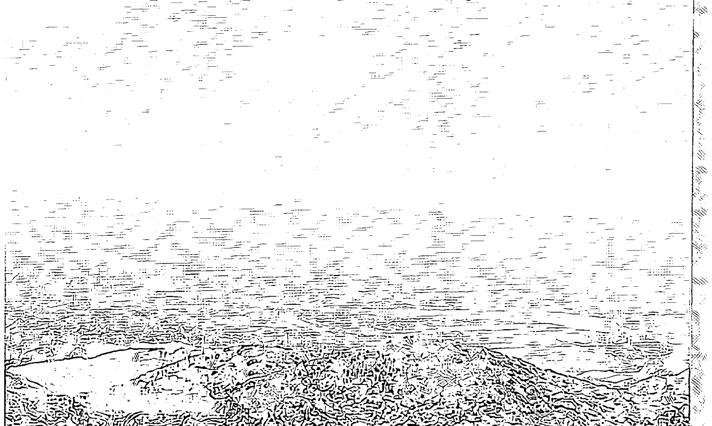

> △ 風水堪輿之術，「堪天輿地」之術，就是要看我們個人在天與地之間的位置與關係，從而看出日月星辰、山岳、河川等對我們形成吉凶、好壞、禍福等等的狀況。

人類其實過的也像是「類人猿」的生活啊？如果連猩猩都懂得的事情，現代人怎會不懂呢？所以講到「風水」，沒有必要「頭殼抱著燒」，讓我們還原他的原本風貌，大家就可以很清楚的明白囉。

它，判定死刑，這就沒辦法囉。還有就是「不能懂」，就是受限於許多派別，將之學術化，公式化，複雜化，變得非常龐大的體系，其中許多派別的理論、實務上都還有互相衝突、矛盾之處呢。怎麼懂？如何懂？一個人若是從這些經典古籍鑽進去的話，恐怕這輩子，或是好幾輩子都再也出不來囉。

比如說，有巢氏怎麼懂得跑到樹上去蓋巢穴，而不是跑到河裡、湖裡蓋巢穴呢？先民蓋房子時門口為什麼不向著北方來吹西北風呢？而是向著南方迎接溫暖的東南風，還有豐富的陽光呢？住家、耕種為什麼要靠近水源，而不是跑到荒山峻嶺之中呢？道理都非常簡單明白的啊？

等一下，這本小小的書，可不是要來跟各位風水大師「突槽」的哦，別誤會；相反的，我們還是要來肯定各位大師的努力和成就的哦。

風水之術，人人能懂得的。除非「不願懂」，就是受過現代化科學教育，把它當成「迷信」，打從根本不願意去理解迷信，打從根本不願意去理解它，判定死刑，這就沒辦法囉。還有就是「不能懂」，就是受限於許多派別，將之學術化，公式化，複雜化，變得非常龐大的體系，其中許多派別的理論、實務上都還有互相衝突、矛盾之處呢。怎麼懂？如何懂？一個人若是從這些經典古籍鑽進去的話，恐怕這輩子，或是好幾輩子都再也出不來囉。

在21世紀新時代（New Age）裡有個有趣的現象，許多幾千年前的古老學問，再度會以新的面貌，新的觀念，新的語言，新的詞彙來被重新詮釋過。對於現代

### （1）風水的意義

人而言，就會產生新的意義，重新認識它，了解它，就更會喜歡它，使用它，也了解我們並不是孤兒，我們的老祖先留下許多寶貴的智慧經驗和遺產，現在我們來發揚光大的時候囉。

說到風水，許多人都喜歡舉『青囊經』裡「乘風而散，界水而止」，或舉『易經』「風水渙」一卦，來說明風水的典故。這是很美的，經文的文詞典雅，意義深遠，的確是經典之作。但是比起先民在開始生活實踐風水之術時，也是晚了許多時候。我們可以簡單的說，「風水」其實是一種空間與時間的綜合學問，現代流行話說「空間管理科學」，嘿嘿，很有意思哦。

我們還可以簡單的說，風水講的就是人類和自然界裡「陽光、空氣、水」等各種能源的一種互動關係。

還有，還有，說到「風水」，絕對不只是「風」和「水」而已，從現代角度來看，除了日常的「可見光」（Visible Light）之外，還包括許多眼睛所看不見的「不可見光」（Invisible Light），例如長波方面的紅外線、電視波、收音機波、電子波，短波方面的紫外線、X光、伽瑪射線、宇宙射線等等。

而所有的這些，都是將近一百年來，全世界最先進的科學家、儀器所能發現的總和哦，還沒能發現的各種射線，還不知有多少哦？再加上，由火山、地熱、礦脈、岩石等等自然物所散發出來的能量氣場，如沼氣、氫氣等等，也包括在內哦，統稱為「氣」。

從「天人合一」文化源遠流長的中華民族來看，靜心、打坐、練氣功也是早在有文字之前就普遍存在先民的生活習慣之中，再加上心性純樸、思慮單純，我們可以簡單推測到先民們的經絡氣脈通暢，體質相當敏感，應該可以很輕易來感知外界氣場（能量場）的優劣、好壞等等。

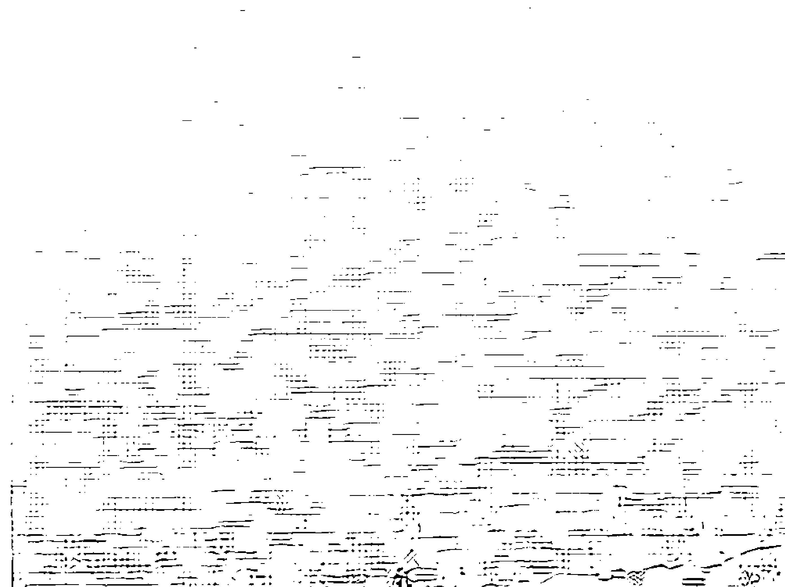

△ 先民以「吹動著的風」，「流動著的水」，以它們「輕柔」、「流動」、及「無所不在」的特性，來比擬形容充斥在整個大氣環境中的整個「能量場」(Energy Field)，豈不妙哉？

所以，更簡單的說，風水就是個人的能量場與外在環境能量場的一種互動關係；大環境的能量場良好的話，就會影響個人的能量場也好；大環境不好的話，也會影響個人的能量場不好。而這個關係是交互影響的，人也有可能影響環境的能量場，只是例子比較少，但不是沒有，稍後再來舉例。

其實，還不需要所有的先民都非常敏感才能產生風水之術哦。一個家族只要能夠產生一位、兩位氣脈特別通順的，特別敏感的，這對整個家族、部落就都會形成影響囉。這種比例，即使在今天這種高度競爭的工商社會裡，也是有的哦，常常有許多天賦異稟的人士，可以對水晶、人體的氣場、環境氣場都非常敏感的哦。

而我們的先民聰明、可愛之處就在，他們以「風水」兩個字來替代「氣場」、「能量場」等等這麼有現代感的字眼。古代的科學觀念，詞彙等等都還有限畔。為什麼？因為「氣」這種東西，看不到，摸不到，還要靠感應的，有人感應的到，有人感應不到，莫衷一是；比「屁」還難搞，因為屁一放出來，大家都還聞得到啊？而「氣」還是摸不到囉。無形無相無色的東西，他們以「吹動著的風」，以「流動著的水」，以他們「輕柔」、「流動」、及「無所不在」的特性，來比擬形容充斥在整個大氣環境中的整個「能量場」（Energy Field），這不是很妙嗎？所以說我們的先民們很聰明，又很可愛。而，這個啞謎也讓後代子孫猜了數千年之久囉。

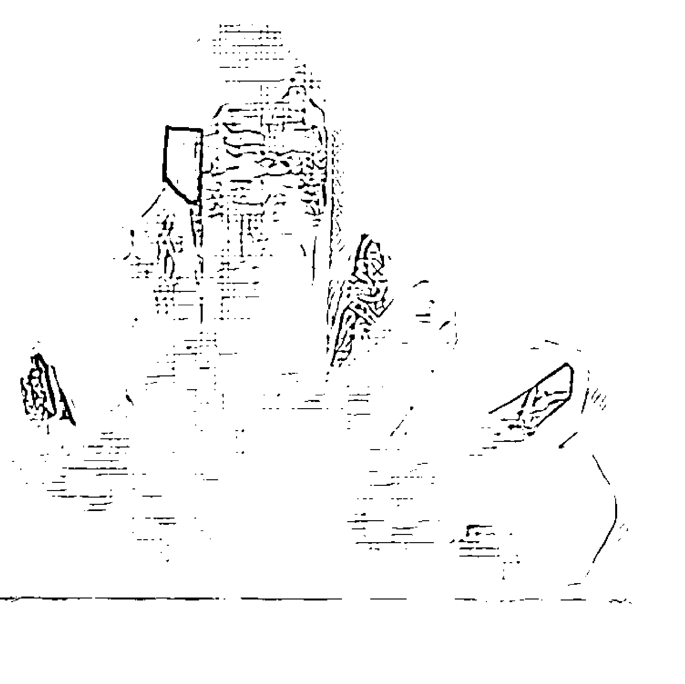

## 第二章 敏感度創造風水之術

這個話題很勁爆！因為所有學風水的人，都要先學「易經」，熟悉各種卦位、卦向、理哲、數術等等，沒有搞個幾十年，很難弄清楚什麼是什麼的耶。但是從伏羲氏畫八卦，到周文王發展成八八六十四卦，此時也都還沒運用到風水上面哦？即使最早的，有關風水、堪輿、相地之術，也是要等到漢朝時才有的，《漢書-藝文志》所提到的三本書《堪輿金匱》、《神農教田相土耕種》、《地典》，也都佚亡囉。但是早在伏羲、神農、有巢之前，原始人們也懂得為自己找個好地點、好風水來住囉。他們又是如何找的呢？

其實很簡單，能用看的，就用看的；看不出來的，就用感覺（感應）的，如此而已。用看的，就是不要明顯的住在水裡啊，不要住在風口，不要住在落石之處，不要住在猛獸路過之處，不要住在容易積水的地方，不要住在沒有水源的地方……很簡單又明白的道理，連猴子也不會犯這種錯誤咩？再來，我們說過，早期的人類會有比較敏感的體質，對於自然界中的能量場能夠敏銳的感應出來。這種人，即使在今天的社會中，還是為數不少哦。他們只要在這個地方，站幾分鐘，或是

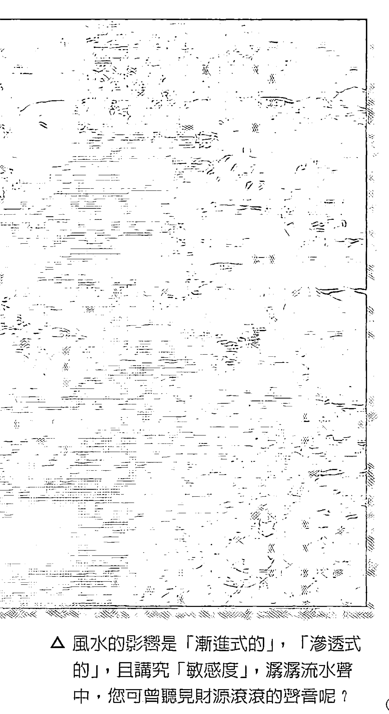

坐幾分鐘，感覺看看，能夠讓人覺得溫暖、舒服、舒適、舒暢的，大概就是不錯的一個居住環境了，也就是一個好風水囉。若是這地方感覺起來，叫人覺得冰冰的，涼涼的，頭皮發麻，腳底發麻，一股涼氣一直從腳底竄向後背脊，那麼這個地方肯定有不對勁的地方，不是一個好的居住環境，不是好風水，就要趕快閃人囉。這種感覺，建議讀者們不妨在自己的「溫馨小屋」裡頭感受看看，然後邀請三伍好友，一起到醫院的太平間啦，郊區的靈骨塔啦，或是某些崇拜陰神的廟宇...

> > △ 風水之術很簡單，連猴子都會，能用看的，就用看的；看不出來的，就用感覺（感應）的，如此而已。許多城市都在盆內，周圍有山環繞，還有河流穿過，本身就是一個大風水。

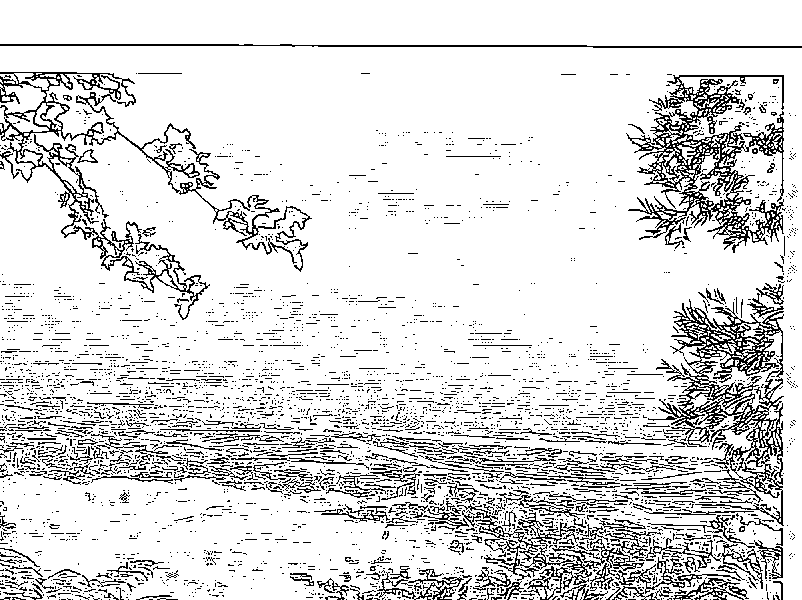

> > △ 「羅盤」、「羅經」，密密麻麻的，還真的包羅萬象！公式派的若是沒有了羅盤，就像公雞給閹了，使不出力來囉。

### (2) 敏感度創造風水之術

裡頭，分別也感受看看，您就知道分別了。為什麼要找三伍好友呢？呵呵，這是怕單一一個人去，有時腿嚇軟了，跑不動，多些人互相照料咩。

這種能力在現代人，還是有許多人有的哦。特別是女人們會比男人們敏感，小孩子們比大人們敏感，有在練功修行的人們又會比沒有練功修行的人們敏感。總而言之，氣脈通暢者最為敏感。就是這份敏感度，感應出不同地點，不同環境的優劣好壞，從而有了「分辨」之心。

不敏感的人是否就沒有影響呢？不，還是有影響。由於影響是「漸進式的」、「滲透式的」，通常等到他有感覺不良影響時，狀況多已經比較嚴重囉。

漸漸的，人們就會去觀察，記錄，整理，歸類，歸納出各種特徵、現象、徵候，漸漸的摸索出各種道理。這種過程，絕對不是一天兩天的，更不是一百年、二百年，而是要有為數眾多的先民，歷經數千年所累積下來的經驗。對岸的大陸學者喜歡說「實踐結果」。就是還不知道是什麼道理的，不曉得理論基礎的，但是那麼多人共同有過的經驗，是確實的，實際的，有影響的，也可以實證的。就像中國許多古老的學問，中醫經絡學，針灸術，草藥學……等等，也都是如此發展出來的。

一個人也可以選擇不相信哦，但是無法逃避於此種影響的。

更簡單的道理，是先有語言，還是先有文法呢？文法雖然偉大，可以規範語言、文字的使用方法，老師還可以在您的考卷上批個「不合文法！」但，到底還是先有語言產生，才有後人來整理出文法的啊？

風水之術也是如此，早已經流傳許多，用途很多，才經後人慢慢整理出一個頭緒出來的。所以，我們可以推斷，「敏感度」應該高於「公式計算」的。

但是為什麼會發展出「公式計算」的風水理論呢？

前面說過，到底敏感的人們數量是比較少的，不敏感的人數還是比較多的。如果一旦經過災難式的天災、戰亂，老一輩的人們擔心這種知識失傳，後代子孫就要受苦受難，如何捨得？但是敏感度（悟性）這種東西又如何能教呢？所以囉，古時候也會發明「防笨裝置」，就是教後代子孫們看方位，算角度，辨別季節時間，給予各種準則、教條、規矩、公式、秘訣、絕招、祖傳秘方等等，就算一點點敏感度也沒有，照此計算，也不會太離譜啦。

這也是所有「公式化風水」的共同結果，套用的關係，沒有百分之百的準確。而且，各個門派之間，即使師出同源，一樣來自易經的推算，許多時候彼此的結論還是互相矛盾的。

「防笨裝置」是現代電腦業的一種說法，揶揄一些類似筆者的「電腦白癡」，害怕複雜的各種線路若是裝錯了，那就會造成電腦無可補救的遺憾。所以製作各種奇奇怪怪的插頭和插座，只要插的進去，能合的，就都是對的；不對的，您也插不進去，打從根本就不讓您有犯錯的機會。這就是「防笨裝置」的精神。

傳說中，易經神算的郭璞在生年時，看看兒子的資質恐怕無法承續他的偉大遺傳，又擔心兒子以後生活辛苦，無以為繼。所以把他那出神入化的絕技寫成公式化，可以據之來計算、推演，所有的結果還明明白白地寫在一本書上，計算出來，就抄著寫給

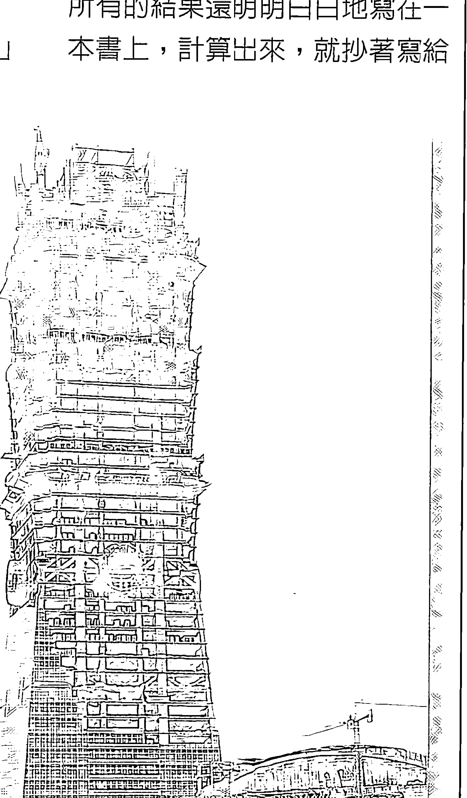

△ 現代風水中的鋼骨建築物，動輒數以百噸計的鋼樑在使用，磁場非常紊亂，羅盤到裡面根本發揮不出作用，若還盯著羅盤看，豈不唬人？這是現代風水中的一個大問題，大挑戰哦！

客人，就不會錯了。據說，這就是流傳到後世的「鐵板神算」。鐵板就是鐵板，硬梆梆，公式化的東西不會出錯，但是就是少了人性味道，更少了玄學、神秘學中最重要的「傳神」這東西。只剩下外表，只剩下表象，沒有了內在的精髓。知其然，不知其所然，這種學術就永遠無法再來改善、變新、求更進一步囉。沒有了「神」，就無法做到百分之百的神準，更無法超越囉。

我們不是反對風水上的公式化，因為實際上，市場上，流派上，傳承上，都有這種需要啊。只是，我們也不要完全拘泥於套裝的公式化而已，還要知道因地制宜，要知道變通，變巧。從黃河流域的中原傳到東南之隅的台灣島上，甚至風水之術也傳到了，北美洲的加拿大、美國，南美洲各國，還有澳洲、非洲等南半球，赤道邊、近南極區的各個國家，經緯度都已經大不相同囉，還能一式套用嗎？這些都是我們需要從新考慮的問題啊。

希望提醒新時代的讀者們，風水之術應該是「敏感度」優於「公式化」，才不會陷入困境而不能自拔。把敏感度擺優先，那麼風水之術就又海闊天空，任人遨遊領略欣賞囉。

> (淳賈天然水晶台北市八德路四段768巷7號三樓之一)

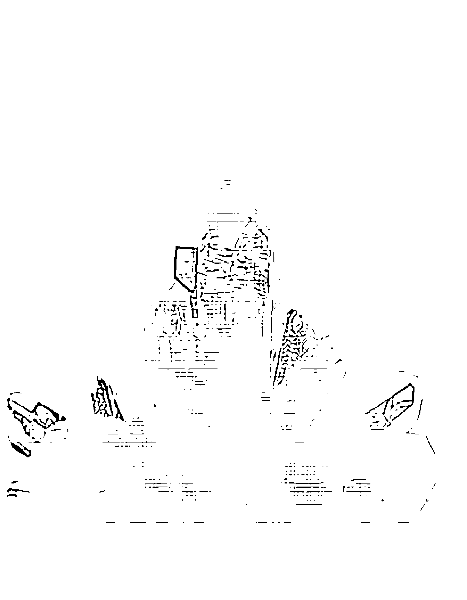## 第三章 形勢與方位之爭

當我們提到「敏感度創造風水之術」時，是否就暗示、明示著敏感度優於公式的計算嗎？呵呵，請不要誤會哦。這是因為語言文字的限制，常常會讓人有二分化的感覺，不是這樣，就是那樣，不是那樣，就是這樣。這樣的話，都太武斷囉。請小心看，仔細聽，也好好想哦。

敏感度雖然首創風水之術，但是「敏感度」這種東西是靠著個人的氣脈通暢與否，每個人都不一樣，即便是相同的一個人，他每天的敏感度也是不一樣的啊？只要是人，吃的五穀雜糧，呼吸空氣，喝水，歷經春夏秋冬，冷熱寒暑，總免不了著涼、感冒、傷風、肚子痛、生病，夫妻辦事，女生的大姨媽來訪，男生晚間的漏電等等，所有的事情都會影響著我們固有的「敏感度」啊？所以，敏感度雖然很有用，也很好用，出門看風水都不必帶羅經，但是卻不可靠！人，一旦心情、情緒、健康有個波動起伏，那種感應也就會相當離譜，完全走了樣的。

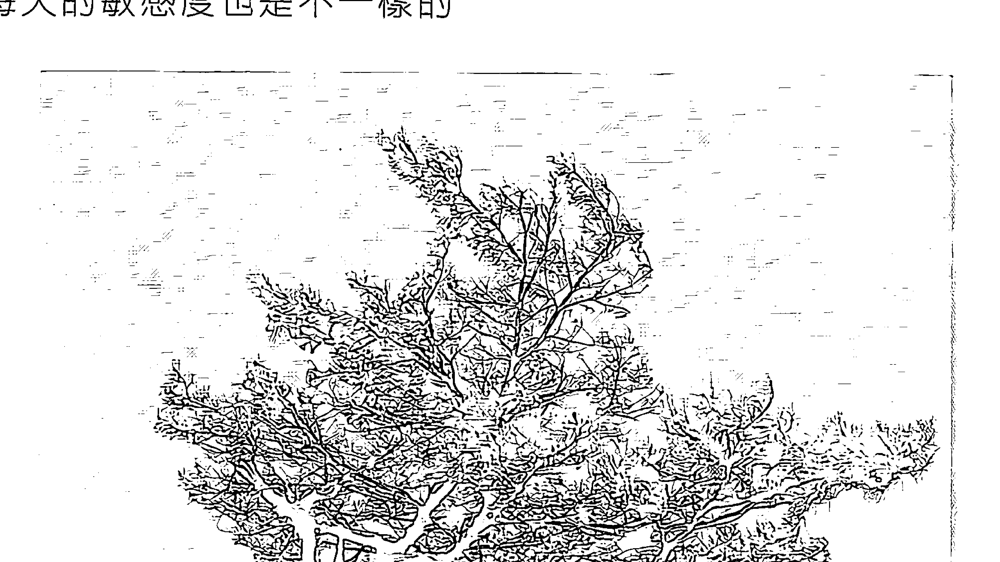

△ 敏感度雖然好用，但卻不可靠，就好像善變的天氣一樣，因而會有公式派的產生，雖沒有百分之百的正確，卻也不至於太離譜啊？

我們就親自見識過那種「因虛弱而敏感」體質的人，因為本身的氣就已經不好了，走到哪裡去感應哪裡的氣場，到處都不好。嘿嘿，忘了是因為自己的氣不好，外在的氣弱也不好，外在的氣強也不好，到處都不好，沒有一個好地方，結果是他自己最糟糕的囉。

敏感度雖然很厲害，但是很不好學，很不好練。也有許多本身敏感度不怎麼樣的人，卻妄稱自己敏感度很強，因為面子問題，或是為了江湖上餬口飯吃，裡子不通，也學學表面上的一個樣子，胡亂揣測，也要硬掰出一些道理出來，騙點錢，也有自稱是一派宗師的，就是因此容易被世人視為迷信。凡此，都不可取。

敏感度的問題就像是「寒天飲冰水，冷暖自知」，不足為外人道，所以也容易讓人來模仿，裝裝樣子，行走江湖之用。這一派的人最厲害，可是這一派裡的騙子也最多。常常在和朋友們閒聊，命理風水等五術學問，學的好，自己的道德操守又好的話，能夠得人重用，其地位就好像是孔明、劉伯溫等的「國師」一般；若學不好，道德操守也不好，一下子又會給打入牛鬼蛇神、江湖騙子之流，實在可悲，可嘆，也可惜；但是在此學術上鑽研的朋友，就更應該自重囉，不是嗎？

還有老師說的更絕，學五術的人好像是人家的「二奶」，見不得光的。平常幫助人沒有關係，但是絕不要宣揚說某某人功成名就的大業都是我幫的，都是我的功勞等等的，一說，人家就會否認，還會攻擊您哦。一個總統，政黨領袖，將軍，立法委員，儘管他私下非常相信風水之術，但總不能提到台面上來說的啊？「迷信」之說，到底不是這些「愛面族」所能擔當的起的。

所以囉，也有人說了，五術之士也像是「夜壺」，半夜尿急了，抓出來尿一尿，舒暢一下，解解急咩；用完了，不急了，也就塞到一邊去，不管了，不用了，等到白天時，「夜壺」這種東西更不能提到台面上來啊？不好看啦。就是這麼個道理。

也就是種種的原因，才會衍生出「公式派」的出現，因為，即使沒有百分之百全對，也不至於太離譜啊？ 所以啦，千百年來，風水裡的「形勢」、「方位」兩家就吵的不可開交。有人專看山巒、大川的型態、走勢來看風水，有人專算陰陽五行八卦來看風水，彼此誰也不服誰，甚至彼此攻訐、傷害，呵呵，落得旁人在一旁看笑話，說是「狗咬狗，滿嘴毛」，不全都是「迷信」？哇，反而使得風水之術更難得傳播？豈不更糟？所以啊，同樣是「五術中人」，都是自己人，要吵關起門來自己吵，彼此互相檢討學習，能夠融合兩者之長，再來一致對外，讓世人了解風水之術的真諦，不是迷信，不是江湖術士糊口的把戲，那才對的起老祖宗，也才能把真正的風水術發揚光大啊？ 對啊，這種爭吵是無意義的，只會讓外人看笑話而已。只有敏感度，不懂得適當的公式定理，就容易「突柴」、「出ㄛ」；只會公式定理，卻沒有敏感度，就很難百分之百的正確，也不容易傳達這個「神」、「妙」之處。只有兩者互相結合，才能把風水之術發揚光大。

了解這些道理，就知道我們沒有特別褒揚哪家，也沒有特別貶抑哪家，到底師出同源，同是中華民族傳承的瑰寶，我們真正要做的是肯定所有風水明師所作的一切努力，也希望所有的世人都能承受風水之術的好處，學習先人的智慧經驗的同時，也能為子子孫孫創造一個良好的生活空間。就是這麼簡單的心願而已。

在此，我們也要順道提醒大家，凡是命理、風水等的明師、大師等等，也應該是要很認真，很優秀的修行人才是哦。因為他們也需要借助修行來打開氣脈，提昇自己的敏感度，而這和自己平常的心性、修養、品德都有絕對的關係啊。也是因為修行的關係，真正的大師才會被譽為「國師」、「國寶」。

要當命理師、風水師，不修行也不行的。除了敏感度不夠之外，還因為執業關係，和太多有問題、有困難、有疑惑的人們接觸接觸，容易感染他們的「負能量」，也就是傳統上所謂的濁氣、雜氣、晦氣、穢氣、霉氣等等，若是不認真修行，無法排除，就會累積在體內，日積月累之後，就會轉變成肉體的病變，或是暴發出來，馬上蒙主寵召，回老家去了。

這些五術中人的命理師、風水師，原本能夠「究天人之際，通古今之變」的，可是怎麼許多的比例在生時，賺錢不順，感情不順，身體不好，稍長又容易暴斃呢？原因就在「沒有修行」，不懂得如何排除自己體內的負能量，這是致命傷！

所以啊，想學風水、命理、五術的朋友，記得第一課，Lesson One，就是要多運動，練氣功，跑步，打坐，靜心。至於要練道家功、佛家功、密宗氣功、還是新時代的冥想，悉聽尊便，都有幫助。不然，就要多抱抱水晶，例如彩虹黑曜岩、黑色電氣石、黑色隕石、煙水晶、骨幹水晶等等，至少還能為您吸收一些不良氣息，好常保健康啊！

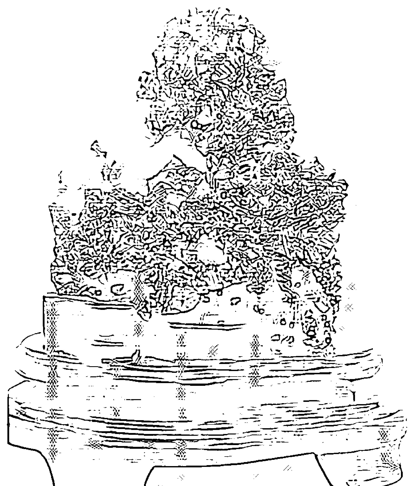

> △ 閃鋅礦 (Sphalerite) 雖然不是挺好看的，但是結晶雄偉，除了可以吸收人體、環境氣場中的濁氣雜氣穢氣，還有穩固環境氣場 (Grounding) 的作用，好用卻少有人知的寶石。

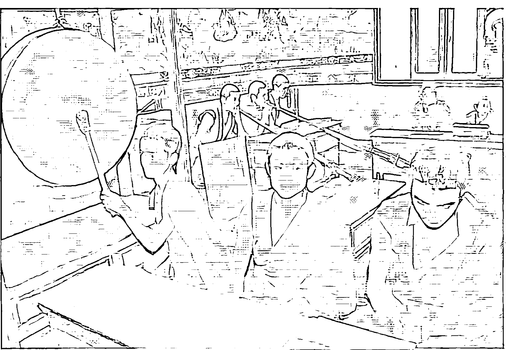

> △ 想學風水、命理、五術的朋友，記得第一課，Lesson One，就是要多運動，練氣功，跑步，打坐，靜心。

只有當人處在一個環境裡面，討論「風水」才有意義嘛。若是人不在裡面，誰管他呢？

風水的意義，就是透過大環境的能量場，漸漸地，滲透式的，逐步式的，滴水穿石式的，來影響人體的氣場；日積月累，就達到影響肉體的健康情形，也會影響到一個人（一群人）的的思考模式、行為模式，而變成某一地方的特殊行事風格，行為文化等等。

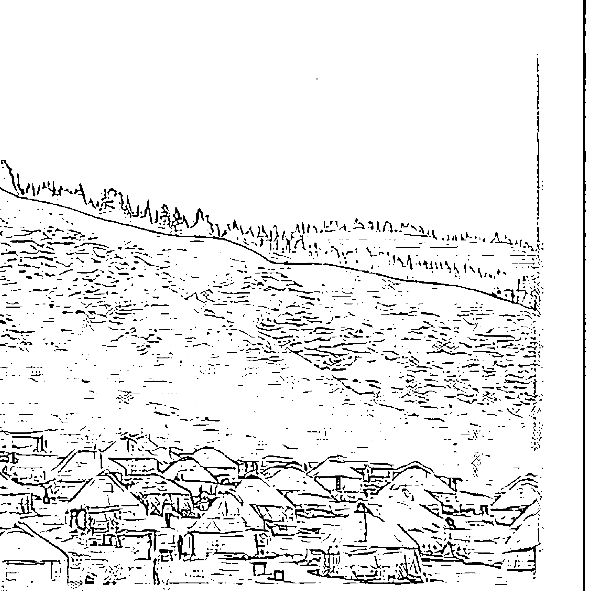

△ 蒙古包裡面的氣一定是圓的，也培養出大草原、荒漠裡獨特的開朗、粗獷、剽悍民族文化。

> 『青囊經』裡頭還有一句話說的很妙，「理寓於氣，氣囿於形，形以目觀，氣須理察。」

翻成白話就是說，道理就在「氣」這個東西裡頭，而「氣」又會給外在的型態所侷限其中；「形勢」可以用眼睛來觀察了解，氣雖然看不到，摸不到，可以用「風水」等「流體」（如風、水、聲、光、電、熱、磁等等）的道理來思考判斷。

這句話初看有點難懂，任何話若是一文言文說出，總是很有難懂的，然而念起來鏗鏘有力，卻又很過癮耶！我們就先看看「水」，原本也沒有什麼固定形狀吧？拿隻碗來，把水灌注到裡頭，我們就可以看到「一碗水」，水也變成了「碗」的樣子囉。就像是這樣的一個道理，原本沒有固定形狀的、流動不定的水，就給外在的形式「碗」限制住了型態，變成了「一碗水」的樣子。風水的道理，原本也就在這些流動的風、水之中，而風和水又會被外在的器物、型態（山形、地勢）給侷限了，就像是裝在碗裡的水囉；換成裝在碗裡的空氣，也是相同道理啊，只要「氣」能被看得到，就明白啦。所以啊，同理可證，一間圓形的房子，裡頭的氣應該也是圓形的，對吧？方形的房子，裡頭的氣也是方形的；三角形的房子，裡頭的氣也會是三角形的，依此類推，應該沒有問題吧？人體也有氣場，居住在不同形狀的房子內，也會受到整體「環境氣場」的影響。「人體氣場」與「環境氣場」的交互影響作用，就是整個「風水學」的重點囉。我們在討論環境氣場如何影響人，而不只「氣」的「形」（Shape）會影響人，連「氣」的「質」（Quality）也會影響人哦。嘿嘿，我們中國人最喜歡談論氣質囉。常常看到某些漂亮的女生，若是對我們沒有意思，交不到來當自己的女朋友，就會故意挑剔說「沒氣質！」但是「氣質」這個東西很難明講，只能說是阿Q的精神，聊表安慰罷了，哈哈。

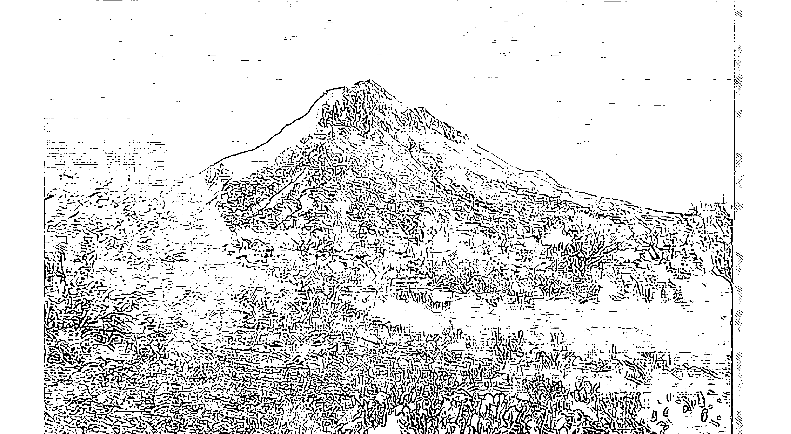

△ 這種山形、山勢連猴子、老鼠都不會想去住，何況是人呢？所以說，風水其實很簡單，我們應該還原其簡單、樸拙、實用的一面，大家才好運用啊。

## 第四节 風水和人體氣場

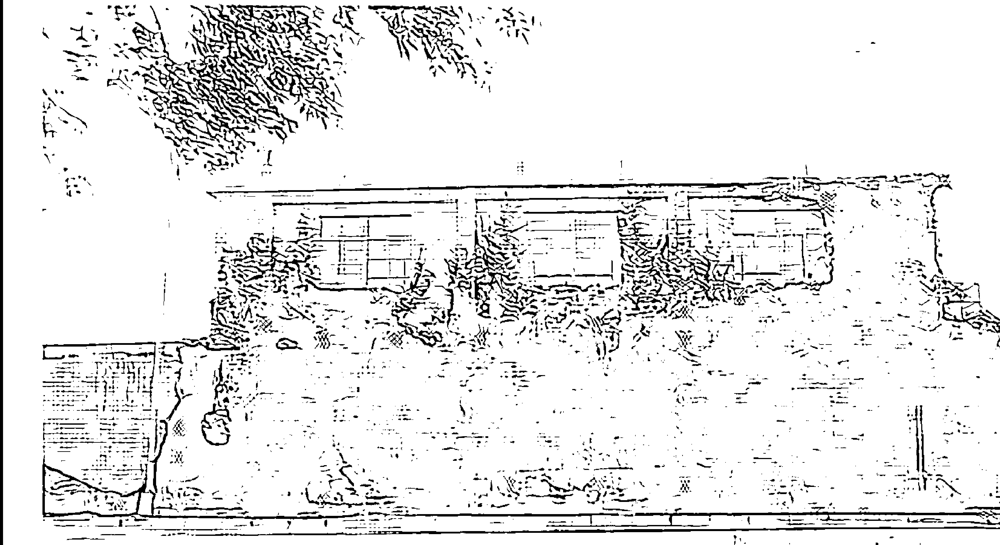

風水的意義，就是透過大環境的能量場，漸漸地，滲透式的，逐步式的，滴水穿石式的，來影響人體的氣場。這種藤蔓爬滿的屋子比較陰，住久了也容易生皮膚病。

這話也不是白說哦，俗話說的「山明水秀，人傑地靈」，講的就是一個大好的風水，也能孕育出大志向、大氣魄、大擔當，大作為的人材出來哦。「自古燕趙多慷慨悲歌之士！」講的就是今黃河南北之處，天地開闊，平原開朗，山川壯麗，自古出了許多英雄豪傑，都能為了整個民族作出偉大的貢獻！

還有風水上的流傳，說道：「山厚人肥，山瘦人飢，山清人貴，山破人悲，山歸人聚，山走人離，山長人勇，山縮人低，山明人達，山暗人迷，山順人孝，山逆人嘶。」以前在大陸，人們也常說，住在桂林山水中的人們，具有秀麗之美；住在大別山的人們，就具有純樸厚實之美，而住在海濱的人們呢，就具有剽悍粗獷之美，住在窮山惡水的地方，又會出什麼樣的人才呢？什麼樣的地理，孕育著什麼樣的人才，看起來，很有道理哦！

人住到一個新的房子、新環境中，要多久風水會開始產生影響呢？

許多風水師習慣說「七七四十九天」。嘿嘿，這也是千年來習慣性的講法啦，變成俗語囉，很順呷。但是對不對？答案是「不一定」！

因為，在此，我們已經把「人體氣場」的因素考量進來囉。這是許多學派所忽略掉的地方哦。一般，多注意在環境啦，命格啦，方位，時間等等各種因素，都沒錯，但是缺了一個「人體氣場」的因素，卻也總難「全對」。每個人的氣場能量，強弱、大小、厚薄、濃淡、虛實都不一樣，所以對於「環境氣場」的反應時間和程度也不一樣。

氣虛、氣弱者，受到環境影響的時間快，程度也深重。

氣強、氣旺者，受度環境影響的時間慢，程度也比較輕。

一般而言，大環境到底是大環境，會影響人的氣場成份大。偶爾遇到有大修行人，他們的氣強旺又精純，許多時候不但不受環境影響，還能影響環境哦。最有趣的例子就是當代的成道大師「廣欽老和尚」。據說他在早年剛剛來到台灣之時，由於沒有什麼名氣，人又長的比較瘦小，沒有派頭，連住的地方也沒有。有些人就不知是無心還是有意，就指點了一個破舊的房舍給他去住，整個村莊的人都知道那裡鬧鬼，那是陽宅裡頭最凶、最爛的風水囉。

和尚當時年輕，也沒想那麼多，有得住就很高興了。隔天，村民圍繞過來，存著看好戲的心態，想看看有沒有什麼怪事發生，年輕和尚會不會嚇的屁滾尿流、落荒而逃……沒想到，和尚還正襟危坐在裡頭打坐念經哩。呵呵，經過一夜，和尚也知道裡頭有鬼，但是他不但沒被鬼嚇到，還把鬼給超渡了。鬼屋不再是鬼屋，又還原成人們可以安居樂業的處所囉。哈哈，這就是大修行人的風範，隨遇而安，轉危而安。一個人若能精進修行，砥礪上進的話，不只可以轉化自己的命運，也可以轉化大環境的風水氣場哦。

在命理風水界非常流行，說有哪些因素會影響著人們的命運呢？標準答案依序就是「一命，二運，三風水，四積陰德，五讀書」。

第一就是命，聽說命是天生註定的，沒辦法改囉。二是運，運是一種流程，過程，還有可能轉化的哦。風水反而是擺在第三順位，而不是絕對因素，請特別注意此點。另外，常做好事，多積點陰德，也能改善自己的命運。最後，就是多讀書囉，增進知識，增長智慧，也能改變自己的命運哦。總而言之，言而總之，若是能夠好好修行，也就是修煉自己的心性、自身的能量，卻是最基本、最根本的方法。

嘿嘿，人難免會犯了「老王賣瓜，自賣自誇」的毛病，像是風水師免不了會說風水決定一切，命理師會說命理決定一切，就是我們的水晶同業裡面，也有很多人說水晶可以決定一切。呵呵，這都當成閒話看看，還是得自己仔細思考評量哦。

其實，這不就是許多修行人的理想境界嗎？「跳出三界外，不在五行中」，本身有夠強、夠旺的能量，自己的意識又清楚，一切能夠自主。這樣的人，根本不必擔心命理、風水、輪迴的事情囉。雖然是「理想境界」，希望大家一起努力往上提昇吧！若是做不到的人，書就要繼續看下去，繼續研究其他的化解之道囉。哈哈！

(淳賀天然水晶TEL:886-2-2788-9231
Fax:886-2-2788-8982)

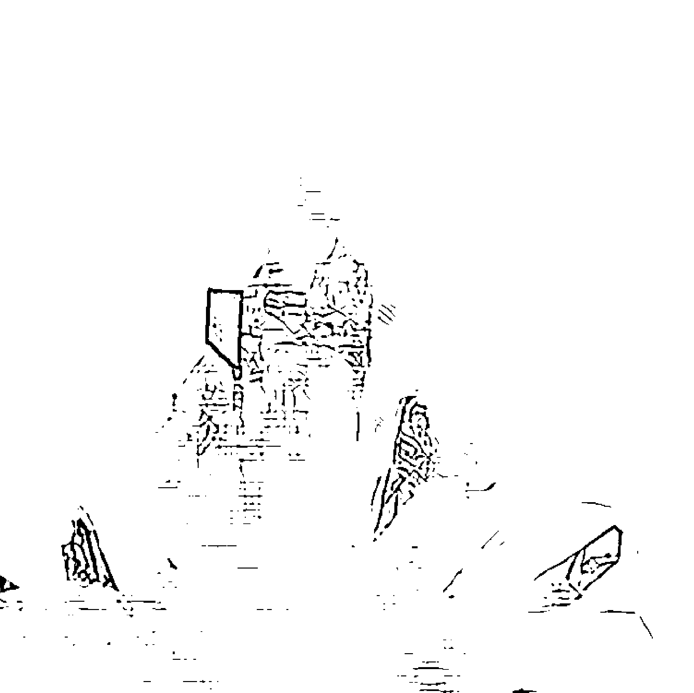

## 第五章 風水如何影響？

所謂的「陰宅」，就是給死人住的地方。

所謂的「陽宅」，就是給活人住的地方。

活人住的地方應該講究，但是死人和我們又有什麼關係？為什麼也要講究陰宅的風水呢？說來，也是「氣」的關係。

記得，前面說過，我們每一個人都不是孤獨的哦。或許「形體上」看起來是「個人的」(Individual)，但是若把「氣」的觀念加上，就會知道每個人和萬事萬物在無形中都是非常緊密連結的。特別是和自己先人的骨骸，更有密不可分的聯繫在。

人是怎麼和外在世界連結的呢？詳細的情形，可以在我們「神光中的靈擺」、「探測棒的千古奧秘」中查看。在此，我們就講重點，不再重複論述細節囉。

想想看，我們若站在池塘的一邊，丟下一顆石頭，是不是只有對我們這邊的岸邊有影響而已？還是，細細看，那漣漪在慢慢擴散中，經過適當的「時間延滯」（Time Delay），這種影響也擴大到整個池塘哦；而且，這種震波不只是表面的而已，而是立體的，多面向的，只要傳導的物質在，這個波就會一直傳達過去，盡管再怎麼微弱，總是會有影響就是。

許多時候，不要以為飛機在天上三千公尺的高空上飛過去，和我們沒有關係哦？您若能靜心靜坐，您就能感受到那引擎聲波轟隆轟隆的聲音，也傳到您的身上來囉。即使感覺不到，但是一旦聽到，也知道聲波傳達到耳膜來囉。想像我們是住在一個大果凍，大布丁裡面，任何外力在任何地方輕微的碰觸一下，都會導致整個果凍、布丁的搖晃振動，全體都有影響咩。就是這個道理囉。

回到池塘的例子，若是我們投入大大小小不同的石頭，在池塘上激起陣陣的漣漪，彼此錯綜複雜的交錯著，就會非常複雜囉。也可以象徵著我們這個世界裡錯綜複雜的現象。好，此時若請出蝙蝠俠裡的「急凍人」，瞬間發功，把整個池塘結冰起來。此時，我們只要拿榔頭敲下池塘裡的任何一小塊結冰，再用具有高度平行的雷射光來照射、迴繞、反射等等的，就可以還原出整個池塘的波紋原貌，而且可以是以「立體呈相」的。這就是最近西方科學研究出來「部份帶有整體的訊息」，「雷射全息影像」（Holography）的基本簡單道理。

我們每個人都是透過類似的道理，也透過「波」（Wave）的振動影響，和大干世界的萬事萬物緊密關連著。請記得，沒有任何一個人是單獨存在的哦，每一個人也都有能力來影響整個大干世界哦。

在風水上，每個人也是以類似的道理和自己的父母、祖父母、列祖列宗聯繫著，而且只有更為親密，更為緊密，因為「血脈相連」，基因相同啊。許多時候，想甩都甩不掉咧。

在許多災禍的現場，常常出現一些令人難以理解的場面。火災或是溺水事件，遇難者的遺體擺在一旁都沒有狀況，但是當親人出現時，就會七孔流血、流淚，或屍骨變軟化，能夠更衣，或是救難人員就能抬得動了。許多醫師的解釋都還讓我們不太滿意，這裡面肯定還有許多神秘的因素存在，不可能只是單純的巧合而已。值得深思深究。

這種「神秘的連結」，也就構成了重視陰宅的原因。因為彼此會互相影響嘛，所以幫過世的親人找到一個好風水，也就是氣場好，能量場好的地方，他們的屍骨能夠「得氣」，後代子孫也能夠得到庇蔭哦。若是沒找到好的風水，甚至是找到不好的風水，則不良的影響就會「禍延子孫」，挺麻煩的哦。因此，中華民族自古重視「厚葬」，培養出「慎終追遠」的文化傳承，實在是又聰明、又人性、又符合實際的風俗習慣。這不僅是對往生者好，也是對活著人好啊？

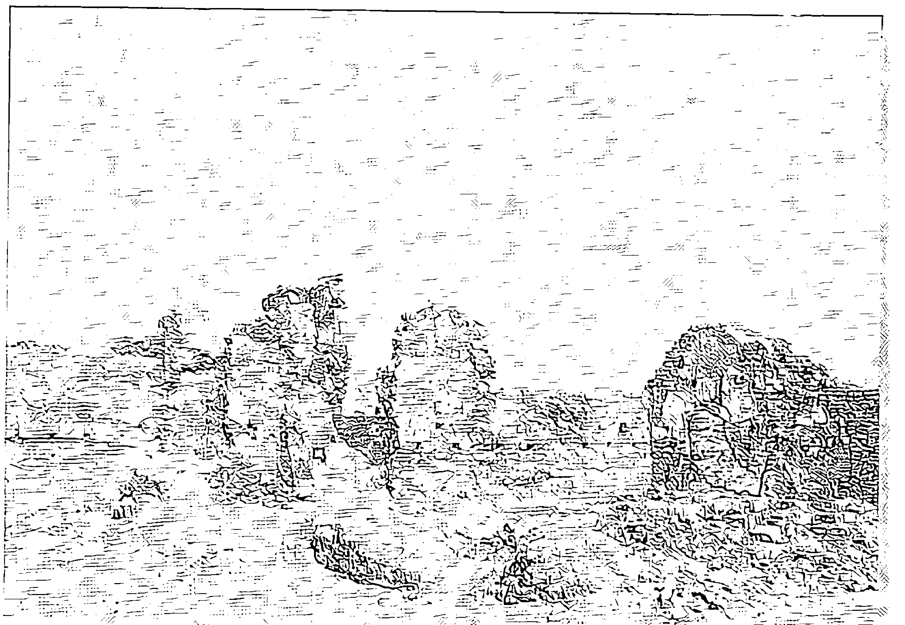

△ 人死之後，也不過是荒塚、黃土一抔，看開點，不要和活人爭地，火葬實在是一個最安全，最經濟，最環保的方式。

郭璞在《古本葬经》提到：

> 「葬者，乘生氣也。夫陰陽之氣，噫而為風，升而為雲，降而為雨，行乎地中而為生氣，行乎地中發而升乎萬物。人受體於父母，本骸得氣，遺體受蔭。蓋生者，氣之凝聚，結者成骨，死而獨留。故葬者，反氣內骨，以蔭所生之道也。」

雖然在當代還沒有「雷射全息影像」的理論問世，但是各位大師所討論的「生氣」，「在天則周流六虛，在地則發為萬物」，講的也是相同道理啊？

雖然陰宅不是本書討論的重點，但是還要花這麼多篇幅來介紹，就是要大家重視，絕對不能輕忽，否則影響很大，自己發生什麼事情都不曉得咧。祖墳一定不可輕忽，不可荒廢失修。

然而時代進步了，人口也眾多，活人都要和死人爭地，不然沒有地方住囉。事實上，好風水也越来越少囉。多年來，政府極力提倡火葬，除了省地省事以外，也是相當實際的啦。就是人體燒化成為骨灰後，各種好好壞壞的連結都會減弱，以致於影響力非常小，就不會對子孫造成任何不良影響了。注意哦，好風水非常的少，非常的貴，沒錢沒勢的人，恐怕也爭不到哦；若是葬到壞風水，反而糟糕，而壞風水的比例是遠遠高過好風水，一向如此。因此，若能火葬，減低各種好或不好的影響，反正一切要靠自己嘛，不要再妄想先人幫助，能夠平安也就是萬幸囉。

在不懂風水，沒有錢勢的狀況下，火葬實在是一個最安全，最經濟，最環保的方式。 (淳貿天然水晶www.blancoage.com)

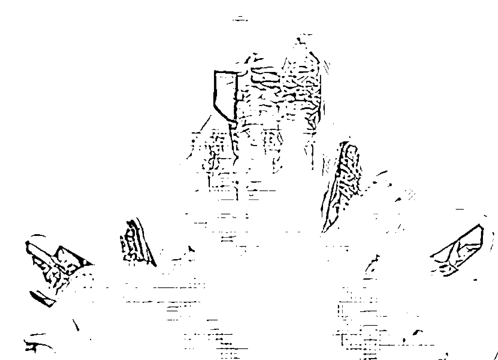

阴宅对人的影响是透过无远弗届的「雷射全息影像」道理，子孙就是离乡背井，远走他乡，常驻他国，这种影响还是在的哦。

而阳宅对于人的影响就更直接、更实在的啰。因为一个人住到一个房子里面去，经过相当的时间，人的气场就会和房子的气场互相「契合」了。这是一个很重要的观念，如不契合，则不可能产生任何交感作用。

多久会产生交感作用呢？老话说「七七四十九天」，其实不一定。那些气场比较虚弱者，容易受外界气息影响的，可能几天内、一个礼拜就开始作用啰；还有些固执者、八风吹不动者，可能要几个月的时间，才会产生作用。已经说过，风水气场的影响是「渐进式的，渗透式的，滴水穿石式的」，终究会有影响的，只是影响速度的快慢、程度的深浅而已。

还有一种现象，曾经让许多风水师难以自圆其说的，就是相同的一个房子风水，为什么甲先生住进去，身体不适，精神不好，事业不顺，霉运连连；换个乙先生住进去，却是身体强壮精神好，财运旺盛，家道大兴，兴旺的不得了。相反的情形也有，就是某甲已经大发过，搬走了，后来的人，却没得承接这种风水，反而倒霉连连呢？

传统的说法，个人的八字轻重、命不同啦，房子的流年到了啦……但是，我们若要把「风水」单独看成一门科学来论的话，这些节外生枝、岔开主题的说法，就显得薄弱，没有说服力啰。只要是好的风水，应该对任何人都有益处才是啊？若再「牵拖」到八字和流年，岂不是搞不完了呢？

在我们经营水晶的经验里头，或许可以说明这样的现象哦。

偶尔会有一些人进店里来，才一会儿功夫而已，就说会头晕、头痛、心悸、想要呕吐等等，还要怪说气场不好……哦，搞得大家人心惶惶，怎会这样咧？我们自己每天超过十几个小时在这水晶屋子里头，不仅没事，还好的很啊？怎么会有人如此呢？

百思不解之余，偶尔看到中医书中提到「虚不受补」的道理，再来请问这些发生不适症状的人们，才知道他们平常大多没有运动，也没有在练气功、念佛、打坐、静心的哦，原来如此。就是体质过于虚弱，进到一个能量场比较强劲的地方，身体像是一个干涸已久的海绵，贪婪地吸收各种强大的能量，以致于吸收过多，又承受不住，就是如此而产生不适应的症状啰。

相反地，我们曾邀请许多的气功大师、灵性导师、瑜珈、舞蹈、身心灵整合的身体工作者来公司里演讲时，他们反而像是「如鱼得水」般的欣喜、快乐、亢奋的不得了。因为他们平常对自己的锻炼和修行，已经有很好的体质基础啰，进到强劲的能量场里头，不仅可以完全吸收，还能全数转化成为自己的能量，常常一上课数小时，还不觉得累、渴、饿。就连他们自己也直呼「非常神奇！」

能够容纳最多气、最多能量者，俗话就是说「格局大」。
无法容纳比较多的气、能量者，俗话就是说「格局小」。
格局小的人，的确很搞。就像是小碟子一般，常常唉叹没得吃，给多一点时，却又吃不下？也像许多社会上人士，感叹怀才不遇，没有机会，没人赏识，但是一旦给他们机会去做时，却连这个责任都担当不起来……格局小的人，吃不下，担不来，就算住到大风水里面，也是唉声连连、怨气不断。

所以问题的关键不在于「水晶好不好」或是「风水好不好」，而是「个人体质」强弱的问题，能不能适应的问题。这个也不在于人是否长得人高马大，或是肌肉发达等等的，而是在于对「气」的容纳量。这个才是重要点！

积极的锻炼自己，建立了一个良好的基础，才能承接大风水的大能量，才能为自己创造好运气、好运道！

这又回到老问题啰，前面提过，怎么提升自己的格局呢？基本的方式，就在于要「积极的锻炼自己」，也就是「修行」。多运动，练气功，练武术，念佛，打坐，静心，多玩水晶，都是提升自己能量、频率、格局的方式。

只有建立了一个良好的基础，才能承接大风水的大能量，才能为自己创造好运气、好运道！

曾经有个风水的笑话，说是一家夫妇，结婚几年了还是生不出小孩出来，请风水师来看，结果是因为隔壁家的「灶头」，抵到我们家的「眠床头」啦。看倌们想想，这哪有什么直接关联嘛？分明就是胡扯、硬拉进来的啊？所以有句台湾话就揶揄到，「自己不生，牵拖厝边」。就是这个道理啦。

当一个人的气场和他居住的房屋气场「契合」之后，又会产生什么影响呢？

很简单，我们可以站在屋子的中央，面朝大门趴下，哈哈，就是这样契合的。

前门，朝堂，就像是一个人的头、门面，也是气口，天庭、出入楼梯就像是咽喉，房子主体就像是...一个人的身体、身躯，后面就像是人的「后斗」，就是背脊、屁股等等的啦。同理可证，前面的左右边是双手，后面的左右边是双腿、双脚；排列下来，依序是脖子、胸、腹、下身等等；窗户就像眼睛，屋内的樑柱等等，就像是人的脊髓骨（龙骨）、全身的骨架；水管、电线、瓦斯管等等管线，也像征人们的血管、神经、淋巴循环系统，厕所就像人体的子宫、生殖器；墙面也就类似人体的表皮、肤质，油漆的整洁明亮与否，也关系着家人的名誉……。

风水界有言「物物一太极」，从大环境、小环境、到个人，都会互相影响，也会互相类似哦。这也在说明「契合」的一种道理。

也有些在外租屋的学生、上班族等等，他们只分租一个房间，个人的能量没有扩展到整个屋子，那就以他所居住的房间来论，也是可以契合的。

这就是有些风水师还没进门时，光看房子的外表或变化，就可以猜测屋主最近的一些运势的原因。远远看，屋前门面乌七八黑、乱七八糟，那肯定运气不好，前途无亮啰；若是前面、后面有哪里在胡乱动工，大多手脚也会有外伤；若是屋子两侧胡乱加盖，常会推测是否在胸腹间长瘤或有病变……余此类推。还有许多例子，家中有孕妇时，乱钉钉子，会动了胎气，造成流产哦。说来，就是这么简单的道理而已。

因此呢，奉劝各位朋友一定要好好爱惜自己的房子，不要随意动工、加盖、裁减等等的，一定要动时，也必先请专业风水专家来看过，择定吉时良辰，对每个家人都没有问题的时候才动。这不是迷信，道理已经说明如上，只是更为精确的计算要靠专家，希望没有人会害到自己哦？

过于浓密的榕树靠近住家，反而有喧宾夺主，吸光地气，造成阳气不足，就容易招阴，滋生灵异现象。

## 第七章 風、水、和氣的關係

说风，讲水，看形势，论理气，其实主要目的都只是要得「生气」，得「能量」这个东西。这个才是最最主要的重點！

所有的风水学派，各种方法理论，也都是为了要得「生气」。只是，前头说过，「气」这种东西，看不到，摸不到，各门各派都有各自所侧重的方法、技巧、秘方来「探气」、「测气」、「寻气」、「量气」，长久以来发展不同，也是必然的事情啊。只是，回过头来，还是不能脱离主题，「找到了气没？」

> 晋朝郭璞先生在《葬经》里头说道：「葬者，乘生气也。气乘风则散，界水则止。古人聚之使之不散，行之使有止，故谓之风水。」

天清地阔，但是没水，就没气，沙漠中还是一片死寂，绝对不是好风水、适合居住的地方。

还记得前面提到的：「理寓于气，气囿于形，形以目观，气须理察。」 真实的道理就寄居在气里面，气又限制在外头的形势里面；外头的形势可以用目测观察了解，气的行进、流向、聚合道理，可以借着观察「风和水」等流体的运动方式来理解、疏导、防堵、及运用。前人的话其实都讲的很明白了，风水的真谛就是如此而已，但是用文言文讲出来，呵呵，就是连「我爱你」这么简单的意义也会被现代人给误解啰。

原来，风水就是要寻找并且利用有机的，活泼的，充沛的「地气」能量。古人要借助各种形势来将这种地气找出来，并聚集着，使之不会散掉，这样才能利用的来啊？所以啊，这种「生气」怕什么呢？就怕「大风吹」，大风一吹就散掉了啊？「气乘风而散」，所以说风大的地方，肯定没有风水，就是这个道理。

界水则止，则是说这个「地气」或许能够随着地形而绵延连贯哦，但是若遇到水流、河流的地方，就是「到此为止」啦，不会说越过了河、跳过了溪，对边的风水（地气）还继续延续着的。界水还有个意义，就是说，这个水流若是环抱着某个地区，则能够把能量积聚留住这边，久久不会散去。

明朝蒋平阶在《水龙经》里提到

> 「太始唯一气，莫先于水。水中积浊，遂作山川。经曰：气者，水之母；水者，气之子，气行则水随，而水止则气止，子母同情，水气相逐也。」

这段文字也很意思哦，开天辟地以来，所有物质最先形成的，莫过于水。水的沉淀沉积之后，才变成山河大地。有经典说道，气，是水的根本；水，是气的衍生物，气若行走，水就会跟着流动，而水若停止，气也跟着停止。根本、衍生物，其实都是相同的道理，流动（运动）方式，水与气，常常前后跟随，互为前后。

清朝范宜宾曾注解郭璞先生的葬经，说道：

> 「无水则风到而气散，有水则气止而风无，故风水二字为地学之最重，而其中以得水之地为上等，以藏风之地为次等。」

没有水的地方，风一吹拂，气就散了；若是有水，则气在此聚集，而风就吹不散。所以「风水」两个字是「相地学问」里头最重要的观念，而其中以能得到水源的地，最为上等，而能将风围绕止息的地形则属次之。

所以，这个无形无相的「地气」很难搞哦，原本就不容易掌握，又这么容易就散掉了，如何利用天然的地形、地物来将之「保固」，也就变成了很重要的课题。「左青龙」、「右白虎」、「前朱雀」、「后玄武」，嘿嘿，所有学风水的人，都可以朗朗上口，但哪里可以真正看到这些动物、灵兽咧？原来，这也是一种「拟动物化」的说法，把四周的山形、地势用动物的形容来说明，在此四种地形的围绕之中，肯定可以积聚最多的「地气」啦，应该是这么个道理。

「水晶喷泉」带来有机的、活泼的、充沛的水气，能量场，也就是「财气」！

前几年，市面上出了一些书，叫做「风生水起……」怎么的又怎么的，哈哈，被许多风水老师给批评的很厉害，说「风生水起」，所有的「地气」、「生气」不就散光光了，那还有什么风水可言？还有什么好处可言呢？呵，取书名还是得很小心耶？老师们说，风水的真义在讲究「藏风聚气」，这才是真正的重点！

为了找这个「地气」、「生气」，听了许多好玩的事情哦。之前有风水老师说，他们早在三十几年前跟着老师老师去看风水，老师背着罗盘，他们则是背着乌龟跟着走。走到差不多的地方时，就把乌龟放下来，看乌龟怎么走，走到哪里停下来，哦，这个就是「灵穴」。

呵呵，也有些老师建议把乌龟抓回家，夜里就放着乌龟在家里四处走，隔天看它停在哪里，睡在哪里，这地方就是家里风水最旺的地方。

据说乌龟也是灵兽，而且生命长久，有灵性，它的「龟息大法」总是吸着气息最好的地方，所以会有跟着乌龟找灵气、灵穴的作法和举动。只是，苦了乌龟老兄，因为它的体型、体重，使它行动缓慢，是走的累了，走不动了，还是躲在乌龟壳里睡大头觉，怎么分辨呢？

听说许多学徒看着乌龟不走路，还要踢踢它，看它动不动，还走不走？若真的不走，才确定是「灵穴」。呵呵，希望没有乌龟因为找风水而被踢死、凌虐致死吧？

吧？乌龟在中国人的世界还真可怜，早在几千年前就给人抓来当卜筮用咧。难怪庄子叹到，他宁愿当只活的乌龟，拖着尾巴在泥地里爬呀爬呀，也不要给人抓到庙堂之上拱着、贡着，那就变成死乌龟啰。

若是了解「气须理察」，能有个碗形，就能聚气，那个地方有漏，气就会流失，就像风吹、水流的道理而已啊，可以观察的到啊？那就无须再去触乌龟老兄的霉头了，是吗？

有灵性的乌龟老兄们正在岸边练习「龟息大法」，朋友们跟着乌龟跑，看能不能找到「灵穴」？

## 第八章 龍穴的探尋

呵呵，所有研究风水地理的人，衷心最大的期盼就是找到「龙穴」。因为找到了龙穴，就可以让人大发特发，大富大贵，还有些人的子孙可以当上「真命天子」，当皇帝、做总统的咧？所以，「龙穴」一向就是在中国人的心中占有非常、非常大的份量，也充满着非常、非常神秘的气氛。

什么是「龙」呢？呵呵，不是指我们「龙的传人」，或是「舞狮舞龙」的那条「龙」啦。而是古人在看到所有的崇山峻岭、蜿蜒山脉，乎为高耸云霄，乎为隐没在平原沃野，真的就像是传说中的「神龙」一般。「龙」，指的就是「山脉」啦。

而「龙穴」呢，简单的说，就是由山脉所组成、围绕而成，类似盆地的形状，而主要是「生气」旺盛的一个「能量聚集点」。

中华民族文化的发源地在黄河流域、黄淮平原，宽广的大陆和太平洋衔接，形成了明显的季风气候，冬天的时候，冷锋、寒流从北方、西北、东北长驱而下。呵呵，若是没有个遮蔽，人啊、牲畜、庄稼都会给冻成「冰棒」，活不下去啰。所以，若不是躲在黄土的窑洞里面，就得发展出我们独特的「四合院」来遮风避雨，是吗？

想要找个理想的居住环境，也是相同道理，总给找个周围有山屏障的地方，才免受冬天的风寒啊？但是也不能全部封闭着的哦，一个封闭型的盆地，到了夏天的时候，就会好像「蒸笼」一样，即便不会把人畜等烤成「烧肉吊」，也差不多变成「叉烧包」啰。所以，在面南的地方，若能留有宽阔的空间（明堂），让南风可以在夏天时吹拂，那不是很爽快的事情吗？

当然，要住人的地方怎可没有水源呢？水源也不可能紧接着高山的地势啊，所以能够在南面环绕着，那就是最理想啰。

所以，想想古人所比喻的理想地理，「左青龙」、「右白虎」，龙蟠虎踞；「后玄武」，有得靠山；「前朱雀」，明堂开阔，如小鸟可以展翅飞翔，还有河流流过，山环水抱，哇，这就是最理想的居住环境啰。活人住好，往生者来住，也最能得到「生气」，能够庇荫后代子孙啊。

山脈就是所謂的「龍」，所有的房屋住宅，不也都是典型的「人造龍穴」嗎？

其实，道理非常简单而已，看风水、找风水，也是人类的天生本能而已，其实没有什么奇怪、神秘之处啊？要找龙穴，大的方面来讲，台北市、台中市的盆地地形，不也都是一个大风水、大地理、大龙穴？若要从小的方面来讲，每个人的家里不也有「四面墙壁」围起来，还留有窗户来通风，这也是一种小风水、小地理、小的「人造龙穴」啊？我们把复杂道理简单讲，神秘事情单纯化，原本就是希望还原真相，让更多更广的现代人能够了解风水的道理，不是迷信，不是瞎掰，而是前人与大自然长久共处所累积下来的经验而已。许多的道理，至今仍然历久弥新，颠扑不破。我们研究古人的学问，至今仍然能够受益啊？还有啊，既然是老祖宗的学问，就是共同财产啊，大家可以分享的，总不能让江湖术士来把持，来危言耸听，或凭之来骗财骗色、愚弄世人，是吗？我们研究神秘学，就更希望没有人会因为神秘学而受骗上当啊？

我们在简单说，古人听了可能会要抗议哦。因为他们对于龙穴的要求非常严格，对于龙穴的判定也有许许多多的条件，哦，详细说来，恐怕三天三夜，再加上三百本书也说不完哦。但是，胆敢保证的就是，就算把所有的古籍资料看完，只有让学者更为迷惑，而不是更为清楚。一来，文言文的表达，各人的解读就不太一样；二来，所有的风水名家都会故佈疑阵，误导非入门弟子，即使对入门弟子也还会「留一手」哦；最后，从来没有两个地理环境的条件是完全一模一样的，所以不能「看死」了。

曾经也和些风水老师私下聊过，为什么这些学问有这么多的符号、名词、术语，层层迷障呢？那老师笑着说，这样才能产生隔绝作用，不让所有的人都明白，才能混饭吃啊？哦，当下明白，原来都是私心作祟，把简单的事情讲的很复杂，很神秘，很困难的样子，所以才需要「专业技术」，才要「请老师」，哈哈，才能「收红包」呀？

话说回来，找寻龙穴的基本「地理五诀」，「龙、砂、穴、水、向」，就是「寻龙」、「察砂」、「点穴」、「观水」、「定向」。

呵呵，我们常常觉得古代的风水师很伟大哦！为了看风水，必须长途跋涉，走遍千山万水，踏破铁鞋，不然怎么看山脉的走向、形势呢？所谓的「来龙去脉」，原本也就是风水中的专有名词，「来龙」，看山是怎么绵延、伸展过来的，「去脉」，看山是怎么走去的。没有机车、汽车、飞机的时代，光是凭「11号」的双腿，呵呵，那可是很有得受啰。现代的风水师可轻松啰，花个五六万块租个直升机，二个小时可以把方圆几百公里的地理形势看的一清二楚。本事更大的，花个一千、二千美金，还能买得「卫星照片」，什么「好坑仔」也都躲不过「法眼」啰。但不管方法如何，重点还是如前述，找出群山围绕的一个类似盆地的能量聚集点。

察砂，就是查看主脉旁边的一些小山，更重要的是看「土质」。能耕种吗？能放牧吗？能盖房子吗？或是适合我们的任何特殊目的吗？

点穴，呵呵，这个学问最大，风水师常说「三年寻龙，十年点穴」，三年的功夫懂得看来龙去脉，要十年的功夫才懂得点穴呢。这个讲的也是这个「能量的聚集点」，古代除了要观察各种相关条件，还要风水师本身的敏感度，或称「悟性」、「灵性」，才能体会到。前面说过，没有两个地理环境会是完全相同的哦，所以光是讲道理是讲不清楚的哦。

还好，时代进步，东西方文化交流，近年来西洋传入的「探测棒」（Dowsing Rod），也被风水界的前辈们广为採用，誉称为「寻龙棒」、「探龙尺」；原本是用来探测水源的，相同道理，也可以用来探测「能量聚集点」，就是龙穴啊。「灵摆」（Pendulum）也是相同道理，可以使用。详情可以参考大水晶出版社的「神光中的灵摆」、「探测棒的千古奥秘」二书看看。

- 观水，就是查看水源，看河流的来向，去势，围绕情形。
- 定向，就是判定方位，以能冬暖夏凉；这以指南针、罗盘等，就可以简单看出啰。

其實啊，在中國北方黃淮平原的風水觀念能否適用於江南一帶，能否適用於位居東南的台灣，甚至到了南半球的澳洲、南非、巴西、阿根廷、智利等國呢？地磁、山勢、河流、季風等等，都不一樣囉，這些都值得新一代的風水師，具有世界觀、國際觀的風水師來研究哦。一個道理，要能放諸四海皆準，才有研究、發揚光大的必要嘛！抓住了基本精神，根本道理，其他的細微末節就可以因地制宜而做變通了，不是嗎？若是抱殘守缺的話，那就恐怕走不出門囉。

△「前朱雀」真的是好嗎？當開店遇到「門可羅雀」，那就欲哭無淚囉！ 風水還是要隨著時代觀念，不同地域特性來進步，才不會抱殘守缺，故步自封。

## 第九章 冲与煞的问题

> > ◁ 風水的沖煞，環境的能量激流，好像很難捉摸，但看看遠山的沖蝕痕跡，就知道大自然力量的可怕。

在许多的风水书上，都可以看到「冲」、「煞」的问题，听起来好像很可怕的样子。

事实上，冲煞是有它冲击剧烈、影响深远的地方，不可不防；但若了解了它的本质，又能做适当防护，倒也不像是毒蛇猛兽般可怕。怕，就只怕在「不知道」，让自己、家人、亲友、同事等等常常暴露在这种环境中，出了问题都还不知道，那就不可怕，还是可惜、可怜囉。

到底什么叫「冲」、「煞」呢？

简单地说，我们又要简单地说了，其实就是环境因素所造成的一种「能量激流」，如此而已。

这种「能量激流」，可能是一道水的急流，也可能是一股强劲的风吹，大可以大到像是飓风、飓风的，小可以小到像是窗边、门边隙缝所露出的小风……又是「风」、又是「水」的，呵呵，其实讲的也是「气流」、「能量流」（Energy Flow）而已。

许多时候，也会因为山形、地势的情况，或是建筑物、街道、马路的情形，也会造成此中「能量激流」哦。

随手拈来，就有：
- 路冲
- 巷冲
- 斜路冲
- 剪刀煞
- 枪煞
- 天斩煞
- 屋角煞
- 切角煞
- 穿堂煞
- 穿心煞
- 风煞
- 反光煞
- 灵煞
- 镰刀煞
- 刀锋煞
- 壁刀煞」、「磊落煞」、「屋脊煞」、「動土煞」、「懸針煞」等等許多種。

原本在山林田野大自然環境中才有的颶風、旋風、急流、土石流等等，來到城市都會人口聚集處，在「高一寸為山，低一寸為水」的觀念中，也形成了「都會風水」、「居家風水」、「辦公室風水」、「室內風水」等等。

從前面的敘述，我們了解到大自然間所有的運動，都是「能量」、「氣」的運動。大自然有氣，人體也有氣，討論人體的氣的問題，我們已經在「透視人體能量」及多本書裡詳細探討過了，在此不再贅述。簡單地說，「氣場」（Aura, Energy Field）對於人的「肉體」、「精神」、「靈魂」都是一種絕佳的保護作用！就像地球的大氣層一樣，對於地球，以及居住在地球上的所有生物，都是一種絕佳的保護作用，不然哪，也有可能像是月球表面，或是其他沒有大氣的星球表面，早給流浪在太空中的千千萬萬、大大小小的隕石給砸平囉。

之前也說過，把「人體氣場」也考慮進入「風水」的範疇，可能是多年來許多大師們所忽略的地方。或許，這就是人類的習性咩，習慣於看外面，看大的，看顯著的，卻容易忽略了內在的，自己的，比較細微的地方。事實上，最細微，最微不足道的地方，恐怕就是最重要的地方哦。

當一個人的「氣場」又強、又旺、又盛，他抵抗外來的「能量激流」的能耐是否就比較高呢？換句話講，外在風水因素要影響他的健康、運勢等等，就沒有那麼簡單，是嗎？

但當一個人的「氣場」又虛、又弱、又薄，他抵抗外來「能量激流」的能耐就比較差囉。換句話講，有時外在環境上的風吹草動，任何一丁點的「風水」流量，都會對他產生重大的影響。

還有，我們也看到許多的例子，就是本身的氣場已經非常虛弱了，就算沒有外在能量激流的「沖煞」作用，此人本身就容易火氣大，口乾舌燥，長出痘痘，嘴角破裂……再嚴重一點的，沒事就容易頭暈、頭痛、走路不穩、頭重腳輕，還有脾氣暴躁，易怒，易於情緒化……再嚴重一點的，便秘、痔瘡、潰瘍就一步一步出來囉……嘿嘿，還不必等到「外在」的「風水因素」，自己氣虛氣弱的問題，就先把自己搞垮囉。

若再把外在的因素考慮進去，氣虛氣弱的人就常遇到，就像是俗話在說的，「外頭在刮颱風啦，給煞到颱風尾囉～～」原本也沒有您的事，但是無端也受到牽連，常常就會有無妄之災、無端波及等事發生。做事、走路、開車也是一樣容易出狀況，走到醫院、病房、廟宇、墓地等等，也容易「犯陰」，被侵害，或遭附身等等的。氣虛、氣弱的人哪，連鬼都喜歡欺負哦！

所以，能夠把自己的「氣場」養飽、養足，讓自己的氣場又強、又旺、又盛，這也是防堵風水上「沖煞」問題的一個根本之道哦！千萬不可小覷。

把自己的氣場養好，就連靈異的「避邪」問題也一併解決囉！

怎麼把自己的氣場養好呢？簡單的說，就是要：
1. 充分睡眠、
2. 均衡飲食、
3. 適當運動

能夠做好這三點的，肯定可以把自己的氣場養的充足旺盛，好像「無敵鐵金剛」一樣！說來好像很簡單，事實上也是非常簡單，但是就是有很多人做不到呢。

其次，當知道自己的氣場混濁、薄弱、虛弱時，建議配戴上一些高能量的水晶寶石，也是增強自己氣場的最佳方法，就能防堵來自外在的各種沖或煞囉。

至於環境風水上的沖和煞問題，該如何防堵，「能量的問題還是歸於由能量來解決」，有時不是靠幾塊木板，貼幾個符，或是拿香比劃比劃、唸唸有詞，就可以解決的。沖煞的種類極多，如何解決一向是風水中的大問題。我們在後頭會個別介紹，個別解決。

△ 說來很可怕，犯了沖煞連死人也不得安寧，墳墓區的山崩土石流，連棺木、骷髏、骨灰罌也沖刷而下。

△ 現代風水中，不只要防堵有形的沖煞，無形的，不可見光的沖煞，更是一大挑戰！和玻璃帷幕大樓來相對，好像還不是挺好的選擇咩。

本書從頭開始，就是先介紹一些基本觀念，大的方向，大的原則，還有很重要的「原理」。大家曉得都是「氣流」、「能量流」（Energy Flow）的問題，風水就變得很簡單囉，不會給五行、八卦、方位給搞得七昏八素，有看沒有懂，才不會責怪我們有誆騙稿費的嫌疑囉～～另外，當後頭講到如何「制化」的問題，就是「制煞化沖」，也才不會像是丈二金剛，摸不著頭腦一般，搞不懂，為什麼要放這個，為什麼放那個，為什麼這個可以解，為什麼那個不能解……當搞清楚原理，大的方向出來時，就是「理論基礎」了解後，「實務」上的技巧、運用、方便等等，都可以自己去變化，自己去運用囉。不要拘泥於「一定要」的學問，這種學問一定是死的。能夠活用的，才是真的學問，不是嗎？

當我們對風水有些基本概念之後，如何來看看自己家裡的風水、能量流如何呢？哪裡比較好，哪裡比較不理想？怎麼看呢？

先前，把自己家裡比擬做一個「人造龍穴」，此種說法或許會讓許多風水師哇哇叫哦，因為在一般的觀念中，要找到一個龍穴那是何等困難的事情啊？簡直是可遇不可求啊！您普通人是何德何能，哪有可能在每個人家中就會有一個「龍穴」呢？

但是 ，就事論事，四面牆壁，一個屋頂，能夠遮風避雨，形成一個環抱的處所，也就形成了一個相當好的「能量聚合點」囉，也可以說是「能量聚合場」（Energy Field）。說是「人造的」，因為到底不是天然的山脈所形成的屏障，也沒有天然的「彎彎小河」來圍繞，城鎮、都會裡頭多是「下水道」在圍繞啦。嘿嘿，風水裡頭的觀念，「高一寸為山，低一寸為水」，有山又有水，就算是人為造成的，也是個不折不扣的「龍穴」啊？所以囉，即使沒有天然的龍穴可以安居，讓自己或是後代子孫當皇帝、當總統的，但是能夠住在屋子裡面，不受風吹雨打日曬等等的，還能遮風避雨、保暖、遮蔽隱私，這就已經非常好命囉！君不見那「無殼蝸牛族」，沒有自己的房子的朋友們，都還要上街抗議高房價咧！

先前也提到，有風水師帶烏龜到山上去找「龍穴」。呵呵，那可真可憐了烏龜老兄，想想，背著這麼大又厚重的烏龜殼到野外搜尋，到底是找到了，還是走累了，想睏了，除非您也會講「烏龜話」，不然怎好觀察呢？

但是，若把烏龜老兄放到自家裡來，平常人家的三十坪、五十坪的，大概還難不倒烏龜兄吧？咱也不是老古董，不會排斥老方法啦。聽說烏龜是靈獸，對於「氣息」靈敏的很，晚上就放著給它「趴趴走」，早上起來，看它所停留的位置，大概就是屋內「靈氣」最棒的地方吧！連續給它放個幾個晚上，多做幾次實驗，結果當可以更為明確囉。

「靈氣」最佳的地方就可以當成最常使用的處所，或是當臥房，常睡、常坐的地方？或是當書房，在此唸書、籌劃、建立征服世界夢想的地方？或是當佛堂，可以在此靜心、打坐、禮佛、開悟、成道的地方？呵呵，就看自己如何使用囉。但是，現在房子多已經是隔間好才出租、出售的，確實使用方式，得看狀況而定哦。還有啊，這麼重大的事件，也不是「烏龜老兄說了算！」這麼簡單，自己也得四處看看，衡量衡量啊？

另種方法也很好玩，就是趁著家人出外時，可以把門窗等關上，然後可以在門口處點上二十、三十炷香，看著香是如何飄進屋子，如何在屋子裡頭流動、縈繞、盤旋、駐足等等。看看哪裡，香只是飄過、飄過，哪裡才是真正停留聚集的地方，就可以判斷哪裡是「風生水起」，哪裡是「藏風聚氣」……

要用上二十、三十炷香，這樣的份量才夠咩。若是二、三炷香，就逸散在空氣中囉，看不出來了。若是地方大、空間大，覺得看不清楚，也可以酌量增加更多炷，也沒有說是誰規定的啊？主要能讓自己看的清楚，然後又不會把消防隊給引過來，就行囉。

當門窗關閉的時候，好好觀察一下；稍後，可以把門窗打開一半，讓外頭的空氣進來，再來看看香的變化。

更進一步，把所有的門窗都打開，看看會否形成「能量激流」，那就是「沖」、「煞」的樣子，也可以看出在哪形成，沖往哪裡，煞到什麼囉。

呵呵，這種實際觀察，是不是很好玩呢？

建議各位朋友，還可以選擇晴天，陰天，下雨天，颱風天等等，不同的天氣，觀看不同的「香流」（氣流），那肯定可以對您自己家裡的環境多好幾層的認識哦。同理也可以看自己的商店，辦公室，工廠，任何住所等等的。該動的給他動起來，像是業務單位；該靜的給他靜下來，像是臥房，動靜都能配合得宜，就是易經上所說的「當位」囉，這就是最適宜的環境，最棒的風水囉。

大環境裡頭的山哪，河流啊，我們無法更改、更動，但是對於自己住家環境裡的許多東東，想要如何增減，那還有什麼問題和困難呢？改善了自己的好風好水，住起來，用起來，才能開心快樂啊？關心自己的人，也要掌握這種「主導權」，而不是道聽途說，或是胡亂迷信，那就可憐又可惜囉。

最後一點，千千萬萬別忘記了。自己的家裡，就是自己要住的地方，「您和家人」的感覺最重要的啦！人是萬物之靈，絕對不會輸給烏龜的，任何人只要靜下心來，好好看，好好觀察，不要急，這裡坐坐，那裡看看，這邊睡一晚，那邊睡個下午，用您自己的敏感度，用您自己的眼睛，耳朵，鼻子，全身的器官來感覺，白天也感覺，晚上也感覺，隨時都感覺，您也能找出一個最適合您的「角落」，可以常在此靜心、讀書、休息的；當然，也能找出哪些地方適合當倉庫、放書架、擺桌子、掛圖畫的。別忘了哦，我們先前也提到，選擇好「風水」，也是人類的本能之一哦，不要讓自己的能力睡著囉，所以說不用急，慢慢來，就也可以自己發現了。
自己住的，自己知道如何才是最適合自己的。
若有聽到，看到任何和自己感覺、想法、看法不同的，建議去思考、研究、實驗看看，找出有否道理，值得相信嗎？這樣才不會淪為迷信，或讓術士牽著鼻子走，而忘了自家的風水本應自家親自來感受才是啊。

民國90年（2001）時，在台北縣蘆洲有件新聞，一位屋主聽信了風水師的建議，要把門前的一面牆打掉，卻也請了一位糊塗泥水師傅，從牆的下邊開始打起啦，結果整片牆塌下來，把他自己壓傷還沒關係，連屋主在一旁觀看的小女孩也給壓死囉。唉，不管從風水的理論上再怎麼有理，事情搞到這樣都不對了，是嗎？房屋的結構本來就不應該隨意變動，從921地震以來的教訓還不夠嗎？風水師只會看千年以前的文獻教條，難道不會從各種天災地變中學取教訓嗎？懂了風水，卻不懂這種基本常識，還能信嗎？

先從基礎面的，常識面的，大原則、大方向來搞清楚結構、隔間等等的，然後再來求「風水」上的「畫龍點睛」，才是正道，不是嗎？
(淳賈天然水晶台北市八德路四段768巷7號三樓之一)

## 第 一 章 風 水 是 會 變 的

風水是會變的，換句話說，沒有任何風水說是會「固定不變」的。

從大的方向來看，日月星辰、地球自轉、公轉等等，每天每個時刻都在變啊？就連地球的南北極「地軸」的南北極性，在過去可考的歲月中也至少有七、八次的反轉、逆轉。那可是驚天動地的天旋地轉哪？在地球上的所有生物，有誰能自外於這種「大風水」的變化影響呢？

△ 連「地軸」都會南北兩極逆轉了，哪有風水不會變的呢？面對變化，只有以平常心來面對，執著不得的。

平常的，這在最近進步神速的台灣各地最常見的了，一下子這裡開條馬路，一下子那裡挖條水溝，一下子這裡做陸橋，一下子那裡挖地下道，待會兒那裡建高架橋，不多久那邊建捷運……到處大興土木，不要三年、五年的時光，城市、鄉村各地的風水都大大的改變了。

聽說近年來的上海，及許多大陸沿海城市也是如此哦。

最小最小的，就連巷口的麵包店，先前因為有公車停靠，生意好的不得了，因為搭車、下車的人們都要從他門前經過，都受不了那種香味的誘惑，食指大動，只好掏腰包囉。但是，突然間路邊有小工程，公車站牌往前挪移五十公尺而已，麵包店的生意就一落千丈。哪有永久不變的風水呢？

在過去的農業社會裡面，常常聽到說哪門的風水，可以讓哪家子人連發個三代、五代，動不動就是幾百年下去，好像時間就給凝結在那裡了。這種觀念似乎也還在當前的風水界中流傳哦，好像還沒過渡到工業社會、資訊社會來畔。在當今21世紀的年代中，仔細觀察一下，常常不到二十年的時間，幼時生長的地方，曾經讀書的學校，曾經當兵、遊歷、遊玩的地方，常常就會「翻兩翻」，全部都變了樣囉。哪有固定不變的風水？

何況，在20世紀末到21世紀初，各種天災人禍不斷，活在這時代的人們親眼目睹了大自然的威力。1999年的921地震把整個南投的地形地貌都改變囉，河流不見了，山給移動了，草嶺又多出個大湖，許多人家園垮了，更多的土地、田地都要重新丈量……2001年台北的一個納莉颱風，大水漫過堤防，破了百年防洪計畫，整個都會區都淹在大水中，許多人多年的努力、財產，全在一夕間泡湯、歸零……這種天然災害，才是最大的「沖」、最大的「煞」，這不僅是氣象預報、防災的問題，這也是「風水」上的大問題啊！一百年給您碰上一次，就完蛋囉。

像是中部一位居民，把連棟的旅館蓋在河邊，原本是很好看啦，很羅曼蒂克、有好景觀畔。但是大水一來，好幾億的家產就給河水沖走囉，上了電視還淚流滿面，哭訴著「怎麼辦？怎麼辦？」这种事情在古老的風水中就早已經有所告誡了啊？怎麼還會故意去犯這種「沖煞」呢？還有連「林肯大郡」這種事情，不要說漢民族的風水有教了，就連世代在台灣居住的原住民文化也有這項禁忌啊？難道人們從歷史中學到的教訓，就是「人們從來沒有從歷史中學到教訓」？記得哦，一生能遇到這種經驗一次，當然就很夠受了，但千萬不能忘記，一定要教導自己的子孫，不要讓他們再度犯下這種錯誤哦。古書中的許多教導非常嚴厲，說道這種河濱式的、懸崖式的、順向坡式的，都說會「絕子絕孫」，意義豈不深遠？
本篇最主要傳達的訊息，就是要讓大家了解，「風水」不是不變的，他是時時在變化當中的。有些事情可能幾天發生一次，有些事情可能幾個禮拜發生一次，有些事情可能幾個月、幾年才發生一次，頻率不一定，但一旦發生，常常後果就非常嚴重，絕對不能輕忽。所謂的「百年計畫」是計算頻率的，不是說剛剛好一百年才會發生一次，而是說，從長遠的角度來看，可能是一百年才會發生一次的頻率。但是從現實的角度來看，這一百年間，任何時間都有可能發生，可能是前頭，可能是後頭，可能在中間時段，最糟糕的是，也有可能前頭接著後頭，連續發生，這種可能性也有啊？
所以，即使不打戰，也要懂得「居安思危」，隨時觀察自己居住的地方，哪裡蓋大樓了，哪裡開新路了，哪裡有工程在進行，下水道、河流有否淤積，附近山上的土石是否穩固，或有鬆動的跡象？隨時準備，建擋土牆、擋泥牆，準備沙包，疏濬水溝、河流，山上多植樹、做水土保持？或是隨時準備搬家、落跑？把生命、財產都搬到更安全的地方去？

納莉颱風時，在內湖山區還發生一些很扯的事情哦。居住在低窪區的民眾，遭到基隆河蔓延伸出來的河水淹還算正常，連許多住在半山腰的民眾也遭水淹，怎麼搞得？原來，就是過大的雨水造成山上的土石崩塌，泥塊和著雨水一起沖刷下來，就沖進許多大樓的地下停車場、地下室、倉庫等等的，車輛、貨品泡湯，損失不貲，有些商店就此關閉囉。

犯了沖煞，連半山腰也會淹水，誰又料想的到呢？

當然，對於某些風水師的信口開河，就要相當保留了。誰能保證您「五十年不變」？「代代子孫出狀元」？「富貴萬萬年」？沒有這回事的啦。自己要機靈些，看清楚些，把一些大原則，大方向搞清楚，以後看地，找房子，蓋工廠，開商店，才能保障自己的生命財產安全，做的好，連子孫都能獲得庇蔭呢；做不好，連子孫也都要跟著遭殃，豈可不慎呢？

有些行家，喜欢在下雨天、台风天过后才去看房子，可以从雨水、淹水、风吹草动的痕迹中，看见“风”和“水”的流动方向、劲道，就知道真正的影响力量，值不值得投资？适不适合居住？

再次提醒各位朋友，没有不变的风水，一定要自己张大眼，头脑清楚的随时观察，随时评估。古人说的“风水轮流转”，还真的有道理哦，不是固定不变的，好的风水有可能变差，坏的风水也有可能变好。任何人把话说成“铁口直断”，呵呵，您就知道他没有把“时间”因素考虑进去，缺乏宏观的视野啰，一样送上红包，请人上路，但是就不可太相信啰。
(淳贾天然水晶TEL:02-2788-9231、
Fax:02-2788-8982)

△“王船祭”，就是最大的象征作用，可以把所有的灾难、病痛、不幸通通烧光，丢到海里去。居民不惜花费数百万装修，但回归现实面来思考呢？

## 第二章 墓仔埔也疯狂（下）

在风水的经典之作“葬经”里头，就已经明明说过了，“气”是“乘风而散，界水而止”，风吹就散掉啦，水流从中横过，也就停止了。特别是指“来龙”，一支山脉的走势，更是如此。若是给一条河流给阻断了，任何风水师也都知道，“气”不可能横亘、绵延到对岸的啦。

回到都会市区来，虽然不见高山、河流，但是高楼大厦、各种马路等等，也就像是“高山”和“河流”了，特别是“马路”就给大家当成“水路”了，此点绝无疑问。

所以啦，许多时候，马路对面的大楼啦，房屋啦，或是各种建物的造型、尖角等等，其实从学理上、实务上来讲，对我们这边的房子都没有影响啦。但是呢，在都市中，不如在乡野间，比较局促，比较狭隘，“感觉上”总是有被冲到、煞到，因而总觉得“很不爽”。这就是“心理作用”啦。您说心理作用有没有影响呢？嘿嘿，这问题还是要看个人哦，明事理、豁达、想得开的人，就一点影响也没有；执着的人，深信、迷信的人，还真的会有影响哦，所以也不可等闲视之。古代的风水师便以“象征手法”来解决“心理作用”的问题。

譬如有有个人的店门对面，正对着一条巷子，或是一支电杆，呵呵，隔着一条大马路原本也没有影响，但是风水师就给他的门前来个题字“对我生财”。哈哈，写几个字能有多少、多大的作用呢？但是，妙就妙在“象征手法”可以解决“心理问题”，店主就觉得“爽”了。类似这种作法，我们后头也会使用许多。读者不要笑话哦，您若遇到这类的朋友，就知道这些方法的简单和妙用啰。

说道心理作用，才想到18、19世纪欧洲人开拓非洲时的一些趣事。

当时，照相机也才发明，加上镁光灯拍照时，还会“轰”地一声，冒出白烟和火光，声势很是吓人哦。非洲土著当然没有见过此种阵仗啊。当欧洲白人把他们拍好的相片给他们看时，看到和他们一模一样的人给“摄进”小小的纸张里头，哇，惊恐四起，土著们认为自己的“灵魂”被夺走啰。再加上怕被夺权、边缘化的“巫师”们在一旁鼓动，当事人真的认为自己的灵魂已经不在了，就真的因此而死亡了。拍个照片就会死人啦？这在今天想来，真是不可思议！因为我们现代人深深了解照相机是个什么东西，怎么个原理，只是光线的折射、反射而已，根本没有关系啊？但在当时民智未开的非洲土著，听说因为照相而死的民众还真的不少耶？您说“照相煞”、“镁光煞”厉害不厉害？

还有个风水界的笑话，古代的一位风水师来到一位书生的家中，进到庭院中看到里头有颗树，劈头就说是“凶”，不吉啦。书生问道什么原因呢？原来，风水师就说了，宅院中有颗树，犹如四方围个木，就是“困”啊！

哈哈，说到“字”，这个书生本是读书人，认字还认得比您风水师还多咧，反应也相当快，当场反问到，“那这里也不能住人了吗？”这下子换风水师愣了一下，怎说？四面围墙围个人在里面，不就是“囚”吗？“囚”比“困”还严重啊？但是，哪户人家不是四面墙围有人的？每个人家也都是“凶”吗？风水师无言以对，当场落荒而逃。

△ 盘根错节的大榕树，若是长在您家的旁边，您就真的要伤脑筋啰，这还真的不好哩。

类似像这种的故事，在风水界里还真的是屡见不鲜哦，有着非常多的事例。

在此补充一点，屋前有大树的确不太理想，但也要看，是否正挡住大门？出入不方便咩。是否离房子太近？怕大树的树根绵延伸长，日久会侵蚀地基，造成倾倒。大树是否过高，枝叶遮蔽光线，阻碍气息流通？过度繁茂的枝叶也容易在刮风、雷击时，损及房屋本身……若是有大庭院，树木栽种整齐，没有影响，反而是许多人梦想中的庭园呢，怎么会凶呢？

所以，看风水也要把“道理”搞清楚，才不会闹笑话，不能“硬套”着咩。

许多时候，看人们在神情严肃地论述着、断定着多凶、多煞，好像很怕人似的。但是想想到底有多少道理呢？若是看透的话，或许，“吉”也就是“爽”而已，“大吉”就是“大爽”，“小吉”就是“小爽”；“凶”也就是“不爽”而已，“小凶”就是“小不爽”，“大凶”就是“大不爽”，如此而已，有时也不必过度认真严肃。

记得哦，“心理作用”可以用“象征手法”来解决，方法用的妙的话，是可以让大家都“大爽”的咩。

△ 陋巷中，铁皮屋搭盖的房子，又在山坡边下，本来就不是挺好的环境，又让大树从屋子里头长出来，这才是真正的“困”呢，要发也难啊！

▶ 欧巴桑的杂货店正对着一条巷子，装修时还真的祭出“对我生财”，这真是最好、最佳的明示、暗示，什么禁忌都不怕啰！

## 第十三章 东西四命的阳宅方位

东四命、西四命，是计算当事人出生年的年次，看是合到哪个“卦位”，看看您的“本命卦”是什么，然后依着九宫方位图，就可以订出您本命的吉凶方位啰。这是个很基础的方法，并不难，但若用“文言文”来说明的话，恐怕又要一头雾水啰。在此，我们干脆“列表”，用查对的，那就更快了。想要对如何计算方式有兴趣的，自可查看本章后面的附录了。

- 1. 东西四命的方法，是源自于易经的八卦配九宫，以论人命、个性、习气等等，相当准确，有其相当的参考价值。
- 2. 但是，勘查阳宅的方式极多，此只是众多方法之一而已；若不合东西四命，能合挨星、玄空、合水法等等，也是很好的。众多方法一起参考。
- 3. 四吉星：“生气”为最活泼、旺盛的旺气；“天医”能得天庇佑、福佑；“延年”延年益寿；“伏位”本命位，安伏其位，亦称“福德”位。
- 4. 四凶星：“绝命”削弱健康、压抑生命力；“六煞”伤害、损伤运气、破财之意；“五鬼”劫掠、抢夺、招惹是非；“祸害”容易招徕、造成麻烦事情。
- 5. 建议在四吉方可以安放大门、房门、卧床、书房、神桌、米仓、保险箱、等等；亦可在此摆放紫晶洞、白水晶簇、发财树、聚宝盆、财七星阵等等。
- 6. 建议在四凶方可以安放浴室、厕所、厨房、仓库、客房、客厅、空房间、楼梯等等；亦可在此安放黑曜岩七星阵、大型骨干水晶、烟水晶、黑色陨石阵等，以镇压凶位。
- 7. 阳宅方向配合本命吉凶方向，须依实地、实景灵活运用，请勿拘泥于公式、方格。
- 8. 民国出生年次、西洋出生年次，东西四命对照表如下，方位对照表如附。

## 【民国出生年次】

#### 一坎命：

| 性别 | 出生年次 |
| :--- | :--- |
| 男 | 7, 16, 25, 34, 43, 52, 61, 70, 79, 88, 97, 106, 115, 124, 133, 142, 151, 160. |
| 女 | 3, 12, 21, 30, 39, 48, 57, 66, 75, 84, 93, 102, 111, 120, 129, 138, 147, 156. |

#### 二坤命：

| 性别 | 出生年次 |
| :--- | :--- |
| 男 | 6, 15, 24, 33, 42, 51, 60, 69, 78, 87, 96, 105, 114, 123, 132, 141, 150, 159. |
| 女 | 4, 13, 22, 31, 40, 49, 58, 67, 76, 85, 94, 103, 112, 121, 130, 139, 148, 157. |
| 备注 | (五中宫所寄) |
| 男 | 3, 12, 21, 30, 39, 48, 57, 66, 75, 84, 93, 102, 111, 120, 129, 138, 147, 156. |

#### 三震命：

| 性别 | 出生年次 |
| :--- | :--- |
| 男 | 5, 14, 23, 32, 41, 50, 59, 68, 77, 86, 95, 104, 113, 122, 131, 140, 149, 158. |
| 女 | 5, 14, 23, 32, 41, 50, 59, 68, 77, 86, 95, 104, 113, 122, 131, 140, 149, 158. |

#### 四巽命：

| 性别 | 出生年次 |
| :--- | :--- |
| 男 | 4, 13, 22, 31, 40, 49, 58, 67, 76, 85, 94, 103, 112, 121, 130, 139, 148, 157. |
| 女 | 6, 15, 24, 33, 42, 51, 60, 69, 78, 87, 96, 105, 114, 123, 132, 141, 150, 159. |

#### 六乾命：

| 性别 | 出生年次 |
| :--- | :--- |
| 男 | 2, 11, 20, 29, 38, 47, 56, 65, 74, 83, 92, 101, 110, 119, 128, 137, 146, 155. |
| 女 | 8, 17, 26, 35, 44, 53, 62, 71, 80, 89, 98, 107, 116, 125, 134, 143, 152, 161. |

### 七兑命：

| 性别 | 出生年次 |
| :--- | :--- |
| 男 | 1, 10, 19, 28, 37, 46, 55, 64, 73, 82, 91, 100, 109, 118, 127, 136, 145, 154. |
| 女 | 9, 18, 27, 36, 45, 54, 63, 72, 81, 90, 99, 108, 117, 126, 135, 144, 153, 162. |

#### 八艮命：

| 性别 | 出生年次 |
| :--- | :--- |
| 男 | 9, 18, 27, 36, 45, 54, 63, 72, 81, 90, 99, 108, 117, 126, 135, 144, 153, 162. |
| 女 | 1, 10, 19, 28, 37, 46, 55, 64, 73, 82, 91, 100, 109, 118, 127, 136, 145, 154. |
| 备注 | (五中宫所寄) |
| 女 | 7, 16, 25, 34, 43, 52, 61, 70, 79, 88, 97, 106, 115, 124, 133, 142, 151, 160. |

### 九离命：

| 性别 | 出生年次 |
| :--- | :--- |
| 男 | 8, 17, 26, 35, 44, 53, 62, 71, 80, 89, 98, 107, 116, 125, 134, 143, 152, 161. |
| 女 | 2, 11, 20, 29, 38, 47, 56, 65, 74, 83, 92, 101, 110, 119, 128, 137, 146, 155. |

### 【西元出生年次】

#### 一坎命：

- 男 1918, 1927, 1936, 1945, 1954, 1963, 1972, 1981, 1990, 1999, 2008, 2017, 2026, 2035, 2044, 2053, 2062, 2071, 2080, 2089.
- 女 1914, 1923, 1932, 1941, 1950, 1959, 1968, 1977, 1986, 1995, 2004, 2013, 2022, 2031, 2040, 2049, 2058, 2067, 2076, 2085.

#### 二坤命：

- 男 1911, 1920, 1929, 1938, 1947, 1956, 1965, 1974, 1983, 1992, 2001, 2010, 2019, 2028, 2037, 2046, 2055, 2064, 2073, 2082.
- 女 1915, 1924, 1933, 1942, 1951, 1960, 1969, 1978, 1987, 1996, 2005, 2014, 2023, 2032, 2041, 2050, 2059, 2068, 2077, 2086.
- 男 1914, 1923, 1932, 1941, 1950, 1959, 1968, 1977, 1986, 1995, 2004, 2013, 2022, 2031, 2040, 2049, 2058, 2067, 2076, 2085. （五中宫所寄）

#### 三震命：

- 男 1916, 1925, 1934, 1943, 1952, 1961, 1970, 1979, 1988, 1997, 2006, 2015, 2024, 2033, 2042, 2051, 2060, 2069, 2078, 2087.
- 女 1916, 1925, 1934, 1943, 1952, 1961, 1970, 1979, 1988, 1997, 2006, 2015, 2024, 2033, 2042, 2051, 2060, 2069, 2078, 2087.

#### 四巽命：

- 男 1915, 1924, 1933, 1942, 1951, 1960, 1969, 1978, 1987, 1996, 2005, 2014, 2023, 2032, 2041, 2050, 2059, 2068, 2077, 2086.
- 女 1917, 1926, 1935, 1944, 1953, 1962, 1971, 1980, 1989, 1998, 2007, 2016, 2025, 2034, 2043, 2052, 2061, 2070, 2079, 2088.

#### 六乾命：

- 男 1913, 1922, 1931, 1940, 1949, 1958, 1967, 1976, 1985, 1994, 2003, 2012, 2021, 2030, 2039, 2048, 2057, 2066, 2075, 2084.
- 女 1919, 1928, 1937, 1946, 1955, 1964, 1973, 1982, 1991, 2000, 2009, 2018, 2027, 2036, 2045, 2054, 2063, 2072, 2081, 2090.

### 七兑命：

- 男 1912, 1921, 1930, 1939, 1948, 1957, 1966, 1975, 1984, 1993, 2002, 2011, 2020, 2029, 2038, 2047, 2056, 2065, 2074, 2083.
- 女 1920, 1929, 1938, 1947, 1956, 1965, 1974, 1983, 1992, 2001, 2010, 2019, 2028, 2037, 2046, 2055, 2064, 2073, 2082, 2091.

#### 八艮命：

- 男 1920, 1929, 1938, 1947, 1956, 1965, 1974, 1983, 1992, 2001, 2010, 2019, 2028, 2037, 2046, 2055, 2064, 2073, 2082, 2091.
- 女 1912, 1921, 1930, 1939, 1948, 1957, 1966, 1975, 1984, 1993, 2002, 2011, 2020, 2029, 2038, 2047, 2056, 2065, 2074, 2083.
- 女 1918, 1927, 1936, 1945, 1954, 1963, 1972, 1981, 1990, 1999, 2008, 2017, 2026, 2035, 2044, 2053, 2062, 2071, 2080, 2089. （五中宫所寄）

### 九离命：

- 男 1919, 1928, 1937, 1946, 1955, 1964, 1973, 1982, 1991, 2000, 2009, 2018, 2027, 2036, 2045, 2054, 2063, 2072, 2081, 2090.
- 女 1913, 1922, 1931, 1940, 1949, 1958, 1967, 1976, 1985, 1994, 2003, 2012, 2021, 2030, 2039, 2048, 2057, 2066, 2075, 2084.

## 【方位对照表】

#### 一坎命

| 西 | 北 | 东 |
| ---- | ---- | ---- |
| 六煞 | 伏位 | 五鬼 |
| 祸害 | 一坎命 | 天医 |
| 绝命 | 延年 | 生气 |

#### 二坤命

| 西 | 北 | 东 |
| ---- | ---- | ---- |
| 延年 | 绝命 | 生气 |
| 天医 | 二坤命 | 祸害 |
| 伏位 | 六煞 | 五鬼 |

#### 三震命

| 西 | 北 | 东 |
| ---- | ---- | ---- |
| 五鬼 | 天医 | 六煞 |
| 绝命 | 三震命 | 伏位 |
| 祸害 | 生气 | 延年 |

#### 四巽命

| 西 | 北 | 东 |
| ---- | ---- | ---- |
| 祸害 | 生气 | 绝命 |
| 六煞 | 四巽命 | 延年 |
| 五鬼 | 天医 | 伏位 |

#### 六乾命

| 西 | 北 | 东 |
| ---- | ---- | ---- |
| 伏位 | 六煞 | 天医 |
| 生气 | 六乾命 | 五鬼 |
| 延年 | 绝命 | 祸害 |

### 七兑命

| 西 | 北 | 东 |
| ---- | ---- | ---- |
| 生气 | 祸害 | 延年 |
| 伏位 | 七兑命 | 绝命 |
| 天医 | 五鬼 | 六煞 |

#### 八艮命

| 西 | 北 | 东 |
| ---- | ---- | ---- |
| 天医 | 五鬼 | 伏位 |
| 延年 | 八艮命 | 六煞 |
| 生气 | 祸害 | 绝命 |

### 九离命

| 西 | 北 | 东 |
| ---- | ---- | ---- |
| 绝命 | 延年 | 祸害 |
| 五鬼 | 九离命 | 生气 |
| 六煞 | 伏位 | 天医 |

### 附註：

1.  民國出生年次+1911 = 西洋出生年次
    如為民國49年次出生，+1911，西洋出生年次則為1960。
    如為民國81年次出生，+1911，西洋出生年次則為1992。

2.  西洋出生年次-1911 = 民國出生年次
    如為1950年生，減掉1911 = 民國39年次。
    如為1987年生，減掉1911 = 民國76年次。

> 【東西四命的算法，民國紀元的算法】

| 四巽 | 五中 | 六乾 |
| :---: | :---: | :---: |
| 三震 |      | 七兌 |
| 二坤 |      | 八艮 |
| 一坎 |      | 九離 |

9.  查看自己出生年次，請以「立春」為主，就是「農曆過年」，大年初一子時為準，作為「前一年」或「該年」的基準；生在過年前的，還是以前一年的年次計算，生在過年後的，才以該年的年次來計算。
    比方說，小明生在民國80年（1991）2月10日，但是該年的立春在2月15日，所以小明還是屬於民國79年次（1990），男生就屬於「一坎命」。若是在民國90年（2001）三月10日出生，已經過了立春，則是90年次（2001）沒問題，屬於「九離命」。

10. 男生就看男生的，女生就看女生的，看看自己是屬於「一坎」，還是「九離」，「七兌」，還是「八艮」，對照著表格一看，各個吉凶方位就出來囉。
    東四命：
    一坎，三震，四巽，九離。
    西四命：
    二坤，六乾，七兌，八艮。
    （若計算出來屬於「中宮五」，男生就轉寄「二坤」來看，女生轉寄「八艮」來論）。

1.  這是風水術裡頭常用的「排山掌」，也是古代的「PDA」（掌上型電腦），可以順時鐘轉，也可以逆時鐘轉。
2.  首先，把個人的民國出生年次，「個位數」加上「十位數」，得出一數字。
3.  男生從「七兌」起算，逆時鐘轉；女生從「八艮」起算，順時鐘轉。
4.  若是遇到「五中」為土，男生轉寄「二坤」，女生轉寄「八艮」。
5.  記得要以「立春」為分界，即是過了新年卻還沒到立春，仍以前一年計算。

## 『實例』

1.  35年次男生，3+5=8，從「七兌」起算逆行八格，就是屬於「九離命」。
2.  35年次女生，3+5=8，從「八艮」起算順行八格，就是屬於「六乾命」。
3.  67年次男生，6+7=13，從「七兌」起算逆行13格，就是「四巽命」。
4.  28年次女生，2+8=10，從「八艮」起算順行10格，就是「八艮命」。
5.  84年次男生，8+4=12，從「七兌」起算逆行12格，五中，轉寄二坤，就是屬於「二坤命」。
6.  88年次女生，8+8=16，從「八艮」起算順行16格，五中，轉寄八艮，就是屬於「八艮命」。

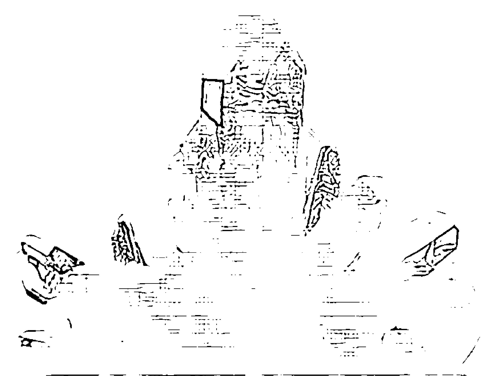

## 第十四章 八卦九宫圖

常常在許多的報章、媒體、雜誌、電視、電台、書本上面看到，哪個方向要擺什麼顏色的植物、花卉，爸爸要睡哪個方向、媽媽要睡哪個方位，哪個房間要漆什麼樣的顏色油漆，哪個地方又適合擺什麼樣的水晶……講的頭頭是道，聽的人卻很容易「霧煞煞」，到底是什麼根據呢？有什麼道理可以這麼「鐵口直斷」呢？

是生吞活剝，把這個當成「聖經」，沒有那種「一定要這樣！」、「非如此不可！」的道理的啦。否則，就會犯下和許多年輕風水師的毛病一般，「想要擁有一個強勢的男主人，將臥房安排在西北方」、「想要一個賢慧又風情萬種的太太，將臥房安排在西南方」……當下，就把人家的夫妻給拆了，不能「同房同床共枕共眠」，那還像夫妻嗎？

原來，就是看著「易經」上面的「先天八卦圖」、「後天八卦圖」的各種象徵符號及意義，就像是下圖所表示的一般。當我們把他用「表列式」的列出來時，所有的神秘感、迷糊感就消失一空了。哦，原來大師們就是看著這麼一張表，或是腦中記憶著這麼一張表，就能上台做一場又一場的演講，寫出一本又一本的書囉。有了這張表來對照，所有的水晶大師也可以變成「風水大師」囉！

更妙的是，「想要擁有乖巧順心的孩子」？那長女睡東南方，次女睡南方，三女睡西方，長男睡東方，次男睡北方，三男睡東北方……您可曾看見哪家的房子東、西、南、北四正方，東南、東北、西南、西北四維方，通通是「臥房」的啊？要嘛家裡開大飯店、大旅社的，要嘛就通通打地舖？如果風水是這麼搞得，那就太簡單囉。人人背一套公式，就可以出來行走江湖，然後專搞拆散家庭的勾當嗎？哈哈，開玩笑啦。但這些都是我們需要注意的地方。

但是呢，參考歸參考，這是一張很好的配置圖，還是要考慮當地、當時、當事人的現實環境，總是需要做些調整的啊？

### 【先天八卦】

| 兑 (澤) | 乾 (天) | 巽 (風) |
| :---: | :---: | :---: |
| 離 (火) |       | 坎 (水) |
| 震 (雷) | 坤 (地) | 艮 (山) |

### 【後天八卦】

| 4巽(風)長女綠東南(辰巽巳)木星（吉，文昌星）文曲杜門天輔五行屬木 | 9離(火)中女紫南(丙午丁)火星（吉，喜慶星）右弼景門天英五行屬火 | 2坤(地)母黑西南(未坤申)黑土星（凶，病符星）巨門死門天芮五行屬土 |
| :---: | :---: | :---: |
| 3震(雷)長男碧東(甲卯乙)木星（凶，強盜星）祿存傷門天衝五行屬木 | 5中宮(寄於坤艮)黃土星（凶，煞星）廉貞天禽五行屬土 | 7兌(澤)少女赤西(庚酉辛)金星（凶，蚩尤星）破軍驚門天柱五行屬金 |
| 8艮(山)少男白東北(丑艮寅)土星（吉，善良星）左輔生門天任五行屬土 | 1坎(水)中男白北(壬子癸)白水星（吉，文官星）貪狼休門天蓬五行屬水 | 6乾(天)父白西北(戌乾亥)金星（吉，武官星）武曲開門天心五行屬金 |

記得，書是死的，公式也是死的，但是人的腦筋是活的，一定要參考當地、當時、當事人的現場情況，予以變通，實際可行，實際有效果出來，那才叫「通達」吶。但是，也不能通達過分，把流年的變化用下去後，每年都根據相同的道理來出一本書，講來講去都是相同的東西，就是「方位」改變而已吶。這樣改來改去，搞個八、九年，是不是又可以回頭把先前第一本的再來重新印刷，又可出一本了？因為流年回來了吶？這次就連「方位」也不用改了，就改年份就好囉。「公式派」的就是喜歡來這套！
所以，記得，這張圖很好用，好好參考。就可以分辨清楚社會上哪些派別、理論只是套用公式，又哪些有真正獨到見解的，可以供作各位水晶朋友挑選、參考、相信、奉行的最佳指南哦！
在此，應著觀眾的要求，也把在風水上常用的幾個字的注音、念法列出來，爾後看下列各章，就不會有似懂非懂，念不出口的窘境囉。

+   八卦：
    - 乾（ㄑㄧㄢˊ），兌（ㄉㄨㄟˋ）
    - 離（ㄌㄧˊ），震（ㄓㄣˋ）
    - 巽（ㄒㄩㄣˋ），坎（ㄎㄢˇ）
    - 艮（ㄍㄣˇ），坤（ㄎㄨㄣ）

+   十天干：
    - 甲（ㄐㄧㄚˇ），乙（ㄧˇ）
    - 丙（ㄅㄧㄥˇ），丁（ㄉㄧㄥ）
    - 戊（ㄨˋ），己（ㄐㄧˇ）
    - 庚（ㄍㄥ），辛（ㄒㄧㄣ）
    - 壬（ㄖㄣˊ），癸（ㄍㄨㄟˇ）

+   十二地支：
    - 子（ㄗˇ），丑（ㄔㄡˇ）
    - 寅（ㄧㄣˊ），卯（ㄇㄠˇ）
    - 辰（ㄔㄣˊ），巳（ㄙˋ）
    - 午（ㄨˇ），未（ㄨㄟˋ）
    - 申（ㄕㄣ），酉（ㄧㄡˇ）
    - 戌（ㄒㄩ），亥（ㄏㄞˋ）

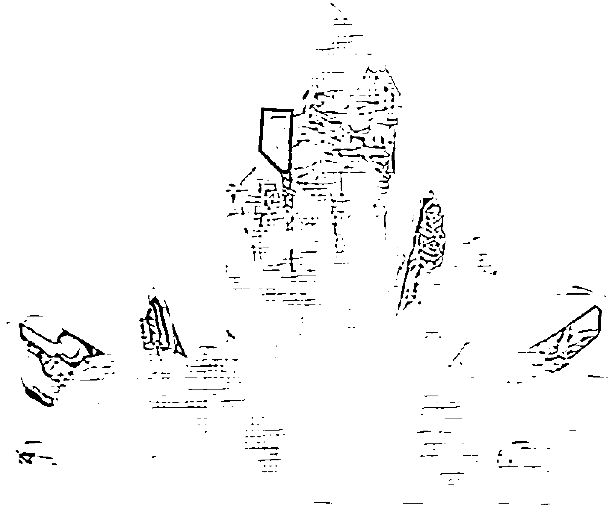

## 第十五章 簡易方位對照表

有了上一章的導引，很容易就可以推算出如下的方位囉。一樣，列表出來，各位家裡的財位方、丁位方、文昌位，都可以一目瞭然，清清楚楚，不會混淆，不會迷糊囉。

為了服務讀者，我們還特別把「九宮圖」畫出，您就可以對著自己的家裡作個最直接、最明白的比對。任何房屋，總是不出這些方位吧？

「座山」，就是當您站在屋子裡頭，房屋所「坐」，也就是「屁股」的方向啦。

「面向」，「朝向」，也就是「臉」的方向。

古代的大門，比較沒有問題，現代都會中的許多大廈、公寓，常常有好幾道門哦。這些通通可以不予理會，就當成是「過路」，真正的「大門」就在您跨入自己家裡客廳的前一道關卡，以台北市大多數的家庭而言，通常就是那一大片落地窗囉。就是把這個當「面向」，當然，相反的那個方向就是「座山」囉。

基本上，平常的家庭依照如此擺法就沒有問題啦，若是要更為深入，更為仔細，則需要依照個人的命卦來詳細看，各人可以依著自己的需要，查看書後「指導老師」，逕行聯繫，找專業的老師來為您解決疑惑。這就更為直接、詳細囉，當然，也要點費用哦！

| 房屋座山 | 財位方 | 丁位方 | 文昌位 |
| :---: | :---: | :---: | :---: |
| 東 | 南 | 東北 | 西北 |
| 東南 | 西 | 西南 | 東南 |
| 南 | 西北 | 東 | 南 |
| 西南 | 東南 | 北 | 西 |
| 西 | 北 | 東南 | 西南 |
| 西北 | 東北 | 南 | 東 |
| 北 | 西南 | 西 | 東北 |
| 東北 | 東 | 西北 | 北 |

財位方可以擺上水晶簇、紫晶洞、瑪瑙聚寶盆、大水晶球、求財七星陣等等，若是擺上「水晶噴泉」等，記得要把球的轉向，轉向屋子的中心點，就是「得水」，也就是「得財」，叫您財運亨通、財源滾滾哪！

### 一·座東向西

| 西北 文昌 | 北 | 東北 丁位 |
| :---: | :---: | :---: |
| 西 | | 東 座山 |
| 西南 | 南 財位 | 東南 |

### 二·座東南、向西北

| 西北 | 北 | 東北 |
| :---: | :---: | :---: |
| 西 財位 | 中宮 文昌 | 東 |
| 西南 丁位 | 南 | 東南 座山 |

### 三·座南向北

| 西北 財位 | 北 | 東北 |
| :---: | :---: | :---: |
| 西 | | 東 丁位 |
| 西南 | 南 文昌 | 東南 |

### 四·座西南、向東北

| 西北 | 北 丁位 | 東北 |
| :---: | :---: | :---: |
| 西 文昌 | | 東 |
| 西南 座山 | 南 | 東南 財位 |

### 五·座西向東

| 西北 | 北 財位 | 東北 |
| :---: | :---: | :---: |
| 西 座山 | | 東 |
| 西南 文昌 | 南 | 東南 丁位 |

### 六·座西北、向東南

| 西北 座山 | 北 | 東北 財位 |
| :---: | :---: | :---: |
| 西 | | 東 文昌 |
| 西南 | 南 丁位 | 東南 |

### 七·座北向南

| 西北 | 北 座山 | 東北 文昌 |
| :---: | :---: | :---: |
| 西 丁位 | | 東 |
| 西南 財位 | 南 | 東南 |

### 八·座東北、向西南

| 西北 丁位 | 北 文昌 | 東北 座山 |
| :---: | :---: | :---: |
| 西 | | 東 財位 |
| 西南 | 南 | 東南 |

丁位方擺上大的水晶柱、金字塔、精神堡壘、鱷魚水晶、白水晶七星陣等等，家庭可以興旺人丁，人才輩出；公司裡可以人力資源豐沛，員工向心力強，廣結善緣，人脈寬廣，多得貴人相助。

文昌位，顧名思義，可以在此擺上紫水晶洞，紫水晶簇，紫水晶、青金石的金字塔、球、柱等，也可以在此擺上書桌、辦公桌，在此讀書辦公，可以開發智慧，文思泉湧，創意不斷，考試中的！

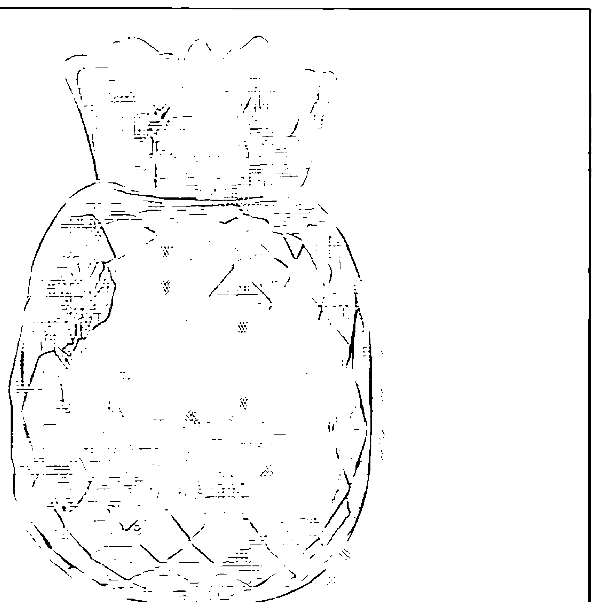

△ 財位方上擺著「鳳梨水晶」，台灣話的鳳梨就是「旺來、旺來」，取諧音好的象徵意義多多，又賺又發達，大家都發啦！

▶ 據說老闆們在丁位方放置狗的雕像象徵，就能讓員工、職員們為您忠心賣命效勞…… 用白雲石 (Dolomite) 雕刻而成的101忠狗，還真的很搭調耶？

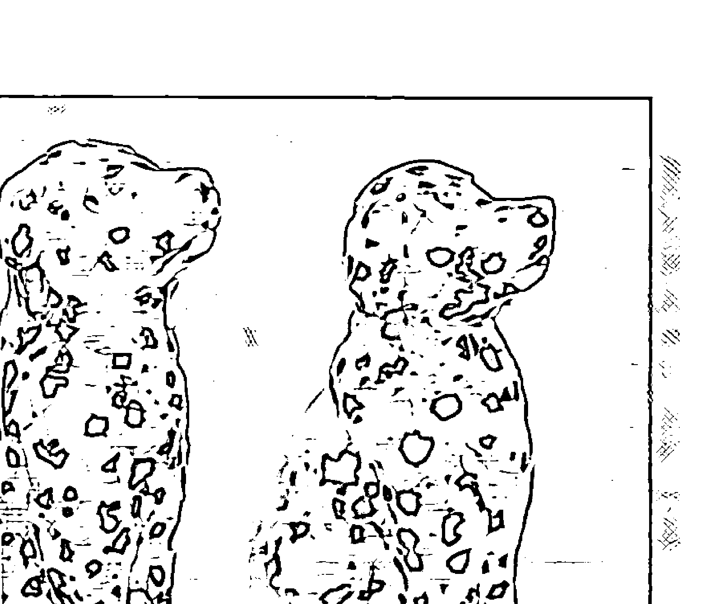

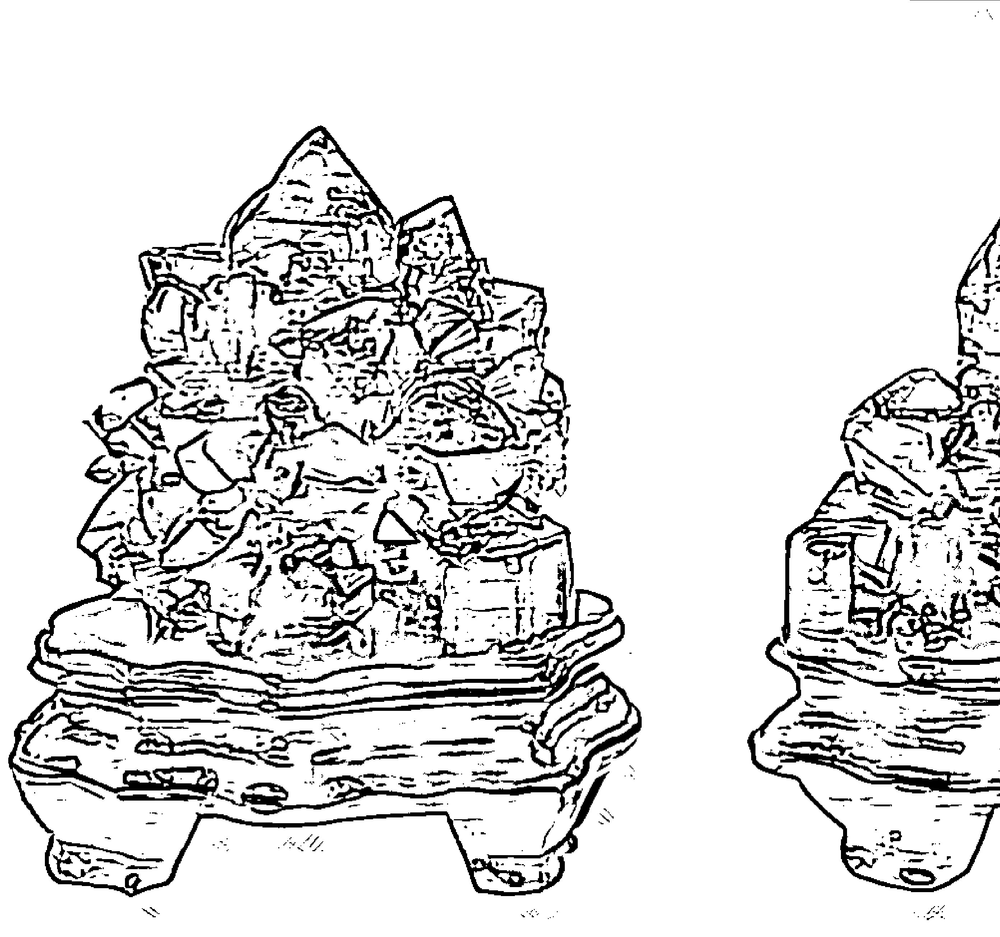

◀ 這是產自烏拉圭的另種「鳳梨型紫水晶」，除了型態上的發、旺外，紫色對應頂輪，開發智慧，對學子、考生的讀書考試，文官公僕的晉升加等，最有幫助，放置文昌位最好啦！

## 第十六章 九星術

九星的分佈順序走法

| 四 | 九 | 二 |
| :---: | :---: | :---: |
| 三 | 五 | 七 |
| 八 | 一 | 六 |

「一白坎，二黑坤，三碧震，四綠巽，五黃中，六白乾，七赤兌，八白艮，九紫離」

上面的簡圖，就是常說的「載九履一，左三右七，二四為肩，六八為足。」

不管直的加起來，橫的加起來，還是斜的加起來，總數都是十五，也是很有趣的安排哦。

看過「八卦九宮」的整理表格後，知道九顆星的名稱和性質，九顆星的變化，初初會叫人如丈二金剛般摸不著腦袋，實則整理出來，也不超過以下九種變化而已，還是有規律可循的。

一來，可以依照著上圖分佈順序走法來排，但是這方法飛來飛去的，容易給搞迷糊。

二來，可以比較圖（一）和圖（二）看看就知道，在每個相對應的區塊，從圖（一）減去一，就等於圖（二）的數了啊？

圖（二）的各區塊各減去一，也就等於圖（三）的各個區塊囉？

圖（三）的各區塊各減去一，也就等於圖（四）的各個區塊囉？

若是記不住，對，這是正常的。我們也常常覺得，正常人的腦筋怎麼有可能記得如此死板的東西呢？大不了，就是把書翻出來看，把圖拿出來比比看？不就明瞭了？何必記呢？愛因斯坦常說，能夠讓書來記的，就讓書記吧，人們的頭腦空出來，才有空閒多思考咩。這實在非常符合我們這種「懶人」的讀書法。

不必死記哦，只是看熟了，把資料隨時準備在一旁，後頭的一些算法，隨時也是依循著相同的法則在運轉。只要能看的懂，就能夠運用囉。

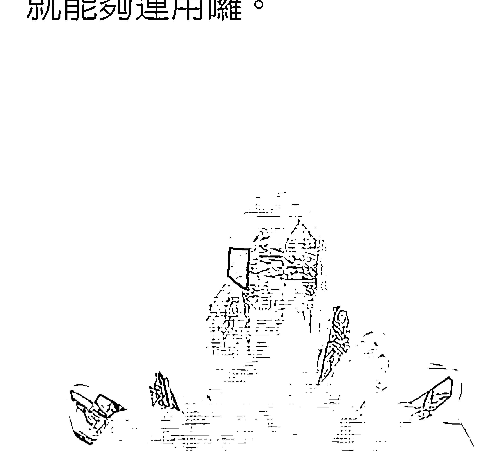

## 【八卦九宫表】

#### （一）
| 四绿 木星 | 九紫 火星 | 二黑 土星 |
| :---: | :---: | :---: |
| 三碧 木星 | 五黄 土星 | 七赤 金星 |
| 八白 土星 | 一白 水星 | 六白 金星 |

#### （二）
| 三碧 木星 | 八白 土星 | 一白 水星 |
| :---: | :---: | :---: |
| 二黑 土星 | 四绿 木星 | 六白 金星 |
| 七赤 金星 | 九紫 火星 | 五黄 土星 |

#### （三）
| 二黑 土星 | 七赤 金星 | 九紫 火星 |
| :---: | :---: | :---: |
| 一白 水星 | 三碧 木星 | 五黄 土星 |
| 六白 金星 | 八白 土星 | 四绿 木星 |

#### （四）
| 一白 水星 | 六白 金星 | 八白 土星 |
| :---: | :---: | :---: |
| 九紫 火星 | 二黑 土星 | 四绿 木星 |
| 五黄 土星 | 七赤 金星 | 三碧 木星 |

#### （五）
| 九紫 火星 | 五黄 土星 | 七赤 金星 |
| :---: | :---: | :---: |
| 八白 土星 | 一白 水星 | 三碧 木星 |
| 四绿 木星 | 六白 金星 | 二黑 土星 |

#### （六）
| 八白 土星 | 四绿 木星 | 六白 金星 |
| :---: | :---: | :---: |
| 七赤 金星 | 九紫 火星 | 二黑 土星 |
| 三碧 木星 | 五黄 土星 | 一白 水星 |

#### （七）
| 七赤 金星 | 三碧 木星 | 五黄 土星 |
| :---: | :---: | :---: |
| 六白 金星 | 八白 土星 | 一白 水星 |
| 二黑 土星 | 四绿 木星 | 九紫 火星 |

#### （八）
| 六白 金星 | 二黑 土星 | 四绿 木星 |
| :---: | :---: | :---: |
| 五黄 土星 | 七赤 金星 | 九紫 火星 |
| 一白 水星 | 三碧 木星 | 八白 土星 |

#### （九）
| 五黄 土星 | 一白 水星 | 三碧 木星 |
| :---: | :---: | :---: |
| 四绿 木星 | 六白 金星 | 八白 土星 |
| 九紫 火星 | 二黑 土星 | 七赤 金星 |

## 第十七章 八宅生旺方位

在還不考慮「時間」的因素下，光就「空間」、「方位」來論，也就是以「地盤」為先時，一個住宅的「座向」確定後，八個方位的吉凶就出來了，如下圖所顯示的情形。

方位觀念，本書也就把它改成大家都習慣的方向。所以，反而一些傳統的地理風水師可能會不習慣哦。哈哈，順了姑意，拂了嫂意，無法面面俱到的情形下，請大家多多包涵囉。

這些個圖和傳統的地理風水圖不一樣，我們把它做個更改。東西南北向都改回來囉，這樣可以更符合現在人的觀念和教育方式來看。古代的中國人在大陸北方，所謂的「帝位」，就是「坐北朝南」，以「君臨天下」。這樣看起來，南方就是在地圖的上面，東方變成在左邊，西方變成在右邊囉。

這些生、旺、煞、洩氣方位怎麼來的呢？原來也是以五行生剋的方式推算來的。若是以「中宮」當「我」，看看其他各方、各星和中宮的關係如何：

闗　煞：一定在屋宅門前。

但是受現代教育的人，特別是一些主要的先進開發國家都是位於北半球，總是把北方訂在上邊，南方在下面，東方在右邊，西方在左邊。這已經變成全世界的慣例囉。許多人來學中國地理風水不習慣，因為就是這麼一個「上下左右顛倒」（Upside Down），就讓人昏了頭咩。

+   生氣方：星星來「生」我宮，有滋長、滋潤、增長之意。
+   旺氣方：星星來「同」我宮，跟我一樣，兩個相同的在一起，聲勢就大，就旺，通常就在中宮。
+   洩氣方：也叫退氣方，星星來和「我宮」相比，是我們要去滋長他，幫助他之意，那就會損耗我們自己的元氣，對我們自己而言，就是洩氣、退氣、損耗。

呵呵，套句現在常用的話，為了和全世界的現代潮流「接軌」，符合更多現代人的地理、## 一·坎宅（坐北）

| 西北 | 北 | 东北 |
|------|----|------|
| 煞氣 二黑土 | 生氣 六白金 | 洩氣 四綠木 |
| 西 洩氣 三碧木 | 中 旺氣 一白水 | 東 煞氣 八白土 |
| 西南 生氣 七赤金 | 南 關煞 五黃土 | 東南 死氣 九紫火 |

## 五·乾宅（坐西北）

| 西北 | 北 | 东北 |
|------|----|------|
| 旺氣 七赤金 | 生氣 二黑土 | 煞氣 九紫火 |
| 西 生氣 八白土 | 中 旺氣 六白金 | 東 死氣 四綠木 |
| 西南 死氣 三碧木 | 南 洩氣 一白水 | 東南 關煞 五黃土 |

## 二·震宅（坐東）

| 西北 | 北 | 东北 |
|------|----|------|
| 旺氣 四綠木 | 死氣 八白土 | 煞氣 六白金 |
| 西 關煞 五黃土 | 中 旺氣 三碧木 | 東 生氣 一白水 |
| 西南 洩氣 九紫火 | 南 煞氣 七赤金 | 東南 死氣 二黑土 |

## 六·艮宅（坐東北）

| 西北 | 北 | 东北 |
|------|----|------|
| 生氣 九紫火 | 煞氣 四綠木 | 旺氣 二黑土 |
| 西 死氣 一白水 | 中 旺氣 八白土 | 東 洩氣 六白金 |
| 西南 關煞 五黃土 | 南 煞氣 三碧木 | 東南 洩氣 七赤金 |

## 三·坤宅（坐西南）

| 西北 | 北 | 东北 |
|------|----|------|
| 煞氣 三碧木 | 洩氣 七赤金 | 關煞 五黃土 |
| 西 煞氣 四綠木 | 中 旺氣 二黑土 | 東 生氣 九紫火 |
| 西南 旺氣 八白土 | 南 洩氣 六白金 | 東南 死氣 一白水 |

## 七·兌宅（坐西）

| 西北 | 北 | 东北 |
|------|----|------|
| 生氣 八白土 | 死氣 三碧木 | 洩氣 一白水 |
| 西 煞氣 九紫火 | 中 旺氣 七赤金 | 東 關煞 五黃土 |
| 西南 死氣 四綠木 | 南 生氣 二黑土 | 東南 旺氣 六白金 |

## 四·巽宅（坐東南）

| 西北 | 北 | 东北 |
|------|----|------|
| 關煞 五黃土 | 洩氣 九紫火 | 煞氣 七赤金 |
| 西 煞氣 六白金 | 中 旺氣 四綠木 | 東 死氣 二黑土 |
| 西南 生氣 一白水 | 南 死氣 八白土 | 東南 旺氣 三碧木 |

## 八·離宅（坐南）

| 西北 | 北 | 东北 |
|------|----|------|
| 煞氣 一白水 | 關煞 五黃土 | 生氣 三碧木 |
| 西 洩氣 二黑土 | 中 旺氣 九紫火 | 東 死氣 七赤金 |
| 西南 死氣 六白金 | 南 生氣 四綠木 | 東南 洩氣 八白土 |

煞氣方：也稱殺氣方，星星來，會「剋制」我宮，但因為我宮當位，氣正旺，會有所損傷、傷害，但不至全亡、全無。

死氣方：這個方位的星星來，正好被「我宮」所剋，也是有所損傷、傷害，但因我宮當位，氣正旺，這方位將會全被剋制，無氣可言，故曰死氣方。

一般而言，我們都會將與「生養休息」有關的門位，床位，灶位等放在生氣方、旺氣方等吉位。進門來就是客廳，床位就是臥房，灶位就是廚房。跟我們日常生活起居、作息都有莫大關係的。而廁所、煙囪、排油煙機、室內樓梯等等，就安放在洩氣、煞氣、死氣等，這些比較「凶」的方位。話說如此，這在現代人購買大樓、公寓、成屋時，這些都已經是「定型」了，根本沒有選擇空間，能做的調配、改善，幾乎微乎其微。除非您發大財，中了樂透，或是哪天退休，解甲歸田，可以自己買地蓋屋，才好從新規劃設計。但這也凸顯出了「風水制化」的重要，當我們無法「改變」環境的話，想辦法「改善」，也是個方法啊？

另外，我們再補充一些資料供大家參考：

這麼列表一看，就知道上述生、旺、洩、煞、死氣方是如何來的囉。這個方法叫「九星術」，就是看天上星星的屬性、顏色來判斷的，請勿與一般的觀念混淆囉。再看看，九顆星星當中，只有白色的三顆星是吉，還有紫色的是小吉，其他都是凶，也因此被叫成「紫白飛星」。「九星術」、「九宮術」、「九宮算」、「九宮飛星」、「紫白飛星」、「飛白九星」、「紫白術」……其實，講的都是同樣這套學問。專門研究這套學問的，也就被稱作「九星家」。據學者考據，在漢代以前，好像還沒有這套學問問世呢，從史籍推測，應該是唐宋以後的產物。這也是廣大風水流派中的一支啦，曾經充滿了許多神秘的色彩，但當列表出來，一目瞭然，神秘的面紗就揭開了，人人可以推斷自家的方位吉凶，不必有所迷惑囉。

介紹完「地盤」，還有後頭的「大運盤」、「流年盤」、「流月盤」、「流日盤」、「流時盤」，還有九星「順飛」、「逆飛」的情形，也是全部列表清楚說明，請讀者耐心看下去，更多的「風水大師」就要誕生囉！

| 宮數 | 一 | 二 | 三 | 四 | 五 | 六 | 七 | 八 | 九 |
|---|---|---|---|---|---|---|---|---|---|
| 星色 | 白 | 黑 | 碧 | 綠 | 黃 | 白 | 赤 | 白 | 紫 |
| 卦名 | 坎 | 坤 | 震 | 巽 | 中 | 乾 | 兌 | 艮 | 離 |
| 五行 | 水 | 土 | 木 | 木 | 土 | 金 | 金 | 土 | 火 |
| 吉凶 | 吉 | 凶 | 凶 | 凶 | 凶 | 吉 | 凶 | 吉 | 小吉 |

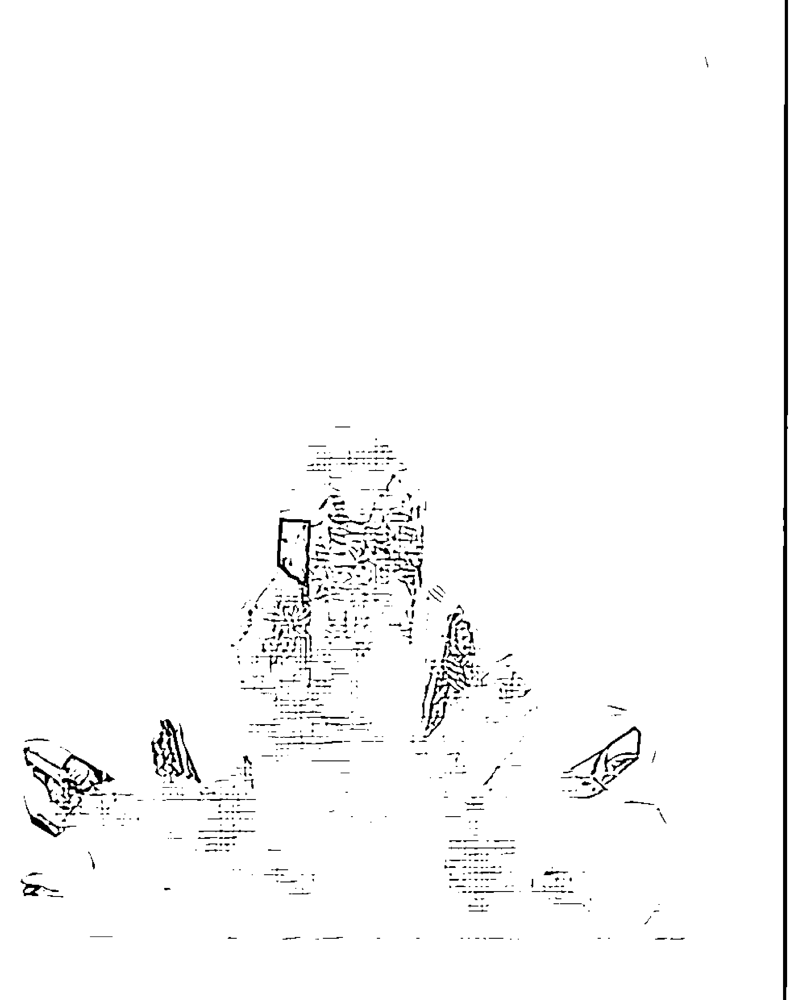

## 第十八章 大運天盤

看完了地理方位的配置，再來要看「時間」的問題。

基本上，依照九宮的排法，也分成九運，每運有二十年，九運就有一百八十年，稱為「陰儀」。再一百八十年為「陽儀」，陰陽兩儀合為三百六十年，這就是「天運」的一個週期。

天干有「甲、乙、丙、丁、戊、己、庚、辛、壬、癸」，十個數。

地支有「子、丑、寅、卯、辰、巳、午、未、申、酉、戌、亥」，十二個數。

古代中國人計算時間的方式就是從天干配地支，「甲子」、「乙丑」、「丙寅」……一路一直配到「癸亥」，十和十二的公約數，總共「六十」，剛好各輪完一遍，從頭又來一次，又是從「甲子」開始。所以，一「甲子」就是六十年，「甲子」也好像是「時間」的代名詞。

一「甲子」有六十年，每運有二十年，所以一甲子就包含有三運囉。

所以，一運、二運、三運，共六十年，合稱「上元」。

四運、五運、六運，共六十年，合稱「中元」。

七運、八運、九運，共六十年，合稱「下元」。

三元合成一百八十年，六元合成三百六十年，這就是「天運」的始終。

「上元」、「中元」、「下元」，就是「三元地理」名稱的由來。

再加把勁，以現在的時間點為準，把上下各三元的時間點列出來，共五百四十年，就可以看看過去，現在，將來，自己的住宅，或是他人的住宅等等，各會是處在什麼的大運裡面，就是會要走什麼運囉。

+   【上元】：
一運1684～1703
二運1704～1723
三運1724～1743

【中元】：
四運1744～1763
五運1764～1783
六運1784～1803

+   **【下元】：**
*   七運1804～1823
*   八運1824～1843
*   九運1844～1863

**【上元】：**
*   一運
    *   民前48 (1864)～民前28 (1883)
*   二運
    *   民前27 (1884)～民前 7 (1903)
*   三運
    *   民前 8 (1904)～民國12 (1923)

**【中元】：**
*   四運
    *   民國13 (1924)～民國32 (1943)
*   五運
    *   民國33 (1944)～民國52 (1963)
*   六運
    *   民國53 (1964)～民國72 (1983)

**【下元】：**
*   七運
    *   民國73 (1984)～民國92 (2003)
*   八運
    *   民國93 (2004)～民國112 (2023)
*   九運
    *   民國113 (2024)～民國132 (2043)

**【上元】：**
*   一運
    *   民國133 (2044)～民國152 (2063)
*   二運
    *   民國153 (2064)～民國172 (2083)
*   三運
    *   民國173 (2084)～民國192 (2103)

**【中元】：**
*   四運
    *   民國193 (2104)～民國212 (2123)
*   五運
    *   民國213 (2124)～民國232 (2143)
*   六運
    *   民國233 (2144)～民國252 (2163)

**【下元】：**
*   七運
    *   民國253 (2164)～民國272 (2183)
*   八運
    *   民國273 (2184)～民國292 (2203)
*   九運
    *   民國293 (2204)～民國312 (2223)

最簡單的一個了解，就是看現在走到了什麼樣的「年」，就是走什麼樣的「運」，是「一運」、「二運」，還是「五運」、「八運」，就對照下列的表格中央區塊，就知道您現在「走」什麼「運」囉，而且是每「二十年」的「大運」。另外，「四正」東、西、南、北；「四維」東北、東南、西南、西北，各個位置的「旺」、「生」、「衰」、「死」吉凶方位就出來囉。

## 【正盤走势图】

| 西北 2黑坤 生 | 北 6白乾 死 | 东北 4绿巽 死 |
|-------------------|------------------|-------------------|
| 西 3碧震 生 | 中 1白坎 旺 | 东 8白艮 衰 |
| 西南 7赤兑 衰 | 南 5黄中 死 | 东南 9紫离 衰 |

| 西北 3碧震 生 | 北 7赤兑 死 | 东北 5黄中 死 |
|-------------------|------------------|-------------------|
| 西 4绿巽 死 | 中 2黑坤 旺 | 东 9紫离 衰 |
| 西南 8白艮 衰 | 南 6白乾 死 | 东南 1白坎 衰 |

| 西北 4绿巽 生 | 北 8白艮 死 | 东北 6白乾 死 |
|-------------------|------------------|-------------------|
| 西 5黄中 生 | 中 3碧震 旺 | 东 1白坎 衰 |
| 西南 9紫离 衰 | 南 7赤兑 死 | 东南 2黑坤 衰 |

| 西北 5黄中 生 | 北 9紫离 死 | 东北 7赤兑 死 |
|-------------------|------------------|-------------------|
| 西 6白乾 生 | 中 4绿巽 旺 | 东 2黑坤 衰 |
| 西南 1白坎 衰 | 南 8白艮 死 | 东南 3碧震 衰 |

| 西北 6白乾 生 | 北 1白坎 死 | 东北 8白艮 死 |
|-------------------|------------------|-------------------|
| 西 7赤兑 生 | 中 5黄中 旺 | 东 3碧震 衰 |
| 西南 2黑坤 衰 | 南 9紫离 死 | 东南 4绿巽 衰 |

| 西北 7赤兑 生 | 北 2黑坤 死 | 东北 9紫离 死 |
|-------------------|------------------|-------------------|
| 西 8白艮 生 | 中 6白乾 旺 | 东 4绿巽 衰 |
| 西南 3碧震 衰 | 南 1白坎 死 | 东南 5黄中 衰 |

| 西北 8白艮 生 | 北 3碧震 死 | 东北 1白坎 死 |
|-------------------|------------------|-------------------|
| 西 9紫离 生 | 中 7赤兑 旺 | 东 5黄中 衰 |
| 西南 4绿巽 衰 | 南 2黑坤 死 | 东南 6白乾 衰 |

| 西北 9紫离 生 | 北 4绿巽 死 | 东北 2黑坤 死 |
|-------------------|------------------|-------------------|
| 西 1白坎 生 | 中 8白艮 旺 | 东 6白乾 衰 |
| 西南 5黄中 衰 | 南 3碧震 死 | 东南 7赤兑 衰 |

| 西北 1白坎 生 | 北 5黄中 死 | 东北 3碧震 死 |
|-------------------|------------------|-------------------|
| 西 2黑坤 生 | 中 9紫离 旺 | 东 7赤兑 衰 |
| 西南 6白乾 衰 | 南 4绿巽 死 | 东南 8白艮 衰 |

比方說，若是公元2000年，就是在「下元七運」，就是看「七運表」，七赤兌入中宮，走旺運。若是公元1752年，走「中元四運」，就是看「四運表」，四綠巽入中宮，走旺運。若是公元2088年，走「上元三運」，就是看「三運表」，三碧震入中宮，走旺運。相同道理，其餘類推。

咱中國人常常在說「走運、走運」，就是看您走什麼運，走這個運囉。走運的，也是「當運」，入中宮，其他的星曜就跟著變化。

-   【旺】，就是當元當運，天心正運，最是大吉的方位。
-   【生】，就是當元，將要來到的運，將要等候時間一到就發達了，次吉。
-   【衰】，就是時間已經過去囉，就不吉囉。
-   【死】，就是離開元運越久的，失去元運的，屬凶。

這些旺、生、衰、死的論法，就是依據九星飛宮的排列方式，各有木、火、土、金、水的屬性，相生或相剋所碰撞產生出來的。理論是如此，事實是否如此呢？

本派，在學的，都說非常精準，但是和許多中國的傳統學問一樣，都沒有大量的統計數據可以當依靠。不管如何，先了解了再說。

從「地盤」，就可以先看出一間住宅的大致情形；再加上「時間」「二十年大運」的因素考量下去，旺、生、衰、死的吉凶也分出來囉。

還沒完哦？二十年的時間太長了咩，還有看「流年」、「流月」、「流日」、「流時」的，就是每一年，每一月，每一日，每一個時辰的吉凶論法。我們後頭都有介紹。其實，列表出來，用法出來，就是對照著看，很簡單啦。不必「頭殼抱著燒」，也不會增加頭腦、心裡的負擔。先把这些看完，我們最後再來檢討看看好壞得失。

對了，以下這些的盤勢是屬於「正盤」、「順盤」的走勢哦。下一章介紹的是「逆行盤」，在論流日、流時的時候，也會用到。注意其中的差別，才不會一個不留神，差之毫厘，謬之千里。

> (淳貿天然水晶www.blancoage.com)

## 第十九章 逆行九星盤

這是所謂的「逆行盤」，飛星行走分佈的方向相反，可以運用在論流日、流時的時候使用。請注意和「順盤」間的不一樣，不要搞混囉。

### 【逆行盤表】

#### (一運逆行表)

| 西北 | 北 | 東北 |
| :--- | :--- | :--- |
| 9紫離 衰 | 5黃中 死 | 7赤兌 衰 |
| **西** | **中** | **東** |
| 8白艮 衰 | 1白坎 旺 | 3碧震 生 |
| **西南** | **南** | **東南** |
| 4綠巽 死 | 6白乾 死 | 2黑坤 生 |

#### (二運逆行表)

| 西北 | 北 | 東北 |
| :--- | :--- | :--- |
| 1白坎 衰 | 6白乾 死 | 8白艮 衰 |
| **西** | **中** | **東** |
| 9紫離 衰 | 2黑坤 旺 | 9紫離 衰 |
| **西南** | **南** | **東南** |
| 5黃中 死 | 7赤兌 死 | 3碧震 生 |

#### (三運逆行表)

| 西北 | 北 | 東北 |
| :--- | :--- | :--- |
| 2黑坤 衰 | 7赤兌 死 | 9紫離 衰 |
| **西** | **中** | **東** |
| 1白坎 衰 | 3碧震 旺 | 5黃中 生 |
| **西南** | **南** | **東南** |
| 6白乾 死 | 8白艮 死 | 4綠巽 生 |

#### (四運逆行表)

| 西北 | 北 | 東北 |
| :--- | :--- | :--- |
| 3碧震 衰 | 8白艮 死 | 1白坎 衰 |
| **西** | **中** | **東** |
| 2黑坤 衰 | 4綠巽 旺 | 6白乾 生 |
| **西南** | **南** | **東南** |
| 7赤兌 死 | 9紫離 死 | 5黃中 生 |

#### (五運逆行表)

| 西北 | 北 | 東北 |
| :--- | :--- | :--- |
| 4綠巽 衰 | 9紫離 死 | 2黑坤 衰 |
| **西** | **中** | **東** |
| 3碧震 衰 | 5黃中 旺 | 7赤兌 生 |
| **西南** | **南** | **東南** |
| 8白艮 死 | 1白坎 死 | 6白乾 生 |

#### (六運逆行表)

| 西北 | 北 | 東北 |
| :--- | :--- | :--- |
| 5黃中 衰 | 1白坎 死 | 3碧震 衰 |
| **西** | **中** | **東** |
| 4綠巽 衰 | 6白乾 旺 | 8白艮 生 |
| **西南** | **南** | **東南** |
| 9紫離 死 | 2黑坤 死 | 7赤兌 生 |

#### (七運逆行表)

| 西北 | 北 | 東北 |
| :--- | :--- | :--- |
| 6白乾 衰 | 2黑坤 死 | 4綠巽 衰 |
| **西** | **中** | **東** |
| 5黃中 衰 | 7赤兌 旺 | 9紫離 生 |
| **西南** | **南** | **東南** |
| 1白坎 死 | 3碧震 死 | 8白艮 生 |

#### (八運逆行表)

| 西北 | 北 | 東北 |
| :--- | :--- | :--- |
| 7赤兌 衰 | 3碧震 死 | 5黃中 衰 |
| **西** | **中** | **東** |
| 6白乾 衰 | 8白艮 旺 | 1白坎 生 |
| **西南** | **南** | **東南** |
| 2黑坤 死 | 4綠巽 死 | 9紫離 生 |

#### (九運逆行表)

| 西北 | 北 | 東北 |
| :--- | :--- | :--- |
| 8白艮 衰 | 4綠巽 死 | 6白乾 衰 |
| **西** | **中** | **東** |
| 7赤兌 衰 | 9紫離 旺 | 2黑坤 生 |
| **西南** | **南** | **東南** |
| 3碧震 死 | 5黃中 死 | 1白坎 生 |

## 第二十章 紫白流年

此時，我們還需要一本「萬年曆」，這在華人的社會裡面，應該不難找到。有西曆、農曆互相對照的，還有記載天干、地支的，一翻出來看，就清楚又明白囉。

在第十七章裡頭，我們不考慮「時間因素」，純粹就著「方位」問題來論吉凶的而已，這就是所謂的「地盤」。

在第十八章裡頭，所謂的「大運天盤」，是以每「二十年」為單位在看的。每二十年所走的大方向、大運。涵蓋的時間比較長，對於整體世局、大的局勢比較有影響；也可以看得比較明顯。至於，對個人、家宅的影響就有點太大，太籠統了。所以會有看完「大運」後，要看「流年」，流年就是以一年、一年為單位的來看，時間比較短，對於個人、家宅的影響就比較明顯、顯著，而「流年盤」也是一般比較重視、注意的。

首先，先看看前面或下面的年代資料，了解到自己要查的是在什麼年，是屬於三元裡的上元、中元、還是下元？再看「歲次」屬什麼，就知道走什麼運囉，哪一顆星曜該入中宮，查看第18章的順盤，就可以知道各個吉凶方位囉。

比如說，以1956年來說，查歲次屬「中元五運」，「丙申」年，查看「紫白流年表」，在第六列，第四個，丙申，對應到中元，就是「八白」當運，應當入中宮。我們就可以翻回18章，看（八運表格），各個吉凶位置就出來囉。

相同道理，若是看公元2020年，查歲次屬「下元八運」，庚子年，查看「紫白流年表」，在第一列，第五個就是庚子，下元，那就「七赤」當運，當入中宮，我們就可以查看18章的（七運表格），吉凶方位，立即可見。

其餘道理相同，依此類推。

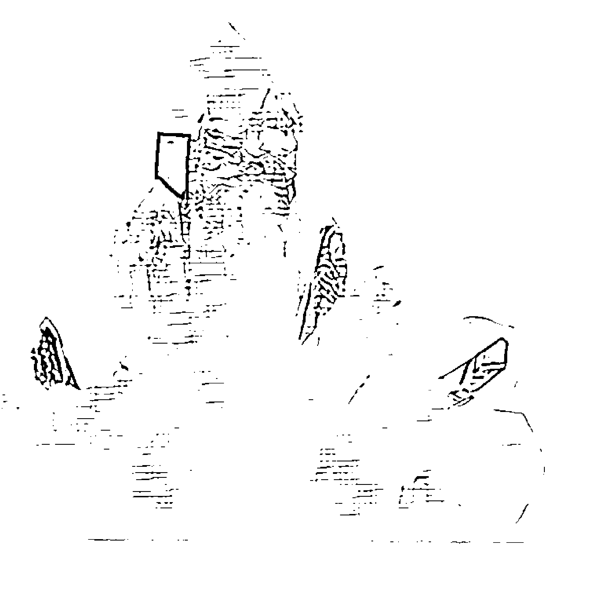

### 【紫白流年表】

| 歲次 | 上元 | 中元 | 下元 |
| :--- | :--- | :--- | :--- |
| 甲子，癸酉，壬午，辛卯，庚子，己酉，戊午。 | 一白 | 四綠 | 七赤 |
| 乙丑，甲戌，癸未，壬辰，辛丑，庚戌，乙未。 | 九紫 | 三碧 | 六白 |
| 丙寅，乙亥，甲申，癸巳，壬寅，辛亥，庚申。 | 八白 | 二黑 | 五黃 |
| 丁卯，丙子，乙酉，甲午，癸卯，壬子，辛酉。 | 七赤 | 一白 | 四綠 |
| 戊辰，丁丑，丙戌，乙未，甲辰，癸丑，壬戌。 | 六白 | 九紫 | 三碧 |
| 己巳，戊寅，丁亥，丙申，乙巳，甲寅，癸亥。 | 五黃 | 八白 | 二黑 |
| 庚午，己卯，戊子，丁酉，丙午，乙卯。 | 四綠 | 七赤 | 一白 |
| 辛未，庚辰，己丑，戊戌，丁未，丙辰。 | 三碧 | 六白 | 九紫 |
| 壬申，辛巳，庚寅，己亥，戊申，丁巳。 | 二黑 | 五黃 | 八白 |

### 【萬年曆 歲次表】

| 中元五運：1944 ～ 1963 | 中元六運：1964 ～ 1983 | 下元七運：1984 ～ 2003 |
| :--- | :--- | :--- |
| 下元八運：2004 ～ 2023 | 下元九運：2024 ～ 2043 | 上元一運：2044 ～ 2063 |

- 1. 1950 庚寅
- 2. 1951 辛卯
- 3. 1952 壬辰
- 4. 1953 癸巳
- 5. 1954 甲午
- 6. 1955 乙未
- 7. 1956 丙申
- 8. 1957 丁酉
- 9. 1958 戊戌
- 10. 1959 己亥
- 11. 1960 庚子
- 12. 1961 辛丑
- 13. 1962 壬寅
- 14. 1963 癸卯
- 15. 1964 甲辰
- 16. 1965 乙巳
- 17. 1966 丙午
- 18. 1967 丁未
- 19. 1968 戊申
- 20. 1969 己酉
- 21. 1970 庚戌
- 22. 1971 辛亥
- 23. 1972 壬子
- 24. 1973 癸丑
- 25. 1974 甲寅
- 26. 1975 乙卯
- 27. 1976 丙辰
- 28. 1977 丁巳
- 29. 1978 戊午
- 30. 1979 己未
- 31. 1980 庚申
- 32. 1981 辛酉
- 33. 1982 壬戌
- 34. 1983 癸亥
- 35. 1984 甲子
- 36. 1985 乙丑
- 37. 1986 丙寅
- 38. 1987 丁卯
- 39. 1988 戊辰
- 40. 1989 己巳
- 41. 1990 庚午
- 42. 1991 辛未
- 43. 1992 壬申
- 44. 1993 癸酉
- 45. 1994 甲戌
- 46. 1995 乙亥
- 47. 1996 丙子
- 48. 1997 丁丑
- 49. 1998 戊寅
- 50. 1999 己卯
- 51. 2000 庚辰
- 52. 2001 辛巳
- 53. 2002 壬午
- 54. 2003 癸未
- 55. 2004 甲申
- 56. 2005 乙酉
- 57. 2006 丙戌
- 58. 2007 丁亥
- 59. 2008 戊子
- 60. 2009 己丑
- 61. 2010 庚寅
- 62. 2011 辛卯
- 63. 2012 壬辰
- 64. 2013 癸巳
- 65. 2014 甲午
- 66. 2015 乙未
- 67. 2016 丙申
- 68. 2017 丁酉
- 69. 2018 戊戌
- 70. 2019 己亥
- 71. 2020 庚子
- 72. 2021 辛丑
- 73. 2022 壬寅
- 74. 2023 癸卯
- 75. 2024 甲辰
- 76. 2025 乙巳
- 77. 2026 丙午
- 78. 2027 丁未
- 79. 2028 戊申
- 80. 2029 己酉
- 81. 2030 庚戌
- 82. 2031 辛亥
- 83. 2032 壬子
- 84. 2033 癸丑
- 85. 2034 甲寅
- 86. 2035 乙卯
- 87. 2036 丙辰
- 88. 2037 丁巳
- 89. 2038 戊午
- 90. 2039 己未
- 91. 2040 庚申
- 92. 2041 辛酉
- 93. 2042 壬戌
- 94. 2043 癸亥
- 95. 2044 甲子
- 96. 2045 乙丑
- 97. 2046 丙寅
- 98. 2047 丁卯
- 99. 2048 戊辰
- 100. 2049 己巳

需要注意一点的是，在看时间的「点」上面，我们传统中国的看法不是光照着月历来看的哦，最主要的还是要看「节气」。而一年和一年的最主要差别点，就在「立春」这点上，有此来分为「上一年」、「下一年」，请勿混淆了哦。

话说回来，风水上看流年就是这么简单而已。

原本，看风水、算命理，人手一本「万年历」是非常普遍的事情的。但是应朋友要求，许多人在海外、侨社、商界、驻外单位，有时要找本「万年历」，还真的困难重重呢。那我们也不怕做苦工啦，一本书就好人做到底，也把距离当今，前后五十年的年次都列出来，朋友们可以就此参考参考。若还要更为长久宽广的，还是要赶快买本万年历哦。

> (淳贺天然水晶www.blancoage.com)

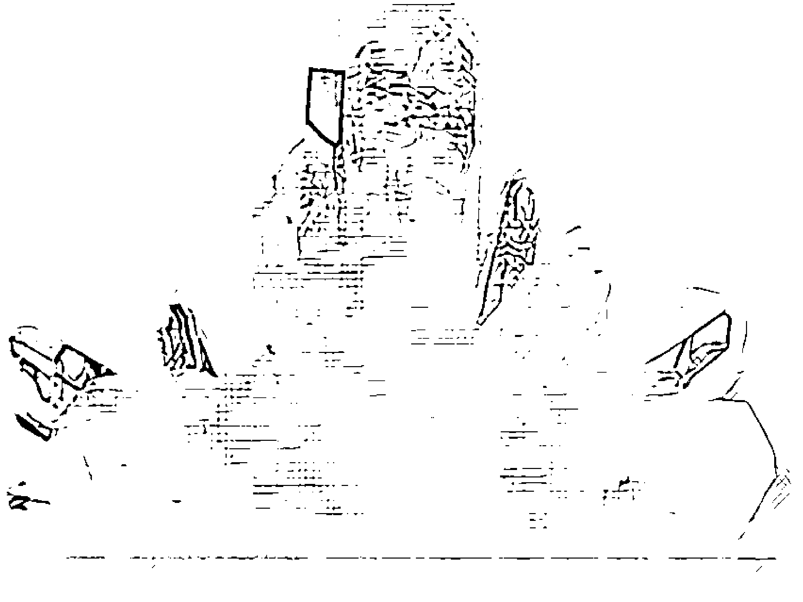

## 第二十一章 紫白流月

看流月的道理和流年差不多，也是需要依赖「万年历」。这就是更为细分，不是只看「一年」的，而是看「一个月」内的运势走向如何。

但在此，还有更细微的地方需要注意，就是每个月的分际也不是光看月历上面的数字而已，而是要照着「节气」来分哦。所以，我们也就把它列表出来，看看当天是什么日子，是在哪个节气之前，还是之后，以此来判断您是在几月份里面。还有啊，当然是看「农历」的哦，不要搞到阳历去啰。

比如说，一月，一定要在「立春」之后，才算是进入一月，「雨水」时分也算是一月，一直到「惊蛰」前，都还算是一月哦。直到「惊蛰」后，才算进入二月。同理，四月就是从立夏、小满，一直到芒种，都算四月，过了芒种才算进入五月。八月，就是从白露，秋分，一直到寒露前，都算是八月，过了寒露，才算进入九月。其余，请自行类推啰。

那么再看，当月的「地支」属什么，两相配合下，当下当月走什么运，什么星曜该入中宫，就可以明了啰。再查看18章的相关盘势，就可以分出住宅的吉凶方位。

比方说在阳历公元2014年5月14日，查看万年历是农历四月十六，当月立夏在初七，小满在二十三，芒种在五月初九。所以，从农历四月初七，一直到农历五月初九，都是属于同一个「流月」的时分。看看当月的「月次」，属于「己巳」，看看下表四月第三栏，所以当月（农历四月初七到五月初九）都属于「八白」当运，查看18章的「八运表」，所有的吉凶方位就都出来啰。

再看2050年农历八月，会是什么样的运势呢？查看万年历，白露在农历七月二十二就降临了，连着秋分，直到八月二十三寒露到时，就是整个农历八月。该月的「月次」为「乙酉」，查下表，对应八月第一栏「一白」，一白当运，翻回18章查看「一运表」，所有的吉凶方位就都出来啰。

有些万年历不错，会把当月的星曜也刊登出来。但是记得，仅供参考，细微的节气分际还是要自己去看，才不会搞混啰。

(淳賈天然水晶TEL:886-2-2788-9231 Fax:886-2-2788-8982)

### 【紫白流月表】

| 月次／節氣 | 子午卯酉 | 辰戌丑未 | 寅申己亥 |
|------------|----------|----------|----------|
| 一月（立春，雨水） | 八白 | 五黄 | 二黑 |
| 二月（驚蟄，春分） | 七赤 | 四綠 | 一白 |
| 三月（清明，穀雨） | 六白 | 三碧 | 九紫 |
| 四月（立夏，小滿） | 五黃 | 二黑 | 八白 |
| 五月（芒種，夏至） | 四綠 | 一白 | 七赤 |
| 六月（小暑，大暑） | 三碧 | 九紫 | 六白 |
| 七月（立秋，處暑） | 二黑 | 八白 | 五黃 |
| 八月（白露，秋分） | 一白 | 七赤 | 四綠 |
| 九月（寒露，霜降） | 九紫 | 六白 | 三碧 |
| 十月（立冬，小雪） | 八白 | 五黃 | 二黑 |
| 十一月（大雪，冬至） | 七赤 | 四綠 | 一白 |
| 十二月（小寒，大寒） | 六白 | 三碧 | 九紫 |

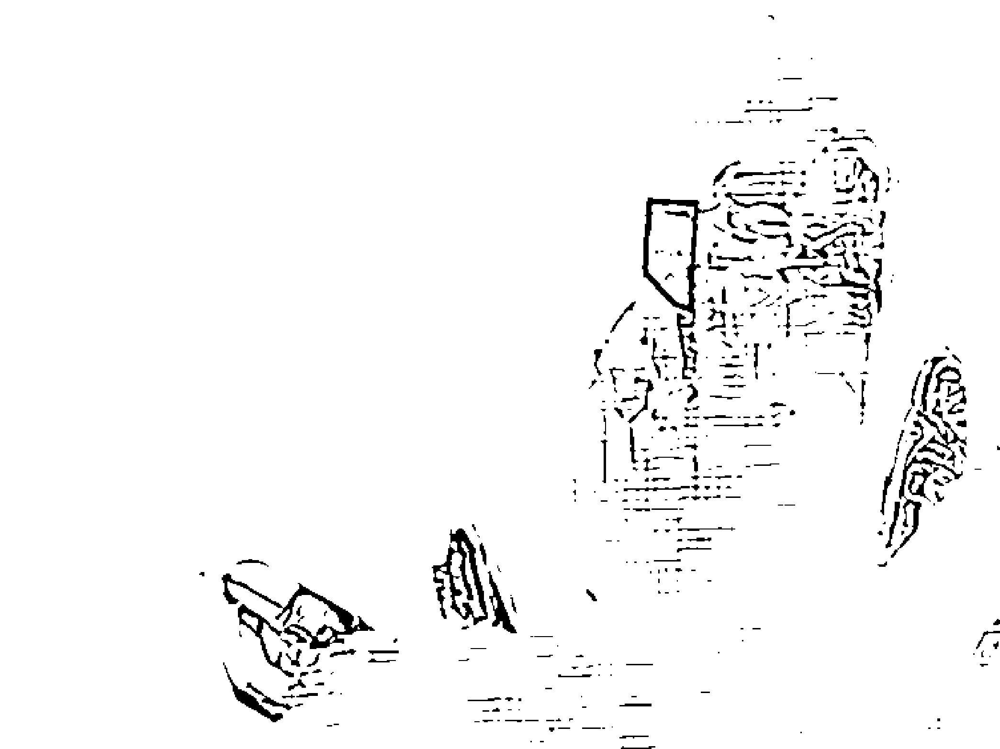

## 第二十二章 紫白流日

底下這個表格，對於沒有學過中國計時方法，或是不熟悉的人，看起來就不只是「霧煞煞」，簡直有點可怕哦！因為有那麼多字，有些似懂非懂，會念又像不會念。一時要記在腦筋裡恐怕有問題，更別說要熟悉他囉。習慣西洋計時方法的人，十進位方式，非常簡單又明瞭，根本也不必花腦筋記咩？

但是，也別怕。十天干、十二地支，合起來，大不了就是「六十」這個最大公約數而已。前面已經說過，六十年為一「甲子」，就是甲子、乙丑、丙寅、丁卯……一路一直配下來，一直到癸亥第六十個配對為止，然後就又從「甲子」重新來過。所以，不管天長地久，悠悠萬年歲月，就也是這六十個天干、地支在相配而已。

年是如此，月是如此，日也是如此。只要分清楚了這六十個日子，您就也學會囉。其實，也不用死背啦，列表出來，不就一目瞭然了呢？多念幾次，念熟了，就不會害怕了，反而會有種親切感哦。遇到也是學這個的朋友，交談也用這些語言、文字、術語的，呵呵，特別親切哦。人不親土親嘛，具有相同文化、背景、傳統的，就是不一樣！

再來，注意一下，就是看「流日」每日運程的時候，記得要分辨一下，是在「冬至」以後呢，還是在「夏至」以後。「冬至」以後，記得看18章的「順飛九宮」；「夏至」以後，記得看19章的「逆飛九宮」。

翻一下萬年曆，看看是什麼日子，處在什麼樣的節氣底下，就知道當天是什麼星曜進入中宮，當旺。其他方位的生、衰、死氣方，就可以吉凶立判囉。其實，也就是這麼簡單而已。只是，整理起這些資料，還要點功夫，打字、列表、編排…… 但是，若能讓人看的清楚，想的明白，一目瞭然，一切的辛苦都值得囉。我們老祖宗的學問不能再遮掩、隱藏囉，必須以現代的，新的方式來詮釋，才有可能發揚光大咩？

### 【紫白流日表】

| 日次／節氣 | 冬至～立春 | 雨水～清明 | 穀雨～芒種 | 夏至～立秋 | 處暑～寒露 | 霜降～大雪 |
|------------|------------|------------|------------|------------|------------|------------|
| 甲子 | 一白坎 | 七赤兌 | 四綠巽 | 九紫離 | 三碧震 | 六白乾 |
| 乙丑 | 二黑坤 | 八白艮 | 五黃中 | 八白艮 | 二黑坤 | 五黃中 |
| 丙寅 | 三碧震 | 九紫離 | 六白乾 | 七赤兌 | 一白坎 | 四綠巽 |
| 丁卯 | 四綠巽 | 一白坎 | 七赤兌 | 六白乾 | 九紫離 | 三碧震 |
| 戊辰 | 五黃中 | 二黑坤 | 八白艮 | 五黃中 | 八白艮 | 二黑坤 |
| 己巳 | 六白乾 | 三碧震 | 九紫離 | 四綠巽 | 七赤兌 | 一白坎 |
| 庚午 | 七赤兌 | 四綠巽 | 一白坎 | 三碧震 | 六白乾 | 九紫離 |
| 辛未 | 八白艮 | 五黃中 | 二黑坤 | 二黑坤 | 五黃中 | 八白艮 |
| 壬申 | 九紫離 | 六白乾 | 三碧震 | 一白坎 | 四綠巽 | 七赤兌 |
| 癸酉 | 一白坎 | 七赤兌 | 四綠巽 | 九紫離 | 三碧震 | 六白乾 |
| 甲戌 | 二黑坤 | 八白艮 | 五黃中 | 八白艮 | 二黑坤 | 五黃中 |
| 乙亥 | 三碧震 | 九紫離 | 六白乾 | 七赤兌 | 一白坎 | 四綠巽 |
| 丙子 | 四綠巽 | 一白坎 | 七赤兌 | 六白乾 | 九紫離 | 三碧震 |
| 丁丑 | 五黃中 | 二黑坤 | 八白艮 | 五黃中 | 八白艮 | 二黑坤 |
| 戊寅 | 六白乾 | 三碧震 | 九紫離 | 四綠巽 | 七赤兌 | 一白坎 |
| 己卯 | 七赤兌 | 四綠巽 | 一白坎 | 三碧震 | 六白乾 | 九紫離 |
| 庚辰 | 八白艮 | 五黃中 | 二黑坤 | 二黑坤 | 五黃中 | 八白艮 |
| 辛巳 | 九紫離 | 六白乾 | 三碧震 | 一白坎 | 四綠巽 | 七赤兌 |
| 壬午 | 一白坎 | 七赤兌 | 四綠巽 | 九紫離 | 三碧震 | 六白乾 |
| 癸未 | 二黑坤 | 八白艮 | 五黃中 | 八白艮 | 二黑坤 | 五黃中 |
| 甲申 | 三碧震 | 九紫離 | 六白乾 | 七赤兌 | 一白坎 | 四綠巽 |
| 乙酉 | 四綠巽 | 一白坎 | 七赤兌 | 六白乾 | 九紫離 | 三碧震 |
| 丙戌 | 五黃中 | 二黑坤 | 八白艮 | 五黃中 | 八白艮 | 二黑坤 |
| 丁亥 | 六白乾 | 三碧震 | 九紫離 | 四綠巽 | 七赤兌 | 一白坎 |
| 戊子 | 七赤兌 | 四綠巽 | 一白坎 | 三碧震 | 六白乾 | 九紫離 |
| 己丑 | 八白艮 | 五黃中 | 二黑坤 | 二黑坤 | 五黃中 | 八白艮 |
| 庚寅 | 九紫離 | 六白乾 | 三碧震 | 一白坎 | 四綠巽 | 七赤兌 |
| 辛卯 | 一白坎 | 七赤兌 | 四綠巽 | 九紫離 | 三碧震 | 六白乾 |
| 壬辰 | 二黑坤 | 八白艮 | 五黃中 | 八白艮 | 二黑坤 | 五黃中 |
| 癸巳 | 三碧震 | 九紫離 | 六白乾 | 七赤兌 | 一白坎 | 四綠巽 |

### 【紫白流日表】

| 日次/節氣 | 冬至後，順飛九宮：（18章） |   |   | 夏至後，逆飛九宮：（19章） |   |   |
|-----------|---------------------------|---|---|---------------------------|---|---|
|           | 冬至～立春                | 雨水～清明 | 穀雨～芒種 | 夏至～立秋                | 處暑～寒露 | 霜降～大雪 |
| 甲午      | 四綠巽                    | 一白坎 | 七赤兌 | 六白乾                    | 九紫離 | 三碧震 |
| 乙未      | 五黃中                    | 二黑坤 | 八白艮 | 五黃中                    | 八白艮 | 二黑坤 |
| 丙申      | 六白乾                    | 三碧震 | 九紫離 | 四綠巽                    | 七赤兌 | 一白坎 |
| 丁酉      | 七赤兌                    | 四綠巽 | 一白坎 | 三碧震                    | 六白乾 | 九紫離 |
| 戊戌      | 八白艮                    | 五黃中 | 二黑坤 | 二黑坤                    | 五黃中 | 八白艮 |
| 己亥      | 九紫離                    | 六白乾 | 三碧震 | 一白坎                    | 四綠巽 | 七赤兌 |
| 庚子      | 一白坎                    | 七赤兌 | 四綠巽 | 九紫離                    | 三碧震 | 六白乾 |
| 辛丑      | 二黑坤                    | 八白艮 | 五黃中 | 八白艮                    | 二黑坤 | 五黃中 |
| 壬寅      | 三碧震                    | 九紫離 | 六白乾 | 七赤兌                    | 一白坎 | 四綠巽 |
| 癸卯      | 四綠巽                    | 一白坎 | 七赤兌 | 六白乾                    | 九紫離 | 三碧震 |
| 甲辰      | 五黃中                    | 二黑坤 | 八白艮 | 五黃中                    | 八白艮 | 二黑坤 |
| 乙巳      | 六白乾                    | 三碧震 | 九紫離 | 四綠巽                    | 七赤兌 | 一白坎 |
| 丙午      | 七赤兌                    | 四綠巽 | 一白坎 | 三碧震                    | 六白乾 | 九紫離 |
| 丁未      | 八白艮                    | 五黃中 | 二黑坤 | 二黑坤                    | 五黃中 | 八白艮 |
| 戊申      | 九紫離                    | 六白乾 | 三碧震 | 一白坎                    | 四綠巽 | 七赤兌 |
| 己酉      | 一白坎                    | 七赤兌 | 四綠巽 | 九紫離                    | 三碧震 | 六白乾 |
| 庚戌      | 二黑坤                    | 八白艮 | 五黃中 | 八白艮                    | 二黑坤 | 五黃中 |
| 辛亥      | 三碧震                    | 九紫離 | 六白乾 | 七赤兌                    | 一白坎 | 四綠巽 |
| 壬子      | 四綠巽                    | 一白坎 | 七赤兌 | 六白乾                    | 九紫離 | 三碧震 |
| 癸丑      | 五黃中                    | 二黑坤 | 八白艮 | 五黃中                    | 八白艮 | 二黑坤 |
| 甲寅      | 六白乾                    | 三碧震 | 九紫離 | 四綠巽                    | 七赤兌 | 一白坎 |
| 乙卯      | 七赤兌                    | 四綠巽 | 一白坎 | 三碧震                    | 六白乾 | 九紫離 |
| 丙辰      | 八白艮                    | 五黃中 | 二黑坤 | 二黑坤                    | 五黃中 | 八白艮 |
| 丁巳      | 九紫離                    | 六白乾 | 三碧震 | 一白坎                    | 四綠巽 | 七赤兌 |
| 戊午      | 一白坎                    | 七赤兌 | 四綠巽 | 九紫離                    | 三碧震 | 六白乾 |
| 己未      | 二黑坤                    | 八白艮 | 五黃中 | 八白艮                    | 二黑坤 | 五黃中 |
| 庚申      | 三碧震                    | 九紫離 | 六白乾 | 七赤兌                    | 一白坎 | 四綠巽 |
| 辛酉      | 四綠巽                    | 一白坎 | 七赤兌 | 六白乾                    | 九紫離 | 三碧震 |
| 壬戌      | 五黃中                    | 二黑坤 | 八白艮 | 五黃中                    | 八白艮 | 二黑坤 |
| 癸亥      | 六白乾                    | 三碧震 | 九紫離 | 四綠巽                    | 七赤兌 | 一白坎 |

## 第二十三章 紫白流時

比方說，今天若是公元2020年6月30日，剛好是農曆五月初十，日次「甲辰」，剛好在夏至之後，立秋之前，我們找到「甲辰日」，比對逆飛九宮的第一欄，剛好是「五黃中」入中宮，就是查看19章的「逆五運表」，所有的吉凶方位就出來囉。

再舉例說明，找2038年的12月31日，剛好是農曆的十二月初六，日次壬午，已經過了冬至，在立春前，所以我們要看冬至後的順飛九宮欄，找到壬午日，對應在冬至到立春的就是第一欄，「一白坎」當運，查看18章的「一運表」，所有的吉凶方位就都出來囉。其餘道理相同，請自行查看。

> (淳賀天然水晶TEL:02-2788-9231 Fax:02-2788-8982)

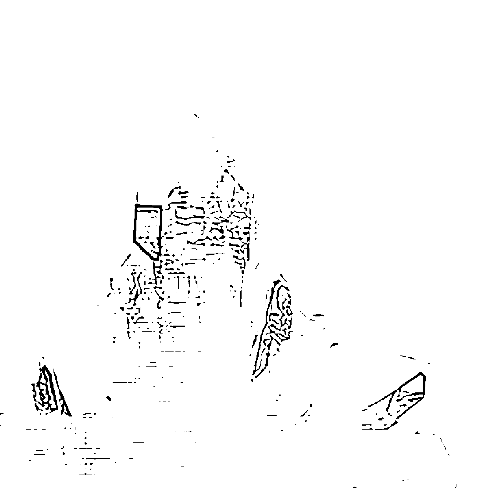

再來，就要計算「流時」，也就是每個時辰的吉凶禍福囉。還好在咱們中國是以兩個小時當一個時辰的，不然，再分每個小時，每分鐘下去的話，怕會把每個想學風水的水晶朋友們逼瘋囉。

這樣，各個方位的旺、生、衰、死，吉凶方位就可以立即看出囉。是不是很簡單呢？

不過，在現實的執業當中，大部分的都是先參考地盤，看天盤的時候，多是看二十年的大運，看流年，一般都是到此為止啦。若要細看的話，嘿嘿，紅包就要包大一些囉……而詳細的情形列出，水晶朋友們可以自己排，想看多細就多細，反正為自己的房子、住宅看，也是為自己和自己的親戚朋友們來看咩，不收錢也沒關係的啊？

看最左邊的一欄，一天原本24小時的，就用12個地支來分，共分為12個時辰，每個時辰的對應時間，如早上，中午，晚上等等，就以24小時計算方式列給各位參考。這樣就不會有誤會囉！就像軍隊裡的命令一樣，「1200發動攻擊！」人家中午12點就開砲攻擊了，有些人會誤會晚上12點才發動攻擊，還在睡覺哩！那就糗大囉。

玩水晶，其實學的也就是要「心量大」、「度量大」。不能再像江湖術士一般，動輒要錢，反而不容易賺的到錢。一個人若能先以服務的精神來和眾生結緣，名聞利養，也就是財富、名聲會自然進來的啦。而且來的自然，來的更多。不要害怕、吝嗇為人服務，這也是為自己種福田啊？台灣俗話說：「有量才有福！」就是這麼個道理。學得了某些技巧，不要藏私，不要據為己有，多多分享，為人服務，後頭的好處還會更多哦！

好，再來看，現在是什麼時辰，「子午卯酉」、「辰戌丑未」、「寅申巳亥」各有不同的對應欄位哦。那麼，再看看，現在是冬至後呢，還是夏至後的時間，各有不同的星曜入主中宮，找出相對應的當旺星曜。

冬至後，就看18章的順飛九宮；夏至後，就看19章的逆飛九宮。

希望每个玩水晶的朋友，也都是身怀绝技，行走江湖，随缘帮人、助人、救人，哈哈，那就是风水祖师「杨松筠」先师会被誉称为「杨救贫」的原因啰。希望所有的水晶朋友，也能有这种的胸怀和抱负！
(淳賀天然水晶台北市八德路四段768巷7号三楼之一)

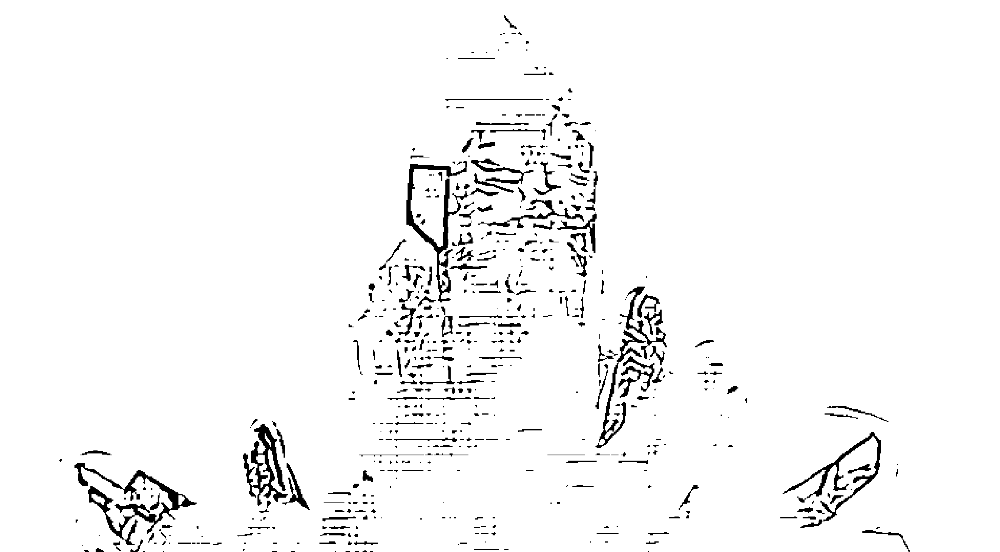

## 【紫白流时表】

| 日次 | 子午卯酉 | | 辰戌丑未 | | 寅申巳亥 | |
| --- | --- | --- | --- | --- | --- | --- |
| 节气顺逆 | 冬至后顺行 | 夏至后逆行 | 冬至后顺行 | 夏至后逆行 | 冬至后顺行 | 夏至后逆行 |
| 子时23-01 | 一白坎 | 九紫离 | 七赤兑 | 三碧震 | 四绿巽 | 六白乾 |
| 丑时01-03 | 二黑坤 | 八白艮 | 八白艮 | 二黑坤 | 五黄中 | 五黄中 |
| 寅时03-05 | 三碧震 | 七赤兑 | 九紫离 | 一白坎 | 六白乾 | 四绿巽 |
| 卯时05-07 | 四绿巽 | 六白乾 | 一白坎 | 九紫离 | 七赤兑 | 三碧震 |
| 辰时07-09 | 五黄中 | 五黄中 | 二黑坤 | 八白艮 | 八白艮 | 二黑坤 |
| 巳时09-11 | 六白乾 | 四绿巽 | 三碧震 | 七赤兑 | 九紫离 | 一白坎 |
| 午时11-13 | 七赤兑 | 三碧震 | 四绿巽 | 六白乾 | 一白坎 | 九紫离 |
| 未时13-15 | 八白艮 | 二黑坤 | 五黄中 | 五黄中 | 二黑坤 | 八白艮 |
| 申时15-17 | 九紫离 | 一白坎 | 六白乾 | 四绿巽 | 三碧震 | 七赤兑 |
| 酉时17-19 | 一白坎 | 九紫离 | 七赤兑 | 三碧震 | 四绿巽 | 六白乾 |
| 戌时19-21 | 二黑坤 | 八白艮 | 八白艮 | 二黑坤 | 五黄中 | 五黄中 |
| 亥时21-23 | 三碧震 | 七赤兑 | 九紫离 | 一白坎 | 六白乾 | 四绿巽 |

## 第二十四章 公式派的盲點

看了對傳統風水陽宅的這麼多介紹，想必很過癮，同時也很頭大，是不？還有，就是會激起許許多多的問題和疑惑。這些都是正常的。

好玩的是，有位同學在學完東西四命和八方的吉凶後，大叫一聲，「天壽仔，我竟然在我們家的絕命方睡了十幾年囉！」接下來，就是其他的同學問他，「怎麼還沒死？」是啊，既然是「絕命方」，怎麼還命不該絕呢？

也有女同學就問，我們家三代同堂，有公婆、夫妻、子女，那到底要以誰的命卦為準啊？順了姑意，拂了嫂意，對公公好，就對老公不好，對婆婆好，又對小孩不好，這個方位該如何安排呢？而且，五鬼、六煞、禍害、絕命這些聽起來都很可怕耶？

老師的回答也很妙，看您們家誰「掌權」，就依誰的命卦來排方位。夫妻若都是在上班賺錢，那就看誰「掌錢」，就依誰的命卦來排。再分不出來，那就看您們家夫妻在辦事時，看是「誰壓誰」，在上面的就是掌權的人，那就依他的命卦來排。

呵呵，有道理！但是，那些比較弱小的，像是小朋友，難道就該活受罪嗎？忍受風水上的不公平嗎？如果照比較文明的的看法，越是弱勢的團體、朋友們，我們應該給他們更多的方便和優勢才對啊？才符合公平正義的原則啊？這是人的文明社會，不能像是叢林裡的野獸弱肉強食啊？看倌們，您們說這論點有理沒理呢？

如果風水這麼厲害，那麼某年，某個座向的屋宅是否都會受到影響呢？比如說，整條中山北路，整條林森北路，所有相同座向的商店、住家，大家都不好嗎？或是一棟大樓，所有的住戶都不好嗎？所有的風水座向、格局都一樣啊？事實上，不可能的呀？或有人說，每個人的命卦不一樣啊？命運當然不同啊？但，我們不就正在討論風水嗎？風水真有那麼大的影響力嗎？如果是絕對的影響，那其他因素的影響就該相對的小，甚至無法改變風水的定論囉？

但，事實不然。

所以，另一方面來看，風水就不是居於「決定性」的「關鍵地位」啊？其他會影響一個人家運、命運的因素，還是有需要持續深入探討哦。不能老王賣瓜，自賣自誇，研究風水，就說風水萬能。不，還是有所侷限在的。

是啊，也有人說囉，要是風水跟著流年變化，那真的是「風水輪流轉」，那我們是不是每年都要改門向，改床位，就連神明桌底下也要裝上輪子，幹嘛？才好每年跟著轉，找好方位啊？老實說，還真的看過許多人，許多公司、家庭，包括一些廟宇，還真的是這麼搞得哦？說是要「搶旺位」、「得生氣方」。但是，在勞師動眾、兵疲馬累之餘，是不是真的大吉、大利、大發、特發呢？這也值得讀者們去觀察看看哦？許多時候，並不見得哦。

也有些風水師、風水書上，說道「東北方」就直斷說是「鬼方」，不能開門，不能做什麼、做什麼。但道理何在呢？又不說，叫我們有點不服氣！後來查看古籍，才知道，原來古代居住在黃淮平原的炎黃子孫們，特別是傳下「周易」的周朝子民，在他們勢力範圍的西北邊都是強悍、富攻擊性的游牧民族，東北及東邊就是強大的商朝及其各附庸國。所以這些都是他們周人的防守重點啊！

相對的，在他們西南邊的秦嶺山地，就是他們安身立命的大本營，當然就是「吉方」。所以在「周易」裡頭，西南無論如何都是「吉方」，好方位，是「人門」，東北方就當成是「凶煞方」、「鬼門」了。這是將近三千年前的「時空環境」，如今有必要再沿用下來，甚至套用在東南邊的台灣嗎？

實在值得再深思哦？台灣的東北方沒有鬼啊？有許多濱海公園，可以游泳、玩水、乘船賞鯨、吃海鮮的，還很好玩哦？對啦，冬天的時候東北季風比較大而已啦，但以現代化的住屋也沒啥影響了咩？不能隨著時空環境的改變而調適，不就違反了易經「變異」的道理嗎？脫離事情的真相，就容易變成「迷信」囉。

還有人在問，「到底是誰規定的啊？為什麼一運就是二十年？為什麼不是十年、三十年、或是一百年？」呵呵，公式派的就有這個問題，您一問到「源頭」、「為什麼？」或是誰設計這個公式？又有什麼依據？我們想要了解「原始碼」（Source Code），才知道根由，或許能夠修正、改進啊？但是，從來未能得到答案。老師常常說，「老師的老師沒教」、「老師的老師的老師也沒教」，所以不知道。嘿嘿，這樣也能流傳幾百年、幾千年啊？那我們這些學風水、地理、五術的朋友們都那麼乖啊？老師教什麼，就聽什麼，從來不質疑的，也從來不驗證的？一切以古為尊？哦，咱中國人就是這樣不進步的咩。

嘿嘿，有位香港老師比較勇敢，有提出為什麼是二十年的道理哦。他把「堪天輿地」的功夫拿出來囉，夜觀星相，看到木星、土星每二十年「合相」一次，這在占星學上屬於第一大吉星的木星，和第一大凶星土星的合相，好壞相加的力量，對於地球上萬事萬物的衝擊，非同小可哦。木星運轉速度比較快，約是每12個地球年會繞行太陽一週；土星比較慢，約是29.5個地球年會繞行太陽一週，所以木星、土星每差不多二十年的時間會湊在一塊一次的機會，從地球看過去，剛好合相在一起，成一直線。所以，他認定這個大運的二十年，就是依據「木土合相」而來的，而且必然合相在庚申、庚子、庚辰這些年。

- 公元2000年5月13日，庚辰年，合相在酉宮金牛座。
- 公元1980年12月15日，庚申年，合相在辰宮天秤座。
- 公元1961年2月12日，庚子年，合相在丑宮魔羯座。（剛好在立春前三天，大部分合相的時間在辛丑年）
- 公元1940年7月23日，庚辰年，合相在酉宮金牛座。
- 公元1921年9月1日，辛酉年，合相在巳宮處女座。
- 公元1901年11月15日，辛丑年，合相在丑宮魔羯座。

發現，哦，只有最近六十年的是合相在庚辰，庚申，庚子年，再早一些的，就不是囉，而是辛酉，辛丑年囉。為什麼呢？因為，木星土星是「大約20年」合相一次，卻不是準確的「日曆20年」啊？天上的星星不是照著地球上的日曆、月曆來行走的啊？他們有他們自己的規律和時間來行走這個黃道面啊？精準的還要推算到恆星時、二萬伍千多年的歲差等等，呵呵，比較複雜，留給專業天文學家來計算囉。

而且，我們發現，每個大運的起運年，都是從「甲」開始的啊？和庚辰、庚申、庚子沒有什麼關係啊？比如說：

- 中元四運民國13年1924年，是甲子年。
- 中元五運民國33年1944年，是甲申年。
- 中元六運民國53年1964年，是甲辰年。
- 下元七運民國73年1984年，是甲子年。
- 下元八運民國93年2004年，是甲申年。
- 下元九運民國113年2024年，是甲辰年。
- 上元一運民國133年2044年，是甲子年。

從現在的時間點看起來，這個大運的起始點和木土合相的週期，應該沒有關連才是啊？難道會是一千多年前的時候準？現在不準囉？因為「歲差」的關係？哦，不小心捅了個「馬蜂窩」，「代誌大條」，問題非常大。若真的是歲差的問題，那整個三元、玄空、九星風水不就要整個翻過來囉？哦，手邊的資料不足，留待給更為高明的星相、天文專家們來計算好囉。我們再看其他問題。

要說約二十年一次的「木土合相」，也是很多典故啦，常常就是法國小說家狄更斯在「雙城記」所說的，『這是最悲觀的時代，也是最樂觀的時代；最好也最壞，最光明也最黑暗。』最好跟最壞的都在一起了咩？據說，美國的開國元勳富蘭克林、華盛頓等等，其實也都是星相專家，很像我們周朝的周公，上知天文，下知地理，能夠帶兵打戰，又能治理國事，真是厲害！而他們在打贏獨立戰爭後，在選擇宣佈建國的這個時間點上，呵呵，就是「擇日學」，選擇了一個對美國能夠長治久安，富裕富強的最佳命盤囉。但是，每個命盤總是難免有些缺陷，美國的缺陷就由總統來承擔，特別是每二十年（木土合相）時所選出來的總統，就要擔當美國的苦難，也可以說是「業」啦。所以，許多星相家舉出林肯總統、甘迺迪總統、雷根總統，都是在任上遭刺。雷根總統命大，子彈打進身體內了，卻沒有死，為什麼能逃出這種宿命呢？朋友們沒忘記，他的夫人南西最迷星相學了，就職典禮的時間點也是請星相家特別「擇日」過，挑在很奇怪的半夜12點。據說，就是這樣而躲過一劫的。如今，也有澳洲的占星家在做預言，說在公元2000年木土合相時選出的小布希總統，可能在任上會遭刺身亡。這已經不是新聞囉，但是我們還是可以拭目以待，看看是否真的會如此發生呢？

為什麼現代的研究風氣反而不如以往的興盛呢？難道只有古人的方法好，現代人的天文知識如此進步，卻無助於改良古代所依據的曆法嗎？可能是西風東漸之後，更為簡單、精準的計時方法，讓大家一目瞭然，很好運用，所以現代的學生，一般人也好，可能連最基本的十天干、十二地支都唸不好，唸不對，更不會背，更不要說運用囉。還有古文過於艱澀難懂，真假辨偽，迷障太多，讓人誤入歧途的多，能夠彰顯真理的反而少，所以就凋零囉。這也是我們中國文化可悲的地方。研究的人少了，特別是沒有一些知識分子，有才華，有見地，敢創新的人才來研究它，只有一些江湖術士在抱殘守缺，用來招搖撞騙，就自然沒落了。我們曾經在想，若是想重新振興易經、風水、堪輿之術，或許政府把他列為「大學聯考」的必考科目，哈哈，就像以前科舉制度要考四書、五經一般，那一定會激起更多的人才去研究它，也一定會有更多創新、革命的地方！

曾經還有朋友在問，怎麼香港那邊的人都很喜歡使用九宮飛星的方法來看風水呢？因為風水的派別很多，為何獨鍾一門呢？為此，曾經納悶了一些時候。

當我們把九宮飛星的道理巡視一遍，呵呵，箇中理由好像就油然而現囉。
九個方位裡面，只有一個是「旺方」，兩個「生方」，三個「衰氣方」，三個「死氣方」，呵呵，「九死一生」這句成語不曉得是否也是來自於風水的說法呢？還是個真實的寫照呢。旺方只有九分之一的機率，生方也只有九分之二的機率，反而衰氣方、死氣方各有九分之三的機率，加起來九分之六，那麼要說人家倒楣的機率就很大囉？三分之二都是不好的啊？

還有，還有，若是看到哪戶人家，咦，運氣還真好哦，但是風水好就沒得改啦，一定要給他說到不好，才有得表現的機會，才有收紅包的機會啊？這下子九宮飛星又給了一個絕佳的機會，除了看地盤外，還可以看大運盤，看流年盤，看流月盤，看流日盤，看流時盤，反正三分之二以上的機率都是有問題的，沒事也要看到有事，不衰也要給他看到衰啊！不信朋友們自己排排看，一路下來，總是會有找到毛病的地方啦。

想想，有時候在一些比較洋化的華人社會裡頭，西方文化的教育比較多，傳統文化的薰陶反而比較少。相信的人和不相信的人，彼此對立，毫無溝通，彼此也不相容。在這種情形下，就最容易助長迷信。只要有人敢講，敢掰，敢作，嘿嘿，也就會有人敢信哦。一切欺哄詐騙的事情就容易出現囉。若是哪一門的學問能夠讓風水地理師更能唬住客戶，那當然要給他發揚光大咩？何況，對一般人而言，光是九個方位就給搞得昏頭轉向了，再加上大運、流年、流月、流日、流時的，順飛、逆飛等等的，根本就搞不清楚，哪還能分辨對與錯？有道理還是沒道理？可相信還是不可相信？

等等，注意哦，我們不是在批評「九宮飛星」這套的學問不好哦？千萬別誤會！任何學問能夠流傳下來，總是有他可信可靠的地方。我們對於任何傳統的學問總是抱著尊敬的態度在研究它，鑽研它，嘗試著給它新的時代意義，而是否定它哦。千萬別誤會！只是，有些術士會以「黑色行銷方式」的手法來行走江湖，那麼，誤用它的機會也很大囉。我們介紹此方法的正面性，讓大家可以自行運用，卻不容易受騙上當，也不會受到誤導，這就是我們最大的期望囉。

至於「旺方」、「生氣方」、「衰氣方」、「死氣方」又是怎麼分出來的呢？原來，也是依照「五行生剋」的道理，「木、火、土、金、水」的相生相剋而推算出來的啦。只是，這些的用字遣詞相當駭人聽聞，「絕命」、「六煞」、「五鬼」、「禍害」等等，光看字面意義就叫人非常害怕。其實，五行相生相剋的推算，「凶」不是「真凶」，「吉」也不是「真吉」，這是表示自然界力量在此運行的順暢、衝激與否，當事人本身的見地、見識、胸襟、氣度、修養、學問、能力、氣魄、膽識等等總體格局，才是真正能夠運用這些力量的「決定性因素」、「關鍵性力量」，不是一個好方位就能「必發」，壞方位就「必敗」。後頭的五行生剋討論會再說明清楚。

曾經有位香港的網友說過，有天中午，七、八名同事一起相約和一位風水老師吃飯，順便請教問題。結果兩個小時回來，個個臉色凝重，心情沮喪，辦公室的氣氛都要結冰囉。

原來，就是每個人都給那風水老師說的問題重重，連帶心事也重重囉。恰巧在占星術的論斷方法裡頭也有種「缺點論法」，就是擔心來者過於「鐵齒」，或是懷疑，或是固執，或是挑釁意味濃厚，那就不客氣囉，把對方所有的缺點都一一拿出來論，說的口沫橫飛，鐵口直斷……

許多時候，一個人表現的很肯定的時候，完全肯定，絕對肯定，很容易就會打動、影響一些意志不堅的人，或是外行人。回想看看，最好的例子就是第二次世界大戰時，希特勒那種幾乎催眠式的演講，也打動了全德國那麼多優秀的工程師、教授、老師、醫生等等；然而，所激起的仇恨猶太人和世界大戰，卻是全然錯誤的。

不能看人家說的肯定，就覺得很有力道哦？更不能看說有千千萬萬人在相信，那一定就是對的。錯，一百萬個錯誤加起來，不會等於對的，那是一百萬倍的錯誤啊！

這是一個古老的伎倆，術士在用，神棍在用，就連政客也在用的，就是先製造恐懼，讓您害怕，那您就會尋求保護和解決方式，那就會創造需求。而，這就是整個「生意」的秘訣！先叫您害怕，您就會來求我囉。到時，再來予取予求，任我宰割囉！

許多時候，我們不禁懷疑當個中國人是幸，抑或不幸呢？因為在傳統的風水五術裡面，有著太多的「祖傳秘方」、「獨門絕技」、「家傳秘笈」，許多學問還是「傳子不傳女」的，為什麼呢？就因為女兒早晚要嫁出去的，是別人的老婆、媳婦，靠不住的；傳給徒弟還要「留一手」、「蓋步」的。保留著許多的學問，原本也是想讓後代子孫能夠有著一技之長，可以飽暖無虞。

△ 凶方？吉方？人門？鬼門？在不談風水，不論方位，只是實事求是的西方世界，建立了全世界最強大的軍力，最富有的國家。這都是事實，豈不值得研究風水、地理、命理、歷史的現代學者重視？

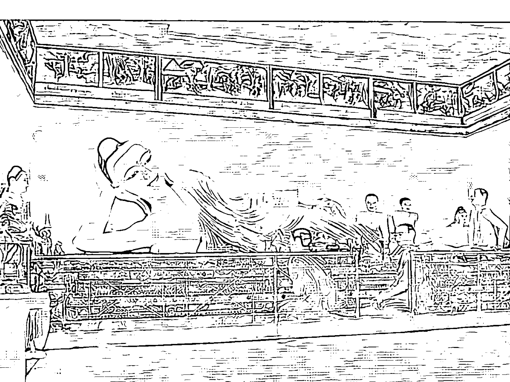

> > 心胸放大，眼界放大，宇宙虛空中，所有上下左右都是人為頭腦劃分，睡哪兒都一樣？能夠像佛陀一樣，才是真正自在啊？

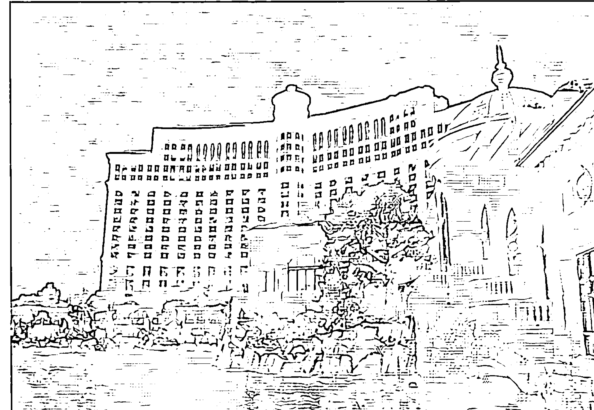

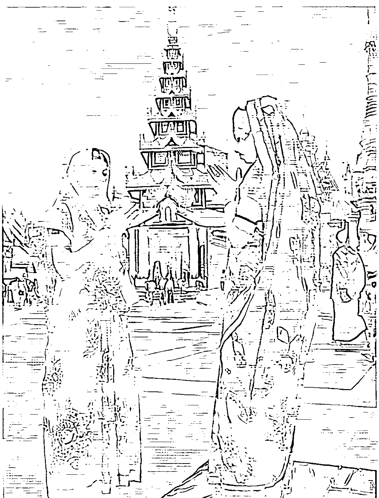

△ 在許多華洋交接的地區，迷信最容易滋生，欺哄詐騙等的事情也最多。唯有「真知」才能破除迷信！這都需要現代新一輩的學者來一起努力！

但是，這是一種自私的心態，留來留去，蓋來蓋去，一向在苦難中成長的中國，經歷著些戰亂、天災、人禍，顛沛流離，輾轉逃難……許多的學問就此從歷史上消失囉。這實在是我們身為中華民族子孫最大最大的遺憾！所以，新時代到了，我們不能再像從前一樣，必須將心胸打開，以一種「分享」的態度，把所有有價值的學問都傳授給所有的有緣眾生，越多人會，越多人能夠專精，這門學問流失的機會就越少。越多人來研究，這門學問就越能被拓展，越能被發揚光大！或許，幾十年後，還會有些天才型的人們出現，能夠累積先聖先賢們的智慧和經驗，就能夠「集大成」，更把中國人的學問發揚到全世界去，還可以流傳萬世千古呢！這不是挺好的嗎？「藏諸名山」，或是「敝帚自珍」，這之間已經無須考慮太多囉，拿出來，接受大家的考驗，時間就會是最好的證明囉。公式沒有不好，每種公式都有他們獨到的擅場之處，但是所有的公式也都有他們的盲點和極限。一個公式被創造出來後，有他馬上可見可行的強力之處，但也一定會有他的限制所在。就像塔羅牌和占星術，卜卦和八字，人相學和姓名學等等，都各有各的獨到之處，卻也各有所短。如果現在的學者，仍然死抱著千年以前的古籍在鑽營，而不思突破和創新，那恐怕是前途無「亮」囉。如果只靠死記幾套公式，而不加強自己的修為、敏感度，或從更多方面來體會風水、住宅、命運的多樣式，力求精進，恐怕也很容易就遭到時代的淘汰囉。本來腦筋才有個想法，想做預言而已，熟悉電腦軟體的朋友就已經說囉，這種「九宮飛星」的風水套件已經問世囉；就連「奇門遁甲」也出來囉！呵呵，速度真快！那麼這些只靠公式派在江湖混飯吃的，將來要吃什麼呢？但是想想，是啊，就是一些計算公式而已，許多因為是我們現代人不習慣的字彙和觀念而已，若有套裝軟體出現，就不必死記、硬記，麻煩的事情交代給電腦去處理，人們靈活的腦筋就來關照「因地制宜」的事情囉。不必再花上幾年的時間來摸索、學習、嘗試錯誤，或繳一些冤枉學費，更不必受到一些「大師」他們的刁難，要教不教，要傳不傳的，一定要折騰個幾十年，到最後的一天，最後的一堂課，最後的三十分鐘，臨行前，才肯把「心法」、「秘笈」教給您；有些在最後一次，還要敲一次大竹槓，才肯放人哦，因為以後敲不到了咩。

風水應該還有更寬更廣的不同角度，來深入，來了解，才有可能突破古人的窠臼，創新局面。不然總靠著「唱衰」別人，賺取紅包混飯吃，那真可憐耶。一個學習星相命理的人，好好提升自己的話，可以像是諸葛孔明、劉伯溫般的「國師」哦。千萬不可作賤自己，淪為江湖術士，那就真的可悲又可嘆囉。

翻開台北每天的報紙，隨便找找，都可以看到有人傳授風水的課程，少則一、二十萬，多則五、六十萬，而這些都還是「檯面上」的「行情」哦。若有些挾著名氣、秘笈等等的，私下收取百萬者，都時常有耳聞哦。呵呵，這就是我們社會的習性。也許，我們要等待新一代的風水師冒出頭來，整個風氣才有可能改變吧？在本章中，我們提出許多有關對於風水問題的質問，我們不是懷疑沒有風水的影響哦，更是否定風水，而是要說明公式派的一些侷限所在而已。相對的，我們想要讓大家了解，研究這些都是「世代」的問題，希望在21世紀寶瓶新時代，咱獨步全球的中國風水界也會來個嶄新的變革和革新！我們期待這樣的好日子趕緊來臨！

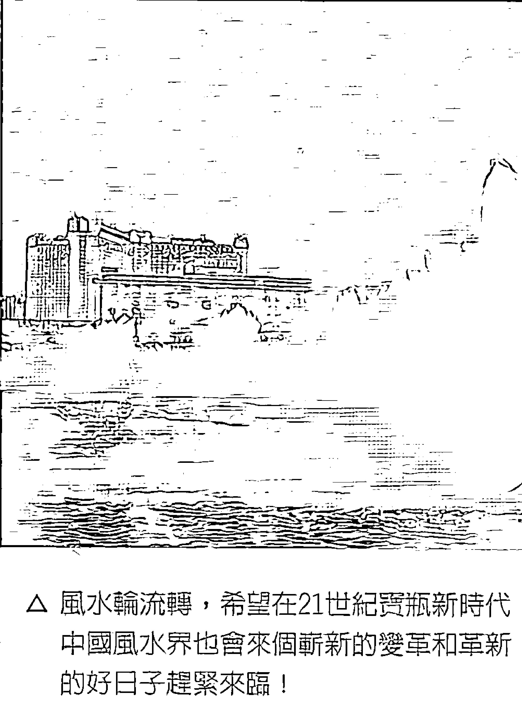

## 第一章 太歲的省思

說到太歲，哈哈，在我們的中華文化裡頭，絕對不缺「太歲」的用詞用語哦。

最常聽到的就是，「你敢在太歲爺頭上動土！？」好像是一副不要命，自尋死路的意思。嘿嘿，這也是「風水文化」給我們的文化影響哦。

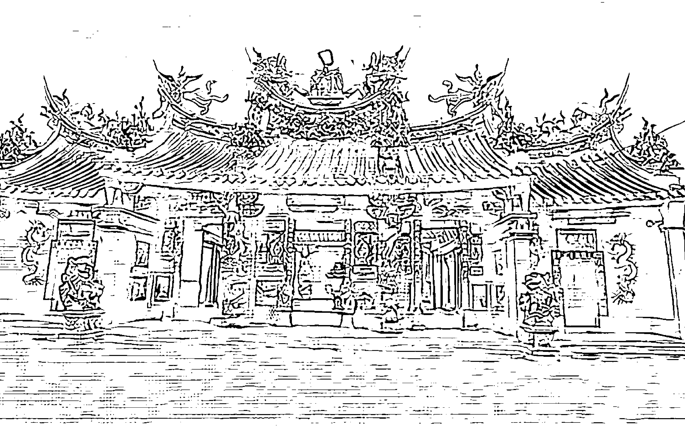

> △ 到廟裡安太歲？哇，這道理是誰發明的啊？真高明！也為後人創造了無限的「商機」哦。

還有每年過年到正月十五前的元宵節，老一輩的父母叔伯都會吩咐家中老小，看今年有誰「犯太歲」的，要趕緊在十五前去給「安太歲」。

會犯太歲，好像是每12年輪一次的哦。照著生肖來排，屬鼠的來到鼠年，就活該倒楣，犯太歲囉；屬老虎的來到虎年，也活該倒楣，也是犯太歲；其餘生肖，也是依此類推。翻開農民曆，看到該年犯太歲的生肖運程，都會寫到，「太歲當頭坐，無福恐有禍。」哦，看到的時候候，實在有夠叫人「鬱卒」的啦！

有時想想，我們屬老鼠的，或是屬兔子的，來到我們的本命年，怎麼會「倒楣」呢？這是我們的生肖啊？不是應該最會護佑我們的才是啊？但是看大人們說的那麼認真，也不能鐵齒，只能跟著相信，但是心裡就是不服。這是什麼道理呢？

來到廟裡要安太歲，哎呦，人山人海，要安太歲的人還那麼多耶？拿錢給人家還要爭相排隊的哦。想想，這個生意真好做，只要放出風聲說，哪年哪些人活該倒楣，但只要來到廟裡安太歲，就可以保佑平安無事。一個人花個一、兩百，三、五百塊的，或許沒什麼感覺，但是，每年就會有1/12的人口需要來安太歲，這個數字乘起來就是一筆非常庞大的生意囉？若是犯太歲的正沖的不算，每年還來幾個「偏沖」的，陪著倒楣的，哇，那就3/12以上的人口都要來安太歲囉？台灣只有二千三百萬人口，大陸還有十幾億咧？哇，這道理是誰發明的啊？真高明！也為後人創造了無限的『商機』哦。

那麽，『太歲』到底是什麼？什麼叫「犯太歲」？怎麼個「正沖」、「偏沖」法？太歲要如何「安」？我們就來討論討論。

曾經在一些古籍上看到，說「太歲」其實是一種「怪物」、「怪胎」，好像是一個肉團，全身上下長滿了「眼睛」，瞪著人看，一副非常邪惡的樣子，被看到的人就會很衰很衰，比看到鬼還衰，做生意不成功，考試會落第，談戀愛會失戀等等的。那該怎麼辦呢？一旦不小心看到太歲，那就要抄起路旁的木棍、鐵棍、或任何傢伙，就給它狠狠的打！用力的打，死命的打！打贏它，氣勢贏過它，那您就不會倒楣了，對您不會造成影響，就當成運動一下而已。

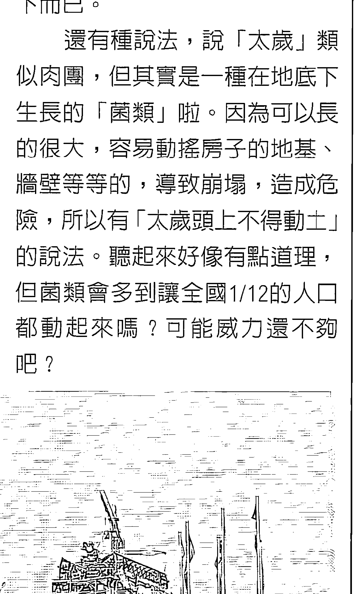

還有種說法，說「太歲」類似肉團，但其實是一種在地下生長的「菌類」啦。因為可以長的很大，容易動搖房子的地基、牆壁等等的，導致崩塌，造成危險，所以有「太歲頭上不得動土」的說法。聽起來好像有點道理，但菌類會多到讓全國1/12的人口都動起來嗎？可能威力還不夠吧？

## (25) 太歲的智慧

再來，在星相命理界比較普遍能接受的說法就是，「太歲星」其實就是太陽系裡的「木星」啦！哈哈，一下子從地底下拉到太空中，影響力、打擊面都可以擴大許多囉？哈哈！
說到木星，這是在太陽系裡頭，除了太陽以外，體積、質量均屬於第二大的星體，對於其他的行星影響，自然不在話下。而且，木星繞行太陽的速度比地球慢，約是12年繞行一週，所以從地球來看，一年才走1/12個圓周，剛好可以分成12宮，也可以分給每個生肖剛好都一年的時間。在中國，說道「太歲星」，好像都是很兇很兇的樣子。但好玩的是，在西方的占星術裡頭，這卻是一顆能擴張、膨脹，帶來許多好運、幸福、財運、貴人的「第一吉星」耶？有著這麼兩極的看法，您想要相信哪一個呢？
對啦，在中國古老的「果老星宗」、「七政四餘」，這些學問也是依據天象的星盤排列，來論斷人間的吉凶禍福的，和西洋的占星學可說是如出一轍，只是語言、文字、文化背景、社會價值觀上的論斷會有些不同。但也沒有把木星當成凶星啊？這些都值得我們深入思考哦？木星不是凶星，太歲星也不是那麼可怕啦！

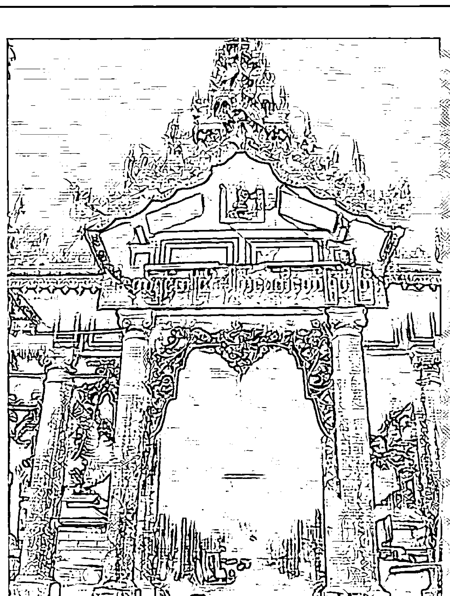

> △ 切記切記，找廟宇、找師父，絕對不是看廟宇規模的大小，香火的興旺，或是師父名氣的大小而已。需要張開您的「慧眼」，用心去找，用心去感受。

但是，不能否認的就是，木星的巨大能量會對我們造成影響，這卻是肯定的。一種持續擴張、膨脹的力量在我們體內、身上發酵著，就算是幸福、幸運、美滿的感覺，但持續整整一年下來，常常也會叫人「樂昏頭」了吧？所謂「樂極生悲」，也有可能哦？太歲當頭，是讓您「衰死」還是「樂昏」了呢？這之間還有得爭議哦。但是，過猶不及，我們覺得古代的中國老祖宗可能非常慈悲，也非常保守，看出了這點，那麼就故意從比較安全、妥當的方面來告誡子孫們，不要只看到好的一面，凡事做最壞的打算，才有最萬全的準備啊？也才能永保安康啊？若是有那種「盲目樂觀」的情形出來，這的確也是木星所帶給人們的感覺和實際情況哦，那到最後不知道怎麼死的，都有可能。在您可能非常樂觀、衝動的一年內，故意先「唱衰」，讓您能警覺，小心，那麼，出錯的可能性就可以降低許多了，是不？老祖宗們是否非常慈悲，又非常幽默？同時，也非常有智慧，創造了這麼龐大的商機，讓後代子孫吃了好幾千年，都還吃不完咧？

#### 【那麼太歲又是怎麼「沖」的呢？】

首先，我們可以在腦中想像一個時鐘，中心點當成地球，1到12就當成12個「宮位」，360度除以12，每個宮位剛好是30度。占星學中呢，就是把地球當成假想的中心，我們人在地球上的經緯度，和星盤羅列在12宮的日、月、木、火、土、金、水、天王、海王、冥王星等等，所形成的一種相關位置，力學角度，然後根據以判斷吉凶禍福的一種專門學問。

每個人出生的那一刻，當時的星相，就是他的「本命圖」，因為時間、經緯度的關係，每個人都不同哦，而且，這是不能更改的。不是說改個名字，換個稱呼，就能改變您的「命運」的。中國人說「落土八字命」，也是說明這是生辰年月日時分，是不能更改的。但是，八字在每一甲子（六十年）中，都還可以找到重複的命盤組合哦，要排星相的本命盤的話，可能要二萬伍千多年才會有一張相同的吧？更精確了啊。

好啦，在我們出生的那一刻，所有的星星都有他們已經確立的位置囉。然後時間慢慢過去，星星的位置也漸漸改變。過了12年，哈哈，當時的木星又會回到我們的本命位置，因為他已經繞行太陽一週回來囉。12年一個週期，好像是我們重生的一個日子。注意看看哦，許多人的人生就是幾乎每12年，都會有類似的事情、情況發生哦。回到您的本命位置，比如說在12點鐘方向，這就是「坐」太歲的意思啦。這個「坐」，應該還好啦，因為是「合」的意思啊。所以，風水上有說，「太歲可坐不可向」，什麼道理呢？

這就是說，此時太歲木星回到12點鐘方向時，當事人（12點這個時候出生）應該諸事小心，但不至於有太大禍害。最應該小心的，反倒是6點鐘方向出生的人，因為木星和他成為180度的「對沖」，力道最強，影響也最大。這就是「正沖」吧？

還有，還有，那些生在3點鐘、9點鐘方向的人，和木星成為90度角，這是僅次於180度的沖剋，也是很厲害的，這就叫做「偏沖」。呵呵，這些人都有事哦，都要到廟裡去「安太歲」，才能保平安哦，哈哈！其他的道理類推，只要排出類似一個時鐘的圖表，看看90度、180度的是誰，您也能自己推算哦。

話再說回來，木星力量雖大，但是別忘記，他的運行速度很慢，一年才走30度一個宮的位置，當真要和您的本命星星形成角度的話，也不是一促可成的啊？粗略的看法是，入了這個宮，影響就有了，但是一個宮有30度啊？一個誤差有30度的兩個點，如何能劃成一條對沖的直線呢？所以呢，真正「犯太歲」的朋友也不用擔心「一整年」啦，沒有人會衰那麼久啦，那會死人咧？衰死了咩。

仔細想想，注意看看，占星學裡頭，事件的發生必須在「相位」形成時才有可能。而此嚴格的標準就在「一度」內，就是兩個點的誤差必須在一度以內，那種衝激的力道才會形成，不然，沒事的啦。木星一年走30度，一年有365天，除起來看看，真正有影響的也不過30天左右而已哦，不必哀上一整年啦。若還要更精確地計算，扣掉「入相位」事件剛剛發生之初，以及「出相位」事件已經漸漸落幕沈寂，真正影響的時候不會超過兩個禮拜、15天啦。所以，犯太歲的朋友們，其實您也不必太緊張咩？了解這些道理，就可以放輕鬆些咩？還是可以四處去玩玩，看看，紓緩一下緊張的神經啊？

#### 【那麼，又是如何「安太歲」呢？】

其實，道理也很簡單。就是因為「犯沖」，犯到木星等巨大星體的沖啊，過強的能量，牽引著您的氣場、意識，也影響著您的行為、舉止、行事、作風。為了要平衡或抗拒這股能量，我們必須加一個「反作用力」給當事人，就是這麼個道理。

要是您了解之間的道理，根本的作法，就是要增加自己的能量，強化自己的氣場。而許多方法都可以達到相同的目標，練氣功、打坐、運動、念佛、誦經、持咒、冥想、習武、做體操……通通可以哦，也不用多花錢的喲。

但是，若是您太懶了，變通方法就是請您到廟裡，寫上您的大名、出生時辰、地址，再交上一筆錢，廟方就會把您的名字貼起來，每天早晚，或是每個初一、十五，或是偶爾想到，就會請廟裡的師父來為所有來安太歲的人們誦經、持咒、念佛，加持靈力，為您消業障，也為您消災解厄。「安太歲」就是這麼個作法。

注意哦，我們既不反對，也從不懷疑經文、咒語的力量哦！我們對此是相當肯定的，因為我們自己平常在家也是這樣在鍛鍊、訓練自己的啊。就因為了解其中緣由，所以，當我們想要找間好廟來安太歲時，不免會看，哪家才是真正的修行廟？哪些只是觀光廟？哪家的師父是真的有道行的？哪些家的師父很市僧？哪些師父只是穿道袍在做表面儀式的？哪些師父持咒念經的能量是真正能夠貫穿內心、產生作用的？這些都非常非常重要的！因為我們要安太歲，重要的就是修行人，大師父們長年修持的能量，才能對我們有所助益啊？包點紅包，意思意思，其實並不為過，還有點討到便宜哦。但是，要看清楚，不然請到一位假師父，平常道貌岸然，私底下卻是花天酒地，生活糜爛，那麼他的能量就比一般人還差，不僅不能幫您，可能還會害了您喲？還有啊，在犯太歲的時間裡，一個人本來就會充滿著許多不安定的因素了，若是沒有一個好的，安定的力量，反而是壞的，差的力量來干擾，那豈不更糟糕？
切記切記，找廟宇、找師父，絕對不是看廟宇規模的大小，香火的興旺，或是師父名氣的大小而已。需要張開您的「慧眼」，用心去找，用心去感受。建議您，平常有空時，就應該多四處去看看，多聽聽，多比較，自然會有那種緣份會讓您了解的。許多時候，那師父一站出來的那種神情、舉止、態度、氣質，就知道是經過長年精修內斂所成的。而有些呢，一站出來，也會像是立法委員的尖銳態勢，或像生意人的精明勢利態勢，或像江湖術士般的故弄玄虛態勢，什麼人樣都會有，千萬不要只是看表面的衣服而已哦。呵呵，也有許多時候，遇到那種懶惰師父，三天兩頭才來敲個磬，五天十天才來擊個鼓，不要說早晚課啦，就連初一、十五都不能準時做法事囉，那種情形，不如回家太歲自己安，還比較實在，是嗎？能量、氣，每個人都有，只是濃淡厚薄、精純度不一樣，但是師父也是從平常人修起來的吧？只要有心，任何人也都能修起來啊？這絕對是肯定的，沒有問題的！

說到能量的問題，一些水晶礦石的能量也能好好給平常人、一般人、普通人所來運用。希望加強自己在太歲年的能量者，可以配戴使用鎳鐵隕石（Iron-Nickel Meteorite）、捷克隕石（Moldavite）、黑色隕石（Tektite）、各色髮晶（Rutilated Quartz）、彩虹黑曜岩（Rainbow Obsidian）、黑色電氣石（Black Tourmaline）等等；若只是想要平衡，則可以配戴白水晶（Crystal Quartz）、紫水晶（Amethyst）、紫龍晶（Chaorite）、舒俱徠石（Sugilite）就行。在太歲年，每天早上起來出門前，特別是在工作日，或有重大事情的日子裡，拿到手掌心中合握，好好唸一段經文，或唸幾十句佛號、咒語都行，把身上的水晶礦石給「啟動」了，氣就上來了，這就是常講的開光、加持啦，其實一點也不難，我們後頭還會說明。那麼這些礦石的堅實能量就會是您身上最堅強的後盾囉。您不用擔心它們是否會偷懶，或是擔心它們會否失職。這方面，石頭比人還可靠多囉。能量的問題還是要靠能量來解決，水晶礦石不失為一個價廉又迅速可靠的解決方式！

呵呵，因為太歲星的作用，每年的開春期間，農民曆啦，電視、廣播、報紙媒體上的大師都會告誡民眾說，「今年大利南北，不利東方」、「大利東方，不利北方」……看他們說的那麼確實、那麼肯定，心中難免感動到，「哦，好棒哦！他們怎麼知道的？我們卻怎麼都不知道？這又是什麼依據呢？」

後來，看到一位老師將這張表列出，哦，原來如此！就是太歲星他也有個運行方向，然後東西南北四面八方「趴趴走」、「扣扣總」就是啦。和太歲星成180度相沖、相對的，就是不好的「正沖」；照著星盤來說，那成90度的兩邊，也不是挺好的啊？是否就是所謂的「偏沖」？

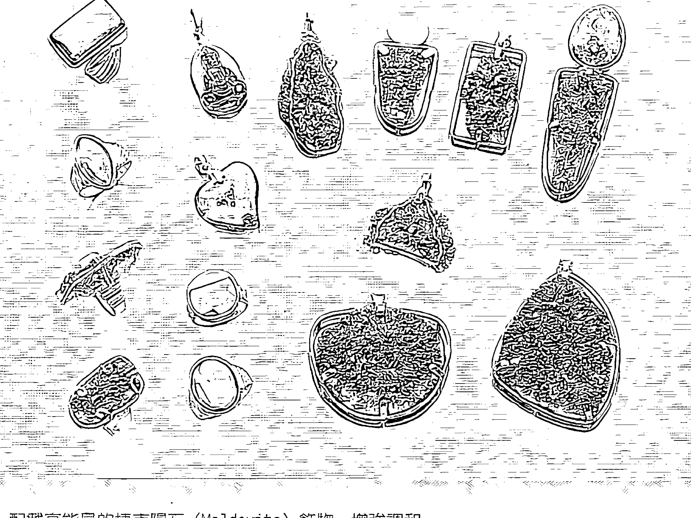

△ 配戴高能量的捷克隕石（Moldavite）飾物，增強調和自己的身體能量，也是安度太歲年的一個好方法哦。

那麼，成60度、120度角的，就是所謂的「大利」的好角度哦？哈哈，看到這樣的表列，朋友們不曉得有沒有這種衝動，在相關的一年，去看看每條街上的商家、住家，是不是相同坐向的，大家都不好呢？大家都衰呢？或是相同坐向的大樓裡，每個住戶都是相同的衰、倒楣嗎？只要找出幾個例子，這種說法的正確與否，可信與否，就可不攻自破了啊？豈不好辦？

另外，風水界中還非常堅信這種說法，「太歲爺頭上不能動土」，太歲走到哪個方位，這個地方絕對不能有動土、做工、興兵打戰的行為，否則「大不利！」必死無疑，必衰無疑！

不僅太歲方不行，就是和太歲相對沖的方向也不行！聽說，這會更不利！所以有，「太歲可坐不可向」的說法。坐著，合他咩，還好啦；但是絕對不能和他對沖，不然就受不了囉。

好玩的是，風水界也流傳著這麼一則故事。就是在宋仁宗當政之時，皇宮某處正要動土改建，臣子就跳出來說不可，不可，為啥？原因就是今年東方「犯太歲」咩。宋仁宗也好玩哦，他說，「東家之西，是西家之東，西家之東，是東家之東」，那還有什麼犯太歲的顧忌？！臣子啞口無言，皇上說出口的就是「聖旨」，只有照辦的道理。事後，皇宮改建完成，什麼不好的事情也沒有發生啊。

再來想想看，太陽、月亮、地球、星星們是怎麼運轉的呢？看看太陽就好，是不是每天很老實的都從東邊的天空出現呢？有沒有忽然從北邊，忽然從南邊，或是從西邊出來過？以前阿花要離開筆者的時候，就是撂

| 生肖 | 鼠 | 牛 | 虎 | 兔 | 龍 | 蛇 | 馬 | 羊 | 猴 | 雞 | 狗 | 豬 |
| --- | --- | --- | --- | --- | --- | --- | --- | --- | --- | --- | --- | --- |
| 地支 | 子 | 丑 | 寅 | 卯 | 辰 | 巳 | 午 | 未 | 申 | 酉 | 戌 | 亥 |
| 方位 | 北 | 東北偏北 | 東北偏東 | 東 | 東南偏東 | 東南偏南 | 南 | 西南偏南 | 西南偏西 | 西 | 西北偏西 | 西北偏北 |
| 犯本命太歲 | 鼠 | 牛 | 虎 | 兔 | 龍 | 蛇 | 馬 | 羊 | 猴 | 雞 | 狗 | 豬 |
| 180度正沖 | 馬 | 羊 | 猴 | 雞 | 狗 | 豬 | 鼠 | 牛 | 虎 | 兔 | 龍 | 蛇 |
| 90度偏沖 | 兔 | 龍 | 蛇 | 馬 | 羊 | 猴 | 雞 | 狗 | 豬 | 鼠 | 牛 | 虎 |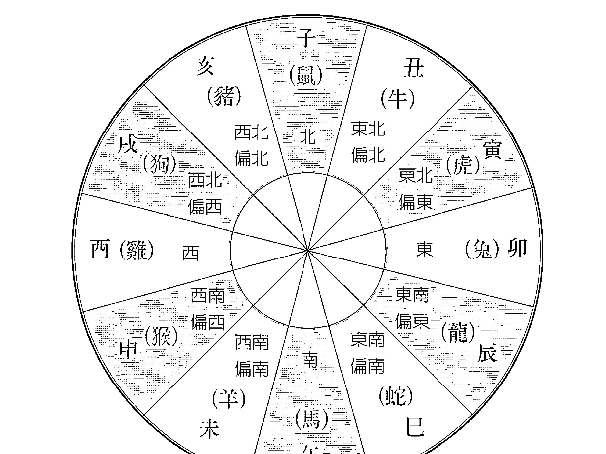

下這句話，「除非太陽打從西邊出來，不然我是絕對不會嫁給您的啦！」一直等候幾十年，不管是豬年、猴年、還是狗年，總是等不到太陽從西邊出來的那一年啊？
哪天，我們可以站在地上，面向著北方，舉起雙手，一隻向東，一隻向西。嘿嘿，就是這個道理哦，我們地球每天的「自轉」，就是從西方方向著東方轉過去啊？轉轉轉啊，所以相對的星球都是從東方的天空冒出來的啊？月亮也是如此，其他的肉眼可以觀測的星體也是如此啊？
為什麼北極星不會動？哈哈，因為他剛好在我們地球南北極這條「地軸」的正上方咩，所以他只會旋轉、繞圈圈，卻永遠在北方。相同的道理，若是我們到了南極，我們也可以看到那邊的天空星體，也會是如此的咩。
您還保持同樣姿勢嗎？手還不要放下哦，您也轉轉看，身體、手腳可以一直轉，一直轉，然後頭上、腳下，卻都還是在相同的一個點哦？除非您已經頭昏了，站不穩，不然位置應該還是一樣的啊？

還有還有，回到我們太陽系裡頭來，所有的九大行星都繞著太陽，以太陽為中心在運轉，是嗎？這也是有一定的規律哦，不是亂轉的哦？簡單的比喻，可以拿來一個大盤子，中間放顆西瓜，那週遭放些遠近不等的蘋果、桃子、李子、龍眼、花生等等，這就是太陽系的一個簡單的雛型。每個星體都會「自轉」，同時也繞著太陽「公轉」，而這個公轉行進的「軌道」，就像是「盤面」一樣，天文學上就稱為「黃道帶」。當然，不是每顆星球都是「垂直」於黃道帶的，而是還有相當角度的，比如說地球，就是大約23.5度左右，像是一顆傾斜的皮球在轉哦。

所以說囉，您還沒改變姿勢吧？太陽，其他各大行星，包括我們偉大的「太歲星」，就是從我們的右手（東邊）升起，繞過頭上，向左手（西邊）降下，又繞過腳底，從東邊升起……這樣反復的繞行、繞行、繞行，大約有四十五億年到六十億年吧？這大約是太陽系形成的時間，地球的年齡約有45億年。從來沒聽說過，也沒看過九大行星變換軌道，忽而在東，忽而在北，忽而在南的四處亂跑。果真如此，我們早也看不到了，因為那會引起整個星系的引力失衡，彼此碰撞，早就毀掉囉。

所以，太歲在哪方，哪方大利，哪方大不利的種種說法，可信不可信，就留待讀者自己去思考，去判斷囉。我們只是提出不同的思考角度和方向，期待能引起大眾對這些民俗、迷信能夠有更多、更廣、更深的省思和檢討，那我們的目的就達到了，不敢說有什麼結論和定論。到底，這還是一種根深蒂固，累積數千年的普遍看法和習慣，可不是一朝一夕可以改的過來的。假如有人很老實，還會畏懼天地、因果、報應、太歲等等的，想必也不會做什麼壞事咩。知所敬天、畏天，也不錯啊？只是不要給江湖術士給騙了，哄了，欺了，詐了，那就虧錢、傷身、傷感情，還汙辱了您的智慧，事情就不妙了呀？

(淳賈天然水晶台北市八德路四段768巷7號三樓之一)

◁ 利用捷克隕石的天然形狀串成的手鐲，高貴大方卻又不貴，男女皆可配戴來「安太歲」，除了安心，還叫自己開心！

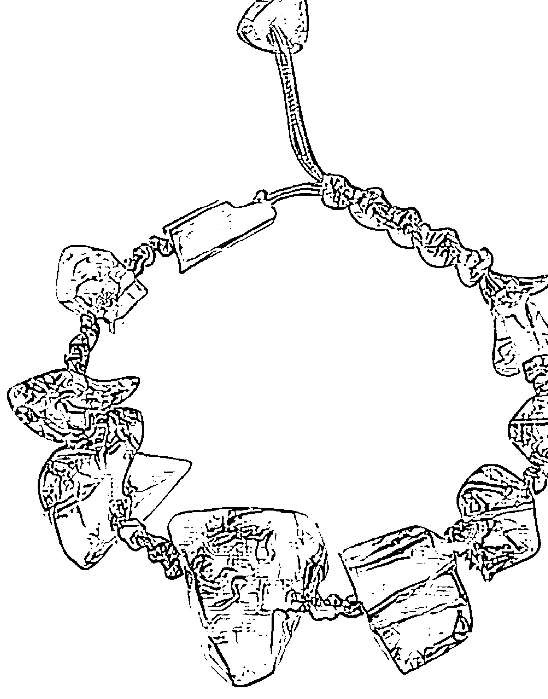

▷ 非常難得，利用天鐵（鎳鐵隕石）所做成的戒指，表面上的60-120度交角，維德曼效應，還清晰可見。可別小看它哦，所能發揮出來的能量可是非常驚人哦！

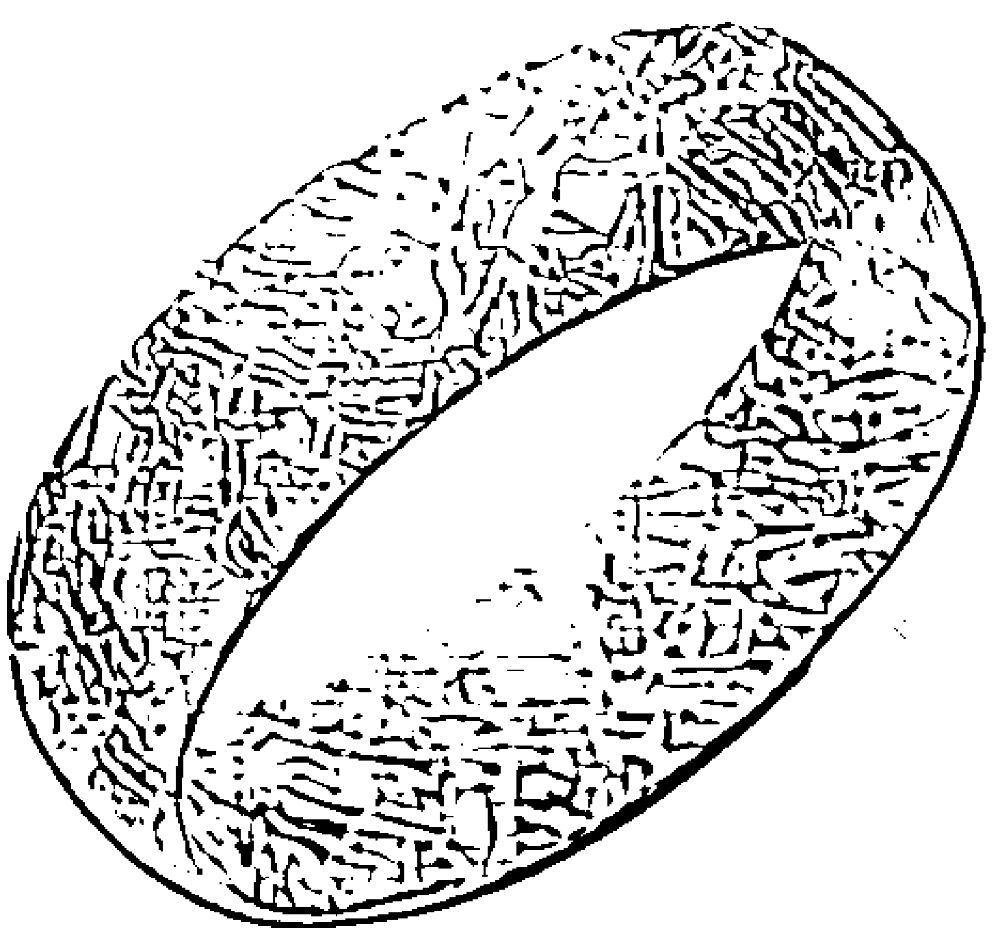

▷ 這就更為珍貴稀有了，將天鐵（鎳鐵隕石）磨成圓珠，打洞串成手鐲，份量相當夠，價值也不菲。一般人可能覺得超出預算囉，但是法師級的高手，這可是加強自己能量，提昇頻率的絕佳妙方哦！

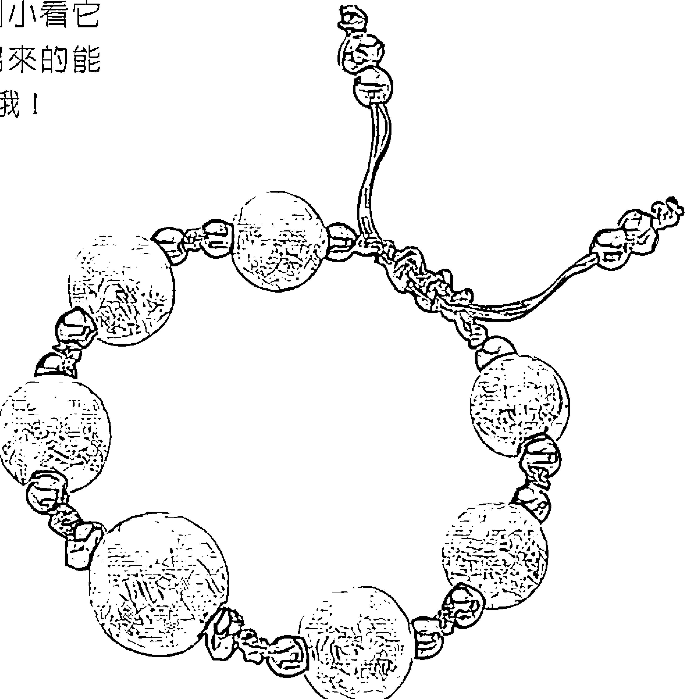

# 開光加持與驅動

風水上的主要問題，就是「氣」的問題。

氣，若是能在一種穩定，和諧的狀態下，蓬勃興旺，可以滋潤滋補人畜植物，身體健康，精神清明，萬事萬物都好。

氣，若是在一種亂流、亂竄，不和諧、詭異的狀況，那就會干擾影響人畜植物等的生長，健康不好，思緒不明，做什麼都不好，運勢當然差囉。

除了眼睛看的到的，有形的「風」、與「水」等「可見光」（Visible Light），還有許多眼睛所看不到的「不可見光」（Invisible Light），包括紫外線、X光、伽瑪射線、宇宙射線、紅外線、電視波、收音機波、電子波，一氧化碳、二氧化碳、沼氣、瓦斯、氫氣、氦氣……等等，等等，或是「靈異」、「鬼魂」等等？還有許多我們目前科學上所無法找出、證明的光線和氣體，這些都有待於日後更為精密精確的儀器發明後，才能來搜尋，並證明其存在。

但是，若要像報紙或電視上常有的新聞報導一樣，某某食物、藥品、用品，經過美國哪家科學實驗室的多年實驗證明，危害人體健康，有致癌的可能性……這些都已經太慢囉。有些已經存在影響許多年了啊？所以，記得哦，眼見為憑（Seeing is Believing）固然沒錯，但是在風水、靈界、神秘學上面的探討，許多東西就算眼睛看不見，也還是要小心的哦。

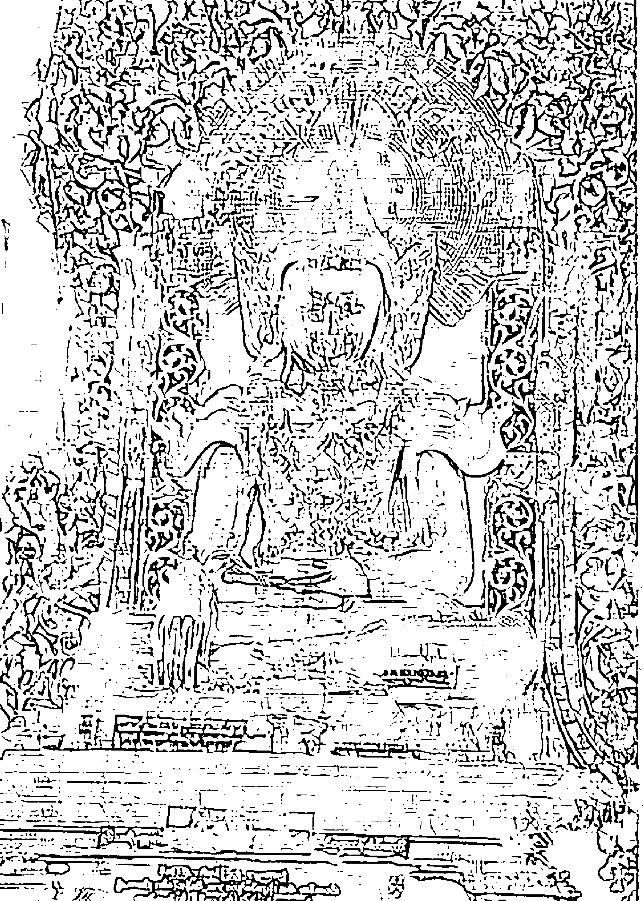

△ 開光？點眼？灌頂？灌氣？加持？玩水晶的朋友還是用「啟動」比較中性，而且是每個人做得來的，不假外求的事情啊。

當有了不良的氣流、氣場出現，該如何處理呢？ 答案很簡單，也就像我們在整治河流的方法一樣，對付「水」，要嘛使用「圍堵」的方式，或是使用「疏濬」的方式； 對付「光」、或「氣」，除了上述兩種方法，還可以用四兩撥千斤的方式，用「突破」的，「化解」的，「轉化」的，也可以用「壓制」的。這也就是俗稱的「制煞」、「化煞」、「化沖」、「避邪」、「鎮宅」等等的意義。 有形的風和水，我們可以使用也是有形的山形、地勢當成天然的屏障；另外，人工的牆壁，不管是鋼筋水泥、磚塊、木板、玻璃，都可以形成一種良好的阻絕隔離。就可以達到一種圍堵、或疏濬的效果了。這些都是眼睛看到的，手可以親自摸的到，通常也就比較沒有爭議。 困難的就在於一些看不到、摸不到的「氣」，也就是「不可見光」，這些若是形成「沖」、或「煞」，對人的影響仍然不可小覷。而因為看不到、摸不到，風水裡面最令人讚嘆的功夫就是在這裡，而風水裡頭最多訛詐欺騙齷齪的事件也是出在這裡。 別忘了我們前面說過，「能量的問題還是歸結於能量來解決！」能量的問題，還是得用有能量的東西來解決，才能有效的遏阻、化解，並消弭於無形。若是有著「片狀」的能量體，是否就可以發揮「阻擋」的功能？若是有「尖型」、「銳狀」的能量體，是否就具有突破、穿刺、化解的功能？若是有著「洞型」的能量，是否就可以發揮「積蓄、儲藏」的功能？若是有「球形」的能量體，是否就可以發揮轉換、擴散的功能？若是有「龐大精壯」的能量體，是否就可以對著一個混亂的能量場產生「壓制」、「鎮壓」，所謂的「鎮宅」功能？其實，說穿了，道理就是這麼簡單！ 特 別 是 在 「 啟 動 」 (Initiation、Activation) 後，所散發出來的能量能夠超過原來體積的幾十倍、近百倍哦！這樣的話，用來對付「不可見光」的沖與煞，效果最好囉！ 那麼哪些東西是有能量的呢？找來找去，看來看去，好像也只有水晶礦石等的能量比較精純、強大、便宜、容易取得、又方便加工，其他的東西呢？總不是非常理想，沒有足夠強大的能量，就只能擺擺樣子，安慰人心罷了。找出了問題癥結，卻無法解決，很令人頭大哦！
在台灣玩水晶的朋友間流傳著一句話，「天地間只有最精華的能量才會匯聚結晶成為水晶，其餘都化為塵土糟粕了。」
想必古代的人們也是有相同的困擾，別說太久，就在1960、1970年代，寶石加工機具才比較有點突飛猛進、趕上現代化的腳步。在那之前，鑽石鋸片、砂輪、鑽孔、打洞、琢磨、拋光等等器材、技術都沒有，老實講，加工方法跟兩三千年的石器時代還差不多哦。要做些適合風水使用的東西，真的非常非常困難，除非像是將相王侯巨賈之家，才能夠擁有珠寶鑽玉等的東西。
所以，許多東西就只得「湊合著」使用，嘸魚蝦也好咩，能量不足之餘，只好把自己平生鍛鍊修持的「人體生物能」（氣）給灌進去，使得原本比較沈靜、緩和的物體，能夠變成一種活潑、興旺的能量體。藉著這種持續發散出來的能量流，就可以抵擋外來的沖或煞囉。而這個過程，這個動作，就是「加持」、「開光」。

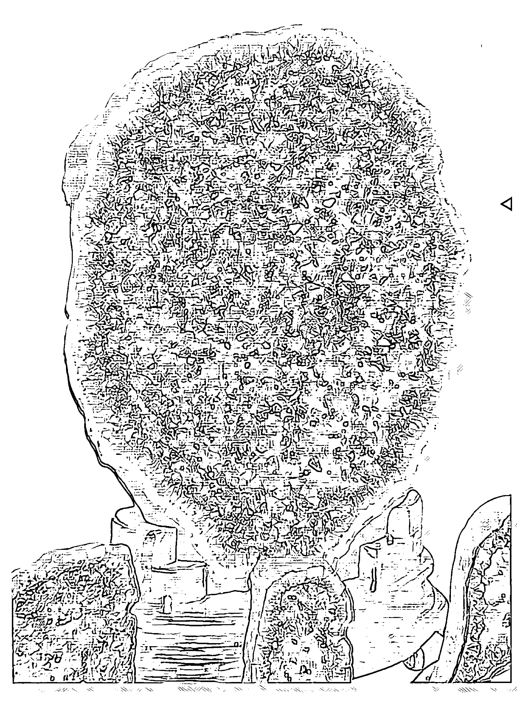

> > △「能量的問題還是歸結於能量來解決！」有形有相的風和水，可以用有形的鋼筋、水泥、磚塊、木板、玻璃來阻擋，無形無相的「不可見光」，就要靠強力的水晶礦石來把關囉！大片狀的紫水晶也是擋煞的能手！

這些專門的術語呢，近來在宗教界裡還比較常被使用。因為許多大師常常為信徒們「灌氣」、「灌頂」、「加持」等等的；而在一些新的佛像，也需要有大師們的「開光」、「點眼」。同樣，這些大師們也是使用自己平生的修持能量，現代話講就是自己的「生物能」來為信徒灌注，種下一些「意識」的種子，期待將來能夠開花、結果，也能開悟、成道，那就是人類漫無止境的進化終點，也是整個宇宙的歡唱和慶祝！

為什麼這些「氣」這麼重要呢？這和別種生物、動物的「生物能」不一樣，因為人類的「氣」，也包含著人類的「識」，有人說是「意識」、「靈識」、「靈魂」，也有人說這就是「道」囉。名詞的先不管，總之，這是一個人累世累劫以來，所修持鍛鍊出來的最精華能量！而這些能量還包含著他的「記憶」所在。能夠獲得這麼一點點的「滋潤」、「啟發」，日後就有可能長成大樹，開花並結果。所以這是如此珍貴、稀有、難得的，西藏密宗也因此特別注重「傳承」；所有的名門正派，都是追根於蓮花生大土、釋迦摩尼佛，一代一代，摩頂、灌頂、加持，把這個「識」，這點「記憶」傳承下來的，都是代代可考的哦。所謂要有正確的傳法、灌頂，修法才能夠「相應」，就是這個才有釋迦摩尼佛、蓮花生大土的正知、正覺、正傳啊？

當代也有許多自稱是活佛、法王、仁波切等等的，但卻沒有任何的傳承，訛說是「來自虛空中神佛的灌頂加持」，聽起來很美，很神，但是，誰知道咧？那也有可能是來自於鬼靈精怪妖魔的氣啊？怎麼分辨？這和釋迦摩尼佛、蓮花生大土都無關連啊？注意哦，想要將自己的身口意完全奉獻給上師來修持的話，這是一輩子，多輩子的事情哦，寧可慎重點，多研究些，多探聽探聽，才不會誤入歧途，貽害多生囉。真正的密宗裡面，上師要考核篩選弟子，弟子也可以觀察選擇師父的啊。這些都是題外話。

話說回來，這種「氣」這麼珍貴，難得，稀有，我們又哪裡去找這些大師，又如何去分辨這些大師呢？這就是問題囉。不是名氣越大，不是派頭越大，或是徒子徒孫越多，就是越有修為的哦。這些都是另外的話題啦，讀者們必須自己多去參考、研究、體會，才能了解。不然說多了，恐怕又會得罪人了。

若是找不到大師，那自己可不可以來自行「開光」、「加持」呢？答案是肯定的，「當然可以！」

我們必須肯定的，每個人都有氣！沒有氣的人，早就掛了，要給送到殯儀館去囉。雖然每個人的氣場濃淡厚薄、精純度不一樣，但是比較能肯定的是，只要自己沒有亂搞，「來源總是很乾淨的！」這樣，其實就已經很夠了。不要說「台面上」啦，光是「市面上」、「江湖上」，自稱大師的人就不知有凡幾，許多人連這點最基本要求，「乾淨」，都達到哦？為名、為利、為權、為勢、為情、為慾……都是汙染囉。名利、權勢、情慾薰心的人的氣，您敢要嗎？而這些人的氣是如何，其實只要看看他站在哪裡的那個樣子，那種「氣質」，不就已經說明了他的「氣」的「品質」了咩？

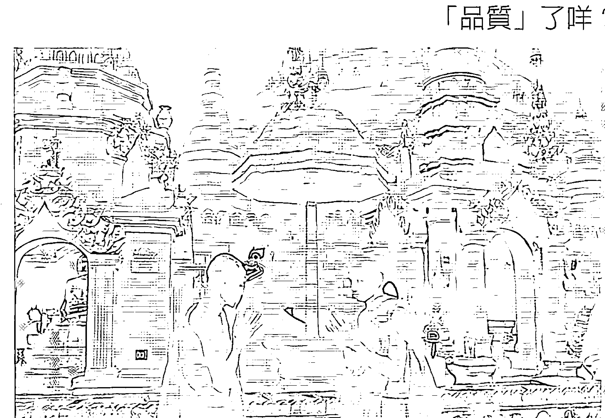

> > 宗教非常重視傳承，因為「氣」裡面包含著人們的「種子識」，千萬小心「來自虛空中神佛的灌頂加持」！還有啊，未經正式開光點眼的佛像可不能亂拜哦！

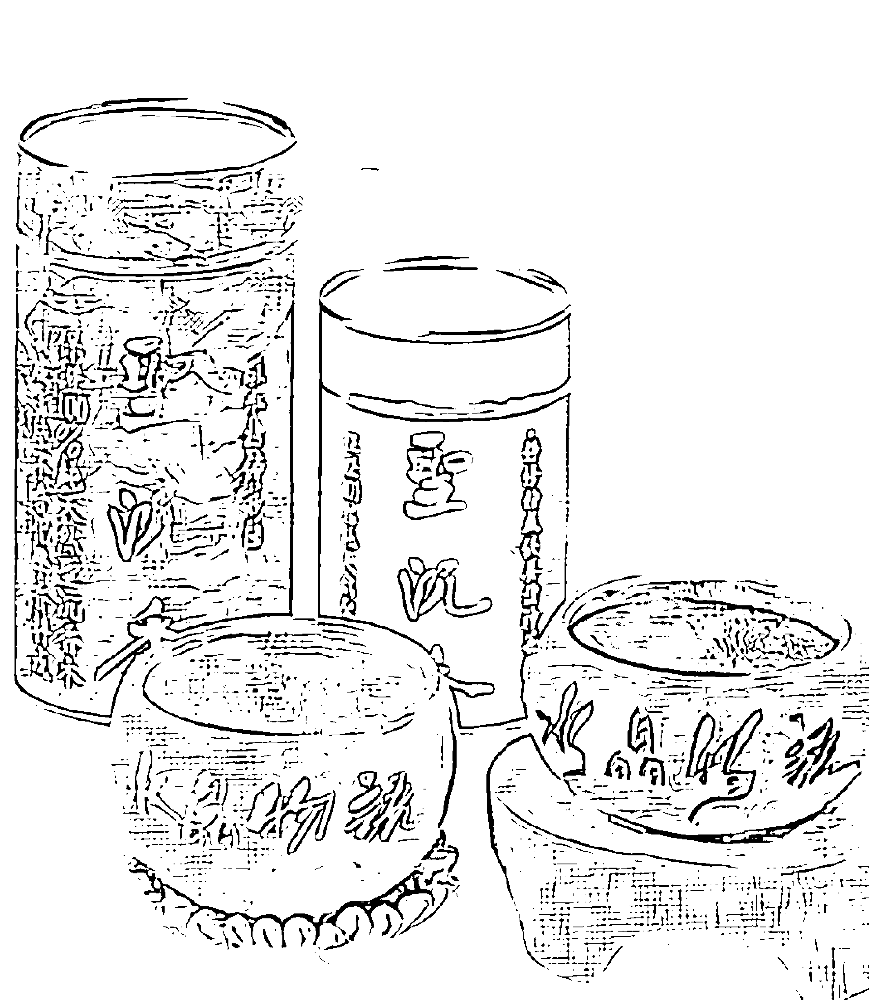

+   △ 所有的能量寶石在買回來後，都要先消磁，以消除前一手的殘餘能量；淨香消磁法是最安全、快速、方便的作法。

再來，找個舒服的位置坐下來，放點輕鬆的音樂，也讓自己的身體、頭腦、精神全部放鬆下來。在這種非常放鬆自在的情況下，身體的能量才能自由流動，才能源源不絕，充沛又有勁哦。此時，可以把相關的水晶礦石，或是物件拿在雙手中合握，若是太大件的，則人可以靠過去，雙手搭在上面。放輕鬆哦，「放輕鬆」是整個秘訣的所在哦！

間話不多說，其實，這都是我們自己玩水晶的心得啦。自己怎麼來開光、加持呢？也非常簡單，江湖一點訣，說破真的不值半文錢。

然後，觀想自己頭頂上有個太陽，深呼吸，深深的吸氣，吸氣的同時也觀想太陽的白熱光照耀、籠罩、穿透我們全身……吐氣時，把這些白光也觀想灌注到水晶礦石（或是等同物件）裡面。好好做，仔細做，慢慢做，不急不趕，自己的東西，重要的是確實，不是趕速度；也讓自己內心充滿著快樂，喜悅，愛意。

首先，所有買回來的新的水晶礦石，或是您將要使用來風水制化上的各種「物件」、「能量體」，必須先「消磁」，也是一種能量淨化的作法。就是消除前一手所殘留在上面的能量訊息，方法很簡單，或是曬曬太陽，浸泡海鹽水，或是過過香爐，讓檀香、沉香給薰薰，就行囉。詳情可以另行參閱「水晶完全實用手冊」（淳寶出版）一書。

少則一、二分鐘，多則五分、十分，比較困難的天鐵或許需要二、三十分鐘，等到您自己的手變溫熱，而您也能感受到來自於該件水晶礦石（物件）內部的熱度，或是麻麻的，刺刺的，也會有種穿透的感覺，許多時候，就會透過您的雙手、雙掌，經由雙臂傳達進入體內囉，這就是已經「開光」了。而，體內若有哪些部位曾經有受過傷的，不是很健康的，此時也會特別敏感疼痛哦，這都是氣的作用。

在水晶界裡頭，我們稱之為「啟動」(Initiation)。這是一個比較中性的名詞，不會讓人聯想到宗教、大師、信徒、崇拜、迷信等等概念，大家都一樣，大家都做的來，也沒有高低之分。在許多時候，我們還比較喜歡使用「啟動」這個名詞，雖然內涵和開光、加持是一模一樣的，但少了許多的誤解和錯認，讓人舒坦多了。

啟動後的水晶礦石或是相關物件，就可以擺在相關位置上，或要阻擋，或要化解，或要壓制，這個活潑的能量體就會持續的發揮作用。他可以發揮出比原來體積多出幾十倍、近百倍的能量，對付眼睛看不見的「不可見光」的沖與煞，效果最好！

但能持續多久呢？就看看囉，每個人功力不一樣，啟動的程度也不一樣，但是「勤能補拙」，我們每個禮拜、每個月，或是想到就來啟動一下，這能量就會持續不斷，永遠地發揮作用。不一定要某個特定的人物才能做的事情哦，每個人都可以做的！

這還有個好處，在啟動的過程中，也是個人的一種靜心、冥想，也是一種「修煉」的過程。只要心思澄淨，能量流動，這就是一種非常好、非常棒的「修行」囉。這在無形之中，也透過這種修煉過程增強了自己的氣場，這也是最根本、最基礎，可以來改善自己命運，改善風水的方法！密宗的風水改運法中，最常用的就是要人多念經、多持咒、多念佛，自己身強氣壯起來後，哪還怕些小風小水的影響呢？每個人都能修行，每個人都有氣，佛陀說「眾生都有佛性」，新時代也說「每個人都是佛」，何必迷信大師呢？

另外，若有人像是筆者一樣，常常工作過度、用腦過度的，若是不能好好靜心冥想，則可採取另種方式來啟動。就是可以「發聲」來念佛、誦經、持咒，或是依著您自己的信仰來念不同的經文，都行。重點不在什麼宗教、哪種經典、咒語的，而是在於「聲波」的振動能量。聲、光、電、熱、磁，都是能量的不同型態而已哦。我們就是利用能量來啟動能量，就像火柴來點燃爐火，而我們自己可以產生的「聲波能量」，則更為確實可靠，還帶有一種「無法抗拒」的態勢，您就算是心思散亂了，給其他東西給帶走了，只要還持續發聲，那「作用」都還在。

當任何水晶礦石有被「確實啟動」後，一樣都可以感受到來自他內部的能量，溫熱麻刺的感覺。

為什麼我們要特別強調「確實啟動」呢？因為這是您自己要用的啊，一定要有確實效果出來，才是您購買此書，學習這些學問的真正目的啊？還有，就是市面上有許多大師，可以穿道袍、披法衣，執拂塵、舞桃木劍、跳七星步，有時還裝腔作勢、大聲吆喝等等的，但是，都是「做儀式」、「擺樣子」，做給外行人看的，動作越大、越複雜、越難叫人看懂，才容易唬人，收大紅包啊？其實，沒有真正的能量出來，沒有真正的能量貫穿，真正的「天橋架式」，好看的而已啦。

市面上還有許多的報紙廣告、電視郵購、商家宣傳，都會強調他們的產品是經過某某大師加持過的，特別不一樣，但是就要因此提高數倍價格，有些還會附有出家師父、西藏喇嘛等的相片…… 也有些風水大師更好玩哦，還特別強調要經過自己開光加持的東西，才能有效制解風水哦？而且，「只此一家，別無分號」，還要搞壟斷。就是您跟別人買的沒效啦，要跟他買的有效就是了。許多消費者看到這種態勢，恐怕又會迷惘囉……

當使用自己的水晶礦石時，沒有面子問題，也不必要跟別人收紅包，當然也不需要擺樣子，做表面儀式，重視自己的能量能夠真正流動，真正貫穿，才是重點啊？記得哦，那些又叫又跳又鬧的，都是作秀哦，這不是夜市裡的打拳頭、賣膏藥，越是緊張的話，能量反而容易僵化(Blocked)，哪還能流出來加持呢？所以不要給表面現象給迷惑囉。

記得，放鬆自己，進入靜心冥想狀態，這是和所有水晶礦石、能量物件「能量交流」的最佳方法！這也是整個「開光」、「加持」、「灌氣」、「啟動」的秘密所在！
(淳賀天然水晶TEL:02-2788-9231、Fax:02-2788-8982)

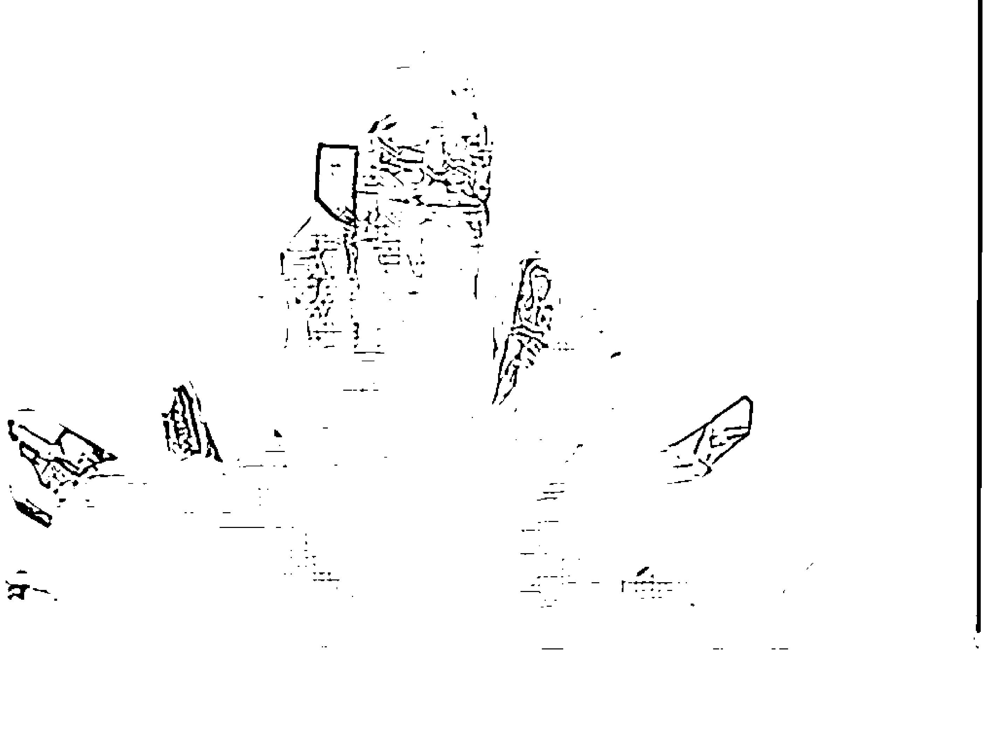

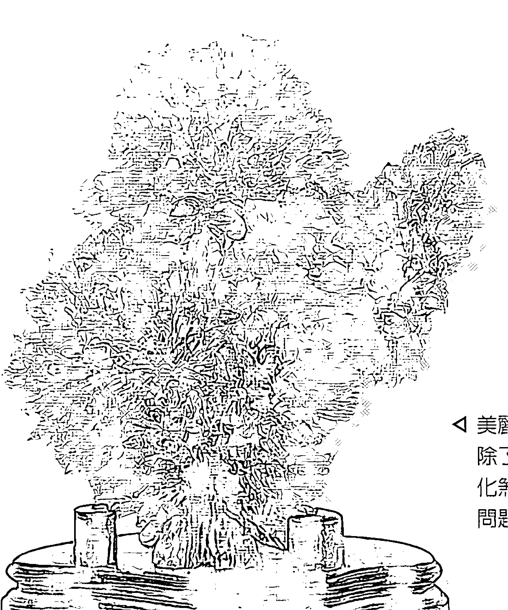

美麗的紫晶花，擺在書桌、辦公桌上，除了可以怡情養性外，還能發揮擋沖、化煞的功能，化解辦公室風水中的各項問題哦。

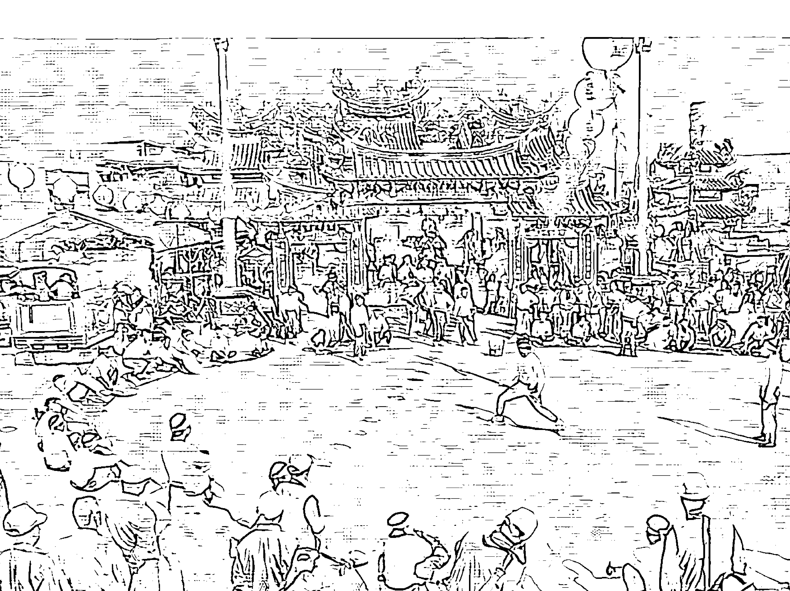

「確實啟動」才有真實的能量交流、貫穿，產生真正的影響力！ 做儀式、擺樣子、天橋架式、大聲吆喝，都不是啟動水晶的重點。

# 第二十七章 符咒與改善風水

除了具體的水晶礦石、物件以外，「符咒」也是風水制化上一個重要的運用物件。但是，許多人懷疑，真的有效嗎？
答案是肯定的！
但是，事情也不是這麼簡單而已。我們還要看看各方面的條件和因素，才能有比較客觀、透視性的體會和了解。
同樣地，我們也是要解決「不可見光」的沖和煞，在此，可能還牽涉到「靈異」問題，也就是一些眼睛所看不見的孤魂野鬼。其實，鬼不可怕，「鬼者歸也」，人還沒出生之前就是鬼，人死之後也變成鬼，這是一種「歸途」，自然傾向，沒有什麼可怕的。再說明白些，所謂的「鬼靈精怪魂魄」等等，只是一些低振動頻率的，有意識的能量團而已。所以，只要有些比較剛烈的能量出現，就能夠「避邪」，即所謂的「驅魔除邪」了。
前文提到，古代的科學不發達，能夠運用到的有能量的東西也有限。若是在一種匱乏，卻又緊急的狀態下，自然要想些「變通方法」。我們猜測，「符咒」的運用，應該就是在這種狀況下所產生出來的。
畫符，最常用到的就是紅色的「硃砂」(Cinnabar)，也叫「辰砂」，這也是屬於「廣義水晶

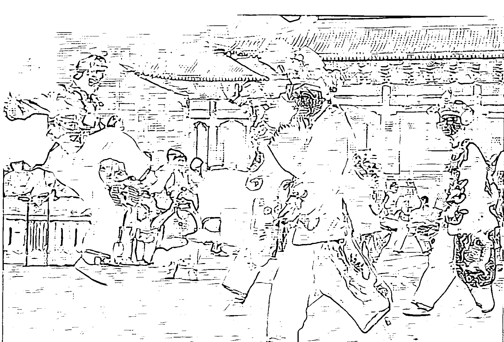

△ 所謂的「邪」，就是一些帶有意識的低振動能量能量團而已，所謂的鬼靈精怪妖魔等等。風水上的許多手法，也是要「驅魔除邪」，解決這方面的問題哦。

的一種，在新時代人士的眼中，這是一種帶有「爆炸性能量」的礦石。表示內在能量非常強烈、勁爆！若是有人能夠將它「啟動」開來，更能發揮數十倍、近百倍的能量出來！那不就可以很好的將之運用在許多方面嗎？特別在風水的制化上面，就更為經濟、節約了啊？

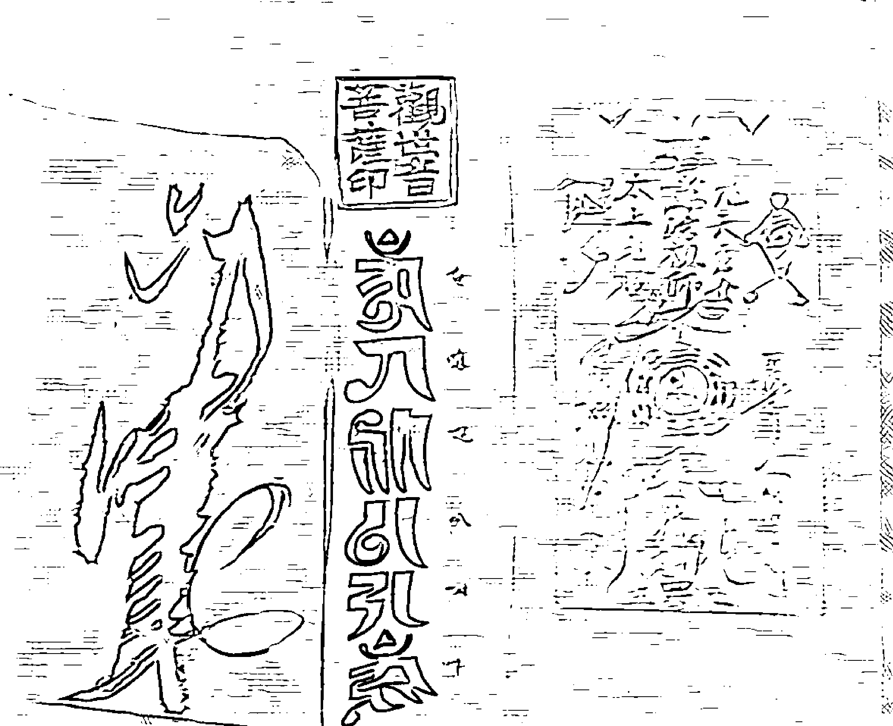

△ 不管是硃砂或是墨汁所劃出來的符咒，法師本身的能量有否貫穿、灌注才是重點，不然就成了「依樣畫葫蘆」的圖畫、便條紙而已啊。

硃砂在磨碎成粉狀時，其實只是肉眼看不出來的許多細微小顆粒而已，能量依然存在。跟水、酒、或是具有黏性的液體混合後，就是法師可以方便使用的絕佳材料。

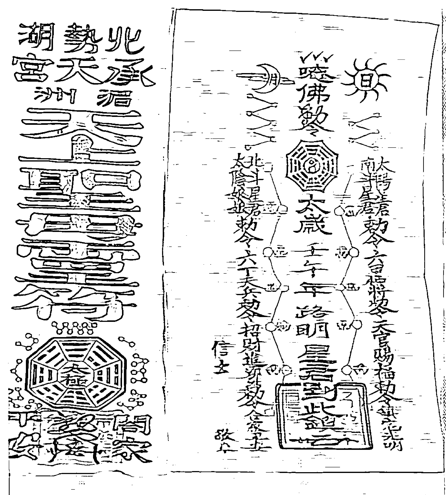

法師在畫符時，也是要屏氣凝神，專心致志；重要的是，當下，要讓自己也進入「氣功態」，也就是一種「靜心」、「冥想」狀態，如此，才能將體內的能量傳輸出來。更有甚者，能夠將自己身心完全放空，就如同中空無節的竹子一般，祈求天地神佛能量的加被，只要平常有將氣脈修持練通，此時就會有源源不斷的能量進來，透過身體這個「界面卡」，源源傳輸到所書寫的符咒上面。

△ 畫符的重點就在對此能量團的一種「格式化」、「規格化」，使得這些能量能夠依著您的指令來行為作用；即使用印刷出來的符咒，也能在事後靠念經、持咒、高能水晶寶石的加強下，發揮作用。

畫符前的請神儀式，念經、持咒、打手印等等，都是一種「前行法」，主要就是讓自己能夠進入「氣功態」的一些準備動作而已。而畫符的最後一個動作，「敕符」，就好像電腦的驅動程式一般，按下「Enter」，整個就開始動了！運作開來了！
為佛像「開光」也是相同道理，先前要念祂的咒語、聖號，結適當的手印，觀想祂的形象、教導、精神，法師放空自己，全心全意來和祂「相應」，等能量一進來，就舉起手，透過硃砂筆將之「點」進去，或在眼睛，或在額頭，總之，就是所傳導的能量已經進入該尊佛像，就是「開光」、「點眼」的意義所在。
整張符，其實您可以視之為法師所灌注下來的一個「能量團」，而上面所書寫的文字、符號、圖像，或是任何對當事人有意義的各種符號，其實，也是對這個「能量團」一種、「規格化」、「格式化」（Programmed）的作用。也就是說，您命令這些能量團，將要依著您的「指令」來行為、作用，「不得有誤」！「太上老君急急如律令」、「天兵天將」、「六丁六甲」，都是加強信心、氣勢的絕佳作用。

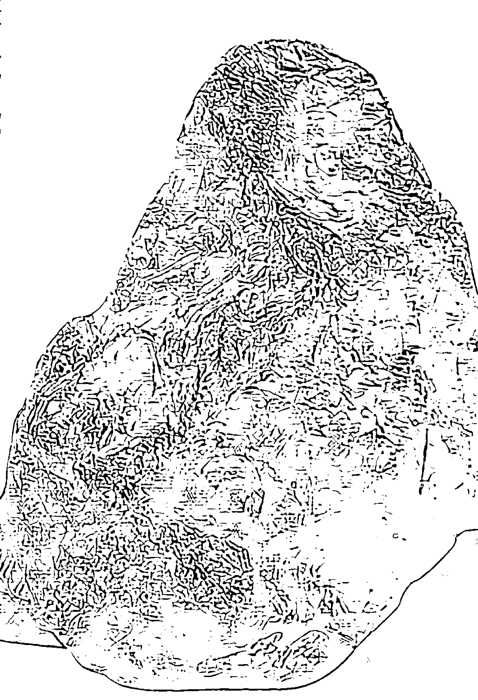

說身體是「界面卡」，這也是借用說明的一種比喻，就因為「人身」是能夠溝通如同神佛高靈等「高階能量」，與鬼靈精怪等「低階能量」的一個導體，可以溝通雙方意念的一個媒介。所以，「人」實在是一個充滿無限可能的能量體，修的好的話，可以往上提昇、昇華，直達神佛等的境界；若是自我放棄、自我沉淪的話，就向下到地獄、惡鬼、畜牲道去了。佛法「六道輪迴」的教導，實在具有很深的意義哦。

好，「符咒」的樣式有千千百百種，甚至每天、每個時刻都還有新的會被發明出來。您到書店、圖書館找，厚厚一大本的「符咒大全」，也不能盡數涵括。為什麼？因為這些都只是「表像」而已啊，每個人都可以因時、因地、因人、因各種實際的狀況，也可以「自己發明」出各種符咒啊？這話不是打誑語，不然，最早的一張符咒，不也是人給「發明」出來的啊？而所有這些表像，其實都頗為類似，差不多啦。重要的還在於，「有沒有能量？」「有沒有氣？」若是沒有能量、沒有氣的話，那這張符，充其量，也不過是一張「便條紙」、「圖畫」而已，也是做做樣子，無三小路用啊。

能夠有真實的能量來貫穿，這是最最最重要的關鍵！不然，畫符每個人都會啊？所謂的「依樣畫葫蘆」，照著筆畫來比劃，幼稚園的小朋友們也會啊？哪有什麼稀奇？哪有什麼功用？

要檢驗一張符有沒有功用，其實也非常簡單。放鬆心情，用右手手指頭挾著，讓左手手掌心來感受看看。若是您能感覺到，如同感覺水晶礦石般的，麻麻的，刺刺的，熱熱的，有股氣充斥彌漫在上，這就對啦！同時，也可以了解畫這張符的法師，真有功力的哦！若是感覺不到呢，嗯嗯，我們也不要批評啦，沒有功勞也有苦勞吧？沒有苦勞也有疲勞咩？能夠把這些「樣子」畫出來，也是費了苦心了啊？還有許多廟宇所「印刷」出來的，不嫌，我們還是可以拿來用，我們自己來「加工」！對啦，為什麼要用右手手指頭夾起來呢？為什麼又要用左手手掌心來感應呢？因為騰空（隔空）夾起來，才不會有桌面的木板、石板等的氣，或是感到自己手掌氣的反射。而我們身體內的氣，正常狀態都是「左進右出」的咩，所以左手來感應會比較明顯。還有哦，感應之前要先確定自己的敏感度夠，是否有先練習過，有開發過，一般的水晶、礦石、隕石等等的能量能否感應到？才不會亂下定論，一個不小心，某某大師的招牌就讓您給拆了，那豈不可惜？又會鬧笑話？

我們可以把一張平常的符放到桌子上來，當然，其作用當然也要有符合您需求的地方哦，比如說求財，求名，求姻緣，求陞官，或是保平安、避邪等等的。符的上、下、中間，可以各放一塊強力的隕石，最好是天鐵（鎳鐵隕石）、捷克隕石（Moldavite）、黑色隕石（Tektite），能量最強大啊！其次，一些剛烈的水晶礦石也行，看取得的方便與否，如各色髮晶（Rutilated Quartz）、彩虹黑曜岩（Rainbow Obsidian）、黑色電氣石（Black Tourmaline）、拉長石（Labradorite）、天然黑膽石（Hematite）、黃鐵礦（Pyrite）、鐵虎眼石（Iron Tiger Eye）等等，都非常好用。

就類似我們在前文所提到的「啟動」要領一般，放輕鬆，輕輕將我們的右手搭在這些符和寶石的上面，深呼吸，緩緩吐氣的時候，觀想白光從自己手掌發射出去，將之整個籠罩，涵蓋，滲透，貫穿……過程的時間長短並非重點，而是那種「能量出來了，並且貫穿了！」這種感覺最重要。若是確實貫穿了，三十秒、一分鐘也就夠囉。若是沒有

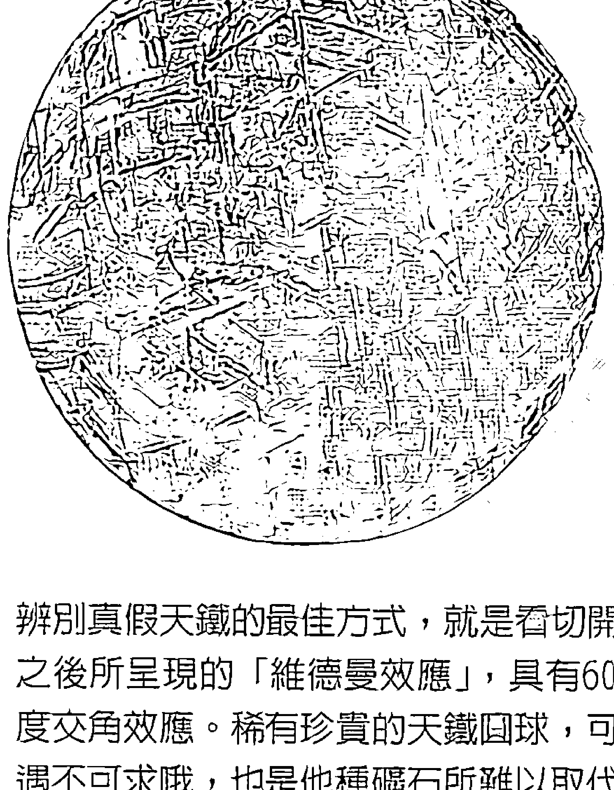

辨別真假天鐵的最佳方式，就是看切開磨光之後所呈現的「維德曼效應」，具有60-120度交角效應。稀有珍貴的天鐵圓球，可是可遇不可求哦，也是他種礦石所難以取代的。

的話，擺樣子擺個一、二十分，也是沒用的啦。若要確定的話，還可以拿給自己的同好、朋友們來鑑定鑑定哦。

了解了「畫符」的根本意義，就知道畫符、或為符咒「加工」，其實也很簡單，就是自己「精神念力」的專注與貫穿而已嘛。但是，也很難哦。一個人若是平常壞習慣太多，生活習慣不良，又沒有好好的靜心、冥想、修煉等等的，其實也灌不出什麼好氣、好能量的，所以對「符仔仙」等的畏懼、恐怕，也是不必要的。不是能畫符，畫個樣子，就能對人家怎樣又怎樣哦？若是沒有能量出來，頂多唬唬小孩罷了。即若真的有些道行，有些能量出來，也不用怕，都是「精神念力」的作用啊？您自己平常只要好好的吃飽、睡足、常常運動，身體好，精神飽滿，沒有哪個符仔仙能夠對付的了您的啦！就連鬼也傷害不了您啦！何況，為了保險計，我們再戴上一些上述的強力隕石、水晶、寶石，那就好像是「無敵鐵金剛」，「啥咪攏無驚」囉！

再來的問題就是，這張符畫好了，但是能夠持續多久呢？

這是個非常實際的問題，也非常值得大家關注哦。我們前面提到，畫符這是古代因為工具不多，所以借用硃砂、念力所形成一種權宜、方便、經濟的暫時措施，也因為多是「不可見光」（無形力量）的作用，而蒙上一層神秘面紗。了解的話，一切昭然若揭，沒有什麼神秘、玄奇的地方了。當然，也更不必用這種東西來唬人、嚇人、騙人等等的，沒有必要嘛？是不？甚至，我們還要指出「符咒」的缺點所在哦，它到底不是萬能的啊？

主要的就是，能量有限，在自然界中，就會隨著時間的流逝而遞減。遞減的速度，就看當時發功法師的修為而定。平常的，維持一個禮拜、一個月，厲害的維持半年、一年的。而這也似乎到了極限，很少能夠再有超出這個極限的。除非，這是「大修行人」囉。不是說沒有，而是相當罕見，我們平常人還是保守一點好。當然，您也有可能會在任何地方遇到一些說大話的人，其實，摸摸看，感受一下，就可以心裡明白了，也不用怎麼爭論的咩。話說「能量不滅定律」，不會消失，但是這是「逸散」出去，就像國中理化的實驗一般，能量轉換間，還是免不了有所損失的啦。

就是說，想用符咒來改善風水，做風水上面的制化，當然可行，因為這也是「能量流」、「能量團」的一種。只是，時間有限。但是，也不用擔心，一來，我們可以配合強力的水晶寶石來使用，如將之貼在符上，或是符就貼在一些比較大的水晶礦石上面，都行啊，能量和能量的交互運作，又可將能量體「規格化」，指定用途，相得益彰啊？

二來，我們也可以像是啟動水晶一般，隨時再來給它「加持加持」啊，隨時補充能量，那麼它就能夠一直發揮作用。

當然，如果您有心的話，也可以使用鑽石工具的話，也可以將一些經文、咒語、符號、圖騰，對您有特殊意義的，您所信仰的，您所深信不移的，都可以將之彫刻在水晶寶石上面，對這些能量團予以更精準的「規格化」，則可以運用更方便，更為得心應手。

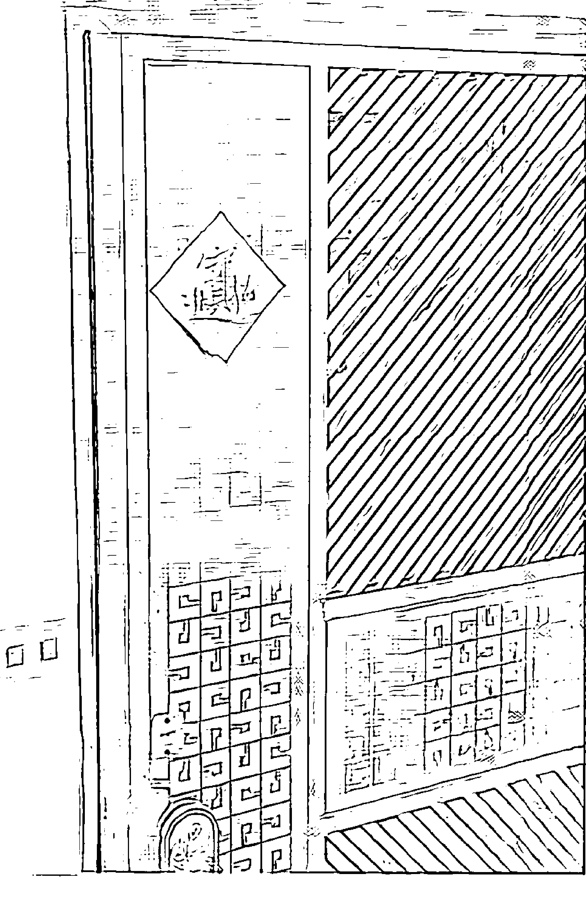

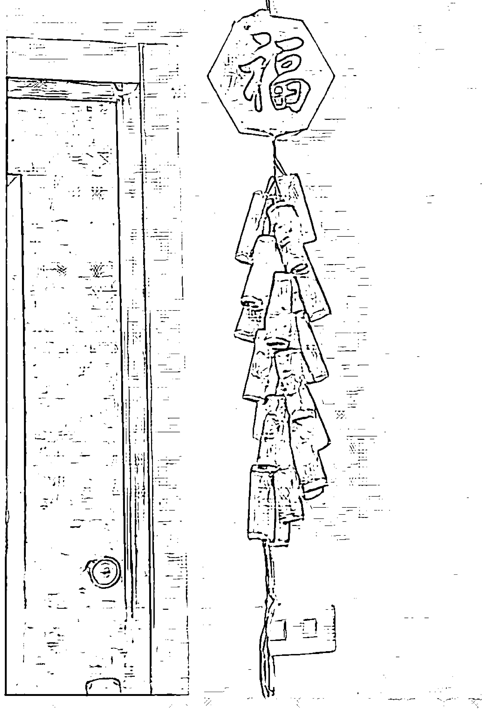

△ 不要受到江湖術士、神怪小說的影響，以為符咒是多麼可怕神秘的東西，其實早已經融入我們的民俗習慣、日常生活囉。街頭巷尾，到處看得到的「招財進寶」融合在一塊兒，豈不也是符咒的一種形式嗎？

◁「千門萬戶曈曈日，總把新桃換舊符」，這早就是先民千百年以來的習俗囉，符咒一點也不可怕，還很好用呢！只是，也非萬能符啊？

## 第二十八章 生基法

「龍穴」是這麼的稀少、難得之際，就算是有財有勢的達官顯貴也不一定能佔得到，更遑論一般的平民百姓呢？

如果，當「龍穴」是被討論的這麼廣泛，功用被如此的神化，如果知道的人不來給他試試看，那是否會變成人生中最大的遺憾呢？

又如果，有幸得到龍穴來埋葬先祖的遺骨，又如何能讓自己能夠「即身而發」呢？不必等個一代、二代，三代、五代的？讓自己馬上可以感受到這些好處，豈不更實在呢？

所以，了解了「龍穴」的根本道理，就是天然的山形、地勢、水流環抱、風向、水向、土質等等，所形成的一個「能量聚集點」，也是天地間一種「氣」的聚合點。就是靠著這個來滋潤、補充、壯大葬者的遺骸，期能庇蔭整個家族。根本的道理還是在這股天地間的「氣」、「能量」哦。

「生基法」，大概就是根據這些道理，和這些的需求，所發展出來的吧？

平心而論，生基法，的確有他的道理在，不是憑空想像，也不是憑空捏造的。只是，也因為是「不可見光」（無形力量）在作用，平常人若是氣脈不是很通暢，也不容易感受得到。所以，神話與汙衊的說法，就交織出更多、更複雜的神秘面紗囉。

曾經在港台地區的某些地理名師，就是以「生基法」的「造命」、「改運」而名聞遐邇，也為自己賺進了億萬的家財哦。他們是先找了一塊地，分割成了各個小區塊當「墓地」，然後大作廣告，卻也不是要埋葬「死人」，而是要給「活人」用的。拿來穿過的衣服，剪下一些頭髮、指甲，寫上生辰月日，然後配合一包所謂「祖傳密法」，別人所沒有，別人所不能達到的法力，一起埋下去，號稱可以「即身而發」，發大財、升官、成大功、立大業，家財萬貫，名流千古……當然，您就必須先把這塊地買下來，也要給大紅包呀，師父才能為您日夜作法咩？所以，一塊當「建地」都不宜的山坡地，給這麼一包裝，搖身一變，各個單位面積的價值比蓋房子還高出好幾倍。這些厲害的風水師當下翻了好幾翻，嚢爆了說。

個人的行為暫且不予評論，人家肯用頭腦，肯用心，能夠抓住社會的人心脈動，切中時機，能夠發大財，也是自有他的福份咩。比較迷人的就是這個「生基法」的內容，值得研究！

為什麼要當事人穿過的衣服、褲子、指甲、頭髮的呢？確實來說，就是要當事人的「能量訊息」。

這點可以用「雷射全息影像」來解釋，記得前面文章有概略介紹過，主要的重點就在於「部份」也帶有「全部」的訊息。一片樹葉帶有整顆樹的能量訊息，一顆細沙帶有整座山的訊息，相同的，一些毛髮、指甲也帶有整個人的能量訊息。這在國外的神秘學研究者，就稱之為「Witness」，說是「訊息物」、「證據」、「證物」，其實，就是可以代表整件事實的一個具體代表。

「部份」可以代表「全部」，對於「部份」加以發功、作法，也能夠影響「全部」。其實，不管國內外的神秘家、魔法師，包括國內的茅山道術等等，早也就知道，且行之有年囉。地理師也了解這個道理，所以把人穿過的衣物、指甲、毛髮，放進一個「能量場」好的地方，藉之來影響本人，使之有更好的氣場、體能、智慧、運勢等等，理論上，都是正確的，確實的，可行的。再來的問題，就是，他所找的那塊地真的是所謂「龍穴」嗎？這點，就留給有興趣，有專長的風水界朋友們來證實囉，這些有受過專業訓練的朋友們，找起龍穴，或是鑑定龍穴，應該比我們更快、更好、更精準囉。

至於，有什麼「祖傳秘方」、「密法」等等的，我們覺得可能是一種「障眼法」，故意讓人家知道還有這種「附帶條件」、「外加價值」，平常人沒有，就會不靈。這點作法，想必是要革除、防止其他「競爭者」的加入來搶生意，其實，不足為道，也不值一笑，因為在整個「生基法」裡頭，這不是重點啊？

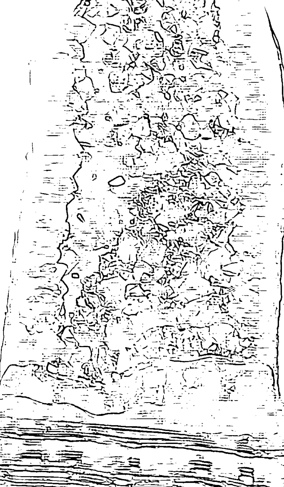

△「雷射全息影像」主要的重點就在於「部份」也帶有「全部」的訊息。紫水晶洞是「生基法」的第一優先選擇，因為「取用方便」，「價格合宜」啊。

了解了這些重點，其實想要實驗「生基法」，朋友們也可以自己來呦，而且不需要花大錢。只要您自己真的有心，也真的想要改善自己，我們可以抓住「能量」的重點，利用天然水晶礦石的能量，自己來創造出更為強而有力、更為完美的「能量聚合點」，只要您每天早晚也各花一點點功夫，其實，一點也不難哦。

最簡單的，就是找個小紙袋，或是個絨布包，只要是天然材質的，什麼顏色都不重要，可千萬不要用「絕緣性」的塑膠袋啊？這可是真正的「絕緣」，不過電的，白費力氣的哦？把自己的毛髮、指甲剪下一點點，只要是自己身上的，哪個部位的都沒關係。當然，也不要挑「腥味」太重的地方啦，記得先消磁消磁，淨化一下啊？

基本上，這樣就夠了。但若想要更功夫一些，也更加強自己的信心，則可再在張紙上，寫上自己的姓名，出生年月日時辰，地址，電話，還貼上相片，餘上指紋……呵呵，這就是「百分之百」的您，沒有問題囉！不會搞錯當成別人咩？

最簡單的，就是放入「紫水晶晶洞」裡頭。這個半封閉的環境氣場裡頭，可就是一個絕佳的「能量聚合點」囉。

若是預算有限，也可以找來比較小型的「瑪瑙晶洞」，俗稱「瑪瑙聚寶盆」，將自己的「Witness」（訊息物）放入後，連蓋子也蓋上，這也是一個非常棒的「能量聚合點」，「龍穴」囉！

還有，鼎鼎大名的「七星陣」，也可以再度派上用場。就是七個相同的水晶柱，金字塔，或是圓球，都可以使用。一個在中央，其他六個在周遭，形成兩個重疊的三角形，就像是以色列的國旗「大衛之星」（Star of David）的樣子。使用各種「晶陣」時，免不了的要予以「啟動」、「連結」，才能將個別的力量結合成爲整體的力量，發揮出相乘的「幾何倍數」魔力！

啟動七星陣時，我們可以以右手食指、中指來捻「劍訣」，最好是持用激光柱水晶來代替，比較確實夠力啦。深深吸一口氣，然後在緩慢的吐氣當中，觀想白光（氣）從右手指尖、激光柱的尖端放射出來。首先，啟動中間的水晶，再循著以下的秩序，連結每一個小三角形，最後再連結二個大三角形，動作如下：

- 1. 7-1-2-7;
- 2. 7-2-3-7;
- 3. 7-3-4-7;
- 4. 7-4-5-7;
- 5. 7-5-6-7;
- 6. 7-6-1-7;
- 7. 大三角形1-3-5-1;
- 8. 大三角形2-6-4-2.

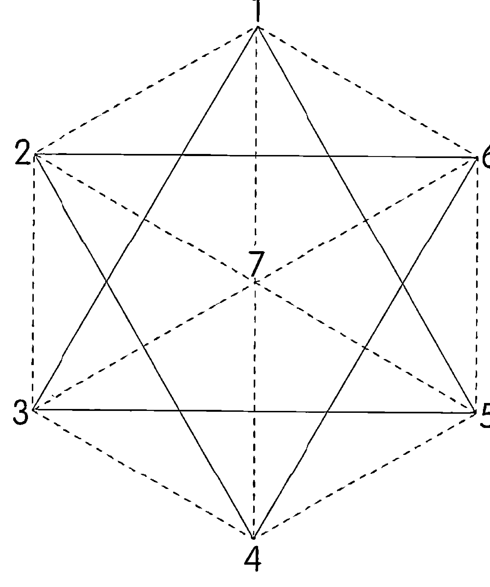

啟動連結完畢，大功告成！ 敏感的人士，將可以在上頭感受到強大的「氣柱」，不誇張的講，有「氣衝斗牛」的態勢呢！ 您看看有多強，有多旺！

由於是用來加強氣勢，改善運勢的，我們特別推薦強力的水晶寶石，如各色的髮晶（Rutilated Quartz）、黑色電氣石（Black Tourmaline）、彩虹黑曜岩（Rainbow Obsidian）、煙水晶（Smoky Quartz）、拉長石（Labradorite）、紅寶石（Ruby）、紅碧玉（Red Jasper）、紅色石榴石（Red Garnet）、虎眼石（Tiger Eye）等等，就連塊狀的天鐵（鎳鐵隕石Iron Nickel Meteorite）、綠色捷克隕石（Moldavite）、黑色隕石（Tektite）等等，都非常好用。

若是不想太複雜，也更節省點預算的話，還可以使用「四方陣」，也就是將水晶柱排成「四方型」，水晶柱各站住在四個角上面。個人的「證物」（Witness）就放在中間。啟動連結時，可以從任何一支開始，都沒關係，就是啟動後，要「順時鐘」方向連結其他各支。轉一圈怕不夠的話，還可以多轉幾圈，可以更為確實、穩固、扎實哦。若是擔心自己的能量、氣力不足，藉用「雷射激光柱」的能量，將會是一個聰明又省力的辦法。

「順時鐘」方向，是一種付出，給予，向前，往正面前進的力量。

「逆時鐘」方向則剛好是相反，是一種收回，抽出，吸取，向後，往後面倒退的力量。

使用「逆時鐘」的手法，剛好是將之解除，分散，不再是一個「統合」的「整體力量」，而是一個個「分散」的「個別力量」。那能量上、氣勢上，當然無法相提並論囉。建議各位敏感人士在各種水晶陣的啟動前、啟動後，分別予以感應看看，當知所言不假。

這種水晶陣哪，非常厲害，能量持續地一直在放射著喔。放到哪裡，哪裡就是「旺方」、「生氣方」。這種水晶陣也天不怕，地不怕，百無禁忌，哪裡都可以放，桌子、椅子、餐廳、廚房、臥室、櫃子裡、抽屜內，通通可以放，什麼都不怕，就怕不知情的好奇小朋友，看了亮晶晶、漂漂亮亮的水晶礦石，一把就給他抓起來，摔壞啦，那可就需要買新的，重新來啟動連結了。不然，自己平常在玩，就算碰倒了，也沒關係，就是擺正，重新啟動連結就是囉，沒有什麼大不了。

當我們了解這些能量運作的「生基法」時，也不要太高興，還要體認一個事實，就是像我們普通人、凡人、一般人，就是「能量不足」，修的還不夠啦。那些前世修的夠，修的好，今生都當王侯將相、鉅富巨賈，或是當大修行人，開悟成道去囉。

我們所啟動連結的水晶陣，他的能量可能只能維持一個禮拜、一個月左右不等喔，不是「綿綿不絕、直到永遠」的喔。所以，想到的時候，三天、五天，一個禮拜、二個禮拜，就來給他重新啟動連結一下，花不了多少的功夫，但是可以確保水晶陣的能量永遠強大！

假如，為了萬全的保障、保險，您也真的有心來改善自己的一切的話，那麼，不要害怕麻煩，或是浪費時間。請您每天早晚各撥出三十分鐘的時間就行，來到這個水晶陣之前，或是將之捧到您自己的面前，雙手可以觸及的地方，放桌上、椅子上、地上，都沒關係。每次就都再給他啟動連結一次，然後坐在前面，好好靜心冥想，或是觀想白光來籠罩全身，或是好好的祈禱，或是依著個人的宗教信仰來念佛、誦經、持咒、修法等等的都行，或就是靜心，什麼都不做，什麼都不想，也行。這樣都可以聚集更多的能量來到，更加增長到水晶陣的力量，彼此相得益彰，更形強大。其實，這也是一種很老實的「修行」囉。不要把名利心> ◇ 黑曜岩圆球，加上大理石所构成的七星阵，适当启动连结后，可以气冲斗牛！用来当生基法，又旺又发！

带进去，老实的做，实在的做，几个礼拜，一、二个月后，就可以看出效果啰。

透过水晶阵「生基法」的运作，不敢讲能够让人大富大贵、平步青云，当上王侯公卿的，但是您可以发觉，渐渐的，睡眠变少，精神更好，思路清明，判断正确，做事容易成功，和人相谋容易契合，整体运势将会变得非常平顺畅旺。不知不觉中，头顶上好像有人在帮您「灌气」，能量源源不绝体力充沛，精力旺盛，就连带「家运」也会变得好起来啰。这些都是「生基法」的积极正面作用！

还有那些犯太岁，正冲、偏冲者，或是卡阴、中邪、犯冲、犯煞者，流年不利的人，常遇到倒楣事件的人，正在打官司的朋友，或是无缘无故发觉人生陷入低潮……更有甚者，发觉被人下符、放咒、诅咒等等，也都可以利用生基法来加强改善自己的生命力、气势，藉而化危机为转机，履危为安，逢凶化吉。

如果您觉得效果不错，也想要让家人享受这种好处，也可以将他们的「讯息物」（Witness）用不同的袋子装起来，可以放到相同的水晶阵里头。注意哦，具有相同血缘的亲属才好放在一起哦，因为同一血脉，相类似的气场、电磁场、频率、DNA等等，才不会有冲突、扞格、抵触、矛盾的情形发生。不同血缘的，如朋友、同事、同学等等，就请他们自己来做一个水晶阵，自己的福气自己修吧！

台湾本省人有个习俗哦，他们了解血缘、血磁间的相互关系，知道一个人修行的话，全家族都能获益。所以，常常会有「家庙」，自己家所建的庙，然后每一代中，总要选个代表来出家修行，为全家族消业障啦，念经啦，也为全家族来祈福，就是一个人为全家族来修行的意思。

若有家庭想做，就以「家长」为主，若有公司要做，就以「董事长」、「负责人」为主，以各单位的「头头」为主带动，那就有可能「一人得道，鸡犬升天」，大家都雨露均沾，通通获得莫大的好处哦。

(淳贺天然水晶www.blancoage.com)

△ 看自己的需求在哪？可以依照著水晶宝石的颜色、灵性功能，自己来搭配调适使用。粉晶阵仗，摆明著就要求桃花、「求偶」用的！哦，讲太明了，应该说「求姻缘」啦。

## 第十九章 人体气场的探讨

在本书中，我们提到许多许多关于人体气场（Aura Field）的事情，人们对于风水强弱的承受程度，基本上跟人体气场有着密不可分的关联。想要探讨人体气场，可是另一门相当专门的学问哦。欢迎有兴趣的朋友可以参考「透视人体能量」（淳贯出版）一书，里头有最详细的说明和介绍，还附有几百张的气场照片，来说明人体的体能、情绪、心情、运势等等的各种关联。

本书在此，就只针对气场和风水的关联，做一个概略性的介绍。

气场（Aura Field），自古中国人就称做「气」（Chi, Xi），道家称「后光」，日本人直接翻译称「欧拉」，现代的科学家就称做「生物能」（Bio-Energy），各种的称法、翻译名称不同，其实讲的是相同的东西。

人体有气，就像是机器有电流一般，光是只有机器本身还不会动，等电流插下去了，机器才会动起来。人在诞生下来的第一件事情，就是吸进一口气，人在临终之际的最后一件事，就是呼出最后一口气。看看在街上活蹦乱跳的「活人」，和在殡仪馆冷冻柜里的「死人」，纯就「硬件」而言，哪有什么差别呢？但是，生死之间，存与活之间，差的就是这么一口「气」！

有人说「气」就是灵魂。

有人说「气」是身体最精华的能量。

有人说「气」就是「神识」，还带有累世累劫以来的所有经验和知识，也是一个庞大的智慧宝库。

有人说「气」是一种「电磁场」（Electro-Magnetic Field），不是只有「电场」或是「磁场」而已，而是两者兼具，两种特性都有的「电磁场」。

有人说「气」是「夸克」（Quark）、「量子」（Quantum），是一种比原子、电子、中子、核子都还小的物质，一种「基本粒子」（Particle），咸认就是构成我们宇宙、物质世界、万事万物的最小单位。

有人说，「气」就好比佛经上所说的「微尘」，也是构成我们三千大千世界的一种基本物质，平常人的肉眼看不到的，只有「天眼通」的特异功能人士，才能看的到。

有人说，「气」就是「道」，就是最终的真理，有人用哲学来看待它，有人用物理学来研究它，也有人用吐纳、打坐、仙道方术来修炼它。

有人说，「气」对于人体，就像大气层对于地球一般，也具有相当的保护作用，免于外太空流星、陨石的直接撞击，免于太阳紫外线光、宇宙射线等的直接冲击，万物才得以生长繁衍兴盛。

「气」，是以上所说的一切，而且不只是以上的一切，它还包含有人体的「识」，一种无须透过正常眼、耳、鼻、舌、身感官器官，却能探询、知了外界事物、心理、内涵的一种特殊功能。气，还有许许多多的功能有待发现。

因为「气」就是「识」，所以气会受到一个人的主观意念所主导、影响、控制，「气根本就是一个人意志力的延伸！」。科学家们从研究牛顿的传统物理学以来，到了二十世纪的量子物理学，已经证实了这一点，人的思想能够影响量子的运动，测不准定律，会同时时间在不同地方出现，没有一定的运行规律，具有记忆，或可能具有自己的思想......

庄子说过「天上天下一气耳」，天上、天下所有的东西都是由「气」所构成的罢了。爱因斯坦最有名的公式「E=MC²」，说明所有物质世界的东西都是由「能量」（气）所构成的，只是处于一种高速振动的频率，日本人也称之为「波动」（Vibration）。是的，万事万物都是由「气」这种「基本粒子」所构成，只是「排列组合、浓淡厚薄、振动速率」的不一样而已。钢板、花草、石头、人体、牲畜、空气、水份、尿尿、粪便……其实都是相同的「气」所构成的，所以佛陀真心的说出「众生平等」，中国哲人也说出「道就在屎尿之中」的真理。没有谁比谁高贵，也没有谁比谁低下，通通是一样的。

正因为「气」是如此的细小，几乎没有人可以用「眼睛」亲自看到，只是用不同的实验来证明「它」的存在、运动方式而已。所以，「气」具有无比的「穿透性」、「渗透性」、「贯穿性」，就如同量子的作用一样，常常不受传统物理定律的控制，不是我们正常人脑筋所认为应该怎样、那样的方式，它常常可以突破时间、空间、物质的限制，几乎可以说，「您的心灵想像能力有多强，它就能展现有多强的多样性。」正因为如此，「气」的展现，就和神通、魔法、特异功能等脱离不了关系。当代高能物理的科学家在形容量子运动的言语、词汇、观念时，让人感觉好像就是古代的祭师、魔法师、神秘家一样。

也因为「气」是电磁场，这种「场」(Field) 的效应，也具有传染、传递，同时也具有无限扩张，或是可以任意缩小的功能。修行人常在说的，「放诸弥六合，收则退藏于密」，实在是一个非常贴切的写照！

我们中华民族本来就是最懂的「气」的一个民族！有一个电脑上常常没有的字，「炁」，最好说明所有以上「气」的性质了。

人体有气，正表示人体内也有「经络」、「气穴」、「脉轮」，这就像是人体内的「能源系统」(Energy System)，虽然临床上的解剖学里看不到，但事实上存在。就像您看到一栋大楼，里面有灯光照明、瓦斯在煮饭，您就可以确定里面一定有电线、瓦斯管路，虽然您不一定可以找出他们的脉络。因为「气」、「气脉」等等，还是属于「不可见光」范围，不是人类「肉眼」所能够直接目睹，目前也没有适当的科学仪器可以来做直接观测。这些等候未来的科学更进步时再说吧！

顺带提到，人类虽然贵为万物之灵，但是人类的感官却不是最灵敏的哦？眼睛比不上老鹰的敏锐，嗅觉比不上小狗的厉害，眼界、视野也比不上蜻蜓、青蛙、鸟类等等的灵敏。许多动物都可以直接看到人类眼睛所看不到的光线，听到人类耳朵所听不到的声音。人类的脑袋瓜子灵光，其他的感官却不一定灵光哦？所以，千万不要执着于「眼见为凭」(Seeing is Believing)，目前所知的各种光线、射线(Radiation)，人类「可见光」范围，还不及这些的百分之一哦？而，还有多少样的光线、射线没被发现，那还是在人类的知识领域以外的哦？不一定不存在的哦？

十八世纪的英国物理学家及数学家牛顿（SIR NEWTON ISSAC），首度利用三棱镜将白光分解为红、橙、黄、绿、蓝、靛、紫七色光谱，开创了人类对光之研究的先河

说道人体有气，所以人体内一定有经络、气穴、脉轮等等的，这也是传统中医、武术、道家修炼，以及针灸、指压、按摩、拔罐、放血等这些学问的基础。武侠小说、道家仙术里头常提到的「任督二脉」、「奇经八脉」、「小周天」、「大周天」，西藏密宗常提到的「三脉七轮」，印度瑜珈提到的「五重轮」、「七重轮」、「十二重轮」等等，都是各家各派对于人体气场、能源系统的一种不同认知。细部的或许有些许不同，但是共同的地方，也就是最重要的地方，就是提到人体的中脉和七重轮。

曾在美国太空科学总署（NASA）任职的女性科学家，「芭芭拉·布兰娜」（Barbara Ann Brennan）在她的经典钜著「手上的光」（Hands Of Light）提到人体气场，并以她的「眼通能力」（Clairvoyance）所观察到的七重轮、七个层次，并将之记录下来如下：

△ 人体能源系统图

| 轮位 | 穴位 | 身体层面（暂译） | 英文名称 |
|---|---|---|---|
| 第七轮 | 顶轮、百会穴 | 因果体 | The Causal Body |
| 第六轮 | 第三眼、眉心轮 | 天应体 | The Celestial Body |
| 第五轮 | 喉轮 | 以太模板体 | The Etheric Template Level |
| 第四轮 | 心轮 | 星光体 | The Astral Body |
| 第三轮 | 太阳神经丛 | 理智体 | The Mental Body |
| 第二轮 | 脐轮 | 情绪体 | The Emotional Body |
| 第一轮 | 海底轮、会阴穴 | 以太体 | The Etheric Body |

人体最重要的就是这个「中脉」，就像是南北的中央干道、南北高速公路一样，而七个轮位，「Chakra」源自印度梵文「轮子」的意思，有转动不停之意，日人就直称「恰卡拉」，就好像是七个重要的「交流道」，人体的能量就是从这些轮脉中进进出出的。这些「能量体」(Energy Body) 有着不同的振动频率，刚好跟彩虹的排列方式一样，也跟能位阶的排列方式相同，就是「红、橙、黄、绿、蓝、靛、紫」七种颜色。

非常凑巧地，我们中国也有「三魂七魄」的说法。「魂魄」就是等同一个人的能量体，七魂，就像是七重轮上的能量，三魄，就是「上丹田」(第三眼、眉心轮)、「中丹田」(太阳神经丛)、「下丹田」(脐轮)，也是西洋神秘家所称的三个「光体中心」(Light Body)。

由于气场是受到人体的「心、脑、意志」所控制的，所以人體的心情、情绪、想法变化，人体气场的颜色、结构便会产生变化。所以「气场学」(Chiology) 其实很简单，这是中研院的专家、教授所新拟出来的「复合字」，要更方便大家研究咩。只要看出这个人的气场是什么样子的「颜色」(Color)，我们便知道这个人「习惯性」地在使用哪个轮位的能量，就会在个性上有些特殊的意义啰。我们只要看看这个人气场的「结构」(Structure) 大小、浓淡、厚薄，就知道他身体动能的多寡，是精力充沛、活力十足，还是有气无力、要死不活的样子？看看「清澈混浊」程度，也可以了解他是否有疲劳、倦怠，是否承受压力，还有最近运势的好坏等等。因为这也是「电磁场」啊，类似的气场就会吸引类似的人事物来接近，光鲜明亮的气场就会吸引光鲜明亮的人事物来接近，运势就好；混浊黯淡的气场就会吸引混浊黯淡的人事物来接近，运势就不好。

中国字的「运气」，咱就字解字，「气」就是能量，个人的能量和外在世界能量的一种「交互运动关系」(Interaction)，就构成了一个人的「运气」啰！说中国人是最懂得「气」的民族，一点都不为过！

综合判断一下「颜色」、「结构」、「清澈度」，就可以大致了解一个人的思考模式、行为模式、以及遇到事情的一种反应模式。

### 【红色气场】
来自海底轮，是人体最强大的性能量，也是活力、体力、生命力的来源，这种人具有热情、大方、诚恳、豪爽、海派、且非常单纯的特性，也相当好骗，容易上当。好像游戏中的小孩，运动员，或是酒酣耳热中的商人们。

### 【橙色气场】
来自脐轮，具有治疗、温馨、体恤、关怀、热忱、牺牲、奉献等特性，这种人最会为他人着想打算，土地公、土地婆、大善人、大菩萨的特性，却往往没有好好照顾到自己内心的需求。许多的医生、护士、社工人员、心理咨商师，都有此特性。

### 【黄色气场】
来自太阳神经丛，具有逻辑、理智、条理、系统、计算、精确、记忆、完美主义的倾向，做事情一板一眼，一步一脚印，一个萝卜一个坑，虽没创意，绝少犯错，有时有六亲不认的特性。比如许多的军警人员、会计师、建筑师、工程师、科学家、学者等，都是此气场类型。建筑师、律师、法官、经理人才等等。

### 【绿色气场】
来自心轮，开心、喜悦、快乐、冲动、执着，这种人具有思想快速敏捷，反应灵敏，企图心旺盛，贯彻执行能力强的特性，许多企业界的老板、主管、领导人、军队指挥官等等，都有此特性。

### 【蓝色气场】
来自喉轮，平和、安静、冷静、稳定、自在，具有修行人的风骨、读书人的气节，脖子筋硬，不为五斗米折腰，不喜欢压力，也不喜欢主动示好，人际关系比较生疏，比较适合当幕僚、参谋、行政、企划等幕后工作。

### 【靛色气场】
来自第三眼，聪明、敏感、锐利、洞悉、透视、洞察，许多修行人、修道人、宗教人士、特异功能人士都有的直觉力强，第六感灵敏，能够洞察事物根本的能力，不会迷惑于表面现象，具有相当能力能够迥知过去，预知未来。

### 【紫色气场】
来自顶轮，慈悲、善良、和善、敏感、优柔寡断、多愁善感，遇到事情还容易举棋不定、摇摆不已、犹疑不决，但是人缘特佳，容易赢得他人好感、同情、信任，适合服务业、文教业、社会工作等等。

很好玩的，佛教常在讲的「习性」、「习气」、「业」，讲的就是一个人「习惯性使用的能量」啊？在气场照片下，就呈现显露无遗啰。

宗教命理界常常说要「改运」，真正要下手的地方就在这个「气场」，不要听信江湖术士，动不动就要抓到厢房内来搞「天人合一」、「阴阳调和」那一套。通通搞错啰！

看看（图一），这是正常人的气场，先不管颜色的意义，结构上是一个完整的蛋型、茧型、长椭圆型，这层气，就是这么把人给包覆在里面，形成了一个完整、良好的保护作用。正常的气场，没有缺口、没有破洞，也没有浊气，表示能量充足，精神良好。

看看（图二），当您开始忙碌，许多事情上来时，头脑想的多，身体动的多，开始感觉到「累」的时候，但是还有种应付的来的感觉，就是「忙而不乱」，但却已经不是在自己的最佳状态时，就会呈现这种样子。看到浊气，暗红色、橙色的气场已经笼罩、攀附上来啰。

如果，您的责任心很重，或是老板给的压力很重，没得休息，没得放松，尽管已经忙过头、累过头了，还是得干，那么拍出来的气场相片就会像是这个样子，（图三）。做还是能做，但是是拖着老命在做，即使想冲，也会心有余而力不足，提不起内在的那股劲来。

△（图一）

△（图二）

△（图三）

看看（图四），这是典型「气虚」能量不足的气场相片，当一个人经过一段不正常的作息，比如睡眠不足，熬夜加班、赶工、读书，身体的能量消耗太多，又来不及补充，就会呈现这个样子啰。头部的紫色气场，不代表修行很高哦？千万别误会，配合着旁边的暗红色气场看，这是最低阶的能量，还有底下，显现下盘气场都空空如也，表示是身体的自动调节功能，把「气」调集回头部，保护住这个真正的「命根子」，所以气场是往上缩，而且在局部形成「重压」，所以会变成紫色。在这样的情形下，许多人都有经验嘛，就是容易感到头重脚轻，做事情提不起劲，有气无力，要死不活的样子就出来啰。

△（图四）

还有呢，看看（图五），若是您已经三年没休假，十年没加薪，想到上有高堂老母要奉养，下有嗷嗷待哺幼儿要花钱，就忍不住要「郁卒」起来啰。这张相片显示的就是一个人心情不好，情绪低落，忧郁、不开心的样子。怎么看？正常的人的气场不都是蛋型、茧型吗？这个气场就给它「咻！」地缩起来啰。这就是内心压抑，郁结的最明显现象。当然，这对人体的影响当然不好啊？头部也形成紫色气场，可见压力很重，有那种「一个头两个大」的现象在。同时，身体周遭都是低频率，类似猪肝红的气场，就是最低阶的能量频率啰，气场显得又薄又虚弱，这样的话，运气又怎么会好呢？

△（图五）

事情还没完哦，如果您常常需要搬货、跑外务、见客户、四处招呼、忙碌，或是运动过度，刚刚跑完五千公尺回来，也会有这个样子，也是一副「气虚」的样子。注意看（图六）这种结构形状，就和睡眠不足的啦，和郁卒的形状都不一样，这是属于「体力」上的消耗过度，所导致的一种倦怠，心理上倒是没有太大的影响，好好休息一下就行了吧。

△（图六）

如果您常以为自己还很年轻、很强壮，疏于照顾自己，天气一变，就容易感冒、生病的，看看，生病的话，气场就会变个样子了。就像是（图七），头重脚轻，浊气一大堆冒出来……难怪生病的人都会「病奄奄」的，就是这个样子啰。当有这种「气息」出现时，别说自己不舒服、不开心啦，就连和别人的「互动」也会有问题。一来，一些敏感敏锐的人，或是普通人有时基于天生的本能，就不会喜欢接触这种气场，总是尽量闪避。二来，所吸引过来的，常常就是一些「浊」的人事物，那么，除了自己生病以外，生活、工作上的运势上也会变得很「衰」咩，就是这个道理。中国话说「贫病交迫」，事实上，应该是先生病，才会导致贫穷的，「病贫交迫」才是。光是贫穷的话还不是一种疾病，暂时的时运不济，多加努力就可以重新站起来啰。

（图八），显现的是连夜写作、赶稿后的情形，思想高度集中，第三眼的蓝靛色能量都集中在头顶的地方，然而，耗尽体力，身体的其他能量都消耗殆尽，也呈现一种「虚」状况。当然也不是一种好的状况啊。这时候，精神不济，体力不济，若是再开车出外、办事等等的，最容易出差错的！（图九），这可不是道家丹鼎派在说的「三花聚顶」、「五气朝元」哦？看看气场已经在局部呈现「球状」就知道有「局部用力」过，简单的说，就是想的比做的多！

△（图七）

△（图八）

△（图九）較多，也做的比較多，超乎身體能夠負荷的情形時，氣場就顯現有「斷開」的樣子，讓外氣顯得有「可乘之機」，隨時可以入侵體內，當然也不是一個好現象囉。

（圖十），氣場雖然顯的充實飽滿，但是看到頭上一團紅色光，這就是「慍火」、「惱火」啦！雖然說不上是暴怒、盛怒，但是這種不太受理智節制的紅色能量，就會盤踞在腦海裡頭，就是在生悶氣，悶在心裡頭的意思啦。此時，這種情形來做任何事情，恐怕也難以做出正確的判斷和抉擇吧？當然，長期而言，對健康也是相當不好的。

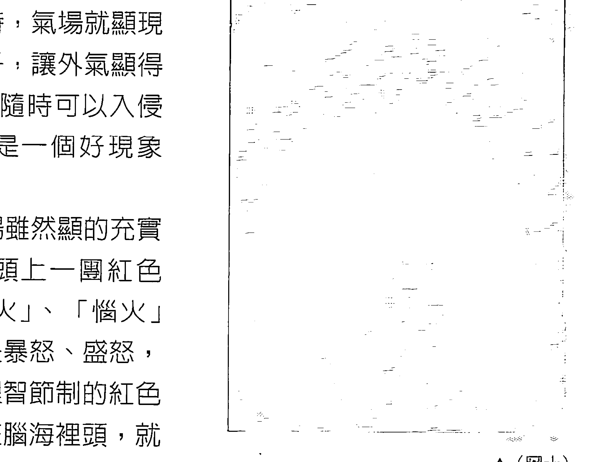

△（圖十）

看了那麼多「衰衰」的氣場相片，千萬不要笑，這可是長期拍攝，精心挑選出來，比較有代表性的相片哦。最主要就是要讓大家看出來，人體氣場的一種多樣性，人的氣場是會變的，而且變化非常的多樣，變好變壞，也都看您自己如何照顧、善待、調適您自己，也要看您自己如何鍛鍊、修行自己，才能有一個好氣場。如果能夠好好靜心、打坐、冥想、念佛、持咒、誦經、祈禱……各種方法都行，您也有機會變成（圖十一）的這種樣子，看看，是不是好像「佛光普照」呢？

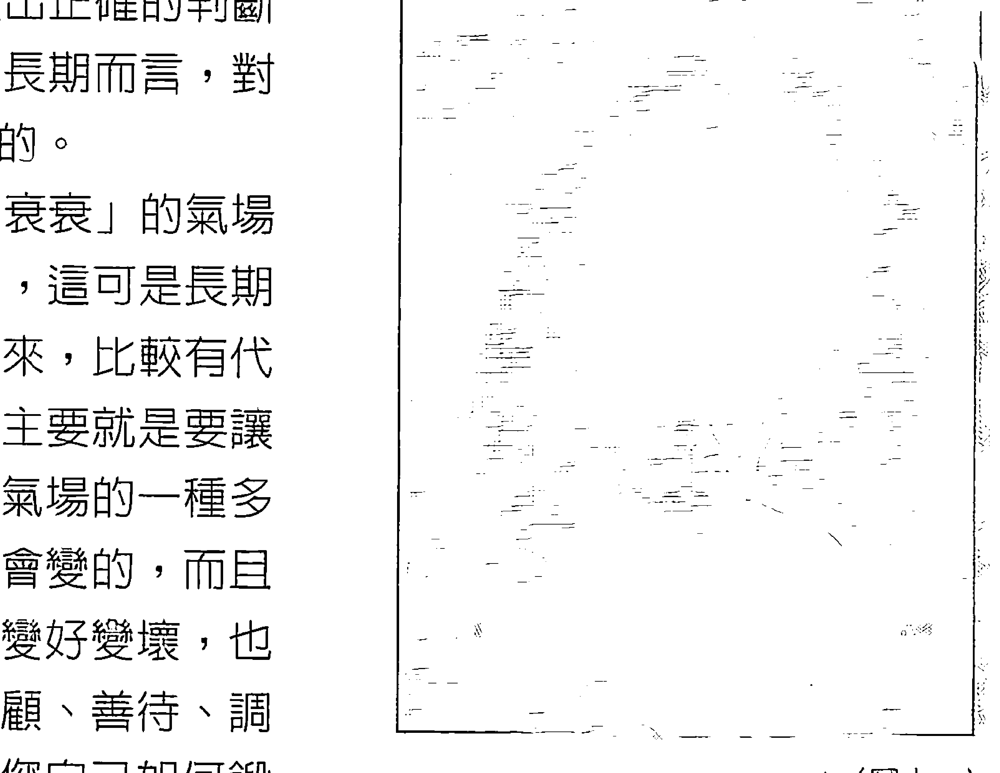

△（圖十一）

就算任何人都不懂得看氣場啦，但只要這麼一路比較下來，自然可以發覺，氣場只要光鮮、明亮、充足、飽滿，就是「旺」，就是好的，就是吉利的，萬事皆宜的。

氣場若是混濁、黯淡、低下、虛弱，就是「虛」、「衰」、「病」，雖還不至於「死」啦，但若氣都沒了，大概也差不多了嘛？這就是不好的，不吉利，諸事不宜的。還有，氣場結構出現有破洞、裂痕、缺口、不足、虛的情形，保護作用就不足了。這是非常明顯的現象！當外在環境出現了比較強勁一點的氣流，就是我們常說的「能量激流」，也就是風水上所說的「沖」、「煞」等等，當事人就受不了，而容易受到衝擊而產生重大影響。

尤有甚者，許多時候，別的地方在颳颶風，這些氣虛的朋友，也就是俗話說「氣數低」、「運勢低」的朋友們，就容易給「煞到颶風尾」，無端受到波及，無端受到牽連，無端被捲入，容易受到「無妄之災」啦。您看看，「氣衰」的人，這不就是「倒楣」嗎？

這種現象也可以解釋，為什麼在相同的一個靈異現場，有的人根本不受影響，有的人卻驚嚇的不得了，一下子看到什麼，感應到什麼，甚至讓鬼給附身了！這都是氣場極虛、極弱的現象。正常人，只要正常的吃喝、睡覺、運動，有著正常的氣場，都還比鬼靈精怪妖魔的氣場頻率高呢，不要去欺負鬼就好囉，哪還會怕鬼呢？所以，您也可以了解，電視媒體上常有許多可以感應鬼神的一些老師、大師、法師等等的，其實那種「虛弱式的敏感體質」，比許多正常人都還不如的啦。

這種現象當然也可以解釋，為什麼有些房子的風水可以適合某些人，卻讓某些人住不來？就因為體質不一樣，格局不同，對能量的承受度也不一樣啊？氣場強旺的人，就是住到鬼屋裡頭，也還是旺；氣場弱的人，就給住到皇宮、總統府裡面，還是受不了，到哪裡都不行。與其說是風水不好，倒不如承認自己的「虛不受補」，但不要慨嘆「沒有那個命！」，不是的，只需要好好鍛鍊鍛鍊就行啦？

俗話常說某人八字比較輕，就容易遇見鬼，八字比較重，就不會遇見鬼。這種說法還不如「氣場」的輕重、厚薄、虛實的說法來的貼切。因為，「落土八字命」，這就不能更改的囉。氣場卻是可以調節改善的啊。但是人若是沒有正常的吃喝睡覺作息運動，氣場變弱時，就容易見鬼囉。有人說，走霉運時，容易見鬼，受到驚嚇後，三魂七魄更是「失魂落魄」，那就更衰囉。如此的惡性循環，豈是辦法呢？所以啊，了解這些道理，知道氣場是可以靠自己來改善的啊，那平常就要好好照顧自己，一切正常，甚是好好的修行，把自己的氣養好，變得光鮮明亮又充足飽滿，就像孟子說的，「吾善養吾浩然之氣」，嘿嘿，孟老夫子也懂得其中訣竅哦！千萬不要把他當成一種「學說」、「講法」，而給忽略了，這是實際可行的一門「真功夫」呢！當來到新時代之時，許多古老中國曾經使用過的方法，再度透過西洋神秘學、新時代運動（New Age Movement）而傳回東方世界。呵呵，孔老夫子說過，「禮失求諸野」，也是當今的一種寫照啦。中國自古以來，地大物博，物產豐盛，各種水晶礦石等等，當然不在話下。而一向以來，人才輩出，高手如雲，許多先聖先賢都懂得水晶寶石珠玉所含有的「氣」（能量），可以用在個人的修行、修煉上，也可以用人體疾病（肉體、精神）的治療上，更可以運用在風水的制化上。只是，不曉得是門戶之見呢，還是太多的戰亂、流離失所，以致於這些學問大多失傳了，非常可惜！在新時代寶瓶世紀的另一個時代意義，就是古老的學問會以一種新的風貌重新站起來，呈現在世人的面前。水晶的流行，或許也給這個時代做了一個非常好的註腳。以下幾組氣場相片，比對來看，很簡單的就可以看出，當一個人的氣場不好，只要能夠掌握各式的水晶礦石，予以適當的靜心冥想，只要短短幾分鐘的時間，就可以把自己的氣場恢復到正常、健康、完整。這些對比照片，就已經做了最好的說明囉！把自己氣場養好，其實是對治風水問題的根本解決之道！說修行太沈重，太多的門派、教義、規則、誡律、分歧，好好的賞玩水晶礦石，藉以來增強自己的氣場，提昇頻率，豈不簡單、容易、又可行？

（圖十二），該位先生的氣場顯示頭部的壓力重，思慮過多，身體也有濁氣出現，是否操勞過度？或是剛做完劇烈運動完？氣場兩邊還有微微分開的情形，這都不是個好現象哦。

（圖十三），還是同樣這位先生，但就是在抱著「藍色方解石」（Blue Calcite）靜心冥想幾分鐘後，重新拍攝的氣場相片，可以明顯看到，所有的疲勞、壓力、濁氣通通不見囉。又恢復一個健康、明亮、完整的藍靛色、白色氣場。相同的一個人，前後只差幾分鐘而已，就可以利用水晶寶石將自己的氣場「調節」過來，水晶寶石的力量可千萬不能輕忽哦？

（圖十四），頭部的橙色微紫色，還有分段、多色的氣場，顯現頭部壓力大，想的很多，也想的很雜，有開心的事情，也有惱人的事情。身體兩旁的暗紅色氣場，也指示著疲勞、累的狀況。分開的氣場，已經說明身體的體能負荷已經到了極限，若再硬撐的話，恐怕就要生病囉。

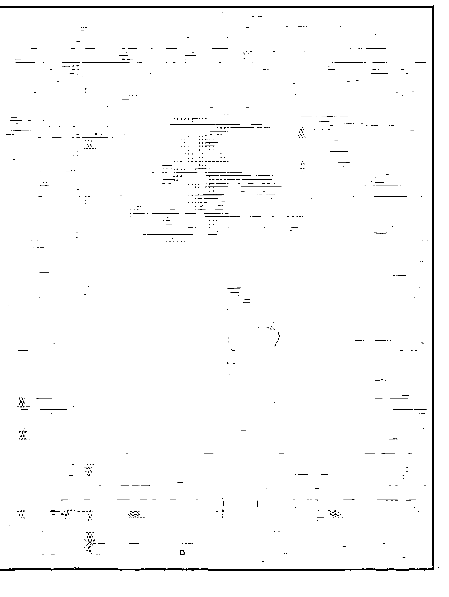

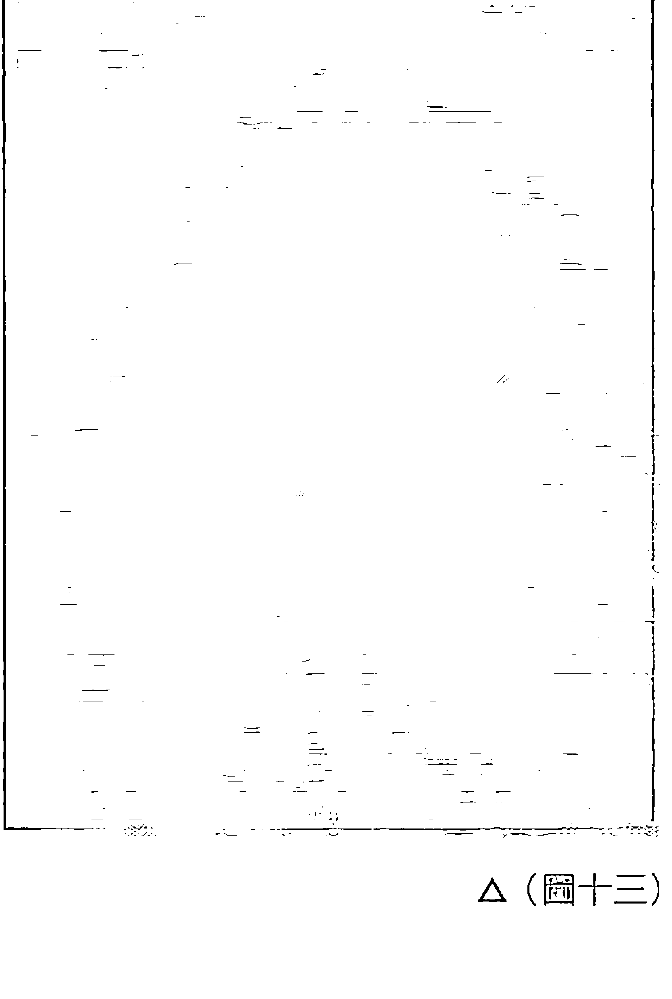

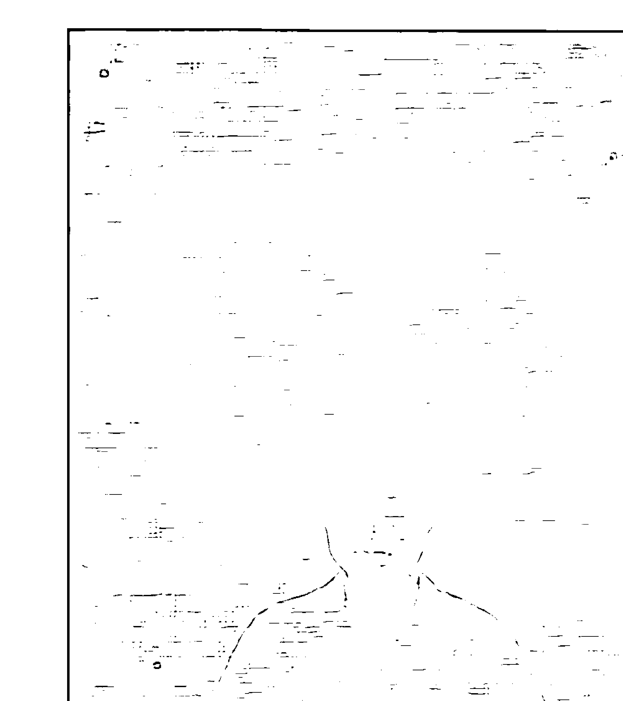

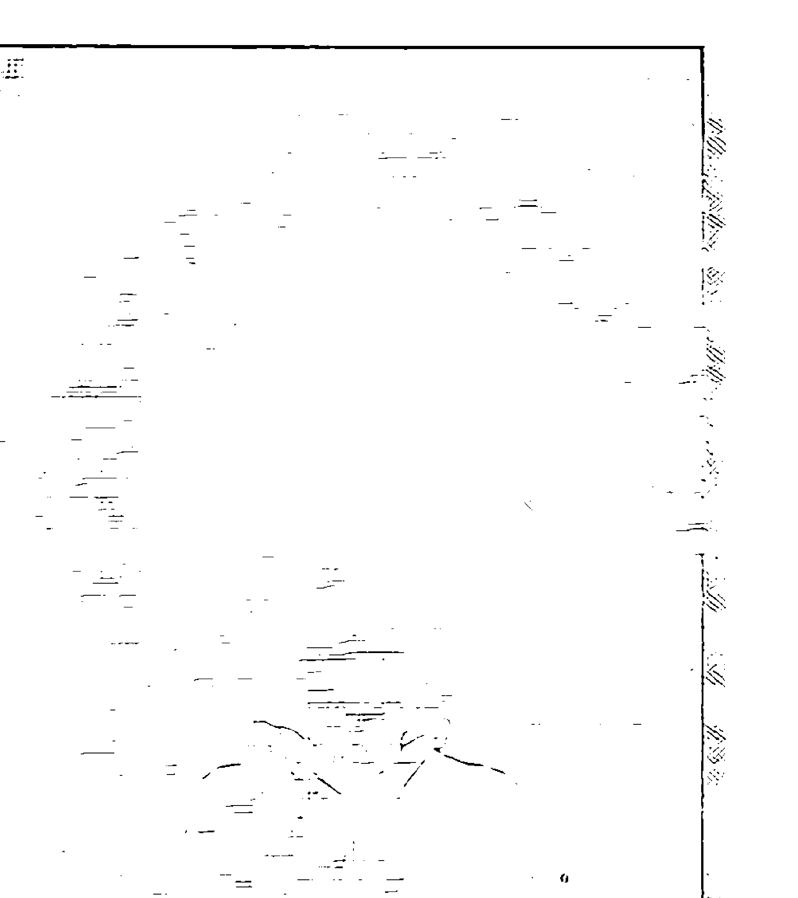

(圖十五)，也是拿個「紅碧玉」(Red Jasper) 來靜心冥想幾分鐘，看看，就有著這麼不一樣的展現！所有的濁氣、雜氣通通消失不見囉，恢復的是正常、完整、健康、明亮的氣場！水晶寶石的確可以為我們帶來活力、衝勁，也能消除不良的氣息，這些相片都給了強而有力的直接證據！

(圖十六)，又是這位先生，顯示著連夜趕稿、寫作之後，氣場高度集中在第三眼的地方，洞察力、觀察力、敏感度、靈感等等，當然非常強烈，但是呢，身體的其他部位就沒氣囉。這就是許多書生、文人、讀書人，書讀久了，運動不夠，就會變成「軟腳蝦」、手無縛雞之力的現象，呵呵，有氣無力啊！而且，這種書生的氣很「酸」，因為敏銳、洞察、犀利，能看穿許多的假象，但卻不是那種廣結善緣、升官發財的氣場，所以常常連鬼都會怕，就是這麼個道理。身體的能量沒有均衡的發展，體能、思想都會受到影響，各個生活領域也沒有辦法全部完善照顧，當然也容易受到外在能量氣場（風水）的影響囉。人生不是只求某個、單項目標的達成，而是各個層面都要照顧到，就像佛家在講的「圓滿」才是啊。

（圖十七），該位先生拿起「黑色煙水晶」（Smoky Quartz）來靜心冥想幾分鐘，也是有著立即且明顯的改變，能量場充足飽滿，且籠罩全身，不再是局部的有氣無力而已。如此周全的保護，當然就不怕外在風水、力場等的影響囉？而個人的頭腦、身體氣場也得以均衡發展，人生各個領域也將能夠平衡照顧到。水晶寶石在個人修行、養生，在風水的制化、改善效用上面，實在不能忽視！

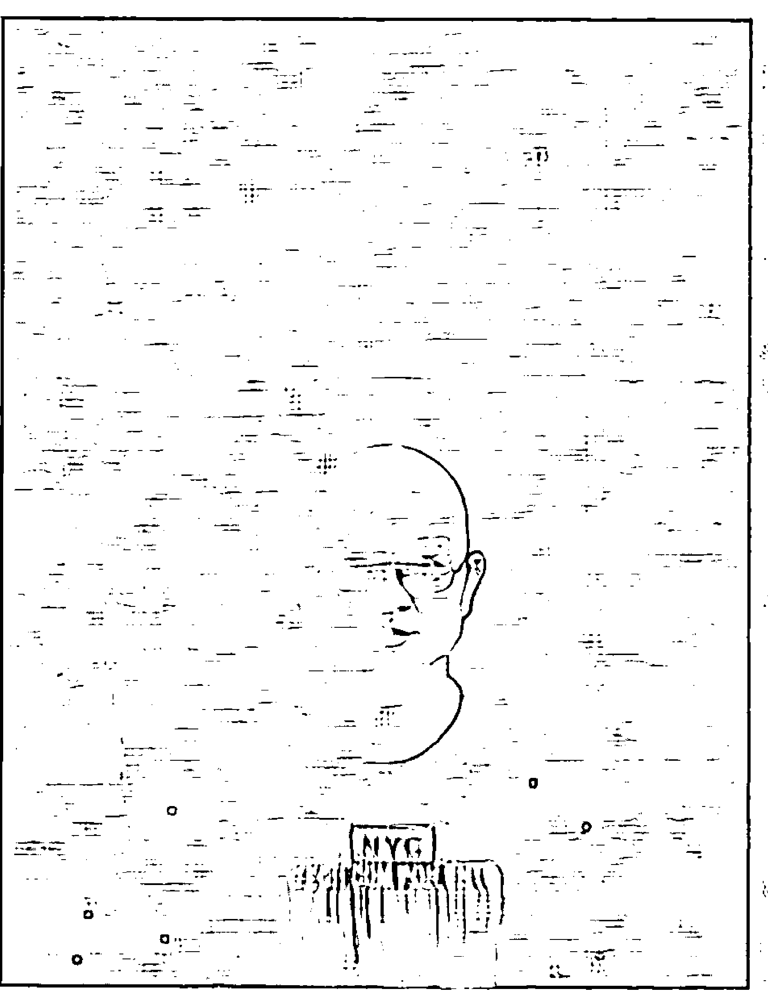

連續看了那麼多張氣場照片，應該非常過癮吧？這可能也是從古至今，所有討論風水的書籍所未曾做過的事情吧？把人體氣場的因素，強弱、盛衰、濃淡、虛實、厚薄等等，也併入討論，讓我們一眼就看明瞭，就是「人體氣場」和「環境氣場」的一種「交互作用」嘛。這不也就是我們時常在講的「運氣」、「運氣」嗎？「氣」，就是「人體氣場」和「環境氣場」，「運」，就是彼此之間的一種「交互」、「運動」作用？就字解字，就義解義，說我們中國人是最懂得「氣」的民族，實在一點也不為過！因為早就溶入我們的日常生活、文化信仰、字彙語詞當中了啊？

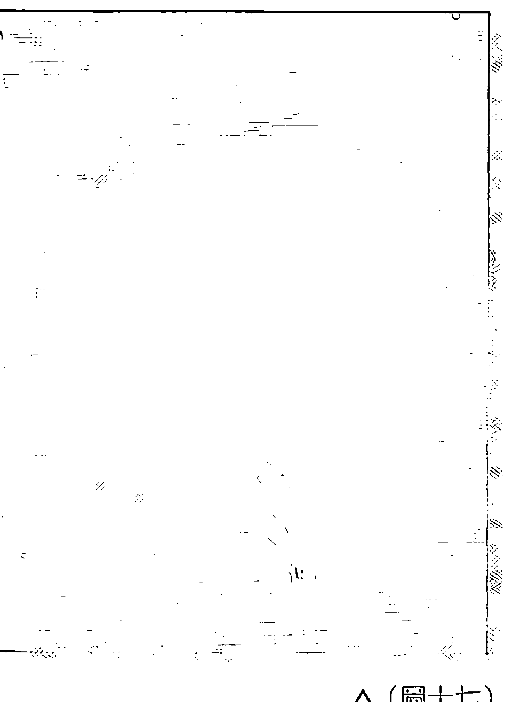

## 第三十章 風水的故事

古代有一位風水大師，在帶領學生做了幾年基本工夫後，看看差不多了，就帶整班學生出去做「畢業旅行」，就是實地出外勘查實習囉，才能磨練、砥礪出真功夫，以後當一個真正的「風水師」。

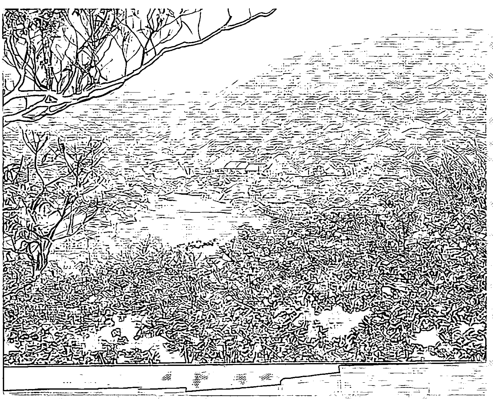

△ 山明水秀，後有青山依靠，前面明堂開闊，左有青龍，右有白虎，小河環繞有情，風輕日麗，橫看、豎看都是一個絕佳的風水局，「此地不發無地理！」

走著走著，來到某一個山明水秀的地方，看到某一個大院，後有青山依靠，前面明堂開闊，左有青龍，右有白虎，小河緩緩流進，環繞有情，又輕輕流出，風輕日麗，橫看、豎看都是一個絕佳的風水局，然而大院卻是呈現一副破敗的樣子，都沒有人住，也沒有人來整理，大師不禁慨然嘆到「此地不發無地理！」

是啊，在這麼理想的風水環境中，若還是不發達，那他教了一輩子的風水地理，就都是空言囉，不準嘛，何必再看風水呢？

有一位學生就自願留下來，打算多花個幾天，到村子裡把「來龍去脈」查個清楚，看看到底是怎麼一回事，也好讓大師隔天帶著學生們繼續上路，不耽誤大家的行程。

幾天後，學生查清楚緣由後，跟上來報告了。

原來，早些十多年前，這裡住著一位員外，的確人丁旺盛，家庭和樂，產業發達，萬事如意。只是，生了個女兒太漂亮了，不巧給當地的縣官看著，想要強納為妾，員外不從，縣官就以職權壓迫，陷害員外入獄，折騰致死，自己就強占其家產，連女兒也一併強占了，搞得員外一家人等家破人亡。而縣官他自己也因為倒行逆施，還做了許多傷天害理的事情，最後東窗事發，被巡撫緝捕問罪，最後抄家、問斬。整個莊院就沒有人整理，因而荒廢十幾年。

風水大師聽了前因後果之後，長聲慨嘆到「此人若發無天理！」

呵呵，前後比照看看，「此地不發無地理」，「此人若發無天理」，這又說明著什麼道理呢？原來環境風水雖然重要，但是一個人的德行卻是更為重要，若是喪盡天良，幹盡無法無天之事，就算佔盡了天下的名山風水，恐怕無三小路用；「地理」之上還有「天理」啊！「天理」的因果善惡有報、因果循環，比單純的「地理」風水來要來的靈驗、神準，且絲毫不爽啊！

相反的，若是無錢無力去找好風水，只要肯老實做人，實在做事，有空常來淳賀聽聽演講、抱抱水晶，也跟著淳賀的義賣活動捐款給各個慈善單位，相信您的命運也不會太差；此生若不發，那是積陰德給後代子孫耶，孩子、孫子一定大發特發！

「袁了凡」在命理、宗教、修行界有個故事很有名哦，許多人都喜歡拿出來當範例講。就是說在他年輕的時候，讓人們算算「鐵板神算」，把他從出生以來，家中人口多少，生肖如何，考試如何，當官多大，官祿幾擔，幾年娶妻，膝下無子，幾歲將壽終正寢……算的一清二楚，巨細靡遺，讓他覺得人生就是如此而已，已經沒有什麼趣味了，心灰意冷之餘，就跑去山上寺廟裡打坐了。和老和尚對坐了三天三夜，也不起心，不動念，讓老和尚以為來了一位大修行人，正暗自高興，想要多了解時……袁了凡道出了算命的這一段典故，讓老和尚呵呵大笑，「原來還是凡夫一名啊！」

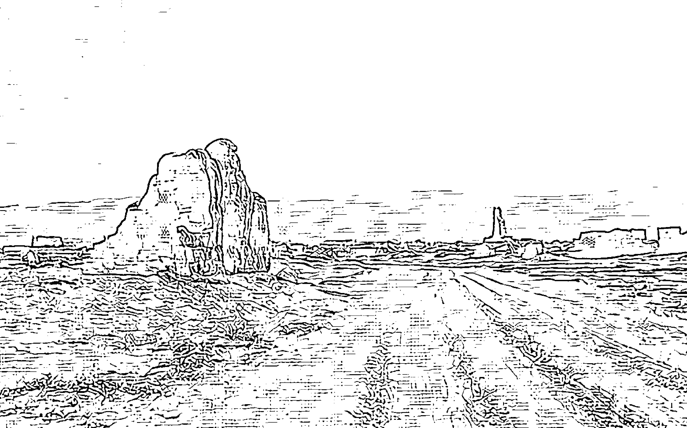

大自然的變遷力量驚人，滄海變桑田，良田變荒漠，人為的力量何從掌握？只能順從、臣服。兒孫自有兒孫福啦，看開點啦。

當下，就跟袁了凡開示了如何積極的行善、積德，為自己、為家人「造命」的觀念和實際作法。袁了凡在半信半疑的情況下，想想，做做看也沒有什麼損失啊？就積極的行善布施。沒想到，半年、一年過去了，真的又陞官了，俸祿也增加了。過幾年，太太真的懷孕，生小孩了……漸漸地，竟然偏離了原先「鐵板神算」所預計的「命運軌跡」，而開創出比自己原來更好的一種「命運」。因而將自己的經歷寫下來，供後代子孫參考。

重點就在「命理可以參考，卻不可盡信，重點還在自己能否掌握積極開創的契機！」

咱「了凡居士」在風水界也有一段傳奇故事，就比較少為人所知囉，但也很精彩。

話說在官場的人，總想官要越當越大，榮華富貴也能夠千秋萬世地一直傳給後代子孫，綿延不斷……因而，在傳統中國的迷信裡面，就要找個「好風水」來埋葬先人的遺骸，以確保子子孫孫都能大發特發。

當時流傳著，某某地方的一個小縣，風水特別好哦。佔盡天下的靈氣，若能覓得好的地穴安葬，必可出現帝王將相、王侯公卿等等的。因此，在朝為官的，稍微有點權勢的，莫不虎視眈眈，也想佔塊好風水、好地理的，就是自私的心態在為自己打算咩。據說，常常可以看到戴烏紗帽、穿官服的、官轎等等的，在此小縣進進出出，有時還比京城熱鬧呢。

袁了凡當了個小官，原本也有找個好風水的心態，也隨人家來到了這個小縣上看看。在人生地不熟的狀況下，心想，就不如叫個人來問問看。剛好有個頭髮花白的老伯伯從一旁走過，心想，他在這裡住久了，應該可以知道哪塊地的風水比較好，就問他，應該沒錯。

沒想到老伯伯拿下斗笠，扇了扇，嘆口氣說道，「我在這裡住了六十幾年，只看見戴烏紗帽的來探墳，卻從沒看見戴烏紗帽的來上墳啊。」

袁了凡的神經又給狠狠地抽動了一下！猛地驚醒過來，風水真的有用嗎？老伯伯說的是官場人們的現實，想找好風水，卻沒有慎終追遠、緬懷先祖的心意，妄想福德還要庇蔭子孫……而另一層意義就在，若是此縣真的有好風水，怎麼沒有出個大官人、大政治家、戴烏紗帽的後代子孫來上墳呢？老伯伯六十幾年親眼見證，還需要等待多久呢？可見這些都不足以依恃啊。當下，就連風水也不用看了，反正兒孫自有兒孫福，自己來掌握比較重要了，不必再靠外力囉。

說了以上的故事，千萬不要誤會我們在「反對風水」哦？呵呵，這是人類語言文字的侷限，好像「二分法」一樣容易叫人上當，好像不是贊成，就是反對的一般。不是這樣的！

看看前面所有的文章，就知道我們是從另一方面，另一層次，從「能量場」（Energy Field）、「雷射全息理論」（Holography）的方面來肯定「風水」的功能和效應，確實存在，也確實影響著我們每個人的一切。但是，這種影響卻不是絕對的，必然的，無可改變的，這之間還有許多的變數存在，需要用更寬廣的心，更包容的態度，來研究，來找尋解答。任何的執著，總是會導致迷信；任何的鐵口直斷，總會引起更多的爭辯。這些，其實，都是可以不必要的啊？我們衷心希望能把中國老祖宗的學問能夠發揚光大，但也不願此種學問淪落江湖術士手中，變成詐財騙色的工具和手段啊？能夠保持一種審慎開放的態度來研究，說不定還能突破明、清以來許多的公式窠臼，再創風水理論和實證的另一高峰呢？在科學越來越昌明的二十一世紀，更多的精密工具可以使用的今天，還有更多高級知識分子的加入研究，這種高峰盛況確實是可以期待的哦？

呵呵，風水、命理若是能擺脫江湖、利益、門派等等限制，變成一種「科學」在被研究時，那該是有多棒的一件事啊？眼見時下的少數風水師，雖有豐富的知識和經驗，但卻缺少了讀書人、修行人的品味與格調，常常可以給幾千塊錢、幾萬塊錢的紅包就給收買了，專為某些大樓、華廈、靈骨塔、墓園等等大作文章，大作廣告，一些比較不懂，又容易受到傳統迷信影響的無辜消費者，就會受到誤導囉。這些費用常只是一些大案子的零頭小數而已，建商們能夠獲得「風水理論」的肯定，又能大賣，何樂而不為呢？只是這種影響非常深遠，若是真的好，那還沒有問題，若真的有問題，誤導了群眾，那就真的造孽深遠，貽害百年囉，豈可不慎呢？(淳賈天然水晶台北市八德路四段768巷7號三樓之一)

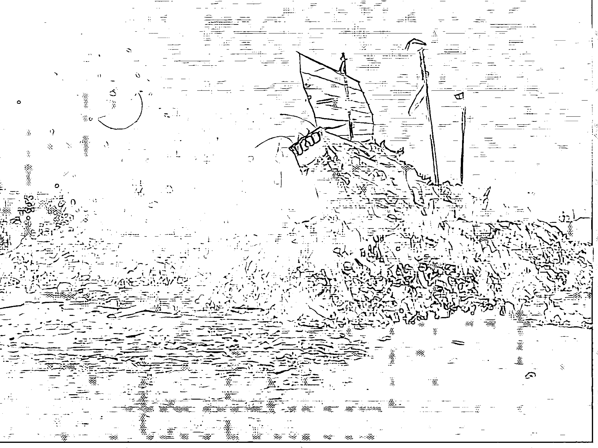

## 中庸

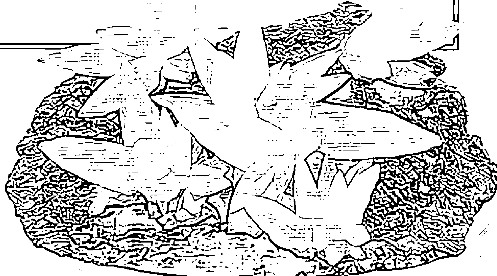

## 第一章 住宅外事

從風水的角度來看，住宅外面的情形統稱「外六事」，應該注意的地方可以說是非常非常的多，恐怕篇幅有限，難以一一細論。所以，我們就採「負面表列式」的說法，大致上簡單說明什麼比較好，什麼樣比較不好，能夠避過那些嚴重的缺陷，也就不會太差了啦。

從古代至今，居住環境、建築、城市建設等等，都一直在演變當中，許多古老已經不適用的，當然就略而不談囉。相反的，許多古代所沒遇到的狀況，我們當今就必然要提出來討論，不能閃過的。然後，這些條例出來，也不是什麼聖經、不聖經的啦，千萬不要這麼看待。要想想，這是「有可能的問題」，重點應該放在，我們該如何來改善它呢？如何避免住在不良陽宅中呢？這些才是重點！

然後，隨著時代進步，或許十年、二十年，五十年、一百年以後，還有更多的「現代風水」需要討論呢。我們期待有更多的有心人能夠來加入，一起發揚老祖宗的智慧，也為所有的平民百姓謀求一個最佳的居住風水！

-   1. 住宅不要選在懸崖邊，取水不便，容易崩塌；主「孤」，即使寺廟、修道院也會生活不便，易遭危險。

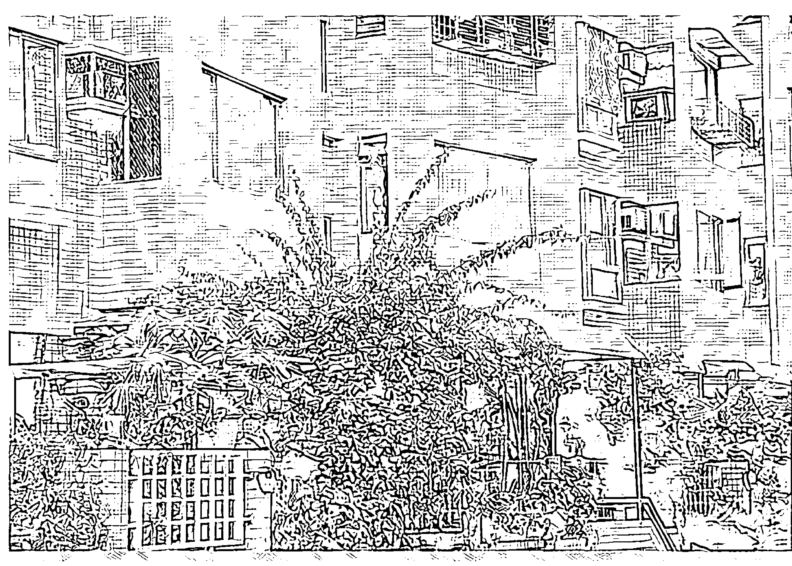

風水問題，千頭萬緒，先說個大概，能夠避過最差的，最嚴重的，其餘的也就不錯了啦。像是住宅固然要綠化、美化，但是過度的話，反而容易遮蔽陽氣，易於招陰，不可不小心。

-   2. 住宅不要選在順向坡底下，容易遇到山崩，遭掩埋，古籍說這會「絕子絕孫」。
-   3. 住宅蓋在山坡上時，注意不要在山溝、水圳的上方，下雨時容易變成小河流，沖垮地基，導致崩落塌陷。
-   4. 住宅不能緊鄰著河岸建築，容易淹水，地基也容易流失，水流切割把氣帶走，「割腳水」，也無法聚財。常見低收入戶在這種地方蓋「違建戶」，越住越窮，很難翻身！
-   5. 住宅不可蓋在乾涸的河道上，遇到颶風、暴雨，容易淹水和遭土石流衝擊，身家性命難保。
-   6. 住宅不要蓋在兩山的山谷間，颶風、暴雨時，這就容易變成「水路」，會淹水、沖垮住宅。
-   7. 住宅不可蓋在廢棄的礦坑、古井之上，宅氣不聚，不只錢留不住，居民身體健康大受影響，事業一落千丈，家運節節敗落。
-   8. 家宅不可緊鄰茂密森林，須有幾百公尺以上的安全距離，以免因野火蔓延而遭波及。
-   9. 家宅附近不要有大樹緊靠，以免影響住宅地基安全，地下水太旺，以致過陰，影響居民身體健康，還有容易遭雷擊，引起火災，或是颶風時折斷，住宅也受波及壓垮。
-   10. 出大門也不要有樹木、電線桿、高塔、巨型尖銳廣告物等等阻擋，一來有礙觀瞻，叫人視界不開闊，心情不開朗，二來也擔心形成尖銳的煞氣，對住宅不好。
-   11. 不要「開門見山」，一開門就有大片山壁擋在面前，視線受限，明堂狹隘，前途沒有發展，也容易受到壓抑。門外的山，宜遠，宜秀麗。
-   12. 住宅附近有河流緩緩流動，能夠形成環抱型態更佳，忌諱有直沖、斜沖，也不要在門前屋後有驟然轉折，形成對屋宅的「銳角」沖煞。河流的聲響若是過大，也不理想。
-   13. 屋外的河流、堤防、道路、高架橋等等，都不要有「反弓」的情形，煞氣重，容易叫人健康、事業都節節敗退。就像在一把弓的發射點上，離心力、衝擊力最強。相對的，在形成「環抱」的內點裡，就是個絕佳的氣場點。

## 第二章 住宅內事

住宅外事，一般多屬於大環境，能閃則閃，說要改變的地方，大多只能盡量啦，人為的力量還是相當有限的。何況，不在自家門內的事情，也不能亂改啊？挖別人家的屋簷，會被修理呢；亂砍行道樹，會吃官司哦。只有「住宅內事」，還可以是在自己能力範圍內，所能做到的事情，當然就要全力以赴囉。

同樣的，我們在本章也是列出許多的「不要」，當所有的「不要」都能給避免時，這就是我們所「要」的一個「好」的風水能量場囉。

### 基本要項

- 1. 家宅面積要四方、方正、平整最好，也可以是「前窄後寬」的「布袋型」，比較能夠納氣、納財、積蓄；不要「前寬後窄」的「畚箕型」，散氣、散財、不聚。另外，三角形、多角型等等都不宜當住宅。

- 2. 遷入新居前，不管是新建或舊的建築，建議使用「硫磺水」整體洗刷一遍，具有消磁、避邪、洗淨的作用。各個西藥房都可以買到硫磺粉，回來泡水就可用了；事後還可以用清水清洗過，味道就不會那麼濃厚。

- 3. 爾後的日常打掃清潔，或是特別在過年過節的重大節氣時，可以採用「水晶水」來打掃環境，可以清潔淨化環境，維護良好氣場、能量場。

- 4. 屋宅的前後陽台、窗台、牆壁等等，能種植些許盆栽，綠化環境，是非常賞心悅目的，但不要過多、過密，或讓藤蔓爬滿全屋，樹木盆栽遮掩了門窗的光線，影響納氣，容易叫屋宅陽氣不足，動能不夠，住戶容易不修邊幅，陰沈詭異，運勢不順。

- 5. 遷入新居後，可以在每個房間的每個角落放置一塊黃鐵礦（或是黃銅礦），一來沉甸甸的質量有固定、穩住、強化屋宅氣場的作用，二來可以藉著金黃色的能量來吸引財富，類似「金元寶」的設計造型，就非常妥當，也非常吉利討好。

- 6. 檢查電線、水管、瓦斯管線等等，確保屋宅是「有機體」，可以順暢運作、提供正常生活機能。若有漏水，渲染牆壁等等，應立即改善，漏水即漏財，屋宅牆壁不潔，濕氣過重，也會影響人體呼吸器官、皮膚病等等。

- 7. 裝潢房屋，切記不能打掉樑柱，破壞整體結構；即使沒有受力的牆壁，也盡量維持原狀為佳。風水問題各有破解方法，改樑、換柱、破牆，絕對不是最佳選擇！

- 8. 裝潢房屋，切記不要只為了小小空間而打通前後陽台，對建築物本身不好，風水上前無憑欄，後無依靠，只能在家自己當王，無法和人共處，格局反而受限。記得，麻雀雖小，五臟俱全，房屋的宅相，也正是一個人人格的展現，一定要正常。

- 9. 裝潢房屋，請使用防火建材；或許成本稍高，但遇到火災時，就能減少生命的傷害；易燃建材，往往就是殺手！

- 10. 裝潢房屋，天花板切勿過低，容易造成擁塞、遲滯、阻礙的感覺，就難以開闊心胸，大展宏圖了。

- 11. 裝潢房屋，也請不要過分裝飾華麗，人造氣氛過濃，才好體會天亮、黃昏、刮風、下雨、冷熱等的「真實」、「自然」感覺。

- 12. 遷入新居後，要經常開火煮飯、炒菜，讓爐灶熱起來，旺起來，帶動整家的氣場，財運等等才會興旺。

- 13. 遷入新居後，可以多多邀請親朋好友、同學同事來家中吃飯、泡茶、聊天，主要是讓多人踏入門內，才好積蓄人氣。

- 14. 在台公寓住宅，為了防盜多會裝有鐵窗，記得要預留有活門、出路，萬一發生火災時，才不會將自己陷在裡面，逃生無門。

- 15. 商店、工廠、或住家裝置鐵捲門也當留下適當出入口，才不至火災發生時，斷電無法開啟，無法逃生；容易造成悶燒，濃煙對生命傷害更大，家財也不容易救助。

- 16. 住在高樓大廈、鋼骨建築的樓層中，磁場受到鋼筋、鋼骨的影響極大，進門後羅盤都不穩，無法指正南北方向等等。樓中住戶應自己利用閒暇假日，多多親近大自然，接觸地氣，才好永保安康。

#### 三、門戶

- 1. 「左青龍，右白虎」，「龍者宜動，虎者宜靜」，站在屋內，看向屋外，大門一般適宜開在左手邊。

- 2. 一個住宅，不宜在同一個正面開兩個以上、大小相等的大門，容易有「哭」的影射，同時男主人可能會有納妾、包二奶的情形。

- 3. 大門可以在大馬路上，納氣足，但不適宜正對著「路口」，氣太強，就是「直路沖」，有交通安全影響，對家人健康也不理想。

- 4. 大門不要對到對街人家的大門，「兩家門相對，必有一家退；兩家門相沖，必有一家凶」。兩門相對，是非口舌也容易比較多。

- 5. 屋外若有別家屋角相對，或有寺廟、神壇、水池、巷道等等，沖到我們原本的大門，都要避開，不宜在此開門。

- 6. 大門也不要正對著電線桿、行道樹、大型廣告物，或任何尖銳、高大的物件。

- 7. 現代公寓、大廈，從樓下進到建築物裡面，一直到自己的屋內，可能要經過層層關卡，各種門戶，這些都當成「過路」，只有在進到自己家門，跨過「落地窗」進入客廳這一一道，現在才當「門」，才是一個寬廣的正面來朝向。

- 8. 大門不能太小，太小納氣不足，空氣不夠流通，也稱「閉氣」，家人容易憂鬱、心胸狹窄、常生病等等。

- 9. 大門也不能太大，太大氣會消退，謂之「洩氣」，不能聚氣，也就不能聚財，財運上有節節敗退之象。大門以適中為當。

- 10. 大門以方正、規矩為佳，不適合做宮廷寺廟的拱門，也不要做斜門，與「邪門」諧音，有不良暗示作用。

- 11. 大門以厚重、堅實為要，顏色也以樸拙為佳，若是做木門，記得根部要擺在下方，才不會有上下顛倒、是非不分的隱喻。

- 12. 大門內外，庭院間，不宜有過多、過大、過盛的樹木、盆栽，固然有清爽宜人、閒情雅致的感覺，但也容易陰氣過盛，影響大門的納氣不足，也影響家人的健康。

- 13. 圍牆、牆壁上，也不宜有過多的蔓藤類植物攀爬蔓生，影響屋宅外氣，容易導致家人皮膚病、呼吸道不良、雜七雜八的煩人事情特別多。

- 14. 大門不要和屋宅後門在相同的動線上，「穿堂煞」（穿心煞）屬於陽宅第一凶，容易造成宅內氣比較虛的人，身體更加羸弱，腦神經、高血壓、中風容易發作而亡。

- 15. 大門內外都不要堆放雜物，開門、關門都能大開大闔，自己不會瞻前顧後、七上八下，出外做事比較能夠提得起，放得下，不會有人處處掣肘，處處受限，施展不開來的感覺。

- 16. 公寓式前陽台上，也不要堆放雜物，曬衣服、曬臭鞋等等，影響一家的明堂，沒有寬闊、開朗的好運，會有處處行不開、處處觸霉頭的感覺。

- 17. 公寓式入門後的鞋櫃，一定要擺放整齊，收拾乾淨，不要雜亂，也不要讓臭味四溢，也會影響家運。最好使用封閉式的鞋櫃，勤用芳香劑、除臭劑，也可配合各色方解石的使用，來消除怪味道。

- 18. 門前，家宅的正外面，代表著我們的「門面」，千萬不要將衣服、褲子、鞋襪等等拿到正門口來晾，特別是具有隱私性的內衣褲，更是要收到後陽台去晾。一來，完全是為了美觀，二來，也不會將自己的隱私全部暴露在外，三來，若有女性家人的貼身內衣褲等等，更容易引來登徒子、變態、色狼等來覷覦。不可不防！

#### 二、客廳

- 1. 客廳一定要在屋宅的前方，五黃闘煞位，不要東彎西拐的變到後面、側邊去了，影響了整個屋宅及家人的生活重心。

- 2. 客廳首重光線明亮，空氣流通，動線順暢。若大樓、公寓房子，採光不足，仍可用人造燈光補強。舒適、明亮、寬敞、溫馨，為最基本要求和條件。古籍云「明廳暗房」，客廳要明亮，起居才舒適，臥房要暗，休息才全然又確實。

- 3. 室內裝潢，天花板不宜過低，否則容易造成壓迫性的侷促感，猶如鴿子籠、實驗室的白老鼠，住久後容易神經質，內心憂鬱，不和群。

- 4. 室內美術燈的光亮一定要足夠，不可只為了營造氣氛而使用昏暗燈光，容易影響家人視力，心情也不容易開朗、爽朗，容易有陰邪之氣。

- 5. 客廳內的油漆顏色，家具、沙發、家電等等，也多以輕柔淺色的系列為主，比較能夠營造出溫馨和諧的氣氛，就會喜歡待在家裡。顏色過強，刺激性大，容易往外跑。

- 6. 屋內天花板有橫樑，牆壁有樑柱，盡量以裝潢手法遮掩起來，做成圓形或半圓形，才不會有尖銳的煞氣。樑柱是直接承受整棟建築物的壓力所在，煞氣之強，不可忽視。

- 7. 沙發、茶几，或是人在客廳休息、暫坐的地方，一定要避開樑柱的直接衝激。據說，在樑柱下喝酒很容易就醉，在樑柱下睡覺也容易做惡夢哦。

- 8. 客廳是一家進門來，最為「聚氣」的地方，也是招財納福的地方，應該好好對待，所有家具應該擺放定位，地板玻璃勤於擦拭，窗明几淨，才有空間來招財納福。最忌諱混亂雜亂，氣雜氣亂，則財不聚。

- 9. 入門在客廳內，對角45度線上，兩片牆壁的交接處，通常就是最為「聚氣」的所在，可以擺放「紫晶洞」、「瑪瑙聚寶盆」，才好聚財。

- 10. 客廳內的擺設，基本上可以依照屋主自己本身的興趣、嗜好、專長、行業等等，各有不同，並無不妥，但也請考量其他家人的不同需求，互相配合，才不至於有所妨礙。一些太過激烈、剛烈、煞氣太重的東西，盡量不要往屋子裡面堆放，比如野獸頭顱標本、武士刀、猛虎下山圖、紀念海戰、砲戰等的油畫等等。曾有某家掛滿關公的忠義畫像，充滿陽剛之氣，連女兒也變成貞潔烈女，三十好幾都還嫁不出去哦。

- 11. 捕蚊燈、殺蟲燈等等煞氣比較重的小家電，使用後就隨手關閉，不要經常開著，胡亂四處擺放，容易影響一家人的家運。

- 12. 冷氣機的出風口，電風扇等等，忌諱摆在財位方，容易散氣，就是散財囉。

- 13. 客廳不宜兼做家人的臥房使用，若是有來客，偶爾使用倒是無妨。

- 14. 在客廳看書、看報時，若主燈光有所不足，應該有小檯燈來輔助照明，才不會影響家人的視力。

- 15. 電視機已然成為現代人生活的重心，沙發擺設應該和其相對，不要讓家人斜坐看電視，容易引起散光、斜眼等毛病。

- 16. 客廳內的各種擺飾、壁畫，盡量以吉利、吉祥、和諧、圓滿、溫馨為主，過於新潮的設計品，或是老舊的骨董，或是來自蠻荒偏遠的雕像、擺件等等，都要特別注意，以免對家人造成負面暗示等不良影響。

- 17. 夜晚時，客廳裡主燈關熄之後，最好留盞夜燈，好讓夜歸的家人，或是半夜起床喝水、上廁所的家人不必摸黑，也不會對偌大的客廳產生陰暗、黝黑、陰森森的感覺。

- 18. 在現代公寓式小家庭中，部份客廳也當餐廳使用，記得餐桌擺在屋子的靠後邊，不要在靠門前；桌子不要和廁所、廚房的門相沖，也不要在橫樑之下。

#### 三、神位

- 1. 一般家庭不安神位則已，要安的話，一定要照道理來，最好請教專業的風水師，擇日安座，一切都照規矩來，不然對家庭的吉凶影響極大。

- 2. 神桌的大小高低，神像的尺寸大小，香爐的位置、大小、高低，神明的尊數，神明位階的高低等等，都十分講究，請就教於專業地理師，才可安置妥當。

- 3. 從門外不能看到神位，不得外露。

- 4. 神位不得面向內，必須和屋子的座向合。

- 5. 神位當然不能設在臥房、廁所、浴室裡面，嚴格點的，也不能和這些的門相對沖。

- 6. 神位也不要設在後打出去的陽台上面，凌空擱置，沒有基礎、沒有根，影響全家也沒有個底，基礎不穩，做事不牢。

- 7. 神桌的高度應該符合文公尺上的「紅字」，吉祥數字，如本、官、義、財，不要有害、劫、病、離等。

- 8. 各路神明和自己祖先的牌位等等，應該分開置放，不能混淆在一起。屋主主姓的牌位應置於主位，配偶或有其他各種因緣所一起祭拜的各姓，應置於旁位，不可僭越。

- 9. 神位後面應該有實質的依靠，能夠靠牆壁最好。這牆壁後面不能是廁所、廚房。神位無靠，一家子都不穩，健康不穩，財運不穩，事業不穩。

- 10. 神位前面、下面，不要擺放一些人造、人為的產物，如電視、音響、電腦、電鍋、微波爐、魚缸、玻璃櫃，當然更不要有垃圾桶等等。

- 11. 神位不可安在屋內橫樑的正下方，承受全屋的重力、壓力，也會影響全家健康和運勢。

- 12. 神位安置的地方應該比較清淨，不要在房子中央，或是樓梯、走道上，大家走來走去所不能避免的，也會有所干擾。

- 13. 神位不可對沖外在的屋角、大樹、電線桿、廣告招牌、水塔、柱子、牆壁銳角（壁刀）等等，一定要避開，光用化解方法只是暫時的，長期而言，影響仍在。

- 14. 神桌上的神明尊數，應衡量尺寸的大小，剛剛好就好，不可數量太多，更忌諱路邊、河邊、荒郊野外隨意撿回來的不明神像，不可胡亂擺上去拜。不是從外表來看神像就是哪尊神明哦，有時給各種鬼靈精怪、孤魂野鬼來附身也說不定。

- 15. 清理香爐時，其他的東西請不要亂動；想要把神像換位置，或想清理神像上的灰塵、衣服等等，請先請教專業風水師，擇日在適當期間施行，不可貿然想做就做。牽一髮而動全身，吉凶悔吝生乎動，有可能造成對全家的影響，好壞還難定論哦，在有大考、升遷、大生意談成之前，最好都不要亂動。

- 16. 每天誠心膜拜神尊、祖先牌位之時，也注意神像是否有所改變，若是給香來薰黃、燻黑了，還是正常的；若有出現不正常光色，如紅光、青光、綠光等等，則顯現有不正常情形，則應立即請教專業風水師來問清情況。許多時候，祖先或神尊的位置已經被其他外靈所佔據了。

- 17. 香爐若沒定期清理，過多的香枝容易引起互相燃燒，此種「發爐」屬正常現象，不必在意；若是有定期清理，還會「發爐」，則表示有重大訊息要傳達，可以用「擲爻」方式來請問，或請教專業風水師、神廟的師父等等。

- 18. 神桌上的祭拜物品以天然的為主，鮮花、素果、糖果、餅乾，或是依著不同宗教信仰的雞、鴨、魚、肉等等都行，也可依自己的孝心來擺放天然的水晶、寶石、礦石等等，但不要使用塑膠的、化纖的、人造的、合成的、鉛玻璃製品等等。

14. 住宅不要正對著「直路沖」，容易有車禍、意外事故，對於學校、官署、機關等等，若有圍牆或適當的明堂來緩衝，則無大礙；開店的話，則以便利商店、洗衣店、餐飲店、百貨行、洗車業等等，原本就需要比較多人頻繁進出，又帶點「水」的性質為佳。

15. 住宅也不要面對「狹巷沖」，更不要有兩棟大樓所形成的「天斬煞」，又長又細又強勁的有形、無形氣流，容易侵蝕居民健康，身體容易虛弱，腦神經也容易異常。

16. 住宅不要面對著圓環、圓形水池等等，正是「反弓煞」，對住家極為不利。

17. 住宅最好也不要面對著玻璃帷幕的大樓，早晨、黃昏的「反光煞」也是相當凶的；然在現代建築似乎難以避免，建議在屋宅內建置窗簾、百葉窗來擋即可。

18. 住宅不要緊臨變電箱、高壓電塔、變電所等等，雖然科學上無法證明直接有害，也無法證明絕對無害。若是不幸遇上了，如不能搬家，則要想辦法在相對的方向加裝「鉛板」，或廣泛佈滿瑪瑙片、水晶簇等等，以隔絕各種有形、無形的電場、輻射等等。

△ 鋼骨結構大樓防震，不會輕易倒塌壓死人，但是數以百噸計的鋼樑，和過度使用的電子產品，連羅盤進入都無法正常指示了，對人體能量場所產生的影響，變成現代風水學的一大挑戰和研究課題，值得學人多多注意！

19. 住宅不要正對著醫院、寺廟、教堂的門口，容易受到各種強烈的氣所影響。

經過颱風大水的淹沒，許多車子泡湯，配電箱浸水，整棟大樓停電多日無法運作的慘痛經驗，即使一百年遇上一次也就完蛋了！終於將地下室入口做起「防水閘門」，將經驗累積下來，後代子孫免得遭受同樣禍害。

20. 住宅的大門、窗戶，也最好不要對到寺廟、祠堂、紀念堂等的飛簷。

21. 住宅也不要在抽乾的湖泊、沼澤上搭蓋，仍是容易聚積濕氣、陰氣，住地下室、一樓者，影響最大，整棟樓房仍有地層「不穩」的潛在因素在，容易在頻繁劇烈的地震後顯現出來。

22. 住宅也不要蓋在廢棄的醫院、病房、屠宰場、寺廟、道場、重大天然災害、刑案的現場，容易有奇怪、詭異的現象發生。

23. 住宅也不要在古戰場、刑場、墳地上建築搭蓋，屍氣、怨氣難清，恐怕古怪事情不斷。

24. 住宅的基地宜平整、方正最佳，不要「前高後低」，有家運節節敗退，「一世被欺」的說法；必要時，可以「前低後高，世產英豪」，也可防水；但也不可過高，高不可攀，就有高傲、孤傲的現象。

25. 道路擴建後，房屋的地基比路面還低，絕對不是一個好的居住環境，一樓不住人，或是改建以求徹底解決。

26. 住宅不要正對著橋樑、天橋、地下道、或大樓地下車庫的入口等等，也不要在旁，交通出入頻繁嘈雜，灰塵重，廢氣、雜氣多，居住品質不佳，容易影響身體健康、思緒等等，即使夜晚也未能獲得良好的休息。

27. 地下室也不適合住人，納氣小，氣息沈悶，難以出頭，且有礙健康。商店、賣場若設在

28. 住家最好不要在死巷之內，氣息凝滯，不容易有發展，商店若開在死巷內，更是人跡罕至，死路一條。

29. 住宅緊臨公園、學校固然有比較寬廣的空間、綠意，但是若接近操場、球場，或經常有人在唱卡拉OK，喧嘩過度，也不是良好的居住環境。

30. 住宅不要設在商業大樓裡面，特別裡面有餐廳、彈子房、KTV、酒店、特種營業場所等等，容易有火災、刑案等發生，就算平常時的喧嘩吵鬧，複雜的出入份子等等，就已經夠讓住家傷腦筋了。

31. 住宅也不要和汽機車行、輪胎行、瓦斯行、麵包行、餐飲店、神壇等等靠近，也不要在其樓上，容易吵雜、汙穢、滋生蚊蠅、蟑螂、老鼠等等，也容易引起火災、氣爆等等。

32. 住宅也不要鄰近加油站、儲油槽、儲氣槽、各種工廠、加工區等等，空氣、飲水、居住品質等等都容易受到嚴重影響，不得安寧。

> △ 所有的古籍都沒有說住宅鄰近操場、籃球場是吉是凶的說法，但是有住在過旁邊的就知道，夏天凌晨五點多就乒乓乒乓，擾人清夢，這也是叫人非常困擾的現代風水問題之一哦。

33. 住宅也不宜在飛機場附近，或是飛機的起飛、降落航道下方，也不宜在大馬路旁，上下坡的起點、終點，容易受到噪音嚴重干擾。只是，目前這種干擾可以仰賴裝潢上的隔音版、雙重玻璃窗戶等來改善。

34. 住宅當然不要設在垃圾場、焚化爐、廢物收集區等等的附近。

35. 住宅不要選擇在自來水管線末端的區域，平常時就容易水壓不足，常常停水，遇到乾旱枯水期，影響更大；若是再遇到火災時，遠水救不了近火，生命財產沒有保障。

36. 本身的建築要和周遭的建築搭配，若是眾人皆低我獨高，容易受風煞，也有「孤」的味道；若是眾人皆高我獨低，或兩邊高，我在中間低，則有難以出人頭地，有志難伸，沒沒無聞，落落寡歡，抑鬱以終的味道。
(淳賀天然水晶TEL:02-2788-9231、Fax:02-2788-8982)

△「前高後低，一世被欺；前低後高，世產英豪」，但開店做生意若是太高的話，客人難以上門，旁邊的關門已經好幾家囉。古書不能讀死囉，一定要配合現代的觀念來重新審核，了解人心，配合世道新觀念，才是現代風水的正確發展途徑。

19. 神桌前的鮮花要勤換水，不能放到發臭，若是花謝了，也要換掉，神桌前寧可保持清淨整潔，也不要有殘破老舊的樣子。

#### 四、廚房

- 不要在大門口就可以直接看到廚房，一覽無遺，容易讓人看穿自家，毫無隱私、毫無保留，也沒有可以伸縮、退讓、迴旋的空間。
- 廚房要設在屋子的後段，不要設在屋子的前段或正中央。
- 廚房門不要與浴室、廁所相對沖。
- 廚房最好也不要兼著餐廳使用。
- 廚房要能保持清潔、乾淨、明亮、通風，若是陰暗、汙穢、發黴、排水不順，又不通風，則全家健康一定不好。
- 古代所稱的「爐灶」，就是相當於現在所用的瓦斯爐，灶口就相當於瓦斯開關。爐灶也千萬不能設在橫樑的正下方，薪火不旺，事倍功半。古代魯班教人設在屋瓦突出處的正下方，爐火最旺，燒飯炒菜速度快，又節省木柴。
- 爐灶也要有所依靠，不能像是孤島一樣懸立在中央，四周讓走道給包圍（路圍），容易食不安穩，也不容易進財、納財。
- 有些家庭為了多點空間，把後陽台打出去，本身即屬違建，陽台屬延伸出去的部份，不是樓板的主要承載範圍，此地方也不宜放置爐灶。
- 爐灶不要正對著大門、臥房門、神位等。
- 爐灶旁不宜緊臨著水龍頭、洗水槽、碗槽、冰箱門等等的，水火過於相近，容易產生相剋的凶象。
- 爐灶也不宜正對著牆角、牆壁的突出物（壁刀）等等。
- 現代公寓式住宅，廚房位置多已固定，無須費心考量方位、東西四命、流年的安排，一切順其自然最好，胡亂改建，不符合整體建築結構，反而勞民傷財，困擾更多。反正，流年也是年年在變化的呀。
- 不管什麼方位，爐灶一定要擺的方正，四平八穩，不可歪斜、高低不一，否則光是煮食、提取鍋鼎就容易發生問題，方位再吉也沒用。
- 廚房若是能經常保持整潔、乾淨，表示女主人勤快負責，肯定也能對男主人的人生、事業、家庭方面有良好貢獻助益，家運一定旺。相反亦然。所以有些風水師看陽宅、論家運，首先就看廚房，非常直接又明顯，道理在此。

#### 五、廁所

- 廁所絕對不能設在屋宅的中央部份，或是前段的地方。
- 參考前文，廁所也不能設在屋宅的「文昌位」，子女的聰明才智容易遭埋沒，不喜讀書，屋主也不易升遷，難以出人頭地。
- 房子若是自己蓋的，也要注意不要將廁所蓋在東、西、南、北、東北、東南、西北、西南八個「正位」上，有損健康，對家運也不良。
- 現代大樓、公寓式住屋，恐怕無所選擇或避免，只能謀求其他方法來改善。
- 廁所門不要和大門直沖。
- 廁所門也不能和臥室的床、餐廳的飯桌、廚房的爐灶、書房的書桌等，直接對沖。
- 廁所的牆壁外面不能擺神位，廁所的正樓下也不能設神位。
- 現代住宅廁所和浴室多設在一起，注意常保持乾淨、整潔、乾燥、通風，有必要時，請多加裝抽風機，可以常保浴室內空氣流通，地板乾燥。
- 若是有家人習慣在廁所看書報雜誌的，建議加裝輔助檯燈，以保視力正常。
- 廁所特別注重排水乾淨，所以地面要比其他所有房間的地面還低，也是一種氣的「排泄」作用。
- 若有必要，可在浴室多加裝一些天然的植物、礦物、清香劑等等，消除各種不良的氣息。

△ 小巷內沒有明堂，門前又給大樹擋住，如何能有大的發展、突破？這點小小的常識，應該每個現代讀書人都要有的，無須另外請教風水師了。

#### 六、臥室

- 臥室大小應適中，大不大過客廳，小不小於廁所，比較適當。
- 臥室應有窗戶，保持空氣流通，可以加裝深色窗簾，睡覺時拉上，可以讓睡眠更為深沉、安穩。（明廳暗房，客廳要明亮，臥房睡覺時光線要暗。）
- 臥房不要在靠馬路的那方向，車輛來往、人聲鼎沸，易受打擾，無法充分休息。
- 冷熱溫差太大的頂樓閣樓，或是密閉不通風的地下室等，都不適合當臥室。
- 臥房以方正為主，床也是以方正為主，圓床佔空間，夜間起來上廁所，或是早晨起床時，容易方向感迷失，容易發生意外危險。
- 床位最好東西向擺設，（避開南北兩極的強力吸引），睡眠容易安穩，不至於越睡越累，起床後有頭重腳輕的現象。（練功者則可南北向靜坐，容易有感應。）
- 臥室門不要沖到大門、廁所門、廚房門，或是其他房間的門。
- 床頭要靠著牆壁，不可緊臨窗戶，或是懸空，會有失落感，睡眠亦不安穩。
- 床頭不要隔著牆壁，又正對著神位、爐灶等，這也不理想。
- 床頭不可正對著臥室門，容易被氣沖到，也不安全。
- 床頭也不可正對著浴室門，容易受穢氣沖煞，對健康影響極大。
- 床位最忌諱在橫樑下方，所謂「扛屍煞」，承受整間屋宅的重力、壓力，除了惡夢連連外，身體健康大受影響，更容易發生意外事故，應盡其所能來避免。
- 床頭也不要在冷氣出風口的正下方，不開還好，夏天一開的話，體質弱一點的就容易毛病不斷囉。
- 若有電風扇，請勿直吹床頭，容易叫人氣散、頭疼、頭風的；電風扇應從床尾、床側邊旋轉輪流吹拂才好，不要固定專吹一個方向，容易造成該部位的氣散，就容易生病。
- 床頭請淨空，不要擺放音響、玩具、書報等各種雜物，容易影響睡眠品質。
- 床的正前方，及正上方的天花板上，請勿學時下的賓館、酒店，也設立大鏡子，短暫的刺激快感還可以，但對長期的睡眠休息則有不良影響。
- 臥房內的擺設盡量以柔和溫馨為主，不宜有刀劍槍砲等兇器，兇猛剛烈的神像、掛圖，或是來自蠻荒地區的奇異擺件，來路不明、出處不清的骨董，最好也避開來。
- 床位的正上方不要有懸掛的吊燈，也不要有風扇，床位也不要在冷氣口的正下方，容易有隱藏、突發的危險，受到氣的長期沖煞，對健康也不好。
- 床頭的兩側不要有牆角、壁刀、書桌、櫥櫃等的銳角來沖射。在睡覺時，鄰旁的各種櫥櫃請全關閉。
- 床底下也盡量保持淨空，不要堆放雜物，也免除雜亂的氣場影響睡眠。

#### 七、書房

- 書房最好設在文昌位，但是並非家家可行，且流年變化也會有所不同，建議在書房多多佈置烏拉圭紫水晶，或是木型紫水晶洞，也可以創造一個良好的讀書環境。
- 書房的門不要正對著爐灶、大門、廁所等各門。
- 書桌、座椅不要在橫樑正下方。
- 書桌的正面，或是座椅的背面，都不要和書房的門正沖，開開關關、進進出出的各種氣息聲響，容易影響用功品質。

台灣地狹人稠，居住空間不足，但還是不要把自家的「萬國旗」晾到前院、大門來，路過行人車輛對家中隱私一覽無遺啊。女主人的胸罩內衣顏色，男主人的花內褲大小，小女兒的小可愛、丁字褲，小男生有否夢遺漏電，都看得清清楚楚囉。

- 書桌上盡量保持乾淨整潔，暫時不看、不讀的書，請收在側面的書架、書櫃上，能夠有門來遮掩，更適合保持整體的清爽感覺，才不會容易煩躁。
- 書房的光線當然要充足，書桌上要配備有符合自然光學的檯燈，也能保障學子的眼睛視力正常。
- 書房可以配備適當的音響，讀書時可以放些輕音樂、古典音樂的小夜曲、奏鳴曲之類的，可以增進讀書的吸收效率。不要重金屬的搖滾樂、流行歌曲等，反而是負面干擾。
- 書房的顏色仍以輕柔的顏色系列為主，比較可以緩和腦神經，加強吸收能力，不要過強烈的顏色，刺激性強，動力強，容易坐不住，成天想往外跑，書就讀不好囉。
- 過期不用的書報、期刊、雜誌、考卷、教科書、參考書等等，請打包收拾起來，放到倉庫或是閣樓，才能讓有限的空間顯得寬敞明亮整潔。學生每學期末就應做一次，成人至少每半年應收拾一次。
- 換季過後的衣服、褲子也是要比照辦理，收拾乾淨，以維持許多人「書房兼臥房」的功能。

(淳賈天然水晶台北市八德路四段768巷7號三樓之一)

http://www.blancoage.com

# 下篇

## 第一章 白水晶簇

水晶簇，是水晶在地底下、岩壁中所挖掘出來的最自然型態，成簇狀，或成片狀，水晶柱自然成長，指向四面八方，形成一個非常旺盛的、強力的能量體，具有「催化」的作用，也有「阻絕」不良沖煞能量流的作用。

水晶簇在挖掘出來後，常常只經過簡單的洗滌過程，或用水沖，或用稀鹽酸浸泡，主要就是將表面一些附著的共生礦清理乾淨，恢復潔白、清新、透明的原貌，如此，也能賣得更好的價格呢。但是，這些都只是「美觀」的作用，對於實質能量的大小增減，沒有什麼影響。

某些地區，比如非洲、大陸、美國某區等，這些地方的一些礦物質比較特殊，常會讓白色的水晶簇看起來黃黃的、暗暗的、黑黑的、髒髒的，許多人誤會這就是「比較不好」，錯！只是「比較不好看」而已啦，若就「能量」、「功能」而言，都一樣啦！因為都是經過相同的地質條件，溫度、壓力、二氧化矽的六方結晶啊，不要因為外表的美醜而誤判。許多內行的玩家，了解其中緣由，都還特別選購這些看起來醜醜的水晶簇，為什麼呢？某些「爹不疼，娘不愛」的水晶簇，在一些外行的商家眼中也不討好嘛，所以常常特別便宜的給賣出來囉，就能撿到便宜貨囉。

雖然外表不夠好看，但是用在「練功」、「制化風水」上，也不需要「好看」啊？「好用」比較實在囉。而且，可以用比較少的代價，買到比較大的水晶簇，質量越大，能量越強，作用越快、越明顯啊！

### 運用方法

- 一般比較小的水晶簇，小於巴掌大小的，最適合捧在手掌心中來靜心、打坐、練功，可以快速補充、增強自己的氣場能量，是抗拒外在風水能量亂流的根本解決之道。
- 小的水晶簇，可以放在電腦桌上、微波爐、電視機、音響、和各式的家電產品上面，可以有效降低輻射影響，保障使用人的安全、健康。
- 在辦公室裡的座位安排無法自主，若是遇到不良的走道、斜角、動線等的對沖，建議可以將白水晶簇擺上，可收阻擋之效，降低、減緩各種衝擊。
- 若是在樑柱底下，最好跟主管說明嚴重性，空下來，不坐任何人，可以放櫥櫃、檔案櫃、影印機等辦公室設備用品，才不會有空間閒置；若無法溝通，則請在樑柱兩旁掛上「雷射激光柱水晶」45度由上向下斜掛，期許將整個重力、壓力導引至兩旁，個人負擔較輕。
- 還可在樑柱的正下方，辦公桌上，放置一整排的水晶簇，以抗衡此種無形的壓力。但這些都是權宜措施，若有機會，還是得趕快換位置才是。
- 在辦公室內，若有來自某位主管、上司的壓力、欺凌過大時，也可以在向著他的位置上，擺上一塊水晶簇，以減緩來自他的壓力，讓自己比較有喘息的機會。若是桌上不好明著擺放的話，也可以暗藏在抽屜裡的相對位置上，也可免除他人的疑慮。
- 公司、住宅在大樓裡面的，若是電梯門正對著自己的大門，無可躲閃，無可退讓，也可以在自家門內擺上一座大型的白水晶簇來反制這種沖煞。
- 若是開門進到屋內，可以從門口直接看到後門，就有可能是「穿心煞」，對居住其中的人們不好。一方面可以使用裝潢隔間、屏風等來阻擋風、可見光等，還可加上一大塊片狀的水晶簇，以阻絕「不可見光」等的氣流。
- 當屋外有馬路、巷道直沖而來，也就是犯「路沖」，除了建圍牆、種樹、放置大石塊攔阻，也可在屋內的大門內，放置大塊片狀的水晶簇，正面向內、向外都無妨，在開門、關門進出時，可以阻擋這些不明的氣流來犯。
- 屋外若有「反弓」的道路、河流、高架橋、圓形水池等等，屬於比較強烈的凶煞，建議要在相對應的位置上擺上大型的白水晶簇，才有足夠的能量來抗衡。
- 若是屋外、窗外有高架橋、高速公路等等，除了用白水晶簇擋反弓煞外，還要防止「音煞」，建議裝設雙重窗戶來隔音，而且沒有必要，絕少打開。
- 窗外若是有變電箱、高壓輸電線，也要在相對位置擺上大型的白色水晶簇，好防止各種的電能輻射波干擾。
- 住家、公司、商店想要增加財運的話，可以將比較立體型，有「欣欣向榮」態勢的白水晶簇，放置在自家的「財位方」上面，有「催化」財運的效果。（這是適合當運卻還沒發，該發未發，已經很努力了，卻還賺不到錢的情況。）
- 若是家中想出男丁，營業處所裡想要招募新的、好的人才，並能留的住的話，也請在「丁位方」放置白水晶簇，有催化的功能。
- 若是公司、工廠內部的營業人員效率不高，容易偷懶、摸魚、打混，該動不動，不該動的亂動，該去拜訪客戶、跑業績的，跑到電影院、咖啡廳，會計、行政人員反而常不在座位，以致於許多事情都不能如期完成，可以將大型的白水晶簇放在丁位方，老闆、主管親自啟動，才有「壓住陣腳」的態勢。
- 從本命來看，也可以將白水晶簇放在五鬼、六煞、禍害、絕命等的方位來壓制，可以叫本人安居樂業，幸福過日，快樂生活。
- 若從九宮飛星的地盤來看，也可將白水晶簇放在洩氣、煞氣、死氣方位，消除沉悶，活絡氣場，讓整體房屋氣場都保持活潑旺盛。
- 若以紫白流年盤來看，該住宅若是不當運，也可運用白水晶簇來放置在相關的衰氣方、死氣方，並加以啟動，則可使氣流旺盛，屋內能量場依然活潑旺盛，可使家運、公司營運依然鼎盛！
- 有些人懶得將自己的飾品來消磁，或是念經持咒來充電，建議可以整夜或整天掛在大塊白水晶簇上面來消磁、淨化、並充電。記得，一桶水可以洗一鍋米，一碗水就不夠洗一鍋米的原則，用來消磁、充電的水晶簇要有夠大才行。
- 當有人經常出差、加班，身體過於疲累時，會導致睡眠反而不能安穩，建議在床頭的方向可以擺個白水晶簇，床尾方向擺個深色的大塊黑曜岩、骨幹水晶、拉長石等等，以「上白下黑」的方式，可以將個人的氣導正、導順，也可以形成一個良好的保護罩，有助於消除疲勞，儘速恢復體力，又像生龍活虎一般。
- 擔心會有「鬼壓床」等靈異事件的朋友，也可以比照辦理來化解。
- 練功的朋友，也可以如是「設局」，讓自己的夜晚睡眠時間也像是在練功，更有助於功力的增長與精進。
- 但若遇到某些原本就運動不夠，體質不佳，又是勞心、用腦過度的工作者，腦神經衰弱而睡眠不良，此法就不一定適用。建議每晚睡覺前，抱著天青石（Celestite）、海水藍寶（Aquamarine）等來站樁，可以將血氣下降，比較有助於睡眠。
- 感覺上，若是發覺居住、辦公、工作的場合裡面，有哪個角落比較陰暗、潮濕、遲滯、詭異，讓人感覺不舒服，可以先加強照明，打掃乾淨後，再擺個白水晶簇來調整該空間的能量場，當可妥善改善。
- 室內的某些重要方位，如財位方、丁位方、文昌位等等，若因早些時候不懂，設計不良給當成廁所、倉庫，或堆放鞋櫃、垃圾桶、雜物櫃等等，建議先清理乾淨，排列整齊，再用水晶水來清洗，沉香來淨化氣場，爾後再擺上白水晶簇來鎮壓，就可改善此空間的能量場。
- 道場、中心、靈修、靜心的場所，更要強化氣場，一來可以讓居中的學員感應更好、更佳、更快，二來，也是一種良好的結界、保護罩，免得受到無形生靈或是外在強烈沖煞的影響。建議在道場的四個角落，還有各出入口，擺上相當大小的白水晶簇，師父將之啟動，並予以連結，完成結界，對道場的幫助非常大。
- 佛堂、神桌底下可以擺放大型的白水晶簇，猶如蓮花簇拱一般，讓強大的能量場與神佛的力量共振，更能「神威顯赫」！神桌上的空間有限，多只能擺放比較小型的水晶礦石，供佛、敬意比較多，強力的還是從底下著手。

## 第二章 紫水晶洞

造化實在很有意思，既然造出了「白水晶簇」這種外放型、放射狀的水晶能量體，卻又造出了「紫水晶洞」這種內斂型、聚合狀的水晶能量體，真是為我們在風水上提供了絕佳的運用方便！能收能放，能聚能散，真是太棒啦！

原來，在晶洞剛剛形成之時，是一顆中空的，內含空氣的大瑪瑙洞洞而已。隨著時間的過去，邊緣出現隙縫，此時，含有二氧化矽的地下水慢慢滲透進來，就在這個完美的環境裡頭凝聚，結晶，水份蒸發囉，終於長成類似今天所看到的紫水晶洞。

當開採人員挖到紫水晶洞時，它還是屬於封閉的狀態，常常必須打個孔，用燈照進去看看，才能了解裡頭的顆粒大小，顏色深淺，質地好壞等等。再來，就要使用鑽石鋸片來切開，我們才能看到如今的漂亮模樣。有些結晶比較立體的，在剖開後，兩半成一對，還能在市場上購得哦，這就相當難得。記得要把人家「夫妻」一起買回家，不要叫人家相隔兩地，各分東西哦？

注意哦，仔細看，所有的紫水晶洞的邊緣，原來全都是「瑪瑙」(Agate)質的，而且會有縫隙，這不是「裂痕」哦，每一顆都是。因為，這就是地下水、二氧化矽的進來管道，若是沒有這些縫隙，那裡面就不會長成紫水晶了啊？這些縫隙，固然不會叫紫水晶洞就此破裂，但是，也是因此不是非常堅固。所以，任何時候、任何時機要搬動紫水晶洞時，千千萬萬，一定要從底下抬。起來，絕對忌諱從頭頂就抓起來，因為重量的關係，很容易就會叫美麗的紫水晶洞「身首異處」，那就叫人非常痛心了！金錢也損失，也糟蹋了大自然一個精美的傑作！所以，千千萬萬，絕對不要從頭拎起！

還有一點，就是在自然界中，紫色算是比較嬌嫩、嬌貴的顏色，禁不得陽光的直接曝曬，雖然不會對紫水晶洞造成傷害，但是卻會讓顏色慢慢變淡、變淺，不若往昔那麽美麗。所以，紫水晶洞也儘量避免陽光的直接曝曬。

分辨紫水晶洞品質的好壞也非常簡單，只要看看「顏色深淺」、「顆粒大小」、「質地通透」、「外型端莊」與否，就可以分別它的級數來囉。就因為太簡單囉，簡單到連猴子都會，所以從礦區挖出來，到市場上販售，大家都這麽來分辨，所以，大家公認漂亮的，價格就會很貴很貴，大家公認不太漂亮的，價格就會相當便宜。有時候，價格從一公斤台幣一百塊到一公斤三千塊，範圍非常廣，都有人在賣。

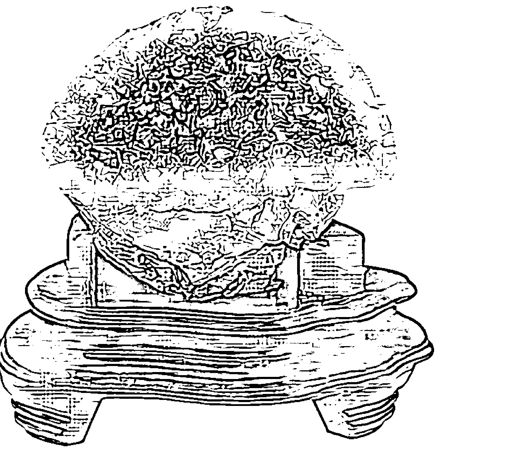

> ▲ 產自烏拉圭的紫水晶洞，切取整個「頭部」所成的聚合體，放在書房，用來讀書辦公考試，具有「獨占鰲頭」、「拔得頭籌」極優象徵意義，暢旺文昌氣！

如果，您也跟隨著大家的眼光在挑選，呵呵，那要追尋漂亮貨色的，就要付出相當的代價囉。若是能夠從另方面想，我們不必依循猴子都會的審美觀念啊？我們可以有自己的看法、想法、審美標準啊？尤其，只要是天然的，「自然就是美」啊？能夠好好欣賞每一顆紫水晶洞的特別、不一樣的地方，就像是每一個人也有他的獨到之處，都是獨一無二，舉世無雙的，Unique！那麼，只要自己「看上眼的」，合自己緣份的，那就對啦！就好像我們挑男朋友、女朋友一樣，合緣的最重要！若是每個人都要挑選像是電影明星、模特兒那種樣子的話，那豈不是會「男無分，女無歸」，造成更多的曠男怨女呢？這就是用「直覺法」來挑選自己喜歡水晶的好處，可以跳脫別人鑑價的框框，有機會可以挑到便宜又大碗的，而且最重要的，就是合用，合自己的使用咩。何況，當我們在風水上的運用時，我們在乎的是「氣」、是「能量」，而不是美觀與否耶？漂亮不漂亮那不是重點，當然啦，也要看得過去，那能以比較少的代價，獲得比較高的享受，不就是「聰明人的選擇」囉？

紫水晶洞的聚合形狀，讓它的氣也是集中凝聚在裡面的，形成我們前文所說的一個小型「龍穴」，其實也是氣場的一個集中點，調和點啦。如果，朋友們能夠靜心，手掌的氣脈也經過開發，可以感受外氣，可以緩緩伸進晶洞裡頭來試試看，您當可以感到好像伸入一團綿絮裡面，裡面充斥著麻麻的，熱熱的，刺刺的氣，非常的細緻輕柔，但又綿綿不絕，這就是紫水晶洞能量的特性，柔和，但卻不是軟弱哦，好像是「綿包鋼」一般。

所有的晶洞幾乎都是來自於南美巴西幾國，也有少數來自烏拉圭。

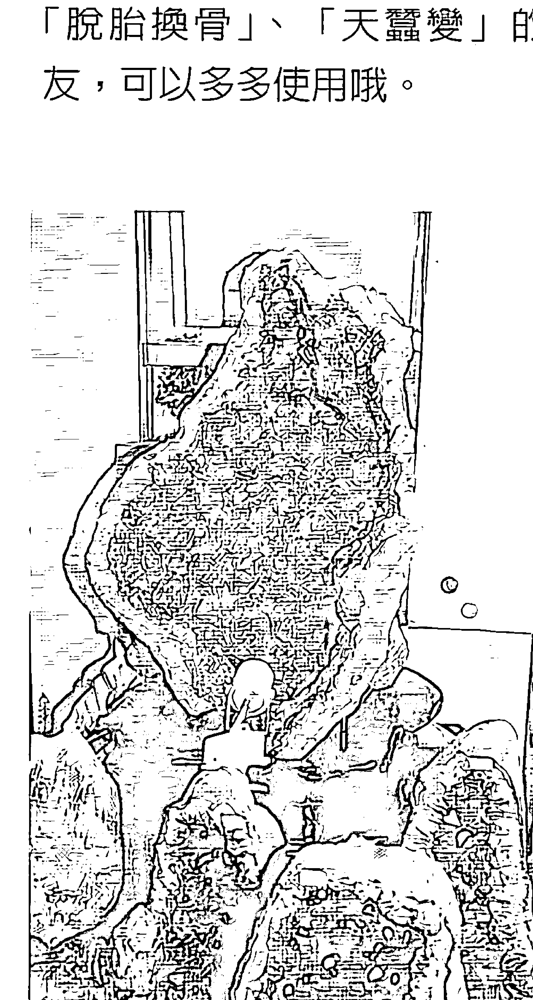

△ 紫水晶洞的分級，簡單到連猴子都會，但請體會自然就是美，每個礦石都是獨一無二的，用直覺法來挑選最適合自己的，才能省錢又省事，才是聰明人的作法啊！

紫水晶的紫色能量頻率，對應在人體氣場的「頂輪」，消極方面可以「鎖定安神」，積極方面可以「開發智慧」；至於帶來優良的領導統御能力，優雅美好的氣質，都是隨之而來的。另外有些比較淺色的紫水晶，可能賣相比較不理想吧，在礦區當地就會被以「熱處理」（Heat Treatment）方式燒過，經過攝氏550度的加熱，冷卻後，原本內在的稀有金屬元素「二價鐵」就會轉變成「三價鐵」，顏色也從淺紫色變成鮮豔的黃色。這種處理方式屬於「物理」方式的，不是「化學」的染色，在室溫下都能維持穩定不變色，所以廣為業界所接受。不然，天然的黃水晶又稀少、又貴、顏色又淺，就幾乎沒有黃色的寶石可以應用囉。那麽經過這種轉變之後，顏色能量頻率對應就從紫色的頂輪，轉為黃色的太陽神經叢，可以加強一個人邏輯、理智、條理、系統整合的能力，適合從事專業工作，當然也適合「發財」囉。紫水晶也搖身一變，從「智慧寶石」變成「財富寶石」！

### 運用方法：

- 1. 可以將紫水晶洞擺放在入門後的走道、行進動線末端，有吸納、聚集人氣、財氣的作用。
- 2. 屋內每兩片牆壁的交接處，常常也是「氣」的聚合點，也可以擺放紫水晶洞，可以使氣聚集的更為穩固、集中、精煉！
- 3. 入門後在左右45度角的地方，通常也是最為聚氣的地方，也可以視之為「財位方」，擺上紫水晶洞，也有吸氣、納財的作用。
- 4. 可以將紫水晶洞擺放在屋內的財位方，可以延續賺錢的時間，深化賺取的財富，更能長期保存所累積的財富。（特別適合已經在賺錢了，而且還想持續賺下去的作用。）
- 5. 紫水晶洞也可以擺放在書架、衣櫃、置物櫃等等上面，取有「富貴」的諧音，讓接受傳統文化的人們感覺更好。
- 6. 紫水晶洞也可以擺放在屋內「座山」方向的中間，如以九宮圖來看，就是中宮的正下方，這是公認的「福德位」，放此，可以長期的積福、納德，為全家人累積福德。

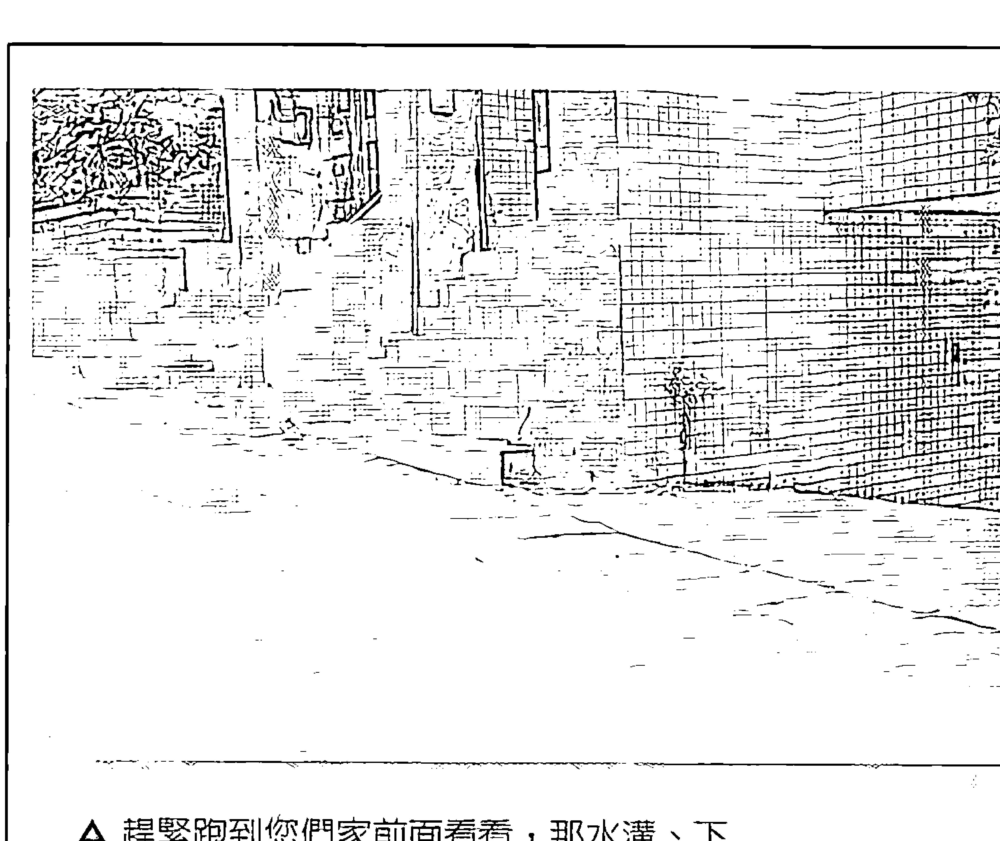

> △ 趕緊跑到您們家前面看看，那水溝、下水道是流向哪個方向？在相反方向來擺個紫水晶洞，就有將水氣、財氣留住的作用哦。

- 7. 查看門外水溝、陰溝的水流方向，在反方向擺上一座紫水晶洞，可以有聚水氣、納財的作用。由左而右，晶洞就面向左方；由右而左，晶洞就面向右方。
- 8. 若是門前有河流、大圳、馬路等等，都是「水路」，亦可比照辦理。
- 9. 當家裡的各個房間有「門對門」的情況發生，容易產生口舌是非，建議在其中一個房間的門後，擺上一個紫水晶洞，可以有吸納「氣衝」的作用，這房間的人就會比較能忍耐，能包容，能夠寬恕，就不會有衝突發生。若是在兩個門向的直線上，兩間房間都擺，當然是最好的啦，但是成本就會比較高一些。建議擺在比較長輩，比較懂事的一方。
- 10. 門外若有路沖，屋角煞等等，也可以將紫水晶洞的洞口對向這些來源，可以有吸納的作用，不是堅決的「阻擋」，會有點辛苦、無奈、強忍的意味在。
- 11. 再高竿一點的解法，可以在紫水晶洞裡頭，放著一顆透明或半透明的水晶球，可以將來沖的煞氣予以「轉換」，沒有正面衝突、對幹的激烈，卻有「把吃苦當吃補」、「逆來順受」、「化阻力為助力」的作用在，長期作用更好！
- 12. 家中若有人在讀書，準備考試，當公職，建議在「文昌位」擺放紫水晶洞，由以「木型」為佳，能夠有助於考運，晉升，亦常能獲「貴人」相助。
- 13. 若是家裡有多人同住，整體的文昌位又不適合擺放紫水晶洞時，則建議直接擺放到當事人的房間、書桌上面，和當事人感應最直接、最快！紫色的能量對應頂輪，開發智慧腦力，擺在哪裡，哪裡就容易文昌鼎盛囉。

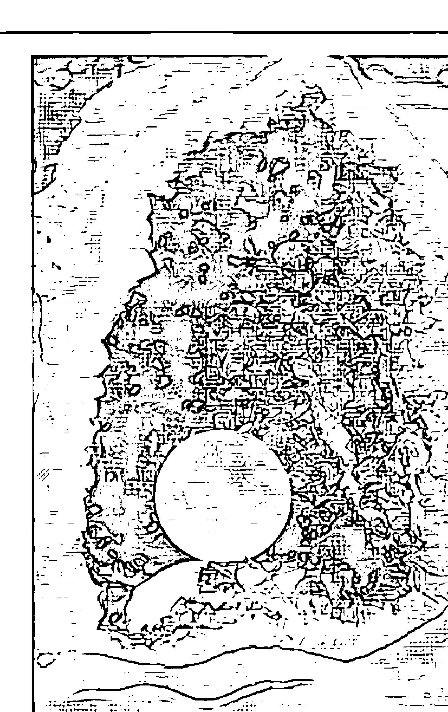

▲ 紫水晶洞裡面放顆水晶球，不一定要全透明的哦，是非常高級的化沖、解煞的方法，可以轉危為安，化阻力為助力。是啊，沒事幹嘛總跟人家來那種硬碰硬的作法呢？

- 14. 紫水晶帶貴氣，最適合主管人員的領導統御需要，可以擺在辦公桌的龍邊（左手邊），開口面向自己；也可以擺在座位的正後方，開口也是向著自己的後背，有強化權勢，受人敬重的作用。
- 15. 若是房子的坐向流年不利，或是因為在外租房子，或自己住小房間，無法更改格局，則可將紫水晶洞放在適當的位置上，予以開光啟動，則此方向的加權比重能量將會增加，成為屋內、房內的重心，就成為「座山」，可藉此來改「座山」、「朝向」，如此「瞞天過海」，可以來避煞、避厄，也可以用來「搶氣」，改善自己住宅。
- 16. 紫水晶洞是建構「山海鎮」的必要條件，詳敘後文。
- 17. 紫水晶洞具有「聚氣」的作用，因而屋宅地盤上的洩氣方、煞氣方、死氣方，都可以藉著擺放紫水晶洞來與以改善，常保家中的氣場活絡旺盛。
- 18. 大運或流年的衰氣方、死氣方，也可以藉著擺放紫水晶洞來改善，化解流年不利，常保家中的幸福平安，沒災沒厄。
- 19. 營業場所需要強化人際關係，拓展人脈，促使公共關係的和諧，也可以將紫水晶洞擺在財位方、丁位方來促成此目的。
- 20. 公司、工廠、商店、營業單位要加強員工的內聚力，降低員工的離職率、流動率，要改善勞資對立的緊張關係，要促進股東間的和諧，可以將紫水晶洞擺在丁位方，可使人丁旺盛，人和事順。
- 21. 開張、喬遷之喜、送禮以送紫水晶洞最佳，一有「安座」、「定居」之意，比「送終」等送鐘錶高明多囉；此外，也有鎮宅、化煞、聚集貴氣、文昌鼎盛的功效。
- 22. 若有同學、同事、長官升遷、陞官，也以送紫水晶洞為佳，特別是公務人員，或是大機關、大公司的人員更好，更有助於名望的提昇，更受人尊重，步步高陞，也有穩紮穩打，一路到頂的意思。
- 23. 若是經濟能力許可，自身對氣敏感，懂得風水之道，修煉之道，建議在居所四周多多擺上紫水晶洞，形成一種穩定、強勁的「環繞氣場」，猶如人造的「龍穴」一般，可以為您的體能、思緒、運氣、整體家運等等，帶來莫大的好處。但有先決條件，居住此間的人們，需經常性的運動、練功，保持好體魄、好體質，才能吸收消化這些強大的能量；俗話說，命格不夠的，八字過輕的，現代話講就是身體太虛者，就會「虛不受補」。好風水還是要有好體質才能兩相增益！

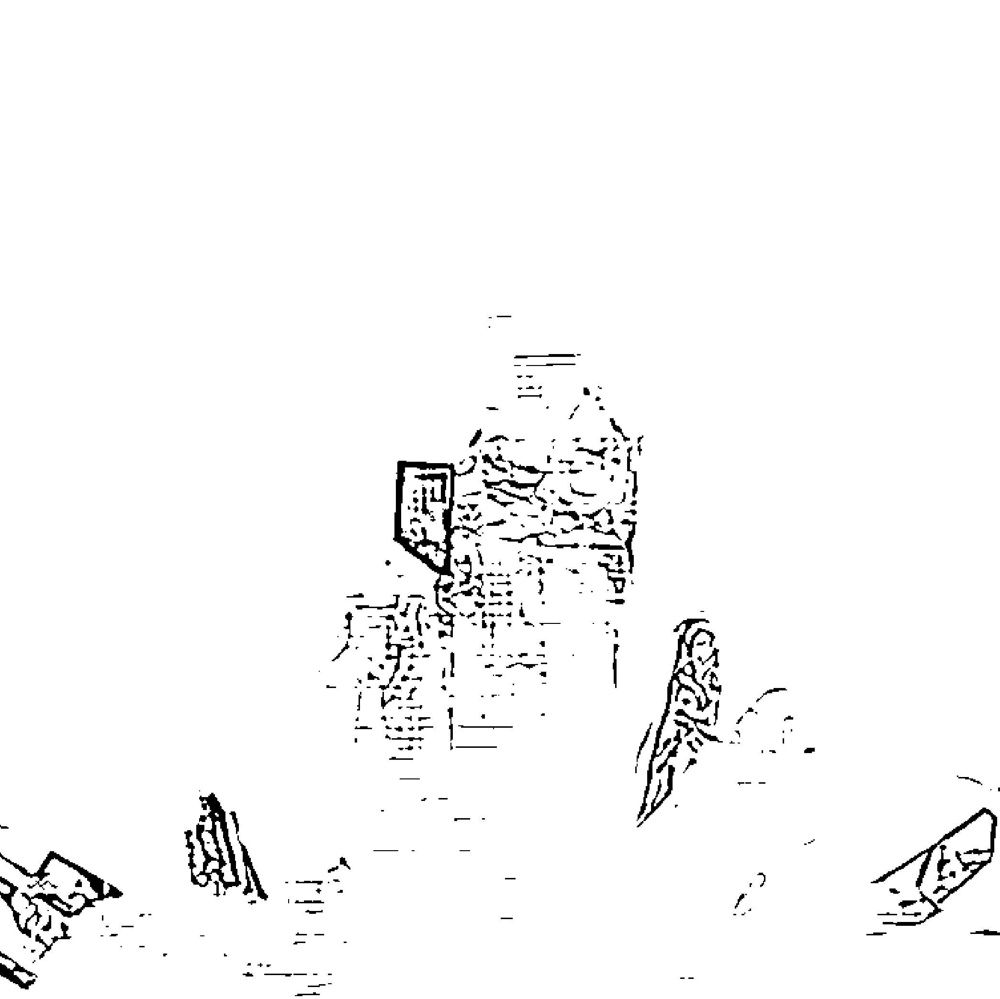

## 第三章 紫水晶洞五行属性

先前有位國外的水晶作家，建議消費者買紫水晶洞啊，不要一次買一個，要一次買五個，把「木、火、土、金、水」五行兼備」的買回家，才是圓滿！

哈哈，這種論調讓所有賣水晶的商家當然是笑呵呵，樂翻天囉！但是卻苦了有興趣的消費者，真的嗎？買一個已經所費不貲了，一下子買下五個，那不就要勒緊褲帶，老婆、兒子都寄別人養了嗎？

這是個笑話，但是也可以讓我們回頭來看看「五行」的問題。

古代中國的陰陽家將天下所有萬事萬物也都依著自然界現象、及星曜的特性，分成「木、火、土、金、水」五種性質，由此展開「相生相剋」的論斷，其後幾千年以來，幾乎所有中國有關的神秘學，命理、風水等等，都無法脫離這個範圍囉。

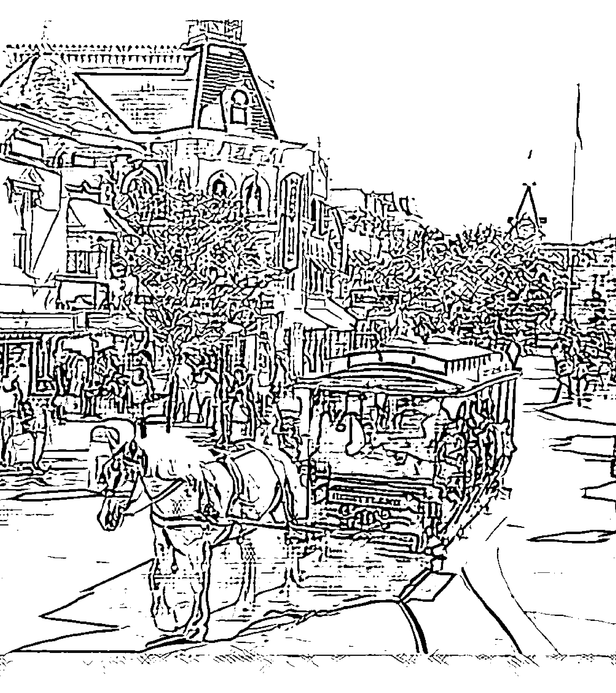

> △「馬路」，本來就是給馬走的啊？現在多是給車子走囉。在都市風水中，馬路也當水路，行走的動線，也是能量流動的方向。能夠看清、掌握「水氣流向」，就能掌握財氣的流向哦。

簡單的說明各個的屬性：

#### 【木】：
就像我們在自然界所看到的樹木一樣，高大，正直，細長，欣欣向榮往上生長，正面性質就有剛毅、正直、良善，主貴，往上攀爬之意，也有升官發財之象；但若漫無節制的滋長蔓延，也會有過度生長、擴張、膨脹、散漫等負面性質出現，就有雜亂無章、虛張聲勢、不切實際之象。 陽木，大木，就像是大樹一般； 陰木，小木，就像是小草一般。 典型形狀：高，瘦，直。

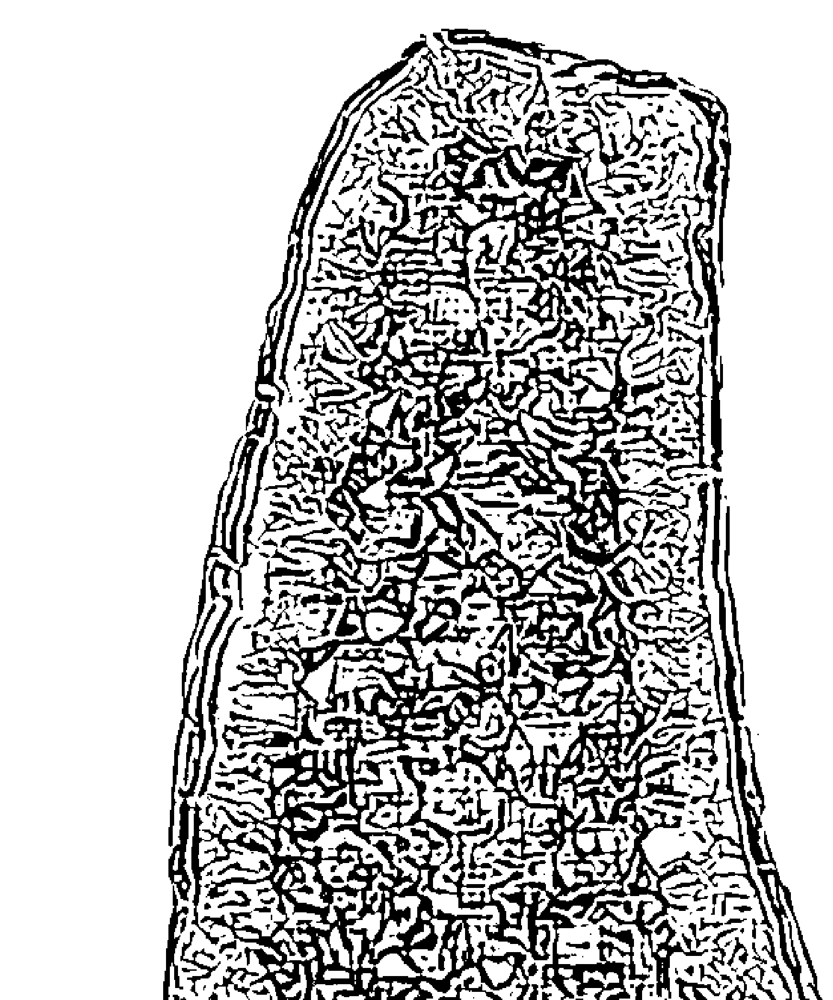

▲ 典型的木型紫水晶洞。但五行生克，吉不是真吉，凶不是真凶，「相生」、「相克」之間，只是一種力量、能量的傳導、輸送作用而已。

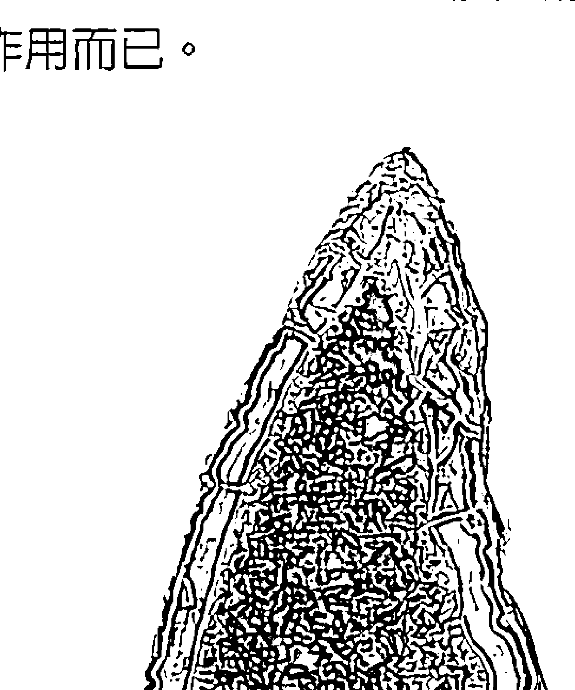

▲ 典型的火型紫水晶洞，就連三角形、尖銳型的也算哦，但這種形狀的比較少見。

#### 【火】：
就像我們在自然界中所看到的火一般，燃燒，光亮，明艷，美麗，正面性質就有活力、動力、衝勁、爆發力、發光發熱，吸引眾人羨慕目光、讚嘆聲音，表現慾強之意；然而在燃燒過後，能量耗盡，就有消耗、虛耗、燥熱、乾枯、內虛等的負面性質出現，沒有持續力、耐久力。
陽火，大火，就像是太陽一般；
陰火，小火，就像是燭光一般。
典型形狀：火鉸、火把、火燭，尖銳型，三角形。

#### 【土】：
就像我們在自然界中所接觸到的大地一般，寬大、厚重、厚實、負載孕育萬物、從不自誇、從不表功，引申就有老老、確實、實在、穩固、沉默、承受、孕育生命、有實力、能耐久、能持續的正面特質，也像母親、女性；然而，相對的負面特性就顯現，內斂、壓縮、害羞、退避、延滯、遲緩、受苦、無奈等等。

陽土，大土，就像是大地、沙漠一般；陰土，小土，就像是庭園、花台一般。

典型形狀：方方、正正、厚厚、重重、堅實的感覺。

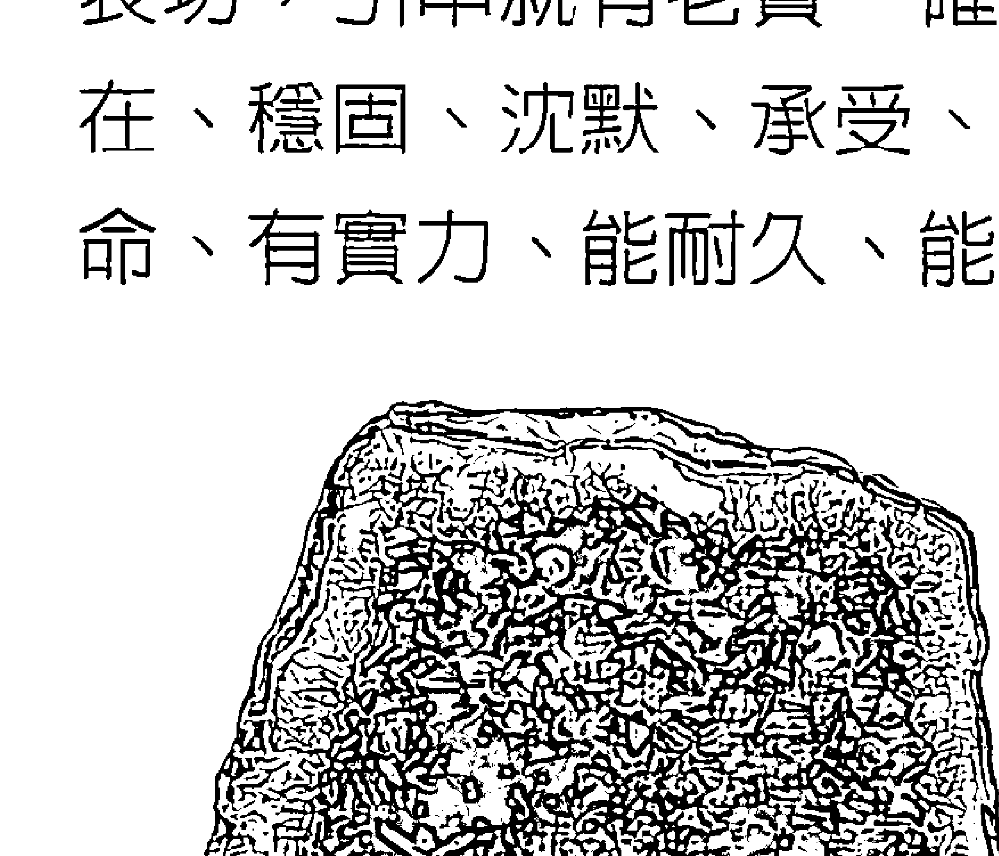

▶ 典型的土型紫水晶洞，方方、土土、厚厚、重重，一看就好像保險箱、財庫的感覺，用來積蓄累積財富最棒！

#### 【金】：
就像我們在自然界所看到的金屬特性一般，明亮、鋒利、剛硬、沈重，可以鍛造、具有可塑性，延展性，價值高，引申有光明正大、深具實力、剛烈果斷、伸張正義、財富豐盛、具建設性、連鎖擴張等正面特質；相對地，也具有摧毀、破壞、突破、肅殺的負面特性，易招忌、易折損，遇高熱大火易銷熔，遇大水易沉淪。

陽金，大金，就像是大廈、橋樑的鋼樑一般；陰金，小金，就像是戒指、耳環的飾金一般。

典型形狀：厚重中帶有圓弧型，如同教堂、官署、衙門。

#### 【水】：
就像我們在自然界所看到的水的特性一般，柔性的、流動的、靈活的、沒有固定形狀的、能夠適應各種容器的、滲透的、善變的、蒸發的、捉摸不定的，引申具有聰明、靈巧、活潑、活躍、適應力強、變動性強、八面玲瓏的、隨遇而安的、善於交際的、討人喜歡、得人緣的正面特質；相對的，也會引出負面的特質，沒有原則的、狡滑的、牆頭草型的、諂媚的、縱慾的、不穩重、沒有恆心、沒有耐久性的等等。

陽水，大水，就像海洋、江河一般；陰水，小水，就像池塘、沼澤、溝渠一般。

典型的形狀：波浪型，高低起伏型，圓形。

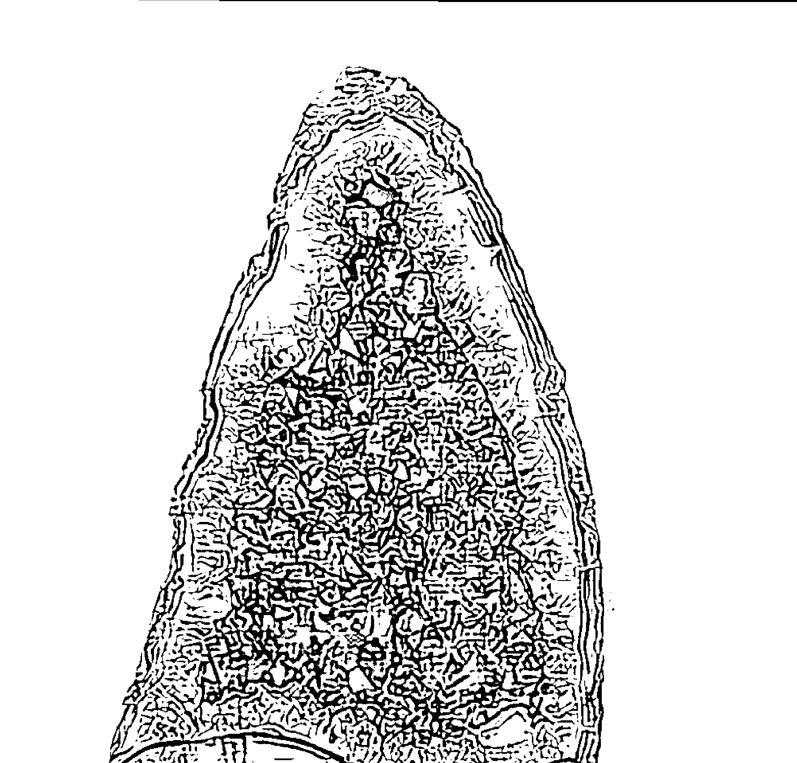

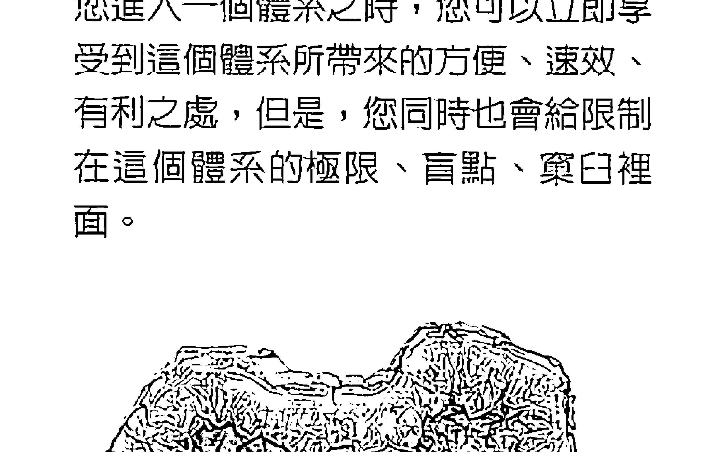

基本的屬性交代完成，生剋的作用簡述如下：

- 【木生火，火生土，土生金，金生水，水生木。】
木頭可以滋長火燄的燃燒，火燄燃燒後剩下灰燼，地底下可以產生金屬礦藏，金屬等可以熔化為液態，液態的水又能滋長花木等的生長。如此，一個五行的「相生」循環。

- 【金剋木，木剋土，土剋水，水剋火，火剋金。】
金屬可以砍伐、雕刻木頭，花木可以突破泥土的限制而冒頭生長，土可以克制流水的蔓延氾濫，水可以澆熄燃燒的火燄，火燄可以熔化堅硬的金屬。如此，一個五行的「相剋」循環。

話說回來，道理是非常簡單啦，一看就明瞭，但是在實際論斷裡面，應該考慮的因素可是非常多、非常複雜，也要非常仔細。

首先，想以五行「木、火、土、金、水」簡單的幾個元素要涵蓋天地間所有的萬事萬物，本身就是「不可能的任務」啦！因為生物界的「界、門、綱、目、科、屬、種」分類方式，也都不夠用哩！因此，在實際論斷中，常可聽到「金帶水」、「木帶土」等的方式，就讓人更為迷惑囉。各種事物「屬性」的問題，從來爭議就很大，來到21世紀新時代，工商業發達，不只三百六十行，三千六百行都有囉，很難界定哦？

水生木，照理講是好的，順暢的，但是遇到大水，木頭就會漂浮，反而沒有定性，那就不好囉？金剋木，照理講是不好的，凶險的，但是木頭若漫無節制生長，反而不成材，不成器，能夠予以適當修剪、克制、雕刻，反而可以變成有用的器具，是嗎？水剋火，照理講也是不好的，但是若能調劑適當，就連易經也說了「水火既濟」，也可以是「吉」啊？

五行生剋裡頭含有很深的哲理存在，不能只看表面的「生」、「剋」而已。生，固然是生成，生長，付出，給予，讓對方得到，說是「吉」，但也不是真吉、全吉哦；剋，說是克制、牽制、消除、破壞、改造、讓對方改變，說是「凶」，但也不是真凶、全凶哦。

許多中國人都給這些表面字義給害慘囉，簡單的二分法「生、剋、吉、凶、禍、福」。就連許多執業的命理師、風水師也未能將此中意義了解深刻，給予廣大百姓貼切、中肯的解說，一下子就給「斷」下去囉！常常聽到「兒子剋父親」、「妻子剋丈夫」、「媳婦剋公婆」……呵呵，這種「論斷」方式一講下去，那剋父的小兒子，一輩子沒有好日子過了；剋夫的妻子也是一輩子抬不起頭，哪有美滿婚姻可言？那剋公婆的媳婦，更有可能被逼、被凌虐，最後走上自殺一路哦。這種「斷法」，固然可以凸顯命理師、風水師的專業與自信，但若沒有深刻的人生與哲學涵養，豈不過於草率、魯莽、專斷，害人不淺，貽禍至深呢？職業的命理風水師裡面，常見年紀輕輕，或是在精壯年間就突然暴斃，折損非常厲害，這其中的「因果」關係，不可不愼哪？

各位水晶朋友們在看這段文字時，請多小心，也請多用心，吉不是真吉，凶不是真凶，「相生」、「相剋」之間，只是一種力量、能量的傳導、輸送作用而已。「生」的話，可以比較順暢、平和；「剋」的話，則可激起比較大的能量，比較大的浪花、火花，有時反而更為耀眼、顯著、成就更大。

想想看，若是一位水性的父親在教導木性的兒子，雖說是很好，很順，但是也容易嬌寵，反而教不出好成績囉。若是換成金性的父親來教導木性的兒子，雖然「剋」的很辛苦，兒子會覺得很歹命哦，但是經過這樣的磨練鍛造，將來必然可以成為一個人才，社會的棟樑。所以，不必擔心五行生剋的表面意義，必須更為深入的思考其中的哲理，才不會誤陷其中的迷障。

還有，若是您覺得五行生剋好複雜、好迷惑，不想相信，也行啊？前面說過，這只是一種「體系」，東方中國獨異於全世界各地的論法，不是非信它不可啊？您也可以找出您自己相信的體系啊？您能相信，那就靈囉，心誠則靈啊？若是您有良好的心性修養，了解佛法，透析空性，知道奧修，洞悉存在的奧秘，則什麼都不必信，那更為自由、自在，這才是真解脫啊？

是的，當您進入一個體系之時，您可以立即享受到這個體系所帶來的方便、速效、有利之處，但是，您同時也會給限制在這個體系的極限、盲點、窠臼裡面。一些事情，若未能從根本性，基礎性，原則性，從根刨起地去思考它，則永遠走不出窠臼。一旦您走入五行的體系，因為相生、相剋的作用，您永遠找不到一個完美的命運、姓名、和風水的，因為就是在這裡面生來生去，剋來剋去啊？好像小狗追著尾巴跑，小蛇咬著尾巴轉，這種「邏輯」讓您永遠跳不出來，所以就是「術數」而已，玩玩可以，不能當真。所有的宗教都教我們要「超越」(Surpass)，就是這個道理啊？超越這所有的荒謬、無聊、可笑的所有「體系」啊？

話再說回來，在商言商，若是每個人都能「跳出三界外，不在五行中」，變成大修行人了，大家都不需要紫水晶洞了也不行啊？身在俗世中，也要學做俗事啊？以下各種形狀的紫水晶洞應該可以助您相對的願望哦？

#### 【木型】：
主責，有助於讀書、考試、升遷、遇見貴人、出人頭地、金榜題名，開花結果，適合讀書人、學生、文官、公務人員、大公司、法人機構從業人員，職員、上班族等等。

#### 【火型】：
帶有衝勁、活力、幹勁、體力，有助於殺破重圍，突破困境，適合創業、開發新事業、新版圖。適合軍警、武官、運動員、武市行業、大批發、黑道、屠宰業、軍火、外科開刀、整形美容等等行業。

#### 【土型】：

帶有厚重老實、苦幹實幹、堅穩耐久的特性，堅持理念、原則，永續經營，代代相傳，適合保守經營的傳統產業，如農業、礦業、房地產、錢莊、布莊、藥行、當鋪、古董業等等。

#### 【金型】：

帶有剛毅果斷、剛烈強勁、穩重實力，有開創性、突破力、公平性、具美感、延展擴充等特性，適合工業、製造業、銀行、金融、證券、保險、司法、檢調、稅務、珠寶店、銀樓、五金、理髮、美容、整形、醫療、加盟體系、連鎖事業體系。

#### 【水型】：

帶有柔和、變化、靈活、適應、滲透性，有隨機應變、多采多姿、隨時代進步、水漲船高等特性，適合高科技行業、電子、通訊、物流業、快遞業、服務業、服飾、美妝、美髮、文教、文具、書店、補習、安親班、餐飲業、一般商業商店等等。

望大家在了解這些道理、根源後，您也能建立您自己的哲學，您自己的信念啊？不一定要跟著古人的腳步，因為古人不一定對的，時代也進步了這麼多了啊？任何體系、任何理論，若是缺乏了您的「信心」，都是沒用的；相對的，若是有了您的「信心」，就是「頑石」也能變「聖石」啊？何況真正有氣、有能量的水晶寶石呢？那肯定會更強囉。

依著您自己的哲學與認知，想讓自己更為順利，就找能「生」您的型；若是覺得太過慵懶了，想要刺激一點，能夠激發些能量的，則可找輕「剋」您的型。若是您不喜歡這些五行生剋的，那什麼型也不用擔心，他們原本就都是「水晶」啊？任何形狀，只要自然就行，您喜歡的就對了！哈哈，有些人說水晶就是屬「水」，也有些人說水晶是地底下挖出的，應該屬「土」，還沒有定論哦？可能還需要爭論個幾百年吧，而我們覺得呢，「水晶」就是屬「水晶」，如此而已。

以上只是說明大略的屬性而已，不是準則，更不是聖經哦？千萬不要抓著不放，那就食古不化，有違本書的本意囉。我們希（淳貿天然水晶台北市八德路四段768巷7號三樓之一）

## 第四章 水晶柱

看過「水晶簇」，就知道都是由小小的各個單支「水晶柱」所組合構成的，六面柱狀結晶，典型的「六方晶系」。

(Obelisk) ；四個面的尖頂，好像是金字塔般的。看看著名的華盛頓紀念碑，就是這種形狀的，還有其他許多的紀念塔，以及古埃及的金字塔附近也有許多方尖碑，也是取其能量強大，具有震幅、鎮壓、壓制的作用。

這些水晶柱，最小的有如同頭髮般粗細，大一些的如同手指頭、手臂粗細，更大的也有幾百公斤、上噸重的。因為「份量」不一樣，當然用途、方法也不一樣。

水晶柱比較簡單認知的地方，就是能量行進的方向一致。您只要看那「尖端」向哪，就知道整支水晶柱的能量往哪裡發射，而且是集中發射。這就不像「水晶簇」囉，因為是所有水晶柱的組合啊，所以能量往四面八方放射，反而容易變成「一團」。而「水晶球」也是一團能量體，但沒有明顯的方向，能量反而向著四面八方成「輻射狀」的散發出去。因為能量的行進方向不一，所以運用的方法也不一樣。

也有將「六面柱狀」的水晶柱切割成「四面柱狀」，同樣是非常堅強穩固的能量體，稱為「精神堡壘」，或是「方尖碑」

有些特殊的晶柱，長的「前窄後寬」，身軀又相當細長，這就是所謂「雷射激光柱」（Laser Wand），這是所有玩水晶人士的「基本配備」哦。用途非常廣泛，風水上當然也可以用處很多。這和一般的水晶柱比較起來，數量就比較少囉，單價也高了些。

還有一種「雙尖結晶」的水晶柱，因為成長環境的良好，或是落在良好的著床點，兩個尖端可以完整結晶，這是完美的現象，也是非常難得的情形。因為，觀察水晶簇、水晶洞，幾乎每一個水晶都要有一頭附著在「岩床」（Rock Bed）上的啊？除非是天之驕子，才能找到好環境。我們知道尖端是能量的放射點，這種雙尖水晶因為結晶完整，又有兩個尖端，所以能量在其中來回振盪迴旋，一般，都可以激起比正常單尖水晶柱還要更強的能量、氣！因此，也廣受喜愛。遇到有細長型的，當然也可以當雷射激光柱來使用，當然也可以當成一般水晶柱來運用哦。但是，一般水晶柱就不能反方向來替代激光柱啦、雙尖水晶柱的功能囉。

難得的好東西，提醒朋友們若有見到，就要「先下手為強」！這種東西不常見的咩？先收起來，爾後運用的好處多多哩。但是，在此，我們仍是以一般水晶柱為主要探討與運用對象。

### 運用方法：

- 水晶柱可以說是我們手臂的延伸，也是我們「氣場」、「意志力」的延伸。許多時候，若我們個人的修煉不足，狀況不佳，就可以透過水晶柱的振盪、擴大作用，將我們的氣發射出去，而能啟動、活化各種的水晶寶石、能量體。居家型的，能在15-30公分長最好，經常出外旅行外宿者，也要有支10公分左右的相伴最好。

- 經常握著水晶柱來靜心、冥想、誦經、打坐、持咒，可以有增強本身氣場的絕佳效果，這也是避邪、抵抗外在環境不良氣息的最根本方式。各種握的姿勢都行，雙手合十握起水晶柱，尖端向上，置於前胸；或雙手相疊於下腹部，左上右下，水晶柱尖端抵著左手手掌心；相同方式，也可以兩手手指相交叉，置於下腹部也行；或就用右手將水晶柱握住，尖端向上。重點是在「接觸」，怎樣的姿勢都行。

- 個人結界的方式，雙手食指將水晶柱夾起，尖端向上，舉過頭時深深吸一口氣，在頭頂的正上方「由左而右」轉三圈，轉圈的同時緩緩吐氣，並觀想白光隨同這些氣息釋放出去，就可以在身旁形成良好的「光罩」（Light Shield）、「保護罩」，防止外來不良氣息的影響。若是還想加強，可以將手放回前胸時，再來念佛、持咒都行，或是只持「嗡」的發聲七次，從丹田中出來呦，也有強化的作用。出入醫院、病房、喪家、靈骨塔、陰廟，或是遇到病重、極為倒楣的人事物，都不怕受到波及。

△ 大型的粉晶柱，可以為商店、餐廳、公司帶來良好的人際關係、人緣、客源，掌握人脈就是掌握錢脈！許多大公司也採此方法來改善風水問題哦。

- 將比較細小的水晶柱做成胸墜，時常配戴在身上，也有增強氣場、避邪、防護的效果，進出各種不良氣息場所，也不必擔心害怕。經常配合上述結界方式，效果更強。

- 外宿旅社時，可以先用水晶柱觀想白光發射，將床圍繞三圈起來，水晶柱就放在枕頭旁，伸手可及的地方，就是一種良好的結界保護方式，不用擔心外靈干擾、鬼壓床等的事情。

- 若是真的遇到靈異的狀況，只要拿起水晶柱，順手劃過去、點過去，就能化解；若要更仔細，則可觀想白光從尖端放射，口中配合大喝一聲，就能將之掃除的雲消霧散。

- 若是不小心當中已經遭到附身，手腳都不聽使喚、不能動時，不要慌，屏氣凝神，集中內在的力量慢慢發出「嗡」的聲音，就可以恢復主導控制權囉。抓回水晶柱，就能控制整個場面。

- 將水晶柱放在辦公桌、書桌的虎邊（右方），可以讓比較懦弱、膽小的人，變得比較勇敢、有膽識、有氣魄，做事情比較能夠貫徹到底，不會先冷後熱，中途而廢。但若原本已經很強勢的人，就不建議如此擺放。

- 將水晶柱放在左手邊，具有防小人，預防來自不明人士、不特定事項的種種干擾，也可視之為「保平安」。

- 若有來自哪方，哪個人，哪件事情，壓力特別大，壓迫感很重，卻無法正面推卸、排除、對抗，可以將水晶柱的尖端對向那個方向，並觀想尖端發射白光「突破」壓力重擔，就像是一根針在刺穿大皮球的樣子，通常就可以突破困境，展現新的局面。

- 在一些大辦公室裡頭，若是座位的正前方、正後方、正左方、正右方，若有通道、走道、長廊、樓梯、電梯門、或是各種門的出入口直沖而來，容易是非口角紛亂，請在「犯沖」的方向來擺個水晶柱、精神堡壘、或是大支的激光柱，就可以化解這些不定期、不定時而來的負能量。

- 在有遇到一些比較不好帶領、管教的部屬時，建議可以使用比較溫和的紫水晶柱、紫龍晶柱、粉晶柱等，將這些人員的相片、履歷、名字，或是任何的訊息物（Witness）壓在下面，就可以比較好管理帶領囉。除非您是在監獄、軍隊、公務機關，不然不建議使用強力的骨幹水晶、天鐵、黑曜岩、髮晶等等，壓迫性太大，一旦失控，反彈也大。請考慮前因後果，盡量以理性、感性疏導，才是領導統御的藝術。

- 若是門外、窗外哪裡有比較尖銳的建築物、物件，如屋角、尖角、尖塔、銳角、鋒利環片狀等等，讓您覺得不舒服、不愉快的，卻又無法改變的，則可挑選適當大小的水晶柱，將尖端來對準它，反射回去，也是「破解」沖煞的一種方法。

### 水晶柱

- 若是門外、窗外有樹木、電線桿、路燈、大型看版、廣告等等，明知形成「困」字沒有什麼道理，但看了也就不太開心，可以在水晶柱、或精神堡壘（方尖碑，1-5公斤左右）上貼個『對我發財』、『對我生財』，就是個非常好的化解方式囉。特別是，這些類似「符咒」若是您自己來寫，用「硃砂」當然更好，類似前文所敘述一般，加上好好的靜心冥想，都能把咒語的氣和水晶的氣都給啟動開來，那就可以更為安心囉。

- 若是門外、窗外有更強的天斬煞、巷沖、路沖，或是常發生車禍的現場，或是曾經發生災害、命案的現場，擔心不良的能量，或是孤魂野鬼在找替死鬼等等，也可以用更大型的水晶柱、方尖碑（10-20公斤左右）等，如法炮製，貼上『泰山石敢當』，或是更強的『天無忌，地無忌，陰陽無忌，百無禁忌，姜太公在此』，並予啟動開來，就可以震懾住這些煞氣，不敢輕舉妄動，更不敢惹是生非囉。

△ 馬路太大條，路太直，也犯「直路沖」，容易出事咩。水晶柱也是化解的好用具、好寶貝哦！

- 若是在一些能量場比較不穩定的住宅內，就是居住的人容易生病，容易聽到一些亂七八糟的聲響，或看到什麼光影、黑影的，可以找來50－100公斤以上的大型水晶柱，放置在屋內的中宮方位，或是在客廳內最明顯的地方，對全家都會產生作用的地方，看是也用上述的「符咒」呢，還是要更用心、更仔細地抄下《心經》、《大悲咒》，或也有用孔子的學生《七十二賢人》，或是《黃花崗七十二烈士》的名字，都可以收震懾、壓制的效果，這也是「鎮宅」的意義囉。單純的使用水晶柱，予以啟動開光就行，若是再加上符咒等信心力量，則可收「畫龍點睛」、「錦上添花」的力量，更好！

- 中小型的水晶柱有比較多的選擇，約在十來公斤到三十、五十公斤左右，如白水晶、煙水晶、骨干水晶、碧玉(Jasper)、方鈉石（蘇打石）、木化石等等。若要大型的水晶柱，如五十、一百、或幾百公斤以上的，則以骨干水晶的機會比較大，也可以找到比較漂亮的選擇，價格又比較合宜。

- 中大型的強力水晶柱可以用來壓制、化解屋主本命的五鬼、六煞、禍害、絕命等等方位，常保屋主的平安健康。

- 中大型的強力水晶柱也可以用來壓制、化解屋宅地盤的洩氣、煞氣、死氣方位，讓全家的氣場能夠活潑暢旺，不會有呆滯沈悶的死角。

- 中大型的強力水晶柱也可以用來壓制、化解大運、流年的衰氣、死氣方，消除所有可能的禍害災厄，常保住家平安健康。

- 中大型的方解石（Calcite）、螢石（Fluorite）、粉晶（Rose Quartz）等柔和性、稀解性的寶石，可以擺放在屋前「關煞方」，藉以化解各種不良氣息，也阻擋各種可災厄。

- 當有需要使用到比較大的水晶柱能量時，預算卻很有限，此時，建議可以選用比較小型的水晶柱，改採「七星陣」，用陣勢的集結力量來替代單支的力量，也是可行、經濟之道。

## 第五章 水晶球

說道水晶球，馬上讓人聯想起電影裡頭的巫婆、吉普賽算命師，都能夠透過「觀水晶球」來看一個人的過去未來……似乎非常神秘，也非常令人匪夷所思！這也是水晶球「記憶」、「轉換」、「傳遞」等的功能在作用啦，若有興趣了解詳情，可以參考我們「水晶球與天眼通」一書哦。

水晶球，就是從「水晶柱」所切割下來，琢磨打亮而成的。說來簡單，做來可大不簡單！

- 一來，所有的水晶礦石都在硬度七，非得鑽石工具來切、來鑽、來磨、來打亮才行哦。平常的切片、磨盤，可是無法勝任的。
- 二來，從一顆水晶柱上來取料，就要截頭去尾，就取中間比較晶亮透明的部份，那可是很「傷料」的哦？成本也比較高。
- 再來，在切割、琢磨、打亮的過程，也是非常「劇烈」的，若是有任何裂痕、瑕疵等等的，很容易就從中「應聲而裂」囉。一顆水晶球的誕生，可是比其他還不容易哦，應該好好珍惜！

球裡面的「冰裂紋」，其實這不是正確的說法，水晶的結晶方式不會產生冰裂紋。據推測，應該是在成長的過程中，或是遇到地震搖晃，或是地層的擠壓，所產生的一些「痕跡」而已，不是「裂痕」。若真的是「裂痕」的話，那早在切割、琢磨、打亮的過程中就會「破裂」、「碎哥哥」囉。水晶球裡面的「瑕疵」也不是一個令人愉快的說法，瑕疵代表有缺陷、弱點、不足之意。這些與生俱來的東西，我們就叫它「內包物」(Inclusions) 就行囉。就好像每個人身上都會有多多少少的痣啦、斑啦、胎記啦，都是自然的一部份啊？這些正好表示我們是「父母生的」，不是「複製人」、「科學怪人」。這些水晶球的內包物雖然是「鑑價」(Pricing) 時的缺點，但卻是「鑑定」時的優點，不是人工合成的，更不是「養晶」。所以，放開心胸來好好接納這些「自然的一部份」，可以更為開心、快樂、爽朗哦！清澈透明的水晶球固然美麗漂亮，但是相對的價格也高。有時候，同樣150-200MM 直徑左右大小的水晶球，光是清澈、混濁的差異，價格可能相差十幾倍以上哦！二萬元到二十萬元的差距，這可是很厲害哦！當然，漂亮的好東西總是有他的價值啦，只是，我們使用在改善風水之時，重要的是水晶球本身的「氣」、「能量」，不在乎他的漂亮與否、價格高低啊？而且，「能量」與「質量」成正比，質量越高，能量就越強，作用也越大、越快、越明顯！內行的風水師就是要找「好用的」，而不是只找「好看的」啊？了解這一點，我們就可以用比較少的代價，換得比較高的實用價值哦！所以，奉勸各位想要將水晶球運用在風水制化上的朋友們，不要只看外表，看看有沒有夠「份量」才是重點！水晶球是由水晶柱所切取下來的，仔細量測、感應，還是可以找到那個原本「柱狀」的軸線，好比是南北極的「地軸」一般，在此兩端的氣流會比較強勁哦。但是，整體而言，已經是圓形的囉，所以不再有「柱狀」、「簇狀」那麼強勁的氣流，反而是比較緩和，溫柔，成輻射狀往外擴散中的一種能量型態，而後勁卻非常穩定，好像源源不絕的樣子般。

圓球型，在透明和半透明的狀態下，都還有類似「凸透鏡」的作用，光線進來會有被聚焦、擴散、轉換行進方向、扭曲的效果，就有對於氣（光煞）的吸收、轉化、阻擋、化解的作用。

這種複合性的作用，比一般的凸透鏡都還好用，因為凸透鏡本身沒有能量，只是純粹將光線折射、反射而已，轉換、化解的功能不強，還不如水晶球的功能齊全。順道提醒一下，透明的水晶球不要用日光消磁法，因為會將強烈的陽光聚焦，可能會使得底下的桌布、紙巾、木頭等燃燒起來，釀成危險，一定要千萬小心哦。

但也要小心哦，水晶球好用，也要用「天然」的水晶球，有許多的風水大師知道水晶球的妙用，偏偏對水晶不內行，要嘛找到一堆平常的「玻璃球」，要嘛找到機場免稅商店賣的「奧地利鉛玻璃球」，還有就找到大陸出產的「鎔煉水晶球」，通通不是「天然」的水晶球，功能當然不能完全的發揮出來囉。

### 運用方法：

- 找個約拳頭般大小的水晶球，60-70mm 左右，平常時，有事沒事都可以拿著靜心打坐，或是和人家在閒聊、談天時，都可以拿在手中把玩，可以隨時加強補充自己的氣場，這也是對抗外在環境能量場的最基本方式。

- 若是住宅的門口和對面的住家門相對，『兩家門相對，必有一家退，兩家門相沖，必有一家凶』，可以掛起一個水晶球來平和地化解，不至於有衝突發生，也不會叫對面人家起疑心，更不會讓人懷疑我們這裡風水有問題，而影響房價。

- 當在屋內書桌前、辦公桌前，若是有些家具、機器、設備、室內裝潢的尖角、銳角、斜邊對向我們這邊時，容易叫我們精神緊張、脾氣暴躁、做事出錯、人緣不好，就可以擺上水晶球來予以化解。

- 若是座位向著走道、門口，也是讓我們直接去承受那些比較衝的氣流，容易失去耐性、煩躁，久了連身體健康也會受影響，也可以藉著擺放水晶球來化解。

- 若是經常要處理眾人之事，常常又各方的意見多、紛擾多，可以將水晶球擺放在辦公桌的虎邊（右手邊、右前方），由此所形成的態勢，可以讓當事人處理事情的手段、手腕更為圓融、圓滿，可收八面玲瓏、左右逢源之效。

> Δ「能量」與「質量」成正比，質量越高，能量就越強，作用也越大、越快、越明顯！內行的風水師就是要找「好用的」，而不是只找「好看的」而已。

- 若是在處理事情時，擔心過於在意各方的意見，反而失去自己的立場、原則時，可以採「右圓左方」、「前圓後方」的桌上擺法，即右手邊擺著圓形的水晶球，左手邊擺著柱形的水晶柱、金字塔等等；或是在水晶球的後面，擺上水晶柱或金字塔等。都是可以達到「外圓內方」、「外柔內剛」，表面圓融，實際原則又能貫徹執行到底。

> △ 這些水晶球的内包物雖然是「鑑價」時的缺點，但卻是「鑑定」時的優點，天然的才有天地靈氣，日月精華，才能發揮對於氣(光煞)的吸收、轉化、阻擋、化解的作用。

- 若是屋外、窗外有厝角、尖角、尖塔、牆壁邊緣等等形成的煞氣，若是距離隔一條街以上，或是在幾百公尺以上，基本上已經沒有什麼影響了，「界水而止」嘛，馬路就是水路啊。但為了安撫心中的感覺，也是可以掛上個大小適中的水晶球哦。

- 若是以上所說的煞氣距離頗近，近在咫尺，且具有壓迫感，那就不是用小小的水晶球可以解決的，建議找來150mm－300mm以上的，才比較夠力哦！建議找半透明到不透明的水晶球，一來擋煞的效果最好，二來價格可以更為便宜。在風水制化上，我們主要使用到的是水晶球的能量、氣，而不是透明的美觀而已，因而多建議尺寸大、質量大，效果好，作用快。

- 若是正對著寺廟、神壇、醫院、診所、官署、學校、機關等等，這些沖煞的能量也是很大、很急、很凶的，對於尋常百姓家都是不好的影響，可以在大門正對的「動線」上擺上大的水晶球，也可收擋煞、化煞的效果。

- 若是門口有路沖、巷子風，或是窗外有「天斬煞」等等，也可以用水晶球來化解。

就是兩棟大樓間所形成的狹巷，會激起詭異的強風，偏斜地射出，對於被射到的屋宅人家都有不良的影響，也可以用水晶球在此方向壓制、阻擋、化解。

球又涵蓋了「可見光」中，紅橙黃綠藍靛紫的各種光色，最適合修煉者來使用。

- 11.若是預算有限，或是找不到那麼大的水晶球，也可找些小一些的水晶球，配合紫水晶洞罩著，一同對準沖煞的來源，也可以發揮阻擋、化解的功能。

- 12.若是家宅的能量場不穩定，懷疑有靈異現象，居住其中的人們也常精神恍惚、經常生病，建議將大型水晶球擺放在屋子的正中央，中宮之處，則可收「鎮宅」的效果，常保家人健康平安，家運也正常安康。

- 13.家中若無特殊狀況，也可以將中型的水晶球，100-200mm 左右的，放在「財位方」，可以讓財運在穩定中成長，源源不絕。公司、工廠、商店也可以比照辦理，但是看格局大小，水晶球的尺寸也要相對的調節。

- 14.修行場所、靈修中心、道場、佛堂上，最適合擺放大型白水晶球，除了有圓融、和諧的「型」與「意」之外，白水晶球又涵蓋了「可見光」中，紅橙黃綠藍靛紫的各種光色，最適合修煉者來使用。

- 15.用白水晶球來供佛，也是一件非常殊勝的禮儀功德，因為有能量的東西，勝過一切凡間的供養。若是一顆的話，可摆在佛像的正前方，若有兩顆的話，可以在佛像的正面的左右兩邊分擺；若是有多尊佛像時，也可以各供一顆，或是插空隙方式的來擺放。

- 16.切記，供佛的水晶球就用來專門供佛，請勿拿下把玩、練氣、排病氣等等，用完後，又放回佛桌上，會造成嚴重的不良影響。供佛的，自用的，一定要清楚分開。

- 17.佛桌上的供品，可選用白水晶球，有和諧、圓滿的意義和功效；若是對神佛等有其他的祈求等等，則可採用其他顏色的水晶球，如求財就用黃水晶球、綠色東菱石、綠螢石球，求姻緣等就用粉晶球。一定要用天然水晶，不可採用人造鉛玻璃、養晶、化學品等等，以免不淨、不敬、不靜，影響甚大。

- 18.若有親朋好友搬遷、高升、升學時，也可以送白水晶球當禮物，讓他擺在辦公桌、書桌的龍邊（右手邊），讓他能事事圓滿，萬事如意。

- 19.白水晶球是我們的第一優先選擇，因為可以又大又多又便宜啊，但非唯一選擇，若是價格、尺寸合宜，紫水晶、粉晶、東菱石、煙水晶、蘇打石、黑曜岩、煙水晶、拉長石等等，也都可以用。各色水晶的性質即使比較柔和也沒有關係，到底我們是要用在「化解」，而不是在比誰比較衝、硬碰硬的啊。

- 20.粉晶、螢石、方解石(冰洲石)等的性質比較柔和，可以將圓球放在門前入口處，也有化解「關煞」的作用；還可擺放在地盤上的洩氣方，藉以緩和洩氣的作用。

- 21.能量比較剛烈的黑曜岩、煙水晶、拉長石圓球等等，可以放置在本命上的五鬼、六煞、絕命、禍害方位，還有地盤上的煞氣、死氣方位，大運盤上的衰氣、死氣方位，藉以壓制、化解，消除所有可能的不良因素。

△ 大大小小、林林總總的各式各樣水晶球都很多，只要是天然的都好用，就是不要挑到玻璃的、人造養晶、熔煉水晶，那就只剩「純觀賞用途」而已。

## 第六章 金字塔

说到「金字塔」，这可是大名鼎鼎、渊源久远，从古埃及、中南美马雅文化（Maya），一直到现在中国，以至于台北阳明山、七星山上，都有金字塔的遗迹、传说。虽然规模大小、高矮胖瘦、角度上都有差别，但都一样好用。

最常从一些国外的杂志、翻译书籍里看到的是，捷克的士兵把锋利的刮鬍刀片放进去，可以在几天内恢复锋锐，在物资缺乏的年代，可是很省钱的哦；把苹果、鲜肉放进去，过几个月都不会腐化，只是「脱水」而已，依然可吃，且味道不错，在没有冰箱的地方，这很好用的方法呢。

比较少人知道的是，传说中巫婆的高帽子里面，也藏有金字塔哦，随时可以为她们补充高能量，随时可以施行法术。还有远在西藏的佛教密宗，也有个密法，就是教修行人观想体内有两个金字塔，一上一下，两个尖端相对，藉以训练专注的能力，也藉此来引发触动体内的拙火能量……

也曾经在电视报导中看过，俄罗斯的农民建筑金字塔来储放稻穀，一来不容易受到虫害鼠辈的侵蚀，二来容易保存，三来，隔年拿出的种子特别健康，容易成長，不會有什麼病害。因為這金字塔又尖、又長、又大，當地電視台也去採訪，還派飛機繞行拍攝。很好玩的哦，飛機好像會受到一些不明的電流、或是能場（Energy Field）所影響，儀表板上顯現有東西，但不明白是什麼東西，電視上可都是「全都錄」囉。這個有趣現象，值得有心人使用更多、更先進的儀器來探究哦？

△ 为了感受金字塔的能量，还花钱特製三公尺乘以三公尺的大型帐篷金字塔，在野外搭盖，亲身尝试，果然不同凡响！

> ▲ 為了金字塔的材質，也是傷透腦筋，用來用去，還是本身就有能量，配合形狀，所能發出的氣息最強！還是水晶好用！還可看到裡面的彩虹光澤哦？

據一些神秘家的研究，金字塔最重要的就是在這四個面，方位擺正的話，這四個大面可以接收來自東、西、南、北方面的大能，匯聚集合在中心的軸線上，也就是從尖頂一直到到底部的這條垂直線上。這條軸線，往上可以發射能量，往下也有能量釋放出來，所以往上、往下是都可以用的哦，配合著觀想與意念的作用，可以吸收也可以放射。最強勁的點呢，就在於「由下而上」的三分之一處；或是「由上而下」的三分之二處。儲放東西，就是以這個點為主。曾經有菲律賓某個城鎮也是蓋個木條的大金字塔，就是在這個位置上，讓許多觀光客來打坐、靜心、冥想、治療用的。不曉得台灣哪位老闆也願意動動腦筋，投資興建一座，想必很有賣點的哦。

所以，這四個面是非常重要的。早些年，有些人嘗試著製作金字塔，卻捨棄主要的四個大面，只有鋼管、銅管等骨架，很難給人真實的感應，流行一陣子就銷聲匿跡囉。若還有有心人想要從事，記得「大面」是絕對不能少的！

至於材質，請使用天然的最好，泥土、磚塊、花崗岩、大理石、木板（非合板）、玻璃、紙板等等，都非常好。聽說，使用金屬板效果最好最好，但是因為太好了，變成容易「聚陰」，無形界的好兄弟們會以「千軍萬馬」的姿態來聚集其中，鳩占鵲巢之下，「人」就住不下去囉。有此一說啦，未經證實，但研發的朋友可得自行小心。至於玻璃纖維、塑膠板、石棉浪板、合板等等的，都是再製的，本身的排列組合就有紊亂的成份在，故不適合搭蓋金字塔。最好實驗的當然就屬「紙板」囉，只可惜到底還是紙，效果總是不太明顯，似有若無當中，要做到30x30公分以上的，才有那麼一點點感覺。

原本四個大面和底部所形成的仰角角度，叫人非常重視，好像一定要在56.5度，認為這是能夠聚集大能量的關鍵所在，所有的版本也集中向埃及法老王的金字塔取法。等後來發現世界各地有更多金字塔，高的、矮的、胖的、瘦的都有，也各有千秋，各有用途長處，覺得這點不必太執著，先求「有」，再求「好」，即使沒有發揮出百分之百的作用，但有90%、80%，甚至70%、60%也已經相當不得了了，是嗎？

其實，這也是我們自己的感觸，為了金字塔的製作也是耗盡心思，嘗試許多材料，除非能把它蓋到20x20公尺、30x30公尺以上，否則小小的幾十公分模型，還是感覺不出什麼氣。但是在台北市要到哪裡找那麼大塊的地方啊？這要大公司、大財團才能做的事情啊。所以，試來試去，還是「水晶」最好用，小小的，從三伍公分大小，到十來公分大小，就能夠發出很強大的氣息囉。一來，因為水晶礦石本身就有氣，二來切割成的四個大面，更能吸收聚集來自四面的氣，形成的氣場就更明顯強大了。就因為是小小的，不佔什麼地方，所以可以多做、多嘗試囉。只是，切割琢磨這些水晶礦石都是手工的，沒有辦法仔細要求到非常精密的角度尺寸，硬要的話也成了，就是成本會增加好多倍啦。

「將就」使用下，能夠發揮出五成以上的能量，已經非常夠本囉。

當然，因為水晶礦石本身的「性質」差別，所展現出來的能量作用也有差別。比如說，彩虹黑曜岩（Rainbow Obsidian）、黑色隕石（Tektite）等就會比較剛烈，而紫水晶（Amethyst）、粉晶（Rose Quartz）、東菱石（Green Aventurine）等就比較溫和、柔細，方鈉石（蘇打石Sodalite）、青金石（Lapis Lazuli）等就具有靜諧、深沈的能量，白水晶（Rock Crystal Quartz）就比較中性但精純，可以做多方不同運用。

依著水晶礦石等等的不同「氣質」，當然也可以運用在風水的制化上面，而且非常好用！既合乎「氣」的理論，實務效果也非常明顯，這真是現代風水師的好福氣，隨手捻來的好幫手、好工具，稍微啟動、開光後就可以持續發揮作用，不必讓人家總有那種「到底靈不靈？」的懷疑。也許，這也是現代那麼多「大師」的原因吧，古代的風水師可沒那麼多的東西可運用哦？
（淳賀天然水晶台北市八德路四段768巷7號三樓之一）

### 運用方法：

- 1. 時常雙手捧著各式金字塔來靜心打坐，是增強自身能量，抵抗外在環境能量因素衝激的最根本要訣！
- 2. 可以把金字塔用頭帶固定在頂輪位置，一來可以靜心冥想，吸收能量的好方法；二來，可以藉此發射能量，用來祈求、祈福、祈願使用。
- 3. 當一個人在氣場不良的教室、辦公室太久時，容易精神不濟，有氣無力，做事、讀書都不起勁，可以使用紅色、黑色系列的金字塔，如紅碧玉（Red Jasper）、彩虹黑曜岩（Rainbow Obsidian）、煙水晶（Smoky Quartz）、黑色隕石（Tektite）等等，放置在座位底下，讓尖頂正對著海底輪，有提振精神活力的效用！
- 4. 若是在外奔波、洽公、旅遊、進香等等，只能睡行軍床、涼椅等簡單臥具，建議把紅色、黑色系列的金字塔擺放在下三輪的部位，就是太陽神經叢、臍輪、海底輪，也可以有快速補充體力的功能。
- 5. 用紅色、黑色金字塔來對應海底輪，除了增強活力以外，也容易增進性能力，提昇性趣。未婚男女使用時，得自行小心注意，剛剛好就好，以免性趣高漲，卻苦於無法消解。中老年人可以用此來提振性能力，但建議也不要浪費使用，提昇出來的能量，若能配合運動、靜心來消化，有返老還童、常保青春健康的功效哦。
- 6. 擔心有靈異干擾的住宅、臥房，可以將黑曜岩金字塔啟動後，放在床腳底下，窗戶前面，進門處。雖說鬼魂可以自由穿透牆壁等障礙，但是因為還有些許殘留記憶，還是會走在平常人走的正常出入口，這些擋住後，也就差不多了。
- 7. 若是擔心一個金字塔力量不夠，可以將四個大小差不多的金字塔擺在一起，結個「四方陣」，單一金字塔的四個角都對正東、西、南、北方，四個金字塔又分據四方，用劍訣或激光柱水晶一一啟動後，將之順時鐘連結起來，就會是一個非常強大的能量場，足以避邪、安宅沒有問題。
- 8. 若是採用「七星陣」也成，花費稍大，正中央的一顆，四個角對正東西南北四方，周遭的六個金字塔可以稍作調節，以能護衛、集中向中央這邊來，能量才能集中。啟動、連結方式請參照第十六章「黑曜岩七星陣」。
- 9. 金字塔能量強大，可以有「催促」、「催化」作用，想要求財者，可以在自家、商店、公司的「財位方」，擺設黃色、綠色系列的金字塔陣，啟動連結後，利用早晚的時間來靜心冥想，效果更快。一般而言，黃色代表偏財（營業外收入），綠色代表正財（本業收入），以及廣義的財富，包括好機會、好運道、好朋友、貴人相助等等。
- 10.餐廳、一般商店，需要寬廣人脈、多主顧的，建議在「財位方」擺上粉晶（芙蓉晶）金字塔陣，當可收廣結善緣、綿延不斷之效。
- 11.未婚男女想要「催桃花」，促進姻緣的，也可以採用粉晶金字塔，擺放在自己的房間內，早晚冥想粉紅色光充滿自己全身，發出這種「求愛」的訊息，機會就更大哦。
- 12.演藝人員想要有更多的歌迷、影迷，政治人物、民意代表需要有更多的選票、民意支持，或是法師講經說法需要有更多信徒來支持，也可以在「財位方」擺設大型的粉晶金字塔陣，早晚冥想，才能發揮出巨大能量。
- 13.公司行號想要招募、留住好人才，可以採用白色、黑色系列的金字塔陣，擺放在「財位方」，同樣加以啟動、觀想，配合基本面的改善，如薪資、福利、休假、升遷等制度也要跟的上時代，更可凝聚整體的向心力。
- 14.若是新婚夫婦想要生小孩，就是久婚不育，除找醫生診療之外，建議在床底下，靠近下三輪的部位，擺起紅色、黑色金字塔陣，促使下半身氣血活絡，增進受孕的機率。
- 15.若是家中有人要考試、升學，或是任公職、待在大機構，想要升遷順暢，建議在「文昌位」擺設紫水晶金字塔陣，也是相同啟動、連結、冥想，有時，為了更真確故，可將准考證、學生證、身分證、駕照，或任何可以代表自己的「訊息物」（Witness）擺上，以加速催化的作用。
- 16.若是常犯小人，多口角紛爭，可以在辦公桌、書桌的龍邊（左手邊）放置白水晶或黑曜岩金字塔，可以增強自我的防禦能力，阻擋無端波及、無妄之災等等。
- 17.若是犯有官非、訴訟，則更要結起如上的強力七星陣，如實啟動連結，早晚冥想，期以強大的無形念力，化解糾紛，大事化小，小事化無，風平浪靜，平安幸福。
- 18.若是並無官非、糾紛、犯小人之事，也可以在辦公桌的龍邊（左手邊），擺放紫水晶、紫龍晶等的金字塔，藉以先散發出紫色高雅、包容、親和、智慧的能量，可以收攏人心，納為己用，化解所有的紛爭於先前，無風無浪，才是領導統御藝術的最高原則。
- 19.住宅中的任何一個「凶方位」，如本命的絕命、六煞、五鬼、禍害，都可以用黑色金字塔陣來壓制、鎮壓、化解。
- 20.住宅中，不管本命或是流年的洩氣方、煞氣方、死氣方、衰氣方，都可以用黑色金字塔陣來壓制、鎮壓、化解，消除所有不良氣息，永保居住環境的健康和諧。
- 21.家中若有人流年不利，運氣特別不好，或是患病在身，長年不癒，可以在其睡床的床腳邊擺設黑色金字塔陣，一來可以消除化解各種負能量、病氣、濁氣、雜氣、晦氣，二來，還可防止冤親債主乘虛而入。

▲ 粉晶金字塔？還用說明嗎？就是帶來桃花、人緣、親和力，可以協助催促姻緣成熟，早日找到另一半哦。

致命的吸引力，粉晶七星陣，可以為店家招徠寬廣的人脈，廣結善緣、綿延不斷，生意就都做不完囉。

## 第七章 水晶噴泉

水晶噴泉（Crystal Fountain），因著它的外型、功能、及作用，有著非常多的名稱，「財源滾滾」、「有球必應」、「不停地賺」、「一路發」、「遇水則發」、「水帶財」、「蓮花連發」、「左右逢源」、「源源不斷」...... 可見水晶噴泉在人們心目中的地位，還有人們對它的期待！

最早，這是德國的一些寶石專家所研發出來的。道理很簡單，就是將寶石垂直鑽孔打洞，底下安裝個水底馬達，將水抽送到上頭，藉著水力來推動上面的這顆圓球。之間的訣竅就是，座子圓弧度需要跟上面在跑的那顆圓球密切配合，如此就可以順利運轉囉。再來，多加個「水底燈」，就可以非常耀眼、漂亮囉。十幾、二十年前推出時，在許多世界主要的珠寶展上，可謂出盡鋒頭！只可惜德國的製品好雖好，價格卻貴的嚇人，幾乎碰不得，也根本無法普及。

後來，由寶石產地的巴西本國，以其便宜的勞工，豐富的礦藏，兼用德國的馬達、配件，才作出價格合宜，能夠普及大眾的水晶噴泉，行銷全球。如今，連香港、中國大陸等地，也有許多不同材質、造型、款式、花樣的出產，價位各有不同，但受到歡迎的程度都是一樣的。

幾乎全世界大部分的國家、消費者，都是以他的討喜、活潑造型而來購買的。只有在講究風水的東方，如台灣、香港、新加坡、大陸等等華人社會，才懂得以它在風水中的妙用來購買它。這是典型的「水法」、「用水」啊！水，具有流動、靈活、旺盛、氣強的特定，用來「催財」，效果最明顯、最快速囉！

▶ 水晶噴泉（Crystal Fountain），「財源滾滾」、「有球必應」、「不停地賺」、「一路發」、「遇水則發」、「水帶財」、「蓮花連發」、「左右逢源」、「源源不斷」 看到就發囉！

△ 看型就知道，金元寶的水晶噴泉，水帶財，要發囉！要發囉！送禮自用的最佳室內擺設。

許多年前，密宗黑教林雲大師不也教學生在家要擺魚缸、養紅龍，用以催財？結果全台轟動，熱潮至今，歷久不衰。還特別強調要用有魚的「活水」，不能只是一缸子的「死水」，那就沒有什麼作用囉。但是，平心而論，水族箱裡各式各樣的魚都不太好照顧耶？何況是那麼貴重的紅龍呢？尋常百姓怎麼養的起？可是，尋常百姓就不能有發財的夢想嗎？當然不是，替代的方法很多咩。簡單、易操作、易保養的「水晶噴泉」就是個很好的替代品。這也是活動的水哦，「活水」，可不是一灘死水哦。

風水裡面也講究「用水」，前文提過，水比風重要，得水，就是得氣，有水的地方就是有氣，有氣就旺囉。而使用「水晶噴泉」很簡單，只要抓住一個要領，不管擺在哪個方位，圓球的轉動方向一定讓它指向房屋的中心，就是可以聚氣、聚財囉。這點千萬不要有誤會，擺在前方的話，轉向就要朝向後方；擺在後方的話，轉向就要朝向前方；擺在左邊的話，轉向就要朝向右邊；擺在右邊的話，轉向就要朝向左邊。曾經遇到一些年輕的「奇女子」，人家交代要「朝內」，她擺到後邊屋子了，還是「朝內」，結果就是向著外邊囉。呵呵，有些人的腦筋就是轉不過來！

專研英國文學，莎士比亞的專家，目前任教於淡江大學的張文政教授，也常常來我們淳賀全省各分公司演講易經、風水、命理、氣功，經常提到一件他的親身案例，非常有趣，也叫人噴噴稱奇哦！

話說在台北市忠孝東路的某條巷子內，有家麵食館，張教授在黃昏的用餐時間來到，看看，怎麼整間都沒人哪？生意那麼差嗎？看老闆娘及女兒都眉頭深鎖，坐困愁城，一時慈悲心起，就叫小女生提一桶水來，放到張教授指定的定位上，說八分鐘以後客人就會進來。老闆娘及店員們都不曉得張教授葫蘆裡賣的是什麼藥，怎麼可能啊？開玩笑嗎？但是，閒著也是閒著，能夠怎麼辦呢？一堆人就只有跟著計時。

一分鐘，兩分鐘，三分鐘……一直過去，等到第八分鐘，哈哈，第一個客人前腳剛好踏進店裡來，「要吃麵啦！」接連著，一下子來了好幾組的客人，三五成群，十幾個人一會兒就把座位佔滿，整家店忙得鬧哄哄，生意好哦！老闆娘笑得好開心，雖然不懂其中道理，能賺錢就好啦～

～不過，等張教授吃好，抹嘴要走時，還是得照付賬，沒有優待呢！哈哈～～這就是「水法」的厲害和速效！

此外，還提到一位大老闆，想到「水」能催財的功用那麼大，呵呵，在辦公室裡頭擺了四五個巨型的魚缸，讓人感覺好像走入海底世界，到了海龍王的水晶宮裡頭囉。這又是「過猶不及」的例子了。適當的水好用，過多的水，讓您好像身處汪洋大海中，那您個人不就像是「汪洋中的一條船」？那是險境、急難，需要救助耶？可是說不上什麼好處哦？此點也需要切記。

> △「水法」的運用，是風水裡面相當高深的學問，用的得當，當發未發者，就可以催促財運的發生與實現！記得，球一定要滾向房屋的中心點哦。

### 運用方法：

- 1. 使用「水晶噴泉」，不管擺放在哪個方位，記得，圓球的轉動方向一定要朝著房屋的中心。
- 2. 由於「水晶噴泉」是開放性的，水氣容易蒸發散入空氣中，這也是風水上的要求，才能得氣，所以每隔三、五天，就要記得為整座的噴泉加水。
- 3. 由於水質的問題，還有空氣中的一些髒污可能會沈澱到水中，每隔一兩個月，記得將水晶噴泉大部拆開，將水底馬達的「過濾網」拿出清洗一下，就可以常保水流、圓球運轉順暢。
- 4. 某些地區的水質含有比較豐富的礦物質，容易在水晶噴泉的表面形成各色的垢，建議使用清潔劑、或稀釋的鹽酸，用刷子來慢慢、耐心洗刷，就可清洗乾淨。
- 5. 水晶噴泉，最適合擺在屋宅的「財位方」。當發未發，應當能賺錢發達，卻仍默默無聞，就需要採用水晶噴泉來激發活絡財位方的氣場，促進好運發生。
- 6. 若是屋主不講究風水方位的話，也可以擺在客廳中最明顯、最顯著的地方，大家都看的到，大家也都享受的到它的美麗和水氣。
- 7. 擺在入門口，玄關處，也有化解「五黃關煞」的作用。
- 8. 水晶噴泉可以24小時開著，沒有問題，夜間的水燈還可提供當「小夜燈」，夜間起床喝水、上廁所的人，會倍感溫馨美麗。每年固定一個時間來更換電線、插頭等，防止短路，也確保安全。
- 9. 風水中地盤、大運盤、流年盤的的洩氣方、煞氣方、衰氣方、死氣方，也可以靠著持續散發水氣的水晶噴泉來活絡、○

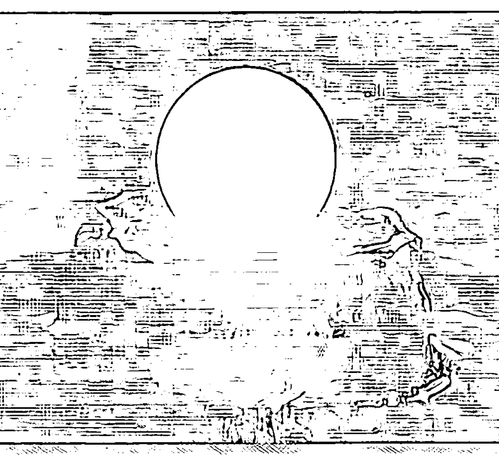

Δ 綠色代表正財，黃色代表偏財，反正都是財，大家都歡迎啊。水晶噴泉的保養、清洗問題，還是要小心注意維護。

改善，讓全家都變成生氣蓬勃，旺盛豐厚，不會有呆滯、沈悶的現象。

- 10. 家宅中，若是哪個地方明顯比較陰暗、遲滯，感覺氣流不通順，小孩、貓狗等都不太願意接近的地方，建議也可以擺上一座水晶噴泉來改善。
- 11. 一般客廳擺上兩座、三座水晶噴泉算是還好，也不要過多到五、六座。若是分散在各個房間，或是屋宇其他的各個角落，就沒有關係。
- 12. 臥房、書房宜靜，不宜動，建議就不要擺放水晶噴泉囉。廁所、廚房、倉庫，想必也沒有必要。
- 13. 商店、辦公室也可以擺放水晶噴泉，綠色系列的招正財，黃色系列的招偏財，粉紅色系列可以廣招人氣，廣結善緣，對於零售商店、餐廳、書店、競選總部、百貨公司、飯店等等，好處多多。
- 14. 大公司，部門多，也可以在各個部門主管辦公室內擺放一座水晶噴泉，可以活絡氣場，促進思想、肉體能量的活絡，更有活力衝勁，也能像水一樣的適應性強，長袖善舞、八面玲瓏，必能提振士氣，提振業績。

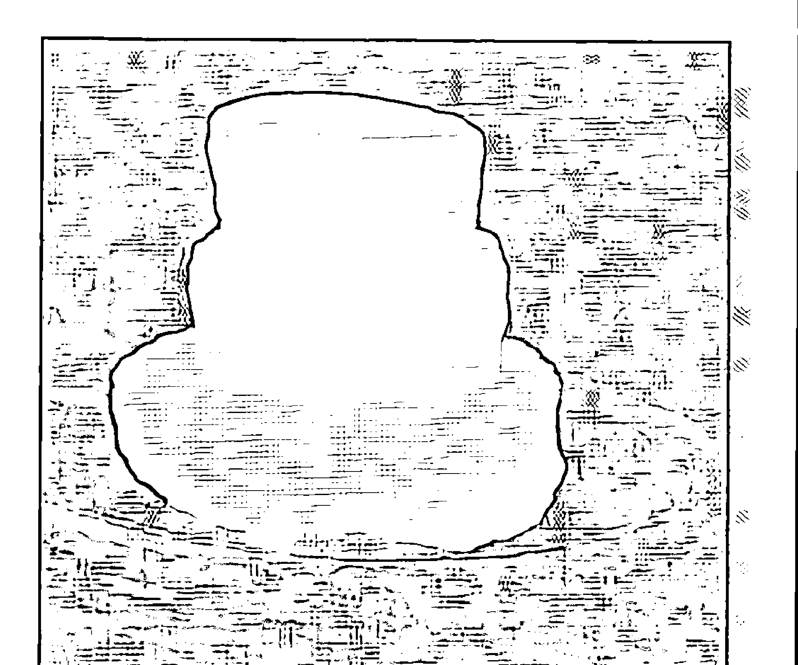

▲ 新型的水晶噴泉，沒有中間的球，可以降低將近一半的成本，依然水源茂盛，財源滾滾，用來補庫池水、補家運，非常優啦。

- 15. 大辦公室裡頭，人多口雜，是非、糾紛、謠言也多，可以藉著擺放水晶噴泉來化解暴戾、怨懟、沈悶、愁苦之氣，讓清氣上揚，居住其中之人都能比較活潑、樂觀、幽默、風趣，能夠發揮出人生的積極面、光明面動力。
- 16. 服務於中科院的大內高手「奚懿言」老師，再度提供我們「三元玄空水法」的運用方式，記得，先天水補男人，後天水補女人，庫池水補家運。

| 座山 | 先天水 (補男人) | 後天水 (補女人) | 庫池水 (補家運) |
| :--- | :--- | :--- | :--- |
| 西北 | 南 | 東北 | 東北 |
| 北 | 西 | 西南 | 西南 |
| 東北 | 西北 | 東 | 西北 |
| 東 | 東北 | 南 | 西西北 |
| 東南 | 西南 | 西 | 西南 |
| 南 | 東 | 西北 | 西北西 |
| 西南 | 北 | 東南 | 東南 |
| 西 | 東 | 北 | 東北北 |

- 17. 用來補財運的水晶噴泉，一定要使用「天然材質」，寶石級以上的水晶礦石最佳，次則大理石等，不要用粉末灌製的石粉產品，雜石、卑金屬等製品，擔心「氣質」不佳，幫倒忙了。
- 18. 新公司開幕，新店開張，把「水晶噴泉」當禮品饋贈，實在是非常合宜又適當，既有祝福的味道，也有業務興盛、財源滾滾的氣勢，難怪送者大方，受者實惠。記得擺在適當的「定位」。
- 19. 商店、賣場、營業處所可以在進門處擺放水晶噴泉，水流方向往收銀台、櫃台的方向流去，有吸引財氣，迎接財氣，廣納財富的功效。
- 20. 商店、賣場、營業處所需要活絡的人氣才能帶動財氣，可以在行進動線上面多放置幾組水晶噴泉，可以將人氣、財氣等能量往內部帶，促進活潑興旺的動能，才能帶動買氣，也是人旺、氣旺、財旺。

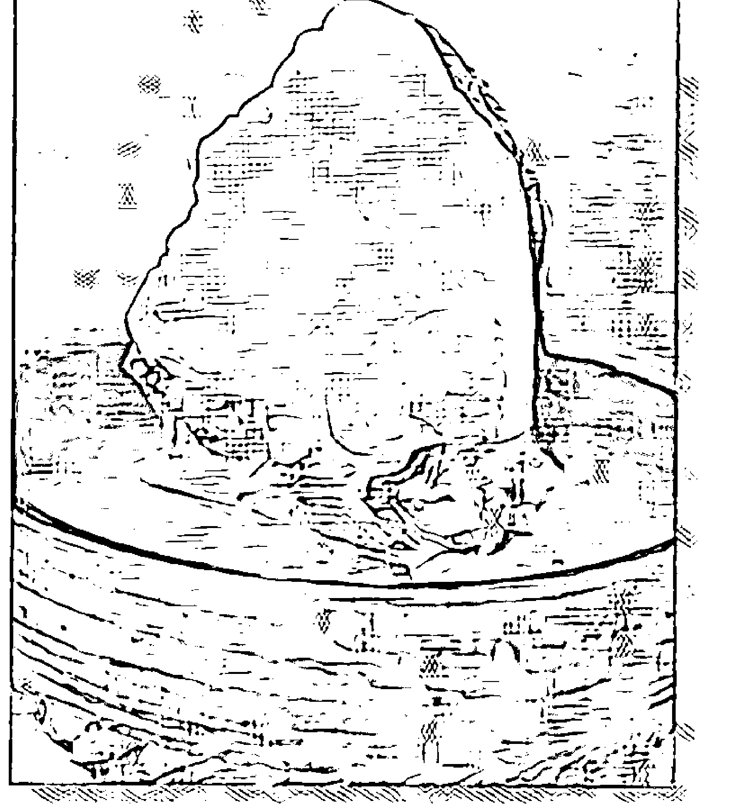

△ 新造型，利用紫水晶簇製作而成的水晶噴泉，不僅散發出財富的光芒，還兼有智慧的光芒哦？最適合書香傳家的人們來使用。

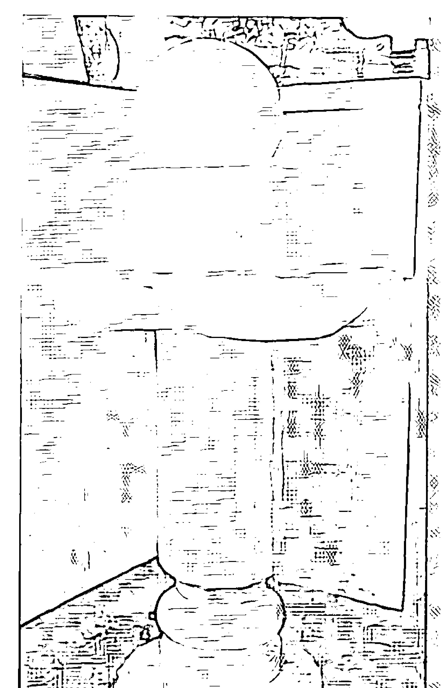

△ 大企業、大公司、大賣場，格局大，吞吐量大，使用大型的水晶噴泉，要發財也要發大財！

## 第八章 水晶珠帘

说到「水晶珠帘」，虽然是个小东西，但却是现在风水制化中的一个大跃进、大突破！

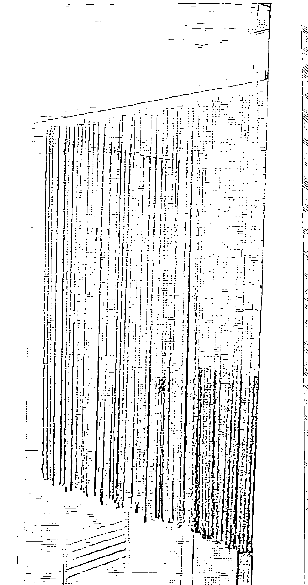

风水中有形的冲啦、煞啦，我们都可以使用门板、窗帘、屏风等等的来阻挡，但是对于「光煞」等的无形能量，却一向束手无策。因为「光」，就相当于「光子」、「量子」，非常的细微，比所知的原子、质子、核子都还小，而且有许多是属于我们肉眼所看不到的「不可见光」范围。他们可以穿透木板、墙壁、钢板等等，「犹如一个小孩拿着石头丢过教堂的大门一般」。许多风水上的奇案，在考察所有有形有相的因素后，找不到原因，背后就是这种「无形无相」的东西在作怪。

△ 水晶珠帘的最大功用，就是用来阻绝不同的气场，却又兼具美观的效用。注意，不可过于宽松，两串之间以一指幅为适当。

而透明的水晶，本身除了能够把一些强光、强力的射线给「折射」、「曲射」，色散，化解掉了之外，这就是「制化」，本身还能源源不断发出天然的「真气」，消除不良气息的效果当然就比木板、窗帘、砖块等等要强上许多。当然，水晶珠帘不是用来挡「飓风」的啦，水晶珠帘是用来阻挡一些更细微、更精微的气息，或许您我眼睛都不能察觉，但是日积月累下来，对于健康、运势肯定会有影响的就是啰。

室内风水许多的冲煞，尤其是不同空间、房间的气场、能量场问题，就都可以采用「水晶珠簾」來分隔、化解，我們後面會談到。

然而，水晶珠簾的開發也不容易，早期著重在光線的「反射」、「折射」上面，腦筋一直掛在水晶圓珠的「角度切磨」（Faceting）上面。但是這種工法，消耗原料，加工層次也比較高，出來的成品雖然非常漂亮、好用，但是成本也相對的高。都可以當成項鍊、手珠的產品囉，一條、兩條配戴，還沒什感覺，但是當要做成家裡的珠簾，一下子要用上三、五十條，呵呵，那成本可就嚇人了。因而，雖知東西好，但比較難普及。

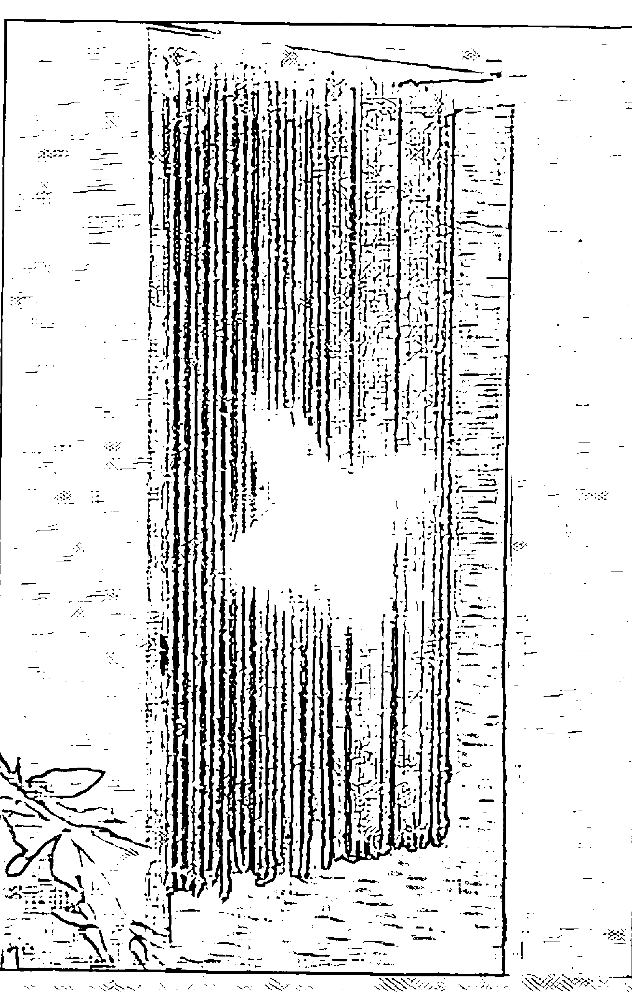

△ 加個十字鏡頭，水晶珠簾對於強光的分解、化解作用，明顯可見；化煞、化沖效果，不言可喻。

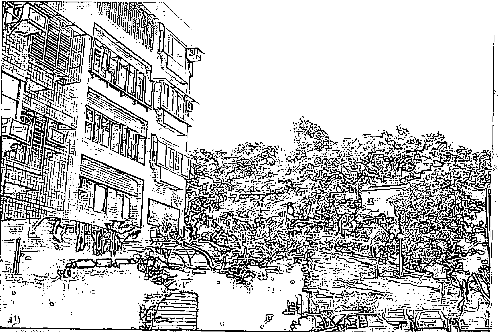

△ 美麗的住宅外面有「夜總會」（墓園），真是煞風景！建議掛起成串的水晶珠簾，眼不見為淨，又可阻絕不良氣息入侵。

後來改用「滾石」，這是種不規則形狀的寶石，長短、厚薄、圓扁都有，是在正常生產切割後所剩下的原料，但仍是百分之百的寶石哦。「滾亮」（Tumbling Polished）後，依然晶亮，「折射」、「反射」的效果都有，打個洞串起來，從三、四十公分到一、二百公分，都可以做，而且成本相當低廉，即使一次使用個三、五十條，都還相當划算的。因為成本降低，效果顯著，所以很快就流行開來囉，也變成當今許多台灣當地風水師口中的「風水制化聖品」，因為太好用了啊！

這些「水晶珠簾」多是使用「鋼絲」來串連的，所以非常堅固耐用，這可不是普通的絲繩或尼龍絲可以勝任的。可以到每個日用品、廚廁用品賣場找一種可以伸縮的，活動的「吊桿」，一般的門戶50～100公分寬，都可以適用。水晶珠簾一一掛上去後，旋轉、調節一下尺寸，可以適應在每一個門戶上，非常方便實用。當然，每條水晶串之間不要太鬆、太寬，因為我們到底是用來隔絕不良氣息的啊？太鬆寬的話，就會有機可乘，容易受影響了。

最恰當的距離，就是每條水晶串之間，相隔一指幅，也就是一隻手指頭的寬度。至於長長短短，或要中間短、旁邊長，或是要做成圓弧型等等，就留給各位讀者自行去決定囉。美感的問題很主觀，只要您看的漂亮，就都可以啦。

（淳賈天然水晶台北市八德路四段768巷7號三樓之一）

### 運用方法：

- 1. 新買回來的水晶珠簾，請先用檀香、沉香消磁，或是曬曬太陽消磁。
- 2. 掛上吊桿後，每條珠串間請保持一指幅的距離，不多不少，既經濟，又有效果，也不會浪費經費。
- 3. 掛好後，人可以站在一旁，用兩手手掌靠攏，讓三或五條的水晶珠簾就位在手掌中間，深呼吸後，一邊吐氣一邊由上往下慢慢順著撫摸下來，也可以隔空摸著水晶的氣，一路做下來，就可以把水晶的氣啟動開來。所有的水晶珠串都要如實啟動，就可以形成一個無形的堅強屏障囉。

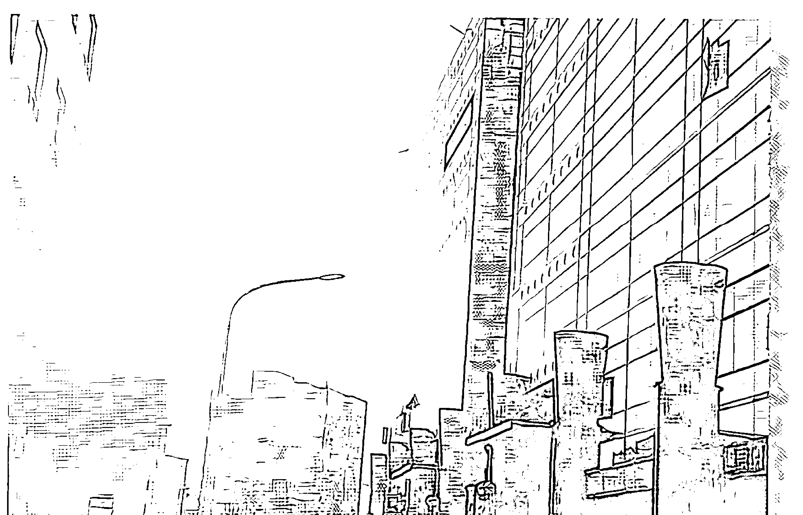

▲ 現代風水的新挑戰，到處都是玻璃帷幕的大型建築，到處都有光煞，光看就不舒服，何況長期受干擾？「風水制化聖品」——水晶珠簾，可發揮相當優良的阻絕效果哦！

- 4. 大門不可以直通後門，若都是在同一條直線上的話，是所謂的陽宅第一凶——「穿堂煞」，除了用裝潢、隔間、屏風等等來阻擋，更應加用水晶珠簾來阻隔氣的直接貫穿屋宅。以免宅內人住久了，容易有高血壓、中風、癱瘓的可能。
- 5. 臥房與臥房間的兩個門也不能相對，一來有「哭」的象形，二來雙口（氣口）容易有口角紛爭，吵鬧不斷。建議使用水晶珠簾來阻隔兩邊的氣場。
- 6. 廁所浴室的門不可直向客廳、餐廳、餐桌，污穢的氣容易影響眾人的食慾、健康、及整體運勢。這在現代的許多公寓好像是難以避免的現象，建議一定要用水晶珠簾來阻隔不良氣息。
- 7. 在一些小套房、或主臥室裡面，常見浴室廁所的門，開口直接沖到睡床，這也是一種極端不理想的現象，容易對身體健康產生重大傷害，除了儘量用裝潢、隔間、櫥櫃等來阻隔，浴室廁所的門也掛起水晶珠簾，才好將氣全部隔絕。
- 8. 床頭一定要靠牆，才有堅實厚重的靠山，人在睡覺時的氣場才會穩固，傳統風水中，稱此為「有靠山」，而床頭若不靠牆，則會令人覺得空虛不實，難以安眠，長期下來，對健康自然有所影響。

這種無靠牆的睡床猶如「停屍間」，說是死人才不需要有靠，可見其嚴重性。床頭不要懸空在落地窗、大窗戶的前面，若是避免不了，暫時先掛上密集的水晶珠簾，嗣後再來調整床位吧。

- 9. 廚房的門也不能直沖臥房的門，容易叫廚房的火氣、油煙、吵雜之氣等等，沖向房內，容易叫人睡不安穩，無法充分休息，精神不濟，容易發生意外傷害，或是不小心割到自己、跌倒、撞傷等血光之災，或交通事故等等。可將水晶珠簾懸掛在廚房或是臥房的門上，一邊有就行，阻隔兩邊的氣場。
- 10. 廚房的門也不宜直沖客廳，也是擔心廚房的火氣、雜氣等等，影響全家的生活重心。建議在廚房門上掛起水晶珠簾。
- 11. 廚房的爐灶也不宜直接對著後門，擔心會使家運節節退敗，建議在後門上加掛水晶珠簾即可阻隔。
- 12. 門外、窗外若有任何不良的建築物、廣告物，高塔、尖銳物等等，也可以在窗上懸掛整排的水晶珠簾來阻隔，有擋煞作用，而且可以是個非常好的裝飾品，每天看著透明的水晶映著日光閃亮亮的，自然開心愉快。
- 13. 住在樓下一樓的住家，門戶洞開，人們在街上走來走去，對裡面都可以一目瞭然，沒有隱私可言，同時街上的人氣、車氣、寵物氣、廢氣、吵雜之氣等等，也會直接、間接的影響居民的健康情緒，窗簾、百葉窗加上水晶珠簾，將會是一個不錯的適當阻隔。
- 14. 室內的走道、長廊過深過長，也會形成一種能量氣流，對於最後一間的房間沖煞最嚴重，所謂的「槍煞」（亦稱槍殺，箭煞），容易有血光之災，建議在該間房間的門口掛上水晶珠簾，就可擋煞；若要講究一些的，還可以在長廊的走道上，掛上二重、三重的水晶珠簾，徹底解決。
- 15. 當前許多玻璃帷幕大樓流行，許多主管、老闆、或是負責人的座位後面，即可透光看到整個街景，風光固然不錯，但在風水上而言，就是「無靠」，氣會後洩，容易人單勢薄，「高處不勝寒」。建議，在座位、桌面的高度，盡量在自己的身後多擺放一些大的水晶柱，或是紫水晶洞，藉以形成態勢，才能「有靠」；而在台面上，一直到天花板的高度，就懸掛整排的水晶珠簾，防止氣外洩。若有機會，調整座位，讓自己能有真正的牆壁來靠，應該可以更穩固。

- 16. 住家、商店、營業處所後面，若是有大排水溝、河流等等的，俗稱「割腳水」，容易將宅氣、人氣、財氣都帶光，使得人丁不旺，無法聚氣賺錢。建議在水流的相反方向，擺上洞口大又深的紫水晶洞，具有攔氣、聚氣的功能，同時，也將後面的門、窗，全部掛上整排的水晶珠簾，擋煞，也阻隔不良氣息的干擾。
- 17. 一般而言，從大門走進屋子以內，不要一下子可以看到屋內的一切，如廚房的爐灶啦，廁所的馬桶啦，臥房的床、枕頭等等的，一下子就被看透就沒有隱私，也沒有安全感，同時也容易遭受沖煞等的影響。建議，可以在各個房門的前面加裝水晶珠簾，但是成本比較高；另外，就是可以在門口入門處，加裝一排水晶珠簾，運用巧思，讓進門的人，還要具有

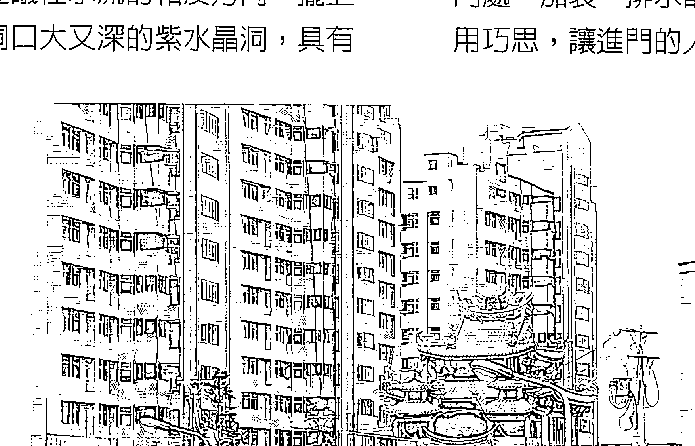

△ 傳統與現代共存，這種廟宇飛簷的沖煞恐怕免不了，那就要門前窗前掛上水晶珠簾以求阻絕，自求多福囉。

點轉折，才能看到屋內，則可增加隱私性，安全感，以及減少外在沖煞的衝擊。

- 18. 商店的大門、主要展示櫥窗若是對著其他大樓的樓梯口、停車場出入口、冷氣口、廚房排煙口，以及地下道、天橋等出入口，也可以用整排的水晶珠簾來阻隔這些不良氣息。
- 19. 家中若有病人在安養，一來擔心外在的氣會影響患者，二來也不希望患者的病氣影響到全宅，也可以在房間門口加裝水晶珠簾，也是一種良好的阻隔、保護作用。
- 20. 若是擔心靈異的現象，門前、窗外或常有鬼影幢幢的現象，也可以在門口、窗戶上，掛上整排的水晶珠簾，阻隔了氣場，鬼靈精怪就無法自由進出，水晶本身的能量也有強大的「避邪」作用。

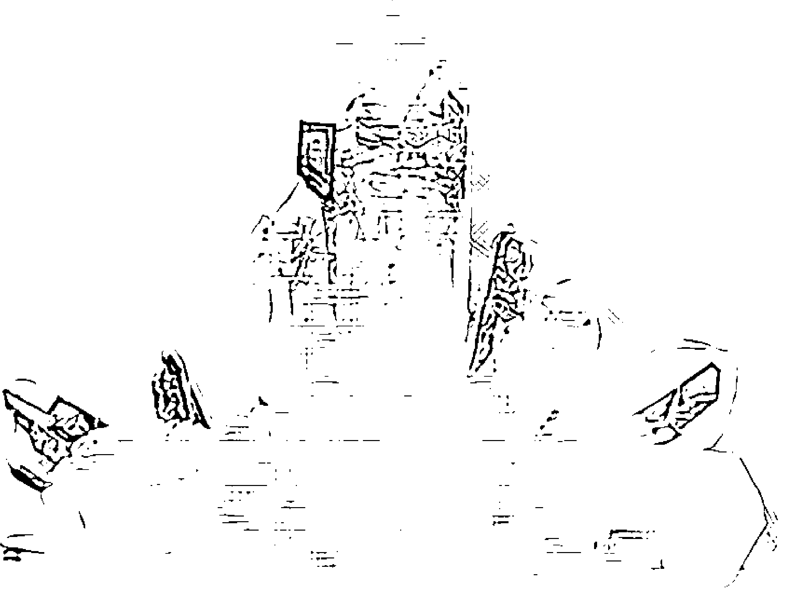

## 第九章 水晶光明燈

曾經我們提到，每逢「犯太歲」的朋友們，在過年後到元宵節前的這段時間內，要趕緊到廟裡「點光明燈」、「安太歲」。但是，憑良心講，到廟裡一看，整片牆壁上成千上百的螢火小燈，光要看清楚自己的名字都不夠了，真的能夠照亮您的人生嗎？好的廟宇固然很多，但是許多連早晚課都不按時做的寺廟更多啊？沒有了師父們的念經迴向，又如何能照亮您的靈魂呢？所以啊，若是只想一次幾百塊錢的「功德錢」就想化解一年之內的厄運、災禍，該體認這是「緣木求魚」，不可能的事情啦！最好，還是「反求諸己」，自己解決比較實在！

曾經有位風水大師也是建議人們自己解決比較好，他的作法是在自家點上「紅外線燈」。理論上是沒錯，但是實際效果卻不彰，為什麼？原來，不管長波的「紅外線」、或是短波的「紫外線」，都只是「自然光」的「一部份」而已，不是全部啦。採用這種燈光的話，也因此只產生「一部份」的效果，沒有「全部」的效果出來，那就相當可惜囉！加上這種燈光比較貴，市面上也難以買到，不容易普及，後來就漸漸式微了。

以後有想要推廣的話，或許最新的「全彩燈光」（Full Spectrum）可以考慮，這是模仿「太陽光」，包含所有光色的一種

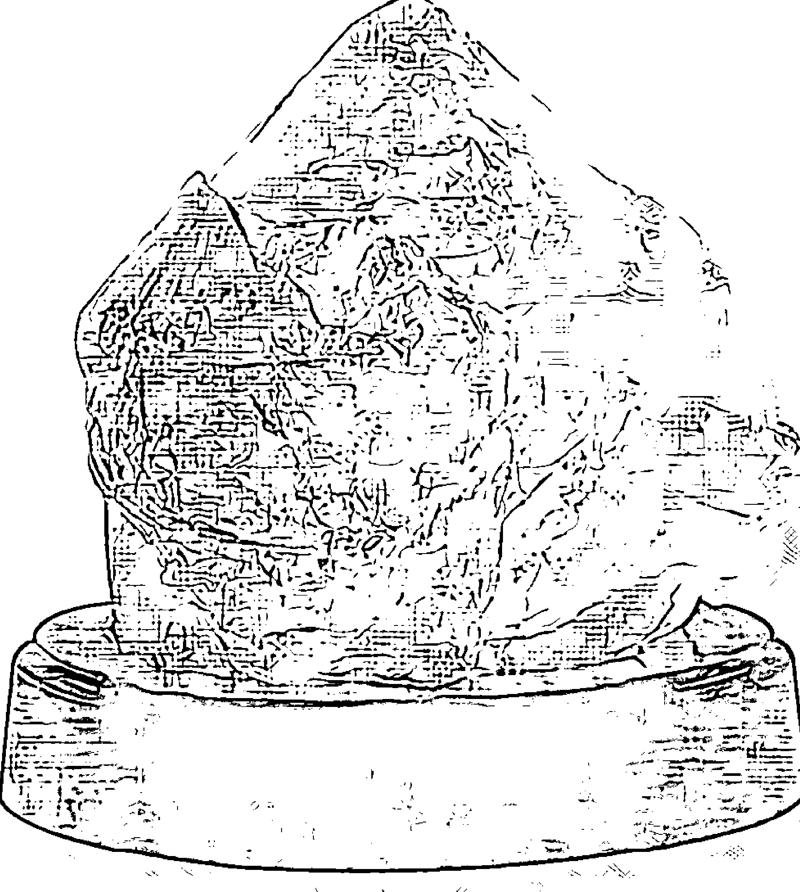

骨干水晶所製成的光明燈，把內在天然的活力、生命力都發射出來囉，不僅可以照亮您的眼睛，也能照亮您內在靈魂的深處哦。

光線，最平衡、最圓滿的光線，對人體、對植物，對一年有半年是黑暗冬天的高緯度人們都非常好，連憂鬱症都可以消除咩。用在改善陽宅，當然相當的棒！只是，這種東西也屬於已開發國家的少量產品，還沒有普及的，價格想當然爾，也是高不可攀咩。還有一點，不可否認的，到底還是用人為方法來「模擬」自然光，只能說比紫外線、紅外線好，但還是不夠好！

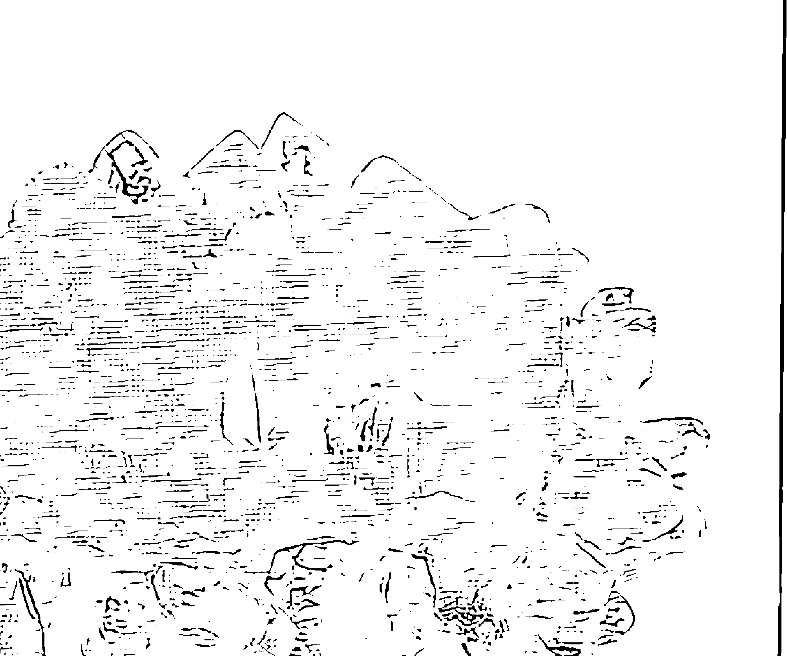

△ 這是很典型的「水晶燭台」，也當光明燈使用，室內可點起無煙蠟燭，效果依然滿意。這可是「善意」用水晶柱拼湊黏合而成的，才方便大家使用啊。

後來，也是機緣成熟啦，寶石的打孔技術越驅成熟，超音波打洞可以把硬度七、八以上的水晶礦石打的又直、又深、又漂亮；礦區的老闆們為了多多促銷，也是費盡心思來把半透明的水晶礦石「加燈」，增加各種款式花樣，原本只是「裝飾」的好看效果而已，但來到東方，這就變成了風水師眼中的「水晶光明燈」囉。為什麼？因為水晶礦石本身就有「氣」啊，單是這種氣，只要啟動（開光）以來，就可以很好使用在風水上的制化了，而且這種「氣」百分之百「自然」，是「日精月華」、「天...

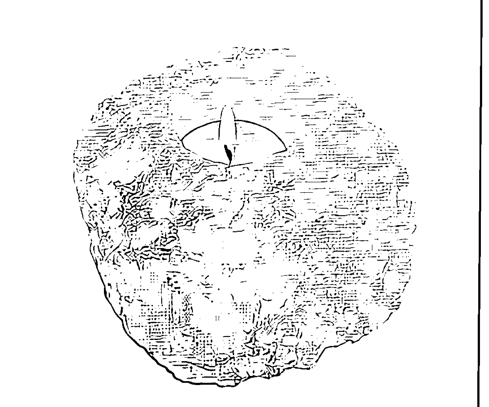

△ 催促姻緣啊？除了粉晶光明燈，還做第二人想嗎？增進人緣，促進和大家的人際關係和諧，這也可以多多使用。

地靈氣」呢！當內建一盞燈時，即使這是「人造燈光」，普通燈泡而已，但是它的光與熱就足以持續將水晶礦石內在的氣一直發射、散發出來，您就不需要擔心要請哪位大師來開光、來點燈的，不必大費周章，也不必浪費紅包，自己就可以搞定囉！

朋友們只需在第一次請回家時，先消磁，然後自己來啟動，點燈以後，就不用擔心囉；自行啟動後再來點燈，效果更佳！持續的光與熱，就有持續的氣在散發著，該屋宅、該方位，就會持續受到這些「氣」的影響，永保光明、安康哦！

理論上來說，這些「水晶光明燈」要在該方位上，24小時隨時都是點亮著的，作用才能好好發揮。所以，千萬注意，這是常識了哦，不是神秘學。不要把許多耗電量多又大的一些電氣產品的插頭，共用在一個插座上。對於「水晶光明燈」，為了安全起見，我們建議安排一個單獨的「插座」給它，不要和其他電氣品共用，這樣24小時點著，就算我們不在家、不注意的時候，也不用擔心會有危險發生。還有，電燈、電線等等都是「耗材」，屬於消耗品，用久了一定會有損耗，建議朋友們每隔一年，不管有壞沒壞，還是換新。幾十塊錢，拔掉、重換的功夫而已，但就可以確保絕對的安全！

許多的紡織工廠、電子工廠、印刷廠，都有這樣的管理防範措施，花小錢、小功夫而已，但可以免除因電線老舊所引起的「走火」，事實上是非常划算的，也絕對安全的。我們也要比照辦理！

還有一種點蠟燭的水晶光明燈，在人離開之時，就要吹熄了，不管如何，安全第一啊！這些小白水晶柱是用「黏合」的，水晶柱是天然的，但是「形狀」是人為的。雖然不盡百分之百理想，天然中想要找到理想的圓拱型的晶簇來當燭台，也是不簡單的咩。只要水晶柱是天然的，還是可用啦。

那麼這些氣，會不會有用完的一天？哈哈，就有朋友們會擔心囉。放心啦，不會的啦。這些水晶礦石在地底下已經經過千萬、百萬年的悠久時光，已經儲藏有豐盛充沛的能量了，持續發光發熱個百年、千年絕對不成問題的啦！何況，能做成「水晶光明灯」的宝石也都不小，本身就算放在屋内，也是持续在吸收、记忆、储存着宇宙间的能量啊？别忘了，我们居住在地球上，也就是在「宇宙」当中啊，我们也是每天接收着各种光波射线的照射啊？就算躲到地底下一、二十公里的坑洞中，也是躲不过各种粒子的冲击啊？所以不用担心，用不完的啦！

（淳賀天然水晶台北市八德路四段768巷7号三楼之一）

## 运用方法：

+   1.先不管风水、方位的问题，「水晶光明灯」本身就是一个极佳、极美、极其自然的「装饰品」，用您的美感来看，喜欢摆在家里哪里，就摆哪里，没有关系，百无禁忌。摆在不好的方位，可以有「制化」的作用，摆在好的方位，可以有「加权」的作用，因为自然的水晶矿石，本身就是会调节、能平衡，坏的可以改善，好的可以更好。

+   2.我们不只讲「磁场」，而是讲「气场」，因为「气场」包含着更多的声光电热磁等等，不只是「磁场」而已。气场好的东西，四处摆放都没有问题，要小心的是气场不好的捕蚊灯、刀剑、枪炮、猛兽标本、画像等等，才不能乱摆，煞气重，容易产生不良影响。

+   3.进门后的玄关处，或是客厅中的靠墙小茶几，柜子上，都是放置「水晶光明灯」的理想位置，可以为晚归的人们留一盏灯，有回到「温馨家庭」的感觉；也可以为夜晚起床上厕所、喝水的人当「小夜灯」，提供基本照明，不会有害怕、疑惧的感觉。

+   4.家中若有任何角落显得比较阴暗、迟滞、不通气，就是可以点起「水晶光明灯」来改善；驱散黑暗，也活络气场，不让阴气滋生蔓延。许多低振动频率的能量团（阴灵，鬼魂，动物灵等）就是喜欢寄居在阴暗、潮湿、闷气的地方，因为它们本身也无法「自主」，只是随「本性」而飘移、流动至此。因此，家中任何角落都要勤于打扫干净，光线、空气都要充足，才不会「招阴」。

+   5.家中若有小孩、老人家，也可以在他们的卧房中放盏「水晶光明灯」，可让小孩活泼聪明，也让老人增添青春活力；摆放位置要注意，人躺在床上时，不要在视线范围内，只要能看到「余光」就行。这也方便家中成年人，半夜起来探视、照顾老人小孩的，不需要摸黑行事。

+   6.家中若有婴幼儿，常常无故受惊，夜半啼哭，常常是因为新生儿灵体较轻，容易受到各种风吹草动、过往灵体等的干扰，建议在床尾底下安放个水晶光明灯，各式样都可以，光线不要直接照射眼睛就行，即有安定情绪，稳定幼儿灵体，也防止过往的一些灵体干扰。

+   7.家中若是有比较固执、执着的家人，和大家沟通不良者，建议在其卧房内摆放橙色方解石的光明灯，可以溶化其坚固的气场，变得比较有接受性、柔软性、圆融性，才能和外界好好沟通，没有争执、吵闹、龃龉等等。

+   8.若有家人体质不佳，健康状况不理想，但也不至于生病的程度，也是可以在其本命的「天医方」，或是最接近本人的卧房里，点上橙色方解石光明灯，有加强丹田、生命力、活力的作用。

+   9.家中若有病患，亦是建议在床尾底下安放个鲈鱼水晶、烟水晶的光明灯，一来可以帮忙化解患者的病气，早日恢复健康，二来可以防止一些冤亲债主乘虚而入，干扰病情，让状况更为复杂。

+   10.夫妻间若是感情不睦，时有争吵者，强力建议在卧房中摆上「粉晶光明灯」，气氛柔和，温馨、美丽、祥和、亲爱的气息弥漫，可以化解尖酸、对立、冷漠、嘲讽的心态，有助于感情的和谐与美好。

+   11.若有子女成年，却不见红鸾星动，建议在卧房内，靠近床位、书桌方面，以不影响睡眠、读书为大原则，摆上粉晶光明灯，有「催动」桃花，促进姻缘之功效。放在当事人的卧房内，影响最直接明显。

+   12.相对的，若是有家人男女朋友极多，交友复杂，感情混乱者，可以在上述的位置上摆放各色方解石、各色萤石，或是蓝色系列的宝石，如海水蓝宝、天青石、青金石、天河石、土耳其石等等，藉以斩断「烂桃花」。

+   13.可以用「水晶光明灯」压制住本人的「五鬼」、「六煞」、「祸害」、「绝命」方位；家中若有多人，不同东西命卦，可以依照个人的需要，重复摆放，都没有关系，可以「全面」照顾到全家人的安危幸福。

+   14.流年所遇到的「衰气方」、「死气方」，更可利用「水晶光明灯」的力量，转危为安，振衰起敝，活络气场，让整间住宅都活络起来，也能每个人都能有好方位，不必担心气场凝滞影响健康运势的问题。

+   15.遇到该年犯太岁的朋友，不管本命犯冲，还是对冲、偏冲者皆可，除了可以在表列的「太岁方」上压制外，还可以选用气场活泼旺盛的「水晶簇光明灯」，放在自己本命的「生气方」、「天医方」，就有补气、补运的功效。

| 生肖 | 鼠 | 牛 | 虎 | 兔 | 龙 | 蛇 | 马 | 羊 | 猴 | 鸡 | 狗 | 猪 |
| :--- | :--- | :--- | :--- | :--- | :--- | :--- | :--- | :--- | :--- | :--- | :--- | :--- |
| **地支** | 子 | 丑 | 寅 | 卯 | 辰 | 巳 | 午 | 未 | 申 | 酉 | 戌 | 亥 |
| **方位** | 北 | 東北偏北 | 東北偏東 | 東 | 東南偏東 | 東南偏南 | 南 | 西南偏南 | 西南偏西 | 西 | 西北偏西 | 西北偏北 |
| **犯本命太岁** | 鼠 | 牛 | 虎 | 兔 | 龙 | 蛇 | 马 | 羊 | 猴 | 鸡 | 狗 | 猪 |
| **180度正冲** | 馬 | 羊 | 猴 | 雞 | 狗 | 豬 | 鼠 | 牛 | 虎 | 兔 | 龍 | 蛇 |
| **90度偏冲** | 兔龍狗 | 蛇馬羊 | 猴雞虎 | 狗豬兔 | 鼠牛龍 | 馬羊蛇 | 猴雞狗 | 豬鼠馬 | 牛虎羊 | 兔龍猴 | 蛇馬雞 | 狗豬虎 |

+   16.做事业想要有更多好机会、好运到、得贵人相助的，可以在家中「财位方」摆上绿色系列的水晶光明灯，如绿东菱、绿萤石、孔雀石、祖母绿等等。

+   17.家庭主妇、退休老人、或无法正常工作赚钱者，想要有点「偏财」贴补家用，或是抽奖、乐透、彩票、奖券、发票、打牌等等，可以在财位方放置金黄色系列的水晶光明灯，如黄水晶、橙色方解石、金色方解石（冰洲石）等等，都有增强偏财运的功效。

+   18.读书人想要读好书，考试好，金榜题名，可以在「文昌位」摆放紫色系列的水晶光明灯，如紫水晶、紫色萤石等等，主贵。

+   19.若有家人当年要考试者，请把紫色的水晶光明灯摆到其卧房内，或是床位旁，或是书桌旁，都可，以不影响睡眠、读书为大原则，在房内的影响就最直接、最明显。

+   20.文官、公职、教职人员，想要得贵人提拔，步步高升，仕途如意，可以在「文昌位」摆放紫色系列的水晶光明灯，如紫水晶、紫色萤石等等，主贵。

+   21.武官、军、警、特、调、运动员等等，想要在事业上有良好表现，能量充沛，战绩彪炳，可以在「文昌位」摆放骨干水晶、白水晶、烟水晶等强力宝石灯。

+   22.若有夫妻久婚不孕，想要有小孩者，可以在「丁位方」点上水晶光明灯，想要男生的，可以挑选尖型、柱状、条状的水晶，如白水晶柱、骨干水晶等等；想生女生的，可以挑选片状、块状、扁平状的水晶，如玛瑙片，粉晶块等等。风水上的「喝形」，以形引形。

+   23.开公司、办工厂，想要招募人才，留住人才，强力、大型的水晶柱、骨干水晶、水晶簇，应该用来好好加强「丁位方」；人才是所有企业的最大资产，若留不住，又给对手蒐罗留用，多重损失，不可不慎！

+   24.开店、开餐厅等需要人潮如流水的单位，建议在「财位方」摆上粉晶光明灯，可以散发无限亲和力，吸引更多、更广的人潮来。

+   25.家中神位亦可摆放水晶光明灯来供养众神诸佛，若只有一盏的话，可以摆放在主神的正中央，若是有两盏的话，可以分开在两旁。两盏灯应该注意种类、形状、大小要对称。请勿使用铅玻璃等制品来供养神位。

## 第十章 玛瑙聚宝盆

说道「聚宝盆」，我们马上联想到神话小说里的故事，您今天在这里放一块钱，明天就会变成两块，后天变成四块，大后天变成八块……随着时日，一直倍数增加着……还有种说法，家中若有个聚宝盆的话，想要有什么金银财宝、绫罗绸缎、奇珍异宝，只要伸手往里面拿就有喔……呵呵，世上若真有这种宝贝，那多好咧？

真实世界里的「玛瑙聚宝盆」，其实也是石英大家族的成员之一啦，本质上就是水晶啊，玛瑙（Agate）、石髓（Chalcedony）等属于「隐晶质」，而一般所看到的水晶结晶属于「显晶质」，就像紫水晶洞的具体而微而已。但到底和紫水晶洞还不一样的，就是「玛瑙聚宝盆」活像一个「锅子」。呵呵，连在矿区的矿工们也忍不住叫做「Agate Pot」！

玛瑙形成以来的一些水哦，我们常爱开玩笑说，这是「长生不老水」，喝了可以增加您一甲子的功力！「玛瑙锅」外表其貌不扬，一般人多会忽视他的存在。但是若能打开一看，多会惊讶于造物主的神奇，而发出声声的惊叹！

想要把「锅盖」打开，就需要动用到钻石切割工具，还要把周边都抛光打亮的，也是不小的工事。里面常常还会积存有自玛瑙形成以来的一些水哦，我们常爱开玩笑说，这是「长生不老水」，喝了可以增加您一甲子的功力！「玛瑙锅」外表其貌不扬，一般人多会忽视他的存在。但是若能打开一看，多会惊讶于造物主的神奇，而发出声声的惊叹！里面常常会有许多雪白、晶莹、剔透、细腻的大片水晶结晶，像是秋霜，也像是冬雪，映着光线照耀，还会一闪一闪的，极其迷人！犹如神仙居住的「福地洞天」，也是能量的聚集点「龙穴」。

说是「聚宝盆」，光是形容它的美丽和珍贵，就实至名归了！

这个「锅盖」也不简单，千万不要丢掉喔！这可是「紫水晶洞」所比不上的地方。因此，我们还特地去设计了像样的木座，一个锅子配一个锅盖，可以安放的好好的喔。为什么？打开锅盖，就是要「纳气」、「蓄气」的时候；当锅盖盖起来，表示就是在「孵育」、「强化」的阶段喔。

这也是「西洋魔法」的一个运用实例，道理和传统「茅山道术」也有相通的地方喔。就是，施法者可以先把自己的愿望写在一张纸上，写好后，据之来观想、冥想，把自己的思想念力也灌注在这张小小的「讯息物」（Witness）上面。大魔法师、大法师可能这样就够了，光是冥想就能将他的愿望来实现喔。但是平常的一般您我，可能「念力」还差很多很多，还不够，所以就放入「玛瑙聚宝盆」里面，藉着这个封闭的环境，又是充满水晶高能量的地方，正是「地」（土，Earth）元素的作用，给予适当的时间来「振动」、「激荡」、「扩大」，将我们的「思想能量」孵化强化到相当的地步。几天后，三伍天或七八天不一定，可凭个人的感觉和需要，再拿出来到空旷的地方，能够顶天立地，有和风吹拂的地方。用「火」将之点燃，随「风」飘散，藉着风和火元素（Element）的作用，将您的「思想能量」遍向法界，还诸天地，进入存在。只要您的「思想能量」够强的话，就会自行去运作，促成您愿望的达成！

这也是有道理的！前面文章说过，我们个人的「思想能量」是有物质基础的，不是空泛无物喔。这也是一种气，一种能量，只是非常的小，可能比我们目前所认知的分子、原子、电子、质子、中子都还小，小到只能用「推论」他的存在，可能就是「夸克」（Quark）等等基本粒子。是啊，从来没有人「亲眼」看过它，只能用不同的实验来「证明」它的存在和作用方式。很酷吧？佛经上说这是「微尘」，只有具有「天眼通」的异人们才能看得到它喔。用张纸条来凝聚我们的思想能量，用玛瑙聚宝盆来振荡扩大它，靠着火与风的元素来散发它，其实，这也是所有法术的基础精要！「地」（Earth）、「水」（Water）、「火」（Fire）、「风」（Air），都是自然界中的基本要素，而「空」的第五元素，就是思想能量，正是驱动所有元素的原动力！

魔法（Magic）虽然不是本书的重点，但道理相通，我们也可以将玛瑙聚宝盆的功能运用在风水上，小从三伍公斤，大到几百公斤，而且更为多采多姿！

曾经看到新闻报导，在莺歌地区的一些烧陶业者忽然收到一些订制「大陶罐」的订单，非常纳闷。现在装水、装酒、装腌制食品，都用不着那么大的罐子啊？原来，就是有风水师在背后推波助澜，告诉许多善男信女在家安装「聚宝盆」，就可以好好赚钱，安度不景气的难关了……可见，此理同，此心同，在台湾的风水高手实在很多很多，可以说是人外有人，天外有天，一山还比一山高啦。注意喔，我们不是说「陶罐」不好喔，但到底只是人造的器物，本身不发气，能聚的到底有限咩。这些传统的风水专家可能是还没有机会见识到新时代的水晶产品啦，不然，他们一定会惊讶于玛瑙聚宝盆的强大聚气效果，高能量，以及更为合宜便宜的价格，就会率先采用喔。
（淳賀天然水晶 www.blancoage.com）

> > △ 珍藏的玛瑙聚宝盆天然的紫黄晶生长在里面，活像「哈密瓜」的样子。盖子盖起来的时候，谁又能知道这可运用来做生基法、施行法术的凭借呢？

### 使用方法：

1.  可以将我们平常在使用的宝石手珠、胸坠、戒指、耳环等等小饰品，或是随身佩带的护身符、幸运符，用纸或布包着，夜晚时放入玛瑙聚宝盆里面，隔天再拿出来带，有净化兼充电的效果，可以让个人每天充满能量。

2.  曾经到财神庙、土地公去求来的幸运符，或是借来的「母钱」，或是自己的钱去过过香火的，回头可以用红纸包着，放在自己的玛瑙聚宝盆里头，可以有储蓄、滋生、增长财富的功用。红纸有气强、气旺、吉祥、吉利的象征，这些「母钱」、「种籽财富」，可不要随便花掉，才能吸引更多财富前来。

3.  每天回家所剩下的零钱，可以先放入玛瑙聚宝盆里面，让它激荡振动一个晚上，再来放入一旁的存钱筒，长期培养储蓄的好习惯，也能累积些财富。

4.  逢年过节所收到的红包、压岁钱、奖金、红利等等，也可以先拿来静心冥想，感恩一番，再放入玛瑙聚宝盆里头「压一压」，期待来年收获更为丰盛。隔天，或是过几天再拿去银行存起来，或是去做其他花费。

5.  可以把玛瑙聚宝盆当成个人「聚气」的容器，隐藏在自己私密的某些地方，或是橱柜里面，或是抽屉里面，自己每天都要常常开启、碰触的地方，但是别人不晓得的隐密处所，如此可以协助一个人改掉爱乱花钱的坏习惯，就能够量入为出，不至于寅食卯粮。

6.  玛瑙聚宝盆可以摆放在个人的存钱筒，商店的收银机，公司行号的保险柜、钱柜，上面、下面、左右临边都行，有所接触就行，也能够有聚气、聚财的效果。

7.  若想将玛瑙聚宝盆摆放在屋宅的财位方，需要大一点的才比较适当，纳气够多，格局够大，才能够赚钱。若是摆在房子的个别房间内，则可用小一些的。参考格局大小，想要发大财的，就使用大的聚宝盆，想要发小财的，就使用小一点的聚宝盆。

8.  参看前文不同坐向的屋宅及流年方位，可以逐年将玛瑙聚宝盆放在屋宅的「生气方」，更有生气、纳财的积极作用喔。

9.  在屋宅内的走道末端，或是任何行进动线的末端，还有两片墙壁夹角的地方，都是容易聚气的地方，也是理想摆放聚宝盆来聚财的地方。

10. 看看个人、家庭、公司不同的格局大小，想发大财的，建议采用大型的玛瑙聚宝盆，若是想发小财的，采用小型的聚宝盆，个人自行衡量。聚宝盆在使用当中，请全体环境里的家人、员工等等，都要保持积极、正面、乐观的人生观和工作态度，才好聚集良好的气，而不是不良的气。

11. 若是有哪些单位、家庭，明明很会赚钱，但是钱财好像都留不住，一手来，一手去，好像过路财神一般，猜测可能是屋宅的气过于流通，所以不聚，可以在房屋最后面、靠中间的「福德位」上摆放一个大型的玛瑙聚宝盆，然后在各个门后、窗前容易通气的地方也摆上相对小一些的玛瑙聚宝盆，就能有「聚气」的效果，能赚，能存，台湾话「日日春」，年年有余的意思。

12. 商店、行号、公司、工厂、营业单位等等，在财务部门的财位方，财务主管的座位后方，都有需要摆放玛瑙聚宝盆，更能聚气、聚财，做好各种控管。

13. 营业员、业务员想要多开发业务，锁定目标客人后，可以将其名片等讯息物，专心观想如何促进服务，加强两者的互动关系，创造双赢的局面，而不是一味的想赚钱而已喔，放入玛瑙聚宝盆，就有促成交易、合作伙伴关系的可能，具有「心想事成」之效。

14. 若是有参加什么摸彩、抽奖、彩券、奖券、乐透等等，先以「中大奖，会分享」的心来冥想，然后可以连同身分证、驾照、或任何的身份证明一起放入玛瑙聚宝盆，盖起来，直到开奖的前一天才打开，可以提升中奖的机率喔。

15. 若是暗恋某人，不敢表白，也可以将您的心意写在纸条上，用爱心来冥想后，存入聚宝盆里头放置几天，随后再将之火化，让您的心意随着火、风的元素，传达到存在中。只要心念纯正，心意够坚强，即使不能追到意中人，但也会有「相同类型」的人出现在您的生命中，因为即使法术也不能干涉他人的自由意志，只要有相同类型的，就该好好把握喔。

## 第十一章 水晶钵

水晶钵是个非常特殊的产品，它不是「摆在」哪里就可以的东西，它是需要被使用的工具，需要用羊皮棒、橡皮棒轻轻的敲击、摩擦，就可以产生绵绵密密，一波接着一波，具有影响力、穿透力的声波能量，包围、振动、激荡着整个环境能量场，具有相当震撼与彻底的效用！

说是水晶钵，但不是用天然水晶雕琢而成的，这不切实际，也不符合成本。这是利用和水晶相同原料的「硅砂」（Silicon）所制成的，纯度极高，达99.997%；相同的材料也被用来制造硅晶片、光纤（Optical Fiber）等高科技产品。融化，提炼，精制，一体成型，整个钵没有一点点隙缝、沙孔、裂痕的，所以在施力摩擦后，才能产生绵绵不断的声波振动能量出来。

声、光、电、热、磁，其实都是「能量」（Energy）不同型态的展现，彼此之间还能够互相转换喔。声音，当然也是能量的不同型态之一！只是，更好了解，更好控制，而且还具有一种「无法抗拒」的特性。水晶钵的振动声波一旦传出来了，就算您闭上眼睛、捂住耳朵，那源源不断的声波还是继续在穿透着您的全身所有的细胞，声波还是继续震荡回旋在整个环境能量场当中，作用依然存在，好像可口可乐的广告说的，「挡不住的感觉！」

有这么好的东西，我们当然也要用在「现代风水制化」当中喔！因为所有的风水现象，也就是「气」的现象，也是「能量」。

> ▲ 曾经是西藏喇嘛的珍贵法器，现在在欧美、台湾也声名大噪，见识过的都说棒！运用在改善风水环境能量场，效果更加明显，值得大力推广！

的不同展现而已啊？能量的问题，当然要回归到用能量来解决啊！详细的解说，建议大家参看大水晶出版社所出的《来自喜马拉雅的祝福——水晶钵》一书。在此，我们就是直接介绍用法，不再介绍原理。

对啦，水晶钵的大小尺寸有许多，从10, 12, 14, 16, 18 到22英吋都有。建议朋友们要使用的话，至少要挑12英吋以上的才过瘾，因为格局够大，声音才能够恢宏，振动效果才会好。太小的话，格局小，声音显得高亢，过尖，且振动效果不彰。10英吋的还可以用，以下的就根本不必考虑啰。至于22英吋的，那当然更为过瘾！人站在旁边，一摩擦起来，那振动波穿透全身，可真是震撼呢！但是太大了，对于一般家庭可能无处摆放，但若是有开庙宇、道场、佛堂、教室等等的，这就是必要的“生财设备”。帮学生开发气脉，让他们有感觉、有感应，这就是一切修行的开始，也是一切生意的开始啊！

水晶钵属于“易碎品”，天不怕，地不怕，就怕不知情的小孩乱敲乱撞，打破了，或是敲出一点点隙缝，那可是一点补救办法都没有，必须淘汰啰。因为，日后的摩擦中，激烈的振动会使得整个钵都碎裂开来。但是，好好使用的话，那就可以永远的用下去，用不坏的啦。注意一点，当钵在振动时，千万不要用手去碰触，因为手的受力不平均，会影响钵的整体振动，多按几次后，内在的分子结构会被破坏，以后就变成“哑巴”，再也敲不响啰。水晶钵几乎不需要怎么保养的，偶尔用清洁剂擦拭一下，就又明亮如新啰。不用时，好好收起来就是。

还有一种“铜钵”，也是整块铜片利用类似板金的功夫，慢功、细功敲打出来的，不是用翻砂灌模子的哦，这样出来的，只有个样子，无法实际使用。铜钵有轻巧，容易搬动的好处，但是因为尺寸多小，多是用在个人修行、人体治疗上面，不太适合运用在风水制化上面。

还有，顺道提到的就是，水晶钵虽然有不同的音调，对应着不同的轮位，比如：

| 聲調 | C | D | E | F | G | A | B |
|---|---|---|---|---|---|---|---|
| 發聲 | Do | Re | Mi | Fa | So | La | Si |
| 顏色(頻率) | 紅色 | 橙色 | 黃色 | 綠色 | 藍色 | 靛色 | 紫色 |
| 對應人體輪位 | 海底輪 (會陰穴) | 臍輪 (丹田，氣海穴) | 太陽神經叢 | 心輪 | 喉輪 | 眉心輪 (第三眼，天目穴) | 頂輪 (百會穴) |

但是，水晶钵的生产相当困难，通常还无法准确地控制到它的厚薄，因此音调也无法控制。通常都是成品出来后，再来试试看，这是合什么音调的。所以，也没有办法接受“音调”的订单，只能接受“尺寸”的订单。但也别泄气哦，别忘了，所有的轮位串连起来，不就是“中脉”吗？任何一种音调的能量振动开来，只是显示声波的进入管道不一样而已，不管如何，最后总是进入中脉啊？所以就不必计较太多了，各种颜色、声调的钵，用起来其实差不多，差不多啦。

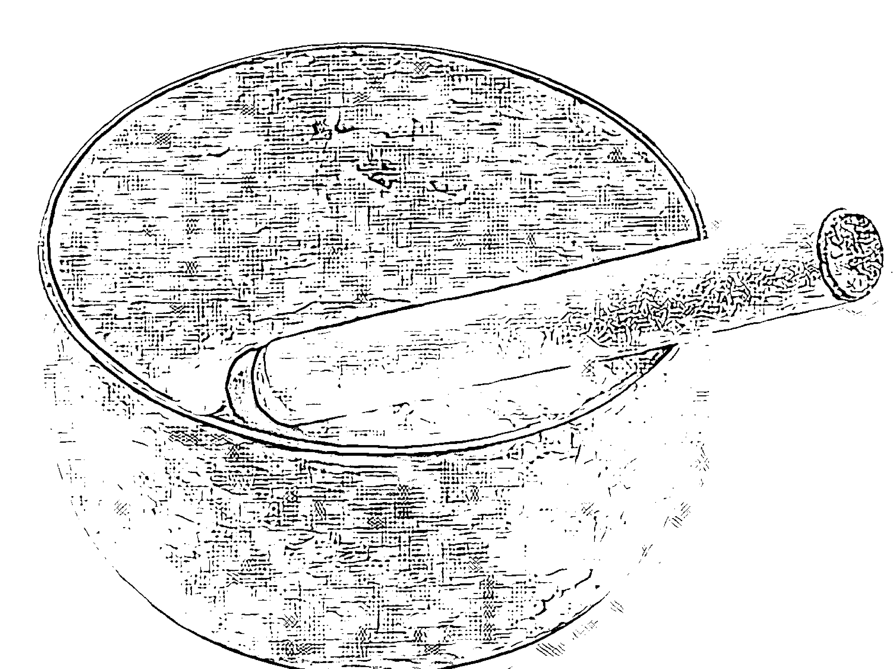

▲ 铜钵专用在人体治疗上的，用在风水上，恐怕尺寸太小，效果有限。但是好东西，也要给大家看看。

## 运用方法：

- 1. 敲击水晶钵时需要用“巧劲”，犹如蜻蜓点水般，声音才会清脆、响亮；不能死命的猛敲，容易破坏水晶钵本身。一向都先“逆时钟”旋转摩擦，可以有排除、净化的作用；再来用“顺时钟”旋转摩擦，就有增补气场的功能。通常在逆时钟摩擦后，紧接着要用顺时钟旋转摩擦，洩除浊气后马上增补新鲜和谐的气场，对人、对环境的作用才好。
- 2. 当有人气场不稳定，或是烦杂，导致头晕、头痛、不舒服等症状，看医生或吃药都还不能解决时，八成是被冲到、煞到、受惊、或沾有病人、倒楣鬼、阴灵等的杂气病气，此时，就可以利用敲击摩擦水晶钵的声波能量，来净化洗涤该人周身的能量场，还给一个健康正常的气场，症状也就消失了。
- 3. 当有人“受惊”时，俗话说“魂魄走失了”，其实就是该人身体的能量场因为过度惊吓而有散失的情形，若是无法及时送到庙里让大师父来“收惊”，安定魂魄，也可以使用水晶钵来对治，先用逆转，再来顺转，就可消除惊吓后的凌乱气场，恢复原本完整的结构；事后，再给一颗黑色的黑曜岩，或是烟水晶、黑陨石、黑色电气石，让其安坐静心，就有稳定（即Grounding）气场的效果，也就是安定魂魄。
- 4. 若是个人心绪不宁，思想无法冷静，情绪起伏不定，气场也不稳定，容易受到各种冲煞的影响，此时就是最容易犯错、出事情的时候。建议来到水晶钵旁，自己来摩擦振动，让全身的细胞都来聆听、感受水晶钵的振动与抚慰，只要三、五分钟，就可以将气场稳定下来，也可以让起伏不定的心情情绪稳定下来，此时，出去行为做事，才不会出仓做错。
- 5. 基本上，若是前一手的住屋是开庙宇、宫坛、道场、医院、诊所、特种营业、屠宰场、命案现场等等，以不接手为宜。若是条件过于诱人，又别无选择的话，则一定要用硫磺水彻底洗净消毒，早晚在每个房间用水晶钵来敲击振动5～10分钟，并配合檀香、沉香的薰陶净化，连续做上一个月，才比较能将整个气场还原到比较正常、健康的状态，对居住的人也比较有保障。事后，还是要以五十、一百公斤以上的大型水晶矿石来镇压，当“镇宅”使用，才能永保平安。
- 6. 当感觉某个环境住处阴森森时，眼角余光时常会瞥见黑影、白影乱飘，或是无知小孩会向空气打招呼，或像有人在逗他玩笑，以及夜半经常会有不明声响，东西无故移动、遗失、又出现等等，八成又是灵异在搞鬼。早晚使用水晶钵在各个房间敲击摩擦，若能配合念佛、持咒、诵经等等，效果更佳，每次5～10分钟即可，可以加长，不可缩短，三、五天后即可改善，一、二个礼拜根除，最好持续做一个月，才好永保安康。
- 7. 若是在某个环境里面，曾经发生一些纠纷、争吵、喧哗、僵持事件，导致气氛凝重、悲

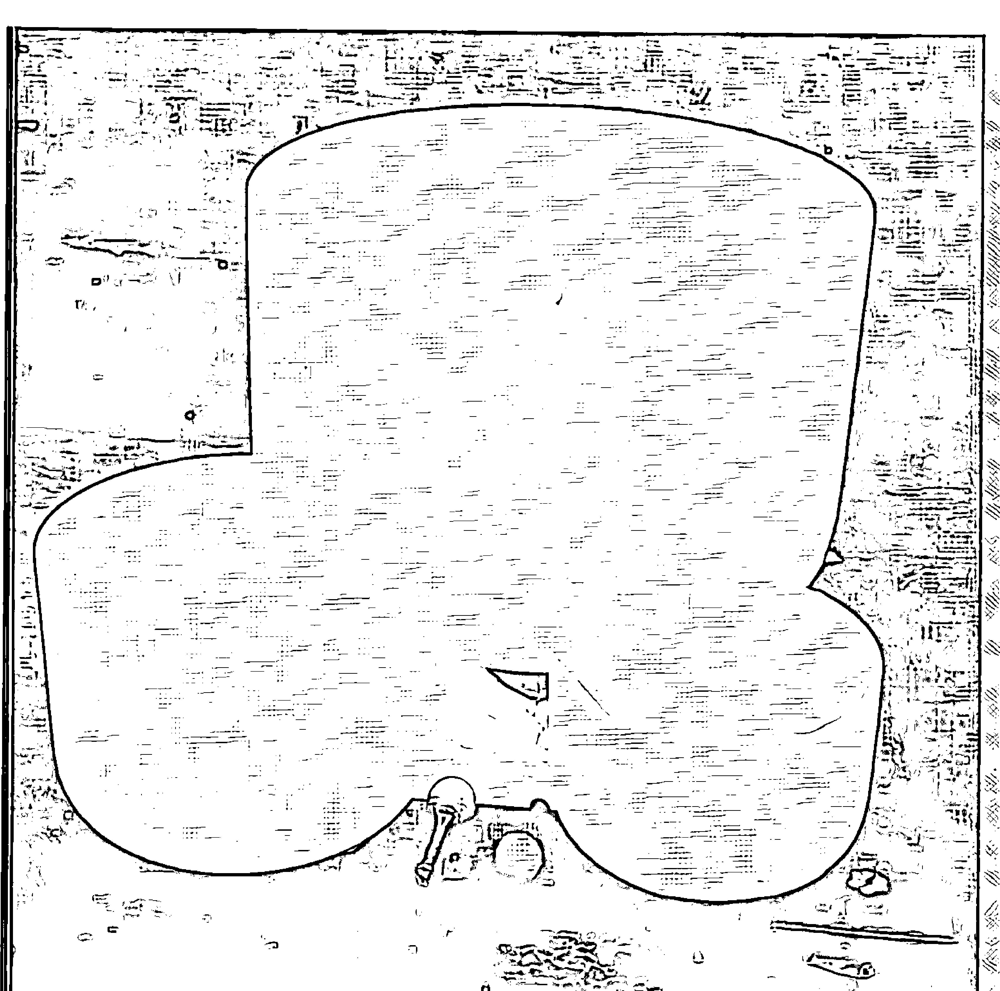

△ 水晶钵有多种不同尺寸，十寸以下的声音过于高亢，十寸以上到22寸的还比较好用。还有七个一整组的，专为专业治疗师、风水师打造的哦！

- 8. 若是有家人在家里待不住，成天总是想外跑，猜测家中气场不和谐，频率不和，建议每天早晚也要用水晶钵来敲击摩擦，事后再来播放新时代的冥想音乐，或是古典音乐里的奏鸣曲、小夜曲等等，打破再重新链接新的气场、气氛，必能营造一个家人都喜欢久待的和谐舒适环境。
- 9. 学禅修、练打坐、练气功、修气脉，可是都没感应，对气没有感觉，怎么办？可以先用水晶钵来摩擦振动，开启手掌上的劳宫穴，感应就来啰。若是能配合学员本身的念经持咒，让声波在自身的颅腔、鼻腔、胸腔、腹腔等体腔，一起共鸣共振，更可迅速、确实开发身上的各个气穴、脉轮等等“能源系统”，对于修炼的筑基，或更上层楼，都有极大的助益！
- 10. 经常使用水晶钵来念经持咒，修炼自己，可以促使气脉开通，就像水管一样通顺，身体的负能量可以尽快排出，就是宗教所讲的“消业障”；积极面方面，更能快速增强、累积自己的能量功力，不怕环境因素的风水影响，甚至能以自己的法力（功力）来影响改善周遭的环境能量场。这也是“改运”、“风水制化”的最根本之道，最有效之道！
- 11. 若是有人脸色出现灰黑之气，眼神上吊，语焉不明，医院却检查不出毛病，八成该往“卡阴”、“中邪”，被外灵附身方面思考。轻微的，可以用一只水晶钵来敲击摩擦，让声波将不属于本灵的“能量团”逐出，这就是“驱魔”啰；若是情节严重者，尚可动用两个，或是四个钵，在身旁周遭架起，一起敲击摩擦，可以产生排山倒海、声势惊人的“声波能量”，还有不同音频间的“音差”，具有彻底洗涤、净化、消除的作用，加拿大、美国地区已经有灵修团体、治疗师大量使用，效果非凡！
- 12. 若是不幸遇到闹鬼的阳宅，或许先请道士法师等来沟通、请走，若是无法沟通，不肯让步，最后可祭出此项法宝，多个钵一起摩擦振动，少有飘移的鬼魂能量团能够抵挡的住的。避邪驱魔等效果，非常良好。
- 13. 商店、餐厅、美容院、个人工作室等等，为要维持良好气氛，可以在每天早上，将水晶钵注满1/3的水，可以加入自己喜欢的香精油，再来敲击摩擦，让此种“气氛”弥漫在空气中，自己的员工，来访的客人等等，都会受到此种影响，一来就满心欢喜，开心工作，欢喜消费，宾主尽欢。
- 14. 新出品的“铜钵”，原理相同，体积小，易于携带，不易破，但是振动力比较小，不适合环境中改善风水使用，多使用在人体的治疗上，也是一个强而有力的工具，值得探究更多的使用方法。
- 15. 更多、更详细的使用方法，请参考“大水晶出版社”所出的《来自喜玛拉雅的祝福——水晶钵》一书。

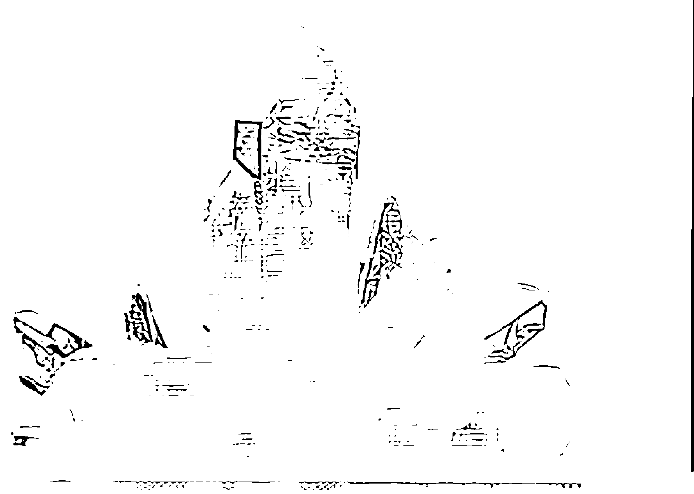

## 第十二章 龙龟

传说中，大禹是我们历史上最伟大的“风水师”，因为他为了治水，疏浚河道，日以继夜的移山填海、打通山洞、修筑沟渠……把整个“地形地貌”的“大风水”都改变了，消除了水患，人民得以安居乐业、耕田养桑，的确没有哪个风水师能够与之比拟的！因此，也有许多风水师把大禹奉为祖师爷来拜哦。

传说中大禹治水时，忙到公而忘私，“三过家门而不入”，世人多非常钦佩他的大公无私。但也有了解世事的朋友用另类思考来看，或许这是他岳父大人“舜”的一个鬼计咩，一次把两个女儿嫁给他，大奶、二奶同住在一个屋檐下，能够相安无事的有几家？当事人要避免家里的“烽火连天”，当然只好天天往外跑啰，不敢回家了，有的人流连花丛酒店，比较好的就来冲刺事业。所以俗话说，“成功的男人背后通常有一个伟大的女人”，有时候“背后两个女人”的力量更大啊，哈哈！

有人传说，大禹就是“熊”的化身，常常在无人看到的地方就显现本尊，冲破山洞，打通水路，疏浚河道。就是大禹这种的干劲和冲劲感动了天地，所以派下了许多的神奇动物来帮忙他。其中最有名的就是“龙龟”，这是“神龙”所生的九个孩子的老大，特别能够“负重”，就是能够搬重物，传说中常常能将挡住河道的山，整座背负搬离，一夜之间就移到其他地方去，所以成了大禹治水的第一帮手、首要功臣；后来，也成为“风水制化”中的重要用法。

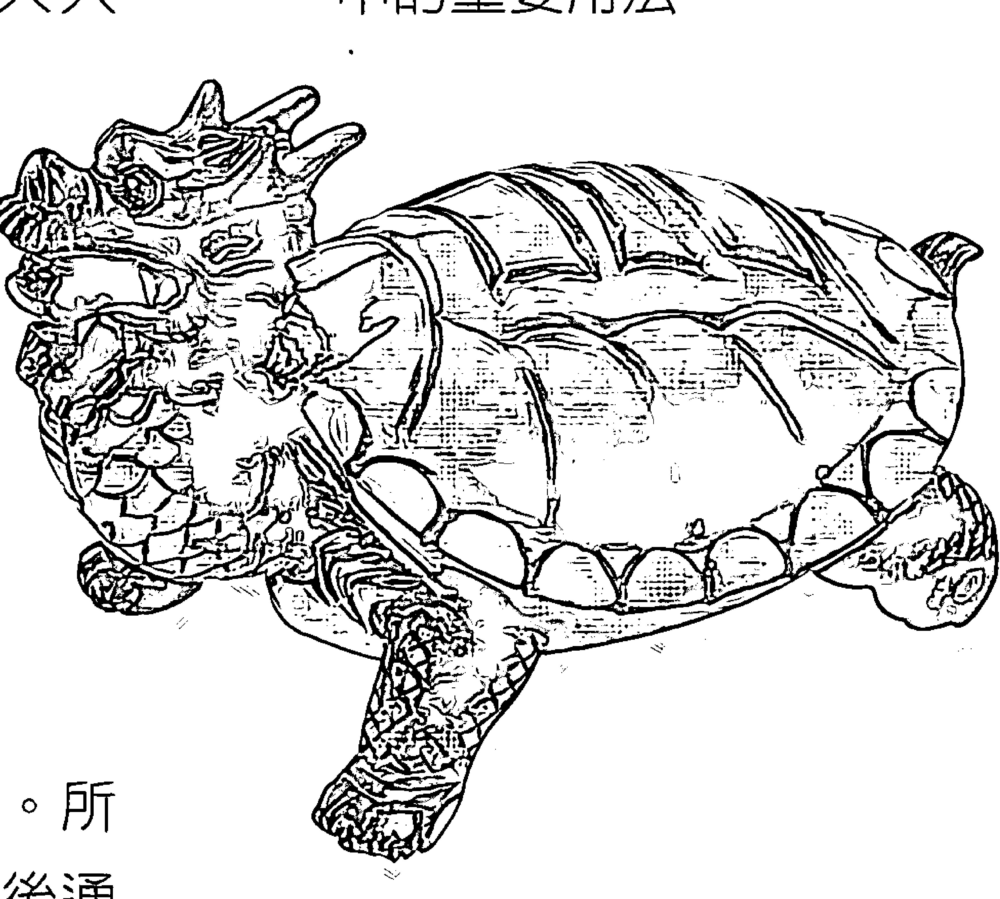

△ 大名鼎鼎的黑曜岩龙龟，纯阳之物，更是神物，能克阴、避邪、化冲、制煞、解厄，龙头还能赐福，真是风水制化中的首要功臣！

龟者，以其形象而言，非常类似男性的生殖器官，不要笑哦。这在古代，或是在非洲一些原始部落里头还看得到，就是“生殖器崇拜”的风俗，因为这就是生命力的象征，也是种族存续绵延的关键，这是非常神圣、庄严的事情，所以千万不要往淫秽的方面想。在自然界中，也是最强壮、勇猛的男性，才能拥有交配权，才能孕育出更为健康、强壮的下一代啊！这也是自然界里“物竞天择，适者生存”的道理。强壮的雄性就是头目、会长、首领、领导的具体象征。所以，龟者，就有“纯阳之物”的称呼；“纯阳”就能克阴、避邪！

相传龙龟背负着“河图洛书”，揭显天地之数，也就是把整个天地间的秘密都显露出来了。龟背上的十区块，象征十天干；五直行区块象征五行；龟腹的十二区块，象征十二地支；中有24环节，象征24节气。这些的象征，其实也就是整部易经，整个中国神秘学，整个中华文化的精髓所在！借着这些“术数”，可以上通天文，下知地理，中和人世。因此“龙龟”，自古即被视为“神物”；他的许多“龟子龟孙”，也因为类似的原因，常常在宗庙祭祀及出师征战等国家大事，皆需被用来在庙堂上“卜筮”，以通神明之德，以明吉凶祸福。神圣归神圣，很快就被捕捉殆尽，后来才用牛骨等来卜筮，也是后来发展出来的“甲骨文”。

这个龟壳、牛骨，坚硬虽坚硬，原本也是有机质啊。当受到火的加温热力，就会膨胀、破裂，发出“卜，卜，卜，”的声音；事后，再来研究这些裂纹的方向、形状、大小，藉以研判吉凶，这就是“筮文”。声音加上文字，就是“卜筮”的由来。

> 明朝徐应秋所撰的《玉芝堂谈荟》，引述同朝代的李东阳《怀麓堂集》说道：“龙生九子不成龙，各有所好”：

- - 囚牛，平生好乐，今胡琴头上刻兽是其遗像；
- 睚眦，平生好杀，金刀柄上龙吞口是其遗像；
- 嘲风，平生好险，今殿角走兽是其遗像；
- 蒲牢，平生好鸣，今钟上兽钮是其遗像；
- 霸下，平生好负，今碑座兽是其遗像；
- 狴犴（音陛翰），平生好讼，今狱门上狮子头是其遗像；
- 负屃，平生好文，今碑两旁文龙是其遗像；蛮吻，平生好吞，今殿脊兽头是其遗像。

明朝杨慎行（号升庵）所撰的《升庵集》，其外集也记载着有“龙生九子”，但与《玉芝堂谈荟》所记载蒲牢，狴犴，睚眦三名相同外，还另外说道：‘赑屃形似龟，好负重，今石碑下龟趺（音肤）是也（即霸下）；螭吻，形似兽，好望，今屋上兽头也；饕餮（音滔铁），好食，故立于鼎盖；叭蝮（音扒腹）性好水，故立于桥柱；金猊，形似狮，好烟火，故立于香炉；椒图，形似螺蚌，性好闭，故立门首。’

《升庵外集》所记载之‘龙生九子’，其中六个名称与《玉芝堂谈荟》所记载不同。《谈荟》又引述明朝陆蓉撰的《菽园杂记》，有赑屃，徒牢（即蒲牢），螭吻（即蛮吻），宪章（即狴犴），饕餮，蟋蜴，蛮蛩，金猊，椒图，鳌鱼，兽吻，金吾等十三名，则又与《升庵外集》所记载者完全不同。到底，这些都是“神物”，原本就不是在动物园、自然界里头可以看到、捉到、制成标本、详细研究的动物，加上古代印刷术不够普及，图书流通也不普遍，各家有各家的不同名词，原本就是很正常的现象。有兴趣的朋友，可以就着以上古籍，自行再深入研究。

“龙龟”，龟背坚硬，一向有保护、阻挡外来煞气的功能；龟尾尖，也有“破”煞，以小搏大、针刺汽球的效用。所以，龟背、龟尾一向是对着“煞气”的来源方向，有破煞、制煞、解厄、镇灾的作用。而“龙头”有赐福的功用，不管摆设的方位如何，一定是龙头向着自己、向着屋内。传统的中国五术风水界，一直以来皆以“龙龟”为风水制化的圣品！

然而，也由于古代的材料科学不发达，能够运用的各种材料有限，当能够用“铜制”铸造的龙龟时，那已经是将相王侯之家才有的能力、财力哦。就算要用玉石、岩石雕刻，也多要富农、巨贾等等才有办法的。寻常百姓多只能河边挑挑小石头，自己刻刻，能够有点像个形状，就行啰。另外比较普及的就是使用“陶土”来烧制，“土”要用“水”来和，要用模子来合，“金”属器物来雕琢修饰，最后要燃烧“木”材，用“火”来烧成……因此说，陶土制的龙龟，具有“木火土金水”的性质等等。当然，明眼人一听就知道有比较牵强附会的地方啦，但是古代材料科学不发达，也是没有办法的事情。

现代科学发达了，各种材料取用方便，特别是钻石工具的进步，也带动宝石工业的蓬勃发展，许多的水晶矿石能被运用在风水制化中啰。在制化中呢，我们特别推荐“黑色系列”的水晶宝石，如烟水晶（Smoky Quartz）、黑陨石（Tektite）、拉长石（Labradorite）、彩虹黑曜岩（Rainbow Obsidian）等等最好，为什么？因为“黑色”本身会成为黑色，就是会把所有光色都吸收进来的原因，不再反射、折射出去啰。所以，用黑色材质来吸收煞气，当然就是第一的理选择啊！还有，这几种宝石的特性都是属于比较刚烈型的，能量的振动波长长，后劲十足，用来克制外在的不良气息，才有够压制、镇压的作用咩。

但是，您若不是用在风水制化中，而是有其他的祈福、祈愿等用途，则选用其他颜色的，如紫水晶、白水晶、粉晶等等，也未尝不可啦。

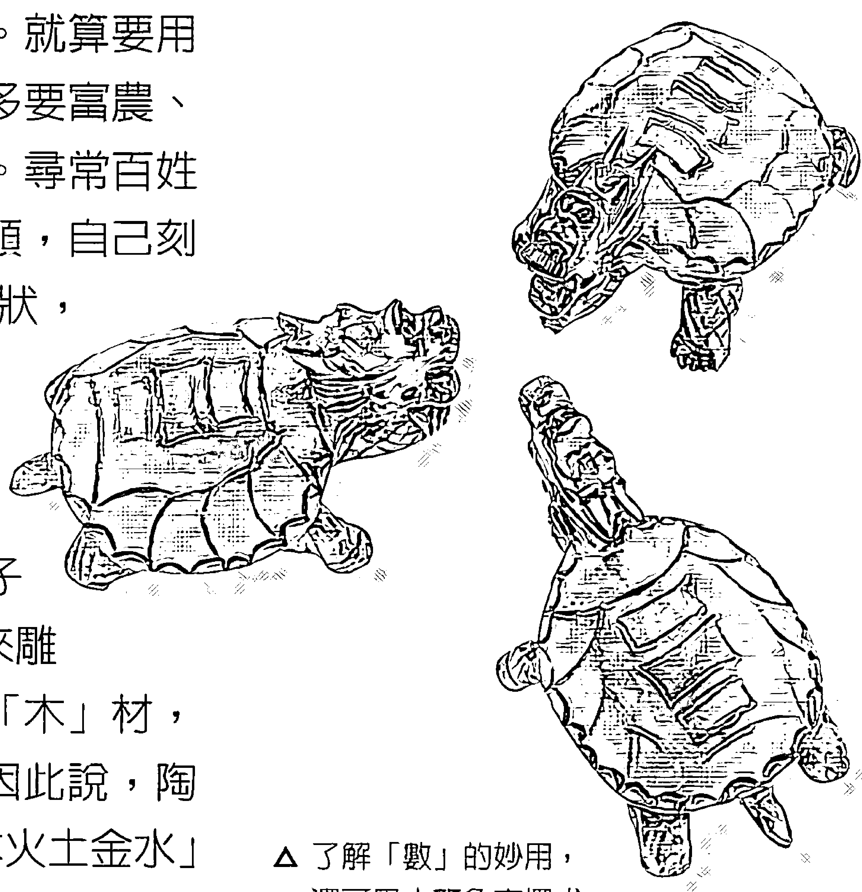

△ 了解“数”的妙用，还可用小龙龟来摆成各种不同的阵势，化解风水上的各种问题，妙用无穷哦。

## 运用方法：

- 1. 龙龟本身是深厚福德的象征，请勿与当今六合彩、乐透的“杠龟”联想在一起，这是当代掀起的发财梦想和无妄牵连，有违龙龟在我们悠久历史上所象征的意义及所作的贡献。嘲笑或是弃绝龙龟，就好像把自己的好运福德推出去一般，并不明智。
- 2. 当一个人陷入人生的低潮期，可以送他一只小龙龟，用红布（旺气）包着，随身带在口袋里头，可以帮他消除身上的霉气秽气，也为他带来新的福德。
- 3. 当有人官司缠身时，如果真的没犯错，请他身带小龙龟，可以化解厄运，加强气势，让正义公理最后都能站到自己这边来。若是真的有错，也能激发出勇气，坦承求和，大事化小，小事化无，把伤害化解到最低限度。
- 4. 当有人刚出狱，或是大病初愈，也可以如法泡制送他一个小龙龟，断绝过去，重新开始新人生。
- 5. 若是个人气场不良，运气不好，或是当年犯太岁、偏冲等等，都可以配戴小龙龟来吸收身上的浊气、晦气，以收改运、补运之效。
- 6. 若因工作需要，必须经常出入一些能量场不好的地方，如医院、诊所、病房、灵骨塔、墓园、屠宰场、监狱、刑场、特种营业场所等等，可以配戴龙龟来加强自身气场，也强化自我保护，也有避邪作用。
- 7. 许多人敏感度高，但是本身缺乏运动，气场虚弱，容易受到外在气场变化而疑神疑鬼，显得比较神经质，可以借着配戴龙龟来强化自己的气场，镇定安神，魂魄安定，才好安居乐业。
- 8. 个人若是才华太高，锋芒毕露，容易引起小人觊觎，或是功高震主，亦可配戴小型龙龟，象征学习神龙藏于龟壳的精神，内敛、沉稳、养晦，以保百年平安之身；等待适当时机，就可以“出头”、“飞龙在天”，扬眉吐气！
- 9. 在办公室中，若是人多口杂、是非纷杂，也是可以在桌上摆上一只龙龟，龙头对向自己，赐福给自己，龟背、龟尾向着外头，把所有的外在负能量都挡掉、化解、破解掉了。当然，也要学习龙龟的“沉潜”、“养精蓄锐”的精神。
- 10. 开车时，也可以在后照镜下悬挂一只龙龟，或是在方向盘前放置一只龙龟，一样龙头向着自己，龟背、龟尾向着外面，也可以挡冲、挡煞，护佑一路开车平安的效果。
- 11. 大型的龙龟摆放家中，有安家、镇宅、避邪、保平安之效。不管放在哪个方位，记得龙头向着家的中心点，有赐福之意；龟尾、龟背向外，以挡冲煞之气。
- 12. 遇到户外有路冲、屋角煞、天斩煞等等，也可以将龟背、龟尾对向来源，即有制煞之作用。
- 13. 传统上用来“化煞”的鱼缸、水族箱，常常在事件经过之后，里面的鱼群也损伤惨重。建议在里面放置三、五、七、九数目的龙龟，取阳数，水晶矿石所制的龙龟不怕水，可以增加化煞、解厄的功能，保护屋主，也保护鱼群。免受灾厄。
- 14. 若家宅无任何外来冲煞等虑，亦可安放在家宅的“座山”方位中间，就是屋宅后面中央的地方，即“福德位”，龙头向着房屋中心点，有为全家赐福之意。
- 15. 若因预算考量，无法添购大型龙龟，亦可购置小型龙龟，以相当之数，或三、五、七，或四、六、八，结成阵势，加以适当的“启动连接”就有相加相乘的能量出来，亦可发挥制煞、化冲的功效。
- 16. 流年的死气、衰气方位，更可用龙龟来好好压制化解，必可振衰起蔽，消除厄运，逢凶化吉。

17. 本命的五鬼、六煞、絕命、禍害方位，也是可以用大龍龜，或是小的龍龜陣組合來壓制、化解，讓個人能過的安心、平安、快樂。

18. 現代住家人口簡單，可以在宅中八方各放置龍龜，龍頭全向著房屋中心點，並全部予以啟動連結起來，可以護佑全家大小，可以減少病痛、減少車禍、傷害，也減少盜賊侵入的可能性。

19. 龍龜亦有「榮歸」，即「衣錦榮歸」之意，象徵一個人功成名就，載譽歸鄉，並能功成身退，全身而退，得以安享晚年的意思。

20. 龍龜亦屬「靈獸」之一，常配合與念佛、持咒、靜心，將更具靈性，具有避邪、消災、解厄、改運、賜福、平安之功效。

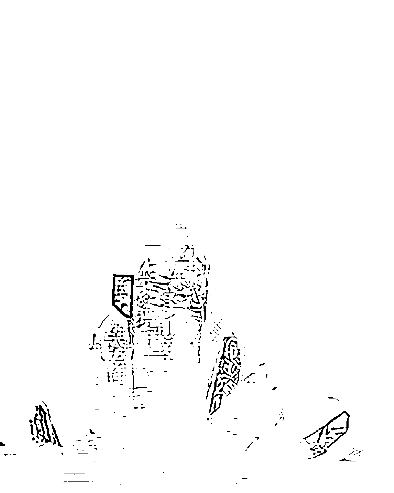

## 第十二章 山海鎮

看過上篇、中篇的介紹，我們知道風水中的「座向」非常重要。往往在看一個家宅的風水時，就是先要把該屋宅的「座向」定出來，爾後才可以看方位，論吉凶，做各種論斷。若是座向都定不出來，其他的也就不必論了啊？

然而，在現代的大樓、公寓、預售屋等等的社會風氣下，試問，有哪幾間房子可以真的讓您自己設計、發揮、還指定座向呢？不可能的啊？絕大部分都是「將就」著現成的屋子來使用而已啊？問題就來了，許多人都是買了以後，住進去以後，才延聘風水師來看，來鑑定，然後才發現這個不行，那個不行。絕大部分的都可以用各種技巧來改變，但是「座向」呢？一個大的方向如何改呢？座向的確立，也決定了每年的生、旺、衰、死方向，座向的確很重要！

在風水的各門各派中，還有一派號稱「密宗風水」，特別專精的就是「以小搏大」、「四兩撥千金」，用一些特殊的器具，特殊的咒語，堅強的信念，藉此來化解風水上不理想的地方。這在理論上，絕對可行哦！因為就是利用個人的修行，凝聚咒語、信仰的能量，來改變風水氣場的不良氣息啊。所以，密宗風水裡頭都要求「身口意」的三密加持，白話一點講，就是要「口到」、「手到」、「心到」，口中念適當的咒語，手中結適當的手印，加上「意念觀想」，通通做到的話，當然，個人的氣場和環境的氣場就會跟著改變囉。

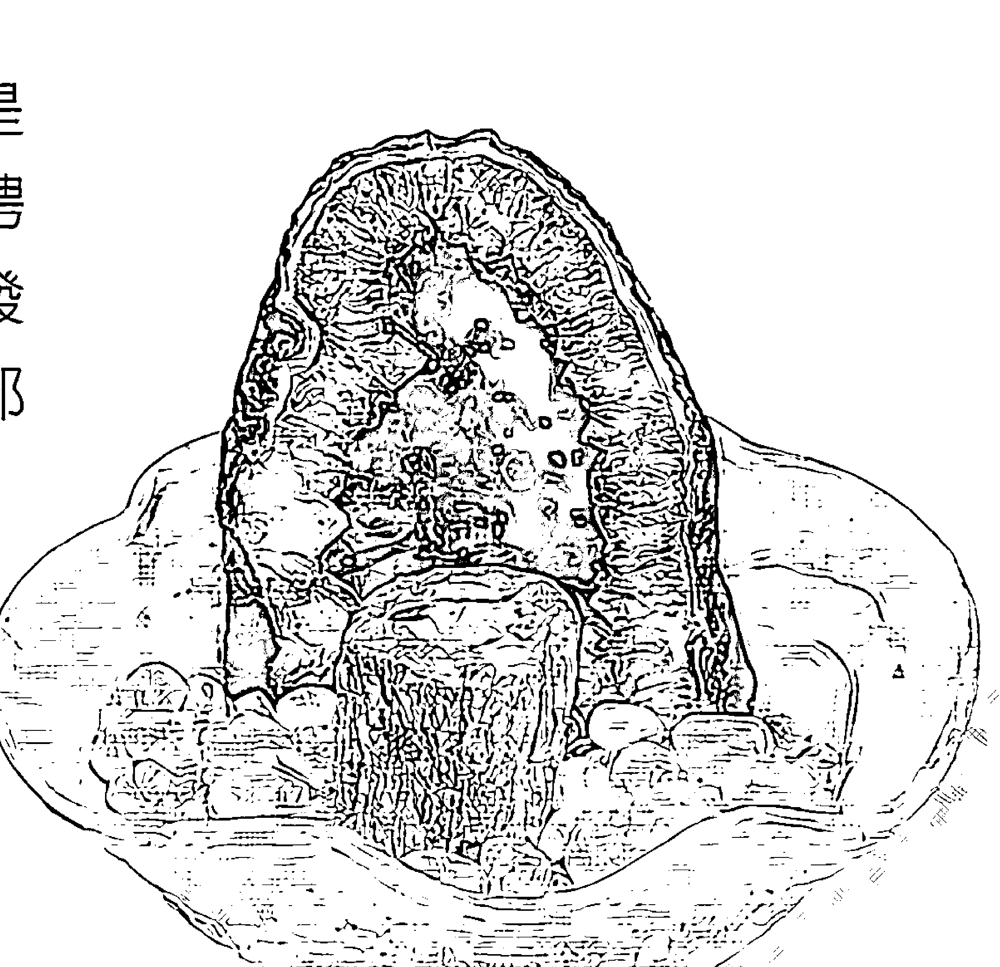

△ 山海鎮的具體作法，非常簡單，花費也不大，再來，就要啟動賜予他能量，也賜予他靈魂，這才是重點！。

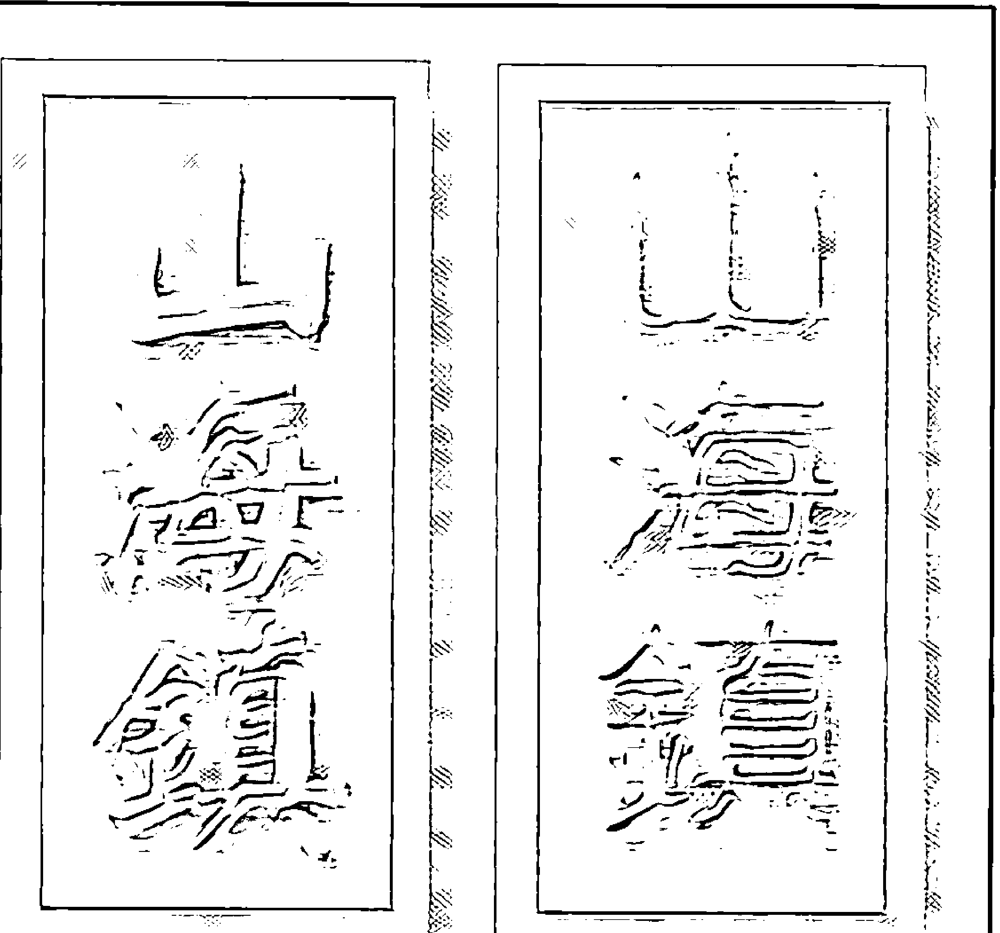

若是覺得很困難的話，那就要花個大紅包來請仁波切、上師、法師、法王來幫您「作法」囉。但是，許多時候不是有錢就能解決，因為這些俱德的法師們來來去去，全球弘法中，有時候時間接不上，就不能動了啊？其實，請他們來，實際的作法還是差不多啦，只是人家修行比較好，功力比較高，比較容易叫您有信心啦。若是沒錢，時間也湊不上，那只好自己上陣囉。記得「勤能補拙」，即使我們只有大師十分之一的功力而已，那我們就用上十倍的時間和努力，也是可以達到相同的效果啊？也就是說，上師來幫我念咒一次三十分鐘，那我就每天念咒三十分鐘，連續念個十天，也不會差到哪裡去了啦，是不？「舜何人也，禹何人也，有為者亦若是。」抱著這種「當仁不讓」、「捨我其誰」的氣魄和態勢，不要說一個小小的風水制化能做好，就是用心修行，也一定會有很好的結果的！

念經、念咒、灌氣、加持，前面都討論過，簡單的講，就是給予「啟動」(Initiation)，如此而已，每個人都會，每個人都做的來。

### 山海鎮，簡單的分解開來，就是由下所構成的：

-   1. 找個大的陶盆、瓷盆、玻璃盆，天然材質的都行。
-   2. 找個大小適中，形狀端正的紫水晶洞，當主體，也就是「靠山」。
-   3. 找個粗壯的矽化木（木化石），木頭矽化以後的形狀，具有「山」的特性，及木頭轉化為石頭，從「腐朽」到「永恆」的特性。
-   4. 找來二、三公斤的白水晶滾石，象徵海水的特性，波瀾壯闊，寬廣無際，包容性最強。
-   5. 依照相片所示，排列起來，再在矽化木前面，用墨汁或是硃砂來書寫「山海鎮」貼上，就是一個完美的「山海鎮」。

### 使用方法：

-   1. 山海鎮的最大功能，就是在大環境都不做任何變動時，將之擺在所屬意的方向，加上適當的啟動與觀想，就能夠將屋宅的「座山」改變到這裡來。
-   2. 找一個清爽的放假日，心情最放鬆，沒有事情煩人煩心，在起床後的兩個小時內（早上起床或是午睡起床後），精神狀態最佳，這就是個人不摻雜迷信的「良辰吉時」。利用這個時候來「安座」，最適當，功效也會最強。
-   3. 雙手可搭放在紫水晶洞的前面，手腕、手肘都會跟整個山海鎮接觸，在此，好好靜心觀想白光降臨，籠罩著整個山海鎮。觀想確實的話，自己也能夠感受到整個能量團在手掌間、身體間的流動，這是非常舒服、寧靜、又充實的一項工作哦。初次，專心冥想三十分鐘，安座，開光，啟動完成。
-   4. 爾後，每天早晚，來此相同方式冥想五～十分鐘，連續一個禮拜，七天的時間，可以使得能量場更為穩固。
-   5. 再爾後，則可隔著三、五天，或是一、二個禮拜，看個人功力，也看個人需要，隨時再來予以啟動啟動，讓能量持續作用，就能持續發揮效能。
-   6. 以後，若是流年更迭，生旺衰死方位變換時候，可以挑在「立春」前，也是在自己精神最佳狀態下，予以更換位置。直接拿起，放到新位置，重新予以啟動就行。
-   7. 山海鎮的最大功能就是「改變座山」，但若不需要改變，也可以直接擺在家中「福德位」，也就是房屋最後面、靠中間的位置，具有安家、鎮宅、避邪、招徠福德的作用。

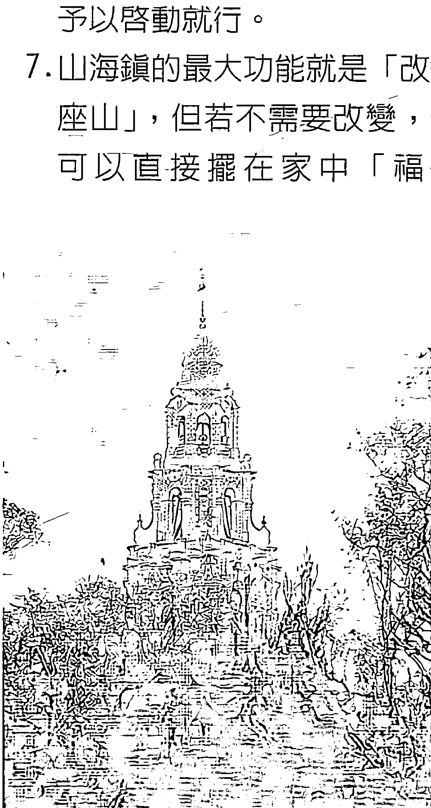

> ▲ 家門前若是出現高塔、紀念塔等等的，不能與之對沖、硬幹，只有蹺頭、轉進，快溜了咩。但大門方向轉不得，怎麼辦？只有祭出山海鎮來做「乾坤大挪移」囉。

-   8. 門外、窗外若是有任何建築、建物形成不良的沖煞，除了前面介紹的各種水晶球等的制化方法，講究點的，也可以用山海鎮來壓制、化解。
-   9. 屋前、屋後，或是樓上、樓下，有不良的場所，如酒店、聲色場所、撞球間、屠宰場，或是氣太強的廟宇、宮壇、道場等等，也可以用山海鎮來壓制化解。
-   10. 流年的死氣方、衰氣方，相同的也可以用山海鎮來壓制化解。
-   11. 本命的五鬼、六煞、禍害、絕命方，也可以用山海鎮來壓制化解。

> (淳賈天然水www.blancoage.com)

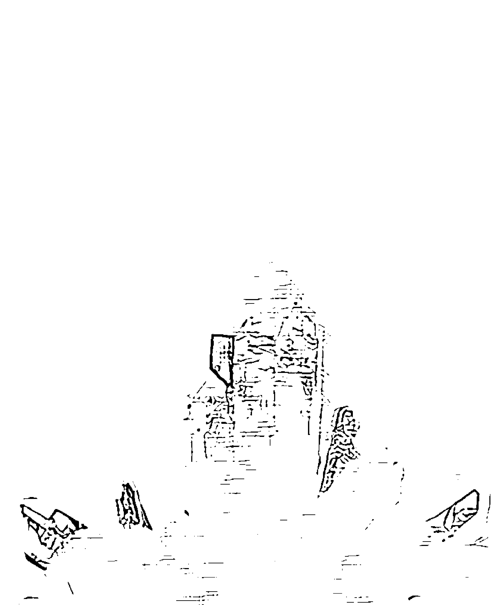

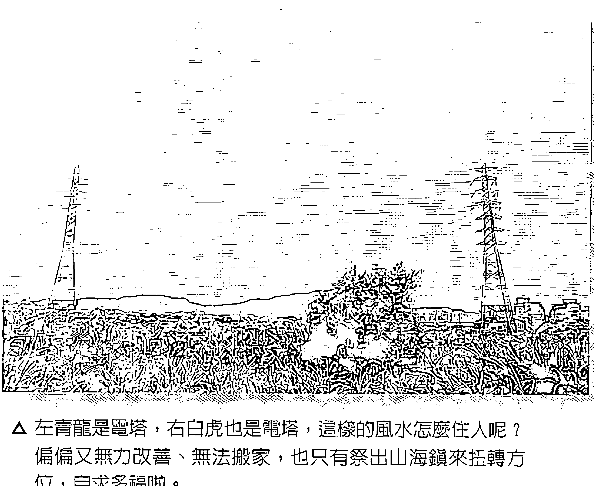

這是一個「原則性」的問題，不太好以哪個產品、哪個項目來說明，但是朋友們記得這些原則就行，就可以好好自由運用囉。

前面說過，風水的「形勢」會造成一種氣場，這種氣場也會和人們的氣場共鳴、共振，也會影響到人們的思想、行為等等。所以，我們就是要「造」一種「勢」，或說「佈」一種「局」，並且來造成這種必然的結果，使之成事實。

最常見的，就是在辦公室、住家風水中，以「右圓左方」的方式來佈置一些水晶礦石。右手邊的，放置圓球型的，可以使我們行事作為更為圓融、圓滿、柔順，能有人和的作用；左手邊的，放置有稜有角的柱形、塔型、金字塔狀的，可以防小人，保護自己，也能讓自己的思想、精神、意志能夠貫徹。總而言之，「右圓左方」的佈局，能夠讓自己比較「外圓內方」、「外柔內剛」，在不失自己原則下，能有比較好的外緣，做事情能夠圓融，自己的意志又能夠貫徹，也不怕小人來犯，多理想！

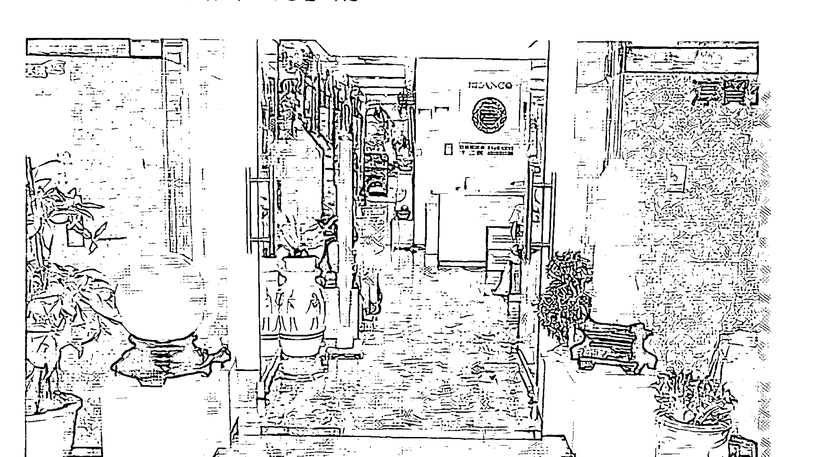

△ 淳貿水晶公司的大門，就是採用明師指點的「右圓左方」的擺設方式，值得大家參考採用。

「前圓後方」與「右圓左方」的道理是相同的。個人可以因著地方的不同，位置的大小、多寡、方便與否，自行調配。

這種「佈局」，多在門前、門口採用。若是上班族，無法自行決定大門的擺設方法，也可以在自己的辦公桌、書桌，反正，就是在自己的「能量範圍」、「勢力範圍」內做到，也可以對自己形成良好的保護及作用。

在這項作用裡面，哪種樣子、顏色的水晶寶石倒是沒有限定，倒是「形勢」比較重要。也就是「圓」與「方」的問題。挑選時，記得要挑同樣的東西，顏色頻率一致，大小、尺寸、重量也比較接近的好，才不會因此造成「不對稱」，那就有點弄巧成拙囉。粉晶，就都挑粉晶；白水晶，就都挑白水晶，選擇比較好搭配的。

買回來時，記得還是要先消磁過；擺到定位上後，也是記得要予以「啟動」，能量就會開始作用囉。

「上清下濁」，也是一個原則性的問題。本來就是如此，清氣比較清揚，容易上升；濁氣比較凝重，容易下沉，自然界本來的現象就是如此。

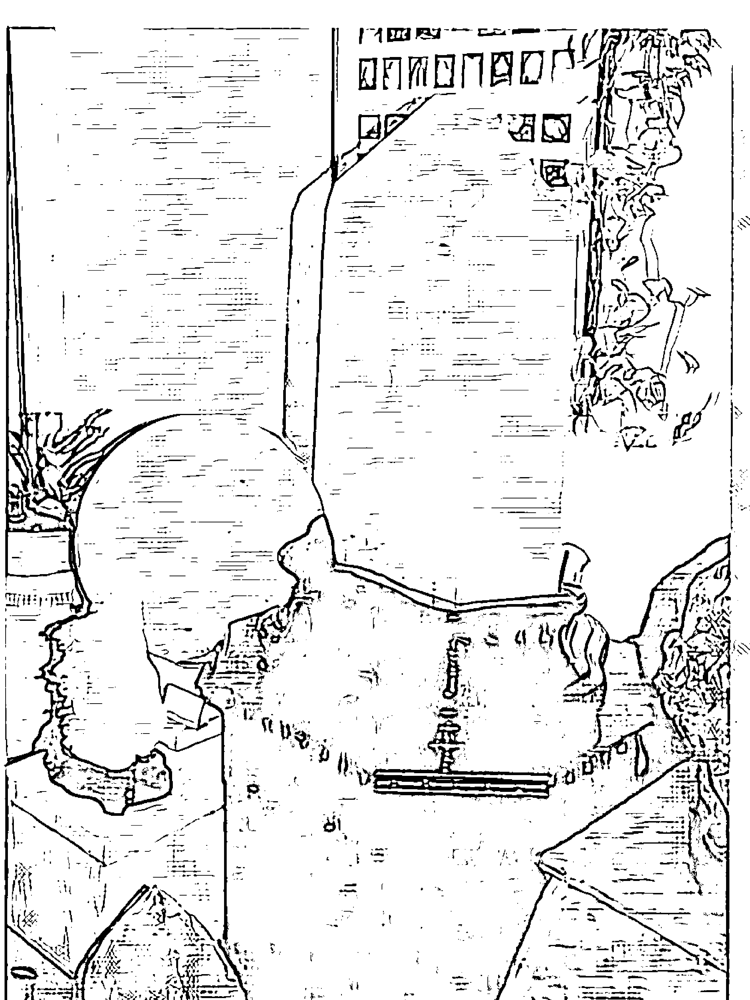

△ 進得門內，再往外看，還有個大水晶柱、大水晶球，則是採「前圓後方」的擺設方式，也是值得大家參考採用。

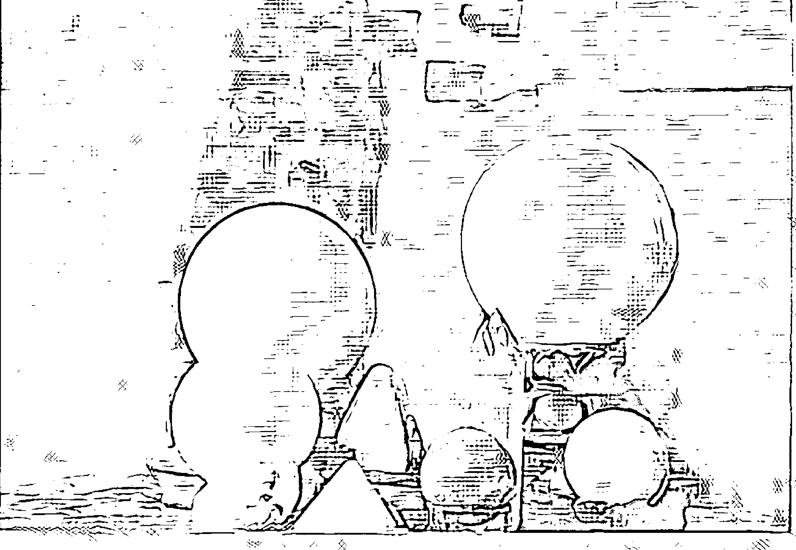

△ 上清，台面以上的多擺放一些顏色鮮明，能量清揚的水晶寶石，粉晶、螢石、方解石、天河石、碧玉、海洋碧玉等等，讓清氣上揚，氣氛也好。

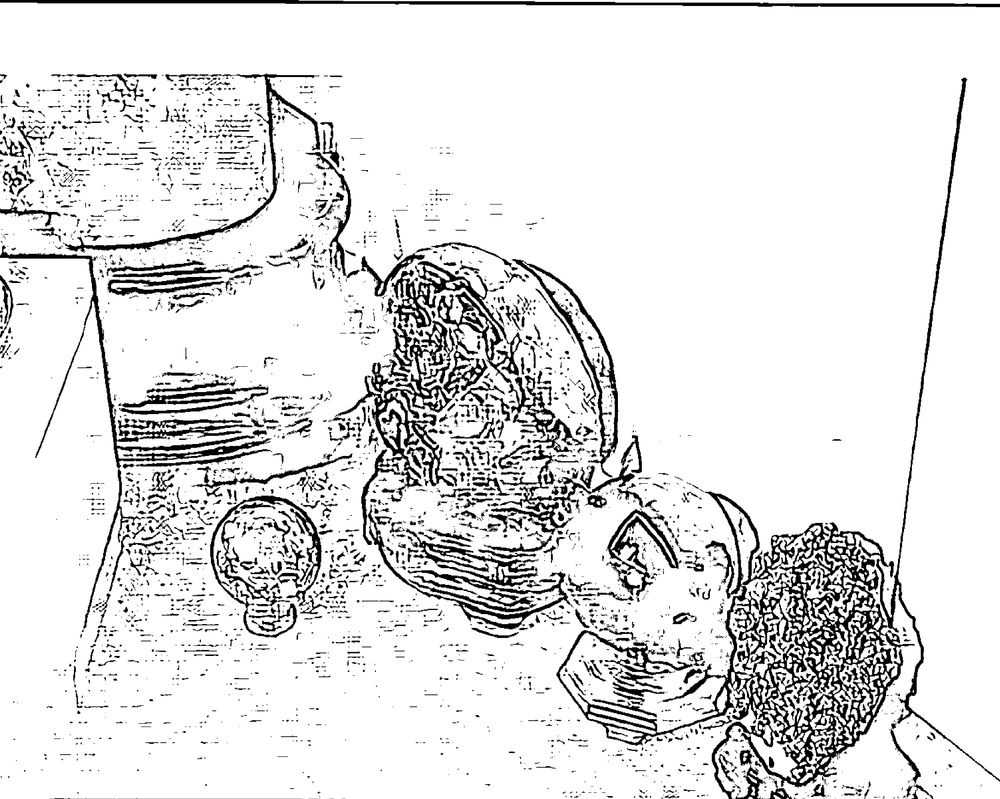

◀ 下濁，台面以下的，就多擺放一些顏色深沈、吸收力強的水晶寶石，如瑪瑙、黑曜岩、骨幹水晶、閃鋅礦、拉長石等等，讓濁氣下沉，吸收殆盡，才能保障環境氣場的純淨。

但是在某些家庭，某些公司，某些特定的營業處所，好像「不自然」，沒有跟著自然的道理走。原因通常就是出在「人」嘛，或是利慾薰心，或是佔有慾強，或是比較心重，或是忌妒、憂愁、哀傷、怨恨、爭執、報復、仇恨、明爭暗鬥………總之，有人的地方，特別是越多人的地方，這種亂七八糟「氣」就越多。這時，主事者，或是老闆、負責人、主管、經理等等，這些人的「態度」就會很重要。要是有心改善的話，也是能改善哦，只要多花點心力而已啊；若是採「放任」的態度的話，那就容易「邦分崩離析」，離心離德，四分五裂，這個團隊恐怕就會走入敗亡、滅絕、徹底失敗的地步。

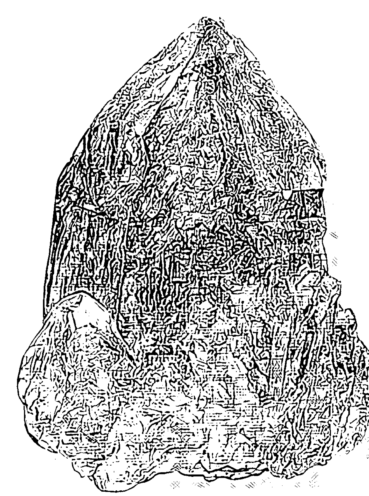

△ 非常典型的骨幹水晶，能夠又大又便宜，內行人用來調理身體、調整風水，運用非常廣泛。

別忘了，「氣」是電磁場，是會「感染的」哦。有些人想說，老的人不能用，就引進新進人員，很奇怪，剛來的時候好好的，一段時間過後，也會沾染和原有人士相同的氣息呢？就是這個道理！

那怎麼辦？主事者就應該拿出魄力，拿出辦法，對於鬧事者、策劃者、主導者、散播謠言者，必須徹查，予以嚴厲警告或是懲罰，必要時還要撤換。才不會讓一顆老鼠屎來壞了整鍋粥！記得，主事者的態度是最基本的動力哦！

水晶礦石，只是「助緣」、「助力」，雖然不是主力，但是若主事者能夠發揮魄力後，水晶礦石就能夠發揮「臨門一腳」的促成力量，達陣成功！若是主事者的魄力不出來，光要靠水晶礦石的作用，我們不願誇大風水的效能或是助長迷信啦，恐怕還是沒啥作用的啦。

「上清下濁」，以「台面」為分際，台面以上的，讓清氣上揚；台面以下的，讓濁氣下沉。就是這麼簡單道理。（淳賀天然水晶www.biancoage.com）

實際作法，請找來一些比較大，顏色比較深，形狀醜醜的沒有關係，因為是要擺在「台面下」吸收濁氣用的，不是看漂亮的，而且數量要多些，醜的比較便宜，可以多用些啊。就擺在桌子底下，牆壁邊，四周的牆角底下；特別是一些大辦公室、營業廳、人多口雜的地方，更要多擺一些，就可以把空氣中瀰漫著各種不良氣息給吸收囉。閃鋅礦（Sphalerite）、拉長石（Labradorite）、彩虹黑曜岩（Rainbow Obsidian）、骨幹水晶（同鱷魚水晶Alligator Crystal）、黑色電氣石（Black Tourmaline）、煙水晶（Smoky Quartz）、木化石（Petrified Wood）、黑膽石（Hematite）、黑瑪瑙（Black Onyx）各種黝黑的異象水晶等等，都非常好用。

濁氣下沉，也可以使得該環境的氣場比較穩固，英文說「Grounding」，根植於大地，人的心情情緒也比較穩定，不會浮誇、飄移，做事情就自然牢靠囉。

清氣上揚，我們也要在「台面上」擺些顏色清淡，氣場活潑，叫人看了清新、清爽、愉快的水晶寶石，這是繼「隱惡」之後，必須要的「揚善」。消除了人們的不良心態後，還要激發出他們內在開心、愉快、喜悅、和樂、友善、誠懇的態度，這樣才能營造一個良好的居住環境，或是營業環境啊。所以，在所有的台面上，就應該多擺一些比較清新明亮的水晶寶石，如水晶噴泉、水晶聚寶盆，還有白水晶（ Crystal Quartz） 、 紫 水 晶（Amethyst）、黃水晶（Citrine）、天河石（Amazonite）、天青石（Celestite）、粉晶（Rose Quartz）、各色螢石（Fluorite）、各色方解石（Calcite）霰石（Aragonite）、透石膏（Selenite）、藍晶石（Kyanite）、蘇打石（方鈉石Sodalite）、藍色異極礦（Blue Hemimorphite）、矽孔雀石（Chrysocolla）、藍色綠色東菱石（Green, Blue Aventurine）……等等。抓住這些「原則」，因時、因地、因人，好生變化利用，這樣才不會把風水學死了。道理懂，道理通，靈活運用變化，就都能得心應手。創造一個適合自己居住、學習、營業、賺錢的環境，實在很重要，也不會很難啦。用心下去，各種水晶寶石來配合運用，人人都能是「風水大師」！

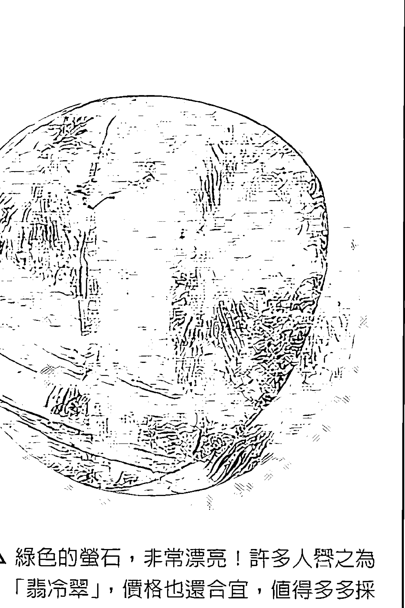

> △ 綠色的螢石，非常漂亮！許多人譽之為「翡冷翠」，價格也還合宜，值得多多採用。

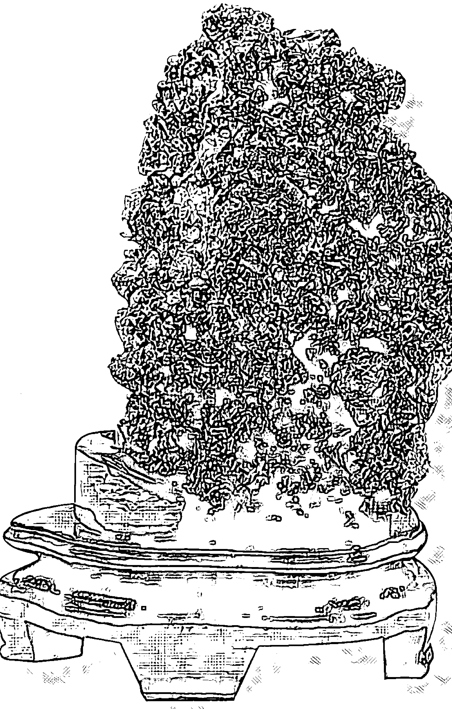

市面上比較少見的「閃鋅礦」，黝黑晶亮，平時貌不驚人，但功能強大，價格便宜，趁商人還沒炒作之前，多多蒐購，效果可不輸給骨幹、黑曜岩等知名寶石。

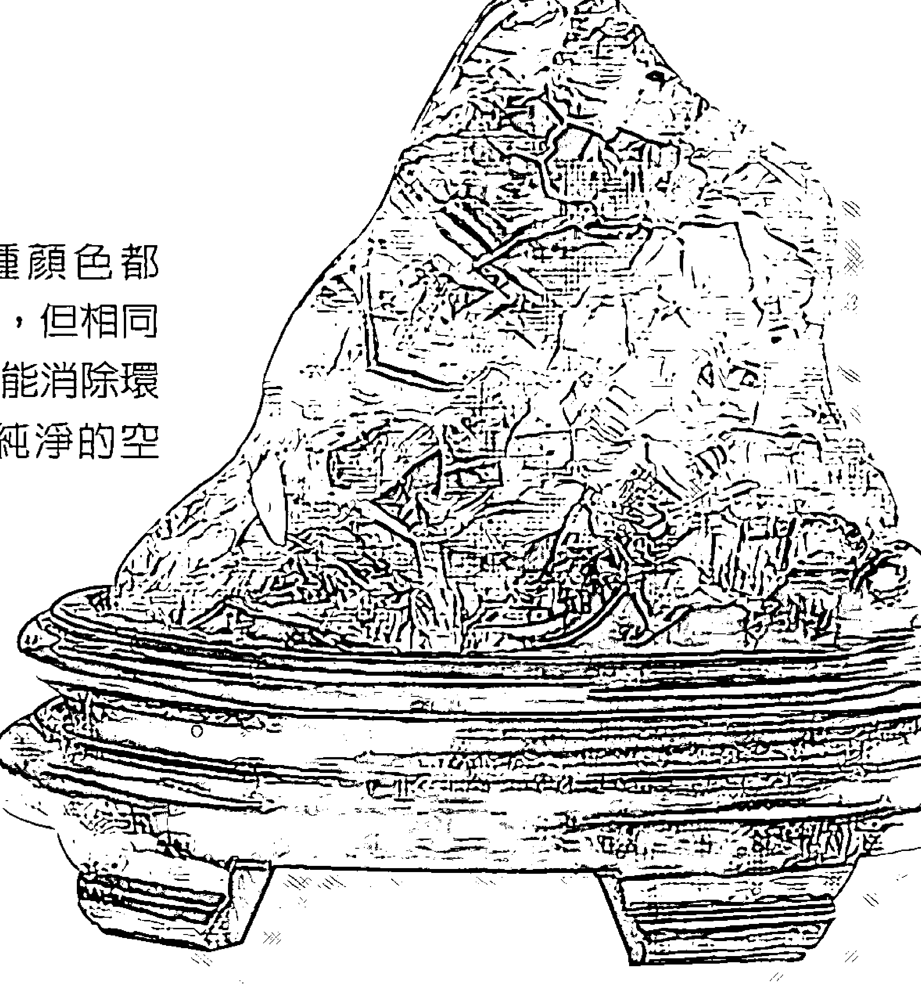

瑩石是個彩虹家族，各種顏色都有，也有多色共生在一起的，但相同的性質，都是輕柔、稀解，能消除環境場中的不良氣息，還原純淨的空間。

## 水晶的用法

雖然在「水晶柱」一章已經探討過了，但是，事關重大，覺得我們還是另列新章，重點探討，才不會忽略了「大水晶」的重要性。

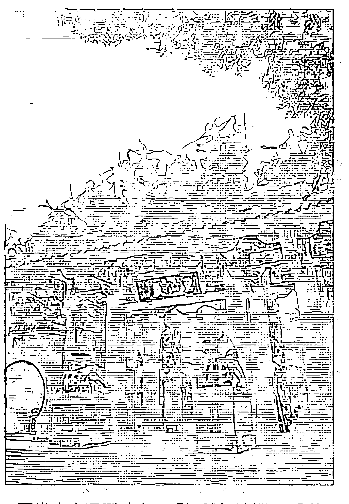

△ 平常人家遇到神廟，「氣勢無法擋」，又沒錢搬家，怎麼辦？只有借助大水晶，加上「玉清」來化解囉。

我們都了解，能量跟質量成正比，質量越大的話，能量越強；能量越強，作用就越大，越明顯。這就像拳擊、搏擊的比賽中一樣，蠅量級、羽量級所發出來的力道，總難和重量級的相提並論，或是根本無法比較。一支拇指大的水晶所發出來的力道，當然也無法和一顆幾百公斤水晶所發出來的力道相比一樣。當我們在講究如何「四兩撥千斤」、「以小搏大」之時，好像游擊戰，也不應忽略了大規模的兵團作戰，畢竟，這才是決勝的關鍵！

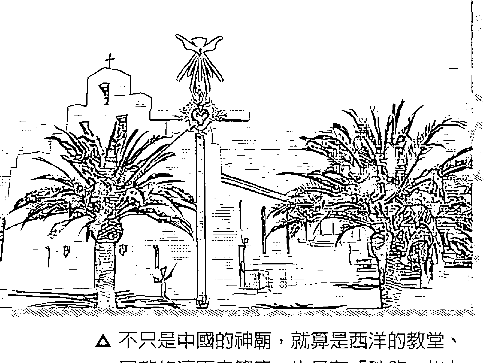

△ 不只是中國的神廟，就算是西洋的教堂、回教的清真寺等等，也是有「神煞」的力量，真的是「凡人無法擋」，千萬不要忽視，也不要硬拼、硬幹！

所謂的「大水晶」，至少要在一百公斤的重量以上！其實，這也是比較寬鬆的分際啦。因為礦石的密度多高，一百公斤還是沒有多大看頭哦，通常要到三百公斤以上，才有比較「雄壯威武」的磅礴氣勢出來。就算是不懂水晶、氣、風水等的朋友，光是初初接觸所看到的「直覺」，就足以說明一切囉。

大水晶的能量，畢竟是小小水晶等所無法比擬的。想要有確實、根本、實際、長久的作用，老實講，就是非大水晶莫屬囉！

大水晶的消磁，建議採用檀香、沉香來薰薰就行了，又快、又好、又確實。不必搬來搬去的曬太陽，泡海鹽水，也沒有那麼大的桶子、浴缸吧？大型重量物件，也不建議搬來搬去，容易摔壞破損的機會也大呀。

大水晶的啟動（開光），當然不能如一般小水晶的拿到手掌心來握著囉。沒關係，道理相同，只是我們人貼近大水晶，將雙手搭在任何一部份都行，一樣念經、持咒，或是觀想白光，緩慢深沈呼吸，就能將他的能量啟動囉。正常的，不僅雙手可以感受到來自水晶的氣，就連額頭、臉部、胸部、腹部等全身，都能感到到麻麻熱熱的氣氛，相當過癮哦。有些敏感人士，還會有如「電擊」般的感覺啊！這個「氣勢」的確不一樣！

(淳賈天然水晶Fax:886-2-2788-8982)

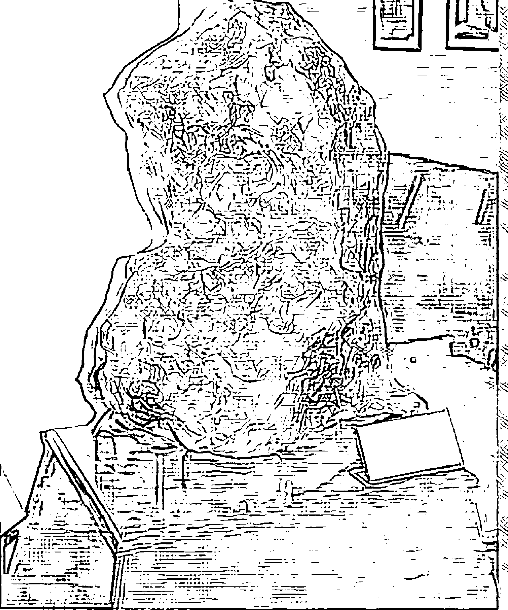

▲大型的天鐵（鎳鐵隕石），一看就是「雄壯威武」，氣勢強勁，習要擋煞、化沖、避邪、鎮宅，無所不能！

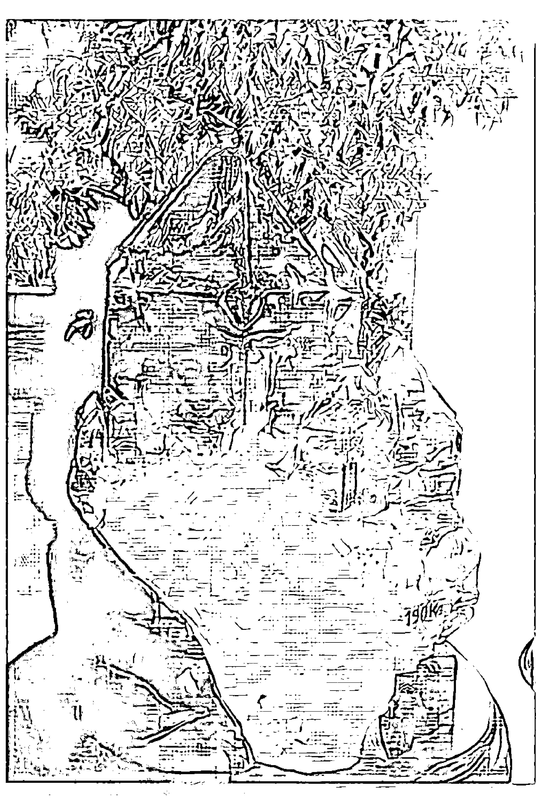

▲狀極雄偉的骨幹水晶，單價雖高，卻也不是天價，有心人還是買得起，用得上的。但是結晶完整，氣勢雄偉的貨色，還是可遇不可求啊。

### 使用方法：

-   1. 大水晶特別適合用來「鎮宅」，壓制不良氣息，穩定環境中不穩定的能量場，讓一切恢復正常，有秩序，有條理，狀況都能在掌控之中。
-   2. 能量場不穩定的環境住所，容易影響到居民的氣場不穩定，健康不佳，情緒不好，容易有爭執吵鬧，無法專心做事，待不住，成天往外跑，家庭成員感情不睦，家運敗壞。整體的狀況都不好，但卻不容易看出單一的風水原因，個人所呈現的問題也非常多樣化；內心原本就有的問題，在風水薄弱的狀況下，就一一浮現成為困難。除用大水晶來鎮宅之外，個人也要多使用黑色系列寶石來靜心，才能徹底改善家運。
-   3. 大水晶適合擺放在屋宅的「中宮」方位，對於每個人、每個方位都能照顧到，產生影響對於全屋宅會比較平均有效。
-   4. 大水晶也可以擺在屋宅的「福德位」，也就是中間靠後方的位置上，具有「壓陣」、穩定、有靠的作用，居民可以安居樂業，不必有後顧之憂。
-   5. 大水晶還有「避邪」作用，屋宅氣場不穩定，或是曾經發生過兇案，或有人自殺過，有靈異現象，擺放大水晶，並定期予以「啟動」，也能壓制、消除靈異現象。因為鬼魂多是飄渺虛無的、「含有意識的低振動頻率能量團」，漂浮出沒在該空間場中。若有個能強力放射能量的大水晶進駐，就能壓制並驅散。
-   6. 對待靈異現象，還可參考上篇開光、符咒的介紹，可商請可靠的法師，或是自己誠心敬意、全力灌注的，用硃砂書寫「天無忌，地無忌，陰陽無忌，百無禁忌，姜太公在此」，貼在大水晶上面，更能虎虎生風，如虎添翼！
-   7. 門口若是遇到有路沖，或是開門正對電梯門，或是恰逢樓梯的出入口，也可擺放大水晶來化沖解煞。自己衡量看看，若有必要，還可用硃砂書寫「泰山石敢當」貼上更有逢凶化吉，消災解厄之效。
-   8. 若是有遇到容易出車禍的路口、路段，傳說中是冤魂會來此「抓交替」，因而容易禍事連連，極不平安。照理講也可以如上方法辦理，但因大水晶成本高，多只適合個人珍藏使用，公眾路口多以水泥石碑、或山中大石來替代，功能雖然有限，但是加上法師所持之「泰山石敢當」，也能發揮出相當功效。記得，符咒是由人體的精神念力所催促出來的能量，有其極限，每隔幾個月，或是一年，就要重新啟動大石，或是換新符咒，才能常保有效。

- 9. 大門若是遇到人家大樓的牆角、壁刀、狹巷，或是任何不理想的風水沖煞，也可以在我們的門口、宅中擺放大水晶，就可化解；若是工夫一點，還可用硃砂或是黑墨汁來寫「乾元」、「元亨利貞」等，易經上的吉祥字，可以帶給自己潛意識裡頭極大的撫慰力量，就不怕外在環境的衝激囉。

- 10. 若是遇到屋外有供奉正神的廟宇、祠堂，且香火鼎盛，或是有屋角、飛簷等會沖到我們的家宅，也可以在相對位置上擺放大水晶，並用硃砂或黑墨汁書寫「攝氣」兩字，表示將廟宇的好氣給收攝進來，有消除沖煞，反而有旺我之意。

- 11. 若是屋外的廟宇、祠堂、宮壇等等，非供奉正神，且時常有扶乩降鸞的事情發生，又不敢得罪人家，可以在自己擺起大水晶，並在上書寫「玉清」，就有化解沖煞濁氣，化清的作用。

- 12. 若是遇到門外有大樹、電線桿、電塔、大型招牌、廣告物等等，清理不易，甚至尋常百姓也無法使之更動的，則可在自宅擺上大水晶，並用紅色硃砂書寫「雷殺」兩字，氣勢比他更強，就不會對我們形成傷害囉。

- 13. 若是遇到左右鄰居都已經改建，樓房比我們高，比我們新，「兩新夾一故」、「兩高夾一低」，形勢對我們相當不利，難以有出頭天，則可借助大水晶的能量，擺放中宮或後方福德位，讓本宅的「旺氣」不輸給他們，就能夠有足夠的氣力、機運來轉危為安，逢凶化吉囉。

△ 大塊狀的海水藍寶，份量夠，就可以用來區隔L型房屋的伸出部份，也讓房子的重心回到屋殼裡面，叫裡面的人們能夠同心同德。

- 14. 若是遇到對方住家改建，樓房高過我們的住家，也就是氣勢壓過我們，這對做生意的人尤其不利，生意常會做不過人家。建議也要在宅內放置大水晶，取其「旺氣」，並時常啟動，使其「氣衝斗牛」，才有足夠的能量來與人抗衡，並轉化自己的情勢。

- 15. 命理師、占卜師、占星師、風水師、心理治療師、諮詢師、催眠師，以至於美容師、按摩師、針灸師、民俗療法的工作人員，在工作室裡面能擺放大水晶也是必要的行為，因為這些從業人員都和來客的氣場、病氣、負能量，或說是「業障」直接接觸，深入者甚至會接觸到與來客「靈障」的問題，非同小可。若有大水晶隨時在鎮守，壓制，消除各種負能量，才能常保安居樂業，順利長久經營。

- 16. 道場、氣功班、靈修中心、修行場所、清修廟宇等等，也有必要安置大水晶，因為修行過程中的「消業障」，就是排除個人的負能量、毒素，清幽寧靜的道場有可能會變成所有各種負能量聚集的地方，這也是風水上，勸人不要接收廟宇道場的屋宇當住家、商店的原因。所以，安置大水晶可以壓制、消除、淨化各種負能量，同時也需要經常以檀香、沉香淨化，或交織使用水晶缽的聲波能量來淨化，多重淨化，對居住在其中修行的人，也更有安全保障。

- 17. 修行場所安置大水晶也有另外用途，學員們學習到一個階段，氣脈、經絡開啟到一個程度，敏感度就會提昇，大水晶等強力能量寶石，可以當成「試金石」，加強他們的感應力、敏感度，鍛鍊、修行就會更有心，更精進囉！

- 18. 若是有神壇、宮殿、觀光廟宇、道觀等等，更需要安置大水晶給所有來訪的香客、觀光客看。為什麼？因為大家擔心某些地方是崇拜陰神、邪神，有些地方非常靈，但是以養小鬼的方式在經營，來客若被纏上，後果非常嚴重。若是有安置大水晶，只有「正神」才能承受得住，若是有陰神、邪神、小鬼、妖魔精怪等等，就會承受不住而離去。安置大水晶，也可以安住香客的心，來朝拜者絡繹不絕於途，可使香火鼎盛，神威顯赫！

▲ 大支漂亮的粉晶柱，可以招來人緣、人氣、廣結善緣、人脈充沛，使得企業經營財源滾滾。許多大公司、大工廠也採用來改善風水，成效顯著。

## 第十六章 黑曜岩七星陣

想要完成這本書，具有相當的挑戰性。除了要將風水基本特性、原理解釋清楚以外，是要以「狀況」為主，來解釋各種解決方法呢，還是以「產品」為主，來解釋各種運用的方式呢？因為每一種單一狀況，總是有各種不同的解決方式啊？所以，不管選擇哪一種解釋方法，有時「重複性」是難免的啦。這點要請朋友們包涵。我們寧可重複介紹，也不願輕忽略過了。到底，了解更多、更好、更經濟的方法來解決我們所有的風水問題，才是最重要的事情啊？

> ◀ 單一顆的黑曜岩可以發揮出許多的功能，當排成一個「陣式」時，那就可以發揮出類似「相乘」的幾何倍數力量！不容小覷！

儘管我們已經介紹過「水晶柱」、「金字塔」的用法了，但是鼎鼎大名、經濟又好用的「黑曜岩七星陣」，卻也不能錯過！「彩虹黑曜岩」(Rainbow Obsidian)是產自墨西哥的黑色天然火山玻璃，顏色黝黑，因含有豐富水份，表面具有類似彩虹般的紋眼，相當漂亮，叫許多人喜愛；雖然和水晶一樣是二氧化矽 (SiO2) 的成分，但因不是屬於緩慢結晶而成的，沒有結晶型，而是從火山裡頭噴發出來，遇冷即凝結而成的「火山熔岩」(Volcanic Mineral, Glass)。因而，能量非常剛烈，敏感的人感受如針刺一般。

綜合這些特性，黑曜岩的消極功能就在於，具有非常好的吸收濁氣、病氣、晦氣、穢氣、雜氣、煞氣等等作用；這對保障人體健康，環境氣場安全，就有很大的用途囉。積極功能，就在於刺激一個人海底輪的能量，使人能夠積極、健康、活潑，也可以用在避邪、制煞、消除靈異現象等等。單一顆的黑曜岩可以發揮出許多的功能，當有一堆，或是排成一個「陣式」時，那就可以發揮出「相乘」的力量；而且因為黑曜岩價格多不貴，所以「取用方便」，可以大量使用，而不會感到經濟拮据。

基本上，如圖所示，就是這麼般的排列。記得，底盤要用天然材質的，自己用紙來劃也行，厚紙板、木板、玻璃、大理石、銅盤、各式寶石盤等等，都行，就是不要採用壓克力的、塑膠的等等。兩個相對的三角形，所有的邊長都必須是「七」的倍數，七公分、七寸、七尺等等，都行。建議多擺用柱狀、金字塔狀，圓球也行，但是能量行進、效果比較緩慢。中間的主體石，要比旁邊的大上1/2或一倍以上，才有主導作用。

您若是經常練功，本身的氣場充足飽滿，則可採用「劍訣」；若是一般朋友，建議還是採用「激光柱水晶」來代替，比較能確實啟動連結。方法也很簡單，全都擺正了後，深深吸一口氣，緩緩吐氣時，觀想白光從右手食指、激光柱發射出來，自己應能感受到這股「氣流」；從中間大支的開始，把氣灌注進去，就是啟動了，接著連結「每一個小三角形」，依序一一啟動、連結，最後再連結兩個大三角形，程序如下：

◀ 黑曜岩金字塔所組合而成的七星陣，懂得確實啟動、連結，也是能量驚人！可以應用在風水、靈異、符咒許多方面。

- 1. 7-1-2-7;
- 2. 7-2-3-7;
- 3. 7-3-4-7;
- 4. 7-4-5-7;
- 5. 7-5-6-7;
- 6. 7-6-1-7;
- 7. 大三角形1-3-5-1;
- 8. 大三角形2-6-4-2.

這就大功告成囉！敏感的朋友，可以將手掌在這陣前，上上下下，裡裡外外，多多感受看看，啟動前和啟動後的差別如何，看看所激起的巨大能量，也試試看自己有否確實啟動，往後擺進風水環境裡頭，才會有積極作用產生啊。

> (淳賀天然水晶 Fax:886-2-2788-8982)

### 使用方法：

- 1. 當門前有路沖，就可擺上黑曜岩七星陣來化沖。
- 2. 黑曜岩七星陣可擺在大門間的任何空位上，可以壓制五黃關煞，確保平安。
- 3. 若是門口正對電梯口，或是樓梯出入口，原本建議採用大塊白水晶簇來阻擋，但成本高，產量少，也可採用黑曜岩七星陣來做「重點突破」的化解。
- 4. 查看東西四命的本命方位，各人的五鬼、六煞、禍害、絕命方位，都可以用黑曜岩七星陣來輕易壓制化解，永保個人平安健康。
- 5. 查看九宮飛星的地盤、大運盤、流年盤等等的，所有的洩氣方、衰氣方、煞氣方、死氣方，通通可以用黑曜岩七星陣來壓制化解，確保每個方位能量活絡旺盛，對居民不會產生不良影響。
- 6. 若是感到住宅能量場不穩定，有小孩在家待不住、老公藉故晚回家、老婆成天往外串門子等現象，全家健康、運勢都不太理想，且容易起爭執吵鬧，請準備四座黑曜岩七星陣，啟動後，擺放在屋宅的四個角落，再把這四個七星陣連結起來，形成良好結界，既可將屋中濁氣、雜氣吸收殆盡，也可穩定家中氣場，讓家人氣場也穩定，就不會心浮氣躁，也不容易生病，或是天天往外跑囉。

△ 從七星陣轉變過來的迷你七星陣，綠色東菱石，專門用來求財用的啦！

- 7. 遇到有人用符法、咒術、降頭等等，想要加害我們的，也可以使用上述相同方法來「結界」，對家庭及各成員會形成良好的「保護光罩」，不受影響。
- 8. 黑曜岩七星陣可以每個月來曬太陽，消磁一次；擺回定位前，請重新啟動、連結就行。若是不小心翻倒了，或是拆散了其中幾個，沒關係，只要沒有打壞打碎，重新擺正，重新啟動連結，依然可以發揮出強大效能。若是尖端軸心打碎了，就需要換新。
- 9. 若是容易有夢魘、或感到鬼壓床的現象，請在床尾擺上一座黑曜岩七星陣，就可化解。
- 10. 若是住家正對著神壇、廟宇的正門口，或是香爐，容易犯「靈煞」，也可用黑曜岩七星陣來化解。
- 11. 若是窗外、門外有對到神壇、廟宇的屋頂、屋角、龍鳳等的飛簷，輕則可以用瑪瑙風鈴、水晶風水球等來化解，若是重者，距離近者，就採用黑曜岩七星陣來化解。
- 12. 感到屋內有靈異現象者，可以在屋內的各個門前門後、窗前，或是各個出入口，放置黑曜岩七星陣，就有阻擋和化解的作用，效果非常大且明顯。
- 13. 若是遇到住宅的兩邊都蓋新大樓，都比我們新又高，兩新夾一故，兩高夾一低，對於我們的未來發展都非常不利。但若牽涉到現實經濟、環境考量，無法翻建、翻修，可以在家裡的「中宮」或是後方正中間的福德位，擺上黑曜岩七星陣，每一個禮拜就重新啟動連結一次，每天早晚都來此念個百次的佛號、咒語，讓能量一直強又旺，有「氣沖斗牛」之勢，也可暫解我方的劣勢，換取時間，趕快找其他的根本解決之道。

- 14. 若是經濟容許可以多花個幾萬塊，可以擺上大型的水晶柱，五十、一百公斤以上的，一樣的方位，一樣天天念經持咒，效果更為明顯！
- 15. 中庸的方法，可以同時擺上三個、五個，或是七個黑曜岩七星陣，更為尖銳、強勁；小的個別七星陣啟動連結後，各個陣式再予以連結，形成一種「大勢」，效果不輸「大水晶」，但負擔可以減輕很多。

## 第十七章 水晶聚寶盆

才說過「瑪瑙聚寶盆」，怎麼又來個「水晶聚寶盆」呢？台灣話說「共款不共師傅」啦。就是說，兩種東西雖然有異曲同工之妙，卻也有細部不同的地方和用法。趁此之便，一起介紹，寧可多方運用，不可叫其錯失啊？

「瑪瑙聚寶盆」是由單一顆瑪瑙，切開而成，有其混然天成的地方。「水晶聚寶盆」則真的要找個盆子，借助各種顏色的財富水晶，配合審美觀念，搭配一個可以聚集「十方財」的「聚寶盆」。後者更有挑戰性，也更具有美感，是我們可以運用在「風水景觀」上的絕佳寶貝呢！

曾經有在社會大學、社區大學教課的某某老師說過個笑話，他說在裡面教「易經風水學」的課程，常常會被視為異類，甚至許多「上級長官」也會來關切，說是在「散播迷信」、「助長迷信」等等，好生困擾。後來，就心生一計，把課程改成「中國式景觀造景學」，哈哈，上級長官就不再囉唆，一切批可，萬事O.K.！但是，課堂裡教的還是和先前一模一樣的「易經風水學」。嘿嘿，這就是我們中國人的頭腦咩，山不轉路轉，路不轉人轉，總是轉出自己的一條路出來，也正是大陸最流行的一句話，「上有政策，下有對策」的最佳寫照！

沒錯，風水講的也就是景觀、景物，整個環境如何對我們造成影響，好的，壞的，如何避免，如何改善，就是這套學問。聽說大學裡也有這種學系，應當是好現象。可是也聽說過許多風水老師在抱怨，說目前許多大樓、行政機關、學校、公共設施，確實是多了許多刻意的造景、景觀，但是這設計者似乎沒有研讀易經，沒有研究風水，只是作出許多所謂「現代藝術」的奇怪巨獸，材質、稜角、整體形像都只顧自的表現，在「型」、「位」、「色」方面，常常沒有對大樓本身，住戶本身搭配形成幫助，反而形成許多的剋相、沖煞。這些熱心的風水師們常常在許多的公開演講中大聲疾呼，希望景觀設計能夠多多參考一些風水專家的意見，不然可是會害人不淺，難以彌補的啊！報紙上，電視上，也不只一次在報導台灣地方上的好幾個縣議會大樓、門前水池、景觀造型等等的風水出了問題，使得許多民意代表連續出事、天折……是實情乎，是迷信乎？這也需要有心人更進一步來研究、追蹤、了解囉。

門外的事情比較難以掌握控制，門內的事情就比較好辦囉。想要特自己做個好景觀，只要花點錢，用點巧思，任何人都可以做的到。自己看起來清爽、宜人，令人開心、喜悅，方位上注意一下，也能把自己的居住空間變得非常活潑有生氣，這就是好風水囉。插花，盆栽，壁畫，各種吊飾，都是相同的作用啊。

「水晶聚寶盆」具有簡單、方便、耐久，不需保養的好處，而且用不壞，隨時可以變換設計、花樣、款式等等，甚至添水、換水等都不必。初期成本可能看起來有點高，但是長期平均下來，還是比其他容易凋零、凋謝的花花草草划算太多囉。最主要的，水晶所具有的「氣」，仍然是我們的最愛！特別是綠色系列的「財氣」、「貴人氣」，黃色系列的「偏財氣」，更是叫人愛不釋手，想要多多沾染，讓自己也多財多金好運氣啊！

綠色，對應人體的心輪，中國話裡頭常講的開心、開心，具有快樂、喜悅、滿足的意思，講的就是開啟心輪，不是開心臟哦，心臟開很醜陋，心輪開啟，人體的氣場就會充滿著綠色的電磁場。想想，綠色就是春天的能量啊？春天時走在山中，樹下，小草旁，是否可以感受到那種欣欣向榮、生意盎然、新鮮、活潑、豐盛、富足、美好的能量？當一個人心輪開啟，也是會給身旁周遭的人相同的感覺，社會上許多中小企業主的身上，就常帶有這樣的「氣質」。相同的性質（電磁場），就會為他吸引好機會、好運道、好朋友、貴人相助、各種財富來接近等等。所以說，綠色系列的水晶不只是「正財」而已，而是「廣義的財富」，所有能幫助您賺錢、發達的事物都是！

黃色，對應人體的太陽神經叢，也是理智體（Mental Body）所在之處。利用水晶將一個人的理智體強化了之後，就可以展現他邏輯、理智、條理、系統、精確、穩定、堅持到底、盡善盡美、徹底達成的企圖心與貫徹力量。說黃色系列水晶是「偏財」，還不足以形容他，當一個人能夠這麼認真執著地去開創他的事業，實現他的目標，名聲、錢財不就如同附帶地自己滾動進來了嗎？看來好像不是在追著錢，而是錢在追著他呀。社會許多的建築師、會計師、律師、醫師、經理人才，不也都具有這樣的「氣質」嗎？

說的「運氣」也就說明了上述的現象。「氣」，就是我們個人的氣場，環境間的氣場，「運」就是兩者彼此間的交互運動作用（Interaction）；所以，您若是有著光鮮明亮的氣場，就能吸引光鮮明亮的人事物來接近；若是有著混濁黯淡的氣場，就會吸引著混濁黯淡的人事物來接近。「運氣」的道理，其實也就是這麼簡單，而如何「改運」就更簡單囉，就是設法改變自己的氣場，自己的行為、思考、反應模式，而不需要聽信江湖術士的「天人合一」、「陰陽調和」吧？

所以，我們一直在說，中華民族其實是全世界最懂得「氣」的民族。光是我們日常詞彙中所

△ 一個簡單樸素的水晶聚寶盆，但也面面俱到囉，黃色、綠色都有，正財、偏財通通都有，白色水晶打底，可以襯托各種美麗的寶石。

### 使用方法：

- 1. 找來比較大一些的陶盆、瓷盤、玻璃盤等等，天然的材質，不要塑膠、壓克力、纖維的。底層鋪上代表正財的綠色橄欖石（Peridot）滾石，或代表偏財的黃水晶（Citrine）、黃鐵礦（Pyrite）、金黃色方解石（Golden Calcite）的滾石，也可以視情況，顏色搭配需要，也可以採用白水晶滾石，因為白色代表所有光色的融合，可以襯托出所有的顏色，是最好用的底色囉。
- 2. 中間的主體石可以選用「水晶簇」，有發、旺的意思，特別是當運該發，還沒發者，可以採用水晶簇來催財。
- 3. 中間的主體石，也可以選用「水晶球」，白色、黃色、綠色，跟財富有關的都行，有持續、延續、圓融、圓滿之意，特別適合那些已經很賺錢、很發的人，能夠將好運更加持久保存。
- 4. 旁邊的配襯石，挑選五個，象徵五路財神，多方進財，向中間集中的意思。一樣，簇狀、柱狀的有「催促」的意義，圓球狀、塊狀的有「延續」的作用。
- 5. 盡量選用綠色、黃色、白色系列的水晶寶石來搭配，正財、偏財各種財富都有，象徵意義更為豐富，也叫人精神更為振奮！

▶「發財成簇」的「水晶聚寶盆」，具有簡單、方便、耐久，不需保養的好處，而且用不壞，隨時可以變換設計、花樣、款式等等，甚至添水、換水等都不必。水晶所具有的「氣」，仍然是我們的最愛！

- 6. 攝設妥當後，可以用雙手在水晶聚寶盆上面輕輕搭著，觀想白光來啟動，也把您想賺錢、想發財的意念投注進去。早晚各做一次，也更能堅定自己求財的企圖心！當然，該做的企劃、設計、執行等等，也都不能荒廢，必須想到就做。
- 7. 水晶聚寶盆可以擺放在入門玄關的地方，一進門就叫人眼睛一亮，「會賺錢的感覺！」也有招徠貴人的意義。
- 8. 水晶聚寶盆可以放在客廳的桌上，當成最佳擺飾，客人來時，將會是眾人的目光焦點。不怕人摸，不怕人接觸，大家歡喜讚嘆的眼神和話語，更是堅實的加持力！
- 9. 若是遇到有人出言不遜，或是該人最近運勢特別低弱、倒楣，碰到我們的水晶了，也不必擔心，事後用檀香、沉香薰薰淨化一下就行，不必在意太多。
- 10. 公司裡頭、營業場所，可以擺放在接待桌、櫃台前，讓來客開心快樂，購買意願就高，也有吸引人氣、財氣的作用。
- 11. 公司營業場所，可以擺放在會議桌上，可以讓談判、簽約、交易、合作事項更為順利進行。
- 12. 水晶聚寶盆當然可以擺在各個居住空間的「財位方」，擺在桌上、櫃子上比較理想，不要讓小孩或是寵物容易碰撞打壞就好。
- 13. 水晶聚寶盆也是風水中的一種「佈局」哦，事先先輸入自己的訊息，藉著水晶的擴大轉換作用，可以形成一種對我們比較有利的「形勢」、「局面」，特別在應付一些難纏的客人、麻煩的交易、艱苦的談判等等，這種水晶聚寶盆也能發揮無形的臨門一腳助力！

## 第十八章 方解石

在水晶寶石的族群中，方解石（Calcite）不算是一個挺出色的成員。一來，他不是那種氣很強，讓人家摸起來有麻麻、刺刺、熱熱的感覺；二來，方解石的產量比較大，也不是容易讓商家隨意炒作，謀取暴利的對象。許多初學者，甚至常常會忽略了有方解石這項產品。

但是有一個別種寶石所沒有的特性，就是具有「溶化」、「稀解」的性質。就像針灸下針，有的要「補氣」，有的要「洩氣」，方解石就是專門在「洩氣」方面的。對個人而言，就是「化解」一個人身上所有的不良氣息，病氣、濁氣、晦氣、霉氣、穢氣，以及頑固不靈的執著個性等等；對於環境而言，除可化解鼻子可聞到的臭氣味、怪氣味，還能化解鼻子聞不到的其他不良氣息。

然而，好東西終究是不會長久蒙塵的。就像是一個人有真本事的話，不會永遠默默無聞的一樣。方解石，有許多種的顏色，

| 中文名稱 | 方解石 |
|----------|--------|
| 英文名稱 | Calcite |
| 化學式   | CaCO₃（碳酸鈣） |
| 結晶     | 三斜晶系 |
| 硬度     | 3 |
| 比重     | 2.6～2.8 |
| 折射率   | 1.48～1.66 |
| 顏色     | 透明、白色、金黃、綠色、藍色、紫色、灰色、橙色、紅色、黑色等等，相當多樣。 |
| 特徵     | 白色透明方解石具有強烈的雙折射性，放在线條、文字上面，會產生「疊影」作用。 |
| 辨別方式 | 常常會有商人以「金黃色方解石」假冒天然黃水晶，由於方解石主要成份為碳酸鈣，只要輕微滴上幾滴，就會產生大量二氧化碳濃煙。天然水晶（二氧化矽）則對酸不會有反應。 |
| 靈性功能 | 溶化、稀解；詳細各色功能，可以參考『水晶與寶石的靈性功能』一書，P134～P143。 |
| 消磁方式 | 檀香、沉香薰蒸即可，請勿浸泡海鹽水，鹼性溶液將表面侵蝕，失去光亮的外表，雖不影響功能，但影響觀瞻。因為方解石的硬度低，不是採用傳統寶石的拋光方式，而是用「酸洗」來侵蝕表面光亮的。 |

### 使用方法：

- 1. 一個人的個性決定他的命運，若有人總是因為倔強的個性，屢遭挫折、失敗、困頓、委屈，可以讓他掌握方解石來靜心冥想，深入了解自己，外在的美言、善意忠告才能進入，才有機會化解「宿命」，改變自己的命運。

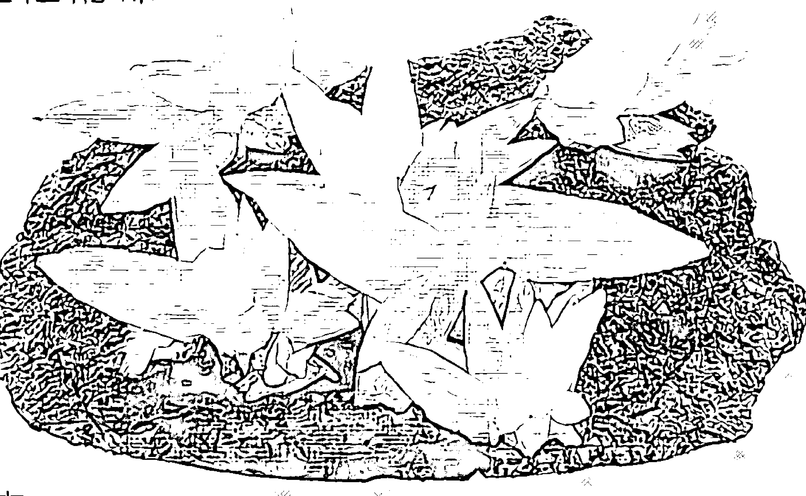

▲ 方解石的結晶同屬三斜晶系，但是仍有千奇百怪的風貌呈現，這是最美、也是最貴的「虎牙晶狀方解石」，不輸給白水晶簇吧？

- 2. 有些人若是因為自己的固執、執著、拗脾氣，所導致的各種病症，卻還不聽醫生的指示來吃藥療養，也是可以讓這類人士來掌握方解石靜心冥想，藉以化解固執氣場，外在的醫療能量才能進入，紓緩病情。

- 3. 車中若是有因為抽菸、進水、發霉、塑膠、皮墊、汽油味等等綜合怪味道，建議在車內任何一個角落放置各色的方解石（座位底下即可），可以化解這些怪味道。

- 4. 家中浴室、廁所、廚房、倉庫、閣樓、櫥櫃、鞋櫃等等，容易產生怪味道的地方，致使家中氣場不佳，可以擺放各種的方解石來改善。

- 5. 現代人常把鞋櫃放在玄關、朝明堂處，若是讓「鹹魚」臭氣沖天，真的會對家運、前途、前景產生不良影響，鞋櫃的味道問題，應該用方解石來好好處置。

- 6. 家中若有人體味重，或是狐臭、汗臭，或是因為病症所致，空氣中常瀰漫著怪味道，短期的快速解決方式，建議可以經常點燃檀香、沉香來改善；長期而言，建議在家中四處多擺放各種、各式方解石來消除怪味道，其中虎牙方解石酷似水晶簇，價格便宜，裝飾效果也非常好。

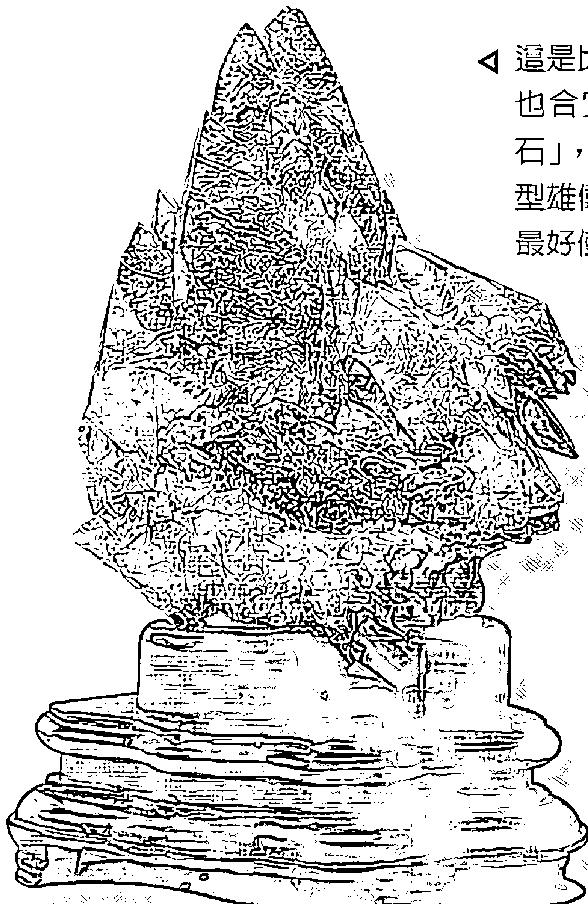

◀ 這是比較實際，比較黝黑，價格也合宜許多的「黑色虎牙方解石」，可以有比較大的結晶，造型雄偉，化解各種沖煞，實際上最好使用的方解石。

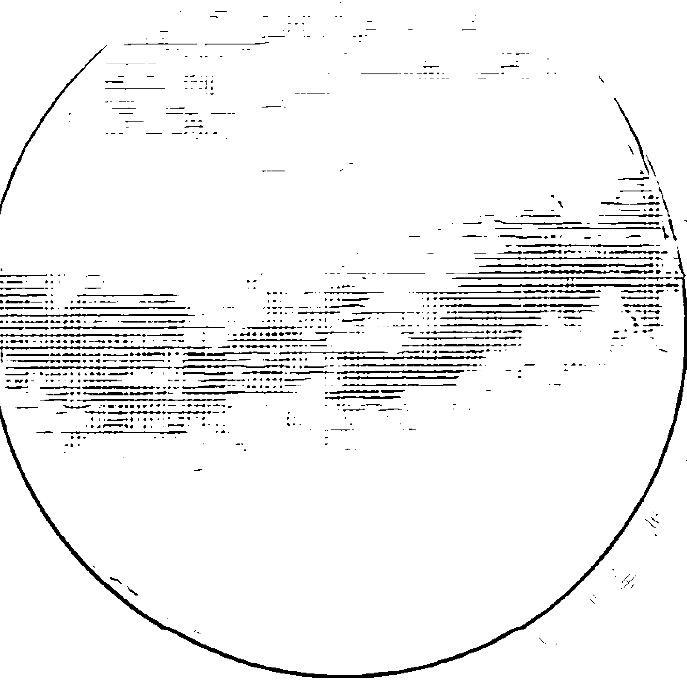

△ 猶如加州柳橙Sunkist的橙色方解石，可以化解一個人的固執、成見、拗脾氣、愛比較的壞習性，化解宿命，改變命運，跟陽光一樣燦爛！

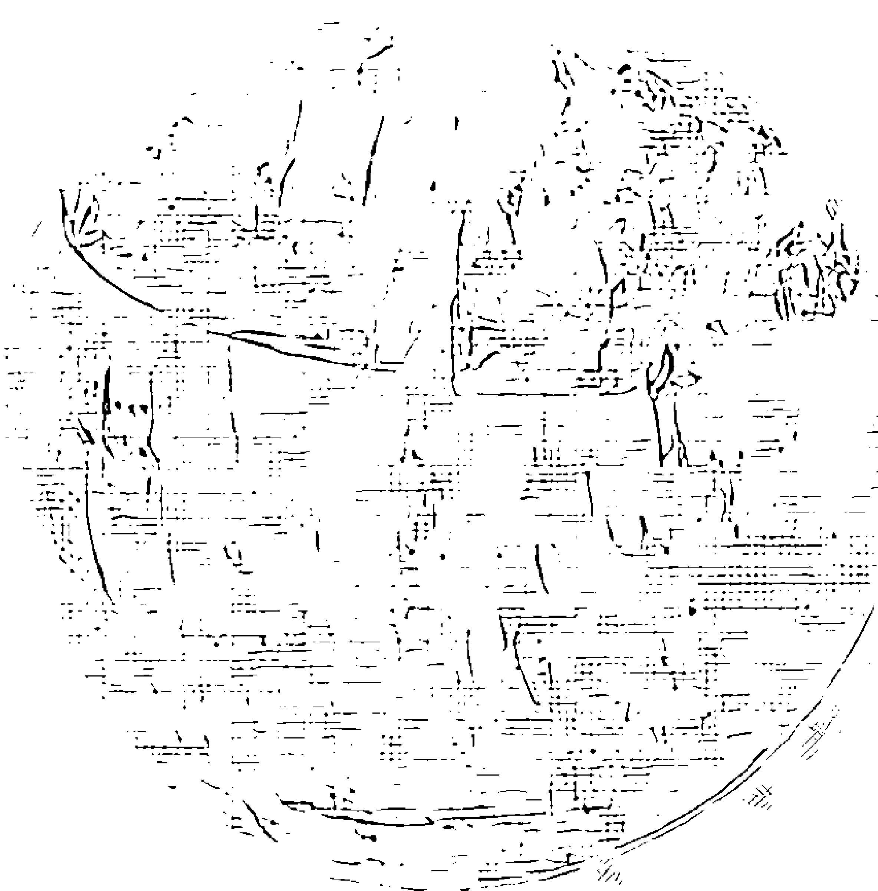

◁ 半透明的金黃色方解石，被許多台灣商人當成「黃水晶」在報紙上、電視上大肆廣告，大賣特賣，公開的騙，卻也沒人管，無法管，呵呵，台灣人玩水晶要懂得「自求多福」哦。

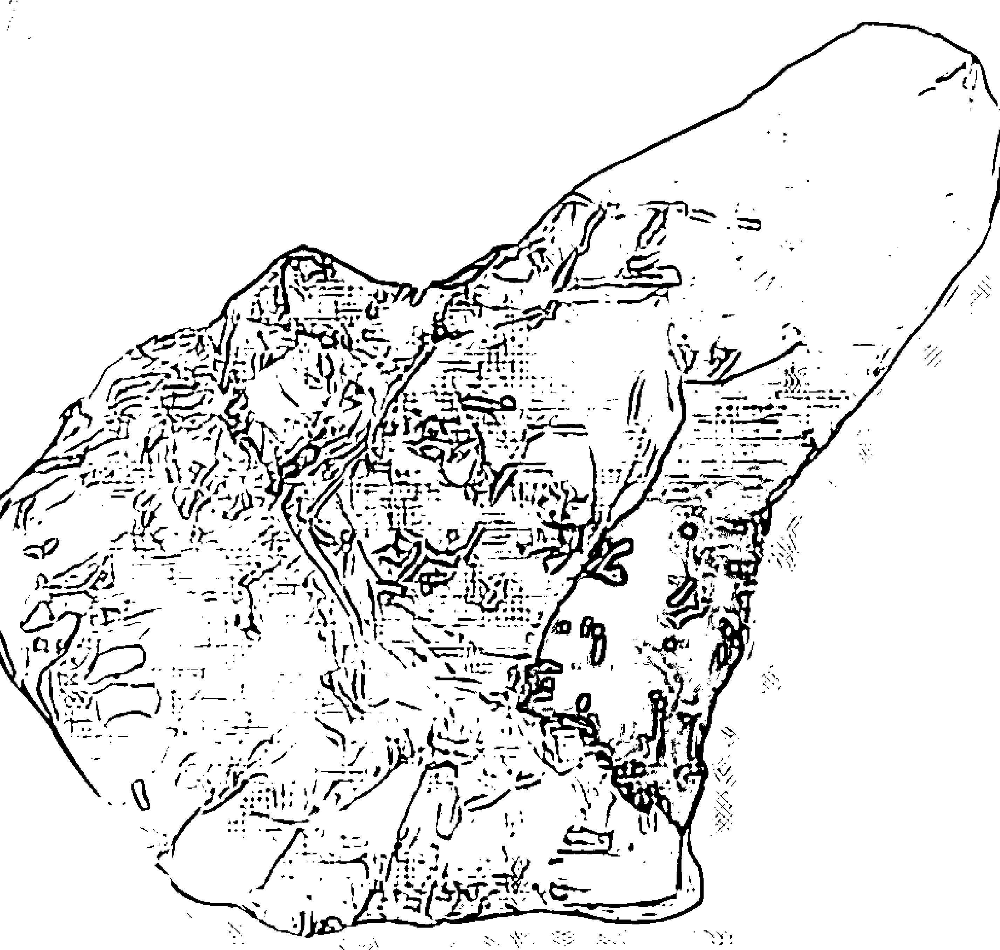

▷ 綠色的方解石好像客家人「鹹菜乾」，專門用來化解鞋櫃裡面「鹹魚」的味道，常保玄關、大門、明堂的氣場純淨，家人才有好前程。

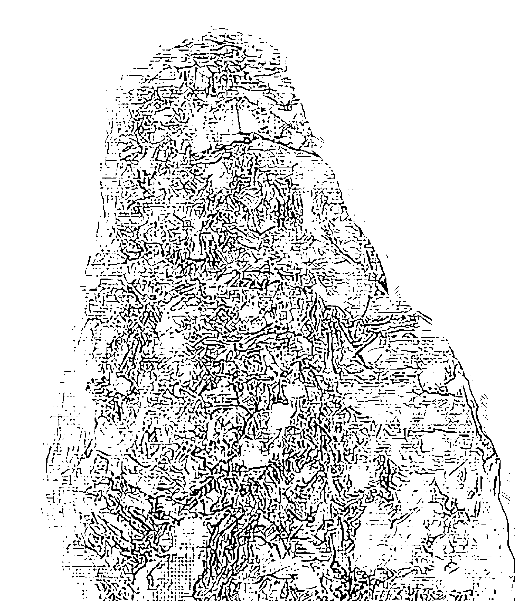

△ 比較大塊狀的藍色方解石，請用來化解廚房、廁所、倉庫等等地方，才好為家人健康把關。

- 7. 家中若是有正值叛逆期的青少年，或是異常固執的老人家，難以正常溝通者，可以在他們的房內放置各種的方解石光明燈，藉此來化解堅硬的氣場外殼，變得比較柔軟、柔和，才比較方便溝通協調，也保持一家和樂。

- 8. 廚房關係到人體的消化器官，廁所關係到排泄生殖器官，也是不能放任臭氣沖天，影響健康至鉅，提醒也要用方解石來做重點處理，消除化解各種不良氣息。

- 9. 臥房的浴室、廁所門向，若有沖到床頭，容易影響當事人的睡眠品質，容易造成長期失眠、腦神經衰弱，或是明顯的頭部偏頭痛、神經疼痛等等，除了可以在門口懸掛水晶珠簾外，還可在此「動線」中擺放各色方解石，特別是虎牙方解石，可以強力化解此種沖煞情形。

- 10. 每隔一、二個月的時間，可以將方解石拿到後陽台放置一個禮拜，讓風吹、日曬來消磁淨化他，疏散、釋放內部所有的氣味、能量，就可恢復如新，重複使用。

- 11. 逢年過節，特別在立春、端午、中秋等重大節氣前夕，可以在家中各個角落擺放各色、各種方解石，連放三天三夜，消除各種不良氣息，也迎接清新的氣息，讓居住環境中充滿新鮮活絡的生氣。

- 12. 住家、商店、辦公室若是經常容易有爭吵、僵持、冷峻的氣氛，就不好安居樂業了，建議在「台面上」多多擺放各色方解石，桌子上、櫃子上都行，藉以化解各種不良氣息，恢復清新、新鮮的氣氛，和氣才能生財。

- 13. 做生意人家可以將比較大型的方解石，擺放在店門口，化解關煞於無形中，才不會有不良、意外因素來影響生意的進行。

- 14. 醫院、診所、病房等，建議在四面八方各個角落，都多擺放一些各色、各種方解石，所費不多，但能消除晦氣、穢氣，讓患者可以早日康復健康，也讓在其中工作的人員可以常保身體健康，精神愉快。

- 15. 一些特種行業，或是生意型態比較「武場」的，進出份子複雜，紛爭亦多，建議採用各色方解石（Calcite）、螢石（Fluorite）所製成的水晶噴泉或光明燈，可以化解暴戾、衝突、爭鬥等不良氣息，調和營業場所的氣場、氣氛。

- 16. 家中若有人長年臥病在床者，可以在其房內或床下放置各種方解石，特別是「虎牙方解石」，可以比較強力的化解病氣、穢氣，同時還能防止無形的負能量干擾，俗話稱的冤親債主等等。

- 17. 每個人本命的五鬼、六煞、絕命、禍害方位，也可以置放各色方解石來化解，減輕對人體的危害。

- 18. 流年的衰氣、死氣方位，也可以用便宜又大碗的方解石來化解，讓居住環境中的氣場可以更為清新活潑。

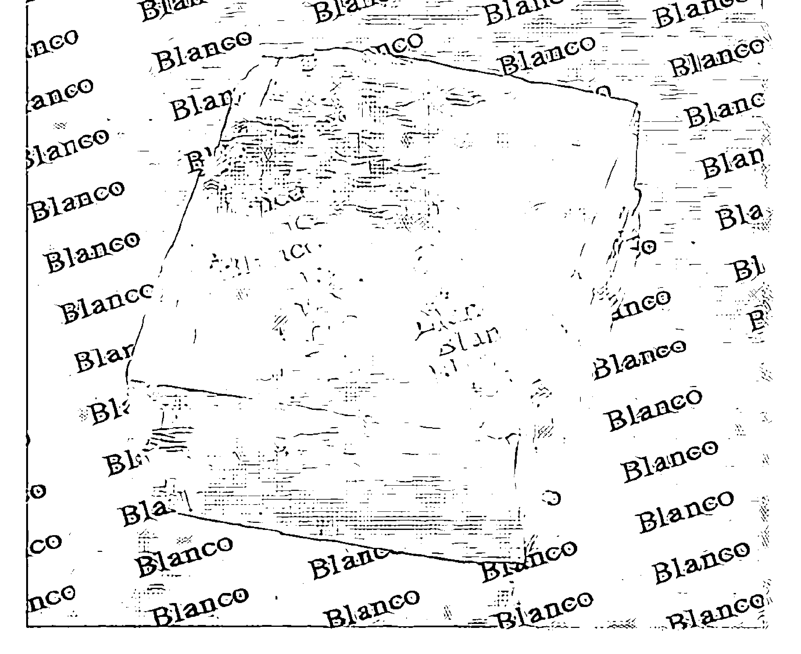

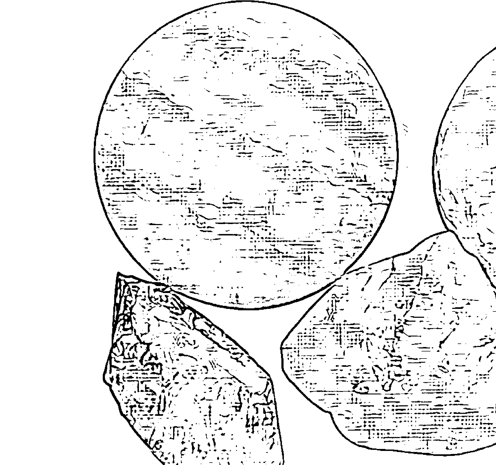

△ 方解石家族集合來拍照，非專業的攝影，反而還原幾分，方解石不是「寶」的家族，人人都買得起，且很好用的哦。

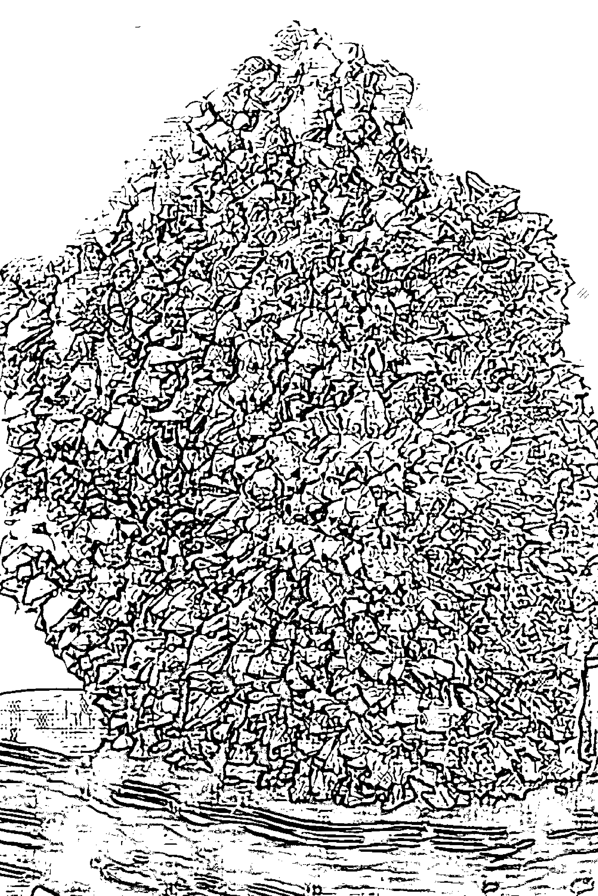

◁ 圖二是大顆牙的「黑色虎牙方解石」，這個是小顆牙的，但有大片狀，依然可以發揮巨大的效果，而且價格比起那些「好看的」寶石，便宜許多，內行的風水師多選擇此種來化沖解煞。

## 第十九章 瑪瑙片

瑪瑙（Agate）是個很有意思的東西，從體型上來講，小有小到一個鵝卵石大小，大有大到好幾噸重；從種類來講，在「瑪瑙」這個大項下，還有好幾百種、上千種的細分，一般多會相當便宜，但是某些條紋瑪瑙（Stripped Agate）經染色加工後，歐洲做成入體頭像浮雕「卡密歐」（Cameo），東方做成「天珠」，價格就連翻了幾十翻，叫尋常百姓碰都不能碰囉。然而，這麼多樣性的瑪瑙，到底還是很平民化的，絕大部分是大家都可以買的起，用的來，而且可以非常得心應手的。

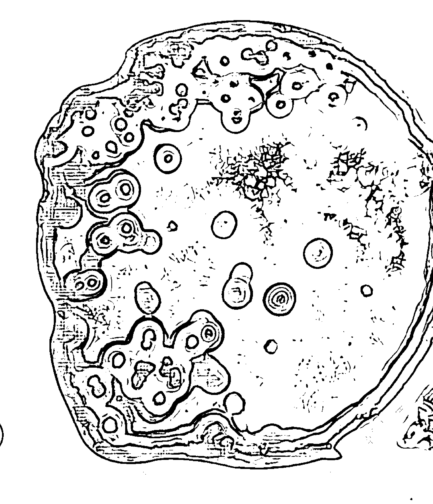

△ 切片後的瑪瑙具有千變萬化的紋路及色彩，叫人目不暇給，歎為觀止！除觀賞性裝飾性外，還可多方應用在改善風水上，真是上天賜予的寶石！

將瑪瑙切開成為片狀、拋光，本身就是一件大工程哦！需要使用大型的鑽石鋸片，拋光工具，耗時、耗材、耗力！台灣曾經非常有名的「天工剖」，特殊設計製造的機台，可以一次十幾、二十片的鋸片切下，一個人可以照顧好幾部機台……但是，也隨著工資高漲，產業外移，非常少見囉。目前還是得仰賴低工資的產地巴西來供應。

瑪瑙（Agate）又名「石髓」（Chalcedony），顧名思義，就是「精髓」的意思。瑪瑙也是石英家族（Quartz Family）的一員，本質上和「水晶」（Rock Crystal Quartz）就是相同的東西啊，同是二氧化矽（SiO2）、六方晶系、硬度七。然而，水晶的結晶屬於外向型，可以明顯的看到、摸到，所以稱「顯晶」，而瑪瑙的結晶非常細膩微小，結晶與結晶之間還有許多細膩的連結，必須用顯微鏡來看才看得出結晶形狀，所以稱「隱晶」。而不管如何，價位如何，了解這其實都是相同的性質就是，好好的淨化、啟動，也能發揮出跟水晶一樣的巨大功效！

此外，能夠切磨成瑪瑙片這麼大塊狀的寶石，還有類似「螢石」(Fluorite)，粉晶 (Rose Quartz) 等等，特別是螢石，打磨後，半透明的性質透光來看，加上其天然猶如彩虹般的色調，真的非常美麗動人哦，作為室內裝潢、擺設，也是一流的裝飾品！在風水上，也是如同瑪瑙片一樣，可以做多方面的不同運用，消除濁氣、穢氣，擋煞、化沖等等。成本上，或有點差異，朋友們可以自行比較，用自己的審美觀點和預算來決定自己該如何使用吧。
(淳賀天然水晶Fax:886-2-2788-8982)

### 使用方法：

- 1. 厚度在2～4指幅間，寬度在30x30～50x50公分間的大片瑪瑙片，可以用來調節人體氣場用。自然坐時，可以將瑪瑙片踩在腳底下，讓腳底的湧泉穴貼著瑪瑙片，好好靜心放鬆自己，就能排除體內的濁氣、病氣、雜氣、晦氣、霉氣等等，具有改善健康，改善運勢的作用。

- 2. 打坐時，可以將瑪瑙片拿來坐，海底輪（會陰穴）貼著瑪瑙片，除了可以排除體內各種雜氣之外，還可刺激海底輪產生新能源，提振生命力，對於身體保健，改善運勢等等，都有良好的功用。

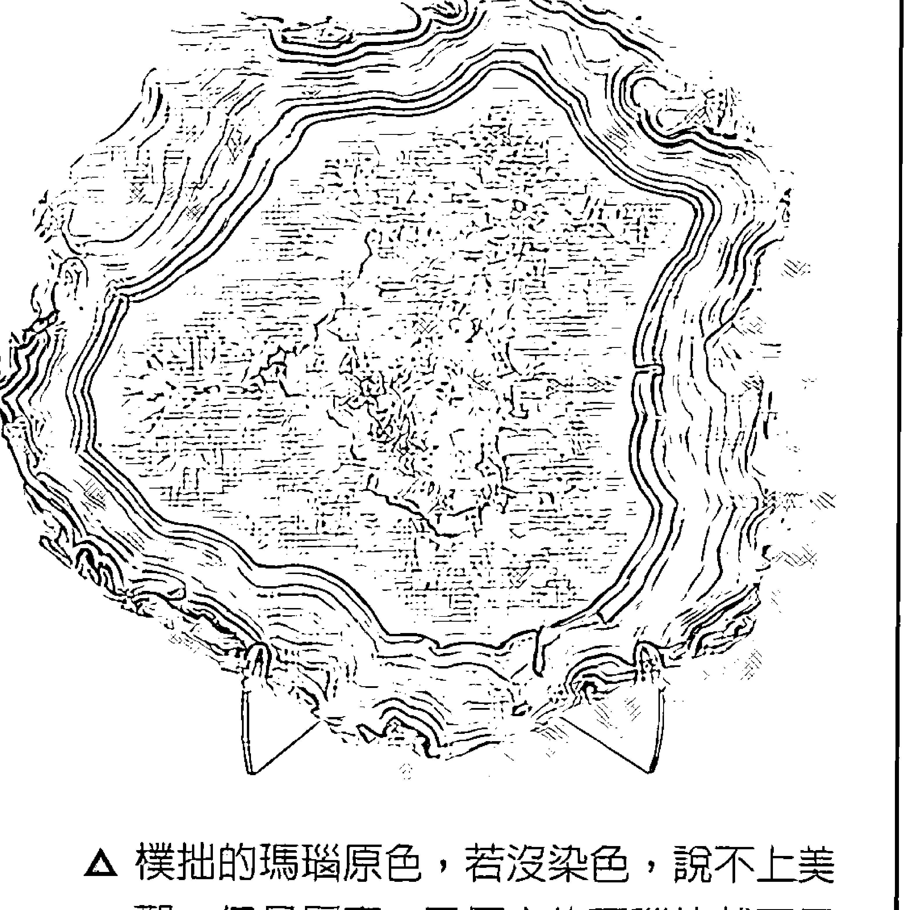

> △ 樸拙的瑪瑙原色，若沒染色，說不上美觀，但是厚實、又便宜的瑪瑙片就可用來擋沖、擋煞、化解不良能量氣息，用途可大的很哦。

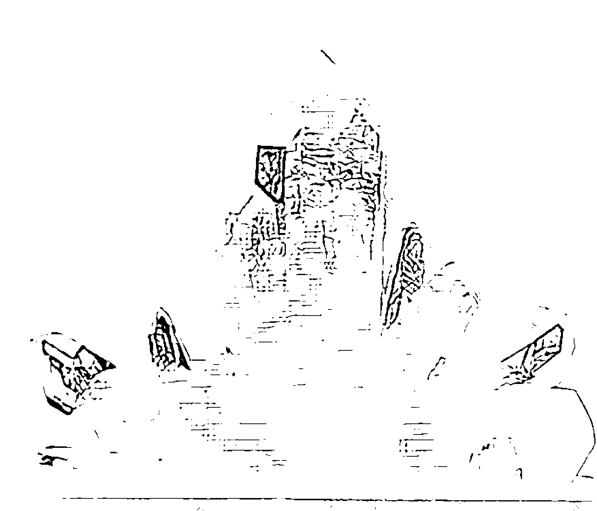

▶ 大塊螢石切片後，濃濃的多彩色帶，非常好看，也可以像是瑪瑙片一樣，來化沖、解煞，解決許多風水上的問題。

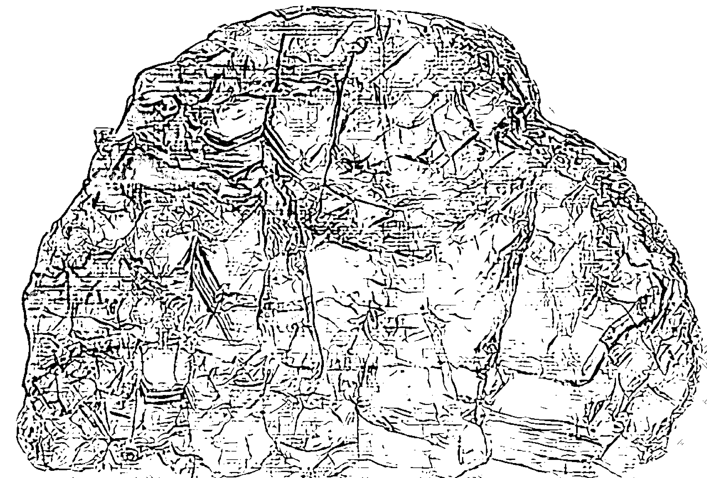

- 3. 讀書、辦公時，容易頭昏腦脹，思緒混亂，沒有耐心者，可以將瑪瑙片放在地上踩著，或是放在座位底下坐著，可以將頭部過多的能量導引下來，恢復頭部清明的思考記憶空間，頭腦清楚，做事情就不會出錯，運勢就好。

- 4. 神位不能無靠，若是神位靠後面牆壁，緊鄰著廁所、廚房、臥房，對於神位及整體家運都不好，可以在神位的正後方，或是後面牆壁上的相對位置上，置放厚片型的瑪瑙片，可以產生阻擋及「靠」的作用。

- 5. 若是神位高度不足，讓香爐高過一定程度，也會影響財運、家運，會有節節敗退的現象，可以請專業風水師來鑑定，並用適當厚度的瑪瑙片來墊高，化解危機險境。

- 6. 神位用瑪瑙片墊著，穩固安全，對於正下方的樓下住戶、居民，也就不會產生不良影響，當臥房、客廳、書房等等，就百無禁忌，不必擔心受到「神煞」的影響。

- 7. 當屋外、牆外有電塔、變電所、變電箱等等，緊鄰著這房間千萬不要當臥房，也不要當家人的主要活動場所，當倉庫來利用尚可。可以買來大型的書架、櫃櫃，在每一層、每一個架上都擺設薄片的瑪瑙片，形成一片「瑪瑙片牆」，一來可以收裝飾的美觀效果，二來，可以阻絕不良的電場、磁場，保障住戶安全。

- 8. 當屋外有強力的反弓煞、高架橋、快速道路、人行陸橋，橋口直沖等等，也可以用上述方法來化解。

- 9. 一般比較平常的沖煞也可以用此方法化解，可以自行衡量如何比較經濟節約，美觀，而且能夠取用方便。

- 10. 當遇到「輻射鋼筋」的住屋時，其實根本的解決方法是拆掉重建，但因各種因素容易延宕，又無力搬遷時，可以採用上述方法，或是直接將瑪瑙片黏貼在相對應的牆壁面上，來暫時化解；爭取一點點的緩衝時間和空間，需盡快另謀打算。

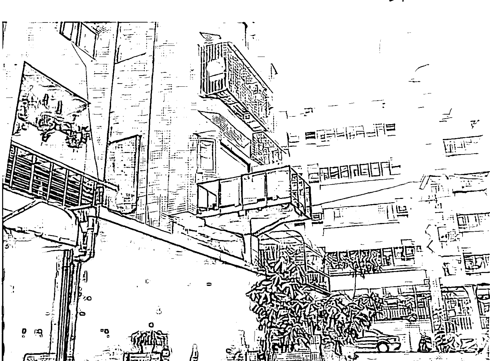

現代都會中經常會遇到的問題，窗外就是電線桿、變電箱，怎麼辦？又不能拆掉，也不能搬家啊？只有利用「瑪瑙片牆」來阻擋囉。

想要便利，卻不要汙染，現代人對於「行動電話基地台」的感覺就是如此，喜歡他的方便，卻不要架在我們家。電磁波的干擾問題，可能要多年後才會有具體影響報告哦，先見之明，先用瑪瑙片牆、螢石片牆來阻擋吧，連大樓的光煞也一起給擋囉。

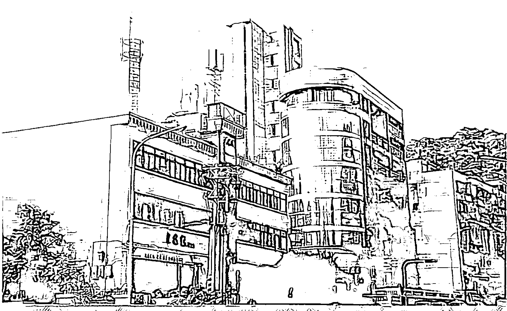

## 第二十章 五行水晶陣

由於東方、西方的神秘學體系發展方向不同，在中國的各種神秘學幾乎和「五行」脫離不了關係。但是，只要進入「五行」，就一定會有「生剋」的問題，也就是說沒有絕對的好、絕對的壞，一定有「被生」、「被剋」、「所生」、「所剋」的問題產生。想要平平穩穩、安靜過日的太平思想，好像就不太可能。難怪許多修行人的最高理想，就是要「跳出五行外，不在三界中」；跳出木、火、土、金、水的五行生剋、輪迴當中，也不在欲界、色界、無色界的範圍內，才能做到真正超然，永恆開心快樂。

空的改變而「風水輪流轉」。有些企業、人家，就是每年或每隔幾年，就要大興土木，重新裝潢。景氣好時，還可以負擔，遇到景氣差時，就得將就將就囉；而尋常人家就得更為將就了，光是繳貸款就來不及了，哪有閒錢隨時更改風水呢？有人就開玩笑囉，難道您們家的神桌底下要裝輪子嗎？每年轉一個向？就算再有錢，也不能每年大門都改向啊？這些觀念，其實都有必要做些相當修正和調整，才不至於食古不化呀？

在風水中，也是相同道理。只要是用五行所推算出來的方位、地點，也沒有說哪個是永遠的好、永遠的壞，都還要隨著時

前面說過，許多時候，推算出來的凶不是真凶，吉也不是真吉，都是一種「可能性」，提醒當事人小心為要的成份還比較大啊。只是，限於語言文字的作用，聽到「吉」就很爽，聽到「凶」就很不爽，影響人們的心

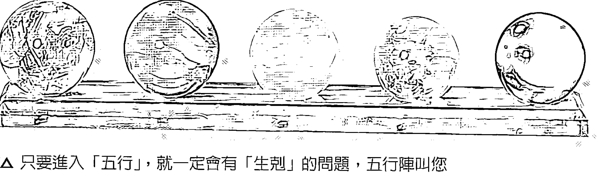

情情緒作用很大。所以，如果您常常想不開的話，風水師、地理師說哪裡凶，哪裡被剋，哪裡有問題，可是又限於現實環境因素考量，不能亂動，怎麼辦？那就擺起「五行水晶陣」，讓一個「五行兼備」，平衡又圓滿的能量陣勢來安撫您騷動不安的心靈，也解除您對環境風水的疑慮囉。

> (淳質天然水晶Fax:886-2-2788-8982)

### 使用方法：

- 1. 依照五行「木、火、土、金、水」的能量振動頻率，也就是表面顏色，即是「青、赤、黃、白、黑」來挑選適當的水晶：圓球型的能量放射比較緩慢、持久，用來化解、稀釋的作用；柱形、金字塔型，比較急而快速，用來擋沖、制煞的作用。

- 2.「青」就是「木」，代表綠色、藍色都可以，如綠色東菱、綠色幻影水晶、祖母綠、孔雀石、方鈉石、天河石；「赤」就是「火」，即火紅色，如紅寶石、紅碧玉；「黃」就是「土」，黃水晶、黃色方解石、虎眼石、矽化木；「白」就是「金」，純白或是金屬白，如白水晶、乳白水晶、黃鐵礦、黃銅礦；「黑」就是「水」，如煙水晶、骨幹水晶、彩虹黑曜岩、拉長石、黑隕石。

- 3. 有些朋友有些疑問，說「黃銅礦」（Copper）、「黃鐵礦」（Pyrite）明明就是黃色的，怎麼屬於「白」呢？原來，這些都是金屬，金質的咩，金屬反射出來的「白光」，所以就被歸類於「金白」。另外，「矽化木」（木化石，Petrified Wood），明明也就是「木」，怎麼歸於土呢？原來，已經在多年前產生質變囉，不再是木的特性，已經都是百分之百的「化石」，所以屬土。特此說明一下。

- 4. 相同的圓球狀，或是柱狀、金字塔狀做成同一個陣勢，不要相互混淆，彼此的尺寸大小、份量也要差不多，能量的發散才有一致性，團結力量大。依照「青赤黃白黑」的順序，一字排開，給予適當的啟動、連結，就可發揮作用囉。

- 5. 五行水晶陣非常適合擺在書桌、辦公桌前面，「取用方便」，工作疲累時，可以掌握黑色的消除疲勞壓力；要計算、做財務報表時，可以掌握黃色的；要接待客人、開會、展現親和力時，可以掌握紅色；想要得上司、貴人賞識，可以多握綠色；想要冷靜思考多些靈感，可以握藍色的；想要靜心養氣，也可握白色的。

不好的影響，也會影響工作表現。

- 6. 若是大辦公室裡頭，有來自上司長官的龐大壓力，或是有來自同事的鬥爭排擠等等，也可以將五行水晶陣對向這些方向來源，就有阻擋、化開、疏導的作用。

- 7. 若是不幸被安排在「橫樑」下工作，可以用五行水晶陣來抗衡，暫時阻擋一陣，長期而言，還是要請主管重新安排位置，不要讓任何職工直接承受這種壓力，對人身會產生非常

- 8. 若是工作環境中，不得不和一些電氣產品相鄰，又具有相當電磁場的東西，如電腦螢幕、音響、總機機房、放映機、投影機、影印機等等，也可以用五行水晶陣來阻擋。但是對於影印機所釋放出來的空氣，仍要保持空氣流通為要。

- 9. 可以將五行水晶陣擺在公寓房屋的落地窗前，前陽台上，可以有阻擋五黃關煞的作用。其他的住屋或公司行號、商店等，可以自行參酌實地情形，盡量擺在前門處，不會有遺失、遭竊的可能性，位置高低不拘。

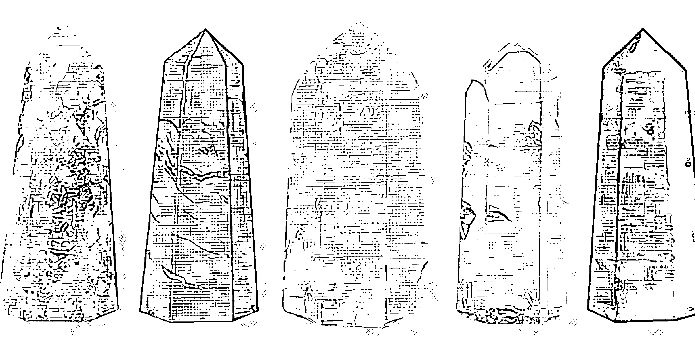

## 第二十一章 水晶宝瓶

查看自己出生年次及东西四命的本命盘，可以将五行水晶阵摆放在自己的五鬼、六煞、祸害、绝命方位，消除对我们个人的不良影响。

若依照九宫飞星来看，不管地盘或流年盘的泄气、煞气、衰气、死气方位，也都可以用五行水晶阵来化解，并重新活络起来。

采用五行水晶阵也是“供佛”、“供养神位”的极好考量，具有平衡、圆满、超脱俗世的味道，也能保佑全家平安健康，事业发达。

虽然我们鼓励读者不要受到迷信等的影响，但是对于一般世俗之人，无法免俗者，没有给他一点点依靠就无法安心者，那么就给他们一个真正有能量的“五行水晶阵”，可以让他们每年摆在不同的“太岁方”，安心后，也可以安居和乐业。

| 生肖 | 鼠 | 牛 | 虎 | 兔 | 龙 | 蛇 | 马 | 羊 | 猴 | 鸡 | 狗 | 猪 |
| --- | --- | --- | --- | --- | --- | --- | --- | --- | --- | --- | --- | --- |
| 地支 | 子 | 丑 | 寅 | 卯 | 辰 | 巳 | 午 | 未 | 申 | 酉 | 戌 | 亥 |
| 方位 | 北 | 东北偏北 | 东北偏东 | 东 | 东南偏东 | 东南偏南 | 南 | 西南偏南 | 西南偏西 | 西 | 西北偏西 | 西北偏北 |
| 犯本命太岁 | 鼠 | 牛 | 虎 | 兔 | 龙 | 蛇 | 马 | 羊 | 猴 | 鸡 | 狗 | 猪 |
| 180度正冲 | 马 | 羊 | 猴 | 鸡 | 狗 | 猪 | 鼠 | 牛 | 虎 | 兔 | 龙 | 蛇 |
| 90度偏冲 | 兔鸡 | 龙狗 | 蛇猪 | 马鼠 | 羊牛 | 猴虎 | 鸡兔 | 狗龙 | 猪蛇 | 鼠马 | 牛羊 | 虎猴 |

传统风水中，瓶子也是风水制化中的一个重要项目。究其原因，一是瓶子可以聚气，就有添补、增进的作用；二来瓶子可以装水，也有化煞的功能，水带财，又可聚财；第三就是谐音，瓶子和“平安”、“保平安”（宝瓶）的音都接近，可以带给人们安心、愉快的感觉。有实际作用，又有心理作用，那就肯定很好用啰。

只是，传统上，都是使用“古董瓶”，说是年代久远，才有气；但也有人反对，说老古董容易沾染阴灵、阴气，反而造成家里容易犯阴煞等等，听了也叫人毛毛的。使用老古董还是要彻底消磁过才行吧？话说回来，若是真的古董，又有个问题，“价格不菲”，寻常百姓、上班族肯定连边都摸不着，即使有钱，也要先用来改善基本生活，哪敢用在这方面呢？若是摆个仿古董、假古董，自己心里也觉得怪怪的，遇到行家一眼识破，那是否就更尴尬了呢？而且，单纯的工艺品没有经过时间岁月的长久淬炼，恐怕也没多少气……哦，这都有够伤脑筋耶！

时间来到21世纪，风水的影响依旧，甚至更为复杂多变，然而材料科学和古代相比起来已经进步许多，能够“取用方便”也是风水制化中重要的一个考量啊。太贵，太稀有，只有将相王侯、王公巨贾能买得起的东西，对我们平常百姓而言，也没有任何意义可言啊？采用古方法，找来现在制造的广口玻璃瓶子，可以又多、又大、又便宜；气不够吗？那就找来各式各样的水晶滚石，装填进去，都是百万、千万年以上的结晶宝石，气强的很咧，比什么人为的古董都还古董！既好看，又好用，更是便宜！这样，才能符合众多百姓的殷切需求啊！

现代工艺技术发达，许多韧性（Toughness）比较好的宝石，也偶有加工成为瓶子造型的，例如玉（Jade, 包括Nephrite 软玉和Jadite 硬玉）、东菱石（Green Aventurine）、萤石（Fluorite）等等。这些若是价格不贵，也是我们可以考虑当成“风水制化”的工具哦。

还有啊，因为价格便宜，各种水晶宝石的滚石又非常多样性，我们还能因着各人在不同时期、不同需求，自己来变换各种不同用途，可以说是非常广泛的哦。

△ 现代的“水晶宝瓶”，确保平安，取用方便，价格合宜，还可多方运用，只是记得，不要当糖果给吞了。

△ 绿色东菱石的宝瓶，线条优雅，色泽美丽，这都是可以传家的宝贝啊！千万年以上的结晶宝石，比古董还古董！

### 使用方法

1.  所有的各式水晶滚石买进后，请先用清水冲洗干净，必要时请商家用“超声波”机器将缝隙里的杂质也清洗出来；晾干，再用檀香、沉香薰薰就完成消磁啰。可以晒太阳的宝石，可以多晒一会儿，这是廉价又有效的消磁，也是自然的加持。
2.  采用广口瓶，方便滚石的倒进倒出；采用透明玻璃瓶，容易辨识各种不同材质，不透明的瓶子也是可用；不必刻意加水，加水的话，每三、五天就要换水一次，以免微生物死亡发臭，比较麻烦；瓶盖打开或盖上，都没有影响，气都已经在环境中作用啰。
3.  对付门前的五黄关煞，讲究的朋友可以摆三瓶（碧震）或四瓶（绿巽），装满绿色东菱石、方钠石、青金石、海水蓝宝、土耳其石、天河石等，蓝色、绿色系列的宝石，属木，就可以破解五黄关煞的影响。
4.  若单纯从破煞、消除负能量的影响来看，不管五行生克的道理，也是可以摆上三至五瓶，里头装彩虹黑曜岩、烟水晶、乳白水晶、各色萤石、方解石等等，也有破解五黄关煞及各种冲煞的作用。
5.  装着彩虹黑曜岩、烟水晶、乳白水晶、各色萤石、方解石等等的宝瓶，也可以摆在本命的五鬼、六煞、祸害、绝命方位，藉以消除各种不良的负能量，不好的影响。
6.  查看紫白飞星系统里的地盘、天盘、流年盘等等，也可以用上述的宝瓶来压制在各个泄气、煞气、衰气、死气方位，化解各种克相，消除不良气息，有再造生机，重新活络气场，确保“平安”之效。
7.  绿色系列的水晶宝瓶，如东菱石、孔雀石、祖母绿、捷克陨石、绿色萤石、绿色幻影水晶等等，可以摆放在各屋宅的“财位方”，有聚财、生财的功用。
8.  紫色系列的水晶宝瓶，如紫水晶、紫色萤石、紫龙晶、舒俱徕石等等，可以摆放在屋宅的“文昌位”，或是书桌上，可以让家人读书考试顺利，升迁通畅，得见贵人，早日功成名就。

◁ 具有彩虹家族、多色性的萤石，做成宝瓶还能半透光，非常好看！稀解性的柔和能量，更是化解各种冲煞、保证平安的宝贝。
▷ 绿色萤石雕琢而成的宝瓶，说明着就是要来帮主人“聚财”的，而且是正财哦。肚大能容，容纳天下财富！

9.  黑色系列的水晶宝瓶，如黑曜岩、烟水晶、黑色陨石、拉长石，或是强势的各色发晶，可以摆放在窗前、门后、床尾、床底下，也有“避邪”的功效。
10. 厕所、浴室、厨房、阁楼、仓库、杂物间、鞋柜、置物柜等空间的空气不流通，气味不好，建议可以采用装满各色方解石、各色萤石、或乳白水晶的水晶宝瓶，将瓶盖打开，放置该处，就有消除这些味道的作用。记得“一桶水可洗一锅米，一碗水不能洗一锅米”的道理，若是空间很大，水晶宝瓶的数量应该酌量增多，才有积极明显的效果。
11. 车上若有怪味道，亦可比照办理，但是行车间不要打开瓶盖，以免摇晃掉落，反而困扰。停车后，有一段时间不再开，此时打开，让车内空气与这些宝石来互相作用，比较妥当。
12. 想望爱情的朋友，可以采用装有粉晶、红宝石、红石榴、红碧玉、红色电气石等等的水晶宝瓶，平时多多接受月光的照射，放在自己的房间、桌前、床头、枕边，多多接触，多多接触红光、粉红光的感染，人的气场变柔和、亲和了，机会就来了。
13. 卧房、书房内，不宜有镜子直接照射床位、书桌座位，容易造成当事人睡不安稳，读书不安稳，最好撤下移开；若是有困难或其他考量，则可在镜子前放置一个水晶宝瓶，各色都行，也可化解这种光煞。
14. 许多传统风水师喜欢用鱼缸来挡煞，容易造成鱼儿非病死亡，一样叫人扼腕叹息。建议在鱼缸内摆放黑色系列的水晶宝瓶，协助制煞、化煞，消除负能量之余，还能改善水质，让鱼儿更健康活泼。

## 第二十二章 激光柱水晶

在高矮胖瘦、长短不一的众多水晶柱里面，唯一能够称上“激光柱”（LASER Wand）的，只有那种长长、细细，而且前端窄小，后端比较宽大的那种才是。常常在一些不够专业的新购物网站、店家、或路边摊看到，把一些“粗粗短短”、“矮矮胖胖”的水晶柱也称为“激光柱”啦。哦，看到差点昏倒！为什么要求这么严格呢？还不都是一样都是水晶柱吗？话是如此啦，打个比方就知道啰。

我们看过水从橡皮管流出来的样子吧？您若是把喷嘴那边稍微捏小一点，相同的水量，是否就变得比较急促，且喷射的比较远？台湾俗话还说哦，“囡仔撒尿撒过溪，阿伯仔撒尿滴落鞋”，这个“口径”不一样，“射程”也不一样，小孩子可以撒过溪，老人家就滴落在自己的鞋子上啰。咱们使用激光柱水晶，也就是讲究他的“能量激发强大”、“射程远”、“集中尖锐”，才能担纲我们在修行、改运、风水中的巨大任务啊？

激光柱水晶，小从七、八公分，大到三十几分公分都有，大多是表面粗糙，没有抛光过的自然面；偶有遇到抛光过的，那就更为漂亮，价格也会更高。后者所激发出来的能量，似乎更为平顺、稳定，更为容易启动，都很好用就是了。激光柱的货源并不是很多，因为用途很多很广，几乎是所有水晶玩家的基本配备。

偶尔有遇到“双尖水晶”，那就更为稀有，更值得珍藏；“水晶魔术棒”虽然是制造出来的，也是采用两支双尖水晶，在铜管的两端连接起来，都可以取代激光柱的作用，而且运用更广、更为精准。记得哦，激光柱能被这两者取代，却无法取代这两者哦。这是更为细腻的分辨了啊，暂时不论，在风水制化中，我们就以激光柱为准，讨论各种不同的用法。

> ◀ 大树生长在峡谷的险口上，日夜受到强风的吹袭，也就是能量流的冲煞，都长成这样了。人的血肉之躯，轻微的气场，能够接受冲煞的长期侵袭吗？

### 使用方法

1.  门口若有路冲直挡而来，曾有传统风水师说摆上一支“关刀”，就可破解！话是没错，也有道理，就是用关刀的强力和“破”的力量啊。但是，如果家里不是开国术馆、武馆的，是不是太奇怪了？而且，还会惹上警察上门，违反“枪炮弹药管制条例”，吃不消，兜着走。建议在门口悬挂一支激光柱水晶，尖端向着冲煞来的方向，就有以小搏大，以尖针刺破气球的态势，破解、化解各种冲煞的力道了。
2.  遇到有家中横梁压到床位、书桌、餐桌、沙发等等，传统风水师就叫人做天花板来遮掩，但这只是视觉上的遮掩，并没有化解整栋建筑物在梁柱上的压力啊？有“掩耳盗铃”味道，不足取。另外，劝人在横梁两侧悬挂箫、笛等乐器，这就有道理了，可以藉着此“管道”化解建物压力。但是，若都是全新的箫笛，从来没有被吹过的，也就是从来没有被启动过的，也是摆摆样子，本身没有那种“能量惯性”来作用，效果不大，而且在梁柱的两侧作用也不大。建议在横梁的两端（非两侧），靠墙壁的正下方，悬挂激光柱水晶，尖端向下，可以有导引压力向下的作用，进而化解对于环境的强大压力。每隔一两个月，激光柱重新启动一次就行。
3.  实话实说，所有的梁柱都承受着整栋建筑物的重量压力，靠着任何小小的东西说要完全化解，都有可议之处；只能说挡一下，暂时化解一下，长期而言，还是要“避而远之”、“走为上策”，不要妄想以肉身来抵挡，吃亏的会是自己。横梁压床就是俗语所谓的“扛尸煞”，可见多凶！在家中，最好床位、书桌、餐桌、沙发等等都移开。
4.  曾经在办公室发生的真实状况，某某人暂时外调受训几天，回来后发现所有座位更动，大家都已经坐定位了，就只留下一个“横梁压顶”的座位给他，没得调换，也没得讨价还价，摆明被“冲康”，只好坐下。如此状况，就要用上迹方法来做“制化”，激光柱悬挂横梁两端，横梁正下方的桌面上多摆些水晶簇，期能将自己的损害减到最低。

△ 选在水晶簇上的激光柱水晶，像不像一支巨大的炮台？我们就是讲究他的“能量激发强大”、“射程远”、“集中尖锐”，才能担纲我们在修行、改运、风水中的巨大任务啊？

5.  在办公室中，若有长廊、走道、门口、楼梯口等等正对着您，容易造成坐不安稳，事情特别多，却不容易得宠、受重用。建议在这些冲煞的方向来源，用枝激光柱来对着，也能发挥刺破、突破、化解的作用。
6.  将小支的激光柱悬挂在门前、窗前、床尾、气窗、各个出入口等等，也具有“避邪”，防止外灵入侵，也会制止孤魂野鬼的四处游荡，保障居住环境的干净与安全。
7.  若是住家的门口、窗口往外看出，会看到坟墓、殡仪馆、灵骨塔、医院等等，风水上也是属于不利，凶。也是可以在该窗口、门口挂上激光柱水晶，也有压制化解的作用，不怕邪气入侵。
8.  当在外工作，担心被欺负，受排挤，遭小人忌等等，可以在自己办公桌左边的墙上，壁橱上，档案柜上，或是办公桌的抽屉里，悬挂、摆放激光柱水晶，尖端向外，期能化解小人暗中的诡计侵害。
9.  平常若是遇到“长屁股”的朋友，一来聊天打屁大半天，让主人无法外出、做其他事情者，可以将激光柱水晶的尖端对向来者，下逐客令，促其早些打道回府，回复清净。
10. 餐厅遇到霸王客人，只叫一杯清茶，从早坐到晚，占据座位，无法做其他客人的生意，也可以将激光柱水晶的尖端对准这些客人，让其坐立不安，也促进座位的循环使用率，事业才好继续经营。
11. 若是经常受到比较高大蛮横的同学欺负，或是受到资深、职务高的同事长官刁难，满腹委屈无处诉说，却又不能与之翻脸决裂，可以考虑在办公桌底下，抽屉里放置激光柱，将尖端向着那些人，也可以暂时压制他们的气焰。换取喘息的机会，赶快另谋良计，或是另谋出路。
12. 出差到了外地，睡在旅馆里面，若是担心有灵异事件发生，可以先用右手持激光柱，观想白光从尖端发出，还可一边念佛持咒，对着睡床顺转三圈，就是一种完美的结界，可以形成良好的一种“不可见光”的保护“光罩”(Protective Light Shield)，就不怕灵异事件发生啰。
13. 胆小的朋友外宿时，可以将激光柱放在床边、枕头下，伸手可及的地方，随时有任何风吹草动、灵异现象，可以抓起激光柱向着怪异的地方划过去，还可发声斥喝，就能将强大能量发挥出来，化解各种奇异现象。
14. 每年过年前夕，或是一些重大节气的前夕，如端午、中秋等，除了房屋、住宅、办公、营业处所等有形面的要大扫除外，无形的能量场也要大扫除。建议点起12枝香，配合激光柱一起握在右手，口中念着佛号或是持咒，对着房屋上上下下，里里外外，由内而外，将全部的地方都扫除过，都扫向外面。消除所有的杂气、脏气、晦气、浊气、秽气等等，有除旧布新，焕然一新的作用。
15. 若是感到家内，或是店内、公司内，许多事情不顺，人员常生病，或是常口角，生意也不是挺好，客人来晃一晃，没买就走出去……也可以随时点上12枝香，配合激光柱来全面净化、消磁干净；随时都可以做，不一定要等节气变换时才做，节气变换时是“必须做”，随时都可以多做，没有问题。
16. 为了维护环境能量场的干净，纯净，随时可以多用上述方法多多净化，也可以多重净化。特别是阴暗潮湿的角落，库房、阁楼、厨房、下水道等等，更不能错过，这些都是容易聚集阴气的地方。平常时，建议还多用“水晶水”来擦地板、清洁擦拭各个家具，这是道家所谓“净制法水”，除了清洁，也有净化气场的作用，也可以避邪。
17. 开车前，可以先将激光柱拿在右手，观想白光，配合念佛号或是持咒，将车子顺转三圈围绕起来，也是一种良好的“结界”，可以保护行车平安，不会遇到怪异的冲煞问题。当然，自己也要小心开车，不要抢先、抢快，不然也是容易出状况。
18. 不管是走路或开车，行经一些坟墓、乱葬岗等等，可以将激光柱握在右手手掌心中，强大的气势，就能壮胆，若有什么状况，随时可以发出强大能量光束来压制，就可安全通过。开车时，可以将激光柱黏贴在驾驶座、方向盘前。
19. 进出各种不良气场的地方，可以随时用双手食指将激光柱夹住，高举过头，深深吸一口气，由左而右地慢慢旋转三圈，同时缓慢吐气，吐气的同时，就是观想白光由激光柱放射出来。如此绕三圈之后，就可以在身体周遭形成良好的“结界”，不怕各种不良气息、甚至外灵、妖魔鬼怪等的侵袭。若是担心一次做不确实，也可以多做几次。凡人只担心能量不足，保护不足，不怕能量过强，保护过强。随个人功力不同，结界确实与否，几个小时，几天后，结界会自然消失。必要时，随时再结界就行。
20. 如果待在一些办公室、工厂、学校、军队等团体所在，不得不和一大堆人打交道，却又想保有自己的清净空间，也是可以随时如上地做结界，可以减低许多有形、无形的干扰，可以比较自在生活过日子。

>> ▶“横梁”的扛尸煞，解法众多，但多属掩耳盗铃，未从卸除能量方面去考量，顺向的激光柱正好可以解决这问题。不过，长久之计，还是走为上策啦！

>> ▶ 把激光柱绑上中国结，可以放在许多地方，化解各地的不良气息、冲煞。小虽小，这正是密宗风水学的基本精神，对准冲煞的来源，以小搏大，四两拨千斤，好像针刺破气球的比喻，破解、化解各种的能量激流了。

## 第二十三章 灵兽

由于龙龟的广泛运用，效果也相当明显，连带地，就连龙龟的其他兄弟，还有许多类似神话中神兽、灵兽，如麒麟、貔貅、狻猊等等，也受到众多风水师的喜爱。因为这些在整个中华民族文化的传统里，几乎不需多加说明的，大家都知道这些是神仙们的坐骑，具有上天、下海、腾云驾雾的本事，常常也是神仙们的先锋部队，看哪里需要平定妖怪作乱，都可以发挥等同神仙“本尊”的幻化能力，甚至还有他们自己“野兽”的蛮力、蛮性、野性，用来对付妖魔鬼怪是最恰当的啰！所以也广泛用在避邪和风水制化当中。

由于灵兽的影响和引申，连带地让自然界中比较凶猛的野兽，如狮子、老虎、豹等的形象，也被引用进来。猛兽尽管凶猛，但若能驯服为我所用，岂不可以发挥极大的力量吗？大象虽不凶猛，但是因为体型硕大，行走在丛林中，就连百兽之王的狮子也要退避三舍，所以大象被用来避邪、制化，也是非常普遍的。习惯上，在买回这些“猛兽”后，记得要用红线将他们的脖子上绑住，留个线头到自己手上，能够掌控的意思；然后，有事没事，就要从头抚摸到尾，就好像

▲ 用孔雀石所雕刻成的狮子，是否威武勇猛，气势惊人，气势非凡！就是要这种气势来压制不好的冲煞来源啊！

猛虎出閘，百獸驚！什麼妖魔鬼怪、沖煞，在此種氣勢下，全都消散化為烏有囉。

疼愛我們的寵物，有馴服他們的意思，這樣就能夠為我們所用，猛獸也能為我們賣命、效勞！

當採用各種材質來雕刻這些「靈獸」時，由於體型較大，也較為立體，運用上有其威猛的地方，可是也有它受限的地方。所以，也有許多改良品，如不能雕刻整隻靈獸，就刻著「獸頭」，或再把它扁平化，就變成「獸牌」，立體3D的就變成平面的，就可以便宜許多，可以掛在牆壁上，也可以配戴在身上囉，避邪、解厄等等，都非常好用。

據說，貔貅還有這些猛獸，有事沒事時，要多摸摸他們，還要從頭摸到尾，才有馴服的味道哦。愛吃，貪吃，能吃，能為主人聚財，而且是聚偏財。

(淳賈天然水晶：台北市八德路四段768巷7號三樓之一)

△ 仿古沁色處理的貔貅，也是神話傳說中的靈獸、猛獸，記得要在脖子上綁個紅繩子，好像項圈一般，才好為我們所控制，也為我們來效勞賣命。

### 使用方法

- 1. 屋外若有其他房屋對我形成屋角煞、壁刀煞，可以將靈獸擺放在相對位置，獸頭向著沖煞來源，就可以有效化解。
- 2. 屋外若有不良建物，如尖型、畸型、怪型的搭建物、廣告物、違建物，或是拆後的破垣殘壁等等，也可以用靈獸來阻擋，化解這些怪異的氣氛。
- 3. 門外、窗外若是對有墳墓、殯儀館、靈骨塔、廟宇、教堂、煙囪等等，也可擺起靈獸來予阻擋化解。
- 4. 若是屋中犯陰，常有靈異現象，可以將靈獸擺在屋中明顯處，若能擺在稍高處，佔據「據高點」，能夠觀照到屋內各個角落更佳，並記得將之啟動，就可發揮避邪作用。但也記得，若是靈異現象消除，也可以將靈獸撤下，用紅布蓋著，收到櫥櫃、倉庫中收好，以免對膽小的家人形成過大的壓迫壓力。若是靈異有再犯的現象，隨時還可以拿出來，啟動後就可以擺放。
- 5. 有時，家中沒有靈異現象，但是從許多現象來看，如家人容易煩躁不安，脾氣爆躁，為小事抓狂，沒事也口角，家裡待不住，經常生些小病等等，都說明家中氣場不穩定，輕浮飄移，也會影響居住其中的人健康情緒不穩定。建議在家中福德位，就是房屋後面中央的部分，擺設靈獸一座，也有鎮宅、壓制、穩定氣場的作用。
- 6. 若是家中女性、小孩多，膽子比較小的，建議採用中性的「大水晶」，如水晶簇、水晶柱、紫水晶洞、骨幹水晶等等，才不會因為過於兇猛的形象，叫他們害怕，產生反效果，過猶不及。
- 7. 「猛虎下山」是比較強勢的形象，白話講，就是要「吃人」囉。適合位高權重的董事長、總經理、負責人、老闆、主管等等，或是擔任軍警特調、運動員、練武者等等，才堪這種氣勢。讓他們有氣勢強，作為大，意志力能貫徹，行動能徹底，管理大公司、大機構，才能得心應手。若是平常人升斗小民，還沒佔到位置，還不夠這個格局的，恐怕承受不住，弊多於利。
- 8. 查看本命方位，可以在五鬼、六煞、禍害、絕命四方放置靈獸，用以壓制、鎮住，藉以保護本身的健康與活力。

△ 將猛獸的形象做成「獸頭」，可以貼在牆上、壁邊，造價更便宜，運用也更多樣化。中華民族深得易經的精髓，窮則變，變則通，通則可大可久。

△ 膽小的人來配掛此種胸墜，期待能加強膽識；出入醫院、靈骨塔等不良氣息場所，也能提供良好的避邪、保護作用。

- 9. 查看本宅「地盤」，可以將靈獸擺放在洩氣、煞氣、死氣方位，藉以壓制和化解，讓全屋的氣場都能活絡，沒有呆滯沉悶的死角，也化解可能的災害、厄運。
- 10. 查看本宅「大運」、「流年」盤，可以將靈獸放置在衰氣、死氣方，也是化解流年的不利，有助趨吉避凶、逢凶化吉，常保家中大小平安。
- 11. 當遇有路沖，或是門對門，或是大門正對電梯門等現象，也可以在門前掛上「獸牌」，具有擋煞、避邪、安宅的作用。但若對方也有人住，也懂風水，彼此「惡臉相對」並不恰當。改用比較中性的水晶風水球、激光柱等等，或許比較沒有爭議性。
- 12. 若是某個房間、倉庫、地窖、閣樓裡容易有靈異現象，也可以在門口、窗前掛上「獸牌」，藉之來鎮壓、避邪；記得要先啟動。
- 13. 軍隊、宿舍、或是某些大團體裡面，若有某些床位容易犯陰，容易惡夢、夢魘、或是鬼壓床等現象，也可以在「床尾」掛上獸牌，就可收避邪之效；

> △ 大衛之星（Star of David），近年來在國內非常流行，源自希伯來文化，所羅門王的印記，據傳是自然界中最堅固的力學結構，也是能量的泉源。

> △ 兩個相對三角形所構成的「六芒星」，在西洋神秘學裡面有許多典故值得探討，也是現在許多人信仰的泉源。

- 14. 膽子小的朋友，也可以配戴小型的獸牌當護身符，出入一些氣息不良、詭異的場所，如醫院、病房、靈骨塔、屠宰場、特種營業場所等等，也比較不容易受驚害怕。
- 15. 若是獸牌的形象過於明顯兇猛，則可依著自己的信仰和信念所在，也可以配戴八卦、大衛之星，或是有神像等的胸墜來當護身符。
- 16. 車上的後照鏡也可以懸掛獸牌來擋煞、化沖、避邪，保佑行車平安。

> > △ 只要心中有個信仰，不論是什麼印記，什麼圖騰，都能帶給人們信心和勇氣，西洋魔法裡面所用的五角星，也有天地人和一的味道，相信就有能量！

> > △ 中國人還是中國人，看到八卦眼睛就亮了，信心就有了！不同民族，不同文化，不同信仰，不同圖騰，但沒關係，相同使用高能量的水晶寶石都行。

# 第二十四章 水晶風水球

早些年在「雷射指示笔」還沒出來前，曾經從某個機器上拆下一個雷射燈管，插上電，就會發出紅色、筆直的雷射光，而且可以射得距離很遠、很遠，玩得非常過癮、開心。想到美國前總統雷根的「星戰計畫」，就是要用高能的雷射光從外太空直接摧毀來犯的敵軍飛彈，想到中國傳統風水的「光煞」，就是太強的光，也會對人畜、居家環境等等造成不良影響，很有道理喔。

當時，我們就也是頑皮嘛，也拿著雷射光來對著水晶球照射，哈哈，一束強光進去，竟然化解於無形了？光線通通都給折射、反射到四面八方囉，而且變得非常細微，非常小，幾乎不成任何光線了。當時，只覺得照這個不太好玩，愛搗蛋的同事還拿來照著其他同事的小腹，嚷著「讓您不能生！」嚇的大家躲來躲去的，鬧著玩。

多年後，接觸密宗、風水的書後，才知道水晶球這種好東西可以「制煞」、「解厄」、「避邪」。除了水晶球本身所散發出來的氣場外，就像是雷射光被化解掉的情形，前後兩相對照，原來如此。老祖宗真是聰明！沒有雷射光的時代，他們就知道水晶球等的光學作用可以化解「光煞」，同樣發揮出密宗本色，以小搏大、畫龍點睛的風水制化關鍵，真是叫人五體投地，心服口服！所以說咩，最早發現「風水」之術的人，一定是具有「第三眼」等特殊能力的人們，他們就是觀察自然界中各種有形、無形的光色、氣流、能量流，也觀察各種器物的化解之道，所以會把經驗傳承下來。

**▶ 切磨角度後的水晶風水球，能夠將光煞化解掉，用途很大；曾有內包物是正常的天然水晶，遇到「全美無暇」的，反倒要擔心會不會是假貨？**

只是，說了老半天，到了市面上去找，結果都是找到奧地利、捷克、中國大陸所出的「鉛玻璃」，也就是大家所稱的「水晶玻璃」。哇，這個東西也是有折射、反射的效果啦，但是本身卻是含有重度鉛的產品，不適合手握、掌握、供佛，或是用來改善風水制化的啦。他本身就需要被制化了啊？所以啊，挑選適當、合格的產品，真的非常重要。難怪有些人說，怎麼沒效？原來就是用到「假水晶」，那就當然沒效囉。

還有，天然的水晶球多多少少都會有一些內包物，這在「鑑價」（Pricing）時，會是一個負數，但是在鑑定真假時，卻是一個正數，如假包換的！還有，這些內包物（Inclusions）又多是一些矽砂、或他種礦物等等，即使不太好看，但是在風水制化中，卻都是最佳的「阻絕」功臣哦。所以，挑選水晶，不只是挑選透明、晶亮、漂亮、昂貴的而已，偶爾遇到這類追求完美的朋友，心中都會覺得真是個大外行。內行的朋友，不會挺在乎內包物的多寡，還懂得欣賞他的另一種自然美，而以比較低的價格，卻能換得比較高的風水制化效果。

有切磨角度的水晶風水球和一般的水晶圓球，效果其實差不多，只是前者更為方便大家辨識使用，切磨幾個面出來，也方便打洞、懸掛使用。圓球，其實也是由許多細小的「面」所構成的啊？小到肉眼所無法分辨，就變成了圓球了啊。兩者可以交替使用，沒有問題。水晶風水球都做的小小的，不像許多動輒三、五百厘米的大水晶球一般，主要就是降低成本，方便更多人使用，也是發揮密宗風水中「以小搏大」、「畫龍點睛」的效果啊。

### 使用方法：

- 1. 可以懸掛在車上的後照鏡上面，有化解行車中各種沖煞的問題，當然車主自己也要小心開車哦。繩子不要懸吊過長，以免因為緊急煞車，容易碰撞擋風玻璃或他人，造成傷害。
- 2. 可以懸掛在家裡落地窗的前面，化解外來的沖煞；必要時，可以三、五顆的單數，陽性，更可收破解沖煞的作用。
- 3. 可以懸掛在窗前，可以化解外來的不良氣息外，也有畫龍點睛的效用，讓常看的人可以心曠神怡，開心快樂。
- 4. 正在埋頭苦讀，準備考試中的莘莘學子們，若能在書桌前、窗台前掛個水晶風水球，抬頭便可看到，可以紓緩內心壓力，變換眼球焦距，更可以開闊心胸，增廣眼界，「前途一片明亮」，更能安心讀書，實現衷心夢想。
- 5. 水晶風水球也可以懸掛在檯燈下，或是電腦螢幕周圍，可以減輕輻射影響，對人體健康比較好。
- 6. 現在公寓式住宅，空間不夠大，採光不夠好，容易叫居住其中的人感到狹隘、壓迫、鬱悶，也容易因而目光短淺、心胸狹窄，無法成大器。建議在客廳天花板的四個角落，各懸掛一個水晶風水球，可以有畫龍點睛的效果，讓屋內的光線、氣息明亮、流動、活潑，也可以叫人心胸開闊，具有做大事業的胸襟與氣魄。
- 7. 若是將水晶風水球放在自己的房間以內，就是對自己產生影響而已；若是放在客廳，則對全家人都有影響。朋友們可以自行衡量，看是照顧自己有急迫性的需要呢，還是可以分享全家。還好，水晶風水球不是非常貴重的東西，在各角落多放幾顆，並不會有太大的負擔，全部家人都可以照顧到。
- 8. 遇到下雨天、冬天、梅雨季節，天氣陰霾，影響心情沈悶，人的活力也會減低，感覺特別沈悶，有時就容易口角紛爭囉。建議在房間內、客廳中，主要的活動空間裡面，多懸掛一些水晶風水球，可以使得整個空間能量場更為活潑、暢旺，居民在此心情也可以比較愉快，享受悠閒，不會沈悶無聊，或也可轉化去做更為積極、建設性的一些活動哦。
- 9. 若是有正在「臥薪嚐膽」的朋友們，暫時蟄伏在城市間的某個角落，限於現實問題，根本無法講究風水，但也千萬不要讓風水因素成為自己的牽絆，就在居住的房屋裡面，或是租來的房間裡頭，天花板四角各掛上一個水晶風水球，除了促進光色、氣息的流通以外，更提醒自己奮發向上，早日脫離困境，更創新局！
- 10. 許多老舊的眷村、農舍、公寓、以及違章建築等等，原本就設計不良，採光不好，空氣不流通，根本也沒有「風水」可言，就是遮風避雨的棲身之所而已。若當四周圍的房舍都改建之後，對自己住宅所形成的壓迫更大。建議在房子天花板的四周趕緊掛起水晶風水球，可以將本身的宅氣擴大、振興一些，多爭取一些時間，看是要合作改建，或是搬遷等等，才不會讓別人壓的「永無翻身之日」。
- 11. 水晶風水球原本是使用在改善風水方面的，但是若個人遇到一些比較強大的負能量，如進到加護病房、停屍間、靈骨塔、監獄、古老的廢棄碉堡、地下室，或是遇到出殯喪葬隊伍，最近運勢特別不好的某某人等等，怕受到影響，也可以將風水球當「胸墜」來帶，避免個人遭受不良氣息的衝擊。
- 12. 每隔一、二個月，可以點個香，來到水晶風水球的周圍，左三圈、右三圈繞繞，消磁一下；再用抹布擦拭一下，就可以光亮如新，強壯不減當年！

# 第二十五章 瑪瑙風鈴

瑪瑙（Agate），可說是一個非常有趣的產品，每年在巴西礦區裡有數以千噸的產量，小的從鵝卵石大小，大的大到數以噸重計，外表看起來粗糙醜陋，但是切開拋光後，質地卻是非常細膩溫潤，也稱做「石髓」（Chalcedony），「石頭的精髓」之意吧？最特殊的是，從來沒有兩塊，他們的花紋會是完全一樣的！呵呵，科學家在說「上帝不會擲骰子遊戲的」，同理「上帝也不搞仿冒品」，造物主（Creator）的偉大，就在於祂的獨創！從每個人，都每顆石頭，都是自然界裡獨一無二的！

瑪瑙的質地堅硬，莫氏硬度七，而且色澤多變，產量豐富，非常適合加工成為各種產品，舉凡圓珠、天珠、彫刻、配件、開瓶器、拆信刀、鑰匙圈、茶杯墊等等，可以做成非常多彩多姿、非常細膩的產品哦，而其中就以「風鈴」（Wind chime）最為特殊，最有創意！

典型的瑪瑙風鈴，幾乎是相同一塊瑪瑙所切取下來的，具有相同的顏色及花紋，也是最為自然樸實的。但擋煞的功能也不容小覷哦！

還有，因為瑪瑙的產量非常的大，這也是全世界唯一可以讓所有業者能夠接受「染色」的產品。因為瑪瑙的原色多是灰白色的，染色後可以凸顯出內在的花紋，顯得更為出色，用在一般性的用途上，染色其實不會影響太大。我們不是講用在開發脈輪、調整人體氣場方面哦，這關係到不同的頻率和輪位，這是要比較講究的。用在一般性的，或是用在調整環境氣場（風水）的，那個「表面顏色」就比較不重要，重要的是「內在的氣」。

傳統中，「風鈴」原本就是風水師們常用的一種「制煞」工具囉。風吹，能量流流動，風鈴受風，就會發出聲響，風碰到風鈴，化為陣陣聲響，流就不成流了，就化解開囉。這就好比每次颶風從東南海面侵襲台灣，遇到中央山脈，結構被破壞後，威力減弱，就變成低氣壓了。尤其，瑪瑙風鈴所發出的陣陣聲響，更是如同「金玉」的聲音，非常清脆、響亮、悅耳，聽了就叫人心中泛起陣陣的喜悅快樂，這就不是木頭、陶瓷等材料所能比擬的。銅管所發出的聲音也是非常的棒，國外還有特別製作，「定音」的不同音調放在一起，每回風吹，就像是一首歌在空中迴旋一般，真是美極了！

還有啦，不可否認的，受限於體型的關係，瑪瑙風鈴只能擋擋小一點的沖啦，煞啦，或是遠方景物，影響比較少的。遇到大風吹，或是颶風等等，還是得趕緊收起來哦。瑪瑙硬雖硬，但也很脆，大力撞擊還是會破碎的哦。

都是星星造型的瑪瑙風鈴，聲音清脆響亮，也激起人們的童心、想像力，開心快樂喜悅，油然而生。

### 使用方法：

- 1. 古代將風鈴掛在門外、屋簷下，可以知道是否變天、起風，是否出海捕魚，是否收穫曬稻穀等等，還兼有防盜的功能。
- 2. 將風鈴掛在門前、門後，還有報知來客的作用。
- 3. 將風鈴掛在前後陽台、窗櫺前，也有美化視覺環境，美化自己生活空間的作用，讓自己感到能夠做些什麼，使自己過的更開心、更舒適。
- 4. 前後左右鄰居的屋角、屋簷、牆壁尖銳處，若是有對到我們家的地方，可以在此掛上風鈴，藉以化解這些尖銳的氣，變成祥和喜悅的氣氛，也比較能敦親睦鄰。
- 5. 家宅附近若是有不良的景觀器物，如電線桿、枯樹、廢車、舊貨攤、破舊的招牌、廢棄的家園、宿舍，雜草蔓生的庭園等等，都可以藉著掛上風鈴來化解。
- 6. 若是遠方有不良的景觀風水等等，其實遠距離的影響已經很小很小了，只是心理上覺得罣礙，那也可以掛上瑪瑙風鈴，做點意思意思上的化解，也可以讓自己的心理覺得好過些。
- 7. 若是感到不良的景物佔據大片視線，也可以連續掛上四伍串、五六串的瑪瑙風鈴，形成更好的景觀及保護方式，可以化解的更為徹底。
- 8. 平常人家裡掛著瑪瑙風鈴，可以顯得童心未泯、天真浪漫的一面，串串的聲響也能化解因為人口少所致的寂靜、沈默，有「破孤」的作用。但若家中有病人需要靜養，就不太適合使用了。
- 9. 室內有比較長的走道、通道、走廊，容易形成直線的「槍煞」，對於在兩端房間居住或是辦公的人，都不理想。建議在長廊的一路上，多懸掛幾串瑪瑙風鈴，可以制煞、化沖，也可以增添室內活潑、熱鬧、類似節慶的氣氛。
- 10. 住在大廈裡的人們，經常遇到和別人的門相對，或是和電梯門相對，或是樓梯口就正沖到自己家門，都不是一種良好的風水現象。建議在家門前掛上幾串瑪瑙風鈴，以三、五、七、九等之陽數較佳，可以破解煞氣，保障自家的居住平安。
- 11. 居家、辦公室、工廠、商店、營業處所等等，若是經常有口角紛爭，人事明爭暗鬥，可以在四周、四個角落多掛幾串瑪瑙風鈴，讓清脆的鈴聲不停地響著，可以化解暴戾之氣，紛爭就自然減少囉。
- 12. 若是住家、辦公、讀書環境的四周圍非常吵雜，卻又無法轉移陣地，尋求清淨空間，建議在四週及門窗上懸掛瑪瑙風鈴，清脆響亮的鈴聲，可以穿過吵雜的環境，讓自己聽到清脆悅耳的聲音，也能轉移注意力，讓自己心情平靜下來。

△ 瑪瑙風鈴就是適合掛在門前、窗台前，迎風搖曳，陣陣作響，金玉聲音，聽了就開心；颶風時，記得要取下來呦。

看到有沖煞的來源，就可以如同水晶珠簾般的掛起，也是裝飾，也是化沖、解煞，保障我們住宅風水上的安居樂業。

破零碎、嘈雜、如捲般的噪音，讓自己鬧中取靜，猶如老僧入定，入流亡所，不受外界雜音干擾。

-   13. 營業商店中懸掛瑪瑙風鈴，可以帶來更多的靈性又熱鬧的氣氛，不會顯得冷冷清清，也不會太市儈，能夠在輕鬆和諧，笑談間完成交易，店家主顧大家都高興，日後回頭的意願更強。這也是瑪瑙風鈴「招財」的另層意義。

-   14. 家中若是有脾氣暴躁，個性衝動的家人，或是教室中有性格比較乖張的學生，可以在其房內，或是座位附近靠窗處，懸掛瑪瑙風鈴，並囑咐其來照顧、擦拭、收放，加重責任來照顧脆弱的物品，也有化解、緩和、平息的作用。

-   15. 若是自己也經常情緒不穩，卻又不能隨便對他人發作，容易鬱悶、沮喪時，也可以在自己房內懸掛不同造型、顏色的瑪瑙風鈴，經常輕輕撩撥，發出陣陣清脆聲響，可以激起童心，回憶起美好事物的情境，心情自然開朗，就可以從事比較健康、有建設性的事情囉。

> ▲ 長廊、走道的兩邊，或是中間部份，能夠掛起瑪瑙風鈴，將可解決尾端房間的「長槍煞」的問題：小手法，小花費，解決風水上的大問題。

△ 當住家面對著一大排的電塔、靈骨塔、墓園、診所、醫院、殯儀館等等，怎麼辦？有能力說搬家就搬家嗎？一般人只能想辦法來改善，瑪瑙風鈴就是提供一個良好的解決方式啊。

-   16. 瑪瑙風鈴適合放在室內和室外氣場交接的地方，也是可以產生「阻絕」效用；用在室內，擔心不只阻絕氣場，連人的走動都會不方便，所以室內還是使用容易撥動的「水晶珠簾」比較方便。

-   17. 瑪瑙風鈴有各種顏色，各種造型，作用的大小，就看他整體面積的大小，和顏色、造型比較沒有關係。個人可以因著自己的喜好，挑選自己喜歡的顏色、形狀來使用，沒有其他禁忌。

## 第二十六章 發財樹

> △ 綠色東菱石加上金黃色黃鐵礦，擺明就是發大財的樣子啊？開門見財，見者有份，大家發財囉！

這幾年因為環球經濟不景氣，一說到「發財」，大家的眼睛都亮了起來！另一原因，也是因為水晶的氣場、能量為大家所更為知悉，相對的水晶產品卻還不夠多，遇到這種由水晶滾石所編織串成的寶石樹，自然而然地就把它叫成「發財樹」。這名字好像是這麼自然形成的，一下子就傳遍大街小巷，男女老幼大小通通知道，也叫的自然，也記不起是誰首先叫的囉。

現在，我們必須從巴西、非洲、中國大陸等工資比較低的國家來進口這些產品。其實，早在民國60、70年代那個時期，台灣的工資還相當具有競爭力，這種「寶石樹」還是當時出口的一項主力產品哦。主要是利用台灣玉、珊瑚的碎料滾石做成各種款式的寶石樹，後來還有採用橄欖石、紫水晶等做成椰子樹、鳳梨等等，外銷夏威夷，為我們國家賺進不少外匯呢。呵呵，這還真的是名副其實的「發財樹」！

這些發財樹說明了一個事實，寶石沒有廢料！所有的材料都可以應用，即使再小再碎，都能夠再被利用，端看人的腦筋怎麼用、怎麼設計。小小的寶石碎片，可以用黏貼的黏在銅線上；若是不小心脫落了，可以用三秒膠（瞬間快乾膠）來黏回去就行；講究一點的，採用六小時的AB膠水，緩慢凝固間，更為牢固。另外，還有用銅線直接串過寶石碎片的作法，更加牢靠，只是比較費工，價格也比較高一些。

寶石樹不必加水啊？這不是植物哦。加水，固然可以讓上面的水晶寶石更加明亮好看，但是容易叫銅線氧化腐蝕，還要用亮光劑等來擦拭，就比較麻煩囉。簡單的保養方法，就是用「空氣噴刷」，就像我們平常在保養照相器材，或是電腦器材時，所採用的空氣噴刷，把灰塵噴乾淨，就行囉。

> △ 紫水晶所作成的發財樹，讓您用智慧來賺錢，賺得比較輕鬆，比較省力，有智慧嘛。

因為流行，好像大家都知道囉。黃水晶代表偏財，綠色東菱石代表正財，紫色的紫水晶代表智慧，紅色的瑪瑙帶來豐沛的生命力，對健康最好。還有，想要發大財，就要用大顆樹，想要發小財，就用小顆樹；大顆樹留給自己用，小顆樹買來送朋友。遇到朋友開店、開公司、入新厝，送個「發財樹」，切合主題，經濟實惠，主客盡歡，皆大歡喜。

### 使用方法：

-   1. 大型的發財樹可以擺放在入門的玄關處，有「開門見財」的好徵兆、好兆頭之意！

-   2. 大型的發財樹也可以擺放在客廳任何一個明顯的地方，對於全家人都有激勵的作用。

-   3. 發財樹也可以擺在沙發旁的茶几上，通常角落裡比較聚氣，聚財。

-   4. 中小型的發財樹，當然更可以擺在住宅、商店、辦公室、工廠裡的「財位方」上面，具有正面招財、進財、聚財、發財的意義。

-   5. 發財樹也可以擺在五斗櫃、衣櫃，或任何櫃檯上，也是收「富貴」之意；既富且貴，就是升官發財的意思囉。

-   6. 小型的發財樹也可以擺在電視機旁的櫥櫃、書櫃、酒櫃裡面，有無玻璃櫥窗並沒有關係，也是取富貴之意。

-   7. 個人書桌、辦公桌上也可以擺放發財樹，除了賞心悅目的觀賞性質，也可以提醒自己努力讀書、用功賺錢，早日邁向成功富貴的大道上。

-   8. 可以將發財樹摆在電視機上、電腦螢幕周圍、收音機、音響附近，也有消除減低各種輻射的作用。

-   9. 讀書人、公務人員可以多擺放紫水晶的寶石樹，不一定跟發財有關啦，但更能吸收知識，激發出更多的靈感，提昇智慧，有助於考試金榜題名，行政工作能夠服務更多人民。

-   10. 讀書、辦公，用心傷神之餘，可以在窗前擺放綠色的發財樹，時常凝視、觸摸，可以減輕眼壓，紓緩腦神經，更能提昇工作效率。

-   11. 修行人、修道人不熱衷求財，可以多採用紫水晶寶石樹來靜心修行，能夠提昇環境中整體的氣場頻率，提昇本身敏感度，開發慈悲心，更能利益眾生。

-   12. 命理師、風水師、占卜師、心理諮商人員等等，可以在工作室、諮商服務期間多擺上一些紫色的發財樹，一來，可以藉此提昇自身頻率，加強預測的準確度，二來，也可以阻擋一些客人、患者所帶來的雜氣、穢氣等等，常保自己及工作場所的純淨、健康。

-   13. 臥房中若能擺設粉晶粉紅色系列，或是淺色系列的，可以使得夫妻感情更為濃密、溫馨，夫妻和合，白頭到老。

-   14. 身體生病，或是心理生病，容易悲觀、消沈、頹喪的朋友，請在他的臥房、書桌、居住環境中，多多擺放鮮豔紅色、綠色發財樹，從環境氣場來影響他個人氣場，期能樂觀、開朗、活潑、向上。

△大顆發大財，小顆發小財；大顆留著自己用，小顆來送親朋好友。茂密的發財樹叢中，大家發財！

-   15. 人多口雜的辦公室，若是經常謠言、八卦滿天飛，容易烏煙瘴氣的地方，也請擺上鮮豔的各色發財樹，能夠打破不好的氣氛，還原清新怡人的環境氣場，讓人人都能開心辦事工作，不受雜亂流言干擾。

-   16. 辦公場所中，同事間經常有「關愛的眼神」，或是「惡意的眼神」，容易造成當事人的心神不寧，坐立不安；建議在眼神容易交接的地方擺上幾株發財樹，產生「緩衝」的效果，其實也是一種「擋煞」的作用，有益於將兩者的關係維持在適當的範圍中。

-   17. 商店、營業處所，可以在櫃台、收銀機、貨架上，任何方便的角落，都可以擺上發財樹，讓來參觀購買的客人發財，店主自己也發財，大家都發財。和氣多生財！

-   18. 營業主管、會計主任的桌上，檔案櫃上，也可以擺設發財樹，除欣賞之外，有激勵人心，更加努力開創業績之效。

-   19. 發財樹也可以配合「水晶聚寶盆」來一起使用，擺放在適當的方位，招財、聚財，效果也非常可觀。

-   20. 親戚朋友、同學同事、上司長官等等，若有喬遷之喜，新居落成，或是新店、新公司開張營業，祝賀升官發財、步步高陞、財源廣進，發財樹是個非常好的選擇。意義明顯，效果良好，而且造價不高，送者大方，受者實惠，大家開心歡喜。

## 第二十七章 擔煞葫蘆

古代的材料科學不發達，常常用天然的瓜類乾燥後的「葫蘆」型來當容器，裝水、裝酒、裝藥丸等等，俗話說「不曉得他葫蘆裡頭賣什麼藥」，也是種寫照。許多行走江湖的奇人異士，隨身的「葫蘆水壺」也是必備的啊，曾經也有許多神仙故事流傳，葫蘆裡「別有洞天」，或是有取之不盡，用之不竭的寶藏等等……讓葫蘆更增添許多神秘感。

△ 葫蘆的吸收、貯存、納氣功能，說明的非常明白，可以為我們「擔煞」，消災解厄，化解所有的負能量、壞運氣。

葫蘆本身的「吸收」、「貯存」、「納氣」功能，就顯得非常明白囉。在中國這麼久的歷史裡面，葫蘆被用在個人的改運、解厄，以及風水上的制化上，也是屢見不鮮哦。如果再配合新時代裡的一些水晶寶石，如「黑曜岩」(Obsidian)、煙水晶 (Smoky Quartz)、黑色電氣石 (Black Tourmaline)、黑色隕石 (Tektite)、拉長石 (Labradorite)、黑膽石 (Hematite) 等等系列的寶石，那效果將會更好上好幾倍！為什麼呢？因為這些黑色寶石對應在人體海底輪，原本就能吸收所有的光線的作用，因此才會是黑色的啊，消極方面就有排濁、排壓的作用。

另外，積極方面，他們本身所散發出來的氣，沈穩、堅定、強勁、後勁十足，增進生命力，加強體力，都有非常正面的效果！

### 使用方法：

-   1. 當感到個人運勢在低潮期，諸事不順時，可以配戴黑色的小型葫蘆在腰際，或是當成胸墜，或放上衣口袋、褲袋，都有改運的作用。但是不要放在隨身皮包，距離人體太遠，吸收濁氣的作用有限。

-   2. 個人在犯太歲、偏沖的當年內，可以配戴黑色葫蘆來加強自身能量，有補運的效果。

-   3. 自知運氣不太理想，卻又免不了要去探病、送葬、喜宴、廟會，或難免會碰上一些盛氣凌人、刁鑽古怪的朋友，也可以配戴黑色葫蘆，藉以加強自己的氣場，形成良好保護，不要讓外在的強大氣勢所影響左右，比較能夠安然自在。

-   4. 家中若有小孩，經常半夜驚醒，無緣無故哭鬧不停者，可以在其床尾、或床邊四周懸掛幾個黑葫蘆，一來具有安定魂魄的作用，使小孩子比較輕的靈體得以穩定，二來也可以避邪，不會有無形外靈的干擾，比較能安穩睡眠。

-   5. 經常長途開車，開夜車者，或是經常要經過綿延山區如九彎十八拐等等的，路況多，氣氛也詭異之處，建議在車上的後照鏡也懸掛黑色葫蘆，一來可以擋煞，二來可以避邪，保佑開車平安，沒有靈異現象。

-   6. 若是有人長期疲勞、熬夜、失眠等等，導致身體能量低弱，以致於容易遇見靈異現象，更有必要配戴黑色葫蘆來補氣、補運、避邪！

-   7. 容易生病，或是生病了不容易好的人，可以配戴黑色葫蘆來改善氣場，配合運動、飲食等等，從根本來調節體質。

-   8. 身體孱弱、久病不癒的人，可以在床尾、或是床的四周边緣懸掛黑色葫蘆，一來可以協助排除身體濁氣，改善病情，二來可以有防護效果，免除外靈、冤親債主等等乘虛而入。

-   9. 久病纏身，運勢長期低迷者，可以配戴小葫蘆數日，經常握之冥想，將身上所有不良氣息都灌注給它，找個時間來到無人的海邊、湖邊、懸崖邊，將黑葫蘆遠遠的拋棄，然後頭也不回的離開。此即術法中的「轉移」作用，將自己所有的病氣、霉氣、晦氣通通給消除掉了，藉此來改運、轉運。當然，荒野中不明來歷的石頭、雜物，就不要亂丟，以免污染環境。

-   10. 有身體弱，膽子小，氣又虛者，偏偏又必須經常出入一些氣息不良的場所，或是醫院、病房、監獄、墳墓、屠宰場、菜市場、特種營業場所，穢氣、雜氣特別多的地方，建議胸前、腰間要多配戴黑色葫蘆，才好隔絕不好的氣息，保護自己的純淨和安全。

-   11. 家中的廚房、廁所、倉庫、閣樓、樓梯底下，可以放置中大型的黑色葫蘆，有吸納家中濁氣、穢氣、雜氣、晦氣的作用，也有穩定全家氣場的功能。

-   12. 家中若有任何成員，好像天生體質比較羸弱，運勢也比較不理想的，可以用中大型的黑色葫蘆，放在他本命的五鬼、六煞、禍害、絕命方位，藉以壓制，改善健康和運勢。

-   13. 中大型黑色葫蘆也可以用在改善流年的死氣、衰氣方位，吸收殆盡，化解沖煞。

-   14. 中大型黑色葫蘆也可以擺在家中福德位，也就是最後面、最中間的地方，消極方面，可以為全家人消除不良的氣息，積極方面，可以為家人帶來好運。中大型的葫蘆，也有「鎮宅」的功能。

-   15. 家中遇到有横梁壓床、書桌、餐桌、沙發等等現象，可以懸掛黑色葫蘆在橫樑的兩端（不是兩側），有「暫時化解」的功效，長久之計，仍然要走為上策，避免和擔負整棟建築的壓力來抗衡。

-   16. 將黑色葫蘆懸掛在門前、窗前、落地窗前，床尾、氣窗口等等，都有避邪的作用，外靈比較不敢從中穿過，記得要定期啟動這些葫蘆。

-   17. 將黑色葫蘆等懸掛在檯燈、電腦螢幕前，可以減低輻射能，保護健康。

-   18. 進出不良氣息的場所，或是在處理一般人看來很倒楣的事情時，配戴起黑色葫蘆，有隔絕、阻絕的作用，濁氣可能進到黑葫蘆中，不會干擾人體。事後，再將黑葫蘆來消磁净化就行。

-   19. 當住宅外面有在動工、動土的時候，特别是在「太歲方」，必須將黑葫蘆掛起，正對那個方位，才可將「動氣」收納，才不會影響家宅居民的安全與運勢。

-   20. 在大辦公室、工廠、人多口雜的地方工作，難免謠言、耳語、傳言、紛爭也多，建議在屋宅的各個角落，以及台面下的一些比較不會被人動到的地方，多擺放一些中大型的黑色葫蘆，就有吸收濁氣、雜氣的作用，濁氣下沉被吸收掉，清氣上揚，紛爭口角是非就可以減少許多。

▲ 金元寶，黃鐵礦做成，擺明的就是要「招財進寶」，聚氣生財的啊？所以愛財的人不能小氣，才能廣為「納氣」。

風水中常用「喝形」的方法來判斷該處地理的「性質」，如龍穴、龜穴、牛穴、鶴穴等等，也藉以判斷將來出的是什麼樣的人才，在哪個領域中會有什麼表現等等的。太過玄奇詭異的，或是過於穿鑿附會的，我們可以不用搭理，但是什麼樣的山川風水，將會孕育什麼樣的人才，這個大方向也是確定的、真實的，值得我們多注意，並好加利用。

後來的風水引申運用中，常常會以「形狀」、及類似的「性質」，來吸引我們所需要的東西，也是出自這種觀念。父母若是當老師的，家中除了書本還是書本，小孩長大後也多往學術路線發展；家裡在做生意的，到處是貨物、價格、加減計算、討價還價的聲音訊息，長大後的小孩也多往企業界發展。「孟母三遷」的故事，不也說明了孟母是要找個好環境，就是好「風水」，才好影響孟子日後的正常成長和發展嗎？

哈哈，扯的有點遠囉，主要在說明，「構成一個風水佈局」之後，也有可能成就某些願望、期待哦。特別是「求財」的事情，是許多朋友們的衷心期望，錢不是萬能的，但是沒錢卻是萬萬不能的，哈哈！因此，如何利用具有「金錢、財富」「性質」與「形狀」的東西來幫我們吸引財富？在此，黃鐵礦（Pyrite）所製成的「金元寶」，就無可退讓的首屈一指囉！

▲ 黃鐵礦的原貌，像不像大塊的黃金？是不是很過癮呢？生財、多金的象徵，旺財、發財的意義，以形引形，愛財的朋友可不能放過哦？

說起黃鐵礦（Pyrite），一般人並不陌生，因為在台灣東北角的九份金礦附近也出產很多啊？只是顆粒比較小，又細碎，無法做成加工品，只能當標本來蒐藏。西班牙的可以結晶又大、又方整，只是價格也不便宜。目前，還是秘魯出產的比較好用，又大又便宜，又可以加工成為各種產品。早期，黃鐵礦還有個譯名叫「愚人金」（Fool’s Gold），不是「愚人的金子」，而是「會愚弄人的金子」。因為常常也在金礦的附近發現，同樣是金光閃閃，比重也相當重（5～5.2），沉甸甸的，讓不小心發現的人，就會誤以為挖到金礦囉，所以有此譯名。

在真實世界中，我們不可能拿純金的東西來做風水的擺設制化啦，一來成本太高，二來，一轉眼不就遺失囉？任何人都想拿啊？用「鍍金」的東西也沒有用啊，只是表面薄薄一層，加加起來不到幾克重而已咩。曾經在台灣的一些「吸金」公司，常常就在門前擺上黃金打造的獅子、老虎、花豹等等，藉以表現自己的財力雄厚，吸引金主上門投資，事後證明那些都是鍍金的工藝品而已，哪是純金的啊？黃金的比重高達15.6～19.3，只需一塊磚頭的大小，平常人的一隻手就都拿不起來囉。 說來說去，「黃銅礦」（Copper）也是很好用哦，特別是自然形成的銅礦，沒有再經過熔化、灌模、鑄造等等，許多也有很好的山形，非常宏偉壯觀，好像家裡擺著一座「金山」、「金礦」一樣咩。也都是有「金」的屬性啊。「黃鐵礦」則是經過切割、雕刻、琢磨、打光這些程序，也不是熔化灌模能做出來的。

(淳貿天然水晶台北市八德路四段768巷7號三樓之一)

### 使用方法：

-   1. 金元寶可以擺在入門的玄關處，具有「招財進寶」的吉祥意味。

-   2. 金元寶也可以用「水晶聚寶盆」承裝，放在客廳桌上，讓所有進門的人都可以看到「吉祥寶物」，同沾財氣。不必在乎他人的觸摸碰觸，來者若有病人、衰氣等倒楣人士，消磁消磁就可；若是有大官、大企業家、有錢人，還得請他多摸摸，沾沾人家的財氣、喜氣、運氣，中國人所說的「托福、托福」就是要托這種已經很發達的人的福氣啊？自己絕對不能小氣，才能夠「納氣」啊。

-   3. 金元寶也可以擺在家裡的各種櫥櫃、衣櫃、置物櫃、五斗櫃上面，具有「富貴」之意啊。但就不要擺在「鞋櫃」上面，鞋櫃的氣不佳，反倒要用方解石等來化解。

-   4. 金元寶可以和存錢筒、存摺、股票、房契、地契、有價證券等等，一起蒐藏，具有吸引更多財富的意義。

## 金元寶的擺放與運用

5. 金元寶可以擺放在各家宅的「財位方」，具有「生財」、「多金」的意義；若是嫌不夠大，不夠多，也可以用金元寶來排列「聚寶盆」、「七星陣」，定時啟動連結，可以產生更多、更大的力量！

6. 金元寶也可以依照九宮飛星的方位，擺設在旺氣方、生氣方，也是具有「旺財」、「生財」的意義。

7. 做生意的人，可以將金元寶擺放在入門最明顯處，櫃台上是個不錯的選擇。

8. 因為金元寶就是可以吸收財富，也可以黏貼在收銀機上，櫃台小姐、會計室、出納等的房間桌子，更可以擺放金元寶，具有鎮守，也有聚財的意義。

9. 店家更可將金元寶擺在金庫、保險箱，或是存放現金、週轉金的地方，可以藉此來吸引類似的財富能量接近，可以多聚財。

10. 老闆愛財，更要在自己的桌子、座位上多擺一些金元寶，平常無事時可以多觸摸，多予冥想灌注發財的夢想理想，有事時也可以拿來手中把玩，可以促使當事人更為邏輯、理智、條理，精於計算，記憶力又好，變成精明又可靠的生意人，不賺錢也難！

11. 做生意時，在接待桌、會議桌、談判桌上，建議也擺上金元寶、聚寶盆等的「佈局」，具有皆大歡喜、利益均霑的意義，可以賓主盡歡，合作愉快。

12. 遷入新居時，建議也在各個房間的每個角落都擺放一個金元寶，首重「壓制」、「固定」、「穩重」該屋宅的能量場，就是西洋所說的「Grounding」；其次，就有為該屋宅「招徠財運」的作用。

13. 若是擔心金元寶成本高，或是不容易找尋，則可利用天然的黃銅礦來替代，一樣有壓制和招財的作用；至於閃鋅礦 (Sphalerite)、黑膽石 (Hematite) 等等，則是壓制、避邪、淨化的作用比較大。

14. 遇到有抽獎、簽注、抽股票等等事情，需要多點好運氣的機率時候，可以將相關的訊息物（如獎券、申購書等等）放置在金元寶底下壓著，多加冥想，雖沒有百分之一百的保證，但可以增加好運氣的機率，值得一試！證，但是運氣加分，福份夠的人，加上臨門一腳的力量，就會中獎囉。

15. 若有喜歡打牌、小賭一下的朋友，也可以在身上配戴金元寶，加強邏輯、理智、計算、推理的能力，贏牌的機率就比他人還高囉；有人說「黃色」屬於偏財，其實也是在仔細計算後的結果，相當合情又合理。

16. 搬新家、開新公司、設立新的營業據點等等，選在黃道吉日「入厝」時，可以在房屋四週的角落，每個房間的四周角落，櫃子底下、床下、沙發下、座位底下，所有隱密的角落，目光不能直視的地方，都擺上金元寶，一來有壓制、穩定、固定、落實屋宅氣場的作用，可以居住平安，二來，取有「金玉滿堂」的象徵意義，可使往後的營業順利、財源廣進、大發利市！

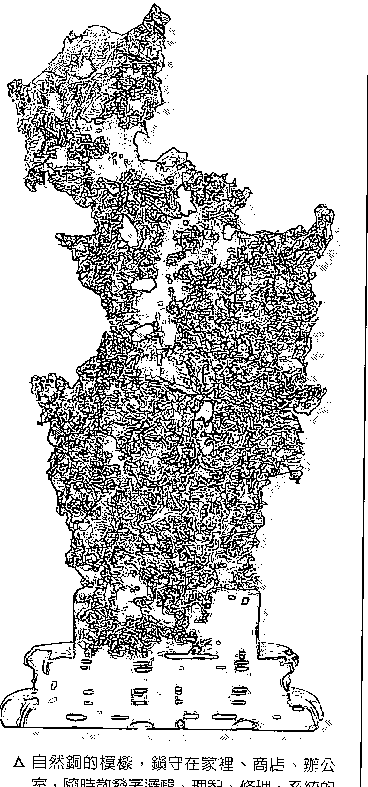

△ 自然銅的模樣，鎮守在家裡、商店、辦公室，隨時散發著邏輯、理智、條理、系統的能量，叫人精於計算、記憶，想要不發也難啊？

## 第二十九章 招財貓

近幾年來，台灣的街頭巷尾、各個商家行號，許多都在櫃台擺起「招財貓」，標準姿勢就是一隻用後腳站立起來的貓，一隻爪子好像在打招呼的樣子……據說這是日本流傳過來的風俗習慣，經過「哈日族」的推波助瀾，叫人也不敢忽視這個發展。因為「眾人的意志」集結後，也可以成為一種信仰力量、象徵力量，夠強的話，也有可能成真哦。友人就從友人耳中聽到的故事，再來轉述給我們聽：

傳說中，在日本江戶時期（約十七世紀）的時候，在東京的西郊有間破舊的小廟，廟裡有位師父，和一隻叫「塔馬」（中文：玉）小貓生活在一起。但是師父非常的窮困，常常連吃飯也無以為繼，也忍不住常望著塔馬唉聲嘆氣……卻是一籌莫展。

有天，來自京都附近的一位將軍旅行到附近，當時正好遇到大雷雨，匆忙中躲到附近的一顆大樹下避雨。一行人還在手忙腳亂的時候，眼尖的將軍就看到廟門前有隻小貓，正在向他們招手，好像要邀請他們進去的樣子。將軍看看，廟裡頭當然更好避雨囉，就催促著一行人快跑過去。沒想到，前腳才一離開，緊接著一聲巨大的雷響，轟隆劈開身後的大樹，大樹碎裂成多塊，應聲而倒，眾人面面相覷，驚魂不定。

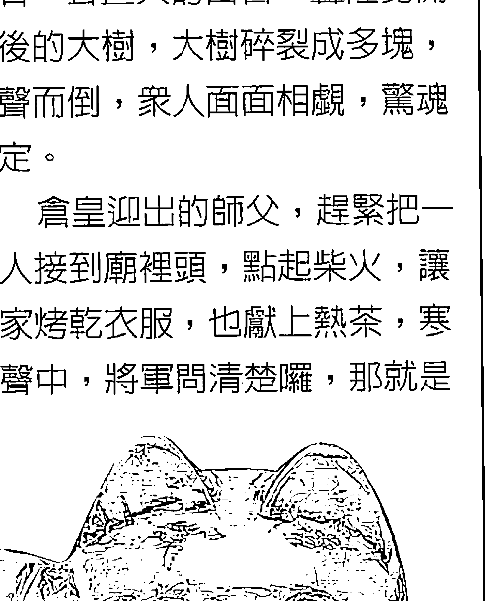

▲ 招財貓的招牌手勢，就是有「招手」招徠好運、人氣、才氣的意思。

倉皇迎出的師父，趕緊把一行人接到廟裡頭，點起柴火，讓大家烤乾衣服，也獻上熱茶，寒暄聲中，將軍問清楚囉，那就是師父的寵貓塔馬。原來就是塔馬救了將軍一命！將軍心中非常感動，想想，若不是塔馬剛剛的召喚，自己的一條命可能就如此歸西囉。再環顧看看這家廟，嗯，還真的相當老舊，當下就決定要和這家廟的師父多多親近，當成自己的家廟，要常帶家人來上香，還賜給了新的名字「Goutokuji」。當然，隨後也派人來整修、翻新，還獻上豐厚的供養。從此香火鼎盛，香客絡繹不絕於途，師父的窮苦命運，也自此改變。

幾年後，塔馬因為自然的衰老去世，將軍和師父都以最尊崇的典禮來厚葬他，因為他們都受過他重大的恩惠啊。塔馬的故事就此流傳下來，後世稱「Maneki Neko」（招財貓），就是有感於他的吉祥、好運、及能帶來豐盛財富，轉變一個人的命運。爾後的店家、工廠、營業處所、及居家，都以此來當自己的吉祥物，盼能永遠招來好運。

後代的學者研究，發覺貓非常敏感，通常在下雨之前，空氣中的濕度就會變高，他們臉上的毛髮、鬍鬚就會開始不舒服，因此多會一直舔、一直舔，狀似洗臉。

將軍大概看到塔馬在舔臉，還以為在邀請他，然而幸運之神就是這樣在眷顧著有福的人們，「言者無心，聽者有意」，將軍相信他所看到的，走出大樹，沒有被雷擊中，也救了自己一條命。把這功勞歸給正在洗臉的貓，其實也不為過啊？其實，幸運之神隨時都在眷顧著我們，就看我們有沒有能耐、智慧來看清他的招手？「招財貓」的故事，也可以是我們很好的一個啟示哦。

另外，還有個故事，大意是說一家工廠的小開在父母雙亡後，不思振作，成天還是花天酒地，散盡家財，最後流落街頭，只剩老管家和一隻貓。小開責怪貓怎麼不會像神話中的哪些動物來報恩呢？這隻小貓就跑去某間廟去求，非常靈哦，每次都能銜回一枚金幣，但隨即又給小開花光囉。小開還怪貓說，怎麼不多銜一點回來，一次一個，這麼不過癮！？小開也暗中監視，嘿嘿，小貓到底到哪裡去找到金幣的，想跟著去，它一次只能咬一枚，我可以全部一次都把金幣給抱回來呢。心中正得意時，已經來到小廟了，看到小貓在求神，同時，它的身體也漸漸在變成透明當中，小開心裡一驚，啊，原來小貓是在用它的生命換取這些金幣給我啊！說時遲，那時快，小貓為了一次多一點的金幣給小開主人，生命力消失的很快，一下子就化為一縷清煙，消失在夜空中了。小開趕上後，只剩下地上的三枚金幣，放聲痛哭，撿起來揣在懷中。後來就是用這三枚金幣當本錢，重新振作，振興家業，重新又在業界間出人頭地。後來這故事傳開來以後，大家也學習養貓、雕刻貓的形象，好像在求神、祈福的站立樣子，「招財貓」也就這樣一直流傳到後世，甚至到世界各國。

### 使用方法：

+ 1. 招財貓的招牌手勢，就是有「招手」，招來好運、人氣、財運的意思。若能使用相同類型的材質，如代表金錢的金黃色，幸運的綠色，人氣的粉紅色等等，效果更佳！
+ 2. 店家可以擺在櫥窗內，或是正對大門的櫃台上，客人一進門就可以清楚看到，也是為店家招徠客人的最佳位置。
+ 3. 住家們可以擺在玄關，任何人一回家，就可以看到代表好運的招財貓在家中等待，幸運的好徵兆、好兆頭；出門時，也可以帶著招財貓的祝福去上班、上課、做事，整天幸運不斷。

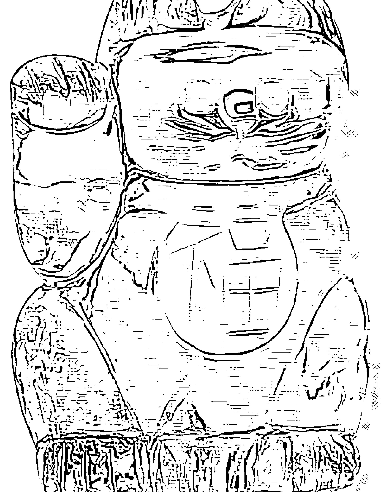

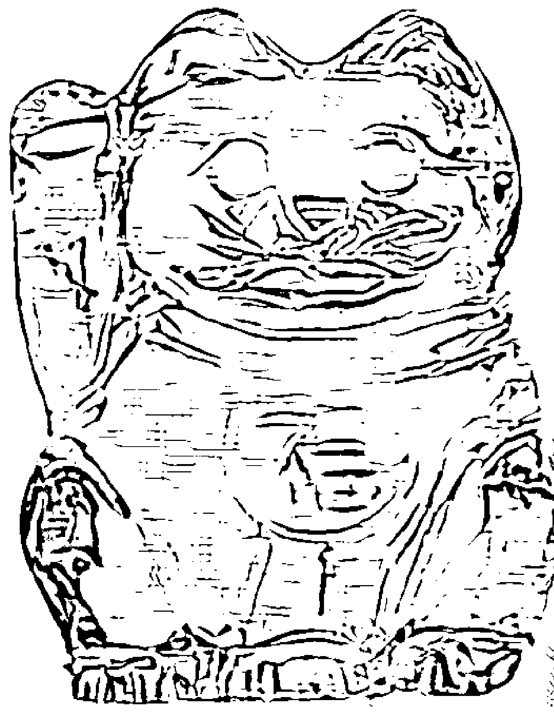

招財貓的材質也要講究一下哦，黃水晶、黃鐵礦等的財氣，幸運的綠色東菱石、孔雀石，人氣的粉晶、紅碧玉等等，頻率相近，招財效果才好啊。

+ 4. 金黃色的招財貓，可以擺在收銀機、保險箱、存錢筒、珠寶盒等放在一起，有用財富能量招徕更多財富的意思。
+ 5. 金黃色的招財貓，還可以和股票、有價證券、存摺、支票本、房契、地契等一起收藏，也是有以財富能量招徕更多財富的意思。
+ 6. 金黃色的招財貓，也可以擺在各個場所的「財位方」，據以招財。
+ 7. 小小的招財貓也可以放在櫃子上，有「富貴」的諧音，也是可以帶來好運。
+ 8. 代表幸運的綠色招財貓，可以放在老闆、總經理、負責人、業務主管、行銷主管的桌子右前方，招財貓也是面向外招手，可以招徕更多好運、機緣、人緣、好機會、貴人相助等等。
+ 9. 代表人氣的紅色、粉紅色招財貓，可以放在接待人員、公共關係、第一線的業務人員桌上右前方，可以廣結善緣，累積寬廣人脈，人脈就等於錢脈，相互牽引來的人氣財富就很可觀囉。
+ 10. 代表冷靜、敏感的藍色招財貓，可以放在研究發展部門、企劃、製作、技術、行政、總務部門等等，可以為這些人員激發出更多的創意、靈感，切合市場需求，創造更多財富；也可以提高行政效率，減少浪費。
+ 11. 若是對自己最近的運氣不是很有信心，也可以在身上配戴些小型的招財貓，或放在上衣口袋、褲袋、隨身皮包裡面，藉以招徕好運。
+ 12. 當要出外洽談業務時，也可以攜帶招財貓當秘密武器，藉著此種形象，此種信念，來為我們招徕好運，得到好的結果。

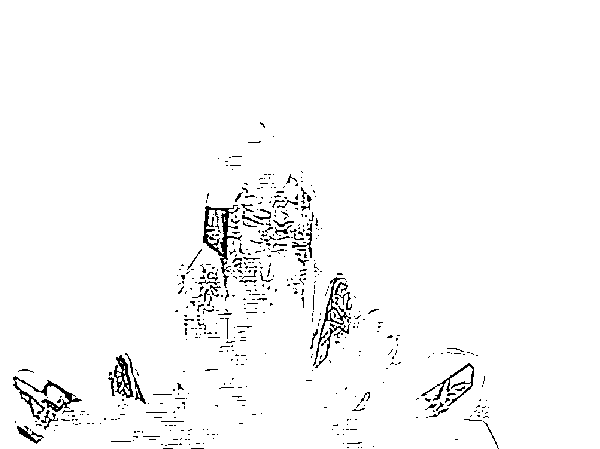

## 第三十章 狐狸

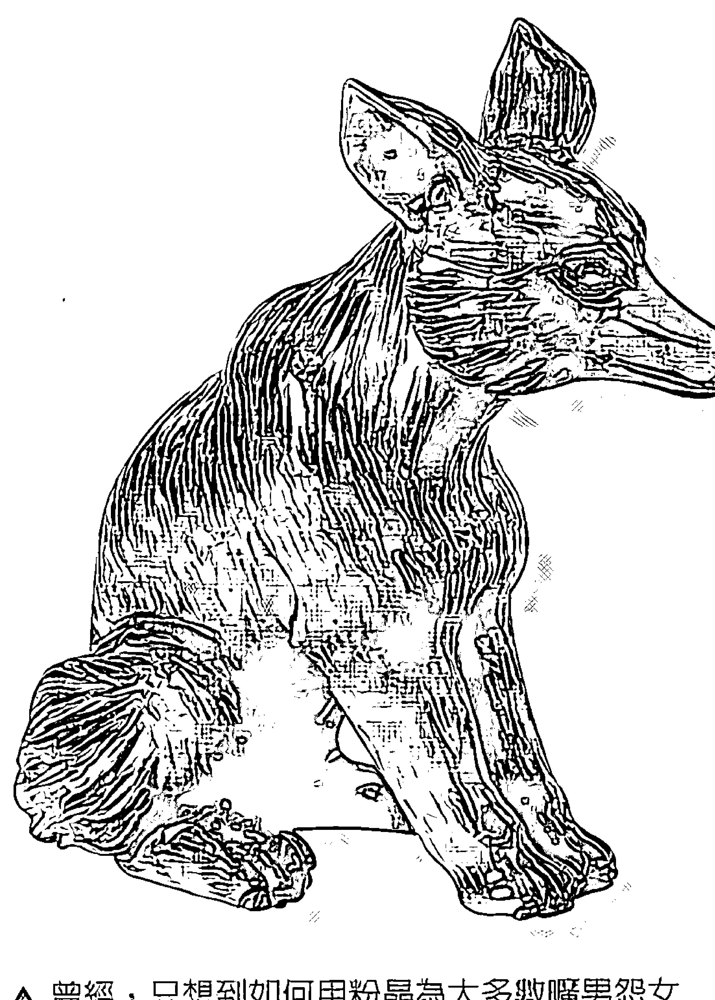

可以修得人身，再五百年，又可修成仙。據說，早年大陸許多地方上都有祭拜供奉「狐仙」的廟宇，聽說也很靈哦。在台灣，這種廟宇少見，但是傳聞還是不斷，陽明山、萬里一帶山區，據說也是「大本營」哦。

在悠久的中華歷史文化裡面，當然也沒有放過這種「動物」，取其形狀，取其意義，也是廣泛運用在風水改運方面。當然，在現代也採用各種不同的水晶寶石，兼併彼此的特性來運用，非常多樣化哦。

（淳貫天然水晶台北市八德路四段768巷7號三樓之一）

曾經，只想到如何用粉晶為大多數曠男怨女來吸引桃花，沒想到具有「斬斷桃花」功能的黑曜岩狐狸大受歡迎，還經常缺貨咧。

傳說中，狐狸是一種非常聰明、狡猾的動物，好像負面的評價總是多過正面的評價。然而，以自然界的生存法則而言，不能否認的是，這是一種非常靈活、適應力強的生物，也有許多值得其他生物，包括我們人類，所值得學習的地方。

比較神秘的說法就是，狐狸好像也懂得「修煉」之道哦。牠們會有族長、首領帶引，也是吸收日月精華、天地靈氣，五百年

### 使用方法：

+ 1. 採用白水晶、粉晶的狐狸，使得配戴者具有長袖善舞、八面玲瓏的特性，能言善道、靈活應變、適應力強，能夠在複雜險惡的環境中優遊自在，如魚得水。
+ 2. 房屋仲介、土地掮客、婚姻介紹所、工作介紹所、武器販子、娛樂業、特種行業等等，適合隨身配戴，也適合將大隻
+ 3. 但是，狐狸終究不是很光彩亮麗的動物，名聲也不是很好。建議，可以藏在書桌、辦公桌的抽屜裡面，或是事物櫃裡面，別人看不到，自己卻可以隨時拿出來把玩，隨時吸收狐狸的聰明、靈活能量，才好在複雜的社會環境中找到自己的生活空間。
+ 4. 年輕男女若要增強桃花人緣，建議使用平常粉晶飾品即可，不必使用到白狐狸、紅狐狸，過強過盛的桃花反而容易叫人無法走在中道上，擔心有亂用、濫用的疑慮。（若是特種行業從業人員，則另當別論。）
+ 5. 採用彩虹黑曜岩 (Rainbow Obsidian) 等黑色系列寶石所做的狐狸，則有「吸收」桃花能量，「斬斷桃花」的功能。其他如煙水晶 (Smoky Quartz)、黑隕石 (Tektite)、黑色電氣石（Black Tourmaline）、拉長石（Labradorite）等也可以用；另外，具有消除、淨化、解析的各色方解石（Calcite）、天青石（Celestite）、各色螢石（Fluorite）等等，都可以採用。
+ 6. 傳統術法中，若有誰家的先生搞外遇、包二奶，就是讓他配戴黑狐狸，藉以來吸收所有的桃花能量，也是將這種「外遇緣份」全部「轉移」給「狐狸精」，藉此化解，先生就會乖乖的回到家裡來囉。
+ 7. 比較扁平，胸墜式的黑狐狸，可以讓當事人來配戴。若是當事人不肯，可以想辦法塞在西裝口袋，縫在衣服夾層中，總之，能讓他貼身配戴最好，也有化解外緣、斷除桃花的作用。

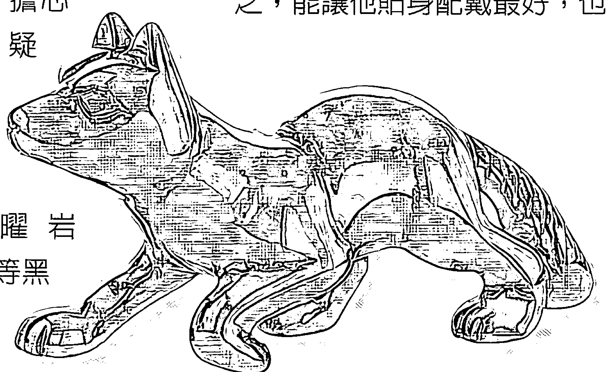

△ 把所有的桃花能量「轉移」給黑曜岩狐狸，當事人就可以清爽多了，也可以有精神、時間來幹些正經事業啊。

+ 8. 在當事人睡覺的枕頭、床墊底下、或是床下放置黑狐狸，也是更為直接、有效的辦法，和黑曜岩狐狸「睡覺」來「轉移」桃花能量，總比跟真的「狐狸精」睡好多了吧？而且作用的時間比較長，效果比較好。
+ 9. 未婚男女注意，請不要把貓狗等寵物也抱上床一起睡，也有可能將自己的「緣份」都灌注給這些寵物，寵物是得寵了，卻無法找到一個真實的伴侶哦。
+ 10. 擔心配偶在辦公室搞起婚外情，也可在其辦公桌上擺上黑狐狸，讓同事關係、客戶關係都能保持正常，不會踰越禮數。當事人有可能拒絕哦，可得想辦法藏在抽屜中，或是工作櫥櫃當中。
+ 11. 若是擔心配偶下班後會走私，或是去當「車床族」，也可在車上裝置黑狐狸，維持車內的環境「淨空」，比較不會有踰矩的事情發生。

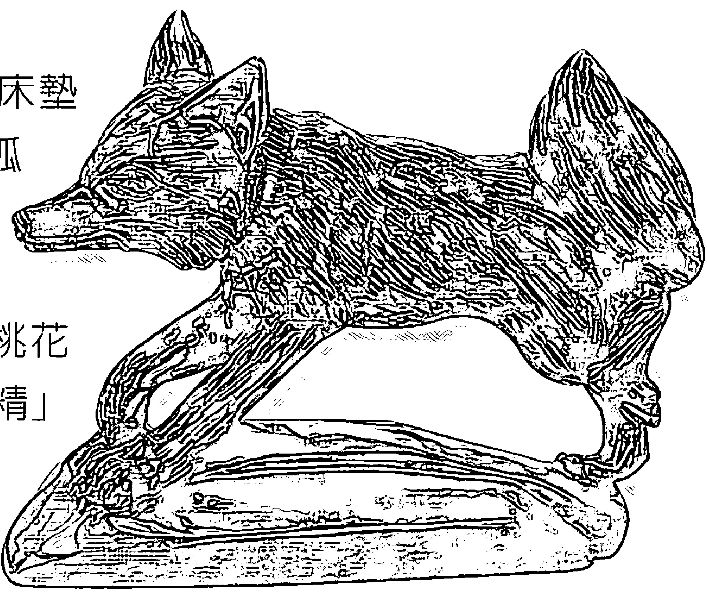

△ 桃色糾紛、外遇、緋聞事件的確非常嚴重，經常造成家庭的破裂，傷害頗大。還有朋友說，黑曜岩狐狸不夠大，有沒有「黑曜岩恐龍」？

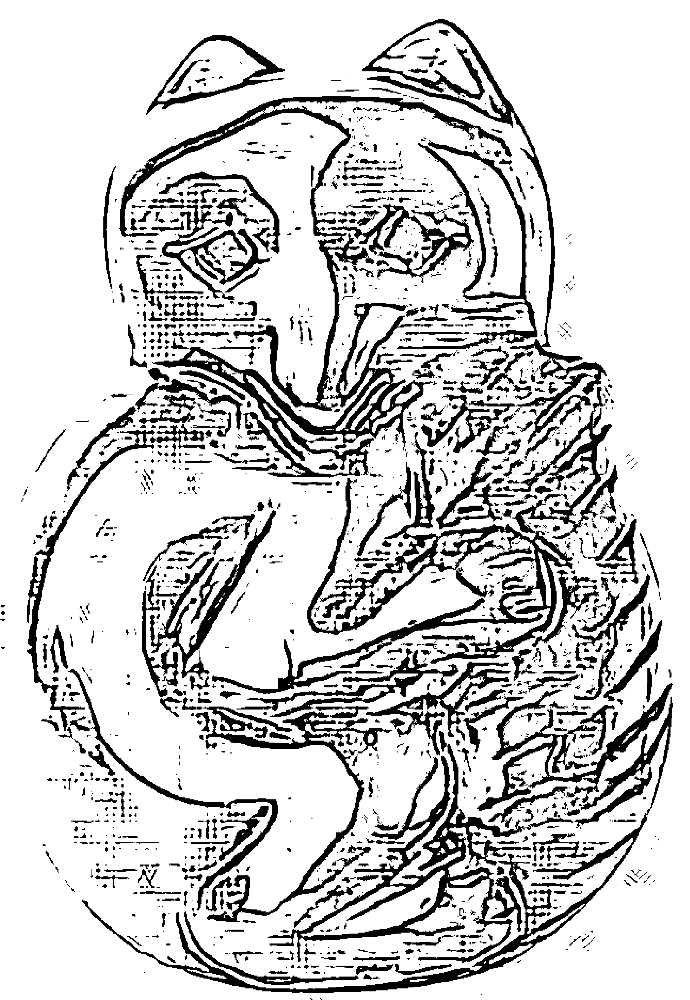

△ 狐狸的造型非常多種，只要是狐狸，都可以用。平面雕刻的，適合貼身配戴吊掛，才能吸盡「爛桃花」的能量咩。

+ 12. 若是配偶離鄉工作，經常不在身旁，擔心對方另謀發展，也可用黑狐狸壓制住他的某些訊息物，如穿過的內衣褲，睡過的枕頭，使用過的手帕、毛巾等等，每天晚上在子時（11點到隔天凌晨1點）時分，觀想白光與愛來籠罩這些狐狸與訊息物，並對著當事人離家後所住的方向，向著夜空，用心靈力量來呼喚他的名字。當事人在冥冥中，就會感受到來自家庭的溫暖與關愛，睡夢中也會念念不忘，自然就不會去走私、搞外遇囉。但是，實質的打電話、寫信、發E-mail、親自拜訪等等行動，也是不能少哦。有形、無形的都做到了，才能有萬全的保險。
+ 13. 總之，必須與當事人越接近越好，創造出一個「天羅地網」、「滴水不漏」的環境空間，讓當事人根本沒有犯錯的可能性，自然就一切正常囉。
+ 14. 若是當事人有外遇嫌疑，卻也不肯配戴黑曜岩狐狸等等，當事人配偶自己也可以配戴，借助狐狸的聰明、靈活、領域觀念、忌妒、伺機而動、報復的特性，可以讓自己冷靜觀察，等待時機，適時介入，發揮「排除第三者」、「排除侵入者」的特性，保住自己的配偶、家庭、財產等等。

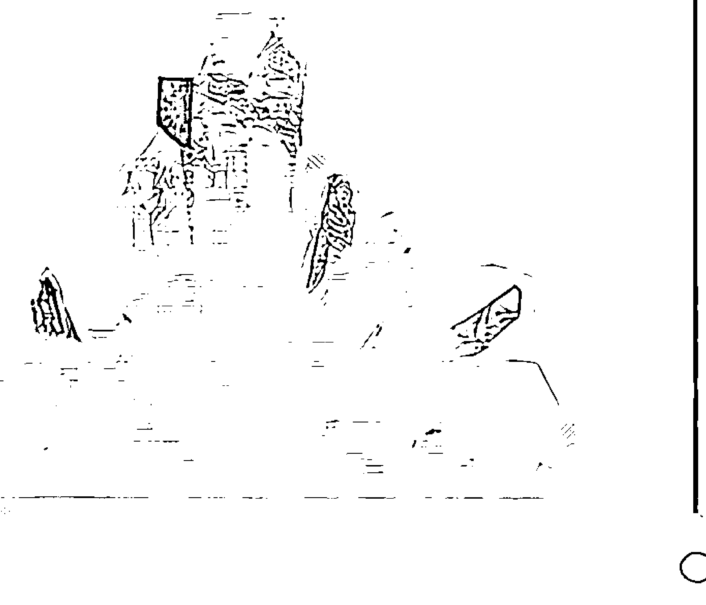

## 第三十一章 靈擺

靈擺（Pendulum）也是個流傳千百年的小東西了，但是魅力依然不減當年，如今全世界、各階層，到處仍然在使用。詳細情形，歡迎參考我們出版的『神光中的靈擺』一書。因為靈擺是最適合室內「測氣」的好工具，也是和自己潛意識溝通的工具，跟探測棒一樣，找完「龍穴」之後，屋內的「氣場調和點」怎可錯過呢？所以也在此書中簡單介紹一下靈擺的用法。

最簡單的靈擺，可以摘下隨身配戴的戒指，扯下一根頭髮繫上，抓住頭髮的一端，讓戒指能夠自由擺動，這就是最簡單、最快速的一個靈擺囉。只要有個稍有點重量的垂掛物，一條15-20公分的細繩子，就可以構成「測氣」的靈擺囉。這麼簡單的工具，怎能錯失呢？當然，想要精準、美麗、實用，還是建議採用「水晶靈擺」最好啦！

其實，人體不只是人體而已，人體的氣場是個非常精密、細膩、且敏感的物質，暴露在大氣中，其實也和整個物質世界的大氣完全融合在一起，彼此互相產生作用著。就像大水池裡頭包含著一個沒有邊界的小水池，怎麼可能沒有互相影響著呢？只是，所有這些細微的影響都進了我們的潛意識、深層意識，沒有顯露、外放出來而已。和靈擺對話，就是要把這些原本已知的精細訊息，化為更為明確可知的現象而已。記得哦，這和錢仙、碟仙等等是完全不同的東西，絕對不需要依靠外靈來幹什麼的哦。

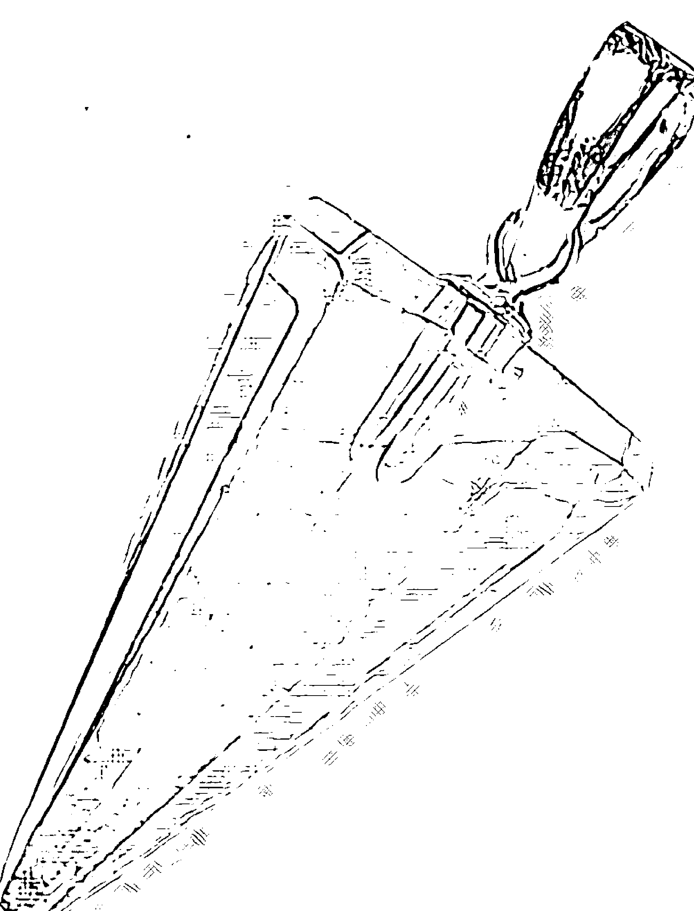

▲ 尖錐形的靈擺（Pendulum）最為典型，最為好用，平常還可以當「胸墜」（Pendant）配戴，兼具美觀、裝飾、與實用。

順道一提啦，自從921大地震過後，大家體認到房屋建築的安全重要性，還有現代化的房屋建築趨勢，也使用許多的鋼骨建材。這雖然比較安全，但是，滿佈的鋼筋、鋼骨，也影響了整間屋子的電場、磁場哦，這對人體的氣場（電磁場）也是有著直接的影響哦。是好是壞，可能還要幾個世代的觀察才了解。另外一個直接的影響就是對著風水師的「羅盤」，到一個佈滿鋼筋鋼骨的地方，羅盤已經無法正確指出東西南北各個方位囉。要看方位，必須要建築物外面就先看好囉，進到建築物裡面，若是風水師還在看方位，呵呵，那肯定會「如墜五里霧中」，霧煞煞，都搞不清囉。若是方位已經清楚，還在盯著羅盤看，那肯定是在看羅盤上面的「提示」，等下才好論斷咩。哈哈！而水晶靈擺就不會受到這些鋼骨鋼筋的影響囉，它不只是電磁場，是更為接近自然的綜合能量體啊。

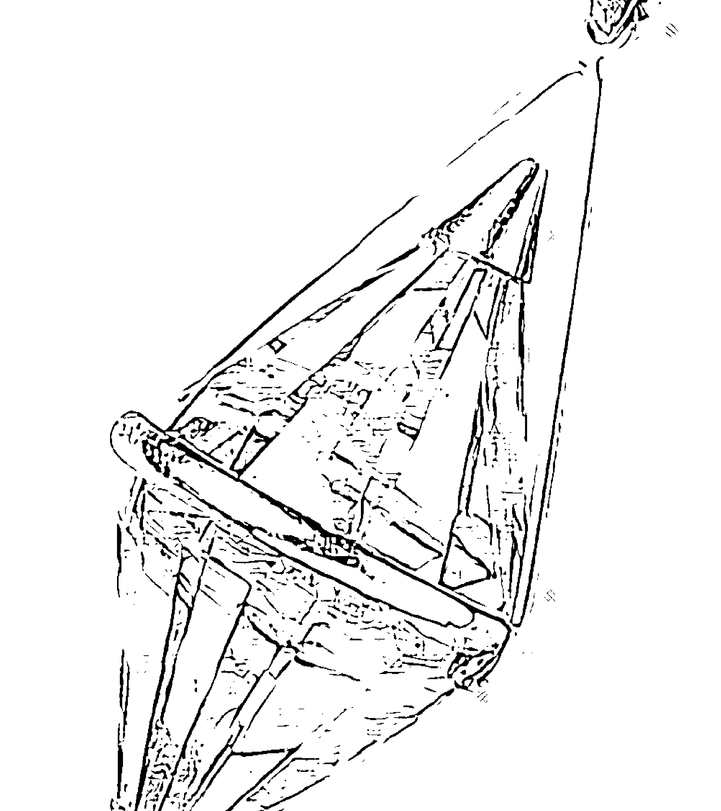

▲ 與靈擺對話，就是與我們的深層意識溝通，和外靈、錢仙、碟仙等等，是完全沒有關連的哦。這是純粹意識的檢視而已咩。

### 使用方法：

+ 1. 所有水晶產品在買回來時，第一個動作一定是先消磁，絕無例外。
+ 2. 建議先把水晶靈擺拿來把玩個三、五天，一個禮拜後，熟悉了它的重量、大小、長度、擺盪的幅度、受風力的影響等等，再來開始做任何的測試。
+ 3. 每天若能戴著水晶靈擺來靜心30分鐘以上，效果應該會更好，因為靈擺和人體會有更為密切的能量交流，可以更為敏銳地反應出潛意識的訊息。

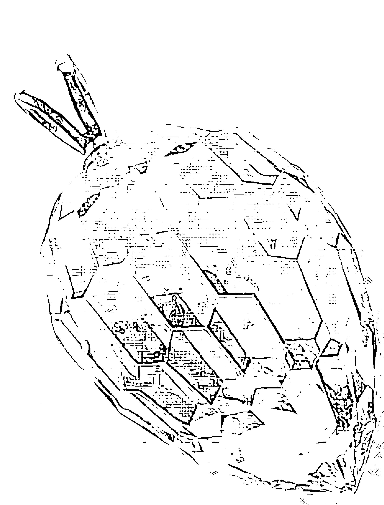

△ 用靈擺問事，要懂得設計問題，以 Yes or No 「二分法」的方式切入，通常就可以得到相當精準的答案，叫人咋舌！

+ 4. 因應我們在北半球的磁場，我們可以先「規格化」我們的水晶靈擺，請它對於好的，正面的，積極的，善良的，都作出「順時鐘」的轉向；相對的，對於一些壞的，負面的，消極的，不良的，就作出「逆時鐘」的轉向。
+ 5. 當然，如您喜歡，您也可以做出完全相反的規格化，也是可以用的哦。只是，我們若是順著自然界的磁場、電場運作，比較能順勢而為，順水推舟，不必那麼累啦。
+ 6. 占卜者也必須懂得放鬆自己神經肌肉及精神狀態，這樣內氣、外氣才能夠流動，及互相交流。若老是處在緊繃的狀態，則氣不能流動，靈擺也會動不了，或是只做直線性的擺動而已，不曉得真正意義。這最常見於過於固執、主觀、自我的人的身上。
+ 7. 將水晶靈擺放在待測試的物件上面，屏氣凝神，放鬆心情等待一會兒，沒有預設立場，沒有主觀成見，靈擺就會自動擺動起來；順轉的，可能就是合適我們的，逆轉的，可能就是不合適我們的。占卜者的態度非常重要，越能客觀、放空自我，越能得到正確的答案。
+ 8. 將水晶靈擺拿到有待受測的空間，或是大門前，或是客廳沙發的位置，或是書房書桌的位置，或是臥房臥室的位置等等，可將水晶靈擺懸空握著，看看這空間能量場適合否？順轉的就是合適的，逆轉的就是不合適的。若是使用者本人來做這種占卜，答案可以比較直接明確。但也當心當事人往往不懂靜心，無法好好操控水晶靈擺，所以若是專業占卜師在為人卜居良地，應該把當事人的名字、能量召喚進來，才容易相應。

-   9. 若是出現不合適的情形，先不要緊張，不是無解的死局喔。建議，找來前面所有提到的各種風水制化用的水晶，看哪種是當事人取用方便的，可以擺在當地，馬上再試試看。通常就會有立即且明顯的改變。水晶用來改變風水的效果，立竿見影，百試不爽。

-   10. 若要問事的話，靈擺的回答總是Yes or No（是非，對錯，好壞，可否等等）兩種，問卜者若有比較複雜性的問題，必須懂得將之重新設計過，以「二分法」式的切入，即可獲得非常精準的答案。比如想問清楚古董的年代，設立範圍，一千年以上或以下，再來漸漸縮小範圍，五百年以上或以下……照此類推。

## 第三十二章 探測棒

> 就是這根「尋龍尺」、「探龍針」，曾經在風水界叫價十幾萬塊哦！這可是搜尋龍穴、探測氣口的好工具，改良形的探測棒 (Dowsing Rod)，更為容易上手，更好用囉。

探測棒（Dowsing Rod），是國外傳來一種「探測地理」的良好工具，我們早就有本「探測棒的千古奧秘」書在介紹他了，詳情可以請逕行參考。但在專門討論風水的本書上，若是沒有再次提到，是否有點缺憾呢？所以，我們在此簡單的說明重點，簡單也就夠了，因為很快就能上手了啊。

探測棒的前身，原本只是從樹上扯下來的「Y」字型樹枝而已，兩手仰臥抓著樹枝的分叉兩端，讓尖端向前。這樣，馬上可以感到樹枝所張開的「彈性」、和「張力」，和我們人體也處在一種平衡的狀態。握著他，心中想著要找的東西，通常是水源、礦脈、失物、尋人等等，通常就能為我們指示方向，走到定點時，還會卜卜點頭指示，甚至連水源、礦脈的深度、產量等等，都能夠指示出來哦。

聽起來非常神奇，其實，探測棒也只是個工具而已，他是透過人體的氣場，和大地間的氣場互相交換，而探測棒只是把我們潛意識裡頭所接收到的訊息外放，顯示出來而已。了解箇中道理，就沒有什麼神奇鬼怪之處，當然也不是什麼魔鬼、外靈的把戲。這是很純正的一種工具，只要使用者懂得靜心，放空自己，比較敏感一些，或是經過適當的訓練，任何人都可以使用咩。

能找水源、礦脈，當然也能找「氣口」，也就是「龍穴」！探測棒最先就是給風水界的前輩們引進來的啊，但當時不叫探測棒，這名字過於中性，不夠聳動，他們管他叫「探龍棒」、「尋龍尺」、「尋龍針」，顧名思義，就是專門用來找龍穴用的啦！前面不是說過「三年尋龍，十年點穴」，要看出山的走向、脈絡，還好還能學，三年就行；但要點到真正的好穴，非得有十年以上的學習和功力不行！而探測棒就是來補這不足。學會看山、看形勢、看走向，有了個範圍以後，就是拿著探測棒來到這地方，密集探索，找出有反應的「氣口」，就是「穴口」囉！

聽許多風水界的朋友說啊，早先他們跟老師學時，每個人都花了好多錢、好多時間在拜師呢，好不容易學到快畢業時，就是要學點穴時，老師就拿出這個法寶，說他是什麼美國太空探測的什麼特殊金屬所製造，效果非常，非常靈，也當場示範，但是，一支就叫價十幾萬塊！這意思就是說，您們每個人想要畢業，還要花個十幾萬跟老師買這支「尋龍棒」以後，才懂得點穴，才能畢業啦！痛雖痛，還是得花錢囉。傳統的五術界裡頭，常常就是這種風氣在進行。徒弟們花大錢跟師父學，當然以後就要從客人身上嚕回來，彼此惡性循環，以致於水準日漸低落。點個龍穴可以賺個兩、三百萬，區區十幾萬算什麼呢？很少有大胸襟、大氣魄、大見識、大擔當的真正「大師」，如「賴布衣」、「楊筠松」等級數的再度問世。

其實，真正的好工具，都是越簡單，越單純的，越好。甚至沒有故障的可能，根本不用維修。這哪裡是什麼美國的什麼金屬，只是美國太空科學總署（NASA）曾經研究過探測棒的原理、應用方式，也肯定了它的功用，如此而已。了解根源的，甚至花個兩毛五分美金，用曬衣架拆下來的鐵絲就能做了，哪需要十幾萬台幣啊？能夠有「原創性」的想法跟創意，能夠追根究底，也就不必花那種冤枉錢了啊？

圖片上所顯示的，是「改良型」的探測棒，比樹枝等還輕，可以久握，有點重量，不怕野外行走時的微風吹或路上顛簸，而且運轉通順，沒有阻礙，更好靈活運用。探測棒最適合戶外的遠距離探索，靈擺（Pendulum）則適合戶內的探索，兩者都是找出「氣口」、「風水調和點」的良好工具。

（淳賀天然水晶台北市八德路四段768巷7號三樓之一）

### 使用方法：

-   1. 剛買進的探測棒，先不急著要探測什麼，先拿在手中把玩個三伍天，熟悉他的材質，觸感，重量，大小，旋轉的靈活度、鬆緊度，直到探測棒就好像也是您另一隻手的延伸，也能夠收發自如，隨心所欲，這才是完成了初步階段。
-   2. 學習「指向」練習，拿著探測棒，身體不動，就是輕微的動動手掌、手指，簡單、輕微、細微的傾斜，就能把指針指向您指定的方向。您去感受它是怎麼動的，您的力量如何透過它而傳導的。日後，當它不是透過您的力量，而自行在轉動時，您就自然知道，而不會驚慌失措，也不會胡亂加以阻撓。
-   3. 學習「鎖定」練習，就是拿著探測棒，指向哪一個方向，就請它定在那個方向，您自己可以輕輕轉動身體，然而還是讓指針指向原來的方向，不會隨著您的身體轉動而轉動。這在戶外時，不會因為地形、山路的變化，而失去原本的方向。
-   4. 探測棒指針後面的螺絲是可以鬆開的，裡頭可以塞進一些小東西，當成「訊息物」（Witness），可以相應的，找金礦就放金沙，找銀礦就放銀沙，找人就可以放他穿過衣服的碎屑、毛髮等等。如果都沒有任何訊息物，則探測師本人就需保持高度警覺而敏銳、敏感，放空所有的雜念，就是一念念著您所要搜尋的目標或東西，這樣也能相應哦，如此就可訂出方位，尋找方向。
-   5. 行進時，注意指針方向，自己必須隨時警覺，是指針自行受到外力吸引的改變，或是自己跳上跳下、左右亂轉的改變，這會影響搜尋結果哦。若是一切順利，來到「定點」時，指針將會出現不正常的跳動，或是點頭，或是左右搖擺，表示這地方到了，相應非常熱烈起來。先前有拿樹枝的，樹枝會顫抖到手都快握不住，有些上下點頭；還會敲到探測師的頭呢。
-   6. 目前的改良型探測棒不會那麼誇張，但是也會有相當反應哦。有些探測師，為了避免路途上的風吹、草動、地形顛簸、注意力不集中等等誤失，還會同時攜帶兩隻探測棒，彼此可以互相校正，如此，犯錯的機率就更少。但，也因此不太好操作，需要多點時間來練習和熟悉。
-   7. 採用兩支探測棒，來到定點時，兩根棒子可能會同時向內交叉，或同時向外分開，表示「這裡就是反應點囉！」此時，可以改用「靈擺」來做定點的測試，而探測師自己若是敏感的話，其實來到定點，風水真的好的話，身心方面都會有所感覺，只要再做適當的驗證，就可以「點穴」囉。

## 第三十三章 福祿壽的象徵

△「福祿壽」俱全，這是中華民族對人生的「終極期望」！能達到的，就是真的好命！

「福祿壽」是中華民族傳統的一種人生理想境界，人生要能達到這樣，又有福氣，又能享受美食華衣，又能長壽，夫復何求呢？
哈哈，所謂的「理想境界」，換個角度思考，也就是在「現實環境」中很難達到的啦。因為達不到，所以頭腦會幻想，會反射，創造出一種美好的理想境界，產生心理上的「補償作用」，不管現實生活多麼辛苦，聽到、看到、聞到類似的訊息，其實也就令人很開心囉。
風水上，常常就是使用「象徵手法」來達到「心理作用」。不要輕忽這種的影響哦，在適當的歷史、文化、民俗背景之下，還真的有用哦？而且，還要多用，常用，勤用，造成一種堅定不疑的信念，會有類似「催眠」的效果，甚至會有類似神話、神通、特異功能的「無中生有」效果出來。哈哈，俗話說，「不管黑貓白貓，能抓老鼠的就是好貓。」一式套用，「不管黑法白法，能解決風水問題的就是好方法。」不是嗎？
【福】，一般多以「蝙蝠」的諧音來象徵「福」，就是「福氣」啦。過去受到西洋吸血鬼電影影響，錯以為蝙蝠的形象好像很可怕，咱老祖宗怎會把蝙蝠當福氣呢？後來，多看了許多「發現頻道」、「國家地理雜誌頻道」的環保節目後才發現，原來蝙蝠也是那麼愛乾淨的動物哦，他們所寄居的山洞、洞穴一定會在隱密、安靜，乾淨的地方，而且水質相當好哦，一旦有了汙染，就會搬遷。現在台灣許多地方的環保復育，都以「蝙蝠回來沒？」當指標來看待，表示當地的環境回復到一定水準以上囉。看來，蝙蝠所住的地方，還真的要有福氣的人才能住啊？咱們的老祖宗沒錯，他們的長年觀察評估，能夠享有蝙蝠這種「清福」的，的確是人生的一大福報！

【祿】，通常以極為類似「貔貅」的靈獸「天祿」來替代，但天祿極為罕見（頭上有多長三支角，有些還有翅膀），就算在現世中的工藝品也少，許多人就以「麋鹿」、「梅花鹿」等來替代。也是取「祿」和「鹿」的諧音吧。古代的生活條件差，能夠「吃飽穿暖」，就相當不錯囉；能夠「吃好穿好」，吃美食，穿華衣，那更是人生的一大享受啊！

別看現在時代進步了，還是有許多人沒有「食祿」的命哦，怎說？就是那些罹患腸胃道、食道疾病的朋友們，無法進食，有些還要從胃裡穿孔餵食，真的是食不知味啊。所以能吃，能吃的好，好好享受，也是人生的一大幸福啊。

【壽】，這典故大概來自封神榜、西遊記等神話吧？傳說中王母娘娘後宮裡的仙桃樹，每五百年才開一次花，過五百年才結果，又要過個五百年才成熟。仙桃成熟時，王母娘娘就會舉辦「蟠桃大會」，邀請眾神眾仙一起來品嚐仙桃。傳說中，凡人能吃上一顆的話，就能多出五百年的壽命哦，神仙原本就是長生不老的，吃了後更是功力大增，能夠升等當「大羅金仙」的。所以在許多的生日宴會上，不管是華誕、聖誕、壽誕，統統要獻上「壽桃」，就是要祝賀壽星能夠像眾神仙一樣「長生不老」啊。

+   Δ 蝙蝠其實是很愛乾淨的動物，已經是水質、空氣等的環保指標囉。能夠享有蝙蝠這種「清福」的人，的確是人生的一大福報！

+   ◁ 天祿，頭上就比貔貅還多了三隻角，有些造型還有一對翅膀。沒關係，能吃就是福，人的食祿，也代表他所能享受的福氣咩。

+   ▷ 王母娘娘的壽桃？吃一顆，多活五百年？象徵神仙們的「長生不老」。這是水晶做的，千萬不能吞哦。

### 使用方法：

-   1. 由於是「象徵手法」的「心理作用」，只要擺在明顯、目視得到的地方就行，沒有其他太多的禁忌。
-   2. 平常時擺在書桌、辦公桌前，能夠讓自己開心、快樂，享受美好的象徵意義，而且隨時看得到，摸得到，這是最舒服、最高興的事情囉。
-   3. 若擔心工作空間不足，也可以收到自己家裡的櫥櫃裡面，進進出出都可以看得到，喜歡時，隨時可以拿下來把玩，隨時享受所有的好象徵，好意義。
-   4. 若是擔心自己近來運氣不好，常常有倒楣的事情發生，可以將蝙蝠拿來靠近自己，面向著我們，取「來福！來福！」之意，也有驅散厄運，帶來好運之效。
-   5. 愛吃的人，可以常常拿起您的「鹿」來冥想，經常就會有人來請客，飽享食祿。曾經有政治人物說他們家的水牛雕刻動時，就是會有高升的機會；您的「鹿」動時，也是會有「食祿」的機會哦。
-   6. 想要健康、長壽，常常拿「水晶壽桃」來接近自己，多多靜心冥想，應該是個好主意。取好意義，也給自己良好的「心理暗示」，永遠健康、快樂、長壽！
-   7. 當有遇到病人時，可以贈送「水晶壽桃」給他，有祝福他早日康復，身體健康，長命百歲的意義。
-   8. 遇到親戚朋友過生日，搬入新屋，開新公司，生小孩，能夠送上全套的「福祿壽」象徵禮物，將會是極大的榮耀與祝福。

## 第三十四章 豬即財富

許多人在想到豬，看到豬，都會有負面的想法，其實，又是給誤導囉。豬，其實是很聰明，又很愛乾淨的動物，若是沒有給他好環境，當然就會顯得又髒又臭啊？但這是飼養人的錯，不是豬本身的錯。

古代的中國人會嫌棄豬嗎？您看看，倉頡造字時，這個「家」字，寶蓋頭底下要養隻豬，天花板底下要養隻豬，這才像個「家」嘛！沒有豬，就不像個「家」，您看看，這豬和平常人家的關係多麼密切！是啊，人類從漁獵社會過渡到農業社會，最先就是要懂得蓄養牲口，而豬隻最好養，人們吃剩的餿水就倒給豬吃，又能夠提供最多的肉類來源，很快地「豬隻」就變成財富的象徵。而且，人們還很厲害哦，看看您們家裡養的豬是肥是瘦，哈哈，也就知道您們家的經濟情況如何囉。肥的話，表示人吃後剩下的多，豬才能肥；若是每隻豬都瘦巴巴的，可能連人吃的都不夠，哪有剩餘來餵豬咧？

豬即財富，這話沒說錯！俗話說，錢財這東西生不帶來，死不帶去，但是漢朝人呢，就算死了，也要把「財富」給帶走。這是從考古挖掘、骨董文物買賣行裡所知的，就是所謂的「漢八刀」、「握豬」，哈哈，簡樸的雕刻方式，八刀就能雕刻出一隻豬的形貌，形式簡單，剛好可以握在手中。人死入殮後，兩手就各抓著一隻「握豬」，這麼去閻羅王那裡報到。每個朝代的風俗習慣不一樣啦，這裡要強調的就是，歷代以來，「豬即財富」的觀念是屹立不搖的！

遠的不講，光是咱中華民族的民俗歷史裡面，您知道哪隻豬最有名嗎？那當然是西遊記裡的「豬八戒」當之莫屬囉！而平常豬八戒在電視、電影、小說、漫畫裡頭的造型，是哪裡來的嗎？看看所附的圖片，您看像嗎？長鼻子，大耳朵，豬頭豬腦的，這就是大名鼎鼎，台灣寶島所出產的豬啦，俗稱「本島種」的，不是外來的品種，舶來品，或是混血的，而是「本島出產」的豬咩。

說起本島種的豬，還真好玩！當兵時養過，好吃，長的慢，肥油多，肉卻少，但是極為聰明，重感情，還會認人的哦。平常餵養的阿兵哥若是放假回去，還會鬧情緒，不吃飯的哦。常常養了很久，都還捨不得殺來加菜。許多時候，好像是伙房班的寵物，純粹養來消化部隊所剩的餿水而已。

豬，用在風水上，也是「象徵意義」所產生的「心理作用」。您說有什麼道理嗎？很難說清。但是「豬即財富」這種觀念深深滲透入許多中國人的「集體潛意識」裡面，看看許多人會熱愛豬豬，蒐集了許多豬隻的造型，還有專門店在開呢。日本人可以有「招財貓」，中國人何嘗不能有「招財豬」呢？何況豬隻還更符合我們的民情風俗習慣呢！

### 使用方法：

-   1. 挑選豬隻，不管是用哪種材質來做的，一定要挑「豐腴」、「肥胖」型的，才會顯得富足、豐盛的意思。這觀點和挑女朋友、選媳婦不太一樣吧？
-   2. 比較大隻的豬，可以放在進門處的明顯地方，做生意的就在櫃台上，辦公室就可以放在接待桌上，平常人家可以放在客廳茶几、或櫥櫃上面。「開門見財」、「進門見財」，多開心哪！
-   3. 有些老一輩的朋友，比較重視，不讓這種好的象徵「形影孤單」，至少都會擺上兩隻（一對），才不會有「孤」的感覺，也能有「好事成雙」的意義。
-   4. 由於工藝技術進步，材料充裕，造價低廉，許多造形設計師不滿足於一隻、一對而已，曾採用瑪瑙片當庭園，把豬爸爸、豬媽媽，還有一群小豬都放進去，形成一個美麗、可愛、又溫馨的「幸福家庭」，象徵意義更為具體，獲得許多好評。
-   5. 若能懂得欣賞豬的造型，豬的聰明機智，及豬的財富象徵，能把小豬擺在書桌上，辦公桌上，隨時拿來把玩，也隨時感受各種水晶寶石的能量，對於求學工作態度，都能有不一樣的感受，了解是為自己奮鬥，為自己將來能好過，就不會有那麼多的抱怨和不滿囉。
-   6. 新一代的電子新貴裡面，常常有人日夜工作，長期消耗過多的腦力、體力，以至於常在四、五十歲的精壯年時卻「過勞死」、「猝死」，實在可嘆！提醒有這些傾向的朋友們，要經常抱起寶石豬對著豬頭來冥想，工作是為了享受人生，工作與休閒能夠平衡，人生才會是彩色的。
-   7. 當有朋友結婚成家，送堆寶石豬，有祝賀「成家」、「起家」的意思，也有「早生貴子」、「兒女成群」的意義哦。
-   8. 當有人搬新家、入新厝、開新店、開新公司、創辦新事業，能夠送上一群寶石豬，就是一大筆財富，也是繼「成家」之後的「立業」，應當是最佳的禮讚和象徵意義。
-   9. 若有小孩愛挑食，不吃飯，長不高，長不壯，也可以讓他們隨身攜帶或配戴小小的寶石豬，同形意雷同，期待這小孩能不挑食，多吃些，長的好。
-   10. 若有小姐想減肥，卻總下不了決心，建議也是隨身配戴寶石豬，取其反面意義，隨時提醒自己要節食，少吃多運動，才能健康又苗條。

> ◄ 哈哈，自家的發財樹下養群豬，看了就開心，發了！發了！

## 第二十五章 水晶碎料的運用

各種水晶礦石在切割、琢磨的過程中，一定會出現許多細細碎碎的「碎料」(Chips)，但是，不要緊張哦，還不急著丟掉，這可是有著許許多多的用途！千萬記得，水晶的世界裡沒有「廢料」這兩個字，我們一定要「物盡其用」，才不會暴殄天物啊！

水晶碎料雖然細細小小的，但就是碎為「齏粉」，也還是有能量、有氣的啊！而且加總起來，三公斤、五公斤的，也是一個相當大的「量」哦。當然，其「精純度」或許不如一個單一的水晶柱、水晶球，但是，單就「量」而言，還是相當可觀的，而且，可以非常非常的便宜。因為，就是所有加工以後所剩的「碎料」而已啊，能賣多貴？因為便宜，所以能夠更好運用！呵呵，若是有遇到那種把瑪瑙碎料當成「天珠碎料」，一公斤好幾千塊叫賣的，那就另當別論，可不要上當當冤大頭哦？

水晶碎料泡水，那個水就會含有水晶的能量。大陸朋友們多稱為「訊息水」，佛教界的朋友們常有師父加持的「大悲水」，其實道理一樣，都是「有能量的水」。在師父不好找，加持力不明顯時，自己在家用水晶來加工，其實也不失個好方法哦。這種加工出來的能量水，道家也有種說法，就是「淨制法水」，也是可以用來驅魔、避邪、除穢氣、祛病氣的。用途很多！

水晶碎料不用泡水，本身也能持續一直發散著氣出來，使用方式和許多結晶水晶一樣。只是，打碎了，沒有固定形狀，我們可以做其他種更多的用途。我們就一一介紹如下。
（淳貿天然水晶台北市八德路四段768巷7號三樓之一）

△ 紫水晶枕頭，幾年來已經幫助難以計數的失眠朋友渡過難捱的夜晚；坐墊則幫助年輕學子安心誦書求學，修道者能靜心養氣，漸入佳境。

### 使用方法

-   1. 利用紫水晶碎料約三至五公斤左右來做成枕頭，對應頂輪，有鎮定安神的作用，對於氣虛氣弱的病人、老年人、腦神經衰弱者、失眠患者、過度勞心工作者，可以協助他們夜晚安眠。記得，也要配合白天的肉體運動，效果更為明顯卓著，也更能根本改善。
-   2. 紫水晶碎料也可以拿來當坐墊，靜心打坐的人，可以使得心神更為寧靜安詳，坐得更久；年輕學生，心浮氣躁，可以坐在紫晶坐墊上讀書、寫功課，更能安心鑽研成就。
-   3. 已經有許多佛教道場、氣功班，都會製作紫水晶坐墊給新進學員來使用，祈使心情更能穩定，更能久坐，如此才能嘗到靜心、打坐的真滋味。效果相當良好。
-   4. 專門在煉氣、練功的人，也可以使用白色水晶坐墊來靜心打坐煉功，也有做成「床墊」（約三十到五十公斤左右）可以持續增強功力。

若是有慢性病患者，也可以採用乳白水晶來靜心打坐，有為他吸收排除濁氣、病氣的作用，長期而言，有保健的作用。

認真的修行人，想要開發海底輪拙火，持續精進，可以利用彩虹黑曜岩、黑色隕石等強力寶石碎料來做成坐墊，用來練功、練氣，效果更為卓著，感受更為靈敏。

白天工作壓力大，容易疲勞倦怠者，也可以採用乳白水晶，或是黑色隕石、黑曜岩等的坐墊，看是放在辦公室裡頭坐，還是回家自己休息時來坐，也有排濁、排壓，恢復體力的功效。

即使是水晶碎料了，買回來後，還是要「消磁」；因為是碎料了，美觀感覺比較不重要，可以直接曬太陽，可以又快又方便。即使枕頭、坐墊也是，可以連著套子一起曬，陽光的熱力、紫外線等，都能透過外套直達裡面，達到消磁作用。

平常的水晶，用來泡水兩三個小時後，拿來擦地板，清洗擦拭家具，打掃環境，除了可以讓環境整潔乾淨外，也可以使得環境氣場更為純淨，也有祛除濁氣、穢氣、避邪的作用。

平常的水晶，用來泡水兩三個小時後，拿來持咒、念經、念佛下去，例如心經、大悲咒等等，或是二、三十分鐘，或是以次數計算，七七四十九次，則可視此水為「能量水」，如同道教的「淨制法水」，或是天主教裡的「聖水」。揮灑在人的身上，可以為其淨化氣場、靈魂；揮灑在房屋環境裡，可以淨化整體氣場，也有驅魔除邪，防止外靈入侵等等的功效。

把開水燒開，等涼了之後，可以將適當的水晶碎料放入，以佔容器的1/3～1/2容量為準，少則放置兩三個小時，多是放置一個晚上，隔天再拿出來喝，水質可以改善許多，入口滑潤爽口，喝了以後精神爽快，活力十足！

所有用來製作「水晶水」的水晶碎料，買回來時，一定要再次地清洗乾淨，才可用來泡水喝。因為在製作碎料時，都要經過「倒角」、「研磨」的過程，在大的滾桶裡面會有各式各樣的研磨劑，還有金剛砂等等。一般的沖洗絕對不夠，回家後自己還要小心處理清洗，更為安全。

平常人可以多喝白水晶水、紫水晶水，若有肝臟功能不佳、工作壓力大、容易疲勞者，可以喝綠色系列的「綠東菱石水」、「捷克隕石水」；若有腎臟不佳，體力容易不濟者，可以喝黑色系列的「黑色隕石」、「煙水晶」、「黑曜岩水」；若是腸胃經常不佳，可以嘗試「黃水晶水」；心臟不好者，可以試試「紅碧玉水」、「紅石榴石水」；肺部、呼吸器官不良者，可以嘗試「白水晶水」。其他，可以參照「水晶寶石的靈性功能」來靈活運用。

注意，遇到有金屬性者，如黃銅礦、黃鐵礦、鎳鐵隕石等等，或是容易溶解於水中的，如藍銅礦、方解石、螢石者，還有孔雀石、矽孔雀石等等，都不要用來泡水喝。若有不確定的項目，請先請教過專家再說。

有些酒嗆口、烈澀，可以放入幾顆水晶碎料，稍待幾分鐘再喝，即可感到酒質的明顯變化，比較柔順、香醇，更容易入口。放置紫水晶的話，喝酒的人比較不容易醉倒或有宿醉。

經常用來擋煞的「魚缸」、「水族箱」，可以在水底下擺放五十至二百公斤左右的水晶碎料，依照尺寸大小而靈活調配。一來，可以造景，有好的水族景觀，二來，可以滋潤水質，讓所有的魚兒長的健康強壯又漂亮，三來，可以增進魚缸的能量氣場，對於擋煞、化沖、制解等等，能更為有效阻擋。

門前有大樹、電線桿、路燈、旗杆等等，看了不爽，卻又不能砍，建議就在底下鋪些水晶碎料，就能平衡能量，不會對我們造成任何影響傷害了。

門外若有大樹、電線桿、旗杆等等，既不能砍掉，也無法搬遷，但對門而沖，就是叫人不開心，不順眼啊？建議拿些許水晶碎料，灑在這些大樹、電桿等的四周圍，也有平衡、降低煞氣的功能，如此也可以比較安心。水晶碎料比較便宜，不怕人家來撿，過些時日，若是數量變少了，再來灑一些就行囉。

若是門外有高壓電塔、變電所等強力能源處，基本上可以在大型櫃檯上，擺放多片的瑪瑙片、螢石片等來阻擋，但若要更為實際、確實時，建議可以採用「水晶碎料」，以疊沙包的方式來堆疊，如此可以更為有效阻擋強力能源。但是，花費會比較高，而且，沒有美觀效果。朋友們需自行評量。

若是遇到輻射鋼筋住宅，根本方法還是打掉重建，但若牽涉到各種因素，不能搬離，暫時也可以用水晶碎料來疊包，暫時阻擋一陣吧，再來等待時間、政府等客觀因素的成熟，再來重建囉。

經常把玩水晶碎料，可以刺激手掌反射區，讓您的頭腦更加靈活、彈性、有創意，也能紓解倦怠、懶散、注意力不集中的毛病，所以稱之為「快活爐」！

配戴、賞玩的水晶若是有受到碰撞、毀損的，即使不能再隨身配戴使用，也可以視之為「碎料」，放入魚缸、水族箱或盆栽裡面，對魚兒、植物都不錯，也能因此而發揮其剩餘價值。

## 第三十六章 水晶神像

◄ 請把水晶神像就當成藝術品來看待，不要當佛像來拜，就不會有衍生的其他問題囉。事實上，霧面處理後的神像，也是收藏價值極高的藝術珍品啊。

「水晶神像」這個章節一直以來，考慮很久，要不要放上來，頗費思量。不放的話，有遺珠之憾，眾人又缺少了一個好用的制化工具；但，佛像的禁忌又多，也怕誤用了，反而不妙。所以，也請朋友們仔細看，仔細思量，了解道理了，就可以好好運用，就不用顧忌那麼多囉。

「上帝以祂的形象來造人」，而今的情形，「人也以他的形象來造神」。所以會有廟宇、道觀、宮壇等等，所有神佛好像穿衣戴帽的人們一樣「排排站」的景象。這也許是人們一種內心心理的反射，從而予以尊崇、膜拜的敬意，是否真的有神佛菩薩等等，自古以來就爭議不斷。從最早的摩西十誡就叫人不要崇拜偶像，真正的佛陀教法，也沒有崇拜偶像、神像的啊？這些都是問題哦，值得以後有心的朋友們好好深入去研究哦。

說回來，形而上的問題暫且不去討論他。光是人們的「集體潛意識」裡面，對神像等等有所尊崇、敬畏，能與以膜拜，這個功能就非常之大了。即使人死了，變成鬼，看到神像也會敬畏三分啊？人界裡的這種集體想法，也會影響靈界裡的鬼靈精怪妖魔的想法，也是會敬畏三分，甚至過之而無不及哦。所謂的「萬法唯識」、「三界唯心所造」，彼此影響，都是有關連的。所以，神像我們可以用來當成一個心靈寄託，可以保佑平安，護佑全家大小，公司上下，一個社區，一個國家等等；也可以用來避邪、驅魔等等的，許多時候還比軍隊、警察還管用的哦。

但是，問題也隨之而來。因為所有的神像，到底也都是雕刻出來的「偶像」，具有人形。若是沒有經過正式的開光點眼儀式，沒有正牌、有修行的大法師來作法，也很容易讓一些孤魂野鬼、無主外靈等等的侵入。那麼，這下子到底是在「拜神」還是在「拜鬼」，就搞不清楚囉。而且，影響還非常深遠。葉三宇法師就曾經在萬華區，看過一戶民宅，家中神桌上的觀音像都已經變成「綠色的臉」，駭然不止。怎麼會這樣？就算是天天焚香拜，也會像媽祖婆一樣變成黑色的而已，怎麼會變成綠色的詭異光色呢？就是給外靈入侵了，也害得該戶人家禍事連綿，相當悽慘！

在此提醒各位朋友，家中若是要安神桌，放神像，一定要按照規矩來，廟裡有修行的大師父來做一切正規的法事，才好保障一切平安。千千萬不要自己胡亂來，或是要省得一些零錢，隨便找個江湖術士來亂搞，那麼後患無窮，後悔就來不及囉。反倒不如不做，反而沒事。

因為是「偶像」，具有人形，容易叫一些胡裡胡塗的孤魂野鬼、無主幽靈以為找到一副身體了，就會急急進入。沒有開過光，經過正式儀式的神像，千萬不要亂拜。因為人體的膜拜動作，雙手合十，傾身向前，就是一種「能量投射」的動作，許多人體最精華的氣、生物能量，就會透過頂輪、雙掌投射進入所被膜拜的物品裡面。這些靈，就是喜歡這種氣、能量，因為能夠滋潤他們啊。他們能夠吸收飽食，日後壯大了，才可去轉世投胎啊。

持咒、念佛號等等的，純粹也是利用「聲波能量」來啟動水晶內在的能量。這樣，水晶神像也就會變成一個鮮活的能量團，也可以運用在風水上的許多方面，而且，以他的「形象」，還可以發揮許多的心理功用哦。

> (淳賈天然水晶台北市八德路四段768巷7號3樓之一)

還有，有些材質所作成的神像，特別注意，容易發生問題，建議最好不要採用，以免後患。如塑膠、壓克力、玻璃纖維、石粉灌製的，最為忌諱。還有，佛像不能有中空的現象，不實，內虛，這在許多的陶瓷、銅製品上面，都有看到，應極力避免。最好都採用天然材質，木頭、石頭，或珍貴的水晶等等，比較好。

在此，所有的「水晶神像」，建議朋友們都把他們當成「藝術品」來看，來欣賞，那就最安全，最好的囉。可以用香來消磁，但是不要拿著香來亂拜，這樣便不會招引外靈來進駐。請千萬記得哦，各人的態度非常重要哦。就是「拜」的動作會投射能量，因此而吸引外靈哦；若是不拜的話，就跟所有其他的水晶產品一樣，只是雕刻的樣式不同而已啊，就不會產生其他亂七八糟的困擾囉。

「水晶神像」不亂拜，但還是可以當成一般水晶產品，來消磁，來啟動。啟動方式也一樣，可以握溫暖了，可以拿來念經、

喜歡什麼象徵意義，就選用哪種神像。「神以他的形象來造人，人以他的喜好來選神」，半斤八兩，大哥莫話小弟，都差不多啦。

## 使用方法:

所有水晶神像買回來後，仍然要消磁淨化，然後予以啟動，才能發揮出其能量。

小尊的神像，可以擺放在駕駛座的前面，可用雙面膠帶黏貼，可以有擋煞、化沖，保佑開車平安順遂的功能。

小尊的神像也可以擺在書桌、辦公桌前面，特別是和自己比較能相應的神佛最好，一來有監督自己好好用功，努力讀書、辦公的作用，二來，也能安心，穩定情緒，不會害怕在乎外來的干擾阻礙，能夠全心全力以赴。

夜晚容易有惡夢、夢魘，睡覺不安穩者，容易疑神疑鬼者，可以將水晶神像放在床頭、枕邊，或是房內桌上，窗前，有避邪，安撫不安心靈的作用，容易睡得安穩囉。

一般正式神像禁忌很多，不能帶入臥房內，浴室、廁所內等等的，但若當成「藝術品」、「工藝品」，那就百無禁忌囉。可以放到任何地方、角落，沒有問題。

家中若有任何陰暗的角落，會讓您擔心害怕的地方，都可以將神像擺在這邊，猶如專人在監視控管一般，就能叫人安心，氣氛也會變得喜悅祥和。

門外、窗外若有任何不良的風水徵候，如尖角、屋角、高塔、旗桿、電線桿、狹巷沖、路沖等等，也都可以擺放神像來化解。

對門若有神壇、廟宇，或是屋子的某方面被廟宇的飛簷給沖到了，也可以用神像來化解。這不是用哪尊神對付哪尊神的意思，沒有對抗、抗衡之意，而是神與神，都是神界的，比較親和，容易化解，如此而已。

中大型的神像，可以擺在家裡的中宮位置，或是客廳裡最明顯的地方，或是櫥櫃裡最穩重、顯眼的位置上，就有「鎮宅」的功用、功能，可以讓一家人都安心、平安。

商店、公司、工廠等營業處所，也可以因著當地員工的信仰來擺放適當神像，有吸聚向心力、凝聚力的作用，更能團結一致，為公司的共同目標來努力奮鬥！當然更不會偷懶、苟且囉，因為有神明在看著啊。

許多修行人深愛著神像，這是理所當然的事情，但是正式的神像不能拿來手中把玩，就可以拿此種雕刻精美的神像來靜心、打坐、修行。一方面，可以感受來自水晶寶石的能量，一方面還可做「上師相應法」來感受神佛的慈悲與大愛，更能提昇自己的心量與證悟深度。

許多不同的神祇掌管著人間不同的事物，愛財的朋友可以多多親近彌勒佛（又稱笑佛、財神爺），還有關聖帝君（關公、關老爺子），人稱「武財神」的咩，還有密宗所崇敬的「黃財神」；想要求姻緣的，可以找粉晶雕刻的觀世音菩薩、月下老人等等的；想求子嗣的，可以採用「送子觀音」；想要讀書好，考取功名的，可以求文昌帝君……類似的神明非常多，可以參考民間習俗，自己選擇。

許多不同的神像也給雕刻成為「胸墜」，可以隨時配戴在身上，依據不同寶石功能及神明意義，有些可以避邪，有些可以保平安，有些可保財運順暢，愛情順利，也有保考試高。

一般而言，想要避邪的神像，以選用捷克隕石、黑色隕石、黑曜岩、髮晶等強力寶石材質的，效果比較明顯；若是單純的保平安，則選用白水晶、紫水晶、粉晶，效果就相當不錯囉。

肚大能容天下之事，挑選神像就挑「法相莊嚴」，消磁後，也照一般水晶玩法來啟動即可。

不同的神祇掌管著人間不同的事物，想要求什麼，得先問清楚哪尊神明的「管區」、「管事」範圍哦？深入「集體潛意識」，許多事情靠神像來，還很好辦哦。

## 參考書目

易經系傳別講（上下冊） - 南懷瑾老師 著
出版商：老古文化事業公司

易經雜說 - 南懷瑾老師 著
出版商：老古文化事業公司

揭開風水的神秘面紗 - 劉瀚平博士 編著
出版商：銘心文化事業有限公司

居家好風水 - 劉瀚平博士 編著
出版商：銘心文化事業有限公司

中國堪輿學 - 徐芹庭博士 撰
出版商：中華民國普賢王如來佛教會

風水詳談（上下） - 徐芹庭博士 著
出版商：聖環文庫

細說易經 - 徐芹庭博士 著
出版商：聖環文庫

自己動手看陽宅 - 吳豐隆 著
出版商：林郁文化事業有限公司

看風水 - 朱振藩 著
出版商：時報出版

商店致富風水 - 盧尚 著
出版商：金大鼎文化出版有限公司

住愈高愈短命？ - 草思真人 著
出版商：未知館文化事業有限公司

有巢氏及無殼族的居家風水護身符 - 草思真人 著
出版商：未知館文化事業有限公司

召喚愛情進門的風水書 - 草思真人 著
出版商：神機文化事業有限公司

如何選擇風水好的住家 - 懷陽明 著
出版商：精美出版社

圖解風水好住宅 - 懷陽明 著
出版商：精美出版社

林雲學研究——風水DIY - 王世明 著
出版商：時報育樂股份有限公司

風水透視窗 - 白鶴鳴 著
出版商：武陵出版有限公司

改運高手魔法書 - 楚茜茜 著
出版商：高富國際出版

開運魔法書 - 孫綏翎 著
出版商：東佑文化事業有限公司

## 指導老師

張文政教授　管輅易學研究中心
台北市重慶南路三段三巷13號二樓
電話：02-2396-7961
呼叫：0959-100-308
傳真：02-2396-6719

奚懿言老師　福慧哲理運命中心
桃園縣楊梅鎮326秀才路104巷1號
電話：03-475-2889；0936-111-405
傳真：03-488-1609

王百修老師　實踐大學陽宅講師
新莊市新泰路486號3樓
電話：02-8991-5277
行動電話：0933-864-625

江福奮老師　天威堂命相館
高雄縣鳳山市三民路53號
電話：07-742-3750

請你來呷茶

【水晶寶石礦石專業進口批發零售】

氣場拍照・水晶叢書・專題講座・每月通訊

【全省直營店直接專業服務】

水晶、瑪瑙、隕石、螢石、方解石、紅寶石、石榴石、紫龍晶、舒俱徠石、黃玉
硃孔雀石、各色碧璽、青金石、藍玉髓、黑曜岩、黃鐵礦、橄欖石、海水藍寶
晶洞、晶簇、圓球、手珠、項鍊、腳鍊、腰鍊、胸墜、戒指、耳環
水晶噴泉、財富七星陣、金字塔、水晶缽、沉香、枕墊
近百種類，款式繁多，時常更新，價格公道，開放空間，任君挑選

淳貿企業有限公司

台北總公司　台北市八德路四段768巷7號3F-1 (松山後火車站旁・新矽谷大廈) TEL:(02)2788-9231 FAX:(02)2788-8983 營業時間：每天10:00~21:00

台中分公司　台中市南屯區大墩17街37號 TEL:(04)2310-4479 FAX:(04)2310-4476 營業時間：每天11:00~21:00

台南分公司　台南市友愛街168號 TEL:(06)224-6599 FAX:(06)224-5867 營業時間：每天12:00~22:00

八德門市　台北市八德路四段782號1樓 TEL:(02)2651-8899 FAX:(02)2653-6762 營業時間：每天10:00~21:00

高雄分公司　高雄市三民區民族一路465號5F TEL:(07)350-7869 FAX:(07)350-2169 營業時間：每天11:00~21:00

淳貿購物網站：www.crystaltaipai.com.tw
淳貿水晶網站：www.blancocrystal.com www.blancoage.com
郵政劃撥帳號：18667943 戶名：淳貿企業有限公司
（全年只休三大節日）

淳貿公司 讀者回函

親愛的朋友您好：

謝謝您購買此書，希望您也喜歡。

本公司每月第三週皆有定期舉辦小型礦石展覽，並邀請各方老師來演講各種與水晶、靈修有關的知識；還不定期舉辦不同主題、型態的談話會及課程。為了提供給您更好的服務與資訊，麻煩您填寫以下資料並寄回，我們好列入「淳貿之友」郵寄名單，謝謝合作。

水晶與環境能量場

| 姓名： | 性別： □男 □女 |
| :--- | :--- |
| 生日： | 年 月 日 |
| 教育程度： | 職業： | 職務： |
| 通訊地址： | _________________________ |
| E-mail： | _________________________ |
| 信仰傾向： | □佛 □道 □密 □新時代 □無 □天主教 □基督教 □一貫道 □其他：________ |
| 主要興趣： | □礦石 □珠寶 □神秘學 □靈修 |
| 如何購得此書： | □一般書店 □佛教文物流通處 □道場 □珠寶礦石商店 □假日玉市 |

回函請寄：淳貿企業有限公司
台北市八德路四段768巷7號3F之1
或傳真：（02）2788-8983## 淳貿公司專業出產品

### 《能源寶石系列》

- 1. 水晶物語【增訂版】
- 2. 透視人體能量
- 3. 水晶寶石的靈性功能【增訂版】
- 4. 神話水晶
- 5. 水晶完全實用手冊
- 7. 水晶新文化
- 8. 水晶寶典
- 9. 水晶愛情魔法書
- 10. 水晶與環境能量場

訂價

- $ 250
- $ 300
- $ 300
- $ 300
- $ 300
- $ 200
- $ 400
- $ 400
- $ 400

### 《神秘心靈系列》

- 1. 水晶新時代
- 2. 神光中的靈擺
- 3. 水晶問答集錦
- 4. 來自天使的訊息 - 捷克隕石
- 5. 探測棒的千古奧祕
- 6. 來自喜瑪拉雅的祝福 - 水晶缽
- 7. 水晶球與天眼通
- 8. 西洋神祕學寶典

訂價

- $ 250
- $ 250
- $ 300
- $ 300
- $ 250
- $ 280
- $ 250
- $ 500

◇歡迎親自來店選購，一律八折優惠。
◇歡迎至全省各大書局指名購買
◇外埠郵購，郵政劃撥帳號：18667943 戶名：淳貿企業有限公司 (掛號郵資另加)

## 淳貿水晶網站

www.blancoage.com

www.blancocrystal.com

最新公告、每月通訊、矽谷消息、慈善捐款、分店地圖
氣場照片、靈性商品、星座寶石、風水水晶、薩滿魔石
神祕辭典、鎮殿之寶、公司介紹、參觀分站、展覽地點
真情留言版、主題討論區、道上朋友、線上購物、特價品區
水晶啟示錄：認識水晶、水晶功能、水晶問答、水晶消磁、水晶辨偽
水晶實驗室：水晶調氣、氣場拍攝、魚和水晶、天鐵實驗、秦倠儀、黃金葛
洋洋近百萬文字，資訊充足完整，玩水晶必上的專業網站。

## 淳貿企業有限公司

天然寶石 觀賞石 展示中心

### 台北總公司

台北市八德路四段768巷7號3F-1 (松山後火車站旁・新矽谷大廈) TEL:(02)2788-9231 FAX:(02)2788-8983 營業時間：每天 10:00--21:00

### 台北八德店

台北市八德路四段782號1F TEL:(02)2651-8899 營業時間：每天 10:00--21:00

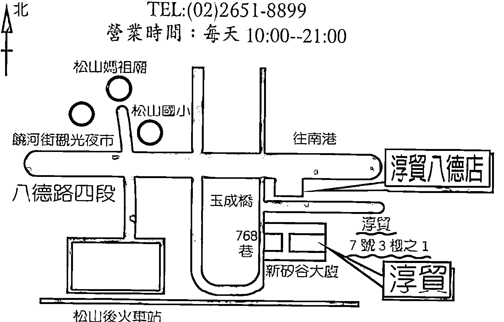

### 台中展示中心

台中市南屯區大墩17街37號 TEL:(04)2310-4479 FAX:(04)2310-4476 營業時間：每天 11:00--21:00

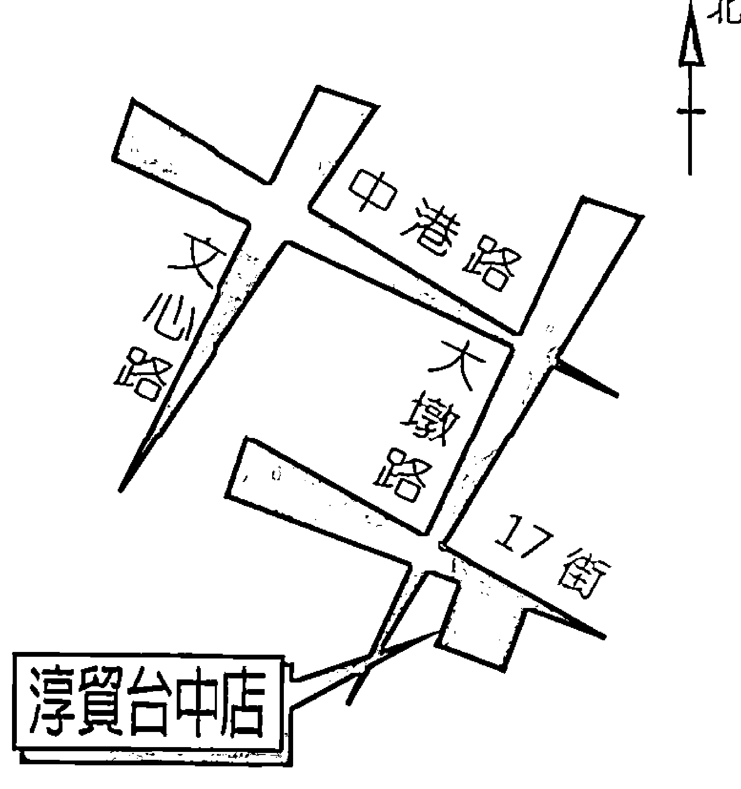

### 台南展示中心

台南市友愛街168號 TEL:(06)224-6599 FAX:(06)224-5867 營業時間：每天 12:00--22:00

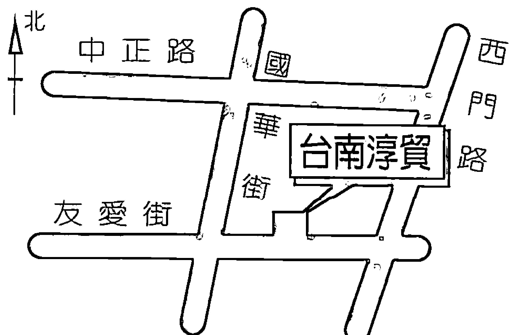

### 高雄展示中心

高雄市三民區民族一路465號5F TEL:(07)350-7869 FAX:(07)350-2169 營業時間：每天 11:00--21:00

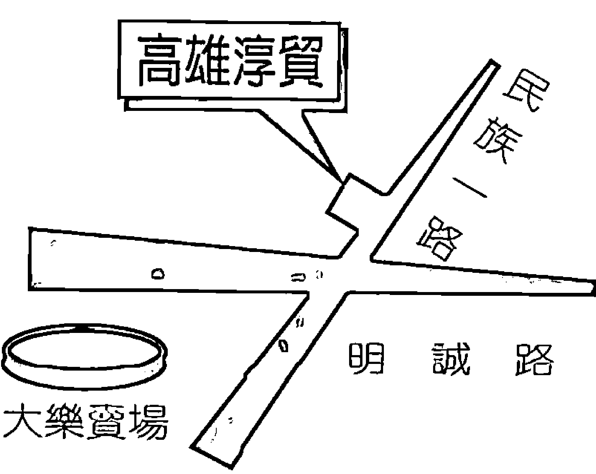

淳貿水晶網站 / 水晶谷之旅：www.blancocrystal.com 水晶新時代：www.blancoage.com

## 淳貿企業有限公司

### 小檔案

創立於1977年，係一以寶石為主業，以進出口、大批發為導向之專業公司。

早在1985年即開始設計生產外銷新時代系列珠寶至歐、美、日、澳等市場。

自1990年以「 BLANCO 」「FANTASIA」品牌的前衷新時代設計珠寶，屢獲台灣、香港、泰國等國際珠寶展大獎。

近年則致力於將新時代運動的精神結合水晶礦石推廣於國內，並經常性地舉辦各種靈性成長課程。

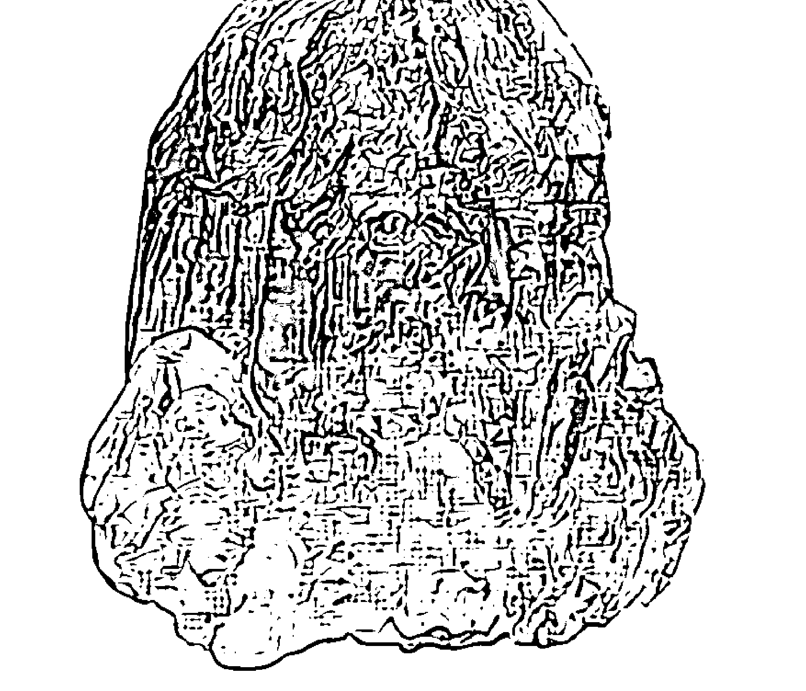

『水晶與環境能量場』一書，從能量流（Energy Flow）、能量場（Energy Field）的角度切入，來剖析中國傳統的風水觀念，從根本道理、觀念形成、到制化運用，全部賦予嶄新的意義，揚棄了所有迷信、模糊、封建、繁複的概念，還原其單純、樸拙、真實、實用的面貌。東四命、西四命、八宅方位、九宮飛星的秘密，全部以「表格化」展示，讓您一目瞭然，不再迷惑！「能量的問題就用能量來解決」，強力的水晶寶石如何運用在風水的制煞解厄、趨吉避凶，條列式的說明，豐富的圖片，這是本可以讓初學者輕易入門、上手的好書，也是讓進階者、風水專家們可以有另類思考、深度研究、創新手法的寶書！

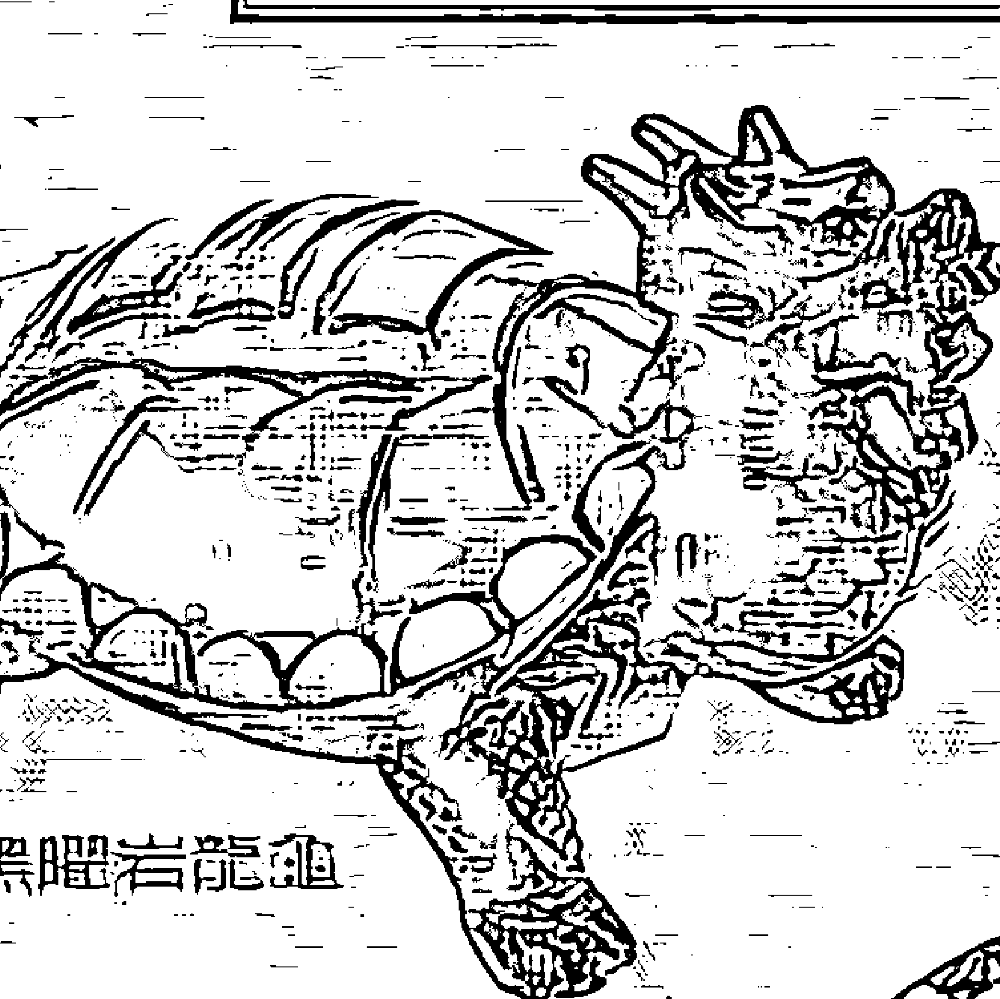

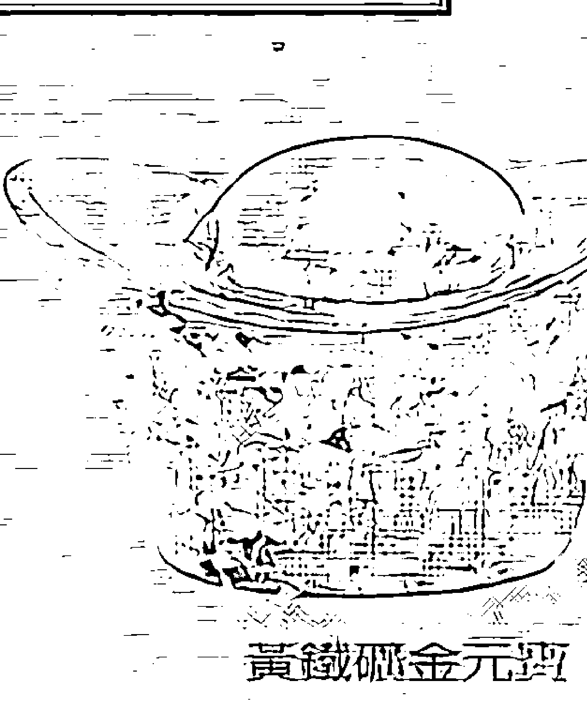

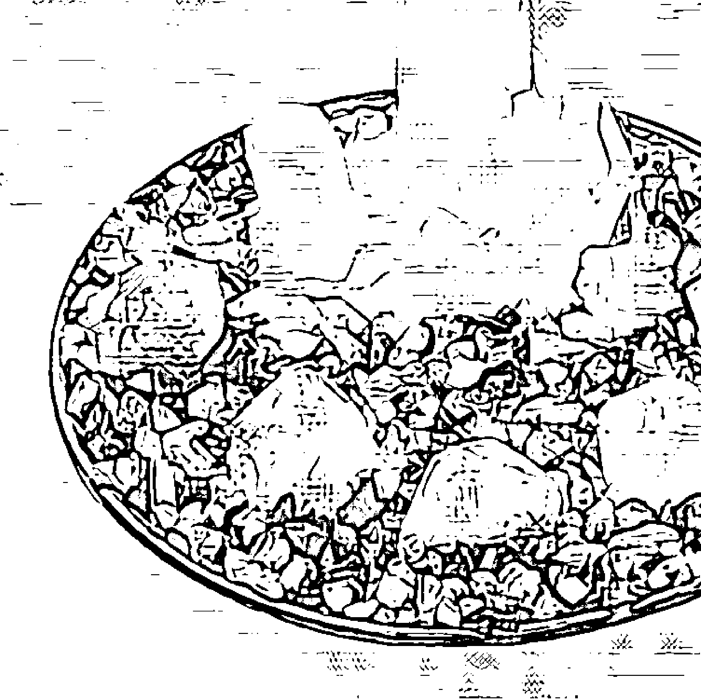

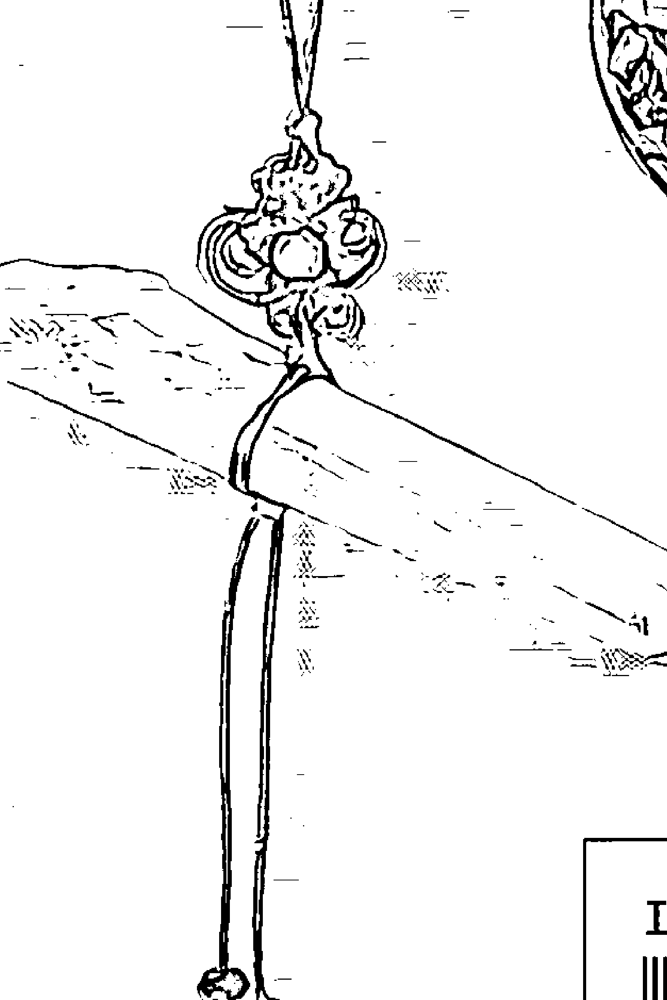

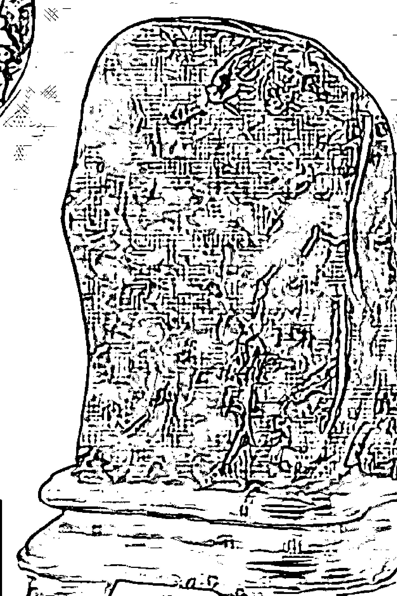

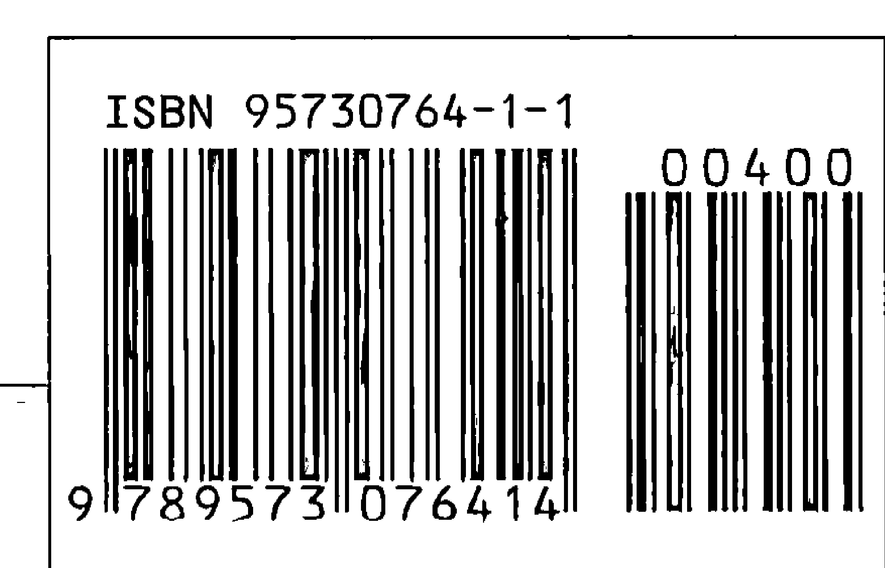