# 水晶知识面面观

水晶晶莹剔透而美丽，质地坚硬而耐久，产出稀少而名贵，因此水晶在宝石王国中，处于非凡的地位……

## 序

水晶晶莹而美丽，质地坚硬而耐久，产出稀少而名贵，因此水晶在宝石王国中，处于非凡的地位。东海县作为闻名中外的“中国水晶之都”，其水晶资源丰富，全县有二分之一的地域储有水晶，储藏量和年开采量占全国半数以上，并且品质优良，含硅量高达99.99%。东海县在改革开放以来，水晶产业取得了跨越性的发展，现已成为县域经济的重要支柱之一，东海水晶市场成为全国最大的水晶专业交易市场和世界水晶的集散中心之一，在全国珠宝饰品市场中具有举足轻重的行业地位。而今，浓郁的水晶文化氛围已在东海形成，走进晶光流泻的水晶市场，仿佛置身于晶莹玲珑的水晶宫，到处是工艺精湛的水晶工艺雕刻精品，独具神韵的水晶观赏景石，时尚美观的饰品挂件，更可见东海人那水晶般坦荡、宽广的胸怀。

从漫长悠久的水晶历史到丰富迷人的水晶传说，从科学不发达的古代到现代科学发达的今天，随着水晶多种功能被揭示，水晶在高科技领域乃至到日常生活，其用途非常广泛。特别近20年来，随着水晶饰品水晶工艺品的不断升温，市场趋于火暴，水晶饰品及水晶工艺品已进入普通百姓家中。但是人们对水晶方面的知识知之甚少，不科学的解读，错误的认识到处可见，虽然有水晶方面的书问世，但多是水晶文化、水晶观赏、水晶传说等方面的内容，有的甚至是水晶迷信玄学方面的文章，人们渴望得到一本有关水晶科普读物，《水晶知识面面观》一书的出版，正是满足了人们的这一愿望。该书作者严奉林从事矿物、岩石的鉴定检测与研究工作多年，在《世界地质》、《沉积学报》、《江苏地质》、《珠宝科技》等刊物上发表论文20余篇，并致力于水晶珠宝的检测与鉴定工作，是水晶行业的鉴定权威和资深人士。作者在书中讲述了水晶方方面面的基础知识，从水晶的基本概念，水晶性质分类与用途到水晶怎样形成，生长条件，找矿与开采方法；从水晶饰品，工艺品的加工技术方法到合成水晶、天然水晶检测鉴定步骤与方法；从典型水晶赝品的剖析，水晶优化处理识别到水晶益害说解析；从中外赏石文化差异到水晶观赏石分类命名与配座等等。该书图文并茂，语言通俗易懂，体现了科普作品的科学性、普及性、趣味性与实用性，是一本水晶业者及水晶爱好者难得的好书。

水晶知识博大精深，水晶世界奥妙深邃。授之以鱼，不如授之以渔，拥有精深的水晶知识，比拥有水晶精品更为可贵。愿《水晶知识面面观》一书能为广大水晶业者及水晶消费者提供有益的帮助，能为东海水晶产业的健康、快速发展助力！

单晓敏
(东海县人民政府副县长)

## 前言

随着人们生活水平的提高，珠宝饰品已进入普通百姓家中。水晶饰品由于玲珑剔透，价廉物美，倍受人们的青睐，市场行情看好，交易非常活跃。然而现实生活中，人们对水晶方面的知识知之甚少，不科学的解读、错误的认识，到处可见。目前虽然有一些水晶方面的书，供人阅读，但其内容多为水晶文化、水晶传说、水晶观赏方面的，有些是宣传水晶迷信、水晶玄学方面的，为此笔者根据多年来的实际工作经验，花了5年时间编写了这本书，以飨读者。

该书共分二十章，其内容包括水晶方方面面的知识：从水晶的基本概念到水晶的性质、分类与用途；从水晶怎样形成、生长条件、生长规律到水晶晶体形态、表面特征、生长缺陷与伴生现象；从水晶的成因类型、找矿方法、找矿标志到水晶的开采与选矿；从合成水晶的发展历史到合成水晶生长方法；从品种繁多的水晶饰品与工艺品到水晶的加工技术与方法；从水晶的检测鉴定步骤与方法到天然水晶与合成水晶及优化处理水晶鉴别技巧；从典型水晶赝品案例剖析到如何识别制假方法；从水晶眼镜作用的益害说到水晶药用保健功能解析；从古代水晶文化的渊源到近代水晶寓意文化；从水晶观赏石分类、命名到中外赏石文化的差异；从当前我国水晶市场状况到如何从品种繁多的水晶饰品中选购的常识；从世界水晶之最到世界水晶别称解释等等，都进行了介绍。该书语言通俗易懂，图文并茂，适合广大水晶爱好者及水晶业界人士阅读，同时可供珠宝检测人员参考。由于编者水平有限，书中难免有不准确之处，敬请广大读者批评指正。

严奉林

2008年8月15日于江苏东海

# 第一章 水晶——一种古老的宝石

水晶知识面面观

## 水晶棺是水晶吗

如果把水晶与水晶棺同时送入实验室进行一些分析测试的话，你就会发现水晶与水晶棺之间的一些性质差异是比较大的，虽然它们都具有同等含量的二氧化硅，但其密度、折射率、光性特征、硬度、热稳定性等相差很大。水晶的密度为2.65g/cm³，而水晶棺密度为2.203g/cm³；水晶具有两个折射率（1.544，1.553），而水晶棺仅具一个折射率（1.4684）；水晶是非均质体，而水晶棺是均质体；水晶的硬度为7，而水晶棺的硬度为6；水晶经高温水冷后要爆裂，而水晶棺如果在1000℃烧红，再迅速放入冷水中将不会产生爆裂与变形。可见由水晶经高温熔融后铸造的水晶棺，已经不是水晶了，而是进入了玻璃行业，所以水晶棺是一种性能优良的、特种的、比水晶还要昂贵的水晶玻璃棺（优质石英玻璃棺）。

## 何谓水晶

说起水晶，大家都知道，它晶莹剔透，光芒四射，非常美丽，历来深受人们青睐。但到底何谓水晶，知道的人就不多了。

有的人说水晶是一种由纯二氧化硅组成的物质；而有的人则说水晶是由石英熔炼而成；有些人则水晶与玻璃不分，把玻璃工艺品说成是水晶工艺品。媒体上经常有这样的报道，说某某获得水晶奖杯；某某单位出口水晶工艺品创汇多少；某某市场进口大量奥地利水晶等等。其实水晶奖杯、水晶工艺品、奥地利水晶均是光学玻璃制品。由此可知开展水晶知识的普及是非常重要的。

何谓水晶？比较通俗的讲法是：水晶乃是透明似水的石英单晶体。这里包括两层意思：其一，水晶非常透明（透明似水）；其二，水晶是一种石英单晶体。可见水晶乃是石英家族内的成员之一。根据形成温度的不同，石英又分为低温石英（在573℃以下形成）、高温石英。水晶属于低温石英，又称α-石英。何谓晶体呢？一般认为：具有天然的而不是人工磨削成的规则几何多面体外形的固体，称之为晶体，如水晶晶体就是。石英虽然从内部结构、构造看也是晶体，但因颗粒小且不具规则的几何外形而区别于水晶。2003年国家珠宝玉石鉴定标准把水晶归于石英（水晶、紫晶、黄晶、烟晶、绿水晶、芙蓉石）。

## 古人是如何认识水晶的

在科学不发达的古代，人们对水晶的称谓很多。从水玉、水碧、玉瑛、水精、晶玉到菩萨石、马牙石、眼镜石、千年冰、放光石等。每一种称谓都有一定的含意，都有一定的道理。如“水玉”，意思是似水之玉；“水精”乃水之精灵也；水晶会闪射神奇的灵光，佛家弟子把水晶尊称为“菩萨石”；完整的水晶晶簇，看似交错的马牙，故称“马牙石”；先民们用水晶磨成眼镜片，所以古人也称水晶为“眼镜石”；广东一带的百姓称水晶为“晶玉”，意思就是水晶是一种晶莹剔透的玉石；在江苏东海，山民们发现出水晶的地方会蹿出火苗，因此当地的山民们称水晶为“放光石”；古人一直认为水晶是由千年冰变来的，故称水晶为“千年冰”。欧洲人认为水晶是上帝创造的耐久、坚固的冰，是冰的化石；古希腊语、拉丁语及英语中，水晶即为“洁白的冰”。称水晶为“千年冰”，的确也迷惑了不少人。然而人们探寻自然奥秘的目光并没有停留在表面上，中国古代最有名的医药学家李时珍在《本草纲目》中就否定了水晶是“水化”、“冰化”的说法，“水精、水玉、水晶如水之精英，会意也”。科学家研究证实，水晶的成分是由二氧化硅组成，而且最小质点是按一定结晶构造而组成，具有规则的外形、固定的化学成分与固定物理性质的晶体。

## 人类发现水晶历史悠久

水晶很早就被人类所利用。早在50万年前，北京的周口店人就开始利用水晶石作为工具，从周口店古人类遗址中发现有大量用水晶石制作的石器就是例证；距今2.8万年前的山西省峙峪遗址，就出土过一件水晶制作的小石刀和一件由一面穿孔而成的石器装饰品，显然那时人们就会利用水晶来雕琢装饰品；距今6000年前河南新郑沙窝里石器遗址中，发现有水晶刮削器和水晶饰品；距今约5500年的红山文化期间，在辽宁丹东东沟出土的水晶制作有凿、斧、坠；在内蒙林西沙窝子出土的细石器有多件水晶制品。经过数千年的演变，到了春秋战国时期，水晶品制品渐多，而且多为信物和吉祥物，用于朝觐、盟约、婚葬、祭祀等。如湖南资兴旧市出土的26块水晶属春秋战国早期，山西长子羊圈沟出土的水晶珠属春秋战国晚期；浙江绍兴狮子山出土的13颗水晶珠属战国早期；山西长治分水岭出土的水晶珠属战国中期，湖南古丈白鹤湾出土水晶环，陕西凤翔西村出土过水晶环，四川新都县出土过水晶球；河北邯郸出土过29颗水晶球属战国晚期，山西长子羊圈沟牛家坡出土两枚水晶环；到了汉代出现了水晶制作的璧、环、玦等，汉武帝把雕刻的水晶盘赐给宠臣董偃；宋代有了水晶茶盅；元朝已开始有专门机构采集水晶及制作器皿；到了清朝则把水晶制成印玺、缀穿成朝珠，还作为朝服、乌纱上的标志，用以显示帝王将相的威仪，官场的权势等等。

# 第二章 水晶的性质

## 水晶的化学成分

水晶的化学成分是二氧化硅。氧与硅是组成地壳的主要元素，地球上含硅的矿物约有800种左右，构成了地壳总重量的80%，但二氧化硅含量大于99.99%以上的硅矿物惟独水晶（石英）所有，所以水晶的化学成分是由很纯净的二氧化硅组成的，正因为如此，所以在工业上有着广泛的、重要的用途。

## 水晶的密度

所谓密度，指的是单位体积某物质的质量，称之为该物质的密度。不同珠宝玉石因化学成分、晶体结构不同而具有不同的密度与密度范围，水晶的密度为2.65g/cm³。密度为法定计量单位，但不少矿物与珠宝书中都有比重这一名词。所谓比重指的是单位体积某物质的重量，称之该物质的比重，也就是说某一材料的重量与同体积水的重量之比。更精确的定义是某一物质的重量与4℃时同体积水的重量之比（4℃时水的密度最大）。由4℃到室温，水的密度变化很小，所以在宝石比重测定中往往不必考虑温度问题。每一种宝石的比重，都局限在一个很小的范围内，因此利用比重是鉴定宝石的有效手段。有些书上记载的水晶的比重是2.65，也就是说水晶是同体积水的重量的2.65倍。

## 水晶的硬度

所谓矿物晶体的硬度是指矿物晶体的软硬程度。测定硬度的方法通常有3种：刻划法、压入法与研磨法，从而将硬度分为刻划硬度、压入硬度与研磨硬度。所谓刻划硬度，就是两种矿物在一起相互刻划，被刻动的矿物说明硬度小。这种方法是矿物学家摩斯（F. Mohs）于1822年首先创立，因此也称摩斯硬度。摩斯将10种矿物作为标准硬度，计是：

- 1. 滑石
- 2. 石膏
- 3. 方解石
- 4. 萤石
- 5. 磷灰石
- 6. 长石
- 7. 石英
- 8. 黄玉
- 9. 刚玉
- 10. 金刚石

## 水晶的解理与断口

所谓解理乃是矿物晶体被击打后，沿某一方向规律裂开的性质称解理，裂开的面称解理面。有的矿物有一组解理面，有的矿物有两组、三组解理面，有的矿物有极完善解理，如云母、方解石、萤石等。有的矿物没有解理，而产生沿不同方向断开的性质称断口，断口面形态多种多样，水晶具有清晰的贝壳状断口面。

## 水晶的弹性

所谓弹性，是指矿物受力作用后，将会发生形状的改变，而当外力去除后又恢复原来形状，称之为弹性。由于水晶具有较大的弹性，因此压电水晶薄片作机械振动时，不会被破坏，从而广泛用于电子工业。

## 水晶的抗压性

水晶的抗压性，是水晶承受外来压力的性质。水晶能承受较大外来压力，即水晶的抗压性较大，而且具有方向性，不同方向抗压性是不一样的，在垂直光轴的方向上水晶能承受最大的压力为27400 kg/cm²，在平行光轴的方向上水晶能承受最大的压力为28000 kg/cm²。

## 水晶的脆性

水晶破坏成粉末的性质称脆性。水晶易破碎成粉末，因此水晶的脆性较大，由于水晶脆性大，所以水晶或石英可以加工成各种级别大小颗粒砂子，最细的可加工成几千目大小的微粒，为水晶石英的应用开拓了新的前景。

## 水晶的导热性

水晶传热的大小和快慢程度称为水晶的导热性。水晶与玻璃相比，其导热性比玻璃好，然而在矿物中水晶的导热性是比较差的，而且具有方向性，即不同方向上水晶传导热的性质是有差异的。

## 水晶的线膨胀系数

物体温度上升1℃所增加的长度和0℃时的长度的比叫线膨胀系数。水晶的线膨胀系数小，同时不同方向上水晶的线膨胀系数是有差异的。由于水晶（石英）具有这种特性，所以水晶（石英）微粉大量用于电子工业塑封料的填充料。

# 水晶知识面面观

## 水晶的透明度

水晶的透明度指的是水晶透光的能力。水晶具有很高的透明度，实验显示，水晶的透光范围约在200～2500毫微米之间，即水晶除能透过全部可见光外，对红外、紫外光范围约有70%的透过能力。但由于水晶受其颜色、包裹体、裂隙等的影响，因而使水晶透明度有所降低。

## 水晶的颜色

所谓颜色是由矿物对不同波长光选择性吸收的结果。无色透明的水晶，对可见光几乎不吸收，因此显无色。水晶除无色者外，还有烟色、墨黑色、茶色、紫色、黄色、绿色、粉色等。关于水晶颜色的成因的说法有两种：一种认为水晶颜色是由水晶中致色杂质元素引起的；另一种则认为是放射性射线辐照引起的。如果将有色水晶在一定温度条件下加热，一般可以褪色。

## 水晶的光泽

光泽是指矿物或珠宝首饰的表面对可见光的反射能力，珠宝的光泽取决于宝石本身的折光率和表面光泽度。水晶为玻璃光泽。但在巴西双晶、节瘤和绵的晶体部位，往往见油脂光泽。

## 水晶的双折射

水晶的双折射现象，是指当一束光线以一定的角度射入水晶，将会产生两条折射光线。这两条折射光线传播速度不等，折光率不同，而且其振动方向是在互相垂直的平面内振动，其振动面为偏振面。能使一束光线分解成两条速度不等光线的能力称双折射率。宝石的双折射率的大小，是用该宝石最大折射率与最小折射率之差值表示，水晶的双折射率值为0.009（1.553～1.544）。当光线沿水晶光轴方向射入水晶时，水晶将不会产生双折射。当光线垂直或斜交光轴方向射入水晶晶体时，均能产生双折射。

## 水晶的旋光性

水晶晶体能使通过它的平面偏振光波之振动面发生旋转的性质称之为水晶旋光性（见图1）。水晶的这一现象是法国学者阿喇果（D. F. Arago）于1811年首次发现。这一现象的开拓了水晶新的用途。当时阿喇果做了这样的实验，他用一平面偏振光波沿光轴方向通过，如上所述偏振光将不会发生双折射，然而其平面偏振光波之振动面却转动了一定的角度，后人称之为旋光性。根据偏振面的旋转方向之不同又分为左旋、右旋。

## 水晶的耐酸和耐碱性

水晶是一种化学性质很稳定的矿物，它仅溶于氢氟酸，其余的酸对水晶不起作用。碱对水晶在不同温度下有不等的溶解作用。水晶在常温常压下不溶于纯水，但在自然界中的水对水晶起溶解作用，这与自然界中的水质不纯有关。

## 水晶的压电性

所谓水晶的压电性是指当水晶晶体受机械力（压力或拉力）后，能产生电荷的性质（现象）称水晶的压电性（又称正压电性）（见图2）。产生电荷的方向称电轴。（图2，x1，x2，x3）水晶的电轴为对应柱棱的连线。当水晶晶体在电场作用下，能产生机械振动的现象称之逆压电现象。产生机械振动的方向称机械轴（图2，y1，y2，y3），水晶机械轴方向是对应柱面的连线。水晶的压电性是法国著名科学家皮尔·居里于1886年首次发现的，但一直在工业上没有得到应用，直到第一次世界大战，法国遭受德国海军潜艇攻击，这时法国的郎元万教授第一次用水晶来制造超声波探测仪，用以探测德国潜艇获得成功。压电水晶在第二次世界大战期间，才大量用于军事工业，如美国在1945年一年中，用于战争的水晶就达500余吨。

图2 右旋水晶的电轴机械轴分布

### 根据实验，水晶的压电效应，大致有如下规律：

1.  沿着水晶电轴方向施加压力或拉力，其两端产生的电荷量相等，但符号相反。所产生电荷的多少（电量）与压力、拉力大小成正比，与水晶片大小无关。
2.  沿着水晶机械轴方向施加压力或拉力，产生电荷的多少与水晶片大小有关。
3.  沿电轴方向施加的压力，如果以机械轴方向施加的拉力代替，两种情况产生的电荷性质是相同的。如果前后两种情况，对单位面积上所施加的力相等，则所产生的电荷量相等。
4.  沿水晶光轴方向施加压力或拉力时，则不产生压电效应。
5.  水晶各方向上的压电常数是不相等的。

水晶知识面面观

## 44 中国工艺美术大师——邹立平

重达 1.99 吨水晶二王图

# 第三章 天然水晶的工业分类与分级

## 压电水晶分级与质量要求

压电水晶是指具有高纯度的水晶单晶体，无任何包裹体、杂质、节瘤、蓝针的单晶体。单晶块体一般要求大于12mm×12mm×12mm，也可降至8mm×8mm×8mm或6mm×6mm×6mm。原生矿地表开采最低工业品位为0.5g/m³，地下开采最低工业品位为3g/m³，砂矿开采最低工业品位为0.3g/m³，如果旱季开采最低工业品位为0.5g/m³。天然压电水晶工业原料分级及压电水晶制品的分级与质量要求（见表1、表2）。

### 表1 压电水晶工业原料等级

| 级别 | 无缺陷部分重量（g） | 级别 | 无缺陷部分重量（g） |
| :--- | :----------------- | :--- | :----------------- |
| 一级 | ≥500               | 四级 | ≥10 <50            |
| 二级 | ≥150 <500          | 五级 | ≥1.36 <10          |
| 三级 | ≥50 <150           |      |                    |

## 光学水晶分级与质量要求

光学水晶乃是指纯净的无色透明的水晶单晶体，无双晶、节瘤、各种包裹体、绵、裂隙、蓝针等。同时要求紫外线的透过率大于 85%（以 10mm 厚无缺陷晶体薄片测定为准），其原料分级如下（见表3）。

表2 压电水晶制品的分级与质量要求

| 序号 | 级别 | 单晶立方体边长(mm) | 质量要求 |
| :--- | :--- | :--- | :--- |
| I | 一等品 | ≥30×30×30 | 不允许单晶有缺陷 |
| I | 二等品 | ≥30×30×30 | 允许有少量小于 0.2mm 分散气泡 |
| II | 一等品 | ≥20×20×20 | 不允许单晶有缺陷 |
| II | 二等品 | ≥20×20×20 | 允许有少量小于 0.2mm 分散气泡 |
| III | 一等品 | ≥12×12×12 | 不允许单晶有缺陷 |
| III | 二等品 | ≥12×12×12 | 允许有少量小于 0.1mm 分散气泡 |
| IV | 一等品 | ≥8×8×8 | 不允许单晶有缺陷 |
| IV | 二等品 | ≥8×8×8 | 是前三级中剔除的单晶部分有少量 0.3mm 分散气泡 |

表3 光学水晶工业原料级别

| 级别 | 编号 | 机械轴尺寸(mm) | 电轴尺寸(mm) | 光轴尺寸(mm) | 无缺陷部分允许缺陷程度 |
| :--- | :--- | :--- | :--- | :--- | :--- |
| 一级 | 1 | 65 | 55 | 40 | 不允许有巴西双晶、绵、节瘤、气态、液态、固态包裹体、裂隙、蓝针。 |
| 一级 | 2 | 72 | 72 | 15 | 不允许有巴西双晶、绵、节瘤、气态、液态、固态包裹体，允许有一定数量小气泡、小蓝针及次生小裂隙。 |
| 二级 | 1 | 45 | 35 | 30 | 与一级1同 |
| 二级 | 2 | 65 | 65 | 15 | 与一级2同 |
| 三级 | 1 | 30 | 25 | 20 | 与一级1同 |
| 三级 | 2 | 45 | 45 | 15 | 与一级2同 |

- 注：(1) 晶体中无缺陷部分应集中，有两个或两个以上无缺陷部分时，按尺寸最大无缺陷部分定级。
- (2) 无缺陷部分，允许存在之缺陷备有实物样板。
- (3) 国家对光学水晶质量及规定检验方法是：(a) 在强光源下，利用反射光和透射光检查晶体内部缺陷。(b) 利用偏光油槽和折射仪检查巴西双晶及节瘤。(c) 利用切、磨、腐蚀查巴西双晶、包裹体及蓝针。

## 工艺水晶分级与质量要求

对于不能做压电、光学的水晶晶体，如紫晶、茶晶、墨晶、发晶、绿晶、黄晶、红晶等，其重量在2克拉以上者，都可以加工成宝石与工艺品，而且以颜色越深、越鲜艳、越透明无杂质者质量为越佳。目前国家对工艺水晶，还未建立完整分级标准。我国曾对水晶眼镜用工艺水晶制定了一些分级标准，根据水晶茶色的深浅将水晶眼镜用工艺水晶，分为深茶、茶、浅茶、无色四个等级。可利用部分的最小尺寸为42mm×42mm×5mm至50mm×50mm×5mm。可用部分占整块晶体的比例为大于50%~70%。允许有少量的气、液、固三相包裹体及绵、蓝针等。上世纪90年代初期，中国水晶之乡——江苏省东海县利用水晶中由各种各样矿物包裹体所组成的美丽的图案而加工为水晶观赏石，得到了人们的认可与青睐。近些年来在水晶工艺品的交易过程中，对昂贵的水晶球工艺品，人们也有一个不成文的分级，把水晶球分为A、B、C三级。A级球是肉眼见不到任何包裹体、绵、裂等缺陷；B级球肉眼可见到少量的包裹体、绵、裂等缺陷；C级球肉眼可见到有大量的包裹体、绵、裂等缺陷。

## 熔炼水晶分级与质量要求

在水晶中选出压电、光学、工艺水晶后，所剩余的水晶碎块，允许有双晶、裂隙、气液包裹体、节瘤、蓝针等，但不允许有杂色（紫黄、茶等色），自然面干净。一般经手工破碎分级，按透明部分所占比例分四级（见表4）。

表4 熔炼水晶工业原料分级

| 项目 | 一级 | 二级 | 三级 | 四级 |
|------|------|------|------|------|
| 最小断面尺寸 (mm) | ≥10 | ≥5 | ≥5 | ≥5 |
| 形状 | 不拘 | 不拘 | 不拘 | 不拘 |
| 双晶、节瘤、蓝针、裂隙 | 允许 | 允许 | 允许 | 允许 |
| 矿物包裹体 | 不允许 | 不允许 | 不允许 | 不允许 |
| 颜色 | 无色 | 可带浅色 | 不拘 | 不拘 |
| 透明部分占块体体积 (%) | ≥90 | ≥70 | ≥40 | ≥10 |

水晶知识面面观

# 第四章 水晶的工业用途

## 利用水晶制作石英谐振器

石英谐振器（即水晶谐振器）是无线电电子设备中非常关键的一个元件。它的特点是：具有高度的稳定性（即受温度、时间和外界因素影响小），尖锐的选择性（即从许多信号及干扰中把有用信号选择出来的能力很强），高度灵敏性（即对微弱信号的响应能力很强）和相当宽的频率范围（从几百赫到几百兆赫）。普遍装置在无线电通信的发射器、接收器及无线电测量仪器中。在无线电通信中，如无线电话、电报、电视、广播均大量使用石英谐振器。在人造地球卫星、导弹、飞机、火箭、舰艇、雷达、电子计算机以及各种远距离操纵、跟踪、导航等设备中，也需要安装石英谐振器，才能稳定、精确工作，石英谐振器在无线电设备中虽然用途复杂，但是最基本的是作为标准频率源和滤波器以及机械——电能的转换器。

## 利用水晶制作滤波器

滤波器是现代有线通信中不可缺少的部件。用水晶制作的滤波器与用电感电容做滤波器相比，水晶滤波器具有体能小、成本低、质量高等特点，因此大量用在有线通信中的各种载波设备，如载波电话、载波传真、载波电报等。载波多路通信的一根导线上，可以同时使用几对、几十对、甚至几千对电话而互不干扰。在传输多路有线电话的同时，也能传送传真或电报。

## 利用水晶制作各种超声波仪器

压电水晶常用于超声波探伤仪上，用以发现金属制品及硬质塑料内部裂纹和气孔。用于超声波探测仪上，可探测鱼群、测量海底深度、勘察海底地形、发现暗礁与浅滩等。利用超声波也可诊断治病，击碎体内结石，诊断体内器官的病变等等。

## 利用水晶制作各种测量仪器

如利用水晶的压电性，可制作各种压力计、高压仪，用以测量桥梁、机器、炮筒等承受压力的情况，另外远距离测量、定位及换能仪上也常用到压电水晶。

## 利用水晶制作各种特殊用途的透镜及棱镜

利用水晶能透过红外线的性能，制成各种红外镜头的性能，安装于相机上，用以在黑暗中照相观测，用于云雾中，高空远距离照相与观测等；利用水晶能透过紫外线小性能，制成各种紫外镜头，安装于光谱仪上，以测定矿物的各种元素，制成石英滤光镜可观察和拍摄太阳；制成紫外线灯，用以杀菌、治疗疾病；利用水晶的旋光性，制成各种用途的旋光仪，用以测定各种糖的含糖量及各种旋光物质及强度；将水晶按特殊方向切割、磨制、抛光可制成石英楔子、石英试板及消色器，用于偏光显微镜上，观测和鉴定各种矿物。

## 利用水晶制作各种特殊用途的石英玻璃制品

利用熔炼级水晶，经高温熔融特殊工艺生产制作成各种石英玻璃管材、器皿、板材等，由于这些制品具有高的化学纯度，高的热稳定性，耐高温及耐酸碱等特性，因此广泛用于各工业部门中。

- 1. 在国防工业上：用于人造地球卫星上的一些石英玻璃管，导弹的弹头壳，大炮的瞄准镜，飞机的座舱玻璃等。
- 2. 在半导体工业上：拉单晶硅用的石英坩埚，生产多晶硅用的石英玻璃架、液面计及石英塔等。
- 3. 在光学工业上：能生产各种特殊的镜头、天文望远镜、透紫外线灯、氙灯、碘钨灯、高压超高压水银灯及一些精密仪器上用的石英玻璃管材等。
- 4. 在冶金工业上：做高温炉管、钢铁取样器、钢水测温保护器、贵稀金属提纯器。
- 5. 在化学工业上：用于制作硫酸浓缩塔、盐酸合成塔、高纯试剂分馏塔及各种器皿。
- 6. 熔炼水晶也是生产合成水晶不可缺少的原料。

## 利用工艺水晶生产各种首饰及工艺品

随着人们生活水平的提高，首饰工艺品生产销售日趋火暴。以中低档宝石水晶为原料加工生产的首饰工艺品，由于物美价廉而深受人们青睐。其品种繁多，有水晶眼镜、各种雕刻品、水晶球、水晶观赏石、水晶项链、手链、吊坠、耳饰、戒指、胸花、头饰、水晶象棋、围棋、鼻烟壶等；从颜色上看有鲜艳晶莹剔透的紫水晶、绿水晶、黄水晶、红水晶等；从收藏精品上看，有各种各样的发晶饰品、水胆水晶工艺及百观不厌的水晶观赏石；从产品的价格上看，有数元数十元一件的产品，也有数百元至数万元一件的产品，满足了不同层次人员的需求；从水晶原料的来源看，有我国各地产出的水晶，也有从巴西、马达加斯加、巴基斯坦、缅甸、越南、俄罗斯等国进口的水晶。中国江苏东海的水晶城已成为我国水晶原料及水晶饰品、工艺品的集散中心。

# 第五章 水晶的形成与生长

## 水晶的形成过程

经过地质学家、矿物学家大量研究及人工合成水晶实验证明，水晶是在一定的地质条件下生长形成而逐渐长大的过程。谈及形成过程首先要从岩浆说起。提起岩浆大家都会知道，岩浆是地壳深处一种高温的硅酸盐的熔融体，在地质构造作用的影响下，当这种高温的岩浆沿着地壳薄弱地带及裂缝上升时，随着温度压力的降低而开始凝固结晶，于是就形成了岩浆岩。在岩浆结晶的后期，将有大量的残余的富含硅及挥发组分的热液富集，这些富含硅的气液流，在压力的作用下，将进一步沿着岩石的裂缝上升流动，随着温度压力的进一步降低，这些气液流将达到过饱和而结晶，形成脉状、似脉状的伟晶岩脉及热液脉，水晶就是在这种岩脉的晶洞中形成与生长的。

## 把水晶埋在地下它还会长大吗

一些挖水晶的老乡经常问到这样一个问题，水晶是在地下形成并慢慢长大的，现在把水晶埋在地下，它还会继续长大吗？回答应该是这样的，如果具备了水晶的形成条件，水晶将会继续长大，但水晶的生长条件是很讲究的，在一般的条件下是无法继续生长的，正因为如此所以水晶在地球上分布很稀少。在上世纪80年代前，国家把水晶列为稀有特种非金属矿产，80年代以来，由于合成水晶技术的推广与应用，合成水晶大量上市，基本满足了工业对水晶的需求，从而国家放宽了天然水晶的开采与销售工作。随着市场经济的发展，改革开放的深入，工艺用天然水晶原料，出现了供不应求的局面，市面上一些优质的工艺水晶原料，优质的水晶饰品与优质的水晶工艺品价格还在挺进。

## 水晶的生长条件有哪些

从大量地质研究结果及成熟的合成水晶生产实践证明，水晶生长至少满足如下条件：

其一晶洞：水晶既然是在地下生长出来的，所以它的结晶与长大，必须要有一个自由空间，这个水晶生长的自由空间，地质学家称为晶洞。正因为如此，老乡挖水晶只能在晶洞中挖到。晶洞的形成方式多种，但具有工业意义的晶洞主要有两种，一种是熔融性晶洞，即在伟晶岩脉或石英脉中，由于熔融而形成晶洞；另一种为岩浆结晶晚期富硅的气液流的压力充填或扩张岩石断裂带而形成晶洞。大量实践证明前一种晶洞中生长的水晶个体大而且质量好。

其二压力：有了晶洞还不行，晶洞必须封闭，而且要有足够大的压力，据合成水晶生产实践证明，水晶生长的压力，一般要大于1000大气压。

其三温度：有了晶洞，有了一定压力，还必须具有一定的温度，才能生长成粗大的晶体。常见的粗大的水晶晶体（即α-石英），其生长温度应在573℃以下。

其四营养液：

所谓营养液是指水晶生长时所需营养物质，具体地讲是富硅的气液物质，并且只有当硅达到过饱和时，水晶才能结晶长大。

上述四个条件是水晶生长的基本条件，如果要形成体积粗大，无杂质、无缺陷或缺陷少的水晶晶体，还需要一些附加条件，如地质条件是否稳定，硅溶液补给是否中断，温度是否变化等等。集合上述，可见水晶的生长条件是很讲究的，正因为如此所以地球上水晶的分布是稀少的。

## 水晶生长需要种子吗

所有的种子植物，均需要播下种子，在一定的条件下发芽、生根、开花、结果。水晶生长也需要种子，这种子，有的人叫晶种，有的人叫籽晶，也有的人称晶芽。人们常见到合成水晶的晶种，它呈薄板状，顶端钻有一小孔并串有铁丝，以便挂在生长室（晶洞）的架上，在一定温度、压力、溶液浓度条件下，水晶开始围绕晶种结晶生长，其生长速度一般为每日 1mm 左右。

## 天然水晶生长的种子是从哪里来的

根据大量地质成矿资料和实验观察，发现天然水晶的种子大致有三个方面的来源：其一源于晶洞壁上的石英颗粒：水晶晶洞的洞壁往往都是由含石英的一些岩石组成，如石英岩、石英砂岩、花岗岩、变质岩等。这些岩石暴露于洞壁上的石英颗粒，在一定的条件下，水晶将以这些石英颗粒为种子进行生长，这是自然界水晶生长的一种常见方式（见图3）。

其二自发生长的种子：晶洞中营养液（硅质热液），其中的硅，氧原子、离子或分子，在初期高温时均处于自由运动状态，随着温度降低，体系能量降低，成矿溶液的饱和与过饱和，因此异号离子间的引力越来越大，这时正四价的硅原子与负二价的氧原子，由于引力加大而相碰结合，结合的方式是中间是一个硅离子，周围被四个氧离子包围组成一个四面体，矿物学者称之为硅氧四面体（见图4），硅氧四面体以一定的键角相连接（见图5）最后形成格子状构造成为水晶生长的晶芽。

其三破碎晶片作为种子：先形成的水晶晶体，由于各种地质作用，而破碎形成晶片，这些碎晶片掉入晶洞底或某些晶体上，当条件成熟时，这些破碎片也作为种子，在其上逐渐长大形成水晶晶体。

## 水晶晶体的生长方式

水晶晶体的生长过程是硅质溶液中的最小的质点（硅氧原子或离子），在一定条件下，按特定方式不断向晶种作规律黏附的过程，不断地黏附结晶格架不断扩大最后形成水晶晶体。在理想的情况下生长过程是先生长完一条行列，然后生长相邻的行列，由行列组成一个面网，各面网不断向外推移，最后形成晶面，成为一个完整的晶体。水晶晶体有很多个晶面，各晶面的生长速度是不一样的。所谓晶面的生长速度是指在单位时间里垂直晶面增长的长度，在大多数情况下，生长速度快的晶面，在晶体生长过程中相对变小（见图6）。而生长速度慢的晶面则不断扩大，从而决定了晶体的形态。由于晶面生长是平行向外推移，所以相对应晶面的夹角是不变的，这就是有名的结晶矿物面角守恒定律。矿物学家往往利用晶面夹角来鉴别矿物及确定晶面的相对位置。

## 水晶生长阶段如何划分

根据大量的地质观察分析可将水晶生长大致分为三个阶段。第一阶段：单个晶体生长阶段，这一阶段特点是，小水晶晶体无规则地分布于晶洞壁上，而且互不接触，晶体是单个生长（图7）。第二阶段：晶簇阶段，当水晶晶体生长到互相接触即进入第二阶段，在这一阶段中，平行晶洞壁生长的晶体将受到垂直晶洞壁生长晶体的影响，而根据几何淘汰规律被淘汰，停止生长，继续生长的晶体就少了（图8）。第三阶段：平行柱状生长阶段 即垂直洞壁的晶体，获得空间而继续生长（图9）。

# 第六章 水晶晶体形态

## 水晶晶体的理想形态

水晶晶体的理想形态是由六方柱体，其两端均为六面棱锥体组成（图10）。理想的水晶晶体形态是由五种类型晶面组成，即柱面（m）、大菱面（R）、小菱面（r）、三方双锥面（s）、三方偏方面体（x）。每一种类型的晶面均有六个，这样在一个理想的水晶晶体的形态上共由30个晶面组成。水晶柱体由六个柱面（m）组成，水晶的锥体由三个大菱面（R）与三个小菱面（r）组成，三方双锥面（s）分布于大小菱面与柱面之间，三方偏方面体位于柱面的左或右上角。根据三方双锥面和三方偏方面体分布位置，可以确定是左旋水晶还是右旋水晶（图10）。

## 水晶晶体的实际形态

水晶晶体的理想形态在自然界中很少见到，这是因为水晶晶体在结晶的过程中，受到温度、压力、空间、成矿溶液浓度等多因素的变化影响，造成有些晶面发育，有些晶面不发育，有些晶面缺失，从而使天然水晶晶体不完整，出现了多种多样的水晶晶体形态，常见的水晶晶体形态有如下几种：

- 1. 柱状晶体：这是水晶常见的晶体，其晶体各个晶面发育比较匀称，光轴方向长度一般为机械轴方向长度的2.5~3倍，在柱体的一端常见有大小菱面及三方双锥面和三方偏方面体（图11）。
- 2. 长柱状晶体：这种晶体柱体较长，晶体的光轴方向（长轴方向）为机械轴方向（短轴）长度的4倍以上（照片1）。
- 3. 短柱状晶体：这种水晶晶体短而粗，光轴方向的长度为机械轴方向长度的1.5~2倍，其菱面较发育，晶体头部的长度约为晶体全长的1/3。
- 4. 宝塔状晶体：这种晶体头部不发育，柱面发育不匀称，由底部向头部明显缩小，形如宝塔而得名（图12）。
- 5. 偏头晶体：这种晶体菱面发育极不均匀，有的菱面特别发育，其他菱面不发育、以致消失（照片2）。
- 6. 双头晶体：即在水晶柱体的两端均发育有头部的晶体，上下两头，菱面发育齐全，接近理想晶体形态（照片3）。
- 7. 板状晶体：是一种柱、菱面发育极不均匀的晶体，其中一对应柱面和菱面发育较好，其他晶面不发育，从而形成扁平板状（照片4）。
- 8. 歪头晶：这种晶体由于晶面发育极不均衡，晶面大小相差悬殊，形态不规则，头部呈歪形，也有人称歪头晶（照片5）。
- 9. 蘑菇状晶体：这种晶体非常美丽，外形很像蘑菇，头大身小。头大的晶体是在第一次生长的小晶体上再次生长起来的，好像在第一次生长的晶体上戴上了一顶帽子（照片6）。
- 10. 晶簇：许多生长方向不同，而又共同生长在一个基底上的晶体群称晶簇。在共同的基底上，可以生长同一种单晶体群，# 水晶知识面面观

也可以生长不同矿物晶体群。水晶晶簇是玩石家喜欢收藏的奇石之一，其造型有的如雨后春笋，有的似朵朵鲜花，有的则似山水风景等等，非常美丽。

# 第七章 水晶晶体表面特征

## 研究水晶晶体表面特征的意义

所谓水晶晶体表面特征，指的是水晶晶面特征。理想的水晶晶体表面特征应该是一个光滑的平面，但由于种种原因致使水晶晶体表面经常表现为各种花纹与图案，这种现象有的专家称晶面刻蚀。对晶面刻蚀的观察与研究，是非常重要的一项工作，它的意义在于：其一可以了解水晶当时的生长条件；其二可以了解水晶形成后又经历了哪些地质条件的改变；其三通过水晶晶体表面的一些特征组合与研究，可以判断水晶的产地，水晶的用途，从而选择正确的加工方法等等。

## 水晶晶体表面上的水平生长条纹是什么

在水晶晶体的柱面（m）上，常见到垂直长轴（光轴）分布有很多细小的条纹，时稀时密。这种晶面条纹由于在生长过程中形成，也称生长条纹。沙弗兰诺斯基认为：水晶的菱面体晶面（R、r面）与柱面（m面）呈阶梯状反复交替出现，而构成的一种合成条纹或聚形条纹（见图12、照片4）。一般小菱面（r面）下部的柱面条纹比大菱面（R面）下部柱面条纹要粗。由于从一个细窄晶面过渡到另一细窄晶面往往只有微小的倾斜，因此水晶柱状晶体经常是下粗上细。

## 水晶晶体表面上的生长微斜面是什么

所谓微斜面，是指晶体上凸出晶面的小丘。微斜面的形成是由于晶面生长过快，使某些地方脱离了原晶面的理想位置而成。不同晶面上的微斜面，表现形态是不同的。在大菱面上（R 面）常呈似等边三角形出现，而且三角形的底边平行大菱面与柱面相交的棱，第三边稍微弯曲，如左边弯曲的则为左旋晶体，右边弯曲的则为右旋晶体。在小菱面上的微斜面，常见伸长的似等腰三角形。底面平行小菱面与下方柱面相交的棱，如果等腰三角形的左边弯曲的则为右旋水晶，如果是右旋弯曲的则为左旋水晶（图13）。柱面上的微斜面，有多种多样，常见的有两种：一种为规则的小船形和长形角锥出现。位于大菱面下柱面上的“小船”为倒置小船（船底朝上），船头向左者为右旋水晶，船头向右者为左旋水晶。位于小菱面下柱面上的“小船”则似航行小船，船头向左者为左旋水晶，船头向右者为右旋水晶（图14）。三方偏方面体的微斜面，有的像鱼鳞状，有的呈水波微纹（图15），三方双锥面上的微斜面呈曲尺状（图16）。

## 水晶晶体表面上的溶蚀象

水晶晶体形成后，如果遭受各种溶液的侵蚀，则往往在晶面的薄弱部位产生溶蚀而形成各种形态的凹陷称之为溶蚀象。由于各晶面的面网结构的不同，因此各晶面上的蚀象就有不同，大菱面上的溶蚀像一般呈凹陷的三角形，如果三角形的长边由左向右朝下倾斜者为左旋晶，由右向左朝下倾斜者为右旋晶，小菱面上的情况则相反。柱面上的溶蚀则呈船形，大菱面下部柱面上的“船底”朝下，“船头”向左的为左旋晶，“船头”向右的为右旋晶，而小菱面下部的柱面上“船底”朝上，“船头”向右者为左旋晶，“船头”向左者为右旋晶（图17）。

# 第八章 水晶晶体的生长缺陷与伴生现象

## 研究水晶晶体缺陷的意义

自然界生长的天然水晶，绝大多数均有这样或那样的缺陷，由于这些缺陷的存在，往往就影响到它的应用。例如：具有巴西双晶缺陷的水晶，不能作压电材料用，也不能作光学制品用；具有道芬双晶缺陷的水晶不能用来制作压电薄片，但不影响作光学制品，水晶中包裹体含量的多少、节瘤的形成、裂隙的产生、蓝针的分布均对水晶的工业应用产生影响，因此研究与识别水晶晶体缺陷具有现实意义。同时各种缺陷的产生是在特殊地质条件下形成的，所以通过水晶晶体缺陷的观察与研究，可以了解水晶的形成地质条件，从而指导水晶的找矿与开采。

## 水晶晶体缺陷

水晶在形成的过程中，由于受各种地质因素的影响，因此天然形成的水晶就会存在很多缺陷，包括各种各样的双晶，品种繁多的固相及气液相包裹体，水晶中的裂隙与绵，水晶中的节瘤等，这些缺陷的存在，直接影响到水晶的应用，因此鉴别与了解水晶的缺陷是非常重要的一项工作。

### 何谓水晶双晶

所谓双晶是指由两个或两个以上的同种晶体规则连生的一种特殊形式（它不同于平行连生），其中一个个体为另一个个体的映象，或者是由另一个回转180°而成。这样由两个个体规则连生在一起的晶体称为双晶或孪晶。常见水晶双晶有三种：其一道芬双晶；其二巴西双晶；其三日本双晶（少见）。

### 何谓道芬双晶

所谓道芬双晶是由两个左旋或两个右旋晶组成的水晶晶体，其中一个个体绕光轴旋转180°与另一个个体体重合而成。重合后一个个体的大菱面与另一个个体的小菱面重合，柱面与柱面重合，三方偏方面体和三方双锥面的数量各增加了一倍，三方偏方面体出现在每个柱面的左或右上方，三方双锥面出现在每个菱面和柱面之间（图 18）。

### 水晶道芬双晶的肉眼鉴定法

1.  根据双晶纹鉴定道芬双晶
    所谓双晶纹是双晶的结合面在晶体表面的一种表现形式。道芬双晶纹往往是一种闭合的曲线。如果在水晶晶体的表面见有一种岛状的纹线，则这块水晶就是道芬双晶体。
2.  利用三方偏方面体（X）鉴定道芬双晶
    在道芬双晶中，由于三方偏方面体增加了一倍，因此在晶体的一端见有六个同型的三方偏方面体，则可以肯定是道芬双晶。然而在天然水晶中常见不到全部的三方偏方面体，因此只要在相邻的二柱面相同的位置上见到同型的三方偏方面体，就证明该晶体为道芬双晶（图19）。
3.  利用三方双锥面（S）鉴定道芬双晶
    由于道芬双晶的形成，三方双锥面（S）增加了一倍，即在相邻两个菱面和柱面之间的位置上，出现相同的三方双锥面体，双锥面上往往见有聚形条纹，而且其条纹平行双锥面与大菱面的交线（图20）。
4.  利用腐蚀象鉴定道芬双晶
    如果水晶被天然或人工方法腐蚀后，则由于组成双晶的三个个体受到腐蚀的程度不同，结果反光程度就不一样，表现为一明一暗的两部分，明暗的分界线便是道芬双晶纹（图21）。
5.  利用微斜面鉴定道芬双晶
    如果在一个菱面上，同时出现大、小菱面上所出现的微斜面或在一个柱面同时出现“船头”相反的“船形”微斜面，则说明有道芬双晶的存在（图22）。
6.  利用柱面上的水平生长条纹鉴定道芬双晶
    如果在柱面上见有水平生长条纹不均匀，即一部分生长条纹细密，一部分生长条纹粗稀或水平条纹分布不连续有中断则说明晶体有道芬双晶（图23）。
7.  利用断口鉴定道芬双晶
    如果在水晶的断口面上，见有与晶面条纹相连接的闭合线，这就是道芬双晶（图24）。有的道芬双晶纹线穿过羽状纹分布（图25）。有时道芬双晶与巴西双晶同时出现在晶体上（图26），有时大的道芬双晶中发现小的道芬双晶（图27）。

道芬双晶的出现，对晶体质量产生影响，其影响程度，决定双晶数量、大小、弯曲程度和分布位置。如果道芬双晶在晶体中的数量越多，分布范围越大，深入晶体中越深，影响就越大。另外道芬双晶走向是弯曲的，则对晶体质量影响要大。选矿时道芬双晶的扣除，一般采用直线法扣除或分段扣除，即把道芬双晶的单体等于或大于12mm×12mm×12mm者，扣除双晶后选出来。

### 何谓巴西双晶

水晶中的巴西双晶是由水晶的一个左旋与一个右旋个体，呈镜面关系穿插重合而成。接合后一个个体的大小菱面与另一个个体大小菱面重合，三方偏方面体和三方双锥面增加了一倍，并在柱面上的左右上方出现。

### 巴西双晶的肉眼鉴定法

-   1. 根据双晶纹鉴定巴西双晶
    当你在水晶的晶面及断口处，发现有直线形、三角形、梯形、单角形、网格形等条纹时，该晶体多半是巴西双晶（图28）。
-   2. 根据三方偏方面体（X）分布位置鉴定巴西双晶
    如果在一个柱面的左、右上方，见有同时出现的三方偏方面体时，则说明是巴西双晶（图 29）。
-   3. 利用三方双锥面（S）鉴定巴西双晶
    在同一菱面的左右下方，同时出现三方双锥面，而且在其面上的条纹指向相反（一个向左、一个向右），说明就是巴西双晶（图 30）。
-   4. 利用晶面上的微斜面鉴定巴西双晶
    如果在同一个晶面（柱面或菱面）上，同时出现表示左右旋晶体的微斜面时，则说明是巴西双晶（图 31）。
-   5. 利用腐蚀法鉴定巴西双晶
    如果晶体被氢氟酸腐蚀后，单晶与双晶分别出现明暗不同的部位，双晶部位较暗，巴西双晶线条平行电轴方向分布（图 32）。
-   6. 利用断口鉴定巴西双晶
    有巴西双晶的断口，呈现油脂光泽，并见有各种形状的双晶纹线条。
-   7. 利用偏光油槽鉴定巴西双晶
    取一长方形玻璃油槽（或玻璃缸），两端装有正交偏光片，内盛有与水晶折光率近似的液体，再将水晶放于油槽中，并将水晶光轴调整到与光源进入方向一致，这时观察，如果看到完整的干涉图则为单晶，如果干涉图被三角形破坏，则这三角形就是巴西双晶，如果将水晶上下移动时，三角形变动较大，则双晶深度较小，三角形变动较小，则双晶深度较大，从而确定双晶对晶体的影响程度（图 33）。

### 巴西双晶对水晶晶体质量的影响及扣除方法

一般根据双晶出现的位置、形状、密集程度、分布范围来判断对晶体质量的影响程度。一般说来，当双晶出现在晶体中心，则对晶体质量影响较大。当出现网格、直线双晶，一般均深入晶体内部，而出现三角、梯形、单角形双晶时，一般分布较浅。当双晶分布密集者则双晶深入晶体内部，而双晶分布稀散者，则深入晶体较浅。当双晶分布面积较大时，则对晶体质量影响就大，否则相反。

具有巴西双晶的晶体，既不能做压电材料，也不能做光学材料，其巴西双晶对晶体质量影响程度，取决于巴西双晶不同形状及分布位置，一般分布于晶体底部者延伸较深，往头部逐渐变浅。其双晶的扣除方法是：首先确定巴西双晶在晶面上的分布范围，然后再从断口上根据双晶出现的深度，用直线法圈出双晶的实际分布范围而扣除。

### 何谓日本双晶

两个水晶单体按光轴之间以83°34′的夹角连生的晶体，称日本双晶（图34）。其两个个体一般为板状晶体。日本双晶是外形上的缺点，而不是内部的缺点，因此除接合部位外，每个个体只要满足工业要求，均能应用。

### 水晶中的包裹体

水晶中的包裹体有各种各样，根据包裹体形态的不同，可将包裹体分为固态包裹体、液态包裹体、气态包裹体，对水晶中包裹体的观察与研究，不仅对水晶的成因研究提供重要信息，而且对水晶鉴定提供重要依据。同时由于水晶中包裹体的存在破坏了水晶结构的均一性，因此也影响水晶的质量。

### 水晶中的固体包裹体有哪些

水晶中的固体包裹体种类很多，据不完全统计有：金红石、金云母、电气石、白云母、绿泥石、蛭石、角闪石、阳起石、透闪石、绿帘石、石棉、长石、萤石、石榴石、石墨、赤铁矿、辉锑矿、红闪矿、方解石、黄铁矿、自然金等。由于水晶中固体包裹体的存在，一方面影响了水晶的工业应用，另一方面为水晶的成因研究提供了重要依据，同时为水晶观赏石的开发提供了有利条件。

### 水晶中的气态、液态包裹体

水晶中的水胆水晶，其水胆多由气、液二相包裹体组成，但也见有气、液、固三相共存的。气液包裹体形成，是由于水晶在生长过程中，生长速度过快，即一层晶面未长好另一层或多层晶面又已生长，从而成矿溶液中的气体、液体被包裹于水晶晶体内部而成。据分析，气态包裹体主要成分为：氟化氢（HF），氯化氢（HCl），硫化氢（H₂S），二氧化碳（CO₂），挥发性化合物氟化硼（BF₃）等。液态包裹体主要成分为：母液（二氧化硅溶液），水溶液（H₂O），碳酸混合液等。非常密集的气、液包裹体称之“绵”，就像棉絮状分散于晶体中，它的存在影响到水晶的透明度及工业用途。

### 水晶中的裂隙是怎样形成的

由于地质构造作用，生长过程中各种条件的改变，自然的或人工的撞击等均能产生裂隙。根据裂隙成因的不同，可将水晶裂隙分为原生裂隙与次生裂隙两种。

-   1. 水晶的原生裂隙
    所谓原生裂隙，是水晶在生长过程中形成的裂隙，其产生原因大致有三：其一由于水晶生长过程中产生的生长缺陷面产生的裂隙；其二由于低温水晶转变为高温水晶或高温水晶转变为低温水晶，产生体积改变时产生的裂隙；其三由于水晶中包裹体物质与水晶本身热膨胀系数不同而产生的裂隙。
-   2. 水晶的次生裂隙
    由于地质构造运动作用、风化搬运作用及人工破坏作用而产生的裂隙称之次生裂隙。在这种裂隙中有一种为开放型裂隙，另一种为封闭型裂隙。所谓开放型裂隙即水晶中裂隙已通到水晶晶体的表面，封闭型裂隙指未到水晶晶体表面的裂隙，在开放型裂隙中，往往由于铁锰质氧化物的充填污染，而显红、黄、褐、黑色。闭合型的裂隙又称愈合裂隙，其中往往充填有气、液包裹体。还有一种裂隙，有人称“干”裂隙，也有人称镜面裂隙，裂隙面干净如镜面，这种裂隙往往由人工撞击而形成的新鲜裂隙。水晶中裂隙的存在是压电水晶、光学水晶的致命缺陷。

### 水晶中的节瘤是什么

所谓节瘤是由于几乎平行的水晶个体镶嵌而成，各个水晶个体的光轴彼此扭转一定角度（略1°~3°夹角）。节瘤的形成主要由水晶生长速度过快及发芽过多形成。具节瘤的水晶晶体表面不光滑，柱面上有大量略为弯曲的聚形条纹，长短不一，一头粗一头细。在晶体的横断口面看，它从晶面向内延伸，由粗变细，彼此不平行。

节瘤的鉴定方法：
1. 用30%~40%的氢氟酸液进行腐蚀，在晶面或断口面，可清楚地看到乳白色疏松层或条纹；
2. 在正交偏光下，在晶体不同部位，出现不同的干涉色。

节瘤在晶体上的分布规律：一般在晶体的底部分布较深，越向上部数量就减少，而且深入程度变浅。有的地方产出的水晶全是节瘤。有的地方产出的水晶，节瘤仅分布于表面对质量影响不大。其扣除方法与巴西双晶一样。

## 水晶的伴生现象

所谓水晶的伴生现象，指的是水晶晶体在生长的过程中或生长的同时所伴生的一些现象，如生长外壳、幻影、感应面、生长带、蓝针等。这些伴生现象的存在一方面对水晶的工业应用产生影响，同时为水晶观赏石的开发应用提供了丰富的矿源。

### 水晶的生长外壳

有些水晶晶体的表面，往往覆盖一层矿物质，称之为水晶的外壳。这层外壳由不同物质组成：由硅质层、氧化铁锰层、绿泥石层、碳酸盐层等组成。它的存在妨碍了对晶体的观察，因此对水晶质量进行鉴定时，需要通过多种方法如冲洗、打击、切磨等将外壳去掉。但作为观赏石用时，生长外壳与水晶个体组合往往成为美丽的水晶观赏石。

### 何谓水晶的幻影

所谓幻影，是由水晶中的包裹体、颜色层及蓝针等平行晶面规律分布的结果，它可由一层或多层构成。幻影的形成乃是由于晶体生长间断或结晶条件改变而成。由包裹体组成的幻影对压电水晶、光学水晶是缺点，但颜色层及蓝针组成的幻影的晶体可做压电材料，但不能做光学制品。由幻影所组成的美丽图案，往往为收藏家所青睐。

### 水晶的感应面是怎样形成的

水晶的感应面指的是水晶晶体生长时互相挤压而在挤压面留下的印痕面，印痕的一个面是凹下的，另一面是凸出的，相互对映。当印痕的一方脱落后则在脱落面上留下各种形状的印痕（图35）。

### 何谓水晶的生长带

所谓水晶的生长带，是指水晶在生长过程中，由于生长条件改变或生长间断，在晶体内部形成许多带状的构造称之生长带。在水晶的断口面上往往可以看到平行晶面的一系列直线，这些直线就是生长带与断口面的交线（图36）。

### 何谓水晶的蓝针

蓝针是不同于一般固体杂质的蓝色物，它分布于晶体中，形状多种多样，有直线状、放射状、点状、片状、棉絮状、幻影状等（图37、38、39、40）。有关蓝针的成因目前还不清楚，也未见资料报道。

有人推测蓝针的形成，可能由于水晶形成以后，长期埋藏于地下，受地壳某些射线的长期辐照而产生的蓝色色心。推测这种水晶是形成最古老的一种水晶。虽然蓝针的分布形态多种多样，但其分布方向一般都是平行菱面体分布。有蓝针的水晶可做压电材料，但不能做光学材料。

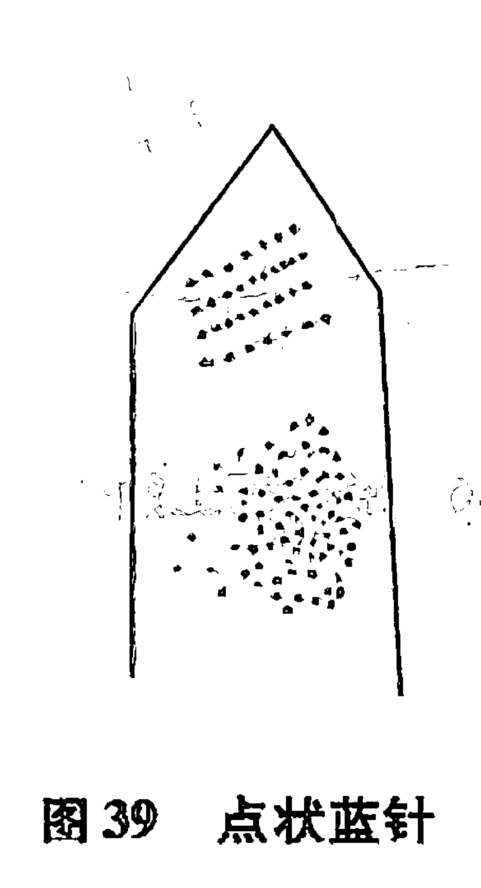

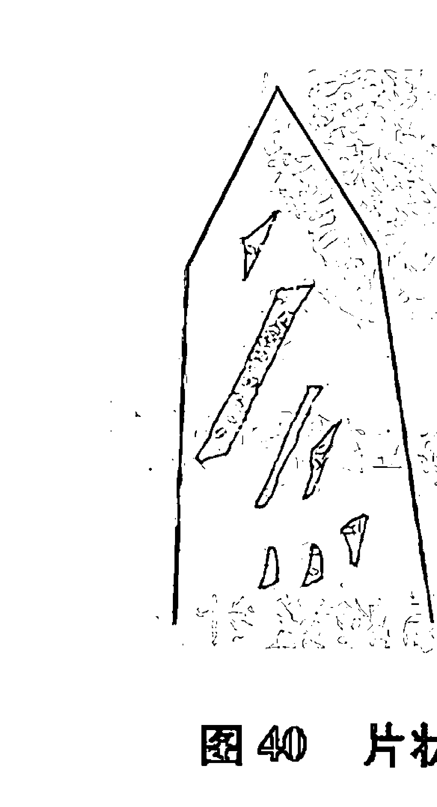

# 第九章 水晶的找矿、选矿与开采

## 我国水晶矿床类型

- 1. 花岗伟晶岩型矿床。这种类型的水晶矿床中常产出巨大的水晶晶体，但水晶缺陷较多，共生矿物常见有萤石、黄玉、绿柱石、长石、云母及稀有金属等，这些共生矿物往往比水晶的工业价值要大。如内蒙古角里格太矿床，就是这种类型的矿床。
- 2. 黑钨矿——石英脉型矿床。水晶产于黑钨矿——石英脉的晶洞中，而且晶洞发育，有的水晶晶体较大，往往在采钨的过程中将其回收。如赣南黑钨矿中伴生的水晶，就是这种类型。
- 3. 花岗岩中的热液石英脉型矿床。水晶主要产于受构造控制不规则的石英晶洞中，有时还形成富矿。如海南岛等大型水晶矿床，就是这种类型。
- 4. 硅质岩（包括各种变质硅质岩）中热液石英脉型矿床。其石英脉严格受构造控制，成矿物质部分来自围岩，其水晶晶洞多呈鸡窝状、囊状、不规则状等，此种类型矿床工业意义较大。如江西芦山罗家山水晶矿，江苏东海水晶矿等。
- 5. 砂矿床类型。由水晶原生矿经风化剥蚀，在水晶原生矿附近产生残积坡积型砂矿，也有随水流搬运形成的冲积型砂矿。砂矿床由于埋藏浅、易开采，往往有较大的工业价值。如海南岛、水晶的找矿方法

由于水晶矿床的成因类型较多，因此水晶的找矿方法也有差异。有的地方采用地球物理的探矿法，如利用水晶压电效应而采用压电法找矿；有的则利用含矿母岩与围岩电阻率的差异而采用电法找矿等等，这些方法虽然均采用过，但是尚不成熟，目前还在探索过程中。生产实践中常用的水晶找矿法是直接法，如在石英脉的交汇处，膨大部分或石英脉的拐弯处挖水晶。江苏东海县的农民在长期的挖水晶过程中，也探索出了一套找水晶矿的方法，往往很有效。如发现有“燕子泥”（一种质细的蛭石岩）就快要挖到水晶了；如发现含矿母岩石英脉中石英颗粒粗大，通透，强玻璃光泽，块度不大，多破碎，破碎面多为氧化铁所污染，这种石英脉往往含有晶洞，而水晶产出量大。相反，如发现石英脉质地细腻，油脂光泽，块度又大，这种石英脉一般不含晶洞；挖水晶的农民往往在夜间观察哪里“出火”，就在哪挖水晶，有时也很有效；东海县水晶矿床的分布往往与榴辉岩有一定关系，因此挖水晶往往在榴辉岩分布的地方挖；在挖水晶的过程中，农民很注意井中水的涌水量，涌水量大的井中往往能挖到水晶等等。挖水晶的农民在实践过程中积累的经验，是非常宝贵而有用的。

## 水晶的开采与选矿

由于水晶矿往往与稀有特种金属矿和非金属伴生，而且伴生的稀有金属和特种非金属矿其工业价值，往往比水晶还要贵重，正因为如此，所以不少水晶矿是在开采其他矿产中作为副产品回收的。真正水晶矿的开采，一般都是民采为主，这是因为水晶晶洞分布面积不大，而且多呈单晶洞产出，每一晶洞中产出水晶又不多，因此不可能组织大规模的开采，所以民采是常见的。如江苏东海地区盛产水晶，一般都是农民在农闲的时候挖水晶，取得较好的效果。民采水晶的工具简单，不外乎铁锨、镐、钢钎等，农民很清楚，当找到晶洞挖到水晶后，是严禁用爆破的方法开采的，以免破坏水晶晶体，造成不必要损失。其采矿的方法有两种：其一，是露天开采，其二是井下开采。水晶的选矿，一般都是手选，其选矿人员要经过专门的培训才能上岗。选矿所需设备也很简单，小锤子、强光源及一些仪器。通过选矿，将水晶按工业用途分为：压电水晶、光学水晶、工艺水晶、熔炼水晶四大类，然后又将其分为若干等级，供有关部门应用。

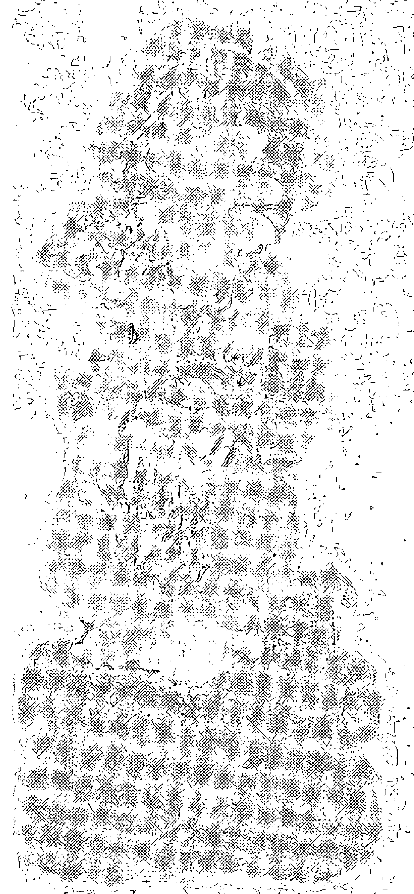

### 观世音菩萨像赞

# 第十章 合成水晶

## 合成水晶的发展史

随着矿物学、结晶学、晶体化学及晶体生长学的不断发展，工业及珠宝首饰业对水晶的强劲需求，当天然水晶满足不了需求的时候，就出现了合成水晶。世界上通用方法是水热法合成水晶。第一次水热法合成水晶的成功，是意大利的科学家Spezia于1908年实验成功的。然而直到1943年，由于战争的需要，德国的物理学家理查德·纳肯（Richard Nacken）才将合成水晶用于工业化生产。1950年美国Bell电话实验室和英国的通用电气集团公司，把合成水晶推进到商业化生产。我国于1958年就开始了合成水晶的实验与研究，60年代中期，合成水晶的研究进入中试阶段并获得成功。由于合成水晶的性能优良，电子工业及光学工业的强劲需求，同时珠宝行业对彩色合成水晶的需求量也很大，80年代以来我国有十几个省先后均建立了合成水晶厂，在1992年北京召开的“92中国水晶博览会”上，参展的晶体材料厂就有33个，现在我国合成彩色水晶的品种已有茶、紫、绿、蓝、黄、黑等色，基本上满足了市场的需求。

## 水热法合成水晶技术

水热法合成水晶指的是低温（α）石英，由于石英在 573℃ 时会转变为高温（β）石英，因此水热法合成水晶的温度应低于 573℃。合成水晶的生长技术是非常复杂的，首先要有一个特制的耐高温高压的反应釜，高压釜一般由 43CrNi2MOV 特种钢材制造，在高压釜中还要安装一个特殊的隔板，用于控制溶解区与生长区的温差及热液对流。在溶解区装入高纯石英、矿化剂、添加剂，在生长区放入籽晶。溶解区温度一般是控制在 360℃ ~ 380℃，生长区温度一般控制在 330℃ ~350℃，溶解区与生长区的温差，一般不大于 50℃，压力控制在（1200 ~ 1600） x 10^5Pa，生长速度一般为 1mm/天左右。其合成水晶的质量与生长速度受诸多因素的影响。可见合成水晶的生产技术是相当复杂的。

## 对合成水晶认识上的一些误区

合成水晶的生产因工业需要而兴起，彩色合成水晶的出现，为补充天然彩色水晶的不足而作出了重大贡献。然而人们对合成水晶的常识知之甚少，因而对合成水晶的认识也产生了很多误区。有的人把合成水晶与玻璃混为一谈；有的人则认为合成水晶是假水晶；有的人认为合成水晶是由小碎块的水晶料熔制而成；有的人则称合成人造水晶。这些认识与称谓都是不正确的。首先是合成水晶中的硅氧四面体是呈规则排列的结晶构造，而玻璃中硅氧四面体呈不规则排列，而且合成水晶与玻璃的一些物理性质还相差甚远，市面价格也相差甚远，所以不能混为一谈。至于由水晶碎料经高温熔融后，已经成为石英玻璃物质。把合成水晶称之为人造水晶也是很不规范的。根据珠宝玉石名称，国家标准（GB/T16552-2003）中，对人造宝石与合成宝石定义规定很清楚，人造宝石乃是指由人工制造且自然界已知无对应的晶质与非晶质体。而合成宝石乃是指完全或部分由人工制造且自然界有已知对应物的晶质与非晶质体，且物理性质、成分和晶体结构与所对应的天然宝石基本相同。如合成水晶、合成红宝石、合成祖母绿等。显然把合成水晶称为人造水晶是不规范的称谓。由于天然水晶与合成水晶物理、化学性质相同，内部晶体结构也完全相同，而且合成水晶杂质缺陷又少，因此由合成水晶生产的各种水晶饰品，也更受人们青睐。

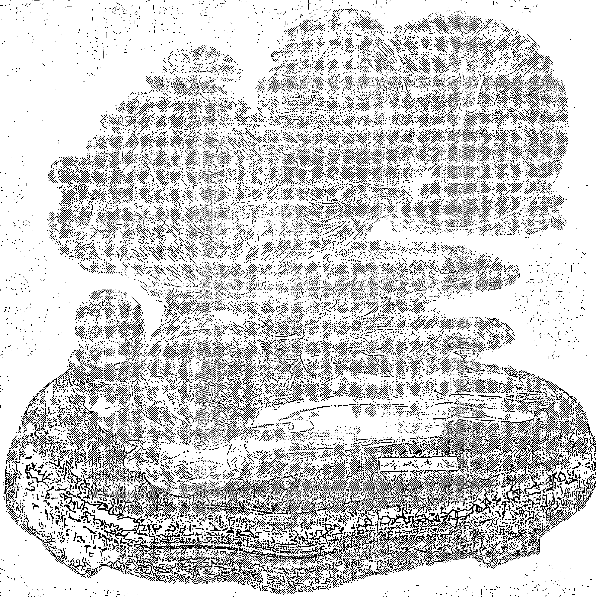

### 嫦娥奔月

# 第十一章 水晶的检测与鉴定

## 水晶的检测与鉴定

从事水晶检测与鉴定的人从来就有两种不同的认识，一部分人认为水晶检测与鉴定非常容易，另一部分人则认为水晶的检测与鉴定具有一定挑战性，其挑战性的主要点是合成水晶与天然水晶之间的区别。这里讲的主要是指经过加工后的天然与合成水晶饰品或工艺品的区别。水晶鉴定者往往会遇到这样的情况，当一件要价很高的水晶球或工艺品，如果按照国家标准进行检测时，没有发现天然与合成水晶的任何鉴别标志，只知道是水晶，无法确定天然与合成水晶时，他们是很着急的。因为天然水晶与合成水晶的价格相差很大，这时一般建议用红外光谱法去鉴别。但红外光谱法往往受环境、样品大小、切割方向的影响，结果往往又不理想。虽然利用渣状包裹体是鉴定是否是合成水晶的常用方法，但笔者的长期鉴定实践证明，利用该方法，只能说在大多数情况下是正确的。日本与美国的一些宝石鉴定专家，也载文刊登同样的结论。这是因为在天然水晶中，也见有渣状包裹体，特别是巴西产天然水晶容易见到。所以说水晶检测与鉴定具有一定的挑战性。关于天然与合成水晶的鉴别标志，国家标准中也很粗略，这可能是因为水晶是一种低档宝石所致。

## 珠宝检测鉴定工作现状与存在的问题

随着人民生活水平的提高，珠宝市场的发展，各地珠宝鉴定机构如雨后春笋般相继建立，为珠宝市场发展作出了重大贡献。但是由于鉴定人员良莠不齐，加以国家鉴定标准可操作性存在不足，因此有时同一件产品不同单位鉴定的结果也不一样，矛盾现象时有发生。如某地区各珠宝商店曾来了一次拉网式的抽样大检查，结果令人深省。同一件产品，同一个人，不同时间检查，其结果相差甚远。笔者也遇到不少现象，如某鉴定单位把天然水晶色带鉴定为合成水晶籽晶，结果把天然水晶鉴定为合成水晶，并出具鉴定证书。又如某知名鉴定单位把红水晶鉴定为红玛瑙。更有甚者把合成水晶鉴定为玻璃，并出具鉴定证明等等。这些问题的出现，一方面反映了珠宝鉴定人员水平良莠不齐，同时也反映了珠宝玉石国家鉴定标准的可操作性值得研究。

## 水晶的定名规则

关于珠宝玉石名称，国家标准（GB/T16552 - 2003）中，对天然宝石定名规则是直接使用天然宝石基本名称或其矿物名称，无需加“天然”二字，对合成宝石则必须在其对应天然宝玉石名称前加“合成”二字。这种定名规则，实质上是二分法定名规则，它的优点是在于简便。但如果这种二分法应用于水晶则有问题，其一，没有考虑到人们的习惯称呼与强烈愿望。由于人们对天然水晶偏爱，总希望在标志上、在鉴定证书上、在交易过程中，是天然水晶应该加“天然”二字，是合成水晶应该加“合成”二字。其二，在大量合成水晶涌向市场的今天，不法商人把合成水晶冒充天然水晶的现象又时有发生，以只标志“水晶”二字蒙混消费者的事也时有出现，当消费者将实物送检测后定名为合成水晶时，消费者不满意将货物退回商店，这时商店常常以合成水晶也是水晶，标志为水晶没有错为由而发生纠纷。其三，天然水晶球与合成水晶球、天然水晶眼镜与合成水晶眼镜，价格相差太大。一个好的 10cm 直径的天然水晶球市场价为1万~2万元，而同样质量与大小的合成水晶球，市场价仅5千~6千元。一副合成水晶眼镜的市场价为10~20元，而一副同样质量大小天然水晶眼镜市场价则数百元。所以在人们的心目中强烈希望是天然水晶应该标“天然”二字，是合成水晶应该标“合成”二字。其四，鉴定人员在鉴定的过程中往往只知道是水晶，但找不到国家标准中规定的天然水晶与合成水晶任何标志，如果鉴定报告只标名为“水晶”则按国家标准规定是天然水晶，如果标名为合成水晶，又找不到合成水晶依据。所以笔者建议对水晶的定名规则应该采用三分法。(1) 水晶：对水晶统称，不分天然与合成；(2) 天然水晶：水晶中见有国家标准中明显天然水晶标志者，称天然水晶；(3) 合成水晶：水晶中见有国家标准中明显合成水晶标志者称合成水晶。

## 水晶的检测与鉴定步骤

对水晶原石及其加工后的各种饰品、工艺品其检测鉴定方法应各有侧重。常用的鉴定步骤是：第一步，肉眼观察：长期从事鉴定的人员或经营者，肉眼就能大致确定是否是水晶，天然或合成水晶；第二步，正交偏光仪下鉴定：非均质者，可能为水晶；第三步，测定折光率、密度参数就能确定是否是水晶；第四步，用综合的鉴定方法，包括包裹体特征、绵、裂情况等判断是否是天然或合成水晶；第五步，鉴定水晶是否优化处理及方法；第六步，鉴定加工款式与加工质量；第七步，综合多种因素对价格进行评估。

## 水晶检测鉴定的仪器设备有哪些

水晶检测鉴定常用仪器设备有：偏光仪、折光仪、珠宝显微镜、各种感量天平、放大镜等，其具体检测鉴定方法，均按国家标准进行，其具体检测步骤，首先用偏光仪确定是否是均质或非均质体，再用折光仪测得折光率，用静水力学法测得密度，取得上述参数后，就基本上可以确定是否是水晶，再用放大镜、宝石显微镜观察其中的包裹体、裂、绵、色带、负晶、双晶、渣状包裹体等，确定是否是“天然”或“合成”水晶，最后对加工质量、是否优化处理、价格进行评估。在长期的水晶检测鉴定过程中，由于经验的积累，水晶检测与鉴定的方法步骤可以减少，这是因为仿冒水晶的物质，一般均为廉价的玻璃制品，所以在一般情况下，价格低廉的，特别是由多个颗粒组成的项链、手链等的检测鉴定，只需在正交偏光仪下检测是否均质或非均质体，再通过放大检测是否是“天然”或“合成”即可。对水晶原石及饰品检测，由于形状、大小均不一样，因此对不同水晶产品，其检测方法与步骤的侧重点各不一样。

## 对水晶原石的检测与鉴定

水晶原石一般均保留一定的晶体形态，因此用肉眼就能区分是否是“天然”或“合成”水晶。天然水晶原石一般呈六方柱状晶体，常在一端见有一锥体，晶面上常见有生长条纹及特殊蚀象，生长丘、溶蚀凹坑，晶体中常见有气、液、固三相包裹体及绵、裂、色带、幻影、蓝针等。合成水晶一般呈六方板状晶体，晶面上见有“鹅卵石”状结构，晶体中间有籽晶，垂直籽晶片常见有钉状包裹体及渣状包裹体，常见气液二相包裹体。市面上常见有用光学玻璃、石英玻璃、紫色萤石及冰洲石加工成六方柱体，冒充天然水晶原石出售，遇到这种情况，可采取一刻、二看、三查的办法。

- **一刻**：在不显眼的地方，用一块小水晶石轻轻刻划上述仿冒品，均能刻得动，因为上述仿冒品的硬度均比水晶小。
- **二看**：看柱体表面有没有被加工（研磨、抛光）留下的痕迹。
- **三查**：将仿冒品置于正交偏光仪下，石英玻璃、光学玻璃、萤石为均质体，均为全消光（百姓叫全黑），冰洲石是非均质体，当转动实物360°视域观察时将出现四明四暗。

如果要正确对于上述四种仿冒品进行定名的话，可用下述方法，硬度比较法：石英玻璃为6，光学玻璃为5~5.5，萤石为4，冰洲石为3。另外透过冰洲石观察可见到“双影字”，光学玻璃中常有气泡，而石英玻璃中常见有未熔化白色方石英及流线构造。在水晶原石交易中，还经常见有不规则的玻璃大块，似河流中的大卵石，块体棱角均圆化或钝化，表面均已毛玻璃化，并粘有泥土物质，有时块体的边部常开一个窗口，通过窗口观察，内部纯净无瑕，宣称优质水晶，并要以高价。遇到这种情况，只要采用一掂、二刻、三摸就能区别。

- **一掂**：就是放在手上掂掂重量感，玻璃者（铅玻璃除外）重感轻。
- **二刻**：就是用水晶刻划怀疑物能刻动者为玻璃。
- **三摸**：就是用手触摸怀疑物，玻璃者温感明显，水晶者则凉感明显。

## 在什么情况下，无需区别天然与合成水晶

对于一般的白水晶项链、手链等由多个颗粒组成，价格又低廉的产品，笔者建议仅区别是否是水晶、玻璃，不需要区别天然与合成水晶。其理由一，做项链、手链用的白水晶小料，无论天然、合成其价格都差不多，有时合成白水晶比天然白水晶小料还要贵；另外从美观性看，合成白水晶由于纯净无瑕比天然水晶还要漂亮。

## 包裹体观察法区别天然水晶与合成水晶

包裹体观察法是区别天然水晶与合成水晶常用的方法，也是区别其他天然宝石与合成宝石比较可靠的方法，常用肉眼、放大镜或珠宝显微镜就能解决，由于天然水晶在地下自发的形成与长大，其生长环境与条件多变，所以天然水晶中常发现多种多样的矿物包裹体及存在多种多样的缺陷，而且不同地区产出的天然水晶其包裹体组合种类缺陷等均有其特色，从而通过鉴定也可以知道水晶的产地。天然水晶中常见有固相矿物包裹体及气、液相包裹体。通过大量的检测与鉴定发现天然水晶中最常见的矿物包裹体是一些含水的矿物，如绿泥石、蛭石、云母、绿帘石、电气石等，这些含水的矿物的出现与水晶在热水溶液中形成的条件是密切相关的。另外也发现有一些不含水的矿物，如金红石、黄铁矿、石榴石、辉铋矿、方解石、萤石、赤铁矿等。如果在水晶中发现上述矿物包裹体者肯定为天然水晶是没有问题的。合成水晶中常见的固体包裹体是外形很不规则，颗粒细小，成分为钠钾硅酸盐的一种渣状包裹体，也发现有少量的霓石矿物包裹体，霓石的形成是高压釜壁上的铁质与合成水晶营养液中的钠硅作用形成一种钠铁硅酸盐矿物，名霓石又称钝钠辉石（分子式：NaFe[Si₂O₆]）。在很纯净的水晶中如果发现有渣状包裹体，判断为合成水晶，在大多数情况下是正确的。霓石在合成水晶中很少见到。由于霓石呈长柱状，干涉色和折光率都较高，负延长，易于鉴别。在合成水晶中也见有针状、钉状气液包裹体及平行籽晶的色带。

## 以生长缺陷及伴生现象区别天然水晶与合成水晶

由于天然水晶在结晶生长的过程中，受多种地质因素的影响，诸如温度压力的改变，母液成分的改变，晶体生长过程中及形成后受各种构造力的作用，均能对水晶产生影响而形成缺陷及伴生的一些现象，诸如双晶、负晶、幻影、蓝针、绵裂、节瘤的产生就属于此类。如果在水晶中发现上述现象者，即定名为天然水晶。合成水晶的生长由于营养液纯净，生长条件又稳定，因此合成水晶一般都纯净无瑕，仅见有少量的应力裂隙，钉状气液包裹体及渣状包裹体等。

## 双晶观察法区别天然水晶与合成水晶

早在150年前，矿物学家就发现了天然紫水晶具有巴西双晶律的结晶习性，因此不少鉴定专家常利用观察巴西双晶来区别天然水晶与合成水晶，观察巴西双晶的方法很多（如前所述），对经过加工的水晶工艺品、饰品常用油槽法、正交偏光仪法进行区别，这两种方法第一步是将水晶的光轴方向调整到与偏振片垂直，第二步是观察干涉图，如果看到的干涉图很完整则水晶为单晶体，如果干涉图被三角形破坏，则这三角形就是巴西双晶。合成水晶也发现有双晶，但其双晶呈火焰状与巴西双晶有明显的不同。

## 红外光谱法及晶胞参数法区别天然水晶与合成水晶

矿物晶体结构学告诉我们，水晶的最小单位是由硅氧四面体组成，即四面体的四个顶角点均由负二价的氧离子构成，而其中则由正四价的硅离子构成，在多种因素的影响下，正四价硅的位置，有时被正三价铝所占据，三价铝替代了四价硅后，所缺少的电荷由 $H^{+}$ 所补偿，而 $H^{+}$ 在水晶的结构中均以 $(OH)^{-}$ 键的形式存在，故可以利用 $(OH)^{-}$ 对红外光谱的吸收值作为判断天然水晶与合成水晶的标志。一些实验资料表明，合成水晶在波数 $3540\text{cm}^{-1}$ 处，多出现吸收峰，而天然水晶则没有，这一结果的测定，受被测物的厚度、切割方向、环境温度等影响，因此给红外光谱结果的判读解释也带来了复杂性。天然水晶的晶胞参数， $a_{0}: 4.913$ 埃， $b_{0}: 5.405$ 埃，人工合成水晶的晶胞参数比天然水晶稍有增大，其原因一般学者认为由杂质元素进入水晶引起，也有学者认为合成水晶形成压力较天然水晶小，故晶胞参数稍有增大。

## 颜色比较法区别天然水晶与合成水晶

对于有色的紫水晶来说，天然紫水晶一般颜色较淡而且颜色鲜艳，不均匀，色调纯正，无邪色，双色性强，普遍有环状色带。而合成紫水晶颜色浓而太艳，无杂质，色调不正，色中有邪，太明亮反光刺眼，色带少见，有少量的色带均平行晶种分布。对于无色的水晶来说，如果把天然的无色水晶和合成的无色水晶放在一起观察比较，你就会发现合成水晶泛白，而天然水晶泛暗。合成黄水晶色艳且均匀，天然黄水晶色暗且不均匀。

## 密度比较法区别天然水晶与合成水晶

天然紫水晶与合成紫水晶放在密度为 $2.65$ 的重液中，天然紫水晶下沉，合成紫水晶时沉时浮，这说明天然紫水晶与合成紫水晶的密度有差异。

水晶的密度有微小差异。引起这种差异的原因，可能是天然紫水晶形成时压力较高所以密度较大，合成紫水晶形成时压力较小（1500大气压左右），所以密度较小。然而天然紫水晶也有在压力比较低的情况下形成，因此这一标志仅能作为参考性判别依据。

## 干涉色观察法区别天然水晶与合成水晶

在长期的检测过程中发现将多个颗粒组成的项链或手链，置于正交偏光仪下观察，如果发现50%以上的颗粒均见有七彩光（干涉色）则证明这条项链或手链是合成水晶制品。如果发现10%以下的颗粒见有七彩光，则有可能这条项链或手链是天然水晶制品，介于10%～50%之间者则难定义。引起这一现象的原因，是由于合成水晶原矿块体外形规则，为了省料及切割的方便，切割时均沿规则边线为基准切割，也就是说按水晶一定的光性方位切割（垂直或平行光轴），而天然水晶则按任意方向切割以取得最大利用率为标准。因为加工水晶项链与手链的原料一般均是一些外形不规则的碎块小水晶料。

## 合成水晶中的渣状包裹体是何物，形成机理以及利用该标志时应注意的事项

利用渣状包裹体鉴别是否是合成水晶，是鉴定检测人员常用的方法，而且在大多数情况下利用这一标志进行判断是否是合成水晶是正确的。然而渣状包裹体是何物？是怎样形成的？对于如何观察及掌握的注意事项，知道的人就不多了。所谓渣状包裹体乃是一种外形很不规则，似面包渣状的白色、半透明、微小颗粒（一般为数微米），在珠宝显微镜下，利用暗视场放大40倍左右，很容易发现找到，在透射光下观察难些。其分布规律是合成水晶生长结晶初期易形成，因此沿晶种附近分布多些，其他部位分布较少些。经分析这种渣状物的化学成分是一种Na、K硅酸盐的胶体物质，它的形成是合成水晶形成时的一种特殊产物。合成水晶的成矿溶液是一种人工配制的高碱度溶液（含Na、K水溶液），合成水晶在结晶生长的过程中，由于温度的波动，有时溶液中的SiO₂达到超过饱和状态时，多余的SiO₂来不及结晶而与溶液中的Na、K结合形成一种胶体分子，胶体分子的聚集达到一定量后，就会沿着合成水晶的生长界面分布而成为一种渣状物，这种渣状物就是合成水晶中渣状包裹体。笔者在长期的观察过程中发现巴西及马达加斯加产的一些天然水晶中也有渣状包裹体，美国及日本一些宝石鉴定专家也发现同一现象，这说明渣状包裹体不是合成水晶中独有，因此利用渣状包裹体来判断是否是合成水晶时，其结果只能说在大多数情况下是正确的。为什么在天然水晶中也看到渣状包裹体呢？原因是这样的：大量的地质成矿资料表明，天然水晶的结晶生长，大多数是在酸性环境下形成，因此很少见有渣状包裹物，但是也发现有少量的水晶矿床是在弱碱性或碱性环境下形成的，因此渣状包裹体在天然水晶中的出现，是不足为奇的。

## 水晶眼镜的检测鉴定方法

水晶眼镜是眼镜中的佼佼者，特别是天然水晶眼镜，备受人们青睐。市场价从数十元至数千元一副均有。水晶镜片均呈薄片状，观察面积也比较大，天然水晶的一些标志特征易于发现，因此检测水晶镜片第一步是肉眼在强光（200W光源）下观察，如发现绵状物、交叉形、角形色带、色块、雾状条带，表面水波纹后就基本确定为天然水晶眼镜，所谓绵状物是由许多细小的气液包裹体组合而外形呈不规则絮状的东西；所谓交叉形角形色带色块，指的是宽窄不一的色带往往呈锐角或钝角相交，色块有大有小有时相交有时呈环状分布；所谓雾状条带肉眼看好似深浅宽窄不一的色带，放大后观察这些雾状条带实际上是由非常细小的雾状物由于分布不均或时有时无，看起来好似深浅宽窄不一的色带，近几年来水晶市场出售的天然水晶眼镜多数是这种货，这是巴西产天然水晶的特征，这种水晶因结晶速度过快而引起的现象，市场上出售的这种巴西产加色茶色水晶眼镜，最易发现这一现象；所谓水波纹，是指在镜片的表面上好似有水波纹分布，本来镜片表面均加工得很平整而肉眼见到的是似高低不一的水波纹，这一现象观察一定要使入射的光与镜面有一定角度，而肉眼观察反射光时也要有一定角度才能看到水波纹。引起这一现象的原因，乃是由水晶镜片中分布一些与镜面有一定交角封闭性内裂纹（肉眼不易观察）引起。经过肉眼在强光源下观察后，见不到上述现象，颜色又很均匀，质量又很好的，这种情况有必要用正交偏光区别是水晶还是玻璃，水晶者转动360°出现四明四暗，玻璃或树脂镜片有以下几种情况，全黑者为玻璃，有些具有异常消光现象的玻璃，呈现出不完全消光，树脂镜片在白底上常见有弯曲的黑臂，当转动镜片时黑臂随之变化。把水晶与玻璃，树脂区分开来后，水晶是天然水晶，还是合成水晶，需在放大镜下放大观察，其方法见上述。

## 水晶雕刻品与水晶观赏石的检测鉴定方法

水晶雕刻品与水晶观赏石由于体积较大，一般用肉眼或放大镜观察就能发现天然或合成水晶的一些标志，但值得注意的是有些水晶观赏石赝品，作假手法高明，并要以高价，上当受骗者也时有发生，因此如果发现观赏石中的一些象形图案很逼真时，就需要送质检部门检测鉴定，其具体识别方法将在后面谈及。

## 水晶球与玻璃球的现场简易鉴定法

水晶球的观赏价值很高，因此要价也高，一个10cm的好水晶球，要价万元至几万元。由于经济利益的驱动，不法商人为了获得暴利，拿玻璃球冒充水晶球的现象时有发生，并花言巧语让你上钩。遇到这种情况，当消费者搞不清是真是假时，在没有仪器设备的情况下，只要用一根头发丝就能鉴别真假。具体操作是将一根头发丝置于一张白纸上，再将球体小心地压在头发丝上，不断转动球体并通过球体仔细观察头发丝的变化，如果发现头发丝具有双影则为水晶球，如果将球体转动任何方向上均见不到双影则为玻璃球，这是因为水晶是非均质体，具双折射，而玻璃属均质体具单折射所引起。当确定是水晶球后，还要用上述方法区别是天然还是合成水晶球，因为同样大小天然水晶球与合成水晶球其价格相差很远。

## 水晶眼镜与玻璃眼镜的现场简易鉴定法

一副天然水晶眼镜，根据质量好坏，价格数十元数百元甚至数千元不等，而一副玻璃眼镜从数元至数十元不等，价格相差甚远，因此掌握一些简易的区别方法，是非常必要的。首先你不妨做如下的对比实验：找水晶与玻璃镜各一片，然后擦洗干净，找牙签一根蘸上水，滴于两镜片上，水滴直径小于1毫米，水晶镜片上的水滴很快扩散开成为扁平。同时水晶镜片上水滴蒸干速度比玻璃镜片上者要快。如果在秋冬季做实验，可在两镜片上同时吹气，镜片上均见有一层雾，然而水晶镜片上的雾比玻璃镜片上的雾消失速度快一倍。究其原因，这可能与水晶镜片及玻璃镜片上的表面吸附力、导热系数有关。

## 水晶项链与玻璃项链的现场简易鉴定法

是水晶还是玻璃项链、手链、挂件等，只要现场采取一试二查三看的办法也不难区分。一试：就是将饰品贴于脸部试温凉感，凉感明显者为水晶，温感者为玻璃。同时试重量感，水晶重感明显，玻璃重感轻（铅玻璃除外）。二查：查饰品中是否有气泡（内壁光滑气泡）是否具流动线构造，有者为玻璃。三看：看饰品表面是否有因收缩引起凹陷，是否有印模痕迹，有者为玻璃模铸制品。如果通过某一刻面观察其对面的棱线，有双影者为水晶，无双影者为玻璃，另外玻璃模铸产品的项链，手链刻面颗粒的棱角均圆化不尖锐。

## 紫色水晶与紫色萤石的现场简易鉴定法

水晶市场常见有用紫色萤石晶簇、块体、饰品冒充紫水晶的现象，并要以高价。这对于鉴定人员来说，是不成问题的，但对不懂珠宝的人来说，怎样用简易方法区分呢？如果是萤石晶簇或块体，只要在不显眼的地方用随身带的小刀刻划一下，如能刻动者为萤石，同时萤石晶体外形多为等轴方块形出现。如果是饰品的话，由于萤石硬度低，抛光较困难，所以萤石饰品表面光洁度一般不高，而且肉眼可见内部有由解理分割小方块，紫水晶不可能有上述情况。如果现场有简易偏光仪，萤石在正交偏光仪下会消光（全黑），而紫水晶则出现明暗消光。

## 天然蓝水晶原石晶体与蓝色玻璃仿制品的现场鉴定法

合成蓝水晶面市较早，天然蓝水晶2005年才出现，由于美丽稀少，一面市就得到了人们的青睐，其价格也炒得非常高，一件小的貔貅小挂件要价就是1000多元。珠宝市场的规律告诉我们，有什么样真宝石就有什么样的仿制品，天然蓝水晶饰品上市不久，市面上就有仿制品出现。一位不太内行的珠宝商，花了4千元购得一小块蓝色水晶原石，由六方柱和一六方锥体组成“晶体”，颜色非常漂亮，真可称得上一级品。然而当仔细观察后发现表面有切磨抛光留下的擦痕，同时发现六个锥面同等大小（自然产出水晶极少有这种情况），再用放大镜观察，发现内有几个球形气泡，其气泡内壁光亮干净。后经密度、折光率测定，肯定为蓝色玻璃经加工后的仿制品。

## 红水晶与红玛瑙的现场简易鉴定法

用红玛瑙饰品冒充红水晶饰品的现象时有发生，这主要是红水晶饰品价格比红玛瑙饰品价格贵得多，加以这两种饰品色感质感差不多，稍不注意便易混淆，特别是珠宝知识很少的同志更是如此。红水晶国外称草莓水晶，主要产地在马达加斯加、巴西、墨西哥、塔吉克斯坦，因产量少而显得特别珍贵。红玛瑙饰品表面光泽为油脂——玻璃光泽，因为是隐晶质集合体而不具通透感，同时常见同心层状及条纹状构造。红水晶其红色分布很不均匀，有的地方通透如白水晶，有的地方红色深不通透，将其置于正交偏光仪下，红玛瑙不产生消光而全透，红水晶则当转动360°时产生四明四暗现象。

# 水晶知识面面观

# 第十二章 水晶赝品剖析

## 水晶赝品泛滥，必须擦亮眼睛

笔者在多年的水晶检测鉴定中，发现有几种要价很高欺骗性很大的水晶赝品，即使是一些有经验的收藏家及常搞水晶经贸的商人，上当受骗也时有发生。为此笔者特将一些典型的案例予以剖析，公告于众，以免大家上当受骗，造成损失。

由于天然水晶原料紧缺，市场行情看好，经济效益丰厚，所以水晶市场，以假充真，以次充好的“水晶原石”赝品时有发生，综合起来有如下几种情况：其一，拼合“水晶原石”赝品；其二，全玻璃质“水晶原石”赝品；其三，质次天然水晶原石冒充质优天然水晶原石；其四，水晶景石原石赝品；其五，“松枝水晶”景石赝品；其他“水晶工艺品”赝品。

## 拼合“水晶原石”赝品

一深圳大款，在东海购买水晶原石，经多方挑选，最后在一家花了63万元，购得11块“水晶原石”晶体，当货到深圳后，卸货开箱时，发现有的“水晶原石”断成两截，于是判断水晶原石有假，后把货运回东海，法院立案，并委托检验。经检验这批所谓“水晶原石”全是由质次天然水晶与玻璃拼合起来的，是外形与水晶原石极为相似的“水晶原石”赝品。有的头与尾是质次天然水晶中间六方柱体是玻璃，有的只有头部的锥体是质次天然水晶，柱体与尾部全为玻璃。拼合面全由高强度的树脂黏合。为了看起来很自然，在“原石”整体表面均涂有一层由胶、细小黑云母、蛭石、泥沙组成的灰黑色的涂层，看起来好似出土不久的“水晶原石”。为了观看水晶质量，在玻璃部位多开有一窗口，通过窗口看“水晶”质量很好，而且在做这种买卖时多数在晚间进行，光线较暗，谈妥后立刻打包装箱托运，一不小心就会上当受骗。这11块拼合“水晶原石”总重量为438kg，质次的水晶为132kg，其他全部为玻璃，经估价总值不超过几万元。就在此事件发生后不久，有几个广西商人，拉来一车“水晶原石”在东海销售，要价80万元，后市场管理人员发现有问题，送至水晶检测中心检测，检测结果也全为拼合“水晶原石”赝品，不过这种拼合石与上述不一样，所谓“水晶原石”的头尾及中间柱体的表面均由1cm左右厚的天然水晶为贴面，其内部全为光学玻璃。

拼合“水晶原石”的鉴定，说起来也并不复杂。其一，将其表面的涂层刻一小块下来，于打火机上燃烧，如能燃烧，并有一股味道，说明这一涂层是人工所为，并非天然形成物，这时就要引起注意，问一个为什么？其二，用一小块水晶石在“原石”不同部位刻划一下，能刻得动的部分就是玻璃。其三，寻找拼合线，在拼合接缝口，一般涂层较厚，剥去涂层就能看见拼合线。其四，有经验的内行，根据天然水晶特有的晶体形态特征及天然水晶晶面特征，一眼就可以区别是真是假。

## 全玻璃质“水晶原石”赝品剖析

一水晶原石经营者，花了3000多元购得一块晶体完整的“水晶原石”，满以为一转手能赚不少钱，后经多次交易都未成交，经营者怀疑此“水晶原石”有问题，但又没有把握，最后送到水晶检测中心检测。经检测该“晶体”表面全为一层褐红至褐黑的物质所覆盖，水刷不掉，用小刀难刻动，镜下观察，覆盖物组成主要是铁的氧化物，还含有少量绿泥石、蛭石、泥沙、胶粘剂等物质。无疑是人工所为。它的作假方法是：将铁屑与挖水晶坑中泥沙加食盐与胶粘剂混合，涂于外形似“水晶晶体”的玻璃体表面，再埋于地下数个月，取出修整后出售。其识别方法是：其一，晶体太完整了，特别是锥体部分的六个锥面同等大小，这种理想形态的晶体，在天然水晶中是很难见到，也就是说这个“晶体”形态是人工加工磨制而成；其二，用水晶刻划能留下刻痕，证明是玻璃无疑。

## 质次天然水晶原石冒充质优天然水晶原石剖析

以次充好的现象，在水晶市场很常见，对于水晶常识有一知半解的人，往往是受害者。一次由3人合伙，好不容易凑了17万元购得3块“水晶原石”，心想一经倒手，至少能赚几万元。后经数月多家客户观看，均没有成交，其主要问题是质量问题。于是这3人要求退货给原主，原主人不愿意，结果打起官司，将货送至水晶检测中心检验，经检测确定为3块质次“水晶原石”经作假后冒充质优水晶原石出售。其作假方法是：将水晶出土地的泥沙混合物与胶粘剂混合再涂抹在水晶原石上，好似刚出土水晶，因其中细小黑云母含量较多，故整体涂层显灰黑色，由于有这一涂层，水晶内在质量无法观察，只有在少量质好的部位留空开窗，看起来质量很好，但大部分质量很次。这种作假的特点是：把好的部位留空，把质量差的地方全部抹上涂层，识别也是非常容易，把涂层刮点下来燃烧，能烧着并有一股味道，证明涂层是人工所为。

## “水晶景石原石”赝品剖析

一位经贸商人，花3万元购得一块42cm×30cm×17cm“水晶景石原石”，购买时发现水晶中景物很美，通过表面加工后，将会成为一件美丽的水晶观赏石，并能卖上好价。购回后左思右想左看右看以确定怎样加工，就在观察时发现水晶中的景物很不自然。后送水晶检测中心检测，结果发现水晶中的景物全是人工所为，因而失去了观赏石的意义。这种类型景石的作假方法是：在水晶的凹坑、空洞、沟槽中（有的是天然，有的是人工所为），充填单矿物绿泥石（有时用黑云母，蛭石）与胶粘剂的混合物，后经加工而成为观赏石，由于景物是人工所为，所以没有多少价值。其检测方法与上述相同，即燃烧法，取出一小块能燃烧又有味道的肯定有假。

## “松枝水晶”景石赝品剖析

天然水晶中，由于各种各样的天然矿物包裹体，所组成的如诗如画的图案，非常漂亮，具有极高的观赏收藏价值。其中松枝水晶，由于稀少、美观更受人们青睐。松枝水晶，又名树模水晶，它的形成乃是由于铁锰质溶液，沿着水晶裂隙侵人，在一定的条件下沉积形成，一般为黑色、褐黑色，由于稀少美观价格一直看好。在经济利益的驱动下，不法商人就搞起了松枝水晶赝品，加工成挂件、玩石、戒面等，投放市场，欺骗消费者。水晶检测中心经常遇到这种赝品，其价格从数百元到数千元一件不等。这种类型的赝品其景物均为人工绘制而成，景物最多的有松枝，也有龙形、熊猫、山水风景等。其作假的方法大致有三：其一，将已加工好的挂件、玩石等，从中间一切两半，并将切割面磨制抛光，然后在抛光面上绘制各种各样的图案与景物，最后用一种折光率与水晶近似的胶将其胶合在一起成为一整体；其二，利用水晶的自然裂开面或人工打击后的裂开面，在其裂开面上作画，拼合，最后加工成饰品、工艺品；其三，利用水晶的一些开放型裂隙，浸放于装有彩色液体的高压锅中蒸煮，使彩色液体进入水晶裂隙中，形成图案，最后加工成各种水晶工艺品。对于这种类型的水晶赝品检测与鉴定大致分为六点：

- 第一，如果发现景物很逼真，或颜色特别鲜艳，就要引起警觉，提出怀疑，送检测部门检测。这是因为自然形成的景物图案总是不会完整，有的地方像，有的地方不像，似像非像，颜色一般柔和不太艳；
- 第二，寻找拼合的缝合线。由于这种类型赝品，拼合时均采用进口的胶，其折光率与水晶折光率一致，所以拼合面很难发现，但拼合的缝合线一定能找到，饰品如果是挂件，作假者往往都用银包上了边，这时只有把包边去掉观察而且要放大观察；
- 第三，由于胶合时掌握不好，胶合面中的气体未全逸出，而发现有小气泡，这有时需要放大后进行观察方能看到；
- 第四，如果发现天然水晶中的缺陷绵、裂、包裹体等在景物的拼合面处出现系统错位，就证明拼合时没有按原位拼合，赝品无疑；
- 第五，在正交偏光仪下，让拼合面垂直偏振片进行观察，如果发现拼合面两边的水晶，消光位不一致，这说明了拼合时没有原位拼合，同时间接反映了景物面景物有作假；
- 第六，在拼合的时候，有些人采用了与水晶折光率相差甚远的胶粘剂，这时胶合面清晰可见，特别是当光线在适当角度入射时胶合面更清晰。

由于人们生活水平提高，水晶景石挂件，玩石市场看好，然而由于市场不规范，鱼目混珠现象时有发生，作为一位景石爱好者或收藏家，一定要提高对景石鉴赏能力，提高赏石水平。

### 稻草人

# 第十三章 水晶的优化处理与检测

## 何谓优化处理

> 水晶知识面面观

所谓优化处理是指除切磨抛光以外，用于改善珠宝玉石外观(颜色、净度或特殊现象)、耐久性或可用性的方法，称之优化处理。其中又分为优化与处理两类。所谓优化是指传统的、被人们广泛接受的、使珠宝玉石潜在美显示出来的优化处理方法。如热处理、漂白、浸蜡、浸无色油、水晶辐照处理、玉髓玛瑙染色等。所谓处理是指非传统的、尚不被人们接受的优化处理方法。如浸有色油、充填（玻璃充填、塑料充填、聚合物等硬质材料充填）、绿松石浸蜡、浸色、辐照、激光钻孔、覆膜、扩散、高温高压处理。对于优化的宝石定名，可直接使用珠宝玉石名称，在珠宝玉石证书中可不附注说明。对处理珠宝玉石名称定名，应在珠宝玉石名称后加括号注明“处理”二字，鉴定书中，还需附注说明描述具体处理方法，如不能确定是否处理，可在附注注明“未能确定是否处理”、“经过某某处理”或“可能经过某某处理”。

## 水晶优化处理方法

天然水晶多数是无色透明的，带色的天然紫水晶、茶晶、墨晶、绿水晶、黄水晶、红水晶是极少的，正因为如此，所以天然有色水晶的价格就贵，而且深受人们喜爱，为了满足人们对有色水晶的需求，因而出现了各种颜色的合成水晶，同时人们也不断地想办法将天然水晶进行着色、改色、变色优化处理及颜色改善处理。其常用的方法有热处理法、辐照法、染色法及浸油、浸蜡、覆膜等处理，随着科学技术的发展与进步，对水晶的改色改善处理方法，还在不断增加。

## 水晶热改色方法及机理有哪些

在珠宝玉石的改色工艺中，加热改色优化处理是非常重要而又普遍采用的方法，其改变的颜色纯正、鲜艳，既保证了珠宝颜色的永久性，又增加了透明度，提高了美观性。其加热改色的机理有如下几种说法：

- 破坏色心说：即加热破坏了宝石晶体原有的颜色中心，而以新的颜色中心（F⁻色心）呈现颜色。例如烧红玛瑙，原来的玛瑙以黄色为中心（即以 Fe²⁺离子显色），将其加热到一定温度（约276℃）时，就变成了 F⁻色心（即以 Fe³⁺离子显色）呈现红色，名为烧红玛瑙。
- 剩余原理说：即通过加热处理使宝石晶体原显色中心丧失，而剩下别的颜色中心，称之为剩余原理说。如将巴西产紫水晶，经加热处理后，使原来紫色消失，而呈现出非常漂亮的黄色。
- 改变微量元素说：即通过加热处理改变宝石晶体中微量元素（变色元素）的多少或价态，而达到改变颜色的目的。如某些无色黄玉，经过辐照后再经过低温热处理，而使无色黄玉变成蓝色，这种蓝色的产生是由于辐照后改变了黄玉中微量元素价态，后经热处理又改变了黄玉中杂质元素的含量，从而达到改色的目的。有些含二价铁较多的宝石其颜色较深，经加热后二价铁变为三价铁而使宝石颜色变浅。虽然热改色的机理有以上几种说法，但热改色的机理还有待人们去研究。

## 影响水晶热处理改色的因素有哪些

是否能进行热处理改色及热处理改色效果的好坏，是一个受多种因素制约的事情，如宝石本身物理、化学性质，杂质元素的类型，包裹体类别，热处理过程中升温速度的快慢，冷却方式及冷却时间长短，恒温时间控制和恒温环境，及热处理过程中使用媒介不同等均会对热改色的效果产生影响，因此从事热改色的技术人员，必须具备熟练的技术。

## 水晶热处理改色效果

对于水晶的热改色，不外乎产生两种效果：其一使水晶褪色；其二是给水晶加色、变色、改色。实践证明，对紫水晶、烟水晶或经过辐照处理的烟水晶、浅绿色水晶，经热处理后，可获得黄水晶；对某些烟水晶、茶水晶经过热处理后可获得绿水晶及浅黄绿色水晶；对于某些烟、茶、紫、绿、黄水晶经热处理后可变为无色水晶，先经过辐照处理，再经过热处理可以变为紫、黄双色水晶等。

## 水晶的辐照处理方法及改色机理

所谓辐照法是用带电离子束或γ—射线，x—射线及中子源辐照珠宝玉石晶体，而使之改色的一种方法。辐照改色的机理要涉及晶体的缺陷、空位、色心、能带等学说，大致有如下类型的理论：晶体场理论，分子轨道理论，能带理论，物理光学理论等。下面仅从晶体场理论对水晶经辐照改色的机理加以说明。根据晶体场理论，不论何种元素，在晶体场影响下，只要有未配对的电子，而且电子能级的能量分布又适合，完全可能使晶体产生颜色（即色心显色）。例如由无色水晶经辐照变为烟、茶水晶就是如此。其机理是：水晶中往往含有杂质元素 Al，当 Al^{3+} 取代水晶晶格中 Si^{4+} 后，由于 Al^{3+} 正电荷比 Si^{4+} 正电荷要少，因此与 Al^{3+} 相连接的氧离子的价电子云要弱，如果当受到辐照后与 Al^{3+} 相连某一个氧原子上的价电子就会失去一个，从而产生空位色心，于是留下的那个未成对的电子，便可以按照晶体场理论的规定，吸收有关色光，而使水晶产生颜色，显示出烟色或茶色来。实践证明，对含铝的无色水晶经辐照处理可普遍地变为茶色水晶及烟水晶；对某些含铁的无色水晶经辐照处理可变为紫水晶；对某些紫水晶进行辐照处理，再经热处理可变为紫—黄双色水晶。水晶的改色常采取先热处理后辐照处理或先辐照处理后热处理的联合处理方法，往往会收到较好的效果。联合处理后的颜色主要取决于某些微量元素的含量。如，含三价铁高的就产生紫色，含二价铁高的就会产生绿色—黄绿色，含三价铝高的就会产生茶色、烟色。实践证明对有色的天然水晶，想通过辐照处理加深颜色是很困难的。褪色的温度也要求高。获得茶、烟水晶，我国多采取用 Co^{60} 辐照而显色的方法，历史悠久已被广大群众所接受。由于 Co^{60} 辐照仅作用到电子层，未作用到原子核，不会产生核反应，因此不必担心经 Co^{60} 辐照的水晶具有放射性。

## 何谓染色、着色、改色

珠宝市场上经优化处理改色的产品，可以说到处可见，由于颜色鲜艳、美观而得到消费者喜爱。何谓染色、着色、改色？有何区别？一般情况下是这样理解的：染色指以有机染料染上的颜色；着色指以无机颜料着上的色；所谓改色指经热处理或辐照而产生的颜色。如目前市面出售的有色石英饰品及各种有色“爆花”水晶产品，均是先给产品加热突然在冷水中冷却产生裂纹，然后浸入有机染料水溶液中，有色染料进入裂隙而使产品显色。又如玛瑙的着色已有悠久的历史，由于玛瑙的结构疏松，最易着色，方法也成熟，把无色、青灰色、灰白色玛瑙着为绿色方法常是先经重铬酸氨溶液浸泡然后经过加热而显绿色，如果用 CoCl₂ 溶液浸泡，再经热处理而获得蓝色等等。

## 何谓水晶的覆膜处理

所谓覆膜处理，是在已加工好的饰品外表涂覆上一层物质，以增加饰品的美感。如市面上常见的一种水晶，在光的照射下能呈现很强的七彩闪光，这种产品是采用真空镀膜技术，给水晶表面镀了一层钛而成。也有一些水晶用电化学的方法进行覆膜技术处理而显色，更有些人给水晶饰品的表面涂上一层与水晶折射率近似的一种进口紫外光胶，以增加水晶的通透感、光泽、净度。随着科学技术的发展覆膜技术与方法将不断涌现。值得注意的是由覆膜技术镀上的一层物质，一般要求坚固、耐用，绝对不能对人体造成危害。

## 密度鉴定法鉴定水晶是否优化处理

实验证明，天然水晶的密度比经过热处理水晶密度微重，天然水晶的密度为 2.65g/cm³，而经过热处理的水晶密度为 2.63g/cm³。

## 包裹体鉴定法鉴定水晶是否优化处理

凡经热处理后的天然水晶，其包裹体的周围，往往因热应力的作用，会出现微细的放射状的裂纹。如果是紫水晶经热处理后形成的黄水晶，其中经常出现云状白色或灰色包裹物，呈条纹状和洗衣粉泡沫状分布其中，也见有热应力作用造成裂隙。凡天然水晶先经辐照处理后经热处理而得到的黄色、黄绿色、黄褐色水晶，除见天然包裹体外，还会常见洗衣粉泡沫状包裹体及热应力裂纹。

## 黄色、黄褐色、黄绿色水晶是否优化处理的鉴定

真正的天然黄色水晶，其黄色纯真、美而不艳，不带邪色，而烟、茶水晶经热处理后所得黄水晶，其黄中多带邪色（即褐、茶色），而且这种黄水晶的黄色对热与光不太稳定，时间长了会恢复到烟、茶色。合成黄水晶由于颜色过分鲜艳无杂质肉眼就能区分。如果发现黄绿色水晶，一般学者认为是由含二价铁天然水晶，经热处理或辐照处理而获得的，天然水晶无此种颜色。

## 紫色、紫红色、浅紫红褐色水晶是否优化处理的鉴定

真正天然紫色、紫红色、浅紫红褐色水晶颜色纯正、不含邪色、二色性强，晶体中普通见有环状色带，断口呈洗衣板状，而且对光（强光照射下）和热（250℃以上加热条件）颜色是稳定的；经辐照改色的紫色、紫红、紫红褐色水晶，颜色发暗，透明度差，无色带，一般对光和热较稳定（个别有褪色现象）；先经辐照改色为烟、茶水晶，后经热处理转变成紫色、紫红褐色水晶，颜色不纯正，其中有邪色（褐色、茶色）；对掺杂的合成水晶经辐照处理而获得的紫水晶，质纯净但颜色发暗透明度低，且见有平行籽晶的色带，对光和热较稳定；对于巴西产的无色“紫水晶”，经辐照改色获得的紫水晶，颜色鲜艳，色调纯正，但由于没有环状色带而与天然紫色水晶区别。

## 绿色、烟茶色水晶是否优化处理的鉴定

天然绿水晶少见，其特点是色浅纯正无邪色，而合成绿水晶较天然绿水晶的密度稍小；热处理获得绿水晶往往见到蓝的邪色而成为蓝绿色水晶；天然烟茶水晶，一般颜色较浅而且颜色均匀，对光热稳定；经辐照处理获得的烟、茶色水晶，一般颜色不均匀，且其中常含有异物，经光及热处理可褪色。

## 各种染色、着色水晶的鉴定

水晶及各种石英质宝石及玉石的染色、着色，并不是表面的染色着色，而指的是其颜色进入到宝石玉石内部而使其显颜色。这就是说，染色着色的宝石玉石必须具有开放型的裂隙颜色才能进入，这些开放型裂隙有些是天生就有，如玛瑙、翡翠、石英质宝石等，有些则人工所为，其办法多数是加热速冷产生人工裂纹，最后使有机或无机颜料进入其中并使其固化而显色，其染色着色产品鉴定法有三：其一，凡染色着色产品其颜色均较鲜艳；其二，放大后观察裂纹中均见有颜色沉积物；其三，时间长后会褪色，如果用蘸上丙酮的棉球擦洗可见掉色：

## 水晶覆膜处理的鉴定

由于覆膜处理，均属涂镀水晶表面的一层物质，所以其膜的强度一般不大，一般用小刀就能刮掉，即使用真空镀膜法镀上的钛用小刀也能刮动。有些膜属于有机膜，因此一般能溶于丙酮，加热膜能软化，火烧能着，有异味。

# 第十四章 水晶观赏石

## 何谓观赏石

说起观赏石，真是众说纷纭，就其名字的叫法也很多，有传统的叫法，也有现代叫法。传统的叫法有：奇石、玩石、石玩、雅石、巧石、趣石、石趣、艺石、欣赏石等，每一种叫法都有一定道理，但都有一定的局限性。现代人的叫法统称为观赏石。观赏石的价值就在于大自然赋予的百观不厌，千赏不烦，内涵丰富，让人喜爱的艺术效果，具有收藏、装饰、观赏、玩味、投资、交换、商品价值。由于我国观赏石品种繁多，赏石标准多样，赏石模式各异，赏石流派众多，因此要给观赏石下一个确切的定义，难度较大。然而当你认真分析研究各流派之后，你会发现，具有深厚文化底蕴的观赏石，必须具有以下要素：其一，天然性：天然性是观赏石的灵魂，所以观赏石必须保持绝对的天然状态，未经刀斧，不饰雕琢。然而由于我国当代丰富的赏石文化，已形成了多元化格局，赏石、评石、玩石已进入普通百姓家中，观赏石市场非常活跃，因此对于那些经“轻微打磨”或“山形切底”的观赏石，只要图案是天然的，观赏部分是天然的，就不能将其拒之门外，这样做完全是为了适应赏石的群众性、多样性及拾遗补缺的需要，促进赏石文化的发展。但是打磨未打磨，打磨的多与少，切底未切底，将其价格区别开来就行了。其二，美观性：没有神工斧匠天成的自然美，就成不了观赏石。所谓天成的自然美，并不是简单的、表面看到听到的声、色、形、貌、耳目之美，而是通过鉴赏、玩味上升到“石人合一”、“天人合一”、“自然人化”，提升人的精神境界，陶冶人的情操，美化人的心灵。这种天成的自然美应该是内涵丰富、意境深邃、寓意深刻、富于想象、哲理意蕴。对这种天成的自然美，一般是首先发现形式美，然后进一步发掘内涵美。上述天然性、美观性是观赏石的两个必需的、重要的要素。其三，稀有性：越是稀有的观赏石越是贵重。这里所说的稀有性，包含三层意思：一是石种的稀有；二是形式美的稀有；三是观赏石内涵稀有。现实中发现三者都同时体现在一块观赏石上的的确少见。石种稀有、形式稀有是在特殊地质条件下形成造就的，而内涵美是人们发掘出的。并不是有些人拿着一块普通的观赏石标榜“这是一块世界上独一无二的石头”；其四，耐久性：由于观赏石具有收藏、观赏、投资、交换、商品价值，所以观赏石一定要有耐久性，所谓耐久性，指的是观赏石要有一定强度、硬度，物理化学性质稳定，如果一块观赏石放了几个月就变了或风化解体了，这样的观赏石肯定不具收藏价值。

## 东方赏石文化渊源

据资料记载，东方赏石文化起源于中国魏晋南北朝时代，成熟于唐宋时代，进而影响东亚、东南亚。它是封建社会鼎盛时期的产物，是由一些文人士大夫倡导而发扬光大的一种雅文化，它是一种发现和想象文化艺术。我国的观赏石文化首先是从实用开始，人们在实用的过程中，发现了石头的美，于是就出现了石头的实用与装饰的分离，出现了人体装饰物项链、石头玩具。后来人们由人体装饰发展到了环境装饰，于是就出现了用石头制造假山。到了魏晋南北朝时，文惠太子才把单个的奇石从假山中分离出来，独成体系。当时这些石头多为太湖石、山形石。到了宋代米芾和苏东坡就确立了瘦、皱、漏、透、丑的赏石标准，并一直沿引至今。在该标准指导原则下，出现了号称江南三大名石——玉玲珑、绉云峰和冠云峰。随着历史的发展，赏石文化也不断发展，由于我国观赏石资源丰富、品种繁多，赏石流派也多，于是又出现了以纹、色、形、质赏石标准，三峡石、黄河石、红河石、齐彩石、柳州石、戈壁石等石种的发现，使得这一赏石标准得以普及与推广。

## 东西方赏石文化差异

东西方赏石文化有差异又有相同的地方。以天然岩石为主要审美对象，以发现和想象为主要艺术，强调天然成趣，原始完整的赏石文化是东方赏石文化的特点。而西方是以矿物晶体与化石为主要观赏对象，强调直观感受，逻辑思维，探究成因机理的赏石文化，是西方赏石文化特点。产生这些差异的原因，是与其社会有着深厚的关系。西方观赏石诞生距今不过两百年时间，它是资本主义工业时代发展至鼎盛时期的产物，是基于工业革命时诞生的矿物学、岩石学、古生物学等学科理论而产生的，所以西方赏石文化一开始便以科学的理论作为指导，注重观赏石本身的科学内涵，强调美感与科学统一，注重观赏石形成机理探讨，重视其美学科学价值，按科学眼光和思维评价其观赏性与艺术性品位。东方赏石文化是诞生于封建社会，由于受儒家、道家思想之影响，其赏石文化无不打上其烙印，赏石文化带有更多的浓厚的人文主义色彩，是以人为本，强调人与自然和谐共存，“天人合一”，“自然人化”，“人石同品”的审美思想根深蒂固，从而形成了东西方赏石文化的差异。虽然东西方赏石的对象及观赏的内容有所差异，但它们也有很多共同的地方，如都强调天然性与独特性，都强调天然成趣与完整性，都强调不允许拼凑、嵌接与刻意加工等。

## 我国赏石标准

由于我国观赏石石种、类别的多样性，赏石标准的多样化以及“石无价”的特殊性影响等，因此到目前为止，还未建立起统一的赏石标准，赏石的鉴评体系还未成立，现今可以说是百花齐放、百家争鸣时期。有的人认为所谓观赏石是随心所欲，没有定论；有的人则按“瘦、皱、漏、透、丑”标准赏石；有的人则以纹、色、形、质赏石；有的人按“太似媚俗，不似欺世”为赏石原则；更有唯美者认为美是第一位的，不管石质如何，只要给人以美感就是佳品；有的人把天然奇石的艺术性，当做艺术品欣赏；有的人要求观赏石要保持绝对原始状态，吹毛求疵，以什么“清洗”为人工成分，加以非难等等。就我国当前来说，想统一赏石标准，其一是不可能的，其二也没有必要。不同赏石标准的共存，有利于促进我国观赏石事业的发展。为了继承、宏扬、推动和促进我国赏石文化事业的发展，特别是现代人在当今钱、权、利的巨大冲击下，防止人性扭曲与异化，必须提高赏石的理论水平，诸如从爱石、玩石、藏石的悠久历史到赏石与人类进步的关系；从奇石的形成到与地质学的关系；从文学、美学、地质学、天文学到赏石学的关系；从奇石的艺术风格到艺术的表现形式；从我国观赏石的分类到评鉴奇石的原则；从奇石的命题到配座；从赏石对社会精神文明效果到资源开发，市场管理与开拓，经济效益等等，都有待赏石界朋友去研究去探索，使中国的赏石文化得到健康发展。

## 儒家赏石模式

儒家的审美思想是“天人合一”，主张“自然人化”，“人化自然”，把自然赋予人的感情色彩，把奇石的画景上升到一种崇高的精神境界，“人石同品”、“石我同一”，在石头中出现了潜伏的生命活力，体现出细微的情感、细腻、丰富、深邃、辽阔。

## 道家赏石模式

道家始祖老子谈到了人与自然的关系，强调人要尊重自然，顺其自然，反对雕琢浮华，弄虚作假，在真善美的关系中首先注重的是真，善和美必须以真为本，而真又要以质朴为本，善要以质朴为准，美要以质朴为度，把老子的这些观点用于赏石，质朴是赏石审美的最高标准和审美境界，也就是在质朴的静观中达到“物我为一”的境界。这与儒家的“天人合一”审美思想是一致的。

## 佛家赏石模式

佛家的基本教义是宣扬世界虚幻不实，人生充满苦难，只有禅定修炼才能改变世俗欲望与认识，实现超脱，提倡从心中都有佛性，“众生觉悟”，“顿悟成佛”。所谓“顿悟”就是灵感。把这种灵感用在赏石审美上，在赏石的过程中使我们得到升华和主体意识的觉悟，在佛家的眼里，所有奇石都是禅石。

## 唯美赏石模式

一般的玩石赏石人士，把美放在第一位，这是可以理解的，因为没有自然的美就成不了观赏石，然而有些唯美人士，不管石质如何，只要它的纹理、色彩、形象等给人以美感，就是佳品，把观赏石与艺术品等同起来，这是唯美赏石模式人的共同特点。

## 水晶观赏石渊源

水晶石是人类发现利用最早的石头之一。远在50万年前北京的周口店人就开始利用水晶石，从周口店古人类遗址中发现的大量用水晶石制作的石器，就是例证。在河南新郑县新石器遗址中，发现有用水晶制作的细石器；在河北平山中山国遗址中发现有水晶环；在吉林汉墓中藏有紫水晶；在江苏象山东晋墓中发现有水晶球，放大镜片等；有文字记载的百科全书《山海经》中记载有南山多水玉（水晶石），可见水晶石是人类发现利用最早的石头之一。初期只是利用水晶石坚硬与锋利作为工具使用，后发觉很美从而转变为饰品。究竟是什么时候开始把水晶石作为观赏石来玩呢？尚不清楚，但从历代的一些墨客骚人的作品中，可知一二。如西汉辞赋大家司马相如在其传世佳作《上林赋》中，经水晶喻景，写出一段华丽的文字：“蜀石黄硬，水玉磊砢，粼粼烂烂，采色浩汗，从积乎其中”。水玉即水晶古称，这是我国较早形容水晶瑰丽多彩的经典之作。东晋文学家、训诂学家郭朴在《水玉赞》中写道：“水玉沐浴，千映洞渊，赤松是服，灵蜕乘烟，吐纳六气，升降九天。”晋代贵族将水晶视为神石，视为成仙之物。从以上可知，我国从西汉、东晋时候，就将水晶石视为神石，视为观赏石，对水晶赋予文化内涵，经过了源远流长的历史后。到了20世纪90年代初期，改革的春风，带动了生产力的发展，人们生活水平的提高，观念的更新，玩水晶石的人多了起来，从白领阶层到普通百姓，水晶观赏石已进入了普通百姓的家中，人们把大量带有多种矿物包裹的水晶石（工业无用水晶），经表面打磨加工抛光，揭示出了水晶石中由天然成因包裹体组成的美丽图案与造型，并赋予丰富的文化内涵，于是就产生了这种类型的水晶观赏石，它冲破了传统的不得经过任何加工及瘦、皱、漏、透、丑赏石标准的束缚，发展成为人们认可的一种观赏石新品种——水晶观赏石。既然是观赏石新品种，因此从一开始就存在有几种不同的看法：一种看法认为既然经过加工应该是水晶工艺品，而不应该属水晶观赏石；另一种看法是，不经表面打磨加工，就不能揭示出水晶内部由天成包裹体组成的美丽的图案与造型，观赏的对象是没有经过任何加工天成的景物与图案，所以认为是一种典型的观赏石。还有一种人认为，这既是一种精美工艺品，又是一件珍贵的观赏石。所谓工艺品，水晶经表面加工抛光后，显得更加玲珑剔透，所谓观赏石乃是在透明的水晶中见由天然包裹体组成的具有丰富内涵图案与造型，而且这种图案与造型是未经任何加工天成的东西，而且非常美丽，非常富于内涵，多数人按纹、色、形、质来观赏玩味。经过了十多年的运行，水晶观赏石基本得到了大多数人的认可，市场非常活跃，目前江苏东海县已成为我国水晶观赏石的集散中心。

## 水晶观赏石分几大类

关于水晶观赏石的分类、命名、评价标准目前还没有统一的说法，但从玩石与交易过程中看，将水晶观赏石归纳为两大类型：其一是水晶晶簇观赏石大类，其二是含包裹体水晶观赏石大类，含包裹体水晶观赏石中又根据外形分为含包裹体水晶单晶体原石观赏石，含包裹体随意形水晶观赏石，含包裹体水晶球观赏石，含包裹体水晶饰品观赏石，含包裹体水晶雕刻品观赏石。根据包裹体的包裹状态，又将含包裹体水晶观赏石分为“全包”水晶观赏石，“半包”水晶观赏石，“皮景”水晶观赏石。

## 何谓水晶晶簇观赏石

这种水晶观赏石属于矿物晶簇观赏类，它的美是通过完整的晶体组合、造型与丰富的文化内涵而体现出来的，对这类水晶晶簇观赏石的评价，主要是强调晶体完整、品种名贵（如紫水晶、烟晶、发晶等）、围岩相衬、色泽鲜明、组合丰富、造型奇特、寓意深刻、含有名贵晶体（如辰砂、辉锑矿等）伴生等。具体评价时应掌握：A. 天然产出或粗略加工；B. 造型奇丽，富于想象；C. 体态完整，块度适中；D. 色泽艳美或色调丰富；E. 意境深邃，耐人寻味；F. 质地坚硬，不粗不糙；G. 组合讲究，特色鲜明；H. 珍奇稀少，罕贵难求。

## 何谓含包裹体水晶观赏石

这类水晶观赏的美是通过人为加工的外表美与丰富内涵包裹体组合的内在美反映出来的，因此评价这类观赏石应从以下三方面考虑：其一，表面加工工艺好坏与抛光质量的好坏，直接影响到内在美的观赏；其二，这类观赏石的内在美是通过包裹体的种类、颜色、组合特征、象形程度、意境、丰富内涵体现出来的，因此无规则排列或没有丰富内涵包裹包裹体组合者其观赏性就不强；其三，包裹体外围的水晶纯净，晶体好，没有绵、裂者为佳品。

## 何谓“全包”、“半包”、“皮景”水晶观赏石

由包裹体组成的景物，全部包裹于水晶中者称“全包”；一部分包裹于水晶之中另一部分露于水晶之外称“半包”；水晶表皮高低不平并由铁锰质氧化物所污染而组成的景物称“皮景”。上述三种水晶观赏石，“全包”的比“半包”的要好，“半包”的又比“皮景”的要好，“皮景”者观赏性要差，而且价格也便宜。

## 什么是含包裹体水晶单晶体原石观赏石

这类水晶观赏石的特点是：其外部形态为未经任何加工柱锥状体，由六个柱面及锥面组成，在玲珑剔透的水晶中可多方位地观赏到由包裹体组成的图案与景物，目前看到最多的包裹体是绿泥石(Mg，Fe)₅Al[AlSi₃O₁₀](OH)₈，多呈绿色，少量呈褐绿色，组成图案景物非常美丽。据不完全统计，在水晶中发现的矿物包裹体有金红石、电气石、绿泥石、绿帘石、赤铁矿、石榴子石、方解石、黄铁矿、方铅矿、云母、蛭石等，还有大量性质不明的气、液包裹体。由这些包裹体组合特征，除了给人以美的享受以外，还给水晶的形成机理提供了大量的实物资料。根据这些包裹体组成内涵丰富的意境不同又分为：风景石、人物石、花鸟石、字画石、意境石等，可以说人间很多的美景，在水晶中都可以找到，这种大自然神笔赋予的美，是非常美丽的，如市场上出现的骆驼峰、阳春白雪、青山常在、富士山、宝塔山等，真是百观不厌。

## 何谓含包裹体随意形水晶观赏石

这类水晶观赏石，市面上出现最多，其特点是外形是随意形，多经过切割磨制与抛光，其观察窗口一般加工成弧形曲面，通过窗口观察可将景物图案放大或看得更清晰些，在玲珑剔透的水晶中，看到了如诗似画的美景，真是心旷神怡，美不胜收。给这种观赏石取的名字也很多。如太阳故乡、西湖春晓、南海观音、太公钓鱼、秋菊、红梅、美人松、不老松、情侣峰等等。一块好的水晶观赏石，取上一个好名字，配上一个好基座，就更美了。

## 何谓包裹体水晶观赏球类

这类水晶观赏石的特点是外形为球状，可以从任何角度观察欣赏球中由包裹体组成的景物，水晶球本身就具有极高的观赏价值，加以其中丰富内涵的包裹体组合，就显得更美丽。有的还有特殊光学效应。如金丝发晶球、水晶猫眼球、六六大顺球，东方神珠、‘九七’香港回归球等。

# 水晶知识面面观

## 何谓含包裹体水晶饰品观赏石

这类由包裹体组成的、内涵丰富的水晶饰品除能享受水晶饰品的美感以外，还能享受水晶观赏石之美，这种水晶饰品观赏石，多以挂件出现，老百姓一般叫做景石挂件，也有少量的景石戒面、景石把玩等。这类观赏石外表加工精美，包裹体内涵丰富，形状有椭圆形、鸡心形、随意形，这种类型的饰品观赏石，由于美观大方、价格便宜、适合佩戴，最受人们青睐。

## 何谓含包裹体水晶雕刻品观赏石

水晶雕刻品本身就是一件珍贵的工艺品，加以奇、巧丰富内涵包裹体组合特征分布其中，真是锦上添花、画龙点睛、百观不厌，最具收藏观赏价值。市面上有：各款式水晶鼻烟壶、二龙戏珠雕件及龙凤呈祥雕件等。

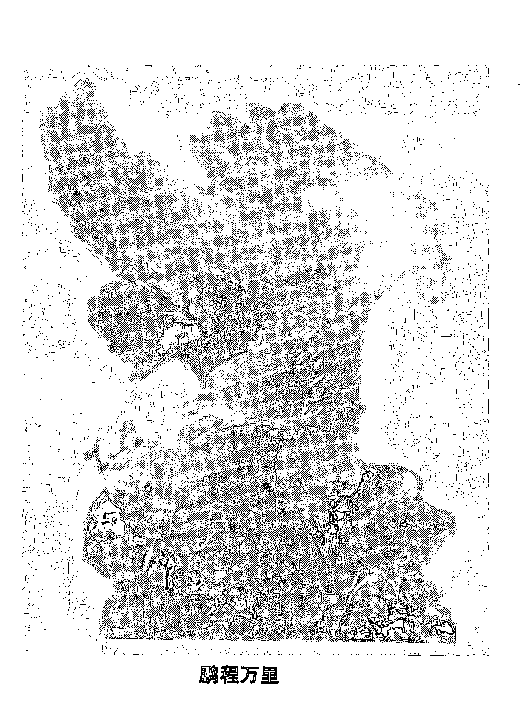

### 鹏程万里

# 第十五章 水晶的药用保健功能与寓意

## 水晶的药用保健功能

明代李时珍的《本草纲目》中记载：“白石英治痿痹肺痈枯燥病，紫石英治心神不安肝血不足及女子血虚寒不孕者宜之。”现代有些描写水晶的药用保健功能更为神奇：“水晶的压电效应，治愈了包括癌症、心脏病和风湿病在内的危重疾病”；“水晶能治乳腺癌”；“把水晶捆绑在骨折处，断骨很快复原”；“适当地受到水晶光芒照射，能使人变得年轻”；说什么“水晶有三个方向的光轴（实际上只有一个），光轴方向往往会产生一定聚光、放光功能，当其光华刺激到人体的某一穴位时，就像针灸按摩一样，可产生一定的理疗作用”；“水晶能给人体补磁”；“水晶能给人体补充微量元素铁、锰、钛、镍、钴、硒”；“用三千年前的古玛雅水晶头颅，产生的七色异彩照射，能使人进入催眠状态，可进行手术，不需要打麻醉针”；说什么“在美国南部的纳瓦乔族人，在夜里利用水晶可以帮你在黑暗中看清东西，利用水晶可以看到人的心脏器官，了解哪里出了病变”；“水晶能提神醒脑，水晶能治病止疼”等等，真可谓是灵丹妙药，而且写得很生动，有名有姓，有时间有地点。水晶真有这些功能吗？

# 水晶知识面面观

## 水晶药用保健功能解析

# 水晶知识面面观

当你冷静下来后，细细品味水晶药用保健功能时，你就会悟出一些道理来。有些水晶功能说者完全是一种商业行为炒作；有些则是人为的心理作用；有些则可能有一定的药用保健功能，但科学依据不足，又没有临床资料；有些则完全是一种传说。如《本草纲目》中说的紫石英不是紫色萤石，白石英也不是石英。至于水晶能治癌症，能治心脏病，水晶能给人体补充微量元素，可以说是没有科学依据的。纯净水晶是99.99%的二氧化硅组成，微量元素仅为0.01%左右，而且水晶的物理、化学性质均很稳定，它怎么能给人体微量元素？怎么能治病？其机理何在？难以使人信服。水晶虽然具有压电效应，但这种效应只能在一定条件下产生，而且由压电效应产生的电磁场强度均很小，在这种微弱的能场下，怎样能起到理疗与治病作用，都是无法解释的。

爱美之心，人皆有之，佩戴上一件精美漂亮水晶饰品，给人以美的享受，心情舒畅、愉快，调节人的精神状态与思想情绪，这方面应该是心理保健的范畴。至于有些水晶饰品安装上了磁体，具有一定强度的磁场，既美观又起到了一定的磁疗保健作用，这只能说明是磁体的功能。还有些水晶饰品与某些科技产品结合，可以出现既美观又具有一定实用功能的产品，如以电子显示温度计作为挂件与水晶项链结合，就成了一件既美观又实用的体温水晶项链；水晶项链与缩微病历卡结合，就是一件病历项链；还有什么电脑锁戒指、水晶美容按摩器、水晶醒脑助记仪等等，起作用的不是水晶，而是另外一种东西。

市面上出现的某些珠宝首饰，商家宣传的具有医疗保健功能的饰品，之所以具有一定的医疗保健功能，可能有如下原因：其一，佩戴珠宝首饰的人，很讲究珠宝首饰的品种与款式，佩戴部位与方式，还讲究与脸形体形相结合。首饰佩戴部位一般是耳垂、手腕、手指、颈部等，这些部位根据中医的理论均与人体的经络相通，在长期佩戴首饰的过程中，首饰对这些部位不断地施压与按摩，从而促进了血液循环，起到了针灸与疏通经络作用，所以从某种意义上讲，佩戴首饰除给人们以美的享受外，无形中也起到了一定程度的医疗保健作用；其二，某些首饰本身就具有一定的磁场（如黑色磁性项链）或人为地加入磁场或电场，这些磁场与电场长期作用于人体一定穴位，起到了辅助磁疗与电疗作用；其三，某些玲珑剔透的首饰（如水晶）加工成圆珠形，光透过圆珠后将产生聚光作用，聚焦的光，热能增加，首饰佩戴部位温度就增加，于是血管就扩张，从而促进了血液流动，促进人体健康；其四，某些首饰的原料，如翡翠、梅花玉、岫岩玉、和田玉等，含有丰富的微量元素，据说长期佩戴，首饰与皮肤摩擦，加以汗液的作用，首饰中某些微量元素，可通过皮肤进入人体，补给人体所需的一些微量元素，从而起到医疗保健作用。

## 水晶玄学种种

水晶具有神奇的特殊功能说，自古以来就有，且一直延续到今天，其传说可以说是五花八门。据传，一个人凝视水晶球时，可以帮助冥想、预言未来或由魔力乞求憧憬，因为水晶球里藏着神灵；有人说水晶球的天然分子是正极，故能中和人在愤怒、烦恼或情绪低落时大脑皮质所产生的负离子，增加灵性和活力，减少气浮现象；在日本和东南亚一些国家的大商场、宾馆及大富豪家里，往往都摆放有一个水晶球，据说这也是商人在生意场上不可缺少的法宝，除了取其谐音，以示“有求（球）必应”外，还有戒抑骄狂的妙用；东南亚有不少国家，主人在新建住宅于动土之前，在地基下埋下一个水晶球，用以镇宅、避邪；古今中外的占卜者，常用水晶球来获得世间事物的征兆或预测未来的吉凶祸福；此外还有什么水晶具有气感、灵感、避邪、水晶风水，喝水晶水能治病等等，这些都属于玄学的范畴，这种玄学在日本、韩国等东南亚一些国家特别盛行。

## 水晶寓意

“玉石寓意”、“水晶寓意”都属于文化范畴。深厚的中国玉石文化，促进了中国玉石事业的发展，水晶文化的兴起与发展，也将促进水晶事业的发展。古人对玉的定义是：“玉，石之美者，有五德。”意思是说美石者称玉，玉还要具有五德，而德是指人的思想品德，这样古人把玉石与人的德性融合为一体，就形成了一种玉石文化。此所谓君子五德如玉，即“仁”、“义”、“智”、“勇”、“洁”五种德性，都蕴涵在玉的特性之中。各种颜色的水晶也有其深厚的文化内涵。如无色水晶，表示心灵神圣、清爽，代表纯洁和谐，心境平谧，有助意志坚定，身体健康。说无色水晶具有强大的平衡力，能令人头脑清晰，消除烦恼、紧张情绪，可以提升灵性，开启心智，扩大潜能；紫色水晶，象征诚挚、正直与善良，也象征天真与快乐，他们笃信触摸紫晶能提高灵性，增长智慧，被西方奉为“诚实之石”；黄水晶，代表真诚与执著的爱，意味着美貌和聪颖，象征富态、有生气、能消除疲劳，能控制情绪，有助重建信心和人生目标，美、法、日将其作为11月生辰石，被誉为“友谊之石”；茶水晶，表示刚毅、坚忍、克制、有信心，能提高反应能力，助人思考，事业有成；墨水晶，表示能量巨大，使人心旷神怡，清凉透心，可除头部昏脱之症等等。现代人将不同水晶寓意与内涵文化随饰品一起宣传，有：

- 白水晶：提升灵气，纯洁无私。
- 茶水晶：固本培元，庄重稳健。
- 黄水晶：健胃顺肠，主招偏财。
- 紫水晶：高贵浪漫，开发智力。
- 红水晶：爱情甜蜜，事业兴旺。
- 粉晶：养气健体，爱情如意。
- 绿幽灵：扩展事业，增强财运。
- 绿发晶：助益事业，财源滚滚。
- 金发晶：能谋善断，大吉大利。
- 红发晶：增强体能，鸿运当头。
- 钛晶：提升胆识，好运连连。
- 紫晶洞：凝集气场，聚财旺财。
- 聚宝盆：聚财聚气，天生宝盆。
- 水晶球：圆圆满满，有求（球）必应。
- 雕刻品：聚磁力场，改善家运。
- 水晶柱：放射能量，功率卓越。
- 水胆水晶：助人聪灵，八面玲珑。
- 黑发晶：消灾除患，排除病气。
- 紫黄晶：万事协调，风调雨顺。
- 白晶簇：聚集灵气，镇宅避邪。

# 水晶知识面面观

### 春江水暖鸭先知

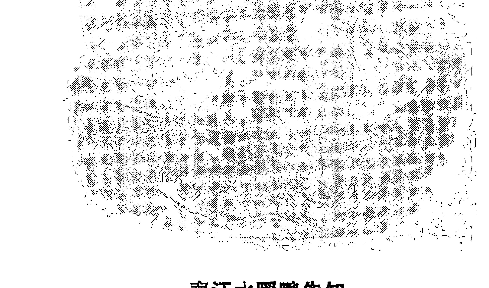

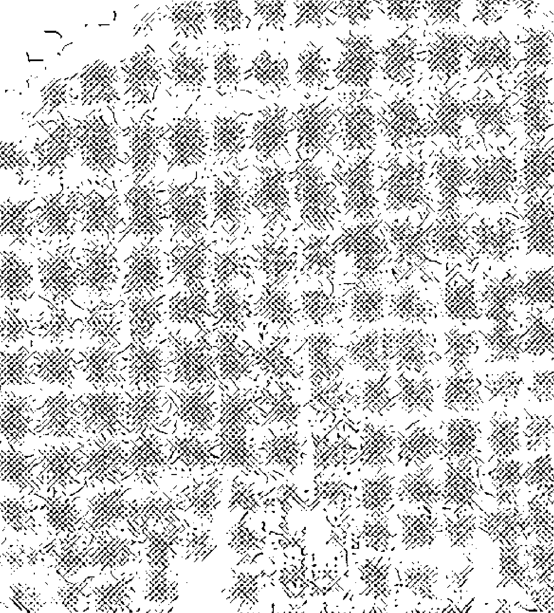

### 狼

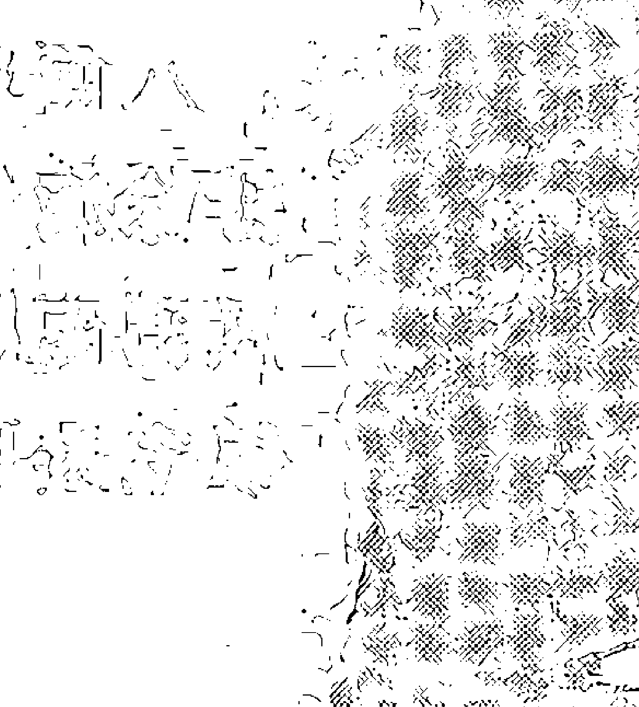

### 孔雀

# 第十六章 水晶眼镜

## 水晶眼镜的源流

当凸透镜的放大作用被发现后，于是就出现了眼镜。究竟是谁首先制造出了第一副眼镜，说法不一，一说是英国圣芳济派教士 Rege Bacon（1216－1294）首创；也有说是意大利修道士或贵族首创制作，说法都不肯定。现知最古老的透镜是在伊拉克的尼尼瓦古城废墟中发现的，双凸镜原由清澈水晶磨制而成，直径1.5 寸，焦距4.5 寸，我们可以以此推知，古老的巴比伦人至少在2700 年以前便发现了水晶凸透镜具有放大作用。欧洲最早的水晶眼镜出现在意大利，是威尼斯工匠阿玛帝在1300 年制作的，不过当时没有镜架，而是由手举着或卡在眼窝上观看。考古学家认为，我国最早的水晶眼镜出现在公元一世纪，在扬州邗江县甘泉山一座东汉墓中，发现有放大作用圆形水晶眼镜，镶嵌在一个指环状金属圈内，能将细小的东西放大5 倍，这大概是我国最早的水晶眼镜实物了。在宋代水晶眼镜并不多，到了清代水晶眼镜屡见不鲜，茶色水晶眼镜为清廷官员所好，清初吴县人孙云球为中国著名水晶眼镜制造专家，著有《镜史》，登门求购此“西洋镜”者几乎踏破门槛。

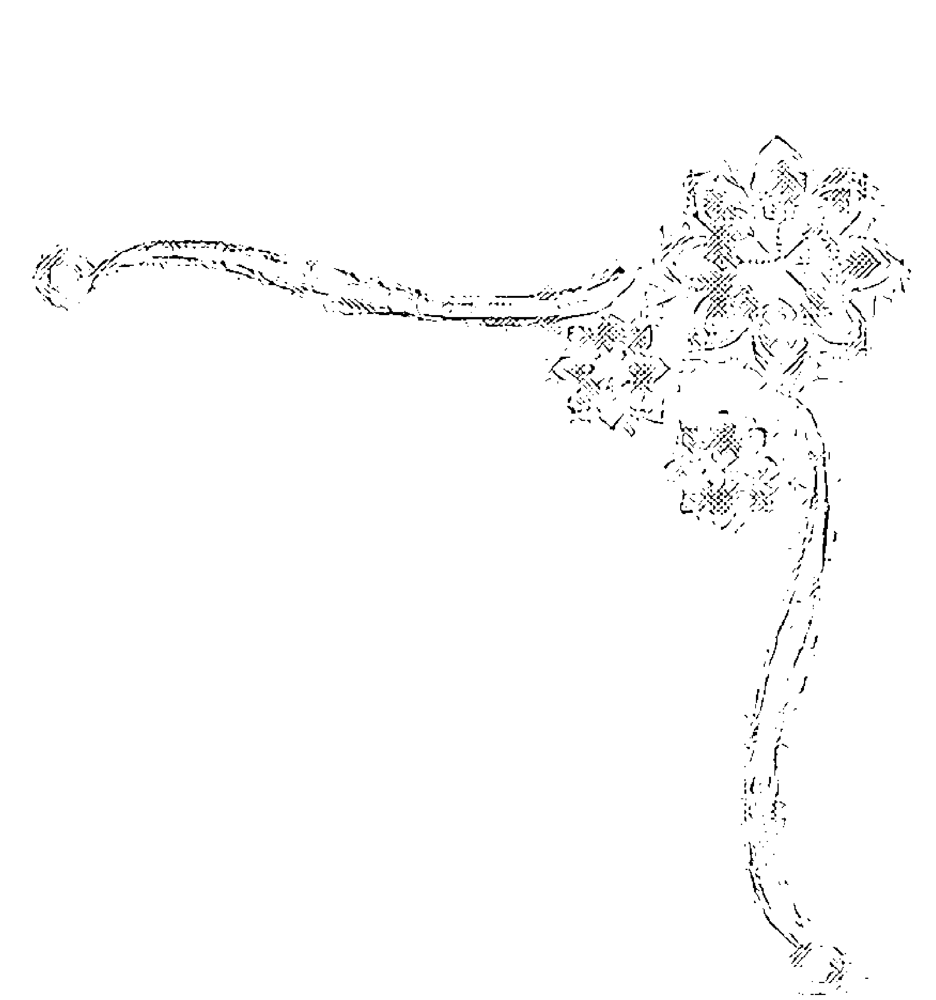

## 佩戴眼镜的作用

佩戴眼镜的作用是众所周知的，其一是矫正视力或调整人眼视力功能的需要；其二是保护眼睛作用，防止各种异物进入人眼或在特殊环境下工作的需要，因此就有防风沙镜、潜水镜、游泳镜等，为了防止有害光线的照射，因此就有防紫外光镜、墨镜、太阳镜、变色镜之分；其三是美化作用，在一定程度上，眼镜是一种装饰物，它可改变人的形象，增加人的风度，表现人的气质。

## 佩戴水晶眼镜的利弊

目前市面上的眼镜，可以说五花八门，品种繁多。然而水晶眼镜却一直是眼镜中的佼佼者。有数十元、数百元，甚至数千元一副的都有，一直在高档眼镜领域中流通，深受百姓欢迎。然而在佩戴水晶眼镜的利弊上，从来就有两种不同说法，一种说法是佩戴水晶眼镜有害，之所以有害，其理由之一是：水晶具有双折射现象（双折射率0.009），因此人们认为透过水晶眼镜观察物体时会将一个物体看成两个物体（即重影）；其理由之二是水晶通过光波的范围宽（约为200 ~2500 毫微米），即水晶除透过全部可见光之外，对紫外线和红外线也约有70%透过能力，红外光与紫外光对眼有害。另一种看法则认为佩戴水晶眼镜有益，其理由之一是：戴上水晶眼镜后人眼睛有一种清凉的感觉，能防火眼，防止红眼病；其理由之二是水晶是一种宝石，硬度较高，能耐磨损，长期佩戴不起毛；其理由之三是：民俗就是这样认为，水晶眼镜就是一件贵重的东西，水晶眼镜古人称石头眼镜，其一这种石头少；其二这种石头加工困难，由于石头稀少加工困难而物以稀为贵；其三水晶眼镜出世初期仅流行达官贵人之中，所以有些人把水晶眼镜都当成传家宝而收藏，据说能避邪和保护眼睛。佩戴水晶眼镜的有害有益一直争论不休，究其原因是一些人只知其一不知其二。佩戴水晶眼镜能将一物体看成两物体（即重影）认为者，没有注意到这样一个事实，即成千上万的水晶眼镜佩戴者，没有发现一个人因佩戴水晶眼镜而把一个物体看成两个物体。实践应该是很好的回答。如果从定量的角度剖析，其结论也是同样。由折射定律得出，经计算：由双折射而造成常光与非常光两种光线的夹角为0.5′，而人眼最小分辨角为1′左右，因此戴水晶眼镜，观察物体不会看到重影。至于水晶眼镜能通过紫外线红外线而对眼睛有害就更好解释了。在正常的环境下，人眼所接受的光，都具有相当的适应与调节能力，戴水晶眼镜与不戴水晶眼镜所接受的光谱线都是一样的，最起码的是不可能再增加，因此不必担心。但是这里提醒水晶眼镜爱好者，长时间地佩戴茶色或墨色的水晶眼镜可能会造成紫外线对眼睛的伤害，原因是光线通过深茶色或墨色水晶眼镜后光线就减弱了。为了看清景物，眼睛瞳孔将自动扩大，同时接受的紫外线就多些了，如果长时间戴佩这种水晶眼镜，就可能造成对眼睛的伤害。那么水晶眼镜究竟有哪些独特之处呢？

- 其一，古时人们对水晶眼镜称石头眼镜。由于石头眼镜非常珍贵，当时仅为达官贵人拥有，因此把石头眼镜作为传家之宝的事到处可见并传得神乎其神；
- 其二，水晶是属于宝石之一，因此水晶眼镜具有珠宝饰品之装饰、收藏及实用功能；
- 其三，水晶硬度大，耐磨损，长期佩戴不起毛，透光性能也优于其他眼镜；
- 其四，由于水晶眼镜散热快，戴上一副水晶眼镜，犹如在眼前安装了一个散热片，所以人眼有一种清凉感觉。

实践证明佩戴水晶眼镜能去火清目，治眼干疼，去赤眼等，这也是水晶眼镜流行于风沙大、气候干燥地区的原因。

## 如何选购水晶眼镜

虽然水晶眼镜是眼镜中的佼佼者，备受人们青睐，然而购买水晶眼镜者上当受骗现象时有发生，不法商人把玻璃眼镜当水晶眼镜销售者有之；把合成水晶眼镜当天然水晶眼镜销售者有之；各色水晶眼镜中又有人工加色与天然色之分；水晶质量又有好坏之分，有的水晶眼镜裂绵缺陷多，有的纯净无瑕；水晶眼镜的加工装配质量又有好坏之分等等，所以虽然都是水晶眼镜，由于种种原因其价格相差也较大，因此选购水晶眼镜要特别小心，最好到信得过的大商店去购买或到检测机构去检测，以免上当受骗，造成不必要的损失。选购水晶眼镜时，应该特别注意的是：其一，选择一副质量很好的天然水晶眼镜是人们所希望的，但因质量特好的天然水晶原料越来越少，所以目前市面上的天然水晶眼镜多半是质量差的眼镜，质量特好的少见。选择天然水晶眼镜时，至少要用肉眼观察几项：第一，水晶眼镜的颜色是否均匀，不均匀者质量要次；第二，绵、裂要尽量少，即使有点绵、裂应靠近镜片的边部；第三，尽量选择镜片薄一些的，以免造成鼻梁的负担；第四，索要质保书与发票，有问题时便于解决。其二，不要一味追求天然水晶眼镜，有些人一味追求天然水晶眼镜，非天然水晶眼镜而不要，结果是购到天然水晶眼镜，然而由于质量差，绵、裂多，颜色又不均匀，价格又高，对眼又有损害，真是多花钱买罪受。其实合成水晶眼镜由于质量纯净，价格又低，透光率又高，因此很多眼科专家建议人们佩戴合成水晶眼镜。其三，眼镜加工质量好坏也是决定价值中一个重要因素，要根据自己眼睛度数，正确选择眼镜片度数，如果是做平光片用，一定要配置平光的眼镜片。其四，配镜架也是一个科学问题，由于水晶眼镜片贵重，因此一般要配置好的镜架。

# 第十七章 水晶的加工工艺

## 水晶加工款式与流程

由于水晶玲珑剔透，宝光闪闪，加以有各种各样的颜色，硬度有大有小，因此利用水晶原料可以加工成品种繁多的饰品及工艺品。饰品最多的是项链、手链、耳坠、戒指、胸饰、挂坠、头饰、念珠等等，其款式可分为两大类型：一类是刻面型，另一类为素面型。所谓刻面型，即每个首饰的表面均由许多平面组成，其中又根据刻面的多少和外形的不同分为很多类型。所谓素面型乃是饰品的表面均由弧形曲面组成，其弧面有向外凸出的，也有向内凹进去的，其颗粒形状也多种多样，如圆球形、橄榄形、心形、椭圆形、液滴形等等。水晶工艺品中的品种也很多，其中有仿古雕刻的各种水晶工艺品，也有反映现代生活的各种水晶雕刻品。如各种观音、佛像、鼻烟壶、鼎、印章、镇纸、笔架、象棋、围棋、水晶球、按摩器等等。据市场不完全统计，水晶饰品与水晶工艺品的品种可达数百种之多。不同水晶饰品与工艺品的加工工艺是有差异的，但其加工流程大致相同：首先是选料，根据原料的形状、大小、颜色的不同而设计制作某种产品。第二步是切磨造型。第三步是粗磨。第四步是细磨、精磨。最后是抛光。下面仅就刻面饰品的抛光、款式选择与钻孔工艺予以介绍。

# 水晶知识面面观

## 水晶饰品的精磨与抛光

人们很注意抛光这道工序，因为只有抛得很光亮，才能把水晶的美感体现出来，然而大量的实践证明，单一的只在抛光工艺上下功夫，往往达不到目的，这是因为抛光质量的好坏直接与粗磨、细磨、精磨质量有关，如果粗、细、精磨质量均已到位的话，抛光质量就好，但是有时也有不明原因的例外，即精磨时间过长，看起来精磨磨得很好，很到位，但抛光时就是抛不亮，越抛光越发雾（似釉化面）。美国有一位宝石加工师傅曾载文谈珠宝抛光经验说：宝石经精磨后，然后用细磨用的磨料擦一下，再进行抛光时，其产品不仅抛得很光，而且速度也快。一些学者认为这种说法，也有道理。其道理在于经精磨后的表面，总会产生一层非常薄的整体创伤面，其创伤面的厚度约为磨粒直径的0.5～1倍，这一事实已被很多研究人员证实。经精磨后的整体创伤面，如果再用稍粗一些磨粒摩擦一下，即把整体创伤面，刻划为多少小块创作面，再经抛光，这些小块创伤面就易脱落，而露出新鲜的光滑面，从而表面光洁，而且抛光速度也快。近些年来我国水晶饰品加工业发展很快，其产品畅销海内外，但高质量的加工产品所占比例很少，大量粗制滥造的产品上市，这一方面影响到水晶饰品的声誉，更重要的是浪费了不可再生的水晶资源，严格来说，这是一种罪过。究其原因，应该是多方面的，然而抛光技术方法与抛光材料的选择，的确是一个重要因素，综合国内的一些加工厂来看，抛光一般均用三氧化二铬、氧化铈、α-三氧化二铝、三氧化二铁抛光粉进行抛光，配合金属盘、有机玻璃盘、聚氨酯盘、泡沫盘等进行。目前由于抛光粉材料粒度多未达标准要求，加以抛光盘配合使用不当以及抛光时间掌握不好，从而使水晶抛光质量不高。

## 抛光理论浅析

有关珠宝玉石抛光理论，到目前为止还没有统一的说法，一般人认为抛光是一种超细研磨的过程，即把细、精磨后留在刻面上凹凸不平的表面（创面），而磨得更精致些，直到看不到擦痕为止。这种理论的实质是：抛光乃是通过降低磨粒直径的方法来实现的。然而理论研究告诉我们，只要抛光材料有一定的颗粒直径，就必然给抛光面留下一个创面，其创面的厚度一般认为是磨粒直径的0.5～1倍，既然有创面，表面就不会太光滑，但实际情况并非如此。直到20世纪初期，拜尔的新发现使抛光理论前进了一步。拜尔发现在抛光过程中与液状层（人们称贝尼层）形成的同时，固体表面存在实际上的塑性变形，贝尼层就像清漆的外膜一样伸展在划痕面上（即创面上），使划痕面蒙上光泽。1937年芬奇利用电子衍射技术，揭示出固体表面结构，证实了拜尔的研究结果是有根据的，并发现贝尼层能立即发生与下部结构一致的再结晶。这种抛光理论的新发现，为正确选择抛光技术与方法，提供了理论依据。如何促使贝尼层产生，再结晶？使之形成光泽很亮的面？首先抛光时要有一定的温度，如果温度太高，将会在抛光面上形成一层“釉化面”，致使抛光面发雾。如果温度太低，贝尼层将不会产生，再结晶抛光面也不会亮，抛光的同时还需要有一定的压力，以促使再结晶层的形成，因此要使一件饰品抛光很好，除抛光材料、抛光介质的正确选择外，其抛光时温度、压力的选择也是非常重要的。据资料报道，抛光时抛光面的瞬时温度可达700℃～800℃，不同材料其化学成分与物理性质不一样，因此抛光时温度，压力的选择是不一样的。什么叫再结晶（重结晶）？它的形成机理怎样？这是一门很复杂的学问。所谓的再结晶，地质学家一般是这样界定的：这种再结晶或重结晶作用总是发生在同种矿物之间，它是通过组分的溶解和重新沉淀而发生的一种结晶作用。就抛光时贝尼层的重结晶作用的发生，抛光时其表面不平的高处及抛光下来的微粉，由于表面能高，最先遭到溶解，而在表面凹处表面能低的地方而发生沉淀重结晶，最终使抛光面平滑光亮。根据上述抛光理论与水晶的物化性质，选用金刚石抛光膏或油质金刚石微粉与锌铝合金盘或硬质木质抛光盘结合进行干式抛光水晶饰品，从理论上和实践上是行得通的。其原因是：一方面金刚石微粉具有很强的磨削能力，可使抛光面研磨得更精细，而且速度快；另一方面借助干式抛光时摩擦热不易散佚，而使抛光面的贝尼层迅速达到重结晶的温度，而使抛光面更光亮。

## 金刚石微粉干式抛光方法

金刚石微粉干式抛光法是人们在加工水晶的过程中摸索出来的一种新方法。由于抛光速度快、质量又好，很快得到了行业的认可而得以推广。所谓金刚石微粉干式抛光是采用一种含金刚石微粉的特制抛光盘在不加水而干式情况下抛光的方法。

## 金刚石微粉干式抛光法机器设备与金刚石微粉如何选择

金刚石微粉干式抛光法所选用的机器设备可选用转速为1400～2800转/分的机型，当选用锌铝合金抛光盘时，最好选用转速为2800转/分的磨机，以便使瞬时摩擦温度达到贝尼层重结晶的温度，抛光盘可选用直径150mm的自己特制锌铝合金盘或自己特制的硬木质盘。抛光粉可选用小于W3.5金刚石微粉调成膏状或直接采用市场销售金刚石抛光膏。

## 金刚石干式抛光盘的制作方法

实现金刚石微粉干式抛光最关键的是调制好干式抛光盘。其具体制作方法是：将抛光膏或金刚石微粉加雪花膏调成膏状，再在锌铝盘（或硬质木盘）离轴心2/3半径外圈面积上，涂上一薄层金刚石膏状物，并用硬材料将金刚石膏状抛光剂压入抛光盘中，使其抛光盘的表面产生一薄层既含抛光盘成分又含金刚石膏剂的混合抛光剂层。再将抛光剂向抛光盘中心推压，使整个抛光盘表面上均匀覆盖一层抛光剂，这层抛光剂层是手摸干爽、不沾黑。这时宝石的砂磨与抛光可同时进行，只要将刻面平放于抛光盘上，加以适当的压力，控制好抛光时间，即可得到满意效果。如果抛光大一些刻面，则在抛光盘的外圈进行，如果是抛光小的刻面则在抛光盘轴附近进行。

## 金刚石微粉干式抛光法的优缺点

由于金刚石微粉的磨削能力比任何抛光粉要强得多，因此能快速将刻面研磨得更精致更平整，抛光后的刻面镜面效果更好，珠光宝气才能充分体现。又由于采用了干式抛光，因此能使贝尼层重结晶的温度上升较快，所以该法的抛光速度之快，效果之好是其他任何抛光法无法比拟的。又由于该抛光法引起的废弃物只有少量的刮到宝石的边缘，而且细心的人还可以回收。而水质抛光法，因大量的抛光粉（剂）飞溅到空中或其他物品上，这一方面造成了对环境的污染，另一方面也浪费了抛光剂。金刚石微粉干式抛光法的缺点是：金刚石微粉的价格比其他任何抛光粉价格要高，这是该法的缺点，但由于锌铝合金盘上抛光剂层调好后，后续添加的抛光粉是极少的，加以该法抛光速度快，效率高，劳动力成本低，因此弥补了抛光材料成本过高的不足，随着人们对环保意识的加强，劳动力价值的不断提高及人们对饰品加工质量的要求越来越高，因此用金刚石微粉干式抛光水晶饰品，是必由之路。

## 水晶饰品超声波钻小孔的原理

由于水晶项链、手链、挂坠、耳坠等均需要钻孔成串后才能佩戴，因此水晶钻孔工艺也是水晶加工工艺的一个重要组成部分，选择何种钻孔工艺是非常重要的。由于水晶硬度大、性脆，因此超声波钻孔方法是水晶钻孔的最优方法。超声波钻孔的原理是：超声波振动借助变幅杆放大后驱动加工工具，工具与加工件间的悬浮液中磨粒，以很高的速度不断冲击工件表面使之粉碎而钻孔，同时工具端部的超声波还会使悬浮液产生“空化现象”，由于“空化现象”在工件表面形成的液体空腔（气泡），在闭合时会产生极强的脉冲液压冲击，也能使工件表面毁坏，并促使悬浮液循环，磨料得以及时更新，工具逐渐伸入到材料中，工具形状便复制到工件上，即有什么样的工具形状，就有什么样形状的小孔。

## 超声波钻小孔的设备

超声波钻小孔的设备，包括四大组成部分，一部分是超声波发生器，一部分是超声波换能器，一部分是变幅杆，一部分是工具。超声波发生器将50Hz的交流电流变为超声频的电功率输出，其功率可大可小，对钻小孔的水晶饰品，其功率一般为100瓦左右即可，其频率一般为16～25KHz。超声波换能器是将超声频电磁振荡转换成机械振动的一种设备，其换能器一般有两种：一种为磁致伸缩换能器，另一种为陶瓷压电片。无论哪种换能器，都应该使其尺寸（压电片厚度或磁致伸缩棒的长度）为超声波半波长的整数倍。变幅杆的作用是将换能器上的超声波振幅（一般为0.005～0.01mm）扩大到加工时所需振幅（0.01～0.1mm）的作用。变幅杆的形状有阶梯状、锥状、指数形状等等，其长度也应为超声波半波长的整数倍，其材料一般为45号钢或工具钢均可。工具即为打小孔的针头，其针头必须紧密联结在变幅杆上，对于打小孔的工具，一般是焊接在变幅杆的细端，其材料一般是钢管和钢丝。

## 影响超声波钻小孔的因素有哪些

影响超声波钻小孔的因素是多方面的，分析起来大致有四：其一，工具的振幅频率：一般情况下，振幅和频率与加工速度是大致成正比关系，但是太大后又有很多问题，因此工具振幅一般控制在0.02～0.08 mm之间，频率控制在16～25KHz之间；其二，给进力：即工具与工件间的静压力，太大了不行，大小了也不行，应该是一个最佳的静压力，对于打小孔而言，一般约为4×10⁵Pa；其三，磨料与悬浮液的性质：磨料越硬、粒度越粗，加工速度就越快，对水晶打小孔而言其磨料一般都是采用100～160目之间的碳化硅，其悬浮液的浓度越大，其加工速度越快，但如果太大了，则加工速度反而降低，一般推荐磨粒对水的重量之比为0.1～1间调制；其四，工件性质：工件脆性大则容易加工，工件韧性越大则越不易加工。

## 国外两款水晶刻面加工方法

任何宝石在加工前均要求设计师进行设计，设计师根据宝石物化性质及可能引起宝石特殊光学效应，来确定其加工款式、加工程序及其具体加工方法，主要根据宝石的折光率、临界角、硬度、包裹体缺陷特征等来决定加工款式。水晶玲珑剔透，具有固定的折光率与临界角，摩氏硬度为7，根据其上述特征参数，应该加工成什么样款式，以达到珠光宝气最佳的光学效果，以下两款是以祖母名字命名国外两款水晶刻面标准加工款式，其一是“海尔达”六边形，其二是“贝蒂”箱式琢型。这两种水晶刻面款式的加工工艺，既不太难，又具有一定的挑战性。其款式的小面、角度，均按水晶折光率与临界角来设计，光学效果特别好，有兴趣者不妨试试。

### “海尔达”六边形（见图 41）款式标准加工方法

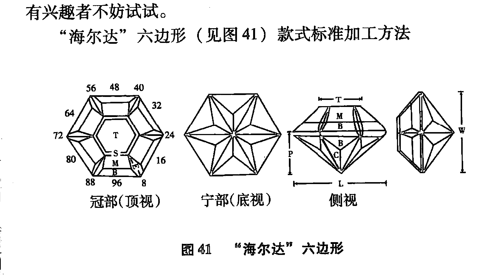

1.  该款式有49个小面及6个腰面共55个面。形成6层对称镜面反射，采用96分度轮切磨。
2.  L = 长度，W = 宽度，T = 亭尖小面，L/W = 1.155，T/W = 0.513，T/C = 0.444，P/W = 0.497，C/W = 0.267，H/W = (P + C) / W + 0.02 = 0.785，P/H = 0.634，C/H = 0.341。
3.  小面名称、角度、分度指数（见表5）。

| 小面名称 | 角度 | 分度指数 |
| :--- | :--- | :--- |
| 亭部主小面 | 48° | 96, 16, 32, 48, 64, 80 |
| 亭尖小面 | 43° | 2, 14, 18, 30, 34, 46, 50, 62, 66, 78, 82, 94 |
| 冠部主小面 | 44° | 96, 16, 32, 48, 64, 80 |
| 冠部腰小面 | 48° | 96, 16, 32, 48, 64, 80 |
| 冠部角小面 | 43° | 4, 12, 20, 28, 36, 44, 52, 60, 68, 70, 84, 92 |
| 冠部星小面 | 27° | 96, 16, 32, 48, 64, 80 |
| 腰面 | 90° | 96, 16, 32, 48, 64, 80 |
| 台面 | 0° | |

### “贝蒂”箱式（见图42）款式标准加工方法

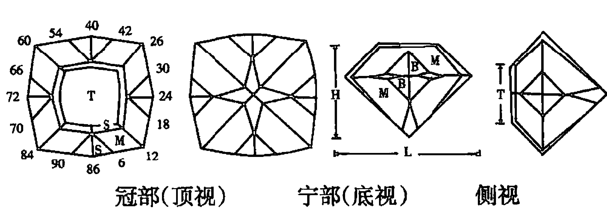

说明：

1.  该款式有45小面及8个腰面共53个面，4层对称的镜面反射层，采用96分度轮切磨。
2.  L=长度，W=宽度，T=台面，H=高，M=主小面，B=腰小面，S=星小面，C=亭尖小面，L/W = 1.00，T/W = 0.498，T/L = 0.498，H/W = 0.760。
4.  小面名称、角度、分度指数（见表6）。

#### 表6 小面名称、角度、分度指数

| 小面名称 | 角度 | 分度指数 |
| :--- | :--- | :--- |
| 腰面 | 90° | 2, 22, 26, 46, 50, 70, 74, 94 |
| 亭部主小面 | 45° | 3, 21, 27, 45, 51, 69, 75, 93 |
| 亭部腰小面 | 48° | 1, 23, 25, 47, 49, 71, 73, 95 |
| 亭部尖小面 | 43° | 96, 24, 48, 72 |
| 冠部主小面 | 48° | 3, 21, 27, 45, 51, 69, 75, 93 |
| 冠部腰小面 | 51° | 1, 23, 25, 47, 49, 71, 73, 95 |
| 冠部星小面 | 27° | 3, 21, 27, 45, 51, 69, 75, 93 |
| 台面 | 0° | |

# 第十八章 水晶选购常识

## 当前我国水晶市场状况如何

自1990年以来，我国的水晶饰品加工业与销售业，呈日益上升的趋势，水晶市场与商店如雨后春笋遍布我国各地，水晶原矿与饰品、工艺品交易火暴，市场行情看好。还有一支强有力的水晶原矿采购队伍，他们深入世界各国有水晶的地方去采购水晶，有到南美巴西的，有到马达加斯加的，有到俄罗斯的，也有到巴基斯坦、越南、缅甸等国的，他们把水晶原矿购入中国，再将加工好的水晶产品销往世界各地，以水晶为媒，促进了我国人民与世界各国人民之间交往，搭上了友谊之桥。水晶饰品与工艺品在国内销售也非常火暴，由于美观大方，价格又适中，所以水晶饰品与工艺品已进入普通百姓的家中。在这一片繁荣景象的面前也要看到水晶市场的不足，如绝大多数的水晶市场，其水晶饰品的品种、规格、价格、生产厂家等都没有规范标志，其品种的好坏、规格大小、价格高低全凭一张嘴，以次充好、以假乱真的现象时有发生，人们呼吁水晶市场规范经营，使中国的水晶业得到健康发展。

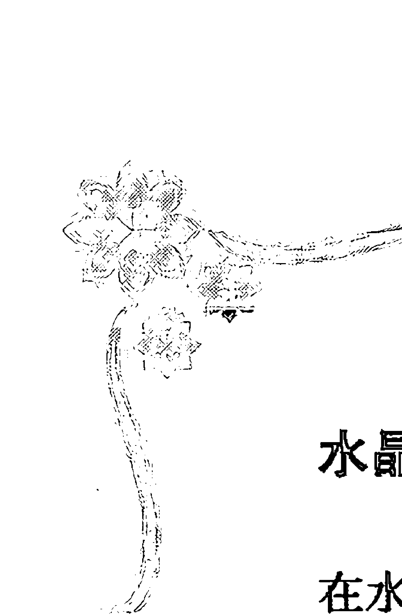

## 水晶选购人员的烦恼在哪里

在水晶市场目前还不太规范的情况下，在品种繁多看得人眼花缭乱的情况下，如何挑选到你称心如意的水晶制品，这是一门大众学问，也是水晶选购人员感到头痛的事情，头痛第一点是水晶饰品品种繁多，在品种繁多的水晶饰品面前不知选购什么为好？根据佩戴部位的不同，市场有项链、手链、戒指、胸花、耳坠、头饰等；从加工款式上看有刻面素面之分；从颗粒形状上看有菠萝形、梨形、草莓形、足球形、心形、西瓜形、灯笼形、圆形、椭圆形等；从颜色上看有有色与无色之分；水晶又有天然水晶与合成水晶之分；从成串工艺上看又有单串、双串、花串之分等等，可谓水晶饰品的品种繁多，款式多样，同时以玻璃制品冒充水晶饰品也不少，因此购买者往往感到很困惑，很烦恼。

## 如何选购水晶饰品

究竟如何选购到你满意的水晶饰品呢？其一，总体直观感觉应该放在第一位，如款式、颜色、光泽、成串工艺、大小、松紧、长短、试戴效果等能否满足你的要求，才能认定是否购买，总体直观感觉都看不中的最好不要买。其二，看是水晶还是仿制品，水晶中又有天然水晶合成水晶之分，仿制品、天然水晶、合成水晶制品有时价格相差较大，一定要分清，以免上当。其三，选择什么样的款式要根据年龄大小、性别与个人喜爱来选择，如在市面上经常看到北方人多选购颗粒粗大，款式粗犷的饰品，而南方人多选购那些小巧玲珑的饰品。热恋中的小伙子多选购红水晶饰品送情人，因为红水晶代表爱情甜蜜，事业兴旺。也有的女士购水晶锁送男朋友，表示把要男朋友心锁住等等。其四，如果你想选购一件比较高档次，具收藏、保值功能的水晶饰品，请选购天然红水晶，金丝发晶、钛晶、绿幽灵、聚宝盆、黄水晶，有猫眼和星光效应的水晶制品，因为这些水晶是水晶中稀有品种，具极高的收藏与观赏价值。其五，看卖主：购买贵重的水晶饰品，不要贪蝇头小利，最好在货比三家之后到信誉好的水晶专卖店去买，因为好的专卖店一般都注意品牌形象和商业信誉，产品均经过检测，售后服务系统也比较完善。

## 如何选购水晶工艺品

近些年来，水晶工艺品层出不穷，有水晶球、水晶佛像、水晶观音、二龙戏珠、龙盘球、如意、福在眼前、鼻烟壶、文房四宝中的砚台、笔洗、笔筒、笔架、镇纸等，凡是祖国传统的玉雕工艺品，在水晶工艺品中均能找到。购买水晶工艺品应注意三点：其一看选料，选料精良的工艺品，应看不到星点状、云雾状和絮状分布的包裹体，晶体玲珑剔透，杂质少，如有巧色的产品画龙点睛就更好了；其二看加工工艺，加工工艺是决定一件工艺品是否有生命力的关键，有些雕刻师擅长雕刻人物，有些雕刻师擅长山水花鸟，各有所长，应注意的是水晶一定要抛得很光亮，才能把水晶的美感体现出来；其三估价值，一件水晶工艺品价格，大致由三方面决定，一是原料价，二是雕刻费用，三是配座，加上商家利润，大致多少钱一件，作为有经验的人，一般估计都差不多。

## 选购水晶产品时的一些误区

在水晶市场，常见到一些人购买水晶眼镜时，一味追求天然水晶眼镜，非天然水晶不要，这些人总认为天然水晶眼镜才是真正的水晶眼镜，才是好的水晶眼镜，合成水晶眼镜是假水晶眼镜，果真是这样吗？其实合成水晶也是水晶，其内部结构、化学成分及物理性质与天然水晶是一样的，它是仿照天然水晶形成条件用人工的方法在高压釜中慢慢形成长大的，由于选料与生长条件都较精确、稳定，因此合成水晶都较纯净通透，透光率也较高，而天然水晶是在地下自然形成长大，由于营养液的补给和生长条件多变，因此天然水晶纯净的质量好的就很少，特别是通过近十多年数万副天然水晶眼镜的检测，发现质量较好的天然水晶眼镜仅占1%～2%左右，绝大多数天然水晶眼镜都存在质量问题，主要表现在各种绵体、裂纹较多，颜色很不均匀，切割方向是任意选择的，有些眼镜雾状绵体很多、光的透过率很低，有些眼镜的度数与标识相差很远，长期佩戴这种天然水晶眼镜，有可能造成对人眼的伤害。合成水晶眼镜，由于质量纯净，光通过率高，所以有些眼科专家建议，戴水晶眼镜，还是合成水晶眼镜好。

货比三家，不要贪便宜，学点水晶常识。在目前水晶市场不太规范的情况下，同样一种水晶产品，在不同的商店其价格相差较大，因此专家建议，选购水晶产品，一定要货比三家，以购得物美价廉的产品。不要贪小便宜，也是专家经常提醒的。经常看到有些人选购水晶时贪便宜，见到便宜的就买，结果买到后一经检测，要不就是些仿冒的玻璃制品，要不就是些粗制滥造的水晶产品，上当者时有人在。有些选购水晶的人员，一点水晶常识也没有，一到市场不知所措，人家说什么就是什么，人家说好就是好，任人摆布，这样上当受骗的现象时有发生，所以专家建议选购水晶前要学点水晶基本常识与了解水晶市场状况。

# 第十九章 水晶之最

## 水晶晶体之最

水晶晶体，是生长在水晶晶洞中，在水晶种子上慢慢长大的，由于各种地质条件的制约，具有面、棱、角透明似水的水晶晶体，个体有大有小，小的比大米粒还小，大的可非常之大。目前发现世界上最大的水晶晶体，长5.5米，直径2.5米，重40余吨，号称世界水晶晶体之最。在江苏东海县，1958年挖得一块水晶，高1.7米，重达3.5吨的大水晶晶体，现收藏于北京中国地质博物馆，被称为中国的水晶晶体之最。

## 水晶晶洞之最

水晶生长在晶洞中，只有晶洞存在才有水晶的生长空间，而晶洞又要满足很多条件，才能使水晶生长，具体需要满足哪些条件呢？其一，晶洞一定要封闭，只有封闭，晶洞才具有一定压力。据水晶形成地质条件与人工合成水晶研究，水晶形成必须在大于1000大气压条件下形成；其二，晶洞中必须要具有一定温度水晶才能形成。据地质观察及人工合成水晶实验证明，水晶形成一般在300～400℃；其三，要有源源不断的过饱和二氧化硅溶液补给，满足了这3个条件，水晶基本就能形成，水晶晶体大小及质量好坏，还要受其他很多条件制约。水晶产于晶洞中，晶洞有大有小，据资料，目前世界上最大的水晶晶洞是南美高亚斯地区，其水晶洞长25米。在西班牙南部艾莫瑞亚省也发现了一个大的水晶洞，洞长8米，宽9.8米，高1.7米，可容多人。

### 紫晶包之最

紫晶包又名紫晶洞，由于产量少，加以晶包中全为名贵的紫晶晶簇，因而较为昂贵，市面价格最高数百元一公斤。又由于紫晶洞据说具有凝聚气场，聚财旺财之说，因而市场行情看好，有些作为镇店、镇宅之宝而放置于显眼的地方。目前发现最大的紫晶包，高2米，达2吨，内生长着约5800颗晶体完整的紫晶晶体，在1995年香港、哥伦比亚国际珠宝博览会上，曾轰动一时。

### 世界上优质水晶富集区在哪里

水晶产地广布世界30多个国家，阿尔卑斯山的水晶多得惊人，当地人可从岩壁上采下或从河底中挖出。小亚细亚的吉普罗斯，水晶也遍地都是，农民在耕作时，往往都能拾到水晶。我国已探明的中低档水晶矿床分布于28个省、市、自治区，计109处。这里讲的优质水晶指的是压电水晶，当合成水晶未工业化生产前，工业上用的压电水晶，主要来自天然水晶，而压电水晶在天然水晶中含量又少，因而非常名贵，哪个地方出产压电水晶多，必会引起人们注意。据资料记载，分布于我国海南岛屯昌县羊角岭地区矽卡岩中的水晶矿，分布面积仅0.2平方公里，深度150米范围内，共产出压电水晶80余吨，熔炼水晶2291吨，被认为是世界上优质水晶富集区。

### 目前世界上最大的压电水晶单晶体在哪里

压电水晶的单晶体体积，一般要求大于12mm × 12mm × 12mm，重量大于500克的压电水晶，属于一级压电水晶。产于巴西伊塔马兰巴的一块压电水晶，其重量为150公斤，目前被称为世界上最大的压电水晶单晶体。

### 世界上最大的水晶球有多大

长期以来，水晶球以其晶莹剔透，温润素净，而被信仰者视为圣洁之物，并相信它能给人带来好运，避邪去鬼神，可以启发灵性，是吉祥的象征。至今在日本、东南亚一些大的宾馆及大富豪家里，都放着一个大的水晶球，以示“有求（球）必应”。在泰国、缅甸、韩国、新加坡主人新建住宅，于动土之前，在地基上埋下一个水晶球，用以镇宅、避邪。

水晶球以大者为珍罕，据文字记载，现存于美国国立博物馆的“旺纳球”，其直径32.7厘米，重量为39.84千克，而藏于美国华盛顿区密森博物馆，直径33厘米，重量48.42千克水晶球，因纯净如水，无裂、无绵而价值连城；英国皇家博物馆还收藏有一只直径为19.5厘米的水晶球，取名叫“大公主”，也被认为是稀世之珍。

2003年9月，由江苏东海水晶山庄，将一块重11.6吨重的天然水晶原石，经打造磨制成直径1.5米，重约5吨的大水晶球，可称为目前世界上最大的水晶球。

# 水晶知识面面观

### 水胆之最

水胆水晶，就其水胆的大小而言，目前国内发现最大水胆的是河北地质局一位专家，这一枚水胆水晶中的水胆直径达5厘米，次为湖南一收藏家珍藏一水胆水晶，水胆直径4厘米，共有三腔，腔腔相隔，水胆可以流动。中国地质博物馆收藏有拳头大小的一块水胆水晶，内有3厘米大小的水胆。

就其水胆的奇特而言，首先还算是发光的水胆。80多年前，四川丹巴有一位村民觅得一枚水胆水晶，水中浮动些绿色物，夜间发出荧光，人们称为“夜明珠”。江苏东海县有一位收藏者，也觅得一块奇特的水胆水晶，其水胆空腔中，由气、液、固三相包裹体组成，其颜色有红、绿、黄3色，非常奇特美观。

在东海水晶市场也发现有一种称为流沙水胆的水晶，在水胆中见有黑色沙状物（可能为碳质物），随着水胆中液体的流动而动，所以人们称为流沙水胆。

我国古代人对奇特的水胆水晶，也热衷收藏，并见有记载，如北宋科学家沈括著《梦溪笔谈》中说到一则奇闻“士人宋述家有一珠，大如鸡卵、微绀、莹澈如水。手持之，映日而观，则末底一点凝翠，其往上颜色渐染淡，若四转，则翠处常在下，不知何物，谓之滴翠”。据专家考证，“滴翠珠”就是水胆水晶，绀是深青带红的颜色，微绀为浅紫色，回转时因翠色液比重大，所以常在下。

水胆水晶，地质学家称之水晶中的气液包裹体，其形成是由于矿物在结晶的过程中产生缺陷或空腔，在这些缺陷与空腔中常包裹一些成矿的液体，这些成矿母液是研究矿物形成时温度、压力及成矿条件的重要对象。如水晶形成温度可以通过水晶中气液包裹体的“均一法”或“爆裂法”来测定水晶的形成温度。又可以根据气、液包裹体成分分析来了解水晶形成时母液的情况等。

人们在水晶中常见的水胆，运动着的是气泡，气泡仅占空腔中的一小部分，大部分空腔均被液体所占据，根据人工合成水晶的研究证明，气液包裹体中的气、液比，是与其充填度有很大关系的，生产合成水晶的高压釜其充填度一般为86%左右，而合成水晶中的气液包裹体的气、液分配比，液体占86%左右，气体占14%左右。

### 世界上最大的水晶群（水晶晶簇）有多大

所谓水晶群也称水晶晶簇，就是很多水晶晶体，成群地生长在一起，晶体的一端固着于共同的基底之上而另一端则自由发育。之所以有很多晶体生长在一起，主要是水晶生长时种子（晶种）很多。

看起来一些晶体生长在一起，杂乱无章，其实不然，晶簇中发育最好的晶体，往往与基底接近于垂直，而其他方向的许多晶体则在生长过程中，当其与垂直于基底方向的晶体接触时，其空间往往为后者所夺去，因而就消失继续生长的可能，这一规律称为晶体生长的“几何淘汰律”。

据文字记载，20世纪初在巴西发现的大水晶晶簇，估计重35吨，可称得上世界最大的水晶晶簇。1981年在美国的阿肯色州也发现一块大水晶晶簇，重达7.8吨，也算是大水晶晶簇。

### 中国水晶之乡

经地矿部门勘察，江苏省东海县，水晶矿床分布面积为1200平方公里，求得地质储量约25.54万吨，其水晶矿床一般呈鸡窝状产出，埋藏浅，易开采。据统计年采水晶400～600吨（80年代统计），约占全国水晶收购量的一半，被称为中国的水晶之乡。2003 年，东海县被中国工艺美术协会授予“中国水晶之都”荣誉称号。

### 世界上最大的水晶集散中心在哪里

世界上著名的珠宝首饰城很多，如安特卫普钻石城，米兰金饰城，东京白金城，孟买钻石城等。而世界上最大的水晶城，则是中国江苏东海水晶城。

中国江苏东海水晶城，始建于 1992 年，后经扩建，目前占地面积 1.8 万平方米，建筑面积 4.5 万平方米，精品屋 2000 多间，经营人员 5000 多名，2007 年市场交易额达 26 亿元，进出口额已占交易额的 40% 以上。

目前东海交易的水晶原石，从很多国家和地区进口，有从巴西、非洲进来的，也有从巴基斯坦、缅甸、泰国、越南、俄罗斯等国进口的，由水晶原石加工的首饰工艺品品种多达一千多种，销售给 50 多个国家与地区，交易的中心是江苏东海县水晶城，每当逢集时东海水晶城就有成千上万的人在此交易，有来自我国各地的客商，也有来自国外的水晶爱好者，真是一片繁荣的景象。

近几年网上交易也非常活跃，水晶网站如雨后春笋般地出现，如东海水晶城网站，水晶买卖吧的创建，更加活跃了水晶的交易，目前东海县水晶城已成为世界水晶集散中心，交易十分火爆。

### 产水晶观赏石最多的地方在哪里

水晶观赏石的价值在于大自然赋予百观不厌、千赏不烦的艺术效果和玲珑剔透的美感，具有收藏、装饰、投资、交换的价值。

上世纪 90 年代东海人民开始玩起了水晶观赏石，并炒得红红火火。有美丽传说故事石，有水晶晶簇观赏石，有山水象形风景石，有人物花鸟字画石等等，凡是人间一切美丽的东西，在水晶石中都能找到，东海县水晶观赏石的品种与数量之多，可称得上世界之最，据不完全统计，东海县年产水晶观赏石约数百万件，被海内外赏石爱好者收藏。

### 中国第一次水晶精品拍卖会

1994年5月19日，由东海县水晶精品研究会主办，专门聘请北京市场拍卖师和公证单位，以及做了相应的一些宣传工作后，举办了我国历史上第一次水晶精品拍卖会，虽然成交额不大，但却开创了先例。

水晶工艺雕刻品“九龟献寿桃”以9180元成交。一个3厘米的水晶球，内含六个水胆，取名“六六大顺球”，底价是800元，最终以4800元成交。

参加拍卖会的人员有来自香港、台湾的商人，也有来自广州、北京、上海、成都、长春、扬州等地区的客商，参加拍卖会及工作人员总共300多人。

# 第二十章 水晶商品名称（别称）解读

## 何谓水晶商品名称（别称）

由于人们生活水平提高，近些年来水晶市场行情看好，水晶饰品、工艺品由于价廉物美而销售火爆。在经营、销售、流通领域中，出现了不少水晶商品名称（别称）。所谓水晶商品名称（别称），是老百姓在经营过程中，给其产品取的一个吉祥如意而又很形象的名字，这个名字又被大多数消费者所接受，如果按照珠宝玉石名称标准来看，这种商品名称是一种别称，虽然是别称，但由于百姓使用习惯，已经形成流行于百姓中的一种俗称。

这样的俗称，在世界各国珠宝的流通领域中都存在，为了了解水晶俗称的内涵与科学道理，笔者作如下一些解读。

## 何谓绿幽灵水晶

水晶市场上标志的所谓“绿幽灵水晶”手链、项链、挂件等，是在透明无色的水晶中，含有一种绿色细小呈点状矿物包裹体的水晶，这些细小点状绿色矿物多为杂乱无章分布水晶之中，它的矿物学名称为绿泥石，是一种含水的铝、镁、铁硅酸盐。

如果将呈点状细小矿物颗粒放大观察它呈一种蠕虫状，非常美丽，由于在水晶中，含有多量的细小绿泥石星点分布，乍一看好似一种绿水晶，但又不是真的绿水晶，故人们给它取了一个名字叫“绿幽灵水晶”。

“绿幽灵水晶”寓意代表着“扩展事业，增强财运”。因此在现今社会，非常合乎人们的愿望，很受人们喜欢，价格也不低，一般较同种款式的白水晶产品贵十多倍。

## 何谓聚宝盆水晶

大约是在2004年，水晶市场又出现了一个新的水晶首饰商品名称，称之为“聚宝盆水晶”。这种系列饰品，市面上多见“聚宝盆水晶”手链、“聚宝盆水晶”项链。

“聚宝盆水晶”是一种什么样的水晶呢？这个名字的出现，也是百姓在交易的过程中叫出来的，在无色透明的水晶中有由褐色绿色的绿泥石组成的一个似盆状分布的水晶，称“聚宝盆水晶”。绿泥石为片状、聚片状、蠕虫状细小颗粒。

“聚宝盆水晶”寓意代表着“聚财聚气，天生宝盆”。是生意人特别喜爱的一种水晶，这种水晶因含包裹体杂质多而被工业应用上弃除，但在首饰业上却起到作用，这种水晶多从巴西、巴基斯坦、印度、缅甸进口。

## 绿发晶是什么

在无色透明的水晶中，含有一种绿色发状矿物包裹体的水晶称之绿发晶，珠宝界对于在水晶含有似发状、鬃毛状、棒状的水晶分别称之为发晶、鬃晶、棒晶。

绿发晶中的绿色发状物，有绿碧玺（横断面为球面三角形）、角闪石、绿帘石三种。绿碧玺常见。

绿发晶寓意代表“助益事业，财源滚滚”，“发”代表发财的“发”，在商品社会的今天，它代表着人们的一种愿望，是很时尚的一种称谓流行于百姓之中，这种绿发晶产品一般较白水晶贵重，具有猫眼效应者更贵。

## 金丝发晶的“发”真是黄金丝吗

金丝发晶是水晶发晶中之一种，由于其发好似金黄色的黄金丝，故名“金丝发晶”。一个 5cm 质量好的金丝发晶球，东海市面要价 8000 元左右。

如果将金丝发晶球拿到太阳光下摇动，金丝发闪闪发光，非常漂亮。“金丝发”究竟是何物呢？它是一种含钛矿物，矿物学上称之金红石。由于金红石折射率高(2.61~2.90)，故反光很强，太阳一照金光闪闪。

金丝发晶寓意是“能谋善断，大吉大利”，很受人们青睐。

## 何谓“钛晶”

所谓“钛晶”是较粗的金丝发晶较紧密排列而成的一种水晶，由于反光更强，因而显得更美丽，由于美观稀少罕见，因此它是水晶中价格最贵的一种水晶，目前这种水晶饰品的价格已超过黄金价格。

它的寓意代表着“大吉大利，好运连连”。

## 红发晶的“红发”是什么

红发晶顾名思义就是一种含红色发状包裹体的水晶，红发晶有两种，一种为透明的红色发状物，这种发状物为红色金红石；另一种为不透明的红色发状物，其矿物名称为赤铁矿、针铁矿，这种矿物的红发，仅在红水晶中见到。它的美感较前一种红发晶要差。

红发晶代表着“增强体能，鸿运当头”。

## 何谓“银丝发晶”

“银丝发晶”顾名思义是指在水晶中含有一种银白色发状包裹体的水晶，称之“银丝发晶”。这种银白色的发状物是什么？多数人认为它是一种发状晶体的辉铋矿，由于颜色为银白色，故人们形象地称之“银丝发晶”。

由于“银丝发晶”稀少罕见，在阳光下不同方位观察，银光闪闪，非常漂亮，所以被一些收藏家所喜爱所珍藏。

## “羊毛发晶”是什么

在无色透明的水晶中含有一种白色似绵羊毛一样，而且显得非常柔软的比头发还要细的毛发水晶，称之“羊毛发晶”。由于产出稀少，也很贵重，这种发晶寓意是代表“发洋财”，非常吉利，很合乎当今人们的心态，很受人们喜爱，“羊毛发晶”饰品以挂件形式出现较多。

## 何谓“松枝水晶”

“松枝水晶”是一种稀有罕见而贵重的水晶，又名树枝水晶、苔纹水晶等，它的形成乃是自然界胶体铁锰质溶液沿着水晶裂隙渗透，后经干燥、陈化而形成一种褐色、黑色似树枝状物的水晶，称之“松枝水晶”，黑色松枝主要化学成分是氧化锰，还含有少量氧化铁。

“松枝水晶”由于稀有、罕见、贵重，常被收藏家所珍藏。由于这种水晶价格昂贵，因此不法商人假冒仿制品就较多，购买者一定要擦亮眼睛，谨慎选择。

## 何谓“母子晶”

“母子晶”又称晶中晶、再生晶，它是市面上少见的一种水晶。所谓“母子晶”一般指的是在水晶晶体中包裹一个小的水晶晶体，被包裹的小水晶晶体为子，大水晶晶体为母，故称为“母子晶”，又因为小水晶晶体生长于大水晶晶体之中，所以又称晶中晶。

还有一指向，指的是在大水晶晶体的表面上又长出一个小水晶晶体，大的是母亲，小的为孩子，也称“母子晶”，又因为小水晶晶体是在大水晶晶体上再次生长出的，故又称为再生晶。

“母子晶”寓意“多子多福”，最为盼子之父母所青睐。

## 红水晶的红色从何而来

市面上真正的纯红颜色水晶非常少，人们现在所称谓的红水晶，是在无色透明的水晶之中分布着均匀的极细小的红色矿物之包裹体而成，因此人们称谓的红水晶的红色应该是他色，即并不是水晶本身的颜色。

这种水晶的形成是水晶母液硅质溶液中含有较多铁质，而铁质又以胶体粒子的形式堆积在水晶之中，形成胶凝体矿物或变胶体矿物针铁矿。

这种水晶主要产于马达加斯加与巴西，其他国家墨西哥、俄罗斯也见有。这种水晶原石，在市面上所见均为一些长形小块体，块体表面凹凸不平，凹陷与凸起一般平行块体长轴，这种凹凸的表面，矿物学上称感应面，所谓感应面乃是由晶体生长时互相挤压，而在挤压面上留下的印痕面。

## 何谓“爆花晶”

所谓“爆花晶”，乃是用爆米花原理（或其他方法）将水晶饰品爆裂形成很多裂纹以产生奇特美感的水晶饰品称之“爆花晶”。

这种“爆花晶”多为各种颜色，仿紫水晶、黄水晶者为最多。这种水晶染色的方法是：将带裂纹的水晶饰品，放入有颜色的溶液中，有色溶液进入裂纹中，后经干燥脱水封胶等程序而成为各种颜色的水晶饰品，人们称之彩色“爆花水晶”，这种彩色“爆花晶”，由于裂纹多，强度小，加以有色物可能造成对人体伤害等原因，因此这种产品上市后，还没有得到公认。

## 何谓“紫黄晶”

所谓“紫黄晶”是由紫色色调与黄色色调组成的水晶。市面上常见到的是在紫色色调的背景上微微显示出一种黄色色调；另一种是一边是紫色色调，另一边是黄色色调；称为双色晶（紫黄色）。

这种水晶为巴西特产，而且产量少，因而价格也较贵，一上市就受到了人们青睐。

关于“紫黄晶”的成因，根据实验资料，“紫水晶”经过加热后能变为黄水晶原理，故有人认为紫黄晶是天然形成的紫水晶后经地质热事件作用而形成的一种“紫黄晶”。

## 何谓“茶黄晶”、“绿黄晶”

所谓“茶黄晶”、“绿黄晶”也是百姓在交易过程中叫出来的名字，即是在黄色水晶的背景上，约带淡淡的茶色或绿色色调的水晶，市面上所谓天然黄水晶多为这种品种，这种水晶质地纯净、美观，多以小雕件的形式出现，而且价格便宜，很受人们青睐。

这种颜色水晶是巴西产的一种无色水晶，经联合改色而获得。其大致过程是：先是采用 Co⁶⁰ 照射改为茶色，然后经热改色而获得。发现这种颜色的水晶，可以肯定是改色的产品，自然产出的水晶，目前没有发现这种颜色。

## 何谓“巴西黄”、“酒黄水晶”

在水晶市场上，人们称的“巴西黄”或“酒黄水晶”实质上指的是同一种黄颜色水晶，即呈现黄葡萄酒颜色的水晶，简称“酒黄水晶”。又因主要产于巴西所以有人称“巴西黄”水晶。

黄色水晶市面出现较多，但多为合成黄水晶，真正天然酒黄色水晶是很少的，由于稀少、美观，所以价格也比较贵。

## 罕见的天然绿水晶

市面上见到的绿水晶，多是人工合成绿水晶，真正天然绿水晶是十分罕见的。

天然绿水晶的特点是：绿色一般较淡，而且未见邪色，色纯而不艳，实测密度一般较合成绿水晶大，天然绿水晶密度一般在2.67 ~2.69g/cm³。合成绿水晶特点是，颜色鲜艳而质纯，硬度一般比天然绿水晶要低。

## 何谓“熔炼晶”

如果按照水晶的工业用途分类，熔炼晶是做熔炼用的一种天然水晶原料，东海的老百姓称之“花石”。国防、科技及其他尖端工业用的一些高档石英玻璃制品均是由“熔炼水晶”经高温熔制而成，故称这种水晶为“熔炼水晶”。

然而目前水晶市场出现的所谓“熔炼晶（石）”水晶产品，就不是上述意思了。“熔炼晶（石）”水晶产品，有两种解读，其一目前市面上大量上市的所谓“熔炼石红球”、“红熔炼石把玩”等，由于其色感质感似水晶，因此商人们把它称为熔炼水晶球，商人们的解读是：水晶经过高温熔炼而炼出来的水晶，所以人们称之为“熔炼晶”。其二，经营水晶的人常把合成水晶称之“熔炼晶”，认为合成水晶是把水晶小碎料经高温熔融再结晶的水晶。

其实上述两种解释都是不正确的。所谓的红色熔炼球，实际是石英玻璃球，而合成水晶是在高压反应釜中，慢慢结晶长大生成的。

## 何谓“纯水晶”

当你进入水晶市场后，到各家商店购货时，有的售货员将向你介绍水晶产品，这是红水晶手链，那是黄水晶项链，紫水晶挂坠……这是“纯水晶”。纯水晶是何物呢？售货员将会给你解释：纯水晶是质量很纯净的高档水晶，而且要高价。其实所谓的纯水晶是人工合成水晶，讲“纯水晶”，只不过是商家推销水晶的花言巧语。

## 你见过金字塔水晶吗

提起“金字塔”，大家自然会想到埃及的“金字塔”，其实“金字塔水晶”的起名，是根据水晶中“金字塔”的外形的图案而得名。

在玲珑剔透的水晶中，有由矿物包裹体组成似金字塔外形的图案，这种水晶称金字塔水晶，金字塔水晶寓意“聚能聚气，至尊至强”，特别为一些气功爱好者所青睐，有些气功爱好者还现场表演，将金字塔水晶的塔尖对准手掌心，并说有气感，金字塔水晶气感大，而其他水晶气感少。究竟真假，读者自能辨别。

## “粉晶”是什么

水晶市场，粉晶饰品常见，由于美观大方价廉，因而得到人们青睐。粉晶是一种粉红色芙蓉石，其成分、结构、物理性质与水晶一样，只是透明度较水晶要差些。

粉晶寓意“增强姻缘，改善感情”，更为一些恋人所青睐。

## 何谓“黑耀石”

水晶市场，经常见到“黑耀石”产品，如“黑耀石”手链、“黑耀石”手镯等，外观为黑色，不通透，玻璃光泽，表面常见有一种浮动的光，非常美丽，价格也便宜，很受人们喜爱。

“黑耀石”寓意“驱邪化煞，强健肾脏”。“黑耀石”是何物呢？地质学上称这种“黑耀石”为黑耀岩，黑耀岩是火山爆发时所形成的一种黑色玻璃质的岩石，这种岩石长期埋在地下，由于地质作用会产生脱玻化，所谓脱玻化即原来是玻璃质东西变为隐晶质的东西。黑耀岩只有经过脱玻化，才会产生浮光效应。

## “东陵石”是什么石头

市面上见到东陵石饰品很多，颜色也很丰富，常见有红、绿、黄等色，红色者称樱桃石，黄色者称黄东陵，绿色者称绿东陵。

“东陵石”一般为半透明到微透明，玻璃光泽，摩式硬度7，密度2.64～2.71g/cm³，折射率1.54～1.55，与水晶近似。东陵石是一种岩石，地质上称为石英岩，由于岩石中含有各种颜色矿物，因而显不同的颜色，含铬云母者为绿色，含赤铁矿者为红色，含褐铁矿者为黄色。东陵石寓意着“愉悦心情，有助姻缘”。东陵石饰品由于美观价廉，特别为一些恋人所喜爱。

## 何谓“虎睛石”

所谓“虎睛石”是饰品珠子的表面有一种似老虎眼睛的光学效应，称“虎睛石”，如果珠子的表面有似老鹰眼睛光学效应者称“鹰眼石”。“虎睛石”与“鹰眼石”是什么石头？宝石学上称为木变石，矿物学上称硅化石棉，其主要矿物成分是由呈纤维状的石英组成，将其加工成素面饰品后，就有这种光学效应。“虎睛石”、“鹰眼石”寓意着“坚定信心，积集财富”，加以价廉物美，很受一些事业开拓者所喜爱。

## “月光石”是什么

“月光石”顾名思义，就是有一种似月光效应的石头，如果把这种宝石放在光下观察，其表面就有一种浮动的似皎洁月光的晕彩称之“月光石”。常见的晕彩为蓝色、黄色及无色。“月光石”的矿物名称属长石类，其化学成分为 K、Na、Al、Ca 硅酸盐，摩氏硬度 6～6.5，密度为 2.58g/cm³，折射率为1.52～1.53。“月光石”寓意“青春靓女，光彩照人”。

## “砂金石”的名字何来

所谓“砂金石”，就是在石头中，见有星点状似黄金闪闪发光的石头，非常美丽，人们形象取名“砂金石”。市面出现的“砂金石”见有两种，一种是人工制造的，它是在胶结物中加入金黄色的铜粉而成，也有人称人造金星石。天然“砂金石”是一种石英岩，即在石英岩中有星点状的金云母分布，加工成饰品后，人们称之“砂金石”，其中矿物成分以石英为主，金云母为次。这种石头密度为2.64 g/cm³，摩氏硬度为7，折射率1.54~1.55。“砂金石”寓意“清除纠纷、防止健忘”，特别适合于爱发火、生气、闹纠纷、好健忘的人佩戴。

## “红纹石”是什么宝石

自2005年红纹石饰品面市后，一直炒得很红火，而且价格不低，一条圆珠手链要价几百元。“红纹石”的珠子表面均由红白相间的条纹组成，故百姓称之为“红纹石”。“红纹石”究竟是什么石头呢？通过测试，它的密度为3.60 g/cm³，硬度低，小刀能刻动，折射率1.59~1.81左右，遇盐酸起泡，矿物名称叫菱锰矿，化学成分为MnCO₃。“红纹石”寓意“友谊爱情，护肝养颜”，深为年轻女士所青睐。

## 何谓玛瑙聚宝盆

玛瑙是一种很古老的宝石，古人称珍珠、翡翠、玛瑙为三大宝石，玛瑙根据颜色和构造的不同可分为：缠丝玛瑙、条纹玛瑙、苔纹玛瑙、火玛瑙等数十种，大的玛瑙可做雕刻品，小的玛瑙可做各种首饰工艺品，玛瑙在工业上也有广泛用途。市面上有玛瑙聚宝盆，在市场经济发展的今天，人们都希望发财致富，玛瑙聚宝盆代表着“聚财聚宝，蒸蒸日上”。其寓意很合乎当今人们的愿望，因此销售市场火暴。所谓玛瑙聚宝盆，是将一个具空腔玛瑙，一切两半，就成为了一个盆的形状，空腔壁上常见有一些小的水晶晶簇，其盆的边缘由不同颜色玛瑙条带组成，摆放在一个座上，非常漂亮。这种外圈为隐晶质、内圈为晶质矿物充填的空腔，地质学上称为分泌体。分泌体中矿物的充填顺序是：先在空腔壁上充填（沉积）胶体及隐晶质物，然后逐步向空腔中心沉积，最后形成小水晶晶簇，空腔中充填不满者，又形成小空腔，小空腔如果为液体充填则为水胆玛瑙。玛瑙是火山岩区一种特殊的产物，我国火山岩相当发育，因此玛瑙也分布广泛。

## 国外水晶别称

国外水晶别称也很多，例如：爱尔兰产水晶称爱尔兰金刚石（Irish diamond），在美国的阿拉斯加称水晶为阿拉斯加金刚石（Alaska diamond），美国魁北克产水晶称为魁北克金刚石（Quebec diamond），英国康沃尔产水晶称康沃尔金刚石（Cornish diamond），捷克称水晶为波西米亚金刚石（Bohemian diamond），日本人称黄水晶为西方黄玉（Occidental topaz），捷克称红水晶为波西米亚红宝石（Bohemian ruby）等等。从上述国外水晶别称来看，凡金刚石前加冠词地名或其他名称者，则说明这不是金刚石，而可能是与金刚石透明感相似的水晶。而黄玉及红宝石前加冠词地名或其他名称者，则不是黄玉、红宝石，而是颜色与其相似的黄水晶及红水晶。

## 你见过真正含自然金的水晶饰品吗

2006年5月，一淘宝者在水晶市场购得一水晶挂件，重量为26克，大小：39mm×29mm×19mm，内含有18根发状及一不规则块状金黄色矿物。经鉴定确认为自然金矿物。自然金在地球上是一种分布稀少的矿物，而水晶由于形成条件特殊在地球上也是一种分布很少的矿物，这两种稀少罕见的矿物伴生在一起，确为罕见。水晶市场常见的所谓金丝发晶，实际上这种发状物为金红石矿物，因颜色似金黄色而误称金发。两者区别，也很简单：自然金光泽黄金色，不透明，而发状金红石颜色似金黄色，透明至半透明。在发状物的断口面上，自然金金属光泽明显，而金红石油脂—金刚光泽。如果用细小针尖压之，自然金因硬度小且具延展性而出现小坑，而金红石因硬度大而压不动。

## 奥地利水晶是水晶吗

水晶市场曾一度火热推出一种“水晶”饰品，商家称之为奥地利水晶，常标以奥地利水晶项链、奥地利水晶手链。何谓奥地利水晶呢？它是产于奥地利的一种世界闻名、款式新颖、玲珑剔透、光彩夺目的似水晶首饰，由于美观，市场价格也不低，一条项链东海最贵时的价格为每条180～200元，而且供不应求。其实奥地利水晶根本不是水晶，而是由一种特制的光学玻璃经精细加工而成的仿水晶产品。

## 仿水晶是水晶吗

据一些专家统计，市面有什么样的天然珠宝玉石，就有什么样的仿制品。所谓仿宝石，乃是模仿天然珠宝玉石的颜色、外观和特殊光效应的人工宝石。凡宝石前带有仿字者，说明不是所仿宝石（如仿钻石，不是钻石），具体模仿的材料有多种可能性（如仿钻石，可能是光学玻璃，合成立方氧化锆或水晶等），仿水晶产品，它根本不是水晶，而多为光学玻璃，有时也有用塑料仿制水晶。

水晶知识面面观

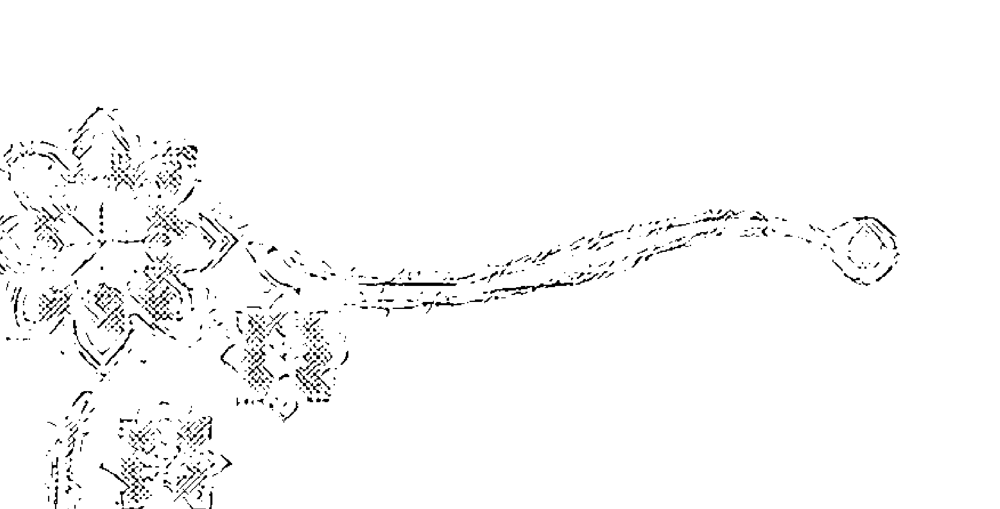

水晶知识面面观

## 何谓“日光石”

所谓“日光石”，乃是属于长石类宝石。折射率为1.537~1.543，密度为2.65g/cm³，属非均质体，二轴晶，双折射率为0.007~0.010。其颜色为黄、棕黄或棕色，其中含有红色或金色的板状包裹体，具金属质感，常见火红的晕彩，故人们称之“日光石”。

## 何谓“绿碧柳”

宝石的商品名称层出不穷，不知是什么时候，又出来了一个“绿碧柳”的名称，什么“绿碧柳”项链、“绿碧柳”手链等，“绿碧柳”究竟是什么东西呢？经检测，它是一种含绿色发状物的玉髓及石英。绿色发状物为绿色电气石组成，看起来整个宝石颗粒为一种绿色色调，由于宝石级的绿色电气石，称为绿碧玺，因此百姓就把这种含绿色发状电气石的玉髓、石英称“绿碧柳”。

## 何谓“樱桃石”

所谓“樱桃石”，顾名思义是一种似樱桃红色的石头。由于美观价廉因而得到了人们的青睐。“樱桃石”究竟是什么石头呢？经检测密度为2.65~2.71g/cm³，折射率为1.54~1.55，它是一种石英质宝石。放大检查及偏光检查，它是由一种非均质的粒状石英颗粒组成，由于在这种石英集合体中，含有多量红色的赤铁矿、针铁矿颗粒，经加工成饰品后，成为一种樱桃红颜色饰品，故称之为“樱桃石”。

# 后记

随着人们生活水平的提高，珠宝饰品已进入普通百姓家，水晶工艺品由于玲珑剔透，价廉物美，倍受人们青睐。然而在现实生活中，人们对水晶方面的基础知识知之甚少，不科学的说法和解读到处可见。笔者从事水晶饰品鉴定工作多年，在众多水晶业者及水晶爱好者要求下，花了近5年的时间编写了本书，并取名为《水晶知识面面观》，以飨读者。

在此要特别感谢东海县供销合作总社主任桑敬华同志、副主任周振岭同志、东海质量技术监督局局长宋志飙同志的大力支持与帮助，成文后沈炳炜、成海涛等同志对全书文字进行了修改，全文打字录入由相海英同志完成，在此一并致以谢意。

水晶知识面面观

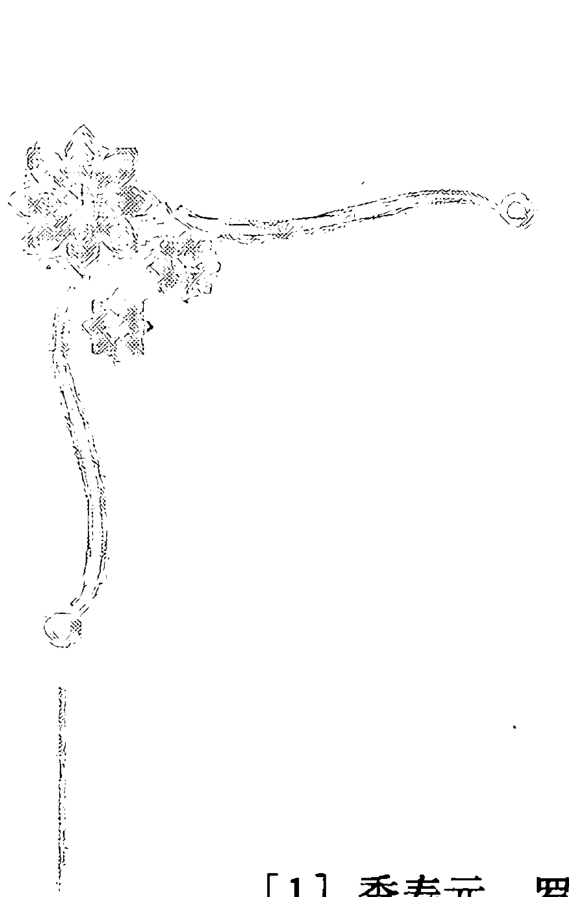

# 主要参考书目

- [1] 季寿元，罗谷风．结晶学．北京：人民教育出版社，1962.
- [2] 汪正然，陈武．矿物学．上海：上海科技出版社，1964.
- [3] 何金明等．宝玉石加工改色工艺与检测．新疆：新疆人民出版社，1996.
- [4] 利迪科特（美）．宝石鉴定手册．北京：地质出版社，1988.
- [5] 沈才卿，吴国忠．人造宝石学．内部材料，1994.
- [6] 近山晶（日）．宝石手册．北京：地质出版社，1992.
- [7] 王德滋．光性矿物学．上海：上海科学技术出版社，1965.
- [8] 水晶选矿编写小组．水晶选矿．内部资料．
- [9] 彭光菊译．珠宝科技．“海尔达”六边形和“贝蒂”箱式琢型，1993年第3期．
- [10] 仲维卓．人工水晶．北京：科学出版社，1984.
- [11] 克利斯·马顿（英）．水晶骨头之谜．北京：光明日报出版社，1998.
- [12] 王志坚．灵异宝石水晶．香港：天马图书有限公司，2003．

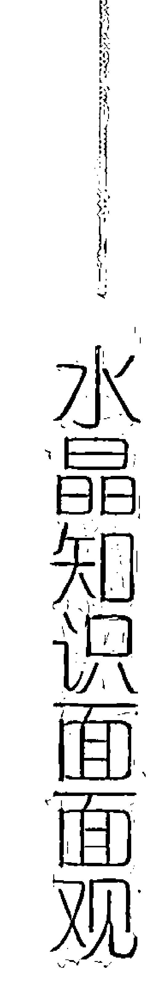