# 水晶：天穹的繁星

张立宇 著

全面剖析水晶分类及选购辨伪
真切感受水晶文化的博大与神秘

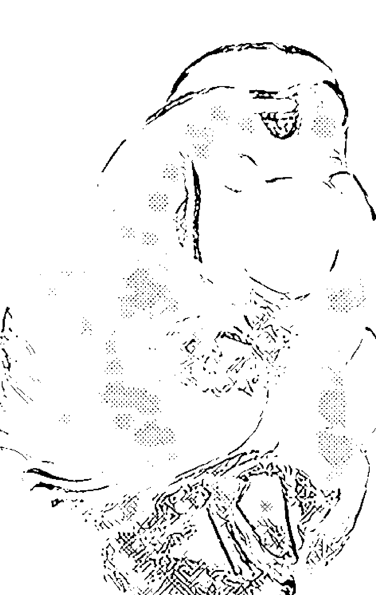

仰望天穹的繁星，水晶般的光辉轻洒在大地；拾起在我们身边闪亮的点点星光，走入神秘的水晶世界。

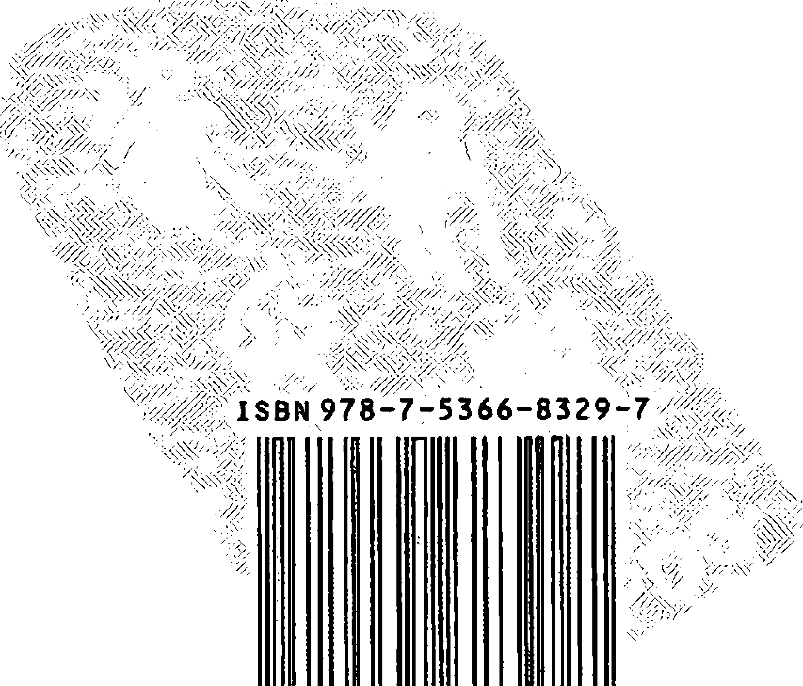

《大雅鉴藏系列》详实、精确地展现了现代艺术品收藏的迷人世界。每册均以多幅清晰的彩色图片和专业、简洁、内容丰富的文字为普通读者打开了一扇通往艺术品文化的大门。

本书介绍了水晶的起源、分类、鉴赏、选购、辨伪等知识及相关的水晶文化，同时配以270余幅精美图片，不仅是一本知识文化性读物，更是艺术品鉴赏的实用书籍，定能使您获益不少。

张立宇，山东青岛人，自小热爱自然科学，玩赏晶石已有多年，收藏天然极品水晶颇多，赏识水晶中的独特内包裹物。阅览众多国内外关于宝石、水晶等矿物晶体的专业书籍，专注于水晶的探研与收藏，常年与五湖四海的资深水晶爱好者保持着密切地交流与互赏。现从事于商业水晶行业。

# 序 古老神秘之石

五彩缤纷、晶莹剔透的水晶，它那莹澈的光泽，奇特的色彩，千姿的形态，历来为世人所珍视、所喜好。我深深地迷恋其中，玩赏晶石已有6年之久。俗话说：“玩物丧志”，而在我却觉得是“玩物长智”。它的晶莹剔透、多姿多彩让我一见倾心！个性的形态和幻化的颜色，没有一点污迹！哪怕其中有绵或裂，也是历史的痕迹，是地球变化的见证！

水晶，旷世奇石，浑然天成，它蕴藏着天地间的灵秀之气，也流泻着宇宙中的雄奇之韵。人类从诞生之日起就与晶石结下不解之缘，这可追溯到80万年以前的旧石器时代，当时石头只是原始工具。人们真正注意到它的美是在50多万年开始的新石器时代。在古中国、古希腊、古埃及，一些颜色鲜艳的透明或不透明矿石，如绿松石、孔雀石、水晶、玛瑙、软玉等已不再是完全用来造石器，更多的则用于欣赏和珍藏。在有文字记载的中国战国时期（前475～前221），集体创作的一部《山海经》里就提到80多种矿物晶体，有些名称沿用至今。

为了让更多喜欢水晶或不知水晶的朋友了解水晶，认识水晶文化，学会欣赏水晶的美，本书介绍了水晶从古至今的发展变化、科学论述、古老传说、国内外水晶的科学应用，乃至今日水晶市场的商业演变过程等，希望能为读者打开一扇通往水晶之都的大门。

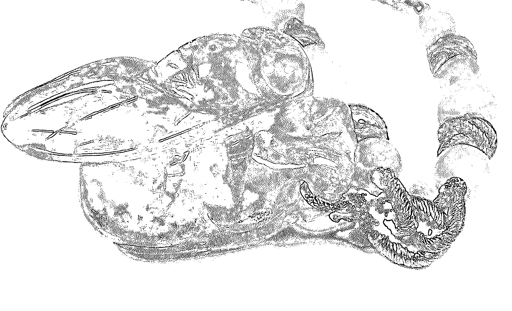

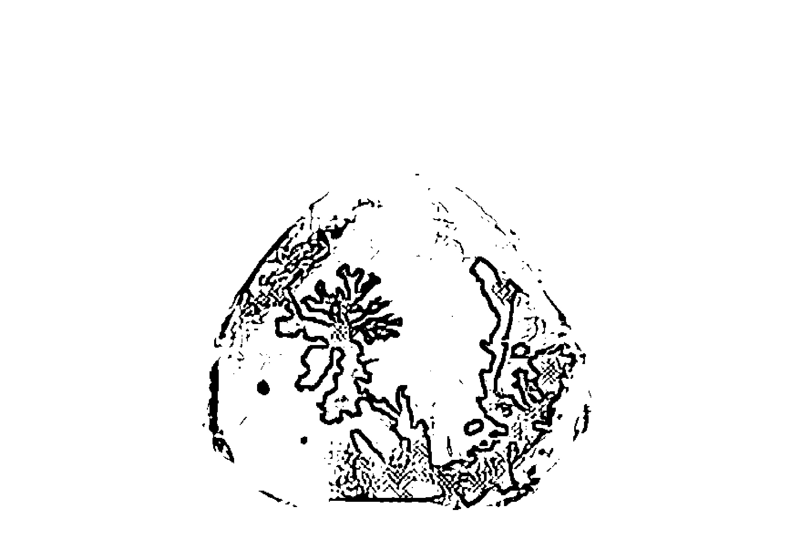

如晨间凝结在叶端的露珠，
流淌着清新脱俗的美；
又像刚苏醒的精灵，轻盈地踏上时尚的舞台。
晶莹剔透的水晶，宛若撒落在历史长河中的花瓣，
流光溢彩，美不胜收，令每个拥有者陶醉于悠远的遐想中。
智者总爱倾听来自现实的呼唤：
拥有水晶的精深知识，比拥有精品水晶更为可贵。

## 第一章 璀璨晶源

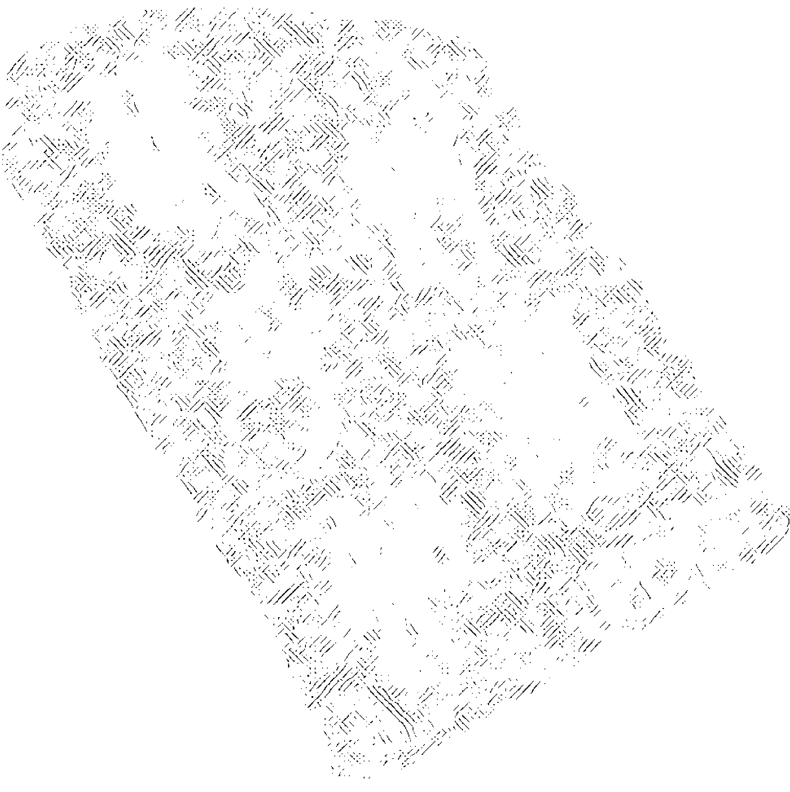

### 第一节 水晶与宝石

宝石矿物是具有宝石价值的天然矿物的总称。决定宝石价值的主要因素是宝石本身艳丽的色彩、透明程度、光泽等，而是否呈现变彩变色、星光猫眼等光学效应，产出是否稀少，硬度是否在摩氏硬度6以上，化学性质是否稳定等是其中的几个基本条件。自然界的宝石矿物多是自然元素、氧化物或含氧盐类矿物的聚合物。目前自然界已发现的矿物超过3000种，然而具有宝石价值者尚不及10%。宝石中硅酸盐矿物就占了近半数。

水晶有幸成为宝石王国中的一员，实在是件不容易的事情。按照地质学分类，地球上的多种矿物中，只有200多种矿物可作为宝石。在这200余种宝石中，我们日常所接触到的仅有20多种。

严格按照地质学家划分的标准，要成为公认的宝石级矿石必须具备以下三大条件：

1.  美观性。宝石必须是色彩美丽、晶莹透明、光辉灿烂的单晶体结构或是质地细腻温润的矿物集合体、共生体。

水晶天生丽质、色彩绚丽，从无色透明到紫、黄、茶、烟、墨、绿以及红、粉红、彩虹色都无所不包，无疑成为宝石中色彩丰富的佼佼者。同其他透明宝石一样，某些水晶中也有着独特的内包裹物。由于水晶本身纯净度高，各种内包裹物显得更加清晰。

2.  耐久性。天然宝石不仅要色彩艳丽，还应具备永葆艳姿美态、坚硬耐磨、化学成分稳定性高的特性。多数宝石都抗酸碱、抗腐蚀、耐高温、抗高压，而水晶在这方面更是出类拔萃，几乎能达到永恒。经考古发现，在古墓中经过几百年、几千年，既不褪色，又不腐烂变质的物品，只有晶石之类的宝石物品。

3.  稀少性。天然宝石很大程度上都是因“物以稀为贵”决定了它的价值含量。水晶虽不如世界公认的五大珍宝——钻石、红宝石、祖母绿、蓝宝石、金绿宝石那样名贵，但也属于稀少之物，因此水晶也经常被称为“普通宝石”或“半宝石”。在清朝以前，水晶在中国属于珍奇罕见难求的宝物。只是因为通关后外来水晶的大量进入，才使它逐渐失了身价。

月光石手链

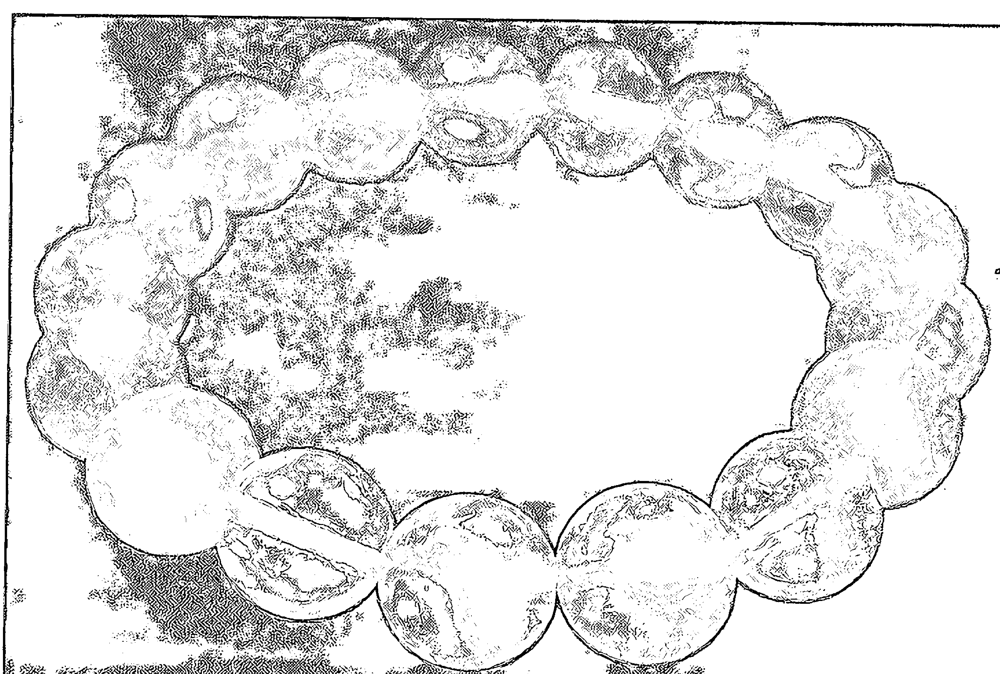

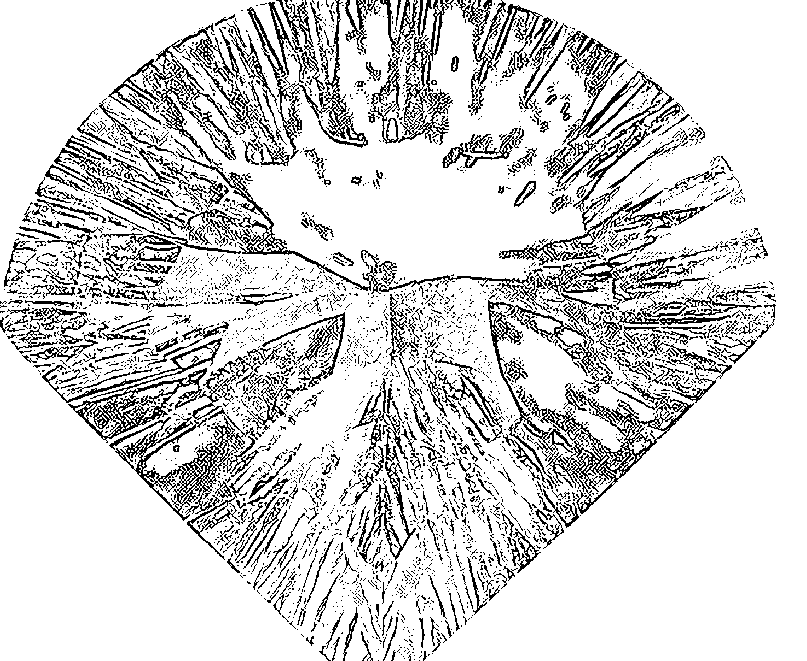

## 紫水晶

紫水晶原来是世界公认的名贵宝石，后来在巴西、乌拉圭、赞比亚发现了大型紫晶矿藏，从此紫晶价格一落千丈。尽管如此，如今它仍得到大众的青睐，被称之为“生命之石”。

水晶还是一种通用性宝石。不同年纪、不同职业的人都会喜欢上它绚丽的色泽和神奇的内包裹物体。而不同类型水晶所制成的成品装饰几乎可以与任何发型、体形和肤色的人群搭配。再者，水晶的价格也较之其他宝石便宜，即使一般收入水平的人，都能成为水晶的拥有者。作为最普及的宝石，水晶的确有着其他宝石所难以比拟的优势和地位。

狭义地讲，水晶专指石英家族中的白水晶，但人们通常将各种颜色的宝石都划分在水晶分类中。浙江大学

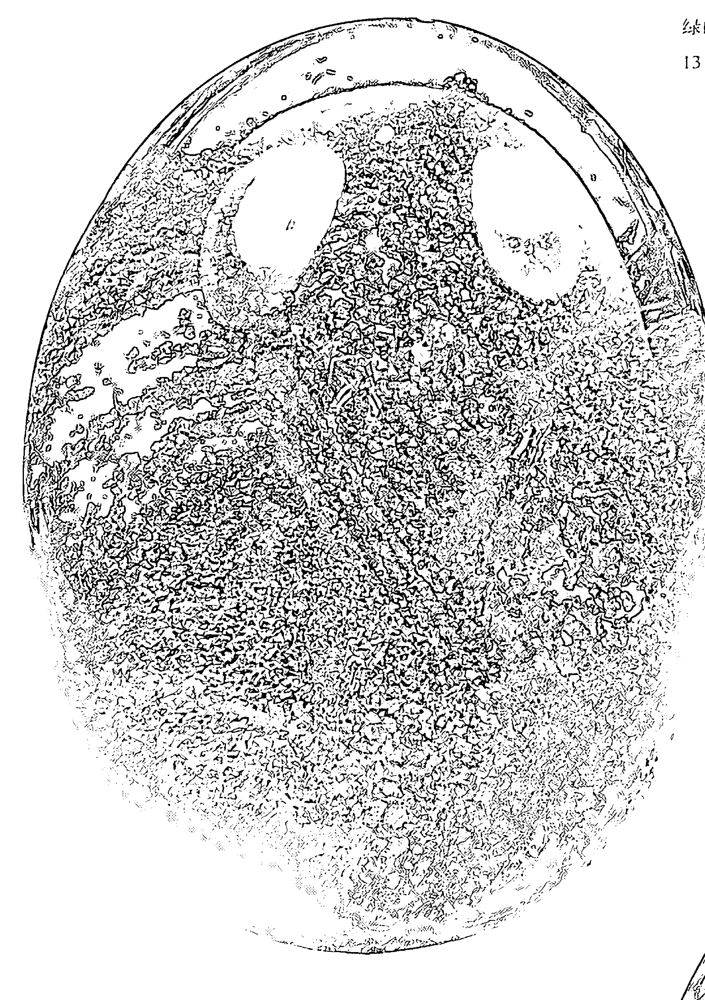

绿幽灵全包裹体聚宝盆金字塔，13克。

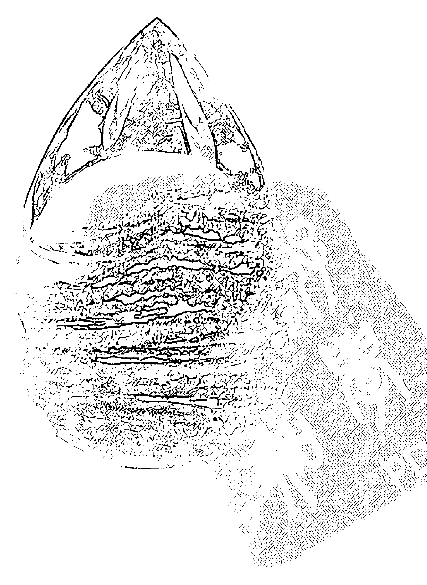

绿幽灵全包裹体金字塔

地球科学系教授柳志青（《宝石学和玉石学》的主要作者，1999），指出如水晶、刚玉、碧玺、紫鸦乌、猫眼、萤石等多种现代宝石，按照人们习惯划分，都被列为广义的水晶。本书中所谈及的水晶为广义上的水晶分类。

## 宝石分类表

| 分类属性 | 种类 |
| :--- | :--- |
| 氧化物 | 蛋白石、石英、水晶（狭义）、玉髓、玛瑙、尖晶石、金红石、红宝石、蓝宝石、金绿宝石（变石）等 |
| 氟化物 | 萤石等 |
| 硫酸盐 | 石膏、重晶石等 |
| 硅酸盐 | 石榴石、白云母、长石、电气石、绿帘石、橄榄石、黄玉、祖母绿、绿柱石、蔷薇辉石、锂云母、锆石、葡萄石、海蓝宝石、翡翠和软玉等 |
| 碳酸盐 | 白云石、菱锰矿、菱锌矿、文石、方解石、孔雀石、菱铁矿等 |
| 金属矿物 | 闪锌矿、绿铜矿、赤铜矿、磁铁矿、板钛矿、方铅矿、黄铁矿、钼铅矿等 |
| 单晶炭 | 金刚石、钻石等 |

上表中除红宝石、蓝宝石、锆石、钻石、金刚石、翡翠软玉和各种金属类、碳酸类矿物外，都被我们纳入了广义水晶的讨论范围。

## 各国国石一览

世界上已经有40多个国家拥有了自己的“国石”，国石就像国花、国树一样，象征着本国的民族精神。严格地说，“国石”大多数都是珍贵的矿物、世间罕见的宝石，也正因为此，才有资格成为“国石”。世界各国的国石寄托着这些国家各自的文化诉求与表达。

- 蓝宝石——希腊、美国
- 祖母绿——哥伦比亚、秘鲁、西班牙
- 绿松石——土耳其
- 青金石——阿富汗、玻利维亚、智利
- 黑曜石——墨西哥
- 白宝石——奥地利
- 珍珠——法国、印度、菲律宾以及阿拉伯国家
- 橄榄石——埃及
- 水晶——瑞士、日本、乌拉圭
- 玉石——新西兰
- 红宝石——缅甸

托帕石、粉晶、黄水晶、紫水晶、柠檬石

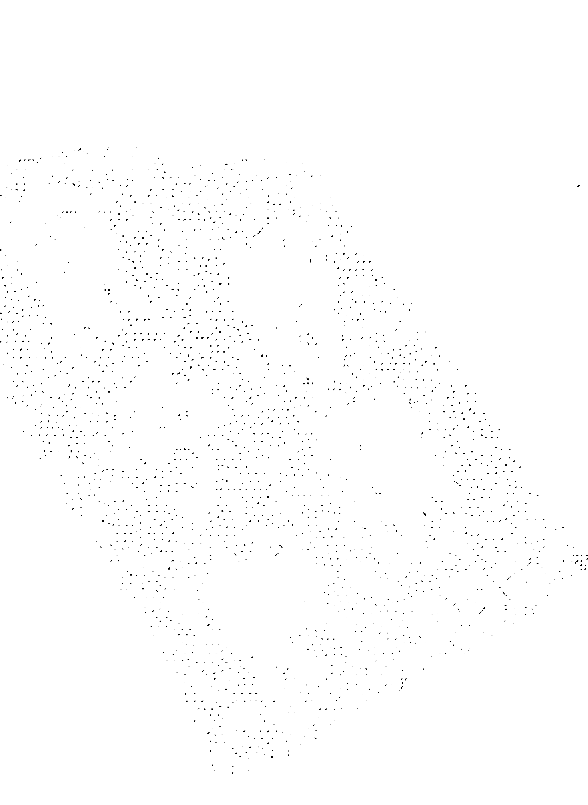

- 钻石——英国、南非、荷兰
- 琥珀——德国、罗马尼亚
- 珊瑚——意大利、南斯拉夫、摩洛哥、阿尔及利亚
- 孔雀石——马达加斯加
- 金绿宝石（猫眼石）——葡萄牙、斯里兰卡
- 欧泊——澳大利亚、匈牙利、奥地利、捷克

### 第二节 水晶的起源、分类与产地

#### 一、水晶的发现与形成

在茹毛饮血的年代，一位先民在岩洞的石壁上，无意中发现了一层晶莹的石头。这些石头在熊熊烈火映照下，闪烁着璀璨的光彩。他敲下了这种石头，并小心地打磨成石斧、刮刀、箭头乃至颈饰。40万年后，这位先民在周口店被人们发现，他身边依然保留着这种晶莹的石头做成的器具。这种石头，后来就称之为水晶。根据文化人类学研究表明：人类的文化艺术是从制造工具开始的。当人猿相揖别，人把第一块石头敲打成为一种或用于投掷、或用于刮研、或用于砍削的有用器物时，“工具”就诞生了。这种石头虽然外形上与自然界崩裂的石块无大的区别，却是人为的力量的结果，已根本改变了石头这个自然物的原有属性，披上了文化的外衣，成为人类最早的文化标志。而在这个过程中，人们也有意或无意地逐渐发现了各种闪亮着各种斑斓色彩的宝石——水晶。

童年我们常听大人们讲海龙王住在水晶宫里的故事，而电视里播出的科幻片中水晶球也经常显示出神奇的魔力。

神话传说中四海龙王居住的水晶宫，是古人以为水晶看起来剔透玲珑、晶莹如冰，便猜想水晶是由水中的千年之冰变化而成。其实世界上并没有海龙王，水晶也不可能是万能的魔球。地球上确实有水晶洞，但在普通人心中，水晶总是盖着一层神秘面纱。让我们以狭义水晶——白水晶的形成为例，探求一下水晶形成的奥秘。

几千万年以前，由于火山爆发，地球内部的岩浆从地心向地表面活动，大部分岩浆流出地面后成为黑色的火山石。而另一部分岩浆在地质的作用下形成了各种宝石。一些含有二氧化硅的岩浆在地下向四方伸展，大部分在泥土和岩石的压迫下冷却凝固，变成了我们今天所见的石英石；一些熔岩未能来得及结晶，迅速冷却形成了黑曜石；一部分含有二氧化硅凝胶和碳酸氢钙混合物的岩浆冷却凝固后，由于被地下水溶解并由岩洞中一滴滴渗出，日积月累逐渐形成石笋、钟乳石或其变种蛋白石；少部分二氧化硅岩浆的胶体沿着泥土空洞一层一层地沉淀固结，凝聚成了玛瑙；还有极少部分二氧化硅岩浆在泥土和岩石的空穴中与空气接触，慢慢地在空穴壁上凝结成一支支的晶体，就形成了今天的水晶，而空穴就变成了所谓“水晶洞”。这些“水晶洞”在外面看就如同普通石头，但切割开后就会发现里面洞穴的壁上凝结着一支支如手指大小、六角柱形的水晶（当然，有的水晶可以长达几尺。中国地质博物馆就收藏着一块重达3500千克的水晶王）。

狭义水晶从成分上讲实际上是一种石英石的结晶体。二氧化硅结晶完美时是狭义的水晶，二氧化硅胶化脱水后是玛瑙，二氧化硅含水的胶体凝固后就形成蛋白石，二氧化硅晶粒小于几微米时形成玉髓、燧石、次生石英岩。

与一般石英相比，水晶形成条件更苛刻，首先要有充裕的生长空间；其次要有提供物质的热液，即富含二氧化硅的热液；第三要有较高的温度、压力；第四须有生长时间。具备这4个条件才可生成水晶。自然界中，发育的节理裂隙及断层是水晶生长的良好空间。多数水晶都以脉状产出，分布于花岗岩、正长岩及其外围的石英岩、石英长石砂岩、千枚岩及片岩等岩石中，并受构造裂隙控制，以充填方式形成。如果岩石发育或变质作用强烈，就可提供充足的热液。而这种热液本身就具备较好的温度与压力为水晶的形成提供了良好的条件。最后所需的生长时间更易获得。上亿年的地球并不乏具备这些条件，这也使水晶矿目前遍布在世界各地。在中国，东海的水晶形成于燕山期，距今约有2～3亿年；海南羊角岭水晶形成较晚，距今有7000万年。

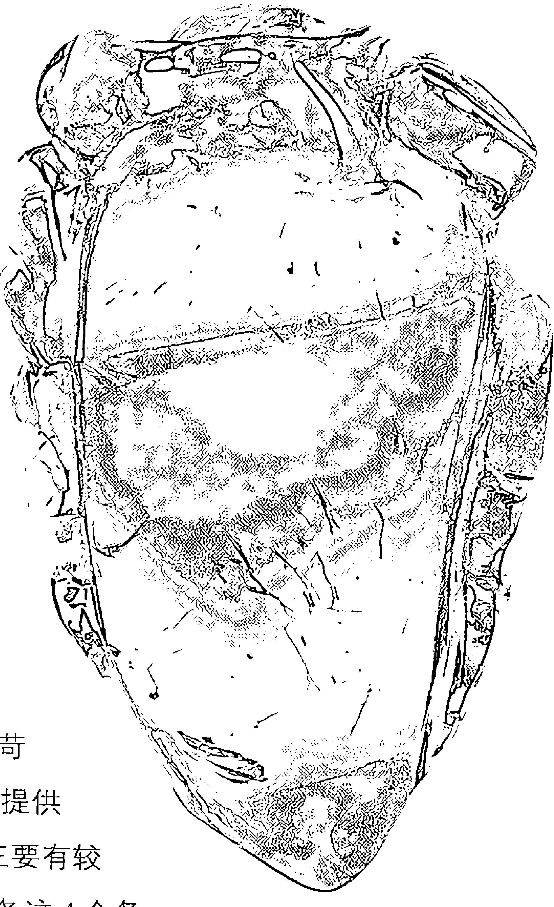

紫水晶色带雕刻件

天然水晶石完全是大自然的产物，它生成于地下，形成过程需要上亿年的时间。水晶生长在地壳深处，在形成过程中凝结了巨大的热量和力量，然后由“种子”水晶将其释放出来。这种“种子”是由一个单一的硅原子在高温高压的作用下，与两个在高温状态下的水分子或周围的蒸汽中释放出来的氧原子组合而成。原子组合以后就形成了带有单一水晶结构的二氧化硅，所有的石英水晶都是由这种物质组成的，其副产品为氢。

一个包裹石英结晶体

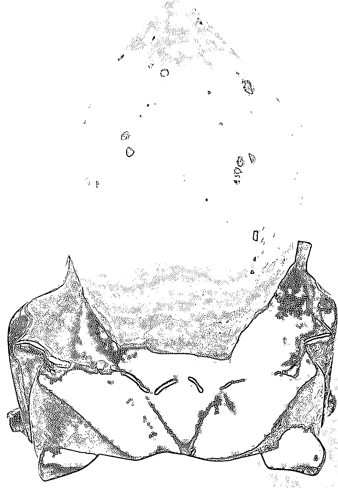

在上千年的漫长岁月中，如果条件允许，周围的流体中有适量的硅和水，或是含有长期处于高温高压下的蒸汽，这些单一“种子”就会开始生长。当原生的流体慢慢地渗入到二氧化硅的第一个分子上时，这个分子就开始衍生出另外一个和自己一模一样的个体。

在复杂的水晶结构中一次只能形成一个分子，所以水晶体内的每个结构形态都是重复相同的，每个部分自身都是一颗小水晶，每个水晶分子都像前一个分子一样有着相同的形态。这样水晶就搭起一个复杂的极有规律的三维结构架——“水晶架”因此而得名。日积月累，渐渐地一块纯净透明的天然石英水晶就在不停自我复制中形成了。所以它的天然状态呈多棱形，通常是六棱形，且呈逐渐变细的形态。

二氧化硅一般分为两种——低温石英及高温石英。水晶的生长温度约在550～600℃间，在550～573℃之间生成的属于低温石英，常见的水晶即属此类，其水晶簇柱是六角柱体（六方晶系）；573～600℃之间生成的属于高温石英，玛瑙就是常见的高温石英。

石英最常见的结晶类型是六角不对称尖柱状的低温石英，这是在地表温度范围所形成的石英。而在地下离岩浆比较近高温石英形状则为对称的六角尖柱状。

水晶有多种颜色，如紫水晶、红水晶、白水晶、茶水晶、烟水晶、黑水晶和无色水晶等。

并不是每块水晶都是完美的，在生长过程中它有可能受到周围铁、铝等大量物质的影响，结果就出现了色泽上的变化。铝会使水晶变成烟灰色，这样的水晶被称为“烟水晶”；铁会使水晶变成暗粉色，这样的水晶被称为“玫瑰水晶”。除此之外高强度的辐射也会影响水晶的生长和色泽。只在没有射线和其他追踪元素的地方，才有可能长出百分之百纯净透明的水晶。

一些水晶无色得像水一样洁净透明，而另一些是颜色绚丽的有色水晶。各色水晶的颜色差别是由它们形成时，二氧化硅的温度和周围的环境所决定的。常见的无色白水晶形成温度约为200—350℃，属中温热液形成；而紫水晶形成温度为160—180℃，温度较低。黄晶和烟晶的形成则与岩浆中酸性岩浆期后的热液活动有关。

由于受热温度的差别和混生矿物的不均匀分布，在同一块晶体上经常也存在着多种色彩。如五颜六色的包体水晶、紫色和白色混生的一块晶体、各种色彩的发丝水晶等。这些水晶在阳光的照射下，通常金光四射、闪闪耀眼，呈现“精光射大地，宝气吐彩霞”的壮观景象。

各种水晶含有的不同微量金属，使各种水晶拥有其独特的颜色。水晶中可能含有砂状、碎片状针铁矿、赤铁矿、金红石、磁铁矿、石榴石、绿泥石等多种包裹体，发晶中则含有肉眼可见的似头发状的针状矿物的包裹体形成。含锰和铁者称紫水晶，含铁者（呈金黄色或柠檬色）称黄水晶，含锰和钛呈玫瑰色者称蔷薇水晶。烟色者称烟水晶，褐色者称茶晶，黑色透明者称为墨晶，呈浅绿色者称为石髓。

因地壳是在不断运动的，不是所有的形成条件都恒等不变，地动山摇、温度的改变、热液的缺失都会影响水晶的生成，至少会影响水晶的品质和大小。我们眼前的一块块绚丽多彩的水晶，实在是汇聚了天地之精华。其实所有能成为宝石的矿物晶体，又何尝不是如此，这也是自古以来人们喜爱宝石的原因之一。

##### 包裹体水晶的形成

> 古罗马哲学家普林尼说：“在宝石微小的空间，它包含了整个的大自然，仅一颗宝石，就可以表现天地万物之优美。”

由于含有包裹体，使水晶矿物内部形成一个奇妙的世界，其包裹物可以组成各种形象，成为千姿百态的风景石，形成一幅幅美丽的图画，成为人们爱不释手的观赏石，因此人们称誉水晶为“宝石级的观赏石”，称赞它是宝石中最为剔透的珍宝。

水晶中包裹体水晶观赏石以其内含的包裹体为被观赏的内容，包裹体按其形成的先后可分为以下几种：

一种是在水晶结晶的地方先存在或先形成了一些物质，水晶结晶的时候把这些物质包裹在里面，这类包裹体俗称“全包裹体”。这类包裹体所形成的各种景象，大多保持了水晶结晶时的原状，也就是说保存了几亿年的原状，极少受到自然环境的影响，因为大自然改变的大多是水晶石的表面。

包裹体象形水晶——大地

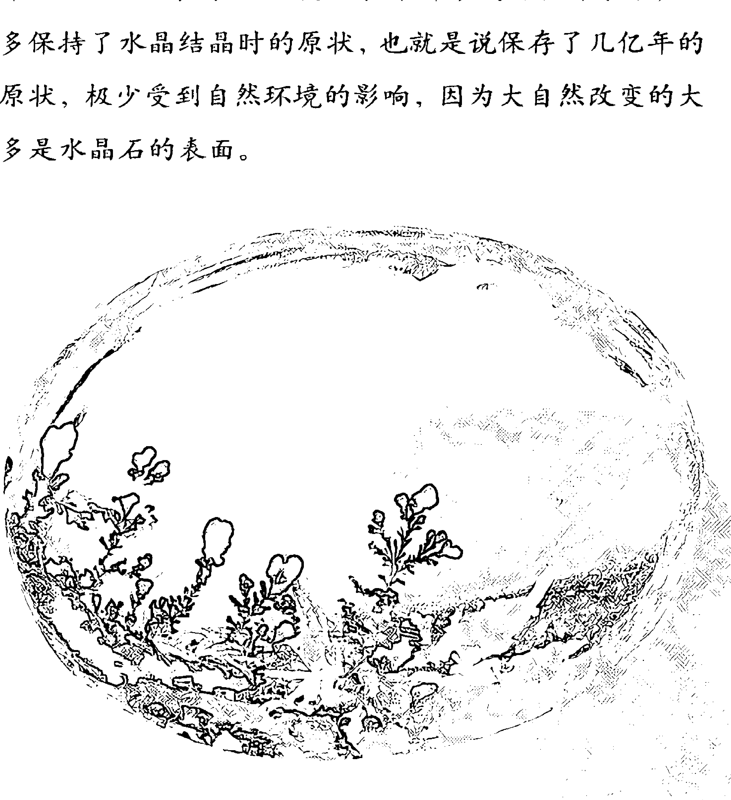

另一种是在水晶结晶以后，由于晶体受到地球引力的影响而产生裂隙，晶体外的一些物质通过水晶的裂隙渗透到水晶内部，形成了各种景象，这些渗进水晶内的物质俗称“半包裹体”。我们可以看到物质渗进水晶的痕迹，常被称为“通道”。这种包裹体所形成的景象相对地较易受自然环境和时间的影响。

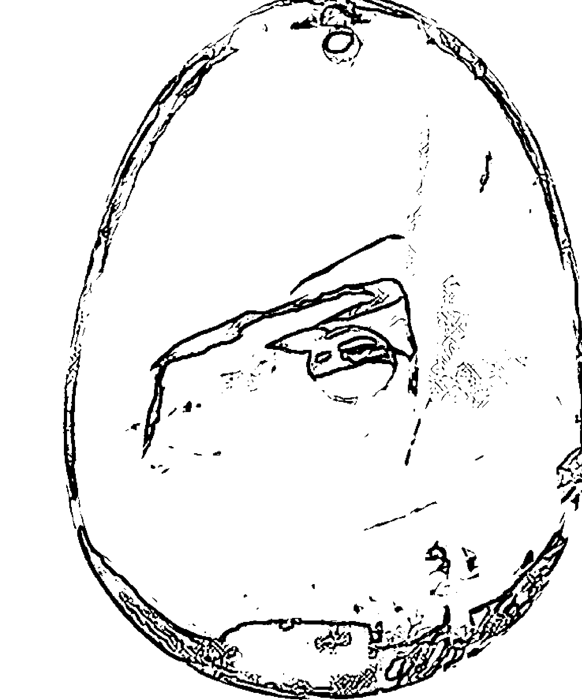

另外还有一类，因某些其他的矿物与水晶体共生，或由于其他物质侵蚀而附着于水晶表面，或者是水晶受自然环境的影响，在水晶体表面出现蚀象，形成了一些景象或图案，这种景象或图案俗称“皮景”。

可以说目前很少有某一石种能与水晶石相媲美的。水晶清澈透明，有足够的硬度，内含物丰富多彩，从气体、液体到各种矿物质，甚至宝石，均可被包含于水晶内，各种包裹体所形成的景象丰富、色彩鲜艳。另外，水晶包裹体所形成的景象大多是立体的，有些甚至是可以运动的（水胆），可透过晶体表面从多角度全方位地进行欣赏；有的水晶还可出现特殊的光学效应。一些好的包裹体水晶石，除了供观赏的内容——由包裹体所形成的景象外，其余部分是通透洁净的。

#### 二、水晶的分类与产地

水晶虽然总类繁多、颜色各异，但通常按照科学性质大致可分3类：Crystalline Varieties（显晶类）；Crypto Crystalline Varieties（隐晶类）；Special Varieties（特别类）。

- （1）Crystalline Varieties（显晶类）：平时我们观赏到由多条六角形水晶柱（六方晶系）生成一簇的水晶簇，便是属于 Crystalline Varieties 显晶类，如白水晶、紫水晶、黄水晶、粉晶、发晶、虎眼石等皆属此类。
- （2）Crypto Crystalline Varieties（隐晶类）：隐晶类水晶外观是一块块的，不是成六角水晶簇状，但它们却也是属六方晶系的。但我们不能以肉眼观察到它们的六角形结晶，因为结晶的体积极为细小，需以显微镜协助才能看到六角形结晶。此类水晶非常平滑，因为结晶之间有“水化硅石”填补。玛瑙便属于此类。

钢发晶

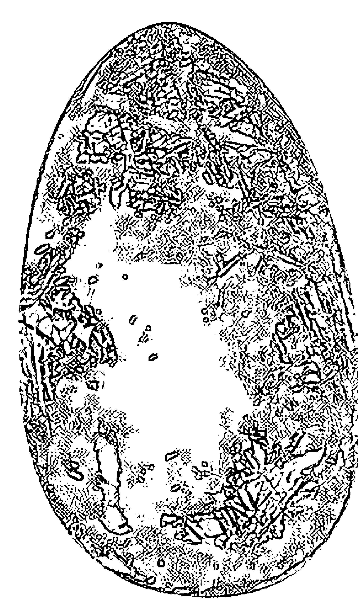
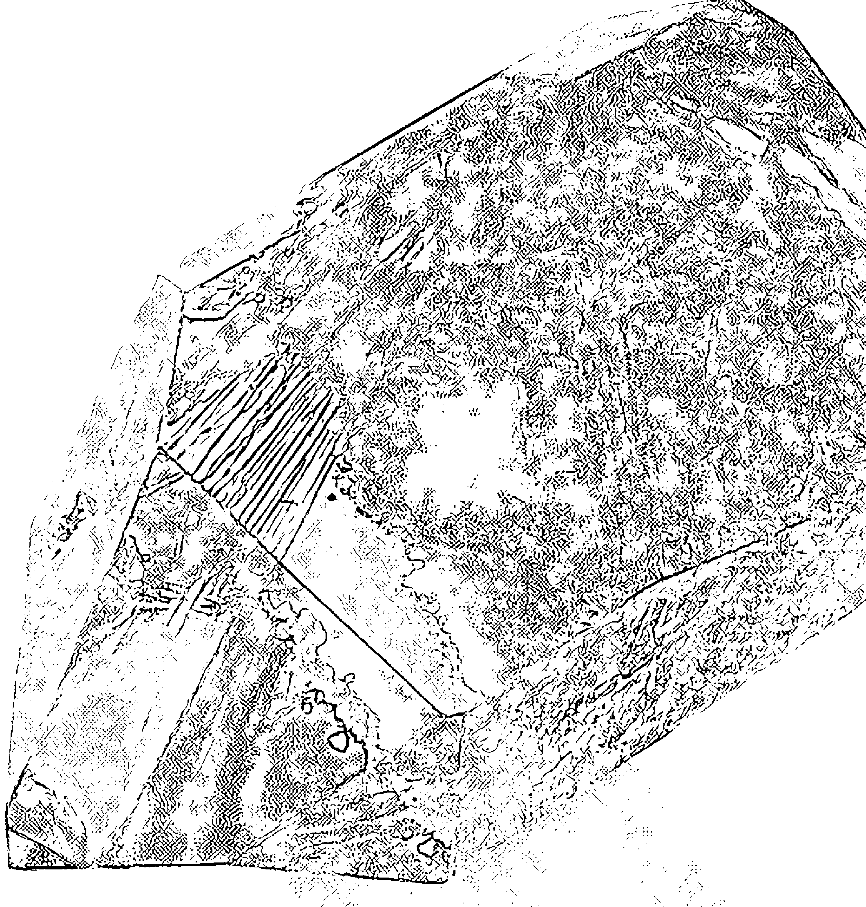
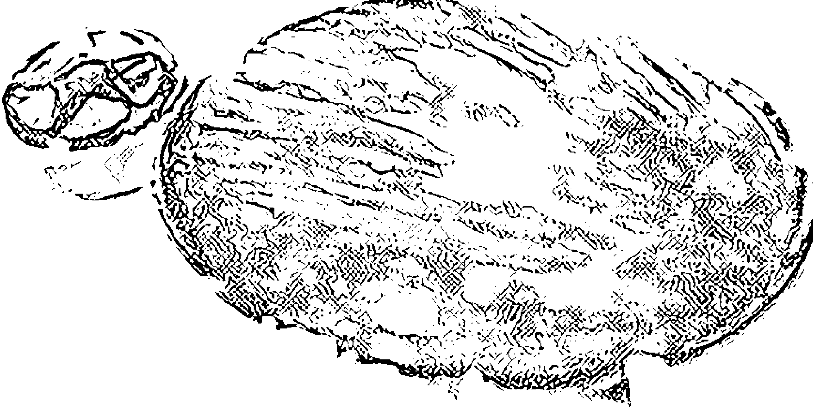

- （3）Special Varieties（特别类）：这类水晶和一般水晶分别很大，难以归为显晶类或隐晶类，所以归纳为特别类，例如结晶古怪嶙峋的 Skeleton Crystal（骨干水晶）、水晶内有山水星像图案的 Phantom Crystal（幻影水晶）等皆归归纳为此类。

按其生产过程，水晶又可分为天然水晶和人造水晶两大类。其中人造水晶我们会在后文详细叙述，先让我们看看天然水晶。天然水晶按照地质学、矿物学的分类，有以下数种：

##### 白水晶（Rock Crystal-Quartz）

白水晶是最具代表性，功能最多，应用最广的宝石，被称为“晶王”。白水晶的本质是无色透明的，但看上去却是白色的。这与其内部结构以及光线在它表面发生散射再重新组合有关。当一束光照射到白水晶的表面时，在组成水晶的微小晶粒集合体的各个方向上产生透射、反射和折射，形成的散射光经重新组合后，与我们的目光相遇，我们就会觉得水晶是白色的。

墨西哥与美国纽约均盛产造型美丽的宝石级白水晶。李白更是为白水晶的魅力所倾倒，留下了“红罗袖里分明见，白玉盆中看却无”的佳句。中国曾发掘出春秋战国时的透明水晶串饰。

##### 紫水晶（Amethyst-Quartz）

紫水晶是水晶家族里面最为高贵美丽的一员，含铁元素是造成其鲜艳紫色的主因。紫晶以色正、透明度高为上品。主要产地为巴西、乌拉圭、赞比亚、澳大利亚、马达加斯加等。

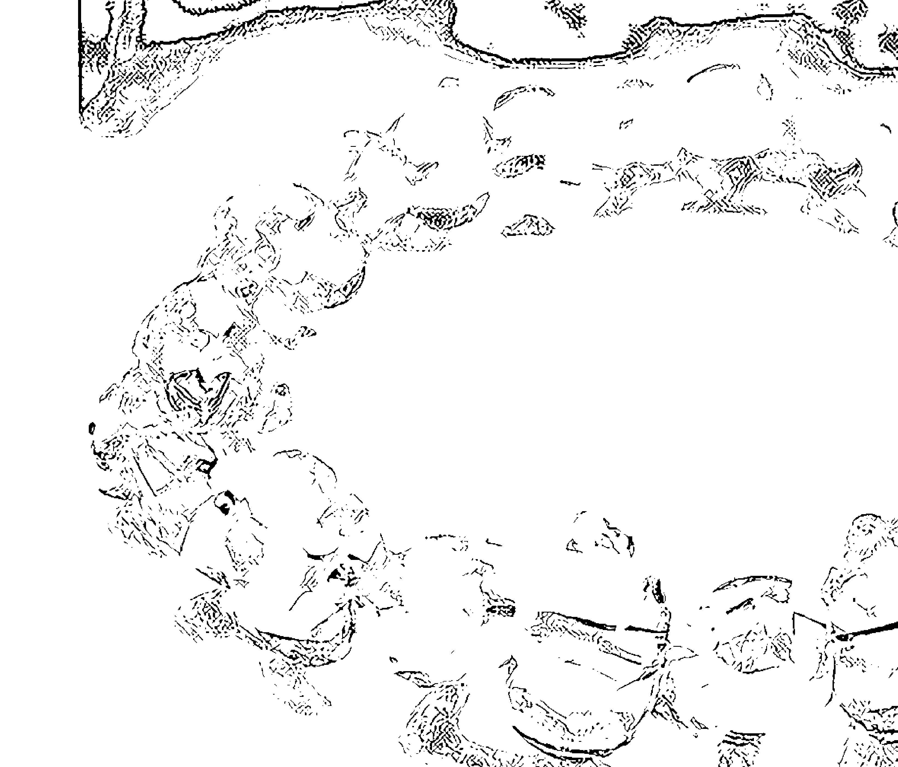
白水晶发财猪手链
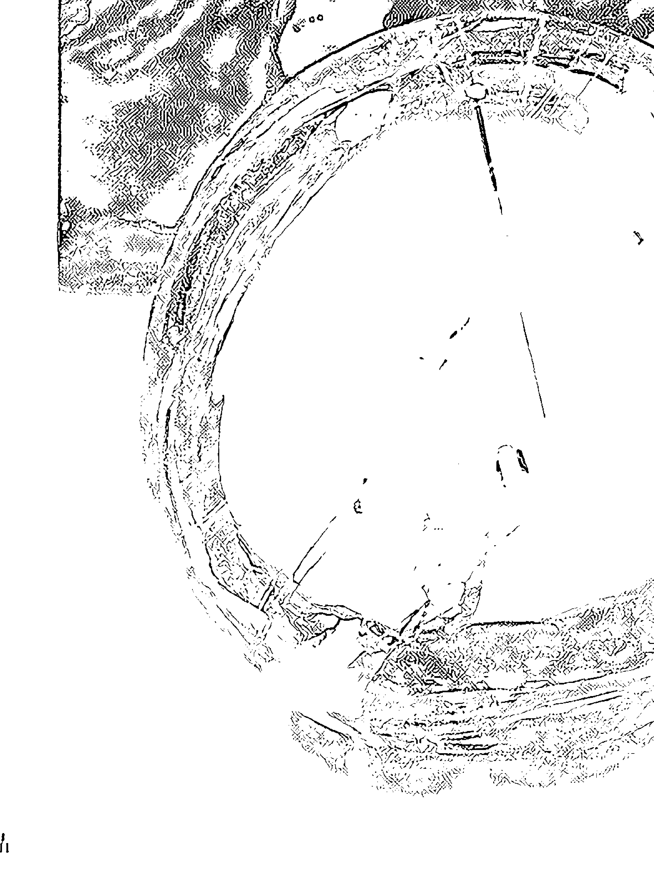
品中品带发品

巴西紫水晶的产量最多，一般来说，颜色都比较浅。其中多半色调不是太浅，就是偏向“茄紫色”，偶尔也会找到色调娇艳的佳品。韩国紫晶颜色很深，主色调有些偏蓝紫色，是一种很娇艳讨喜的颜色；可惜，近年来产量逐渐减少。

最有价值当属乌拉圭紫晶及西伯利亚紫晶，呈深紫色到紫红色。该名称原指产地，但由于已被行业采纳，实际意味着这个称谓代指质量而不限于产地了。乌拉圭紫晶紫色非常深，带着酒红色的“火光”。近年来几乎接近停产，是世界各地高级珠宝店中的必备商品。

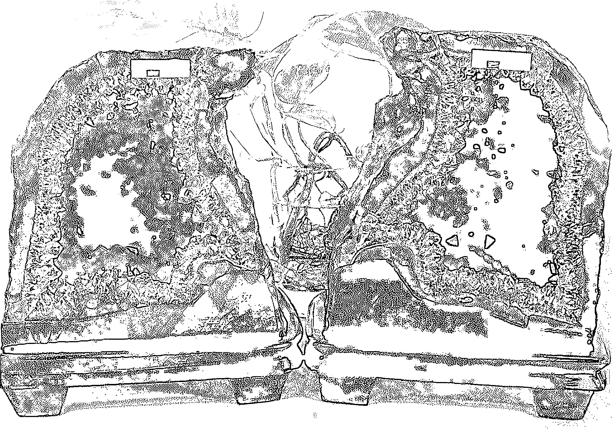

中国紫晶产区主要分布在江苏、云南、新疆等省区，但颜色较淡，且数量较少。在中国的珠宝玉器行，很多老工艺匠都知道五台山的紫晶最好，其特点是块度大、颜色浓、坑子亮。

##### 烟晶（Smoky Quartz）

墨晶、茶晶、黑水晶、烟晶，英文名称统称为 Smoky Quartz。烟水晶是水晶家族中最富有吸引力的成员之一，简称烟晶。它是一类颜色为烟灰色、烟黄、黄褐、褐色的水晶品种，有放射性，以色均、无绵状物、明净者为佳品。

墨晶是深黑色不透明的烟晶，是由烟色过渡到茶色，最后加深变成黑色的一系列水晶。它们都是因为晶体中混有极细微粒、均匀分布的碳元素所致，碳元素含量越高，颜色越深。墨晶又称乌水晶。早在汉代刘向《七略别录》中有言：“墨泽而有光者，名黑石英。”黑石英即墨晶。以前墨晶是用来研砚的好材料，《博物要览》称：“黑晶要如淳漆而明洁，作砚最能发墨，又可作掠眼以其黑色养目。”

烟晶发源地在苏格兰，那里的人们广泛用它来装饰五彩缤纷的民族服装，成为事实上的“国石”。有人认为这种宝石漂亮的色彩是由原生矿床周围岩块中含有放射物质引起的。实际上在瑞士阿尔卑斯山所见到的围岩中，放射性含量随高度变化。这个变化也引起该地区烟晶矿区的颜色或色调有不同的差异。有烟晶矿床的还有美国、瑞士、西班牙等。

烟晶中的茶褐色、烟黄色者称做茶晶，其色犹如烟气在空中飘逸。它的颜色是由放射性物质引起的。烟水晶由于形成时受到地下放射性照射而保留有少量放射性元素，含量极微，不会对人体有害，反而类似放射疗法。根据C.S.赫尔巴等人1979年的研究认为，石英中含有铝代硅时，用钴60照射无色水晶，即能变成茶色水晶。用X射线或热辐射处理烟晶时，能使烟晶变成像黄宝石一样美丽，人们称它为“巴西黄宝石”或“假黄宝石”。

##### 绿水晶

天然绿水晶稀少罕见而不可多得。巴西米纳斯吉拉斯州所产的绿水晶，系紫水晶经热处理变成的绿色品种。目前，中国发现绿水晶产地也有几处，其中以江苏东海县最为丰富，其次在云南和北京西山。1991年江苏东海县发现的两种类型绿水晶矿，一为绿色晶簇，单晶粒径1—1.5厘米，晶体完整，但透明度差；另一种为黄绿色块状，具强油脂，光泽强，块体较大。

> 绿水晶古称青水晶，明人谷应泰所作赏石专著《博物要览》载：“其青者色如月下白光，俏（丽）可爱。”

人工培育的绿水晶硬度为7，浅绿到深绿色，透明，体内均一纯净。此种水晶纯度好，形状好，颜色漂亮，与天然水晶的材质成分相同，在国际标准中没有区别。

另外，纤维状的镁铁辉石（Hedenbergite）若作为水晶的内含物，则常显现出深绿色的色彩。这种水晶产于希腊雅典东南方约100公里的一个叫Seriphos的小岛上的晶洞中，绝大部分呈纺椎型，并且是单晶，晶型良好的结晶可达30厘米。

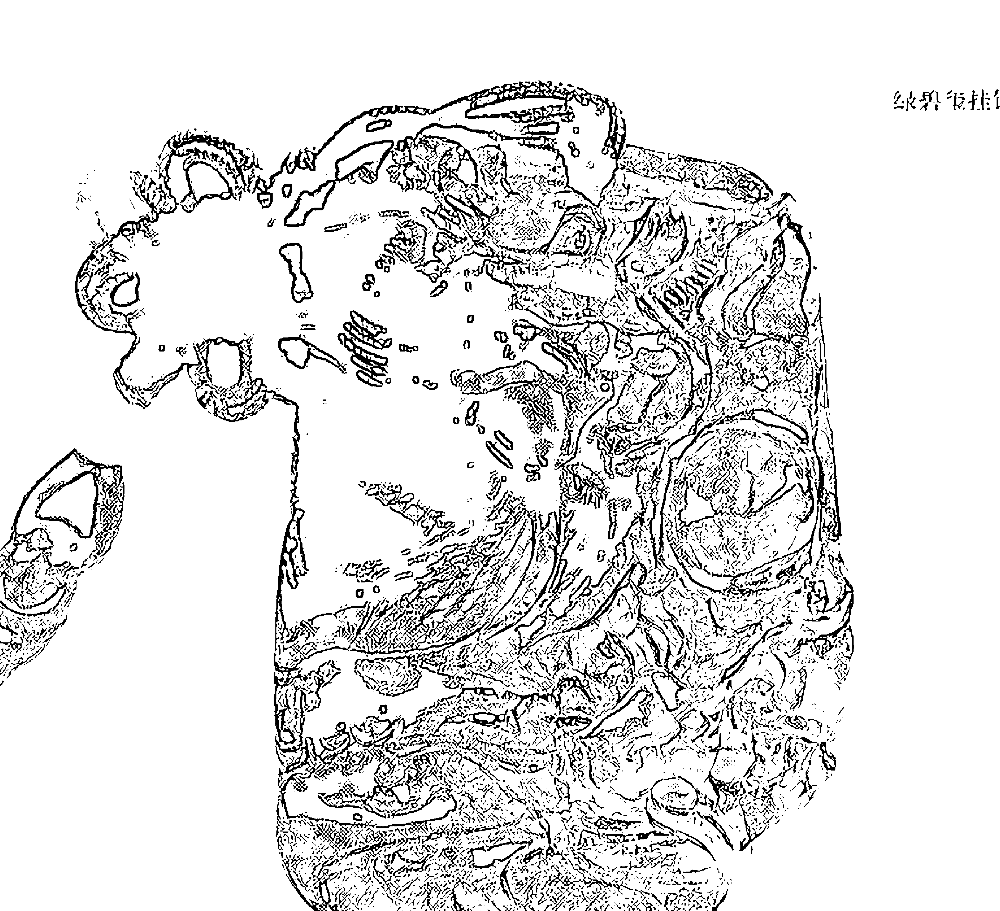

##### 黄水晶（Citrine-Quartz）

黄水晶属六方晶系，硬度为7。法语中黄晶意即“柠檬”，大概意思是说这种晶体色调接近柠檬色。古罗马哲学家普林尼曾用“金色”和“宝石”来赞誉黄晶。

黄晶也是石英的变种，成分中含有微量铁，在宝石界被称为“水晶黄宝石”。其颜色从浅黄、正黄、橙黄到金黄都有，亮度与彩度都十分出色，备受消费者青睐，常被切割成坠饰或戒面。宝石级的黄水晶极为稀有，以橘黄色的为极品。

巴西黄水晶手链
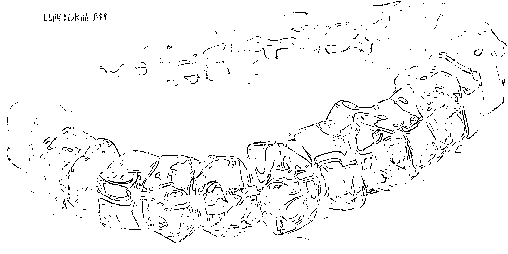
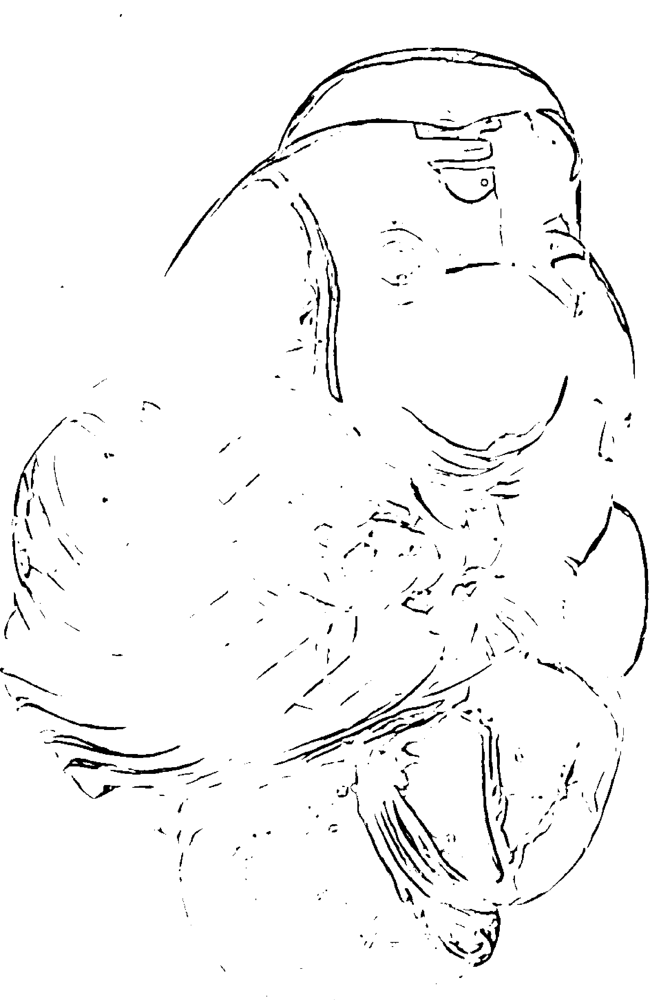
黄水晶吊坠

由于天然黄水晶极为稀少，产地寥寥无几，仅巴西和马达加斯加生产一定数量的优质品，因此价格比较昂贵。所以业界多以紫水晶或烟水晶加热处理（470～570℃）的方式来制成黄水晶。这类品相的黄水晶数量较多，价格也比较便宜，由于其颜色在正常的室温下是永远不变的，所以普遍地被社会大众所接受。

##### 粉晶（Rose Quartz）

粉晶也称蔷薇水晶、玫瑰石英、芙蓉玉、祥南玉、芙蓉石。单晶体较少，通常为致密块状集合体，显浑浊乳状外观，有时可含定向排列的针状金红石包体，因而磨制成弧面宝石可显示星光。代表产地为巴西、南非、马达加斯加。

上图：芙蓉晶手链
下图：冰粉晶项链

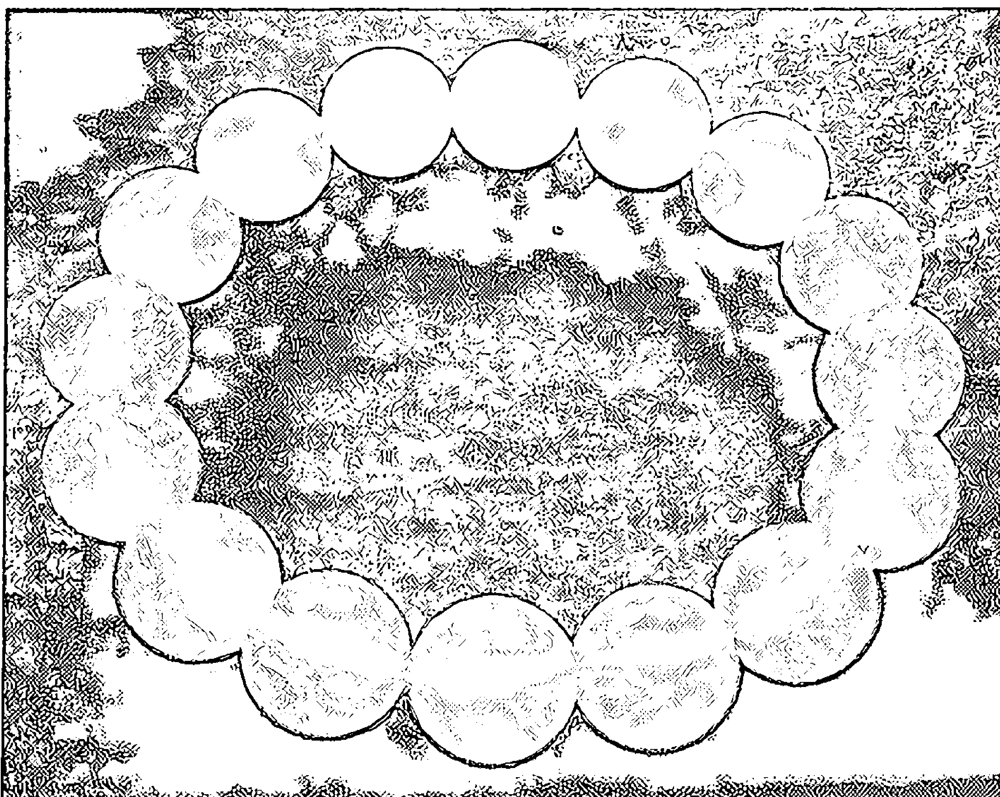
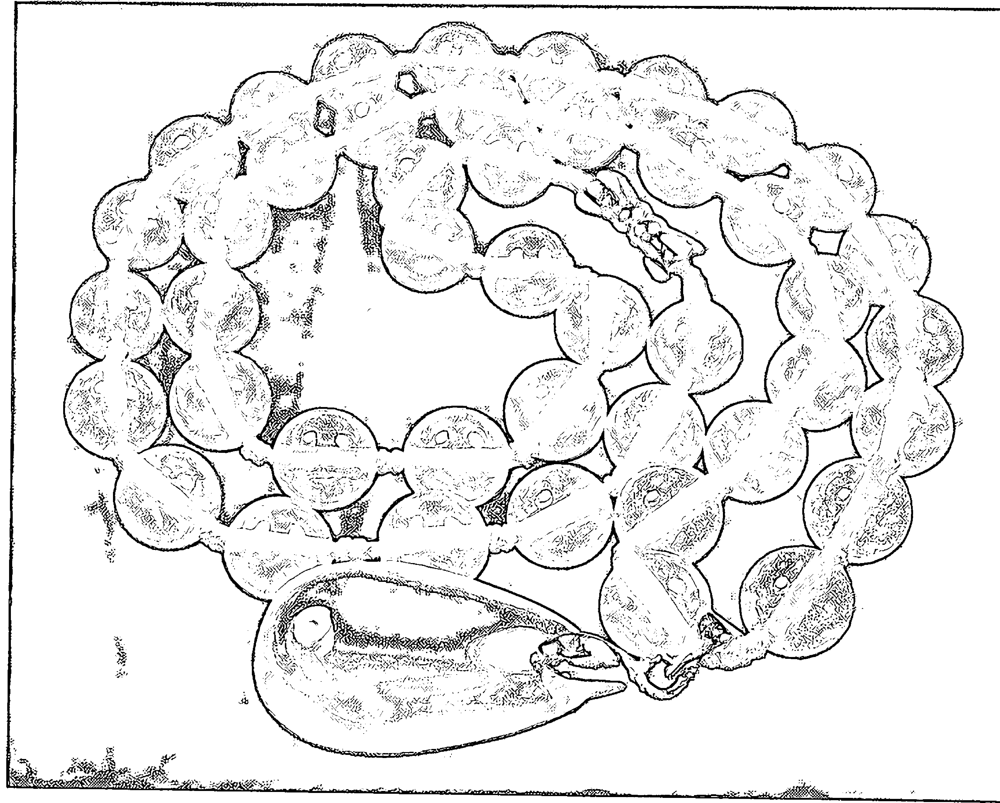

粉晶原矿大多为块状，产于各地伟晶岩中，生长在上层的质地比较好，粉晶簇大部分都是柱身相粘，至晶柱尖端才会分开。目前市面上看到的粉晶柱都是块状原矿再磨成柱状的。

粉晶质地易脆，因内含有微量的钛元素而形成粉红色，如果长时间接受阳光曝晒会失去原有的娇嫩色泽。常见的人工加工方式是染色，透明度由不透到半透至透明的都有，有人将颜色较淡较透的粉晶簇称为红水晶。“红水晶”也是红十字会现在使用的，除红十字和红新月标志之外的另一个运动标志。

##### 双色水晶（紫黄晶）

双色水晶为紫黄二色共生，紫色、黄色分别占据晶块的一部分，两种颜色的交接处有清晰的界限，双色是由于水晶内的双晶所致，紫色和黄色分别发育于双晶单体中不同面。

双色水晶16世纪发现于巴西，20世纪70年代开始广泛出现于宝石市场，有合成品种。

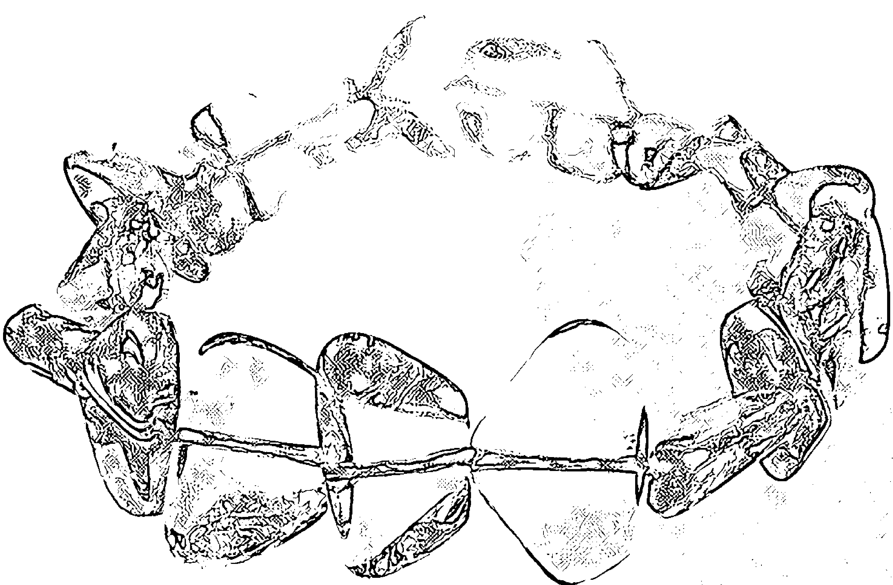

紫黄晶是紫晶在火山爆发时受到高温加热，使紫晶内部颜色发生变化，就变成了紫里有黄、黄里有紫的紫黄晶。其中也会有天然的冰裂及云纹产生，目前只有玻利维亚等少数几个国家产紫黄晶。

紫黄晶因为色系为淡色系，所以要透着光看才可以看得比较明显。因为原料的不同，有的粒子是全紫的，有的是全黄的，有的带有半紫半黄，但色泽是较自然。

##### 赫尔基蒙水晶（闪灵钻）（Herkimer Diamond）

生成在矽砂上，是具有良好双头形态的水晶，形态较饱满圆润，呈粒状，因多产于美国纽约州赫尔基蒙，故又名赫尔基蒙水晶。其结晶形式与钻石一样，整粒水晶结晶体呈现八面的天然切面，所以配有“钻”的美称。

天然的闪灵钻能量比一般白水晶强，是天然的双头水晶。尖端部分有时是尖的，有时是平的。有些不良的商人常一般的白水晶打磨成闪灵钻的样子出售。不论怎样只要是未经后期打磨的便是上品。

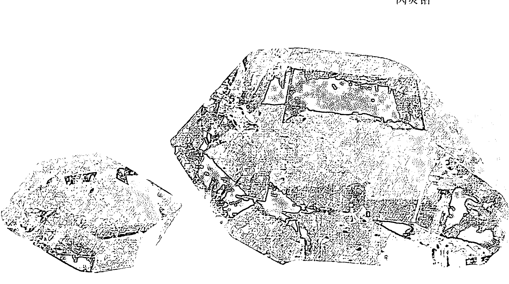
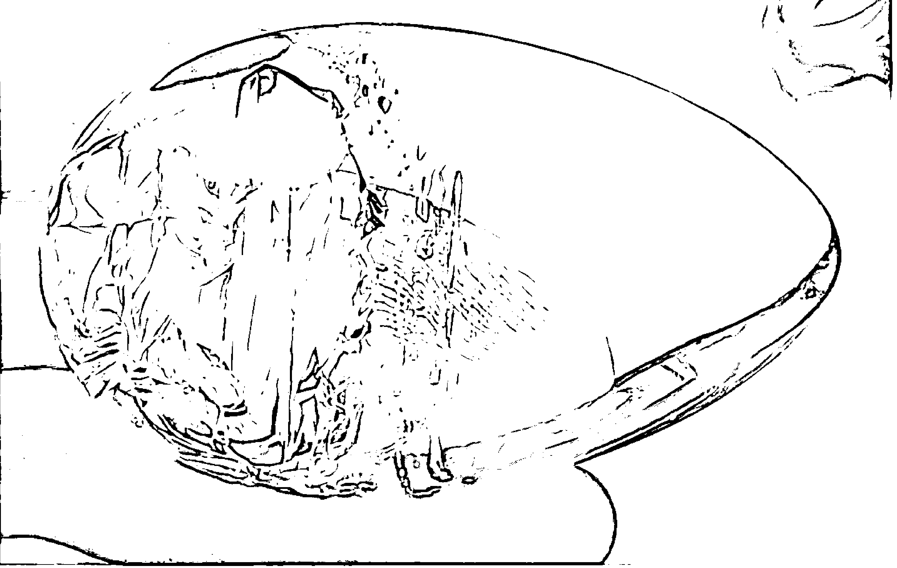
彩虹水晶

在水晶成长过程中，由于地壳上下、左右震动，造成晶体挤压，出现不同方向的晶面，使晶体次生裂隙中充满液体或气体包裹体。在光线下转动到一定的角度，会出现一块不规则曲面，发出彩虹般的光彩，人们称之为“彩虹水晶”。据说拿破仑的妻子约瑟芬就拥有一件令人眼花缭乱的宝石藏品——由彩虹水晶制成的首饰。

干涉是一种光学性质，由宝石内的结构反射光线所致。这种内部反射使宝石呈现缤纷的变彩。有些宝石会产生光谱中所有的色彩，有些则只能产生一种主要的颜色。蛋白石中的干涉是由于其结构造成的（球体排列成规则的立体图案），结果导致彩虹效果，称为虹彩色。这种现象也可见于其他宝石中，如赤铁矿、钙钠石、彩虹水晶等。

##### 鳄鱼皮水晶（Alligator Crystal）

不同时期的热矿液在同一水晶主体上的结晶叫“垒晶”。不同的结晶层层相连，块块相对，其表面看上去像甲虫、蜥蜴、鳄鱼皮，人们称之为“骨干水晶”，又名“鳄鱼皮水晶”。

这种水晶是“水晶女神”卡斯娜华高在 *Crystal Healing* 一书中首次介绍的。

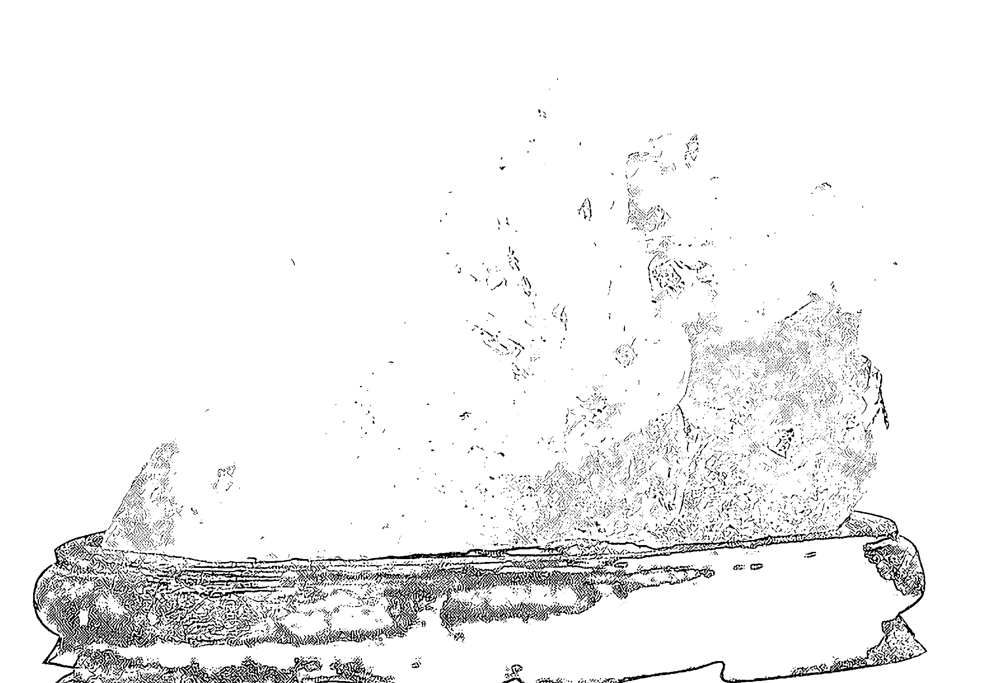

##### 蓝色水晶（Papagoite Crystal）

有些专业书上称自然界没有蓝色的天然水晶。到底有没有呢？

蓝色水晶是一种很罕见的深蓝色矿物，晶体小于1毫米，常集结覆于小矿脉的间隙，成为水晶的内含物。

另外，全世界目前只在西班牙Malaga发现有内含青泥石的蓝水晶，产于辉绿岩裂隙或小晶洞中，为高温水晶，仅有锥面，没有柱面，最大结晶约1.5厘米。

##### 权杖水晶（Scepter Quartz）与皇冠水晶

水晶中末端膨大者，称之为权杖水晶。而权杖水晶末端没有发育完全者，称之为皇冠水晶。属于变种水晶。美国华盛顿州、中国辽宁等地有出产。

##### 幽灵水晶（Multi-inclusions Crystal）

此类水晶内含矿物物体为灰白到浅绿，再到深绿的绿泥石包体，由于水晶晶体的透明与青苔体的不透明之间常产生充满诱惑的光与影，因而得名。水晶在成长的过程中，一些绿色的矿物质和尘埃落到其中，自然形成的内包物。内包物通常形状不定，有的似蓬莱仙山，有的像古埃及金字塔，有的兼具意象之美，更有的发出魅惑难测的光彩，人们称之“幻影”，也叫绿幽灵。

绿幽灵金字塔吊坠
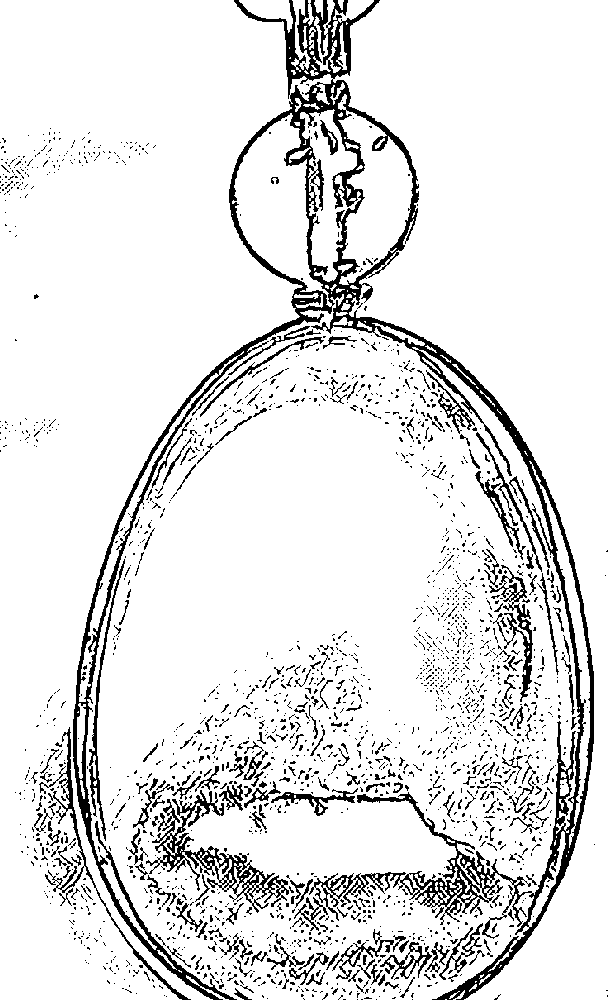

##### 发晶（Hair Stone）

无色透明的水晶晶体中含有纤维状、针状、草束状、放射状、丝状等形态的金红石、电气石、角闪石、阳起石、透闪石、硅灰石、绿帘石等矿物，有人叫它“草入晶”“针入水晶”。其中粗如鬃毛者称“鬃晶”，细如头发者称“发晶”，也称毛发石。

发晶以针状和发状包裹体，在晶体中呈定向排列、疏密有致、璀璨华丽，无需加工即为观赏宝石珍品，国外收藏家又送它“维纳斯发晶”的美称。

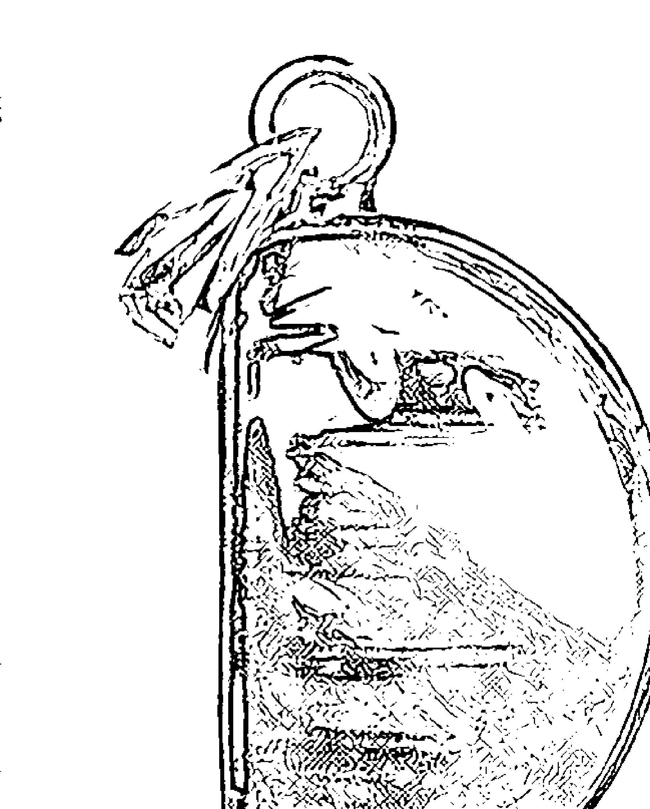
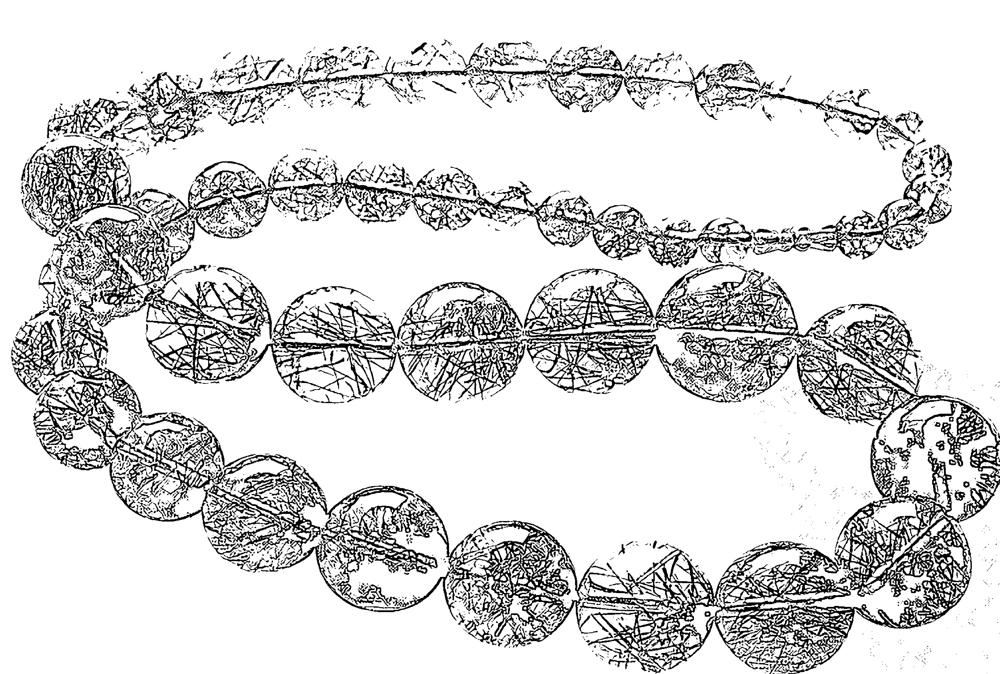

发晶有金、黄、红、绿、黑、银的颜色分别，但根据颜色来划分发晶类型往往带来一些片面性，无法分清发晶本质，如绿色发晶可以是由电气石发丝所致，也可以是由阳起石发丝所致。因此，划分发晶类型，最主要的还应是根据所含发丝状包裹体矿物的不同来划分。常见的有：金红石发晶、电气石发晶、阳起石发晶、褐铁矿发晶等。

发晶有人工合成品，一般为黄褐色至红褐色。肉眼观察发丝相互平行，镜下观察发丝为一系列取向一致、一头大一头小的钉管状包裹体，管内有颜料充填，空管横断面为三角形。合成发晶易与褐铁矿发晶相混，但根据合成发晶以上特征，可与天然发晶相区别。

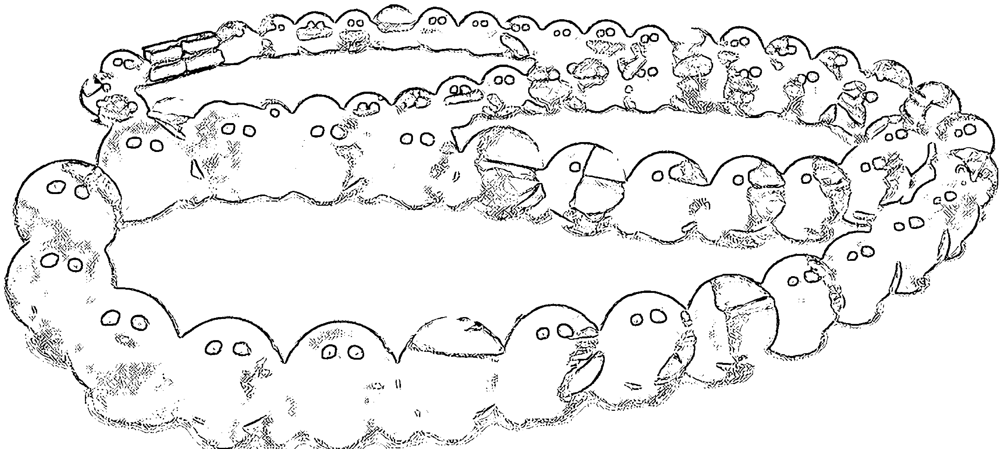

##### 钛晶（Golden Quartz Rutilated）

含针状或板状矿物质钛之发丝，钛晶氧化后呈闪亮的金色，是现今最珍贵的水晶。

目前产量稀少接近停产，因外型讨喜又稀少，也是市场上价位最高的水晶。多产于巴西、马达加斯加等，在国内也有少量生产。

##### 水胆水晶

水胆水晶是水晶中的珍品，其中水胆可能蕴含在各种颜色的水晶之内。水胆水晶，缘于晶内蕴含水滴似动物胆囊而得名。明澈的水晶与清澈的水珠融为一体，静止观察，真难以分辨出谁是晶，谁是水。

北宋科学家沈括，集平生见闻著《梦溪笔谈》，其中说到一件奇闻：“士人宋述家有一珠，大如鸡卵，微绀，莹澈如水。手持之，映日而观，则未底一点凝翠，其上色渐淡。若回转，则翠处常在下，不知何物，谓之滴翠。”这里提到的“滴翠珠”即是水胆水晶。绀，是深青带红的颜色，微绀，为浅紫色，凭此判断，滴翠珠可能是水胆紫晶。而宋人周密写的一部《云烟过眼录》，详载他平生所见的珍玩，其中有一段也记述道：“叶森家旧有水晶钩一，中空，有声汨汨，内有叶一支，随水倾泻。”此物亦为水胆水晶。

有趣的是，巴西人发现水晶中包裹的水珠与岩浆水的成分极相似，相传人喝了它，可以延年益寿。地质专家便从它的外形揣摩：水胆水晶与常见的六棱柱状水晶不同，而是呈六方双锥状，柱面很短，两端的锥形则较长，乃为高温水晶（β石英），其形成温度约在579℃以上，呈脉状产于砂岩和石墨花岗岩裂隙中，因此晶体才有两个锥形顶部。晶体大小一般仅1~5厘米，形成的二氧化硅供应不充分，营养不良，晶体中有空隙，包含有水、气或其他微粒。包体中可见气泡大小从数毫米至3厘米不等，其中液体约占气泡总体积的一半。“一瓶不满，半瓶晃荡”，轻轻摇动，水珠分合，十分有趣，并常有石墨微粒漂浮水上，摇晃时上窜下跳，如同飞蚊，成为明显的标志物。

##### 紫龙晶（Charoite）

又叫查罗石，化学名紫硅钙碱石，属单斜晶系，硬度5~6，比重2.54～2.68，折射率1.55～1.56。1978年始发现于前苏联的雪利河流域。具有优雅纯正的紫色或紫蓝色，间或有白色、灰白色、褐棕色螺旋条纹状，长纤状互相缠绕，似龙云飞舞，故称紫龙晶。其非凡的美丽颜色很快为水晶爱好者所喜爱。

它是由含强碱性的霞石正长岩入侵到石灰岩中，由于特殊的压力、地热和化学物理等条件转变而形成的。据说，紫龙晶对于因工作过度疲劳及饮酒过度所致的肝脏毛病，有好的作用。

##### 青金石（Lapis Lazuli）

青金石在早期文明中最被褒奖。与其他宝石不同，青金石实际上不是一种矿物，而是一种岩石。

岩石是矿物的自然集合体，主要由一种或几种造岩矿物按一定方式通过一定的地质作用胶结而成。按其成因和形成过程可分为三大类：火成岩、沉积岩、变质岩。

青金石主要是由蓝色矿物——青金石、不定量的黄铁矿、方解石、方钠石，以及少量的其他矿物组成。如果含较多的方解石时呈条纹状白色，含黄铁矿时就在蓝底上呈显黄色星点。青金石最重要的鉴定特征是结石表面有黄铁矿分布。

青金石属架状结构硅酸盐中的方钠石族矿物，属等轴晶系。晶体形态呈菱形十二面体，集合体呈致密块状、粒状结构，呈玻璃光泽或蜡状光泽，条痕浅蓝色，均质体，解理不发育，断口参差状（断口是指具不完全解理性质的宝石，尤其是那些没有解理的宝石晶体、非晶质宝石和矿物集体，在外力作用下产生的无一定方向的破裂。如石英的贝壳状断口，呈锯齿状、参差状）。

青金石一般为不透明到半透明，通常呈微带紫的蓝色，有时也呈微带蓝的紫色，但通常蓝色占优势，摩氏硬度为5～6。在长波紫外光照射下发橙色点光，在短波紫外线照射下发白色荧光。滤色镜下呈淡红色，遇盐酸缓慢溶解。

青金石是由接触变质作用形成（单纯由于热量多而引起的变质叫接触变质作用），主要存于硅酸盐一镁质矽卡岩中和钙质矽卡岩中，主要产地有美国、阿富汗、蒙古等。

青金石是古老的玉石之一，它以其鲜艳的蓝色赢得东方各国人民的喜爱。在公元前数千年的古埃及，青金石与黄金价值相当。在古印度、伊朗等国，青金石与绿松石、珊瑚均属名贵玉石品种。在古希腊、古罗马，佩戴青金石被认为是富有的标志。青金石通常被制成腰圆形或平板形戒面，也被制成念珠、钟壳、表盘、烟盒和各种其他饰面物品。它也是一种适合男用珠宝饰物的宝石。和大多数其他宝石相比较，青金石柔和的深颜色更适合搭配男式礼服。

青金石因“其色如天”，又称“帝青色”，很受古代帝王青睐，常随葬墓中，有“以其色青，此以达升天之路故用之”的说法，多被用来制作皇帝的葬器。

青金石主要有4种：青金石、青金、催生石、金格浪。青金石的工艺要求以深蓝色、无裂纹、无杂质、质地细腻者为佳。青金石颜色端庄，易于雕刻，至今保持着一级玉料的声望。青金石中国古称“琉璃”，清朝四品官的顶子规定用青金石，一个顶子值几百两银子。

当清王朝覆灭，青金石却因此变得一钱不值，只能作为制作蓝色颜料的原料了。

《清绘典图考》称：“祭天坛用青金石，地坛用蜜珀，日坛用珊瑚，月坛用绿松石。”按清代冠服制度，君臣、命妇凡穿朝服或吉服必于胸前挂朝珠，平民百姓在任何时候都不许佩挂。清代的朝珠多用珍珠、翡翠、玛瑙、琥珀、珊瑚、象牙、蜜蜡、水晶、沉香、青金石、玉、绿松石、碧玺、伽楠香、桃核、芙蓉石等世间珍物琢制，由项上垂挂于胸前。朝珠的大小质量表示了官位的高低。官员觐见皇帝时必须伏地跪拜，只要朝珠碰地，即可代替额头触地。朝珠的直径越大，珠串就越长，佩挂者俯首叩头的幅度就可减小，这可以说是皇上对不同官职的不同恩赐。

##### 虎眼石（Tiger Eye）

虎眼石是木变石的变种，又称鹰眼石。虎眼石的石英纤维较木变石短，而且方向不规整，像斑纹一样呈任意方向排列。一般情况下，虎眼石的块体较木变石大，木变石多是细脉体。木变石和虎眼石是角闪石青石棉受酸性热液硅化作用形成的石英质玉石，属于低温气成热液型。木变石和虎眼石有特殊的颜色，一般为褐黄、蓝褐色，还有明显的微细纤维结构以及明亮的丝绢光泽，这是自然界中任何玉石所没有的。虎眼石因棕黄、黄褐色木变石琢磨成弧面型宝石后，具有猫眼效应因而得名。它是一个真青石棉的假象，也就是说，定向的矿物纤维青石棉完全被石英体所替代，但没有打乱原来的纤维形态。当物体切成扁平厚板时，这个纤维状结合就出现丝席状；但是，如果切成椭圆形非凸面状，与纤维层成直角，这时就出现令人满意的猫眼效应。熟练的切割，偶尔可以产生好的限定的“眼睛”，但是，常见的虎眼石具有似石棉的纤维波纹而出现几套猫眼石带。虎眼石除黄色纤维外，尚有较多的蓝色和红色纤维，呈蓝、褐、红相间的斑杂，整体上以黄为主。世界上最大的虎眼石、木变石矿床位于南非德兰士瓦省，除此之外，还有巴西、中国河南等地出产。

##### 海蓝宝石（Aquamarine）

海蓝宝石的英文名称源于拉丁语 Sea Water（海水）。传说，这种美丽的宝石产于海底，是海水之精华，所以航海家用它祈祷海神保佑航海安全，称其为“福神石”。中国宝石界称海蓝宝石为“蓝晶”。海蓝宝石、祖母绿和绿宝石在矿物学中都称为绿柱石，都是透明的绿柱石晶体。绿柱石是一种含铍、铝的硅酸盐，海蓝宝石的颜色为天蓝色至海蓝色或带绿的蓝色的绿柱石，它的颜色形成主要是由于含微量的二价铁离子，以明洁无瑕、浓艳的艳蓝至淡蓝色者为佳。

海蓝宝石主要附存于伟晶岩矿床——糖粒状钠长石化伟晶岩中。常见的晶体形态为六方柱，其次为六方双锥，集合体多呈柱状。玻璃光泽，透明至半透明。多色性明显，为蓝到蓝绿色。贝壳状断口，X射线照射下发不发光。韧性良好，怕高温，高温下易炸裂，遇火烤会褪色。

世界上最大的海蓝宝石是1910年在巴西马拉姆巴伊亚矿山发现的，长57.95厘米，直径48.8厘米，重110.2千克。目前全世界70%的海蓝宝石产自巴西。

海蓝宝石长期以来被人们奉为“勇敢者之石”，并被看成幸福和永葆青春的标志。西方人认为，佩戴海蓝宝石能够使人具有先见之明。同时，它还被认为具有催眠和压邪的力量以及神奇的医用价值，用海蓝宝石浸过的水可以治眼疾、打呃等。

##### 石榴石 (Garnet)

中国珠宝界习惯上也称石榴石为紫（子）牙乌，相传其名来源于古代阿拉伯语“牙乌”，意即“红宝石”。因石榴石宝石颜色深红带紫故称“紫牙乌”。香港等地则按音译称为“加力”石。石榴石的英文名称为Garnet，由拉丁文Granatum演变而来，意思是“像种子一样”，因其晶体外形酷似成熟的石榴籽而得名。

石榴石的原生矿床有多种，主要产在原生榴辉岩型、区域变质的片岩、片麻岩、变粒岩型和次生的砂矿等几种岩类中。紫牙乌这一名称是泛指一组物理性质和结晶习性相同的石榴石族矿物的统称，在这族矿物中随着组成它们的化学成分的不同而有多种品称，都是化学成分比较复杂的硅酸盐矿物。

石榴石可以分成2个系列、6个主要品种。铝石榴石系列包括镁铝榴石（红榴石）Pyrope、铁铝榴石（贵榴石）Almandine和锰铝榴石Spessartite，钙石榴石系列包括钙铝榴石Grossular、钙铁榴石Andradite和钙铬榴石Uvarovite。钙铁榴石中仅绿色的翠榴石被作为宝石品种，钙铝榴石又包括3个亚种：铁钙铝榴石（桂榴石）、绿色铬钒钙铝榴石、水钙铝榴石。

翠榴石于19世纪中叶在俄罗斯的乌拉尔山脉首次被发现。在沙皇的宫廷中翠榴石一直备受宠爱，直到1917年十月革命，翠榴石和其他宝石的开采才停止。今天，很多个体矿主在乌拉尔发现了大量翠榴石原生矿床和次生矿床。此外在纳米比亚和伊朗也发现了有开采前景的翠榴石矿。

石榴石的颜色受成分影响，呈现多种颜色，有红、紫红、暗红、橙、黄、绿、褐、黑等色。晶面显玻璃光泽、金刚光泽，断口显油脂光泽。透明至半透明，不具多色性，没有双折射现象，均质体（均质体，指光波在其中传播时，其传播速度不因入射线方向的改变而发生变化，只发生单折射现象）。晶体形态呈菱形十二面体、四角三八面体或二者的聚形，集合体为粒状或块状。

宝石级石榴石的标准要求：透明度好，颜色鲜艳，粒径大于5毫米。在国际宝石市场上，纯净无瑕、颜色鲜艳、晶莹剔透的石榴石价值很高。绿色铬钒钙铝榴石价值最高，质优者可与祖母绿相比；红色、橙红色石榴石也很宝贵。中国地质博物馆中收藏的一颗橙红色锰铝榴石大晶体，重达1 397克拉，产于新疆。美国国家自然历史博物馆中珍藏着世界上最好的一颗褐黄色透明的肉桂石（铁钙铝榴石），是一颗雕刻精巧的基督头像，重61.5克拉，堪称无价之宝。历史上最大一块石榴石，据说被挖掘出的原石重达20吨，搬运时用了100匹马。这块产自乌拉山脉的“萝朵（玫瑰）石榴石”，被雕刻成叶卡捷琳娜二世的孙子尼古拉一世的棺椁。

红石榴在国外也被命名为“结婚17周年纪念宝石”，象征夫妻间的爱情已经历了相互间的忍让和漫长的考验，而在这子女们迎来青春和恋爱之际，赠送石榴石，便是提示对方“看到孩子的今天，不忘当年的热恋”，愿“忠贞不渝的爱情”继续伴随余下的人生。

目前俄罗斯矿物原料合成科学研究所的专家，已开发出一种人工合成钇铝石榴石晶体的新方法，所合成的石榴石晶体颜色各异，在透明度、硬度和尺寸方面都比天然石榴石晶体要强，更加适合制造宝石，而价格也比天然石榴石低。由于纯的钇铝石榴石晶体无色透明，如果晶体里含有不同的金属“杂质”，晶体就会呈现不同的颜色，新的石榴石晶体合成方法正是基于这一原理开发而成的。

医学上石榴石对血液循环与荷尔蒙分泌都有一定的刺激作用，有益生殖系统及相关器官的健康。让人趴下，将石榴石放在脊椎最下端尾骨的部位，可慢慢感受到其振动，可增加性能力并可净化脾脏，对关节炎据说也有效，但若是敏感体质或是对此做法没有心理准备的人最好避免这样做，以免带来伤害。

##### 玉髓 (Chalcedony)

又名石髓，是石英的隐晶质异种，三方晶系。常以钟乳或葡萄状块体产出。颜色多变化，一般为白色、蓝色、红色、绿色、棕色或黑色。其变种包括不透明的碧玉和玛瑙。

玉髓条痕白色（条痕，通常说的颜色，是人眼对一定波长的光线感觉的结果）；从透明到不透明或不透明，从玻璃到腊状光泽都有，并且形成于多种岩石的裂隙中。大多数玉髓是有富含硅的溶液，在较低的温度下沉积而成。此外，蛋白石脱水也可形成。

##### 托帕石 (Topaz)

托帕石为含水的铝硅酸盐矿物，晶体形态多呈斜方柱状，柱面常具纵纹，集合体形态为柱状、粒状、块状。玻璃光泽，透明至半透明，性脆，硬度为8，解理发育（金刚石为完全八面体解理，方解石为完全菱面体解理，托帕石则是完全底面解理）。

在长、短波紫外线的照射下，各种颜色的托帕石显示不同的荧光。依据颜色，一般可分为酒黄色、无色、蓝色、绿色、红色托帕石。从观赏及饰品角度而言，深红色的托帕石价值最高，其次是粉红色、蓝色、黄色，无色托帕石价值最低。深黄色的也很珍贵，颜色越黄越好。托帕石中常含有气液包体和裂隙，这些包体都会影响其价格。优质的托帕石应具有明亮的玻璃光泽，若因加工不当导致光泽暗淡，则会影响其价格。

自20世纪50年代以来，人们开始了托帕石人工改色的研究工作，目前市场上较流行的托帕石的颜色（如蓝、红色）是经辐照处理及热处理的结果。用天然无色黄玉经辐射加温处理后的托帕石已经大量投入市场，其颜色淡雅艳丽，性质稳定，一切特性与天然托帕石基本上无差异，无法鉴别，但是在出售时应注明“改色黄玉”。

以蓝色托帕石为例，它是由五色托帕石先经辐照处理，然后再加热处理，去除黄、褐色调产生的。这种改色方法比较理想，但不可避免地带来了一个令人讨厌的问题，即残余放射性。托帕石的残余放射性半衰期大约为100天。因此经改色处理的托帕石，不能马上投放市场，厂家一般存放1年以上（3个多半衰期，此时托帕石的放射性已是微乎其微，甚至可以忽略不计）才出厂，因此佩戴改色的托帕石是安全的，不会对人体造成伤害。

改色蓝色托帕石的蓝色能保持多久一直是珠宝界及消费者最关心的问题。通过褪色模拟实验及近5年置于阳光下曝晒实验表明，仅褪色 2% ~ 3%，也就是说在 50 年内是无法看到其明显褪色。经辐照处理的托帕石，其物理、化学性质与天然托帕石完全一致；尽管根据颜色的强度和深度，大多数经辐照处理的蓝色托帕石的颜色在自然界还从没有发现，但也不能据此肯定说某一蓝色托帕石就是经辐照处理的。

在西方人看来，托帕石可以作为护身符佩戴，能辟邪驱魔，使人消除悲哀，增强信心。用托帕石的粉末泡酒，可以治疗气喘、失眠、烧伤和出血等症。11世纪时，欧洲人就已认为托帕石能够治疗眼疾，将托帕石放在葡萄酒中浸泡 3 天 3 夜，然后再用它来按摩眼睛，不仅可以治疗一般的眼疾，即使对弱视也有很好的疗效。

##### 橄榄石 (Olivine)

橄榄石是一种岛状结构硅酸盐矿物，主要产生于含硅量较低的基性火山岩中。晶体形态常呈短柱状，集合体多为不规则粒状。颜色多为橄榄绿、黄绿、金黄绿或祖母绿色。玻璃光泽，透明。具脆性，韧性较差，极易出现裂纹。

根据颜色、质地、成因或来源将宝石级橄榄石分为浓黄绿色橄榄石、金黄绿色橄榄石、黄绿色橄榄石、浓绿色橄榄石（也称黄昏祖母绿或西方祖母绿、月见草祖母绿）和天宝石（产于陨石中，十分罕见）。

橄榄石大约是3 500年以前，在古埃及领土圣·约翰岛发现的。世界上最大的一颗宝石级橄榄石产于红海扎巴贾德岛，重310克拉，现存于美国华盛顿史密斯学院。在俄罗斯莫斯科金刚石库中，保存有一粒产于红海的橄榄石，重192.6克拉，颜色鲜艳，纯净透明，是1096～1291年十字军东征巴勒斯坦时掠夺的。

中国河北省张家口地区万全县大麻坪发现的橄榄石，重236.5克拉，取名为“华北之星”，是中国橄榄石之最。

古代西方称橄榄石为“太阳的宝石”，人们相信橄榄石所具有的力量像太阳一样大，可以驱除邪恶，降伏妖怪。

##### 黑曜石（Obsidian）

黑曜石有“黑金刚武士”之美誉。酸性火山熔岩快速冷凝后可产生火山玻璃，矿物名称为黑曜岩，火成岩的一种，二氧化硅含量达60%～75%，可呈黑色、褐色、灰色、蓝色、黄色、红色等，有时颜色不均匀，带有白色或其他杂色的斑块，形如雪花的被称为“雪花状黑曜岩”。最有名的是有彩虹闪光的彩虹黑曜岩Rainbow Obsidian，并且有些条纹呈椭圆形状，就形成俗称的单眼黑曜石或者是双眼黑曜石了。

黑曜的分布大多是曾有火山活动的地区，如美国的夏威夷、日本、印尼的爪哇岛等地。深黑色单眼的黑曜石分布于美国的亚利桑那和新墨西哥州，被印第安人称为“阿帕契之泪”。

中国古代的佛教文物中，就有相当多有关于镇宅或避邪的黑曜石圣物或佛像。黑曜石也是现在供佛修持布施的宝石。

##### 电气石(碧玺) (Tourmaline)

学名为电气石，是一种成分复杂的硼硅酸盐矿物。属三方晶系，结晶多为柱状，偶有板状。柱面有垂直条纹。柱体两端并不对称，属于异极象的晶石，做成电气石有热电性及压电性。热电性指由于温度的升高或降低，使宝石晶体产生电压或形成表面电荷的效应。就是由于热电性及压电性，电气石成为多种晶石中，最为人认识的医疗用石。

碧玺，由于随着矿物成分不同，颜色及功能也有不同，在矿物学及宝石学上也有不同的名称。碧玺的颜色多样，最常见的有红色、绿色、黑色，黄色、蓝色的是比较名贵的品种，紫色、橙色、西瓜色及多色的就更高级了。

##### 红色碧玺（Rubellite）

碧玺的红色色调分布较广，多是在粉红色和桃红色之间，少数的深红色如红宝石的颜色一样，其能量使人热情、奔放、开朗、舒爽，极讨人喜爱。

红色碧玺日趋受欢迎，是因其硬度高，而另一方面，由于红宝石的价格在近十年来上涨得惊人，有些人便转而购买其他红色的宝石代替。而红碧玺成为替代的首选，促使其售价日益提高。

色泽漂亮的红碧玺较罕见，内含物也比其他颜色的碧玺为多，如同祖母绿一样，很少发现没有内含物的红碧玺，因此在选择红碧玺时不必太严格，要求内部完美无瑕。反而是其他颜色的碧玺净度较高，不难找到内含物少的。

##### 黑色碧玺（Schorl）

黑色碧玺因含铁高致使外表黝黑、深沉。

##### 蓝色碧玺（Indicolite）

蓝色碧玺是相当稀少而又珍贵的宝石。

##### 绿色碧玺（Verdelite）

意大利语、希腊文语意均为绿玉，绿色碧玺，是一种能够让人开心、快乐而又满足的宝石，也称财富之石。

##### 西瓜碧玺

红绿双色的碧玺，因酷似西瓜的颜色而得名。

##### 黄、橙碧玺（Dravite）

因含镁，呈黄色、褐色到茶色、深褐色。纯黄或橙

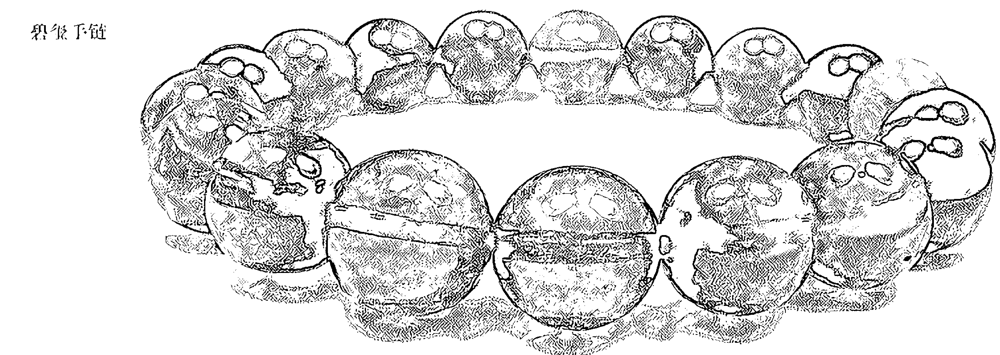

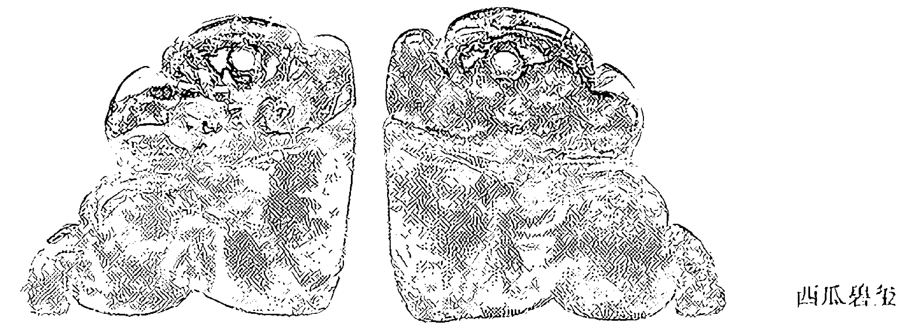

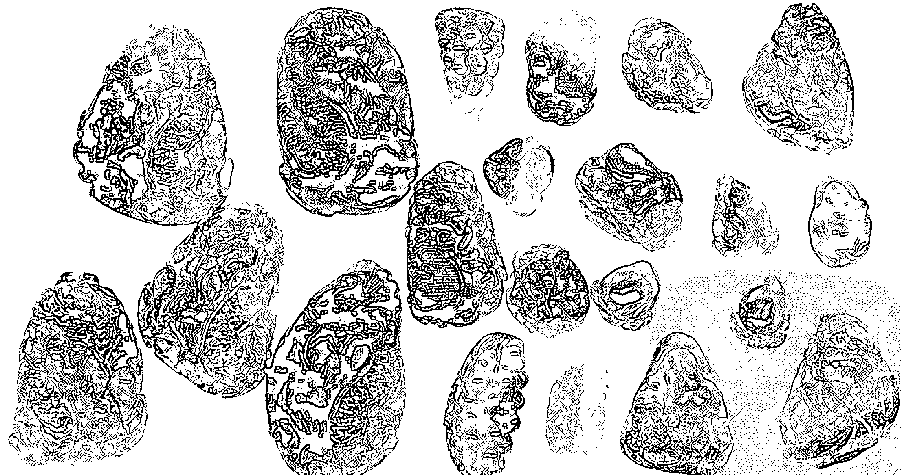

色碧玺很难见到。从浅到很深的黄棕和棕黄色就更受欢迎，一般会把它当做黄玉和金色绿柱石；绿棕到棕绿色的则很像红柱石。

##### 红纹石 (Rhodochrosite)

即菱锰矿，产生在锰、铜、银和铅矿矿床伴生的矿脉中，娇嫩、可爱，十分稀有。最古老的矿场在阿根廷的安第斯山脉，出产的菱锰矿就叫“印加玫瑰”，其颜色娇艳、白纹明显、质地完整光滑。

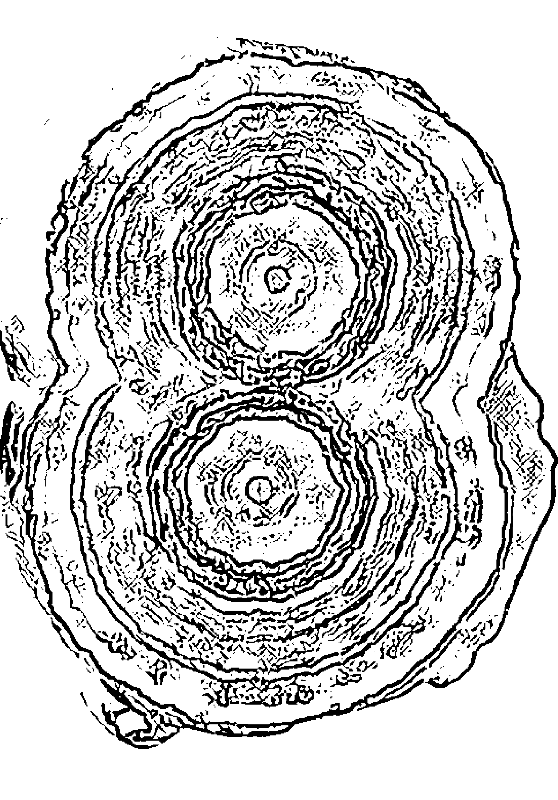

红纹石有“爱神”之称号，仅产于阿根廷这个足球天才聚集的国家。红纹石以其美丽的桃红色、曼妙流畅的白色纹理而使它具有其他宝石没有的风姿，作为一种爱情幸运石，它似乎更能突显女性的娇媚与秀美，艳若桃花的笑颜，浮动缠绵柔美的白色纹理，有着梦幻和神秘的感觉，相较粉冰晶，它似乎更风情万种，同时又有着慵懒而细腻的余香。

##### 月亮石 (Moon Stone)

亦称“恋人之石”、月长石、月光石。月光石是因长石晶莹剔透，由于内部结构中光反射造成夹层中的钠长石发出诱人的色光、闪出淡淡的蓝色，好似幽静夜幕下充满灵气的月光而得名。月光石多为乳白色，半透明具有淡蓝色晕彩，表面有点像雾玻璃般的细致、柔和，透光性颇强。

月亮石为单晶非均质体宝石，是钾、钠长石的双晶交替排列，构成格子状结构的微斜长石，化学式（硅酸钾铝）。格子双晶层的厚度很薄，在50～100毫米之间，这两组相互近似垂直的双晶纹，对入射光造成散射，密集的散射光线集中在一起，就呈显朦胧的晕色。

月光石的晕光有方向性，晕色的延长方向应与琢磨宝石的外形一致，应聚集在弧面宝石的中心位置，如果晕光在宝石中歪斜，将影响价值。

传说月亮石是月亮神赐给人类的礼物。很多国家的人认为佩戴月光石能给人带来好运，并能唤醒心上人的温柔感情，给人以力量，憧憬美好的未来。印度人将月光石当做圣石，而古希腊及罗马人更深信月光石在满月时充满强大的力量，据说将月光石以白K金做成戒指最能让其发挥最大能量。

月光石在缅甸、斯里兰卡有一定量产出。常见的仿制品是一种有乳光的玻璃，这种玻璃半透明，它的乳光不论从哪个方向看都存在。而天然的月光石一般透明，它闪出的光只在某个角度可见，在其他角度则完全看不见。从这两点可以较好区分月光石与其玻璃仿制品。

月光石手链

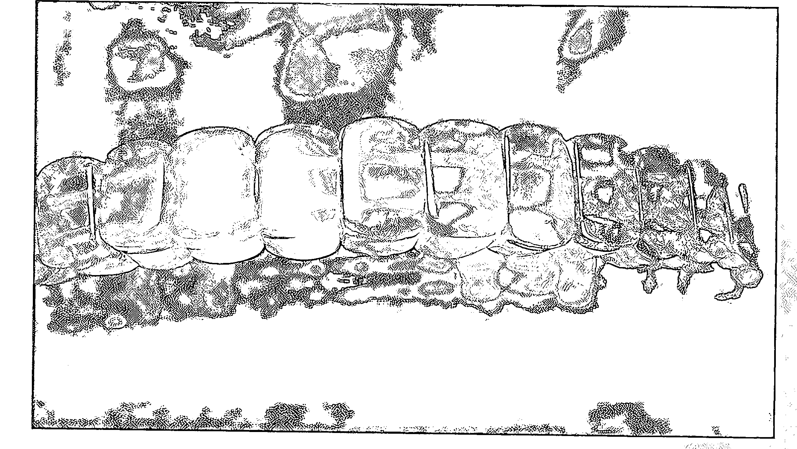

##### 萤石（Fluorite）

又称为智能之石、软水晶、氟石，亦称彩虹水晶，素有“玉石之润，水晶之丽”之称，收藏者众多。萤石形成于热液矿脉中和温泉周围，是一种相当常见的矿物，与多种矿物伴生，如石英、方解石、白云石、方铅矿、黄铁矿、黄铜矿、闪锌矿、重晶石和多种其他热液矿脉矿物。

多色性的萤石为最美丽的矿物之一，晶体呈立方体或八面体，常呈双晶、块状、粒状和致密状集合体产出。颜色多变化，从紫色、绿色、无色、白色、黄色到粉红色、红色、蓝色和黑色等，条痕白色，硬度为4，透明到半透明，玻璃光泽。断开后，形成完全八面体解理，并在立方体晶体的角上形成三角面。

中国在距今7000年前的浙江余姚河姆渡新石器时代就发现了萤石制品。北京故宫博物馆珍藏有清朝乾隆时期的萤石印章。

萤石手链

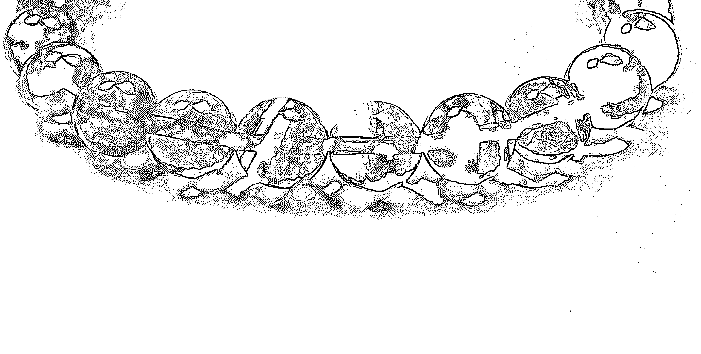

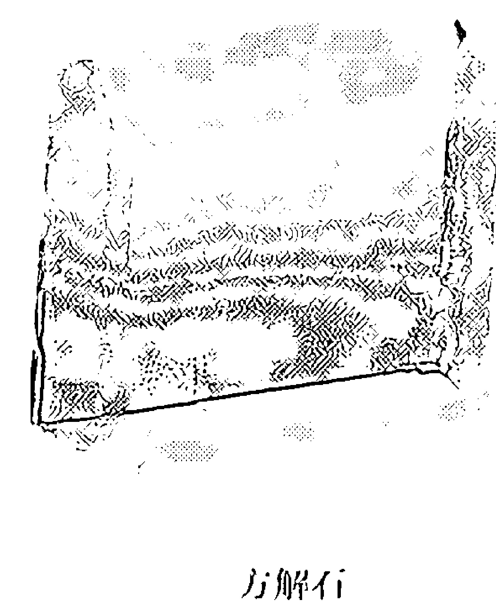

方解石

##### 方解石 (Calcite)

方解石晶体呈菱面体和偏三角面体，其聚形呈钉头状，以块状、粒状、纤维状和钟乳状集合体产出。颜色繁多，常见白色、无色、灰色、红色、棕色、绿色和黑色，从条痕白色到灰色，透明到半透明，玻璃到珍珠或暗淡光泽都有，硬度 3。

鉴定特征：菱面体完全解理，硬度不大，加稀盐酸剧烈起泡。

方解石是分布最广的矿物之一，是组成石灰岩和大理岩的主要成分。在石灰岩地区，溶解在溶液中的重碳酸钙在适宜的条件下沉淀出方解石，形成千姿百态的钟乳石、石笋、石幔、石柱等自然景观。

方解石俗称有大方解石及小方解石两种，即解理完全及不完全两种，其中大方解石中有的透明度很高，质量上乘的即为冰洲石( 最早在冰岛被发现 )。方解石在冶金工业上用做熔剂，在建筑工业方面用来生产水泥、石灰。冰洲石的菱面体晶体具双折射性，常呈双晶，是制作偏光棱镜的高级材料。

全世界所有的矿物晶型以方解石居冠，少说也有200种以上。代表产地：美国、墨西哥、英国、法国、德国。

##### 陨石

根据陨石本身所含的化学成分的不同，大致可分为3种类型: 铁陨石，也叫陨铁，它的主要成分是铁和镍; 石铁陨石，也叫陨铁石，这类陨石较少，其中铁镍与硅酸盐大致各占一半; 石陨石，也叫陨石，主要成分是硅酸盐，这种陨石的数目最多。

陨石大部分都以每秒钟11～74千米的速度穿越大气层进入地球，在此途中与地球的大气层摩擦，表面会因炽热而融化，而没有被燃烧完的残留物降至地面后，就是陨石。

陨石撞击地壳产生熔化飞溅而成的似曜岩类或黑曜岩类的物质，具有球状、哑铃状、珠状等等形状。受陨石撞击后，地面岩层有时候会熔化飞溅，与大气层的空气接触之后，冷凝成玻璃。

现在地球上已知及存疑的著名的陨石坑，数量大概有 120 个左右，年代老一点的约 1 亿至 5.5 亿年，最老 17 亿年，也有年轻的 2~4 万年左右(Meteor Crater, 亚利桑那)的。地球历史上几次重要的撞击事件如下：

- (1) 6500 万年前：与恐龙灭绝有关
- (2) 3400万年前：北美玻璃石Texas, Georgia, and Martha's Vineyard
- (3) 1500 万年前：捷克 Bohemia and Moravia
- (4) 1300 万年前：非洲象牙海岸玻璃石
- (5) 70万年前：澳洲玻璃石（澳洲、中南半岛、菲律宾、泰国、苏门答腊及其他）

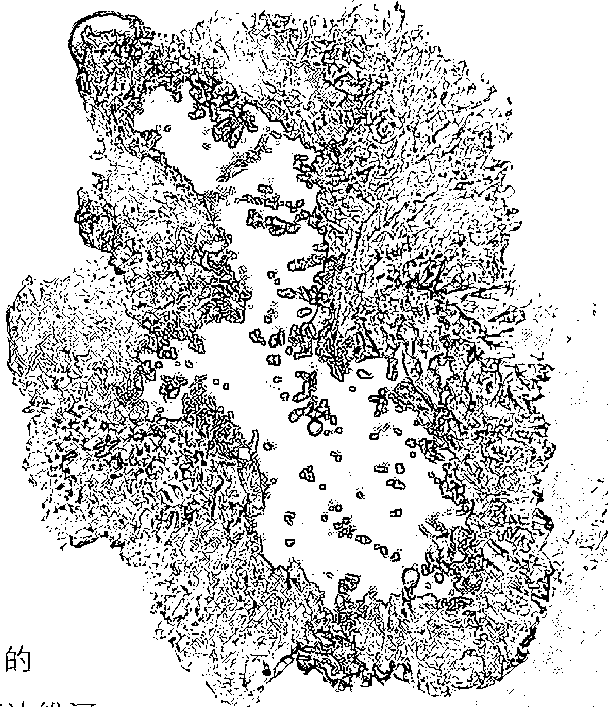

###### 捷克陨石 (Moldavite)

约在1500万年前，当时有一颗巨大的陨石撞击到地球表面，由于大爆炸产生了高温与高压，而将这颗陨石与周围的石头融合成如浪花般的玻璃状物质，因其于 1787 年在捷克摩达维河 Moldavite 发现，所以英文以此为名，中文为捷克陨石。主要产地分布于捷克及邻近国家，其中以捷克南方省份约在布拉格南方及维也纳西北方附近，及波西米亚、摩拉维亚两地最著名。非常稀有。目前最大的捷克陨石也不过约 200 克左右。

捷克陨石小小一块就价值不菲，陨石表面的细细的凹下去的纹路，一般是陨石在空气中流动时候形成的。注意：凡是陨石的原矿外表一定是凹凸不平的，除非是经过了人工的打磨抛光。

较厚的捷克陨石看起来颜色会呈现深绿色且会带有些微的黑色味道，而较薄的捷克陨石颜色是较清淡的绿色，但这两者如果透光看都会呈现深浅度不同的绿色而不带有黑色味道。实际上捷克陨石就是一种特殊的天然玻璃。

##### 欧泊（Opal）

欧泊美丽得宛若刚刚出浴的少女，在光线的照射下，宝石的色彩如火焰般游弋，闪烁着彩虹般的光泽，极为独特。欧泊因有鲜艳的红宝石光泽、华贵的紫晶光泽、柔润的祖母绿光泽以及许多色彩斑斓的组合，享有“宝石王后”的美誉。

欧泊具有绚丽夺目的变幻色彩，叫做“变彩”。根据它的颜色特征和光学效应，宝石界通常将欧泊分为3类:黑欧泊、白欧泊、火欧泊。黑欧泊体色为黑色、暗灰色、蓝色、绿色、褐色或其他暗色调，具明显的变彩，透明到不透明；白欧泊体色为白色、灰白色、黄白色等，具变彩效应，透明至半透明；火欧泊为黄色、红色或橙至褐色的体色，可有变彩也可没有变彩，由于光的衍射作用，有的产生火焰般的闪烁。也有称金欧泊、太阳欧泊或墨西哥欧泊的，透明至半透明。

欧泊具有较强的荧光和磷光效应，有时将一颗欧泊在阳光下直射，然后拿进一个黑暗的房间，这时可能你会发现，在一片漆黑中，你手里的欧泊正发出迷人的光芒，持续一段时间才会消失。不用奇怪，这是因为欧泊在阳光中的紫外线的照射下，吸收了能量然后再慢慢释放而已。欧泊在紫外光照射下常有荧光。黑欧泊和白欧泊有无至中等的白色、浅蓝绿或黄色荧光。火欧泊有无至中等的绿褐色荧光。均可有磷光。

墨西哥产出的火欧泊相当出名，主要产出与硅质火山熔岩溶洞中。珠宝首饰上使用的大部分贵欧泊来自澳大利亚。世界95%的欧泊产自澳大利亚，其中新南威尔士所产的优质黑欧泊最为著名。澳大利亚是世界上最大的欧泊生产者和出口商，最早发现欧泊是在1869年于Blackall的南方昆士兰Listowel Downs。

欧泊为具变彩效应的贵蛋白石，几乎可以在任何一种地质环境下形成。它是一种含水的非晶质二氧化硅胶凝体，颜色不一，纯者无色，因含有杂质而呈现出各种色彩，硬度低，为摩氏5.5级，在宝石中它的体重算是很轻的。

欧泊的特征是有小裂纹，久磨失光。优等的透明度好，颜色鲜艳，光泽明亮，彩色闪动灵活，无缺陷；劣等的透明度低，颜色暗淡，色彩闪动迟缓。

澳洲欧泊的采矿基本上是由个人或小集团操作，产量从1990年一直持续衰落，特别是近10年来没发现新的重要的矿区。在近20年中，日本是澳洲欧泊的最大出口市场，特别是黑欧泊。澳大利亚产出质量最好的欧泊

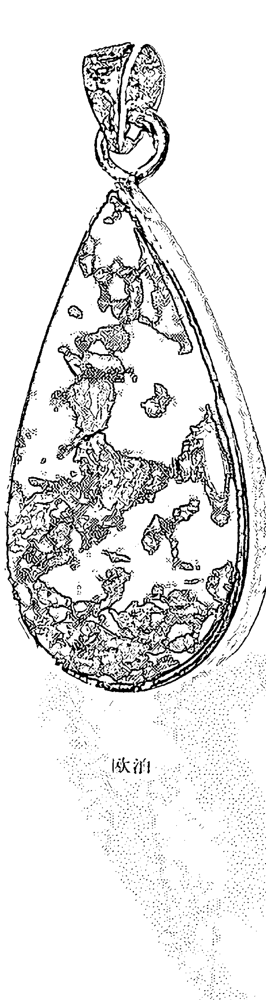

80% ~ 90%都是出口日本的。

一般从3个方面评价欧泊的价值：颜色强度、颜色分布、颜色的数量和相对丰富程度。有变彩十分重要，如果是仅仅有些纹理和斑块的白欧泊，几乎一钱不值。最佳的变彩依次是：红色、紫色、橙色、黄色、绿色和蓝色，红色、紫色或橙色颜色强度较高，分布又广，就很有价值。此外，要注意欧泊边缘轮廓好不好，厚度够不够。

##### 舒俱来石 (Sugilite)

舒俱来石为 1960 年代一位日本地质学家发现的新种类矿石，目前产地仅有南非、日本和美国，可谓稀有种类宝石，又称南非国宝。外观呈各种不透明的深浅紫与紫红色交织，有时甚至深至黑色，其颜色容易因为长久佩戴而加深光彩。

舒俱来石由很多种矿物元素组成，包括有钾、钠、铁、锂等，但它的基本元素组合是氧化硅。也被誉为“千禧之石”，据称 21 世纪的“心灵”非常需要它。

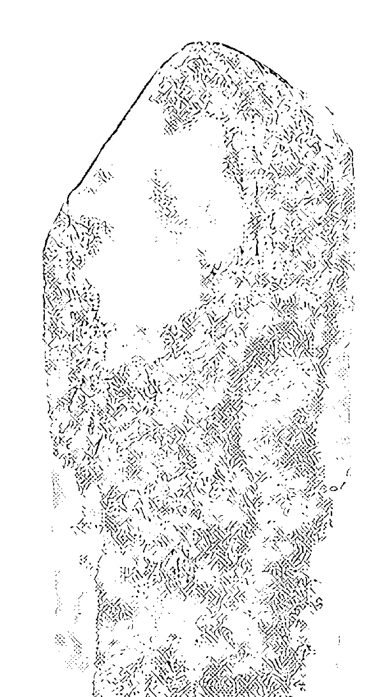

##### 锂辉石 (Spodumene)

系单斜晶系，单晶柱状，结晶粗大，晶面具纵纹，颜色有无色、灰白、淡黄、黄、深黄、绿、翠绿、蓝绿、灰绿、紫、紫罗兰、粉红等多种，玻璃光泽，半透明至透明，加工后可具猫眼效应。

透明至紫色的称为紫锂辉石 Kunzite，又叫加利福尼亚彩虹石；含铬的翠绿锂辉石 Hiddenite，亦名美国

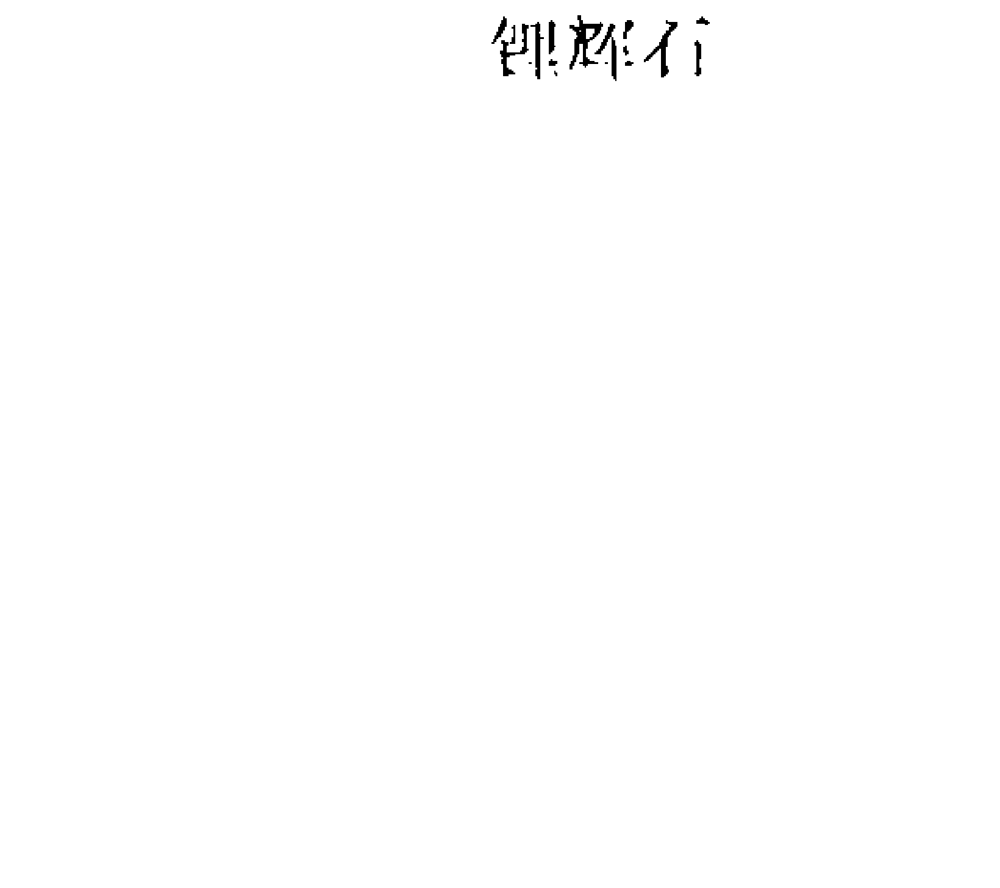

祖母绿; 而红色、紫红色和黄色的, 则没有特别的名称。锂辉石产于富含锂的花岗伟晶岩中, 常与石英、透锂长石、锂云母、绿宝石、碧玺、铌铁矿等共生, 晶体巨大, 现知最大晶体长达13米。

## 2. 水晶的出产区域

世界上很多国家都产水晶, 比如巴西、乌拉圭、美国、南非、赞比亚、俄罗斯、中国、印度、巴基斯坦等, 其中巴西水晶最有名。亚洲主要分布在中国和印度。中国各地常有发现水晶矿的报道, 江苏、海南、四川、云南、广东、广西、贵州、新疆、辽宁、湖北等地较多。其中江苏东海县水晶最具盛名。

##### (1) 水晶开采广布世界

巴西、美国、法国、日本、印度、越南、缅甸、意大利、土耳其、加拿大、前苏联、危地马拉、马达加斯加、澳大利亚、赞比亚等30多个国家都盛产水晶。巴西是个水晶王国, 其水晶储量以及几十年产量、出口量能占到世界总量的90%。巴西水晶资源集中分布在东南部的米纳斯吉拉斯地区。北部的马巴拉也能采到大量的紫晶。

赞比亚的乔马附近及纳米比亚北海岸的紫晶储量颇大。20世纪60年代, 赞比西河沿岸发现大量紫晶矿藏。

> 中国古籍《事物绀珠》载: “紫水晶出自林邑国。”林邑国即越南古称。蒙古以茶晶为贵, 故俗称 “蒙古茶(晶)”。而阿尔卑斯山的水晶多得惊人, 当地人可从岩壁上垂直采下, 或从河底采取。小亚细亚的吉普罗斯, 水晶遍地皆是, 农民耕作时, 可以轻而易举拣到很多水晶。由于水晶在地下多呈簇状、块状、粒状分布, 与岩石为伍，深藏不露，要把它“请”上来十分艰难。原始的采掘，打洞放炮，会致使晶块震碎破裂、粒度变小，内部产生大量裂纹，既派不上大用场，又降低了开采矿物的精美价值。目前，国内外一般都采用露天和巷道两种方法挖掘。最普遍的是露天开采，矿工们采用铁锹、镐、铁锹挖掉表层泥石，然后自上而下修整出一块块平地，再用手工工具和汽锤修成台阶，最后自下而上，一级级地刨土，让上层的土石落下来，以便采掘。

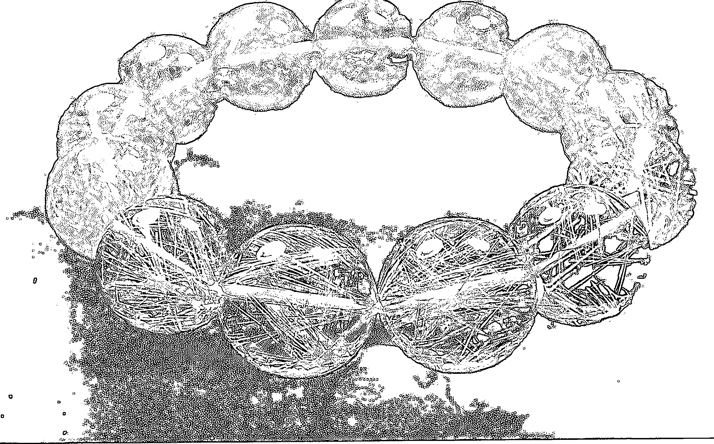

##### (2) 中国水晶的分布

中国古代就有学者知道水晶产于地下，也藏于山中。宋代蔡绦在《铁围山丛谈》中说：“政和间，伊阳太和山崩出水晶，以木匣贮进数百匣，据此自是石中所产。”更有水晶“南白北黑”的说法，《格古要论》载：“南方水晶白，北方水晶黑，信州水晶浊。”

中国现已探明的水晶矿床分布在28个省、市、自治区的109处。除了上海、天津、宁夏外，几乎各省区都有出产。但作为宝石原料开采的并不多，主要分布于江苏、山东、广西、广东、青海、福建、海南、云南、新疆等地。

在新疆民间有“阿尔泰山72条沟，沟沟有宝”的说法。中国茶晶盛产于新疆花岗伟晶岩中，最大的晶体达数十千克。新疆奇台县以出产透明烟晶而闻名遐迩。海南《琼州志》载：“水晶石有五色，清澈如冰梢月出。五指山盛产水晶，如拳、如杯，晶莹圆彻。”海南水晶的形成时期属于中生代的白垩纪，距今约有7000万年。著名的羊角岭水晶矿，水晶质优量多，主要产于同花岗闪长岩有关的矽卡岩带内。

而在河南平顶山境内的水晶品种除无色透明外，尚有紫晶、茶晶和少量的黄晶。除此之外，福建政和县出产无色透明水晶、茶晶；广东云浮县出产无色透明水晶、烟晶；广西凌云县出产无色透明水晶、茶晶；云南富宁县出产无色透明水晶、茶晶、烟晶也都广为人知。

###### 中国最出名的水晶采坑

江苏北部和山东东南部，面积数千平方公里范围内，以东海县为中心，盛产水晶，原生水晶矿脉主要产于元古界胶东东部各种片麻岩、变粒岩、少量片岩、透镜状的大理岩混合组成的岩层中。有伟晶岩脉型、含长石石英脉型、石英脉型矿床，附近还有水晶砂矿。该区水晶一般无色，少许呈茶色、烟色、紫色等。原生矿呈短柱状、长柱状，砂矿为半棱角状及半滚圆状晶砾。晶体较大，一般粗5~10厘米，重100~400克；大水晶粗几十厘米，长1米多，重几百千克乃至2~3吨。缺陷主要为节瘤影响大，绵和气泡多；但水晶储量大，分布广，埋藏浅，民间易开采。

## 第二章

## 知识水晶

## 第一节水晶的特性

水晶是一种无色透明的石英结晶体矿物。它的主要化学成分是二氧化硅，化学成分中含Si：46.7%，O：53.3%。跟普通沙子是“同出娘胎”的一种物质。

- (1) 硬度：一般为摩氏7。硬度是指宝石抵抗刻划的强度。水晶的硬度如钢锉一般坚硬，能经受得起一般性的摔打。

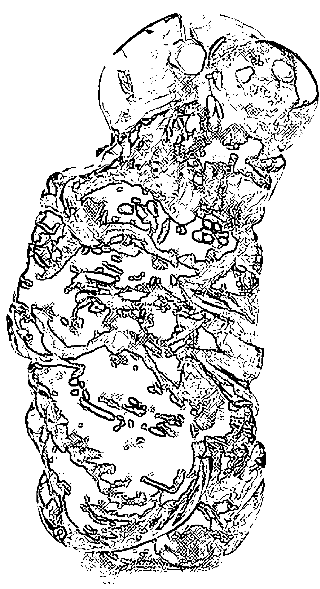

##### 水晶的硬度是如何测的？

很早以前，当铺的老板会对他认为可疑的水晶仿制品，利用一个硬的尖刺或钢锉在不明显的反面作硬度检测，他们在面上刻划，留下一点不显眼的痕迹，以便提醒其他典当同行注意。很显然，这是一种最原始、最笨拙的测试手段，也是一种能导致水晶破损的破坏性实验。

1824年，一位叫弗里希·摩斯的奥地利矿物学家，从许多矿物中抽出10个品种，经过科学实验测出它们的

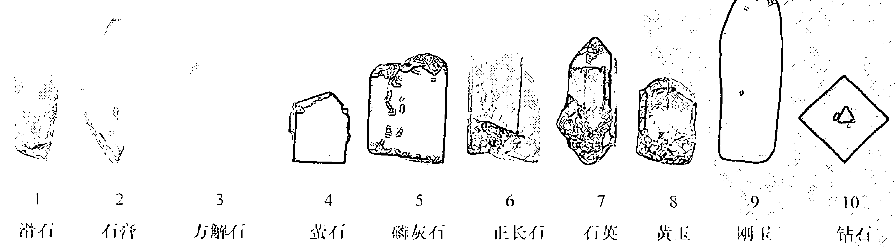

相对硬度，由此得出水晶硬度为摩氏7。尽管后来美国国家标准局使用、推广更科学的诺普硬度测试器，但世界上许多国家的珠宝商，仍习惯于摩氏硬度表。钻石是自然界最硬的矿物，它的摩氏硬度为10；而玻璃硬度为6。

- (2) 解理: 无。所谓解理是指矿物被打击时，常沿一定方向有规则地裂开形成光滑平面的性质。俗称劈开。根据解理的完全程度可以分为五类：极完全解理、完全解理、中等解理、不完全解理和无解理。水晶属于无解理类矿物，即水晶被打击时所裂开的方向和表面都是不规则的非光滑状态。

- (3) 断口: 贝壳状。断口也叫破口。它是指矿物被打击后只产生不规则的破裂，破裂面凹凸不平称为断口。根据断口的形状可分为：贝壳状和锯齿状。结晶完好的水晶，常有好的平行脊的人字形断口；在紫晶和热处理的黄晶中，多呈不平坦到薄片状破口。换一种解释，是说宝石的裂口可以沿着任何方向延伸，而不是沿着解理而发展。

- (4) 比重: 水晶的密度为每立方厘米2.56~2.66克。同体积的水晶重量是同体积水的重量的2.56~2.66倍，块状变种水晶密度可能稍高些。

- (5) 条痕: 无色。矿物粉末的颜色叫条痕。它可以消除假色，减弱他色，保留白色，是比矿物的颜色更为可靠的鉴定特征之一。

- (6) 透明度: 透明、半透明。矿物透光的程度叫透明度。水晶的透明标准为：光线透过厚度为1厘米以上的水晶碎片或薄片时，可以清晰地看到映出的图像。如底像不够清楚，仅见轮廓，那便是半透明。

虎睛石手链

##### (7) 光泽：玻璃光泽。

光泽是指矿物表面对光的反射能力。观察水晶的光泽，可用手握着它，以灯光或窗户投射进来的光线看表面反射。透明水晶亮度与光泽强弱有关。

##### (8) 折射率：水晶的折射率为 1.544 ~ 1.553，几乎不超出此范围。

折射率是指当光线由空气中透入宝石晶体，并产生折射现象，其入射角正弦与折射角的正弦之比值。水晶重折射率：0.009 (最大)，此值非常稳定。

水晶光性特征：一轴晶正光性。

水晶色散：0.013。色散是指宝石的折射率随照明光的不同而有一定的变化。例如钻石对红光折射为2.405，对绿光为2.427，对紫光为2.449。

##### (9) 水晶的熔点：水晶的熔点为1 713°C。其受热易碎的特性，是在实验时发现的。将水晶放在喷焰器的烈焰燃烤，除非有很好的保护，且慢慢冷却，否则晶体容易碎裂。这一脾性，古人就已摸透。《博物要览》提醒道：“凡用水晶器物，不可用热汤滚水注之，即粉裂如击破者。”

##### (10) 化学性质：无特殊气味，化学成分稳定。水晶另一脾性就是怕碱不怕酸（氢氟酸除外），这是由于氧化硅的特性所决定的。像玛瑙一类的宝石，当受热、摩擦、吹气或受打击时，往往散发一种特殊气味。然而，水晶在上述情况下，绝无异味。

### 第二节 水晶的功用

#### 一、水晶的科学运用

古时人们已知道水晶充满能量，但过去技术不发达，无法以科学方法研究水晶。到了近代，科学飞速发展，人们逐渐发现了水晶的各种物理性，并通过其物理性质来进行有效的科学运用。

1880年，居里夫妇首度发现水晶具有一种压电性（Piezo-Electricity）：在水晶的一端施以压力，另一端会有释放出电荷的现象。但当时他们专注于其他的研究科目，对此并未作深入研究。

一直到1922年，又有一位西方科学家W.G.Cady沿着居里夫妇的脚步，再度以水晶作为实验对象，对水晶的压电性进行了更为深入的研究。他对水晶进行通电实验，发觉晶体通电后有膨胀的现象；当停止电流，晶体又会缩回原样。这个有趣的现象使他不断地对水晶进行通电实验。最后，他发现当对水晶通以交流电时，晶体可以以一种非常高速却又非常稳定的速率膨胀收缩。这就是后世所称的“振荡”（Vibration）。

当水晶晶体被仔细切割至一定的大小、长宽、厚薄时，这种振荡的频率（Frequency）又可以被非常精准地控制住。因为振荡频率高速而稳定，所以水晶便被制成芯片，是电器零件不可或缺的原材料，就是所谓的振荡芯片（Vibration Chips）。从此，它开启了人类在电子、通信、计算机领域的新科技时代。

水晶在物理、化学上均为安定材料，其压电性质( Piezo-Electricity，晶体受到压力时，会产生电荷；反之，当受到电压作用时，晶体会产生频率很高的振动，这种可使压力与电荷相互转移的性能就称为压电性)及弹性性质使其机械振动表现于电气上时，有高Q值、低动率、高敏锐性、高稳定性等优良频率的特性。因此凡是要求高度精密、稳定频率的振荡器、滤波器都是以水晶作为振荡材料，甚至在如频率合成、计数、导航、导向、传真、计算机、通信、计时等国防军事用途上，水晶也是必不可少的制作材料。

由于产量巨大，在工业科学上使用最多的水晶是白水晶Rock Crystal-Quartz。它的最主要的元素是二氧化硅，即是Quartz（石英）。我们常把透明的石英称为水晶，其实它们有着相同的元素。石英的化学成分是二氧化硅，属六方晶系，硬度为7，比重为2.66，折光率为1.54-1.55，双折射率为0.0009，具玻璃光泽（玻璃则无双折射率)。而常见的石英多为块状体，但是偶尔也会有具有良好且透明的结晶。

水晶其实并不是什么神秘、难解、遥远的东西，经过近1个世纪的努力，水晶的运用几乎已经深入我们每天的日常生活中了。举凡我们的电子手表、时钟、计算器、行动电话、呼叫器、收音机、随身听、音响、电视、电话、计算机，以及所有的电子、通信、太阳能产品等莫不和水晶有着密切的关连。所以，难怪有的科学家会拿古代的“新石器时代”来和现代比较，说现在是“新新石器时代”，因为上从人造卫星，下到人工心脏的心律调整器，到处都有水晶的运用，水晶改变了我们所有人的生活，它也已成为我们现代文明的必需品。

#### 二、水晶的医疗功效

由于水晶所具有的天性，因此自然的水晶也具有了多种医疗功效。

> 明代著名医学家李时珍在《本草纲目》中清楚地指出，“（水晶）辛寒，无毒……（主治）惊悸心热……安心明目，去赤眼，熨热肿，摩翳碍……益毛发，悦颜色”，具有极其重要的医疗功能。

> 根据中国古代的《神农本草经》记载：白水晶“疗肺痿、下气、利小便、利五脏”；紫水晶“定惊悸，安魂魄，填下焦，止消渴，除胃中之寒，散肿痛，令人悦泽（美容）”。《本草衍义》中载：“嘉州峨眉山有燕萨石，形六棱而锐首，色莹白明澈。”燕萨石就是水晶。

现代很多人都有用碎水晶泡茶喝的习惯，其实这种方法已经流传很多年了。因为水晶中蕴涵大量的矿物质和磁场，经常使用洗干净的水晶泡茶喝会利于身体健康。女孩子可以保养皮肤，一般白水晶比较适用。

收藏和佩戴水晶，等于将自己放在一个能量改造的磁场中，不但可凝神静气、启发心智、刺激记忆、积聚力量，也可调节精神生活、平衡内心世界。水晶的理疗和保健作用如果按照现代科学观点，可以从以下几个方面来理解:

-   (1) 天然水晶具有特殊的“压电效应”。无缺陷的水晶单晶经加工成饰品佩戴，与人体摩擦可以产生微弱的电磁场，这种电磁场具有稳定情绪，促使人体能量集中，减轻病人痛苦和紧张，加快痊愈速度等功能。如美国研究中心所推崇的“水晶疗法”，就是将水晶按压在病人伤患处起辅助治疗作用。
-   (2) 从水晶的光学特性看，水晶居三方晶系中的一轴晶正光性结晶体，有三个方向的光轴，当按方位精工切削琢磨后，光轴方向往往会产生一定的聚光、放光功能，当其刺激到人体某一穴位时，可以产生一定的理疗作用。
-   (3) 从生物地球化学观点来看，水晶同其他宝石一样，形成于特殊的地质构造环境，含有部分对人体有益的微量元素，如铁、铜、锰、钛、锌、镍、钴、硒等，烟水晶由于形成时受到地下放射性照射而保留有少量放射性元素(含量极微，不会对人体有害，反而类似放射疗法)，这些微量元素通过与人体的经常摩擦，会沿毛细孔汗腺等浸入到人体内而促进体内微量元素平衡，使身体各部分更加协调。

1985年，在美国加利福尼亚，来自世界各地的水晶专家聚集一起，做了一个有趣的对比性实验：

植物：将花分别插入一杯含有水晶的水和一杯普通水中，结果发现，插在含有水晶的水中的花活了31天，插在普通水里的花只活了7天。

人体：因为水晶具有压电性，人饮用含有水晶的水后，测得身上所含的电粒子高出正常人的3倍多。

许多自然现象的确是处在人类认识的边界之外，事实也证明了很多当初被说成“迷信”的东西，其实只是一些经验积累而已。相信随着科学的进一步发展，水晶的神奇功能将会得到更多检验、证明和发现。

#### 三、水晶的装饰作用

当人类的祖先把一颗兽牙或一块兽骨，用皮绳穿起挂在自己的颈部时，那不仅仅出于爱美的天性，更希望挂在胸前的战利品能为他们趋吉避凶、消灾解难。

穿缀的水晶作为项链饰品已有着相当久远的历史。最初是由项串逐步演变而来的。水晶项链究竟从哪一年问世，恐怕从文字记载上已无法考证了。无论是从北京周口店猿人洞内发现的由水晶砾石、狐齿连缀的项串来看，还是从意大利古里马鲁提洞穴，或从日本绳文时代的新石器文化遗址发现的用水晶石磨成齿形、穿成月牙形的项链来看，水晶项链的诞生，远远早于人类的文字历史。

古希腊人在奥林匹亚山区发现这种清澈透明的晶体时，他们认为这是冰根据神的旨意变来的，所以把它称为 krystallos，意为“洁白的冰”。古希腊哲学家亚里士多德也多次提到过水晶，他认为水晶是冰经过很长时间演变来的，将水晶取名为“晶体”。在古希腊，妇女们除了使用嵌有水晶、美玉或彩陶珠的项饰外，并没有使用复杂的项链的爱好。这大概和古希腊人崇拜人体的自然美，而不愿意用其他东西来装饰自己有关。

由于水晶纯净和晶莹的特征，常被认为是上帝的化身、力量的源泉。西方国家流传着这样一个传说：在很久以前，这个世界是幸福、和谐的，并拥有积极的正面能量，上帝曾在此居住。一天突然发生了星体大碰撞，上帝从他的宝座上掉了下来，全部秩序都打乱了，世界不再拥有幸福与和谐，而唯一能够幸存下来的就是水晶，水晶这纯洁的石头便成了上帝的化身。

《新旧约全书》中《启示录》一章《圣城的荣耀》一节中，描述圣城耶路撒冷“有神的荣耀。城的光辉如同极贵的宝石，好像碧玉，明如水晶”，“城墙的根基是用各样宝石修饰的：第一根基是碧玉，第二是蓝宝石，第三是绿玛瑙，第四是绿宝石，第五是红玛瑙，第六是红宝石，第七是黄碧玺，第八是水苍玉，第九是红碧玺，第十是翡翠，第十一是紫玛瑙，第十二是紫晶”。水晶在这里被喻为光芒和力量的象征。

俄罗斯珍贵水晶首饰的收藏始于18世纪初。彼得大帝曾颁布了一道保护珍宝的专项命令。他认为，最有价值的那些珍宝不应只是皇族的私产，而是属于整个俄罗斯国家。1914年以来俄国帝王的标志，如皇冠、权杖、勋章和首饰都保存在冬宫钻石馆里。1914年第一次世界大战爆发后，沙皇立即下令把这些珍宝转移到莫斯科克里姆林宫。它们在地下室尘封了8年。1922年前苏联国家委员会对这些珍宝作了鉴定，并决定由国家珍宝馆保存。

时至今日，水晶仍为富国王宫中不可缺少的饰物。

在烟波浩淼的中国南海曾母暗沙的东边，有一个被热带丛林覆盖的小国——文莱。滚滚石油使这个国家成为世界上的富庶之邦，而这里的人们更是对水晶宠爱有加。想象一下那里真实存在的场面：用水晶装扮的殿堂里，永不凋谢的玫瑰花插在水晶花瓶里；金碧辉煌的大厅内，悬挂着一盏盏玲珑奇巧的水晶宫灯；长条的豪华餐桌上，放置着水晶制成的各色餐具，精美绝伦。水晶的世界，超逸出尘。

在非洲的很多部落，似乎还保存着更多的古代色彩。在加纳，酋长会客时，要戴上水晶一类质料的项链，胸前垂着一个金质三角。在肯尼亚，少女们脖子上满满地缠绕着沉甸甸的水晶粒珠项链，长达几十圈。

坦桑尼亚的马赛人，女子将彩色的水晶串珠拼成两三寸宽、有各种花纹的扁平项圈，由大到小，一层层套在脖子上，年龄越大，层数越多，脖子全被箍住，肩膀上也铺满串珠。

扎伊尔的巴库图族妇女，颈上佩戴一串又一串的彩色水晶串珠项链。而男子则在脖子上系上一串锐利的豹牙，豹牙的大小和多寡表示他猎取豹子的头数，即象征无畏与力量。

如今，在印度许多地方，水晶不仅具有装饰意味，更多地则作为仪式和风俗的象征，女儿完婚后，父母常常给新嫁娘戴上一条亮晶晶的水晶项链，只要小两口不分离，女儿就要佩戴终身。

##### 水晶项链演变表

| 世纪 | 描述 |
|---|---|
| 14世纪 | 袒露胸部的女服开始流行起来，水晶项链的地位就变得惹人注目了。 |
| 15世纪 | 水晶项链开始变得更大更长，这是因为当时妇女的裙子很长，袖子也很长，为了和衣裙的长度相协调，项链也自然变长了。 |
| 16世纪 | 可称为水晶项链的黄金时代，当时英国的伊丽莎白女王佩带好几串水晶项链，长长短短、大圈小圈地交叉围绕在胸前，构成了美丽的图案，最长的直达到腰际。 |
| 18世纪 | 可以把水晶磨成各种形状的多面体，水晶项链就成了高贵华美的贵妇人项饰。另外，当时还流行一种用黑天鹅绒制成的饰带，下边挂上十字架、勋章或水晶坠子。 |

中国考古工作发现，中国的水晶项链最早出现于新石器时代的大汶口文化时期，那时已有了项链较为重要的部件枣坠子。江苏新沂花厅新石器时代遗址出土的串饰，由2个琮形管、2个冠形佩、22颗圆锥形管与18颗鼓形水晶珠穿缀成一体，中间以长方形、琮形管隔，款式新颖，色彩亮丽。此后，水晶项链屡屡亮相。在陕县上村岭春秋时期的虢国墓穴中，曾发现由水晶、玛瑙、玉石饰件缀成的串饰，佩于死者的颈项或腕部。战国时期的曾侯乙墓中除发现大量管珠、坠外，还有一些圆形、长方形、长条形、三角形及兽形串饰部件，质料多为紫晶；商代的串饰多由水晶、玛瑙等质料的管、珠、环、璜等组合而成，琢磨细腻，华美坚实；汉代的玉项饰往往在串饰上加进了水晶、玛瑙等。到了清代，水晶项链相当流行，连穿缀用线都十分考究，有天蓝色、深红色、黄色等。

清代嘉庆、道光年间，人们喜爱深红色，因此，深红色碧玺（俗称“双桃红”）、红色珊瑚的价格极为昂贵。到了同治、光绪年间，官员们又崇尚佩戴浅红色碧玺，人们争相购买“单桃红”“胭脂水”等名目的碧玺，一块浅红色的水晶（俗称“单桃红”）就值银上千两。

在古代中国，玉石首饰是用来显示官位的，最明显的例子就是中国清代文武官吏朝冠的顶珠。按礼制规定：朝冠分一至九等。一品官帽顶是红宝石（其实是尖晶石）；二品官帽顶是珊瑚；三品官是蓝宝石；四品官是青金石；五品官是水晶等，排在最后的几品官是用金银装饰朝冠的，显然金银不如宝石珍贵。碧玺在清代也被用为一品或二品官员朝冠的顶珠。

慈禧，中国封建历史中专权时间最长的皇太后，终生无悔地追求着两样东西：一是无上的权力；二是珍稀的珠宝。她所佩戴的头饰、穿的披肩，她的手腕、手指直至指甲上，无一不是各种珍宝，慈禧太后生前就非常喜欢碧玺。内廷大总管李莲英的嗣长子，慈禧的贴身侍卫李成武，在《爱月轩笔记》中详细记载慈禧太后的殉葬品中，就有一朵雕琢而成的双桃红色碧玺大莲花（注：莲花是佛教的象征，慈禧太后常被下属称为“老佛爷”），重达36两8钱。这在当时的价值为75万两白银，堪称稀世之宝。末代皇帝溥仪也曾经羡慕西方生活方式，趁着大婚的机会，特意托请上海亨达利钟表店的德国老板，从国外购置了一套水晶家具陈设在养心殿他的单身卧室内。

长久以来，水晶总是与美丽的感性神话联系在一起，因此也蒙上了一层神秘的魔幻色彩。不管是梦境、神话，还是魔法，都能在人们的生活中以多样的形式表达或体现出来。

每个民族在它的文明发展史中都蕴育了独特的珠宝文化，一些珠宝首饰由于材质的奇特性或者某种传说而被赋予了特殊的灵性，成为人们所说的“祈福珠宝”。

受传统文化影响，中国的水晶雕刻件一般是有寓意的。工艺品作为民俗文化的物质基础，自身同时也罩上了强烈的民俗文化的色彩。有的工艺品类因民俗而产生，有的因民俗而改变。如民间工艺中的虎头鞋、虎头帽、除五毒肚兜等儿童服饰，便是民俗作用于工艺的产物。

中国人长期崇尚和使用龙凤作为装饰题材，使用谐音寓意的汉字与图形结合来表达吉祥意义，如用蝙蝠来喻意幸福，以鱼表示余裕，用鱼、莲表示多子多孙延绵不绝等，都是特定的民俗现象。大概从唐代开始，以下很多的题材寓意就已经成型了。

“马上封侯”，中国人认为猴是吉祥物，由于汉字“猴”与“侯”谐音，在许多图画中猴的形象表示“封侯”的意思。如一只猴子爬在枫树上挂印，叫“封侯挂印”；一只猴子骑在马背上，叫“马上封侯”；两只猴子坐在一棵树上或者一只猴子骑在另一只猴子背上叫“辈辈封侯”。

“平安富贵”，富贵一般以芙蓉、海棠来借喻，平安，“平”与“瓶”谐音，“安”一般以古时候十八般武器中的“戟”插入瓶内叫“安”，一般插三只戟，一只是双耳戟，两只单耳戟，加起来为四耳戟，以谐“四季”之音，所以用瓶插三戟来比喻“四季平安”。

民间多以瓶插牡丹图像表示富贵平安之意，牡丹与石头或梅花组成“长命宝贵”；鸳鸯与牡丹象征“一路宝贵”；白头翁与牡丹象征“长寿宝贵”或“宝贵姻缘”；牡丹、玉兰绘在一起，象征“玉堂宝贵”即宝贵之家；牡丹与鱼绘在一起，叫“宝贵有余”。

大象驮宝瓶喻“太平景象”，大象的寿命很长，被人们看做瑞寿，象也喻为“景象”，观音菩萨的净水瓶（观音瓶），内盛圣水，滴洒能致祥瑞，也叫“太平有象”。

“五福临门”，“蝙蝠”因与“遍福”“遍富”谐音，尽管它形象欠佳，但通过充分美化把它作为象征“福”的吉祥图案。人们将绘有五只蝙蝠的门联贴于门上，祈求“五福临门”，五福环绕寿字，叫“五福献寿”；盒子中飞出五只蝙蝠，象征“五福和合”。

云纹与蝙蝠绘在一起，叫“天降鸿福”；一只蝙蝠衔两枚古钱及两只寿桃，“两钱”谐音“双全”，桃象征长寿，所以叫“福寿双全”；寿星旁有蝙蝠飞舞，象征“福星高照”；“福至心灵”，雕灵芝如意（灵）、蝙蝠（福）；“福在眼前”雕蝙蝠（福）、金钱（前）。

水晶雕刻品受人喜爱的题材还有“福豆”，以水晶雕成豆角，据说寺庙中常以豆角为佳肴，和尚称其为“佛豆”；“连年有余”，雕荷叶（莲）、鲤鱼（余），有的还有童子骑在鲤鱼上，有的是雕鲶鱼，取其意“年年有鱼”；水晶辣椒，寓意红红火火；“福寿”雕佛手；“福禄”雕葫芦；“福禄寿”雕葫芦（福禄）、小兽（寿）；“双欢”雕两只首尾相连的獾（欢）；“猕猴献寿”雕寿桃、小猴；“子孙万代”雕葫芦、花叶、蔓枝，取葫芦内多籽，蔓与万谐音之意；“节节高”雕翠竹；“岁寒三友”雕松、竹、梅等。

这些民俗现象与水晶工艺品结合，形成了水晶工艺的民俗文化内涵和品格。

##### 特大水晶为什么被珍视为稀世罕物？

据国内外地质专家考证，水晶主要生于石英脉中，含水晶的石英脉，仅占石英脉总数的2%~10%，而脉石英则是水晶“母液”。有水晶必有脉石英。水晶常生长在石英脉的洞中，称晶洞。含水晶石英脉通常“一脉一洞”，单个晶洞生长的水晶，就叫单晶。单晶一般重100~500克，几千克至十余千克的晶块也较为常见。俗话说：“星星到处有，难得见月亮。”能够形成单个水晶2吨以上的地质地岩则非常稀少，而且至少要有25000万年以上的稳定成长发育期，其概率是极其微小的。所以，那些深藏地下几十亿年的宝物的问世，无疑是人类惊人的发现。

## 第三章 神秘晶迷

### 第一节 水晶之美称

古往今来，人们出于对水晶的珍爱，曾赋予它一串极富美感的雅称。

水晶最初在中国古代被分在“玉”一类，称为水玉，意谓似水之玉，又说是“千年之冰所化”。唐代诗人温庭筠《题李处士幽居》写道：“水玉簪头白角巾，瑶琴寂历拂轻尘。”

晋人苗昌在《三辅皇图》中记载了这样一个故事：“董偃以玉晶为盘，贮冰于膝前，玉晶与冰相洁，侍者谓‘冰无盘，必融湿席’，拂玉盘坠地，冰玉俱碎。”可见当时人们认为水晶是寒冰所化，得出了“冰玉俱碎”的推论。

水玉一词最早频繁见于《山海经》：“又东三百里，曰堂庭之山……多水玉”；“丹山出焉，东南流注于洛水，其中多水玉”；“逐水出焉，北流注于渭，其中多水玉”。这里的“多水玉”意思就是水晶很多。司马相如《上林赋》曰：“水玉磊河。”水晶得名水玉，古人看重的是“其莹如水，其坚如玉”的质地。

《山海经》中，水晶又被称做水碧：“又南三百里，曰耿山，无草木，多水碧。”郭璞注：“亦水玉类。”这种称谓常被文人所引用，晋代郭景纯《璞江赋》道：“瑰，水碧潜。”

水晶还被称为水精。《广雅》有巧解：“水之精灵也”；李时珍则说：“莹洁晶光，如水之精英。”细加考究，此称还蕴含浓厚的宗教意味。水精一名，最初见于佛书，后汉支曜翻译的《具光明定意经》说：“其所行道，色如水精。”后来，在安世高翻译的阿那邸化《七子经》中，水精被列为四大宝藏之一，支娄迦谶译成的无量清净《平等觉经》称，水精为七宝之一。佛家弟子确信，水晶会闪射神奇的灵光，可普渡众生。于是水晶又被尊崇为菩萨石。《谈苑》说：“嘉州峨眉山有菩萨石，形六棱而锐首，色莹而明澈，若泰山狼牙上饶水晶之类。”《庶物异名疏》中说：“水精出大秦国，一名黎难。”结晶完整的水晶晶体，就如参差交错的马齿，所以人们又叫它马牙石。先民们最早用它研磨成眼镜片，因而送它一个眼镜石的绰号。《广雅》称水晶叫石英，色白如莹者又叫白（为附的异形字）。司马相如《子虚赋》就有“雌黄白”之句。苏林解释：“白，白石英也。”水晶还有玉瑛的别称，《符瑞图》载：“美石似玉，水精谓之玉瑛也。”水晶有通称，也有俗称。广州一带称水晶叫晶玉，又名鱼脑冻；江苏东海县山民发现水晶会“窜火苗”（压电性），于是给它起了个放光石的俗名。

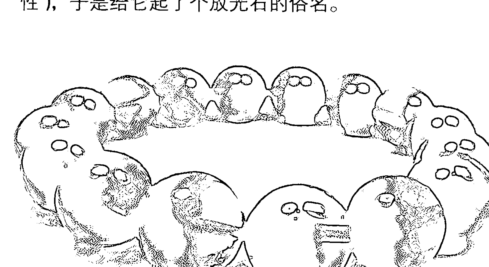

世间一物多名，不足为奇，而像水晶拥有这么多的别称，实不多见。从水玉、水碧、白坧、玉瑛、水精、石英、黎难、晶玉到菩萨石、马牙石、眼镜石、放光石、千年冰、高山冻、鱼脑冻等，构成了一部水晶文化史。

##### 中国水晶之乡

连云港市东海县，素有“水晶之乡”美誉。这里是中国水晶的重要产区。经勘察发现37种矿物，2250平方公里有一半地域蕴藏着水晶和石英，总储量达3000万吨，其中水晶储量约30万吨。现在存放在北京中国地质博物馆的3.5吨水晶大王出自东海；毛泽东的水晶棺也选用东海水晶；加之东海水晶二氧化硅含量高达99.99%，储量及质量均全国第一。年产500多吨，占全国产量的一半。

东海县的水晶蕴藏量大、质优。所产水晶，含硅量高，杂质少，性软，易溶化，其质量亦居全国之首。在东海县，每隔5天就会有一个水晶集市（农历每月逢四、九），清晨5、6点钟的时候就已经聚集起了从全国四面八方赶来的人们。集市上交易的并不是人们常用的吃穿用的物品，而是水晶。在这里，人们把加工好的，或者加工成半成品甚至是未经打磨加工过的水晶原石带来，等待着能卖出个好价钱。我们发现，东海的水晶集市没有普通集市上卖主们熙攘的叫卖声，大多数买东西的人也是看准了才会问价。在这儿，几乎每个人贩卖的都是自家加工的水晶制品。很多东海本地的商户也会在这里挑选毛料，进行加工出售。

在这里，既能找到十几、几十块钱的挂件，也有以克为计量单位出售的项链、手链，更有几千甚至上万块钱的水晶石料。

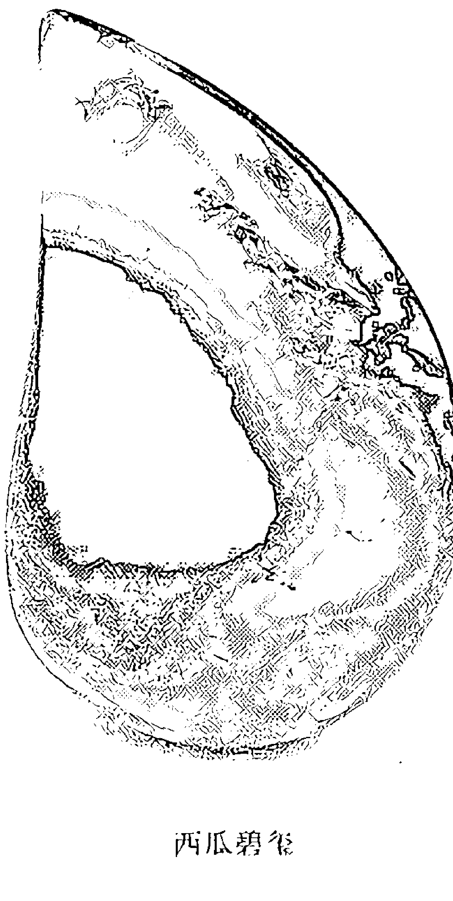

### 第一节 晶石文化的渊源

从某种意义上说，一部浩如烟海的人类文明史，也是一部漫长的由简单到复杂、由低级到高级的晶石文化史。石文化则是人类文明中的一个重要分支，其基本内容是以天然石块为主要的对象。

大约在250万年前，原始人掌握了用石头碰击起火的方法。人类的祖先在旧石器时代就利用天然石块为工具、当武器。他们最初注意到石头，可能只是把它们当成了玩具。他们把不同大小、形状、颜色的岩石放在手中把玩或相互投来掷去，有时岩石砸到了同伴的身上，他们惊异地发现身体被触部位产生了痛感，这使得他们想到拿石头来做武器，在围猎时掷向动物。

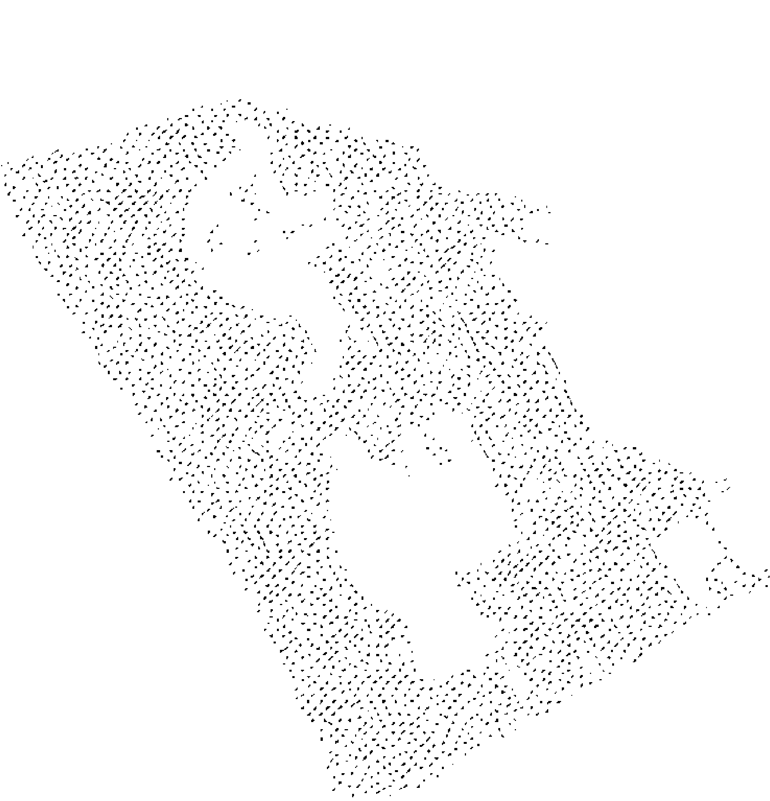

后来，早期的人类又发现用尖锐的石块可以削剥树枝，不起眼的岩石就又成了人类的工具。到新石器时代出现了打制石器，成为他们狩猎和屠宰中必不可少的重要帮手。

砍砸器是旧石器时代的一种形体较大的工具，器身厚重，有钝厚曲折的刃口，用于砍树、做木棒、挖植物块根、砸坚果等工作。石器——人类最初的工具制造，艺术起源的原点坐标。

早在公元前3500年，古埃及人就已在阿斯旺附近开采水晶矿藏了，并用做皇室的专有装饰物。

奈费尔提蒂女王头像于1912年被柏林考古学家博尔夏特在一间公元前1340年左右的手工作坊遗址中发现。头像的左眼没有完成，表明这个头像是用来做模具的。这个精美的奈费尔提蒂女王头像，头戴高高的蓝色王冠，王冠上有一条黄金宝石饰带。作为埃及王室象征的圣蛇盘绕在王冠的前额。头像的右眼用薄水晶石做成，在水晶石中镶着一块人造黑宝石。

古罗马时代，无色透明的水晶出产于万年积雪的阿尔卑斯山，罗马人视其为“冰的化石”，而它的语源来自于古希腊，为“澄清的春水”之意。对紫色近乎痴狂的古罗马统帅恺撒，当然也会狂热地喜好紫晶，他还曾派几千人到乌拉尔矿山去寻找这种宝石。他收藏的紫水晶和祖母绿，在1906年被俄国政府出售。

在东方，中国人创造了光辉灿烂的“玉石文化”。中国历史中的“玉文化”中的“玉”，与现代玉石的概念不同，是一种广义的称呼。今天的考古界和珠宝界比较统一的认识是把软玉和翡翠视为真正的“玉”，而按照中国古籍中的看法，白水晶、碧玺、玛瑙等广泛意义上的水晶都是玉石中的一种。

与西方不同，在中国，水晶除了作为装饰品外，出于道家亲近自然的思想，历代文人开启了独特的赏石文化。诗人陆游一句“花如解语还多事，石不能言最可人”最能体现文人对“晶石”的喜爱之情。

古往今来，中国士大夫多有寄情于石，以石遣志，以石为友或以赏玩石做消遣。面对石的魅力，甚至连佛前之人也无法无动于衷。有一明惠上人，因未能拜访释迦在印度的遗迹而感到遗憾，于是从海边拾来两块石头，放在身边，时时朝奉，并且说：“想到洗过释迦的水和这里的水是相通的，因而对于这块石头，就倍感亲切了。”他把对释迦的崇敬之情，转而寄托在石头上了。

东晋陶渊明以自然石为欣赏对象，被奉为开创“赏石先河”的鼻祖。

唐白居易深爱太湖石，作《太湖石记》，为唐代赏石鉴赏方法创始人。白居易对石收藏立论重在欣赏：“百仞一拳，千里一瞬，坐而得之。”

南唐后主李煜是中国首位爱石的帝王，长于书法、国画，他收藏石砚、山石，其钟爱的“海岳庵研山石”是从米芾手上以一宅换一石得来的。


绿幽灵水晶雕件——海底世界

北宋第八代皇帝宋徽宗，诗、书、画三绝，是历代最有艺术才能的皇帝。他下旨将江南名花奇石上贡，地方官吏趁机横征暴敛，以致“花石纲”成了农民起义的导火线之一。受皇帝的影响，历代的达官贵族也纷纷搜集奇石装点自己的宅苑。

苏轼的《怪石供》题“文而丑”，即“石怪愈表石之千态万状，愈有石味”。宋代赏石文化的最大特点是出现了许多赏石专著，如杜绍（字季阳）的《云林石谱》、范成大的《太湖石志》、常懋的《宣和石谱》、渔阳公的《渔阳石谱》等。其中仅《云林石谱》便记载石品有116种之多，并各具生产之地、采取之法，又详其形状、色泽而品评优劣，对后世影响最大。

以书画两绝而闻名于世的北宋米芾是11世纪中叶中国最有名的藏石、赏石大家。他不仅因爱石成癖，去官服对石下拜而被国人称为“米癫”，而且在相石方面，还创立了一套理论原则，即长期为后世所沿用的“瘦、透、漏、皱”四字诀。

- 瘦——指石的形体苗条婀娜，具迎风玉立，秀逸挺拔之姿，露出石骨之态；
- 皱——指石的表面凹凸不平，形状千奇百怪，在阳光照射下会产生明暗的变化；
- 漏——指石的大孔小穴，上下、左右、前后无不相通，八面玲珑；
- 透——指石的玲珑剔透，石纹贯通，“纹理纵横，脉络起稳”。

水晶的观赏，无疑属于“赏石”的范畴，大体的原则通用，但它有着独特的分类属性与文化特征。“水晶文化”往往通过对观赏石的鉴赏透露出它所沉淀的艺术意蕴，宛如奔涌的山泉，汩汩流淌。《说石》的概括可作为借鉴：

- 端好：完整纯洁，无瑕可指；
- 精致：精莹细润，致致生光；
- 细腻：肌理细腻，比美羊脂；
- 朗透：朗似玉山，清如水月；
- 饱满：颜色花纹，面面俱备；
- 鲜艳：尽态极妍，光彩绚目；
- 绚烂：五光十色，灿如云锦；
- 绮丽：傅粉施朱，风光别具；
- 清淡：清描淡写，超逸出尘；
- 雅趣：修理井然，别饶深致；
- 苍老：文深色重，老气横秋；
- 柔嫩：色轻质细，软丽绝伦；
- 高古：朴质无华，盎然古色；
- 含蓄：茹烟吐霞，耐人寻味；
- 深远：岩深谷迥，无尽无穷；
- 疏野：疏秀为质，野鹤闲云；
- 雄浑：气足神完，浑然太璞；
- 刻画：雕琼镂翠，巧胜人工；
- 磊落：大叶粗枝，磊磊落落；
- 纤秾：文细于丝，色轻似染；
- 生机：飞潜象形，生机勃勃；
- 精神：短小精悍，神采奕然；
- 奇特：奇异特出，匪夷所思；
- 怪异：光怪陆离，可惊可喜。


幽灵共生钛晶

水晶观赏石清如水，纯无瑕，透如镜，有收藏家将水晶奇石归纳为七趣：看人物造型有仙趣，看动物巧石有童趣，看风景名胜有游趣，看众生相有俗趣，看松竹梅三友有雅趣，看石上化石有古趣，看日月星辰云蒸霞蔚有天趣。

天地至精结为水晶，水晶英华凝而为赏石。水晶观赏石蕴含天人合一、心物交融的石文化内涵。那润滑的晶面，挺拔的晶棱，锐利的顶锥，巧夺天工的几何形状，姹紫嫣红的包裹体，犹如“天造地设景，神工仙凿物”。无怪乎人们会在欣赏之际，体会到大自然的魅力和神韵，领略到返璞归真的意趣。

### 第3节 水晶的故事

#### 一、清朝帝王与水晶眼镜

眼镜是我们现代生活的寻常之物，但是在玻璃还没有广泛使用的古代，作为眼镜镜片原材料的正是水晶。水晶也被称为眼镜石。这种高档的奢侈品在当时的国内外都是极其罕见的。

中国最早的水晶眼镜出现在何时，众说不一。曾有史书说，远在公元前两千多年，就有君主佩戴水晶眼镜了。还有的说，早在孔子生活的年代，就有人用水晶或其他透明矿物做成眼镜来遮阳，或用以医治眼炎。

考古界则认为，中国最早的水晶眼镜出现在公元1世纪。江苏扬州邗江县甘泉山的一座东汉时期的古墓中，出土了一批珍贵文物，其中就有一件小巧的水晶制作的放大镜。这枚放大镜是一片圆形水晶凸镜，镶嵌在一个指环状的金圈内，能将细小的东西放大5倍。这大概是中国目前发现最早的水晶眼镜实物了。

在古代，水晶不易得，水晶磨制眼镜更是珍稀，帝王们常用它颁赐宠臣，大臣得此恩赐，视之为莫大殊荣。

> 张靖之《方州杂录》记载，明宣宗用水晶眼镜赐臣，形制呈折叠式，“合则为一，岐则为二，如市中等子匣，老人目昏不辨细书，张此物加于双目，字明大加倍”。

清朝帝王对水晶眼镜的偏爱，可说是历代君王中不多见的。康熙时，两广总督向宫中进献水晶眼镜，康熙试戴后感觉不错，遂向儿子胤禛（即后来的雍正帝）颁赐。雍正帝即位后曾说：“昔圣祖（康熙帝）赐朕眼镜，朕眼目原不似今精明。”雍正帝之子弘历（即后来的乾隆）亦是近视眼，时常戴水晶眼镜批阅奏章，并作《戏题眼镜诗》一首。

又据《吴瓠庵集》等书透露，嘉靖时水晶眼镜尚属罕有，“此物在前明极为贵生，或颁自内府，或购之贾胡，非有力者不能得。”

水晶眼镜在清代康熙时仍不多见，当时有个文人阮葵生在他的《茶余客话》中说到这样一件事：“康熙癸未年五月，上特少宗伯孙公岳颁水晶眼镜。虞山将文肃公时方为庶吉士，侍直内廷，奏臣母曹年老眼昏，乞恩。上亦赐之。当时以为殊荣，盖其制法尚未传世也。”

康熙癸未年为公元1702年，礼部侍郎孙岳颁所得的水晶眼镜还是皇帝特赐，可见其稀珍。而皇帝内府储存它，当然是因为宫廷需要，不能排除时年50岁的康熙帝用它“辨细书”。

直到乾隆年间，水晶眼镜才成为普通商品流行于市。清代史学家赵翼《陔余丛考》载：“古未有眼镜，至明始有之，此物在前明极为贵重。或颁自内府，或购自贾胡，非有力者不能得。”而他本人就生活在乾隆年间。

说到乾隆与水晶眼镜，自然使人想到这则趣闻：乾隆五十四年，恰逢大考，考官奏请乾隆帝作文用何命题。这时乾隆正与老臣谈论水晶眼镜，于是随口说：“眼镜”并交待限定用“他”字韵。当时，一代大学者阮元还是一位进士，初入翰林，他在考场以《眼镜》为题作诗，首二句就写道：“四目何须尔，重瞳不用他。”重瞳，通俗一点来说，就是一个眼睛有两个瞳孔。传说中虞舜为重瞳，后人以重瞳来指圣明的皇帝。这里诗人一语双关，马屁拍的正好，乾隆果然“阅诗大喜，拔置第一”。

原来，那时乾隆年近八旬，自诩目力不减，颇以老健自喜。实际上，他为了顾及帝王的尊严，不在大庭广众之下佩戴眼镜罢了。阮元投其所好，以诗恭维，正中帝王下怀，不经意拣了顶乌纱。

到了清末，仿制国外玻璃眼镜多了起来，机灵的广东眼镜商来个古为今用，洋为中用，“仿其式以水精（晶）制成”。

眼镜在西方流行已有7个世纪，镜片材料同样用的是宝石，不过，它不是水晶，而是大绿宝石。罗马皇帝尼禄被认为是第一个使用某种眼镜类似物的人。这个残酷的君王眼睛高度近视，于是他按照医生的建议，用一块大绿宝石作为眼镜，尼禄常用它观看角斗士与猛兽格斗的表演。

公元1267年，英国思想家、实验科学的先驱者培根，用水晶制成眼镜实物，用它来阅读圣经。如今意大利的威尼斯图书馆及比萨修道院还珍藏着当年的这副眼镜。

佩戴水晶眼镜第一次出现在画面上的是在公元1352年，那时，不少名人都佩戴水晶眼镜。那个年代，水晶眼镜则被称为“假眼”。

#### 二、水晶屏风的典故

“吴牛喘月”是一个流传很广的典故，殊不知它与水晶屏风还有关联。《世说新语》载：晋武帝召见尚书令满奋，叫他靠北窗坐下，北窗口立一扇透明的水晶（一说琉璃）屏风，看上去好像只有一个挡不住风的空架子。令满奋生来就有怕风的毛病，因此不敢坐到北窗那边去，但是皇上让他坐又不便不坐。晋武帝知道他有怕风的怪疾，见他这样，料他没有认出屏风上的水晶，于是指指水晶屏风，笑了起来。这时令满奋发觉自己闹出了笑话，他一边走向北窗的座位，一边自我解嘲：“臣犹如吴牛，见月而喘。”

“吴牛喘月”典故出自江南一带：水牛怕热，尤其是最怕夏天中午毒热的太阳，有时晚上看见月亮以为是太阳，也吓得喘起粗气来。令满奋借用这一典故，颇带机趣地把自己的洋相给掩饰过去了。

《拾遗记》又载：董偃通常睡在延清室，室内陈设一架水晶屏风。这年夏天，天气炎热，新来的仆人使扇子从屏风外给主人扇风。董偃觉得好笑，说：“水晶石难道须扇了之后才清凉吗？”仆人丢下扇子，用手摸了摸才知道有水晶屏风。

水晶屏风是屏中珍品。屏风始见于东汉，盛行于清代，历来是中国的室内主要器具之一。古代称之为“依”，即设在户牖之间的屏风。《辞海》上载有“依”“斧依”，都是一个意思，指的是古代帝王使用的屏风，因上有斧形花纹，故名。

中国古代建筑大都是土木结构的院落形式，不如今世钢筋水泥房屋那么严紧。为了挡风，古人开始制造屏风这种家具。除了挡风之外，屏风还是室内可移动的精巧断隔。有人在床后安置屏风，亦作倚靠或挂置什物之用。

> 后汉李尤的《屏风铭》有这样一段：“舍则潜避，用则设张。立必端直，处必廉方。雍阏风邪，雾露是坑。奉上蔽下，不失其常。”

它道出了屏风的特征和功用。后来，巧匠在屏风本身的美化、装饰上下过许多功夫，因此它才逐渐演化为中国传统的具有实用价值的精美手工艺品之一。

水晶屏风有插屏和围屏之分。插屏多是单扇的，围屏则由多扇组成，少则二扇，多则十二扇，能随意折叠，可宽可窄，使用方便。帝王贵族们使用的屏风，用料尤其珍贵，做工精细。水晶屏风虽比不上云母屏风、珐琅屏风、象牙屏风、杂玉龟甲屏风那么璀璨斑斓，它却以全素的雅致和宝贵的价值为帝王将相所珍爱，成为他们专用的奢侈品，正如《盐铁论·散不足》所说：“一屏风就万人之功。”

宋代进士张居中有一首题唐代丞相李林甫的诗这样写道：

> 当时淫侈信奸回，谁料韩休荐相材。
偃月堂中猖鬼散，水晶屏上美人来。

其下注云：“初，韩林荐林甫有相材，林甫当国，几除拜必用猖鬼败亡日，欲其不终吉。（杨）国忠作相，在家有水晶屏上美人影，败之日美人不来。”

诗中把奸相家的水晶屏风说得多玄乎，屏上的美人倩影可以预卜主人凶吉，主人倒霉之日，美人不再显露于屏面了。另一书上却记载，只因美人浮现屏上，杨国忠才垮台的。

#### 三、水晶棺

1976年9月9日，毛主席逝世。中共中央毛主席治丧委员会当即作出决定，用最优质的东海水晶为毛主席熔制寿棺。以后，东海县人民先后6次共贡献了35.2吨纯净天然水晶，以此熔制水晶棺，安放在纪念堂内，供万世瞻仰。

毛泽东主席的水晶棺的熔制合成任务是由北京的六零五厂、上海新沪玻璃厂和锦州一五五厂等分别承担的。最终选用优质天然东海水晶做原料，熔炼成大型石英玻璃板材。

##### 金发晶项链

熔炼大型水晶件，一般退火需等3年，才能完全消除水晶玻璃的内应力。为此六零五厂老技工徐兆彩发明了新工艺——“打磨”“模压”“拼接”，解决了这一难题。约2米长、1米宽的水晶大板，是20厘米见方的小水晶板一块块焊接出来的，焊接由老技工石维成负责。水晶熔点超过2000℃，必须在熔化的一瞬间完成焊接，他用氢氧焰喷射灯紧盯焊缝操作，厚厚的金属防护服上冒着烟，得有专人往他身上浇水，他双脚都泡在了水里。最终完成的水晶棺板材，石英粉纯度达到了“六个九”——99.9999%。此纯度迄今仍保持着世界水晶棺之最。一代伟人列宁、斯大林、胡志明、金日成逝世后，其遗体都装殓在水晶棺内。水晶棺，寄托着生者对逝者的无限景仰与无尽哀思。

古往今来，人们爱用水晶做棺，自有一番奥秘。《墨子·节葬》说：“棺三寸，足以朽体。”这是木棺常遇到的麻烦，也是令死者家属最为痛心的事。然而，择用水晶做棺则无此之忧，这是因为水晶棺硬度高，密封严，水晶折射出的特异光线对尸体有防腐功效。再者，透明的隔层也便于观看、瞻仰。更为神奇的是，死者静卧棺内，历久而容颜不改，栩栩如生。人类为亡灵寻觅到这样高雅的安息空间，使“永垂不朽”的美好祝愿变成了现实。

水晶棺，棺中之珍。制作一副棺材，需要数量可观的水晶，而水晶向来被视为名贵之石，取之不易，且自然界中极难寻觅到如此硕大的晶材，即使花上昂贵的代价搜集到大量散晶，将散晶熔炼成棺，也必须具备相当的条件和高超的技艺，故而水晶棺才极其珍贵。

在古代，水晶棺是死者地位的象征，富有的标志。世间最早享受水晶棺的幸运者，是古埃及的法老和王后。观众走进埃及国家博物馆，可以见到这样情景：11副水晶棺中，安然静卧着11具木乃伊，他们的皮肤和毛发历历清晰，容貌也与常人无多大差别。他们都是数千年前显赫一时的法老和王后，其中最著名的是公元前13世纪第十九王朝的拉美西斯二世。埃及的古文字这么记载：公元前700年～公元前650年时，埃及人将死者做成木乃伊，然后覆以石膏、涂料，再装殓到水晶棺内，从外面可将木乃伊遗容看得一清二楚。这些法老和王后的木乃伊，都是悠悠历史的无言见证人。

在科学日新月异的今天，水晶棺屈驾降尊，进入寻常百姓家，已经不再是梦寐以求的难事。据悉，东南亚一些国家的殡仪馆内，备有各种各样的微型水晶棺，以供盛装死者骨灰之用。让死者的魂灵享受一下最特殊的待遇，对遗属也是一种莫大的精神慰藉。

### 第四节 水晶的传说

古往今来，晶莹剔透的水晶常被看做是世界上最纯净的东西。它被人们比做贞洁少女的泪珠、夏夜天穹的繁星、圣人智慧的结晶、大地万物的精华，它还被誉为美丽世界中一颗永不陨落的恒星。古往今来，水晶演绎出许多美丽、动人的神话传说，被赋予美好象征、希望，也形成一个个不解之谜。

#### 一、仙子洒落的泪珠

在东海有座形似草屋的山冈叫做房山。山间汩汩流淌着两股清粼粼、蓝莹莹的泉水，上者叫“上清泉”，下者叫“下清泉”。一位美丽绝伦的神女名叫水晶仙子，就住在这风景秀丽的山水中。年复一年，水晶仙子偷偷爱上了清泉村一位英俊勤劳、靠打柴为生的小伙子，并以身相许，愿与他结为夫妻。后来，这事被天宫的玉皇大帝知道了，遂派天兵天将将水晶仙子强行押回天宫，多情的水晶仙子不愿与夫君分离，一路上泪水涟涟，洒落的泪珠恰似倾盆大雨，落在大地上后便化做了水晶。

神话是一种古老信念的自然流露，人们相信那些珍贵的水晶，成长于天地玄黄、宇宙洪荒、日月盈昃、晨宿列张的年代。正如 17 世纪一位英国宝石匠所言：“每块宝石都有一个由某种宝石或其他材料形成的子宫，宝石在它的子宫里，通过汲取营养液而获得滋养。”

特殊线发品下排

#### 二、水晶环传奇

《集异记》说到这样一件蹊跷事：兖州徂徕山有一光化寺，寺中住着一位读书人。夏季的某天，书生在走廊上阅读墙上的诗，突然遇到一个穿白衣的美女，她有十五六岁，姿色艳丽。书生就问她从哪里来，姑娘笑着回答说：“家在山前。”书生心中知道山前没有这样俊俏的姑娘，但也不怀疑她是妖。因她容颜娇美，书生神情欲飞，不时用眼瞟她，并把她引到自己的房内，私订终身。

姑娘说：“你不嫌弃我是农家女，我发誓要永远报答你，但今晚我必须回去，下次再来就不走了。”书生尽力挽留，但还是不能如愿。于是书生拿出平时保存的一只贵重的水晶环送给她，说：“希望你能常看它。你可以快点回去了。”之后，书生就送了她一程。姑娘说：“我怕家人前来迎接，你还是回去吧。”书生没法，只得悻悻回到寺中，目送她离去。

姑娘走了大约百来步路，突然不见了。书生记牢了她消失的地方，下楼去寻找。寺前有数里宽的场地，小树细草，根本不能隐藏，书生找来找去不见踪影。到了傍晚，书生打算回到寺中，突然看到草丛中有一株百合花，那花色娇美可爱，于是他将它拔了起来，细细一看，它的根弯曲如拱，与平常的百合花不同。书生回到寺中后，发现自己的水晶环也在中间，不禁大为惊叹，悔恨不已，之后，书生恍恍惚惚，生了重病，过了半个月就死去了。

玉环为众人所熟知，但很少有人知道水晶环为何物，其实水晶环也是玉环的一种。

据考古界透露，水晶环貌不出众，起源远古。东北地区距今5500~5000年的红山文化已发现水晶环，后在山东临淄郎家庄的春秋晚期古墓中出土过水晶环；湖南古丈白鹤湾、陕西凤翔西村的战国中期墓葬中，也发现这种水晶环；山西长子羊圈沟牛家坡的战国晚期古墓中，水晶环是珍贵的陪葬品之一。

水晶环流行于新石器时代至明清这段久远的岁月。石器时代的水晶环，其基本造型为扁平的圆环状。整体圆整光洁，内外壁平直，有的环上钻有圆孔，孔壁斜直。水晶环中间稍厚，边缘较薄，通体磨光，手感圆滑。春秋战国时期，水晶环的特点是环体中部较厚，两侧边缘较薄，由中部至边缘呈斜坡状，面无纹饰；这一时期的水晶环精巧美观、圆润光洁。明清时期，水晶环较早期更加娇俏小巧，主要是各类耳环，纹饰纷繁，优雅大方。

#### 三、紫水晶和紫晶姑娘的传说

希腊神话中相传，一位美丽如玉的少女在森林中散步，她曼妙的身姿、飘动的长发、幽雅的香气，使林间的小动物都欢快地围着她跳舞，连花草都笑逐颜开，森林里充满了快乐祥和。

酒神无意看到美丽如仙子的少女，心动不已，想娶她为妻，少女受到惊吓，在林中奔逃；强悍的酒神奋力追赶，将少女紧紧拥在怀里。此时贞洁女神迪亚娜及时伸出了援助之手，顷刻间把少女变成一座雕像，美丽得那么真实生动，仿佛心脏还在跳动。

酒神看到心爱的女孩变成了雕像，后悔极了，他伤心的泪水滴入酒壶，却想不出办法救女孩。酒神把手中的一瓶葡萄美酒泼在少女雕像上以示歉意，希望得到她的原谅。酒神走后，少女的雕像变成晶莹剔透的紫晶，如美丽的葡萄般娇艳欲滴，充满了浪漫高贵的气质，这就是妩媚动人的紫晶姑娘。

因为这个典故，紫水晶在希腊文中又有“不醉”的含义存在。紫水晶的英文名语源来自希腊文的Amethystos，意即不喝酒的意思。古罗马时代，为了避免烂醉不醒，人们经常手持紫水晶杯在宴会中饮酒取乐。而紫水晶也被人们视为“可以避开人生种种醉后丑态的矿石”。

紫水晶原本就代表着高贵、典雅、华丽、幽静、高尚、庄重和权势，而这个美丽的传说更是给紫水晶染上了一层浪漫的色彩。

公元1世纪的学者伊壁鸠鲁在他的巨著《博物志》中有“紫色的宝石是维纳斯的眼睛”一说。在西方很多国家，紫水晶不仅作为醒酒之石被点缀在男士的首饰和服饰上，同时还作为表演艺术家们的幸运宝石，受到特殊的青睐。

古代罗马人习惯于二月从事清洗罪孽和祭奠亡灵的仪式，因此紫水晶被作为禁忌淫逸、防止自我陶醉、保持诚实和理性的象征，被镶嵌在主教和神父们的戒指上。直到今天，天主教罗马红衣主教和修道院院长在盛典时，还会郑重地在左手中指佩戴紫晶戒指，而罗马大教堂的主教们在宗教典礼时则会用高足的紫水晶酒杯来斟酒。16世纪西班牙宫廷画家委拉斯开兹是一位酷爱希腊神话、对紫水晶情有独钟的艺术家。他以紫水晶所赋予自己的精神与警示，在充满诱惑的菲力普四世的皇宫中，仅凭自己非凡的才华勤谨奉职，深得国王的信赖和宠爱。他在晚年时，亲自为国王设计了一顶以“丰饶”为主题的宝石桂冠，黄金底座上点缀着祖母绿宝石的叶片，主石就是用一块大的紫水晶雕刻的葡萄。这顶桂冠被收藏在维也纳美术历史博物馆。

紫水晶也是结婚6周年的纪念宝石，原因是这一时期的夫妻感情由于生活负担的沉重，比较容易出现裂缝。赠送紫水晶首饰的目的在于提醒对方：要特别警惕“魔鬼的诱惑”。

#### 水晶鞋的童话

儿时的童话《灰姑娘》的奇遇你一定记得：水晶折射出的幻觉是那么迷人，甜蜜的爱情、羞涩的期盼、豪华的舞会、英俊的王子、梦幻的结局。灰姑娘祈祷许久，终于打动了善良的女巫。女巫指引灰姑娘驾着南瓜车到达皇宫殿堂，获得与王子共舞的机会。12点的钟声敲响，灰姑娘匆匆离去，公主失去了华丽的装扮，躲回到了自己平凡的世界，只在红地毯上留下一只晶莹剔透的水晶鞋。

一只水晶鞋，成就了凡世间女子的爱情梦想。水晶，在古老的故事里扮演着充满灵性的角色，总会给故事主人公带去幸运和启发。带领王子苦苦找到她的，正是一颗执着的心和那只遗落的水晶鞋。

#### 四、钛晶手镯的故事

相传16世纪50~70年代，西班牙人沿着哥伦布的航迹远征美洲，从印第安人手里掠夺了无数金银珠宝，然后载满船舱回国。在所有的金银珠宝之中，有一只钛晶手镯最为抢眼最为昂贵。

这只手镯是维纳斯女神赐给西班牙的神物，女神曾经预言，宝镯牵涉到西班牙的存亡。由于看护人的监守自盗，宝镯流落到了民间。为此西班牙国王大发雷霆，发动全国民众寻找宝镯。一次偶然的机会，他们从外来的商人那里了解到了宝镯的下落。国王当即下令，派手下的大臣去将宝镯取回，大臣在出发的时候带上了他的女儿。

由于这位大臣的贪心，在取回宝镯的同时，却动了其他邪念，他顺手牵羊大肆抢掠财物，引起了印第安人的愤怒。于是，印第安人联合组成了一个船队埋伏在洛豪德岛的附近，将西班牙的船队一举击溃。由于大臣乘坐的主船装了太多的金银珠宝，经过一场战役，已经无法再支撑下去，船便沉入海底。大臣和他的女儿以及随从也沉入海底。

一切都消失了，剩余的西班牙船队逃回了西班牙，印第安人也驶着船回去了。战后的硝烟好像意味着西班牙的灭顶之灾即将来临。

在海战的第二天，海面上除了漂浮着几块破碎的木甲板，显得很宁静。一艘航海船途径这片海域，远处闪闪发光的物体吸引了船上的航海家，那个物体不仅发出耀眼的光芒而且在不断的移动。

航海家觉得很奇怪，几十年的航海经历中，他从来没有碰到过这种事情。为了搞清楚这个疑团，船只加快了航速，追上了移动的物体——那是大臣的女儿，托着她的是一只漂亮的海豚，而闪闪发光的物体就是套在海豚嘴上的钛晶宝镯。

航海家带着大臣的女儿和那只钛晶宝镯回到了西班牙，国王为了奖励这名航海家，让他取代了大臣的位置，并且将大臣的女儿许配给航海家。西班牙保住了，并且在维纳斯钛晶宝镯的神佑之下得以繁荣昌盛。

#### 五、巫师的水晶球

在各国的传统中，通灵法已沿用了上千年。据说通灵之人通常要借助光滑的平面，才能进入另一个世界。

如诺斯特拉达穆斯，这位16世纪中叶在法国出现的闻名世界的预言家，生平写了1000多首诗，但是诗句的预言都不明确，意义也是非常难懂。他声称自己所作的预言可作多种解释，发出的警告可以适用于任何时代。

据说这些有名的通灵之人——“注视者”或“先知”，盯着平面，用正确的方法清理思维以后，就能看到在其他国度里发生的事情。但必须由我们自己来判断看到的事是过去发生的还是现在或将来发生的。而作为媒介的用具中，水晶被使用得最多。

相信这个场景谁都不会陌生，因为在《指环王》的每一集里面都有精彩的演绎。水晶几乎是所有的灵异类故事中的道具，“无水晶不成书”，哈利·波特离不开水晶球；动画大片《亚特兰蒂斯》，写传说中沉没了的大西洋亚特兰蒂斯，主要宝物也是可以控制地球的水晶之心。

占卜者把水晶当做收音机、电视机或计算机等可以在“两个世界”之间进行交流的工具，或是通往另一个国度之门，或与精灵或祖先进行交流的手段。据说水晶球里隐藏着神灵，当人凝视水晶球时，可预言未来或乞求憧憬。所以占卜者能用它来获得世间事物的征兆或预测未来的吉凶祸福。

这些说法相当灵验，流传相当广泛。远古的中国也有水晶球占卜术（山西长治分水岭曾出土过一枚战国中期的水晶球）。直到现在，北美洲的印第安人和南美洲的土著，仍坚信水晶球的玄奥，以拥有一颗纯洁润泽的水晶球为荣。当地巫师作法时，手里常拿着一颗水晶球。

西方和东南亚的占星术师们，也沿用这一古老的卜术。道家、气功师则相信面对水晶球练功，会出现奇迹。

有科学家研究后认为，水晶是一种很引人注目的奇妙石头，而水晶球更容易引人注目，因此成为绝佳的催眠工具，使得容易受心理暗示的人产生了幻觉、幻听，这种体验因人而异。心理暗示的确能治愈某些疾病，这就是为什么有人觉得在看到或触摸了水晶球之后，身体变好了，觉得水晶球甚至有治病的魔力。

#### 六、考古之谜——水晶头骨

##### 1. 水晶头骨的发现

根据一个古老的印第安人的传说，古时候一共有13个水晶头骨，和人类的头骨一般大，下巴还可以活动，能说话，会唱歌。当地球文明达到极致时，它们会重新出现，并揭示出人类过去和未来的秘密……

据说这些头骨可以为人类提供有关人类起源和死亡的资料，还能帮助人类解开宇宙生命之谜。这些信息资料不但对研究人类居住的行星的发展趋势十分重要，而且对研究人类的繁衍也起着决定性的作用。据说总有一天人们会找到所有的水晶头骨，把它们聚集在一起，集人类大智于一体，发挥它们应有的作用。但前提是人类的道德和精神必须达到一定的水准，否则即使聚集到一起了，也是对伟大文化的一种亵渎。

19世纪20年代，安娜·赫杰斯跟随考古学家的父亲，在中美洲危地马拉邻国伯利兹，古玛雅遗址的丛林内，找到了一个精美绝伦的水晶头骨。这个头颅用水晶雕成，高12.7厘米，重5.2千克，大小如同真人头，是依照一个女人的头颅雕成的，他们追踪调查，终于发现13个水晶头骨已全部现世，每一个头骨都来历不凡，且具有不可理喻的一些灵异表现。这一发现和金字塔上的狮身人面像一样神秘莫测，引起全球考古学界的一场激烈论战……

##### 2. 水晶头骨的制作之谜

令研究者们困惑的是：这颗水晶人头雕刻得非常逼真。不仅外观，而且内部结构都与人的颅骨骨骼构造完全相符。而且工艺水平极高，隐藏在基底的棱镜和眼窝里用手工琢磨的透镜片组合在一起，发出眩目的亮光。我们知道，近代光学产生于 17 世纪，而人类准确地认识自己的骨骼结构更是18世纪解剖学兴起以后的事。这个水晶头颅却是在非常了解人体骨骼构造和光学原理的基础上雕刻成的，一千多年前的玛雅人是怎样掌握这些高深的解剖学和光学知识的呢？

另外，水晶的硬度比较高，用铜、铁或石制工具，都无法加工它。即使是现代人，要雕琢这样的水晶制品，也只能使用金刚石等现代工具。而公元一千多年前的玛雅人还不懂得炼铁，他们又是使用什么样的工具加工这个水晶头颅的呢？难道他们早已掌握了我们现在还不晓得的某种技术吗？

从这个奇异的水晶头颅来看，也许玛雅人掌握的科学技术，比我们所想象的还要高超得多。但他们又是怎样获得这些科学技术的呢？这就更是谜中之谜了。

令玛雅人为之顶礼膜拜的水晶头骨，后来经科学家鉴定这是从一整块很大的高强度的水晶石上雕刻、打磨下来的杰出的艺术品。

检测工作于1970年在美国加利福尼亚萨坦科莱罗的海尔莱德—派克尔德水晶实验室进行。检测表明，水晶头骨是由真石英水晶制成。

对此，检测小组非常惊讶。这种高纯度的水晶石可是世界上硬度最高的材料之一了。按照宝石专家所使用的摩氏硬度标准，它只比钻石稍软一点儿，再加上它脆而易碎，无疑会给雕刻工作带来难以想象的困难。尽管如此，头骨的雕刻工艺却精美异常。根据检测小组估算，即使使用当今带有钻石头的电动工具，也要刻上至少一年的时间。但是检测小组断定，要雕刻这个娇贵的物品，根本不能使用任何带钻石头的电动工具，因为它经不起用该工具所产生的振动、热量和摩擦，它会因此而破碎的。以至于一个小组成员不得不说：“真难以想象还真有这样一个头骨。”

然而，科学家们却怎么也不能测得它的制作年代。杰克和查尔斯说，这是因为石英水晶根本不留年代记号，它从不会被侵蚀、腐化、风化或随着时间的变化发生变化，就是这个特点使它成为电子工业中不可缺少的原材料。但即使是其他与水晶头骨一样没有可见年龄记号的工艺品，科学家们也可以通过测定碳原子组成部分的射线的衰化程度，来鉴定其原材料的年代和工艺。然而，水晶头骨却不行。

因此，就检测小组现有的科学知识和尖端技术以及专业水平，是无法知道水晶头骨的确切年龄的。

##### 3. 水晶头骨的探索历程

安放在英国大英博物馆中的著名阿兹特克水晶头骨是近百年来人们最热衷谈论的古代文明未解之谜之一，这个水晶头骨据称是在墨西哥古阿兹特克人遗址上被人发现的。日前，英国科学家对大英博物馆中收藏的水晶头骨的表面进行了详细的分析，并获得了惊人发现。科学家发现这个水晶头骨是用19世纪欧洲珠宝行经常使用的一种旋转轮切割和磨光的，而这种技术在前哥伦布时代的美洲大陆上根本就不存在。

据英国威尔士大学教授，大英博物馆科学研究部前负责人伊安·弗里斯顿称，科学家对于大英博物馆中水晶头骨真实性的怀疑，从10年前就已经开始了。

当科学家用超强电子显微镜观察头骨的表面时，又惊讶地发现上面竟有一些常被牙医使用的树脂的痕迹，在水晶头骨的眼窝处、牙齿处和头盖骨处，还有微小的擦痕，它们显然都是由一个19世纪的轮状磨光工具形成的——而墨西哥古阿兹特克人显然从没有使用过这种工具。弗里斯顿教授道：“我们将所有证据综合起来断定，这个水晶头骨绝不会是古代墨西哥阿兹特克人的遗迹，而是更晚时代的产物。”

大英博物馆此前对水晶头骨的说明是“可能源自阿兹特克，不早于殖民地时期”，现在大英博物馆将说明改为：“可能是欧洲作品，19世纪。”

那么是谁故意伪造了大英博物馆馆藏的水晶头骨？美国华盛顿史密斯学会研究者简·沃尔什博士发现，这个水晶头骨是大英博物馆从纽约著名珠宝商蒂凡妮手中购得，但真正来源是文物收藏家尤金·博班——这位在墨西哥呆了20余年的法国人也曾将另一个水晶头骨卖给巴黎人类博物馆。

此前，有传说称这个头骨来自墨西哥，被一位西班牙军官带到欧洲，卖给一位英国收藏家。这位收藏家死后又被法国古董商博班获得，转卖给纽约的一家公司，再卖给大英博物馆。沃尔什调查后得出的结论与传说不同，在19世纪初期，有大量的巴西水晶被运到德国，博班可能是在德国得到了这个水晶头骨。
简·威尔什（Jane Walsh）博士表示，博班同时拥有两个如此罕见的前哥伦布时期美洲大陆古文物，这显得太巧合了，尤其是当其中一个被证明是赝品的时候。他怀疑，这一水晶头骨很可能是由19世纪的德国珠宝商精心伪造的，而博班在推销这些赝品的过程中，扮演了重要的角色。

其实早在上世纪50年代就有学者怀疑该头骨的制作工艺。在谈到为何直到今天才能发现时，弗里斯通认为是人们热衷神秘的心理作祟：“水晶头骨的确很精美，也很神秘，而人们就热衷于神秘。”

水晶头骨过去和未来的秘密还依旧有待破解。

#### 七、其他关于水晶的说法

英国人曾认为水晶石能自我繁殖，并用来解释“地里有石头”的原因（英国，莱特《英国民俗学》）；希腊神话说，石头是大地母亲的骨头，神边走边掷石头，便化出了人（德国，斯威布《希腊的神话和传说》）。这些都是有关灵石的繁殖信仰。

现在也有人认为水晶是灵石中最进化的彰显物，立足于有机与无机创造物间的那一点，认为水晶握有有机生命起源的秘密，因为它们有生物的某些特征，它们能自行形成有机体，可以自行繁殖，它们承载着资讯也会接收、持有、扩大并传送能量，全是因为它们那高度有机化的结构。

### 第五节 神秘的水晶传统理论

#### 一、水晶的风水说

中国传统风水学源远流长，民间有着许多扑朔迷离的传说，这种神秘性很大程度上带有迷信的成分。在中华五千年的文明进程中，风水学尽管远不是主流，只是旁门左道的一支，却在人们的潜意识里影响着个人的价值评判和功利追求。现代风水学更注重科学地选择环境和改善环境，强调的是人与自然，人与阳光、空气、环境之相互协调的关系。或者我们称之为环境地理学更为妥当。

众所周知，环境和人的关系十分密切，不良环境、物体使人心情低落，进而影响健康，而良好的环境、物体则使人心旷神怡。有些人甚至认为人与周围环境、周围物体随时存在着在微粒子方面的相互交换和相互影响，这些交换和影响将对人产生或者正面或者负面的效果。他们认为环境不仅仅包括阳光和空气，还有所谓的能量场都是组成对人产生影响的环境的要素。这些能量场包括生活中到处存在的射线、电波、磁波以及更为神秘的黑洞、暗物质、暗能量。

当人们到了一个环境或感到舒服，或感到不舒服，以前人们认为是这个地方的风水造成的。在面对无法解释的问题时，古人总是倾向于借助超自然的神秘力量。现在我们对环境与人的互动和影响了解得更多，也在居住环境上花了更多的功夫。人人都在努力改善自己的环境，或种些花草，或摆些物品，叫它风水也罢，叫它环境地理学也罢，都是人们对舒适的环境生活的追求和表达。

有着“风水石”之称的水晶，在“风水学”上自然承担了某种重要的角色。天然水晶在漫长的岁月粹炼中，由地壳的各种大自然元素（矿物质）沉淀而成，凝聚千亿万年天地灵气。各式各样的水晶代表着不同的能量频率，产生不同的磁场与功能，加上其历来的美丽和神秘传说，人们乐于在室内摆设一些水晶用品来增进健康、改善风水。

下面列举几个民间用水晶调整风水或改变环境的例子，仅供参考：

- 1. 紫晶与白晶互动

白水晶放射的力量较强，常被认为有较强的息灾驱邪力；而紫水晶吸收的功能较强，被认为有较强的稳定情绪的功能。人们就用紫晶和白晶的良好互动来调整室内风水，使居室环境有利身心，比如，在居家或工作场所，屋子里以对角的方式摆放两簇白晶和两簇紫晶，或柱，或球，四块晶体放射出的能量在屋中呈顺时针旋转，形成一个良好的能量场。这种布置还蕴含一帆风顺的涵义。

- 2. 七星阵

三角形图案被认为是宇宙强大振动力的一个符号，两个相等的三角上下交叠成为三角，加上中间一点，便成为七星阵。制作方法是等边三角，大小长短以七为合，即每边7寸或7厘米，上下交叠，每一角摆放一水晶柱或球，中间摆放一粒稍微大的主石，即成七星阵，每日观想七星形成良好能量场。不同水晶用于不同方面。白色七星阵可息灾，净化身体; 绿色七星阵有助于事业顺利成功; 芙蓉阵带来爱情; 茶晶增加横财的机会; 紫晶阵有助于开发智慧、激发创意等。也可用白、黄、绿、紫、黑、发、粉七彩水晶球摆成七彩阵，祈求所愿。

- 3. 聚宝盆

大自然鬼斧神工已是令人惊叹，而聚宝盆更是充满了神奇的色彩。一个圆形玛瑙球，切割开来，中间竟是空的，形成球形盆子，里边又长满了细小的结晶体，如秋霜，像冬雪，在光线下闪烁着迷人的光彩，加上玛瑙色彩斑斓，便被称为聚宝盆，也有人称之为龙穴。

在这个相对封闭的洞天福地，水晶生成、辉映、相互作用和振荡，形成绝佳的聚气场所。在西方，人们认为将自己的宝物或愿望放在里边，一边观想和祈祷，对愿望的达成会有事半功倍之效果。他们常将自己的愿望写在一张纸上，折叠包妥，静心冥想过后，再放入玛瑙聚宝盆内（至少要放一天一夜），让能量在其中激荡强化，取出后，将之火化烧掉，借助火的力量，将愿望传入自然界，多能心想事成。

而中国民间对于玛瑙聚宝盆的说法则是这样的：若你很会赚钱，但也很会花钱，则可能是屋宅的气过于流通，所以不聚。可以在房屋最后面、靠中间的吉位上摆放一个大型的玛瑙聚宝盆，然后在各门后、窗前容易通气的地方也摆上相对小的聚宝盆，就能有聚气的效果，使主人能赚、能存。

- 4. 有球必应

看过有关吉卜赛人的电影、书籍的人，都知道神秘的吉卜赛人经常拿出水晶球来冥想和预测。水晶球是神奇的力量象征，或透明或半透明，或白色或紫色或黄色，都能拨动人的心弦。水晶球代表圆满、圆润、圆融。好的水晶球，有助于愿望达成圆满，看到它也会使人想到圆融，以致于有人说“有球必应”。

水晶球是水晶饰品的主导。在全世界，尤其是中国、日本、美国、韩国等国家的水晶收藏者都对水晶球情有独钟，喜欢在家里或者办公室里摆放水晶球，主要是“有求必应”的好口彩。

佛经中将水晶列为七宝之一。《佛经校量数珠功德经》中说：用水晶念珠持诵佛经或佛号、真言“可获得万万倍功德”。历史上日本人也将水晶视为珍宝。古代日本人将水晶镶嵌于佛像的眼珠和白毫部位，以体现佛陀的慈悲。日本战国时名将武田信玄将水晶制成巨大的念珠，不仅在向神明祈祷时使用，每当征战沙场也必随身携带。日本兵库县西宫市广田神社供奉着一颗出现于日本书纪时代的水晶球，据说是神宫皇后自海中获得，因球内有一剑状裂痕，称为‘剑珠’。日本山梨县甲府市一座祭祀玉依公主的神社中，存有两颗江户中期制造的水晶球，称为‘水玉’和‘火玉’，作为镇社之宝。而金樱神社则流传着玉依公主的神嘱：‘水晶球是除魔辟邪之珠，实现愿望之珠，保国卫民、护卫天下祥和之珠，也是龙王之珠。’

水晶加工制成的小摆件、饰品，如佛像、镇物、大卫星、吊坠、手串、佛珠等，常被人们随身携带或摆放在家中用来祛除病气、提高气质。而水晶在风水学的意义远不止此，它已经对生活的每一个细节作了最周密的安排：

+   (1) 居家平安财运畅通：在屋内四个角落吊水晶球或放白晶簇（黑曜岩、较大白晶柱），可对居家形成保护气场，不但辟邪保平安，更有助于气流和财运畅通。
(2) 改善风水化煞又聚财气：家中放紫水晶洞不但可化冲解煞，更可聚福气、聚财气。
(3) 镇宅辟邪：公司行号或家中放一个白水晶簇，可镇宅辟邪挡煞。
(4) 学生增加智能平稳情绪：在学生的书桌或床头放紫水晶，可开发智能，提高直觉力；也可舒缓因看书造成的眼睛压力。
(5) 防电视、计算机、微波炉辐射：在电视、计算机、微波炉旁放白晶簇可有效减少辐射。
(6) 面对门口路冲、屋角、树干、电线杆：可在门口吊水晶球或放较大的水晶簇、水晶柱，化解冲煞。
(7) 厕所门对房门：在厕所门上吊水晶球以化解秽气之冲。
(8) 横梁压床：屋内横梁下可用白晶簇或较大的晶柱，化解横梁压床之冲。
(9) 生意兴隆高朋满座：在生意场所四个角落放孔雀石有助于招揽客人进门，在柜台、橱窗放粉晶或紫水晶可增加人缘及生意缘。
(10) 强力求财法: 生意场所、办公室或住家放黄水晶七晶阵或绿幽灵七晶阵，被认为是求财的好方法；黄水晶招意外财，绿幽灵创造事业财富。

#### 二、水晶与五行

五行这个名词，最早出现在《书经》的《大禹谟》与《洪范篇》，理论是用金、木、水、火、土五种元素或象征符号来描述宇宙的万事万物，这五种元素具有彼此相生和相克的特性。五行理论形成后，对后世影响颇大，被人们应用到各个方面。有趣的是，古人一直偏爱以五计，如五色、五味、五脏、五毒等等。例如“木、火、土、金、水”五行对应“青、红、黄、白、黑”五色。这一点如今商业水晶饰品被当做一个卖点闪亮登场。根据五行相生相克的理论，不同颜色的水晶对应五行中的各元素，有着相异相成的特性和功用。

## 五形相生

+   - 金生水
- 水生木
- 木生火
- 火生土
- 土生金

## 五形相克

+   - 金克木
- 木克土
- 土克水
- 水克火
- 火克金

金、木、水、火、土相生相克，演化万物，万物形成后，形状、颜色均反映出内在的五形特性。

| 五形 | 金 | 木 | 水 | 火 | 土 |
| :--- | :--- | :--- | :--- | :--- | :--- |
| 代表颜色 | 白、金 | 绿、青、粉红 | 黑、蓝、灰 | 红、紫 | 黄、咖啡 |

五形相克，则颜色破坏生命；五形相生，则颜色丰富生命。若八字中五形欠缺某种元素，可以选择适当的水晶来化解。用于居室，也可以用水晶强大的磁场能量来改变原本不好的风水。

### 五形不足时：

| 五形不足 | 金 | 木 | 水 | 火 | 土 |
| :--- | :--- | :--- | :--- | :--- | :--- |
| 补救颜色 | 白 | 绿 | 黑 | 红 | 黄 |
| 水晶 | 白水晶 | 绿发、绿幽灵 | 黑发、黑曜石 | 茶晶、红发 | 黄水晶、钛晶 |

### 五形过盛时：

| 五形过盛 | 金 | 木 | 水 | 火 | 土 |
| :--- | :--- | :--- | :--- | :--- | :--- |
| 补救颜色 | 黑 | 红 | 绿 | 黄 | 白 |
| 水晶 | 黑曜石、黑玛瑙 | 红发、红玉髓 | 绿幽灵、东陵石 | 黄水晶、钛晶 | 白水晶、白发 |

#### 三、七重轮与晶配

中国古代认为人体经脉有轮，透过运气、冥想、打坐便可打通脉轮（任督二脉），让能量（内气）得以在体内顺利循环流动，对健康、运势、智慧甚有助益。

古代太极武学中，甚至有可以透过运气让能量（气流）经过身体经脉，即可得知自己身体内部的健康好坏。

印度瑜伽术经上古传承和佛家的洗炼整理，也很注重人体的气脉，并以三脉四轮（详称七轮）为其主要的体系。三脉，即是人体平面的左、右、中三脉，不同于道家以前（任）、后（督）、中（冲）等三脉为主。四轮或七轮，便是人体横断面神经丛的几个主要部位，与道家的上、中、下三丹田之说，各有不同的概念，却有大同小异的效果。

瑜伽所说的脉轮，经过西方科学文化的洗礼，一般瑜伽家们便认为它是生理学所说的神经丛，由大脑一直到会阴各部位，分别为之定名。脉轮是否便是神经丛很难说；脉轮与神经丛有密切的关系，那是事实。

在古代东印度开始盛行的瑜珈术中，将人体分为七个能量中心，这七个能量中心因为是以盘旋的轮状出现，所以名为七重轮。所谓七轮，就是顶轮、眉间轮、喉轮、心轮、脐轮、海底轮、梵穴轮，七处与周围有连带关系的地方。

顶轮——从额头的发际开始，往后横拼四指的距离处，就是顶轮的位置，也就是婴儿幼小时会跳动的部位；顶轮有三十二要根气脉，如雨伞一样，由大脑向外分散。

眉间轮——在两眉之间，印堂稍下的地方，称为眉间轮。在眉间轮气脉打通后，就会有相似神通的境界，叫做眼通。

喉轮——由眉间轮向下，到喉结的地方，称为喉轮，这里一共有十六根气脉，像倒转的雨伞，接眉轮诸脉，包括到上胸部的食道及气管，这个喉轮又名受用轮。依照印度治病的方法，注重气脉治疗，喉轮的十六脉若不干净，心中便难得安宁，烦恼多病，所以瑜伽中有用白布清洗食道及胃部的办法。

心轮——神秘学者称为法轮，此轮在肚脐上四寸的地方，共有八脉，也像雨伞一样，向下分散。

脐轮——在脐轮的地方，是神经丛的中心，由此开始，向外分散六十四根脉，中间分散达到腰的四周，往上分散达到心轮，向下分散达脚跟。

海底轮——由脐分散的脉，接到海底轮，就是男性的会阴、臀下的三角地带，女性的子宫口之上。

梵穴轮——前六轮都在人体之中，这第七轮，却在人体之外。在顶轮处四指之外的上方，离开了头顶，就是梵穴轮的地方，在这里，人体放射出光芒。

曾于太空总署工作的美国科学家Barbara Ann Brennan，写了《Hands of Light》这部经典著作，她长时间研究人体气场的频率，把人体能量分为七层，确立了古人的七轮学说。书中把七层能量分别称为：

+   (1) The Etheric Body 以太体。显现出我们人体的一个基本模式、生长蓝图。
(2) The Emotional Body 情绪体。随着人的思想、情绪、心情，其颜色、结构会不断变化。
(3) The Mental Body 理智体。源于太阳神经丛，黄色的光芒，掌管着人们的理智、思考、逻辑、判断、实际面对的事物等等。
(4) The Astral Body 星光体。这是人体极为精细的一个层次，掌管如神游太虚、梦境等等之类的事，因此称做星光体。
(5) The Etheric Template Level 以太模板体。这是类似第一项以太体的形状与功用，只是比以太体的能量频率更高、更精细。
(6) The Celestial Body 精妙体。此层次中所流露出来的是极为合谐的光芒，在此是纯灵性的，非肉体的，非物质性的。
(7) The Causal Body 因果体。人们累世累劫以来的记忆、经验，就储存在这个层次里面。

西方的心理学家，现在也开始致力于“形而上”的研究范畴，有关气轮的古老科学也慢慢地被重新认知。
结合上面的知识，来看看与国外传统水晶文化息息相关相关的“七重轮”与水晶搭配的大致轮廓：

| 位置 | 相关内分泌腺体 | 相关器官 | 对应颜色 | 对应护佑水晶 |
| :--- | :--- | :--- | :--- | :--- |
| 第八轮 | 头顶上方身体以外 | 无 | 无 | 紫红色 | 钻石、白水晶等 |
| 顶轮 | 百会穴至头顶中央 | 松果体 | 大小脑及右眼、脑下腺、神经系统 | 白色、紫色 | 白水晶、白发晶、银发晶、白玉髓、白色月光石、蛋白石、碎磲等 |
| 眉间轮（第三眼） | 眼眉间稍下位置 | 脑下垂体 | 耳、鼻及左眼 | 紫蓝色、靛色 | 紫水晶、蓝玉髓、紫黄晶、紫玉髓、舒俱来石等 |
| 喉轮 | 喉核部分 | 甲状腺 | 支气管、发声气管及消化道、喉咙、甲状腺、肌肉、耳朵 | 蓝色 | 蓝发晶、海蓝宝、蓝玉髓、青金石、天河石、蓝宝石等 |
| 心轮 | 两乳之间 | 胸腺 | 心、肺、神经、循环及免疫系统 | 粉红色、绿色 | 捷克陨石、绿发晶、橄榄石、绿玉髓、绿碧玺、绿石榴、葡萄石、祖母绿、绿色土耳其石、孔雀石、粉晶、粉玉髓、玫瑰碧玺、东菱玉、菱锰矿 |
| 太阳轮（太阳神经丛、胃轮） | 肚脐肋骨间 | 胰脏 | 胰脏、胃、肝及胆囊、皮肤、肾上腺 | 黄色 | 黄水晶、黄发晶、金发晶、钛晶、虎眼石、黄玉、黄碧玺、黄蛋白石、黄色捷克陨石、琥珀 |
| 脐轮（丹田） | 肚脐下一寸位置 | 性腺 | 女性生殖器官、乳腺（乳汁是由卵巢荷尔蒙制造而来） | 橙色 | 红兔毛、太阳石、橘红色宝石、珊瑚、红幽灵 |
| 海底轮 | 脊椎骨底部 | 肾上腺 | 脊椎骨、肾脏、血液、膀胱、男性生殖器官 | 黑色、红色 | 黑发晶、泰国黑陨石、黑曜岩、黑碧玺、茶晶、墨晶、黑玛瑙、红发晶、红碧玺、红石榴石、红玉髓、火玛瑙、珊瑚 |

#### 四、诞生石

人，自从哇哇落地那天起，便铭记一个神圣的日子——生日。生日，又称诞辰、诞生、生辰，它记录着人生沧桑、世间悲欢，因而世界上不同肤色的人对生日的纪念尤为看重，佩戴生日石，将可令个人经常保持在最佳状态,得健康幸运!水晶生辰石的历史背景和它自己一样多姿多彩。东方人珍爱水晶，把它看做具有纯洁情操的神圣宝石，颂扬它“用快乐充满了众神的心”。生辰石，是西方很流行的带有幻想和神奇色彩的生日礼品、生辰月份的幸运石。时下，生日赠送生辰石的做法，在中国一些都市悄然兴起。

生辰石起源于基督教。《圣经·新约》记载：圣城耶路撒冷的城墙，有12块基石，每一块基石就是一种宝石。大约不晚于公元1562年，在德国或波兰已有了佩戴生辰石的风俗，后来传遍欧洲及至全世界。1912年美国宝石界开会统一了这些说法，这次会议所通过的十二个月天然宝石的“诞生石表示法”逐渐为世界各国所普遍采用。

| 月份/国别 | 常用 | 美国 | 英国 | 澳大利亚 | 日本 | 象征 |
| :--- | :--- | :--- | :--- | :--- | :--- | :--- |
| 一月 | 石榴石 | 石榴石 | 石榴石 | 石榴石 | 石榴石 | 忠诚、友爱、真实 |
| 二月 | 紫晶 | 紫晶 | 紫晶 | 紫晶 | 紫晶 | 诚实、平和 |
| 三月 | 海蓝宝石 | 血玉髓 | 血玉髓 | 血玉髓 | 血玉髓、海蓝宝石 | 沉着、勇敢、聪明 |
| 四月 | 钻石 | 钻石 | 钻石 | 钻石 | 钻石 | 纯洁无瑕 |
| 五月 | 祖母绿 | 祖母绿 | 祖母绿、绿玛瑙 | 祖母绿、绿电气石 | 祖母绿、翡翠 | 幸运、幸福 |
| 六月 | 珍珠、月光石 | 珍珠、月光石 | 珍珠、月光石 | 珍珠、月光石 | 珍珠、月光石 | 健康长寿、富贵 |
| 七月 | 红宝石、变石 | 红宝石、变石 | 红宝石 | 红宝石 | 红宝石 | 热情仁爱、尊严 |
| 八月 | 橄榄石、缠丝玛瑙 | 橄榄石、缠丝玛瑙 | 橄榄石、缠丝玛瑙 | 橄榄石、缠丝玛瑙 | 橄榄石、缠丝玛瑙 | 夫妇合欢幸福 |
| 九月 | 蓝宝石 | 蓝宝石 | 蓝宝石、青金石 | 蓝宝石、青金石 | 蓝宝石 | 慈爱、诚实 |
| 十月 | 欧泊、电气石 | 欧泊、电气石 | 欧泊 | 欧泊 | 欧泊、电气石 | 安乐 |
| 十一月 | 黄玉、黄水晶 | 黄玉、黄水晶 | 黄玉 | 黄玉 | 黄玉、黄水晶 | 友爱、友情、希望、洁白 |
| 十二月 | 绿松石、锆石、青金石 | 绿松石、锆石 | 锆石 | 锆石 | 锆石、青金石 | 成功的保证 |

在目前的水晶市场上，上述诞生石，除开钻石、翡翠两种以外，好像都已被纳入了“水晶”的范围。前人普遍认为：诞生石具有避邪护身的魔力，能给人带来好运气，到了科学文化进步的今天，虽然大多数人已不再相信“诞生石”具有的特殊功能，但仍把它当做传统的习俗和对宝石饰品的爱好，而这又正好符合首饰商们推销商品的需要，因而宣传、制作、购买和佩戴“诞生石”饰物之风代代相传，愈演愈烈。

#### 五、生肖与晶配

红兔玉聚宝盆塔链

用八字算命严格说来在南北朝才出现，其中融合了不少印度东传的文化。如子、丑、寅、卯等十二地支的动物生肖，原来中国算命只有地支，并没有配上这些动物相互对应。只是东汉以后印度学术思想随着佛学传入中国，彼此融会贯通，才就成了十二生肖代表十二地支。东南亚地区的人们又逐渐给每一生肖配上了各类的幸运石，形成了又一独特的文化现象。

| 生肖 | 幸运石 |
| ---- | ---- |
| 鼠 | 黑玛瑙、海蓝宝、绿松石、青金 |
| 牛 | 红碧玺、芙蓉石、黄晶虎、黑碧玺、黑玉、黄晶、蓝宝石、绿松石、青金 |
| 兔 | 黄晶石、绿松石、青金、海蓝宝、绿幽灵、黑玉、翡翠 |
| 龙 | 红碧玺、黄晶、琥珀、紫晶 |
| 蛇 | 橄榄石、孔雀石、东陵石、绿幽灵、红碧玺、紫晶 |
| 马 | 橄榄石、东陵石、孔雀石、紫晶、红碧玺 |
| 羊 | 红宝石、红珊瑚、红碧玺、红纹石、紫晶 |
| 猴 | 黄晶、钻石、琥珀、白金字塔水晶 |
| 鸡 | 黄晶、琥珀、茶晶、白水晶 |
| 狗 | 红宝石、红碧玺、红纹石、紫晶、粉晶 |
| 猪 | 紫晶、红纹石、粉晶、月亮石 |

## 第四章

### 水晶的鉴别、选购与保养

### 第一节 天然水晶的鉴别与辨伪

#### 一、天然水晶鉴别方法

目前水晶市场上冒充天然水晶的产品比较多，有熔炼水晶、人工合成水晶、拼合石和玻璃等，消费者如果不掌握一点天然水晶的鉴定知识，在选购天然水晶产品时，很难保护好自身的消费利益。梦妮尔·丹作为天然水晶专家，为我们提供了以下几种常见的天然水晶鉴别方法(部分鉴定方法需要借助鉴定仪器)。

眼看：天然水晶在形成过程中，受环境影响往往总含有一些杂质，对着太阳观察时，可以看到淡淡的均匀细小的横纹或柳絮状物质。而假水晶多采用残次的水晶渣、玻璃渣熔炼，经过磨光加工、着色仿造而成，没有均匀的条纹、柳絮状物质。

- 舌舔：即使在炎热夏季的三伏天，用舌头舔天然水晶表面，也有冷而凉爽的感觉。假的水晶，则无凉爽的感觉。
- 光照：天然水晶竖放在太阳光下，无论从哪个角度看它，都能放出美丽的光彩。假水晶则不能。
- 硬度：天然水晶硬度大，用碎石在饰品上轻轻划一下，不会留痕迹；若留有条痕，则是假水晶。
- 用偏光镜检查：在偏光镜下转动360度有四明四暗变化的是天然水晶，没有变化的是假水晶。
- 用二色检查：天然紫水晶有二色性，假水晶没有二色性。
- 用放大镜检查：用10倍放大镜在透射光下检查，能找到气泡的基本上可以定为假水晶。
- 用热导仪检测：将热导仪调节到绿色4格测试宝石，天然水晶能上升至黄色2格，而假水晶不上升，当面积大时可能上升至黄色1格。
- 用头发丝检查：将水晶放在一根头发丝上，人眼透过水晶能看到头发丝双影的，则为天然水晶，主要是因为水晶具有双折射。

双折射法：利用水晶的双折射率，取一对照物或发丝放在白纸上，将水晶压在其上，透过天然水晶看到的对照物或发丝会折成两根。若未有折射现象的，就有可能不是天然水晶。此方法可分辨水晶球与玻璃制品。但是养晶也有折射率，而且就算是天然水晶，如果晶体太小，或角度不对，双折射效应就很难出现，所以还需要参考其他的方法辨别。

绿幽灵手链

天然水晶的鉴定，一般可以分为原石和成品两大类。对于原石的鉴定，又可以分为野外鉴定和室内鉴定。野外鉴定多数采用放大镜和小刀等简单工具，用以初步对水晶矿物进行定名。室内鉴定主要是利用各种手段和仪器，进一步测定水晶矿物的数据，为鉴别提供重要依据。

对于天然水晶成品的鉴定，必须是在不破坏其完整性的前提下去鉴别。目前常用的、易于掌握的水晶鉴定仪器有以下几种：

- (1) 笔式聚光手电: 用来观察浓色水晶的透明度。聚光手电的电珠应凹于笔头面，不能凸出笔头面，否则不便于观察。
- (2) 放大镜: 是将水晶放大观察的仪器之一。最常用的是10倍放大镜，还有20、30倍的几种。放大镜是专家的关键工具和必备之物，便于携带。可用它来鉴定水晶的品种和真伪。用放大镜可以观察：
    - ① 水晶的表面损伤、划痕、缺陷。
    - ② 琢型质量。
    - ③ 抛光的质量。
    - ④ 晶体内部的缺陷、包裹体。
    - ⑤ 颜色的分布和生长线等。

鉴定时，应将水晶置于离10倍放大镜约2.5厘米的强光之下，慢慢调节距离，直到看清楚为止。选择放大镜的质量也很重要，质量差者在放大时将产生图形畸变。

- (3) 二色镜：

有的水晶具有多色性，观察水晶多色性最好的仪器是二色镜。二色镜是一种结构合理、价格便宜、小巧简单的光学仪器。二色镜的材料是一块合适的透明的无色方解石（冰洲石）菱面体，由于冰洲石的双折射率较高，该仪器可以将穿过水晶的两条平面偏振光线分离开来。要求必须是颜色透明的单晶体水晶才能检测出多色性，玉石不能检测多色性。二色镜主要用于区别红宝石和红色尖晶石、红色紫牙乌，区别蓝色尖晶石和细小的蓝碧玺，区别蓝宝石和蓝色人工合成尖晶石等。用二色镜检测水晶时必须不断转动水晶，直到两个差异最大的颜色出现在窗口上为止。对于水晶的三色性的确定，必须认真地反复检测，从三个不同的方向观测，出现三种颜色才是三色性。检测时注意：眼睛、二色镜和水晶样品，其间距应不超过2~5毫米。

黄兔毛雕刻佛坠

- (4) 折光仪: 折光率是透明宝石重要的光学常数，是鉴定宝石品种的主要依据。测折光率的方法主要有两种：一种是直接测量法，用折光仪测量；另一种是相对测量法，用液体浸没法。折光仪是根据光的全反射的原理制造的。目前常用的折光仪只适用于折光率为1.36~1.81范围内的宝石。宝玉石的折光率（N）的计算方法为光在空气中的传播速度（V1）与在宝石中的传播速度（V2）之比为一个常数，即N=V1/V2。均质体宝石，光在其中传播，传播速度不变，折光率相等，称之为单折光率。非均质体宝石，在折光仪中有两个读数，最大、最小折光率值之间的差值，称之为双折光率。折光仪是宝石学家最常使用的仪器之一，它的体积小，使用方便。既可以测试刻面宝石的折光率，还可以用点测法测出弧面宝石的折光率。

- (5) 查尔斯滤色镜: 滤色镜是利用吸收光的特定波长这一特征而设计的。它是由两片仅让深红色和黄绿色光通过的明胶滤色镜组成的宝石鉴定仪器。滤色镜小巧轻便，便于携带，对识别一些染色宝石和人造宝石特别有效，也能识别炝色翡翠。它还可以鉴别祖母绿和其他仿造品，而要准确地确定，还要借助于其他方法综合考虑。在滤色镜下祖母绿呈现红色或粉红色，而其他和祖母绿相似的天然绿色宝石，在滤色镜下观察不显红色。

- (6) 宝石显微镜: 宝石放大观察的一种重要的仪器。它能够检测10倍放大镜不能清晰确认或观测到的宝石的外部和内部特征。宝石显微镜可以观察宝石内部的包裹体、解理、双晶纹、生长线、色带；观察宝石的磨工、抛光度和意外损伤；鉴别拼合宝石二层石、三层石。宝石显微镜的结构合理，辅助设备齐全，放大倍数可变幅度较大，一般是10～70倍。宝石显微镜有两种光源，一般用底灯观察宝石的内部缺陷，如包裹体、裂隙等；用反射灯观察宝石的表面特征，如断口、色带、解理面等。宝石显微镜是精密仪器，要严格按操作规则使用。

- (7) 热导仪：热导仪是根据宝石具有不同的传热性而设计制作的。绝大多数宝石不具备热导性或热导率极低，所以一般热导仪均为区别钻石、水晶等宝石与人造仿制品而设计，是鉴别宝石与其他仿制品的专用仪器。宝石热导仪由金属针状测头与控制盒组成，当测头尖端触及钻石表面时，温度明显降低，由仪器表头信号灯或鸣叫声显示测定结果。热导仪长十多厘米，便于携带，使用极为方便。

- (8) 偏光器: 是根据平面偏振光垂直相交，光线通不过的原理制造的一种简单的光学仪器。偏振器是由两个震动方向垂直的偏光片、支架和底部照明灯组成。用以检测宝石的光性（是均质体还是非均质体）和多色性。在打开照明灯的偏光器中，转动观察宝石样品的明暗变化情况。
    - ① 如果样品明亮，没有明暗变化，可能是隐晶质或微晶集合体，如玉髓、翡翠等。
    - ② 如果样品全黑，没有明暗变化，将样品变换一个角度继续观察，如果仍然无明暗变化，样品属均质体。属均质体的宝石有等轴晶系和非晶质宝石。
    - ③ 如果转动宝石360度时，宝石样品发生四次明暗变化，这表明样品为非均质体。属非均质体的宝石有三方、四方、六方、斜方、单斜、三斜晶系中的宝石。
    - ④ 如果样品在正交偏光下转动时，可看到灰暗的蛇纹状、网格状或不规则的现象，则可能是均质体宝石所呈现的异常干涉色，此时应十分注意。
    - ⑤ 利用偏光器，还可以检测宝石的多色性，能够验证宝石的非均质性和均质性。

此外，常用的宝石鉴定仪器还有吸收光谱摄谱仪、荧光灯、X射线衍射仪、电子探针等。

#### 二、水晶的辨伪

天然水晶由于深受人们的喜爱，且其构成元素二氧化硅容易得到，成了仿冒珠宝中种类最多的宝石。曾经有过的仿冒天然水晶的品种有：

- (1) 压克力、塑料制品，可以从手握的触感、温度、硬度上来分辨。此外，压克力、塑料容易造成光线扭曲折射，一般并不难分辨，所以此种仿冒品也渐渐稀少。
- (2) 玻璃制品，这种制品清澈如水，没有质感，且硬度低（5以下），单折射率，夹杂有气泡，也很好分辨。
- (3) 熔炼水晶，如同玻璃一般，但多制成7～10厘米大小的圆球，非常美观好看，但是为单折射率，硬度低（5），可以用偏光镜或测量头发是否变两根影像来分辨。
- (4) 水晶玻璃，其实就是“铅玻璃”，熔有铅金属的玻璃制品，市面上最多，因为折射率、色散率都好，显得光彩夺目、耀眼动人，最适合装饰，但不适合用于灵性用途。一般多可用目视判别。
- (5) 人造水晶，也称“养晶”，原石没有六方晶系结晶，这是最容易判断的地方；但若是磨成成品以后，因其无论从密度、硬度、手感等来说，它都和天然水晶很相似，就不能以上述的方法判别，一定要借助“紫外线光谱仪”才能分辨真假。

当水晶流行开来以后，市面上就出现许多仿冒品，不仅造成消费者的困扰，就是连许多店家本身也因为不够专业而搞得一头雾水。很多朋友都想知道如何辨别天然水晶真伪，为了让喜欢水晶的朋友们少受骗，这里传授点收藏水晶多年来的一些经验。

市面上最多的是无色透明的白水晶、紫水晶、黄水晶以及水蓝色的水晶仿冒品。一般水晶市场上的“标准”是越大越好，越透越好，颜色越娇艳越好，也有讲究眼缘的说法。在这里向大家提示一下辨别天然水晶的几种小方法：

- (1) 手感温度法：天然的水晶的导热度比玻璃要大，同样温度环境中，真水晶以手握之有凉感，不过并不是说真水晶并不是永远不会热的，只是持续凉感时间比假水晶长些。但如果长时间在珠宝店的高温灯光下或日晒消磁后，摸起来也会很热。
- (2) 硬度比重法：玻璃的硬度是4～5，而天然水晶是7～7.5，即使是打磨成圆珠的水晶在玻璃上划过也会使玻璃产生痕迹。还有就是水晶的比重比玻璃大，同样大小的两块真假水晶掂量起来，水晶会显得有质感，而玻璃则一般会显得轻飘飘的。
- (3) 光学特性辨别法：玻璃为均质体，折光率为1.4左右，全消光。在偏光镜下发黑不透光（光学玻璃偏光下透光，但是没有消光现象）。水晶为非均质体，折光率为1.544～1.553，在偏光镜下有明显的明暗变化。

近年来，随着高新科技合成技术的深入，更增强了伪品的逼真性，其中人工养晶具有天然水晶的所有特性。所以以上三个方法并不能成为分辨天然水晶真假的不变的真理。只能在分辨水晶和玻璃这两者时做区别的依据。

水晶的种类很多，可以从简便的直观（经验）鉴定做起，直到用复杂的仪器（科学）鉴定。可以用简单的放大镜、聚光电筒之类的工具，直到用现代化的高度精密仪器。实践中最简便、经济而又实用的方法是用“经验鉴定法”，这是一种古老而传统的方法——不论在何种场合、时间、地点，随时可以进行鉴定。

其方法是直接对商业水晶的颜色、透明度、光泽、杂质、瑕疵进行观察，或借助于简单的工具如放大镜、聚光手电筒、滤色镜等。至于水晶的硬度、比重，一般的情况下用手感觉就可以凭经验做出正确的估计。“经验鉴定法”有着仪器所不及的优点，也有它的不足之处，那就是经验丰富的人鉴定准确率就高，但经验较差的人鉴定准确率就差一些。科学的鉴别天然水晶方法还是得借助于科学的鉴定仪器。

#### 三、合成水晶

##### 1. 现代科学上的养晶与合成晶

天然水晶是一种以二氧化硅为主要元素的天然磁石（二氧化硅），又称“透明的石英”。天然水晶在经过地球千万年的锤炼之后，蕴藏着巨大的能量波，在许多领域都功效显著，堪称“神奇之石”。天然水晶的美丽在不经意间吸引了珠宝设计师的眼球，而后迅速渗透整个装饰领域，成为人们装饰、观赏、收藏甚至是保健的首选。纯净的水晶为无色的透明晶体，而没有杂质的天然水晶几乎找不到，天然水晶大都含有气泡、杂质，晶体混浊。

饰品项链

合成水晶：又称人造水晶，是原料石英砂经过一系列工序提炼，添加进金属元素（如铅）增强光的折射，再经精细的切割技术和绝无瑕疵的打磨功夫制造而成，晶体纯净透明，弥补了天然水晶的不足。由于人造水晶工序繁杂，有的售价甚至比天然水晶还要昂贵。

天然水晶和合成水晶在化学结构和物理性质上是完全一样的（手表内的振荡器是由人造水晶所制），只是形成的过程不一样。天然水晶顾名思义，是在地底经过千百万年自然形成的结晶体；而合成水晶则一般是用hydrothermal热水法制成，利用高温高压慢慢冷却而得。对于常玩水晶的人来说，比较注重水晶代表的意义。他们认为水晶是有能量的东西，不同的水晶有不同的灵性。天然水晶因其难得而价格比较贵一些，但是人们往往认为天然的水晶因其经过千百万年才形成（比人类的历史长得多），会包含天地之灵气，灵性要更强一些。至纯的天然水晶几乎没有，即使有的话也会非常昂贵。合成水晶可以造得非常纯，但意义上就差一些了。但人造水晶除了纯度高外，可以制作成各种形状的工艺礼品，又注入了新的色彩，这是天然水晶无法比拟的。

石英是最常见的天然材料之一，大约80%的地壳中含有石英。但是大部分石英纯度都很低，而且体积太小，内含杂质，几乎没有什么实用价值，这就是电子工业遇到的问题，即大块的纯度极高的天然石英非常稀少。近来人工生产或种植石英水晶已经在某种程度上解决了这个问题。第一例生产或种植合成水晶始于1851年，直到20世纪后半期工艺才完善起来，才在电子产品上得到实际应用。到了现在，合成水晶已经完全取代了天然水晶，用于制造绝大部分电子设备。

生产种植合成水晶的好处在于，可以无条件地保证水晶的纯度和大小，但这不等于说就可以脱离孕育万物的大自然。相反，人们只能先从天然水晶块上开始生产流程，需要科学家所做的工作只是人为创造出适合人工水晶生长的最佳环境，以加速整个形成过程的运行，目前这个过程只需数周就可以完成了。

人工生产水晶，通常是在一个大的压热器中放一台高精密度的熔炉，然后把天然水晶石英碎片放到温度和压力不断升高的水中进行分解。但主要的原料还是一块高质量的天然水晶，如果没有它，整个程序就无法启动。生产者只需将这块精心挑选出来的天然水晶悬挂到压热器里面，其他的事，就是要等着它们自然而然地发生发展。周围液体很容易流到原始水晶上。等到水晶达到了要求的尺寸，就把它移开或是拿出来。这些新造出的水晶，虽然是天然水晶生长了一代又一代的结果，但仍然和在大自然培育出来的原始天然水晶一样纯净。

在人为控制的理想环境当中，即是物理、化学条件都符合条件的状况下，水晶的生长速度约是每天0.8毫米。这也是许多人造水晶的实验室、工厂的标准生产速度。由此所培养出来的水晶，就是所谓的“人造水晶”（Synthetic Quartz）。通常多切割为晶片（Chips）供作电子、电脑、通信工业用途；也有人称为“养晶”（Cultivated Quartz）。一般工业用途的人造水晶，其厚度约需30毫米，人为控制下最理想的环境中，需要约40天左右的时间来成长；若要供珠宝业磨成100毫米以上的水晶球，通常约需120～180天。在自然界中，情形就没有这么乐观，因为原料、水质、温度、压力等等的条件一直在变化当中，很难达到理想状况，通常都需要数万倍或是数百万倍的时间，才能达到相同的成长。这也是为什么水晶的“地质年龄”动辄以“百万年”为计算基数，以及为什么“天然水晶”（Natural Crystal）如此珍贵。

合成水晶最大的特点是有子晶晶核。合成水晶若有晶核则较好判断，因为晶核一般为无色的长板柱状，与周围合成晶界线清楚。但近来市面上有一些无色合成水晶，因晶核和合成晶都是无色，加之晶核有一些天然包体特征，或在晶核与合成晶之间有一些气泡，使一些没有经验的人很容易误认为是天然水晶，但仔细观察就会发现，晶核中的包体仅存在于子核柱内，形成相互平行的“气泡壁”。有些气泡呈蝌蚪状，头多向壁、尾向外排列。天然水晶中虽然也常有沿一个面排列的群包体出现，但这个面常是单一的、有起伏变化的，并且组成该面的包体在宝石显微镜下会发现多为二相包裹体，而不只是气泡。两者还是有明显的区别。

合成水晶的另一个特点是净洁无瑕。天然水晶中常有包裹体和绵絮状物体，而合成水晶大多晶莹剔透。不过也有个别合成水晶有气泡或一些固体杂质。近来一些合成水晶内常有一些三角形长管状气孔，在这些气孔中有绿色或红色粉状物。这种长管状气孔的特点是沿一个方向平行排列，断面为三角形，内常有不均匀的绿色或红色粉状物沿壁分布，中间往往是空的，长管气孔端头有变尖之趋势。而真正的天然发晶类是含碧玺、阳起石、金红石等矿物的晶体，这些矿物各有其晶形，如阳起石的“竹节状”形态。它们被包在水晶中，无方向性随意排列，粗细长短各异，并常伴有天然水晶所固有的包裹体和绵絮状物体等。

一般认为天然水晶清澈透明，常含有云雾状、星点状或絮状气液包体，并往往有细微裂纹。此外，天然水晶还具有偏光性，可见双晶现象，例如水晶球体，从上向下看，会见有双影现象（双折射是指光线在通过矿物的时候，折射为两个方向）。

人工合成水晶或玻璃制品，体内较纯净，无裂纹，内部往往有小气泡。球体由上往下看，见不到下面线条的双影。用手感识别，可感到合成水晶的比重大于天然水晶；天然水晶有冰凉之感，而玻璃有温感。

然而现在新的科技产品已经能合成紫晶、黄晶等品种的水晶，还在天然晶体中加入激光内嵌，注射水胆，碧玺注油等制造赝品，并用它们制成水晶饰品、雕刻品等。如果这些制品进入商业水晶市场，普通人难以将它们与天然水晶区分开来。因此需要多作比较或去正规的鉴定部门鉴定才能分辨。

##### 2. 人造水晶首饰的传奇——施华洛世奇

提到水晶，就不能不提及著名的奥地利水晶品牌施华洛世奇。入选2006年全球十大珠宝奢侈品排行榜的施华洛世奇（Swarovski），创造了独特的水晶碎石切割镶嵌工艺，使每件设计都如一件艺术品，闪烁着钻石般的光芒，动人心弦。也正是施华洛世奇将这种迷人的、散发光芒的物质带入了时尚界，开创了一个充满魅力的璀璨天地。

虽然普通水晶以天然为好、为贵，但值得注意的是昂贵的施华洛世奇的水晶却全部都是人工合成的。虽然不是完全来自于天然，但是由于它绝对精湛的工艺，使得其价格甚至比真水晶更高。

施华洛世奇（Swarovski），由丹尼尔·施华洛世奇于1895年在奥地利始创，是享有盛名的国际著名仿真水晶品牌，凭着超卓的品质、首屈一指的切割仿真水晶的科技及创新的策略，现今已成为世界上首屈一指的水晶制造商。

施华洛世奇的主要产品——水晶石（合成水晶），广泛应用于时装、首饰、室内设计等方面。自1970年开始，施华洛世奇的礼品、装饰品及时尚首饰便已成为著名的品牌系列。在高档消费品市场，施华洛世奇不断推出著名设计师设计的装饰品和首饰。

1989年，施华洛世奇把注意力放在了高级配饰方面。在创作总监露丝玛丽·莱姬拉斯的领导下，该品牌创作出许多造型优美、独一无二的纯手工制作的时尚佩饰，包括晚装手袋、手链、项链、耳环等，将施华洛世奇的尖端科技和法国精湛的传统工艺完美结合起来。1992年施华洛世奇邀请蜚声国际的数名设计师，利用切割水晶引导时尚潮流，将水晶镶嵌到其他物质上，如木材和金属，制成多款样式独特的作品，包括花瓶、碗、烛台和时钟等。接着，施华洛世奇又推出另一举世瞩目的产品——内心挖空的水晶首饰石，里面可储存佩戴者心爱的香水。1993年施华洛世奇推出了水晶小摆设系列，触动人心的设计让人过目不忘，并在有些摆设里加入了镀金或镀白金色组件，更显高贵。

1995年为庆祝施华洛世奇成立100周年，位于华登斯市的“施华洛世奇水晶世界”在10月揭幕。这座地下博物馆由奥地利艺术家安德·海勒设计，结构独特，建筑物的外形是一个绿色的巨人，室内面积超过2000平方米，置身其中可彻底体验奇异的水晶世界。馆内油画、瓷器等艺术品和巧妙的布置也很好地衬托出了水晶美不胜收的光芒。至今已有450余万人到此地感受了水晶的魅力。1999年施华洛世奇推出“透视幻彩效果水晶”，在不同的环境下水晶石会呈现出不同的奇异光彩。2000年，施华洛世奇推出首个手表系列“水晶手表”。手表设计时尚新颖，与最新的施华洛世奇首饰系列产品互相衬托。2003年施华洛世奇推出“水晶饰布”，这种产品将布料和水晶合而为一。而后，又在全球首创上面镶嵌了细小的全切割圆形水晶石的透明烫贴片，使水晶的应用方式更加多样化，可以熨压、缝纫或粘贴在不同物质的表面，例如丝绸、牛仔布、皮革等。

一只姿态优雅的天鹅轻浮在“Swarovski”组成的祥云之上垂首冥想，这一独具创意的商标就像施华洛世奇美丽的面容一样令人印象深刻。施华洛世奇用天鹅作为公司的标记。在希腊、罗马、印度、德国的神话故事里，天鹅象征纯洁，代表着力量，天鹅是神圣不可侵犯的；在中古时代的纹章学里，除了鹰之外，天鹅是第二种最重要的动物；现实生活中，天鹅是受保护的动物，一只由施华洛世奇资助并以它命名的天鹅被送回英国西南部的 Wildfowl and Wetlands Trust 水鸟天堂，这便是施华洛世奇选择天鹅作标志的理由：一万颗仿水晶也不如一群在北方晴朗天空中翱翔的 Cygnus（拉丁文，意为天鹅）璀璨亮丽。

天鹅水晶标志是施华洛世奇的传统标记，也是施华洛世奇水晶精致优雅精神的象征。施华洛世奇公司的产品最为动人之处，不仅仅在于它的制品巧妙地被打磨成数十几个切面，使其对光线有极好的折射能力，整个水晶制品看起来格外耀眼夺目，更在于施华洛世奇公司一直通过其产品向人们灌输着一种精致文化。因此，施华洛世奇不仅是人造水晶制品的代名词，也是一种文化的象征。它具有一种无法替代的价值，那就是——情趣。

每一件施华洛世奇的水晶上都有天鹅的标志，所以，这是识别真伪的一个重要方法。施华洛世奇公司水晶材料的品质和采用的独特的制造方法从未向外人透露过。这就使它在极度璀璨华丽之中更透出一丝神秘的气质。

时装界的香奈尔、范思哲、GUCCI 等顶尖品牌都是施华洛世奇公司的客户，圣罗兰、兰寇的香水瓶经常采用施氏水晶做装饰，阿迪达斯生产的镶有施华洛世奇水晶的运动鞋一双卖到 750 欧元。意大利高档家具生产商 EDRA 设计的一款沙发镶有 75 万颗施氏水晶，售价高达 8.5 万欧元，堪称世界上最昂贵的沙发。

公司北美负责人纳迪娅·施华洛世奇曾经说过，施华洛世奇要让产品延伸到每一个能被水晶装饰的角落：时装、鞋帽、手表、家具……这是一种生活的品质。

经过百年的发展，施华洛世奇公司目前已是全球最具规模的切割水晶生产商。目前该公司在世界各地共拥有14 000多名员工，在全球40多个国家设有分公司和代表处以及近千家专卖店和店中店。

一百多年来，奥地利的水土成就了施华洛世奇这个品牌，施华洛世奇也将在奥地利土地上续写这个神话。

### 第二节 水晶饰品的选购与保养

曾经独领风骚的饰品是作为财富象征的黄金。如今时尚界，喜欢追求新潮的们人又迷上了纯洁无瑕、高雅脱俗的水晶饰品。这些可折射七彩光芒的饰品，以其色彩的变幻莫测，工艺的精美绝伦，成为人们首饰盒和精品柜里的新宠。

近年来，水晶饰品在市场上日趋风行，因其晶莹闪烁，令人着迷奇想；摆件奇趣盎然，让人爱不释手。市面上出售的水晶品主要分天然和人造两种。天然水晶是一种透明的石英结晶，硬质很高，反光极强。纯净的水晶是无色的透明体，实际上没有杂质的天然水晶几乎是找不到的。所以人类为达到完美的视觉效果，一种绝无瑕疵的人造水晶就应运而生了。

水晶饰品有着独特审美价值与其相关的保健说法，市场上的水晶饰品越来越受到消费者的欢迎。但水晶饰品品种较多，品质也参差不齐，加上一些生产企业的品牌意识较差，管理混乱，致使水晶市场出现了一些以假乱真、以次充好、乱标价格的现象。因此，在购买水晶的时候一定要注意鉴别。

天然水晶通常为无色透明的晶体，但也有紫、黄、褐、黑等颜色，当水晶中含有纤维状或针状矿物质时，可形成猫眼水晶、星光水晶、发晶等。目前市场上的假水晶一般是以人造水晶甚至以玻璃制品混充。对此，可以通过以下一些方法鉴别：

观察外表：天然水晶晶莹、润泽，表面似乎有一层薄薄的油色，白水晶白得发青；而人造水晶看上去则干而白。用手捏摸，天然水晶凉度高，有油腻感；而人造水晶则没有这种感觉。

测试硬度：天然水晶硬度比人造水晶和玻璃要高，两者互划，就会发现孰真孰假。

查看色泽：天然水晶是天然形成，其色泽并不均匀，同一物体也会出现色差，其间还可能有细小的杂质或丝绵般的痕迹；而人造水晶或玻璃制品色泽一致，纯度高。

在水晶饰品的挑选上还可以根据以下几点来选择：

- (1) 看选料：选料精良的水晶制品，应不含或较少含星点状、云雾状和絮状分布的气液包体。质地纯净、光润、晶莹剔透、整体完整无伤痕，为上佳之选。
- (2) 看做工：水晶制品加工过程分为两种，即磨工和雕工，如水晶项链、手链、耳环等属于研磨品，观音像、内画鼻烟壶等属于雕刻品。一件做工好的水晶制品应考究精细，不仅能充分展现出水晶制品的外在美（造型、款式、对称性等），而且能最大限度地挖掘其内在美（晶莹、巧色）。
- (3) 看抛光：抛光的好坏直接影响到水晶制品的身价。水晶在加工过程中须经过金刚砂的琢磨，粗糙的制作会使水晶表面存在磨擦的痕迹。好的水晶制品自然透明度、光泽都比较好，按行话说法是“火头足”。
- (4) 看孔眼：对于缀穿水晶制品（如项链、手链、佛珠），要看孔眼是否平直，孔的粗细是否匀称，有无细小裂纹。孔壁必须清澈透明，无“白痕”。
- (5) 看颜色：即使在同一种类的水晶中，它的不同部位的纹理、色泽也各有不同。属于单色的，要色度均匀；在同一块水晶上有深浅的，则要求其色调纹路美观大方。
- (6) 看协调：购买水晶首饰时，应试戴一下，看其大小、松紧、长短。如是镶嵌饰物，看是否牢固、周正和协调统一。还应注意水晶首饰的款式、色彩是否与自己的身材、肤色、脸型和服装协调。

严格地说，100%完美的天然水晶是没有的，所谓完美也是相对而言的。在此简单地介绍常见天然水晶的瑕疵，供大家参考：

- 1. 冰裂纹：这是对于通透形的水晶来说的，是其内部视觉上像是有裂痕，有磨花的感觉。天然水晶的结晶过程是不会产生冰裂纹的，据推测，应该是水晶在成长的过程中，遇到地震或是地层的挤压而产生在其内部的一些“痕迹”而已，并不是真正的裂痕。比如在粉晶、紫水晶、白水晶球、水晶柱等中都很常见。
- 2. 棉或云雾：这也是对于通透形的水晶来说的，就是其内部本来是应该通透的但看上去却有不通透，有雾蒙蒙的感觉或是感觉里面像有棉絮状物质一样。最常见的就是在钛晶、金发晶里，但是在佩戴一段时间后会逐步散开而越来越通透。
- (3) 矿缺：主要指水晶表面感觉像坑洼的地方，是水晶在成长过程中自然形成的而并非是人为造成的损伤。绿幽灵、钛晶、金发晶上都比较常见。
- (4) 损伤：是指水晶由于加工过程或不小心摔掉、碰撞等原因人为造成的损坏。这是最不幸的情况了。

还有一个常见问题是很多购买者对手链各珠子尺寸大小存在差异很不理解，一般这是很正常的现象，一方面因为天然水晶在加工过程中因受材料的限制会造成差异，尤其越稀有的材料越常见；另一方面极少数也可能是由于加工工艺所造成的。

天然水晶目前没有一个严格的国际分级标准，各市场与个人有着不同的定义，再加上很多天然水晶饰品的唯一性，所以市场上水晶价格无法完全定义出来。

下面是一个不算严格的业内约定。鉴定的依据是不借助放大镜时肉眼观察的结果，有以下几种级别：

- AA级：整个水晶里外通透无瑕疵，表面没有可见的人为瑕疵。
- A1级：有极细微的瑕疵，或细小的天然内含物，或不超过3毫米的云雾或絮。
- A级：有轻微瑕疵，有用肉眼很容易看得见的云雾或棉絮。
- AB级：有大块的云雾内含物，有小冰裂痕，表面有细小划痕。
- B级：整颗水晶中一半以上都是云雾和内含物，大块的冰裂痕，表面有较小裂痕。
- C级：最低一级，整体呈云雾状，冰裂痕迹很明显，表面也有明显裂痕，好像随时会碎。

水晶的价值还与晶体大小相关，在水晶商业市场中很多高级的水晶饰品都是按照每克来定价的。同样的级别，越大越难得，而有时候级别虽然低一些，但晶体够大，也可能价格高于高级别的小晶体。由于天然水晶的开采和制作原因，不产生瑕疵的或者是用一大块水晶磨制出的 AA 级的产品已不多见，因此具有很高的收藏价值。在目前市场上，能得到 A1 级和 A 级的天然水晶已经是令人羡慕的了。另外，由于水晶的特性，在个人佩戴过程中，也会改变其等级。比如因为各种原因，有可能会逐渐产生较大冰裂或损伤等。

水晶饰品是贵重之物，也是心爱之物，多为永久性收藏品或佩戴品，应避免与化学腐蚀性物品接触，避免在阳光下曝晒，也不要碰触硬物和受外力撞击。不用时，应收藏在质地柔软的饰品盒内。并注意不同晶石的硬度不同，不应存放在一起，以免相互磨擦。

如何保养水晶制品也成了许多人关心的问题。这里有几种水晶藏品的保养方法，供大家参考：

- 1. 水晶硬度高但其性质脆，注意防重压、防摔、防高温、防强碱、强酸。移动水晶时，最好戴上柔软的棉质手套，避免手上的油渍污染收藏品。提起大件的水晶物品时，不要抓着水晶摆件的顶部或外延部位，应抓紧水晶的底座或整个身体。发现水晶藏品上有灰尘，切勿使用羽毛刷子，而要以轻软而不含绒毛的布料轻拂除尘，不要用力拂拭，以免磨破水晶。
- 2. 有的晶石会吸收皮肤上的油脂，影响光亮度，可稀释香皂水轻轻刷洗，或用酒精清洁，再用清水洗净。
- 3. 水晶制成的杯具要保持晶莹剔透，就要经常清洗。清洗时，不要把它们突然浸泡在高温或低温的水中。也不要把洗好的杯具叠在一起，以避免受压跌碰而破损。水洗水晶杯具时，既不能用机器洗，也不能用清洁布擦洗，手清洗是最好的方法。
- 4. 用久了的水晶器皿，内壁总是会附上一层难看的水垢，影响水晶器皿的美观。这时候若用微酸性的醋水混合液进行清洗就能有效地去除水垢。因此在清洁水晶时，可将它放在盐水中（海盐、精盐）浸泡24小时，然后用清水洗净，用干净棉布擦干即可；也可将水晶放在海水中浸泡40分钟即可；体积较小者亦可放在紫晶洞里面，亦可达到净化、消磁等功能。如果要清除水晶烛台的遗蜡，可用温水浸泡3分钟，切忌使用热水。然后用牙签小心清除遗蜡，再以清水冲洗，最后用一块轻软而不含绒毛的布擦拭。
- 5. 有油渍或手印留在水晶器皿上时，可以用微温的肥皂水洗涤，再用清水冲干净。要避免重复在热水或清洁济中清洗。有切割的水晶摆件，切割的部分可用柔毛刷轻轻清洗，如果有不易洗掉的污点，可以把柠檬切开抹些盐，轻轻擦洗。也可用几滴加盐的醋来擦。
- 6. 储放水晶藏品宜放在可关闭的玻璃柜或收藏盒中，以减少水晶表面积聚尘埃的机会，也可减少人手接触，避免造成破坏。存放水晶摆件时，事先在摆架上铺上垫布，并将每一款摆件一一隔开摆放以避免拿出时的互相挤碰。不要让收藏品互相靠得太近，否则碰到其中一件时，其他也会因骨牌效应而倾倒。确保饰柜稳固可靠，不易动摇，避免把水晶放在挂画或其他物品下方，比如晃动的窗帘就很容易把水晶摆件撞倒而摔坏。
- (7) 如果要长时间存放水晶藏品，不要使用发泡胶纸或塑料袋。这类包装袋会增加温度，对水晶造成损害。同时，千万不要把水晶存放在阁楼或地窖，以免它们置身于恶劣的环境中。对于紫晶、粉晶、紫黄晶等首饰，要尽量避免强光照射，否则，会影响它的靓丽色彩。

### 第三节 水晶的商业化与前景

自从中国加入WTO以来，泰国、美国、法国、比利时、以色列、印度等国的珠宝商、协会、外交机构，纷纷来到中国，目的是将珠宝产品更多地打入中国市场。

美国宝石专家预测，到2010年，水晶将超过钻石而成为全球销量第一的珠宝产品。由于钻石、红绿蓝宝石、翡翠等珍稀宝石的矿藏日益枯竭，而水晶的总体出产量较大，因此发展前景不可限量。在中国，水晶的消费潜力更是难以估计。

水晶产业在中国已有十多年的发展历史，历史虽然很短，但是发展速度非常惊人。在广东已有数千家水晶企业，销售额突破50亿元人民币；广州的荔湾广场，聚集了2000多家单一的以水晶为龙头的企业；在上海水晶一条街，短短几个月的时间里就已有40多家水晶企业入驻，并且黄浦区政府把它作为旅游发展的一个项目；北京也建成一个水晶首饰城；在中国水晶基地——水晶之都东海，水晶产业的收入占整个财政的80%。

在水晶商业化过程中，水晶以其美丽而神秘的色泽受到人们的喜爱。随着社会文明的发展，一切美好的东西又都会作为某种文化载体，被赋予更多的文化象征意义。

近几十年来，所谓的水晶专家不断地提供文献，使中外水晶玄学不断进行着交流。而许多水晶爱好者也不断提供实例，证明水晶蕴藏着巨大的能量与神奇的力量，可以扭转运气、达成愿望。现在港澳台及中国大陆的水晶商家，把这些理论与实践案例用在了水晶营销上，宣传水晶有辟邪、保健的作用，并讲究各种搭配，有的商家在销售过程中甚至还用上了计算机算命。他们在介绍水晶的时候，水晶的灵性是不可或缺的。水晶灵性的主要代表为欧陆学派（也就是玄学派），欧陆学派主要注重自然情境及意识型态。

港澳台地区的华人也相信晶石的灵性功能，对于各类晶石的灵性作用，还有一套完整的解说，或称“晶语”。这些是否确有其事还有待研究，但看起来很难在现有的科学水平下有比较公正客观的结论。水晶商业化利益的驱动下各种纷繁复杂的说法，是否能成为真正的文化积淀下来，还有待时间进一步的考量。

### 第四节 各类水晶解晶语

#### 一、白水晶（Rock Crystal-Quartz）

解晶语：

有聚焦、集中、扩大记忆的功能，是所有能量的综合体，称晶王。可镇宅、辟邪、挡煞，净化全身，去除病气，趋吉开运，助学业，主健康。

#### 二、白晶簇（Crystal Group）

解晶语：

柱向四面八方放射，可避邪挡煞，能量随时获得补充，具自动充电和自动化解负能量的功能。水晶簇为能量净化随身的水晶宝石，更可防辐射。一般放在公司或家中的财位上。

#### 三、紫水晶（Amethyst-Quartz）

紫水晶柱

解晶语：

开发智能、平稳情绪、提高直觉力、帮助思考、集中念力、增加记忆能力，增进人际关系，给人勇气与力量。代表高洁坚贞的爱情，常被当做情侣的定情石。紫水晶在西方国家也经常代表着“爱的守护石”，能赋予情侣、夫妻间深厚之爱、贞节、诚实及勇气。

紫水晶洞

解晶语：

晶洞内部晶柱密集，彼此能量共振有强大的凝聚作用，可凝聚屋内正气改善屋内风水，有黄、紫两种颜色的晶洞，是最佳的风水石。放在家中财位，可避邪防煞又凝聚财气。

上图：巴西黄水晶金字塔吊坠
下图：紫水晶手链

#### 四、烟晶 (Smoky Quartz)

解晶语：
促进再生能力的发达，使伤口愈合更快，增进免疫力，活化细胞，有恢复青春的功效。能助事务分析及掌握能力，助品味的提升。尤其能吸收浊气，避邪效果最佳。又对男性的性功能有显著的增强效果；对女性来说可调解血气，对妇女病有强化疗效的功能。

#### 五、黄水晶 (Citrine-Quartz)

解晶语：
属理智体，增强个人自信，聚财、主偏财运，常带给人意外之财,属财富水晶。有助于心境情绪平缓，教人按步就班的实际做法。强化肝肠胃及消化器官，尤治胃寒。

#### 六、粉晶（Rose Quartz）

解晶语：
促进情感发达的宝石，可帮助追求爱情，把握爱情，享受爱情的宝石。协助改善人际关系，增进人缘，并招生意缘，开门做生意的服务业最佳的利器。可以协助深入内心，发现自我提高悟性。

#### 七、双色水晶（紫黄晶）

解晶语：
象征着智能与财富，具备紫水晶及黄水晶的双重功效；更可加强第六感。有化解小人的作用。具有调合两种极端能量的功能，最适合合伙事业、亲子沟通、长官部属、情侣、夫妻间的沟通宝石。

#### 八、赫尔基蒙水晶（闪灵钻）（Herkimer Diamond）

解晶语：
双尖水晶是不受噩梦侵扰的“幸运石”。失眠时，把它放在枕头下，可以得到深沉舒适的睡眠。它守护拥有者避开精神与肉体伤害，非常适合作为随身携带的护身符。双尖水晶耀眼的光芒可以让思维清晰，不受周围杂音干扰。

#### 九、彩虹水晶

解晶语：
7种色概括了地球上所有的能量，是一切生命及物质的来源，因此拥有这7种色，等如拥有整个世界。所以灵学认为，彩虹水晶代表圆满。

# **十、权杖水晶（Scepter Quartz）与皇冠水晶**

解晶语：

可提高胆识。增加果断力，是做大事业、大作为者极其适合的水晶。

# **十一、幽灵水晶（Multi-inclusions Crystal）**

解晶语：

异像水晶中的绿幽灵（绿幻影）水晶Phantom，主正财，可加强个人的事业及财运。

# 十二、 发晶 (Hair Stone)

解晶语：具有强大能量，可加强气势，带给人积极旺盛的冲劲和胆识，加强一个人的信心及果断力，能带给人勇气，可助人投射出权威的能量，有助于领导人命令的贯彻与执行。招主财、偏财；可去病气，对筋骨、神经系统有帮助。

发晶跟捷克陨石的搭配是很好的组合，强劲的能量加上刚劲的磁场，效果显著。佩戴发晶跟捷克陨石适合创业者或有明确目标的朋友，可成大功立大业，甚至境由心转。但由于能量强烈，气虚以及身体欠安的朋友，建议不要佩戴过长时间，否则会发生头晕、头痛甚至会有想呕吐的现象，但如果本身的意志力及气场相当好，佩戴发晶加上捷克陨石的饰品，尤其是钛晶加上捷克陨石，会有无与伦比的功效。

钛晶金顺猫眼手链

#### 十三、钛晶 (Golden Quartz Rutilated)

解晶语：

钛晶是发晶族群里能量最为强大的，常象征大吉祥、富贵。一般钛晶皆具有六大主能量:主财、偏财、人缘、避邪、健康、防小人。对优柔寡断、犹豫不决、缺乏主见魄力的人,也有加强其果断的决策力,以及增加勇气魄力的功用。尤其对常作决策的领导人物或高阶主管佩戴钛晶，会更有领导决策能力,带领属下一起开创新局，在事业上成就非凡的成绩。身体较虚弱或本身气场虚者，建议不要佩戴。

#### 十四、水胆水晶

解晶语：

带有水的特质，让人聪明、灵活、懂得进退应变之道，教人长袖善舞、八面玲珑，亦可增加夫妻、情侣间的鱼水之欢。

#### 十五、紫龙晶 (Charoite)

解晶语：

- (1) 有助于消除脑部的迷思，看清事实的真相，不会迷惑于表象，获得真知，通达智慧；
- (2) 可以消除尖酸刻薄、伶牙俐齿的毛病，带来温暖、慈悲、喜悦、开怀以及富有灵性的幽默感；
- (3) 女士们佩戴紫龙晶饰物，有助于带来高贵、优雅、雍荣的不凡气质，以及慈悲、包容的气度；
- (4) 用紫龙晶雕刻而成的佛像，经过适当的开光，灵性最高，灵力最强。

#### 十六、青金石 (Lapis Lazuli)

解晶语：

可开启人们的灵魂之窗，加强洞察力及透视事物内在的本能，有助头脑清晰，带来灵感，是帮助创作人员“无中生有”的“发明宝石”。也有冷静、降低冲动、替热情降温的作用。人们相信青金石可以治疗忧郁症及间歇性发烧症，也能医治喉痛、气管等方面的疾病。

#### 十七、虎眼石（Tiger Eye）

解晶语：

能发挥如王者的力量，令事件容易达成协议，名成利就，有避邪招财及聚财的作用。能激发勇气，带来信心使人勇敢的宝石；做事能贯彻始终，做人能坚守原则；亦可增强生命力，适合体弱多病或刚痊愈的人配戴。

虎眼石有一项很特别的功能，就是可以加快事物的形成。以打磨成球形的虎眼石来辅助静坐，静思自己的心愿，这是最佳的使用方法。多佩戴用虎眼石制成的饰物，有助促进细胞的新陈代谢和补益骨髓。

石榴石手链

#### 十八、海蓝宝石（Aquamarine）

解晶语：

海蓝宝可改善呼吸系统的毛病，加强表达能力、说服力、企划能力，亦可保护旅行者平安。含地、水、火、风四大元素，具强大的治疗、净化、灵通力量，是最具疗效的水晶。

#### 十九、石榴石（Garnet）

解晶语：

石榴石可让人拥有难以抗拒的魅力，招来幸福与永恒的爱情，增加自信，对抗忧郁，帮助人面对过去的创伤回忆，用另一个角度去诠释理解，达到平静喜悦的境地。也能增加人思考时的灵感、避邪化煞，成为不受外力侵犯的护身石。

#### 二十、玉髓 (Chalcedony)

解晶语：

多数玉髓变种具有吸引人的历史背景，比通常知道的传说、迷惑而神奇的信仰还要多。据说玉髓可以治疗近视眼，古人称玉髓为“第三眼”，传说具有通灵的作用。古罗马人认为佩戴玉髓可以化邪避煞。

#### 二十一、托帕石 (Topaz)

解晶语：

带来活力、吸引爱情，治胃寒及消化不良、协助减肥。加强分析力及推理能力，增加聪明才智、敏感度和反应力，增强信心、使人冷静，改善呼吸道及气管功能。

#### 二十二、橄榄石 (Olivine)

解晶语：

有助舒缓紧张情绪，令人心旷神怡，也可使睡眠安稳，与外界更加融洽。绿色能量有助于聚财。可辟邪当护身符及防邪，对肝病的改善有助益。

#### 二十三、黑曜石 (Obsidian)

解晶语：

能量强劲刚烈，可避邪、镇宅，可消除病气、浊气、霉气，带给人健康、快乐、正常的人生。

#### 二十四、电气石(碧玺) (Tourmaline)

解晶语：

又称愿望石，有极大的落实力，能帮助愿望达成，亦能改善人际关系。据说将较大块的碧玺原石摆放在电脑和电视机附近，可化解有害身体的幅射磁场。因此建议有使用手机习惯的人士，应配备碧玺饰物，系于手机的天线附近，以助化解强烈的幅射或电磁波。此外，西瓜碧玺还有助血液循环以及缓解关节毛病，是一种健康的晶石。

#### 二十五、红色碧玺 (Rubellite)

解晶语：

- (1) 赠送玫瑰碧玺给异性，是一种表达爱意、攻占对方心房的好方法；佩戴玫瑰碧玺也容易招来美妙的爱情、理想的伴侣，或使得夫妻之间情意更加浓密；
- (2) 当别人对您有所成见时，有助于改善彼此间的关系；当您与别人关系较冷漠疏远时，可以增强彼此的关系；同时，有助于消除一个人心中的冷漠、孤傲、怪僻和各种异常心理，使人变得容易相处；
- (3) 对于经常需要与公众打交道人士，有助于散发个人魅力、强化领袖气质，自然能够吸引更多人缘，获得人们的支持；
- (4) 对于爱美的女士，据说还有美容养颜的作用。能吸引友情、爱情。激发慈悲心、同情心，带有火热的亲和力，增进人与人世间的情谊。

#### 二十六、黑色碧玺 (Schorl)

解晶语：

- 1. 可以有效地排除压力、疲劳、浊气，改善身体健康，改善运气；
- 2. 对于夜晚睡觉容易受惊、做噩梦者，摆放黑色碧玺，有稳定空间能量场的作用，并可以辟邪；
- 3. 有助于保护病人不受外界干扰，专心养病，增强康复速度。

#### 二十七、蓝色电气石 (Indicolite)

解晶语：

- 1. 可以有效地增强沟通能力、表达能力与说服能力；
- 2. 对于过度豪爽、慷慨、大方、热情的人，容易被别人利用造成自己吃亏，佩戴蓝色碧玺可以平衡这种个性。

#### 二十八、绿色碧玺 (Verdelite)

解晶语：

- 1. 绿色光是财富之光，并能让人心情快乐、和气生财；
- (2) 绿色光容易帮助交到好朋友、好关系、好运道，也容易得到上司的赏识和贵人相助；
- (3) 能够帮助消除心中的烦恼、郁闷与不快，带来真正开心、喜悦的心情，对于有忧郁症、自闭症或容易自我否定者尤其有效；
- (4) 对于做事情有气无力、心不甘、情不愿者，有助于发现工作的乐趣，而乐于投入，全力以赴，从中得到自我实现的满足快感。

上图：西夏岩画雕像
下图：岩画手链

#### 二十九、西瓜碧玺

解晶语：

- (1) 有助于消除心中所有的冲突、矛盾、复杂情结，使人能够拥有开心、喜悦的心情；
- (2) 身处关系复杂、利益纠葛或是感情冲突矛盾的人士，有助于化解迷思，得见真相。对于多情、滥情、常有感情纠葛的男女，有助于从多方关系中解脱而出，使得自己心安，也能觅得真爱；
- (3) 公关人员、业务员、店员和接待人员，佩戴西瓜碧玺，有助于左右逢源、八面玲珑，容易推广业务，并能加强沟通、协调，处理复杂的局面，得到圆满结果。

# 三十、黄、榴碧玺 (Dravite)

解晶语：

- (1) 对于肠胃消化系统功能有很好的疗效及帮助；
- (2) 对皮肤有美容养颜的效果；
- (3) 促进身体血液循环；
- (4) 能增强个人偏财运；
- (5) 可使人冷静，清明，有条理地理性行事。

#### 三十一、红纹石（Rhodochrosite）

解晶语：
可改善皮肤，有美容作用，令爱情、家庭、社交等完美圆满，有助平缓激动的情绪及过滤负能量。

#### 三十二、月光石（Moon Stone）

解晶语：
能改变人的饮食习惯，达到减肥效果。可助人安然入睡，改善皮肤，有美容功效，是爱情石的一种。有助吸引异性。增进情侣双方了解，使感情更加融洽、幸福，快乐。

#### 三十三、萤石（Fluorite）

解晶语：
可开启智能、提高灵性、增加创意思考及预知与分析能力。另外，萤石手链能加强人际关系。萤石的能量稳定柔和，可帮助缓和暴躁的脾气，减低精神紧张和消除工作压力。萤石所有颜色的功能都一样，能去除人体的煞气、洁净全身磁场，可防别人的病气、霉气或蓄意的搭讪、勾引及性骚扰。

#### 三十四、方解石（Calcite）

解晶语：
- (1) 方解石具有强烈的双折射率，常被西方的魔法师、巫师拿来祈求财富使用。根据印地安人的求财法，可将个人的愿望写在纸上，折叠好，用方解石压住；再点燃蜡烛、香，旁边放一杯水，借住地、水、火、风4元素的聚合来冥想，就有可能加倍扩充财富；
- (2) 按照现代人的方法可将方解石压在钞票、股票、房契、地契、有价证券等上面，再直接与之冥想，有可能达到加倍财富的梦想；
- (3) 由于黄水晶少而且价格较贵，因此很多人改用黄色的方解石来替代，具有和黄水晶相同的增强财运的效果，尤其黄色的方解石圆球更适合于求财和打坐冥想。

#### 三十五、捷克陨石 (Moldavite)

解晶语：
可激活拙火，带出生命灵力，驱除病魔，避除邪灵，增强禅定功夫的稳定性，是修行者的好朋友。

捷克陨石雕刻佛

#### 三十六、欧泊 (Opal)

解晶语：

- (1) 黑欧泊 Opal Black 增加对异性的吸引力；加强对团体生活的归属感；使人精力充沛，增加警觉性；对处理灵界事物，可起强化作用；
- (2) 火欧泊 Opal Fire 是商家必备之招财宝石，更具有聚财之效能；助人发挥魅力及风采；助人在适当的时候发挥才华；增强果断的执行能力；
- (3) 蛋白石 Opal Boulder 具静心凝神之功能；能激发灵感及想象力，让人充满创意，跳出思考的窠臼。

#### 三十七、舒俱来石 (Sugilite)

解晶语：
按宝石能量学的说法，一般认为舒俱来石可提升灵性的能量，加强慈悲心，开发智能，有助于心灵获得平衡与协调，有助于个人的灵性进化。并且能抗癌、增强免疫能力，是少数疗效广泛的宝石。

#### 三十八、锂辉石（Spodumene）

解晶语：

- (1) 锂辉石的能量可畅通人体但又不太刺激，适宜在静坐时使用，消除精神及肉体上的压力，有助于灵性的开发；
- (2) 看透事情，使人易于接受、开放，不会为俗事耿耿于怀；
- (3) 使人心情感到愉悦、平和，做事积极、充满上进心，更是财富的象征；
- (4) 能增加与人沟通协调的能力，加强自信心，有助东山再起。

富禄寿兔毛项链

# 第五章

# 品赏水晶

#### “知足” 雕刻件

取知了和竹子的谐音，用浮雕技法将竹和蝉巧妙地刻画，风起竹动蝉静，妙不可言。

#### 红兔毛雕刻巧色观音

此雕刻件巧妙地将红兔毛化作观音身后的美丽霞光。

#### 巴西黄水晶雕刻佛

宝石级的黄水晶极为稀有，其中以橘黄色的为上品。此为品质优良的巴西水晶佛。

#### 巴西黄水晶鱼雕

此款挂件用料以巴西黄水晶的干净迷人配以精湛的双面雕刻、工艺精细、巧夺天工，十分亮丽鲜艳。

#### 黄东陵石佛头

东陵石主要产自印度，又称印度玉，用来制作佛教题材的挂件是最为适合的材质。

白水晶巧色——祥和观音

整座雕刻件自然祥和。由白水晶和红水晶共生的矿石雕成，工匠巧妙地将红水晶的部分雕成了花朵。

四色弥勒
由四块不同幽灵所组成的一套弥勒组件。

白水晶……双龙盘珠
比较常见的传统雕刻摆件，华丽而有气势。

黄水晶貔貅
在传统的象征意义中黄水晶本身的功效就是招财，加上口吞万物的瑞兽貔貅，更能满足人们对于祈福的渴望。整个挂件非常通透，基本无冰裂，貔貅头部有挂环孔，可以挂挂环，也可以系中国结式的挂绳。

红发晶雕刻佛
这是一件为女性准备的弥勒佛挂件，由象征青春及活力的红色发晶制作而成。

#### 天然绿发晶手链

天然的绿发晶比较昂贵，其中包含阳起石等矿物质。

#### 黑发晶手链

这件黑发晶色泽纯正，长有耀眼超细密的黑丝发，发丝颜色光亮鲜艳。

#### 绿发晶眼睛金鱼雕刻

巧色将绿色的发晶部分化为了金鱼的眼珠，可谓画龙点睛之笔。

#### 绿幽灵手排

#### 绿幽灵雕刻鱼

鱼和绿幽灵的材质浑然天成，一气呵成。


#### 绿幽灵雕刻蝉

这是一只正在蜕壳展翅的蝉，表现出蝉翼半透明的质感，有如黑白照片以刀法表现蝉体不同部位的层次质感。


兔毛水晶雕刻鱼


兔毛水晶雕刻

红兔毛和白水晶的对比和巧色是水晶饰品中比较常见，也最能出彩的组合运用。


兔毛水晶雕刻花生、老鼠


#### 钛晶项链

AA级别的品质钛晶，发丝粗重，是难得一见的佳品。


#### 上图：紫水晶雕刻坠

紫水晶在灯光下闪耀着神秘的光芒。


#### 下图：极品钛晶项链

难得一见的精品项链，其中钛晶的发丝根根可见，颜色鲜艳又不失圆润内敛。

紫水晶水胆

紫水晶内含着一片小小的水胆，仿佛晶莹的冰花，灿烂夺目。


紫水晶雕刻——人生如意


#### 收藏级西瓜碧玺项链

近乎完美的高品质碧玺，晶体干净无杂质，颜色鲜艳。


#### 碧玺手链

碧玺颜色繁多且艳丽动人，绝大多数会有天然冰裂纹，多元化的色彩及色调常让人误认为是其他宝石。


#### 蓝绿西瓜碧玺

深浅不同的蓝绿色碧玺。


在一块碧玺雕刻件上所呈现出了红、紫、绿、黄四色。

珠状碧玺项链

将碧玺项链佩戴在身上时，如果直接接触皮肤，可以起到吸取人体毒素的功效。


碎石碧玺项链

由各色碧玺编成的项链，给人富足高贵的感觉。


西瓜碧玺切片

西瓜碧玺切面，酷似一块被剖开的西瓜。


水胆玛瑙切面体

具有温润的色泽，仿佛里面包含着一片海洋。


被切割的玛瑙单体

#### 造型独特的白水晶晶簇


共生发品幽灵体平安锁

由黄、紫双色发品共生所形成的共生幽灵体。比较少见。


玛瑙球切口

玛瑙球切口内可以清晰地看见生成的水晶芽。


天然水晶小树体——腊梅

自然形成的图案包裹体，让人不得不叹服大自然的鬼斧神工。


小树体天然水晶坠

矿物在水晶形成过程中不断地参与，并在无意间形成了树状结构。


天然水晶小树体 一树丛


纯净的紫水晶原矿，长有较短的水晶牙。

红色兔毛发晶——龙凤呈祥

一款精妙的巧色作品，红色的主雕和背后的白水晶对比强烈，相得益彰。


金发晶雕刻佛

带有少量的冰裂，这也正是辨别天然水晶与人造水晶之间的区别之一。

