# 活用水晶

## 自序
十年前我這樣說，十年後也這樣說。
翻開本書的時候，你已經被捲進一個邁向人類新里程的宇宙漩渦。

宇宙以漩渦的形態出現，在無形的宇宙間，氫和氦，發生質子作用而逐漸旋轉，形成星河。地球是星河中一個非常細小的星球，它的形成是這個龐大無倫的宇宙漩渦中的結果。
無形力量以漩渦的形態過渡到有形物質，一旦變成物質，永恆的本質消失，遂經歷佛經所說：「成、住、壞、空」的物理演變的必然過程。

我們的世界由不同的漩渦構成。

地球是一個大漩渦。作為地球上的一分子，我們的思想結合宇宙漩渦，成為不同的人間漩渦。
我們將四周的事件捲進來，順應因緣，衍生成家庭、氏族、國家，以及各式各樣的功業。

我們既是主角，也是配角；作為子女，也同是父母；作為學生，也同是老師；我們既將四周的人捲進來，也被其他人捲進他們的漩渦中。每個人，都在這個地球的大漩渦中，承受推動與被推動的力量。

### （三）
我常對首次來『水晶宮』的朋友說，『水晶宮』是一個大漩渦，我並不是漩渦的中心；背後的宇宙意識才是。它是無可抗拒、威力無窮的『白洞』。我和你們因緣巧合，結伴走在同一道路。

公元二千年後，地球的星運由黃道十二宮的雙魚座邁向水瓶座，標誌着新文明的開始。這個新文明的出現，因為水瓶座帶來與雙魚座截然不同的磁場能量，直接改變了人類的體質及思想變化（詳見書內介紹）。

長遠來說，人類自黑暗的潛意識世界走出來，重見自由的光輝，然而在短暫的過渡期，地球的磁場變化會帶來衝擊與混亂，不能適應的人，身體及思想容易出問題，一瞬間便被淘汰掉，不能享受美好的明天。

為了自己及下一代着想，應先做好準備工作，第一步由水晶着手。

### （四）
水晶是水瓶座的能量來源，亦是上一代地球的文明——大西洋的餘粹，用得好，開發身體及心靈效用無窮，調整雙魚座與水瓶座的不同能量頻率，水晶是最理想不過的工具。

學習水晶，第一步從愛心開始，明白這個道理，亦等如明白做人的道理，找回現代人失去的目標及歸宿。

將水晶學問擴大，先由我們自身的改造，進而與整個世界結合，創造出永恒不滅的真我。

### （五）
這本書原名《衝破水晶迷宮》，是我的第三本新紀元著作。後來，發行公司負責人對我說，很多書店誤會《水晶宮之旅》是自助旅遊書（可能以為水底尋寶），將它放在旅遊書籍一欄，做成諸多不便，懇請我不要用如此抽象、撲朔迷離的書名。我一笑下，改為《活用水晶》。名字本來不重要，只是一下間變得如此直接赤裸，有違一貫作風，特此解釋一二。然而，《衝破水晶迷宮》是一個貼題的書名（看下來你當同意）。這本書基本上已衝破了現代西方水晶學的局限，而與東方古代神秘學結合，成為一本嶄新活用水晶的學問。內文有很多應用方法，是從未在西方水晶學出現的。我無意製造中西文化的分歧，相反的，我十分努力將兩種文化融合，創造出更完整、更適合現代人的水晶學。我本身的因緣便是做這方面的工作。水晶是能量的來源，很多人不停地問：「怎樣運用水晶？」說到底，只是一句話：「Energy follows Thought」，亦是佛經說的：「諸法唯心做。」除此之外，再無竅門。因此，活用水晶要修心。明白這句話，你才是真正明白水晶，才可以將這門學問活學活用，應用到生命所有層面上，創造出既奧妙又實在的奇蹟！

### 改善风水速成妙法
# 第一章 风水篇：改善风水速成妙法
#### （一）炁流——生命的原动力
我曾经说过，我用四块大水晶，改变一间屋的风水，一间没有炁的屋，变成有炁的屋，一间没有财炁的屋，变成财炁的屋，一间充满负能量、令人奄奄一息的屋，变成生机盎然的屋。
这间屋便是我以前的住所。

有些人看了，覺得不可思議，那怎麼可能？一塊水晶再大，也大不過自然的力量。九宮飛星是計算天體對人的影響，如果煞星出現了，一塊水晶怎樣化解它呢？這個問題，要回答起來，也不是那麼困難。既然傳統的風水大師說，一碟鹽可以化解廁所的穢氣；一道屏風可以阻擋門口的沖煞；五個風鈴可以化解五黃等等。既然區區小道也具如此舉足輕重的功用，為什麼水晶不可以製造出更驚人的效果？

說實話，水晶遠比上述物體擁有更大的能量。水晶，尤其是晶簇，不停散發如小箭的能量線，這些能量擴大百萬倍，便成為風水學的氣流。

### 死流——俗稱氣流。
死流為什麼這麼重要？死流很重要，因為生命的起因，便是由氣而產生的，它是生命的原動力。

沒有死流的屋，環境再好，佈置再華麗，人居其中，會不自覺地感到乏味，了無生趣、空虛，容易生病，以致奄奄一息。很多人不願意回家，其實是潛意識的逃避，害怕在一間對自己有傷害的屋子居住。

因此，想令自己徹底地享受居住的快樂，必須顧及無形力量，風水學的意義便在這裏。很多人研究風水，只視為環境學，這是錯的，風水學的範圍遠比環境學深遠。

### （二）紫晶山與白晶簇
很多人問我，怎樣用水晶改變屋子的氣場？我自己的經驗又是怎麼一回事？我用甚麼水晶改變屋子的風水？

我曾說自己用過百磅的水晶改變整間屋的風水。不過，它不是一整塊水晶，而是四塊水晶——四塊大晶簇，兩個紫晶山及兩塊大白晶簇，全屬母體水晶。

我將它們分置於屋子的四角，然後用觀想的力量，將它們連繫起來；在大廳，亦是屋子的中央，造成一個氣流的漩渦。

這個氣流的漩渦，亦是宇宙的漩渦；出現之後，能自強不息，不停地運行，滋潤整個屋內的生命，令他們得到保護，豐盛地生存下去。

為甚麼我用兩個紫晶山、兩個白晶簇，而不用同一類型的水晶？其間很有點學問，又或者個人的心得，而這是外國所有的水晶書都沒有述及的。

### （三）自強不息的白晶簇
紫晶山和白晶簇，表面上都是同一樣東西，實質上是有分別的。

我們常見的紫晶山，本來是一個蛋球的物體（有如瑪瑙蛋），開發出來後，用電鋸一分為二，便成為我們常見的紫晶山。

紫晶蛋的能量是內斂、內向的。大家細心觀察，當可發現所有的晶簇，都是朝蛋的中央而生長。

所以，紫晶山有非常巨大的凝聚作用，它可以凝聚屋子的炁，使其停留下來，不會散失；但它沒有擴散炁流的作用。

不但如此，如果你的屋子有凶煞，好像我以前的住所，外面有巨大的負性力量襲來，紫晶山的抵抗性或擊散的作用是不足的。

這個時候，你便要用白晶簇。

大家可以看到白晶簇有如刺蝟般的晶柱，上下左右，向四面八方伸展，從中發射的能量，也是如此。

它對於打散負性能量（風水上所謂惡煞），特別有效。

### （四）選擇晶簇的秘訣
外國有一位很出名的水晶專家，寫過一篇經驗之談，說他自通靈以來，不停的受到幽靈的騷擾，經常早上起來，累得起不了床，情況有如聊齋小說中，書生被女鬼吸食了精氣一樣。

他想了很多辦法，沒有一個生效。最後，他在屋內放了一塊晶簇，重達十多磅，同時輸入了一個保護的信息，自此即得到了平安，再沒有受到這些靈界的糾纏。

我自己很喜歡白晶簇，住所、寫字樓總愛放上兩、三塊，喜愛它可以自動調整屋子的氣場及化解外來的不祥之氣。而且，其他的水晶需要清潔，晶簇卻有自強不息的力量，壓根兒不需理會。

香港很少大白晶簇。好的大白晶簇，罕有而難求。水晶商通常都將白晶打散成工業用料。完整的大白晶簇，已成收藏家的恩物；它們的供應愈來愈少，尤其是優質的，一年也找不到一塊。有些國內的白晶簇經鹽酸漂洗，外表潔白，但已功效全失。

選擇晶簇，有幾個秘訣：

如果是紫晶山，形狀奇特、質地愈紫、愈通透、重量愈大，愈受歡迎。有些人喜歡大柱粒，有些則喜歡小柱粒，這是個人喜好問題，不必執着。

現在有些紫晶山是人工色的，必須小心識別。

紫晶開發智慧。家有小孩及經常用腦的人，特別適宜多放紫晶在居所，它會帶來聰敏與活力。

如果是白晶簇，你要留意柱羣是否完整？是否通透？是否在一種美麗的規律下生長？優質的白晶柱簇，自有一種自然的美態；有些像蓮花、有些像山巒、有些像駿馬，總而言之，像宇宙間美好的東西，一見難忘，令你愛不釋手。

還有一點，水晶的色彩要閃亮（Shinning）。暗啞的色澤代表它受到傷害，喪失靈力。

### 第一章 風水篇：改善風水速成妙法
## 後記：
好風水的定義，每個人不同，對我來說，令人精神愉快，身體健康便是好風水。如果你希望一間屋有更多的好處，便要用其他的晶石配合。紫水晶及白水晶未必會帶來事業及財富，直至你懂得用其他水晶，如茶晶、骨幹水晶、黃晶，三者結合產生落實（Grounding）的效果，才會有額外的收穫，這個小秘密，我一直沒寫出來，因為有些朋友實在太急功近利，對水晶缺乏起碼的愛心，不大好。

此外，很多朋友以為天然建築石料一定有益，這是一知半解的錯誤。外國有些科學研究已經證明某些建築石料，如：花崗岩會散射出氡氣，對人體呼吸器官產生致癌的影響。我有位朋友去年在深水灣置業，事前找過風水大師視察，認為無懈可擊；焉知入住後，家人頑疾頻生，運氣中落，完全不是那回事。他找我求助，我答應去看個究竟，踏進大廳，已感到渾身不舒適，磁場非常雜亂；研究下來，發覺石料出錯，那種豪華的鋪陳，其實對人體細胞極度有害，朋友聽我勸告，將原有的裝修全面翻新；三個月後，家人健康及際遇全面改觀。

因此，選用天然石料一定要小心，其間大有學問，不要以為凡天然的便一定好。以下附錄一篇我在外國雜誌看到的有關風水的報導，可作參考：

>>「此間一門日漸盛行的新興學科——地質生理學——竟與風水學的原理不謀而合。
人們雖然對東方的風水原理一竅不通，但在發覺居住環境『有問題』，懷疑對健康或運氣等有壞影響時，便會請這門學科的專家——『西方科學風水先生』來視察房子，定斷『吉凶』，指示化解妙法；為求居住環境的舒適、健康與安全等，雖然收費高昂，他們亦樂於支付，一切但求心安理得。
根據地質生理學的研究所得，任何安逸、舒適的家居都有可能抵抗不了一些無形的侵害——從日常生活環境中放射出來的振盪波和輻射。收音機、電視機、微波爐、鬧鐘和警報器等，正是這些振盪波的『藏身地』。而從遠處來的振盪波，則源自土地深處及大氣層。
按一名居住在巴黎蒙馬特區的居民說，她在那兒住了十多年，患了失眠、焦慮及耳鼻喉等不適病症。起初，她以為是家務煩重所致，並嘗試各種方法改善，如：看醫生，做了好些臨床實驗，也查不出病因。後來卻從能源安全管制所尋找出原因，原來那地區完全被電台的無線電波和來自艾菲爾鐵塔的電磁波所籠罩，而她居住的四周環境，則散佈著一種超乎千分之一伏特的電壓，超出了她所能容忍的限度。
據法國一名研究員阿諾的研究報告指出，人體對於天然磁場有著敏感的反應。某些地層剖面，即不同性質的地質，對我們的身體會造成不同的影響。如花崗岩層散發出來的氡氣，就是一種放射性氣體，由於用作建築材料，便會增加罹患肺癌的危險。另外，空氣中的電離子，亦會造成人體壓抑或疲乏感。雖然形成這些生理上的症候羣尚未得到完全證實，不過，細胞的新陳代謝受到左右已是肯定的，而由此造成失眠、疲乏、偏頭痛及濕疹等症狀，則視乎個人的適應及抵抗能力而產生不同程度的影响。
瑟梅爾女士是其中一位著名的「西方科學風水先生」，除了著書立說外，她還經常應邀上門替人看「風水」。不過，這些專家所用的儀器是折尺、特殊金屬棒或某些科學儀器，而不是羅盤。
通常，專家們會用這些儀器探測屋內哪裏是不受電磁波或輻射干擾的「中性區」，哪裏是受干擾的「有害區」。而所謂「有害區」，即指南北線與東西線的交匯點，這些地方最好不要放置床或沙發。
瑟梅爾女士則建議就算沒有這類干擾，最好也在電視機旁放置一盆仙人掌或水晶簇，她相信這樣可以吸收輻射。」

## 紫晶山揭秘
### （一）治病的神奇疗效
紫晶山是香港最流行的晶簇，流行的原因有幾個。一是形態美麗，色彩鮮豔；二是能量優美，每個接觸過它的人，都會情不自禁地被吸引；三是產量豐富，價錢合理。 我們常見的紫晶山多來自巴西、南非，以及中國大陸。其中以巴西出產的質素最高。 然而，世界上最好的紫晶不是巴西紫晶，而是烏拉圭紫晶。

烏拉圭紫晶顏色濃烈，極度深紫，渾身散發着令人驚嘆的美妙能量，是同類晶簇的極品。

我第一次接觸烏拉圭紫晶山是二年前的事，那時有一位世伯患上老人柏金遜症，年紀不高，思想已經不大清楚（成年人有五十兆億腦細胞，三十歲後每天死一千個，西醫的說法，腦細胞死了不會重生，老胡塗是必然的命運，至於柏金遜症，則是更快的老胡塗）。

他的兒子跟我稔熟，問我可否用水晶幫忙。

我說，最好的方法是練氣功，如果他願意的話，我教他道家功夫，還精神補腦，死了的細胞可以重生。

但是老人家懶惰，不肯學，他只想打針食藥，不勞而獲。

於是我只好用水晶來替他拖延大腦的衰老。

為了獲得最好的效果，我向一個德國水晶供應商定購了一座一百八十磅的烏拉圭紫晶山。

在此之前，我聽過有關烏拉圭紫晶的形容，美國著名的靈學家法蘭克阿道柏博士（Dr. Frank Alper）在其名著《發掘大西洋文明》中，曾特別提到這種水晶。

### （二）金木水火土五大類型
他引述一個通靈人的話：烏拉圭水晶有兩種特別的功用，一是驅魔，它擁有的強大能量，可以將附於人體的邪靈（包括揮之不去的心魔）驅走；二是醫療，它有異於其他水晶的神奇治療作用。
我為甚麼運用烏拉圭水晶，而不選擇一塊優質的巴西紫晶山，想起來，當時是一種直覺。
後來，烏拉圭水晶生效，老人家的柏金遜症有了顯著起色，雖然不能回復如常，已不再惡化下去。
我卻由那時候開始，迷上烏拉圭水晶。

這種水晶的振動深遠而沉厚，對着它暝想，靈性領域開發得格外快，心靈容易平靜，意念趨於集中，渺冥與恍惚間，箇中滋味美妙得難以形容。
而且，它的治療能力也委實驚人，有一趟，朋友打球弄傷了手筋，疼痛難耐，在我的勸告下，半信半疑將手送進去，閉目「浸」了一會，翌日即已恢復如常。

乌拉圭紫晶山并不常见，产量少，价钱比巴西紫晶高；然而，它是难得的宝物，有机会见到，不要错过。

有些朋友以为所有的紫晶山都是大同小异，这是误解。紫晶山和人一样，每个都有自己的特性，发挥这种特性，才能彻底发挥它的风水功能（所谓彻底的意思是每一分力量运用到淋漓尽致，完成愿望）。

基本上，紫晶山分五种，用五行来归类，是为：
- （一）金型：如钟斧，头圆体肥。
- （二）木型：如卓笔，直立挺秀。
- （三）水型：如展帐，波浪层叠。
- （四）火型：如焰烧，峭峻头尖。
- （五）土型：如方桌，沉厚头平。

> ——见风水经典《雪心赋》。

（左起）土、金、木、火、水型紫晶山

## 後記：
我為展覽會千辛萬苦地找尋五種屬性的紫晶山，一直沒有解釋，只希望有緣人來問我這方面的問題，可惜竟然沒有人領悟。結果，五個紫晶山分別落在五個不同型格的人手上，可謂異數。

以五行相生不悖的道理計，紫晶山與自己的形格配合，才為有情之局，才可以徹底發揮風水的力量，現時一般用紫晶山只是表面運用而已。一間大屋，如能將五個分屬火、土、金、水、木的紫晶山佈陣，成連珠順生之局，那便自成真龍之脈，後代福澤無窮。這個水晶風水佈置也不易，問題不是找齊五種紫晶山，而是還得有偌大的地方以作周旋，在外國可能適合，在香港很大可能是紙上談兵而已。

古代风水经典说的五行山形。
如图中所示，火生土，土生金，金生水，水生木，木生火，五行生生不息。

## 如何证明水晶改变命运
### （一）历史永不重演
一位在大学任教的朋友用挑战的口吻问我：「你怎样证实水晶改变运气？」

我说：「没法证明，我没法证明。因为历史永不重演，我不能回到过去，用另一种生活方式，证明水晶带来不同的结果。」

同样的道理，世界上不同的生活方式，都可说是源自各种不同的信仰。谁可证明耶稣死后上天堂？然而，世界上有数以亿计的信徒。谁可证明公司的生意和风水有关系？现在大多数的公司都找人看风水。谁将信仰变成科学上的化验报告，他一定是另一个爱因斯坦。老实说，我暂时无能为力。回到家后，我将问题再想一遍。很多人接触过水晶，都发觉自己聪明了，思想比前敏捷，这是可以解释和有根据的。水晶的振动开发大脑，大脑细胞的电磁场不断得到修正，自然而然保持活力及生机，比以前进步。我们大可以作这方面的研究，证明水晶令一个人更聪明、更懂思考。

然而，我们怎样证明水晶带来好运呢？回到过去是不可能的事；我们且从另一个科学角度，了解这方面的真相。

### （二）人体的能量气场
九二年十一月，我在『天地图书』举行了一次水晶展览会，闭幕前的一天，有位老朋友来探我，他约我吃午膳，但临时改变主意，带我到中环参观一个新玩意。

他带我去看一部气场机（Aura Vision）。

这部机是美国人发明的，拥有世界性专利权。它以宝丽来即影即有相机，配合电脑软件，将人体的电磁场拍摄出来。并附有一篇关于能量磁場的简介：

「根据美国科学家的研究，证明了人体的周围有一个能量磁场，以不同的层次振动，既影响自己，也影响四周的人。它可以做成吸引或排斥的力量。我们懂得运用它，便可以吸引生命中的事物及经验。我们的能量磁场振动的高低，对自己及他人都有一定的影响，而其他人的能量磁场，也同样影响我们……」

「根据重要的能量磁场研究显示，能量磁场以不同层次或速度振动时，我们身体的能量将会反射出不同的颜色。每个人的能量磁场的振动频率及反射颜色都不同，而且都是独特的。

「我们的能量磁场颜色会随时间改变，但极少会在短时间内改变。例如，生气时，能量磁场出现一层红色。」

「观察自己的能量磁场，等如观察自己的生命能量。」

看完以上的简介后，可以得到一个总结：能量磁场反映我们的生命能量，它的强弱决定我们的运气，因为它可以吸引或排斥事物。简单点说，能量磁场的颜色，便是中国人数千年来，一直挂在口边的——颜色。

我们的道祖（医、卜、星、相全是道家的副产品），从第三眼的观察，了解到生命能量与运气的关系，创造了颜色的学问。

可惜现代人普遍没有第三眼，误解颜色便是面色（有时面色多少反映颜色），错把冯京作马凉，是为糟蹋古代学问的又一实例。

### （三）不同颜色的光
那天，我花了二百大元，在朋友怂恿下拍了一幅颜色相（见本章末附页彩色插图）。一分钟后，它出来了，我拿在手中，端详半晌。

> 朋友追问：「如何？如何？咦？点解我张相有你啲光？」

且让我作一简单解释。
基本上，这部机器准确地呈现了我的气色。
大家可以看到，我的以太禁网（Etheric Web）是呈现金色的，外一层带白，亦可视为银色。

金色的光，在不同的宗教，有不同的解释，其间名词可能引起神化及误会，我不想用，还是用回道家的解释（近一年来，我全身返回道家的修炼）。在道家眼中，金光是命光，银光是性光。

为什么金光是命光？
原来在道家修炼中，炼精化气的过程，气化了的能量，在以太禁网出现，便是金光。
而第二阶段，炼气化神，神为性光，在以太禁网的外层出现，便是银光（也有用白光来形容）。

换言之，金银光便是性命双修的能量显示。
我的气场有绿光，虽然不太强烈，也可清晰看到。
绿光便是事业的宇宙光。这段期间，我开展览会，筹备「水晶宫」的诞生，也算是小小

另外，有散布四周的粉红光。粉红光代表人缘。在展览期间，我结识了不少新朋友，人际关系融洽，遂有粉红光。
照片左右两端出现蓝光。蓝光是喉轮的光，反映语言的运用。事实是在展览会中，我讲足了十日，说话之多，前所未有。
气场四周，有暗红的光，这是肉体过度疲累的迹象，为了筹备展览会，整整一个月，我没有睡过好觉，连静坐的时间也没有，疲态毕露。
大家还可以看到，我的金光在双臂间中断，没有连接下去。这是落实能力不足，因为我一向是个倾向思维发展的人，不大想接触世事。
总的来说，这幅照片反映出我在当时的运气及遭遇，十分准确。

### （四）改造命运的能量气场
回到文首的话题，我们怎样知道水晶可以改变运气？
如果我们相信，人的气场可以吸引生命中的事物，我们便可藉水晶的气场，改变人体的能量场，达至名成利就、佳偶天成、龙马精神等目标，却不是一个太大的难题。

### （五）水晶改变人体气场
人体有气场。水晶也有气场。这个气场远比人体稳定、纯粹及强大。我们运用水晶的气场，改变自己的气场，能量频率转变，自自然然达至吸引得以前没有的事物，也自然避开能量不足，而自招其咎的悲惨命运。水晶佩戴在身，可以改变气场。增加光亮度，减少不幸（亦即负性能量联系的机会）。这跟古代宗教的护身符或佛像，道理相同，有科学根据，而非迷信。当然，这些护身符或佛像，一定要由有强大法力的人加持，将精神力量附上，才会出现力量和有效。开光的真正意义在这里。水晶不用开光，也有光明（也许稍后我再用气场机拍摄水晶的不同气场，证明这点）。用水晶静坐，或放置在家中，制造优美的气场，等如将自己放在一个能量改造器中，不断改变身体的遗传密码，做得好，提昇的幅度非常大，命运改造再也不是什么的一回事。简单点说，在运用水晶前后三个月，你可以分别拍下两幅气场照片。比较之下，你会发觉自己竟有如此的不同。气场较前明亮而有活力。如果你相信生命便是力量。你便会同意，命运的确在改变中。

后记：气场机后来经我推广，引起很大的回响。电视台来做新闻，第一、找传统科学家来鉴证；第二、挑剔不同的解画。但我对这些反应是一笑置之，主要体谅当时人要交差的处境，但我还是要澄清。第一、如果说气场照没有根据的科学家有牛顿的视野，我接受。那个时代，天文学家哈雷批评占星学，牛顿直斥其非：「你研究过没有？没有的话，不要出声。」我一直研究这门学问。」第二、同一张X光照，医生也会有不同的判断，为什么气场照不可能有不同的看法。最后，我还是说一句，我只是企图以科学角度解释玄学，如果我一早能够在科学上证明「命运是存在的」这一类玄学话题，我早已成为爱因斯坦，而且获得了诺贝尔奖。

# 第四章 事业姻缘篇：人与水晶的结合
### （二）两种能量相结合
展览会开始了两天，我赶回办公室继续这篇文字，虽然很匆忙，心里还是感到高兴的。 在展览会中认识几位新朋友，大家对水晶的热情与着迷，令我重温起八五年自己初次接触水晶的情况，一模一样的熟悉与亲切；我看到一位太太握着一块发晶，闭目瞑思，跟着高呼起来：「我感觉到，好像电流——」

我情不自禁地笑起来，这句话正是我第一次玩水晶时说的。不过，那时候只有自言自语，完全没有可以交流的对象。有些参观者感应很好，有些比较慢，有位先生足足站了两个小时，努力感受不同的水晶，最后，我塞了一块金发晶给他，跟着帮他一把劲，在他掌中悬空揉了揉，释放能量，引导水晶的振动进入他身体，他最后还是有所感应。在展览会中，我遇上最多的一个问题是：『为什么我没有感觉？』我很想耐心的向这些朋友解释，不过，那些日子实在太过拥挤，没法腾出更多的时间，在这里补充一二。其实，当你手持一块水晶，放松身体，停止杂念时，能量的交流已经出现。因为水晶的构成矿物元素是硅，而人体的矿物元素大部分也是硅，在构成元素的角度来看，可以说同一系统，同一类型（所以你终于明白为什么女性隆胸用硅袋）。由于同一矿物元素结构，所以水晶振动时发出的能量，可以进入人体，推动人类细胞的活动，交流遂由此出现。当能量交流后，人与水晶二合为一。二合为一后，我们融合了水晶的能量，刹那间，变身成为强大无伦的能量体。有些人天赋敏锐，比较容易感应；有些人比较麻木，难于感应。然而，只要你肯付出时间、精神，以及爱心，真正喜欢这门学问，最后是一定可以感觉到的，我敢保证。即使你没有感觉，但或多或少的交流，肯定已经出现。说回来，上述那位朋友接触到我的手掌后，大感惊异，他说：「陈先生，你手掌的能量，比水晶还要大。」这个道理不难明白，我接触了水晶七年，身体的频率已调校到与水晶异常接近，也可以说，我已将自己变成一块大水晶，我站在会场中，第一个联系是那块八十五磅重的大白晶簇，我不停与它作出交流、相应，当我伸出手掌，它的能量也自自然然通过我的手掌发射出去，所以，那位朋友瞬即出现了以前从未有过的感觉。这其实是人与水晶两种能量结合后最明显的实证！

### （二）爱上了大自然
第一个普遍的问题是：「哪块水晶的能量比较大？请你代我选择一块吧。」

如果地方比较静，我可以很快回答这问题，替对方选择一块适合他频率的晶石，但展览场地实在太拥挤，是不容易静下来的地方，所以我多数劝告对方凭自己的眼光选择，然后交由我鉴定，这样比较好。
还有一点，这次展览会中，有一个重要的项目是矿石标本，其中很多形态美丽的天然结晶体，极有收藏欣赏的价值，水晶迷似乎忽略了。
大家过分沉迷能量开发，忽略了对大自然结晶的喜好，这不是一件好事。
运用水晶不能从功利的角度出发。简单点说，你不能从心底喜欢一个人时，你便不爱他。
同样的道理，你爱上水晶，也自自然然爱上所有大自然的东西。这点非常重要，到了最后的进化阶段，你不是与水晶结合，而是与整个大自然、整个宇宙结合。
美丽的矿石标本勾唤起我们内心的喜悦，是另一类威力强大的水晶。

### （二）力量强大不能抗拒
金字塔水晶内藏有一个由宇宙机制的力量。凝聚矿物而成的金字塔，有白色、绿色和紫色三种。我还搜集了黄色、黑色、蓝色，以及红色金字塔，都是比较罕有的品种。大致上，金字塔水晶产于巴西，八〇年代，美国盛行水晶后，需求殷切，遂有人造金字塔、人造绿幽灵的水晶出现，方法是将白水晶溶掉后，加进绿矿物质，或放在离心机中，加入气泡，造成人工的不同金字塔，原理和人造水晶球一样，这种金字塔水晶可以大量制造，价钱比较便宜，但能量普遍都很差，得不到预期效果。

金字塔有什么好处呢？为什么每一个接触到它的人都爱不释手，是不是受了古老传说的迷惑？

我可以告诉你，如果你是一个曾经修炼过，又或感觉比较敏锐的人，只要一接触金字塔，马上会感觉到那庞大无伦的宇宙动力。这种能量四面八方的从金字塔的顶端卷入，以漩涡的形态直落底部，放在手中，你会感到一团力量向下扯，放在头部（亦即顶轮），你会感到宇宙气流如泉涌来（如果你的顶轮及中脉已经打开的话），令你舒畅得难以形容。

我一直有用金字塔静坐，起先找不到幽灵金字塔的时候，托珠宝公司的朋友替我用白水晶做一个，那时第一次接触，感觉如遭雷殛。

我说的是五年前的事了。

古埃及人利用金字塔，目的是转化物质形态，超越生死。

现代人没有那么大的理想，利用它为入世，成就世间大业，也是一个理想的工具。

将金字塔放在公司或家里的财位，配合观想，可以形成一个能量漩涡，将财气、旺气自四方八面扯来，凝聚在它的四周，盘旋不散。如果你懂得道家符箓之术，就更好办，将旺气入门符贴在金字塔底部，用木架架在大门之上，一瞬间，再坏风水的屋，都可以扭转。

### （二）代表白光的凝聚
很多朋友追问我金字塔水晶的意义，白、绿、紫三种颜色的分别。三言两语间，我没法释述，现在分章细说。白金字塔代表宇宙白光的凝聚。白光是众光之母，读过光学的人都知道，七色轮转动，就会变成白色一片。宇宙振动有很多层次，有高有低，而白光是最细微，亦是最高的振动层面。佛经所说宇宙由五方佛主宰，五方佛便是五种振动层面，亦是五个不同的时空世界。中央佛是毗卢遮那佛，亦是密宗的大日如来。大日如来就是白光，亦是宇宙的最高意识。所有的力量，由白光演化、扩散出来。

对很多朋友来说，白光似乎很乏味，没有很大的吸引力。
然而，我告诉你，只要你获得了白光的力量，你便可以达成所有的愿望。
因为白光是众光之母，亦是宇宙最高的能量。
密宗有五大成就法：息、增、怀、诛、宝。
这个法的关键是借用宇宙白光清除身体的黑气（亦是业力），回复光明纯净。
回复光明纯净，没有了黑气的同类相吸的力量，灾难才会远离而去。
我们中国人一直追求福气，然而，什么是福气？
胖胖白白是福气吗？
不用工作是福气吗？
儿孙满堂是福气吗？
这些都是表象的福气，真正的福气是无灾无难，心想事成。
只有将身体回复光明，才有福气这回事。

# 第五章 事业姻缘篇：金字塔的庞大力量
我介绍他买白幽灵水晶，他便摇头：「不是这个，这个不是财富水晶。」求财心切，人之常情。然而，大家有没有想到，如果一个没有福泽的人，袋口多了钱会变成怎样？

左手来，右手去，钱财老是不聚。

有些人用旁门左道的法术求财，一下间将公司推到老高，结果两、三年后，油尽灯枯的场下来，钱子也没剩下一个，比以前未发迹时更惨。

这样的下场，你要不要？

密宗的成就法可取，便是它明白事物的构成真相，正本清源，从根本做起，这才是彻底的改变命运、缘，达至圆满人生。

## 扭转命运的人
### （一）息灾的重要
五大成就法中，息灾法居首位，有着重大的意义。灾难不去，福分不来，一个人不彻底清除身体的灾难性恶缘，任何得益都是表面上的数字游戏，一点实质的好处也没有。任你富可敌国，一旦出现了破败的恶缘，最终也是邓氏铜山，潦倒收场。同样的例子，一个人如果出现了婚姻破败的因缘，再热情的拥抱也不过是过眼云烟，量花一现的幻象而已。
至于怀有健康的恶缘，如癌症的恶缘，一日不彻底解决，生命的所有追寻都变得没有意义，令人唏嘘及惆怅。
用白金字塔息灾，在过去七年间，我曾目睹两桩印象深刻的例子。
它们分别代表了财富及姻缘不如意的恶劣命运。
下面就是这两个真实的故事，说明了当事人怎样用决心及意志扭转乾坤，寻回生命的价值及意义。

### （二）天生的传奇
第一个真实故事：有位先生继承父荫，从事一门零售事业。为了行文方便，姑且称为王先生。

王先生十八岁便在父亲的店子帮手，因为天赋聪敏，头脑灵活，很快便掌握了做生意的窍门，二十来岁时，父亲见儿子成材，老怀安慰，索性将全盘生意交由他打理。

这个时候，王先生接掌的店铺，不过是一间略有声望，雇用七、八名伙记的旧式零售店。

然而，王先生长袖善舞，干劲冲天，很快地，他觊觎了迅速起飞的经济热潮，毅然向银行借贷，不惜一切，夺得了数只名牌货品的代理权。
这个决定，对小店子来说，是一个非常大胆的尝试。
三年后，事实证明王先生的决定完全正确，他成功地将老店现代化起来。
同时，王先生积极参加社团活动，成为报刊上一个常见的名字。
三十岁时，王先生已经拥有一间上市公司，生意亦由零售业转向地产进军，拥资逾亿。
忽然间，生命中奇异的一章展开。

结果呢？小事变大，在对方坚持诉讼下，他竟然被判罪名成立，锒铛入狱。

### （三）反省的机缘
这个意外，对王先生来说，宛如晴天霹雳，仿如自云霄堕下，摔个满天星斗。更糟的是，他入狱后，市道不景，原来蒸蒸日上的生意，陷于周转不灵。王先生在狱中，得到了反省的机会。他原来是个有智慧的人，开始对命运产生了疑问。他看了很多书，包括：子平、斗数，以及风水命理等。起初是消遣，然而，愈接触得多，愈感到震惊，他发觉以往发生的一切，竟然是一条生命的轨道，他的得意、失落，全部已经记录在案。他只不过顺应命运做人而已。惊震之余，术数又带给他新希望，因为，他发觉自己有一条大起大落的命，东山再起，绝无问题。果然，出狱后，他因缘际会，和外国财团挂钩，四年间一个大翻身，将失落的全部取回来，而且更上一层楼。但这次成功，并没有令他冲昏脑袋；相反的，他智慧地透视自己的一生。他开始为自己将来打算。

### （四）可改的也是命
当时我对水晶着迷到发烧地步，话题总是离不开这门学问。

我将水晶应用到密宗的息灾法，效果非常好，我用这方法，为家里的老人家解除了两次大难，其中一次是非常严重的手术，医生事后说，他未见过这种「死过番生」的例子。

当时，话题是另一个朋友打开的，他说：命不可以改；可以改的，便不叫做命。

我答：「命可以改，不可以改的叫做命；可以改的也叫做命。」

跟着，说出自己对改命的见解。

王先生当时听了，默不作声，心中却大为意动。他在翌日找我见面，再三请教这方面的问题。

我记得，他当时说，一个月前，他算过铁板神数，过去的应验了，将来的，不谋而合，

他计算出自己在九〇年有一次大劫，严重性和上次大同小异。

知道了将来，怎样趋吉避凶呢？

八八年，他在一次聚会中，在朋友介绍下与我认识。

# 第六章 事業姻緣篇：扭轉命運的人

都說九〇年是無法闖過的一關，更令他不安的是，他再婚生子，竟然在書中記錄得一清二楚，他不能不為將來那一句「福兮禍所倚」而煩惱。

我說：「不用煩惱，煩惱即菩提，命運給你一次大顯身手的機會。如果一個人，像螞蟻那樣任由命操縱，有甚麼生存的意思？」

我教他運用三種力量，改變未來的劫數。

一是從風水著手，利用水晶的強大振動，消弭日漸逼近的危機。
二是從因果著手，我教他努力行善，以善念的回流對沖惡果。
第三，我教他水晶息災法。很奇怪，王先生對風水及行善，還有點懷疑，但對息災法，卻毫無保留，誠心地接受。

他說這個方法十分「科學」、「有道理」。
大概本性上，他是個相信自己力量的人。他託我替他找了五個水晶金字塔，分置睡房、辦公室及公司的休息室，一有空暇，便進行這個改造命運的方法。

結果呢？
九〇年過去了，甚麼事都沒發生過。唯一的不幸是一次輕微的交通意外。他的生意比以前更穩定，更紮實，以前老是有一種冒險、賭博的味道，現在呢？他覺得自己是棵「大根的老樹」，再沒有破敗貧瘠的恐懼。

歷史永不重演。

我不能令王先生再活一次，證明他的確改變了命運。

然而，這次事件中，有兩個人相信，一個是我，一個是當事人王先生。

## 另一個故事：

### （二）歷盡滄桑一美人

主角是公司同事的一個友人。這個女孩子那時不過二十八歲，但人生閱歷之多，可以列入世界紀錄大全。她在十三、四歲時，已是不良少女，離家出走，服食軟性毒品，跟異性大被同眠，視為家常便飯。然而，這個女孩子長有一張完全與內在素質不相符的面孔，驟眼看來，非常清麗秀氣，垂頭不語時，更有一種楚楚可憐，宛如閨秀的文藝味道。她在十八歲時，因為男朋友被捕入獄，開始懂事，加入了一間啤酒公司任推銷員。不久，她吸引了一位年輕商人，向她展開熱烈追求。當時她一個人在外面生活，感到寂寞及孤獨，很需要照顧及呵護，很快便墮入愛河，和對方談婚論嫁起來。那個男人經常來往省港公幹，個性開朗，但帶點暴躁；結婚後，對妻子千依百順，視若如珠如寶。

婚後一年，生了一個男丁，一家三口，更是其樂融融。焉知這個時候，丈夫在廣州公幹時，應酬時喝醉了酒，和一個酒客吵起來，稍後獨個兒回酒店，半途中被人尋仇，刺了兩刀，不久便死了。
丈夫本來留下不少資產，但公司的一份，卻給合夥人巧妙的併吞了，而其他的遺產，又在親戚半哄半騙下，紛紛落到他人口袋裏。結果，丈夫死後半年，這個女人甚麼也沒得到，最後生活逼人，只好同意用兒子換回一筆贍養費。
這時她不過二十歲，教育程度是中三，甚麼也不懂，可以做甚麼工作呢？
她是貪圖享樂的人，床頭金盡，跑去當舞小姐。下海三日，已有位大客對她一見鍾情。
後來不知怎的，那位大客為了避債，蹤影全無，聞說躲到南美洲去了。
不過，她已開始懂得為自己打算，同時手上也積蓄了一筆金錢，倒不愁生活。
之後她再度戀愛，對象是一個髮型師。對方在她的慫恿下，自立門戶，開了間髮型屋，甫一開張，便客似雲來，生意好到不得了。她滿心高興，以為自己終於找到個理想歸宿。
兩人準備婚禮時，卻忽然發生了一件事，髮型師的戀人尋上門。而這個戀人，不是女的，是男的。

原來髮型師一直有一個親密的男朋友，同居了兩年。髮型師花了很大的努力，將事情擺平，但已傷透了她的心。她獨個兒在澳門過了一晚，想通了一件事，對方不是因為愛自己才結婚，他不會愛上一個女人，他只是覬覦自己的金錢而已。她毅然放棄一切，包括花耗在這個男人身上的感情及金錢。

她那時二十三歲，對命運大感迷惑，整整兩年，看相批命度日，由江湖術士到命理大師，出名不出名的，由香港到台灣到泰國，看了超過五十人。她對我說，當時已經對自己完全失去信心，一心想弄清楚，自己究竟有沒有將來，值不值得活下去。

### （二）沉迷命理的追尋

寂寞的人，她永遠不能和一個人白頭到老，桃花終身不斷，但每段感情都是悲劇收場。

她好像看了X光照片，自知身患絕症的人，感到震驚而絕望。這個時候，她在一次姊妹的聚會中，結識了一位國外歸來的醫生。他年少英俊，甫見她，驚為天人，隨即展開熱烈追求。她內心掙扎了很久，把心一橫，仍然讓這段愛情發生。然而，當雙方感情愈來愈深，愈來愈發覺不能失去對方時，她的恐懼便會愈來愈大。她恐懼失去這段愛情。終於兩人結了婚。婚後，她變了另一個人，終日求神拜佛，希望借助神明的力量，挽救自己的惡劣命運。她對神佛的痴迷，到了失常的地步，某個活佛來港，她第一時間接機，貢獻，懇求加持，一年間，起碼飛了三次到泰國還神。逐漸地，她的丈夫感到厭煩了。他是基督教徒，對妻子的行為不以為然；在他眼中，一個清麗的女人，變得婆媽而迷信，以往的吸引力已漸消失。他不參與妻子的活動，工餘到俱樂部打網球，找了診所的一個護士結伴，緋聞不逕而走。她拜神拜得起勁，終於丈夫忍無可忍下，提出離婚的要求。

她黯然地接受，一方面亦十分心安理得，覺得這個結局，終於應了命運的安排。

### （三）求生的意志

她和她見面，是離婚後三個月的事，朋友介紹她來見我，希望能給她一點幫助。

三年前，她二十八歲，風華正茂，樣貌娟好，但雙目無神，完全缺乏應有年齡的朝氣。

開口便說：「我有婚姻的破敗因緣，我是知道的，我是知道的，有甚麼人可以幫我？」

我答：「沒有人可以幫你，除了你自己。」

起先，她希望我教她用水晶改變家居風水，結果，一番話下來，我教了她水晶息災法。

我還清楚記得當時對她說：「神可以拜，這是尊敬的美德，但改變命運的力量，不是來自神，而是來自自己。」

也許我的感染力強，也許她再沒有選擇，也許上天終於為她安排出路，她接受我的勸告，虔誠的踏上改變命運之路。

一年後，她三度結婚，結婚三年，誕下一個女嬰，一家三口，其樂融融。

所有的相士都說她婚姻不長，一年起，兩年止，三年是一個沒法捱過的時間，但直到如今，她令所有命運的詛咒失效。三年，無災無難，如魚得水。也許，你會問，將來呢？將來還有一段路，誰知道？然而，起碼她已徹底消除了恐懼，相信自己可以擁有一個快樂的人生。

## 水晶息災法

### （一）讓破敗因緣徹底清除

白金字塔水晶的其中一個功能是你拿著它靜坐、冥想，觀想宇宙的光自頂輪流入身體，將身體內的黑氣消除淨化。如果你是一個特別有錢財破敗因緣的人，一生人老是無法建立事業或金錢的基礎，你便觀想自己在這方面的業力得到淨化，再沒有貧窮的糾纏，開始豐足的一天。

同樣的道理，如果你是一個在婚姻、愛情道上有破敗因緣的人，你作這樣的觀想：白光充盈全身，以往那些不如意的感情、男女關係，如電影亂世佳人的英文名字——Gone With The Wind。

跟著是一個兩性關係融洽、兩情相悅的畫面，取代所有前世今生的不痛快經驗。只要你堅持、有信心不斷地努力，你便可以借用水晶帶來的宇宙能量，在一個短暫的時間，迅速改變命運。

佛經有很多這方面的道理，但我想，道理聽得太多了，我們也許會感到麻木，於是，我提出一個現代人容易入耳的道理讓你參考。

整個水晶靈學的原理是，我們將人生還原為能量，不幸的人生，是負性的能量，要改變負性的能量，只有一個方法，就是用更高、更純粹、更正面的能量取代它。

水晶結合我們的心靈力量，就是一種無堅不摧、無懈可擊、無所不能的力量！

很多人受業力束縛，與宇宙能絕緣，靜坐、暝想、修法、祈禱，努力了很久，毫無感應，他們沮喪之餘，抱怨上天何其忍心，捨棄了他們。

### （二）懺悔的作用

這些朋友，我建議你嘗試用白金字塔水晶在這方面作出突破。
運用白金字塔水晶，有兩個方法：

一、是拿著它冥想。
二、放在床頭，使帶來好運。

先說第一個方法：
冥想時，先作懺悔的禱文，淨化內心中前世今生的鬱結（Complex）。
你會說，我好人一個，從來沒犯過任何過失，為甚麼要懺悔呢？
不是的，其實一個人一生之中，有意無意間，總會犯了一些錯，有些為人所知，有些只有自己知道。這些過失往往會構成複雜的內疚及犯罪感覺，在潛意識中埋藏，因緣際會地爆發，成為不可收拾的局面。
一般人，不會殺人放火，不會犯大錯誤，不需要害怕法律的制裁。然而，每個人心中，不自覺受社會的道德觀念約束。表面上，你可能是一個反叛、放蕩不羈、無拘無束的人，但內裏，你仍會介懷別人對自己，或是自己對自己的看法。

欺騙別人，十分容易。你只要是一個說謊高手，全世界被你玩弄股掌之中，也許到死時，「西洋鏡」仍然不會被拆穿。
然而，你永遠不可能欺騙自己及上帝，你不會心安理得的進入墳墓。
在這方面，上帝便是我們自小到大接受的道德標準。
天主教有告解，教徒良心不安，便懇求神父寬恕，神父寬恕了，教徒如釋重負，歡天喜地的離去。
不是教徒的看了，感到不可思議，神父何來那麼大的寬恕能力？
他真的可以代替上帝饒恕教徒的罪行嗎？
其實，能夠令告解產生力量的，不是神父的一番話。
而是教徒藉著告解，對自己作了一次真正的懺悔。
饒恕罪行的力量，不是來自神父，而是來自教徒本身。
上帝就在他們心內。
佛教有很多懺悔法，較為著名的是梁皇寶懺。整個懺悔儀式長達七日，弟子拜拜跪跪間，營造出懺悔的心理狀態，在一剎那間，將隱秘的犯罪感覺釋放出來，達到一次徹底的解脫。從此脫胎換骨，擺脫災難，解放自己。

古代宗教的儀式，背後有極其精密的設計及深奧含意，他們對人的心靈瞭如指掌，先懺悔，後淨化，再提昇，循序漸進，實實在在是一套進化的大學問。

如果你不明白背後的意義，人云亦云的隨波逐浪，終身在教堂出入，也始終是一個被逐出伊甸園的亞當或夏娃，一直為得不到上帝的寬恕而耿耿於懷。

所以，息災之前，先要懺悔。

懺悔禱文因人而異：『我對以往所作的惡業，深感後悔，我決定不再犯同樣的錯誤，重新做一個好人。』

最重要的，你要有那顆懺悔的心，的的確確，對以往的過錯表示悔意，很多人會號啕大哭，哭一次，心靈淨化一分。

懺悔的過程重質不重量，麻木不仁的，懺悔一萬次、一億次也無濟於事；真正懺悔的話，一次已足夠。 「放下屠刀，立地成佛」，便是這個意思。

### （三）改寫命運的畫面

懺悔完，你繼續淨化身體的惡緣，如貧瘠的惡緣、婚姻不如意的惡緣、健康的惡緣、意外的惡緣、橫死的惡緣、孤寡的惡緣、人際關係不和的惡緣等等。每個人多多少少知道自己的運氣，該針對哪一個問題，你自己來作個決定吧。
這個時候，你作一個觀想。
左手捧著白金字塔水晶，觀想白光，由金字塔散射出來，由左手擴張到左臂，散佈全身。
當全身充盈白光時，身體的黑氣被迫出毛孔，每一個細胞回復光明，你的惡劣命運馬上得到脫胎換骨的改寫。
跟著下來，你進一步的觀想，用一個美好的畫面取代以往不幸的畫面，如以前人際關係失敗，四下結怨，樹敵甚多的人，應該觀想自己在中央，朋友濟濟，笑容滿臉，溫暖而親切的簇擁著自己等。

### （一）與宇宙白光融合

運用白水晶金字塔靜坐，有兩種方式，一是用左手捧著它，右手在左手下面承托；二是將金字塔放在頭頂上面。我自己曾經試過找人做一個小木架，上面鑽一個五角錢幣的小洞，讓金字塔的力量透下來（不必將它貼得太近頭頂，距離一呎左右便可）。第一次運用金字塔水晶，你可能會感到十分不舒服。重甸甸的，彷彿有一團無形的壓力，令你透不過氣來。這是因為你還未能與宇宙光融合的緣故。這個時候，你便要練習心無雜念，步向「無我」，與宇宙白光融合。

當你心中呈現空白，無我執時，身體的子光便出現。子光出現，身體的頻率已調校到頂輪，亦即是白光的頻率。這個時候，你便可以投入宇宙，亦即是佛經所說「大光明藏」的世界。

投入宇宙後，天人相應，二合為一。於是，你便可以轉動法輪，完成心中的所有願望。

法力的奧秘便在這裏。

白金字塔是一個威力強大的輔助工具。起初的時候，如果你道行不夠，雜念頻生，無法與宇宙光融合，頭痛會出現。

出現得太厲害，你要停止。再繼續下去，便成「揠苗助長」欲速不達這成語故事的現代版本。

不過，還有一個保障的方法，頭頂放白金字塔，腳下附近放茶晶、黑曜石（Obsidian）、黑電器石，或是骨干水晶（最好的選擇），上白下黑，盡量令身體出現平衡。

下面放黑石的好處是，當頭部能量盤桓不去，呈現飽和過度的時候，黑石獨有向下沉的頻率，便會自自然然將它帶落下身，自腳底流走，令身體恢復正常。

水晶吸引人的地方方便在這裏，高頻率的白晶固然有用，低頻率的茶晶，也不容忽視。下一次見了我，不要老是問：「哪一種石威力最大？」
這句話，等如問：「哪一種食物最有益？」
其實，每一種水晶都有獨特的能量，你懂得組合它們，便可以構成宇宙的彩虹，亦是人間的大圓滿，再無遺憾！

### （二）床上的修練

有一天，有位朋友買了個白金金字塔水晶，問我怎樣運用。
他是個醫生，很忙碌，沒時間靜坐。
我想了想，便答：「輸入一個息災的訊息，將它放在床頭。」
這個方法非常懶惰，有違原旨，不過也是很有用的。
每個人一天總有七、八小時在床上，花去了一生人三分之一的時間。如果說浪費，沒有比這個更甚了。
怎樣可以利用睡覺做一些有益，而有建設的活動？

你懂得利用水晶，這是個不難解決的問題。

一個睡夢息災法是這樣的。在睡覺前，你先平靜心情，然後將一個信息投入金字塔的尖端，說一句確定語：「你會引入宇宙光明，淨化我身體內的黑氣。」再觀想一個畫面——酣睡時，金字塔水晶散發光明，將你全身籠罩，蒸發掉身上的黑氣（黑氣代表業障）。把這個金字塔放在床頭，便從此生效（但緊記不可讓人碰）。以後，每晚臨睡前，花一、兩分鐘時間，重複一個息災的畫面。再觀想金字塔水晶，在第三眼的位置出現，大放光明（這是一個聯繫的步驟）。只要你用心的做，很短的時間，你會發覺它產生不可思議的宏效。你會發一些令人難以忘懷的夢！這些夢是引爆了惡夢密碼的結果。

> （用水晶改造夢境——亦是潛意識讓自己從心所欲的在夢境穿梭，是一個改造命運的大法。我自己在整整兩年間，不停做這方面的實驗，發覺此間的境界非常有趣，有機會我會寫出來，與大家分享。）

# 第九章 事業姻緣篇：水晶的夢魘

### （一）綺夢纏繞睡不寧

水晶是否會令人產生夢魘？有一位朋友，本身是密宗修行人，境界已不低，可以當上師了，他來「水晶宮」，純粹是鬧著玩的心情，買了一個白水晶幽靈金字塔（這裏說的水晶金字塔，全部是指水晶內部天然凝聚景象，而不是人工打磨的金字塔，二者有很大的分別，必須分清楚），依我指示的方法，放在床前。過了四天，他來找我，神情有點困惑。他說，放了幽靈金字塔，連續兩晚，俱做了一些怪夢。

怪夢？甚麼怪夢？當天他的神情覷覷，半晌，說他做了兩晚綺夢，夢中有個女人來纏他。這個女人，第二晚看清楚，是他的前妻。

朋友的修為高，一到緊張關頭，自動持咒，他說第二晚最危險的時候，他體驗了釋迦牟尼在菩提樹下遇上魔女的心情，他很自然的誦念百字明，跟著將心「空」了，空了，再不著相，自自然然的脫身，跟著醒來，還清楚的聽見自己在繼續持咒。

朋友起初懷疑，水晶出了問題，有靈體附在內中。然而，再想深一層，發覺問題的可能性不大。第一點，他用海鹽將水晶清潔了十二小時，再放在壇城開光，他相信以自己的法力來說，沒有甚麼靈體可繼續留在水晶內。第二點，他每晚睡覺前，以睡夢大手印結界，這是五年來從不中斷的習慣。

他在觀想時，清楚地看到宇宙光在四周落下來，宛如銅牆鐵壁的牢固。夢中的這個女人一定沒有機會走進來。他分析下來的結果，這兩晚的綺夢，完全由水晶的能量所引起，遂向我印證。

我聽了，心中明白，默然不語。水晶是否有負面的能量？

半晌，我說：「有魔考是好事，這證明你道行高深，連魔女也起覬覦之心，回去再試一晚，好嗎？」

翌日，朋友來電，他說，怪夢又出現，這一晚，他遇上生平最古怪的動物，他又被纏著了。

甚麼纏著了？是一條大蟒蛇。

這一次，令到他透不過氣來，幾乎「噎」救命。他持咒醒來，已經出了一身汗，感覺非常疲累。

「究竟發生了甚麼事？」他困惑：「水晶不適合我？」

### （二）埋藏在心底的記憶

> 「所有夢境，都是由過去的記憶所產生，每個人一生中，總有些不好的記憶，埋藏在心底深處，平日摸不到，也感覺不到，然而，它是計時炸彈，亦是業力的因果，到時到候便爆炸了；嚴重的，令你體無完膚，粉身碎骨，輕微的，也是人生進化途上一個很大的障礙。」

我答：「相信我，這是件大大的好事。水晶在淨化你的潛意識。」跟著我作了詳細的分析，現在扼要的總結出來。

淨化潛意識，可以透過禪定來進行。但很多人，潛意識淨化到了某一步，便會在夢中，他以為已經清理大廳，一乾二淨，誰知道原來還有一個隱蔽的地窖，下面埋了一個地雷。

朋友的惡夢怎樣解釋？

第一、二晚的夢代表了性的壓抑，第一個夢反映了他的恐懼，都是所謂「心魔」。

白水晶幽靈金字塔的頻率是頂輪的頻率，放在床頭，到了做夢時間，亦是科學家所謂的眼動階段，它釋放的能量，便會刺激大腦，將所有潛意識的記憶解放出來。

這個時間，如果你是一個壓抑不多的人，你會做一些不著邊際「無厘頭」的夢。
編劇家李碧華小姐便是這樣的一個例子。她買了一個紫晶幽靈金字塔，放在枕頭底，因為聽我說，這樣會帶給她智慧和靈感，令她創作出更好的作品。
過了幾天，她告訴我，一連幾晚，她做了幾個奇怪、很清晰的夢，令她有如置身舞台的感覺。

### 紫晶金字塔帶來奇妙的創作靈感！

我的經驗便不如如此輕鬆了。他得面對內心世界中黑暗的一面。
將記憶重新找出來是非常重要的，這是我們能夠回復自由、徹底治療感情創傷的必經階段。
只要你能面對以往，你便可以拋棄包袱，從廢墟中重建樂園。
所有的心理治療，都著眼回到過去，只有回到過去，我們才可以讓自己明白，甚麼在一直製造不安、恐懼、焦慮，以及痛苦，這些痛苦很多是我們的無數前生累積下來的。明白了，你才可以將它們消除。
水晶用得好，不但可以消除今世的潛意識創傷，而且可以更進一步，回到前世，令我們更深入、更明白的瞭解自己的命運。

### （三）先破壞後建設

水晶有淨化負性能量的功能。
這是很久以前我已經說過的朋友的夢便是了。

如果水晶令你產生夢魘，由它去吧。

到頭來，結果總是好的。

八○年代，有一齣電視片集叫《根》（Root），描寫一個美國黑人回到非洲，尋找自己的家族淵源。當時，這一齣電視片集風靡一時，許多人也嚷著回中國尋根。似乎，瞭解過去，是每個人與生俱來的渴望，然而，真正的根其實不在外邊的世界，而是在我們過去的記憶中。
只有找到前世今生的根，我們才可以明白，為甚麼我們在地球出現，為甚麼我們有今天的命運，為甚麼我們與四周的人走在一起，以及我們怎樣徹底解決一直以來的失落！

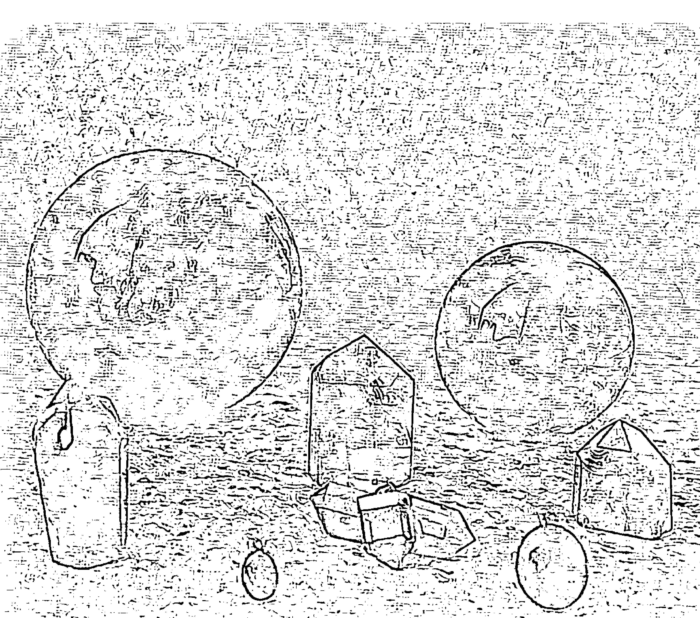

為了令自己好過，你得學習以下的做法。臨睡前，先作一番自我暗示的話：「我不害怕惡夢。惡夢只不過是過去的記憶。我在夢中是一個旁觀者，看到整件事的經過。我會在夢中得到啟示，解開令自己不開心的結。醒來，我會變得更健康、更清醒，以及更愉快。」

## （一）求財的秘訣

五大成就法中的「增」法，是為增益法，為祈求財富的入世法。這個法做得好，有兩個條件：一是宇宙光的召喚，一是觀想的財富畫面要清晰。
增益法是召喚黃色（微帶橙）宇宙光，因為黃宇宙光便是物質世界的財富的本源，密宗財神中著名的一個財神便是黃財神。黃光召喚到來後，本身是一種能量，這種能量按照每個人的意識或潛意識的財富畫面而凝聚成物質。

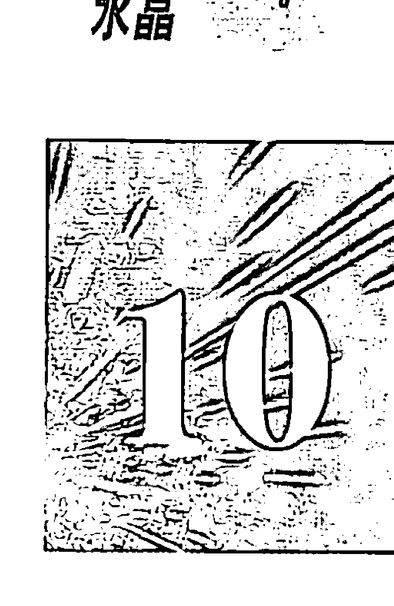

# 第十章 事業姻緣篇：綠金字塔是聚寶水晶

有些人福泽好，本身有财富的频率，相应后马上见效，发一大笔财。有些人财富因缘薄，难以相应，这牵涉因果业力的问题，每个人自己都有一个命运的故事，不必与别人比较，我想说的是，只要你明白其中的道理，肯改进体内的财富因缘，口袋里的钱一定会一天比一天多。

增益法的代表水晶是黄幽灵金字塔，在一块白水晶，或黄水晶内，有一个天然形成的黄色金字塔。这种水晶在凝聚宇宙黄光方面，有非常强大的能量，可说是宇宙的聚宝盆。不过，这种水晶非常罕有，我多年来只见过三个，其中一个是前文述及那位朋友所拥有，他利用绿金字塔水晶改变自己的事业因缘，又用黄金字塔水晶增加财富的因缘，二者结合下，便在短短几年间，建立了一个企业王国。

在《水晶宫之旅》时，我说过黄晶（Citrine）是财富石，很多读者看了，四下搜寻黄晶。然而，大家可能不知道，真正的天然黄晶并不常见，也不便宜（价值在上升中），现时市面上流行的黄晶晶簇或黄晶粒，大多数是用紫晶加高热而成，可说是假黄晶。这种黄晶并没有改变身体气场的能力，然而，可以作为一种帮助观想的工具。

将真正的黄晶放在家里的财位，有旺财的作用，将黄晶佩戴在左手无名指，每天起床后作一个财富画面的观想，可以吸引更多的财富因缘。

密宗五大成就法中的「诛」法，是为降伏法，将一个敌人变为俯首之臣，降伏法是观想黑光，自自然然，唸珠也用黑石，如：黑玛瑙、黑安力土、黑电气石，产生辅助的作用。但在大西洋文明的年代，有一种水晶，是特别用来作降伏或战斗之用的，这种水晶是天然的攻击性武器，可以在短短的时间，摧毁对手的气场，大家看到西方神秘学中，描述大西洋文明，因为业力的累积而陆沉，其中一个主因便是滥用这种武器的缘故。

这种水晶，我不会介绍出来，避免重蹈覆辙，有违水晶学的本来意义。而有些读者的想像力也令人不安。

# 第十章 事業姻緣篇：綠金字塔是聚寶水晶

大约半年前，有位读者写信给我，他说，他用水晶柱刺激第三眼，希望可以见到另一个世界。因为他看到我在《水晶宫之旅》中，描写罗桑伦巴是这样开第三眼的。

我看啼笑皆非，第三眼是一个心眼，背后是松果腺，在道家来说，是一个非常重要的窍位，这个部位如果用水晶柱刺伤了，不要说开第三眼，影响了内分泌，便后患无穷。

我从来没教过人用水晶柱开第三眼，因为，第三眼的开发，主要是心清净，简单点解释，你用水晶静坐，潜意识清净了，第三眼自自然然出现。

密宗的准提佛母法，是修第三眼之法，这个法本身的精义，仍在心清净；心清净，第三眼自自然然出现。

心未清净而强硬凿开的第三眼，是阴阳眼，本身便大有问题。

问题在哪里？

问题是第三眼和肉眼一样，都是将外在景物摄进来，在心中形成景象的。

如果第三眼不是自然开启，有强大的保护光笼罩四周，你看到灵体时，灵体同时也看到你，一个不好，便会上身。

我们经常听到这种故事，某某人时运低，跟人参观鬼屋，一瞥间，看到阴幽，跟着回家，发高烧，从此神智不清。

那一瞥间，这个人也是有第二眼的。

不过是很坏的第三眼。

## （三）寶部法的代表水晶

五大成就法中的「宝」法，寻宝圆梦的现实版。每个人心中，总有渴望的宝物，修行人以法为宝，商人以生意为宝，女性以珠宝为宝，知识分子以知识为宝，智者以智慧为宝，而宝部的法，就是召唤宇宙绿光，结合每个人的心愿，成为圆梦之入世法。

宝部法的代表水晶，就是绿幽灵金字塔。

我在展览会时，第一次介绍这种水晶，当时很多人买了，效果如何？

有一位姓高的发型师，静坐已整整一年，有一晚，他拿起绿幽灵金字塔，在入定时作了一个观想，以后连续三天，生意增加了一倍，辛苦到不得了，结果他要停止这种观想，因为他是个喜欢休闲生活的人。后来，他再改变观想，希望有自己的事业。结果如何，事情有眉目，下回分解。

另外，有一位医生，本身诊所业务已非常好，但用了绿幽灵水晶后，额外多了投资的因缘，也发了一笔小财。这两位都是「水晶宫」的常客，每周总有一次出现，大家有兴趣的话，可以上来听听他们本身的心得。

还有一个是大家熟悉的朋友邓拱璧小姐，她是电台DJ，主持的深夜节目，脍炙人口。

邓小姐向来喜爱水晶，不多久前，透过朋友和我认识，当时，我送了一根绿幽灵水晶给她。此后，邓大姐变成了水晶迷。

为甚麼她迷上水晶？

> 我发现自己的直觉没有错，水晶可以令人运气好转，几个月间，包括搓麻将在内，邓大姐，是不是？

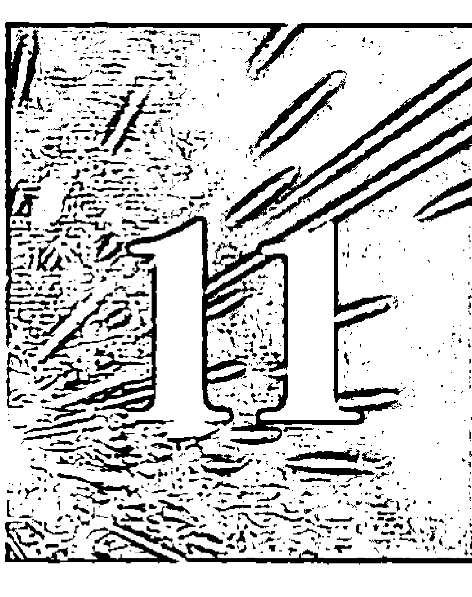

## 紫金字塔带来美好姻缘

### （一）「愛」還原為能量時

紫晶内有一个天然形成的金字塔，是为紫晶金字塔。紫晶金字塔用在开发智慧、促进人际关系，如：爱情、友情、亲情，以至上司和下属的关系，有非常神奇的殊效。表面看来，紫晶金字塔是紫色的，但它的气场，其实是粉红色。

粉红色是姻缘色，是两性间关系融洽的频率，亦是人际关系圆满的色彩，由二人世界，扩大到整个四周的关系，主要是凭藉「爱」。「爱」还原为能量时，在地球上表现的第一个光的形态，便是粉红色。

粉红色可以令四周的人喜爱自己，同时，也是一股强大的治疗力量。

人类宗教史上，不断出现神蹟，历史学家说，没有神蹟，便没有宗教。这个说法是正确的，没有神蹟的道理，只会成为哲学，而不会成为宗教。

神蹟从何而生？
「爱心」出现时，神蹟应运而生。
就是这样简单。

然而，一般人体验的「爱」，其实是狭隘的个人感觉，一种幻觉及错误的投射，与真正的「爱」比较，实在是两回事。

我们怎样明白「爱」？
用文字形容，这是「拈花微笑」，不可说的故事。但用另一个角度来说，当我们成功地将心轮打开，与整个世界融合，小我消失，大我出现，爱便是自自然然的事。紫晶金字塔，便是这方面的代表石。

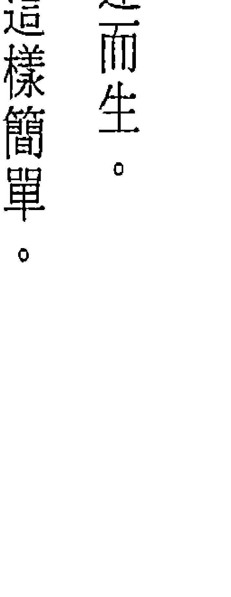

### （二）宇宙紅光情愛本源

密宗五大成就法的「怀」法，亦是敬爱法。这个法和息灾法大同小异，只是在观想时，用红光代替白光。

在宇宙彩虹中，红光便是情爱的本源。红光出现时，情爱跟着出现，没有女朋友，变得有女朋友；没有男朋友，变得有男朋友；没有知心朋友，变得有知己朋友。

同样的例子，本来是一家人不咬弦的，家姑媳妇如陌路相逢，在宇宙红光的改变下，心态会作一百八十度改变，变得相濡以沫，家和万事兴起来。

另外，敬爱法用在改善上司和下属，又或事业圈的关系，同样也有立竿见影的宏效。

特别说明，宇宙红光不同霓虹光管的红光，不要自作聪明，在家里装置红光管，这是没用的。

我曾经说过，宗教是古代的科学。

如果你明白了，他们怎样将生命还原，以及掌握宇宙的法则，你会同意，在宗教的迷雾下，隐藏了很多现代科学所没法解释的知识及答案。一个人的心被宗教的成见束缚，不能拨开迷雾见明月，这是一件可惜的事，你会在进入二〇〇〇年后被淘汰。

### （三）心念端正吸引愛情

古代的宗教，用「佛」、「菩萨」、「神明」、「真神」、「上帝」的名字，代表不同的宇宙光。

在密宗来说，最出名的一个爱神是「爱染明王」。这个神，日本人拜得最多，你到日本东密的寺庙，总有机会看到祂，一个三头六臂的爱神。

爱染明王面相呈忿怒，内心刚好相反，有大情爱的本性，祂曾许下誓言，凡是供奉祂的世界男女，皆得到世间的情爱。夫妻缘尽者、痴男怨女、姻缘不如意者，凡修练爱染明王的敬爱法，皆得如愿以偿。

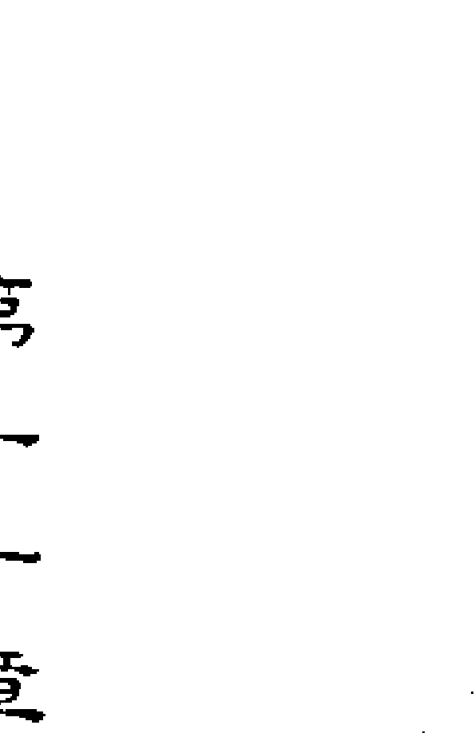

> 「爱染明王」敬爱法的修持，先找一百零八根红莲花花蕊，作为供品，再作一个红光的观想，这是此法修持的关键。明白了宇宙光的原理，你便会明白此法的构成秘密在哪里。

然而，你不相信宗教，只相信科学，有没有办法达到同样的目标？

当然可以。

方法是这样的。你只要用一个紫晶金字塔，再加上红光的观想，一样可以扭转情爱不如意的命运。

先拿一个紫晶金字塔，如果是小的，捧在左掌中，大的，放在前面三呎之地。同质素的水晶，能量与体积成正比例，所以愈大愈好。大的紫晶金字塔，可以散发出强大的红色气场，迅速改变人体的气场，达到事半功倍之效。

将身体放松，进入安宁的状态后，观想紫晶金字塔发出红光，由左掌而入，逐渐布满全身，跟著心轮出现红光。

心轮的红光出现后，宇宙红光自头顶而入，子母光相会。这个时候，你便可以观想心中渴望的情爱画面。

渴望婚姻如意者，心中泛现一个两情相悦、如漆如胶的恩爱画面。

渴望人际间关系融洽者，心中泛现一幅众星拱月、相谈甚欢的融洽画面。

渴望事业变得如意者，心中泛现一幅长袖善舞、礼待有加的画面。

一家人的团结愿望，可以用一张合家欢的相片，放在紫晶金字塔之下，达到信息传递的目的。

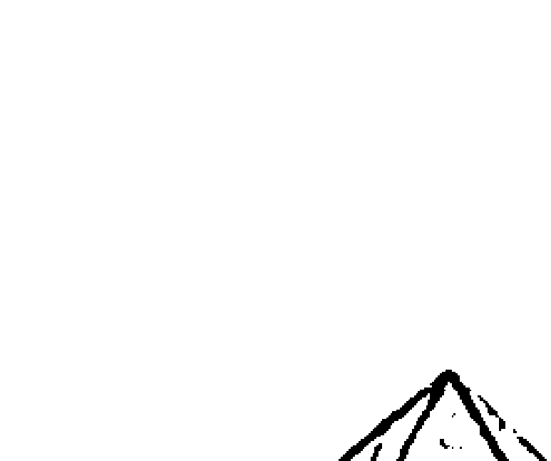

作这个水晶改运法时，心情不可以激动，但要绽发出喜悦的感觉。脚下要放一块树化石、茶晶，又或最好的骨干水晶。

因为爱情是地面的活动，要将宇宙光化为物质，必须与地面的力量结合，树化石及黑石，有着下沉、植入地面的能量，二者结合之下，才会产生实践的成效。

还有一点要注意，观想时必须心念端正，否则召唤来孽缘，自讨苦吃，那便不是敬爱法的原意。

用紫水晶时，最好将一个白水晶金字塔放在前面，帮助开发顶轮，将宇宙红光带入，同时产生净化的作用。

紫水晶金字塔除了用来静坐，也可在输入一个情爱的信息后，放在床头或附近，每晚临睡前，想它一想，达到改造人体气场，产生令人钟爱的效果。

要吸引新的情爱姻缘，一点不难，我教过好几个人，他们都在短短的时间内，找到新的异性朋友。然而，我想说的是，现代都市人，渴望的是永恒的情爱，而不是逢场作兴的一夜情，要达到这个目标，单是修增益法是不行的，你必须同时修水晶息灾法。

原理已在上一次说得很清楚，不重复。

# 第十二章 財富篇：事業生基法

### （二）不可分割的關係

很久以前，我学风水，企图以现有的科学知识，了解古代的学问究竟是甚麼一回事。当时我视阳宅风水为环境学，觉得其间大有道理存在；但对阴宅风水，不以为然，总是没法找到令人信服的根据。一个死了的亲人又怎会影响子孙的一生？在古代的风水故事中，阴宅风水被渲染得最为厉害，例如清代袁牧的「子不语」中，便有养尸地的记载。据说在乾隆六年间，山西僵尸为患，原来当地土质干燥无水，尸体难化，新死即埋，吸取地气后，便会长出白毛，变为僵尸。

地质既然可以令死者复生，也可以令子孙受荫。相传明太祖朱元璋，落拓时背着父亲的尸体，无以为殓，后来因为避风雨，意外地将尸体留在龙穴，结果，一个大翻身，由穷小子变为九五之尊。

这类渲染阴宅风水的故事，委实令人难以信服，一个人的命运如果由死者来决定的话，那么这个世界的人都不必努力，只要一心一意替祖先找块安眠地，便可交叠双手安心做人了。

然而，后来我进入心灵的世界，体验宇宙的本体时，思想开始改变。

阴宅风水是存在的。

因为，祖先是我们，我们也是祖先。

用现代的科学角度，全息论便是一个恰当的解释。

全息论说，局部便是全部（A Part is The Whole）。全息论最先应用于激光全息摄影，科学家将底片的一个小碎片，用激光照射，便可呈现底片的全部影像。

这个定律引伸下去，人是宇宙的一部分，彼此间有不可分割的关系。

众生皆我，我皆众生。

如此类推，我的一根头发等如整个身体。

英国有一种古代的医疗——遥诊（Absentee Healing），将千里迢迢外的病人头发、指甲放在面前，祈求后，产生了不可思议的治疗奇蹟。现代人不明所以，但用全息论的角度看，这是可以解释的，医治一根头发，等如医治一个人！

同样道理，因为血缘关系，祖先和我们有着强烈的无形联系，他们的尸骨吸收的能量，同时也会反应在后人的身上。如果是好的，子孙受惠；如果是坏的，子孙被克，阴宅风水的道理便在这里。

阴宅风水的重要性不容否认。

然而，我们应该知道接受的界限在哪里，阴宅风水再重要，也不过是生命的部分力量而已；夸大了它的作用，将人的自主力量贬低，成为一个宿命论者，任由先天条件鱼肉，是远比养尸地更可悲的结局。

所以，阴宅风水可以接受，但不必太在意，改进自己远比甚麼都重要。

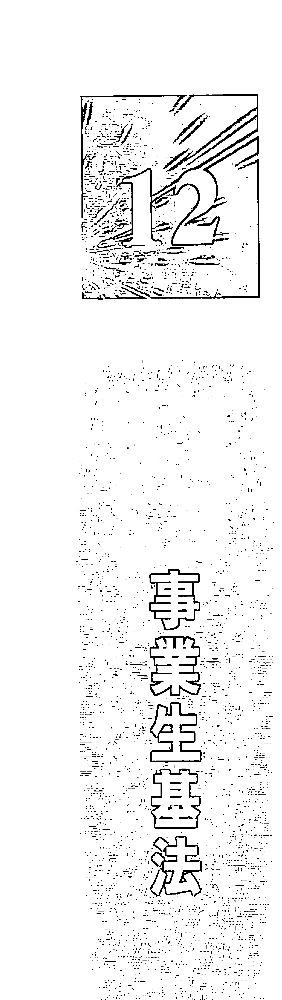

### （二）佈下七晶陣

跟著下来，一个有益、有建设性的问题：我们怎样利用这种古代知识改善自己的命运？古代的道家，有所谓「生基法」，原理和阴宅风水一样，不过，它不是利用死人来做的，而是用生人来做的。我将这个方法稍为改动，用七颗水晶，代替了古代的符咒，先后教过几个朋友，十分有效，因为问的人愈来愈多，索性写出来。

方法是这样的：先找一张洁净的白卡纸，在上面画两个交叠的三角形。三角形是等边三角形，大小长短以七数为合，即是每一边长七吋或七公分（如图示）。按照图上的次序，放下七颗绿幽灵水晶。

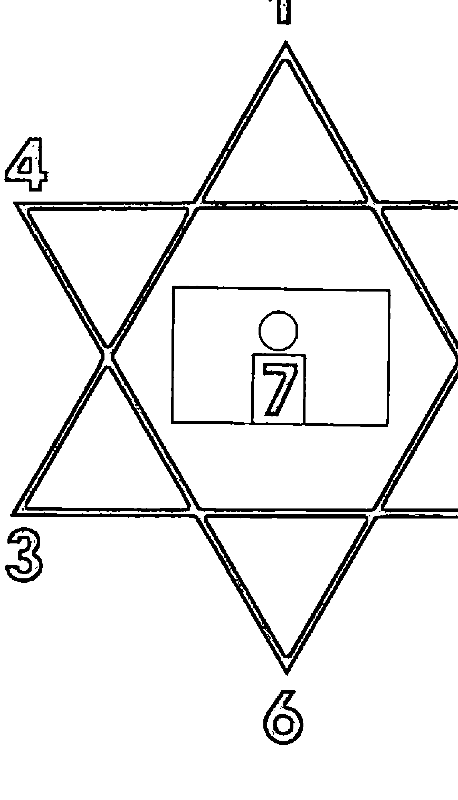

再在中央放一张自己的照片，照片必须充满喜悦之情，背后书写：「如意吉祥，生意兴隆」，然后再在照片上竖立一颗主石（体积比其他六颗大一倍），以收凝聚之效。

如果你要求再严格一点，造一个铜的金字塔（比例一定要正确），将「七星图」盖罩，再在金字塔的四边放上水晶柱，柱端指向金字塔中央，在西方神秘学，这便是流行一时的「充电」法。

两个对叠的三角形图案有甚麼作用？如果你修习密宗，便知道这是「生法宫」，是一个强大的动力符号。

跟著的问题是，这个事业的生基阵应该放在哪里？

古代的道士会告诉你，最好放在龙穴，但在香港，这无疑是一个笑话。你将它放在家里藏风聚气的地方便可以。

如果你担心家中的风水不好，再要安心点，在白卡纸下放一块紫晶簇或白晶簇，用它们生生不息的能量，净化及加强这个发电厂。然而这块晶簇质地一定要好，有很多晶簇用水漂白，带有负性能量，千万要小心，不然弄巧反拙，生基不成，反受其害。

还有一点要留意，这七颗绿幽灵水晶必须洁净，逐一输入事业的信息及爱心。最好持着它们静坐七天，将它们变为自己的一部分。

最后，亦是最重要的一点，将生基法用正确的方法发动，形成漩涡，它便会马上生效。

同样的道理，你可以用七颗白幽灵金字塔水晶造一个息灾生基法，又或七颗紫幽灵水晶造一个姻缘生基法——只要你不怕麻烦的话。

有位朋友问过：用七根输入信息的白水晶柱代替绿幽灵，行吗？我答：可以。假如你对自己的观想能力有信心的话。

真正的观想，整个画面栩栩如生，鉅细无遗，并不是每个人都可以做到的。

所以用有事业频率的水晶，代替事业的观想，也是一个方便法，起码它不会令你对水晶失去信心。

七晶阵的医疗，也极为有效。我曾用一个芙蓉晶七晶阵，令一个心肌枯竭的老人家在深切治疗室渡过了难关。大家不妨在这方面多作研究，对自己和其他人都有好处。

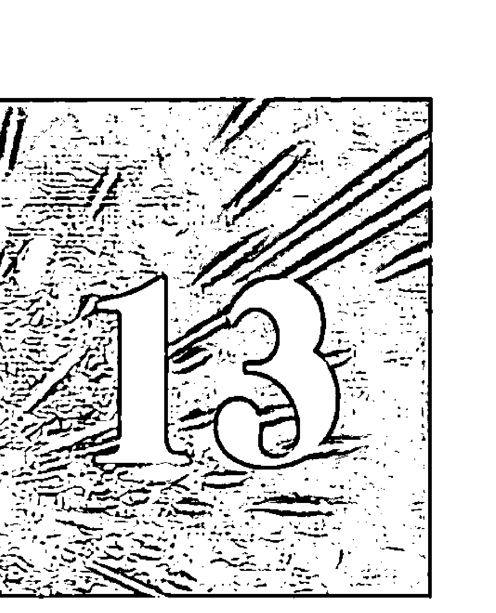

# 第十三章 財富篇：大西洋的七晶陣

### （一）水晶修正負性能量

由七晶阵，我想到一个人。这个人写了一套轰动一时的书，对地球的上一代文明有一个全面而深入的描述。他提到在一万五千年前，在我们同一的地方，有一班高智慧的生物，用水晶来推动整个城市的活动。那个时候，疾病少到不存在，每个人非常健康，因为他们从来不用药物治病，身体永不积有化学毒素，他们只用水晶来修正出岔的负性能量。为了找回

### （二）水瓶座能量場

法兰克阿道柏博士说，一九八五年二月二十二日，地球进入水瓶座的能量场（另一种说法是二〇〇〇年才开始），这个能量场的振动频率与以往的双鱼座截然两样，因此带来难以形容的剧变。
宇宙的基本能量结构是以电磁频率，亦即两极的能量为本质的。水瓶座带来磁场方面的变化，形成了新的能量来源。地球上每一个生物，俱受到这个变化的影响，无一幸免。
佛经和圣经，同时提及到二〇〇〇年前后是劫数末日的年代。为甚麼出现这个悲观的预言？

宗教家说，我们做坏事太多，业力累积到顶点，引爆穷途末日。用因果论来解释，说得通。但我读了法兰克阿道柏博士的文章，却得到了另外的启发。

### （三）抑壓人性及靈性

在过去的年代，地球运势每二〇〇〇年一转，亦即是说，每二千年地球磁场改变一次，有些改变小，影响不大，有些改变大，引起惊天动地的变化。这道理学过风水的人大致会明白。过去二千年是双鱼座的年代，双鱼座的磁场，对抑压人性及灵性有强大的作用，因此在这段日子出生的人，注定在真理的大海中浮沉，要付出无比的意志及毅力才可以到达自我完成的彼岸。

踏进二〇〇〇年，水瓶座出现，不同的磁能，带来不同的人性变化，相对双鱼座的虚伪及独裁，这是个真理受重视的年代。一瞬间，被抑压的灵性解放出来。柏林围墙一夜间倒塌，这绝不是简单的巧合。请留意历史，在过去二千年，每一次进步付出的代价如何惨重，你会奇怪，十年间，地球变化之大，简单可用翻天覆地来形容。地球进入水瓶座，磁能产生剧变，这代表追上潮流，利用新磁能改变身心的人，会踏进光明灿烂的新时代，活得比以前更自由、更健康，以及更丰足。相对来说，依然故我，沉溺双鱼座的习气的人，将会因不能适应水瓶座的新磁能，而出现更大的迷惘、失落与痛苦。这些人之中，不乏恋栈权势的独裁者，他们的潜意识在面对淘汰时，负隅顽抗，一念之差便造成难以估计的伤害。地球的末日，系在一念之间，也在大多数人的努力。

### （四）『金三角的启示』

但是，我再看看近一百年来，我们的文明做过甚麼好事？佛经和圣经的预言，虽然一点也不乐观，但他们都反覆说着一个道理，无论地球下场如何悲惨，懂得自救的人，最后一定得到救赎，逃离大难。

根據法蘭克阿道柏的研究，地球上有很多磁能中心，它們是以「陣」（Grid System）的形式出現（筆者按：將Grid System譯成陣，容有不當，請高明不吝賜教）。

這些「陣」的基本形態是三角形，所發出的能量頻率非常大，成為顏色後，是為金光。

法蘭克阿道柏博士得到大西洋文明遺留下來的資料，以及「金三角」的啟示，設計了幾種加強人體磁能，徹底回復健康的「陣」。

-   其中有「三晶陣」、「四晶陣」、「六晶陣」、「七晶陣」，以及「十二晶陣」。

## （五）三角形水晶『醫院』

人在七晶陣內，細胞內的磁體得到充電、修正，產生自我治療的能力，疾病隨而消失。

一萬五千年前的大西洋人沒有醫院，只有一間類似教堂的三角形建築物，這個建築物由水晶構成，主要的功能便是上述的用途。

在眾多水晶陣中，最流行的是「七晶陣」。

「七晶陣」由兩個交疊的倒三角形構成，它可以用來做生基法，也可以佈在床上、房間或任何一塊地方，改變人體磁場，強化生命、促進健康，以及帶來好運。

> 不同頻率的水晶放在床上，令我們的氣體產生變化，不同顏色的氣場出現了，以物質學同類相聚的原理，吸引了同頻率的事物出現，遂達到改變運氣的目的。

## 後記：

三個月前，有位讀者找我，她說父親剛去世，一直找不到好山地，問可否應用七晶陣做一個好陰宅？答案是當然可以。方法是用六根優質水晶柱，以上下三角形圍在棺木四周，中央放一個大白水晶球。七塊水晶用大悲咒水浸上七日，形成強大消除業力的能量場，對先人及後人都有好處。

-   白水晶七晶陣淨化身體；
芙蓉晶七晶陣帶來愛情；
黃晶七晶陣增加橫財的機會；
諸如此類，大家可按不同的需要而佈置自己的七晶陣！

另外，七晶陣威力無窮，最好用在治療方面，如用在其他用途，應緊記以愛為本，以因果為鑑的座右銘。

## 第十三章 财富篇：大西洋的七晶陣

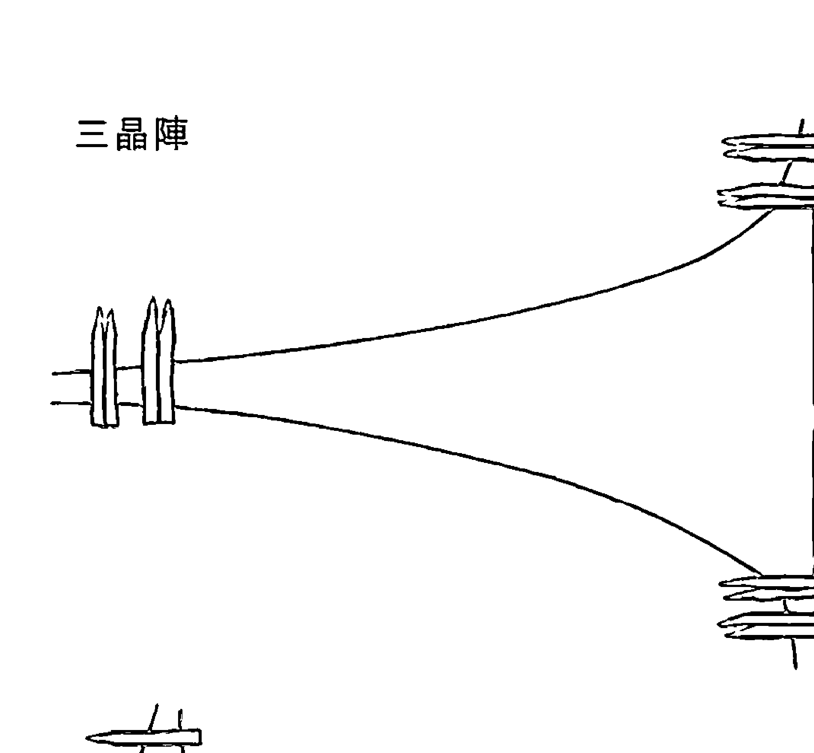

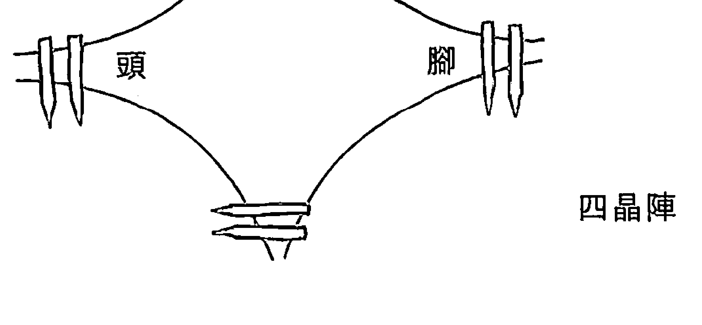

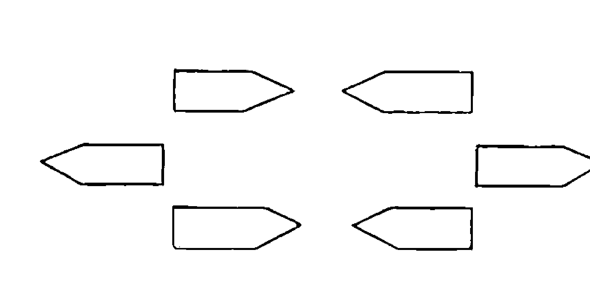

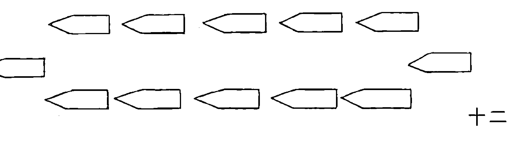

## 幽靈水晶的致富力量

### （一）用心力改變世界

我有一位朋友，在澳洲做入口生意，那是與工藝品有關的。八九年生意不景，他回港探親，偶然機會下，聽我講起水晶，他感到十分有趣。未移民前，他是中大電子系畢業生，對物理學有一定的認識。他對我說的用心力改變物理的道理很是相信，在我的指導下，買了一塊綠幽靈水晶來冥想。他冥想的主題非常簡單，就是怎樣將一間面臨倒閉的公司，變為一間國際大企業。結果呢？我不想神化其事，簡單點說，九二年頭，他在廣州投資酒店，牽涉過億元的投資。每一個人都有自己的一套解釋，你可以說，這未必與水晶及冥想有關，然而，我的朋友完全相信這套致富學問的確生效。迄今，他每天在極繁忙的工作中，總會撥出半小時，持着水晶作冥想。冥想的主題呢？我很高興他對我說，事業及財富不再是生命的全部，他已由一個人的世界擴大到四周的世界，他冥想和四周的人有融洽而友愛的關係。發財立品，沒有比這個更令人欣慰！

### （二）綠色代表事業財富

財富水晶，亦是綠幽靈水晶（Phantoms），在礦物學，它有一個正式的學名，叫（Chlorite-Crystals）。這種水晶有一個很明顯的特徵，便是在通透的白晶中，浮現如綠水藻、雲霧、漩渦，以致金字塔的天然異象。

在礦物學，水晶內的異外物體叫包裹體（Inclusions），但我換一個較悅耳的名稱，便是異象水晶。

## 為甚麼綠幽靈水晶會帶來財富？

第一個提出這個說法的，其實不是一個人，而是一個靈，他便是八○年代風靡美國新紀元擁護者的Lazaris。

Lazaris 說綠幽靈水晶可以創造財富，因為綠色代表因事業而產生的財富。美鈔是綠色的。而水晶中的綠金字塔，反映出宇宙機制，由無至有，在物質世界建立根基的原始力量，所以被譽為財富水晶的極品。

古代以鑽石及黃晶代表財富，因為古代是農業社會，不是企業社會，人們渴望的，是意外之財，是天降橫財。但九十年代，我們渴望的比這些更多，金錢已不是唯一的滿足，我們更渴望創造企業精神、白手興家、事業有成、對社會有貢獻，這一切遠遠比古代的財富觀念來得更複雜深遠，綠幽靈水晶的出現，便有這個時代的意義。

撇開靈學的角度，在水晶收藏家眼中，異象水晶是近年來最受歡迎的一個收藏目標，大多數歐美水晶收藏家都集中在找尋罕有的異象水晶。

# 第十四章
財富篇：幽靈水晶的致富力量

在本書第六章「扭轉命運的人」的那位王先生是一位財富水晶專家（他在這方面的研究比我熱衷得多），他根據四年來的不停搜...

### (三) 歷經千萬年生長的幽靈

異象水晶有幾種，其一是幽靈水晶。

在礦物學來說，當一塊水晶經過千千萬萬年的生長，而在這過程中，介入了其他礦物，形成了一重又一重的影子，這便是幽靈水晶。一般來說，愈多幽靈，愈珍貴。

在某種情形下，更形成了罕有的金字塔幽靈。（有趣的是，礦物學家或科學家，從來沒有解釋過，為甚麼一塊水晶內會出現一個完整和古埃及金字塔一模一樣的金字塔？）

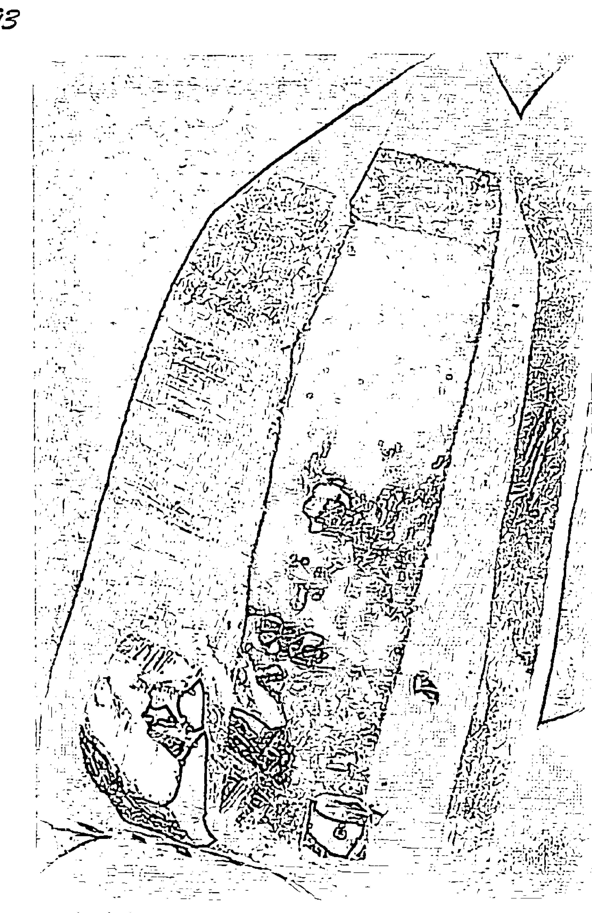

集及實驗，發現了一個可能是從來沒有人說過的秘密，他叮囑我有機會就寫出來，算是在推動水晶中「略盡綿力」。
他說，應該以易經的角度瞭解水晶中的金字塔。不同階段（例如只形成了一個或兩個面）的金字塔，代表了不同階段的宇宙意識及能量，由一之數而進升至九之數，都是發展的必須過程。因此，最好按照自己的需要而運用不同階段的金字塔水晶。例如，創業的人應用最離型（只有一面）的金字塔暝想。
他本人搜集了九種不同形態的金字塔水晶，放在辦公室內，代表了他的公司，由小至大，經歷每一個發展過程，最後成就大業。
也許，他的成就印證了他是對的。
說回來，另一種異象水晶是固體異象水晶（solid inclusions）。
當幾種礦物同期生長，經過億年的漫長歷史，其中有些被包圍了，在透明的晶體內「凍結」，這便是固體異象水晶。
固體異象水晶比幽靈水晶的鑑賞價值更高、更有大自然瑰麗的吸引力。
一般人常見的固體水晶為髮晶。

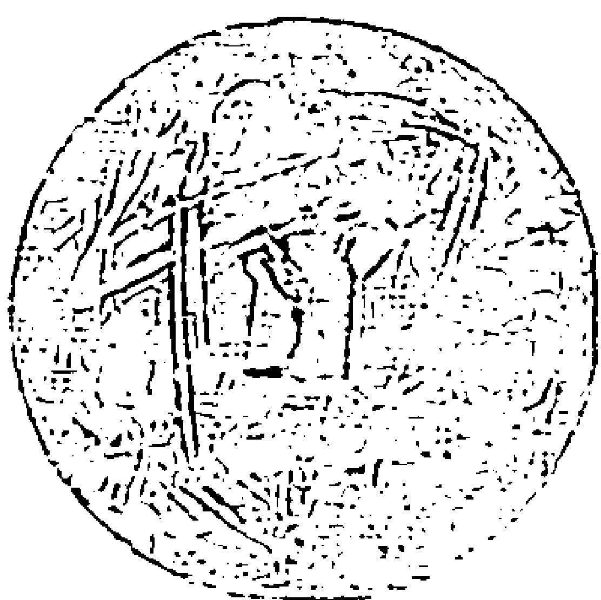

水晶中含氧化鈦的結晶，出現針狀物體，便叫髮晶。針狀結晶加強了原水晶的振動頻率，令力量以加倍擴大，所以，日本流行用髮晶作水晶治療。他們相信佩戴髮晶會帶來健康及好運。不同顏色的髮晶，有不同治療作用，簡單點說，金髮晶開發上三輪，紅髮晶開發下三輪。

## 怎样运用绿幽灵

### （一）觀想事業的綠光

綠幽靈水晶，運用得好，不但可以帶來事業上的好運氣，在其他方面，它和玉石一樣，同是具有吉祥及如意的象徵。

運用綠幽靈水晶有幾個方法。

一是用來冥想，冥想的目標是將心靈的力量，集中在一個對象上，令它迅速完成。

# 第十五章 靈修篇：怎樣運用綠幽靈

綠幽靈放在左掌中，平心靜氣，用數息或其他方法，將雜念減到最低的地步，到你認為可以的時候，微張眼睛，將掌中的綠幽靈水晶攝進眼簾內，跟着閉目，觀想左手的綠幽靈水晶，自左掌擴張出綠光，由左掌入，進入心輪。心輪同時間出現一團綠光，這是我們身體上原有的子光（亦即是說，每個人身上，已經擁有所有的宇宙光，問題只是我們有沒有好好發揮出來。事業的綠光是其中之一，現在的觀想，是藉着水晶的綠光，將原有的子光引爆出來，成為一道圓夢的力量。）子光出現後，心輪宛如蓮花慢慢地開放，直到出現一個非常明確的綠光團時，將心念移到頭頂，你馬上可以將宇宙光引進來，成為子母光相會之局。在進行觀想前，你要用語言將目標明確化。古代的修煉用咒音來配合，而現代人可以創造自己的事業確定語。例如：「某某生意興隆，財源廣進」，諸如此類。你可以在觀想前默誦七次，也可以在觀想進行時不停默誦，這得視乎每個人的能力而定，不必執着及勉強。

### (二) 所有活動都是事業

到你明顯將身體的綠光引發出來後，一個事業的畫面得馬上配合。
你要觀想一個心中渴望的事業畫面，例如，從事保險的朋友，觀想自己在一班客戶中周旋

每個人皆樂意聽自己說話，欣然簽上呈交的保險計劃。
做生意的朋友，觀想自己在辦公室，被有關的事業夥伴簇擁着，一片興旺的景象。

一個為寺廟籌款的活動，也可作同樣的觀想。不是說笑，我教過一個佛教信徒用綠幽靈，順利籌了一筆鉅款，建立一直渴望的會堂。

事業是人類在地球上的世間活動，一般人將它簡略化，只視為創造財富的活動，這是錯誤的觀念。

對一個政治家來說，政治生涯便是他的事業。

對一個作育英才的教師來說，教育生涯是他的事業。

同樣的道理，慈善為懷的史懷哲醫生及德蘭修女，以行醫濟世及扶貧助弱為一生的事業。

明白這個道理，我們當會領悟，入世法如果能夠好好的運用，其實是人類在進化旅途上一個極好的幫手。

### （三）綠幽靈的具體運用

畫面要觀想清晰，五蘊皆存，看到、聽到、嗅到、觸到，心中還要由喜悅之情。

有些人老是觀想綠光不來，那麼也有一個辦法。
將綠幽靈貼在第三眼的位置，這樣更容易感覺綠光的存在。

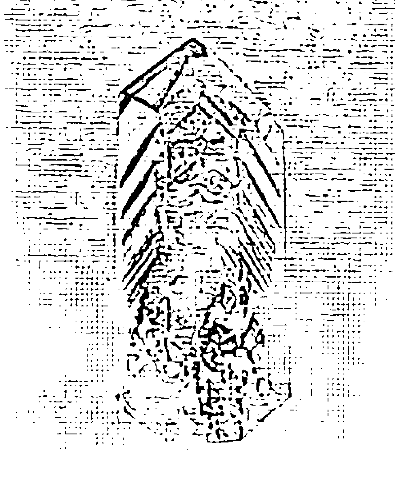

綠幽靈水晶

另外，將兩塊綠幽靈放在床頭、辦公桌上的左右角、以及家中的財位，也是迅速改變身體氣場，營造出綠光的方法。

事業的觀想，要在早上出門前進行，每天起碼做一次，時間不限，重質不重量。

在處理重大事件前，作一個成功的觀想，例如，將簽署大計劃時，也會產生不可思議的效果。
有一位朋友告訴我她的遭遇，兩年前，她奉命往瑞士，

商談一項名牌鐘錶的代理權。事前，她悉有兩位競爭者，以條件論，實在無勝利的把握。
更糟的是，她很快悉對方的負責人，原來有歧視東方人的傾向。
他甚至可能不和她見面。果然，她到了目的地，住了三天，半點頭緒也沒有。
她非常焦慮，她是個事業心、好勝心強烈的女性。
終於，在第四天的早上，她拿著我送給她的綠幽靈靜坐，她對自己說，這一天，我一定會碰上這傢伙。

她觀想出兩個人相會，言談甚歡的畫面。
當天，她應當一個朋友的邀請，在一間餐廳午膳，忽然間，她聽到侍者提及一個人的名字，正是她一直找的人，也在同一間餐廳午膳。
她鼓起勇氣上前自我介紹，心想，好好壞壞，也得試一趟，結果對方雖然詫異，但反應出乎意料的友善。
她得到對方同意，翌日安排約會。
會唔下來，代理權還是談不攏，但對她的印象極佳，主動地提出另外的合作計劃，結果依然滿載而歸。

這位朋友是個虔誠的基督徒，起初的時候，她提到一些思想上的矛盾，她說，在教義上，除了上帝，不可能有其他的信仰。
我答，這很容易解決。
你將宇宙光變成上帝，水晶是天使的禮物，每次冥想，是一次祈禱，而家裏的大水晶球，紫晶山是一間莊嚴的教堂，一切問題，不是迎刃而解嗎？
朋友心神領悟，心無罣礙，現在仍如常運用水晶。
最後，還有一點，用綠幽靈鑲成吊墜，經常掛在心胸，比放在袋裏好得多。原因是貼著肌膚，水晶更易發揮出改變氣場的力量。

## 水晶柱的秘密

（二）宇宙規律的凝聚
晶簇是由眾多的晶柱構成的。用一個「宇宙」的角度去瞭解，我們不難明白，
晶簇等如人類的社會，我們因業力而走在一起，而水晶柱呢？則因為宇宙規律而凝聚成一塊，原理是一樣的。
晶簇如人類的社會，而水晶柱便是不同的社會角色。

# 第十六章 靈修篇：水晶柱的秘密

不過，這些社會角色和人類有點不同，它們不會互相傾軋、仇恨，以及鬥爭；相反地，它們基於一種團結精神，生生不息，相濡以沫，融洽地共同進化。所有晶簇的底部都是一片混沌的，這代表生命的起源，亦是最細微的宇宙振動物質化後的最雛型表達形態。

### (二) 水晶柱的生命力

我在沉迷水晶的一段日子裏，花了很多時間研究水晶柱，每一次的發現都難以形容的喜悅及震驚；逐漸地，我相信，如果一個人徹底明白水晶柱背後的秘密及意義，他便會同時明白到宇宙的所有秘密。

外國水晶專家對水晶柱的認識，普遍都不高，直到美國出現了一個女通靈人——被譽為「水晶女神」的卡絲娜華高才得到改善，卡絲娜華高是很多名人包括莎莉麥蓮的靈性導師，她自言前生是埃及祭師，今次重回地球是應世下凡。她對水晶的研究，已到達「大智慧」的地步。一般水晶專家，不斷的將水晶附會現代科學，企圖從現有的科學知識為水晶的魔力立碑，但卡絲娜華高一直從自己的通靈能力瞭解水晶，她閱讀水晶背後的意識及意義，將一門自大西洋文明以來已湮沒的學問重新找出來。

每一個水晶柱代表一種特殊的能力。

她先後在三部著作中，將不同的水晶柱介紹出來，我在這裏加上個人經驗，作一摘要報告：

-   1.  **發電機水晶（Generator Crystals）**

這種水晶為天然水晶柱，六個天然菱面構成一個尖端，上半部全清，頂部可能有雲狀、幽靈、彩虹或包裹體（Inclusion），也可能渾身通透，不含有任何一絲雜質。它可能很小，只得四分一吋，也可能很大，足足超過一呎長。

發電機水晶有一個優秀的功能：它能幫助我們集中及擴大能量，輸入病人身體內，打散積存的負性能量。

它名為發電機水晶，顧名思義，它將宇宙能引導到物質世界，幫助人類克服進化過程中的問題。發電機水晶很普遍，幾乎所有的天然水晶柱都是發電機水晶。白晶、黃晶、紫晶等都有發電機水晶。它像玉一樣，愈用愈通透，功效也愈大。

-   (2)  **雙頭水晶 (Double Terminated Crystals)**

普通的水晶有一個天然尖端，雙頭水晶則有兩個，尖端是能量集中及輸出的通道，兩個尖端代表這種水晶有着能收能放、能入能出的力量。因此，雙頭水晶用在特殊的冥想（亦即密宗的「入我」、「我入」）過程中，產生神奇的功力。它也是傳心術的好幫手。將雙頭水晶放在七重輪上，用順時鐘方向旋轉，可以迅速清除這些能源穴的障礙，令身體回復健康。雙手合十，夾着雙頭水晶靜坐，上下輪位得到貫連，暢通無礙，這是平衡身體能量的好方法。

### （3）大發電機水晶 (Large Generator Crystals)

一根水晶柱有十吋以上的體積，便可形容為「大」，大水晶的威力成正比，所以要小心運用。將一個信息輸入去，直豎起來，它便會以一千倍以上的頻率將信息擴大出去，形成左右生命的漩渦力量。這種水晶特別適宜用在羣體冥想，尤其是祈求世界和平方面。如果用在私人用途，請小心處理，不能介入任何負面情緒及信息，否則它同樣會擴大出來，對自己造成傷害。

### （4）資料庫水晶 (The Record Keeper)

在水晶治病過程中，放一根大水晶柱在旁，加上美好的禱告，會產生令人驚異的治病能力。

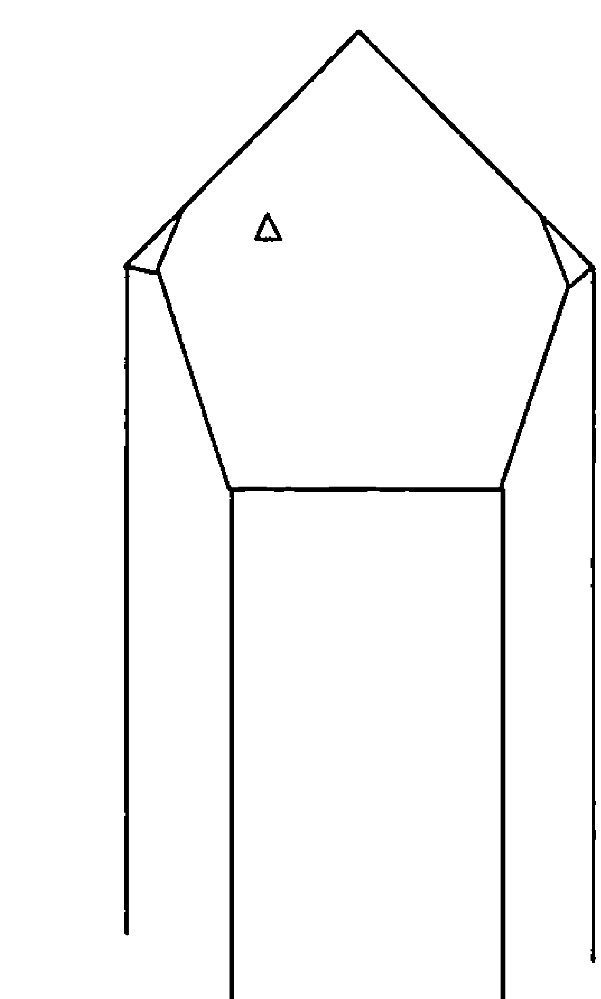

一萬五千年前，大西洋文明崩潰，成為聖經中挪亞方舟的歷史背景。大西洋人中的智者，為了將知識保存下來，他們選擇有高度記憶能力的水晶，資料庫水晶是其中之一。

它的出現有兩個原因，一是滿足後世渴求宇宙真理及知識的一羣。二是當有緣者從中得到啟示後，再度與宇宙來源聯繫，便會負起拯救同類的任務。這個時候，知識對他們來說，是無上的工具。

資料庫水晶的特徵是，在六個天然菱面上，有一個隱約可見的小三角形，好像有人用刀刻上去的。如不是特別有緣，你不會找到它，就算找到了，也打不開這個資料庫。

我在水晶展中，曾展上三根資料庫水晶，他們都有十吋左右的長度。靜坐時，將水晶面的三角形貼着第三眼，又或左手捧着它，觀想三角形，將心輪定着，空白一片，這個時候，資料通過來，畫面源源不斷在腦海閃現。這種水晶只可作表面的清潔，以免損害內部的記憶。

### （5）彩虹水晶（Rainbow Crystals）

水晶在成長過程中，遭遇巨大壓力，又或溫度乍冷乍熱，形成內部的裂縫，在燈光下，出現了彩虹，這便是彩虹水晶。彩虹代表圓滿，代表我們在物質世界的全面成就。因此，甚麼都想要的人，最好買一根彩虹水晶，又或水晶球，凝神注視着其中的彩虹（或貼近第三眼），讓心中泛起彩虹的喜悦感覺，不久你會從心所願。

### (6) 通靈水晶 (Channeling Crystals)

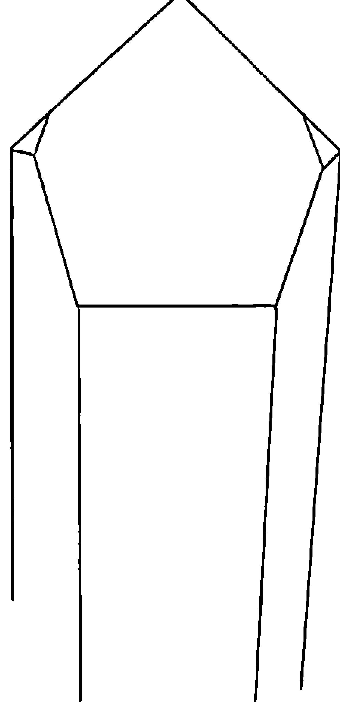

通靈水晶柱很容易辨認，六個菱面中，中間一個大七角面，背後一個完全三角面，這便是通靈水晶的特色。

對外國的數字學家來說，七代表真理的追求，那個大七角菱面，代表了「天堂之門」。

拿着這種水晶瞑想，很容易和多度空間的靈體溝通。必須特別小心，如果沒有足夠的精神力量及通靈知識，最好不要碰。

如果一個人打開通靈的頻道，而通的是低靈的話（這其實是物以類聚的原理），他會感到窒息、陰影重重，事後疲倦而情緒低落。他要是問事，答案會是誤導。

通了高靈，你會馬上明白，第一是「大放光明」；第二、感覺非常舒服；第三、靈感源源不絕，很多想不到的問題，馬上會想到。

無論如何，通靈前一定要在四周佈下保護網。

### （7）傳訊水晶 (Transmitter Crystals)

這種水晶柱的外形剛好和通靈水晶相反，它是中間一個大三角形，左右兩邊是七角菱面，在傳訊水晶中，七這數字代表我們內心世界認識真理的能力。二代表連接我們與宇宙的橋樑。

當我們心中泛起人生的疑問，渴求非人間的指導時，我們可借用傳訊水晶的力量。先坐下來，平靜心情，左手握着傳訊水晶，進入狀態，將它（尖端）貼近第三眼，問題在心中浮現，投進水晶內。跟着將傳訊水晶直立的放置，不要讓它受到騷擾。

### （8）连体水晶（Tantric Twin Crystals）

二十四小时后，同一时间回来，拿着它，放在眉心，你的心中，自然浮起欲知的答案。
晶簇代表社会，水晶柱代表个人，而两根晶柱在一起生长时，代表了人与人或外界的融洽关系。
连体水晶有两种，一是并生的水晶，有着相约的体积，而生长的方向是相同的。在这种连体水晶，大的一根水晶代表你自己，小的一根水晶代表你渴望的结合对象，它可能是你与恋人，也可能是你与艺术、音乐、生意合伙人的融洽相处。
另一种连体水晶是一根十分大，一根相对地细小。这种连体水晶是子母水晶，是父母与子女的结合象征（两代关系欠佳者特别有用）。
连体水晶有着强大的团结作用，拿着它冥想，放在床边，又或放在工作的四周，不断感觉它发射

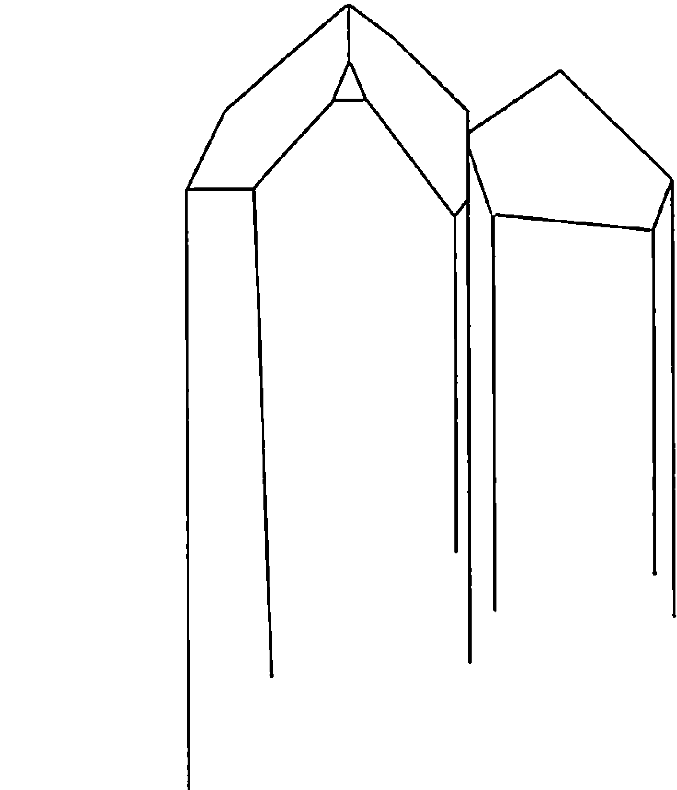

## 第十六章

## 靈修篇：水晶柱的秘密

出來的團結信息，逐漸地，你便會明白相處之道，改善與外界的關係，而得到渴望的結果。

### (9) 杜氏水晶 (The Dow Crystals)

因一好友Jan Ann Dow的關係，卡絲娜華高發現了這種水晶，遂以她的名字命名。

杜氏水晶是完美的水晶，六個菱面，有三個是七角形，三個是三角形，在結構上，它已具通靈水晶與傳訊水晶的強大功能。拿着它冥想，可以發掘出宇宙的最大秘密及真理，又可接收及投射出轉動宇宙法輪的信息。

然而，杜氏水晶並不僅限於此，在數字學來說，杜氏水晶的六個菱面加起來是30（7 X 3 + 3 X 3），30亦是3（數字學上減去一個0），這代表地球上所有「三位一體」的生命，都受它影響！

皇家圣学院 http://strc.taobao.com

### (10) 窗子水晶 (The Window Crystals)

窗子水晶有兩種神奇功能：第一、它可以幫你知道自己的處境，例如，上司對你的評價，男或女朋友對你的真正心意，又或自己是否找對了正確的人生路向等。第二、窗子水晶如水晶球一樣，有神奇的前知預言力量，我曾經用窗子水晶，預知了一個星期後公司發生的一件不尋常的事。因為預知了，也變成不「不尋常」。窗子水晶的特徵是，在水晶柱的中央有一個大鑽石菱面，這個鑽石菱面剛好成為水晶柱的第七個菱面，象徵時空的突破。窗子水晶必須清澈通透，將它貼在第三眼，將心平靜，一片空白後，自然浮現的畫面，便是你渴望的答案。窗子水晶極為罕有，要費點功夫才能從一大堆水晶柱中找出來。

### (11) 時光隧道水晶 (The Time Link Crystals)

這種水晶容易與窗子水晶混淆，兩者外形相近。分別是，窗子水晶有一個完美的大鑽石菱面，而時光隧道水晶，則是一個平行四邊形。這種水晶能在冥想時幫助我們打破時間的規限，讓我們自由地回到過去、前生或將來，瞭解生命的演變過程，從而得到啟示及領悟。面對着一根時光隧道水晶柱，四邊形的菱面在右方，而向反時針方面旋轉時，這是回到過去。如果它在左方，而呈順時鐘方向旋轉時，這是一顆回到未來的水晶，兩個四邊形同時出現，分佈左右，那麼，過去未來都在手中。

### (12) 平頂水晶 (Tabular Crystals)

顧名思義，平頂水晶的尖端是平的，它是一道橋樑，有通靈的能力，另外，其中也藏有特殊的宇宙知識。

### （13）激光柱（Laser Wand）

這種水晶是大西洋文明的武器，又可用來作手術刀，切斷負性感情或精神聯繫。一般都是小刀形，逾一呎的非常罕有，威力無窮，修習密宗的，輸入「不動明王金剛咒」放在家中，形成強烈保護罩，諸邪不侵。

### （14）骨幹水晶（Celestial Crystals）

最新奇的治療水晶，有強大喚醒靈覺的作用，請參閱本書第十八章「黑水晶——成功的關鍵石」內的介紹。

以上十四種水晶，只是一個簡介，還有更多不同種類的水晶，留待我們慢慢發掘及研究。水晶世界的尋寶遊戲永遠令人着迷！

只是我們明白，水晶的形狀、結構反映出宇宙機制及宇宙意識，我們浸淫其中，總有一天，得到「天人合一」的大智慧，明明白白，再無黑礙。

### (三) 水晶菱面的意義

為了讓讀者更瞭解水晶的奧秘，我將自己的一點心得寫出來。

水晶菱面有三角形、四角形、五角形、六角形及七角形，意義在哪裏？

三角形代表力量的泉源。一根水晶柱必須有一個完整的三角形，才能發射出全部的力量。

三角形是宇宙能在地球形成物質後的第一個形態。

四角形是更進一步的發展，它代表知覺世界的出現，也是時空的秘密樞紐。

五角形代表物質世界的成熟發展。數百萬年後，人類成為最成熟的生物，有五隻手指、五隻腳趾、五官、五體等等。這是一個物質世界進化的極致，前無去路，再上，便要變換存在形態。

六角形呢？由有形生命進入無形生命的第一步，便是六之數。所以，魔鬼由三個六來代表。聖經中的魔鬼是天使長，其實是修煉有成的生命。佛經的阿修羅及天道，都是六的世界，它代表一種較高但未到得正果的境界。

六之數再上，便是七。它是更進一步的知覺空間，真理之數，也是圓滿成就的結果。古代道家全部以七之數來象徵這方面的追尋，全真七子其實不是七個人！

## 活用 水晶

如果你還不明白的話，那麼，我換個角度再解釋。宇宙由不同的能量構成。這些能量在現代的科學家眼中，是一層又一層的宇宙振動。我們的肉體、精神、感情也不外是振動的產物。水晶是地球上最純粹的振動結晶，它的六角菱面反映出它有聯繫宇宙無形世界與物質世界的能力，而不同形狀的菱面，便是不同層面的振動力量的顯示。所以，懂得運用水晶，你便可以將宇宙所有力量聯繫，完成每一個渴求的願望及夢想，最後踏入進化之途，擺脫物質世界的局限。

# 第十七章 靈修篇：水晶靜坐漫談

### （二）靜坐究竟安全否

怎樣用水晶靜坐，我在《水晶宮之旅》已有述及。但有很多朋友仍然不大了了，在他們心中，靜坐是一門高深莫測的學問，一旦處理不當，會招致極大的傷害，因此心存恐懼，如履薄冰，問題自然多起來。

首先，我要作一番安撫心靈的話。

自古以來，任何人類的活動，稍有差池，造成死傷的，不計其數。有人因喝酒而死，有人因吸煙而死，有人因性事過度而死，有人因運動過度而死，甚至有因雞骨鯁喉而死。要死起來，千百種因由，沒法寫得完。然而，一個人因靜坐而死又或受傷害的，我相信萬中無一，肯定比緩跑而暴斃的少得多。

為什麼我們之中，對靜坐存有那麼大的恐懼？

很多時候，我在「水晶宮」都被問及這一問題：「陳先生，究竟靜坐是否安全？」我很驚慌。

逐漸地，我發覺一件有趣的事，大多數人不是對靜坐的安全與否產生疑惑，而是千方百計找尋理由，迴避進入自己內心的世界。

內心世界，也是潛意識的世界，內中隱藏着錯綜複雜的記憶及因緣，打開來，好像攪起一池泥水，那種混濁及迷失，是大多數人不願意仰首喝下的。

背後長了顆瘡，有些人努力轉過頭，用鏡子看個清楚，及早醫治，但大多數人索性不理，看不到等如不存在，當然，到那一天，小瘡變成大毒瘤，便呼天搶地四下求救。

### （二）過去的記憶作祟

古代的學問一直從事心靈改造的工作。

道家說「性命雙修」。許多人不明白甚麽是「性」功，簡單點說，性便是心神。心神強弱與否繫於潛意識的淨化。由個人潛意識進入深層潛意識，再入集體潛意識到最後融入瑜伽所說的宇宙意識，便是性功的最後階段，亦是禪宗所言「無相為體、無住為本、無念為宗」的成佛境界。

一方面，我們靜下來，識神退位，氣機自然運行，做成身體內一片溫暖融洽的狀況，以現代生物學來說，體內的內分泌系統回復正常，生機勃發，一個人自自然然得到健康，百病不侵。

明白這個道理，你才會了解靜坐的目的是甚麽？

每一次靜坐，基本上是肉體與心靈的調整與改進。然而，我們首先要克服最大的一個敵人：內心的恐懼。

你慢慢替自己分析，最後你會發覺，一切都是過去的記憶在作祟。

我們全都害怕死亡。因為我們全部經歷過死亡的痛苦過程，在前一世或更多的一世。

## 活用 水晶

勇者無懼。

所謂勇者，就是敢於找回過去所有記憶的人。

初學靜坐，先要弄清楚，目標是甚麽，以及甚麽東西攔住去路，才不會走歪路，以及得到較大的成就。

### （三）靜坐注意事項

-   靜坐環境要清靜，沒有突如其來的騷擾。
-   空氣要流通。不可直接呼吸，入定時毛孔擴張，極易招寒，因此要有適當保溫。
-   穿着衣服以適體為佳，腰帶中不可有緊束，避免妨礙血氣運行。
-   心情煩悶，不宜靜坐，宜先做動功，舒暢身心。
-   太疲倦亦不宜靜坐，坐了也會瞌睡，達不到要求的效果。
-   喝了太多酒，也不宜靜坐，氣血翻騰，難以平靜。
-   靜坐的姿勢應以自己的感覺為指標，不可令自己難耐，然而脊骨姿勢要儘量保持挺直自然。
-   雙手各持水晶柱，輕放在腿上，亦可雙手交握，捧着晶簇，貼近小腹。無論如何，雙手不要成為負擔。
-   用鼻呼吸，千萬不可張開口，呼吸保持一貫的自然。
-   開始進入靜坐，閉目，意念存放鼻尖，耳朵聽着呼吸聲，萬念歸一。
-   逐漸渾身的毛孔張開，手掌的水晶及四周的水晶變成能量，融入身體，排出所有黑氣。
-   進入狀態後，觀想心輪出現白光，一朵白蓮慢慢開放。
-   宇宙白光在頂輪出現，經過眉心輪、喉輪，落在心輪上。
-   一放開，整個人變成光，無我無念，與宇宙合一。
-   時間因人而定，記着，靜坐不是交功課，得失全是自己，因此重質不重量。如果你是聰明人，試圖捕捉進入狀態的感覺，習慣了以後，動念間馬上進入狀態。
-   靜坐完畢，不可馬上起來，應先作三下深呼吸，慢慢睜開眼睛、搓熱雙手、撫摩臉部、腹部及四肢，是駐顏的功法。
-   在放開自己，進入內心世界時，如感到不安及恐懼，應先用水晶在四周結界，佈下強大的保護網。如果有激光柱，結界後將它插在鋪上海沙的三角形黑瓶子，是為鎮宅之寶。

以上說的是靜坐的基本知識。過程中，每個人天賦習氣有別，產生不同的反應，有些感到身體發脹，有些感到縮小，有些感到振動，有些全無感覺，好比夢中看花，各有境象，不可一概而論，也不必比較深究。

目標路向明確，途上的波浪性發展少不免，這個時候，最重要的是信心。信心足夠的，一定可以渡過黎明前的黑暗，到達光華自在的彼岸。

### (四)明心見性的功夫

我在半年間教了好幾位學生，他們以水晶為輔助工具，進境驚人。其中一位文小姐，在很短的時間（一個月）已達到與宇宙光相應的地步，她頗為自豪，因為在此之前，她看過好幾本外國的水晶書籍，得到的印象是，這便是最後的境界。

她問我：「這便是得道？」

我聽了，笑起來，回答：「你的進展非常好，可是，這不是得道。如果這是得道的話，釋迦牟尼便不用在菩提樹下苦修六年。而我也早已成佛。」 與宇宙光相應，不過是初學入定的境界，在佛經來說，是色界天，距離無色界天，非想非非想處天以致最後的真空妙有，還有一段路途。 如果我們停在光明的境界，貪戀感覺，便不能繼續前進，坐斷諸幻，亦即應了金剛經所說：「以色身見我，以聲音求我，是人行邪道，不得見如來。」 如來者，是歷世潛意識淨化殆盡，步入空明的宇宙意識的得證。 對於天資聰敏的學生，我常勸告他們應看禪宗的書，禪宗的心印法門。以無相為體，無住為本，無念為宗。心無所寄為無住，意無所緣為無相，念而離念為無念。 「迷時師度，悟時自度。」 入門之後，所有的進展全是明心見性的功夫。與宇宙光相應 這些凡夫俗子，沒有大根器，對「頓悟」的境界是盲人摸象，由有為法着手，進入心內的世界，不失為好方法。對初學靜坐的朋友，我不想寫得太深入，總而言之，靜坐對身體和精神，有着極大的好處，我相信大多數的都市疾病，可以由靜坐中得到徹底的治療。

> > 「以色身見我，以聲音求我，是人行邪道，不得見如來。」

> > 「迷時師度，悟時自度。」

### (五) 無內外力之分

> > 「用水晶靜坐是不是倚賴外力？」

朋友運用水晶頗有成績，聽了一位道家的朋友說，借用外力不好，因此躊躇不已。

我反問：「甚麼是外力？找一塊藏風納氣的地方修煉，算不算是倚賴外力？如果算的話，這和借助水晶的力量，又有甚麼分別？」

其實，所有古代修煉的學問，全部和外力有關。

密宗本尊的傳承加持力，瑜伽在開發「蛇火」必須有靈性導師的指導，道家有人元、地元、天元三種修煉方法，三種方法全部倚賴外力，沒有外力，根本不可能成道。

也許，問題是「借用」和「倚賴」兩個字眼的分別。前者保持自我，後者失去自我。

失去自我，當然不好，但是，這又和外力有甚麼關係？

再說，在能量學的角度來說，力量就是力量，根本沒有內、外之分。

當你和水晶融合時，你便是和宇宙融合，誰在內？誰在外？

問題從來不是「工具」本身，而在人的本身。

你懂得和世界結合，整個世界在身內，不曉得的話，一身之外，無處不見異。

因此，不要害怕外力。

## 黑水晶——成功的關鍵石

### (二) 上白下黑的平衡

有位朋友要我介紹水晶，問用甚麼水晶靜坐最好？我答：如果沒有更多選擇的話，你只要用兩根高質素的白水晶柱，一塊大約一磅重的黑水晶便可以。白水晶是頂輪的代表石，黑水晶則是海底輪的代表石。

一上一下，天上地下，人在中間，將身心鬆弛，自自然而然達到一種和諧的平衡。有很多朋友靜坐後，精神恍惚，眉心發痛，這便是失去平衡之道的緣故。白水晶的能量盤旋頂輪，得不到疏導，過分刺激下，便會造成不適的生理現象。本來疏導頂輪的能量，有一套收功的方法：每次靜坐完畢，觀想身體的能量，由身軀流向雙足，然後生出茂盛的樹根，深入地層，深入地球的中央。在這個時候，你要觀想下盤有力而充實，身體是一團完整的能量。有些人做了這個觀想，不適的現象馬上消失，恢復正常。然而，假如你是初學者，觀想能力比較差，做了也沒有效果，又有甚麼輔助的方法？方法便是在腳下放塊黑石。你用坐式靜坐，索性腳踏黑石，這樣，就算偶有心神波動，氣場受到黑、白二石的把持，也很容易穩定下來。這個穩定身體氣場的方法，外國的水晶專家稱為Grounding yourself，亦是腳踏實地的意思。

### (二) 改變心靈與肉體

意識變為物質，有一定的程序及階段，黑石代表最後的落實，在成事方面來說，非常重要。假如你是秀才書生，滿腹經綸，流於空談，那麼，左手握一塊黑石，作這個生根的觀想，可以徹底改導你的命運，變成一個坐言起行，真正成大事的人。

這種改變，是心靈與肉體的改變。改變之後，整個人脫胎換骨，判若兩人，命運也重新改寫。

水晶改運是存在的，它是一門踏實的學問，而不是迷信。如果你被誤導了，真是可惜，你失去了一個開發無限潛能的機會。

### (三) 「抱月樁」落實石

另外，也可以用道家「抱月樁」達到同一生根的效果。

「抱月樁」的做法是：站立，雙腿張開，平肩，曲膝，手環抱如月，兩手指尖相距一吋，目光凝注其間，脊骨保持垂直。

這個站樁姿勢在很短的時間內發動身體的氣機，刺激白血球的生長。而且血氣貫注雙腿，直落地底，產生生根的感覺，身體下部虛浮的人，站上十天八天，情形頓然改觀。不過有一點要提醒，「抱月樁」初學時不可站得太久，下盤充血過度，提防出現性器官過分亢奮的後果。我特別提到這個道家功法，因為，靜坐的人傾向心靈活動，喜靜不喜動，容易陷於如呂祖所說，「修性不修命，修行第一忌」的失調問題，頂輪過分開發，意思便是身體的其他輪位被忽略了，一個圓滿的人生，必須全面照顧，我們不能不面對現實的生命。每天抽出一點時間做動功，保持血氣的運行，是靜坐的基本修養。說到最後，又得提一個問題，怎樣的落實石（Grounding stone）最值得推薦。外國的水晶專家通常推薦以下黑石：黑安力士、黑瑪瑙、黑碧璽、茶晶及黑曜石。我自己特別喜歡這方面的三種石：茶晶、黑曜石及骨幹水晶(Eléstial Crystal)，特別是後者，近年對它簡直愛不釋手。茶晶有特殊穩定及平衡作用，這點我早說過，不累贅重複。黑曜石的落實能量比茶晶更大，而且是著名的保護石，放在床頭，可減少夢魘。

### (四) 骨幹水晶罕有難得

至於，Elestial Crystal——暫譯為骨幹水晶，是水晶女神卡斯娜華高在《Crystal Healing》一書首次介紹的，在此之前，從未有人寫過這種水晶。

展覽會時，有位印刷廠工友對我說，他失眠了很久，我介紹他將一小塊黑曜石放在床頭，數天後，他不勝雀躍的重來，說已經可以安眠了。一塊黑曜石何以產生如斯大的神效？ 很簡單，黑曜石將腦部的能量降低，減少皮層活躍，腦部得到疏導，自自然然得到安息。 不安心靜坐的朋友，更要用黑曜石，將一塊大的黑曜石放在面前，很快的你會感到它擴散出一重氣場，將你包裹在第四度空間，對一般生物來說，它是一個強大的保護罩，外來力量寸步難越！

為甚麼它叫骨幹水晶呢？它的外形奇異獨特，與其他水晶截然不同，表面上，它像一塊嶙峋的岩石，有一種骨塊化石的味道。

第一點：這種水晶也反映出內在的特殊力量，一般來說，骨幹水晶有四種神奇力量：

根據我個人的經驗（接觸不下二十塊），有兩種骨幹水晶是這方面的極品，一種是底部全然形成細小的凸體三角形，像資料庫水晶一樣，是一個上一代文明暗記。第二種是整塊水晶，有如一片電導板，任何人看見都會以為這是人工雕刻產品，其實它渾然天成，有諸內而形於外，反映出大自然的奧妙世界。

第二點：骨幹水晶有強大的清潔功能，逐一放在輪位，可以迅速清潔其間的負性能量，如果負性能量是磁電的話，那麼，稱它為除磁器，當之無愧。

第三點：清潔之後，便是治療的階段，骨幹水晶能迅速修正人體的不調協能量，令它回復平衡，達到徹底治療的目的。

個人經驗來說，骨幹水晶同時具備心理醫生般的功能。

# 第十八章 靈修篇：黑水晶——成功的鑰匙石

我親身經歷的故事是這樣的，大約在一年前，我介紹這種水晶給一個水晶迷，這個朋友是個極度敏感而不快樂的人，他為往事所困擾，常渴望在靈修中得到煩惱的解決。他非常努力，幾乎有關心靈發展的學問都曾涉獵，漸有進步，但似乎不如理想，三年來，做人處世豁達了，但夜闌人靜，內心深底有條記憶的毒蛇噬咬他，那種感覺並不好受。直到那天，我對他說起骨幹水晶，他懇求讓他一試（這種水晶非常罕有，我花了很多功夫，自巴西搜集回來的）。過了三、四天，他跑來，告訴我一件他認為匪夷所思的事。他拿回家靜坐後翌晚，在酣睡中做了一個夢，夢中他回到事發的時空，重溫當時驚心動魄的場面，歷歷在目。他醒來，淚流滿面，心中傷痛得難以形容，這是非常可怕的經歷。過去，已淡忘的痛苦瘡疤再度挖掘出來，他正在想，明天怎樣度過，他也不能起床了。就在這個時候，忽然間，腦海中閃現一個聲音說：『以往的已是一個逝去的答案，你不會再和它發生關係，也不會再受它影響，你已完全明白了自己的痛苦，只不過是一種幻覺，你徹底擺脫它，勇敢的站起來——一剎那間，如醍醐灌頂，他的心豁然改觀，仿佛艱辛的爬到山峯，遙望前面的廣大平原，有種如釋重負的舒暢——這位朋友得到重生，他感激的告訴我，如果不是這塊水晶，他不知道自己再能握多久。骨幹水晶在這方面的治療力量是驚人，也同是可怕的，如果沒有心理準備及有關的知識，不可隨便嘗試。

第四點，骨幹水晶是靈修的瑰寶，與它靜坐、睡覺，可以在極短的時間內，喚醒我們的靈覺，將靈性世界帶到一個嶄新的領域。

### (五) 黑晶石通血氣

最後說的是近半年來的新發現。這個發現，是在「水晶宮」內發生的，有點意外，也有點因緣巧合的味道。有一趟，一位朋友告訴我，她的祖母腿部患關節炎，痛苦異常，問我有沒有適合的晶石。

我想到了幾種水晶，逐一個介紹，不知何故，直覺地拿起附近的一塊黑色的骨幹水晶石說：

> 「你拿來靜坐，試試看。它可以活動下半身的血氣。」

# 第十八章
靈修篇：黑水晶——成功的關鍵

我說這番話時，完全是一剎那間的啓示，腦海進入了狀態，突然與宇宙的知識聯繫起來。

朋友照着做，片刻，睜大眼：「我感到下半身溫暖，氣沉聚小腿，腳底的湧泉穴不停的跳。」

「對了，這塊水晶會醫治好你祖母的關節炎。」

為什麼我放膽下斷語，很簡單，在醫學上來說，有一千種一萬種的學理解釋，然而，所有的病因解釋，還原到底，都不外中醫的四個字：「血氣不通」。

因為血氣不通，細胞萎縮、變形、失效、無力維持原有的功能，也無力對付外來的病菌，一切疾病由此起。

年老的人，五臟六腑沒有問題的話，血氣不通開始時由腿部出現，腿部肌肉由小腿開始收縮，逐步而上。所以，我們在海灘上，總會看到一些肚滿腸肥，挺着大肚子，但雙腿卻不對稱地瘦削的老人。

人步入中年，血氣不通也多在下部首先出現。

在這個時候，黑水晶產生非凡的治療作用，它不但可以調整下三輪，令一個人的肉體衰老延遲，也可以導引血氣下治，解決腿部血氣呆滯的問題。

明白這個道理，你當會同意，黑晶石非常重要，它和白水晶一樣不可缺少。

骨幹水晶愈大愈好，我每天靜坐，如果不是要修特別的法，腳下一定踏着一塊水晶，以前用過黑樹化石、茶晶、黑碧璽、隕石、黑瑪瑙等，近年來改用了一塊五磅重的茶晶骨幹水晶，感覺非常好，起碼，最心煩意亂的時候（俗務纏身，實在沒辦法），一坐上去，幾乎在五分鐘內，甚麼都丟開了。

上白下黑，在兩種能量極端相反的水晶的把持下，人在其間，得到入定之趣。

還有，異象水晶中有天然凝固的礦物，如有紅色、褐色、黑色等等，雖然不是綠幽靈，也是另一種的事業石，它們可以刺激起下三輪的開發，令一個人變得有勇氣、決心以及落實行事的膽色，也可以說是出色的黑晶石（雖然顏色不是黑），這種異象水晶發生的氣體是深紅色的，正如各位所知，紅即是黑，效果一樣無異。

水晶的學問，千變萬化，妙用無窮，你可以很簡單的運用它，也可以很精密的運用它。

### (六) 活用異象水晶

作個有趣的譬喻，針灸是一門古老的學問，單是穴位已有三百多個，一般人苦學二、三年，未必能入門，然而有些人上一課便可畢業。我的一個朋友便是這樣，八年前他和我一起學針灸，一個學期下來，一知半解，但已有膽量四下行醫。他是一穴走天涯，只針一個「阿是穴」——那裏痛，那裏針，當然，間中也生效，不過，明白內情的人看了，啼笑皆非。

水晶也是如此。如果你說，水晶很容易學，這是對的，一根白水晶等如一切。或者說，水晶很難學，這也是對的，地球上有二千多種礦石，流行的有二百多種，單是這二百多種已足夠你忙上十年八載。

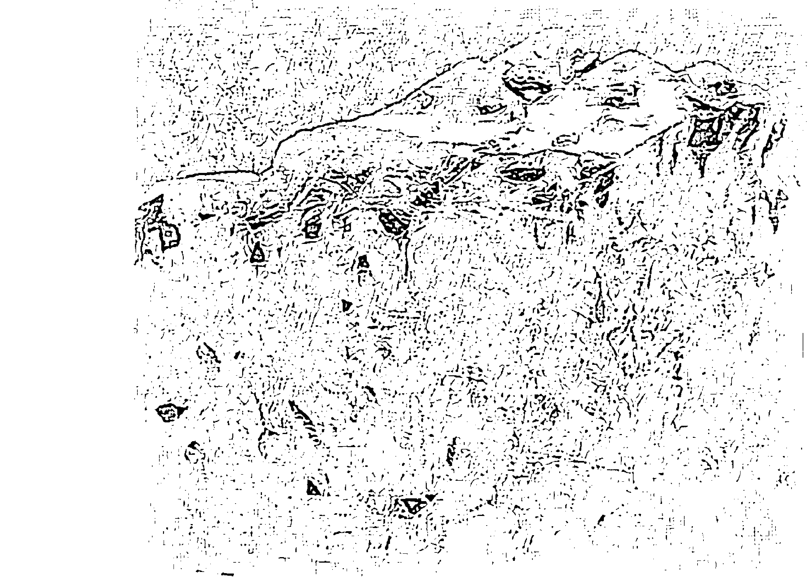

異象水晶
皇家圣学院 http://strc.taobao.com

# # 如何令孩子更聪明

### （一）精神智力出問題

現代的父母不易為，社會習氣積習難返，下一代的身心問題層出不窮，孕育出健康活潑的小孩，已成爲一個可遇不可求的夢想。在過去兩年來，我不斷遇到一些爲子女問題而煩惱的父母，逐漸地，我驚訝發覺，如果子女是自己的延續的話，那麼這個延續實在不太好。有很多下一代精神智力出現問題，根本不能正常地成長。爲甚麼遺傳上出現錯誤？以宗教來說，這是業力的因果；以科學的角度說，這是整個社會的生活方式出現了問題，精製食物太多，藥物太濫，社會壓力太大，空氣太差，電器放出的輻射富傷害性等等，要徹底解決問題，談何容易，情況相等於另一次工業革命。

然而，在整個潮流出現轉變之前，我們有理由支持綠色力量，為了自己也為了下一代，我們有理由支持綠色力量，為了自己也為了下一代，我們有理由支持綠色力量，

我遇上不下五十對父母，他們訴說同一的苦惱：孩子精神不集中，學習能力低，語言有障礙，有些已鑑定患有輕度自閉症。

他們聽說水晶可以幫助心智及精神上的發展，跑來求助。

我的答案是：水晶有這樣的能力，然而，改變一個生命是整個環境的事，如果生活方式不檢討，不改變，那麼就算將整間屋堆滿水晶也於事無補。

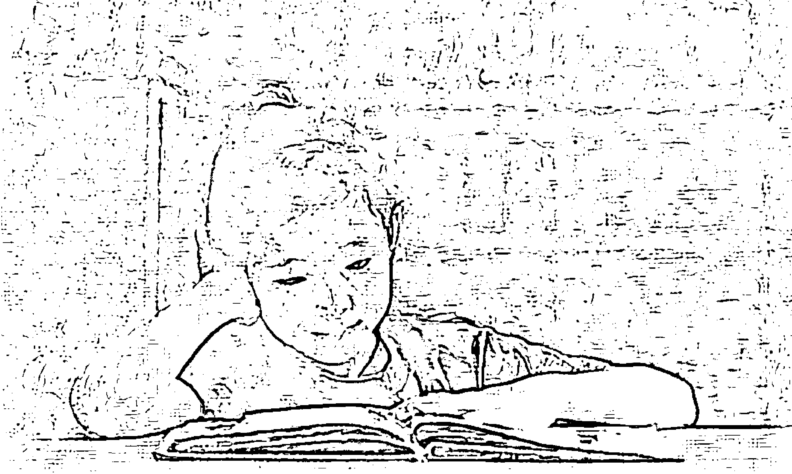

不少家长希望子女出類拔萃、品學兼優

### （二）琥珀令孩子健康活潑

我的朋友自西德做完珠寶展覽會回來，告訴我她的見聞，她說，歐洲流行琥珀，很多現代的父母喜歡為初生的嬰孩佩戴琥珀頸鍊。那邊的專家對她說，琥珀有穩定神經，加強嬰孩免疫能力的作用，而且琥珀是天然樹脂化石，就算吞下肚子也不會有礙（當然是很細小那一種）。

朋友只不過做生意，聽了覺得有點不可思議，奇怪為甚麼科學昌明的西德也來這一套。回來後，她卻照着辦，為自己的兩歲女兒照樣戴一條。她的理由非常簡單：先進國家流行的，一定不會錯。如果有問題，政府早已作出干預了，還會任由胡為，而且那裏的監察團體那麼多。她說，傳統的德國人喜歡琥珀，有如中國人之於玉石。

不過，他們佩戴的是天然琥珀，而不是在香港市面常見的合成或再造琥珀。

朋友問我：琥珀真有這個用途？

我答，其實很多水晶對嬰兒或小孩子都有好處，歐洲流行琥珀是基於歷史背景，以及琥珀本身那種溫和，永不會造成傷害的力量。

琥珀在希臘時代已經盛行，那時，希臘人的早期海上活動，是為了從波羅的海帶回琥珀。羅馬人相信琥珀有奇特的醫療作用，可以鎮痛，優質的琥珀在手掌的溫暖中發出令人喜愛的香味。

琥珀不是礦物質，而是有機質。它是古代樹木的石化松脂（即是樹脂化石）。因為不是礦物質，而是有機質，琥珀的硬度只有二至二點五度，內容大量空氣，相對這種特性，琥珀的作用異於其他水晶，它有強大吸納負性能量功用，包括吸納痛楚、吸納不良的能量頻率，以及情緒過分的反應。琥珀有定驚（中醫也這樣說）、鎮痛，以及加強免疫系統的能力的道理在這裏。

琥珀和玉一樣，能量的放射性不強，有助於平衡，而短於激發。對於原來健康活潑的小孩子，們是很好的保護石，但對那些需要用水晶的能量來刺激心智發展的一代，便嫌能力不足。

最後，我重複講述一個道理，水晶怎樣開發精神及智力的世界。

### （三）開發大腦的宇宙光

人是一個小宇宙。小宇宙由不同的能量層面構成，能量在地球上以第一個表達形式出現便是光。主宰人的頭腦的三種宇宙光是白、紫及藍。這三種能量組合不足，產生負性的能量漩渦，遂出現了遺傳上的問題，智力、精神、五官功能失常。能量變成物質後，一切定局，命運的慨嘆亦由此而起。現代醫學昌明，在對付遺傳上的問題卻很失敗，因為以有形治無形，根本上是藥不對症。在這方面，水晶怎樣產生作用？我們知道水晶本身有不同層面的振動，最普遍的白水晶，它流到人體，自自然然開發頂輪，頂輪便是大腦所在。這個地方失調的徵象，便是自閉及智力不足。紫晶的振動頻率，流進人體，自自然然來到眉輪，眉輪是小腦及神經系統的樞紐。這個地方失調，徵象便是集中力不足、散漫及學習能力低。同樣的道理，藍色的晶石，如青金、水藍寶石放近人體，它們自然會開發喉輪，回復原來語言的功能。

> > *（在這方面，我已寫了一份中文版的「七重輪開發指引」，內容較詳細，可供作參考）

# # 七重輪開發指引

開發身體的七個能量中心，令你脫胎換骨，心想事成。

#### 第一輪：海底輪
- 位置：脊骨底部
- 屬性：土
- 顏色：紅/黑
- 有關腺體及器官：腎上腺、肛門、小腸
- 作用：令我們在物質世界生存得更有活力，更有直覺力
- 有關晶石：黑玉、黑碧璽、黑曜石、茶晶、雄黃、石榴石、玫瑰輝石
- 有關食物：蛋白質（以植物性蛋白質為佳）
- 失調後徵象：自我中心、暴力傾向、貪婪、容易動怒、過分沉迷物質享樂

#### 第二輪：臍輪
- 位置：肚臍下吋三分
- 屬性：水
- 顏色：橙
- 有關腺體及器官：卵巢、精囊、生殖器官
- 作用：運用創造力的中心，精力及性能力的來源
- 有關晶石：紅寶石、黃晶、琥珀、珊瑚、桃紅色砂金石
- 有關食物：橙汁及蔬菜
- 失調後徵象：沉迷食、色；性能力衰退、容易嫉妒、占有慾強、思想混亂、膀胱及尿道產生問題

#### 第三輪：太陽輪
- 位置：肚臍與肋骨間
- 屬性：火
- 顏色：黃
- 有關腺體及器官：胰、胃、肝、神經系統
- 作用：直覺力、神經系統、情感的感受中心、消化力強弱的關鍵區
- 有關晶石：黃晶、琥珀、虎眼石、金
- 有關食物：澱粉質、黃色的水果及蔬菜
- 失調後徵象：暴飲暴食、過分沉迷權力及地位，容易產生恐懼、憤怒、憎恨等情緒

#### 第四輪：心輪
- 位置：肋骨中間（兩乳中間）
- 屬性：火
- 顏色：粉紅、綠色
- 有關腺體及器官：胸腺、心臟、肺、腎、手

#### 第五輪：喉輪
- 位置：喉核區
- 屬性：顯性
- 顏色：粉藍
- 有關腺體及器官：甲狀腺、喉、嘴
- 作用：用語言表達真理，與外界溝通能力
- 有關晶石：藍瑪瑙、松石、青金、藍紋石、砂潤石、水藍寶石
- 有關食物：藍及紫色的蔬菜
- 失調後徵象：語言表達有障礙、自困、濫用知識、容易情緒低落、甲狀腺分泌不正常

#### 第六輪：眉輪（第三眼）
- 位置：兩眼之間（眉中間）
- 屬性：光
- 顏色：紫色
- 有關腺體及器官：腦下垂體（也有說是松果腺）、左眼、鼻、耳
- 作用：掌管第三眼、預知能力、小腦及神經系統
- 有關晶石：紫晶、紫龍石、青金、藍銅礦、藍紋石、藍寶石
- 有關食物：紫色蔬果
- 失調後徵象：集中力不足、散漫、恐懼、緊張、發惡夢、頭痛、眼睛有毛病

#### 第七輪：頂輪
- 位置：頭頂中央
- 屬性：意志/思想
- 顏色：白及金色
- 有關腺體及器官：松果腺、大小腦、中央神經系統、右眼
- 作用：活動大腦
- 有關晶石：白水晶、銀石、金晶石
- 有關食物：白色蔬果
- 失調後徵象：麻木不仁、欠缺創造力、情緒低落、自我中心、思想混亂

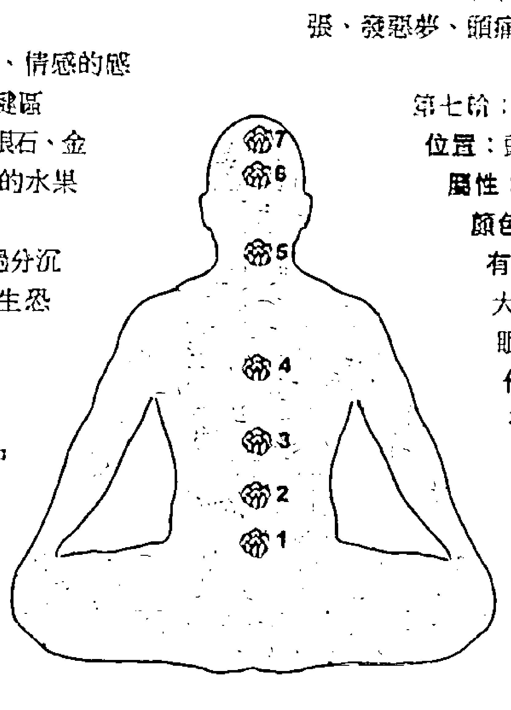

> > 水晶令我們更聰明，思考更清晰，腦筋動得更快！如果你對這話懷疑，我可以找十個以上的專業社會精英作證，他們都是知識分子，未玩水晶前都抱懷疑的態度，三個月後都一致同意，水晶令他們的思考更敏捷、更靈巧。

### （四）沒有副作用的治療

成年人懂得運用水晶，小孩子沒有這種能力，怎辦？

通常來說，我教人在家中適當地放置晶簇，利用晶簇的不同振動，刺激大腦的開發。配合得講技巧，有時刺激過度會造成小孩子頭痛不適。

如果不從大環境改造，亦可以用七晶陣來營造一個理想的氣場，方法簡單，將六顆體積相等的水晶塊，放在床的四周上，中間一顆放在床的中央，全部在事前輸入訊息，不同的水晶有不同的用途。如用在刺激大腦方面，以白水晶、紫水晶及水藍寶石為上佳。水晶品質素一定要好，不可曾受輻射改造。

水晶治療是屬於所謂振動性治療，為自然療法的一種，毋須藥物，也沒有副作用。如果你對藥物治療已感絕望的話，不妨考慮這種醫療。我唯一的忠告是，在進行水晶治療前，你應先付出時間，瞭解有關方面的學問。或者，以身作則，先由自己開始。

# 第二十章 健康篇：水晶治療

### （一）以有形治無形

我在《水晶宮之旅》中簡單介紹過水晶治療，其後收到不少讀者來信，希望我寫更多有關這方面的問題。似乎大家體驗到現代西方醫療方法的無能，渴望找到其他的代替品，於是對另類醫療方法，陡地熱衷起來。

其實，關於水晶治療的原理，我已經寫得很清楚，當我們將人體視為一團生生不息的能量時，健康的意思便是說，這團能量必須流暢融洽，不能出現任何部分的阻塞。干擾能量場的運作，最大的殺手不是來自外間的毒素，如進食太多含有化學藥品的食物，而是我們的情緒。

現代人自小在情緒生活方面，經常患得患失，小年紀已面對學業上的競爭；少年時代初嘗人事，在感情世界上糾纏；出來社會做事，工作壓力愈大，代表自己愈成功；似乎失眠、胃痛已成為天公地道的事。我們已忘記原來身體的不適，反映出生命的危機及一個渴望舒適生活的內心世界的抗議。我們長年累月在痛苦中掙扎，習以為常，飲鴆止渴，還以為這是豐盛人生。

結合水晶的能量，清除身體內的負性能量，令它回復正常。水晶治療對糾正這方面的毛病特別有效，因為，水晶治療的秘訣是我們用自己的思想，心藥還需心藥醫，以有形治無形，方向錯誤，根本沒有成功機會。

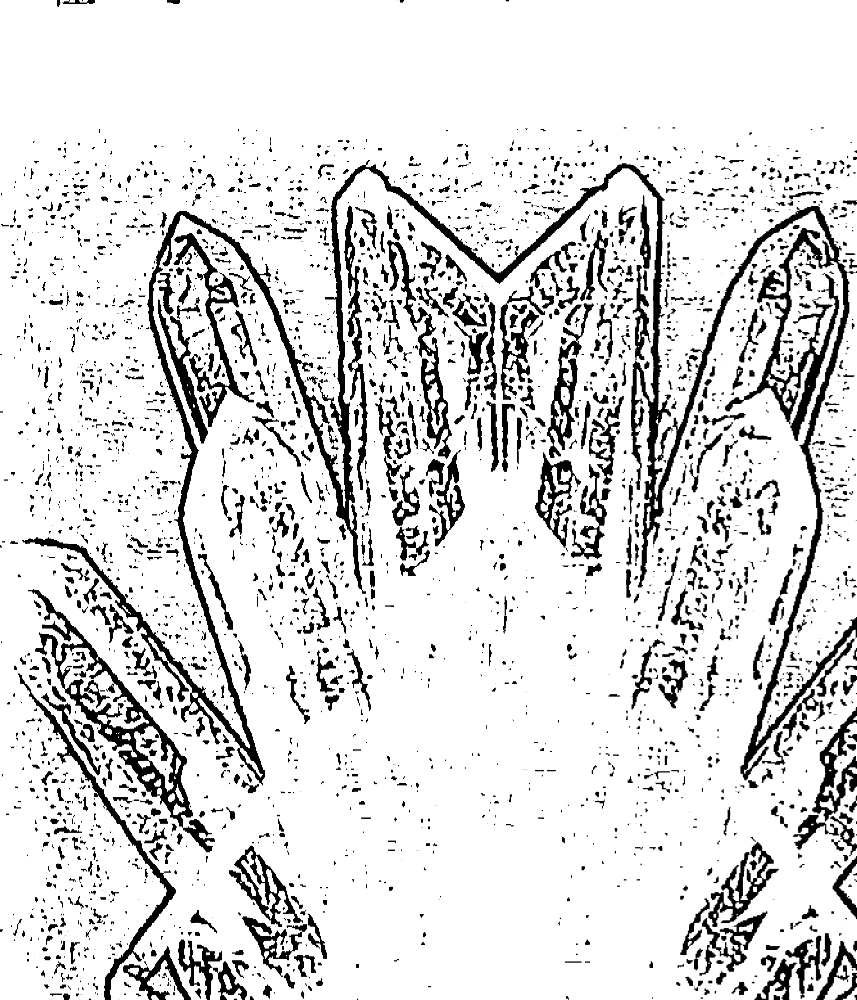

我從來未見過一個神經衰弱的人，因吃西藥而霍然而癒，也從未見過一個感情失意的人，可以用興奮劑而勇敢活過來。

水晶治療帶來的，不單是一種醫療的方式，也同是生命的反省，明白了以往的不是，你自自然然會作出生活方式的修正。

這才是徹底的治療。

### （二）力量來自三個泉源

水晶治療一點也不複雜，如果你問我，要怎樣學習才能發揮它的功效，我的答案非常簡單，將它變成信念，變成生活的一部分，它自然生效。

我們習慣了現有的醫療，感冒吃感冒藥；頭痛吃止痛劑；肚瀉吃止瀉丸；發燒吃退燒散，我們習慣了以藥物醫療身體，在這種倚賴藥物的心理下，水晶治療很難產生神奇的療效。

有位印刷工友告訴我，上班時，他抬紙上車，一個不小心，扭傷了手指，根據以往的經驗，傷勢不輕，可能要休息數天，他第一時間想起水晶，很自然自褲袋掏出來，握在手心。五分鐘後，痛苦消失，翌日回復如常。對他來說，這是非常寶貴的一課，從此以後，水晶就是他的第一位醫生。

水晶治療的神奇力量來自三個泉源：一是你的信念或愛心；二是宇宙光；三是水晶本身的振動。只要將三者結合，便可以應付大多數的治療。

### （三）讓白光運行不息

以下是一個流行於西方的通靈治療冥想（Healing Channel Meditation）：

左、右手各持一水晶柱。

坐在椅上，放鬆，開始瞑想，頂上有團白光。想著白光來自天堂，有妹強大、創造奇蹟的治療力量。它在頂輪中進入，慢慢滑落至心胸。

它在心輪盤旋，逐漸地，它成為一團靈能，令你整個身體擁有一切疾病的能力。

保持這種感覺，直到你進入了自己滿意的狀態（即是說，那種感覺已經很清晰、很明確）。

跟著下來，觀想兩道光分別由心房左右流向肩膊、手臂、手掌。整個人發出強大的治療力量。將左手的水晶按在病人身上，觀想它發出白光，將原有盤旋的黑氣擊散消除，回復應有的光明及健康。過程中，你要有這樣的心念：你只不過是工具，將宇宙光引落病人身上的工具，保持一個無私的愛心，讓白光運行不息。這個心念非常重要，因為，一旦你的心中出現傲慢、自大的感覺，人與宇宙的交流通道便會被識神阻塞，再沒有超人的能力。沒有水晶在手，你一樣可以做這個通靈治療，只不過你用雙手按在病人的肩膊或患處，作同樣的治療觀想。

水晶治療不斷在新紀元創造奇蹟。卡絲娜華高描寫過，有位水晶專家用一根碧茜柱，治好了一個因交通意外而半身癱瘓的女人。我自己的遭遇：有一位女士聽了我的意見，用水晶治好了家姑的坐骨神經痛，未做治療前，老人家不能走動，止痛針打完又打，依然痛不欲生，最後，頑固的老人家主動出聲，要嘗試水晶治療，那是多麼無奈的事。這次治療前後十次便好了。對很多人來說，委實不可思議，然而，它是事實。

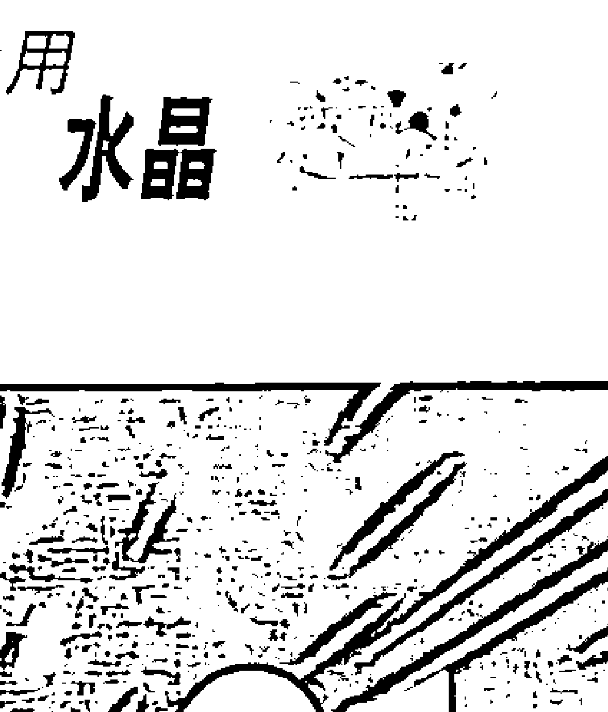

用水晶透視病源

### （一）神經反射區的學問

試過腳底按摩沒有？試過的話，一定忘不了那種咿牙咧齒的疼痛滋味，以及驚訝古人的智慧，怎麼可能自腳底找到反射區這種學問？

其實，不單止中國人有這門學問，外國也有這門學問，外國的土法治療，一早已懂得自手指的徵狀，瞭解人體內在的情況。這門學問有說來自古印度，有說脫胎自中國針灸學，不過，來源不是個問題，反正古代人類文明是一整體，將來也朝大同的世界而去，我們只要知道這門學問有一定的作用，對解決健康的問題有良效，起源倒不用耗費時間研究。

### (二) 靈擺探病源

#### 水晶治療第一步：找出身體出現毛病的地方。

找出毛病有很多方法，我在《水晶宮之旅》中介紹過用靈擺，逐一放在身體的輪位，看它的反應作定奪。方法有效，卻不大方便，起碼要有張床，許多喜歡即席試驗的朋友問：有沒有更簡單的方法。

更簡單的方法，便是將靈擺放在手掌的穴位上，逐一試驗，呈現順時鐘的擺動，屬於正常；逆時鐘擺動呢？是為失調現象，應該深入探討。

這個方法可以自己替自己做，左手攤大，右手持靈擺。

出現疑問後，可進一步發揮靈擺的解答疑難特性，不斷追問：「是這裏出現問題？嚴重嗎？最近發生，是不是？不理會它有沒有問題？哪種水晶可徹底治療？白水晶？茶晶？紅髮晶？」

不用手掌，用腳掌也可以，原理是一樣的。學過腳底按摩的，駕輕就熟，更加勝任自如。

每隻手指反映不同的治療方法，用靈擺測試，即可知自己需要哪方面的改造。

- （一）靈性改造：輪位平衡法，顏色觀想法。
- （二）呼吸改造：瑜珈式呼吸法，顏色觀想呼吸法。逆呼吸法。
- （三）消化系統改造：注意飲食，腹部按摩。
- （四）情緒改造：水晶浴、靜坐、心理分析。
- （五）肉體改造：七重輪平衡法，多作運動、太極或瑜珈。

# 第二十一章 健康篇：用水晶透视病源

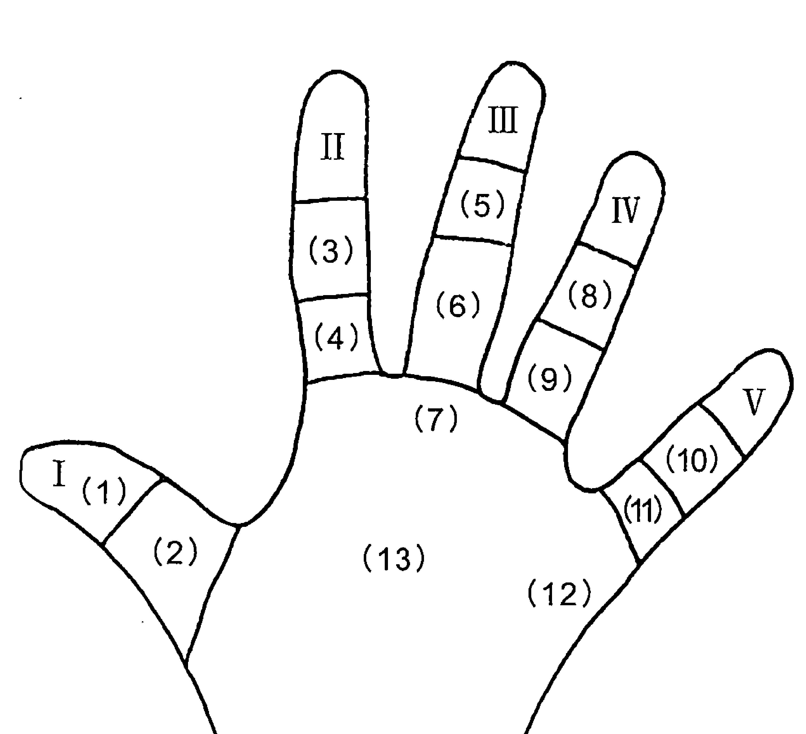

手掌的穴位圖

- I 神經系統
    (1) 氣機狀態
    (2) 肉液的酸鹼濃度
- II 呼吸系統
    (3) 支氣管
    (4) 肺
- III 消化系統
    (5) 肝
    (6) 胃
    (7) 腸
- IV 排泄系統
    (8) 腎
    (9) 膀胱
- V 生殖系統
    (10) 男性——睾丸 女性——卵巢
    (11) 生殖器
    (12) 血液質素及循環
    (13) 心臟功能

# 第二十二章 健康篇：水晶浴回復青春

### （一）益毛髮、悦顏色

第一个发明水晶浴的人是谁？ 这个我可不知道，但明代著名医学大师李时珍在《本草纲目》中，曾说水晶「带寒无毒」，主治「惊悸心热」，功能「益毛髮、悦顏色」，从古老的学问角度看，水晶蕴藏如此巨大的功能，改变人体新陈代谢的功用——「益毛髮、悦顏色」——那么，水晶浴在古代也是很順理成章之事吧！

返回二十世紀的水晶熱潮，八〇年代推行水晶最力的荷里活明星莎莉麥蓮，寫過好幾本書，其中一本是《在光中跳舞》（Dancing In The Light），其中有一段提及她的生活習慣：每天，她都用水晶柱進行水晶浴，保持身心的健康與寧靜。莎莉麥蓮說，她能長時期保持青春的心境與樂觀的做人態度，水晶浴是一大功臣。

莎莉麥蓮在書中曾提到用水晶飛越長生，但沒有詳細具體的方法，很多人看了，頗感迷惑，水晶浴究竟是怎麼一回事？

外國有些水晶專家在瞑想中得到啟示，明白了水晶浴，於是在他們的著作中將水晶浴方法原原本本寫出來。我結合了這些文章的方法，加上自己的意見，整理如下：

### （二）水晶浴的過程

簡單說，水晶浴是一種精神及情緒的徹底洗滌，將所有內心的陰霾一掃而空。

- 工具：新紀元輕音樂、手掌般長短的水晶柱四根或同樣大小的紫晶晶簇，以及洋燭一根、海鹽一匙。

[content]

在浴缸旁燃點洋燭、關燈、播放音量適中的音樂（不可戴耳塞），特別要注意：錄音機不可靠近浴缸，以免發生危險。

在浴缸的四個角落，放上白水晶四根，柱尖指向外。

如果不用水晶柱，可用紫晶晶簇來代替，但以效果論，白水晶柱比較好。

扭開水龍頭，放下溫暖的水，水流撞擊水晶後，迅速釋放出水晶的能量。

放下海鹽一匙，攪拌半分鐘。

在踏進浴缸時，先作一個自我確定：

> 「我藉着這次水晶浴，徹底清除身體、心靈，以及感情上所有的不潔，回覆我渴望得到的青春與活力，感覺是前所未有的好。」

踏進浴缸，浸在水中，先作十下深呼吸，盡量鬆弛，將所有的不愉快置諸腦後。

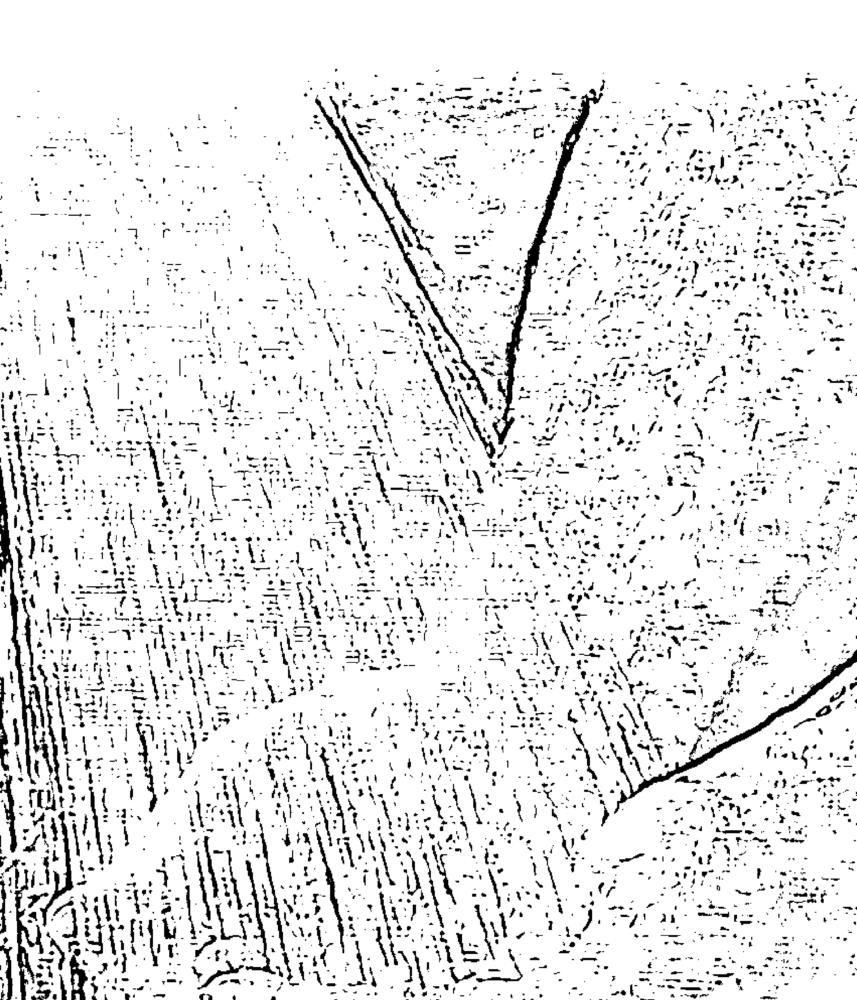

# 第二十二章 健康篇：水晶浴回復青春

這個時候，將背後的兩根水晶柱拿起來，放在掌中。左手一根，柱尖向內；右手一根，柱尖向外。敏感的人會馬上感到，有一股輕微的能量，進入身體，在胸口打個轉，然後自右手的水晶柱走出外。

這是人體氣流的自然軌迹，躺着、閉目、盡量心無雜念，不要干擾它。五分鐘後，你可以進行第二步清潔工作。

你集中精神，作一個觀想。觀想自左手流入的是白光，自右手流出的是黑光，黑光流出後，被腳旁左右的兩根水晶柱一點不膩的吸掉。

你身體內所有的病痛、感情上的不愉快，以及精神的痛苦，隨着右手的黑氣而清潔得一乾二淨。

照我教導朋友的經驗，水晶浴對心靈有創傷，例如：親人離去、失戀，以及工作不如意，朋友關係不融洽，有非常顯著的功效。有幾位朋友只泡過一次水晶浴，馬上將長期低落的情緒一掃而空，比甚麼治療都要來得有用。

### （三）浴後的水晶處理

在適當的時候，你不妨發出叫喊，讓聲音將所有抑鬱宣洩出外。身體有病的朋友，可以觀想白光是一股強大的治療力量，這股力量進入身體內，將所有的黑氣逼出體外，讓身體回復生機與活力。

如果你說，自己是一個身體健康，精神愉快，沒有任何生理及心理問題的人，水晶浴有什麼好處？

好處還是有的，你只要躺在溫水中，讓水晶的振動，不斷衝擊身體的細胞，在短短二十分鐘內，你會感到疲累一掃而空，整個人容光煥發，彷彿年輕了幾年。

最後一提，水晶浴和水晶水一樣，用的水晶，一定要優質而振動頻率優美的，經人工方法處理過或未經清潔的水晶切記不可用。一塊受傷的水晶，散發出來的力量，也同時是有害的。

水晶浴後，用過的水晶需要好好處理。

嚴格來說，四根水晶柱都不可再用，直到它吸納的負性頻率得到清除為止。因為，如果你做得好，將身體內的黑氣逼了出來，那麼，這四根水晶便是一些有問題的物體，任何人碰了，都會受到感染。你應該用紙巾包好，親手逐一放在海鹽中，起碼浸它七天，直到它得到徹底的淨化為止。有些人家裏有後園，更容易辦，將水晶埋在泥中，讓地靈的力量，將它們重新充電，這個方法，比海鹽更為有效。可惜，香港沒幾個人有花園。你也可以跑到郊外，埋在一角——如果你不怕它們在七天內「走掉」的話。總括來說，水晶浴比蒸氣浴、泥漿浴、芬蘭浴有意思，它照顧的，不單是你的肉體，還有心靈。要譬如的話，水晶浴其實是一次洗禮，不過，這次洗禮你卻毋須加入教會。所以，千萬要試一試！

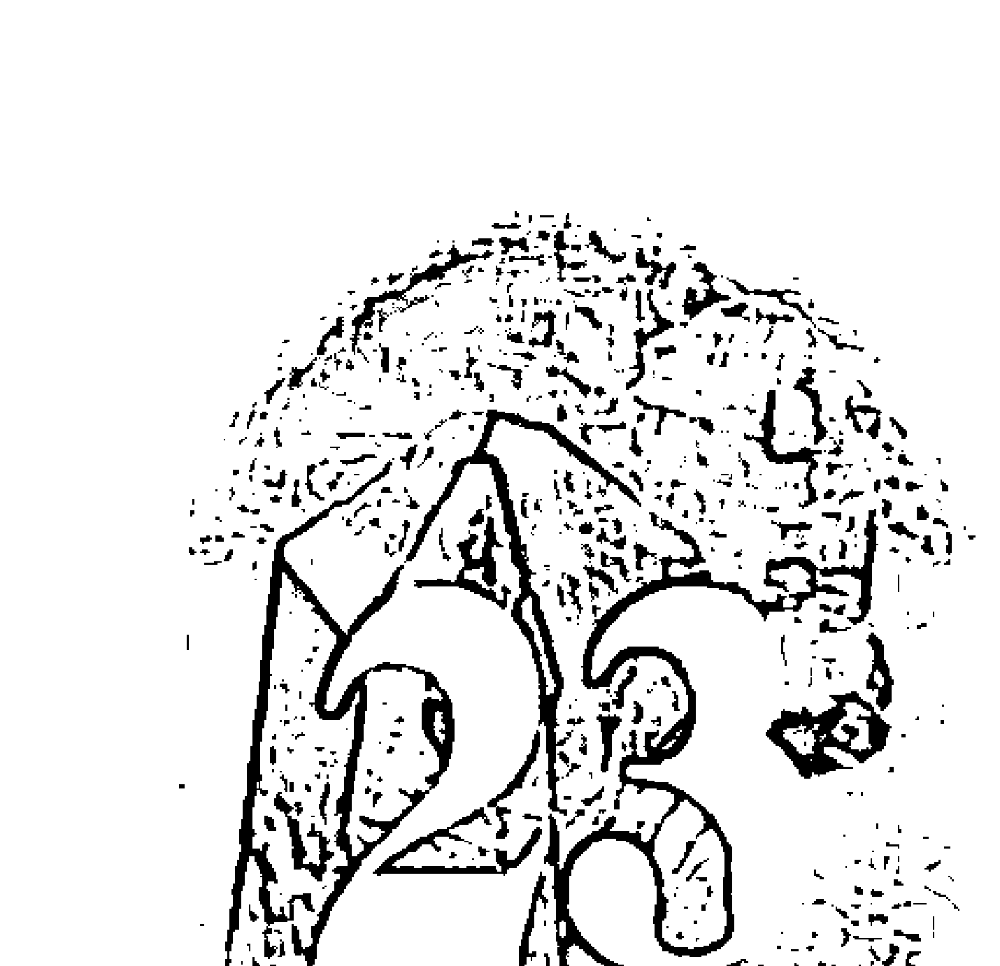

## 水晶帶來明亮的眸子

### （一）淚水帶走穢氣

有位小姐修習密宗，不久之後，經常嘔氣，肚子裏好像翻波作浪似的，跟着，靜坐時，雙目不停地流出淚水。她感到不安，跑去問上師。上師說，這是正常的，它在清理身體、內的習氣，叫她忍耐一下，不久便會消失。

這位小姐是護士，性好尋根問底，對她來說，這種答案未免抽象而籠統，不大能解決心中的疑竇。

有一天，她到「水晶宮」來，跟我說起自己的經驗。

我聽了，答：「如果你想快點解決自己的問題，嘗試用水晶球吧。」

她不明所以，追問。

我跟着解釋：「你的上師沒有錯，這是清理身體內的習氣——亦即穢氣。一般來說，能夠入靜的學者，都有這般反應。」

不過，要科學地解釋起來，便得用道家在這方面的智慧。

### （二）提出五臟之病

古代的道家認為，世界上沒有得病的神仙，亦沒有吃草藥的得道者，既然學道，那便得修成百病不侵的體格，要修成這種體格，不但要治好已出現的病，還要治未來的病。

從表面觀察，很多人健康快樂，若無其事，然而內中隱藏未發的病根，若一日生活不檢點，病魔纏身，此時再乞靈於藥物，已然太晚。

大多數疾病，源於喜怒哀樂，喜則傷心、怒則傷肝、哀則傷魂、樂則傷魄。在未發之前，將五臟之病由眼提出，自然杜絕所有將來之病。為甚麼五臟的病，可從雙眼提出來？為甚麼我們可以從一個人的眼睛，看到他的健康狀況？為甚麼一雙混濁的眼睛，可以變得明亮照人？

原來古代的道祖如此理解人體：

> > 「天一生水生黑睛而有瞳人通腎，地二生火而有兩眥通心，天三生木而有黑珠通肝，地四生金而有白珠通肺，天五生土而有上下胞胎通脾，故五臟精華皆藏於目。」——見千峯老人的《性命法訣》。

在整個身體中，只有雙眼屬陽，餘皆屬陰，要提出平日積聚之病，便得由此着手，用雙眼之陽光，引出內藏的真火，內中渣滓自然隨淚水流出來。

很多學習靜坐的朋友，便是不知不覺間，因凝神而啟動五臟

### （三）平心凝视水晶球

道家有一个凝视丹球的功法，专门清除五脏的病毒。我改用水晶，教过几位朋友，效果非常好。有一位在电视台工作的小姐，原来因肝病而致双目混浊无神，经过一个月后的练习，已经变回黑白分明，神采飞扬。

方法如下：

- 先找一个天然的水晶球（不是人工合成的含铅制品），输入一个健康的讯息。放在面前，距离身体三呎，高低以与目平视为宜。
- 闭目作十下深呼吸，平定心神，然后张开眼睛凝视水晶球，不要眨眼，亦不可太勉强。
- 不久之后，眼睛出现涩意，跟着流出泪水。这种泪水味臭而碱酸，是因为五脏之渣滓，流尽之后，眼睛自然会回复童年时明亮。

基本上，每一个修习静坐的人，都会有一双明亮、黑白分明的眼睛，他们也许不明白道家的道理，然而一个人静下来，五脏得到休息，自自然然回复平衡与好生机，用现代人惯听的生理術語，那便是內分泌得到適當的調整，回復應有的功能。一個人健康與否，觀其目可知大概。一個人修煉成績如何，一雙眼睛是最好的證明。道家的靜坐功夫做得好，眼睛會變綠色，這是古籍中早有的記載，如果你明白內臟與眼睛的關係，當會明白這是自然變化，並非神話故事。最後一提，練習上述功法，開始時，時間不要太久，稍有澀意即要停止，跟着循序漸進，直到淚如泉湧。練習完畢，緊記不可馬上離座，應該先閉目靜坐片刻，讓氣息回歸原位，以免眼睛動氣而受傷。水晶是工具，活用它的是人，有些人問：

> 水晶球除了遙視將來，還有甚麼用？

我答：

> 水晶球妙用無窮，遙視將來，還可以聚氣生財，順手拈來，就是上述的一個保健大法。

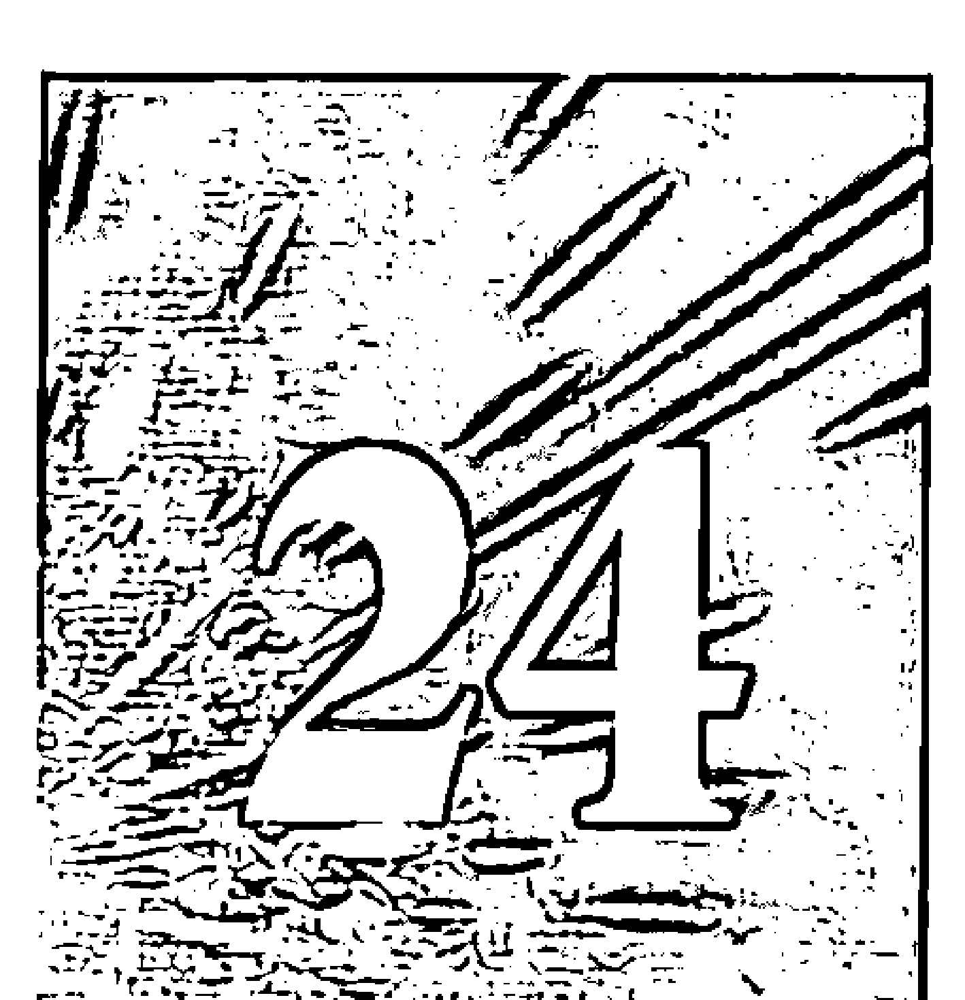

## 水晶治療寵物

### (二) 醫治「大日子」

鄰家的小女兒敏敏偷偷地養了一隻北京狗，為了這隻小寵物，她可吃了不少苦頭。大廈規例不准養狗，她只有將「大日子」（狗的名字）關在露台，閃閃縮縮幹盡了不少卑躬屈膝的事。

不知是否香港的天氣變化太大，又或居住環境太侷促，「大日子」經常生病。

一個月總有兩、三次在電梯碰見小主人面青唇白的將牠帶往診所。一天，她忍不住跑過來問：

> 「陳先生，水晶可用來醫人，可不可以醫狗？」

可以醫人，當然可以醫狗，不過，我從來沒有醫過狗。為了敏敏這個問題，我翻了幾本書，提供了幾個可行的醫療方法。

效果如何？

「大日子」看醫生比以前少了一半，健康狀態明顯比前佳，情緒也遠較為穩定，我想——如果牠不是在不適當的地方居住，沒法接觸大自然，牠會變成另一隻更快樂的狗。

### （二）治療寵物的理想光

所有醫療生物的原理大同小異，尤其自然療法，強化細胞，血氣暢順，自然百病祛除。

運用水晶醫治寵物，在外國非常盛行，這種醫療方法需要觀想能力配合，才能發揮出真正的效果，然而，一個充滿關懷與愛心的人，是不會失去這種能力的。

根據一位水晶專家Laurie Jelgersa的研究心得，動物復元的速度比人類更快；動物沒有成見，沒有懷疑，更懂得分辨好壞，相對來說，人類的反應呆滯得多。

治療人類，通常召喚白宇宙光。

治療動物，理想的光是橙、綠及藍三色。

為甚麽出現這些分歧？Laurie Jelgersa沒有解釋，她只說，根據實驗心得，橙、綠及藍的治療效果較理想。

這個問題，大概可用動物的靈性比較低來解答。們需要同頻率的宇宙能。

橙色的宇宙光能治療動物在生殖器官及消化器官的毛病，同時也帶來安全感。

綠色的宇宙光帶來活力，強化動物的肉體機能。

而藍色的宇宙光，有安撫動物情緒，令他們安詳的功能。

### （三）驅散寵物的黑氣

至於運用的方法，有下列幾種：

1.  將白水晶柱放在左手，統攝精神後，按在患病的地方，如頭、腹、身體四肢等。觀想宇宙光落下來，順著手流出外，在動物身體打個圈，自左手流回身體。如此循環不息，利用宇宙光淨化寵物的病氣。水晶是為擴大宇宙光能量的工具。運用這方法時要注意，倘使無法想宇宙光自頭頂落下，不要作左方吸入的循環，因為你可能吸入病氣而無法淨化，形成對自己身體不利。
你只需專心觀想宇宙光自右手射出來，驅散寵物身上的黑氣便可以。治療時間由五分鐘至十五分鐘不等，過程中留意他的變化。

2.  手握水晶圓塊或水晶球，輕輕在病患處按摩。一方面觀想宇宙光自手中散射，形成強大的治療能量。

3.  假定某一天，你離開家園，接到消息，寵物病了，那又如何是好？你需要以下的遙診方法，握水晶柱在手，平息心情，想像自己走進水晶內，寵物就在面前，接受你的診治，並用上述的方法將他徹底的醫好。如果你不清楚選用怎樣的宇宙光，就乾淨俐落地運用一塊彩虹水晶吧。
它自然地散射適當的力量。

另外，Laurie Jegersa 寫過一些特殊的個人經驗，頗為有趣，喜愛寵物的朋友不可不知。她說，她的狗生蚤，為了驅走這些討厭的小東西，她試圖用白水晶浸水給牠喝，結果不生效。
忽然間，她得到靈感，這個問題要用紫水晶來解決。遂改用紫水晶浸水。結果，出乎意料的好，他的狗從此沒有蚤。
這個方法簡單易行，大家不妨一試，水晶水的製作，請參考本書第二十六章：水晶「水」妙用無窮。
請留意，動物的抵抗力比人類弱，水晶水不可太濃縮，要盡量稀釋，開始時一點一點加上去，以免過猶不及，弄巧反拙。

有一趟，她心愛的鸚鵡由於下三輪失去平衡，常有一些好像自虐的不正常動作，她遂將一顆黃晶放在水杯中餵牠喝。自此之後，鸚鵡回復正常，不再自我虐待了。

另一趟，她的愛駒肌肉腱發炎，獸醫說，六個月的休息及停止運動是必須的，否則後果堪虞。結果，她以綠及藍宇宙光給愛駒作每日治療，六個星期後——不是六個月後，牠回復正常，奔跑如昔。

又有一趟，旅途中，愛犬量車浪，不停的嘔吐，在高速公路上，沒有醫生，有甚麼辦法呢？
結果，她一手握軛盤，一手按着寶貝，觀想藍宇宙光，自此到終點，牠在酣睡中，再沒有嘔吐過。

除了上述的例子，Laurie Jeltersa還有幾句名言：
動物不可能靠觀想病好便病好，他們不會欺騙自己，他們只知道自己是否真的病好。
一個人用水晶治好，大家會說，也許是心理因素吧，他本來是沒有病的。
一頭動物被水晶治好。
我們可不能說，牠一直是疑心生暗鬼，庸人自擾吧！

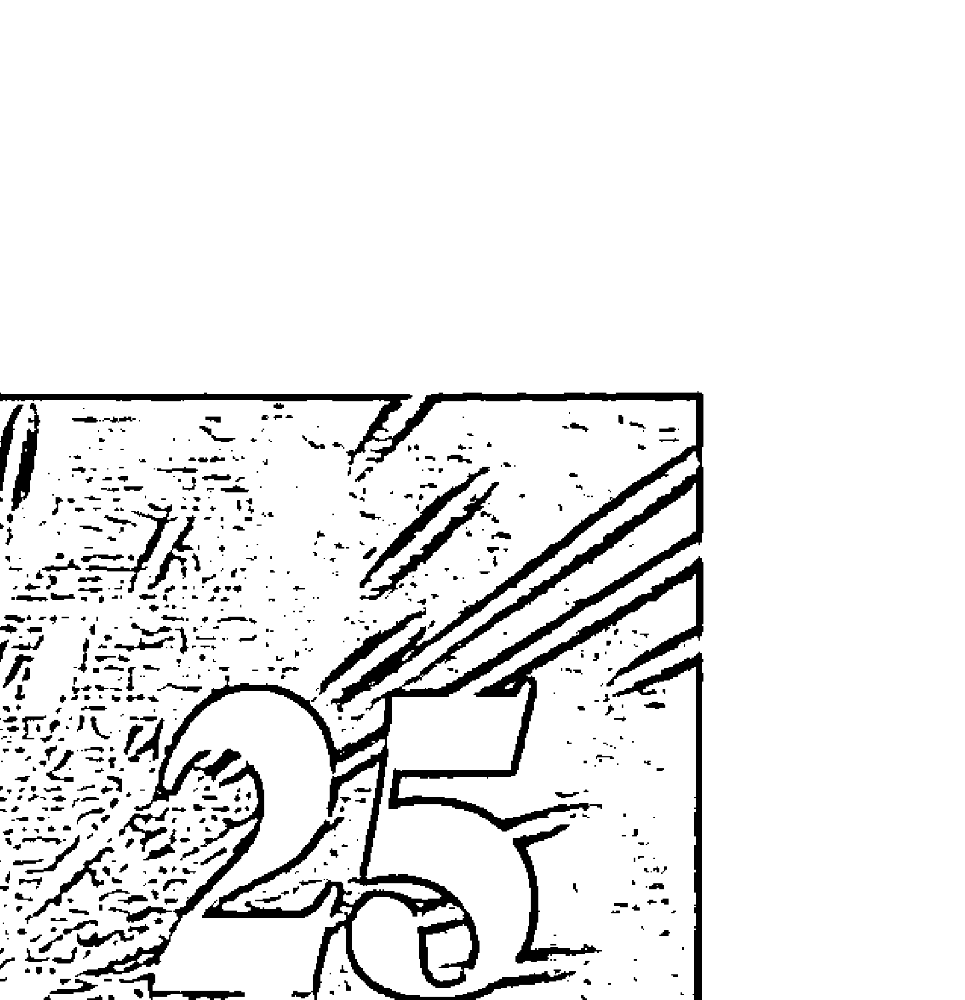

## 令植物起死回生

### （一）連鐵樹也養不活

朋友是著名的「綠手指」，寫了幾本有關園藝的著作，名列暢銷書的行列。有一天，我拜訪他在郊野的住所，閒聊起園藝，我說我是懶惰的現代人，完全不懂照料植物，新居入伙，朋友送了我兩株巴西鐵樹，沒多久便告香消玉殞，我感到十分內疚，連鐵樹也養不活，恐怕除了植物化石之外，不宜接觸任何植物。

朋友聽着，笑起來，忽然問：「水晶是不是有助植物生長？」
我想想，答：「有這種說法，外國的水晶品種，有一種叫植物水晶，形態和質地比較差，特別用在園藝之中。「水晶對人體和動物有正面影響，對植物也產生同樣的效果。它在改變植物細胞的電磁場方面，十分有效。」」

### （二）插在植物的四周

水晶應用到植物的方法，簡易可行，將數株天然水晶柱，插在植物的四周，底在下，尖端朝上，自自然然，水晶的振盪會帶給植物生機與活力，促進新陳代謝，植物隨而欣欣向榮起來。

植物和人一樣，需要的生命元素，不僅限於營養，同時也需要無形的電磁能，簡單點說，便是地靈的力量。有時，一棵植物在屋裏的一隅，奄奄一息，移到另外一角，陡地枯木重生，再度活躍起來。

人需要有好的風水，植物也需要。沒有風水的選擇，便要借用水晶改變四周的電磁場，令植物在理想的環境中生存下去。

### （三）長出了嫩芽

那一晚回家，我身體力行，將水晶柱插在鐵樹的四周。為了效果更好，我佈了一個七星陣（Seven Stairs Grid），當中一根水晶柱插在樹幹之旁。

翌日，我回到家發現枯黃了的樹葉更黃，心中有點狐疑，難道不生效？跟著下來兩天，工作忙碌，沒有時間細心觀察牠的發展。但傭人問：「樹葉掉光了，恐怕養不活，要不要丟掉。」我答：「過兩天再算吧。」

我相信牠一定會再度活過來。

三天后的早上，我醒來後跑進大廳，忽然間，有所感覺，轉過頭來，看到一片嫩綠的樹芽自驅幹冒出來。

牠終於找回失去的生命。
其後，我將方法教給幾個喜愛園藝的朋友，他們印證了一個結果，水晶帶給植物更強壯的生機。

### （四）做個小實驗

移民加拿大的朋友對我說，她將方法擴大，在花園的四周埋下一根六、七吋長的水晶柱，再在中央插下一根大雨吋的水晶柱，結果發現花花草前所未有的活潑。

有一趟，其中一株心愛的植物出現問題，她將一角的水晶柱拿起來，插在這株植物的旁邊，不久牠再度活過來，據她的瞭解，移動的水晶柱將其他水晶的能量帶過去，刺激植物的生長。

然而必須緊記，中央的水晶柱不可碰。
如果你相信水晶的神奇力量，不妨做一個小實驗。找一株檸檬草(Lemon Grass)，放近窗台，向光性自自然然令牠傾向窗外生長。
這個時候，你再在另一邊放上一根水晶柱，柱尖向着草，兩、三天後，你會發現牠開始改變生長方向，傾情於水晶。
這表示了牠自己作了一個選擇，認為水晶的能量更有吸引力！
自然界的生物懂得選擇最有利的生存方式，我們人類自認爲萬物之靈，但在本能的發展上，似乎遠遠不如植物。
我們之中，還有很多人懷疑水晶的作用。
水晶真的能令我們活得更健康、更快樂？
如果你愛植物，並聽懂自己內心的呼聲，問題根本不該存在。
最後有點補充，除了白水晶柱，黑石如黑碧璽，對植物也是極佳的輔助石。

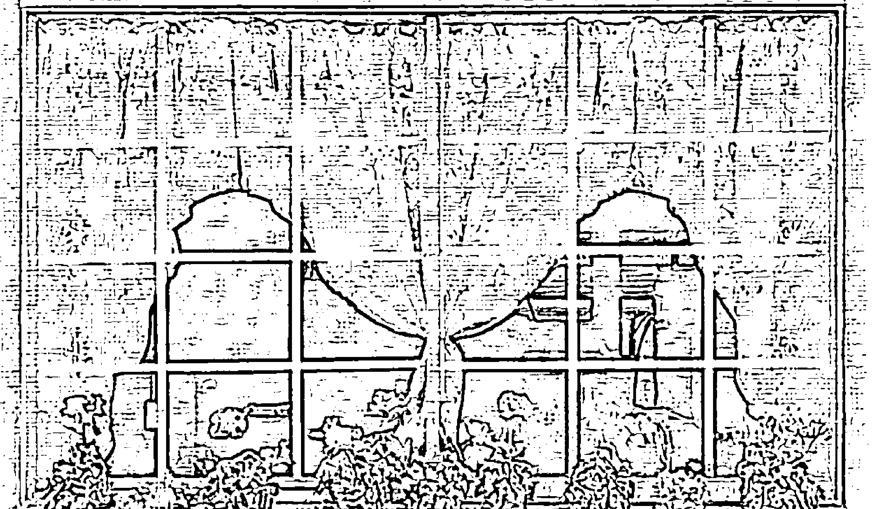

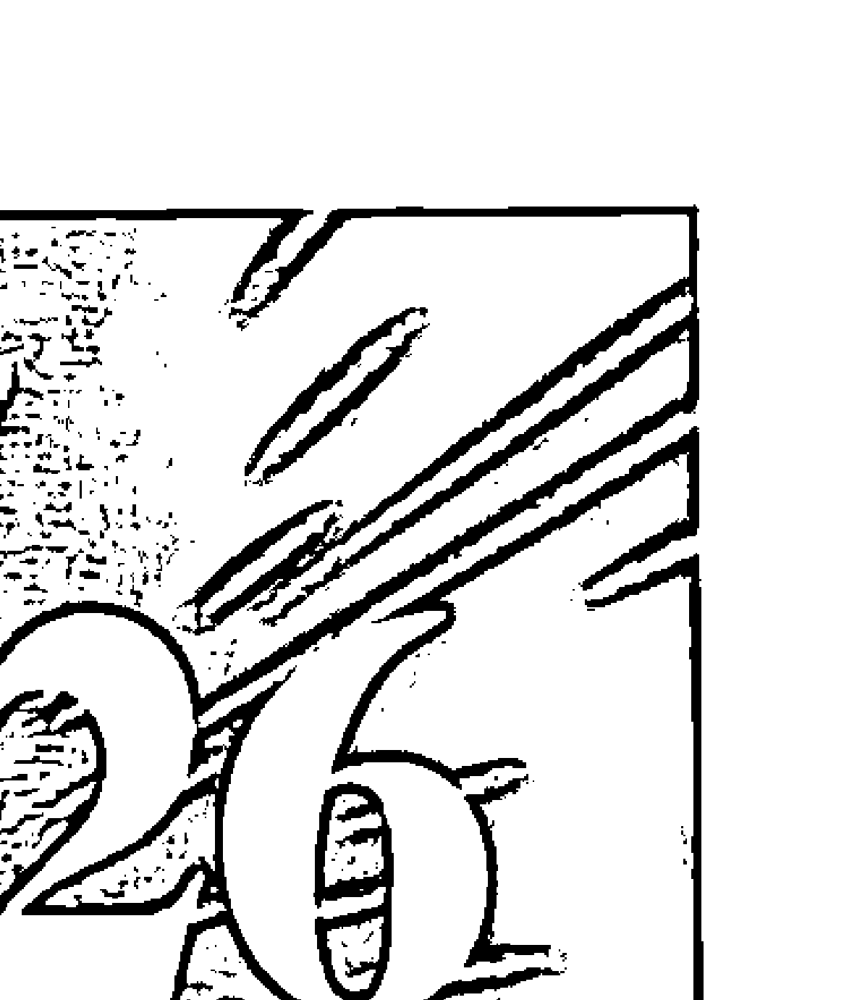

## 水晶「水」妙用無窮

### （一）將水變成能量

水晶精華（Crystal Essence）究竟是甚麼一回事？

簡單點說，水晶精華便是水晶水。

水吸取了水晶的特殊振動，喝進人體成為治療及重建肉體、感情、心靈及精神的「良藥」，而這門學問，並不是流行的玩意，它在地球上出現了已有數千年的歷史。

我們知道水是極佳的導體，而它和水晶一樣，有着同樣的振動頻率，水晶在水中發出的振動，被保存下來，喝進人體，便成為有效的平衡劑。人體中有百分之七十至八十為水分，這些水分如果受到了水晶精華的影響，便會改變振動的頻率，導致整個身體的狀況也改變過來。中醫說，所有的病因源於血氣不通。在水晶治療來說，所有的疾病源於負性能量——身體能源穴（輪穴）出現黑氣漩渦。基本上，血氣不通與負性能量是同一回事，只要修正了身體器官的不協調，人體自然回復應有的生機，失去的健康也就找回來。水晶精華的道理就是如此簡單。自然療法的學問從來不複雜。大道至簡！可惜很少人明白甚麼是大道。我在展覽會期間也曾被問及水晶精華的問題，回答也許流於粗略，在此作一補充。

### （二）不是全部都可喝

首先要明白，並不是所有的晶石都可以浸水喝的，切要緊記，凡是含有銅或易於溶解並有毒性的晶石，都不可用。舉例來說，孔雀石（Malachite）、藍銅礦（Azurite）、孔雀石（Chryocolla）、松石（Turquoise）都不可用，這些晶石含銅，溶於水中產生毒素，對人體有害。可用的水晶，有下列幾種：

- 一、茶晶——將人體的能量穩定下來，令一個人變得有力量。
- 二、芙蓉晶——平衡及平靜情緒，是失意、失戀，以及感情受到過度刺激時的首選恩物。
- 三、紫晶——靜坐前喝少許，方便入定，有助靈性的提升。
- 四、黄晶——浸水後的黄晶振動，不斷衝擊身體的細胞，帶來活力。
- 五、紅寶石或石榴紅石——帶來刺激及熱情，驅除冷漠。
- 六、水藍寶石——有助開發語言能力，特別適用於語言障礙病的孩童。
- 七、祖母綠——有著廣泛的治療作用。
- 八、碧璽——不同顏色的碧璽，有不同的作用。粉紅色安撫情緒，綠色及水瓜色的有治療功用。
- 九、白水晶——將訊息輸進去，浸在水中，用在任何方面，也用得著。

### （三）浸水晶的步驟

選擇了適當的水晶後，跟著開始製造的過程了。

需要的材料：

- 一樽蒸餾水
- 數個玻璃瓶（可以密封）
- 過濾罩
- 四根白水晶柱
- 一個滴瓶

首先，將水晶作徹底的清潔，用水沖乾淨，然後放進玻璃瓶內。

將蒸餾水倒進，密封後放在陽光下曬三至五小時。可以的話，儘量利用早上十時至下午...## 第二十六章 健康篇：水晶“水”妙用无穷

將四根水晶柱放在瓶子的四周，柱尖自四個方向指着中央。
如果有白金字塔水晶，將它放在瓶子上面。
也可以將一個水晶靈擺放在瓶子上順時鐘方向旋轉幾分鐘。

這都是凝聚宇宙能量，將水充電的方法。

陽光是將水充電的能量來源，曬得愈久，水吸收晶石的振動愈多，能夠利用月圓之夜的神奇引力，將水晶的力量釋放出來，效果便更好。

一般來說，浸上三天已足夠。

這個時候，水變成精華，將它倒出來，為防喝進水晶的碎片，請用過濾罩隔去碎片。

將精華倒進密封的玻璃瓶，如果你準備長期飲用，為防變壞，可以加進白蘭地酒作防腐劑。

份量是三十五安士水注入十五安士白蘭地酒，加起來一共五十安士。

加進酒精後，依然可放在窗台，讓陽光、月亮將它不停的「充電」，所謂吸收日月精華，便是這樣的意思。

跟著下來便是將精華放進滴樽中，以便使用。滴樽必須消毒，通常的辦法是放在滾水煮過，像奶瓶消毒一樣。

消毒後，將精華倒進滴樽，密封，貼上標誌，用以辨別。

兩年前，我試過花了一週的時間，浸了十二種水晶精華，將它們陳列在窗台後，貼上標誌，感覺是自己開了一個藥房，甚麼病都不用擔心了。單是這種心理上的安全感，已經很有意思。

### （四）怎樣運用水晶精華？

如果你要增強活力，提昇情緒，可在早上起床，滴下兩滴在飲品中。若用作治療的話，應該在空肚時飲用，這樣吸收起來會更快，功效更顯著。

另外，也可以將它滴在水中，一同飲用。水晶精華和同類療法的補救劑（Remedy）一樣，都是利用一些看不到，甚至化驗不到的宇宙能量，修正身體失調之處，它們不是藥，不是化學藥品，服用後全無副作用。

唯一的問題是，如果你的心有懷疑，拒絕相信它，它的效用會大減。

### (五) 老少咸宜

水晶精华适用于大人、小童及所有年龄的人。
有些人完全不能接受酒精，小小一点吃进肚子，也会产生敏感，出现不适，那又怎么办？
在这个时候，你可以将水晶精华放在浴缸中，让身体吸取它的能量。涂在皮肤上，作七下深呼吸，也是个可行的方法。
有些人直截了当的将水晶精华滴在舌底，他们相信这样吸收起来会更快，然而，这个方法并不是人人适用，天赋敏感的人容或会感到过分刺激，尤其一些威力惊人的精华如红宝石精华，应该稀释了才使用，否则「虚不受补」的情形便会出现。
水晶精华也可用在「遥诊」（Absentee Healing）中。将一杯清洁的水放在照片上，滴下三、四滴精华，再加上自己的冥想，冥想水晶的振动能量是渗进照片中的人，将他身上的病痛扫除。
相对来说，服用后作简单的冥想，用信心结合它的能量，令你意想不到的奇迹往往会出现。

# 第二十六章 健康篇：水晶「水」妙用無窮

### （六）符箓及水晶水
開首時，我說水晶精華在人類歷史上已出現了數千年。
你大概以為這是羅馬時代，西方文化的遺存。
但我說，中國也有水晶精華。
道家的符箓便是另一種水晶精華。

懂得香薰治療的朋友，
有沒有試過將香薰油放在水晶精華內燃點呢？
如果沒有，趕快一試，我保證你會得到意外的收穫。
最後，我要作一點題外話。

先秦諸子時代，道家的符籙派已懂得將意識變為文字，書寫在紙上，產生治病、驅鬼或祈福的作用。符燒在水中，能量轉化，改變了水的頻率，成為另一種精華。所以，不要說飲符水是迷信，它背後隱藏了一門精奧廣大的科學原理：物質形態轉變，能量終於不滅。敲經驗佛的朋友，平日做功課的時候，不妨捧着個水晶球（有30mm直徑即可），平放心胸，將經文咒音輸入其內，經過一段時間，這個水晶球成為一個充滿宇宙靈光的物體，用來浸水自會產生不可思議的神效。有位朋友照此方法唸了一萬零百篇「大悲咒」，將水晶球放在水壺內，長時間飲用，老人家的長年頑疾居然不藥而癒。有個信奉日本佛教的朋友告訴我，他們從來不用修法也不用唸咒，只是誦唸經文。有一次，意外發現水晶球放在水中，發射出燦爛的紫光，而紫光正是他們的宗教靈光。喝進肚子，他明顯感到一團溫暖的氣流，由胃部散發全身，令他通體舒暢。我說，水晶可以結合道家的符籙來運用，取代一般人無法做到的觀想，一向信服水晶的朋友忽然躊躇，問：

> 「符真的產生作用？」
朋友是天主教徒，我反問：「你相信教宗的祝福嗎？」
「我相信。」
「教宗在聖水上祈禱、祝福，灑在教徒身上，這樣和符籙有甚麼分別？如果你相信聲音可以產生力量，為甚麼文字不可以產生同樣的力量？」

朋友啞口無言。

我卻有點惆悵。禮失而求諸野，曾幾何時，一度光芒萬丈的中國古代文化，變得如此可憐、遭人遺棄？

希望水晶精華帶來的，不單純是治療的方法，而是心靈的開放，讓我們以更廣大的胸襟，迎接所有以往的人類文明。

補充一點，唸經時水晶球不放在心輪，可放在第三眼的位置。由第三眼送出訊息。然而，水晶球本身是強大的能量團，渾身發散能量線，有些人的輪位受不住刺激，內分泌失調，稍有不適現象，便應停止，或將水晶球放離身體，切勿勉強。

氣消除，回復健康與活力。更理想的做法是觀想宇宙白光，射入水中，與精華結合成一股強大的治療力量。
無論如何，你得留意身體的反應，決定飲用的份量。有時，兩、三種水晶精華混合服用，產生奇異的效果，這是所有的藥物無法相提並論的。如果你懂得香薰治療（Aromatherapy），你會更容易明白我的話。

# 第二十七章 帶來圓滿的彩虹

### （一）裂縫形成光線折射

彩虹代表圓滿。水晶內出現彩虹有幾種原因。一是水晶在生長時遭受重大壓力（來自地殼的變動），內部出現裂縫，形成了特殊的光線折射，遂出現彩虹。
第二個原因是能量在水晶內累積到極點時，形成了閃爍的光彩，也是彩虹。
另外，水晶柱與水晶柱交疊並生時，表面間偶有差異，形成光線的折射，也是彩虹。

選擇彩虹水晶，天然比人工形成的好。有些人將水晶放在電冰箱，利用冷縮熱脹的原理，令水晶出現裂縫，產生彩虹，這種彩虹欠缺自然的生命力，是所謂沒有內在力量的彩虹，並不值得推薦。

天上的彩虹，亦即是水晶的彩虹，分別由七色組成：

- 紅
- 橙
- 黃
- 綠
- 藍
- 藍
- 紫

七種色概括了地球上所有的能量，是一切生命及物質的來源，因此擁有這七種色，等如擁有整個世界。

故此說，彩虹代表圓滿。

拿著彩虹水晶靜坐，將彩虹印在心中，令身體的氣場出現彩虹是一種圓夢的瞑想方法。

另外，將彩虹水晶放近窗台，讓陽光折射進來，透過它在室內散射出漂亮的彩虹，也有改善室內磁場，創造出美好風水的效果。

也有人喜歡將彩虹水晶放在燈箱上，讓光線將彩虹不停地印在四周的環境，當然，陽光比人造光線好。

### (二) 一陰一陽謂之道

彩虹中的紅、橙及黃三色為陽性本質，主宰左腦的知覺世界。左腦是分析、邏輯、理性、組織、語言及意識的中心，這個區域要是發展得不好，一個人會變得思想混亂，難以在俗世上生存。藍、紫藍及紫三色為陰性本質，主宰右腦的世界，這個世界由直覺及潛意識所組合。右腦是聖潔、直覺、藝術性、非語言及潛意識的中心。開發得好，超越三度空間，打破時空的局限是舉手易事。開發得不好，一個人淪為動物，只懂在食、色的慾界打滾。簡單點說，左腦是太陽，右腦是月亮。我們必須左、右腦平衡發展，理性與感性同時發展，才可得到美滿的人生。

父母想子女成材，生活快樂，從小就要培養他們的雙線發展，這比單注重讀書成績，更令他們受惠。

一陰一陽謂之道。傳統的丹道對陰陽的解釋放在這方面，也可解說得通。左、右腦發展到極致，二合為一，便是全智、全悲、全能，大成就境界。入世需要彩虹，出世同時需要彩虹，因為，出世與入世，原理其實是一樣的。

# 第二十八章 扯下生日石的神秘面纱

### (一) 迷信還是真實

有一趟，我到朋友的珠寶公司探班，閒聊間，來了一雙年老的顧客，男女衣冠楚楚，言談間顯示出是受過教養的人。

女的操外省口音：

> 「六月生日該選甚麼寶石？」

職員赧然，轉過頭問我：「陳先生，你來說，你是這方面的專家。」

我想了想，答：

「六月份的生日石是珍珠。」

「珍珠？珍珠也是水晶？」

「書本上是這樣說的，不過，也有人將瑪瑙視為六月的生日石。」我解釋：「瑪瑙是健康與長壽的象徵，珍珠則是安寧與高貴的象徵，這得視乎每個人的需要。」

「象徵的意思是它不是真實的。」男人插口。

「象徵的意思是它有那種能力，我們可以藉着它喚起身體內的能力。」我更正。

男人皺着眉，有點混亂，半晌還是固執的說：「總而言之，不是真的，只是古老的迷信。」

我笑了笑，沒有接下去說，一個習慣心物二分法的人永遠不會明白箇中道理。不久，他們買了一串珍珠頭鍊，叮囑小心包好，原來是準備送禮用的。

他們走後，朋友舊事重提，問：「生日石是一個傳統的迷信，抑或真實地產生作用？」我反問：「假使迷信而產生了作用，那麼它是迷信還是真實地產生作用。」

> 「無形世界不可作有形的辯證。」我說：「而且，生日石也不是純粹一種信念，每種石的振動頻率，代表宇宙的一種特殊能量，這種能量產生代表石的德性。」

在西方的歷史，相傳佩戴生日石是波蘭人率先發起，但在波蘭人之前，古代的希臘哲學家已有關寶石的讚頌，因此，月份石的歷史應推算到四千年或更早的年代。

### （三）不同月份的寶石

波蘭人的生日石如下：

- 一月：石榴石 (Garnet)：永恆的象徵。
- 二月：紫晶 (Amethyst)：誠懇的象徵。
- 三月：血石 (Bloodstone)：勇氣的象徵。
- 四月：鑽石（Diamond）.. 純潔的象徵。
- 五月：祖母綠（Emerald）.. 愛情永固的象徵。
- 六月：瑪瑙（Agate）.. 健康和長壽的象徵。
- 七月：紅玉髓（Carnelian）.. 如意的象徵。
- 八月：纏紋瑪瑙（紅白條紋）（Sardonx）.. 兩情相悅的象徵。
- 九月：貴椰欖石（Chrysolite）.. 諸邪不侵的象徵。
- 十月：奧寶（Opal）.. 希望的象徵。
- 十一月：黃玉（Topaz）.. 忠誠的象徵。
- 十二月：松石（Turquoise）.. 昌盛的象徵。

除了上述的象徵外，每一顆生日石表示出特殊的宇宙能，與人體及外間的事物有一定的聯繫，懂得運用的話，一年十二個月是一個圓滿的修煉。

### ### (三) 十二位守護神

另外一派的生日石，主要根據聖經新約全書啓示錄，經文說以色列大法師身上有十二顆

不同的寶石，它們代表黃道十二宮和十二位守護神。換言之，是神秘力量的來源。

這一派的生日石和波蘭人的大同小異，只是三月換上水藍寶石（Aquamarine），六月換上珍珠，七月換上紅寶石（Ruby），八月換上珊瑚及九月改為藍寶石（Sapphire）。

有些人喜歡將深色的寶石圍在腰部，運用得好，長保活力及精壯。

佩戴首飾有學問，不懂其間奧妙，平白浪費上天創造寶石的美好心意，所有的寶石都應經過清潔，輸入訊息以及愛心的程序。即使你甚麼也不懂，起碼你得對它有愛心！

### （四）不同星座的寶石

另外，星座和水晶也扯上關係。水晶受月亮的引力所影響，同時，九大行星也成為地球上眾多寶石的動力來源，此學問極其複雜，解釋起來非花上大量篇幅不可，在此從略。大家只要明白，黃道十二宮的十二星座，每一個星座都有一顆保護星，強烈影響着在此間出生的人。
而這顆守護星的力量，正由地球上的十二顆寶石反映出來。星座石也是保護石，原理在此。

下列分別是黃道十二宮的代表石：
- 第一宮為白羊座（3月21日至4月20日）代表石：紅寶石（Ruby）。
- 第二宮為金牛座（4月21日至5月21日）代表石：黃玉（Topaz）。
- 第三宮為雙子座（5月22日至6月22日）代表石：紅玉（Carbuncle）。
- 第四宮為巨蟹座（6月23日至7月22日）代表石：祖母綠（Emerald）。
- 第五宮為獅子座（7月23日至8月22日）代表石：。
- 第六宮為處女座（8月23日至9月23日）代表石：蓝宝石（Sapphire）。
- 第七宮為天秤座（9月24日至10月23日）代表石：钻石（Diamond）。
- 第八宮為天蝎座（10月24日至11月22日）代表石：红风信子（Jacinth）。
- 第九宮為人马座（11月23日至12月21日）代表石：玛瑙（Agate）。
- 第十宮為山羊座（12月22日至1月20日）代表石：紫晶（Amethyst）。
- 第十一宮為水瓶座（1月21日至2月18日）代表石：绿宝石（Beryl）。
- 第十二宮為双鱼座（2月19日至3月20日）代表石：尖晶石（Jasper）。

古代人藉着不同的宝石，将自己与宇宙意识重新联结起来。有些为了权力名誉财富；有些为了健康快乐；有些为了高层次的心灵发展。无论如何，他们深切明白这一小块的饰物不但外表美丽，同时蕴藏着强大的神奇力量。他们渴望从中找到无限的世界！

# 第二十九章 巨人隊的勝利石

### (一) 找尋勝利石

有一天，「水晶宮」來了三個日本人，他們甫進來，便不停追問：「甚麼水晶可以帶來勝利？」

店裏的職員不明所以，詢問下，才知道內中因由。最近的日本雜誌，有一篇關於巨人隊（即前王貞治屬隊）的報道，內文說，巨人隊的隊員自從佩戴了水晶吊墜後，每戰大捷，創出前所未有的佳績。那三位香港日本人看了，雀躍不已，便在朋友的介紹下，到「水晶宮」找尋「必勝之石」。
水晶為甚麼可以令巨人隊必勝？
我不是巨人隊成員，也沒看過巨人隊的水晶飾物，不能回答這個問題。從另一個角度，卻可以作以下的理解。
在出賽前，先在更衣室作一番訓話，洋溢激昂鬥志，就在這時候，將訊息及情感，以口號的方式輸入水晶，水晶接受了強烈的鬥志及情緒灌注下，再以數以百倍計的力量擴大出來，於是乎成為一塊擁有極大鼓舞力量的魔石，可以在比賽中由頭到尾刺激巨人隊隊員的超人意志，令他們不惜一切，爭取最後的勝利。
跟着一個問題是，巨人隊隊員佩戴甚麼水晶？

### （二）無形的興奮劑

如果我估計不錯的話，這該是一塊與人體下三輪開發有關的石？下三輪主宰人的體力、意志、爭勝雄心，以及淘汰對手的競爭本能，適當的刺激，令有關的內分泌增加，自自然然成為另外一種無形興奮劑。外國的選手利用類固醇增加身體的激素，創造運動場上的佳績，不過這是所有體育協會禁止的事，加拿大飛人莊遜更為此掉了金牌，違法兼且對身體有害，智者不為，對比起來，巨人隊便聰明得多。

除此之外，水晶有令細胞充電（recharge），回復活力的力量。原來我們的肌肉，通常來說，只儲有六秒鐘的能量。六秒鐘外的持續運動會導致肌肉緊張及疲累，跟著需要動用身體內的能量儲備，再不停運動下去，把整個人的儲備耗掉，人便像電力不足的玩具，手足不聽話，蹲在運動場旁喘氣。

充電有幾個方法，最普通的一個是休息，甚麼也不做，躺在床上，睡它六、七個小時，一覺醒來，細胞充電，活力十足，所有的緊張及疲累全煙消雲散。

睡眠為甚麼有這麼大的好處呢？原來當我們入睡時，肌肉鬆弛，身體出現最少的緊張狀態，肺部呼出二氧化碳，帶入新鮮的氧氣，腦部進入歐化（Alpha）的腦波頻率，在這種狀態下，身體開始恢復能量，它像一塊水晶，將環繞我們四周的電磁能轉化為生物電，滋養身體內數以兆計的細胞。

外國有些靈學家甚至說，我們睡眠時，靈魂會浮起來，在身體的上空停留，吸取四周的宇宙能，直到充電完畢，才掉回身體。許多人在夢中，常有下掉深淵的驚恐，這不外是靈魂回到軀殼的劇烈振動所造成而已。

### （三）細胞充電祛疲累

說回來，水晶是一團能量，非常純正的能量，佩戴在身，它幫助我們的細胞充電，祛除疲累，得到最快的復元。

一九八五年，一群水晶專家曾在加州大學做過以下實驗，證明了水晶的神奇充電能力：

一、兩批人分別喝進水晶水及普通水，結果前者的電磁場在短短四十至五十秒鐘內，作戲劇性的擴大，顯示了驚人的復元能力。
二、將兩株玫瑰分別插在水晶水及普通水之中，結果水晶水那一株生存了二十一天，而另外一株呢，只活了五天。
三、動物喝了兩星期的水晶水，不肯喝普通水。
四、水晶放置在泳池，有效地抑制海藻的生長，化學劑也用少很多。

普通人不喝水晶水，可以做下一個實驗，證明水晶的充電能力。

先找兩根手指般長的優質天然水晶柱，分別持在左、右手中，左手一根，水晶柱尖向內，指向掌心的勞宮穴，右手一根，柱尖向外。將右手覆在小腹上，左手搭在右手上。閉上眼睛，作三下深呼吸，一會後，你會發現變成另外一個人，身體再度活潑有力，疲累盡去，十五分鐘的養神，比睡上一小時還有效。

我經常教有午睡習慣的朋友，午睡時握着水晶柱，結果，他們的經驗是，有水晶比沒有水晶在手，醒來頭腦更加清醒。

以上的方法，任何人也可試，試了的話，你就會知道我說的話一點不假。

除此之外，水晶還有吸納負能量、鎮痛，以及穩定情緒的能力，假如大家實力相若，難分高低，多了水晶的幫助，這一方是不是馬上脫穎而出？

巨人隊長勝，首先有自己的實力，水晶是一個有效的助力。如果巨人隊是三流隊伍，我相信水晶不會將它變為一流。大家也不必過分神化其事。

我的興趣被這樁新聞勾起了，已拜託一個日本朋友去打聽巨人隊身上佩戴什麼水晶。查出來後，一定告訴你。

## 外太空的神奇石——隕石

### （二）粉身碎骨的危險

外甥從加拿大回來，興高采烈地向我展示她在當地搜集的水晶飾物，其中一雙耳環是鑲銀的墨綠石，第一眼我被它吸引，拿過來把弄，突然間，感到一陣失神，我馬上明白，問：「這是隕石，對不對？」她睜大眼睛，有點奇怪。

# 第三十章 外太空的神奇石——陨石

### （二）陨石王——火鬼之魂

「你怎么知道？」「我当然知道，难道你没看过《水晶宫之旅》？」我跟着对她正色说：“千万记着，以后驾车时候，不要佩戴陨石耳环。”“为什么？”“一个失神，你可能粉身碎骨。”为了外甥安全，不能不语气严重。她买的陨石，不是普通的陨石，而是一种叫莫尔道陨石（Moldavite）的东西。

这种陨石是陨石之王，外国叫“火鬼之魂”（Agni mani）。因为来自外太空，有与外太空及第四度空间联系的能力。普通的黑陨石在很多地方都可以找到，例如在香港常见的陨石，多数来自中国大陆及东南亚，几位朋友自越南回来，都说在当地的古董街找到陨石首饰。

但莫尔道陨石不是普通的陨石，它的色泽为微黑或绿色，常见在欧洲各国（在非洲也有一，早一阵子便有位南非人带了一块重约一公斤的向我兜售）。因为首先在捷克的莫尔道河被发现，因此命名为莫尔道陨石。它的价钱非常昂贵，比普通的陨石贵上很多倍，原因是莫尔道陨石有非常特殊的能量，可以令普通人在很短的时间内进入恍惚的出神状态，外国灵修人士，特别是那些喜欢玩灵体旅游（Astral Travel）的人，更视作如珠如宝，它是极有效的离魂石。关于灵体旅游或灵魂出窍，罗伦桑巴曾在其著作中有非常详细的描写，一个人躺在床上，只要放松，想着自己在天花俯下来，看着床上的自己，灵魂自然会出窍。另外，西方瑜伽大师斯利云马喜顿（Sylvan Muldon）在其名著《灵魂出游》（The Projection Of The Astral Body）说，灵体（亦即元神）出游，中西玄学有不同的解释。有些西方灵学家认为连结元神与躯体的银带，来自太阳轮，要出神，自然该守着那个位置。另一种说法，元神的储藏地是两眉之间。又有一派说，人天交汇点位在后脑与脊椎接榫的脑下延髓云。

然而瑜伽大师研究的出神途径和方法，其实全为道家口中的阴神，耗费身体能量，对修为有损。道家以出阳神为炼神还虚的最后磨炼阶段，阳神有胎，能量能聚能散，由非物质变为物质，再由物质还原为非物质，故有仙人的美丽故事。

### （三）第四度空间

陨石有带动我们进入第四度空间的能力，朋友韩秉乾兄（东方古代科学研究中心的创办人）告诉我一个有关陨石的故事。他说有一位女孩子跟他学静坐，偶然一次拿起一块大陆的陨石，渺渺冥冥间，进入入定状态，就在这时候，眼帘内出现惊人的景象，她看到自己在外太空，高速闯进地球，俨然是天降流星的亲身经历。

像水晶一样，陨石蕴藏的讯息，在一个心灵的探索下，被发掘出来，成为了一个匪夷所思的经验。

另外，有位朋友也有同样古怪的遭遇。这位朋友姓莫是教师，他在‘水晶宫’买了一块陨石，回家后拿来静坐。翌晚，他将陨石放在床头，朦胧间入睡，梦中看到自己在天上跌下来，跌向一个火山口，胸口遭受重压，狼狈而恐慌地惊醒，醒来心房“扑通”、“扑通”地跳，他说十年来从未做过如此失魂落魄的梦。

陨石有趣又可怕，完全视乎你怎样运用它。因为它的特殊能力，普通人不应带着它出外，也不得佩戴制作首饰，一个失神，意外容易产生。

我曾经看过以下的文章，有位女水晶专家经常与水晶饰物为伴，逐渐累积了丰富的经验。一天，她与顾客闲谈，注意到对方佩戴着一个陨石吊坠，直觉地她感到对方自它身上吃了不少苦头，于是追问：

> “在过去半年来，你遭遇过交通意外？”

对方吃了一惊，点头承认，跟着反问她怎么会知道。她解释，因为她是个神经质的女人，这种性格的人，佩戴陨石更加神经质，更加容易心神恍惚，所以推断她曾经因此而遭遇意外。

### （四）先作一番自我肯定

总的来说，陨石可以拿来静坐，对某些坚强、不容易放开自己的人来说，它尤其有着类似大麻的迷幻力量，运用得好，心灵力量会在刹那间释放出来，走到你渴望的自由境界。然而，在运用陨石前，你应该先作一番自我确定的话，就是：

> “无论我进入任何空间，最后我一定会回到原有的躯体，安然无恙，而且精神愉快。”这层功夫一定要做，同样的，在静坐时，一定要先下保护网。这是灵修人士进入不可测的心灵世界时，对自己的起码保护及照顾。

陨石可以带来好运。有位读者告诉我，他用陨石静坐后，心想事成，发了几笔小财。他问我为什么会如此？答案是一个人的潜意识力量释放出来，可以产生物质的能力，国内有几位特异功能专家，利用陨石来刺激身体内的多度变化，达到突破时空的目标。无论如何，陨石增强第六感，预知未来，这是很多人承认的经验！

# 第三十一章 佩戴宝石饰物的后患

### （一）制造不安宁的气场

佩戴首饰是一门学问。但这裹说的并不是基于美学角度的，而是从宝石与人的频率配合而发展出来的。古代的人类明白宝石的不同振动频率，遂将它们造出不同的首饰，或佩戴在头部，或佩戴在身体——颈、胸及肚脐，以收调理身体，改造气场之效。然而，发展到后来，宝石真正的作用已被忘记，只沦为装饰及投资的玩意，结果，宝石不但不能帮助我们获得更好的精神及体魄，有时还会将事情弄得更糟，这真是令人始料不及的事。

我有一次参加宴会，旁边坐了一位女士，她是社交名媛，佩戴了整身的珠宝，尤其是两耳，分别夹上一卡重以上的梨形钻石耳环，骤眼看來，整个人散射耀目的光彩，她的表情显然是充满自豪与自信。

我被迫坐上这个位子，因为来迟了，熟悉的朋友已就坐，只好将就点。

我坐下来，马上感到不对劲，整个人的气场遭受无形力量的冲击，产生极不安宁的变化，我抬头一望，明白问题所在。

### （二）心烦意乱头又痛

问题是那个女士的气场非常混乱，她戴上太多不协调的宝石，令本来不平衡的分泌及情绪更加不平衡，于是整个人散发出极为动荡混乱的能量线，坐在她身旁的人遂大吃苦头。

我细心观察，坐在另一方的男士，大概是她的丈夫，他整个晚上，频呼“冷气机是不是坏了！”，态度非常不耐烦。对于他来说，这一顿饭并不愉快。我想，如果他明白自己的心烦意乱是由太太引起时，肯定以后再不会那么慷慨。

那位太太戴错了什么？
她佩戴了太多属于高频率的宝石，令到原来分泌过盛的头部，更加分泌失常，她不应该佩戴钻石，而应该佩戴一些稳定性较强，如水蓝宝石之类。
钻石的密度是十，能量惊人，但这种能量属于阳性刚性与权力、主宰及支配性有关。古代的君王全部在权柄及皇冠上镶上钻石，情有所钟，也是基于这个原理。对于一些性质比较平和、感性的女人，钻石并不适合。
另外，这位太太戴着的红宝石头链，也是个失策。红宝石是情欲之石，她实在毋须将自己弄到如此坐立不安。
更有趣的是，她的右手戴了一颗约二卡重的黑奥宝（闪光云）。黑奥宝是非常漂亮及昂贵的石，外表闪烁着令人着迷的光彩，相信很多人看了都会喜欢。然而，黑奥宝的性质是什么？相信很少人知道。它有着吸引异性对自己产生性兴趣的能力！

如果这些宝石放在麦当娜身上，天作之合，好得很，我相信她的气场马上光芒十倍，然而，这位富家太太偏偏又是个端正平和的女人，错误的配搭令她迷失起来。
我忍不住问她：“你是不是头痛？”
她惊诧并反问：“你是医生？”
不但她头痛，我也头痛。
可惜当时没有机会，否则我当乐意为她上一堂宝石课。

### （三）切勿戴着睡觉

宝石与人组合的秘诀只有两个字：平衡。
宝石用以平衡我们身体能量及内分泌，戴得好，身体的毛病减少，情绪稳定；戴得不好，它可能会产生相反的效果。

宝石是能量之石，凡是能量的东西，运用得不好，都会有副作用。

不过，读者切勿过敏，上述那位太太只是一个极端的例子。我写出来，有着警惕与提醒的用意，如果你喜欢佩戴珠宝，但愈戴愈不对劲，兼且运气健康走下坡，请作一检讨。

另外一提，凡是宝石，切勿戴着睡觉。原因有两个。一是宝石有吸纳负性能量，保护主人的能力，日间吸纳了负性能量（所谓挡煞），它需要时间复元，你应该将它放在晶簇中，好好的休息，而不该继续佩戴着。二是人在酣睡，进入眼动睡眠（所谓REM Phrase）时，潜意识世界打开，感觉的敏锐性相对会提高，这个时候，宝石的能量可能变得强大异常，导致神经系统有过剧反应。我听过几个朋友向我说，她们戴了水晶坠链入梦，晚上惊醒，觉得胸口重甸甸，无法呼吸。有时，更会遇上可怕的梦魇。水晶吊坠也如斯厉害，何况能量更高的宝石！

# 第三十二章 正确佩戴宝石的好处

佩戴宝石，便是基于这个原理。一、可以平衡身体的内分泌，令我们更健康、更有活力。二、可以将精神力量集中，像激光一样发射出去，达成心中的愿望。古代埃及人在额上错戴饰物的坏处已如前文所述，那么，正确地佩戴饰物，又有什么好处呢？好处说之不尽。

三、可以吸纳外间的负性能量，避免我们的身体直接遭受冲击及侵袭。我们听过很多玉石殉主的故事，其实大多数宝石都有这种能力。
四、可以平衡或提高情绪，令我们活得更快乐。
五、可以加强脑细胞的活跃，令我们读书或工作时，得到更佳的表现。
六、可以提高我们身体的频率，令我们由沉迷物欲而转向精神方面的发展。对于灵修的人士，水晶有助于开发这方面的潜能。
七、可以改变我们身体的气场，令我们变得有吸引力，人际关系更圆满。
八、可以加强我们身体“以太禁网”的力量。瑜珈的说法，一般人身体有精微奇妙的灵能包围，这便是“以太禁网”。但如果此网能量薄弱，便易为低灵所侵，变为身不由己。乩童正属此类。
九、可以带来好运气，一个人的频率得到水晶的调整，可以变为截然不同的频率，摆脱原来“物以类聚”的命运。以五行的说法，一个五行欠水的人，如果懂得佩戴属性是水的水晶，他的生命元素得到平衡，马上可以产生剧变，这方面的学问比较复杂，详细说起来，当是另一本书。但基本的道理，我们仍可简单点体会。
十、可以填补我们身体气场的缺口，令我们再度体会能量的完整性。有些人身体受到伤害，或感情受到打击，形成人体气场出现“洞”的缺口，生命能量由此流失，负性能量由此入侵，这个人极度容易疲倦，奄奄一息，无论体力和心情都极差。这种例子在现代人中特别普遍，我有个朋友因此受困扰了好几年，看尽医生，找不出病源，后来我给他一颗晶石佩戴，堵塞了气场的缺口，一周内脱胎换骨，变成另一个人。
晶石的好处，说之不尽，但它和所有地球上的学问一样，需要爱心及知识，一知半解的人，得不到预期的效果，理所当然。情况等如吃补药，以人参作饭的人，一定得不到好效果。到时，请勿妄下断语：“人参是没有用的。”

# 第三十三章 水晶初学十二戒

### （一）开发人体潜能

首次接触水晶的人，难免有所疑惑，既然是能量的一种，水晶会否带来危险？ 我的答案通常是：世界上没有绝对的事。 水能载舟，亦能覆舟，任何能量不正确地运用，总会产生危险。 能量愈大，危险性愈大，在物质世界中，最典型的例子是核子反应炉。

一个核子反应炉运用不好，爆发起来，山河变色。核子反应炉安全吗？谁敢回答这个问题。同样的道理，人体潜能开发，产生超人的力量，过程中处理不当，危险随而产生。静坐念佛，有走火入魔之虞，我们是否不静坐念佛？

美国每年总有两、三个瑜伽修士，因为私下开启脊椎底的灵蛇（kundalini），而导致精神失常。是否为了这些个别的例子，我们不去学习瑜伽？近年流行密宗，莲花生大士说：“密法修行是在毒蛇口中取珠。”毒蛇口中取珠是否安全？我相信就算是“蛇王叻”，也不会拍胸口称是？

### （二）一个铜钱的两面

这个世界由能量推动，凡是牵涉能量，安全与危险便是一个铜钱的两面。水晶出现问题，主要是人本身的处理不当，与它无关。有人急功近利，用水晶柱不停刺激第三眼，希望得神通，结果导致内分泌失常，入院治疗。我想，幸好这是水晶，如果是手枪的话，这人已向上帝报到。

自然界的矿物，时间愈长，内部的分子结构愈进化，愈规律，能量也愈纯净。

一块清莹的水晶，在地球起码有超过一亿年的时间，在你的四周，有哪样东西有一亿年或那么长远的历史？

要是你担心水晶的能量会对人体产生不良的影响，你应避开所有的石头。石头的分子结构及能量，远比水晶杂乱。

前一段时间，路透社有一则新闻：地质学家发现白金汉宫下有一块大花岗岩，正在向外发射出强烈的氡气，氡气对人体有害，长期接触下，有致癌的可能。他们警告戴安娜皇妃（当时仍是），尽快搬离皇宫，因为戴安娜情绪忧郁，最容易成为受害者——染上肺癌。

大家请检讨，我们居所的建筑材料，有哪些是比花岗岩更加低劣的？多的是。已有报告指出，石屎墙散射的辐射，已到了对人体有害，令细胞变形的地步。

我经常劝告朋友在家中放置水晶，原因是优质的水晶可以吸收大量的负性能量，减少辐射，调整磁场，令我们生活得更健康，这是身处石屎森林中没有办法的办法。

一些独特的晶簇，如乌拉圭紫晶山，有神奇的治病能力，更是现代人的恩物。关于这方面的资料，美国著名的水晶专家法兰克阿路柏博士（Dr. Frank Alper）在《发掘大西洋文明》一书有大量的文字介绍，大家不妨参考。

### （三）避免危险十二步

一、按部就班，循序渐进。先由两根小水晶柱玩起，待身体熟悉了水晶的能量，再增加水晶的数量。
二、不可用水晶胡乱刺激身体的窍位或穴位。一切以自己的感觉为依归，要是有不适的现象，马上停止。
三、来历不明的水晶，最好不要碰，避免无谓的伤害。我非常不赞成在庙街或路边摊档，购买来自尼泊尔及西藏的水晶，一来这些水晶质素低，二来那些尼泊尔旧佛像，很多附上灵体，难免辗转传到水晶内。
四、所有买回来的水晶，必须进行彻底的清洁，方法请参考《水晶宫之旅》。
五、静坐前要结界，布下保护网。
六、选择适合自己的水晶，很多时候一块温和的水晶，比一块威猛的水晶，更为有用。一块威猛的水晶，可能令你精神亢奋，难于安静。

七、不要偏重一类的水晶，因为人体是道彩虹，任何一方面的过分发展，都会产生不良结果。应收集起码七种颜色或以上的水晶，以便需要时使用。
八、没有适当的知识，不要试图通灵。那是一个高深莫测的世界。
九、所有人都可以玩水晶，除了心脏有问题佩戴心脏辅助器的人（水晶干扰仪器的运作，导致危险）。因此，送水晶给朋友时，先弄清楚他是否要倚赖同类的仪器。
十、有几种能量特大的水晶，如骨干水晶、激光柱、黑曜石球、大白水晶球，在未确定自己有能力掌握时，不要随便运用。
十一、水晶店应懂得将水晶集体彻底清洁的方法，以保障顾客及雇员的安全。水晶在制作或运送过程中，沾染了廉价劳工的情绪或讯息，又或怪异的地灵力量，如不清洁便会构成非常坏的气场的危险，很多水晶店或半宝石公司的雇员身体不佳，便是这个道理。
十二、手掌留有水晶屑时，不可用手掌抹走，更不可擦眼睛，应马上用水冲洗。因为水晶屑非常锋利，很容易刺破皮肤。

以上十二戒，希望水晶初学者遵守。遵守了，《水晶宫之旅》将是无风无浪的灵性旅程。不遵守的话，要是吃了苦头，得自我检讨，不要将责任推卸到水晶身上。
不用水晶灵修，只用作家居风水的布置，水晶是不可能带来危险的。
有人说放水晶要讲方法，放错了有问题，这是误导。水晶本身有吸纳负性能量的作用，放在凶煞的地方，它自然地将负性能量吸纳、消化，危险何来？放错水晶，收效不大，却不会有大问题。
在风水学来说，水晶可乱放，反而鱼缸、花瓶不可乱放，因为水是聚气之媒，旺气、煞气照单全收，放错了地方，凝聚黑气，后果堪虞！

# 第三十四章 与水晶结盟

### （一）现代的彼得

有位在金融界颇为活跃的朋友问我：“为什么别人用水晶，可以产生匪夷所思的效果，我用水晶则收效平平？”
我问：“答案有三个可能：一是你买的水晶是假的；二是水晶的组合不正确；三是你缺乏爱心。”

“对你来说，前两个可能性不存在，剩下的一个——缺乏爱心，正是你的问题所在。”
“但是，我每天都触摸它，依你的说法，当它是自己的爱人。”
“你将爱情变为形式，你并没有真正爱上它。你只当它是工具，它为你工作而已。”
“想一想，一年来你不断追寻水晶的无形力量，另一方面，又害怕别人知道你在这方面的活动，这种矛盾已构成障碍。夸张点说，你和背叛耶稣的彼得没有分别。你甚至不愿公开说：我认识这个人。”
朋友语塞，半晌。问：“我应怎样令自己真正爱上水晶？”
我大笑：“这个问题就等如问：我应怎样令自己爱上一个女人。抱歉！我只能教你到此为止，这是‘不可说’的经验，愿你可领会。”

### （二）唯一的联系

什么令水晶的力量与我们联系？

爱心令我们与水晶二合为一，结合成一个更完整、更强大的存在。

爱心令水晶与我们联系。

### （三）回报的誓言

没有爱心，没有感情，一块水晶买回来，放在自己的家中与放在水晶店，毫无分别。它始终不属于你。

一块偷来的水晶是没有效的，这不单是讯息的问题，而是在偷窃过程中，再没有爱的存在。

水晶比你更懂得体会这种感觉。

从这个极端的例子，我们更容易明白进入水晶的世界，其实等如进入爱的世界。

当你真正爱上水晶时，你已打破肉身的局限而与多度空间的振动融合，最后，你自己成为一块大水晶，既是一位，也是多位，最后便是同体存在的局面。

很多人问：“你家中一定有很多水晶？”
我通常笑而不答。

我的水晶的确很多，对我来说，地球就是一块大水晶。

回到现实的问题，有什么方法可以令自己与水晶联系得更好——如果你还不大清楚什么是“爱上水晶”的话？

这里有一个方法。

每次在许愿、输入讯息后，作一个回报式的誓言。

“我得到水晶的助力，完成心中愿望后，一定倾力将水晶的美好世界扩大出去，令身边每个人受惠。”

这个道理，和佛经中的回向偈一模一样，都是付出更大的关怀，不再只为逞一己之私欲。

因为这个誓言，你便可以和水晶背后的宇宙意识联系，得到照顾，而如愿以偿。

当然，你一定要守诺。

不能公開自己的經驗。我感到很可惜，這位先生失去利用自己的影響力推動一門進化學問的機會，這是很大的功德，結果對他和其他人，都造成損失。

水晶背後是一個強大無比的宇宙意識，它願意幫助所有渴望進化的人，然而，這個聯繫和所有無形世界的聯繫一樣，都是雙向，有來有往的。你不能一面倒的索求，而不付出回報。如果你冥頑不靈，這個聯繫便會中斷，水晶再不會在你身上產生神奇力量。

因為，宇宙是一個循環，力量是一個圓圈，你的自私中斷了這個自然的運作。

相反來說，你多向一個人推介水晶，你的聯繫、你的力量便大一分。這和弘揚佛法的原理無異。

水晶世界蘊藏着很多秘密，最大的一個秘密在本篇裏：

> 「為甚麼有些人用水晶生效？有些人不生效？為甚麼有些人開始時生效，最後變為不生效？關鍵便是人的劣根性——例如自私，導致聯繫的中斷。」

## 如何鑑定水晶的真假與功能

### （一）實驗室培育的晶體

本書最後一章。

題目簡單：如何鑑定水晶的真假與功能？

這個題材，寫起來可以很複雜，單是科學報告及資料，洋洋數十萬字，不過，我不採用這個方法，而用一個最簡單、不倚賴儀器又人人可用的。

科學進步，半寶石方面的作偽層出不窮。有用高熱改變水晶的顏色，最常見的例子是黃晶、茶晶及藍晶。也有將水晶入色，改變原來的顏色，最常見的是瑪瑙、紫晶及芙蓉晶。也有將水晶加熱溶化，放下化學藥品令它看來清晰通透的，最常見的是人造白水晶及琥珀（市面上的水晶球，十居其八是這種）。人造首飾蓬勃後，差不多所有半寶石都有人造原料。更先進的科技是在實驗室培育晶體的生長，我在前年好奇買了幾片這種「種」出來的紅寶石，表面觀察，完全與真石無異。然而，人造的晶石，外表再逼真，在能量來說，始終遠遠不如天然的。我們只要將它放在左手，定下心神，感覺它的振動，訓練有素，自然分別到兩者不同之處。真的晶石，振動起來徐疾有緻，冰涼中見溫暖，有種實在的感覺。相對來說，假的晶石冰冷而沒有生命，即使有振動，也是疲弱而虛浮的。鑒定天然水晶球，行內人習慣將一根頭髮放在下面，看看是否在「雙重反射」（Double reflection）下一變為二。人造水晶則沒有「雙重反射」的特性。以上說的是人造水晶，加熱變色的水晶又如何確定？每種水晶有屬於某種輪位的振動，

### （二）身體反應，印證能量

基本上，我是以身體的反應來印證水晶的能量。每一批水晶有獨特的能量，如果單純從名稱及外表將能量分類，有時會出現錯誤。一般來說，我可用「心」確定它的頻率，如果不確定的話，我會將它放在手中，將心空了，很自然它的能量如水般流向屬於相同頻率的渠道，應有的部分顯示出來。這樣鑑定水晶的能量，比儀器還要準確。因為，水晶最終還是結合人體的能量來運用的。

有一位朋友買了一顆黃晶，回去反覆實驗，真的黃晶放在手上，不久腹部出現電感，而再用他早些日子買回來的假黃晶放在手，動的部位不是在腹部，而是在眉心。他遂確定那顆黃晶是由紫晶燒成的。如果它看來是黃色，落在人體後，不是在太陽輪，而是在眉心輪，那麼它便是假的。

我最近鑑定了一種從未有人提過的紅土水晶，我放在手、肝和腎的部位，都出現了令人舒服的氣動現象，我便知道這種水晶對肝和腎有特殊治療作用（更有趣的是，它的赭紅色彩和肝、腎十分相似）。我介紹給幾位朋友，他們有同樣的反應，就這樣確定了一種水晶的性能。

我想，神農嘗百草的故事，大概也是這樣。我們則更幸運，水晶遠比百草安全。

只要掌握上述的竅門，你便毋須記憶資料，而可以確定所有水晶的頻率與功能。盡信書不如無書。水晶畢竟是活用的學問。

> > 「在這世界上，你做你的事，我做我的事，你不是活着來滿足我的期望，我也不是活着來滿足你的期望，然而，我們偶然地走在一塊兒，那實在美麗的事。」

## 後記

以上一首詩是六十年代一位著名嬉皮詩人寫的（名字記不起了），也是我心愛的一首詩。
由嬉皮士到新紀元，世界不斷地變，我們每個人也在變，但我的感覺並沒有失去，仍然在這裏，在這首詩之中。如果我們偶然地因共同的目標而走在一起，那實在美麗的事。
就將它寫出來，作為本書的句號，與你共勉。
這本書順利完成，得多謝多位朋友的督促及指正，尤其是經常來「水晶宮」，毫不容許地公開心得的朋友，沒有他們的寶貴經驗，這本書準會失色得多。

## 讀者問題解答

過去三年來，收到不少讀者來信，誠詢有關水晶應用的問題，其中有些答案可以在書中找到，但讀者忽略了，有些在書中完全沒有提到，又或我在解釋方面未臻完善，為此我覺得有補充的需要。

- 一、台灣花蓮路友好小姐來信問：水晶用後是不是一定要清洗？被人接觸過，不清洗有後遺症嗎？

答：水晶用後不一定要清洗，被人接觸過也如是。關鍵是水晶有沒有被污染。例如，當你用來治病，事後水晶一定要清洗，因為水晶吸收了排出的病氣，幫助你復元，但它也需要釋放這些病氣，回復生機的時間，因此應馬上放在晶簇上充電。

第二個問題，這個問題最常見，也最多人問。水晶被接觸過，不一定要清洗，如果這個人是活佛、教皇、大成就者，又或財星高照，被接觸過，便是一次加持，有益無害，如果這個人是爛賭二、倒霉友、心術不正，被他接觸過，不清洗便是你的後患。一般來說，小孩子心性單純，接觸過水晶，不必清洗，除非時值他號眺大哭，又在大發脾氣。明白清洗的原因，你可自行決定是否清洗。

- 二、香港北角鄭鈺先生問：他放置了七星陣，睡覺時有氣流在身體流動，醒來有點恍惚。有一晚，半夜睜開眼睛，看到床上有白光，心中大感驚異，不知道發生了甚麼事？

答：七星陣是一個強化生命力的能量場，當這個陣佈置完成，用水晶開發後，七根水晶柱會形成七道光柱，環繞床的四周，作順時針或逆時針遊走，一方面清洗負性能量，一方面修正細胞的正負極磁場，令它回復正常運作。另外，七星陣也是一個強大的保護光幕，防止

## 附錄

- 三、馬來西亞鄭先生問：有一晚，他用一根綠幽靈水晶靜坐，忽然間，它掉在地上，消失了，遍尋不見，從此再沒有出現。他怔忡不安，這現象代表甚麼意義？

答：我說過水晶由光構成，在某一個機緣，它會自我分解，再由晶體變為光；有些朋友用水晶用得好，水晶會在手中消失，變為無形的能量，與氣場結合，成更強大的組合。另一個可能，一些特殊的水晶完成任務後，功成身退，再在另一個時空應世，你的例子屬第二項。

- 四、香港中環何小姐問：她有一個朋友在外地買了一個大紫晶山，回來後，身體不適，運氣低落，金融業務一瀉如注，她奇怪為甚麼發生這種事，水晶不是帶來好運嗎？

答：所有能量的學問，用得不適當，便會有反面後果。我有一個客人，自泰國請回四面佛，馬上破產。後來我去瞭解，四面佛根本沒有開光。水晶帶來惡運，不外一個原因，這個任何靈體騷擾身體。七星陣可用不同水晶配搭，但一定要吻合自己的需要。有第三眼的朋友，請用自己的觀察引證。

大紫晶山在運送途中沾染了不潔的物體，而沒有得到徹底的淨化，所以，真正的問題是：水晶沒有適當的處理，一樣產生問題，而我們要明白凡是運用能量，一定要學習運用能量的學問。

- 五、新加坡胡大螶先生問：紫晶山分金、木、水、火、土，用對了當然好，用錯了會否出現不良後果？

答：有人以為水晶在五行中屬土，有人以為屬金，因為先天八卦中，水晶入乾卦。也有人說，水晶屬水。其實，也可以說對，也可說不對，因為水晶由光凝聚而成，光的本體是空性，也是說，最後，水晶跳出五行範疇。我將紫晶山分五行形態，只不過是應合世俗見解，方便領悟而已。基本上，開發後的紫晶山，可以重組能量，擺脫五行形態，在任何方面皆可應用，不會有相剋的結果。

- 六、加拿大大多倫多葉先生問：水晶放錯風水位，會否因擴大訊息的特性，而將煞氣加倍放大，形成惡運？

答：如果這個憂慮屬實，我相信倒楣的朋友，一定不可以佩戴寶石、首飾，因為寶石一樣會將他的黴氣擴大，百上加斤。水晶是地球上最高高度進化的物體，本身純粹的能量可以吸收及淨化負能量，造成扭轉磁場及運氣的結果。
在風水來說，煞位宜靜不動，放錯水晶問題不大，但同時相等浪費資源，沒有好好發揮得到最大效果。

- 七、香港西灣河何小姐問：她戴了石榴石腰鏈，感到反胃及作嘔，本身一直有婦科病，擔心會否刺激過度，令病情惡化？

答：這是好轉現象，不用擔心。應多做下丹田呼吸，或下三輪淨化呼吸，幫助血氣進一步運行。在水晶治療中，佩戴水晶只是輔助，真正重點是你身體力行的實踐。

- 八、台灣高雄鄭東漢先生問：他用黃晶求財，老是差一點，有甚麼突破方法？

每一個人命局參差不同，用神有異，你找出用神所在，再配合財富的代表石，自然突破五行的局限，道理說出來，實行可不簡單，請自行領悟。

- 九、上海張成先生問：最近上海流行水晶熱，其中冒充貨極多，一條染色玻璃手鏈假冒紫水晶出售，索價二千人民幣。他想知道怎樣用肉眼分辨膺品？

答：一般人很難用肉眼分辨出假水晶（除非偽造技術低劣），用感覺比較實在一點。假水晶通常比較暖、振動不穩定及弱。如果你沒有這方面的感覺，可要求出售商店提供證明書或用偏光鏡即場分辨。

- 十、北京章先生問：破裂了的水晶可不可以再用？他用水晶作氣功治療，突然遇到中斷的情景？

答：當吸收的負性能量超越水晶的負擔時，它便會破裂。事後水晶不應再用，而且裂口邊緣鋒利，容易造成肌膚傷害。

- 十一、台北雷先生問：放在床底下的七星陣，要不要經常清洗？

- 十二、香港碧瑤灣葉太太問：用水晶開發弱智（唐氏綜合症）的兒童，需要注意甚麼？

答：首先記著開發大腦，增長智慧要循序漸進。在床的四周放置水晶，逐點加重份量。同時，一定要在水晶投射愛的訊息，用愛心結合水晶的無形振動，打破業力的障礙。很多例子證明，兒童用水晶後，閉塞的眉心重新開發，左、右腦結合，智力增長極為快速。

- 十三、加拿大溫哥華K.C. LEUNG問：他在南美旅行，買了一個大白晶簇，回國後放在大廳，不旋踵，感到不適及反胃，他感到這是白晶簇帶來的，為甚麼白晶簇會有負性能量，它不是幫助清潔水晶嗎？

答：你的反應有兩個可能性原因，一是你還未能適應水晶的頻率，二是白晶簇有問題。原則上，白晶簇可以吸納及消化負性能量，但它一樣有記錄訊息及擴大訊息的特性，換言之，水晶一樣有可能變質。六、七十年代，蘇聯不斷進行核試，有些南美山脈遭受污染，水晶界也不例外，因此水晶柱應先經過輻射化器檢定，確保安全，任何經輻射污染的水晶，在目前來說，完全沒有辦法清洗。近年來，有很多朋友在中國搜尋晶石，我的忠告是：一定要清楚來源，在核試區的礦產，有很可能遭受感染（輻射沿地底礦脈滲透），長期接觸很危險。最後再三強調，能量有好有壞，能令你產生反應的，不一定是好能量。你一定要學懂分辨無形的世界！

- 十四、澳門氹仔葉先生問：他用了綠幽靈後，事業運氣大幅好轉，但每當他用綠幽靈靜坐，心房會劇烈跳動，令他大感恐慌，為何會這樣呢？

答：所有水晶有兩種功能，一是有形的，對肉體中某一個輪位產生強化作用，打通有關堵塞的氣脈，恢復原有功能。另一是無形的，即是改變我們的氣場，由混亂變為純粹，吸引四周美好事物到來。如粉紅光吸引愛情、友情；黃光吸引財富；綠光吸引事業；紫光吸引智慧等，你的例子可以如此理解，綠幽靈改變身體氣場，吸引事業上的好運氣，同時時間開發心輪，你的心輪在調整中出現令你擔心的反應，這個時候，應多作深呼吸，幫助過渡。

- 十五、台灣台中關先生問：

他患骨病多年，屢醫罔效，心感絕望，求教水晶治療方法。

答：

有一個非常簡單，但極具特效的方法，用水晶靜坐，觀想全身骨骼發光，做到這效果，相等改變骨骼的分子結構，骨病立刻消除，水晶和骨骼的振動頻率接近，水晶主要由矽構成，骨骼也是如此，因此在能量交流中，水晶可以迅速改變骨骼的組織，得到重生之效，關先生不用灰心絕望，請相信我的話，每天花半小時作這個練習，三個月有奇蹟，記着，練習過程重質不重量，一定要努力進入狀態！祝你早日康復。

- 十六、印尼耶加達納加先生問：

他很努力開發心輪，有一陣子，感到心輪出現跳動，欲知這是否相關心輪已開發？

答：

很多人問同類問題，在此作一簡單解釋，其實所有輪位開發，都有一明顯現象，那便是光的出現，閉上眼睛，內視，你會「看到」輪位有如蓮花的光團，以漩渦形態轉動。你的情況屬初步開發，還需多加努力。

當運氣變成一門可以掌握的學問時，世界自然變得可愛。

本書作者陳浩恩先生以一連串自我改善的著作稱譽全球，銷量總數逾五十萬冊，經過十年的鑽研，推出劃時代新著。逆境求生，不可不瞭解運氣之道。

## 誰偷走了你的運氣

大力推薦，現代香港人必讀 陳浩恩著

### 本書揭開命運的最根本秘密

關於成功——
這個世界有三種人。
第一種人從沒有作好準備，因此，運氣來時，只是過眼雲煙的誤會。
第二種人，一早作好準備，運氣來時，箭在弦上，一觸即發。
第三種人，已作好準備，但一直蹉跎，只差一點運氣。
無論你是那種人，你都非常非常需要掌握運氣，塑造美好的將來。
運氣，其實不難獲得——
但你須學懂掌握箇中秘訣。
這是一本深入運氣奧秘的書，由能量的結構、轉換、掌握，教你明白
運氣是一門最重要的學問——
起碼比電腦重要，而你居然一直忽略。

非常懸疑 · 非常啟發 · 非常文字

本書作者陳浩恩先生以一連串自我改善的著作稱譽全球，銷量總數逾五十萬冊，十年一蛻變，推出劃時代新著。

## 《自學水晶風水秘笈》

陳浩恩　著

- ☆扯下風水的神秘面紗
- ☆全新風水學理演繹
- ☆教你徹底扭轉時空，活出好運來。
- ☆從生活各環節示範風水的應用方法
- ☆將風水淺白化，人人可讀，人人可用。
- ☆大量實用技法及圖解
- ☆內容豐富，不能盡錄
- ☆全書彩色

## 寶石的神奇療效

此書是由香港水晶專家陳浩恩特意編著：德國著名水晶專家海嘉(Helga Pottinger)和海蒂姊妹倆鑽研水晶寶石的療效多年，矢志為人服務。藉著此書，把多年研究心得公諸於世，將本來只有她們一家受惠的學問，與大家分享，讓更多人廣受裨益。她們也樂意幫助有需要的人，提供專家意見和指導。

## 如何發揮水晶的神奇力量

此書選自《水晶宮之旅》及《活用水晶》。特點是內容簡明扼要，文字通俗易懂。用淺白的語言講述水晶的奧妙，教你如何利用水晶改變家居風水，創造財富；如何佩戴水晶飾物改善人際關係，締結良緣，甚至獲取健康，改變命運。

## 水晶靈擺應用法

首冊由澳籍華裔靈擺卜測研究員徐錦城先生，以中文論述的靈擺智能卜測應用書籍。內容淺白，闡述人類如何藉潛意識和超感直覺，讀取宇宙空間訊息，經靈量化處理後，通過靈擺運動式樣，破譯回視覺辨識。全書貫以十數則靈擺卜測個案、範例、實習和實驗為主；輔以歷史、神話、圖表，並首次提出訊息波磁場靈擺理論假設，以及開發靈擺周易卦象卜測技術。

## 非常文庫

> > 這是一本結合西方水晶學與東方玄學，前所未有的心靈科學著作。著名水晶專家陳浩恩先生，把個人多年來對水晶研究的心得，一一向您披露，教您如何運用水晶能量，創造圓滿人生。只要您願意追尋，便可掌握命運，放曠任行。而本書將是您在路上的指南針。
