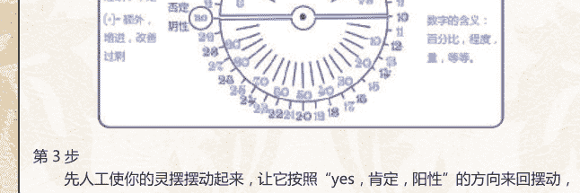
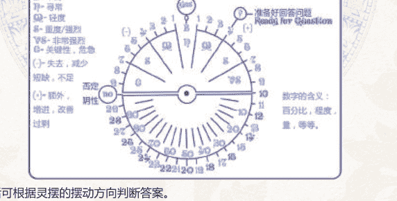
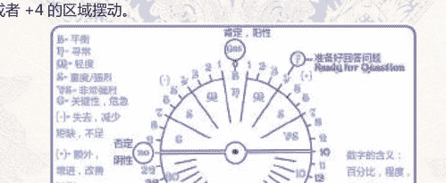

## PENDULUM
灵摆占卜手册

世界占卜研究协会监制

# 灵摆占卜手册

- 第一章 灵摆的基础知识
- 第二章 灵摆的理论与科学研究
- 第三章 灵摆的现实意义与应用
- 第四章 关于灵摆的问题与解答
- 第五章 灵摆占卜的详细教程

## 第一章 灵摆的基础知识

### 水晶灵摆

水晶灵摆原本是“吊坠”，由半个拇指大小的水晶切割而成。因它具有灵性，用它测试各种人、事、物很灵验，所以又称为“水晶灵摆”。

新购进的水晶灵摆，先消磁，然后戴在身上“养”7-10天，让它与我们的气息相互交流、融合，用起来才能随心所欲，就像自己的手臂一样，敏感灵活。操作时，手抓住线的位置与灵摆的距离最好在15-30公分左右。

遵照自然界南北极磁场规律而言，在北半球：

1. 好的、积极的、正面的、善良的，多是顺时针旋转；
2. 坏的、消极的、负面的、不良的，多是逆时针旋转。

在南半球则反之，看看浴缸、水池污水时，以及溪流中的旋涡流向就可以了解。我们照此来给灵摆输入程序，会比较自然，运转比较顺畅；如果硬要做相反输入，但念力是否强过自然律，以后的测试结果与精确度，得自行承担。

测试时，测试者首先心要静下来，此时测试者、灵摆、测试对象三者之间发生“磁场互动”。所以，只要把意图明确地告诉灵摆，把灵摆放在受测的对象上，安静地看灵摆怎么转，结果就出来了。

灵摆测试的范围很广泛，如：不同的股票、债券看哪种赚钱；不同的投资事业哪种最有前途；丢失的物品在什么地方，能否找回来；试测人身体各个脉轮能量及气旋方向，找出病灶。

也可用灵摆来测风水上的“方位”。所谓旺位，必指气旺，流动强劲，气鼓鼓地冒出，这种气流会使灵摆大幅度顺时针旋转；反之，不好的方位上灵摆会出现逆转及胡乱摆荡。（这些方位，可多用天然水晶矿石来改善。）

此外，找水源，找矿苗，灵摆也能准确地找出。许多时候，胜过科学家的仪器。在美国西部沙漠，澳洲荒原上，当地的土著、印第安人已经使用过好多时代了。

灵摆既可以作 Yes/No 的双向选择及多次双向选择，也可以作多向选择。我们可以画一个半圆的图表，将其分为四区、八区、十区，随您方便。并把每区的内容告诉灵摆，并把灵摆放在圆心，灵摆摆动的方向就是它的指示方向。

注意的是当用灵摆测地方、场所、或物体的磁场，可以反复再三实验，每次都能达到相同的结果，因为这些东西的能量就在现场。但在测事时，因为事是抽象的，不具体的，只是利用意念把磁场调过来以供测试。所以，在测试时要格外宁静、虔诚、小心、谨慎，而且要以第一次测试的结果为准，第一次也是最后一次。如果第二次再测，那暂时的能量已减弱或消失，而且对第一次测试结果的怀疑，都会削弱其准确度，所得的结果将会是“概率”的结果。这跟易经的占卜一样，都是“一锤定音”。

还要注意的是，灵摆非常有效率，但也易受人的“意志力”所影响。所以，绝对不宜作公开示范，也不宜在别人面前作。否则，会有他人意志力介入，而使灵摆的结果不客观。

### 选择你的第一个灵摆

注意！！以下所有灵摆均是指“摆锤型”灵摆。

要成为一个灵摆使用者，当然先要选择一个适合自己的灵摆。那么一个灵摆是怎么样的样子呢？基本上，只要用一条绳子吊着一件可以平衡的物品便可以。例如用一条项链吊着一只戒指也可以算是灵摆。但要注意，一个太轻的灵摆会影响到灵摆的摆动情况（谁会相信一个风要吹得起的灵摆呢？），太重则会使灵摆难以移动，（如果连自己也无法轻松提起，它又如何透过它告诉你答案？）

相信大家现在已经知道灵摆的样子。下一步，便是找个灵摆。现在市面上很容易找到灵摆，到水晶店走一趟可以找到。灵摆有些便宜而有些很贵，有些只有数十元，也有些需要数百元才可以得到。

现今市面上的灵摆多是用白水晶为主，也有用银、铜、金（应该有吧？）和木制的灵摆。通常我们会建议新手们用白水晶，又或紫水晶作为他们第一个灵摆。因为水晶一般含有较强的力量，可以加强使用者的能力，故多建议新手使用。

有很多人会觉得灵摆的价钱很贵、负担不来，于是索性不学。其实各位可以自制一个属于自己的灵摆。各位只须要找一颗有重量、可平衡和底部只有一点尖点的东西，再用绳子穿起来便可。那东西可以是天然水晶，钓鱼用的标（或是铅），又或是一支短铅笔也可以做成一个灵摆。

其实一个好灵摆最重要的不是材料，不是重量，不是外形，而是感觉。当你看到它，或是拿起它时，如果你直觉感觉到这是一个好灵摆，它便是一个好灵摆（有如选塔罗牌一样）。我的灵摆不是出外买的，而是跟在我身边多年的一颗绿幽灵水晶。当我初学灵摆时，我的第一个想就是：它可以做我的灵摆。事实上，它的确不错。现在列出下列的数据作为希望各位可以找到一个属于自己的好灵摆。

- Agate 玛瑙：平衡，胜利，保护（远离危险／危机）
- Amber 琥珀：找寻前世
- Amethyst 紫水晶：发展心灵上的力量，加强灵性，治疗
- Aquamarie 海蓝宝、蓝晶：忘却泪水，冷静，平衡情绪，保护
- Beryl 绿宝石、绿玉：改进想法，加强心灵的注意力，找寻失去的东西
- Bloodstone 血石：避开欺诈，身体健康，成功
- Chalcedony 玉髓：旅游安全
- Carnelian 红玉髓：平衡，自信，远离恶魔
- Labradorite 灰长石（又名：钙钠斜长石）：和宇宙的力量作联系
- Onyx(Black) 黑玛瑙：保护免受负面力量伤害
- Quartz, Crystal, Clear 白水晶：保护，加强与灵性世界上的联系

### 灵摆历史

曾经，这是一种假设的理论，认为人、及所有的生物，在其周遭都会发射放出一种微妙、轻柔的气体、或是流质，肉眼看不见，但是却可以被探测棒（Dowsing Rod）、灵摆（Pendulum）等所探测到。后来，此种理论已经被克瑞安照相机、及气场分析仪所证实。

利用适当的仪器来侦测人、及生物身上的气场。

灵摆一开始即是简单的重物藉由绳子捆绑，自然下垂，并且被使用于寻找水源，矿脉等资源的占卜工具，但是灵摆的准度影响到宗教的权威与地位，因此占卜术被污蔑为和魔鬼学习的方法，被禁止了好长一段时间，持有巫具，灵摆者，也被当作女巫或异教徒处以死刑。

直到新大陆的发现，人们急于找出发展的资源，矿脉，石油的开采，灵摆与探测棒又被拿来用，并且以美国的最为风行。

直到现在，水晶礼品店，路上的饰品小摊，随处可见灵摆或可当灵摆的相似坠饰的贩卖，可说是使用简单，入手方便，容易学习的占卜工具。

### 何谓灵摆

灵摆（Pendulum）的意思是悬垂物，也就是落有重物的绳线。灵摆是一种很大众化的占卜工具，只要有线跟重物就可以进行占卜。然而用灵摆占卜，有一些常见的问题，今天要来谈的，是“灵”与“潜意识”。

许多人认为灵摆有“灵”，而占卜的结果就是“灵”在接受了问题之后，透过灵摆告知，其实一开始并不是这样的！灵摆的转动，一开始是借着你的“潜意识”在转动，也就是说，你本是知道答案，但是你的“表意识”不知道，透过灵摆，可以和自己的潜意识沟通，获得答案。而灵摆大多使用水晶的用意在于，水晶本身被视为是“具有灵性的矿物”，有强大的磁场，可以强化占卜者的灵感力，增加准确度与确定性，同时也具有净化与避邪的功能。但是，除了水晶之外，几乎世上所有物品，都具有灵性，这也可以说是，灵气附着在物品上的实例。而矿物亦是生于自然，耗花几千万年形成的，吸收了天地万物的灵气，所以天然矿物制的灵摆比人工的金属灵摆更具有灵气。

所以说，“灵摆”，是具有灵气的占卜用品。

在来谈到灵摆的潜意识。

其实，灵摆的答案多半是使用者的潜意识，（也可以说是里人格）而表意识（表人格）就是我们日常生活中所展现出来的个性等等。通常，除非透过特殊管道，否则里人格与表人格不相互通。（例如，出了车祸，失去记忆，而在失去记忆的这段期间，代替表人格的就是里人格，所以当事人会完全不记得自己在这段时间说过什么，做过什么。）而双重人格，则是表里人格的替换作用 ...）

灵摆可以藉由磁场与灵气的互荡，让你跟你的潜意识沟通，所以，大部分灵摆的个性，通常就是你里人格的个性 ...

讨厌在大众面前展示答案，表示里人格比较害羞，回答时肯定表示有自信，如此等等 ...

而训练过的灵摆，可以直接跟里人格沟通，也就是将里人格分离，让他跟灵气结合，创造出 “灵” 来。

而这样的灵，则是会依照他的个性来决定他的形体，通常是什么样的个性就是什么样的形体，比较粗枝大叶的，就会比较 “大条”，比较细腻的，就是小精灵或小动物的形象 ..等等 ...

这时候，你问的问题就可以比较艰深一点，或是困难度高一点，灵感力够的话，甚至可以 “预知” 事情的发生 ...

而这样的灵，跟塔罗的牌灵或是请来的灵，是不一样的，因为他算是你 “创造” 出来的灵，就像是你的孩子或知己，不但比较好掌握，在沟通上的问题也比较少了！

这也是我当初选择灵摆的原因，至于这些，就要由修炼者本身去体会啰。至于如何转动，一般来说，灵摆转动的模式，都是以顺时钟转为正（yes），逆时钟转为反（no）。

也有些例外的，故意喜欢反过来转或是不一定的，所以拿到一个新灵摆时，一定要先确定他的转向，才不会越用越迷惑，至于转的方向，你应该会看到，是灵摆拉着绳子或金线转，而不是因为线的震动而转。这看灵摆的最尖端就可以知道，如果灵摆的尖端始终都是向下的，就表示的确是灵摆拉着线转，这才是正确的。要是灵摆的尖端转的时候，与桌面有角度，也就是灵摆的尖端已离心力绕着圈圈转，就表示是因为你的手微振或是发抖导致灵摆跟着你的手转动，这就不对啰。所以啊，受伤或是很累的时候，因为手的微振会比较明显而影响灵摆的转向，所以这时候尽量不要玩太过火唷。

### 关于灵摆的准度与训练

大家可以尝试用猜扑克牌来训练，首先抽十张牌，面向下，自己不知道那十张牌的花色，接着用灵摆猜四个项目：颜色、花色、数字、是否为人头牌。猜对一个项目有1分，一题有四分，总分一共40分。

有时候，灵摆猜一张牌是黑色，却可能会猜它的花色是红心或是砖块等红牌，这就是灵摆不熟练的关系，一开始都会这样，人头牌和数字也是同样的，所以例如说第一张牌是红心三，你可能会猜到以下：

- 颜色：红色。
- 花色：黑桃。
- 数字：8。
- 是否为人头牌：否。

这样就表示，花色和数字两个项目答错，颜色与是否为人头牌两个项目正确，这一题拿到两分。

以此类推，分数越高表示越准确，我之前的积分是32分，准到连我自己也吓一跳。不只使用灵摆，这个也可以直接用来训练第六感与直觉，直接抽牌直接猜，同样的以积分来测试。同样的，也可以和朋友一组，两人一起测试积分，也可以互相比赛，不管有没有猜中，都是个不错的游戏呢。

### 灵摆的选购方法

灵摆的选购方法，主要分成三个阶段：新手期、熟练期、高手期。先说说新手期吧：

给新手的选购建议，是以天然水晶为主的水晶灵摆，形状最好以四面对称为主，像是四面双锥，复四面双锥，六面双锥，复六面双锥都是不错的选择，因为四面对称的灵摆重心稳固，对新手来说容易启动，也容易上手，至于水晶的种类，则没有规定，完全看个人喜好。虽说水晶的功用被商人炒的相当热，不过我还是要说明，水晶一开始的能量是均等的，只是当人看到黄澄澄的黄水晶联想到黄金，因此黄水晶成了财运的守护石，紫水晶的深邃令人想到神秘的智慧，因此它就是考试的幸运符，粉水晶的粉红色让人想到恋爱，因此它就顺理成章地成了恋爱的守护石，至于白水晶，没有特别的颜色也没有特别的花样，好吧，它就是水晶之王。

就是这样，一开始有某个人订出了这套规则之后，众人急于效仿，因此今天买个粉水晶，潜意识里便会催眠，自己注意关于恋爱的所有讯息，就自觉着恋爱的机会变多了，诸如此类。

因此，选购水晶，最好是以第一眼看到就着迷的，或是最喜欢的为主，当两者之间无法取舍的时候，就可以参考。我贴在 [何谓灵摆] → [水晶知识] → [水晶功用] 的水晶菜单，虽然只是提供建议，不过也不失为一个选购水晶的小参考。

以下为新手最容易使用的三种形状，她们都是四个方向对称的唷。

（图片：img/56e64baabb79b603cb23df4a7885c6f9_3_0.png）

（图片：img/56e64baabb79b603cb23df4a7885c6f9_3_1.png）

（图片：img/56e64baabb79b603cb23df4a7885c6f9_3_2.png）

接着来谈熟稳期： 这表示你已经慢慢的熟悉了灵摆的转动模式，也与他建立了良好的关系，这时时候如果要挑选灵摆，不妨考虑以收藏为主的精美品，像是金属灵摆，银灵摆，木头灵摆，或是其它的材质，银为代表月亮的元素，因此传导率高，也是灵性金属，因此是个不错的选择，此外，铜的重心稳固，转动稳当，也是个很不错的金属灵摆。另外也可以自行制作，陶瓷，硬黏土都是不错的材质。

以下为熟稳者可以驾驭的例子

（图片：img/56e64baabb79b603cb23df4a7885c6f9_4_0.png）

（图片：img/56e64baabb79b603cb23df4a7885c6f9_4_1.png）

然后就是高手期了：
这个阶段可说是无所不转，什么都能转，只要够重，就算铅垂也能转的起来，这十分适用于老手，因此到这个时候就不必顾虑材质，重心，看到什么就用什么吧。

另外，灵摆的框要是断裂或磨损，氧化，可以去银楼或是银饰品店请她们帮你镶框，行情大概是两百元左右，不过要看老板的意思，还有你所选的材质，甚至是指定样式，自行设计，这些都要在另外加钱啰！

### 灵摆的禁忌

灵摆算是有灵性的占卜用具，所以有一些禁忌要注意...

1. 使用灵摆时灵摆要远离神桌，祭桌等地方。
2. 携带灵摆尽量避免进入佛堂，教堂，墓园或聚阴之地。
3. 如果必须进入上述地点请用深色带子或布将灵摆包裹以免受到气场影响。
4. 不要用碟仙盘使用灵摆，这样会请到有“被请经验”的好兄弟。
5. 不要随便抛弃灵摆，因为你跟他相处，他身上有你的灵气。
6. 要好好对待他。

### 基本小练习 - 学习移动

相信大家都找到一个理想的灵摆。有了之后，大家可以练习使用它了。

开始之前，大家都必须都找到一个理想的灵摆了。灵摆是不可以自己动的，它的移动须依赖使用者的意念力。所以，大家的第一个练习是 —— 用意念使用它移动。

首先，大家请把灵摆拿起来。用食指和拇指拿着绳子，（距离约 3 吋左右，或是一只食指的长度）吊起灵摆，直到它静止不动。之后，请集中好自己的意志力，想着：“要灵摆转圈。”如果成功的话，将会看到它顺/逆时针转动。之后，希望大家多做数次，直到大家可以一动念便可以使它转动。

如果你可以做到以上的转动，下一步，是练习把它再转大一点的圈。如果这也没有问题的话，可以试做下列的动作：

1. 作顺时针移动。
2. 作逆时针移动。
3. 直向移动（即向前和向后移动）。
4. 横向移动（即向左和向右移动）。
5. 顺时针移动，但要一个圈大一圈小的移动。
6. 逆时针移动，但要一个圈大一圈小的移动。

请大家不要看小这些练习。事实上，当大家以后使用灵摆时，它的移动方向和角度大小会大大影响其占卜的准确性。而且，练习时亦可加强大家的意念力。如果须长时间使用，它亦会使你十分疲倦，因为各位要长时间集中精神力。一般人只可以集中 15 分钟（在一般的事情上），如果初次使用可以只集中到数分钟。

如果大家成功地随所地移动灵摆，那么各位可试试下一步的练习。

### 灵摆的名字

一般的魔法仪式中，很多用具都拥有自己专属的名字，（例如灵摆）。

灵摆意指，他在接受问题后会有灵性的摆转，所以叫灵摆了！

名字是具有某种意义的一种简短称呼，一个名字通常代表一样物品或是一个人，是他（它）所专属的，专门为他（它）而取的。

所以名字相对的也带有某种牵制的力量 ...

将灵摆取名字，因为希望跟他的称呼不只是“主人”跟“灵摆”，希望可以藉由呼唤它的名字，来达到跟它建立互信的目的 ...

所以，这个名字，也将专属它。

### 灵摆的属性

灵摆基于主人的影响，因此有时候会出现特定属性，通常可以直接问他。

[请问你知道自己的属性吗？]

如果回答正转，就可以直接询问他的属性了。

一般来说，灵摆会有基本上的四大属性，也就是地、水、风、火，这是比较常见而且比较正常的。

不过也有所谓延伸属性的发生，像是水可以延伸出冰冷，火可以延伸出热情，混合属性的话，火和大气可以延伸出雷电，如此等等。

属性 | 地 ground | 水 water | 风(大气) air | 火 fire
--- | --- | --- | --- | ---
特质 | 坚硬 | 柔软 | 轻透 | 炽热
两种特质分类 | 冷而干 | 冷而湿 | 热而湿 | 热而干
情绪 | 坚定 | 冷漠 | 悠闲 | 热情
方位 | 东 | 北 | 西 | 南
对应季节 | 春 | 冬 | 秋 | 夏
延伸属性 | 坚硬 宝石 | 冰 穿透 | 毒气 治疗 暴风 | 热情 速度 毁灭
混合属性 | 植物 树木(水) 能量 (火) | 花草 (地) 雨 (风) | 雷电 (火) 暴风雨 (水) | 星点 (风) 飘灰 (地)

属性也有相克的特质，在特质分类项里，冷而干和冷而湿相克，热而干和冷而湿相克，因此延伸属性就会避开和相克的属性混合。

要是灵摆本身不知道自己的属性，也可以用以下的方法做个简单的测试。

代表火的 | 代表水的 | 代表气的 | 代表地的
--- | --- | --- | ---
火柴棒、蜡烛 | 一杯水 | 小刀、剑 | 钱币、水晶、石头

让灵摆轮流在这四样物品上旋转，并且询问：[你和这类物品是否合得来？]或是[你和这个同属性吗？]来让灵摆回答。如果都不转，就是没有属性或是还不明确，可以过一阵子再做一次，或者是就让他当无属性的灵摆啰。

### 灵摆的找寻运用

灵摆拥有一种十分特别的能力：找寻能力，这是其它占卜方法/用具所没有的。当使用者运用这种能力时，除了可以亲身到现场之外，很多时候都会配合地图一起使用。以下是一些都是运用灵摆找寻的方法：

**地下水管、石油或矿物：**

首先，请你拿出灵摆，并在附近的地方慢慢走。心里询问灵摆现在这位置的地下是否有你想要的东西。当发现有的时候，灵摆会出现「是」或正面的反应；相反，如果没有的话，便会出现「否」或负面反应。又或，你可以请求灵摆指示你所需求的东西的方向。

当你找到地点之后，如何才会得知这些东西的深度呢？这时候，大家可以用一种名为 Bishop's Rule 的方法 ---

1. 找到水管、矿物之类后，在地上留下一个记号。
2. 询问灵摆那些东西的深度，之后慢慢向外走离记号。
3. 当你往外走时，灵摆应出现「否」或负面反应。当出现「是」或正面的反应的时候，你和记号之间的距离便是那些东西埋在地里的深度。

要注意一点的是：这距离不一定是实际深度，有时候会有偏差的情形出现。此外，「距离」有可能是以「比例」的形式出现，由1：2（即真实深度是两倍的距离）到1：1/2（即真实深度是距离的一半）都有，视乎灵摆而定。

**找寻失物：**

当使用者要找寻失物的时候，你可以在现场直接问灵摆失物的位置或方向在哪里，从而减少要找寻的范围，但当要找寻的范围太大那时候便需要运用地图帮助。

请先找一幅那范围的地图或平面图（像家的平面图、学校的平面图、又或某地方的地图等）。之后，便可逐个地方询问灵摆是否有这失物（例如每个房间、又或某街道等）。这时，请尽量多想那失物的特征，以提高找寻对象的准备度（可以是颜色、物料、所含对象之类）。

当找到地点之后，你便可以去到那地点再用灵摆探测。如果想再收窄范围，你可以在地图或平面图上划一些记号，之后便可逐个记号再用灵摆测试。

**Energy Line：**

这是一种比较特别的东西。在地球上，某些地方会出现力量较为集中的情形。而那些地点有很多时候会连起来，这些线在西方会被称为 Energy Line。这些 energy line 通常会出现在地下河流附近。当地下水从这些 energy line 中流出来，我们会称这些它为 holy well，而探测者则称这些水为 juvenile water。Juvenile water 意思是：这些水不是来自水蒸汽或雨水，而是从地下深处流出来；同时，这些水亦含有高矿物质。

那么，如何用灵摆找出 energy line 呢？一般而言，当你请灵摆找寻 energy line 的时候，灵摆会沿 energy line 移动。但如果你并不是在 energy line 附近的时候，它只会左右移动。而如果你站在两条或以上的 energy line 的交叉点（称为 sacred place 或 power point（不是 Microsoft 的 power point 啊～）时，灵摆会以一个完美的圆形移动。假如 energy line 的能量够强的话，它会快速移动，甚至会做到和地面平衡移动的情形！

**其它：**

如果你拥有一部份这些对象（例如水晶），探测者可以一手握住对象，另外同时用灵摆做探测。这方法亦适用于寻人方面。

以上只是一些基本的找寻技巧。有很多时候，找寻是需要多种混合技巧使用的。

最后，还是同一句说话：如果想提高准确度，你需要多多练习。

（图片：img/56e64baabb79b603cb23df4a7885c6f9_5_0.png）## 第二章 灵摆的理论与科学研究

### 理论一 —— 灵摆的疑问和假设

追溯数世纪以来，依靠简单的灵摆工具进行卜测活动，一直是欧洲平民古老而神秘的传统。近本世纪，西方各国学者才开始产生兴趣，将灵摆现象搬回学院实验室，做有系统的科学研究，安排众多科学实验，试图揭开灵摆卜测的神秘面纱，找出灵摆背后的理论和运作原理。

#### 一、灵摆是否特异功能一种？

自展开灵摆科学研究以来，灵摆测者仍然继续找出他们所要寻觅的东西，成千上万个地下水井、气油田、矿穴，各种形式的失物，以及失踪了的人物。在英国、欧洲大陆、前苏联、美国以至世界各地，不断出现应用灵摆卜测寻找出来的报告。

他们除了在工地上步行寻找外，也乘坐汽车，甚至飞机来协助。前苏联一位灵摆测师勒高尼，就乘坐飞机在前苏联广阔的腹地上，卜测寻找到一公尺厚，深埋在一百五十公尺地层下的铅矿。甚至一些熟练而且天赋的灵摆测者，可以寻找出地下水流的流向、深度、储量估计、水压，以及是否可以食用等，真实匪夷所思。

人类一直疑惑，这等神秘灵异现象，究竟是这样运作的，它似乎与我们所熟知的一切定律和逻辑格格不入，不能够运用常理去解释。

自古以来，宗教认为这是神赐予一小撮人，如摩西、扫罗帮助民众去见证神的大能，所以宗教人士从不肯积极面对此种异象。

一些特异功能的信徒直截了当地指出，这是遥感透视特异功能的一种，是千里眼神功，并非人人都有此天赋异能，是天生的。有些则认为这是需要经过一些异人或高级气功师进行“打通”第三眼方能获得这种异能。

另一部分特异迷却不同意此说，他们认为特异功能者是指那些可以用目光注视银针把它弯曲，可以隔空移物的人等等。不过，这些自称特异功能者，却不可以准确地控制目标物和恒常确定效果，达致符合科学实验的模式。

灵摆卜测是否也应该归为此类特异功能呢？看完下面的内容，自有分解。

#### 二、无意识肌肉收缩

当灵摆测者进行探测时，他们很明显感觉到有一股力量，将他手上的树丫木枝“推”向地面。在旁观者看来，就像是扭动手腕去摇动它。但卜测者的亲身体验是：肯定没有故意去摆动它。这种感觉像是磁铁吸向铁块一样。

再深想一层，若是如此简单，岂不是每一个人都是天生的灵摆高手，没有技艺高低之分。事实上，玄妙之处就在这里，既是每一个人都有不同程度的卜测能力，有些人只可以卜测地下水源，有些人可以卜测某类矿物，有些人却可以卜测任何事物。

生理学家曾尝试采用无意识肌肉收缩的假设，解释灵摆工具的摇动。这种情形，就类似眼睑的无意识跳动，每分钟数次一样；也仿如当我们不在意地拾起灼热的东西时，触动无意识肌肉收缩反射活动，将该件物品立即从手里弹出。

根据此来解释灵摆卜测者，当他集中注意力去寻找水源或其它东西时，他“相信”这里就是“目标地”的时候，无意识肌肉收缩并将力量反射传送至手臂，使树丫摇动坠下指向的地面。

另一种无意识肌肉收缩，就是身体不自觉的颤动。苏格兰圣安当大学生物学系马田教授，对这方面有专门的研究。他认为每一个人的手部和身体各部分，均时时刻刻不停地颤动着，这种颤动非常细微，肉眼是不能看见及察觉的。不过，利用精密的电子仪器是可以将这种颤动记录下来，而颤动的频率周期固定在八至十周秒间。马田教授曾经进行过一项详细的实验，就是使用精密的电脑分析电子仪器，连接到灵摆吊锤的指针，然后让他进行灵摆吊锤卜测活动。测试结果是：当灵摆吊锤反映答案的一刻，手指的颤动频率确比正常状态不规律。

虽然这些看不见的细微颤动，有可能使灵摆自动摇动，但是却不能解释究竟如何形成，又为什么可以使灵摆吊锤摆动，更以不同的摆动样式表示答案的“是”与“否”，甚至度量数字呢？这种无意识的颤动力岂非包含了“智能”？

#### 三、视觉暗示假设

除了去研究人体肌肉的颤动，可能使到灵摆工具摇动外，也需要找出它的摇动，为何会如此准确，似乎具有智能。肌肉颤动结合视觉暗示，是部分研究人员提出的其中一种常人也可以理解的假设。

这种假设指出，灵摆测者在亲临工地现场卜测地下水源及矿脉时，他已具备了对当地环境的一切知识，熟习当地生物的生态，甚至凭他个人的经验与职业才干，可以通过视察地表上的环境变化，而估计出地层下的东西。例如，若该处地下有水流，其地表土地的植物当然会生长茂盛，或有某类特别的植物以示标记等。卜测者经过视觉的暗示以后，手臂便产生无意识的肌肉颤动，使灵摆树丫指向地面。

这种假设只能勉强用来解释，与地理环境有关的灵摆卜测现象，以及那些对当地生态有充分认识的卜测者。

#### 四、电磁场效应假设

很多人都爱用电力和磁力物理效应解释各种各样自动摇动的东西，灵摆卜测工具也可能受地心磁力或周围磁场影响，而摇动指向地面。但是这种直接的磁力，似乎只适用于金属制造的卜测工具，不包括树丫或水晶吊锤等。

关于间接的磁场效应方面，科学家已发现人脑松果体腺附近，可能存在着一个“生物磁力感应装置”，因此，他们在这方面进行了很多实验，以确定人体是可以感应到物理性质的电磁场震动波的。

水流在地层下流经裂缝岩层、矿脉穴、地下管道、油藏池、各类生物体等辐射出的磁场震动波，都可以使到地面上的磁力辐射场产生各式变化。此等变化折射到卜测者的松果体磁力感应装置，通过潜意识，使手臂产生无意识肌肉颤动，摇动灵摆工具。这种磁场感应，也可归入第六超感范围，例如：这种感觉可以使一个人喜爱在某一房间睡，而不喜欢睡别处。因为，后者可能使他精神亢奋，极不自然——人类便是藉此而抗拒四周负性磁场的侵扰。

所以，电磁力场效应假设可以解释部分临场灵摆卜测现象，但却不能解释地面全域卜测及地面遥距卜测现象。而且，如何决定地层下水流的方向、深度、储量、水压等一系列的资料呢？又如何分辨出地层下的管道是水管、电话线缆或是输电缆呢？或许可以进一步假设这些物体也会辐射出不同频率的电磁波，但人类又如何决定此类有无数变化的电磁波类，是属于哪一种物体呢？

#### 五、遥感透视假设

当所有物理和生理性质的假设，都不能完满地解释灵摆卜测的奇异现象时，人们又会将注意力再次转回遥感透视特异功能假设上。特别是在地图遥距卜测与地面全域卜测领域。人类除了已知的视、听、嗅、触、味等五官感觉外，还有一种心灵遥感透视感觉，它可以使我们直接“看见”周围环境隐藏的东西和远方的物件。灵摆卜测者可以藉此种透视特异，再通过自身的隐潜训练，学习透视地下水源、油田、矿脉等的位置。一旦在遥感透视下获取资料后，潜意识会令人体某部分器官发出卜测讯号。例如以脑波形式出现，通过手臂的无意识肌肉颤动，使灵摆工具摆动，找到隐藏在地层下或远方的目标物体。

如果这种假设是正确的，则可以解释为什么灵摆卜测者，有时候受到本身情绪、天气、环境等影响，而获得错误的答案；又因受到人体生理心理周期曲线的影响，灵摆卜测者未能达到最佳状态。由于灵摆卜测是可以通过学习而获得，分别只在经验的深浅、技艺的高低及对某一类卜测目标事物的敏锐度多少而已。如此，岂不是人人都具有遥感透视的能力！

#### 六、综合以上假设

具有实践经验的灵摆卜测师，均不认同以上种种的假设，他们相信这是超物理的行为，没有现成的机械物理概念可以解释。因而长久以来，灵摆卜测一直被大部分学者嘲笑为神经者的玩意，得不到传统科学界的尊重。但是随着人类思想的扩展和智慧的展现，在不久将来，灵摆卜测做的真相一定会被揭开。

### 理论二 —— 灵量讯息与灵摆卜测

由微粒子聚合而成，另一形式则是以震频辐射波存在。宇宙万物也是一团团的浓缩能量集合体，不停地辐射出各种各样的震频波场，也吸收外间的震频波，人类肉身也不例外。

向外界辐射的震频波，并非是单纯而没有分别的，它是种已经被程序化为一组组能量，赋有智能讯息。我们可以直接称为“灵量讯息波场”。所以，病体的癌细胞割除了或者辐射掉了，新的细胞仍可能含有病变讯息，无论是来自遗传因子或其它体内讯息系统。人体在读取外间的讯息波时，也曾本身具有特殊用途的“讯息处理系统”，加以灵量讯息处理，再分流到所属器官的隐微能量场去。

简单点说，宇宙间一切万事万物，除了是一团团的能量集合体，无时无刻向外间辐射讯息波外，也各自都是一座独特隐微讯息处理系统。只是有的简单、低层次，有的复杂、高层次而已。

#### 一、灵摆粒子

在深不可测、神秘怪异的灵量讯息辐射场内，引发起一位天体物理学家与我们的共鸣。他认为灵摆卜测的实现，可能就是辐射场在某种情况下存在着另一种“粒子”，称为“灵摆粒子”。它的特性似乎不属于具有物理能量的电子、质子、中子、光子、微子等粒子群谱类。

1995年，前爱丁堡学院天体物理学教授兼苏格兰皇家天文学家——温敦·域特，在爱丁堡学院每年一度的物理学研讨会上，发表过他过去六年在灵摆卜测方面的科学假设理论报告。“灵摆粒子”的初步构想，就在该研讨会上向科学家们公开，为灵摆卜测的科学研究另辟一条新路径。

他说在过去多年的研究工作里，认识了很多水源和矿物的专门灵摆卜测师，他们都分散在各水务、电力机构工作，甚至油田公司也请他们寻找埋在地下的油管；但却从不藉此大肆宣扬他们个人的特异功能，域特教授个人很敬佩他们在此方面的专业工作。他说到今天，灵摆卜测技艺仍未受到科学尊重和重视。科学家们害怕一旦研究灵摆卜测这门技艺，可能会破坏他们的专业形象和身份。他再一强调，基于简单的观察和重复性实验，他可以很慎重地指出，此种想法是完全错误的，除非他们之中有一位可以找出一个完满的解释，证明灵摆卜测是不可能存在的。

灵摆粒子辐射场，就像我们现在所理解的电磁辐射场一样。

在做进一步实验测试以后，发现灵摆粒子是可以被铝金属阻隔的。将一片铝箔片缠绕在灵摆卜测师的脚板下，再穿上鞋子，发现他们的灵摆工具再不活跃，甚至失去效能。他用此种方法，先后向英国8位最出色的职业灵摆卜测师做出实验，结果都是一样。有趣的是，若该铝箔片穿了一个洞，灵摆便会恢复正常运作。

#### 二、藉灵摆与宇宙万物沟通

在灵量讯息场与灵摆粒子辐射的理论假设下，人似乎可以藉灵摆卜测技术，与宇宙诸事万物有最直接，最简单的沟通桥梁了。

人通过摆工具与自己内灵对话，获取不能从五官感觉和意识系统那里找到的资讯。通过灵量讯息处理机制，我们可以感觉和量度出各种各样存在物的辐射场。极有可能的是，可以从而获取过去、现在以至未来的事项。

在这里所指的事项与万物沟通，其中又分为两大类。

第一类是显性的、可捉摸的，以物理状态存在，例如：欲寻找失物、人口、隐藏的物质等。他们仍是受制于个人对此类辐射场的敏锐程度。这情形就仿佛你对大部分人类、动物、植物都有很亲切的感觉与沟通意欲，但对其中少数，却可能感觉到格格不入一样。

第二类是隐性的、不可捉摸的，而且非常个人化，例如你要卜问：“我是否适宜进行此桩生意交易？”“我应否继续跟**交往？”等等。此类涉及个人内灵的直觉智慧，就需视乎于您所设计的灵量讯息处理程序达到那一层次，以及内心正性思维与灵性的修养程度了。

我们务须将灵摆卜测作为神话般看待，撤除实用主义的观念，从另一角度来看，它仅是我们通往灵性修炼大道的一条起步小径。

#### 三、理性意识与超感直觉

人的左半脑负责意识理性和逻辑分析运作，右半脑则是开启创念与超感直觉的部分，超感直觉反应有时候称为第六灵感。

在我们日常生活中，充斥着工作目标、意欲企图、行为规范、数理运算、逻辑分析、比较得失、语言表达等。一切具有意识及理性的思维作业，牢牢地在左半脑的严密控制下，难越雷池半步。在某些被压迫的情况下，意识系统会暂时关闭，或只将部分原样而未曾过滤加工的资讯，交予超感直觉，任其自行处理。所以在某种环境下，由于自我内灵在发挥力量，压抑意识系统过度活跃，让右半脑多做些工夫而已。

从孩童时代起，直至受教育、接触社会各个层面，我们的大脑因而而储藏了大量资讯。资讯的优劣或粗劣选择视乎每个人的生活背景，与传授者的素养。在一生中，我们就是利用此等资讯，建立起一套对各类事物的主观看法，及塑造了我们惯性信仰模式。很不幸，这些资讯大都是经过五官感觉吸收和过滤处理而来，经过失败了再尝试、经过必须“看见”了方能“相信”、经过种种际遇得出的经验、经过了一步步摸索学习和理解而来。这种禁锢和局限性的主观经验与思维方式，使我们越来越固执，妨碍了对其它真理的探求，也压抑了从各角度而来的创意、发明、灵性提升，限制了对万物透视的能力。这一切都是来自超感直觉。超感直觉越是迟钝，则灵摆卜测的智慧答案便越少，甚至不可信。

超感直觉在您出生的那一刻，就由上天赐给了您，无疑它与理性分析一样，都与不同程度的敏锐能力，但是可以后天训练的，只要通过适当的途径，其敏锐能力是可以逐步提升，从而改变您一生的机运。

超感直觉系统是大智慧的源头，藉着它可以与无涯宇宙讯息场分享资讯，他的活跃程度，除了可以控制压抑意识系统的干扰外，也视乎个人内灵觉醒的层面。

超感直觉“语言”，是脱离了五官意识感觉范围以外，感受和领悟因人而异；“语言”来去飘忽，无从捉摸，间或捉着，也会因惯性意识排斥，失去了那一刹的智慧。不过我们却可以藉着某些外部对象，例如灵摆吊钟，把超感直觉“语言”翻译和捕捉回来；或者换一个角度，通俗简单地说，利用灵摆卜测，就是其中一条便捷的途径，简洁翻译您的第六灵感。

### 理论三——进入灵摆卜测前期状态

灵摆卜测不是呼神唤鬼、驱魔辟邪、设坛超度等这等灵异的活动，毋须要加进一些夸大而无意义的“作秀”准备或仪式，以震撼旁观者。

在过去我们经常有一种先入为主的错觉，就是当进行普通人不易理解的，或非惯常经验看似是灵异活动，在举行之前，那些“执行者”必是故弄玄虚地作出一些怪异仪式，总也不能明白他们是真正需要，还是充作专业唬吓顾客。我们应该明白，灵摆卜测只是一种非常个人化的超感直觉灵量讯息处理和讯息翻译活动，仿似电脑软体资讯处理一样，丝毫没有幻灵感，只是它暂时仍介乎于科学与灵学的尴尬处境。

#### 一、心境上的准备

以宗教徒的狂热情绪，以无比主观固执的心态，去操作灵摆卜测，我们只会获得一些不准确的答案。灵摆卜测活动并非是在众人面前做见证，或显露神迹，或炫耀“非是特异”的特异功能。以不确信和疑惑的态度去进行灵摆卜测，其结果是获得的卜测答案，也是不可信，不稳定而时有差误。在进行卜测前，在宁静的环境里，屏除心中所有杂念，不要意识地预设框框，欲图控制结果，也尽可能避开旁观者的干扰。在辐射环境方面，要远离高压电线、收音机、音响、电视等，减低近距离电磁辐射频波的影响，应看待“自己”也是一具极敏锐的辐射波电子接受仪器。（哈哈！那我们不成机器人了啊！）

必须在完全没有情绪烦躁、精神恍惚、仇视怨嗔等负性思维心境状态下，方好开始任何与心灵和直觉交感有关系的活动，包括灵摆占卜作业。继而集中精神，将你要卜测的目标事物，加以细致的观想，层次分明地印在脑海中。例如要找回一只遗失了的戒指，就需要观想那只戒指的形状、花纹、大小、色调、附在其上的饰物等。最好是能够观看它的照片，或类似的实物等。

一言蔽之：端正静坐，缓慢呼吸，正性思维，平静情绪，集中观想，散发爱念，对灵摆占卜的运作是很重要的“前期心境准备工序”。

#### 二、调校脑部进入灵摆占卜状态

如果有一天，在你需要进行重大决定，有可能影响个人前途的灵摆占卜时，当完成了前期心境准备工作后，亦应该考虑仿效专业灵摆占卜师，营造一个更适合超感直觉系统运作的环境。在此环境，可以有效地通过脑部天线，调准频道，锁定欲卜测目标事象的讯息波场，增强接受能力，特别是在进行遥距占卜，这是一种较为高层次的准备工序。

作为普通常识，我们已经知道人类的脑部活动在不同情况下，均可经由电子仪器探测出所输出的脑电波，有不同的震频率幅度。当我们在日间进行五官辨识、逻辑分析、计划决策等意识思维活动时，脑部是处于贝塔（beta）状态，在此状态其脑电波的振幅频率介乎约14至30周秒间。若情绪处在亢奋、发怒、争辩、精神紧张状态时，就会处于贝塔 II（beta II）状态，即振幅率高达40周秒，脑部若处于这个状态下，超感直觉的作业功能亦会全部停顿下来。

要使右半脑能激发创意、直觉感受敏锐、超感传输无阻、潜意识诱导等功能活动时，最好是调校于阿尔法（Alpha）状态，即脑电波的振幅率介乎7至14周秒。在此状态，超感直觉系统完全开启、敏锐异常，可以更有效接受任何不经意识系统过滤的信息。若你曾经修习过静坐工夫，当然可以很快进入阿尔法（Alpha）状态。但是也要注意小心控制，不要进入更深层的西塔（Theta）状态，即振幅率介于3至7周秒间，在此状态下你可能没有意识地发问题，也不能清楚地理解灵摆得出的答案。

#### 三、用宇宙白光沐浴

在现实生活环境里，在你的四周围的生活空间内，充满了各式各样的负性能量辐射、有害的潜隐讯息、他人不健康的意念辐射、甚至低灵能量团的辐射干扰，我们都需要防范和认识。

从事心灵灵修活动，包括灵摆占卜，是需要时常进行内在宇宙白光沐浴工作。看起来甚是神奇怪异，部分人不易接受此观点，但是可以尝试此建议。

进行宇宙白光沐浴是不需要准备什么工具的，若是你相信天然水晶的奇异特性与功能，就不妨考虑选择水晶作为你的协调伙伴，甚至用来布置水晶阵。

静坐观想宇宙白光从头顶洒下，穿过冠顶脑部、心胸、大腿、直达双足脚掌底下，再接通地球的庞大磁能场；用慈爱的心接受如此的沐浴，除了保护自己外，也可减低负性辐射与机会极微的低灵能量团的干扰。

## 第三章 灵摆的现实意义与应用

### 应用一 —— 利用水晶作为灵摆工具

古代人类最常用的灵摆工具就是从树木横枝上割下的“丫”状树桠。这是基于他们需要将这种神秘莫测、灵异而超自然技艺与当时流行的神话结合。灵摆树桠可以短至三十公分，长至一公尺半像拐杖一样，在众多的古籍记载里，此灵摆工具大部分只局限于探测地层水源。

但是在理论上，任何有重量的悬垂物均可制成灵摆工具，只要他们是中性的天然物品，视乎您个人的喜恶选择。不过，它必须具有良好而稳定的中轴重心，不能太重也不能太轻，握在手中容易垂直平衡和自由摆动即可。

#### 一、水晶吊锤灵摆

在大西洋文明时期的地球生物圈人类，相信已经完全懂得全面应用水晶了。现在人类除了只懂得利用水晶制造电脑芯片、电子精密仪器材料、工业原料外，仅有少数新纪元人士懂得应用在个人的灵性修炼上。

作为趣味性知识，我们可作如下简单的描绘：水晶灵摆如何传递讯息？水晶独特的分子结构，可以辐射、输入、放大、储存、恒定，以及传递内、外空间的讯息波。这些讯息波的载体可能就是水晶的微震频能量场。同时它的震频能量辐射场也与人体辐射生物气场是相容的。经超感直觉灵量化处理后的讯息波，通过人体生物气场是很容易被水晶接受，继而放大辐射出去。同样地藉着水晶聚焦的放大特性，将外空间的讯息波清晰增强，帮助直感天线装置更容易接收。

基于此等原因，现在的灵摆占卜专家均极力推荐使用天然水晶吊锤，作为新纪元日常倚傍的灵摆占卜工具。

#### 二、保护你的水晶灵摆

水晶吊锤是一枚通透晶莹的单头或双头天然白水晶柱，它可以是一个直身的圆柱体，或是双头圆锥体，以长约四公分至五公分为宜，重约六克至十克。较为精致的水晶灵摆是经过水晶切割专家作人工精细削磨，好使水晶柱本身的能量辐射中旋轴保持完美，加强传输讯息或能量效率。简单平宜的，可以选择无须经过手工打磨的单头直身幼长水晶柱。他们两者功效一样，差异不大，随个人经济能力选购。

水晶灵摆的链子，最少要30公分长，随个别喜爱也可长至一公尺，大多使用银、## 三、用爱心程序化您的水晶灵摆

在开始使用您的水晶灵摆时，需要进行两阶段的灵量程序化工序。第一阶段：就是用您的爱心与确信意念去开启水晶灵摆。第二阶段：就是进行“灵摆语言程序化”工序。

首先，将具有特定目标的讯息，灌输入水晶灵摆，这项过程称为灵量程序化。在您完成第一工序后，会使您日后更能够与灵摆合作无间。当卜问时，它给你的答案会是更准确、更清晰、更适合你个人自身处境，受用无穷。但并非不作此等程序，灵摆卜测就不能运做了。向水晶灵摆进行确信，就如教徒向神确信，相信神就住在心间，但没有实物感，仅依靠信仰意念。

不同的是，水晶灵摆就是握在你掌心中的一件宝物，可以触摸它，感受它所散发出来的微量震动频率。故此，向水晶灵摆“确信”的目的就有如下两点不同：藉水晶散发的辐射震频，可以渐次引领我们进入一个新的内灵觉醒层面。藉着水晶的独特物理结构，以能量震动波为载体，去储存、传送灵量讯息，包括爱心、思想、意念、情绪、疑难等等，给自己建造一个资讯回馈系统。

现在请你尝试按下述步骤，进行第一阶段的爱心和确信正性思维的灵量程序化工序：

- 选择一间宁静、没有旁人打搅、电视、噪音等干扰的房间。
- 前期静坐，剔除任何心烦意乱的情绪，不思不想日常杂务。
- 用右手（最好是右手）掌心，或以大拇指和食指之间握持水晶灵摆，放在胸部前方，正态思念，将微笑与慈悲爱心从心间引发出来。
- 继而观想四面八方的宇宙白光，一束束射向你头顶，用意念引领白光经过第三眼（即在眉心位置），折射入水晶灵摆去。
- 同时，从心底里重复不断地发出细语，或大声呼叫，真诚请求水晶灵摆协助你解答日后向他卜测的问题，确信他能给你准确而清晰的答案。

以上灵量程序化输入工序，可时常进行，效果会使你难以置信。骤看似是有点怪异，很是迷性和宗教化，这也不足为怪。因为平常人过去从不理解和习惯去做此等操作，请相信它及给一点耐性。

#### 四、如何正确握持水晶灵摆

如果你惯常使用右手书写、拿取筷子，顺理成章地当然是使用右手握持水晶灵摆了。如果你是一位左撇子，仍是鼓励你使用右手去握持比较好。人类的身体两边具有不同的正、负极性，能量辐射波由我们左手方输入，绕行身体一周后，由右手方辐射出去。根据实验得知，使灵摆摆动的上某种暂时仍未能命名的“X超微感应力”。从右手手指间的肌肉，以微能量颤震发出，也比从左手指发出比较敏锐。如此，除了很容易程序化灵摆的摆动式样外，也可温和和自然界的运做规律。当然这也并非是绝对的，我们可以意识地将他们的运做相反，但是非不得已，最好不要如此。

将灵摆的链子握持在右手拇指与食指间，或将链子缠绕于食指前端两周均可，务使灵摆平稳地垂直，不要滑溜。链子从指端伸至灵摆，长约21公分，但仍是以自己感到最舒服的长度为宜，将其余空出的三指散开，状似三支小型天线。然后离身悬浮，轻轻用手指带动灵摆来回之前后以及左右两边摆动，看看它是否很自然地平衡，没有倾斜、容易摆动。也同时查看你的手指或手腕，是否有发出无意识或不自然的肌肉颤动。基本上，身体健康正常的人是不会感觉到任何肌肉颤动的，除非是患上轻度柏金逊病。如果是如此，用手握持灵摆进行卜测似乎并不适宜。

### 应用二 —— 灵摆语言系统建立

灵摆吊坠是你个人的视觉感官与超感直觉，互相通讯联系的一件中介物理装置或工具。即是：将无从捉摸，深藏不露的直觉讯息，俗称第六感讯息，以另一种方式向外表象化。

若达到此目的，我们必须建立另一种崭新形式的语言表达系统作为媒介，此类中介语言称为“灵摆语言”。

#### 一、调校灵摆垂链

开始运用灵摆吊坠前，必须调校垂链的握持长度，长度应以1.618的倍数为合（即数学符号phi）。1.618此度量存在于所有大自然界的事物里，包括人体、树叶、贝壳、晶柱旋轴、金字塔、银河系……等等，其大约倍数就是8、13、21或35公分，以自己认为最舒服的握持长度选择。

身体平直坐在椅上，双足稍微分开，足掌平搁接触地面。用右手以正确的方法握持灵摆垂链，而右手肘则稳固地搁在平滑的桌面上，手肘与手腕斜角平伸，灵摆则垂直，与桌面约成90度角，看起来就成了一个垂直三角形。再利用右手腕力，轻轻得将灵摆前后左右摆动，务使它能够开阔地摇摆。然后随着运用腕力，是灵摆左右摆动，做顺时针方向和逆时针方向打圈绕转。看其摆动是否自然地改变方向，以及可以在你的右手两指间平稳固定而不滑溜。

如此，这种握持方式与姿势，就应成为习惯，应用在所有需要平直坐着的灵摆测运做上。

#### 二、 灵摆语言配合灵摆摆动样式

通常灵摆导师会按下述的灵摆语言，配合灵摆不同的摆动方式，作为全球性的通用标准样式，以便学员和读者容易参译不同国家文字出版的灵摆书籍和报告。

- 要灵摆处于下测开始的“静止中性”位，或准备发问下一个问题时恢复原起始状态，去配合超感直觉在准备启动状态，或不作任何回答与反应。则应让灵摆吊坠垂直原位，静止不动。虽然其中可能有些少微颤动，这是灵摆准备启动或不做回答之故。
- 要灵摆答：是。去配合超感直觉输出的答案：是、正、+、阳、对、男性等正态讯息。则应让灵摆吊坠的摆动样式，程序化为顺时针方向打转，或肥大的椭圆性顺时针方向绕转。
- 要灵摆答：否。去配合超感直觉输出的答案：否、负、-、阴、错、女性等负态讯息。则应让灵摆吊坠的摆动样式，程序化为逆时针方向打转，或肥大的椭圆性逆时针方向绕转。
- 要灵摆以度量衡数字单位答出，或指示出其它组合的度量间表。则应该让灵摆吊坠的摆动样式，程序化为以一个中心点做起始位，向外做放射线抛出摆动，这种动作样式是用来配合各类灵摆度量参数表。
- 要灵摆吊坠表示：“不明白你所卜询的问题”或“受他人的潜意识思想干扰”，去配合超感直觉输出的答案：“不知道”或“不肯定”或“请重新卜讯”等怀疑讯息。则应让灵摆吊坠的摆动样式程序化为顺时针方向或逆时针方向的窄瘦型不规则椭圆形绕转。此类摆动样式出现，有很大部分的情况是，你所设计的一系列卜讯的问题，互相矛盾，不合逻辑之故。
- 要灵摆表示：“两者合适”或“两者相配”的答案，则应让灵摆吊坠的摆动样式程序化在两个卜测主客对象中间，做连线左右横摆。若要灵摆表示：“两者不合适”或“两者相冲”的答案，则应让灵摆吊坠的摆动式样程序化在两个卜测主客对象中间，做分割裂线直摆。

#### 三、输入程序化语言程序

##### （一）、输入静止中性讯息

先坐进一间环境正态，没有任何干扰的房间，准备好图二（A），然后按照下述步骤将第一个灵摆语言的“静止中性”信息程序化输入你的超感直觉系统。

- 右手掌心紧握水晶灵摆数分钟，进行一些前期准备工序后，将灵摆垂直吊在“+”标轴的中央点上。
- 轻轻运用右手腕力，将灵摆做不规则地自由摆动。
- 集中精神，眼睛瞪视灵摆，用口语声音或者内心发出的声音不停地命令呼叫出：“请停止摆动” ……约重复十数遍。
- 此时必须留意去控制你的右手，不要意图发出任何物理力去干扰它停止摆动。
- 大约在一分钟内，你应该会成功地“命令”灵摆由减慢摆动，直至“自动”颤震静止摇摆。
- 在此过程中，你应即同时发出话语重复呼出：“静止不动就是表示准备接受卜询”。此语句讯息就会经由意识辨别系统，输入超感直觉系统去，而完成了此“中性位”的程序化工序。

到此，你若仍怀疑这是由于地心引力的物理惯性运动致使灵摆停止，那你可以去试做另一个实验，看看在不运用以上程序化步骤，灵摆需要多少分钟才完成物理惯性摆动，而达到完全停止状态。

##### （二）、输入相冲直摆讯息

当灵摆处于“静止中性位”停止不摆动后，请继续下列步骤，输入第二项灵摆语言。

- 眼睛瞪视灵摆和图二(A)上的垂直线，不停地重复命令呼出：“请向前后来回直摆” ……约十数遍。
- 仍要留意控制你的右手，包括手指、手腕、前臂、上臂等位置，不要试图发出任何物理力去摇动灵摆。
- 大约一分钟左右，灵摆会开始“自动”起步，缓慢地前后来回摆动起来，呼出越多命令，它会越加加速摆动。
- 此时，你应即发出心语重复呼出：“前后直摆 就是表示甲和乙两者不相配，相冲。”重复十数遍。此语句讯息就是用来程序化你的超感直觉，要它明白，若要它表示“两者不相配”或“两物相冲”的答案时，可输出此摆动模式。
- 然后按照命令灵摆停止摆动，回复静止中性位。不要用手将它强迫停止摇摆。

##### （三）、输入亲横摆讯息

当灵摆处于“静止中性位”停止不摆动后，请继续下列步骤，输入第三项灵摆语言。

- 眼睛瞪视灵摆和图上的水平横线，不停地重复命令呼出：“请左右打横摆动”……约十数遍。
- 控制你的右手，保持垂直固定，不要试图用外力去使灵摆摆动。
- 大约一分钟左右，灵摆会由静止开始缓慢地向左右做水平横摆。
- 此时，你应即发出心语重复呼出：“左右横摆，就是表示甲和乙两者相配，兼容。”重复十数遍。此讯息就是用来程序化你的超感直觉，使它要表示“两者相配”或“两物兼容”的答案时，可输出此摆动模式。
- 然后按照命令灵摆停止摆动，回复静止中性位。

##### （四）、输入绕圈旋转讯息

按照下列步骤，继续输入另一种摆动式样。

- 将灵摆垂直吊在左边顺时针绕转的圈子中心点上。
- 瞪视灵摆和图上的圆圈，不停地重复命令呼出：“请按顺时针方向打转” ……约十数次。
- 大约一分钟左右，灵摆应开始顺时针方向绕圈，由小圈子，既而扩展为大圈子。
- 随即发出心语重复呼叫：“顺时针方向打圈，就是表示正确、阳极、肯定” ……约十数次。此语句讯息，就是表示当卜问问题时，答案若是正态的，对的，可输出此摆动样式来回答。
- 然后命令灵摆停止摆动。
- 再将灵摆移向右边的逆时针方向绕转的圈子中心点上，按照上述步骤，输入逆时针运转信息。

随后的两三天，请每天再花半小时工夫重复上面的步骤，由视觉辨别，经潜意识引导，输入超感直觉系统，便可将此套基本灵摆语言程序化，以后一切籍灵摆工具交流的讯息，将会按照这套秩序规范做内外沟通。

### 应用三 —— 灵摆语言的沟通技巧

所有要向灵摆卜问的问题，都必须清楚明确，逻辑合理，目标清楚而不暧昧，每一条欲卜问问题的语法结构，只可限制有一个两极态的答案；也不要在意识上给欲卜问目标对象，预设框架和结果。

对要提问的“技术项目”问题，需要有一定程度的知识和常识基础，否则无法设计一系列的问题去向灵摆卜测，便会有不知从何处下手的感慨了！向灵摆问问题和卜测任何事情，务必记住下列基本语法规则：

- 问题句子要简短，答案必须是“是”或者“否”。例如：这个苹果是否是红色？
- 不可用负态语句卜询。例如：这个苹果是否不是红色？
- 避免使用有逻辑符号的问题。例如：我是否适合做全职教师，或一边做兼职补习同时做兼职销售员呢？
- 所问的问题，若含有数量值，必须准确表示。例如：我是否每天需要吃两个鸡蛋？
- 所问的问题不可太过主观，或含有过量的感情色彩。例如：JACK 是否一定会爱我呢？
- 所问的问题不可太玄或行而上。例如：我家的大门方位是否处于“迎水招财”格局？
- 所问的问题不要加有太多的形容词。例如：我是否真爱阿文这个高大英俊、博学多才、高职厚薪、仁慈大方的人？

以上仅是一些最基本向灵摆询问的技巧和注意点，若遇到复杂疑难的卜询，问题绝对不是一条就可以解决的，必然是一个接连一个，形成一系列的组合式问题。如何让这些问题能组织到一起而没有前后矛盾，可以获得最终的“是”或“否”的答案，这就需要不同的提问技巧了。

### 应用四 —— 灵摆语言的练习

以下数个练习仅是尝试利用不同卜询技巧，寻找出未知的答案。我们并不期望在初学灵摆的阶段，就能够成功完成这一系列联系，但是请给你自己信心，根据前面所学习的前期准备卜询工序，按照步骤完成后，方可进行练习。

#### 一、对于已知答案的印证练习

现在，请集中精神、平静心绪，将灵摆吊坠随意摇晃后，按照上面所讲的，回复到静止中性位，然后问出问题，不要刻意想象问题的答案，以中立的态度去卜询问题。

也可以尝试将眼睛移开灵摆，远望某一处，然后用说话或者心语不停地重复发问，直到灵摆开始有了摆动反应。在每一个样本问题上获得答案后，将灵摆回复静止中性位，可继续卜询下一条问题。

- 请问我的姓名是否 *** ?
- 请问我是否是一个女生？
- 请问我是否有一个亲妹妹？
- 请问我是否有一台手机？
- 请问我是否喜欢吃巧克力？
- 请问我是否在**学校读书？
- ……等等，你可以按照以上的样本问题的结构问问题，自行设计各式各样不需要有前后连贯性的实况简单问题。目的就是要你自己能够可以核实由灵摆输出的答案，以检查程序化了的灵摆语言是否运做无误。

#### 二、对于未知答案的简单卜测

练习 A：找出你钱包里有多少张10元纸币。

- 如果你已经知道钱包里有多少张10元的，就改问其它票值的。
- 准备一张十元纸币作为样本放在旁边。
- 握持灵摆垂放在钱包上，集中精神，让灵摆处于静止中性位，用心语重复呼出：请问在此钱包内是否有10元纸币？
- 若灵摆回答：否，则无须再继续，或改换其它币值再次询问。
- 若灵摆回答：是，则继续呼问：请问在钱包内是否只有一张10元纸币？
- 若灵摆回答：否，则改问是否有两张？有三张？……等等，直到灵摆回答：“是”为止。然后核对钱包内的数量。也可以尝试类似的数量练习。

练习B：找出北方的方位

- 取出一串钥匙，用左手拇指和中指拿起，抬起左手臂，用食指在身前指向（即锁定）某一个方位。
- 用右手握持灵摆，摇动它作不规则的来回小摆动，这是“动态起始位”。
- 然后开始在站立原位地慢慢转动身体，同时重复呼出此问题：“请问此方位是否北方？”
- 留意灵摆摇摆方式，是否由不规则运动的式样，改变为顺时针方向正圆绕圈。
- 若是，则左手指所指向的方向，应该就是北方。若否，则继续转动身体的方位继续问。
- 可返回原方位，再次指向卜询复测。

练习C：找出婴儿的性别

- 如果你是位孕妇，仍未经超声波测出来未出世的婴儿的性别，可试做这个练习！
- 右手持灵摆，悬挂在腹部上方约3公分，重复呼叫问题：“请问我肚子里未出世的孩子是否是男孩？”
- 若灵摆以顺时针方向绕转，就应该是男孩子了。若是逆时针方向绕转，则应该是女孩子。若灵摆悬空不停颤动约2分钟，仍然没有绕转，那可能是龙凤胎了！
- 也可以按照上述步骤，代你的亲人问卜～

### 应用五——个人敏锐度测试

每个人对灵摆卜测都有不同程度的敏锐反映，有些是先天超感直觉非常敏锐，容易接受外空间的讯息；有些是按当时物理环境和生理心理节律周期的影响，而令敏锐度时有差异。

在进行灵摆卜测前，尤其是需要卜测对个人有重要影响的事件时，是可以尝试按下列步骤先行测试自己的超感直觉系统是否处于卜测敏锐状态。

- 放松身体站立，将左手掌心按在自己肚脐眼上方约5公分的位置，手指合拢。
- 右手握持灵摆，放在左手背向外约20公分的悬空位置，灵摆处于静止中性位。
- 无须发问任何问题，仅做缓慢深呼吸，脑袋空白一片，不思不想。
- 大约半分钟，灵摆会以顺时针方向慢慢绕转，继而加快大圈，然后再次缓慢地绕转，直至停止打圈或改变摇动方式。
- 用心数着灵摆的打圈转数，由最初的慢慢绕转起始，直至它停止或者改变摇动方式为止。
- 可以重复此项测试，打圈转数应没有多大的差别，甚至相同。

任何人在不同时间、不同地点都有不同程度的敏锐度，它是以多少完整绕圈数来衡量，而不是以每分钟多少转数来定夺的。

| 敏锐度 | 转数范围 | 描述 |
| :--- | :--- | :--- |
| 弱敏锐度 | 15—30转数 | |
| 中等敏锐度 | 30—50转数 | |
| 强敏锐度 | 50—100转数 | |

若当时你仅录得弱敏锐度和低于15转数，那么这时候向灵摆卜测问题所得出的答案准确率将不会很高。

## 第四章 关于灵摆的问题与解答

### 灵摆怎么转

一般来说，灵摆转的模式，都是以顺时钟转为正（yes），逆时针转为反（no）。也有些例外的，故意喜欢反过来转或是不一定的，所以拿到一个新灵摆时，一定要先确定他的转向，才不会越用越迷惑。至于转的方式，正确的来看，你应该会看到，是灵摆拉着绳子或线转，而不是因为线的震动而转。这看灵摆的最尖端就可以知道，如果灵摆的尖端始终都是向下的，就表示的是灵摆拉着线转，这才是正确的。要是灵摆的尖端转的时候，与桌面有角度，也就是灵摆的尖端已心力绕着圈圈转，就表示是因为你的手微颤或是发抖导致灵摆跟着你的手转动，这就不对啰。所以啊，受伤或是很累的时候，因为手的微颤会比较明显而影响灵摆的转向，所以这时候进量不要玩太过火噜。

### 灵摆要如何净化

问：青金石的灵摆，要如何净化呢？
答：可以用香来净化，或是天天戴着它让它跟你的磁场同化... 因为青金石不是水晶，所以我想一般的 “消磁法”，用处可能比较不明显。用熏香是很适合的，注意是要用太阳晒的话，时间不要超过4小时，请勿用海盐消磁。

问：刚刚问了灵摆好多问题，它好像在跟我闹脾气，有时候会转得很乖，有时候又不理我，灵摆不会转是怎么一回事？
答：有可能是你之前没有确定它的转向，所以有点不顺利，还有，要是你只跟他相处一两天，他可能还没适应你，要先跟他建立良好关系，还有在拿灵摆的时候要注意：要拿稳，不要因为手的颤抖或是上下起伏以致于灵摆转的怪怪的，有时候问一个问题，当你希望答案是对的的时候，而灵摆却不顺你的意思想要逆转，这时候人的下意识都会微微颤抖，让灵摆转向正的方向，这是很不对的。还有，灵摆算是一种需要消耗精神（电玩上叫做 MP...XD）的占卜活动，所以不太建议连续问太多问题或是用他猜数字，（会很累的）。有空多跟灵摆感应，他的气场跟你合了就会听话啰，还有，问了问题后，在他开始转之前不要换下一个问题，不然你的宝贝会不知所措喔。

### 初次使用

问：今天在家翻翻东西，既然翻到以前用来穿手环的水晶，终于可以拿来做灵摆啰，虽然是圆形滴，请问初次使用灵摆因该注意哪些事呢？还有要怎么正确使用灵摆？
答：也有圆形的灵摆啊，做好以后要先净化，可以用熏香，要先跟他培养感情喔，因为有时候，刚买的灵摆（或者是刚作的）不会理人，放在身上两三天，让它的气跟你慢慢配合。然后心平意境的，用你最舒服的姿势，让它自然垂下，先确定转向，（就是他对与错的转向，一般都是顺时钟确定，腻时钟否定）接着就可以问问题了，要注意的就是，只能答案非对即错的两种答案问题（不要问他你几岁会结婚之类的）还有在它开始转之前不要换问题，不然它会雾煞煞喔，第一次用不要太久，会累。

问：舒服的姿势？采用什么姿势使用灵摆呢？
答：我都是坐着啊，舒服的姿势，总之呀，不会有人蹲马步使用灵摆吧，总之就是最能集中精神的姿势。

### 是否需要念出问题

问：问灵摆问题时要念出来？还是心里想就好了？
答：其实，问题只要在心里想就可以了！但是，念出来有时候可以令你更专心的去思考那个问题，也有人认为语言具有力量，可以把你的心思更加清楚的传给灵摆，所以除非会打扰到别人，我还是建议轻声的念出来，同时也有安慰心灵的功用喔。

问：问灵摆某些人（例如喜不喜欢）的事时那个人需要在附近？
答：不必的！灵摆其实就像是你自己潜意识里的一个灵，灵感力越强，占卜的越准确明白，这也就是说物理上的一种效应，称作“蝴蝶效应”，当美国东岸的蝴蝶拍翅膀时，美国西岸的蝴蝶也会感应到（我是想，这样蝴蝶不是一天到晚都在感应别的蝴蝶飞吗）这也用再解释有一种南美洲的凤蝶，会花好几代横越海洋到北美洲，为什么不会迷路什么的，虽然也可以用地磁效应来解释，但是他就是存在。所以这跟灵摆多少也有关联，当你问到你心仪之人的心思，灵摆的力量就会传到他的心理，或许他在无意间想起自己对你的感觉，就是你的灵摆在问他。

问：灵摆是买回来就可以问了？还是要过2.3天（或更久）？
答：首先要净化，如果是水晶，可以用香、海盐、月光等等多样化的消磁法，如果是别的矿物或是金属，则不建议用海盐，净化后，要带着它大概两三天，让它的气场慢慢与你调和，也就是让他认识你（可以帮他取个名字）。再来是确定它的转向，一般来说，以北半球而言，顺时针就是 YES，逆时针就是 NO，但是就是有些怪怪的灵摆，不但会故意反过来转，有时候还不一定呢，这你可以准备一个答案一定是 YES 的问题来问他，看他怎么转，就知道他的 YES 是怎么转了。再来要跟他建立感情，可以问他一些问题：［你愿意做我的灵摆吗？］［你今后愿意回答问题，让我当你的主人吗？］诸如此类，还可以握着他冥想，调气，不久，你就会发现你的灵摆也是有个性的嘀。

### 灵摆的制作

问: 那种里面装盐驱魔的也可以当灵摆吗？我有试过好像可以又好像是被风吹的，如果是挂在书包上的也算养吗？我的就是挂在书包上的，第一次试就可以。
答: 你是说保平安的袋子吧。其实只要是有重心有质量的东西都可以当灵摆，只是重心不均匀，对初学者会比较吃力，而重量太轻的话，就不能一边吹电风扇一边用啰。而灵摆大多是水晶的原因就是，水晶的磁场比较强，比较容易上手，而且不同的水晶也有不同的功用，可以当作护身符使用。挂在书包上的啊，那它应该常常被你的书卷气息影响，因为你应该只有在上课时候才会带着书包，因此它接触你的时间也多半是你读书的时间，所以这样养出来的结果，灵摆的个性就比较不容易发挥出来。

### 净化法

问: 日光光滑法、霜雪覆盖法、这些方法都可以吗？
答: 基本上都是可以的，只是，雨水尽量不要用喔，因为酸雨的关系，还有，霜雪覆盖法，因为水晶是二氧化硅，所以经过剧烈的热胀冷缩很容易胀破，所以使用的时候要小心。所谓的霜雪覆盖法，其实是以低温的原理，有些人说可以用冷冻库代替，事实上也是可以的，但有一个但书，那就是那个冷冻库是没在放东西的才行，所以，其实这个方法应该是少人在用。不过，请记住，不要冰完冷冻库跑去冲热水（也就是热胀冷缩）这样水晶马上报销喔。
问: 为什么有别人在的时候就不转了呢？在我刚买回来到现在，虽然他开始就会小小的摆动，但是那个时候都只有我一个人在，而且很安静，又没什么风，但是我在学校问的时候却一动也不动，这到底是什么原因？是因为人多磁场乱吗？还是太吵了？（应该不是因为他比较害羞）
答: 你可以先问问他的意见，像我的灵摆就说他不喜欢在别人面前显示他的答案，一来是因为周围有太多人了，再问问题的时候，你的答案会被周围的人的想法影响，再来就是灵摆可能不喜欢人多的地方，所以跟你生气啰。

### 有关用灵摆请灵

问: 如果用灵摆请灵，没有练过的人请得到吗？还是要灵感力高，请到的是？
答: 没有练过的人最好不要喔，就像驯兽师在训练狮子，要是这个驯兽师修炼不够，没办法得到狮子的信任或认同，就会被狮子吃掉，也就是所谓“反噬”，所以在进行请灵或是召唤前，要先学会保护自己的魔法，（例如六芒星的保护魔法）首先，你要确定你要请的灵知道你要请他（最好是在他附近使用啦）再来，要见好就收，万一他不愿意就不要硬请，最好是可以事先感觉一下他的本性坏不坏，我家那位脾气很好，因为我在朋友家看过把内衣裤从夹子上扯下来的那种顽皮灵，那种就不要请了喔。
问: 会不会有像碟仙、笔仙等状况，例如：请不会去啦，问到他不高兴的问题，他生气后报复你。
答: 这就要看灵本身的个性了，要是真的没办法请走，只有使用驱逐的魔法了（这样对自己跟灵都是很伤的喔）。

问: 顺便问一下，提高灵感力除了冥想还有其它方法吗？
答: 有，冥想是西方魔法的修行方式，也可以使用东方的“调息法”，来修行，也叫做“呼吸法”，就是用规律的呼吸跟稳定的情绪，来让自己的心沉静下来，这也很有用哦，而且不只是睡前做，坐捷运的时候也可以这样做哦（有一次就这样做过站了）。

问: 要我乖乖地坐着什么都不想实在太难了
答: 你也可以用一种所谓“主题冥想”来进行，通常就是所谓塔罗冥想，从 22 张大阿尔克那抽出一张，借着那张牌的主题开始联想，想一些真理，（不要想你家的狗狗昨天在你床上尿尿那类的事喔），要是没有塔罗牌也没关系，自己定个主题，例如说今天早上看到墙角有一朵雏菊，就可以用雏菊当主题来冥想啰。

### 灵摆可以换身体吗

问: 我有一个灵摆，她没坠子也没链子只是一颗水晶，每次要使用都得绑上我的头发，有点麻烦，所以说想能不能帮她换一个身体，又担心其它的水晶是不是本身就有灵性，因为有关灵摆的传闻很多，有人说是本身就灵，有人说是持有人创造，不知道该怎么办，不用矿石又怕她不...
答: 让灵摆换身体就不是当初的那颗了！每颗水晶或矿物都有他独特的灵感力，看你所使用的矿物灵感力不同，你的潜意识所表现的部分也不同，例如说今天你用的水晶灵感力偏向善良，你所投射在他身上的潜意识，它所表现出来的潜意识，可能就是你比较善良的部分，如果今天你只有小时候善良，长大就变邪恶(打个比方)那你的灵摆就会比较“小孩子”了。方法也是有啦，只是那比较牵扯到魔法的范畴了，我曾经做过物灵交换，并不是很成功，其实我觉得没有必要“换身体”，你说的水晶，可以去DIY的店买纯银的铁丝，(就是银丝)把它缠绕在水晶上让它变的有坠头，再用链子穿起就可以了。

### 灵摆的功用

问：灵摆共有几种用处呢？
答：占卜、当护身符、请灵、祈祷、施放魔法、沟通、当朋友、甩人、丢人、吃掉他、功能太多了（最后一项你真的办的到我也不是反对就是）

### 灵摆施法

问：灵摆要怎么“请灵”和“施放魔法”啊？
答：灵摆可以当作请灵的附物，也就是把灵请来附在灵摆上，让他回答问题或是养守护灵，而施放魔法，则是用灵摆当作魔法或诅咒的容器，我平常会用钱币来做。

### 灵摆怎么做呢

问：什么东西都能做？
答：什么东西都能做。

问：那要用什么仪式？
答：水晶灵摆的话，要做个简易的启动仪式，让你的气传去灵摆，与灵摆互通，不做也是可以，让气自己流，只是比较慢吧，除非平时有灵修，好像很多人本来转不动，做了后就转动了吧。
灵摆的开启仪式主要是让他认你这个主人，再来就是要和他熟悉，让你跟他没有互斥现象，这样使用起来就会得心应手喔。开启时可以问他【你愿意成为我的灵摆吗？】【你愿意回答我的任何问题吗？】等等，让他知道你以后就是他的主人，要是他说不，也可以趁机驯化他。再来，因为每颗灵摆都有自己的气场，要让他跟你本身的气场相合，才不会有互斥现象，我曾经听过有人互斥到握着他就像静电一样，带在身上几天，或是握着他冥想都是很好的方法。

### 要怎么预防“飘飘”

问：我的灵摆经常问问题问到一半就有“飘飘”自己跑进来，还说要帮我回答问题回答完就走，可是之后变成我一问问题“飘飘”就跑进来，请问有方法预防的？
答：你确定这种飘仔是外鬼吗？我觉得根本是你心鬼，请不要疑神疑鬼了，有点常识好嘛，所谓生者大于死人，除非你体质特异，不然鬼不会主动靠近你。除非你问一些白目问题，譬如有没有飘仔附你身上之类的智障问题，这种问题简直是叫飘仔不附在你的灵摆上也难，你难道不知道人的意念会招鬼吗？真是蠢到了极点自找麻烦还问说怎么赶飘飘！占卜师请不要装神弄鬼＝＝你们不是通灵人也不是巫师，请不要自找麻烦。

### 灵摆的材质

问：我一开始（新手）就用戒指当灵摆，会不会叫不出来或失败？
答：没错，灵摆是属于你的潜意识延伸，跟笔仙钱仙无关，也没有什么请不请的出来这种问题，只是会不会转而已。一开始会转就没什么问题，要是不会转，有以下几个原因：

+   1. 频率没有同调：每个灵摆的场都不一样，让她跟你的气场同调是第一步骤，这样两者才能做有效的循环与沟通。
    2. 使用者气场封闭：这种状况比较少，不过比较复杂，通常可以藉由冥想打开气场，或是藉由训练来达到效果。
    3. 天生的迟钝体质：这就有些麻烦，通常这种人气场不一定弱小，却很封闭，在能量学的角度来说，这种体质是危险的，人体自燃大多都是这种体质，旺盛的气流却没有出口发泄，只要身体的脉门塞住，就会引能量爆棚。这种体质通常要看自己的能量磁场，气场和星盘、属性，来选择适合自己的材质，这也是最少的状况。
    4. 教徒或是意识强盛者：教徒有时候会被禁止接触，或是被外力打断，这就要看你信奉的宗教如何定义这件事情。意识强盛者，不相信者，潜意识会压抑灵摆的转动，或是带着答案问问题者，这样就算会转了，准度却还是需要加强的。

## 第五章 灵摆占卜的详细教程

你需要一个安静的时间和地点。找一个安静，不受打扰的时间和地点对你而言非常重要。在使用灵摆时，你需要放松身心，而不是像一只弓一样绷得紧紧的。如果条件允许，最好是选择同样的时间段和地点进行定期练习几分钟，这有助于进步。这其实是一个与潜意识或者直觉达成共识，并反复强化的过程。你可以选择每天晚上在自己的房间练习，也可以每天清晨在厨房练习，只要没有人打扰，你可以放松身心，集中精神就行。

准备好之后，我们将开始如下 1~6 步：

+   1. 第 1 步
    放松，控制呼吸，保持身心的宁静。
    2. 第 2 步
    拿出你的灵摆（什么灵摆都可以），用你的拇指和食指拿住灵摆的链子。链子距离灵摆坠的距离大约在 5 厘米 ~9 厘米左右，看你怎么方便。你所留的链子长短会对灵摆摆动的速度有所影响，不过问题不大。接着，把灵摆放到下图的正上方。（您肯使用本套装赠送的灵摆占卜专用桌布）

    

    3. 第 3 步
    先人工使你的灵摆摆动起来，让它按照 “yes，肯定，阳性” 的方向来回摆动，一旦灵摆摆动起来之后，就别再继续使力了，集中注意力，期望灵摆在不借助你帮助的情况下自己摆动。你可以选择对灵摆说话，就像对人说话一样，告诉灵摆，让它继续摆动下去，别停下来。将你的注意力集中在摆坠上。如果灵摆慢慢停下来了，也别泄气，重复上述步骤。
    慢慢地，你会发现，在没有你帮助的情况下，灵摆能自己保持摆动，并维持较长时间。这一步骤是为了让你习惯灵摆，按照它的方式来反应。
    4. 第 4 步
    现在，让你的灵摆在 “NO，否定，阴性” 的方向来回摆动，以第 3 步中的方式，让灵摆在没有你帮助的情况下，自己继续在 “NO” 的方向来回摆动。让你的手指在图中的圆圈位置保持静止的状态，将注意力集中在摆坠上。
    5. 第 5 步
    一旦你的灵摆已经可以自己保持在 “NO” 方向上的运动，在它运动时，要求它以顺时针方向转动到 “YES” 的方向，并要求它在 “YES” 方向继续摆动，这样之后，要求它以逆时针方向转动到 “Ready for Question，准备好回答问题” 方向，并要求它在这一方向上继续摆动。
    6. 第 6 步。
    接下来，要求它以逆时针方向，从 “Ready for Question，准备好回答问题” 再度转回至 “YES” ，接着，要求它移动至 “NO” 方向，接着，再度要求它以顺时针转回 “YES” 。
    请不断练习第 3，4，5，6 步骤，直到熟练为止。

在第一堂的内容里，我们学习了灵摆使用的前 6 步，不过，在继续推进之前，我们需要暂停一下，来点额外的点心。我们需要了解，如何为你的灵摆制订一份规范，或者说约束。总之，就是有点类似的这类条款的东西吧。如果你的灵摆已经能在 “yes，肯定，阳性” 和 “no，否定，阴性” 这两个垂直方向变动位置并保持摆动，那么请按下列步骤进行：

+   步骤 A。获得允许
    当你的灵摆在 “Ready for question，准备好回答问题” 方向运动时，询问灵摆下列问题，你可以大声念出来，也可以在心中默念。前者效果会好些。
    “我可以，我能，我应该，为灵摆增加或更改使用条件吗？这些使用条件在我主动更改之前，将会一直生效。”
    •如果灵摆在 “yes，肯定，阳性” 区间摆动，那么跳至步骤 B。
    •如果灵摆在 “no，否定，阴性” 区间摆动，那么你需要暂停推进，隔上一段时间之后再重复步骤 A。

**步骤 B. 赋予条件**
当你的灵摆在“yes, 肯定, 阳性”区间摆动时，你可以将后述“基本限制条件”赋予灵摆，你可以选择大声念出来，也可以选择在心中默念的方式。当你说完你的条件后，最后告诉灵摆：结束条件赋予，谢谢。

**步骤 C. 确认接受**
在结束了步骤 B 后，询问你的灵摆：“赋予的条件是否清晰明确？是否愿意接受这些条件？”

+   * 如果灵摆在“yes, 肯定, 阳性”区间摆动，那么结束整个条件赋予过程。
    * 如果灵摆在“no, 否定, 阴性”区间摆动，那么继续询问灵摆问题，以便找出灵摆为什么不能接受条件。

**第七步**
如果你的灵摆在步骤 A 处，回答“yes, 肯定, 阳性”，那么当你的灵摆依旧在“yes”上摆动时，将下述限制条件大声地念出来。下述限制条件仅为基本限制，在今后，随着你的灵摆使用，你很可能会希望增加或者更改某些条件。

### 赋予灵摆的基本限制条件

+   * 本限制条件将覆盖所有的灵摆基本控制、限制，以及灵摆摆动反应全过程。
    * 本限制条件的目的，是为了使灵摆能测量“量”、“效果”、“条件”、“环境”、“影响”、“时间”、“度量”、“距离”、“数目”、“百分数”以及“其他需要的领域”。
    * 本限制条件所指的“交流和支持”，系指“内在合作”，受限于本人的潜意识，限于高层自我，限于本人的意识、世界观，以及作为“我本体”之根本及所有的一切，外加部分经我本人认可的冥想、精神导引，和经我本人认可的信仰力量。
    * 本限制条件所指的“影响”，系指所有可以引起误导的想法、图像、希望以及其他来源的干扰信息，不管是物理干扰亦或是精神干扰，这一切干扰均不能在未经本人允许的情况下，掌控我的灵摆或影响我、导致异常的灵摆反应，从而做出错误判断。
    * 本限制条件所指的“时间”，系指我本人所能感知的时间，有其他额外要求时除外。
    * 本限制条件所指的“答案”，系指在所有知识体系之下，从所有知识和可供选择的信息中得出的答案。
    * 本限制条件所指的“回答途径”，包括以下三个细则：
        ○ 当灵摆向“Ready for question，准备好回答问题”斜向摆动时，系指准备好回答问题。
        ○ 一般而言，当灵摆向“yes，肯定，阳性”方向，或向“no，否定，阴性”，或向标示有其他注释的方向摆动时，表明此为问题的最适答案。
        ○ 当灵摆做顺时针旋转时，表明“等等”，此时灵摆正在搜寻合适的答案。
    ● 本限制条件所指“临时变动”，系指在卜问过程中，由我本人临时变更的条件，当本次占卜结束之后，临时变动将不再有效。
    ● 本限制条件所指“系统变动”，系指由我本人对限制条件进行增加，删减，变动的条件，但必须由我本人按步骤 A，步骤 B，步骤 C 进行时，方可生效。至此，结束限制条件设置，谢谢。

当你的灵摆接受之后，请继续走完下述 4 个步骤。
◎ 用语“我可以，我能，我应该”在此处为专用语，并将一直有效，除非我本人选择对此进行变更。当这一系列专用语用于向灵摆提问时，“我可以，我能，我应该”分别按以下含义进行解释：

+   ○ “我可以……吗？” 系指，我是否可以继续？
    ○ “我能……吗？” 系指，我是否有能力在这个领域进行成功地操作？我是否准备好了？
    ○ “我应该……吗？” 系指，考虑到所有的相关因素，目前是否合适 / 正确进行此次操作？

结束条件赋予，谢谢。
请注意：一旦你成功赋予灵摆条件限制之后，你不用每一次都重复赋予其限制，一般来说，你所设置的限制条件会一直生效直到你下次修改条件为止。

### 【附：灵摆简表】

你可以使用本套装赠送的灵摆专用桌布，每次操作时，让你的灵摆停留在圆心位置。

随后可根据灵摆的摆动方向判断答案。

**第八步**
回到条件设置状态，执行步骤 C。如果灵摆回答“yes”，那么你已经正确地将上述条件赋予灵摆。这样一来就很容易了。如果灵摆回答“no”，那么你需要...

一旦你成功地赋予了灵摆以限制条件，你便踏入了灵摆使用的第一步，成为熟练的灵摆使用者就指日可待了。为灵摆赋予条件是件很棒的事，为什么这么说呢？这是因为，一旦条件被接受后，你就不用去一一记忆那些细节条款了，你已经把这一切交给了你的潜意识。潜意识会帮你记得。你只要记得你的潜意识里知道这份条件细则，当你使用灵摆时，它会自然而然地起作用就好。这跟运用意识去移动你的手指，或是你的大脑管理你的肝脏比较相似。比方说你在打字（盲打）时，你很少能意识到你是如何运用你的手指的，而你的潜意识里或者说是无意识里，却记录着手指挥动的程序，再来就是你的肝脏，我敢说你肯定从来都意识不到你的肝脏是如何工作的，而在意识之下的另一套系统却清晰明确地指导着你的肝脏兢兢业业地工作。

因此，一旦你的灵摆接受了限制条件，它也能自然而然地开始按照系统指示运作，你不需要知道自己是如何运作整个系统的，你只要记得系统能安全有效地运作便好～～

### 第九步

我们需要来进行一些实际演练，选择一个你喜欢的地点，你喜欢的时间，保证你的灵摆运作正常。现在，来设想一些跟你个人情绪关系不大的问题。比如，我今天吃了多少维生素 B？我想维生素 B 的多少跟你的情绪没什么太大的关系吧？在初次练习的时候避免问那些会让你焦虑会让你激动的问题。比如，你可以问问灵摆，目前你体内的维生素 B 大约处于什么样的水平。使用灵摆图的上半部分，看灵摆指向那个区域方向。假设你的灵摆在 (-)M 区域，数字 3 方向摆动，那么你可能有点轻度的缺乏维生素 B，接着，你还可以尝试问灵摆，如果你今天打算吃三片维生素 B，那么你体内的维生素 B 水平会怎样？灵摆可能会转到 (+)M，在 +3 或者 +4 的区域摆动。

你可以尝试问灵摆许多类似的问题，请记住，这些问题应避免和你情绪相关，另外，最好选自己比较熟知的问题，这有助于你判断灵摆给出答案的准确性。

### 那么，何时才能信任灵摆的回答呢？

如此提问，并非我们不信任灵摆的回答，而是，在初始阶段，我们个人的心境与期望不可避免地影响着手中的灵摆，我们需要通过练习将情绪对灵摆的影响逐步降低。

每天，你可以像第九步中提到的那样，练习使用灵摆 5~10 分钟，问灵摆一些客观的、与你情绪关联不大的问题，当你进行了这些练习后，请最后追加一个问题，请让你的灵摆以顺时针方式转到灵摆图的下半部分。在内圈，你可以看见从 0~100 的大致数字分布，请你的灵摆指出你的个人情感对它的影响程度如何？

你应注意只看摆图的下半部分，因为你目前是使用下半圈来寻求答案，请留意灵摆的摆动方向。

尽管在限制条件里，你曾要求不让精神因素或物理因素干涉灵摆的摆动，然而，你的深层自我依旧对灵摆有部分影响，你目前还没有能力完全去除它们。如果你目前期待值很高，想法很强烈，或是处于极度焦虑的状态，你将发现自己大大地干扰着手中的灵摆。如果你的灵摆在灵摆图下半圆 20~30 的区域摆动，这是非常正常的。它所描述的是你的情绪、精神对灵摆的影响力大约有 20%~30%。

### 第十步

当你感觉你能更信任你的灵摆时，你可以询问灵摆是否需要重新设置限制条件。

如果你的灵摆回答“yes”，那么请按第二堂课里的“步骤 A、步骤 B 和步骤 C”进行限制条件的更改。如果灵摆回答“no”，那么你可以继续使用限制条件。你可以在日后增加一些新的条件，或做某些更改。

请注意：在你每次打算更改限制条件时，请一定询问你的灵摆‘我可以，我能，我应该更改限制条件吗’。如果你的灵摆回答‘yes’，那么请继续。如果回答是‘no’，请相信你的灵摆，目前不适合进行更改。

## 灵摆占卜图

-   B=平衡
-   M=寻常
-   m=轻度
-   S=重度/强烈
-   VS=非常强烈
-   G=关键性，危急
-   (-)=失去，减少
-   (+)=额外，增进，改善
-   过剩

肯定，阳性

否定，阴性

准备好回答问题

数字的含义：百分比，程度，量，等等。