是、否、也许

占卜图

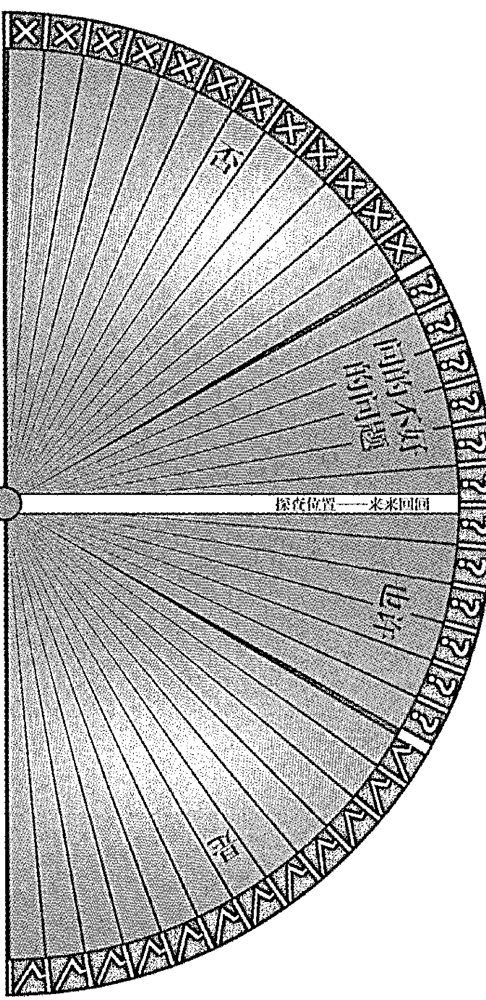

摆在这个位置——来来回回

# 0至100占卜图

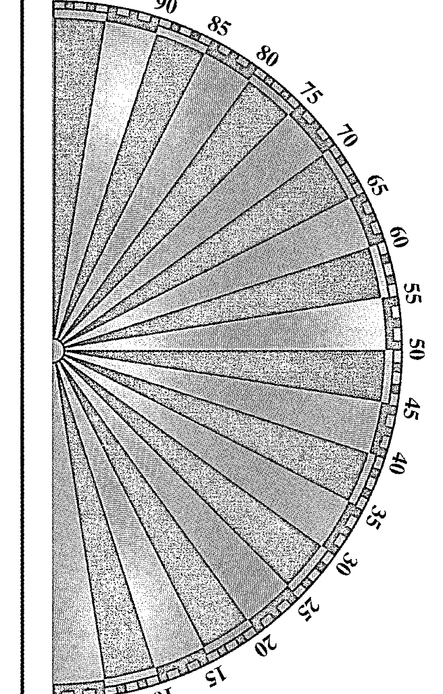

减

加

|   | A | B | C | D | E | F | G | H | I | J | K | L | M | N | O | P | Q | R | S | T | U | V | W | X | Y | Z |
|---|---|---|---|---|---|---|---|---|---|---|---|---|---|---|---|---|---|---|---|---|---|---|---|---|---|---|
| 1 |   |   |   |   |   |   |   |   |   |   |   |   |   |   |   |   |   |   |   |   |   |   |   |   |   |   |
| 2 |   |   |   |   |   |   |   |   |   |   |   |   |   |   |   |   |   |   |   |   |   |   |   |   |   |   |
| 3 |   |   |   |   |   |   |   |   |   |   |   |   |   |   |   |   |   |   |   |   |   |   |   |   |   |   |
| 4 |   |   |   |   |   |   |   |   |   |   |   |   |   |   |   |   |   |   |   |   |   |   |   |   |   |   |
| 5 |   |   |   |   |   |   |   |   |   |   |   |   |   |   |   |   |   |   |   |   |   |   |   |   |   |   |
| 6 |   |   |   |   |   |   |   |   |   |   |   |   |   |   |   |   |   |   |   |   |   |   |   |   |   |   |
| 7 |   |   |   |   |   |   |   |   |   |   |   |   |   |   |   |   |   |   |   |   |   |   |   |   |   |   |
| 8 |   |   |   |   |   |   |   |   |   |   |   |   |   |   |   |   |   |   |   |   |   |   |   |   |   |   |
| 9 |   |   |   |   |   |   |   |   |   |   |   |   |   |   |   |   |   |   |   |   |   |   |   |   |   |   |
| 10|   |   |   |   |   |   |   |   |   |   |   |   |   |   |   |   |   |   |   |   |   |   |   |   |   |   |
| 11|   |   |   |   |   |   |   |   |   |   |   |   |   |   |   |   |   |   |   |   |   |   |   |   |   |   |
| 12|   |   |   |   |   |   |   |   |   |   |   |   |   |   |   |   |   |   |   |   |   |   |   |   |   |   |
| 13|   |   |   |   |   |   |   |   |   |   |   |   |   |   |   |   |   |   |   |   |   |   |   |   |   |   |

# 世界地图占卜图

已知的储油在哪里？

# 牡羊座

肯定、紧迫、主司头部

元素：火

## 爱情

## 幸福

## 健康

## 事业

# 金牛座

占有欲的、持久的、主司喉咙

元素：地

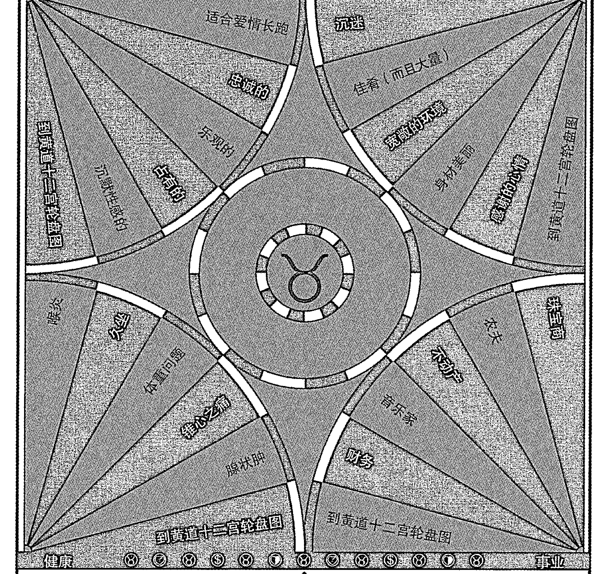

# 双子座

沟通、适应，主司肺部与双手

元素：风

## 爱情

- 危机不断
- 在关系中随和
- 机动与独立
- 推销一个观念
- 不止一种方式
- 浪漫关系
- 到黄道十二宫轮盘图
- 到黄道十二宫轮盘图
- 思想开放
- 心智开放
- 把别人的想法推销给别人

## 幸福

- 调情

## 健康

- 繁重的任务在工作上
- 心智感应
- 在工作上
- 写信
- 肺部伤害
- 努力工作
- 到黄道十二宫轮盘图
- 到黄道十二宫轮盘图

## 事业

- 社会工作
- 写作
- 广告
- 教育
- 写作
- 作家
- 作家

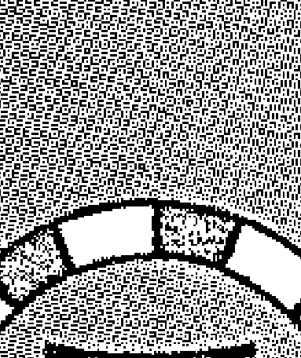

# 巨蟹座

敏感、保护、主司胸与子宫

元素：水

## 爱情

- 以感觉为主的性爱
- 在家
- 母爱
- 闷闷不乐
- 浪漫
- 不可救药的
- 可靠的
- 到黄道十二宫轮盘图
- 浪漫多情的
- 爱家的
- 见异思迁的
- 见异思迁
- 到黄道十二宫轮盘图

## 幸福

- 不舒服/健康
- 坚强
- 市侩
- 见异思迁的
- 见异思迁
- 沉郁
- 经营专家
- 沉闷
- 管家
- 到黄道十二宫轮盘图
- 到黄道十二宫轮盘图

## 健康

## 事业

# 狮子座

创造力的、令人印象深刻的、主司心脏

元素：火

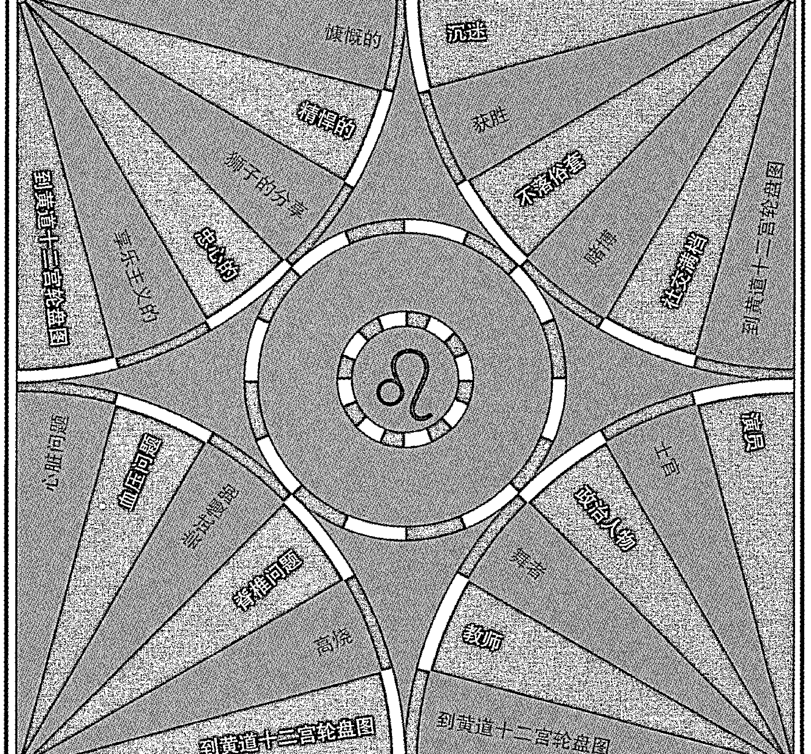

# 处女座

挑剔的、分析的，服务全体、主司胃

元素：地

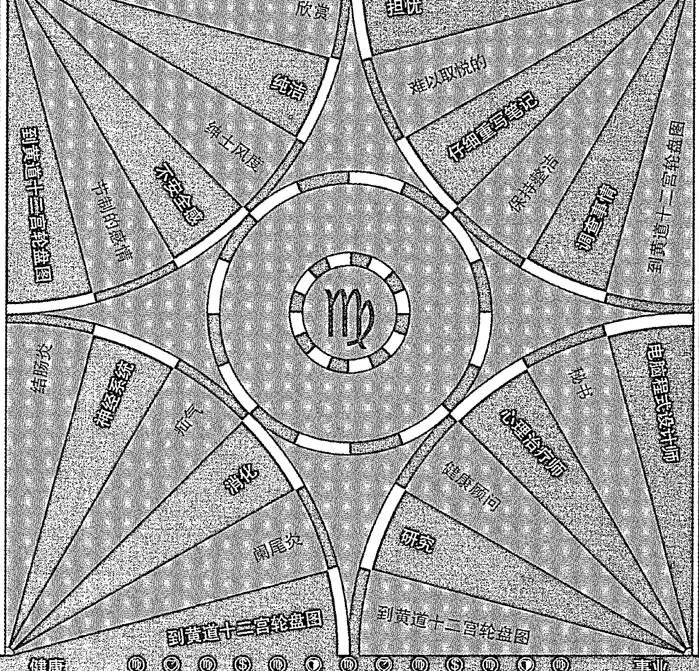

## 爱情

## 幸福

## 健康

## 事业

# 天秤座

和谐、安逸的妥协、主司肾脏

元素：风

## 爱情

- 愉快的
- 肩并肩的
- 多才多艺
- 开创者
- 到黄道十二宫轮盘图

## 幸福

- 与伙伴一起工作
- 愉快的
- 社交接触
- 把欢乐带给别人
- 规划别人的问题
- 到黄道十二宫轮盘图

## 健康

- 下背部
- 肾病
- 肝脏
- 腰痛
- 特别关注
- 到黄道十二宫轮盘图

## 事业

- 缓和的
- 艺术型
- 会计师
- 轻松的工作
- 创造性的工作
- 到黄道十二宫轮盘图

# 天蝎座

热情、强烈，主司生殖器

元素：水

## 爱情

- 发挥心理力量
- 不乏味
- 压抑自我
- 意志
- 动力
- 固执
- 压抑
- 到黄道十二宫轮盘图
- 到黄道十二宫轮盘图

## 幸福

- 心理困苦
- 心理问题
- 目标和你知道的
- 自力更生
- 自我问题
- 家庭问题
- 血亲问题
- 事业企业
- 实际问题
- 到黄道十二宫轮盘图
- 到黄道十二宫轮盘图

## 健康

## 事业

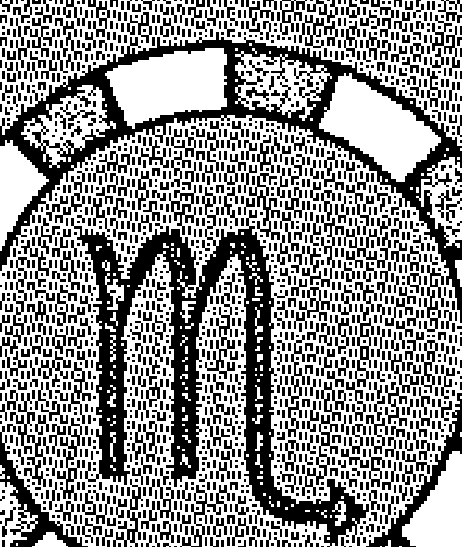

# 射手座

扩展、探索、主司盆骨与大腿骨

元素：水

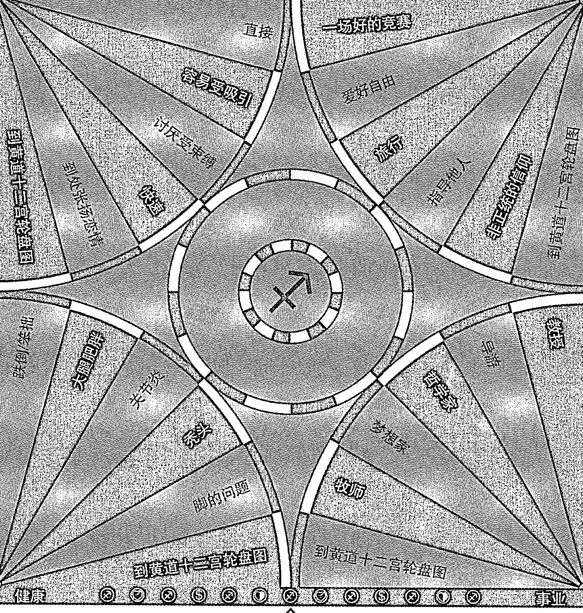

# 摩羯座

有抱负、谨慎、主司膝盖

元素：地

## 爱情

- 含蓄的
- 喜欢被珍惜的感受
- 适度的
- 到黄道十二宫轮盘图
- 权威的位置
- 家族遗产的执行人
- 工作狂
- 创造事物
- 实际创造

## 幸福

- 创造实际的
- 行政官员
- 传教士
- 外国的旅游胜地

## 事业

- 骨头疾病
- 家庭问题
- 习惯
- 风险

## 健康

# 水瓶座

独立、人文精神、主司循环系统与脚踝

元素：风

## 爱情

- 保持忙碌但独立
- 对多的关系
- 易谈感爱
- 易被诱惑
- 到黄道十二宫轮盘图
- 固执的

## 幸福

- 不落俗套
- 旅游指南
- 创新的
- 到黄道十二宫轮盘图

## 健康

- 循环系统好
- 心脏较虚弱
- 极易紧张的神经
- 静脉曲张
- 脚踝脆弱及骨头关节老化
- 到黄道十二宫轮盘图

## 事业

- 社会工作者
- 工程师
- 都市规划师
- 行政官员
- 生态顾问
- 到黄道十二宫轮盘图

# 双鱼座

敏感、自私、主司双脚

元素：水

# 黄道十二宫轮盘图

这个问题最好如何解决？

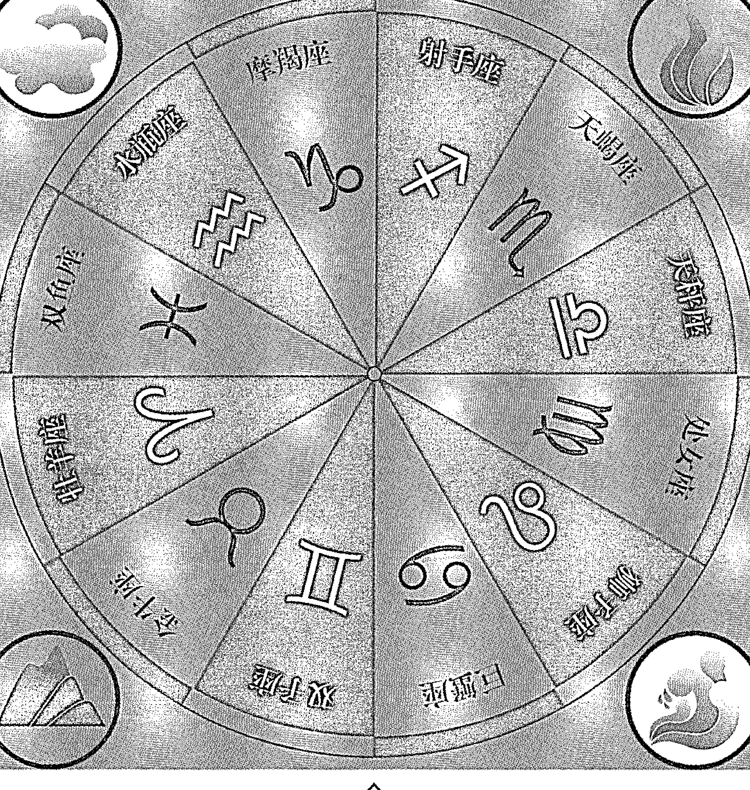

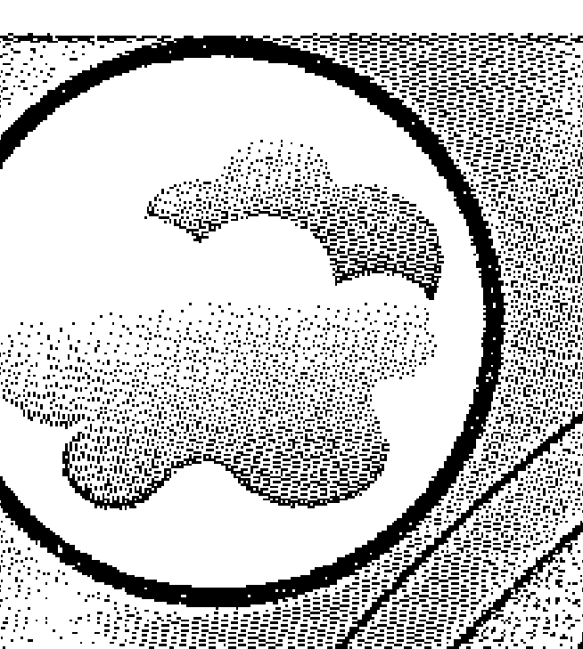

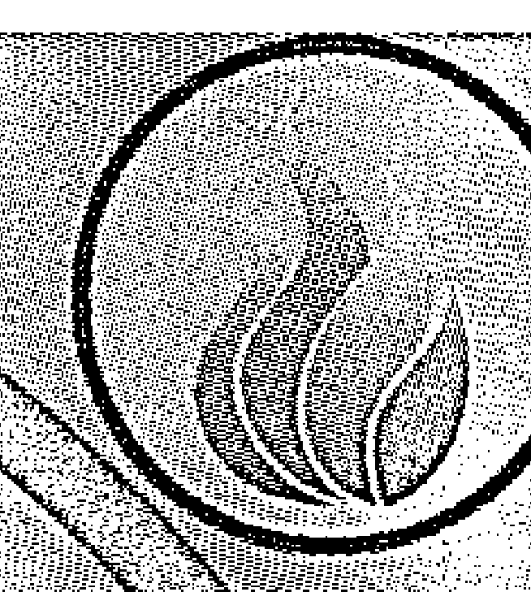

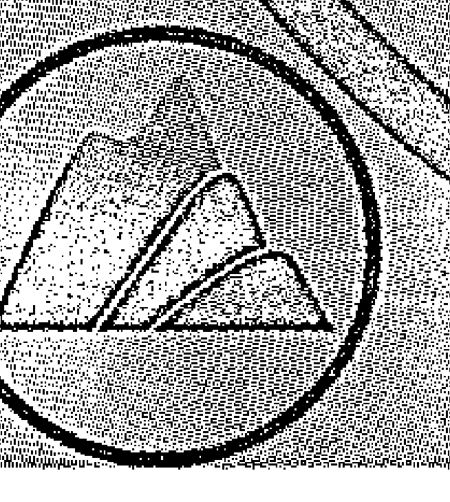

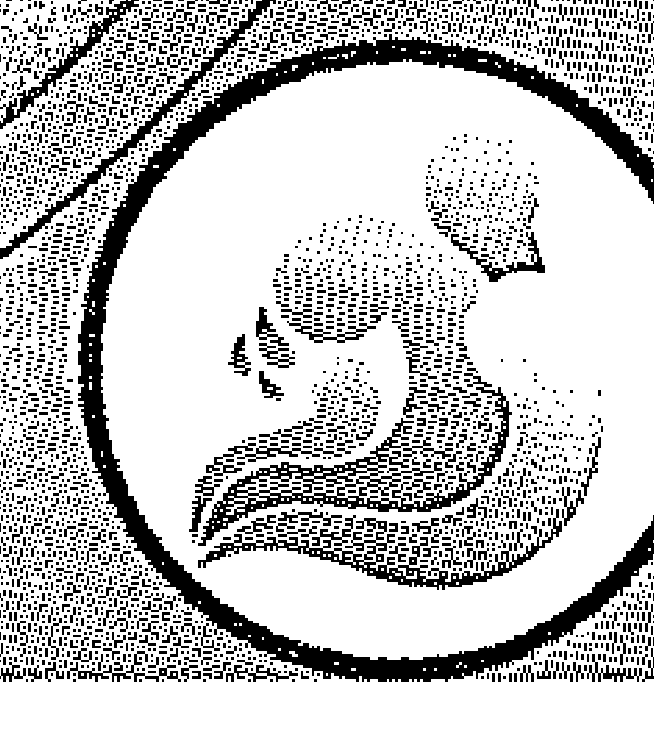

# 十二宫图

我将在哪里解决这个问题？

- 1. 人生周期, 个人方向, 个人资源
- 2. 金钱, 物质财富, 赚钱能力, 你的投资
- 3. 家庭基础, 短程旅行, 早期教育, 学习
- 4. 察觉的心, 家庭与家人, 深层意识, 逻辑和知识
- 5. 人生晚期, 由其组织, 自我投射
- 6. 创造力, 儿童, 爱/感情/性, 运动/休闲时间
- 7. 健康/痊愈, 工作, 习惯, 做出你的贡献
- 8. 一对一关系, 婚姻, 合伙关系, 公开的敌人
- 9. 我们的阴暗面, 合伙人的资源, 死亡/遗产, 性, 人生哲学
- 10. 后期/高等教育, 宗教/信仰, 旅行/灵修之旅, 超意识的心
- 11. 社会地位, 公众形象, 工作职责/责任, 事业原型, 发挥意识, 目标, 礼物, 收到的爱
- 12. 启动, 一个新的国度, 看不见的力量/限制, 自我怀疑/内在成长, 完成, 觉察的永恒至福, 人格, 外表, 身体

# 行星图

我应该扮演什么角色解决这个问题？

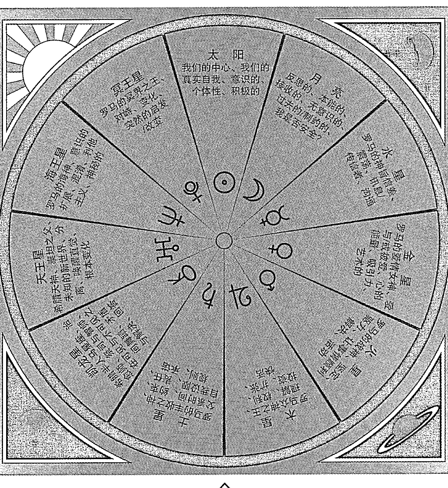

# 明天早晨天气图

明天早晨当我第一次抬头仰望天空时，我将看到什么？

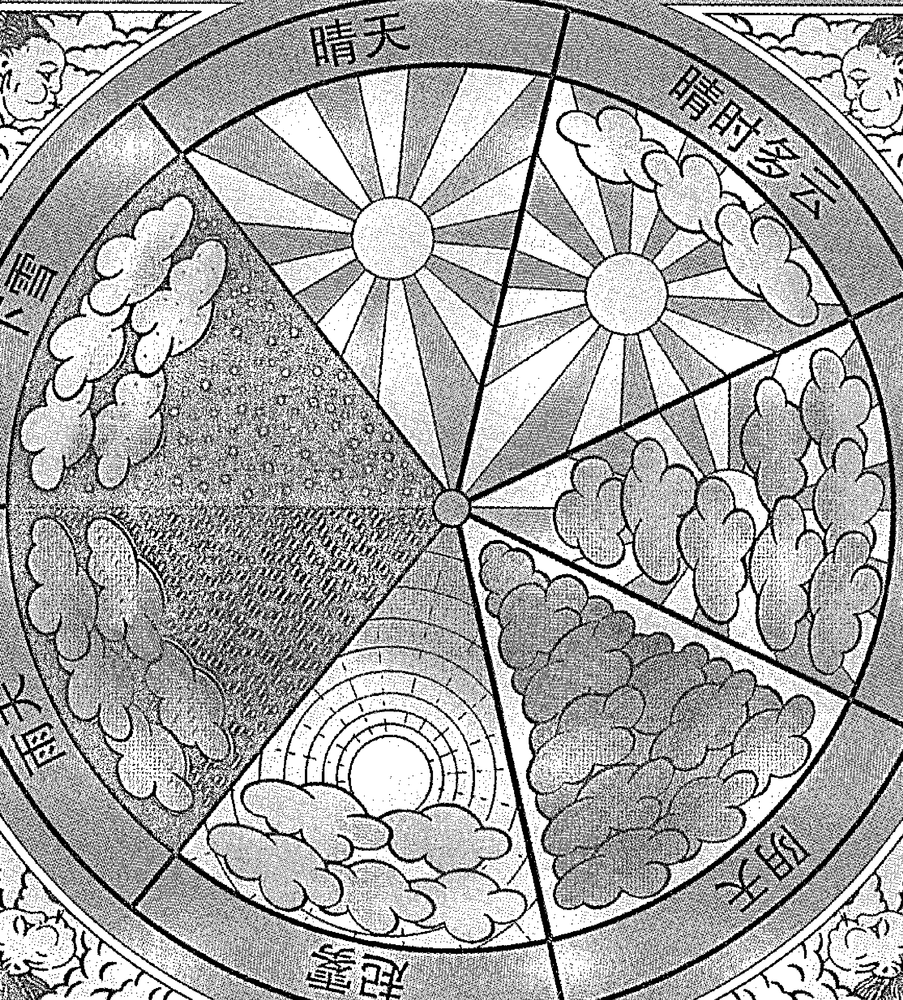