## Johannes Trithemius: The Art of Drawing Spirits into Crystals (简称DSIC)
# 水晶召灵
由秘义之光组织翻译

## 特里特米乌斯的水晶召灵术
The Art of Drawing Spirits Into Crystals
由秘义之光团队翻译和整理
更多神秘学知识
关注微信公众号：秘义之光和穹印之源
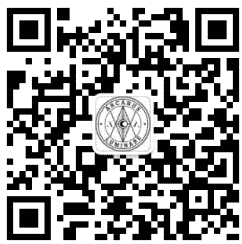
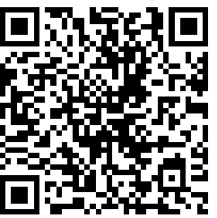
以及加入秘义之光的数据库

## 原文
译自 | [http://www.esotericarchives.com/tritheim/trchryst.htm](http://www.esotericarchives.com/tritheim/trchryst.htm)
作者 | 托名 Johannes Trithemius (1462~1516)
翻译 | 令狐顷雅
校对 | HonoYoku

准备一个宝石般清澈的水晶，如一个小橘子般大小，即直径大约 1.5 英寸（约 3.81cm）；让它在各个角度都呈现完美的球状；接着，当你拥有一个这样的晶体，它美丽清澈，没有任何晶絮或瑕疵，用纯金板环绕晶体的一半（使晶体嵌入纯金板中）；让它能够被合适的安放在象牙或乌木的底座上，你能在图中看到更详尽的细节。让我们在晶体周围（即在嵌入水晶球的纯金板上）刻一个圆，圆中靠近晶体的地方刻上这些符号 ⬡ ✡ ☩ ；之后刻上 “Tetragrammaton” 这个名字。在纯金板的另一面刻上 “Michael, Gabriel, Uriel, Raphael”，这是四个最重要的天使，统御着太阳、月亮、金星和水星；但是在放置水晶的桌子上，要刻下下列名字、字符，必须按顺序刻制。

彼得森注：根据《神秘哲学四书》“四之阶” 这四个天使对应了四元素，他们的行星关联要在 “七之阶” 才能找到。文本插图显示的 Michael 符印来自《七天之书》，表明该文本的完成时间不会早于 1559 年，远迟于历史上的特里特米乌斯生卒年份。

校对者注：六芒星里的一般认为是希伯来文 Yod。然后从后文图例可知，这三个符号将 Tetragrammaton 分割为了 Tetra、Gramma、Ton。这个单词=YHVH。

首先是七行星和统御它们的天使的名字，以及他们的符印或字符。接着是地上四方的四位国王的名字。把它们全都写进两个圆的中间，并在桌上画一个三角形；安放于底座上的水晶就放在这张桌子上面：做完这后，你的召灵桌便是完整的了，适合去召唤灵体；接着，你应该进行你的实验了，于是：

校对者注：一般认为应当依照 “土星 木星 火星 太阳 金星 水星 月亮” 的次序书写/雕刻，但也有异议。四方国王是否要按规定顺序没有定论，但方位最好与你要进行召灵时的实际方位对应。

彼得森注：在鉴别四方之王时，有很多版本。这是一小部分：阿格里帕，《神哲》2.7：“Oriens.Paymon.Egyn.Amaymon”（东，西，北，南），并且用词是“亲王”（princes），然而在《神哲》3.24 中他又说，“Urieus，东方国王；Amaymon，南方国王；Paymon，西方国王；Egin，北方国王；希伯来博士假定如下称呼更为正确：**Samuel, Azazel, Azael, Mahazuel;**” 特里特米乌斯本人在著作里则列出了 **“Asmodae, Paymon, Egyn, Amaymon”**。

译者注：在 MC 中有“Bael, Moymon, Poymon, Egyn” 或 “**Asmodel 主宰东方，Amaymon 主宰南方，Paymon 主宰西方，Aegym 主宰北方**”；“Oriens, Paymon, Egyn, and Amaymon” 或 “Amodeo[sic]（东方之王），Paymon（西方之王），Egion （北方之王），以及 Maimon（南方之王）”。

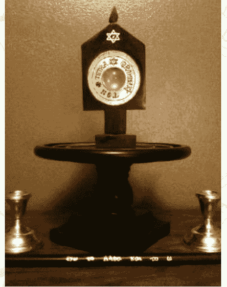

**校对者注**：Rufus Opus 设计了简化的版本，仅需要一张平面的召灵台，在其上绘制一组同心圆，外圈填上七行星及其天使，内圈填上四方国王（RO 还将四方国王替换为了四大天使）。内圆里加上一个三角形。然后将水晶球或水晶镜放置于三角中。三角形乃是土星的几何图形，亦称为显化之三角。

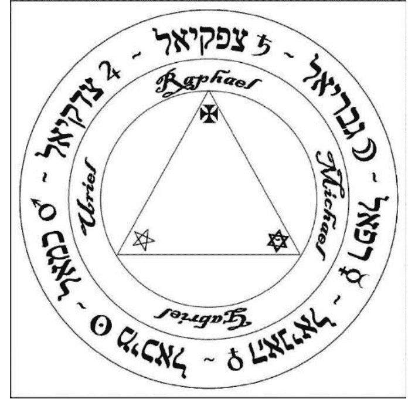
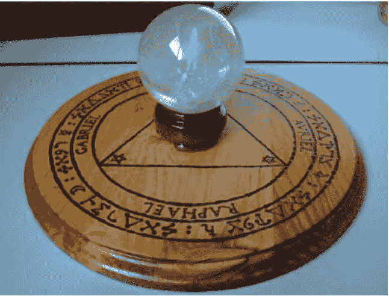

你要在什么时间用召灵桌和晶体召唤灵体呢？你必须遵循行星时；它是行星统御的小时，天使则统治行星，你应以下列方式召唤他们；但首先，念诵一段简短的祷文：

校对者注：我们的实践表明占星天象的影响力比行星时更大。

> “哦，上帝！你诗意地创造了一切美好的事物，并给它们增添光彩，我——您贫穷的仆人——恳求您，通过这番处理和工作，他可以毫无恐惧，毫不退缩；我恳求您，我主！您为您愚昧的造物启蒙，所以他们会通过晶体睁开灵性之眼去看到并知晓您的天使已降临于此水晶之中。”

接着把你的手放在晶体上，继续念诵：

> “你，神无生命的造物，被祂的意志祝福，没有邪念能接近你；或者，如果他们进入此物之中，他们也将因为基督的缘故被可理解的话语所约束。阿门。哦，主呀！鉴于在您面前的仆人，他既不欲求邪恶的财宝，也没有伤害邻里，更没有危害任何活物，授予他看见可能在此晶体中显现的天使的力量或理解力吧，或其它美好的天赋（可以是治疗疾病的力量，也可以是吸取智慧，或发现使全部人或家庭受苦的全部邪恶，或其它你希望被赠予的天赋）求您使我藉着您的智慧和怜悯，用我所能接受的一切来荣耀您的圣名。为了您的圣子耶稣的缘故，恩准我吧。阿门！”

接着拿起你的戒指和五芒星，把戒指戴在你右手的小指上；把五芒星挂你的脖上；(注意，五芒星可以写在一张干净的上等羊皮纸上，也可以刻在方形银板上，悬挂在你的脖子上，贴着胸膛)，然后拿出你的带有烫金字符的乌木杖，画圆，诵念：

> “以圣三一之名，为了抵御诸邪，我把这块土地奉为神圣；如此邪灵就无力去打破此处借由我主耶稣基督划定的界限。阿门。”

彼得森注：文本没有另外提及戒指，可能要使用《贤者》B106 页的款式。

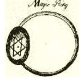

校对者注：这里的戒指应该是所罗门戒指，但是我们不确定这里指的是哪款，可能是《雷蒙盖顿》给出的版本。在 RO 简化版本里忽略了这一道具，因为它传统上是召唤恶魔才需要用的。

在你的魔法圆和摆放晶体的圣桌之间放一个装有熏香的容器，用火点燃它，并诵念：

> “我召唤你，哦，你，火之灵！借由创造天地海以及其他一切地方中一切事物的祂，即刻撤回你造成的所有幻象，不要伤害任何事物。赞美你，吾主，洗去火之灵的罪孽使它成为神圣，望它们的气味中充满力量与美德；所以借由我主耶稣基督，无论敌对者，还是其他幻象，都不会进入其中。阿门。”

注释：召灵台（实践桌）根据原文要放在魔法圆外面，两者之间放熏香。但 RO 将其改成放在圆内，他认为这样更方便他看到水晶球。

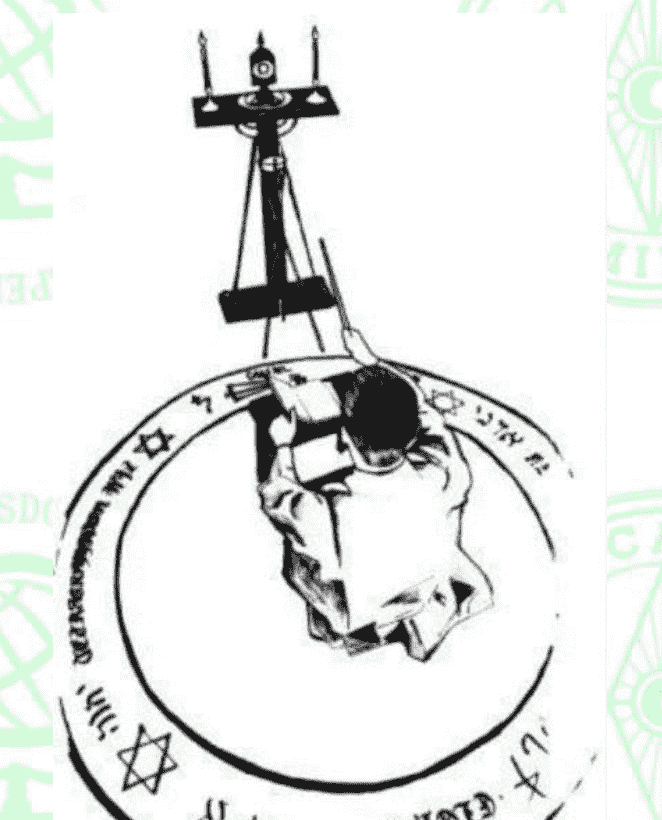

现在,依规定的次序做完这些后,取出你的小书,它必须被以纯白未写的牛皮纸或普通纸制成,长约七英寸（约 17.78 厘米），同样，笔和墨必须被准备好要去书写这些名字、字符和职位，同样，准备可能显现的灵体的符印和图像。（在此我必须告诉你，你所召唤的灵体总会出现，不会引发其他事件，你必须考验这个灵体去知晓他是不是一种纯正或不纯的存在，通过坚信无疑的信仰上帝，你能很容易就会知晓。）

现在，最纯正简单的召灵方式是通过对灵体进行一个简短的演讲，这比一桌字符更有效并更易去执行；对于所有的天体操作，它们越是纯粹，越易被天上的灵体接受：于是，画完魔法圆之后，书、熏香、杖都要准备就绪，如下进行：

（在注意到一天中确切的时间，以及天使支配那个小时后，你应该说,）

> “以有福的圣三一之名，我希望你，一位强大且勇武的大天使，米迦勒(或者任何别的灵体/天使)，如果这是那被称作 Tetragrammaton 之圣神，之圣父的神圣意志，你将以最符合你天之本性的形态显示于此水晶中，并回复我们的要求，我们因寻求非法之知识而逾神恩与善的界线。因此你将凭着那存在着并统治世界的，无终圣神的荣光与辉耀亲切地展示我们那些我们应当去做/知道的，对我们最有益的事物。阿门。”

“主呀，愿你的旨意行在地上，如在天上；——求你洁净我们的心，不要从我们身上取走你的圣灵。”

注意，在这些操作中，必须总有两个人在场；因为灵体经常只显现给一个人看到在晶体中，而另一个人却无法觉察；因此，如果灵体们如同大多数案例那样显现了，无论是显现给其中的一人，或两人都可看见，念诵：

校对者注：所以，要从水晶中看到灵体的形象、听到灵体的话语，仍然需要操作者有灵视能力。不过你可以留意熏香的形状，有时候熏香会呈现出灵体的形态，这是可以被照相机拍下来的。

“哦，主呀！我们对您回以衷心的感谢，感谢您聆听我们的祈祷，感谢您允许您的灵体在我们面前显现，因您的怜悯，以进行进一步的问询。阿门。”

> 问题一：以神圣纯洁的灵之名，以圣父之名，以其所出的圣子之名，以出自两者的圣灵之名，你真实的名字为何？
如果灵体回答，Michael，则继续。

问题二：你的职能是什么？
问题三：你的真实符号或符印？
问题四：什么时间最适合你的性质，以便于我们的交谈？
问题五：你能以我主耶稣基督的血和正义宣誓你是真正的 Michael 吗？

（在这里让他宣誓，然后在你的书上记下他的符印或符号，紧接着是它的职能和适合召请的时间，以神之名；也要记下他可能教授给您的所有东西，或他对您的问题或询问作出的一切反应，这些问题关于生或死，艺术或科学，或其他任何事物）

然后您应该念诵：

> “您，强而有力的灵体，只要像你来时般平静，以神圣公正的圣三一之名，所以，藉此名你将离去，当我们以每一个膝盖都要屈膝跪拜的那个祂的名字呼唤你时，请回到我们身边。再会吧，Michael；和平存于你我之间，以神圣的主，耶稣基督。阿门。”

这样，灵体就会消失，然后念诵：

> “对于父神，永恒的灵，光之源，圣子，以及圣灵，是全部的光荣与荣耀，于世无涯。阿门。”

我将在这里列出掌管各个小时的灵体和行星的名字；这样，通过查表，你就可以很容易地知道是什么灵体和行星支配着一周里的哪个小时。

译者注：这里就不列表了，行星时的计算想必大家都会，至于七行星对应的天使本文中是土星-Cassiel，木星-Sachiel，火星-Samael，太阳-Michael，金星-Anael，水星-Raphael，月亮-Gabriel。

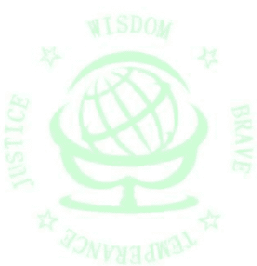

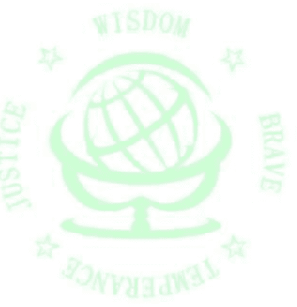
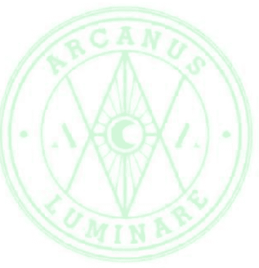

Two Holy mag. Lights used in the invocation by the Chrystal. The true size & form of the Chrystal which must be sett' in pure Gold & the same names & characters as in the model here given.

祈请灵体的水晶，纯金的盘子使水晶镶嵌其中并在其周围刻上神圣的刻印【名称：(顶) 米迦勒，(右) 加百列，(底) 拉斐尔，(左) 乌利尔。】

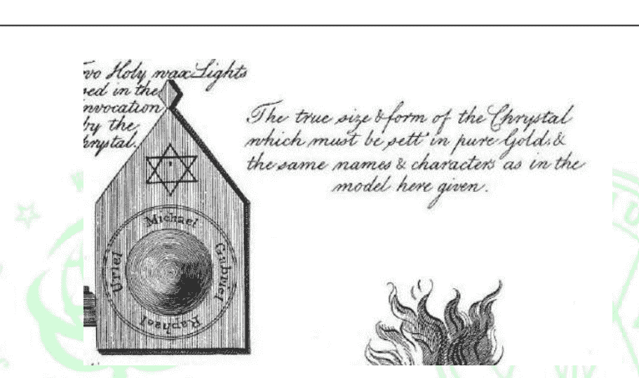

The magic Circle of a simple construction in which the operator must stand or sit when he uses the Chrystal

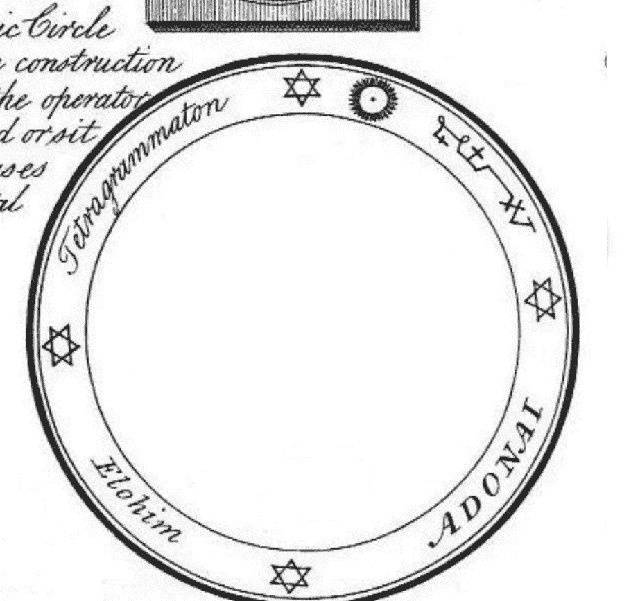

一个魔法圈，以简单的形式构建，用于让操作者在召唤灵体的时候站或坐在里面。【名称：“Tetragrammaton”，“Elohim”和“ADONAI”。还包括了太阳的通用符号⊙。符印使用在《七天之书》中大天使米迦勒的符印，但它在《魔法挂历》里则归属于拉斐尔与金星。】

校对者注：注意这篇《水晶显灵》是以召唤太阳天使米迦勒为例的，如果你要召唤其他天使，请将米迦勒的行星符号、符印和希伯来名字等等换成你所召唤的天使的。

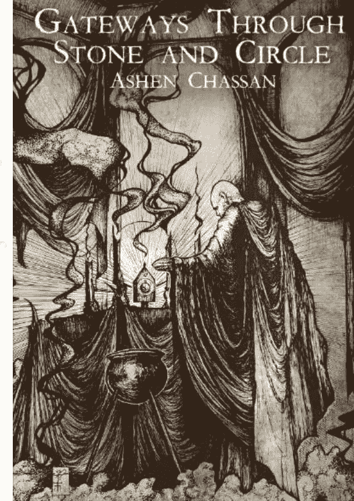
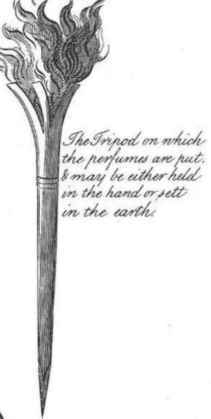
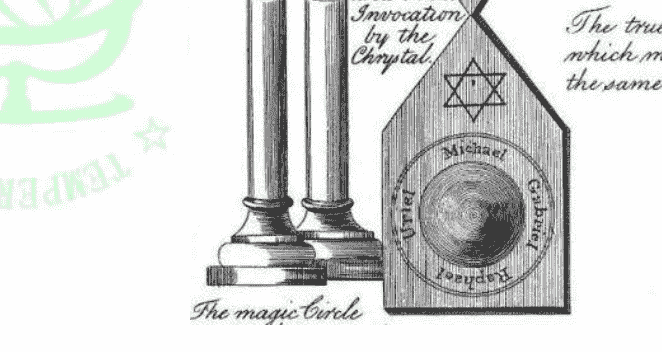

水晶，两个点了蜡烛的银制或其它材质的烛台，以及用以熏香的三脚架或者容器。

> > 译者注：以及记录了 Ashen Chassan 如何修订自己版本的《水晶显灵》方法的《石圆之书》封面。

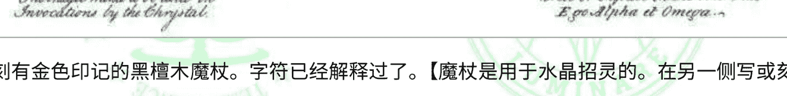

刻有金色印记的黑檀木魔杖。字符已经解释过了。【魔杖是用于水晶招灵的。在另一侧写或刻上 “Ego Alpha et Omega” 大意：我是 Alpha，我是 Omega。】

> > 校对者注：图里魔杖写的是这一侧应当雕刻的文字：“AGLA（六芒星）ON（带有 Yod 的六芒星）Tetragrammaton（十字）”。

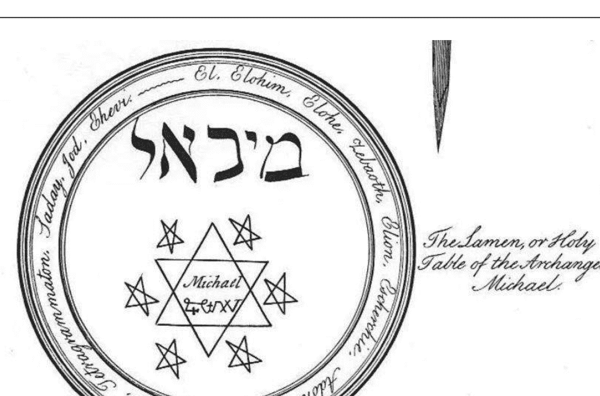

Lamen 和 Pentacle（译者注：文中译为五芒星）这两个词在文里可以通用。它是希伯来文天使长米迦勒的名字，加上符印。外围的名字写的是“El, Elohim, Elohe, Zebaoth, Elion, Escherchie, Adonai, Jah, Jehovah, Tetragrammaton, Saday, Jod, Ehevi。”

校对者注：一般的写法是 Lamen，这里不清楚是否是原文错字。在水晶召灵中，拉门符是召灵时的“电话号码”，你要召唤什么灵体，就要写对应灵体的符印进去，所以这个图例是用于召唤米迦勒的拉门。同时外围的圣名，依照 RO 给出的英文拼写是“El, Elohim, Elohe, Tzabaoth Elion, Escherie, Adonai, Jah, Jehovah, Tetragrammaton, Shadai, Yod, and Eheyeh”。你应当注意留出足够的空间书写完整，如果留出了多余空间是无所谓的，但写不完的话这张拉门就作废了。

友情链接：

[步入光怪陆离的世界——古典魔法师的召灵日记](通过此文可了解到更多关于《水晶显灵》的背景知识，以及使用水晶显灵方法进行的招灵记录。)

## 评述
原文 pdf 下载 | [https://digitalambler.com/2019/10/23/reviewing-the-trithemian-conjuration-ebook-available-for-free-download/](https://digitalambler.com/2019/10/23/reviewing-the-trithemian-conjuration-ebook-available-for-free-download/)
作者 | Sam Block (polyphanes)
翻译 | HonoYoku

作者山姆·布洛克（后文简称山姆）是 Rufus Opus 的 Red Work Course 学生，并且是唯三被正式授权开 RWC 教学的学生。

本文是他在他自己博客上连载的一系列文章的摘录，并不是全文翻译而且不完全符合原文顺序，因为本来只是我自己看书时以中文记录下来的要点而已。

想看全文可以自己去原博客免费下载。

水晶召灵（DSIC）的原文最早出现在 1801 年弗朗西斯·巴雷特（Francis Barret）的《贤者、或名天界的智者》（The Magus, or Celestial Intelligencer）里，题为《关于如何制作用于灵视的水晶和其形体》（Of the making of the Crystal and the Form of Preparation for a Vision），并标明 “出自斯潘海姆的特里特米乌斯的魔法与哲学；包含他的秘密事物、灵体教义之书”，并声称是巴雷特从拉丁文手稿里翻译出来，尚未以英语出版过。

这些说法没有可靠依据。特里特米乌斯就是阿格里帕的导师，本笃会修道院院长，1462~1516年，是个真实人物，只是没依据这篇真的是他写的。

根据原文，制作需要四种物品：

-   小的洁净的水晶
-   小金板，一面刻上三个图示的符号以及 “Tetragrammaton”，一面刻上四位大天使的名，水晶嵌在金板上
-   一个乌木基座用来承托金板和水晶
-   一张用来放基座的桌子，上面刻其他剩下的东西

然后文章开头有图示展示出了各种法器，上面的文字是：

-   魔杖——用于水晶召唤的魔法杖，在另一侧写或刻上 “Ego Alpha et Omega”
-   两根蜡烛——两根神圣的蜡，点燃用于水晶召唤
-   水晶的基座——水晶真正的尺寸和形状，它必须被放在纯金里，这里给出模型上面也有同样的名字和符号
-   魔法师站立的魔法圈——简单建构的魔法圈，在使用水晶的时候，操作者必须站或坐在其中
-   香炉——放置熏香的香炉，既可以拿在手里也可以放在地上
-   拉门——拉门，或大天使米迦勒的圣桌（Holy Table）

两者对比会发现在图示里没有给出基座的另一面，只有四天使的那面，并且也没给出桌子的图示。

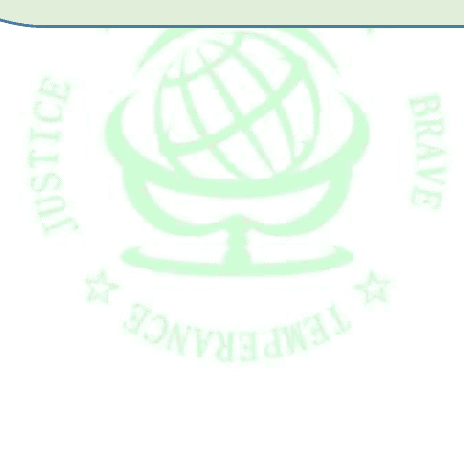
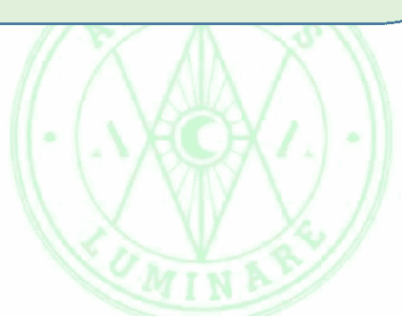

### 1.1 水晶
忠实原文的话，就必须得是球体的水晶球，小橘子（small orange）的大小，这应该是指蜜柑（mikan）或柑橘（mandarin oranges），而不是橙（navel oranges）的大小。或者按原文说的，“例如，直径 1.5 英寸的”。
之所以这么小大概是为了原文说的：“一个人应该能直接盯着球体而看不到周围的干扰”，就是紧盯专注于一个点的灵视操作。

下图是 1.5 英寸（约 3.81cm）水晶球的实拍。

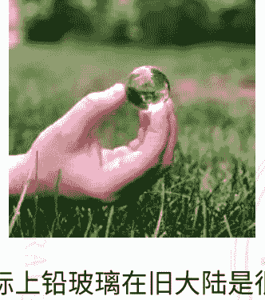

这里并没有说一定要石英水晶，实际上铅玻璃在旧大陆是很普遍的商品，常用于仿制宝石、半宝石、石头。石英水晶可能更好，但要找纯净的石英，即便是这么小的尺寸也很难。山姆个人认为具体材料根本不重要，方解石、普通玻璃都可以用，山姆喜欢石英水晶，就算不纯净通透也行，甚至可以用加工过的水晶。AC 说用过觉得有那么些许差别但不影响实践。

Acher 用黑镜然后写出了《阿巴太尔实践录》。AC 在《石圆之书》也说了怎么制作灵视镜而不是灵视水晶。甚至可以学现代的水占法，用大高脚杯装满水。

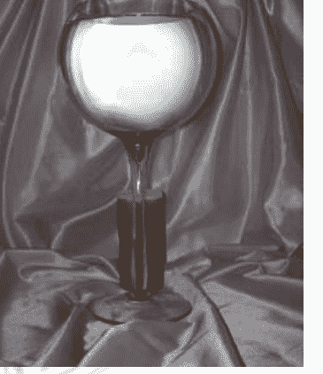

当然了，这套方法毕竟叫做水晶召灵，不叫镜子召灵、水召灵、碗召灵。只是现实来说并没有哪种材料可以说唯一最佳。

说回水晶，阿格里帕说水晶是水元素的（第一书第 7 章）；跟绿宝石和珍珠这些一起，是月亮的（第一书第 24 章）；被双鱼座（第一书第 32 章）和水瓶座（第二书第 14 章）统治。除此以外阿格里帕没有再提过。虽然没有啥依据但山姆认为水晶占卜是晚出于水晶召灵的。

DSIC 说水晶球要尽可能地圆，这应该是出于美观，并且球体在古希腊时代就是象征完美的几何形状。

虽然山姆个人来说不认为有必要一定是球体，只要是光滑的表面就可以。他就有个特殊的四面体水晶，象征了平面的三角变成了三维空间。

### 1.2 基座

原文说 “用纯金板环绕晶体的一半”，具体是把金板卡在球的中间，然后两面半球都露出；还是金板包住后半个球，没法判断。

后者的做法山姆也只见过两次，这样做会让透明的水晶球看起来是金的，并且形成镜面效果。

但前者比较流行，而且山姆觉得更合理，就是两面通透都能看的设计。

其实也可以水晶球就放在基座里，然后在基座前后贴两层环状金箔。

另外有人可能疑问金板为什么要两面都能看到，不能基座包住一边的金板，反正按原文描述应该就是会两面都能看到的。(～￣▽￣)～

然后金板的尺寸，如果按原文图示等比计算，可能直径2.32英寸（约5.89cm），也就是环的宽度大概0.4英寸(约1cm),然后木基座大概宽3.3英寸(约8.38cm)、高5英寸(约12.7cm)。

但 AC 制作的尺寸比这个大很多:

金板一面要写四位大天使的名字：Michael、Gabriel、Uriel、Raphael，在 DSIC 这里它认为乌列尔掌管金星，但 DSIC 最后给的天使掌管的行星时里，却给出是 Anael 掌管金星时。山姆认为这个乌列尔金星的对应是错误的。

另外上面写的是DSIC文本给出的顺序,但DSIC图示的顺序却是(顺时针从顶端开始):Michael、Gabriel、Raphael、Uriel。

山姆更喜欢图示的顺序，更符合元素对应，拉斐尔跟米迦勒相对，加百列跟乌列尔相对，并且如果以顶部为东，那也符合天界四方（基本星座）的顺序，唯一的问题是这样跟地界四方（四元素）的对应就不同了，不过不同的顺序版本山姆认为都可以用。

“带 Yod 的六芒星、五芒星、十字三符号以及四字神名”的具体画法其实也可以有多种解读，比如一圈三符号再一圈四字神名，或者三者跟神名在同一圈。

第一种看起来是最不可能的，因为金板本来就很窄了。

第三种把 Tetragrammaton 拆开的做法其实来自其他魔典。

然后 AC 用了更独特的拆法：Tetra 在十字和六芒星之间在左边，Gramma 在六芒星和五芒星之间在右边，Ton 在底部在十字和五芒星之间（见之前的图）。

这个六芒星里的 Yod，其实是 RO 看图推测的，但毕竟 Yod 也是阿格里帕（第二书第 4 章）给出的单字神名所以不是没道理。

AC 则认为是 Daleth，是第四个希伯来字母所以代表四字神名，而且也代表门。

然后山姆不喜欢照着原文在金板写“四字神名”（Tetragrammton）这个代称，而喜欢直接“YHVH”写上去，虽然 DSIC 图示里的魔杖还是明确就那样写了。

原文其实并没有描述基座有一根脚柱，原图示也没有，就一块木板。但这个设计很像天主教的圣体匣，用来盛放圣餐饼或者圣遗物的器具。

《石圆之书》里提到另一个文献，Frederick Hockley 的《Occult Spells: A Nineteenth Century Grimoire》，就描述了一种类似的器具，里面用到了圣化的绿宝石（beryl）：“一种带有微弱红色色泽的水晶”，尽管有的魔法师用“水晶球或矿物珍珠，由小男孩或问卜者自己观察”。那个文献还说那个绿宝石是完美的球体，尺寸略大于 1 英寸，放在一圈银环里，就像球体上的经线，它的茎秆大约 10 英寸高，四角镀金，并写上四天使的名，即 Uriel、Gabriel、Michael、Raphael，顶端是一个十字形。

不过这个文献后出于《贤者》，可能是抄袭。

（下图左起第一张是 DSIC 图示，中间是圣体匣，右边是上面说的 Hockley 文献的图示。）

另外 DSIC 的基座上的 Yod 六芒星也没有解释，不过 DSIC 超级喜欢画六芒星的样子，魔杖魔法圆拉门上面都有，这个符号在别的文献都看不到，只是这种重复还是让人感到有些怪异。

《石圆之书》在基座两面都加上了六芒星，但原文其实没说要画两面。另外哪边是正面其实也没说，一般推测是图示这面（写四大天使的）对着魔法师。

然后《石圆之书》还提到，约翰·迪伊（John Dee）用过一个水晶装置，是用金带包住石头，上面一个金十字。所以也有人参考这种做出来的，一圈金带包水晶球，把四天使跟三符号画在金带的内外两侧，没有木头基座。山姆表示如果要做这种，他会把天使名放在金带内侧。

### 1.3 召灵桌

接下来就是召灵桌了。很多人其实根本不用基座的，比如 RO 版就是把基座整合在召灵桌上。虽然这样操作没有遵守原文但还是数不清的人做出了成效。

根据原文，这里应该有几个要点：必须按顺序写、必须写成两圈、要写的东西有七行星和七天使以及四方国王、要有个三角放基座。

四方国王具体是哪四个的争议，由约瑟夫·彼得森（Joseph Peterson）提过了，秘义的翻译里也引用了。

RO 用的四天使代替四王，他不是唯一一个，但大部分人都只是模仿他，结果就是周期性有人跳出来质疑这个替换。山姆能感觉这很重要但并不清楚原因。

值得感谢的是，《Magister Omega of A Journey into Ceremonial Magick》上发表了篇总结魔典传统里的四恶魔王的文章，很多资料表明，四王它们有多重要，尤其对《盖提亚》魔法师来说。

> > Jake Stratton-Kent 说：“四王是灵性造物，所以形象上有翅膀，但它们是恶魔之王，而不是天使。沟通四王的方法不能和沟通大天使一样——你必须先召唤一些小恶魔，用四王的名义威胁它们，然后在你有一定权力阶级后，才可以考虑召唤四王。你可以没召唤过四王就使用它们的名义去威胁别的魔，因为传统上四王的名义就是被拿来这样用的。四王可以开启恶魔世界的大门,但这必须是那些明确知道自己在做什么的魔法熟练者才可以去做这种事。就像 AC 说的，它们不是用来实现个人愿望的那类型灵体。”

DSIC 原文暗示了它这套方法既可以用于召唤天使也可以用于恶魔召唤，这可能就是为什么设计上会有四王。但 AC 则认为，四天使是象征垂直的维度，四王是象征水平的维度，它们是存在的层面之间的强大的统治者。

但总的来说这可能很看每个人自己的宇宙观。

那么回看 RO 怎么评价自己的设计？他在 RWC 里讲解召灵桌时，尤其是在 Black Work 第六课有提到：

召灵桌就是宇宙的象征，最外圈是行星天使以及行星符号，内一圈是大地四方的四天使，再里面是三角有五芒星、大卫星、马耳他十字。最外圈代表七重天及其智慧体，衪们是这些地方的统治者，衪们的在场确保了你能招来你要的灵体，四元素国王则开启物质世界的大门，让灵体可以影响你的物质生活，也确保那些世俗的灵体不会吃掉你。这两个圈一起，代表了天与地在你的神殿相接。

三角在召灵里常用于使灵体显化，在《雷蒙盖顿盖提亚》里魔法师站在华丽的魔法圆中，然后三角在圆外，这样魔法师理论上就是安全的，因为三角束缚住灵体，又被隔离在圆外，圆保护着魔法师。

在（RO 自己写的）《现代天使魔典》里，召灵桌是跟魔法师一起放魔法圆里的，所以三角外又多加一个圆进一步关住灵体、保护魔法师，相比很多其他召灵操作都显得不同。

RO 更喜欢灵体被召唤在圆里，因为这样召灵桌是在魔法圆里的，距离魔法师近，更容易看和灵视。

RO 知道有其他人做了完全复刻的装置，但他的课他讲他自己的。他是在自己研究的过程中想到了这样的设计，而他之前就已经有获得与自己神圣守护天使的沟通和知识了，是神圣守护天使揭示给他这样做 OK 的。

召灵桌代表了我们与七天统治者、四元素国王、以及显化之链的关系。

这里很有趣的是，RO 认为四元素国王就是四大天使，这出自阿格里帕第二书第 7 章，而不是更传统的 Seraph、Cherub、Tharsis、Ariel,或者四恶魔王子 Samael、Azazel、Azael、Mahazael,或者在四天使之上的众灵体的四王子 Oriens、Paymon、Egyn、Amaymon。其实 RO 也认为四恶魔王是更技术上准确的选择，但四王对他的课程来说不合适，所以最终他推广了四天使版本。

因为这个话题经常被拿出来说，这里山姆总结了一些论点：

- 用四大天使是不必要的、不幸的、是对魔典的退化处理，如果不骂到“就是懦夫”那么狠的话。
- 在石圆之书之后，用四王就更流行，并且人们依旧有好效果。
- 用大天使而不是王看起来没法用于元素体的工作，强调了天界存在而不是地下存在，导致了灵性的不平衡。
- 用大天使可能更适合与天界的天使的存在工作。
- 用王可以把天界的或天国的存在“扎根”到更世俗的形态，可以有更具体更可视化的显现。
- 那些用了两种设计的人得到了同样好的结果，所以这只是偏好问题，或者取决于个人世界观。
- 有人反馈用大天使也一样召唤来了恶魔，但用四王反而在召唤天使的时候不太达标。
- 有人反馈两者的效果不同，用天使的更容易有“星光”体验，更像是去到灵界，而不是灵体来了水晶，而王会有更传统的召灵体验，即灵体可视化得出现在水晶里。可能因为天使更鼓励灵性提升、升过七重天，而国王更侧重显化在物质层。
- 四王在魔典视角下（尤其考虑到大部分魔典认为四王不应该直接召唤），提供了必要的看护以及整流器的作用，以沟通不同层次的现实，无论物质还是星光还是天界还是其他。它们本质上是中性的力量，调和各个不同层面、天界的转变。
- 用四大天使是多余的、重复的，因为它们本来就出现在召灵桌另一圈的行星的天使里了。
- 基座的天使对四王可能有束缚效果，那么只用四天使应该也暗示了四王的存在，因为四王是“在他们之下”的。
- 虽然当事人可能不在意用哪种，但如果考虑到这整体是在用新柏拉图宇宙观去进行赫密、所罗门仪式，这还是挺重要的，尤其是它在魔典里不断重复出现。

四王之后是七行星，原文说要写的内容很多，其中的“符印和字符”具体是啥也很难讲。

RO 版就是只有行星符号和天使名。

AC 版是行星符号、行星名字、天使名字、天使符印，然后用 · 和 : 隔开。然后 AC 用的是拉丁文名还是属格而不是主格，比如 Saturni (of Saturn) 而不是 Saturnus (Saturn)，山姆认为这是因为 AC 的拉丁文很烂，因为他都给隔开了，没法理解成 Cassiel of Saturn。这可能来自 Peter Apian1539 年的 Cosmographia，但里面行星前面有个 COELV (Heaven) 所以其实是 heaven of Saturn 的意思。拉丁文主格行星名应该是 Saturnus、Iovis/Iupiter、Mars、Sol、Venus、Mercurius、Luna。

AC 自己解读原文说，“符印和字符”只指天使符印，而没有包含行星符号，但他还是都画上了。

#### Schema huius præmissæ diuisionis Sphærarum.

然后 Acher 的版本则用了阿格里帕给的行星符印而不是符号。

Satyr Magos 在自己博客给的版本是只有行星符号和字符，也是阿格里帕给出的符号（第一书第 33 章），无视了天使。

《Erneus of Magia Pragmatica: Key to the Key of Solomon》里基于 RO 版做的，是天使名、天使符印、魔法万年历里取的行星字符、行星图像，代替了一般的行星符号。《Erneus》用的字符也出自《Ars Paulina》，这东西也可能是魔法万年历的行星字符的主要来源，这样看它们确实更适合作为同源的 DSIC 使用。约瑟夫·彼得森在注释《雷蒙盖顿》里面来自《Ars Paulina》的字符时，提到《Ars Paulina》也包含特里特米乌斯的《Steganographia》的第二书（而且是实锤本人著作）。

但总的来说，山姆更喜欢 Satyr 的（下图）。

全都写上会显得很臃肿，另外对比一下，四王为什么就只写名字，不需要符印？？？山姆觉得可以加入元素符号，但又觉得四王更能代表大地四方，而不是四元素。

如果要统一，那么似乎应该只写七天使和七行星的名字，而不要有字符、符印、符号。

如果只写行星占星符号，那会比较清晰简明，但山姆不喜欢。

山姆认为，行星占星符号在别的情况下使用时本身就等同于行星名，然后行星字符就等同于行星符印，然后天使名比天使符印重要，因为天使的名字本身就可以构造出符印，而且只要有名字不需要符印也可以召灵，而且后续拉门那里也还是名字突出，符印相对小。

而且说到底并不需要召唤七天使都到场，只需要他们注意到这个召灵仪式，所以没必要啥都画上。

所以山姆最终决定，他喜欢用《石圆之书》+Satyr 版然后略简化的设计。

接着就是用什么行星顺序写？阿格里帕的七之阶表格(第二书第 10 章)给了从土到月的顺序，山姆认为这是最合理的。但反过来从月到土好像也正常。

RO 因为天使名用希伯来文，所以逆时针写，然后行星也跟着逆时针，然后顺序是《Seven Spheres》里的：土水木金月火日，这个是阿格里帕四之阶表格的顺序——土水星是水元素，对应北方 Egyn 和加百列；火日是东方 Oriens 米迦勒火元素；木金是 Paymon 西方拉斐尔气元素；月亮是 Amaymon 北方乌列尔土元素（因为这召灵桌没恒星，恒星也没对应天使，所以忽略）。

天使名字用什么文字拼写也有异议：

- 《Heptameron》的拉丁文名，和 DSIC 给出的名字一致。
- 《神秘哲学三书》给了希伯来文和拉丁文转写。
- 《Erneus》的更忠实的希伯来文。
- 《石圆之书》的既写拉丁文又写希伯来文，拉丁文来自《Heptameron》。
- 《Seven Spheres》的，引用自《Heptameron》的但有错误的拉丁文，以及两种希伯来文，一种是阿格里帕的，一种是《Erneus》和《石圆之书》的。

阿格里帕把 tzaddi 转写成了 z,Qoph 转写成了 k,然后还出现 Zaphkiel 漏写字母成了 Zaphiel 的。并且他是米迦勒水星、拉斐尔太阳的对应。

צַפְצִיאֵל土星天使更忠实的转写是 Qaptziel，有争议的拉丁文转写是 Cassiel，然后按照阿格里帕的转写法这里调换 qoph 和 tzaddi 是没区别的……就很混乱……

| Planet | Latin (Heptameron) | Latin (Agrippa) | Hebrew (Agrippa) | Hebrew (Erneus) | Hebrew (GTSC) | Hebrew (SS) |
|--------|--------------------|-----------------|------------------|-----------------|---------------|-------------|
| Saturn | Cassiel | Zaphkiel | צפקיאל | קעפיל | | כסתיאל |
| Jupiter | Sachiel | Zadkiel | | | צדיאל |蹉איל |
| Mars | Samael | Camael | כמאל | סמאל | סמאל |
| Sun | Michael | | מיכאל | | | |
| Venus | Anael | Haniel | האניאל | ענאל | ענאל / אנאל | אנאל |
| Mercury | Raphael | | רפאל | | | |
| Moon | Gabriel | | גבריאל | | גבריאל |

Table 1: Different spellings of planetary angel names.

《石圆之书》给出了两种金星天使的希伯来文，一个首字母是 Ayin 一个首字母是 Aleph。天使名还有其他很多不同拼法，因为历史原因。

最常见的都是用《Heptameron》的拉丁文再逆向转写回希伯来文，所以才那么多变体，然后阿格里帕的希伯来文拼写目前山姆也不知道哪来的。

但不管名字怎么变体都是指向一个灵体那就行吧？山姆觉得只要从同一个来源取一套名字就行。然后，DSIC 的魔杖、图示都写拉丁文，那么按理应该全都拉丁文才统一吧，但 RO 或者 Acher 就带头用希伯来文了，不过 DSIC 的拉门倒是有用上了希伯来名，总之没定论。

然后如果选希伯来文还可以分出来印刷体、手写体、天体文字等写法......山姆比较喜欢天体文字，毕竟这些是天界存在，但这种做法不主流。

然后 AC 用希腊文写四王，原因没解释，山姆觉得希腊文也是拉丁文逆向转写出来的，对 AC 的转写法也有质疑，按他的写法“拜蒙”变成了“泡乌蒙”了......

其实 AC 也说如果在召灵桌上面写英文，这样天使就更会倾向于跟灵媒说英文。(这里是穹印的实践经历：我们的通灵板上面写了拉丁文的诗篇，然后一些有文化的神就喜欢给我们写拉丁文…….)

最后就是三角了，在绝大多数召灵里三角和圆都是支柱，只是像雷蒙盖顿盖提亚里，是圆在三角里面而不是外面。

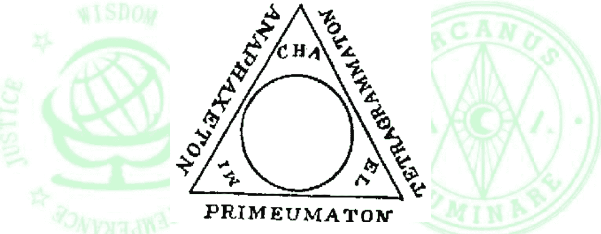

一般认为，这里面的圆束缚了灵体，因为圆是无始无终的不可打破的连续边界，而三角形的作用是赋予灵体形体，因为三角形和土星有关，还可以让灵体服从。

《神秘哲学第四书》说如何处理恶灵：完成一系列步骤后停一会儿，如果有任何灵体出现，就勇敢地面对它、威胁它，先让它回答它的名字、是否有别名，然后可以问任意想问的问题。如果灵体表现出顽固或撒谎，用誓约祷文束缚它；如果你怀疑它撒谎，用圣化的剑在魔法圆外画一个三角形或五边形，强迫灵体进去里面，如果它愿意发誓，而且你接受它的发誓，就把剑伸到圆外，要求灵体把手放在剑上发誓。

这里的三角或五边形，应该是对应土星（数值 3）跟火星（数值 5）的象征，另外，这个五边形能不能是五角星，不好说。

但注意，这个装置是用给邪灵的，不能用给善灵，不能关天使进去。

另外注意 DSIC 里提到的是“双重圆”，每个人都把这理解为写一圈行星天使，写一圈四元素王。其实有比较罕见的人把四王放在外面，把七行星放在里面，只是大多数人可能更觉得行星在更高处比较对。（我觉得另一个可能是这样明显更有空间画）

但山姆在怀疑，如果这里指的只是“画两个几何的圆”呢？即，两个圆夹出单独一圈环带，然后所有名字都应该写在一个环上，这其实是从后面的拉门部分得到的灵感。如果这样画，原文说“必须按顺序”，那是不是先七行星然后四王跟着？这样也是一种“下降秩序”，形成越来越浓稠的物质。那么也可以推测四王的顺序是按密度，火 Oriens、气 Paimon、水 Egyn、土 Amaymon。

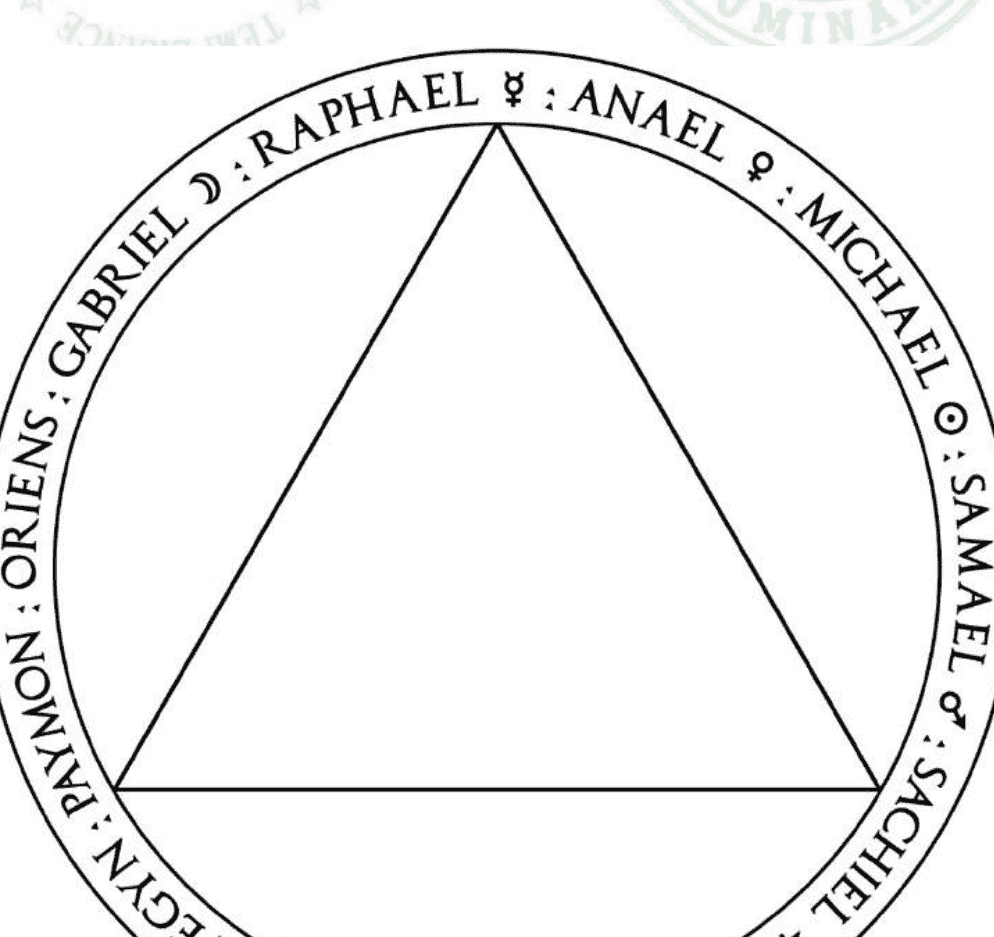

但这样考虑可能太过于抠字眼，而且四王和行星天使毕竟不是一个种类，而且写两圈在观感上更好看。虽然非要考据的话，四王很可能是苏美尔、巴比伦、亚述时代的四风，而那个时代它们确实跟行星神是平起平坐的。

阿格里帕第三书其实也有这样的说法：这些灵体是伟大的君王（Prince），有权力和自由去掌控它们自己的行星和星座、时间和年岁和月份和日期和小时、以及元素和世界部分和风……

根据这个表述考虑，那么 RO 的四王换四天使也是完全可以的。然后七行星和四元素可能只是代表了七层天和世界四方，也就是每个角落的事物，都可以来这里显化。

无论哪种，反正 DSIC 说三角形在这些名字的里面，DSIC 没提到任何在三角之内的东西，并且其实也没说三角必须内接圆。另外也没说这一圈到底从顶上开始写还是从哪里。

总的来说 DSIC 看起来把更多的笔墨放在了基座上而不是召灵桌。如果把基座看作圣体匣，那么它装的不是圣体而是灵体，召灵桌就只是装饰这些符号来促成灵体的降临。山姆觉得如果 DSIC 真的是特里特米乌斯写的，他作为一个修道院长，他可能会直接把水晶往圣体匣里一塞就召灵。结果吧，现实却是大家都只用召灵桌，然后没有基座，水晶独立放上去。真的是反了！反了！

另外 DSIC 其实只把召灵桌叫做“桌子”，以跟基座区分。基本上是现代人（就是 RO）搞的基座+桌子的合体版才叫召灵桌（table of practice）。

而且山姆只见过一次有人把四天使和四王同时放在召灵台上的，等于说大家合并之后总是想删掉一组……考虑到《雷蒙盖顿盖提亚》里，三角里也有圆，那是不是可以考虑，把四天使写在三角里的圆里面，这样就是把 DSIC 的要求全部达成了，只不过把它二向箔了？

只是，把四天使放在四王“下面”，也会觉得这不太对，所以也可以考虑“行星天使、四天使、四王”的顺序？然后甚至可以进一步加上十二星座天使？

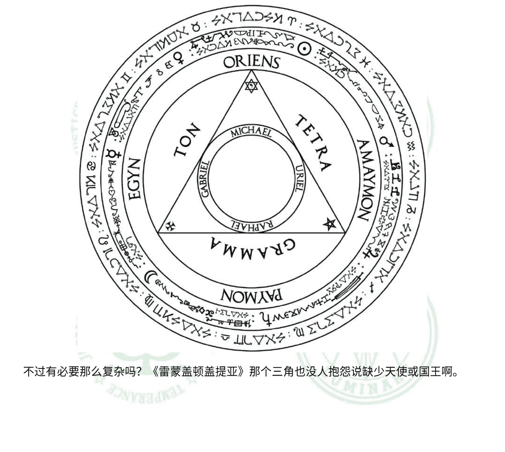

不过有必要那么复杂吗？《雷蒙盖顿盖提亚》那个三角也没人抱怨说缺少天使或国王啊。

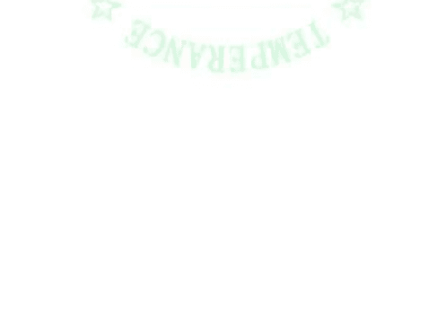

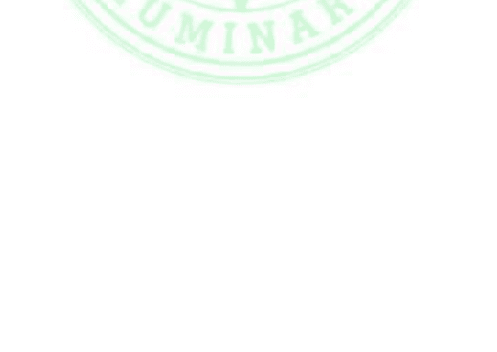

### 1.4 拉门

Lamen 这个词，据推测是拉丁语，意思是胸甲 (plate、breastplate)，尤其指从脖子挂在胸前的大而平的物品。

在召灵里拉门有时候是专门对应特定灵体的，有时候是通用的，起到保护佩戴者作用的。

DSIC 是前一种，召唤不同灵体画不同拉门。并且它操作部分只说 “带上星币和戒指，戒指戴在右手小手指，星币戴在脖子，然后拿起乌木杖画圆”，也就是它只给了图，没有具体介绍怎么画。

《贤者》书里抄袭了大量其他文本，尤其是阿格里帕《第三&第四书》，基于那些书里的背景知识，我们才能更好理解 DSIC 的内容。阿格里帕只给出了理论，没给任何实际仪式操作，只有推测是学生托名写的《第四书》有比较多实践。然后我们比较 DSIC 和第四书，可以合理怀疑，DSIC 可能就是作为那些神秘学理论对应的实践方法而写的。

所以看看第四书第 10 章《召唤善恶诸灵的准备工作》的《圣桌与拉门》:

> 用来召唤善灵的拉门应该如此制作——使用适合的金属，或有其颜色的新蜡，或干净的有方便的颜色的纸，最外的形状可以是正方、圆、三角之类的形状，依据灵体对应的数值。然后里面写上圣名，包括普遍的名字和特殊的名字。

在拉门的中央画一个六角形，在其中写上星体或统治者的灵体的名字和字符。然后这个灵体有多少字符，就画几个五角形。如果一次召唤一个灵，那就是四个五角形，在五角形里写灵体的字符。

圣桌应该在盈月的时候组装，在适合灵体的日、时。如果有吉星在更好。然后按之前的方法圣化。

这是召唤善灵的桌子，但是我们也可以做一张任何灵体都能用的桌子，依照之前我们说神圣星币时的套路。

这里说的圣桌 (holy table) 应该就是拉门，而不是别的什么东西，DSIC 里图示的注释也是“大天使米迦勒的拉门或圣桌”（the Lamen or Holy Table of the Archangel Michael）。

然后 “普遍的和特殊的圣名” 是前一章《神圣的星币和符印》的内容：

> 星币（pentacle）是保护我们远离邪恶事件的神圣标志，帮助我们束缚、驱逐邪灵，也让善灵与我们交好，这些星符由更高秩序的善灵的字符组成，或者由神圣书信或启示的神圣图像组成，再加上适当的 “versicles”，即几何图形，以及上帝的圣名。

然后用来组建星符的字符，就是善灵的字符，尤其是第一二阶的为首的善灵，有时候也可以三阶。这类字符都可以被称为神圣的。

所以无论什么字符都要用双重圆圈住，并在里面写上天使的名字，并且如果圣名能对应灵体的职能，就会有更大的效果。如果在周围再画上对应数值的多边形，也是合法的……进一步说,应该要有十个普遍的名——El, Elohim, Elohe, Zebaoth, Elion, Escerchie, Adonay, Jah, Tetragrammaton, Saday.

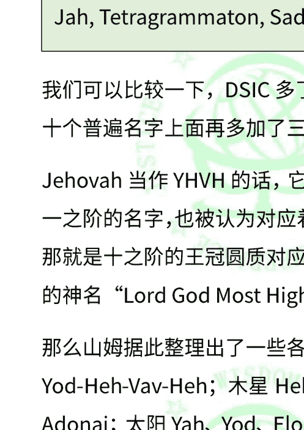

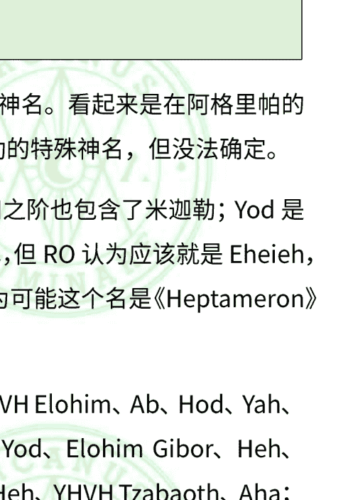

我们可以比较一下，DSIC 多了 “Jehovah、Yod、Ehevi” 几个神名。看起来是在阿格里帕的十个普遍名字上面再多加了三个，可能暗示这三个是对应米迦勒的特殊神名，但没法确定。

Jehovah 当作 YHVH 的话，它就是四之阶表格的至高的名字，四之阶也包含了米迦勒；Yod 是一之阶的名字,也被认为对应着太阳;Ehevi 在阿格里帕里没出现,但 RO 认为应该就是 Eheieh,那就是十之阶的王冠圆质对应的名,但没说对应太阳;也有人认为可能这个名是《Heptameron》的神名 “Lord God Most High” 的希伯来化。

- 土星: Vav、YHVH Elohim、Ab、Hod、Yah、Yod-Heh-Vav-Heh
- 木星: Heh、El、Abba、Ehi、El Ab
- 火星: Yod、Elohim Gibor、Heh、Adonai
- 太阳: Yah、Yod、Eloh(a/e)、Vav、Heh、Eloah
- 金星: Heh、YHVH Tzabaoth、Aha
- 水星: Vav、Elohim Tzabaoth、Azbogah、Din、Doni
- 月亮: El、Heh、Shaddai、Hod、Elim

山姆喜欢从顶端（像 AC 一样，而不是 RO 或者 DSIC 的从左边）开始绕圈，用拉丁文写。左边开始可能是因为戴上之后 El 会在右手边，具体这什么意思后面再说，这是山姆能想到的唯一解释。

几乎每个人都用六芒星来包含灵体符印和名字，这是按 DSIC 的图示。

但阿格里帕则说五芒星不是装饰，是用来召唤其他灵体的。

问题来了，什么灵体？

阿格里帕的说法是：“在那里写星星的名字和字符，或统治它的灵体，而召唤来的善灵将服从于它。”“在那里放上如此多的五芒星之字符……因为这些灵体我们会一次性召唤来。”

换句话说,这拉门是通用于任何有行星对应的灵体的,当然如果你认为所有灵体都有行星对应,那就是什么灵体都可以。

并且它强调了灵体的阶级，所以如果要召唤太阳的智慧体 Nakhiel，现代操作是把 Nakhiel 的名字和符号放在六芒星里，而按照阿格里帕的说法，应该是把 Nakhiel 放在其中一个五芒星里，然后米迦勒照样在六芒星里。

或者要召唤太阳天使米迦勒的话，按阿格里帕的说法，把太阳的名字 Sol、Sun 或 Shemesh（希伯来文太阳）以及太阳字符（出自第一书第 33 章）、数值 80、太阳幻方符印放在六芒星里，把米迦勒放在五芒星里。

只是……好像真的从没人这样干，RO、AC、Acher、甚至巴雷特都不这样做。山姆也觉得，要在小五芒星里写名字符印太难了，阿格里帕和 DSIC 都没给出拉门的具体尺寸，但要这样做显然需要画很大。

值得注意的是 DSIC 拉门图示里出现了两次灵体名字，六芒星里面一次外面一次，阿格里帕没说为什么，DSIC 也没说为什么，然后大家每个人都照抄下来了。

唐纳德·泰森（Donald Tyson）在注释阿格里帕的时候就对比了一下 DSIC，然后说她觉得不应该在六芒星外再写一次。山姆表示同意，这样就可以把六芒星画大些。但就是没人这样做，甚至有人为此专门在六芒星内外选用不同的文字以示区别。

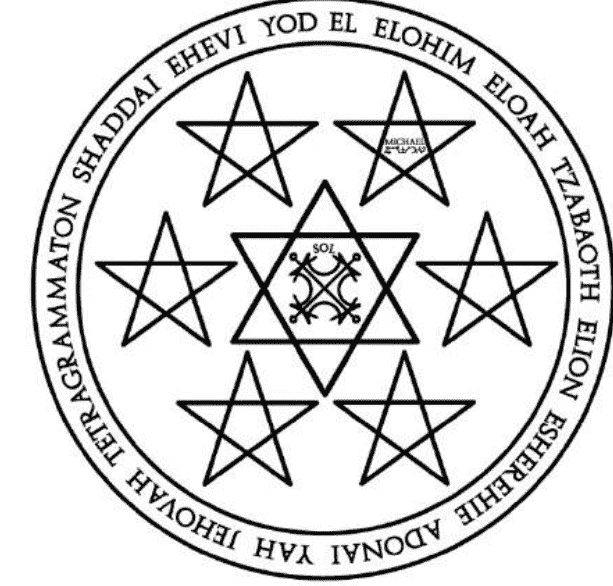

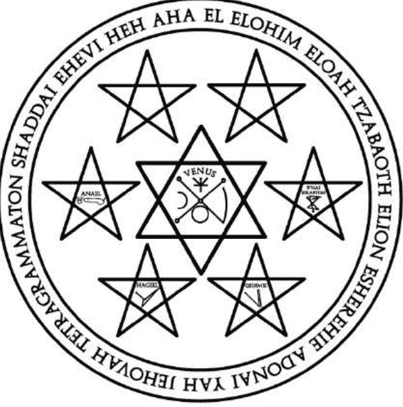

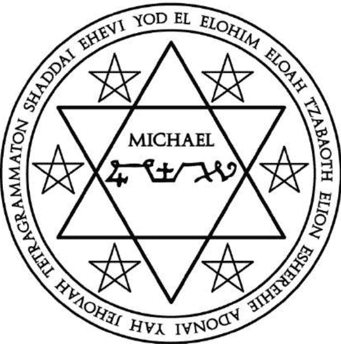

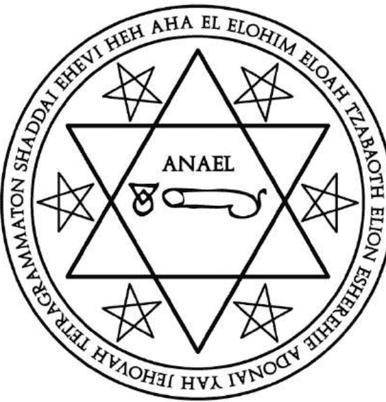

另一个问题是，为什么阿格里帕说最少要四个五芒星。没有文献能给出解释。

一种推测是可能是暗示四方、四王、四大天使，但山姆不太认同这种解释。山姆自己推测，阿格里帕给每个行星都分派了至少一个智慧体和一个灵体。然后，金星有智慧体、灵体、众智慧体，月亮有灵体、众灵之灵体、众智慧之智慧体。这就显得七大行星都可以有一个天使、一个灵体、一个智慧体或众智慧之智慧体、一个众灵之灵体或众智慧体……所以大部分行星至少有三个实体，所以拉门上的至少四颗五芒星，可以凑够写它们的位置。这不算很好的解释，毕竟明明大部分行星只要三个，但这是山姆能想到最好的。

另外，按照现代实践的主流画法，我们已经把要召的灵放在六芒星了，那是不是根本不需要画五芒星了？

AC 则是无论如何一律画六个，RO 则是一律四个。山姆个人更喜欢六芒星对应六个五芒星（如前面的图），看起来好看。

另外就是，那些五芒星到底要歪向什么方向，也可以很自由发挥……

另外还可以考虑一下，阿格里帕说把灵体放在三角形或五芒星里可以强迫它说真话，会不会也有这方面的理由？

DSIC 可能只是觉得把一个灵体放在大六芒星里好写，然后五芒星的设计被遗留下来。

最后是，虽然已知双重圆在最外，但阿格里帕也说 outward 的形状依据行星对应，那就是说应该做成多边形咯？但普遍来说圆形够用了，毕竟也可以说，所有多边形都是在趋近圆形这个‘无边’形或‘无限边’形。

然后，因为之前教某些萌新做这个，然后我发现需要进一步解释这个拉门怎么构成的，因为我自己很懂所以就算山姆原文有写我也没去记录（而且好像是没有），这里懒得回头翻原文所以用我自己的话解释吧……

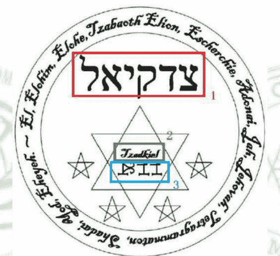

最外圈是一系列的神名，具体山姆已经说了，神名最后有个‘~’是如果一圈写完还有空余空间，就写些‘~~~’占满它。

然后这个图示是（RO 版本的）木星天使 Tzadikiel 的拉门，在 1 号框里写的是 Tzadikiel 这个名字的希伯来文形式，2 号框是这个名字的拉丁化形式，3 号框则是这位木星天使的符印。这三个内容是根据要召唤的灵体而改变的，七行星大天使的符印、拉丁化名字、希伯来文形式都列在下图（根据魔典不同，一些天使的名字不同，这里我给的是我自己喜欢用的版本，但符印跟行星对应应该是没啥差异的）。

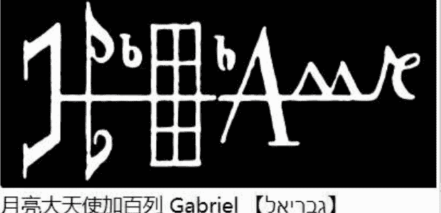

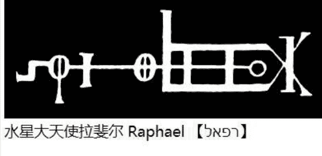

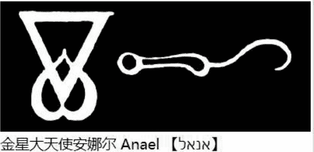

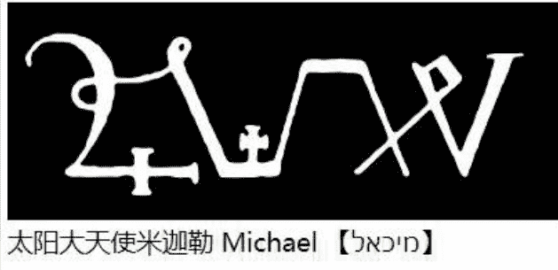

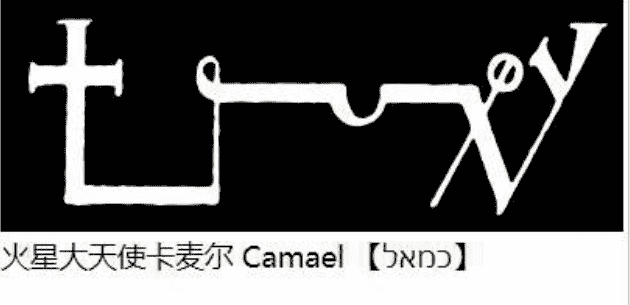

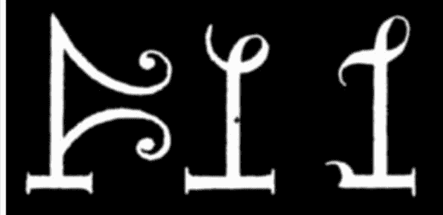

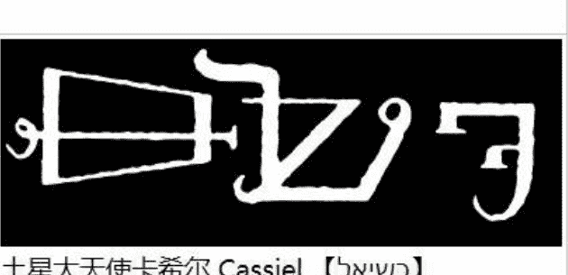

### 1.5 戒指

DSIC 完全没有给出戒指的设计，只是文字提到了它。就连《阿格里帕第四书》也没提到几句……

《第四书》第 11 章：

> “那些想要一直接受梦的神谕的人，可以做一个太阳或土星的戒指，也可以做一个偶像，
会有卓越的效果，在睡觉时放在头下，就会给予任何事物的真实梦境。

数字表格也有同样用于接受神谕，形成于各自的星座之下，在第三书里可以看到……

知道如何组成那些事物的人才能得到最真实的梦境神谕，他要如此观察那些东西，在第二
书里。让他头脑远离暴躁的脾气，然后净化和驱邪和圣化卧室，然后用熏香熏，然后用油抹
圣殿，把戒指戴上，拿起一些图像或者圣桌或者圣纸放在头下，然后虔诚祷告，回到床上冥
想他想知道的事物，然后睡觉，这样就可以得到确定无疑的神谕，在月亮经过他本命盘的
或返照盘的第九宫时，以及当月亮位于完美星座起算的第九个时。”

但这个以及其他的一些描述，都看着不适用于 DSIC。

另外洪诺留、七天之书都没有讲到戒指，唯一能找到的参考只有雷蒙盖顿盖提亚。尤其马瑟斯
的解读：这是魔法戒指的形状，或者叫所罗门之盘，它用金或银做成，要拿在驱魔人面前，保
护他免于恶臭的硫磺和邪灵的火焰的伤害。所罗门戒指一般都有三个神名: Tetragrammaton、
Anaphexeton/Anaphaxeton (《Enoch Bowen of the Occult》说这个词联系这 Tzabaoth，即
天军，然后米迦勒是天军指挥官；彼得森认为，它是希腊语的 Anekphoniton (不可言说者)，
这个词有时候就用于指代 “YHVH”)、Michael。山姆比较认同 Anaphexeton 和 Michael 在外
圈然后 Tetragrammaton 在内圈的款式 (左图)，认为是较老的版本，但两个应该都行。

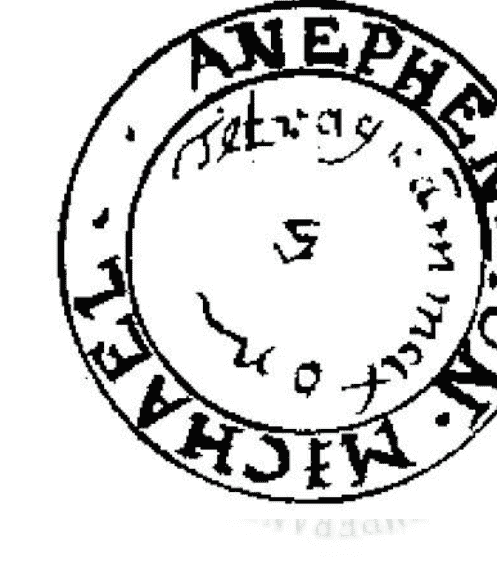

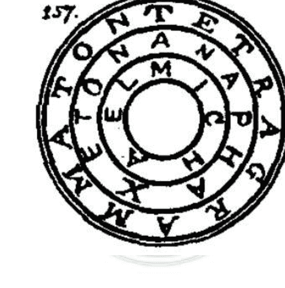

《雷蒙盖顿》戴左手中指，DSIC 说戴右手小指，但都说是放在脸前防止魔法师中毒，这可能基于银遇毒变黑的现象，但这又与马瑟斯说的可以用金做冲突。RO 课程里没提到过戒指，但他自己有个铅的马瑟斯版戒指。

AC 提醒说《贤者》第二部分第 18 章里出现过魔法戒指的图示：

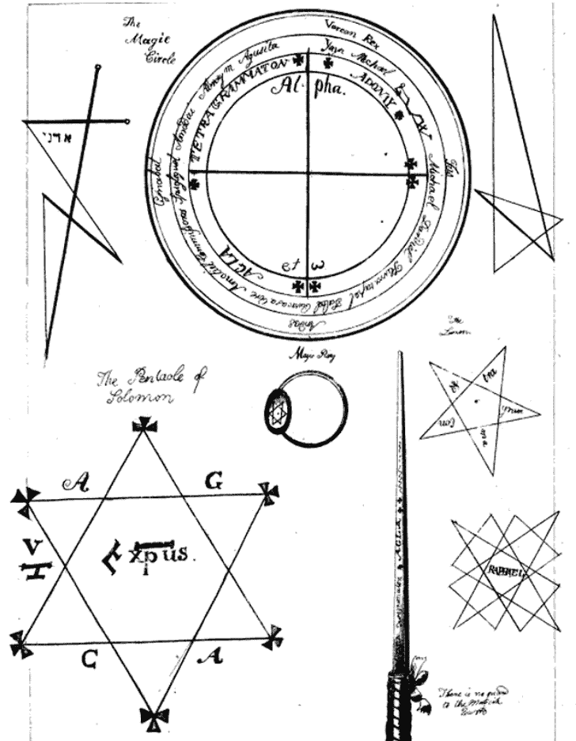

但这也非常简略，一个圈带一块六芒星平板，里面似乎有个点，可能又是带 yod 六芒星。这六芒星可能是非常简化版的所罗门封印。

顺带一提这图里的魔法剑看着就很像 DSIC 的魔杖，虽然这个是来自巴雷特版本的《七天之书》的：让操作者带着剑，在剑上诵持圣化祷文，剑的中间一边刻 “Agla +” 另一边刻 “+ On + Tetragrammaton +”。

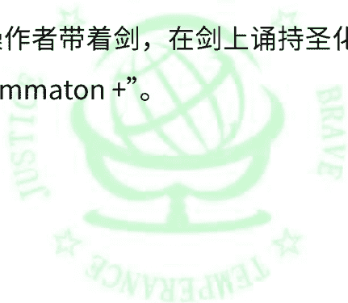

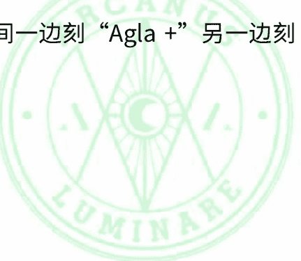

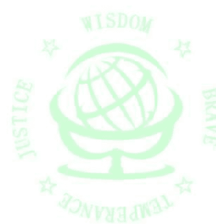

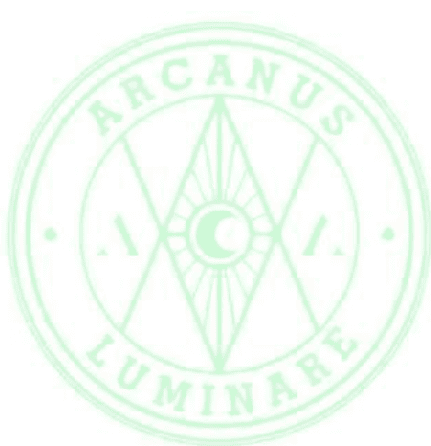

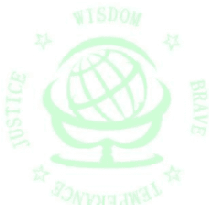

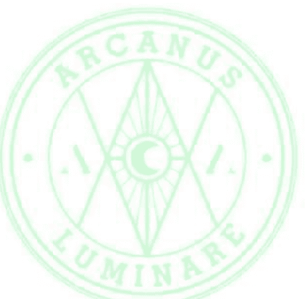

### 1.6 魔杖

魔杖，DSIC 里仅仅提到它用于画圆，这也是《贤者》唯一一处使用了魔杖的内容。

AC 给他自己的魔杖写成了希腊文，山姆这里又吐槽了一下 AC 的希腊文水平……

RO 注释说可以不用魔杖，而用木星手指（食指），去画。这触及到了魔杖的象征意义，它可以是指挥棒、赫尔墨斯杖、敲萨满鼓的棒、国王的权杖。但是手指里并没有火星手指，不过中指是土星，或许也可以用中指代替来威胁邪灵？

山姆自己的杖做了比较多的个性设计，加入了所罗门魔杖的神名和符号。

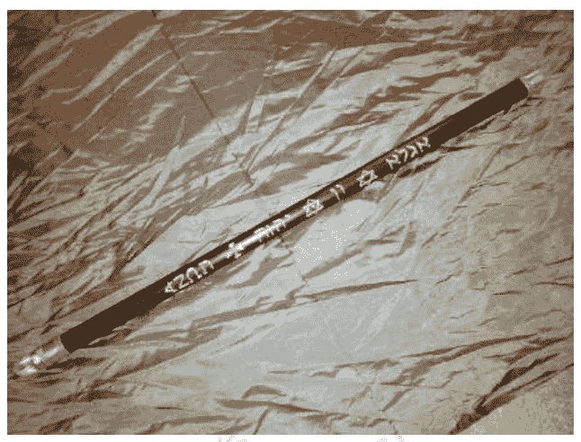

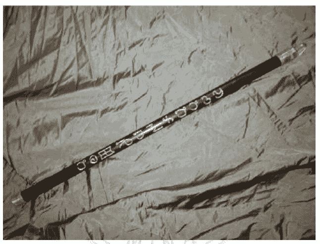

然后 DSIC 图示里的 Agla 和 On 之间的没有 Yod 的六芒星，说不定其实是五芒星才对，这样就能对应之前基座用的三个符号了。

DSIC 这个魔杖比较可能来自《洪诺留宣誓之书》（Liber Juratus Honorii）：魔杖要有四面，一面写 Adonay、一面写 Sabaoth、一面写 Hiskiros、一面写 Emanuel，魔杖中间是所罗门的五边形，在握手的地方是十字，这样它可以用于神圣的奇迹工作。

按这里 “握手的地方是十字” 的描述，推测 DSIC 的图示是朝上指的，但 RO 一直握成了另一端……AC 在他自己的作品没描述过怎么拿，但他的一个旧视频显示他也是拿了 Agla 那头……都拿反了。

彼得森在注释《所罗门钥匙》的时候提到：第二书第 7 章里的魔杖（wand）和法杖（staff）好像可以替换，他相信那些字符其实就是特里特米乌斯的希伯来文的 AGLA VN IHVH 的变形。

斯科特的魔法文献里有写“Tetragrammton Adonay Agla Craton”的魔杖，魔杖和法杖引人注目地没有出现在希伯来版的所罗门钥匙，以及 AD 36674 版本。

魔杖要多长，DSIC 没写，传统默认应该是手肘到中指长度，彼得森有文章讨论魔典的魔杖，但其实也没能找到多少内容：《Thesaurus Spirituum》说要 1 cubit（约 18 英寸），《Le Grand Grimoire》说 19.5 英寸，一些《所罗门钥匙》版本说 24 英寸。宽度 AC 认为是食指最宽处的宽度。山姆表示不反对。

DSIC 完全没有提及魔法剑，但我们也不是不能认为魔杖是魔法剑的代替品。

AC 则认为，魔杖代表神圣权威和命令，所以要尊重魔杖，所以永远不能认为魔杖只是“魔法师的意志的引导器具”，也不是“制服威胁灵体的爆破棒”，它是神圣使者的象征。

山姆认为非 DSIC 体系的魔杖也能用，只要是足够神圣的魔杖就行。

其实阿格里帕无论召唤善灵还是恶灵都没提到过用魔杖之类的工具，召唤恶灵只用剑。

乌木的行星对应山姆没找到，但也可能什么材料都能用。魔杖自己看作赫尔墨斯杖就关联水星，看作权杖就关联木星，看作所罗门剑就关联火星，看作所罗门黑柄刀那就是土星，上面刻金字联系太阳。

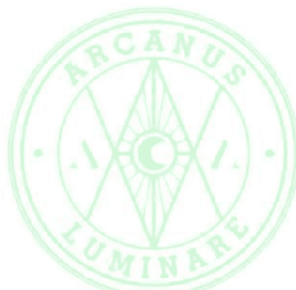

### 1.7 烛台、香炉

DSIC 虽然插图给了两根蜡烛插在银烛台上，但没说什么时候点燃它们，也没说要不要圣化它们。

RO 直接忽略，他甚至可能只点一根蜡烛，在《Seven Spheres》里他说要用一盏灯或高蜡烛，放在召灵桌和水晶的左后方，他也给出了一篇点燃蜡烛时的短祷文。

AC 则说在仪式开始时点燃，根据行星对应颜色选蜡烛，还可以涂上魔法油，但没给出任何圣化方法。

香炉 DSIC 说是要放在魔法圆和召灵台之间，然后插图看起来不像三脚架，更像火把，可以插入地面，而且文本也说可以拿着，但这样做就要把手伸出去魔法圆，就很诡异很累手。

现在大部分魔法师就是有什么香炉用什么。

AC 就专门制作了三脚架火盆，并且为了帮助空气流动还用金属网托着炭。

《Seven Spheres》里 RO 把香炉放在召灵台和水晶的右后方，跟蜡烛相对。

山姆也比较喜欢香炉放在水晶后面。不过他也承认放在水晶前面可能有助于产生更好的视觉效果。

《阿格里帕第四书》第 10 章里说的是“放在祭坛的头上（on the head of）”，山姆认为这就是说放在祭坛后；但同一章又说在魔法圆的四角放香炉，这听起来是要有四个香炉。

使用炭烧还是自燃的塔香线香，应该就是自由选。

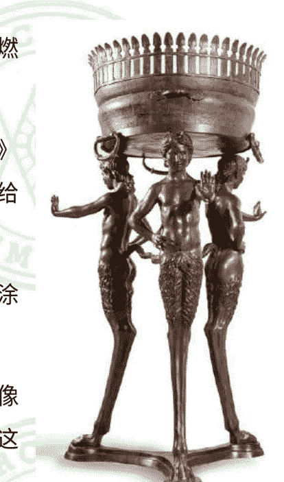

### 1.8 灵体之书

然后 DSIC 提到要有一本小书，7 英寸（约 17.78cm）长的纯洁牛皮或纸制作，用来记录灵体的名字、字符、职能和符印或形象。显然是灵体之书（Book of Spirits/Liber Spirituum），《阿格里帕第四书》里有详细描述，只是里面说用来召唤特定邪灵，每一对页记录一个，左边是形象，右边是名字、禀赋（职能）、地点（来源、角色、功能），下面则是符印和额外信息比如合适的地点、时间、小时、行星。魔法师需要哪个灵体就翻开哪个。

阿格里帕给出了两种圣化方式，其一是召灵到三角之后，要求灵体发誓，然后把誓言记录在书里并圣化，其二是在书最后写用于任意灵体的束缚祷文，然后把特殊的拉门（可能指所罗门五六芒星）刻画在封面或封底以及封面的内面，然后在三天里召唤里面所有灵体，写下它们的誓言，然后包起来放在魔法圆里，之后摧毁魔法圆许可灵体离开，三天后挖出来再重新放在圆里召所有灵。阿格里帕说第二种效力更强。

山姆自己有两个本子，一个是活页文件夹，用来分装召灵拉门，一个是记录与天使的对话，包括召灵时的时间之类信息。

RO 没教过灵体之书，他只推荐自己读阿格里帕对其的描述。

AC 详细讨论了自己新制作的灵体之书，但他讲了 11 页所以没法引用在这里。

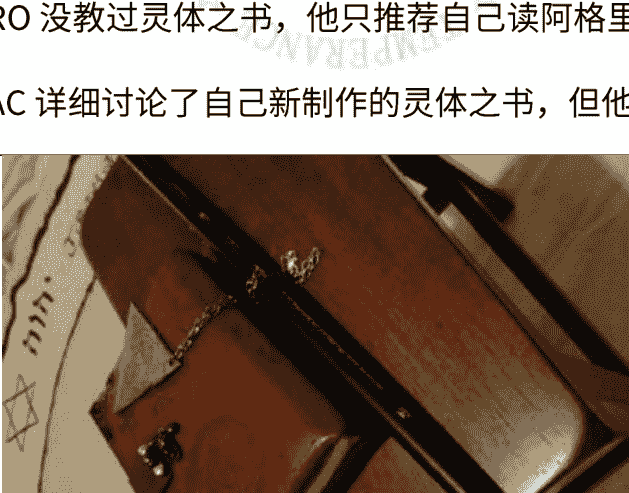

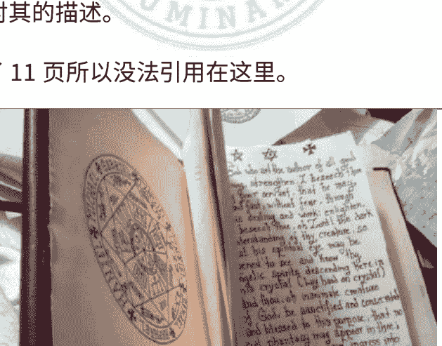

但这里山姆有个疑惑，DSIC 看起来总体上更侧重召唤天使，然后阿格里帕其实完全没说召唤善灵时需要它们发誓，甚至可以说暗示了要求善灵如此发誓是不必要的。泰森注释《第四书》时也认为，灵体之书是用来迫使邪灵服从的工具。所以 AC 对天使用灵体之书的操作，可能是不应该的（尽管不是不能），而且他要求 Cassiel 给的誓言其实也只是《七天之书》里这个天使的最终召唤文。

另外，《贤者》给出的灵体之书插图里，它展示了记录土星天使 Cassiel 的页面，上面出现的两个五芒星类似的符号，其实是《阿格里帕第四书》第 1 章的“传透、破裂的字符”，是特别用于邪灵的字符，仿佛在说土星天使是邪灵……而且里面的文本也几乎是从《阿格里帕第四书》里照抄下来的对邪灵的描述。《贤者》这种不区分天使和邪灵的暗示……是很诡异的行为。

DSIC 其实并没说灵体之书有什么特别的力量，它给的遣散文里就有说“当我再次召唤时你要来”，这就好像本来就有一个“我们叫它来它就得来”的设定。而且里面只说写下它的符印，没说让它对符印发誓，这就更像只是记录召灵过程和沟通内容而已。

山姆认为如果只召唤天使，或者说善灵，其实不需要灵体之书、不需要魔杖、不需要戒指，因为这些都是用于邪灵的工具。虽然用上其实应该也是对它们毫无影响吧，比如你不可能拿着刻米迦勒名字的戒指强迫米迦勒做啥。

DSIC 里要求使用这些，合理的推测并不是“保护自己不被要自己召唤的灵体伤害”，而是“保护自己不被不请自来的灵体伤害”。

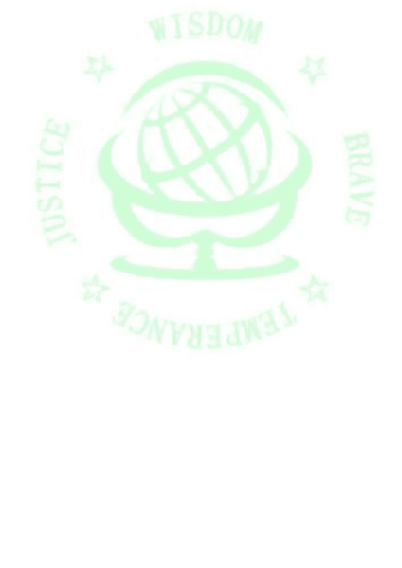

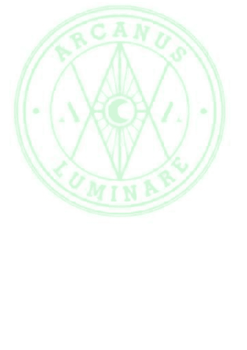

### 1.9 魔法圆

DSIC 还是没写魔法圆的详细设计，只给了插图，我们看到了有一个双重圆然后里面一圈文字。四个六芒星在上下左右，然后圣名 Tetragrammaton 在左上角（从内朝外写），Elohim 在左下角（从外朝内写），Adonai 在右下角（从外朝内写），太阳符号和米迦勒符印在右上角（从内朝外写），而且还用了不同字体。

山姆认为内外朝向是错误，因为每个他知道的魔法圆都是从内朝外写的。

AC 模仿了用三种字体：拉丁文、希伯来文方块字、古腓尼基文，石圆之书里他说主要是为了填满空间。另外他用 YHVH 而不是字面的“tetragrammaton”。

山姆质疑了把魔法圆留空四分之一然后在召灵时叠上需要的灵体部件的做法，因为这导致了本来连续的圆的破缺。山姆认为至少应该保留完整的双重圆，只留空文字。（也就是说，必须如下图 AC 的魔法圆那样，一个完整的环，灵体名字那里是两层布。不能是四分之三个环。）

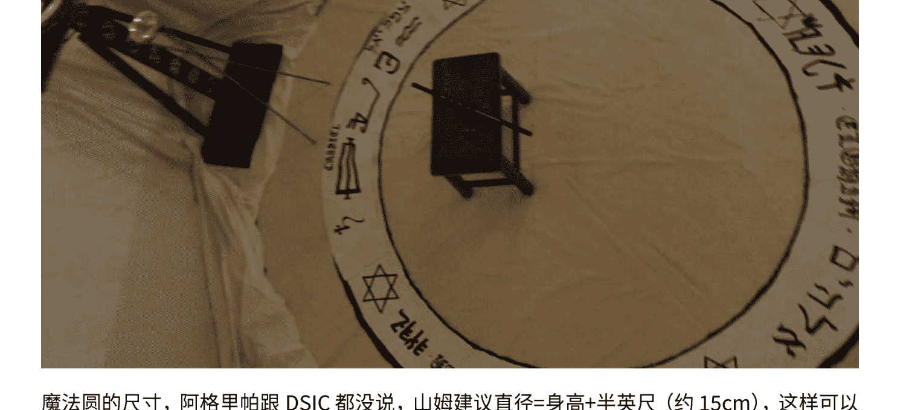

魔法圆的尺寸，阿格里帕跟 DSIC 都没说，山姆建议直径=身高+半英尺（约 15cm），这样可以有足够空间走、坐、站、躺，也有足够空间塞多一个人或者一张放道具的小桌子进去。

DSIC 没给出圆的方位对应。图示看起来是六芒星对准四方，但 AC 认为应该是名字对着四方，并且灵体名对着水晶，山姆比较喜欢这样，这样水晶、魔法圆、拉门就三者对齐成一条线了。

在阿格里帕里魔法圆一样是主要用于邪灵的，似乎不需要在召唤善灵时用。

“保护自己不被不请自来的灵体伤害”这种观念其实也不算合理，毕竟日常生活又不比召灵时更安全，为什么不随时戴着戒指之类的保护措施呢？

所以 DSIC 这看起来就是把所罗门跟非所罗门技术混合一起了。而且它说是“简单的建构”，难不成有更完整的版本？

如果结合阿格里帕的魔法圆描述和 DSIC，那么魔法圆应该用圣化过的煤块写在干净的地上，在新月（或新月刚过）的周日，四角放四个香炉，（被召唤的还是普遍的？）天使的名字写在魔法圆上，圣名写在圆的内圈，尤其包括那些统治或联系灵体对应的行星的名字，以及普遍的名字，要召唤的灵体的名字和字符，统治这些要召唤的灵体的善灵的名字，任何可以进一步强化魔法圆的字符、星币、名字等等，根据行星对应的多角形。

《七天之书》的魔法圆是，四个同心圆，写三环名字，最里面的环是 Tetragrammaton、Adonay、Eloy、Agla，最外面的是气元素天使以及对应灵体行星的臣民，中间环是召唤的行星天使的名和符印、当天的天使、季节的圣名、地球太阳月亮星座的天使名、小时的圣名，最内环里面写“Alpha et Ω”然后两条直线交叉。下图就是春天的周日白昼第一个小时的魔法圆图示。

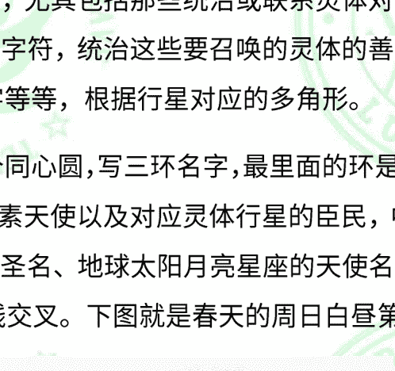

其实多多少少会让人怀疑，这确实是 DSIC 魔法圆的复杂完整版，比如圆里的“Alpha et Ω”就被写到 DSIC 魔杖去了。然后这里也符合 AC 的圆的名字才对准四方。而且很多 DSIC 祷文看起来就是直接从《七天之书》拿的，以及米迦勒是太阳这个对应也一致。当然特里特米乌斯自己在《Steganographia》和《De Septem Secundeis》都这样对应。只是阿格里帕两种都列出了，尤其第四书里只用了拉斐尔太阳。

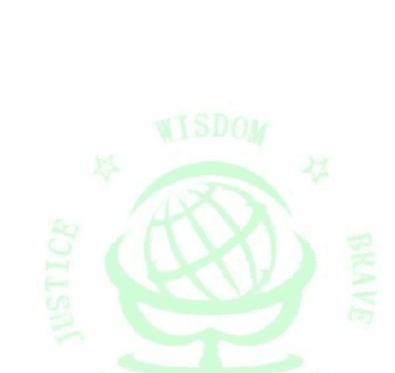

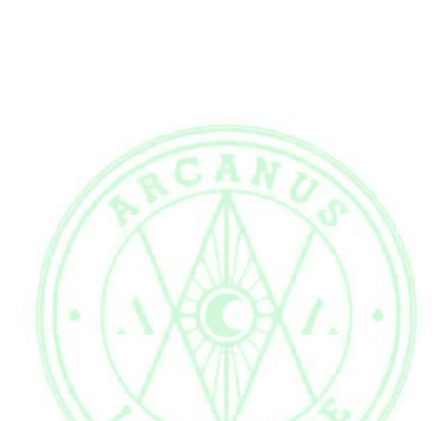

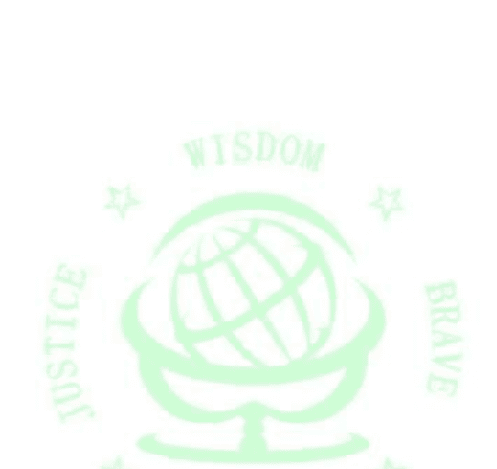

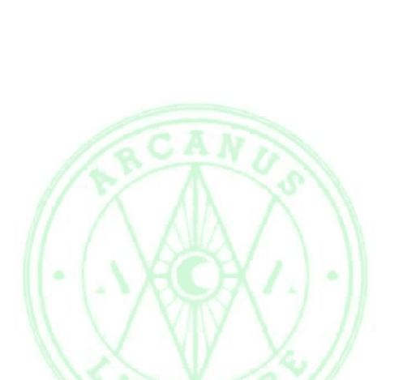

### 1.10 魔法袍

魔法袍，也可以参考阿格里帕和所罗门钥匙，使用基督教的牧师袍服，但山姆觉得不需要，除非自己本来就是神职人员或者想 cosplay 或者想浪费钱。很多魔法师明明不是基督徒，为什么要穿成基督徒样子呢，穿符合自己身份和权威的服装更好。你如果入了什么结社可以穿结社的服装，反正就是别剽窃对你不合法的身份，穿着你无权穿的衣服，会让人觉得你在嘲讽那些真正有资格穿的人。

山姆认为魔典里穿牧师袍主要是让人进入神圣的心态。你当然可以有专用于仪式的服装，有一套魔法袍还是很重要的，他意思只是不要穿不符合身份的，魔法袍只是让你转变心态，从日常转到魔法状态。RO 会在火星仪式穿迷彩服或武术服，木星仪式是商业西装，诸如此类。山姆试过觉得不错。AC 则喜欢统一的白袍。

但无论用什么，都不要对衣服有不礼貌不谦逊的行为。

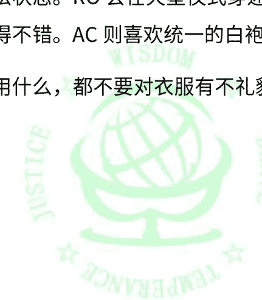

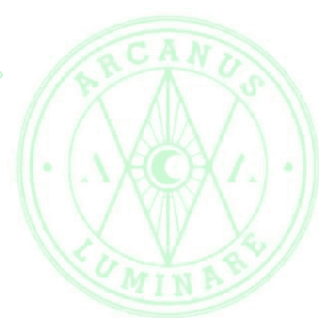

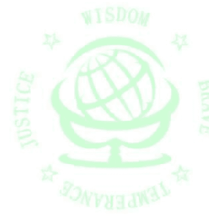

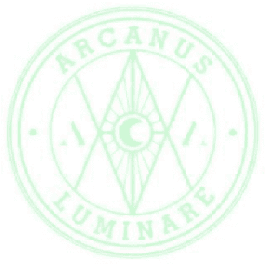

### 1.11 圣化

那么讨论圣化，即“使事物或宣布事物为神圣的”。

根据阿格里帕第四书第8章有这么些要点：

- 所有用于魔法的工具和事物都应该被圣化。
- 通过进行圣化操作的力量，以及用于圣化的祷文的美德，而达成这个圣化。
- 进行圣化操作的人必须以神圣的方式生活，必须拥有圣洁的力量，而这要通过“授勋”(dignification)和“启蒙”(initiation)来获得，并且同时要有坚强的信仰。
- 用于圣化的祷文必须符合圣化的目的，这份神圣源于三个途径: 1、个体自身的神圣启发; 2、经由“启蒙”(initiation)或“任职”(ordination)进入一个灵性传统而传递给祈祷者的力量; 3、借由另一神圣的或以神圣的方式制作的事物的神圣性，使这个事物被圣化。
- 一些圣化则是以神名、神圣封印、教堂圣礼、以及导向圣洁和赎罪的其他神性的显现。
- 每个圣化操作都应该有圣水、油、火、熏香。
- 圣化必须在有光源（圣蜡烛或油灯）的地方进行。
- 不敬的、受过污染的事物都应该先被驱魔和赎罪，然后才可以圣化。
- 圣化后面必须跟着祝福，用嘴吹气祝福。
- 每次圣化都应该心里牢记着个体的圣洁、权威、许可和需求，全神贯注。
- 圣化魔法圆或仪式空间时，在洒圣水和点燃圣熏香时，要念诵圣殿之奉献的所罗门之祷文（历代志下6：14-42）。
- 圣化器具以及其他魔法物品时，它首先要用神圣的材料或方式制作，然后洒圣水、熏圣香、涂圣油、用神印封印（sealed with some holy Sigil），然后用祷文祝福。
- “迷信式”的圣化，即用教会圣礼的任意物品触碰要圣化的物品，就能圣化后者。
- 用誓言、献祭作为一种圣化，因为它们被作为一种契约交换给对方，只要诚心奉献一种东西出去，那个东西就会变得神圣，无论是熏香还是油还是戒指还是护符还是非物质的祈祷、符印、图画等。

DSIC 没说要圣化的那些东西，可能是默认之前就圣化了，可能是仪式本身就会圣化掉它们（比如水晶和魔法圆），可能是自身性质上就是神圣的无需圣化……你可以严格按照文本，也可以自由考量。只是对于原教旨主义来说 DSIC 的说明实在太模糊缺漏了，所以大多数人还是自由的，比如 AC 会给水晶涂上液态聚合剂。然后，水晶球最好在盈月的月曜日时买或制作，金板最好在盈月的日曜日时制作。基座可以考虑日和时混合太阳月亮。戒指如果要加宝石最好是太阳或火元素的宝石。大部分文献没有提到过戒指需要圣化，除了很古老的《所罗门的遗嘱》或《所罗门真钥匙》。

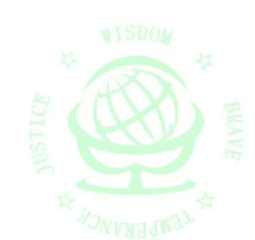

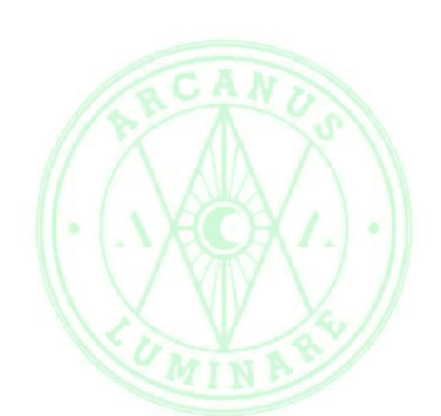

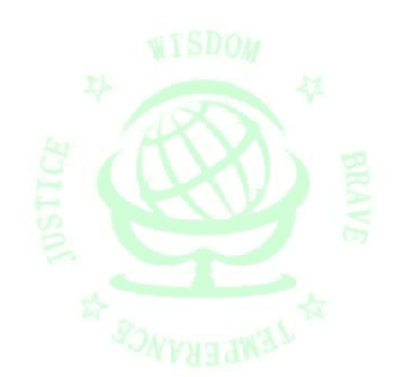

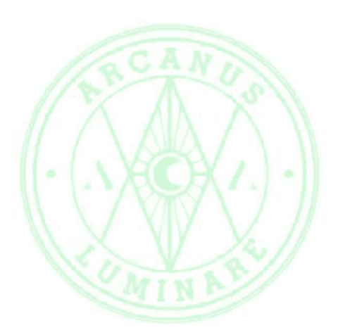

### 1.12 总结

- 水晶球：石英、直径 1.5 英寸、球体、尽可能清晰。
- 平板：纯金、没有说明尺寸、圆形、前后刻神名。
- 基座：乌木或象牙、没有说明尺寸、按照图示一样雕刻形状。
- 桌子：没有说明材质和尺寸和形状。
- 戒指：没有说明材料和尺寸和形状，但在《贤者》前文有图示。
- 魔杖：乌木、没有说明尺寸、按照图示的形状。
- 拉门：没有说明材质和尺寸和形状、按照图示雕刻。
- 魔法圆：没有说明材质和尺寸、按照图示的形状。
- 蜡烛：蜡做的、没有说明尺寸、必须是神圣的。
- 烛台：银的、没有说明尺寸、按照图示有大概的形状。
- 香炉：没有说明材质和尺寸、按照图示的形状。
- 灵体之书：纯白的未使用的牛皮或纸张、7 英寸长、没有说明形状。
- 笔：没有说明材质和尺寸和形状。
- 墨水：没有说明材质。
- 熏香：没有说明材质。

### 2.1 净化

如何净化自己？一般是往前数天每天都要进行一个净化仪式，尤其是跟从未接触过的灵体或行星。

包括 1.禁食、2.沐浴、3.祈祷。作者以前有博文讨论禁食。

可以水禁食（不吃食物只喝纯水）、水面 包禁食（只吃面包喝纯水）。也可以只禁食肉、禁酒精。然后还可以禁止性活动包括单人的。禁止所有分心的、世俗的、不谦逊的行为。

具体时长，《阿格里帕第四书》第 10 章说要在仪式前一整个自然月，或者 40 天，并且随临近仪式逐渐严苛；《七天之书》说九天，在最后三天逐渐严苛；《所罗门钥匙》第二卷第 4 章说九天，最后三天逐渐严苛，仪式当天更加严苛；《Turiel 秘密魔典》说七天。

山姆认为七天够了，不反对更长时间，最短需要三天，尽管如此他认为连七天都做不到的话，那应该考虑换个仪式时间。

禁食是从内到外的净化，沐浴就是从外到内的净化。《所罗门钥匙》就有个所罗门浴。

每天的祷告，如果是基督徒可以看作每天做弥撒，也可以是念特定的祷文，每天一次或早一晚二。《阿巴太尔》（格言第 2.14）的祷文就很不错。《所罗门钥匙》的同样开头的祷文也行，再加上《钥匙》第一卷第 4 章的忏悔文和副祷文。还有《Turiel 秘密魔典》的第一早祷文。或者《亚伯拉梅林》的第二卷第 12 章的祷文（orison）。唯一不推荐的是没受洗却用圣餐弥撒这种行为。然后那些不喜欢耶稣的可以自己编祷告。

通常这些祷文都会包括但不限于下列内容：

- 承认自身、反悔做过的错误
- 通过神圣工作寻求帮助，让生活更好让世界更好
- 寻求要召唤的灵体的帮助，让神许可我们接触灵体
- 认知自己在世上的地位，包括血肉造物的也包括灵性造物层面的
- 认知神的地位和力量

### 2.2 仪式间的布置

RO 认为，魔法圆的物理存在是被粉笔画出来的，但要再用魔杖画过，它才有了星光的存在，而这才是真正重要的圣殿空间，所以实体圆根本不必要。甚至 RO 觉得因为 DSIC 的召灵桌本来就有圆，那魔法师站的圆就连星光圆都不需要了。

DSIC 的指示通常被理解为，魔法师在圆里，祭坛在圆外，香炉也在圆外且夹在祭坛和魔法师之间。它的插图也只说了“当魔法师使用水晶时要站在（魔法圆）里面”，没说别的要不要在里面。但《阿格里帕》的描述是，香炉就放在祭坛上。

之前也说过 RO 还认为召灵台放在圆内，可以更好地看东西。然而，“如果灵体在圆里，圆的保护作用就显得很诡异”。

也有人问，让灵体显现的祭坛放在圆里，会不会让灵体进不去、显现不了。山姆却想反问，那把祭坛放在外面，会不会让魔法师被圆挡住沟通不到灵体？

然后是香炉要在魔法圆里面还是外面。DSIC 的指示通常被理解为，魔法师在圆里，祭坛在圆外，香炉也在圆外且夹在祭坛和魔法师之间。它的插图也只说了“当魔法师使用水晶时要站在（魔法圆）里面”，没说别的要不要在里面。但《阿格里帕》的描述是，香炉就放在祭坛上，而且可能是在远离魔法圆的那一侧，也就是水晶后面。山姆觉得……自己选择吧……

DSIC 也没有说用哪只手拿魔杖，用顺时针还是逆时针画圆……

按照一般人惯用右手来考虑，这时候我们很容易想到三种场景，站在原地转画个小圆、绕圈正着走右手在前方又到身体左侧画大圆、绕圈退着走右手在身体右侧画大圆。但后两者说真的都很笨拙。

如果一定不画小圆，最好的选择还是，一根比较长的魔杖，你的手只需要稍微往下弯一点点，然后原地转，就可以画一个双倍手臂长度的中等圆了。而这时候，祭坛在圆外可能还有个实际考虑是，转圈画圆的时候不容易撞到。

另外有人提出不要对着地上的圆画，而是魔杖朝天指，沿着墙壁与天花板衔接的高度去画出星光魔法圆，这样可以避开撞到东西，虽然不太符合 DSIC 的字面意思。

祭坛摆在仪式间的哪里？首先看你要祭坛贴墙还是不要。山姆实践过的古巴风格的 boveda 魔法体系的祖先祭坛就要靠墙，因为墙象征了门户，给灵魂过来。但理论上说，灵体从墙的门跑到水晶那里也没啥困难。

RO 的《现代盖提亚魔典》就说祭坛在东边，然后画圈时说 “In the Name of the Father, Son, and Holy Spirit, I consecrate this ground for our defense”。朝东可能是源于基督教传统，教堂一般都朝东，然后牧师站在教堂西边，面对朝东的祭坛。阿格里帕也说日出东方，所以这是光进入世界的方位，这确实很基督色彩。不过 RO 在《Seven Spheres》那边却明确用了朝北方的祭坛，然后召灵桌也改成北方的加百列、Egyn 在“顶端”，这可能是来自 Stele of Jeu 的无头者仪式的设计，那个仪式说北方是古埃及信仰里永恒与不朽的方向。

然后 AC 给出了七天使不同方向的祭坛，AC 说来自 AAA 网站（http://www.archangels-and-angels.com/），但山姆找不到 AAA 网站的魔典来源。另一个则是《洪诺留》里的天使方位。然后 Aaron 也给了一篇他自己的探究。

| Planet | Agrippa | LHJ | Heptameron | AAA |
| :--- | :--- | :--- | :--- | :--- |
| Saturn | North | North | Southwest | North |
| Jupiter | West | Southeast | South | Southwest |
| Mars | East | South | East | South |
| Sun | East | East | North | West/South |
| Venus | West | Southwest | West | North |
| Mercury | North | Northwest | Southwest | Northeast |
| Moon | South | West | West | West |

Table 2: Correspondences of the planets to the elements.

对于祭坛上的法器，阿格里帕说仪式之前每天我们都要在祭坛上祷告，法器要一直用干净的布包着，直到仪式当天。

这里山姆推荐是，仪式前的净化步骤的晚上，布置好祭坛所需，用布盖住水晶、基座、桌子、拉门，也可以包括戒指和魔杖。在准备期第一天，点燃蜡烛，开始禁食，期间每天（包含仪式当天）沐浴、祷告、燃香，蜡烛一直长明，在续新蜡烛的时候用旧蜡烛点亮新的，在准备期最后一天和仪式当天，要保持更严格的禁食，在仪式当天，在前额和眼皮上抹圣油，仍然祈祷，然后掀开盖住东西的布，开始召唤。

另外山姆认为只要行星时对了就可以，行星日无所谓，因为 DSIC 结尾给了每小时的统治行星，但没给日的统治行星。

然后，我们应该在正确的行星时之前那个小时祈祷、准备，在正确的行星时再召唤。不过山姆其实更喜欢在正确的行星时才开始祈祷，但技术上讲，只要召唤的那一刻行星时准确就好了。

### 2.3 准备阶段

DSIC 正文说戴上“星币”，然后图示给了“拉门或圣桌”，大部分人就默认星币指的是拉门了，但如果不是呢？没法判断。

前面说过了，拉门有通用的也有针对召唤的具体灵体的，如果也想使用通用拉门，灵体拉门怎么用？一种方法是灵体拉门在正面，《雷蒙盖顿》五芒星拉门在背面，然后，灵体那面要在灵体的行星日时画，另一面就要在太阳日时画，都要在同一个盈月画。另一种方法是，灵体拉门放在祭坛上，但我们没法确定放哪里，可能放水晶前面？山姆觉得放水晶下面可能是最好的，这样灵体不仅是进入水晶也是进入自己符印，然后《雷蒙盖顿》六芒星拉门就在正确的步骤时戴上揭开。（六芒星是在灵体到来之后，展示给灵体，让它变形成宜人的不恐怖的模样）

### 2.4 仪式的开始阶段

那么正式进入仪式，参与者当然都要先用圣水洗澡啦，然后在前额和眼皮抹油，抹的时候也可以念适合的祷文，然后还可以先召唤时间守护、行星守护、自己的守护天使等等。

如果有灵媒，灵媒应该在魔法师右边，其他参与者应该在魔法师后面。

只有魔法师大声念诵祷文，助手和灵视者都沉默，除非被要求说话。

这时候炭要先放在香炉里但不要点燃，而蜡烛应该在准备阶段就点燃了，如果没有就立马点燃。

如果是自己一个人操作，可以把手伸出做祈祷（orans）手势（手举起伸出，手掌朝上或朝前对着祭坛，如左图），或者更好的是举起左手做 orans 手势，同时右手放在心脏上。

如果与灵媒一起，把右手轻放在他们头上或背上，左手放在自己心脏。

> 念：**上主啊，您是一切善事的作者！我恳求您，坚固您可怜的仆人，使他无有恐惧地站立在此，完成这番处理和工作。我恳求您，我主啊，启明您的造物的蒙昧昏暗，使他的灵性之眼得以睁开，看见并知晓*那天使的*灵体是否已降临至此水晶之中。**

粗体部分指的魔法师自己，如果魔法师是女性要改成“她”，如果魔法师是和灵媒一起工作则用“仆人们”“他们”“造物们”。然后*下划线*部分根据召灵实际情况修改，比如召唤恶魔就说“地狱的”，召唤自然灵体就说“地上的”，或者用的不是水晶就改成“此镜子”“此水杯”之类的。

> 然后右手放在水晶上说：**上主的无生命的造物啊，凭借祂的意愿而成圣、而奉献、而蒙福吧；因此，没有任何邪恶的幻象能出现在你之中，或者，如若有幻象意图进入你，它们也必将因基督的缘故而被束缚，使它们必须以可理解的、真实的、没有任何模棱两可的方式言语。阿门。**

> 右手从水晶拿开，再举起做祈祷手势，然后念后半部分：**您的*仆人*正站立于您面前，我主啊，他既不求不义之财，也没有伤害邻里，更没有危害任何活物；因此，请授予他洞察可能出现在此水晶之中的那些*天界的*灵体和智慧体们的能力，以及任何其他美好的天赋吧——无论是治愈疾病的力量、汲取智慧的能力、发现可能伤害任何人任何家庭的邪恶的能力、亦或其他美好的天赋——只要您乐于赐予我。以你的智慧和怜悯，使我得以运用我所领受的一切，荣耀您的圣名。因你的圣子基督的缘故，恩准我吧。阿门。**

这里面前面提到过的那些关键词，同样根据实际情况而修改。

走到祭坛前，点燃熏香。如果是用炭，就把它彻底点燃，放进香炉不要加入香料，如果是自燃香（线香、塔香等），点然后先别灭掉火焰，右手拿魔杖指着火焰说：我命令你，火之造物，借由创造了天上、地上、海中及其他一切地方的一切事物的祂的名义，你应当驱逐在你之中的所有幻象，如此才不至于以任何方式伤害到任何事物。

如果是自燃香，此时吹灭火焰；如果你用炭烧，此时把香料扔进去。当烟雾升起之后，右手拿魔杖指着熏香说：我主啊，祝福这火之造物吧，并使其成圣，成为有福之物，如此您的祝福将洋溢在它的气味的力量和美德之中，如此，借由我主耶稣基督，无论是敌对者还是其他错误的景象都不能进入其中。阿门。

DSIC 没有给出使用什么熏香的说明，一般使用传统魔典常见的乳香（frankincense）、洋乳香（mastic）。《石圆之书》提供了每个行星可以选用的熏香。在熏香中加入月桂会有助于灵视。

然后检查时间是否已经到了正确的时间，如果没有就等一会儿，可以祷告也可以冥想，但不要离开魔法圆，也不要让熏香断掉。

而如果做太久了已经过了时间，你可以换个拉门换个灵体召唤（。

### 2.5-1 仪式的核心阶段

时间到了的话，右手拿魔杖，指着水晶镜说：以有福的圣三一之名，我渴求你，强大且伟大的天使的/地上的/地狱的灵体某某，如若这符合那被称为 Tetragrammaton 的圣神的神圣意志，就请你，以最符合你天界/地上/地狱之本性的某种形态，可见地出现于此地此水晶之中，并回应我的要求，尽可能地使我不因素求非法的知识而逾越了神圣的恩典和良善，但你应借由永生并统治直至永远的祂的神圣权柄的荣光和荣耀，慈爱地展示给我最适宜我知晓、适宜我做的事。阿门。

我主，愿您的旨意行在地上，如同行在天上。求您洁净在我内里的心，不要从我收回您的圣灵。
我主啊，以您的名，您召唤某某灵体，请差遣它来，受我的管理，使万物都为了您的荣光和荣耀而和谐运作，圣子与圣灵与您同在，所有的威严、权柄、国度都归于您。阿门。

下划线的 Tetragrammaton 那里可以加上合适的跟灵体有关的任何神名，按之前拉门讨论的那样。天界、地上、地狱那个形容词根据灵体性质还可以改成月亮的、水星的……等等。

| Planet | Agrippa | Qabbalistic | Shams al-Ma'arif |
| :--- | :--- | :--- | :--- |
| General | | El, Elohim, Eloah, Tzabaoth, Eion, Esherehie, Adonai, Yah, Jehovah, Tetragrammaton, Shaddai, Ehevi | |
| Saturn | Yah YHVH | YHVH Elohim | al-Bā'ith (the Raiser) aş-Şādiq (the Truthful) Mawlā al-Mawālī (the Lord of Lords) |
| Jupiter | Heh Abba Ehi Ab | El | al-Quddūs (the Holy) al-Mannān (the Benefactor) ar-Raqīb (the Vigilant) |
| Mars | Yod Gibor Heh | Elohim Gibor | al-'Azīz (the Powerful) al-Qāhir (the Victorious) al-Jabbār (the Strong) |
| Sun | Yod | Eloah v'Da'ath | an-Nūr (the Light) an-Nāfi' (the Propitious) al-Fātir (the Creator) |
| Venus | Heh Aha | YHVH Tzabaoth | ar-Raḥīm (the Merciful) al-Ḥayy (the Living) al-Ḥāsib (the Reckoner) |
| Mercury | Vav Azbogah Din Doni | Elohim Tzabaoth | al-Khabīr (the All-Aware) al-Wāsi' (the All-Pervading) al-Akhir (the Infinite Last) |
| Moon | Heh Hod Elim | Shaddai El Hai | al-Ḥalīm (the Forebearing) al-Amān (the Safety) ar-'Alīm (the All-Knowing) |

如果一段时间后在场任何人都没感受到灵体来了，重复这一系列祈祷，再等，重复三次之后都没来，就跳到遣散灵体。

如果灵体来了，先感谢它的到来：**我主啊！我对你回以衷心的真挚的感谢，感谢你聆听我的祈祷，感谢你允许你的灵体某某现身于我面前，因你的怜悯，经由基督的缘故，我得以向其问询对我的进一步的指引。阿门。**

可以询问灵体能否帮助你去看到它，但不要强迫自己去想象灵体到来。

然后魔法师要拿着魔杖，问四个问题：

1. 以神圣纯洁的灵之名、以圣父之名、以从父所出的圣子之名、以出自两者的圣灵之名，你真实的名字是什么？
2. 你的职能是什么？
3. 使我可以认识你的你真实的符印是什么？
4. 最适于你的本性、使我可以与你交谈的时间是什么？

如果灵体妥善回答完了，那再问最后一个问题并获得他们的宣誓：**你能否以我主耶稣基督的宝血和公义起誓，你就是如你所说的真正的某某，并愿意在我呼唤你的时候前来帮助我？**

如果灵体肯定地宣誓，那就把上面的回答都记录下来，然后继续仪式。

灵体可能给出不同于你拉门上的传统符印的新符印，记下来，然后插一个问题 **“你是否也会回应这个符印”** 同时指着或者举起自己的拉门，如果灵体肯定回答那才继续下一个。

另外留意灵体可能会回答得威望、诗意、象征性，而不会直白。

无论是第几次召唤，都要做这个流程。

然后魔杖可以放在趁手的魔法圆里的随便地方，然后魔法师可以跟灵媒沟通，但只有魔法师可以直接对灵体问问题，魔法师主导仪式，其他人无论要做什么都得经过魔法师同意。任何人有问题有建议都要先问魔法师能不能。

仪式中任何回答、否认、视像全都应该记录下来，如果有助手就是助手记，没有就是魔法师自己。

整个仪式都要保持熏香烧着，最好有助手看着加香料。

### 2.5-2 仪式不顺利

如果灵体没有出现，不要假装自己感受到了、看到了、听到了。

你可以：要求灵体以你能感知到的方式揭示它自己，无论是视觉听觉还是别的感官，并且也可以向神祈祷开启你的灵性感知；

或者：无论你感不感知到灵体都当作灵体在那里，并不是说强迫自己灵视、爬树之类的，只是直接说出来你召灵的目的。

如果召唤来的不是想要的灵体，首先的情况可能是，提问时他明确说自己不是，虽然这很少见但山姆遇到过好几次，山姆也没法明确判断失败的原因，有个推测是，如果在水逆时期中，做以沟通为目的的召唤仪式，失败的概率略高一些，尤其是与在水星阶层往上的灵体时。

这时候，首先问它是谁、是什么。虽然大部分时候灵体只会呆在那里等待机会离开。保持友好，但不要太欢迎它。有时候这个灵体可能有求于你，你可以选择同不同意。

无论如何当你不想继续沟通它就要遣散它，如果时间还充足你可以重新再召唤你想要的灵体，否则就结束仪式。

山姆遇到过一次来的灵体并不是要召唤的灵体，但却是与那个灵体相关的、被委托而来的灵体。通常这样的灵体是能满足你的要求的。这种情况更容易出现在较古老的所罗门文本、《洪诺留》、《七天之书》的灵体的召唤里。

其次的情况可能是，你提问时它们结结巴巴，答了某些不对的不合理的答案，它们展现的形象模糊扭曲，或者它们直接拒绝回答，但又仍然想自证自己就是你要的灵体。

那么很显然这是一个戴了假面的灵体。那么我们先要表现出自己是优雅的、好脾气的、有尊严的魔法师，先礼后兵，有必要的时候才考虑威胁。

我们明明做了祷告、奉献等等准备，就是为了防止欺骗性的灵体，所以出现这种情况不是啥好兆头。我们要先拿着魔杖，因为它不仅仅是“代表权力”，它就是“权力的工具”，所以拿魔杖在水晶上面画一个三角形或五边形（如果是在圆外，你碰不到，那只要朝水晶的方向画就行）。然后要求束缚在水晶里的灵体以你认为神圣的名字发誓。你可能要配合祈祷。要求灵体诚实地、以合适的方式展现自己。还可以直接祈祷神，要神将神圣的、包容一切的真实之光照耀到水晶里，驱逐所有黑暗和欺骗，让灵体展示出真实的形态和本质。

没必要在这时候就攻击、冒犯灵体。你只是需要知道它是谁、为什么不请自来。之后你可以考虑要不要跟它合作。无论如何，一样要给予它遣散的许可。

如果你召唤来了正确的灵体，但它不愿意发誓帮助你（指最后一个问题），可以先换一换问题，比如：你会否以我主耶稣基督的宝血和公义发誓，你真的就是某某？或者：你能否以我主耶稣基督的宝血和公义发誓，如你所说，你真的就是某某？因为措辞的不同可能让灵体回答不同。比如它来了，但不是因为你的召唤而来，反而是为了给你指派任务，要求你完成神的命令的。这时候你得谦卑而虔诚地听和学。但如果无论多么简单基本的誓言，灵体都不愿意接受，那么很可能它并不是你要的灵体，并且应该不是善灵，它欺骗了你，回到上个做法。

仪式进行中的 Fr. AC 的祭坛

### 2.6 仪式的结束阶段

《阿巴太尔》建议说不要让灵体逗留超过做仪式的那个行星时，除非它们同意逗留。自燃香可以作为计时工具，当它烧完多少根就结束，你需要先测试好一根香烧多久。

没问题问之后可以问一句:在我生命中的此时此刻,您是否还有什么可以让我知道、给我学习、或者让我去做的事情呢?

> 结束沟通时，再次右手拿魔杖，指着水晶镜说：伟大且强大的灵体某某啊，既然您已平静地前来，那么，以永远有福且公义的圣三一之名，请您也顺从此名而离去吧，并且，每当我以祂那每个膝盖都应屈膝跪拜的圣名呼唤你的时候，就请你回到我的身边。再会，某某啊！愿和平存于你我之间，以神圣的我主耶稣基督的缘故。阿门。

然后结束仪式，右手拿魔杖到魔法圆的开端，指着最外圈，逆时针转解除魔法圆。

把魔杖放回祭坛，摘下拉门和戒指并放回祭坛。

> 跪在祭坛前，跟仪式开始前一样，包括灵媒和助手。举起双手做祈祷手势，说：礼敬上主，你是圣父、是永恒的灵、是光之源；礼敬圣子；礼敬圣灵；荣光与荣耀全归于你，直到永远。阿门。

那么仪式就正式结束了。

仪式结束后要让祭坛蜡烛一直烧完，或者掐灭，其他蜡烛也要烧完，熏香也要。再做后续清理、记笔记、其他收尾任务。如果是自己一个人工作，最好静默地沉思和反思一下。（也最好做一次接地 Grounding 的观想，即想象自己往下长树根，把身体里多余的的能量都送入大地。）

如果灵体不愿意离开，那么你不能直接结束仪式。

如果这是天界的灵体，通常应该不会不愿离开，但如果真的不走，可能是它还有任务给你，好好沟通解释。

如果是尘世或地下的灵，但它们可能只是觉得你的圣殿太舒服了不想走，那你需要仍然用画三角或五角星的方式强迫它们发誓自己会离开，并且你可以做一个驱逐灵体的步骤（参考《七天之书》）。

### 2.7 附赠

召唤本命守护灵体的祷文：

灵体某某啊，我以 YHVH Eloah v'Da'ath（哟嘿哇嘿，唉罗啊，唯，哒啊特）的圣名召唤你，我以 Logos 之名召唤你，我以神圣守护天使之名召唤你！立刻前来此处，显现于我面前，与我对话，与我沟通，使我受益于你直接的教导。

某某啊，在太初之时你便与 Logos（逻各斯）同在，如今你就是我的 Logos，是你为我创造了天与地，是你从我诞生之时便守候我至今，是你要求我在此时此刻执行此一仪式！我召唤你显现于我面前。我乃某某（自己的名字），某某（自己母亲的名字）之子。是你要求我，所以我才在此。是你引领了我来到此地，是你促成了我过去生命中的一切，我才来到此处，才于此刻召唤你。以 YHVH Eloah v'Da'ath 之名，立刻前来并显现于我面前。我召唤你，某某啊，立刻前来并显现于我面前。

RO 的本地灵体（Local Spirits，指生活于固定某地，无法自行离开的各类自然灵体）召唤祷文和遣散文：

大地/树木/河流/社区的灵体啊，前来我处！我以守护世界四角的四位天使，以 Michael、Gabriel、Raphael、Uriel（米哈艾勒、嘎布里艾勒、拉发艾勒、呜里艾勒）之名召唤你！我以世界的四位国王，以 Oriens、Egyn、Paymon、Amaymon（哦里嗯斯、艾根、派蒙、阿玛伊蒙）之名召唤你！立刻前来并接受这份某某种饮料的供奉。立刻前来并接受这份某某种食物的供奉。立刻前来，显现在我面前这个水晶之中，使我可以与你对话，使我们可以理解彼此。

……

某某，感谢你的到来。当我以你的名字与符印召唤你的时候，无论你可能身处何方，请你快速地再度回到我身边，愿和平与丰盛长久在我们之间，直到我们命终之时。

### 2.8 翅膀的个人补充

- 我不希望有人看到这里还在问“弄不到金板怎么办”，从《原文翻译》就开始讲“用A4纸打印召灵桌然后随便找张桌子放上去就可以了”“装一杯水就可以了”“点线香塔香都可以的”“不用魔杖魔法袍也可以的”问，也展示出了大佬们各有各的花招、简化、改造、撕逼，中文翻译和译音都给了也给了别的种类的祷文了，就不要问什么“能不能念中文”“能不能自己改”了，我也写过两次我的实践，凭我的异教神之名召灵。这样还都读不进脑的人，学不了神秘学的，劝退吧。DSIC 是一个召唤灵体，然后与之沟通交流的通灵仪式。灵体来了之后，是否能真的看到它、听到它说话，完全看魔法师是否有足够水平的灵视灵听能力，不过切实地执行仪式流程——通过祷文和动作促进自己进入状态、使用增加灵性感知的熏香等等——是可以给魔法师一定的 buff，增强感知能力的。如果你的熏香里加入月桂叶（料理用的香叶），你可以试着深吸一口熏香的气味，我这样做能感受到月桂那股刺激的气味直冲到大脑里，产生一种很奇妙的感觉，我曾经靠这样的 buff 做出了最准确的（让影子都称赞的）一次灵视射覆。不过草药的效果因人而异，读者可以尝试找对自己最有效的草药，可以考虑的有北艾、八角、茴芹、白檀香。
- 很多人说觉得自己晕，害怕是出什么问题了，但那可能正是灵视所需要的“恍惚状态”……至少我自己进入恍惚的时候就是一种“快要打瞌睡躺下去了”“意识模糊”“半睡半醒”的状态。还有另一种头晕的感觉，则是不太像要睡着而是一种头胀胀的感觉，这种感觉我倾向于于是灵体在传达信息给你，但你的头脑无法转译成你能理解的信息，所以信息卡在脑子里读不出来导致的。
- 如果不是想要跟灵体沟通，只需要祈愿，那么不需要问那些“你的职能”“适合召唤的时间”等等问题，只需要确认身份，然后说出自己的愿望，然后看对方答不答应、需要给什么还愿，就可以。你可以事先写好愿望在一张纸上，召唤灵体来，确认身份，然后就念给祂听。如果没有灵视能力，可以借助灵摆、塔罗、通灵板等占卜方法沟通，看祂答应哪些、不答应哪些，不答应的原因是什么。但这就你要先学好这些占卜技术了。
- 山姆提到一些诅咒祷文，在《盖提亚》里有强迫它们来的没有强迫走的，可能在别的魔典里或者要自己照着写，但这里需要注意，强迫前来的时候，你必须确定真的是灵体没有到来，而不是人家来了但你麻瓜感知不到。以及确定自己是否有足够的权柄可以强迫命令对方，这些权柄不是靠打坐冥想内炼来的，是靠信仰、靠召灵得来的。
- 有些人错误地以为，“以圣三之名，你……”这样的命令，要看灵体认不认识圣三，错了，在欧美魔法圈子里最常被笑话的情况其实是，灵体反问魔法师：“我比你更认识圣三，你凭什么用圣三命令我”。灵体更认识圣三，魔法师不够认识圣三，才会导致命令不成功；而不是反之，灵体不认识，所以命令不成功。原因很简单，在魔法师说出“以圣三之名，你……”这样的命令时，是魔法师自己在祈求圣三给予自己权柄权威，这样自己可以有权发出命令，当魔法师成功通过这样的话语获得权柄的时候，无论灵体认不认识你力量的来源，它都能看到你魔法师是有力量的、发出（无论它认识不认识都好的）强大气场和神光，就像驯兽师拿到了鞭子，被驯服的野兽并不需要知道鞭子怎么做出来的，它只需要知道自己被鞭子打了会疼。这也就是为什么，只要施法者真真正正得到了那份权柄，道士就可以用三清命令西方的天使恶魔，魔法师也可以用圣三命令中国的神将兵马，这些都是实践出真知，不能靠脑补的。此外，Jason Miller 认为，召灵的时候，除了努力让自己看得到灵体以外，也要努力让灵体看得到自己，引起想召唤的对象的注意，这样可以更好地召唤祂来。方法有很多，比如给出合适的供奉、比如让自己在星光层上更引灵注目。
- 如果灵体给了你什么特别的符印、符号、符文，不要到处公开问“这是哪里的”“这是什么意思”，祂给了你，没给别人，这东西你就该留着自己用，不应该瞎公开，除非你顺口问过灵体然后祂许可了公开。这些符印别人、别的书基本上是没见过的，这就是所谓的灵体传法，给了别人别人也不一定能用。至于得到的符印到底是真的，还是假的妄想的，那只能你自己去确认。
- 我经常吹我有过一次肉眼灵视，当时就是我使用 DSIC 跟自己的本命守护天使沟通，问祂神圣守护天使的符印，然后我恍惚中看到黑镜里栩栩如生地出现了一个很复杂的图样，仿佛是真的有一个实物被镜映在黑镜里那么清晰，我抵抗着恍惚状态下那种头脑不清醒的混乱感努力记下了大概的设计，之后，那个图样就被我制作成了我神圣守护天使的拉门。迄今为止，只有线下聚会过的云汉和影子他们见过我这个拉门。
- 你们也可以看看我之前的抓捕灵体记录。不要过度恐惧灵体，我们能接触到的大部分灵体——天使恶魔神明这些，其实只不过是自然大道天地之力的化身，并不是奇幻玄幻小说里的妖魔鬼怪。不要轻信那些“不靠自己力量不好”“你们都是借助外力”“会被吸生命力”之流的愚昧观点。

附赠里的“本地灵体”（Local Spirits）祷文，是指那些居住于某处的不会离开的灵体——可以是死在那里的家伙，也可以是住在植物山河里的自然精灵、四元素精灵等等，包括土地公公之类的存在都可以算进去。它们不会平均分布在各处，而是往往聚集在庙观、公园之类的有灵性有自然气息的地方（尤其那些古老的），或者所谓的鬼屋里。一些魔法师会建议，平时多在自己城市里逛逛，找各种地脉啊、灵体聚集处啊（也仍然需要灵视感知），然后就可以去合作搞事情。闹市区、没什么文化底蕴的地方，就可能是没什么灵体的，在那种地方念半天召唤本地灵体祷文也召唤不到啥来。

这些本地灵体一般跟活人井水不犯河水，不会主动骚扰人伤害人，除了某些怨灵。一些魔法师会在施法之前，命令这些本地灵体暂时离开，等施法后再回来，以免打扰魔法师的工作。但总的来说我认为并不是很有必要。初学灵视感知的人，也不要随便就觉得“身边有灵体啊，那就是在被灵体骚扰了”，那很容易变成被害妄想的。

- 保持自己的优雅从容自信，不要轻易觉得自己被灵体骚扰，即便真的被骚扰了也不要觉得自己就无力反抗，即便一时找不到可以帮助你的人或方法，你也应当努力划清界线，不让灵扰的问题影响你的日常的健康的生活。相关的做法，可以了解一下心理学中的“接纳与承诺疗法”的一些知识，我就不展开说了。

高盐高糖高热量的食物被认为可以把人拉回现实、物质层面。如果仪式后觉得自己累、飘、晕……可以做接地的观想和吃一些食物，甜品快餐就很不错，也可以使用一个心理学的技法——反复对自己说几次“现在是几几年几月几日星期几几时几分，我在哪省哪市哪区，我是某某某”（根据实际情况填写内容）；反过来斋戒和饥饿会有助于促进恍惚和通灵。但无论是吃还是不吃，都要考虑自己的身体健康状态，不能强行节食也不能强行吃东西。

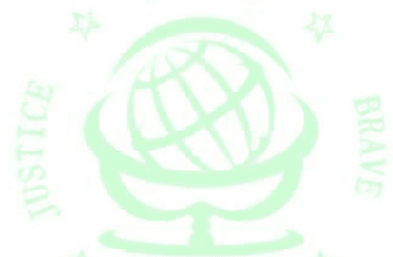

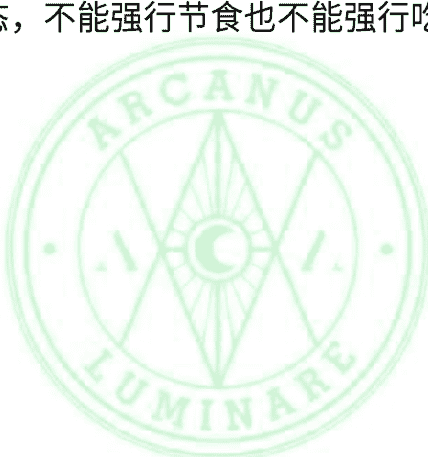