# 能量宝石缤纷物语

# 序
## 宝石有灵，亦当惊知己于千古

日月文化集团总经理 胡芳芳

在应卓越企业家联谊会执行长李小敏之邀参加的一次演讲中，我有幸认识了担任法国 Bottega 珠宝公司首席设计师的庄乔伊（Joy）。后来，通过卓越企业家联谊会安排的一次企业参访之旅的一日相处中，对 Joy 的个性、品味、设计理念和生命理念备感赞赏。之后，我邀请 Joy 到我主持的佳音电台节目“新生活时代”进行深入访谈，更深刻了解到 Joy 对自己充满想法，并勇于追求人生最真实梦想的强大动力，实在应该鼓励她把与珠宝的故事和广大的读者分享。

Joy 当年读的是成功大学国贸系，为了心中的梦想，毅然在大二休学离开台湾赴美读艺术系，并获得雕塑创作与艺术管理的学位，这段故事不禁让我想到诗人罗伯特·弗罗斯特《未择之路》中所描写的人生境界：

> And both that morning equally lay
> In leaves no step had trodden black.
> Oh, I kept the first for another day!
> Yet knowing how way leads on to way,
> I doubted if I should ever come back.

> 那天早晨两条路都覆盖在落叶里，
> 路上尚无行人踪迹。
> 噢！我要把第一条路留待他日，
> 然而我知道路外有路，
> 我恐怕没有机会再来走回头路。

> I shall be telling this with a sigh
> Somewhere ages and ages hence;
> Two roads diverged in a wood, and I—
> I took the one less traveled by,
> And that has made all the difference.

> 在很久很久以后的某处，
> 我会叹息着诉说此事，
> 两条路在树林中分歧，
> 而我选择了人迹稀少的路，
> 这样的抉择注定了我不同的旅途。

Joy 在美国克服万难，终于学有所成，渐露头角之际，在她的一次年度个展中，竟然来了一位贵宾，他是 Bottega 珠宝创办人的孙子 Bottega 三世。他亲切地和她分享了对艺术创作的经验和看法，两人相谈甚欢，Bottega 先生竟然在当下就邀请她到巴黎的工作室工作。此时已结婚生子的她，再次为了心中的梦想面临人生第二次的重大抉择，Joy 一句：“我要去巴黎工作。”像通知而不是商量的字眼，虽然让另一半完全来不及回应，也因怀抱坚毅梦想与家人的支持，揭开了她的巴黎艺术追寻之旅，Joy 与珠宝的生命从此密切相连。

Joy 在这具有百年品牌历史的 Bottega 公司学习珠宝设计，从学习中一次次自我突破与升华，期间还停薪留职前往意大利学习了 14 个月的珠宝镶嵌精工。第一堂课，老师要求的是 “把一条直线画好”，因为画好一条直线，就可以感受到文化底蕴与气质。Joy 一画再画，就是达不到老师的要求，就这样光是画一直线，就花了整整 1 个月，也因为这样的用心，终于获得老师的赏识，在日后的设计上，也得以和镶嵌结合，不会有光设计而不能应用的问题。

后来，Joy 又用 3 年时间在美国宝石学院获得研究大宝石学家的资历，根据所学的珠宝学知识以及多年的珠宝设计经验，将精工、设计、宝石，三者一体，在作品中融入自己的情感以及生活的启发，也因为她那极具艺术价值的设计与热忱，将珠宝设计再度推向另一个境界。有趣的是，Joy 的中文名字乔伊和 Joy 的发音竟如此相近，而珠宝的法文是 Joie，就是 Joy。这段故事印证了巴西作家保罗·科尔贺的名言：“当你真心渴望某样东西时，整个宇宙都会联合起来帮助你完成。”

看完 Joy 的作品后，让我想起《水经注》中描述长江三峡秀丽风景的一段话：“常闻峡中水疾，书记及口传悉以临惧相戒，曾无称有山水之美也。及余来践跻此境，既至欣然，始信耳闻之不如亲见矣。其迭崿秀峰，奇构异形，固难以辞叙。林木萧森，离离蔚蔚，乃在霞气之表。仰瞩俯映，弥习弥佳，流连信宿，不觉忘返。目所履历，未尝有也。既自欣得此奇观，山水有灵，亦当惊知己于千古矣。”这段文字似乎也足以形容 Joy 与宝石的相遇与相知。

年轻时的 Joy，并不知道 20 岁、30 岁、40 岁的人生会经历如此多的转折与机缘。Joy 与珠宝之间的邂逅，似乎也可以这样说：珠宝有灵，当惊知己于千古。出自于 Joy 的设计已不是珠宝而是生命的能量，在生命之中注定与珠宝相遇，并与珠宝成为知己。

# 前言
## 探求宝石能量的秘密
### 宝石真的有能量吗？

经许多科学的仪器证实，动物界和植物界有许多传递讯息的方式，是人类看不到、听不到的，就像是人们听得到大象的叫声，却感受不到大象还有其他传递信息的方式（人类无法听到的声波），可以让远在森林另一头的象群听到。

宝石的能量也是如此，虽然我们无法用肉眼看到宝石的能量，但是在美国却有一群专家透过各种方式，甚至发明了极科学的仪器，证实了宝石能量的存在。

更有趣的是，不同的宝石，能量也不一样。原因在于，每一种宝石所生长的矿区不同，宝石本身的颜色和结构体也不一样，能量当然也就不同。

### 戴对位置，增强宝石能量

色彩对于人类的影响已经被证实了，而每一种颜色对应的人体部位也不同。举个例子来说，白色宝石与头部有关，当然适合用来作为发夹、耳环、项链使用。

除了色彩的对应位置外，我们也可以视不同的目的来佩戴。你知道将戒指戴在左手与戴在右手的意义有什么不同吗？

就能量学来看，左手的血液直通心脏，若希望加强健康与感情方面的能量，则可以将宝石做成戒指戴在左手。

而右手有较积极争取的含意，若希望加强“争取”的能量（如财富、事业）时，不妨将戒指戴在右手。

### 灵感、创意的白色能量宝石

白色，是与灵感有关的色彩，也象征着清澈与纯粹，可以净化人们的灵魂，白色的宝石与头部有着密不可分的关系。

### 判断力、灵性的紫色能量宝石

紫色，是神圣的色彩，象征着高贵精神的紫色，代表真理、正义与知性，自古以来与王室、宗教仪式密不可分。紫色的宝石与人类的前额有着极大的关系，能提高思想与辨识的能力，对于灵性的成长也非常有帮助。

## 提升沟通能力的蓝色能量宝石

蓝色，仿佛大海般的颜色，让人有心情平静的感觉。蓝色宝石的主要能量是增进沟通关系，表现出个人的能力。对应到人体的部位时，蓝色宝石与喉部有一定的联系。

## 增进人际关系、舒缓情绪的绿色能量宝石

绿色，是自然界植物的色彩，有着舒适的、再生的气息。绿色的宝石就像是人类需要的维生素与矿物质，有着生命的能量，并增进人际关系。对应到人体的部位时，绿色宝石则与胸部有一定的联系。

## 希望、幸福与财富的黄色能量宝石

黄色，是希望与幸福的颜色。黄色的宝石象征着开朗、明亮、激励、希望，同时也象征着财富。对应到人体的部位时，黄色宝石与腹部、胃部等消化系统有关，也与精神有关。

## 爱情、魅力的粉红色能量宝石

粉红色，是女性的颜色，象征着温柔、无条件的爱与增强女性魅力的能量。对应到人体的部位时，粉红色宝石则与心脏有关。

## 唤醒创造与热情的橘色、红色能量宝石

橘色，代表着大地与生长，具有激发人类好奇心与创造力的能量；红色代表了生命力与火焰，具有唤醒人们热情和行动力的旺盛能量。对应到人体的部位时，橘色宝石与子宫有关，红色宝石与生殖系统有关，这两种颜色的宝石同样都有提高活力、性魅力的能量。

## 意志与智慧的黑色能量宝石

黑色，一向给人神秘的感觉，而且具有很多的正面能量。从色彩学来看，黑色是蕴藏智慧的象征，意味着即使在黑暗中也能清楚地看见光辉。黑色的宝石与集中意志力有极大的关系。对应到人体部位时，黑色宝石与人体的尾椎部位有关。

### 佩戴正确宝石，增加自己的宇宙能量，更能心想事成！

## 生日石的意义

在西方，一年 12 个月中，每个月各对应一种“生日石”（Birth Stone），以作为寿星出生月份的纪念。传说，佩戴着自己的生日石可以带来好运。

| 出生月份 | 宝石名称 | 象征意义 |
|----------|----------|----------|
| 1 | 石榴石 | 忠诚·友爱·真实 |
| 2 | 紫水晶 | 平和·温柔·神秘 |
| 3 | 海水蓝宝 | 沉着·勇敢·聪明 |
| 4 | 钻石 | 纯洁·无瑕·高贵 |
| 5 | 祖母绿 | 幸运·幸福 |
| 6 | 珍珠 | 健康·长寿·富贵 |
| 7 | 红宝石 | 热情·仁爱·尊严 |
| 8 | 橄榄石 | 温和·美好·善良 |
| 9 | 蓝宝石 | 慈祥·正直·信任 |
| 10 | 蛋白石 | 安乐·逍遥·精彩 |
| 11 | 拓帕石 | 友爱·希望·快乐 |
| 12 | 土耳其石 | 成功·稳重 |

# CONTENTS
## Chapter 1 激发灵感与创意
## 白色能量宝石

| 页码 | 中文名 | 英文名 |
|------|--------|--------|
| 017 | 白水晶 | Crystal |
| 021 | 乳白水晶 | Milky Quartz |
| 024 | 冰种翡翠 | Icy Jadeite |
| 027 | 月光石 | Moon Stone |
| 030 | 白玉 | White Jade |
| 033 | 钻石 | Diamond |
| 037 | 砗磲 | Tridacna |

# Joy's Jewels
040 美人鱼的愿望

## Chapter 2 强化判断力与灵性
### 紫、蓝色能量宝石

| 页码 | 中文名 | 英文名 |
|------|--------|--------|
| 043 | 坦桑石 | Tanzanite |
| 047 | 堇青石 | Iolite |
| 049 | 紫水晶 | Amethyst |
| 052 | 蓝晶石 | Kyanite |
| 054 | 紫萤石 | Violet Fluorite |
| 056 | 青金石 | Lapis Lazuli |
| 060 | 蓝色琥珀 | Blue Amber |

# Joy's Jewels
062 蓝天使

## Chapter 3 提升沟通能力
### 水蓝色能量宝石
- 065 海蓝宝 *Aquamarine*
- 069 土耳其石 *Turquoise*
- 072 蓝色拓帕石 *Blue Topaz*
- 075 蓝色蛋白石 *Blue Opal*
- 078 硅孔雀石 *Chrysocolla*

# Joy's Jewels
- 080 五线谱上唱歌的热带鱼

## Chapter 4 展现爱情与魅力
### 粉红色能量宝石
- 083 粉红蛋白石 *Pink Opal*
- 086 孔赛石 *Kunzite*
- 089 粉红碧玺 *Pink Tourmaline*
- 093 摩根石 *Morganite*
- 096 玫瑰水晶 *Rose Crystal*
- 099 粉红拓帕石 *Pink Topaz*

# Joy's Jewels
- 102 图尔特的天使光环

## Chapter 5 增进人际关系与舒缓情绪
## 绿色能量宝石
- 105 绿碧玺 *Green Tourmaline*
- 108 祖母绿 *Emerald*
- 113 绿玉髓 *Chrysoprase*
- 115 翡翠 *Green Jadeite*
- 119 橄榄石 *Peridot*
- 122 葡萄石 *Prehnite*

# Joy's Jewels
124 梦想的脚踏车

## Chapter 6 聚焦希望、幸福与财富
### 黄色能量宝石
- 127 日光石 *Sun Stone*
- 130 黄水晶 *Citrine*
- 133 金黄绿柱石 *Golden Beryl*
- 135 黄色拓帕石 *Yellow Topaz*
- 138 金黄色发晶 *Golden Rutilated Quartz*
- 140 琥珀 *Amber*

# Joy's Jewels
144 金沙花

## Chapter 7 唤醒创造力与热情
### 橘色、红色能量宝石
- 147 红玉髓 *Carnelian*
- 149 石榴石 *Garnet*
- 152 珊瑚 *Coral*
- 155 火蛋白石 *Fire Opal*
- 159 红宝石 *Ruby*

# Joy's Jewels
162 恋豚

## Chapter 8 展现意志与智慧
### 黑色能量宝石
- 165 黑玛瑙 *Onyx*
- 169 黑曜石 *Obsidian*
- 171 烟晶 *Smoky Quartz*
- 173 虎眼石 *Tiger's Eye*
- 175 黑碧玺 *Black Tourmaline*
- 178 捷克陨石 *Moldavite*
- 180 黑色尖晶石 *Black Spinel*
- 184 墨翠 *Black Jadeite*

# Joy's Jewels
186 章鱼保罗
188 黑色金奈鱼

# 激发灵感与创意
## 白色能量宝石

白色，是与灵感有关的色彩，白色的宝石与头部有着密不可分的关系，也象征着清澈与纯粹，可以净化人们的灵魂。

# Crystal 白水晶
提升灵感、实现愿望

硬度：7 比重：2.65

## 永恒的结晶

Crystal，是由意思为“冰”——“透明的水”的希腊语单字“Crystallose”演变而来的。

最初人们在阿尔卑斯山上发现水晶，以为它是天神赐给人类的冰化石，当时人们相信这是上天给人类的讯息，并认为圣灵寄宿在它的结晶之中，因此取名为水晶。

日本奈良时代，也有将水晶称作“水精寄宿之石”的记录。而住在大洋洲美拉尼西亚岛群的人们，认为水晶可以提高生命力，并将水晶当成护身符随时携带。

透明水晶，最容易让人想到吉卜赛女郎占卜用的水晶球。此外，据说在英国与法国的古墓中，也经常挖掘到水晶球。

古埃及人认为水晶可以净化灵魂，所以会在死者的额头贴上一片水晶。有些印第安部落认为水晶内有精灵，只要注入鹿的血，就可以唤醒水晶内的精灵。也有一个关于水晶治疗的传说：只要将水晶加以处理，就可以让治疗者看见病人的病症及骨头。

自古以来，人们便将水晶视为最具灵力的能量石，并加以广为应用，无论在治疗、占卜，还是在祈祷的时候，都可以看到水晶的身影。

## 纯净的许愿能力

你觉得心里杂念很多，无法专心吗？这个时候不妨握住水晶，提高集中力，摒除杂念。

水晶，也有着“许愿的能量”，当我们想要达成某个目标与愿望时，可以把水晶放在桌前并静坐，将愿望对着水晶诉说3次，愿望就容易实现。

对于从事设计工作、创意工作的人来说，可以将水晶放在双眉的中间（也就是“第三只眼”的位置），然后冥想，让水晶的能量提升灵感。

当你想要冷静思考，却因为四周环境太杂乱，无法找到答案时，也可以使用水晶，让它的灵性来帮助你冷静下来，观察到事物的本质。

水晶还有可以从困境中找出解决之道的能量，如果你感觉自己的生活模式总是一成不变、想法无法突破的时候，那么就让它帮助你的意识更明朗吧！

## 选购建议

白水晶最容易用玻璃、含铅玻璃仿制，特别是后者的英文也是Crystal，很容易混淆。

辨识透明水晶，有一个非常容易的方法：在纸上画线或写字，将水晶放在字上面，透过它看到的线、字若是变形，或出现两条线、两个字（称为复影现象），就表示是真水晶——因为水晶有双折射的特性，一般很难伪造。

购买水晶时，一定要问店家是天然水晶还是人造水晶。虽然人造水晶的硬度、折射率、物理性、化学性等，都与天然水晶相同，但不是生长于大自然之中，没有吸收到日月、土地的能量，作为饰品佩戴尚可，但若是希望增强能量，还是以天然水晶较好。

在选择透明水晶时，以是否干净透明、有无杂质作为鉴定价格高低的标准。一般质量的水晶约数十元；中等等级的水晶约数百元；最上品的水晶，甚至可以高达数千元。

## 佩戴与保养

白水晶的硬度为7，不容易破裂，做成任何首饰都很合适。保养时只需用清水洗净，再以软布擦拭即可。

# MILKY QUARTZ 乳白水晶

找回爱的能量、安全感回升

硬度：7  比重：2.65

### 最有母性的乳白水晶

乳白水晶的颜色就像牛奶，有着柔和的光芒，感觉非常温润（是最容易唤起人们情感的宝石），拥有乳白水晶的人，会洋溢着丰富的情感，仿佛被爱包围。

传说中，乳白水晶是最有母性的矿石，喜欢月光的照耀，因此在满月的夜里为乳白水晶进行“月光浴”，可以增加拥有者“爱的能量”。

### 抚慰心灵的功能

你经常思虑过度、夜不成眠吗？你是否没有病痛，但就是感到身体不舒服？你常常感到精神萎靡吗？还是心中总是觉得少了一些什么似的，缺乏踏实的感觉？

如果有，那么不妨在睡前将乳白水晶放在枕头旁边，让淡雅柔和的它陪伴你进入梦乡，能有助于舒缓过重的心理压力。

由于拥有极大的爱的能量，乳白水晶也能帮助人们从重大伤痛中走出来，像失恋后一直无法再谈恋爱的人，或者因为失亲而无法抚平心中伤口的人……用它具有的爱的能量来帮助你吧！这也是为什么印第安巫师在治疗族人的时候，会将乳白水晶放在被治疗者的身上，让其大哭一场，以发泄内心深藏已久的情绪，并抚慰心中的伤痛。

乳白水晶，也可以唤起人们已失去的“爱的感觉”。当遭到爱人背叛或与爱人发生严重争吵时，不妨在左手戴上乳白水晶的戒指，下一次与爱人相见时，让绵密的乳白水晶帮助你，一定会有意想不到的好事发生哦！

## 选购建议

市面上的乳白水晶并不多见，伪品以白色亚克力（有机玻璃）、染色的乳白玻璃、白色蛋白石三种最常见。我们可以使用手握法来辨别，因为真正的乳白水晶，手握再久也不会发热，而亚克力、玻璃都是握了一会儿之后，就会感觉有热度。

选购乳白水晶时，以色泽均匀度来作为评选的标准。有着均匀的乳白色、散发出温柔感觉的乳白水晶，非常值得选购。

乳白水晶的最大产区在俄罗斯、巴西、马达加斯加、美国以及欧洲的阿尔卑斯山。

虽然天然的乳白水晶很稀少，但是知道的人并不多，所以价格尚未飙涨。一般质量的乳白水晶，每克拉约数十元；质量极佳的乳白水晶，每克拉约数千元。

## 佩戴与保养

乳白水晶的硬度为7，不容易破裂，做成任何首饰都很合适。保养方法与白水晶一样，只需要用清水洗净，再以软布擦拭即可。

# Ice Jadeite 冰种翡翠

主人的守护神、超强的协调力、激发潜能

硬度：6.5 ~ 7  比重：3.34

### 趋吉避凶的护身符

翡翠是一种鸟类的名称，它的羽毛有着鲜浓艳丽的颜色，深受古人的喜爱，并被认为是吉祥的象征。因此，色彩丰富的硬玉，也就称之为翡翠。

据说中国古代商人在做生意时，会将翡翠握在手中，让买卖更顺利。旧时代，先生在太太生日时会赠予翡翠，象征着子孙满堂、生生不息。也有许多人相信翡翠能趋吉避凶，代替主人面临大难（俗称过运）。因此，在古代中国，翡翠一向是富贵人家最珍贵的饰品。

西方人认为，翡翠有治疗效果。古希腊人将它放在眼皮上，以治疗眼疾，古印第安人则使用翡翠来治疗肾脏方面的疾病。

其他关于翡翠的传说还有很多，不过最让人感到温暖的，还是关于“将雕有蝴蝶形状的翡翠赠予喜爱的人能让爱圆满”的美丽传说。由于蝴蝶有“无敌”的意思，如果是女生送给男生，表示男生在女生心中的分量是天下无敌；如果是男生送给女生，则表示女生在男生心中是最重要的人。因此，翡翠雕刻的蝴蝶饰品，一直都是珠宝收藏家的挚爱。

### 引领你激发潜能

冰种翡翠，因其质地有如冰一般清澈剔透而广受翡翠爱好者的青睐。

事实上，除了质好色佳外，在能量方面，冰种翡翠的纯粹能量，让人不会局限于自己主观的思想中。

当灵感遇到瓶颈的时候，冰种翡翠可以帮助人们的灵感迸出，找到新的创意。

由于冰种翡翠是在水中生存的结晶，也衍生出了协调的能量，仿佛水一样可以化解固执的思想，让人们可以接受与自己的个性、价值观截然不同的另一半。

冰种翡翠还可以唤起人们心中的潜能，有些人本身有着相当好的绘画或音乐能力，却一直没有被发掘，戴上冰种翡翠，潜能将会渐渐浮现，让周遭的朋友很快地发现他的这些潜能。

## 选购建议

冰种翡翠的质地、色彩让人爱不释手，购买者众多，但因产量稀少，仿品越来越多样化，如染色玻璃、透明玉髓或塑料制品等，而最多的仿品则是俗称“水沫子”的苏州玉。

如果以很高的价格买到了仿品，一定让人很痛心！我们要怎么辨识呢？

要知道，翡翠出现纹路是正常现象，选购时可向店家索取强光灯，用灯光由上往下照射，在十倍放大镜下看，可以通过结晶体来判断。“水沫子”的结晶体一团一团如棉花状，而翡翠的结晶则是像绳索般的长条状，很容易分辨。

在选购冰种翡翠的时候，一定要问店家：“这颗冰种翡翠是A货吗？”

A货代表的是完全天然、不经过任何人造加工或染色处理的翡翠。笔者认为，当预算有限时，虽然只能买到较不中意的冰种翡翠，但还是宁愿买A货，也不要买人工处理或染色而成的B货或C货翡翠。

在选择冰种翡翠时，以质地好坏作为评估标准。因为透明干净的冰种翡翠稀有，所以价格非常高。另外，雕工以及外形也会影响价格。高质量的冰种翡翠，在国际拍卖会上的价格屡创新高。曾有一只上好质量的冰种翡翠手镯，要价数百万港币，而坊间质量较差的冰种翡翠手镯，也要数千元。如果是质量还不错的冰种翡翠手镯，每只十几万的价格是很常见的。若遇到雕工特殊且精致的冰种翡翠，绝对是不能错失的珍宝。

## 佩戴与保养

翡翠的硬度为6.5 ～ 7，做成各式首饰均是不错的选择。由于翡翠的色泽不同，若能找到色泽均匀的，做成一整套饰品，将使翡翠的价值更高。

虽然翡翠的硬度高，不容易损伤，但若从高处掉到地面或受到强力撞击时，翡翠内部也可能出现裂缝，佩戴时还是需要注意。在保养方面，以温水洗拭即可，非常容易保养。但要避免与强酸或油质接触，因为酸液和油质很容易使翡翠的光泽受到影响。

# Moon Stone 月光石

引发女性魅力、安定情绪、加强感受力

硬度：6 ~ 6.5   比重：2.57

### 神秘的圣者之石

如银河星团，又如月晕般的月光石，极具神秘感。从古至今，月光石的传说相当多。

它是恋人之石——在月圆的夜晚佩戴月光石，可以遇到好的情人；恋人佩戴月光石，可以诱发彼此的热情，让感情更好、更幸福。也有一个说法，将月光石送给心爱的恋人，可长保情感不移。

它是圣石——印度人认为月光石是由月亮的光芒凝结而成的，可以吸取月光的能量；也相信在月光石的结晶中，住着月的精灵，并将月光石称为“圣石”，是代表月亮魔力的神圣宝石。由于对月光石的尊重，许多印度佛像的眉心都会镶上一颗月光石。

它是旅人之石——月光石可以保护海上旅行者的安全，因此又被称为旅人之石。

它是预言之石——传说在下弦月时，将月光石含在口中，可以得到预知未来的能力；古代圣职者也都会将月光石佩戴在身上。

它是健康之石——可以预防与水方面相关的疾病（如浮肿），对于视力的改善、精神的稳定也有一定的帮助。

### 沉静感受的安定力量

你是一个情绪容易起伏的人吗？你是否多愁善感、爱钻牛角尖、经常出现悲观情绪？如果是，请将月光石坠子放在胸前，让它沉静的力量为你解除不安的情绪。

月光石的阴柔、神秘与女性的特质十分相近，佩戴月光石，可让女性的魅力完全展现出来。如果你深爱着一个人，佩戴月光石，将会让你在他的眼中显得更迷人。

古代的巫师会使用月光石来改善女性的生理疾病。对于不孕症的妇女，也借由月光石来祈祷助孕；当女性有难产迹象时，也会用月光石来守护难产妇女的健康。

由于月光石会发出低波的能量，对血液循环、新陈代谢有改善的可能性。也有人认为，长期佩戴月光石可以让人比以前更苗条。

在月光中闪烁的月光石，可以加强我们对外界的感受力。如果想要知道对方心里的想法，不妨将月光石制成戒指戴在左手中指上，加强自己的敏感度，自然就能领悟对方心中所思，不需过多言词，就可以达到心有灵犀一点通的境界。

## 选购建议

月光石与其他宝石最大的不同处，在于它的“青白光彩”现象。即使是白色月光石，也不全然纯白，而是出现青白色的光彩。这是因为月光石是由钠长石与正长石层层叠起，前者会反射蓝光，后者则会出现白色游彩。

白色月光石最容易被玻璃或人工玛瑙仿冒替代，但是这两种仿冒品都无法做到如月光石般青白的自然光彩，只要稍加留心，就不容易上当。

此外，月光石有“双折射”的特性，当我们转动月光石的时候，会看到闪耀的光彩，让人十分惊喜。

普通等级的月光石较不通透或内含裂痕较多者，二三百元；中等等级的月光石四百元至八百元；最上品的月光石，除了看透明度外，也会以青光的闪耀度来评估。一颗澄澈透亮、青光明显且没有裂痕的大克拉月光石十分罕见，价格也最高，每克拉可达数千元。

## 佩戴与保养

月光石的硬度为6 ~ 6.5，做成戒指或项链都是很不错的选择。以白金为底座，让白金的冷光与月光石的温柔光泽互相衬托，更能发挥月光石的能量。最近欧洲的珠宝设计师依月光石的特性，加上黑灰K金的底座来进行设计，更加强化了月光石的神秘能量。

# White Jade 白玉

趋吉避凶、增加美德、带来幸运

| 硬度：6 ～ 6.5 | 比重：2.96 |

### 祈求平安的象征

在我国商朝，人们就开始使用玉来做首饰。在18世纪前，中国的玉大多为软玉，最热门的当属“羊脂白玉”。人们相信，玉可以避邪、护身，为佩戴者带来好运。对于死去的亲人，也会以玉来祈求其灵魂平安，因此才会有以软玉做成的“金缕玉衣”。也有人会在死去的亲人身上各窍门放置白玉，或只在死者的口中放一块雕成蝉形的玉，以保邪气不入侵，这种玉蝉称为含蝉，也有羽化成仙的意思。

### 美德的代表

自古以来，软玉被认为是“仁、义、礼、智、信”五种美德的代表。在日本绳文时代，皇家喜好以软玉象征“和平、幸运、繁荣、长寿”。富贵人家在亲人死去的时候，会将软玉做成勾玉形的陪葬物，表示此人的一生具有“仁、义、礼、智、信”五种美德。因此，软玉被视为是增进美德、带来幸运的能量宝石。

玉的另一个最为人知的能量，就是“过运”、“避邪”。由于玉本身是在低温高压下形成的，人们相信佩戴玉饰可以趋吉避凶，玉也会保护主人不被恶能量侵袭，尤以软玉中的羊脂白玉能量最强。

## 选购建议

坊间最常见到以白石髓、玻璃、塑料、白色方解石仿制的“羊脂白玉”，用放大镜看，会看到气泡。

在雕工方面，也常见以“印模”、“开模”的方式来仿“手工雕刻”，工形极不灵活，也不具任何艺术性；用放大镜看，就能看到模具的纹路。

百年以上的雕工，被称为“旧工”或“老工”；百年以内的雕工，则被称为“新工”。一般人所称的“古玉”，指的就是百年以上的雕工，具有历史价值，也被视为古董，在历史文化上的价值非常高。经过多次战乱，坊间真正的古玉非常稀少，大部分都被博物馆收为展览之用，所以在市面上看到商人在贩卖古玉时要特别留意，千万不要上当受骗，因为真正的古玉极少。

买玉的时候，并不以重量为计价标准；一块玉的价格，可从质量及雕工来评价，以“羊脂白玉”的质量为最好，新玉在数百至数千元，若雕工特殊且有特殊意义者的，价格也可能达到几十万元。至于青玉、白玉的价格则相对便宜，质量一般的，价格在一千元以下。

雕工谈的是雕刻的样式，以及是否具有美感。如果一块玉的雕工水平很高，那么价格也会跟着上扬。

由于玉的市场价格非常混乱，笔者建议选择个人喜欢的样式为宜，若要收藏，则需要学习更多鉴赏方面的知识。

就能量来看，无论是古玉或新玉，均具有玉本身的能量，并非一定要佩戴古玉。

## 佩戴与保养

白玉除了被雕成饰物外，刻有绳索状的白玉特别受欢迎。在保养时，以温水洗拭即可；另外，因为汗水的成分容易使白玉的光泽受到影响，所以要尽量避免与汗水接触。

# 钻石

绝对的爱、增加自信心、永远的守护

硬度：10 比重：3.52

### 真理之星

钻石是全宇宙最硬的物质，不会被磨损，具有绝对、不灭、全能的象征，也是宝石之王。

钻石的英文是从古希腊文“Adams”衍生而来。在古希腊文中，有“无法征服”之意，它的闪光，就像真理是永远不会被推翻的。因此，钻石也被称为“真理之星”。

最早以前，钻石均为男士所使用，在古代欧洲，战士们在打仗的时候，护甲上都会镶上钻石，因为人们认为钻石有守护主人、赶走恶灵、达到成功的能量。一直到法皇查理七世时，钻石才被女性视为寻找真爱、带来幸福的守护石，并成为女性喜爱的宝石。

### 坚定不移的能量

钻石的成分非常单纯，只有碳元素；而我们平日使用的铅笔笔芯、烤肉时的木炭，也由碳元素构成——既然都是碳元素，为什么只有钻石如此晶莹闪亮？原因在于钻石是在极度高温高压的环境下形成的结晶，因此也被认为具有不屈不挠、坚持实现愿望的能量。

钻石最为人知的能量，就是强化爱的联系。由于钻石非常坚硬，又经过高温高压的淬炼，佩戴钻石就象征了永恒不朽的爱，以及一颗永远不变的心。

许多宝石在形成的时候，均会与其他物质共生，而钻石却是非常单纯地在大自然中成长。因此，钻石也被赋予了增加独立性、自信心的能量。

## 选购建议

在市场上，以水晶、玻璃、“苏联钻”及其他人造宝石来仿冒钻石的概率非常高，如果一时不察，以高价买到假钻，一定会十分伤心。在这里，笔者介绍一种最简单的辨识法——由于钻石有“亲油性”，用指腹轻擦钻石后，如果手上的钻石没有涩涩的感觉，就表示这颗是假钻。因为真钻石会很快将手上的油脂吸收，所以会有涩涩的触感。

如果实在不放心，不妨在购买时要求店家附上在国际上较具公信力的宝石证书（如 GIA、HRD 证书），或是向信誉较好的商家购买。

选购钻石的时候，以 4C 的标准来评估，就能选出不错的钻石。

4C 指的是“克拉、颜色、净度、切割”（Carat、Color、Clarity、Cut）。克拉数越大、颜色越白透、净度越纯净无杂质、切割越美的钻石，价格越高。

我们常常听到店员以英文字母来代替钻石的等级，在颜色方面，如果属 D、E、F 者，表示颜色极佳；如果属 G、H，表示颜色次佳；如果属 I 或是 I 以后，就是次佳以下的等级。

从净度来看，如果净度是 I1、I2、I3，表示净度在次佳以下；如果是 VS1、VS2，表示净度次佳；如果净度为 VVS1、VVS2，则净度佳；FL、IF，则净度最佳。

切割的好坏，也会影响钻石的美感。切割完美的钻石，会让钻石的闪光看起来更耀眼。因此，好的钻石还要配上好的切割，才能让其达到完美的境界。

在这里要提醒大家：在挑选钻石的时候，不要只将注意力放在克拉大小的报价上，而忽略了其他 3C 的重要性哦！

## 佩戴与保养

钻石最常被做成项链及戒指佩戴，除此之外，钻石耳环也会让人看起来更耀眼。在保养的时候，请勿将钻石与其他宝石放在一起，以免互相刮伤。

GIA：美国珠宝学院 (Gemological Institute of America)
HRD：比利时钻石高阶层议会 (Hoge Raad Voor Diamant)
世界顶级的苏富比与佳士得两大拍卖场，皆参考并使用 GIA 和 HRD 的鉴定报告书来进行议价。

# 砗磲

活化细胞、延缓老化、镇心安神、消灾解厄

硬度：3.5 ~ 3.7

### 沧海桑田的誓言

在远古以前的太平洋与印度洋的热带深海珊瑚礁之中，存在着色如白玉、纹路繁密的海螺，经过地壳板块挤压的造山运动后，人们在喜马拉雅山脉海拔5000米处发现了这些海螺的化石，因其纹路如同车轮，所以被称为砗磲。

砗磲的成长过程与海流、温度、水压、光线等大自然的变化有着极大的关系，又因无法以人工培养，更显出它的珍贵之处。在1983年，砗磲就被列为世界稀有物种，其雪白的色泽更被认为是世界上最白的宝石。

西方将砗磲与珊瑚、珍珠、琥珀列为四大有机宝石；佛典中，视砗磲为“佛教七宝”之一。由于砗磲被视为是吉祥的象征，能量极强，且得之不易，所以一般被皇室贵族或是高僧使用，像清朝二品官上朝时所佩戴的朝珠、西藏喇嘛的念珠，就是由砗磲穿制而成。

### 蕴含大自然纯净的精华

被视为有极强磁场的砗磲，长期在高山上吸收大自然最纯净的精华，是修行人心中的至宝，尤其被视为修持观音菩萨法门时不可或缺的法器。

从成分来看，由碳酸钙、氨基酸、壳角蛋白与其他微量物质组成的砗磲，对细胞的活化有一定的帮助，甚至被视为延缓老化的宝石。

砗磲对于养生也具有不可忽略的能量，这一点在《本草纲目》中早有记载，认为砗磲有镇心、安神的功效，对于心律不齐、心情抑郁、经常心神不宁的人来说，不妨佩戴砗磲，调和身心的平衡。

此外，也有人认为，砗磲具有消灾解厄、避邪、保平安的能量。

## 选购建议

由于砗磲无法以人工方式培养，天然砗磲愈见稀少，坊间常见的伪砗磲是将骨头磨成粉后，再加以灌模。

辨认真假砗磲的方法很简单，天然的砗磲纹路如同树的年轮般，但仿品通常无法将砗磲的纹路做得如此绵密，用放大镜去观察，就能看得更清楚。

在东南亚国家或多或少可以看见砗磲的身影，但无论是做成首饰、雕刻品或是念珠，均以中国台湾的质量最为上乘。

在选购砗磲时，可以大小、质量作为价格高低的标准，高质量的砗磲在灯光的照射下薄透如蝉翼；若是内含金丝，价格便更高。笔者曾经见过一件直径20厘米的高质量圆珠形砗磲，价值八万多；至于一般质量的砗磲视大小而定，每件从数百元至千元不等。

砗磲的年龄可以从内部的纹路来判定，但年龄与价格的高低并没有一定的关联。

## 佩戴与保养

砗磲的硬度很低，最怕受压与强碱，平日以婴儿油或乳液轻拭即可。

### 美人鱼的愿望

每天，美人鱼都会向海底的钻石海星歌唱。歌曲的内容，是美人鱼最真诚的愿望。不论日夜，美人鱼都一刻不停地唱着，直到钻石海星被美人鱼的歌声和愿望感动，流下了如珍珠般晶莹透亮的眼泪。

泪珍珠，就是融合了美人鱼歌声里的愿望和钻石海星的祝福而形成的。流下泪珍珠后，海星就会带着美人鱼的愿望游至天堂，让上天看到美人鱼最真诚的愿望。

## 强化判断力与灵性
紫、蓝色能量宝石

象征着高贵精神的紫色，与代表真理、正义与知性的蓝色，
自古以来与王室、宗教仪式密不可分，是神圣的色彩。
紫色和蓝色的能量，也与人类的前额有着极大的关系，
能提高思考与辨识的能力，对于灵性的成长也非常有帮助。

# 坦桑石

增加洞察力、促进长久友谊、希望之石

| 硬度 | 6.5 ~ 7 |
| --- | --- |
| 比重 | 3.35 |

### 赋予灵力的魔法石

坦桑石是近年来价格飙涨最快最多的宝石。市场上都认为在1960年首次被发现的坦桑石是新兴宝石，其实，在古欧洲的塞尔特民族中，早已有一段与坦桑石有关的记载，认为坦桑石是被赋予了灵力的魔法石。

在塞尔特民族之后，坦桑石就未被记录在宝石历史中。坦桑石虽然不像海蓝宝、翡翠、月光石等在古代就出现的宝石那般，有着令人遐想的丰富传说，但坦桑石于1960年在非洲的坦桑尼亚被发现后，不到50年就身价大涨的过程，却是一个最让人津津乐道的真实故事。

在1968年，Tiffany公司将大量坦桑石推向全球，稀少的出产地加上坦桑尼亚的政治动荡，更让坦桑石的价格年年飙升，从最早每克拉约八百元，至今已有四千元以上的身价。

### 新希望能量的宝石

紫中带蓝的坦桑石，幽雅中带点神秘感，并具备了三种能量。

在塞尔特民族的记载中写着，坦桑石可以增加洞察力、让判断力更正确，并激发想象力，对于艺术家、创作家都有很大的帮助。

坦桑石的第二种能量与人际关系有关。据说将坦桑石戒指戴在左手，将有助于维系长久的友谊，对于渴望得到真正友情的人来说，不妨一试。

坦桑石的第三种能量，则与希望有关。当坦桑石被发现之后，全球知名的宝石学家对坦桑石均投以高度的关爱眼神。事实证明，坦桑石的身价在50年内飙涨了数十倍，也被认为是一种具有新机会、新希望能量的宝石，并且有“一鸣惊人”的含意。

## 选购建议

坦桑石的主色为蓝色，但只要将它放在光线下看，就不难观察到它具有蓝、紫双色或多色的呈现，坊间以玻璃来仿造坦桑石，就无法呈现出双色、多色效果。

近年来实验室已成功培育出人造坦桑石，与天然坦桑石非常相似，至今宝石专家尚未找出破解的方法。

在选购坦桑石时，色彩及内含物是重点。

一般质量的坦桑石每克拉就要数千元。如果有一颗坦桑石外形大、颜色深、双色性强、内含物少，那么绝对是极品，价位也肯定很高了。

## 佩戴与保养

坦桑石的韧度较不佳，很容易因为碰撞而裂开，因此在佩戴的时候要特别留心，而寻找一位有经验的镶工师傅也十分重要。

保养坦桑石的时候，以清水洗拭就好，并且避免在厨房或有蒸汽的地方佩戴，以免宝石变色。坦桑石喜欢与天空接触的能量，不妨带着坦桑石到海拔较高的地方，让坦桑石吸收天空的能量，是最好的净化方式。

# 堇青石

增加自信、突破瓶颈、考试的护身符

| 硬度 | 7 |
| --- | --- |
| 比重 | 2.63 |

### 指引迷途的罗盘

在大自然中，紫色与蓝色是十分罕见的颜色。因为光线的折射，呈现出蓝、紫双色的堇青石，给人一种神秘的感觉。堇青石的名字是由希腊文中的“蓝色”与“石”组合而成的，是一种年代久远的宝石。在古代，堇青石会被用作罗盘来定位，让航行的人可以找出正确的方向，是一种“指引迷途的宝石”。不只是航海者需要，对于一般人来说，堇青石也可以帮助人们看穿事物的真相，不再被外表所蒙骗。当人们对于某些事情或感情想不透、思虑不清的时候，就以堇青石让自己拥有清明的能量吧！

### 突破现状的勇气

将堇青石放在光线下，你会发现从不同的角度观察，会出现不同的颜色变化，因此堇青石被认为拥有突破现状的能量——只要换个角度看，结果就可能不同！陷入痛苦的人，就佩戴堇青石吧，让堇青石带你发现未来的新契机。

堇青石还能化解心中不安的情绪，当心情跌到谷底，感觉心中一片阴霾时，佩戴堇青石会让你充满自信。

对于身体总是水肿的人来说，堇青石的超强垂直能量，可以更快排除多余的水分，对于身体新陈代谢不良的水肿现象会有一定的改善。想要进行体内“大扫除”的人们，不妨将堇青石佩戴在胸前，会有特殊的排毒功能哦！

## 选购建议

目前以染色水晶来仿制堇青石的情况最为常见，但染色水晶的颜色无法做到如同堇青石一样，在不同的角度有或紫或蓝的色彩。堇青石的“二色性”非常明显，顺着棱晶的角度往下看，可以看见最美的蓝色，而横看时，却可能呈现无色，非常特别。

紫蓝色的堇青石与蓝宝石非常相像，曾经被人称为“穷人的蓝宝石”，虽然如此，它的价格仍然不算便宜。在选择堇青石的时候，以净度和色彩均匀度为标准，紫蓝色分配得越均匀（即不会太偏紫，也不会太偏蓝）、净度越佳者，价格越高。一般质量的堇青石每克拉七八百元，中等品质的堇青石每克拉一两千元；极品大克拉的堇青石在市场上甚少，价格也相对更高。

## 佩戴与保养

以能量的角度来看，堇青石最适合用来做成项链，坠子的长度约在胸口的位置。最适合堇青石的净化法为水流法，记住在净化堇青石时，切勿使用日晒法，因为堇青石害怕阳光，日晒过长会使堇青石产生变化，不建议采用。

# 紫水晶

呼唤真诚的爱情、过滤爱情骗子、增强第六感

| 硬度 | 比重 |
| --- | --- |
| 7 | 2.65 |

### 最价值的水晶

希腊神话中，有一个关于紫水晶的故事。传说酒神巴克斯 (Bacchus) 在一次酒醉时，突然攻击走过身旁的宫女阿梅希斯特 (Amethyst)，于是阿梅希斯特祈求神明将自己变成宝石，月之女神便将她化为水晶。当巴克斯清醒后，非常懊悔自己的行为，于是就将身上的葡萄酒淋在水晶上面，水晶因而成为紫色——这就是紫水晶的由来。

希腊人将紫水晶取名为 “a-methu”，有“不醉”的意思，认为用紫水晶做成的杯子喝酒，是不会喝醉的——这正是从紫水晶的故事衍生而来的。

紫水晶是所有水晶中最有价值的，古埃及人会将紫水晶做成护身符。紫水晶同时也是陪葬品，在许多埃及古墓中，都有紫水晶做成的艺术品。

关于紫水晶的传说，除了“不醉”之外，还有其他传说，如拥有紫水晶的人若是出门或远行，家中不会遭小偷；身上佩戴紫水晶，可以预防中魔法或中毒。

另外，也有传说持有紫水晶，可以增强特异能力，预测未来，因此有人对神秘的紫水晶爱不释手。

### 提升灵性的自觉能量

紫水晶一向有“司教之石”的称号，在西方的特别仪式上，常见仪式主持人佩戴紫水晶，为的就是提升灵性，让灵感如泉水般源源不绝——也就是我们所称的第六感。

恋爱中的人佩戴紫水晶，可以过滤掉不纯的恋情。对于一个经常遇到感情骗子的人来说，更需要佩戴紫水晶，让人从危险的爱情之中抽离，寻找到真心的对象。

对于经常做恶梦、情绪会陷入不安的人来说，在睡觉的时候不妨将紫水晶放在枕边，让它的能量帮助你一夜好眠，除去恐惧与不安的情绪！

## 选购建议

紫水晶是所有水晶中价格最高的一种，而市面上约 90% 都是仿冒品或是人工水晶。

天然的紫水晶具有“二色性”，从表面来看，它的色彩以紫色为主，却不是只有纯紫一种颜色。当我们从不同的角度来看紫水晶时，就可以发现紫水晶呈现出或蓝或红的紫色调。在购买时，只要将它放在光线下看，就可以看到其内含有其他色彩，而仿品就无法做到这样的效果。

此外，紫水晶的内含物非常特别，有似老虎皮纹路的内含物，也有像拇指纹路的内含物，或如羽毛般的内含物，而人造水晶则没有上述的内含物。在选购时，以上都可以作为判断真假的依据。

在选择紫水晶时，以颜色作为鉴定价格的标准，颜色越均匀、越趋近紫色，而且紫得亮丽、浓烈而不黑，才是上品紫水晶。一般质量的紫水晶从每克拉数十元，到上品每克拉千元都有。近年来许多名牌珠宝设计师都喜欢采用紫水晶作为主设计宝石，原因就在于复古风的流行以及紫水晶的神秘感觉，令人爱不释手。

## 佩戴与保养

紫水晶的硬度为7，不容易破裂，做成任何首饰都是很不错的选择。保养时只需要用清水洗净，再以软布擦拭即可。由于紫水晶怕阳光，要避免长期让紫水晶曝晒于阳光之下。

# 蓝晶石

解除恐惧束缚、瞬间开创新境界、突破人际关系

硬度：5或7 比重：3.68

### 极端个性的宝石

在希腊文中，“Kyanos”有蓝色的意思，蓝晶石的名字就是从希腊文中的蓝色衍生而来的。

蓝晶石的初次盛行距今约一百多年，但在古欧洲时应该曾经出现过，或许是因为稀少，所以无法在当时流行。蓝晶石的颜色非常美，结构更是特别，是一层层堆积而成的、如纤维般的结晶体，呈现出平行方向的能量。蓝晶石对平行方向的力量承受度很高，但相反的，对垂直方向的力道承受度就很弱。所以，蓝晶石的硬度有两个，平行时硬度为7，而垂直方向的硬度就只有5。如果宝石有个性，那么，蓝晶石应该是个性极端的宝石。

### 洞察与理解的双重能量

正因为蓝晶石有着平行与垂直两种不同的特性，这种特殊又复杂的结构让它呈现出增强洞察力与理解力的能量。

当你努力追求目标，却一直突破不了的时候，蓝晶石能给予强大的支持力与瞬间的爆发力，调整不足的部分。

以前的失败经验让你裹足不前吗？蓝晶石也可以让你跨越存在已久的不安与恐惧，解除心中的束缚。

对于经常饱受人情压力，不晓得如何解脱的人来说，可以试着用蓝晶石来轻触肌肤，感受它的能量，增强人际关系。

以蓝晶石作为健康用途的人，则认为蓝晶石可刺激脑下垂体、甲状腺与生殖系统，具有让内分泌活跃的功能。

## 选购建议

蓝晶石的数量稀少，知道的人不多，尚未形成大流行，故市面上的仿品并不多。在鉴定蓝晶石的时候，可以观察它的内在，如果有一片一片的蓝色斑片与十字形的结晶体，就是天然蓝晶石。

蓝晶石具有宝石的特性，从淡蓝到深蓝色均有，颜色越深蓝，价格越高。中等品质的蓝晶石每克拉六百元到八百元，以马达加斯加、缅甸最多，其他像巴西、肯尼亚也有少量出产。

## 佩戴与保养

由于蓝晶石的结构特别，镶嵌的时候要非常谨慎。必须让具有鉴识宝石能力的设计师，找到宝石垂直与平行的方向后，再进行设计，以免镶爪的支点放错地方而伤到宝石。

# 紫萤石

灵感顿出、减轻压力、让众人接纳

| 硬度 | 4 |
| --- | --- |
| 比重 | 3.18 |

### 黑暗里的明灯

在我国古代，夜明珠一向是王公贵族爱不释手的宝物。据说慈禧太后在下葬时，也以她生前十分喜爱的夜明珠陪葬。

不知情的人总认为，在晚上能发光的夜明珠实在是太神奇美丽了。其实，夜明珠会发光，是因为本身有吸收“磷光”的成分，而它在宝石界的名称，就叫作萤石。

“Fluorite”——萤石，源自于拉丁文，有“流转”的意思。当萤石吸收一段时间紫外线之后，到了晚上就会散发出微微的亮光。这种到了夜晚会发光的宝石，不仅受到中国皇帝的喜爱，早在古罗马时期的尼罗皇帝也被萤石的特性所吸引，尤其偏爱将紫萤石做成许多流行的器物。

### 不住地涌现催生

紫萤石具有白天吸收、潜藏，夜晚释放光芒的特性，有着生生不息的能量，让灵感如涌泉般流出，开发人类无限的潜能。

紫萤石对于脑细胞的活化也有影响，可以令人集中注意力，增强理解力与记忆力，所以许多考生也会在书桌上放置紫萤石。

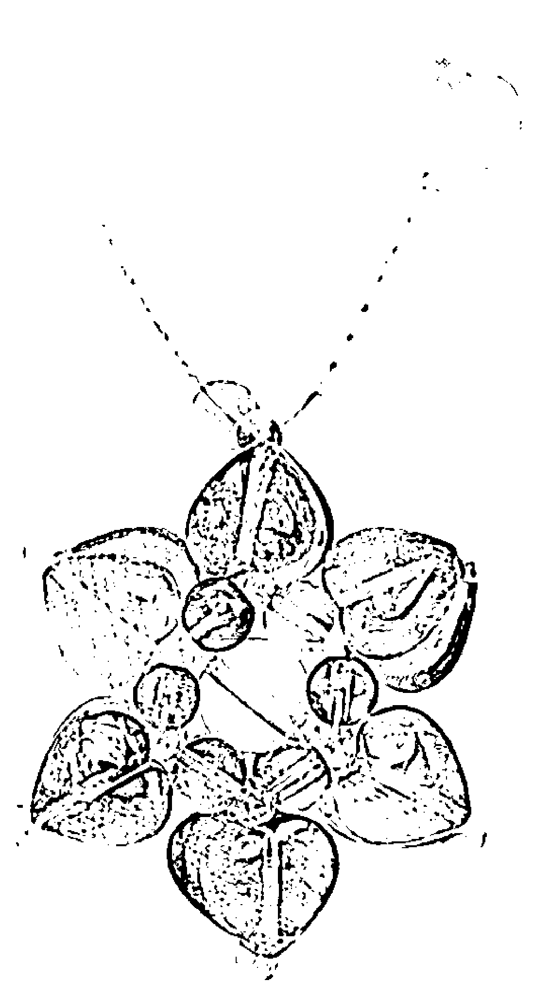

如果你经常被身旁的人排斥或有“寻觅不到知音”的感慨，就让紫萤石的能量来传递好的人际能量，让你为众人所接纳吧！

对于心理压力所造成的精神不佳，或是陷入绝境，希望借由宝石的能量来助你突破难关，就试试紫萤石的神秘力量吧！

## 选购建议

紫萤石的色调会带有紫色与绿色，非常特殊，容易辨别，仿品很少，目前只看到塑料仿品，但由于很容易被看出来，所以并不需要太担心。

一般的白色萤石最常被用来作为摆饰品。紫萤石因为色调很美，价格比较贵，也常被用来设计为首饰。

## 佩戴与保养

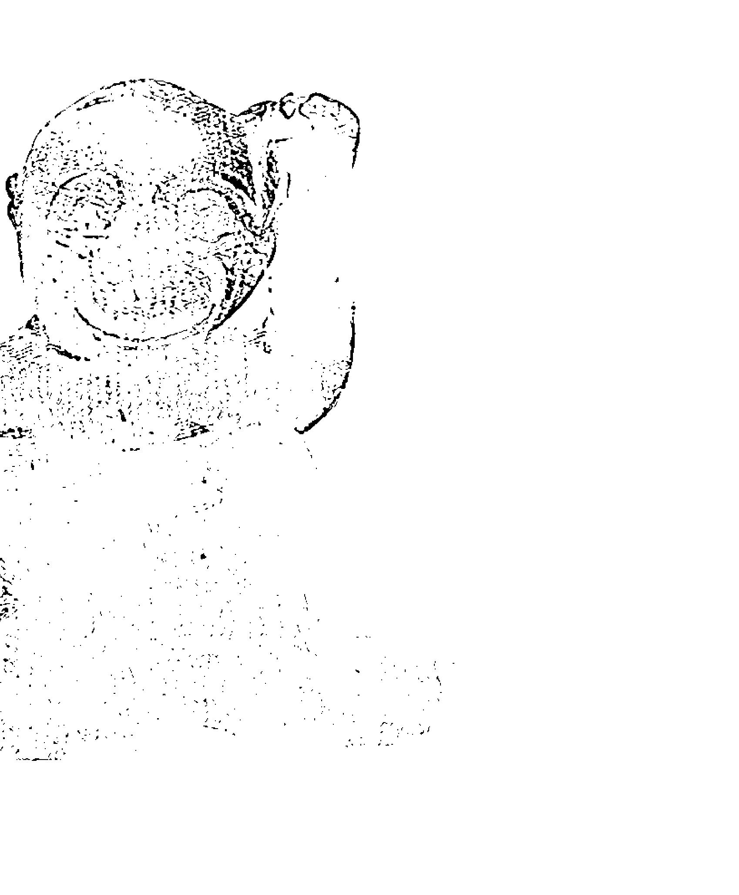

萤石都较容易破裂，在佩戴时要避免碰撞，镶嵌时也要寻找有镶嵌萤石经验的师傅较好。

就能量而言，将紫萤石做成贴胸项链最好。若是考生，则可以将紫萤石饰物放在桌上，以增强记忆力。

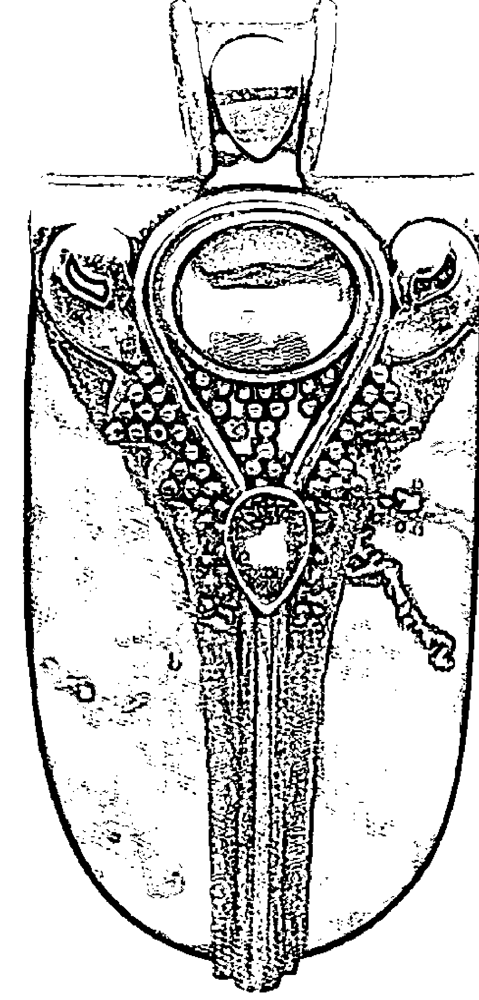

# Lapis Lazuli 青金石

给予正确判断力、提高知性、趋吉避凶

- 硬度：5.5
- 比重：2.80

## 贵族的知性象征

青金石是一种带有金色或白色点状的深蓝色宝石，仿佛璀璨的夜空。在古代欧洲青金石就被视为天空的象征，也被认为是极具价值的宝石。

埃及人视青金石为圣石，被认为能连接死亡与重生。青金石可以守护已逝者，有灵魂不灭的意思。因此，在埃及古墓中，经常可以挖到以青金石切割成眼睛形状，再与黄金做成的“太阳之眼”，以及使用青金石做成的猫、心脏等艺术品。

在古埃及时代，一般平民并不能佩戴青金石，只有法老王、祭司、王族才能拥有，可见青金石地位之高。在古罗马时代，人们认为青金石可以守护恋人的爱情，也有人认为青金石可以避邪，并将其视为带来爱、勇气、幸运的宝石。此外，青金石也被认为是美肌之石，只要将它佩戴在身上，与肌肤接触，就能让肌肤变美哦！

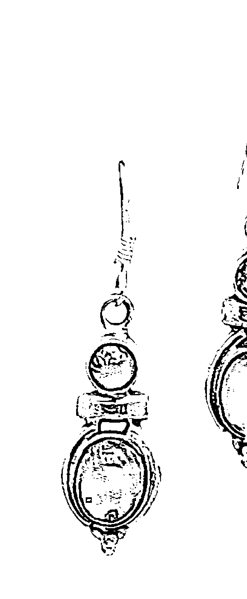

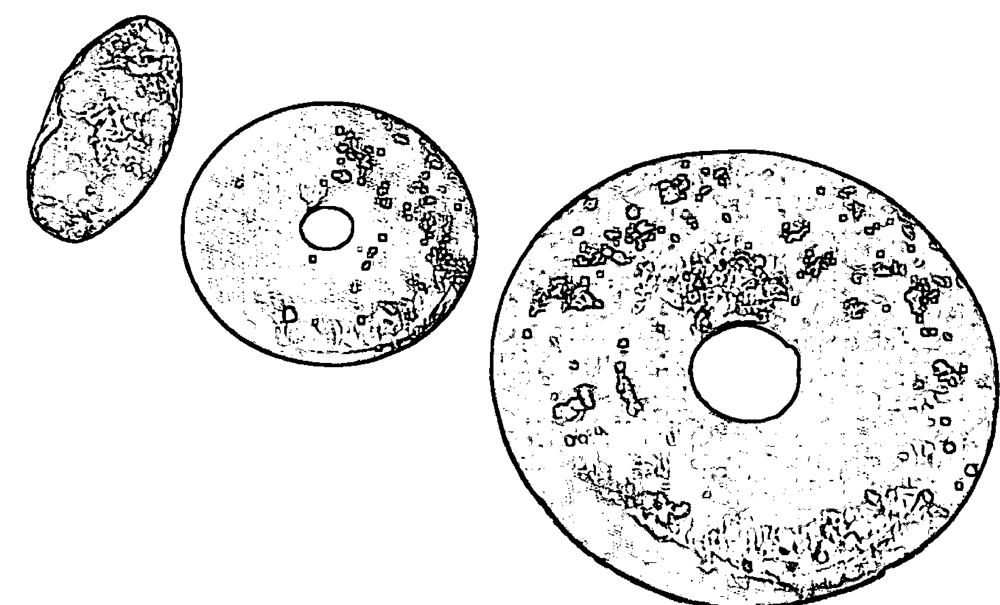

### 摆脱矛盾的指引

青金石在欧洲非常流行，具有趋吉避凶的能量。有一种说法，将它佩戴在身上，可以过滤掉邪气与不好的事情。

由于青金石有着连接死亡与重生的意思，衍生出可让人们摒除旧观念，思考新的观念，向更高境界前进的能量；并引发潜能，提高直觉力与知性能力，非常适合创意枯竭的人。

现在的你，正遇到进退两难，无法取舍，思考一片混乱的情形吗？不妨将青金石摆在眼前，让它的能量加强正确的判断力，不受到人情、利益的影响。

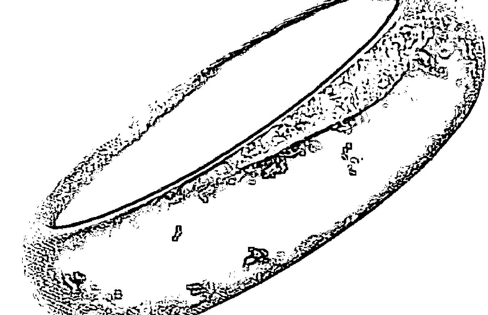

## 选购建议

青金石的金色斑点是由黄铁矿造成的，坊间的仿品非常多，最容易看到商人以蓝色人造青金石来仿造天然青金石，并在仿造石内注入金黄色的内含物，让消费者误以为真。

用肉眼来看，仿品与真正的青金石非常相像，但用放大镜观察，就很容易判断出真假。青金石的金色内含物并非点状或片状，而是块状，而仿品只能做到点状、片状的感觉，无法做出块状内含物。此外，将青金石放在光线下看，就不难发现真正的青金石并非纯然的青色，而是有深浅不一的色泽，而仿品就难以做到这一点。

在选购青金石时，以色彩为选购要点，色越鲜蓝越好，金色块状越多越好。一般质量的青金石每件仅四五十元；中等品质的青金石每克拉五六百元；上品青金石每克拉一两千元，价差相当大。

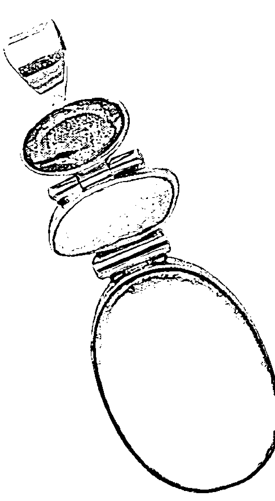

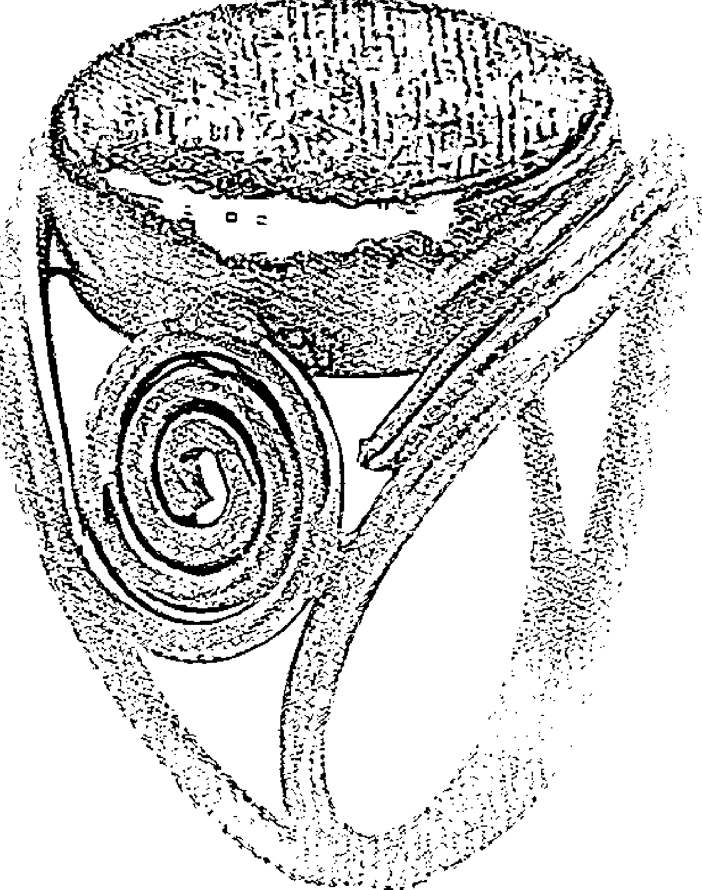

## 佩戴与保养

青金石的硬度为5.5，较容易破碎，不会被作为刻面呈现，最常被切割成蛋面做成首饰。从能量来看，将青金石做成戒指戴在左手无名指，能量直通心脏，会让思想更清透，也可以做成坠子贴在胸前，让灵感源源不断。

最适合青金石的净化法为浸泡法，放在矿泉水中浸泡24小时，就可以净化了。另外也可使用烟熏法，以干燥的鼠尾草加桧木叶所燃烧出来的烟雾，熏陶约4小时即可。

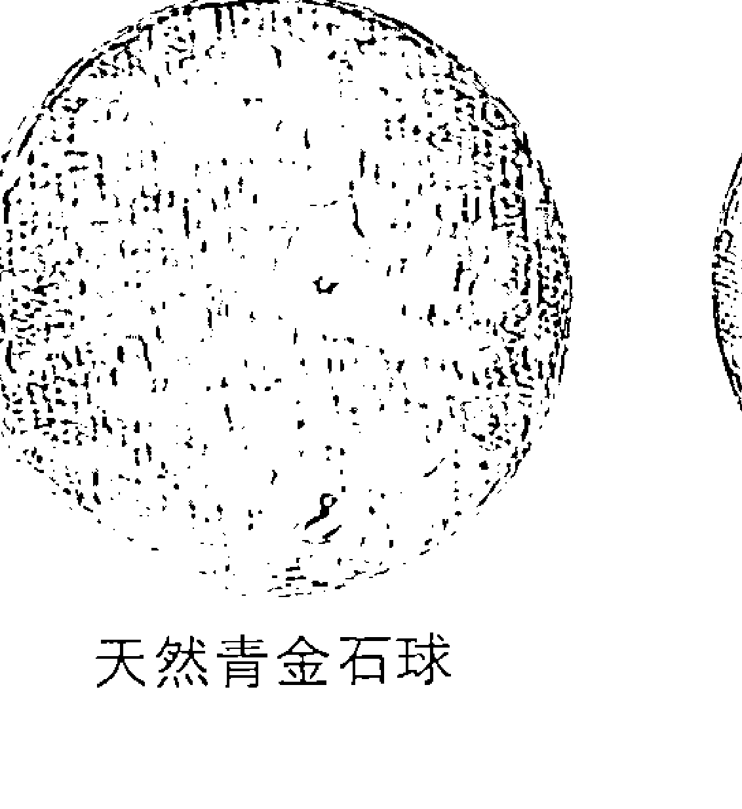

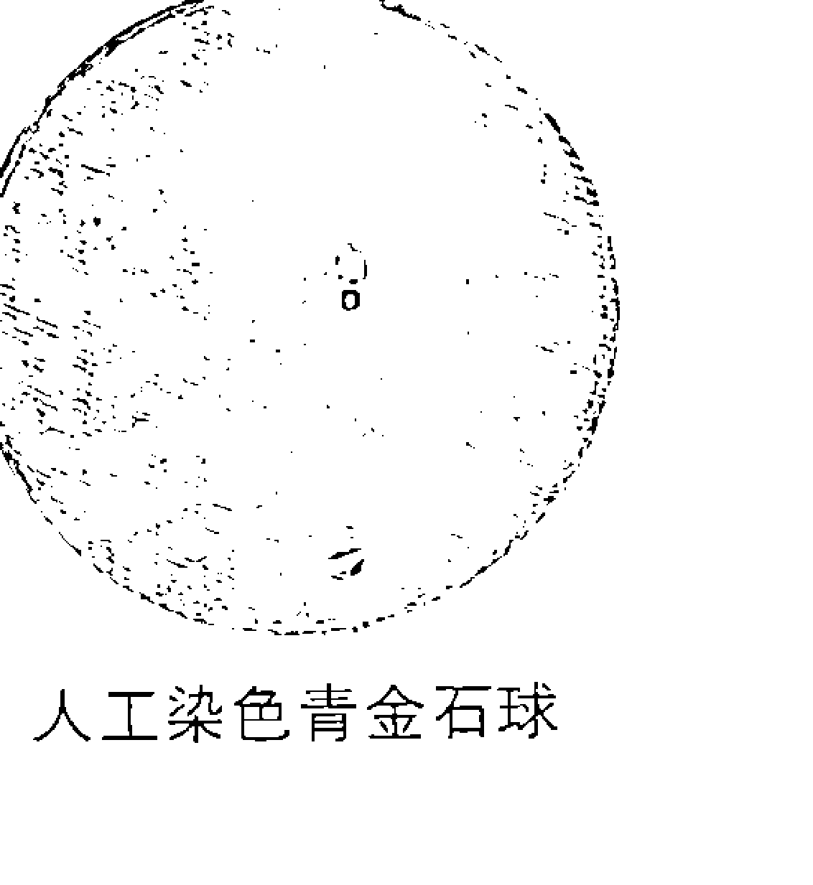

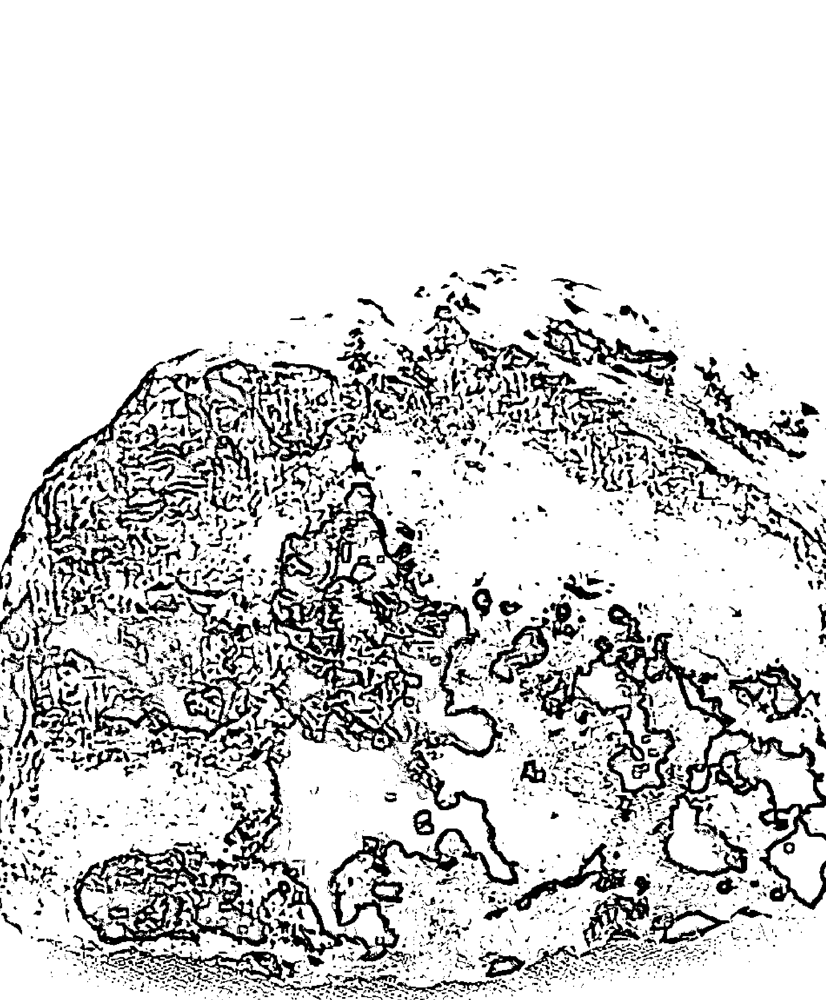

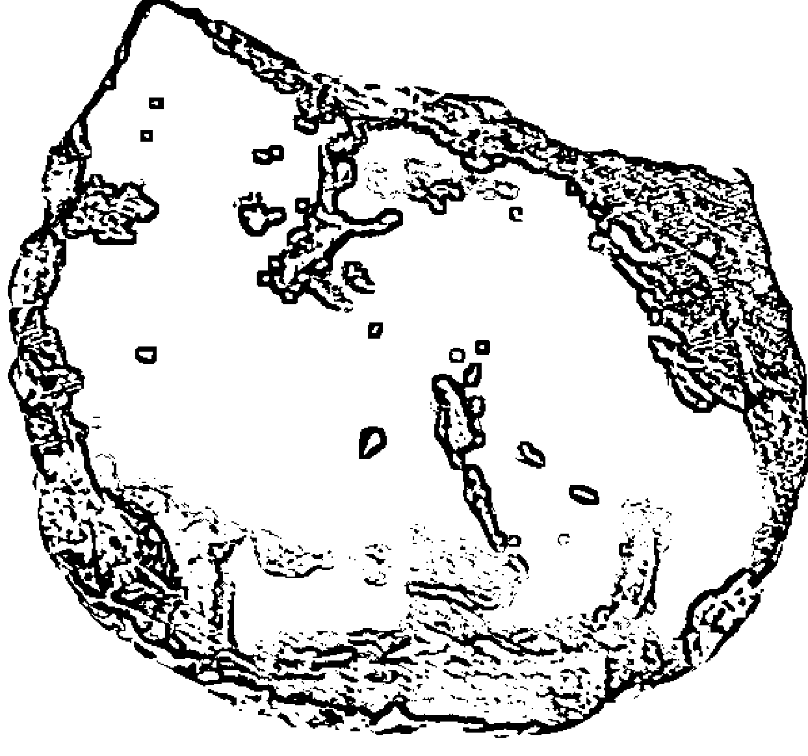

# Blue Amber 蓝色琥珀

古罗马时的神圣矿石，给予趋吉避凶、克服困难的智慧与能量

| 硬度 | 2.5 |
| 比重 | 1.08 |
| 产地 | 多米尼加 |

## 传说中的蓝精灵

有别于一般琥珀，稀有的蓝珀随着光线的变动，而呈现或蓝、或绿、或紫的光彩，在大多是黄色系的琥珀中相当的特殊。蓝珀深邃的独特美感，颜色的变幻，应用在珠宝与艺术品中，是极具特色与收藏价值的。

因产量极其稀少，市面上甚为罕见，大多数精品皆由欧美博物馆收藏。欧洲皇室所钟爱的“蓝精灵”即为蓝珀。

## 赐予智慧的避邪能量

蓝珀在欧洲皇室非常流行，具有趋吉避凶的能量。有一个说法是：将它佩戴在身上，可以过滤掉邪气与不好的事情，并可给予克服困难的智慧与能量。

## 选购建议

大部分的琥珀都只有单一的颜色，而蓝珀却会因观赏角度不同，呈现不同的颜色。若从上直视，顶级蓝珀的正蓝中常透着一丝红光；而从侧面观赏，却又是金黄的琥珀色，让人叹为观止，仿品很难相似。

蓝珀，这个罕为人知的瑰宝，只产于多米尼加，由于产量不多，市面上并不常见。因为稀少、独特，其价格居高不下。蓝珀的产量稀少，质地特殊，使得它极具收藏价值，除了一直都是收藏家的最爱外，也是博物馆热衷于收购与研究的题材。与一般琥珀相同，蓝珀触感温润，因其独一无二的光彩，每一颗都是珍宝，可说是各有各的美，各有各的奇。有的墨绿带着神秘感，有的深邃如海底世界，有的淡蓝如清澈的海水，有的蓝中带紫，透着一分浪漫，有的略带红光，在一片晶莹剔透的蓝中忽隐忽现，更增一分灵动……这些都值得细细品味与欣赏，引人进入丰富的意境中。

## 佩戴与保养

由于琥珀的硬度、坚度都较低，较易刮伤及碰撞受损，建议佩戴时要小心，摆放时也尽量单独存放，不要与其他宝石放在一起。琥珀怕热、怕强光、怕乙醇（包括指甲油），如果在强阳光下戴琥珀，可能要注意一下时间及温度，也不宜将琥珀放在太干燥的地方，以免出现裂痕。

如果发现戴久了的琥珀，表面上的光泽消失，请不必太紧张，只要用丝袜在表面轻擦到微发热，琥珀的光泽就会再次显现。最适合琥珀的净化法为浸泡法，将其放在矿泉水中浸泡24小时，就可以净化了。另外，也可以采用烟熏法，以干燥的鼠尾草加上桧木叶所燃烧出来的烟雾，熏陶约4小时即可。

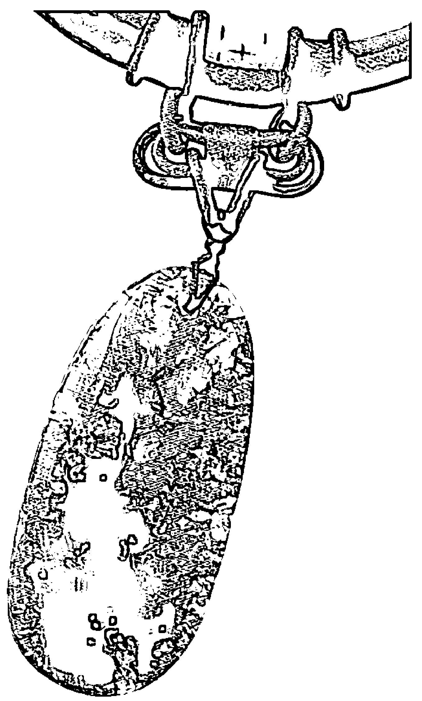

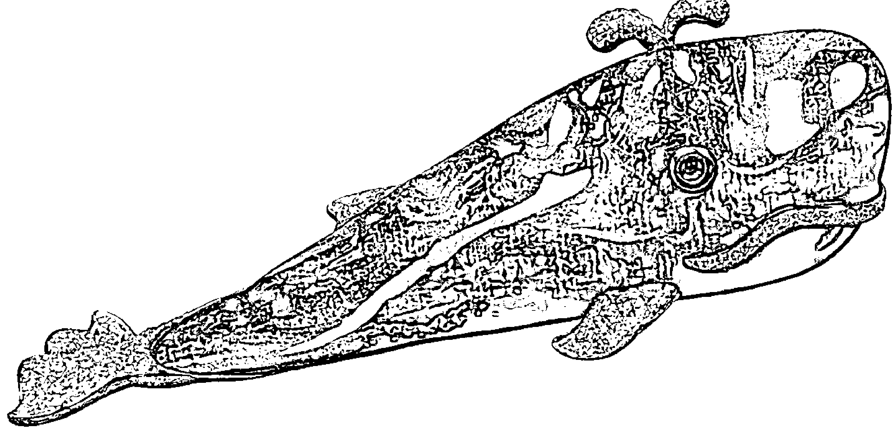

### 蓝天使

在遥远的深海里住着一条鲸鱼，由于鲸鱼住的地方太深了，很少有鱼会游到它住的那里去，因此，鲸鱼没什么朋友，他感到十分孤单和寂寞，也一直认为自己没有存在的价值。

有一天，鲸鱼从深海里往上游的时候，在粼粼波光中，它看到一双脚在水面上不住摇摆着，于是，它浮上了海面，想要一探究竟。结果，它看到一个年轻人拿着画笔对着天空不时地比划着。年轻人的举动吸引了鲸鱼的注意，也让它带着满腹的疑问回到深海里的家。

好几天了，每当鲸鱼浮上水面的时候，都会看到那个年轻人一直做着同样的动作。有一天，鲸鱼实在忍不住了，于是将身体露出水面，询问年轻人为什么要拿着笔对着天空画来画去？

年轻人说：“我是个穷画家，没有足够的能力购买画布和颜料，但是我得练习啊。怎么办呢？于是我把天空当成画布，每天利用它练习画画。” 鲸鱼想了想：“你看这样好不好，你可以在我身上画画，每天你画完后，我回到海里被海水洗净后，隔天你又可以画在我身上了，我还可以帮你采集一些不同颜色的珊瑚及海草，让你当作颜料呢。”

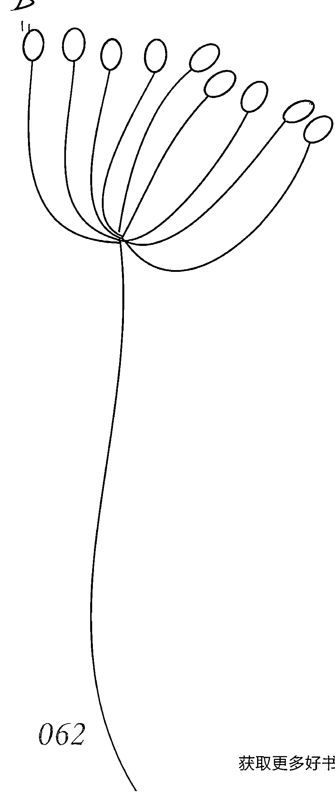

于是，鲸鱼和画家开始了他们的艺术生涯。日子一天天、一年年地过去了，画家和鲸鱼成了无话不说的好朋友，鲸鱼也不再孤单了。时光过得很快，画家逐渐老了……有一天，画家告诉鲸鱼：“其实，我最大的愿望，是留一幅完整的画作在人间，告诉世人我来过啊……”画家在鲸鱼身上画下最后一幅画后，他对鲸鱼说：“你真是我的 Blue Angel，谢谢你，陪伴我走过这美好的一生。”说完后，画家慢慢地失去了力气，安详地躺在沙滩上，并且缓缓地闭上了眼睛离开了。而鲸鱼则一直守在画家的身边，直到最后一刻的来临……

其实，在画家与鲸鱼告别的时候，鲸鱼也暗自决定不再回到海里了。它要把画家最完美的画作留在人间，好让世人都能看见画家精彩的画作！

在蓝天使身上的颜色，就是画家所画的最后一幅画，是鲸鱼和画家一生的记忆和精髓。艺术，是人类最精华的呈现，就连一条鲸鱼也能够感受画家对艺术的执着，而愿意牺牲自己的生命。

于是，大地的蓝天使也跟着凝结了，在蓝天使鲸鱼的身上！

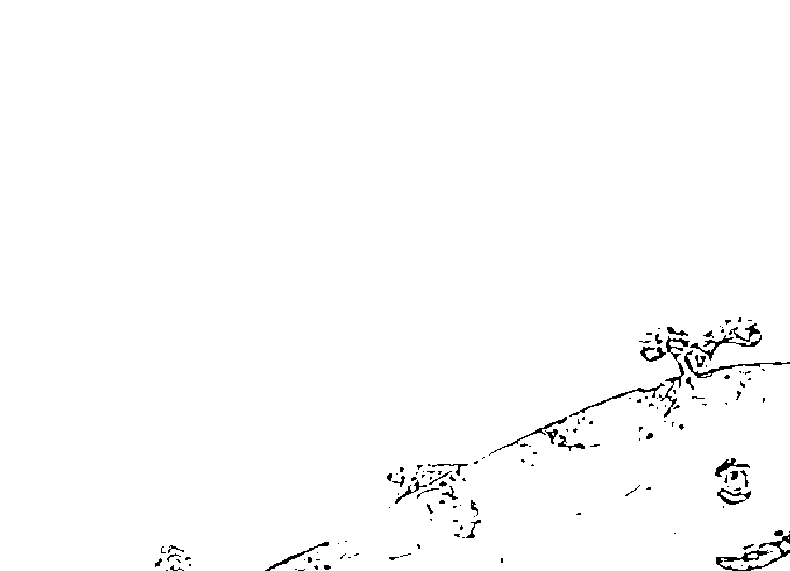

## 提升沟通能力 水蓝色能量宝石

水蓝色就仿佛大海般，让人心情平静。而水蓝色宝石的主要能量，就是增进沟通，表现出个人的能力。对应到人体的部位时，水蓝色宝石与喉部有一定的联系。

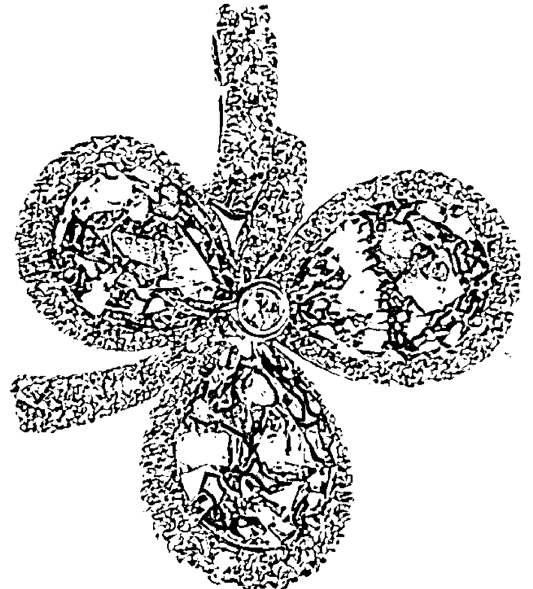

# 海蓝宝

唤起潜藏内心的生命力，缓和冲突的人际关系、爱情长存

- 硬度: 7.5 ~ 8
- 比重: 2.68

## 爱情长存的黛安娜宝石

海蓝宝就是海水蓝宝石，古时候欧洲人认为在海蓝宝石之中住着月神黛安娜，因此海蓝宝又有“黛安娜宝石”的美称，也意味着在人生或感情低谷的时候，可以借由黛安娜宝石的帮助，从黑暗中找到希望。

海蓝宝另有一个美丽的别名——“美人鱼石”。梵语将海蓝宝解释为“万物起源的母亲——海的化身”。在拉丁文中，海蓝宝则为“海水”的意思，认为海蓝宝是海水精华所形成的化石，具有海洋的原始力量。因此，当时的人们只要乘船就会佩戴海蓝宝石，希望一路平安顺利。

在古欧洲时代，海蓝宝就极受重视。古罗马人认为海蓝宝可以改善胃肠、喉咙方面的疾病，也有人认为它可以带来平和心情的效果。在很多埃及皇家古墓里，都挖掘到过以海蓝宝做成的念珠。据说，拥有海蓝宝可以增强人的意志力，从而使婚姻幸福，还能让持有人永葆青春。而古罗马人也认为，女孩子若是佩戴海蓝宝石，就可以找回昔日的恋人，让爱情长存。

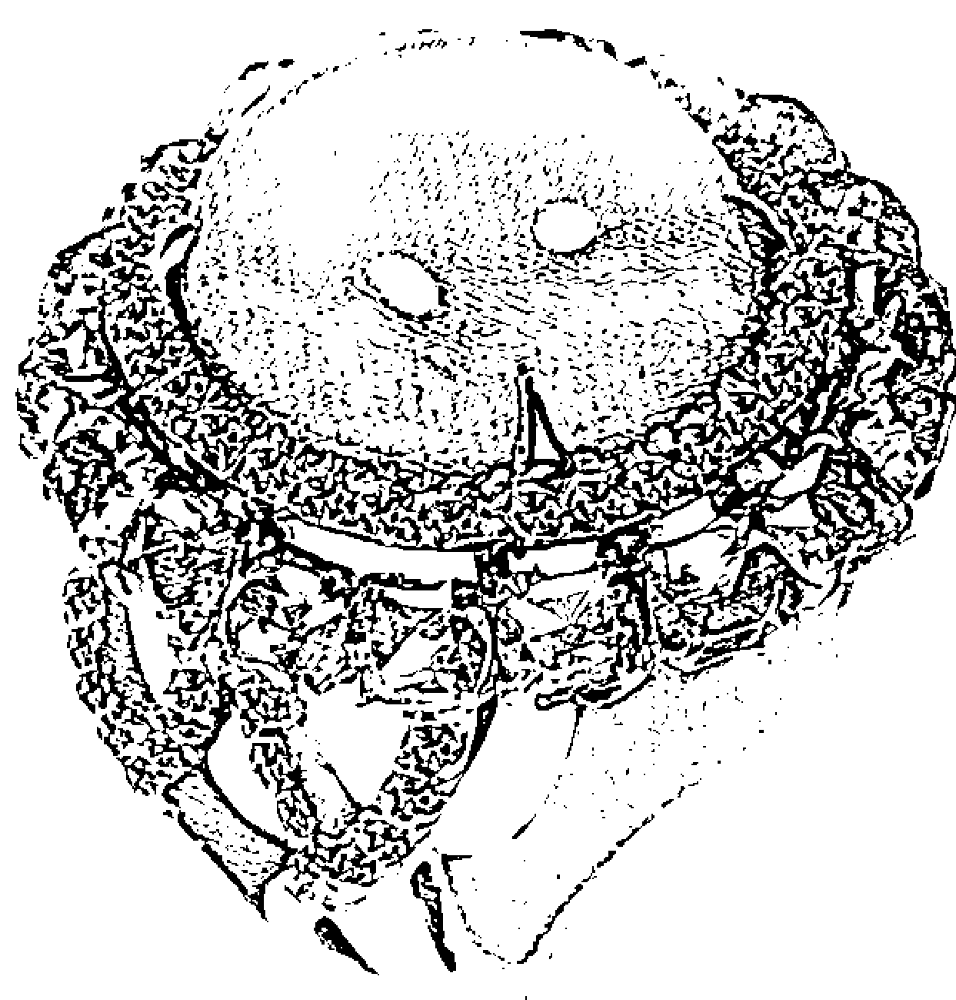

### 凝聚海水精华的海蓝宝

被认为是凝聚着海水精华的海蓝宝，拥有了海的能量，可以唤出人们潜藏在内心的生命力，重现生命旺盛的力量，并缓和内心不平和的情绪。

广阔的海洋是如此沉静，很多人在心烦气躁的时候，会到海边走一走，来舒缓波动的情绪。当你心情不佳、愤怒不平的时候，或是身体感到沉重、疲劳的时候，不妨就让凝聚海能量的海蓝宝洗去精神上的负荷。另外，海蓝宝也具有缓和人际关系的能量，当你感到人际互动出现困扰时，可以试着将海蓝宝贴在喉部，据说这样可以让人说出温柔的话语。古代欧洲皇后喜爱佩戴海蓝宝项链，已逝的黛安娜王妃也有许多海蓝宝项链，为的就是预防说出不得体的话语。

海蓝宝拥有的养生能量与免疫力有关。研究宝石的人认为，佩戴海蓝宝可以过滤身体内的毒素，改善免疫力不佳的状况。对于淋巴腺肿胀、压力过大而导致身体循环滞慢的人来说，也很有帮助呢！

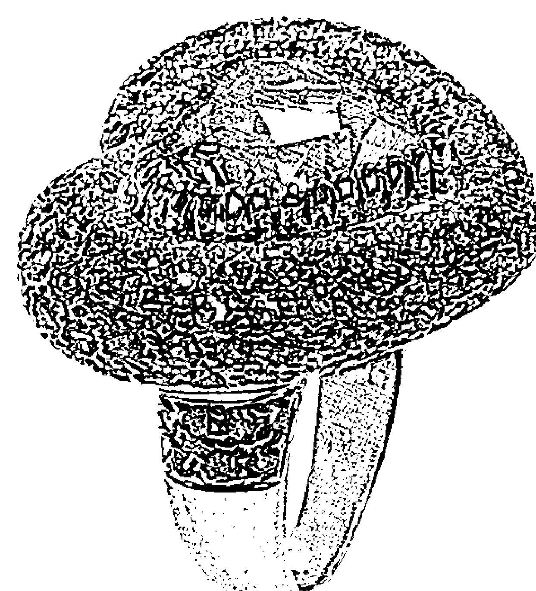

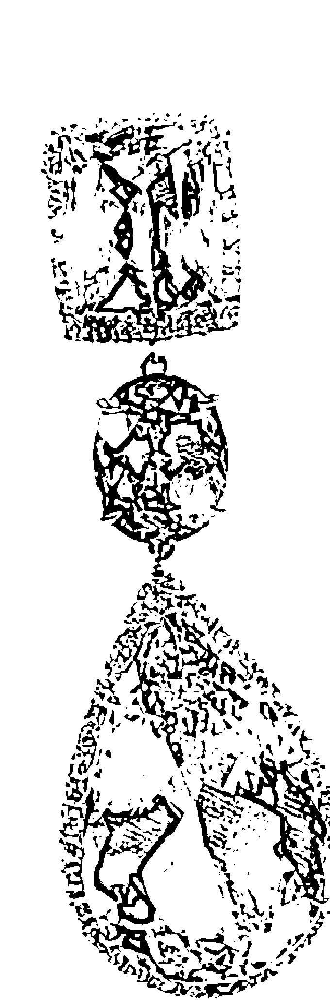

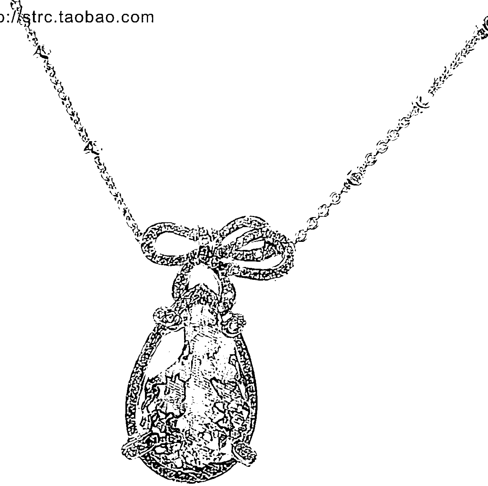

### 海蓝宝小传

如果你以为海蓝宝就是单纯的海蓝色，那可就大错特错了！

将真正的海蓝宝放在光线下鉴赏，就可以看出它的色泽为蓝中带绿；在浓度方面，大部分海蓝宝的色彩是属于较淡、较透明的水蓝色，而不是很深的蓝色。

另外，若用十倍放大镜来观看，就可以看见海蓝宝内有一丝一丝的针状内含物，而最易被用来假冒海蓝宝的“拓帕石”，则无法有蓝中带绿、针状内含物的特色。

海蓝宝的价格高低可以由色彩与特殊现象来评估，一般等级的海蓝宝颜色很淡，每克拉七八百元；中等等级的海蓝宝每克拉一千五到两千元；上品的海蓝宝颜色较浓郁且均匀，蓝中带绿，每克拉约四千元。若是上品海蓝宝再加上“猫眼现象”，则非常稀有，无法以重量定价。

以产地来区分时，上等的海蓝宝分布在巴西的伟晶岩和砾石的冲积矿中，当地人称为“Cascalho”。此外，阿富汗、巴基斯坦也出产海蓝宝，马达加斯加也出产色彩较蓝的海蓝宝。海蓝宝颜色亮丽，相当令人喜爱，是珠宝设计师最容易发挥创意的宝石。

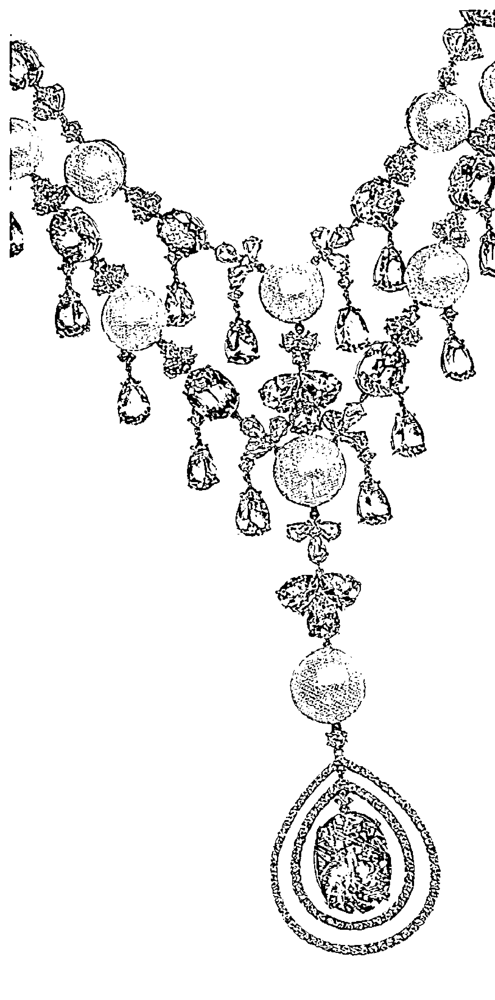

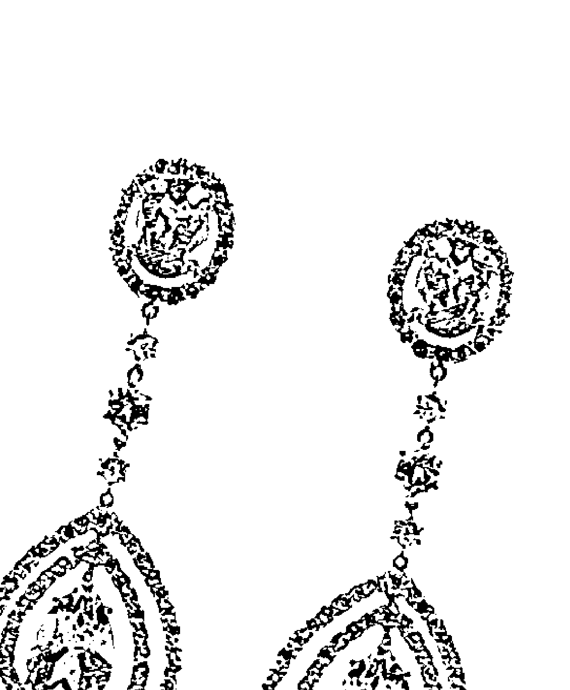

## 佩戴与保养

海蓝宝的硬度中等，从能量来看，做成项链是最佳选择。保养时，可以用温水或珠宝清洁液来清洗。平时也不妨多将海蓝宝带到海边玩，或是以海水浸泡，让它与大海联系，保存海蓝宝的能量。

具有海水能量的海蓝宝，最适合的净化方法就是浸泡法。将海蓝宝浸在加了粗盐的矿泉水中24小时后，再以软布擦干即可。

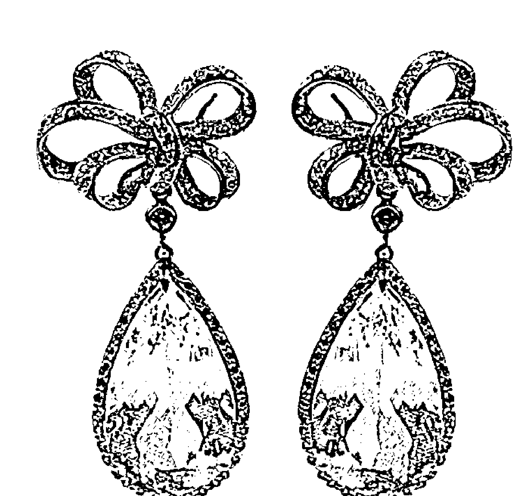

## 事业成功、不再画地自限、增进人际关系

| 属性 | 值 |
|------|-----|
| 硬度 | 5～6 |
| 比重 | 2.80 |

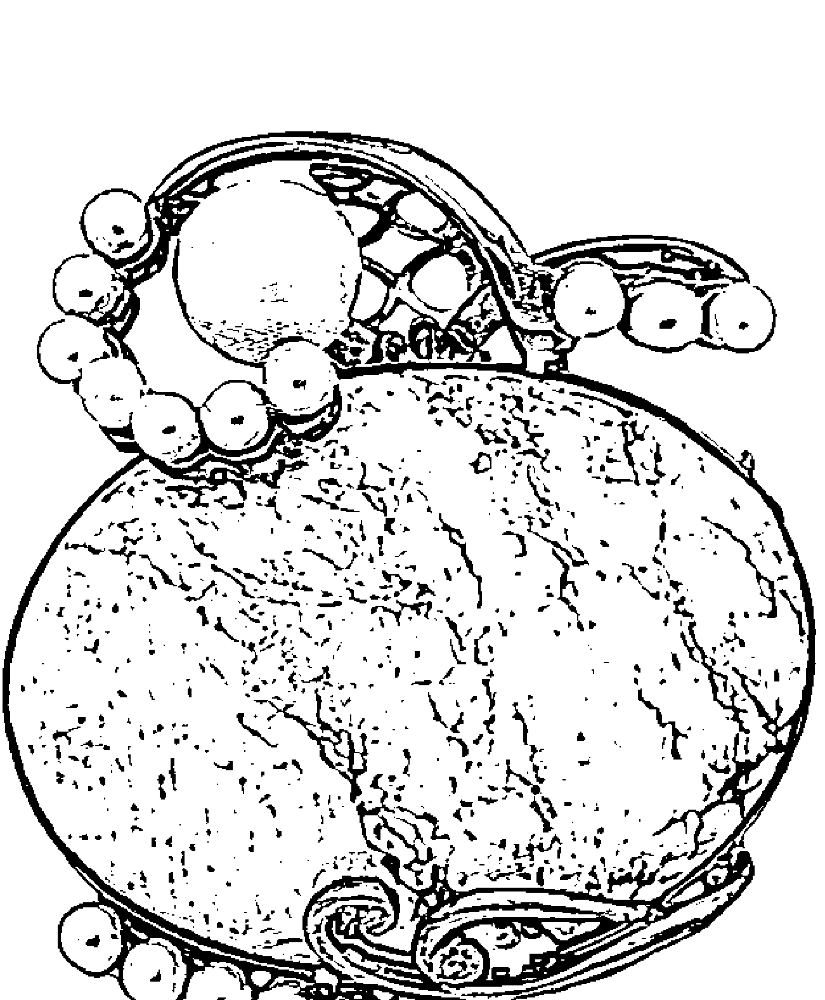

土耳其石是12月的生日石，是一种不透明的蓝色宝石，在古埃及时代被视为圣石。古欧洲与中东地区认为土耳其石有避邪的守护作用，因此很喜欢将它做成戒指佩戴在身上。古代美洲原住民将土耳其石称为“天空之神寄宿的矿石”，认为其具有信任的能量，在两个国家结盟时，会互换土耳其石。有些印第安人认为土耳其石有守护坟墓、与天上的神灵相通的作用，将其视为宇宙之石。在古代，土耳其石也经常在祈雨、预知天气或进行大型仪式中使用。

很多人以为土耳其石是生产在土耳其，其实不然。出产于波斯矿区的土耳其石，由于最先是由土耳其商人带入欧洲贩卖，所以才被称为土耳其石。

有关土耳其石的传说不仅仅是避邪、守护，也有与爱情有关的浪漫传说。据说情人若送给另一半土耳其石，就表示希望这段爱情永久长存，承诺愿意一辈子守护对方。

土耳其石是欧洲最早盛行的宝石，经常被欧洲皇室用来镶嵌在饰物上，特殊的蓝色至今仍然倍受喜爱。

秘鲁原住民认为土耳其石具有事业成功与积聚财富的能量，当希望生意成功时，就会用土耳其石来祈祷。他们相信，土耳其石可以赶走伤害，保护主人，让事业顺利成功。

除了秘鲁外，印度教也记载着，如果希望得到真爱，可以在新月（上弦月）出现时，静心凝望土耳其石3分钟，并诚心祈求，就能达成愿望。

土耳其石也可以增强挑战的勇气与力量，古代西班牙的“瓦霍族”会将土耳其石赐予勇士，让心灵与宇宙合而为一，增加勇气。如果你感觉自己陷在旧的观念或方法中无法前进，不妨在右手挂上土耳其石手链，就可以突破画地自限的障碍。

土耳其石有一种包容的能量，对应到人际关系时，也有一定的作用。如果希望听到别人的想法，不妨戴上土耳其石耳环，可因此增进人际关系，并且缓和人情上的压力。

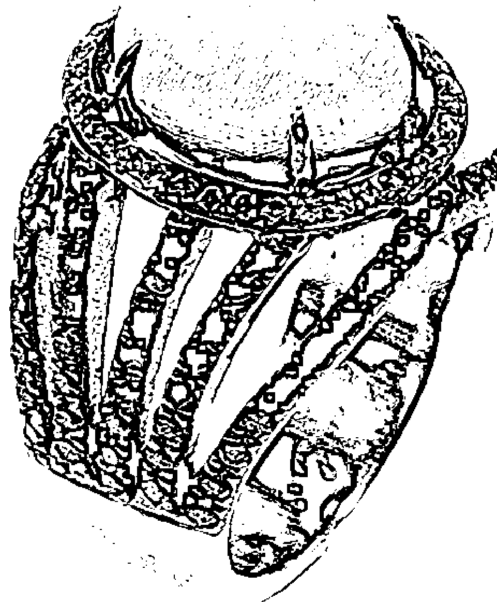

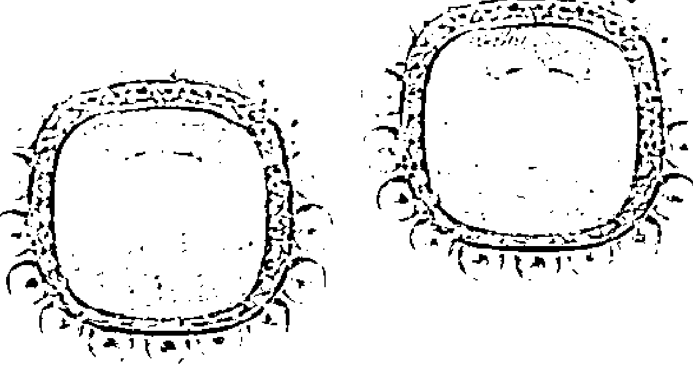

## 选购建议

天然的土耳其石有着黑色或白色的纹路，在欧洲是贵重宝石，由于喜爱者众多，市场上出现的仿品也非常得多，约占市场九成。

目前出现在市面上的土耳其石仿品，以“人造土耳其石”最多，它的成分与外表都与天然土耳其石十分相似，却没有纹路，约五成以上都是以吉尔森法做出来的；其他像以塑料、玻璃、硅胶等做成的仿品也不少。

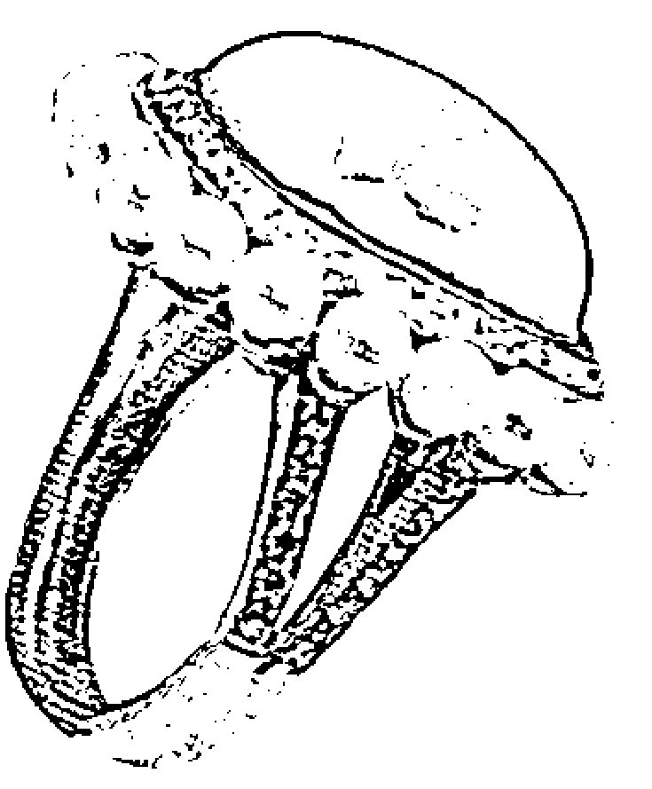

大部分的土耳其石都是不透明的质地，也会出现网状的黑色或白色石脉纹。土耳其石的价格可从色彩与纹路来判断，色彩越均匀、纹路越少，价格越高。美洲所产的土耳其石裂纹很多，价格非常便宜，约每克拉数十元起，虽然无法被当成宝石来镶嵌，却经常被当成民俗风格的饰品来设计，可说是经济又实惠的土耳其石饰物；而质量好的土耳其石价格就非常高，以中等质量的土耳其石来说，每克拉约两千元；上品的土耳其石色泽为纯净、半透明的天蓝色，每克拉在数千元以上，且市面上并不多见。

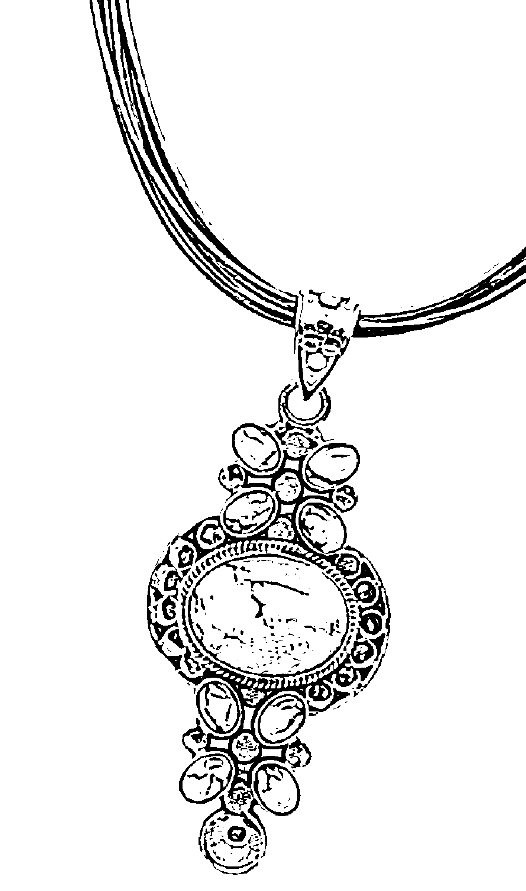

土耳其石的硬度中等，但容易褪色或变色。当土耳其石经过汗水、化妆品、盐、强光、油渍、高温的侵蚀后，极可能从蓝色变为绿色，在佩戴的时候请特别注意。

土耳其石怕盐和水，不宜使用浸泡法。最适合土耳其石的净化法是烟熏法，用干燥的鼠尾草加上桧木叶所燃烧出来的烟雾熏陶土耳其石约4小时即可。另一种方法为日光浴法，将土耳其石放在太阳光下吸收阳光，可让其恢复能量。

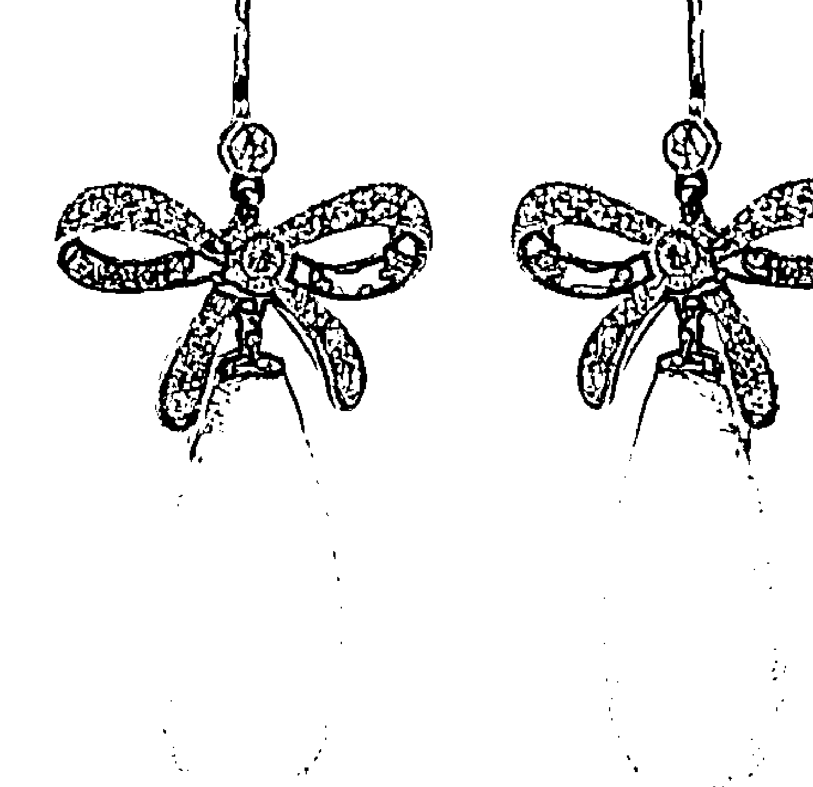

吉尔森法是一种著名的人为合成假宝石的方法。其方法是在实验室中，以一定量的人工合成元素，在一定量的压力与温度下仿制成人工宝石，因其外形、硬度，甚至折射率等物理现象都能与真宝石相同，若非有经验的珠宝鉴定师用仪器观察宝石的内含物，有时很难就肉眼判断出来。

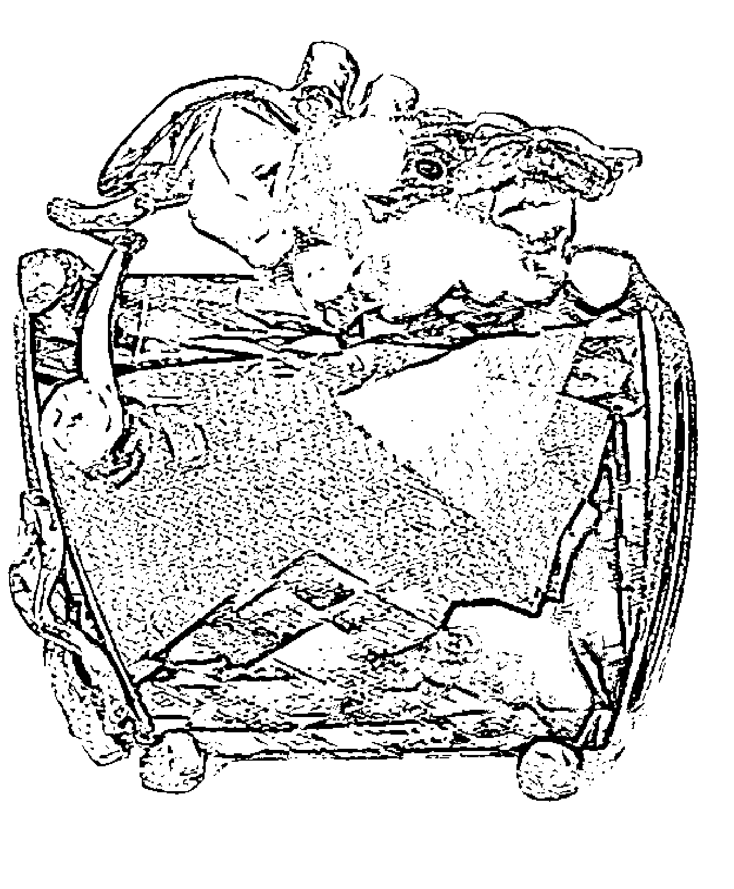

# 蓝色拓帕石

增加创意、集中注意力、舒缓压力

| 属性 | 值 |
|------|-----|
| 硬度 | 8 |
| 比重 | 3.54 |

> > 神气触动的火彩之石

蓝色拓帕石在古欧洲时代就是重要的宝石，英译源自梵语的“Topas”，有火光、火彩之意，因此，印度人又将拓帕石称为“火之石”。

关于拓帕石名称的由来，有一个极为浪漫的传说。古埃及时代，法老准备以刚继位的国王受妖惑的魔法控制为由而鼓动废王，美丽的王妃为了保护深爱的国王，选择刺杀法老，但却失败了，王妃被流放到红海上一座终年被雾围绕、不易寻找的小岛。国王非常想念心爱的王妃，但因这长年被雾气弥漫的小岛很不容易看见，只有当国王因思念王妃而流下眼泪之后，才能透过泪眼看见这个小岛，国王便自己驾着小船，不畏海上的危险去寻找这个小岛亲见王妃，并且每次都为王妃带来一颗她最爱的蓝色拓帕石。在王妃过世后，国王将这些蓝色拓帕石串成一条长长的项链，一直佩戴在身边，希望来生还能再相遇。因此，名为Topazos小岛在拉丁文中有“寻找”之意，且又以Topaz来称呼这种宝石。

## 新蓝色拓帕石的能量

在古代欧洲，蓝色拓帕石被认为寄宿着宇宙间的智慧之神，是学问的象征，也有“智慧之石”之称。对于想要集中注意力的专业领域人士（如律师、会计师、科技业人士），具有强大的能量。

蓝色拓帕石具有一定的坚持力，可以帮助持有人坚定目标，找出新的方法，突破自我的界限。另外，它也有提升知性的能量，尤其是对艺术领域的人来说，蓝色拓帕石可让直觉更敏锐，增强创意者的新灵感与艺术涵养，开展新契机。

不仅如此，蓝色拓帕石也有一种镇静的能量，当出现情绪障碍、思维无法突破时，不妨借由蓝色拓帕石的能量让自己冷静下来，避开最糟的状况，让事情出现转机，并做出正确的判断。

在养生能量方面，蓝色拓帕石被认为可舒缓疲惫的心灵与释放压力。曾经有一项实验证明，将拓帕石放在含微酸性的水中24小时后再检验，水质会变成中性。这表示拓帕石具有酸碱中和、过滤杂质的能量。因此，当压力太大、思想混乱而无法入眠时，可将蓝色拓帕石放在胸口，以改善不安的情绪。

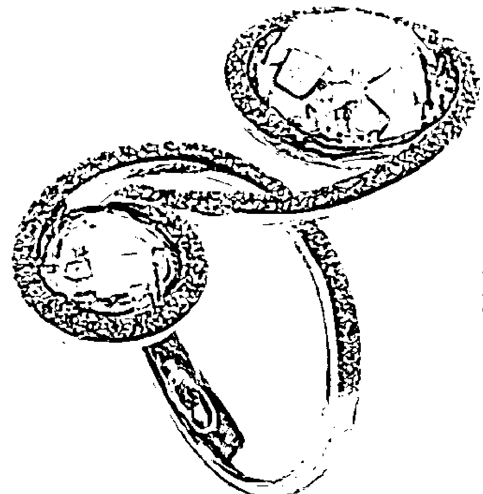

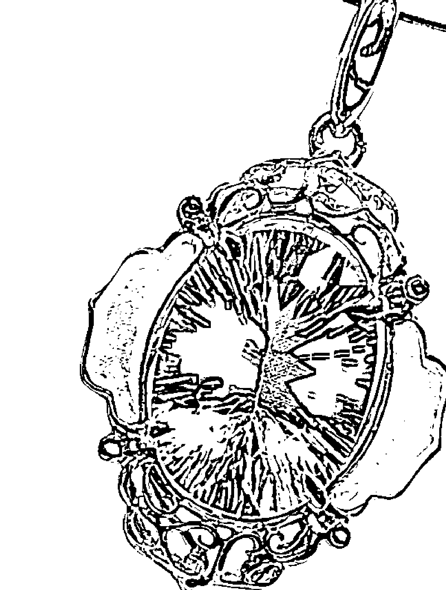

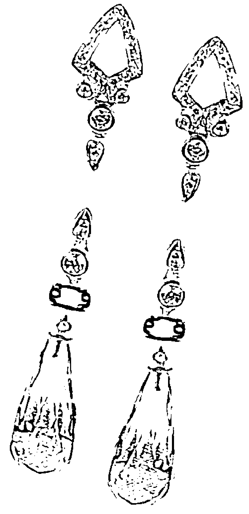

## 选购建议

拓帕石的另外一个名称为“黄玉”，原因在于早期发现的拓帕石以黄色为主，后来才又陆续发现蓝色、黄绿色、淡棕色甚至橘色的拓帕石。17 世纪时，葡萄牙国王的王冠上有一颗被认为是当时世上最大的 1640 克拉 Braganza 钻石，但后来经鉴定发现，这是一颗无色的拓帕石。

目前市场上最多的仿品，是以染色的蓝水晶来仿拓帕石，但因为天然水晶并没有蓝色的，大多只为仿拓帕石而制作，所以很容易被鉴定出来。

在选购拓帕石时，色彩与裂隙是重点，色彩越深蓝，价格越贵。另外，由于拓帕石较易碰裂，购买时不妨以十倍放大镜观察是否有裂隙。

拓帕石的价格从每克拉六十元至六百元均有。此外，一种特殊的“伦敦蓝”拓帕石，色彩高贵，价格也就另当别论。

## 佩戴与保养

拓帕石的硬度虽高，却不够坚实，在佩戴时要避免碰撞。拓帕石饰品是很容易保养的，以清水洗拭即可。另外，进行户外运动或做家务时，尽量不要佩戴，以免擦撞而碎裂。

最适合拓帕石的净化法为月光浴法，可以在满月的夜晚进行净化，平日也可用同样的方法来保存它的能量。

# 蓝色蛋白石

舒解压力、重新复合、助眠

- 硬度：6
- 比重：2.10

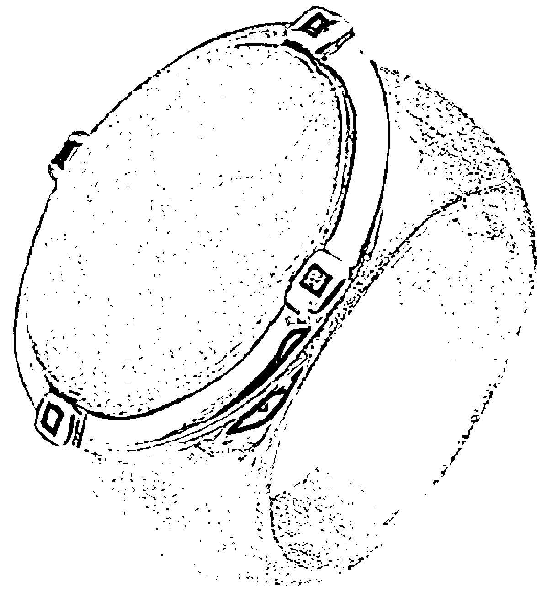

### 纯粹幸福的蓝色

蓝色蛋白石在所有的蛋白石之中，是产量最少的一种。它的水蓝色非常柔美，令人惊艳。

在我国的古书中，曾经记载有一种从波斯传来的“蓝色幸运石”，指的就是蓝色蛋白石。传说，这种宝石可以让爱人在自己身上投注更多的爱恋，也被后妃们认为是可以受到皇上宠幸的幸运石。

蓝色蛋白石之所以会呈现蓝色，是因为内含蓝色硅晶球。而蓝色硅晶球必须在低温中渐渐结晶，十分不易，结晶之后呈现温和、均匀、半透明，仿佛果冻般的结晶，极为少见。

正因为蓝色蛋白石是如此柔润，当人们目视它的时候，会感觉情绪逐渐冷静。因此，蓝色蛋白石被认为具有舒解压力、帮助睡眠的特性。

### 你是容易紧张的人吗？

你是一个心情较容易波动的人吗？有舒解压力特性的蓝色蛋白石，可平缓你的怒气、愤慨。看着蓝色蛋白石，你将会觉得心中沉静许多，不再那么浮躁，替代怒气的则是和平与爱。

蓝色蛋白石也含有重新联系的能量，由于蓝色蛋白石在结晶之后有黏稠的特性，对于因为误会、吵架而许久不联络的朋友、情人，具有再次联系感情、复合的能量。

在古代许多文献中，记载着蓝色蛋白石对于治疗中毒、毒瘾有一定的改善作用，同时也被认为具有活化新陈代谢的能量。

## 选购建议

蓝色蛋白石一般无仿品，却很容易被其他宝石“张冠李戴”。市面上最常见的是，将蓝色的玛瑙、玻璃、塑料当成蓝色蛋白石销售，但是蓝色蛋白石是一种非常轻的宝石，此特点是玛瑙、玻璃无法取代的。

此外，蓝色蛋白石的外观平滑，内含物呈现颗粒状，购买时不妨以放大镜仔细辨识。

蓝色蛋白石是较稀少的宝石，在选购时以裂痕、蓝色的色泽和净度、均匀度、透明度作为价格的标准，但由于这种宝石十分珍贵，即使是一般等级的蓝色蛋白石，每克拉也要一千六百元以上，如果是中上品价格则更高。在国际拍卖会上，曾经出现过一颗七八克拉的蓝色蛋白石，以十四五万的价格成交。

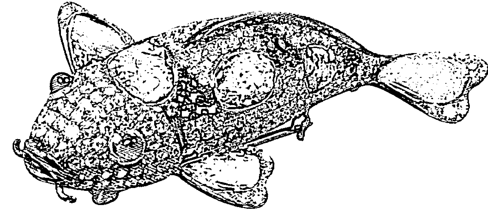

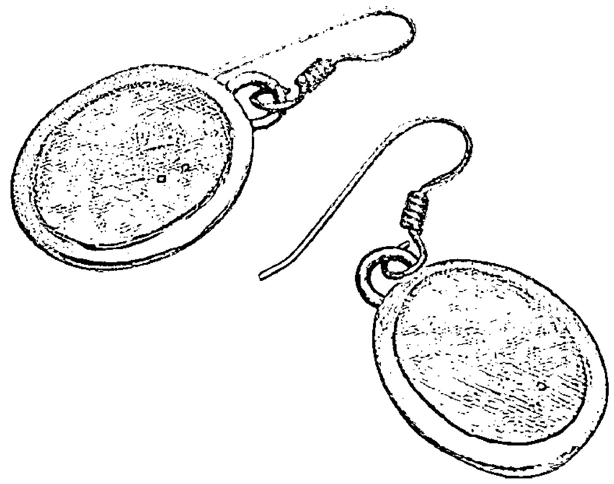

## 佩戴与保养

蛋白石的硬度不高，且内含三分之一到五分之一的水分，很容易因为碰撞而破裂，因此在佩戴的时候要特别留心。

从能量的角度来看，将象征流动与包容性的蓝色蛋白石做成耳环，具有顺利增进人际关系的能量。如果想活化新陈代谢，带来身心调和的能量，不妨做成项链佩戴。

在保养蓝色蛋白石的时候，以清水洗拭，再以软布轻擦即可；避免日光照射，也不要在厨房、美容美发院或其他有蒸汽的地方佩戴，以免影响宝石质量。

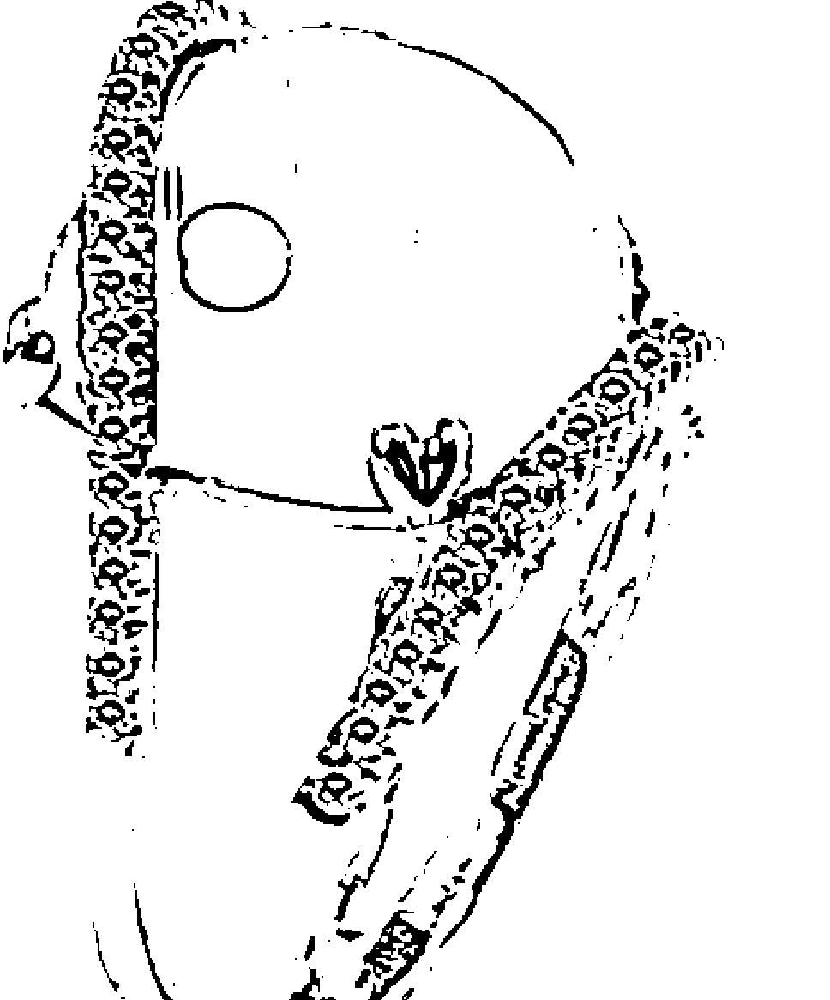

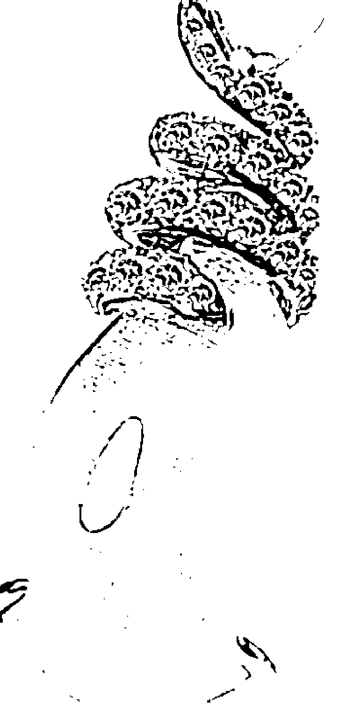

# 硅孔雀石

为干涸的心灵带来滋润、具体实现不确定的计划、增强自信心

| 属性 | 值 |
|------|----|
| 硬度 | 2 |
| 比重 | 2.2 |

## 传说故事

硅孔雀石，也可称为蓝色石髓（蓝玉髓），是一种非常古老的宝石。古希腊人认为硅孔雀石是由金子“Chryso”和胶质“Colla”所组成的，有“很多金子连在一起”的意思，因此，硅孔雀石被认为可以为人们带来富裕及繁荣，同时也是爱与美调和的象征。

硅孔雀石最为人所知的名称是“台湾蓝宝”，原因在于世界上所有的硅孔雀石产地中，以我国台湾花东一带的硅孔雀石最美、质量最好；加上硅孔雀石的颜色呈现水蓝色，因此在台湾地区出产的硅孔雀石就被称为“台湾蓝宝”。

## 滋润心灵的包容能量

硅孔雀石的质地具有胶合感，富有“可为心灵带来滋润”的能量。当人们的心灵干涸，感觉伤心、失落，充满着悲观情绪的时候，不妨佩戴硅孔雀石，赶走负面的情绪与沮丧的心情。

硅孔雀石的第二个能量与具体实现有关。假如你是一个想法很多，却无法实现的人，也可以借着硅孔雀石的胶着特质，凝聚不定时进出的零碎想法，帮助实现计划。

具有母爱、包容能量的硅孔雀石，也十分适合没有自信心的人佩戴。从古至今，美洲许多部落仍然会佩戴硅孔雀石，并认为族人们一起佩戴硅孔雀石的时候，力量将会变得更强大，也更有信心完成目标。我国台湾许多大财团家族都采用硅孔雀石当作传家之宝，也是希望借由硅孔雀石团结的能量，让家族事业更长远、更发达。

## 选购知识

除了我国台湾花东一带之外，美国加利福尼亚州（加州蓝宝）、非洲均出产硅孔雀石。

想要辨识究竟是台湾蓝宝或加州蓝宝并不容易，但还是可以从颜色、色调来判断。通常台湾蓝宝的蓝中带绿，双色性极强，颜色均匀，色调极为浓密，而美国加州及非洲出产的硅孔雀石则色调淡薄。

在选购台湾蓝宝时，以颜色及色调为价格高低的标准，双色性越强、颜色越均匀、色调越浓密的质量就越高。

一般来说，台湾蓝宝的价格每克拉六百元到一千六百元，也曾出现过一克拉七八千元的高质量台湾蓝宝。至于美洲生产的硅孔雀石就便宜许多，一克拉从数十元到五六百元不等。

## 佩戴与保养

硅孔雀石的硬度及韧度尚佳，可塑性也很高，做成一整组首饰也很合适，尤其设计成特殊造型的别针更具艺术性。保养时，用水洗法即可。

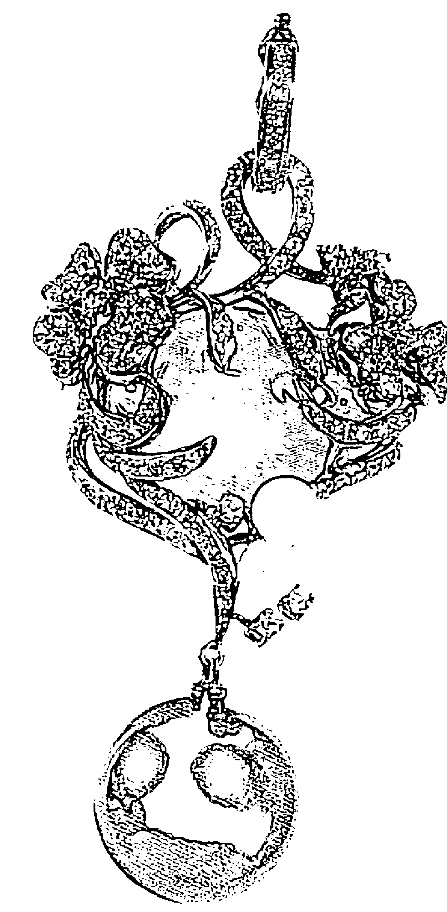

### 五线谱上唱歌的热带鱼

“**这**是热带鱼，这是海星，这是螃蟹，它们在大海里唱歌！”6岁的女儿拿着自己画的图，童言童语地对妈妈说。

“妈妈，你看，那里……那里……鱼在冒泡泡，鱼儿好喜欢唱歌，一直唱个不停！”说完，女儿呀呀地唱起在幼儿园学会的歌，又唱又跳好不快乐。

妈妈看着女儿稚嫩的脸庞上的笑脸，心里有着无比幸福的满足感。

《会唱歌的鱼》是 Joy 女儿参加美国俄克拉荷马州政府举办的绘画比赛所画的一幅图。图画上有热带鱼、海星与螃蟹，它们快乐地在海洋世界里唱歌，为大海增添许多热闹的气氛。这幅画荣获了第一名，州政府还将这幅画印在T恤上。

为了纪念女儿荣耀的时刻，Joy特别以女儿画的《会唱歌的鱼》为蓝图，设计出这款《海洋世界》。由于女儿学习长笛，同时也为符合“鱼在唱歌”这样的概念，设计时，特别选用五线谱串起快乐唱歌的热带鱼、小螃蟹和海星，并以钻石作为它们唱歌时所冒出来的泡泡，让欢乐的旋律自然流泻。

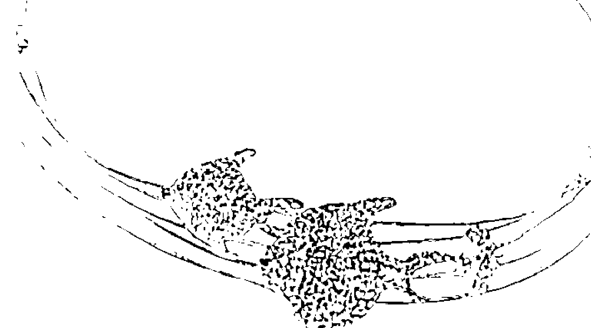

## 展现爱情与魅力 粉红色能量宝石

粉红色是女性的颜色，象征着温柔、无条件的爱与增强女性魅力的能量。对应到人体的部位时，粉红色则与心脏有关。

# Pink Opal 粉红蛋白石

发挥内涵、带来爱的邂逅

- 硬度：5.5 ~ 6.5
- 比重：2.10

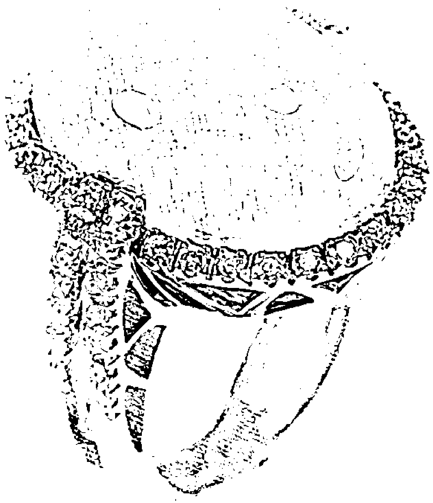

## 象征幸福美满

Opal，在梵语中是“贵重的石头”的意思。蛋白石的色彩很多，古希腊人认为在粉红蛋白石中住着一位象征着爱源源不断、幸福美满的女神。在爱尔兰的神话中也有类似的故事，爱尔兰人认为，住在粉红蛋白石中的女神叫“渥雷雅德尔”，她用自己清澈如处子般的眼睛，创造出粉红蛋白石如此美丽的宝石。另外，在爱尔兰，粉红蛋白石又被称为“亚尔卡斯汀”。

蛋白石是 10 月的生日石，据说在 19 世纪时，只有在 10 月出生的人才能佩戴蛋白石。蛋白石象征着幸福、爱与吉祥，当爱人想要移情别恋时，蛋白石可以让对方回心转意。关于蛋白石，也有一个相关的变色传说：当蛋白石变成灰色时，表示拥有者将有疾病上身，而当蛋白石的色彩越来越鲜明、鲜艳时，则会发生好事！

## 艺术家之石的粉红邂逅

当爱情动摇的时候，粉红蛋白石可以缓和你内在不安的负面情绪，并让情人再一次想起你的美好。因此，它也被认为是带来幸福与希望能量的宝石。

有一阵子，日本女性认为冥想着粉红色，可以让自己看起来更年轻，此方式蔚为潮流。粉红蛋白石可以展现出女性内在魅力的能量，如果你是个非常有内涵的女子，却感觉心仪的男士发觉不到你的内在，不妨让有“艺术家之石”美称的粉红蛋白石引出你内在的美与才华。

如果你非常希望谈恋爱，却遇不到来电的异性，那么更不能忽略有“丘比特之石”称号的粉红蛋白石哦！说不定很快就会出现一见钟情的有情人呢。

## 选购建议

被视为大洋洲国宝的蛋白石，散发出有如彩虹般的光彩（称为游彩现象），广受消费者的喜爱，仿品以人造蛋白石、夹层蛋白石与美化蛋白石最多。

人造蛋白石用灌胶与吉尔森法方式造假的最多，用十倍放大镜来看，不难看到仿佛蛇皮状的纹路。夹层蛋白石指的是以薄片蛋白石加上其他材料（如水晶、玛瑙）做成，辨认时最好从侧面观察，可以看到黏合的部分。美化蛋白石则是将不美的蛋白石浸泡在糖水中，以掩盖裂纹，但只要离开糖水不出三天，特殊的游彩现象就会消失。

在选购粉红蛋白石的时候，以色彩作为主要选择的标准，越粉红、色彩越均匀，价格越高。此外，由于蛋白石本身很容易破裂，镶工也是选购的标准之一。

一颗普通等级的粉红蛋白石，粉色较淡，每克拉四百元至六百元；高等级的粉红蛋白石可达每克拉两千元以上。

## 佩戴与保养

蛋白石的硬度不高，内含三分之一到五分之一的水分，很容易因为碰撞而破裂，佩戴时要特别留心。从能量的角度来看，将粉红蛋白石做成耳环，具有呼唤爱情的能量；如果想引发艺术性的能量，不妨做成项链佩戴。

保养粉红蛋白石的时候，以清水洗拭、软布轻擦，避免日光照射即可。请不要在厨房、美容美发院或其他有蒸汽的地方佩戴，以免影响宝石质量。

# Kunzite 孔赛石

提防第三者、增加自信心、化解紧张情绪

| 属性 | 值 |
|------|-----|
| 硬度 | 6.5 ~ 7 |
| 比重 | 3.18 |

## 加州艾莉丝

在一次奥斯卡金像奖典礼上，影星妮可·基德曼 (Nicole Kidman) 的脖子上戴了一条粉红宝石的项链，让她原本就非常迷人的风采更加柔媚。许多人都以为她戴的是粉红色的钻石，事实上，这条项链的主石，就是孔赛石。

有“加州艾莉丝”之称的孔赛石，是近年来才被发现的新兴宝石，它在 1902 年时，首次被宝石学家孔赛博士于美国加利福尼亚州发现，至今约 100 多年。虽然问世的时间不长，但是孔赛石已经得到了许多名人、明星的喜爱，妮可·基德曼就是一个最好的例子！

## 透亮浪漫的稳固力量

粉红色宝石一向具有爱情、浪漫的感觉，以及稳固感情的能量。当爱情遭到不信任、出现第三者的时候，就让孔赛石来唤回爱情、化解第三者危机，让两人的感情更稳固吧。

孔赛石的外表干净、透亮，却具有温暖的特质，让人们在看到它的时候，心中会浮现出一股安心的感觉，不再那么紧张，进而感到自信心满满。

从养生的能量来看，由于孔赛石可以散发爱情的能量，对于血液循环不好、手脚冰冷的人来说，不妨以孔赛石接触按摩心脏及四肢。

## 选购建议

孔赛石现世的时间尚短，认识的人不多，目前市场上还没有出现仿冒品。若担心买到假货，不妨将孔赛石放到光线下面观察，如果只出现一种颜色，就是仿品。因为真正的孔赛石具双色性，除了淡淡的粉红色之外，还带有一些紫色哦！

孔赛石的色彩很多，除了淡粉中带有紫色外，又以黄灰色孔赛石最为常见。在选购孔赛石的时候，可以色彩及切工作为挑选的标准，一般质量的孔赛石每克拉六百元至八百元；上品孔赛石的颜色既饱满又浓郁，价格每克拉一千五百元到两千元以上。由于多数孔赛石的色泽较清透，且容易脆裂，在切割时多半以厚切割的方式进行，因此切割的质量也会影响孔赛石的价格。

## 佩戴与保养

孔赛石是一种十分易裂的宝石，在设计、佩戴及保养时都要小心，一般建议设计成项链、耳环，较不易被碰撞，佩戴时也要避免损伤。保养时以清水洗拭、软布轻擦即可。此外，由于孔赛石的颜色较不稳定，最好不要在阳光下曝晒，以免变色。

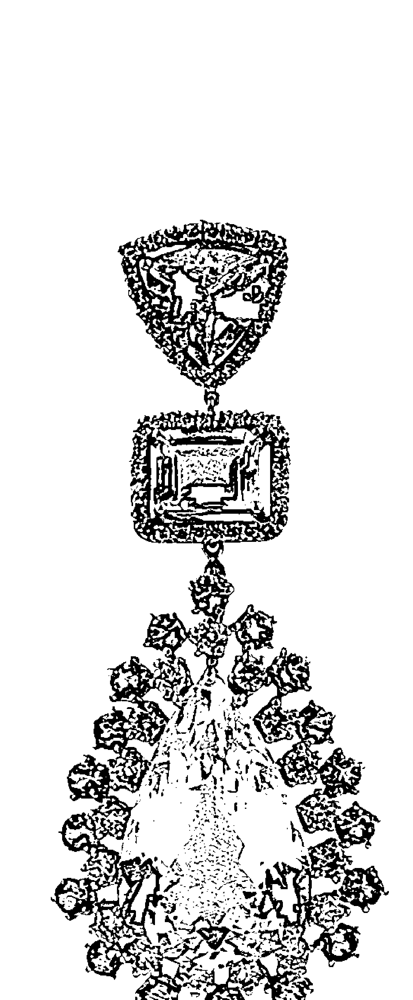

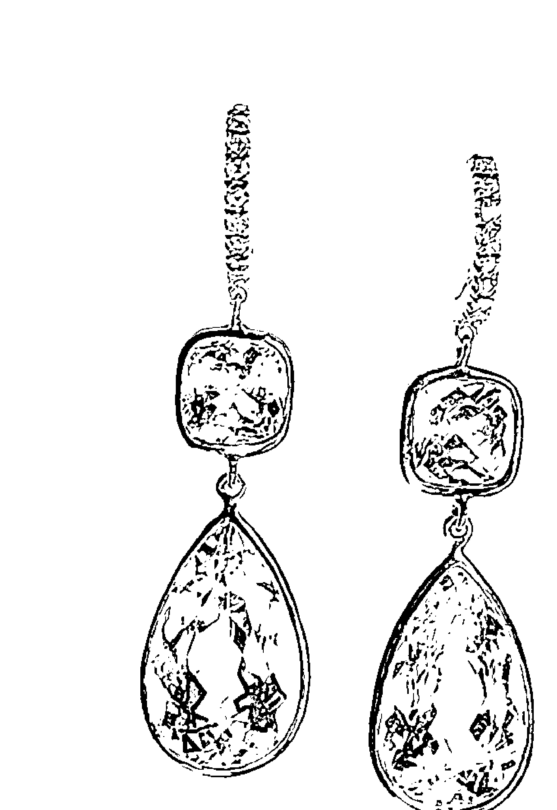

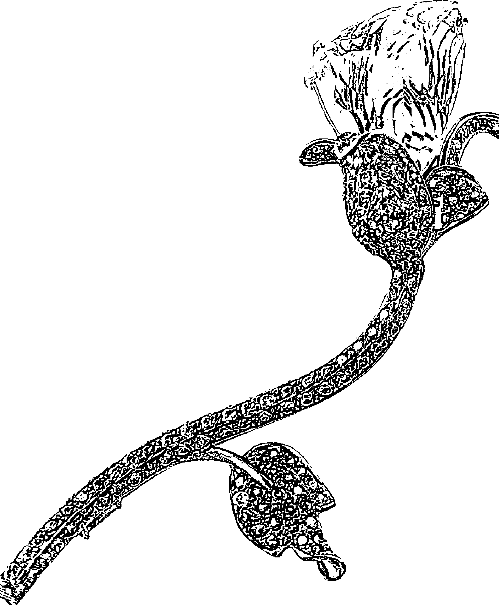

# Pink Tourmaline 粉红碧玺

尽情展现女性魅力、排除第三者障碍、接收更多信息的能量、把握新恋情

- 硬度：7 ~ 7.5
- 比重：3.06

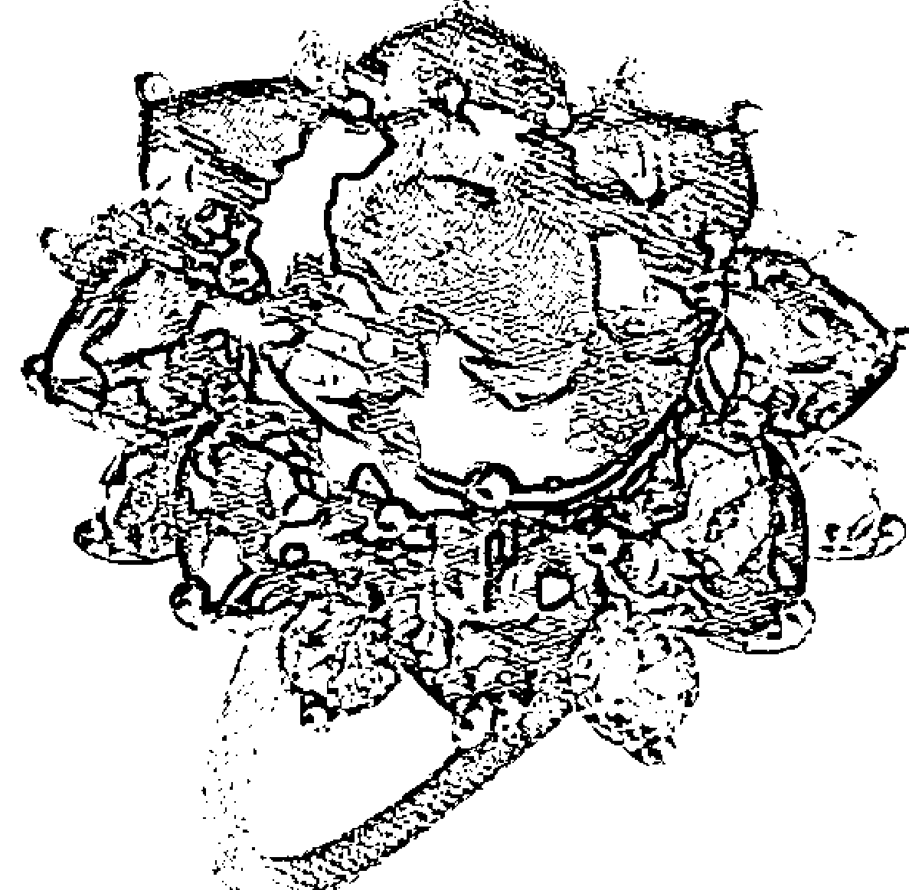

## 增加灵性的磁性玺石

粉红色碧玺，是近年来市场上最热门的碧玺色彩。

早期最知名的碧玺，为美国加利福尼亚州的粉红碧玺及缅因州的绿色碧玺，但随着巴西的碧玺矿被开发后，现在提到碧玺，人们多半会想到巴西。

碧玺又称为电气石，在古欧洲会将细长的电气石以摩擦方式生热，用以吸附烟管中的烟灰，所以当时人们称碧玺为“除烟灰的石头”。

古代的“咒术师”为了提升接收灵界信息的感应能力，也经常佩戴碧玺来与神灵接触。

## 不停放电的柔美气质

具有电气能量、又有爱情象征的粉红碧玺，可以传达、释放爱情的电流，与孔赛石一样，被认为可以排除第三者的障碍。

如果一个人缺少勇气，对爱情没有信心，不妨借由佩戴粉红碧玺增加爱情的能量，消除不安全感，全心往目标前进。

粉红碧玺的颜色从淡粉到桃粉均有，可以提高女性的魅力，尤其是脾气较硬、较固执、说话尖锐，或是心中对异性有着负面想法的女性，若是佩戴粉红碧玺，可以让思想较客观，渐渐地散发出女性柔美的气质。

碧玺原本就是一种感应力甚强的宝石，佩戴粉红碧玺可让拥有者感觉更敏锐，接收到更多信息，对于新恋情也更能把握。

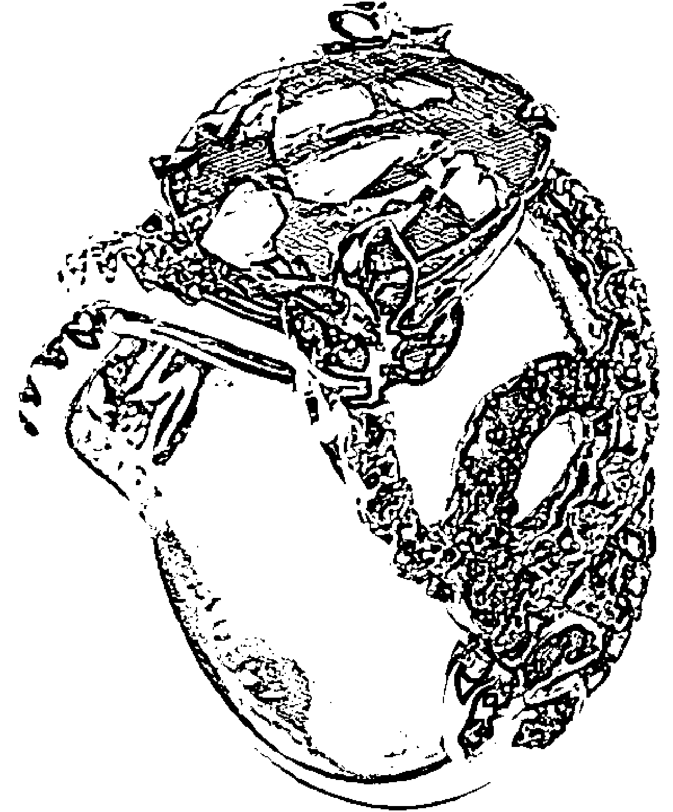

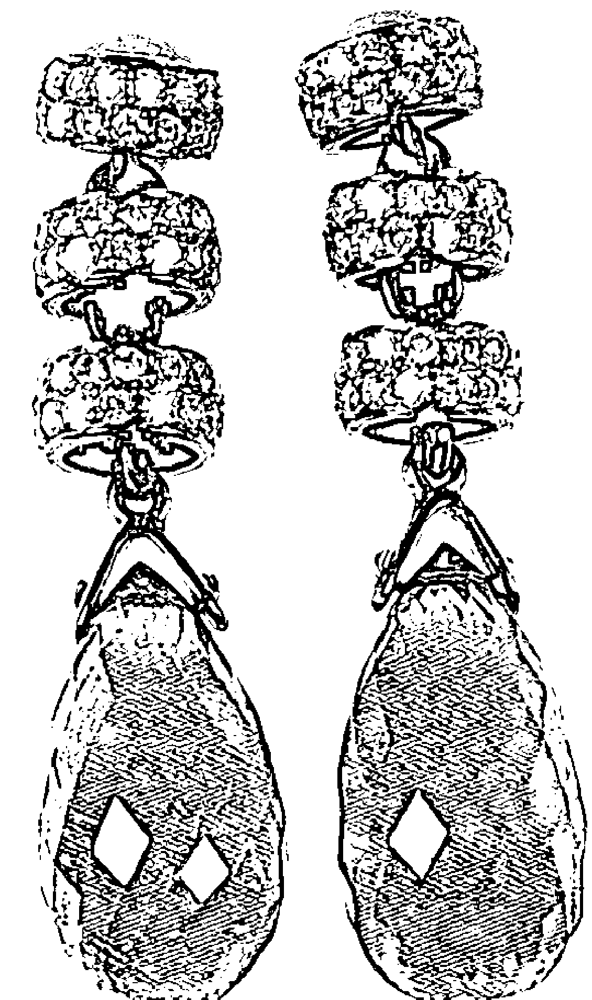

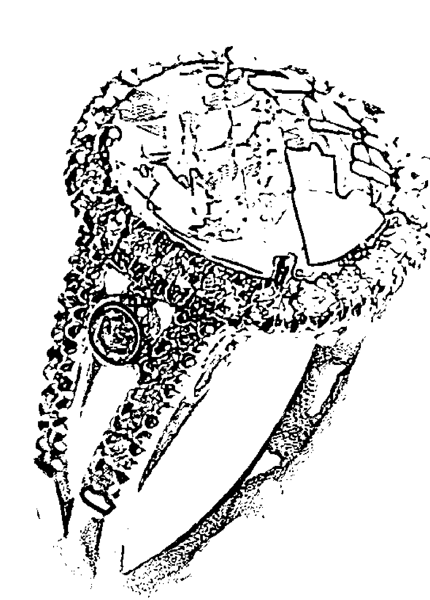

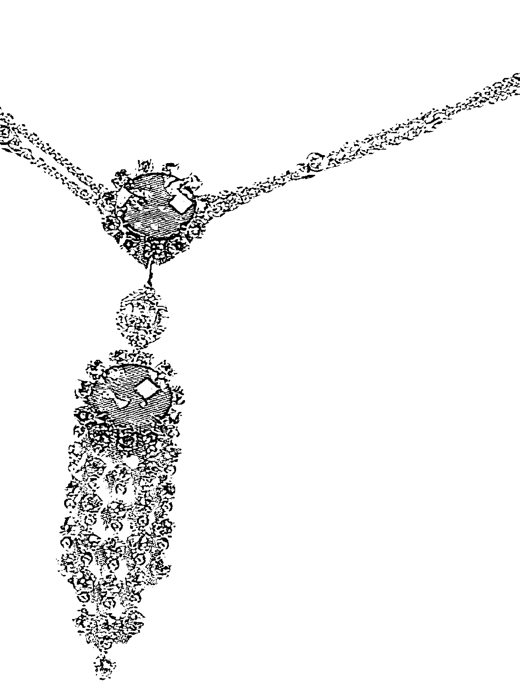

## 选购建议

目前，市场上最常用作仿造碧玺的材料为玻璃及塑料，但它们都很容易被识破，因为碧玺是属于双色性的宝石，将它放在光线下面，就可以观察到碧玺不单纯只有一种颜色，很容易分辨。此外，市场上很多人以“低质量的粉红色水晶”来仿造粉红碧玺，较难识破。

碧玺的选购重点以颜色及内含物为主。同样是粉红碧玺，色彩越浓，内含物越少，则等级越高；反之，色彩越淡，内含物越多，等级较低。

一般等级的粉红碧玺，每克拉八百元到一千六百元；中等级别的粉红碧玺，每克拉一千六百元到三千元；上品碧玺每克拉可达到四千元以上。

## 佩戴与保养

碧玺的硬度还不错，色彩又多样化，可设计成各式首饰佩戴。由于碧玺较容易吸灰尘，如果确定碧玺无裂痕，在保养的时候，不妨采用珠宝清洁液或用温水洗拭。

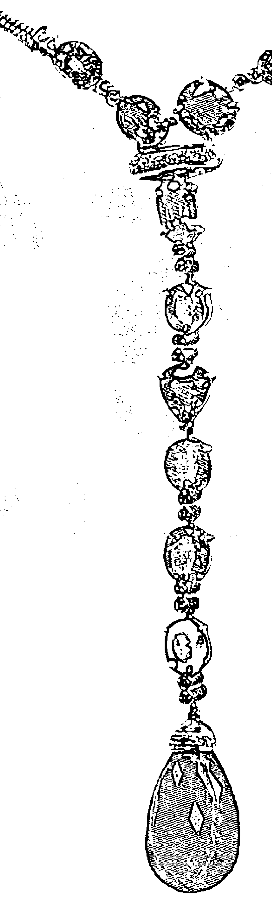

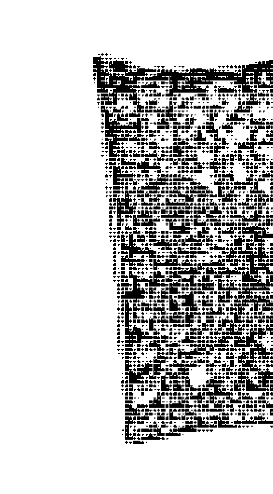

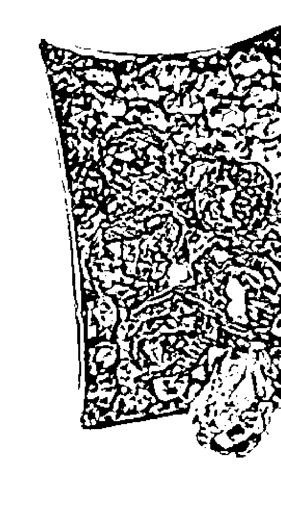

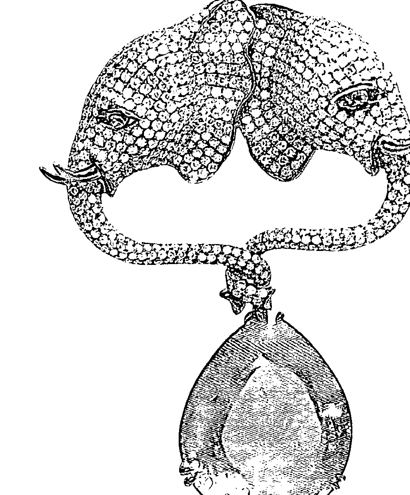

# Morganite
## 摩根石
离开不伦恋情、让梦想成真的宝石

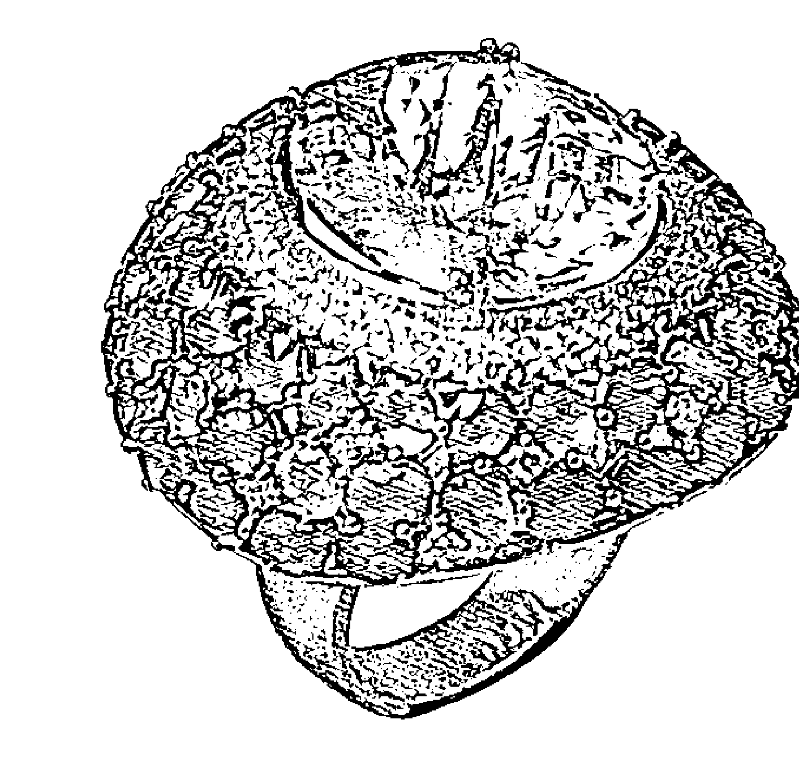

- 硬度: 7.5 ~ 8
- 比重: 2.72

### 美梦成真之石

摩根石的名字是来自美国的银行家约翰·皮尔庞特·摩根 (John Pierpoint Morgan, 1837–1913), 他以毕生的积蓄寻找未被发现的宝石, 就在资金即将用罄时, 终于挖掘出一颗以他为名的宝石——摩根石。

被称为“梦想成真之石”的摩根石, 是新兴宝石, 粉嫩的色彩得到许多女孩的喜爱, 除了肉眼可见的粉红色外, 尚有粉紫、粉橘双色性的摩根石, 这种特殊的颜色在宝石中很稀有, 非常神奇而特别。据说, 只要心中有梦想的人, 佩戴摩根石就可以美梦成真!

### 坚信明理的正向力量

粉嫩色系的摩根石, 除了外表讨喜外, 能量也非常正向, 可以增强爱情的向心力, 不易介入三角恋情。

有些女性会不慎介入别人的家庭或感情中, 成为第三者, 让情感世界变得暧昧不明。佩戴摩根石, 可以让自己的头脑较清楚, 离开三角恋情, 脱离感情的苦海。

对于内心一直纠结于某种苦恨, 希望寻求治疗心灵创伤的宝石, 那么，就让摩根石以爱的力量来化解内心的创伤，让人学会包容与宽恕。另外，摩根石还可以帮助人们与小孩、宠物之间爱的联结，增加相互之间的信任度。

## 选购建议

由于摩根石尚未成为热门的宝石，市场上也未听闻相关仿品，但随着摩根石越来越流行，被使用的机会也就更高，当它成为炙手可热的宝石时，要如何防伪呢？

很简单，因为摩根石具有双色性，只要将它放在光线下观察，就不难看出粉红摩根石中也带了些许的粉橘色，而不会是单纯的粉红色哦！

摩根石的价值与价格可从色彩及杂质判断，杂质较多的摩根石每克拉在四百元上下；普通等级的摩根石色彩较浅淡，每克拉八百元到一千元；中等等级的摩根石，每克拉一千元到一千五百元；高等级的摩根石，每克拉需数千元以上。由于目前开采到的摩根石鲜少以大克拉呈现，如果有色彩均匀而浓密、克拉数大的摩根石，就称得上是极品摩根石，价格自然不菲。

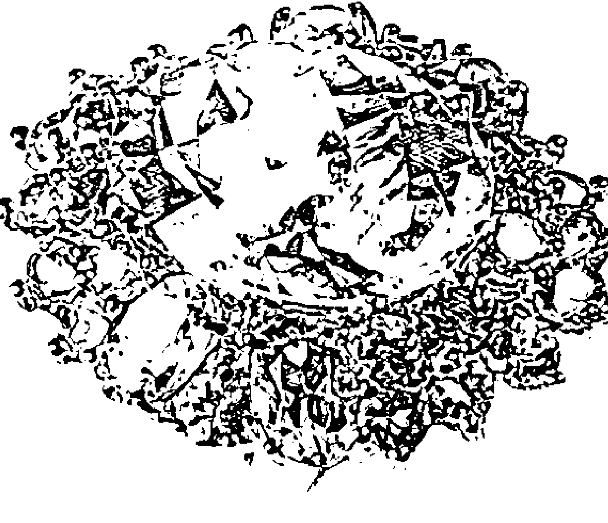

## 佩戴与保养

颜色粉嫩的摩根石，虽然硬度高，但韧度却不佳，无论是镶嵌或佩戴时，都要特别注意，避免一不留神就造成宝石的裂痕。

保养摩根石的时候，可使用珠宝清洁液或温水清洗，并以软布轻拭，切勿使用超声波清洁，以免伤害到粉嫩的摩根石。

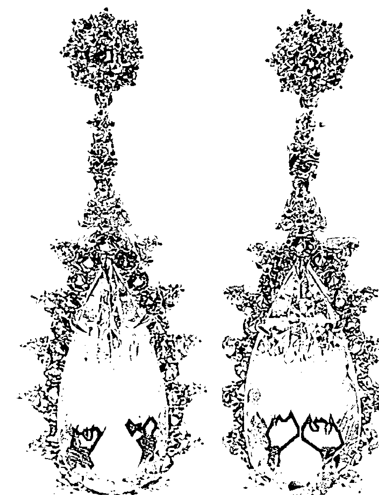

# Rose Crystal
## 玫瑰水晶
展现女性魅力、遇见新恋情、延缓老化

- 硬度：7
- 比重：2.65

### 维纳斯女神的粉晶化身

玫瑰水晶就是粉红色的水晶，有人称为“芙蓉石”，也有人简称为“粉晶”。
古希腊传说中有一位象征爱与美的女神阿佛洛狄忒，她诞生于大海的泡沫之中。众神为了赞美她的花容月貌，创造了美丽的蔷薇花，阿佛洛狄忒所到之处，蔷薇花全部盛开，天地间的精华也在蔷薇花中形成，这就是粉嫩喜人的粉水晶。因此，玫瑰水晶也被称为“蔷薇水晶”，“阿佛洛狄忒之石”，是美丽浪漫的代表。
古欧洲人认为，在玫瑰水晶中寄宿着一位代表着爱与美的维纳斯女神，因此也被视为可以提高审美观与美感，并培养良好气质的宝石。
色彩呈现嫩粉色的玫瑰水晶，令许多女性一看就爱不释手，佩戴着玫瑰水晶，更能展现出属于女性的温柔质感与优雅魅力。

### 永驻美颜的魔法

你对未来感到不安吗？害怕日子一天天地过，青春随之消逝吗？

如果你也担心年华老去，最佳建议就是佩戴玫瑰水晶。

被认为晶体内寄宿着爱神维纳斯的玫瑰水晶，在恋情方面也有特殊的能量，自古以来它就是招桃花的圣品它那独特的柔美粉色，让人的目光难以转移，于是增加了“成就新恋情”的机会——这也是为什么许多单身女性特别喜欢佩戴玫瑰水晶的原因。

对于失恋或离婚的人，玫瑰水晶也有愈合伤口的能量，让她们心中的痛苦渐渐消失，保持美丽的心情。

玫瑰水晶含水的能量，可以增加皮肤的湿度与弹性；在中药的使用上，也会将玫瑰水晶磨成粉，以调节女性荷尔蒙。总之，玫瑰水晶是爱美女性不可不佩戴的宝石。

## 选购建议

在选择玫瑰水晶时，以颜色的均匀及深浅作为鉴定价格高低的标准。一般质量的水晶约数十元；中等等级的水晶，每克拉约数百元；最上品的玫瑰水晶，每克拉可达千元，尤其呈“星光现象”（指粉晶中含有极为罕见的金红石针状物所造成的现象）的玫瑰水晶，更是可遇而不可求。

## 佩戴与保养

与其他色彩的水晶比较起来，玫瑰水晶的透明度较不佳，因此多半是切割成蛋面或雕刻为饰品。

玫瑰水晶的硬度为7，不容易破裂，做成耳环、项链均是很不错的选择。保养时只需用清水洗净，再以软布擦拭即可。

因为玫瑰水晶晶体内含有微量的钛元素，如果长时间受太阳曝晒会失去原有的娇嫩色泽，颜色也会变浅，所以佩戴时需注意这点。

# Pink Topaz
## 粉红拓帕石
增加迷人魅力、开拓人际关系、舒缓压力及创新视野

| 硬度 | 比重 |
| :--- | :--- |
| 8 | 3.54 |

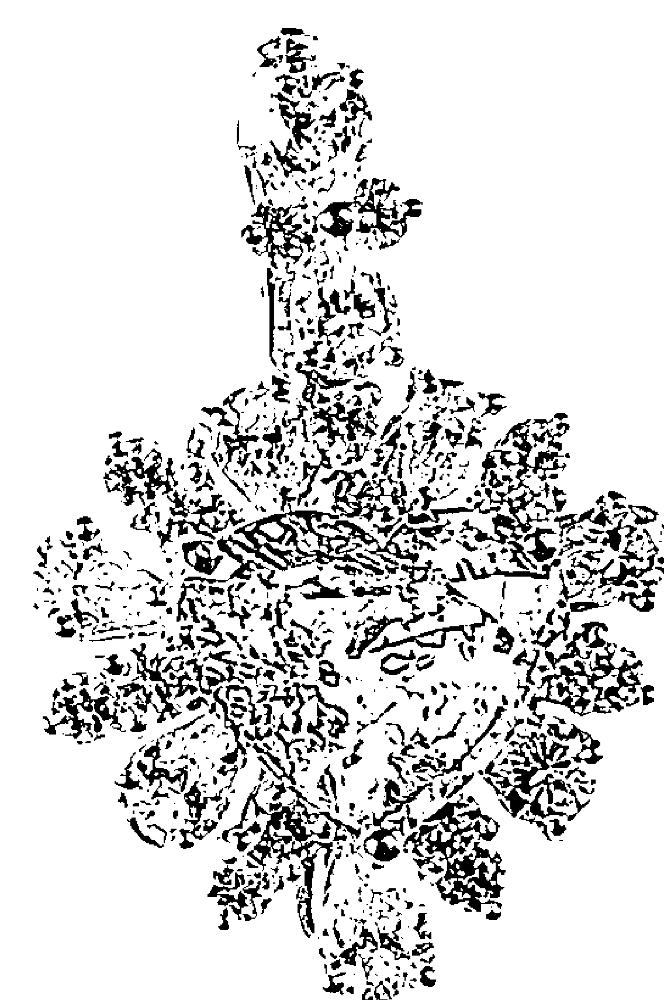

### 实现梦想的宝石

拓帕石在古欧洲时代就是重要的宝石，英译源自梵语的“Topas”，有火光、火彩之意，因此，印度人又将拓帕石称为“火之石”。

古希腊人认为它对于水肿及肾脏方面的疾病有强大的治愈力，并称拓帕石为“力石”（即有神奇强大力量的宝石）。有一种说法是当佩戴的拓帕石变色时，表示附近会出现有毒之物。古埃及人则认为拓帕石是太阳神的象征，佩戴的人可以拥有活力、健康与美。也有人认为拓帕石可以治疗盲症。还有一说是在睡觉时将拓帕石放在额头上或枕头下，前者可以让睡眠质量变好，后者可以让人恢复体力。

关于拓帕石名称的由来，有许多版本，最浪漫的传说，源自古埃及国王的爱情故事：国王坚持寻找名为Topazos小岛，为了见到日夜思念的王妃。因此，拓帕石也被认为是支持人们坚持爱的力量、实现梦想的宝石。

### 寻找真爱的象征

在古代欧洲，粉红拓帕石被认为寄宿着宇宙间的爱之女神，是寻找真爱的象征，尤其对于想要寻找一生的伴侣、珍爱一生的人们，有强大的能量。

## 选购建议

拓帕石有另外一个名称为“黄玉”，原因在于早期发现的拓帕石以黄色为主，后来才又陆续发现蓝色、黄绿色、淡棕色以及橘色，至于稀有的粉红色拓帕石产量相当稀少，市面上大多是以天然无处理的黄色帝王拓帕石加热处理，转变为粉红色拓帕石。以目前的鉴定技术，仍无法判别是经过加热处理还是天然形成的。虽然市面上用辐射处理后呈现的粉红拓帕石较多，但因其颜色相当稳定且美丽，所以也很受消费者喜爱。

在选购粉红拓帕石时，色彩与裂隙、透明度是主要的重点，粉色越深，价格越高。由于拓帕石较易碰裂，购买时不妨以十倍放大镜观察是否有裂痕。粉红拓帕石的价格，从每克拉六百元至一千五百元均有，此外，一种特殊的“帝王粉红拓帕石”，色彩高贵，价格也就另当别论了。

## 佩戴与保养

拓帕石的硬度虽高，却不够坚实，在佩戴时要避免碰撞。宜选择有经验的镶工师傅，用较强的底座来保护，以减少破裂的情形。在保养拓帕石饰品时，以清水洗拭即可。在运动或厨房烹调时，也尽量不要佩戴，以免擦撞而碎裂。最适合其净化法为月光浴法，不妨在满月的夜晚进行，平日也可以用同样方法来保存它的能量。

### 图尔特的天使光环

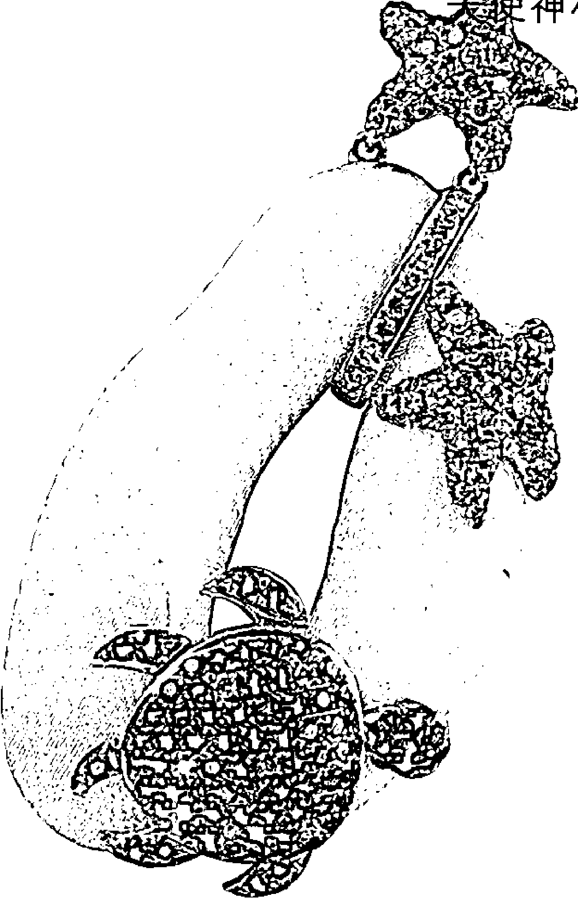

图尔特是只生活在大海里的海龟，爱幻想的它，最喜欢做的一件事就是游上岸，选择一块最美丽的岩石仰望天空。白天，看着天空随风飘动的朵朵白云，奇形怪状的云朵总让图尔特的脑海里浮现出一段段美丽的邂逅；夜晚，天上的星星化身为它的好伙伴，一同经历上山下海的奇异冒险故事。

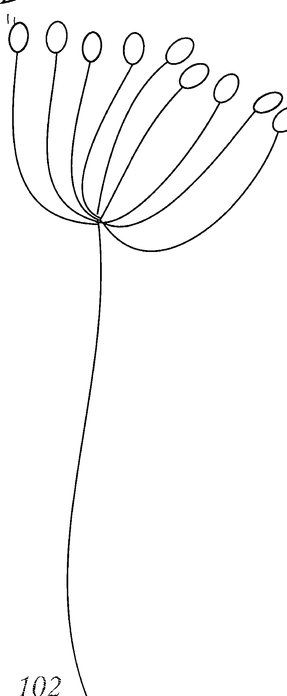

图尔特觉得自己并不属于大海，它喜欢暖乎乎的阳光，也喜欢那片它所仰望的天际。它觉得，那片广大的天空才是自己的归属，天空的颜色、温度，每个景色都让它留恋不已。

有一天，图尔特一如往常地爬上岸边的美丽岩石，看到了一位身穿白衣的美丽女孩，女孩望着大海东张西望，看起来十分焦虑。图尔特慢慢地爬到她的身边打了声招呼，女孩转过身问道：“你看得到我？”

> > “你看得到我？”

图尔特疑惑地回答女孩说：“对啊，我看得到你。这有什么特别的吗？”女孩解释，其实她是一个天使，又接着说：“我的天使光环掉到大海里了，怎么找都找不到，我又无法下海找寻，不知道该怎么办才好……没有光环，我就无法回到天上了！”女孩难过地哭了起来。

> > “对啊，我看得到你。这有什么特别的吗？”

> > “我的天使光环掉到大海里了，怎么找都找不到，我又无法下海找寻，不知道该怎么办才好……没有光环，我就无法回到天上了！”

女孩擦擦眼泪对图尔特说：“其实凡人看不到我，可是你看得到我，表示我们之间有特别的缘分。可不可以请你帮帮我的忙，到大海里帮我找回我的天使光环好吗？

图尔特听完女孩的话，眨眨眼睛，由讶异而感到兴奋：“这么可爱的女孩居然是天使？而我竟然可以看得到天使，并和天使说话？太不可思议了！”于是，图尔特接受了女孩的请求。

图尔特每天潜入大海的深处寻找，但转眼间已过了好几个寒暑，图尔特却一直找寻不着天使的光环。这段时间里，同伴对它冷嘲热讽，取笑图尔特根本是在做白日梦，没人相信它曾经遇到过天使，还说一切只是图尔特的“幻想病发作”罢了。

图尔特一直没有找着天使的光环，它也开始怀疑这件事的真实性，会不会一切都是自己的幻想？它的信心逐渐丧失，开始变得不开心，也渐渐不再像以往那般努力……有一天，图尔特几乎完全放弃寻找天使的光环了，它颓然地跌坐在海底的岩石上，毫无生气。这时，有两只海星游了过来，鼓励它：“图尔特，加油！不要气馁，你要相信自己一定做得到！总有一天你会找到天使的光环的！”

图尔特打起精神，“是啊，如果我放弃了，那才是完全没有希望了！”

想象着天使若戴起失落已久的光环时那美丽开心的脸庞，说不定天使还能带它一起遨游天际呢！一种莫名的兴奋感从心底涌上，图尔特打起精神，再度专注地寻找。突然，在它身边出现了一圈微微的光，但是图尔特没有发现，它只是一再激励自己，增强信心。没多久，天使光环的光芒越来越亮，亮得让图尔特的双眼无法直视，不自觉闭上了眼睛。

就在图尔特慢慢张开眼睛时，美丽的天使竟然就在它的眼前。天使微笑着回答它的疑问：“图尔特，谢谢你！天使光环是靠着善良、执着、勇气和想象力才会出现的！就是因为你的坚持和不放弃，才能找回我的光环呀！”

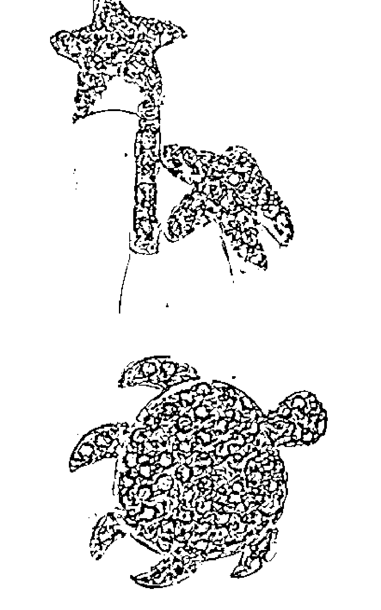

## 绿色能量宝石

绿色，是自然界植物的色彩，有着舒适的、再生的气息。

绿色的宝石，就像是人类需要的维生素与矿物质，有着生命的能量，并增进人际关系。

对应到人体的部位时，绿色宝石则与胸部有关。

# 绿碧玺
### 增强工作磁场、愉悦心情

| 硬度 | 7 ~ 7.5 |
|---|---|
| 比重 | 3.06 |

### 代表13月的巴西祖母绿

碧玺，可说是宝石界中颜色最多的一种宝石。

早期最知名的绿碧玺产地为美国缅因州，但随着巴西的碧玺矿被开发后，现在提到碧玺，人们多半会想到巴西。

早在 17 世纪，巴西曾经出口一种被称为“巴西祖母绿”的深绿色柱状宝石到欧洲，一直到 18 世纪，这种宝石才被正名为电气石。

在斯里兰卡的哈达矿区，以辛哈语为主，他们称绿碧玺是一种“拥有很多事物”的宝石。

在我国，碧玺也极受喜爱，尤其是具有粉红色与绿色的双色碧玺，由于从外表看起来很像西瓜的颜色，而被称为“西瓜碧玺”，据说是慈禧太后的最爱呢！

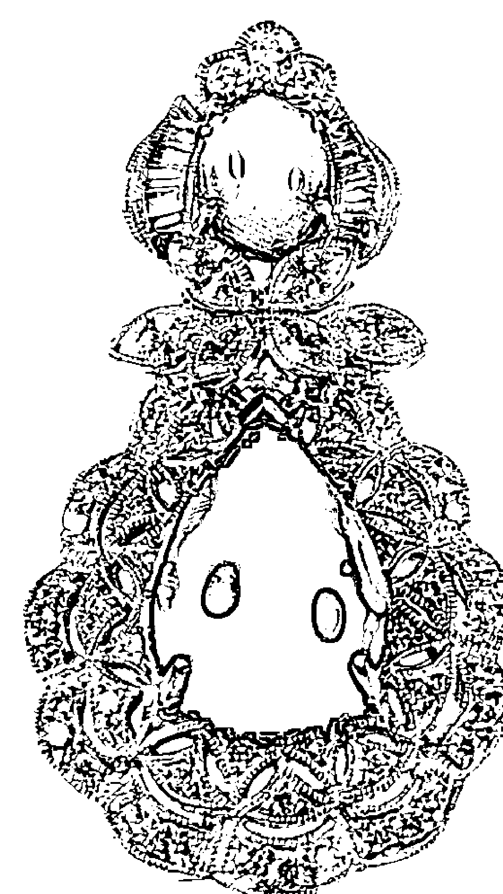

### 疗愈博爱胸怀舒畅心胸

看到绿碧玺，人们会感觉身心会变得舒畅，这是因为对于无法分辨是非，或是因情感问题导致心情纠结纷乱的人来说，佩戴绿碧玺可以平衡中枢神经系统，让心情舒畅，提供清朗的能量。

绿碧玺对于大环境的活化有着相对的能量，如果你觉得自己的工作磁场不太好，或正被人际问题所困扰，不妨佩戴绿碧玺，它将会释放出正面的信息，让身旁的人不再误解你。

绿碧玺的能量对于胃部有很好的帮助，尤其是受到慢性胃病困扰的人，佩戴绿碧玺会感觉有改善胃病的能量。

## 选购建议

在目前的市场上，最常用作仿造碧玺的材料为玻璃及塑料，但它们都很容易被识破。因为碧玺是属于双色性的宝石，将它放在光线下面，就能观察到不单纯只有一种颜色，有的绿色碧玺会带点儿黄色，有些碧玺是绿中带蓝，这是玻璃无法仿制的地方。此外，玻璃的内含物多少都会出现气泡，而碧玺则没有，所以很容易辨识。

碧玺的选购重点以颜色、内含物为主。同样是绿色碧玺，色彩越浓、越偏蓝绿，内含物越少，价格就越高；反之，色彩越淡、越偏黄绿，内含物越多，等级就越低。此外，含铬元素的绿碧玺，外形似祖母绿，色彩却比祖母绿更光彩亮丽，价格也比不含铬的绿碧玺更高。
杂质较多的绿碧玺，每克拉从数十元到千元不等，通常被做成手链和项链，也称不上宝石等级；一般质量的绿色碧玺，每克拉一百元到一千五百元；中间等级的绿色碧玺每克拉一千六百元左右；高质量的绿碧玺，尤其是含铬绿碧玺，每克拉数千元是常见的价位。另外，特殊的双色、多色碧玺及有名的西瓜碧玺，价格也更高。

## 佩戴与保养

碧玺可设计成各式首饰佩戴。由于碧玺较易吸灰尘，如果确定无裂痕，在保养时不妨用珠宝清洁液或多用温水洗拭。

# 祖母绿
### 魅惑异性的力量、引发艺术才能、消除紧张

硬度: 7.5 ~ 8  比重: 2.71

### 献给维纳斯的宝石

在古希腊、古罗马时代，祖母绿是最珍贵的宝石，被称为是“献给维纳斯的宝石”，只有皇室可以拥有。

祖母绿是绿柱石家族中最昂贵的宝石，相传印加帝国曾经出现过一个如鸵鸟蛋般大的祖母绿，众人认为这是女神欧蜜娜的灵魂，并加以膜拜；后来当印加被侵略后，这颗甚大的祖母绿及印加的祖母绿矿山，也跟着隐没了。

古希腊人认为祖母绿是“发光的宝石”，也被喻为充满治疗力的宝石，对于眼睛的疾病、肝脏的问题等，都可以用祖母绿来治疗。传说蛇只要看到祖母绿，就会变瞎。当祖母绿变色时，表示拥有者可能会被骗。也有人相信祖母绿可对抗恶灵，佩戴着它就不会遇到鬼魂。女性若是佩戴祖母绿，不但不会遇到坏人侵犯，还能让眼睛更美丽，增加迷惑异性的力量，并得到幸福美满的婚姻。祖母绿又有“夫妻之石”的称号，古代欧洲皇室在结婚时，都会佩戴祖母绿。

关于祖母绿的故事，最为人津津乐道的是埃及艳后克丽奥佩托拉的故事，她非常喜爱祖母绿，甚至将一座祖母绿矿区取名为克丽奥佩托拉呢！

另一个与祖母绿有关的神秘传说在于祖母绿的预言能力，当时的人们认为，将祖母绿含在舌下，就可以预言未来。

### 诱发艺术力的魅惑能量

祖母绿具有引发艺术力的能量，如果一个人的艺术才能从未被发掘，在佩戴祖母绿之后，将会渐渐地发现自己的创造力，以及与生俱来的艺术天分。

绿色是活跃于大自然的颜色，祖母绿也拥有了自然的治愈力。佩戴祖母绿，可以感到过度亢奋的情绪慢慢被抑制下来，并排除紧张与不安，让忧郁的心情转为开朗。

祖母绿具有非常独特的绿色，一般人认为祖母绿可以魅惑异性的原因，在于用心凝视祖母绿宝石3分钟后，眼睛会呈现一种无法言喻的亮彩，而且心情也会跟着开朗起来。一旦心情开朗，外表看起来就比较年轻，眼神也会更有魅力，所以也被认为具有吸引异性的魅惑能量。

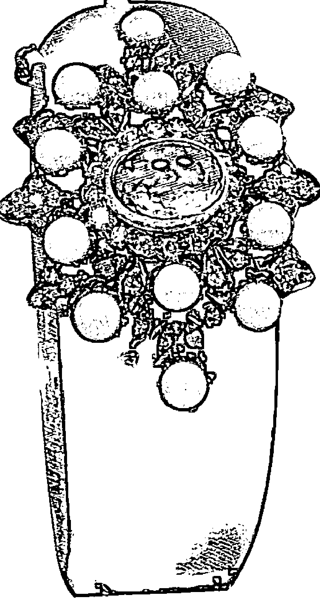

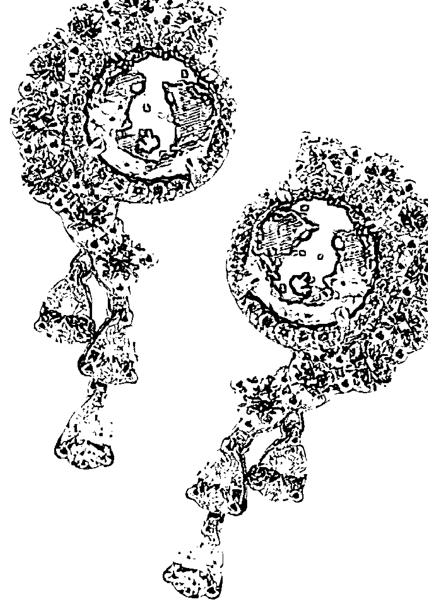选购秘诀

祖母绿的价格不低，又受到两性的喜爱，市场上的仿冒品非常多，伪造法也相当繁多。像是三明治夹层法，在层层夹心中，只有一层超薄的祖母绿。也有人采用浸油法，让祖母绿的内含物看似更少，也更美、更透，但是时间一长，当油干了之后，宝石表面的裂隙就出现了。此外，也有商人使用染色法，将铬盐或人工铬元素注入宝石的裂隙中，让宝石呈现极美的色泽。

要破解三明治夹层法，可以从宝石的侧面观察，不难看到一层一层的感觉，也可以用强光灯照射宝石侧面，将会看到黏着剂的存在。想破解浸油法，同样借助强光，如果祖母绿在强光照射下出现如彩虹般的颜色，那么有九成是浸过油了。希望自己买到的不是染色祖母绿？那么就以十倍放大镜来观察，染了色之后的祖母绿经过一段时间（半年到一年）就会褪色，并出现裂纹。

祖母绿的等级，可以从颜色、净度、明暗对比、色调来评估。一般等级的祖母绿的绿色，至少要在中浅以上，才能称为祖母绿。但是颜色若太浓，也不是佳品，越接近绿灯的绿色，等级就越高。

几乎所有的祖母绿都有内含物，从净度来说，一般等级的祖母绿内含物较多，等级越高的祖母绿内含物则越少。但基本上天然祖母绿必会有天然的内含杂质，所以在宝石学上，祖母绿又有“瑕疵花园”的美称。

从明暗对比的条件来看，由于祖母绿不是单纯的绿色，可能是绿中带黄，也可能是绿中带蓝。若是一般光线下就可以看得到黄或蓝，表示这颗祖母绿的对比很明显，等级就会被拉高。

祖母绿是皇室珠宝，每克拉都要千元以上，在国际拍卖会上，上品的祖母绿每克拉可达数万元。由于祖母绿很少超过3克拉，越大越美的祖母绿，价格越高。笔者曾经看过一颗7克拉的顶级祖母绿，价格为80多万元。

目前，全球的祖母绿产区只有两个，哥伦比亚祖母绿为“绿中带蓝”，巴西祖母绿为“绿中带黄”，其中，又以绿中带蓝的祖母绿价格较高。在购买时，不妨问销售人员：“这是哪一个产地的祖母绿？”再根据产地来观察颜色，不但可以作为选购的标准，也是防伪的方法之一哦！

## 佩戴与保养

祖母绿是一种较脆弱的宝石，容易擦花或撞裂。在选购时以项链为主，可将伤害降到最低。由于佩戴祖母绿的人会散发出一种被宠爱的气息，如有成套首饰，只要小心保护，也很值得购买。

保养祖母绿的方法很简单，只要用温水清洗，再以软布轻拭即可。千万不要因为它的贵重，而使用超音波洗净机或以高温清洗。

# 绿玉髓
实现自我、坚定意志、稳定情绪

硬度：6.5 ~ 7
比重：2.61

### 澳洲玉：

在石英家族中，最大的两个系列宝石分别是水晶与玉髓。水晶较透明，玉髓较不透明。

玉髓的名称，来自于欧洲博斯普鲁斯的一个城镇。是哪座城镇呢？笔者查到的一个说法为：玉髓的英文名称是“Chalcedony”，源自小亚细亚古国比希尼亚 (Bithynia) 的一座古城之名——Chalkedon。相较于透明的水晶，人们将看起来不透明、表面有蜡感光泽或是没有光泽的石英都称为玉髓。

玉髓类宝石是根据颜色做细项分类的，绿色的为绿玉髓 (Chrysoprase)，蓝色的为蓝玉髓 (Blue Chalcedony)，橘红色的为光玉髓 (Cornelia)，红色的为红玉髓 (Carnelian)。

绿玉髓主产于澳大利亚，因此，市面上也常称其为“澳洲玉”。实际上，绿玉髓是玉髓类中价格最高的一种宝石，颜色呈深浅不一的绿色，有些呈苹果绿，有些呈葱绿色。

### 持之以恒的理性力量

绿玉髓有着坚定的能量，如果你已经为自己订下一个目标，却担心自己心猿意马、无法完成，那么佩戴绿玉髓以坚定意志力、成就自我实现，是一个不错的方法。

对于做事情容易半途而废的人来说，也可以佩戴绿玉髓，借由绿玉髓的能量，让自己做到持之以恒。

属于石英家族的绿玉髓有平衡的力量，对脾气暴躁、情绪较易波动者，不妨用绿玉髓来恢复理性，处理事情时也更圆融。

## 选购建议

绿玉髓的产量多，价格也实惠，属于非常大众化的宝石。市面上除了绿色玻璃或绿色塑料外，并没有人工仿冒品，但倒是经常会看到不良商人将绿玉髓当成翡翠卖给客人。

绿玉髓的价值与价格可从色彩来判断，色彩越绿价格越高。一颗普通等级的绿玉髓，每克拉约数十元；高等级的绿玉髓，每克拉约两百元，是非常便宜的宝石。在所有的产地中，又以澳大利亚出产的绿玉髓质量最佳。

## 佩戴与保养

玉髓的硬度及韧度尚佳，可塑性也很高，由于价格不高，做成一整组首饰也很合适，也有许多人将它做成印章或雕刻艺品。在保养方面，采用水洗法保养即可。

# 翡翠

事业成功、驱除噩运、提升品德

| 项目 | 值 |
|------|-----|
| 硬度 | 6 ~ 7 |
| 比重 | 3.33 |

### 高贵身份的代表

提到玉，许多人会直觉想到翡翠，其实玉自 1963 年后，被分为软玉和硬玉两种，翡翠则为硬玉的一种，唯一的产区在缅甸，而中国内地其实并不生产翡翠。

硬玉（翡翠）和软玉（白玉）两者均由坚韧、细粒的岩石所生成，而由于硬玉是由连锁颗粒结构的辉石结晶组成，所以更为坚实，更因内含丰富的铬元素而呈现富丽的深绿色，自古以来便是高贵身份的代表。早年西班牙人入侵中美洲时，经常佩戴由硬玉（翡翠）制成的护身符，名为腰石或肾石，因为他们相信翡翠可以预防腰部及肾部的疾病。

### 可以保护主人

玉有保护主人的能量，对于清除不好的气运，早有印证；而翡翠因其质地更佳，被赋予了提升品德的能量。

翡翠的硬度较高，隐含了坚持、不畏困难的力量，有让事业飞黄腾达的意喻，尤其是对事业上遇到“破坏者”或“程咬金”的人来说，也有突破重围的能量。古代商人多半佩戴翡翠，现代许多企业家、政治家也喜爱收藏翡翠，在重要的会议上，身上若佩戴一件心爱的翡翠，不但可以平息纷乱的情绪，对于自己所坚持的事情，也会因翡翠的能量，达到所有人的一致赞同。

### 选购佳谈

翡翠只有缅甸一处出产（又称缅甸玉），当然价格也会比软玉高。

翡翠的仿品非常多，像是绿玻璃、绿玉髓、东陵玉（又称印度玉），都曾被商人当成翡翠出售。

另一种仿品则是采用人工方式处理，像是将翡翠做“去黄处理”，让杂质变少（B 货），或是将翡翠染色（C 货），在购买时不妨直接告诉商家：“我要 A 货。” 商家就会知道你要买的是天然、不经人工处理的翡翠。

也有人会以薄薄的一层真翡翠加上其他宝石，如水晶来做成“夹层三明治”，如果从侧面观察，就不难看出有不同的层次，但如果已经嵌在座上，可能就比较难识破了。

还有商人会以“挖底翡翠”的方式，来出售坠子或耳环、戒指。这种方式是在薄薄的一层翡翠下面，填上硅胶等物质，一方面增加透明度及净度，一方面又增加厚度及重量，但因为已经镶好了，往往会让消费者以为自己买的翡翠是货真价实的 A 货，甚至有些不细心的珠宝鉴定师都曾经受过骗呢。

翡翠的选购标准很多，以色来分、以种来分、以质来分、以透明度来分、以匀度来分、以裂疵来分，也有以造型来作为加减分的标准。笔者建议是以读者自己的喜好为主，有的人喜欢冰种翡翠，就不是那么在乎颜色，不一定要很绿；有的人在乎颜色的均匀而不重视纯净度……总之，只要是天然且是自己喜欢的就好，因为这么一来你才会经常佩戴，也才能在无形中得到翡翠的能量。

不论是软玉或翡翠，都没有一定的价格标准，因为玉并非以重量计算，而是从色彩、质地、外形、雕工等来考量，购买时不妨以自己喜好为主。

由于翡翠的色彩浓郁不一，要做成套的首饰并不很容易，如果经济状况许可，建议购买成套的首饰，价值会比单件要来得高，也更有收藏的价值。

## 佩戴与保养

软玉与翡翠的硬度不同，硬度较差的软玉，要比翡翠容易破裂。但即使翡翠的硬度高，若从高处掉到地面或是受到擦撞时，表面还是容易被擦花或是内部出现裂缝，佩戴时仍不能轻忽。

在保养方面，以温水洗拭即可。另外要避免与汗水接触，因为汗水的成分容易使翡翠的光泽受到影响。

# 橄榄石

吸引异性的注意、指引方向、带来希望

- 硬度：6.5~7
- 比重：3.34

橄榄石在古欧洲是非常受重视的宝石，尤其若是色彩透绿，则更受到珍视。

橄榄石的名称在希腊文中有“黄金石”的意思，最早被发现于红海的一座小岛上，古埃及时代将此岛视为圣地，不让外人进入，传说夜晚若在这个岛上，就会看到橄榄石所散发出来的美丽光彩。事实上，晚间佩戴橄榄石，透过灯光的照射，更能显现出橄榄石的神秘色泽，因此橄榄石也有“夜间祖母绿”的称号。

古埃及人认为，橄榄石是具有太阳力量的宝石，可以治疗肝脏和肌肉运动伤害方面的疾病，同时更是法老王们喜爱的宝石。

在夜深人静的时候，橄榄石会呈现出闪亮的光芒，因此常被用来作为佛像的眼睛，可在夜晚指引旅人方向，具有带来光明与希望的能量。

橄榄石的色彩是非常单一的，这“唯一”的能量，同时也带来了吸引异性的能量。单恋的人佩戴橄榄石，可借助橄榄石的呼唤，让她单恋的人感受到她的心意，同时会有好的响应。

在养生能量方面，橄榄石被赋予了增强食欲的能量，如果有人因为压力、烦恼导致食欲不佳，不妨试着将橄榄石贴在喉咙上，会有所改善哦！

## 选购建议

橄榄石的售价一向都不低，因此市场上常见到仿品，像是玻璃、人造尖晶石、人造刚玉都常被用来作为橄榄石出售。

但是不必担心，由于天然橄榄石的双折射性非常强，只要以十倍放大镜来观察橄榄石的棱线，就可以看到两条线；尤其较大的橄榄石若由前部来看，可以见到背部刻面的重叠现象，这是其他仿品做不到的地方。

橄榄石分为“黄绿”和“绿黄”两种色系，前者是黄中带绿，后者是绿中带黄，越浓绿透澈的橄榄石，价格越高，多半产于缅甸。

一般等级的橄榄石，每克拉在四百元至一千元；中等品质的橄榄石，每克拉在一千元至一千五百元；高等级的橄榄石，每克拉在一千五百元至三千元。

克拉数大的橄榄石不多，重量在5克拉以上的橄榄石非常少见，如果是色彩佳且克拉数大的极品橄榄石，每克拉高达万元是常有的事。

橄榄石的硬度不算太高，韧度更是不强，较容易摔裂、磨损。为避免伤害，在选购时可以夹镶、包镶的方式为主，或是做成耳环、胸针、链坠较适宜。如果喜欢较特别的款式，则需要寻找有橄榄石镶工经验的师傅来镶嵌比较好。

在保养方面，除佩戴时要小心，避免碰撞外，清洗时以温水轻拭即可，千万不要使用高温或超音波来清洗，以免磨伤宝石。

夹镶是以K金爪牙来固定宝石，而包镶是以K金金属线包住宝石，皆为宝石镶嵌制作时常用的方法。

# 葡萄石

增强合作关系、增加决断力、自我控制

硬度：6
比重：2.87

### 南法的结晶葡萄

葡萄石是近代才被发现的新兴宝石，由荷兰的普雷恩上校发现，因此以普雷恩为名。葡萄石的产区在法国南部，它的色泽非常美，尤其是绿色的葡萄石，简直就如我们经常食用的绿色葡萄一般，晶莹透亮、娇艳欲滴。

又由于葡萄石的结晶体并非单独一颗成型，而是许多颗结在一起，仿如葡萄成串的模样，且颜色又像是绿色的葡萄，因此中文将其翻译成葡萄石，实在非常贴切。据说因其产区在法国南部葡萄酒庄附近山区，更增添了上帝创造永不凋谢的葡萄庄园的浪漫传说。

### 增强自我控制的心心

葡萄石的淡淡绿色，给予人一种沉静、优雅的感觉，看到葡萄石的人，会发现高涨的情绪得到渐渐缓和。事实上，葡萄石不但具有自我控制的能量，也能为持有者增强决断力。

对于事业心非常强盛，甚至刻意追求，或不择手段希望事业成功的人，佩戴葡萄石，可以让过度的好胜心冷静下来，重新出发。

葡萄石是以仿如串串葡萄的方式生长在矿区内的，因此也被赋予了团体凝聚力的能量。对于易被团体排斥，或想要增进群体合作关系的人来说，不妨以葡萄石来实现。

### 选购要点

虽然葡萄石是新兴宝石，但由于产量少而深受欧美人士的喜爱。目前已有实验室人工培育出了葡萄石，与天然葡萄石非常相像，表面上非常不易辨识，但若以十倍放大镜仔细观察，就能看到不是天然的气泡现象，所以并不难鉴定。

葡萄石的选购以色泽为主，色泽呈现越优雅越深绿如翠玉般，价格越高。在葡萄石被发现之初，每克拉约两百元的价格极吸引人，但随着葡萄石越来越热门（也或许正因为近年来天灾人祸越来越多，人们需要葡萄石来沉静心灵），价格也水涨船高。目前一般质量的天然葡萄石每克拉约四百元，高质量的葡萄石每克拉约一千五百元，是近年来价格飙涨得非常快的宝石。

## 佩戴与保养

典雅的葡萄石很适合做成项链、耳环、戒指，虽然不像祖母绿般光彩照人，却蕴藏着令人无法忽视的气质。此外，即使整套佩戴，也不会感到太厚重累赘。在保养方面则相当容易，以一般性方式清洁即可。

### 梦想的脚踏车

男孩吃完早餐，穿上外套，摸摸口袋，兴奋地往拍卖场奔去。

男孩到了拍卖会场时，三三两两的人群互相寒暄，他匆忙地和认识的人打了招呼后，带着拍板，找了个最显眼的位置坐着，兴奋地等待拍卖会的开始。

拍卖官拿起法槌敲了下来，开始了今天的拍卖会，拍卖的物品是 30 辆脚踏车。当第一辆脚踏车开始拍卖的时候，男孩兴冲冲地举起拍板高声大喊：“5元！” 男孩喊完后，陆续有人跟着加价，最后，第一辆脚踏车以 30 元的价格卖掉了。紧接着，第二辆脚踏车开始拍卖，男孩还是抢先第一喊价5元，但是，脚踏车还是以高于5元的价钱成交。一而再，再而三，每拍卖一辆脚踏车，男孩都抢着喊价，每次的喊价都是5元。且拍卖过程中男孩都不曾再加码。

男孩的举动引起了拍卖官的注意，中场休息时，拍卖官问男孩为何只愿喊价5元，之后就不再加码。男孩回答说：

“我只有5元，当然只能喊5元！”

“你为什么要参加这次的拍卖会？”

“因为我想要一辆脚踏车，这是我的心愿。”男孩接着说，“这是我存了好久的钱，我若有一辆脚踏车，就可以每天帮妈妈去送报纸了。”

休息结束后，拍卖会继续进行，从始至终，男孩的5元喊价声从来没有错过任何一辆要拍卖的脚踏车。最后一辆也是最漂亮的一辆全新脚踏车要进行拍卖了，男孩喊了5元后，整个拍卖会场却悄然无声，没有第二个人出价。原来，拍卖官为了帮男孩顺利拍到脚踏车，就把男孩的心愿告诉了在场参与拍卖的人，每个人都为了男孩的坚持而感动，于是在这一辆全新的脚踏车拍卖时，没有人选择追价，大家都想帮助男孩达成心愿。那辆脚踏车真的属于男孩了，男孩摸摸脚踏车，兴奋地骑上它，往另一个梦想的旅程前进。

Joy 以翡翠和钻石来设计这款别针，期待拥有这辆脚踏车的人也能和男孩一样，对于自己的梦想坚持不懈。唯有永不懈怠的毅力，才能开启如钻石般绚烂亮丽的旅程。Joy 设计的脚踏车以翡翠的轮胎象征梦想的起点，再以钻石镶满整个车身，而每一颗钻石代表着每一段旅程中的体会，以及每一段旅程中的成长，希望每个人都能拥有钻石翡翠般的旅程。

## 聚焦希望，幸福与财富 黄色能量宝石

黄色，是一种希望与幸福的颜色，黄色的能量宝石象征着开朗、明亮、激励、希望，同时也象征着财富。对应到人体的部位时，黄色的能量宝石与腹部、胃部等消化系统有关，也与精神有关。

# Sun Stone
## 日光石

独立性、生命力与决断力，引发不为人知的潜能

| 硬度 | 6 |
|---|---|
| 比重 | 2.64 |

### 展现生命的闪烁光辉

在古希腊时代，日光石被视为太阳神的象征，也被称为“太阳石”。每逢皇室年度的盛大祭典时，都会见到日光石被用作“镇殿宝”，足见日光石的重要性。

据说日光石可以中和毒素，原因在于它具有钠元素，在古代经常被制成皇室专用的碗、盘、杯等盛食的器具，以确保皇帝的饮食健康。同样的，每当国家遇到瘟疫时，皇帝也会用日光石来祭祀，意味着排除毒素，并展现生命力。

日光石又称日长石、闪光长石、钙钠长石。有着饱满的橘黄色及亮红色，并且在橘红色中带着亮光。日光石与带有神秘感的月光石一样是长石家族，但前者却充满着太阳的热能。除了温暖的色彩外，日光石最吸引人的是闪光效应，以肉眼来看，就可以看见它闪耀着亮晶晶的光芒，因此又被称为“闪光日光石”。这是因为日光石内含有如针铁矿或赤铁矿的物质，当光线射入时，就会反射出如金黄色般的光芒。如果注意印第安人的服饰，也会发现许多印第安人都会将日光石镶在衣服上呢！

### 引发不为人知的力量

日光石是亘古以来倍受皇室喜爱的宝石，被赋予了如太阳般的能量，让生命力强化，带来生存的希望。

日光石是一种钙钠长石，内含物非常多，这些元素所散发出来的能量，可以让人变得很有独立性，培养强韧的力量与决断的勇气，对于个性较没主见或者喜欢依赖别人的人来说，是最适合佩戴的宝石。许多有名的企业家也都在第二代接班人成年之后赠予日光石，一方面赋予下一代有如太阳般的生命力，另一方面又期许他能继承大业并开创新局面。

日光石还有一种非常特别的能量，那就是让佩戴的人渐渐展现出连自己都不知道的潜能，进而促进实现自我的力量。

## 选购建议

日光石的仿冒品并不多，有一种方式是在亚克力中灌入金粉，当成闪光日光石贩卖，也有商人将人造砂金石当成日光石出售。不过，闪光日光石的内部矿物质是呈现不规则、稀少的方式分布在日光石内，只要以十倍放大镜来观看，就可以看出真伪了。

购买日光石的时候，可以将洒金与橘色的均匀度来作为选购的标准，洒金越多、橘色越均匀的日光石，价格越高。日光石的主要产地为挪威、美国及印度。一般等级的日光石每克拉一百五十元到四百元；最高等级的日光石每克拉六七百元，算是经济又实惠的宝石。

## 佩戴与保养

从能量的角度来看，日光石最喜欢吸收日光，做成项链或戒指最适合。

日光石不易碎裂，相较于易裂的其他宝石，日光石的保养方法较多，在没有裂痕的情况下，除温水洗拭外，也可用清洁液或超声波来保养。

# Citrine
## 黄水晶

招来财富、事业成功、镇静情绪、展现希望与生命力

- 硬度: 7
- 比重: 2.65

### 柠檬黄色的透明结晶

黄水晶的英文名字是从柠檬衍生而来的，有柠檬黄的含意，可见天然的黄水晶大都是柠檬黄色。但是，我们在市场上看到的黄水晶却有浅黄或深黄色，而且透明度都颇高，这是怎么一回事呢？

事实上，黄水晶的颜色与水晶在形成时的温度有关，天然的柠檬黄水晶非常少，目前市面上所见到的黄水晶，大都是紫水晶或烟水晶经过“热处理”的结果——因为它的本质还是天然水晶，所以在业界这样做是被允许的。

提到黄水晶，人们第一个联想到的不外乎是“招财”，特别是“偏财运”（即本业外的所得）。据说许多人在打牌时，会带上黄水晶，期盼能稳赢不输！

### 招来财富的能量石

当心中失去希望时，黄水晶能帮助人们重新拾回勇气，迎接希望。尤其是颜色越深的黄水晶，越可以净化盘旋在内心深处的创伤（如失恋、失亲），让人对生命有新的领悟，并提升灵性。

黄水晶同时也是智慧与和平的水晶，当情绪不安、心情起伏较大的时候，持有黄水晶可以让繁杂的心情镇定下来，重新看待问题，达到身、心、灵的平衡，判断力也会较正确。

关于黄水晶的能量，最为人所知的就是招财的一面了。其实，黄水晶是“正财”的象征，在招财方面，对于事业的财富能量最强，尤其是对于刚起步的新事业的感受力更强。

华人世界视黄水晶为招来财富的能量石，据说将黄水晶放在财位方向，会有想象不到的效果呢！

## 选购建议

在市场上，常见到金黄色方解石被当成黄水晶出售，如何辨识呢？

金黄色方解石，乍看之下的确非常像黄水晶，但是真正的黄水晶表面摸起来如同玻璃的感觉，而方解石的表面摸起来则比较像上了一层蜡的感觉。

水晶最大的特色，就在于它的双折射效果，黄水晶也是一样。将黄水晶放在一根头发上，轻轻转动，当转动到某一方向时会出现双影现象，即一根头发变成两根，假的水晶是做不到这点的。另外，双影效果越明显，说明晶体质量越好。

天然的黄水晶内含铁元素，通常会呈现淡淡的黄色。由于天然、色泽较浓的黄水晶是非常少见的，许多商人为了让色彩更浓郁，会以加热的方式让黄水晶的色彩变深。

选购黄水晶的标准为颜色与净度，一般质量的黄水晶不纯净、内含物很多，每克拉只要数十元；中等等级的黄水晶，每克拉要四百至六百元；最上品的黄水晶也被称为宝石级的黄水晶，较难评价，高则每克拉可达数千元。

以产地来区分，宝石级的黄水晶非常稀少，大部分产自于巴西；西班牙、马达加斯加也出产上品黄水晶，但产量更少。

## 佩戴与保养

当心情不佳、情绪跌到谷底时，佩戴黄水晶项链是最适合的。让黄水晶贴在锁骨中央，能感到情绪渐渐稳定。若希望发挥黄水晶招财的能量，就将黄水晶戒指戴在右手上。如果想借助黄色的健康能量，舒缓消化系统的不适，则可以将黄水晶戒指戴在左手上，能量最强。

黄水晶的硬度为7，不容易破裂，保养时只需要用清水洗净，再以软布擦拭即可。

# Golden Beryl
## 金黄绿柱石
行动力、勇气、适应新的改变与新环境

硬度：7.5~8 比重：2.8

### 太阳赐予的礼物

在绿柱石家族中，除了祖母绿之外，色彩动人的金黄绿柱石也逐渐受到人们的喜爱。

金黄绿柱的另一个名称为“Heliodor”，在希腊文中有“太阳之礼”的意思。金黄绿柱的颜色有如太阳般的金黄色，也有柠檬黄般的颜色。古希腊人认为，金黄绿柱石经过太阳光线照射之后，会泛出金色的光芒，所以特别珍惜这份太阳送来的礼物。

在金黄绿柱石尚未被正名的古欧洲时代，人们称其为“黄金石”，是在贵族的女儿出嫁时，父母陪嫁的礼物，希望让女儿早日习惯婚后的生活，为夫家带来财运，也因为金黄绿柱石有对应腹部的能量，而借此期盼女儿早生贵子，保持婚姻的幸福。

### 激励行动力的能量

金黄绿柱石最为宝石学家称道的能量，就是“行动力”。当人们陷入千头万绪、不知道从何处着手，或是受限于以前失败的经验而裹足不前、影响判断时，用手握着金黄绿柱石进行冥想，借由金黄绿柱石的能量，可以让自己更有勇气来突破重重困境。

金黄绿柱石的结构为六角柱形，单一的结构具有集中注意力、排除杂念的能量，当面临新的改变（如换新环境、新工作、结婚）时，金黄绿柱石可帮助人们在不委屈自己的情形下，适应新的环境。

另一个与金黄绿柱石相关的能量，是在健康养生方面。据说将金黄绿柱石放在腹部按摩，可以缓和腹部疼痛，对于慢性肠胃问题及膀胱问题也有帮助。

## 选购建议

目前市场上，金黄绿柱石最容易被黄水晶仿冒，而金黄绿柱石用肉眼就可以看见细长管状的内含物，这是黄水晶所没有的，非常容易辨识。

此外，购买金黄绿柱石的时候，不妨问一下商家它的产地是哪里，因为金黄绿柱石只在巴西、马达加斯加以及美国新米尔福的 Merryall 矿区中才出产。

金黄绿柱石大多非常漂亮，以克拉数作为价格的标准，克拉数越大，则价格越高，目前每克拉在四百元至一千五百元。至于极品金黄绿柱石，其色泽与黄水晶相似，散发出的闪闪光彩更是让人目不暇接，当然价格也不菲。

## 佩戴与保养

金黄绿柱石的硬度不算差，但怕阳光，佩戴时要避免直接照射到阳光，保养时可以使用珠宝清洁液或温水清洗，再用软布轻拭即可。

# 黄色拓帕石

得到真爱与真友谊、实现梦想、招来好财运与好人缘

| 属性 | 值 |
|------|----|
| 硬度 | 8 |
| 比重 | 3.54 |

## 太阳神的象征

黄色拓帕石在古欧洲时代就是重要的宝石，最有名的传说是古埃及人认为黄色拓帕石是太阳神的象征，佩戴的人可以拥有活力、健康与美。

因为拓帕石硬度很高，硬度高的石头，多半有一种外放、锐利、穿透性的能量。因此，埃及人称金黄色拓帕石为“帝王拓帕石”，也就是太阳神的宝石。这种宝石的能量被人们使用的历史，已超过2000年……

传说纪元之前，迷航的船只，在重重浓雾包围下的红海诸岛发现了它，于是人们以希腊语“Topazos”为它命名，亦即“探求”、“寻找”之意。

有着难以寻获、得来不易的珍贵黄色拓帕石能量，充分开发着太阳轮的个人力量，能创造、实现心中的愿望。这个脉轮，与自我的开创、实践、行动力有关，当这个脉轮能量流动顺畅时，人们就充满了理智与自信，并拥有坚强的毅力。

### 寻找真爱的能量

传说，未经古埃及国王允许，任何人是不能靠近 Topazos 岛的，因此所产出的黄色拓帕石意味着真爱，可以为持有者找到幸福，并获得真正的爱与友情的能量。

黄色拓帕石的第二种能量与梦想有关，这一种能量同样源自于古埃及国王的爱情故事，由于国王必须坚持寻找 Topazos 小岛的信念，才能见到他日夜思念的王妃，因此黄色拓帕石也被认为是可以支持人们坚持梦想、实现梦想的宝石。

黄色拓帕石与黄水晶一样，都被认为可以带来财富，而在黑暗中会发出亮光的拓帕石也可以消除恐惧、驱除邪恶，为人们舒缓精神疲劳、带来希望。此外，黄色拓帕石也具有培养人际关系的能量，让人人力、财力指数往上攀升哦！

## 选购建议

目前市场上的仿品以黄水晶或黄色玻璃居多，但只要用十倍放大镜，即可观察到拓帕石独特的菱形横截面和与其长度平行的条纹，不难辨识。

在选购拓帕石时，色彩与裂隙是主要的重点。另外，由于拓帕石较易碰裂，购买时不妨以十倍放大镜观察。
一般质量的黄色拓帕石每克拉一千元至一千二百元；黄中带橘色的拓帕石被称为“皇家拓帕石”，价格又更高；偏橘色的“莲花色”拓帕石，每克拉可高达数万元。

## 佩戴与保养

黄色拓帕石的硬度为8，却不够坚实，在佩戴时要避免碰撞。选择有经验的镶工，以较强的底座来保护，可以减少破裂的情形。

在保养拓帕石饰品时，以清水洗拭即可。进行运动或厨房烹调时，也尽量不要佩戴，以免碰裂。

# Golden Rutilated Quartz
## 金黄色发晶
洞察力、感受力、财富

硬度：7 比重：2.65

### 细密的闪烁光辉

在水晶内部有着不同种类的矿石针状物，看起来有如一丝一丝头发般的感觉，就称为发晶。其英文名中的 “Rutile”，来自于拉丁语，有“闪烁光辉”的意思。

发晶的颜色很多，其中价格最高的，就是金黄色发晶，其形成是由于内部包含了晶红石。由于看起来色泽金黄且光亮，又含有微量的钛金属，因此被称为钛晶。

金黄色发晶在近几年变得非常热门，除了因为人们喜爱它的色彩及发针的排列形状外，据说它还有为拥有者带来财富的功能。假如发晶的排列可看出特殊图案，价值则更高。

### 凝聚达成目标的专注力

水晶的能量强度早就被证实，而发晶中因为含有发针，被认为能量要比其他种类的水晶更强。

金黄色发晶具有三种以上的能量，除了因为在矿石中长出金黄色发针，被认为具有财富能量外，其独特的结构体被视为可让持有人集中注意力、洞察力的能量。对于希望专心读书、致力于工作的人来说，不妨将金黄色发晶置于桌上，提升目标达成率。

水晶本身有外放的能量，而晶体内的发针则有吸收的能量，两种能量相互衬托，可以让持有发晶的人感受度更敏锐，不但有益于人际关系的增进，在自身的创作能力上，也可涌出源源不断的力量。

对于想要转换职场、跑道或希望能够改变生活模式、更独立的人来说，将金黄色发晶放在双眉之间冥想，也被视为是一种助力。

## 选购建议

在发晶的世界中，金黄色发晶的价格最高，因此它的仿冒品也跟着多了起来，尤其以在透明水晶中加入人工金丝线的人造发晶比例最高。辨识的方法很简单，天然的金黄色发晶的发针并不会整齐地排列，而人造发晶看起来总令人感觉不是很自然。

在选购金黄色发晶时，当然以天然发晶为首要原则。金黄色发晶的评估标准不以重量来看，而是以质量来评论，金丝越多、感觉越活跃、价格越高。当然，金丝自然形成图案的天然发晶价格又更高，也曾经听过有人以数万元买下中意的金黄色发晶呢！

## 佩戴与保养

金黄色发晶的硬度为7，不容易破裂，保养时只需要用清水洗净，再以软布擦拭即可。

# Amber
## 琥珀

凝固千万年的美丽，诉说着千万年前那一场惊心动魄的蜕变历程，足以令人安神定气

| 硬度 | 2.5 |
|---|---|
| 比重 | 1.08 |

### 伤心的泪液结晶

在希腊神话中，太阳神之子费顿在驾驶火战车时失控，被闪电击毙，他的姐妹们因为伤心过度，变成了白杨树。但即使如此，姐妹们仍然无法止住悲伤，因此从白杨树干上流出了许多的泪水，最后凝成了美丽的琥珀。

天然琥珀颗颗不同，其色泽及内含物往往令人爱不释手。据说，古罗马人认为一件好的琥珀雕刻品比一个奴隶还值钱。古罗马贵妇认为，佩戴琥珀可以青春永驻。中国也有与琥珀相关的传说，认为琥珀是老虎的灵魂变来的，并在古书上将其写成“虎魄”。

琥珀来自于已绝种的针叶树脂液，也可说是一种化石。在已发现的古代遗迹中，琥珀已被当成装饰品及药品。传说将琥珀放在睡着的人的胸上，这个人就会坦白道出自己曾经做过的坏事。在古埃及、古希腊、古罗马的墓葬中，也发现琥珀被用来驱除邪魔。

提到琥珀，就不能不提到蜜蜡。很多人以为琥珀不同于蜜蜡，事实上琥珀和蜜蜡是同一种宝石，只不过较透明的被称为琥珀，而不透明的就称为蜜蜡，所谓“千年琥珀、万年蜜蜡”，指的其实只不过是透明度不同而已。

### 温和柔顺的祈祷力量

琥珀具有柔和温暖的能量，在古代即被归为佛教七宝之一，被世代相传与珍爱。琥珀为针叶树的树脂化石，生成年代可追溯至数千万年前，结晶中偶尔会含有昆虫或蕨类植物。琥珀曾经是太古时代的植物，转变成化石，让人感觉有长生不死的能量。从古至今，琥珀一直被使用在治疗喉咙、肠胃或甲状腺疾病上，据说也具有提高肾脏功能、排出体内毒素的作用。

在古罗马，琥珀被当作是神圣的宝石，也是祈祷时的圣石。而在我国则被用以求道、悟道的冥想状态。琥珀可以温柔地鼓励那些被杂事所困、遭痛苦打击的人，给予克服困难的勇气与力量。将琥珀握在左手中，以手指轻轻摩擦，可以让你如愿以偿地获得想要的事物。

## 选购建议

琥珀为佛教七宝之一，被认为可以避邪护身，因此琥珀念珠也受到宗教人士的喜爱。近年来，我国台湾市场对于琥珀的喜好度越来越高，为了满足大众的需求，相关的仿品也相继出现。像以塑料、树脂或玻璃等材料做成的假琥珀，也有人将琥珀碎块加热再压制成型，甚至在琥珀内放点小虫、植物，假装成质量和年代都不对的“波罗的海琥珀”。而这些假琥珀却常因含有化石昆虫而大受欢迎呢。

要怎么样才知道琥珀的真假呢？其实方法非常简单，由于琥珀在摩擦之后会产生静电，以软布摩擦琥珀后，琥珀就能吸附灰尘或小粒子。

另一种辨识的方法，是将琥珀放在饱和的盐水（约1杯的盐加4杯的水）中，真正的琥珀会浮在水面上（因琥珀的比重很低），塑料琥珀则会沉入水中。

用肉眼辨识时，假琥珀或是再造琥珀多半会经过冷热压缩，琥珀内会出现狭长或扁平形的气泡，而真正的琥珀气泡是浑圆形的，不会有这种现象。

许多朋友认为，琥珀内若有小虫子较不易仿冒，那可就错了，不良的商人还是可以用一些方法将小虫子放入人造琥珀之中的。此时，请看看琥珀内的虫子的模样是扁扁平平的，还是扭曲有立体感的？后者才是天然琥珀哦！

全世界的琥珀大约有90%来自于波罗的海一带，出自于针叶树的树脂，第二大琥珀产地则是多米尼加。后者多是从豆科植物的脂液石化而成，年代比波罗的海琥珀要晚，质地也较软。若从宝石学来看，波罗的海琥珀要比多米尼加琥珀的等级高，但因多米尼加琥珀内常有昆虫或植物的化石，因此也受到大众的欢迎及喜爱。

琥珀除了黄色之外，也有别的颜色，像是红色、绿色、蓝色等，价格可以从数十元至数千元，质量与价格肯定是对等的。

## 佩戴与保养

早期的琥珀首饰多半是珠链或是较贵气的坠饰，近年来极流行以钛、银等金属与琥珀一起设计成较具个性化的琥珀饰品，特别受25岁以上的年轻人喜爱。由于琥珀的硬度、坚度都不高，较易刮伤及碰撞伤，建议佩戴时要小心，摆放时也应单独存放，不要与其他宝石放在一起。

琥珀怕热、怕强光、怕乙醇（指甲油中含量也较高），如果在强阳光下戴琥珀手环，可能要注意一下时间及温度。琥珀也不宜放在太干燥的地方，以免出现裂痕。

琥珀戴久了，如果发现表面上的光泽消失，请不必太紧张，只要用丝袜在表面轻擦到微发热，光泽就会再现。

### 金沙花

“我们是不可能的！就像沙子永远不能开出花！”其实，她又何尝不难过？她是个务实的女孩，从没有多余的幻想，不敢，更没时间——自从医生宣布她遗传了家族罕见的病症，随时可能离开人世，她就放弃了治疗，更专注于工作，因为她深爱她那小小却温暖的花店。

下了班后，她喜欢去海边，那是她觉得最能够放松的地方。她爱的其实不是海，而是那一粒一粒的沙子。干净无瑕、浑圆细致的沙，总是能够一次次抚慰她的心灵。她想着，如果沙上能开出花，那该是多美的景致？

她一直觉得，如果能在工作中孤独地离去也是一种幸福——直到一个男人的出现。每天早晨，这个男人都来花店里买一束花，像他这样英俊又事业有成的男人，一定有很心爱的女人吧？每天她都细心地为他包花，谈天说地……慢慢地，她感觉到两人的关系有了改变，但她很害怕，像他那么好的男人，是值得更好的女孩的——至少值得生命更长久的伴侣。她拒绝他一次次的追求，从委婉的拒绝，甚至坦承自己的生命可能很短暂——他不在乎，但她在乎！直到最后一次，她说了那句话，那个男人就再也没出现了。

也许，是真的伤害了他吧？但，她实在不想耽误他。
女孩请友人帮她卖掉了花店，她想出国，至少在最后的旅程，离开这个伤心地。

离开之前，她想，最后去看一次她爱的沙吧……但当她抵达后，简直不敢相信自己的眼睛！是花！满沙地的花海……花海的中间，她看到那个男人手上捧着戒指：

> “沙里是可能开出花的！这朵金沙花，就是由金色的沙子种出的花……相信我，所有的事情我们都可以一起面对，请你嫁给我吧！”

原来，是那个男人买下了她的花店，而这次她不再压抑自己的情感——因为他是唯一一个能在她心里的沙地开花的人。

## 唤醒创造力与热情
橘色、红色能量宝石

橘色代表着大地与生长，具有激发人类的好奇心与创造力的能量。红色代表了生命力与火焰，具有唤醒人们热情和行动力的旺盛能量。对应到人体的部位时，橘色与子宫有关、红色与生殖系统有关。这两种颜色的宝石，同样都有提高活力与性魅力的能量。

# Carnelian 红玉髓
活力、成功、保护主人

- 硬度: 6.5 ~ 7
- 比重: 2.61

### 守护心脏的宝石

近年来，红玉髓的颜色受到不少女性的青睐。它或粉红、或朱红、或橘红、或淡黄，柔润的光泽令人爱不释手。其实，早在数个世纪前，红玉髓就是皇家的宝物，拿破仑一世、三世喜爱的八角形印章，就是用红玉髓制作的。

在拉丁语中，“Car”代表心脏，因此红玉髓在古埃及时代被视为守护心脏的宝石。传说在埃及沙漠中最早被发现的红玉髓，被拿破仑用来当作手表配饰。古巴比伦人认为将红玉髓送给敌人，代表将诚心献出来，可化解干戈。古埃及人认为红玉髓是死人的守护石，因此将它雕刻成动物状，放置于古墓。许多伊斯兰教预言家手上戴的戒指也是红玉髓材质，让其更添几分神秘能量。

据说红玉髓可以释放人体的能量，也可以引进外界的能量，并刺激人们开始行动，因此又有“开门之手”、“开始之石”的称呼。

### 旺盛活力的钥匙

代表了旺盛活力的红玉髓，具有激发潜能与推动力的能量。当人们对目标感到欲振乏力或出现负面情绪时，不妨借由红玉髓让自己找回冲劲，以更积极的行动力来达成目标。
红玉髓同时也是成功的象征，尤其面临开创事业时，它可以帮助主人突破障碍与困境，并排除心中的不安，引导主人走上正确的路，迈向事业的成功途径。

在研究天珠时，不难发现许多天珠的串链均是由红玉髓制成，这表示红玉髓也有守护主人的能量。许多澳大利亚的原住民也将红玉髓作为护身符，防止邪恶魔灵侵入，并保护人们远离灾难。在古埃及、古罗马的文献中，也有红玉髓在早期就被发现并使用的记载。

## 选购建议

红玉髓的仿品非常多，约 80%的人工仿品是将动物骨灰或石头磨成粉后，经过灌模再制。辨识并不难，以肉眼仔细观察是否有灌模痕迹，或利用比重液（可直接测出任何物质与水的比重的化工药剂）也能很快辨识。

红玉髓的等级可以从颜色及纹路来评估，颜色橘红且均匀的红玉髓可说是上品。

红玉髓的价格并不以重量计，而是以颗或粒计算（如卵石般）。一般等级的红玉髓每粒两百元至四百元；高等级的红玉髓每粒可达千元以上。

## 佩戴与保养

在佩戴红玉髓的时候，建议让红玉髓尽量贴近皮肤，可让能量的效果发挥到最大。另外，避免以金属作为底座，以免影响能量的发挥。

红玉髓的保养方式很单纯，平常以净水清洗、阴干即可。

# Garnet 石榴石
延续爱情、带来新希望、改善不协调的能量

| 硬度 | 比重 |
| :--- | :--- |
| 6.5 ~ 7 | 3.7 |

### 照耀真理之道

石榴石在古代就是倍受欢迎的宝石，在犹太教的教义中，石榴石被认为是“照耀真理之道”的宝石，许多大祭司在祭典时所用的宝器上，均镶有石榴石。英国皇室的皇冠上也镶有许多大颗的石榴石，因此，它又被称为“皇家红宝石”。

传说即使将石榴石放在衣服内，也无法遮掩它的光彩。古埃及人认为它具有非常强的治疗效果，对于食物中毒、被毒蛇咬伤，都有帮助。

石榴石的色泽红艳，内含铁、铬两种矿物元素，也有人称它为“开普红宝石”。它还有另外一个英文名称“Pyropos”，源自于希腊文的“火”。在18～19世纪的欧洲皇室令牌、皇冠上，都镶着火红的石榴石，却常被误以为是红宝石。其实早在500多年前，波希米亚帝国皇室的珠宝就大量采用石榴石来制作，使用量还比红宝石多呢！

### 信守一生不变的承诺

据说，德国的大文豪约翰·沃尔夫冈·冯·歌德（Johann Wolfgang von Goethe) 晚年的恋人乌尔莉克·冯·列维措夫 (Ulrike von Levetzow)，总是在约会的时候佩戴着石榴石，代表着信守一生不变的爱情承诺。因此，石榴石也被认为是爱情的象征。据说，拥有石榴石的人可以一辈子都遇到爱情，倍感幸福。另外，石榴石也被看作是信心之石，可以增强持有人的自信心。

被称为热情之石的石榴石，被认为有让爱情成功的神秘力量，尤其对于单恋的人来说，不妨将石榴石佩戴在右手，会意想不到的效果哦！

石榴石有较强大的净化能量，对于希望改善体内不协调，增强体内循环功能的人，可以试着将它放在腹部上。

石榴石的外形很像我们食用的石榴肉，晶莹剔透。古欧洲人认为石榴石中寄宿着希望的种子，当人们想放弃目标或梦想时，就让石榴石来增强意志力、坚定毅力，朝着实现梦想的希望迈进吧！

## 选购建议

目前市场上虽然并不常见石榴石的仿品，但仍然有不良商人以红色玻璃、红色压克力来仿冒石榴石。鉴定的方法很简单，由于石榴石并非单纯只有一种颜色，而是具有双色性的宝石，只要将它放在光线下，就可以看到真正的石榴石会出现红中带紫的颜色，假的石榴石则是单纯的红色。

石榴石的产区以美国亚利桑那州及缅甸、巴西为主。在选择石榴石的时候，以颜色和净度作为评估的标准。石榴石的价差较高：一般等级的石榴石每克拉一百五十元至六百元；高等级的石榴石每克拉却要一千五百元以上；特殊切工的石榴石，每克拉甚至可达数千元。

## 佩戴与保养

石榴石的硬度相当高，做成各式首饰都很合适。保养的时候，若确定宝石无裂痕，可用温水或珠宝清洁液来保养。

# Coral 珊瑚
财富、幸运、舒缓不安情绪、强化体质

| 硬度 | 比重 |
| :--- | :--- |
| 3.75 | 2.68 |

### 来自海的宝石

希腊神话中，英雄珀尔修斯砍下“蛇发女妖”美杜莎的头后，身旁的花也被美杜莎的血染成了红色，当花石化之后，就成了珊瑚。

而事实上，来自大海、由珊瑚虫生长变化而成的珊瑚，在古欧洲时候就倍受重视。波利尼西亚人认为珊瑚有预防中邪、火灾、暴风雨的作用，尤其在海上，若佩戴珊瑚，更能保护持有人的平安。

古罗马人认为佩戴珊瑚可以预防危险发生，因此许多古罗马孩童身上，都会佩戴珊瑚饰品。

到了中世纪时代，颜色鲜艳的珊瑚曾经被当成药物，用以治疗中毒。珊瑚，也是所谓的“海的宝石”。

### 凝聚大海能量的安慰

珊瑚的颜色从粉红、橘色到红色皆有，珊瑚的沟通能量非常强，因此被认为是可以招来贵人帮助，为拥有人带来幸福与财运的有机宝石。许多开店的商人也会在店内放置天然珊瑚树，希望带来财运。

在海中生长的珊瑚，被视为具有生命的能量，而中医医书也对珊瑚有所记载，认为珊瑚粉可以舒缓腹痛及泌尿系统的问题，也证实了珊瑚的确具有强化体质的能量。聚集了大海能量的珊瑚，沟通能力极强，当人们的情绪不安时，不妨让珊瑚来稳定躁动的心情。如果觉得心中空虚、感到缺少爱，也可以借由珊瑚的能量抚慰孤独难过的心情，渐渐恢复爱的感受度。

## 选购建议

市面上最容易出现的珊瑚仿品材质有胶、骨、玻璃、搪瓷、石膏等，其中又以吉尔森法制造出来的仿红珊瑚最多。

辨识的方法很简单，在放大镜下的天然珊瑚有俗称“木纹”的纹理，仿品不容易冒充，稍加辨识就可以看得出来。

让消费者较难鉴定的是，以白色珊瑚染色后仿的有色珊瑚，尤其又以倍受欢迎的“天使肤色”（Angel Skin）最多，这些染了颜色的珊瑚在买回家不久后，就会开始褪色。最容易辨识染色珊瑚的方法，是以棉花蘸乙醇或双氧水擦拭一下，天然珊瑚不会褪色，也不会因此被伤到，染色珊瑚则会立即褪色。

珊瑚的生长速度约为每18个月长2.54厘米，非常缓慢，加上有时候珊瑚会被破坏，更降低了产量。

选购珊瑚时以重量（克）计价，以颜色与等级来作为评估标准。白色珊瑚最便宜，只需要数十元；如果色彩红艳就要数百元；至于上品珊瑚的平均价位约数万元，而上品又大件的珊瑚非常稀有，价格有时高达百万甚至千万。

过去，珊瑚都会经过磨制后，做成各种不同形状的饰物，有些艺术感较强的现代设计师会以珊瑚枝的自然形状加以设计，不再磨制珊瑚，如此一来不但能够保存珊瑚的原始能量，更能增加珊瑚的艺术性。

## 佩戴与保养

珊瑚的硬度低，容易破裂，佩戴时要避免碰撞。另外，珊瑚怕热、怕酸，香水或发胶、摩丝都会让它变质；在强光下或是流汗也可能使珊瑚变色。

保养时，可以用温和的肥皂水浸泡珊瑚30分钟后，再以清水轻轻冲洗。

# Fire Opal 火蛋白石
超越困境、消除负面情绪、提高热情

硬度：5.5 ~ 6.5 比重：2.1

### 具有火之能量的预言之石

在古罗马时期，蛋白石的地位仅次于祖母绿，它有着许多的传说。像是蛋白石有打开天眼，增加预言能力的神秘效用；也有一说，如果用月桂树的叶子将蛋白石遮住，敌人的视线将会模糊不清。

在 19 世纪中期，蛋白石曾被认为是不祥之石，有人认为这是由于蛋白石韧度较低，在切割时很容易损坏，一旦损坏，就必须由切割师傅赔偿，因此切割师傅称它为不吉祥的蛋白石；另一个说法，是出自作家沃尔特·司各特（Walter Scott）所写的小说 Anne of Geierstein 中，蛋白石会因为女主角安妮的情绪及健康状况而变色，当安妮去世时，蛋白石完全无色，也让人们对于蛋白石有一种害怕的心理。

虽然蛋白石曾经被人们厌弃过，但当 19 世纪后期澳大利亚（当时为英国的殖民地）的矿山开始大量出产蛋白石后，维多利亚女王发现蛋白石可以为英国带来非常大的财富，不但将蛋白石送给女儿当嫁礼，也送给有功勋的大臣……当大臣们纷纷戴上蛋白石时，它的不祥迷信也就被破除了。

在蛋白石之中，有一种橘色加金黄色调的蛋白石最特别，被称为火蛋白石，除了具有蛋白石的原始能量外，还具有火的能量。

### 超越困境的转化力量

在蛋白石中，约 60% 都是水分，但在这么多水分中，却无法掩盖住火蛋白石如火焰般的光彩。火蛋白石被认为是“同时寄宿着水精灵与火精灵”的宝石，也是同时具有两极能量的特殊宝石。
火蛋白石最为人知的能量就是热情，当一个人失去信心时，可借由火蛋白石找回热情，恢复精神。当对于未来产生迷惘，失去人生方向时，也可借着火蛋白石的能量，重新活化自己的意志力，找到人生定位，积极地面对人生。

水、火共生的火蛋白石，也具有超越困境的能量，当人们面临痛苦或陷入两难、无法抉择的情形时，佩戴火蛋白石可以再度燃烧心中的热情，超越逆境，走向成功。

火蛋白石的第三种能量，是转化情绪。当一个人陷入愤怒、悲伤、消极等负面情绪时，可借由火蛋白石的能量，将不好的情绪转为正面能量，勇于面对挑战，带来新的契机。

## 选购建议

几乎所有的蛋白石都产于澳大利亚，唯独橘红色的火蛋白石只限墨西哥出产。因此，如果有人销售的火蛋白石来自于别的产区，在购买前就得好好地想一想了。

人造蛋白石是以灌胶法做成，用十倍放大镜来看，不难看到状似蛇皮的纹路。夹层蛋白石指的是以薄片蛋白石加上其他材料（如水晶、玛瑙）做成，辨认时最好从侧面观察，以荧光灯一照，就可以看到黏合的部分了。

选购火蛋白石时，以色彩与裂隙作为评估标准，色彩越美且无裂隙，价格越高。一般等级的火蛋白石每克拉六百元至一千四百元；高等级的火蛋白石，每克拉则需上千元。

在火蛋白石中，如果具有七彩的“游彩现象”，则堪称极品，极为稀有，价格也很高，但非常值得拥有。

## 佩戴与保养

火蛋白石的硬度不高，且内含三分之一到五分之一的水分，很容易因为碰撞而破裂，在佩戴时要特别留心。

保养时，可将火蛋白石浸泡在干净的水中，并以软布轻擦，平常也可以让火蛋白石照射日光。但要避免在厨房、美容美发院或其他有蒸汽的地方佩戴，以免影响宝石质量。

# Ruby 红宝石
提高竞争力、加强洞察力、净化血液

| 硬度: 9 | 比重: 4 |
| :--- | :--- |

### 宝石之王

红宝石是7月的生日石。在拉丁语中，“Rubeus”就是红色的意思。
古罗马时期，人们相信红宝石中寄宿着战神马尔斯（Mars）的灵魂，是勇者的象征，也是授予勇士的最佳宝石。古印度人认为，红宝石能够净化被毒蛇咬了之后的血液，并可治疗发烧。古埃及人认为，红宝石可以阻止邪恶念头的出现。中世纪时期，人们认为将红宝石磨成粉，并与水融合之后，可以止血；也有一说，红宝石具有护身符的作用，当遇到坏人或毒物的时候，宝石会变色。传说中，亨利八世欲与皇后凯瑟琳离婚、另娶他人时，凯瑟琳手上的红宝石戒指果真褪色，宗教革命也因此发生。
在缅甸，也有与红宝石相关的传说——他们认为，红宝石是龙所生的第三颗蛋，是神赐予的贵重礼物。正因为如此，早期缅甸的红宝石都只能归王室所有。
从古至今，红宝石在宝石界的地位历久不衰，证明了它的重要性，难怪在印度称红宝石为“宝石之王”。

### 积极能量的勇者

红宝石是一种拥有积极能量的宝石，也是提升竞争力的宝石。当爱情遇到情敌，工作或事业上出现对手，或是需要谈判、竞标时，不妨借由红宝石旺盛竞争力的能量助自己一臂之力，增加自信心和勇气，获得最后的胜利。

红宝石也是一种高感度的宝石，对于希望发挥潜能、加强洞察力的人来说，不妨佩戴红宝石，借由其能量察觉到事物真实的一面，跨越困境、突破障碍。

含有高度铬元素的红宝石，也具有养生的能量，尤其对净化血液、改善血液循环、增强生命力有一定的功效。

## 选购建议

由于红宝石是如此耀眼，市场上的仿冒品也非常多。除了用其他材质如玻璃、红石榴石鱼目混珠外，用三明治夹层、二度烧（以高温再次加热，让原本不够美的刚玉变得更红）造假，也是消费者需要特别留意的地方。

鉴定红宝石的真假，有一种最简单的方法：天然红宝石可作为蛋面形切割，仿冒品则做不到。当然，如果是二度烧或是其他更高明仿造法，就需要靠专业的珠宝鉴定人员来鉴别了。

红宝石产于缅甸、泰国。选购红宝石时，可以将色彩与净度作为评估的标准，颜色越红，价格越高。由于红宝石是贵重宝石，即使是一般等级的红宝石，每克拉也要数千元；高等级的红宝石为鸽血红宝石；极品红宝石既具有鸽血红特征，同时又拥有“星光现象”，曾出现过几十万元的身价。

## 佩戴与保养

热情高贵的红宝石硬度高，保养的方法也较多多元化，在宝石没有裂痕的情况下，无论是以温水、珠宝清洁液或是超声波，都可使用。曾经听说有人使用煮沸法来清洁红宝石，其实这是非常不合适的。此外，也要避免接触漂白水或强酸、强碱。

### 恋豚

在遥远的南方海域上，有着一群很特别的生物，它们以“爱情”为养分，若是失去爱情，也失去了生存的勇气。它们总是成双成对地在月光下跳舞，并对月亮许下“天涯海角、生生世世、永不分离”的爱情宣言——它们是恋豚。

白天时，恋豚和其他海豚一样是群体动物，总是一大群一起活动，一同在大海里互相追逐、唱歌、嬉戏，也一起觅食，当然，已经过了成年礼的恋豚也会趁此机会留意自己心仪的对象。

夜晚时，恋豚会朝心仪对象慢慢游去，并对心仪的对象唱出爱恋的歌曲，围绕着传达无限爱意。当对方接受了求爱时，它们会在月光下一起跃出海面，将自己的身体展现出最美丽的半心形。当它们能完美地结合成一颗闪耀在月光下的爱心时，一股暖乎乎的酒红色爱意随即涌上心头，那股甜蜜的感觉，让闪闪的水花似乎也变得美妙与幸福。

## 展现意志与智慧

### 黑色能量宝石

黑色一向给人神秘的感觉，其实黑色也有正面的能量。

从色彩学来看，黑色是蕴藏智慧的象征，意味着即使在黑暗中，也能清楚地看见光辉。

黑色的能量宝石与集中意志力有极大的关系。

对应到人体的部位时，黑色的能量与人体的尾椎部位有关。

# Onyx 黑玛瑙

防止恶意中伤、增强记忆力、不半途而废

| 硬度 | 6.5 ～ 7 |
| :--- | :--- |
| 比重 | 2.61 |

黑玛瑙被称为“Onyx”，在希腊文中有“爪子”之意。

在古代有着“第三眼”称号的玛瑙，有各种不同的样貌。古欧洲时代，玛瑙的神秘功效就广为流传。遇到暴风雨时，古波斯人会燃烧玛瑙，认为如此就可使暴风雨停息；而中世纪时，黑玛瑙也被称为是“驱赶恶灵的矿石”。

其他与玛瑙相关的传说，还包括人们只要看到玛瑙就无法说谎；也有人认为玛瑙可以保护幼小的孩童，防止孩子们跌倒受伤；古时候农夫在工作时，甚至会将玛瑙放在牛角上，祈求风调雨顺、农作物丰收。

玛瑙也被赋予为人类带来好处的能量，如拥有它的人就不会做恶梦，可以延年益寿、增进人际关系、带来幸福等。

现代人认为黑玛瑙可以守护人们不被邪灵所伤，并有消除妄想与解除烦恼的能量。在皇室里，黑玛瑙饰品是维多利亚女皇的最爱。

### 意志的集合石

黑玛瑙最为人所知的能量就是打击恶灵，所谓的恶灵指的不只邪物，对于经常无故被卷入是非之中（俗称犯小人）的人来说，不妨借由黑玛瑙的能量，反击嫉妒者怨愤的情绪，避免有心人的恶意中伤，让生活更为顺利。

黑玛瑙的第二种能量与意志力有关，佩戴黑玛瑙时，可以感觉毅力重现，即使是快要放弃的事情，也能够继续坚持下去，不至于半途而废。

从黑玛瑙的结构中，可以发现其化学式里有集中的能量，借由这股集中的能量，无论在读书、工作、开会、谈判、创意时，都能集中散漫的意志，在增强记忆力的同时，也提高思考力。

## 选购建议

大多数的黑玛瑙都是由缟玛瑙的黑色部分仿造而成的，与天然黑玛瑙最大的不同处在于，黑玛瑙的夹层是呈现弯曲状，而缟玛瑙的夹层则是直线状，用肉眼就可以辨识。

也有些黑玛瑙是以骨头、玻璃或搪瓷染色而成，但这些仿品并没有弯曲状的纹路，十分容易辨别。

黑玛瑙的等级可以从颜色、质地与光泽度来评估，黑得越均匀、质地越光滑且具有光泽者，价格越高。

目前，黑玛瑙的价格并不算高，一般质量的黑玛瑙每克拉数十元；上品的黑玛瑙每克拉也在六百元以内，可说是价廉物美的宝石。

最著名的黑玛瑙产地是德国的依达尔-奥伯斯坦（被称为双子城），这两个城市的雕刻工艺也居全球之冠，尤其在奥伯斯坦，家家户户几乎皆是玛瑙艺术家！

## 佩戴与保养

黑玛瑙的黑色，令人感觉到既神秘又稳重，且其硬度高，做成各种首饰皆适宜。另外，保养也十分容易，只需以清水洗拭，再以软布将水吸干即可。

# Obsidian 黑曜石

消除自卑、突破逆境、克服诱惑

| 属性 | 值 |
| :--- | :--- |
| 硬度 | 5 |
| 比重 | 2.35 |

### 黑色天鹅绒

当火山爆发后，从火山内喷出的高热熔岩急速冷却并凝结成固体后，所形成的天然玻璃就是黑曜石，又被称为“Black Velvet”，为黑色天鹅绒的意思。

从许多考古学家找到的器物中不难发现，几乎在世界各地，都有以黑曜石做成的史前器具、武器、装饰物或者切割的用具，这代表了黑曜石在很早的时代就已经被使用，可说是最古老与久远的能量宝石。

在美洲，原住民们在占卜、预言未来及驱魔时，也会采用黑曜石作为激发能量的宝石。

### 突破逆境的爆发能量

从火山爆发出来的黑曜石，具有突破逆境的能量，当人们遇到阻碍时，会借由黑曜石的能量帮助自己不惧困难、打破障碍、克服窘局，向目标迈进。

美洲的原住民预言师认为，黑曜石可以映照人们内心的潜意识，消除负面想法，带来正面思考的能量。当一个人失去自信、自卑退缩时，不妨借由佩戴黑曜石来得到宇宙间的天然爆发能量。

你是一个容易上瘾的人吗？那么试试黑曜石吧！黑曜石具有抵抗诱惑的能量，可帮助人们达成目标，尤其是帮助戒除烟瘾、毒瘾、酒瘾等不良的习惯。而《圣经》上也曾提到用黑曜石帮助有酒瘾圣教徒的故事。

## 选购建议

目前市场上多以人造玻璃来仿制黑曜石，辨识上并不难，人造玻璃很容易看到内含气泡。

黑曜石的价格可从颜色的均匀度来评鉴，一般等级的黑曜石每克拉数十元，高质量的黑曜石每克拉数百元。

## 佩戴与保养

黑曜石的硬度较低，承压力也很低，在佩戴时应尽量避免碰撞与掉落，且不要直接照射日光。

# Smoky Quartz 烟晶

稳定情绪、增加自律、强化意志力、发掘潜能

硬度：7 比重：2.65

### 大地力量的精灵

烟晶又称为茶晶，色彩有浅咖啡、棕色、棕灰色、红棕色……其中，棕色浓到接近黑色的烟晶，又称为墨晶。

在古欧洲时代，烟晶被视为寄宿着大地力量的精灵，拥有大地的神秘力量。在古罗马塞尔特族的文化中，烟晶被视为是可以赶走恶灵的宝石，佩戴烟晶之后，会使原本心中充满不安的人变得镇定，让恐惧的人变得勇敢，还可以让身体的运作保持最好的状态。因此，烟晶又被认为是延续生命的护身宝石。

### 协调身心的戒律能量

烟晶具有水晶与黑色的双重能量，当一个人必须严守自律以求成功之时，像是面临大型考试，就需要烟晶的自律能量，强化意志力，不因粗心而犯错，不气馁，努力坚持直到完成目标。

只要是看到烟晶的人，都会被它沉静的感觉所吸引。的确，烟晶具有安定的能量，对于情绪不稳定或精神状况不佳的人来说，凝视着烟晶，可让身、心、灵达到平衡。

烟晶的第三种能量与成功有关，被认为可以发掘人们特殊领域的才能，增强灵感，达到成功。我有个位居高职的公务员朋友，在佩戴了烟晶之后，竟然突然对艺术领域发生兴趣，并且报名相关课程；之后更辞去了公职，开了一家结合咖啡厅与身、心、灵成长课程的工作室，生活得非常快活。每当提到烟晶的能量时，朋友就会啧啧称奇。

## 选购建议

烟晶以巴西为最大产区，此外，马达加斯加、瑞士及欧洲阿尔卑斯山脉的矿区也出产烟晶。

烟晶的仿品以染色人造玻璃最多，辨识的方法不难，只要仔细观察内部是否含圆形气泡即可。

烟晶的等级可以从颜色与净度来评估，颜色越均匀浓烈，净度越高，价格越贵，颜色太浅的烟晶能量较少，不建议选购。

在水晶的世界中，烟晶的价格并不算贵，每克拉数十元就可以买到不错的烟晶。

## 佩戴与保养

烟晶的色彩较深，硬度也较高，不容易破裂，保养时只需用清水洗净，再以软布擦拭即可。

# Tiger's Eye 虎眼石

避开冲突与危险、提高洞察力、增强第六感

硬度：7 比重：2.65

### 锐利眼神的护身符

虎眼石，一种令人惊艳的宝石，如虎眼般的色泽，神秘又具有某种不可思议的能量，在古欧洲时代已被喜爱。

古罗马人认为持有虎眼石可以带来好运，并将它视为护身符。在印度，虎眼石则被视为贵重的宝石之一。

虎眼石与水晶都是石英家族，原因在于它是与青石绵共生的石英矿物，而青石绵的构造让石英出现“猫眼现象”，让它在古代就倍受珍爱。

在全球各地的文化中，对于老虎都充满了崇敬，认为老虎的眼睛充满了智慧，仿佛可以看透世间万物。

传说拥有虎眼石可以增加洞察力，并可察觉邪念的来源，及时给人正确的判断力，让灵魂高贵纯洁。古埃及人也常在圣像的眼中，镶入虎眼石呢！

### 提升第六感的灵石

乍看为金褐色的虎眼石，实际的颜色为黑色，但因为含有氧化铁，所以产生了黄色和金褐色的条纹，从能量的角度来看，虎眼石是被视为黑色的能量宝石。

虎眼石具有避免冲突与危险的能量，像是人际关系上的冲突、莫名其妙的是非，或是迫在眉睫的危险——尤其是交通意外，据说会因为佩戴虎眼石而排除。

虎眼石的另一个能量与工作有关，由于虎眼石被认为拥有提高洞察力的能量，在工作的时候也可以提高效能，对于自由职业者或开店的人士来说，更能感受到虎眼石的能量。

在古老的文化中，老虎被认为是一种会向人传授秘法的动物，因此认为虎眼石也可以提升人们的第六感。

## 选购建议

虎眼石的产地以巴西为主。目前市面上的仿品并不多见，是很容易选购的能量宝石。

虎眼石的等级可以从金褐色的线条（眼线）来评估，眼线越细越清楚，则质量越好，价格也越高。虎眼石的价格不以克拉计价，而以克（g）计价，中间等级的虎眼石手串在百元左右，高等级的虎眼石手串可高达千元以上。

## 佩戴与保养

从前，皇帝在授赠仪式时，会佩戴虎眼石戒指，笔者则建议将虎眼石做成手串最适宜，既能保持其能量，又不会太过抢眼。

虎眼石的硬度高，以温水轻洗保养即可。

# Black Tourmaline 黑碧玺

改善精神体力、跨越低潮、让模糊想法具体化

- 硬度：7 ~ 7.5
- 比重：3.06

### 大地能量的宝石

在各色碧玺中，黑色碧玺的产量最多。近年来人们非常注重健康能量，于是黑碧玺枕头、黑碧玺床……也变得十分热门。

碧玺又称为电气石，具有携带电荷的特性，并且会散发负离子，让精神状态得到改善。

美洲的原住民认为，黑碧玺是带来大地能量的宝石，也将黑碧玺视为可以传达信息的宝石。他们会将黑碧玺做成盛装物品的器具，并对着黑碧玺器具诉说将来想要留给子孙的话，并相信后代子孙可以透过黑碧玺接收到自己的想法，学习他们的智慧。

此外，他们也认为黑碧玺有改善腹部、胃部问题的能量，当族人们胃、腹部痛的时候，会以黑碧玺棒来摩擦肚子生热，减轻疼痛的感觉。传说当女性难产时，以黑碧玺棒摩擦肚子，也有助于顺产哦！

### 健康永固的源泉

当人们陷入低潮、失意，感觉人生茫然、找不到目标时，不妨佩戴随时散发着负离子的黑碧玺，让负离子在身体内活跃，进而让自己更有精神，增强面对障碍的力量。因此，黑碧玺又被认为具有协助主人跨越困境的能量。

黑碧玺的第二种能量是让想象更具体。对于正在规划事情的人或创意工作者、广告业、设计人士来说，在想创意的时候可以天马行空，但如何将创意变成可以执行的具体行动，可能就不是那么容易了。此时可以借由黑碧玺的能量，让模糊的想法具体化。

当人们吸收大量的负离子时，身体会感到更轻盈、更舒服。据说戴着黑碧玺手串洗澡、睡觉时，会感受到黑碧玺的温度。坊间的黑碧玺床，也是采用同样的道理。因此，黑碧玺也被认为可以促进细胞再生，让身体机能活化。

## 选购建议

在目前的市场上，最常仿造碧玺的材料为玻璃及塑料，但它们都很容易被识破，因为碧玺是属于双色性的宝石，将它放在光线下面，就可以观察到碧玺不单纯只有一种颜色，而黑色碧玺会带点儿褐色，这是玻璃仿不来的地方。

黑碧玺的选购重点以颜色、内含物为主。同样是黑碧玺，黑色越均匀，内含物越少，则等级越高；反之，色彩越淡，内含物越多，等级越低。

一般质量的黑碧玺每克拉数十元，中间等级的黑碧玺每克拉数百元。笔者曾经见过一条上品黑碧玺手串，价格高达一万美金以上。

## 佩戴与保养

黑碧玺硬度不错，可设计成各式首饰佩戴。碧玺较易吸灰尘，如果确定无裂痕，在保养时不妨采用珠宝清洁液或用温水洗拭。

# Moldavite 捷克陨石

传授宇宙智慧、联结缘分、突破困境、实现理想

| 硬度 | 比重 |
| :--- | :--- |
| 5 | 2.4 |

### 天外飞来的太空能量

距今久远的某一天，从宇宙飞来了火球般的陨石，这颗陨石落在捷克这个国家，迸裂成或大或小的碎片——这，就是捷克陨石的由来。

捷克陨石的质感如同粗糙的岩石，由于它从外层空间降临到地球上，被认为具有一定的外层空间能量。

从捷克陨石的外表来看，无疑是黑色的，但若将捷克陨石放在阳光下或强光灯下看，不难发现它闪着绿色的神秘光泽，被视为是永生不灭的象征。在捷克，恋爱中的男女会将捷克陨石当成定情信物，意味着爱情生生世世，永不变心。

目前，最大块的捷克陨石被陈列于捷克博物馆内，有机会到捷克旅游时，可别忘了看看这块全世界最大的捷克陨石哦！

### 联结无限可能的宇宙能量

由于捷克陨石是从外层空间而来的，也被赋予具有“联结缘分”、“打破界限”、“无限可能性”的能量。若你正与不同种族的同事一起工作，或处于异国恋情中，不妨借由捷克陨石让人际、恋情更好。

捷克陨石从外层空间掉落到地球的过程中，经过了从极热到快速冷却的过程，被认为具有通过重重困难、接受挫折、不怕考验的能量，是正面临难关的人极需要的能量。

当你面临生活方式的转变，如搬家、结婚、新工作环境时，如果需要一种安定的能量，不妨将捷克陨石放在双眉间的“第三眼”位置，让宇宙的智慧和能量来帮助你吧！

## 选购建议

捷克陨石指的是掉落在捷克的陨石，以常识来想就知道真正的捷克陨石并不多，但由于捷克陨石太有名、且受到人们的喜爱，于是，坊间最常出现的是以人工玻璃来仿捷克陨石销售。但玻璃有所谓的流纹，在购买时只要注意观察陨石内部，就可知道是否是由玻璃仿制。

此外，也可以将坊间所卖的捷克陨石放置在阳光下看，如果没有出现绿色光芒，也不是真正的捷克陨石。

捷克陨石的价格，以形状及大小作为评估标准，柱状形或圆球形的捷克陨石价格较高，不规则状的价格较低；大块的捷克陨石数千元，小块的为数百元。在选购捷克陨石时，切记不要选购琢磨过的捷克陨石，因为任何人工的切割、琢磨方法，都会影响能量与价值。

## 佩戴与保养

捷克陨石的硬度还不错，可设计成各式首饰佩戴。在保养时，采用珠宝清洁液或用温水洗拭即可。

# Black Spinel
黑色尖晶石

突破荆棘、实现梦想、激发生命力

硬度：8  比重：3.6

## 像黑钻石般的稀有宝石——黑色尖晶石

尖晶石的英文名称为“Spinel”，源自拉丁文“Spinella”，意思是“荆棘”。由于它的晶体形态为八面体及菱形十二面体的聚形，表面上呈现了尖锥形，也有保卫的含义。

尖晶石是单一家族矿物，宝石级尖晶石则主要是指镁铝尖晶石。颜色丰富多彩，除了难得的黑色外，尚有无色、粉红色、红色、紫红色、浅紫色、蓝紫色、蓝色、黄色、褐色等。

尖晶石自古以来就是珍贵的宝石，由于它的美丽和稀少，所以也是世界上最迷人的宝石之一。由于它具有美丽的颜色，自古以来一直将红色尖晶石误认为是红宝石。世界上最具有传奇色彩、最迷人的重361克拉的“铁木尔红宝石”（Timur Ruby），直到近代才鉴定出它们都是红色尖晶石。在清代皇族封爵和一品大官帽子上用的红宝石，几乎全是用红色尖晶石制成的，尚未见过真正的红宝石制品。世界上最大、最漂亮的红天鹅绒色尖晶石，重398.72克拉，是1676年俄国特使奉命在北京用2672枚金币卢布买下的，现存于俄罗斯莫斯科金刚石库中。

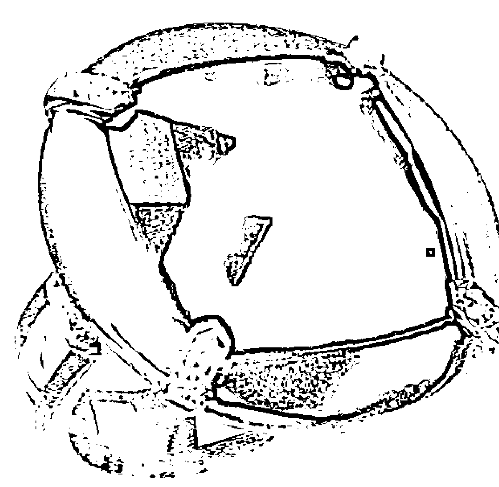

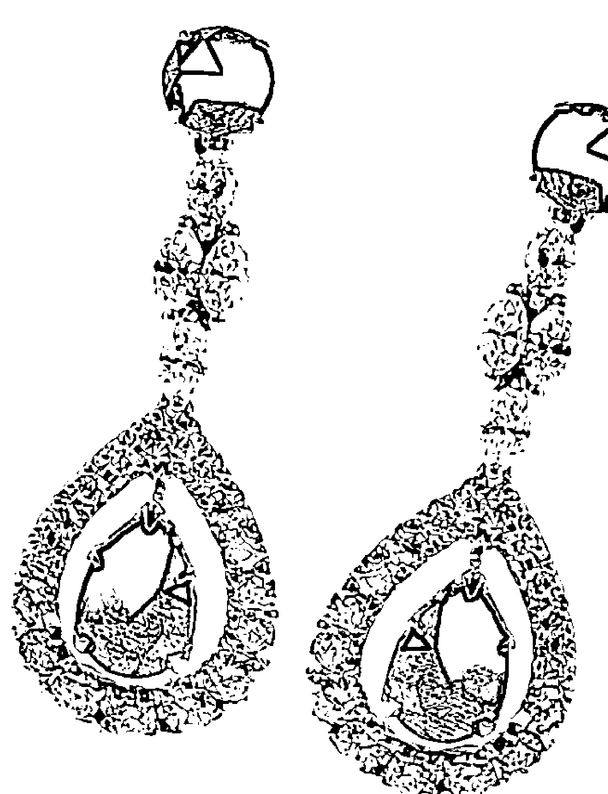

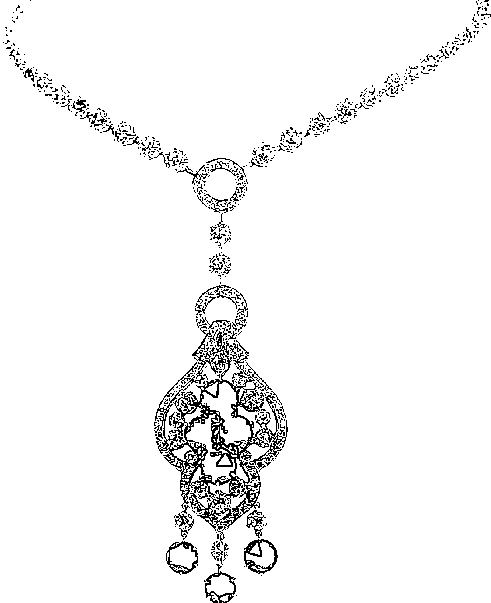

## 坚定意志、突破困难的能量宝石

尖晶石英文名称“Spinel”，来自希腊文“Spark”，意思是“闪光”，充分表达尖晶石透明、反光强的特性。因为产量低，真正认识它的人很少，1587年才在缅甸被发掘。最难得的神秘黑尖晶石 Black Spinel 就是传说中英国历史上最知名的黑王子宝石，它是一块未经抛光的黑色尖晶石。英法百年战争期间，英王亨利五世由于有头盔的保护，战争中未受到伤害，镶在头盔上的黑尖晶石也完好无瑕。自此，黑尖晶石成了守护的象征，也是勇气与毅力的代名词。

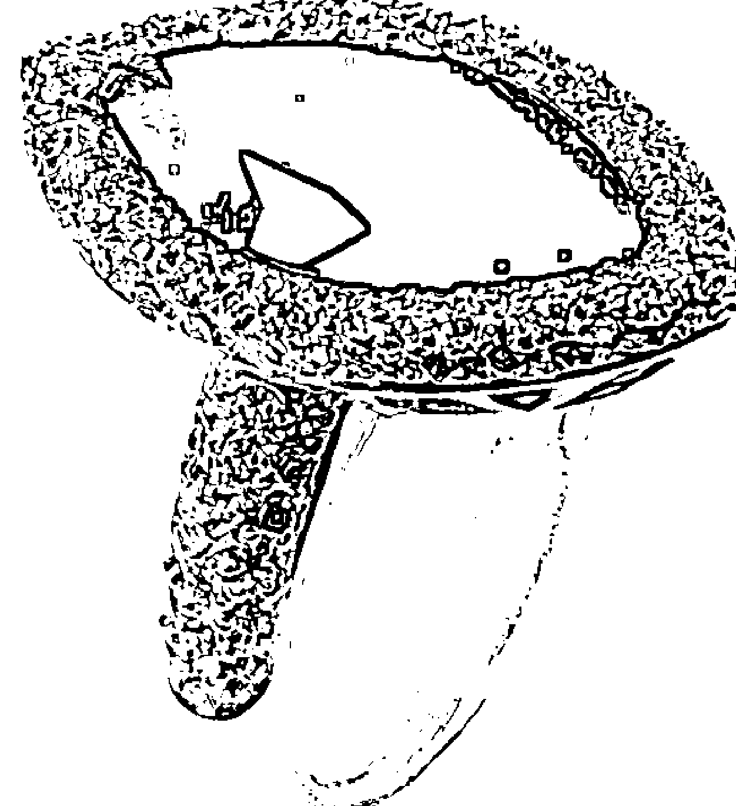

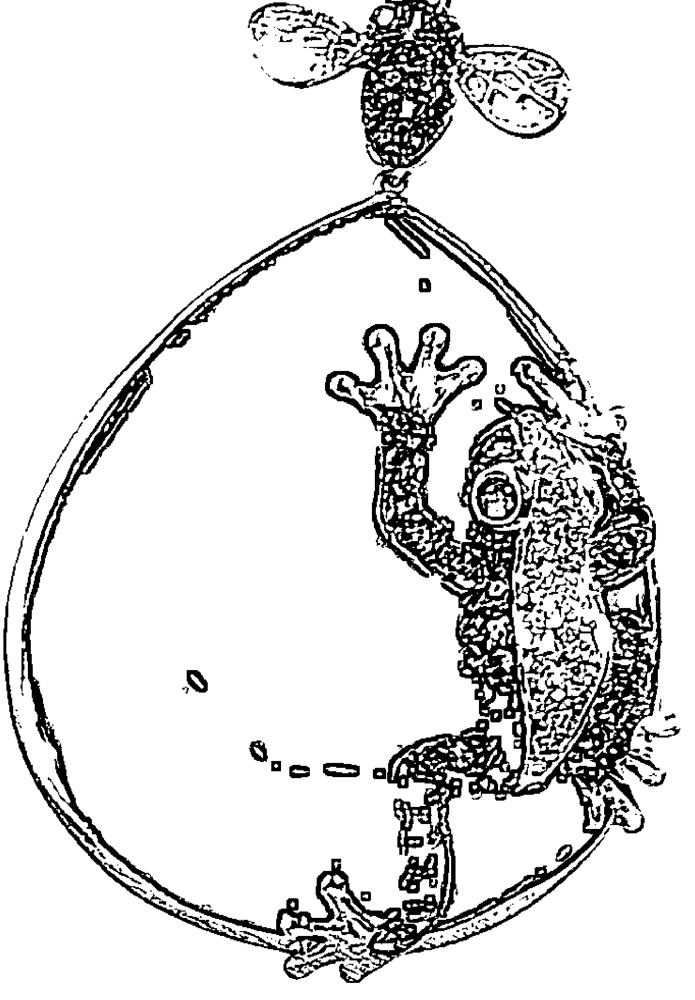

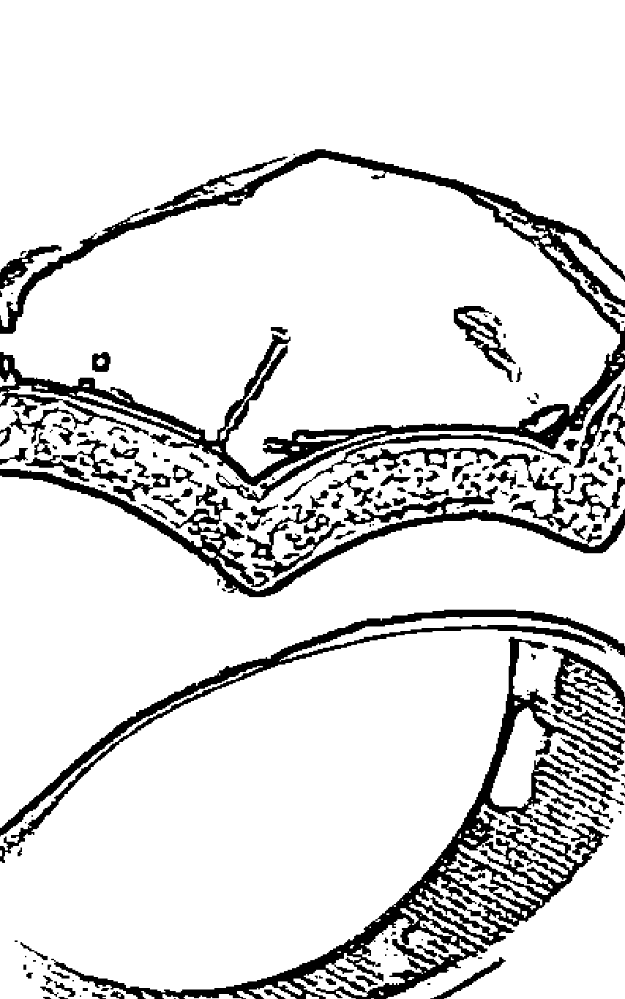

## 选购建议

尖晶石以颜色、透明度、重量为评价与选购的依据。尖晶石有各种颜色，通常含有较多的包裹体，呈成层分布，透明度较好、颜色亮丽、重量大的是其佳品。若有星光效应的尖晶石则更显贵重。

自然界中的尖晶石，是熔融的岩浆侵入到不纯的灰岩、白云岩中，经接触变质作用形成的，有些出现在富铝的基性岩浆岩中。世界上著名的尖晶石产地有缅甸、斯里兰卡、柬埔寨、泰国等国，而我国河南、河北、福建、云南、新疆等地，也发现了类型多样的尖晶石矿床。

市面上有很多的人造尖晶石，但天然尖晶石常有其特有内含物，呈立方体形，且通常小至类似气泡很不容易观察，必须用显微镜观察才能分辨。另外，缅甸所产的尖晶石常见特殊的羽状裂纹内含物，也是鉴定真品的重要依据。

目前，黑尖晶石的价格并不算高，一般质量的黑尖晶石每克拉数十元；上品的黑尖晶，每克拉也在六百元以内，可说是价廉物美的宝石。

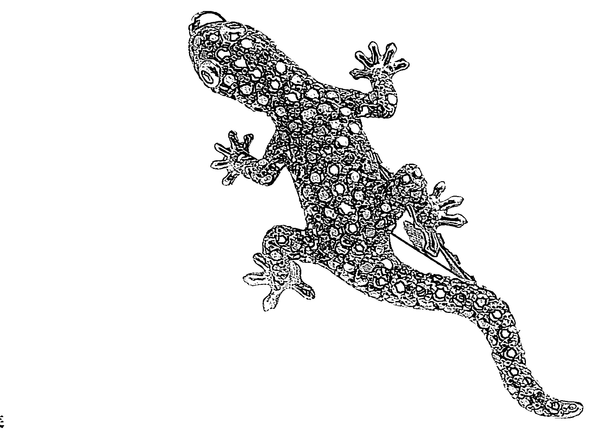

## 佩戴与保养

黑尖晶石令人感觉到既神秘又亮丽，硬度高，在宝石中几乎可作为黑色钻石的替代品。制作成各种首饰皆适宜，保养也十分容易，只需以清水洗拭，再以软布将水吸干即可。

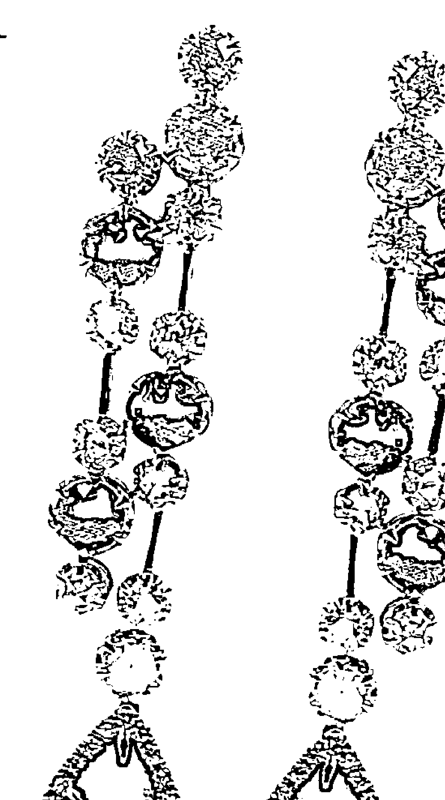

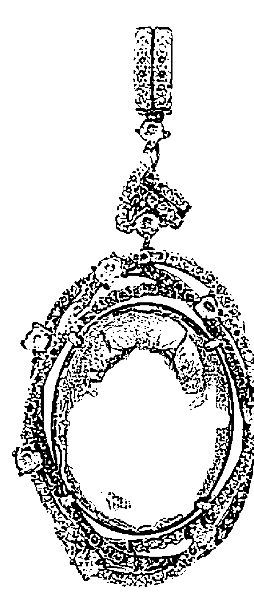

# Black Jadeite
墨翠

勇士的守护石、激发生命力并有聚财、聚才的能量

硬度：7 | 比重：3.33

## 最具神秘诱惑力的艺术文化瑰宝

墨翠为翡翠中的一种，是近几年才开始风靡的宝石。很多人对“墨翠”这个名词很陌生，但又对它非常好奇，其实它就是黑色系的翡翠，因为埋藏于地表深处，产量稀少且开采有限，大约占全翡翠开采量的2%；再加上它独特的隐性颜色特征，配合上中国的雕刻艺术和玉文化，所以极具诱惑力，如果是种及水度都好、质量高的，更是价值不菲。

墨翠最大的特点就是，在一般光线下看是黑色的，而在透射光下看是完全翠绿色的，非常神秘而诱人，这也是墨翠在短短几年内就在市场上风靡的原因之一。再加上有人因墨翠而一夜致富的传说，更成为令珠宝收藏家心仪，非收藏不可的宝贝了。

## 选购建议

由于墨翠的量少而珍贵，市面上号称“墨翠”的，其实很大部分是绿油青辉石或墨玉（也称黑色软玉）。当然，也还有些是黑色的玛瑙或深绿色的曜石所仿制的。

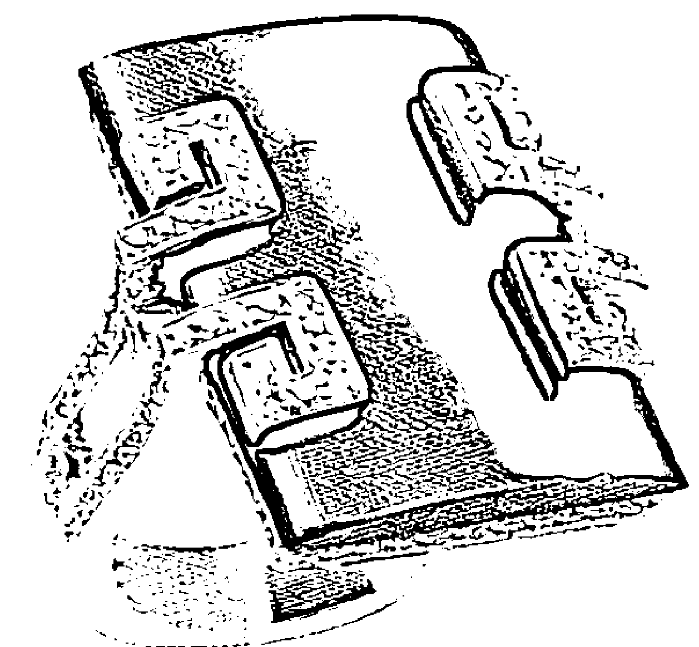

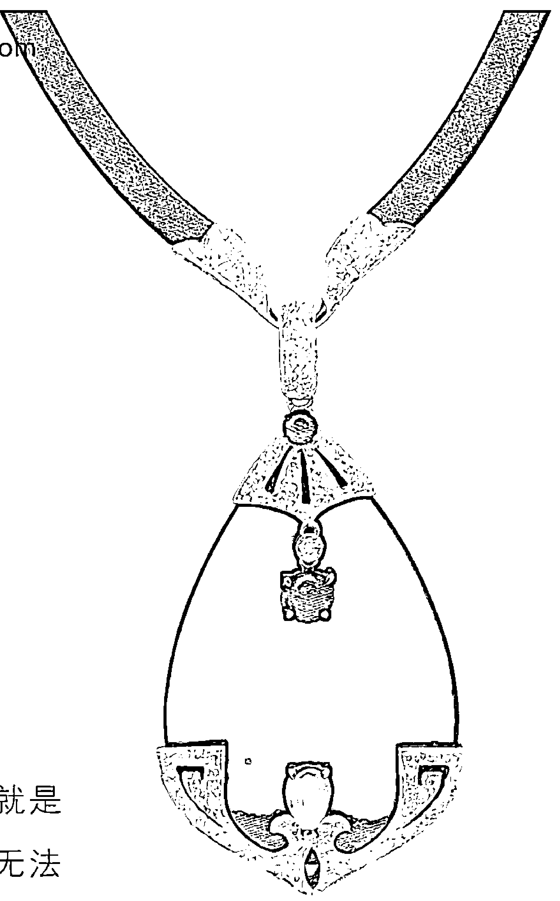

该如何区分墨翠和市场上出现的仿冒品呢？最好的办法，就是利用相对密度、折射率和红外光谱等特征来分析，因为肉眼是无法判断出内部矿物成分的。但是，请不要害怕，还是有肉眼可以区分的几个特点。一是看色：一般光线下看为黝黑或墨绿色，但投射光下看为翠绿或暗绿色。二是看透明度和结构：质地细腻，颗粒致密，透明度好者为上品。总之，好的墨翠一定质地细腻、结构致密、均匀、透光度好，其黑如墨，但又透着翠绿，没有明显的瑕疵和缺陷。做工上一定是精雕细刻，内容吉祥如意，这样的墨翠即为翡翠的艺术品。目前，市面上墨翠的价格不算低，且不以重量为计价标准，几乎可说是可遇不可求了。

## 佩戴与保养

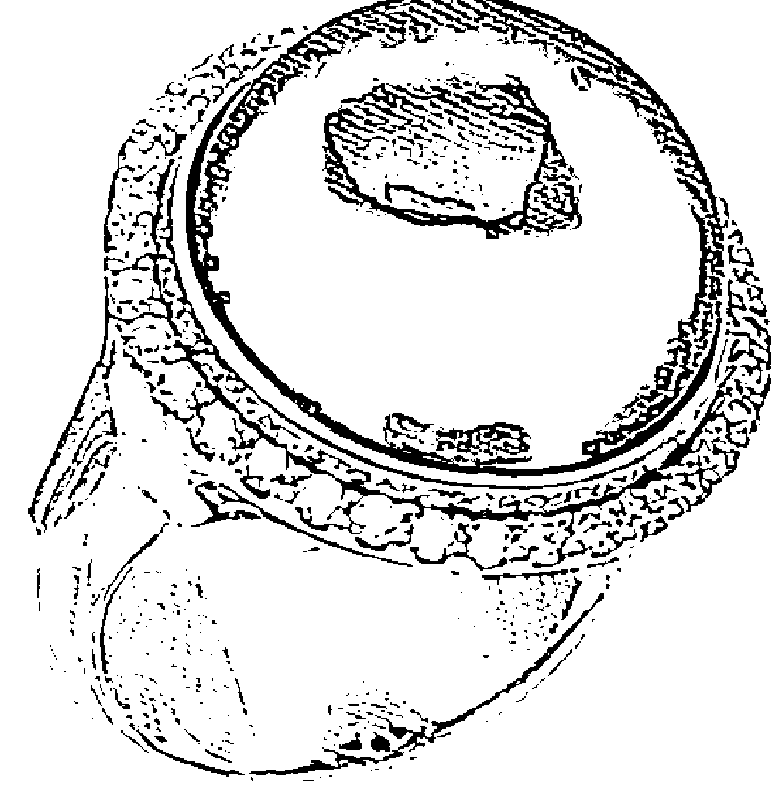

墨翠的硬度是所有翡翠中硬度最高的，制作成各种首饰皆适宜。保养也十分容易，只需以清水洗拭，再以软布将水吸干即可。

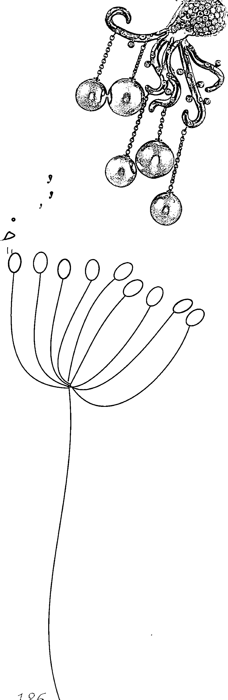

### 章鱼保罗

2010年，南非世界杯足球赛的最佳焦点，非章鱼哥保罗（Paul）莫属了。

出生于英国的保罗，外貌和其他的章鱼一样，身体软软的，还长了许多的小吸盘，最喜欢吃的食物有小鱼、小虾和贝类，遇到危险的时候，还会喷出黑色汁液逃脱。

章鱼都是如此吗？对生活于德国奥伯豪森水族馆中的章鱼哥保罗来说，并非完全如此。他，是只具有“预知能力”的章鱼。2008年，欧洲国家杯足球赛是章鱼保罗初试牛刀之时，那时的他在6场比赛中，准确地预知了4场比赛，命中率高达67%，令人刮目相看。而在2010的世界杯足球赛时，保罗更上一层楼，以百分之百的命中率准确地预测了6场赛事。

章鱼哥精准的预知能力感动了 Joy，于是以章鱼哥在世界杯足球赛里不亚于西班牙表现的故事，设计了一套项链与戒指的作品。

项链里，Joy 以 5 颗黑珍珠代表保罗正确预知的 5 场比赛；而在戒指的设计上，保罗紧紧抓住的那颗黑珍珠，则代表了精准预知 2010 年最后一场冠军赛——西班牙对荷兰的比赛。

Joy 相信，只要将章鱼保罗套组戴在身上的幸运儿，也能如同保罗一般拥有无人能及的预知能力，用心灵最大的力量去感应未知。

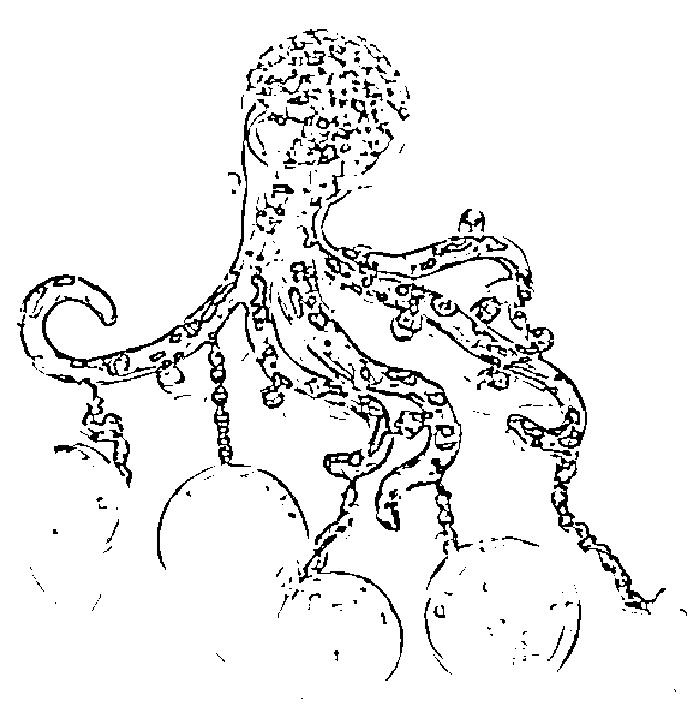

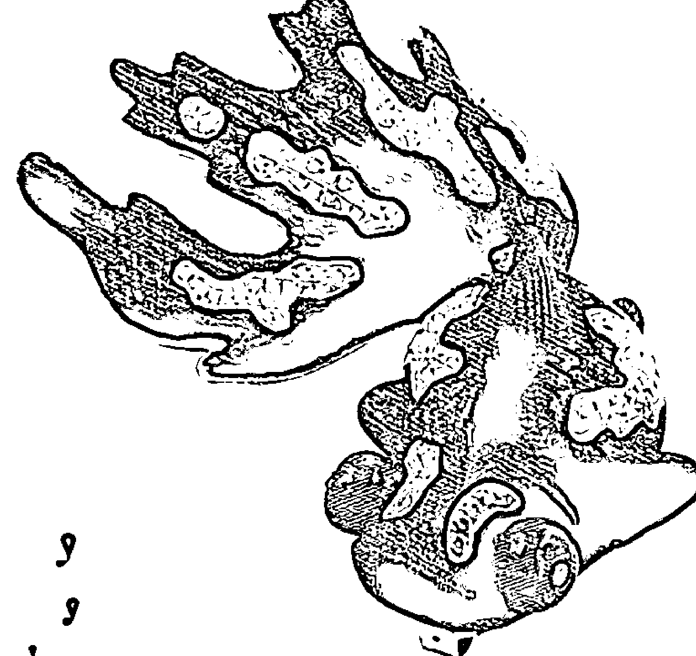

## 黑色金奈鱼

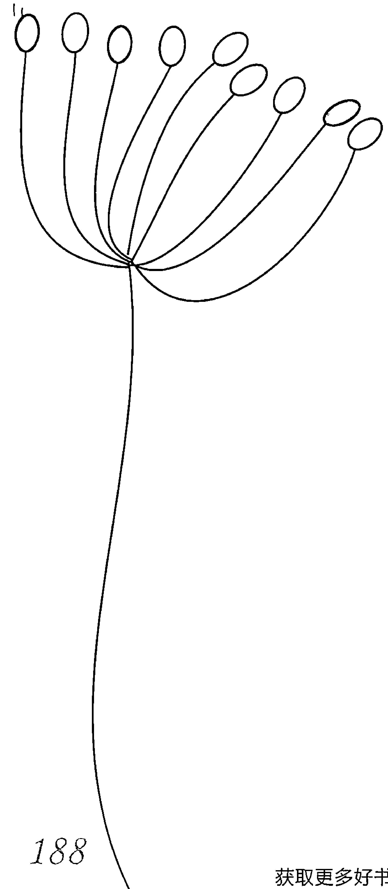

成年礼结束后，金奈兴冲冲地挥别了族人，顺着河道要往更高、更远的地方前进。这是金奈多年来的心愿，想要看看这个美丽的世界，虽然族人不时发出善意的劝阻，告诉他外面的世界有多危险，但是，金奈一点也不为所动，一心等待成年礼的到来，那时就可以毫无拘束地离开家乡，游往世界的尽头。

金奈全身黑溜溜的，看起来就像岸边的石头一样，一点也不起眼。当然，金奈偶尔也会羡慕朋友们美丽的外衣，而自怜一番，但总是不会花费太久的时间，金奈就会从消颓中打起精神，神采奕奕地和伙伴们玩在一块儿。

踏上旅程的金奈，其实并不清楚自己到底要往哪里去，唯一清楚的，就是要往上游，不断地往上游。而且，每一段行程对金奈来说都是一个开始，金奈希望自己能带着满满的回忆回到家乡，将自己一路上所发生的故事和朋友分享。

事实上，金奈选择了一趟最为艰难的旅程，往上游对鱼儿来说是件非常辛苦的事情，它不但必须与顺流而下的激流、浪花相抗衡，一路上还处处暗藏着漩涡——唯有突破这难关，才能溯流而上，继续梦想中的旅程。为了挑战极限，聪明的金奈利用石缝间平稳的水流往前行，不过，有的石头缝隙实在太小，金奈的身体不断被刮伤，一路上早已伤痕累累。但是，金奈强忍痛楚，咬紧牙关继续前行。

金奈在旅程中，认识了许多朋友，经过了美丽七彩瀑布，看过一望无际的大草原，也在幽静的明潭中和螃蟹玩捉迷藏……到了第99天的旅途夜晚，一场暴风雨突然袭来，金奈在大浪里不停地来回浮沉，有时还被大浪高地卷起，重重地甩入水中……情况十分危急。尽管如此，金奈仍然坚信自己一定可以克服这场暴风雨，只要能翻越石崖的另一边，一切就能雨过天晴！于是，金奈奋力地往上跳，一次、二次、三次……跳跃的高度一次比一次还高，虽然越来越疲惫，金奈仍不放弃，一心只想跳得更高。就在金奈用尽力气的刹那，终于翻越过石崖，度过了暴风雨的危机！

暴风雨走了，阳光从云层穿透下来，四周安详而静谧，金奈静静地躺在水面上，看着天空飘过的白云，看着在天空中飞舞的蝴蝶。突然，有一个很温柔的声音从天空传来：“金奈，好孩子，辛苦了。这里是天池，梦想的国度，欢迎你来。金奈，当你踏入天池的瞬间，你已经改变了，现在看看你的身体，看看你的变化！”

金奈讶异不已，不可置信地看着天池水中的自己，原本被岩石刮伤、结痂的伤口，居然变成了美丽的金色钻石图案！

“孩子，这是你不畏挑战、坚持梦想，并为达成心愿不断努力付出所获得的美丽痕迹啊！”

金奈领悟到，原来经过磨炼后所遗留下来的颜色是如此的璀璨、亮丽，那是生命中最美好的礼物。

Joy 以非洲黑檀木细细雕刻出金奈的身形，以其身上金色钻石的痂疤，表现付出努力后的精彩，而红宝石的双眼则是喜悦的象征。Joy 希望借由这件作品提醒大家，唯有付出血汗与努力，才能在生命旅程中留下美丽的痕迹。

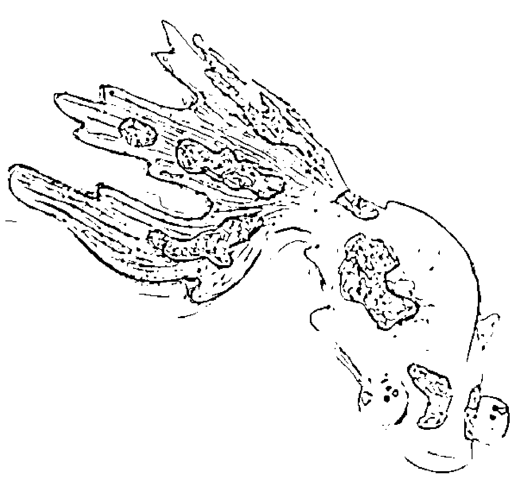

## BOTTEGA 品牌故事

身为贵族的圣夏(Duca de Sasanne)从小就过人的艺术天分，他喜欢画画，但因为家族的压力，只得放弃最爱的艺术。

圣夏聪明、有魅力。他不负众望地把家族事业经营得有声有色，甚至使家族的声威更为兴旺，连皇室成员都敬畏他三分。

可是，圣夏并不快乐，虽然总是有花不完的钱，喝不完的酒，美女形形色色，却没有一个令他动过真心——他没有爱过。

在一个华丽的宴会中，他看到一个背影极美，穿着黑色镶金边礼服的女子，立于一幅画的面前许久。他的耳朵突然不再感觉吵扰，一种宁静出现在他的心头。他不敢上前，怕破坏了这份感觉，但那美丽的背影，站在画前的影像，一直在他心头萦绕。

回到家后，他突然很想画下今晚的经历。他提起许久没有用过的画具——那是他小时候最珍爱的宝贝。不吃不喝地在画室里画了一天一夜，甚至连当天宴会的服装都迟迟未换下来。当他画完时，他总觉得少了些什么，但又说不上来……他把这幅画放在工作室里，在工作压力很大时，他抬起头看，就看到那份美丽，那份安静，还有那未完成的感觉。每天，每天，他总会空出一些时间与画作相处，他突然好想看看那位女士的正面，好想看那让他魂牵梦萦的背影主人。

他穿梭在大大小小的宴会之中，只为了能够再看到那个每天在他梦里出现却画不出的脸孔。

直到有一天，在一个吵扰的宴会中，圣夏公爵拿着酒杯穿过人群，想喘口气，突然那份熟悉的宁静气氛又吸引了他的目光——他终于又见到她了。今天的她依旧穿着那黑色镶金边的礼服，发型虽然不同，背影依旧迷人。

公爵静静地观察着，发现那位女士站在一幅画前许久许久。终于，他鼓起勇气上前问候：“你好，美丽的女士。你很喜欢这幅画吗？是否可以说说你对这幅画的感觉呢？”

美丽的背影终于回头，映入公爵眼前的是一双黑白分明清澈的眼睛，那对有着贵族气息的双眼，好美。

女士回答：“您好，其实，我希望有个人可以为我说说这幅画……我因为一场意外而失明了，但我不断地听到许多人称赞这幅画的好；我站在这里，就是想多听听大家的说法，以拼凑我心中那些零碎的画面……先生，您能帮我吗？”

公爵压抑着震惊，开始形容画的内容。讲着讲着，他的艺术灵魂回到尘封已久的心灵。他滔滔不绝地分享所见，看着女士明亮的大眼，不停变换的表情，时而困惑，时而感动，她的求知欲和美丽的笑容，让公爵忘了她是一位失明的人，也唤起了他内心那热爱艺术的灵魂。

那个晚上，他们谈论了无数幅画。看着美丽的女子，圣夏公爵发现她身上没有任何一件珠宝能够衬托美丽的礼服。原来，她出生在一个没落的贵族世家，身上的珠宝早已变卖以维持家计，只剩这件祖母留下来的黑色镶金边的礼服，在她想去正式场合“听”画时，才不会太失礼。

圣夏公爵开始带着她游山玩水，并把在每个地方看到的风景或稀奇的东西，都化成设计的灵感，制作成珠宝赠予女子，让她可以用手去触摸他们一起经历的记忆及爱恋……终于，在众人的惊讶与不解中，他们结为一辈子的夫妻。

每天清晨，圣夏夫人总是先用手触摸，选择一套可以代表心情的珠宝，再由仆人为她选配合宜的服装。尤其在正式的宴会或画展，圣夏夫人更会用心打扮以便陪同公爵出席。现在他们可以尽情地赏画、谈画，而次日，圣夏公爵总能有精彩的珠宝设计作品呈现。

多年后，圣夏公爵以BOTTEGA（意大利文，意为艺术家的工作室）为名，正式成立了珠宝工作室及展览馆，把旅途中所创作的珠宝陈列，并且也拿起了画笔将自己的所爱所见都画成了一幅幅美丽的画作。公爵夫人常常带着他们的孩子——夏依（Charlot）与BOTTEGA，将每一件珠宝旅行的故事讲给他听，而夏依也成为BOTTEGA工作室的第二代经营者，继续传承这永恒不灭的美丽……

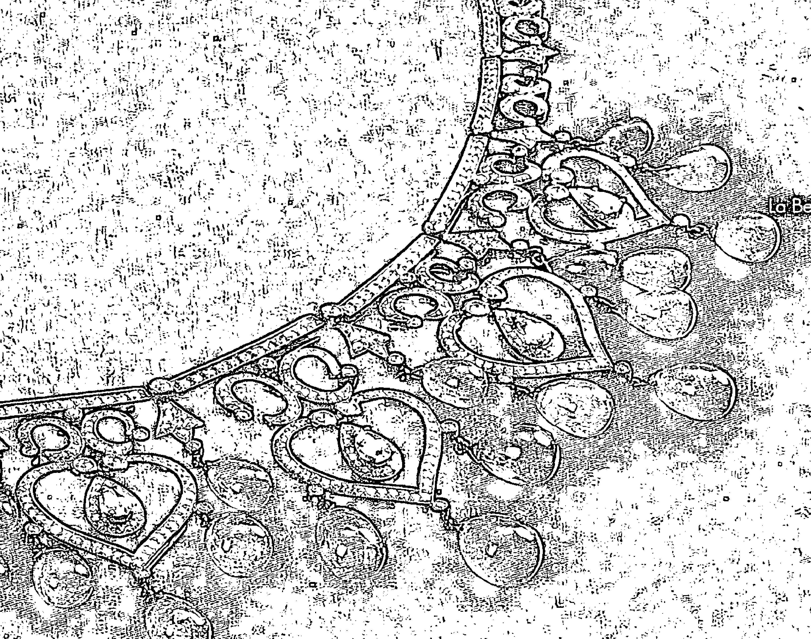

## La Belle Epoque

## 召唤幸福·美丽的能量

是否觉得自己总是怀才不遇？工作繁重、压力过大，无法排遣负面的情绪？

想要遇见真爱？希望家人健康？想要青春活力，灵感与创意源源不断？

珠宝，代表快乐与幸福，也见证了人们的非凡时刻；但你知道瑰丽的宝石也拥有神秘的能量吗？

让大宝石学家Joy带你认识、鉴赏、选购、保养各色能量宝石，了解它们的奇妙能量，让孕育于大自然的缤纷宝石成为你最璀璨耀眼的美饰，也给你带去心想事成的神秘能量吧！

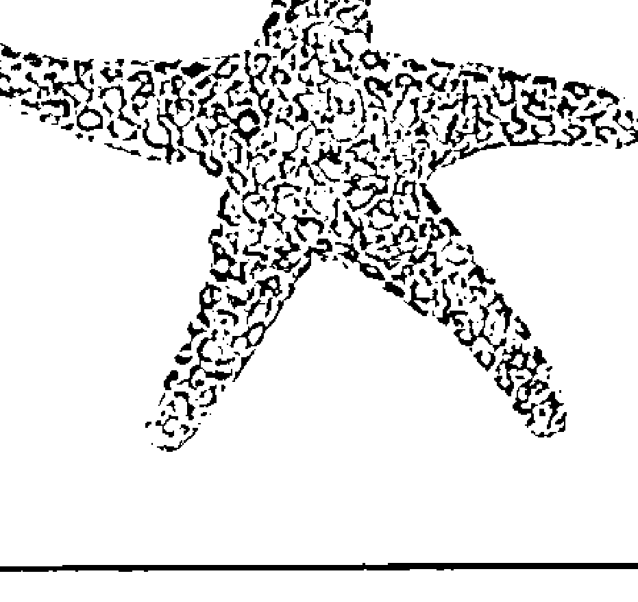

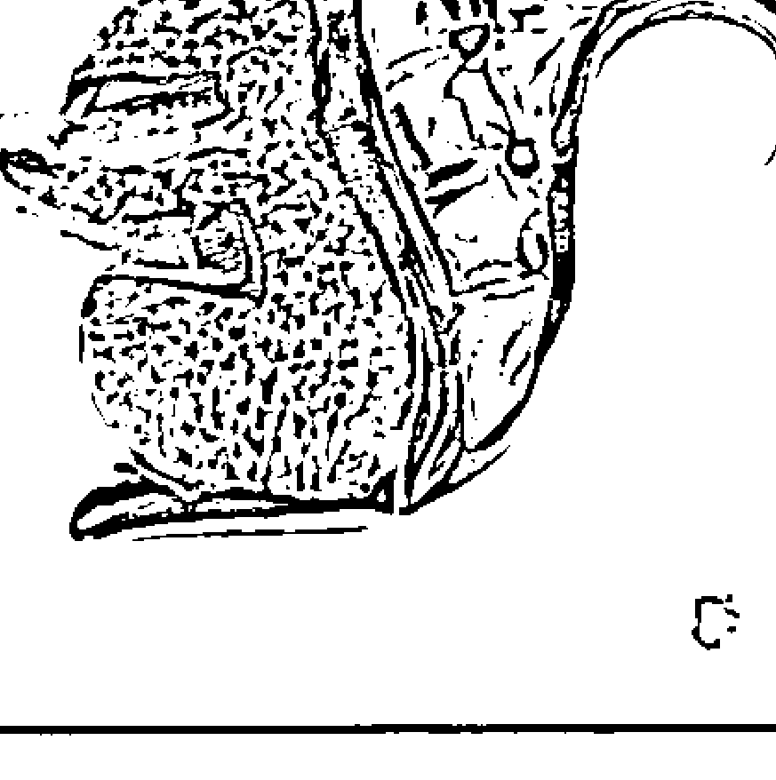

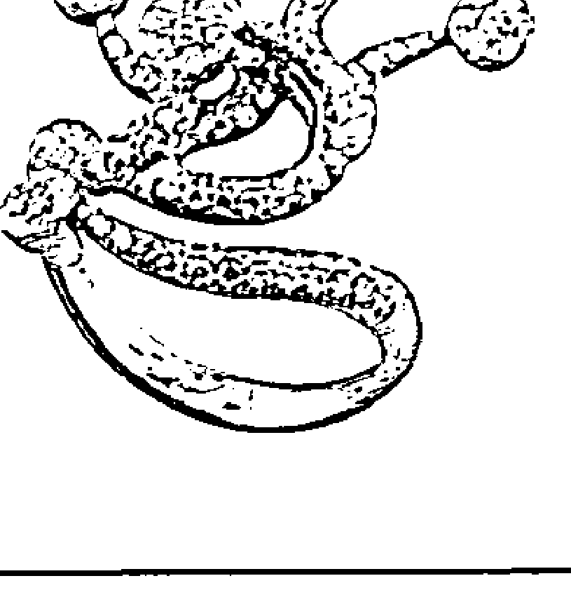

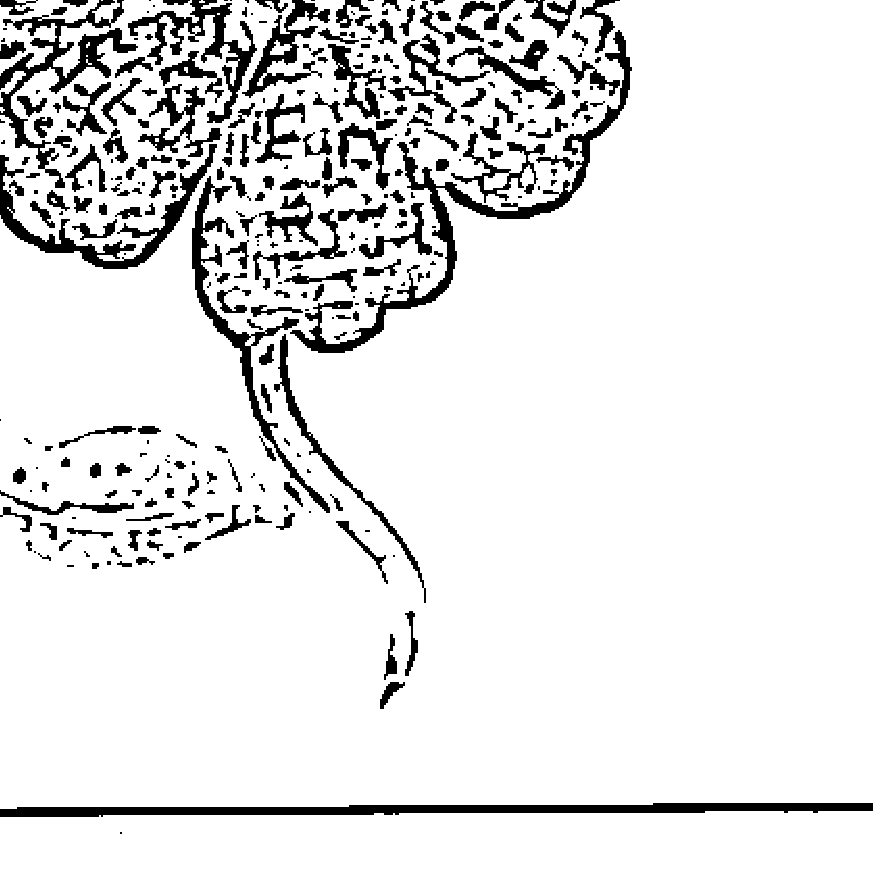