# 色彩与水晶
——氣輪之旅

「色彩與水晶」治療的先驅  
喬依・佳娜(Joy Gardner)/著  
胡雅沛/總審訂  
楊淑娪/譯  

運用自己的直覺  
來訓練和催化個人的意志及靈魂  
讓我們將未知變成已知吧！

## 出版序

人類文明的演進至二十世紀末達到物質追求與發展的高峰，隨著寶瓶世紀的來臨，地球所處的宇宙時空中，正醞釀著另一種新文明的誕生；這股改變的浪潮，將帶領全體人類轉向精神領域的探索和提昇。過去的教育、心理學、哲學、神秘學乃至科學、宗教等，無一不是在探求生命的真相與原貌，在眾多分歧、百家爭鳴的表象下，統合萬物的真理逐漸在各個領域悄然浮現，心物一元或是身心靈的結合與昇華，成為當代世人所共同追求的理想與遠景。

於是新時代之光同時在世界上每個角落點燃，而所謂的「新時代運動」是以歐美國家為最早發端，逐漸地發展與演進，目前已成為一股強大的思想潮流，世界各地相關之集會活動、教學課程、藝文出版、音樂創作，乃至科學、醫學的新生命觀、愛護地球的環保運動等，皆屬於此新思潮的展現，它們共同的目的皆在於提昇人類的意識，回歸生命光與愛的本質，進而邁向天人合一、宇宙和平與世界大同的未來。

在台灣，新時代運動的起步較晚，然而近幾年來由於有許多先進及熱心人士用心地投入與推動，並引進各種不同的觀念活動課程，已奠定了良好的基礎。本社在此風雲際會、新時代來臨之際，自覺亦應肩負起出版者的使命，希望能將新時代的全貌完整且如實地介紹給讀者而規劃出一系列的新時代叢書；新時代的領域包含甚廣，大致可分為十二大類：包括新時代思想類、星際資訊類、光能靈療類、心靈潛能類、水晶礦石類、古文明與神秘學類、星象研究類、創造與生涯類、養生保健類、傳統心靈哲學類、兩性關係類、心靈童書類等等。針對如此浩瀚的領域，本社將有計劃地網羅各類別的好書，在此系列問世的第一、二年間，先推出其中七大類，共約四十本以饗讀者。

A、新時代思想類：此類叢書首重闡釋新時代的生命觀、哲學觀以及意識架構，啟發我們以另一種多元整體的觀點來省察生命的真理與意涵。

B、光能靈療類：介紹能量與光的本質，以及如何將光能運用在身心靈的治療上。

C、心靈潛能類：透過冥想、能量的操作乃至各類心靈技巧的演練，把人類天賦的潛能予以開發。

D、創造與生涯類：應用新時代生命觀來創造更美好與豐富的物質世界，真正將心物一元的理想落實在生活中。

E、水晶礦石類：介紹各類礦石水晶，以及它們與身心靈的提昇及治療的關係和實際操作技巧。

F、養生保健類：以自然而符合生命的原始法則之養生方式來增進生活品質，以健康和樂的生活作為心靈提昇的基石。

G、星際資訊類：了解來自其他星系和文明的心靈訊息，喚醒我們內在的宇宙記憶和知識，重建天人合一的連結。

隨後數年將逐漸發展到其餘類別，希望以階段性的方式將這十二類國內外新時代的相關著作予以完整的介紹，並計劃於適當時機，與國內相關的團體、工作坊結合，舉辦各種活動及讀書會，或邀請國內外作家、專業人士舉辦座談會或相關課程，作為書籍出版之後續服務，及對讀者的回饋。

當然要圓滿達成這樣的一個書香遠景，是需要長時間的投入及努力，與各方的支援及支持。我們願善盡出版者的責任，希望能以好書陪伴這急遽變動中的世界，邁向另一階段的躍昇，更期待新時代中的光與愛能普照全體人類和十方宇宙，讓眾生萬物都回歸到真實而喜悅的生命中。

## 導讀

董惟森

## 序言

《色彩與水晶｜氣輪之旅》一書中，喬依·佳娜告訴我們如何運用自己的直覺，並且以她的書作為指導手冊，以訓練和催化個人的意志及靈魂，而不是一味地將各種學說套用在自己身上。

有的讀者可能會發現，這本書和其他相關書籍有著南轅北轍的看法。這一點是可以理解的：本書的完成鮮少受到學院派的影響，多取材於個人直覺及實際生活的體驗。

本書中許多內容在古代是神職人員避而不談的秘密。這些秘密在黑暗時代為少數人專有。現在，人類文明不斷迅速向前推進，愈來愈多未曾依循傳統宗教教條的人體驗到更高層氣輪的開啓。《色彩與水晶｜氣輪之旅》把以前視為深奧難懂的原理化為簡單易懂的文字。作者適切地鼓勵一知半解的學生尋找一位能夠充分解惑的老師作為探索這個浩瀚無邊領域的導師。

現代人渴望了解自己與周遭人，並且希望和更高的精神層面溝通。這就是對水晶研究所涉領域，就如火如荼展開的主因。東方神職人員的內在教旨告訴我們，水晶之於精神領域，好比他們之於肉體世界，所以他們能夠受天堂神靈利用，載著振動從一個既存水平到另一個水平。同樣地，我們利用水晶傳送能量到更高的水平，就像我們在冥想中利用水晶祈求世界和平一樣。

這本書讓我想起夏威夷卡胡那人的祈福話：「讓未知變成已知吧！」

## 第一章 引言

人體和地球體以相同的方式構成，兩者都由一條軸貫穿。人體的軸是控制動作和功能平衡性的背脊骨，沿著這條背脊骨是幾個能夠回應整個宇宙中生命原始音聲的振動中心。

如果你覺得《色彩與水晶──氣輪之旅》很難相信，我能夠諒解。因爲我在閱讀彼得·湯姆金斯所著《植物的秘密生命》一書的時候，曾經嘗試對著盆栽聊天，可是就是沒什麼感受。看了艾琳·凱迪所寫的《法德渥的精靈》，我想跟小精靈談天，卻抓不到訣竅。萬萬沒有想到在數年之後，我竟然能夠和石頭生動地對話！

西方人相信，生命的能量受限於行為、營養、排泄和再造。這是一般性的偏見，並不適用於大部份所謂的「原始民族」。

使用色彩、水晶、聲音和塔羅牌的藝術，早在印度、東方、歐洲、非洲、夏威夷和拉丁美洲的古代就已經存在。這些地方的人永遠不會忘記靈魂的內在世界，以及如何和植物、動物、石頭交談。

西方人對於古人的信仰嗤之以鼻。但是近來卻掀起一陣新興的薩滿教（Shamanism）之風；這是北美印地安人與大自然維持和諧，並且利用自然力量的一種修持方法。

突然之間，心理學家開始研究薩滿教，並且致力幻象的探索。同時，心理學進入了形上學的範疇。透過催眠的探索和夢境治療；透過容格、費茲·柏斯、威漢姆·瑞奇、維吉娜·沙蒂兒、伊莉莎白·卡伯勒羅絲和其它人的研究，我們發現心理學和形上學有許多不謀而合之處。

情緒和靈魂不再是各自獨立；情緒和靈魂也不能自外於肉體；人體也不可能和地球體分開。因此，肉身、意志和靈魂交織在一起，我們發現自己重新認知從人類開始就有知識。其中最重要的正是跟氣輪（Chakras）有關的古老科學。

氣輪系統在印度瑜伽和其它文化中廣為人知。它是結合整個人一貫的哲學、靈學、心理學和性的方法。一旦了解這個概念，像色彩、礦石和音調等各種不同方法就可以用來促進一個人的成長或調整一個人的失衡。

根據氣輪的教材所說，我們的意識依循著可預知的道路。這一點可以從了解脊柱產生能量的道理中得知。「Chakra」代表「氣輪」或「脈輪」，沿著脊柱有七個主要氣輪，每一個氣輪是脊柱能量的滑動。氣輪打開的時候，是以健康的速度在旋轉著，並充滿著能量。氣輪關上的時候，沒有多少能量貫穿其間。

每一個氣輪放射彩虹中七種色彩之一，所以當所有氣輪都打開時，一個人既有活力又健康，所有顏色會出現在環繞一個人的電磁能量中。

如果有生理不適，情緒或精神不平衡，某些色彩就會變得混濁、有污點、模糊或者從一個人的氣場中消失。這種變色或顏色變淡（有內在視覺的人看得見）通常會引發疾病。

俄國人最早發明一種叫「克里安」的攝影技術，可以拍下一個人的能量。一開始是以拍攝植物做實驗，桑揚和瓦倫汀娜·科林恩發現，在肉眼看不出植物生病之前，該植物的氣場就已經出現明確的失衡跡象。克里安攝影技術同時能夠證明穴道的存在，穴道在皮膚表面就像火山爆發的白色光芒。

數個世紀以來，中國傳統針灸治療過無數的中國人，他們經由把脈了解體內器官的狀況。利用脈搏所提供的訊息在疾病產生之前平衡一個人的能量。由穴道針灸治療，打通身體全部能量的流暢，衝破阻礙。

利用水晶和寶石治療的過程類似針灸。讓水晶和礦石的能量與人體的能量混合以便治療，經由它們的支配力量，以其特定的色彩，使人體氣場中相同的色彩變得清晰和明亮，因此體內障礙得以清除，幫助重建能量的平衡。

有色光也是以類似方式治療，光可以穿透我們的能量。這就是為什麼像德國玻璃的純質色彩，比起較低級數的玻璃或塑膠的混色色彩更有效的原由。

### 作者的背景

我從一九七二年起即擔任全職的諮商師、老師和作家。由於諮商師的身分，我面對了因為各種心理和生理出了問題的個人、夫妻和孩子。我要處理死亡、失落和情緒的釋放。我利用回溯、催眠、觀想，找出真正造成生理病變的情緒和精神因素。

三年級的時候，我就下定決心要成爲作家，高中時代我看了卡爾·容格的書，我告訴自己這輩子的任務就是把東西方的概念串連在一起。

家母是一位直覺力極強的人，因此她教我要相信直覺。我還小的時候，有好幾次她夢到某個人死了。第二天我們真的接到電話，通知我們她夢到的那個人的死訊。

我遺傳了家母對大自然全然的愛。她的童年在波蘭，常常跟吉普賽人一起玩耍，學會他們美妙的音樂，也學會用撲克牌算命和看手紋。我還記得在我八歲的時候，她打扮成吉普賽人，在義賣會上搭個帳蓬替人算命。那是她最後一次替人算命。因爲她算得太準，所以當她知道有人會發生不測，她的心情便大受影響。

家兄是另外一個深遠的影響力。他比我大五歲，他教了我存在主義和禪學。十三歲的時候，我開始學習心理學和哲學。我透過心理學了解人類的創造力與潛能，透過哲學理解宇宙的運作。同時，我也接觸到אתה（光）的課程。

在早期的學習中，我從佛經和《黃帝內經》中發現了一種古老的療法：用心靈的色彩與水晶溫和的能源對人的身體與心理產生影響。這種能量療法深藏於埃及、希伯來、印度、中國等古老文明中，我卻是最早領悟它的使用者之一。我運用種種方法，比如詩歌、音樂、對話和夢境，在本書中解析和展示這些方法，期望讀者能以積極的姿態探索自我與宇宙。

## 引言

的時候，我冥想自己在一尊黑色大佛前面，在我的臥房中上香。

一九七○年我成為草本學家，正式進入治療界。一九七二年，我寫了一本《治療你自己》，這本書教你如何在家作治療，已經印行七版，銷售超過十萬冊。一般來說，我努力闡述針灸和巴哈花之元素療法（Bach Flower Remedies）。平日我習慣冥想，在冥想中獲得訊息對我已經是司空見慣的事。我常常藉由冥想得到對日常生活和私人問題的絕佳忠告。我學會信任內在聲音。我一直不曾告訴其他人這些情形，直到多年以後我看見了艾琳‧凱迪所寫關於「法德渥」的書以後才說了出口。她跟我一樣也會聽內在聲音，並且把所獲得的訊息稱為「指引」。

一九七四年，我從西雅圖一位通靈大師海倫娜‧藍姆那兒接收一系列的精神之旅。透過這些旅程觀想一個人的人生之路。就好像醒著作夢，體驗並解釋你潛意識所出現的影像。藉由這次的精神之旅，我開啓了內在精神世界，也遇見兩個指導靈。之後我拜海倫娜‧藍姆為師，學習利用催眠引導人們悠游精神之旅，幫助他們與指導靈會面，或走進前世。

接下來幾年，我投身於光形、容格學派和生物能療法，後來我向拜德‧費學習光形心理學，跟伊莉莎白‧卡伯勒羅絲學習死亡和失落。

## 第一章

一九七七年，我開始接通一位指導靈，他是個仁慈的存在體，名叫藍恩，每次的通靈約一小時。通常是在我長途開車的時候。他會談到形上治療的各种概念，既精彩又深入。我其它精神導師沒有人像他這麼深入淺出。

不久之後，他的授課內容轉為利用色彩治療和內在成長。討論氣輪，從第一輪開始（尾椎），向上解說。那個時候，我略知氣輪，但是從來沒聽過色彩治療，所以抱持十分懷疑的態度。之後我開始閱讀幾本關於色彩的書籍，我很高興在其中看到藍恩博士所提過的一些資料。

依藍恩博士的建議，我開始教授色彩。然後他介紹我看萊歐拉·赫特所寫的《礦石的精神價值》一書，因而讓我得到很多啟示。於是把礦石也放入授課內容之中，所以最後稱之為「色彩、聲音和礦石」。由於資料涵蓋範圍極廣，所以我特地為學生擬好大綱，省掉他們寫筆記的麻煩。八年之後，這些大綱彙集成冊，接著成爲一本書，這本書就是《色彩與水晶──氣輪之旅》。

剛開始，我對礦石的研究偏向學術性。後來我從一位了不起的歌劇女歌手那兒學到了水晶平衡和發音法。這是一次讓人難忘的經驗。我感覺第三眼因此開啓，這位啓迪我這項天賦的女士說：「妳會自然而然產生這種功力，因為妳在前世已經學會了。」我再

### 純白水晶

也沒有見過她，甚至不記得她的名字。

我發現自己幾乎在每一位病人身上放礦石。我十分驚訝礦石的威力。我依舊從事同樣的諮商工作，療程卻快了兩倍到二十倍。當我做前世回溯、催眠、通靈或情緒放鬆時，一切都變得容易多了。

那個時候，我找到卡崔娜·瑞法寫的兩本書：《水晶啟蒙》和《水晶治療》，拓展我全新的視野。接著藍恩博士開始傳導不同種類透明水晶的訊息，於是礦石本身開始傳達給我諸多訊息。

我同樣在工作上運用各種音調。自從我接受水晶平衡和音調發音治療之後，我對自己的聲音和周遭可能發生的所有聲音就失去了原有的控制力。這些聲音成了療程中的重要部份。

我並不是催眠通靈。藍恩博士說話的時候，我完全清醒，意識清楚。我聽他的一字一句，就好像是我自己想法一樣，不過有著截然不同的特質。我必須做個區別——我體驗藍恩博士如同一位與我完全分離的個體。藍恩博士在十九世紀末生於印度。他的父親是一位英國醫生且雙親皆為神秘主義者。後來他回到英國也成爲一位醫生。最後，他死於倫敦。他不是透過在英國名叫喬治·夏門的靈媒所傳的指導靈威廉·藍恩，他也不

## 第一章

是當代的心理學家R・D・藍恩。

還有其它幾位對我有極大幫助的人，包括艾米莉，她第一次來見我時，我經由她為 一位病人通靈（我很少這麼做，我比較喜歡幫助病人做他們自身的傳導）。艾米莉對石頭有著很不錯的天賦，她一直對我助益很大。

粉紅塔拉也使我受惠不少，是位印度神──綠色塔拉的新生相關概念，粉紅塔拉前 幾年在我和其它幾位女性（我們之前並沒有進一步的溝通）之間同時出現。她化身成溫 和的力量；也是色彩和藝術的守護神。粉紅塔拉引導我利用粉紅色和綠色石頭在心輪 上。

我很希望能夠直接感謝「礦石王國」，讓我直接進入它們的意識殿堂，把這些知識 付諸文字。

同時我也感謝前來接受我的治療的客人，特別是願意接受我初步實驗的人。他們對 我的信任以及對礦石效用的回饋是無價之寶。許多寶貴知識是因為面對求治之人而獲 得。

一九八五年我寫了《引導之書》（The Book of Guidance），內容是把精神世界 （包括色彩訊息）直接帶入現實層面。我不斷參考先前這本著作《色彩與水晶──氣輪

## 引言

我不想假裝自己是形上學專家。我試著把本書的主題儘可能描述地平易近人。我以我有限的知識編寫此書。許多深諳形上學的專家，往往使用過於艱澀的專業用語，忘了我應該為一般人著想。由於我忘不了自己是如何穿越層層障礙的經驗，所以希望扮演如橋樑般的角色，提供讀者更容易了解這方面知識的工具書。

我也不足礦物學家，雖然我了解石頭的精神層面，但是對它的科學層面並不專精。《色彩與水晶──氣輪之旅》反映了我個人的進化，好比從我開始懵懵懂懂探究氣輪到找出它對我的意義的心路歷程一樣。這就是第三輪，智慧的體驗。

在我跟拜德・費學習光形心理學，以及伊莉莎白・卡伯勒羅絲學習死亡和失落的那段時間中，我獲得充分的機會釋放一直封閉我心輪的種種情緒，給我進入第四輪所需的諸多洞悉力。

我的第五輪是在我接收靈氣（Reiki）入門時開啓的（一種用雙手和遠距離的治療）。我從藍恩博士以及之後的《引導之書》傳導更多訊息。

接下來的引導來自冥想、夢境和精神指引。後來我到達一個境界，就是需要找一個體驗過自我實現的血肉之軀。我必須跟某個人談談我的内在掙扎。看書已經不夠，不論

## 第一章

書的作者多麼具有啟發力。

我在愛達荷州的常青療養院遇見了泰尤曼那法閣下，因爲我們都在那裡授課，我們很快成了好友。我注意到只要站在他身邊，我的能量就能衝向更高的氣輪。過了幾個月以後，我看見這位朋友化身成我一直尋找的真理。發現一個人明確知道自己 的道路，並且在我追尋的路上支持我，真是一大安慰。終於，我渴望已久的覺知開始顯露，我能夠了解和寫下第六輪及第七輪。

同時要感謝編輯艾琳・吉兒，她不斷支持我；還有發行人約翰和艾琳・吉兒。由於他們的無私和正直，讓我們的合作關係超越了世俗的商業利益。

過程是源源不斷的顯露，我以分享之心寫下此書。

喬依・佳娜

聖塔克魯茲，加州

### 純白水晶

水晶為什麼一時之間流行起來？純白透明水晶帶著白光的振動，當我們開啓更高層氣輪時，就更容易接收白光以及化身成白光的水晶。

水晶其實一直存在，只是我們忽略了水晶之美。而且水晶隨處可見，我們自然看不出它的珍貴之處。同樣的，『精神之光』也一直存在，我們之所以視而不見是因爲我們不愛自己。現在我們迎向『光』，水晶也會反射了那道光。各式各樣的水晶告訴我們，我們可以在光之中全然地獨一無二和永保美麗。

我們利用水晶做冥想或治療的時候，水晶提供氣輪能量，燃燒體內的障礙，及幫助排除晦氣。

如同克莉斯妲·費·柏卡在她那本了不起的鉅著《淨化透明水晶意識》（Crystal Consciousness）中所說：水晶隱喻個人由非意識到意識的成長。這句話是完美的總括，水晶反映了我們覺知和啓迪的成長過程。

卡崔娜·瑞法說過，水晶的六個面象徵六個氣輪，其頂端銜接了無窮。許多水晶的底部呈現乳液狀，愈向頂端愈澄淨；就好比一個人隨著成長，駕鈍的意識和無窮的自我合而爲一。接著，我們能在身體轉變爲『光』的時候，反射出純淨的白光。

克莉斯妲則說，人就像水晶一樣，不斷藉由清除體內的情緒創痛來傳導和洗滌能

## 第二章

量。

水晶就好比無線電波的傳送，它有足夠的力量傳送和擴張我們的能量，不論好的或壞的。水晶本身屬中性，能夠攜帶任何我們加諸其上的能量，並且把這個能量帶入大氣中，或者帶入另一個人的氣場、思想或另一個能量肉身中。

由於水晶有滲透人類氣場的力量，所以要十分謹慎的選擇要治療你的人。不要任意接受治療，除非你真的對於治療你的人有著百分之百的舒適感。

別忘了當你身處水晶附近，你的能量即已受到影響，無論你是治療師或病人都一樣。這是一個兩者都會牽涉其中的過程，你為某個人治療的當時，你一旦開啟這個療程，你會發現自己也同樣接受治療。換句話說，如果你過分投入治療師這個角色，你會發現這份工作耗盡你的精力。

水晶的使用永無止境。有私人水晶提供你冥想時握持，也有用於治療的水晶。水晶可以放置在房屋四周，除了美觀之外，還可以驅除晦氣，創造幸福感。

有的人說，碎水晶不應該用於治療，然而，我的水晶中我最鍾愛的幾塊是小塊水晶 晶，它們具強而有力的療效。不過如果碎水晶已經改變整體形狀時，就會干擾到它的效用。例如：通靈水晶應該有七個面。如果其中一面損毀（這樣一來很難斷定是否為七個面），便削弱了水晶的傳導功效。

有些碎水晶傳導能量的力量遭到破壞，有的則沒有。如果你強烈吸取某個特定水晶，那麼你和這顆水晶的能量相互協調，所以你不必疑慮它是否為碎水晶，我們擁有的水晶多少都有些許破碎。

當你在別人的家中看到水晶，你可以從水晶的形狀判斷這個家庭在生活中的需求。舉例來說，我曾經去過一位居住在華宅的女性家裡。在桌上我看見一顆水晶裡面有個大型子水晶。就我猜測（參考指引），這種水晶對於表態很有用，有助於獲得你所希望的生理需求。這種水晶很難找得到。這位女士不知道其中有個子水晶，她只是直覺地受到這顆水晶的吸引。

## 水晶的種類

你可以依據下列的指導方針挑選符合你所需的水晶。資料來源除了藍恩博士以外，還結合其他參考資料。

### 單一尖端（Single Terminated）

這是最常見的水晶種類，在一端有著六面尖端，這就是稱之為「尖端」（Point）的原因。

單一尖端水晶通常用作氣輪的能量補充或者驅除負面能量。利用單一尖端水晶做治療時，會用尖端朝內以便帶入能量；例如：朝向特定氣輪中央的大石頭上。

把它們朝向外（遠離氣輪中央的石頭），以便淨化能量。若要開啟或加強頂輪的能量，則是放置一個大型單一尖端的純白透明水晶，其底座置於枕頭上，剩餘部份緊貼你的頭頂。這樣有助於開啓精神的白光（White Light of Spirit）。

純白透明水晶有很多種。

### 純白水晶

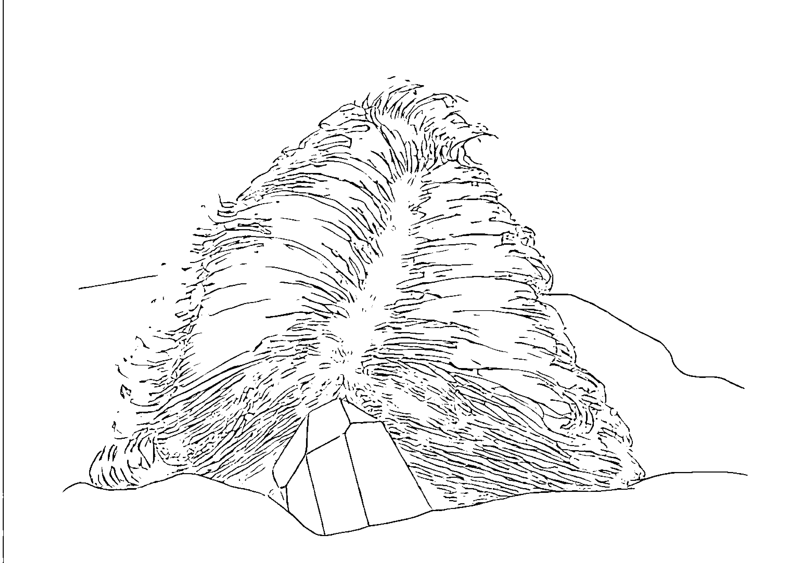

> 頂輪上的單一尖端水晶
放置一顆大型單一尖端的透明水晶，底座置於
枕頭上，水晶的剩餘部份緊貼你的頭頂。

## 第二章

單一尖端水晶通常用作珠寶。穿戴水晶要十分謹慎，因爲水晶會像海棉一樣吸取能量。如果你心情不好，你身上的水晶會帶著這份能量反射到你身上。如果你身處負面思想的人羣之中，它也會感染到負面思想。

如果你把水晶戴在襯衫裡面，你的水晶對其他人能量的感受力就會差一些，因爲它直接貼近你的皮膚，又有一層衣服遮蓋住。有的人喜歡把水晶置於小袋中再掛在脖子上。這樣可以讓水晶免於其他人能量的干擾，但是比起直接貼近你的皮膚來說，效果會比較差。

如果你的心情很好，周圍也都是好心情的人，那麼把水晶戴在看得到的地方，以便吸取這種正面的能量，再反射到你身上。穿戴水晶參加正式慶典，或是在慶典舉行之前淨化你的能量或增亮你的氣場，都是非常好的。如果你感覺不適，水晶可以除去一些負面影響，給予氣場更多光。要辦到這一點，水晶必須非常努力。正因爲它十分努力，所以會筋疲力盡，於是沒有足夠的力氣吸取負面思想或替你的能量充電，就像送回負面影響，這就是我們清潔水晶的原因。

### 雙尖端（Double Terminated）

雙尖端，通常是用來形容水晶的相對兩端各有一個尖端。雙尖端水晶在軟黏土中可能會生長，也可能長成水晶簇的一部份。要留心有的水晶是因爲切割而成雙尖端；除非切割的人對水晶有研究，否則其功效仍然比不上真正的雙尖端水晶。

我通常利用雙尖端水晶開放兩個或多個氣輪之間的能量線。例如：我曾經治療過一位抱怨自己十分沮喪的女士。她是工作狂，她的第二輪已經沒有能量，而第三輪的能量則是過盛。四十五歲的她，因爲膝下猶虛而產生失落感。

我放了一系列的石頭在她的第二輪；第三輪上則放了一個石頭。接著，我放了一顆雙尖端水晶在第二輪和第三輪之間。在療程當中，她因爲沒有小孩而悲傷，然後到達一個接受這項事實的層面。當我稍後感應她的氣輪時，我發現第二輪的能量已經增加，第三輪能量相對下降，她感覺舒服多了。

雙尖端水晶也可以指有單個（或 multiple）尖端在一邊，相對的另一邊有多个尖端。我把雙尖端和多個尖端的水晶交互使用。如果有一個水晶在一邊只有大型單個尖端，而另一邊是多個小型尖端，我會把大型的單個尖端當成主要尖端。在排列時，我會把主要尖端

### 純白水晶

雙尖端水晶
雙尖端水晶在相對的兩個方向各有一個尖端。

### 純白水晶

# 甲殼水晶（Barnacle Crystals）

端朝向頭部。

有時候你會發現一整塊水晶上覆蓋著像甲殼一樣的小水晶。由此可知，較大的水晶就像受族人愛戴的酋長一樣，其智慧可以受到信任。冥想時握著甲殼水晶，能夠給予你幫助解決家庭或團體問題的洞悉力。這種水晶能夠作爲最佳同伴，尤其是當你失去至愛的長輩或有智慧的長者時。

### 水晶簇（Crystal Clusters）

水晶簇形成原因是因矽土急速冷卻，造成許多末端突出，通常會有多個方向。這些獨立的水晶彼此反射彼此的光和能量，創造出強力的療效和淨化的振動。這樣的水晶可以用來淨化一個房間的能量。它們彼此之間也有自清的作用，不過，要確定定期清洗它們，特別是長期暴露在負面影響之下。它們也可以用來淨化其它石頭，只要放置在石頭之上即可。水晶簇是水晶球的最佳底座。

水晶簇對於理不出頭緒、性格多變的人非常有效。光是默想水晶簇，就能讓你對自己

### 覆蓋甲殼的多尖端水晶

有更好的感受。

水晶簇是完美的水晶團。這是一個獨一無二的聚合體；每個分支最美麗的一面共同呈現在母體上。如果你是某個團體中的一份子，試著找個能夠反映團體之美的水晶簇。

把它放在房間中央，或者放在你任何時候聚集的冥想圓圈中央。如果團體中的每一位成員都感受到水晶簇的和諧，整個團體的力量會因此加強，幫助這個團體奠定更堅固的基礎──特別是爲了這個原因而放置水晶的狀態下。

### 赫金莫鑽石（Herkimer Diamonds）

赫金莫鑽石並非真的鑽石，而是有著鑽石般亮度的水晶，只有紐約州的赫金莫郡出產。赫金莫鑽石的雙尖端相距很近，硬度超過其它石英石（一般是七，赫金莫鑽石爲七·五）。由於赫金莫鑽石爲雙尖端，所以其用途與任何雙尖端水晶的用途一樣。

在《水晶聯繫》（The Crystal Connection）一書中，維奇和雷多・貝爾說明了赫金莫的特性：有著極高頻率的能力，以及多用途的能量範圍。我有一顆大型的赫金莫，我把它當成雷射使用，配合極高的音調，以便切斷阻滯和打散過於集中的能量。

當我覺得這種治療必要時，我會徵求病人的同意──我要製造一個極高的聲音，可

### 純白水晶

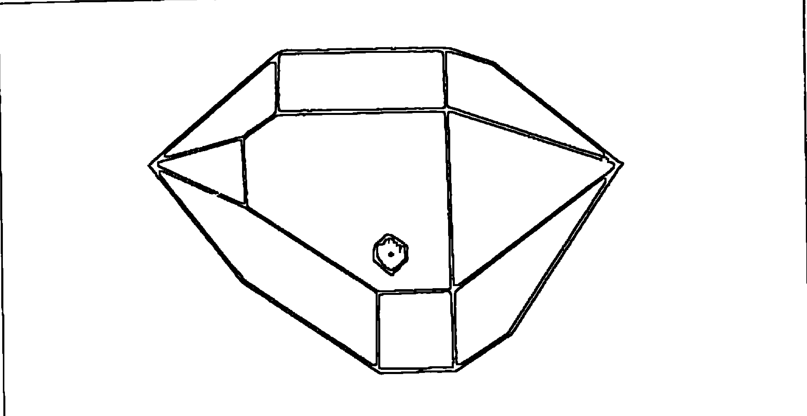

帶有浮動子體的赫金莫鑽石
赫金莫通常是雙尖端，其形體較短，雙端 距離較近。這個裡面帶有浮動子體。

## 第二章

以嗎？﹂，然後我會用其中一個尖端對準有阻滯的地方，並且發音，通常是高分貝的「一」聲。音調的震動（即使伴隨警告），加上赫金莫高頻率的強化，能夠造成極具戲劇性的有力效果，可以讓一個人瞬間放下所執著的東西，體內阻滯也因此分解。類似的效也，可以用音調水晶製造，如下面所述。

赫金莫能夠幫助你記得和製造夢境。放一個赫金莫在枕巾裡面，以便在夜間讓它接近你的頭部。

赫金莫帶有快樂、如起泡般的能量。

如果你覺得心情沮喪，可以在冥想時握著它，或者放在襯衫口袋裡幾天，它能夠迅速改變你的能量。不過不要戴成習慣，因爲過了幾個月之後，它會徹底改變你的能量，使得你變得很神經質和失去判斷力。因爲它讓你陷於夢境中。

## 音調水晶（Toning Crystal）

長窄型水晶在音調上揚和唱歌時會延長你聲音振動的長度和寬度。有可能是單一尖端，也可能是雙尖端。如果是雙尖端，通常各自只有一個頭。維奇和雷多・貝爾這麼寫著：「體型愈長，亮度愈強，擴展度就愈大。較長的體型同樣可以讓更多用途的能量進

## 第二章

入和調和。

當你選擇音調的水晶，可以試著發音看看聲音是否維持較久，或者聲音是否振動得更為有力。並非每一個長窄型水晶對音調都十分敏銳，有的長窄型水晶會比其它同型水晶更具威力（並不一定是最長的最有力）。這型水晶也可以利用作爲水晶平衡杖。長窄型水晶的輕能量能夠增加敏感度，以便感受一個人氣輪的旋轉。

## 純淨水晶（Clear Crystals）

和玻璃一樣純淨的水晶（就算其中有所遮蔽或有其它圖案），就有清淨的能量，可以幫助你拓展意識。純淨水晶可以淨化腦部，加強對引導的接收力，使觀想更加容易。可以在躺下的時候把純淨水晶放在第三眼，或者在冥想時握著它也可以，如果你願意，不妨凝視它，或是放在頭頂上以得到進一步的澄淨。

## 長細型精緻水晶（Long Thin Delicate Crystals）

小型精�致水晶可以加強任何已經做完的療程。面向內是爲了補充，能夠注入少量能量；面向外是爲了淨化，能夠開闢一條細微管道，供不必要能量排除。對第六輪的排

### 純白水晶

列來說，這一型的水晶不可或缺，因爲第六輪沒有太多空間擺放大型水晶──特別是額頭窄短的人。

## 彩虹水晶（Rainbow）

許多水晶放在陽光之下可以反射出虹光，不過彩虹水晶有特殊結構可以反射美輪美奐的七彩圖案。這種水晶象徵快樂。你在冥想時握著它，把它的色彩吸入你心中，可以帶來舒適和愉悅。

## 面紗水晶（Veil）

面紗是指彩虹水晶透過像遮蔽般的表面反射顏色。根據你手握時光線或角度的不同，其結構有時候像銀色，有時候像黑色面紗。這是一種充滿神祕感的水晶。黑色可以幫助你了解你自己的黑暗面（負面思想、恐懼、怨氣），加以改革變成光明面。

面紗的形成原因很多，通常是因爲外傷，如：掉落或嚴重擠壓。水晶轉換這種外傷化成美麗的圖案，就好比一個人遭遇情緒上的強烈打擊或是威脅生命的疾病之後，所展現出的心智成長一般。當你有能力主宰自己的黑暗面時，你就擁有治療他人的力量。你

## 面紗水晶

面紗是指彩虹水晶透過像遮蔽般的表面反射顏色。根據你手握時光線或角度的不同，其結構有時候像銀色，有時候像黑色面紗。

### 純白水晶

可以引出他人的負面思想、恐懼和怨氣，幫助他轉化。

## 火山口水晶（Craters）

有時候，你會看見一個水晶上有著類似火山口的洞，如果這個洞是以完美形狀存在於一個逆轉的水晶上，這表示曾經有一個較小的水晶以此為家。火山口水晶是母性最佳狀態的隱喻。較大的水晶寬大為懷，願意讓子水晶寄生於自己體內。之後，一旦子水晶成熟，又讓它完好無缺地整個離開。因此這種火山口水晶集合讓步、供給養分和放手的特性於一身。冥想時握著這種水晶，有助於在你體內發展出相同的特性。

## 內有子體水晶的水晶（Baby Crystals）

當你注意觀看透明水晶時，有時候可能會發現其中有子體水晶。這種子體水晶通常位於水晶內部的山谷，而每一個山谷是介於兩座山之間。火山口水晶有極佳的深度。特別是針對深刻的印象，它能夠帶領你深入內心，把埋藏已久的事物帶到表面。

這種水晶最適合雙親、老師和願意自我犧牲的人。它終將教會你視痛苦為珍珠。當你陷於痛苦之中，它會提醒你跳脫自我，從別的角度看同一件事。如同每一座山都有山

## 內壁水晶（Wall Crystal）

當你看到水晶裡面好像有一面牆——把水晶隔開的內部平面——這種水晶可以用來和緩有紛爭的狀況。如果你發現自己和他人有所爭執，化解不了，最好先退一步，花點時間獨處，握著這種水晶做冥想。它能夠讓你洞悉爭執點，提供你雙方面的想法，讓你暫時跟事端保持距離，以便更容易找出解決衝突的方法。

如果你跟事業夥伴有誤會，那麼你非常幸運，因爲對方一定願意試一試水晶的力量。你們兩個人面對面坐下來，把水晶放在兩個人中間。開口說話之前先感應水晶的力量。

### 純白水晶

然後你會放黑曜石在第三眼上（尤其對曾經遭受過性虐待的女士，讓她眼淚流出），配合兩個長窄型精�致水晶朝向黑曜石以充電。

同時，你會放兩個第一輪水晶在鼠蹊部作爲基地；一個在第三輪以增進個人力量；

### 通靈水晶（Channeling Crystals）

這種水晶的正面有七個面，所以面積夠大可以直視進去。『七』代表直覺和智慧。

這種水晶在背面有著完美的三角形。『三』代表說話的力量。你可以在通靈時或是試圖

#### 水晶球（Crystal Ball）

這種不尋常的人工磨製石英石球體（有別於人工磨製的玻璃球體，這種較不具威力）有能力帶你走回過去或者走向未來。使用時要十分謹慎，尤其是要了解個人未來事件的時候。如果你帶著今天的情緒去看未來，可能會造成震驚和痛苦。如果你讓事件回到它所屬的時間中，一旦發生了，你會有比較萬全的心理準備。

我通常利用水晶球幫助病人回首過去時光中不順遂的事。病人躺下的時候，我把水晶球放在他的頭頂上，所以應該是放在枕頭上緊靠著頭頂。

然後我會放黑曜石在第三眼上（尤其對曾經遭受過性虐待的女士，讓她眼淚流出），配合兩個長窄型精�水晶朝向黑曜石以充電。

另一個放在心輪以慰藉；一個放在喉輪，讓不愉快的經驗更容易說出口。我會利用輕度

#### 表面有子體的通靈水晶

正面有七個面的通靈水晶，其表面有兩個子體。由於較大型的水晶多半用於通靈，而且尤其對於傳導與孩童有關的訊息最好。

### 純白水晶

與水晶的訊息有所協調時，把七面正面對著第三眼，尖端朝向頭頂。這樣可以幫助你智慧來源源不斷，並且跟所學習的一切較容易溝通。

我治療病人的時候一定會使用通靈水晶。如果我碰到任何不知道該怎麼辦的時候，我會把通靈水晶放在第三眼，尋求引導。一分鐘之內就會得到答案。當我要求病人從他們「更高的自我」（Higher Self）尋求知識時，我會握著七面水晶對著當事人的第三眼。

若要直接從水晶或任何其它特定目標物尋求知識的話，可以握持目標物在一隻手去，尋找你要的答案。通靈水晶會幫助你了解，並且把你的了解化成文字（想了解通靈水晶的進一步資料，請閱讀卡崔娜・瑞法（Katrina Raphael）所著《水晶治療》（Crystal Healing）一書）。

通常是左手，因爲比較容易接收），另一手握著第三眼的通靈水晶。閉上眼睛走進

### 表面子體水晶（Babies on the Outside）

在大型水晶的表面若有小型子體水晶或數個子體水晶，對於從事與孩童相關工作的，人最好。當你和孩子們相處時，可以把水晶放在教室或是口袋，只要你覺得場面控制得

#### 水晶的排列

接下來所談的排列適用於透明水晶和其它各種礦石。至於石頭治療的進一步資料，請參考第四章。

首先，你必須接受技術優良的水晶治療師的治療。在接受專業治療之前，先不要對水晶治療的效果下任何評論。

接下來就是在自己身上作實驗。以六十七頁中所描述的「水晶能量」（Crystal Energization）開始。排列時永遠是以背部平躺，頭部朝向北方。因為這種方式使你的背脊和地球軸心以及地球磁能量排列成一直線。由於透明水晶沿著地球磁場在礦脈中自然天成，而且包含磁場中的鐵氧化物，所以水晶比你所想像得具有更大的效用。

隔著一層衣服還是具有效用，不過，若是能直接貼近皮膚更好──特別是指小型寶石。寶石可以放置任何地方或者放在身上，但是最好依據七個氣輪的能量中心放置。寶石放在所屬位置至少要十分鐘。

一旦體驗「水晶能量」一、兩次之後，放一個或兩個寶石在適當的氣輪上，剛開始

### 純白水晶

一次放一個，花幾分鐘觀察它的能量，以及你本身的能量是否有任何變化，使用當中若產生恐懼感，最好移開。

在自身實驗一陣子之後，試著參與水晶的研習課程。這是一種學習更多，並且跟更多同好分享的機會。找一個人願意跟你一塊實驗。

當你們決定一起實驗時，先決定誰先給予和誰先接受治療。讓先接受治療的一方頭部朝北方躺下。若是由你先給予治療，開始時安靜地坐在對方旁邊，手握音調水晶或其它適當的水晶，尖端對著他的頭部。兩人均保持沉默，讓你的氣場和你的能量相互協調，同時也讓水晶的能量和靈魂相互協調。

如果你需要保護，放一個私人水晶或內壁水晶在你們兩個人中間，或者戴一個紫水晶。這只是一個參考建議，特別針對新手、或者你覺得不安、或者對方的問題很廣泛、或者你希望自己能有更強烈的感應時。

現在你可以準備排列水晶了。先試一試「氣輪平衡排列」（Chakras Balance Layout）。如果你覺得有能量上的阻滯，可以嘗試補充並加強氣輪能量，或者淨化氣輪。你若願意，也可試試用發音的方式來調整能量，不過，在你熟悉較簡易的方法之前，不要輕言嘗試「水晶平衡」（Crystal Balancing）和「發音法」；而且就算你已

## 水晶能量

這種簡單的運用對於消除緊張和排除負面思想，以及注入正面思想，有十分特殊的 效果，只需十分鐘，比打個盹效果更好。也許有一天能夠取代咖啡呢！

這種排列需要四個單一尖端的透明水晶（你也可以用紫水晶或單一尖端的煙晶）；兩者一起合用也可以。紫水晶最好用於頭部，而單一尖端的煙晶（Snocky quartz）則用於腳部。這些水晶長度必須至少一又二分之一吋，但是不必很特別或很漂亮。事實上，如果你在床上使用的話，它們有可能會掉到地上摔碎，所以在這一式排列中不必用到你最喜歡的水晶。

每一個水晶都必須有尖端向外，與身體中心反方向，或者放置距離身體二至六吋的地方。平躺在平坦的平面上，把水晶放在下列位置：

- 1. 在你頭頂中央的上方
- 2. 在雙腳之間和之下
- 3. 在右手腕的右方
- 4. 在左手腕的左方

以這種位置平躺約十分鐘。要確定沒有人在水晶尖端的火線之內（line of light）。不必擔心自己是否睡著。

做這項排列時，可以同時放置其它你認為對身體適當部位有所助益的寶石。事實上，『水晶能量』可以跟其它任何治療搭配。

### 氣輪平衡排列（Chakra Balance Layout）

每一個氣輪選一個寶石。第一個氣輪需要兩個寶石，因為要用在兩側的鼠蹊部。把寶石放在氣輪上。頂輪的寶石是緊靠頭頂。

握一個音調水晶或單一尖端透明水晶在右手中，你靜靜坐著感應能量時，對準你的當事人。

握著水晶在當事人身體上方幾吋的地方，直指向他，從第一輪開始。從他身體中央線之上十分緩慢的順著中央線移動。在移動的時候，感受能量。一般來說，你的手會任意移動，不過到了某一點之上，你可能會發現你的手就是無法繼續向前。你或許會覺得熱、冷、能量混亂或明顯消失等。

這種情況發生的時候，距離最近的氣輪很可能就是需求治療的地方（如果正巧處於兩個氣輪之間，那麼利用雙尖端水晶結合兩者，一併治療）。接著用『補充氣輪能量』或『氣輪淨化』的方式治療，如下文所述。

### 補充氣輪能量（Charging the Chakra）

假使氣輪缺乏能量，而你的手也不想越過該氣輪；或者感覺寒冷；或者你看過病歷，確定該氣輪能量不足時，就必須替氣輪補充能量。若是爲了補充能量，放一個寶石在該氣輪區域的中央。通常選用跟該氣輪有關的寶石（不過這一點有例外。例如：你可以使用解藥——就好比第三眼能量過剩時用紅玉髓將其關閉）。大型寶石會比較理想。

假使病情真的很嚴重，氣輪中心可以放兩個或三個寶石，每一個都要放在身體中心線上——這樣它們才能排列成一行——。如果你在中心線的排列使用有尖端的水晶（如：在第三輪使用黃水晶），那麼尖端就必須指向頭部。圍繞在單個（或多個）中心寶石外圍的是數組寶石和數組透明水晶，其尖端指向中心寶石。

這樣的排列至少要維持十分鐘或者一直到治療結束。各寶石就適當位置之後，可以鼓勵當事人說說自己的想法和感受；或者你覺得想先去感受其它氣輪，稍後再回到這個氣輪上。

你也許接收到一些你想和當事人分享的影響；不要猶豫，你可以這麼說：『我看到一個影像，我想跟你分享。如果這個影像對你有什麼意義，請告訴我；如果沒有意義就

### 氣輪淨化

算了。『或許你看到一個小女孩在穀倉裡哭泣。』儘管描述你所看見的影像，不要附帶任何價值判斷。『我看到一個小女孩在穀倉裡哭泣，你記得這一幕嗎？』結果你可能會很驚訝的發現，你的當事人當時只有四歲，由於父親打了哥哥一拳，她偷偷跑到穀倉躲起來。

### 水晶平衡

這是一種強而有力的技術。除非你已經是經驗老到的諮商師以及（或者）能夠傾聽自己內在聲音，否則不要輕言嘗試。如果你是這方面的新手，在嘗試這項技術之前，先

若是某個氣輪感覺得很混亂、很熱或很緊張；或者你看過病歷，認爲該氣輪能量過剩，你必須淨化該氣輪，清除過剩的能量。放一個寶石在該氣輪的中央。通常是有關該氣輪的寶石，這個寶石可以視作解藥。如果你是用有尖端的水晶（如：第三眼用紫水晶），尖端就必須指向腳部。中心寶石的周圍是數組水晶（可以包括煙晶和紫水晶），尖端指向外。遵守上文中「補充氣輪能量」圖所示。

## 第三章

### 第一輪｜紅色

+   - 位置
- 色彩
- 音調
- 元素
- 土

位於尾骨。

紅色。

解藥：藍色。

音調

音符：c。

國語注音的「ㄧ」。

土。

### 感官

### 嗅覺。

### 表述

### 說明

「我要種種的物質。」

第一輪跟你和大地的關係、你的出生地、你的文化和你的基礎有關。第一輪受到你最早的關係所影響。如果有一個人曾給予你無條件的愛，你會有很強壯的第一輪，而且你的生存結構會很好。如果你從未接受過無條件的愛，你的第一輪會很脆弱。

第一輪是身體能量和活力的中心。它是物質建立的基礎，所以算是「顯化」中心。

如果你希望在物質世界、商業或物質的擁有上有所實現時，成功能量來自於第一輪。

根據《引導之書》中所說（稍微簡化）：「眩目的紅色能夠彰顯你的感受。它能夠使分子暖和及加速。紅色代表熱情，紅色花朶要小心使用，只有在日落時強調它的力量。」

紅色用來吸引注意和興趣。紅色小心使用才能平衡。但是不要讓自己熱情減退：：：它有自己的所在。它是力量和自信的來源，應該要持續接近。紅色有大量的能量和憤怒，對很多人來說是威脅，也是擾亂。

『不過你若不想受傷，就必須進入本性中的這個部份。有時候要表現強悍的一面，像個戰士一樣，面對你所愛的人。你也需要有旺盛的體力，才能渡過困難。』

『很多人害怕紅色，因為身體上有了傷口就會流出紅色鮮血。』

『火的紅色帶來溫暖和神秘。憤怒的紅色讓人感覺緊張和痛苦。信心的紅色會產生自負和炫耀。熱情的紅色會變得貪婪。』

『每一種感覺包含原子微粒。拒絕包含微粒的感覺是因為旋轉力量超乎平常，原因是其自然的律動過度。旋轉過繁形成紅色。當這些微粒聚集，能量就不再內含，造成如暴力般的力量。於是，以暴怒來表達，好鬥、磨擦、侮辱、肉體上的蹂躪、強暴或謀殺隨之而來。『看見紅色』是這個時候的現象。』

『酗酒和嗑藥通常會偏離正常社交行爲，以暴力表現。另一方面則是疾病的衍生。』

暴力經由紅色表現，如同發炎一般，幾乎每一種疾病都有某種的發炎。

##### 第一輪能量過剩

### *特徵

+    - 集中
 - 根植於大地
 - 主宰自己
 - 健康
 - 全然活躍
 - 無止的肉體能量
 - 能夠顯化豐富
 - 精神方面的表現可能是：

    居爾特式

##### 第一輪能量過剩

### *例子

這位土生土長的印地安女巫師兼接生婆在季節儀式中表現她的靈性，包括了大自然的特定地點、草類的運用、舞蹈和歌唱。她的眼神閃閃發光，雖然年過七十，卻仍能像個年輕女人般的走路和大笑。她能量充沛，永遠知道該怎麼做。

### 性能量：

#### 親切的

能夠信任和容易受傷
全身都能感受肉慾

#### 哈塔（Hatha）瑜伽

#### 一種美國印地安人的宗教

#### 一種非洲部落的宗教

####### 跋扈

####### 貪婪

####### 沈溺於財富

### 性能量：

#### 紊亂

######## 專注於整個生殖器

######## 性能量緊張

######## 性虐待狂

### *例子

這位有錢的完美主義者是一位加州連鎖餐廳的老闆。他對待員工就像一位要求嚴格的將軍。他很容易緊張，有慢性便秘的毛病。他有三部車，他因此感到些微滿足。他跟很多女人上床，卻都是空洞的體驗。

### *特徵

##### 第一輪能量缺乏

### *例子

這位沒有一技之長，沒有安全感的女人住在雜亂無章的屋子裡，大部份的時間都花在看電視上。她的雙親都酗酒。她的體重不足，常常忘记吃飯。她長期沮喪、沒有活力，對男人沒有什麼興趣。人生對她而言十分乏味。

+   缺乏自信
步履不穩
虛弱
無法達成目標
自我毀滅，自殺
性能量：
覺得沒有人愛
害怕被人拋棄
對性愛沒有多大興趣
受虐狂

### 禁忌或不當治療引發的症狀

緊張和發紅，避免使用紅色
激動
激烈運動
發燒
潰瘍
高血壓
面部潮紅
腫瘤
發炎
當心：如果你在頭部上使用紅光，治療時間限制在三分鐘內。並且在治療中用一塊冷濕布或藍布放在頭上，或者在治療後至少放兩分鐘。紅色是最強力的顏色，最容易使你坐在這種光線之下會覺得緊張、生氣、悶熱或不安時，不要繼續下去。利用藍光作爲解藥。

###### 第一輪影響的腺體和器官

+   - 血液
- 脊骨
- 神經系統
- 膀胱
- 男性生殖器官
- 睾丸
- 陰道

###### 必須用紅色治療的疾病

由於紅色是藍色的解藥，所以用來治療藍色病症。由於紅色具刺激性，所以用來治療身體下半部的器官。由於是紅色，療遲鈍和虛弱。由於紅色位於第一輪，所以用來治療身體下半部的器官。由於是紅色，

注意：男性生殖器主要位於第一輪，所以男性性能量通常用肉體來體驗。女性生殖器主要位於第二輪，所以女性性能量通常用心靈來體驗。兩個氣輪都跟性能量有關。

## 第三章

所以可以用來淨化和健全血液。

- 沮丧、恐惧
- 衰弱、缺乏活力
- 步履不稳
- 低血压
- 膀胱感染
- 消化不良
- 皮肤没有光泽、脆弱
- 休克
- 贫血
- 血液循环不良
- 性无能，性冷感
- 不孕
- 没有月经
- 产后虚弱（或者失血过多）

## 七個氣輪

## 第一輪可使用的礦石

* 红榴石

红榴石能够复苏和刺激能量。它会影响脊骨中的拙火能量。因此它跟基轮一直到第六轮都有关。

红榴石多半是小型的鲜红色矿石。小型矿石容易弄丢，而且威力不足，不过你可以用一个普通的单一尖端水晶，并且在水晶正面放一个小型凸圆红榴石。然后红榴石的能量和水晶的传送力量相结合，功效极佳。珠宝商可以用强力黏胶固定住，记得在使用之前要黏好才行。

放在第三眼上（当你仰卧平躺时），红榴石能够唤醒前世。用纯红榴石、红榴石戒指、红榴石耳环或水晶上架红榴石都可以。

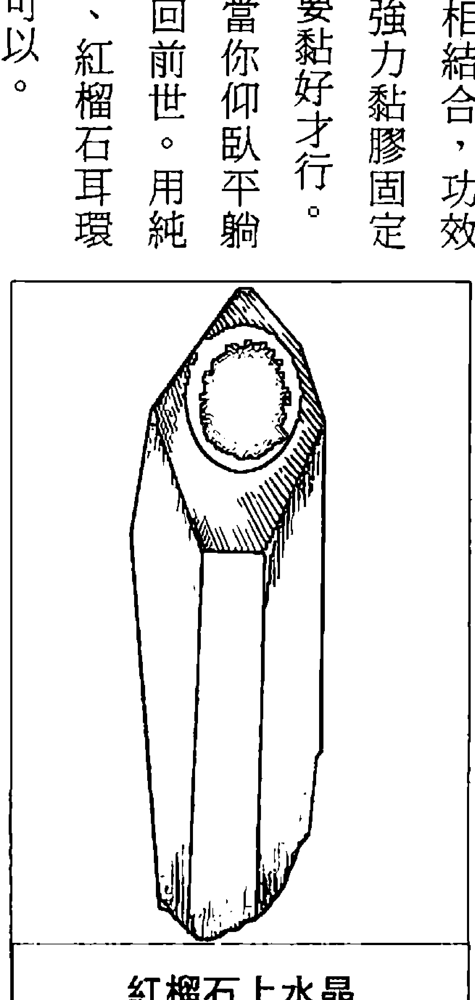

> 红榴石上水晶
你可以用一个普通的单一尖端水晶，在水晶的正面架上一个小型凸圆红榴石。

## 煙晶置於腳部

如果一个人太浮动，需要安定下来的话，放烟晶靠在脚底，尖端朝向脚趾。你的烟晶可能比这张图上的小很多，不过原理是一样的。

## 第三章

冥想时可以握在手中，能让你平安顺利的降落地球上。

烟晶不适合日常佩戴，它比较适用于正式典礼，尤其是与地球有关的典礼。穿戴烟晶会把你能量向下拉，让你感觉双脚沉重。有的人（性灵脱俗的人）很需要这种稳定感。他们或许会抽烟或者做一些不太正常的行为。对这些人来说，只要戴上烟晶，或放一小块在口袋中，就能缓和不问世事的冷漠。

### 第二輪

## 七個氣輪

### 名稱

#### 符号

### 位置

膍轮（活力的住所）
薦骨中心
脾臟輪

半钩月符号代表容纳和子宫。这是女性的象征。外圈是六瓣莲花。

肚脐下一至二吋或发展到左侧的脾脏。

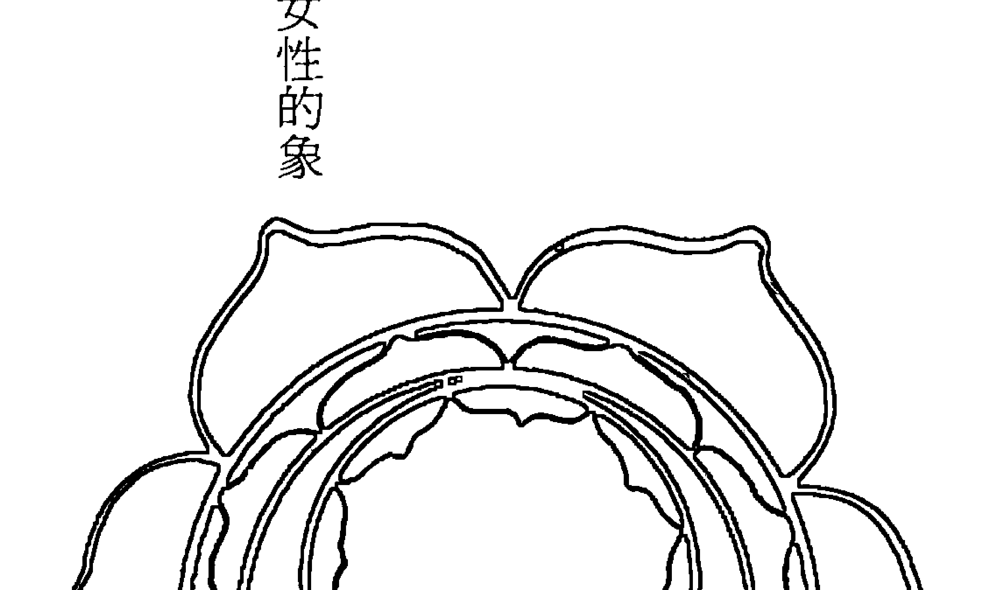

## 第三章

许多人肚脐下一至二吋处有一个橘色能量的集中站。但是有的人（尤其是选择独身的人），这个气轮延伸到身体左侧，左肋骨下方脾脏处，这就是有时候称为脾脏轮的原因，这里属于蓝绿色。

### 色彩

橘色（肚脐以下）。

蓝绿色（脾脏）。

解药：紫蓝色。

## 音调

音符：d。

### 元素

水。

## 七個氣輪

##### 第二輪能量平衡

###### * 特徵

- 友善、乐观
- 关心别人
- 归属感
- 具创造力、想象力
- 直觉感强
- 感觉敏锐：能够变成另一个人，只为做心理分析，以便更了解这个人
- 感觉协调
- 适度的幽默感
- 精神方面的表现可能是：
  - 圣灵降临节
  - Rajneesh式瑜伽

### 性能量：

最高目标是要拥有绝佳的高潮

可能想要小孩

###### * 例子

莫扎特（电影「阿玛迪斯」中的主要人物）正是第二轮发展健全的最佳例证。他自信、友善、快乐、勇敢和脾气暴烈。他充分活用本身的才华，写下粗哑、创新、『不道德』的歌剧，并且爱上一个美艳的年轻女孩，不论她是否出身低微，仍然娶她为妻。

###### * 特徵

##### 第二輪能量過剩

情绪化
好斗
野心过大
好操纵
好幻想

###### 過分放縱

###### 自助

###### 感覺敏銳（參考上文）
但是卻無法分別自己和其它人的感覺

### 性能量：

## 會因爲性而分心

## 視他人爲性目標

####### 需要不斷的性滿足

###### * 例子

这位女性是时装模特儿，兼卖化妆品。她十分在意自己的外表，花费大量金钱在服装、珠宝和香水上。她以异性对她的注意的多寡来评估自己。她仔细观察每个男人的肉体，并且与自己理想中的完美男性作比较。她利用男人去获得自己想要的一切，一旦事与愿违，她就火冒三丈。

###### * 特徵

##### 第二輪能量缺乏

## 第三章

- 过分害羞、畏缩
- 对恐惧无动于衷
- 过度敏感
- 自我否定
- 忿忿不平
- 埋藏情感
- 受罪恶感束缚
- 多疑
- 性能量：
  - 坚守
  - 对性爱有罪恶
  - 受孕困难
  - 受虐狂
  - 性冷感或性无能

###### * 例子

这位仁兄害羞、遁世、风度翩翩，会为别人着想。私底下他认为性爱是粗鄙的。常为性无能所苦。

### 禁忌或不當治療引發的症狀

###### 第二輪影響的腺體和器官

## 能量過剩

###### 性能量過剩

###### 必須用橘色治療的疾病

便秘
肌肉抽筋和痉挛
乳汁分泌不足
缺乏元气
过敏（对环境反应过度所引起）
压抑和抑制

## 第二輪可使用的礦石

* 虎眼石

这个矿石如同开启者。它通常是第一个吸引你注意的矿石。孩子们最常受到虎眼石的吸引。它的触觉灵敏——述说着触感——而且它冰冷平滑给人舒适感。

你不需要对虎眼石心领神会，它能够结合你和土壤中丰富的棕色，它把这个能量和神性之光（Divine Light）融合。虎眼石若放在第三眼上有助于看到每个人的优点，让你的人生之路走得更加愉快。

这是代表勇气的矿石。无论有多少障碍，它给你力量、耐受力以及勇往直前的意愿。不断搓揉它平滑的外表能够摆脱你的忧愁和恐惧。

这种触感十足的矿石是情人之间最喜爱的礼物。由于我们的情感和性欲密不可分，所以性和爱的所有想法都能引起焦虑和紧张，进而造成第二轮旋转不规则或太过激烈。

为了平抚你的意志，让旋转回到正常速度，你可以用手握着虎眼石，凝视它的纹路，然后放在第二轮上。

虎眼石可以做成戒指或项链，也可以放在口袋里。如果你有男女关系，它可以帮助你们两人相互感应，彼此协调。

* 红玉髓

红玉髓是红橘色的玛瑙，能够感觉温暖和松弛。红玉髓带有强烈的男性能量，对性器官和性能量都非常合适。它好比宝石中的人参（人参是一种草药，中国人视为珍宝，认为可以活络男性生殖能力，以及增进活力）。当你因为情人而伤心或者有任何生理疼痛，可以把红玉髓放在生殖器官或鼠蹊部。

病人因为身体某一部分过于紧张，我会用红玉髓治疗。红玉髓就好像小型的热垫，温暖紧张的肌肉，让它松弛。对于肩膀和肩胛骨酸痛特别有效。

红玉髓可以放在第二轮以治疗消化不良。

## 第三章

由于橘色和紫蓝色是彼此的解药，红玉髓同样可以治疗第六轮（紫蓝色）能量过剩。例如：你若因回顾而体验到前世种种痛苦，而且久久不能释怀，可以利用红玉髓放在第三眼上关闭第六轮能量；也可以结合两个透明水晶，尖端朝向红玉髓的反方向以排除能量。这样一来你会平静下来，并且安全落地。

当能量都聚集在上方气轮，而你觉得不平衡；或者拙火过早上升，可以把两个红玉髓放在鼠蹊部。这样对平衡能量十分有效。

孩子也适合使用这种矿石，因为它能给予力量、幽默和乐观向上。放一个红玉髓在孩子的口袋，以对抗任何沮丧、负面或好斗的倾向（不需要刻意压抑这些行为，只要削弱即可）。

红玉髓是一种世俗成功的矿石。它能够深植你现有的基础，保护你远离负面影响。它给予你勇气大声表达。生意人很适合佩戴这种矿石或放在口袋中，尤其是在腰部以下。

红玉髓是炽热、强烈和决断，做成戒指戴在手上能够增加个人自信。

### 第三輪

## 七個氣輪

### 名稱

#### 符号

### 位置

胃轮（肚脐的珍珠）
腰椎中心
太阳神经丛中心

三角形向下指，三个面都有「卐」幸运符号。这是一个火轮。第三轮结合了太阳和自我；是消化中心，中国人称之为「三焦」，因为在消化过程中会产生热。外圈是十瓣莲花。

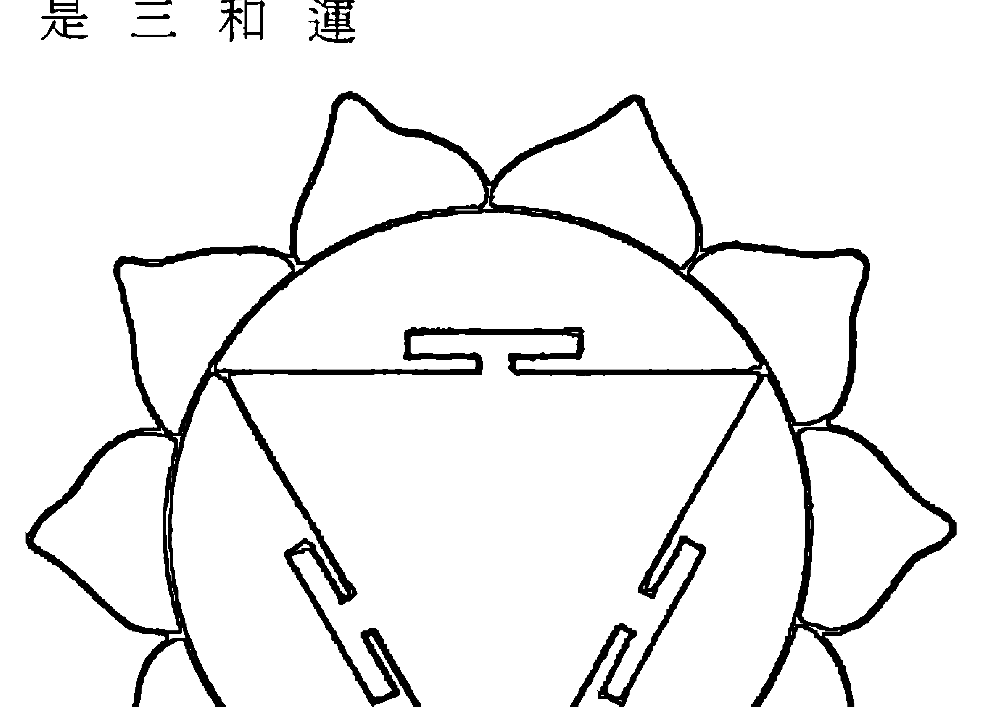

## 第三章

### 位置

在太阳神经丛（胸骨之下，胃部后方），同时显现在肚脐。

### 色彩

黄色。

## 音调

解药：紫色。

音符：e。

a | o | m（啊 | 欧 | 嗯）。

### 元素

火。

## 第三章

你的天赋会反映你的天生技艺和才能，不过还必须配合训练和学习。举个例子：歌

有一种方式可以找出自己的天赋：想一想你在童年时最喜欢做的是什么，由此你可以得到个人性向的线索。发现你应该做的事，正是你真正喜欢做的事，可以说是人生一大乐事。

第三轮是个人力量的中心。第三轮开启时，你会发现自己的独特天赋，工作带给你的是乐趣和满足。你若处于第三轮的发展阶段，此时正是建立正面的自我形象（自我）的绝佳时刻。在第六轮中，你需要摆脱这个形象的束缚。

### 感官

## 視覺。

### 表述

## 我要快乐。

### 說明

## 七個氣輪

顧之憂。正因爲沒有後顧之憂，你只要放鬆，做你自己就好。現在，在你的身體中央有一個地方叫做太陽神經叢。只要做我的太陽，從你的小宇宙中心散放接納、溫暖和鬆弛。你也可以從你的生命中心散放接納、溫暖和鬆弛。

藍恩博士說：「黃色會直接深入靈魂。黃色就像個普通人，跟雛菊及蒲公英一樣普通。這個靈魂適用於每個人；不神秘，不玄奧，具一般性。」

「黃色是中庸之道；是管理者和調整者；是力量的中心。它連結我們跟偉大的『中心太陽』（Central Sun）。它接收來自天堂的輻射，傳送到地球。它是熱和力的來源，卻不會過分刺激。像陽光一樣滋養。」

根據瑜伽系統的說法，第三輪受意識掌管，只有在清醒的時候才會活動。然而，它可以利用內省訓練，具有創造性的想法會因此進入，影響潛意識，由此可知負面或正面思想的成因。

父母親若是為孩子設立特定的目標，會與孩子的意願產生衝突。於是孩子掙扎於父母親的愛以及本身發展力量的需求之間。如果孩子忠於父母親的期望，可能就無法找到自己的創造力。這就是爲什麼有的孩子比較有優越感。優越感來自雙親對孩子成就的驕傲。不過私底下這個孩子一定會覺得矮人半截，因爲他沒有機會發展真正的自我價值。

## 第三章

藍恩博士說明，一個自我發展比較少的人，黃色會混合紅色，導致這個人比較在乎跟自己有關的一切。個人力量以自助為原則，不會帶來任何滿足感。

─第三輪與消化器官有關，─藍恩博士說，─這個氣輪能量平衡的話就會有好的消化系統。缺乏能量會導致消化不良。黃色關係到用餐時的鬆弛和消化液的流暢；也包括副腎上腺和荷爾蒙的循環，及任何流動和放射的體液。不包括血液，因為血液是紅色，位於第一輪。但是黃色能夠抑制血管的擴張和收縮。

─由於第三輪主管消化和意識，人在太飽或太餓的時候很難思考。不過斷食可以平靜心念，除非本身就心念紊亂。

─輻射的鬆弛源自於此。太陽神經叢是呼吸中心。─橫膈膜位於第三輪，所以第三輪中的黃色有助於因恐懼或緊張而無法深層呼吸的人。

## 塔羅原型

第三輪有兩張牌。

## *國王

這張牌主要是紅橘色和黃色。如同一位國王坐在正方形的中央，四周有能量圍繞。

國王並未面對正面，他往右側邊看著太陽。他只露出左邊頭部，代表邏輯的部位。他的袍子上有能量在旋轉，四周有蜜蜂和能量原子。頭部兩側各有一隻公羊。他彎曲雙臂拿著東西（其中有一手是拿著公羊頭），這個人威力十足。

這張牌代表火。鳳凰從他的盾牌中升起，背後有太陽襯托。他的「無懼」是他的保護。我們可以了解他會保護無邪，因爲他的旗子是由一隻羔羊所持。

在他太陽神經叢的高度，他拿著代表世界的一顆球。希伯來文是「Tzaddi」，意即：魚鉤。他會釣魚上鉤，達成自己的目的。他健壯的雙腳形成數字「4」，表示無瑕疵的組織，讓

## 七個氣輪

##### 第三輪能量平衡

靈魂因此喚醒，我們找到自己的天賦以便與世界分享。這是一張代表火、快樂和能量的牌。希伯來文是「חֵס」，意即：臉。這張牌代表開誠、真實和活潑。

### *特徵

- 活潑
- 愉悅
- 自重
- 尊重他人
- 強烈的個人使命感

## 七個氣輪

##### 第三輪能量過剩

### *特徵

### *例子

最高目標可能是同時發生高潮

對伴侶和孩子有責任感

盡情不拘束

放鬆

自然表現濃情蜜意

這位先生擁有一家大型健康食品店和餐廳。他喜歡烹飪和教他人營養學。他的員工發現他很好相處。他自律、可靠和圓融。他很少遵循食譜，比較喜歡隨興烹調。他從工作中得到極大的樂趣，並且創造一個歡欣、愉快的環境。

完美主義傾向

工作狂

好批判

## 七個氣輪

## 過分理性

###### 身為老闆者：凡事要求

###### 身為員工者：憎恨權威

###### 可能需要靠藥物放鬆自己

###### 優越感和自卑感交織

### 性能量：

####### 要求

## 時常測試自己的伴侶

####### 對兩性關係諸多抱怨

####### 能夠非常親切

####### 可能需要大量的性生活，卻又鮮少得到滿足

### *例子

這位老兄才華洋溢，卻無法決定如何傳導自己的能量。他是科學老師、木匠兼音樂家。父親是物理學家，曾經鼓勵他在科學界發展。他是一位優秀的科學老師。他嚴厲地鞭策自己，從工作中卻得不到快樂。他常常抱怨人生、工作和同事。他掛念金錢，賺進

## 七個氣輪

##### 第三輪能量缺乏

來的每一筆錢都要訂出花這筆錢的長遠計畫。他對女人有許多美麗的幻想，一旦有了對象，卻又吹毛求疵，爭吵不斷。他有個啤酒肚，而且消化不良。

### *特徵

- 沮喪
- 缺乏信心
- 在乎別人的看法
- 迷惑
- 觉得自己的人生受他人控制
- 消化不良
- 害怕單獨一個人
- 缺乏安全感
- 性能量：
  - 需要一再確認

## 七個氣輪

### *例子

###### 好妒、多疑

這個人常常失業，雖然他是一位技術優良的鎔焊工人。他覺得被生活壓得喘不過氣來，而且好像什麼都做不好。他花大部份的時間吸大麻，或者和朋友泡酒吧。他的朋友多半是第三輪能量缺乏的人。他太太很能幹，不但支持他，還試著增加他的自信。他有強烈的佔有慾；他如果認爲太太對某個男人有興趣，就會暴跳如雷。然而自己卻可以盡情拈花惹草。

###### ✿第三輪影響的腺體和器官

###### ✿禁忌或不當治療引發的症狀

有緊張傾向和發熱發紅現象的人必須限制黃色的使用，大約在五至十分鐘之間。

- 橫膈膜（以及呼吸）
- 腎上腺
- 皮膚

## 第三章

消化器官：胃、十二指腸、胰臟、膽囊、肝

###### 必須用黃色治療的症狀

- 消化不良
- 食物過敏
- 肝臓毛病
- 糖尿病
- 低血醣
- 縱慾過度
- 甲狀腺機能退化
- 膽結石
- 肌肉抽搐、痙攣
- 腦力和神經疲勞
- 沮喪
- 呼吸困難

## 七個氣輪

### 第四輪

## 七個氣輪

| 名稱 | 符號 |
| --- | --- |
| 心輪（未擊敗的） | 心臟中心 |
| 背脊中心 | 兩個三角形，一個向上，一個向下，代表平衡。心位於中央，上有三氣輪，下有三氣輪。這個六尖星星，也就是著名的一大衛星—（Star of David），象徵聖靈深植土地的同時亦甦醒。 |

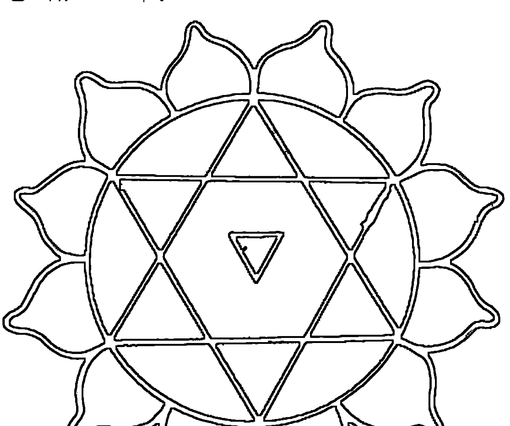

## 第三章

位置：胸部中央。

色彩：綠色或粉紅色。

解藥：不需要，因爲它本身位於中央，是平衡的。

音調：a（啊）。

音符：f#。

地球上所有結合的聲響都包含一個和諧的和弦，而這個和弦是這個星球的主調。f 調（或 f# 調）像綠色一樣顯而易見。這個聲音對平靜心念最好。

## 七個氣輪

| 元素 | 感官 | 表述 | 說明 |
|---|---|---|---|
| 空氣 | 觸感 | 我要愛人也要被愛。 | 心輪是慈悲的中心。這個氣輪一旦開啓，你能夠把我降至最低，認同其它人、植物、動物和所有的生命。這是博愛的中心。你的心輪若開啓，對社會的一切比較有參與感；你會在乎像解救鯨魚和自然林木的課題。你可能會加入義工行列，或者參加世界和平的冥想活動。 |

## 第三章

心輪是最脆弱的地方。當你的人生受挫或感情受創，第一個反應一定是關閉你的心，而且說：「我再也不讓任何人傷害我。」一旦你築起一道心牆，就會把自己關在牆裡。等到有一天，你再體驗到生離死別或有所失落，你會走過一段悲傷歲月，感受所有情緒（特別是憤怒和傷心）；或者再次封閉心房，抗拒外界的一切，對喜怒哀樂全然麻木。

事實上，幾乎每個人都曾經關閉自己的心──通常是少不經事的時候──這些情緒的累積，造成現今世界的冷漠。

大部份的治療──不論是色彩、水晶或心理治療──都是為了修補破碎的心。心位於身體的中央，你的心臟能量會流遍全身，然後再放射愛的能量到你身旁的每一個人身上。

綠色是治療的顏色。幾乎所有草藥都是綠色。由於綠色位於光譜中心，所以綠色是最平衡的顏色。你若是壓力很大，開車到田野放鬆自己或坐在草原上看著綠草都是再好不過的了。

綠色以最自然的方式愛著我們。大自然處處充滿治療用的綠色和粉紅色。《引導之書》說：「日出和日落的粉紅色，森林和草原的綠色……這些都是我所鍾愛的顏色。只要吸入這些顏色到你的胸中，就可以感受到我愛之深。」

一想一想綠意盎然的草原，然後深呼吸，把草原上的綠吸入你體內，直接進入心中。

粉紅色是傳達愛意的最佳顏色。當一個人覺得貧乏，可以想像自己受到粉紅色之光的照射，很快就會感受到不一樣。我有一位病人跟一個時常揍她的嚴重精神病患同住。

我建議她在她發病時傳送粉紅色之光給他。下一次他再侵犯她的時候，她真的傳送了粉紅色之光，讓她十分意外的是，他立刻停止爭吵。

我曾經應邀對助產士演講。他們之中有許多人看過產婦和新生兒的氣場，他們想知道自己所看到的是什麼。下面這段話是擷取藍恩博士演講時所說的話：

第一個要談的是粉紅色，粉紅色是健康的顏色：新生兒應當是粉紅色；陰道應當是粉紅色。粉紅色代表愛和健康。粉紅色是中間色，顯示每樣東西都十分平衡，愛也隨之流暢。

假若新生兒健康不佳，又不是粉紅色，表示他還握著前世不放。這個情況是在他不確定自己是否能受到愛護的心態下會發生的。助產士應該鼓勵夫婦，每天要相親相愛，也要愛孩子。

「如果一對夫妻想要懷孕生子，太太應當在頸部戴一條粉紅色的心型項鍊，先生則是後面的頭髮要剪得非常短（若嫌難看，可以把內層剪短，外層仍然維持原狀）。粉紅的心表示女方想給予愛；男方剪短頭髮表示願意犧牲。」

男性生殖器官是在第一輪中，所以男性的肉體比較活力旺盛。這種能量能夠迅速轉向第三輪，也就是代表生命力的地方。男性變成第三輪之後適應良好；這一點對女性來說困難重重，因爲女性通常懼怕自己的力量。

女性生殖器主要位於第二輪，這裡是情感的所在。這種能量會迅速轉向第四輪，也就是無條件之愛的中心。

「新時代運動」（The New Age Movement）基本上是心輪現象。由此可知何以「新時代運動」感到惶惶不安。然而，專注於第四輪的人和專注於第三輪還是可以相處，只要兩個人的責任能夠平衡。

## 七個氣輪

## 塔羅原型

## *皇后（母親）

皇后代表了直覺和女性的能量。她只露出臉的右側。她的粉紅色襯衫上有著旋轉圖案。褲子是綠色。受到月亮的包圍，我們知道這裡歡迎情感的到來。

如同『國王』牌一樣，她的盾牌上有鳳凰，不過在後方是月亮和圓圈（代替太陽和火）。她的左臂和腰帶強調她的子宮和身體的豐滿。她能夠滋養別人。這張牌象徵了豐富和肥沃。在她腳旁有粉紅色天鵝和一窩嗷嗷待哺的小鵝。

皇后手持蓮花放在心臟的高度。藍色渦捲圍繞著她，藍色的烏棲息在她頭部附近。她是維納斯，是母性、容忍和磁性的化身。維納斯代表無條件的愛。她結合了生理、心理和情感。

這張牌的希伯來文是『Dalet』，意即：門扉，就好像母親子宮的開啓。

##### 第四輪能量平衡

### *特徵

- 平衡
- 憐憫
- 人道主義
- 看每個人的優點
- 渴望滋養他人
- 友善，好交際
- 在團體中是活躍份子
- 辨別力強
- 感性
- 精神方面的表現可能是：
  - 回教神秘派
  - 統一教派
  - Bhakti 瑜伽
  - 大乘佛教

## 七個氣輪

##### 第四輪能量過剩

### *特徵

- 索求無度
- 過分吹毛求疵
- 肩胛骨緊繃
- 佔有慾強
- 捉摸不定
- 誇大其詞
- 癲狂抑鬱交互發生
- 用金錢控制他人
- 殉道者的心態：「我為你犧牲了這麼多……」
- 性能量：
  - 有條件的愛：「我會愛你，只要……」
  - 用愛來換取所要的：「如果你愛我就不會這麼做。」

用愛來換取所要的：「如果你愛我就不會這麼做。」

## 七個氣輪

##### 第四輪能量缺乏

### *特徵

### *例子

這個人既是詩人又是演員。他的感情豐富，卻很少表達，只有在他的作品中展現。

外在的他看起來好像很誠懇，很熱心；內在的他卻是火氣大，根本無法控制情緒、沮喪、苦惱和疲憊的人。他單獨一個人時十分痛苦，一旦有了新感情，他變得狂喜。但是過了一段時間他會開始索求和控制，把他所愛的人給嚇跑。

為自己感到遺憾

妄想症

優柔寡斷

害怕：捨棄、自由、受到傷害、家庭成員中有人受到傷害、被人拋棄

性能量

覺得不值得獲得愛

無法獲得

## 需要一再確認

### *例子

這個女人愛得太多，因為她在童年時沒有得到太多愛，她不相信自己值得去愛。她很具吸引力，也很能幹，卻常常選擇類似不曾給她太多愛的雙親一般的約會對象。她最大的慾望就是藉由愛的力量來改變約會對象。她為對方付出一切，但是到最後總是試著控制對方，對方也以拒絕作爲反抗。

###### ✿禁忌或不當治療引發的症狀

###### 第四輪影響的腺體和器官

- 心
- 肺
- 免疫系統

## 没有

## 七個氣輪

心痛

心臟病

高血壓

消極

衰弱

呼吸困難

緊張

失眠

憤怒

妄想症

癌症

###### 必須用綠色或粉紅色治療的疾病

胸腺

淋巴腺

## 第三章

注意：治療癌症最好的顏色是綠色。一般來說，白光可以用來治療任何疾病，因為白光包含所有顏色。然而白光太過滋養，不應該用來治療癌症，因為它會養肥癌細胞。綠色只選擇健康的細胞供給養分。

### 第四輪可使用的礦石

#### *綠玉

當你的心感到恐懼和害怕的時候，玉就像一位慈愛的父親，給予你安慰、確定和保護。覺得虛弱和受傷時，把玉直接放在心上，可以帶給你踏實和穩定。玉有著溫和的力度，它的力量能夠傳送到配戴它的人身上。

玉是大自然之愛的化身。它擁有溫暖也給予溫暖。它能撫慰人心——尤其是玉的平滑面。我喜歡放一塊水蝕玉在口袋中，以及握在手裡，就好像握著好朋友的手一樣。玉會因此變得溫暖和舒服。如此呵護之後的玉是最美好的禮物。

玉是中國人最喜歡的饋贈之禮，因為中國人認為玉代表著智慧、公正、明淨、勇氣和謙虛。玉給予你智慧以做出更明智的判斷，勇氣是為了遵循判斷，讓每一件事都有好的結果。

## 七個氣輪

玉可以吸出體內的晦氣。把玉放在腫脹的部位──例如：腫脹的脖子上，這塊玉必須至少和該部位一樣大。把玉放在上面至少十分鐘，次數多寡依需要而定。我親眼看過在十分鐘之後消腫一半的實例。

萊・麥姬・加菲爾是治療師兼作家，推薦骨折和牙痛使用玉。針對骨折，她會塞一塊小型的碎玉在骨折部位的下方；至於牙痛則是放一塊小型碎玉在口中疼痛牙齒的旁邊，這樣在你開口說話的時候，可以獲得較好的頻率振動。

玉是適合天天配戴的礦石。它擁有綠色，對平衡和治療最好。對於要公開演說的人和老師特別好。談綠色的玉，如：中國玉和翡翠，帶有愛和寬恕的能量，可以幫助你坦然接受一切困難。如果你希望自己堅強和果斷，最好配戴深色玉，如：卑斯玉（加拿大英屬哥倫比亞出產）。

#### *粉水晶

這種水晶的柔和粉色調是由鈦礦而來，是一種最溫和的礦石，可安定心臟和腦部的振動頻率，能夠趕走你的憂愁。曾經因為愛情心痛或心碎的人，粉水晶就像『聖母』（Divine Mother），是最獨特的安慰者，把你擁入雙臂中輕輕搖晃，給你無條件的愛。只要一碰到有人說：『我的心好痛！』我就會用粉水晶。它溫和的粉紅色之光可以

深入穿透到受傷的心靈深處，撫平創痛，快速治療疼痛。有了粉紅色的愛能量，幫助你更愛自己。

粉水晶有治療內在小孩的能力。無論何時，只要你想起童年時的創傷，至少放一個粉水晶在你的心上。當你因爲愛情而難過時，也讓粉水晶來安撫你的心。

粉水晶可以幫助你愛自己和滋養自己，相信自己值得去愛。我認爲這種礦石就像懷抱一個穿著粉紅色洋裝的小女孩，無條件的愛和關懷閃耀著。

萊・麥姬・加菲爾推薦酗酒人用粉水晶。她說，攜帶合適大小（約一個台幣十元硬幣大小）的粉水晶，能夠趕走喝酒的慾望。嗜酒的人多半是想藉酒撫平因爲缺乏愛而產生的痛苦。

對於懷疑論者，以及想開發靈性卻又因為太過理智而對直覺有所懼怕的人來說，這種礦石最好。這也是對酗酒者好的另一個理由：我相信許多酗酒者是因為敏感過度，周遭的人因此譏笑他們。為了防止自己太過敏感，乾脆沈溺於酒精之中。

為了把愛能量提升到頭部，說服意志接受自己的靈性，你可以平躺之後放一塊粉水晶在第三眼。當你坐著冥想的時候，可以放在頭頂上。

#### *砂金石

這種淺綠色石英石是一種含顆粒配合金屬閃光的寶石。其中含有閃亮的顆粒，放置或配戴在心臟附近，可以產生保護自己的心免受他人負面影響的能量。這種礦石的柔軟度正好介於玉和粉水晶之間，能夠讓你變得溫柔和平開放，但不會太過脆弱。

砂金石對於曾經封閉心靈，剛剛再度打開的人有撫慰的作用。最好直接接觸胸部的皮膚，如果有尖端，尖端朝上。

這種礦石有無限的可能性。它可以開拓視野，是夢想家的礦石。它能夠帶來純然的快樂，不受限的釋放。當你覺得受拘束、壓抑、擺脫不了狹隘思想或不合時宜的行為時，砂金石是年輕人走出自我的最佳選擇。對於做完月子回到工作崗位或學校的女性來說，具有撫慰的效果。

砂金石用愉快的方式給予保護的能量；放射愛卻不佔有；擁有能量和熱誠；解放，任何時候放在口袋中或配戴它，會感受到它的高能量。

砂金石能夠軟化那些外表冷漠內心火熱的人，讓這種人可以用更適合的方式表達內在感情。

顯然這是一種提升的礦石，沮喪的人可以安心使用。

砂金石是很好的禮物，因為它放射愉悅，當成首飾來戴能夠給予心靈滋養，不只是配戴者，還包括曾經擁有它的人。

#### *西瓜電氣石

這種美麗的綠色兼粉紅色礦石比粉水晶更敏感。它的綠色保護和撫慰脆弱的粉紅色，就好像有摯愛的雙臂環繞著你，如此地安慰，讓你不再潸然淚下。

大型的橫截西瓜電氣石可以打通你和另一個人或者你和你自己另一面的通道。除非你已經準備好要赤裸裸地面對，否則不要用這種礦石。

如果你接受水晶治療，西瓜電氣石是重要配備。對曾經封閉心靈要再度打開的人來說，放這種礦石在心輪中央（即使一小塊也沒關係），周圍可以擺粉水晶、玉和透明水晶以便加強效果。讓這些礦石放在心輪上至少十分鐘。

治療當中，鼓勵當事人隨意說出腦中浮現的事物。可以告訴他盡情哭泣或表達任何感受。然後安靜和耐心地等待，不需要再多說什麼。

另一個使用西瓜電氣石的時候是跟固執和倔強的人協調時。通常這種人受創於倔強的雙親或因雙親的愛不夠，他的固執和倔強是為了保護自己。如果他感受到你不具任何威脅，也許願意合作（雖然是心不甘情不願）。你可以在赴約前先冥想，以及吸取西瓜電氣石的能量。見到這個人的時候，把礦石放在口袋你碰得到的地方，或者當成首飾來戴。同樣可以多戴紫水晶以保護你。你會發現這個人變得比較好說話，心也不再那麼封閉。

除非你準備好隨時可能受傷，否則不要戴西瓜電氣石。

# 第五輪

### 名稱

喉輪（純潔）

### 位置

頸中心  
喉中心

### 符號

這個圓形之中的倒三角形裡面有個一切萬有，表示靈性開啓的增加。

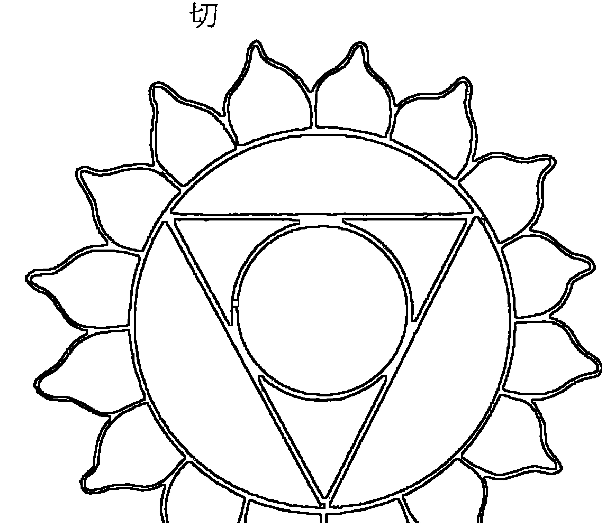

## 第三章

頸尾。

## 七個氣輪

### 色彩  
藍色。  

### 解藥：紅色。  

### 音調  
u（一勿一）。  

### 音符：g#。  

### 元素  
乙太。  

### 感官  
聽覺。

### 表述  
「我要自由且開放的說話。」

### 說明  
當你到達這個精神發展的層級時，你必須從這個瓶頸中穿過。這是一種掙扎。社會上並不需要你這麼做——事實上許多人因此皺眉。下方三輪（前三輪）已經能讓你完美的運作，倘若開啟第四輪，那是再好不過了。開啟第五輪如履薄冰。大部份的人光靠前三輪就能運作正常，他們不了解開啟靈性的人。他們會覺得不舒服。

幸好，一般人愈來愈能敞開心胸接納，因為莎莉·麥克琳（Shitley MacIaine）走在形上學的不歸路；而且在一九八七年八月十六、十七日時，宇宙能量因「調和輻合」（Harmonic Convergence）而增加。

第五輪是溝通中心，所以有強烈的慾望想說出自己的感受。當你這麼做的時候，有些老朋友可能會逃之夭夭。真正的朋友隨時陪伴著你，所以不能適應新的你的朋友就讓他們去吧！你會發現縱使能量改變，還是會有許多不錯的新朋友受你所吸引呢！

這些孩子就學之後或遇到新的價值觀時，可能會有所衝突。通常會導致慢性喉嚨痛或耳朵感染（這表示無法自由的表達或者不願意聽他人所說的話）。藍光對這種孩子很好。他們必須說出內心的衝擊，以及再次確認自己的價值觀。雖然很艱難，卻是必要。

藍恩博士在對助產士演講會上提到一個用藍色治療的實例：「如果新生兒的膚色太紅，表示太亢奮，有這個狀況就必須小心照顧，因為多半會在未來導致心臟疾病和高血壓。新生兒母親若能學習如何處理這種狀況，新生兒體質一定可以改善。幫助小寶寶放鬆；在此之前，先幫助母親放鬆。告訴母親，放鬆對小寶寶有益。給她大量的藍光；讓她穿藍色衣服；聽聽輕音樂；送她藍花，創造一個和諧的環境。」

他又補充說：「孩子太躁動，用藍色。在他手上戴藍色戒指。小男孩多半穿藍色衣服就是因為大多數的小男孩精力過剩，這是安撫他們平靜的好方法。」

我有一位學生是幼稚園老師。學習過藍色的效果之後，她為孩子設計一套新的課程內容。孩子們若是瘋狂的爬牆、大叫和不守秩序，她會說：「今天是藍色日！」然後她會拿出藍色顏料、藍色黏土、藍色色紙和藍色奇異筆，告訴孩子做一樣藍色的作品。她說效果好得不得了。事實上，藍色的教室是為躁動的孩子；而監獄的牢房也用藍色。

藍色對於彌留的人也很有效。藍色圖畫、藍色毛毯、藍色鮮花都可以撫慰人心，讓這個人安心地離開人世。如果你坐在這個人旁邊，音調「勿」能夠鬆弛他的神經，而且陪伴他走到另一個世界。試試看，看看是否真有效果，也許這個人還會加入你呢！不過假使這個音讓他不舒服，不必堅持下去！

## 塔羅原型

## ※祭司（老師）

一個穿著橘色袍子的男人面對我們。他的臉看起來像是一位希臘神。他的頭上戴著教皇帽子（這張牌也稱為「教皇」）。他的頭部四周有一圈白光，五瓣紅邊蓮花在其中，有一條蛇環繞外圈。頭部旁邊有一隻和平鴿向下飛。在他心上，一個五角星中間有個孩子影像，他的整個身體包含在更大的五角星光之中。在他前方是一個小型藍色女祭司影像。在他身後有一隻牛和一隻大象。這張牌的四個角落是代表黃道帶四個主宮的臉孔。

祭司雙腳著地，他是金牛座；他的袍子垂至地球，然而他體內附帶著女祭司。女祭司是神秘的，帶著思想之劍和寬容之月；她是他的內在聲音。

祭司在傳導全身所有能量時是中立和平安和的。他的雙眼沒有瞳孔，焦距在其中。他是「光的表露者」（Revealer of Light），是將天堂帶到地球的人。他是聖人、哲學家，用說話來教化。他的數字是「5」，五角星形代表全人類——各有一個頭、兩隻手臂和兩條腿。

啟迪的蓮花在他頭部。和平鴿表示他能夠利用冥想安定自己的思想。蛇代表他能夠升起拙火。

他把孩子放在心上，表示他記得他的過去，並且完完全全予以環抱。

希伯來文字是「<a>」，意即：釘子。釘子連結木樑中就能提供庇護。祭司（或教皇）連結、治療和融合。

## 七個氣輪

## 第五輪能量平衡

### *特徵

滿足  
沈穩持中  
能活在當中  
完美的時間感  
口才佳  
音樂或藝術的天賦  
能夠冥想和體驗「神的能量」(Divine Energy)  
對靈性主題很容易就吸收  
可能會多產  

### 精神方面的表現可能是：

教友派  
唯靈論教派

#### B. 瑜伽

#### 私人禮拜

### 性能量：

前五輪都開啓時，能夠展現不可思議的性能量，或者能夠不費什麼力氣就戒絕  
可能選擇再傳達性能量到音樂、藝術或冥想中  
可能對非器官潭雀（Hatha）形態的性表達有興趣  
可能搖擺於經由性擁抱尋求幸福和經由獨身與冥想尋求幸福之間

### *例子

這位男士是知名作家，在社會大眾剛開始接受形上學之際，選擇這種不尋常的主題寫作。平日以拉小提琴自娛。他直覺能力強，充分享受今生，總是等到感覺都對了以後才會有所行動。他永遠能夠選對時間去對地方。他每天打太極拳和冥想。他為朋友和家人奉獻。不過有時候會到山中獨處數週。他的太太和他分享靈性和性能量之樂，他們兩人都能夠奔放的享受肉體之樂。

## 第五輪能量過剩

### ※特徵

自大  
自以爲是  
話多  
獨斷  
沈溺某種事物  

### ※例子

這位治療師是個命苦的女人，她對男人有許多怨恨。她爭取女性權利，而且見解深刻，所以是一位優秀的治療師和作家。她若喜歡某個人，她會是個很好的朋友；但是她

## 第五輪能量缺乏

若不喜歡對方，她會變得蠻橫不講理。她所吸引的異性都是卑微和溫吞型的。

### ※特徵

退縮不前  
安靜  
膽怯、害羞  
矛盾  
不可信賴  
虛弱  
不坦白，好操縱  
無法表達自己的想法  
性能量：  
不能放鬆自己  
覺得跟信仰有所衝突

### 第三章

可能會害怕性愛

### *例子

這位五十五歲的女士曾經是一位律師，但是她放棄工作只爲了追隨精神大師。有時候她有深度見解、狂喜感受，以及體驗深沈的精神之愛；有時候她又像是個失敗者，無法適應環境。她對性愛感受矛盾，既緊張又擔憂。她住在社區裡，但是適應不良。她害怕公開表達自己的感受，所以別人認爲她不夠坦誠，而且喜歡操縱。

## 💎禁忌或不當治療引發的症狀

藍光使用不可超過三十分鐘；否則會讓人覺得孤立或憂鬱，而且嗜睡。如果有這個現象產生，繼續用黃色或橘色數分鐘。

下列疾病禁止使用藍色：

- 傷風感冒  
- 肌肉緊繃  
- 麻痺  
- 血液循環不良

### 第五輪影響的腺體和器官

### 必須用藍色治療的疾病

一般來說，疾病的產生多半是因為發炎，而發炎是紅色症狀，所以藍色是最適合用來治療的顏色。用藍色可以治療所有發熱、發紅和緊張等症狀。藍色可以作為第一輪各種刺激的解藥。

- 喉嚨  
- 甲狀腺機能亢進  
- 發炎  

- 喉嚨  
- 甲狀腺  
- 神經  
- 耳朵  
- 肌肉  

### 亢奮和暴力傾向

死刑犯伏法之前

#### 第五輪可使用的礦石

## *碳酸石

這種深藍色的礦石通常帶有白色斑點；狀似青金石，不過缺少黃鐵礦的金黃色斑點。兩種礦石尚未磨光時，碳酸石比較亮。這種礦石能夠讓你同時強烈的連結精神又腳踏實地。

碳酸石對於經歷不悅之旅的人是不可或缺的，不論是嗑藥、病痛或沮喪。把碳酸石放在第三眼上，它會成爲你的守護神，溫和的帶著你走回岸上。這種礦石對於感覺與社會格格不入的人最好。

當你做了太多心理治療時，碳酸石可以慰藉第三眼：可以直接放在第三眼或戴在身體任何部位。我喜歡做成戒指戴，而且常常撫摸它，邊觀看它的深藍色澤邊感受它的安慰。它同時對於集中一個人的注意力很有效。

對那些不擅於用話語表達自己想法或感受的人，可以配戴或放置碳酸石在喉輪附近。

## 七個氣輪

近。如此一來可以鬆弛和撫慰喉嚨，不必花太多力氣，話語就能自然而然的說出。這是  
一種漸進式的過程。剛開始感覺不出任何進展，但是持續使用，效果就會十分顯著。

這個氣輪最常關閉的原因是童年時代不被允許說出自己的感覺或者不准哭泣和大叫。如果你覺得無法適切的表達自己，可以從心輪著手。因為假設你在童年時表達受到壓制，你的感情上一定也受到壓抑，你封閉你的心只因爲太過痛苦。果真如此，你必須釋放阻滯心輪能量的情緒。這樣可以讓能量流向喉輪，你就更容易的表達自己。

碳酸石能夠鎮壓所有喉嚨疾病。它可以減輕發炎和腫脹。適用全身各部位，只要用  
一塊與發炎或腫脹部位相同大小的礦石即可。

任何時候戴上它都很安全而且有益。如果你希望自己能夠頂天立地，可以做成首飾  
來戴。

### *藍銅礦

使用美麗的藍銅礦在第五輪能夠讓你的思想和感覺化成聲音；加強靈性的體驗和表  
達；讓你擁有說出深層感受的慾望和能力。我喜歡在治療時用粗藍銅礦（天然形狀）放  
在喉間，因爲它能引出埋藏已久的痛苦情緒。它能激起喉輪，深入聲帶，你會因此渴望  
說話。

### 第三章

在第三眼上使用藍銅礦有助於到達靈性的最深處。

如果你的雙眼因爲工作過度或使用電腦過度而酸痛，平躺下來，兩隻眼各放一個藍銅礦。我會在閉上的眼皮，靠近鼻樑的眼角處，各放一個凸圓藍銅礦（磨光的卵形）。

十五到三十分鐘之後，眼睛會覺得很舒服。同樣的部位使用藍銅礦可以增加洞悉力，讓你看透至體內，發現造成疾病的情緒肇因。

放兩個藍銅礦可以用來減輕月經痛和排卵時的疼痛。兩邊卵巢各放一個藍銅礦。疼痛屬於紅色症狀，自然要用藍色的藍銅礦來解。

藍銅礦若結合孔雀石（通常兩者是同時挖掘到；或者同時被使用），孔雀石用來引出埋藏已久的情緒，藍銅礦幫助你描述自己的經歷。

這種礦石可以做成美麗的首飾，當成項鍊或耳環配戴，以加強靈性的復甦。它能夠幫助你集中和清晰。

# 第六輪

### 名稱

眉心輪（俯視）  
第三眼中心  
基督意識中心

突然，多瓣蓮花掉落，只剩下兩大瓣。  
擺脫周遭世界的種種束縛，你走進一個和精神產生超凡關係的境界。這是一『吾和汝』（I and Thou）的中心。兩大瓣蓮花代表各種形式的二元性：自我本身和精神本身；理性能量，在其中是象徵男性能量的柱狀體。第一輪的柱狀體是黑色，這裡的柱狀體是白色。第一輪的柱狀體由一條蛇纏繞三圈半，象徵尾椎沈睡的拙火能量。現在拙火上升到第六輪，蛇不再纏繞，性能量向上升。代表女性包容力的彎月在三角形上方環繞一個圓圈。這個圓圈是金黃色的點狀，代表精神能量的本質，而且位於你的中央。四分之一的月亮表示象徵無限潛力的能量漩渦。

### 位置

每一個氣輪都位於身體沿著脊椎的後方或前方。第六輪則是以頭蓋骨為基底，位於兩條眉毛之間的第三眼上。

### 色彩

紫藍色。紫藍色是藍色和紅色的結合：紅色代表溫暖，所以紫藍色是以不疾不徐的方式平靜下來。

## 解藥：橘色。

### 音調

「歐」這個音代表太陽或第三眼，而「嗯」則代表月亮和骨髓。它同時結合了第二輪的「歐」和第六輪的「嗯」。這個音調能消除二元性，創造一體。它讓自我本身融合在精神本身之中。

## 音符：高 a。

### 元素

電，或心電感應。

### 感官

思考。

### 表述

「我要看得更清楚。」

### 說明

第三眼是精神力量和更高直覺的中心。經由第六輪的力量，你能夠接收引導、傳導，並且將覺知對準你「更高的自我」（Higher Self）。這是可以讓你體驗心電感應、星光體出遊和感應前世的中心。

第六輪若是洶湧激盪，表示這個人曾經受過宗教洗滌，因此而害怕超自然法則。許多文化和宗教信仰反對形上學。然而這種魔力卻在人類歷史上一再使用，如同其它力量，特別是政治力量一樣。由於政治力量的參與大肆興建教堂，超自然法則（玄學）成了非法和可恥的，这就是為什麼許多人是教堂的忠實擁護者的原因。

這些禁忌造成人們產生愚蠢的罪惡感和恐懼，於是很難藉由明晰的透視力評斷一切。首先應該來區別黑魔術和白魔術；白魔術是駕馭自然力量以達到正面目的的藝術。黑魔術是為了個人的利益而使用的力量，不論是想要他人的財富、權力、愛情或靈魂。如果你面對學習白魔術的人，你會感覺很正常，甚至能量會因此加強。

## 七個氣輪

人自私目的的複雜能量。如果你面對利用黑魔術的人，你的能量會暫時提升，但是短時間之後就會耗盡。

第三眼的能最不幸的人，而不論他的道德觀。這一點深深吸引那些權力慾重的人，包括許多「新時代」上師。所以要慎選你的精神大師。你若無法完全信任這個人，還是處處小心為妙。

對許多人來說，「上師」代表盲目的順從和英雄式的崇拜。但是上師充其量只是精神導師。假使你很幸運找到一位可以信任的導師，這是很大的福佑。一位真正的精神導師應當是開放你更高的精神領域，最好能夠開啟更高的氣輪和達成自我實現。如果這是你的目標，表示這個人對你有很大的幫助。在所有領域中，我們要找懂得比我們多的人為師，同樣的道理適用於精神拓展領域。

在第三眼開啓之前，你是用兩隻肉眼看一切：你利用正常的自我（意識、智力、自我）和更高的自我（直覺或靈性）來體驗二元性。第三眼開啓之後，兩個影像會合併──就像在照相機鏡頭上看到雙重影像一樣，然後才對焦成一個單一的合成影像。

我不相信經由自我犧牲強迫自己擺脫自我。我相信和自我合力認知它的最高夢想是經由「高的自我」和「天人合一」來發現。接著，所有面具都會拿下：你所以為的你：

## 第三章

你所以為應當如何的你；你父母所希望的你。突然你捨棄一切，「真我」就在眼前。
「我就是這個樣兒！」「不必有罪惡感，不必僞裝，不必幻想。你完全融入現在，也了解到其實你早就是這樣。松果腺是內分泌器官，是眼睛的主要結構。它位於腦部中央，所以同時跟第六輪和第七輪有關。松果腺就像感光器，一般認爲它是負責回應月亮的盈虧。

拙火在脊骨中升起時會刺激松果腺，這可以說明看到「純潔白光」（Pure White Light）的經驗。第三眼是基督意識中心。每個人都有基督意識。耶穌說過：「身體之光就是眼睛：所以當你的眼神單純，整個身體便充滿光芒；你的眼神邪惡，整個身體充滿黑暗。」（路加福音11：34）。

瑜伽教派說，松果腺是記憶中心，所以爲拙火上升，這個貯存倉庫便開啓，你就成爲自己所有前世的見證人，而且也看得到自己的未來。你不再需要遺忘，因爲你不再害怕你的一切——沒有什麼好隱藏了！你的體內充滿憐憫、原諒和無條件的愛，你愛每一世的自己、他人和萬物。你不再欠任何輪迴債。一旦輪迴發生，你不會害怕或產生罪惡感，坦然接受輪迴：你會明白這只是自我的反射。

然後你會成爲全然開悟的個體，這就是自我實現的意義。你溶入精神；你變成自己

## 塔羅原型

## * 女祭司

女祭司是黛安娜，是女獵神。她高貴的弓箭覆蓋其下方三輪。她重內慾，但是她的內慾是向內。永世的象徵覆蓋住她閉上的雙眼。她心神不定，而且不能受到干擾。她舉起的雙手拉著一張網。她是維持柵極的力量；網子則代表電力和磁力。在傳奇故事中，她是蜘蛛女，負責編織萬物的人。在她的下方是不尋常的生殖力象徵：水晶、奇果和花朶。她給予新的想法與實相。

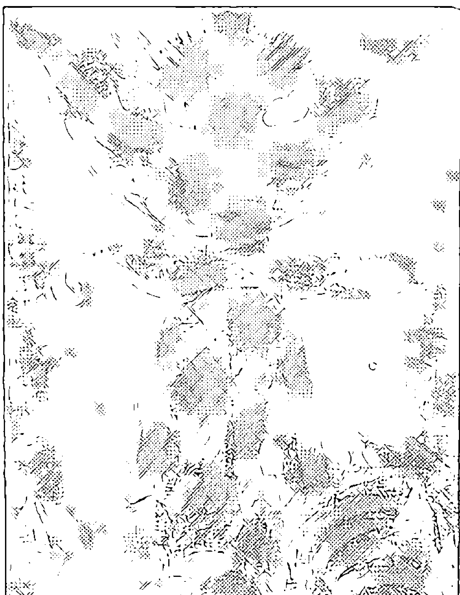

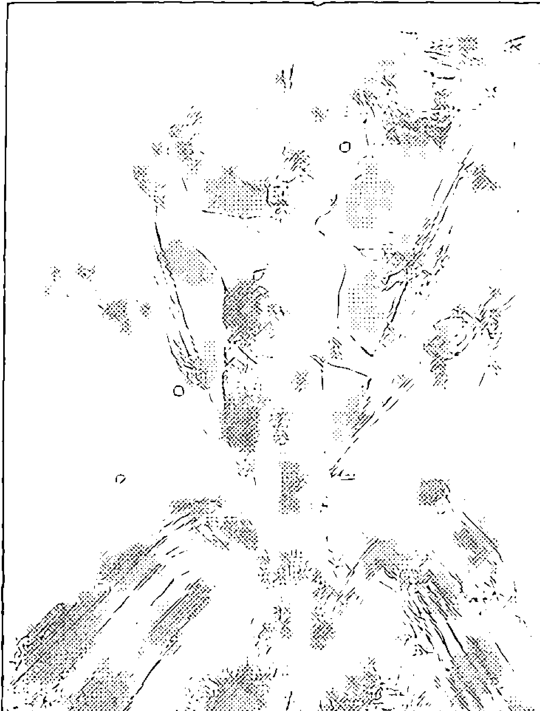

## 第六輪能量平衡

### ※特徵

能夠進入「所有知識的來源」(Source of All Knowledge)
領袖氣質
可以接收引導
體驗過「宇宙意識」(Cosmic Consciousness)
不受物質束縛
不懼死亡
能夠經親身示範顯示解放的方式
體驗心電感應、星光體出遊、前世
不會因爲名利、世俗事物而受到影響
自己的主宰
精神方面的表現可能是：
猶太苦修教派

## 七個氣輪

### 道教

### Vajrayana 佛教

### Raja 瑜伽

### 性能量：

發展到這一輪，你會視自己為雌雄同體，不再需要另一个人來完滿自身。有著過多需要的伴侶可能會分散了你內在的極樂。因此這個時候，獨身是很自然的選擇，但不是非得如此

## *例子：

《瑜伽行者自傳》（Autobiography of a Yogi）一書的作者優格南達（Paramahansa Yogananda），出生在一個雙親都全然沐浴在神知之中的家庭。他的出生被預知是東方和西方的偉大導師降臨人世。性愛對他並不重要，因為他化身成將男性和女性本質溶入一體之中。除了侍奉神明，其它都不重要。

優格南達有能力治療以及讓奇蹟發生，但是他鮮少展現這項天賦。他跟宇宙知識——有直接的連結，能夠看穿心思、預知大事、看到久遠的過去和未來。他的先知先覺眾所皆知。

## 第六輪能量過剩

### 特徵

### *例子

他的領袖特質吸引了無數羣衆。他死之前都是健康沒病痛，他平靜的離開人世。葬儀社的人說，葬禮前三週，他的屍體沒有任何損壞。

希特勒是一位武斷、精力充沛、有強烈權力慾的狂熱領袖，他深信自己能夠帶領國家走向光榮的勝利。他是右撇子，相信超自然法則，卻是為了滿足個人的邪惡目的。希特勒要的是完全的服從，他殺掉所有不聽從命令的人。他希望像上帝般受衆人擁戴。

- 自私自利
- 驕傲
- 權威
- 擅操縱
- 教條式的宗教信仰

## 七個氣輪

## 第六輪能量缺乏

### ※特徵

- 優柔寡斷
- 没有紀律
- 對於他人的感覺過分敏感
- 害怕成功

### ※例子

可能會精神分裂（無法分辨自我和更高的自我）

有時候，這名精神分裂的女子認爲自己是聖女貞德，而且會展現其觸摸治療以及預見未來的能力，然後她又沈浸在謙卑的特質中。她根本無法自己吃飯；害怕每一個人；找不到人生的目标。

### 禁忌或不當治療引發的症狀

### 精神分裂

### 第六輪影響的腺體和器官

- 松果腺
- 脑下腺
- 脑部
- 雙眼、兩耳和鼻子
- 必須用紫藍色治療的疾病
- 疼痛（麻痺的影響）
- 腹瀉

### 第六輪可使用的寶石

#### 青金石

青金石是深藍色的礦石，上面有黃鐵礦的金色斑點；通常有方解石的白色條紋。它能帶著你深入自己的意志儲藏室。這種礦石不適合任意使用，因為那些高度敏感的人可能會因此暈眩。

青金石是埃及人的最愛。放在第三眼上可以讓催眠、觀想、星光體出遊和對宗教教義的深入了解更容易。

冥想時利用青金石助益良多。坐直身子時，放一個青金石（最好是平底的）在頭頂的頂輪上，可以提升能量，使得深層冥想更容易。

磨光的青金石幫助你的精神生活更加向前推進，同時消退所有障礙。帶著你走入靈魂王國，追求更高的自我，褪去小自我的外衣。

對於已經獲得高度靈性的人來說，這個礦石可能太過纖弱。但是，由於它的威力十足，你若特別留意自己力量的使用時，可能會覺得暈眩或受壓制。

若是有意識的謹慎使用青金石，可以產生巨大的力量。不過如果只是平日當成首飾配戴，你可能會對它的力量產生免疫力。青金石是一種必須用尊敬和尊嚴對待的礦石。

如果你感激它的力量，它會恭維你，增加你的能量，直接走向更高的境界。

這是用作正式儀式的上等好石，不論是首飾、頭飾、廟宇的壁飾或者私人祭壇裝飾都很好。觀看它磨光的表面，可以讓純淨的精神能量進入你的靈光。

#### *蛍石

根據卡崔娜・瑞法的說法，這種礦石並非地球的產物：它是由更高的空間運送至地球的。仔細看看這種礦石的外形就不難相信，它像完美的金字塔，八面體（好像兩座金字塔的底部相連而成）以及簇體。蛍石最常見的有四種顏色：藍、紫、白和金色。

#### *八面螢石

有時候也會發現粉紅色和綠色。

八面體是最常見的。當我要求這種礦石對我說話時，它說：「我帶給你光的禮物。」

## 第三章

我可以把光帶入你腦中，其它礦石辦不到，因為事實上我是結晶光。—

八面螢石有六個尖端，正巧可以代表第六輪。尖端表示它能夠創造顯著的焦點和敏捷的思考。任何時候，只要你覺得思慮混沌不明，理不出頭緒，不妨握著螢石。當你心情不佳，受到任何刺激時，放一個八面螢石在第二輪或(和)第三輪(若只選擇其一，選比較心神不寧的氣輪)，同時配合「水晶平衡」。

當你心情不佳，受到任何刺激時，放一個八面螢石在第二輪或(和)第三輪(若只選擇其一，選比較心神不寧的氣輪)，同時配合「水晶平衡」。

無論任何形狀的紫、金、藍和白色螢石都有助於你心神合一，讓你完成不尋常的計畫。

當你心情不佳，受到任何刺激時，放一個八面螢石在第二輪或(和)第三輪(若只選擇其一，選比較心神不寧的氣輪)，同時配合「水晶平衡」。

如果你不愼睡著並沒有關係。

#### *螢石簇

這種簇體是立方體，多半是紫色。卡崔娜·瑞法說：「它代表二十一世紀電腦科技時代。螢石簇就像電腦，組織結構複雜卻有條理。它看起來像是一座前衛的城市。立方體代表各部份和諧的相容性。」她建議把螢石簇放在書桌上、研究室或研讀和研究的地方，有助於即使在巨大壓力下，仍能保持頭腦清晰和專注。

我發現平躺時，把螢石簇放在雙腳之間和下方，其中一個尖端放在雙腿之間(所以可以把它往上淨化)。

低頭看它時應該是狀如鑽石），對於吸出體內的負面影響十分有效。

我冥想的時候喜歡手握螢石。除了讓我穩定外，還能協調我和我的靈性。由於螢石是結晶光，提醒著我我也是個光體，只是我化身在一個複雜的形體中。

開車容易緊張地手忙腳亂的人也適合使用螢石簇。它會讓你鎮靜、有條理和警覺。

把螢石簇放在大腿之間（讓雙手靈活）；或太陽神經叢旁邊（產生信心）；或心臟旁邊（讓你不驚慌）──例如：高速公路該下交流道卻錯過時。

#### *蘇幾來石

這種深紫色的礦石上有黑色條紋，是十年前才新發掘的礦石。產量不大，所以十分昂貴。

當我要求這個礦石對我說話，它說：「我能夠把天父的能量帶到地球。我結合了天父外袍的紫色和地母的黑色，所以我的能量可以悠游你的脊柱間，從頂輪到海底輪，也能進入女性的子宮內。」

「透過我，你才能和諧。我的靈性可以穿透你體內的每一個部位。紅榴石的能量是由下向上，而我的則是由上而下。」

「對於那些高度靈性化卻因為活在凡人之軀中而感到難受的人最適合配戴我。我可以提醒他們所為何來。—

一我也可以治療有偏頭痛毛病的人。在症狀剛開始的時候，只要放一小塊在肚臍上

一直接放在皮膚上），然後仔細冥想自己來到人世間的目的。—

「總括來說，我是用在眉心，用來喚醒基督意識的。我能夠經由你的內在宇宙來源

滲透，鼓勵你打開第六輪，向前照耀給接收得到的人。—

如果你已經感受到自己的天賦，蘇幾來石能夠幫助你觀想，把天賦帶給全世界的方

式，是以既健康又有益的方式。如果你尚未強烈感受到自己的天賦，最好不要接收到它

的能量。

卡崔娜・瑞法說，這是給高度敏感孩子使用的理想礦石。幫助他們免受世俗的嚴苛

對待；提醒他們：自己非常特別，有著不可多得的天賦，將來可以待在凡人之軀中卻不

覺得痛苦。

若你感到沮喪和絕望，把蘇幾來石放在第三眼，吸入它安慰的能量，別忘了這種礦

石才來到地球不久，不過已經慢慢被人接受作爲特殊的治療能量。

質地好的蘇幾來石有著不可思議的力量（其紫色既濃且深），有助於讓你相信自己

是獨一無二的。

## 七個氣輪

蘇幾來石適合作為首飾配戴，只要你不介意自己如同身處山頂之上。你會覺得有風吹過髮際，整個人會為之一振，充滿信心。

# 第七輪

名稱
頂輪（千）
千瓣蓮花
冠輪
智慧輪

符號
一朵盛開的蓮花，象徵著完全綻放向「
光」。你完全喪失凡人的特徵，與造物者融
合成一體。這是自我實現，是最顛峯的經驗

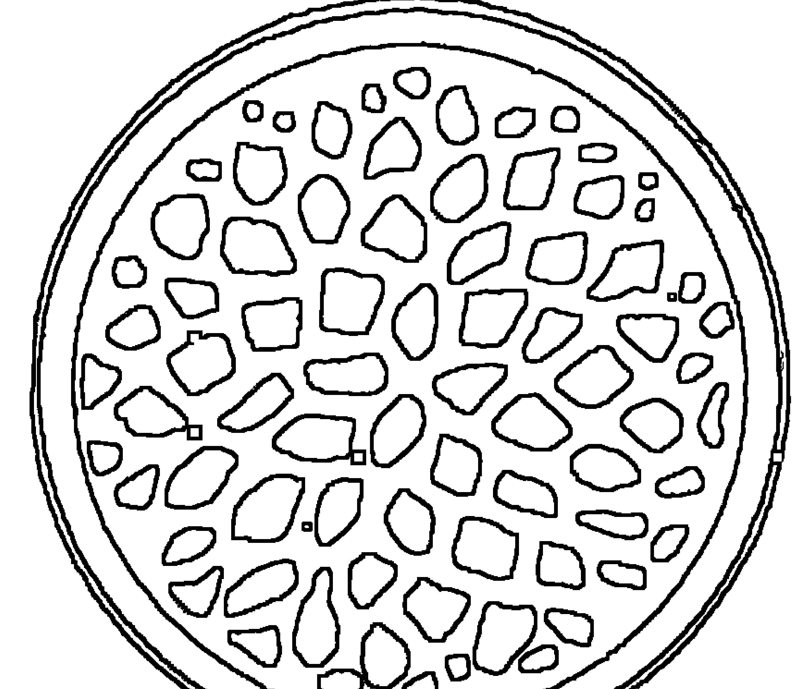

## 第七輪能量平衡

### *特徵

和頭頂有女祭司的水晶。頭部旁邊是向下飛的女祭司、祭司和魔術師的鳥。他的臉跟祭司一樣朝向前方，不一樣的是他的雙眼睜開，閃爍著內在啓迪。他微笑著。

他永遠年輕。他代表開始、春天的綠意。他完全活在現在。頭頂上的水晶光代表完美的澄淨。

希伯來文是『Aleph』，另一個字是『Prana』，表示生命的呼吸。

- 向神性開啓
- 奇蹟示現者
- 能夠超越大自然定律

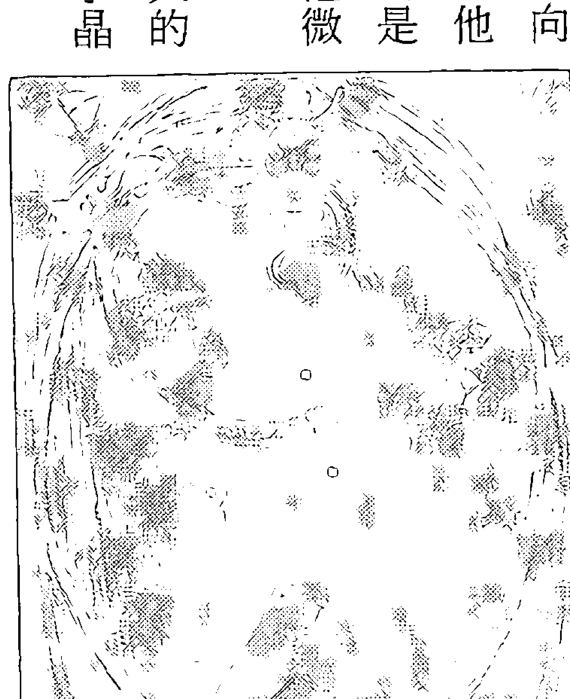

## 第三章

完全進入非意識和潛意識
死亡中和死亡後能夠保持警覺
幾乎不死──或可能不死

### *例子

Babaji 既是優格南達，又是優格南達的老師 Sri Yukteswar 以及他的老師 Lahiri Mahasaya。他一直被描述成一位永遠年輕的聖人，可以任意出現和消失。優格南達相信他是耶穌的老師之一。

### *特徵

## 第七輪能量過剩

不斷的挫折感
未實現的力量
嚴重精神病、沮喪、癲狂與抑鬱交錯
時常偏頭痛
消極

## 第七輪能量缺乏

# 性表達：時而熱情，時而冷漠

### *例子

這位男士在童年時就有深度的精神渴望。他在紐約市長大，被迫就讀猶太正統學校。所有學生都必須戴著黑色高帽，穿黑色制服，頭髮和鬢角都必須留長。他厭惡這所學校，因為學校中學到上帝是殘忍、索求和勢必順從的。他畢業之後離家，成爲一位無神論者。他常常沮喪，他只要心情不好，就不搭理太太和朋友。他患有嚴重的偏頭痛。

### *特徵

沒有任何樂趣

緊張症

下不了決定

### *例子

這位年輕男孩似乎從來沒有正常過，像個小寶寶一樣。他很難溝通，從不微笑。他四歲的時候，醫生說他患有緊張症。他非常聰明，卻無法建立人際關係。他面色蒼白和

### 第七輪影響的腺體和器官

瘦弱。雖然雙親試著愛他，他卻沒有任何回應。他完全迷失在自己的世界中。

### 必須用紫色治療的症狀

- 沮喪
- 偏頭痛
- 寄生蟲
- 黑眼圈
- 禿頭，頭皮屑

注意：紫色對於害怕紅色刺眼的藝術家、神經過敏和緊張的人最為合適。

## 第三章

### 第七輪可使用的礦石

#### *紫水晶

紫水晶是礦石中最溫和的，然而卻是強力的守護者。你若配戴紫水晶或放一大塊紫水晶簇在房間，可以讓你體內所有能量和諧，驅走或轉化負面影響。是放在祭台上的理想礦石。

深紫色和蒼白色的紫水晶最具威力。放在第三眼上使得觀想和回顧前世會更容易。

冥想時握著紫水晶，能夠鎮定和集中你的能量。如果你失眠，可以在睡前握著紫水晶，和(或)放在枕頭裡。或者做『水晶能量』，同時放紫水晶或紫水晶簇在額頭中央。

紫色跟紅色是同一色系，所以屬於能量旺盛的礦石。對於需要鎮定的人、孩子、或躁動的人來說可能太過刺激。

這種礦石會帶來轉化的紫色火焰，陽性紅色能量轉變成為陰性藍色能量。陰陽兩極是中國觀念。中醫認爲只要陽氣過剩就會改變成陰氣，反之亦然。因此白晝變成黑夜之際，洗個熱水澡就可以破解發熱。這是改變的奇蹟時刻，紫水晶力量亦是如此。

平躺時，放一個紫水晶或紫水晶簇在第三眼上，或者坐著冥想時放在頂輪上，如果

## 第三章

你想摆脱任何事物，勾勒一个清晰的影像在脑中。观想一团紫色火焰在你前方。由鼻子吸气，聚集到你要摆脱的事物上。由嘴巴吐气，感觉负面影响全部进入火焰中，并且加以转化。经由鼻子吸气──顶轮同时吸入──清新的紫色能量。吐气并且固定住你顶轮的能量。

紫水晶是适于佩戴的美丽矿石，因为它的能量既有益处，又具有保护作用。这个矿石可以用于任何保护或净化的典礼仪式。当你身处对你有敌意的人群之中，可以佩戴它。好的能量会随之而来，所有负面影响会转化为纯净的能量，送入宇宙中。

## 透明水晶

我会放这种水晶在第七轮是因为它能捕捉白光的能量，是用于顶轮最具效果的矿石之一。

透明水晶用途之广，我已经放在本书的第二章充分讨论。

## 第四章

指示和说明

## 矿石疗法

## 定义

为了了解矿石，列出其定义会有所帮助：

岩石（Rock）：大块化石物。

矿石（Stone）：以土和矿物形成。我用这个字包含所有治疗用的石头。

宝石（Gem）：切割和磨光的矿石。

珠宝（Jewel）：珍贵的矿石；或者切割和磨光作为首饰的石头。

贵宝石（Precious）：由于其美丽、稀有或硬度而具有高度商业价值的加工宝石。

石英石（Quartz）：耀眼的结晶矿物，其成分为二氧化硅。包括透明和乳状石。

水晶（Crystal）：澄净、透明的石英石，没有颜色或几乎没有什么颜色。同样也是坚硬。

例如：紫水晶、粉水晶、砂金石、黄水晶、红玉髓、虎眼石和玛瑙。

## 粗糙、滚动和加工

矿石本身可能表面粗糙，可以经由各种方式加工。它们有可能是在落石中滚动过，这种过程类似在河床中滚动。它们也可能切割成不同形状，做成高品质的首饰出售，最常见的是凸圆卵形。透明矿石可以加工成最有效捕捉光线的形状。滚动石和高级首饰用珠宝是做药酒和补充水、酒精或油的能量的最佳选择，因为不会有微粒留在液体中。宝石和滚动石对于抚平坎坷最好；平滑、透明矿石帮助黑暗走向光明；粗糙矿石能渗透深处，把埋藏已久的感情带到表面。粗糙和平滑的矿石，在你不确定正确的矿石种类时可以交互使用──两者都有效。

人工矿石多半由天然水晶和其他岩石加工而來。有的出自名家精心设计，能够带出矿石潜在的特质。如果你觉得某个产品吸引你，其能量也很好，不妨买下来。不过最好先小心净化，因为可能还带有加工者的能量。水晶首饰有丝线、羽毛、金属和其他设计者，最好在使用之前都先净化。

尖端（Termination）：水晶六个面的交汇点。

## 指示和说明

### 矿石的大小

一般而言，大型矿石比小型矿石更具威力。大的粉水晶比小的粉水晶有威力；但是小的钻石可能比大的粉水晶更具威力。

有的小型矿石具有不寻常的威力。颜色深浓的强度较大，如同较强烈的设计一样（在某些情况下，苍白的紫水晶也有高价值）。例如：牛眼是孔雀石固有的图案；小型孔雀石若有明晰的牛眼，比起较大却牛眼稍模糊的更有威力。

## 基本矿石装备

你可以去石头店选择你喜欢的，尽量避免购买事先包装好的矿石，因为每一个矿石在选择过程的一开始即已发生有意义的关系。你会发现自己能够正确记得矿石购买的时间，跟其他人买来送你的感觉完全不同（除非这个人很了解你或者很爱你）。

第一次使用矿石，至少为每个气轮买一种矿石，和四个到五个单一尖端透明水晶，这样提供你实验的机会。阅读每一个气轮的特质，或许你可以更认知自己。一旦知道某一个气轮需要治疗时，你可能会想为该气轮买更多矿石。

从粗糙或小型、不贵和滚动石开始。你会发现就算最小的矿石也是威力十足。等你熟悉矿石特性之后，再购买大型矿石。

如果你真的想做水晶治疗，以下是最佳配备：

- 一个长形音调水晶（至少两吋）
- 一个通灵水晶
- 一个大型单一尖端透明水晶
- 四个中型单一透明水晶
- 一个双尖端透明水晶
- 两个单一尖端烟晶
- 两个石榴石
- 两个黑曜石

## *说明

在大部分案例中，建议你用两个矿石排列，通常用两个放在中心石的两侧。例如：

- 两个虎眼石
- 两个红玉髓
- 两个黄水晶
- 两个绿松石
- 两个粉水晶
- 一个西瓜电气石
- 两个绿玉
- 两个砂金石
- 一个青金石
- 一个蓝铜矿
- 一个碳酸石
- 两个紫水晶
- 两个八面萤石

## 指示和说明

## 净化矿石

当你使用矿石做治疗或摆脱负面影响时，最好清洗它。有许多清洗方式，我发现最简单的方法就是放在水龙头下用冷水冲。由于能量会顺着水流，所以不要的能量可以顺水冲走。同时把你的双手和手腕放在水龙头下冲洗。

透明水晶吸收大量能量，所以它的净化特别重要。把水晶尖端朝下握着，顺着水流。每一块可以冲洗五十秒至六十秒，甚至更长的时间，根据它治疗的内容而定。假如你对它极为敏感，你会知道到底冲干净了没。如果水温太冷，可以放在水槽里，任水冲洗它。如果你对它不够敏感，每一块至少冲三十秒。若是治疗过程艰巨，最好冲满一分钟。

当你收到一个新水晶或者做完一个特别艰难的疗程时，最好埋入沙中或放在盐水中浸泡一至三天。盐水比例是一匙的海盐，放入一夸脱的温水中。你也可以直接使用海水。用一个容器装沙或土以便埋矿石，可以重复使用，但是隔一段时间要换新。例如：

你用黑曜石治疗肝方面疾病，你就必须在两周后更换。假如一个月之中只使用一、两次，可以使用相同的沙、土或盐水三至六个月。把矿石排列好，每个间距至少一吋。

另外一种方法是燃烧鼠尾草、香柏或青草熏矿石。这三种是美洲印第安人沿用数个世纪驱除负面影响的植物。这种方法针对配有羽毛、金属装饰或超大型的矿石特别有效。

## 礼物和仪式

你若喜爱某个矿石，时常携带它或用来冥想或治疗，它就拥有你的能量。这是补充其能量的方式之一。它吸取你的能量之后，是送给所爱的人最佳礼物。若收到这种礼物，可以握着它冥想，有助于感受对方的能量。

这种矿石也是供奉地球的理想矿石。大地之母常常给我们祂的一切，所以找一个感觉神圣的地方供奉大地之母。这个地方或许是你会一再造访之地，也可能是座高山，你再也不会到来。只要知道你把自己钟爱的水晶放在某个特别的地方，就能永远感受到那份连接之情。

水晶和其他矿石都适合作为正式仪式之用，不论是个体冥想或团体聚会都可以使用。可以选一个月圆之日或季节变换之际聚会或庆祝，为地球冥想或治疗地球。可能是火仪式或水仪式；可能是新生儿的庆祝；可能是特别治疗或者和一位即将远行的朋友道别；甚至为一位即将逝去的亲友也很好。

仪式会因此而加强矿石带来色彩、光和各式美丽的形状，并且能够唤醒我们对于美、大自然和灵性的认知。想使用就去用吧！

## 指示和说明

### 祭台

设立一个冥想的位置是再好不过的了。可以在房间角落、衣橱或隔间。如果你常常过来，并且诚恳和深沉的冥想，这个小天地将会充满冥想的频率，你会发现自己坐在那里就能感受到详和。

在冥想之处，利用一张桌子或盒子设一个祭台，用一块漂亮的布覆盖其上。放一些水晶或放一个矿石在头顶上。

可以启发你的物品，包括水晶和矿石，特别是上方气轮使用的。冥想中，你可以握一个水晶或放一个矿石在头顶上。

放置四元素在上面也很好：土（矿石）、水（小碗水或水果）、火（蜡烛）和空气（香）。

## 宝石药酒

可以放一个矿石在伏特加酒或其他酒精中准备宝石药酒。小型矿石可以用來补充一盞斯液体的能量。用平滑或滚石就不会有任何残屑留在液体中。最好使用质地好，经由切割，能够反射光面的。镶在戒指或其他框子中的宝石都可以利用，只要是干净，而且

## 水晶和光盒

同样的过程可用于水，是制造有色水的另一种方式。还可以用于按摩药酒或金缕梅（药店有卖），两者都只能外用。

### 水晶收成

由于透明水晶日渐流行，这些矿石的价值比前几年提高两倍。大地之母给我们的礼物被大量开采，放进大卡车上，以高价卖出。

有另外一种方式。如果你有水晶簇，你会得到一个曼妙的经验。水晶成熟之后，会自母体鬆开，如同掉牙一般。可能会掉在你手上，也可能需要轻轻旋转一下才能分开。

加强色彩和水晶治疗的效果，坐在光盒下，把水晶放在盒子裡，以便增强疗效和振动能量。

#### *光盒

光盒可以由硬木或合适材质制成。但是必须够大以放置水银灯。底部也要做，以便不同颜色的玻璃盘能够插入或抽出（见图）。

如图所示，光盒有三面木板：每个是八×十一吋。至于第四面是方便玻璃或塑胶色板由底部插入或抽出，所以是八×九吋。上方不必放木板，是灯光射入之处。底部木板是六×八吋，配合一个直径五吋的洞，以便灯光能够通过。盒子最好用硬木制成（以免因为灯源过近而有引发火苗之虞），木板厚四分之三吋（以便支撑灯夹和悬挂链子）。盒子由链子悬挂，重量必须平衡支撑，而且要防火。我相信可以依情况改良得更好。

色彩治疗有几个不同系统。你会发现不同系统中对各气轮使用的颜色亦不同。试着找出你感觉最自然的系统，然后一直予以使用。只要愿意坚持，就会达到效果。我所用的系统是向蓝恩博士学习得来，以彩虹七色为基础。

## *色灯

水银灯四周可以用铁丝做支架。有了支架才能支撑要穿透塑胶板照射的灯。灯夹的固定要选择让灯光适当照射身上的位置。这种灯在健康食品店买得到。

## *色光灯泡

一般的色光灯泡是红、黄、粉红、绿和蓝色。适用于一般规格的灯座。晚上或在黑暗的房间中，可以提供适当的剂量的有色光。即使耶诞灯都可以使用，尤其是单色耶诞灯。

#### *彩色玻璃

很久以前有色光的效果就已经广为人知，从教堂中所使用的彩色玻璃就可以了解。达文西说过：一在宁静的教堂中紫色玻璃下冥想，其力量可增加十倍。

## 布料和装饰

### *布料

你对衣服的选择对你的心情影响极大。当你了解色彩的力量之后，就能意识到心情的好坏。例如：心情不好时，你可能会选择灰色或黑色。如果你想让自己开心起来，你会穿上橘色、黄色或粉红色。黑色代表神秘，如果你想体验神秘，不妨穿着黑色。灰色是中性色，并不刻意代表某种心情，所以你若想感觉平平，灰色会引导你。不过灰色具有弹性，可以引导出不同的心情，吸引各种不同的人。

内衣的颜色影响也很深远。红色或橘色能够撩拨你的性欲。淡蓝色内裤则是消除紧张和难耐。红色或橘色内衣会造成紧张，引起肩痛和背痛，所以已经患有背痛的人应该避免。

衣料的颜色可以为使用者创造不同的心境。深紫色袍子对于忠心耿耿和信仰虔诚的人来说，可以创造出力量感和奉献感。

## *床单和毛毯

粉红色、绿色、黄色床单可以鼓励人深呼吸（这些颜色都可以增加肺功能）。黄色毛毯可以增加气氛的愉悦；想要增进性欲，则用橘色。

### *地毯和窗帘

容易紧张的孩子避免睡在红色或橘色的床上，绿色和蓝色的宁静比较适合他们。

一个好争吵的家庭在换掉原本的橘色地毯和窗帘，改成蓝色之后，一家人相处情形显著改善。

歌剧作曲家华格纳（Richard Wagner）是在紫色窗帘的房间中谱出他的灵性之乐。

### *油漆

家具颜色会影响心情和健康。厨房若用黄色，可以增加心情的愉悦和食欲。

## *装饰

七彩的装饰和油漆可以提振精神，心情改变之后，一切随之改变。

## 大自然

大自然中充满各式颜色，我们可以充分享受它的美，并且带进日常生活中。住在山边、水边和田野间的人，比较能感受到它深刻的影響。

《引导之书》中说：「想想绿色的草地，在吸气时把绿草带入你的心中。古时候的人在不知不觉中吸入大量草香。他们抬头观看蓝天，他们把大自然色彩带进体内。他们看着太阳的黄色，用这份温暖引出自己的快乐。」

### 盆栽

室内若放置适当的盆栽可以达到陶冶性情的效果。

### 观想

用内在视觉观想，利用第三眼觉知带入色彩。闭上眼睛，勾勒一幅单色图画，如果很难想像黄色，不妨想一颗柠檬。颜色观想结合呼吸最具效果，如下文所述。

## 指示和说明

## 色彩呼吸

第一轮的三色（红、橘和黄色）跟地球都有关。想想这些颜色由地表升起弯曲成彩虹状，以及进入所属气轮中（第一、第二和第三轮）。心轮在胸部，有两种颜色：粉红色和绿色。想想其中之一直接穿过地平线，走进你的心。上方三轮的颜色（蓝、紫蓝和紫色）跟天堂有关。想想它们由天堂降下成倒弯的彩虹，以及进入所属气轮中。

如果你想在第三轮观想黄色，可以从想像一幅柠檬画或太阳开始。然后吸气，观想一条黄色如丝带般由地表升起，流入你的太阳神经丛（胸骨下方）。当你吐气，它就固定在那里。

如果你想传送这个颜色给另一个人，记得都是以呼吸开始，并且固定在你自己的气轮中。当你觉得自己已经足够，就可以传送出去。第三轮和第六轮是力量中心，适合作为传送站。下方三轮通常经由太阳神经丛的第三轮传送；粉红和绿色直接从心轮传送；上方三轮则由第三眼传送。例如：你要传送橘色，吸气后带橘色到第二轮，呼气后固定在那儿。重复几次你就会觉得拥有足够的橘色。当你准备传送这个颜色时，吸气后把橘色带至太阳神经丛表面（这一次你不必吸取它），呼气后把它像光线般直接放射到需要的目标。

## 指示和说明

## 食物和饮料

## *食物颜色

西方烹饪方式中，食物通常包含四种基本颜色。除了可以增进食欲，还能够帮助消化。一餐中若包含前四轮的颜色，通常是营养均衡。像：番茄、红萝卜、玉米和绿色蔬菜，既好看又营养。不过绿色蔬菜的煮食要谨慎，色泽鲜艳最好。若煮成发黄或发黑，味道和营养尽失。

由食物颜色中可以了解其所能治疗的部位。例如：第一轮是红色，与血有关的食物都是（增强肝脏和淋巴腺功能的并不能排除人体血液中的毒素）属于红色系，另外像樱桃、蔓越橘、红苜蓿茶、黑莓等也是。

## 指示和說明

若要增強肝臟或膽囊，要多吃黃色食物。橄欖油和檸檬汁是最好的選擇。蒲公英根茶是增加肝膽功能的上等草藥。

- 藉色彩補充過能量的水（Color Charged Water）

特定顏色可補充水的能量，然後用來內服或外敷均可。以第二輪橘色為例，這個氣輪包含大腸區。若有便秘毛病，可以在飯前喝幾口橘色水（琥珀色）。

剛開始我對顏色水的事覺得難以置信，以為水看起來並沒有什麼不同。不過我願意試一試，有一陣子我便祕，我喝了幾口橘子水，情況的確不一樣。所以我乾脆每餐之前喝下半杯，結果當天晚上，我竟然拉肚子。我想是因為喝太多造成反效果。自此以後，我認真看待顏色水，它的確對消化器官助益良多！

所謂替水補充能量，可以把水加入有顏色的瓶子裡（例如：綠色的酒瓶或藍色的面霜罐子），然後放置窗台邊讓陽光照射進來；或者放一塊有色玻璃在窗子上，水則放入乾淨的瓶子裡，置於玻璃前方。讓陽光照射一至四小時（四小時的效果比較好），再放進冰箱，按照指示使用。

冷天或者冰過的紅水、橘水和黃水可以維持二至三週。至於熱天，不放進冰箱冷藏的話，能量補充的效果三或四小時就消失了。其它顏色維持時間並不一定。事實上，綠色、藍色或紫色瓶子多半用來保存油類或草藥等。

## 面部的色彩療法

臉是身體的小宇宙，七個氣輪的顏色同樣可以用在臉部的七個部位：

1. 紅色：頤、顎、雙唇  
2. 橘色：口中、牙齦、舌頭  
3. 黃色：喉嚨，通往腸子  
4. 綠色：鼻子，通往呼吸器官  
5. 藍色：雙眼，俗稱的靈魂之窗  

### 激發你的直覺

色彩或水晶治療並非深奧難懂。只要仔細閱讀本書，就能夠學習到應有的技術。你若要用色彩或水晶來治療，最重要的工具是直覺。直覺有兩種。第一種來自第二輪（以及第三輪的某些部份），這就是一般所指的直覺，像你平常所說：「我說不出來，就是有種感覺……」或者「快要下雨了，我感覺得到！」

第二種直覺來自第六輪，俗稱第七感，是較高級的知識，傾聽內在聲音的能力。你若能化這種直覺為日常生活中的一部份，你的生命會從此改善，你會知道自己什麼時候該做什麼或該去什麼地方。

一旦發展出這個能力，一定會發現色彩和水晶治療對你來說並不困難。你能夠接受特別的礦石所引導，幫助你自己也幫助別人。你可以感受到某顆礦石應該擺在某一個位置，或者用來治療某一種疾病。

發展直覺的最佳方法就是開始專注於直覺上。一旦有了「感覺」，如：該帶雨傘、該打電話給媽媽、該拜訪朋友……儘管去做就是了！只要不會造成任何傷害，勇敢去做。

一旦你真正接納和了解直覺，直覺就會充分合作，肉體、心理、靈魂也會在適當時機接手。一位我的學生在這方面下了很大的功夫，他說現在是由自己的直覺做決定，而是由理智來實現這個決定。這是訓練的最佳成果。

## 冥想和通靈

### 冥想

冥想是個人的意志專注於特定的練習上以釋放平日的思想。大部份的冥想可以加深和減緩呼吸，讓身體放鬆，幫助意志放鬆。

冥想的最高目標是進入神秘的覺知狀態，使你暫時失去自我，融合在萬物之中。經由不斷練習，你只要坐下，閉上眼睛，就能夠進入冥想。

### 通靈

通靈是指一個人接收到從精神、內在聲音或更高的自己、精神靈、一棵樹或一塊岩石來的訊息。這個過程稱為通靈。

這種技術以前很罕見，現在有愈來愈多的人開啟更高層的氣輪，所以愈來愈普遍。

通靈必須透過傳導媒介：它會取代這個人的特質，如同水會取代所有流經的物質或融合在一起。訊息的傳遞只有在結合接收人和傳送者才算可靠。

你一旦熟練通靈之後，只要進入冥想、安定自己的意識、對準目標、保持靜止。如：

- 如果你有特定的問題，詢問它，讓意識空白，等待回答。  
- 不過剛開始發展這項技術時，能夠幫助你依循冥想儀式。有許多方式可供使用。接下來的指導原則有助於達成你的目標。依照指示，或者僅依照部份指示。不要猶豫，依照個人需要有所修正。

## 健康

當你身體不適，可以預知體內能量不順暢。小心照顧自己的身體；身體好比精神的殿堂。永遠記著：睡得好、吃得好、空氣新鮮和運動。

## 運動

由瑜伽、太極拳或伸展關節約十五分鐘開始，以活絡能量，使身體平靜。

## 有力的物品

坐在祭台前或安靜的地方。坐在戶外也可以，只要不會受到干擾。身旁圍繞有好能量的物品：最喜愛的水晶、紫水晶、礦石或對你有所啟發者的相片。

### 香

在頭上放置紫水晶、螢石、青金石或透明水晶。在手中（通常是左手）握住通靈水晶或你最喜愛的冥想水晶。

### 七彩

在牆上或祭台上，可以擺放你所喜歡各種色度的七種色彩。可以用相片、鮮花、祭台布、壁畫、蠟燭或礦石。例如，你可以擺放下列礦石在祭台上：紅榴石（紅色）、紅玉髓（橘色）、黃水晶（黃色）、玉（綠色）、碳酸石（藍色）、青金石（紫藍色）和紫水晶（紫色）。

### 姿勢

盤腿坐在地上，背脊挺直；或者雙腳平放地面，選擇有椅背的座椅，背脊挺直，不可以使用讓你舒服的味道，例如：香、鼠尾草、香柏、青草。香氣有振動能量的淨化效果。

## 程序：

1. 眼睛睜開，深深吸入每一個顏色，由紅到紫。吐氣的時候，發出該氣輪的音調。  
2. 做「小宇宙天體運行」(Microcosmic Orbit)，如《Mantak Chia》的書中所描述。  
音調在前一部份中均有提及。  
3. 吸氣時把能量提升到脊椎，向上傳送到上天。傳送之時感謝所有你所感激的對象。  
4. 想像陰暗的一天。雲朵稍微分開，一道光穿透雲朵，直接射向你的頭部。吸取陽光到你的體內，因為陽光帶著福佑給你。感覺流經你體內的好能量。  
5. 與那股能量併坐，在它其中取暖。專注於你的第三眼，感受和靈性的結合。只要感覺很好就留在那股能量的旁邊──至少五分鐘。  
6. 高能量感覺開始產生，帶著你傳導水晶的七個面。如果你有七面水晶，放在第三眼上，或直接專注於第三眼。  
7. 若是晨間冥想，可以要求一整天的指引。如果你有任何問題，清楚說出。  
8. 坐著不動等待回答。若有必要，告訴你的意識先靠邊。深呼吸。  
9. 當你得到答案，要答謝。永遠別忘記感謝。專注於感謝靈性所提供的答案，而不是忙著思考這件事多麼美好（即使來源是你更高的自我，能夠區別自我和高自我是件很

### 發音法

發音法是製造振動氣輪的聲音，喚醒其能量。它可以打散引起疾病的能量阻滯。每個氣輪都有一個可以振動它的音調。

發音法有不同系統，在前面我已經列舉出我認為最有效的音調。每個發音都有音符配合——你可用樂器找到該音符。

用自己的聲音振動氣輪好處多多。你可以幫助他人一起發聲以振動他們的氣輪。為了加強發音效果，可以在發聲時手握水晶。

在水晶治療中，如果你覺得某個氣輪需要更多能量，可以放一個單一尖端透明水晶在氣輪上，尖端朝向當事人的頭部，發出該氣輪的音調。重複音調至少三次，然後詢問當事人是否要繼續。如果效果顯著，重複六至十二次。

由我之前提供的音調先試。為自己發聲時，把指尖輕放在氣輪上。試試不同的聲音和音符。這麼做直到感覺能量中心的振動為止。你不必精通音樂，就算音盲也能發出音調。

### 拙火

印度哲學中，人生的目標是要開啟全部氣輪，這就是一般人所熟知的拙火上升。拙火是位女神，以捲曲蛇形之狀，沈睡在脊骨尾部。

瑜伽教派目標是喚醒拙火以上升至脊骨，在她到達頂輪時，所有氣輪都啟動。流經脊椎的氣流有三條：當中有一條；左邊一條是「Ida」，代表女性的熱情和感情；右邊一條是「Pingala」，代表男性的理智。

當你吸氣，能量升至「Ida」；當你吐氣，能量降至「Pingala」。經由呼吸的集中發展意志力。瑜伽教導學生把呼吸帶至中央，也就是經由脊骨中心。然後拙火就會經由氣輪上升到最高中心，刺激松果體和腦下垂體，引發大量能量，讓人體驗宇宙意識中的「純淨白光」和「一切萬有」。

對於經由精神戒律而體驗到啟迪的人來說，這是了不起的經驗：學習落實和自律（第一輪）；釋放和淨化感情（第二輪）；拋棄恐懼（第三輪）和佔有（第四輪）；打開靈性（第五輪）。這是一段漫長的旅程，必須透過有經驗的人引導。

### 業

所有東方宗教皆有業概念，對西方人也不至於完全陌生，因為這是共通的道理：

「你怎麼對別人，別人就會怎麼對你。」

業是你對別人所做的一切終會再回到你身上──像回飛棒。有時候是現世報，有時候可能到來生才報。

我們的腦力只用到一點點。拙火上升時，喚醒所有腦中細胞，包括那些貯存的前世記憶。

我曾經帶領許多病人走回前世，在在顯示業確實存在。當一個人體驗肉體或心靈上的苦楚──尤其是在小時候──很容易追溯回到前世他們遇到類似問題的時候。

你若相信業，一切對錯已不再必要。沒有什麼比預防惡果來得更重要。

拙火的上升，無論多麼成功，都有可能回到前世──今生和其它諸世──它來提醒我們，曾經做過的種種不當行為。

拙火在我們抗拒中燃燒，這是最大的挑戰，是給予無條件的愛和接納自己的時候。

正因為學習接納過去的每一個我，才能夠分辨乞丐和小偷，以及成為真正基督一般慈悲為懷的人。

## 封底的解说

有颜色的布块在往上进行时愈增愈长。每一个颜色代表气轮之一。根据蓝恩博士的说法：「高度进化的人都，其气轮就像日益增量的喷泉。个人力量的黄色在性能量的橘色之上翻滚，溢满在量小却明亮的红色喷泉之上。」

## 指示和说明

+ 1. 母岩中的石榴石  
2. 石榴石上水晶  
3. 烟晶  
4. 黑曜石矛  
5. 阿柏西眼淚（黑曜石）  
6. 红玉髓石化木  
7. 凸圆红玉髓  
8. 粗红玉髓  
9. 虎眼石  
24. 水蚀蒙特瑞（Monterey）玉  
25. 粗蓝铜矿  
26. 凸圆蓝铜矿  
27. 凸圆碳酸石  
28. 粗碳酸石  
29. 光面青金石  
30. 凸圆青金石  
31. 粗青金石  
32. 苏几来石（Sugilite）

## 第四章

10. 孔雀石蛋  
11. 凸圆孔雀石  
12. 滚动黄水晶  
13. 黄水晶  
14. 凸圆绿松石  
15. 粗绿松石  
16. 粗粉晶  
17. 滚动粉晶  
18. 切割西瓜电气石  
19. 西瓜电气石块  
20. 滚动砂金石  
21. 光面砂金石  
22. 光面卑斯玉（加拿大英属哥伦比亚）  
23. 水蚀卑斯玉  
33. 八面萤石  
34. 萤石簇  
35. 透明水晶簇  
36. 长型音调水晶（单一尖端）  
37. 单一尖端水晶  
38. 通灵水晶  
39. 长细型精致水晶  
40. 赫金莫钻石  
41. 水晶球  
42. 双尖端水晶  
43. 滚动紫水晶  
44. 紫水晶尖  
45. 紫水晶簇  

## 特别推荐：新时代系列

☆以下为即将推出的新书原书名及暂定译名☆  

1. Kryon III - Alchemy of Human Spirit  
克里昂Ⅲ——人类心灵的炼金术(A)  
2. Living Color  
生活色(C)  
3. Emotional Clearing  
情绪清除(C)  
4. The Embodied Mind  
体现心灵的世界(C)  
5. Soul Empowerment  
灵魂力量的提升(A)  
6. Keeper of Genesis  
创世之谜的守护者(A)  
7. The Elusive Obvious  
费解的显然(F)  
8. Manifest Your Destiny  
展现你的人生(D)  
9. Tao To Earth  
彼岸到此岸(A)  
10. Earth To Tao  
地球修道院——此岸到彼岸寻道之旅(A)  
11. The I Ching Workbook  
新时代的易经(H)  
12. Healing Yourself with Light  
光的治疗方法(B)  
13. Earth: Pleiadian Keys to the Living Library  
昴宿星之钥——开启地球生命数据库(G)  
14. The Pleiadian Workbook  
昴宿星光能运作手册(G)