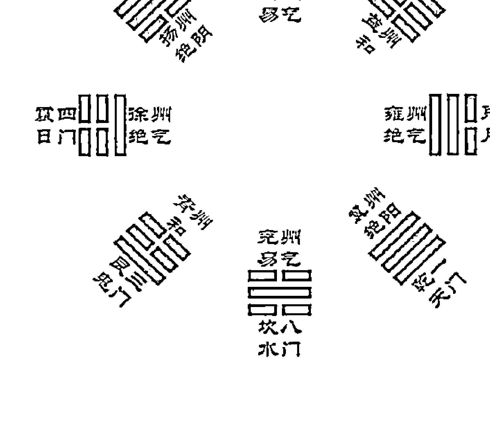

# 太乙探源

孔令伟◎著

華齡出版社

古代有“三式”之说，所谓的“三式”即太乙神数、奇门遁甲和大六壬，它们是我国古代最高层次的预测学，素有“方术之王”“帝王之术”的美誉。自古以来，就有“太乙通天道，奇门晓地理，六壬通人事”的说法。也就是说，太乙主要预测天道和国运，奇门主要研究地理，大六壬主要预测人间百事。

定价：45.90元

太乙探源

孔令伟
著

华龄出版社

责任编辑: 薛治
责任印制: 李未圻

## 图书在版编目（CIP）数据

| 项目 | 内容 |
| :--- | :--- |
| 书名 | 太乙探源 / 孔令伟著 |
| 出版发行 | 华龄出版社 |
| 地址 | 北京市朝阳区东大桥斜街4号 |
| 邮编 | 100020 |
| 电话 | 58124218 |
| 传真 | 58124216 |
| 网址 | http://www.hualingpress.com |
| ISBN | 978-7-5169-1162-4 |
| 分类 | ①B221.5 |
| 中国版本图书馆CIP数据核字 | （2018）第011707号 |
| 作者 | 孔令伟 著 |
| 印刷 | 北京市大宝装璜印刷厂 |
| 版次 | 2018年1月第1版 2018年1月第1次印刷 |
| 开本 | 710×1000 1/16 |
| 印张 | 14.5 |
| 字数 | 160千字 |
| 定价 | 45.90元 |

孔令伟老师与刘大钧老师

孔令伟老师与裴翁老师

孔令伟老师与邵伟华老师

孔令伟老师与刘大钧老师同台讲课

孔令伟老师与邵伟华老师同台讲课

孔令伟老师与裴翁老师同台讲课

### 孔令伟老师与刘大钧老师合影

### 孔令伟老师与裴翁老师合影

### 孔令伟老师与邵伟华老师合影

> 郭有贤君孔令伟，乃近世罕见之人，学养深厚正襟危坐，故能超凡脱俗而上接汉唐之风。

刘大钧书

## 刘大钧先生高度评价孔令伟老师

## 中国周易学会会长刘大钧先生与孔令伟老师一起探讨易学

（手写文本内容，围绕易学的平衡、中和、中庸、正道等主题展开讨论）

刘大钧
题于家中

## 孔令伟老师部分游学上课照片

## 前言

《三字经》有云“诗、书、易、礼、春秋，号六经，当讲求”，亦有“有连山，有归藏，有周易，三易详”，中国传统文化的源头正是来自诗、书、易、礼（周礼与礼记）、春秋，而其中又以易经为最重要的源头经典。“因此，武汉大学哲学学院博士生导师唐明邦教授将易经称之为‘中华文化的源头活水’”①。

中华文化的根源、基础，就是易经。“《易经》仰观天文，俯察地理，中通万物之情；究天人之际，探索宇宙、人生必变、所变、不变的大原理；通古今之变，阐明人生之变、应变、适变的大法则，以为人类行为的规范；这一天理即人道的天人合一的哲学思想，称作“天人之学”，为我国传统文化的基础，一切学术思想的根源，也是我国传统文化的最大特色。”②

《易经》被视为中华国学的起点，已是确凿的、不争的事实。

① 徐伟刚：《六壬开悟录》，中国商业出版社，2009年，第1页。
② 白话易经编译组：《白话易经<全译本>》，人民卫生出版社，1989年，第1页。

本作者年少即嗜《易经》，不敢夸说韦编三绝，然几十年不辍，对其有着异于常人的感情，在日积月累的翻阅与思考及其研究中，对《易经》也有许多独到的见解与心得。也曾在其他易经著作中，对易经的文化传承等有详细的阐述，在本著作中将会重新提及此，以及相关研究。

易经传承到现在，分为义理和术数两部分。顾名思义，“义理”，重在指导现实，涉及的理论主要建立在人文科学上，诸如“科学的科学之哲学”，还有社会学、政治学和伦理学等等。

而“术数”，现在的研究普遍倾向于其主要是从心理的角度对事物进行前瞻性的预测，从而进行科学性的阐释，进而有指导性地创新新生活。其理论主要建立在未来学、咨询文化等基础上，具有深邃的哲学思想。

一提及易经文化，我们身边的每个人，似乎都能说上相关的一二三来。关于易文化系统、完整、准确的古今著述也是汗牛充栋，并着重于文字、训诂和考证。但是对于其分支之一的术数，却是凤毛麟角，其信息也是零星片段化，更有诸多的迷信误解。特别是术数文化的代表“太乙神数”“大六壬”“奇门遁甲”之“三式”尤甚，因为对其使用性的歧义，使得可考据的资料寥寥无几。即使公开于网络上的知识内容或者已经出版的书籍中，也是良莠不齐。其中错误百出，实在令人心焦。

文化传承、文化创新，一直是我们的追求和目标，然而术数作为一种预测术，在不断地发展，却几乎没有创新，历来的术数研究大都是对前人研究成果的取舍，并完善之。所以本人在对其进行梳理的时候，也是一筹莫展，除了尽力纠正其中的些许谬误，并适当加上个人研究心得，似乎别无他做了。

所以本人亟愿将对《易经》之“三式”的全部见解汇成一系列，呈献给读者，其中知识内容与结构或已被大家所知晓颇多，但是就系统性而言，还是值得读者一览的。本系列著述得益于许多易学特别是术数研究者的成果，但是有的资料因为考据的困难，无法在“参考文献”中列出详细，无奈之余亦深表衷心的感谢。此外，拙作若能就正于海内外易学术数大方之家，幸甚。

孔令伟

2017年元月于北京

## 目录

前言

### 绪论 走近易经之术数文化
- 一、脱胎于易文化的术数文化
- 二、术数的古今发展及理念
- 三、易道和术数的完美结合
- 四、学易与学好数的必要条件

### 第一章 本质与原理浅谈
- 一、“三式”之一
- 二、理论与本质
- 三、源流追溯
- 四、原理探微
- 五、判断步骤与释事规律

### 第二章 基础知识简析
- 一、太乙方位
- 二、阴遁阳遁
- 三、五元六纪
- 四、太乙九宫
- 五、太乙五将
- 六、太乙十六神
- 七、太乙八门
- 八、太乙积年
- 九、数主阴阳

### 第三章 太乙基本格局
- 一、掩
- 二、迫
- 三、关
- 四、囚
- 五、击
- 六、格
- 七、对
- 八、提挟
- 九、执提
- 十、四郭固

### 第四章 四计太乙
- 一、太乙
- 二、太乙四计

### 第五章 三基太乙
- 一、君基
- 二、臣基
- 三、民基

### 第六章 太乙三算
- 一、主算
- 二、客算
- 三、定算

### 第七章 太乙运算计法
- 一、四神太乙
- 二、大游
- 三、小游
- 四、飞符
- 五、计神
- 六、五福
- 七、值使

### 第八章 太乙解盘及应用
- 一、解盘总则
- 二、解盘及应用
- 三、推测实例分析

### 第九章 十六神两星同宫判断

### 太乙典籍选读
- 《太乙定主客胜负阳局七十二局》
- 《太乙定主客胜负阴局七十二局》

### 后记

## 绪论 走近易经之术数文化

### 一、脱胎于易文化的术数文化

《易经》成书于西周初年 ^①^，从其形成到流传，经历了三个阶段：《周易》、《易传》和历代易学。后人把《易经》视为《周易》本经的简称，而本文此处说的《周易》，指《易经》或其中“经”的部分。

《易经》是古代卜筮的底本 ^②^。就形式而言，《易经》就是占筮典籍，它通过卦、卦辞和爻卦这种特殊形式来判断人事的吉凶祸福，阐释事物的趋势与结果，在古代被视为算卦书。

古代民智未开，遇诸事无科学解释的可能，所以只会求神问卜，正因为如此，《易经》“广泛记载了上古社会的现象，如农业、畜牧、渔猎等经济情况；婚丧嫁娶、生老病死、祭祀、征伐、诉讼、道德观念等伦理情况；封侯建国、阶级、家族等社会制度情况，反应了古代人们对自然界、人类社会和社会生活的根本观点，还包括着数学、天文、历法等多方面的科学内容，是一部富于哲理的书，也是一部具有一定科学内容的书，从史学角度来看，具有较高价值^①”。

《易经》作为上古时代算命的典籍，强调人的努力和智谋，不是一切听天命于天启，显然是先民理性思维发展的产物^②。《易经》本身含有自省和忧患意识，又经后人阐发，成为论述宇宙人生哲理之典籍。

> “由于《周易》是一部奇书，既有丰富的哲学思想，又存在一些上古时代社会历史，以及天文地理、自然科学等方面的资料，以此对于后世的自然科学的变化、哲学史的发展，有着深刻的影响。先秦时期形成的诸子学派，不论是儒、道、墨等各家，无不受《周易》的影响。老聃、孔丘、墨翟、公孙龙等人，对《易》学均有极其高的造诣。后来的道教、佛教以及整个中国哲学思想史，变化发展，从头到尾，不论哪个朝代，哪个学派，都没有离开过《周易》”。^③

① 杨庆忠：《二十世纪中国易学史》，人民出版社，2000年，第96页。
② 蔡尚思主编：《十家论易》，上海人民出版社，2006年，第8页。

紧密的关系，甚至有一种理论得到了普遍认同，即认为《易经》是脱胎于远古术数而形成的人文经典，属于社会科学范畴。

毫无疑问的是，学易和学术数的关系在古代就有先后之分，即主张“未学易，先学筮”，“筮”即术数。

卜和筮是中国历史产生最早的两种术数活动①。据历史资料记载，曾在河南省安阳县的殷墟遗迹中发掘出了大量的龟甲，这些龟甲上烧裂的纹路皆为象形文字“卜”，以此推断并证实殷代正是盛行用龟甲来占断吉凶。到了周代，改为用蓍的茎占卜，即“筮”。这两种都是最高规格的占卜②。后来，占筮取两者兼而用之。《史记·龟策列传》中有“略闻夏、殷欲卜者，乃取蓍龟……王者决定诸疑，以卜筮，断以蓍龟，不易之道也。”

卜在先，乃利用物之象；筮在后，则利用物之数。《左传》僖公十五年韩简言：“龟，象也；筮，数也。”《易经》之卦由筮产生，实质都是数的问题了。“《周易》经传，注重数，数学家们又引易学原理解释其数学原理以及演算的公式。宋代的易学家邵雍提出的先天卦序图，含有二进位制思维的萌芽。清代大数学家焦循，其数学成就同其易学的修养，也是分不开的。”③《易经》利用数字的抽象特点，来表达自己的思想，便具有了哲学意义。《四库全书总目提要·易类》这样概括：“易”之为书，推天道以明人事者也。”

术数是古人认识世界的手段，也是古代的自然科学。

我们必须承认，术数中包括了科学和迷信两方面，反映了朴素的民俗。它以阴阳五行学说、天人学说为基本理论，有卜筮、占星、占候、堪舆等分支，是个庞大深奥的体系。到了后世，人们把凡是运用阴阳五行生克制化的数理以行占卜之术的，皆纳入术数范围，如：天文、历法、数学、卜筮、命理、相法、择吉等都属于术数的范畴。其中狭义的术数正是专指预测吉凶的卜筮方法。

当然，卜筮也同所有事物一样，都是在不断发展变化的，绝不是静止的。经过几千年的时间发展，有了质的变化，有了科学的、哲学的内容。

产于无知，而反抗无知，渴求有知，正是卜筮的发展脉络。所有的科学发展都是如此规律，“哲学最初在意识的宗教形式中形成”①，又比如医学“巫彭做医”（《吕氏春秋·勿躬》）。

卜筮是躯壳，科学是本质。神秘的形式中蕴藏着丰富的智慧。“这正像哲学一样，哲学最初在意识的宗教形式中形成，从而一方面它消灭宗教本身，另一方面从它的积极内容来说，它自己还只能在这个理论化的化为思想的宗教领域内活动”②。

卜筮产生哲学，由占术和哲学发展而成的术数学，当之无愧地成为了中华文明的重要源头之一，并对中国的历史、政治、宗教、伦理、美学等都产生了深远的影响，是完整理解中国传统文化不可或缺的学术之一。

术数典籍也很丰富，其中首推《术藏》。

《术藏》是以易学理论和阴阳五行为核心的术数大型丛书。它对中国历史上的重要术数经典进行了一次全面的、系统的、综合的总结，把数千年来与其有关的相关著作等按顺序汇集一编，堪称中国术数学的资料渊海，为研究术数学提供了最齐全、最权威的文献依据。

① 郭志诚等编著：《中国术数概观》“卜筮卷”，中国书籍出版社，1991年，第1页。
② 邓加荣：《易经的智慧与应用》，华夏出版社，2006年，第305页。
③ 朱伯崑主编：《周易知识通览》，齐鲁书社出版，2004年，第14页。

### 二、术数的古今发展及理念

何为术数？字面意即：术，方式和方法；数，数理和规律。

《易经》和筮法中“数”的观念，有三类：一是筮数，即通过数的计算来进行占卜，最后导出七、八、九、六之数，以定一爻之象；二是阴阳之数，即以奇偶之数分别表示阴阳；三是爻位之数，即一卦六画由下向上数，初画称初，及至六画称上。又有《系辞》“易有太极，是生两仪，两仪生四象，四象生八卦，八卦定吉凶，吉凶生大业”，两仪“分二”，四象“七八九六之数和阴阳老少之象”，八卦“八种卦象”，可见其过程有一种数字模式，即以成卦的过程从一→二→四→八的加一倍的过程，来表示事物的形成或者发展演变由简到繁的过程。

绪论 走近易经之术数文化

这些数字和符号构成了《易经》中基本信息，也蕴含着宇宙形成问题的深邃哲学思想。而在占筮的过程中，“数”的作用可谓极其重要，正是以“数”出“象”，依“象”来推测吉凶祸福。所以术数，简而言之即“古人思维视角模式下的符号代数和自然科学，即阴阳五行生克制化等运动规律用天干地支等上古符号表达出来。

“古人把这种代数和自然科学的用途拓展到将自然界所观察到的各种变化，如人事、政治、社会的变化等等归纳总结起来，认为这些变化存在着内在的数理联系，这种联系可以用术数来归纳、演绎、运算。于是，术数便用来推测个人，甚至国家的气数和命运①。”归根结底，数术学就是一门信息之学，它以太极为核心，以阴阳为总纲，以五行为根本，以干支神将、八卦九宫等为基础，它们对事的反映，最终还在于一切事物所共同具有的基本规律上。

《四库全书总目提要》云：“数术②之兴，多在秦汉之后，要其旨，不出乎阴阳五行，生克制化，实皆易之支流派，傅以杂说耳，微生有象，象生有数，乘除推阐，务穷造化之源者，是为数学……”中国数术文化以天文观象之数为发展背景，以人事、国事应乎天象，是“天人合一”思想的典型体现。

术数文化源远流长，发展到今天，依然还是有部分人认为术数是个迷信的东西，这是对传统文化没有认识清楚，也没有很好地坚持“取其精华，去其糟粕”的原则。术数文化说白了就是古代的一种民俗学，在现代称之为预测学，启示事物发生的微妙契机，并且指引应当如何临机应变。

当然，严格来讲，术数学并不是科学，但有着科学的内涵，甚至超越了科学，这是中国文明史中特有的文化现象。在中华五千年文明史中，除了以儒、佛、道三教为主的宗教信仰外，历史文化的主流，便以术数之学为主。

术数文化曾对古代政治、军事、文化、科技等产生过广泛影响。因此它不是消极的、普通意义上的占卜，而是积极的处世智慧，是在哲学范畴内。术数“既包括研究世界天象历数的天文历算之学，也包括用各种神秘方法因象求义，见数推理的占卜之术。”①

细数术数学的发展，充分发展的时期便是春秋战国，此后术数学逐渐演变为各式各样的寻求先知的方法，以便推寻从个体到整体、从微观到宏观的究竟，包括个人的、家庭的、国家的、宇宙的、生命的等。明代是中国术数蓬勃发展的时期，民国时文人研究术数成为时髦。到了现代，研究术数文化者更是不胜枚举。

自然，现代的科学大都产生在实验室。某一规律的总结要在实验室经过多次、反复的实验，由实验器材对其形成的因素等进行重现、模拟，最后才能归纳总结为某一规律。

而术数的现代研究，也是无法重现和证明的。可是无法用实验来重现和证明的，就不是科学了吗？必然不是这样。科学创造的出发点正是合理的怀疑精神，要依据事实思考，勇于怀疑一切现实的权威意见。曾经，因为伟大的相对论暂时是无法用实验的方式来证明的，人们便认为爱因斯坦“捣鼓”这些“神秘的东西”是一个疯疯癫癫的人。然而，有报道称美国的宇航器已经拍到时光扭曲的图片，这正是可以作为相对论的一个依据。“我们今天在物理上的发现，只是古代智慧的一个例证，是古代智慧的一种精细化的产物。”（奥本海默）“东方哲学思想和量子力学的哲学本质之间有着某种确定的联系。”（海森堡）

许久以来围绕术数文化该抛弃还是该继承的问题就迎刃而解了。比如，看手相等“迷信的活动”不是算你的命运，而是看你的手掌的纹理来解释命理，而不是命运。体力劳动者的手相纹理必定是沟壑纵横而粗糙不堪，脑力劳动者则是细腻柔滑得多，这些体现的是手相者的命理，但命运是可以自己掌握、改变的。有多少底层人民跻身上层社会，又有多少人由上层社会掉落底层，所以“易经术数文化在中国历史上在一定意义上发挥着‘准宗教’的作用，起着抚慰广大人民心灵的作用。换言之，发挥着社会心理学的作用。”①

综上所述，术数文化是要在有限的科学知识之内充分发挥人类的想象力，进行理论的创新，结合实践来“认识”未知或有迹象存在而未知的事物。正因为如此，即使争议不断，术数文化还是发展了下来，并且几千年来长盛不衰。

## 三、易道和术数的完美结合

“不可单纯地认为这些魔法师只是一些骗子，或心理上病态的反常的人等。除了他们受过一定的训练之外，大多数的魔法师是上了年纪的人，掌握了处世的经验和知识，理解了不少自然界的事物，晓得了若干征兆及其他。所有这些，对他们的法术提供了一定的现实根据……魔法师的特征，是大多数兼通巫祝，而巫祝的职业也是需要有若干实际知识。”②《易经》为卜筮之书，掌握在巫卜或史官的手中，那时候的巫卜和史官皆是有学问之人。孔子曾言他们之间的区别“赞而不达于数，则其为之巫；数而不达于德，则其为之史”。③然而不可否认，《易经》的知识结构与思想在嬗变的过程中，正是由这两种知识系统相互糅合与继承，并不断取舍，才有了现在具有丰富哲学思想和科学内涵的典籍。

现在的“占筮”技术，已经脱离了古时的落后，在当今被称为“科学的预测”。当然，其实际应用也还是该谨慎的。“一个原因是，因为这种占筮技术本身作用还是有限的，现代人该更多依靠科学决策。另一个原因是，这一行良莠不齐，很容易给江湖骗子可乘之机。所以，对于一般大众来讲，我的告诫常常是：命一般不算，起码要少算。算错了，被误导，就真的不如不算，那很有损害。而要真正使自己活得好，倒是该从大处掌握《易经》中的道理，那就是乾卦讲的‘天行健，君子以自强不息’，还有坤卦讲的‘地势坤，君子以厚德载物’。大的道理是十分简易的，再加上做事中正，为人诚信，与时偕行，知道进退，《易经》的大道理就都有了”。① 此两段话对理解易道与术数的关系多有裨益，也是易学和术数学研究的鲜明佐证。

易道的本质是世界观、人生观和价值观的培养和建立。一个学习者首先要培养和建立的正是这种易思想，才能有一个科学的思想基础。易道的核心是儒家、道家的大道，旁及诸子百家，囊括全面的、丰富的哲学思想。所以，那些推测占断的人，不是凭空臆想而没有任何根据的推算，而是深谙易道思想，并以此为理论依据而进行的实际操作运用。

术数正是易道的技术实践应用。它们是源头和发用的关系。易道是术数的哲学原理，术数为易道之科学预测。易道的思想从术数的实践应用中去寻找和验证，术数的应用理论依据从易道中获得。所以，术数能称为大道，正是因为它从易道而来。

理论的圆融，实践中的理想效果，为人占测才能准确无误，把易道和术数完美地结合，才算真的学好了术数。

## 四、学易与学好术数的必要条件

朱伯崑曾言：“中国人的理论思维水平，在同西方的哲学接触以前，主要是通过对《周易》的研究，得到锻炼和提高的。”①本人与易经文化结缘几十年，深刻领会其中的含义。

易经文化只为君子谋。孔子在《象传》中分别阐释了这个哲学道理，“天行健，君子以自强不息”“地势坤，君子以厚德载物”。在世界万事万物面前，只有正人君子这样的人物，才可能“推天道而明人事”，掌握自然规律，推测未来，创造新世界。

在本人学习并研究易经的几十年中，深感要懂得并领会易文化的真谛是需要条件的。所以要学好上乘的术数，本人认为应该具备以下几点。

首先是要对易文化有浓厚的兴趣。兴趣乃是一切学习的源泉。虽然不一定要达到痴迷的程度，但需要日日学习，这就要有一定的文化功底。中国文化纵横几千年，易文化是其源头，如果没有一定的文化基础是不行的，那将会相当吃力而容易半途而废。

其次是学习要由始至终，虎头蛇尾可不行。学习的过程可能不短，所以最好是从年轻时就开始，因为随着年龄的增长，阅历逐渐丰富，才能慢慢地领会其中的奥妙。另外学习的过程中，要避免焦躁，欲速则不达，想要一蹴而就，是不现实的，脚踏实地才行。

再次需要触类旁通。任何学术研究都不能坐井观天、固步自封，而要广纳其他学科的精髓，学习术数也当如此。所以最好是能对某种或某几种宗教有涉猎。当然，有其他修行缘分的人，那就更好了。

然后必须要正确看待并尊重术数文化。虽然长久以来对术数有着“迷信”的指责，但是作为站在科学角度研究术数文化者，一定要重视理论研究，要有理性和批判精神，不能人云亦云而毫无独立见解和精神。

最后是要自主学习，要有感悟，要努力寻得这种智慧。文化学习是智慧的开发，是自身领悟的火花，学习术数亦当如此。当然了，若是在学习时候有名师指导，那更是锦上添花的事情了。很多学习者的长辈中都有术数研究者，耳濡目染之下，其学习结果比一般的学习者要有成效得多。

此虽是本人的一家之言，但是从众多追随本人的学习者中看到的真实现象，也是经过多年的实践得出的结论。当然，并不是非要有上述那些条件才能学习术数，学好术数，正所谓事在人为，勤能补拙，没有条件的学习者也不必灰心，只要能主动地去创造这些条件，假以时日，必能在术数研究的领域占得一席之地。

术数堪称是容易学却难学精，所以只有上述一些外在的条件是不够的，要透彻研究术数，最重要的是要有一定的智力水平。该智力水平不是指高智商或天才，而是心智水平最起码要正常，当然越高的智商越有利。古今中外学习术数的人鸟泱泱一片，数也数不清，但是真正能称得上大方之家的为数不多，屈指可数。

那么需要怎样的内在条件呢？首先是对术数最基本的理论要过关。很多学习者经年累月研究水平也提高不了的原因，正是停留在一些非科学的理论基础上。

其次是经验。理论联系实际是学习任何一门学科的规律。经验这东西就是在实践中总结出来的，闭门造车是万不可取的，只会纸上谈兵也是不行的。如果说理论是前人在他的实践中得出的认知结论，那么经验就是你对前人的认知进行应用的再认识。经验之重要就在于它是具有个人特色的理论的再认识和升华。所以经常看见一些学习者对术数的理论说起来头头是道，口若悬河，有大家之风范，可是当要实际操作、运用的时候，却显得惊慌失措，其实践的过程可说是步履维艰，甚至出现贻笑大方的结果。这种情况都是由于实战经验太少所致。

再次学习术数是需要一定的“第六感”的。这里的“第六感”不是指女人特有的直觉，而是“这种直觉上是预测者全身所有易学细胞做出的本能性感觉或判断，是预测者灵魂深处的本能体会。这种直觉有很强的个性特征，它直接从内心产生，是对预测事体的第一印象”①。当然，这种直觉不是天生具有的超能力，而是在日积月累的学习中所形成的。

最后认识到术数是一种神秘的文化，凡涉及“神秘”，必然要使人产生想象。学习术数，不惧有天马行空的想象力，墨守成规的思维方式才是可惧的。所以学习者思维越发散，则越有创造力，越能开发、提高智力水平。学习者切记，局限于看见的、听见的等现有的事物，是不能学好术数的。宇宙万物无不是在运动变化中，所以充分发挥想象力才能纳宇宙于我心。

# 第一章 本质与原理浅谈

太乙神数太乙式，又称太乙数，简称太乙，亦被称为太一。

太乙乃星名。东汉末年儒家学者、经学大师郑玄有云：“太乙，北辰神名也。” 见《尔雅·释天》“北极谓之北辰”。我们的先人把天上的星宿奉为神祇，对应到地理上的方位，统治人间地方，使得一颗普通的恒星具有了政治的含义，如“圣人之所命，天下以为正，正朝夕者视北辰，正嫌疑者视圣人”①，北辰被赋予了高洁神圣的形象，具有了政治意义和象征。

“北辰，北极，天之枢也。居其所，不动也。共，向也。言众星四面旋绕而归向之也”②。北辰为众星之首，众星拱之方能为北辰，北极神乃是诸星神之至尊，管辖并节制诸神，这样的象征意义则蕴含了传统政治文化对为政者的道德品质等的要求，“子曰：为政以德，譬若北辰居其所，而众星共之”①，又有郭璞注之言“北极天之中，以正四时”。古人对待其的认识类象到现实，就像封建社会的帝王统治人间百姓一样，所以屈原在《九歌》中有“东皇太乙”之称，及明代王鸣鹤在《揖太乙说》中则直接言之“太乙占十二辰宫，如有灾祥祸福，主客胜负，乃详见各宫，历历如诸掌”。

## 一、“三式”之一

《史记·日者列传》记载“术数七学，太乙一家居其一”。术数“三式”为太乙神数、奇门遁甲和大六壬。古人天地人三才之道的体现均在“三式”，太乙若相当于天，奇门则为地，六壬乃为人矣，正是“天时地利人和”的天人合一思想。所以三者在所测之事上各有侧重，各有千秋：太乙在天灾与国运，所测皆为大事；奇门重地理环境，亦用在军事，讲究排兵布阵以取胜战争；六壬测百姓事，琐碎而准确，在民间使用广泛。

古已有“奇门前，六壬后，太乙跟左右”。古人擅长三式一起使用，形成一个完整的预测系统。具体操作为，以奇门为引子，用遁甲穿壬，壬遁合用，又结合太乙，从大趋势到小细项全盘考虑，无有遗漏，遂成一精密而万无一失的过程。

当然，要达到熟稳地使用“三式”合一，这需要占测者对“三式”都学艺精通，通常情况下，精通其中“一式”已经很了不得了。就如太乙神数的使用，在几千年来都是一门推算国运兴衰、天时气数以及历史变化规律的术数科学，可谓是乱世求吉盛世求需。太乙一方面被作为古今治乱的治国经世、兵法谋略的参考，另一方面被应用于天文，用以预测大自然的水旱灾难与疾病瘟疫。

太乙式被称为“王佐之道”，用以辅佐君主治理天下，所以历代帝王都很重视。古代疆土不统一，政权分散，所以争夺天下的战争频繁，而战争与政权从来都是紧密联系在一起的，因而其应用于战争又是一个主要方向，主要是占断国与国之间大范围的战争成败，预测战争吉利与否。

从来太乙行使的就是“伟大而神奇的职责”，它是推算、推演国家政治命运和气数、历史变化规律的数术。国家治乱、历史兴衰，彰往察来定中有变，十年河东十年河西，以及神奇的自然降临人间的灾难，人的福祸之生命的寓意，皆为太乙所能。

太乙神数大可治国安邦，小可获福济贫。

因为太乙断事的侧重范围，在曾经只有朝廷的太史令、太史局和钦天监才能推演和运用，并被称为“秘术”，直到现在，《周易》的研究专家、学者们还在慨叹“太乙秘术”在历史的长河中已经接近“失传”了。确实，太乙留下的典籍为数不多, 能看到的古籍也是寥寥无几，能为学习者所用的不多，仅有如唐代王希明的《太乙金镜式经》被太乙研究者奉为典籍。幸而如今的术数研究领域日益繁盛，太乙也逐渐走进普通人的视野，但真正要研究它，还是有很大的困难的。太乙研究现在似乎陷入了荒凉。

## 二、理论与本质

和易经的太极分二仪、二仪生四象、四象生八卦类似，太乙以一为太极生主、客二目，二目生主客大小将和计神共八将。

以太乙八将所临十六神的方位关系就可以定出“掩、迫、关、囚、击、格、对、提挟、执提、四固杜、门具将发”等格局。格局在太乙中的作用是定势，根据格局定势，便可推测占断内外祸福。

又临四神之分野，自然灾害与人间瘟疫皆可占断。

再推“君基、臣基、民基”等三基和五福及其大游、小游所限，可预测国运民生，国之动乱、民之疾苦。

太乙演算易卦还可以推出年卦、月卦等。

另外，太乙和五运六气的关系亦可推测天时变化带来的天变灾异，和变化导致人间产生的疾疫病苦。

太乙的布局与数的推演对预测事物的胜败、吉利与否有很重要的参考价值。太乙虽然是术数科学，但其亦属于易经象数之学。其理寓于数中，数表现于理之外，主管三元，分布四方。 所以其推演的过程是按照一些固定的程序和格式，运用数字的 演算、计算得出结果，参照结果来预测吉凶祸福。因而，可详明主客长短之兴衰，象远近之胜负，显政治之清混，知百姓之安乐疾苦。对于太乙的研究，不仅拓宽了《周易》象数的研究渠道，更是对古代高层次预测术的研究和探讨有了积极的、巨大的推动。

当然，最重要的是，古人创太乙式，其最终目的是在于实际的应用。即要用这种方法来预测可能出现的天灾与人祸，以期未雨绸缪而求得趋吉避凶，或者化解危机，得到一个好的结果。

## 三、源流追溯

太乙的源流普遍认为产生于黄帝大战蚩尤的时候，那是天地混沌之初的五千年前。《奇门五总龟》有云：“昔黄帝命风后作太乙，雷公或九宫法，以灵龟洛书之数……”。当然这是神话。太乙“其传尚古”①，于汉代已有成书，如《汉书·艺文志》有《泰壹阴阳》二十三卷，只是已佚矣。《汉书·五行志》载有《太乙阴阳》二十三卷，为太乙家之书。据悉，一九七七年考古发掘中，安徽阜阳在西汉早期的汝阴侯古墓中发现了一件太乙式盘，进一步证实了太乙的历史源头。

太乙神数虽然是术数科学，但其是仿易理而作，属于易经象数之学，行九宫之法。太乙神数立论的基础是太乙九宫数。太乙式的推演，是以太乙的行宫为依据的。

太乙被视为古代术数学中的三大秘术之一。其使用八卦图又称内八卦，与传统的后天八卦在方位上是一致的，但是卦数却不同。内八卦是相对于外八卦即传统的先天八卦图而言的，外八卦的数字排法符合太极图“天道左旋，地道右旋”的规律，即“乾一、兑二、离三、震四、巽五、坎六、艮七、坤八”，太乙九宫为“乾一、离二、艮三、震四、中五、兑六、坤七、坎八、巽九”。虽然说法甚多，但普遍的考证认为太乙九宫来源于《洛书》九宫。洛书九宫为“坎一、坤二、震三、巽四、中五、乾六、兑七、艮八、离九”。太乙九宫传承《洛书》九宫，它们宫数的数字相同，其不同之处在于数与卦的相配不同。通常的说法就是太乙与《洛书》之间的渊源关系密切，太乙式的九宫排列图形，正是采用《洛书》而来。

九宫图本源自洛书，古又称之为“纵横图”，即现在的三阶幻方（如图）。①

|   |   |   |
|---|---|---|
| 4 | 9 | 2 |
| 3 | 5 | 7 |
| 8 | 1 | 6 |

九宫图的本质正是用数字的推演算法。汉代徐岳《术数记遗》有“九宫算：五行参数，犹如循环。””北周甄鸾注称：“九宫者，即二、四为肩，六、八为足，左三右七，戴九履一，五居中央。五行参数者，设位之法依五行，已注于上是也。”注于上：……此等诸法，随须更位。唯有九宫，守一不移，位依行色，并应无穷。

由上典籍所言，九宫数字算法是以九宫为基础，将各自然数按照五行参数的方法，中央之数位置不动，其余则循环进行排列组合，可排列出各种大小不同的幻方，而有无穷的变化，即“并应无穷”。

然而，对于太乙宫位与洛书宫位的传承关系有不同的意见，所以，“九宫数”原本与九数图的“河图”（或称“洛书”）也毫无关系，也是后人硬把它们扯到一起的。①这其中的原因还因为太乙宫位与洛书宫位相差一位，究其原因历来说法不一，从未得到统一、合理的解释结果。如西晋郭璞认为“地缺东南，宫数多者，无出于九，故差九以填之”。（《太乙灵曜经》）而东晋乐产则这样解释：“太乙经天道，明人事，王侯得之，以一统天下，故差一宫以就乾。”到了唐代，王希明则说：“太乙统人事，而知未来之道，故圣人特差一宫，以明先知之义也。”由此可见，大家对这个问题都有自己的见解，正所谓仁者见仁，智者见智。

① https://tieba.baidu.com/p/4150493323
② 数术，也写作术数。
① 李零：《中国方术考》，东方出版社，2001年，第35页。
① 徐伟刚：《六壬开悟录》，中国商业出版社，2009年，第1页。
② 科斯文：《原始文化史纲》，人民出版社，1956年，第175—176页。
③ 廖名春：《帛书<易传>初探》，吉林文史出版社，1987年，第280页。
① 贾双萍：《梅花新易》，中国商业出版社，2009年，第2页。
① 朱伯崑：《易学哲学史》，北京大学出版社，1995年，第1页。
① 徐伟刚：《六壬开悟录》，中国商业出版社，2009年，第16页。
① 语出董仲舒《春秋繁露·深查名号》。
② 语出朱熹《论语集注》。
① 语出《论语·为政》。
① 语出《史记·日者列传》。
① 语出《太乙金镜式经》。
① 语出《汉书·艺文志》。
① 《数术记遗》之九宫算法研究[J].杨晓清.珠算与珠心算.2013(03).2013-10-25.
① 五行、九宫与八卦——胡渭《易图明辨》“五行、九宫”说述评，刘保贞，周易研究2005年第02期。

只是最后大家依然难以断定其原因所在。

又有观点认为，太乙行九宫的具体方法来自《易纬·乾凿度》，“一阴一阳，合而为十五之谓道。阳变七之九息也，阴变八之六消也，合于十五，故太乙取其数以行九宫”。然而，光凭这简单的一句话是不能说清楚太乙行九宫的具体方法的，由此也无法断定该文说的就是今天的太乙数。

“太乙重九星又称天象学”（杨景磐），所以太乙与天文学之间的关系也是颇为紧密的，从太乙式盘图看，很似北天极顶紫微垣星①图，而五大神将（太乙、计神、文昌、始击、天乙）以及十六神（子神、丑神、艮神、寅神、卯神、辰神、巽神、巳神、午神、未神、坤神、申神、酉神、戌神、乾神、亥神）的名称也与北天极顶的星象名称和位置很是一致。

太乙采用五元六纪，以三百六十年为一个大周期，七十二年为一个小周期。太乙不入中宫，每宫居三年，二十四年转一周，七十二年游三期。

众所周知，中国古代的历法和术数学是紧密相联的，而历法和术数又与古代天文学有着深厚的渊源。现代易学研究者大都想从古代天文学角度来破译神秘的《河图》与《洛书》，所喜的是，有部分学者已经取得了重大的进展。对易学、术数学的探讨和研究进入了一个全新的、具有突破性的阶段。

> ① 北天极周围有三个区域，即紫微垣、太微垣和天市垣。紫微垣作为星官，其名称最先出现在《开元占经》辑录的《石氏星经》中。

上文已陈述，太乙式采用《洛书》九宫排列图形，所以对其二者之间的渊源关系是毋庸置疑的。同样，与天文学的关系亦是如此，并且这二者之间的种种渊源，也已成为了如今易学研究探讨中的重要课题之一了。

## 四、原理探微

太乙源于古代天文，突出预测天运变异、战乱国运等。其预测反映整个的大的趋向。天地之始亦逃脱不了数的变化，而人必定牵涉其中。所以太乙乃是预知风雨变幻、水旱饥馑、疫灾祸、兵革战乱及九州十二国①治乱兴替的预测学。太乙以数字为表现形态，即以数字的不同组合所构成的特殊的“数”，来反映事物发展的动静。自然，事物内在的本质特性，以及归纳出的一般发展趋势，是进行推断的主要依据。

太乙行九宫，五为九个数的中间之数，将各数进行了联系牵引，其余数是所有变化数的构成的基本之数，都排列在固定盘，由于时空的变化而组成的数，作为推断事态的变化规律。这些数字的组成分别针对着天、地、人，占断者可以从这些数的构成情况得到确切的答案。

> > ① 十二国有两义：一是指战国时的十二国，在《汉书·东方朔传》中，除齐、楚、燕赵、韩、魏、秦等七雄外，尚有鲁、卫、宋、郑、中山五国，共十二国。二是指星官名。据《宋史·天文志三》有“十二国十六星，在牛女南，近九坎，各分土居列国之象。九坎之东一星曰齐，齐北二星曰赵，赵北一星曰郑，郑北一星曰越，越东二星曰周，周东南北列二星曰秦，秦南二星曰代，代西一星曰晋，晋北一星曰韩，韩北一星曰魏，魏西一星曰楚，楚南一星曰燕，有变动各以其国占之”。

太乙第二盘有十六宫，由十二地支及乾、艮、巽、坤①四个卦构成。且是在每三个地支之间有一卦名。在这四卦的出现之时，可同时引伸出数及卦的内在含义。当地支决定之时，则可定下阴、阳各局。地支是预测时的时间，所应未来预测时间点的位置。

第三盘相应的十六神，以在不同的方位上的出现而主导事物的趋向。其格局均为固定，因而诸神代表着时间、方位上所产生的影响，也因此与上两盘产生了联系，将天、地、人盘给予了联接。是人盘引伸的结果。人同时应承于天、地之数。由于诸数的组合而作用人的内外的结合，而促成十六神相应方位的出现，四时等的应位。诸神的宗旨都以阴阳②、五行③、方位、气候联系而得以推断事态的发展。

以上三盘之合，将太乙的基本格局确定。三者之间相维系的枢纽是天、地、人所共有，并互相影响，相互联系之因素，这些因素是宇宙演变的基础因素。太乙将天运体现在人事之中。

太乙的最外盘可视为活动盘。由于主、客及时间的作用，而按阴、阳的运转构成与前三盘相应而得到固定的格式，产生数的作用，从而推断分析出将需预测的结果。这其中，八门、八神的运用得到体现，确定了各种主要的、决定事态的主客体，从而使预测的时候，针对目标给予了确定。

决定了预测主体之后，则需起用推算的基数，即72、36、18、3这几个数，由事的大小而决定用哪个数，然后进行接下来的每一步的计算。所用的基数作为与原太乙中的积年数与对应于预测之年的和相除而得的商数和余数，即行走的宫数和入宫年数。落宫数和行至宫数等，皆以数而体现事物运动发展的走向。太乙三算（主算、客算、定算）均由它所指定的因素为起首。在太乙式的所得之数中，不同事物产生的吉凶祸福程度和所涉及的范围均不同，且所代表的意义也不同。太乙的一般预测原理即，当这些数中含某数时结果会如何，反之结果又将如何。所以只要掌握了“数”的运用与“数”的规律，明白了“数”的作用，懂得了“数”与人的对应关系，以及“数”与宇宙时空的定点对应关系等，深谙人世间的万事万物，人与事物的吉凶祸福皆与“数”有着不可分割的必然联贯性，然后熟悉太乙数理的应用，便可以轻松地明白太乙占断的始末了。

可以简单地归纳为，太乙神数是以九宫八卦定位，在五行相生相克的机理上，运用“数”的能量信息，并以“数”为基因，集万事万物于一体，以天与人对应，充分体现天人合一理念的宇宙定律。对五行、九宫与八卦的关系及渊源等的梳理与辨明，首推胡渭的《易图明辨》①。事实上，对于太乙源流与原理之八卦、九宫与五行之间的探索一直没有统一的结论，从原始宗教的角度看，五行、九宫和八卦最初是产生于中华民族不同地域的三种不同的区域性文化②，所以它们之间的关系错综复杂，继承、传播与发展等，很难说出子丑寅卯来。然而这三种文化相互吸收、融合，形成一种统一在《周易》八卦体系内的新文化，则对中国古代思想文化的发展产生了深刻的影响，并对现代的传统文化研究具有很高的价值。

## 五、判断步骤与释事规律

太乙判断的一般步骤为：
首先，是要分别出主客与事体。这个最简单，自然是来占者为客，占断者为主，欲占之事为事体。
其次，是看条件与三算。所谓条件，是指本身是否具足发动的条件，主要是看太乙阴阳数、和数不和数、长短数、三才数及杜塞之算等。比如算和算不和，和则利，不和则不利；长短数则看数长短来定事之轻重缓急，长则轻缓，短则重急；三才指“天地人”三才，“天时地利人和”为三才足，然则又有无天、无地及其无人之算，需要趋利避害；杜塞，“塞”意则一切都所向不通。

第三，则是看诸星神所临的位置和它们之间的关系。这个也是有一定的顺序的，先看太乙五将即太乙、主客二目、主客大小将，然后再看其余星神。每个星宿都是“类神”，比如主客二目乃文昌是主，为“我”者，始击是客，为对方。其它星神皆以其特性等以定之，如占断官司，则计神就是法官，合神则是证人。

对星神性质趋向的判断比较复杂。其中包括星神本身如入宫深浅、旺相死囚休、基本格局等，以及刑冲破害克合等与其它星神位置的关系，及其与其它星神同宫将有什么样的局势，还有星神的落宫是相生还是生克等，这些都需要具体地分析、归纳并综合判断才能得出正确的推断结论。

最后，是太乙运算应用来推断所主之事。有年积数求法、太乙四计计算法则等。在过去则为太乙卦，在现在则是科学的数理推算。另外触类旁通也是很重要的，掌握其他一些占断知识，比如六壬、奇门等，对太乙占断的结果会有一定的影响或者帮助。

太乙神数的判断可从多方入手，但必须抓住重点，略及其余。这里略微说一下其重点：先看太乙监将的气运盛衰，以及所临之地旺相休囚及与三算的和与不和；再看主、客二目与主、客二算的关系，明主客断吉凶胜负；接着看太乙格局，主客双方所具备的有利及不利条件；最后看太乙各星神之落宫与其五行关系。

当然，每个占断者根据当时的具体情况，或者自我的实际经验等，许有自己独到的方法甚至步骤，方法可以因人而异，但是最基本的顺序还是要依照的。太乙一直以来被视为神秘性很大的预测学，因为流传下来的可考据的资料极少，所以现在的太乙占断大都仁者见仁智者见智，或者说良莠不齐，这给研究者带来很大的挑战，对学习者也是茫然不知该从何人手。然而还是有很大一部分研究者把其研究出的成果公诸于世了，这些太乙资料可谓是精华，学习者要善于发现之，并学习之，所以只要专心学习，最终还是能够掌握其理论，然后学以致用的。

太乙神数作为预测术，最终的目的还是要对天地人事做一个科学的推断结果。因而学习者一定要掌握的是太乙阐释人事的一般运动规律：

首先，太乙是通过五将与主算、客算、定算的关系来判断人事的总势趋导及主客动静的；
其次，太乙是通过“数”的分析反映“天地人和”的运动和变化规律；
然后，太乙之“掩、迫、关、囚、击、格、对”等格局的分析，来纵观事态行进的状态；
再有，太乙五将与其他各星神五行旺相休囚，及与其所落宫的关系决定其作用的最终发挥；
最后，太乙中各星神运行周期理天、理地、理人①的分析判断，得出人事物的吉凶祸福。

这些运动规律看似复杂多变，实则条理清晰，要深入研究也并不是那么难的事情，只要一步步学习，循序渐进，理解透彻，任何一个学习者最后都能掌握太乙并运用好太乙的。

① 太乙三年住一宫，理天，理地，理人。《太乙神数》有“圣人画卦观象，乾德三者，天道主覆盖于上，地道主裁画于下，人道成辅相尽于中，天不以高大胜于地，地不以广厚胜于人，人不以小而小于天地，故天、地、人三画等焉。太乙引一两三，以乾为之始也，故太乙三年一宫，自乾为首之义也”。其解释“三年住一宫”及“理天、理地、理人”为：易经乾卦有三个卦画，这三个卦画是相等的，上面的一划代表天，下面一划代表地，中间一划代表人，因为天、地、人是同等的，所以乾卦三个卦画也是相等的。太乙象乾卦，太乙于数为一，这就象乾卦的一个卦画，由一又引申出三来，就象是乾卦的三个卦画，所以太乙象乾卦，因为乾卦有三个同等的卦画，所以太乙三年居一宫，第一年理天，第二年理地，第三年理人。太乙三年一宫，二十四年游遍八宫（不入中五宫）为一周，三周七十二年为一元之数。

## 第二章 基础知识简析

和大六壬、奇门遁甲一样，要熟练地运用太乙来预断是非祸福，首先就要系统地学习太乙的基础理论知识。太乙式仿《周易》和历法而作，采用五元六纪。太乙行九宫，使用阴阳遁之顺行逆行，配以将、神来断事。学习太乙的基础知识，了解太乙术的理论依据，掌握太乙术的具体推演方法，是一个层层递进的学习过程。

### 一、太乙方位

太乙的方位在后天八卦的基础上将宫位逆时针旋转了四十五度，正北方从一宫变为了八宫。太乙的方位分布为乾宫为一，离宫为二，艮宫为三，震宫为四，中宫为五（寄于坤宫），兑宫为六，坎宫为七，坤宫为八，巽宫为九。

太乙方位图的简单排列为：

| 巽九 | 离二 | 坤七 |
|------|------|------|
| 震四 | 五   | 兑六 |
| 艮三 | 坎八 | 乾一 |

### 二、阴遁阳遁

太乙有阴阳遁局，但和奇门遁甲不一样。太乙的年月日采用阳遁，冬至到夏至之间的时采用阳遁，夏至到冬至之间的时采用阴遁。

阳遁第一局的太乙始于一宫，顺行九宫。阴遁第一局的太乙始于九宫，逆行九宫。

至于为什么太乙运行八宫而不入中五宫，大部分的古书上记载着太乙的行宫是根据天文而来。具体来说，太乙考治八宫而不入中五宫，是因为太乙取象北极星，北极为体，北斗为用，北斗围绕北极旋转。星宿类化为神，因北极神亦称北极帝星，乘坐着北斗巡御八方（东、西、南、北、东南、西南、西北、东北八个方向），便可以预知天下自然灾害与人事祸害。

### 三、五元六纪

这里的五元六纪为太乙术语。
“五元”是指甲子元、丙子元、戊子元、庚子元、壬子元。一元有七十二年，所以“五元”共计三百六十年（72×5=360），是一个大周期。七十二年是元的周期数。
“六纪”是指六十甲子每六十年一个轮回。甲子年至癸亥年行经六十年称为一周纪。六十年是纪的周期数。
一个甲子元是一纪，每一纪是六十年，“六纪”共计三百六十年（60×6=360）。三百六十年是五元六纪的周期数。

### 四、太乙九宫

太乙九宫为：乾宫一，离宫二，艮宫三，震宫四，中宫五，兑宫六，坤宫七，坎宫八，巽宫九。

太乙继承《易经》扶阳抑阴的思想，三年行一宫，以阳局为主导。阳局（阳遁）从第一宫乾宫开始，顺行至巽宫为一周；阴局（阴遁）从第九宫巽宫开始，逆行至乾宫为一周。

太乙诸神在一宫为绝阳，在九宫为绝阴；在四、六宫为绝气，在二、八宫为易气；在三、七宫为和。①

太乙预测古时九州②的治乱兴替，通过地理位置的研究，太乙临御九宫各有所主，具体分别如下：

- 一宫乾天门主冀州、并州。冀州为九州之首，包括了今山西南部、河南东北部、河北西南部和山东最西的一部分。为相位迫挟君父之象。
- 二宫离火门主荆州。主要包括今湖南、湖北大部，及河南、贵州、广东、广西等省的一小部分。有兵戈、治狱之象。
- 三宫艮鬼门主青州。指泰山以东至渤海的一片区域。嬖宠进宫，反乱之道，兵革四起之象。
- 四宫震日门主徐州。主要是现在的江苏、长江以北及山东南部地区。西戎兵临境之象。
- 五中宫，中天之枢纽，斡旋八方，太乙行其考治而不居。主指豫州，主要包括现在的河南南部、淮河以北伏牛山以东的河南东部、安徽北部、江苏西北部及山东西南。
- 六宫兑月门主雍州。主要包括今陕西省中部北部、除去东南部的甘肃省、青海省的东南部和宁夏回族自治区一带地方。南楚侵。
- 七宫坤人门主凉州、益州。主要包括今四川、陕南、贵州一带。梁、益兵起。
- 八宫坎水门主兖州。主要包括今山东地区。大臣伏诛之象。
- 九宫巽风门主扬州。主要包括现在的淮水以北、黄海、长江广大地域内的江苏、安徽、江西、浙江、福建等省。北狄来侵之象。

太乙九宫在地理环境上的分布亦称九宫分野，并运用了取象类比的方法，这种方法是《周易》和古代术数学皆取的惯技。如图所示：

综上所述，一宫属乾，阴极而绝于阳，九宫属巽，阳极而绝于阴。阴阳最极之处，乃绝阳绝阴之数；二宫为离而应午，八宫为坎而应子。子午为冬、夏二至之首。阴减阳生而阳消阴长，此为阴阳将易之数；三宫属艮，乃三阳用事，万物欲苏。七宫属坤，乃三阴用事，万物将成。为阴阳相生之数；四宫属震，应卯，六宫属兑，应酉，为春秋之分，阳盛交而衰，阴盛交而败。（卯为阳气正而盛，酉为阴气正而盛。）

九宫在地支对称亦有“子齐分青州、丑吴越分扬州、寅燕分幽州、卯宋分豫州、辰郑分兖州、巳楚分荆州、午周分三河、未秦分雍州、申晋分益州、酉赵分冀州、戌鲁分徐州、亥卫分荆州”以变内外互体相类而推之。

### 五、太乙五将

太乙有主客五将，太乙监将、主目上将(文昌)、客目上将(始击)、主大将和客大将。其中，主大将包括主参将，客大将包括客参将。

太乙有主客之算，其变化于天地之间，行列而为五将。五将上应木火土金水五星，下应东南中西北五方，并通过与主算、客算和定算的关系来判断事情的总势趋导及主客动静。

### （一）太乙监将

太乙，监将，统领十六神，主天地气运盛衰流转，为大势所向。

唐朝王希明①说：“太乙在璇玑玉衡以齐七政，神明有次，逾数有常，从一积三，随天转行，三五得节，八九主功，五帝应期，故能驭四方、明五将之正气，辨九宫之灾祥，皆管属于五星也”。太乙游行八宫，考证岁月日时之计，可以预知旱涝等自然灾害，亦可预知战争与瘟疫等人祸灾害。

又有太乙监将受木德之正气，木神，所以春三月最旺。

### （二）主目上将

文昌为主目上将。为太乙之辅相上将，掌管天、地、人之祸福之事。

文昌为天目，上目，其六星在斗魁前面，近内阶，是天之六府，集讨天下，属主人之目。文昌为中宫镇星之精，受土德之正气，属土，四季（辰、戌、丑、未月）皆旺。

由此，若文昌和太乙同宫，即犯太乙宫为囚，对主不利。而若在易气、绝气之地，则致君主有灾。

若文昌在太乙前一宫为外宫迫，则臣不外谋；反之为内宫迫，则臣下内乱。文昌与太乙宫相冲为格（对、格对），则臣下许有僭拒之事。

若太乙和文昌分别在一宫和九宫，则有变相辅之灾；分别在二宫和八宫，则君王有变动；分别在六宫和四宫，则大将有变动；分别在七宫和三宫，则君主可能变动。

若太乙在旺相之宫，文昌在休囚之宫，则主君诛臣下；反之，则主臣下欺君。

若文昌(主目上将)和始击(客目上将)同宫为关。假使在一、八、三、七宫，主胜客败；假使在四、九、二、六宫，则主败客胜。

### （三）客目上将

始击为客目上将。为辅相之圣，总领战法，掌兵机之运动。

始击为地目，下目，为南方荧惑之精，受火德之正气，属火，夏三月为旺。

若始击和太乙同宫，即犯太乙宫为掩，为兵戈篡废之兆；在太乙宫左右为击，和太乙宫相冲为对。

金、木、水、火、土为始击，在甲乙岁、丙丁岁、戊己岁、庚辛岁、壬癸岁有不同的吉凶祸福之表现，如下图所示：

### （四）主大将

主大将包括主参将。

主大将，主兵车战斗。属金，金神，西方太白之精，受金德之正气，秋三月最旺。

|      | 木                     | 火                                         | 金                     | 水                                                 | 土                               |
|------|------------------------|--------------------------------------------|------------------------|----------------------------------------------------|----------------------------------|
| 甲乙岁 | 东夷兵起，舟车通行，年岁丰稔 | 南蛮兵动，夏旱民疾                         | 西戎兵起，东国败，百姓受困 | 北狄兵起，大水泛涨，岁仍丰稔                     | 中宫兵动，大动土工               |
| 丙丁岁 | 东夷国使者来，和亲在春冬 | 南蛮兵动，大旱疫疾，兵革                   | 西戎兵起，臣民受诛     | 北狄兵动，夏火流亡                               | 中宫有变，兵在东方，夷人起之     |
| 戊己岁 | 东夷兵起               | 南方有兵，夏蝗天旱，五谷贵                 | 西戎兵起，北夷交争     | 胡兵起，大臣受害。夏旱，冬多雨雪                 | 中宫有灾，土木兴，山崩地裂       |
| 庚辛岁 | 东夷兵起，西戎兵革，百姓流徙 | 南戎兵动，国有火灾，兵劳岁旱               | 西戎兵起               | 北狄兵起                                           | 人民丰乐，夏天大水               |
| 壬癸岁 | 东国兵起，民疾         | 南戎多灾，夏旱，赤地千里；秋天大水；冬多雪冰 | 西北兵侵，冬雪、严霜而折物 | 西戎兵进，然依旧年丰民乐                         | 国中有灾                         |

#### 始击五行图

主大将与太乙同宫为囚，若在绝阳之地，则君王有灾；若在四、九、一、七宫，则辅相有灾；若在死、杜、伤、惊门下，则大将必死；若与始击、客大小将关，更遇凶星、凶门，亦大将必死。

主大将与太乙宫相对为格，则有君臣背离之象；在太乙宫左右为迫，则有臣下僭越而迫于上之兆。

主参将，又称主小将，为副将，裨将，辅助主大将。由于金生水，因而主参将之神属水。生于秋而旺于冬。

主参将如果和客大小将同宫为关，乘旺相气者胜；如果主## 六、太乙十六神
要知道太乙十六神的种种，则必须要知晓以下几个问题：
## 太乙十六神的名称是如何得来的呢？十二地支如何衍化出十六神？其意义如何？
十二地支为子、丑、寅、卯、辰、巳、午、未、申、酉、戌、亥。在丑与寅之间加艮，辰与巳之间加巽，未与申之间加坤，戌与亥之间加乾，就有了十六神“子神、丑神、艮神、寅神、卯神、辰神、巽神、巳神、午神、未神、坤神、申神、酉神、戌神、乾神、亥神”的由来，称为十六宫间神，且依然按照十二地支依次排列而成。

太乙局盘第二层正是十六宫间神，与十六宫间神一一相对应的是第三层，正是十六神。

又有阴阳相对应，“子、卯、午、酉、艮、巽、坤、乾”为正宫，属阳；“丑、寅、辰、巳、未、申、戌、亥”为间辰（即间神），属阴。各神与四时节气相合，而艮神、巽神、坤神、乾神，分别为冬春之交、春夏之交、夏秋之交、秋冬之交，且与木、火、土、金、水五行旺相休囚之气都有紧密的联系，才有了太乙十六神用这种联系来推演、预知人事祸福。

太乙神数中的十六星神皆遵从着各自的职责，按层次的高低，井然有序地排列着，并各得其所，各显其能。它们各有其五行属性，之间是相互对立、统一的关系，因其不同的运行周期而巡行于太乙十六宫中，所以在整个的盘中，它们无不作用贯穿于整体中，各星神自性的旺相休囚与所临之宫的相生相克，又对于各星神作用发挥起着重要的作用，并由此而带动大盘的正常运动。

## 十六神含义

| 十六神 | 名称 | 名称由来 | 人事意义 |
|--------|------|----------|----------|
| 子神 | 地主 | 建子之月，阳气初动，万物在下。 | 动摇言语事。 |
| 丑神 | 阳德 | 建丑之月，二阳用事，布育万物。 | 施恩育物事。 |
| 艮神 | 和德 | 冬春将交，阴阳气合，群物方生。 | 和集成就事。 |
| 寅神 | 吕申 | 建寅之月，阳气大申，草木甲拆。 | 运用主宰事。 |
| 卯神 | 高丛 | 建卯之月，木气大旺，万物皆出，自地发生。 | 发挥事。 |
| 辰神 | 太阳 | 建辰之月，五阳正盛，飞龙在天。 | 危会兵曳事。 |
| 巽神 | 大炅 | 春夏将交，光明发辉，万物结齐。 | 申命号令事。 |
| 巳神 | 大神 | 建巳之月，六阳大备，火神司权，万物长盛。 | 毁拆破废事。 |
| 午神 | 大威 | 建午之月，阳谢阴生，火神炳化，刑暴始行。 | 光明威烈事。 |
| 未神 | 天道 | 建未之月，二阴任事，万物生育。 | 阴私事。 |
| 坤神 | 大武 | 夏秋将交，阴气施阳，杀伤万物。 | 刑罚事。 |
| 申神 | 武德 | 建申之月，金气始旺，肃杀司权。 | 传送迁徙事。 |
| 酉神 | 太簇 | 建酉之月，万物成熟，大有品簇。 | 更易肃杀事。 |
| 戌神 | 阴主 | 建戌之月，五阴正盛，黄裳元吉。 | 危期兵丧事。 |
| 乾神 | 阴德 | 秋冬将交，阴终生阳，大有其德。 | 命令事。 |
| 亥神 | 大义 | 建亥之月，六阴大备，水神司权，万物滋任。 | 计谋废弃事。 |

## 七、太乙八门
太乙八门的名称和宫位为“开、休、生、伤、杜、景、死、惊”。

由图可知，太乙的八门名称与宫位和奇门遁甲、大六壬是一样的，虽然如此，学习者不可混淆，因其用法和意义是完全不同的。

据《太乙金镜式经》①引《玄女经》有：“天有八门，以通八风也。地有八方，以应八卦之，纲纪四时主于万物者也。开门值乾位，位在西北，主开向通达；休门值坎，位在正北，主休息安居；生门值艮，位在东北，主生育万物；伤门值震，位在正东，主疾病灾殃；杜门值巽，位在东南，主闭塞不通；景门值离，位在正南，主鬼怪亡遗；死门值坤，位在西南，主死丧埋葬；惊门值兑，位在正西，主惊恐奔走。开、休、生三门大吉，景门小吉，惊门小凶，死、伤、杜三门大凶，八门应八节，各主旺四十五日。”

若吉门临旺相有气之宫，福祥加倍。反之，若凶门如此则凶灾更大；若吉门临受制无气之宫，福祥减半。反之若凶门如此则凶灾减半。

以下是太乙八门的具体描述与解释①：

-   开门宜西北行，宜拓土开疆，凡举百事皆吉。
-   休门宜北行，宜安兵止伐，凡事有利。
-   生门宜东北行，宜营建种植，百事吉。
-   伤门宜渔猎等，有血光之祸，疾病惹身。
-   杜门宜隐伏、坚守，不宜出军战伐，否则不利。
-   景门宜和，不宜战，多有事不利。
-   死门宜丧葬，宜守不宜战，否则必败。
-   惊门宜西行宜，宜击战不宜掩袭。

## 八、太乙积年
古代历法中一般都设有历元，作为推算的起点。这个起点，习惯上是取一个理想时刻。通常取一个甲子日的夜半，而且它又是朔月的开始，又是交冬至节气，即“甲子、夜半、朔月、冬至”。从历元更往上推，求一个出现“日月合璧，五星联珠”天象的时刻，即日月位置相合即经纬度正好相同，五大行星又聚集在同一个方位的时刻。这个时刻称为上元。从上元到编历年份的年数叫作积年，通称上元积年。

按照最为理想的情形，上元要包含回归年、朔望月、恒星年、交点月、近点月与五行会合周期等所有周期，是所有周期的共同起点。①上元实际就是若干天文周期的共同起点。而起始的年，则和天象有关。

在太乙中，积年就是自上元甲子开始，到所要推求的年份总共累计的年数。

历史上对于太乙积年有过三种解释，“上元混沌甲子之岁”“日月合璧五星联珠”“七曜齐元”。然而上述解释对今天推算太乙数是没有太大的作用与意义的，所以可以忽略之。

岁太乙以上元甲子为起始数。根据《太乙金镜式经》的记载，到唐朝开元十二年这个甲子年，也就是公元724年，积岁1937281。向前推，每年在这个积岁上减一；向后推，也就是向距离我们更近的年份推，每年在这个积岁上加一。

太乙神数通过确定积年数来定局数，将宇宙发展分期归类并以“数”的形式来总结。

求太乙局数，也就是岁计（年计）的方法：太乙年局，也就是岁计，入局法要先求积年数，然后用所求的积年数，去除五元六纪的周期数三百六十，余数去除元的周期数七十二，最后的余数就是入局数。（在后文有详细的计算方法）

太乙神数中，积年是各个运算的基始，主算、客算、定算也是在积年数的基础上推算出来的。

所以，积年数在太乙神数中是推演运算的基础，宇宙的发展变迁，天、地、人的不同时空的融合交流，均是以积年为主线，层层演化，细细推进。积年数反映了宇宙原始物质形态的积累，记述了万物发展的规律性演变，并且揭示了人类社会物质意识形态的时代变更。

由上述我们可以得出这样的一个结论，即太乙术数在结构上非常类似历法，或可说是中国古代历法的一个分支。自唐以来，太乙数被列为天文生学习的科目，其原因正是太乙一直被看作是被简化的历法，可以用来演示历法推算过程，演示了中国历法的构造原理，起到教学的功能，并且具有较高的学术价值。

## 九、数主阴阳
古人早就运用“一二三四五六七八九十、12345678910”作为数的有形代表，在太乙中以多样化的形式来反映数与宫之间的阴阳互衡的化合状态，同时反映出天、地、人事的变化。

数有奇偶，宫有阴阳。奇偶交迭、阴阳相配，为利，反之则不利。

奇数为阳，即一、三、五、七、九为阳数；偶数为阴，即二、四、六、八、十为阴数。

阴阳则是按太乙方位来划分，北方、东方为阳，南方、西方为阴，又因太乙不入中五宫，所以对应到太乙二、七、六、一宫为阴宫，八、三、四、九宫为阳宫。

太乙式中，阴阳数与八宫相匹配，会产生重阳、重阴、阳中重阴、阴中重阳、杂重阳、杂重阴之数；奇偶数与宫的阴阳相配而形成上和、次和、下和、不和之数。

## （一）阴阳数
在太乙数中，九宫配数，阴阳交替间隔，因此产生了数之阴阳、宫位之阴阳相配比后，推演出的不同性质作用的数的组合。“一二三四五六七八九十”为基本数，乃是数的奇偶递进的基本排列，体现的是事物阴阳交替、转化及其循环发展的状态。

### 1. 重阳数
阳数三、九配在阳宫，即为纯阳，两数自相重叠即自临，则为重阳，算得三十三、三十九为重阳数。表现在人事上，阳刚势盛，此人刚中无柔；若值阳九百六¹之年，事急紧迫，则有飞来横祸。

### 2. 重阴数
阴数二、六配在阴宫，即为纯阴，两数自临，则为重阴，算得二十二、二十六为重阴数。表现在人事上，低沉阴暗，此人太过阴柔；若值阳九百六之年，则可能有刑囚之灾，或夭殇之祸。女性本为柔，得之为不正，或遭盗贼之害。

### 3. 阴中重阳数与杂重阳数
阳数一、七配在阴宫，即为杂阳，两数自临，则为阴中重阳，算得十一、十七（十同于一）为阴中重阳数。若再与阳奇之数相并，为杂重阳，算得十三、十五、十九、三十一、三十三、三十五、三十九为杂重阳数。

表现在人事上，皆较为潜藏的不利因素的表现，不利之势较为缓和，然而同时也产生了互衡过程中繁冗驳杂的事态。前者为命乖运舛之人。若不遵循规矩，或有刑狱之灾。女性逢之，许有难产血崩之灾。若值阳九百六之年，则避不过灾祸；后者亦为命运多舛的苦命之人。若值阳九百六之年，则有被囚困于刑狱之灾，或身染疾病如遭遇瘟疫、卒中风。

> ① “阳九百六”出自《汉书·食货志上》“予遭阳九之阨，百六之会，枯旱霜蝗，饥馑荐臻”，意为灾难或厄运之年。而太乙数以四百五十六年为一“阳九”，以二百八十八年为一“百六”。宋朝张世南《游宦纪闻》卷七有：“盖太乙数中，专考阳九，百六之数。以四百五十六年为一阳九，二百八十八年为一百六。阳九，奇数也，为阳数之穷。百六，偶数也，为阴数之穷。大抵岁运值之，终有厄会。”

### 4. 阳中重阴数与杂重阴数
阴数四、八配在阳宫，即为杂阴，两数自临，则为阳中重阴，四十四、四十八为阳中重阴之数。若再与偶阴之数相并，则为杂重阴，算得二十四、二十八为杂重阴数。

表现在人事上，为波动反复不平的运动状态，发展多有杂乱纷挠。此人性情及命运皆与阴中重阳数与杂重阳数之人相似，若值灾限之年，更是有人分离、财分散之苦。

## （二）算和算不和
太乙在阳宫下得偶数，在阴宫下得奇数，视为阴阳相配，为算和之数；太乙在阳宫下得奇数，在阴宫下得偶数，视为阴阳相抗，为不和之数。算和为吉，反之不利。

### 1. 上和数
奇数一配阴宫，偶数四、八配阳宫，奇偶阴阳互用，乃上和之数，算得十四、十八为上和数。上和数为内外通融，上下得力。表现在人事上，为发展的上佳状态，利得天时，吉得气运，即士人高第、宦者显官，而百姓则丰衣足食有富余。

### 2. 次和数
偶数二、六配阴宫，奇数三、九配阳宫，此为阴阳独立之数相配，乃次和之数，算得二十三、二十九、三十二、三十六为次和数。次和数为内外相承之和合之力，四方力授。表现在人事上，获四方援助，仍然天下太平、兆丰民乐。

### 3. 下和数
阳独立之数与阳自和之数，配阴独立之数与阴自和之数，此种阴阳互配乃下和之数，主算得十二、十六、二十一、二十七、三十四、三十八为下和数。下和数为独立自助。表现在人事上，多依靠自身力量，因而生活殷实、无有波折。

### 4. 不和数
十一、十三、十五、十七、十九、三十一、三十三、三十五、三十七、三十九为阳数，复临正宫，为不和之算；二十二、二十四、二十六、二十八为阴数，复临阴宫，亦为不和之算。表现在人事上，此时天地之气不相交融，多有祸殃。

## （三）杜塞之算
算中得五，乃为杜塞之算。《太乙淘金歌》云：“无算无门又无将，名曰杜塞不可向，只因五算出无缘，为将记此是榜样。”若主客算得五、十五、二十五、三十五之数，即为杜塞，一切都所向不通之象。杜塞之不通之象是因为太乙不入中五宫，则主客大小将俱无所主，在行事中只适宜固守，不宜妄举，否则不利矣。

## (四) 三才数
天、地、人，为三才①。

> 《太乙金镜式经》云：“无十者，主将不利；无五者，参将不利；无一者，兵士不利，主算、客算皆依此断。”

即太乙在理天之岁，主算之数无十，则天变灾异；在理地之岁，主算数无五，则地有变异；在理人之岁，主算数无一，则人有变异。

无十为无天，从一至九(一、二、三、四、五、六、七、八、九)。表现在人事上：天乃父也，因而无天者常少年丧父，易破家失业，常常导致此人幼不立礼且长不守正；天地遇之，怪云变气、彗孛飞流、日月薄食、迅雷风袄、霜雹为害等而天有变异。

无五为无地,从一至四(一、二、三、四)、从十一至十四(十一、十二、十三、十四)及从二十一至二十四 (二十一、二十二、二十三、二十四)、从三十一至三十四 (三十一、三十二、三十三、三十四)。表现在人事上：地乃母之象，因而无地者常少年丧母，且有破产废宅之兆；天地遇之，海溢河竭、山崩地陷、蝗蝻为灾等地有变异。

无一为无人，即算得十、二十、三十、四十。表现在人事上，为不正常之人，有家不立、有官不正，无常挥霍而导致贫苦无度；天地遇之，人间疾疫横行，盗贼聚起，百姓迁徙，兵丧流亡。《太乙数统宗大全》有记载无天、无地和无人之岁的案例，如唐昭宗景福二年癸丑岁（公元893年）积10154810年，主算单六。是年春阴雨四十余日，四月十七日云开，见彗星长十余丈；唐太宗贞观八年甲午岁（公元634年）积10154551年，主算23，是年陇西石崩，淮南大水；唐昭宗天佑二年乙丑岁（公元905年）积10154823年，主算单十，是年梁王朱全忠杀宰相三省官，血流成川。

由无天之算、无地之算和无人之算可看出，数立于一、成于五、圆满于十。故人是万物之灵，承天地之灵气。

> > 《太乙金镜式经》亦有云：“若得十六、二十六、三十六、十七、二十七、三十七、十八、二十八、三十八、十九、二十九、三十九，为天、地、人三才具足之算。”

一、二、三为生数，六、七、八、九为成数，它们的相互组合为天成、地就、人和，即天地人三才具足，简称三才足。

立于一，成于五，圆于十，反映了人承天地之灵，和合众人，方能立命安身，成就大业。岁计遇此，天降福瑞，国泰民安。若无关囚、掩迫、格对、提挟等，则呈祯祥之兆。

## （五）长短数
数之长短，为单九以下是短数，十一以上是长数。

长短数的作用，可以定胜负，分缓急。算长为胜，算短为负。

长宜缓利深入，行兵宜急；短宜疾利浅攻，行兵宜缓。客算长而主算短，则主败；反之，则客败。

太乙长短数以十为界，也可以认为是一种“数场”单一与组合的不同性质表现。一至九为数的纯性场，则数力单薄，聚散容易，因而成发都迅速；十以上便有了数力的层层延放，缓慢而稳健，所以太乙长短数的胜负皆是因“数场”性质的不同而影响了事情的最终结果。

# 第三章 太乙基本格局
太乙格局是固定的式局，古已有之，“掩、迫、关、囚、击、格、对、提挟、执提、固（四郭固）、杜（四郭杜）、门具将发（三门具不具、五将发不发）”，具体如二目与太乙同宫为掩，文昌在太乙左右为迫，始击在太乙左右为击等等，太乙就依据这些式局以占四计之休咎，推断天变灾异，人事祸福等。

## 一、掩
太乙与二目同宫。

掩有阴掩于阳之意，又有掩袭劫杀之义，乃遮蔽、劫动、凌上、阴盛阳衰等不吉利之象。表现在人事，即臣强君弱。君驭下，不任忠良，政治不行，王纲失序，臣子有逆下为上之心，谋夺窃柄之意。国破家亡，警示戒惧。即事情的主体发展呈现衰弱之象。

岁计遇之，君弱难济，事不得力，王纲失序，国之动荡。太乙在易绝之地，人君不利。如在绝阳之宫，则君主不利；若在绝阴之宫，则大臣不利。若主算和，大将可免灾；反之，则不利。此时，君王宜修德谨身勤理政，任忠良远小人，薄赋安民。

“掩”表现在人事上有：人遇之，则需防备旁人有逆下为上之心、谋窃权柄之意，或者本人可能有灾病，且来势凶猛；事遇之，则易为外势阻挡，事不得力；天地遇之为地势胜昌，阳恩渐弱。

例如 ①：隋炀帝大业七年辛未，为第一元甲子六十八局。太乙在八宫，大神为天目，天道为计神，始击临地主，格掩太乙。因此政治失道、王纲混乱，致使天怒于上，人怨于下，徭役苛政，狼烟蜂起，天下骚动。

## 二、迫
文昌在太乙左右（前后）宫者皆为迫，前一辰为外辰迫，前一宫为外宫迫；反之，则为内辰迫，内宫迫。在辰急且重，在宫缓且轻。在内则内患起，臣下窃权；在外则外患来，外寇入侵。

迫，逼迫、挟持与欺凌。上不道以驭下，下不忠以事上，上下互侵相凌，迫挟渗透之象。

内外迫击，内外连谋。算不和，败诛。俱在易绝之宫，先胜后败。

岁计遇迫之时，用兵主客俱败，且多灾祸。此时君上宜修身养德，施恩泽民。

“迫”表现在人事上有：人遇之，进程受阻，难以斡旋，力难屈伸；事遇之，则关卡重重，难成事而耗内财；天地遇之，则多有灾祸，形势紧迫逼近。

例如：晋简文帝成安元年辛未，为第三戊子元四十四局。太乙在八宫，阳德为天目，外辰迫；主算三十三，主大将三宫，外宫迫，桓温废帝。

## 三、关
主客大将、主客参将四将同宫。互相疑忌、互争与提防、防御的意思。

主客相关，如天有二主，一山有二虎，必会势不两立而争锋。

岁计遇之，将相有相凌争夺之祸、攻伐之危，不利。

时计遇之，讲求得先机，先发制人，即先起为良后灾至。所以宜先举兵以应客（客关主，变主为客），若后知后觉，则后起为主者，大不利。

岁、月、日、时四计之数，如主客四将同宫为关，将相自相嫉忌，事不由君而相攻克，旺相者胜，休囚者负；多算者胜，少算者负；算和者胜，算不和者负。

“关”表现在人事上有：人遇之，则表现为外在四邻不睦，内在同辈相争、相倾轧；事遇之，则有纷纭杂乱，各自执词而不相让，难以和合；天地遇之，则可有消息闭塞而四方不通，事情发展相互制约而受阻。

例如：汉献帝建安二十四年己亥，为第一甲子元三十六局。太乙在四宫，天目在大武，计神在高丛，始击临大威，客算得二十七。大将与天目同在七宫，是客关主目。此时蜀、魏、吴自相攻伐，且均不尊献帝。另有关侯攻樊城而破曹仁，吕蒙袭荆州而破关侯，正是师先者胜。

## 四、囚
主客大将、主客参将四将与太乙同宫。若近天目，谋在同类；若近地目，谋在内部。囚者，拘制主力，囚制不动，以下犯上篡权弑杀之象。

岁计遇之，有奔败崩篡之祸。若在易气、绝气之地，则不利，君主有被下犯之祸；若在绝阴绝阳之地，自败下之谋算，臣受诛。

主客二目，算和者利，算不和者，谋不成。

① [唐] 王希明：《太乙金镜式经》，《四库术数类丛书》（8），上海古籍出版社，1992年。
> > ① 《太乙淘金歌》：“开门临处，所向通达。休门临处，疾病灾伤。杜门临处，闭塞不通。景门临处，火光怪异。死门临处，死丧埋葬。惊门临处，惊恐民流。”
> > > ① 数学视野中的中国古代历法——评曲安京著《中国历法与数学》.孙小淳.中国科学院《自然科学史研究》第25卷第1期（2006年）：83—89.
> > ① 本章节选取的例子来自《太乙淘金歌》卷一“术数汇考一”。
① 三才数来源于“天地人”三才之道。《易传》把天体运行变化的过程和法则称为“天道”、把万物生长变化的法则称为“地道”，把人类社会的活动法则称为“人道”。并认为三者的法则是一致的。

“囚”表现在人事上为自身困窘，亲疏相扰，困难堆垒，举步维艰；天地遇之则外骚动而内消耗，水火不济。
例如：梁元帝承圣三年甲戌，为第一甲子元第十一局。太乙在四宫，高丛为天目，主算得单四，主将在四宫。元帝被俘获。

## 五、击

始击在太乙宫左右。在前一宫为外宫击，前一辰为外辰击；反之，为内宫击和内辰击。在辰急，在宫缓。

击则凌击、夺取，卑欺尊，下僭上，臣凌君，君臣相忌，皆不利。

击在外者，臣子生逆悖叛，诸侯侵凌，或外敌侵伐；在内者，近臣后妃之族有凌上废弑之患。

岁计遇之，不利先举。

“击”表现在人事上为奸佞小人得势，攻伐凌厉，事情动荡，多迂回反复；天地遇之，则强弱间互相转化，起落无常，多风袭火旱。

例如：晋安帝义熙十四年戊午，为第四庚子元十九局。太乙在八宫，天目、计神均在武德，始击艮三宫，在前一宫外击。该年匈奴赫连伐据长安，刘裕废帝。

## 六、格

始击、客大将及客参将与太乙宫相对。变革、更新格故，亦具僭凌而变易君上，臣挟君主而侮辱君之象，更是新势将起而压旧变政的反映。

岁计遇之，上下格易，政令不行。若在易绝之地，人君不利有为。主客算不和者败。

“格”表现在人事上为中途更弦易张，从而导致势转运变，有对冲破败伤及己身的征兆；天地遇之则意味着上有变动，有去旧换新之势。

例如：梁简文帝大宝二年辛未，为第一甲子元第八局。太乙在三宫，天目在阳德，计神在天道，始击临大武。是年侯景逼梁主禅位于豫章王。

## 七、对

文昌与太乙宫相冲。对者，冲突、对峙，相恃不让，势均力敌之象。

岁计遇对，皆为大臣怀二，欺君闭贤路；若主客四将与太乙宫对，皆为君逐忠良，将吏挟奸。此时，君上宜抑奸佞，任忠良，以免倾危之变。

“对”表现在人事上为上受下欺瞒蒙蔽，凭空起风浪，且在动中趋进见凶险；天地遇之为异灾突起，损失严重。

例如：晋惠帝永兴元年甲子，为第二丙子元四十九局。太乙在一宫，天目临大炅，与太乙宫对。其年刘渊诳归。

## 八、提挟

主客二目或一目与太乙在正宫者为提，在间神为挟。主大将与主参将同在客目左右，客大将与客参将同在主目左右，主客四将同在太乙左右，均为挟。

挟持、怀执，臣专权之象。若二目与大小将相挟太乙，政由大臣，臣下专权。文昌与太乙挟客，客不利；始击与太乙挟主，主不利。主目、客目值挟，若在内皆宜战。一、八、三、四宫为内，九、二、七、六宫为外。

另有主客将挟太乙宫：客大将、客参将或客目挟太乙，则客将亡；若主目、主大小将挟太乙，则主将亡。如遇提挟，若挥师出战，则必败。

岁计遇挟，君臣同谋，兵诛不义不道。此时人君宜修德行政，褒善黜恶，甲兵不试，边郡不侵。

“提挟”表现在人事上为情非所愿而逆理行事，受人牵制挟持；天地遇之为内力不济，外患不断。

例如：汉献帝建安三年戊寅，为第一甲子元十五局。太乙在六宫，天目在大威，计神在地主，始击临大武，客算得单七，客大将在七宫，客参将在一宫，即为客挟太乙，不利为客。此年曹操战胜并杀吕布，得为主之道。

## 九、执提

太乙与开生二门合冲曰执提，合为执提，对为提格，即太乙与开生门合是执提，与开生门冲是提格。皆大不利。

执提者，操持、握执之义，谓太乙虽在，吉门不在，开门与杜门对，生门与死门对，大小将在凶门下来合格之，即三门皆不可与太乙相冲，都将不利。

太乙与开生二门合冲，有操执握持之祸。

岁计遇之，不可举事。此时君上，应该要收却征兵战伐之心而偃兵息民，安静下来修德养正，并且和外界结和通使，如此才能民庶欢洽，阴阳协和而天下安乐。

## 十、四郭固

文昌、始击与太乙同宫；主大将、主参将关；客大将、客参将关，皆为四郭固。

太乙探源
TAIYITANYUAN

乃迫挟君父、灾变之象。

岁计遇之，则有下篡废上之灾。此时君上宜修德政、纳忠臣谏远佞臣谗而以禳之。

乃为主人胜者，谓宜固守而胜。先起至为客，以应四郭固之灾变。

“四郭固”表现在人事上为：易静不易动，勿要轻举妄动，乃需静观事变，且坐待良机；天地遇之则需要重视并调整自身发展，以应外动。

例如：汉灵帝中平二年乙丑，为第一元甲子第二局。太乙在一宫，太簇为天目，主算单六，主大将在六宫，主参将在八宫，为提挟；客目临阴，主客算得单一，客大将在一宫，客参将在三宫，为掩击。此为主客二目并主客大小将提挟掩击太乙宫。此年黄巾起义反乱，董、曹兵起。

## 十一、四郭杜

文昌与客参将相并，客大将与主参将相并，兼之以掩、迫、关、格。

四郭杜乃为关梁闭杜，四面掩塞而媒介、桥梁被阻隔不通，因而谋事不成。

岁计遇之，大不利。兴兵不利。

“四郭杜”表现在人事上为：人遇之往往个人的命运蹇滞、不顺；事遇之则诸事难成；天地遇之则水陆运输、信息传媒等皆遭遇阻隔而不得力。天地气息不通。

## 十二、门具将发

“三门具，五将发”，则视为八门开通，路道清虚。利以兴兵举事，为大胜之象。反之，“三门不具，五将不发”则大不利，不可出兵、临阵。

### （一）三门具不具

三门是指开、休、生三吉门。开门面对杜门，休门面对景门，生门面对死门。

太乙、天目在三吉门之下，为三门不具；反之，若不在则为三门具。前者为不利兴兵之象，此为弃吉门向凶门，因而大不吉。后者则刚好相反，若兴兵，正是避凶趋吉，弃死就生。

### （二）五将发不发

五将即太乙、主客二目和主客大小将。

文昌无囚、迫，始击无掩、击，主客大小将无格、对，为将发，反之为不发。前者为大利，宜兴师远征，必胜。后者大不利，宜静不宜动，则要屯兵固守，以待时机转败为胜。

文昌与主大小将无囚迫挟者为主将发，则利主；若始击与客大小将无掩击格挟者为客将发，则利客。

## 第四章 四计太乙

### 一、太乙

太乙五行属木，乃天地之神。

太乙统领十六神，运四时①，齐七政②，掌管天地阴阳五行生克制化和合的具体演化，如万物之荣盛枯衰，天灾之旱涝蝗灾，天气之风雨阴晴，天下之战乱疾疫，人事之吉凶祸福等，是宇宙物质能量信息相互影响、作用、转化并平衡的调节力的总汇，是天地人整体气运的主导。

表现在人事上，若太乙临生旺之地且无掩迫击格等，则得力非常，利运双收。即处世谋为皆顺吉，行事坦途无碍；反之，若居陷地且逢上述格局，则大不利，即时运不济，势衰力弱，行事多险阻。

天地之表现为，逢太乙监察之时，若临旺相之宫，则天地气运相辅相成，日月星辰各行其道、各司其职，四时有序。天下物阜民丰；反之，若所临之地乘休囚死气，或逢上述格局，则易有天灾人祸。

太乙二十四年运行一周。其计算为，阳局，太乙起乾一宫，三年移一宫，顺行八宫。第一年理天，第二年理地，第三年理人；阴局，太乙起巽九宫，逆行八宫。

## 计算方法

太乙积年数 %24 = 商数（为所走宫数）……余数（为入宫年数）

如果余数不大于3，那么商数就是所走宫数，余数是入宫年数；若大于3，那么就要继续计算，即下面公式：

太乙积年数 %24= 商数……余数 %3= 商数（为所走宫数）……余数（为入宫年数）

## 二、太乙四计

计，意即计算。一年有四季，一年有十二个月，一年约三百六十五天，一年约八千七百六十个小时，此为天、地、人时间周转的一个大循回。太乙四计正是根据时间周期的长短，用数的时空性来表现，可分为岁计、月计、日计和时计四种。通常太乙四计也可称为年局、月局、日局、时局。

太乙四计的计算，都要先求积数，再分别算出干支、局数等各项参数。

积数，指的是从起始点开始累加的数。起始点是有固定的数字的，在年计和月计中，都是10153917，在日计与时计中，则是29277。和积数有关的计算，可以称为积算。在计算公式中，岁计用积年数，月计用积月数，日计用积日数，时计用积时数。

在积数中，各以该年、月、日、时为最小单位，算前一年、月、日、时的事，积数减一；算下一年、月、日、时的事，积数加一。

在四计的计算过程中，可以求得该年、月、日、时的干支和太乙局数。

在下面的计算公式里，“%”表示取余数的意思，比如3%2=1，表示3除以2得到的余数1。如果没有余数，也就是余数为0，取干支的最后一位，也就是癸和亥；如果局数的计算结果没有余数，取最后一局，也就是72局。

太乙中的“纪”这种时间单位，来自天干与地支的最小公倍数“60”。太乙中的“元”，来自阳遁与阴遁各72局里的“72”。

“60”与“72”的最小公倍数为“360”①（5×72=6×60=360），被称为“五元六纪”，这是完整走完太乙盘所需的时间。

周纪元单位互换表

| 原单位 | 换算单位值 | 可换算单位 |
| :--- | :--- | :--- |
| 1元 | 72年 | 月、日、时均可 |
| 1纪 | 60年 | 月、日、时均可 |
| 1周 | 5元 |  |
| 1周 | 6纪 |  |
| 1周 | 360年 | 月、日、时均可 |

时间 ——→ 积数 ——→ ÷ 360 ——→ 周数
　　　　　　　　　　↘ %360 ——→ 入纪元数 ——→ ÷ 72 ——→ 元数
　　　　　　　　　　　　　　　　　　　　　　　↘ %72 ——→ 入元数（局数）
　　　　　　　　　　　　　　　　　　　　　　　↘ ÷ 60 ——→ 纪数
　　　　　　　　　　　　　　　　　　　　　　　↘ %60 ——→ 入纪数（干支）

周纪元表达式意图

① 360是太乙术数中最基本的一个周期。按太乙之法，干支月，不计闰月，每年以12月计，5年一个轮回，60年回头12次。因此，如果上元为甲寅年，并设定其上元所在月为甲寅月，则推上元时，就不必专门列式推算干支月的情况；干支时的情形与此类似。同理，如果设定甲子时在甲子日的夜半，则推上元时就不必特别考虑对甲子时的计算。

干支年、月、日、时的关系如下：
360年 = 72干支月（称为72局） = 6干支年（称为6纪）
360日 = 72干支时（称为72局） = 6干支日（称为6纪）

年、月、日、时的概念，本来自于日月星辰的周期性运转与地球的自转、公转相应相和，自然规律的自然属性。然而，宇宙的自然规律随着人类社会的前进发展，慢慢地被应用在生活的方方面面，贯穿于人类社会的发展史，从而有了社会属性。

大自然的天灾人祸，人类社会的历史事件，和天体运行，人类的思想行为息息相关。如此，人事运动中对于不同向心力的需求，形成了不同能量级别的数与人事关系的对应。太乙四计，正是对此种关系的具体概括和分类。

### （一）年计

年计为一年之计度，规划及筹算。

年计是根据天地四时一年之变化来调整人类社会的物质生产活动和社会活动，其预测的主要对象是国运兴衰、天下兴亡。具体可测一个国家的政治、经济、文化等的发展，从古至今都是为治国安邦筹谋运度之用。同时，在世界范围内，可使用在各个国家之间的经贸来往、文化交流等。

年计的重点是要看太乙八将及三基五福之旺相休囚及格局。

**计算方法：**

太乙积年数 =10153917+ 公元年数（即所预测的年代时间）
入纪元数 = 太乙积年数 %360
入纪数（只取整数） = 入纪年数 ÷ 60
入纪年数（年干支序数）= 入纪元数 %60
入元数（只取整数）= 入纪元数 ÷ 72
入元局数（局数）= 入纪元数 %72

需要注意的是，年计冬至后以阳遁为主，夏至后以阴遁为主。

示例：公元2004年，甲申年，阳遁33局
太乙积年数 =10153917+2004=10155921
入纪年数 =10155921%60=169265…… 21（干为21%10=1；支为21%12=9）
入元局数 =10155921%72=141054……33

那么，公元2005年，乙酉年，阳34局，即甲申年干支加1，局数加1。

### （二）月计

月计为月之审度，安排及计量。

相比较年计，月计预测的范围有所缩小，十二月的划分如同时间的分区域管理方式，所以月计重在区域之间或一个区域之内的经济、政治和文化等发展状况。具体为地方规划、城市建设之用，如政治法度施行之节序，农工商生产、贸易、商品流通状况及安排、调节等。

月计的重点是要看太乙八将、臣基、大小游四神。

计算方法：
实积月 = 太乙积年数 × 12
人纪元数 = 实积月 %360
人纪数（只取整数）= 人纪元数 ÷ 60
人纪年数（月干支序数）= 人纪元数 %60
入元数（只取整数）= 人纪元数 ÷ 72
入局数 = 人纪元数 %72

与年计类似，月计冬至后用阳遁七十二局，夏至后用阴遁七十二局。

示例：公元 2004 年 6 月，辛未月，阳 32 局
实积月 = (10153917 + 2004) × 12 = 121871052
人纪年数 = 121871052 % 60 = 12（2004 年 10 月为乙亥）
入局数 = 121871052 % 72 = 36（2004 年 10 月为 36 局）

太乙数以子月为正月，即以上一年的农历十一月为正月。所以有预测年 11 月（子月）入元局数 = 人纪元数 % 72 + 1 的算法。且要记住一月寅，二月卯，三月辰，四月巳，五月午，六月未，七月申，八月酉，九月戌，十月亥，十一月子，十二月丑之月支的固定排列（太乙古籍中以天正建子为正月），因此可以不经计算，根据干支纪年查表求得。例如 2000 年 11 月（甲子月）为阳 61 局，可推算出 10 月为阳 60 局，12 月为阳 62 局。余此类推。

## 十元月局表

| 元 | 年 | 月局数 |
| :--- | :--- | :--- |
| 甲子元 | 甲子年 | 03 丙寅月 04 丁卯月 05 戊辰月 06 己巳月 07 庚午月 08 辛未月 09 壬申月 10 癸酉月 11 甲戌月 12 乙亥月 13 丙子月 14 丁丑月 |
| 甲子元 | 乙丑年 | 15 戊寅月 16 己卯月 17 庚辰月 18 辛巳月 19 壬午月 20 癸未月 21 甲申月 22 乙酉月 23 丙戌月 24 丁亥月 25 戊子月 26 己丑月 |
| 甲子元 | 丙寅年 | 27 庚寅月 28 辛卯月 29 壬辰月 30 癸巳月 31 甲午月 32 乙未月 33 丙申月 34 丁酉月 35 戊戌月 36 己亥月 37 庚子月 38 辛丑月 |
| 甲子元 | 丁卯年 | 39 壬寅月 40 癸卯月 41 甲辰月 42 乙巳月 43 丙午月 44 丁未月 45 戊申月 46 己酉月 47 庚戌月 48 辛亥月 49 壬子月 50 癸丑月 |
| 甲子元 | 戊辰年 | 51 甲寅月 52 乙卯月 53 丙辰月 54 丁巳月 55 戊午月 56 己未月 57 庚申月 58 辛酉月 59 壬戌月 60 癸亥月 61 甲子月 62 乙丑月 |
| 甲子元 | 己巳年 | 63 丙寅月 64 丁卯月 65 戊辰月 66 己巳月 67 庚午月 68 辛未月 69 壬申月 70 癸酉月 71 甲戌月 72 乙亥月 01 丙子月 02 丁丑月 |
| 甲子元 | 甲午年 | 03 丙寅月 04 丁卯月 05 戊辰月 06 己巳月 07 庚午月 08 辛未月 09 壬申月 10 癸酉月 11 甲戌月 12 乙亥月 13 丙子月 14 丁丑月 |
| 甲子元 | 乙未年 | 15 戊寅月 16 己卯月 17 庚辰月 18 辛巳月 19 壬午月 20 癸未月 21 甲申月 22 乙酉月 23 丙戌月 24 丁亥月 25 戊子月 26 己丑月 |
| 甲子元 | 丙申年 | 27 庚寅月 28 辛卯月 29 壬辰月 30 癸巳月 31 甲午月 32 乙未月 33 丙申月 34 丁酉月 35 戊戌月 36 己亥月 37 庚子月 38 辛丑月 |
| 甲子元 | 丁酉年 | 39 壬寅月 40 癸卯月 41 甲辰月 42 乙巳月 43 丙午月 44 丁未月 45 戊申月 46 己酉月 47 庚戌月 48 辛亥月 49 壬子月 50 癸丑月 |
| 甲子元 | 戊戌年 | 51 甲寅月 52 乙卯月 53 丙辰月 54 丁巳月 55 戊午月 56 己未月 57 庚申月 58 辛酉月 59 壬戌月 60 癸亥月 61 甲子月 62 乙丑月 |
| 甲子元 | 己亥年 | 63 丙寅月 64 丁卯月 65 戊辰月 66 己巳月 67 庚午月 68 辛未月 69 壬申月 70 癸酉月 71 甲戌月 72 乙亥月 01 丙子月 02 丁丑月 |

续表

| 元 | 年 | 月局数 |
| :--- | :--- | :--- |
| 丙子元 | 庚午年 | 03 戊寅月 04 己卯月 05 庚辰月 06 辛巳月 07 壬午月 08 癸未月 09 甲申月 10 乙酉月 11 丙戌月 12 丁亥月 13 戊子月 14 己丑月 |
| 丙子元 | 辛未年 | 15 庚寅月 16 辛卯月 17 壬辰月 18 癸巳月 19 甲午月 20 乙未月 21 丙申月 22 丁酉月 23 戊戌月 24 己亥月 25 庚子月 26 辛丑月 |
| 丙子元 | 壬申年 | 27 壬寅月 28 癸卯月 29 甲辰月 30 乙巳月 31 丙午月 32 丁未月 33 戊申月 34 己酉月 35 庚戌月 36 辛亥月 37 壬子月 38 癸丑月 |
| 丙子元 | 癸酉年 | 39 甲寅月 40 乙卯月 41 丙辰月 42 丁巳月 43 戊午月 44 己未月 45 庚申月 46 辛酉月 47 壬戌月 48 癸亥月 49 甲子月 50 乙丑月 |
| 丙子元 | 甲戌年 | 51 丙寅月 52 丁卯月 53 戊辰月 54 己巳月 55 庚午月 56 辛未月 57 壬申月 58 癸酉月 59 甲戌月 60 乙亥月 61 丙子月 62 丁丑月 |
| 丙子元 | 乙亥年 | 63 戊寅月 64 己卯月 65 庚辰月 66 辛巳月 67 壬午月 68 癸未月 69 甲申月 70 乙酉月 71 丙戌月 72 丁亥月 01 戊子月 02 己丑月 |
| 丙子元 | 庚子年 | 03 戊寅月 04 己卯月 05 庚辰月 06 辛巳月 07 壬午月 08 癸未月 09 甲申月 10 乙酉月 11 丙戌月 12 丁亥月 13 戊子月 14 己丑月 |
| 丙子元 | 辛丑年 | 15 庚寅月 16 辛卯月 17 壬辰月 18 癸巳月 19 甲午月 20 乙未月 21 丙申月 22 丁酉月 23 戊戌月 24 己亥月 25 庚子月 26 辛丑月 |
| 丙子元 | 壬寅年 | 27 壬寅月 28 癸卯月 29 甲辰月 30 乙巳月 31 丙午月 32 丁未月 33 戊申月 34 己酉月 35 庚戌月 36 辛亥月 37 壬子月 38 癸丑月 |
| 丙子元 | 癸卯年 | 39 甲寅月 40 乙卯月 41 丙辰月 42 丁巳月 43 戊午月 44 己未月 45 庚申月 46 辛酉月 47 壬戌月 48 癸亥月 49 甲子月 50 乙丑月 |
| 丙子元 | 甲辰年 | 51 丙寅月 52 丁卯月 53 戊辰月 54 己巳月 55 庚午月 56 辛未月 57 壬申月 58 癸酉月 59 甲戌月 60 乙亥月 61 丙子月 62 丁丑月 |
| 丙子元 | 乙巳年 | 63 戊寅月 64 己卯月 65 庚辰月 66 辛巳月 67 壬午月 68 癸未月 69 甲申月 70 乙酉月 71 丙戌月 72 丁亥月 01 戊子月 02 己丑月 |# 太乙探源 TAIYITANYUAN

## 续表

| 元 | 年 | M1 | M2 | M3 | M4 | M5 | M6 |
|---|---|---|---|---|---|---|---|
| | 丙子年 | 03 庚寅月 | 04 辛卯月 | 05 壬辰月 | 06 癸巳月 | 07 甲午月 | 08 乙未月 |
| | | 09 丙申月 | 10 丁酉月 | 11 戊戌月 | 12 己亥月 | 13 庚子月 | 14 辛丑月 |
| | 丁丑年 | 15 壬寅月 | 16 癸卯月 | 17 甲辰月 | 18 乙巳月 | 19 丙午月 | 20 丁未月 |
| | | 21 戊申月 | 22 己酉月 | 23 庚戌月 | 24 辛亥月 | 25 壬子月 | 26 癸丑月 |
| | 戊寅年 | 27 甲寅月 | 28 乙卯月 | 29 丙辰月 | 30 丁巳月 | 31 戊午月 | 32 己未月 |
| | | 33 庚申月 | 34 辛酉月 | 35 壬戌月 | 36 癸亥月 | 37 甲子月 | 38 乙丑月 |
| | 己卯年 | 39 丙寅月 | 40 丁卯月 | 41 戊辰月 | 42 己巳月 | 43 庚午月 | 44 辛未月 |
| | | 45 壬申月 | 46 癸酉月 | 47 甲戌月 | 48 乙亥月 | 49 丙子月 | 50 丁丑月 |
| | 庚辰年 | 51 戊寅月 | 52 己卯月 | 53 庚辰月 | 54 辛巳月 | 55 壬午月 | 56 癸未月 |
| | | 57 甲申月 | 58 乙酉月 | 59 丙戌月 | 60 丁亥月 | 61 戊子月 | 62 己丑月 |
| | 辛巳年 | 63 庚寅月 | 64 辛卯月 | 65 壬辰月 | 66 癸巳月 | 67 甲午月 | 68 乙未月 |
| | | 69 丙申月 | 70 丁酉月 | 71 戊戌月 | 72 己亥月 | 01 庚子月 | 02 辛丑月 |
| 戊子元 | 年 | 月局数 | 月局数 | 月局数 | 月局数 | 月局数 | 月局数 |
| | 丙午年 | 03 庚寅月 | 04 辛卯月 | 05 壬辰月 | 06 癸巳月 | 07 甲午月 | 08 乙未月 |
| | | 09 丙申月 | 10 丁酉月 | 11 戊戌月 | 12 己亥月 | 13 庚子月 | 14 辛丑月 |
| | 丁未年 | 15 壬寅月 | 16 癸卯月 | 17 甲辰月 | 18 乙巳月 | 19 丙午月 | 20 丁未月 |
| | | 21 戊申月 | 22 己酉月 | 23 庚戌月 | 24 辛亥月 | 25 壬子月 | 26 癸丑月 |
| | 戊申年 | 27 甲寅月 | 28 乙卯月 | 29 丙辰月 | 30 丁巳月 | 31 戊午月 | 32 己未月 |
| | | 33 庚申月 | 34 辛酉月 | 35 壬戌月 | 36 癸亥月 | 37 甲子月 | 38 乙丑月 |
| | 己酉年 | 39 丙寅月 | 40 丁卯月 | 41 戊辰月 | 42 己巳月 | 43 庚午月 | 44 辛未月 |
| | | 45 壬申月 | 46 癸酉月 | 47 甲戌月 | 48 乙亥月 | 49 丙子月 | 50 丁丑月 |
| | 庚戌年 | 51 戊寅月 | 52 己卯月 | 53 庚辰月 | 54 辛巳月 | 55 壬午月 | 56 癸未月 |
| | | 57 甲申月 | 58 乙酉月 | 59 丙戌月 | 60 丁亥月 | 61 戊子月 | 62 己丑月 |
| | 辛亥年 | 63 庚寅月 | 64 辛卯月 | 65 壬辰月 | 66 癸巳月 | 67 甲午月 | 68 乙未月 |
| | | 69 丙申月 | 70 丁酉月 | 71 戊戌月 | 72 己亥月 | 01 庚子月 | 02 辛丑月 |

| 元 | 年 | 月局数（两行） |
|---|---|---|
| 庚子元 | 壬午年 | 03 壬寅月 04 癸卯月 05 甲辰月 06 乙巳月 07 丙午月 08 丁未月 09 戊申月 10 己酉月 11 庚戌月 12 辛亥月 13 壬子月 14 癸丑月 |
| | 癸未年 | 15 甲寅月 16 乙卯月 17 丙辰月 18 丁巳月 19 戊午月 20 己未月 21 庚申月 22 辛酉月 23 壬戌月 24 癸亥月 25 甲子月 26 乙丑月 |
| | 甲申年 | 27 丙寅月 28 丁卯月 29 戊辰月 30 己巳月 31 庚午月 32 辛未月 33 壬申月 34 癸酉月 35 甲戌月 36 乙亥月 37 丙子月 38 丁丑月 |
| | 乙酉年 | 39 戊寅月 40 己卯月 41 庚辰月 42 辛巳月 43 壬午月 44 癸未月 45 甲申月 46 乙酉月 47 丙戌月 48 丁亥月 49 戊子月 50 己丑月 |
| | 丙戌年 | 51 庚寅月 52 辛卯月 53 壬辰月 54 癸巳月 55 甲午月 56 乙未月 57 丙申月 58 丁酉月 59 戊戌月 60 己亥月 61 庚子月 62 辛丑月 |
| | 丁亥年 | 63 壬寅月 64 癸卯月 65 甲辰月 66 乙巳月 67 丙午月 68 丁未月 69 戊申月 70 己酉月 71 庚戌月 72 辛亥月 01 壬子月 02 癸丑月 |

| 元 | 年 | 月局数（两行） |
|---|---|---|
| 庚子元 | 壬子年 | 03 壬寅月 04 癸卯月 05 甲辰月 06 乙巳月 07 丙午月 08 丁未月 09 戊申月 10 己酉月 11 庚戌月 12 辛亥月 13 壬子月 14 癸丑月 |
| | 癸丑年 | 15 甲寅月 16 乙卯月 17 丙辰月 18 丁巳月 19 戊午月 20 己未月 21 庚申月 22 辛酉月 23 壬戌月 24 癸亥月 25 甲子月 26 乙丑月 |
| | 甲寅年 | 27 丙寅月 28 丁卯月 29 戊辰月 30 己巳月 31 庚午月 32 辛未月 33 壬申月 34 癸酉月 35 甲戌月 36 乙亥月 37 丙子月 38 丁丑月 |
| | 乙卯年 | 39 戊寅月 40 己卯月 41 庚辰月 42 辛巳月 43 壬午月 44 癸未月 45 甲申月 46 乙酉月 47 丙戌月 48 丁亥月 49 戊子月 50 己丑月 |
| | 丙辰年 | 51 庚寅月 52 辛卯月 53 壬辰月 54 癸巳月 55 甲午月 56 乙未月 57 丙申月 58 丁酉月 59 戊戌月 60 己亥月 61 庚子月 62 辛丑月 |
| | 丁巳年 | 63 壬寅月 64 癸卯月 65 甲辰月 66 乙巳月 67 丙午月 68 丁未月 69 戊申月 70 己酉月 71 庚戌月 72 辛亥月 01 壬子月 02 癸丑月 |

## 第四章 四计太乙

| 元 | 年 | 月局数 |
|---|---|---|
| | 戊子年 | 03 甲寅月 | 04 乙卯月 | 05 丙辰月 | 06 丁巳月 | 07 戊午月 | 08 己未月 |
| | | 09 庚申月 | 10 辛酉月 | 11 壬戌月 | 12 癸亥月 | 13 甲子月 | 14 乙丑月 |
| | 己丑年 | 15 丙寅月 | 16 丁卯月 | 17 戊辰月 | 18 己巳月 | 19 庚午月 | 20 辛未月 |
| | | 21 壬申月 | 22 癸酉月 | 23 甲戌月 | 24 乙亥月 | 25 丙子月 | 26 丁丑月 |
| | 庚寅年 | 27 戊寅月 | 28 己卯月 | 29 庚辰月 | 30 辛巳月 | 31 壬午月 | 32 癸未月 |
| | | 33 甲申月 | 34 乙酉月 | 35 丙戌月 | 36 丁亥月 | 37 戊子月 | 38 己丑月 |
| | 辛卯年 | 39 庚寅月 | 40 辛卯月 | 41 壬辰月 | 42 癸巳月 | 43 甲午月 | 44 乙未月 |
| | | 45 丙申月 | 46 丁酉月 | 47 戊戌月 | 48 己亥月 | 49 庚子月 | 50 辛丑月 |
| | 壬辰年 | 51 壬寅月 | 52 癸卯月 | 53 甲辰月 | 54 乙巳月 | 55 丙午月 | 56 丁未月 |
| | | 57 戊申月 | 58 己酉月 | 59 庚戌月 | 60 辛亥月 | 61 壬子月 | 62 癸丑月 |
| 壬子元 | 癸巳年 | 63 甲寅月 | 64 乙卯月 | 65 丙辰月 | 66 丁巳月 | 67 戊午月 | 68 己未月 |
| | | 69 庚申月 | 70 辛酉月 | 71 壬戌月 | 72 癸亥月 | 01 甲子月 | 02 乙丑月 |
| | 年 | 月局数 |
| | 戊午年 | 03 甲寅月 | 04 乙卯月 | 05 丙辰月 | 06 丁巳月 | 07 戊午月 | 08 己未月 |
| | | 09 庚申月 | 10 辛酉月 | 11 壬戌月 | 12 癸亥月 | 13 甲子月 | 14 乙丑月 |
| | 己未年 | 15 丙寅月 | 16 丁卯月 | 17 戊辰月 | 18 己巳月 | 19 庚午月 | 20 辛未月 |
| | | 21 壬申月 | 22 癸酉月 | 23 甲戌月 | 24 乙亥月 | 25 丙子月 | 26 丁丑月 |
| | 庚申年 | 27 戊寅月 | 28 己卯月 | 29 庚辰月 | 30 辛巳月 | 31 壬午月 | 32 癸未月 |
| | | 33 甲申月 | 34 乙酉月 | 35 丙戌月 | 36 丁亥月 | 37 戊子月 | 38 己丑月 |
| | 辛酉年 | 39 庚寅月 | 40 辛卯月 | 41 壬辰月 | 42 癸巳月 | 43 甲午月 | 44 乙未月 |
| | | 45 丙申月 | 46 丁酉月 | 47 戊戌月 | 48 己亥月 | 49 庚子月 | 50 辛丑月 |
| | 壬戌年 | 51 壬寅月 | 52 癸卯月 | 53 甲辰月 | 54 乙巳月 | 55 丙午月 | 56 丁未月 |
| | | 57 戊申月 | 58 己酉月 | 59 庚戌月 | 60 辛亥月 | 61 壬子月 | 62 癸丑月 |
| | 癸亥年 | 63 甲寅月 | 64 乙卯月 | 65 丙辰月 | 66 丁巳月 | 67 戊午月 | 68 己未月 |
| | | 69 庚申月 | 70 辛酉月 | 71 壬戌月 | 72 癸亥月 | 01 甲子月 | 02 乙丑月 |

# 十二纪月局表

| 纪 | 年 | 数据1 | 数据2 | 数据3 | 数据4 | 数据5 | 数据6 |
|---|---|---|---|---|---|---|---|
| 第一纪 | 甲子年 | 03 丙寅月 | 04 丁卯月 | 05 戊辰月 | 06 己巳月 | 07 庚午月 | 08 辛未月 |
| | | 09 壬申月 | 10 癸酉月 | 11 甲戌月 | 12 乙亥月 | 13 丙子月 | 14 丁丑月 |
| | 乙丑年 | 15 戊寅月 | 16 己卯月 | 17 庚辰月 | 18 辛巳月 | 19 壬午月 | 20 癸未月 |
| | | 21 甲申月 | 22 乙酉月 | 23 丙戌月 | 24 丁亥月 | 25 戊子月 | 26 己丑月 |
| | 丙寅年 | 27 庚寅月 | 28 辛卯月 | 29 壬辰月 | 30 癸巳月 | 31 甲午月 | 32 乙未月 |
| | | 33 丙申月 | 34 丁酉月 | 35 戊戌月 | 36 己亥月 | 37 庚子月 | 38 辛丑月 |
| | 丁卯年 | 39 壬寅月 | 40 癸卯月 | 41 甲辰月 | 42 乙巳月 | 43 丙午月 | 44 丁未月 |
| | | 45 戊申月 | 46 己酉月 | 47 庚戌月 | 48 辛亥月 | 49 壬子月 | 50 癸丑月 |
| | 戊辰年 | 51 甲寅月 | 52 乙卯月 | 53 丙辰月 | 54 丁巳月 | 55 戊午月 | 56 己未月 |
| | | 57 庚申月 | 58 辛酉月 | 59 壬戌月 | 60 癸亥月 | 61 甲子月 | 62 乙丑月 |
| | 甲午年 | 03 丙寅月 | 04 丁卯月 | 05 戊辰月 | 06 己巳月 | 07 庚午月 | 08 辛未月 |
| | | 09 壬申月 | 10 癸酉月 | 11 甲戌月 | 12 乙亥月 | 13 丙子月 | 14 丁丑月 |
| | 乙未年 | 15 戊寅月 | 16 己卯月 | 17 庚辰月 | 18 辛巳月 | 19 壬午月 | 20 癸未月 |
| | | 21 甲申月 | 22 乙酉月 | 23 丙戌月 | 24 丁亥月 | 25 戊子月 | 26 己丑月 |
| | 丙申年 | 27 庚寅月 | 28 辛卯月 | 29 壬辰月 | 30 癸巳月 | 31 甲午月 | 32 乙未月 |
| | | 33 丙申月 | 34 丁酉月 | 35 戊戌月 | 36 己亥月 | 37 庚子月 | 38 辛丑月 |
| | 丁酉年 | 39 壬寅月 | 40 癸卯月 | 41 甲辰月 | 42 乙巳月 | 43 丙午月 | 44 丁未月 |
| | | 45 戊申月 | 46 己酉月 | 47 庚戌月 | 48 辛亥月 | 49 壬子月 | 50 癸丑月 |
| | 戊戌年 | 51 甲寅月 | 52 乙卯月 | 53 丙辰月 | 54 丁巳月 | 55 戊午月 | 56 己未月 |
| | | 57 庚申月 | 58 辛酉月 | 59 壬戌月 | 60 癸亥月 | 61 甲子月 | 62 乙丑月 |

# 续表

| 纪 | 年 | 月局数 |
|---|---|---|
| 第二纪 | 己巳年 | 63 丙寅月 64 丁卯月 65 戊辰月 66 己巳月 67 庚午月 68 辛未月 |
| | | 69 壬申月 70 癸酉月 71 甲戌月 72 乙亥月 01 丙子月 02 丁丑月 |
| | 庚午年 | 03 戊寅月 04 己卯月 05 庚辰月 06 辛巳月 07 壬午月 08 癸未月 |
| | | 09 甲申月 10 乙酉月 11 丙戌月 12 丁亥月 13 戊子月 14 己丑月 |
| | 辛未年 | 15 庚寅月 16 辛卯月 17 壬辰月 18 癸巳月 19 甲午月 20 乙未月 |
| | | 21 丙申月 22 丁酉月 23 戊戌月 24 己亥月 25 庚子月 26 辛丑月 |
| | 壬申年 | 27 壬寅月 28 癸卯月 29 甲辰月 30 乙巳月 31 丙午月 32 丁未月 |
| | | 33 戊申月 34 己酉月 35 庚戌月 36 辛亥月 37 壬子月 38 癸丑月 |
| | 癸酉年 | 39 甲寅月 40 乙卯月 41 丙辰月 42 丁巳月 43 戊午月 44 己未月 |
| | | 45 庚申月 46 辛酉月 47 壬戌月 48 癸亥月 49 甲子月 50 乙丑月 |
| 第二纪 | 己亥年 | 63 丙寅月 64 丁卯月 65 戊辰月 66 己巳月 67 庚午月 68 辛未月 |
| | | 69 壬申月 70 癸酉月 71 甲戌月 72 乙亥月 01 丙子月 02 丁丑月 |
| | 庚子年 | 03 戊寅月 04 己卯月 05 庚辰月 06 辛巳月 07 壬午月 08 癸未月 |
| | | 09 甲申月 10 乙酉月 11 丙戌月 12 丁亥月 13 戊子月 14 己丑月 |
| | 辛丑年 | 15 庚寅月 16 辛卯月 17 壬辰月 18 癸巳月 19 甲午月 20 乙未月 |
| | | 21 丙申月 22 丁酉月 23 戊戌月 24 己亥月 25 庚子月 26 辛丑月 |
| | 壬寅年 | 27 壬寅月 28 癸卯月 29 甲辰月 30 乙巳月 31 丙午月 32 丁未月 |
| | | 33 戊申月 34 己酉月 35 庚戌月 36 辛亥月 37 壬子月 38 癸丑月 |
| | 癸卯年 | 39 甲寅月 40 乙卯月 41 丙辰月 42 丁巳月 43 戊午月 44 己未月 |
| | | 45 庚申月 46 辛酉月 47 壬戌月 48 癸亥月 49 甲子月 50 乙丑月 |

### 第三纪

| 纪 | 年 | 月局数 |
|---|---|---|
| 第三纪 | 甲戌年 | 51 丙寅月 52 丁卯月 53 戊辰月 54 己巳月 55 庚午月 56 辛未月 57 壬申月 58 癸酉月 59 甲戌月 60 乙亥月 61 丙子月 62 丁丑月 |
| | 乙亥年 | 63 戊寅月 64 己卯月 65 庚辰月 66 辛巳月 67 壬午月 68 癸未月 69 甲申月 70 乙酉月 71 丙戌月 72 丁亥月 01 戊子月 02 己丑月 |
| | 丙子年 | 03 庚寅月 04 辛卯月 05 壬辰月 06 癸巳月 07 甲午月 08 乙未月 09 丙申月 10 丁酉月 11 戊戌月 12 己亥月 13 庚子月 14 辛丑月 |
| | 丁丑年 | 15 壬寅月 16 癸卯月 17 甲辰月 18 乙巳月 19 丙午月 20 丁未月 21 戊申月 22 己酉月 23 庚戌月 24 辛亥月 25 壬子月 26 癸丑月 |
| | 戊寅年 | 27 甲寅月 28 乙卯月 29 丙辰月 30 丁巳月 31 戊午月 32 己未月 33 庚申月 34 辛酉月 35 壬戌月 36 癸亥月 37 甲子月 38 乙丑月 |
| | 甲辰年 | 51 丙寅月 52 丁卯月 53 戊辰月 54 己巳月 55 庚午月 56 辛未月 57 壬申月 58 癸酉月 59 甲戌月 60 乙亥月 61 丙子月 62 丁丑月 |
| | 乙巳年 | 63 戊寅月 64 己卯月 65 庚辰月 66 辛巳月 67 壬午月 68 癸未月 69 甲申月 70 乙酉月 71 丙戌月 72 丁亥月 01 戊子月 02 己丑月 |
| | 丙午年 | 03 庚寅月 04 辛卯月 05 壬辰月 06 癸巳月 07 甲午月 08 乙未月 09 丙申月 10 丁酉月 11 戊戌月 12 己亥月 13 庚子月 14 辛丑月 |
| | 丁未年 | 15 壬寅月 16 癸卯月 17 甲辰月 18 乙巳月 19 丙午月 20 丁未月 21 戊申月 22 己酉月 23 庚戌月 24 辛亥月 25 壬子月 26 癸丑月 |
| | 戊申年 | 27 甲寅月 28 乙卯月 29 丙辰月 30 丁巳月 31 戊午月 32 己未月 33 庚申月 34 辛酉月 35 壬戌月 36 癸亥月 37 甲子月 38 乙丑月 || 纪 | 年 | 月局数 |
| --- | --- | --- |
| 第四纪 | 己卯年 | 39 丙寅月 40 丁卯月 41 戊辰月 42 己巳月 43 庚午月 44 辛未月 45 壬申月 46 癸酉月 47 甲戌月 48 乙亥月 49 丙子月 50 丁丑月 |
| 第四纪 | 庚辰年 | 51 戊寅月 52 己卯月 53 庚辰月 54 辛巳月 55 壬午月 56 癸未月 57 甲申月 58 乙酉月 59 丙戌月 60 丁亥月 61 戊子月 62 己丑月 |
| 第四纪 | 辛巳年 | 63 庚寅月 64 辛卯月 65 壬辰月 66 癸巳月 67 甲午月 68 乙未月 69 丙申月 70 丁酉月 71 戊戌月 72 己亥月 01 庚子月 02 辛丑月 |
| 第四纪 | 壬午年 | 03 壬寅月 04 癸卯月 05 甲辰月 06 乙巳月 07 丙午月 08 丁未月 09 戊申月 10 己酉月 11 庚戌月 12 辛亥月 13 壬子月 14 癸丑月 |
| 第四纪 | 癸未年 | 15 甲寅月 16 乙卯月 17 丙辰月 18 丁巳月 19 戊午月 20 己未月 21 庚申月 22 辛酉月 23 壬戌月 24 癸亥月 25 甲子月 26 乙丑月 |
| 第四纪 | 己酉年 | 39 丙寅月 40 丁卯月 41 戊辰月 42 己巳月 43 庚午月 44 辛未月 45 壬申月 46 癸酉月 47 甲戌月 48 乙亥月 49 丙子月 50 丁丑月 |
| 第四纪 | 庚戌年 | 51 戊寅月 52 己卯月 53 庚辰月 54 辛巳月 55 壬午月 56 癸未月 57 甲申月 58 乙酉月 59 丙戌月 60 丁亥月 61 戊子月 62 己丑月 |
| 第四纪 | 辛亥年 | 63 庚寅月 64 辛卯月 65 壬辰月 66 癸巳月 67 甲午月 68 乙未月 69 丙申月 70 丁酉月 71 戊戌月 72 己亥月 01 庚子月 02 辛丑月 |
| 第四纪 | 壬子年 | 03 壬寅月 04 癸卯月 05 甲辰月 06 乙巳月 07 丙午月 08 丁未月 09 戊申月 10 己酉月 11 庚戌月 12 辛亥月 13 壬子月 14 癸丑月 |
| 第四纪 | 癸丑年 | 15 甲寅月 16 乙卯月 17 丙辰月 18 丁巳月 19 戊午月 20 己未月 21 庚申月 22 辛酉月 23 壬戌月 24 癸亥月 25 甲子月 26 乙丑月 |
| | | |
| | 甲申年 | 27 丙寅月 28 丁卯月 29 戊辰月 30 己巳月 31 庚午月 32 辛未月 33 壬申月 34 癸酉月 35 甲戌月 36 乙亥月 37 丙子月 38 丁丑月 |
| | 乙酉年 | 39 戊寅月 40 己卯月 41 庚辰月 42 辛巳月 43 壬午月 44 癸未月 45 甲申月 46 乙酉月 47 丙戌月 48 丁亥月 49 戊子月 50 己丑月 |
| | 丙戌年 | 51 庚寅月 52 辛卯月 53 壬辰月 54 癸巳月 55 甲午月 56 乙未月 57 丙申月 58 丁酉月 59 戊戌月 60 己亥月 61 庚子月 62 辛丑月 |
| | 丁亥年 | 63 壬寅月 64 癸卯月 65 甲辰月 66 乙巳月 67 丙午月 68 丁未月 69 戊申月 70 己酉月 71 庚戌月 72 辛亥月 01 壬子月 02 癸丑月 |
| | 戊子年 | 03 甲寅月 04 乙卯月 05 丙辰月 06 丁巳月 07 戊午月 08 己未月 09 庚申月 10 辛酉月 11 壬戌月 12 癸亥月 13 甲子月 14 乙丑月 |
| | | |
| 第五纪 | 甲寅年 | 27 丙寅月 28 丁卯月 29 戊辰月 30 己巳月 31 庚午月 32 辛未月 33 壬申月 34 癸酉月 35 甲戌月 36 乙亥月 37 丙子月 38 丁丑月 |
| 第五纪 | 乙卯年 | 39 戊寅月 40 己卯月 41 庚辰月 42 辛巳月 43 壬午月 44 癸未月 45 甲申月 46 乙酉月 47 丙戌月 48 丁亥月 49 戊子月 50 己丑月 |
| 第五纪 | 丙辰年 | 51 庚寅月 52 辛卯月 53 壬辰月 54 癸巳月 55 甲午月 56 乙未月 57 丙申月 58 丁酉月 59 戊戌月 60 己亥月 61 庚子月 62 辛丑月 |
| 第五纪 | 丁巳年 | 63 壬寅月 64 癸卯月 65 甲辰月 66 乙巳月 67 丙午月 68 丁未月 69 戊申月 70 己酉月 71 庚戌月 72 辛亥月 01 壬子月 02 癸丑月 |
| 第五纪 | 戊午年 | 03 甲寅月 04 乙卯月 05 丙辰月 06 丁巳月 07 戊午月 08 己未月 09 庚申月 10 辛酉月 11 壬戌月 12 癸亥月 13 甲子月 14 乙丑月 |

## 第四章 四计太乙

| 纪 | 年 | 月局数 |
| :--- | :--- | :--- |
| 第六纪 | 己丑年 | 15丙寅月 16丁卯月 17戊辰月 18己巳月 19庚午月 20辛未月 |
| | | 21壬申月 22癸酉月 23甲戌月 24乙亥月 25丙子月 26丁丑月 |
| | 庚寅年 | 27戊寅月 28己卯月 29庚辰月 30辛巳月 31壬午月 32癸未月 |
| | | 33甲申月 34乙酉月 35丙戌月 36丁亥月 37戊子月 38己丑月 |
| | 辛卯年 | 39庚寅月 40辛卯月 41壬辰月 42癸巳月 43甲午月 44乙未月 |
| | | 45丙申月 46丁酉月 47戊戌月 48己亥月 49庚子月 50辛丑月 |
| | 壬辰年 | 51壬寅月 52癸卯月 53甲辰月 54乙巳月 55丙午月 56丁未月 |
| | | 57戊申月 58己酉月 59庚戌月 60辛亥月 61壬子月 62癸丑月 |
| | 癸巳年 | 63甲寅月 64乙卯月 65丙辰月 66丁巳月 67戊午月 68己未月 |
| | | 69庚申月 70辛酉月 71壬戌月 72癸亥月 01甲子月 02乙丑月 |
| | | |
| | 己未年 | 15丙寅月 16丁卯月 17戊辰月 18己巳月 19庚午月 20辛未月 |
| | | 21壬申月 22癸酉月 23甲戌月 24乙亥月 25丙子月 26丁丑月 |
| | 庚申年 | 27戊寅月 28己卯月 29庚辰月 30辛巳月 31壬午月 32癸未月 |
| | | 33甲申月 34乙酉月 35丙戌月 36丁亥月 37戊子月 38己丑月 |
| | 辛酉年 | 39庚寅月 40辛卯月 41壬辰月 42癸巳月 43甲午月 44乙未月 |
| | | 45丙申月 46丁酉月 47戊戌月 48己亥月 49庚子月 50辛丑月 |
| | 壬戌年 | 51壬寅月 52癸卯月 53甲辰月 54乙巳月 55丙午月 56丁未月 |
| | | 57戊申月 58己酉月 59庚戌月 60辛亥月 61壬子月 62癸丑月 |
| | 癸亥年 | 63甲寅月 64乙卯月 65丙辰月 66丁巳月 67戊午月 68己未月 |
| | | 69庚申月 70辛酉月 71壬戌月 72癸亥月 01甲子月 02乙丑月 |

### （三）日计

日计为日之衡度、思量及打算。

一年约365日，是时间的具体划分，细致周详，正像是芸芸众生中每个普通百姓的琐碎日子的生活。所以日计主要应用在日常行为生活中，平凡人的一切俗事的具体安排与打算，如出行顺利与否、疾病痊愈与否、财运如何、婚丧嫁娶可适宜等等。

日计的重点是太乙、文昌、始击、民基、五福、计神之旺相休囚及格局。

在日计中，冬至后取阳遁七十二局，夏至后取阴遁七十二局。另外，日计的每年冬至日的局数是固定的，一日一局，72局一轮回，所以先计算冬至日的干支和局数，确定了其局数，再向前或向后推预测日的数据，即能求出冬至后任何一天的局数。

## 计算方法：

- 甲子岁积年 = 29277 + 公元年数（即所预测的年代时间）
- 冬至积日 = 甲子岁积年 × 365.2425（四舍五入取整数）
- 冬至日干支序数 = 冬至积日 % 60 + 1
- 冬至日阳局数 = 冬至积日 % 360（周纪余数）% 72 + 1
- 预测日阳局数 = 冬至日阳局数 + 预测日与冬至日相差天数 % 72

需要注意的是，如果所求预测日与冬至日相距天数大于72，则用72来除，余数加冬至日局数即为所求预测日局数；如果小于72，则直接加冬至日局数，若得数小于72则为预测日局数，若大于72则减72得到的数字即为所求预测日局数。

### 示例：2000年3月23日（庚辰日）

### 一、定冬至日局数：1999年12月22日（戊申日）为冬至日

1. 甲子岁积年 = 29277 + 1999 = 31276
2. 冬至积日 = 31276 × 365.2425 = 11423324
3. 冬至日干支序数 = 11423324 % 60 + 1 = 190388……44 + 1 = 45
4. 冬至日阳局数 = 11423324 % 360 % 72 + 1 = 31731……164 % 72 + 1 = 2……20 + 1 = 21

由此计算出 1999 年冬至日阳局数为阳 21 局。

### 二、定预测日局数：2000 年 3 月 23 日（庚辰日）

1. 预测日与冬至日相距天数：1999 年 12 月 22 日起（不含 22 日），23 日至 31 日为 9 天，2000 年 1 月有 31 天，2 月有 29 天，3 月有 23 天，可计算出 9 + 31 + 29 + 23 = 92 天。
2. 预测日阳局数 = 21 + 92 % 72 = 21 + 1……20 = 21 + 20 = 41

由此计算出 2000 年 3 月 23 日为阳 41 局。

六十甲子干支序数表

| 01 甲子 | 11 甲戌 | 21 甲申 | 31 甲午 | 41 甲辰 | 51 甲寅 |
|---|---|---|---|---|---|
| 02 乙丑 | 12 乙亥 | 22 乙酉 | 32 乙未 | 42 乙巳 | 52 乙卯 |
| 03 丙寅 | 13 丙子 | 23 丙戌 | 33 丙申 | 43 丙午 | 53 丙辰 |
| 04 丁卯 | 14 丁丑 | 24 丁亥 | 34 丁酉 | 44 丁未 | 54 丁巳 |
| 05 戊辰 | 15 戊寅 | 25 戊子 | 35 戊戌 | 45 戊申 | 55 戊午 |
| 06 己巳 | 16 己卯 | 26 己丑 | 36 己亥 | 46 己酉 | 56 己未 |
| 07 庚午 | 17 庚辰 | 27 庚寅 | 37 庚子 | 47 庚戌 | 57 庚申 |
| 08 辛未 | 18 辛巳 | 28 辛卯 | 38 辛丑 | 48 辛亥 | 58 辛酉 |
| 09 壬申 | 19 壬午 | 29 壬辰 | 39 壬寅 | 49 壬子 | 59 壬戌 |
| 10 癸酉 | 20 癸未 | 30 癸巳 | 40 癸卯 | 50 癸丑 | 60 癸亥 |

### （四）时计

时计为一日时间之运算、筹谋与定度。

一日有 24 小时，天地人事分分秒秒都在发生变化，事无巨细可随机酌断。所以“时”可达宏观可达微观，自然之风雨阴晴、水旱灾害，个人之祸福悲喜等；“时”亦通上至国家掌控人物，通下至黎民凡众。

时计的重点是用太乙众星神测断事。不同事情用不同星神。

计算方法：

- 甲子岁积年 = 29277 + 公元年数（即所预测的年代时间）
- 冬至积日 = 甲子岁积年 × 365.2425（四舍五入取整数）
- 冬至积时 = 冬至积日 × 12
- 冬至时干支序数 = 冬至积时 % 60 + 1
- 冬至子时入局数 = 冬至积时 % 360（周纪余数）% 72 + 1
- 预测日子时入局数 = 冬至子时入局数 + 预测日与冬至日相差天数 × 12 % 72

同日计类似，时计冬至后取阳遁七十二局，夏至后取阴遁七十二局。同理，每年冬至日子时的局数是固定的，一个时辰一局，6天72局一轮回。因此，先计算冬至日子时的干支和局数，确定了预测日子时局数，再向前或向后推，即能求出当日十二时辰之任何时辰的局数。

### 示例：2000 年 1 月 24 日（辛巳日，庚寅时）

定 1999 年冬至日子时入局数。1999 年 12 月 22 日，戊申日，壬子时。

1. 甲子岁积年 = 29277 + 1999 = 31276
2. 冬至积日 = 31276 × 365.2425 = 11423324
3. 冬至积时 = 11423324 × 12 = 137079888
4. 冬至子时入局数 = 137079888 % 360 % 72 + 1 = 380777……168 % 72 + 1 = 2……24 + 1 = 25

由此计算出 1999 年冬至日子时入局数为阳 25 局。

求算预测日子时入局数，2000 年元月 24 日（辛巳日）

预测日与冬至日相距天数：1999 年 12 月 22 日（不算 22 日）至 31 日为 9 天，9 + 24 = 33。

预测日子时入局数 = 25 + 33 × 12 % 72 = 25 + 396 % 72 = 25 + 5……36 = 25 + 36 = 61

由此计算出预测日子时局数为阳 61 局。可推出丑时阳 62 局，寅时阳 63 局。即，2000 年元月 24 日寅时为阳 63 局。

## 第五章 三基太乙

三基太乙即君基、臣基和民基太乙的总称。

顾名思义，君基取“君”有君王之象，臣基取“臣”有辅相之象，民基取“民”乃庶民之象。《太乙金镜式经》有云：“凡三基太乙所在之邦，不可攻伐，主钝兵挫锐，惟遁世者利往其国也。”

三基太乙的基本周期常数（大周法）均是360年。

### 一、君基

君基五行属阳土，巡察八方四海，王化升平可致。“基”为基点、乘载、定位之意，是对于事物进行全方位的规划与掌握，是事物运动过程中的立定点和制高点。

君基临身命宫，大利，荣华富贵不用忙。若与主大将同宫，有掌兵权之象；与文昌、计神同宫，或入庙堂之尊，或有馆阁之贵；与始击、飞符同宫，大不利，福止祸来；若与其他凶星相逢，常在慌乱中出错，或许应遁世。

表现在人事上面，若领导得力，可获上级重视，同事拥护，上通下达。若与凶星同宫，还需谨慎，防上有不利。

天地表现为，所临之地且生旺之时，大道运行有常，地物丰华盈余。人君修德，上浃天道，下合人心。若临死绝之地或与凶神同宫，则天地变异，更有人君若妄行徭役，窃弄兵戈，则有水旱灾异。

君基太乙巡行一周需三百六十年。君基起始在“午”，按十二支的顺序巡行，每支停留三十年。简言之，君基起午宫，顺行十二辰，三十年移一宫。

计算为，以所求年的积年数加支盈差二百五十，除以支周数三百六十，余以三十约之，即可求得君基太乙在何邦多少年。

### 计算方法

（太乙积年数 + 250）% 360 = 商数（为所走宫数）……余数（为入宫年数）

如果余数不满30，那么商数就是所走宫数，余数是入宫年数；若大于30，那么就要继续计算，即下面公式：

（太乙积年数 + 250）% 360 = 商数……余数 % 30 = 商数（为所走宫数）……余数（为入宫年数）。

### 二、臣基

臣基五行属阳土。义士忠臣，文武辅佐，乃行令施法，清暴治乱。“基”为基础、装备、辅助之意，对事物内外力量进行积累、凝聚，是事物运动过程中必备的动力的准备、运用。

臣基临身命宫，又无凶星同宫，则利于位极人臣者持权衡之柄，掌造化之机；忌与四神、太乙、天乙及地乙同宫，乃文而不秀之象。

表现在人事上面，无其他人可匹敌争锋，升职进财将顺畅无阻。假若落陷，则谋事时有动荡，实际虚空无实。

天地表现为，若临生旺之地，则人杰地灵，天灾人祸皆无。

臣基太乙巡行一周需三十六年。臣基起始在“午”，按十二支的顺序巡行，每支停留三年。简言之，臣基起午宫，顺行十二辰，三年移一宫。

计算为，将上元积年数加上支盈差二百五十，以三十六约之，余数以三约之，即可求得臣基所在。

### 计算方法

（太乙积年数 + 250）% 360 = 商数……余数 % 36 = 商数……余数 % 3 = 商数（为所走宫数）……余数（为入宫年数）

即太乙积年数加上二百五十，然后去除以三百六十，用得到的余数去除以三十六，再用得到的余数去除以三。最后得到的商数就是所走的宫数，余数就是入宫年数。

### 三、民基

民基五行属阴土，施仁布德，五谷丰登，万民富寿，无兵戈疫疠之患。“基”为作基本、根基之意，乃事物发展过程中最基本的条件、因素的具备状况。

民基临身命宫，大利，财运仕途皆旺。

表现在人事上面，民基旺相，大利，得民心，人尽其才，物尽其用，事尽其道，如意祥瑞，可求财。

天地则运度有序，百姓均丰衣足食。若落陷，则国动荡、民不安。

民基太乙巡行一周需十二年。民基起始在“戌”，按十二支的顺序巡行，每支停留一年。简言之，民基起戌宫，顺行十二辰，一年移一宫。

计算为，将上元积年加上支盈差二百五十，以十二累除之，即可求得民基所在。

### 计算方法

（太乙积年数 + 250）% 360 = 商数……余数 % 12 = 商数……余数（所走宫数）

即太乙积年数加上二百五十，然后去除以三百六十，用得到的余数再去除以十二，最后得到的余数就是所走的宫数。

## 第六章 太乙三算

太乙三算，指主算、客算和定算，是太乙运式的基本要素。在太乙运式过程中，三算皆以“数”为表现形式，与各将相互参照，由此来分析主客吉利与否。三算均由主客二目、定目推演而得，而主客大将、定大将、主客参将、定参将均由三算而得。

三算之间互为条件，相互影响、作用、制约。主算反映事物的主导方面，数的表现如长短、阴阳、和与不和，比较明确地反映事物运动中的主要发展趋势，是缓还是疾、利与不利等；客算为主算的引伸及回旋，反映主算已定位的局势中各种相对性的因素与主导因素之间的作用等；定算是主客算的互导、补充与平衡。因而三算对于事物的分析一目了然，主次分明、脉络清晰，易把握住事物的本质，正所谓“三算定乾坤”。

## 一、主算

主算是时空中对天、地、人事起内在本质推动作用的数运。

主算为和数、长数或三才数时，主方具备“天时、地利、人和”的有利条件，为顺吉，谋事易成功。同一事时，则为自身内部条件的具备，若为其他数，则利或不利依数而定。

若主算不是和数、三才数，则易生水旱或地震等灾害。

## 计算方法

太乙局中，子午卯酉乾坤艮巽为八正宫；寅申巳亥辰戌丑未为“间神”。

主算数从主目所在宫数开始计算。若在正宫，则由此正宫数起算，至太乙后一宫止，数之和即为主算；若在间神，则初起为一（用间辰数加一起算），顺时针将所经过的宫数相加，加至太乙后一宫为止，所得数为主算数。

### （一）天目

文昌五行属土，为天目吉神。主管天下之文明昌盛，表现天地人三者在一年四季中的灾祸福禄。

亥为入庙。若文昌临身命宫，居旺地，则主文明俊达，历清显之任。若与五福同宫，必有三公之位（古代朝廷中最尊显的三个官职的合称）；与君基、臣基及民基同宫，则主少年显达及财富双全；与计神同宫，则有馆阁（掌管图书、编修国史之官署）之贵；与主大将同宫，为文武师臣；与客大将同宫，多历边任（边境地区的官职）。

若与始击同宫，文而不秀，与四神同宫，秀而不显；与小游同宫，虽有惊世文章，也不免名落孙山。

文昌表现在天地人事上有：人事上，若临，则大利，即主方得力，所求诸事多为圆满顺利。反之，若临休囚之宫，则宜静不宜动；天地上，若临生旺之地，则万物昌明，钟灵毓秀，百姓康泰富足。反之，若临死绝之地，则闭塞落后，万物不行。

## 计算方法

太乙积年数除十八所得余数为文昌之宫数。即太乙积年数%18=商数……余数。

文昌阳局起于武德（申宫），阴局起于吕申（寅宫）。取余数顺行十六神，阳遁数至乾宫阴德、坤宫大武各数两次；阴遁数至艮宫和德、巽宫大炅各数两次，即可找到文昌所落宫。

### （二）主大将

主大将五行属金，为金神，巳为科名，酉为入庙，丑为入侍，主兵戈战争。是主要行动力量的总代表，是事物发展中精华力量的行使。

主大将临身命宫，更居旺地，则文主高科，武主将臣；若与文昌、计神同宫，则文武全才，乃英杰之命；若与君基、臣基及民基同宫，则分别有王侯之贵、师臣之位及武将之位。

主大将能克制始击之凶，若在巳、午宫则不能。所以，若与天乙、地乙及飞符同宫，则先苦后甜之命，即少年贫而后贵；若与始击、飞符同在午宫，则大不利，马革裹尸，身首异处。

主大将表现在天地人事上有：人事上，主大将生旺，且无关、囚等格局，则行事有主心骨，且有人力物力的帮助。若征战，则主力军实力强大，为帅得力。反之，若落陷①，则将失威猛；天地上，主大将威震四方，山川水智蕴无常。主大将临生旺之地，则物博财丰，主要力量都能发挥其作用。反之，若临死绝之地，则主方力量折损严重。

## 计算方法

主算弃十不用，只用个位数，即主算之数从一到九。而十一到十九，二十一到二十九，三十一到三十九，则需要去掉十位上的数，余下的数即为主大将所落的宫数。如果主算之数为十、二十、三十、四十整数，则以九为除数，取其余数，此个位数或余数即为主大将之宫数。

### （三）主参将

主参将五行属水，为主大将的副将、助手。对主方能起各方面的辅助作用，因而主方局势需对其进行参考、借鉴。

> ① 落陷:简称“陷”，当一行星位于和其旺相的星座相反星座时，称为“落陷”。

若临身命宫，则可为尊贵，即功名显贵，财发福茂。忌与太乙、飞符及始击同宫，则卑微下等，或成仆隶。

主参将表现在天地人事上有：人事上，若旺相，则有较好的后备力量可以运用调济。主参力丰显实惠，斡旋权衡上下间。于人而言，则头脑机敏活泛，办事干脆得力。于事而言，则多得上层领导的关注与下属同僚的帮助，易于借力而上；天地上，则天地和顺，国泰民丰，吏治清明。

## 计算方法

用三乘以主大将所在的宫数，去掉十位上的数，若小于十用原数。所得余数为主参将所在宫数，即数为几，就落几宫。

## 二、客算

客算是相对于主算而言的，是相对于主算之主向脉导引，能够有变动的数力之范围。

与主算类似，客算为长数、和数、三才数时，对客方有利。同一事时，则为外部条件具备。

数不和时，则不利，天地人或有变异。

## 计算方法

客算的计算方法为始起客目，算法同主算，即若在正宫，则由此正宫数起算，至太乙后一宫止，数之和即为客算数；若在间神，则初起为一（用间辰数加一起算），顺时针将所经过的宫数相加，加至太乙后一宫为止，所得数为客算数。

### （一）地目

始击五行属火，为地目凶神。在寅为科名，午为入庙，戌为库，未为人侍，巳为兴旺。始击可察主客胜负之机微，起着激化、推进矛盾发展且不断转化、互动向前的动力作用。始击总领战法，掌兵机之运动。

若始击临身命宫，则必有血光。运数逢之，暴亡。值刑克，恶疾。

若与君基、臣基及民基同宫，则主人无制约遭刑亡，主因财而死及牢狱之厄；与客大将同宫，焦渴而死；与小游同宫，悖逆而亡；与文昌同宫，被杀而亡；与计神同宫，遭旁人或盗贼之害；与主参将同宫，为奴仆所害；与客参将同宫，被小人谋害；数运同飞符并，定寿夭，其年暴亡。

然而，若是戊、癸年生人，遇上述各项不为祸却反为福。若遇始击于寅宫，为科名清贵（职位较高而不掌实权的人，或清高尊贵之人）；于午宫为内府之贵；于戌宫为财禄之贵。

始击表现在天地人事上有：人事上，始击所临之地，为人事波动大，易激化的阶段。于人则争强好胜，勇猛激进。于事则有干戈起，强弱互转激烈，变化莫测；天地上，天动地应，四时有变。若临生旺之地，易起火旱之灾，易发兵役战乱。若临死绝之地，为客方，则客败。

## 计算方法

以计神加于和德艮上，顺行十六神，为天目所乘即地目。具体为，先求出计神在第几宫，然后顺时针移至和德艮宫上，计神走几宫，文昌也相应走几宫，文昌所走到的宫即为始击所落宫。

### （二）客大将

客大将五行属水，为水神，在申为科名，子为入庙，辰为入侍，主征战攻伐。是客方或外围主要力量及各种环境、条件具备状况的反映。

客大将临身命宫，性刚烈多暴失，若丙、辛年生人值之，功业显荣。若与小游同宫，有羽翼①圣人之德，平定祸乱之功；与计神同宫，乃重将谋臣，或掌禁密（宫廷秘密）之任；与始击同宫，则破祖业身孤，或招官府之扰；与四神、天乙、地乙及飞符同宫，一生子然，行事败多成少；与君基、臣基及民基同宫，则分别为将帅、镇守边关之人及巨富商贾。

客大将表现在天地人事上有：人事上，若临生旺之地且无关囚，则外部条件具备，于人而言处事懂得把握分寸而游刃有余，于事而言时运兼济，成事顺利。然若临死绝之地，则对客方不利。逢关囚，更是力难酬志；天地上，临生旺之地，则有水涝灾害之地变异。反之，临死绝之地则灾祸等息止。

① 此处“羽翼”喻指辅佐的人或力量。

## 计算方法

与主算弃十不用，只用个位数相同，客算之数从一到九。即客算之数从一到九。而十一到十九，二十一到二十九，三十一到三十九，则需要去掉十位上的数，余下的数即为客大将所落的宫数。如果客算之数为十、二十、三十、四十整数，则以九为除数，取其余数，此个位数或余数即为客大将之宫数。

### （三）客参将

客参将五行属木，为客大将的副将、助手。是人事运动中客方所能参较的、动用的辅备力量。

若临身命宫，主游艺（通俗的民间艺能表演）发福；与吉星同宫，则因贵人提携为朝吏，财富功名皆有，而若与太乙、天乙、地乙、始击、飞符同宫，则身世漂蓬而不能自主。

客参将表现在天地人事上有：人事上，生旺而不逢关囚，则谋事利，辅助力量充分。若逢关囚则力受制约，耗散；天地上，天地和顺且彰显，亦能分晓内外动静有异。

## 计算方法

与主参将计算相同，即用三乘以客大将所在的宫数，去掉十位上的数，若小于十用原数，所得余数为客参将所在宫数，即数为几，就落几宫。

## 三、定算

定算是主客两方气数导衡过程中起着定夺、定位、辅合作用的数的体现。一般在主客方局势相持时参看，起再审定及计度、补充的作用。

同主客算，定算为和数时，则天地顺和，人圆满周全；为不和数时，则四时失序灾乱生，人亦不利。

## 计算方法

与主客算类似，定算的计算方法为始起定目。若在正宫，则由此正宫数起算，至太乙后一宫止，数之和即为定算数；若在间神，则初起为一（用间辰数加一起算），顺时针将所经过的宫数相加，加至太乙后一宫为止，所得数为定算数。

### （一）定目

定目乃运筹帷幄、定夺祸福之神。在整个人事运化过程中起到最后审计、定夺的作用。

定目表现在天地人事上有：人事上，临生旺且无关格等，则利。若临死绝之地，则不利，人事无补；天地上，平阴阳，转祸福。

## 计算方法

定目以合神加太岁，文昌随之而转，所至即为定目所在。具体计算为，岁计求出年支合神与太岁分别在第几宫，将合神移至太岁所落宫，合神走几宫，文昌也相应走几宫，文昌落宫即为定目落宫。同样，月计、日计及时计分别用月支合神移至月建落宫、日支合神移至日支落宫、时支合神移至时支落宫，再求定目。

### （二）定大将

定大将为主客关键时刻力量互衡转化的后备力量，是人事运动中不断发展与缓冲的调和力量。

定大将表现在天地人事上有：人事上，临生旺则局势峰回路转，若落陷或逢关格等，则损客方之力；天地上，则天地和顺。

## 计算方法

与主客算相同，定算亦弃十不用，只用个位数，即定算之数从一到九。而十一到十九，二十一到二十九，三十一到三十九，则需要去掉十位上的数，余下的数即为定大将所落的宫数。如果定算之数为十、二十、三十、四十整数，则以九为除数，取其余数，此个位数或余数即为定大将所落宫数。

### （三）定参将

定参将是对于细微琐事的处理并获得圆满的力量的发挥，为事物发展到一定程度的派生。

定参将表现在天地人事上有：均需衡动平静化出人。人事上，临生旺则需要心无杂念；天地上，则风调雨顺。

## 计算方法

与主客参将计算相同，即用三乘以定大将所在宫数，去掉十位上的数，若小于十用原数，所得余数为定参将所在宫数，即数为几，就落几宫。

## 第七章 太乙运算计法

## 一、四神太乙

太乙式中的四神太乙，指的是天乙太乙、地乙太乙、直符太乙和四神太乙。四神太乙乃为五行之神。

四神太乙与其他太乙不同，不只巡行九宫，而是巡行十二宫，每宫停留三年，三十六年巡行一周。

### （一）天乙

天乙五行属阴金，为金神，凶神，取天宫之金气，主兵革之事。具有肃杀、裁断之性，表示兵战争斗、刀剑血光之事，可决战争之成败速见。

天乙临身命宫，不利，乃一生滞塞不畅，乃败祖身孤之象。

若与飞符、始击同宫，则有违背正道且越礼不轨之事，而死无全尸；若与三基、五福同宫，居旺乡，许有短暂富贵吉祥，或因商贾成富，或因兵革发福，然皆不能长久矣。

人事表现为：人遇之则有血光伤残之兆，事遇之则多有争斗，且立见成败；天地遇之，所临之地或有战乱，暴力流血事件之象。若与凶神同宫，不利之兆更甚。

## 计算方法

太乙积年数 %360 = 商数……余数 %36 = 商数……余数 %3 = 商数（所走宫数）……余数（入宫年数）

即太乙积年数除以三百六十，用所得到的余数去除以三十六，再次所得到的余数再去除以三，最后得到的商数就是所走的宫数，余数就是入宫的年数。

天乙起酉宫，按“酉申子巳戌未丑亥午寅卯辰”的顺序走，三年移一宫。

### （二）地乙

地乙五行属阴土，为土神，凶神，掌地之方域。理地物之运行节度，把纷纭乱世之祸福。表示兵戈丧乱灾祸象，人之争强好斗生是非的性情。

地乙临身命宫，乃为刑妻克子之象，人缘受阻而见男孤女寡。若与小游、计神同宫，一生将重疴沉疾，且贫病交加而衣不遮体，食不果腹。或遭刀刑，恶疽，见血而亡；若与君基、五福同宫，有一时风光，或因贵人成名，但终是昙花一现。

人事表现为：人遇之乃性格刚强而喜斗心机，人缘不善多孤立无援。事遇之则没有凝聚力而力散不济，坎坷不平风波起；天地遇之，若临休囚之地，则地有变异，如地震、山洪、旱涝等，因而农业荒欠导致社会不安定，兵盗争起。

## 计算方法

太乙积年数 %360 = 商数……余数 %36 = 商数……余数 %3 = 商数（所走宫数）……余数（入宫年数）

即太乙积年数除以三百六十，所得到的余数去除以三十六，用再次所得到的余数再去除以三，最后得到的商数就是所走的宫数，余数就是入宫的年数。

地乙起巳宫，按“巳戌未丑亥午寅卯辰酉申子”顺序走，三年移一宫。

### （三）直符

直符五行属阴火，为火神，为天地之使，值日巡察之神。应用各种气数、运势审时度势而平衡利与不利，从而定祸福定休祥（吉祥），理国治民。

人事表现为，值旺气则有利，否则多有起落，虚实难测而变化无穷，且来去皆速。若值休囚死气或与凶宿同宫，则大为不利；天地遇之，若临死绝之地，则地有异象，乃因地旱河干而五谷欠收，饥荒与病疫随之而生。

## 计算方法

太乙积年数 %360 = 商数……余数 %36 = 商数……余数 %3 = 商数（所走宫数）……余数（入宫年数）

即太乙积年数除以三百六十，所得到的余数去除以三十六，用再次所得到的余数再去除以三，最后得到的商数就是所走的宫数，余数就是入宫的年数。

直符起中宫，按“酉申子巳戌未丑亥午寅卯辰”的顺序走，三年移一宫。

### （四）四神

四神属水，为水神，掌理纪纲，有道之代则昌，无道之代则殃。因多方勾连牵挂，而性多变莫测。掌风雨旱涝之运度，把天地祸福之转变。

四神临身命宫，不利，财物散失，多招官兵之害，或遭水旱灾殃。若与地乙、文昌同宫，有飞来横祸。若在旺乡，或身命宫见三基，虽有财帛进官爵升，但时日短矣。

人事表现为：人遇之多奔波耗力，财散物失，事遇之则进退难定，好坏参半。

天地遇之，若临生旺之地，或有吉神相伴，则可清灾减祸；若临制克之地，则有洪涝灾害，兵戈祸乱。

## 计算方法

太乙积年数 %360 = 商数……余数 %36 = 商数……余数 %3 = 商数（所走宫数）……余数（入宫年数）

即太乙积年数除以三百六十，得到的余数再去除以三十六，再次得到的余数再去除以三，得到的商数就是所走的宫数，得到的余数就是入宫的年数。

四神起亥宫，按“亥午寅卯辰酉申子巳戌未丑”的顺序走，三年移一宫。若商数为六，余数为二，则走“亥午寅卯辰酉”六宫，余下两年在申宫，则申宫为四神落宫。以下计算类推。

## 二、大游

大游五行属金，为天地凶神，考察人属善恶，并实行惩治，带肃杀之气。主战争兵荒，水旱灾祸，流亡恶事，智者宜预避之。

人事表现为：所临之地，人遇之则困厄难离，常处于血光争斗中。事遇之则好事无缘而多成祸；天地遇之，大不利，天运无常，灾祸不绝而禾谷无收。政令昏瞆而导致战乱频繁，百姓饥馑无食且流离失所无所居。

> 《太乙淘金歌》有“大游太乙最为凶，入宫逆数见形踪，七六四三二一九，数论原来八是终，三十六年移一位，上元起七逆回宫”。大游二百八十八年一周，起始于七宫，不入中五宫，按“七六四三二一九八”宫的顺序走，三十六年移一宫。十二年理天，十二年理地，十二年理人。

## 计算方法

（太乙积年数 +34）%288 = 商数……余数 %36 = 商数（所走宫数）……余数（入宫年数）

即太乙积年数加上三十四，除以二百八十八，用得到的余数除以三十六，再次得到的商数就是所走宫数，余数就是入宫年数。

## 三、小游

小游五行本为水，化为阴木，为不吉之神，性游移不定，处于等待观望的状态。主要巡行各宫考治灾异，审察下情。

小游临身命宫，则利，机敏聪慧而强有力。若与文昌、三基相合，则功业昭著；若与天乙同宫，又无吉星相伴，为刀笔之吏，文而不秀。

人事表现为：人遇之居无定所而漂泊，常临困顿失意。事遇之则诸多阻扰如荆棘丛般，不但财力物力皆分散，事亦难顺心遂愿；天地遇之，天地失常而稼穑无收，百姓饥困流亡，又有兵丧祸乱。

小游同大游，不入中五官。小游三年移一宫，一百九十二年一周。起一宫，按“一二三四六七八九”宫的顺序走。

## 计算方法

太乙积年数 %360 = 商数……余数 %24 = 商数（所走宫数）……余数（入宫年数）

如果所得余数不大于3，那么所得商数即所走宫数，余数即入宫年数；如果大于3，那么需要继续计算，即下面的公式：

太乙积年数 %360 = 商数……余数 %24 = 商数……余数 %3 = 商数（所落宫数）……余数（入宫年数）

## 四、飞符

飞符五行属火，为凶神。“火”乃性飘浮不定难以把握，动荡不安难有安定，为聚散流亡火旱困厄之象。

飞符临身命宫，不利，克妻损子，破祖身孤。若与四神、太乙、客大将同宫，有焦渴之疾。更会凶神，更不利，死不全尸。纵有五福、三基为助，也无济于事终是困苦难免。若富贵，亦是短短时日。

人事表现为，遇之，则因变化无常而虚实难测，过程中大有起伏波动；天地遇之，若临相克之地，则天旱地涸，五谷不生，难有收成。

## 计算方法

太乙积年数 %360 = 商数……余数 %36 = 商数……余数 %3 = 商数（所走宫数）……余数（入宫年数）

即太乙积年数除以三百六十，所得到的余数去除以三十六，用再次所得到的余数再去除以三，最后得到的商数就是所走的宫数，余数就是入宫的年数。飞符三年移一宫，三十六年一周。起辰宫，按“辰酉申子巳戌未丑亥午寅卯”的顺序走。

## 五、计神

计神属阴土，乃二目之首，四将之源。又名天机星，为计量、度算之神，其作用为谋划军国动静，决定主客胜负。

计神为太乙烛笼之神，能量天地人间事，能算岁月日时，能知日月盈虚。计神又是财宝神，在朝为度支郎①，在野为转运官，在人为财帛星。

计神临身命宫，居旺地，且不克陷，与吉星伴，则贵显清高。与君基同宫，有朝堂重职之贵；与小游同宫，执法之贵；与主大将同宫，师帅之贵；与客大将同宫，边官之贵。

计神忌与始击、飞符、天乙、地乙同宫，一生计较思虑，劳心劳神，且虚名虚利，一生财物不聚多，至老劳而无成。

表现在人事上为，计度分明，办事巧妙，求财亦得。若逢死绝者，则劳神费力而不得，空计量、费心机也。

## 计算方法

置积年，除以六十，视商数和余数，命起寅宫，逆行十二辰，

> ① 古代官名。掌管全国财富的统计与支调。

算外，即计神所在。即太乙积年数%60=商数……余数

阳遁起寅宫吕申，阴遁则起申宫武德，逆行十二支。

## 六、五福

五福属阳土，为福佑、助福之神，乃为五方通达运祥机，福照天地恩德行。

五福可视为平衡调节的力量汇聚，对事物进行阴阳、动静调和，使事物平和稳进地发展。

五福临命宫，即“五福”①俱全，人有不世之才，可立非常之业。

五福临丑、申、辰分别为禄库、科名、入庙；临寅、卯为陷。

人事表现为：人遇之即运常吉，动静休咎不扰心。事遇之即助佑多，明暗顺逆自平和。

天地遇之，承奉天道，无旱涝灾害。治国有纲，天下和享太平。与凶神同临，还能减轻减缓灾祸的程度。

《太乙淘金歌》有“五福太乙行次宫，乾艮巽坤未兼中，四十五年移一位，上元甲子起一宫”。五福二百五十年一周，起乾宫，按“乾艮巽坤中宫”的顺序走，四十五年移一宫。若商数为三，走至巽宫为第三宫，则五福落宫巽宫；若为九，则“乾艮巽坤中”循环一遍（五宫）后再走四宫至坤宫，则五福落宫坤宫。

① 来源于《尚书·洪范》中“五福”：寿、富、康宁、攸好德、考终命。

## 第八章 太乙解盘及应用

### 一、解盘总则

1. 以主算、客算为主，定算为辅助。
2. 看主算、客算有没有天、地、人三数，天、地、人三数是否齐备。
3. 太乙理天、理地、理人之年，看太乙落在哪一宫。

如果主算、客算分别无天、无地、无人，那一年太乙落宫对应的地方，天发灾难，地有地震，人有灾殃。

主算、客算全无天，则发生6级以上地震。

- 太乙在理天之年，主算、客算无天数，天有变异。
- 太乙在理地之年，主算、客算无地数，地有变异。
- 太乙在理人之年，主算、客算无人数，人有灾难。

备注：如果主算客算，在理天之年没有天数，在理地之年没有地数，往往有地震。

太乙理天、理地、理人期间，一定要找到天、地、人俱足之数。

- 16, 17, 18, 19
- 26, 27, 28, 29
- 36, 37, 38, 39
（天地人三才俱足之数）

主算、客算出现天地人三才俱足之数，国泰民安，丰衣足食。

太乙理天之年无天数，叫天道亏损。天道对应人君，人君权力丢失。

太乙理地之时无地数，地道亏损，天地之数，世间大地出现瘟疫、灾难、地震、洪涝。

太乙理人之时无人数，百姓流离失所，迁徙不断，人道缺失。

### 二、解盘及应用

#### 1. 预测天灾变异

- 太乙在理天之时，主算无十，天有变异；
- 太乙在理地之时，主算无五，地有变异；
- 太乙在理人之时，主算无一，人有变异。

唐昭宗景福二年癸丑岁（公元893年）积10154810年，太乙入第五纪壬子元第二局，太乙在一宫乾，文昌在太簇，主算单六，为无天之算，主天有变异。是年春阴雨四十余日，四月十七日云开，见彗星长十余丈，起上台、中台、乘门入太微垣（见《太乙数统宗大全》）。

唐太宗贞观八年甲午岁（公元634年）积10154551年，太乙入第一纪甲子元第三十一局。太乙在三宫艮，文昌在大炅，主算二十三，为无地之算，主地有变异。是年陇西石崩，大蛇累现长十余丈，淮南大水（见《太乙数统宗大全》）。

唐昭宗天佑二年乙丑岁（公元905年）积10154823年，太乙入第六纪壬子元第四十六局。太乙在六宫兑，文昌在大神，主算单十，为无人之算。主人有灾异，是年梁王朱全忠杀宰相三省宫，血流成川，人民饥困，死者不计其数。（见《太乙数统宗大全》）。

主算为庙堂（朝廷）之算。太乙在理天之岁、理地之岁、理人之岁，主算分别无十、无五、无一，更遇关、囚、掩、迫、击格，则有天、地变异，人民饥困等灾异。若人君谨身修德，无兴土木，无营宫室，不劳人民，近忠良，远谗佞，察讼狱，恤孤寡，偃兵息民，则天气和平，五谷丰稔，日月无亏，四序和顺，八风刚应，雨雪适时，则可消天之异，地之变，人之灾，天降福佑，民安年丰。

#### 2. 预测说话虚实

- 太乙所在宫克始击、客大将所在宫，此人说话可信。
- 始击、客大将所在宫克太乙宫，此人说话不可信。

#### 3. 预测敌人兵力多寡（对方人员多少）

预测对方有多少人马，有没有将帅，将帅是否有能力。

如果客算在十六以上，阴阳两数相合，为对方有将帅，兵卒多。

如果客算在十五以下，为无将帅，无兵卒，无人员，将帅无能。

#### 4. 预测主客胜负

（1）打仗为例

- 本地军队为主算，外来入侵为客算
- 两军对阵时，先进攻者为客算，后动者为主算
- 两人搏斗，先动者为客，后动者为主
- 太平盛世之时，先动者为主，后动者为客

（2）太乙帝君助主、客（战争进行时）

- 太乙在一、三、八、四宫，为在天内，助主，内盘
- 太乙在九、二、七、六宫，为在天外，助客，外盘
- 太乙助主，不可出兵攻伐，如有敌人，需退
- 太乙助客，可出兵攻伐，如有敌人，要进
- 太乙在天内，为主胜
- 太乙在天外，为客胜
- 太乙在天内，三门不具，为主负
- 太乙在天外，三门不具，为客负

（3）多算胜，少算负

- 客算多，主算少，客胜
- 客算少，主算多，主胜

（4）一、五、十，主吉凶

十为将军，五为吏士，一为兵卒，算中有十六以上，为将、吏、卒都有，可以兴师
算中有九以下，为缺将
算中有五以下，为缺吏
算中无十，将不利；无五，吏不利；无一，兵不利

#### 5. 预测朝堂里的将相是否贤明

以吕申加临太岁，如文昌临旺相之地，主宰相、将军贤明；
如文昌临休囚之地，主宰相奸佞

### 三、推测实例分析

> 《太乙金镜式经》曰：“三才者，天地人也。若算中无十者，无天，天变则二曜亏蚀，五纬失度，彗孛飞流，霜雹为害也。此为算得一、二、三、四、五、六、七、八、九为无天者也。经曰：算中无五者，为无地，地有变，山崩地震，川竭蝗蝻之象，此算得一、二、三、四、十一、十二、十三、十四、二十一、二十二、二十三、二十四、三十一、三十二、三十三、三十四，此无地也。经曰：若算得一十、二十、三十、四十为无人，人有变，口舌妖言，更相残贼，疾疫、迁移、流亡也。”

秦二世三年甲午岁（公元前207年）积10152703年，太乙入五纪庚子元第五十五局。太乙在三宫艮，始击在和德，与太乙同宫，为掩击，君弱臣强，为掩击劫杀之象。其年八月中郎令赵高杀李斯及二世胡亥，立子婴为王，子婴既立，杀赵高，夷赵高三族。

陈后主三年己酉岁（公元589年）积10154506年，太乙入六纪壬子元第五十八局。太乙在卯四宫，始击在天道未。客大将在六宫格太乙，客大将又与太岁相并，格太乙，此为革变之征。此年贺若弼兴兵灭陈。

## 第九章 十六神两星同宫判断

### 1. 五福 君基

福君同一位，端拱事天皇，甲已为禄主。辰戌入庙堂，名标龙虎榜，择善侍君王，富贵人间少，千仓与万箱。

五福、君基同宫，表示中年可得富贵，如在酉宫，可达王侯之尊，做帝王。在辰戌丑未申宫，可至宰相公卿，君基五福在身命宫两旁，把身命宫夹起来，大贵。在亥、子、巳宫，也做富贵论。

加旺位，必登科甲，福禄双全，将相之才，王侯之贵。

### 2. 五福 臣基

五福、臣基同宫，表示为人淳朴忠厚，性情和蔼，可做官亲和三品以上的官，不落身命宫也算，临旺相之地，可入朝拜相。如果在官禄宫中遇吉星，定为辅政大臣、大贵人。

### 3. 五福 民基

五福、民基同宫，为朝廷之客。如旺，表示安享之福甚厚，得大福，金玉满堂，家财万贯之象。但不能大贵，可捐资买官，只可官至县长。照财帛宫，化福星，在妻宫，表示得妻禄。在子息，无亏退，表示受子封。忌入寅、卯位，表示名微禄薄，却无灾晦。为皇帝的老师，有福之人，但不能做大官，不可做实官。

### 4. 五福 文昌

五福、文昌聚会，少年扬名，馆阁任职，爵禄非常。如在亥、子宫，表示可科甲入相，又表示品德清贵，有官有禄，可成为状元。

### 5. 五福 计神

五福、计神同会，表示财禄丰厚。加旺，表示文章冠世，财富名高，定膺极品之荣。

### 6. 五福 小游

五福、小游同会，贵而常保。又表示权柄归己，加旺，则表示科中高显，贵极人臣，得角音姓氏人之助力，在亥、子宫则大贵，在寅、卯宫为发福。

五福、小游同宫，不宜在申、酉宫，因木被金所克，为零落与飘逢。临申、酉宫，为恶绝陷地，多为刑克，漂流异乡，多受困苦。若再与四神同宫，女命多为婢妾。

富贵长久，大权在握，贵极人臣，在亥、子宫，可成天子。在申酉宫，就为民间流浪之人，可成丐帮帮主。

### 7. 五福 主大将

五福同主大将在申宫表示科甲高中。共居辰、酉位，则横发贯英豪。加旺在申、酉、丑位，为两府之命，公侯之命。

同在辰宫，若会凶星，则为边帅，可剪除祸乱，清平宇内，为旌节辅臣之尊。

可成为三甲进士或状元，在申酉丑三宫，会成为总督，巨富。

### 8. 五福 客大将

五福、客大将加旺，必是贤帅，宣威沙漠或作真仙，乃出世应运之人，如刘伯温。居四水位上，享至厚之福。临官禄之要地，武镇边城。

落身命宫，可成真仙，其他宫可成边将。

### 9. 五福 主参将

五福、主参将加旺于四水位上，能助五福之德，必与大贵做参谋，借其力行使权力，得大人之助而享福。限数逢之多际遇，为官为吏可成名。若在陷宫则为仆人，会同文昌可作书吏。

贵人的参谋，得贵人之助而有福气，一般在三至五品官之间。

### 10. 五福 客参将

五福、客参将如在亥、卯、未宫能助五福之德，随贵人游宦，获财发福，借力行权，多得赞助，而无惊忧，福依他人。

五福、客参将表示他乡成名，或游宦而兴，木命人更应。陷地，表示破祖离居。

得贵人帮助可得财富。如有官有财必须借助他人之手得到，可他乡成名，在家不行。

### 11. 五福 始击

五福与始击同宫，须分清浊吉凶，因五福旺申至丑，始击旺寅至未，加旺宫，多因战功立身成名发福。如戊癸两干生人遇到，定为科甲及第，当朝一品，出将入相之荣。加于申、酉、戌、亥、子、丑位者应之，此为福旺始衰。官禄宫有吉星更是如此。如居于寅、卯、辰、巳、午、未方为陷地，多为九流术士。福旺始衰在申、辰宫，福衰始旺在寅、巳宫。又临亥、子，为驰骋多淫。

适合参军，在军队因战功而官至一品，日干是戊癸，当朝一品官员。落申酉戌亥子丑宫，福气较大。落寅卯辰巳午未宫，民间游医术士。

### 12. 五福 飞符

五福、飞符喜四火位，则为先衰而后兴。加旺，表示武职威显，或因符篆发福，得徽音氏人力赞助而获财福，飞符在巳、午应之。飞符在寅宫会吉星也富。

飞符先到，五福后到，表示名利晚年方遂。在水位，表示面目有伤，性情凶暴，克妻害子，不得善终。飞符在卯，与五福同宫，名为恶绝，居于命位而天元属水者不长寿。又同在卯，其人可行法，五福在晦伏宫，与飞符同住，表示其人凶恶，无知识。五福见飞符始击，也表示减其福，虽富贵不久。

晚年有名有利，中年可有富贵但不会长久，和徽氏人在一起，会大贵。

### 13. 五福 四神

四神四季中生，逢入命宫，困厄多灾危，儿孙招疾，苦自己，终身未可期。五福四神同宫，为鄙吝之配。加旺，又得水数则佳，值丙辛生人，必历江湖河海之职，水中获利，及鱼盐舟船之财。在申宫为丹客，在寅、卯宫，人多凶苦。若有凶星混杂，表示多学少成，性情流荡，九流僧道之象。大忌土位，不利子孙，自不善终。如五福居晦伏，人多疾病。如会君基于身命日时之上，不犯凶星、混杂，定是清贵受福之格，多为高尚之士，人所钦敬悦服。会同主大将，则兵权统众之象。

比较吝啬，可求江河之财，如水运、水养殖。

### 14. 五福 天乙

五福、天乙同宫，加旺，必于五金中发福得财，在巳、酉、丑、申宫，为从戎之象，表示兵权万里，若得金数，必获商音姓氏的人助力。

五福天乙同在午宫，表示胞胎失父，襁褓失母，长大强项无羁，多受贫贱，频遭凌辱，少年夭折，不得善终。

在五金中发福得财，在巳酉丑申宫可执掌兵权，五福天乙同在午宫，未出生时父亲无，刚出生母亲无，长大后多贫贱，少年之后又夭亡，不得善终。

### 15. 五福 地乙

五福地乙同宫，加旺宫，必在山田中得利发福，或在布帛菽粟丝绢之类获利。若遇土数，得宫音人力荣显。在禄位，必因天文、地理、历数显达扬名，有田园千顷，金玉满堂。忌寅卯宫，表示为下贱，庶出、克母或母恶疾，离祖，为卒伍飘流孤子，女为婢妾为娼。如身命吉星照，可安宁，也为出家命。五福在寅宫，表示安贫乐道。在申宫，表示衣食丰，近贵。在酉宫，自缢投河。

服装、农业中得利得财，家中田宅千顷，金玉满堂。

### 16. 君基 臣基

君基臣基同宫，名曰庆会，立旺地，可科甲入相，贵极人臣。三合见之也得用，便是贵显。若遇陷逢空，福星官禄都为不吉，则表示功名退损、事业萧条。臣基在亥宫为三公之命。在子、丑、成为际会风云。如果君基居午，臣基居子相对，表示先虚后实，生于秋冬则贵显。如君基居闲，臣基居晦没，则表示功名难遂。

贵极人臣，三合中见君基臣基也是显贵。臣基在亥宫，贵登天门，三公之命。

### 17. 君基 民基

君基民基同宫，为食禄格，也称庭集珠履。加旺，表示少年俊秀，财旺生官，为民父母，必借贵人之力而发福。如官禄福德宫吉，可捐资买官。也为辅弼之臣，福德逢空则穷，在未宫表示有恩封。

有官有禄有财，少年有名，非常旺父母。出生贫寒，可直接入宫，可光宗耀祖。

### 18. 君基 文昌

君基、文昌同宫，加旺，表示少年甲第，多因中状元入相，晚年增荣。

在亥子宫，名为帝座，表示因文字立身扬名。若化天元禄主、千元官星，则为大贵。

少年及第，名声大旺，晚年幸福，中年有名。

### 19. 君基 计神

君基、计神同宫，加旺，表示其人深谋远虑，料事多中，言听计从。也表示文武两全，外则决胜千里，内则馆阁之贵，治国安民。再看三方冲照及官禄、福德之宫星，以决文武。

君基和计神一起，深谋远虑，料事如神，文武双全，内可辅佐君王，外可安邦定国。

### 20. 君基 小游

君基、小游同宫，加旺，表示其人心纯性慧，谋略超群，远见卓识，为国柱石，然不免心强好胜。在寅、卯宫，为恶绝，不宜追求功名，又表示妨妻克子，身孤窘迫。若立陷宫，文而不秀，武而不威。

心性淳朴，谋略超群，可成国家栋梁，但争强好胜，君基小游在寅卯宫，比较克妻害子。

### 21. 君基 主大将

君基、主大将同宫，加旺，表示有兵权万里，封侯之贵。

若三合中有五福、文昌，则有名魁天下、出将入相之功勋，如五福在父母宫，表示有世禄。

有兵权，封侯拜相，有世袭官禄财富。

### 22. 君基 客大将

君基、客大将同宫，加旺，有贤师翼圣之德，消除祸乱之威，表示可任台省或边帅，天子待之以礼。在亥、子宫，贵显，也表示忠直正大。

可成为封疆大吏，忠心耿耿，光明正大，非常显贵，可辅佐贤明君王，近贵之象。

### 23. 君基 主参将

君基、主参将同宫，加旺，表示近贵发福，借令行权，为帷幄之耳目，必依人成就功名，或为边将，或为游说王侯之客。

运筹帷幄之人，游说王侯之客，参谋，王侯座上宾，借贵发达。

### 24. 君基 客参将

君基、客参将同宫，加旺，必因游宦发福，或缘外国成名，富贵需借助贵人之力而得，多为内侍近臣，享福悠久。

客参将在四水位，或木命生人，则更佳。

可做大使，外交官，做国际生意，在国外有名气，可做太监。

### 25. 君基 始击

君基、始击同宫，名曰掩，有子弑父、臣弑君、篡逆劫杀之义。若在身命四柱，有孤僻强项之性、阴谋害物之心，志毒气刚，无耻僭为，男贪酒色，女好淫妖。限数逢之，或遭国法牢狱之灾，及因阴人有流徒血光之厄。乙庚生人，灾祸尤甚，宜修德以禳之。戊癸生人，庶几可免。

谋逆造反，不忠不孝，贪财好色，有牢狱之灾，有野心有霸权。

### 26. 君基 飞符

君基、飞符同宫加旺，表示心明性慧，英武刚断，有辅佐圣明之才，掌握宇宙之能。若临陷宫，则性情悖逆、淫欲、诈伪、猖狂无耻，常有犯上之性。

会与寅宫，育痴男女。居亥、子方又有始击同宫，其性凶悍奸诈，应防诛戮，重则夷灭。值凶数、会凶星则更甚，逢客大将主参将，必有争战，身死兵伤。

### 27. 君基 四神

君基、四神同宫，称为道荫星，必为遁世真仙。不是神仙乐道之人，就是温雅幽闲之士。因君基有遗世之心，四神乃孤洁之宿，为九流之命。在亥、子、丑宫，表示智慧颖达，文华清秀。如在旺乡，也作贵人命看，终是高尚挂冠，学佛修仙，性厚淳朴，清洁潇洒，会吉星，享福亦厚。逢凶星，动有纪律，高僻执拗。若立陷空恶弱，会凶星，为麽命或贫窘。忌土位，为性情悖逆，淫欲阴绞，狂放无耻。不利舟船，多水厄。若再遇见飞符始击，有刑狱血光，不得善终。

隐遁星，可修仙，天上下凡真仙，亥子丑宫，智慧通达，其他宫高尚挂冠，学佛修仙，性厚淳朴，清洁潇洒，不利坐船，多水灾。

### 28. 君基 天乙

君基、天乙同宫，加旺，表示为人刚柔相济，文章挺特，科甲巍峨，须在四金位方妙，丑位更好。再得吉星相会，或遇计神，必做台谏。如逢主大将，名魁天下，为国建功。立午宫，为奸细小人，狂妄自任，劲气不伸，多死兵阵。逢始击，遭刑法处死。大忌。

可做监察御史，不能遇始击，遇始击有刑罚去世。

### 29. 君基 地乙

君基、地乙同宫，如加旺，表示为人重厚、纯正，有古人风，必为守土、牧民之职。会文昌五福，为三台之贵。会文昌、计神，必有镇守边塞之权，但不长久。忌在寅、卯宫，表示为人诡诈或耿介难亲，登高防摔跤，又表示痈肿虚浮之病。表示孤子无子之命。若见小游，必是贼辈。

厚道纯正，古董商人，可做农牧业。

### 30. 臣基 民基

臣基、民基同宫，加旺，表示富贵双全，若会文昌五福，为世间贤辅英豪，财帛万贯。无文昌，必有禄而无位，文秀命。为清高之位，有青云平步之才。

富贵双全，家财万贯。

### 31. 臣基 文昌

臣基、文昌同宫，加旺，表示高科贵显，翰林之职，禄秩二品，会四季宫更佳。

官职两品，官宦之人，文章盖世。

### 32. 臣基 计神

臣基、计神同宫，加旺，表示大富贵，为宠幸之权，或司户部钱粮，为财库监司，或牧民之任。不可与小游同宫，遇之则文而不秀。若会文昌，立亥子之宫，必大贵。得四神，获鱼盐水利。

财大、官大，贪污，被帝王宠幸，为贪官。户部尚书，才华大，有文采。

### 33. 臣基 小游

臣基、小游同宫，加旺，表示其人智识高明，器量宏远，远见卓识。若在亥、子、未三宫，则为官清贵，更有吉星相辅，为三台八座之贵。得五福、文昌尤妙。在巳上，更得文昌在官禄宫，则少年显贵，名声正直。立陷或空及恶绝衰乡，功名蹭蹬。在申、酉二宫，则平生运程阻滞，癫狂失志，盲聋喑哑，或为木石所伤，或遭官刑，或有肝肾之疾，或面目破伤。

才高八斗，气量恢远，有远见，多注意肝肾之疾，脸有破伤。

### 34. 臣基 主大将

臣基、主大将同宫，加旺，为文武全才，为国柱石，资质巍峨，才德莫测，文经武纬，英雄专帅阃之任，节度之权。

文武双才，国家栋梁，可做封疆大吏。

### 35. 臣基 客大将

臣基、客大将同宫，加旺，表示为边帅，掌威权生杀之柄。

### 36. 臣基 主参将

臣基、主参将同宫，加旺，最利武职，作候门掌管而获官禄荣身。

王侯贵客，适合从军，得贵人帮助有官。

### 37. 臣基 客参将

臣基、客参将同宫，加旺，为军门中军举号施令之职，或参谋把总。立陷宫，不能自立，倚人为生，多飘蓬不定。

为传令之官，为参谋。

### 38. 臣基 始击

臣基、始击同宫，为悖逆格。若在寅、午、戌、巳，亦有贵秀，然旺中有失，富贵不久。若临陷宫，多有官府之扰，牢狱之厄，又为刑外克内。始击在火位，戊癸生人遇卯时，则大贵。始击在寅宫，为臣也遭狱亡。臣基在官禄，身命宫有始击，利考试。又，臣伐相会，表示口舌是非，或有勇锐之志，其性不良。

可通过考试光宗耀祖，会有口舌是非，一生中多注意牢狱之灾。

### 39. 臣基 飞符

臣基、飞符同宫，加巳、午、戌，表示颖达果敢，襟怀宽广，更得吉星扶助，定发富贵，仕禄高显，得徽音姓氏之助力，然先破后成，中途退位。忌在亥、子、酉、辰宫，表示漂流离祖或被人害，孤独，克妻害子，女多产难。臣基飞符同居要地，虽贵而心狠性严。

聪明智慧，心胸开阔，心狠面善。

### 40. 臣基 四神

四神同亥子，多作富豪翁，亦可食天禄，经营必自丰。

臣基四神同会，行清修之德，在身命禄元，有贤节之名。

加旺，表示清华富贵，执掌水利，或得羽音姓人扶助。在亥、子二宫，亦可贵，利为商。大忌土位，又有凶星掩迫，则破祖漂流，男荡女淫，多肝肾之疾，或水灾而终。

一生富豪，财富多，适合经商变成一代富豪，多注意男好色，女好淫。

### 41. 臣基 天乙

臣基、天乙同宫，喜申、酉、戌宫，更会吉星，表示贵显，

加旺，在身命，为智勇双全，遇事决断，可托生死，定嫌疑、济患难，如古圣贤，身虽懦弱，心必果敢刚决，乃英雄翘楚，三合对照亦是。臣基蕴藉纯厚，似无能为，逢天乙，相辅而有刚明决断。忌寅、午、巳宫，其性凶恶，肢体不全，多招刑狱，生为卒伍，死主枉魂，或痨疫疾病，多主贫贱，或战斗而死。

智勇双全，遇事果断，可成为英雄，讲义气，多注意为朋友出头而去世。

### 42. 臣基 地乙

臣基、地乙同宫，有雄强之性，表示化武贵。加旺，表示精通天文、地理、数学、医术，有较高学位和荣誉，闲情逸致乃清高之士。会五福君基则大贵。在寅、卯宫，表示残疾，须防驼腰跛足。在四季宫，表示清高孤洁。若遇吉神，得宫姓人扶持发福。

精通天文、地理、医学、术数，有很高的学位荣誉，多注意腰、瘸腿。

### 43. 民基 文昌

民基、文昌同宫，加旺，表示富民登贵，为民父母，乃先富后贵之象，居陷宫则以写作、书写为生，发达。若文昌落陷，则发达迟。在亥宫，表示早年出名。在妻宫，入庙，则因妻而富。

先富后贵，文章发达，靠老婆起家。

### 44. 民基 计神

民基、计神同宫，计为禄元，加旺，为财宝相聚，表示良田万顷，金玉满堂，或捐资求名，喜能斡旋，经营百中。在辰位，表示大富，民基、计神同宫，又表示计谋算计，善于经营，居旺，所谋必遂，居衰，所望无成，多贪嫉妒，费力劳心，若会文昌在官禄宫，又表示少年甲第。

财富无数，良田万顷，金玉满堂，经营有财，大富，嫉妒，文笔较好。

### 45. 民基 小游

民基、小游同宫，有慷慨之度，但半成半败，钱财不聚。加木局位，财名双美，因贵荣身。会恶绝，表示克亲孤身，更会凶星，则为中年横死。 做事大方，不存钱，喜欢名声，与贵人亲近，防中年天折。

### 46. 民基 主大将

民基、主大将同宫，表示田宅丰厚，爱礼而享荣。加旺，居官禄宫为掌财宝之权衡，乃文武双全之俊杰。居陷，逢凶忌，又表示参与斗争，忌午位，夭折，表示流浪无定。 田宅丰厚，有礼貌，文武双全。

### 47. 民基 客大将

民基、客大将同宫，临四水宫，表示离乡发福，游商外郡得禄，喜朋友扶持，或得水利，必作巨贾大贾，多富足，还得羽音人助力，遇刑克而失位，生涯窘迫。 离乡发展，外地做官，朋友扶持，可成当地首富。

### 48. 民基 主参将

民基、主参将同宫，加旺，作侯门之谋士，富家之从客，依人享福。又表示乐贤好士。 可做富家之人参将，王侯参谋，一生贵人较多。

### 49. 民基 客参将

民基、客参将同宫，加旺，表示远乡发福，成家必依人财，本为商贾。 外乡发展，适合经商，做二把手，一般富足。

### 50. 民基 始击

始击遇民基，相逢身命时，谨防财物上萦绊有灾危。

民基、始击同宫，表示害众成家，易成易败，必因管于财物，而破家害命。知天命者，若能廉洁自守，散财修福，可以免害。民基恶绝而始击旺者应。

### 51. 民基 飞符

民基、飞符同宫，加四火位，表示得田宅财宝，若见吉神，表示能文能武，富贵双全。
加四水宫，表示男女破败、不孝，夭折、刑伤，财物破散。
田宅较多，珠宝较多，有官灾，身体不好。

### 52. 民基 四神

祖财何所有，流落在他乡，奴婢犹为幸，穷途更苦辛，巳午防盗贼，灾祸不离身，更须防悖逆，死不出公门。
民基、四神同宫，忌四土。加四水位，表示富盛，会吉定然食禄，依水利兴家，或喜欢从商。居陷宫，表示财物耗散，异乡流落，或为奴婢，或非良家所生，表示孤贫辛苦。身命木宫，表示有消渴病。或为僧道。
会富贵双全，喜欢从商，心地慈悲，想要出家。

### 53. 民基 天乙

民基、天乙同宫，情性好贤，有礼有仁。
加四金宫，有天禄而寿长，如申、酉、丑人最利，即五福在寅宫亦不忌。
加巳午宫，必迍邅夭折，多为盗贼，死于狱中。
性情好贤，有礼有节，寿命较长。

### 54. 民基 地乙

民基、地乙同宫，临寅卯宫则为奔走异乡人，财产没有继承，终身受苦辛。土神伤木位，况又遇民基，贫贱无衣禄，奔驰徒尔为。

奔走他乡，财产没有继承，终身较辛苦，最终没有多少余钱。

### 55. 文昌 计神

文昌、计神同宫，孤虚华盖两相逢，僧道寒儒并术士。喜四土加旺，表示学问渊博，机谋超群，乃豪杰英俊，贵入馆阁。又表示利济而有权。在辰宫，必入翰苑，清贵显达，居陷宫则难求财。

学问渊博，清贵显达，或为僧道寒儒。

### 56. 文昌 小游

文昌、小游同宫，加木局位，必然学业精微，科甲高显。在卯亥宫可发达，但早年有阻。立申酉陷绝宫，虽文章冠世，不免尘劳，淹留困苦，还遭国法与囹圄。在巳宫，则难上第，为秀而不实。得局，则丹桂飘香，受制将荒无门户，为博学多闻之人。文昌小游照身命而不克不陷，则有文有礼。

学术精微，文章盖世，博学多才，知书达礼。

### 57. 文昌 主大将

文昌、主大将同宫，表示文章美丽，加旺，定作元魁，文武全才，出将入相之官，在巳，表示先贫后富，晚年发迹，在卯宫，若有才学可求荣，在未宫，表示有提刑御史之职。

文武全才，先贫后富，晚年发达，可做御史大夫。

## 第九章 十六神两星同宫判断

### 58. 文昌 客大将

文昌、客大将同宫，表示词源丰沛，加旺，表示少年登科甲，声闻朝野，历任边疆，官至两府。旺宫会吉，为帝王师。立陷宫，是非日有。

丙辛生人，主异路成名而荣贵。

少年有名，巡抚，知府，为帝王师。

### 59. 文昌 主参将

文昌、主参将同宫，加旺，表示作馆教之职，席师傅之任，与吉星三合对照，为依贵食禄。

同陷，表示科举不中，为刀笔吏，近贵成名，或技艺九流。

或作陶瓷业。

教育、老师、学校、文员。

### 60. 文昌 客参将

文昌、客参将同宫，一毛不拔，为刀笔书吏，技艺九流之命。

若与吉星三合对照，也表示借贵人之力成事，贵显荣身。

吝啬，一毛不拔，为教师，贵人较多，可做参谋。

### 61. 文昌 始击

文昌、始击同宫，表示文而不秀，或为巫术。立陷，表示因文书词讼，杀身害命，凡事不可出头，只宜守静。亲朋宜绝。

如果文昌为晦，始击在官禄宫，身居元气，天干为水，则表示仕途难为。若始击在妻妾位，福德宫有天乙地乙，则为僧道。

文昌、始击若居午戌之宫，贵无二位。若临寅、巳之上，禄享三台。

有官无财，牢狱之灾，文书词讼，因写东西而遭官司，可出家成道成佛。

### 62. 文昌 飞符

文昌、飞符同宫，加旺，为文章清显。如再会三基则更加吉利，不是统兵将领，就是刑宪之职。若逢陷，为刀笔书吏，舞文弄墨，为人心机诡诈。

将军，刑部，军队，心机深。

### 63. 文昌 四神

文昌、四神同宫，加旺，必因医术荣身，也表示文章清秀。若立陷宫，有绝技，多为九流之士。

在四水位，文名上达，利禄兴家。在申宫，表示有福泽。在木宫，为医生术士，为贵。四神在亥，三合文昌，表示异路功名。在午宫并且日生，主不仕修行显达。

医生、医疗、医学院，有技术，有福气。医术精湛，因医术可近帝王，御医，修行深。

### 64. 文昌 天乙

文昌、天乙同宫，多为僧道孤高。加旺，表示文明刚烈，临事不惧，好谋而成。立陷宫，不是吏书也是术士。

可成寺庙方丈，性格刚烈，临事不惧，江湖术士。

### 65. 文昌 地乙

文昌、地乙同宫，为僧道孤高。加旺，表示精通医卜术数，成名贵显，文秀聪明。立陷宫，表示幼失父母，虚名虚利。若会凶星，为狂放多诈多奸，城府很深。

精通术数，聪明智慧，爱名爱利，城府深。

### 66. 计神 小游

计神、小游同宫，加旺，为典法之官，在辰宫，为提刑御史，四季宫俱不妨，亦喜亥。衰则多思劳神，所谋难就。

为法官，御史，多思劳神，辛苦不断。

### 67. 计神 主大将

计神、主大将同宫，喜金水二局，表示兵权万里，文能武勇，智略过人，持节掌兵，出将入相。在四季位，为财宝。计神晦伏，表示伤身。会天乙四神，盲聋哑。会飞符始击，克六亲。

智谋过人，执掌兵权，可成宰相，因官大而伤六亲。

### 68. 计神 客大将

计神、客大将同宫，会旺，表示为边帅武臣，显贵，深谋远虑，智识不凡。

主将的参谋，智慧超凡。

### 69. 计神 主参将

计神、主参将同宫，加旺，为武职，发号施令，近贵成名。立陷宫，权诈不实。会凶星，则为卑贱。

武职、军队，有权力。

### 70. 计神 客参将

计神、客参将同宫，加旺，表示游客兴利、发福。会吉星，为承驿之宫。逢陷，不会凶星，必与人作谋士，刀笔言词享福。

外地发展，经商有利，可做参谋，宣传。

### 71. 计神 始击

始击本来恶，那堪遇计神，谋人反被害，难保善终身。

计神、始击同宫，不利谋人，表示被人谋害，或擒捉盗贼而反伤，计神始击临相宫并化为天元禄主，则为封侯之贵，但不长久。

大成大败，贵可做王侯，败可做盗贼。

### 72. 计神 飞符

计神、飞符同宫，加旺，表示机谋百出，变动能为，亦是文而不秀，秀而不实，财物多破散，凡事皆虚，计较不成。

计晦伏，表示克六亲。计神克陷者则为萧条。

财进财出，非常智慧，文章较好。

### 73. 计神 四神

计神、四神同宫，加旺，表示深谋远虑，足智多机，必兴鱼盐舟船之利。逢陷，漂流失业，事多虚而不实，家道难成。又表示萧条。

计神晦伏，表示盲聋喑哑，脾胃浮肿等疾病或水亡。

足智多谋，可经营海上生意、国际贸易，多注意肠胃、耳朵。

### 74. 计神 天乙

计神、天乙同宫，表示武职，又表示萧条，加旺，乃深谋果断之人，心静虚明，能察隐微。立陷宫，表示虚名虚利。若得臣基在田宅宫作富论。

武职，深谋果断，巨富。

### 75. 计神 地乙

计神、地乙同宫，表示精通术数、天文，智识不凡，神机妙算，百发百中，贵人皆敬，亦得山林土产之利，法度可施。立旺表示武贵，边疆统帅。计神克陷者则表示萧条。

神机妙算，百发百中，贵人座上之宾，精通天文术数。

### 76. 小游 主大将

小游、主大将同宫，名囚，有拘急之义，因主大将为权星、帅星，小游为监将、帅星，二者相会，如水火不相融，言不听、计不从，离德离心，为恐惧拘束，擒缩不决。

临旺相时，无大过失，只是拘急，心不放怀。

如再同天乙临申酉恶绝之宫，必被木石所伤，面目不全，破相刑伤，颠狂残疾。如限数逢掩击关囚，兼三才无算者，必遭囹圄国法。亏晦，为艺术，立午宫，则有残疾。主大将，伏刃则大凶。

离心离德，水火不容，性格矛盾，在艺术文化方面有天才，多注意刑罚牢狱之灾。

### 77. 小游 客大将

小游、客大将同宫，加旺，表示明远显达，有远虑。在陷绝宫，表示久疾消渴，流落他乡。又表示少女无男。

深谋远虑，外地发展，子孙不多。

### 78. 小游 主参将

小游、主参将同宫，加旺，表示得贵人扶持，善于逢迎阿谀。
立陷宫，表示飘蓬是非，一云，多是仆隶之辈。
贵人扶持，阿谀奉承。

### 79. 小游 客参将

小游、客参将同宫，加旺，表示合德合心，差遣边方发福。
立陷宫，则碌碌辛苦，为技艺之士。
客参将又叫孤星，难为六亲，限遇吉星扶则利，逢凶则损六亲。
合德合心，有一技之长，有福之人。

### 80. 小游 始击

小游、始击同宫，表示品行不端，操持不纯，加旺逢寅午宫，表示调和鼎期，燮理阴阳。
立陷绝宫，则乖张孤僻，伤妻害子，为不正之流，下贱之辈。
品行不端，操持不纯，非常精明，偏财过旺。

### 81. 小游 飞符

小游、飞符同宫，表示有残疾。在午宫，表示夭亡，即使天元禄主人身命日时，若逢限数，易遭死亡，因木死于午宫，为烟灭灰飞。
居旺则在外骤发功名，丁壬人有厚福。逢陷则克二亲，表示残疾疯痨。身命逢空则为僧道。小游克命在卯，飞符在命，身带羊刃，表示天击。

有残疾，有出家之象，易有遭雷击。

### 82. 小游 四神

小游、四神同宫，加旺，表示因医卜术数发福成名，喜山水清幽，不染尘事。立陷宫，则表示漂流湖海。又云，小游若在金位，表示穷途独居。女命多为婢妾。

因技能而成名，喜欢出家寻道，淡泊名利。

### 83. 小游 天乙

小游、天乙同宫，为贱格。木神忌金星，表示无依，倚人为生，六亲少力。加旺，表示刚明果敢，乘旺得时则贵。

在申酉为陷，若见飞符，表示有疯狂瘫痪之疾，在巳午受宫克，表示体残克父。

刚明果敢，时贵时富，富贵可双全，身体多注意瘫痪，对父亲有克。

### 84. 小游 地乙

小游、地乙同宫，表示身矫意傲。秉性执迷，一生多苦。乘旺，多得山林田园之利，善推历数，性宽怀广，可运筹帷幄。立陷，必伤手足，损眼目，摔跌受伤，性情多变，衣禄难求，强项不堪，为背义忘亲之流。

心情宽广，一生多辛苦，多注意眼睛受伤，可一生不求富贵。

### 85. 主大将 客大将

主大将、客大将同宫，同加亥、子、申、酉，表示少年有英猛之勇，喜演布阵，为边帅枢相宪台，外为制帅，内为台谏。

二大将同宫，称为关，主大将旺则吉，客大将旺则凶。

在申、辰，表示科名，丙辛生人带兵权重任。在官禄宫化为节钺星，在金局是名将帅星。

英勇，将星，为边关将军，为手握兵权之人，可为帅。

### 86. 主大将 主参将

主大将、主参将同宫，为受杜，好安逸，落落寡合，事多淹留，心不放怀，多拘束，乐少忧多，中年受困，因人成事。

爱享受，拘谨，靠自己不能成功，必须靠别人成功。

### 87. 主大将 客参将

主大将、客参将同宫，名曰关，主大将旺则吉，主参将旺则凶。

因外人破散家财，蹇滞不通，上下招怨，进退不能，为贱格。

不论男女，都表示争斗是非，以致伤身。

好心招怒，是非多，离家背祖，外地发展。

### 88. 主大将 始击

主大将、始击同宫，主大将能解始击之凶，反变灾为祥。

若同在四火位，则不能制，表示少年贫贱，而终富贵，但是为人心性诡诈，有消渴痨瘵之疾。为禄主，在申酉宫，威镇边疆，在寅午宫，不作屠夫也易犯刑，会飞符，多表示受刑法而死，不全其尸。始击忌在亥、子与庚、辛宫。

主大将与始击同宫，多表示为人啬吝，不认亲情，奸而不忠。

遇难呈祥，少年贫困，最终富贵，为人吝啬，六亲无靠。

### 89. 主大将 飞符

主大将、飞符同宫，表示凡事先失后得，若主大将旺，每因强出头而损财物，多招是非。若飞符旺又会始击于身命日时宫中，必死军阵，不全其尸。如会照于五福庙胜之地，主大将亦旺，一克一泄，化煞化权，贵为边帅剿乱人。大忌巳、午宫，在戌为亏折。如夹身而命带悬针，表示贫贱及犯刑。立陷，飞符带羊刃，表示裂肤，有德神可解。身无进地，行年会地乙，表示破财。
爱打抱不平，经常招惹是非，适合从军，不会存钱，心地善良。

### 90. 主大将 四神

主大将、四神同宫，表示聪明智慧，秉性清奇，得鱼盐舟船之利，可兵佐皇图。居水命，更立四水位，亦可言贵。
僧道值之，名高服众。临陷宫，必智大谋小。
聪明智慧，足智多谋，可经商贸易，也可人朝为官。

### 91. 主大将 天乙

主大将、天乙同宫，加旺，表示勇猛过人，扫荡四海。乙庚生人，则大贵，化为将帅星。
勇敢，野心大，为贵人，可成将军。

### 92. 主大将 地乙

主大将、地乙同宫，加旺，表示山林田土，主领纲领，精通术数、天文，先贫后富。立陷，必功名蹭蹬，中年成败，耗散财物。

先贫后富，中年之后发达，守不住财物，非常精通术数、天文。

### 93. 客大将 主参将

客大将、主参将同宫，名曰关，招明非暗害，多争竞灾伤。还看二数和与不和，分衰旺，以定祸福。若会君基，又应远之人，为贵，可任台谏职。

### 94. 客大将 客参将

客大将、客参将同宫，其算入中宫，为杜，主吉凶虽明，人多气量窄，寡交，心性不长，朋友少，志大心小，能言不能行。

### 95. 客大将 始击

客大将、始击同宫，表示性烈，多动，坐不安宁，多过房离祖，对照亦是自立发福，多偶然会合，意外成就，指拟难定。

如客大将陷而始击旺，则破祖身孤，招讼凶亡，有消渴之疾，或战斗而死，同立陷，男淫女娟，不然守寡，会劫杀大凶，表示流徙他乡，尸骨难觅。

### 96. 客大将 飞符

客大将、飞符同宫，表示性烈心雄，神术骤发动人而得富贵，然须水局命才应。失陷，多险阻艰难，六亲少靠，有成败。飞符与客大将同宫，又表示飘蓬，雷轰木压火焚宅。

### 97. 客大将 四神

客大将、四神同宫，旺为巨商大贾，游行四方，逢陷则寄食他乡，会吉星，则为贵，如果水性太重，表示男迷酒色，女陷风尘。若飞马在福德咸池，为孤独人军之命。

### 98. 客大将 天乙

客大将、天乙同宫，表示刚烈果断，生来孤独，游历四海。
逢旺，表示作远官，奉使他方。立陷，为九流僧道。若在家，则行妻克子，至老受凄惶。

### 99. 客大将 地乙

客大将、地乙同宫，表示破祖离乡，奔波外郡，为商失业，多遭官司是非。也表示过房庶出。在寅、卯宫，表示手破损之疾。

### 100. 主参将 客参将

主参将、客参将同宫，化投军星，名曰关，表示内外不和，多招口舌是非。立旺，表示得女人财物及谋阴喜之事，在亥上更是如此。会同五凶，则为奴仆命。
适合进军队，口舌是非多，祖坟好。

### 101. 主参将 始击

主参将、始击同宫，被奴仆伤害。立陷，必死于下贱之辈，或为奴仆卒伍盗贼。
有权力，家仆较多，较富有，一生会有一次被属下陷害致死的灾害。

### 102. 主参将 飞符

主参将、飞符同宫，表示终身羁绊，立陷为乞丐命，即使三合逢也作奴婢。
一生中运气不好，经常把家业败光，投资失误，不适合做一把手，人际关系好。

### 103. 主参将 四神

主参将、四神同宫，表示好酒色淫欲不正，非贫即夭。立陷，则为僧道。好色，寿命不长，出家成道。

### 104. 主参将 天乙

主参将、天乙同宫，表示貌慈心毒，为公门吏书，必先破败后方成就，亦防兴讼亡家，或因技艺屠沽中得财，或因医道成业。旺可因贵得财，衰则仆隶之辈。心毒面慈，公检法司，贪污受贿。

### 105. 主参将 地乙

主参将、地乙同宫，也是近贵成就衣食，看管田庄或居坟墓之旁。立陷，则卑贱或为兵卒奴婢，下贱之流。近贵成名，守墓之人，适合从军。

### 106. 客参将 始击

客参将、始击同宫，立旺，表示浪荡无定，财物聚散不常，多小人挠括暗害，破财，一世迍邅。立衰乡，多为乞丐。身命逢刃又会晦弱，表示被刺死。漂泊不定，财进财出，小人多。

### 107. 客参将 飞符

客参将、飞符同宫，表示不能自立，漂蓬流落，奔走他乡，奴婢之格。陷为乞丐为贼，克妻。立旺会吉星，有贵人扶助而成立。异乡发展，漂泊不定，为绿林好汉，有贵人扶持。

### 108. 客参将 四神

客参将、四神同宫，表示孤穷脱骗，心性流荡，无主见，俯仰于人，若为僧道，则高尚获福，立衰则贱。无主见，寺庙方丈住持，宗教领袖，有名声无钱财。

### 109. 客参将 天乙

客参将、天乙同宫，表示不讲仁义，阴谋毒害，搬弄是非，有伤和气。立衰为下贱卑微或乞丐，或六亲无靠。逢吉神还有利，逢凶神则损亲人。不讲信用，搬弄是非，六亲无靠。

### 110. 客参将 地乙

客参将、地乙同宫，表示破祖离乡，贫穷劳碌，克子刑妻。会吉星，表示有绝艺，逢陷则为卑贱。劳碌困苦，背井离乡，克妻克子。

### 111. 始击 飞符

始击、飞符同宫，旺则从武贵显，立衰为下贱之辈，或流徒。会吉星或为九流医卜之士。加亥、子，则为盗贼。若飞符为禄主，则更名易姓而得田庄。又叫祸起难消格，限数逢之，则有惊天祸发。行年值此，多孝服离乡。若值凶数，又会凶星，则为盗贼或灭宗族。武艺高强，改姓可得富贵，背井离乡，江洋大盗。

### 112. 始击 四神

始击、四神同宫，表示孤独，刑克六亲，是非日有，或盗贼，劫夺财宝而死，不然亦进法场，为僧道则无害。始击带刀砧则表示刑亡。女命值之，宜出家为尼，不然则为娼妓多淫。男出家，女做尼姑，女不成尼姑可成娼妓。男孤独克妻，女克夫，婚姻不好，男女会有一劫，牢狱之灾。

### 113. 始击 天乙

始击、天乙同在卯，合照有君基，若作缁黄土，何愁厄与危。始击、天乙同宫，为主见确守之人，因天乙能自守，始击易失机，有肺经受伤，废劳之疾或目疾。若命宫在寅卯，不为兵为盗则为犯法。有主见，有财富，霸道，多注意肺部、眼睛。

### 114. 始击 地乙

始击、地乙同宫，多有肝肾之疾，肝目之患，多遭暗味辛苦。或为奴婢，或从军，或做陶瓦业。小人较多，适合经商，做陶瓷行业，肝胆肾不好。

### 115. 飞符 四神

身命有飞符，四神同居处，客参星会齐，乞讨街头苦。飞符、四神同宫，表示为人阴谋毒害，气血不足多疾，要防他人陷害自己，有屈不能伸，有水火见血、官刑之咎，或流迁徙死难。在日时，表示鳏寡，有子亦似无。气血不足，小人较多，一生冤屈不断，外地发展，心术不正。

### 116. 飞符 天乙

飞符、天乙同宫，禄主在身命化为折伤星，表示易招刑狱官非，心怀悖逆，不和人情，多口舌，常有血光之疾，遭横祸，不得善终。或表示僭伪，致灭宗族，有五福君基可化吉。易招惹官司，人脉关系不好，口舌是非多，血光多，邻里关系不睦。

### 117. 飞符 地乙

飞符、地乙同宫，表示财物破散，离乡贫乏，多气血消渴之疾。一生常破财，背井离乡发展，气血不足，身体多有疾病，多注意肠胃问题。

### 118. 四神 天乙

四神、天乙同宫，表示孤独，偏执不通，多招小人所忌，仁义俱伤。又表示为军卒，好善，或为九流医术，清奇孤高。喜水忌土，表示艰辛，在午宫化水疾风劳。性格孤独，偏执，小人多，重义气，心地善良，清高，一生辛苦。

### 119. 四神 地乙

四神、地乙同宫，表示诡诈不实，交人不长，多贫迫困苦，远离故土，又防官非之累。地乙在卯，表示残疾多病。女命身宫喜逢，若福德宫逢五福，表示夫荣子贵。虚妄不实，交人不交心，官非较多，对女人来说，夫荣子贵。

### 120. 天乙 地乙

天乙、地乙同宫，表示假聪明，伪斯文，做事不实，多淹滞困苦，是非口舌，克妻害子，漂流浪荡，性刚好杀，破家亡业，为人刚柔不和，然而却多技艺，精通历数五行。假聪明，假斯文，不实在，是非口舌多，性格刚强，技能多，一生有小富。

## 第九章 十六神两星同宫判断

## 太乙典籍选读

> 《太乙定主客胜负阳局七十二局》

### 第一局 甲子 丙子 戊子 庚子 壬子

太乙在一宫，天目武德。主算七，主大将七宫，客目掩，主参将一宫囚，始击将大武掩主大将。客算十三和，客大将三宫发，客参将九宫格，计神寅。

此局客算长和、门具、将发，利为客，见阵利先动，出军宜东北，战利西南，利直阵，举青旗，云气从北来，客胜，闻贼备西南，奇兵西南，伏兵利戌亥时。

太乙虽助主，主大将为客目掩之，算短不和，不利为主，闻贼备西南。

### 第二局 乙丑 丁丑 己丑 辛丑 癸丑

太乙在一宫，天目太簇。主算六不和，主大将六宫内迫，主参将八宫外迫，始击将阴主击。客算一不和，客大将一宫囚，主挟，客参将三宫，客利，计神丑。

此局主大小将挟客大将，客大将囚，主客俱不利，客宜固守。主闻贼备正西，客闻贼备西北。

### 第三局 丙寅 戊寅 庚寅 壬寅 甲寅

太乙在一宫，天目阴主，辰迫。主算单一不和，主大将一宫囚，主参将三宫发，始击将大义，辰迫。客算四十不和，客大将四宫发，客参将三宫发，计神子。

此局客算长、门具、将发，利为客，见阵利先动，出军宜正东，战利正西，利锐阵，举赤旗，云气从东来，客胜，闻贼备西北，奇兵西北，伏兵利戌亥时。

主目辰迫，不和，算短，大将囚，不利为主，宜固守，闻贼备正东。

### 第四局 丁卯 己卯 辛卯 癸卯 乙卯

太乙在二宫，天目阴德。主算二十五，八门杜，主大将参将不出中宫，始击将阳德。客算十七不和，客大将七宫，内迫，客参将二宫发，计神亥。

此局主杜塞无门，客算不和，大将迫，主客俱不利。主闻贼备西北，客闻贼备东北。

### 第五局 戊辰 庚辰 壬辰 甲辰 丙辰

太乙在二宫，天目阴德。主算二十五，八门杜，主大将参将不出中宫，始击将吕申。客算十四不和，大将四宫发，客参将二宫囚，计神戌。

此局太乙助客，客算不和，大将发，利为客，见阵利先动，出军宜正东，战利正西，利锐阵，举赤旗，云气从东来，客胜，闻贼备，东北奇兵，东北伏兵，利巳午未时。主杜塞不利，宜固守，闻贼备西北、正东。

### 第六局 己巳 辛巳 癸巳 乙巳 丁巳

太乙在二宫，天目大义。主算二十五，八门杜，主大将参将不出中宫，始击将大阳阴。客算十，孤阳，客大将一宫发，客参将三宫发，计神酉。

此局太乙助客，客大小将发，利为客，见阵利先动，出军宜西北，战利东南，利曲阵，举黑旗，云气从西北来，客胜。

### 第七局 庚午 壬午 甲午 丙午 戊午

太乙在三宫，天目地主。主算八不和，主大将八宫，内迫，主参将四宫，外迫，始击将大神。客算二十五，八门杜，客大将参将不出中宫，计神申。

此局主大小将迫，客杜塞无门，主客俱不利，各宜固守。主闻贼备正北，客闻贼备东南。

### 第八局 辛未 癸未 乙未 丁未 己未

太乙在三宫，天目阳德，辰迫。主算单一不和，主大将一宫发，主参将三宫囚，始击将临大武。客算二十二长和，客大将二宫发，客参将六宫发，计神未。

此局客算长和，门具将发，利为客，见阵利先动，出军宜正南，战利正北，用圆阵，举黄旗，云气从正南来参，客胜，闻贼备西南，奇兵西南，伏兵利丑寅时。主目迫算短，参将囚，主人不利，宜固守，闻贼备西北。

### 第九局 壬申 甲申 丙申 戊申 庚申

太乙在三宫，天目和德，囚。主算三不和，主大将三宫囚，主参将九宫发，始击将太簇。客算十五，八门杜，客大将参将不出中宫，计神午。

此局主目、主大将囚，客杜塞无门，主客俱不利，宜固守。主闻贼备东北，客闻贼备正西。

### 第十局 癸酉 乙酉 丁酉 己酉 辛酉

太乙在四宫，天目吕申，辰迫。主算一和，主大将一宫发，主参将三宫，内迫，始击将阴德。客算十二长和，客大将二宫发，客参将六宫格，计神巳。

此局客算长和，大将发，利为客，见阵利先动，出军宜正南，战利正北，用圆阵，举黄旗，云气从南来，客胜，闻贼备西北，奇兵西北，伏兵利寅卯辰时。主目、参将迫太乙，虽助主，主算短不利，宜固守，闻贼备东北。

### 第十一局 甲戌 丙戌 戊戌 庚戌 壬戌

太乙在四宫，天目高丛，囚。主算四不和，主大将四宫囚，主参将二宫发，始击将阳德。客算四不和，客大将四宫囚，客参将二宫发，计神辰。

此局主客大将囚关，主客俱不利，各宜固守。主闻贼备正东，客闻贼备东北。

### 第十二局 乙亥 丁亥 己亥 辛亥 癸亥

太乙在四宫，天目太阳，辰迫。主算三十七长和，主大将七宫发，主参将一宫发，始击将吕申，辰击。客算一，客大将一宫发将，参将三宫，内迫，计神卯。

此局太乙助主，主算长和，大小将门具将发，利为主，见阵利后动，出军宜西南，战利东北，用方阵，举白旗，云气从西南来，主胜，闻贼备东南，奇兵东南，伏兵利寅卯辰时。客算短不和，客目辰击。参将内迫，不利为客，宜固守，闻贼备东北。

### 第十三局 丙子 戊子 庚子 壬子 六纪甲子

太乙在六宫，天目大炅。主算十八短和，主大将八宫发，主参将四宫格，始击将太阳宫。客算十九长和，客大将九宫发，客主参将七宫发，计神寅。

此局太乙助客，大小将利主，见阵利后动，出军宜正北，战利正南，战利曲阵，举黑旗，云气从北来，主胜，闻贼备东南，奇兵东南，伏兵利申酉戌时。客见阵利先行动，出军宜东南，战利西北，利锐阵，举赤旗，云气从东南来，客胜，闻贼备东南，奇兵东南，伏兵利申酉戌时。

### 第十四局 丁丑 己丑 辛丑 癸丑 乙丑

太乙在六宫，天目大神。主算十孤阳，主大将一宫，外迫，主参将三宫发。客算九和，客大将九宫发，客参将七宫，内迫，计神丑。

此局太乙助客，算长和，大将发，利为客，见阵利先动，出军宜东南，战利西北，利锐阵，举赤旗，云气从东南来，客胜，闻贼备正南，奇兵正南，伏兵利申酉戌时。主大将迫，不利为主，宜固守，闻贼备东南。

### 第十五局 戊寅 庚寅 壬寅 甲寅 丙寅

太乙在六宫，天目大威，胜。主算九和，主大将九宫发，主参将七宫，内迫，始击将大武，击。客算七不和，客大将七宫，内迫，客参将一宫，外迫，计神子。

此局主门具将发，利为主，见阵利后动，出军宜东南，战利西北，利锐阵，举赤旗，云气从东南来，主胜，闻贼备正南，奇兵正南，伏兵利申酉戌时。客目击太乙，主目挟客大将，客大小将迫，不利为客，宜固守，闻贼备正南。

### 第十六局 己卯 辛卯 癸卯 乙卯 丁卯

太乙在七宫，天目天道，辰迫。主算一和，主大将二宫发，主参将三宫格，始击将太簇。客算三十三长和，客大将三宫格，客参将九宫发，计神亥。

此局太乙助客，虽大将格，参将发，客算长和，利为客，见阵利先动，出军宜东北，战利西南，利直阵，举青旗，云气从东北来，客胜，闻贼备正西，奇兵正西，伏兵利未申时。主目辰迫，算短，参将格，不利为主，宜固守。闻贼备西南、东北。

### 第十七局 庚辰 壬辰 甲辰 丙辰 戊辰

太乙在七宫，天目大武，囚。主算七不和，主大将七宫囚，主参将一宫发，始击将大义。客算三十七不和，客大将七宫囚，客参将一宫发，计神戊。

此局文昌将囚，主客大将相关，客主人关客，主客俱不利，各宜固守。主闻贼备西南，客闻贼备正西。

### 第十八局 辛巳 癸巳 乙巳 丁巳 己巳

太乙在七宫，天目大武，囚。主算七不和，主大将七宫囚，主参将一宫发，客挟，始击将地主。客算二十六不和，客大将六宫外迫，客参将八宫发，计神酉。

此局主大小将挟客大小将，又挟主参将，主客俱不利，各宜固守。主闻贼备正西，客闻贼备西南。

### 第十九局 壬午 甲午 丙午 戊午 庚午

太乙在八宫，天目武德，客挟。主算八不和，主大将八宫囚，主参将四宫发，始击将和德。客算一十二长和，客大将二宫格，客参将六宫发，计神申。

此局客大将虽格，算长和，大小将挟文昌，利客，见阵利先动，出军宜正南，战利正北，利圆阵，举黄旗，云气从南来，客胜，闻贼备东北，奇兵东北，伏兵利亥子丑时。主算短，主目为客挟之，大将囚太乙，虽助主，不利为主，宜固守，闻贼备西南。

### 第二十局 癸未 乙未 丁未 己未 辛未

太乙在八宫，天目太簇。主算七不和，主大将七宫发，主参将一宫内迫，始击将太阳。客算二十六，客大将六宫，主挟，客参将八宫囚，计神未。

此局太乙助主，主大小将挟客，主算和，大将发，利为主，见阵利后动，出军宜西南，战利东北，利方阵，举白旗，云气从西南方来，主胜，闻贼备西南，奇兵正西，伏兵利亥子丑时。客大将为主大小将挟之，不利为客，宜固守，闻贼备西南。

### 第二十一局 甲申 丙申 戊申 庚申 壬申

太乙在八宫，天目阴主。主算二，算短，主大将二宫格，主参将六宫发，始击将大神。客算十七长和，客大将七宫发，客参将一宫内迫，计神午。

此局主大小将挟客大将，客不利，主大将格，算短，主客势均，各宜固守。主闻贼备西北，客闻贼备正南。

### 第二十二局 乙酉 丁酉 己酉 辛酉 癸酉

太乙在九宫，天目阴德。主算十六和，主大将六宫发，主参将八宫发，始击将天道。客算三十，孤阳不和，客大将三宫发，客参将九宫囚，计神巳。

此局主大小将门具将发，利为主，见阵利后动，出军主宜正西，战利正东，利方阵，举白旗，云气从西来，主胜，闻贼备西北，奇兵西北，伏兵利辰巳时。客算孤阳不和，参将囚，不利为客，宜固守，闻贼备西南。

### 第二十三局 丙戌 戊戌 庚戌 壬戌 甲戌

太乙在九宫，天目阴德。主算十六和，主大将六宫发，主参将八宫发，始击将武德。客算二十三，长和，客大将三宫发，客参将九宫囚，计神辰。

此局主客俱利，主算和，门具将发，利为主，见阵利后动，出军宜正西，战利正东，利方阵，举白旗，云气从西来，主胜，闻贼备西北，奇兵西北，伏兵利辰已时。客算长，太乙助，客参将虽囚，大将发，利客，见阵利先动，出军宜东北，战利西南，利直阵，举青旗，云气从东北来，客胜，闻贼备西南，奇兵西南，伏兵利辰已时。

### 第二十四局 丁亥 己亥 辛亥 癸亥 乙亥

太乙在九宫，天目大义。主算十六短，主大将六宫发，主参将八宫发，始击将阴主。客算十七长和，客大将七宫发，客参将一宫格，计神卯。

此局客大小将挟主大将，太乙助，客算长和，利为客，见阵利先动，出军宜西南，战利东北，利方阵，举白旗，云气从西南来，客胜，闻贼备西北，奇兵西北，伏兵利辰已时。主算短，客大小将挟主大将，不利为主，宜固守，闻贼备西北。

### 第二十五局 戊子 庚子 壬子 五纪甲子 丙子

太乙在一宫，天目地主。主算三十九，主大将九宫格，客挟，主参将七宫发，始击将大义，辰击。客算四十孤阴，客大将四宫发，参将三宫发，计神寅。

此局客算长，大小将门具将发，利为客，见阵利先动，出军宜正东，战利正西，利锐阵，举赤旗，云气从东来，客胜，闻贼备西北，奇兵西北，伏兵利戌亥时。主大将格，太乙虽助，主大将为客大小将挟之，主不利，宜固守，闻贼备东北。

### 第二十六局 己丑 辛丑 癸丑 乙丑 丁丑

太乙在一宫，天目阳德。主算三十二，主大将一宫发，主参将六宫内迫，始击将和德。客算三十一长，客大将六宫发，客参将三宫发，计神丑。

此局太乙助主，主算长，大将发，利为主，见阵利后动，出军宜正南，战利正北，利圆阵，举黄旗，云气从正南来，主胜，闻贼备东北，奇兵东北，伏兵利戌亥时。客大将囚，算短，不利为客，宜固守，闻贼备东北。

### 第二十七局 庚寅 壬寅 甲寅 丙寅 戊寅

太乙在一宫，天目和德。主算三十一，主大将一宫囚，主参将三宫与天目囚，始击将高丛。客算二十八和，客大将八宫，主挟，客参将四宫发，计神子。

此局太乙虽助主，主大将囚，参将又与天目囚，主大小将挟客大将，客大小将挟主参将，主客俱不利，各宜固守。主闻贼备东北，客闻贼备正东。

### 第二十八局 辛卯 癸卯 乙卯 丁卯 己卯

太乙在二宫，天目吕申。主算十四长，主大将四宫发，主参将二宫囚，始击将大炅。客算九，客大将九宫，内迫，主挟，客参将七宫，外迫，计神亥。

此局太乙虽助客，主大小将与太乙俱挟客大将，客大将挟太乙、主参将，主客俱不利，各宜固守。主闻贼备东北，客闻贼备东南。

### 第二十九局 壬辰 甲辰 丙辰 戊辰 庚辰

太乙在二宫，天目高丛。主算十三，主大将三宫发，主参将九宫，内迫，始击将天道，击。客算三十九，客大将九宫内迫，客参将七宫外迫，计神戊。

此局主算和，大将发，利为主，见阵利后动，出军宜东北，战利西南，利直阵，举青旗，云气从东北来，主胜，闻贼备正东，奇兵正东，伏兵利巳午未时。客目击，大小将迫，太乙虽助，客击，客不利，宜固守，闻贼备西南。

### 第三十局 癸巳 乙巳 丁巳 己巳 辛巳

太乙在二宫，天目太阳。主算十，孤阳，主大将一宫发，主参将三宫发，始击将武德。客算三十二，客大将二宫囚，客参将六宫发，计神酉。

此局主门具将发，利为主，见阵利后动，出军宜西北，战利东南，利曲阵，举黑旗，云气从西北来，主胜，闻贼备东南，奇兵东南，伏兵利巳午未时。太乙虽助，客大将囚，客不利，宜固守，闻贼备西南。

### 第三十一局 甲午 丙午 戊午 庚午 壬午

太乙在三宫，天目大炅。主算三十三，主大将三宫囚，主参将九宫与主目囚，始击将阴主。客算十和，孤阳，客大将一宫发，客参将三宫囚，计神申。

此局客算和，大将发，利为客，见阵利先动，出军宜向西北，战利东南，用曲阵，举黑旗，云气从西北来，客胜，闻贼备西北，奇兵西北，伏兵利丑寅时。太乙虽助主，主算不和，大将囚，参将与主目囚，主不利，宜固守，闻贼备东南。

### 第三十二局 乙未 丁未 己未 辛未 癸未

太乙在三宫，天目大神。主算二十五，八门杜，主大将、参将不出中宫，始击将地主，宫击。客算八短，客大将八宫，内迫，客参将四宫，外迫，计神未。

此局主杜塞，无门不利，客大小将迫，算短，主客俱不利，各宜固守。主闻贼备东南，客闻贼备正北。

### 第三十三局 丙申 戊申 庚申 壬申 甲申

太乙在三宫，天目大威。主算二十四长，主大将四宫外迫，客挟，主参将二宫发，始击将和德，掩、击。客算三，大将三宫囚，参将九宫，主挟，计神午。

此局太乙虽助主，主算不和，大将迫，客大将囚，大小将挟主大将，主大小将挟客参将，主客俱不利，各宜固守。主闻贼备正南，客闻贼备东北。

### 第三十四局 丁酉 己酉 辛酉 癸酉 乙酉

太乙在四宫，天目天道。主算二十六长和，主大将六宫格，主参将八宫发，始击将高丛，掩。

### 第三十五局 戊戌 庚戌 壬戌 甲戌 丙戌
太乙在四宫，天目大武。
主算二十五，八门杜，主大将、参将不出中宫，始击将大神。
客算二十八长，客大将八宫发，客参将四宫囚，计神辰。
此局客算长，大将发，利为客，见阵利先动，出军宜正北，战利正南，用曲阵，举黑旗，云气从正北来，客胜，闻贼备东南，奇兵东南，伏兵利寅卯辰时。
主杜塞，无门不利，宜固守，闻贼备西南。

### 第三十六局 己亥 辛亥 癸亥 乙亥 丁亥
太乙在四宫，天目大武。
主算二十五，八门杜，主大将、参将不出中宫，始击将大威。
客算二十七长和，客大将七宫发，客参将一宫发，计神卯。
此局客算长和，大小将发，利为客，见阵利先动，出军宜西南，战利东北，用方阵，举白旗，云气从西南来，客胜，闻贼备正南，奇兵正南，伏兵利寅卯辰时。
主杜塞，无门不利，宜固守，闻贼备西南。

### 第三十七局 庚子 壬子 四纪甲子 丙子 戊子
太乙在六宫，客挟，天目武德神，辰迫。
主算一，主大将一宫，外迫，主参将三宫发，始击将大武，击。
客算七，客大将七宫，内迫，客参将一宫，外迫，计神寅。
此局主大将迫，与客参将并，主客俱不利，各宜固守。
主闻贼备西南，客闻贼备西南。

### 第三十八局 辛丑 癸丑 乙丑 丁丑 己丑
太乙在六宫，天目太簇，囚。
主算六，主大将六宫，囚，主参将八宫发，始击将阴主。
客算二十五，八门杜，客大将、参将不出中宫，计神丑。
此局主目、主大将囚，客杜塞无门，主客俱不利，各宜固守。
主闻贼备正西，客闻贼备西北。

### 第三十九局 壬寅 甲寅 丙寅 戊寅 庚寅
太乙在六宫，天目阴主，辰迫。
主算三十五，八门杜，主大将、参将不出中宫，始击将大义。
客算三十四，长和，客大将四宫格，客参将二宫发，计神子。
此局客大将虽格，客算和，太乙助客，利为客，见阵利先动，出军宜向正东，战利正西，利锐阵，举赤旗，云气从东来，客胜，闻贼备西北，伏兵利申酉戌时。
主杜塞，无门不利为主，宜固守，闻贼备西北。

### 第四十局 癸卯 乙卯 丁卯 己卯 辛卯
太乙在七宫，天目阴德。
主算二十七不和，主大将七宫囚，主参将一宫发，始击将临阴德。
客算十九长和，客大将九宫发，客参将七宫囚，计神亥。
此局太乙助客，算长和，大将发，利为客，见阵利先动，出军宜东南，战利西北，利锐阵，举赤旗，云气从东南来，客胜，闻贼备东北，奇兵利未申时。
主算不和，大将囚，不利为主，闻贼备西北。

### 第四十一局 甲辰 丙辰 戊辰 庚辰 壬辰
太乙在七宫，天目阴德，客挟。
主算二十七不和，主大将七宫囚，主参将一宫，客挟，始击将吕申。
客算十六不和，天目六宫迫，主挟，客参将八宫发，计神戌。
此局主大将迫，主大小将挟客大将，客大小将又挟主目及参将，主客皆不利，各宜固守。
主闻贼备西北，客闻贼备东北。

### 第四十二局 乙巳 丁巳 己巳 辛巳 癸巳
太乙在七宫，客挟，天目大义。
主算二十七，主大将在七宫囚，客挟，主参将一宫发，始击将太阳。
客算十二，客大小将二宫内迫，客参将六宫外迫，主挟，计神酉。
此局客大将挟太乙，主大将囚，客大小将挟主大将，客大小将迫，主客俱不利，各宜固守。
主闻贼备西北，客闻贼备东南。

### 第四十三局 丙午 戊午 庚午 壬午 甲午
太乙在八宫，天目地主，囚。
主算八不和，主大将八宫囚，主参将四宫发，始击将大神。
客算十七长和，客大将七宫发，客参将一宫内迫，计神申。
此局客算长和，客大将发，利为客，见阵利先动，出军宜西南，战利东北，利方阵，举白旗，云气从西南来，客胜，闻贼备东南，奇兵东南，伏兵利亥子丑时。
主算短，主目、大将囚，不利为主，宜固守，闻贼备正北。

### 第四十四局 丁未 己未 辛未 癸未 乙未
太乙在八宫，天目阳德宫。天顺五年十一月十一日局四十四。
主算三十三长，主大将三宫，外迫，主参将九宫，客挟，始击将大武。
客算十四，客大将四宫发，主挟，客参将二宫格，计神未。
此局主目、大将迫，参将为客挟，不利为主，客大将为主大小将挟之，参将格，不利为客，主客俱不利，各宜固守。
主闻贼备东北，客闻贼备西南。

### 第四十五局 戊申 庚申 壬申 甲申 丙申
太乙在八宫，天目和德，宫迫。
主算三十二长和，主大将一宫格，主参将六宫发，始击将临太簇。
客算七短，客大将七宫，主挟，客参将一宫，内迫，计神午。
此局主大将虽格，参将发，主算长和，利为主，太乙助主，见阵利后动，出军宜正南，战利正北，利圆阵，举黄旗，云气从正南来，主胜，闻贼备东北，奇兵东北，伏兵利亥子丑时。
客大将为主大小将挟之，参将内迫，算短，不利为客，宜固守，闻贼备正西。

### 第四十六局 己酉 辛酉 癸酉 乙酉 丁酉
此局客算长和，大小将门具将发，利为客，见阵利先动，出军宜正西，战利正东，利方阵，举白旗，云气从西来，客胜，闻贼备西北，奇兵西北，伏兵利辰巳时。
主杜塞，无门不利，宜固守，闻贼备东北。

### 第四十七局 庚戌 壬戌 甲戌 丙戌 戊戌
- 太乙在九宫，主挟，天目高丛，宫迫。
- 主算四不和，主大将四宫内迫，主参将二宫外迫，始击将阳德。
- 客算八不和，算长，客大将八宫发，客参将四宫内迫，计神辰。
- 此局客算长，大将发，太乙助客，利为客，见阵利先动，出军宜正北，战利正南，利曲阵，举黑旗，云气从北来，客胜，闻贼备东北，奇兵东北，伏兵利辰巳时。
- 主大小将迫挟太乙，算短不和，不利为主，宜固守，闻贼备正东。

### 第四十八局 辛亥 癸亥 乙亥 丁亥 己亥
- 太乙在九宫，天目太阳，辰迫。
- 主算一，主大将一宫格，主参将三宫发，始击将吕申。
- 客算五，八门杜，客大将、参将不出中宫，计神卯。
- 此局主目迫，客大小将杜塞无门，主客俱不利，各宜固守。
- 主闻贼备东南，客闻贼备东北。

### 第四十九局 壬子 甲子 丙子 戊子 庚子
太乙在一宫，天目大炅。
主算二十四长和，主大将四宫发，主参将二宫发，始击将太阳。
客算十五，八门杜，客大将、参将不出中宫，计神寅。
此局太乙助主，算长和，大小将门具将发，利为主，见阵利后动，出军宜正东，战利正西，利锐阵，举赤旗，云气从东来，主胜，闻贼备东南，奇兵东南，伏兵利戌亥时。
客杜塞无门，不利，宜固守，闻贼备东南。

### 第五十局 癸丑 乙丑 丁丑 己丑 辛丑
太乙在一宫，天目大神。
主算三十六长和，主大将六宫内迫，主参将八宫外迫，始击将大威。
客算十五，八门杜，客大将、参将不出中宫，计神丑。
此局太乙虽助，大小将迫，客杜塞无门，主客俱不利，各宜固守。
主闻贼备东南，客闻贼备西南。

### 第五十一局 甲寅 丙寅 戊寅 庚寅 壬寅
太乙在一宫，天目大威。
主算十五，八门杜，主大将、参将不出中宫，始击将大武。
客算十六和，客大将三宫发，客参将九宫格，计神子。
此局客算长和，大将发，利为客，见阵利先动，出军宜东北，战利西南，利直阵，举青旗，云气从东北来，客胜，闻贼备西南，奇兵西南，伏兵利戌亥时。
主杜塞，无门不利，宜固守，闻贼备正南。

### 第五十二局 乙卯 丁卯 己卯 辛卯 癸卯
太乙在二宫，主挟，天目天道，辰迫。
主算三十九，主大将九宫，内迫，主参将七宫，外迫，始击将太簇。
客算三十一和，客大将一宫发，客参将三宫发，计神亥。
此局太乙助客，算和，门具将发，利为客，见阵利先动，出军宜北，战利东南，利曲阵，举黑旗，云气从西北来，客胜，闻贼备正西，奇兵正西，伏兵利巳午未时。
主大小将迫，不利主，宜固守，闻贼备西南。

### 第五十三局 丙辰 戊辰 庚辰 壬辰 甲辰
太乙在二宫，天目大武，宫迫。
主算三十八长，主大将八宫格，主参将四宫发，始击将大义。
客算二十五，八门杜，客大将、参将不出中宫，计神戌。
此局主算长，大将虽格，参将发，利主，见阵利后动，出军宜正北，战利正南，利曲阵，举黑旗，云气从北来，主胜，闻贼备西南，奇兵西南，伏兵利巳午未时。
客杜塞，无门不利，宜固守，闻贼备西北。

### 第五十四局 丁巳 己巳 辛巳 癸巳 乙巳
太乙在二宫，天目大武，宫迫。
主算三十八，主大将八宫格，主参将四宫发，始击将地主。
客算二十四和，客大将四宫发，客参将二宫囚，计神酉。
此局太乙助客，大将发，利为客，见阵利先动，出军宜正东，战利正西，利锐阵，举赤旗，云气从东来，客胜，闻贼备正北，奇兵正北，伏兵利巳午未时。
主大将格，主目迫，不利为主，宜固守，闻贼备西南。

### 第五十五局 戊午 庚午 壬午 甲午 丙午
太乙在三宫，天目武德。
主算十六长和，主大将六宫发，主参将八宫，内迫，始击将和德，掩击。
客算三不和，客大将三宫囚，客参将九宫发，计神申。
此局太乙助主，主算长和，大将发，利为主，见阵利后动，出军宜正西，战利正东，利方阵，举白旗，云气从西来，主胜，闻贼备西南，奇兵西南，伏兵西南，利寅卯辰时。
客目掩击，大将囚，不利为客，宜固守，闻贼备东北。

### 第五十六局 己未 辛未 癸未 乙未 丁未
太乙在三宫，天目太簇。
主算十五，八门杜，主大将、参将不出中宫，始击将太阳。
客算三十四长，客大将四宫，外迫，客参将二宫发，计神未。
此局主杜塞无门，客大将迫，主客俱不利，各宜固守。
主闻贼备正东，客闻贼备东南。

### 第五十七局 庚申 壬申 甲申 丙申 戊申
太乙在三宫，天目阴主。
主算十，孤阳和，主大将一宫发，主参将三宫，始击将大神。
客算二十五，八门杜，客大将、参将不出中宫，计神午。
此局太乙助主，主算和，大将发，利为主，见阵利后动，出军宜西北，战利东南，利曲阵，举黑旗，云气从西北来，主胜，闻贼备西北，奇兵西北，伏兵利丑寅时。
客杜塞，无门不利，宜固守，闻贼备东南。

### 第五十八局 辛酉 癸酉 乙酉 丁酉 己酉
太乙在四宫，天目阴德。
主算十三和，主大将二宫发，主参将六宫格，与客大将关，始击将天道。
客算二十六，客大将六宫格，与主参将关，参将八宫发，计神巳。
此局太乙助主，主算和，大将发，利为主，见阵利后动，出军宜正南，战利正北，利圆阵，举黄旗，云气从南来，主胜，闻贼备西北，奇兵西北，伏兵利寅卯辰时。
客大将格，不利，宜固守，闻贼备西南。

### 第五十九局 壬戌 甲戌 丙戌 戊戌 庚戌
太乙在四宫，天目阴德。
主算十二短，主大将二宫，客挟，主参将六宫格，始击将武德。
客算十九长，客大将九宫，外迫，客参将七宫，主挟，计神辰。
此局太乙虽助主，主大将为客大小将挟之，客大将迫，主大小将挟客参将，主客俱不利，各宜固守。
主闻贼备东北，客闻贼备西南。

### 第六十局 癸亥 乙亥 丁亥 己亥 辛亥
太乙在四宫，客挟，天目大义。
主算十二和，主大将二宫发，主参将六宫格，始击将阴主。
客算十三不和，客大将三宫内迫，参将九宫外迫，计神卯。
此局太乙助主，主算和，大将发，利为主，见阵利后动，出军宜正南，战利正北，利圆阵，举黄旗，云气从南来，主胜，闻贼备西北，奇兵西北，伏兵利寅卯辰时。
客算不和，大小将迫，不利。宜固守，闻贼备西北。

### 第六十一局 甲子 丙子 戊子 庚子 壬子
太乙在六宫，天目地主。
主算三十三长和，主大将三宫发，主参将九宫挟，始击将大义。
客算三十四，客大将四宫，主挟，客参将二宫发，计神寅。
此局主算和，主参将虽为客挟之，主大小将挟客大将，利为主，见阵利后动，出军宜东北，战利西南，利直阵，举青旗，云气从东北来，主胜，闻贼备正北，奇兵正北，伏兵利申酉戌时。
客大将格，太乙虽助客，客不利，闻贼备西北。

### 第六十二局 乙丑 丁丑 己丑 辛丑 癸丑
太乙在六宫，天目阳德。
主算二十六，主大将六宫囚，主参将八宫发，始击将和德。
客算二十五，八门杜，客大将、参将不出中宫，计神丑。
此局主大将囚，客杜塞无门，主客俱不利，各宜固守。
主闻贼备东北，客闻贼备正北。

### 第六十三局 丙寅 戊寅 庚寅 壬寅 甲寅
太乙在六宫，天目和德。
主算二十五，八门杜，主大将、参将不出中宫，始击将高丛。
客算二十二，客大将二宫发，客参将六宫囚，计神子。
此局太乙助客，客大将发，见阵利先动，出军宜正南，战利正北，利圆阵，举黄旗，云气从南来，客胜，闻贼备正东，奇兵正东，伏兵利申酉戌时。
主杜塞，无门不利为主，宜固守，闻贼备东北。

### 第六十四局 丁卯 己卯 辛卯 癸卯 乙卯
太乙在七宫，天目昌申。
主算十六不和，主大将六宫外迫，主参将八宫发，始击将大炅。
客算十一，客大将一宫，主挟，客参将三宫格，计神亥。
此局主大小将挟客大将，主算不和，大将迫，主客俱不利，各宜固守。
主闻贼备东北，客闻贼备东南。

### 第六十五局 戊辰 庚辰 壬辰 甲辰 丙辰
太乙在七宫，天目高丛。
主算十五，八门杜，主大将、参将不出中宫，始击将天道，辰击。
客算一，客大将一宫发，客参将三宫格，计神戌。
此局虽客目击，太乙助客，大将发，利客，见阵利先动，出军宜西北，战利东南，利方阵，举白旗，云气从西北来，客胜，闻贼备西南，奇兵西南，伏兵利未申时。
主杜塞，无门不利，宜固守，闻贼备正东。

### 第六十六局 己巳 辛巳 癸巳 乙巳 丁巳
太乙在七宫，主挟，天目太阳。
主算十二，主大将二宫，内迫，主参将六宫，外迫，始击将武德，辰击。
客算三十四，长和，客大将四宫发，客参将二宫，内迫，计神酉。
此局太乙助客，客算长，大将发，利为客，见阵利先动，出军宜正东，战利正西，利锐阵，举赤旗，云气从东来，客胜，闻贼备西南，奇兵西南，伏兵利未申时。
主大小将迫，不利，宜固守，闻贼备东南。

### 第六十七局 庚午 壬午 甲午 丙午 戊午
太乙在八宫，天目大炅。
主算二十五，八门杜，主大将、参将不出中宫，始击将阴主。
客算二和，客大将二宫格，客参将六宫发，计神申。
此局太乙助客，算和，大将虽格，参将发，利为客，见阵利先动，出军宜正南，战利正北，利圆阵，举黄旗，云气从南来，客胜，闻贼备西北，奇兵西北，伏兵利亥子时。
主杜塞，无门不利，宜固守，闻贼备东南。

### 第六十八局 辛未 癸未 乙未 丁未 己未
太乙在八宫，天目大神。
主算十七长和，主大将七宫发，主参将一宫，内迫，始击将地主，掩。
客算八不和，客大将八宫囚，客参将四宫发，计神未。
此局太乙助主，主算长和，大将发，参将虽迫，利为主，见阵利后动，出军宜西南，战利东北，利方阵，举白旗，云气从西南来，主胜，闻贼备东南，奇兵东南，伏兵利亥子丑时。
客目掩，算短不和，大将囚，不利，宜固守，闻贼备正北。

### 第六十九局 壬申 甲申 丙申 戊申 庚申
太乙在八宫，天目文昌将临大威。
主算十六和，主大将六宫发，主参将八宫囚，始击将和德，宫击。
客算三十二，客大将二宫格，客参将六宫发，计神午。
此局太乙助主，主大将发，利主，见阵利后动，出军宜正西，战利正东，利方阵，举白旗，云气从西来，主胜，闻贼备正南，奇兵正南，伏兵利亥子丑时。
挟客目，大将格，不利为客，宜固守，闻贼备东北。

### 第七十局 癸酉 乙酉 丁酉 己酉 辛酉
太乙在九宫，天目天道。
主算三十长，主大将三宫发，主参将九宫囚，始击将高丛，宫击。
客算四不和，客大将四宫，内迫，主挟，客参将二宫，外迫，计神巳。
此局主大将发，算长，大小将挟客目大将，利为主，见阵利后动，出军宜东北，战利西南，利直阵，举青旗，云气从东北来，主胜，闻贼备西南，奇兵西南，伏兵利辰巳时。
客目击，大小将迫，主挟客大将，不利为客，宜固守，闻贼备正东。

### 第七十一局 甲戌 丙戌 戊戌 庚戌 壬戌
太乙在九宫，天目大武。
主算二十九，主大将九宫囚，主参将七宫，客挟，始击将大神，辰击。
客算三十二，客大将二宫，外迫太乙、天目，主挟，客参将六宫发，计神辰。
此局太乙、天目、主大小将挟客大，客大小将挟主参将，主大将囚，客大将迫，主客俱不利，各宜固守。
主闻贼备西南，客闻贼备东南。

### 第七十二局 乙亥 丁亥 己亥 辛亥 癸亥
太乙在九宫，天目大武。
主算二十九，主大将九宫囚，主参将七宫，与主目囚，始击将大威，宫击。
客算二十二，客大将一宫格，客参将三宫发，计神卯。
此局太乙助客，客算长和，大将虽格，参将发，利客，见阵利先动，出军宜西北，战利东南，利曲阵，举黑旗，云气从西北来，客胜，闻贼备正南，奇兵正南，伏兵利辰巳时。
主目、主大小将囚，不利为主，宜固守，闻贼备西南。

## 第一局 甲子 丙子 戊子 庚子 壬子
太乙在九宫，天目文昌将临吕申。
主算五，八门杜，主大将、参将不出中宫发。计神申。
此局主杜塞无门，客大将囚，主客俱不利，各宜固守。
主闻贼备东北，客闻贼备西南。

## 第二局 乙丑 丁丑 己丑 辛丑 癸丑
太乙在九宫，天目高丛。
主算四不和，主大将四宫内迫，主参将二宫外迫，始击将临阴主。
客算十七长和，客大将七宫发，客参将一宫格，计神未。
此局太乙助主，客算长和，大将发，利为客，见阵利先动，出军宜向西南，战利东北，利方阵，举白旗，云气从西南来，客胜，闻贼备西北，奇兵西北，伏兵利辰巳时。
主大小将迫，算短不和，不利为主，宜固守，闻贼备正东。

## 第三局 丙寅 戊寅 庚寅 壬寅 甲寅
太乙在九宫，天目太阳，辰迫。
主算一，主大将一宫格，主参将三宫发，始击将大义。
客算十六长和，客大将八宫发，计神午。
此局客算长和，大小将发，利为客，见阵利先动，出军宜正西，战利正东，利方阵，举白旗，云气从西来，客胜，闻贼备西北，奇兵西北，伏兵利辰巳时。
主目辰迫，虽太乙助主，大将格，不利为主，宜固守，闻贼备东南。

## 第四局 丁卯 己卯 辛卯 癸卯 乙卯
太乙在八宫，天目太昊。
主算二十五，八门杜，主大将、参将不出中宫，始击将阳德，辰击。
客算三十三，客大将三宫外迫，客参将九宫发，计神巳。
此局主杜塞无门，客目击，大将外迫，主客俱不利，各宜固守。
主闻贼备东南，客闻贼备东北。

## 第五局 戊辰 庚辰 壬辰 甲辰 丙辰
太乙在八宫，天目太灵。
主算二十五，八门杜，主大将、参将不出中宫，始击将吕申。
客算三十，孤阳不和，客大将三宫外迫，客参将九宫发，计神辰。
此局主杜塞，无门不利，客算孤阳不利，大将迫，主客俱不利，各宜固守。
主闻贼备东南，客闻贼备东北。

## 第六局 己巳 辛巳 癸巳 乙巳 丁巳
太乙在八宫，天目太神。
主算十七和，主大将七宫发，主参将一宫，客挟，始击将太阳。
客算二十六长和，客大将六宫，主挟，客参将八宫囚，计神卯。
此局太乙助主，算长和，大小将挟客大将，利为主，见阵利后动，出军宜西南，战利东北，利方阵，举白旗，云气从西南来，主胜，闻贼备东南，奇兵东南，伏兵利亥子丑时。
客算虽长和，大将为主大小将挟之，参将囚，不利为客，各宜固守，闻贼备东南。

## 第七局 庚午 壬午 甲午 丙午 戊午
太乙在七宫，主将文昌大威。
主算二不和，主大将二宫内迫，主参将六宫外迫，始击将## 第八局 辛未 癸未 乙未 丁未 己未
太乙在七宫，天目天道，辰迫。
主算一短不利，主大将一宫与客参将关，主参将三宫格。
客参将一宫与主大将关，计神丑。
此局主算短不利，主目辰迫，大将与客参将相关、相格，客目掩，算不和，大将囚，主客俱不利，各宜固守。
主闻贼备西南，客闻贼备西南。

## 第九局 壬申 甲申 丙申 戊申 庚申
太乙在七宫，天目大武，囚。
主算七短不和，主大将七宫囚，主参将一宫发，始击将太簇，宫击。
客算三十四长和，客大将四宫发，客参将二宫内迫，计神子。
此局太乙助客，算长和，大将发，参将虽迫，利为客，见阵利先动，出军宜西南，战利东北，利圆阵，举白旗，云气从西来，客胜，闻贼备西北，奇兵西北，伏兵利卯辰时。
阵利先动，出军宜正东，战利正西，利锐阵，举赤旗，云气从东来，客胜，闻贼备正西，奇兵正西，伏兵利未申时。主目大将囚，算短不和，参将发，不利为主，宜固守，闻贼备西南。

## 第十局 癸酉 乙酉 丁酉 己酉 辛酉
太乙在六宫，天目武德，辰迫。
主算一短，主大将一宫外迫，主参将三宫发，始击将阴德，宫击。
客算二十四长和，客大将四宫格，客参将二宫发，计神亥。
此局太乙助客，客算长和，大将虽格，参将发，利客，见阵利先动，出军宜正东，战利正西，利锐阵，举赤旗，云气从东来，客胜，闻贼备西北，奇兵西北，伏兵利申酉戌时。
主算短，主目大将迫，参将虽发，不利为主，宜固守，闻贼备西南。

## 第十一局 甲戌 丙戌 戊戌 庚戌 壬戌
太乙在六宫，天目太簇，囚。
主算六，主大将六宫囚，主参将八宫，与客参将关，始击将阳德。
客算二十六不和，客大将六宫囚，客参将八宫，与主参将关，计神戌。
此局主目囚，主客参将相关，主客俱不利，各宜固守。
主闻贼备正西南，客闻贼备正东北。

## 第十二局 乙亥 丁亥 己亥 辛亥 癸亥
太乙在六宫，天目阴主，辰迫。
主算二十五，八门杜，主大将、参将不出中宫，始击将吕申。
客算二十三长和，客大将三宫发，客参将九宫发，计神酉。
此局太乙助客，客算长和，大小将门具将发，利为客，见阵利先动，出军宜东北，战利西南，利直阵，举青旗，云气从东北来，客胜，闻贼备东北，奇兵东北，伏兵利申酉戌时。
主杜塞，无门不利，宜固守，闻贼备东北。

## 第十三局 丙子 戊子 庚子 壬子 甲子
太乙在四宫，天目阴德。
主算十二短，主大将六宫发，主参将六宫，客挟，始击将太阳，辰击。
客算三十七长和，客大将七宫，主挟，客参将一宫发，计神申。
此局主算短，大将虽发，参将为客挟之，客目击，参将虽发，大将为主挟之，主客俱不利，各宜固守。
主闻贼备西南，客闻贼备东北。

## 第十四局 丁丑 己丑 辛丑 癸丑 乙丑
太乙在四宫，天目大义。
主算十二算短和，主大将二宫发，参将六宫，客挟，始击将大威。
客算二十七长和，大将七宫，主挟，客参将一宫发，计神未。
此局主算短，主大小将挟客大将，客大小将挟主参将，主客俱不利，各宜固守。
主闻贼备西南，客闻贼备正南。

## 第十五局 戊寅 庚寅 壬寅 甲寅 丙寅
太乙在四宫，天目地主。
主算十一，主大将一宫发，主参将三宫，内迫，始击将大武。
客算二十五，八门杜，客大将、参将不出中宫，计神午。
此局主参将虽迫大将，利为主，见阵利后动，出军宜西北，战利东南，利曲阵，举黑旗，云气从西北来，主胜，闻贼备正北，奇兵正北，伏兵利寅卯辰时。
客杜塞，无门不利，宜固守，闻贼备西南。

## 第十六局 己卯 辛卯 癸卯 乙卯 丁卯
太乙在三宫，天目阳德，辰迫。
主算一，主大将一宫发，主参将三宫，始击将太簇。
客算十五，八门杜塞，大将、参将不出中宫，计神巳。
此局主参将虽囚，太乙助主，大将发，利主，见阵利后动，出军宜西北，战利东南，利曲阵，举黑旗，云气从西北来，主胜，闻贼备东北，奇兵东北，伏兵利丑寅时。客杜塞，无门不利，宜固守，客闻贼备正西。

## 第十七局 庚辰 壬辰 甲辰 丙辰 戊辰
太乙在三宫，天目和德，囚。
主算三短，主大将三宫囚，主参将九宫，与客大将关，始击将大义。
客算九和，客大将九宫，与主参将关，客参将七宫格，计神辰。
此局主参将与客大将关，主大将囚，主客将相主关客，客算不和，主客俱不利，各宜固守。
主闻贼备东北，客闻贼备西北。

## 第十八局 辛巳 癸巳 乙巳 丁巳 己巳
太乙在三宫，天目和德，囚。
主算三，主大将三宫，客挟，囚，主参将九宫发，始击将地主，宫击。
客算八不和，客大将八宫，内迫，客参将四宫，外迫，主挟，计神卯。
此局主目大将囚，客挟之，客目迫，大将击，参将主挟迫，主客俱不利，各宜固守。
主闻贼备正北，客闻贼备东北。

## 第十九局 壬午 甲午 丙午 戊午 庚午
太乙在二宫，天目吕申。
主算十四短和，主大将四宫发，主参将二宫格，始击将和德。
客算十六，长不和，客大将六宫发，客参将八宫格，计神寅。
此局主客俱利，太乙助客，客算长不和，大将发，利为客，见阵利先动，出军宜正东，利方阵，举白旗，云气从西来，客胜，闻贼备东北，奇兵东北，伏兵利巳午未时。
主算和，参将虽格，大将发，利为主，见阵利后动，出军宜正东，战利正西，利锐阵，举赤旗，云气从东来，主胜，闻贼备东北，奇兵东北，伏兵利巳午未时。

## 第二十局 癸未 乙未 丁未 己未 辛未
太乙在二宫，天目高丛，关客。
主算十三长和，主大将三宫，与客参将关，主将九宫，内迫，始击将太阴。
客算十孤阳，客大将一宫发，客参将三宫，与主大将关，计神丑。
此局算长和，主大将与客参将相关，主关客，客败，主胜，见阵利后动，出军宜正北，战利西南，利直阵，举青旗，云气从东北来，主胜，闻贼备正东，奇兵正东，伏兵利巳午未时。
客胜短，参将与主大将相关，主关客，客不利，宜固守，闻贼备东南。

## 第二十一局 甲申 丙申 戊申 庚申 壬申
太乙在二宫，天目太阳。
主算十，孤阳，主大将一宫，与客大将关，主参将三宫，与客参将关，始击将大神。
客算一，客大将一宫，与主大将关，客参将关，计神子。
此局主客俱不利，各宜固守。
主闻贼备东南，客闻贼备东北。

## 第二十二局 乙酉 丁酉 己酉 辛酉 癸酉
太乙在一宫，天目大炅，关客。
主算二十四长，主大将四宫，与客大将关，主参将二宫，与客参将关，始击将天道。
客算十四，客大将四宫，与主大将关，客参将二宫，与主参将关，计神亥。
此局太乙助主，主关客，客败，主胜，利为主，见阵利后动，出军宜正东，战利正西，利锐阵，举赤旗，云气从东来，主胜，闻贼备东南，奇兵东南，伏兵利戌亥时。
客为主关，不利，宜固守，闻贼备西南。

## 第二十三局 丙戌 戊戌 庚戌 壬戌 甲戌
太乙在一宫，天目大炅。
主算二十长，主大将四宫发，主参将二宫发，始击将武德。
客算七短和，客大将七宫发，参将一宫囚，计神戌。
此局太乙助主，算长，大小将门具将发，利为主，见阵利后动，出军宜正东，战利正西，利锐阵，举赤旗，云气从东来，主胜，闻贼备东南，奇兵东南，伏兵利戌亥时。
客算短，参将囚，不利为客，宜固守，闻贼备正南。

## 第二十四局 丁亥 己亥 辛亥 癸亥 乙亥
太乙在一宫，天目大神。
主算十六长和，大将六宫内迫，主参将三宫发。
计神酉。
此局太乙虽助，主算长和，大将迫，参将为客挟之，主不利，客算短，大将迫，主挟之，参将虽发，不利，为客主俱不利，各宜固守。
主闻贼备东南，客闻贼备西北。

## 第二十五局 戊子 庚子 壬子 甲子 丙子
太乙在九宫，天目大威，宫迫。
主算三十一长和，主大将一宫，客挟格，主参将三宫发，始击将大义。
客算十六，客大将六宫发，客参将八宫，主挟，计神申。
此局太乙助客，大将发，大小将挟，主败客胜，见阵利先动，出军宜正西，战利正东，利方阵，举白旗，云气从西来，客胜，闻贼备西北，奇兵西北，伏兵利辰巳时。
主大将为客挟之，天目迫，大将格，不利为主，宜固守，闻贼备正南。

## 第二十六局 己丑 辛丑 癸丑 乙丑 丁丑
太乙在九宫，天目天道。
主算三十，孤阳不和，主大将三宫，客目掩之，主参将九宫发，始击将和德，掩主大将。
客算七和，大将七宫发，客参将一宫格，计神未。
此局太乙助客，客目掩主大将，客大将发，利为客，见阵利先动，出军宜西南，战利东北，利方阵，举白旗，云气从西南来，客胜，闻贼备东北，奇兵东北，伏兵利辰巳时。
主算孤阳不和，主大将为客目掩之，不利为主，宜固守，闻贼备西南。

## 第二十七局 庚寅 壬寅 甲寅 丙寅 戊寅
太乙在九宫，天目大武。
主算二十九，长不利和，主大将九宫囚，客挟，主参将七宫发，始击将高丛，掩大将。
客算四，客大将四宫，客目掩击，客参将二宫，主挟，计神午。
此局太乙助客，客目大将掩，参将为主挟，客大小将挟主大将囚，主客俱不利，各宜固守。
主闻贼备西南，客闻贼备正东。

## 第二十八局 辛卯 癸卯 乙卯 丁卯 己卯
太乙在八宫，天目武德。
主算八不和，主大将八宫囚，主参将四宫发，始击将大炅。
客算二十五，八门杜，客大将、参将不出中宫，计神巳。
此局主大将囚，客杜塞无门，主客俱不利，各宜固守。

## 第二十九局 壬辰 甲辰 丙辰 戊辰 庚辰
太乙在八宫，天目太簇。
主算七和，主大将七宫发，主参将一宫内迫，始击将天道。
客算十五，八门杜，客大将、参将不出中宫，计神辰。
此局太乙助主，主算和，参将虽迫，大将发，利为主，见阵利后动，出军宜西南，战利东北，利方阵，举白旗，云气从西南来，主胜，闻贼备正西，奇兵正西，伏兵利亥子丑时。
客杜塞无门不利，宜固守，闻贼备西南。

## 第三十局 癸巳 乙巳 丁巳 己巳 辛巳
太乙在八宫，天目阴主。
主算二，主大将二宫格，主参将六宫发，始击将武德。
客算八，客大将八宫囚，客参将四宫发，计神卯。
此局太乙助主，大将虽格，参将发，利主，见阵利后动，出军宜向正南，战利正北，利圆阵，举黄旗，云气从南来，主胜，闻贼备西北，奇兵西北，伏兵利亥子丑时。
客大将囚，参将虽发，不利，宜固守，闻贼备西南。

## 第三十一局 甲午 丙午 戊午 庚午 壬午
太乙在七宫，天目阴德。
主算二十七，主大将七宫囚，主参将一宫，与主目囚，始击将囚。
客算二十八长和，客大将八宫发，客参将四宫发，计神寅。
此局太乙助客，客算长和，大小将门具将发，利为客，见阵利先动，出军宜正北，战利正南，利曲阵，举黑旗，云气从北来，客胜，闻贼备西北，奇兵西北，伏兵利未申时。
主大将囚，参将与主目囚，不利为主，宜固守，闻贼备西北。

## 第三十二局 乙未 丁未 己未 辛未 癸未
太乙在七宫，天目大义。
主算二十七不和，主大将七宫囚，主参将一宫，客挟，始击将地主。
客算二十六不和，客大将六宫，外迫，主挟，客参将八宫，客目掩，计神丑。
此局太乙助客，客大将迫，主挟之，客目掩不利，为主将囚，主参将挟之，主客俱不利，各宜固守。
主闻贼备西北，客闻贼备正北。

## 第三十三局 丙申 戊申 庚申 壬申 甲申
太乙在七宫，天目地主。
主算二十六不和，主大将六宫外迫，主参将八宫，与客大将关，始击将和德。
客算三十八和，客大将八宫，与主参将关，客参将四宫发，计神子。
此局太乙助客，客大将、主参将相关，主大将内迫，主客俱不利，各宜固守。
主闻贼备正北，客闻贼备东北。

## 第三十四局 丁酉 己酉 辛酉 癸酉 乙酉
太乙在六宫，天目阳德。
主算二十六不和，主大将六宫囚，与客参将关，主参将八宫发，始击将高丛。
客算二十二和，客大将二宫发，客参将六宫，与主大将关，计神亥。
此局太乙助客，客参将与主大将相关，客大将发，利为客，见阵利先动，出军宜正南，战利正北，利圆阵，举黄旗，云气从南来，客胜，闻贼备正东，奇兵正东，伏兵利申酉戌时。
主大将囚，客关，主不利，为主宜固守，闻贼备东北。

### 第三十五局 戊戌 庚戌 壬戌 甲戌 丙戌
太乙在六宫，天目和德。
主算二十五，八门杜，主大将、参将不出中宫，始击将大神。
客算十孤阳，客大将一宫外迫，客参将三宫发，计神戌。
此局主算杜塞无门，客算孤阳，参将虽发，大将外迫，主客俱不利，各宜固守。
主闻贼备东北，客闻贼备东南。

### 第三十六局 己亥 辛亥 癸亥 乙亥 丁亥
太乙在六宫，天目和德。
主算二十五，八门杜，主大将、参将不出中宫，始击将大威。
客算九，客大将九宫发，客参将七宫内迫，计神酉。
此局太乙助客，客大将发，利为客，见阵利先动，出军宜东南，战利西北，利锐阵，举赤旗，云气从东南来，主胜，闻贼备正南，奇兵正南，伏兵利申酉戌时。
主杜塞，无门不利，宜固守，闻贼备东北。

## 第三十七局 庚子 壬子 甲子 丙子 戊子
太乙在四宫，天目吕申，辰迫。
主算一，主大将一宫发，主参将三宫内迫，始击将大武。
客算二十五，八门杜，客大将、参将不出中宫，计神申。
此局太乙助主，主大将发，参将虽迫，利主，见阵利后动，出军宜西北，战利东南，利曲阵，举黑旗，云气从西北来，客胜，闻贼备东北，奇兵东北，伏兵利寅卯辰时。
客杜塞无门不利，宜固守，闻贼备西南。

### 第三十八局 辛丑 癸丑 乙丑 丁丑 己丑
太乙在四宫，天目高丛，囚。
主算四，主大将四宫，客挟，主参将二宫发，始击将阴主。
客算十三，客大将三宫内迫，客参将九宫发，主挟，计神未。
此局太乙助主，主大将囚，为客挟主目，客大迫，参将为主挟，主客俱不利，各宜固守。
主闻贼备正东北，客闻贼备西北。

### 第三十九局 壬寅 甲寅 丙寅 戊寅 庚寅
太乙在四宫，天目太阳。
主算三十七长和，主大将七宫，客挟，主参将一宫发，始击将大义。
客算十二短和，客大将一宫内迫，客参将六宫挟主大将，计神午。
此局太乙虽助主，大将为客挟，客大将内迫，参将为主挟，主客俱不利，各宜固守。
主闻贼备东北，客闻贼备西北。

### 第四十局 癸卯 乙卯 丁卯 己卯 辛卯
太乙在三宫，天目大炅。
主算二十三长不和，主大将三宫囚，主参将九宫发，始击将阳德。
客算一，客大将一宫发，客参将三宫囚，计神巳。
此局太乙助主，主算不和，参将虽发，大将囚，客目辰击，算短，参将囚，主客俱不利，各宜固守。
主闻贼备东南，客闻贼备东北。

### 第四十一局 甲辰 丙辰 戊辰 庚辰 壬辰
太乙在三宫，天目大炅。
将吕申。
客算三十八，客大将八宫内迫，客参将四宫主挟，计神辰。
此局主大将囚，客挟之，客大将迫，参将为主挟之，主客俱不利，各宜固守。
主闻贼备东南，客闻贼备东北。

### 第四十二局 乙巳 丁巳 己巳 辛巳 癸巳
太乙在三宫，天目大神。
主算二十五，八门杜，主大将五宫，参将不出中宫，始击将太阳。
客算三十四，客大将四宫外迫，客参将二宫发，计神卯。
此局主算短，杜塞无门，客大将迫，主客俱不利，各宜固守。
主闻贼备东南，客闻贼备东南北。

### 第四十三局 丙午 戊午 庚午 壬午 甲午
太乙在二宫，天目大威，囚。
主算二不和，主大将二宫囚，主参将六宫发，始击将大神。
客算一，客大将一宫发，客参将三宫发，计神寅。
此局太乙助客，客大小将门具将发，利为客，见阵利先动，出军宜西北，战利东南，利曲阵，举黑旗，云气从西北来，客胜，闻贼备东北，奇兵东北，伏兵利巳午未时。
主目、主大将囚，不利为主，宜固守，闻贼备正南。

### 第四十四局 丁未 己未 辛未 癸未 乙未
太乙在二宫，天目天道，辰迫。
主算三十九，主大将九宫，内迫，主参将七宫，外迫，始击将大武。
客算三十八，客大将八宫格，客参将四宫发，计神丑。
此局太乙助客，客大将虽格，参将发，利客，见阵利先动，出军宜正北，战利正南，利曲阵，举黑旗，云气从北来，客胜，闻贼备西南，奇兵西南，伏兵利午未时。
主目大小将迫，不利，宜固守，闻贼备西南。

### 第四十五局 戊申 庚申 壬申 甲申 丙申
太乙在二宫，天目大武，宫迫。
主算三十八，主大将八宫格，客挟，主参将四宫发，始击将太簇。
客算三十一，客大将一宫发，客参将三宫，主挟，计神子。
此局太乙助客，客大将发，大小将挟，主败客胜，见阵利先动，出军宜西北，战利东南，利曲阵，举黑旗，云气从西北来，客胜，闻贼备正西，奇兵正西，伏兵利巳午未时。
主目迫，大将格，客挟之，不利为主，宜固守，闻贼备西南。

### 第四十六局 己酉 辛酉 癸酉 乙酉 丁酉
太乙在一宫，天目武德。
主算七，主大将七宫发，主参将一宫囚，始击将阴德。
客算一，客大将一宫囚，客参将三宫发，计神亥。
此局太乙助主，主大将发，利为主，见阵利后动，出军宜西南，战利东北，利方阵，举白旗，云气从西南来，主胜，闻贼备西南，奇兵西南，伏兵利戌亥时。
客参将虽发，大将囚，不利为客，宜固守，闻贼备西北。

### 第四十七局 庚戌 壬戌 甲戌 丙戌 戊戌
太乙在一宫，天目太簇，宫迫。
主算六，主大将六宫，内迫，主参将八宫，外迫，始击将阳德。
客算三十二长，客大将二宫发，客参将六宫内迫，计神戌。
此局客算长，大将发，利为客，见阵利先动，出军宜正西南，战利北，利圆阵，举黄旗，云气从南来，客胜，闻贼备东北，奇兵东北，伏兵利戌亥时。
主目大小将迫，太乙虽助，不利，宜固守，闻贼备正西。

### 第四十八局 辛亥 癸亥 乙亥 丁亥 己亥
太乙在一宫，天目阴德，辰迫。
主算一，主大将一宫囚，主参将三宫发，始击将吕申。
客算十九长和，客大将九宫格，客参将七宫发，计神酉。
此局太乙助客，客算长和，客大将虽格，参将发，利为客，见阵利先动，出军宜东南，战利西北，利锐阵，举赤旗，云气从东南来，客胜，闻贼备东北，奇兵东北，伏兵利戌亥时。
主大将囚，算短，不利为主，宜固守，闻贼备西北。

### 第四十九局 壬子 甲子 丙子 戊子 庚子
太乙在九宫，天目阴德。
主算十六长和，主大将六宫发，主参将八宫，客挟，始击将太阳。
客算一，客大将一宫，主挟，客参将三宫发，计神申。
此局主算长和，大将发，参将虽为客挟，利主，见阵利后动，出军宜正西，战利正东，利方阵，举白旗，云气从西来，客胜，闻贼备西北，奇兵西北，伏兵利辰巳时。
客算短，客参将虽发，大将格，为主挟，不利为客，宜固守，闻贼备东南。

### 第五十局 癸丑 乙丑 丁丑 己丑 辛丑
太乙在九宫，天目大义。
主算十六长和，主大将六宫发，主参将八宫，挟客，始击将大威。
客算三十一，客大将一宫，主挟格，客参将三宫发，计神未。
此局主算长和，大小将门具将发，挟客大将，客败主胜，利为主，见阵利后动，出军宜正西，战利正东，利方阵，举白旗，云气从西来，客胜，闻贼备正西北，奇兵正西北，伏兵利辰巳时。
客目击，参将虽发，大将为主挟，不利为客，宜固守，闻贼备正南。

### 第五十一局 甲寅 丙寅 戊寅 庚寅 壬寅
太乙在九宫，天目地主。
主算二十五，八门杜，主大将、参将不出中宫，始击将大武。
客算二十九，客大将九宫囚，客参将七宫发，计神午。
此局主算杜塞无门，客大将囚，主客俱不利，各宜固守。
主闻贼备正北，客闻贼备西南。

### 第五十二局 乙卯 丁卯 己卯 辛卯 癸卯
太乙在八宫，天目阳德，辰击。
主算三十三，长不和，主大将三宫，内迫，主参将九宫，与客大将关，始击将太簇。
客算九，客大将九宫，与主参将关，客参将七宫发，计神巳。
此局主目辰迫，客相关，主客俱不利，各宜固守，大将与主参将相关。
主闻贼备东南，客闻贼备正西南。

## 太乙探源 TAIYITANYUAN

### 第五十三局 丙辰 戊辰 庚辰 壬辰 甲辰

太乙在八宫，天目和德，宫迫。

主算三十二长，主大将二宫格，主参将六宫发，始击将大义，辰击。客算一，客大将一宫内迫，客参将三宫发，计神辰。

此局太乙助主，主算长，大将虽格，参将发，利主，见阵利后动，出军宜正南，战利正北，利圆阵，举黄旗，云气从南来，主败客胜，闻贼备东北，奇兵东北，伏兵利亥子丑时。

客算短，大将迫，不利为客，宜固守，闻贼备西北。

### 第五十四局 丁巳 己巳 辛巳 癸巳 乙巳

太乙在八宫，天目和德，辰迫。

主算三十二长，主大将二宫格，主参将六宫发，始击将地主，掩。

客算八，客大将八宫囚，参将四宫发，计神卯。

此局太乙助主，主算长，大将虽格，参将发，利主，见阵利后动，出军宜正南，战利正北，利圆阵，举黄旗，云气从南来，主胜，闻贼备东北，奇兵东北，伏兵利亥子丑时。

客目掩，大将囚，不利为客，宜固守，闻贼备正北。

### 第五十五局 戊午 庚午 壬午 甲午 丙午

太乙在七宫，天目吕申。

主算十六，主大将六宫，外迫，主参将八宫，与客大将关，始击将和德。

客算十八，客大将八宫，与主参将关，客参将四宫发，计神寅。

此局主大将迫，参将与客大将关，主关客，主客俱不利，各宜固守。

主闻贼备东北，客闻贼备东南北。

### 第五十六局 己未 辛未 癸未 乙未 丁未

太乙在七宫，天目高丛。

主算十五，八门杜，主大小将不出中宫，始击将太阳。

客算十二，客大将二宫内迫，参将六宫外迫，计神丑。

此局主算短，大将内外杜塞无门，客大小将迫，主客俱不利，各宜固守。

主闻贼备正北，客闻贼备东北。

### 第五十七局 庚申 壬申 甲申 丙申 戊申

太乙在七宫，天目太阳。

主算十二不和，主大将二宫内迫，主参将六宫外迫，始击将大神。

客算三和，客大将三宫格，客参将九宫发，计神子。

此局客算和，太乙助客，大将虽格，参将发，利客，见阵利先动，出军宜东南，战利西南，利直阵，举青旗，云气从东北来，客胜，闻贼备东南，奇兵东南，伏兵利未申时。

主算不和，大小将迫，不利为主，宜固守，闻贼备东南。

### 第五十八局 辛酉 癸酉 乙酉 丁酉 己酉

太乙在六宫，天目大炅。

主算十八，主大将八宫，与客大将关，主参将四宫，与客参将关，始击将天道。

客算八，客大将八宫，与主大将关，客参将四宫，与主参将为关，计神亥。

此局主关客，客败主胜，利为主，见阵利后动，出军宜正北，战利正南，利曲阵，举黑旗，云气从北来，主胜，闻贼备东南，奇兵东南，伏兵利申酉戌时。

客大将为主关，不利为客，宜固守，闻贼备西南。

### 第五十九局 壬戌 甲戌 丙戌 戊戌 庚戌

太乙在六宫，天目大炅。

主算十八，主大将八宫，客挟，主参将四宫格，始击将武德。

客算一，客大将一宫，外迫，客参将三宫，主挟，计神戌。

此局主客大小将相关，主败，客大将迫，参将主挟之，客亦不利，各宜固守。

主闻贼备东南，客闻贼备西南。

### 第六十局 癸亥 乙亥 丁亥 己亥 辛亥

太乙在六宫，天目大神。

主算十，主大将一宫外迫，主参将三宫发将，始击将阴主。

客算二十五，八门杜，客大将、参将不出中宫，计神酉。

此局主大将迫，客杜塞无门，主客俱不利，各宜固守。

主闻贼备东南，客闻贼备西北。

### 第六十一局 甲子 丙子 戊子 庚子 壬子

太乙在四宫，天目大威。

主算二十七，主大将七宫，客挟，主参将一宫发，始击将大义。

客算十二，客大将二宫，击主目，客参将六宫，主挟，计神申。

此局主大将为客挟之，主客俱不利，各宜固守。

主闻贼备正南，客闻贼备西北。

### 第六十二局 乙丑 丁丑 己丑 辛丑 癸丑

### 第六十三局 丙寅 戊寅 庚寅 壬寅 甲寅

太乙在四宫，天目大武。

主算二十五，八门杜，主大将、参将不出中宫，始击将临高丛掩。

客算四，客大将四宫击，客参将二宫发，计神午。

此局主算杜塞无门，客目掩，大将击，主客俱不利，各宜固守，主闻贼备西南，客闻贼备正东。

### 第六十四局 丁卯 己卯 辛卯 癸卯 乙卯

太乙在三宫，天目武德。

主算十六和，主大将六宫发，主参将八宫内迫，始击将大炅。

客算三不和，客大将三宫囚，客参将九宫发，计神巳。

此局太乙助主，大将发，算和，利为主，见阵利后动，出军宜正西，战利正东，利方阵，举白旗，云气从西来，主胜，闻贼备西南，奇兵西南，伏兵利丑寅时。

客算不和，大将囚，不利为客，宜固守，闻贼备东南北。

### 第六十五局 戊辰 庚辰 壬辰 甲辰 丙辰

太乙在三宫，天目太簇。

主算十五，八门杜，主大将、参将不出中宫，始击将天道。

客算二十三不和，客大将三宫囚，客参将九宫发，计神辰。

主闻贼备正西，客闻贼备西南。

### 第六十六局 己巳 辛巳 癸巳 乙巳 丁巳

太乙在三宫，天目阴主。

主算十孤阳，主大将一宫，客挟，主参将三宫囚，始击将武德。

客算十六长和，客大将六宫发，客参将八宫，主挟，计神卯。

此局客算长和，参将虽为主挟，大将发，利为客，见阵利先动，出军宜正西，战利正东，利方阵，举白旗，云气从西来，客胜，闻贼备西南，奇兵西南，伏兵利丑寅时。

主大将为客大小将挟之，主参将囚，不利为主，宜固守，闻贼备西北。

### 第六十七局 庚午 壬午 甲午 丙午 戊午

太乙在二宫，天目阴德，客目掩。

主算二十五，八门杜，主大将、参将不出中宫，始击将阴德，掩主目。

客算二十六，客大将六宫发，客参将八宫格，计神寅。

此局太乙助客，客目掩主目，参将虽格，大将发，利为客，见阵利先动，出军宜正西，战利正东，利方阵，举白旗，云气从西来，客胜，闻贼备西北，奇兵西北，伏兵利巳午未时。

主算杜塞无门，主目为客目掩，不利为主，宜固守，闻贼备西北。

### 第六十八局 辛未 癸未 乙未 丁未 己未

太乙在二宫，天目大义。

主算二十五，八门杜，主大将、参将不出中宫，始击将地主。

客算二十四和，客大将四宫发，客参将二宫囚，计神丑。

此局客算和，参将虽囚，大将发，利为客，见阵利先动，出军宜正东，战利正西，利锐阵，举赤旗，云气从东北来，客胜，闻贼备正东，奇兵正东，伏兵利巳午未时。

主算杜塞无门，不利为主，宜固守，闻贼备西北。

### 第六十九局 壬申 甲申 丙申 戊申 庚申

太乙在二宫，天目地主。

主算二十四长和，主大将四宫发，主参将二宫囚，始击将临和德。

客算十六不和算短，客大将六宫发，客参将八宫格，计神子。

此局主算长和，大将发，利为主，见阵利后动，出军宜正东，战利正西，利锐阵，举赤旗，云气从正东来，主胜，闻贼备正北，奇兵正北，伏兵利巳午未时。

客算短不和，参将格，不利为客，宜固守，闻贼备东北。

### 第七十局 癸酉 乙酉 丁酉 己酉 辛酉

太乙在一宫，天目阳德。

主算十算长，主大将二宫发，主参将六宫外迫，始击将临高丛。

客算二十八算短，客大将八宫外迫，客参将四宫发，计神亥。

此局主算长和，大将发，利为主，见阵利后动，出军宜正南，战利正北，利圆阵，举黄旗，云气从正南来，主胜，闻贼备东北，奇兵东北，伏兵利戌亥时。

客算短，大将外迫，不利为客，宜固守，闻贼备正东。

### 第七十一局 甲戌 丙戌 戊戌 庚戌 壬戌

太乙在一宫，天目和德。

主算三十一，主大将一宫，客挟囚，主参将三宫发，始击将临大神。

客算十六，客大将六宫外迫，客参将八宫主挟，计神戌。

此局主大将客挟之，客大将外迫，参将主挟之，主客俱不利，各宜固守。

主闻贼备东北，客闻贼备东南。

### 第七十二局 乙亥 丁亥 己亥 辛亥 癸亥

太乙在一宫，天目和德。

主算三十一，主大将一宫囚，主参将三宫发，始击将临大义。

客算二十五，八门杜，客大将、参将不出中宫，计神酉。

此局主大将囚，客杜塞无门，主客俱不利，各宜固守。

主闻贼备东北，客闻贼备正南。

## 后记

本书终于得以出版面世，这是对中国古代传统文化的一次发掘整理，其中写作和出版的艰辛只有内里人明白。感谢为本书的出版付出巨大劳动的朋友们，还有关注和支持我的弟子和学员们！有了你们，本书的撰写及出版才能大功告成。

本书名为《太乙探源》，后续会有《奇门探源》《大六壬探源》等更多有关中国术数文化的著作面世，书中很多未尽之言期待今后能够得以补充。中国术数文化源远流长，种类繁多，为什么先推出这三本呢？古代有“大三式”之说，所谓的“大三式”即奇门遁甲、太乙神数和大六壬，它们是中国古代最高层次的预测学，素有“方术之王”“帝王之术”的美誉。自古以来，就有“太乙通天道，奇门晓地理，六壬通人事”的说法。也就是说，太乙主要预测天道即国运，奇门主要研究地理，大六壬主要预测人间百事。

历史上的“大三式”都是由国家司天监、司天台、太史令等掌管天文、历法、军国大事的少数人所掌握。精通“大三式”的名士大多数同时也是著名的军事家、朝廷重臣，为古代帝王夺取江山、巩固社稷出谋划策。“大三式”是中国传统术数学中集大成者。所以，本套丛书以太乙神数、奇门遁甲、大六壬为开山之作。

作为中国古代传统文化的研究者和实践者，我深感古代文化传承的任重道远。中国周易学会会长刘大钧先生说过，研究易经要做到“洁静精微”，也就是要专心致志，心无旁骛，凝神静气，学易经要耐得住寂寞。我从八岁开始，就翻阅家中所收藏的易经方面的书籍。最初只是好奇，后来有点痴迷，随着年龄的增长，对易经的兴趣越来越浓厚，阅读的书籍越来越多。尤其是得到师父的点化和指引后，走上了学习研究易经的漫漫长路。硕士研究生毕业至今，一直为弘扬中国传统文化而奋斗，把易经的研究和传承当成毕生的使命。2012年开班授课，至今门下弟子300名，学员达数千人，绝大多数弟子和学员都是企业董事长、总经理或高管，来自全国各地或欧美国家。我每个月在全国巡回授课时发现，这些弟子和学员表现出对易经浓厚的兴趣，而且将学到的知识运用于企业管理和生活的方方面面，很多问题用易经的学说解决，如拨云见日，他们的人生更加明确和精彩。

传播古代传统文化，除了培训授课以外，我还为弟子和学员们编写了六十多套学习教材，包括奇门遁甲、太乙神数、大六壬、中国地产环境学、周易、梅花易数等，把中国古代传统文化加以整理，用现代的语言将晦涩难懂的古文字重新编写，让学生学习起来不会囿于枯涩的文字，通俗易懂且更加系统。把传统文化中的规律、规则提炼出来，以浅显的文字呈现在书中，学生学起来更加轻松。希望更多的人因为学习传统文化而受益终生。

学习的目的是为了应用，应用要讲究方法。因为古代的“大三式”推演繁杂，一个奇门遁甲盘起出来就要经过十八个步骤，一个太乙神数的盘起出来要两个小时，这其中，如果哪个地方出一点点错误，最终结果都是错误的，这也是很多人对“大三式”望而却步的原因。为了解决这个问题，我借用现代化的科技手段，开发出一系列周易方面的移动端应用程序，只要下载这些APP，就可以在手机上，用几秒钟的时间，快速、准确地得出周易排盘结果。目前为止开发的软件有奇门遁甲、太乙神数、大六壬、周易、梅花易数、易学易用等。这些软件除了自动快速的排盘功能外，还加入了很多辅助预测的功能，让使用者更加方便。

中国古代传统文化的传承任重道远，中国古代传统文化的运用永无止境，“路漫漫其修远兮，吾将上下而求索”，传播传统文化这条路，我将一直走下去，期待有更多更好的作品来服务众生。书中难免有纰漏之处，恳请读者多多斧正。

孔令伟
丁酉年壬寅月于北京