## 太乙

太乙为三式之首，所传尚古，奥妙在推演之中，世称奇书。

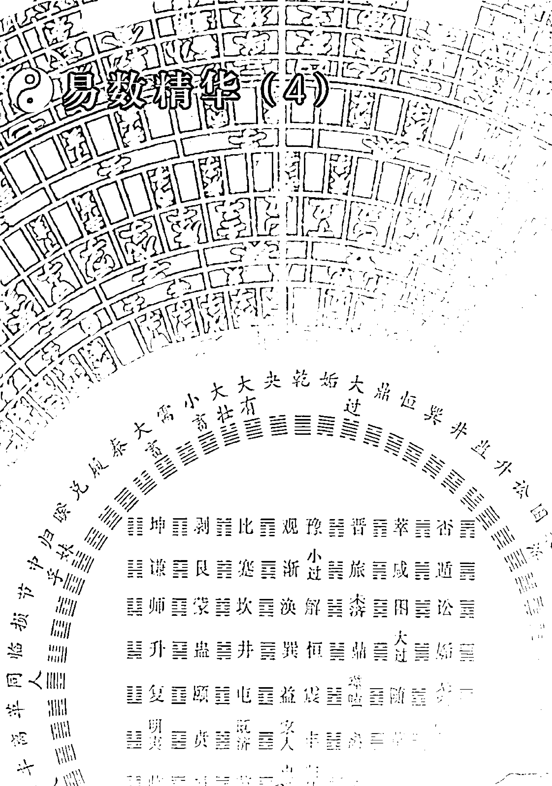

## 秘旨

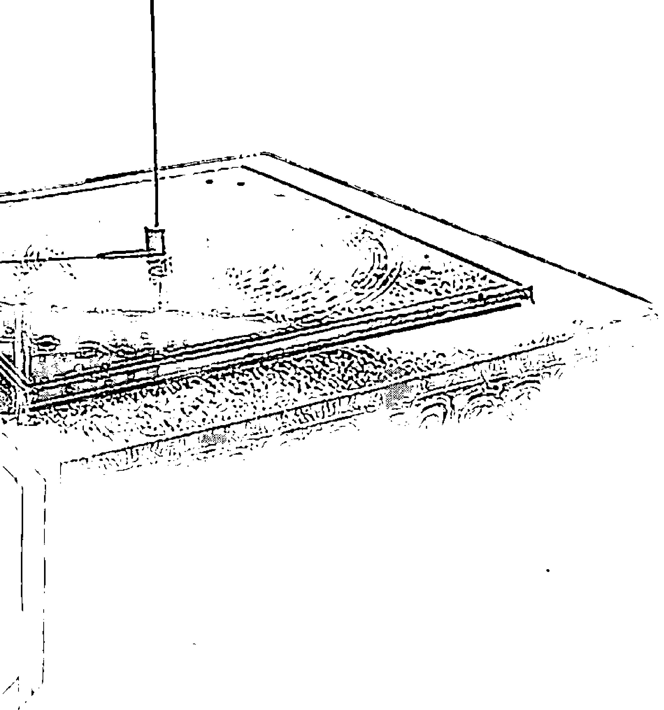

杨景磐 著

中国国际广播音像出版社

## 易数精华 ④

太乙为三式之首，所传尚古，奥妙在推演之中，世称奇书。

本书是作者多年来读易、研易、读史、研史的心得体会的汇集，文章体裁为随笔散文，篇幅有长有短，长者万字，短者百字，涉及到传统文化和民俗文化的方方面面，如建筑工程、地理环境、山水名胜、人物姓名、地名方位、阴阳五行、日时选择、禁忌避讳等，均紧扣“用易”，即用周易的思想观点褒贬人物、评议史事、分析问题、讲述道理。本书对于弘扬传统文化有积极作用，对于广大读者研易、读史也具有辅助作用。

本书是《太乙通解》的续篇。太乙是古代“三式”中第一式，是讲天人合一的古历法。作者在《太乙通解》中只介绍了有关太乙的基本知识和推演方法，未能深入阐述。《太乙通解》问世后，作者收到大量读者来信，询问有关太乙学说的详细内容，因此，作者续写《太乙考证》一书。《太乙考证》对于前人有关太乙日局的推演方法详加考辨，推出了日局计算公式，便于研习者应用；对于太乙式起贵人法、太乙流年卦、月卦、太乙卦运、大小游、五福、直符、阳九百六等，均作了详细考辨，并制定了太乙历谱，对于濒临失传的太乙式进行了挽救。此书是作者对弘扬古代传统文化方面作出的一大贡献。

## 易数精华 ④

## 太乙考证

杨景磐 著

中国国际广播音像出版社

## 图书在版编目(CIP)数据

易数精华：太乙考证 杨景磐 著
北京：中国国际广播音像出版社，2006，5，
ISBN 7-89994-276-4/C51.04
Ⅰ、易... Ⅱ、杨... Ⅲ、 社...

## 易数精华：太乙考证

杨景磐 著

- 责任编辑: 村 言
- 监 制: 高延赛
- 封面设计: 文 德
- 版式设计: 文 德
- 出品发行: 中国国际广播音像出版社
- 地 址: 北京复兴门外大街2号国家广电总局
- 邮 编: 100866
- 印 刷: 广东科普印刷厂
- 开 本: 880×1230mm 1/32
- 印 张: 9
- 字 数: 180千字
- 印 数: 5000
- 版 次: 2006年7月广东第1版
- 印 次: 2006年7月广东第1次

ISBN 7-89994-276-4/C51.04 全套定价: 165.00元

#### 序

1987年，山东大学举办首次国际周易学术讨论会，北京大学冯友兰教授特致书面贺词表示热烈祝贺。贺词中说：“我有一个建议，研究周易当然以周易哲学为主，但周易本来是一部筮书。周易的哲学思想有些与筮法有关，因此对筮法也要作调查研究工作。……这不是提倡筮法，不过是要搞清历史中的一件事实。”①20多年过去了，冯友兰先生的这一建议，尚未完全实现。杨景磐先生花费10多年心血，参考大量文献资料，著成《中国历代易案考》，完成了冯友兰遗愿中的一个部分。本来冯先生希望通过当今社会调查，去弄清这件历史事实，这一方面的任务还有待努力。依我对《中国历代易案考》的初步阅读和理解，此书具有多方面的文化价值，不同于一般的占卜之书，至少以下诸方面，值得重视。

首先，阅读此书可使读者了解许多鲜为人知的历史人物、历史事件。在古代，占筮活动是相当严肃的事情。本书所收罗的易案，都是用周易进行占筮的记录。以下三方面的内容，令人叹为观止：一是重大政治举措的决策，要进行占筮。如重耳返国，晋悼公为君，勾践归国，南朝宋顺帝禅位，宋徽宗被俘，溥仪论国民政府等；二是重大战争，须通过占筮预测是否可行及未来胜败结局，如鄢陵之战，赵鞅救郑，韩原之战，吴王伐齐，汉武帝伐匈奴，邓艾伐蜀，张康论伐日本，奉直战争等；三是个人重大行动的抉择，如伍子胥奔吴，夫差释勾践，李纲仕唐，朱熹焚奏稿，辛弃疾南归，纪晓岚科举等。历代易案的内容涉及诸多方面，散见于正史、方志及名家著作，本书作者集腋成裘，蔚为大观，使读者对于不少历史人物、历史事件的逸闻趣事有集中了解，可补古史之阙而益读史之兴。

其次，此书虽只专讲易案，但对于学习《周易》亦有所裨益。每一易案的内容，显示着占筮者对相关易卦的内涵有所解析，有的专重卦爻象，有的专重卦爻辞，有的二者兼用，从中可见古代及近代研易者，释易的旨趣与方法多有不同。这对于今人研易或重义理，或重象数，或象数义理并重，不无启迪。同一卦爻象或卦爻辞，不同人的解析千差万别，不足为怪，这说明易占不是一种纯粹的理性思维活动，它同时存在非理性因素。有人说：“《易》无达诂。”对此值得深思。就卦爻象而言，八经卦、六十四别卦，都是中国人熟知的一种特殊符号，堪称古圣创造的一种理解世界的视觉语言，它蕴含着特定的象征意义。这种用以表达观念的简易符号，对于不同的人却可能产生不同的认识效果。因为卦象符号本身不代表一种明确的观念，它可以随人拟议。正如《易传》所说：“拟之而后言，议之而后动，拟议以成其变化。”②这是《周易》思维的一大特征。对于卦爻辞的解析，同样存在这一特点，同一卦爻辞，可能有不同的解析。对此冯友兰先生曾有精辟论述。1984年，在武汉举行首次中国周易学术讨论会，冯先生发来《代祝词》，写道：“周易本身并不讲具体的天地万物，而只讲一些空套子，但是任何事物都可以套进去。这就叫‘神无方而易无体’。”③因为不同的人对所占得的卦爻辞，往往是凭着自己的生活经验、知识结构去进行解释的，所以千差万别。读了《中国历代易案考》，对于易占的这一特点定会获得更加深刻的认识。

第三，绵延数千年而不衰的易占，实际上已成为中国传统文化的特殊组成部分。同雅文化有所不同，它是扎根民间的一种俗文化。本书告诉读者，易占民俗源远流长，不止盛行于社会底层，也曾盛行于社会上层；不止成为巫师方士的专业，亦为文人学者所雅好；不止深深扎根于汉族群众中，在若干少数民族中也相当流行。本书收集考订的易案，仅限于正史、方志及少量学者著作，挂一漏万在所难免。在中国文化史上，对历代易案进行系统梳理，这还是第一次。作者对每则易案详加考订，细心评析，指出谬误，论其得失，对涉及的古代史事，予以客观评判，读来别有情趣。

《中国历代易案考》一书，内容搜罗宏富，评析务求精审，深入浅出，雅俗共赏，有史有论，体例新颖，不失为具有开拓性的学术著作。读者从中可以学到不少古代和近代历史知识，还可以加深对周易象数和义理的熟悉、理解，更可以品评古代、近代人物的某些思维方法。对于研究前人所运用的种种易占方法，也有一定参考价值。

杨景磐先生的另外几部新著——《皇极经世演绎》《太乙考证》《六壬指南例题解》《六壬捷录新解》《用易琐谈》等，我未能来得及阅读，相信凭着杨先生深厚的文化底蕴和严谨的治学态度，这几部书也一定有所发现，有所开拓，对读者也将会有所启迪和帮助的。

中国周易学会第一任会长、武汉大学哲学系教授、博士生导师 唐明邦
二〇〇五年四月二日于云鹤书房

#### 目 录

- 序 …………………………………………………………………………………… 唐明邦
- 前 言 …………………………………………………………………………………… 杨景磐

### 上编 太乙法式考

- 一、太乙积年 ………………………………………………………………………… (5)
- （一）太乙积年数 ……………………………………………………………… (10)
- （二）《淘金歌》积年数 …………………………………………………… (17)
- 二、太乙年局 ………………………………………………………………………… (27)
- 三、太乙月局 ………………………………………………………………………… (30)
- 四、太乙日局 ………………………………………………………………………… (37)
- （一）《太乙局》日局推法 ……………………………………………… (37)
- （二）《登坛必究》日局推法 ………………………………………… (40)
- （三）《易学象数论》日局推法 ……………………………………… (47)
- （四）《太乙统宗》日局推法 ………………………………………… (54)
- 五、太乙时局 ………………………………………………………………（57）
- 附：唐玄宗天宝九年夏至——冬至太乙时局历表…………（65）
- 六、太乙起贵人法 …………………………………………………………（79）
- 七、太乙十二运 ……………………………………………………………（84）
- （一）太乙卦运表 ……………………………………………………（89）
- （二）太乙运行卦爻所主 ……………………………………………（100）
- （三）帝王执政之期 …………………………………………………（104）
- （四）太乙流年卦、值事动爻、月卦 ……………………………（104）
- 八、太乙运卦考 ……………………………………………………………（108）
- （一）前言 ……………………………………………………………（108）
- （二）太乙十二运与六十四卦 ……………………………………（112）
- （三）太乙运卦的推演方法 ………………………………………（120）
- （四）结论 ……………………………………………………………（130）
- 九、大游 ……………………………………………………………………（135）
- 十、大游卦法起例 ………………………………………………………（139）
- 十一、小游 …………………………………………………………………（144）
- 十二、小游卦法起例 …………………………………………………（147）
- 十三、大小游大小运考 ………………………………………………（148）
- 十四、大游六百四十年大运卦象 …………………………………（151）
- 十五、小游一百九十二年小运卦象 ………………………………（156）
- 十六、阳九百六 …………………………………………………………（160）
- （一）阳九推法 ………………………………………………………（160）
- （二）百六推法 ……………………………………………………………… (163)
- 十七、阴阳九厄 ……………………………………………………………… (168)
- 十八、前人对阳九百六的验证 …………………………………………… (174)
- 十九、五福 …………………………………………………………………… (180)
- （一）五福行宫 …………………………………………………………… (180)
- （二）五福推演方法 ……………………………………………………… (181)
- （三）五福所主 …………………………………………………………… (188)
- （四）五福吉算 …………………………………………………………… (190)
- 二十、直符太乙 ……………………………………………………………… (193)
- （一）直符的推演方法 ………………………………………………… (194)
- （二）直符太乙验证 …………………………………………………… (194)
- 二十一、太乙真诀祖数考 ………………………………………………… (197)
- 二十二、岁实数法 ………………………………………………………… (201)
- 二十三、太乙人道命法起例考 ………………………………………… (205)

### 下编 太乙历谱

- 一、太乙历谱——年局（公元1924年至2043年）………… (212)
- 二、太乙历谱——月局（公元1924年至2043年）………… (218)
- 三、太乙历谱——日局（公元1997年至2000年）………… (239)
- 四、太乙历谱——时局 …………………………………………………… (253)
- 附录一：前人论太乙简析 ………………………………………………… (258)
- 附录二：太乙用法简述 …………………………………………………… (272)

## 上编

### 太乙法式考

#### 前 言

太乙为古代三式之首，象征天道，而太乙从来就为皇家太史局（明清称为钦天监）所掌握，民间很少流传。近代以来，对于太乙式更是无人问津了。近几年，随着“周易热”的兴起，古代三式又引起人们的兴趣，不少人参与了研究和探讨，而对于太乙式，大多认为已经失传。笔者秉承家学，对太乙式进行了研究探讨，在李树菁、张志春两先生的鼓励下，于一九九三年写成并出版了《太乙通解》一书。由于受当时条件的限制，《太乙通解》只介绍了有关太乙式的一些基本知识，还有许多应该介绍的内容而未能介绍。去年夏天，我读到黄宗羲《易学象数论》，其对三式皆有论述。联想到民国间易学大家杭辛斋对《易学象数论》的评论，从而受到启示。杭辛斋指出：“余姚黄氏《易学象数论》，其排斥河洛先天及《皇极经世》诸说最力，为毛西河、胡东樵诸氏之先驱，实则皆梨洲先生（梨洲先生即黄宗羲——引者）违心之论焉。盖先生非不知象数者，少壮之时，泛滥百家，于阴阳禽遁等学，实有心得。至晚年学成而名亦日高，恐平日之研求术数，近于小道，足为盛明之累，故撰此书，极力排斥，以存大儒之身矣。是以言之甚详，斥之正所以存之也。（杭辛斋《易学笔谈》）”

“斥之正所以存之”确属黄宗羲之本意，其用心之良苦亦是可知的。前人唯恐其失传而采取“斥之正所以存之”的方法，将其流传下来，而在科学较前大为进步的现在，我们对中国传统文化加以研究，去其糟粕，汲其精华，是完全必要的。于是，笔者撰成此书，对太乙式作了进一步论述。

笔者所以定书名为《考证》，是因为前人对太乙式的论述并不一致，今将各家之说加以比较和分析，力图得出一个较明确的结论，使研习太乙者有所遵循。

这部书能否达到预期目的？这只能听取读者诸君的意见了。

杨景磐
2004年10月9日

#### 一、太乙积年

积年术是我国古代历法中的一种计算方法。这种方法是以最初的“上元”为起点，到编制历法年份所积的年数称为“积年”，通称为“上元积年”。太乙典籍中沿用了上元积年的方法，称为“太乙积年术”，应用积年数值进行推演，才能求出太乙年计、月计、日计和时计入纪元局数。因此，我们所要计算年份的上元积年数值必须准确无误，才能求出该年入太乙纪元局数以及太乙所在宫次。否则，积年数值错了，则一错皆错，所推出的结论就不为凭了。

最初的上元起点，是选用一个日月的经纬度相同、五大行星又聚集在同一方位的时刻，即“日月合壁、五星联珠”的时刻。这个时刻是由历学家经过精心计算而得来的。不同的历书可能选用不同的上元起点，或称各有专用的上元起点和积年数值。

太乙典籍中选用的上元起点，是太乙术中专用的。任何一个年份的太乙积年数值，都是按照太乙典籍中规定的统一标准而计算得来的。如果在推演中选用截法（因太乙积年数值浩繁，可以截取简便方法。这种截法，前人多有采用），但这个截法必须经过精心计算，不得破坏原来的统一标准。只有这样，这种截法才能有效和精确。

今人为了推演简便，按照太乙典籍中的统一标准，计算公元零年（公元零年的提法不妥，实际是公元前1年）的太乙积年数值，这本无可厚非。但推演方法，仍应按照太乙典籍中的规定，不得无道理地任意改变。如《易学大辞典》（华夏出版社1992年出版）中在“岁太乙”条目下解释说：

从帝尧甲子至公元零年有10153977（《太乙淘金歌》载）和10153917（《太乙统宗》和《太乙金镜式》载）两种计法。如1911年的太乙局数，按10153977计：（10153977+1910）÷360=28210余287，287÷72=3余71，则1911年太乙为庚子元第71局；71÷24=2余23，太乙已游九宫第三周；23÷3=7余2，太乙居第九宫（巽）第二年。按10153917计：（10153917+1910）÷360=2821余227，227÷72余11，太乙为庚子元第11局；11÷3=3余2，太乙游居第四宫第二年。

上述这段文字中，有两个问题值得商榷。其一，《太乙统宗》等书所主太乙积年数，不是以帝尧甲子作为上元起点的，这在《太乙统宗》中有明确的论述。《太乙淘金歌》所主积年数，可能是以帝尧甲子作为上元起点的，但其注中明确指出：“自帝尧甲子至正统甲子共六十三甲子”。以此推算，公元零年的积年数为2337，而不是10153977。也许《太乙淘金歌》有不同的版本，但《古今图书集成》收录的《太乙淘金歌》中提供的数据，不可能推出公元零年为10153977的积年数。第二，以公元零年的积年数为标准，如何计算公元1911年的太乙积年数？这是一个非常单纯的加法数学题，本不该有异议。但是《易学大辞典》对此却作了错误地计算。正确的计法应当是（10153977+1911）或（10153917+1911）。因其对公元1911年的积年数计算错误，而以此为基数推出的纪元局以及太乙游宫数，则是一错皆错，无一是正确的。《易学大辞典》是具有权威性的大型专业工具书，居然也出现这样带有根本性的错误（这种错误不同于文字中的笔误），不仅误导读者，也给太乙学术领域增加了混乱。

公元1911年的太乙积年数值，是该年距上元甲子的年数，因此，用该年的太乙积年数值，可以求出与该年相对应的干支。列式如下：
（10153977+1911）÷60=169264余48（辛亥）
（10153917+1911）÷60=169263余48（辛亥）
公元1911年为辛亥年（岁次辛亥）。由此也可以证明《易学大辞典》中对1911年积年数值的计算是错误的。

若以《易学大辞典》中的方法计算，求公元1911年的干支，则是下式：
（10153977+1910）÷60=169264余47（庚戌）
（10153917+1910）÷60=169263余47（庚戌）
按照《易学大辞典》中的方法计算，1911年的干支为庚戌，这当然是错误的。

《国际易经》2002年第一期和第二期连续登载同一作者的两篇太乙专论，对尘封已久的太乙术得以发扬，这应当是十分可喜的事。但是，该专论的作者缺乏审慎严紧的态度，致使文中内容漏洞百出，令人感到遗憾。如对2002年太乙年局的推演，本来太乙入第六纪第十九年，该文却解为“入5纪……人19年”；本来太乙入第五壬子元第三十一局，该文却解为“人4元……入阳局”；本来太乙入艮三宫第一年理天，该文却解为“太乙入艮宫第三年”，在《国际易经》第二期又更正为“太乙入坎宫第一年”，真可谓错上加错。其对2001年9月入纪元局的推演，应用数据皆错，最后的结论可想而知。2001年农历九月为戊戌月，该文却解为“2001年9月应为21局，庚戌月为阴21局”。并在文中提示说：“太乙月计的原则为：冬至后夏至前用阳遁七十二局，夏至后冬至前用阴遁七十二局。”冬至后用阳遁，夏至后用阴遁，是指太乙时计而言，年、月、日三计皆用阳遁而不用阴遁，这一原则在太乙典籍中有明示。若太乙月计也按冬夏二至的区别而分用阳遁和阴遁，此有悖太乙典籍之训，务请作者注明出处，否则，则为作者自己杜撰，是不可信的。

综观《国际易经》所载两篇太乙专论，不仅作者在推演计算方面错误连篇，而且在对太乙典籍的理解方面，也存在一定的问题。太乙术是一门深奥的学问，如果没有一定的古文基础和易学知识，没有对太乙典籍的深入研读，是很难掌握的。希望有志于太乙学术研究的同志，首先要打好基础，认真研读太乙典籍，切忌急于求成，盲目发表文章，以免给这一学术领域造成新的混乱。

算中有技术性错误，而且在行文解述中对诸多太乙概念一片模糊。连自己都没有把问题搞清楚，怎么好写专论呢？这同样对读者有误导作用，并对太乙学术领域增加混乱。

易经及各类术数学自民国以来经历了断代危机，上世纪九十年代初，独具卓识的张志春先生经过多方奔波，促成了邵伟华先生编著的《周易与预测学》的出版，由此引发了出版易学古籍和研究易学及术数学的热潮，由于这支队伍是以松散方式存在的，再加上文化层次高低不齐，逐渐把江湖习气带了进来，追求魔术师式的现场预测表演，扎实和审慎日有减少，轻佻和浮躁日有增长。泰斗、大师的帽子满天飞，各类高谈阔论似天花乱坠，信口妄谈祸福，信笔乱发文章。姓名学者据“马寅初”之名就断定马老先生必定生于寅年之初（其实马寅初生年与寅年毫无关系）；堪舆学者忽然在广西某地发现了杨贵妃祖宗墓地，为美女撒尿形，呈一发即衷之势（杨氏兄妹于新旧唐书皆有传，其祖籍在山西，如其祖坟在广西，也应经过考证，用历史资料或现代考古资料来证明）；四柱学者把近现代伟人的四柱搬上讲坛，纵论毛，朱、周三位老战友的八字命理，必同在丙辰年大命攸归（其实周死于乙卯），但拒不说明这些伟人四柱资料的来源和出处。如此轻佻和浮躁，已经受到世人的鄙视。这是值得易学界高度警惕的。

##### （一）太乙积年数

我所见到的太乙书，有《古今图书集成》辑录的《太乙淘金歌》、《太乙局》，民国十一年江左书林印行的《太乙数统宗大全》，四库录《太乙金镜式经》，还有摘自《登坛必究》的王鸣鹤《辑太乙》抄本，以及黄宗羲《易学象数论》中的论太乙。诸家之论详略不同但各有特点，其所主亦有不同之处。仅就有关问题作一比较。

《太乙统宗·求太乙积年术》：
今以上元甲子距景泰二年辛未岁一千一十五万五千三百六十七岁。置演上元甲子距大元大德七年癸卯岁积一千零一十五万五千二百一十九年，上考往古每岁减一，验将来每岁加一，此太乙累积年之算。此演纪上元甲子乃七曜齐元之法也。其法自上古甲子年、甲子月、甲子日、甲子时天正冬至日月合壁、五星联珠皆合于子，是为上元，由此推来之数也。若以帝尧上元甲子造历到今上下止三千六百余年，此七曜齐元之非术也。故太乙岁月日时四计之数皆从于上古齐元甲子为上元第一纪之初也。
按此论涉及到太乙历法，其上元元首甲子年甲子月甲子日甲子时天正（十一月子月为岁首）冬至，而且日月合壁、五星联珠，即此时日月五星正运行到同一条直线上，这也是古代所有历法历元必备的条件。

这就说明，太乙五元六纪是从太乙上古历元甲子年甲子月甲子日甲子时天正冬至开始的。具体地说，太乙年月日时四计都是从同一个起点开始运行。

元大德七年癸卯岁为公元1303年，其距上元积年为10155219，明景泰二年辛未岁为公元1451年，其距上元积年为10155367。

《太乙局·求甲子年岁计太乙》：
自上古天皇上元甲子起至大明天启四年甲子计一千零一十五万五千五百四十一年。
按明天启四年甲子岁为公元1624年，其积年为10155541。而《太乙局》积年与《太乙统宗》有一年之差。经考证，《太乙统宗》积年为误。元大德七年癸卯岁太乙积年应为10155220；明景泰二年辛未岁为10155368。

王鸣鹤《辑太乙》：
置上元甲子至万历戊子积得一千零一十五万五千五百零五算，捷得祖数一百九十三万八千一百四十五算。
按万历戊子岁为明万历十六年公元1588年。其积年为10155505。此积年数与《太乙局》同。

###### 《太乙金镜式经》：

自上元混沌甲子之岁至今大唐开元十二年甲子岁积得一百九十三万七千二百八十一算。

按唐开元十二年甲子岁为公元724年。

《太乙金镜式经》积年数与王鸣鹤所取万历戊子岁祖数正相应。

《太乙金镜式经》为唐朝王希明撰。《太乙局》和《太乙统宗》二书皆引用过王希明的论述，而二书积算浩繁，独不取王希明积算之数，令人难以理解。明人王鸣鹤仍以太乙局积算为据，其所捷祖数又与王希明积算相符，这又是为什么？《太乙局》、《太乙统宗》皆由明人编录，其积算舍简就繁似有一定原因，尚有待考证。

###### 《易学大辞典·岁太乙》：

从帝尧甲子至公元零年有10153977（《大乙淘金歌》载）和10153917（《太乙统宗》和《太乙金镜式》载）两种计法。

如公元1911年的太乙局数，按前者则为太乙庚子元第七十一局；按后者则为太乙为庚子元第十一局。

今查太乙淘金歌并无此积年数。《太乙淘金歌》：“求甲子者，此上元甲子为始推算也”。“求上元者，截至元世祖至元元年甲子为上元第一纪起算是也。自帝尧甲子至正统甲子共六十三甲子。”原注云：“此二解互相参考，则差一元六十年。”淘金歌中并未列出历代各上元之年。

《太乙金镜式经》和《太乙统宗》二书都列有历代帝王纪年上中下三元以及太乙六纪起止之年。

###### 《太乙金镜式经·推帝王年纪法》：

> 臣希明自周厉王三十七年甲子为上元至大唐开元十三年甲子岁通计积一千五百六十一年矣。

-   周厉王三十七年甲子入第一纪
- 周幽王五年甲子入第二纪
- 周惠王二十一年甲子入第三纪
- 周桓王三年甲子入第四纪
- 周定王十年甲子入第五纪
- 周景王八年甲子入第六纪
- 周敬王四十三年甲子入第一纪
- 周威烈王九年甲子入第二纪
- 周显王十二年甲子入第三纪
- 周赧王十八年甲子入第四纪
- 秦始皇十年甲子入第五纪
- 汉文帝三年甲子入第六纪
- 汉武帝元狩六年甲子入第一纪
- 汉宣帝五凤元年甲子入第二纪
- 汉平帝元始四年甲子入第三纪
- 汉明帝永平七年甲子入第四纪
- 汉安帝延光三年甲子入第五纪
- 汉灵帝中平元年甲子入第六纪
- 魏齐王正始五年甲子入第一纪
- 晋惠帝永兴元年甲子入第二纪
- 晋哀帝兴宁二年甲子入第三纪
- 后魏太武元年甲子入第四纪
- 后魏太和八年甲子入第五纪
- 西魏太武文统十年甲子入第六纪
- 隋文帝仁寿四年甲子入第一纪
- 大唐高祖龙朔四年甲子入第二纪
- 大唐开元十二年甲子入第三纪

###### 《太乙统宗·明太乙纪年之法》：

帝王纪年，值演上古甲子，以历代绵远，而布算幽繁，今截自汉武帝元狩六年甲子岁，积为上元第一纪，庶几得以减法而易求焉，故列目推例于后：

- 汉武帝元狩六年上元甲子岁入第一纪
- 汉宣帝五凤元年中元甲子岁入第二纪
- 汉平帝元始四年下元甲子岁入第三纪
- 汉明帝永平七年上元甲子岁入第四纪
- 汉安帝延光三年中元甲子岁入第五纪
- 汉灵帝中平元年下元甲子岁入第六纪
- 魏齐王正始五年上元甲子岁入第一纪 即后汉帝延熙七年
- 晋惠帝永兴元年中元甲子岁入第二纪
- 晋哀帝兴宁二年下元甲子岁入第三纪
- 宋帝景平二年上元甲子岁入第四纪 即文帝元嘉元年
- 齐始祖永明二年中元甲子岁入第五纪
- 梁武帝大同十年下元甲子岁入第六纪
- 隋文帝仁寿四年上元甲子岁入第一纪
- 唐高祖龙朔四年中元甲子岁入第二纪
- 唐明皇开元十二年下元甲子岁入第三纪
- 唐德宗兴元元年上元甲子岁入第四纪
- 唐武帝会昌四年中元甲子岁入第五纪
- 唐昭宗天复四年下元甲子岁入第六纪
- 宋太祖乾德二年上元甲子岁入第一纪
- 宋仁宗天圣二年中元甲子岁入第二纪
- 宋神宗元丰七年下元甲子岁入第三纪
- 金熙宗皇统四年上元甲子岁入第四纪
- 金章宗天和四年中元甲子岁入第五纪
- 元天元至元元年下元甲子岁入第六纪
- 元泰定元年上元甲子岁入第一纪
- 明洪武十七年中元甲子岁入第二纪
- 明正德元年下元甲子岁入第三纪
- 明弘治十七年上元甲子岁入第四纪

按上中下三元之说，第一个六十甲子年为上元，第二个则中元，第三个则为下元。上中下三元共三个六十甲子、一百八十年。太乙则六十年为一纪，六纪共三百六十年，又以七十二年（仅以年计而论）为一元（亦称七十二局），五元亦为三百六十年，故太乙五元六纪，三百六十年为一周，周而复始，如此循环，并且与上中下三元对应则是：第一纪为上元，第二纪为中元，第三纪为下元，第四纪又为上元，第五纪又为中元，第六纪又为下元。

总之，以太乙年计而论，六十年为一纪，七十二年为一元，每三百六十年一周，称为一周纪。这是推演太乙式最基本的常识。

上述《金镜》和《统宗》二书所书帝王纪年，可为推演太乙式提供捷径，不必从上古以来积年算起，只要取第一纪上元元首之年起算即可。每经过三百六十年，太乙五元（甲子元七十二、丙子元七十二、戊子元七十二、庚子元七十二、壬子元七十二）六纪皆行一周。当然这只是就年计而论，月计、日计、时计则另当别论。

##### （二）《淘金歌》积年数

《太乙淘金歌》是太乙式的经典著作。其首篇《数命源流太乙入局法》共有十句，今录于下：

> 黄帝元年上元头，五元六纪除为则。
> 太乙三年一宫游，二十四年一周毕。
> 一天二火三为鬼，四木六金坤在七，
> 八水九巽中应五，神宫定位天机秘。
> 太乙仍须甲子求，诸将皆当依此议。

其第一句明确指出太乙式是以黄帝元年为上元甲子之首，年月日时四计皆以此为始的。首句下原注中有：“今将黄帝元年为始，细列后来各上元年于左。”但是，《古今图书集成》收录的《太乙淘金歌》原文及注解却没有“细列后来各上元年”的内容。这是刊刻或传抄之误，遗漏了原注中的具体内容，使黄帝元年始于何时，距今若干甲子，就无从考证了。

第九句和第十句下注云：“求甲子者，以上元甲子为始推算也。诸将者，二目并主客大小将也。求上元者截至元世祖至元元年甲子为上元，第一纪起算是也。自帝尧甲子至正统甲子共六十三甲子。”

另又注云：“此二解互相参考，则差一元六十年。”

显然，上述注解非出自一人之手，有原注与新注的区别。

原注中确有自相矛盾之处。太乙局怎样推演呢？当然是以“上元甲子为始推算也”。原文首句“黄帝元年上元头”，最原始的上元甲子是以黄帝元年为起点的。而原注中又说：“求上元者，截至元世祖至元元年甲子为上元第一纪起算是也。”这里提供的截法，即截去黄帝元年至至元元年这一段时间的积年数，弃之不用（或者是为避免数目浩繁。难以计算），而直接以至元元年甲子为上元开始，作为第一纪的起点。

元世祖至元元年，亦即宋景定五年，为公元1264年，岁次甲子。原注接着又补充说：“自帝尧甲子至正统甲子共六十三甲子。”正统甲子为明英宗正统九年（公元1444年）。六十三甲子为（63×60=3780）三千七百八十年。这样就可以推算出帝尧甲子年为公元前二千三百三十七年 [3780−（1444−1）=2337]。帝尧甲子年至至元元年甲子岁为三千六百零一年（2337+1264=3601）。

```
3601÷360=10余1
```

此式说明至元元年岁次甲子，太乙人第一纪第一年，即阳遁甲子元第一局。这也正是原注中所说的“求上元者，截至元世祖至元元年甲子为上元第一纪起算是也”。

由上述可以充分证明，《淘金歌》主张的太乙积年可以从帝尧甲子年（公元前2337年）起算，也可用截法，以至元元年甲子岁（公元1264年）起算。如果取用公元零年（即公元前1年）为坐标，其太乙积年为2337。推演公元前太乙年局，每岁减1数，推演公元后太乙年局，每岁加1数。

这样就找出了《淘金歌》中的太乙积年数值。《淘金歌》中共有二十四则年局实例，可以用上述积年数推演验证。

例一《淘金歌》：“假令陈后主祯明三年己酉，系第一甲子元四十六局，其年太乙在九宫。”

验证如下：

陈后主祯明三年（公元589年）岁次己酉，其太乙积年应为2926（2337+589=2926）

```
2926÷360=8余46
```

六十甲子序号46为己酉。周纪余46，太乙入第一纪第四十六年，第一甲子元第四十六局。

例二《淘金歌》：“汉文帝元年壬戌，系第五壬子元七十一局，太乙在九宫”。验证如下：

汉文帝元年（公元前179年）岁次壬戌，其太乙积年应为2159（2337-（179-1）=2159）。

```
2159÷360=5余359
```

```
359÷60=5余59（59的六十甲子序数为壬戌）
```

```
359÷72=4余71
```

太乙入第五壬子元第七十一局。

例三《淘金歌》：“宋仁宗庆历八年戊子，系第三戊子元第一局，太乙在一宫”。

验证如下：

宋仁宗庆历八年（公元 1048 年）岁次戊子，其太乙积年应为 3385（2337+1048=3385）。

- 3385÷360=9 余 145
- 145÷60=2 余 25（六十甲子序数 25 为戊子）
- 145÷72=2 余 1

可知宋仁宗庆历八入戊子元第一局。

由以上三例验证，可知《淘金歌》是以帝尧甲子年（公元前 2337 年）作为上元甲子，或截取元世祖至元元年（公元 1264 年）作为上元甲子，而进行太乙起算的。依据原注中提供的“帝尧甲子至正统甲子共六十三甲子”的数据，可推知帝尧甲子年为公元前 2337 年。

据司马迁《史记·十二诸侯年表》始于西周共和元年（公元前 841 年）岁次庚申，后世史学家皆以此为据，今《辞海·中国历史纪年表》也以此为据。西周共和元年之前的历史纪年，则缺乏详尽的资料。

前几年，有媒体报道说，国家已正式启动了夏商周断代工程，并报道说已取得了进展，但时至今日，还未见公布夏商周断代的具体资料。而《淘金歌》积年竟以帝尧甲子年起算，并说帝尧甲子年距明正统九年甲子为六十三甲子，这就等于确认了帝尧甲子年为公元前 2337 年。我们还可用什么资料来考证其正确性呢？

无独有偶。南宋张世南在《游宦纪闻》中说：

有所谓太乙数，能知运祚灾祥，刀兵水火，阴晴风雨，又能以之出战守城，傍门小法，亦可知人命贵贱。渡江后，有北客同州免解进士王湜，潜心此书，作《太乙肘后备检》三卷，为阴阳二遁，绘图一百四十有四，上自帝尧以来至绍兴六年丙辰，凡三千四百九十二年，皆随六十甲子表以分野，如《通鉴》编年，前代兴亡，历历可考。

按此说帝尧元年距南宋高宗绍兴六年（公元 1136 年）岁次丙辰为三千四百九十二年，则可推知帝尧元年为公元前 2357 年 [3492-（1136-1）=2357] 岁次甲辰。在六十甲子序列表中，甲辰序数为 41，甲子序数为 1，相差二十，此与《淘金歌》中推知帝尧甲子年为公元前 2337 年正相符合。也就是说，帝尧元年（公元前 2357 年）岁次甲辰，帝尧二十一年（公元前 2337 年）岁次正是甲子年。

按《游宦纪闻》所述，宋人（南宋初期人）王湜著《太乙肘后备检》所列六十甲子历史编年，是以帝尧元年为甲辰年，推知为公元前 2357 年。此与《淘金歌》注中所说帝尧甲子年推知为公元前 2337 年完全相应。

今考北宋邵雍（康节）《皇极经世书》元会运世甲子编年，亦是唐尧于六会一百八十运二千一百五十六世岁次甲辰（公元前2357年）即位，唐尧二十一年岁次甲子（二千一百五十七世）正是公元前2337年。邵子（1011年——1077年）为北宋人，其《皇极经世书》早于王湜《太乙肘后备检》和《淘金歌》（《淘金歌》为元、明时代的作品），可以断定，后二书是以《皇极经世书》为依据的。或依据他书，而与《皇极经世书》历史编年暗合。

清代四库全书收录有王湜所著《易学》一书，《提要》中称王湜所著《太乙肘后备检》未见有传本。因此，王湜所著太乙书中其积年数值是否与《淘金歌》相同，我们就无法考证了。

《淘金歌》上述原注之后又有新注云：“此二解互相参考，则差一元六十年。”此注语意不明，“此二解”所指是什么？相差六十年怎样比较？也许这是由于刊刻传抄之误，遗漏了原注或新注中的一些具体内容。

《易学大辞典》（华夏出版社1992年出版）在“太乙”条目下提到，“岁太乙从上元甲子为起始数，主公元零年，积岁有10153977（《太乙淘金歌》载）和10153917（《太乙金镜式》载）两种说法。”而在“岁太乙”条目下又说：“从帝尧甲子至公元零年有10153977（《太乙淘金歌》载）和10153917（《太乙统宗》和《太乙金镜式》载）两种计法。”作为太乙积年起始数的上元甲子与帝尧甲子应有区别，因为《太乙统宗》等书的太乙积年不是以帝尧甲子作为起始数的。《易学大辞典》的提法，把最初作为积年起始点的上元甲子与帝尧甲子混为一谈，这是不够审慎的。

前面已经提到，若以公元零年（“公元零年”的提法为《易学大辞典》独创，前人未有此提法。笔者考证后认为，所谓“公元零年”实是指公元前1年）为坐标，《淘金歌》提供的太乙积年数据为2337。而《易学大辞典》认为《淘金歌》中公元零年的积年数为10153977。因为《淘金歌》有不同的版本流传。或更有多家为其作注，很有可能提供不同的太乙积年数据。但是，我们应当看到，2337和10153977这两个关于公元零年的积年数据，其计算的结论是相同的。

```
2337÷360=6余177
177÷60=2余57
177÷72=2余33
```

```
10153977÷360=28205余177
177÷60=2余57
177÷72=2余33
```

公元零年（即公元前1年）岁次庚申，太乙入第三纪第五十七年，第三戊子元第三十三局（阳遁）。

《太乙统宗》等所主公元零年积年数为10153917。依此推演则为：

```
10153917÷360=28205余117
117÷60=1 余 57
117÷72=1 余 45
```

这个结论则是公元零年太乙入第二纪第五十七年，第二丙子元第四十五局（阳遁）。

显然，《太乙统宗》等书所主张的太乙积年数值与《淘金歌》所主是不同的。因此，推演的结论也完全不同。笔者初步认为，《淘金歌》是以帝尧二十一年（公元前 2337 年）岁次甲子作为太乙积年的上元甲子的，或者截取为上元甲子的，而《太乙统宗》等书的太乙积年则与帝尧甲子根本无关。这个问题从《太乙统宗》关于“求太乙积年术”的论述中也可得到证实：

> 置演上元甲子距大元大德七年癸卯岁，积一千零一十五万五千二百一十九年。上考往古，每岁减一，验将来每岁加一，此太乙累积年之算，此演纪上元甲子乃七曜齐元之法也。其法自上古甲子年甲子月甲子日甲子时，天正冬至，日月合壁，五星连珠，皆合于子，是为上元，由此推来之数也。若以帝尧上元甲子造历到今，上下止三千六百余年，此七曜齐元之非术也。故太乙岁、月、日、时四计之数，皆从于上古齐元甲子为上元第一纪之初也。

现代《辞海》（1989 年版）中也明确解释了“上元积年”的意义。指出这是“我国古代历法中的一种计算方法。从历元往上推算，求一个出现日月的经纬度相同、五大行星又聚集在同一方位的时刻，即日月合璧、五星连珠的时刻称为‘上元’。从上元到编制历年份所积的年数称为‘积年’，通称为‘上元积年’。

这就说明作为积年起始点的上元甲子是有条件的。《太乙统宗》认为，帝尧甲子年不具备作为上元积年起始点的条件，因此称它是“七曜齐元之非术”，这也透露了《太乙统宗》等书其积年数值不同于《淘金歌》的真正原因。

我们对于古代太乙典籍中诸如太乙积年数值的不同取舍，应持审慎态度，加以探讨研究。这正如奇门遁甲中有飞宫和转盘两种推演方法并存一样，可以见仁见智，决不可武断行事。

还应当指出，《易学大辞典》在“岁太乙”条目下，指出《淘金歌》和《太乙统宗》对于公元零年有两个不同的积年数值后，以公元1911年的太乙年局为例，分别用两个积年数进行了推演。但是，其推演方法和最后的推演结论，都是错误的。今录其原文如下：

> 从帝尧甲子至公元零年有10153977（《太乙淘金歌》载）和10153917（《太乙统宗》和《太乙金镜式》载）两种计法。如1911年的太乙局数，按10153977计：（10153977+1910）÷360=28210余287，287÷72=3余71，则1911年太乙为庚子元第71局；71÷24=2余23，太乙已游九宫第三周；23÷3=7余2，太乙居第九宫（巽）第二年。按10153917计：（10153917+1910）÷360=28210余227，227÷72余11，太乙为庚子元第11局；11÷3=3余2，太乙游居第四宫第二年。

可以看出，《易学大辞典》的编纂者不懂也不掌握太乙年局的推演方法，而硬是不懂装懂，故而导致犯了推演方法上的根本性错误，这决不同于文字上的笔误，是非常有害的，不仅误导了读者，也给太乙学术研究领域增加了混乱。

正确的推演应当如下式：

公元1911年岁次辛亥，其太乙年局
按公元零年积年为10153977计：

```
(10153977+1911) ÷360=28210 余 288
288÷60=4 余 48（辛亥）（第五纪第四十八年）
288÷72=4（第四庚子元第七十二局）
288÷24=12（太乙在第九宫第三年）
```

按公元零年积年为10153917计：

```
(10153917+1911) ÷360=28210 余 228
228÷60=3 余 48（辛亥）（第四纪第四十八年）
228÷72=3 余 12（太乙入第四庚子元第十二局）
228÷24=9 余 12
12÷3=4（太乙入第四宫第三年）
```

#### 二、太乙年局

太乙阳遁共七十二局，每年运行一局，称为年局。年局又称为年计、岁计。

从上古元首（第一年）起，每年一局，七十二年行甲子元七十二局；又七十二年行丙子元七十二局；又七十二年行戊子元七十二局；又七十二年行庚子元七十二局；又七十二年行壬子元七十二局，共三百六十年五元六纪而终。

推算太乙年局公式：积年除以周纪三百六十，余数称为周纪余；周纪余除以六十，其余数为入纪年数；周纪余除以七十二，其余数为入局数。

例一：元泰定五年戊辰岁（公元1328年）太乙积年为一千零一十五万五千二百四十五算，列式如下：

```
10155245÷360=28209 余 5
```

```
5÷60=5（仍视为余5）
```

```
5÷72=5（仍视为余5）
```

由此可知，太乙行第一纪第五年；太乙入第一甲子元第五局。

可用捷法，不以上古以来积年计算。因为元泰定元年甲子岁为上元甲子入第一纪，泰定五年戊辰岁序号为五（甲子序号为一，故戊辰序数为五）即知其入第一纪第五年，入第一甲子元第五局。

###### 例二：公元 1984 年岁次甲子，太乙积年数为 10155901，求其年计如下式：

```
10155901÷360=28210 余 310
301÷60=5 余 1
301÷72=4 余 13
13÷3=4 余 1
```

可知公元 1984 年岁次甲子，太乙行第六纪第一年；太乙入壬子元第十三局；太乙在兑六宫第一年理天。

因为太乙年、月、日、时四计最初都在同一个起点上开始运行，并且年、月、日三计都用阳遁七十二局，只有时计冬至后用阳遁，夏至后用阴遁。所以我们接着讨论月、日、时三计。

至于太乙年、月、日、时四计其最初在同一起点开始运行，《太乙统宗》已作了论述，前已引用。还可再证之黄宗羲《易学象数论》。黄氏指出，今太乙行宫每三年行一宫与郑康成“太乙下九宫法”不合，“今三年一宫，二十四而一周，又析之为月日时，岂其有四气并行耶？”黄氏认为太乙年月日时四计起于同一个起点，即年月日时四气并行，不符合道理。这从反面也证明了太乙年月日时四计是在同一个起点开始运行的。黄氏为清代著名的经学大家，他对太乙的批驳，我们可以不加理会。近代易学巨子杭辛斋在其撰著“河洛平议”中说：“余姚黄氏《易学象数论》，其排斥河洛、先天及《皇极经世》诸说最力，为毛西河、胡东樵诸氏之先驱，实则皆梨洲先生违心之论焉。盖先生非不知象数者，少壮之时，泛滥百家，于阴阳禽遁等学，实有心得。至晚年学成而名亦日高，恐平日之所以求术数，近于小道，足为盛明之累，故撰此书，极力排斥，以存大儒之身矣。是以言之甚详，斥之正所以存之也。”我们知此，就不须对黄氏之说多加评议了。

#### 三、太乙月局

太乙月局，每月行一局。一年十二个月行十二局；六年共有七十二个月，正行一元七十二局。

太乙甲子元、丙子元、戊子元、庚子元、壬子元各七十二局，五元共三百六十局，而一年有十二个月，三十年三百六十个月，正好行太乙三百六十局。

太乙年局三百六十年一周纪，太乙月局则三十年一周纪，二者起点相同，其运行速度不同，故终点相差甚远。

太乙诸书皆载有月局的计算方法，试析如下。

《太乙局·求甲子月计太乙》：

自上古天皇上元甲子起，至大明天启四年正月丙寅月积一千零一十五万五千五百四十一年，减一，以月法十二乘之，得一万二千一百八十六万六千四百八十算，以周法三百六十累除之，至天启三年十月癸亥止，除尽无余，另加十一月、十二月、正月三数，则丙寅月是太乙入第一甲子元三局，在乾一宫理人也。

按积年岁减一，为上年积年数，乘以十二，为上年积月数，所积月数为至上年十月的积月数，这是因为太乙积年之算是以建子（天正十一月）为岁首。所以实积月数仍须加上十一月、十二月和本年所求之月。

月局其入纪元局算法与年局同。

> 《太乙统宗·求天正积月术》：
> 置所求积年内减一算，以十二乘之，为所求岁前天正十一月之积月也，与太乙周法三百六十去之不尽者，以纪法六十除之余不尽者，命起甲子，算外即得天正冬月气运月建之辰。

按此与《太乙局》求月计法相同。只此论或印刷、传抄有误，使人不易明白到底怎么去计算月局，如果与《太乙局》求月局法相互对照，也就容易看清楚了。

但是，上述方法却容易引起人们的怀疑。因为实积年乘以十二并不等于实积月，每十九年有七个闰月，每年的月数为 $12\frac{7}{19}$。如果把闰月加进去，积年乘以十二是无意义的。为什么太乙月局不计算积闰呢？

太乙月局不计算积闰。这是因为闰月不另立月名干支，仍沿用前月月名干支，如甲子年闰八月，前八月干支名癸酉，后八月（闰八月）仍用癸酉为月名，它的太乙月局仍是前八月癸酉局。

黄宗羲《易学象数论·太乙推法·月计》指出：“置不满周纪算，减一，以十二乘之，加入所求之月，是为积月。太乙行月以节气为断，故不积闰。”所论固然正确，又似深了一层，但月局与节气并无直接联系，而且凡逢闰月怎样计月局，却未能直接说明。仔细审察，太乙月局是以月干支名入局，闰月不另立干支名，可以不去管它。仍以一年十二个月计算就行了。

《太乙金镜式经》和《登坛必究》对太乙月局另立捷法，最有实用意义，可作参考。

###### 《太乙金镜式经·推六纪月建法》

-   一纪二甲仲辰甲子甲午，二甲仲辰十一月建甲子，太乙在一宫，武德为天目，计神寅，合神丑；
- 二纪二己孟辰己巳己亥，二纪孟辰十一建甲子，太乙在六宫，地主为天目，计神、合神如上同；
- 三纪二甲季辰甲辰甲戌，二甲季辰十一月建甲子，太乙在一宫，大炅为天目，计神、合神如上同；
- 四纪二己仲辰己卯己酉，二己仲辰十一月建甲子，太乙在六宫，武德为天目，计神、合神如上同；
- 五纪二甲孟辰甲申甲寅，二甲孟辰十一月建甲子，太乙在一宫，地主为天目，计神、合神如上同；
- 六纪二己季辰己丑己未，二己季辰十一月建甲子，太乙在六宫，大炅为天目，计神、合神如上同。

凡三十有六纪，三十年有三百六十个月，是以甲子、甲午同建，太乙天目、计神、合神用式之法一同岁计之法，占验逆顺，其义亦等。臣今为李淳风定时计五日六十时法以为月计五年六十个月，三十年有三百六十个月，若有闰月，只以逐月节气时刻为正也。

按王希明上述这段话似不大好理解，实际上他是在解释太乙月局入局之法。我们再对照一下王鸣鹤在“登坛必究”中说的话，就更为清楚了。

《登坛必究》：
太乙月局 起算即加天正、地正二算 甲子、甲午一纪；己亥、己巳二纪；甲戌、甲辰三纪；己酉、己卯四纪；甲申、甲寅五纪；己未、己丑六纪。
甲子、甲午六年在甲子元七十二局；庚子、庚午六年丙子元七十二局；丙子、丙午六年戊子元七十二局；壬子、壬午六年庚子元七十二局；戊子、戊午六年壬子元七十二局。

按以太乙历元首而论，太乙年月日时四计都是从上古元首甲子年、甲子月、甲子日、甲子时天正冬至开始的。今只以月局而论：
甲子、乙丑、丙寅、丁卯、戊辰、己巳共六年七十二个月运行甲子元七十二局；
庚午、辛未、壬申、癸酉、甲戌、乙亥共六年七十二个月运行丙子元七十二局；
丙子、丁丑、戊寅、己卯、庚辰、辛巳共六年七十二个月运行戊子元七十二局；
壬午、癸未、甲申、乙酉、丙戌、丁亥共六年七十二个月运行庚子元七十二局；
戊子、己丑、庚寅、辛卯、壬辰、癸巳共六年七十二个月运行壬子元七十二局。

从甲年开始，至癸巳年共三十年三百六十个月，每月一局，三十年正好行五元六纪三百六十局一周纪而终。接着：
甲午、乙未、丙申、丁酉、戊戌、己亥共六年七十二个月运行甲子元七十二局；
庚子、辛丑、壬寅、癸卯、甲辰、乙巳共六年七十二个月运行丙子元七十二局；
丙午、丁未、戊申、己酉、庚戌、辛亥共六年七十二个月运行戊子元七十二局；
壬子、癸丑、甲寅、乙卯、丙辰、丁巳共六年七十二个月运行庚子元七十二局；
戊午、己未、庚申、辛酉、壬戌、癸亥共六年七十二个月运行壬子元七十二局。

从甲午年开始，至癸亥年共三十年三百六十个月，每月一局，三十年正好行五元六纪三百六十局一周纪而终。

我们很容易看出，从甲子年至癸亥年六十甲子共七百二十个月，每月一局，六十年行太乙七百二十局。这七百二十局正是太乙二周纪。所以，王鸣鹤说“甲子甲午一纪”等语、以及“甲子甲午六年在甲子元七十二局”等语，皆是依据六十甲子年七百二十个月运行五元六纪而来，从而，也使《太乙金镜式经》推月局之法得到破译。

我们由太乙月局每六十年七百二十个月运行二周纪的规律，还可推出，从太乙第一纪上元开始，经三百六十年第六纪下元止，太乙月局已运行十二周纪，从而终而复始，又从下一个第一纪上元甲子年开始运行。这样，我们就不必以上古以来的积年法去进行推行计算月局，只要按历代帝王第一纪上元甲子纪年开始，用《登坛必究》求月局的方法去查找就行了。

明朝弘治十七年上元甲子入第四纪，此后各上中下三元甲子纪年，可按历补出。今补出如下：

-   明嘉靖四十三年中元甲子岁入第五纪
- 明天启四年下元甲子岁入第六纪
- 清康熙二十三年上元甲子岁入第一纪
- 清乾隆九年中元甲子岁入第二纪
- 清嘉庆九年下元甲子岁入第三纪
- 清同治三年上元甲子岁入第四纪
- 中华民国十三年中元甲子岁入第五纪
- 公元一九八四年下元甲子岁入第六纪
- 公元二〇四四年上元甲子岁入第一纪
- 公元二一〇四年中元甲子岁入第二纪
- 公元二一六四年下元甲子岁入第三纪
- 公元二二二四年上元甲子岁入第四纪
- 公元二二八四年中元甲子岁入第五纪
- 公元二三四四年下元甲子岁入第六纪

#### 四、太乙日局

太乙日局最难推演。因为一年的日数不是整日数。古代历法最初认为一年有 365 1/4 日，后来发现这不是一个精确值，又改为一年有三百六十五日零二千四百二十五分，称之为“岁实”（即一岁的实际日数）。为计算，又称岁实为三百六十五万二千四百二十五分（一日为一万分）。《太乙统宗》规定“日法，一万五百分”（即一日为一万五百分），岁实则为“三百八十三万五千零四十六分二十五秒”。岁实之数如此浩繁，太乙积年数也是如此浩繁，再加上“积闰”，而且每个月又有大月、小月之分，其“积日”数之难以计算，就可想而知了。有关太乙日局的推演方法，分述如下：

##### （一）《太乙局》日局推法

> > 《太乙局·求甲子日计太乙》曰：
> > 求天启三年十一月初八甲子日，则以魏太武始光元年起，至今癸亥闰十月三十日止，计一千二百年。用十二月法乘之，得一万四千四百个月。以闰月法三十二分五十七秒归除之，得四百四十二个月，加前月实，通共一万四千八百四十二个月。以日平法二十九日五十三分零六秒乘之，得四十三万八千二百九十三算，零者不用，以六十甲子法累除之，余五十三，系自甲子日起至闰十月三十日丙辰也。
> > 又将四十三万八千二百九十三算加十一月初一至初八日八算，以大小周法三百六十累除之，余一百八十一算，以局法七十二除之，二次剩三十七，乃太乙入第三戊子元三十七局。
> > 又将三十七算以宫法二十四除之，止剩一十三算。自乾一宫、离二宫、艮三宫、震四宫各留三算，外余一算，则此日太乙在兑六宫理天也。

谨按：明熹宗天启三年（公元 1623 年）岁次癸亥至北魏太武帝始光元年（公元 424 年）岁次甲子，为一千二百年。按公元年数计算，应从公元 424 年开始，即应把公元 424 年计算在内，而公元 1623 年也应计算在内（因为所求为至 1623 年闰十月三十日止），其计算方法应是：

```
1623-（424-1）=1200
```

> 《太乙局》此例为选用截法（捷法），舍去了数字浩繁的积年数，这样就简便多了。

上述太乙日局例题，列成推演数式，则是

```
1200×12=14400
14400÷32.57=442.1246（取整数部分）
14400+442=14842
14842×29.5306=438293.1652（取整数部分）
438293÷60=7304余53（丙辰）
（438293+8）÷360=1217余181
181÷72=2余37（太乙入第三（2+1）戊子元第三十七局）
37÷24=1余13
13÷3=4余1（太乙在兑六宫理天）
```

为了简化其计算过程，可以将 1200×\frac{235}{19}（19年有7个闰月，乘以\frac{235}{19}就可得到总月数）=14842.10526（只取整数部分，则为总月数）。然后以总月数乘以朔策（29.5306），其计算结果与上式均同。

今以明英宗天顺五年（公元1461年）岁次辛巳十一月十一日丁未冬至为例，推演如下：

```
（1461-423）×12=12456
12456÷32.57=382.4378（取整数部分）
12456+382=12838
12838×29.5306=379113.8428（取整数部分）
（379113+11）÷360=1053余44（太乙入甲子元第四十四局）
44÷24=1 余 20
20÷3=6 余 2（太乙在八宫理地）
```

上例以笔者化简方法推演如下：

```
(1461-423) × \frac{235}{19} =12838.4210（取整数部分）
12838×29.5306=379113.8428（取整数部分）
(379113+11) ÷360=1053 余 44
```

与上式皆同。

《太乙局》详述并举例演示了太乙日局的求取方法，为读者推演日局提供了实例参考。但是，这个推演方法也存在“历差”问题，在具体推演中，仍应用历书进行校对，以求精确无误。若选用此法，仍应以北魏太武帝始光元年（公元424年）岁次甲子为起始，进行推演。

##### （二）《登坛必究》日局推法

《登坛必究》论述太乙日局推法曰：

> > 弘治元年戊申岁，截算得祖数二百一十三策，用退而成。逐年一进一退，逢进重退，进用已往二十四月之数，退用已往小尽之数。假令今年元旦日辰退居去年元旦之后，则用退；明年元旦日辰进居今年元旦之前，则用进。退不过五、六，进不过二十四，一定之数也。先以纪法求日，次以元法取局，与岁计皆同。

太乙四计之中，唯日计（日局）的推演最为繁杂，难以掌握，而前人对日局的论述又过于简略，因此，日局的推演方法已成为太乙学术中的一大难关。王鸣鹤在《登坛必究》中涉及到日局推演方法的仅为上述。他这一段话，虽然举出弘治元年（公元 1488 年）戊申岁，又假令今年元旦日辰和明年元旦日辰，这似乎很具体很详尽了，其实根本不能解决日局的推演问题。

首先，截算而得的祖数 213 是怎样推演而来的？用这个祖数入纪元局，得出的结果代表什么？以这个祖数为基础，怎样继续推演？这些问题，都难以解决；其次，进用二十四，退用小尽之数，其意义是什么？怎样运用？第三，元旦日辰怎样入纪元局？怎样推演？这些问题都是疑点和悬案。

但是，我们决不可因前人文字简约就加以否定。正因为有前人这些简约的论述，今人才可以破译和掌握太乙日局的推演方法，否则，太乙日局就将永久成为千古之谜了。从这个意义上说，我们应当特别感谢和尊重前人，切忌苛求于前人，不然，今人就没有什么可研究探讨的内容了。

笔者通过研究，对上述日局推演方法进行了破解。

弘治元年（公元 1488 年）岁次戊申，截取 213 为祖数，因此节内容是论述日局，故可定 213 是截取的日局的祖数。以此数推演纪元局如下：

-   213÷60=3 余 33（丙申）
- 213÷72=2 余 69（太乙阳遁戊子元第六十九局）
- 69÷24=2 余 21
- 21÷3=7（太乙入八宫第三日）

按丙申（六十甲子中序数 33 为丙申）应为弘治元年（公元 1488 年，岁次戊申）正月元旦日辰。这就是说，弘治元年岁次戊申正月朔（元旦）为丙申日，此日入太乙阳遁第三戊子元第六十九局。

求取弘治元年岁次戊申正月朔日的另一方法是 “用退而成”。即从上年（明成化二十三岁次丁未）正月朔日（壬寅日）后退六位亦是。上年正月朔（元旦）为壬寅日，六十甲子序数为 39，后退六位数（39-6=33）为 33，正是丙申日。因为上年（即成化二十三年丁未）十二个月中有六个小尽月，故只退六位数，此即是 “退用已往小尽之数”。

“逐年一进一退。” 明年（弘治二年岁次己酉）元旦日辰应用进而成，即由今年（弘治元年岁次戊申）元旦丙申前进二十四位（33+24=57），应是甲子序数 57，即庚申日，此即 “进用已往二十四月之数”。

弘治三年（公元 1490 年）岁次庚戍正月朔日干支，应用退法求取。由庚申日（弘治二年正月朔日干支）后退六位（因弘治二年六个月），即（57-6=51）为甲寅日（甲寅日序数为51）。

弘治六年（公元1493年）岁次癸丑正月朔为丁卯日，是由上年（弘治五年）正月朔日壬申日后退五位而成。为什么退五位数呢？因为弘治五年只有五个月，故只退五位。这即是“退不过五、六，进不过二十四，一定之数也”。

上述内容可查考《三千五百年历日天象》等历书，便可一目了然。

我们可以看出，《登坛必究》对于太乙日局的论述只是提供了每年元旦日辰的进退规律，而未提供每年元旦日辰入太乙纪元局的推演方法。这还是不能解决太乙日局的推演问题。如该书提供了弘治元年元旦日的截取祖数（可以由此祖数计算其太乙纪元局），而弘治二年、三年等年元旦日的祖数各应是多少？怎样计算得出？该书对这些具体问题未能涉及，因而，人们还不可能由此而掌握太乙日局的推演方法。

既然弘治元年元旦日辰入太乙纪元局数可由其祖数213推出，以此祖数为基数，便可推出其他年份元旦日太乙纪元局数值。

今以弘治元年为例，全年各月天数：正月大，闰正月小，二月大，三月小，四月大，五月小，六月小，七月大，八月小，九月大，十月小，十一月大，十二月大。全年为384天，加祖数213，共为597，若减去太乙周纪360，则为（597-360）237。237 应为弘治二年（公元 1489 年）岁次己酉正月元旦日辰的祖数。而 237 正是由上年元旦祖数 213 与 24 之和（213+24=237）。据此可列表如下：

| 年份 | 截取祖数 | 元旦日辰 | 进或退 |
| :--- | :--- | :--- | :--- |
| 弘治元年(戊申) | 213 | 213÷60=3余33(丙申) | 退 |
| 二年(己酉) | 213+24=237 | 237÷60=3余57(庚申) | 进 |
| 三年(庚戌) | 237-6=231 | 231÷60=3余51(甲寅) | 退 |
| 四年(辛亥) | 231+24=255 | 255÷60=4余15(戊寅) | 进 |
| 五年(壬子) | 255-6=249 | 249÷60=4余9(壬申) | 退 |
| 六年(癸丑) | 249-5=244 | 244÷60=4余4(丁卯) | 退 |
| 七年(甲寅) | 244+24=268 | 268÷60=4余28(辛卯) | 进 |
| 八年(乙卯) | 268-6=262 | 262÷60=4余22(乙酉) | 退 |
| 九年(戊午) | 262-5=257 | 257÷60=4余17(庚辰) | 退 |
| 十年(丙辰) | 257+24=281 | 281÷60=4余41(甲辰) | 进 |
| (弘治十年岁次丁巳祖数应为 280。280÷60=4余40(癸卯),方与历书相合) | | | |
| 十一年(戊午) | 280-6=274 | 274÷60=4余34(丁酉) | 退 |
| 十二年(己未) | 274+24=298 | 298÷60=4余58(辛酉) | 进 |
| 十三年(庚申) | 298-5=293 | 293÷60=4余53(丙辰) | 退 |
| 十四年(辛酉) | 293-6=287 | 287÷60=4余47(庚戌) | 退 |
| 十五年(壬戌) | 287+24=311 | 311÷60=5余11(甲戌) | 进 |
| 十六年(癸亥) | 311-5=306 | 306÷60=5余6(己巳) | 退 |
| 十七年(甲子) | 306-6=300 | 300÷60=5(癸亥) | 退 |

以上是以弘治元年正月元旦祖数 213 为基数，依次逐年求取各年正月元旦日祖数的方法。《登坛必究》论述这个方法中说“逐年一进一退”，又说“逢进重退”。我们从上表中可以看出，既不是逐年一进一退，也不是逢进重退，而是“今年元旦日辰退居去年元旦之后，则用退；明年元旦日辰进居今年元旦之前，则用进”。但是，运用这个方法，须与历书校对。弘治十年元旦日辰与历书相差一位数，是历书错，还是此法有误差，其原因有待作进一步考证。

据上述方法，可以推出《太乙日局万年历》。但迄今尚无人作这一工作。因此，还有必要进一步探究弘治元年正月元旦日祖数213的由来。 《登坛必究》对此未作介绍。我们只能借助于其他太乙典籍加以探究。

《太乙局》（《古今图书集成》收录）推演太乙日局截取北魏太武始光元年（南朝宋景平二年，公元424年）岁次甲子为起点。实际上真正的起始应在其前一年（宋景平元年、公元423年，岁次癸亥）十一月（甲子月）朔甲子日甲子时（其积年应当由此开始）。截至明弘治元年（公元1488年）戊申岁，积年为（1488—423）1065。按照黄宗羲《易学象数论》太乙日局推法（其日局推法另文介绍）：

```
(1065-1)（积年减一）×365.2425（岁实）=388618.02
388618.02÷29.530593（朔实）=13159.8447（取整数）
29.530593（朔实）×13159=388593.0732（取整数）
388593÷360=1079余153
```

这个余数153就是弘治元年岁次戊申前一年（岁次丁未）十一月朔日（即岁前天正朔日）积数。
153+60（十一月、十二月共六十日）=213
此则为弘治元年正月元旦的祖数213。

再以弘治十七年（公元 1504 年）岁次甲子为例，推演如下：

```
（弘治十七年积年数为 1504－423=1081） 1081
（1081－1） （积年减 1）×365.2425（岁实）=394461.9
394461.9÷29.530593（朔实）=13357.7371（取整数）
29.530593×13357=394440.1307（取整数）
394440÷360=1095 余 240
240+60（十一月和十二月共六十日）=300
```

弘治十七年（公元 1504 年）岁次甲子正月元旦日截取祖数为 300。

综上所述，王鸣鹤在《登坛必究》中提供了有关太乙日局的推演方法，但这个推演方法却不够完整。因为只提供了明朝弘治元年戊申岁正月元旦的截取祖数，并且这个祖数的出处和由来也未作交代。如果我们用这个方法推演和考证其他年份（距离明朝弘治元年较远的年份）正月元旦日辰的太乙纪元局，就会出现困难。故而不得不借用另外的方法求取祖数。所以，《登坛必究》提供的太乙日局的推演方法，仍然难以实际应用。尽管如此，我们还应当充分肯定《登坛必究》太乙日局推演方法的学术价值。使后人能够掌握以某年元旦日为坐标，逐年或进或退，从而求出各年元旦日辰的祖数。如果按此规律，撰写一部太乙日局的万年历法，不是很难能轻而易举吗？

##### （三）《易学象数论》日局推法

> > 黄宗羲《易学象数论·太乙推法·日局》曰：
> 岁实三百六十五万二千四百二十五分，朔实二十九万五千三百五分九十三秒，闰限一十八万六千五百五十二分九秒，月闰九千六十二分八十二秒。
> 置积年，减一，以岁实乘之，得数满朔实去之。其不满朔实者，则是减一内之日，谓之闰余。仍置岁实所乘之数，减闰余，此本年天正朔前之积日也。以纪法约之，知其末日甲子，加入本年所求之日，是为积日。在正以后之月，每月加一朔实，一月闰于闰余之内。

按黄氏于此节未提供积年数据。

黄宗羲在《易学象数论》中，应用两种积年数据。其一：《（太乙十二运）推法》“积年上元甲子至今壬子，作《象数论》之年。一千一十五万五千五百八十九年。”黄氏作《易学象数论》之年壬子年，是指清康熙十一年（公元1672年）。此积年数据换算成公元零年（即公元前一年）则为（10155589-1672=10153917）10153917。此积年数据是多部太乙典籍中（《太乙淘金歌》除外）统用的积年数值。其二：《授时历故·气朔历》“积年，辛巳岁即元至元十八年距今作历故之岁丙辰，积三百九十六年。”黄氏作《历故》之年为康熙十五年（公元 1676 年）岁次丙辰。此是以元世祖至元十八年（公元 1281 年）岁次辛巳为积年数起始点，所以清康熙十五年（公元 1676）岁次丙辰积年数为（1676－（1281－1）＝396）396 年。《授时假如·步气朔》中也提到“如万历己亥岁，距元辛巳积年三百一十九”。万历二十七年（公元 1599 年）岁次己亥，其积年数为（1599－（1281－1）＝319）319。《授时假如·步月离》中提到“如洪武十四年辛酉，积年一百〇一”。洪武十四年（公元 1381 年）岁次辛酉，其积年数为（1381－1281－1＝101）101。可知黄宗羲在他的历法著作中应用的积年数是以元世祖十八年（公元 1281 年）岁次辛巳为起始点的。
今以黄宗羲太乙日局推法，取用太乙书中统用的积年数其计算结果并不精确。今以黄氏历书中应用的积年数推演太乙日局，验证如下：

###### 例一：康熙十五年（公元 1676 年）岁次丙辰，积年为 396。

```
(396－1)×365.2425=144270.7875
144270.7875÷29.530593=4885.46869（取整数）
4885×29.530593=144256.9468（取整数）
144256÷60=2404 余 16（己卯）
```

己卯日应当为康熙十五年岁次丙辰十月末日干支。今查历书该年十月小，二十九日为戊寅日，己卯为十一月朔日干支。以此计算有 1 日之差。

###### 例二：万历二十七年（公元 1599 年）岁次己亥，其积年数为 319。

```
(319-1) ×365.2425=116147.115
116147.115÷29.530593=3933.1115 (取整数)
3933×29.530593=116143.8222 (取整数)
116143÷60=1935 余 43 (丙午)
```

万历二十七年岁次己亥十月末日应为丙午日，查历书该年十一月朔日为丙午。亦有一日之差。

###### 例三：洪武十四年（公元 1381 年）岁次辛酉，积年数为 101。

```
(101-1) ×365.2425=36524.25
36524.25÷29.530593=1236.8275 (取整数)
1236×29.530593=36499.8129 (取整数)
36499÷60=608 余 19 (壬午)
```

查历书该年十一月朔日为壬午。亦有一日之差。

综观上述三例，黄宗羲所述太乙日局推法，以其历法中的积年推演，与《三干五百年历日天象》相差一日。由此可知，运用此积年数推演太乙日局，应在其积日中减去一数方能与历书相吻合。

但是，用上述方法推演，有的年份又相差较远，如：

###### 例四：明天启三年（公元1623年）岁次癸亥，其年积年为 343。

```
[1623 - (1281-1)] × 365.2425
= 343 × 365.2425
= 125278.0775（取整数125278）
125278÷29.530593=4242.162（取整数4242）
4242×29.530593=125268.7777（取整数125268）
125268÷60=2087余48（戊申）
```

据黄氏太乙日局推法，戊申日应为天启三年天正（十一月）朔前之积日（或为十一月朔日干支）。但查考历书，戊申日却是该年闰十月朔日干支，“历差”为三十日。这样看来，以此积年推演太乙日局还有待进一步考证。

###### 例五：公元2003年岁次癸未，其积年数为：723

```
（723－1）×365.2425=263705.085
263705.085÷29.530593=8929.8946（取整数）
8929×29.530593=263678.6648（取整数）
263678÷60=4394余38（辛丑）
```

辛丑应为2003年农历，十月末日干支，查历书2003年农历十一月朔辛丑。此例亦有一日之差。

###### 推演太乙日局

推演太乙日局，关键在于能够计算出每年（或每月）的一个标准积日数值，由这个标准积日依次推演各日的太乙纪、元、局数。这个标准积日数值必须精确，不得有误。

> 黄宗羲在《易学象数论》中有推天正冬至之法，亦可作为推演太乙日局的参考。

###### 《易学象数论·授时历故·气朔历》:

###### 积年

辛巳岁即元至元十八年距今作历故之岁丙辰，积三百九十六年。

###### 推冬至

置所求距岁，减一，以岁实乘之，为中积。加气应，为通积。满旬周去之，不尽，以日周约之，为日，不满为分。其日命甲子算外，即所求冬至日辰及分。如上考者，亦距辛巳岁积算，乘岁实为中积，减气应为通积，满旬周去之，不尽，更置旬周，以不尽者减之。余同上。

岁实亦名岁周。三百六十五万二千四百二十五分。上考者每百年周天消一秒，岁实长一分，下验每百年周天长一秒，岁实消一分。

气应五十五万零六百分。

即辛巳岁前至元十七年。冬至在己未日，以旬周计之，便为此岁气应。按，丁丑岁至元十四年。气应三十九万三千二百五十分，至辛巳岁前用加三岁实，满旬周去之，余五十五万零五百分。二十五分，较少七十五秒。此六百分者，就整也。

- 旬周亦名纪法。六十万。
- 日周一万。
- 通余五万二千四百二十五分。岁实内不满旬周者，则为通余。以通余乘积年，比乘岁实者下算尤简。

黄宗羲在该书《授时假如·步气朔》中又云：

> 推天正冬至。如万历己亥岁，距元辛巳积年三百一十九，减一，以岁实三百六十五万二千四百二十二分于原岁实消三分乘积年，得一十一亿六千一百四十七万零一百九十六分，为中积。加气应五十五万零六百分，即辛巳岁前冬至在己未日，以旬周计之，便为此岁气应。为通积。满旬周去之，余四十二万零零七百九十六分。从甲子起算，丙午日丑初二刻为冬至。

黄氏以上所述，皆为元《授时历》的内容。《授时历》是以元“至元十八年岁次辛巳为元上考往古，下验将来，皆距立元为算，周岁消长，百年各一，其诸应等数，随时推测，不用为元。”

> 其“推天正冬至”法曰：“置所求距算，以岁实上推往古每百年长一，下算将来，每百年消一乘之，为中积。加气应，为通积。满旬周去之，不尽，以日周约之，为日。不满为分。其日命甲子算外，即所求天正冬至日辰及分如上考者，以气应减中积，满旬周去之，不尽，以减旬周。余同上。”（见《元史·历志·授时历经》）

上述推天正冬至的方法是一致的。即以元至元十八年（公元 1281 年）岁次辛巳为历元，上考下验皆以此为元始。积年乘以岁实为中积，加气应为通积。通积即至该年冬至之前的积日数。笔者经考证认为，若以此法推太乙日局，须于通积数加盈差 120，才能同太乙纪元局相符。

如求天启三年（公元 1623 年）十一月初八甲子日太乙日局：

```
[1623 - (1281-1)] × 365.2425 + 55.06
= 343 × 365.2425 + 55.06
= 125333.2375
```

取整数 125333 为冬至前积日数。查该年十一月初一丁巳为冬至，初八日为甲子日，所以

```
(125333+120+8) ÷ 360
=125461÷360
=348 余 181
181÷60=3 余 1
181÷72=2 余 37
37÷24=1 余 13
13÷3=4 余 1
```

可知此日太乙在第四纪，第三戊子元第三十七局，兑六宫理天。

此例与《太乙局》所推完全相符。

再如明正德四年（公元1509年）岁次己巳十一月初六甲子日。太乙日局：
[1509-1281-1] ×365.2425+55.06+120+6（初一日己未冬至）
=83640.5325+55.06+120+6
=83821.5925（取整数）
83821÷360=232 余 301
301÷60=5 余 1
301÷72=4 余 13
此例太乙日局为第六纪、第五壬子元第十三局。与《太乙统宗》所述完全相符。

##### （四）《太乙统宗》日局推法

《太乙统宗·求天正冬至积日术》：
正德己巳年十一月初六日甲子为下元之第六纪，庚午年正月初七日甲子为上元第一纪。
置岁实三百八十三万五千零四十六分二十五秒，以所求积年减一乘之，为中积分，加气盈差三十五万九千四百四十六分十秒，以日法一万零五百除之，为所求岁前天正冬至积日之算也。其日辰命，以纪法求之与上同，算外即得天正冬至积日辰。

按《太乙统宗》所主积年数：公元零年（实为公元前1年）为10153917。正德庚午年为正德五年（公元1510年）岁次庚午，其积年数为（10153917+1510）10155427。

```
[3835046.25×（1055427-1）+359446.1]÷10500
= [38946528398452.5+359446.1]÷10500
=38946528757898.6÷10500
=3709193215.0379（取整数）
```

```
3709193215÷60
=61819886 余 55（戊午）
```

上面算式计算的数3709193215为正德五年岁次庚午岁前天正冬至之前积日数，即正德四年（公元1509年）岁次己巳十一月冬至日之前的积日数。由此可推知正德四年岁次己巳十一月冬至前一日为戊午日，冬至日为己未日。

查《三十五百年历日天象》，正德四年（公元1509年）岁次己巳十一月初一己未日冬至。该月初六日为甲子日。其入太乙纪元局则推演如下：

```
(3709193215+6)÷360=10303314余181
181÷60=3余1
181÷72=2余37
```

正德四年己巳岁十一月初六甲子日，太乙入第四（3+1）纪第一日，第三（2+1）戊子元第三十七局。

这个推演结论与“正德己巳年十一月初六日甲子为下元之第六纪，庚午年正月初七日甲子为上元第一纪”显然不符。

若改用《太乙局》求日计太乙之法，推演如下：

```
(1509-423) × 235/19 ×29.5306
=13432.10526（取整数）×29.5306
=396655.0192（取整数）
(396655+6) ÷360=1101 余 301
301÷60=5 余 1
301÷72=4 余 13
```

这个结论正好同“正德己巳年十一月初六日甲子为下元之第六纪”相符。

这样看来，《太乙统宗》中求太乙日计之法有待商榷：一是所用积年数值浩繁，难以计算；二是所定求冬至积日之法与所举例证自相矛盾。至于其所列求岁前天正冬至积日术的问题出在哪里，还有待进一步考证。

#### 五、太乙时局

太乙年月日时四计，只有时计冬至后用阳遁，夏至后用阴遁，其余三计皆以阳遁行局。太乙典籍中对时局（时计）的推演入局法论述也不一致，今逐一考证如下：

《太乙统宗·求时计太乙入纪元局术》：

> > 值冬至、夏至所日减一，以十二乘之为辰前，即半子正之初积时也，加所求时为积日时，而以周纪法三百六十去之，不尽，为周纪余，以纪法六十约之而一，所得为纪数，不满为入纪以来时数，命上元甲子为第一纪，算卦即得所求时计。

> > 又置周纪余，以元法七十二约之为元数，不满为入元以来时数，起命第一局，即得时计入局所在。

按上述这段话很可能有脱漏之处。其大意是说，先求出冬至或夏至积日，再乘以十二，即为冬至或夏至所积时，再加上所要求取的时辰数，然后再以周纪法、纪法、元法求取纪、元、局。

但是，冬至或夏至所积日数，怎样计算呢？ 是以上古历元之年算起呢？ 还是从上年冬至或夏至算起呢？ 对此却未交代清楚，因此《太乙统宗》所述时局计算方法还不能应用。

> > 《太乙金镜式经·推冬至太乙加时变行》：
> 今置上元所求年天正积日及小余，先加半辰法，以辰法除之，得为加时辰数，及置积日减一，以十二乘之，并加时辰数，为天正时实，以周纪法去之，不尽，为入纪实。
> 置入纪实以太乙周法去之，余者以三约之，为宫数，不尽，为入宫时数，命起第一宫，顺行八宫，不游中五，算卦即天正加时太乙所在宫也。

> > 《太乙金镜式经》推太乙夏至加时所在变行：
> 置天正积日及小余秒，加阳遁一百八十二日三万二千二百九十三分日之二万三十五为小余秒，满秒法从小余一，不尽，为秒，其小余先加半辰法，以辰法除之，为加时辰数。乃置积日减一，以十二乘之，并入加时辰数，为夏至加时实，亦以周纪除之，不尽，为入纪实。
> 置入纪实，以太乙周法二十四去之，不尽，以三约之，为宫数，不满，为入宫时数，命起一宫，顺行八宫，不游中五，算卦则为阴遁太乙变行也。

按《金镜》所述时局计算方法，似先求上元至天正冬至积日及小余，加半辰法，以辰法除，得加时辰数。再置积日减一，以十二乘之，并加时辰数，为天正时实。以周纪法去之，余为入纪实。置入纪实，以太乙周法去之，余以三约之为宫数，不尽为入宫时数，命起第一宫，顺行八宫，不游中五，即得加时太乙所在宫。

推夏至加时变行，方法类似，但需先加阳遁日数及小余秒，处理稍繁。

由此可见，《金镜》所述方法，比《统宗》稍详，但核心仍依赖于精确的“上元所求年天正积日及小余”。这个积日如何求得，上元起算点何在，文中并未明确给出可操作的推算公式，因此其实用性也受限。

综观太乙时局推法，诸书记载或语焉不详，或自相矛盾，或依赖难以确知的“上元积日”。其具体推演步骤，尚需结合更多史料与天文历法知识，作进一步的深入考证与还原。

###### 《易学象数论·太一推法·时计》：
冬、夏二至但逢甲子，便为上元。置二至以来积日，减一，以十二乘之，加本日所求之时，是为积时。冬至后用阳局，起一宫顺行；夏至后用阴局，起九宫逆行。
推入纪元之法，岁月日时皆同。

按黄宗羲此论，仍令人迷惑不解。其一，“冬夏二至但逢甲子，便为上元。”这是说冬至日为甲子日、夏至日为甲子日便作为上元呢，还是冬至后逢甲子日、夏至后逢到甲子日便作为上元呢？仅以冬至而论（夏至亦同），若冬至日逢甲子日才为上元，那么，每隔八十年和二十四年才逢到一个冬至甲子日，这似乎太遥远了，而且每年都有阴阳遁的转换，不易入算。其二，若冬至后逢到甲子日便为上元，其积日则应以上元甲子日算起，不应从冬至算起。因有以上两点疑问，所以黄氏所论仍需考证。

###### 《登坛必究·辑太乙说·时局》：
（时局）与月局同，但不加天地二算。冬至后用阳局，夏至后用阴局。

按王鸣鹤此论，太乙时局的取法与月局相同，所不同处只是时局不加天正、地正二算，这就容易理解了。他所主张的月局取法，即：
- 甲子、甲午一纪；己亥、己巳二纪；甲戌、甲辰三纪；己酉、己卯四纪；甲申、甲寅五纪；己未、己丑六纪。
甲子、甲午六年（应改为甲子、甲午六日，下同）在甲子元七十二局；庚子、庚午六年丙子元七十二局；丙子、丙午六年戊子元七十二局；壬子、壬午六年，庚子元七十二局；戊子，戊午六年壬子元七十二局。

今以王鸣鹤太乙月局公式，改为时局公式，应解释为：
- 甲子、乙丑、丙寅、丁卯、戊辰五日共六十时为第一纪；
- 己巳、庚午、辛未、壬申、癸酉五日六十时为第二纪；
- 甲戌、乙亥、丙子、丁丑、戊寅五日六十时为第三纪；
- 己卯、庚辰、辛巳、壬午、癸未五日六十时为第四纪；
- 甲申、乙酉、丙戌、丁亥、戊子五日六十时为第五纪；
- 己丑、庚寅、辛卯、壬辰、癸巳五日六十时为第六纪。
- 甲午、乙未、丙申、丁酉、戊戌五日六十时为第一纪；
- 己亥、庚子、辛丑、壬寅、癸卯五日六十时为第二纪；
- 甲辰、乙巳、丙午、丁未、戊申五日六十时为第三纪；
- 己酉、庚戌、辛亥、壬子、癸丑五日六十时为第四纪；
- 甲寅、乙卯、丙辰、丁巳、戊午五日六十时为第五纪；
- 己未、庚申、辛酉、壬戌、癸亥五日六十时为第六纪。

甲子、乙丑、丙寅、丁卯、戊辰，己巳六日七十二时在第一甲子元；
庚午、辛未、壬申、癸酉、甲戌、乙亥六日七十二时在第二丙子元；
丙子、丁丑、戊寅、己卯、庚辰、辛巳六日七十二时在第三戊子元；
壬午、癸未、甲申、乙酉、丙戌、丁亥六日七十二时在第四庚子元；
戊子、己丑、庚寅、辛卯、壬辰、癸巳六日七十二时在第五壬子元。

甲午、乙未、丙申、丁酉、戊戌、己亥六日七十二时在第一甲子元；
庚子、辛丑、壬寅、癸卯、甲辰、乙巳六日七十二时在第二丙子元；
丙午、丁未、戊申、己酉、庚戌、辛亥六日七十二时在第三戊子元；
壬子、癸丑、甲寅、乙卯、丙辰、丁巳六日七十二时在第四庚子元；
戊午、己未、庚申、辛酉、壬戌、癸亥六日七十二时在第五壬子元。

王鸣鹤取太乙时局的主张，实际上是说冬至后凡逢甲子日便定为上元，一时一局；夏至后凡逢甲子日便定为上元，一时一局。只是冬至后用阳局，夏至后用阴局。

王鸣鹤创立太乙时局入纪元之法，简便易行，很容易掌握，将典籍所述太乙时局繁浩难以计算的问题化简了。王氏对于太乙月局和时局的简化，是对太乙式的一大贡献。

今以王鸣鹤所立太乙时局之法，验证古例如下：

> > 《金镜》：“假十月五日庚申，时加戊寅，入立冬气六（日），阴遁入第六纪壬子元二十七局。”
查庚申日为第六纪，庚申日十二时在壬子元。壬子元七十二局，先减去戊午日十二时，再减去己未日十二时，庚申日先减去丙子时，丁丑时，至戊寅时正好是二十七局。与《金镜》所推完全符合。

###### 《太乙局·求甲子时计太乙》：
（天启三年）癸亥年十一月初一日交冬至，后初八日遇甲子日，遁得甲子时，用阳遁起，则此时太乙入第一甲子元第一局，在乾一宫理天也。

按《太乙局》求太乙时计之法，是冬至后逢甲子日便为上元，从甲子日甲子时起局，其结果与王鸣鹤时计方法相一致。

但是，天启三年癸亥岁十一月初一交冬至节，太乙典籍规定，太乙时局冬至后用阳局，是指从冬至日交节时刻开始就用阳局（此前日时归夏至用阴局），那么从十一月初一日交冬至节至初八日甲子时之前这段时间，如何计算太乙时局呢？《太乙局》对此却避而不谈，为后人留下了悬案。综观古代数术著作，皆有藏头露尾之弊。我们对此也不必苛求了。

笔者本文有意按图索骥，以解决古籍中悬而未决的问题。

今仍以《金镜》“假（如）十月五日庚申，时加戊寅，入立冬气六（日），阴遁人第六纪壬子元二十七局”为例，详加解析。

《金镜》为唐人王希明撰。《四库全书·太乙金镜式经·提要》指出：“希明不详其里贯，开元时以方伎为内供奉待诏翰林。是书乃其奉敕所编，见于《新唐书、艺文志》，故书中多自称臣”。可知王希明为唐玄宗开元时人。王希明在《金镜》自序中说：“伏惟开元皇帝陛下，明极稽疑，睿圣作范，察璇玑以齐七政，制礼乐以穆百揆，明太乙之威神，封泰山之能事，高视万古。”在《金镜》正文中又说：“臣以开元十八年三月二十日于含元殿，帝向太乙神验”等，更可证明《金镜》成书时间当在唐玄宗开元十八年（公元730年）之后。而《金镜》所推十月五日庚申日为立冬后六日入太乙阴遁第六纪壬子元二十七局之例，决非虚构，必当有此实例。

查《三千五百年历日天象》，唐玄宗天宝九年（公元750年）岁次庚寅，其年十月五日为庚申日，立冬后六日，此庚申日戊寅时，正入阴局太乙第一纪壬子元第二十七局。

今以此例，推出唐玄宗天宝九年（公元750年）庚寅岁五月初十日丁酉交夏至，至十一月十五日庚子交冬至这段时间太乙时局历表，以解决冬夏二至阴阳局转换的问题。

###### 附：唐玄宗天宝九年夏至——冬至太乙时局历表：

| 日期 | 干支节气 | 子 | 丑 | 寅 | 卯 | 辰 | 巳 | 午 | 未 | 申 | 酉 | 戌 | 亥 |
| :--- | :--- | :--- | :--- | :--- | :--- | :--- | :--- | :--- | :--- | :--- | :--- | :--- | :--- |
| 初十丁酉 | 夏至 | 甲子元阴局三十七 | 三十八 | 三十九 | 四十 | 四十一 | 四十二 | 四十三 | 四十四 | 四十五 | 四十六 | 四十七 | 四十八 |
| 十一戊戌 | | 四十九 | 五十 | 五十一 | 五十二 | 五十三 | 五十四 | 五十五 | 五十六 | 五十七 | 五十八 | 五十九 | 六十 |
| 十二己亥 | | 六十一 | 六十二 | 六十三 | 六十四 | 六十五 | 六十六 | 六十七 | 六十八 | 六十九 | 七十 | 七十一 | 七十二 |
| 十三庚子 | | 丙子元一 | 二 | 三 | 四 | 五 | 六 | 七 | 八 | 九 | 十 | 十一 | 十二 |
| 十四辛丑 | | 十三 | 十四 | 十五 | 十六 | 十七 | 十八 | 十九 | 二十 | 二十一 | 二十二 | 二十三 | 二十四 |
| 十五壬寅 | | 二十五 | 二十六 | 二十七 | 二十八 | 二十九 | 三十 | 三十一 | 三十二 | 三十三 | 三十四 | 三十五 | 三十六 |
| 十六癸卯 | | 三十七 | 三十八 | 三十九 | 四十 | 四十一 | 四十二 | 四十三 | 四十四 | 四十五 | 四十六 | 四十七 | 四十八 |
| 十七甲辰 | | 四十九 | 五十 | 五十一 | 五十二 | 五十三 | 五十四 | 五十五 | 五十六 | 五十七 | 五十八 | 五十九 | 六十 |
| 十八乙巳 | | 六十一 | 六十二 | 六十三 | 六十四 | 六十五 | 六十六 | 六十七 | 六十八 | 六十九 | 七十 | 七十一 | 七十二 |
| 十九丙午 | | 戊子元一 | 二 | 三 | 四 | 五 | 六 | 七 | 八 | 九 | 十 | 十一 | 十二 |

| 廿九丙辰 | | 廿八乙卯 | | 廿七甲寅 | | 廿六癸丑 | | 廿五壬子小暑 | | 廿四辛亥 | | 廿三庚戌 | | 廿二己酉 | | 廿一戊申 | | 廿丁未 | | 子 | 丑 | 寅 | 卯 | 辰 | 巳 | 午 | 未 | 申 | 酉 | 戌 | 亥 |
| :--- | :--- | :--- | :--- | :--- | :--- | :--- | :--- | :--- | :--- | :--- | :--- | :--- | :--- | :--- | :--- | :--- | :--- | :--- | :--- | :--- | :--- | :--- | :--- | :--- | :--- | :--- | :--- | :--- | :--- | :--- | :--- |
| 四十九 | | 三十七 | | 二十五 | | 十三 | | 庚子元一 | | 六十一 | | 四十九 | | 三十七 | | 二十五 | | 十三 | | 十三 | 十四 | 十五 | 十六 | 十七 | 十八 | 十九 | 二十 | 二十一 | 二十二 | 二十三 | 二十四 |
| 四十八 | | 三十六 | | 二十四 | | 十二 | | 庚子元 | | 六十 | | 四十八 | | 三十六 | | 二十四 | | 十二 | | 十二 | 十三 | 十四 | 十五 | 十六 | 十七 | 十八 | 十九 | 二十 | 二十一 | 二十二 | 二十三 |
| 四十七 | | 三十五 | | 二十三 | | 十一 | | 庚子元 | | 五十九 | | 四十七 | | 三十五 | | 二十三 | | 十一 | | 十一 | 十二 | 十三 | 十四 | 十五 | 十六 | 十七 | 十八 | 十九 | 二十 | 二十一 | 二十二 |
| 四十六 | | 三十四 | | 二十二 | | 十 | | 庚子元 | | 五十八 | | 四十六 | | 三十四 | | 二十二 | | 十 | | 十 | 十一 | 十二 | 十三 | 十四 | 十五 | 十六 | 十七 | 十八 | 十九 | 二十 | 二十一 |
| 四十五 | | 三十三 | | 二十一 | | 九 | | 庚子元 | | 五十七 | | 四十五 | | 三十三 | | 二十一 | | 九 | | 九 | 十 | 十一 | 十二 | 十三 | 十四 | 十五 | 十六 | 十七 | 十八 | 十九 | 二十 |
| 四十四 | | 三十二 | | 二十 | | 八 | | 庚子元 | | 五十六 | | 四十四 | | 三十二 | | 二十 | | 八 | | 八 | 九 | 十 | 十一 | 十二 | 十三 | 十四 | 十五 | 十六 | 十七 | 十八 | 十九 |
| 四十三 | | 三十一 | | 十九 | | 七 | | 庚子元 | | 五十五 | | 四十三 | | 三十一 | | 十九 | | 七 | | 七 | 八 | 九 | 十 | 十一 | 十二 | 十三 | 十四 | 十五 | 十六 | 十七 | 十八 |
| 四十二 | | 三十 | | 十八 | | 六 | | 庚子元 | | 五十四 | | 四十二 | | 三十 | | 十八 | | 六 | | 六 | 七 | 八 | 九 | 十 | 十一 | 十二 | 十三 | 十四 | 十五 | 十六 | 十七 |
| 四十一 | | 二十九 | | 十七 | | 五 | | 庚子元 | | 五十三 | | 四十一 | | 二十九 | | 十七 | | 五 | | 五 | 六 | 七 | 八 | 九 | 十 | 十一 | 十二 | 十三 | 十四 | 十五 | 十六 |
| 四十 | | 二十八 | | 十六 | | 四 | | 庚子元 | | 五十二 | | 四十 | | 二十八 | | 十六 | | 四 | | 四 | 五 | 六 | 七 | 八 | 九 | 十 | 十一 | 十二 | 十三 | 十四 | 十五 |
| 三十九 | | 二十七 | | 十五 | | 三 | | 庚子元 | | 五十一 | | 三十九 | | 二十七 | | 十五 | | 三 | | 三 | 四 | 五 | 六 | 七 | 八 | 九 | 十 | 十一 | 十二 | 十三 | 十四 |
| 三十八 | | 二十六 | | 十四 | | 二 | | 庚子元 | | 五十 | | 三十八 | | 二十六 | | 十四 | | 二 | | 二 | 三 | 四 | 五 | 六 | 七 | 八 | 九 | 十 | 十一 | 十二 | 十三 |

| 干支节气 | 子 | 丑 | 寅 | 卯 | 辰 | 巳 | 午 | 未 | 申 | 酉 | 戌 | 亥 |
| :--- | :--- | :--- | :--- | :--- | :--- | :--- | :--- | :--- | :--- | :--- | :--- | :--- |
| 初一丁巳 | 六十一 | 六十二 | 六十三 | 六十四 | 六十五 | 六十六 | 六十七 | 六十八 | 六十九 | 七十 | 七十一 | 七十二 |
| 初二戊午 | 壬子元一 | 二 | 三 | 四 | 五 | 六 | 七 | 八 | 九 | 十 | 十一 | 十二 |
| 初三己未 | 十三 | 十四 | 十五 | 十六 | 十七 | 十八 | 十九 | 二十 | 二十一 | 二十二 | 二十三 | 二十四 |
| 初四庚申 | 二十五 | 二十六 | 二十七 | 二十八 | 二十九 | 三十 | 三十一 | 三十二 | 三十三 | 三十四 | 三十五 | 三十六 |
| 初五辛酉 | 三十七 | 三十八 | 三十九 | 四十 | 四十一 | 四十二 | 四十三 | 四十四 | 四十五 | 四十六 | 四十七 | 四十八 |
| 初六壬戌 | 四十九 | 五十 | 五十一 | 五十二 | 五十三 | 五十四 | 五十五 | 五十六 | 五十七 | 五十八 | 五十九 | 六十 |
| 初七癸亥 | 六十一 | 六十二 | 六十三 | 六十四 | 六十五 | 六十六 | 六十七 | 六十八 | 六十九 | 七十 | 七十一 | 七十二 |
| 初八甲子 | 甲子元一 | 二 | 三 | 四 | 五 | 六 | 七 | 八 | 九 | 十 | 十一 | 十二 |
| 初九乙丑 | 十三 | 十四 | 十五 | 十六 | 十七 | 十八 | 十九 | 二十 | 二十一 | 二十二 | 二十三 | 二十四 |
| 初十丙寅 | 二十五 | 二十六 | 二十七 | 二十八 | 二十九 | 三十 | 三十一 | 三十二 | 三十三 | 三十四 | 三十五 | 三十六 |
| 十一丁卯 | 三十七 | 三十八 | 三十九 | 四十 | 四十一 | 四十二 | 四十三 | 四十四 | 四十五 | 四十六 | 四十七 | 四十八 |
| 十二戊辰 | 四十九 | 五十 | 五十一 | 五十二 | 五十三 | 五十四 | 五十五 | 五十六 | 五十七 | 五十八 | 五十九 | 六十 |

| 日时局 | 干支节气 | 子 | 丑 | 寅 | 卯 | 辰 | 巳 | 午 | 未 | 申 | 酉 | 戌 | 亥 |
| :--- | :--- | :--- | :--- | :--- | :--- | :--- | :--- | :--- | :--- | :--- | :--- | :--- | :--- |
| | 十三己巳 | 六十一 | 六十二 | 六十三 | 六十四 | 六十五 | 六十六 | 六十七 | 六十八 | 六十九 | 七十 | 七十一 | 七十二 |
| | 十四庚午 | 丙子元一 | 二 | 三 | 四 | 五 | 六 | 七 | 八 | 九 | 十 | 十一 | 十二 |
| | 十五辛未 | 十三 | 十四 | 十五 | 十六 | 十七 | 十八 | 十九 | 二十 | 二十一 | 二十二 | 二十三 | 二十四 |
| | 十六壬申 | 二十五 | 二十六 | 二十七 | 二十八 | 二十九 | 三十 | 三十一 | 三十二 | 三十三 | 三十四 | 三十五 | 三十六 |
| | 十七癸酉 | 三十七 | 三十八 | 三十九 | 四十 | 四十一 | 四十二 | 四十三 | 四十四 | 四十五 | 四十六 | 四十七 | 四十八 |
| | 十八甲戌 | 四十九 | 五十 | 五十一 | 五十二 | 五十三 | 五十四 | 五十五 | 五十六 | 五十七 | 五十八 | 五十九 | 六十 |
| | 十九乙亥 | 六十一 | 六十二 | 六十三 | 六十四 | 六十五 | 六十六 | 六十七 | 六十八 | 六十九 | 七十 | 七十一 | 七十二 |
| | 二十丙子 | 戊子元一 | 二 | 三 | 四 | 五 | 六 | 七 | 八 | 九 | 十 | 十一 | 十二 |
| | 廿一丁丑 | 十三 | 十四 | 十五 | 十六 | 十七 | 十八 | 十九 | 二十 | 二十一 | 二十二 | 二十三 | 二十四 |
| | 廿二戊寅 | 二十五 | 二十六 | 二十七 | 二十八 | 二十九 | 三十 | 三十一 | 三十二 | 三十三 | 三十四 | 三十五 | 三十六 |
| | 廿三己卯 | 三十七 | 三十八 | 三十九 | 四十 | 四十一 | 四十二 | 四十三 | 四十四 | 四十五 | 四十六 | 四十七 | 四十八 |
| | 廿四庚辰 | 四十九 | 五十 | 五十一 | 五十二 | 五十三 | 五十四 | 五十五 | 五十六 | 五十七 | 五十八 | 五十九 | 六十 |# 七月大

| 日期 | 子 | 丑 | 寅 | 卯 | 辰 | 巳 | 午 | 未 | 申 | 酉 | 戌 | 亥 |
|------|----|----|----|----|----|----|----|----|----|----|----|----|
| 初六壬辰 | 四十九 | 五十 | 五十一 | 五十二 | 五十三 | 五十四 | 五十五 | 五十六 | 五十七 | 五十八 | 五十九 | 六十 |
| 初五辛卯 | 三十七 | 三十八 | 三十九 | 四十 | 四十一 | 四十二 | 四十三 | 四十四 | 四十五 | 四十六 | 四十七 | 四十八 |
| 初四庚寅 | 二十五 | 二十六 | 二十七 | 二十八 | 二十九 | 三十 | 三十一 | 三十二 | 三十三 | 三十四 | 三十五 | 三十六 |
| 初三己丑 | 十三 | 十四 | 十五 | 十六 | 十七 | 十八 | 十九 | 二十 | 二十一 | 二十二 | 二十三 | 二十四 |
| 初二戊子 | 壬子元 | 二 | 三 | 四 | 五 | 六 | 七 | 八 | 九 | 十 | 十一 | 十二 |
| 初一丁亥 | 六十一 | 六十二 | 六十三 | 六十四 | 六十五 | 六十六 | 六十七 | 六十八 | 六十九 | 七十 | 七十一 | 七十二 |
| 三十丙戌 | 四十九 | 五十 | 五十一 | 五十二 | 五十三 | 五十四 | 五十五 | 五十六 | 五十七 | 五十八 | 五十九 | 六十 |
| 廿九乙酉 | 三十七 | 三十八 | 三十九 | 四十 | 四十一 | 四十二 | 四十三 | 四十四 | 四十五 | 四十六 | 四十七 | 四十八 |
| 廿八甲申 | 二十五 | 二十六 | 二十七 | 二十八 | 二十九 | 三十 | 三十一 | 三十二 | 三十三 | 三十四 | 三十五 | 三十六 |
| 廿七癸未 | 十三 | 十四 | 十五 | 十六 | 十七 | 十八 | 十九 | 二十 | 二十一 | 二十二 | 二十三 | 二十四 |
| 廿六壬午 | 庚子元 | 二 | 三 | 四 | 五 | 六 | 七 | 八 | 九 | 十 | 十一 | 十二 |
| 廿五辛巳 | 六十一 | 六十二 | 六十三 | 六十四 | 六十五 | 六十六 | 六十七 | 六十八 | 六十九 | 七十 | 七十一 | 七十二 |

| 日 | 日干支节气 | 初七癸巳 | 初八甲午 | 初九乙未 | 初十丙申 | 十一丁酉 | 十二戊戌 | 十三己亥 | 十四 | 十五 | 十六 | 十七 | 十八 | 十九 | 二十 | 二十一 | 二十二 | 二十三 | 二十四 | 二十五 | 二十六 | 二十七 | 二十八 | 二十九 | 三十 | 三十一 | 三十二 | 三十三 | 三十四 | 三十五 | 三十六 | 三十七 | 三十八 | 三十九 | 四十 | 四十一 | 四十二 | 四十三 | 四十四 | 四十五 | 四十六 | 四十七 | 四十八 | 四十九 | 五十 | 五十一 | 五十二 | 五十三 | 五十四 | 五十五 | 五十六 | 五十七 | 五十八 | 五十九 | 六十 | 六十一 | 六十二 | 六十三 | 六十四 | 六十五 | 六十六 | 六十七 | 六十八 | 六十九 | 七十 | 七十一 | 七十二 |
| :--- | :--- | :--- | :--- | :--- | :--- | :--- | :--- | :--- | :--- | :--- | :--- | :--- | :--- | :--- | :--- | :--- | :--- | :--- | :--- | :--- | :--- | :--- | :--- | :--- | :--- | :--- | :--- | :--- | :--- | :--- | :--- | :--- | :--- | :--- | :--- | :--- | :--- | :--- | :--- | :--- | :--- | :--- | :--- | :--- | :--- | :--- | :--- | :--- | :--- | :--- | :--- | :--- | :--- | :--- | :--- | :--- | :--- | :--- | :--- | :--- | :--- | :--- | :--- | :--- | :--- |
| 子 | 甲子元 | 六十一 | 十三 | 十四 | 十五 | 十六 | 十七 | 十八 | 十九 | 二十 | 二十一 | 二十二 | 二十三 | 二十四 | 二十五 | 二十六 | 二十七 | 二十八 | 二十九 | 三十 | 三十一 | 三十二 | 三十三 | 三十四 | 三十五 | 三十六 | 三十七 | 三十八 | 三十九 | 四十 | 四十一 | 四十二 | 四十三 | 四十四 | 四十五 | 四十六 | 四十七 | 四十八 | 四十九 | 五十 | 五十一 | 五十二 | 五十三 | 五十四 | 五十五 | 五十六 | 五十七 | 五十八 | 五十九 | 六十 | 六十一 | 六十二 | 六十三 | 六十四 | 六十五 | 六十六 | 六十七 | 六十八 | 六十九 | 七十 | 七十一 | 七十二 |
| 丑 | | 六十二 | 十四 | 十五 | 十六 | 十七 | 十八 | 十九 | 二十 | 二十一 | 二十二 | 二十三 | 二十四 | 二十五 | 二十六 | 二十七 | 二十八 | 二十九 | 三十 | 三十一 | 三十二 | 三十三 | 三十四 | 三十五 | 三十六 | 三十七 | 三十八 | 三十九 | 四十 | 四十一 | 四十二 | 四十三 | 四十四 | 四十五 | 四十六 | 四十七 | 四十八 | 四十九 | 五十 | 五十一 | 五十二 | 五十三 | 五十四 | 五十五 | 五十六 | 五十七 | 五十八 | 五十九 | 六十 | 六十一 | 六十二 | 六十三 | 六十四 | 六十五 | 六十六 | 六十七 | 六十八 | 六十九 | 七十 | 七十一 | 七十二 | | | | | | |
| 寅 | | 六十三 | 十五 | 十六 | 十七 | 十八 | 十九 | 二十 | 二十一 | 二十二 | 二十三 | 二十四 | 二十五 | 二十六 | 二十七 | 二十八 | 二十九 | 三十 | 三十一 | 三十二 | 三十三 | 三十四 | 三十五 | 三十六 | 三十七 | 三十八 | 三十九 | 四十 | 四十一 | 四十二 | 四十三 | 四十四 | 四十五 | 四十六 | 四十七 | 四十八 | 四十九 | 五十 | 五十一 | 五十二 | 五十三 | 五十四 | 五十五 | 五十六 | 五十七 | 五十八 | 五十九 | 六十 | 六十一 | 六十二 | 六十三 | 六十四 | 六十五 | 六十六 | 六十七 | 六十八 | 六十九 | 七十 | 七十一 | 七十二 | | | | | | |
| 卯 | | 六十四 | 十六 | 十七 | 十八 | 十九 | 二十 | 二十一 | 二十二 | 二十三 | 二十四 | 二十五 | 二十六 | 二十七 | 二十八 | 二十九 | 三十 | 三十一 | 三十二 | 三十三 | 三十四 | 三十五 | 三十六 | 三十七 | 三十八 | 三十九 | 四十 | 四十一 | 四十二 | 四十三 | 四十四 | 四十五 | 四十六 | 四十七 | 四十八 | 四十九 | 五十 | 五十一 | 五十二 | 五十三 | 五十四 | 五十五 | 五十六 | 五十七 | 五十八 | 五十九 | 六十 | 六十一 | 六十二 | 六十三 | 六十四 | 六十五 | 六十六 | 六十七 | 六十八 | 六十九 | 七十 | 七十一 | 七十二 | | | | | | |
| 辰 | | 六十五 | 十七 | 十八 | 十九 | 二十 | 二十一 | 二十二 | 二十三 | 二十四 | 二十五 | 二十六 | 二十七 | 二十八 | 二十九 | 三十 | 三十一 | 三十二 | 三十三 | 三十四 | 三十五 | 三十六 | 三十七 | 三十八 | 三十九 | 四十 | 四十一 | 四十二 | 四十三 | 四十四 | 四十五 | 四十六 | 四十七 | 四十八 | 四十九 | 五十 | 五十一 | 五十二 | 五十三 | 五十四 | 五十五 | 五十六 | 五十七 | 五十八 | 五十九 | 六十 | 六十一 | 六十二 | 六十三 | 六十四 | 六十五 | 六十六 | 六十七 | 六十八 | 六十九 | 七十 | 七十一 | 七十二 | | | | | | |
| 巳 | | 六十六 | 十八 | 十九 | 二十 | 二十一 | 二十二 | 二十三 | 二十四 | 二十五 | 二十六 | 二十七 | 二十八 | 二十九 | 三十 | 三十一 | 三十二 | 三十三 | 三十四 | 三十五 | 三十六 | 三十七 | 三十八 | 三十九 | 四十 | 四十一 | 四十二 | 四十三 | 四十四 | 四十五 | 四十六 | 四十七 | 四十八 | 四十九 | 五十 | 五十一 | 五十二 | 五十三 | 五十四 | 五十五 | 五十六 | 五十七 | 五十八 | 五十九 | 六十 | 六十一 | 六十二 | 六十三 | 六十四 | 六十五 | 六十六 | 六十七 | 六十八 | 六十九 | 七十 | 七十一 | 七十二 | | | | | | |
| 午 | | 六十七 | 十九 | 二十 | 二十一 | 二十二 | 二十三 | 二十四 | 二十五 | 二十六 | 二十七 | 二十八 | 二十九 | 三十 | 三十一 | 三十二 | 三十三 | 三十四 | 三十五 | 三十六 | 三十七 | 三十八 | 三十九 | 四十 | 四十一 | 四十二 | 四十三 | 四十四 | 四十五 | 四十六 | 四十七 | 四十八 | 四十九 | 五十 | 五十一 | 五十二 | 五十三 | 五十四 | 五十五 | 五十六 | 五十七 | 五十八 | 五十九 | 六十 | 六十一 | 六十二 | 六十三 | 六十四 | 六十五 | 六十六 | 六十七 | 六十八 | 六十九 | 七十 | 七十一 | 七十二 | | | | | | |
| 未 | | 六十八 | 二十 | 二十一 | 二十二 | 二十三 | 二十四 | 二十五 | 二十六 | 二十七 | 二十八 | 二十九 | 三十 | 三十一 | 三十二 | 三十三 | 三十四 | 三十五 | 三十六 | 三十七 | 三十八 | 三十九 | 四十 | 四十一 | 四十二 | 四十三 | 四十四 | 四十五 | 四十六 | 四十七 | 四十八 | 四十九 | 五十 | 五十一 | 五十二 | 五十三 | 五十四 | 五十五 | 五十六 | 五十七 | 五十八 | 五十九 | 六十 | 六十一 | 六十二 | 六十三 | 六十四 | 六十五 | 六十六 | 六十七 | 六十八 | 六十九 | 七十 | 七十一 | 七十二 | | | | | | |
| 申 | | 六十九 | 二十一 | 二十二 | 二十三 | 二十四 | 二十五 | 二十六 | 二十七 | 二十八 | 二十九 | 三十 | 三十一 | 三十二 | 三十三 | 三十四 | 三十五 | 三十六 | 三十七 | 三十八 | 三十九 | 四十 | 四十一 | 四十二 | 四十三 | 四十四 | 四十五 | 四十六 | 四十七 | 四十八 | 四十九 | 五十 | 五十一 | 五十二 | 五十三 | 五十四 | 五十五 | 五十六 | 五十七 | 五十八 | 五十九 | 六十 | 六十一 | 六十二 | 六十三 | 六十四 | 六十五 | 六十六 | 六十七 | 六十八 | 六十九 | 七十 | 七十一 | 七十二 | | | | | | |
| 酉 | | 七十 | 二十二 | 二十三 | 二十四 | 二十五 | 二十六 | 二十七 | 二十八 | 二十九 | 三十 | 三十一 | 三十二 | 三十三 | 三十四 | 三十五 | 三十六 | 三十七 | 三十八 | 三十九 | 四十 | 四十一 | 四十二 | 四十三 | 四十四 | 四十五 | 四十六 | 四十七 | 四十八 | 四十九 | 五十 | 五十一 | 五十二 | 五十三 | 五十四 | 五十五 | 五十六 | 五十七 | 五十八 | 五十九 | 六十 | 六十一 | 六十二 | 六十三 | 六十四 | 六十五 | 六十六 | 六十七 | 六十八 | 六十九 | 七十 | 七十一 | 七十二 | | | | | | |
| 戌 | | 七十一 | 二十三 | 二十四 | 二十五 | 二十六 | 二十七 | 二十八 | 二十九 | 三十 | 三十一 | 三十二 | 三十三 | 三十四 | 三十五 | 三十六 | 三十七 | 三十八 | 三十九 | 四十 | 四十一 | 四十二 | 四十三 | 四十四 | 四十五 | 四十六 | 四十七 | 四十八 | 四十九 | 五十 | 五十一 | 五十二 | 五十三 | 五十四 | 五十五 | 五十六 | 五十七 | 五十八 | 五十九 | 六十 | 六十一 | 六十二 | 六十三 | 六十四 | 六十五 | 六十六 | 六十七 | 六十八 | 六十九 | 七十 | 七十一 | 七十二 | | | | | | |
| 亥 | | 七十二 | 二十四 | 二十五 | 二十六 | 二十七 | 二十八 | 二十九 | 三十 | 三十一 | 三十二 | 三十三 | 三十四 | 三十五 | 三十六 | 三十七 | 三十八 | 三十九 | 四十 | 四十一 | 四十二 | 四十三 | 四十四 | 四十五 | 四十六 | 四十七 | 四十八 | 四十九 | 五十 | 五十一 | 五十二 | 五十三 | 五十四 | 五十五 | 五十六 | 五十七 | 五十八 | 五十九 | 六十 | 六十一 | 六十二 | 六十三 | 六十四 | 六十五 | 六十六 | 六十七 | 六十八 | 六十九 | 七十 | 七十一 | 七十二 | | | | | | |

| 日期 | 干支节气 | 子 | 丑 | 寅 | 卯 | 辰 | 巳 | 午 | 未 | 申 | 酉 | 戌 | 亥 |
| :--- | :--- | :--- | :--- | :--- | :--- | :--- | :--- | :--- | :--- | :--- | :--- | :--- | :--- |
| 初七 | | 六十一 | 六十二 | 六十三 | 六十四 | 六十五 | 六十六 | 六十七 | 六十八 | 六十九 | 七十 | 七十一 | 七十二 |
| 初六 | | 四十九 | 五十 | 五十一 | 五十二 | 五十三 | 五十四 | 五十五 | 五十六 | 五十七 | 五十八 | 五十九 | 六十 |
| 初五 | | 三十七 | 三十八 | 三十九 | 四十 | 四十一 | 四十二 | 四十三 | 四十四 | 四十五 | 四十六 | 四十七 | 四十八 |
| 初四 | | 二十五 | 二十六 | 二十七 | 二十八 | 二十九 | 三十 | 三十一 | 三十二 | 三十三 | 三十四 | 三十五 | 三十六 |
| 初三 | | 十三 | 十四 | 十五 | 十六 | 十七 | 十八 | 十九 | 二十 | 二十一 | 二十二 | 二十三 | 二十四 |
| 初二 | | 一 | 二 | 三 | 四 | 五 | 六 | 七 | 八 | 九 | 十 | 十一 | 十二 |
| 初一 | 壬子元 | 一 | 二 | 三 | 四 | 五 | 六 | 七 | 八 | 九 | 十 | 十一 | 十二 |

| 日时 / 月时 / 局 | 日 干支节气 | 初八 | 初九 | 初十 | 十一 | 十二 | 十三<br>己巳<br>秋分 | 十四 | 十五 | 十六 | 十七 | 十八 | 十九 | 二十 | 廿一 | 廿二 | 廿三 | 廿四 |
| :--- | :--- | :--- | :--- | :--- | :--- | :--- | :--- | :--- | :--- | :--- | :--- | :--- | :--- | :--- | :--- | :--- | :--- | :--- |
| 时 / 辰 | 子 | 甲子元<br>一 | 十三 | 二十五 | 三十七 | 四十九 | 六十一 | 丙子元<br>一 | 十三 | 二十五 | 三十七 | 四十九 | 六十一 | 戊子元<br>一 | 十三 | 二十五 | 三十七 | 四十九 |
| | 丑 | 二 | 十四 | 二十六 | 三十八 | 五十 | 六十二 | 二 | 十四 | 二十六 | 三十八 | 五十 | 六十二 | 二 | 十四 | 二十六 | 三十八 | 五十 |
| | 寅 | 三 | 十五 | 二十七 | 三十九 | 五十一 | 六十三 | 三 | 十五 | 二十七 | 三十九 | 五十一 | 六十三 | 三 | 十五 | 二十七 | 三十九 | 五十一 |
| | 卯 | 四 | 十六 | 二十八 | 四十 | 五十二 | 六十四 | 四 | 十六 | 二十八 | 四十 | 五十二 | 六十四 | 四 | 十六 | 二十八 | 四十 | 五十二 |
| | 辰 | 五 | 十七 | 二十九 | 四十一 | 五十三 | 六十五 | 五 | 十七 | 二十九 | 四十一 | 五十三 | 六十五 | 五 | 十七 | 二十九 | 四十一 | 五十三 |
| | 巳 | 六 | 十八 | 三十 | 四十二 | 五十四 | 六十六 | 六 | 十八 | 三十 | 四十二 | 五十四 | 六十六 | 六 | 十八 | 三十 | 四十二 | 五十四 |
| | 午 | 七 | 十九 | 三十一 | 四十三 | 五十五 | 六十七 | 七 | 十九 | 三十一 | 四十三 | 五十五 | 六十七 | 七 | 十九 | 三十一 | 四十三 | 五十五 |
| | 未 | 八 | 二十 | 三十二 | 四十四 | 五十六 | 六十八 | 八 | 二十 | 三十二 | 四十四 | 五十六 | 六十八 | 八 | 二十 | 三十二 | 四十四 | 五十六 |
| | 申 | 九 | 二十一 | 三十三 | 四十五 | 五十七 | 六十九 | 九 | 二十一 | 三十三 | 四十五 | 五十七 | 六十九 | 九 | 二十一 | 三十三 | 四十五 | 五十七 |
| | 酉 | 十 | 二十二 | 三十四 | 四十六 | 五十八 | 七十 | 十 | 二十二 | 三十四 | 四十六 | 五十八 | 七十 | 十 | 二十二 | 三十四 | 四十六 | 五十八 |
| | 戌 | 十一 | 二十三 | 三十五 | 四十七 | 五十九 | 七十一 | 十一 | 二十三 | 三十五 | 四十七 | 五十九 | 七十一 | 十一 | 二十三 | 三十五 | 四十七 | 五十九 |
| | 亥 | 十二 | 二十四 | 三十六 | 四十八 | 六十 | 七十二 | 十二 | 二十四 | 三十六 | 四十八 | 六十 | 七十二 | 十二 | 二十四 | 三十六 | 四十八 | 六十 |## 五、太乙时局

| 干支节气 | 庚子元 | 六十四 | 五 | 十六 | 四十 | 四十一 | 四十二 | 四十三 | 四十四 | 四十五 | 四十六 | 四十七 | 四十八 | 子 | 丑 | 寅 | 卯 | 辰 | 巳 | 午 | 未 | 申 | 酉 | 戌 | 亥 |
|----------|--------|--------|----|------|------|--------|--------|--------|--------|--------|--------|--------|--------|----|----|----|----|----|----|----|----|----|----|----|----|
| 十二 | 二十五 | 十三 | 六十一 | 甲子元 | 六十一 | 四十九 | 三十七 | 二十五 | 十三 | 一 | 四十九 | 三十七 | 二十五 | 十三 | 一 | 四十九 | 三十七 | 二十五 | 十三 | 一 | 四十九 | 三十七 | 二十五 | 十三 | 一 |
| 十一 | 二十五 | 十四 | 六十二 | 二 | 六十二 | 五十 | 三十八 | 二十六 | 十四 | 二 | 五十 | 三十八 | 二十六 | 十四 | 二 | 五十 | 三十八 | 二十六 | 十四 | 二 | 五十 | 三十八 | 二十六 | 十四 | 二 |
| 初十 | 二十五 | 十五 | 六十三 | 三 | 六十三 | 五十一 | 三十九 | 二十七 | 十五 | 三 | 五十一 | 三十九 | 二十七 | 十五 | 三 | 五十一 | 三十九 | 二十七 | 十五 | 三 | 五十一 | 三十九 | 二十七 | 十五 | 三 |
| 初九 | 二十五 | 十六 | 六十四 | 四 | 六十四 | 五十二 | 四十 | 二十八 | 十六 | 四 | 五十二 | 四十 | 二十八 | 十六 | 四 | 五十二 | 四十 | 二十八 | 十六 | 四 | 五十二 | 四十 | 二十八 | 十六 | 四 |
| 初八 | 二十五 | 十七 | 六十五 | 五 | 六十五 | 五十三 | 四十一 | 二十九 | 十七 | 五 | 五十三 | 四十一 | 二十九 | 十七 | 五 | 五十三 | 四十一 | 二十九 | 十七 | 五 | 五十三 | 四十一 | 二十九 | 十七 | 五 |
| 初七 | 二十五 | 十八 | 六十六 | 六 | 六十六 | 五十四 | 四十二 | 三十 | 十八 | 六 | 五十四 | 四十二 | 三十 | 十八 | 六 | 五十四 | 四十二 | 三十 | 十八 | 六 | 五十四 | 四十二 | 三十 | 十八 | 六 |
| 初六 | 二十五 | 十九 | 六十七 | 七 | 六十七 | 五十五 | 四十三 | 三十一 | 十九 | 七 | 五十五 | 四十三 | 三十一 | 十九 | 七 | 五十五 | 四十三 | 三十一 | 十九 | 七 | 五十五 | 四十三 | 三十一 | 十九 | 七 |
| 初五 | 二十五 | 二十 | 六十八 | 八 | 六十八 | 五十六 | 四十四 | 三十二 | 二十 | 八 | 五十六 | 四十四 | 三十二 | 二十 | 八 | 五十六 | 四十四 | 三十二 | 二十 | 八 | 五十六 | 四十四 | 三十二 | 二十 | 八 |
| 初四 | 二十五 | 二十一 | 六十九 | 九 | 六十九 | 五十七 | 四十五 | 三十三 | 二十一 | 九 | 五十七 | 四十五 | 三十三 | 二十一 | 九 | 五十七 | 四十五 | 三十三 | 二十一 | 九 | 五十七 | 四十五 | 三十三 | 二十一 | 九 |
| 初三 | 二十五 | 二十二 | 七十 | 十 | 七十 | 五十八 | 四十六 | 三十四 | 二十二 | 十 | 五十八 | 四十六 | 三十四 | 二十二 | 十 | 五十八 | 四十六 | 三十四 | 二十二 | 十 | 五十八 | 四十六 | 三十四 | 二十二 | 十 |
| 初二 | 二十五 | 二十三 | 七十一 | 十一 | 七十一 | 五十九 | 四十七 | 三十五 | 二十三 | 十一 | 五十九 | 四十七 | 三十五 | 二十三 | 十一 | 五十九 | 四十七 | 三十五 | 二十三 | 十一 | 五十九 | 四十七 | 三十五 | 二十三 | 十一 |
| 初一 | 二十五 | 二十四 | 七十二 | 十二 | 七十二 | 六十 | 四十八 | 三十六 | 二十四 | 十二 | 六十 | 四十八 | 三十六 | 二十四 | 十二 | 六十 | 四十八 | 三十六 | 二十四 | 十二 | 六十 | 四十八 | 三十六 | 二十四 | 十二 |
| 廿九 | 二十五 | 二十五 | 七十三 | 十三 | 七十三 | 六十一 | 四十九 | 三十七 | 二十五 | 十三 | 六十一 | 四十九 | 三十七 | 二十五 | 十三 | 六十一 | 四十九 | 三十七 | 二十五 | 十三 | 六十一 | 四十九 | 三十七 | 二十五 | 十三 |
| 廿八 | 二十五 | 二十六 | 七十四 | 十四 | 七十四 | 六十二 | 五十 | 三十八 | 二十六 | 十四 | 六十二 | 五十 | 三十八 | 二十六 | 十四 | 六十二 | 五十 | 三十八 | 二十六 | 十四 | 六十二 | 五十 | 三十八 | 二十六 | 十四 |
| 廿七 | 二十五 | 二十七 | 七十五 | 十五 | 七十五 | 六十三 | 五十一 | 三十九 | 二十七 | 十五 | 六十三 | 五十一 | 三十九 | 二十七 | 十五 | 六十三 | 五十一 | 三十九 | 二十七 | 十五 | 六十三 | 五十一 | 三十九 | 二十七 | 十五 |
| 廿六 | 二十五 | 二十八 | 七十六 | 十六 | 七十六 | 六十四 | 五十二 | 四十 | 二十八 | 十六 | 六十四 | 五十二 | 四十 | 二十八 | 十六 | 六十四 | 五十二 | 四十 | 二十八 | 十六 | 六十四 | 五十二 | 四十 | 二十八 | 十六 |
| 廿五 | 二十五 | 二十九 | 七十七 | 十七 | 七十七 | 六十五 | 五十三 | 四十一 | 二十九 | 十七 | 六十五 | 五十三 | 四十一 | 二十九 | 十七 | 六十五 | 五十三 | 四十一 | 二十九 | 十七 | 六十五 | 五十三 | 四十一 | 二十九 | 十七 |
| 廿四 | 二十五 | 三十 | 七十八 | 十八 | 七十八 | 六十六 | 五十四 | 四十二 | 三十 | 十八 | 六十六 | 五十四 | 四十二 | 三十 | 十八 | 六十六 | 五十四 | 四十二 | 三十 | 十八 | 六十六 | 五十四 | 四十二 | 三十 | 十八 |
| 廿三 | 二十五 | 三十一 | 七十九 | 十九 | 七十九 | 六十七 | 五十五 | 四十三 | 三十一 | 十九 | 六十七 | 五十五 | 四十三 | 三十一 | 十九 | 六十七 | 五十五 | 四十三 | 三十一 | 十九 | 六十七 | 五十五 | 四十三 | 三十一 | 十九 |
| 廿二 | 二十五 | 三十二 | 八十 | 二十 | 八十 | 六十八 | 五十六 | 四十四 | 三十二 | 二十 | 六十八 | 五十六 | 四十四 | 三十二 | 二十 | 六十八 | 五十六 | 四十四 | 三十二 | 二十 | 六十八 | 五十六 | 四十四 | 三十二 | 二十 |
| 廿一 | 二十五 | 三十三 | 八十一 | 二十一 | 八十一 | 六十九 | 五十七 | 四十五 | 三十三 | 二十一 | 六十九 | 五十七 | 四十五 | 三十三 | 二十一 | 六十九 | 五十七 | 四十五 | 三十三 | 二十一 | 六十九 | 五十七 | 四十五 | 三十三 | 二十一 |
| 廿十 | 二十五 | 三十四 | 八十二 | 二十二 | 八十二 | 七十 | 五十八 | 四十六 | 三十四 | 二十二 | 七十 | 五十八 | 四十六 | 三十四 | 二十二 | 七十 | 五十八 | 四十六 | 三十四 | 二十二 | 七十 | 五十八 | 四十六 | 三十四 | 二十二 |

| 日 | 干支节气 | 子 | 丑 | 寅 | 卯 | 辰 | 巳 | 午 | 未 | 申 | 酉 | 戌 | 亥 |
|----|----------|----|----|----|----|----|----|----|----|----|----|----|----|
| 十三 | 四己亥霜降 | 四十九 | 五十 | 五十一 | 五十二 | 五十三 | 五十四 | 五十五 | 五十六 | 五十七 | 五十八 | 五十九 | 六十 |
| 十四 | 丙子元一 | 六十一 | 六十二 | 六十三 | 六十四 | 六十五 | 六十六 | 六十七 | 六十八 | 六十九 | 七十 | 七十一 | 七十二 |
| 十五 | 二 | 六十三 | 六十四 | 六十五 | 六十六 | 六十七 | 六十八 | 六十九 | 七十 | 七十一 | 七十二 | 七十三 | 七十四 |
| 十六 | 三 | 六十五 | 六十六 | 六十七 | 六十八 | 六十九 | 七十 | 七十一 | 七十二 | 七十三 | 七十四 | 七十五 | 七十六 |
| 十七 | 四 | 六十七 | 六十八 | 六十九 | 七十 | 七十一 | 七十二 | 七十三 | 七十四 | 七十五 | 七十六 | 七十七 | 七十八 |
| 十八 | 五 | 六十九 | 七十 | 七十一 | 七十二 | 七十三 | 七十四 | 七十五 | 七十六 | 七十七 | 七十八 | 七十九 | 八十 |
| 十九 | 六 | 七十一 | 七十二 | 七十三 | 七十四 | 七十五 | 七十六 | 七十七 | 七十八 | 七十九 | 八十 | 八十一 | 八十二 |
| 二十 | 七 | 七十三 | 七十四 | 七十五 | 七十六 | 七十七 | 七十八 | 七十九 | 八十 | 八十一 | 八十二 | 八十三 | 八十四 |
| 廿一 | 八 | 七十五 | 七十六 | 七十七 | 七十八 | 七十九 | 八十 | 八十一 | 八十二 | 八十三 | 八十四 | 八十五 | 八十六 |
| 廿二 | 九 | 七十七 | 七十八 | 七十九 | 八十 | 八十一 | 八十二 | 八十三 | 八十四 | 八十五 | 八十六 | 八十七 | 八十八 |
| 廿三 | 十 | 七十九 | 八十 | 八十一 | 八十二 | 八十三 | 八十四 | 八十五 | 八十六 | 八十七 | 八十八 | 八十九 | 九十 |
| 廿四 | 十一 | 八十一 | 八十二 | 八十三 | 八十四 | 八十五 | 八十六 | 八十七 | 八十八 | 八十九 | 九十 | 九十一 | 九十二 |
| 廿五 | 十二 | 八十三 | 八十四 | 八十五 | 八十六 | 八十七 | 八十八 | 八十九 | 九十 | 九十一 | 九十二 | 九十三 | 九十四 |
| 廿六 |  | 八十五 | 八十六 | 八十七 | 八十八 | 八十九 | 九十 | 九十一 | 九十二 | 九十三 | 九十四 | 九十五 | 九十六 |
| 廿七 | 庚子元一 | 八十七 | 八十八 | 八十九 | 九十 | 九十一 | 九十二 | 九十三 | 九十四 | 九十五 | 九十六 | 九十七 | 九十八 |
| 廿八 | 二 | 八十九 | 九十 | 九十一 | 九十二 | 九十三 | 九十四 | 九十五 | 九十六 | 九十七 | 九十八 | 九十九 | 一百 |
| 廿九甲寅立冬 |  | 九十一 | 九十二 | 九十三 | 九十四 | 九十五 | 九十六 | 九十七 | 九十八 | 九十九 | 一百 | 一百零一 | 一百零二 |
| 三十 |  | 九十三 | 九十四 | 九十五 | 九十六 | 九十七 | 九十八 | 九十九 | 一百 | 一百零一 | 一百零二 | 一百零三 | 一百零四 |

| 日期 | 干支节气 | 子 | 丑 | 寅 | 卯 | 辰 | 巳 | 午 | 未 | 申 | 酉 | 戌 | 亥 |
|---|---|---|---|---|---|---|---|---|---|---|---|---|---|
| 初一 | 壬子元 | 四十九 | 五十 | 五十一 | 五十二 | 五十三 | 五十四 | 五十五 | 五十六 | 五十七 | 五十八 | 五十九 | 六十 |
| 初二 | 癸丑 | 五十 | 五十一 | 五十二 | 五十三 | 五十四 | 五十五 | 五十六 | 五十七 | 五十八 | 五十九 | 六十 | 六十一 |
| 初三 | 甲寅 | 五十一 | 五十二 | 五十三 | 五十四 | 五十五 | 五十六 | 五十七 | 五十八 | 五十九 | 六十 | 六十一 | 六十二 |
| 初四 | 乙卯 | 五十二 | 五十三 | 五十四 | 五十五 | 五十六 | 五十七 | 五十八 | 五十九 | 六十 | 六十一 | 六十二 | 六十三 |
| 初五 | 丙辰 | 五十三 | 五十四 | 五十五 | 五十六 | 五十七 | 五十八 | 五十九 | 六十 | 六十一 | 六十二 | 六十三 | 六十四 |
| 初六 | 丁巳 | 五十四 | 五十五 | 五十六 | 五十七 | 五十八 | 五十九 | 六十 | 六十一 | 六十二 | 六十三 | 六十四 | 六十五 |
| 初七 | 戊午 | 五十五 | 五十六 | 五十七 | 五十八 | 五十九 | 六十 | 六十一 | 六十二 | 六十三 | 六十四 | 六十五 | 六十六 |
| 初八 | 己未 | 五十六 | 五十七 | 五十八 | 五十九 | 六十 | 六十一 | 六十二 | 六十三 | 六十四 | 六十五 | 六十六 | 六十七 |
| 初九 | 庚申 | 五十七 | 五十八 | 五十九 | 六十 | 六十一 | 六十二 | 六十三 | 六十四 | 六十五 | 六十六 | 六十七 | 六十八 |
| 初十 | 辛酉 | 五十八 | 五十九 | 六十 | 六十一 | 六十二 | 六十三 | 六十四 | 六十五 | 六十六 | 六十七 | 六十八 | 六十九 |
| 十一 | 壬戌 | 五十九 | 六十 | 六十一 | 六十二 | 六十三 | 六十四 | 六十五 | 六十六 | 六十七 | 六十八 | 六十九 | 七十 |
| 十二 | 癸亥 | 六十 | 六十一 | 六十二 | 六十三 | 六十四 | 六十五 | 六十六 | 六十七 | 六十八 | 六十九 | 七十 | 七十一 |
| 十三 | 甲子 | 六十一 | 六十二 | 六十三 | 六十四 | 六十五 | 六十六 | 六十七 | 六十八 | 六十九 | 七十 | 七十一 | 七十二 |
| 十四 | 小雪 | 六十二 | 六十三 | 六十四 | 六十五 | 六十六 | 六十七 | 六十八 | 六十九 | 七十 | 七十一 | 七十二 | 七十三 |
| 十五 | 乙丑 | 六十三 | 六十四 | 六十五 | 六十六 | 六十七 | 六十八 | 六十九 | 七十 | 七十一 | 七十二 | 七十三 | 七十四 |
| 十六 | 丙寅 | 六十四 | 六十五 | 六十六 | 六十七 | 六十八 | 六十九 | 七十 | 七十一 | 七十二 | 七十三 | 七十四 | 七十五 |
| 十七 | 丁卯 | 六十五 | 六十六 | 六十七 | 六十八 | 六十九 | 七十 | 七十一 | 七十二 | 七十三 | 七十四 | 七十五 | 七十六 |
| 十八 | 戊辰 | 六十六 | 六十七 | 六十八 | 六十九 | 七十 | 七十一 | 七十二 | 七十三 | 七十四 | 七十五 | 七十六 | 七十七 |
| 十九 | 己巳 | 六十七 | 六十八 | 六十九 | 七十 | 七十一 | 七十二 | 七十三 | 七十四 | 七十五 | 七十六 | 七十七 | 七十八 |
| 二十 | 庚午 | 六十八 | 六十九 | 七十 | 七十一 | 七十二 | 七十三 | 七十四 | 七十五 | 七十六 | 七十七 | 七十八 | 七十九 |
| 二十一 | 辛未 | 六十九 | 七十 | 七十一 | 七十二 | 七十三 | 七十四 | 七十五 | 七十六 | 七十七 | 七十八 | 七十九 | 八十 |
| 二十二 | 壬申 | 七十 | 七十一 | 七十二 | 七十三 | 七十四 | 七十五 | 七十六 | 七十七 | 七十八 | 七十九 | 八十 | 八十一 |
| 二十三 | 癸酉 | 七十一 | 七十二 | 七十三 | 七十四 | 七十五 | 七十六 | 七十七 | 七十八 | 七十九 | 八十 | 八十一 | 八十二 |
| 二十四 | 甲戌 | 七十二 | 七十三 | 七十四 | 七十五 | 七十六 | 七十七 | 七十八 | 七十九 | 八十 | 八十一 | 八十二 | 八十三 |
| 二十五 | 乙亥 | 七十三 | 七十四 | 七十五 | 七十六 | 七十七 | 七十八 | 七十九 | 八十 | 八十一 | 八十二 | 八十三 | 八十四 |
| 二十六 | 丙子 | 七十四 | 七十五 | 七十六 | 七十七 | 七十八 | 七十九 | 八十 | 八十一 | 八十二 | 八十三 | 八十四 | 八十五 |
| 二十七 | 丁丑 | 七十五 | 七十六 | 七十七 | 七十八 | 七十九 | 八十 | 八十一 | 八十二 | 八十三 | 八十四 | 八十五 | 八十六 |
| 二十八 | 戊寅 | 七十六 | 七十七 | 七十八 | 七十九 | 八十 | 八十一 | 八十二 | 八十三 | 八十四 | 八十五 | 八十六 | 八十七 |
| 二十九 | 己卯 | 七十七 | 七十八 | 七十九 | 八十 | 八十一 | 八十二 | 八十三 | 八十四 | 八十五 | 八十六 | 八十七 | 八十八 |
| 三十 | 庚辰 | 七十八 | 七十九 | 八十 | 八十一 | 八十二 | 八十三 | 八十四 | 八十五 | 八十六 | 八十七 | 八十八 | 八十九 |
| 三十一 | 辛巳 | 七十九 | 八十 | 八十一 | 八十二 | 八十三 | 八十四 | 八十五 | 八十六 | 八十七 | 八十八 | 八十九 | 九十 |
| 三十二 | 壬午 | 八十 | 八十一 | 八十二 | 八十三 | 八十四 | 八十五 | 八十六 | 八十七 | 八十八 | 八十九 | 九十 | 九十一 |
| 三十三 | 癸未 | 八十一 | 八十二 | 八十三 | 八十四 | 八十五 | 八十六 | 八十七 | 八十八 | 八十九 | 九十 | 九十一 | 九十二 |
| 三十四 | 甲申 | 八十二 | 八十三 | 八十四 | 八十五 | 八十六 | 八十七 | 八十八 | 八十九 | 九十 | 九十一 | 九十二 | 九十三 |
| 三十五 | 乙酉 | 八十三 | 八十四 | 八十五 | 八十六 | 八十七 | 八十八 | 八十九 | 九十 | 九十一 | 九十二 | 九十三 | 九十四 |
| 三十六 | 丙戌 | 八十四 | 八十五 | 八十六 | 八十七 | 八十八 | 八十九 | 九十 | 九十一 | 九十二 | 九十三 | 九十四 | 九十五 |## 六、太乙起贵人法

《金镜》卷一有“推太乙加时法”，其目的是借用六壬式十二天将加临以推断太乙诸将所临之吉凶。后世太乙诸书皆未谈到这个问题。但是，这并不意味着这个问题不重要。月将加临占时，以日干定天乙贵人所在之处，从而确定贵人、螣蛇、朱雀、六合、勾陈、青龙、天空、白虎、太常、玄武、太阴、天后十二天将所临之宫，这是六壬式起贵人之法，王希明主张太乙时局亦可应用此法，以作判断参考。

> 《金镜》指出：
算二至以后日度所在加时位加于时支也明太乙天目类时计终法，立五将式之天乙朝暮治神：
- 甲日朝治小吉，暮治大吉，戊庚日反是；
- 己日朝治神后，暮治传送，乙日反是；
- 丁日朝治登明，暮治从魁，丙日反是；
- 癸日朝治太乙，暮治大冲，壬日反是；

六辛之日朝治功曹，暮治胜光。

不理魁罡二辰，戌为天狱，辰为天庭，非贵所居也。老将以所在，以牢杀推吉凶。

- 天乙贵神土，主贵人接引、升进，王相吉，囚死凶；
- 前一腾蛇火，主惊恐、战斗，凶；
- 前二朱雀火，主文书、口舌、衣物，凶；
- 前三六合木，主凡事和合，婚姻，吉；
- 前四勾陈土，主勾留、战斗，凶；
- 前五青龙木，主迁官、钱财、婚姻，吉；
- 后一天后水，主蔽匿、妇人，淫乱事；
- 后二太阴金，主阴人掌事，吉；
- 后三玄武水，主盗贼、亡失财物，凶；
- 后四太常土，主财物、金玉、酒食，吉；
- 后五白虎金，主死亡、哭泣、兵刃、道路，凶；
- 后六天空土，主万物欺殆、奴婢欺诈，凶。

臣希明以为算术时计立五将，亦未能决定大小将之吉凶，更以日度加时，因步六壬式，知天乙成败之分，其主客诸将在 此吉神下者，吉；若在凶神下，凶；若门具将发，遇吉神，则大吉；若门杜闭塞，凶神，则先吉后凶；若门杜闭塞，遇吉神，守固大利也。

假十月五日庚申，时加戊寅，入立冬气六（日），阴遁（时）入第六纪壬子元二十七局，太乙在九宫，大武为天目，午为计神，巳为合神，主算得二十九，主大将在九宫，主参将在七宫，以计神加和德宫，天目下临高丛卯，客算得单四，客大将在四宫，参将在二宫。因步天乙式，立冬六日，日在心宿，加寅，庚日天乙朝治大吉，太乙在青龙下，主大将在青龙下，主参将在太常下，客大将在六合下，客参将在天空下，以此观之，诸将吉凶定矣。虽微有差，未可近而取之。

王希明此论，是以六壬式月将加时定天盘，从而求取天乙贵人十二天将之法。十二天将中，以天乙贵人，六合、青龙、太常、太阴为吉将，其余为凶将（六壬式十二天将亦称十二天神）。太乙主客大小将加临吉将则吉，加临凶将则凶。

今以王希明所论“十月五日庚申，时加戊寅，入立冬气六日”为例，改为六壬式，则为：

庚申日寅时卯将（因原文中有“立冬六日”和“日在心宿，加寅”，日为太阳，即月将，心宿在卯，立冬后小雪前用卯将，故知为卯将）庚日以丑为昼贵人，故天盘丑为天乙贵人，

（天空）（太常）
（青龙）午 未 申 酉
　　　　 巳　　　 戌
（六合）辰　　　 亥
　　　　卯 寅 丑 子
　　　　　　天
　　　　　　乙
　　　　　　贵
　　　　　　人

天盘辰为六合，天盘午为青龙，天盘未为天空，天盘酉为太常。天盘丑加临地盘子，故知地盘子为天乙贵人；天盘辰加临地盘卯，故地盘卯为六合；天盘午加临地盘巳，故地盘巳为青龙；天盘未加临地盘午，故地盘午为天空；天盘酉加临地盘申、故地盘申为太常。而王希明所论“太乙在青龙下”等，是就地盘而言，六壬式取天将以天盘为主，太乙式取天将则以地盘为主，二者有所不同，故称“微有差”别。今录太乙阴局壬子元二十七局图如下：

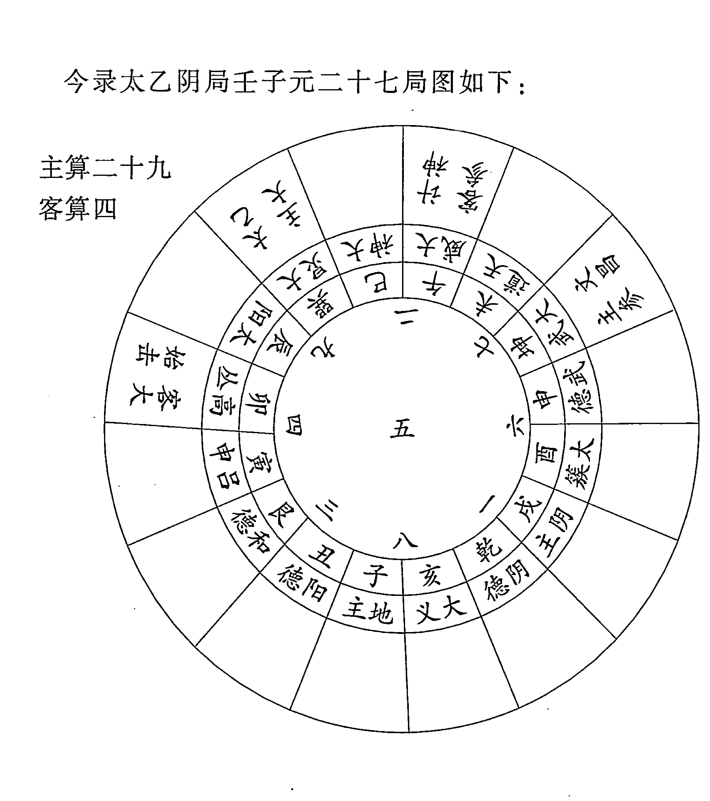

#### 六、太乙起贵人法

此局太乙、主大将在九宫临巽；相当于六壬式地盘巳；主参将在七宫临坤，相当于地盘申；客大将在四宫临卯；客参将在二宫临午。因以六壬式推演，地盘巳为青龙、申为太常、卯为六合、午为天空，所以称“太乙在青龙下，主大将在青龙下，主参将在太常下，客大将在六合下，客参将在天空下”。

(拙著《六壬预测学》中对天乙贵人起法有详述，可参考)

#### 七、太乙十二运

《太乙统宗》载有太乙十二运之说，《荆川稗编》载有胡翰《衡运论》，黄宗羲《易学象数论》中亦引用胡翰《衡运论》并加以论述。可见太乙十二运之说是引起了明清时代的学者们重视的。但是，诸书所论太乙十二运，其基本内容和概念一致，其具体推演方法却不相同，这又形成太乙学说中的一宗疑案。

太乙十二运是以周易系辞中的万物之数——万有一千五百二十作为人类历史的整个阶段，并以周易六十四卦纳入人类历史一万一千五百二十年中，按卦序排列分为十二个具体阶段，称之为太乙十二运。

- 第一运：天地否泰之运。凡七百二十年，对应乾、坤、否、泰四卦；
第二运：男女交亲之运。凡二千一百六十年，对应震、巽、恒、益、坎、离、既济、未济、艮、兑、损、咸十二卦；
第三运：阳晶守政之运。凡一千一百五十二年，对应大壮、无妄、需、讼、大畜、遁六卦；

- 第四运：阴毳权衡之运。凡一千零八年，对应观、升、晋、明夷、萃、临六卦；

- 第五运：资育还本之运。凡九百三十六年，对应豫、复、比、师、剥、谦六卦；

- 第六运：造化符天之运。凡一千二百二十四年，对应小畜、姤、同人、大有、夬、履六卦；

- 第七运：刚中健至之运。凡六百七十二年，对应解、屯、小过、颐四卦；

- 第八运：群愚位贤之运。凡七百六十八年，对应家人、鼎、中孚、大过四卦；

- 第九运：德义顺命之运。凡一千零八十年，对应丰、噬嗑、归妹、随、节、困六卦；

- 第十运：惑妒留天之运。凡一千零八十年，对应涣、井、渐、蛊、旅、贲六卦；

- 第十一运：寡阳相搏之运。凡三百三十六年，对应蹇、蒙二卦；

- 第十二运：物极元终之运。凡三百八十四年，对应睽、革、二卦。

太乙十二运是将六十四卦分成多少不等的十二组，每组代表一个历史时代，每组中的每卦每爻都表示这个历史时代中的一个阶段。六爻组成一卦。由爻代表的历史阶级构成卦代表的一个阶段；由卦代表的历史阶段构成运代表的历史阶段；十二运构成人类历史较长的历史阶段；这个较长的历史阶段用一万一千五百二十年来表示。

三国魏人王弼说：“卦者，时也；爻者，适时之变者也。”（《周易略例》）这是说卦是表示时代的，爻是表示时代中的变化的。今人金景芳在《周易讲座》中对王弼的这句话进行了阐述。他说：一卦表示一个历史时代，一爻表示这个时代中一个历史阶段，我们学习周易六十四卦就是学习历史。王弼和金景芳二家之说与太乙十二运之义有非常相似之处，但是，王弼和金景芳都未阐述卦爻和时代的对应关系，到底六十四卦三百八十四爻各表示什么时代，都未能作出说明，还只是停留在概念上，而太乙十二运却把卦爻和时代对应起来了（其更为具体的对应关系，后面还将详述），至于这样做是否有道理，是否科学，那则是另外一回事。

黄宗羲指出：“胡仲子（指胡翰——引者）列十二运，推明皇帝王霸之升降。其法在太乙书，较之扬子云之卦序，差为整齐，非唐宋以后人所能作也。”（《易学象数论·衡运》）黄氏对太乙十二运及其卦序持肯定态度，并认为这不可能是唐宋之后产生的，而很可能古代就有。当然，黄氏在这里着重肯定太乙十二运卦序。但是，黄宗羲是对北宋邵雍创立的先天卦序持怀疑态度的，他却在这里肯定了太乙卦序，而太乙卦序（此指太乙十二运卦序）与邵雍的先天卦序是有密切联系的（参见拙著《太乙通解》）。（如果，太乙卦序古已有之，那么，先天卦序也并非无源之水。黄宗羲虽为清代易学大家，其仍不免有偏颇之处，我们对此不可不察。）

黄宗羲对太乙十二运及其与历史阶段的对应关系，也给予了肯定。他说，以太乙十二运验证古代历史，

> > “其有然不然者，将以不然者废其然与？则曰：‘何可废也。留其不然以观人事，留其然以观天运，此天人之际也。’”

前人虽然持“天人合一”观，但天运和人事的关系问题是一个非常深奥和复杂的问题，也是我们应当正确理解和应当搞清楚的一个重要问题。周易象数之类的学说所要探讨的主要问题，就是天运和人事的关系问题。

胡翰论“衡运”指出：

> > “十二运，上下万有一千五百二十载。阳来阴往，太乙临之。不浸则不拯，不拯则不复。”又说：“消长得失，治乱存亡，生乎天下之动，拯乎天下之变。纪之以十二运，统之以六十四卦。”

胡翰对太乙十二运与时代的对应更是作了充分的肯定。

不论前人对太乙十二运是肯定还是否定，我们仍应加以探讨研究。因为这是太乙学说中最为关键的一个方面。我们先从其推排方法入手，加以讨论。

《太乙统宗》说：

> > 始于天地，终于物极，一十二运，历万有一千五百二十年。

这是说从天地开辟之初，太乙十二运就开始运行了，至物极元终，十二运才会终止。是否周而复始呢？十二运终于革卦。《统宗》解革卦云：“天运复初，圣人出焉”。由此知十二运终后，是要周而复始的，十二运又可从新开始运行。

> 《太乙统宗·太乙行运入卦纪年》：

上元甲子开辟以来，历代幽远，积数太繁。今截自周敬王四十三年甲子，太乙入第二运男女交亲之震卦初九爻为始，推算录列于后，庶易见焉。

- 周敬王四十三年甲子，太乙入震卦初九爻；
- 周赧王六年壬子，太乙入巽卦初六爻；
- 汉武帝元狩六年甲子，太乙入恒卦初六爻；
- 汉明帝永平七年上元甲子，太乙入益卦初九爻；
- 魏昭陵公正始五年甲子，太乙入坎卦初六爻；
- 晋安帝义熙八年壬子，太乙入未济初六爻；
- 隋文帝仁寿四年上元甲子，太乙入既济初九爻；
- 唐德宗兴元元年甲子，太乙入未济初六爻；
- 宋太祖乾德二年上元甲子，太乙入艮卦初六爻；
- 元太定上元甲子，太乙入损卦初九爻。

按太乙运卦阳爻每爻三十六年，阴爻每爻二十四年。周敬王四十三年甲子岁为公元前477年，周赧王六年壬子岁为公元前309年。

周敬王四十三年甲子岁入太乙运卦震卦初九爻第一年，震卦六爻一百六十八年，周赧王六年壬子（公元前三〇九年）距周敬王四十三年甲子为一百六十八年，所以，正入巽卦初六爻第一年。

今以周敬王四十三年甲子岁入太乙运卦震卦初九爻第一年为始，按太乙运卦纪年，可推得历代帝王纪年入太乙运卦爻之年。

##### （一） 太乙卦运表

第一天地否泰之运 七百二十年

| 乾 | 坤 | 否 | 泰 |
| :--- | :--- | :--- | :--- |
| 甲子 —— | 庚子 —— —— | 戊子 —— | 庚子 —— —— |
| 戊子 —— | 丙子 —— —— | 壬子 —— | 丙子 —— —— |
| 壬子 —— | 壬子 —— —— | 丙子 —— | 壬子 —— —— |
| 丙子 —— | 戊子 —— —— | 壬子 —— —— | 丙子 —— |
| 庚子 —— | 甲子 —— —— | 戊子 —— —— | 庚子 —— |
| 甲子 —— | 庚子 —— —— | 甲子 —— —— | 甲子 —— |
| 二百一十六 | 一百四十四 | 一百八十 | 一百八十 |

###### 第二男女交亲之运 二千一百六十年

| 震 | 巽 | 恒 | 益 |
|---|---|---|---|
| 戊子 — — | 戊子 ———— | 戊子 — — | 戊子 ———— |
| 甲子 — — | 壬子 ———— | 壬子 — — | 壬子 ———— |
| 戊子 ———— | 戊子 — — | 戊子 ———— | 戊子 — — |
| 甲子 — — | 壬子 ———— | 壬子 ———— | 甲子 — — |
| 庚子 — — | 丙子 ———— | 丙子 ———— | 庚子 — — |
| 甲子 ———— | 壬子 — — | 甲子 — — | 甲子 ———— |
| 一百六十八 | 一百九十二 | 一百八十 | 一百八十 |

| 坎 | 离 | 既济 | 未济 |
|---|---|---|---|
| 戊子 — — | 戊子 ———— | 庚子 — — | 戊子 ———— |
| 壬子 ———— | 甲子 — — | 甲子 ———— | 甲子 — — |
| 戊子 — — | 戊子 ———— | 庚子 — — | 戊子 ———— |
| 甲子 — — | 壬子 ———— | 甲子 ———— | 甲子 — — |
| 戊子 ———— | 戊子 — — | 庚子 — — | 戊子 ———— |
| 甲子 — — | 壬子 ———— | 甲子 ———— | 甲子 — — |
| 一百六十八 | 一百九十二 | 一百八十 | 一百八十 |

| 艮 | 兑 | 损 | 咸 |
|---|---|---|---|
| 丙子 ———— | 庚子 — — | 戊子 ———— | 庚子 — — |
| 壬子 — — | 甲子 ———— | 甲子 — — | 甲子 ———— |
| 戊子 — — | 戊子 ———— | 庚子 — — | 戊子 ———— |
| 壬子 ———— | 甲子 — — | 丙子 — — | 壬子 ———— |
| 戊子 — — | 戊子 ———— | 庚子 ———— | 戊子 — — |
| 甲子 — — | 壬子 ———— | 甲子 ———— | 甲子 — — |
| 一百六十八 | 一百九十二 | 一百八十 | 一百八十 |## 第三阳晶守政之运 一千一百五十二年

###### 大壮

- 壬子 — —
- 戊子 — —
- 壬子 ————
- 丙子 ————
- 庚子 ————
- 甲子 ————
- 一百九十二

###### 无妄

- 壬子 ————
- 丙子 ————
- 庚子 ————
- 丙子 — —
- 壬子 — —
- 丙子 ————
- 一百九十二

###### 需

- 丙子 — —
- 庚子 ————
- 丙子 — —
- 庚子 ————
- 甲子 ————
- 戊子 ————
- 一百九十二

###### 讼

- 丙子 ————
- 庚子 ————
- 甲子 ————
- 庚子 — —
- 甲子 ————
- 庚子 — —
- 一百九十二

###### 大畜

- 丙子 ————
- 甲子 — —
- 庚子 — —
- 甲子 ————
- 戊子 ————
- 壬子 ————
- 一百九十二

###### 遁

- 庚子 ————
- 甲子 ————
- 戊子 ————
- 壬子 ————
- 戊子 — —
- 甲子 — —
- 一百九十二

###### 第四阴毳权衡之运 一千零八年

###### 观

- 戊子 ————
- 壬子 ————
- 戊子 — —
- 甲子 — —
- 庚子 — —
- 丙子 — —
- 一百六十八

###### 升

- 戊子 — —
- 甲子 — —
- 庚子 — —
- 甲子 ————
- 戊子 ————
- 甲子 — —
- 一百六十八

###### 晋

- 甲子 ————
- 丙子 — —
- 甲子 ————
- 庚子 — —
- 丙子 — —
- 壬子 — —
- 一百六十八

###### 明夷

- 甲子 —— ——
- 庚子 —— ——
- 丙子 —— ——
- 庚子 ————
- 丙子 —— ——
- 庚子 ————
- 一百六十八

###### 萃

- 壬子 —— ——
- 丙子 ————
- 庚子 ————
- 丙子 —— ——
- 壬子 —— ——
- 戊子 —— ——
- 一百六十八

###### 临

- 庚子 —— ——
- 丙子 —— ——
- 壬子 —— ——
- 戊子 —— ——
- 壬子 ————
- 丙子 ————
- 一百六十八

###### 第五资育还本之运 九百三十六年

###### 豫

- 丙子 —— ——
- 壬子 —— ——
- 丙子 ————
- 壬子 —— ——
- 戊子 —— ——
- 甲子 —— ——
- 一百五十六

###### 复

- 壬子 —— ——
- 戊子 —— ——
- 甲子 —— ——
- 庚子 —— ——
- 丙子 —— ——
- 庚子 ————
- 一百五十六

###### 比

- 戊子 —— ——
- 壬子 ————
- 戊子 —— ——
- 甲子 —— ——
- 庚子 —— ——
- 丙子 —— ——
- 一百五十六

###### 师

- 甲子 —— ——
- 庚子 —— ——
- 丙子 —— ——
- 壬子 —— ——
- 丙子 ————
- 壬子 —— ——
- 一百五十六

###### 剥

- 戊子 ————
- 甲子 —— ——
- 庚子 —— ——
- 丙子 —— ——
- 壬子 —— ——
- 戊子 —— ——
- 一百五十六

###### 谦

- 丙子 —— ——
- 壬子 —— ——
- 戊子 —— ——
- 壬子 ————
- 戊子 —— ——
- 甲子 —— ——
- 一百五十六

###### 第六造化符天之运 一千二百二十四年

###### 小畜

- 戊子 ——
- 壬子 ——
- 戊子 — —
- 壬子 ——
- 丙子 ——
- 庚子 ——
- 二百零四

###### 姤

- 壬子 ——
- 丙子 ——
- 庚子 ——
- 甲子 ——
- 戊子 ——
- 甲子 — —
- 二百零四

###### 同人

- 丙子 ——
- 庚子 ——
- 甲子 ——
- 戊子 ——
- 甲子 — —
- 戊子 ——
- 二百零四

###### 大有

- 庚子 ——
- 丙子 — —
- 庚子 ——
- 甲子 ——
- 戊子 ——
- 壬子 ——
- 二百零四

###### 夬

- 丙子 — —
- 庚子 ——
- 甲子 ——
- 戊子 ——
- 壬子 ——
- 丙子 ——
- 二百零四

###### 履

- 戊子 ——
- 壬子 ——
- 丙子 ——
- 壬子 — —
- 丙子 ——
- 庚子 ——
- 二百零四

###### 第七刚中健至之运 六百七十二年

###### 解

- 戊子 — —
- 甲子 — —
- 戊子 ——
- 甲子 — —
- 戊子 ——
- 甲子 — —
- 一百六十八

###### 屯

- 丙子 — —
- 庚子 ——
- 丙子 — —
- 壬子 — —
- 戊子 ——
- 壬子 ——
- 一百六十八

###### 小过

- 甲子 — —
- 庚子 — —
- 甲子 ——
- 戊子 ——
- 甲子 — —
- 庚子 — —
- 一百六十八

###### 颐

- 庚子 ——
- 丙子 — —
- 壬子 — —
- 戊子 — —
- 甲子 — —
- 戊子 ——
- 一百六十八

###### 第八群愚位贤之运 七百六十八年

| 干支 | 符号 |
|------|------|
| 壬子 | —— |
| 丙子 | —— |
| 壬子 | —— |
| 丙子 | —— |
| 壬子 | —— |
| 丙子 | —— |
| 一百九十二 | |

| 干支 | 符号 |
|------|------|
| 甲子 | —— |
| 庚子 | —— |
| 甲子 | —— |
| 戊子 | —— |
| 壬子 | —— |
| 戊子 | —— |
| 一百九十二 | |

| 干支 | 符号 |
|------|------|
| 丙子 | —— |
| 庚子 | —— |
| 丙子 | —— |
| 壬子 | —— |
| 丙子 | —— |
| 庚子 | —— |
| 一百九十二 | |

| 干支 | 符号 |
|------|------|
| 庚子 | —— |
| 甲子 | —— |
| 戊子 | —— |
| 壬子 | —— |
| 丙子 | —— |
| 壬子 | —— |
| 一百九十二 | |

###### 第九德义顺命之运 一千零八十年

| 干支 | 符号 |
|------|------|
| 庚子 | —— |
| 丙子 | —— |
| 庚子 | —— |
| 甲子 | —— |
| 庚子 | —— |
| 甲子 | —— |
| 一百八十 | |

| 干支 | 符号 |
|------|------|
| 戊子 | —— |
| 甲子 | —— |
| 戊子 | —— |
| 甲子 | —— |
| 庚子 | —— |
| 甲子 | —— |
| 一百八十 | |

| 干支 | 符号 |
|------|------|
| 庚子 | —— |
| 丙子 | —— |
| 庚子 | —— |
| 丙子 | —— |
| 庚子 | —— |
| 甲子 | —— |
| 一百八十 | |

| 干支 | 符号 |
|------|------|
| 庚子 | —— |
| 甲子 | —— |
| 戊子 | —— |
| 甲子 | —— |
| 庚子 | —— |
| 甲子 | —— |
| 一百八十 | |

| 干支 | 符号 |
|------|------|
| 庚子 | —— |
| 甲子 | —— |
| 庚子 | —— |
| 丙子 | —— |
| 庚子 | —— |
| 甲子 | —— |
| 一百八十 | |

| 干支 | 符号 |
|------|------|
| 庚子 | —— |
| 甲子 | —— |
| 戊子 | —— |
| 甲子 | —— |
| 戊子 | —— |
| 甲子 | —— |
| 一百八十 | |

###### 第十惑妒留天之运 一千零八十年

| 涣 | 井 | 渐 |
|---|---|---|
| 戊子 —— | 庚子 —— | 戊子 —— |
| 壬子 —— | 甲子 —— | 壬子 —— |
| 戊子 —— | 庚子 —— | 戊子 —— |
| 甲子 —— | 甲子 —— | 壬子 —— |
| 戊子 —— | 戊子 —— | 戊子 —— |
| 甲子 —— | 甲子 —— | 甲子 —— |
| 一百八十 | 一百八十 | 一百八十 |

| 蛊 | 旅 | 贲 |
|---|---|---|
| 戊子 —— | 戊子 —— | 戊子 —— |
| 甲子 —— | 甲子 —— | 甲子 —— |
| 庚子 —— | 戊子 —— | 庚子 —— |
| 甲子 —— | 壬子 —— | 甲子 —— |
| 戊子 —— | 戊子 —— | 庚子 —— |
| 甲子 —— | 甲子 —— | 甲子 —— |
| 一百八十 | 一百八十 | 一百八十 |

###### 第十一寡阳相搏之运 三百三十六年

| 蹇 | 蒙 |
|---|---|
| 戊子 —— | 甲子 —— |
| 壬子 —— | 庚子 —— |
| 戊子 —— | 丙子 —— |
| 壬子 —— | 壬子 —— |
| 戊子 —— | 丙子 —— |
| 甲子 —— | 壬子 —— |
| 一百六十八 | 一百六十八 |

###### 第十二物极元终之运 三百八十四年

| 睽 | 革 |
|---|---|
| 丙子 —— | 庚子 —— |
| 壬子 —— | 甲子 —— |
| 丙子 —— | 戊子 —— |
| 壬子 —— | 壬子 —— |
| 丙子 —— | 戊子 —— |
| 庚子 —— | 壬子 —— |
| 一百九十二 | 一百九十二 |

上述太乙十二运、六十四卦三百八十四爻，共一万一千五百二十年。第一天地否泰之运，其第一卦为乾卦。乾卦六爻皆为阳爻，每一阳爻三十六年（每一阴爻二十四年），从乾卦初九爻起甲子，经三十六年，至九二爻起庚子，又经三十六年，至九三爻起丙子，又经三十六年，至九四爻起壬子，又经三十六年，至九五爻起戊子，又经三十六年，至上九爻起甲子。上九爻也经三十六年。乾卦共历二百一十六年之后，进入坤卦初六爻，起庚子，经二十四年，至六二爻起甲子，如此累进至坤卦上六爻。坤卦共历一百四十四年。其余各卦仿此类推。

我们根据《统宗》太乙行运人卦爻纪年，周敬王四十三年甲子（公元前477年）入第二男女交亲之运第一卦震卦初九爻第一年，此后历代纪年以此类推，即可知某年入太乙某运某卦某爻，按历史纪年表去依次查取就可以了。当然也可以以距上元甲子（周敬王四十三年）积年，依次递减（从震卦开始）逐卦之数，以余数推出该年入太乙运卦爻。

#### 七、太乙十二运

- 周敬王四十三年甲子岁为公元前477年
- 周赧王六年壬子岁为公元前309年
- 汉武帝元狩六年甲子岁为公元前117年
- 汉明帝永平七年甲子岁为公元64年
- 三国魏帝芳正始五年甲子岁为公元244年
- 晋安帝义熙八年壬子岁为公元412年
- 隋文帝仁寿四年甲子岁为公元604年
- 唐德宗兴元年甲子岁为公元784年
- 宋太祖乾德二年甲子岁为公元964年
- 元泰定帝泰定元年甲子岁为公元1324年。此岁太乙行运入第二男女交亲之运损卦初九爻第一年。继续后推，则是：

- 明弘治十七年甲子岁（公元1504年）太乙运行咸卦初六爻
- 清康熙二十三年甲子岁（公元1684年）太乙运行第三阳晶守政之运大壮卦初九爻第一年
- 清光绪二年丙子岁（公元1876年）太乙运行无妄卦初九爻
- 公元2068年戊子岁太乙运行需卦初九爻

上述为《统宗》所论太乙行运入卦纪年之法。但是，黄宗羲另立太乙行运入卦纪年之法。他说：

> 前四运，皇帝王伯当之。仲子（指胡翰——引者）言犹春之有夏，秋之有冬。康节亦以春夏秋冬配皇帝王霸。春夏既为秋冬，秋冬必复春夏，天运自然。则前四运之为皇帝王霸，后运继之，亦复当然。今四运之后，两运过中，非惟不能复皇帝，即所谓霸者，亦不可得，将秋冬之后，更有别运，天人之际，一往不返者，何耶？

黄宗羲认为，太乙十二运，第一、二、三、四运分别对应皇、帝、王、霸四个历史阶段。古人把三代及其以前的社会历史，划分为皇、帝、王、霸（伯）四个阶段，一般以三皇时代为皇，五帝时代为帝，夏商和西周时代为王，春秋战国时代为霸。北宋邵康节在《皇极经世》中对此论述颇详，可以参考。黄氏并引胡翰所论皇帝王霸“犹春之有夏，秋之有冬”作为依据。今考《荆川稗编》胡翰“衡运论”，胡氏并不主张太乙前四运归属皇帝王霸。胡翰说：

> 皇降而帝，帝降而王，王降而霸，犹春之有夏，秋之有冬也。由皇等而上，始乎有物之始；由霸等而下，终乎闭物之终。消长得失，治乱存亡，生乎天下之动，极乎天下之变。纪之以十二运，统之以六十四卦。

胡氏此论，显然是因袭邵康节以春夏秋冬分别对应皇帝王霸和“天开于子，地辟于丑，人生于寅，闭物于戌”之说。但胡氏并未指出太乙前四运分属皇帝王霸的问题。

黄宗羲为清代儒学大家，其所主当另有依据，待考。

黄氏既主太乙前四运分属皇帝王霸，并立成法推定太乙行运入卦爻之年。他在《易学象数论·衡运》立“推法”曰：

> 周策一万一千五百二十。

> 卦盈差三百。

> 置积年，加卦盈差。满周策去之。余起乾坤否泰之运，累之，即得所入之卦。以入卦年数，阳爻三十六，阴爻二十四，即得所入之爻。

积年，上元甲子至今壬子，作《象数论》之年一千一十五万五千五百八十九年。

按黄宗羲所说“至今壬子”，指康熙十一年壬子岁（公元1762年），其积年数与《太乙局》、《统宗》太乙积年数相一致。

黄宗羲还指出：

> 三代亡而秦始立也，入《萃》上，汉之亡入《复》上，唐之亡入《谦》上，宋之亡入《姤》上，皆为外极之限。

由此可知，黄氏对太乙运卦用其推法进行过验证。东周、汉、唐、宋皆亡于太乙运卦上爻（外极）之限，这是与太乙运卦以“上爻为外极灾变之限”是相符合的。

若以黄宗羲所立太乙运卦推法，则是：

- 明弘治十七年甲子岁（公元1504年）太乙运行第六造化符天之运大有卦初九爻第十三年
- 清康熙二十三年甲子岁（公元1684年）太乙运行大有卦上九爻第二十五年
- 清光绪二年丙子岁（公元1876年）太乙运行夬卦上六爻第一年
- 公元2068年戊子岁太乙运行履卦上九爻第一年

我们不难看出，黄宗羲所立太乙运卦的推法，与《统宗》所立推法相比较，其结果相距甚远。今两存之，以待考。

##### （二）太乙运行卦爻所主

> 《统宗》有“明太乙入运行爻灾变术”，其文曰：
> 经曰：帝王兴衰，年纪否泰，皆阴阳相推，迭相代谢，自然之理也。凡太乙在一卦之中，而行初爻为建功立德之限，上爻为外极灾变之限，惟太乙行二、五爻乃中正平安之限。二为时之正旺，五为时之已过。其六爻之中，察其阴阳得位则政治，阴阳失位则政乱。阳爻有应则君得臣之助，无应君失臣之辅，君臣合则政道亨，君臣乖则政道废。太乙理二爻之时，阳虽失位，天下亦安静和宁，惟临出运之际，国有灾殃。太乙行至五爻，阴阳失位，君弱臣强，后妃、外戚、臣下专政，天下衰亡，以其近于外极之限也。初爻为建功立德之限，太乙所理之时，而有功者革命而相断焉。

《统宗》原文多有印刷脱漏错误之处，其大义如上所述。黄宗羲在其《易学象数论》中对此义论说较为完备。今录于下：

> 《易学象数论·衡运》：
> 胡仲子列十二运，推明皇帝王霸之升降。其法在太一书，较之杨子云之卦序，差为整齐，非唐宋以后人所能作也。以初爻为建功立德之限，三爻为内极灾变之限，四爻为乱后待治之限，上爻为外极灾变之限，二、五爻为中道安平之限。阴阳当位则治，失位则乱；得应则得臣，失应则失臣。太一理二爻之时，阳虽失位，犹可无事，惟临出运之际，国有灾殃。行至五爻，阴居失位，君弱臣强，妃戚专政，衰亡将至，以其近于外极也。初爻之建立功德，若当太一所理，苟非其人，则有革命者起而应之。行内极之限，灾变尚轻，行外极之限，灾变始重。月卦者，小运也，以太一之掩迫察其虚实，以小运定其期，故举其大概。三代亡而秦始立也，入《萃》上，汉之亡入《复》上，唐之亡入《谦》上，宋之亡入《姤》上，皆为外极之限。其有然不然者，将以其不然者废其然与？则曰：“何可废也。留其不然以观人事，留其然以观天运，此天人之际也。”

按《统宗》和黄宗羲之论，就天运而言，太乙运行二爻和五爻为吉，初爻和四爻为次吉，三爻和上爻为凶；就人事而言，太乙运行初爻，若人君无德无道，当为革命者建功立德之时。太乙运行三爻、上爻，虽为灾变之期，若人君有德爱民，亦可化凶为吉。太乙典籍中强调“有道者昌，无道者殃”，与太乙行运并不矛盾。太乙运行卦爻，又有阴阳得位不得位（阳爻居阳位，阴爻居阴位为得位，反之，则为不得位），有应无应以及其灾深灾浅之分。历史时代、帝王纪年与太乙十二运卦爻相对应称为大运，另有月卦称之为小运。大运为天运，是时代的总趋势，小运定日期。另有阳九、百六、大游、小游以及变卦、互卦等相互制约；是非常复杂的。所以，推演太乙十二运卦，验证历史，观察现代，推知未来，是一门深奥的学问，决不是轻而易举的事。其判断的基本原则当如上述。其具体方法，《统宗》中有一段论述：

> 法曰：置即位太乙卦行爻之年，阳爻三十六，阴爻二十四，遇关、囚、掩、迫、格、击、提挟之年，乃有变革兴亡之事，阳九、百六、太阳、阴主会合于出入首尾之年，横暴篡弑之厄必焉。人君只畏天命，修德施仁。《书》云：“皇天无亲，惟德是辅。”欲知创业之主、僭乱之人，以内外卦定之，以变象互体观之，以纳甲干支推之。

> 又曰：
> 兴废所起，观于卦象，取之互变，推以纳甲。纳甲者，甲爻东兵，在齐之分；乙爻东夷；丙爻正南，吴楚；丁爻蛮夷；庚爻正西，秦分之野；辛爻梁益及于西戎；壬爻正北，冀燕之分；癸爻北夷；戊己中原豫州，三河之野。取之名姓，卦象参以纳甲、五音而决之，辰戌丑未戊己为宫，申酉庚辛为商，寅卯甲乙为角，巳午丙丁为征，亥子壬癸为羽。又甲乙配木，丙丁火，庚辛金，壬癸水，戊己土。凡有应有变，变于内者，应乎外，变于外者应乎内，变于下者应乎上，变于上者应乎下，应变之理，阴阳之气，以类相从，自然之理也。

按上述这段话，是以帝王即位之年，既要看太乙行运卦爻，又要参看太乙年局是否关、囚、掩、迫、格、击、提挟，还要参看阳九、百六、太阳、阴主所临，亦要参看大游、小游内外卦象以及变卦、互卦，并且也要参看纳甲干支，由此可推出国祚长短以及创业之君和僭乱之人所起地域方位以及姓名。

###### 《统宗》论“太乙入运行爻变卦术”云：

> 经曰：太乙卦之中各有所变，一爻之内各有所主。若之变得乾有应，则明德之君理于国，无应则僭乱伪主权于世。若之变得坤有应，后妃率政，贵戚臣下之谋，无应则兵变乱寇贼兴。若乾坤二卦变在内卦，事生于内，变在外卦，事生于外。以太乙月卦行运及岁计太乙掩、迫、关、格等详其所发之年。欲知创业之君、僭乱之臣所起方位分野，先以初起卦而定之，次以纳甲而推之，则知其所起方位分野。乾西北，坎正北，艮东北，震正东，巽东南，离正南，坤西南，兑正西。于齐分青州，丑吴越分扬州，寅燕分幽州，卯宋分豫州，辰郑分兖州，巳楚分荆州，午周分三河，未秦分雍州，申晋分益州，酉赵分冀州，戌鲁分徐州，亥卫分并州。以变内外互体相类而推之，以配其姓氏名字也，皆以太乙所在之爻推之。

按上述推演方法，后面还将逐一详述。

##### （三）帝王执政之期

《统宗》有“明太乙行运入卦历数之期”，是推演帝王即位执政期限。其法云：

经云：阳爻其数九，阴爻之数六，皆以四营而成爻之数，若阴阳得位，当以倍数于所立之限；若阴阳失位，当以正数于所立之限。

仍视帝王即位之年，入限之数，以定远近之期。如太乙行至二爻，为时之正旺，其数绵长；三、六之爻为内极外极之限，其数短，初爻、四爻、五爻得位其应数长，失位无应数短。又以运命推之，而知年之限也。

按《统宗》中有帝王执政年数实例，后面将作出分析。

##### （四）太乙流年卦、值事动爻、月卦

《统宗》曰：

经云：欲知太乙流年太岁值卦者，置演上元甲子所求积年，以卦周六十四除之，不尽者，命起首，一数而行一卦，算外即得流年太岁所值之卦。

欲知值事动爻，即是所求之年，阳辰命数阳爻，自下而上，阴神命数阴爻，自上而下。

欲明月内之事，以所得之卦为前六月，所变之爻为后六月，则各上下半年之期也。命自动爻，即子属正月之期，阳爻之策三十有六，阴爻之策二十有四，将其余而补不足，则一爻客算三十而为一月之数也。子寅辰午申戌属阳年，命数阳爻，自下而升，周而复始，不取阴爻，数至爻数而止，即为值事动爻也。丑卯巳未酉亥属阴年，命数阴爻，自上而降，周而复始，不数阳爻，数至岁爻而止，即为值事动爻也。

- 一假如丙午年，置所求以卦六十四除之，外不尽三十一数，即得咸卦为流年卦也。
- 一欲知值事动爻，视流年丙午属阳也，阳用阳爻，自下而升，当从九三爻为始，命起于子，升至九五即见寅。复从九三爻为始，命又至九五即见巳。又复至九三爻，数至午，即系丙午流年所得之卦爻也。乃得咸之萃也。以卦言其事，以爻言其时。

明月内之事，使自九三之爻为正月之子，九四之爻为二月之丑，九五之爻为三月之寅，上六之爻为四月之卯，初六之爻为五月之辰，六二之爻为六月之巳，至此则满咸卦之用也。

次用变卦萃之六三爻为七月之午，九四之爻为八月之未，九五之爻为九月之申，上六之爻为十月之酉，初六之爻为十一月之戌，六二之爻为十二月之亥，以终变卦之用，而为一年之事也。

余皆仿此。五、二得中为上吉，初、四爻次之，忌内极外极之爻，以明卦象而言岁月休咎所主之事也。

按《统宗》求取流年太岁卦、动爻、变卦、每月所对应之爻，其法甚详。流年太岁太乙积年数应以《统宗》所定为准，前已论述。六十四卦序数取后天卦序，即乾卦为一，坤卦为二，屯卦三，蒙卦四……既济卦六十三，未济卦六十四。

一年十二月以子月为首，即一月子、二月丑、三月寅、四月卯、五月辰、六月巳、七月午、八月未、九月申、十月酉、十一月戌、十二月亥。

《统宗》中有“明太乙岁本论建子为正术”（原注：此书梁时所著，故用子为正。）云：“太乙天道之运自子始，年月日时四计皆然。天道自子为始，故太乙自开辟上元甲子以来，岁始于子，终于亥，此天道自然之运。故今夜子时为明日，今年子月自当为明年，故太乙岁月日时四计之数皆始于子，可无疑也。”

今以公元1924年甲子岁为例，推求该年流年卦、值事动爻、变卦以及各月所应之爻：

1924年甲子年太乙距上元积年为10155841。

```
10155841÷64=158685 余 1
```

故知其流年卦为乾(☰)卦，其值事动爻为初九爻，其变卦为姤(䷫)卦。

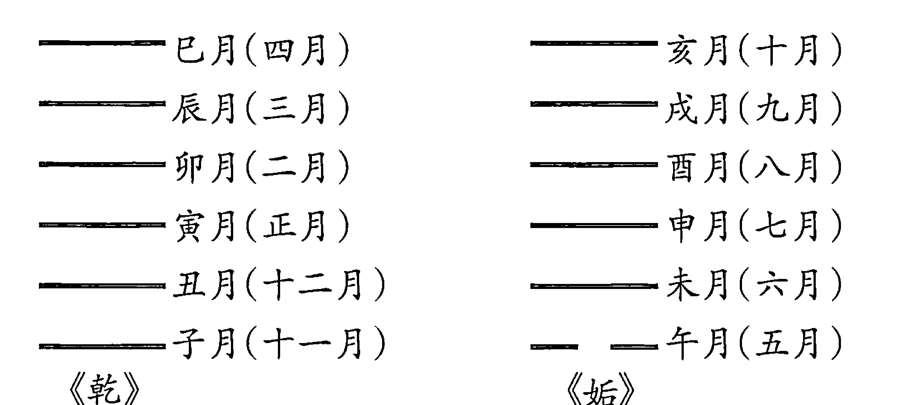

黄宗羲所谓“月卦者，小运也”、“以小运定其期”，就是指太乙流年卦中每月所应之爻。

黄宗羲论太乙流年直卦与《统宗》略有不同。黄氏曰：

> 置积年，满卦周六十四去之。余依周易次序，即得所直之卦。视所求之年，阳辰不取阴爻，以卦内阳爻起子，自下而上，循环数至岁支以为动爻。阴辰不取阳爻，以卦内阴爻起子，自下而上循环数至岁支，以为动爻。起动爻为正月，依次布于六爻。以动爻为变卦，起变爻为七月，亦依次布于六爻。

黄宗羲所论有两点与《统宗》不同。其一：太岁为阴支，以卦内阴爻起子，自下而上循环数至岁支以为动爻，《统宗》则是自上而下循环数至岁支以取动爻。其二：黄氏以本卦动爻起正月为岁首，变卦变爻起七月，《统宗》则是以十一月为岁首。

对这两点不同之处，前一问题有待考证；后者当以《统宗》为是。

#### 八、太乙运卦考

##### （一）前言

太乙十二运分别与《周易》卦爻相对应，其立论、推演和判断，形成完备的体系，这在古代术数著作中绝无仅有的。太乙书中的此内容曾引起古代不少学者的重视。而实际上，太乙运卦向易学界提出并展示了一个重要问题：历史时代（包括年月日时）与《周易》六十四卦三百八十四爻有无具体的对应关系？这个问题在易学史上占有重要地位，也是历代易学家们一直在探讨的一个重要课题。

三国魏人王弼说：

> 卦者，时也；爻者，适时之变者也。①

王弼认为卦是时代，爻是时代中发展变化的阶段。这与《周易》中“卦时”和“爻变”的基本思想是一致的。

> 今人黄寿琪、张善文说：
《周易》六十四卦，每卦各自象征某一事物、现象在特定背景中的产生、变化、发展的规律。伴随着卦义而存在的这种“特定背景”，《易》例称“时”。
六十四卦表示六十四“时”，即塑造出六十四种特定背景，从不同角度喻示自然界、人类社会中某些具有典型意义的事理。每卦六爻的变化情状，均规限在特定的“时”中反映事物发展到某一阶段的规律。因此，阅读六十四卦，不能不把握“卦时”这一概念。②

> 今人金景芳说：
《周易》六十四卦每卦代表一个历史时代，每卦六爻，一爻代表这个时代中的一个发展阶段，我们学习六十四卦，就等于学习历史。③
金氏在这里讲得很清楚，他肯定了卦和爻与时代和时代的发展阶段的对应关系。金氏只是肯定了这个命题，但他却讳言卦和爻与时代的具体对应关系，比如，乾卦对应什么时代？乾卦初九爻对应什么历史阶段？

> 南宋经学大家朱熹说：
六十四卦为其体，三百八十四爻互为其用，远在六合之外，近在一身之中，暂于瞬息，微于动静，莫不有卦之象焉，莫不有爻之义焉。至哉，《易》乎！其道至大而无不包，其用至神而无不存。④

按照朱熹此说，瞬息之细、动静之微都充满卦爻之象和卦爻之义，那么，任何一个历史时代以及任何一个历史阶段，当然都会对应着卦爻之象和卦爻之义。

根据上述，把历史时代与卦和爻相对应起来，是符合《周易》的理论特点和卦爻的象征意义的。古人有关时代与卦爻对应关系的论说散见于历代史书和学术专著。略举数例如下：

> 西汉成帝元延元年（公元前 12 年）七月，北地太守谷永奏说：
陛下承八世之功业，当阳数之标季，涉三七之节纪，遭《无妄》之卦运，直百六之灾厄，三难异科，杂焉同会。⑤

其中“遭《无妄》之卦运”就是讲历史年代与无妄卦相对应的。

> 晋干宝《易传》说：
《乾》之时当尧之世。⑥
南宋朱熹也说：
尧时正是乾卦九五。⑦
朱熹还说：
文王演《易》于羑里，视岐周为西方，正《小畜》之时也。⑧

谷永、干宝和朱熹，都未讲推演依据和推演方法。

《宋史》〈徐复传〉说：

> 庆历初，（复）与布衣郭京俱召见，帝问天时、人事，复对曰：“以京房易卦推之，今年所配年月日时当《小过》也。刚失位而不中，其在疆君德乎？”帝又问明年主何卦。复曰：“乾卦用事”。说至九五尽而止。⑨

徐复所说庆历初年（公元1041年）和二年分别对应《小过》和《乾》，是由京房易卦推来。

《明史》〈黄道周传〉说：

> （崇祯）五年正月，方俟补，（道周）遘疾求去，濒行上疏曰：“臣自幼学《易》，以天道为准，上下载籍二千四百年，考其治乱，百不失一。陛下御极之元年，正当《师》之上六，其爻云：“大君有命，开国承家，小人勿用。”⑩

黄道周（1585—1646），明末著名学者。《明史》称他“学无不通”，著有《易象正》、《三易洞玑》传世。他在《三易洞玑》中，纳天文、历数入于易卦，以《周易》杂卦之序为基础，推演历史年代与易卦的对应关系，以推历代治乱。《四库全书·三易洞玑·提要》说他“其于藏往知来之道，盖非徒托空言者，然旁见侧出，究自为一家之学”。

从上述可以看出，在易卦与时代对应方面，前人已经做了大量工作。而在这方面具有完备体系、自为一家之学的，有北宋邵雍的《皇极经世》、明末黄道周的《三易洞玑》和太乙运卦等。

邵子创立先天易和元会运世学说，撰《皇极经世》千古不朽之作，以“天时验人事，以人事验天时”，堪称研易史上的佼佼者。笔者已撰成《〈皇极经世〉演绎》一书，对邵子之学作了全面介绍，并详细推演了中国古代、现代和未来的历史变迁，对于黄道周的著作和推演方法，拟另撰文介绍，兹不再赘。本文只就太乙运卦的有关问题加以讨论。

##### （二）太乙十二运与六十四卦

南宋张行成说：“自古独太乙之法与《易》为最亲。”其实，太乙式就是推演易卦与历史时代的对应关系的。《南齐书》〈高帝本纪上〉附有史臣述评，以太乙行宫推论自汉高祖五年（公元前202年）至南朝宋顺帝升明三年（公元479年）数百年间治乱兴废的重大史事，由于正史的垂青，“其术遂大显于世”。如果说太乙行宫之法有着浓重的术数学烙印的话，那么，太乙十二运的划分及其所对应的六十四卦（本文称之为“太乙运卦”），则把易卦与时代的关系具体化了，这部分内容殊少数术色彩，而更赋有哲学内涵。元明之际的学者胡翰、明清之际的学者黄宗羲对此都有肯定性的评述。今录胡翰《衡运论》一文，则可窥见太乙运卦之概貌。

皇降而帝，帝降而王，王降而霸，犹春之有夏，秋之有冬也。由皇等而上，始乎有物之始；由霸等而下，终乎闭物之终。消长得失，治乱存亡，生乎天下之动，极乎天下之变。纪之以十二运，统之以六十四卦。

乾，天道也，健而运乎上；坤，地道也，顺而承乎下。天地既判，其气未交为否，既交为泰。始乎乾，讫乎泰，四卦统七百二十年，阳爻三十六，阴爻二十四，每卦所积之数，后仿此。是为天地否泰之运。

乾一索得男而为震，坤一索得女而为巽。震，长男也，巽，长女也，夫妇之道也，始成为恒。既交为益。乾再索得男而为坎，坎，中男也。坤再索得女而为离，离，中女也。中男中女，夫妇之道成，为既济，既交为未济。乾三索得男而为艮，艮，少男也。坤三索得女而为兑，兑，少女也。少男少女，夫妇之道成，为损，既交为咸。十二卦统二千一百六十年，是为男女交亲之运。

男治政于先，女理事以承其后。男之治也，从父之道。大壮也，无妄也，长男从父者也；需也，讼也，中男从父者也；大畜也，遯也，少男从父者也。六卦统一千一百五十有二年，是为阳晶守政之运。女之治也，从母之道。观也，升也，长女从母者也；晋也，明夷也，中女从母者也；萃也，临也，少女从母者也。六卦统一千有八年，是为阴毳权衡之运。

坤，阴也，得阳育而生男；乾，阳也，得阴化而生女。男归于母，女应于父。豫也，复也，长男归母者也；比也，师也，中男归母者也；剥也，谦也，少男归母者也。六卦统九百三十有六年，是为资育还本之运。

小畜也，姤也，长女应父者也；同人也，大有也（应为大有也，同人也——引者），中女应父者也；夬也，履也，少女应父者也。六卦统一千二百二十有四年，是为造化符天之运。

乾、坤父母之道也，必有代者焉。代父者，长男也。从长男者，中男、少男也。解也，屯也，中男从长者也；小过也，颐也，少男从长者也。四卦统六百七十有二年，内外以刚阳治政，是为刚中健至之运。

阳刚之极，阴必行之。代母者，长女也。从长女者，中女、少女也。家人也，鼎也，中女从长者也；中孚也，大过也，少女从长者也。四卦统七百六十有八年，内外以阴柔为治，是为群愚位贤之运。阴随于阳为顺。丰也，噬嗑也，中女从长男者也；归妹也，随也，少女从长男者也；节也，困也，少女从中男者也。六卦统一千八十年，是为德义顺命之运。

阳随于阴为不顺。涣也，井也，中男从长女者也；渐也，蛊也，少男从长女者也；旅也，贲也，少男从中女者也。六卦统一千八十年，是为惑妒留天之运。

长男既息，为男之穷也；长女既息，为女之穷也。于是中男与少男相搏焉。蹇也，蒙也，二卦统三百三十有六年，是为寡阳相搏之运。

阳之搏也，阴必随之，于是中女与少女会焉。睽也，革也，二卦统三百八十四年，是为物极元终之运。

十二运，上下万有一千五百二十载。阳来阴往，太乙临之。不浸则不极，不极则不复。复而与天下更始，非圣人不能也。圣人非天不生也。天生仲尼，当五伯之衰，而不能为太和之春者，何也？时未臻乎革也。仲尼没，继周者为秦，为汉，为晋，为隋，为唐，为宋，垂二千年犹未臻乎革也。泯泯棼棼，天下之生，欲望其为王为帝为皇之世，固君子之所深患也。余闻之广陵秦晓山，乃推明天人之际，皇帝王伯之别，定次于篇。⑫

首尾二节为胡氏的论述，中间十二节是太乙十二运及其所对应的六十四卦，是对《太乙统宗·明太乙行运次序术》的摘编。为了便于分析，今将太乙十二运及其所对应的六十四卦列表如下：

###### 第一 天地否泰之运

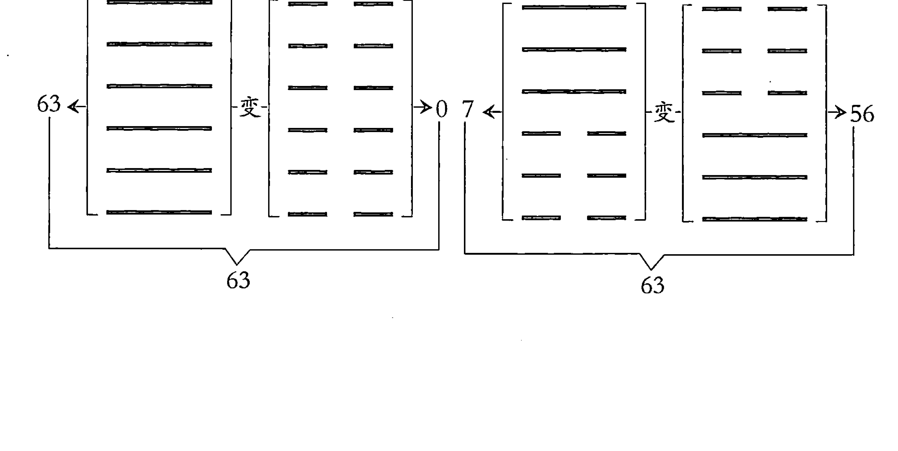

###### 第二 男女交亲之运

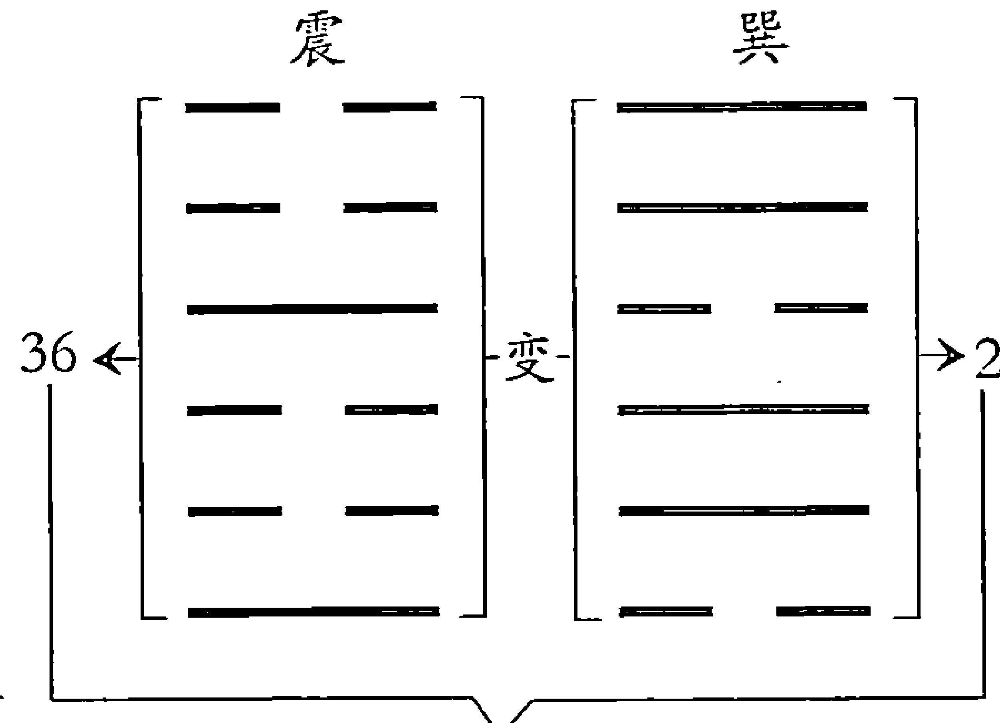

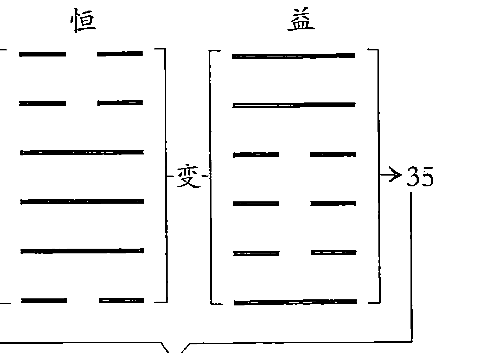

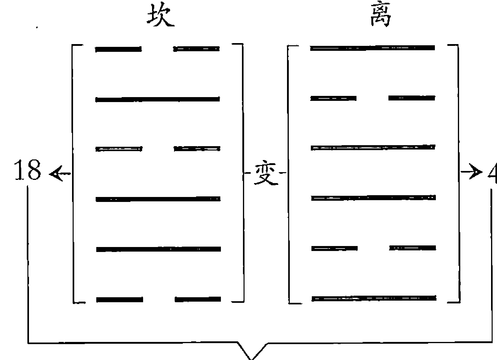

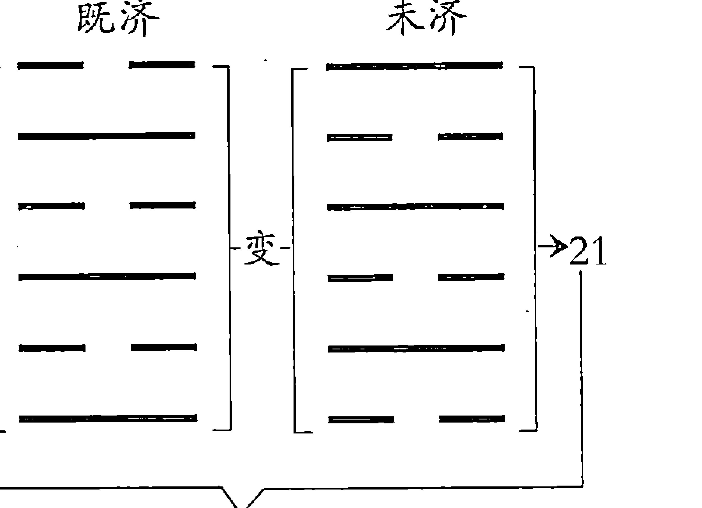

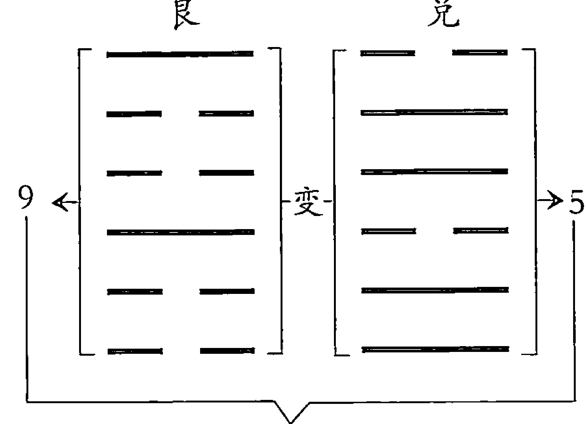

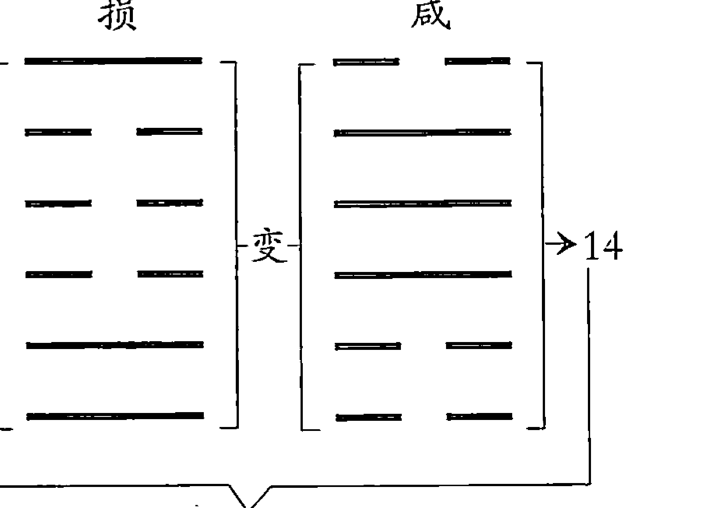

###### 第三 阳晶守政之运

大壮 无妄 (60→39) | 需 讼 (58→23) | 大畜 遁 (60→15)

###### 第四 阴毳权衡之运

观 升 (3→24) | 晋 明夷 (5→40) | 萃 临 (3→48)

###### 第五 资育还本之运

豫 复 (4→32) | 比 师 (2→16) | 剥 谦 (1→8)

###### 第六 造化符天之运

小畜 姤 (3→31) | 大有 同人 (61→47) | 夬 履 (62→55)

###### 第七 刚中健至之运

解 屯 (20→34) | 小过 颐 (12→33)

###### 第八 群愚位贤之运

家人 鼎 (43→29) | 中孚 大过 (51→30)

###### 第九 德义顺命之运

丰 噬嗑 (6→38) | 归妹 随 (64→27) | 节 困 (50→54)

###### 第十 惑妒留天之运

涣 井 (45→59) | 渐 蛊 (44→28) | 旅 贲 (52→26)

###### 第十一 寡阳相搏之运

蹇 蒙 (5→12)

###### 第十二 物极元终之运

睽 革 (49→53)

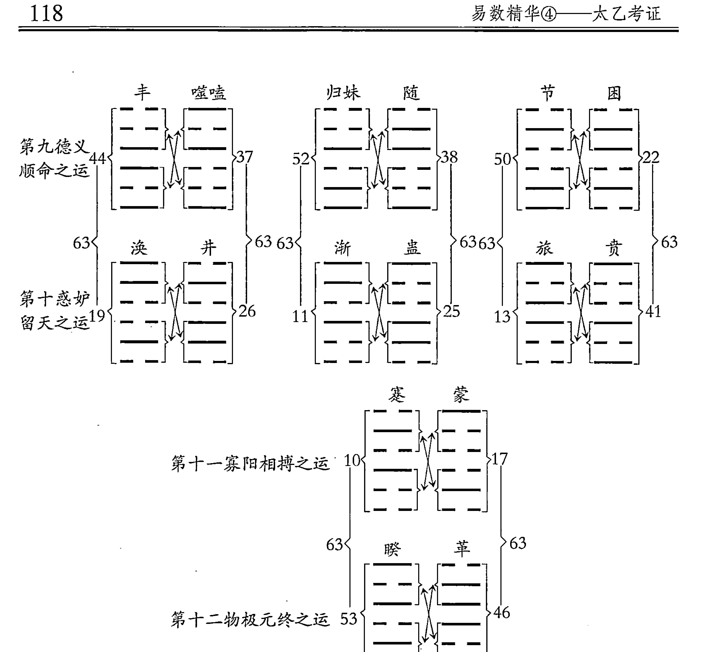

太乙十二运所对应的六十四卦呈现出整然有序的排列形式，这就产生了太乙十二运卦卦序，本文称之为太乙卦序。太乙卦序与先天卦序、今本《周易》卦序、帛《易》卦序，京房八宫卦序都不相同。我们从上表中可以看出如下几个特点：

+   （一）每相邻二运，即第一运和第二运、第三运和第四运、第五运和第六运、第七运和第八运、第九运和第十运、第十一运和第十二运，在所对应的卦象上有内在联系。除第一运与第二运外，其他相邻二运所对应的易卦也呈现对应形式。

+   （二）第一运和第二运，每相邻二卦阴阳爻正好相反，而相邻二卦二进位数之和皆为63。如乾和坤为相邻二卦，乾卦六个阳爻，坤卦则是六个阴爻；乾卦二进位数为63，坤卦二进位数为0，二卦之和为63。否和泰为相邻二卦，否卦上三爻为阳下三爻为阴，泰卦则是上三爻为阴下三爻为阳，否卦二进位数为7，泰卦二进位数为56，二卦之和为63。震和巽、恒和益、坎和离、既济和未济、艮和兑、损和咸，其特点皆与上同。

（三）第三运至第十二运，其卦序排列是每相邻二卦的上下卦互相交换。如大壮与无妄为相邻二卦，大壮卦上卦震下卦乾，无妄卦则是上卦乾下卦震。其余每相邻二卦可仿此类推。

（四）第三运和第四运各有六卦，第三运的各卦分别与第四运各卦相互对应。如第三运第一卦大壮卦与第四运第一卦观卦相互对应，大壮卦与观卦阴阳爻正好相反，而大壮二进位数为60，观卦二进位数为3，二卦之和为63。其他二运之间各相互对应的卦也同此特点。

唐人孔颖达针对今本《周易》六十四卦的编排方式以“二二相耦，非覆即变”的话作过概括说明。“二二相耦”是以每二卦为一组，“非覆即变”是说这二卦的卦画互“变”或互“覆”。孔氏此论也正好符合太乙卦序的特点。

北宋邵雍有“十六事卦”之说。其《大易吟》曰：

> > 乾坤定位，否泰反类；
> 山泽通气，损咸见义；
> 雷风相薄，恒益起意；
> 水火相射，既济未济；
> 四象相交，成十六事；
> 八卦相荡，为六十四。

由这首诗引出的“十六事卦”（乾、坤、否、泰、艮、兑、损、咸、震、巽、恒、益、坎、离、既济、未济）与太乙第一、二运的十六卦完全相同。这十六卦分布在“先天六十四卦方图”的两条对角线上，并且呈现对称之势。若把太乙十二运所对应的六十四卦，依次纳入“先天六十四卦方图”，其运行轨迹完全成对称之势。这说明太乙卦序同“先天六十四卦方图”有密切的渊源关系。

##### （三）太乙运卦的推演方法

太乙六十四卦分布于十二运，构成“天人相应”的立体框架，任何过去或未来的历史年代都可以纳入这个框架之中。我国古代以干支纪年，其元首为甲子岁，所以第一运第一卦第一爻（乾卦初九爻）起第一甲子年。按照《周易》通例，阳爻三十六策，阴爻二十四策，所以太乙运卦中阳爻每爻管三十六年，阴爻每爻管二十四年。六十四卦共有三百八十四爻，阴阳爻各半，共有一万二千五百二十策，以当万物之数，所以太乙运卦也以一万二千五百二十年为一个周期。太乙运卦编年表如下：

###### 第一天地否泰之运 七百二十年

| 卦名 | 各爻起始年（干支） | 年数（年） |
| :--- | :--- | :--- |
| **乾** | 甲子、戊子、壬子、丙子、庚子、甲子 | 二百一十六 |
| **坤** | 庚子、丙子、壬子、戊子、甲子、庚子 | 一百四十四 |
| **否** | 戊子、壬子、丙子、壬子、戊子、甲子 | 一百八十 |
| **泰** | 庚子、丙子、壬子、丙子、庚子、甲子 | 一百八十 |

###### 第二男女交亲之运 二千一百六十年

| 卦名 | 各爻起始年（干支） | 年数（年） |
| :--- | :--- | :--- |
| **震** | 戊子、甲子、戊子、甲子、庚子、甲子 | 一百六十八 |
| **巽** | 戊子、壬子、戊子、壬子、丙子、壬子 | 一百九十二 |
| **恒** | 庚子、丙子、庚子、甲子、戊子、甲子 | 一百八十 |
| **益** | 戊子、壬子、戊子、甲子、庚子、甲子 | 一百八十 |
| **坎** | 戊子、壬子、戊子、甲子、戊子、甲子 | 一百六十八 |
| **离** | 戊子、甲子、戊子、壬子、戊子、壬子 | 一百九十二 |
| **既济** | 庚子、甲子、庚子、甲子、庚子、甲子 | 一百八十 |
| **未济** | 戊子、甲子、戊子、甲子、戊子、甲子 | 一百八十 |

###### 第三阳景守政之运 一千一百五十二年

###### 大壮

- 壬子
- 戊子
- 壬子
- 丙子
- 庚子
- 甲子
- 一百九十二

###### 无妄

- 壬子
- 丙子
- 庚子
- 丙子
- 壬子
- 丙子
- 一百九十二

###### 需

- 丙子
- 庚子
- 丙子
- 庚子
- 甲子
- 戊子
- 一百九十二

###### 讼

- 丙子
- 庚子
- 甲子
- 庚子
- 甲子
- 庚子
- 一百九十二

###### 大畜

- 丙子
- 甲子
- 庚子
- 甲子
- 戊子
- 壬子
- 一百九十二

###### 遁

- 庚子
- 甲子
- 戊子
- 壬子
- 戊子
- 甲子
- 一百九十二

###### 第四阴蠢权衡之运 一千八年

###### 观

- 戊子
- 壬子
- 戊子
- 甲子
- 庚子
- 丙子
- 一百六十八

###### 升

- 戊子
- 甲子
- 庚子
- 甲子
- 戊子
- 甲子
- 一百六十八

###### 晋

- 甲子
- 丙子
- 甲子
- 庚子
- 丙子
- 壬子
- 一百六十八

###### 明夷

- 甲子
- 庚子
- 丙子
- 庚子
- 丙子
- 庚子
- 一百六十八

###### 萃

- 壬子
- 丙子
- 庚子
- 丙子
- 壬子
- 戊子
- 一百六十八

###### 临

- 庚子
- 丙子
- 壬子
- 戊子
- 壬子
- 丙子
- 一百六十八

###### 第五资育还本之运 九百三十六年

###### 豫

- 丙子
- 壬子
- 丙子
- 壬子
- 戊子
- 甲子
- 一百五十六

###### 复

- 壬子
- 戊子
- 甲子
- 庚子
- 丙子
- 庚子
- 一百五十六

###### 比

- 戊子
- 壬子
- 戊子
- 甲子
- 庚子
- 丙子
- 一百五十六

###### 师

- 甲子
- 庚子
- 丙子
- 壬子
- 丙子
- 壬子
- 一百五十六

###### 剥

- 戊子
- 甲子
- 庚子
- 丙子
- 壬子
- 戊子
- 一百五十六

###### 谦

- 丙子
- 壬子
- 戊子
- 壬子
- 戊子
- 甲子
- 一百五十六

###### 第六造化符天之运 一千二百二十四年

###### 小畜

- 戊子
- 壬子
- 戊子
- 壬子
- 丙子
- 庚子
- 二百四

###### 姤

- 壬子
- 丙子
- 庚子
- 甲子
- 戊子
- 甲子
- 二百四

###### 大有

- 庚子
- 丙子
- 庚子
- 甲子
- 戊子
- 壬子
- 二百四

###### 同人

- 丙子
- 庚子
- 甲子
- 戊子
- 甲子
- 戊子
- 二百四

###### 夬

- 丙子
- 庚子
- 甲子
- 戊子
- 壬子
- 丙子
- 二百四

###### 履

- 戊子
- 壬子
- 丙子
- 壬子
- 丙子
- 庚子
- 二百四

###### 第七刚中健至之运 六百七十二年

###### 解

- 戊子
- 甲子
- 戊子
- 甲子
- 戊子
- 甲子
- 一百六十八

###### 屯

- 丙子
- 庚子
- 丙子
- 壬子
- 戊子
- 壬子
- 一百六十八

###### 小过

- 甲子
- 庚子
- 甲子
- 戊子
- 甲子
- 庚子
- 一百六十八

###### 颐

- 庚子
- 丙子
- 壬子
- 戊子
- 甲子
- 戊子
- 一百六十八

###### 第八群愚位贤之运 七百六十八年

###### 家人

- 壬子
- 丙子
- 壬子
- 丙子
- 壬子
- 丙子
- 一百九十二

###### 鼎

- 甲子
- 庚子
- 甲子
- 戊子
- 壬子
- 戊子
- 一百九十二

###### 中孚

- 丙子
- 庚子
- 丙子
- 壬子
- 丙子
- 庚子
- 一百九十二

###### 大过

- 庚子
- 甲子
- 戊子
- 壬子
- 丙子
- 壬子
- 一百九十二

###### 第九德义顺命之运 一千八十年

###### 丰

- 庚子
- 丙子
- 庚子
- 甲子
- 庚子
- 甲子
- 一百八十

###### 噬嗑

- 戊子
- 甲子
- 戊子
- 甲子
- 庚子
- 甲子
- 一百八十

###### 归妹

- 庚子
- 丙子
- 庚子
- 丙子
- 庚子
- 甲子
- 一百八十

###### 随

- 庚子
- 甲子
- 戊子
- 甲子
- 庚子
- 甲子
- 一百八十

###### 节

- 庚子
- 甲子
- 庚子
- 丙子
- 庚子
- 甲子
- 一百八十

###### 困

- 庚子
- 甲子
- 戊子
- 甲子
- 戊子
- 甲子
- 一百八十

###### 第十惑妒留天之运 一千八十年

| 涣 |
| --- |
| 戊子 |
| 壬子 |
| 戊子 |
| 甲子 |
| 戊子 |
| 甲子 |
| 一百八十 |

| 井 |
| --- |
| 庚子 |
| 甲子 |
| 戊子 |
| 甲子 |
| 戊子 |
| 甲子 |
| 一百八十 |

| 渐 |
| --- |
| 戊子 |
| 壬子 |
| 戊子 |
| 壬子 |
| 戊子 |
| 甲子 |
| 一百八十 |

| 蛊 |
| --- |
| 戊子 |
| 甲子 |
| 庚子 |
| 甲子 |
| 戊子 |
| 甲子 |
| 一百八十 |

| 旅 |
| --- |
| 戊子 |
| 甲子 |
| 戊子 |
| 壬子 |
| 戊子 |
| 甲子 |
| 一百八十 |

| 贲 |
| --- |
| 戊子 |
| 甲子 |
| 庚子 |
| 甲子 |
| 庚子 |
| 甲子 |
| 一百八十 |

###### 第十一寡阳相搏之运 三百三十六年

| 蹇 |
| --- |
| 戊子 |
| 壬子 |
| 戊子 |
| 壬子 |
| 戊子 |
| 甲子 |
| 一百六十八 |

| 蒙 |
| --- |
| 甲子 |
| 庚子 |
| 丙子 |
| 壬子 |
| 丙子 |
| 壬子 |
| 一百六十八 |

###### 第十二物极元终之运 三百八十四年

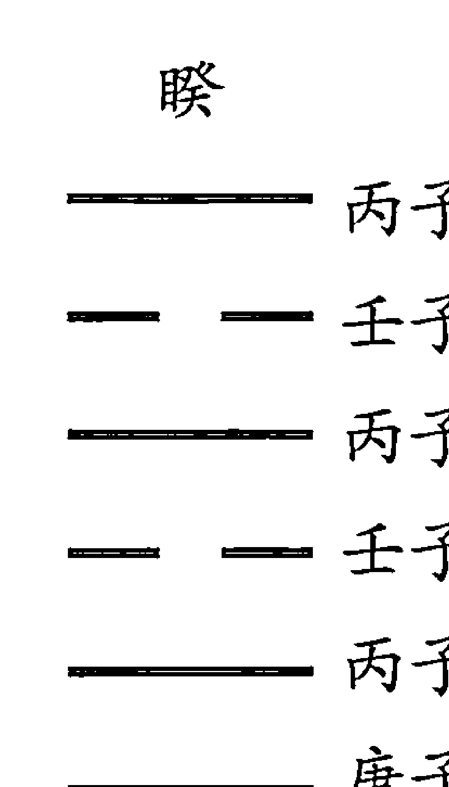

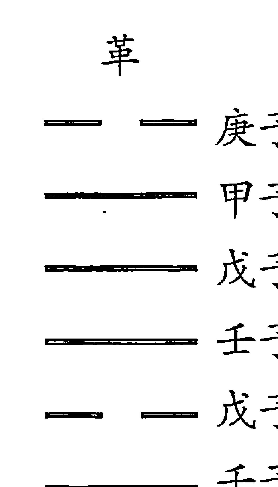

太乙运卦编年的具体推演方法，则以太乙积年为基数，加卦盈差三百，累减周策一万一千五百二十，余数则为该年入运之年数。再从该年入运之年数，递减第一运、第二运……所历之年，即得该年所入之运。以入运之年数，递减该运之第一卦、第二卦……所历之年，余数为入卦之年。以入卦之数，阳爻减三十六，阴爻减二十四（自下而上），即得该年所入之爻。¹⁵

[例一]，公元 1924 年岁次甲子，太乙积年为 10155841（此前每岁减 1，此后每岁加 1），求该年所入太乙之运、卦、爻。

(10155841+300) -11520×881
=10156141-10149120
=7021

这就表示太乙运行 881 个周期后尚余 7021 年。此为入太乙运之年。

7021-720-2160-1152-1008-936
=1045

减去第一运、第二运、第三运、第四运、第五运所历之年，尚余1045年，即该年入第六运已1045年。此为入运之数。

1045-204-204-204-204-204
=25

以入运之数，减去该运小畜、姤、大有、同人、夬共五卦所历之年，尚余25。这样就得出了答案：

公元1924年岁次甲子入太乙第六运履卦初九爻第25年。

查运卦编年表，第六运履卦初九爻第一年为庚子年，其第25年正为甲子年。所以，经验证这个答案是正确的。

[例二] 隋文帝仁寿四年岁次甲子（公元604年）所入太乙运、卦、爻。其年太乙积年为10154521。

（10154521+300）-11520×881
=10154821-10149120
=5701

5701-720-2160-1152-1008=661

该年入第五运661年。

661-156-156-156-156=37

该年入第五运剥卦第37年。

37-24=13

隋文帝仁寿四年岁次甲子入太乙第五运剥卦六二爻第13年。

查太乙运卦编年表，剥卦六二爻第一年为壬子，壬子至甲子正是13年。所以，这个答案是正确的。

另外，还有太乙流年卦、月卦、日卦、时卦的推演方法，以流年卦、月卦、日卦、时卦定灾变之期。拙作《太乙通解》对此有详述，兹不再赘。⑯

太乙运行卦爻吉凶灾变的判断方法，其大略是：

以初爻为建功立德之限，三爻为内极灾变之限，四爻为乱后待治之限，上爻为外极灾变之限，二爻和五爻为中道安平之限。阴阳当位则治，失位则乱；得应则得臣，失应则失臣。太乙理二爻之时，阳虽失位，犹可无事，惟临出运之际，国有灾殃。行至五爻，阴居失位，君弱臣强，妃戚专政，衰亡将至，以其近于外极也。初爻之建立功德，若当太乙所理，苟非其人，则有革命者起而应之。行内极之限，灾变尚轻，行外极之限，灾变始重。

月卦者，小运也，以太乙之掩迫察其虚实，以小运定其期，放举其大概。⑰

太乙阴阳遁各七十二局，主要是推演治乱兴衰的，可与太乙运卦互相参看。

《太乙数统宗大全》对于太乙运卦的推演方法与前述不同，其《明太乙运行入卦纪年术》云：

> 上元甲子开辟以来，历代幽运，积数繁索，今截自周敬王四十三年甲子入太乙第二运，男女交亲之震卦初九爻为始，推算录列于后，庶易见焉。

- 周敬王四十三年甲子，太乙入震卦初九爻；
- 周赧王六年壬子，太乙入巽卦初六爻；
- 汉武帝元狩六年甲子，太乙入恒卦初六爻；
- 汉明帝永平七年上元甲子，太乙入益卦初九爻；
- 魏昭陵公正始五年甲子，太乙入坎卦初六爻；
- 晋安帝义熙八年壬子，太乙入离卦初九爻；
- 隋文帝仁寿四年上元甲子，太乙入既济初九爻；
- 唐德宗兴元元年甲子，太乙入未济初六爻；
- 宋太祖乾德二年上元甲子，太乙入艮卦初六爻；
- 元泰定帝泰定元年上元甲子，太乙入损卦初九爻。

此与黄宗羲所述推演方法所推结果不符。但《太乙数统宗大全》中未介绍太乙运卦编年的推演方法，只列有上述推演结果。姑两存之，以待有新的资料出现后加以考证。

##### （四） 结论

一、太乙运卦既有立论依据，又有完备的结构框架、推演方法和判断标准，它源于《周易》，而又自成体系，是“欲以究天人之际，通古今之变，成一家之言”的大手笔之作，不得以祀祥小数视之。太乙书中的此内容，起源尚古，现已濒于失传，这就更值得珍视。黄宗羲说：太乙运卦“较之扬子云之卦序，差为整齐，非唐宋以后人所能作也”。⑱《太乙数统宗大全》卷三〈明太乙岁本论建子为正术〉注云：“此书梁时所著，故用子为正。”此注可以为黄氏“非唐宋以后人所能作”的佐证。

二、太乙运卦整然有序地编排，表明历史时代螺锭式的运动轨迹。以第一运的乾、坤、否、泰而论，乾代表天，坤代表地，否卦上天下地，泰卦上地下天。乾为纯阳，坤纯阴，天地游离之象，但阳为阴之父，阴为阳之母，纯阳中含有阴基，纯阴中含有阳根，看似纯阳纯阴，而阳阴的生机未断，故能生长发展，至否卦，阴阳已纳入同一秩序之中，只是乾在上坤在下，天地不交通，但较之乾、坤二卦，已经是前进了。泰卦，在上之天气下降，在下之地气上升，故为上坤下乾之象，表示天地之交通，这较之否卦，则又前进了。次后的男女交亲之运，直至最末的物极元终之运，各运所对应的卦爻，都能说明这一秩序。这就是历史时代螺锭式轨迹。

还可以用辩证唯物论中“肯定——否定——否定之否定”的基本规律相对照：乾（☰）卦六阳是最初的肯定，坤（☷）卦六阴则是对乾卦的否定，否（䷋）卦则是否定之否定。否（䷋）卦上卦三阳是对坤卦的否定，而同时又是对最初的乾卦的肯定。否（䷋）卦下卦三阴是对乾卦的否定，而同时又是对坤卦的肯定。泰（䷊）卦是对否卦的否定之否定，但较之否卦又高出一个层次。就哲学意义上看，太乙运卦“肯定——否定——否定之否定”的公式更富有深刻的内涵。

三、胡翰和黄宗羲对太乙运卦的论述皆以“衡运”名篇（在此之前以及太乙书中皆无“衡运”的提法），这是不无深意的。历史就是由不平衡到相对平衡，再由相对平衡到不平衡。今以太乙运卦的二进位数而论。乾为 63，坤为 0，否为 7，泰为 56，乾、坤、否、泰各自作为一个历史阶段来看，是不平衡的。乾和坤之和为 63，否和泰之和也是 63。把乾和坤看作一个阶段，否和泰看作一个阶段，则这两个较大的阶段又是平衡的。此后各运亦可以作出类似上述特点的分析。所以，胡、黄二氏取其宏观上平衡之义，以“衡运”而定名。我们可以从“衡运”之名以及太乙运卦符号系统所对应的二进位数出发，挖掘其中所蕴涵的更加深层的哲学意义。

四、太乙运卦是对天人相应观的形象表述。以太乙运卦推求历代之治乱兴废，有验有不验。黄宗羲特别论述了这一问题。他指出：

> 三代亡而秦始立也，入《萃》上，汉之亡入《复》上，唐之亡入《谦》上，宋之亡入《姤》上，皆为外极之限。其有不然者，将以不然者废其然与？则曰：“何可废也。留其不然以观人事，留其然以观天运，此天人之际也。” ⑲

历史上的治乱兴废，与天运有关，也与人事有关。太乙书中有一条重要原则：太乙考治人君之善恶，临有道之国则昌，临无道之国则亡。《游宦纪闻》引王湜之论说：

> 以尧、舜、禹为君臣，文、武、周公为父子，虽遇阳九、百六之数，越理而降以祸，必不其然。

大抵天下之事，因缘积累，固有系于人事，未必尽由天理。通天地人曰儒，通天地而不通人曰技，拘然执此以为不可改易，乃术士之蔽，非儒者之通论。㉑

王湜的观点与黄宗羲之论是一致的。太乙运卦既表天时，也表人事，其与人事有验与不验，也属正常情况，我们也就不必苛求了。

**注释：**

1、王弼《周易略例》。
2、黄寿琪、张善文《周易译注》，上海古籍出版社，1989，页 41。
3、金景芳《周易讲座》，吉林大学出版社，1988，页 34。
4、朱熹《周易本义》〈周易序〉，天津市古籍书店，1988。
5、《前汉书》〈谷永传〉，卷 85。
6、转引自《皇极经世绪言》，善成堂发刊，嘉庆四年九月。
7、王植《皇极经世书解》（《四库术数类丛书》，上海古籍出版社，1990）页 805—284。
8、同注 4，页 89。
9、《宋史》卷 457，〈徐复传〉。
10、《明史》卷255，〈黄道周传〉。
11、张行成《易通变》卷13，页804—350，（同注7）
12、转引自黄宗羲《易学象数论》卷六，页270，（《黄宗羲全集》第九册，浙江古籍出版社，1992）。
13、转引自刘大钧《周易概论》，齐鲁书社，1988，页24。
14、邵雍《伊川击壤集》，页226（《康节说易》，中州古籍出版社，1993）。
15、参见黄宗羲《易学象数论》，页277。此与《太乙数统宗大全》所述之推演方法不同。
16、拙著《太乙通解》，甘肃人民出版社，1993。
17、同注15，页269。
18、同上。
19、同上。
20、转引自《中国方术全书》下册，〈术数部新杂录〉，上海文艺出版社，1993。

#### 九、大游

大游有大游太乙和大游轨运卦象之分。大游太乙与大游轨运卦象是两个意义不同的概念，不可混为一谈。大游太乙巡行八宫，不入中五，三十六年考治一宫，十二年理天，十二年理地，十二年理人，考较人君之善恶而行其罚。大游轨运卦象与太乙十二运有密切关系，可用以推论“帝王应天授时始终之期”。《统宗》云：“夫大游轨运象卦观历数者，乃帝王应天授时始终之期也。古考之靡不精贯符契。昔圣人之演数也，极深研几，穷神之化，经济天下，莫不一定于自然之数。古之遗经虽好，多秘而不露，唐李淳风表而出之，轨入图影，推占灵祥，义其取夫大游统行六十四卦，临于三百八十四爻，有理有数有象，有象必有卦，有卦必有经纬，经纬错综，以成观历之大义也。”又云：“因理而得数，因数而藏象，因象而生爻，爻有飞伏，卦有隐显，更迭用事，以用为主，故以大游为体，以爻为用，循环无端，周流不息。无体则用不能自见，无用则体而不能独立，是以常以立体，变以致用，大游轨运而行其中也。”这似乎是说明，大游轨运卦象之法古已有之，只是古籍对此“秘而不露”，经唐代李淳风才发掘表彰出来。但是，李淳风的原文已经查不到了，我们现在只以太乙书中的有关论述为依据，加以推演。

大游太乙的推演方法，太乙诸书皆有论述，而且基本一致。大游轨运卦象，《太乙统宗》和《易学象数论》二书中有论述，今仅就此二书所论，对大游轨运卦象加以讨论。

###### 大游卦法

###### 内卦

> 《统宗》云：

置演上元甲子至所求积年，加宫盈差三十四，以大游大周法二千八百八十除之，不尽，以小周法二百八十八去之，不尽，为宫卦余，以宫率三十六约之而一，所求为宫卦，不满，为入宫卦以来年数。其卦数命起七宫卦为首，顺行八宫，不入中五，算外即得大游太乙所在宫卦及年数，就命为内卦也。

> 《易学象数论·大游卦法》：

- 一宫乾、二宫离、三宫艮、四宫震、六宫兑、七宫坤、八宫坎、九宫巽。中五不入。
- 宫周二百八十八。
- 宫率三十六。
- 宫盈差三十四。
- 置积年，加宫盈差，满宫周去之。余以宫率而一。起七宫坤，顺行八宫，即为内卦。其不满宫率者，是入卦年数。

###### 外卦

> 《统宗》云：
置大游所求积年，加宫盈差三十四，以大游天数轨运六十四卦大周法六百四十除之，不尽，以入卦小周法八十去之，不尽为卦周余。以大游行卦率一十约之而一，所得为卦数，不满为入卦以来年数。命起顺坤、坎、巽、乾、离、艮、兑、震，每十年一易，算外即得大游太乙天数所得及年数，命起之为外卦。

> 《易学象数论·大游卦法·外卦》：
- 六十四卦周六百四十。
- 八卦周八十。
- 卦率一十。
- 置积年，加宫盈差，满六十四卦周去之。不尽，满八卦周去之。余以卦率而一，起七宫坤，顺行八卦，不满卦率者是入卦年数，即为外卦。

以内外相重，得值运之卦。

###### 动爻

> 《统宗》

凡取动爻，以大游入内卦三十六年均分之，则六年行一爻矣。视大游当年入内卦浅深以明之。

假令入内卦之年自一至六取初爻为动爻，自七至十二取二爻为动爻，自十三至十八则第三爻而为动爻，以此为例。如入内卦得三十一年，即（动爻）在上爻也。

> 《易学象数论·大游卦法·动爻》：

大游入内卦三十六年，均分于重卦之六爻，则六年行一爻。视当下入内卦以来年数，自一至六，初为动爻；自七至十二，二为动爻；十三至十八，三为动爻；十九至二十四，四为动爻；二十五至三十，五为动爻；三十一至三十六，上为动爻。

以上大游卦法，内卦、外卦、动爻的推演方法，《统宗》与《易学象数论》二家之说完全相同。

#### 十、大游卦法起例

公元 1924 年岁次甲子，距上元积年为 10155841，大游轨运内卦、外卦、动爻推演如下：

```
10155841+34=10155875
10155875÷2880=3526……
3526×2880=10154880
10155875-10154880=995
995÷288=3 余 131
131÷36=3 余 23
```

据此可知，大游轨运内卦经坤七宫三十六年、坎八宫三十六年、巽九宫三十六年，进入乾一宫第二十三年。

所以，乾卦为内卦。

```
10155841+34=10155875
10155875÷640=15868 余 355
355÷80=4 余 35
```

```
35÷10=3余5
```

据此可知，大游轨运外卦，经坤七宫十年、坎八宫十年、巽九宫十年，进入乾一宫第五年。

所以，乾卦为外卦。

至此，公元1924年甲子岁内卦为乾☰卦、外卦为乾☰卦、内外卦已具备，所以其轨运卦象为重乾(䷀)卦。

公元1924年岁次甲子，大游入内卦乾卦二十三年，故知其轨运重乾(䷀)卦九四为动爻。九四爻由阳变阴，其变卦为小畜(䷈)卦。

按大游轨运内卦与大游太乙的推演方法相同。只是大游轨运取卦，大游太乙取宫，而且卦与宫是相对应的。一宫乾、二宫离、三宫艮、四宫震、六宫兑、七宫坤、八宫坎、九宫巽。

> 《统宗》和《易学象数论》二书所论大游轨运内卦、大游太乙的起法皆是距上元甲子积年加盈差三十四，然后除以大游大周法二千八百八十，余数再除以二百八十八，仍有余数，再除以三十六（商数皆取整数），若还有余数，为入宫（卦）以来年数。

大游入宫卦每宫三十六年，运行一周八宫卦为二百八十八年，所以，大游大周法为二千八百八十（十周），小周法为二百八十八（一周），这是显而易见的。

为什么距上元甲子积年数要加宫盈差（卦盈差）三十四呢？《统宗》和《易学象数论》都未讲清三十四的来历。如果我们再不解析这个问题，对于我们的后人来说，这个问题很可能成为千古之谜。

其实，这个问题并不难解决。

《统宗》全书各篇章只取一个统一的积年数，即距上古上元甲子的积年数（《易学象数》所取积年数与《统宗》同），而计算大游太乙却要从上元甲子年之前的庚寅年入七宫坤卦算起，庚寅至甲子相隔三十四位，所以距上古上元甲子的积年数要加上三十四才是大游太乙的上元。这就是盈差三十四的来历。

> 《统宗》有实例云：“后唐明宗长兴元年庚寅岁，大游入七宫梁益分”。

查后唐明宗长兴元年庚寅岁为公元930年，其距上古上元甲子积年为（按《统宗》积年数计算）10154847。加盈差34，为10154881。

```
10154881÷2880=3526 余 1
```

这就说明，大游太乙从上古上元庚寅岁入七宫坤为始，至后唐明宗长兴元年庚寅岁，正好运行三五二六大周，尚余一年，即又入七宫坤第一年。而后唐明宗长兴元年庚寅岁（公元九三〇年）距宋太祖乾德二年甲子岁（此亦为太乙近距第一纪上元甲子，公元964年）也正是三十四年。

这就证明，依据《统宗》的积年数求取大游太乙和大游轨运内卦，应加盈差三十四。这样计算才不会出现错误。

《登坛必究》中“大游歌诀”云：

> 大游太乙行八官，
> 为首顺行须用同；
> 七八九一二三四，
> 数至之方六六穷；
> 三十六年移一位，
> 入元剪削芟繁茸；
> 长兴元年庚寅岁，
> 初起七宫为元例。

可见，《登坛必究》也是以后唐明宗长兴元年大游入七宫坤的。

《太乙金镜式经》推大游太乙另立积年数，它是以晋穆帝永和十年甲寅岁（公元354年）为大游太乙元首的，即该年大游入七宫坤第一年。

今以《统宗》之法验证之。

晋穆帝永和十年甲寅岁，按《统宗》积年为10154271。加盈差三十四，为10154305。

```
10154305÷2880=3525 余 2305
```

```
2305÷288=8 余 1
```

大游入七宫坤第一年。

这就说明，《金镜》计算大游入宫卦之法（参见《金镜》卷五）与《统宗》等书不同，但其结果是完全一致的。

通过上述考证，我们对《统宗》和《易学象数论》求取大游太乙宫卦，积年数要加盈差三十四的问题就不会迷惑不解了。并能证明现存太乙典籍中，虽然各书的计算方法不尽相同，但所得的结果往往是相同的。凡是各书对同一个问题计算结果如果不同，我们都应一一考证，弄清原因，以决定取舍。

#### 十一、小游

小游亦有小游太乙和小游轨运卦象之别。太乙各书对小游太乙皆有论述，兹不再述。本文只述小游轨运卦象，考证《统宗》和《易学象数论》二书所载异同，以求取小游轨运卦象的取法。

###### 小游卦法

###### 内卦

> 《统宗》：演上元甲子至所求积年，以小游卦周法一千九百二十除之，不尽，以小周法一百九十二去之。不尽，以卦率二十四约之而一为卦数。不满为入卦以来年数，命起乾、离、艮、震、兑、坤、坎、巽，顺行八卦。算外即得小游太乙内卦所在及年数。

> 《易学象数论·小游卦法·内卦》：
> 卦周一百九十二。
> 卦率二十四。
> 置积年，满卦周去之。余以卦率而一，起一宫乾，顺行。不满卦率者，为入卦以来年数。

###### 外卦

> 《统宗》：
> 值演上元甲子至所求积年，以小游卦周法纪元三百六十除之。不尽，以卦周二十四去之，不尽，为卦周余。以卦率三约之而一，所得为卦数，不满为入卦以来年数。命起乾、离、艮、震、兑、坤、坎、巽，顺行八卦，算外即得所求小游太乙外卦及年数。

> 《易学象数论·小游卦法·外卦》：
> 卦周纪元一百六十。
> 卦周二十四。
> 卦率三。
> 置积年，满纪元去之。不尽，以卦周去之。余以卦率而一。起一宫乾，顺行，为外卦。
> 以内外相重，得值运之卦。
> 按“卦周纪元一百六十”为误记，应为卦周纪元三百六十。

###### 动爻

> 《统宗》: 取小游轨运重卦之动爻，仍以小游卦周二十四年平均分配于重卦六爻，每爻四年，即四年行一爻，以小游入内卦年数，一至四年以初爻为动爻；五至八年以二爻为动爻；九至十二年以三爻为动爻；十三至十六年以四爻为动爻；十七至二十年以五爻为动爻；二十一至二十四年以上爻为动爻。

> 《易学象数论》对此称为“直爻”，云： 以内卦之率，分于重卦之六爻，每爻四年，视入内卦以来年数，即知所入之爻。

此义与《统宗》取动爻之义相同。

#### 十二、小游卦法起例

公元一九二四年岁次甲子，距上元积年为 10155841。其小游轨运卦象推演如下：

- 10155841÷1920=5289 余 961
- 961÷192=5 余 1

由此可知小游轨运内卦为一宫乾卦第一年。

- 10155841÷360=28210 余 241
- 241÷24=10 余 1

由此知其外卦为乾卦第一年。

其重卦为乾（☰）卦。因其内卦为乾宫第一年，故知乾（☰）卦初九爻为动爻。

#### 十三、大小游大小运考

> 《统宗》云：大游轨运三十六年行一内卦，得乾天之策；小游轨运二十四年行一内卦，得坤地之策。此谓有大游、小游之名，分尊卑上下之别。
> 或问：“大游得乾天之策，何以行坤？小游得坤地之策，何以行乾？”曰：“阴得阳而生，阳得阴而成，天地配合，阴阳互用，‘一阴一阳之谓道，曲成万物而不遗’者也。此太乙变化之机，阴阳行乎其中，自然之理。此大游、小游变易之体，不可备论，古者微妙在乎诀，难以书传者，此也。”

大游十年行一卦为之大运，周六十四卦，经六百四十年终。

小游三年行一卦为之小运，周六十四卦，经一百九十二年方终。

按上述这段话，增加了大小游内外卦的神秘性，但同时也为我们破译和认识大小游内外卦提供了依据。大游行内卦每三十六年行一内卦，原来是对应周易乾卦阳爻之策三十六，小游行内卦每二十四年行一内卦，原来是对应周易坤卦阴爻之策二十四。大游行外卦每十年行一外卦，小游每三年行一外卦，上文未提供其依据。但是，《统宗》在其他章节已有论述。

《统宗》卷二论“阳九百六”中云：一元大数四千五百六十年为之五十七境，一境为八十年。又云“天正冬至日在甲子，及八十年仍复甲子为冬至，是为一境之数。所以大游考治外卦以明历数，八十年行一终外卦者，而行阳一境之数也。境数之终仍兴灾异，原夫太乙之始行宫也。”这就说明了大游行外卦每十年一卦、八十年一宫周的来历。太乙行宫始于上古上元甲子年甲子月甲子日甲子时天正冬至日。而我国古代认为岁实为三百六十五日又四分之一日，每隔八十年，天正冬至又回到原来的位置。其实，岁实的真值并不是古人所定的三百六十五又四分之一日，每隔八十年冬至并不能回到原来的位置，后世已经屡次改变岁实的取值，今人以三百六十五点二四二二为最接近真值，古今已存在历差问题。这样看来，太乙中的一境之数，以及大游行外卦八十年一宫卦周，也只能是人为的数值，并不能精确适应天体运行的自然规律。这样一来，大游行外卦每八十年一宫卦周的本来意义已经失掉了（本来也不符合天体运行的真正规律，只是人为地认为其符合天体运行的规律）。所以，大游轨运内卦、外卦和重卦，到底还有什么价值，这就是我们今天应提出的疑问了。

笔者认为，古人创造的数术学说，是以天体自然界作为依据的。如果其最初的依据从根本上被动摇了，这就成了最根本的问题。我们对此不可掉以轻心。唐代王希明著《金镜》未录大游、小游轨运卦象，所以，这很可能不是古代太乙学说中原有的，很可能是后人加进去的。

《统宗》以大游行外卦每十年一宫卦，八十年一宫卦周，六百四十年行周易六十四卦周，取为大运。笔者经考证，大游十年行一宫卦，八十年八宫卦，这八宫卦虽与周易八经卦同，但六百四十年并不运行周易六十四重卦（大游行内卦亦在内），而是运行周易七十八重卦，并且缺少“姤”、“家人”、“损”三卦。由此证明，太乙大游轨运重卦卦象与周易六十四重卦无关。前人论太乙大游轨运卦象，如黄宗羲这样的周易大家，也未指出这个问题。

为引起人们深入探讨研究，今将上述考证录于后。

#### 十四、大游六百四十年大运卦象

| 年数 | 外卦 | 内卦 | 重卦 |
| :--- | :--- | :--- | :--- |
| 十年 | 坤 | 坤 | 坤☰☷☷ |
| 十年 | 坎 | 坤 | 比☵☷☷ |
| 十年 | 巽 | 坤 | 观☴☷☷ |
| 十年 (六年) | 乾 | 坤 | 否☰☷☷ |
| 十年 (四年) | 乾 | 坎 | 讼☰☵☷ |
| 十年 | 离 | 坎 | 未济☲☵☷ |
| 十年 | 艮 | 坎 | 蒙☶☵☷ |
| 十年 | 震 | 坎 | 解☳☵☷ |
| 十年 (二年) | 兑 | 坎 | 困☱☵☷ |
| 十年 (八年) | 兑 | 巽 | 大过☱☴☷ |
| 十年 | 坤 | 巽 | 升坤☴☷ |
| 十年 | 坎 | 巽 | 井坎☴☷ |
| 十年 (八年) | 巽 | 巽 | 巽☴☴☷ |
| 十年 (二年) | 巽 | 乾 | 小畜☴☰☷ |
| 十年 | 乾 | 乾 | 乾☰☰☷ |
| 十年 | 离 | 乾 | 大有☲☰☷ |
| 十年 | 艮 | 乾 | 大畜☶☰☷ |
| 十年 (四年) | 震 | 乾 | 大壮☳☰☷ |
| 十年 (六年) | 震 | 离 | 丰☳☲☷ |
| 十年 | 兑 | 离 | 革☱☲☷ |
| 十年 | 坤 | 离 | 明夷坤☲☷ |
| 十年 | 坎 | 离 | 既济坎☲☷ |
| 十年 | 巽 | 艮 | 渐☴☶☷ |
| 十年 | 乾 | 艮 | 遁☰☶☷ |
| 十年 | 离 | 艮 | 旅☲☶☷ |
| 十年 (六年) | 艮 | 艮 | 艮☶☶☷ |
| 十年 (四年) | 艮 | 震 | 颐☶☳☷ |
| 十年 | 震 | 震 | 震☳☳☷ |
| 十年 | 兑 | 震 | 随☱☳☷ |
| 十年 | 坤 | 震 | 复坤☳☷ |
| 十年 (二年) | 坎 | 震 | 屯坎☳☷ |
| 十年 (八年) | 坎 | 兑 | 节坎☱☷ |
| 十年 | 巽 | 兑 | 中孚☴☱☷ |
| 十年 | 乾 | 兑 | 履☰☱☷ |
| 十年 (八年) | 离 | 兑 | 睽☲☱☷ |
| 十年 (二年) | 离 | 坤 | 晋☲☷☷ |
| 十年 | 艮 | 坤 | 剥☶☷☷ |
| 十年 | 震 | 坤 | 豫☳☷☷ |
| 十年 | 兑 | 坤 | 萃☱☷☷ |
| 十年 (四年) | 坤 | 坤 | 坤☷☷ |
| 十年 (六年) | 坤 | 坎 | 师☷☵ |
| 十年 | 坎 | 坎 | 坎☵☵ |
| 十年 | 巽 | 坎 | 涣☴☵ |
| 十年 | 乾 | 坎 | 讼☰☵ |
| 十年 | 离 | 坎 | 鼎☲☵ |
| 十年 | 艮 | 坎 | 蛊☶☵ |
| 十年 | 震 | 坎 | 恒☳☵ |
| 十年 (六年) | 兑 | 兑 | 大过☱☱ |
| 十年 (四年) | 兑 | 乾 | 夬☱☰ |
| 十年 | 坤 | 乾 | 泰☷☰ |
| 十年 | 坎 | 乾 | 需☵☰ |
| 十年 | 巽 | 乾 | 小畜☴☰ |
| 十年 (二年) | 乾 | 乾 | 乾☰☰ |
| 十年 (八年) | 乾 | 离 | 同人☰☲ |
| 十年 | 离 | 离 | 离☲☲ |
| 十年 | 艮 | 离 | 贲☶☲ |
| 十年 (八年) | 震 | 离 | 丰☳☲ |
| 十年 (二年) | 震 | 艮 | 小过☳☶ |
| 十年 | 兑 | 艮 | 咸☱☶ |
| 十年 | 坤 | 艮 | 谦☷☶ |
| 十年 | 坎 | 艮 | 蹇☵☶ |
| 十年 (四年) | 巽 | 巽 | 巽☴☴ |
| 十年 (六年) | 巽 | 震 | 益☴☳ |
| 十年 | 乾 | 震 | 无妄☰☳ |
| 十年 | 离 | 震 | 噬嗑☲☳ |
| 十年 | 艮 | 震 | 颐☶☳ |
| 十年 | 震 | 兑 | 归妹☳☱ |
| 十年 | 兑 | 兑 | 兑☱☱ |
| 十年 | 坤 | 兑 | 临☷☱ |
| 十年 | 坎 | 兑 | 节☵☱ |
| 十年 (六年) | 坎 | 坤 | 比☵☷ |
| 十年 | 巽 | 坤 | 观☴☷ |
| 十年 | 乾 | 坤 | 否☰☷ |
| 十年 | 离 | 坤 | 晋☲☷ |
| 十年 | 艮 | 坤 | 剥☶☷ |
| 十年 (二年) | 艮 | 坎 | 蒙☶☵ |
| 十年 | 震 | 坎 | 解☳☵ |
| 十年 | 兑 | 坎 | 困☱☵ |

大游行内卦每三十六年行一宫卦，行外卦每十年行一宫卦，皆起于七宫坤，顺行八宫卦，不入中五宫，在六百四十年一大运中，大游行外卦八宫周（八十年一宫周），行内卦二周多一点（二百八十八年一宫周），内外相重而得到重卦共七十八卦，却没有“姤”、“家人”、“损”三卦，由此可知大游大运卦（指重卦）与周易六十四卦无关。

小游二十四年行一内卦，是对应坤卦老阴之策。小游三年行一外卦，《统宗》说这是“考理三才之道也。其一年理天，次年理地，三年理人也”。这与年局太乙三年行一宫之义完全相同。小游行外卦始于上元甲子，并且从一宫乾开始顺行八宫卦，这又同太乙的起始（阳局）和行宫顺序完全相同。

《统宗》以小游三年行一外卦称之为小运，周易四卦经一百九十二年。而小游同大游一样，亦是内外卦相配组成成重卦之象。今亦对小游小运一百九十二年考证如下。

#### 十五、小游一百九十二年小运卦象

| 年数 | 上卦 | 下卦 | 卦象 |
| :--- | :--- | :--- | :--- |
| 三年 | 乾 | 乾 | 乾☰ |
| 三年 | 离 | 乾 | 大有☲☰ |
| 三年 | 艮 | 乾 | 大畜☶☰ |
| 三年 | 震 | 乾 | 大壮☳☰ |
| 三年 | 兑 | 乾 | 夬☱☰ |
| 三年 | 坤 | 乾 | 泰☷☰ |
| 三年 | 坎 | 乾 | 需☵☰ |
| 三年 | 巽 | 乾 | 小畜☴☰ |
| 三年 | 乾 | 离 | 同人☰☲ |
| 三年 | 离 | 离 | 离☲☲ |
| 三年 | 艮 | 离 | 贲☶☲ |
| 三年 | 震 | 离 | 丰☳☲ |
| 三年 | 兑 | 离 | 革☱☲ |
| 三年 | 坤 | 离 | 明夷☷☲ |
| 三年 | 坎 | 离 | 既济☵☲ |
| 三年 | 巽 | 离 | 家人☴☲ |
| 三年 | 乾 | 艮 | 遁☰☶ |
| 三年 | 离 | 艮 | 旅☲☶ |
| 三年 | 艮 | 艮 | 艮☶☶ |
| 三年 | 震 | 艮 | 小过☳☶ |
| 三年 | 兑 | 艮 | 咸☱☶ |
| 三年 | 坤 | 艮 | 谦☷☶ |
| 三年 | 坎 | 艮 | 蹇☵☶ |
| 三年 | 巽 | 艮 | 渐☴☶ |
| 三年 | 乾 | 震 | 无妄☰☳ |
| 三年 | 离 | 震 | 噬嗑☲☳ |
| 三年 | 艮 | 震 | 颐☶☳ |
| 三年 | 震 | 震 | 震☳☳ |
| 三年 | 兑 | 震 | 随☱☳ |
| 三年 | 坤 | 震 | 复☷☳ |
| 三年 | 坎 | 震 | 屯☵☳ |
| 三年 | 巽 | 震 | 益☴☳ |
| 三年 | 乾 | 兑 | 履☰☱ |
| 三年 | 离 | 兑 | 睽☲☱ |
| 三年 | 艮 | 兑 | 损☶☱ |
| 三年 | 震 | 兑 | 归妹☳☱ |
| 三年 | 兑 | 兑 | 兑☱☱ |
| 三年 | 坤 | 兑 | 临☷☱ |
| 三年 | 坎 | 兑 | 节☵☱ |
| 三年 | 巽 | 兑 | 中孚☴☱ |
| 三年 | 乾 | 坤 | 否☰☷ |
| 三年 | 离 | 坤 | 晋☲☷ |
| 三年 | 艮 | 坤 | 剥☶☷ |
| 三年 | 震 | 坤 | 豫☳☷ |
| 三年 | 兑 | 坤 | 萃☱☷ |
| 三年 | 坤 | 坤 | 坤☷☷ |
| 三年 | 坎 | 坤 | 比☵☷ |
| 三年 | 巽 | 坤 | 观☴☷ |
| 三年 | 乾 | 坎 | 讼☰☵ |
| 三年 | 离 | 坎 | 未济☲☵ |
| 三年 | 艮 | 坎 | 蒙☶☵ |
| 三年 | 震 | 坎 | 解☳☵ |
| 三年 | 兑 | 坎 | 困☱☵ |
| 三年 | 坤 | 坎 | 师☷☵ |
| 三年 | 坎 | 坎 | 坎☵☵ |
| 三年 | 巽 | 坎 | 涣☴☵ |

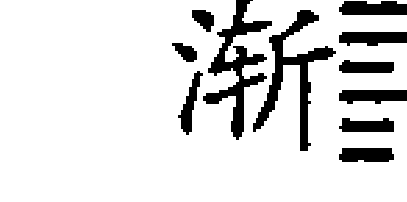

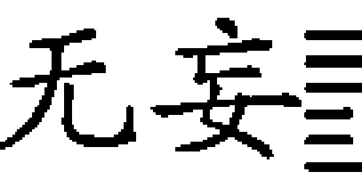

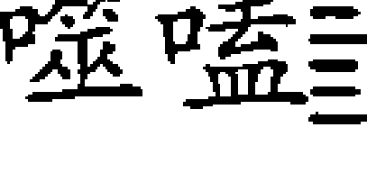


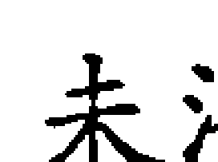


我们不难看出，大游小运一百九十二年其内外卦组成六十四重卦，并且这六十四重卦与周易六十四重卦相同，只是卦序既不同于后天，也不同于先天，仔细观察，与先天六十四卦方图有某些相似之处，但也并不相同。第一宫卦周八重卦与方图最末横行八重卦相同，但卦次排列不同；第二宫卦周八重卦与方图第六横行八卦相同，亦是卦次排列不同；第三宫卦周八重卦与方图第二横行，第四宫卦周八重卦与方图第五横行，第五宫卦周与方图第七横行，第六宫卦周与方图第一横行，第七宫卦周与方图第三横行，第八宫卦周与方图第四横行，均是八重卦相同，而卦次排列不同。

大游小运六十四重卦与周易六十四重卦相同，但卦序不同，与先天六十四重卦的卦序也不相同，其内在联系还有待进一步探讨。

另外，我们还应注意到，小游运卦与太乙同起始于上元甲子，而大游运卦却始于上元庚寅（《金镜》始于上元甲寅），这个差别是为什么？其中的真正意义也有待探讨。

#### 十六、阳九、百六

太乙书颇重阳九、百六之限，认为此二限是推论古今治乱、灾害的依据。阳九、百六之说由来已久，其说不仅见于太乙数术，《汉书》已有此说。太乙书中关于阳九、百六之说基本一致，以《金镜》最为具体，今剖析如下。

##### (一) 阳九推法

> 《金镜·推太岁有阳九之灾法》：
>
> 阳九灾者，若入元之始及元之末，或与太岁冲并于分野，亡国弑君事也。该四千五百六十为一元，四百五十六岁为一阳九也。十三年（应为三十八年——引者）移一邦，命起寅邦，顺行十二邦，算外即阳九所在也。
>
> 置演纪上元甲寅岁至今唐开元十二年甲子岁积得一万三千三百三十一年。臣希明今求算得
>
> 炎帝熙三十五年庚寅入第二阳九；
>
- 少昊十二年丙寅入第三阳九；
- 至夏王相四年壬寅入第四阳九，后二十四年为羿所篡也；
- 至殷沃丁二十九年戊寅入第五阳九；
- 至殷王庚丁十三年甲寅入第六阳九，后渐国微至帝禄绝；
- 至周平王宜白二十年庚寅入第七阳九，王室微弱，政由方伯；
- 至周赧王延二十年丙寅入第八阳九，数尽之主；
- 至汉桓帝延熹五年壬寅入第九阳九，桓、灵道丧，至献终亡；
- 至隋义宁二年（即武德元年也）戊寅岁入第十阳九，隋禄永终，归于我唐；
- 至大唐开元十二年以后三百五十年方会阳九之数。

按我国现在公认的历史纪年始于公元前841年西周共和元年庚申岁。在此之前的历史纪年还没有一个统一的说法。《金镜》所云“殷王庚丁十三年甲寅”与《皇极经世》历史编年相合，以《皇极经世》考证，此年为公元前307年，以现代通行的历史编年考证周平王二十年庚寅为公元前751年，按此计算第六阳九与第七阳九正相隔四百五十六年。唐高祖武德元年戊寅岁为公元618年，正符合第十阳九之数。唐开元十二年甲子岁为公元724年，入第十阳九一百零七年，照此计算下去：

- 宋神宗熙宁七年甲寅岁（公元1074年）入第十一阳九；
- 明世宗嘉靖九年庚寅岁（公元1530年）入第十二阳九；
公元 1986 年丙寅岁入第十三阳九；
公元 2442 年壬寅岁入第十四阳九。

《金镜》指出：唐开元十二年甲子岁阳九积年为一万三千三百三十一年，以此计算，则是

```
13331÷4560=2 余 4211
```

```
4211÷456=9 余 107
```

唐开元十二年甲子岁（公元 724 年）入第三元第十阳九一百零七年。

由此可知：

- 宋神宗熙宁七年甲寅岁（公元 1074 年）入第四元第一阳九；
- 明世宗嘉靖九年庚寅岁（公元 1530 年）入第四元第二阳九；
- 公元 1986 年丙寅岁入第四元第三阳九；
- 公元 2442 年壬寅岁入第四元第四阳九。

> 《统宗》论阳九推法曰：
值演上元甲子至所求积年，加阳盈差一百三十，以阳九大限元数四千五百六十除之，不尽，以小限元数四百五十六除之而一，所得为阳九小限之数，不满为入限以来年数。

按《统宗》此论与《金镜》方法的计算结果一致。只是应用的积年数不同。应用《统宗》的计算公式，须取用《统宗》规定的积年数；应用《金镜》的计算公式，须取用《金镜》规定的积年数，二者计算的最后结果是完全相同的。

西汉新莽王朝始建国三年岁次辛未（公元11年），讨渺将军严尤建议停止征伐匈奴，曾提到“今天下遭阳九之厄，比年饥馑，西北边尤甚”（转引自《资治通鉴》）。

今以《金镜》所推阳九之数，新莽王朝始建国三年辛未岁，上距周赧王二十年丙寅岁（公元前295年）第八阳九入元之岁为三百零五年，下距汉桓帝延熹五年壬寅岁（公元162年）第九阳九入元之岁为一百五十一年。这样看来，新莽始建国三年辛未岁既非阳九初入元之岁，也不是阳九将出元之岁，严尤所论当另有所本。后面还将对严尤之论作一分析。

##### (二) 百六推法

> > 《金镜·推太乙有百六之厄法》：
> 百六者，太乙之厄，若入元之始及元之末或与阳九及太岁冲并于分野，其实灾为篡弑之祸。
> 置积年法，以二百八十八年为一周，十五周为一元，共计四千三百二十为一元也。二十四年移一邦，命起寅邦，顺行十二邦，算外即百六所在也。
> 自炎帝神农一百十三年戊寅入第四百六；
>
- 自帝来二十六年丙寅入第五百六；
- 少昊六十八年甲寅入第六百六；
- 舜帝五十七年壬寅入第七百六；
- 夏王不降三十年庚寅入第八百六；
- 殷王小甲四年戊寅入第九百六；
- 殷盘庚二十七年丙寅入第十百六；
- 至周成王诵二十九年甲寅入第十百六；
- 周宣王二十九年壬寅入第十二百六；
- 周敬王九年庚寅入第十三百六；
- 秦始皇二十四年戊寅入第十四百六；
- 汉明帝永平九年丙寅入第十五百六；
- 东晋（穆）帝永和十年甲寅入第二元一百六；
- 大唐贞观十六年壬寅入第二元二百六也。

按上述历史纪年从夏王不降三十年庚寅开始皆与《皇极经世》历史编年表相合。今以《皇极经世》历史编年表考证如下：

- 夏王不降三十年庚寅为公元前1951年；
- 殷王小甲四年戊寅为公元前1663年；
- 殷盘庚二十七年丙寅为公元前1375年；
- 周成王诵二十九年甲寅为公元前1087年。

每一百六正是相差二百八十八年。从周宣王二十九年壬寅开始，据现代通行历史编年表即可查取公元年数。

从唐太宗贞观十六年壬寅岁（公元 642 年）入第二元第二百六推起，可知：

- 后唐明宗天成五年庚寅岁（公元 930 年，亦即长兴元年）入第二元第三百六；
- 南宋宁宗嘉定十一年戊寅岁（公元 1218 年）入第二元第四百六；
- 明武宗正德元年丙寅岁（公元 1506 年）入第二元第五百六；
- 清乾隆五十九年甲寅岁（公元 1794 年）入第二元第六百六；
- 公元 2082 年壬寅岁入第二元第七百六；
- 公元 2370 年庚寅岁入第二元第八百六。

若以《金镜》规定的积年法计算，唐太宗贞观十六年（公元 642 年）百六积年数为 13249。
13249÷4320=3 余 289
289÷288=1 余 1

由此可知，唐太宗贞观十六年壬寅岁入第四元第二周第一年。《金镜》所云“第二元第二百六”，是指第二元第二百六的第一年，其与积年法所退只是大元数不同，实际则是完全相同。

###### 《统宗·求百六灾变之期大小限数术》：

置演上元甲子至所求积年，加阴盈差二千单五十，以百六大限元数四千三百二十除之，不尽，以小限元数二百八十八约之而一，所得为小限之数，不满为入小限以来年数。命起第一元之限，算外即得百六入小元之限及年数深浅所在。

凡百六经十五小元之限积之，而成其一大元之数也。

大数之终灾深，小限之终则浅。

按《统宗》所规定的积年法，唐太宗贞观十六年积年数为10154559。以此推演如下：

```
10154559÷2050=10156609
10156609÷4320=2351 余 289
289÷288=1 余 1
```

所推结果与《金镜》完全相同。

西汉成帝元延元年己酉岁（公元前12年），因其年四月丁酉“无云而雷，有流星从日下东南行，四面耀耀如雨，自晡及昏而止”。七月又有彗星出现，因而明帝恐慌，向群臣询问。

> > 北地太守谷永说：
>
> 陛下承八世之功业，当阳数之标季，涉三七之节纪，遭《无妄》之卦运，直百六之灾厄，三难异科，杂焉同会。建始元年以来，二十载间，群灾大异，交错锋起，多于《春秋》所书……（引自《资治通鉴》）

按谷永所论 “涉三七之节季，遭《无妄》之卦运，直百六之灾厄”皆出自太乙书，认为这三种不同类型的灾难会聚到一起了。故称“三难异科，杂焉同会”。

但是，此为西汉成帝元延元年己酉岁（公元前 12 年），上距秦始皇二十四年戊寅岁（公元前 223 年）第十四百六第一年为二百一十一年，下距东汉明帝永平九年丙寅岁（公元 66 年）第一百五十六尚有六十五年，而为什么称“直百六之灾厄”呢？这个问题，同新莽始建国三年提到的“今天下遭阳九之厄”，都值得进一步探讨。《资治通鉴》这两处原文都出自《汉书》，这是正史中对阳九、百六的记载，应当引起重视。

#### 十七、 阴阳九厄

按《统宗》有 “求阴阳九厄水旱各期之会术”，其大意与《容斋随笔》所论 “阴阳灾岁” 相同。另外，古代还有不少著作也有此说。这就提出了一个问题：阴阳九厄之说是否专为太乙书所有？是太乙书引自他书，还是他书引自太乙？当然，我们不是为此而打著作权官司，而是想考证阴阳九厄的起源。下面，将引用诸书对阴阳九厄的有关论述，并加以讨论。

> 《统宗·求阴阳九厄水旱各期之会术》：
>
> 经曰：太乙有阳九之厄，四千五百六十年为一元之数也。数终之期，余殃不息，化为水旱，不备元数之外而有入会，则为阴阳九厄也，皆主水旱灾伤也。
>
> 阴阳水旱括
>
> 一元大数四千五百六十年。
>
> 一历一百六年终 一阳九灾 旱九年
>
> 二历三百七十四年终 二阴九灾 水九年
>
| 历数终年 | 灾变类型 | 灾变年数 |
| :--- | :--- | :--- |
| 三历四百八十年终 | 三阳九灾 | 旱九年 |
| 四历七百二十年终 | 四阴七灾 | 水七年 |
| 五历七百二十年终 | 五阳七灾旱 | 七年 |
| 六历六百年终六阴 | 五灾水 | 五年 |
| 七历六百年终七阳 | 五灾旱 | 五年 |
| 八历四百八十年终 | 八阴三灾 | 水三年 |
| 九历四百八十年终 | 九阳三灾 | 旱三年 |

总合一元起数四千六百一十七策

置演上元甲子至所求积年，加阴阳盈一百三十，以元法四千五百六十约之，而为元数，不尽，命阴阳九七五三厄会之算以求之，算外即得阴阳九厄水旱灾伤之年，岁阳为旱，岁阴为水也。

> 《统宗》又云：
>
> 所谓九会而能复其元者，自下而上通之，以一章一十九数而乘二十七章，得五百一十三策，乃为一会；以一会之数三因之，得一千五百三十九策，乃为一统；以一统之策三因之，得四千六百一十七策，而复合一起元之数也。于中减除阴阳水旱三灾二七、二五、二三、九会九厄灾年五十七数，算外即得四千五百六十策，此正谓阳九之数也。
>
> 夫阳九之数，四章为一部章法一十九部法七十六部为一管管法三百八十四管为一统统数一千五百二十三统为一元，而得四千五百

六十，是为一元之大数也。其九会九厄水旱灾伤之数五十七策，潜伏于阳九大数四千五百六十之中。

按《统宗》上述所论这几个数的关系，我们可以窥知阳九一元大数四千五百六十年，而其中有五十七个灾岁，四千五百六十年再加上五十七年，正是四千六百一十七年。而这五十七个灾岁有何来历？《统宗》云：

> 天正冬至日在甲子，及八十年仍复甲子为冬至，是为一境之数。
>
> 境数之终，乃兴灾异，原夫太乙之始行宫也。
>
> 境终则灾异生焉，阳厄会之数取八相目者为比也。

原来五十七个灾岁是由八十年一个冬至甲子得来的。但是，古人以每岁三百六十五日又四分之一日为岁实，所以上古上元甲子年甲子月甲子日甲子时定为冬至，过八十年冬至回复，四千五百六十年中含有五十七个冬至甲子，于是，在阳九一元大数之中就产生了五十七个灾岁。在我们今天看来，古人所取岁实数值并不准确，冬至甲子也并不是八十年一回复，所以，四千五百六十年中有五十七个灾岁之说也随之应该被动摇了。

古人还是留有余地的。古人并没有将阳九大数四千五百六十年平均分为五十七份，而是又加以变化，与太乙行宫、大小游灾害联系起来，这似乎还是值得我们加以探讨的。

> 《容斋随笔·阴阳灾岁》云：
洪氏曰：按律历志云，十九岁为一章，四章为一部，二十部为一统，三统为一元，则一元有四千五百六十岁。初入元一百六岁有阳九，谓旱九年；次三百七十四岁阴九，谓水九年。以一百六岁并三百七十四岁为四百八十岁；注云：六乘八之数。次四百八十岁言阳九，谓旱九年；次七百二十岁阴七，谓水七年；次七百三十岁阳七，谓旱七年；又注云：七百八十者，九乘八之数。次六百岁阴五，谓水五年，次六百岁阳五，谓旱五年；注云：六百岁者，以八乘八，八八六十四。又以七乘八，七八五十六，相并为一千二百岁，于易七八不变，气不通，故合而数之，各得六百岁。次四百八十岁阴三；次四百八十岁阳三。从入元至阳三，除去灾岁，总有四千五百六十年。其灾岁两个阳九年，一个阴九年，一个阴阳各七年，一个阴阳各五年，一个阴阳各三年，灾岁总有五十七年，并前四千五百六十年，通为四千六百一十七岁，此一元之气终矣。
如律历之言，此是阴阳水旱之大数也。所以止用七八九六相乘者，以水数六，火数七，木数八，金数九，故以此交互相乘也。以七八九六阴阳之数自然，故有九年、七年、五年、三年之灾，须三年、六年、九年之蓄也。然灾岁有阳七、阴七、阳五、阴五，此记直云三年、六年、九年之蓄，不云七五者，此各以其三相因，故不言七五也。举六三则七年五年之蓄可知，若贮积满九年之后，则腐坏，当随时给用也。（转引自《古今图书集成艺术典》第七百四十五卷）

按《容斋随笔》所论，阴阳灾岁之说自律历志。并与周易七八九六之策数联系起来，与水火木金之数联系起来，使其更加深奥和神秘了。《容斋随笔》曾论太乙推法，但此处并未涉及太乙。

《容斋随笔·百六阳九》云：
史传称百六、阳九为厄会，以历志考之，其名有八：初入元百六曰阳九，次曰阴九，又有阴七、阳七、阴五、阳五、阴三、阳三，皆谓之灾岁。大率经岁四千五百六十而灾岁五十七。以数计，每及八十岁则值其一。今人但知阳九之厄。云经岁者，常岁也。

按此称“史传百六阳九为厄会”，当指正史中有关阳九、百六的论述。又以“历志考之”，当也认为阴阳灾岁之说自律历志，也未涉及太乙书中阳九、百六之说。

《汉书·路温舒传》：
温舒从祖父受历数天文，以为汉厄三七之间，上封事以豫戒。成帝时谷永亦言如此。及王莽篡位，欲章代汉之符，著其语焉。

按西汉成帝元延元年己酉岁（公元前12年），北地太守谷永说，此时“涉三七之节纪，遭《无妄》之卦运，直百六之灾厄”，与路温舒“汉厄三七之间”的说法相同，二十年之后，

王莽篡汉，建立新朝，汉王朝从此中断十五年。由此可证，路温舒和谷永的预言都应验了。

但是，史载谷永所言有具体年月，以太乙推算，既非阳九出入之际，也非百六出入之际，与太乙书中阴阳灾岁之说也不相合，而路、谷二人所有术语，又都是出于太乙书中。汉代到底是怎样推演太乙的？汉代人推演的结果应验了历史事实，而我们以太乙书的公式却与汉人所说并不相符，或者汉代另有推演方法，已经失传了，或者后人改变了汉代的推演方法。这个问题，只能权作悬案，有待查取更多资料详加考证。

#### 十八、前人对阳九百六的验证

> 《游宦纪闻》：
　　 天地万物，莫逃乎数，知数之理，莫出乎《易》。知《易》之妙，惟康节先生，其学无传，观《皇极经世书》概可见矣。此外，有所谓太乙数，能知运祚灾祥，刀兵水火，阴晴风雨，又能以之出战守城，傍门小法，亦可知人命贵贱。渡江后有北客同州免解进士王湜，潜心此书，作《太乙肘后备检》三卷，为阴阳二遁，绘图一百四十有四，上自帝尧以来，至绍兴六年丙辰，凡三千四百九十二年，皆随六十甲子表以分野，如《通鉴》编年。前代兴亡，历历可考。然自古及今，应者虽多，不应者亦或有之。

> 　　景祐间命司天杨维德修五福太乙占书，考验行度，亦为精详。其间云：自石晋天福四年己亥岁入东北辽东分，至国朝雍熙元年甲申岁入东南吴分，至天圣七年己巳岁入西南蜀分。后人继加考算，至熙宁七年甲寅岁入中宫洛阳分，至宣和元年己亥岁入西北西河分，至隆兴二年甲申岁入东北辽东分，至嘉定二年已已岁入东南吴分，向后至甲寅年入西南秦分上来。五福太乙所临之分自合太平至治。

今推而上之，后周宣帝元年己亥岁至唐高祖武德六年癸未岁，五福太乙在西南凡四十五年中，更隋、唐禅代之变，正在本宫分野。又自唐宣宗大中三年己巳岁，至昭宗景福二年癸丑岁，五福太乙在中宫，凡四十五年中，更僖宗广明、黄巢之变，中国之祸甚惨。既曰五福所临，何为又却如此？

本朝兴国九年，有方士楚芝兰言五福今照吴分，上命建太乙宫于京城外之苏村，芝兰为春官正，又命宰臣张齐贤醮享之。

然其所以不应者，亦有说焉。王湜跋《肘后备检》立论甚通，其说云：

> “后羿、寒浞之乱，得阳九之数七；赧王衰微，得阳九之数八；桓灵卑弱，得阳九之数九；炀帝灭亡，得阳九之数十；周宣王父厉而子幽，得百六之数十二；敬王时吴越相残，海内多事，得百六之数十三；秦灭六国，得百六之数十四；东晋播迁，十六国分裂，得百六之数极而反于一；五代乱离百六之数三，此皆所应者也。”

舜禹至治，万世所师，得百六之数七；成康刑措四十余年，得百六之数十；小甲、雍己之际，得阳九之数五，而百六之数九；庚丁、武乙之际，得阳九之数六；不降享国五十九年，得百六之数八；盘庚、小辛之际，得百六之数十；明帝、章帝继光武而臻泰定，得百六之数十五；贞观二十三年，近世所谓太平，得百六之数二，此皆所不应者也。

> 《福应集》云：唐武德七年甲申，五福太乙入中宫洛阳之分，继有贞观之治，遂以此为福应。然宣、懿、僖、昭之际，再入中宫，而贞观之治何不复举？又云：唐昭宗天祐四年丁卯，四神太乙入六宫雍州之分，而昭宗禅位于梁，遂以此为福应，然开元十六年亦入六宫，乃太平极治，与贞观比。以至夏桀放于南巢，商纣亡于牧野，王莽篡汉，禄山乱唐，阳九、百六之数皆不逢之，此其故何也？余尝深究其所以然者，周公问太公何以治齐，曰“举贤而尚功”，周公以之为强臣之渐。太公问周公何以治鲁，曰“亲亲而尚恩”，太公以之为浸弱之基，是以圣人推三代损益而百世可知。大抵天下之事因缘积累固有系于人事，未必尽由天理，通天地人曰儒，通天地而不通人曰技，拘然执此以为不可改易，乃术士之蔽，非儒者之通论。善言天地者以人事，善言人事者以天地，岂可蔽于天而不知人乎！

古之善为政者，尚以知变为贤，况冥冥之中奉行天地号令，或主吉或主凶，皆本于天地之一气，安有固而不知变者？以尧、舜、禹为君臣，文、武、周公为父子，虽遇阳九、百六之数，越理而降以祸，必不其然。自此而下，其他不能详知者，皆可以类推也。

色不过五，五色之变不可胜观；声不过五，五声之变不可胜听。太乙不过十神、十精、四计之类，彼其周流于天地间，始而有终，终则复始，古既不异于今，今亦不异于古，然上古至治，终不可复，又中间盛衰兴废亦不可循前而取，岂非人事之不齐，故应之者亦不一耶。

术固有之，太乙考治人君之善恶，临有道之国则昌，临无道之国则亡，有天下国家者，可不谨哉？

以上皆王说。盖太乙数中，专考阳九、百六之数，以四百五十六年为一阳九，二百八十八年为一百六。阳九，奇数也，为阳数之穷；百六，偶数也，为阴数之穷。大抵岁运值之，终有厄会。洪文敏公《随笔》中载阳九、百六之说，与此不同。本朝康定庚辰、庆历辛巳间西羌方炽，天下骚动，诏求有文武材可用者，参政宋绶、侍读林瑀皆以徐复荐至仁宗，访以世务。复曰：“今年气运类唐德宗居奉天时。”上惊曰：“何至尔耶？”复曰：“德宗性忌刻，其德与凶会，陛下恭俭仁恕，屈己容物，虽时与德宗同，而德与德宗异，运虽凶，无能为也。”此说正与王湜之论合。故并纪之。

我们从《游宦纪闻》这一评述来看，前人已经发现了太乙阳九、百六二限与历史有合与不合，但前人并未因此而否定阳九、百六二限之说，而是从中又引发出天运与人事二者的关系问题，这与黄宗羲“留其不然以观人事，留其然以观天运，此人之际也”的说法相同。这仍然是天运和人事二者的关系问题。太乙书中强调“有道者昌，无道者殃”，天运虽凶而君主有道，则可变凶为吉，天运虽吉而君主无道，则化吉为凶，这样说来，人事又可以改变天运。天运和人事二者之间到底是什么关系？这确实是一个难以说清楚的问题。

上文中所说“洪文敏公《随笔》中载阳九、百六之说”，即洪迈《容斋随笔》中所载“阳九、百六”之说，前已载录，兹不再述。

《太乙淘金歌》以始有甲子年积至所求之年，先以阳九大元累除之，次以小元累除之，以求取阳九，并认为大元之终有百年之灾，小元之终有旬岁之灾。百六推法也是以大小元累除之。但是，该书并未提供始有甲子之年为何年。

《淘金歌》以阳九、百六大元之终有百年之灾乱，小元之终有旬岁（十年）之灾乱，此说与其他太乙书不同。

总之，太乙诸书所列阳九、百六、阴阳灾岁以及十二运卦的推演方法，其所推结果，皆与《汉书》所论阳九、百六、卦运不同，这个问题实有进一步考证的必要。

《游宦纪闻》引王湜《太乙肘后备检》所述四神、五福太乙的推演方法及其意义，太乙诸书皆有论述，可以参考。

> 考《汉书·谷永传》：“陛下承八世功业，当阳数之标季，涉三七之节纪，遭《无妄》之卦运，直百六之灾厄。三难异科，杂焉同会。”与《资治通鉴》所引同。

> 考《汉书·律历志》：“《易》九厄，曰：初入元，百六阳九；次三百七十四，阴九；次四百八十，阳九；次七百二十，阴七；次七百二十，阳七；次六百，阴五；次六百，阳五；次四百八十，阴三；次四百八十，阳三；凡四千六百一十七岁而一元终。经岁四千五百六十，灾岁五十七。”

> 曹植《汉二祖优劣论》：“值阳九、《无妄》之世，遭炎光厄会之运。”

> 文天祥《正气歌》：“嗟予遘阳九，隶也实不力。”

可知阳九、百六之说，历汉、唐及宋皆为人所引用。阳九、百六成了灾限的代词。若以太乙书中所列方法，推演阳九、百六，其与以往历史事件相较，有验有不验。我们现在研究和验证这个问题，目的在于搞清阳九、百六的真实内涵，搞清楚其真实情况，作为传统文化的一个组成部分来看待就可以了。

#### 十九、五福

五福为赐福之神，太乙家颇重视五福。五福行乾、艮、巽、坤、中宫共五宫，每宫住四十五年，二百二十五年行一周。

太乙诸书对五福的意义，认识是一致的。但对五福的推演方法，各书所述略有不同之处，因此，其推演结果也不尽一致，也给后人留下疑问，这同样是值得考证的一个重要问题。

##### （一）五福行宫

五福行乾、艮、巽、坤、中宫，每宫四十五年，二百二十五年行一周。其一曰黄秘宫，在西河之乾地，属晋分冀卫戌亥之野；其二曰黄始宫，在辽东之艮地，属燕分吴越齐丑寅之野；其三曰黄室宫，在东吴之巽地，属巽分东吴扬楚辰巳之野；其四曰黄庭宫，在蜀川之坤地，属秦分梁益州未申之野；其五曰玄室宫，在洛邑之中，属中都，子午卯酉之四正。又五中宫，子齐、卯宋、午周、酉赵。又河内、河东、河南之地界也。

以上五福行宫之说，《太乙统宗》、《金镜》、《登坛必究》三书同。

以上五福行宫次序，即：一宫乾；三宫艮；九宫巽；七宫坤；五中宫。

##### （二） 五福的推演方法

《金镜》论五福的推演方法说：

置上元积年以来至开元十二年甲子岁积得一万三千三百三十一年。若上考往古，每年减一，下检将来，每年加上。

置积年，以大周法二百二十五去之，不尽，为入周以来年数，又以四十五约之，为入宫，不满，为入宫以来年数，命起乾、艮、巽、坤、中宫，算外，即五福所在也。

今开元十二年甲子在辽东十一年也。

按《金镜》所定方法，唐玄宗开元十二年（公元724年）岁次甲子，五福入艮宫十一年，列式如下：

```python
13331÷225=59 余 56
56÷45=1 余 11
```

五福自上元以来，运行五十九大周，余五十六年，入一宫乾四十五年，尚余十一年。故知唐玄宗开元十二年，五福入艮宫第十一年。

今以唐玄宗开元十二年（公元七二四年）积年为一万三千三百三十一年为标准，上验往古，每岁减一，下验将来，每岁加一，即可推求五福所在宫次。

《统宗》论五福的推演方法说：

值上元甲子至所求积年，加宫盈差一百一十五，以五福大周法二千二百五十除之，不尽，以小周法二百二十五去之，为宫周余，以行宫率四十五约之而一，为宫数，不满者为入宫以来年数。其宫命起乾、艮、巽、坤及中宫，即得五福所在及入宫年数。

唐高祖武德七年甲申岁，积一千零一十五万四千五百四十一年，五福入玄室中宫洛京之分。

按《统宗》所定方法，唐高祖武德七年（公元624年）岁次甲申，积年数为一千零一十五万四千五百四十一年，求五福所在宫次，列式如下：

```python
10154541+115=10154656
10154656÷2250=4513 余 406
406÷225=1 余 181
181÷45=4 余 1
```

宫周余为一百八十一，减去乾宫、艮宫、巽宫、坤宫各四十五年，余一年。故知唐高祖武德七年，五福入中宫第一年。

今以《统宗》所定之法，求取唐玄宗开元十二年（公元724年）岁次甲子，五福所在宫次，列式如下（以《统宗》积年法，开元十二年积年数为一千零一十五万四千六百四十一年）：

```python
10154641+115=10154756
10154756÷2250=4513余506
506÷225=2余56
56÷45=1余11
```

宫周余为五十六，减去乾宫四十五年，余十一年。故知唐玄宗开元十二年，五福入艮宫第十一年。

由此可知，《统宗》虽与《金镜》所取积年数不同，但其推演五福所在宫次是完全相同的。

> 《易学象数论》推演五福方法说：
宫周二百二十五，宫率四十五，宫盈差一百一十五。置积年，加宫盈差，以宫周去之，余以宫率而一，起一宫乾，行至五宫。不满宫率者，为入宫以来年数。

按《易学象数论》所取积年数与《统宗》同，其推法也与《统宗》相同。

《登坛必究》论五福推演方法说：

五福太乙次行宫，
乾艮巽坤中五匮，
每宫皆住四十五，
所到之宫有条律。
乾宁甲寅起上元，
积至庚申二纪七。

按此以唐昭宗乾宁元年（公元894年）岁次甲寅为上元，至宋真宗天禧四年（公元1020年）岁次庚申，正是一百二十七年，故称“乾宁甲寅起上元，积至庚申二纪七”（一纪为六十年，一百二十七年简称“二纪七”）。此为取近距之上元，与《金镜》、《统宗》推演结果相同。

《太乙淘金歌》说：

五福太乙行次宫，
乾艮巽坤末兼中，
四十五年移一位，
上元甲子起一宫。

每宫常住四十五，除之，不及，命起一宫，主四十五年满，则交入二宫。

唐太宗贞观八年甲午，是年五福入中宫，京洛之分四十年物阜民安，而有贞观之治也。

自贞观八年甲午起，至明天启三年癸亥止，凡九百九十年，以二百二十五年为一周，两除为四百五十，四除去九百，尚余九十年。以宫法二除去九十，自天启甲子起，五福入艮宫，至丁卯四年矣。

按《太乙淘金歌》所定五福入宫，是以甲子为上元，而《金镜》诸书皆以甲寅为上元，故有十年之差。《统宗》以唐高祖武德七年岁次甲申五福入中五宫，《淘金歌》则以唐太宗贞观八年岁次甲午五福入中五宫，二者正有十年之差。以《统宗》推法，明天启四年（公元 1624 年）岁次甲子，五福入艮宫第十一年，以《淘金歌》推法，则为入艮宫第一年，二者也正是十年之差。这就说明，太乙诸书对五福入宫的推演方法，存在差异：《淘金歌》对五福的推演，与其他太乙书有十年之差，《淘金歌》以上元甲子岁为五福入宫之起点，其他诸书皆以上元甲寅岁为五福入宫之起点，故有十年之差。我们对这个问题不可不知。

《游宦纪闻》说：

景祐间，命司天杨维德修五福太乙占书，考验行度，亦为精详。其间云：“自石晋天福四年己亥岁入东北辽东分，至国朝雍熙元年甲申岁入东南吴分，至天圣七年己巳岁入西南蜀分。”后人继加考算，至熙宁七年甲寅岁入中宫洛阳分，至宣和元年己亥岁入西北西河分，至隆兴二年甲申岁入东北辽东分，至嘉定二年己巳岁入东南吴分，向后至甲寅年入西南秦分上来。

按后晋高祖天福四年（公元 939 年）己亥岁，以《统宗》之法推演，五福太乙入艮宫辽东分第一年；宋太宗雍熙元年（公元984年）甲申岁，五福太乙入巽宫东南吴分第一年；宋仁宗天圣七年（公元1029年）己巳岁，五福太乙入坤宫西南蜀分第一年；宋神宗熙宁七年（公元1074年）甲寅岁，五福太乙入中五官洛阳分第一年；宋徽宗宣和元年（公元1119）己亥岁，五福太乙入乾宫西北西河分第一年；宋孝宗隆兴二年（公元1164年）甲申岁，五福太乙入艮宫东北辽东分第一年；宋宁宗嘉定二年（公元1209年）己巳岁，五福太乙入巽宫东南吴分第一年；宋理宗宝祐二年（公元1254年）甲寅岁，五福太乙入坤宫西南秦分第一年。

以上五福太乙行宫皆与《金镜》、《统宗》等书所定五福推演方法相合，而与《淘金歌》所定五福推法不合。

> 《浙江通志》载：
程山人自玉泉山来，寓褚堂，精太乙、六壬之术。万历辛巳，有问岁事者。山人曰：“明年五福在燕，太子生，建德大将冲文昌，主将相失位，女主宠，奄官去，主水灾。”是年生皇储，而张居正、冯保俱罢，岁又逢潦，其术悉验。后归隐，不知所终。

按程山人所云“五福在燕，太子生，建德大将冲文昌”，这是运用的太乙术，而绝非六壬术。文中所说“万历辛巳”，是指明神宗万历九年（公元1581年）岁次辛巳。“明年五福在燕”，是指万历十年（公元 1582 年）岁次壬午，万历皇帝的太子朱常洛就生于该年八月十一日。《统宗》和《登坛必究》皆以寅为燕分幽州，此说与明朝都城（北京）相应。程山人以明万历十年（公元 1582 年）壬午岁“五福在燕”，是指该年五福太乙入艮宫燕分。但此岁五福行宫，若以《金镜》、《统宗》之法推演，却入西北乾宫第十四年，若以《太乙淘金歌》推演，却入西北乾宫第四年，皆与程山人“五福在燕”之说不相符合。
我们从上述程山人以万历十年壬午岁“五福在燕”之说可知，五福太乙还有第三种推演方法。这第三种推求方法，既不同于《金镜》、《统宗》等诸书之法，也不同于《淘金歌》所定之法，而是另外的一种推求之法。但是，程山人所推五福之法，却不见于太乙诸书，这确有进一步考证之必要。
《浙江通志》认为程山人“其术悉验”。我们验证明代万历十年的历史，太子朱常洛降生了；集掌印、提督东厂、皇帝“大伴”于一身的太监冯保被逐；首辅张居正于这年六月死去，接着追夺了张居正的官衔，并查抄其家；郑贵妃得宠，这些历史事件与“主将相失位，女主宠，奄官去”皆相符合，所以，称程山人“其术悉验”是不过分的。但是，程山人对五福太乙的推演又为后人留下了又一则疑案。

##### （三） 五福所主

太乙家以五福太乙为赐福之神，认为五福太乙所临分野，无兵革、疾疫、饥荒水旱之灾。然而，验证历史，并非完全是这样。正如《游宦纪闻》指出的：五福太乙所临分野“应者虽多，不应者亦或有之”，“后周宣帝元年己亥岁至唐高祖武德六年癸未岁，五福太乙在西南，凡四十五年中，更隋、唐禅代之变，正在本宫分野。又自唐宣宗大中三年己巳岁至昭宗景福二年癸丑岁，五福太乙在中宫，凡四十五年中，更僖宗广明黄巢之变，中国之祸甚惨，既曰五福所临，何为又却如此？”这确实是值得详加探讨的一个重要问题。

《游宦纪闻》对于验证历史有应与不应的问题，还指出：“余尝深究其所以然者，周公问太公何以治齐，曰举贤而尚功，周公以之为强臣之渐，太公问周公何以治鲁，曰亲亲而尚恩，太公以之为浸弱之基，是以圣人推三代损益而百世可知。大抵天下之事因缘积累，固有系于人事，未必尽由天理。通天地人曰儒，通天地而不通人曰技，拘然执此以为不可改易，乃术士之蔽，非儒者之通论。善言天地者以人事，善言人事者以天地，岂可蔽于天而不知人乎？古之善为政者，尚以知变为贤，况冥冥之中奉行天地号令，或主吉，或主凶，皆本于天地之一气，安有固而不知变者。以尧舜禹为君臣，文武周公为父子，虽遇阳九、百六之数，越理而降以祸，必不其然。自此而下，其他不能详知者，皆可以类推也。色不过五，五色之变不可胜观；声不过五，五声之变不可胜听；太乙不过十神、十精、四计之类，彼其周流于天地间，始而有终，终则复始。古既不异于今，今亦不异于古，然上古至治，终不可复，又中间盛衰兴废亦不可循前而取，岂非人事之不齐！故应之者亦不一耶。术固有之：太乙考治人君之善恶，临有道之国则昌，临无道之国则亡。有天下国家者，可不谨哉！

这是强调了人事对于天运的制约作用。黄宗羲在《易学象数论》中也提出了类似观点。他指出，以太乙行运验证历史，

> >其有然不然者，将以不然者废其然与？则曰：何可废也。留其不然以观人事，留其然以观天运，此天人之际也。

人事对于天运固然有制约作用和很大的影响。我们仅就天运而论，五福每四十五年行一宫，在这四十五年中，其所临分野无兵革、疾疫、饥荒水旱之灾，无论是验古和察今，几乎都是不可能的。太乙书中概括地提出，五福所临分野无兵革疾疫馑荒水旱之灾，但同时还提出了其他具体的制约因素和具体的条件，对这一点，我们决不可忽视，不然，我们若认为凡是五福加临之地之时，就是吉福之地之时，这实际上就认识和理解错了。

《统宗》卷二指出：
五福太乙者，上帝赐福之神也。所临分野其君福厚，其民富寿，无兵革疾疫之厄。四十五年行一宫，理天十五年风调雨顺，八节安享；理地十五年，地出美玉，山产灵芝；理人十五年，世出英俊，民安国富，乐享太平。所在有五德；一曰君寿考；二曰国殷富；三曰边安靖；四曰臣贤；五曰民富。

又指出：

- 同君基，人君福寿，坐享太平，如同在初爻之始，合生贤储，如遇君基相冲之所，乃生草寇之君；
- 同臣基，福利宰辅、丞相，如同居在初爻之始，合生贤相在富贵之家；
- 同民基，四民乐享，天下熙和，如同在初爻之始，其分福寿人生于白屋之家；
- 五福与四神同宫，为福损减，主有兵盗、疾疫民灾，有颠狂狄火，有旱蝗水涌，两川渎；
- 同大游，为福减半，兵盗水旱不免有之；
- 同小游，有德者昌，无德者殃。

##### （四） 五福吉算

《统宗》卷二有“明五福吉算所主术”，即五福四十五年行一宫，其入宫年数，称之为五福吉算之数。五福吉算之数各有所主，或吉在国君，或吉在将相，或吉在庶民。但这一内容，只有《统宗》有所论述，其他太乙书未见有所论述。

《统宗》云：五福吉算之数，若与五福同宫，其有所利，凡二百二十五年为一周，四十五年行一宫，以不满宫法所余者，知五福之所利也。

- 单一、十一、二十一、三十一、四十一，福利于君王；
- 单二、十二、二十二、三十二、四十二，福利于公侯宰臣；
- 单三、十三、三十三、四十三，福利于后妃；
- 单四、十四、二十四、三十四、四十四，福利于太子；
- 单五、十五、二十五、三十五、四十五，福利于庶民；
- 单六、十六、二十六、三十六、四十六，福利于师帅；
- 单七、十七、二十七、三十七，福利于上将军；
- 单八、十八、二十八、三十八，福利于中将军；
- 单九、十九、二十九、三十九，福利于下将军；
- 单十、二十、三十、四十，福利于士卒。

如五福同居，如君基在阳宫，则福在（君王），在阴宫福在后妃。如君基在阴宫与五福相对冲而克制君基者，阴人窃柄及臣下或草寇谋篡。太乙诸凶神与五福同宫，则变灾为福，其灾降于对冲之分。

按照《统宗》所云五福吉算之数，是指五福入宫之年数。如五福入乾宫第一年，其吉算之数为单一。单一，福利于君王。如五福入乾宫第二年，其吉算之数为单二。单二，福利于公侯宰臣。如此类推。

#### 二十、直符太乙

太乙诸书，皆载有直符太乙。诸书对直符太乙的意义及推演方法所论相同。唯《登坛必究》载有以直符验证元代红巾军兴起及衰败的实例，而其立论是以太乙十二宫所属五行生旺衰墓为依据，这是其他太乙书所没有的，故对直符太乙加以考证。

> 《金镜》云：
直符太乙者，火神也，乃天地之使者。天遣观察理道于万民，若临无道之邦，即兵革、水旱、疫疾、饥馑、流亡也。

> 《淘金歌》云：
直符太乙者，阳元之火神也，天地之使星，天遣观察人间善恶，掌万民祸福。若临无道之邦，兵革水旱蝗虫饥馑，人民流亡，赤地千里。若乘生旺之宫，为灾尤甚。

> 《统宗》云：
直符太乙者，火神也。乃天地之使，天遣观察治道，理掌于万民也。得道者助之，失道者咎之。若临失道之邦，主火光旱涸之厄，千里草木不生，兵革疾疫饥馑大作，水旱飞蝗境天之灾也。

同四神，其分水旱涸干不均，四时失节，民饥疾疫，多生兵盗，溺于水火刀兵之厄；
同大游，其分兵丧民流，五谷不成，灾横暴起；
同小游，其分火炎兵革，人民不安。

##### （一） 直符的推演方法

直符上元甲子起五宫，顺行六、七、八、九、绛宫、明堂、玉堂、一、二、三、四宫，每三年移一宫，三十六年一周。

置积年，先以直符大周法三百六十除之，不尽，再以直符小周法三十六去之，不尽，为宫周余。置宫周余，以三约之，而一，为入宫数，不满，为入宫以来年数。

##### （二） 直符太乙验证

> 《登坛必究》云：
直符，如元（至正）辛卯三年入（二）宫，火旺；甲午三年入三宫，火长生，故辛卯五月红巾起于陈蔡，江淮蜂起，六年之间势焰猖炽。丁酉三年临四宫火败方。然太乙属木，又居旺乡，乘君基，故有此验。

按元顺帝至正十一年（公元1351年）辛卯岁，太乙积年为

```python
10155268÷36=282090余28
28÷3=9余1
```

由此可知此年直符入第二宫第一年（五宫、六宫、七宫、八宫、九宫、绛宫、明堂宫、玉堂宫、一宫共九宫，每宫三年，减去二十八年，尚余一年，故知入第二宫第一年），因直符每宫住三年，故辛卯、壬辰、癸巳三年（即至正十一年、十二年、十三年）皆在二宫，所以称“辛卯三年入二宫”。二宫为离宫午位，直符为火神，火旺于午，故称“火旺”。

至正十四年甲午岁、十五年乙未岁、十六年丙申岁，此三年直符入三宫，三宫为艮宫寅位，火长生于寅，故称“甲午三年入三宫，火长生”。

至正十七年丁酉岁、十八年戊戌岁，十九年己亥岁，此三年直符入四宫，四宫为震宫卯位，火败于卯，故称“丁酉三年临四宫火败方”。

元顺帝至正十一年（公元1351年）岁次辛卯五月，河南颖州人刘福通率治河工三千人反元，以红巾为号，发动起义，人称红巾军。该年年底，红巾军已遍布大江南北，形成两大分支。北方红巾军以刘福通、郭子兴等人的队伍为主，南方以彭莹玉、徐寿辉等人的队伍为主。至正十八年（公元1358年），刘福通率领的北方红巾军分三路北伐，直指元都大都（北京），但此年直符临四宫，火入败地，故东路红巾军受挫，退守济南，很快发生内哄，分崩离析，中路和西路红巾军也受到察罕帖木耳、李思齐率领的元军的阻击，元气大伤。北方红巾军从此由盛转衰，三路北伐军相继失败。至正十九年（公元1359年）岁次己亥八月，刘福通、韩林儿被迫放弃汴梁，撤向安丰（今安徽寿县南安丰塘），从此势单力薄，只得依附于他人。南方红巾军此时也在内哄中分崩离析，有的首领如方国珍、张士诚就已经投降了元朝，反而成了镇压红巾军的帮凶。

红巾军起于至正十一年（公元1351年），此年直符太乙入二宫第二年，为火旺之宫，故三年之中红巾军迅速发展壮大；至正十四年（公元1354年）岁次甲午，直符太乙入三宫，为火长生之地，故此三年之中红巾军势如破竹，席卷了大江南北，有力打击了元朝的军事力量；至正十七年（公元1357年）岁次丁酉，此年直符入四宫，火败之方，故此后三年红巾军由盛而衰，接连打了败仗，并且内争不已，逐渐衰落下来。

《登坛必究》以元代至正间红巾军的历史来验证直符太乙入宫所主吉凶，可作参考。

#### 二十一、太乙真诀祖数考

> 《太乙人道命法》云：

太乙真诀祖数中元甲子起于嘉靖四十三年（公元1564年）（积数）一亿二千六百九十四万四千四百五十分；下元甲子起于天启四年（积数）一亿三千零八万九千九百五十分；上元甲子即康熙二十三年一亿三千三百二十三万五千四百五十分，一作三百六十三日五四五。原注云：太乙数为三式之首，有岁月日时四计，此日计太乙人道论命之说也。岁月日时皆有祖数，乃演纪上元起于天地开辟之初，距今年今月今时所用之数，如岁纪算至嘉靖四十三年中元甲子，祖数一千〇一十五万五千四百八十一筹，若月计则每年有十二个月，则月计祖数十二倍多于岁计矣。若日计则每年有三百六十五日有奇，是日计祖数多于岁计者三百六十五倍有奇。艰于布筹，故用截法，或起于周敬王几年，或起于隋开皇几年之类为始，而积至中元甲子共若干年，因积算该若干万日分以为日计之祖数，即中元甲子之祖数也。次递加六十年之总日分，为下元为上元各祖数。

按太乙命法用日计太乙，演用古籍历法，岁实为三百六十五日二十四刻二十五分，其法以万分为一日，一年实积三百六十五万二千四百二十五分。六十甲子年（从甲子至癸亥）则积二万一千九百一十四日五十五刻矣。此为六十年一周甲子之总数，以此数加于中元祖数则为下元祖数，再加下元祖数为上元祖数。如用截法，则六十年共积二万一千九百一十四日五十五刻，用七百二十日累减之，至不满七百二十日而止，余三百一十四日五十五刻，为六十花甲一周应加之截数。故中元祖数一亿二千六百九十四万四千四百五十分，加入三百一十四万五千五百，便成为一亿三千〇〇八万九千九百五十分而为下元之祖数，再加一个三百一十四万五千五百，便为上元之祖数一亿三千三百二十三万五千四百五十分也。知此理，则上推递减，下筹递加，可以至于无穷矣。

按照上述方法，具体推演如下：

- 嘉靖四十三年（公元1564年）中元甲子积126944450（分）
- 天启四年（公元1624年）下元甲子积130089950（分）
- 康熙二十三年（公元1684年）上元甲子积133235450（分）
- 乾隆九年（公元1744年）中元甲子积136380950（分）
- 嘉庆九年（公元1804年）下元甲子积139526450（分）
- 同治三年（公元1864年）上元甲子积142671950（分）
- 民国十三年（公元1924年）中元甲子积145817450（分）
- 公元1984年下元甲子积148962950（分）
- 公元2044年上元甲子积152108450（分）

###### 气策

一个节气之积数称之为气策。气策的求法，是将岁实平均分为二十四分则为一气之策数。

岁实三百六十五万二千四百二十五分，除以二十四（二十四节气），故气策为一十五万二千一百八十四分三十七秒半（152184.375）。

> “太乙命法云：‘第一冬至下该是一岁之始，未有日分，而云三百六十五万二千四百二十五分者，乃自上年冬至距今年冬至整整一岁实数三百六十五日二十四刻二十五分，以起一岁之根。’”

故“二十四气成数”冬至下为三百六十五万二千四百二十五分。

二十四气成数：
- 冬至 三百六十五万二千四百二十五分
- 小寒 一十五万二千一百八十四分三十七秒半
- 大寒 三十万零四千三百六十八分七十五秒
- 立春 四十五万六千五百五十三分一十二秒半
- 雨水 六十万零八千七百二十七分五十秒
- 惊蛰 七十六万零九百二十一分八十七秒半
- 春分 九十一万三千一百零六分二十五秒
- 清明 一百零六万五千二百九十分零六十二秒半
- 谷雨 一百二十一万七千四百七十五分
- 立夏 一百三十六万九千六百五十九分三十七秒半
- 小满 一百五十二万二千八百四十三分七十五秒
- 芒种 一百六十七万四千零二十八分一十二秒半
- 夏至 一百八十二万六千二百一十二分五十秒
- 小暑 一百九十七万八千三百九十六分八十七秒半
- 大暑 二百一十三万零五百八十一分二十五秒
- 立秋 二百二十八万二千七百六十五分六十二秒半
- 处暑 二百四十三万四千九百五十分
- 白露 二百五十八万七千一百三十四分三十七秒半
- 秋分 二百七十三万九千三百一十八分七十五秒
- 寒露 二百八十九万一千五百零三分一十二秒半
- 霜降 三百零四万三千六百八十七分五十秒
- 立冬 三百一十九万五千八百七十一分八十七秒半
- 小雪 三百三十四万八千零五十六分二十五秒
- 大雪 三百五十万零二百四十分零六十二秒半

#### 二十二、岁实数法

什么是岁实呢？即“每年一岁之实积”（《太乙人道命法》一）。又称：“甲子一年积三百六十五万二千四百二十五分，乃古历岁实三百六十五日二十四刻二十五分，其法以万分为一日也。”岁实即一年的实际日数。为了某种需要，又要把日数变为分数。太乙命法中需要确定出六十甲子年的岁实数，以供实际操作的需要，这就是岁实数法。如下（皆以分计）：

| 干支 | 数值 |
| :--- | :--- |
| 甲子 | 3652425 |
| 乙丑 | 7304850 |
| 丙寅 | 10957275 |
| 丁卯 | 14609700 |
| 戊辰 | 18262125 |
| 己巳 | 21914550 |
| 庚午 | 25566975 |
| 辛未 | 29219400 |
| 壬申 | 32871825 |
| 癸酉 | 36524250 |
| 甲戌 | 40176675 |
| 乙亥 | 43829100 |
| 丙子 | 47481525 |
| 丁丑 | 51133950 |
| 戊寅 | 54786375 |
| 己卯 | 58438800 |
| 庚辰 | 62091225 |
| 辛巳 | 65743650 |
| 壬午 | 69396075 |
| 癸未 | 73048500 |
| 甲申 | 76700925 |
| 乙酉 | 80353350 |
| 丙戌 | 84005775 |
| 丁亥 | 87658200 |
| 戊子 | 91310625 |
| 己丑 | 94963050 |
| 庚寅 | 98615475 |
| 辛卯 | 102267900 |
| 壬辰 | 105920325 |
| 癸巳 | 109572750 |
| 甲午 | 113225175 |
| 乙未 | 116877600 |
| 丙申 | 120530025 |
| 丁酉 | 124182450 |
| 戊戌 | 127834875 |
| 己亥 | 131487300 |
| 庚子 | 135139725 |
| 辛丑 | 138792150 |
| 壬寅 | 142444575 |
| 癸卯 | 146097000 |
| 甲辰 | 149749425 |
| 乙巳 | 153401850 |
| 丙午 | 157054275 |
| 丁未 | 160706700 |
| 戊申 | 164359125 |
| 己酉 | 168011550 |
| 庚戌 | 171663975 |
| 辛亥 | 175316400 |
| 壬子 | 178968825 |
| 癸丑 | 182621250 |
| 甲寅 | 186273675 |
| 乙卯 | 189926100 |
| 丙辰 | 193578525 |
| 丁巳 | 197230950 |
| 戊午 | 200883375 |
| 己未 | 204535800 |
| 庚申 | 208188225 |
| 辛酉 | 211840650 |
| 壬戌 | 215493075 |
| 癸亥 | 219145500 |

#### 二十三、太乙人道命法起例考

一下祖数，又下岁实数，再下节数，次加本人生日节后之日数。

每节后数至生日止，一日加一万，除本生日不算，将前四项之数并之，用七百二十除之，不尽者，天数也。次将天数用七十二除之，不尽者为地数，即局数也。再将地数用十二除之，不尽者，人数也。

按以上为天数、地数和人数的取法。原书中所举例证为戊辰年丁巳月辛未日庚寅时。

今考此戊辰年丁巳月辛未日庚寅时，为康熙二十七年（公元1688年）四月二十九日。该月朔日癸卯，二十一日癸亥小满。

- 上元甲子数一亿三千三百二十三万五千四百五十；
- 戊辰年一千八百二十六万二千一百二十五；
- 小满一百五十二万二千八百四十三分七十五秒；
- 后八日八万

以上共一亿五千三百一十○万○四百一十八分七十五，以七百二十减之。

```
亿千百十万千百十○
一三三二三五四五○
一八二六二一二五
一五二二八四三七五
八
一五三一○○四一八七五
一四四○
○○九一○
七二○
天 一九○
一八八
一四四
地 ○四四
三六
(人) ○八
```

> 原注云：因用古法，比局却多了二日，应减去二日作一百八十八以上为原例题推演式。

按其原推演式是以上元数（祖数）、岁实数、节气数、本人生日节后之日数共四数相加之和，取其中万位以上之数取天地人数。而原式中万（含万）以上之数为一五三一○，递减七百二十余数一百九十。地数为四十四。人数为八。

这个推演式原注在天数一九○下小注有“因用古法，比局却多了二日，应减去二日作一百八十八”。这就是说，原式推演出的天数为一百九十，比所对应的辛未日局多二日，减去二日则天数就成为一百八十八。原注认为这是因为用古法造成的误差。

为什么会产生误差呢？这大概是因为该书取用的岁实365.2425日是一个约数，而不是准确数。所以太乙命法的推演公式取天数会有±2数之差。那么，我们在求取天数和局数时，应以日干支所对应的天数和局数为准，但是与推演出的天数和局数一般不会相差超过二数。

##### 再举二例如下：

一、《应用易学》第一卷第一期（1998年6月出版）载欧美近代护理学和护士教育创始人英国女护士弗罗伦斯·南丁格尔出生于公历1820年5月12日下午2时。换算成中国传统历法，则为清代嘉庆二十五年四月初一日未时，即庚辰年辛巳月丙戌日乙未时。

```
嘉庆九年下元甲子数    139526450
庚辰年数               62091225
立夏节数               1369659.375
节后日数               +    70000
------------------------------
203057334.375
```

##### 取万以上数

```
20305
- 14400
_______
5905
- 5760
_______
145
```

天数为145，地数1，人数1。

查太乙人道命法丙戌日天数为143，地数为71。天数与145有二数之差。

二、《易数之友》载当今篮球巨星乔丹生于1963年1月24日寅时，即癸卯年甲寅月辛卯日庚寅时。

| 项目 | 数值 |
| :--- | :--- |
| 1924年中元甲子数 | 145817450 |
| 癸卯年数 | 146097000 |
| 立春节数 | 456553 |
| 节后13日 | +130000 |
| 合计 | 292501003 |

##### 取万以上数

```
29250          450          18
- 28800       - 432       - 12
_______       _______       _______
450            18            6
```

天数450，地数18，人数6。

查天数450，第18局为癸巳日，与辛卯日有二数之差。辛卯日天数448，丙子元第16局。

## 下编

### 太乙历谱

#### 一、太乙历谱——年局

（公元1924年——2043年）

| 公元年 | 岁次干支 | 距上元甲子积年数 | 太乙纪 | 元 | 局 |
| :--- | :--- | :--- | :--- | :--- | :--- |
| 1924 | 甲子 | 10155841 | 五 | 庚子 | 二十五 |
| 1925 | 乙丑 | 10155842 | 五 | 庚子 | 二十六 |
| 1926 | 丙寅 | 10155843 | 五 | 庚子 | 二十七 |
| 1927 | 丁卯 | 10155844 | 五 | 庚子 | 二十八 |
| 1928 | 戊辰 | 10155845 | 五 | 庚子 | 二十九 |
| 1929 | 己巳 | 10155846 | 五 | 庚子 | 三十 |
| 1930 | 庚午 | 10155847 | 五 | 庚子 | 三十一 |
| 1931 | 辛未 | 10155848 | 五 | 庚子 | 三十二 |
| 1932 | 壬申 | 10155849 | 五 | 庚子 | 三十三 |
| 1933 | 癸酉 | 10155850 | 五 | 庚子 | 三十四 |
| 1934 | 甲戌 | 10155851 | 五 | 庚子 | 三十五 |
| 1935 | 乙亥 | 10155852 | 五 | 庚子 | 三十六 |
| 1936 | 丙子 | 10155853 | 五 | 庚子 | 三十七 |
| 1937 | 丁丑 | 10155854 | 五 | 庚子 | 三十八 |
| 1938 | 戊寅 | 10155855 | 五 | 庚子 | 三十九 |
| 1939 | 己卯 | 10155856 | 五 | 庚子 | 四十 |
| 1940 | 庚辰 | 10155857 | 五 | 庚子 | 四十一 |
| 1941 | 辛巳 | 10155858 | 五 | 庚子 | 四十二 |
| 1942 | 壬午 | 10155859 | 五 | 庚子 | 四十三 |
| 1943 | 癸未 | 10155860 | 五 | 庚子 | 四十四 |
| 1944 | 甲申 | 10155861 | 五 | 庚子 | 四十五 |
| 1945 | 乙酉 | 10155862 | 五 | 庚子 | 四十六 |
| 1946 | 丙戌 | 10155863 | 五 | 庚子 | 四十七 |
| 1947 | 丁亥 | 10155864 | 五 | 庚子 | 四十八 |
| 1948 | 戊子 | 10155865 | 五 | 庚子 | 四十九 |
| 1949 | 己丑 | 10155866 | 五 | 庚子 | 五十 |
| 1950 | 庚寅 | 10155867 | 五 | 庚子 | 五十一 |
| 1951 | 辛卯 | 10155868 | 五 | 庚子 | 五十二 |
| 1952 | 壬辰 | 10155869 | 五 | 庚子 | 五十三 |
| 1953 | 癸巳 | 10155870 | 五 | 庚子 | 五十四 |
| 1954 | 甲午 | 10155871 | 五 | 庚子 | 五十五 |
| 1955 | 乙未 | 10155872 | 五 | 庚子 | 五十六 |
| 1956 | 丙申 | 10155873 | 五 | 庚子 | 五十七 |
| 1957 | 丁酉 | 10155874 | 五 | 庚子 | 五十八 |
| 1958 | 戊戌 | 10155875 | 五 | 庚子 | 五十九 |
| 1959 | 己亥 | 10155876 | 五 | 庚子 | 六十 |
| 1960 | 庚子 | 10155877 | 五 | 庚子 | 六十一 |
| 1961 | 辛丑 | 10155878 | 五 | 庚子 | 六十二 |
| 1962 | 壬寅 | 10155879 | 五 | 庚子 | 六十三 |
| 1963 | 癸卯 | 10155880 | 五 | 庚子 | 六十四 |
| 1964 | 甲辰 | 10155881 | 五 | 庚子 | 六十五 |
| 1965 | 乙巳 | 10155882 | 五 | 庚子 | 六十六 |
| 1966 | 丙午 | 10155883 | 五 | 庚子 | 六十七 |
| 1967 | 丁未 | 10155884 | 五 | 庚子 | 六十八 |
| 1968 | 戊申 | 10155885 | 五 | 庚子 | 六十九 |
| 1969 | 己酉 | 10155886 | 五 | 庚子 | 七十 |
| 1970 | 庚戌 | 10155887 | 五 | 庚子 | 七十一 |
| 1971 | 辛亥 | 10155888 | 五 | 庚子 | 七十二 |
| 1972 | 壬子 | 10155889 | 五 | 壬子 | 一 |
| 1973 | 癸丑 | 10155890 | 五 | 壬子 | 二 |
| 1974 | 甲寅 | 10155891 | 五 | 壬子 | 三 |
| 1975 | 乙卯 | 10155892 | 五 | 壬子 | 四 |
| 1976 | 丙辰 | 10155893 | 五 | 壬子 | 五 |
| 1977 | 丁巳 | 10155894 | 五 | 壬子 | 六 |
| 1978 | 戊午 | 10155895 | 五 | 壬子 | 七 |
| 1979 | 己未 | 10155896 | 五 | 壬子 | 八 |
| 1980 | 庚申 | 10155897 | 五 | 壬子 | 九 |
| 1981 | 辛酉 | 10155898 | 五 | 壬子 | 十 |
| 1982 | 壬戌 | 10155899 | 五 | 壬子 | 十一 |
| 1983 | 癸亥 | 10155900 | 五 | 壬子 | 十二 |
| 1984 | 甲子 | 10155901 | 六 | 壬子 | 十三 |
| 1985 | 乙丑 | 10155902 | 六 | 壬子 | 十四 |
| 1986 | 丙寅 | 10155903 | 六 | 壬子 | 十五 |
| 1987 | 丁卯 | 10155904 | 六 | 壬子 | 十六 |
| 1988 | 戊辰 | 10155905 | 六 | 壬子 | 十七 || 公元年 | 岁次干支 | 距上元甲子积年数 | 太乙纪 | 元 | 局 |
|--------|----------|------------------|--------|----|----|
| 1989   | 己巳     | 10155906         | 六     | 壬子 | 十八 |
| 1990   | 庚午     | 10155907         | 六     | 壬子 | 十九 |
| 1991   | 辛未     | 10155908         | 六     | 壬子 | 二十 |
| 1992   | 壬申     | 10155909         | 六     | 壬子 | 二十一 |
| 1993   | 癸酉     | 10155910         | 六     | 壬子 | 二十二 |
| 1994   | 甲戌     | 10155911         | 六     | 壬子 | 二十三 |
| 1995   | 乙亥     | 10155912         | 六     | 壬子 | 二十四 |
| 1996   | 丙子     | 10155913         | 六     | 壬子 | 二十五 |
| 1997   | 丁丑     | 10155914         | 六     | 壬子 | 二十六 |
| 1998   | 戊寅     | 10155915         | 六     | 壬子 | 二十七 |
| 1999   | 己卯     | 10155916         | 六     | 壬子 | 二十八 |
| 2000   | 庚辰     | 10155917         | 六     | 壬子 | 二十九 |
| 2001   | 辛巳     | 10155918         | 六     | 壬子 | 三十 |
| 2002   | 壬午     | 10155919         | 六     | 壬子 | 三十一 |
| 2003   | 癸未     | 10155920         | 六     | 壬子 | 三十二 |
| 2004   | 甲申     | 10155921         | 六     | 壬子 | 三十三 |
| 2005   | 乙酉     | 10155922         | 六     | 壬子 | 三十四 |
| 2006   | 丙戌     | 10155923         | 六     | 壬子 | 三十五 |
| 2007   | 丁亥     | 10155924         | 六     | 壬子 | 三十六 |
| 2008   | 戊子     | 10155925         | 六     | 壬子 | 三十七 |
| 2009   | 己丑     | 10155926         | 六     | 壬子 | 三十八 |
| 2010   | 庚寅     | 10155927         | 六     | 壬子 | 三十九 |
| 2011   | 辛卯     | 10155928         | 六     | 壬子 | 四十 |
| 2012   | 壬辰     | 10155929         | 六     | 壬子 | 四十一 |
| 2013   | 癸巳     | 10155930         | 六     | 壬子 | 四十二 |
| 2014   | 甲午     | 10155931         | 六     | 壬子 | 四十三 |
| 2015   | 乙未     | 10155932         | 六     | 壬子 | 四十四 |
| 2016   | 丙申     | 10155933         | 六     | 壬子 | 四十五 |
| 2017   | 丁酉     | 10155934         | 六     | 壬子 | 四十六 |
| 2018   | 戊戌     | 10155935         | 六     | 壬子 | 四十七 |
| 2019   | 己亥     | 10155936         | 六     | 壬子 | 四十八 |
| 2020   | 庚子     | 10155937         | 六     | 壬子 | 四十九 |
| 2021   | 辛丑     | 10155938         | 六     | 壬子 | 五十 |
| 2022   | 壬寅     | 10155939         | 六     | 壬子 | 五十一 |
| 2023   | 癸卯     | 10155940         | 六     | 壬子 | 五十二 |
| 2024   | 甲辰     | 10155941         | 六     | 壬子 | 五十三 |
| 2025   | 乙巳     | 10155942         | 六     | 壬子 | 五十四 |
| 2026   | 丙午     | 10155943         | 六     | 壬子 | 五十五 |
| 2027   | 丁未     | 10155944         | 六     | 壬子 | 五十六 |
| 2028   | 戊申     | 10155945         | 六     | 壬子 | 五十七 |
| 2029   | 己酉     | 10155946         | 六     | 壬子 | 五十八 |
| 2030   | 庚戌     | 10155947         | 六     | 壬子 | 五十九 |
| 2031   | 辛亥     | 10155948         | 六     | 壬子 | 六十 |
| 2032   | 壬子     | 10155949         | 六     | 壬子 | 六十一 |
| 2033   | 癸丑     | 10155950         | 六     | 壬子 | 六十二 |
| 2034   | 甲寅     | 10155951         | 六     | 壬子 | 六十三 |
| 2035   | 乙卯     | 10155952         | 六     | 壬子 | 六十四 |
| 2036   | 丙辰     | 10155953         | 六     | 壬子 | 六十五 |
| 2037   | 丁巳     | 10155954         | 六     | 壬子 | 六十六 |
| 2038   | 戊午     | 10155955         | 六     | 壬子 | 六十七 |
| 2039   | 己未     | 10155956         | 六     | 壬子 | 六十八 |
| 2040   | 庚申     | 10155957         | 六     | 壬子 | 六十九 |
| 2041   | 辛酉     | 10155958         | 六     | 壬子 | 七十 |
| 2042   | 壬戌     | 10155959         | 六     | 壬子 | 七十一 |
| 2043   | 癸亥     | 10155960         | 六     | 壬子 | 七十二 |

###### 说明：

太乙年局历谱是按照《太乙统宗》等书所定的太乙积年数演算而来。太乙分为六纪、五元，纪法六十，元法七十二，周纪三百六十。今以公元1924年（岁次甲子）为例，其太乙积年为10155841。按太乙年局公式推演，则是

```
10155841÷360=28210 余 241（241 为周纪余）
```

```
241÷60=4 余 1（甲子的序数为 1，故知其年为甲子年）
```

故知太乙入第五纪（241 除以 60 商 4 仍余 1，所以知为第五纪第一年）。

```
241÷72=3 余 25
```

故知太乙入庚子元第二十五局（甲子元为第一元，丙子元为第二元，戊子元为第三元。241 除以 72 商 3 仍余 25，所以知为第四元即庚子元第二十五局）。

拙著《太乙通解》对太乙年局推演方法作了详细叙述，可作参考。

#### 二、太乙历谱——月局

（公元 1924 年——2043 年）

| 月 | 公元 1924 年 (甲子) | | | 公元 1925 年 (乙丑) | | | 公元 1926 年 (丙寅) | | |
| :--- | :--- | :--- | :--- | :--- | :--- | :--- | :--- | :--- | :--- |
| | 纪 | 元 | 局 | 纪 | 元 | 局 | 纪 | 元 | 局 |
| 十一月 | 一 | 甲子 | 一 | 一 | 甲子 | 十三 | 一 | 甲子 | 二十五 |
| 十二月 | 一 | 甲子 | 二 | 一 | 甲子 | 十四 | 一 | 甲子 | 二十六 |
| 正月 | 一 | 甲子 | 三 | 一 | 甲子 | 十五 | 一 | 甲子 | 二十七 |
| 二月 | 一 | 甲子 | 四 | 一 | 甲子 | 十六 | 一 | 甲子 | 二十八 |
| 三月 | 一 | 甲子 | 五 | 一 | 甲子 | 十七 | 一 | 甲子 | 二十九 |
| 四月 | 一 | 甲子 | 六 | 一 | 甲子 | 十八 | 一 | 甲子 | 三十 |
| 五月 | 一 | 甲子 | 七 | 一 | 甲子 | 十九 | 一 | 甲子 | 三十一 |
| 六月 | 一 | 甲子 | 八 | 一 | 甲子 | 二十 | 一 | 甲子 | 三十二 |
| 七月 | 一 | 甲子 | 九 | 一 | 甲子 | 二十一 | 一 | 甲子 | 三十三 |
| 八月 | 一 | 甲子 | 十 | 一 | 甲子 | 二十二 | 一 | 甲子 | 三十四 |
| 九月 | 一 | 甲子 | 十一 | 一 | 甲子 | 二十三 | 一 | 甲子 | 三十五 |
| 十月 | 一 | 甲子 | 十二 | 一 | 甲子 | 二十四 | 一 | 甲子 | 三十六 |

| 月份/年份 | 公元1927年(丁卯) | | | 公元1928年(戊辰) | | | 公元1929年(己巳) | | |
| :--- | :--- | :--- | :--- | :--- | :--- | :--- | :--- | :--- | :--- |
| | 纪 | 元 | 局 | 纪 | 元 | 局 | 纪 | 元 | 局 |
| 十一月 | 一 | 甲子 | 三十七 | 一 | 甲子 | 四十九 | 二 | 甲子 | 六十一 |
| 十二月 | 一 | 甲子 | 三十八 | 一 | 甲子 | 五十 | 二 | 甲子 | 六十二 |
| 正月 | 一 | 甲子 | 三十九 | 一 | 甲子 | 五十一 | 二 | 甲子 | 六十三 |
| 二月 | 一 | 甲子 | 四十 | 一 | 甲子 | 五十二 | 二 | 甲子 | 六十四 |
| 三月 | 一 | 甲子 | 四十一 | 一 | 甲子 | 五十三 | 二 | 甲子 | 六十五 |
| 四月 | 一 | 甲子 | 四十二 | 一 | 甲子 | 五十四 | 二 | 甲子 | 六十六 |
| 五月 | 一 | 甲子 | 四十三 | 一 | 甲子 | 五十五 | 二 | 甲子 | 六十七 |
| 六月 | 一 | 甲子 | 四十四 | 一 | 甲子 | 五十六 | 二 | 甲子 | 六十八 |
| 七月 | 一 | 甲子 | 四十五 | 一 | 甲子 | 五十七 | 二 | 甲子 | 六十九 |
| 八月 | 一 | 甲子 | 四十六 | 一 | 甲子 | 五十八 | 二 | 甲子 | 七十 |
| 九月 | 一 | 甲子 | 四十七 | 一 | 甲子 | 五十九 | 二 | 甲子 | 七十一 |
| 十月 | 一 | 甲子 | 四十八 | 一 | 甲子 | 六十 | 二 | 甲子 | 七十二 |

| 月份/年份 | 公元1930年(庚午) | | | 公元1931年(辛未) | | | 公元1932年(壬申) | | |
| :--- | :--- | :--- | :--- | :--- | :--- | :--- | :--- | :--- | :--- |
| | 纪 | 元 | 局 | 纪 | 元 | 局 | 纪 | 元 | 局 |
| 十一月 | 二 | 丙子 | 一 | 二 | 丙子 | 十三 | 二 | 丙子 | 二十五 |
| 十二月 | 二 | 丙子 | 二 | 二 | 丙子 | 十四 | 二 | 丙子 | 二十六 |
| 正月 | 二 | 丙子 | 三 | 二 | 丙子 | 十五 | 二 | 丙子 | 二十七 |
| 二月 | 二 | 丙子 | 四 | 二 | 丙子 | 十六 | 二 | 丙子 | 二十八 |
| 三月 | 二 | 丙子 | 五 | 二 | 丙子 | 十七 | 二 | 丙子 | 二十九 |
| 四月 | 二 | 丙子 | 六 | 二 | 丙子 | 十八 | 二 | 丙子 | 三十 |
| 五月 | 二 | 丙子 | 七 | 二 | 丙子 | 十九 | 二 | 丙子 | 三十一 |
| 六月 | 二 | 丙子 | 八 | 二 | 丙子 | 二十 | 二 | 丙子 | 三十二 |
| 七月 | 二 | 丙子 | 九 | 二 | 丙子 | 二十一 | 二 | 丙子 | 三十三 |
| 八月 | 二 | 丙子 | 十 | 二 | 丙子 | 二十二 | 二 | 丙子 | 三十四 |
| 九月 | 二 | 丙子 | 十一 | 二 | 丙子 | 二十三 | 二 | 丙子 | 三十五 |
| 十月 | 二 | 丙子 | 十二 | 二 | 丙子 | 二十四 | 二 | 丙子 | 三十六 |

| 月份 | 公元1933年(癸酉)-纪 | 公元1933年(癸酉)-元 | 公元1933年(癸酉)-局 | 公元1934年(甲戌)-纪 | 公元1934年(甲戌)-元 | 公元1934年(甲戌)-局 | 公元1935年(乙亥)-纪 | 公元1935年(乙亥)-元 | 公元1935年(乙亥)-局 |
|------|---------------------|---------------------|---------------------|---------------------|---------------------|---------------------|---------------------|---------------------|---------------------|
| 十一月 | 二 | 丙子 | 三十七 | 三 | 丙子 | 四十九 | 三 | 丙子 | 六十一 |
| 十二月 | 二 | 丙子 | 三十八 | 三 | 丙子 | 五十 | 三 | 丙子 | 六十二 |
| 正月 | 二 | 丙子 | 三十九 | 三 | 丙子 | 五十一 | 三 | 丙子 | 六十三 |
| 二月 | 二 | 丙子 | 四十 | 三 | 丙子 | 五十二 | 三 | 丙子 | 六十四 |
| 三月 | 二 | 丙子 | 四十一 | 三 | 丙子 | 五十三 | 三 | 丙子 | 六十五 |
| 四月 | 二 | 丙子 | 四十二 | 三 | 丙子 | 五十四 | 三 | 丙子 | 六十六 |
| 五月 | 二 | 丙子 | 四十三 | 三 | 丙子 | 五十五 | 三 | 丙子 | 六十七 |
| 六月 | 二 | 丙子 | 四十四 | 三 | 丙子 | 五十六 | 三 | 丙子 | 六十八 |
| 七月 | 二 | 丙子 | 四十五 | 三 | 丙子 | 五十七 | 三 | 丙子 | 六十九 |
| 八月 | 二 | 丙子 | 四十六 | 三 | 丙子 | 五十八 | 三 | 丙子 | 七十 |
| 九月 | 二 | 丙子 | 四十七 | 三 | 丙子 | 五十九 | 三 | 丙子 | 七十一 |
| 十月 | 二 | 丙子 | 四十八 | 三 | 丙子 | 六十 | 三 | 丙子 | 七十二 |

| 月份 | 公元1936年(丙子)-纪 | 公元1936年(丙子)-元 | 公元1936年(丙子)-局 | 公元1937年(丁丑)-纪 | 公元1937年(丁丑)-元 | 公元1937年(丁丑)-局 | 公元1938年(戊寅)-纪 | 公元1938年(戊寅)-元 | 公元1938年(戊寅)-局 |
|------|---------------------|---------------------|---------------------|---------------------|---------------------|---------------------|---------------------|---------------------|---------------------|
| 十一月 | 三 | 戊子 | 一 | 三 | 戊子 | 十三 | 三 | 戊子 | 二十五 |
| 十二月 | 三 | 戊子 | 二 | 三 | 戊子 | 十四 | 三 | 戊子 | 二十六 |
| 正月 | 三 | 戊子 | 三 | 三 | 戊子 | 十五 | 三 | 戊子 | 二十七 |
| 二月 | 三 | 戊子 | 四 | 三 | 戊子 | 十六 | 三 | 戊子 | 二十八 |
| 三月 | 三 | 戊子 | 五 | 三 | 戊子 | 十七 | 三 | 戊子 | 二十九 |
| 四月 | 三 | 戊子 | 六 | 三 | 戊子 | 十八 | 三 | 戊子 | 三十 |
| 五月 | 三 | 戊子 | 七 | 三 | 戊子 | 十九 | 三 | 戊子 | 三十一 |
| 六月 | 三 | 戊子 | 八 | 三 | 戊子 | 二十 | 三 | 戊子 | 三十二 |
| 七月 | 三 | 戊子 | 九 | 三 | 戊子 | 二十一 | 三 | 戊子 | 三十三 |
| 八月 | 三 | 戊子 | 十 | 三 | 戊子 | 二十二 | 三 | 戊子 | 三十四 |
| 九月 | 三 | 戊子 | 十一 | 三 | 戊子 | 二十三 | 三 | 戊子 | 三十五 |
| 十月 | 三 | 戊子 | 十二 | 三 | 戊子 | 二十四 | 三 | 戊子 | 三十六 |

| 月份/年份 | 公元1939年(己卯) | 公元1940年(庚辰) | 公元1941年(辛巳) |
| :--- | :--- | :--- | :--- |
| 十一月 | 四 戊子 三十七 | 四 戊子 四十九 | 四 戊子 六十一 |
| 十二月 | 四 戊子 三十八 | 四 戊子 五十 | 四 戊子 六十二 |
| 正月 | 四 戊子 三十九 | 四 戊子 五十一 | 四 戊子 六十三 |
| 二月 | 四 戊子 四十 | 四 戊子 五十二 | 四 戊子 六十四 |
| 三月 | 四 戊子 四十一 | 四 戊子 五十三 | 四 戊子 六十五 |
| 四月 | 四 戊子 四十二 | 四 戊子 五十四 | 四 戊子 六十六 |
| 五月 | 四 戊子 四十三 | 四 戊子 五十五 | 四 戊子 六十七 |
| 六月 | 四 戊子 四十四 | 四 戊子 五十六 | 四 戊子 六十八 |
| 七月 | 四 戊子 四十五 | 四 戊子 五十七 | 四 戊子 六十九 |
| 八月 | 四 戊子 四十六 | 四 戊子 五十八 | 四 戊子 七十 |
| 九月 | 四 戊子 四十七 | 四 戊子 五十九 | 四 戊子 七十一 |
| 十月 | 四 戊子 四十八 | 四 戊子 六十 | 四 戊子 七十二 |

| 月份/年份 | 公元1942年(壬午) | 公元1943年(癸未) | 公元1944年(甲申) |
| :--- | :--- | :--- | :--- |
| 十一月 | 四 庚子 一 | 四 庚子 十三 | 五 庚子 二十五 |
| 十二月 | 四 庚子 二 | 四 庚子 十四 | 五 庚子 二十六 |
| 正月 | 四 庚子 三 | 四 庚子 十五 | 五 庚子 二十七 |
| 二月 | 四 庚子 四 | 四 庚子 十六 | 五 庚子 二十八 |
| 三月 | 四 庚子 五 | 四 庚子 十七 | 五 庚子 二十九 |
| 四月 | 四 庚子 六 | 四 庚子 十八 | 五 庚子 三十 |
| 五月 | 四 庚子 七 | 四 庚子 十九 | 五 庚子 三十一 |
| 六月 | 四 庚子 八 | 四 庚子 二十 | 五 庚子 三十二 |
| 七月 | 四 庚子 九 | 四 庚子 二十一 | 五 庚子 三十三 |
| 八月 | 四 庚子 十 | 四 庚子 二十二 | 五 庚子 三十四 |
| 九月 | 四 庚子 十一 | 四 庚子 二十三 | 五 庚子 三十五 |
| 十月 | 四 庚子 十二 | 四 庚子 二十四 | 五 庚子 三十六 || 年/月 | 公元1945年（乙酉） |  |  | 公元1946年（丙戌） |  |  | 公元1947年（丁亥） |  |
| :--- | :--- | :--- | :--- | :--- | :--- | :--- | :--- | :--- | :--- |
|  | 纪 | 元 | 局 | 纪 | 元 | 局 | 纪 | 元 | 局 |
| 十一月 | 五 | 庚子 | 三十七 | 五 | 庚子 | 四十九 | 五 | 庚子 | 六十一 |
| 十二月 | 五 | 庚子 | 三十八 | 五 | 庚子 | 五十 | 五 | 庚子 | 六十二 |
| 正月 | 五 | 庚子 | 三十九 | 五 | 庚子 | 五十一 | 五 | 庚子 | 六十三 |
| 二月 | 五 | 庚子 | 四十 | 五 | 庚子 | 五十二 | 五 | 庚子 | 六十四 |
| 三月 | 五 | 庚子 | 四十一 | 五 | 庚子 | 五十三 | 五 | 庚子 | 六十五 |
| 四月 | 五 | 庚子 | 四十二 | 五 | 庚子 | 五十四 | 五 | 庚子 | 六十六 |
| 五月 | 五 | 庚子 | 四十三 | 五 | 庚子 | 五十五 | 五 | 庚子 | 六十七 |
| 六月 | 五 | 庚子 | 四十四 | 五 | 庚子 | 五十六 | 五 | 庚子 | 六十八 |
| 七月 | 五 | 庚子 | 四十五 | 五 | 庚子 | 五十七 | 五 | 庚子 | 六十九 |
| 八月 | 五 | 庚子 | 四十六 | 五 | 庚子 | 五十八 | 五 | 庚子 | 七十 |
| 九月 | 五 | 庚子 | 四十七 | 五 | 庚子 | 五十九 | 五 | 庚子 | 七十一 |
| 十月 | 五 | 庚子 | 四十八 | 五 | 庚子 | 六十 | 五 | 庚子 | 七十二 |

| 年/月 | 公元1948年（戊子） |  |  | 公元1949年（己丑） |  |  | 公元1950年（庚寅） |  |
| :--- | :--- | :--- | :--- | :--- | :--- | :--- | :--- | :--- | :--- |
|  | 纪 | 元 | 局 | 纪 | 元 | 局 | 纪 | 元 | 局 |
| 十一月 | 五 | 壬子 | 一 | 六 | 壬子 | 十三 | 六 | 壬子 | 二十五 |
| 十二月 | 五 | 壬子 | 二 | 六 | 壬子 | 十四 | 六 | 壬子 | 二十六 |
| 正月 | 五 | 壬子 | 三 | 六 | 壬子 | 十五 | 六 | 壬子 | 二十七 |
| 二月 | 五 | 壬子 | 四 | 六 | 壬子 | 十六 | 六 | 壬子 | 二十八 |
| 三月 | 五 | 壬子 | 五 | 六 | 壬子 | 十七 | 六 | 壬子 | 二十九 |
| 四月 | 五 | 壬子 | 六 | 六 | 壬子 | 十八 | 六 | 壬子 | 三十 |
| 五月 | 五 | 壬子 | 七 | 六 | 壬子 | 十九 | 六 | 壬子 | 三十一 |
| 六月 | 五 | 壬子 | 八 | 六 | 壬子 | 二十 | 六 | 壬子 | 三十二 |
| 七月 | 五 | 壬子 | 九 | 六 | 壬子 | 二十一 | 六 | 壬子 | 三十三 |
| 八月 | 五 | 壬子 | 十 | 六 | 壬子 | 二十二 | 六 | 壬子 | 三十四 |
| 九月 | 五 | 壬子 | 十一 | 六 | 壬子 | 二十三 | 六 | 壬子 | 三十五 |
| 十月 | 五 | 壬子 | 十二 | 六 | 壬子 | 二十四 | 六 | 壬子 | 三十六 |

| 年/月 | 公元1951年（辛卯） |  |  | 公元1952年（壬辰） |  |  | 公元1953年（癸巳） |  |
| :--- | :--- | :--- | :--- | :--- | :--- | :--- | :--- | :--- | :--- |
|  | 纪 | 元 | 局 | 纪 | 元 | 局 | 纪 | 元 | 局 |
| 十一月 | 六 | 壬子 | 三十七 | 六 | 壬子 | 四十九 | 六 | 壬子 | 六十一 |
| 十二月 | 六 | 壬子 | 三十八 | 六 | 壬子 | 五十 | 六 | 壬子 | 六十二 |
| 正月 | 六 | 壬子 | 三十九 | 六 | 壬子 | 五十一 | 六 | 壬子 | 六十三 |
| 二月 | 六 | 壬子 | 四十 | 六 | 壬子 | 五十二 | 六 | 壬子 | 六十四 |
| 三月 | 六 | 壬子 | 四十一 | 六 | 壬子 | 五十三 | 六 | 壬子 | 六十五 |
| 四月 | 六 | 壬子 | 四十二 | 六 | 壬子 | 五十四 | 六 | 壬子 | 六十六 |
| 五月 | 六 | 壬子 | 四十三 | 六 | 壬子 | 五十五 | 六 | 壬子 | 六十七 |
| 六月 | 六 | 壬子 | 四十四 | 六 | 壬子 | 五十六 | 六 | 壬子 | 六十八 |
| 七月 | 六 | 壬子 | 四十五 | 六 | 壬子 | 五十七 | 六 | 壬子 | 六十九 |
| 八月 | 六 | 壬子 | 四十六 | 六 | 壬子 | 五十八 | 六 | 壬子 | 七十 |
| 九月 | 六 | 壬子 | 四十七 | 六 | 壬子 | 五十九 | 六 | 壬子 | 七十一 |
| 十月 | 六 | 壬子 | 四十八 | 六 | 壬子 | 六十 | 六 | 壬子 | 七十二 |

| 年/月 | 公元1954年（甲午） |  |  | 公元1955年（乙未） |  |  | 公元1956年（丙申） |  |
| :--- | :--- | :--- | :--- | :--- | :--- | :--- | :--- | :--- | :--- |
|  | 纪 | 元 | 局 | 纪 | 元 | 局 | 纪 | 元 | 局 |
| 十一月 | 一 | 甲子 | 一 | 一 | 甲子 | 十三 | 一 | 甲子 | 二十五 |
| 十二月 | 一 | 甲子 | 二 | 一 | 甲子 | 十四 | 一 | 甲子 | 二十六 |
| 正月 | 一 | 甲子 | 三 | 一 | 甲子 | 十五 | 一 | 甲子 | 二十七 |
| 二月 | 一 | 甲子 | 四 | 一 | 甲子 | 十六 | 一 | 甲子 | 二十八 |
| 三月 | 一 | 甲子 | 五 | 一 | 甲子 | 十七 | 一 | 甲子 | 二十九 |
| 四月 | 一 | 甲子 | 六 | 一 | 甲子 | 十八 | 一 | 甲子 | 三十 |
| 五月 | 一 | 甲子 | 七 | 一 | 甲子 | 十九 | 一 | 甲子 | 三十一 |
| 六月 | 一 | 甲子 | 八 | 一 | 甲子 | 二十 | 一 | 甲子 | 三十二 |
| 七月 | 一 | 甲子 | 九 | 一 | 甲子 | 二十一 | 一 | 甲子 | 三十三 |
| 八月 | 一 | 甲子 | 十 | 一 | 甲子 | 二十二 | 一 | 甲子 | 三十四 |
| 九月 | 一 | 甲子 | 十一 | 一 | 甲子 | 二十三 | 一 | 甲子 | 三十五 |
| 十月 | 一 | 甲子 | 十二 | 一 | 甲子 | 二十四 | 一 | 甲子 | 三十六 |

| 年/月 | 公元1957年（丁酉） |  |  | 公元1958年（戊戌） |  |  | 公元1959年（己亥） |  |
| :--- | :--- | :--- | :--- | :--- | :--- | :--- | :--- | :--- | :--- |
|  | 纪 | 元 | 局 | 纪 | 元 | 局 | 纪 | 元 | 局 |
| 十一月 | 一 | 甲子 | 三十七 | 一 | 甲子 | 四十九 | 二 | 甲子 | 六十一 |
| 十二月 | 一 | 甲子 | 三十八 | 一 | 甲子 | 五十 | 二 | 甲子 | 六十二 |
| 正月 | 一 | 甲子 | 三十九 | 一 | 甲子 | 五十一 | 二 | 甲子 | 六十三 |
| 二月 | 一 | 甲子 | 四十 | 一 | 甲子 | 五十二 | 二 | 甲子 | 六十四 |
| 三月 | 一 | 甲子 | 四十一 | 一 | 甲子 | 五十三 | 二 | 甲子 | 六十五 |
| 四月 | 一 | 甲子 | 四十二 | 一 | 甲子 | 五十四 | 二 | 甲子 | 六十六 |
| 五月 | 一 | 甲子 | 四十三 | 一 | 甲子 | 五十五 | 二 | 甲子 | 六十七 |
| 六月 | 一 | 甲子 | 四十四 | 一 | 甲子 | 五十六 | 二 | 甲子 | 六十八 |
| 七月 | 一 | 甲子 | 四十五 | 一 | 甲子 | 五十七 | 二 | 甲子 | 六十九 |
| 八月 | 一 | 甲子 | 四十六 | 一 | 甲子 | 五十八 | 二 | 甲子 | 七十 |
| 九月 | 一 | 甲子 | 四十七 | 一 | 甲子 | 五十九 | 二 | 甲子 | 七十一 |
| 十月 | 一 | 甲子 | 四十八 | 一 | 甲子 | 六十 | 二 | 甲子 | 七十二 |

| 年/月 | 公元1960年（庚子） |  |  | 公元1961年（辛丑） |  |  | 公元1962年（壬寅） |  |
| :--- | :--- | :--- | :--- | :--- | :--- | :--- | :--- | :--- | :--- |
|  | 纪 | 元 | 局 | 纪 | 元 | 局 | 纪 | 元 | 局 |
| 十一月 | 二 | 丙子 | 一 | 二 | 丙子 | 十三 | 二 | 丙子 | 二十五 |
| 十二月 | 二 | 丙子 | 二 | 二 | 丙子 | 十四 | 二 | 丙子 | 二十六 |
| 正月 | 二 | 丙子 | 三 | 二 | 丙子 | 十五 | 二 | 丙子 | 二十七 |
| 二月 | 二 | 丙子 | 四 | 二 | 丙子 | 十六 | 二 | 丙子 | 二十八 |
| 三月 | 二 | 丙子 | 五 | 二 | 丙子 | 十七 | 二 | 丙子 | 二十九 |
| 四月 | 二 | 丙子 | 六 | 二 | 丙子 | 十八 | 二 | 丙子 | 三十 |
| 五月 | 二 | 丙子 | 七 | 二 | 丙子 | 十九 | 二 | 丙子 | 三十一 |
| 六月 | 二 | 丙子 | 八 | 二 | 丙子 | 二十 | 二 | 丙子 | 三十二 |
| 七月 | 二 | 丙子 | 九 | 二 | 丙子 | 二十一 | 二 | 丙子 | 三十三 |
| 八月 | 二 | 丙子 | 十 | 二 | 丙子 | 二十二 | 二 | 丙子 | 三十四 |
| 九月 | 二 | 丙子 | 十一 | 二 | 丙子 | 二十三 | 二 | 丙子 | 三十五 |
| 十月 | 二 | 丙子 | 十二 | 二 | 丙子 | 二十四 | 二 | 丙子 | 三十六 |

| 年/月 | 公元1963年（癸卯） |  |  | 公元1964年（甲辰） |  |  | 公元1965年（乙巳） |  |
| :--- | :--- | :--- | :--- | :--- | :--- | :--- | :--- | :--- | :--- |
|  | 纪 | 元 | 局 | 纪 | 元 | 局 | 纪 | 元 | 局 |
| 十一月 | 二 | 丙子 | 三十七 | 三 | 丙子 | 四十九 | 三 | 丙子 | 六十一 |
| 十二月 | 二 | 丙子 | 三十八 | 三 | 丙子 | 五十 | 三 | 丙子 | 六十二 |
| 正月 | 二 | 丙子 | 三十九 | 三 | 丙子 | 五十一 | 三 | 丙子 | 六十三 |
| 二月 | 二 | 丙子 | 四十 | 三 | 丙子 | 五十二 | 三 | 丙子 | 六十四 |
| 三月 | 二 | 丙子 | 四十一 | 三 | 丙子 | 五十三 | 三 | 丙子 | 六十五 |
| 四月 | 二 | 丙子 | 四十二 | 三 | 丙子 | 五十四 | 三 | 丙子 | 六十六 |
| 五月 | 二 | 丙子 | 四十三 | 三 | 丙子 | 五十五 | 三 | 丙子 | 六十七 |
| 六月 | 二 | 丙子 | 四十四 | 三 | 丙子 | 五十六 | 三 | 丙子 | 六十八 |
| 七月 | 二 | 丙子 | 四十五 | 三 | 丙子 | 五十七 | 三 | 丙子 | 六十九 |
| 八月 | 二 | 丙子 | 四十六 | 三 | 丙子 | 五十八 | 三 | 丙子 | 七十 |
| 九月 | 二 | 丙子 | 四十七 | 三 | 丙子 | 五十九 | 三 | 丙子 | 七十一 |
| 十月 | 二 | 丙子 | 四十八 | 三 | 丙子 | 六十 | 三 | 丙子 | 七十二 |

| 年/月 | 公元1966年（丙午） |  |  | 公元1967年（丁未） |  |  | 公元1968年（戊申） |  |
| :--- | :--- | :--- | :--- | :--- | :--- | :--- | :--- | :--- | :--- |
|  | 纪 | 元 | 局 | 纪 | 元 | 局 | 纪 | 元 | 局 |
| 十一月 | 三 | 戊子 | 一 | 三 | 戊子 | 十三 | 三 | 戊子 | 二十五 |
| 十二月 | 三 | 戊子 | 二 | 三 | 戊子 | 十四 | 三 | 戊子 | 二十六 |
| 正月 | 三 | 戊子 | 三 | 三 | 戊子 | 十五 | 三 | 戊子 | 二十七 |
| 二月 | 三 | 戊子 | 四 | 三 | 戊子 | 十六 | 三 | 戊子 | 二十八 |
| 三月 | 三 | 戊子 | 五 | 三 | 戊子 | 十七 | 三 | 戊子 | 二十九 |
| 四月 | 三 | 戊子 | 六 | 三 | 戊子 | 十八 | 三 | 戊子 | 三十 |
| 五月 | 三 | 戊子 | 七 | 三 | 戊子 | 十九 | 三 | 戊子 | 三十一 |
| 六月 | 三 | 戊子 | 八 | 三 | 戊子 | 二十 | 三 | 戊子 | 三十二 |
| 七月 | 三 | 戊子 | 九 | 三 | 戊子 | 二十一 | 三 | 戊子 | 三十三 |
| 八月 | 三 | 戊子 | 十 | 三 | 戊子 | 二十二 | 三 | 戊子 | 三十四 |
| 九月 | 三 | 戊子 | 十一 | 三 | 戊子 | 二十三 | 三 | 戊子 | 三十五 |
| 十月 | 三 | 戊子 | 十二 | 三 | 戊子 | 二十四 | 三 | 戊子 | 三十六 |

| 年/月 | 公元1969年（己酉） |  |  | 公元1970年（庚戌） |  |  | 公元1971年（辛亥） |  |
| :--- | :--- | :--- | :--- | :--- | :--- | :--- | :--- | :--- | :--- |
|  | 纪 | 元 | 局 | 纪 | 元 | 局 | 纪 | 元 | 局 |
| 十一月 | 四 | 戊子 | 三十七 | 四 | 戊子 | 四十九 | 四 | 戊子 | 六十一 |
| 十二月 | 四 | 戊子 | 三十八 | 四 | 戊子 | 五十 | 四 | 戊子 | 六十二 |
| 正月 | 四 | 戊子 | 三十九 | 四 | 戊子 | 五十一 | 四 | 戊子 | 六十三 |
| 二月 | 四 | 戊子 | 四十 | 四 | 戊子 | 五十二 | 四 | 戊子 | 六十四 |
| 三月 | 四 | 戊子 | 四十一 | 四 | 戊子 | 五十三 | 四 | 戊子 | 六十五 |
| 四月 | 四 | 戊子 | 四十二 | 四 | 戊子 | 五十四 | 四 | 戊子 | 六十六 |
| 五月 | 四 | 戊子 | 四十三 | 四 | 戊子 | 五十五 | 四 | 戊子 | 六十七 |
| 六月 | 四 | 戊子 | 四十四 | 四 | 戊子 | 五十六 | 四 | 戊子 | 六十八 |
| 七月 | 四 | 戊子 | 四十五 | 四 | 戊子 | 五十七 | 四 | 戊子 | 六十九 |
| 八月 | 四 | 戊子 | 四十六 | 四 | 戊子 | 五十八 | 四 | 戊子 | 七十 |
| 九月 | 四 | 戊子 | 四十七 | 四 | 戊子 | 五十九 | 四 | 戊子 | 七十一 |
| 十月 | 四 | 戊子 | 四十八 | 四 | 戊子 | 六十 | 四 | 戊子 | 七十二 |

| 年/月 | 公元1972年（壬子） |  |  | 公元1973年（癸丑） |  |  | 公元1974年（甲寅） |  |
| :--- | :--- | :--- | :--- | :--- | :--- | :--- | :--- | :--- | :--- |
|  | 纪 | 元 | 局 | 纪 | 元 | 局 | 纪 | 元 | 局 |
| 十一月 | 四 | 庚子 | 一 | 四 | 庚子 | 十三 | 五 | 庚子 | 二十五 |
| 十二月 | 四 | 庚子 | 二 | 四 | 庚子 | 十四 | 五 | 庚子 | 二十六 |
| 正月 | 四 | 庚子 | 三 | 四 | 庚子 | 十五 | 五 | 庚子 | 二十七 |
| 二月 | 四 | 庚子 | 四 | 四 | 庚子 | 十六 | 五 | 庚子 | 二十八 |
| 三月 | 四 | 庚子 | 五 | 四 | 庚子 | 十七 | 五 | 庚子 | 二十九 |
| 四月 | 四 | 庚子 | 六 | 四 | 庚子 | 十八 | 五 | 庚子 | 三十 |
| 五月 | 四 | 庚子 | 七 | 四 | 庚子 | 十九 | 五 | 庚子 | 三十一 |
| 六月 | 四 | 庚子 | 八 | 四 | 庚子 | 二十 | 五 | 庚子 | 三十二 |
| 七月 | 四 | 庚子 | 九 | 四 | 庚子 | 二十一 | 五 | 庚子 | 三十三 |
| 八月 | 四 | 庚子 | 十 | 四 | 庚子 | 二十二 | 五 | 庚子 | 三十四 |
| 九月 | 四 | 庚子 | 十一 | 四 | 庚子 | 二十三 | 五 | 庚子 | 三十五 |
| 十月 | 四 | 庚子 | 十二 | 四 | 庚子 | 二十四 | 五 | 庚子 | 三十六 |

| 年/月 | 公元1975年（乙卯） |  |  | 公元1976年（丙辰） |  |  | 公元1977年（丁巳） |  |
| :--- | :--- | :--- | :--- | :--- | :--- | :--- | :--- | :--- | :--- |
|  | 纪 | 元 | 局 | 纪 | 元 | 局 | 纪 | 元 | 局 |
| 十一月 | 五 | 庚子 | 三十七 | 五 | 庚子 | 四十九 | 五 | 庚子 | 六十一 |
| 十二月 | 五 | 庚子 | 三十八 | 五 | 庚子 | 五十 | 五 | 庚子 | 六十二 |
| 正月 | 五 | 庚子 | 三十九 | 五 | 庚子 | 五十一 | 五 | 庚子 | 六十三 |
| 二月 | 五 | 庚子 | 四十 | 五 | 庚子 | 五十二 | 五 | 庚子 | 六十四 |
| 三月 | 五 | 庚子 | 四十一 | 五 | 庚子 | 五十三 | 五 | 庚子 | 六十五 |
| 四月 | 五 | 庚子 | 四十二 | 五 | 庚子 | 五十四 | 五 | 庚子 | 六十六 |
| 五月 | 五 | 庚子 | 四十三 | 五 | 庚子 | 五十五 | 五 | 庚子 | 六十七 |
| 六月 | 五 | 庚子 | 四十四 | 五 | 庚子 | 五十六 | 五 | 庚子 | 六十八 |
| 七月 | 五 | 庚子 | 四十五 | 五 | 庚子 | 五十七 | 五 | 庚子 | 六十九 |
| 八月 | 五 | 庚子 | 四十六 | 五 | 庚子 | 五十八 | 五 | 庚子 | 七十 |
| 九月 | 五 | 庚子 | 四十七 | 五 | 庚子 | 五十九 | 五 | 庚子 | 七十一 |
| 十月 | 五 | 庚子 | 四十八 | 五 | 庚子 | 六十 | 五 | 庚子 | 七十二 |

| 年/月 | 公元1978年（戊午） |  |  | 公元1979年（己未） |  |  | 公元1980年（庚申） |  |
| :--- | :--- | :--- | :--- | :--- | :--- | :--- | :--- | :--- | :--- |
|  | 纪 | 元 | 局 | 纪 | 元 | 局 | 纪 | 元 | 局 |
| 十一月 | 五 | 壬子 | 一 | 六 | 壬子 | 十三 | 六 | 壬子 | 二十五 |
| 十二月 | 五 | 壬子 | 二 | 六 | 壬子 | 十四 | 六 | 壬子 | 二十六 |
| 正月 | 五 | 壬子 | 三 | 六 | 壬子 | 十五 | 六 | 壬子 | 二十七 |
| 二月 | 五 | 壬子 | 四 | 六 | 壬子 | 十六 | 六 | 壬子 | 二十八 |
| 三月 | 五 | 壬子 | 五 | 六 | 壬子 | 十七 | 六 | 壬子 | 二十九 |
| 四月 | 五 | 壬子 | 六 | 六 | 壬子 | 十八 | 六 | 壬子 | 三十 |
| 五月 | 五 | 壬子 | 七 | 六 | 壬子 | 十九 | 六 | 壬子 | 三十一 |
| 六月 | 五 | 壬子 | 八 | 六 | 壬子 | 二十 | 六 | 壬子 | 三十二 |
| 七月 | 五 | 壬子 | 九 | 六 | 壬子 | 二十一 | 六 | 壬子 | 三十三 |
| 八月 | 五 | 壬子 | 十 | 六 | 壬子 | 二十二 | 六 | 壬子 | 三十四 |
| 九月 | 五 | 壬子 | 十一 | 六 | 壬子 | 二十三 | 六 | 壬子 | 三十五 |
| 十月 | 五 | 壬子 | 十二 | 六 | 壬子 | 二十四 | 六 | 壬子 | 三十六 |## 二、太乙历谱——月局

| 月 | 1981-纪 | 1981-元 | 1981-局 | 1982-纪 | 1982-元 | 1982-局 | 1983-纪 | 1983-元 | 1983-局 |
| :--- | :--- | :--- | :--- | :--- | :--- | :--- | :--- | :--- | :--- |
| 十一月 | 六 | 壬子 | 三十七 | 六 | 壬子 | 四十九 | 六 | 壬子 | 六十一 |
| 十二月 | 六 | 壬子 | 三十八 | 六 | 壬子 | 五十 | 六 | 壬子 | 六十二 |
| 正月 | 六 | 壬子 | 三十九 | 六 | 壬子 | 五十一 | 六 | 壬子 | 六十三 |
| 二月 | 六 | 壬子 | 四十 | 六 | 壬子 | 五十二 | 六 | 壬子 | 六十四 |
| 三月 | 六 | 壬子 | 四十一 | 六 | 壬子 | 五十三 | 六 | 壬子 | 六十五 |
| 四月 | 六 | 壬子 | 四十二 | 六 | 壬子 | 五十四 | 六 | 壬子 | 六十六 |
| 五月 | 六 | 壬子 | 四十三 | 六 | 壬子 | 五十五 | 六 | 壬子 | 六十七 |
| 六月 | 六 | 壬子 | 四十四 | 六 | 壬子 | 五十六 | 六 | 壬子 | 六十八 |
| 七月 | 六 | 壬子 | 四十五 | 六 | 壬子 | 五十七 | 六 | 壬子 | 六十九 |
| 八月 | 六 | 壬子 | 四十六 | 六 | 壬子 | 五十八 | 六 | 壬子 | 七十 |
| 九月 | 六 | 壬子 | 四十七 | 六 | 壬子 | 五十九 | 六 | 壬子 | 七十一 |
| 十月 | 六 | 壬子 | 四十八 | 六 | 壬子 | 六十 | 六 | 壬子 | 七十二 |

| 月 | 1984-纪 | 1984-元 | 1984-局 | 1985-纪 | 1985-元 | 1985-局 | 1986-纪 | 1986-元 | 1986-局 |
| :--- | :--- | :--- | :--- | :--- | :--- | :--- | :--- | :--- | :--- |
| 十一月 | 一 | 甲子 | 一 | 一 | 甲子 | 十三 | 一 | 甲子 | 二十五 |
| 十二月 | 一 | 甲子 | 二 | 一 | 甲子 | 十四 | 一 | 甲子 | 二十六 |
| 正月 | 一 | 甲子 | 三 | 一 | 甲子 | 十五 | 一 | 甲子 | 二十七 |
| 二月 | 一 | 甲子 | 四 | 一 | 甲子 | 十六 | 一 | 甲子 | 二十八 |
| 三月 | 一 | 甲子 | 五 | 一 | 甲子 | 十七 | 一 | 甲子 | 二十九 |
| 四月 | 一 | 甲子 | 六 | 一 | 甲子 | 十八 | 一 | 甲子 | 三十 |
| 五月 | 一 | 甲子 | 七 | 一 | 甲子 | 十九 | 一 | 甲子 | 三十一 |
| 六月 | 一 | 甲子 | 八 | 一 | 甲子 | 二十 | 一 | 甲子 | 三十二 |
| 七月 | 一 | 甲子 | 九 | 一 | 甲子 | 二十一 | 一 | 甲子 | 三十三 |
| 八月 | 一 | 甲子 | 十 | 一 | 甲子 | 二十二 | 一 | 甲子 | 三十四 |
| 九月 | 一 | 甲子 | 十一 | 一 | 甲子 | 二十三 | 一 | 甲子 | 三十五 |
| 十月 | 一 | 甲子 | 十二 | 一 | 甲子 | 二十四 | 一 | 甲子 | 三十六 |

| 月 | 公元1987年(丁卯)纪 | 公元1987年(丁卯)元 | 公元1987年(丁卯)局 | 公元1988年(戊辰)纪 | 公元1988年(戊辰)元 | 公元1988年(戊辰)局 | 公元1989年(己巳)纪 | 公元1989年(己巳)元 | 公元1989年(己巳)局 |
| :--- | :--- | :--- | :--- | :--- | :--- | :--- | :--- | :--- | :--- |
| 十一月 | 一 | 甲子 | 三十七 | 一 | 甲子 | 四十九 | 二 | 甲子 | 六十一 |
| 十二月 | 一 | 甲子 | 三十八 | 一 | 甲子 | 五十 | 二 | 甲子 | 六十二 |
| 正月 | 一 | 甲子 | 三十九 | 一 | 甲子 | 五十一 | 二 | 甲子 | 六十三 |
| 二月 | 一 | 甲子 | 四十 | 一 | 甲子 | 五十二 | 二 | 甲子 | 六十四 |
| 三月 | 一 | 甲子 | 四十一 | 一 | 甲子 | 五十三 | 二 | 甲子 | 六十五 |
| 四月 | 一 | 甲子 | 四十二 | 一 | 甲子 | 五十四 | 二 | 甲子 | 六十六 |
| 五月 | 一 | 甲子 | 四十三 | 一 | 甲子 | 五十五 | 二 | 甲子 | 六十七 |
| 六月 | 一 | 甲子 | 四十四 | 一 | 甲子 | 五十六 | 二 | 甲子 | 六十八 |
| 七月 | 一 | 甲子 | 四十五 | 一 | 甲子 | 五十七 | 二 | 甲子 | 六十九 |
| 八月 | 一 | 甲子 | 四十六 | 一 | 甲子 | 五十八 | 二 | 甲子 | 七十 |
| 九月 | 一 | 甲子 | 四十七 | 一 | 甲子 | 五十九 | 二 | 甲子 | 七十一 |
| 十月 | 一 | 甲子 | 四十八 | 一 | 甲子 | 六十 | 二 | 甲子 | 七十二 |

| 月 | 公元1990年(庚午)纪 | 公元1990年(庚午)元 | 公元1990年(庚午)局 | 公元1991年(辛未)纪 | 公元1991年(辛未)元 | 公元1991年(辛未)局 | 公元1992年(壬申)纪 | 公元1992年(壬申)元 | 公元1992年(壬申)局 |
| :--- | :--- | :--- | :--- | :--- | :--- | :--- | :--- | :--- | :--- |
| 十一月 | 二 | 丙子 | 一 | 二 | 丙子 | 十三 | 二 | 丙子 | 二十五 |
| 十二月 | 二 | 丙子 | 二 | 二 | 丙子 | 十四 | 二 | 丙子 | 二十六 |
| 正月 | 二 | 丙子 | 三 | 二 | 丙子 | 十五 | 二 | 丙子 | 二十七 |
| 二月 | 二 | 丙子 | 四 | 二 | 丙子 | 十六 | 二 | 丙子 | 二十八 |
| 三月 | 二 | 丙子 | 五 | 二 | 丙子 | 十七 | 二 | 丙子 | 二十九 |
| 四月 | 二 | 丙子 | 六 | 二 | 丙子 | 十八 | 二 | 丙子 | 三十 |
| 五月 | 二 | 丙子 | 七 | 二 | 丙子 | 十九 | 二 | 丙子 | 三十一 |
| 六月 | 二 | 丙子 | 八 | 二 | 丙子 | 二十 | 二 | 丙子 | 三十二 |
| 七月 | 二 | 丙子 | 九 | 二 | 丙子 | 二十一 | 二 | 丙子 | 三十三 |
| 八月 | 二 | 丙子 | 十 | 二 | 丙子 | 二十二 | 二 | 丙子 | 三十四 |
| 九月 | 二 | 丙子 | 十一 | 二 | 丙子 | 二十三 | 二 | 丙子 | 三十五 |
| 十月 | 二 | 丙子 | 十二 | 二 | 丙子 | 二十四 | 二 | 丙子 | 三十六 |

| 月 | 公元1993年(癸酉)纪 | 公元1993年(癸酉)元 | 公元1993年(癸酉)局 | 公元1994年(甲戌)纪 | 公元1994年(甲戌)元 | 公元1994年(甲戌)局 | 公元1995年(乙亥)纪 | 公元1995年(乙亥)元 | 公元1995年(乙亥)局 |
| :--- | :--- | :--- | :--- | :--- | :--- | :--- | :--- | :--- | :--- |
| 十一月 | 二 | 丙子 | 三十七 | 三 | 丙子 | 四十九 | 三 | 丙子 | 六十一 |
| 十二月 | 二 | 丙子 | 三十八 | 三 | 丙子 | 五十 | 三 | 丙子 | 六十二 |
| 正月 | 二 | 丙子 | 三十九 | 三 | 丙子 | 五十一 | 三 | 丙子 | 六十三 |
| 二月 | 二 | 丙子 | 四十 | 三 | 丙子 | 五十二 | 三 | 丙子 | 六十四 |
| 三月 | 二 | 丙子 | 四十一 | 三 | 丙子 | 五十三 | 三 | 丙子 | 六十五 |
| 四月 | 二 | 丙子 | 四十二 | 三 | 丙子 | 五十四 | 三 | 丙子 | 六十六 |
| 五月 | 二 | 丙子 | 四十三 | 三 | 丙子 | 五十五 | 三 | 丙子 | 六十七 |
| 六月 | 二 | 丙子 | 四十四 | 三 | 丙子 | 五十六 | 三 | 丙子 | 六十八 |
| 七月 | 二 | 丙子 | 四十五 | 三 | 丙子 | 五十七 | 三 | 丙子 | 六十九 |
| 八月 | 二 | 丙子 | 四十六 | 三 | 丙子 | 五十八 | 三 | 丙子 | 七十 |
| 九月 | 二 | 丙子 | 四十七 | 三 | 丙子 | 五十九 | 三 | 丙子 | 七十一 |
| 十月 | 二 | 丙子 | 四十八 | 三 | 丙子 | 六十 | 三 | 丙子 | 七十二 |

| 月 | 公元1996年(丙子)纪 | 公元1996年(丙子)元 | 公元1996年(丙子)局 | 公元1997年(丁丑)纪 | 公元1997年(丁丑)元 | 公元1997年(丁丑)局 | 公元1998年(戊寅)纪 | 公元1998年(戊寅)元 | 公元1998年(戊寅)局 |
| :--- | :--- | :--- | :--- | :--- | :--- | :--- | :--- | :--- | :--- |
| 十一月 | 三 | 戊子 | 一 | 三 | 戊子 | 十三 | 三 | 戊子 | 二十五 |
| 十二月 | 三 | 戊子 | 二 | 三 | 戊子 | 十四 | 三 | 戊子 | 二十六 |
| 正月 | 三 | 戊子 | 三 | 三 | 戊子 | 十五 | 三 | 戊子 | 二十七 |
| 二月 | 三 | 戊子 | 四 | 三 | 戊子 | 十六 | 三 | 戊子 | 二十八 |
| 三月 | 三 | 戊子 | 五 | 三 | 戊子 | 十七 | 三 | 戊子 | 二十九 |
| 四月 | 三 | 戊子 | 六 | 三 | 戊子 | 十八 | 三 | 戊子 | 三十 |
| 五月 | 三 | 戊子 | 七 | 三 | 戊子 | 十九 | 三 | 戊子 | 三十一 |
| 六月 | 三 | 戊子 | 八 | 三 | 戊子 | 二十 | 三 | 戊子 | 三十二 |
| 七月 | 三 | 戊子 | 九 | 三 | 戊子 | 二十一 | 三 | 戊子 | 三十三 |
| 八月 | 三 | 戊子 | 十 | 三 | 戊子 | 二十二 | 三 | 戊子 | 三十四 |
| 九月 | 三 | 戊子 | 十一 | 三 | 戊子 | 二十三 | 三 | 戊子 | 三十五 |
| 十月 | 三 | 戊子 | 十二 | 三 | 戊子 | 二十四 | 三 | 戊子 | 三十六 |

| 月 | 公元1999年(己卯)纪 | 公元1999年(己卯)元 | 公元1999年(己卯)局 | 公元2000年(庚辰)纪 | 公元2000年(庚辰)元 | 公元2000年(庚辰)局 | 公元2001年(辛巳)纪 | 公元2001年(辛巳)元 | 公元2001年(辛巳)局 |
| :--- | :--- | :--- | :--- | :--- | :--- | :--- | :--- | :--- | :--- |
| 十一月 | 四 | 戊子 | 三十七 | 四 | 戊子 | 四十九 | 四 | 戊子 | 六十一 |
| 十二月 | 四 | 戊子 | 三十八 | 四 | 戊子 | 五十 | 四 | 戊子 | 六十二 |
| 正月 | 四 | 戊子 | 三十九 | 四 | 戊子 | 五十一 | 四 | 戊子 | 六十三 |
| 二月 | 四 | 戊子 | 四十 | 四 | 戊子 | 五十二 | 四 | 戊子 | 六十四 |
| 三月 | 四 | 戊子 | 四十一 | 四 | 戊子 | 五十三 | 四 | 戊子 | 六十五 |
| 四月 | 四 | 戊子 | 四十二 | 四 | 戊子 | 五十四 | 四 | 戊子 | 六十六 |
| 五月 | 四 | 戊子 | 四十三 | 四 | 戊子 | 五十五 | 四 | 戊子 | 六十七 |
| 六月 | 四 | 戊子 | 四十四 | 四 | 戊子 | 五十六 | 四 | 戊子 | 六十八 |
| 七月 | 四 | 戊子 | 四十五 | 四 | 戊子 | 五十七 | 四 | 戊子 | 六十九 |
| 八月 | 四 | 戊子 | 四十六 | 四 | 戊子 | 五十八 | 四 | 戊子 | 七十 |
| 九月 | 四 | 戊子 | 四十七 | 四 | 戊子 | 五十九 | 四 | 戊子 | 七十一 |
| 十月 | 四 | 戊子 | 四十八 | 四 | 戊子 | 六十 | 四 | 戊子 | 七十二 |

| 月 | 公元2002年(壬午)纪 | 公元2002年(壬午)元 | 公元2002年(壬午)局 | 公元2003年(癸未)纪 | 公元2003年(癸未)元 | 公元2003年(癸未)局 | 公元2004年(甲申)纪 | 公元2004年(甲申)元 | 公元2004年(甲申)局 |
| :--- | :--- | :--- | :--- | :--- | :--- | :--- | :--- | :--- | :--- |
| 十一月 | 四 | 庚子 | 一 | 四 | 庚子 | 十三 | 五 | 庚子 | 二十五 |
| 十二月 | 四 | 庚子 | 二 | 四 | 庚子 | 十四 | 五 | 庚子 | 二十六 |
| 正月 | 四 | 庚子 | 三 | 四 | 庚子 | 十五 | 五 | 庚子 | 二十七 |
| 二月 | 四 | 庚子 | 四 | 四 | 庚子 | 十六 | 五 | 庚子 | 二十八 |
| 三月 | 四 | 庚子 | 五 | 四 | 庚子 | 十七 | 五 | 庚子 | 二十九 |
| 四月 | 四 | 庚子 | 六 | 四 | 庚子 | 十八 | 五 | 庚子 | 三十 |
| 五月 | 四 | 庚子 | 七 | 四 | 庚子 | 十九 | 五 | 庚子 | 三十一 |
| 六月 | 四 | 庚子 | 八 | 四 | 庚子 | 二十 | 五 | 庚子 | 三十二 |
| 七月 | 四 | 庚子 | 九 | 四 | 庚子 | 二十一 | 五 | 庚子 | 三十三 |
| 八月 | 四 | 庚子 | 十 | 四 | 庚子 | 二十二 | 五 | 庚子 | 三十四 |
| 九月 | 四 | 庚子 | 十一 | 四 | 庚子 | 二十三 | 五 | 庚子 | 三十五 |
| 十月 | 四 | 庚子 | 十二 | 四 | 庚子 | 二十四 | 五 | 庚子 | 三十六 |

| 月 | 公元2005年(乙酉)纪 | 公元2005年(乙酉)元 | 公元2005年(乙酉)局 | 公元2006年(丙戌)纪 | 公元2006年(丙戌)元 | 公元2006年(丙戌)局 | 公元2007年(丁亥)纪 | 公元2007年(丁亥)元 | 公元2007年(丁亥)局 |
| :--- | :--- | :--- | :--- | :--- | :--- | :--- | :--- | :--- | :--- |
| 十一月 | 五 | 庚子 | 三十七 | 五 | 庚子 | 四十九 | 五 | 庚子 | 六十一 |
| 十二月 | 五 | 庚子 | 三十八 | 五 | 庚子 | 五十 | 五 | 庚子 | 六十二 |
| 正月 | 五 | 庚子 | 三十九 | 五 | 庚子 | 五十一 | 五 | 庚子 | 六十三 |
| 二月 | 五 | 庚子 | 四十 | 五 | 庚子 | 五十二 | 五 | 庚子 | 六十四 |
| 三月 | 五 | 庚子 | 四十一 | 五 | 庚子 | 五十三 | 五 | 庚子 | 六十五 |
| 四月 | 五 | 庚子 | 四十二 | 五 | 庚子 | 五十四 | 五 | 庚子 | 六十六 |
| 五月 | 五 | 庚子 | 四十三 | 五 | 庚子 | 五十五 | 五 | 庚子 | 六十七 |
| 六月 | 五 | 庚子 | 四十四 | 五 | 庚子 | 五十六 | 五 | 庚子 | 六十八 |
| 七月 | 五 | 庚子 | 四十五 | 五 | 庚子 | 五十七 | 五 | 庚子 | 六十九 |
| 八月 | 五 | 庚子 | 四十六 | 五 | 庚子 | 五十八 | 五 | 庚子 | 七十 |
| 九月 | 五 | 庚子 | 四十七 | 五 | 庚子 | 五十九 | 五 | 庚子 | 七十一 |
| 十月 | 五 | 庚子 | 四十八 | 五 | 庚子 | 六十 | 五 | 庚子 | 七十二 |

| 月 | 公元2008年(戊子)纪 | 公元2008年(戊子)元 | 公元2008年(戊子)局 | 公元2009年(己丑)纪 | 公元2009年(己丑)元 | 公元2009年(己丑)局 | 公元2010年(庚寅)纪 | 公元2010年(庚寅)元 | 公元2010年(庚寅)局 |
| :--- | :--- | :--- | :--- | :--- | :--- | :--- | :--- | :--- | :--- |
| 十一月 | 五 | 壬子 | 一 | 六 | 壬子 | 十三 | 六 | 壬子 | 二十五 |
| 十二月 | 五 | 壬子 | 二 | 六 | 壬子 | 十四 | 六 | 壬子 | 二十六 |
| 正月 | 五 | 壬子 | 三 | 六 | 壬子 | 十五 | 六 | 壬子 | 二十七 |
| 二月 | 五 | 壬子 | 四 | 六 | 壬子 | 十六 | 六 | 壬子 | 二十八 |
| 三月 | 五 | 壬子 | 五 | 六 | 壬子 | 十七 | 六 | 壬子 | 二十九 |
| 四月 | 五 | 壬子 | 六 | 六 | 壬子 | 十八 | 六 | 壬子 | 三十 |
| 五月 | 五 | 壬子 | 七 | 六 | 壬子 | 十九 | 六 | 壬子 | 三十一 |
| 六月 | 五 | 壬子 | 八 | 六 | 壬子 | 二十 | 六 | 壬子 | 三十二 |
| 七月 | 五 | 壬子 | 九 | 六 | 壬子 | 二十一 | 六 | 壬子 | 三十三 |
| 八月 | 五 | 壬子 | 十 | 六 | 壬子 | 二十二 | 六 | 壬子 | 三十四 |
| 九月 | 五 | 壬子 | 十一 | 六 | 壬子 | 二十三 | 六 | 壬子 | 三十五 |
| 十月 | 五 | 壬子 | 十二 | 六 | 壬子 | 二十四 | 六 | 壬子 | 三十六 |

| 月 | 公元2011年(辛卯)纪 | 公元2011年(辛卯)元 | 公元2011年(辛卯)局 | 公元2012年(壬辰)纪 | 公元2012年(壬辰)元 | 公元2012年(壬辰)局 | 公元2013年(癸巳)纪 | 公元2013年(癸巳)元 | 公元2013年(癸巳)局 |
| :--- | :--- | :--- | :--- | :--- | :--- | :--- | :--- | :--- | :--- |
| 十一月 | 六 | 壬子 | 三十七 | 六 | 壬子 | 四十九 | 六 | 壬子 | 六十一 |
| 十二月 | 六 | 壬子 | 三十八 | 六 | 壬子 | 五十 | 六 | 壬子 | 六十二 |
| 正月 | 六 | 壬子 | 三十九 | 六 | 壬子 | 五十一 | 六 | 壬子 | 六十三 |
| 二月 | 六 | 壬子 | 四十 | 六 | 壬子 | 五十二 | 六 | 壬子 | 六十四 |
| 三月 | 六 | 壬子 | 四十一 | 六 | 壬子 | 五十三 | 六 | 壬子 | 六十五 |
| 四月 | 六 | 壬子 | 四十二 | 六 | 壬子 | 五十四 | 六 | 壬子 | 六十六 |
| 五月 | 六 | 壬子 | 四十三 | 六 | 壬子 | 五十五 | 六 | 壬子 | 六十七 |
| 六月 | 六 | 壬子 | 四十四 | 六 | 壬子 | 五十六 | 六 | 壬子 | 六十八 |
| 七月 | 六 | 壬子 | 四十五 | 六 | 壬子 | 五十七 | 六 | 壬子 | 六十九 |
| 八月 | 六 | 壬子 | 四十六 | 六 | 壬子 | 五十八 | 六 | 壬子 | 七十 |
| 九月 | 六 | 壬子 | 四十七 | 六 | 壬子 | 五十九 | 六 | 壬子 | 七十一 |
| 十月 | 六 | 壬子 | 四十八 | 六 | 壬子 | 六十 | 六 | 壬子 | 七十二 |

| 月 | 公元2014年(甲午)纪 | 公元2014年(甲午)元 | 公元2014年(甲午)局 | 公元2015年(乙未)纪 | 公元2015年(乙未)元 | 公元2015年(乙未)局 | 公元2016年(丙申)纪 | 公元2016年(丙申)元 | 公元2016年(丙申)局 |
| :--- | :--- | :--- | :--- | :--- | :--- | :--- | :--- | :--- | :--- |
| 十一月 | 一 | 甲子 | 一 | 一 | 甲子 | 十三 | 一 | 甲子 | 二十五 |
| 十二月 | 一 | 甲子 | 二 | 一 | 甲子 | 十四 | 一 | 甲子 | 二十六 |
| 正月 | 一 | 甲子 | 三 | 一 | 甲子 | 十五 | 一 | 甲子 | 二十七 |
| 二月 | 一 | 甲子 | 四 | 一 | 甲子 | 十六 | 一 | 甲子 | 二十八 |
| 三月 | 一 | 甲子 | 五 | 一 | 甲子 | 十七 | 一 | 甲子 | 二十九 |
| 四月 | 一 | 甲子 | 六 | 一 | 甲子 | 十八 | 一 | 甲子 | 三十 |
| 五月 | 一 | 甲子 | 七 | 一 | 甲子 | 十九 | 一 | 甲子 | 三十一 |
| 六月 | 一 | 甲子 | 八 | 一 | 甲子 | 二十 | 一 | 甲子 | 三十二 |
| 七月 | 一 | 甲子 | 九 | 一 | 甲子 | 二十一 | 一 | 甲子 | 三十三 |
| 八月 | 一 | 甲子 | 十 | 一 | 甲子 | 二十二 | 一 | 甲子 | 三十四 |
| 九月 | 一 | 甲子 | 十一 | 一 | 甲子 | 二十三 | 一 | 甲子 | 三十五 |
| 十月 | 一 | 甲子 | 十二 | 一 | 甲子 | 二十四 | 一 | 甲子 | 三十六 || 月份 | 公元 2017 年（丁酉） | | | 公元 2018 年（戊戌） | | | 公元 2019 年（己亥） | | |
| :--- | :--- | :--- | :--- | :--- | :--- | :--- | :--- | :--- | :--- |
| | **纪** | **元** | **局** | **纪** | **元** | **局** | **纪** | **元** | **局** |
| 十一月 | 一 | 甲子 | 三十七 | 一 | 甲子 | 四十九 | 二 | 甲子 | 六十一 |
| 十二月 | 一 | 甲子 | 三十八 | 一 | 甲子 | 五十 | 二 | 甲子 | 六十二 |
| 正月 | 一 | 甲子 | 三十九 | 一 | 甲子 | 五十一 | 二 | 甲子 | 六十三 |
| 二月 | 一 | 甲子 | 四十 | 一 | 甲子 | 五十二 | 二 | 甲子 | 六十四 |
| 三月 | 一 | 甲子 | 四十一 | 一 | 甲子 | 五十三 | 二 | 甲子 | 六十五 |
| 四月 | 一 | 甲子 | 四十二 | 一 | 甲子 | 五十四 | 二 | 甲子 | 六十六 |
| 五月 | 一 | 甲子 | 四十三 | 一 | 甲子 | 五十五 | 二 | 甲子 | 六十七 |
| 六月 | 一 | 甲子 | 四十四 | 一 | 甲子 | 五十六 | 二 | 甲子 | 六十八 |
| 七月 | 一 | 甲子 | 四十五 | 一 | 甲子 | 五十七 | 二 | 甲子 | 六十九 |
| 八月 | 一 | 甲子 | 四十六 | 一 | 甲子 | 五十八 | 二 | 甲子 | 七十 |
| 九月 | 一 | 甲子 | 四十七 | 一 | 甲子 | 五十九 | 二 | 甲子 | 七十一 |
| 十月 | 一 | 甲子 | 四十八 | 一 | 甲子 | 六十 | 二 | 甲子 | 七十二 |

| 月份 | 公元 2020 年（庚子） | | | 公元 2021 年（辛丑） | | | 公元 2022 年（壬寅） | | |
| :--- | :--- | :--- | :--- | :--- | :--- | :--- | :--- | :--- | :--- |
| | **纪** | **元** | **局** | **纪** | **元** | **局** | **纪** | **元** | **局** |
| 十一月 | 二 | 丙子 | 一 | 二 | 丙子 | 十三 | 二 | 丙子 | 二十五 |
| 十二月 | 二 | 丙子 | 二 | 二 | 丙子 | 十四 | 二 | 丙子 | 二十六 |
| 正月 | 二 | 丙子 | 三 | 二 | 丙子 | 十五 | 二 | 丙子 | 二十七 |
| 二月 | 二 | 丙子 | 四 | 二 | 丙子 | 十六 | 二 | 丙子 | 二十八 |
| 三月 | 二 | 丙子 | 五 | 二 | 丙子 | 十七 | 二 | 丙子 | 二十九 |
| 四月 | 二 | 丙子 | 六 | 二 | 丙子 | 十八 | 二 | 丙子 | 三十 |
| 五月 | 二 | 丙子 | 七 | 二 | 丙子 | 十九 | 二 | 丙子 | 三十一 |
| 六月 | 二 | 丙子 | 八 | 二 | 丙子 | 二十 | 二 | 丙子 | 三十二 |
| 七月 | 二 | 丙子 | 九 | 二 | 丙子 | 二十一 | 二 | 丙子 | 三十三 |
| 八月 | 二 | 丙子 | 十 | 二 | 丙子 | 二十二 | 二 | 丙子 | 三十四 |
| 九月 | 二 | 丙子 | 十一 | 二 | 丙子 | 二十三 | 二 | 丙子 | 三十五 |
| 十月 | 二 | 丙子 | 十二 | 二 | 丙子 | 二十四 | 二 | 丙子 | 三十六 |

| 月份 | 公元2023年(癸卯) | | | 公元2024年(甲辰) | | | 公元2025年(乙巳) | | |
| :--- | :--- | :--- | :--- | :--- | :--- | :--- | :--- | :--- | :--- |
| | **纪** | **元** | **局** | **纪** | **元** | **局** | **纪** | **元** | **局** |
| 十一月 | 二 | 丙子 | 三十七 | 三 | 丙子 | 四十九 | 三 | 丙子 | 六十一 |
| 十二月 | 二 | 丙子 | 三十八 | 三 | 丙子 | 五十 | 三 | 丙子 | 六十二 |
| 正月 | 二 | 丙子 | 三十九 | 三 | 丙子 | 五十一 | 三 | 丙子 | 六十三 |
| 二月 | 二 | 丙子 | 四十 | 三 | 丙子 | 五十二 | 三 | 丙子 | 六十四 |
| 三月 | 二 | 丙子 | 四十一 | 三 | 丙子 | 五十三 | 三 | 丙子 | 六十五 |
| 四月 | 二 | 丙子 | 四十二 | 三 | 丙子 | 五十四 | 三 | 丙子 | 六十六 |
| 五月 | 二 | 丙子 | 四十三 | 三 | 丙子 | 五十五 | 三 | 丙子 | 六十七 |
| 六月 | 二 | 丙子 | 四十四 | 三 | 丙子 | 五十六 | 三 | 丙子 | 六十八 |
| 七月 | 二 | 丙子 | 四十五 | 三 | 丙子 | 五十七 | 三 | 丙子 | 六十九 |
| 八月 | 二 | 丙子 | 四十六 | 三 | 丙子 | 五十八 | 三 | 丙子 | 七十 |
| 九月 | 二 | 丙子 | 四十七 | 三 | 丙子 | 五十九 | 三 | 丙子 | 七十一 |
| 十月 | 二 | 丙子 | 四十八 | 三 | 丙子 | 六十 | 三 | 丙子 | 七十二 |

| 月份 | 公元2026年(丙午) | | | 公元2027年(丁未) | | | 公元2028年(戊申) | | |
| :--- | :--- | :--- | :--- | :--- | :--- | :--- | :--- | :--- | :--- |
| | **纪** | **元** | **局** | **纪** | **元** | **局** | **纪** | **元** | **局** |
| 十一月 | 三 | 戊子 | 一 | 三 | 戊子 | 十三 | 三 | 戊子 | 二十五 |
| 十二月 | 三 | 戊子 | 二 | 三 | 戊子 | 十四 | 三 | 戊子 | 二十六 |
| 正月 | 三 | 戊子 | 三 | 三 | 戊子 | 十五 | 三 | 戊子 | 二十七 |
| 二月 | 三 | 戊子 | 四 | 三 | 戊子 | 十六 | 三 | 戊子 | 二十八 |
| 三月 | 三 | 戊子 | 五 | 三 | 戊子 | 十七 | 三 | 戊子 | 二十九 |
| 四月 | 三 | 戊子 | 六 | 三 | 戊子 | 十八 | 三 | 戊子 | 三十 |
| 五月 | 三 | 戊子 | 七 | 三 | 戊子 | 十九 | 三 | 戊子 | 三十一 |
| 六月 | 三 | 戊子 | 八 | 三 | 戊子 | 二十 | 三 | 戊子 | 三十二 |
| 七月 | 三 | 戊子 | 九 | 三 | 戊子 | 二十一 | 三 | 戊子 | 三十三 |
| 八月 | 三 | 戊子 | 十 | 三 | 戊子 | 二十二 | 三 | 戊子 | 三十四 |
| 九月 | 三 | 戊子 | 十一 | 三 | 戊子 | 二十三 | 三 | 戊子 | 三十五 |
| 十月 | 三 | 戊子 | 十二 | 三 | 戊子 | 二十四 | 三 | 戊子 | 三十六 |

| 月份 | 公元2029年(己酉) | | | 公元2030年(庚戌) | | | 公元2031年(辛亥) | | |
| :--- | :--- | :--- | :--- | :--- | :--- | :--- | :--- | :--- | :--- |
| | **纪** | **元** | **局** | **纪** | **元** | **局** | **纪** | **元** | **局** |
| 十一月 | 四 | 戊子 | 三十七 | 四 | 戊子 | 四十九 | 四 | 戊子 | 六十一 |
| 十二月 | 四 | 戊子 | 三十八 | 四 | 戊子 | 五十 | 四 | 戊子 | 六十二 |
| 正月 | 四 | 戊子 | 三十九 | 四 | 戊子 | 五十一 | 四 | 戊子 | 六十三 |
| 二月 | 四 | 戊子 | 四十 | 四 | 戊子 | 五十二 | 四 | 戊子 | 六十四 |
| 三月 | 四 | 戊子 | 四十一 | 四 | 戊子 | 五十三 | 四 | 戊子 | 六十五 |
| 四月 | 四 | 戊子 | 四十二 | 四 | 戊子 | 五十四 | 四 | 戊子 | 六十六 |
| 五月 | 四 | 戊子 | 四十三 | 四 | 戊子 | 五十五 | 四 | 戊子 | 六十七 |
| 六月 | 四 | 戊子 | 四十四 | 四 | 戊子 | 五十六 | 四 | 戊子 | 六十八 |
| 七月 | 四 | 戊子 | 四十五 | 四 | 戊子 | 五十七 | 四 | 戊子 | 六十九 |
| 八月 | 四 | 戊子 | 四十六 | 四 | 戊子 | 五十八 | 四 | 戊子 | 七十 |
| 九月 | 四 | 戊子 | 四十七 | 四 | 戊子 | 五十九 | 四 | 戊子 | 七十一 |
| 十月 | 四 | 戊子 | 四十八 | 四 | 戊子 | 六十 | 四 | 戊子 | 七十二 |

| 月份 | 公元2032年(壬子) | | | 公元2033年(癸丑) | | | 公元2034年(甲寅) | | |
| :--- | :--- | :--- | :--- | :--- | :--- | :--- | :--- | :--- | :--- |
| | **纪** | **元** | **局** | **纪** | **元** | **局** | **纪** | **元** | **局** |
| 十一月 | 四 | 庚子 | 一 | 四 | 庚子 | 十三 | 五 | 庚子 | 二十五 |
| 十二月 | 四 | 庚子 | 二 | 四 | 庚子 | 十四 | 五 | 庚子 | 二十六 |
| 正月 | 四 | 庚子 | 三 | 四 | 庚子 | 十五 | 五 | 庚子 | 二十七 |
| 二月 | 四 | 庚子 | 四 | 四 | 庚子 | 十六 | 五 | 庚子 | 二十八 |
| 三月 | 四 | 庚子 | 五 | 四 | 庚子 | 十七 | 五 | 庚子 | 二十九 |
| 四月 | 四 | 庚子 | 六 | 四 | 庚子 | 十八 | 五 | 庚子 | 三十 |
| 五月 | 四 | 庚子 | 七 | 四 | 庚子 | 十九 | 五 | 庚子 | 三十一 |
| 六月 | 四 | 庚子 | 八 | 四 | 庚子 | 二十 | 五 | 庚子 | 三十二 |
| 七月 | 四 | 庚子 | 九 | 四 | 庚子 | 二十一 | 五 | 庚子 | 三十三 |
| 八月 | 四 | 庚子 | 十 | 四 | 庚子 | 二十二 | 五 | 庚子 | 三十四 |
| 九月 | 四 | 庚子 | 十一 | 四 | 庚子 | 二十三 | 五 | 庚子 | 三十五 |
| 十月 | 四 | 庚子 | 十二 | 四 | 庚子 | 二十四 | 五 | 庚子 | 三十六 |

| 月份 | 公元2035年(乙卯) | | | 公元2036年(丙辰) | | | 公元2037年(丁巳) | | |
| :--- | :--- | :--- | :--- | :--- | :--- | :--- | :--- | :--- | :--- |
| | **纪** | **元** | **局** | **纪** | **元** | **局** | **纪** | **元** | **局** |
| 十一月 | 五 | 庚子 | 三十七 | 五 | 庚子 | 四十九 | 五 | 庚子 | 六十一 |
| 十二月 | 五 | 庚子 | 三十八 | 五 | 庚子 | 五十 | 五 | 庚子 | 六十二 |
| 正月 | 五 | 庚子 | 三十九 | 五 | 庚子 | 五十一 | 五 | 庚子 | 六十三 |
| 二月 | 五 | 庚子 | 四十 | 五 | 庚子 | 五十二 | 五 | 庚子 | 六十四 |
| 三月 | 五 | 庚子 | 四十一 | 五 | 庚子 | 五十三 | 五 | 庚子 | 六十五 |
| 四月 | 五 | 庚子 | 四十二 | 五 | 庚子 | 五十四 | 五 | 庚子 | 六十六 |
| 五月 | 五 | 庚子 | 四十三 | 五 | 庚子 | 五十五 | 五 | 庚子 | 六十七 |
| 六月 | 五 | 庚子 | 四十四 | 五 | 庚子 | 五十六 | 五 | 庚子 | 六十八 |
| 七月 | 五 | 庚子 | 四十五 | 五 | 庚子 | 五十七 | 五 | 庚子 | 六十九 |
| 八月 | 五 | 庚子 | 四十六 | 五 | 庚子 | 五十八 | 五 | 庚子 | 七十 |
| 九月 | 五 | 庚子 | 四十七 | 五 | 庚子 | 五十九 | 五 | 庚子 | 七十一 |
| 十月 | 五 | 庚子 | 四十八 | 五 | 庚子 | 六十 | 五 | 庚子 | 七十二 |

| 月份 | 公元2038年(戊午) | | | 公元2039年(己未) | | | 公元2040年(庚申) | | |
| :--- | :--- | :--- | :--- | :--- | :--- | :--- | :--- | :--- | :--- |
| | **纪** | **元** | **局** | **纪** | **元** | **局** | **纪** | **元** | **局** |
| 十一月 | 五 | 壬子 | 一 | 六 | 壬子 | 十三 | 六 | 壬子 | 二十五 |
| 十二月 | 五 | 壬子 | 二 | 六 | 壬子 | 十四 | 六 | 壬子 | 二十六 |
| 正月 | 五 | 壬子 | 三 | 六 | 壬子 | 十五 | 六 | 壬子 | 二十七 |
| 二月 | 五 | 壬子 | 四 | 六 | 壬子 | 十六 | 六 | 壬子 | 二十八 |
| 三月 | 五 | 壬子 | 五 | 六 | 壬子 | 十七 | 六 | 壬子 | 二十九 |
| 四月 | 五 | 壬子 | 六 | 六 | 壬子 | 十八 | 六 | 壬子 | 三十 |
| 五月 | 五 | 壬子 | 七 | 六 | 壬子 | 十九 | 六 | 壬子 | 三十一 |
| 六月 | 五 | 壬子 | 八 | 六 | 壬子 | 二十 | 六 | 壬子 | 三十二 |
| 七月 | 五 | 壬子 | 九 | 六 | 壬子 | 二十一 | 六 | 壬子 | 三十三 |
| 八月 | 五 | 壬子 | 十 | 六 | 壬子 | 二十二 | 六 | 壬子 | 三十四 |
| 九月 | 五 | 壬子 | 十一 | 六 | 壬子 | 二十三 | 六 | 壬子 | 三十五 |
| 十月 | 五 | 壬子 | 十二 | 六 | 壬子 | 二十四 | 六 | 壬子 | 三十六 |

| 月份 | 公元2041年(辛酉) | | | 公元2042年(壬戌) | | | 公元2043年(癸亥) | | |
| :--- | :--- | :--- | :--- | :--- | :--- | :--- | :--- | :--- | :--- |
| | **纪** | **元** | **局** | **纪** | **元** | **局** | **纪** | **元** | **局** |
| 十一月 | 六 | 壬子 | 三十七 | 六 | 壬子 | 四十九 | 六 | 壬子 | 六十一 |
| 十二月 | 六 | 壬子 | 三十八 | 六 | 壬子 | 五十 | 六 | 壬子 | 六十二 |
| 正月 | 六 | 壬子 | 三十九 | 六 | 壬子 | 五十一 | 六 | 壬子 | 六十三 |
| 二月 | 六 | 壬子 | 四十 | 六 | 壬子 | 五十二 | 六 | 壬子 | 六十四 |
| 三月 | 六 | 壬子 | 四十一 | 六 | 壬子 | 五十三 | 六 | 壬子 | 六十五 |
| 四月 | 六 | 壬子 | 四十二 | 六 | 壬子 | 五十四 | 六 | 壬子 | 六十六 |
| 五月 | 六 | 壬子 | 四十三 | 六 | 壬子 | 五十五 | 六 | 壬子 | 六十七 |
| 六月 | 六 | 壬子 | 四十四 | 六 | 壬子 | 五十六 | 六 | 壬子 | 六十八 |
| 七月 | 六 | 壬子 | 四十五 | 六 | 壬子 | 五十七 | 六 | 壬子 | 六十九 |
| 八月 | 六 | 壬子 | 四十六 | 六 | 壬子 | 五十八 | 六 | 壬子 | 七十 |
| 九月 | 六 | 壬子 | 四十七 | 六 | 壬子 | 五十九 | 六 | 壬子 | 七十一 |
| 十月 | 六 | 壬子 | 四十八 | 六 | 壬子 | 六十 | 六 | 壬子 | 七十二 |

###### 说明：

- 太乙历是以子月（十一月）为岁首，其次序是十一月、十二月、正月、二月、三月、四月、五月、六月、七月、八月、九月、十月。

- 太乙月局的推演方法：甲子年、甲午年从第一纪、第一局开始，每月一局，依次顺排；己巳年、己亥年从第二纪、第六十一局开始，每月一局，依次顺排；甲戌年、甲辰年从第三纪、第四十九局开始，己卯年、己酉年从第四纪、第二十五局开始，甲寅年、甲申年从第五纪、第二十五局开始，己丑年、己未年从第六纪、第十三局开始，皆每月一局，依次顺排。

#### 三、太乙历谱——日局

（公元1997年11月30日即丁丑年十一月初一丙子——2000年1月6日即己卯年十一月三十日癸亥）

| (1997)丁丑年十一月壬子 | | | | | (1998)丁丑年十二月癸丑 | | | | |
|---|---|---|---|---|---|---|---|---|---|
| 日 | 干支 | 纪 | 元 | 局 | 日 | 干支 | 纪 | 元 | 局 |
| 初一 | 丙子 | 六 | 壬子 | 二十五 | 初一 | 丙午 | 六 | 壬子 | 五十五 |
| 初二 | 丁丑 | 六 | 壬子 | 二十六 | 初二 | 丁未 | 六 | 壬子 | 五十六 |
| 初三 | 戊寅 | 六 | 壬子 | 二十七 | 初三 | 戊申 | 六 | 壬子 | 五十七 |
| 初四 | 己卯 | 六 | 壬子 | 二十八 | 初四 | 己酉 | 六 | 壬子 | 五十八 |
| 初五 | 庚辰 | 六 | 壬子 | 二十九 | 初五 | 庚戌 | 六 | 壬子 | 五十九 |
| 初六 | 辛巳 | 六 | 壬子 | 三十 | 初六 | 辛亥 | 六 | 壬子 | 六十 |
| 初七 | 壬午 | 六 | 壬子 | 三十一 | 初七 | 壬子 | 六 | 壬子 | 六十一 |
| 初八 | 癸未 | 六 | 壬子 | 三十二 | 初八 | 癸丑 | 六 | 壬子 | 六十二 |
| 初九 | 甲申 | 六 | 壬子 | 三十三 | 初九 | 甲寅 | 六 | 壬子 | 六十三 |
| 初十 | 乙酉 | 六 | 壬子 | 三十四 | 初十 | 乙卯 | 六 | 壬子 | 六十四 |
| 十一 | 丙戌 | 六 | 壬子 | 三十五 | 十一 | 丙辰 | 六 | 壬子 | 六十五 |
| 十二 | 丁亥 | 六 | 壬子 | 三十六 | 十二 | 丁巳 | 六 | 壬子 | 六十六 |
| 十三 | 戊子 | 六 | 壬子 | 三十七 | 十三 | 戊午 | 六 | 壬子 | 六十七 |
| 十四 | 己丑 | 六 | 壬子 | 三十八 | 十四 | 己未 | 六 | 壬子 | 六十八 |
| 十五 | 庚寅 | 六 | 壬子 | 三十九 | 十五 | 庚申 | 六 | 壬子 | 六十九 |
| 十六 | 辛卯 | 六 | 壬子 | 四十 | 十六 | 辛酉 | 六 | 壬子 | 七十 |
| 十七 | 壬辰 | 六 | 壬子 | 四十一 | 十七 | 壬戌 | 六 | 壬子 | 七十一 |
| 十八 | 癸巳 | 六 | 壬子 | 四十二 | 十八 | 癸亥 | 六 | 壬子 | 七十二 |
| 十九 | 甲午 | 六 | 壬子 | 四十三 | 十九 | 甲子 | 一 | 甲子 | 一 |
| 二十 | 乙未 | 六 | 壬子 | 四十四 | 二十 | 乙丑 | 一 | 甲子 | 二 |
| 廿一 | 丙申 | 六 | 壬子 | 四十四 | 廿一 | 丙寅 | 一 | 甲子 | 三 |
| 廿二 | 丁酉 | 六 | 壬子 | 四十五 | 廿二 | 丁卯 | 一 | 甲子 | 四 |
| 廿三 | 戊戌 | 六 | 壬子 | 四十六 | 廿三 | 戊辰 | 一 | 甲子 | 五 |
| 廿四 | 己亥 | 六 | 壬子 | 四十七 | 廿四 | 己巳 | 一 | 甲子 | 六 |
| 廿五 | 庚子 | 六 | 壬子 | 四十八 | 廿五 | 庚午 | 一 | 甲子 | 七 |
| 廿六 | 辛丑 | 六 | 壬子 | 四十九 | 廿六 | 辛未 | 一 | 甲子 | 八 |
| 廿七 | 壬寅 | 六 | 壬子 | 五十 | 廿七 | 壬申 | 一 | 甲子 | 九 |
| 廿八 | 癸卯 | 六 | 壬子 | 五十一 | 廿八 | 癸酉 | 一 | 甲子 | 十 |
| 廿九 | 甲辰 | 六 | 壬子 | 五十二 | 廿九 | 甲戌 | 一 | 甲子 | 十一 |
| 三十 | 乙巳 | 六 | 壬子 | 五十三 | 三十 | 甲辰 | 一 | 甲子 | 四十一 |

| 日 | 干支 | 纪 | 元 | 局 | 日 | 干支 | 纪 | 元 | 局 |
|---|---|---|---|---|---|---|---|---|---|
| 初一 | 乙亥 | 一 | 甲子 | 十二 | 初一 | 乙巳 | 一 | 甲子 | 四十二 |
| 初二 | 丙子 | 一 | 甲子 | 十三 | 初二 | 丙午 | 一 | 甲子 | 四十三 |
| 初三 | 丁丑 | 一 | 甲子 | 十四 | 初三 | 丁未 | 一 | 甲子 | 四十四 |
| 初四 | 戊寅 | 一 | 甲子 | 十五 | 初四 | 戊申 | 一 | 甲子 | 四十五 |
| 初五 | 己卯 | 一 | 甲子 | 十六 | 初五 | 己酉 | 一 | 甲子 | 四十六 |
| 初六 | 庚辰 | 一 | 甲子 | 十七 | 初六 | 庚戌 | 一 | 甲子 | 四十七 |
| 初七 | 辛巳 | 一 | 甲子 | 十八 | 初七 | 辛亥 | 一 | 甲子 | 四十八 |
| 初八 | 壬午 | 一 | 甲子 | 十九 | 初八 | 壬子 | 一 | 甲子 | 四十九 |
| 初九 | 癸未 | 一 | 甲子 | 二十 | 初九 | 癸丑 | 一 | 甲子 | 五十 |
| 初十 | 甲申 | 一 | 甲子 | 二十一 | 初十 | 甲寅 | 一 | 甲子 | 五十一 |
| 十一 | 乙酉 | 一 | 甲子 | 二十二 | 十一 | 乙卯 | 一 | 甲子 | 五十二 |
| 十二 | 丙戌 | 一 | 甲子 | 二十三 | 十二 | 丙辰 | 一 | 甲子 | 五十三 |
| 十三 | 丁亥 | 一 | 甲子 | 二十四 | 十三 | 丁巳 | 一 | 甲子 | 五十四 |
| 十四 | 戊子 | 一 | 甲子 | 二十五 | 十四 | 戊午 | 一 | 甲子 | 五十五 |
| 十五 | 己丑 | 一 | 甲子 | 二十六 | 十五 | 己未 | 一 | 甲子 | 五十六 |
| 十六 | 庚寅 | 一 | 甲子 | 二十七 | 十六 | 庚申 | 一 | 甲子 | 五十七 |
| 十七 | 辛卯 | 一 | 甲子 | 二十八 | 十七 | 辛酉 | 一 | 甲子 | 五十八 |
| 十八 | 壬辰 | 一 | 甲子 | 二十九 | 十八 | 壬戌 | 一 | 甲子 | 五十九 |
| 十九 | 癸巳 | 一 | 甲子 | 三十 | 十九 | 癸亥 | 一 | 甲子 | 六十 |
| 二十 | 甲午 | 一 | 甲子 | 三十一 | 二十 | 甲子 | 二 | 甲子 | 六十一 |
| 廿一 | 乙未 | 一 | 甲子 | 三十二 | 廿一 | 乙丑 | 二 | 甲子 | 六十二 |
| 廿二 | 丙申 | 一 | 甲子 | 三十三 | 廿二 | 丙寅 | 二 | 甲子 | 六十三 |
| 廿三 | 丁酉 | 一 | 甲子 | 三十四 | 廿三 | 丁卯 | 二 | 甲子 | 六十四 |
| 廿四 | 戊戌 | 一 | 甲子 | 三十五 | 廿四 | 戊辰 | 二 | 甲子 | 六十五 |
| 廿五 | 己亥 | 一 | 甲子 | 三十六 | 廿五 | 己巳 | 二 | 甲子 | 六十六 |
| 廿六 | 庚子 | 一 | 甲子 | 三十七 | 廿六 | 庚午 | 二 | 甲子 | 六十七 |
| 廿七 | 辛丑 | 一 | 甲子 | 三十八 | 廿七 | 辛未 | 二 | 甲子 | 六十八 |
| 廿八 | 壬寅 | 一 | 甲子 | 三十九 | 廿八 | 壬申 | 二 | 甲子 | 六十九 |
| 廿九 | 癸卯 | 一 | 甲子 | 四十 | 廿九 | 癸酉 | 二 | 甲子 | 七十 |

###### （1998）戊寅年三月丙辰

###### （1998）戊寅年四月丁巳

| 日 | 干支 | 纪 | 元 | 局 | 日 | 干支 | 纪 | 元 | 局 |
|----|------|----|----|----|----|------|----|----|----|
| 初一 | 甲戌 | 二 | 甲子 | 七十一 | 初一 | 癸卯 | 二 | 丙子 | 二十八 |
| 初二 | 乙亥 | 二 | 甲子 | 七十二 | 初二 | 甲辰 | 二 | 丙子 | 二十九 |
| 初三 | 丙子 | 二 | 丙子 | 一 | 初三 | 乙巳 | 二 | 丙子 | 三十 |
| 初四 | 丁丑 | 二 | 丙子 | 二 | 初四 | 丙午 | 二 | 丙子 | 三十一 |
| 初五 | 戊寅 | 二 | 丙子 | 三 | 初五 | 丁未 | 二 | 丙子 | 三十二 |
| 初六 | 己卯 | 二 | 丙子 | 四 | 初六 | 戊申 | 二 | 丙子 | 三十三 |
| 初七 | 庚辰 | 二 | 丙子 | 五 | 初七 | 己酉 | 二 | 丙子 | 三十四 |
| 初八 | 辛巳 | 二 | 丙子 | 六 | 初八 | 庚戌 | 二 | 丙子 | 三十五 |
| 初九 | 壬午 | 二 | 丙子 | 七 | 初九 | 辛亥 | 二 | 丙子 | 三十六 |
| 初十 | 癸未 | 二 | 丙子 | 八 | 初十 | 壬子 | 二 | 丙子 | 三十七 |
| 十一 | 甲申 | 二 | 丙子 | 九 | 十一 | 癸丑 | 二 | 丙子 | 三十八 |
| 十二 | 乙酉 | 二 | 丙子 | 十 | 十二 | 甲寅 | 二 | 丙子 | 三十九 |
| 十三 | 丙戌 | 二 | 丙子 | 十一 | 十三 | 乙卯 | 二 | 丙子 | 四十 |
| 十四 | 丁亥 | 二 | 丙子 | 十二 | 十四 | 丙辰 | 二 | 丙子 | 四十一 |
| 十五 | 戊子 | 二 | 丙子 | 十三 | 十五 | 丁巳 | 二 | 丙子 | 四十二 |
| 十六 | 己丑 | 二 | 丙子 | 十四 | 十六 | 戊午 | 二 | 丙子 | 四十三 |
| 十七 | 庚寅 | 二 | 丙子 | 十五 | 十七 | 己未 | 二 | 丙子 | 四十四 |
| 十八 | 辛卯 | 二 | 丙子 | 十六 | 十八 | 庚申 | 二 | 丙子 | 四十五 |
| 十九 | 壬辰 | 二 | 丙子 | 十七 | 十九 | 辛酉 | 二 | 丙子 | 四十六 |
| 二十 | 癸巳 | 二 | 丙子 | 十八 | 二十 | 壬戌 | 二 | 丙子 | 四十七 |
| 廿一 | 甲午 | 二 | 丙子 | 十九 | 廿一 | 癸亥 | 二 | 丙子 | 四十八 |
| 廿二 | 乙未 | 二 | 丙子 | 二十 | 廿二 | 甲子 | 三 | 丙子 | 四十九 |
| 廿三 | 丙申 | 二 | 丙子 | 二十一 | 廿三 | 乙丑 | 三 | 丙子 | 五十 |
| 廿四 | 丁酉 | 二 | 丙子 | 二十二 | 廿四 | 丙寅 | 三 | 丙子 | 五十一 |
| 廿五 | 戊戌 | 二 | 丙子 | 二十三 | 廿五 | 丁卯 | 三 | 丙子 | 五十二 |
| 廿六 | 己亥 | 二 | 丙子 | 二十四 | 廿六 | 戊辰 | 三 | 丙子 | 五十三 |
| 廿七 | 庚子 | 二 | 丙子 | 二十五 | 廿七 | 己巳 | 三 | 丙子 | 五十四 |
| 廿八 | 辛丑 | 二 | 丙子 | 二十六 | 廿八 | 庚午 | 三 | 丙子 | 五十五 |
| 廿九 | 壬寅 | 二 | 丙子 | 二十七 | 廿九 | 辛未 | 三 | 丙子 | 五十六 |
| | | | | | 三十 | 壬申 | 三 | 丙子 | 五十七 |

| (1998)戊寅年五月戊午 |  |  |  |  | (1998)戊寅年闰五月戊午 |  |  |  |  |
|---|---|---|---|---|---|---|---|---|---|
| 日 | 干支 | 纪 | 元 | 局 | 日 | 干支 | 纪 | 元 | 局 |
| 初一 | 癸酉 | 三 | 甲子 | 五十八 | 初一 | 壬寅 | 三 | 戊子 | 十五 |
| 初二 | 甲戌 | 三 | 甲子 | 五十九 | 初二 | 癸卯 | 三 | 戊子 | 十六 |
| 初三 | 乙亥 | 三 | 丙子 | 六十 | 初三 | 甲辰 | 三 | 戊子 | 十七 |
| 初四 | 丙子 | 三 | 丙子 | 六十一 | 初四 | 乙巳 | 三 | 戊子 | 十八 |
| 初五 | 丁丑 | 三 | 丙子 | 六十二 | 初五 | 丙午 | 三 | 戊子 | 十九 |
| 初六 | 戊寅 | 三 | 丙子 | 六十三 | 初六 | 丁未 | 三 | 戊子 | 二十 |
| 初七 | 己卯 | 三 | 丙子 | 六十四 | 初七 | 戊申 | 三 | 戊子 | 二十一 |
| 初八 | 庚辰 | 三 | 丙子 | 六十五 | 初八 | 己酉 | 三 | 戊子 | 二十二 |
| 初九 | 辛巳 | 三 | 丙子 | 六十六 | 初九 | 庚戌 | 三 | 戊子 | 二十三 |
| 初十 | 壬午 | 三 | 丙子 | 六十七 | 初十 | 辛亥 | 三 | 戊子 | 二十四 |
| 十一 | 癸未 | 三 | 丙子 | 六十八 | 十一 | 壬子 | 三 | 戊子 | 二十五 |
| 十二 | 甲申 | 三 | 丙子 | 六十九 | 十二 | 癸丑 | 三 | 戊子 | 二十六 |
| 十三 | 乙酉 | 三 | 丙子 | 七十 | 十三 | 甲寅 | 三 | 戊子 | 二十七 |
| 十四 | 丙戌 | 三 | 丙子 | 七十一 | 十四 | 乙卯 | 三 | 戊子 | 二十八 |
| 十五 | 丁亥 | 三 | 丙子 | 七十二 | 十五 | 丙辰 | 三 | 戊子 | 二十九 |
| 十六 | 戊子 | 三 | 戊子 | 一 | 十六 | 丁巳 | 三 | 戊子 | 三十 |
| 十七 | 己丑 | 三 | 戊子 | 二 | 十七 | 戊午 | 三 | 戊子 | 三十一 |
| 十八 | 庚寅 | 三 | 戊子 | 三 | 十八 | 己未 | 三 | 戊子 | 三十二 |
| 十九 | 辛卯 | 三 | 戊子 | 四 | 十九 | 庚申 | 三 | 戊子 | 三十三 |
| 二十 | 壬辰 | 三 | 戊子 | 五 | 二十 | 辛酉 | 三 | 戊子 | 三十四 |
| 廿一 | 癸巳 | 三 | 戊子 | 六 | 廿一 | 壬戌 | 三 | 戊子 | 三十五 |
| 廿二 | 甲午 | 三 | 戊子 | 七 | 廿二 | 癸亥 | 三 | 戊子 | 三十六 |
| 廿三 | 乙未 | 三 | 戊子 | 八 | 廿三 | 甲子 | 四 | 戊子 | 三十七 |
| 廿四 | 丙申 | 三 | 戊子 | 九 | 廿四 | 乙丑 | 四 | 戊子 | 三十八 |
| 廿五 | 丁酉 | 三 | 戊子 | 十 | 廿五 | 丙寅 | 四 | 戊子 | 三十九 |
| 廿六 | 戊戌 | 三 | 戊子 | 十一 | 廿六 | 丁卯 | 四 | 戊子 | 四十 |
| 廿七 | 己亥 | 三 | 戊子 | 十二 | 廿七 | 戊辰 | 四 | 戊子 | 四十一 |
| 廿八 | 庚子 | 三 | 戊子 | 十三 | 廿八 | 己巳 | 四 | 戊子 | 四十二 |
| 廿九 | 辛丑 | 三 | 戊子 | 十四 | 廿九 | 庚午 | 四 | 戊子 | 四十三 |
|  |  |  |  |  | 三十 | 庚子 | 四 | 戊子 |  |

| (1998)戊寅年六月己未 |   |   |   |   | (1998)戊寅年七月庚申 |   |   |   |   |
| :--- | :--- | :--- | :--- | :--- | :--- | :--- | :--- | :--- | :--- |
| 日 | 干支 | 纪 | 元 | 局 | 日 | 干支 | 纪 | 元 | 局 |
| 初一 | 辛未 | 四 | 戊子 | 四十四 | 初一 | 辛丑 | 四 | 庚子 | 二 |
| 初二 | 壬申 | 四 | 戊子 | 四十五 | 初二 | 壬寅 | 四 | 庚子 | 三 |
| 初三 | 癸酉 | 四 | 戊子 | 四十六 | 初三 | 癸卯 | 四 | 庚子 | 四 |
| 初四 | 甲戌 | 四 | 戊子 | 四十七 | 初四 | 甲辰 | 四 | 庚子 | 五 |
| 初五 | 乙亥 | 四 | 戊子 | 四十八 | 初五 | 乙巳 | 四 | 庚子 | 六 |
| 初六 | 丙子 | 四 | 戊子 | 四十九 | 初六 | 丙午 | 四 | 庚子 | 七 |
| 初七 | 丁丑 | 四 | 戊子 | 五十 | 初七 | 丁未 | 四 | 庚子 | 八 |
| 初八 | 戊寅 | 四 | 戊子 | 五十一 | 初八 | 戊申 | 四 | 庚子 | 九 |
| 初九 | 己卯 | 四 | 戊子 | 五十二 | 初九 | 己酉 | 四 | 庚子 | 十 |
| 初十 | 庚辰 | 四 | 戊子 | 五十三 | 初十 | 庚戌 | 四 | 庚子 | 十一 |
| 十一 | 辛巳 | 四 | 戊子 | 五十四 | 十一 | 辛亥 | 四 | 庚子 | 十二 |
| 十二 | 壬午 | 四 | 戊子 | 五十五 | 十二 | 壬子 | 四 | 庚子 | 十三 |
| 十三 | 癸未 | 四 | 戊子 | 五十六 | 十三 | 癸丑 | 四 | 庚子 | 十四 |
| 十四 | 甲申 | 四 | 戊子 | 五十七 | 十四 | 甲寅 | 四 | 庚子 | 十五 |
| 十五 | 乙酉 | 四 | 戊子 | 五十八 | 十五 | 乙卯 | 四 | 庚子 | 十六 |
| 十六 | 丙戌 | 四 | 戊子 | 五十九 | 十六 | 丙辰 | 四 | 庚子 | 十七 |
| 十七 | 丁亥 | 四 | 戊子 | 六十 | 十七 | 丁巳 | 四 | 庚子 | 十八 |
| 十八 | 戊子 | 四 | 戊子 | 六十一 | 十八 | 戊午 | 四 | 庚子 | 十九 |
| 十九 | 己丑 | 四 | 戊子 | 六十二 | 十九 | 己未 | 四 | 庚子 | 二十 |
| 二十 | 庚寅 | 四 | 戊子 | 六十三 | 二十 | 庚申 | 四 | 庚子 | 二十一 |
| 廿一 | 辛卯 | 四 | 戊子 | 六十四 | 廿一 | 辛酉 | 四 | 庚子 | 二十二 |
| 廿二 | 壬辰 | 四 | 戊子 | 六十五 | 廿二 | 壬戌 | 四 | 庚子 | 二十三 |
| 廿三 | 癸巳 | 四 | 戊子 | 六十六 | 廿三 | 癸亥 | 四 | 庚子 | 二十四 |
| 廿四 | 甲午 | 四 | 戊子 | 六十七 | 廿四 | 甲子 | 五 | 庚子 | 二十五 |
| 廿五 | 乙未 | 四 | 戊子 | 六十八 | 廿五 | 乙丑 | 五 | 庚子 | 二十六 |
| 廿六 | 丙申 | 四 | 戊子 | 六十九 | 廿六 | 丙寅 | 五 | 庚子 | 二十七 |
| 廿七 | 丁酉 | 四 | 戊子 | 七十 | 廿七 | 丁卯 | 五 | 庚子 | 二十八 |
| 廿八 | 戊戌 | 四 | 戊子 | 七十一 | 廿八 | 戊辰 | 五 | 庚子 | 二十九 |
| 廿九 | 己亥 | 四 | 戊子 | 七十二 | 廿九 | 己巳 | 五 | 庚子 | 三十 |
| 三十 | 庚子 | 四 | 庚子 | — | 三十 | 庚午 | 五 | 庚子 | 三十一 || 日 | 干支 | 纪 | 元 | 局 |
|----|----|----|----|----|
| 初一 | 辛未 | 五 | 庚子 | 三十二 |
| 初二 | 壬申 | 五 | 庚子 | 三十三 |
| 初三 | 癸酉 | 五 | 庚子 | 三十四 |
| 初四 | 甲戌 | 五 | 庚子 | 三十五 |
| 初五 | 乙亥 | 五 | 庚子 | 三十六 |
| 初六 | 丙子 | 五 | 庚子 | 三十七 |
| 初七 | 丁丑 | 五 | 庚子 | 三十八 |
| 初八 | 戊寅 | 五 | 庚子 | 三十九 |
| 初九 | 己卯 | 五 | 庚子 | 四十 |
| 初十 | 庚辰 | 五 | 庚子 | 四十一 |
| 十一 | 辛巳 | 五 | 庚子 | 四十二 |
| 十二 | 壬午 | 五 | 庚子 | 四十三 |
| 十三 | 癸未 | 五 | 庚子 | 四十四 |
| 十四 | 甲申 | 五 | 庚子 | 四十五 |
| 十五 | 乙酉 | 五 | 庚子 | 四十六 |
| 十六 | 丙戌 | 五 | 庚子 | 四十七 |
| 十七 | 丁亥 | 五 | 庚子 | 四十八 |
| 十八 | 戊子 | 五 | 庚子 | 四十九 |
| 十九 | 己丑 | 五 | 庚子 | 五十 |
| 二十 | 庚寅 | 五 | 庚子 | 五十一 |
| 廿一 | 辛卯 | 五 | 庚子 | 五十二 |
| 廿二 | 壬辰 | 五 | 庚子 | 五十三 |
| 廿三 | 癸巳 | 五 | 庚子 | 五十四 |
| 廿四 | 甲午 | 五 | 庚子 | 五十五 |
| 廿五 | 乙未 | 五 | 庚子 | 五十六 |
| 廿六 | 丙申 | 五 | 庚子 | 五十七 |
| 廿七 | 丁酉 | 五 | 庚子 | 五十八 |
| 廿八 | 戊戌 | 五 | 庚子 | 五十九 |
| 廿九 | 己亥 | 五 | 庚子 | 六十 |

| 日 | 干支 | 纪 | 元 | 局 | 日 | 干支 | 纪 | 元 | 局 |
|----|------|----|----|----|----|------|----|----|----|
| 初一 | 庚午 | 六 | 壬子 | 十九 | 初一 | 庚子 | 六 | 壬子 | 四十九 |
| 初二 | 辛未 | 六 | 壬子 | 二十 | 初二 | 辛丑 | 六 | 壬子 | 五十 |
| 初三 | 壬申 | 六 | 壬子 | 二十一 | 初三 | 壬寅 | 六 | 壬子 | 五十一 |
| 初四 | 癸酉 | 六 | 壬子 | 二十二 | 初四 | 癸卯 | 六 | 壬子 | 五十二 |
| 初五 | 甲戌 | 六 | 壬子 | 二十三 | 初五 | 甲辰 | 六 | 壬子 | 五十三 |
| 初六 | 乙亥 | 六 | 壬子 | 二十四 | 初六 | 己巳 | 六 | 壬子 | 五十四 |
| 初七 | 丙子 | 六 | 壬子 | 二十五 | 初七 | 丙午 | 六 | 壬子 | 五十五 |
| 初八 | 丁丑 | 六 | 壬子 | 二十六 | 初八 | 丁未 | 六 | 壬子 | 五十六 |
| 初九 | 戊寅 | 六 | 壬子 | 二十七 | 初九 | 戊申 | 六 | 壬子 | 五十七 |
| 初十 | 己卯 | 六 | 壬子 | 二十八 | 初十 | 己酉 | 六 | 壬子 | 五十八 |
| 十一 | 庚辰 | 六 | 壬子 | 二十九 | 十一 | 庚戌 | 六 | 壬子 | 五十九 |
| 十二 | 辛巳 | 六 | 壬子 | 三十 | 十二 | 辛亥 | 六 | 壬子 | 六十 |
| 十三 | 壬午 | 六 | 壬子 | 三十一 | 十三 | 壬子 | 六 | 壬子 | 六十一 |
| 十四 | 癸未 | 六 | 壬子 | 三十二 | 十四 | 癸丑 | 六 | 壬子 | 六十二 |
| 十五 | 甲申 | 六 | 壬子 | 三十三 | 十五 | 甲寅 | 六 | 壬子 | 六十三 |
| 十六 | 乙酉 | 六 | 壬子 | 三十四 | 十六 | 乙卯 | 六 | 壬子 | 六十四 |
| 十七 | 丙戌 | 六 | 壬子 | 三十五 | 十七 | 丙辰 | 六 | 壬子 | 六十五 |
| 十八 | 丁亥 | 六 | 壬子 | 三十六 | 十八 | 丁巳 | 六 | 壬子 | 六十六 |
| 十九 | 戊子 | 六 | 壬子 | 三十七 | 十九 | 戊午 | 六 | 壬子 | 六十七 |
| 二十 | 己丑 | 六 | 壬子 | 三十八 | 二十 | 己未 | 六 | 壬子 | 六十八 |
| 廿一 | 庚寅 | 六 | 壬子 | 三十九 | 廿一 | 庚申 | 六 | 壬子 | 六十九 |
| 廿二 | 辛卯 | 六 | 壬子 | 四十 | 廿二 | 辛酉 | 六 | 壬子 | 七十 |
| 廿三 | 壬辰 | 六 | 壬子 | 四十一 | 廿三 | 壬戌 | 六 | 壬子 | 七十一 |
| 廿四 | 癸巳 | 六 | 壬子 | 四十二 | 廿四 | 癸亥 | 六 | 壬子 | 七十二 |
| 廿五 | 甲午 | 六 | 壬子 | 四十三 | 廿五 | 甲子 | 一 | 甲子 | 一 |
| 廿六 | 乙未 | 六 | 壬子 | 四十四 | 廿六 | 乙丑 | 一 | 甲子 | 二 |
| 廿七 | 丙申 | 六 | 壬子 | 四十五 | 廿七 | 丙寅 | 一 | 甲子 | 三 |
| 廿八 | 丁酉 | 六 | 壬子 | 四十六 | 廿八 | 丁卯 | 一 | 甲子 | 四 |
| 廿九 | 戊戌 | 六 | 壬子 | 四十七 | 廿九 | 戊辰 | 一 | 甲子 | 五 |
| 三十 | 己亥 | 六 | 壬子 | 四十八 |  |  |  |  |  |

(1999)戊寅年十二月乙丑

| 日 | 干支 | 纪 | 元 | 局 |
|----|------|----|----|----|
| 初一 | 己巳 | 一 | 甲子 | 六 |
| 初二 | 庚午 | 一 | 甲子 | 七 |
| 初三 | 辛未 | 一 | 甲子 | 八 |
| 初四 | 壬申 | 一 | 甲子 | 九 |
| 初五 | 癸酉 | 一 | 甲子 | 十 |
| 初六 | 甲戌 | 一 | 甲子 | 十一 |
| 初七 | 乙亥 | 一 | 甲子 | 十二 |
| 初八 | 丙子 | 一 | 甲子 | 十三 |
| 初九 | 丁丑 | 一 | 甲子 | 十四 |
| 初十 | 戊寅 | 一 | 甲子 | 十五 |
| 十一 | 己卯 | 一 | 甲子 | 十六 |
| 十二 | 庚辰 | 一 | 甲子 | 十七 |
| 十三 | 辛巳 | 一 | 甲子 | 十八 |
| 十四 | 壬午 | 一 | 甲子 | 十九 |
| 十五 | 癸未 | 一 | 甲子 | 二十 |
| 十六 | 甲申 | 一 | 甲子 | 二十一 |
| 十七 | 乙酉 | 一 | 甲子 | 二十二 |
| 十八 | 丙戌 | 一 | 甲子 | 二十三 |
| 十九 | 丁亥 | 一 | 甲子 | 二十四 |
| 二十 | 戊子 | 一 | 甲子 | 二十五 |
| 廿一 | 己丑 | 一 | 甲子 | 二十六 |
| 廿二 | 庚寅 | 一 | 甲子 | 二十七 |
| 廿三 | 辛卯 | 一 | 甲子 | 二十八 |
| 廿四 | 壬辰 | 一 | 甲子 | 二十九 |
| 廿五 | 癸巳 | 一 | 甲子 | 三十 |
| 廿六 | 甲午 | 一 | 甲子 | 三十一 |
| 廿七 | 乙未 | 一 | 甲子 | 三十二 |
| 廿八 | 丙申 | 一 | 甲子 | 三十三 |
| 廿九 | 丁酉 | 一 | 甲子 | 三十四 |
| 三十 | 戊戌 | 一 | 甲子 | 三十五 |

(1999)己卯年正月丙寅

| 日 | 干支 | 纪 | 元 | 局 |
|----|------|----|----|----|
| 初一 | 己亥 | 一 | 甲子 | 三十六 |
| 初二 | 庚子 | 一 | 甲子 | 三十七 |
| 初三 | 辛丑 | 一 | 甲子 | 三十八 |
| 初四 | 壬寅 | 一 | 甲子 | 三十九 |
| 初五 | 癸卯 | 一 | 甲子 | 四十 |
| 初六 | 甲辰 | 一 | 甲子 | 四十一 |
| 初七 | 己巳 | 一 | 甲子 | 四十二 |
| 初八 | 丙午 | 一 | 甲子 | 四十三 |
| 初九 | 丁未 | 一 | 甲子 | 四十四 |
| 初十 | 戊申 | 一 | 甲子 | 四十五 |
| 十一 | 己酉 | 一 | 甲子 | 四十六 |
| 十二 | 庚戌 | 一 | 甲子 | 四十七 |
| 十三 | 辛亥 | 一 | 甲子 | 四十八 |
| 十四 | 壬子 | 一 | 甲子 | 四十九 |
| 十五 | 癸丑 | 一 | 甲子 | 五十 |
| 十六 | 甲寅 | 一 | 甲子 | 五十一 |
| 十七 | 乙卯 | 一 | 甲子 | 五十二 |
| 十八 | 丙辰 | 一 | 甲子 | 五十三 |
| 十九 | 丁巳 | 一 | 甲子 | 五十四 |
| 二十 | 戊午 | 一 | 甲子 | 五十五 |
| 廿一 | 己未 | 一 | 甲子 | 五十六 |
| 廿二 | 庚申 | 一 | 甲子 | 五十七 |
| 廿三 | 辛酉 | 一 | 甲子 | 五十八 |
| 廿四 | 壬戌 | 一 | 甲子 | 五十九 |
| 廿五 | 癸亥 | 一 | 甲子 | 六十 |
| 廿六 | 甲子 | 二 | 甲子 | 六十一 |
| 廿七 | 乙丑 | 二 | 甲子 | 六十二 |
| 廿八 | 丙寅 | 二 | 甲子 | 六十三 |
| 廿九 | 丁卯 | 二 | 甲子 | 六十四 |
| 三十 | 戊辰 | 二 | 甲子 | 六十五 |

(1999)己卯年二月丁卯

| 日 | 干支 | 纪 | 元 | 局 |
|----|------|----|----|----|
| 初一 | 己巳 | 二 | 甲子 | 六十六 |
| 初二 | 庚午 | 二 | 甲子 | 六十七 |
| 初三 | 辛未 | 二 | 甲子 | 六十八 |
| 初四 | 壬申 | 二 | 甲子 | 六十九 |
| 初五 | 癸酉 | 二 | 甲子 | 七十 |
| 初六 | 甲戌 | 二 | 甲子 | 七十一 |
| 初七 | 乙亥 | 二 | 甲子 | 七十二 |
| 初八 | 丙子 | 二 | 丙子 | 一 |
| 初九 | 丁丑 | 二 | 丙子 | 二 |
| 初十 | 戊寅 | 二 | 丙子 | 三 |
| 十一 | 己卯 | 二 | 丙子 | 四 |
| 十二 | 庚辰 | 二 | 丙子 | 五 |
| 十三 | 辛巳 | 二 | 丙子 | 六 |
| 十四 | 壬午 | 二 | 丙子 | 七 |
| 十五 | 癸未 | 二 | 丙子 | 八 |
| 十六 | 甲申 | 二 | 丙子 | 九 |
| 十七 | 乙酉 | 二 | 丙子 | 十 |
| 十八 | 丙戌 | 二 | 丙子 | 十一 |
| 十九 | 丁亥 | 二 | 丙子 | 十二 |
| 二十 | 戊子 | 二 | 丙子 | 十三 |
| 廿一 | 己丑 | 二 | 丙子 | 十四 |
| 廿二 | 庚寅 | 二 | 丙子 | 十五 |
| 廿三 | 辛卯 | 二 | 丙子 | 十六 |
| 廿四 | 壬辰 | 二 | 丙子 | 十七 |
| 廿五 | 癸巳 | 二 | 丙子 | 十八 |
| 廿六 | 甲午 | 二 | 丙子 | 十九 |
| 廿七 | 乙未 | 二 | 丙子 | 二十 |
| 廿八 | 丙申 | 二 | 丙子 | 二十一 |
| 廿九 | 丁酉 | 二 | 丙子 | 二十二 |

(1999)己卯年三月戊辰

| 日 | 干支 | 纪 | 元 | 局 |
|----|------|----|----|----|
| 初一 | 戊戌 | 二 | 丙子 | 二十三 |
| 初二 | 己亥 | 二 | 丙子 | 二十四 |
| 初三 | 庚子 | 二 | 丙子 | 二十五 |
| 初四 | 辛丑 | 二 | 丙子 | 二十六 |
| 初五 | 壬寅 | 二 | 丙子 | 二十七 |
| 初六 | 癸卯 | 二 | 丙子 | 二十八 |
| 初七 | 甲辰 | 二 | 丙子 | 二十九 |
| 初八 | 乙巳 | 二 | 丙子 | 三十 |
| 初九 | 丙午 | 二 | 丙子 | 三十一 |
| 初十 | 丁未 | 二 | 丙子 | 三十二 |
| 十一 | 戊申 | 二 | 丙子 | 三十三 |
| 十二 | 己酉 | 二 | 丙子 | 三十四 |
| 十三 | 庚戌 | 二 | 丙子 | 三十五 |
| 十四 | 辛亥 | 二 | 丙子 | 三十六 |
| 十五 | 壬子 | 二 | 丙子 | 三十七 |
| 十六 | 癸丑 | 二 | 丙子 | 三十八 |
| 十七 | 甲寅 | 二 | 丙子 | 三十九 |
| 十八 | 乙卯 | 二 | 丙子 | 四十 |
| 十九 | 丙辰 | 二 | 丙子 | 四十一 |
| 二十 | 丁巳 | 二 | 丙子 | 四十二 |
| 廿一 | 戊午 | 二 | 丙子 | 四十三 |
| 廿二 | 己未 | 二 | 丙子 | 四十四 |
| 廿三 | 庚申 | 二 | 丙子 | 四十五 |
| 廿四 | 辛酉 | 二 | 丙子 | 四十六 |
| 廿五 | 壬戌 | 二 | 丙子 | 四十七 |
| 廿六 | 癸亥 | 三 | 丙子 | 四十八 |
| 廿七 | 甲子 | 三 | 丙子 | 四十九 |
| 廿八 | 乙丑 | 三 | 丙子 | 五十 |
| 廿九 | 丙寅 | 二 | 丙子 | 五十一 |

(1999)己卯年四月己巳

| 日 | 干支 | 纪 | 元 | 局 |
|----|------|----|----|----|
| 初一 | 丁卯 | 三 | 丙子 | 五十二 |
| 初二 | 戊辰 | 三 | 丙子 | 五十三 |
| 初三 | 己巳 | 三 | 丙子 | 五十四 |
| 初四 | 庚午 | 三 | 丙子 | 五十五 |
| 初五 | 辛未 | 三 | 丙子 | 五十六 |
| 初六 | 壬申 | 三 | 丙子 | 五十七 |
| 初七 | 癸酉 | 三 | 丙子 | 五十八 |
| 初八 | 甲戌 | 三 | 丙子 | 五十九 |
| 初九 | 乙亥 | 三 | 丙子 | 六十 |
| 初十 | 丙子 | 三 | 丙子 | 六十一 |
| 十一 | 丁丑 | 三 | 丙子 | 六十二 |
| 十二 | 戊寅 | 三 | 丙子 | 六十三 |
| 十三 | 己卯 | 三 | 丙子 | 六十四 |
| 十四 | 庚辰 | 三 | 丙子 | 六十五 |
| 十五 | 辛巳 | 三 | 丙子 | 六十六 |
| 十六 | 壬午 | 三 | 丙子 | 六十七 |
| 十七 | 癸未 | 三 | 丙子 | 六十八 |
| 十八 | 甲申 | 三 | 丙子 | 六十九 |
| 十九 | 乙酉 | 三 | 丙子 | 七十 |
| 二十 | 丙戌 | 三 | 丙子 | 七十一 |
| 廿一 | 丁亥 | 三 | 丙子 | 七十二 |
| 廿二 | 戊子 | 三 | 戊子 | 一 |
| 廿三 | 己丑 | 三 | 戊子 | 二 |
| 廿四 | 庚寅 | 三 | 戊子 | 三 |
| 廿五 | 辛卯 | 三 | 戊子 | 四 |
| 廿六 | 壬辰 | 三 | 戊子 | 五 |
| 廿七 | 癸巳 | 三 | 戊子 | 六 |
| 廿八 | 甲午 | 三 | 戊子 | 七 |
| 廿九 | 乙未 | 三 | 戊子 | 八 |
| 三十 | 丙申 | 三 | | 九 |

(1999)己卯年五月庚午

| 日 | 干支 | 纪 | 元 | 局 |
|----|------|----|----|----|
| 初一 | 丁酉 | 三 | 戊子 | 十 |
| 初二 | 戊戌 | 三 | 戊子 | 十一 |
| 初三 | 己亥 | 三 | 戊子 | 十二 |
| 初四 | 庚子 | 三 | 戊子 | 十三 |
| 初五 | 辛丑 | 三 | 戊子 | 十四 |
| 初六 | 壬寅 | 三 | 戊子 | 十五 |
| 初七 | 癸卯 | 三 | 戊子 | 十六 |
| 初八 | 甲辰 | 三 | 戊子 | 十七 |
| 初九 | 乙巳 | 三 | 戊子 | 十八 |
| 初十 | 丙午 | 三 | 戊子 | 十九 |
| 十一 | 丁未 | 三 | 戊子 | 二十 |
| 十二 | 戊申 | 三 | 戊子 | 二十一 |
| 十三 | 己寅 | 三 | 戊子 | 二十二 |
| 十四 | 庚戌 | 三 | 戊子 | 二十三 |
| 十五 | 辛亥 | 三 | 戊子 | 二十四 |
| 十六 | 壬子 | 三 | 戊子 | 二十五 |
| 十七 | 癸丑 | 三 | 戊子 | 二十六 |
| 十八 | 甲寅 | 三 | 戊子 | 二十七 |
| 十九 | 乙卯 | 三 | 戊子 | 二十八 |
| 二十 | 丙辰 | 三 | 戊子 | 二十九 |
| 廿一 | 丁巳 | 三 | 戊子 | 三十 |
| 廿二 | 戊午 | 三 | 戊子 | 三十一 |
| 廿三 | 己未 | 三 | 戊子 | 三十二 |
| 廿四 | 庚申 | 三 | 戊子 | 三十三 |
| 廿五 | 辛酉 | 三 | 戊子 | 三十四 |
| 廿六 | 壬戌 | 三 | 戊子 | 三十五 |
| 廿七 | 癸亥 | 三 | 戊子 | 三十六 |
| 廿八 | 甲子 | 四 | 戊子 | 三十七 |
| 廿九 | 乙丑 | 四 | 戊子 | 三十八 |

(1999)己卯年六月辛未

| 日 | 干支 | 纪 | 元 | 局 |
|----|------|----|----|----|
| 初一 | 丙寅 | 四 | 戊子 | 三十九 |
| 初二 | 丁卯 | 四 | 戊子 | 四十 |
| 初三 | 戊辰 | 四 | 戊子 | 四十一 |
| 初四 | 己巳 | 四 | 戊子 | 四十二 |
| 初五 | 庚午 | 四 | 戊子 | 四十三 |
| 初六 | 辛未 | 四 | 戊子 | 四十四 |
| 初七 | 壬申 | 四 | 戊子 | 四十五 |
| 初八 | 癸酉 | 四 | 戊子 | 四十六 |
| 初九 | 甲戌 | 四 | 戊子 | 四十七 |
| 初十 | 乙亥 | 四 | 戊子 | 四十八 |
| 十一 | 丙子 | 四 | 戊子 | 四十九 |
| 十二 | 丁丑 | 四 | 戊子 | 五十 |
| 十三 | 戊寅 | 四 | 戊子 | 五十一 |
| 十四 | 己卯 | 四 | 戊子 | 五十二 |
| 十五 | 庚辰 | 四 | 戊子 | 五十三 |
| 十六 | 辛巳 | 四 | 戊子 | 五十四 |
| 十七 | 壬午 | 四 | 戊子 | 五十五 |
| 十八 | 癸未 | 四 | 戊子 | 五十六 |
| 十九 | 甲申 | 四 | 戊子 | 五十七 |
| 二十 | 乙酉 | 四 | 戊子 | 五十八 |
| 廿一 | 丙戌 | 四 | 戊子 | 五十九 |
| 廿二 | 丁亥 | 四 | 戊子 | 六十 |
| 廿三 | 戊子 | 四 | 戊子 | 六十一 |
| 廿四 | 己丑 | 四 | 戊子 | 六十二 |
| 廿五 | 庚寅 | 四 | 戊子 | 六十三 |
| 廿六 | 辛卯 | 四 | 戊子 | 六十四 |
| 廿七 | 壬辰 | 四 | 戊子 | 六十五 |
| 廿八 | 癸巳 | 四 | 戊子 | 六十六 |
| 廿九 | 甲午 | 四 | 戊子 | 六十七 |

(1999)己卯年七月壬申

| 日 | 干支 | 纪 | 元 | 局 |
|----|------|----|----|----|
| 初一 | 乙未 | 四 | 戊子 | 六十八 |
| 初二 | 丙申 | 四 | 戊子 | 六十九 |
| 初三 | 丁酉 | 四 | 戊子 | 七十 |
| 初四 | 戊戌 | 四 | 戊子 | 七十一 |
| 初五 | 己亥 | 四 | 戊子 | 七十二 |
| 初六 | 庚子 | 四 | 庚子 | 一 |
| 初七 | 辛丑 | 四 | 庚子 | 二 |
| 初八 | 壬寅 | 四 | 庚子 | 三 |
| 初九 | 癸卯 | 四 | 庚子 | 四 |
| 初十 | 甲辰 | 四 | 庚子 | 五 |
| 十一 | 乙巳 | 四 | 庚子 | 六 |
| 十二 | 丙午 | 四 | 庚子 | 七 |
| 十三 | 丁未 | 四 | 庚子 | 八 |
| 十四 | 戊申 | 四 | 庚子 | 九 |
| 十五 | 己寅 | 四 | 庚子 | 十 |
| 十六 | 庚戌 | 四 | 庚子 | 十一 |
| 十七 | 辛亥 | 四 | 庚子 | 十二 |
| 十八 | 壬子 | 四 | 庚子 | 十三 |
| 十九 | 癸丑 | 四 | 庚子 | 十四 |
| 二十 | 甲寅 | 四 | 庚子 | 十五 |
| 廿一 | 乙卯 | 四 | 庚子 | 十六 |
| 廿二 | 丙辰 | 四 | 庚子 | 十七 |
| 廿三 | 丁巳 | 四 | 庚子 | 十八 |
| 廿四 | 戊午 | 四 | 庚子 | 十九 |
| 廿五 | 己未 | 四 | 庚子 | 二十 |
| 廿六 | 庚申 | 四 | 庚子 | 二十一 |
| 廿七 | 辛酉 | 四 | 庚子 | 二十二 |
| 廿八 | 壬戌 | 四 | 庚子 | 二十三 |
| 廿九 | 癸亥 | 四 | 庚子 | 二十四 |
| 三十 | 甲子 | 五 | 庚子 | 二十五 |## 说明：

《太乙日局历谱》是按照求取太乙日局的公式，先求出岁前天正（即上年农历十一月）初一日的日局，然后按历推演而成。为了计算简便，其积年是以北魏太武始光元年（公元 424 年）为上元第一年。

公元 1998 年太乙积年为 1574 (1998-424=1574)

```
按公式计算则为 1574×235/19=19467.8947 (取整数值)
19467×29.5306=574872.1902 (取整数)
574872÷360=1596 余 312
312÷60=5 余 12
```

六十甲子表中序数 12 为乙亥日，所以由此知上一年农历十月最后一日为乙亥日，入太乙第六纪。

```
312÷72=4 余 24
```

由此知上一年农历十月最后一日乙亥日入太乙阳局第六纪壬子元第二十四局，这样就可以知道其十一月初一日为丙子日，入太乙阳局第六纪壬子元第二十五局。

按《太乙局》所立公式 [ 积年×12 + ( 积年×12÷32.57) (取整数)] ×29.5306 (取整数) 与上述公式计算结果相同。

#### 四、太乙历谱——时局

太乙(六十甲子日)七百二十时入纪、元、局一览表(冬至后用阳遁夏至后用阴遁)

| 时 | 甲子 甲午 |  |  | 乙丑 乙未 |  |  | 丙寅 丙申 |  |  | 丁卯 丁酉 |  |  | 戊辰 戊戌 |  |  |
| :-- | :-- | :-- | :-- | :-- | :-- | :-- | :-- | :-- | :-- | :-- | :-- | :-- | :-- | :-- | :-- |
| 子 | 一 | 甲子 | 一 | 一 | 甲子 | 十三 | 一 | 甲子 | 二十五 | 一 | 甲子 | 三十七 | 一 | 甲子 | 四十九 |
| 丑 | 一 | 甲子 | 二 | 一 | 甲子 | 十四 | 一 | 甲子 | 二十六 | 一 | 甲子 | 三十八 | 一 | 甲子 | 五十 |
| 寅 | 一 | 甲子 | 三 | 一 | 甲子 | 十五 | 一 | 甲子 | 二十七 | 一 | 甲子 | 三十九 | 一 | 甲子 | 五十一 |
| 卯 | 一 | 甲子 | 四 | 一 | 甲子 | 十六 | 一 | 甲子 | 二十八 | 一 | 甲子 | 四十 | 一 | 甲子 | 五十二 |
| 辰 | 一 | 甲子 | 五 | 一 | 甲子 | 十七 | 一 | 甲子 | 二十九 | 一 | 甲子 | 四十一 | 一 | 甲子 | 五十三 |
| 巳 | 一 | 甲子 | 六 | 一 | 甲子 | 十八 | 一 | 甲子 | 三十 | 一 | 甲子 | 四十二 | 一 | 甲子 | 五十四 |
| 午 | 一 | 甲子 | 七 | 一 | 甲子 | 十九 | 一 | 甲子 | 三十一 | 一 | 甲子 | 四十三 | 一 | 甲子 | 五十五 |
| 未 | 一 | 甲子 | 八 | 一 | 甲子 | 二十 | 一 | 甲子 | 三十二 | 一 | 甲子 | 四十四 | 一 | 甲子 | 五十六 |
| 申 | 一 | 甲子 | 九 | 一 | 甲子 | 二十一 | 一 | 甲子 | 三十三 | 一 | 甲子 | 四十五 | 一 | 甲子 | 五十七 |
| 酉 | 一 | 甲子 | 十 | 一 | 甲子 | 二十二 | 一 | 甲子 | 三十四 | 一 | 甲子 | 四十六 | 一 | 甲子 | 五十八 |
| 戌 | 一 | 甲子 | 十一 | 一 | 甲子 | 二十三 | 一 | 甲子 | 三十五 | 一 | 甲子 | 四十七 | 一 | 甲子 | 五十九 |
| 亥 | 一 | 甲子 | 十二 | 一 | 甲子 | 二十四 | 一 | 甲子 | 三十六 | 一 | 甲子 | 四十八 | 一 | 甲子 | 六十 |

| 时 | 己巳 己亥 |  |  | 庚午 庚子 |  |  | 辛未 辛丑 |  |  | 壬申 壬寅 |  |  | 癸酉 癸卯 |  |  |
| :-- | :-- | :-- | :-- | :-- | :-- | :-- | :-- | :-- | :-- | :-- | :-- | :-- | :-- | :-- | :-- |
| 子 | 二 | 甲子 | 六十一 | 二 | 丙子 | 一 | 二 | 丙子 | 十三 | 二 | 丙子 | 二十五 | 二 | 丙子 | 三十七 |
| 丑 | 二 | 甲子 | 六十二 | 二 | 丙子 | 二 | 二 | 丙子 | 十四 | 二 | 丙子 | 二十六 | 二 | 丙子 | 三十八 |
| 寅 | 二 | 甲子 | 六十三 | 二 | 丙子 | 三 | 二 | 丙子 | 十五 | 二 | 丙子 | 二十七 | 二 | 丙子 | 三十九 |
| 卯 | 二 | 甲子 | 六十四 | 二 | 丙子 | 四 | 二 | 丙子 | 十六 | 二 | 丙子 | 二十八 | 二 | 丙子 | 四十 |
| 辰 | 二 | 甲子 | 六十五 | 二 | 丙子 | 五 | 二 | 丙子 | 十七 | 二 | 丙子 | 二十九 | 二 | 丙子 | 四十一 |
| 巳 | 二 | 甲子 | 六十六 | 二 | 丙子 | 六 | 二 | 丙子 | 十八 | 二 | 丙子 | 三十 | 二 | 丙子 | 四十二 |
| 午 | 二 | 甲子 | 六十七 | 二 | 丙子 | 七 | 二 | 丙子 | 十九 | 二 | 丙子 | 三十一 | 二 | 丙子 | 四十三 |
| 未 | 二 | 甲子 | 六十八 | 二 | 丙子 | 八 | 二 | 丙子 | 二十 | 二 | 丙子 | 三十二 | 二 | 丙子 | 四十四 |
| 申 | 二 | 甲子 | 六十九 | 二 | 丙子 | 九 | 二 | 丙子 | 二十一 | 二 | 丙子 | 三十三 | 二 | 丙子 | 四十五 |
| 酉 | 二 | 甲子 | 七十 | 二 | 丙子 | 十 | 二 | 丙子 | 二十二 | 二 | 丙子 | 三十四 | 二 | 丙子 | 四十六 |
| 戌 | 二 | 甲子 | 七十一 | 二 | 丙子 | 十一 | 二 | 丙子 | 二十三 | 二 | 丙子 | 三十五 | 二 | 丙子 | 四十七 |
| 亥 | 二 | 甲子 | 七十二 | 二 | 丙子 | 十二 | 二 | 丙子 | 二十四 | 二 | 丙子 | 三十六 | 二 | 丙子 | 四十八 |

| 时 | 甲戌 甲辰 纪 | 甲戌 甲辰 元 | 甲戌 甲辰 局 | 乙亥 乙巳 纪 | 乙亥 乙巳 元 | 乙亥 乙巳 局 | 丙子 丙午 纪 | 丙子 丙午 元 | 丙子 丙午 局 | 丁丑 丁未 纪 | 丁丑 丁未 元 | 丁丑 丁未 局 | 戊寅 戊申 纪 | 戊寅 戊申 元 | 戊寅 戊申 局 |
| --- | --- | --- | --- | --- | --- | --- | --- | --- | --- | --- | --- | --- | --- | --- | --- |
| 子 | 三 | 丙子 | 四十九 | 三 | 丙子 | 六十一 | 三 | 戊子 | 一 | 三 | 戊子 | 十三 | 三 | 戊子 | 二十五 |
| 丑 | 三 | 丙子 | 五十 | 三 | 丙子 | 六十二 | 三 | 戊子 | 二 | 三 | 戊子 | 十四 | 三 | 戊子 | 二十六 |
| 寅 | 三 | 丙子 | 五十一 | 三 | 丙子 | 六十三 | 三 | 戊子 | 三 | 三 | 戊子 | 十五 | 三 | 戊子 | 二十七 |
| 卯 | 三 | 丙子 | 五十二 | 三 | 丙子 | 六十四 | 三 | 戊子 | 四 | 三 | 戊子 | 十六 | 三 | 戊子 | 二十八 |
| 辰 | 三 | 丙子 | 五十三 | 三 | 丙子 | 六十五 | 三 | 戊子 | 五 | 三 | 戊子 | 十七 | 三 | 戊子 | 二十九 |
| 巳 | 三 | 丙子 | 五十四 | 三 | 丙子 | 六十六 | 三 | 戊子 | 六 | 三 | 戊子 | 十八 | 三 | 戊子 | 三十 |
| 午 | 三 | 丙子 | 五十五 | 三 | 丙子 | 六十七 | 三 | 戊子 | 七 | 三 | 戊子 | 十九 | 三 | 戊子 | 三十一 |
| 未 | 三 | 丙子 | 五十六 | 三 | 丙子 | 六十八 | 三 | 戊子 | 八 | 三 | 戊子 | 二十 | 三 | 戊子 | 三十二 |
| 申 | 三 | 丙子 | 五十七 | 三 | 丙子 | 六十九 | 三 | 戊子 | 九 | 三 | 戊子 | 二十一 | 三 | 戊子 | 三十三 |
| 酉 | 三 | 丙子 | 五十八 | 三 | 丙子 | 七十 | 三 | 戊子 | 十 | 三 | 戊子 | 二十二 | 三 | 戊子 | 三十四 |
| 戌 | 三 | 丙子 | 五十九 | 三 | 丙子 | 七十一 | 三 | 戊子 | 十一 | 三 | 戊子 | 二十三 | 三 | 戊子 | 三十五 |
| 亥 | 三 | 丙子 | 六十 | 三 | 丙子 | 七十二 | 三 | 戊子 | 十二 | 三 | 戊子 | 二十四 | 三 | 戊子 | 三十六 |

| 时 | 己卯 己酉 纪 | 己卯 己酉 元 | 己卯 己酉 局 | 庚辰 庚戌 纪 | 庚辰 庚戌 元 | 庚辰 庚戌 局 | 辛巳 辛亥 纪 | 辛巳 辛亥 元 | 辛巳 辛亥 局 | 壬午 壬子 纪 | 壬午 壬子 元 | 壬午 壬子 局 | 癸未 癸丑 纪 | 癸未 癸丑 元 | 癸未 癸丑 局 |
| --- | --- | --- | --- | --- | --- | --- | --- | --- | --- | --- | --- | --- | --- | --- | --- |
| 子 | 四 | 戊子 | 三十七 | 四 | 戊子 | 四十九 | 四 | 戊子 | 六十一 | 四 | 庚子 | 一 | 四 | 庚子 | 十三 |
| 丑 | 四 | 戊子 | 三十八 | 四 | 戊子 | 五十 | 四 | 戊子 | 六十二 | 四 | 庚子 | 二 | 四 | 庚子 | 十四 |
| 寅 | 四 | 戊子 | 三十九 | 四 | 戊子 | 五十一 | 四 | 戊子 | 六十三 | 四 | 庚子 | 三 | 四 | 庚子 | 十五 |
| 卯 | 四 | 戊子 | 四十 | 四 | 戊子 | 五十二 | 四 | 戊子 | 六十四 | 四 | 庚子 | 四 | 四 | 庚子 | 十六 |
| 辰 | 四 | 戊子 | 四十一 | 四 | 戊子 | 五十三 | 四 | 戊子 | 六十五 | 四 | 庚子 | 五 | 四 | 庚子 | 十七 |
| 巳 | 四 | 戊子 | 四十二 | 四 | 戊子 | 五十四 | 四 | 戊子 | 六十六 | 四 | 庚子 | 六 | 四 | 庚子 | 十八 |
| 午 | 四 | 戊子 | 四十三 | 四 | 戊子 | 五十五 | 四 | 戊子 | 六十七 | 四 | 庚子 | 七 | 四 | 庚子 | 十九 |
| 未 | 四 | 戊子 | 四十四 | 四 | 戊子 | 五十六 | 四 | 戊子 | 六十八 | 四 | 庚子 | 八 | 四 | 庚子 | 二十 |
| 申 | 四 | 戊子 | 四十五 | 四 | 戊子 | 五十七 | 四 | 戊子 | 六十九 | 四 | 庚子 | 九 | 四 | 庚子 | 二十一 |
| 酉 | 四 | 戊子 | 四十六 | 四 | 戊子 | 五十八 | 四 | 戊子 | 七十 | 四 | 庚子 | 十 | 四 | 庚子 | 二十二 |
| 戌 | 四 | 戊子 | 四十七 | 四 | 戊子 | 五十九 | 四 | 戊子 | 七十一 | 四 | 庚子 | 十一 | 四 | 庚子 | 二十三 |
| 亥 | 四 | 戊子 | 四十八 | 四 | 戊子 | 六十 | 四 | 戊子 | 七十二 | 四 | 庚子 | 十二 | 四 | 庚子 | 二十四 |

| 时 | 甲申 甲寅 纪 | 甲申 甲寅 元 | 甲申 甲寅 局 | 乙酉 乙卯 纪 | 乙酉 乙卯 元 | 乙酉 乙卯 局 | 丙戌 丙辰 纪 | 丙戌 丙辰 元 | 丙戌 丙辰 局 | 丁亥 丁巳 纪 | 丁亥 丁巳 元 | 丁亥 丁巳 局 | 戊子 戊午 纪 | 戊子 戊午 元 | 戊子 戊午 局 |
| --- | --- | --- | --- | --- | --- | --- | --- | --- | --- | --- | --- | --- | --- | --- | --- |
| 子 | 五 | 庚子 | 二十五 | 五 | 庚子 | 三十七 | 五 | 庚子 | 四十九 | 五 | 庚子 | 六十一 | 五 | 壬子 | 一 |
| 丑 | 五 | 庚子 | 二十六 | 五 | 庚子 | 三十八 | 五 | 庚子 | 五十 | 五 | 庚子 | 六十二 | 五 | 壬子 | 二 |
| 寅 | 五 | 庚子 | 二十七 | 五 | 庚子 | 三十九 | 五 | 庚子 | 五十一 | 五 | 庚子 | 六十三 | 五 | 壬子 | 三 |
| 卯 | 五 | 庚子 | 二十八 | 五 | 庚子 | 四十 | 五 | 庚子 | 五十二 | 五 | 庚子 | 六十四 | 五 | 壬子 | 四 |
| 辰 | 五 | 庚子 | 二十九 | 五 | 庚子 | 四十一 | 五 | 庚子 | 五十三 | 五 | 庚子 | 六十五 | 五 | 壬子 | 五 |
| 巳 | 五 | 庚子 | 三十 | 五 | 庚子 | 四十二 | 五 | 庚子 | 五十四 | 五 | 庚子 | 六十六 | 五 | 壬子 | 六 |
| 午 | 五 | 庚子 | 三十一 | 五 | 庚子 | 四十三 | 五 | 庚子 | 五十五 | 五 | 庚子 | 六十七 | 五 | 壬子 | 七 |

日(八月) 干支(八月) 纪(八月) 元(八月) 局(八月) 日(九月) 干支(九月) 纪(九月) 元(九月) 局(九月)
--- | --- | --- | --- | --- | --- | --- | --- | --- | ---
初一 | 乙丑 | 五 | 庚子 | 二十六 | 初一 | 甲午 | 五 | 庚子 | 五十五
初二 | 丙寅 | 五 | 庚子 | 二十七 | 初二 | 乙未 | 五 | 庚子 | 五十六
初三 | 丁卯 | 五 | 庚子 | 二十八 | 初三 | 丙申 | 五 | 庚子 | 五十七
初四 | 戊辰 | 五 | 庚子 | 二十九 | 初四 | 丁酉 | 五 | 庚子 | 五十八
初五 | 己巳 | 五 | 庚子 | 三十 | 初五 | 戊戌 | 五 | 庚子 | 五十九
初六 | 庚午 | 五 | 庚子 | 三十一 | 初六 | 己亥 | 五 | 庚子 | 六十
初七 | 辛未 | 五 | 庚子 | 三十二 | 初七 | 庚子 | 五 | 庚子 | 六十一
初八 | 壬申 | 五 | 庚子 | 三十三 | 初八 | 辛丑 | 五 | 庚子 | 六十二
初九 | 癸酉 | 五 | 庚子 | 三十四 | 初九 | 壬寅 | 五 | 庚子 | 六十三
初十 | 甲戌 | 五 | 庚子 | 三十五 | 初十 | 癸卯 | 五 | 庚子 | 六十四
十一 | 乙亥 | 五 | 庚子 | 三十六 | 十一 | 甲辰 | 五 | 庚子 | 六十五
十二 | 丙子 | 五 | 庚子 | 三十七 | 十二 | 乙巳 | 五 | 庚子 | 六十六
十三 | 丁丑 | 五 | 庚子 | 三十八 | 十三 | 丙午 | 五 | 庚子 | 六十七
十四 | 戊寅 | 五 | 庚子 | 三十九 | 十四 | 丁未 | 五 | 庚子 | 六十八
十五 | 己卯 | 五 | 庚子 | 四十 | 十五 | 戊申 | 五 | 庚子 | 六十九
十六 | 庚辰 | 五 | 庚子 | 四十一 | 十六 | 己酉 | 五 | 庚子 | 七十
十七 | 辛巳 | 五 | 庚子 | 四十二 | 十七 | 庚戌 | 五 | 庚子 | 七十一
十八 | 壬午 | 五 | 庚子 | 四十三 | 十八 | 辛亥 | 五 | 庚子 | 七十二
十九 | 癸未 | 五 | 庚子 | 四十四 | 十九 | 壬子 | 五 | 壬子 | 一
二十 | 甲申 | 五 | 庚子 | 四十五 | 二十 | 癸丑 | 五 | 壬子 | 二
廿一 | 乙酉 | 五 | 庚子 | 四十六 | 廿一 | 甲寅 | 五 | 壬子 | 三
廿二 | 丙戌 | 五 | 庚子 | 四十七 | 廿二 | 乙卯 | 五 | 壬子 | 四
廿三 | 丁亥 | 五 | 庚子 | 四十八 | 廿三 | 丙辰 | 五 | 壬子 | 五
廿四 | 戊子 | 五 | 庚子 | 四十九 | 廿四 | 丁巳 | 五 | 壬子 | 六
廿五 | 己丑 | 五 | 庚子 | 五十 | 廿五 | 戊午 | 五 | 壬子 | 七
廿六 | 庚寅 | 五 | 庚子 | 五十一 | 廿六 | 己未 | 五 | 壬子 | 八
廿七 | 辛卯 | 五 | 庚子 | 五十二 | 廿七 | 庚申 | 五 | 壬子 | 九
廿八 | 壬辰 | 五 | 庚子 | 五十三 | 廿八 | 辛酉 | 五 | 壬子 | 十
廿九 | 癸巳 | 五 | 庚子 | 五十四 | 廿九 | 壬戌 | 五 | 壬子 | 十一
 |  |  |  |  | 三十 | 癸亥 | 五 | 壬子 | 十二

日 干支 纪 元 局 日 干支 纪 元 局
--- | --- | --- | --- | --- | --- | --- | --- | --- | ---
初一 | 甲子 | 六 | 壬子 | 十三 | 初一 | 甲午 | 六 | 壬子 | 四十三
初二 | 乙丑 | 六 | 壬子 | 十四 | 初二 | 乙未 | 六 | 壬子 | 四十四
初三 | 丙寅 | 六 | 壬子 | 十五 | 初三 | 丙申 | 六 | 壬子 | 四十五
初四 | 丁卯 | 六 | 壬子 | 十六 | 初四 | 丁酉 | 六 | 壬子 | 四十六
初五 | 戊辰 | 六 | 壬子 | 十七 | 初五 | 戊戌 | 六 | 壬子 | 四十七
初六 | 己巳 | 六 | 壬子 | 十八 | 初六 | 己亥 | 六 | 壬子 | 四十八
初七 | 庚午 | 六 | 壬子 | 十九 | 初七 | 庚子 | 六 | 壬子 | 四十九
初八 | 辛未 | 六 | 壬子 | 二十 | 初八 | 辛丑 | 六 | 壬子 | 五十
初九 | 壬申 | 六 | 壬子 | 二十一 | 初九 | 壬寅 | 六 | 壬子 | 五十一
初十 | 癸酉 | 六 | 壬子 | 二十二 | 初十 | 癸卯 | 六 | 壬子 | 五十二
十一 | 甲戌 | 六 | 壬子 | 二十三 | 十一 | 甲辰 | 六 | 壬子 | 五十三
十二 | 乙亥 | 六 | 壬子 | 二十四 | 十二 | 乙巳 | 六 | 壬子 | 五十四
十三 | 丙子 | 六 | 壬子 | 二十五 | 十三 | 丙午 | 六 | 壬子 | 五十五
十四 | 丁丑 | 六 | 壬子 | 二十六 | 十四 | 丁未 | 六 | 壬子 | 五十六
十五 | 戊寅 | 六 | 壬子 | 二十七 | 十五 | 戊申 | 六 | 壬子 | 五十七
十六 | 己卯 | 六 | 壬子 | 二十八 | 十六 | 己酉 | 六 | 壬子 | 五十八
十七 | 庚辰 | 六 | 壬子 | 二十九 | 十七 | 庚戌 | 六 | 壬子 | 五十九
十八 | 辛巳 | 六 | 壬子 | 三十 | 十八 | 辛亥 | 六 | 壬子 | 六十
十九 | 壬午 | 六 | 壬子 | 三十一 | 十九 | 壬子 | 六 | 壬子 | 六十一
二十 | 癸未 | 六 | 壬子 | 三十二 | 二十 | 癸丑 | 六 | 壬子 | 六十二
廿一 | 甲申 | 六 | 壬子 | 三十三 | 廿一 | 甲寅 | 六 | 壬子 | 六十三
廿二 | 乙酉 | 六 | 壬子 | 三十四 | 廿二 | 乙卯 | 六 | 壬子 | 六十四
廿三 | 丙戌 | 六 | 壬子 | 三十五 | 廿三 | 丙辰 | 六 | 壬子 | 六十五
廿四 | 丁亥 | 六 | 壬子 | 三十六 | 廿四 | 丁巳 | 六 | 壬子 | 六十六
廿五 | 戊子 | 六 | 壬子 | 三十七 | 廿五 | 戊午 | 六 | 壬子 | 六十七
廿六 | 己丑 | 六 | 壬子 | 三十八 | 廿六 | 己未 | 六 | 壬子 | 六十八
廿七 | 庚寅 | 六 | 壬子 | 三十九 | 廿七 | 庚申 | 六 | 壬子 | 六十九
廿八 | 辛卯 | 六 | 壬子 | 四十 | 廿八 | 辛酉 | 六 | 壬子 | 七十
廿九 | 壬辰 | 六 | 壬子 | 四十一 | 廿九 | 壬戌 | 六 | 壬子 | 七十一
三十 | 癸巳 | 六 | 壬子 | 四十二 | 三十 | 癸亥 | 六 | 壬子 | 七十二## 四、太乙历谱——时局

| 时 | 甲申甲寅纪 | 甲申甲寅元 | 甲申甲寅局 | 乙酉乙卯纪 | 乙酉乙卯元 | 乙酉乙卯局 | 丙戌丙辰纪 | 丙戌丙辰元 | 丙戌丙辰局 | 丁亥丁巳纪 | 丁亥丁巳元 | 丁亥丁巳局 | 戊子戊午纪 | 戊子戊午元 | 戊子戊午局 |
|---|---|---|---|---|---|---|---|---|---|---|---|---|---|---|---|
| 未 | 五 | 庚子 | 三十二 | 五 | 庚子 | 四十四 | 五 | 庚子 | 六十八 | 五 | 庚子 | 六十八 | 五 | 壬子 | 八 |
| 申 | 五 | 庚子 | 三十三 | 五 | 庚子 | 四十五 | 五 | 庚子 | 六十九 | 五 | 庚子 | 六十九 | 五 | 壬子 | 九 |
| 酉 | 五 | 庚子 | 三十四 | 五 | 庚子 | 四十六 | 五 | 庚子 | 七十 | 五 | 庚子 | 七十 | 五 | 壬子 | 十 |
| 戌 | 五 | 庚子 | 三十五 | 五 | 庚子 | 四十七 | 五 | 庚子 | 七十一 | 五 | 庚子 | 七十一 | 五 | 壬子 | 十一 |
| 亥 | 五 | 庚子 | 三十六 | 五 | 庚子 | 四十八 | 五 | 庚子 | 七十二 | 五 | 庚子 | 七十二 | 五 | 壬子 | 十二 |

| 时 | 己丑己未纪 | 己丑己未元 | 己丑己未局 | 庚寅庚申纪 | 庚寅庚申元 | 庚寅庚申局 | 辛卯辛酉纪 | 辛卯辛酉元 | 辛卯辛酉局 | 壬辰壬戌纪 | 壬辰壬戌元 | 壬辰壬戌局 | 癸巳癸亥纪 | 癸巳癸亥元 | 癸巳癸亥局 |
|---|---|---|---|---|---|---|---|---|---|---|---|---|---|---|---|
| 子 | 六 | 壬子 | 十三 | 六 | 壬子 | 二十五 | 六 | 壬子 | 三十七 | 六 | 壬子 | 四十九 | 六 | 壬子 | 六十一 |
| 丑 | 六 | 壬子 | 十四 | 六 | 壬子 | 二十六 | 六 | 壬子 | 三十八 | 六 | 壬子 | 五十 | 六 | 壬子 | 六十二 |
| 寅 | 六 | 壬子 | 十五 | 六 | 壬子 | 二十七 | 六 | 壬子 | 三十九 | 六 | 壬子 | 五十一 | 六 | 壬子 | 六十三 |
| 卯 | 六 | 壬子 | 十六 | 六 | 壬子 | 二十八 | 六 | 壬子 | 四十 | 六 | 壬子 | 五十二 | 六 | 壬子 | 六十四 |
| 辰 | 六 | 壬子 | 十七 | 六 | 壬子 | 二十九 | 六 | 壬子 | 四十一 | 六 | 壬子 | 五十三 | 六 | 壬子 | 六十五 |
| 巳 | 六 | 壬子 | 十八 | 六 | 壬子 | 三十 | 六 | 壬子 | 四十二 | 六 | 壬子 | 五十四 | 六 | 壬子 | 六十六 |
| 午 | 六 | 壬子 | 十九 | 六 | 壬子 | 三十一 | 六 | 壬子 | 四十三 | 六 | 壬子 | 五十五 | 六 | 壬子 | 六十七 |
| 未 | 六 | 壬子 | 二十 | 六 | 壬子 | 三十二 | 六 | 壬子 | 四十四 | 六 | 壬子 | 五十六 | 六 | 壬子 | 六十八 |
| 申 | 六 | 壬子 | 二十一 | 六 | 壬子 | 三十三 | 六 | 壬子 | 四十五 | 六 | 壬子 | 五十七 | 六 | 壬子 | 六十九 |
| 酉 | 六 | 壬子 | 二十二 | 六 | 壬子 | 三十四 | 六 | 壬子 | 四十六 | 六 | 壬子 | 五十八 | 六 | 壬子 | 七十 |
| 戌 | 六 | 壬子 | 二十三 | 六 | 壬子 | 三十五 | 六 | 壬子 | 四十七 | 六 | 壬子 | 五十九 | 六 | 壬子 | 七十一 |
| 亥 | 六 | 壬子 | 二十四 | 六 | 壬子 | 三十六 | 六 | 壬子 | 四十八 | 六 | 壬子 | 六十 | 六 | 壬子 | 七十二 |

说明：

太乙时计入纪、元、局之法，概括起来就是：
- 甲子至戊辰五日六十时和甲午至戊戌五日六十时在太乙第一纪；
- 己巳至癸酉五日六十时和己亥至癸卯五日六十时在太乙第二纪；
- 甲戌至戊寅五日六十时和甲辰至戊申五日六十时在太乙第三纪；
- 己卯至癸未五日六十时和己酉至癸丑五日六十时在太乙第四纪；
- 甲申至戊子五日六十时和甲寅至戊午五日六十时在太乙第五纪；
- 己丑至癸巳五日六十时和己未至癸亥五日六十时在太乙第六纪。

甲子至己巳六日七十二时和甲午至己亥六日七十二时在太乙甲子元；
庚午至乙亥六日七十二时和庚子至乙巳六日七十二时在太乙丙子元；
丙子至辛巳六日七十二时和丙午至辛亥六日七十二时在太乙戊子元；
壬午至丁亥六日七十二时和壬子至丁巳六日七十二时在太乙庚子元；
戊子至癸巳六日七十二时和戊午至癸亥六日七十二时在太乙壬子元。

如果把上述内容搞清楚了，再看《太乙（六十甲子日）七百二十时入纪元局一览表》就可一目了然。

如：甲子日子时，查表可知在第一纪甲子元第一局（冬至后用阳遁局，夏至后用阴遁局，下同）；甲午日子时，查表可知也在第一纪甲子元第一局；丁卯日子时，查表在第一纪甲子元第三十七局；丁酉日子时，查表也在第一纪甲子元第三十七局；辛未日子时在第二纪丙子元第十三局；辛丑日子时也在第二纪丙子元第十三局。

太乙时局的推演方法是凡逢甲子日或甲午日，即从子时起第一纪甲子元第一局，并且逐日逐时依次排去。但冬至后用阳局，夏至后用阴局。

### 附录一：

### 前人论太乙简析

> 《南齐书》史臣曰：
> 按太乙九宫占推，汉高五年太乙在四宫，主人与客俱得吉计，先举事者胜，是岁高祖破楚。晋元兴二年太乙在七宫，太乙为帝，天目为辅佐，迫胁太乙，是岁安帝为桓玄所逼出宫。大将在一宫，参相在三宫，格太乙。《经》言：格者，已立政事，上下格之，不利有为，安居之世，不利举动。元兴三年，太乙在七宫，宋武破桓玄。元嘉元年，太乙在六宫，不利有为，徐、傅废荥阳王。七年，太乙在八宫，关囚恶岁，大小将皆不得立，其年到彦之北伐，初胜后败，客主俱不利。十八年，太乙在二宫，客主俱不利，是岁氐杨难当寇梁益，来年仇池破。十九年，大小将皆见关，不立，凶，其年裴方明伐仇池，克百顷；明年，失之。泰始元年，太乙在二宫，为大小将奄击之，其年景和废。二年，太乙在三宫，不利先起，主人胜，其年晋安王子勋反。元徽二年，太乙在六宫，先起败，是岁桂阳王休范反，并伏诛。四年，太乙在七宫，先起者客，西北走，其年建平王景素败。升明元年，太乙在七宫，不利为客，安居之世，举事为主人，应发为客，袁粲、沈攸之等反，伏诛。是岁太乙在杜门，临八宫，宋帝禅位，不利为客，安居之世，举事为主人，禅代之应也。

按：《南齐书》为萧子显撰。这篇评论附在《南齐书·高帝本纪》之后，历述自汉高祖五年（公元前202年）至南朝宋升明三年（公元479年）跨时六百八十一年之间发生的部份治乱兴废的历史事件，表述历史皆有定数的天命观。但是，作者所论是以太乙行宫和太乙九宫占为依据的。由此可见，古代的上层知识分子们对太乙式是相当精通的。这一篇史臣之论，是在正史中保存下来的太乙式的完整筮案，所以显得更为重要。笔者著有《中国历代易案考》一书，将这篇史臣之论分解成十三则太乙式案，并进行了详细推演和解说，可作为参考。

> 《荆川稗编》：
> 太乙、六壬、遁甲、禽演皆选择时日之书也。太乙一星在紫微宫阙门中，属水，天乙生水，故曰太乙。水为造化根柢，故太乙、六壬皆取义于水。遁甲，亦太乙也。禽演起虚日鼠，虚亦水也。

按：太乙之名取义于水，诸书不见有此说。遁甲、六壬、太乙皆为选择时日之书，这是可以理解的。但认为“遁甲，亦太乙也”，遁甲与太乙是有极大差别的，不知此说的真正含义到底是什么。

> 《荆川稗编》：
> 太乙、奇门皆用九宫者，一坎、八艮、三震、四巽、九离、二坤、中五、七兑、六乾，盖《洛书》数而后天之卦也。
> 九宫配以九星，盖北斗与玄戈、招摇而九也。太乙岁计则三年行一宫，日计则三日行一宫，月与时亦然。遁甲以六甲为太乙，六甲五日行一宫。太乙时计与遁甲时局，冬至以后则自一宫顺行九宫，夏至以后则自九宫逆行一宫。盖冬至日行自南而北为顺，夏至日行自北而南为逆，然此日行之顺逆而以为太乙行宫之顺逆，岂太乙亦暗随日行乎？抑太乙在紫微垣万古不动，非如日月五星然也。而以为遍历九宫，岂其形未尝动而气有游行乎？是皆未能穷其原也。然而太乙、遁甲皆太乙为用，则一也。或曰：“太乙驾使斗柄。”斗柄旋转天盘，冬至后斗自北指南为顺，夏至后斗自南指北为逆，是则太乙、遁甲不主日缠而主斗柄，或为近之。然日缠方自南而北，则斗柄自北而南；日缠方自北而南，则斗柄自南而北。此亦相逆而成岁，非特顺行逆行十二辰之为逆也。九星蓬、内、冲、辅、心、柱、任、英、禽、芮、贪、巨、禄、文、廉、武、破、辅、弼皆斗之别名也，则太乙、遁甲用斗无疑也。阴阳家曰：“太阳所临，诸杀不忌。”又曰：“顺斗柄所击者胜。”故选时日不主日缠则主斗柄也。禽演以一宿直一日，盖起于历家，然未能穷其源也。其以日宿为他人，时为主人，盖起于翼奉，日为客时为主人之意。

> 《诸葛丞相集》：
> 亮上先主书有云：“亮算太乙数，今年岁次癸巳，罡星在西方，又观乾象，太白临于雒城之分，主于将帅多凶少吉。”（《太乙飞铃》云：“先主自涪攻雒城，亮遣马良上先主书，已而，军师庞统中流矢死。”）

> 《元史·张康传》：
> 十八年，康上奏：“岁壬午，太乙理艮宫，主大将、客参将囚，直符治事，正属燕分，明年春，京城当有盗兵，事干将相。”十九年三月，盗果起京师，杀阿合马等。帝欲征日本，命康以太乙推之，康奏曰：“南国甫定，民力未苏，且今年太乙无算，举兵不利。”从之。

> 《浙江通志》：
> 程山人自玉泉山来，寓褚堂、精太乙、六壬之术。万历辛巳，有问岁事者，山人曰：“明年五福在燕，太子生，建德大将冲文昌，主将相失位，女主宠，奄官去，主水灾。”是年生皇储，而张居正、冯保俱罢，岁又逢潦，其术屡验。后归隐，不知所终。

按：诸葛亮可能是以太乙年局作出“将帅多凶少吉”的判断。其年为东汉献帝建安十八年（公元213年）岁次癸巳。张康、程山人太乙筮案，俱收入拙著《中国历代易案考》中，可参看。

#### 《游宦纪闻》：

天地万物莫逃乎数，知数之理莫出乎《易》，知《易》之妙惟康节先生，其学无传，观《皇极经世书》概可见矣。此外有所谓太乙数，能知运祚灾祥、刀兵水火、阴阳风雨，又能以之出战守城，傍门小法，亦可知人命贵贱。渡江后有北客同州免解进士王湜潜心此书，作《太乙肘后备检》三卷，为阴阳二遁，绘图一百四十有四，上自帝尧以来至绍兴六年丙辰，凡三千四百九十二年，皆随六十甲子表以分野，为《通鉴》编年，前代兴亡历历可考。然自古及今，应者虽多，不应者亦或有之。景祐间，命司天杨维德修五福太乙占书，考验行度，亦为精详，其间云：“自石晋天福四年己亥岁入东北辽东分，至国朝雍熙元年甲申岁入东南吴分，至天圣七年己巳岁入西南蜀分，后人继加考算，至熙宁七年甲寅岁入中宫洛阳分，至宣和元年己亥岁入西北西河分，至隆兴二年甲申岁入东北辽东分，至嘉定二年己巳岁入东南吴分，向后至甲寅年入西南秦分上来。五福太乙所临之分自合太平至治。”今推而上之，后周宣帝元年己亥岁至唐高祖武德六年癸未岁，五福太乙在西南凡四十五年中，更隋唐禅代之变，正在本宫分野。又自唐宣宗大中三年己巳岁至昭宗景福二年癸丑岁，五福太乙在中宫凡四十五年中，更僖宗广明黄巢之变，中国之祸甚惨。既曰五福所临，何为又却如此？本朝兴国九年有方士楚芝兰言，五福今照吴分，上命建太乙宫于京城外之苏村，芝兰为春官正。又命宰臣张齐贤醮享之。然其所以不应者，亦有说，王湜跋《肘后备检》立论甚通。其说云：“后羿、寒浞之乱，得阳九之数七；赧王衰微，得阳九之数八；桓灵卑弱，得阳九之数九；炀帝灭立，得阳九之数十；周宣王父厉而子幽，得百六之数十二；敬王时吴越相残，海内多事，得百六之数十三；秦灭六国，得百六之数十四；东晋播迁，十六国分裂，得百六之数极而反于一；五代乱离，百六之数三。此皆所应者也。舜禹至治，万世所师，得百六之数七；成康刑措四十余年，得百六之数十一；小甲、雍己之际得阳九之数五，而百六之数九；庚丁、武乙之际，得阳九之数六；不降享国五十九年，得百六之数八；盘庚、小辛之际，得百六之数十；明帝、章帝继光武而臻泰定，得百六之数十五；贞观二十三年，近世所谓太平，得百六之数二。此皆所不应者也。《福应集》云：“唐武德七年甲申，五福太乙入中宫洛阳之分，继有贞观之治，遂以此为福应。然宣、懿、僖、昭之际再入中宫，而贞观之治何不复举？”又云：“唐昭宗天祐四年丁卯，四神太乙入六宫雍州之分，而昭宗禅位于梁，遂以此为福应。然开元十六年亦入六宫，乃太平极治，与贞观比，以至夏桀放于南巢，商纣亡于牧野，王莽篡汉，禄山乱唐，阳九百六之数皆不逢之，此其故何也？余尝深究其所以然者，周公问太公何以治齐，曰举贤而尚功，周公以为强臣之渐。太公问周公何以治鲁，曰亲亲而尚恩，太公以为浸弱之基。是以圣人推三代损益而百世可知。大抵天下之事因缘积累固有系于人事，未必尽由天理。通天地人曰儒，通天地而不通人曰技，拘然执此以为不可改易，乃术士之蔽，非儒者之通论。善言天地者以人事，善言人事者以天地，岂可蔽于天而不知人乎？古之善为政者，尚以知变为贤，况冥冥之中奉行天地号令，或主吉或主凶，皆本于天地之一气，安有固而不知变者！以尧、舜、禹为君臣，文、武、周公为父子，虽遇阳九、百六之数，越理而降以祸，必不其然。自此而下，其他不能详知者，皆可以类推也。

色不过五，五色之变不可胜观。声不过五，五声之变不可胜听。太乙不过十神、十精、四计之类，彼其周流于天地间，始而有终，终则复始，古既不异于今，今亦不异于古。然上古至治，终不可复，又中间盛衰兴废亦不可循前而取，岂非人事之不齐，故应之者亦不一耶，术固有之，

> 太乙考治人君之善恶，临有道之国则昌，临无道之国则亡，有天下国家者，可不谨哉！

以上皆王说。盖太乙数中专考阳九、百六之数，以四百五十六年为一阳九，二百八十八年为一百六。阳九，奇数也，为阳数之穷；百六，偶数也，为阴数之穷。大抵岁运值之，终有厄会。洪文敏公《五笔》中载阳九、百六之说，与此不同。

本朝康定庚辰、庆历辛巳间，西羌方炽，天下骚动，诏求有文武材可用者。参政宋绶、侍读林瑀皆以徐复荐至仁宗，访以世务。

> 复曰：“今年气运类唐德宗居奉天时。”上惊曰：“何至尔耶？”复曰：“德宗性忌刻，其德与凶会，陛下恭俭仁恕，屈己容物，虽时与德宗同，而德与德宗异，运虽凶，无能为也。”此说正与王湜之论合，故并纪之。

按《游宦纪闻》为南宋张世南撰。该书十卷，为记录作者平生游宦见闻之作，对朝野掌故、各地风土人情及艺文、小学、医药、园艺等皆有所论及。其太乙之论虽篇幅不多，却概述了阳九、百六以及五福太乙等所对应的历史，指出其有应与不应两种情况，并引用王湜之说，从天时与人事的关系方面加以论述，这对于我们正确认识和理解太乙是有帮助的。

#### 《日知录》：

太乙之名不知始于何时。《史记·天官书》：“中宫天极星其一明者为太乙常居。”《封禅书》亳人谬忌奏祠太乙方曰：“天神贵者太乙”。太乙佐曰五帝，古者天子以春秋祭太乙东南郊，用太牢，七日为坛，开八通之鬼道，于是天子令太祝立其祠长安东南郊，常奉祠如忌方。其后人有上书言，古者天子三年一用太牢，祠神三，一天一地一太乙，天子许之，令太祝领祠之于忌太一坛上如其方，此太乙之祠所自起。《易乾凿度》曰：“太乙取其数以行九宫。”郑玄注曰：“太乙者，北辰神名也，下行八卦之宫，每四乃还于中央。中央者北神之所居，故谓之九宫。天数以阳出以阴入，阳起于子，阴起于午，是以太乙下行九宫从坎宫始，自此而坤宫，又自此而震宫，既又自此而巽宫，所行者半矣，还息于中央之宫，既又自此而乾宫，自此而兑宫，自此而艮宫，自此而离宫，行则周矣。上游息于太乙之星而反紫宫，行起从坎宫，终于离宫也。”《南齐书·高帝纪》案太乙九宫占历、推自汉高帝五年至宋顺帝昇明元年太乙所在。《易乾凿度》曰：“太乙取其数以行九宫。”九宫者，一为天蓬，以制冀州之野；二为天内，以制荆州之野；三为天冲，其应在青；四为天辅，其应在徐；五为天禽，其应在豫；六为天心，七为天柱，八为天任，九为天英，其应在雍在梁在扬在兖。天冲者，木也，天辅者，亦木也，故木行太过不及，其眚在青、在徐。天柱，金也，天心，亦金也，故金行太过不及，其眚在梁、在雍。惟水无应宫也。

所谓以九宫制九分野也。《山堂考索》：汉立太乙祠，即甘泉泰畤也，唐谓之太清紫极宫，宋谓之太乙宫。宋尤重太乙之祠，以太乙飞在九宫，每四十余年而一徙，所临之地，则兵疫不兴，水旱不作。在太平兴国中，太宗立祠于东南郊而祀之，则谓之东太乙；在天圣中，仁宗立祠于西南郊而祀之，则谓之西太乙；在熙宁中，神宗建集福宫而祀之，则谓之中太乙。

#### 《易学象数论·太一》：

太一，纬书也，盖仿易历而作。其以一为太极，因之生二目，二目生四辅，犹易之太极生两仪，而仪生四象也。又有计神与太乙合之为八将，犹易之八卦也。其后以岁月日时为纲，而以八将为纬，三基、五福、十精之类为经，亦犹之乎历也。法以八将推其掩迫囚击关格之类，占人君将相内外灾福；又推四神所临分野，占水旱兵丧饥馑疾疫；又推三基、五福、大小游、二限、易卦大运，占古今治乱天下离合。如遇凶神阳九、百六交限之际，卦运灾变之限，大数凶者，其凶发于八将掩迫囚击关格之年；如遇吉星所会之分，卦象和平之运，非阳九、百六交限之际，大数吉者，八将虽有掩迫之类，其灾不发。故占家以为圣书，私相传习。然其间经纬浑淆，行度无稽。或分一为二，或并二为一，茫然何所适从也。

太一者，天帝之神。王希明曰：“太一在璇玑玉衡，以齐七政，随天经行，以斗抑扬，故能驭四方。”所以中宫天极系于经星者为太一也。又曰：“太一者，木神也。东方木之监将，岁星之精，受木德之正，旺在春三月。”所以五纬木星为太一也。斗魁、戴匡六星曰文昌宫，经星也；填则土星也。以主目文昌为填星土德之精，是兼经纬而一之矣。其所谓四神太一者，欲拟太微宫之五帝而首天一，不知天一乃紫微宫之星也。十精天皇太一，谓是紫微垣句陈中星，即天帝也，既有小游太一当之矣，此之天皇无乃重出乎？帝符为天节之吏，天时为昴星之使，飞鸟为朱雀之体，八风为毕星之神，三风五风为箕心之精。二十八宿有所去取其间，何也？岁星一岁行一宫，十二年一周天。太一既为木精，而一年理天，一年理地，一年理人，每宫乃至三年；所行宫次，一为十二辰，一为八卦位。亦不相当也。填星二十八岁一周天。天目既为土德，而每宫一年，乾坤二年，十八年而一周；所行宫次，一为十二辰，一为十六辰。亦不相当也。地目为火星荧惑之精，火星二年一周，二月而行一宫，此则二宫一年，或三宫一年。主大将属金，客大将属水，水、金俱一年一周天，此则一年行三宫，或一年行五宫。经星之在天者，皆一年一周天者也。

今姑置三基、五福、大游其所指之恍惚者，为四神之三十六，天皇、帝符之二十，昴星之十二年一周，朱雀、箕、毕之九年一周，皆的然违天者也。此皆以岁计言之，降而为月日时，其不相应更不必论。或曰：“假星名以寓术，不必核其果否也。”若是则某不知之矣。

> “假星名以寓术，不必核其果否也。”

#### 《易学象数论·太一》：

太一九宫之数始于《乾凿度》，其时不名为《洛书》也，而九前一后，三左七右，四前左，二前右，八后左，六后右，以离南坎北之方位配之，其下行九宫，与今所传颇异。
郑康成云：“太一下行八卦之宫，每四乃还于中央。中央者，北神之所居。故因谓之九宫。阳起于子，阴起于午，是以太一下行九宫从坎始。自此而从于坤宫，又自此而从震宫，又自此而从巽宫，所行半矣；远息于中央之宫。既，又自此而从乾宫，又自此而从兑宫，又自此从艮宫，又自此离宫，行则周矣。上游息于天一之宫，而反于紫宫。”据此则太一周两入中宫。今乃避五而不入，则是八宫非九宫也。
紫宫者，午位之离也。“反于紫宫”，所谓阴起于午。则

> “太一下行八卦之宫，每四乃还于中央。中央者，北神之所居。故因谓之九宫。阳起于子，阴起于午，是以太一下行九宫从坎始。自此而从于坤宫，又自此而从震宫，又自此而从巽宫，所行半矣；远息于中央之宫。既，又自此而从乾宫，又自此而从兑宫，又自此从艮宫，又自此离宫，行则周矣。上游息于天一之宫，而反于紫宫。”

由此逆行，自离而艮、而兑、而乾、而中央、而巽、而震、而坤、而坎。今并无逆行之法，则是有阳生而无阴生也。坎一、坤二、震三、巽四、乾六、兑七、艮八、离九，此九宫之序。今宫法一乾、二离、三艮、四震、六兑、七坤、八坎、九巽，则是扰纪离次也。

> 灵枢曰：“太一常以冬至居叶蛰宫坎四十六日，明日居天留艮，如是而仓门震，阴洛巽，上天离，玄尾坤，仓果兑，新洛乾，周而复始。”康成之子、午，亦谓十一月、五月也。太一皆一年一周。今三年一宫，二十四而一周。又析之为月日时，岂其有四气并行耶？太一从五行之气，无所偏倚，故为独贵。今以本行当之，岂能首出庶物耶？其法有九宫贵神者，坎太一，坤摄提，震轩辕，巽招摇，中天符，乾青龙，兑咸池，艮太阴，离天一。盖在坎则为太一，在坤则为摄提，九宫莫不皆然。以坎起太一，故以太一为总名。每宫各有所属，是无偏于木行之失。遇某宫直事，则钩入中宫。八者分为钩位，是无五作空宫之失。历书三白图法尚遵行之。此于康成所云，庶几相近。今别出之以为九宫太一，不知其所谓太一者，复何名耶？

按：黄宗羲为清代著名学者，他在《易学象数论》中，对周易象数——各类筮法均有评述。他对太乙提出了质疑，并进行了批驳。但黄宗羲的本意却在于“斥之正所以存之”。民国间易学巨子杭辛斋指出：“余姚黄氏《易学象数论》，其排斥河洛先天及《皇极经世》诸说最力，为毛西河、胡东樵诸氏之先驱，实则皆梨洲先生违心之论焉。盖先生非不知象数者，少壮之时，泛滥百家，于阴阳禽遁等学，实有心得。至晚年学成而名亦日高，恐平日之研求术数，近于小道，足为盛明之累，故撰此书，极力排斥，以存大儒之身矣。是以言之甚详，斥之正所以存之也。”（杭辛斋《易学笔谈》）宗羲与弟宗炎对术数皆有研究，而学者多以此为旁门左道，难登大雅之堂，所以黄宗羲不得不采取“斥之正所以存之”的方式写入其著作中。

张行成《易通变》卷十三：
自古独太一之法于《易》为最亲，故有十六位，而得元会运世之旨，亦以数为隐，后世莫有知者。

《登坛必究·辑太乙说》：
世传三式书，谓太乙、六壬、奇门，而三式之中独尊太乙，盖阴阳占候家之言也。太乙占十二辰宫，如有灾祥祸福，主客胜负，乃详见各宫，历历如指诸掌。先看太乙诸星，若主客大将、主客参、主客算及文昌、始击、四神、五福之类，诸局中，参看多寡，并掩击格迫，审其轻重，察其浅深，而预备之，可以偃息于戈而坐致太平矣。太氏太乙之法，尽于《淘金歌》，次以岁差法，算五子元，自大挠甲子日月合璧、五星联珠为始，以至今年，算该若干局，复以年月日时推之，即可定第几局，而内外胜负可得前知。此其大略也。若夫洞通涵会，剖析窍穿，贯通乎阴阳之化，是在才智兼全者，以心运之而已矣。彼泥法，而或至于矫诬者，亦奚足云哉。

张行成在《易通变》中，指出了太乙“于《易》为最亲”，但他未能具体论述太乙与《易》的关系。至于太乙十六位神与元、会、运、世的关系，张氏也未能具体论述，仅指出了“亦以数为隐”，徒增其神秘性而已。

王鸣鹤在《登坛必究》中对太乙之法，极尽赞赏，认为太乙的作用可以“偃息干戈而坐致太平”，未免过于夸张，亦不足取。

### 附录二：

### 太乙用法简述

在二十五史中，所记三式案例以太乙式为最多，可知古人是注重运用太乙式的。《南齐书·高帝纪上》史臣之赞所引太乙九宫占，推自汉高祖五年（公元前202年）至南朝宋昇明元年（公元477年）六百七十九年间十四件重大史事与太乙式的对应关系，实是以太乙式推验史事的十四个案例。《宋史》和《元史》对太乙式案例也多有记载。

但是，这些太乙案例多是预测或验证政治、军事等国家大事的，是窥探天道奥秘的。但也有应用于日常生活的。如《元史·耶律楚材传》中就有记载，摘引如下：

> （岁辛丑）冬、十一月四日，帝将出猎，楚材以太乙数推之，亟言其不可。左右皆曰：“不骑射无以为乐。”猎五日，帝崩于行在所。

考此辛丑岁为南宋淳祐元年（公元1241年），亦即元太宗窝阔台十三年，岁次辛丑。

《元史·太宗纪》对这次出猎亦有记载：

> （十三年辛丑）十一月丁亥，大猎；庚寅，还至钅必铁胡兰山，奥都剌合蛮进酒，辛欢饮，极夜乃罢；辛卯迟明，帝崩于行殿。

显然，此案是应用太乙日局进行推演，耶律楚材断定此次出猎不吉而有凶，但太宗未能采纳耶律楚材的意见，结果出猎第五日迟明既死于行殿。（笔者在《中国历代易案考》中对此案有详解，可参考）

由上述可知，太乙式也可以应用于帝王的日常生活。但是，太乙式能否用于普通人的日常生活呢？当然可以。唐朝王希明在《太乙金镜式经》中较详细述说了其用法，简介如下：

#### 太乙择日

取日计太乙局，上下无掩、迫、关、击，算和，大小将发，不在开、休、生三门之下，则此日可以出行，兴造百事，可以得吉也。反之，不吉。

#### 太乙择时

取时计太乙局（冬至后用阳局，夏至后用阴局），门具将发，算和，主目文昌不迫囚，客目始击不掩击，则为吉时。用此时出军征伐、兴造庶务，百事皆吉。

#### 诸人定用数

天子即位，龙升宝殿，当用一算。天得一以清，地得一以宁。王侯得一，以为天下主，故用一数也。算得单一、十一、二十一、三十一是也。

冢宰卿相佐天子，总百官，理阴阳，扶邦国，当用三算。古者立为三者，拜三师三公，皆此义也。算得单三、十三、二十三、三十三是也。

享奠宗庙，安设神主，册封，追赠拜命，六曹领旨等，当用四算。算得四、十四、二十四、三十四皆是也。
册立后妃，犹日月配天地，当用五算，谓天数中于五，五为正宫之位。算得五、十五、二十五、三十五是也。
纳淑妃当用六算，谓之地算，算得六、十六、二十六、三十六是也。
拜大将，授符钺，封爵禄，当用七算，谓文武将相有兵符之象焉，算得七、十七、二十七、三十七是也。
立偏将当用八数，谓分临治事，握机居之八阵，为副之义也。算得八、十八、二十八、三十八是也。
庶民百姓当用十算，取其盈虚之义也。算得单十、二十、三十、四十是也。

#### 推岁中灾月

以岁支合神遍加月建，若天目掩格太乙，主其月有灾变。

假令上元甲子岁，天目起武德，若太乙在一宫，二月、三月为掩，八月、九月为格，若州郡君长运数厄会遇之者，宜预防之。

#### 推法郡厄会

> 古法曰：欲知州郡厄会，常以吕申加域名，太阳所临之辰，其州以兵徭为厄；阴主所临之辰，其州以疾疫为厄。

假令荆州属丁未，当以吕申加未，则太阳临酉，酉年其州有兵徭之厄；阴主临卯，卯年有疾疫之厄。

> 李淳风曰：“先以吕申加域名之干，次以吕申加域名之支，并而推之。”

今荆州属丁未，先以吕申加丁，则太阳加辛，阴主加乙，次以吕申加未，则太阳加酉，阴主加卯，当以辛卯年、辛酉年有兵徭，乙酉、乙卯年有疾疫之厄也。

#### 推飞行四杀

古法曰：若其域名与飞行四杀并合，必有屠城之象。常以阴主加域名，地主下为灾杀；又以域名合神加域名，灾杀下为天贼杀。月杀者，孟月酉、仲月巳、季月丑。阴杀下为天吏杀。常以阴主加岁月日时，地主下为灾杀。又以岁月日时合神加阴主，灾杀下为鬼杀，月杀下为天败杀也。

#### 推九州域名

- 冀州丁丑 荆州丁未 青州癸丑 徐州甲辰
- 豫州乙巳 雍州甲申 梁州戊戌 兖州乙未
- 杨州癸酉 益州辛丑 幽州癸卯 交州壬申

- 又曰：甲齐 乙东夷 丙楚 丁南夷 戊魏 己韩
- 庚秦 辛西夷 壬燕 癸北夷

- 又曰：子周 丑韩 寅楚 卯郑 辰晋 已吴
- 午秦 未宋 申齐 酉鲁 戌赵 亥燕

#### 推见闻虚实

古法曰：“若闻事，以时计占之。若天日掩迫太乙，闻不善事实，闻善事虚。若门具将发，闻吉则吉，闻凶亦凶。若四郭固（杜），闻吉不吉，闻凶则凶。”

经曰：“重阳有重吉，重阴有重凶。”皆以重阳、重阴并数决之。

#### 推望行人法

欲占行人来与不来，当明主客所得之算以占之。如主人之数在南方，客人之数亦在南方，此为自得主人之数，为行人不来。

又法：望北方人，得北方算，不来；得南方算，来。掩迫关格者，未来。

又曰：望北方人，得八、三不来，得二、七来。望东方人，得四、九不来，得一、六来。望西方人，六、一不来，得四、九来。望南方人，得二、七不来，八、三来。各以算数论之也。

算近一日来。一曰以天目算决之，数得二算，二日至。或数得三，三日至。若数尽，行人即至也。

#### 推执囚对吏

古法曰：天目掩迫太乙，或主人在外，或客立旺神，皆吉，宜对吏，入狱易解。

一日主人在内，主人立旺神，不可入狱对吏。

一日太乙初入宫日入狱，必迟留难解。

一日太乙与主人同宫，天目临之，入狱易出，见贵人解忧患也。

#### 推求索

古法曰：算得天目在内者，吉，可请谒，见贵人，及求财物皆得。若天目在外者，反此。天目前为内，后为外。

算得外为孤，内为虚。

一日主挟客，不可请谒，求索反此，皆得。若主人在内得，在外不得。

一日算得天目在内者，谒人必在，有求皆得，利见贵人。算得天目在外者，访人不见，所求不得。

一日天目格太乙，见贵人，请谒，词讼百事，上下格之。

一日主人立旺神，不可以请谒，及见贵者。

一日天目春夏得六，秋冬得四，皆不可用之。

#### 推逃亡

古法曰：讨捕逃亡，当用时计以决之。若客格主人，或天目在内，或太乙与主人同宫，或天目临之，皆为捕得也。主人挟客，客算长，天目在外，皆不获。

#### 推杂事

古法曰：天目掩太乙，出征、兴造、买卖百事皆败。天目迫太乙，行者见呵留。客挟主人，或得废算，并凶。

一曰门具将发，阴阳和，百事吉，反此凶。
一曰凡占万物，皆以太乙立休旺神决之。

#### 旺相休囚立成

|      | 旺   | 相   | 胎   | 没   | 死   | 囚   | 休   | 废   |
|------|------|------|------|------|------|------|------|------|
| 立春 | 八宫 | 三宫 | 四宫 | 九宫 | 二宫 | 七宫 | 六宫 | 一宫 |
| 春分 | 三   | 四   | 九   | 二   | 七   | 六   | 一   | 八   |
| 立夏 | 四   | 九   | 二   | 七   | 六   | 一   | 八   | 三   |
| 夏至 | 九   | 二   | 七   | 六   | 一   | 八   | 三   | 四   |
| 立秋 | 二   | 七   | 六   | 一   | 八   | 三   | 四   | 九   |
| 秋分 | 七   | 六   | 一   | 八   | 三   | 四   | 九   | 二   |
| 立冬 | 六   | 一   | 八   | 三   | 四   | 九   | 二   | 七   |
| 冬至 | 一   | 八   | 三   | 四   | 九   | 二   | 七   | 六   |