# 周易乾坤圖

大元至正丙午年 武進

# 太元

# 神 甲辰

（九宫格表格，包含八卦及数字等）

乾坤

# 皇極經世·太乙神數圖解

# 原名《易術概要》

本書是民國六十六年底初次印行的著述，原本是『中華易學講座』教材，現增補三百餘易圖，是學習太玄、洞極、潛虛、洪範皇極、易經、洪範、皇極經世、心易發微、河洛理數、太乙易數等學術的最佳教材，堪稱『術數秘笈』。

◆主講易術、教官聽講

民國六十四年『中華易學講座』假臺大法學院宣講《易經》。六十六年七月舉辦第二屆講座，筆者受邀擔任主講老師，主持『易經數理與術數』課程，引起三軍參謀大學蔣緯國校長的重視，並選派該校教官、教授等前來聽講。

六十七年元月『第四屆講座』擴大講學，蔣校長親率副官、教官等十多人，參加筆者主講的易經數理、洪範數學、皇極經世、奇門與太乙陣法研究等多種『易術課程』。筆者並延聘多位學者與講學，如鄒燦將軍，講授『易經象數』、『八陣圖與奇門遁甲』；輔導會輔導將官退役轉業的專員周治華，講授『科學與針灸』等；警官退役的潘養和，講授『易與天文地理學』等。

科學與針灸等

其實筆者早與鄒燦將軍熟識，經常往返鄒燦二軍大學宿舍，共同研討易經、象數與奇門遁甲等科目，並兼及邵子《皇極經世》，筆者曾將編就完成的『元會運世數表』與歷史年表等多種易學研究心得筆記提供出來共同研究時，鄭將軍驚歎不已，連稱：『我研究數十年，只畫出幾張圖表，你竟然有數百千種以上的各種數表、圖表，實在難得，可謂易學奇才。』

黃家駿

# 作者序

◆公開教材，俾供研究

其後，鄭教官向蔣校長推薦筆者的學術研究成果與未來的研究目標和方向，此時正好筆者在臺大法學院講授易經術數，同時安排鄭燦將軍等一同講學，因此促成蔣校長與其他教官等到校聽筆者講授「易經術數」、「皇極經世」、「洪範數學」等課目，這是國內易學史上的重要一頁，將「易經數理」與《皇極經世》的研究推到高峰，蔚成易經與洪範等絕學的研究熱潮。筆者並編印《圖書資料通訊》小冊，作為「中華易經講座」推廣之宣傳品，發行十期。
同時蔣校長並將「太極圖」作為三軍大學校徽的主體圖案，並擴及到其它學院的院徽，將「太極圖」的奧妙，融入軍事教育上，也算是一項創舉。
蔣校長並在三軍大學內成立「倉頡計劃中文電腦發展小組」，由電腦組組長曹育東教官主持，其中教官鄭燦將軍並與「中國孔學會」、「國立中興大學法商學院」合作，成立「電腦循環推數研究小組」，由鄭燦教官領導，研究易經、數理、八陣圖、奇門遁甲、皇極經世、生命節律等「易經科學」，運用電腦運算，將中國固有術數納入國家戰略戰術研究上面，筆者有幸參與並負責教育訓練與研究發展工作，並完成多項研究成果，本書新增附錄部份，發表其中部份的數據資料，俾供易學人士參考。

# 皇極經世・太乙神數圖解

# 【上冊】

蔣校長制定的校徽

陸軍指參學院院徽

海軍指參學院院徽

空軍指參學院院徽

學，重點放在「皇極經世」與「太乙易數」兩個部份。

# 第一 擬易篇・揚子太玄經、關子明洞極經、司馬溫公潛虛。

# 第二 擬範篇・蔡九峰洪範皇極、大禹敘書作範。

## 第三 理數篇

- 一、邵子先天易學：邵雍承傳與理學、邵子學說內含、邵子心性本體哲學、邵子象數自然觀、邵子經世歷史哲學、邵子象數宇宙觀、邵子經世歷史觀。
- 二、邵子皇極經世圖：皇極經世概說、先天圖、河圖、洛書、先天八卦圖、後天八卦圖、經世衍十四卦方圓圖、經世天地四象圖、元會運世圖、六十四卦方圖、六十四卦圓圖、經世六以元經會圖說、萬物之數、大小四象斷法、大小四象圖、天地各十六卦爻象、天地合數、聲音既濟之圖、聲音圖說、邵子皇極經世書總論等。
- 三、邵子理數心易

## 第四 數術篇

- 一、河洛理數概要。
- 二、太乙易數概要：源流、製作、功用、內含、天地數運、求太乙積年、歲實朔策、五元六紀七十二局法、以運局數表、行運卦序、運統卦行爻表、推運歷史紀年表、歲實積數表、廿四節氣成數、定命宮及十二宮法、定身宮訣、太乙兵陣、太乙陣法等。

## 第五 星命篇

紫微斗數概要：論原始造化、論男女化生、論五行生成、論五行納音、源流概要。安星要訣、星曜圖說、論流年運卦、論化曜四星、諸星四化、諸干四化等。

【下册】

- 第六 洪範篇
- 第七 易緯編
- 第八 大衍篇
- 第九 天文篇
- 第十 曆象篇
- 第十一 律呂篇
- 第十二 術數篇
- 第十三 雜術篇
- 第十四 識緯篇

◆皇經極世，盛極一時

前述鄭燦將軍研究皇極經世，頗有心得，並引導蔣校長學習「邵子易學」與「奇門陣法」等，並親自率領教官參加聽講，並稱讚這一門「易術講座」，實在受益良多。其後並將易經數理、奇門、太乙、皇極經世、生命節律等科目，納入「電腦循環推數小組」的研究範疇，將易數與《皇極經世》研究推到高峰。

重慶南路五術書籍的重鎮集文書局的李經理曾對筆者說：本局印行的《皇極經世緒言》一書，十年只賣了幾本，無人問津。恰好筆者正在講授推廣《易經術數》，特別是《皇極經世》，不久《皇極經世》竟洛陽紙貴，短期內售罄，並且再版兩次。

筆者並將家藏的《皇極經世書》、《皇極經世數解》、《皇極經世釋義》等多種線裝古籍珍本，交給集文書局印行，並為《古今圖書集成·理數部（觀物內外篇）》作序，蔚成一波「邵學熱潮」，也帶動八〇、九〇年代的易經及術數書籍的熱賣潮，相關書籍大量出版，對中華文化的推展大有助益。

# 皇極經世·太乙神數圖解

# 中華易經講座治學及第四屆講學紀實

第四屆中華易經講座於本年元月八日正式開講，在徐州路台大法學院第十六教室，可容納二百五十個座位之演講教室，座無虛席，並有數十位學友站著聽講，其精神實令人感佩。在學友中，有甚多是台北以外之地專程赴講，有遠至中南部者，年齡有十七歲起之學生至七十七歲之退休教授。有一位蔡姓殘障學友，是由基隆赴北聽講。學友中並有三軍大學將校指派之教官員，化學博士、大專教授、政軍要員、其他多為大專學生和教員等。值得一提的是三軍大學校長蔣緯國上將，亦於戎馬倥傯之際，抽空赴講，受到教授、學友之熱烈歡迎，為講座增色不少。

# 作者序

中華民國七十年元月十日中午十二時，中國孔學會電腦循環推數研究小組元月份例行研究會...（内容省略，包含會議記錄、出席人員、討論事項等）

中華民國七十年四月十一日中午十二時，中國孔學會電腦循環推數研究小組四月份例行研究會...（内容省略，包含會議記錄、出席人員、討論事項等）

| 天龍一號 | 中華一號 |
| --- | --- |
| 1 採用世界通用標準鍵盤，中英文皆可輸入，可作將來中英文電腦之橋樑。 | 1 同上列。 |
| 2 採用中國文字部首或局部部首排列法輸入。 | 2 同上列。 |
| 3 採用歌訣以便記憶。 | 3 同上列。 |
| 4 將中文字形分廿六類，四個附加單字（根據英文字母廿六字）。 | 4 將中文字形分一二三種，列廿六類，每類分若干部首字形。 |
| 5 輸入採用四道碼，可容納 65,536 字以上，可創作新字。 | 5 輸入採用三道碼可容納 1,976 字，亦可創作新字。 |
| 6 採用自然法則，每一字根據其字型結構。 | 6 採用人為法則，每一字輸入，因部首編號。 |
| 7 相同號碼較少，記憶較易。 | 7 必須加入補足三碼。 |
| 8 天龍推行數度已達滿外。 | 8 記憶號碼較多。 |
| 9 字型採 16x16。 | 9 字型採 16x20。 |
| 10 操作時可，每分鈸可選多少字，未知。 | 10 同上。 |

◆ 再版增補，天機盡洩

◆ 屢遭盜印，廣傳世界

《易術概要》作爲講學教材，當時只印行五百冊，迅速發完，僅有少數出售，因爲需求不斷，引起出版界注目，後來迭遭同業盜版，繼而進入大陸，傳遍各地及海外。

因爲蔣校長親蒞聽講，當時筆者未敢在封面上題撰著者，只註明「易學講義・易術概要」和出版日期，但在最末一頁的「版權頁」中註明撰著者，因與發行人黃家騮同爲一人，使得同業誤認「無撰著者」，因此大膽翻印盜版。

一位易學主講在其個人著述中，引用本書諸多圖表及內容，聲稱：「這是古人著作」，言下之意是「無撰著者的古書古圖」，當然可以引用」。

1976年創立的「武陵出版社」，是二十年多前國內最大的易經術數的出版業，其半數版品的原始稿本是筆者所提供的，創辦人林輝慶在未移民國外之前，曾對筆者說：「你的大名和《易術概要》一書，在日本非常紅，有數十本易經和命學書籍，都會引用書中的圖表和部份內容」。

林老闆並隨手取出書架上的一本「鮑黎明」早期的日文著述，翻到最末幾頁「引用書目」中，看到其中詳細註明出處和撰著者：「易術概要、黃家騮著、皇極出版社印行、一九七六年」。

但是國內出版的盜印本，卻不承認該書有撰著者和著作權，可見完全不尊重智慧財產權，讓臺灣成爲盜版與仿冒王國，不過近年來已大有改善。

# 作者序

不過，廿多年來市面已不復見此書，今在千呼萬喚，萬般期盼下增補重印，實是難得一見的易學術數寶書。

本書再版，增補筆者在研究《易經》、《皇極經世》與術數上的許多重要秘訣和圖表，也是三十多年前的教學講義與著作，因時間匆促，無法校訂編入本書，造成遺珠之憾。另外，將另一本著作《洪範易知》中筆者所繪製的珍貴圖表彙編而成，以補不足，現將其中精華部份的資料公諸於世，以供後學參考研究。

《易術概要》增補目錄有四方面：
- 一、易經
- 二、洪範數學
- 三、皇極經世
- 四、太乙易數等。

共有一百五十七頁，約三百多張圖表，都是難得一見的天機秘訣，十分珍貴，如果好好研讀，勝讀廿年書，以及千百本易學或相關書籍，可以迅速進入易學堂奧，盡知天命。

黃家騮 謹識於經世書苑二〇二一年十二月十五日

# 皇極經世·太乙神數圖解

# 目錄

# 皇極經世·太乙神數圖解目錄（直排部份）

黃家駒

## 第一 擬易篇

- 一、揚子太玄經
- 二、易與太玄異同表
- 三、太玄方州部家八十一首圓圖
- 四、揚子玄經準易卦氣方圖
- 五、關子明洞極經
- 六、洞極擬玄準易方圖
- 七、關子明擬玄洞極經圓圖
- 九、司馬溫公潛虛
- 十三、潛虛五十五名命方圖
- 十六、氣圖
- 十七、體圖
- 十九、性圖
- 廿二、名圖
- 廿六、行圖、變圖、解圖

# 第一 擬範篇

### 二三 蔡九峰洪範皇極

### 二四 大禹敘書作範

### 二五 九九圓數圖

### 二六 九九方數圖

### 二七 九九行數圖

### 二八 九九積數圖

### 二九 皇極八十一數圖

### 四〇 名數圖、八十一數原圖

# 第二 理數篇

## 一、邵子先天易學

### (一) 邵雍承傳與理學

### (二) 邵子學說內含

### (三) 邵子心性本體哲學

#### 1 觀物論本體觀

#### 2 心性論人生觀

### (四) 邵子象數自然觀

### (五) 邵子經世歷史哲學

## 二、邵子皇極經世圖

### （一）皇極經世概說

### （二）先天圖

### （三）河圖

### （四）洛書

### (五)先天八卦圖

### (六)後天八卦圖

### (七)經世衍易八卦圖

### (八)經世天地四象圖

### (九)元會運世圖

### (十)六十四卦方圖

### (十一)六十四卦圓圖

### (十二)六十四卦方圓圖

### (十三) 經世六十四卦方圓圖

### (十四) 經世六十四卦方圓圖

### (十五) 先天卦氣圖

### (十六) 天地始終之數圖

### (十七) 天地交應運數圖

### (十八) 經世一元消長全數圖

### (十九)以元經會圖說

### (二十)萬物之數

### (廿一)大小四象斷法

### (廿二)大小四象圖

### (廿三)天地各十六卦爻象

### (廿四)天地合數

### (廿五)聲音既濟之圖

### (廿六) 聲音圖說

### (廿七) 邵子皇極經世書綜論

## 三、邵子理數心易

### (一) 起例諸端

### (二) 推歲序休咎

### (三) 推買物損壞

### (四) 推人生死祥咎

### (五) 觀物心易三要元機

### (六) 論天人命數

## 第四 數術篇

## 一、河洛理數概要

### (一) 基本認識

### (二)河洛理數起例訣

### (三)命格元堂爻位例

### (四)先天卦換後天卦

### (五)論元氣 天元氣 地元氣 文王八卦

### (六)論化工

### (七)先後天卦之錯綜

### (八)大象遊變法

### (九)河洛理數命格圖式

### (十)小象遊變運行例

### (十一)月卦遊變運行例

### (十二)起日卦運變例

### (十三) 推定时刻例

### (十四) 论卦中六爻断爻要诀

## 二、太乙易數概要

### (一) 太乙數之源流

### (二) 太乙數之制作

### (三) 太乙數之功用

### (四) 太乙數之內含

### (五) 太乙天地數運

1. 求太乙積年
2. 太乙數歲實朔策
3. 太乙數五元六紀七十二局法
4. 太乙數本論建子
5. 太乙數以運遁局數表
6. 太乙數九宮定位
7. 太乙九宮所理
8. 太乙九星所主## 皇極經世·太乙神數圖解

- 1. 一六四 9太乙八門所主
- 2. 一六六 10太乙十六宮神所主
- 3. 一六六 11太乙流年歲運值卦
- 4. 一六六 12太乙推數運例
- 5. 一六七 太乙數推運歷史紀年表
- 6. 一六九 （六）太乙人道命法
- 7. 一六九 一、太乙真訣祖數
- 8. 一七一 歲實積數表
- 9. 一七二 二、二十四節氣成數及節氣後至生日之數
- 10. 一七二 三、太乙人道命起例訣
- 11. 一七三 四、定天盤訣 地盤圖例
- 12. 一七三 五、求太乙論命日計歌
- 13. 一七四 六、推十二神
- 14. 一七五 十二支神表
- 15. 一七五 主算表 十二宮神表
- 16. 一七八 七、定命宮及十二宮法
- 17. 一七九 定命宮圖例
- 18. 一八〇 八、定身宮訣

## 目錄

- 1. 二八一 定身宮圖例
- 2. 二八一 定飛祿、飛馬 十干長生宮表
- 3. 二八一 定飛祿圖 定飛馬圖
- 4. 二八二 定黑符。
- 5. 二八二 十、定黑符表
- 6. 二八三 十一、定五福 五福表
- 7. 二八三 十二、定三基
- 8. 二八四 定君基表 定臣基表
- 9. 二八五 定民基表
- 10. 一八五 一、大游真限
- 11. 一八六 二、大游起限表
- 12. 一八六 百六大小限
- 13. 一八九 三、陽九限
- 14. 一九〇 四、大運當生卦
- 15. 一九二 五、大運當生卦圖例
- 16. 一九二 六十甲子納音及日上起時圖
- 17. 一九三 百六流年卦限
- 18. 一九三 百六卦限圖例

## 第五 星命篇

## 紫微斗數概要

- 一、論原始造化
- 二、論男女化生
- 三、論五行生成
- 四、論五行納音
- 五、紫微斗數源流概要
- 內經納音圖
- 葛稚川納音圖
- 揚子雲積數納音圖
- 六十花甲納音歌
- 六十花甲納音五行捷訣
- 一九三 六、百六數行月卦日卦法（從略）
- 一九四 十二宮諸星合格圖
- 一九五 十六神入十宮得位圖
- 一九六 太乙諸神在各宮失位加凶圖

## 目錄

### 六、安星要訣

- (一)安身命訣（附圖例）
- (二)安十二宮訣（附圖例）
- (三)起五寅訣（附圖例）
- (四)定五行局（附圖例）
- (五)起紫微帝座
- (六)定紫府訣
- (七)定紫微系星（附圖例）
- (八)定天府系星（附圖例）
- (九)安時系諸星（附圖例）
- (十)安日系諸星（附圖例）
- (十一)安月系諸星（附圖例）
- (十二)安干系諸星（附圖例）
- (十三)安支系諸星（附圖例）
- (十四)安五行局長生十二神
- (十五)安天傷、天使
- (十六)安截路、空亡
- (十七)安旬中、空亡

#### 安長生傷使空亡諸星例

#### （十八）安命主訣

#### （十九）安身主訣

#### （二十）起大限訣

#### （廿一）起小限訣

#### （廿二）安流年斗君

##### 安命身主大小限斗君例

#### （廿三）安流年將前諸星

#### （廿四）安流年歲前諸星

#### 安流年將歲二十四星例

#### （廿五）安流年諸星

#### 干系流年星圖

#### 支系流年星圖

#### （廿六）紫微斗數命盤格式及宮星佈配例

### 七、論紫微星

#### 紫微星圖

#### 北極附近星座中西名圖

#### 五行局紫微運行總圖

## 目錄

- 三四五 水二局
- 三四六 木三局
- 三四七 金四局
- 三四八 土五局
- 三四九 火六局
- 三五〇 安紫微星算式(一)
- 三五一 安紫微星算式(二)
- 三五二 安紫微星表式
- 三五三 八、论南北二斗
- 三五四 (一)论北斗诸星
- 三五五 大熊星座图 小熊星座图
- 三五六 北斗九星图
- 三六三 (二)论南斗诸星
- 三六四 天市垣图 赤道南北星座图
- 三七〇 斗宿星图 人马座图
- 三七一 九、星曜图说
- 三七三 (一)星曜图一
- 三七六 (二)星曜图二

## 皇極經世・太乙神數圖解

三七九
十四主星定盤星曜圖說
（二）星曜圖三　諸星同宮之順序及宮位
其餘甲級正偏化曜諸星五行圖
文王八卦讀　命主九星宮位圖

三八〇
十、論諸星五行
（一）甲級正偏化曜諸星　文王八卦讀　命主九星宮位圖

三八一
（二）甲級正偏化曜諸星　文王八卦讀　命主九星宮位圖

三八二
（二）甲級正偏化曜諸星　文王八卦讀　命主九星宮位圖

三八三
（二）甲級正偏化曜諸星　文王八卦讀　命主九星宮位圖

三八四
（二）甲級正偏化曜諸星　文王八卦讀　命主九星宮位圖

三八五
十一、論命主星
（一）正輔命主
（二）納音命主

三八六
命主九星佈配圖
正輔命主對位圖

三八七
十一、論命主星
（一）正輔命主
（二）納音命主

三八八
命主九星佈配圖
正輔命主對位圖

三八九
十一、論命主星
（一）正輔命主
（二）納音命主

三九〇
十一、論身主星
（一）正輔身主
（二）納音身主　身主九星佈配圖

三九一
十二、論本命星
三元九星六甲循環順序圖

三九二
三元九星六甲循環順序圖

三九三
三元星周甲配佈圖

三九四
三元周甲圓圖

## 目錄

三九五 十四、論水火二局

三九六 十五、論命身配卦

三九八 八卦相盪成卦圖（命卦圖）

三九九 身卦成卦圖

四〇〇 十六、論大小象運

四〇一 大小象運圖例

四〇二 十七、論流年運卦

四〇三 十八、論化曜四星

四〇六 諸星四化表 諸干四化表

## 皇極經世·太乙神數圖解目錄(橫排部份)

### (一)、第一部《易經圖象》

- ○一 無極而太極、太極現兩儀
- ○二 古太極圖、太極現八卦
- ○三 太極現皇極、太極現卦氣流行
- ○四 來瞿唐太極圖、周濂溪太極圖
- ○五 古代五行思想生成圖
- ○六 河圖、洛書
- ○七 河圖、附圖
- ○八 洛書、附圖
- ○九 先天卦配河圖之象圖、附圖
- 一○ 後天卦配河圖之數圖、附圖
- 一一 後天卦配洛書之數圖、附圖
- 一二 後天卦配洛書之數圖、附圖
- 一三 洪範九疇圓圖、洪範方圖
- 一四 五行生成圖、皇極居次五圖、附圖·皇極中五圖

## 目錄

- 〇一五 兩儀四象八卦之生成
- 〇一六 伏羲八卦方位
- 〇一七 伏羲八卦方位、伏羲八卦次序（小方圖）
- 〇一八 伏羲六十四卦方位圖（大圓圖、方圓圖）
- 〇一九 伏羲六十四卦方位圖（大方圖）
- 〇二〇 連山八卦、歸藏八卦
- 〇二一 文王八卦（帝出乎震）、文王八卦（父母六子）
- 〇二二 周易序卦圓圖
- 〇二三 周易之次序（序卦方圖）
- 〇二四 十二辟卦（消息卦）
- 〇二五 卦氣圖
- 〇二六 乾坤交索圖
- 〇二七 六十四卦之構成
- 〇二八 周易成卦法（乘法表倍增法）
- 〇二九 易卦卦宮策數圖（三十六宮）
- 〇三〇 伏羲六十四卦先天圓圖
- 〇三一 伏羲六十四卦先天方圓圖一
- 〇三二 伏羲六十四卦先天方圓圖二

## 皇極經世·太乙神數圖解

- 三三 伏羲六十四卦先天方圓圖二(去卦象)
- 三四 伏羲六十四卦先天方圓圖
- 三五 伏羲六十四卦先天方圓圖能量波圓圖
- 三六 八卦聯環拱衛太極圖
- 三七 六十四卦之演成
- 三八 用代數成方證明
- 三九 將代數乘方附入先天圖內
- 四〇 卦月象圖、月象相錯互配乾坤圖
- 四一 交辰交體分值星宿圖、八卦配干支五行方位圖
- 四二 八卦正對直對反對圖
- 四三 八卦以錯交相配圖、八卦以錯綜交相配圖
- 四四 六十四卦錯綜倒體圖
- 四五 陰陽易數符合遺傳密碼
- 四六 先後天八卦、黃道十二宮配廿八宿圖
- 四七 日躔月建合立命度圖
- 四八 日躔月建合廿四山圖
- 四九 2000年分點廿八宿黃經度
- 五〇 三易對照表

## 目錄

- ○五一 古三墳大象表
- ○五二 連山歸藏周易三易及易卦八圖
- ○五三 河圖洛書合先後天卦象數黃道宮圖
- ○五四 河圖洛書合卦與京房卦變圖(二頁)
- ○五五 周易八圖合地理元運圖
- ○五六 乾坤為易卦父母與地理元運四十八局圖
- ○五七 伏羲先天六十四卦卦序與重卦表
- ○五八 伏羲先天六十四卦方圓圖(大圓圖)內層次序表
- ○五九 伏羲先天六十四卦方圓圖內層合日躔表
- ○六〇 伏羲先天六十四卦方圓圖天地卦象數元運圖
- ○六一 伏羲先天六十四卦方圓圖
- ○六二 河圖為物理根源圖 一五行所屬(二頁)
- ○六三 周易說卦象卦表
- ○六四 周易序卦象義與卅六宮象圖
- ○六五 周易次序、雜卦、象辭意義表(二頁)
- ○六六 周易序卦象義與卅六宮象圖(二頁)
- ○六七 周易雜卦言易卦命名圖(三頁)
- ○六八 周易雜卦象義與對待圖
- ○六九 周易雜卦象義與對待圖
- ○七〇 周易雜卦象義與對待圖
- ○七一 周易雜卦言易卦命名圖(三頁)
- ○七二 周易雜卦象義與對待圖
- ○七三 周易雜卦象義與對待圖
- ○七四 周易雜卦象義與對待圖

- 七五 周易雜卦十二消息(辟卦)陰陽消長合地理元運圖(二頁)
- 七六 周易雜卦十二消息(辟卦)陰陽消長合地理元運圖(二頁)
- 七七 易經坤卦消長卦變言後天四時運變(地球公轉)與月卦表
- 七八 易經坤卦消長卦變言後天四時運變(地球公轉)與曆時表
- 七九 易經坤卦消長卦變言後天四時運變(地球公轉)與月卦表
- 八〇 易卦十二消息(辟卦)圖解(二頁)
- 八一 京房八宮卦次純宮卦變表 — 京房易傳原圖
- 八二 京房八宮卦次純宮卦變表 — 京房易傳原圖
- 八三 京房八宮卦次純宮卦變表 — 京房易傳原圖改正
- 八四 周易六十四卦變(二圖)
- 八五 三元地理元運三般父母卦變圖 — 京房易傳原圖改正
- 八六 《漢宋易學解》、《周易變通解》兩種不同七十二候表
- 八七 伏羲先天六十四卦合三二進制數值圖
- 八八 黃道宮二分(節氣到山)五分(七十二候)對照表
- 八九 黃道宮二分與二分(節氣到山)五分(七十二候)對照表(二頁)
- 九〇 易數各自交乘合元運圖(四圖)

### （二）、洪範數學

- 九二 易數各自交乘合元運圖(四圖)
- 九三 九疇本洛圖、九疇次敘圖
- 九四 九疇虛五用十圖、附圖：九疇方數圖
- 九五 九疇虛五用十圖、附圖：九疇方數圖
- 九六 九疇本洛圖、九疇次敘圖
- 九七 九疇虛五用十圖、附圖：九疇方數圖

## 目錄

- ○八 九疇合八疇數圖、附圖：九九圓數圖
- 〇九 衍範本數圖
- 一〇 九疇天運象年月日時圖
- 一一 八卦九宮象箕子洪範圖
- 一二 洪範九疇圖一
- 一三 洪範九疇圖二
- 一四 範疇名次綱要圖
- 一五 範疇九九圓數圖（次序圓圖）
- 一六 範疇九九方數圖（次序方圖）
- 一七 禹敘洪範八十一疇圓圖
- 洪範八十一疇演圖(二頁)
- 箕子洪範次敘圖
- 箕子洪範八十一疇
- 洪範二十七疇三角圖
- 洪範九疇三角圖、洪範八十一疇三角圖
- 洪範三十六疇六角圖

### （二）、第三部份《皇極經世》

- 一二八 二體錯綜・錯綜之根圖
- 一二九 錯綜錯綜八九相函圖(可錯不可綜)
- 一三〇 二畫五疇、三畫五疇
- 一三一 四畫五疇
- 一三二 疇數錯綜應洛書四十五點圖
- 一三三 卦疇相爲表禮八八成圓圖(六十四卦疇)
- 一三四 易範卦疇錯綜圖九九成方圖
- 一三五 九九成數圖(圓圖)
- 一三六 三才始中終之數總圖
- 一三七 範疇總象圖

- 一二八 天地終始之數表
- 一二九 邵子皇極經世天文應數全圖
- 一三〇 皇極經世十二會分合總數表、元會運世分值卦圖總數表
- 一三一 邵子皇極經世紀年元之元終始表、邵子皇極經世紀年一元終始表
- 一三二 皇極經世四時廿四氣圖(二頁)
- 一三三 皇極經世以元經會值卦分運圖(二圖)

## 目錄

### （四）、第四部份《太乙易數》

- 一三六 皇極經世胎卦圖（十一圖）
- 一四八 皇極經世一元經會運世圖一（十二圖）
- 一六○ 皇極經世一元經會運世圖二（十三圖）
- 一七二 皇極經世一元經會運世圖三（十四圖）
- 一九六 皇極經世一元經會運世圖四（十五圖）
- 一〇八 皇極經世一元經會運世圖五（十六圖）
- 一三二 太乙數以運局數表（二頁）
- 一三四 太乙數算陰陽七十二局立成表數表（四頁）
- 一三八 太乙數運統卦行運表（十三頁）
- 一五一 太乙數推運圓圖
- 一五二 太乙陣圖一（魚腹江八陣圖、八陣開門分四正四衝之全圖）
- 一五三 太乙陣圖二（瞿塘八陣圖一、瞿塘八陣圖二）
- 一五四 太乙陣圖三（圓陣圖方陣圖、直陣圖曲陣圖）
- 一五五 太乙陣圖四（銳陣圖、游騎廿四陣分屬八陣全圖）
- 一五六 太乙陣圖五（騎八兵歸營圖、騎兵滾陣圖）
- 一五七 太乙陣圖六（八翼圖、積卒五營、八陣圖）

## 皇極經世・太乙神數圖解

## 序

中華文化，源遠流長，博大精深，尤以易理術數，深邃玄奧，前賢已足多發明，但惜墨如金，傳道授業，亦多秘而不宣，習者每從艱澀困難，沙河淘金般中，求得一知半解之學，識見膚短，不易深究，遂望而生畏，目為玄學，視為怪誕。老子有云：大音希聲，睿智之士，到底亘古少之。代之年湮，致斯道式微，且多淪落術士之手，故弄玄虛，招搖非為，忝我文化良深矣！

黃家駒君，幼承庭訓，家學淵源，對易學理數，學養素深，嘗與今賢切磋研幾得窺堂奧，尤邃博雍先天易學與皇極經世。且自勵奮勉，日以不倦，窮研深究，廣蒐圖資，並以科學方法，圖解譬喻，條理付梓，書曰「易術概要」，舉凡擬易準範之述義，易緯洪範之圖說，理數心易之衍繹，大衍律呂之闡發，天文曆象之佈算，術數識緯之闕謬，皆有獨到，並多發明。近著尚有易學提要、易傳述要、易學與醫學之綜合研究等多冊，概以深入淺出、循序漸就之法編述，使有志習此俊彥，易於抵成，俾免浪擲時光，使先聖先賢之寶貴文化遺產，得以宏揚後世。

中華民國六十七年四月貴谿汪容駿序於台北板橋

## 皇極經世·太乙神數圖解

## 易術概要

## 第一 擬易篇

## 一、楊子太玄經

太玄經乃楊雄之作，雄字子雲，漢成都人，博學深思，獨以文章名世。作太玄以擬易，作法言以擬論語，仿蒼頡作訓纂，仿虞箴作州箴。桓譚論其書，文義至深，而論不詭於聖人云。

司馬溫公贊曰：楊子真大儒者耶，孔子既後，知聖人之道者，非楊子而誰，孟與苟殆不足擬，況其餘乎。觀玄之書，昭則極於人，幽則盡於神，大則包宇宙，細則入毛髮，合天地之道以為一，刮其根本，示人所出，胎育萬物而兼為之母。叩之以萬物之情而不漏，測之以鬼神之狀而不違，概之以六經之言而不悖，借使聖人復生，視玄必懌然而笑，以為得知己之心矣。乃知玄者，所以贊易也，非別為書，以與易競也。

太玄與易，大抵同而法異，然殊塗而同歸，百慮而一致，皆本於太極、兩儀、三才、四時、五行，而歸於道德仁義禮也。

### 易與太玄對照表

| 易 | 太玄 |
| :--- | :--- |
| 1. 易畫有二：曰陰、曰陽。 | 1. 玄畫有三：曰一、曰二、曰三。 |
| 2. 易有六位曰初二三四五上。 | 2. 玄有四重：曰方、州、部、家。 |
| 3. 易以八卦重為六十四卦。由太極二分為陰陽、兩儀、四象、八卦、十六卦、三十二卦、六十四卦。 | 3. 玄以一、二、三錯於方州部家為八十一首。家每首韻變，三首而復初。部三首一變，九首而復初。州九首一變，二十七首而復初。方二十七首一變，八十一首而復初。 |
| 4. 易每卦六爻，合為三百八十四爻。 | 4. 玄每首九贊，分為七百二十九贊。 |
| 5. 易有二道：一曰兩儀重為四象、八卦並為。二曰奇偶，極為十數，自然之道也。 | 5. 玄有二道：一以三起，方州部家也。一以三生，三分陽氣以為三重，極為九營。天地之經也。 |
| 6. 觀易者見其卦而名之，六爻皆有辭。 | 6. 觀玄者數其畫而定之，玄首四重非卦也，數也。四重而別為九贊，以繫其下。然首與贊分道而行，不相因也。 |

### 易與太玄續對照表

| 11 | 10 | 9 | 8 | 7 |
| :--- | :--- | :--- | :--- | :--- |
| 11. 易有象、有爻、有象 | 10. 易有六七八九謂立四象。 | 9. 易太衍之數曰五十，其用四十有九、分而為二以象兩，掛一以象三，揲之以四以象四時，歸奇於扐以象閏，九為老陽，六為老陰，七為少陽，八為少陰。 | 8. 易有元亨利貞，為乾之德也。 | 7. 易卦氣起中孚，除坎離震兌四正卦二十四爻主二十四氣外，其餘六十卦，每卦六日七分，凡得三百六十五日四分日之一。中孚初九，冬至之始也，頤上九大雪之末也，周而復始。 |
| 11. 玄有首、有贊、有測。 | 10. 玄有一、二、三謂之三摹。 | 9. 玄天地之策各十有八，合為三十六策，地則虛三用三十三策，掛一而中分，揲之以三，並餘於扐，再數其餘，七為一、八為二、九為三。 | 8. 玄有罔（北）、直（未）、蒙（南）、酉（西）、中央未有形曰冥。五者太玄之德也。 | 7. 玄八十一首，每首九贊凡七百二十九贊，每二贊合為一日，一贊為晝，一贊為夜，凡三百六十四日半，益以踦贏二贊，成三百六十五日四分日之一也。中初一冬至之初也，踦贏二贊大雪之末也，亦周而復始。 |

- 12. 易有文言、說卦、序卦、雜卦。
- 13. 易有繫辭上下傳（孔子作以贊易）
- 12. 玄有文、有數、有衝、有錯。
- 13. 玄有攤、瑩、掜、圖、告五者（推贊太玄之類）

> 心易發微曰：太玄始於三，太玄即太極也，以象君位。三方即天地人也，以象三才，曰天玄、地玄、人玄，三方象三公。一方有三州，凡九州象九卿。一州有三部，凡七十二部，象大夫。立天道曰始中終，立地道曰上中下，立人道曰思福禍。易占以變，玄占以通。玄之首讚皆本五行，依序為水火木金土水火木金，數止於九。諸首中以五為君，為一首之主，亦如易卦以五爻為主也。

> 邵氏伯溫曰：揚子雲知易之本以作玄，始於中，首象中孚，次以周首象復，中者天下之大本。所謂天地之心也。取其首辭曰陽氣潛藏於黃鐘之宮，信無不在其中。所謂信者，有以見天地之心乎，在人則誠也。取天地聖人之心，至信至誠，悠久而不息，所以為天地人之至妙者也。

正群家。故元始三方，方有三州，州有三部，部有三家，皆一生三，故有二方，九州、二十七部、八十一家也。

### 一、擬易篇

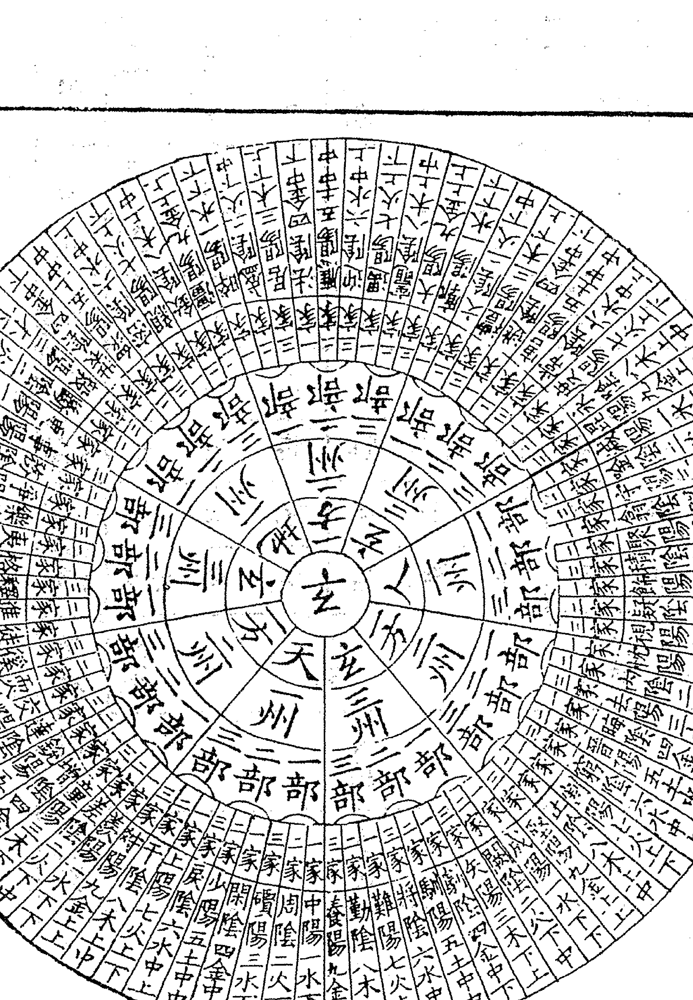

### 揚子玄經準易卦氣方圖

| 坎 |  |  |  |  |  |  |  |  |  |
| :---: | :---: | :---: | :---: | :---: | :---: | :---: | :---: | :---: | :--- |
| 欠首 | 1 | 2 | 3 | 4 | 5 | 6 | 7 | 8 | 9 |
| 首象名 | 三 | 三 | 三 | 三 | 三 | 三 | 三 | 三 | 三 |
|  | 中 | 周 | 礙 | 開 | 少 | 辰 | 上 | 干 | 對 |
| 方 | 元天 | 一 | 一 | 一 | 一 | 一 | 一 | 一 | 一 |
| 州 | 姤一 | 一 | 一 | 一 | 一 | 一 | 一 | 一 | 一 |
| 部 | 始 | 一 | 一 | 中 | 二 | 二 | 終 | 三 | 三 |
| 家 | 一 | 二 | 三 | 一 | 二 | 三 | 一 | 二 | 三 |
| 陽陰 | 陽 | 陰 | 陽 | 陰 | 陽 | 陰 | 陽 | 陰 | 陽 |
| 五行 | 水 | 火 | 木 | 金 | 土 | 水 | 火 | 木 | 金 |
| 準易 | 孚中 | 復 | 屯 | 屯 | 謙 | 睽 | 升 | 升 | 臨 |
| 節氣 | 冬至 |  |  | 小寒 |  |  | 大寒 |  |  |
| 律呂 |  |  | 大呂 |  |  |  |  |  |  |
| 星次 |  |  | 玄枵 |  |  |  |  |  |  |
| 月建 |  |  | 丑 |  |  |  |  |  |  |
| 備註 |  |  |  |  |  |  |  |  | 陽氣始生 |

# 一、拟易篇

| 震 |  |  |  |  |  |  |  |  |  |  |  |
| --- | --- | --- | --- | --- | --- | --- | --- | --- | --- | --- | --- |
| 21 | 20 | 19 | 18 | 17 | 16 | 15 | 14 | 13 | 12 | 11 | 10 |
| ䷚ | ䷛ | ䷜ | ䷝ | ䷞ | ䷟ | ䷠ | ䷡ | ䷢ | ䷣ | ䷤ | ䷥ |
| 釋 | 進 | 從 | 俟 | 買 | 交 | 達 | 銳 | 增 | 童 | 差 | 芟 |
| 一 | 一 | 一 | 一 | 一 | 一 | 一 | 一 | 一 | 一 | 一 | 一 |
| 三 | 三 | 終 | 二 | 二 | 二 | 二 | 二 | 二 | 二 | 二 | 中 |
| 一 | 始 | 一 | 三 | 三 | 終 | 二 | 二 | 中 | 一 | 始 | 一 |
| 三 | 二 | 一 | 三 | 二 | 一 | 三 | 二 | 一 | 三 | 二 | 一 |
| 陽 | 陰 | 陽 | 陰 | 陽 | 陰 | 陽 | 陰 | 陽 | 陰 | 陽 | 陰 |
| 木 | 火 | 水 | 金 | 木 | 火 | 水 | 土 | 金 | 木 | 火 | 水 |
| 解 | 晉 | 隨 | 需 | 需 | 泰 | 泰 | 漸 | 益 | 蒙 | 過小 | 過小 |
| 春分 |  |  | 驚蟄 |  |  | 雨水 |  |  | 立春 |  |  |
|  |  |  | 夾鐘 |  |  |  |  |  | 太蔟 |  |  |
| 七 |  |  | 降婁 |  |  |  |  |  | 訾訾 |  |  |
|  |  |  | 卯 |  |  |  |  |  | 寅 |  |  |
|  |  |  |  |  |  |  |  |  |  |  |  |

# 皇極經世·太乙神數圖解

| 33 | 32 | 31 | 30 | 29 | 28 | 27 | 26 | 25 | 24 | 23 | 22 |
| :---: | :---: | :---: | :---: | :---: | :---: | :---: | :---: | :---: | :---: | :---: | :---: |
| ━ ━
━ | ━ ━
━ | ━ ━
━ | ━ ━
━ | ━ ━
━ | ━ ━
━ | ━ ━
━━ | ━ ━
━━ | ━ ━
━━ | ━ ━
━━ | ━ ━
━ | ━ ━
━ |
| 密 | 眾 | 裏 | 毅 | 斷 | 更 | 事 | 務 | 爭 | 樂 | 夷 | 格 |
| ━ | ━ | ━ | ━ | ━ | ━
元地 | ━ | ━ | ━. | ━ | ━ | ━ |
| ━ | ━ | ━ | ━ | ━ | 下
━ | 三 | 三 | 三 | 三 | 三 | 三 |
| ━ ━
━ | ━ ━
━ | ━ ━
中
━ | ━ | ━ | 下
━ | 三 | 三 | 三
終 | ━ ━
━ | ━ ━
━ | ━ ━
中
━ |
| 三 | ━ | ━ | 三 | ━ | ━ | 三 | ━ | ━ | 三 | ━ | ━ |
| 陽 | 陰 | 陽 | 陰 | 陽 | 陰 | 陽 | 陰 | 陽 | 陰 | 陽 | 陰 |
| 水 | 土 | 金 | 木 | 火 | 水 | 金 | 木 | 火 | 水 | 土 | 金 |
| 比 | 師 | 旅 | 夬 | 夬 | 革 | 蠱 | 蠱 | 訟 | 豫 | 豫 | 壯大 |
| 立夏 | 谷雨 | 清明 |
| 仲呂 | 姑洗 |
| 實沉 | 大梁 |
| 巳 | 辰 |

| 離 | | | | | | | | | | | | |
| :---: | :---: | :---: | :---: | :---: | :---: | :---: | :---: | :---: | :---: | :---: | :---: | :---: |
| 45 | 44 | 43 | 42 | 41 | 40 | 39 | 38 | 37 | 36 | 35 | 34 |
| ䷥ | ䷤ | ䷫ | ䷞ | ䷞ | ䷇ | ䷼ | ䷍ | ䷌ | ䷀ | ䷀ | ䷁ |
| 大 | 窺 | 遇 | 迎 | 應 | 法 | 居 | 盛 | 睟 | 彊 | 斂 | 親 |
| 二 | 二 | 二 | 二 | 二 | 二 | 二 | 二 | 二 | 二 | 二 | 二 |
| 二 | 二 | 二 | 二 | 二 | 二 | 二 | 二 | 中 | 二 | 二 | 二 |
| 三 | 三 | 上 | 二 | 二 | 中 | 一 | 一 | 下 | 三 | 三 | 上 |
| 三 | 二 | 一 | 三 | 二 | 一 | 三 | 二 | 一 | 三 | 二 | 一 |
| 陽 | 陰 | 陽 | 陰 | 陽 | 陰 | 陽 | 陰 | 陽 | 陰 | 陽 | 陰 |
| 金 | 木 | 火 | 水 | 土 | 金 | 木 | 火 | 水 | 金 | 木 | 火 |
| 豐 | 鼎 | 姤 | 咸 | 咸 | 井 | 人家有 | 大 | 乾 | 乾 | 畜小 | |
| 小暑 | | 夏至 | | | | 芒種 | | | 小滿 | | |
| 林鐘 | | | | | | 蕤賓 | | | | | |
| 鶉火 | | | | | | 鶉首 | | | | | |
| 未 | | | | | | 午 | | | | | |
| | | | | 陰氣始生 | | | | | | | |

| 57 | 56 | 55 | 54 | 53 | 52 | 51 | 50 | 49 | 48 | 47 | 46 |
| --- | --- | --- | --- | --- | --- | --- | --- | --- | --- | --- | --- |
| 卦象符号 | 卦象符号 | 卦象符号 | 卦象符号 | 卦象符号 | 卦象符号 | 卦象符号 | 卦象符号 | 卦象符号 | 卦象符号 | 卦象符号 | 卦象符号 |
| 守 | 險 | 減 | 昆 | 永 | 度 | 常 | 唐 | 逃 | 體 | 文 | 廟 |
|  |  | 元人 |  |  |  |  |  |  |  |  |  |
|  |  | 思 |  |  |  |  |  |  |  |  |  |
|  |  | 丙 |  |  |  |  |  |  |  |  |  |
| 陽 | 陰 | 陽 | 陰 | 陽 | 陰 | 陽 | 陰 | 陽 | 陰 | 陽 | 陰 |
| 木 | 火 | 水 | 金 | 木 | 火 | 水 | 土 | 金 | 木 | 火 | 水 |
| 否 | 否 | 損 | 人同 | 人同 | 節 | 恆 | 遯 | 遯 | 履 | 渙 | 豐 |
|  |  | 處暑 |  |  |  | 立秋 |  |  | 大暑 |  |  |
|  |  |  |  |  |  | 夷則 |  |  |  |  |  |
|  |  |  |  |  |  | 鶉尾 |  |  |  |  |  |
|  |  |  |  |  |  | 申 |  |  |  |  |  |
|  |  |  |  |  |  |  |  |  |  |  |  |

| | 兑 | | | | | | | | | | |
|---|---|---|---|---|---|---|---|---|---|---|---|
| 69 | 68 | 67 | 66 | 65 | 64 | 63 | 62 | 61 | 60 | 59 | 58 |
| ䷽  | ䷏  | ䷏  | ䷋  | ䷻  | ䷯  | ䷯  | ䷻  | ䷋  | ䷻  | ䷻  | ䷻  |
| 窮 | 膏 | 嗨 | 去 | 內 | 沈 | 視 | 疑 | 飾 | 積 | 聚 | 翕 |
| 三 | 三 | 三 | 三 | 三 | 三 | 三 | 三 | 三 | 三 | 三 | 三 |
| 二 | 二 | 二 | 二 | 二 | 二 | 福 | 一 | 一 | 一 | 一 | 一 |
| 一 | 一 | 一 | 中 | 一 | 一 | 小 | 三 | 三 | 外 | 二 | 二 | 中 |
| 三 | 二 | 一 | 三 | 二 | 一 | 三 | 二 | 一 | 三 | 二 | 一 |
| 陽 | 陰 | 陽 | 陰 | 陽 | 陰 | 陽 | 陰 | 陽 | 陰 | 陽 | 陰 |
| 水 | 土 | 金 | 木 | 火 | 水 | 金 | 木 | 火 | 水 | 土 | 金 |
| 困 | 夷明 | 夷明 | 妄无 | 妹歸 | 觀 | 觀 | 賁 | 賁 | 畜大 | 萃 | 巽 |
| 霜降 | | | 寒露 | | | 秋分 | | | 白露 | | |
| | | | 無射 | | | | | | 南呂 | | |
| | | | 大火 | | | | | | 壽星 | | |
| | | | 戌 | | | | | | 酉 | | |

| 81 | 80 | 79 | 78 | 77 | 76 | 75 | 74 | 73 | 72 | 71 | 70 |
| :---: | :---: | :---: | :---: | :---: | :---: | :---: | :---: | :---: | :---: | :---: | :---: |
| ⚊⚊⚊ | ⚊⚊⚊ | ⚊⚊⚊ | ⚊⚊⚊ | ⚊⚊⚊ | ⚊⚊⚊ | ⚊⚊⚊ | ⚊⚊⚊ | ⚊⚊⚊ | ⚊⚊⚊ | ⚊⚊⚊ | ⚊⚊⚊ |
| 養 | 勤 | 難 | 將 | 馴 | 劇 | 失 | 闘 | 成 | 堅 | 止 | 剝 |
| 陽 | 陰 | 陽 | 陰 | 陽 | 陰 | 陽 | 陰 | 陽 | 陰 | 陽 | 陰 |
| 金 | 木 | 火 | 水 | 土 | 金 | 木 | 火 | 水 | 金 | 木 | 火 |
| 頤 | 蹇 | 蹇 | 濟未 | 坤 | 過大 | 過大 | 噬嗑 | 濟既 | 艮 | 艮 | 剝 |
| | 大雪 | 小雪 | | | | | | | 立冬 | | |
| | 黃鐘 | | | | | | | | 應鐘 | | |
| | 星紀 | | | | | | | | 析木 | | |
| | 子 | | | | | | | | 亥 | | |
| | 分日數 | 贏：補四 | | | | | | | 脩：補半 | 註： | |

### 一、擬易篇

## 二、關子明洞極經

洞極真經。洞極乃擬玄準易之作，堪為易學別傳。洞極以洛書之文，九前一後、三左七右、四前左二前右、八後左六後右，故立之三。

> > 說曰：生三以象天，育三以象地，資三以象人。一為生之一、二為生之二、三為生之三。一為育之一、五為育之二、八為育之三。三為資之一、六為資之二、九為資之三。

以準易大象，傳以準小象。二象變而各九，以成二十七象。一、二、三，以準易之三爻，翼以準易象，傳

- 首生三
- 次萌三
- 息三
- 華三
- 茂三
- 止三
- 安三
- 燠三
- 實三
- 繼之以資三
- 冥、通
- 十一論以發明大意，則準易之繫辭。

其言生也，曰形而上者謂之天，日月星辰皆天也。其言育也，曰形而下者謂之地，山川草木皆地也。其言資也，曰命于中者謂之人，戎狄禽魚皆人也。以準三才之道。洞極雖是擬玄，其實只是一生二、二生三、三生萬物。一即一之象，其名曰生。一即二之象，其名曰育，一即三之象，其名曰資。由生而萌、息、華、茂、止、安、燠、實屬乎天。由育而和、塞、作、煥、幾、抑、冥、通屬乎地。由資而用、達、興、紊、悖、靜、序屬乎人。是三三而九，三九而二十七，觀其所盡，非杜撰者，然而不足以窺天地造化之秘，則玄且不足以擬易也，何有於擬玄之極哉。天地闢，萬物生，生必萌，萌而後息，息而華，華則茂，物不終茂，故所以止。止然後安，安則得其燠、燠則實、實則可以資矣。資必有所用，用然後達，達則興，物不終興、興久則紊、紊則悖、治悖莫若靜、靜則平、平則有序、序可以育矣。育然後和，物不終和，和久必塞，決塞必有作，作則煥，煥則幾矣，至正必有抑，抑則冥，物不終冥，故以通而終焉。上言洞極象序。

> 極數篇曰：天一、地二、人三、天四、地五、人六、天七、地八、人九。三極之數四十五，天有十二、地有十五、人有十八。審其數而畫之，三十有九則一，四十有五則二，四十有五則三。生之策百一十七，育之策百二十六，資之策百三十五十有一則二，四十五則三，遺其餘，則三百六十，當奇之日，顯冥之道盡矣，此著法也。洞極經圖，蓋準玄法則，以一畫為生一，斷而兩者為二，斷而三孝為資一，以上畫謂之一、中畫謂之二、下畫謂之三，而現示「生育資為二二三」，「育資生為二二二一」，「資生育為三二二一」之循環轉變，更迭相生。列方圓圖于后：

# 皇極經世・太乙神數圖解

| 資 | 人配九體之資 | 地配九體之育 | 天配九體之生 |
| --- | --- | --- | --- |
| 序 平 靜 悖 乖 與 達 用 資 | 資3資3資3資3資3資3資3<br>之之之之之之之之<br>生4生4生4生4生4生4生4 | 通 異 抑 幾 煥 作 塞 和 育<br>育2育2育2育2育2育2<br>之之之之之之之<br>生4生4生4生4生4生4 | 實 煥 安 止 茂 華 息 萌 生<br>生1生1生1生1生1生1<br>之之之之之之之<br>生4生4生4生4生4生4 |

關子明洞極經擬玄準易方圖

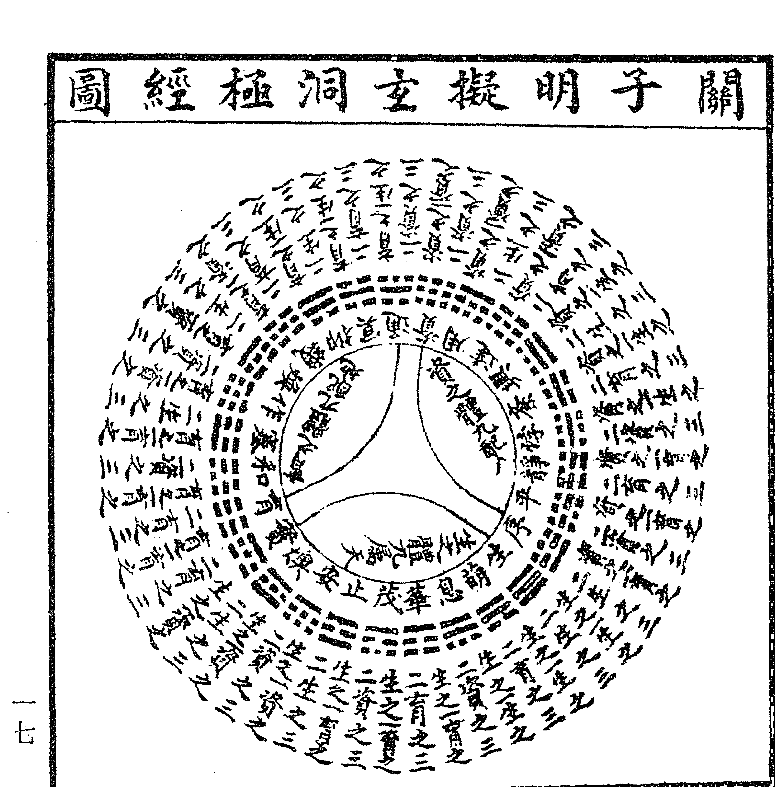

# 皇極經世·太乙神數圖解

# 三、司马温公潜虚

潜虚者，为司马光所作，光字君实，与邵雍同为宋神宗时人，卒后封太师温国公，谥文正。公好扬子太玄之学，曾注太玄集注，卷首有读玄一篇，于扬子云推挹甚至。故拟玄而作潜虚，未竟而卒，后人为增补成书。其论天人性命，皆以气、象、数三者为本，得于刘牧之说，并依天人合一学说，以言性命，而为潜虚说。

> > 潜虚首云：“万物皆祖于虚，生于气，气以成体、体以受性、性以辨名、名以立行、行以俟命。故虚者，物之府也。气者，生之户也。体者，质之具也。性者，神之赋也。名者，事之分也。行者，人之务也。命者，时之遇也。”

此数言者，潜虚之大纲也。今本有气、体、性、名、行、命六图，皆欲以通造化之際，原性命之本也。行圈中又有变图、解图、故亦或言八图。原书气圈，以五行生成，演为十数，而变一为丨，二为||，三为川，四为巛，五为X，六为丁，七为π，八为III，九为而，十而十。诂之以原、癸、本、卜、基、委、炎、末、冖、冢为序。盖本五行生数，水火木金土，分置北南东西中五方，再合成数五位，而得此十数也。生数一十有五，成数四十，生成之数五十有五，故今名图有五十五名，则行图有五十五行也。

潜虚体图，是就气图而作。分左右（宾主）、上下（尊卑）分十等五十五体，此十等即：一等象王、二等象公、三等象岳、四等象牧、五等象率、六等象位、七等象卿、八等象大夫、九等象士、十等象庶人。一以治万，小以制众，如心使身，身使臂，臂使指，以成天下之业，以为政治原委，此纲纪立而治具成矣。

潜虚性图，则以五行之性，皆相生以相维，相克以相成，故先列水火木金土十纯为序名图，其次递降：降一故水与火配，降二故水与木配，降三故水与金配，降四故水与土配，自降一至降四，其下亦降次以相配焉。最后五行生成，各自为配，皆不出相生以相维，相克以相成也。

潜虚名图，依五行生成之数，而立五十五名，建周天圆图，以水火木金，分位于北南东西，土兼属四隅，乾坤巽艮在圆外围，与土位四偶相应。五十五名之中，元、余者物之始终，故无变，齐者中也，包斡万物，故无位。

人之生本于虚，虚然后形，形然后性，性然后动，动然后情。情然后事，事然后德，德然后家。家然后国，然后政，政然后功，功然后业，业然后返于虚矣。

故万物始于元、著于衰、孝于齐、消于散、讫于余。五者，形之运也，刚柔雍昧昭，性之分也，如行图，各有七变。其周天之图，冬至之气起于元，转而周三百六十。

潜虚行圖，以五十五名次序橫列，繫辭以釋其義，比於易之卦辭，名各有變圖、解圖，圖有初、二、三、四、五、上，各繫辭為之說。變圖若易之爻辭，解圖若易之象辭，皆以天道極人事，即張載所謂：行者，人之所務，繫之辭以明其義，用之變以占其占，皆所以前民用者也。

潛虛命圖：以吉、臧、平、否、凶，序諸名以占事，決其命之所遇。五十五名中，元、餘、齊三者無變，皆不占，初上者，事之始終，亦不占。故所占者祇自衰中，元、餘、齊三者無變，皆不占，初上者，事之始終，亦不占。至散五十二名，以二、三、四、五、六之變，觀其吉，臧、平、否、凶之所遇，而決其禍福避就也。所謂「用名有五，可以治性，可以修身，可以齊家，可以治國，可以平天下」。故曰：「用之變，以占其占」。

故溫公之氣、體、性、名、行、命六圖，皆用陰陽五行，以推衍自然人事之萬象。其象、數、氣之理，源本洪範五行之「五行」、「五事」，及董仲舒之陰陽、五行、方位、四時之說，以五行自然之氣，生成名數五十五，具天地始終之道，成變化而行鬼神。

# 皇極經世·太乙神數圖解

| 12 | 11 | 10 | 9 | 8 | 7 | 6 | 5 | 4 | 3 | 2 | 1 | × |||
|---|---|---|---|---|---|---|---|---|---|---|---|---|---|---|
| 觀 | 聽 | 慮 | 言 | 容 | 昭 | 昧 | 雍 | 剛 | 柔 | 衰 | 元 | 齊 | 五十五名 ||
| 丯丯 | 丯丯 | 丯× | 丌丌 | 丌丌 | ㄒ丌 | 丅 | 丿丌 | 丿丿丿 | 丿丿 | 丿 | 丿 | ×× | 五十五名 ||
| 視 | 聽 | 思 | 辭 | 貌 | 明 | 晦 | 和 | 天之道 | 地之德 | 聚 | 始 | 中 | 辭義 ||
| | | | | | | | | | | | | | | 司馬溫公潛虛五十五名命方圖 |
| 官之動 | 分之性 | 運之形 ||||
| 六 | 二 | 三 | 四 | 五 | 六 | 二 | 三 | 四 | 五 | 六 | 吉 ||
| 四 | 四 | 二 | 六 | 四 | 四 | 四 | 二 | 六 | 四 | 四 | 減 ||
| 二 | 五 | 五 | 五 | 三 | 二 | 五 | 五 | 五 | 三 | 二 | 平 ||
| 五 | 六 | 六 | 二 | 六 | 五 | 六 | 六 | 二 | 六 | 五 | 否 ||
| 二 | 二 | 四 | 二 | 二 | 二 | 二 | 四 | 二 | 二 | 二 | 凶 ||

圖
命
圖## 一、擬易篇

| 27 | 26 | 25 | 24 | 23 | 22 | 21 | 20 | 19 | 18 | 17 | 16 | 15 | 14 | 13 |
| :--- | :--- | :--- | :--- | :--- | :--- | :--- | :--- | :--- | :--- | :--- | :--- | :--- | :--- | :--- |
| 夏 | 詰 | 忧 | 宜 | 訥 | 蠢 | 妄 | 庸 | 卻 | 莓 | 耽 | 懼 | 得 | 愴 | 縷 |
| ∣∣π | T∣∣ | ∣∣X | ∣∣∣∣∣∣ | ∣∣∣∣ | ∣∣∣ | X十 | X十 | X∣∣∣ | ππ∣ | π∣∣∣ | π∣∣ | ∣十 | ∣∣∣∣π | ∣∣∣∣π |
| 體 | 智 | 信 | 義 | 仁 | 動 | 靜 | 常 | 退 | 追 | 樂 | 憂 | 欲 | 怒 | 喜 |

| 德之塗 | 事之變 | 情之說 |
| :--- | :--- | :--- |
| 六 二 三 四 五 | 六 二 三 四 五 | 六 二 三 四 五 |
| 四 四 二 六 四 | 四 四 二 六 四 | 四 四 二 六 四 |
| 二 五 五 五 三 | 二 五 五 五 三 | 二 五 五 五 三 |
| 五 六 六 二 六 | 五 六 六 二 六 | 五 六 六 二 六 |
| 三 三 四 三 二 | 三 三 四 三 二 | 三 三 四 三 二 |

## 皇極經世・太乙神數圖解

| 42 | 41 | 40 | 39 | 38 | 37 | 36 | 35 | 34 | 33 | 32 | 31 | 30 | 29 | 28 |
| :--- | :--- | :--- | :--- | :--- | :--- | :--- | :--- | :--- | :--- | :--- | :--- | :--- | :--- | :--- |
| 戩 | 寳 | 資 | 準 | 程 | 林 | 隸 | 醜 | 徒 | 范 | 考 | 續 | 臆 | 偶 | 特 |
| 符号行 | | | | | | | | | | | | | | |
| 兵 | 客 | 用 | 法 | 祀 | 君 | 臣 | 友 | 象 | 師 | 父 | 子 | 親 | 妃 | 天 |
| 務 | 之 | 政 | 紀 | 之 | 國 | 網 | 之 | 家 | | | | | | |
| 六 | 二 | 三 | 四 | 五 | 六 | 二 | 三 | 四 | 五 | 六 | 二 | 三 | 四 | 五 |
| 四 | 四 | 二 | 六 | 四 | 四 | 四 | 二 | 六 | 四 | 四 | 四 | 二 | 六 | 四 |
| 二 | 五 | 五 | 五 | 三 | 二 | 五 | 五 | 五 | 三 | 二 | 五 | 五 | 五 | 三 |
| 五 | 六 | 六 | 二 | 六 | 五 | 六 | 六 | 二 | 六 | 五 | 六 | 六 | 二 | 六 |
| 三 | 三 | 四 | 三 | 二 | 三 | 三 | 四 | 三 | 二 | 三 | 三 | 四 | 三 | 二 |

## 一、擬易篇

| 54 | 53 | 52 | 51 | 50 | 49 | 48 | 47 | 46 | 45 | 44 | 43 |
| :--- | :--- | :--- | :--- | :--- | :--- | :--- | :--- | :--- | :--- | :--- | :--- |
| 餘 | 散 | 隆 | 造 | 混 | 痛 | 興 | 聲 | 育 | 續 | 理 | 數 |
| Tm | Tm | TT | ++ | T+ | +| | +| | +| | +| | +| | ++ | +|| |
| 終 | 消 | 盛 | 始 | 減 | 病 | 起 | 名 | 養 | 功 | 治 | 數 |
| 運之形 | | | | | 著之業 | | | | | 具之功 | |
| 五 | | 六 | 二 | 三 | 四 | 五 | 六 | 二 | 三 | 四 | 五 |
| 四 | | 四 | 四 | 二 | 六 | 四 | 四 | 四 | 二 | 六 | 四 |
| 三 | | 二 | 五 | 五 | 五 | 三 | 二 | 五 | 五 | 五 | 三 |
| 六 | | 五 | 六 | 六 | 二 | 六 | 五 | 六 | 六 | 二 | 六 |
| 二 | | 三 | 三 | 四 | 三 | 二 | 三 | 三 | 四 | 三 | 二 |

## 皇極經世·太乙神數圖解

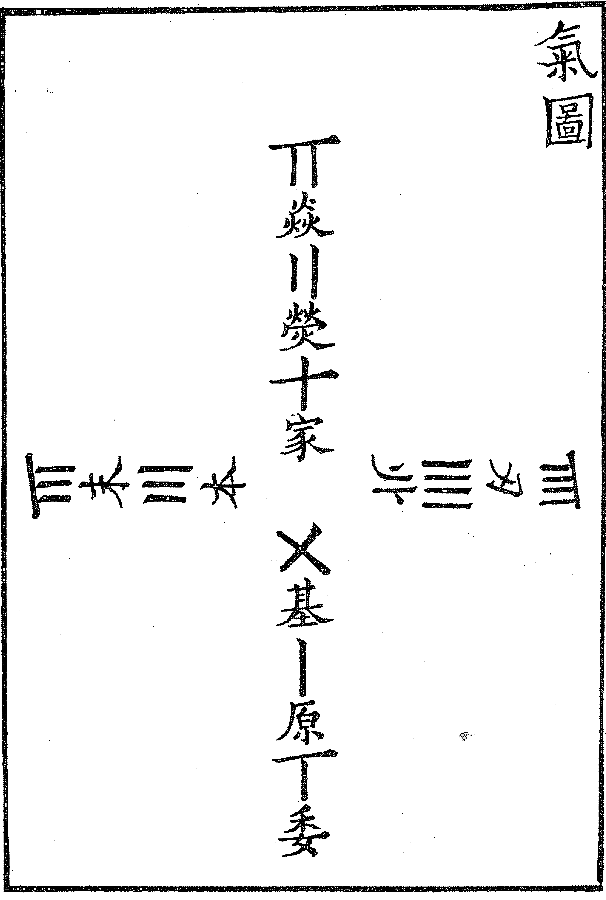

## # 體圖

| 原左 | 原右 | 燮左 | 燮右 | 本左 | 本右 | 廿左 | 廿右 | 右侧标签 |
| :--- | :--- | :--- | :--- | :--- | :--- | :--- | :--- | :--- |
| 〡 | 〡 | 原左 | 原右 | 王 | | | | |
| 〡 | 〢 | 燮左 | 燮右 | 公 | | | | |
| 〡 | 〣 | 原左 | 原右 | 岳 | | | | |
| 〡 | 〤 | 原左 | 原右 | 收 | | | | |
| 〡 | X | 原左 | 原右 | 率 | | | | |
| 〡 | T | 原左 | 原右 | 侯 | | | | |
| T | 〡 | 原左 | 原右 | 卿 | | | | |
| 〣 | 〡 | 原左 | 原右 | 夫 | | | | |
| 〣 | 〡 | 原左 | 原右 | 士 | | | | |
| + | 〡 | 原左 | 原右 | 庶人 | | | | |

## 皇極經世·太乙神數圖解

| | | | | | | |性圖 |
| :--- | :--- | :--- | :--- | :--- | :--- | :--- | :--- |
| Ⅰ | T 水 | Ⅰ | × 土 | Ⅰ | ⅢⅢⅢ 金 | Ⅰ | ⅢⅢ 木 |
| Ⅰ | Ⅱ 火 | Ⅰ | Ⅱ 水 | Ⅰ | Ⅱ 火 | Ⅰ | Ⅲ 木 |
| Ⅱ | π 火 | Ⅱ | T 水 | Ⅱ | × 土 | Ⅱ | ⅢⅢⅢ 金 |
| Ⅱ | ⅢⅢ 木 | Ⅱ | Ⅲ 火 | Ⅱ | Ⅱ 火 | Ⅱ | Ⅱ 火 |
| Ⅲ | πⅢ 木 | Ⅲ | π 火 | Ⅲ | T 水 | Ⅲ | × 土 |
| Ⅲ | ⅢⅢⅢ 金 | Ⅲ | ⅢⅢ 木 | Ⅲ | Ⅲ 火 | Ⅲ | Ⅱ 火 |
| ⅢⅢ | πⅢⅢ 金 | ⅢⅢ | πⅢ 木 | ⅢⅢ | π 火 | ⅢⅢ | T 水 |
| ⅢⅢ | × 土 | ⅢⅢ | ⅢⅢⅢ 金 | ⅢⅢ | ⅢⅢ 木 | ⅢⅢ | Ⅲ 火 |
| × | 十 土 | × | ⅢⅢⅢ 金 | × | ⅢⅢ 木 | × | π 火 |
| × | T 水 | × | × 土 | × | ⅢⅢⅢ 金 | × | ⅢⅢ 木 |
| T | 十 土 | T | ⅢⅢⅢ 金 | T | ⅢⅢ 木 | T | π 火 |
| T | T 水 | T | 十 土 | T | ⅢⅢⅢ 金 | T | ⅢⅢ 木 |
| π | Ⅰ 水 | π | 十 土 | π | ⅢⅢⅢ 金 | π | ⅢⅢ 木 |
| π | π 火 | π | Ⅰ 水 | π | 十 土 | π | ⅢⅢⅢ 金 |
| Ⅲ | Ⅱ 火 | Ⅲ | Ⅰ 水 | Ⅲ | 十 土 | Ⅲ | ⅢⅢⅢ 金 |
| Ⅲ | Ⅲ 木 | Ⅲ | Ⅱ 火 | Ⅲ | Ⅰ 水 | Ⅲ | 十 土 |
| ⅢⅢ | Ⅲ 木 | ⅢⅢ | Ⅱ 火 | ⅢⅢ | Ⅰ 水 | ⅢⅢ | 十 土 |
| ⅢⅢ | ⅢⅢ 金 | ⅢⅢ | Ⅲ 木 | ⅢⅢ | Ⅱ 火 | ⅢⅢ | Ⅰ 水 |
| 十 | ⅢⅢⅢ 金 | 十 | ⅢⅢ 木 | 十 | Ⅲ 火 | 十 | Ⅰ 水 |
| 十 | 十 土 | 十 | ⅢⅢⅢ 金 | 十 | ⅢⅢ 木 | 十 | Ⅲ 火 |

## 一、擬易篇

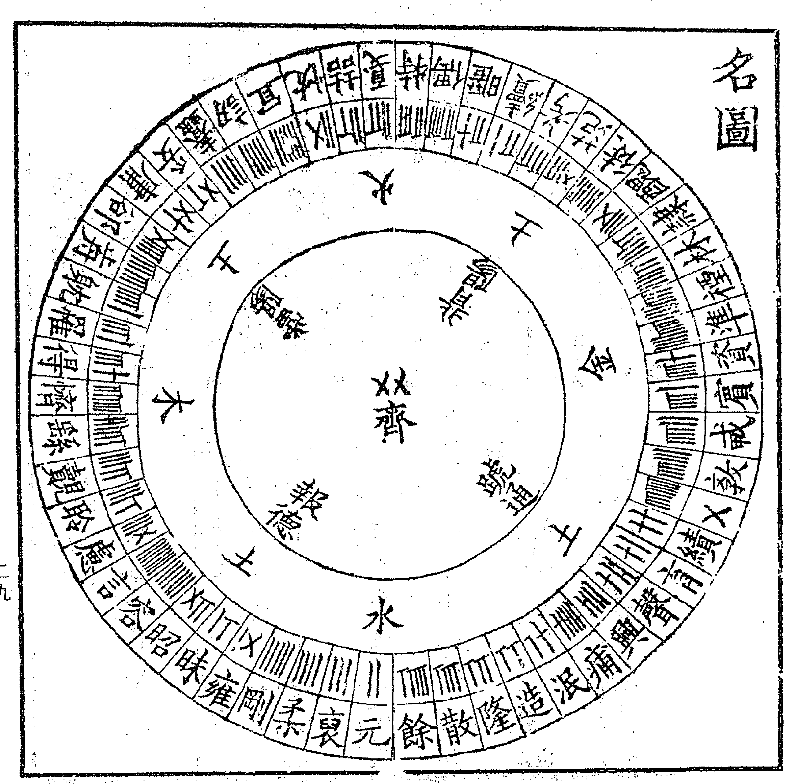

| 行圖 | 二元 | 三表 |
| :--- | :--- | :--- |
| 變圖<br>慎为举趾差则<br>千里机正其矢 | 初<br>二<br>三<br>四<br>五 | 衰聚也气聚而物宗族聚而家圣贤聚而国 |
| 解圖<br>慎于举趾差则远也 | 进而远而俟其聚不可苟必进远也<br>人保而繁善以道羣也<br>百毒之聚胜者百毒之聚祗害人也<br>羽毛鳞介聚以伦也<br>菟絲之梦不知固根也 | 菟絲之梦不知固根也 |

## 一、擬易篇

| 六 八音和鳴 祗是聽<br>八音之哀感神明也 | 上 雲還于山 冰泮于川<br>雲還冰泮聚極必分也 | 惡案自哀至散凡五十二皆散後有餘齊併具于左<br>堯舜之德禹稷之績堯舜周孔垂世無窮 周規孔式終天無斁也 | 餘<br>餘終也天過其度日之餘也朔不滿氣月之餘也日不 復次歲之餘也功德垂後聖賢之餘也故天地无餘則 餘則光澤不遠矣 | XX齊<br>齊中也陰陽不中則物不生血氣不中則體不平剛柔 不中則德不成寬猛不中則政不行中之用其至矣乎 | 眾星拱極萬矢 凑的必不可易 也<br>眾星萬矢誰能易中 |
| :--- | :--- | :--- | :--- | :--- | :--- |

## 皇極經世·太乙神數圖解

## # 第二 擬範篇

## ### 蔡九峯洪範皇極

洪範皇極者，九峯蔡氏之作，為西山之子。蔡元定，字季通，號西山，宋建陽人，嘗登西山，忍飢啖齋讀書，克箕父發所傳程氏語錄、邵氏經世、張氏正蒙之書，稱西山先生。並師習朱熹，著有皇極經世、太玄、潛虛指要、律占新書、八陣圖說、洪範解、大衍詳說等。西山之幼子蔡沈，字仲默，號九峯，隱居九峯，幼膺父教，出事晦翁，獨傳「洪範之學」，發於二帝、三王、群聖用心之要，往往有先儒所未及者。一以聖賢為師，著有洪範皇極內篇，洪範皇極圖、九九圓數圖、九九方數圖、九九積數圖。由陰陽五行而為象數，本於洛書，此其所長。潛虛與洪範，一本生成，世名河圖，一本九宮，世名洛書，雖異而實同。故以數而論，虛之與範無所優劣。天台謝氏曰：「圖出河、書出洛。圖為易，書為範。」易以象，範以數。象以偶，數以奇，知有數奇而不知有象，偶是有書而無圖也，知有象偶而不知有數，奇是有圖而無書也。

> > 天台謝氏曰：「圖出河、書出洛。圖為易，書為範。」

蔡九峯曰：『易更四聖，其象已著，範錫神禹，其數不傳，於是有以數為象，而奇零無用矣，於是有以象為數，而偶多難通矣。夫推其極，則卦與疇，象與數，相因為用故也。原其初，則卦自卦，疇自疇、象自象、數自數，其可混而一之乎！

數九峰廣西山之家學，陽考亭之師傳，著皇極內篇，作洪範皇極，以究其數，以。

其演數之法，縱橫皆九位，始於一，參於三，究於九，成立於八十一，備於六千五百六十一，散之無外，卷之無內，體諸造化而不遺，用諸變通而無窮。是于數學亦自有見，而皆準易與洪範，備象而周數，然其吉凶悔吝，災祥休咎，莫不粲然具見於八十有一章。大抵以性命為端，以禮義為準，因占設教，即事示戒，欲正而不欲邪，欲中而不欲偏，為君子謀而不為小人謀，凡所以揭天理，叙民彛、玄世迷、障人慾者，雖不與易同象，未嘗不與易同歸也。

> 皇極內篇曰：天地所以肇人物，所以生萬物，所以有得失，皆數也。數之體著於形，數之用妙乎理，非窮神知化，獨立物表者，曷足以與此。故蔡氏擬元包、洞機、潛虛、太玄、並闡範數，配易象，補前古之闕文，垂將來之大法，享數之弗遐，釋數之未備。竊著洪範皇極，程子曰：有之無所補，無之靡所關矣，窮幾研深。

## 大禹敍書作範

| 一、五行 | 二、五事 | 三、八政 |
| :--- | :--- | :--- |
| 五行：水 火 木 金 土<br>水曰潤下，火曰炎上，木曰曲直，金曰從革，土爰稼穡。<br>潤下作鹹，炎上作苦，曲直作酸，從革作辛，稼穡作甘。 | 五事：貌 言 視 聽 思<br>貌曰恭，言曰從，視曰明，聽曰聰，思曰睿。<br>恭作肅，從作乂，明作晢，聰作謀，睿作聖。 | 八政：一曰食，二曰貨，三曰祀，四曰司空，五曰司徒，六曰司寇，七曰賓，八曰師 |
| **四、五紀** | **五、皇極** | **六、三德** |
| 五紀：一曰歲，二曰月，三曰日，四曰星辰，五曰歷數。 | 皇極：無偏無黨，王道蕩蕩；無黨無偏，王道平平；無反無側，王道正直。會其有極，歸其有極。 | 三德：一曰正直，二曰剛克，三曰柔克。平康正直，強弗友剛克，燮友柔克。沈潛剛克，高明柔克。 |
| **七、稽疑** | **八、庶徵** | **九、五福六極** |
| 稽疑：擇建立卜筮人，乃命卜筮。曰雨，曰霽，曰蒙，曰驛，曰克，曰貞，曰悔，凡七。卜五，占用二，衍忒。立時人作卜筮，三人占，則從二人之言。 | 庶徵：曰雨，曰霽，曰蒙，曰驛，曰克。曰貞，曰悔。凡七。卜五，占用二，衍忒。立時人作卜筮，三人占，則從二人之言。 | 五福：一曰壽，二曰富，三曰康寧，四曰攸好德，五曰考終命。<br>六極：一曰凶短折，二曰疾，三曰憂，四曰貧，五曰惡，六曰弱。 |

### 九九圓數圖

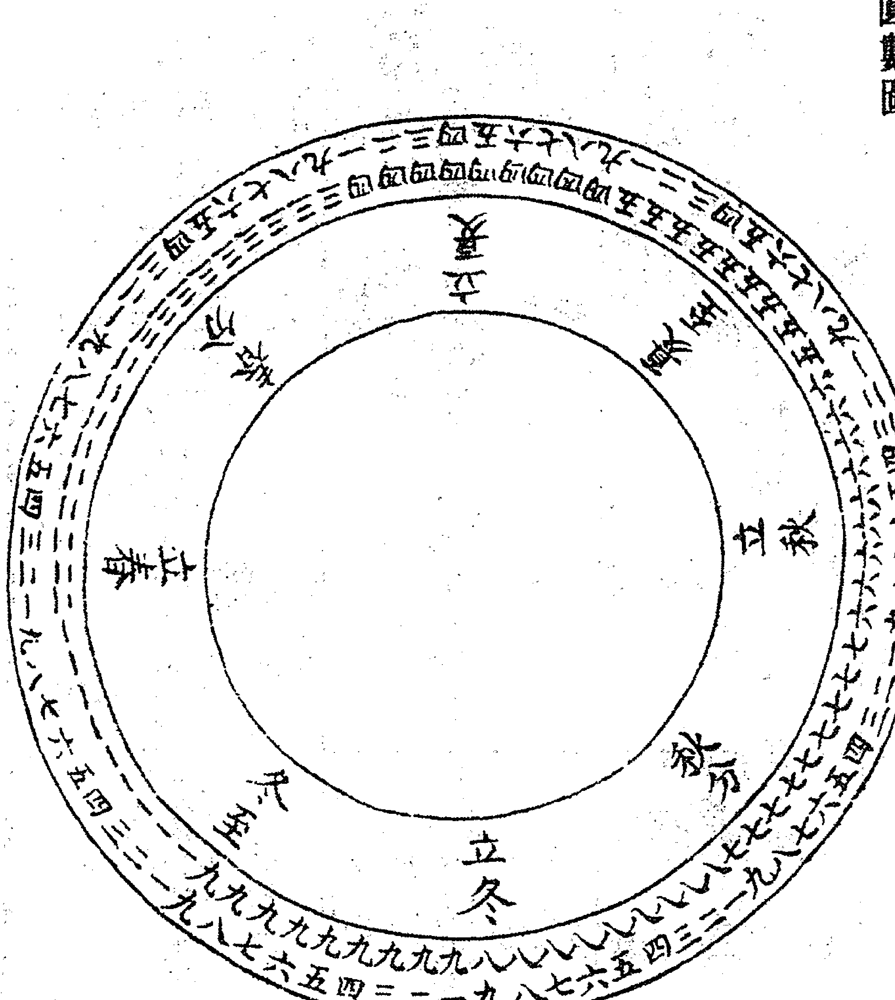

## # 九九方數圖

| 九一 | 九二 | 九三 | 九四 | 九五 | 九六 | 九七 | 九八 | 九九 |
| :--- | :--- | :--- | :--- | :--- | :--- | :--- | :--- | :--- |
| 八一 | 八二 | 八三 | 八四 | 八五 | 八六 | 八七 | 八八 | 八九 |
| 七一 | 七二 | 七三 | 七四 | 七五 | 七六 | 七七 | 七八 | 七九 |
| 六一 | 六二 | 六三 | 六四 | 六五 | 六六 | 六七 | 六八 | 六九 |
| 五一 | 五二 | 五三 | 五四 | 五五 | 五六 | 五七 | 五八 | 五九 |
| 四一 | 四二 | 四三 | 四四 | 四五 | 四六 | 四七 | 四八 | 四九 |
| 三一 | 三二 | 三三 | 三四 | 三五 | 三六 | 三七 | 三八 | 三九 |
| 二一 | 二二 | 二三 | 二四 | 二五 | 二六 | 二七 | 二八 | 二九 |
| 一一 | 一二 | 一三 | 一四 | 一五 | 一六 | 一七 | 一八 | 一九 |

## 皇極經世·太乙神數圖解

| 九一 | 八一 | 七一 | 六一 | 五一 | 四一 | 三一 | 二一 | 一 一 冬至 |
| :--- | :--- | :--- | :--- | :--- | :--- | :--- | :--- | :--- |
| 九二 | 八二 | 七二 | 六二 | 五二 | 四二 | 三二 | 二二 立春 | 一二 |
| 九三 | 八三 | 七三 | 六三 | 五三 | 四三 | 三三 春分 | 二三 | 一三 |
| 九四 | 八四 | 七四 | 六四 | 五四 | 四四 立夏 | 三四 | 二四 | 一四 |
| 九五 | 八五 | 七五 | 六五 | 五五 夏至 | 四五 | 三五 | 二五 | 一五 |
| 九六 | 八六 | 七六 | 六六 立秋 | 五六 | 四六 | 三六 | 二六 | 一六 |
| 九七 | 八七 | 七七 秋分 | 六七 | 五七 | 四七 | 三七 | 二七 | 一七 |
| 九八 | 八八 立冬 | 七八 | 六八 | 五八 | 四八 | 三八 | 二八 | 一八 |
| 九九 冬至 | 八九 | 七九 | 六九 | 五九 | 四九 | 三九 | 二九 | 一九 |

## ### 二、擬範篇

## ### 九九積數圖

| 九 | 八 | 七 | 六 | 五 | 四 | 三 | 二 | 一 |
| :--- | :--- | :--- | :--- | :--- | :--- | :--- | :--- | :--- |
| 八十一 | 七十二 | 六十三 | 五十四 | 四十五 | 三十六 | 二十七 | 十八 | 九 |
| 七百二十九 | 六百四十八 | 五百六十七 | 四百八十六 | 四百〇五 | 三百二十四 | 二百四十三 | 一百六十二 | 八十一 |
| 六千五百六十一 | 五千八百三十二 | 五千一百〇三 | 四千三百七十四 | 三千六百四十五 | 二千九百一十六 | 二千一百八十七 | 一千四百五十八 | 七百二十九 |

## 皇極經世·太乙神數圖解

蔡九峰

皇極八十一名數圖

| 原 | 成 | 兒 | 比 | 底 | 節 | 迅 | 實 | 養 |
| :--- | :--- | :--- | :--- | :--- | :--- | :--- | :--- | :--- |
| 潛 | 衝 | 復 | 開 | 決 | 伏 | 惧 | 寶 | 過 |
| 守 | 振 | 從 | 晉 | 豫 | 虛 | 除 | 危 | 勝 |
| 信 | 析 | 交 | 公 | 升 | 昧 | 弱 | 堅 | 囚 |
| 直 | 常 | 育 | 益 | 中 | 損 | 疾 | 革 | 壬 |
| 蒙 | 柔 | 壯 | 章 | 伏 | 用 | 鏡 | 報 | 因 |
| 開 | 易 | 興 | 盈 | 過 | 卻 | 分 | 止 | 移 |
| 須 | 親 | 欣 | 錫 | 絕 | 倉 | 松 | 戎 | 墜 |
| 屬 | 平 | 舒 | 靡 | 窈 | 遠 | 收 | 終 | 終 |

八十一數原圖
原 元吉。君子有慶。數曰原，誠之原也。
幾 君子見幾，有終慶也。

| 凶吉 | 休吉 | 災吉 | 悔吉 | 平吉 | 客吉 | 祥吉 | 答吉 | 元吉 |
| :--- | :--- | :--- | :--- | :--- | :--- | :--- | :--- | :--- |
| 凶咎 | 休咎 | 災咎 | 悔咎 | 平咎 | 客咎 | 祥咎 | 答咎 | 吉咎 |
| 凶祥 | 休祥 | 災祥 | 悔祥 | 平祥 | 客祥 | 祥祥 | 答祥 | 吉祥 |
| 凶客 | 休客 | 災客 | 悔客 | 平客 | 客客 | 祥客 | 答客 | 吉客 |
| 凶平 | 休平 | 災平 | 悔平 | 平平 | 客平 | 祥平 | 答平 | 吉平 |
| 凶悔 | 休悔 | 災悔 | 悔悔 | 平悔 | 客悔 | 祥悔 | 答悔 | 吉悔 |
| 凶灾 | 休灾 | 災灾 | 悔灾 | 平灾 | 客灾 | 祥灾 | 答灾 | 吉灾 |
| 凶休 | 休休 | 災休 | 悔休 | 平休 | 客休 | 祥休 | 答休 | 吉休 |
| 大凶 | 休凶 | 災凶 | 悔凶 | 平凶 | 客凶 | 祥凶 | 答凶 | 吉凶 |

## ### 第二 理數篇

## ### 一、邵子先天易學

## #### （一）邵雍承傳輿理學

邵雍字堯夫，爲宋初大儒，祖德新，父古，皆隱德不仕。雍少時，自雄其才，慷慨欲樹功名。既學，力慕高遠，於書無所不讀，嘗謂：先生之事爲必可致。爲學堅苦刻勵，寒不爐、暑不扇，夜不就席者數年，已而歎曰：昔人尚友古人，而吾獨未及四方，於是踰河汾、涉淮漢，周流齊魯宋鄭之墟，久之幡然來歸曰：「道在是矣，遂不復出」。

後從北海李之才，受物理性命，圖書象數之學，深究易理哲學，之才之傳，遠有端緒，而雍探蹟索隱，如悟神契，洞徹蘊奧，汪洋浩博，多所自得。及其學，益老德益劭，玩心高明，以觀夫天地之運化，陰陽之消長，遠而古今元運之交變，微而走飛草木之性情，深造曲暢，庶幾所謂不惑，而非依做象類，億則屢中者，遂衍必義先天之旨，著皇極經世書十餘萬言行於世，然世之知其道者鮮矣。

初至洛，蓬葦環堵，不庇風雨，躬樵爨以事父母，雖平居屢空，而怡然有所甚樂。

人莫能窥也。居洛四十年，卜居『九真观』，榜其庐曰：『安乐窝』，因自号安乐先生，尝作『喜乐吟』，自述居洛有五乐，一乐生中国，二乐为男子，三乐为士人，四乐见太平，五乐闻道义。若有皇极经世书，观物篇，渔樵问答，诗曰伊川击壤集等。雍曾与人言，乐道其善，而隐其恶，有就问学则答之，未尝强以语人，人无贵贱少长，一接以诚，故贤者悦其德，不贤者服其化，一时洛中人才特盛，而忠厚之风闻。其一生不仕，于神宗熙宁十年卒，年六十有七，病亟时，曾吟曰：『生于太平世，长于太平世，老于太平世，死于太平世』。客问年几何？曰六十有七，俯仰天地间，浩然无所愧。既卒，赠秘书省著作郎，哲宗元祐中，赐谥康节。度宗咸淳初，从祀孔庙，追封新安伯。明世宗嘉靖中，祀称先儒邵子。清世宗雍正初，改称先贤邵子。雍高明英迈，迥出千古，而坦夷浑厚，不见圭角，是以清而不激，和而不流，人与之交，久益尊信之。程颢初侍其父，识雍，论议终日，退而叹曰：『尧夫内圣外王之学也』。雍知虑绝人，遇事能前知。程颐尝曰：『其心虚明，自能知之。听其议论，振古之豪杰也，惜其无所用于世』。欧阳棐赞先生像曰：『天挺人豪，英迈盖世，驾风鞭霆，历览无际，手探月窟，足蹑天根，闲中今古，醉里乾坤』。蔡元定则曰：『康节之学，虽作用不同，而其实则伏羲所画之卦也。程颢许为自秦汉以来，一人而已耳。盖其心虚明，所以能推见天地万物之理，即其前知，亦非术数比，其坦荡夷怀，从容志节，千载之下，犹觉其蔼然可亲，则又非仅豪杰而已也。

## 三、理数篇

邵雍为洛学之开山，学出于儒道，直承陈抟希夷先生先天之学，希夷承传亦系伏羲、老子一脉来，下传分两支，一以无极图及先天图授种放名逸，放以先天图授穆修伯长，修以授僧寿涯；寿涯以授李之才挺之，之才以授邵古天叟，古以传子邵雍尧夫，雍以传子伯温，雍独得先天大道，名其学曰：「先天易学」，蕴著皇极经世书，穷极数理之秘，独步千古，虽万世可知也。

希夷另脉，由种放以图象洛书授李溉，溉以授许坚，坚以授譒昌，譒昌又以授刘牧，此脉未见光大，然皆秘传不绝，今见之河洛理数，即此脉传书。

自唐末，五代之乱，道德崩溃，廉耻道丧，人心麻痹已极，士君子多挟术，隐秘，遁迹山林，各有著述。宋初，儒道得佛教，尤以禅宗所言「明心见性」之道，影响甚巨，此种心性哲学，如深邃其理，系纯哲学之道，可由人生观推究至宇宙观，遂成天人之学；并附合易理及道家之太极、阴阳五行学说，此儒道佛三种思想之融合。

## 皇极经世 · 太乙神数图解

## (二) 邵子学说内含

宋代理学家，均自认得圣贤不传之学，力慕高远，超越汉唐诸儒，而直承羲老、文武、孔孟之道，所讲均系修身、为人、治国、平天下之大道，故又称「道学」，并建立道统，合此道统之学者为正统。此皆出陈希夷之所传，其先天图传至邵子，著皇极经世书，成为理学术数一脉。其太极图（本名无极图）传至周敦颐，著太极图说，成为图书学理一派。另图象传至刘牧，著易数钩隐图，成为象数理学一派。宋明理学成为中华文化继羲老、孔孟，及汉唐治世后，又一光耀世界之学。大家辈出，如两宋之胡瑗、孙复、周敦颐、范仲淹、欧阳修、邵雍、司马光、程颢、程颐、胡安国、张载、吕公著、朱熹、陆九渊、富弼、曾巩、王安石、苏轼、邵伯温、朱震、蔡元定、蔡沈，明季之刘基、方孝孺、吴与弼、胡居仁、娄谅、陈献章、薛瑄、王守仁等。

邵子学说，全以易经、易纬及象数图书，来解释宇宙人生，系秉易系所谓「易有太极，是生两仪，两仪生四象，四象生八卦，八卦定吉凶，吉凶生大业。」之道，而演绎推行。其说可分为观物论本体观、心性论人生观、象数论自然观、经世论历史观，兹分述如下：

## (二) 邵子心性本体哲学

## (一) 观物论本体观：

邵子本体系，系纯基于象数之人生观，也就是精神世界生理观，也就是心物合一之「心物同法」本体论，既不偏于唯物，亦非唯心论，在精神的生理上，其先天学特别注重「性体心用」的体用关系，即是说「性即气」而「心即理」之道。邵子曰：「先天之学，心也；后天之学，迹也。出入有无生死者，道也。」邵子之谓道，在自然界是谓太极，存于人即是心。邵子曰：「万物莫大于天地，天地生于太极，太极即吾心，太极所生之万化万事，即吾心之万化万事，故曰：『天地之道备于人』」。此即是说，天心即人心。又曰：「心为太极，道为太极」。明言宇宙万象是由心的精神作用而生，并论证曰：「先天之学，心法也，万化万事生于心也」。其与佛法唯识论之「万法归心」，与禅宗临济派之「宾主颂」相若，即邵子所云：「以万物观物，以心观心，以心观心，以物观物，以物喜物」。此心物同法，乃是客观而非主观之理。邵子从其宇宙论推其人生观，有云：「宇宙万象，人亦万物之一，但人为万物之灵，圣人又为人中之至善。圣人之道，乃能『以一心观万心，一身观万身，一物观万物，一世观万世』。乃能『以心代天意，口代天言，手代天工，身代天事者』。此所谓圣人之思想言行，要能代表真理，而有超越时空之价值，此又归根到心性上。

> 邵子曰：『任我则情，情则蔽，蔽则昏矣！因物则性，性则神，神则明矣！』

> 故外篇云：『须要养心，养心之道，在由直道，去利欲，而任至诚。则宇宙之道，无所不通，则可穷天地性理之奥』。

## (二)心性论人生观：

邵子之心性哲学是气质论善恶混说的先驱，他以性为体，以心为用，兼摄『有』、『无』两派气质论之综合派。

其心性论生于天理，以道为本据，认为性生于命，命根于道。邵子曰：『所以谓之性者，天之性也，所以谓命者，处理性者也，所以能处理性者，非道而何。亦即人性受天道，太极之决定，以天命为主宰。因此，在身物、心性之主从言，以性为体，以心为用。并云：『性者，道之形体；心者，性之郛廓；身者，心之区宇。』故性为宇宙精神真理之外形，身心又为性之无形范畴及活动作用，依性体言先天性善。此性分之内涵，生于『气』，而具『神』力，故在性情之间，以性为体，以情为用。

> 『性者，道之形体；心者，性之郛廓；身者，心之区宇。』

邵子又言性生于气，精神因气而变化，有云：『故气则养性，性则乘气，故气存则性存，性动则气动。』此气即性，性因气而存在，又为神明之体，性之变化在乎神。故性体之功，为身物性情一切之根源，其物质现象为身，精神活动为心。邵子言神云：『人之神即天地之神，人之自欺，所以欺天，可不慎哉！』又言心曰：『凡人之善恶，形于言，发于行，人始得而知之。但萌于心，发乎虑，鬼神已得而知之矣。此君子所以慎独也。』故人有反省自觉之知能，亦由于神明之性为其主宰，是则须发挥心性之善，决于虚心不动，即佛说『常住真心』，与陆王心学派学说『知觉灵明』、『照明灵觉』之同解。

> 『故气则养性，性则乘气，故气存则性存，性动则气动。』

> 『人之神即天地之神，人之自欺，所以欺天，可不慎哉！』

> 『凡人之善恶，形于言，发于行，人始得而知之。但萌于心，发乎虑，鬼神已得而知之矣。此君子所以慎独也。』

> 『常住真心』

> 『知觉灵明』

> 『照明灵觉』

邵子亟言『明心见性』，以保持心性之神明，无悖于天道，则心能同于大化流行，并以性、神、气合为三位一体之『虚心养性』论，与『养神养气』论。有云：『心一而不分，则能应万变，此君子所以虚心不动也。心一不分，虚心不动，是为』

> 『明心见性』

> 『虚心养性』

> 『养神养气』

> 『心一而不分，则能应万变，此君子所以虚心不动也。心一不分，虚心不动，是为』

全心全性，即孟子所谓不动心。又曰：『人必内重，内重则外轻，苟内轻则外重，为名为利，无所不至。』外篇云：『言之于口不若行之于身，行之于身不若尽之于心。言之于口，人得而闻之；行之于身，人得而见之；尽之于心，神得而知之。』此即佛说『口业清净』、『身业清净』、『意业清净』之意。所谓无愧于心，慎独不自欺者，即是内重，即固执以善性，而知内重之人，不用情而虚心，则可全性全我，明心见性，如此内重外轻，养心明心，乃能见性之真。反之，任我用情放其心而外重，名利缠身而伤心，尘垢溺心而伤性，此即外重，将失仁义礼智本性之善，即非道德中人，更无论天人，是故功利场中人，将至无恶不作，这即非『无欲』、『无我』本性。心性之先天价值，将为后天之病而损伤无余。故自暴自弃，任我用情，则伤心、伤性、伤身，致足以伤神、伤气，而丧尽『天良』。因此，邵子申言『乘气』，由乐天知命而养心，因以养性而性全，养神而神全。至于全德，则元气之神明不失，则扩充心能，足以通于造化而弥纶宇宙。

邵子自谓先生之事必可致，若能明心见性、虚心养性、心物同体、乘气养性，必能虚灵不昧，显灵全神，则圣人之道必可致。内篇曰：『是知人也者，物之至者也。圣人者人之至善也。人之至者，谓其能一心观万心，一身观万身，一物观万物，一世观万世，其能以心代天意，口代天言，手代天工，身代天事者焉。其能以上识天时，下尽地理，中尽物情，通照人事者焉。以其弥纶天地出入造化，进退古今，表里人物者焉」。此言圣人之心为养心、养性、养神之最高极致，以成物为终极，以化人心为道心作转捩，此多源于老庄、希夷，而由中庸、易经引书，实穷神知化，参透玄机。此亦邵子心学之要。

### （四）邵子象数自然观

邵子之自然哲学论、物理世界观，皆本于儒道易理，依汉儒阴阳五行学说；推衍太极，天地造化，因而创出独到之经世象数论，即宇宙之象数形上学。其所受先天图与周子太极图，皆羲老、希夷一脉相传。

### （一）象数气理：

> 刘牧易数钩隐图曰：「夫易者，阴阳气交之谓也，卦者，圣人设之观于象也。象者形上之应，原其本则形由象生，象由数设。舍其数则无以见四象所由宗矣」。

象者形上之应，原其本则形由象生，象由数设。舍其数则无以见四象所由宗矣。周子太极图，有象无数，为图象派。邵子先天卦位图、卦气图则兼重象数二者，称为象数学。

> 邵子曰：「太极不动，性也，发则神，神则数，数则象，象则气，器之变复归于神也」。邵子释先天象数曰：「太极既分，两仪立矣，阳下交于阴，阴上交于阳，四象生矣。阳交于阴，阴交于阳，而生天之四象。刚交于柔，柔交于刚，而生地之四象。于是八卦成矣。八卦交错，然后万物生焉。是故一分为二，二分为四，四分为八，八分为十六，十六分为三十二，三十二分为六十四。故曰分阴分阳，迭用刚柔。易六位而成章也。是故乾以分之，坤以翕之，震以长之，巽以消之。长则分，分则消，消则翕也」。依此而作先天卦位图，即明道所谓加一倍法也。由一至八所生之象即先天卦位图，由八至六十四所生之象，即六十四卦次序图。邵子之象数论，由刚柔动静之变化，以衍阴阳盈虚之流转变运，万物自然之生长盛衰，而作「经世衍易图」。邵子曰：「本乎天者，分阴分阳之谓也；本乎地者，分柔分刚之谓也。天分阴阳，地分柔分刚者，天地万物之谓也。天地万物者，人之谓也」。由气之象以说阴阳虚实，动静体用之性质，由气生象。邵子曰：「一气一而已矣，主之者神也。神一而已矣，乘气而变化。能出入有无生死之间者，无方而不得者也」。又云：「一气者，神之宅也；体者，气之宅也」。而阴阳动静之间，以阳为本，邵子释曰：「性非体不成，体非性不生。阳以为体，阴以为性。动者性也，静者体也。在天则阳动而阴静，在地则阳静而阴动。性得体而静，随性而动，是以阳舒而阴疾也。阳不能独立，必得阴而后立，故阳以阴为基。阴不能自见，必待阳而后见。故阴以阳为偶。阳知其始而阴享其成。此谓阳中有阴，阴中有阳，动中有静，静中有动之道。」即言元气有精神而阴阳才能配合交感。邵子云：“阳自下而上谓之升，自上而下谓之降，升者长也，降者消也，故阳生于下，而阴生于上。是以万物皆反，阴生阳，阳生阴，阴复生阳，阳复生阴，是以循环而无穷也。故邵子据此阴阳动静，刚柔体用之论，而推宇宙四象四体之论，以言天地之道。”

### （一）天地之道：

邵子以宇宙天体由日月星辰所成，是谓天之四象，水火土石为地之四象。内篇曰：“物之大者，莫若天地，然而亦有所尽也，天之大，阴阳尽之矣！地之大，刚柔尽之矣！四象既立，而四维成焉，夫四时四维者，天地之至大之谓也”。

> 邵子此说，系取法易经，说卦传曰：“立天之道，曰阴与阳，立地之道，曰柔与刚”。系辞传曰：“动静有常，刚柔断矣”。又云：“阴阳合德，而刚柔有体，以体天地之撰，以通神明之德。”

> 邵子论天地生成曰：『天生于动者也，地生于静者也，一动一静交，而天地之用尽之矣！静之始则柔生焉，静之极则刚生焉，一刚一柔交而地之用尽之矣。动之始则阳生焉，动之极则阴生焉，一阴一阳交而天之用尽之矣！静之少者谓之少阳，静之大者谓之太阳，动之少者谓之少阴，动之大者谓之太阴，静之少者谓之少阳，太阳为日，太阴为月，少阳为星，少阴为辰。日月星辰交，而天之体尽之矣！太柔为水，太刚为火，少柔为石，少刚为土，水火土石交，而地之体尽之矣。』

先天易学乃求天地必然不易之真理者也。易曰：『易有太极，是生两仪，两仪生四象，四象生八卦』。邵子示之以伏羲四图，从而推衍，于是元会运世之纪，岁月日时之运，寒暑昼夜之变，日月星辰之象，水火土石之状，雨风露雷之化，草木飞走之类，耳目口鼻之用，性情形体之异，声色气感之应，皇帝王伯之治，易书诗春秋之学，声音唱和之应，清浊闢翕之别，皆以阴阳刚柔为之经纬发明。

> 邵子论天地之变化曰：『日为暑，月为寒，星为昼，辰为夜，寒暑昼夜交，而天之变尽之矣。水为雨，火为风，土为露，石为雷，雨风露雷交，而地之化尽之矣。寒变物之情，暑变物之性，昼变物之形，夜变物之体，性情形体交，而动植之感尽之矣！雨化物之走，风化物之飞，露化物之草，雷化物之木，飞走草木交，而动植之应尽之矣。又曰：“日月星辰者，变乎寒暑昼夜者也；水火土石者，化乎雨风露雷者也；性情形体者，化乎飞走草木者也；性情形体者，本乎天者也，分阴分阳之谓也；本乎地者，分柔分刚之谓也。夫分阴分阳，分柔分刚者，天地万物之谓也，备天地万物者，人之谓也。”邵子认为人者，寒暑昼夜无不变，雨风露雷无不化，性情形体无不感，走飞草木无不应，所以目善万物之色，耳善万物之声，鼻善万物之气，口善万物之味，灵于万物。人乃天地所生，万物之中人最灵，以其能尽天地变化感应。是知人也者，物之至者也；圣也者，人之至者也；物之至者，始得谓之物之物也；人之至者，始得谓之人之人也；以一至物，而当一至人，则非圣人而何。邵子由四象四体相交而生动静人类，以为宇宙生命之起源，此种以形式推理法，以感应所生之动植外形与内性，皆本乎天地，故动静属性形体，无不合此法理，无不因此以分。此等天人合一，天人感应之自然宇宙观，实不外董仲舒与淮南子学说之扩衍，然由此象数以推宇宙天象，自然万物之理，则超越先贤足多。

## 曰天地之数：

夫天地阖辟以成元会运世而不已者，理与数而已，是数由理生，理由数著也。未形之初，有理斯有数，有数斯有象，既形之后，因象以推数，因数以推理。理者，太虚之实义；而数者，太虚之定分也。
欲明天地之数，须知天地之生成变化，已著见于易中。夫河图兆祥，伏羲因之而画卦，孔子因之而作大衍，皆所以成变化，行鬼神，发明河图之数，自孔子后惟希夷、邵子二人，西山蔡氏赞邵子曰：“自秦汉以来，一人而已耳”。
邵子运算天地之法，乃以日月星辰、水火土石，代易之乾坤离震巽坎艮兑，演成经世天地四象图，即以日月星辰为天之四象，符以元会运世为其数；以水火土石为地之四象，符以岁月日时为其数。
邵子曰：“日经天之元，月经天之会，星经天之运，辰经天之世。以日经日则元之元可知矣，以日经月则元之会可知矣，以日经星则元之运可知矣，以日经辰则元之世可知矣。以月经日则会之元可知矣，以月经月则会之会可知矣，以月经星则会之运可知矣，以月经辰则会之世可知矣。以星经日则运之元可知矣，以星经月则运之会可知矣，以星经星则运之运可知矣，以星经辰则运之世可知矣。以辰经日则世之元可知矣，以辰经月则世之会可知矣，以辰经星则世之运可知矣，以辰经辰则世之世可知矣。”以辰经日则世之元可知矣，以辰经月，则世之会可知矣，以辰经星则世之运可知矣，以辰经辰则世之世可知矣。

邵子又以日为经天之元，其数一；月为经天之会，其数十二；星为经天之运，其数三百六十；辰为经天之世，其数四千三百二十。盖本乎一年有十二月，三百六十日，四千三百二十时也。夫天地万物以一为之原，源于一而衍之为万，穷天地之数，而复归于一。日为元，元者气之始也，其数一；月为会，会为数之交也，其数十二；星为运，运者时之行也，其数三百六十（周天之数）；辰为世，世者变之终也，其数四千三百二十。故观一岁之数，而一元之数可知也。以大运观一元，则一元一岁之大者也；以一元而观一岁，则一岁一元之小者也。一元统十二会，三百六十运，四千三百二十世。岁月日时，各有数焉，一岁统十二月、三百六十日、四千三百二十时。而刻分毫釐丝忽眇没毕有数，皆统于元，宗于一，始终往来而不穷，在天为消长盈虚，在人为治乱兴废，在岁为春夏秋冬，在月为朔望朓朒，在日为昼夜晨昏，皆不能逃乎数。近事小物，其生成显末，吉凶成败，洞晰如响，古未尝有也。

经世天地终始之数，以十二、三十反覆乘之也。元之元一，元之会十二，是以十二乘一也；元之运三百六十，是以三十乘十二也；元之世四千三百二十，是以十二乘三十也；会之元十二，会之会一百四十有四，是以十二乘十二也；会之运四千三百二十，是以三十乘一百四十四也；会之世五万一千八百四十，是以十二乘四千三百二十也；运之元三百六十，是以三十乘十二也；运之会四千三百二十，是以十二乘三百六十也；运之运一十二万九千六百，是以三十乘四千三百二十也；运之世一百五十五万五千二百，是以十二乘一十二万九千六百也；世之元四千三百二十，是以十二乘三百六十也；世之会五万一千八百四十，是以十二乘四千三百二十也；世之运一百五十五万五千二百，是以三十乘五万一千八百四十也；世之世一千八百六十六万二千四百，是以十二乘一百五十五万五千二百也。

此即以三十、十二反覆相乘之数也。自元至世，每年有十二月，三百六十日，四千三百二十时，刻以下皆以三十细分之，则一元之数得矣。自世逆溯至元，则以十二除之，三百六十除之，四千三百二十除之，而刻以下皆以三十除之，则一元之数亦得矣。

是以经世之数，皆本于一而衍之以十二、三十也。十二者，天之数也；三十者，地之数也。天有十二辰，地有三十日，故以十二、三十反覆相乘，而天地之数备矣。一元统十二会，三百六十运，四千三百二十世，十二万九千六百年，一百五十五万五千二百月，四千六百六十五万六千日，五万五千九百八十七万二千时，一千六百七十九万六千一十六万分，五千三十八万八千四百八十万秒，以下皆以三十析之，至于毫釐丝忽眇没，各有其数，而皆统于元，宗于一也。

邵子之学，深得天地之数，而以一为之本，十二、三十为之用，反覆相乘，以穷天地万物之理，其术精矣。后之学者，能即其数以推其理，则于天地万物之变化，思过半矣。

一乘三百六十也。会之元以下仿此。经世之元会运世，岁月日辰，即易之乾兑离震，巽坎艮坤也。元之元即乾之乾，元之会即乾之兑，元之运即乾之离，元之世即乾之震，元之岁即乾之巽，元之月即乾之坎，元之日即乾之艮，元之辰即乾之坤。会之元以下仿此。

邵子以天地生成变化，即该以六十四卦，穷极六十四卦之参伍错综，无非阴阳之变生而已，而阴阳之数，既代之以三十，十二，于是以十二、三十反覆乘前一数，顺卦序由乾至坤，六十四卦之数既备，乾为天，坤为地，遂得天地始终之数焉。

### (五)邵子经世历史哲学

#### (一)经世逻辑：

邵子哲学由象数自然观，推论到心性人生观及经世之历史观，自有其明体见用之一贯宗旨，由宇宙自然之生灭循环以言人世历史之治乱兴亡，盛衰因革，饶有独特高远之逻辑辨证与推理原则，自汉人董仲舒以来，罕有此精微创见，董仲舒以「三统」、「五德」为历史演进之循环律。邵子则以阴阳八卦而推论历史因革之迁变，较董仲舒之逻辑高明而完美。邵子「皇极经世一元吟」曰：“天地如盖轸，覆盖何所极？日月如磨蚁，往来无休息。上下之岁年，其数难窥测。且以一元言，其理”## 三、理數篇

當前說。一十有二萬，九千餘六百，中間三千年，迄令之陳述。治亂與廢興，著見千方策。吾能一貫之，皆如身所歷。此即邵子之歷史觀。對自然與人世為一理貫通之歷史觀，邵子由四象以言四數。由宇宙物理世界之消息盈虛，以論人文變化，此種世變遞進邏輯，乃由元會運世說而立基。因四象日月星辰之會合，而有元會運世之流轉，如所謂「日經天之元，月經天之會，星經天之運，辰經天之世」為其綱領。黃宗羲皇極經世論曰：「一依此推衍天道時間之變遷，則為元當日，會當月，十二會為一元。運當星，三十運為一世。世當辰，十二世為一運。」也就是說，一元有十二會，猶一年有十二月。一會有三十運，然一月有三十日。一運有十二世，猶一日有十二時。以天地之終始為一元，以三十年為一世，則一元之年數為三十乘四千三百二十，共為十二萬九千六百年。此即邵子經世天地一元之開闢。上說即邵子所言，天開於子，地闢於丑，人生於寅，即時間與空間之相交合，干支相乘。如元以天干計數，會以地支計數，星又以天干，辰又以地支計數。所謂天開於子，即元之第一會為一元月子（皇極經世依天統曆，故建子，即舊曆十一月），此會有三十運，三百六十世。所謂地闢於丑，即元之第二會為二月丑（舊曆十二月，此會有三十運，又有三百六十世。所謂人生於寅，即元之第三會為三月寅（舊曆正月），此會亦三十運三百六十世。依此類推，于此會第十六運中（全元之七十六運）而開物，而萬物生，人亦生焉，陽氣正盛，會卦當泰。唐堯之世於元之第六會（即月巳）之第三十運第九世行其聖王之治，會卦值乾。

至元之第七會（即月午），陽盛極陰始生，當虞舜三十九載，計至中華民國十三年，正為日甲月午星乙一九二運之第七世。推至元之第十會（即月戌）之第十三運，即閉物而萬物終。元之第十二會（即月亥）之末，陰盛極，卦當坤值，而萬物終，天地一元亦告終。依此又重新開闢，其中人物重新生長，重新壞滅，如此遞進，至於無家。宇宙由生成而壞滅，由壞滅而復生，邵子依六十四卦，陰陽消息及時空之精神以揭示宇宙「生住異滅」四相，「成住壞空」四劫，恰類於佛說「生死輪迴」，與華嚴宗六祖圭峰所引俱舍論「成住壞空」之義，如宗密云：「身則生老病死，界則成住壞空，空而復成，劫劫生生，輪迴不絕，無始無終，如汲井輪」。

（二）歷史哲學：

邵子由宇宙之生滅循環，推論人世古今歷史之遷變，亦有因革消長，久暫盛衰之世變，邵子曰：『革而革者消而消，一世之業。革而因者消而長，十世之業。因而因者長而長，千世之業。』其久暫盛衰之演變，成為歷史法則。其經世吟曰：『義軒堯舜，湯武桓文，皇王帝伯，父子君臣，四者之道理限於秦。降及西漢，又歷三分，東西傲擾，南北紛紜，五相十姓，天紀幾焚，非康不濟，非宋不存，千世萬世，中原有人。』

邵子又曰：『僕散人道立，法始平羲皇，歲月易遷革，書傳難考詳。二帝啟禪讓，二王正紀綱，五伯仗形勝，七國爭強梁。西漢驤龍鳳，三分是虎狠，西晉擅風流，群凶來北荒。東晉事清芬，傳馨宋齊梁，逮陳文足畀，江表成悲傷。後魏乘晉敞，掃除幾小康，遷洛未甚久，旋聞東西將。北齊舉燭火，後周馳星光，隋能一統之，禍福于臣唐。五代如傳舍，天下徒擾攘，不有眞主出，何由奠中央。一萬里區宇，四千年輿亡，五百主肇位，七十國開疆。或混同六合，或控制一方，或創業先後，或垂祚短長。』

## 皇極經世・太乙神數圖解

依邵子之歷史哲學，此中國四千年史，即如春夏秋冬四季之代謝，邵子曰：

三皇吟：三皇之世正熙熙，鳥鵲之巢俯可窺，當日一般情味好，初春天氣早晨時。

五帝吟：五帝之時似日中，聲明文物正融融，古今世盛無如此，遇此其來便不同。

三王吟：三王之世正如秋，權重權輕事有由，深谷為陵岸為谷，陵遷岸變不知休。

五伯吟：五伯之世正似冬，雖然三代莫同風，當初管晏權輕重，文子君臣尚且宗。

依此因革消長原則，又以言四代之變革，即四教。易教為道，書教為德，詩教為功，春秋教為勸。表現於四代之政治，即三皇用化，五帝用教，三王用勸，五伯用率。由此化教勸率之治不同，而有道德功力治道之異。此種變革由自然法則之四時變化，而推演成歷史法則之四教相配，因自然界之運轉規律，以為歷史政教消長之規率，邵子之歷史哲學殆與漢代董仲舒之五德轉運說及鄒衍之五德始終論同其觀念構想。

## 三、理數篇

邵雍「象數宇宙觀」

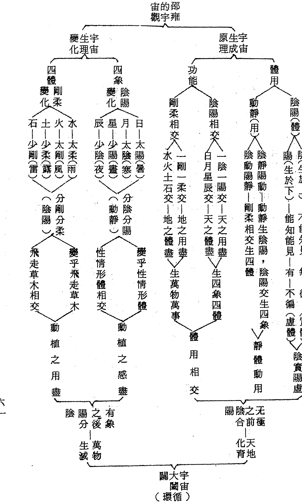

六一

陽陰之无 合前極 化天育地

陰陽之有象 分後生滅萬物

關大宇宙（環循）

### 邵子之歷史哲學

### 宇宙循環（元會運世之變）

- 元當日—日經天之元（十二會為一元）—天開于子
- 會當月—月經天之會（三十運為一會）—地闢于丑
- 運當星—星經天之運（十二世為一運）—人生于寅
- 世當辰—辰經天之世（三十年為一世）—閉物于戌

### 人世歷史之消長（變革治亂）

### 政教文化之變遷

- 四時：春、夏、秋、冬
- 四代：三皇、五帝、三王、五霸
- 四政：皇、帝、王、霸
- 四治：化、教、勸、率
- 四經：易、書、詩、春秋
- 四教：道、德、功、力

### 歷史久暫之四型

- 一世之業—革而革，消而消（暫）
- 十世之業—革而因，消而長（盛）
- 百世之業—因而革，長而消（變）
- 千世之業—因而因，長而長（久）

### 歷史法則

治亂興衰

歷史

變化

自然法則

天地闔闢

邵雍之歷史哲學

## 二、邵子皇极经世图说

### (一)皇极经世概说

古今明道之书有二，一曰易，一曰洪範，盖一本之河图，一本之洛書，然河圖洛書係天地已然之象，於道為體。易與洪範係推河圖當然之事，於道為用。而其所所以然之理，俱不外伏羲先天之卦，伏羲方圓二圖，圓者象天，方者象地，而天能包地，地不能统天，故宋邵子傳先天之學，推衍伏羲方圓之義，蘊著皇極經世書。

皇極經世者，邵子之易也，易所以明道者也，邵子曰：「上世聖人皆有易，作用不同，其道一也，今之易經，文王之易也，故謂之周易。伏羲之易，無文字語言，獨有卦畫次第而已，孔子於繫辭實迹之矣」。是則繫辭諸篇，孔子之易也。孔子而外，邵子以老子為知易之體，孟子為知易之用，孟子而後，知易者概寡矣，故知易者，所以示開物成務、明道致用之書也，夫先聖皆有易傳之後世，邵子平生不為訓解之學，故衍方圓之義，兼舉道之體用 著皇極經世之書，以便於後學也。

邵子著書明道，繫以觀物名篇次，悉尊先天之學，通畫前之易，上自開闢之初，下訖收閉之盡，攬一圖，觀方圓動靜，足歸天根、手探月窟，同古今於旦暮，舉天地萬物終始，統元會運世，息息與吾身心性命相通，復見其眼界之遠、胸次之寬。

邵伯溫曰：「至大之謂皇，至中之謂極，至正之謂經，至變之謂世，大中至正，應變无方之謂道」。言簡義賅，兼舉體用，道之體本乎大中至正，道之用繫于應變无方。故皇極經世者，邵子明道之書，邵子之易也。

孟子謂天之高也，星辰之遠也，千歲之日，至苟求其故，可坐而致也，蓋不在術而在道也。易曰：有天道焉，有地道焉，有人道焉，道兼三極，是之謂極也。邵子之觀物明道，悉跡孔孟之遠志也，且上接義老之圖義也。故伏義依圖畫卦，孔子因作大衍，皆所以成變化，行鬼神，發明河圖之數也。自孔子沒後之言數者，多流於術，而大義晦矣。至邵子得之才之傳而著書，其命象定數，自為一家，形於道，即太極動靜之機；著於文，即伏義奇偶之畫，自無生有，自有生無也。

夫无之生有者，无極而太極也，有之生无者，動極而靜也。或有或无，天道之妙。一動一靜，太極之根，往來相資，屈伸相感。資其氣遂成天下之文，感其變遂定天下之象。故在天則有日月星辰、雨風露雷以成其象，在地則有水火土石、走飛草木以成其形，在人则有性情形體、色聲臭味也。感應變化，消息盈虛，循環不已。故以元會運世，歲月日時，大而天地之始終，小而人物之生死，遠而古今之世變，無不賅盡。蓋邵子得伏羲畫前之易，而發孔子之所未發者，要其本旨，則皆原於易也，夫易者一也，易之一即道之中也，中者人之心也。故云：天向一中生造化，人從心上起經綸。所以為先天之學也。先天之學正其心，平其氣，無所於心，無反於義，義理融會，其道中正，即物窮理，而盡性知天之學，亦在其中矣。易曰：原始反終，故知生死之說，生死即太極之動靜也，不動不靜，不生不死，是道之一也，是以大衍之數，一變而為七七四十九也，七變而為九九八十一也，數既極於九，又復其一，人既生而復其死，明其理、知其數，則動靜可求其端，陰陽可求其始，而萬物之得失，人事之休咎，皆可得而前知矣。此皇極之所由作，貫理數而一之者也，有志於數學者，不可不求其理，有志於理者，不可不求其心，求心之要，須返於易。邵子先天易學以理為經，以易為緯，上推往古，下逆將來，莫不瞭如指掌，易曰：數往者順，知來者逆，聖人百世可知。舉凡造化之原始、陰陽之妙契，與夫卦氣之盛衰，聲音之唱和、體用之變遷、策軌之斷驗，天地之化育、動植之感應，宇宙之闔闢，歷史之遷變，世業之久暫，四時之交變，靡不備焉。昔人有言：『理究伊川，數窮康節。』邵子以乾兌離震四卦，各取前四卦作日月星辰，爲天之陰陽太少，坤艮坎巽四卦作水火土石，爲地之剛柔太少，聲唱於天，音和於地，名之曰觀物，而天地之陰陽消長，人物之變化生成，內之爲身心性命之樞機，外之爲修齊治平之經濟，大之極皇帝王伯之治亂興衰，細之至草木魚蟲之生枯榮落，胥不能越其則焉。程子推尊邵子爲內聖外王之學。易曰：『範圍天地而不過，曲成萬物而不遺。』於皇極經世中具見之矣。

下以圖說諸其極，可得其指意之大略，爲觀物之梯航也。

## 三、理数篇

### 邵氏皇極經世圖

| 元 會 運 世 | 月 子<br>星 一<br>辰 二十 | 月 丑<br>星 六<br>辰 六十 | 月 寅<br>星 一<br>辰 一百 | 月 卯<br>星 二<br>辰 二百 | 月 辰<br>星 五<br>辰 五百 | 月 巳<br>星 六<br>辰 六百 |
| :--- | :--- | :--- | :--- | :--- | :--- | :--- |
| 聲<br>一<br>禾火化八<br>回每退0 | 音<br>一<br>古甲人癸<br>口口近揆 |
| 聲<br>二<br>良兩向0 | 音<br>二<br>黃花雌賢 |
| 聲<br>三<br>千典旦0<br>兄永營0 | 音<br>三<br>安亞乙一<br>口天世寅 |
| 聲<br>四<br>刀早岳<br>君先箕0 | 音<br>四<br>夫法口飛<br>父凡口吹 |
| 聲<br>五<br>妻四日<br>哀口即賢 | 音<br>五<br>百丙必<br>武晚口尾 |
| 聲<br>六<br>東升帶<br>衰口帥賢 | 音<br>六<br>普核品<br>交窩口未 |
| 月 午<br>星 七<br>辰 五百 | 月 未<br>星 八<br>辰 八百 | 月 申<br>星 九<br>辰 九百 | 月 酉<br>星 十<br>辰 一千 | 月 戌<br>星 一<br>辰 一千三百 | 月 亥<br>星 二<br>辰 一千四百 |
| 聲<br>七<br>心審禁0 | 音<br>七<br>乃妳女<br>内南年 |
| 聲<br>八<br>男坎欠0 | 音<br>八<br>老冷呂<br>鹿帝離 |
| 聲<br>九<br>0 0 0 安 | 音<br>九<br>思三量<br>寺口家 |
| 聲<br>十<br>0 0 0 聲 | 音<br>十<br>自 在 匡 |
| 右正聲 | 音 一<br>庄雲0 | 音 二<br>卓中口 | 音 三<br>文亦0 | 音 四<br>石口口 | 音 五<br>走戔足 |
| 右正音 | 耳口二 | 山手口 | 口口口 | 草求文 | 魔等離 |

### （二）先天圖

此為伏羲之作也，亦曰太極圖，或曰希夷所作。雖周子亦未見之焉，乃自作太極圖，觀任道遜之詩可見矣，詩曰：

太極圖中一氣旋，兩儀四象五行全，先天八卦渾淪具，萬物何嘗出此圖。
造化根源文字祖，圖成太極自天然，當時早見周夫子，不費鑽研作正傳。

夫既謂八卦渾淪文字祖，則知是圖為伏羲所作，而非希夷明矣。觀此圖，其外一圈者太極也，中分黑白者陰陽也，黑中含一點白者，陰中有陽也，白中含一點黑者，陽中有陰也，陰陽交互動靜相倚，周詳活潑，妙趣自然，自有太極含陰陽，陰陽含八卦之妙，不假安排也！伏羲乃摹寫成圖，以示人耳。

此圖陰陽渾淪，蓋有不外乎太極而亦不離乎太極者，本先天之易也。觀周子太極圖，則陰陽顯者，蓋皆太極之所為，而非太極之所倚者，實後天之易也。然而先天所以包括後天之理，後天所以發明先天之妙。明乎道之渾淪，則先天弗違，太極體立矣。明乎道之顯者，則後天奉天時，太極用行矣。

## 三、理數篇

### 心易發微伏羲太極之圖

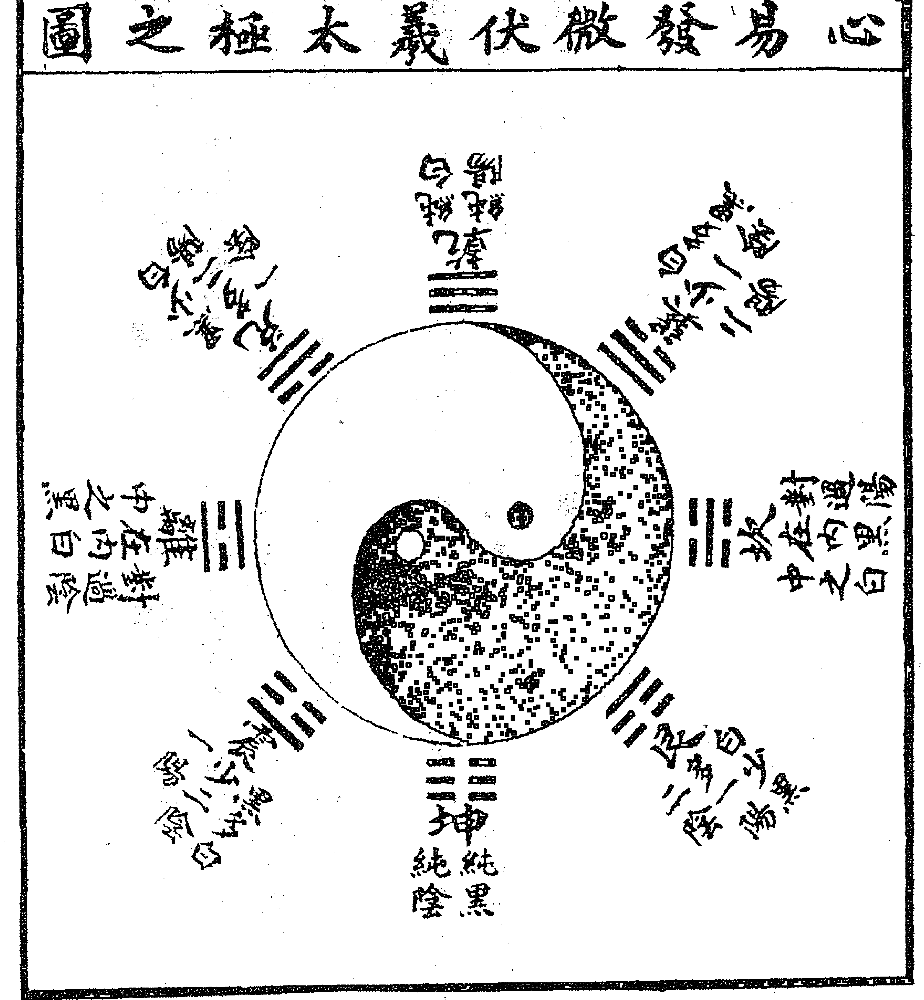

### (三)河圖

河圖洛書乃數之宗也，數之所起，一陰一陽而已，陽數奇屬天而象圓，陰數偶屬地而象方。河圖以生數爲主，故一二三四五居內，六七八九十居外，得一六共宗居北、二七同道居南、三八爲朋居東、四九爲友居西、五十相守居中。生數在內，成數在外，各以類而同處其方。在內爲主，在外爲賓，亦各類而相統不亂，所謂道其常數之體也。

以陰陽老少論之，一爲老陽之位，其外則老陰之數居之。二爲少陰之位，其外則少陽之數居之，三爲少陽之位，其外則少陰之數居之，四爲老陰之位，其外則老陽之數居之，此爲陰陽老少互藏其宅之變也。

## 三、理数篇

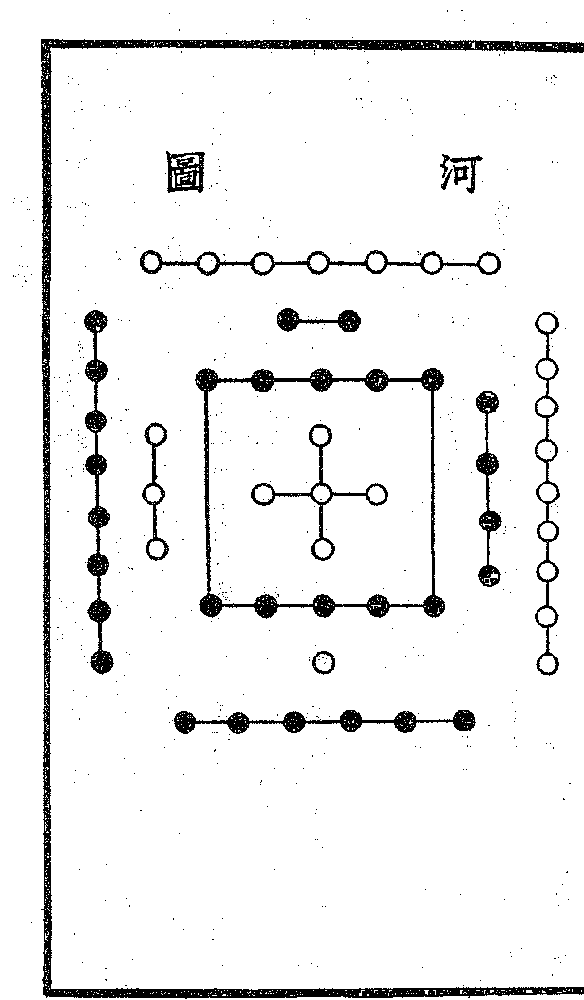

### (四) 洛書

易範皆聖之作也，洛書以奇數爲主，一三七九各居其外，五居其中，二四六八亦各以類，而附奇數之側，正者爲君，側者爲臣，所謂主於陽以統陰，而肇其變數之用也。然其數之縱橫十五，則皆以七八九六迭爲消長而得之。一居正北得五爲六而與南方九迭爲消長，四居東南得五爲九而與西北六迭爲消長，三居正東得五爲八而與西方七迭爲消長，二居西南得五爲七而與東北八迭爲消長，虛其中五，則縱橫皆十五，而一含九、二含八、三含七、四含八，參伍錯綜，無適不遇，變化無窮，所以爲妙也。

大禹因洛以之敘疇也，故一爲五行、二爲五事、三爲八政、四爲五紀、五爲皇極、六爲三德、七爲稽疑、八爲庶徵、九爲福極、皇極居中，而八者各以其次列於外焉，所謂則洛書者，其實是也。故天地之理，易之象紀天地之理者，範之數數始於奇象，成於偶，二四爲八，八卦之象，三三而九，九疇之數，故象以偶爲用，有應則吉，數以奇爲用，有對則凶，偶者陰陽對待之象，奇者陰陽迭運之數也。

## 三、理数篇

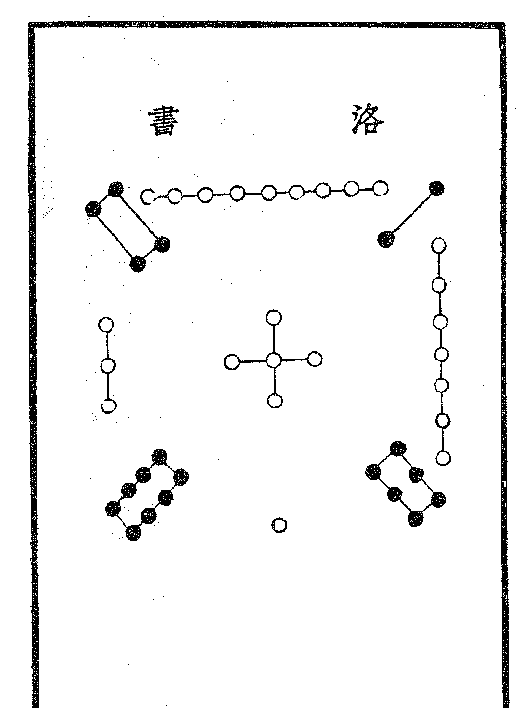

### (五)先天八卦圖

先天乃對待之體，離南坤北為天地定位，離東坎西為水火不相射，兌居東南艮居西北為山澤通氣，震居東北巽居西南為雷風相薄。陰陽老少，各以其類合，此伏羲方位之圖，易之本也，故乾一坤八、兌二艮七、離三坎六、震四巽五，各各相對，合成九數，不惟其數，其畫亦各相對，合成九焉，夫九乃老陽之數，乾之象而無所不包也，自震至乾為順，自巽至坤為逆，故數往者，順天而左旋，皆已生之卦。知來者，逆天而右行，皆未生之卦。故云：數往者順，知來者逆也。

## 三、理数篇

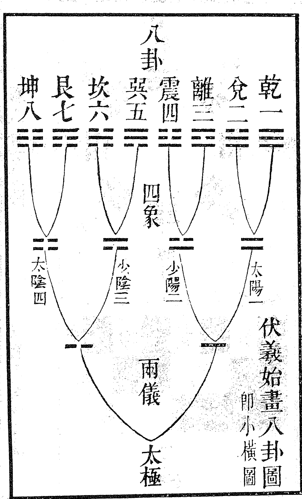

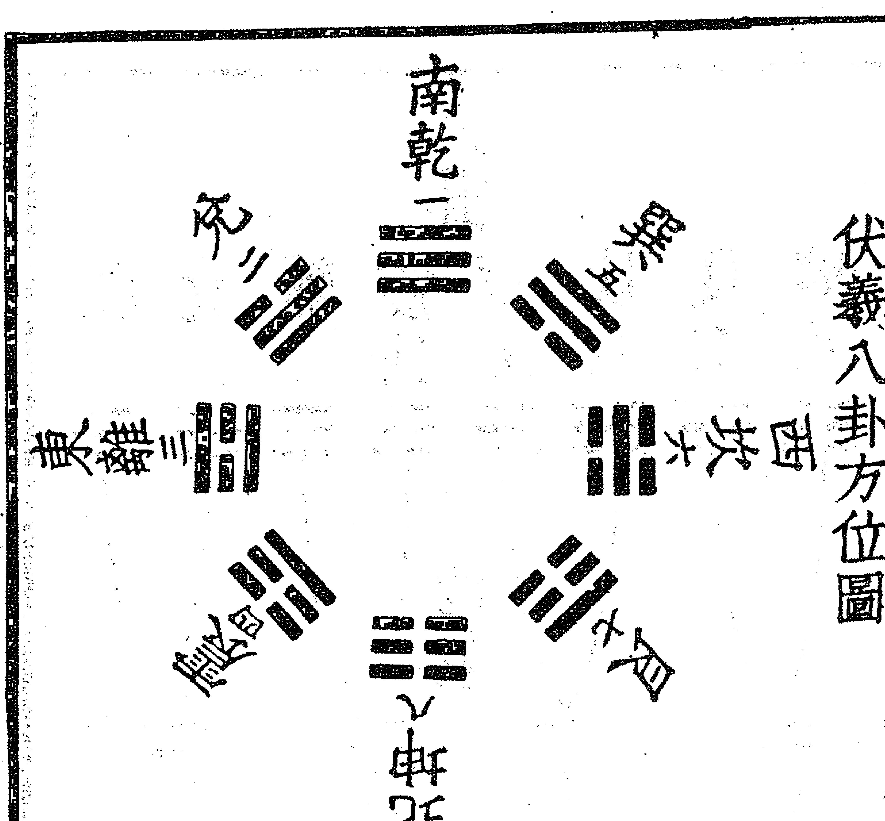

### 伏羲八卦方位圖

| 卦序 | 八 | 七 | 六 | 五 | 四 | 三 | 二 | 一 |
| :--- | :--- | :--- | :--- | :--- | :--- | :--- | :--- | :--- |
| 卦名 | 艮 | 坎 | 巽 | 震 | 離 | 兌 | 乾 | |
| 陰陽 | 太陰 | 少陽 | 少陰 | 太陽 | | | | |

### 伏羲八卦次序圖

太極

### (六) 後天八卦圖

後天為流行之用，出乎震，齊乎巽，相見乎離，致役乎坤，說言乎兌，戰乎乾，勞乎坎，成言乎艮。此文王方位之圖，易之大用也。先天之離東坎西，象日月之出卯酉，後天之離南坎北，象日月之正子午，先天非後天則無以成其變化，後天非先天則不能以自行也。

夫先天造化之初，由心迹之學，後天生物之後，因迹求心之學，心與道皆虛，於先天，由此得而透徹，自然前知。

### 文王八卦次序

- 坤母: 兑、离、巽
- 乾父: 艮、坎、震
- 兑少女得坤上爻
- 离中女得坤中爻
- 巽长女得坤初爻
- 艮少男得乾上爻
- 坎中男得乾中爻
- 震长男得乾初爻

### 文王八卦方位

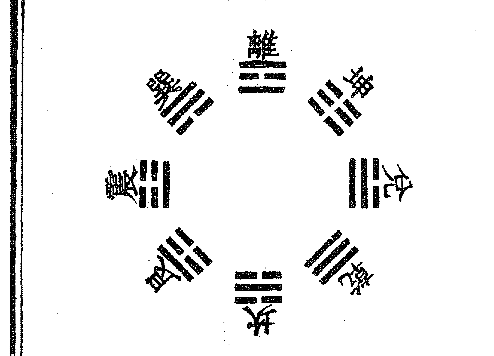

### (七) 經世衍易八卦圖

易有太極，是生兩儀，兩儀生四象，四象生八卦，八卦定吉凶，吉凶生大業

邵子先天易学本诸易繋，傳曰：「易有太極，是生兩儀，兩儀生四象，四象生八卦，八卦定吉凶，吉凶生大業」。天地出於易，易非出於天地，聖人作易，而易不作于圣人也。

当夫元气浑沦，阴阳未判，是谓太極。及夫元气既分，动者为阳—，静者为阴--，是谓两仪。动之上生一奇谓之阳—，静之上生一奇谓之阴--，合而言之，阴阳刚柔四象也。四象之上生一奇谓之太阳—，生一耦谓之太阴--，阴之上生奇谓之少阳—，生一耦谓之少阴--，四象之上生一奇谓之少刚—，生一耦谓之少柔--，柔之上生一奇谓之太刚—，生一耦谓之太柔--。故太阳为乾，太阴为兑，少阳为离，少阴为震，少刚为巽，少柔为坎，太刚为艮，太柔为坤。此伏羲画卦自然之形体次第，而孔子发明之。即邵子所谓乾一、兑二、离三、震四、巽五、坎六、艮七、坤八是也。

1. 乾
2. 兌
3. 離
4. 震
5. 巽
6. 坎
7. 艮
8. 坤

夫易之未作，易在太极之先，易之既作，易在八卦之内，八卦画而吉凶定，吉凶定而大业生也。以言乎法象之大，则有易中之天地乾坤。以言乎变通之大，则有易中之日月坎离。以言乎崇高之大，则有易中之圣人功业。則有易中之富貴日月。日新盛德，富有大業是也。以言乎利用之大，則有易中之聖人神道設教、順動服民。以言乎深遠之大，則有易中之著龜吉凶。此皆易中之大業，非聖人立卦作易，孰能備天下之物、致天下之用，成天下之器，其廣大備乎是也。天地之道，陰陽剛柔，有動靜之兩儀，必有一元之太極，邵子明天地陰陽、柔始於太極之動靜，與周子所傳太極圖相表裡，康節又復窮其交變，推天之陰陽、地之剛柔，各自交而生八卦，又相交而天以乾兌離震四卦生西北十六位，而後陰陽、之用盡矣。地以坤艮坎巽四卦生東南十六位，而後剛柔之用盡矣。是故動靜者天地分太極之初也。四象者天地稟太極之理也。八卦者天地配太極之體也。十六卦者天地達太極之用也。而用在於交也，太極為一，一生二為動靜、二生一曰為陰陽剛柔，曰生八為八卦，八生十六為十六位，分天地則天有十六位、地有十六位，而三十二也，是皆加倍之數也。一十六有二者，天地各用其一以為體，則是用之體也。動之大者為太陽曰乾，動之小者為少陽曰離，靜之大者為太陰曰震，靜之小者為少陰曰兌，太陽為日，太陰為月，少陽為星，少陰為辰，日月星辰交而天之體盡矣。靜之大者為太柔曰坤，靜之小者為少柔曰坎，動之大者為太剛曰巽，動之小者為少剛曰艮，太柔為水，太剛為石，少柔為土，少剛為火，水火土石變而地之體盡矣。
自太極之判以陰陽剛柔，為天地之用，乃體之用也。自陰陽剛柔分，太少生為八卦，為天地之體，乃用之體也。今日月星辰交而天之體盡，水火土石交而地之體盡，則主卦言之，而天以日月星辰交為十六卦也，地以水火土石交為十六卦也，此十六卦又各為生物之體，則主位言之也。太者得氣之多，少者得氣之少也。

日月星辰麗乎天，而乾為日者太陽也，兌為月者少陰也，離為星者少陽也，震為辰者太陰也。日月星辰交，則有四位乾夬有壯，月有四位履兌睽妹，星有四位同革離豐，辰有四位妄隨嗑震，而為十六也。

水火土石麗乎地，而坤為水者太柔也，艮為火者少剛也，坎為土者少柔也，巽為石者太剛也。水火土石交，則水有四位坤剝比觀，火有四位謙艮蹇漸，土有四位師蒙坎渙，石有四位升益井巽，而為十六也。

## 皇極經世·太乙神數圖解

## 經世衍易八卦圖

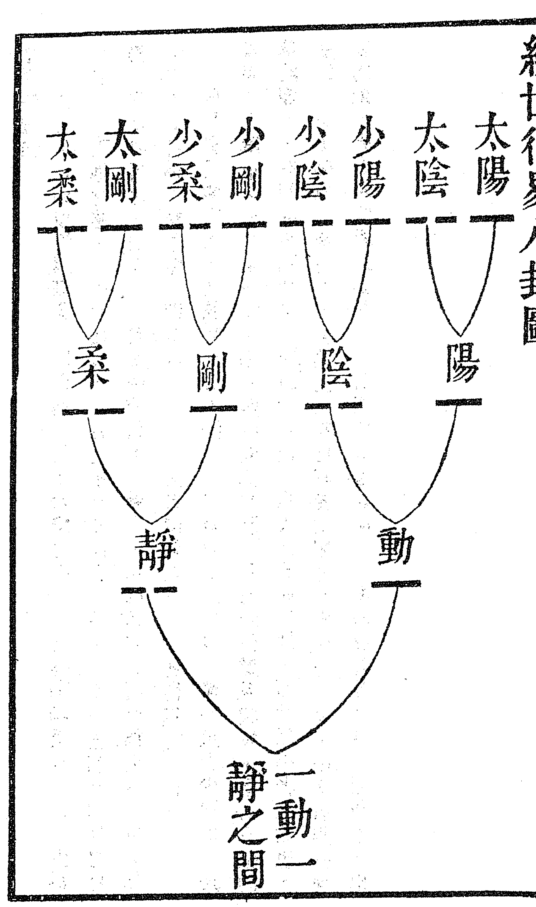

### (八)經世天地四象圖

日月星辰麗乎天，而乾兌離震生矣。水火土石麗乎地，而坤艮坎巽生矣。日午中而氣熱故爲暑，月子中而氣冷故爲寒，十干之星爲陽而主晝，十二支之辰爲陰而主夜，皆天之氣也。水降而爲雨，地氣上騰也；火熾而生風，地氣旁達也；地氣夜升爲露，星殞有聲而主雷，皆地之氣也。日月星辰自相交，而天之變盡於十六卦，水火土石自相交，而地之變盡於十六卦，是天地之氣凝結而生物，有物則有質，有質則有數。

故乾在天成象爲日，在地成形爲火，火與日本一體，故陽燧取於日而得火。兌在天成象爲月，在地成形爲水，水與月本一體，故方諸取於月而得水。離在天成象爲星，在地成形爲石，石與星本一體，故傳言星殞爲石。震在天成象爲辰，在地成形爲辰，辰與土本一體。故自日月星辰之外，高而蒼蒼者皆辰也。自水火土石之外，廣而茫茫者皆土也。蓋日月星辰猶人有耳目口鼻，水火土石猶人有血氣骨肉也。是故盡天下之物則也，得乎數則物之則、事之理無不在焉，不明乎數，不明乎善也，不誠乎數不誠乎身矣。

易之與皇極，其旨相似，而致用實不同。易之與皇極八卦，名同而位殊，爻同而旨異。位之殊，先天後天之圖可識矣，旨之異，卦同而象不同也。故易之乾為天為金，而極為日為暑。易之兌為澤為金，而極為月為寒。易之離為火為日，而極為星為晝。易之震為電為木，而極為辰為夜。易之巽為風為木，而極為石為雷。易之坎為水為月，而極為土為露。易之艮為土為山，而極為火為風。易之坤為地為土，而極為水為雨。易以占為神，極以算為智。占者聽圓變之著，以求將見之象；算者有一定之卦，以御無窮之數。占取象於天，神之研機也；算則斷在於人，智之極深也。神以知來而未嘗不藏往，智以藏往而未始不知來也。左為天，右為地；日月星辰麗乎天，而乾兌離震居之；水火土石麗乎地，而坤艮坎巽居之。體數有四，而布算之法，皆原於此也。

## 三、理數篇

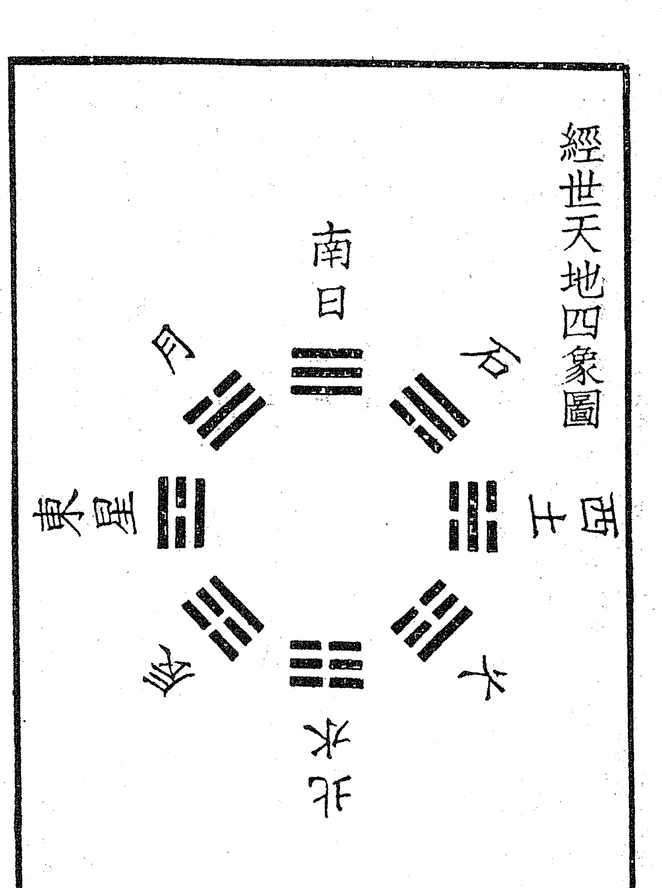

### （九）元會運世圖

陽一爲奇，陰二爲偶，是以一元之數起於乾，故乾爲起數之端，猶一歲包年月日時而爲之也。乾之後有兌，兌爲月，其數二，衍之爲十二，猶一歲有十二月也。兌之後有離，離爲日，其數三，衍之爲三百六十，猶一歲有三百六十日也。離之後有震，震爲時，其數四，衍之爲四千三百二十，猶一歲有四千三百二十時也。此一二三四爲天地生物之始數，陽之所以先於陰也。

震四之後，繼以巽五，陰元之氣，莫先於此，是爲巽元之年數，衍之爲十二萬九千六百年，爲起數之端。坎六繼之是爲巽元之月數，衍之爲一百五十五萬五千二百月。艮七又繼之是爲巽元之日數，衍之爲四千六百六十五萬六千日，若夫巽元之時數，則居坤之八，又衍之得五億五千九百八十七萬二千時。此五六七八天地之終數，陰之所以承乎陽也。

由是重而衍之以至於八，則乾之世數四千三百二十，衍之爲五億五千九百八十七萬二千，兌之世數五萬一千八百四十，衍之爲六十七億一千八百四十六萬四千，循序而推，皆可概見。大抵乾兌離震之數，包巽坎艮坤在其中，自子至巳上六辰皆屬乾，謂之先天。自午至亥下之辰皆屬坤，謂之後天。後天皆效先天而爲之也。故曰成象之謂乾，效法之謂坤也。

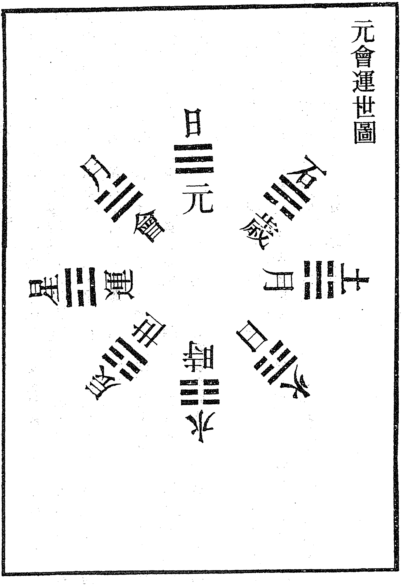

### 元會運世圖

### (十六)六十四卦圓圖

圓圖者，天道之陰陽也，在天為日月星辰，暑寒晝夜，謂之流行之易，言其天地四時流行而不息也。其卦皆從中起；自坤生者始於復，自乾生者始於姤，皆在天地之中，中者心也，萬事萬化生於心，是以邵子之學本乎先天之易，尚象不尚辭，蓋欲示不言之教，如伏羲六十四卦，初無言語文字也。圖左三十二陽卦，春以發生、夏以長養，自復至乾得一百一十二陽爻，八十陰爻，是陽數多陰數少，即春夏之書長而熱也。圖右三十二陰卦，秋以收斂、冬以包藏，自姤至坤得一百一十二陰爻、八十陽爻，是陰數多陽數少，即秋冬之晝短而寒也。左右各三十二而為六十四卦。又以春夏秋冬分之，各四其六十四，而為一千五百三十六爻之卦氣，以運行於天四象立體六甲循環，以見皇帝王霸之治迹，三百六旬有六之轉旋，乾坤主之，屬乎天之造化，衍之為元會運世，散之為年月日時。事有體用而分皇帝王霸，業有心

## 三、理數篇

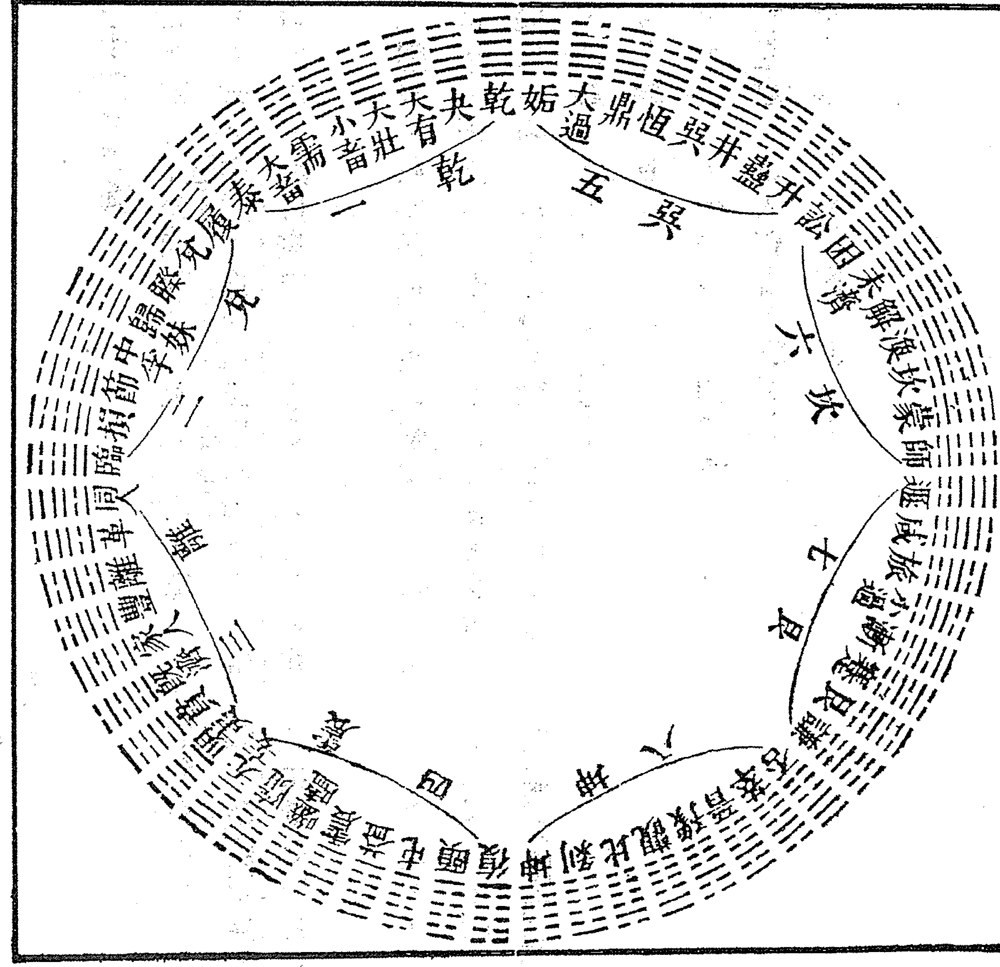

## 皇極經世·太乙神數圖解

### (十一)六十四卦方圖

方圖者，地道之剛柔也，在地為水火土石、雨風露雷，謂之對待之易，言其承天時行以生物也。其卦皆從中起，自中而起則有震巽之一陰一陽，故陰至巽而伏，亦自巽而止；陽至震而休，亦自震而生。陰陽二氣交乎震巽，實坎離交於黃庭之象也。

自内一截三十二陽卦，西北角乾、東北南泰。自外一截三十二陰卦，西南角否，東南角坤，亦四其十六而為六十四卦。又以元會運世分之，各四其六十四，以為二百五十六位之卦體以生物，於地四四立體，四九為用，以見律占者聲之陽唱陰和，動植飛走之出生入死，坎離主之，屬乎地之造化。

邵子有詩，正言方圖之意：
天地定位，否泰交類，山澤通氣，咸損見羲，
雷風相薄，恒益起意，水火相射，既濟未濟，
四象相交，成十六事，八卦相盪，為六十四。

## 三、理數篇

六十四卦方圖

| | | | | | | | |
|---|---|---|---|---|---|---|---|
| ☷ 坤 | ☶ 剥 | ☵ 比 | ☴ 觀 | ☳ 豫 | ☲ 晉 | ☱ 萃 | ☰ 否 |
| ☶ 謙 | ☵ 艮 | ☴ 蹇 | ☳ 漸 | ☲ 小過 | ☱ 旅 | ☰ 咸 | ☷ 遯 |
| ☵ 師 | ☴ 蒙 | ☳ 坎 | ☲ 渙 | ☱ 解 | ☰ 未濟 | ☷ 困 | ☶ 訟 |
| ☴ 升 | ☳ 蠱 | ☲ 井 | ☱ 巽 | ☰ 恒 | ☷ 鼎 | ☶ 大過 | ☵ 姤 |
| ☳ 復 | ☲ 頤 | ☱ 屯 | ☰ 益 | ☷ 震 | ☶ 噬嗑 | ☵ 隨 | ☴ 无妄 |
| ☲ 明夷 | ☱ 賁 | ☰ 既濟 | ☷ 家人 | ☶ 豐 | ☵ 離 | ☴ 革 | ☳ 同人 |
| ☱ 臨 | ☰ 損 | ☷ 節 | ☶ 中孚 | ☵ 歸妹 | ☴ 睽 | ☳ 兌 | ☲ 履 |
| ☰ 泰 | ☷ 大畜 | ☶ 需 | ☵ 小畜 | ☴ 大壯 | ☳ 大有 | ☲ 夬 | ☱ 乾 |

（注：此表布局对应原图，从右下角“四月”“乾”开始，逆时针至左上角“十月”“坤”。）

### (三) 六十四卦方圓圖

先天方圓二圖，一一相應，故邵子曰：變乎內者應乎外，變乎外者應乎內，變於下者應乎上，變於上者應乎下。蓋巽離兌以二十八陽，應坎艮震之二十八陰，坎艮震之二十陽，應巽離兌之二十陰，乾兌巽坎為上，則離震艮坤為下，乾兌離震為內，則巽坎艮坤為外，陽消陰長，每卦相效，未有變而不應者。變者從天，天左行而日移一度；應者法日，日右行而天應一度，皆左右相應也。
夫天地相函，牝牡相召。天陽地陰，天律地呂，無不變應。天聲唱地，以乾兌離震屬西北，唱地之五六七八，一十六卦於東南，又交西南否遯訟姤等十六卦，是為寒暑晝夜，變走飛草木之性情形體，得動數十六卦，成二百五十六卦位。含四變，凡動物之成敗、善惡，莫不由是。
地音和天，以坤艮坎巽居東南，和天之一二三四，一十六卦於西北，又交東北泰臨夷復等十六卦，是為雨風露雷，變性情形體之飛走草木，得植數十六卦，成二百五十六卦位。含四變，凡植物之榮枯、華實，莫不由是。

西南之卦，自下而上，以觀動物，動物之命，在首附天，以陽生乎下，在下之

## 三、理數篇

三十二卦，其一皆向上者，命在上也，故人首在上，而鳥獸皆橫生。
東北之卦，自上而下，以觀植物，植物之命，在根附地，以陰生乎上，在上之
三十二卦，其皆向下者，命在下也，故人腎在下，而草木皆倒生。然後配以音聲之
卦，則日月星辰之聲，天卦百五十二也。水火土石之音，地卦百五十二也。
觀圓布者，乾盡午中，坤盡子中，離盡卯中，坎盡酉中。陽生於子中，極於午
中；陰生於午中，極於子中。其陽在南，其陰在北。方布者，乾始於西北，坤盡於
東南。其陽在北，其陰在南。此二者陰陽對待之數，圓於外者為陽，方於內者為陰
。圓者動而為天，方者靜而為地。圓圖乾南坤北，方者坤南乾北。乾位陽畫多，坤
位陰畫多。陰陽各以類而聚，圖以圓函方，以見天包地外，地在天中矣。
方圓西北十六卦，天卦自相交東南十六卦，地卦自相交。其斜行則乾兌離震、
巽坎艮坤，自西北而東南，皆陰陽之純卦，所以不能生物也。西南十六卦，天去交
地，天卦皆在下，而生氣在首，故能生動物，而頭向上。東北十六卦，地去交
天，地卦皆在下，而生氣在根，故能生植物，而頭向下。其斜行則泰損既益、恒未咸否
，自東北而西南，皆陰陽得耦之卦，所以能生物也。故知植物之命在根，動物之命
在首也。

## 皇極經世·太乙神數圖解

又合方圓觀之，方圖乾處，圓圖亥位，謂之天門，是天氣下降也。坤處圓圖巳位，謂之地戶，是地氣上騰也。此兩十六卦，所謂陰陽互藏其宅也。泰處圓圖寅位，謂之鬼方，否處圓圖申位謂之人路，此兩十六卦是天交地、地交天，而生生不息，所以泰居寅，而否居申，所謂陰陽各從其類也。夫圓圖主運行之事，方圖主生物之之事。運行者氣也，生物者質也。氣非質則無以附麗，質非氣則豈能生物也，可見天有生物之氣，地有成物之形也。元會運世之數，一運當三百六十年，可以推歷代之治亂，子至卯陰中陽將治也，卯至午陽中陽極治也，午至酉陽中陰將亂也，酉至子陰中陰極亂也。先天圖自泰歷蠱而至否，自否歷隨而至泰，即南北之運數也，蓋泰與否相對，蠱與隨相對，故曰：自泰至否，其間有隨，隨之者誰，陽震順動，兌陰隨之，民悅無疆，泰無不宜。此否泰蠱隨，殆亦天門、地戶、人路、鬼方出入之交歟。數經者順，自子至午，震離兌乾，治之象也。當背北面南觀之，即知順逆，治之象也。知來者逆，自午至子，巽坎艮坤，德至元泰定又六甲子亦然，南禽隨氣過北而亂。邵子以數推之，六甲子者三百六十

## 三、理數篇

年，即一日十二時之數，自堯甲辰起運，月巳辰未星登迄今，月仍在午，辰方過未，為年者四千二百九十，為世者一百四十三，古今在天地間猶日暮爾，聖人通晝夜之道而知，故能以一時觀萬時，一世觀萬世。

### 伏羲六十四卦方圓圖

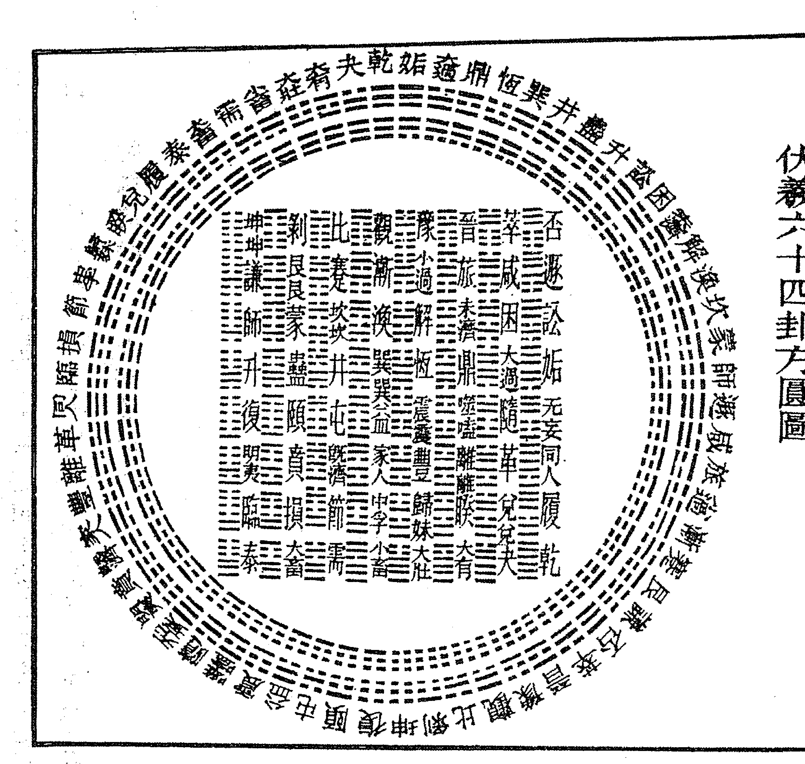

### (十三) 經世六十四卦方圓圖

圓圖各數皆自內而外，如姤乃五一而非一五、復乃四八而非八四也。餘類同。

方圖各數皆自下而上，如履之數乃二一二而非一二二，夬之數乃一二而非二一一也。

餘類推。

圓圖直以左右界分左天右地，方圖橫以上下截分上天下地，此左右、上下平定分數也。

### 經世六十四卦之數圓圖 卽先天圖

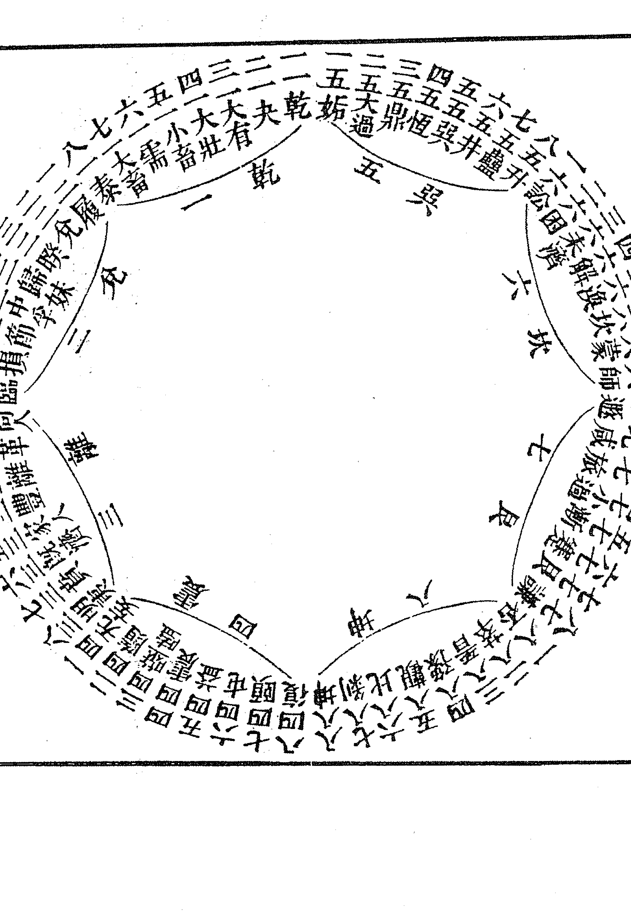

## 三、理數篇

| 八 八 坤 | 七 八 剥 | 六 八 比 | 五 八 觀 | 四 八 豫 | 三 八 晋 | 二 八 萃 | 一 八 否 |
|---------|---------|---------|---------|---------|---------|---------|---------|
| 八 七 謙 | 七 七 艮 | 六 七 蹇 | 五 七 漸 | 四 七 小過 | 三 七 旅 | 二 七 咸 | 一 七 遯 |
| 八 六 師 | 七 六 蒙 | 六 六 坎 | 五 六 渙 | 四 六 解 | 三 六 未濟 | 二 六 困 | 一 六 訟 |
| 八 五 升 | 七 五 蠱 | 六 五 井 | 五 五 巽 | 四 五 恒 | 三 五 鼎 | 二 五 大過 | 一 五 姤 |
| 八 四 復 | 七 四 頤 | 六 四 屯 | 五 四 益 | 四 四 震 | 三 四 噬嗑 | 二 四 隨 | 一 四 无妄 |
| 八 三 明夷 | 七 三 賁 | 六 三 既濟 | 五 三 家人 | 四 三 豐 | 三 三 離 | 二 三 革 | 一 三 同人 |
| 八 二 臨 | 七 二 損 | 六 二 節 | 五 二 中孚 | 四 二 歸妹 | 三 二 睽 | 二 二 兌 | 一 二 履 |
| 八 一 泰 | 七 一 大畜 | 六 一 需 | 五 一 小畜 | 四 一 大壯 | 三 一 大有 | 二 一 夬 | 一 一 乾 |

方圖亦從圓圖分出

九九

## 皇極經世·太乙神數圖解

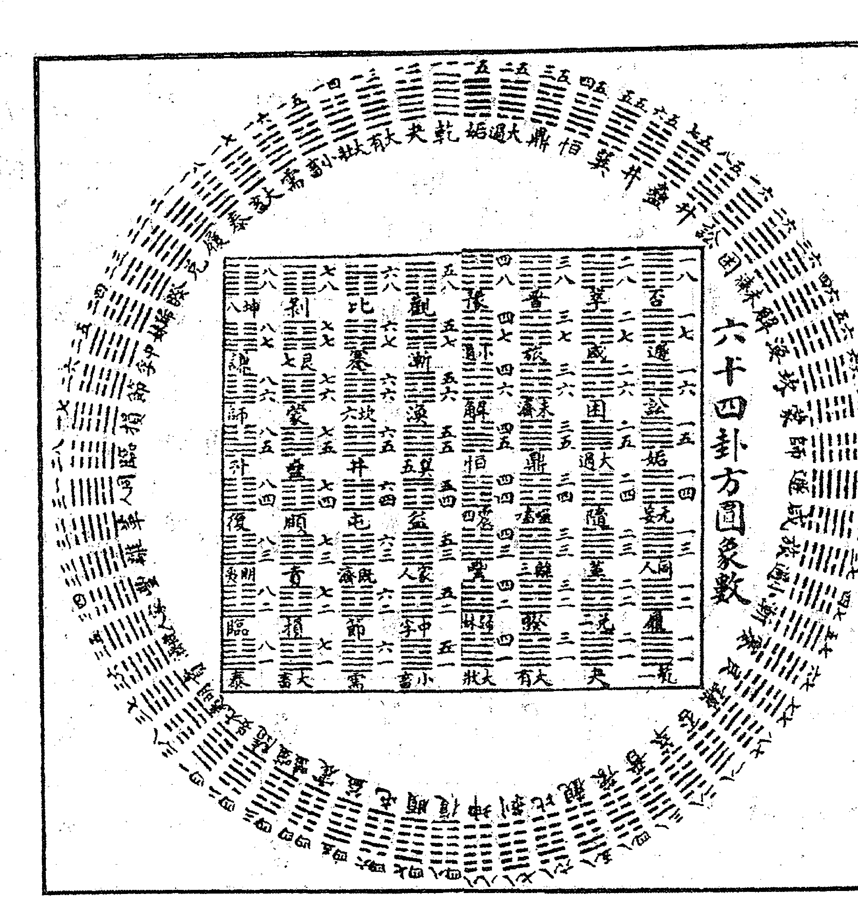

## 三、理數篇

### （古）經世先天數圖

此圖邵子所述，古今之數，皆始於一，而皇極之數，實本於伏羲之先天也。乾一、兌二、離三、震四、巽五、坎六、艮七、坤八，是八卦之生數也。

陽一而陰二，故陽之生陰。二而六之為十二，陰之生陽。三而十之為三十，是

以乾始於一。而兌為十二，離則十二而三十為三百六十，震則十二而四千三百二

十。

自巽之坤，皆奇偶之生數也。離之為六十四卦，則以所生之數而相示之，知其

總數也。如離之震為一百五十五萬五千二百之數也，周旋六十四卦相生之數，皆如

是也。

若以日月星辰、水火土石、暑寒晝夜、走飛草木，分隸於八卦，得生生之數，

則知其所以生；得化化之數，則知其所以化。此圖即先天八卦圓圖，乾兌離震為日

月星辰之變數，坤艮坎巽為水火土石之化數，四象運而四時行焉，八卦化而萬物生

焉。

## 皇極經世·太乙神數圖解

| 坤 | 艮 | 坎 | 巽 | 震 | 離 | 兌 | 乾 |
|---|---|---|---|---|---|---|---|
| 太柔 | 太剛 | 少柔 | 少剛 | 少陰 | 少陽 | 太陰 | 太陽 |
| 水 | 火 | 土 | 石 | 辰 | 星 | 月 | 日 |
| 雨 | 風 | 露 | 雷 | 夜 | 晝 | 寒 | 暑 |
| 走 | 飛 | 草 | 木 | 體 | 形 | 情 | 性 |
| 味 | 氣 | 聲 | 色 | 口 | 鼻 | 耳 | 目 |
| 辰 | 日 | 月 | 歲 | 世 | 運 | 會 | 元 |
| 秋春 | 詩 | 書 | 易 | 伯 | 王 | 帝 | 皇 |
| 胱膀 | 胃 | 肝 | 肺 | 腎 | 脾 | 膽 | 心 |
| 血 | 髓 | 肉 | 骨 |  |  |  |  |

### 皇極經世先天數圖

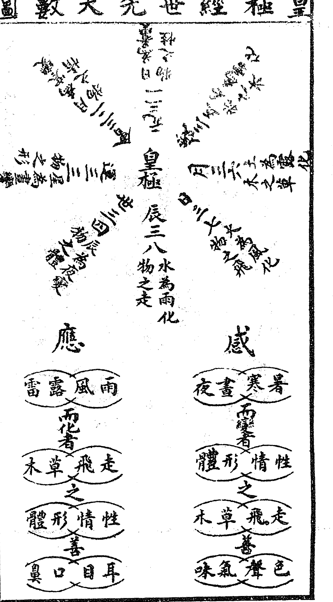

### 先天太極經世心法圖

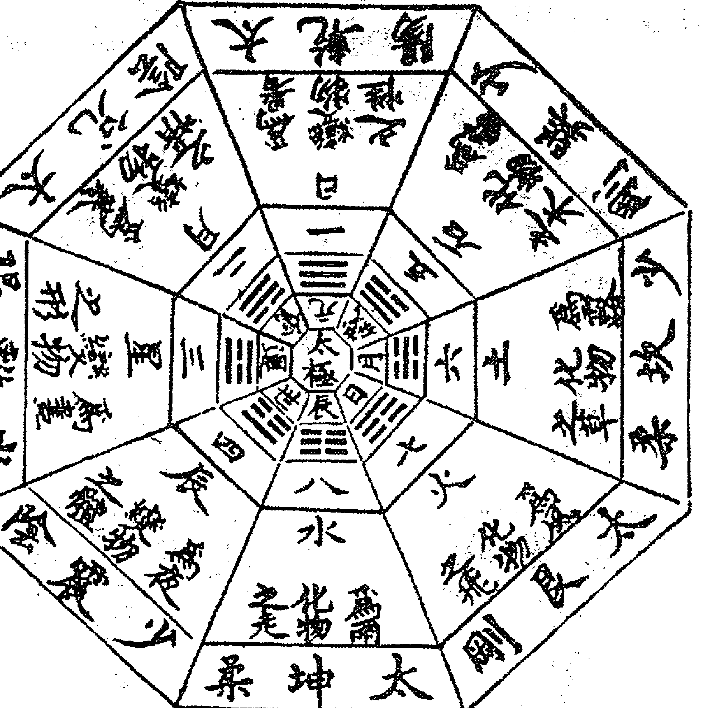

### (圭) 先天气图

乾坤坎離分配四時主二十四氣，坎盡子中交離，初交冬至，上交驚蟄。離盡卯中交乾，初交春分，上交芒種。乾盡午中交坎，初交夏至、上交白露。坎盡酉中交坤，初交秋分，上交大雪。春夏秋冬各用六十四卦氣，皆中起子午卯酉為四中，二分當之。寅申巳亥為四孟，四立當之。經世曆以冬至為天地之元，元之元也，故云四正卦，而用三百六十。卦氣圖以春分為人物之元，亦元之元也，故用六十四卦，而四之為二百五十六位。卦氣圖以冬至子中為世之元，春分卯中為元之元，夏至午中為會之元，秋分酉中為運之元，合六十四卦，各以氣運而更迭直事。開物於寅中而起於驚蟄，二月初氣也，閉物於戌中而終於立春者，十月初氣也。寅中戌中雖主月會而言，其用則實由乎節氣，地之生物以氣為機、天之氣先至，而地之物應之，氣之來常先半月，故關子明曰：當期之數，過者謂之氣盈，不及者謂之朔虛，氣朔有盈虛之不齊，積微之久中，氣或有居於月晦者，必閏以置之，乃復

乎初經，本乎先天。故中朔同起卦氣，因先天卦數取中氣以主月，元會運世皆從中起，所謂舉正於中也。卦圖曰：大運法當依經世數，起於星甲辰子。小運法當依卦氣圖，起於甲己孟旦。天統乎體，氣之體生於四中，故大運甲子當冬至，而二十四氣之首，皆得子午卯酉四中也。氣之用行於四立，故小運甲寅當立春，而二十四氣之首，皆得寅申巳亥四孟也。

## 三、理數篇

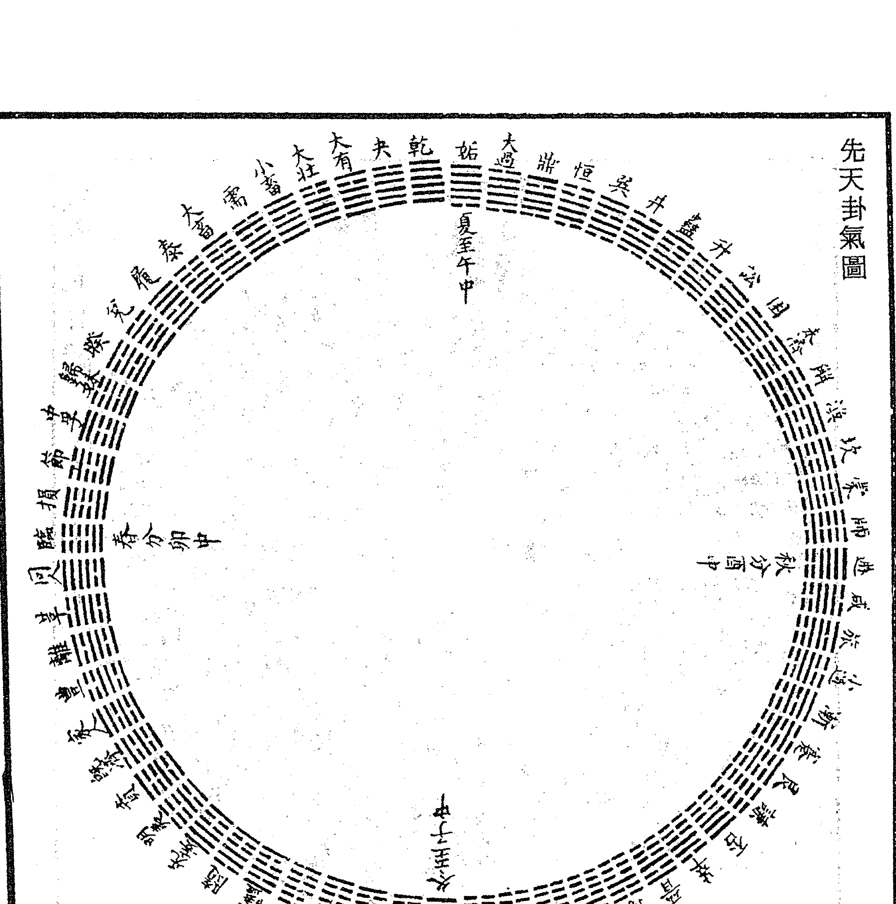

夏至午中

春分卯中

秋分酉中

冬至子中

夏至午中

冬子中

皇極經世·太乙神數圖解

### 卦氣直日圖

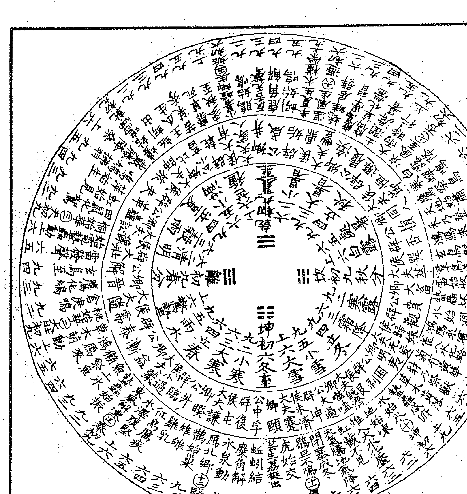

## 三、理數篇

### (六)天地始終之數圖

邵子傳連山易於山林隱德之士，以天一地二、天三地四、天五地六、天七地八、
、天九地十分十等，日元會運世歲月日時分秒，作皇極經世書，自元至時轅之卦，
而分秒行乎八卦之間，有卦有數，天 地人物皆囿於其中，而卦數則窮物之情，雖鬼
神之不測，天地之無窮，亦不逃焉。

元會運世歲月日時分秒十等數，皆十二與三十之交變因乘，至秒而終，然一秒在
瞬息，細之又細，分而歸律呂聲音以取數，所以窮盡天地間萬變萬化、萬事萬物也。

表以乾兌離震巽坎艮坤，每位各統八卦，其上卦皆始乾而終坤，惟其同始乾，
故同為一，不特乾為一，即履十二，大有三百六十，同人四千三百二十皆當一看，
此六十四卦之數圖，首卦既皆為一，故皆以十二乘之得次卦，以十二乘履十二得兌
一百四十四，與以三十乘夬十二得大有三百六十不同，蓋夫為次卦，則用三十乘之
，而履為首卦，則用十二乘之，一三五七為陽故用陰乘，即十二陰數，二四六八為
陰故為陽乘，即三十陽數，此一定之法也。

先天圓圖左方以陽統陰，右方以陰從陽，故言日月星辰以該水火土石，太極生萬物之始，復為元之元，數往者順。天地生萬物之始，乾為元之元，知來者逆，及姤交於乾，以至坤交於復，則元會運世，無一而不參合矣，此乃自然之數，非人之所能為也。

# 三、理数篇

经数祖先先天图
（此为一个圆形图表，结构复杂。外圈文字包括：年数日辰、运数会元、年数世运、运数会元等标签，以及大量干支、卦象、数字（如：十一万九千六百、四千六百六十五万六千、七千八百六十五万四千五百六十等）。图表由多个同心圆和放射线构成，中心为空白圆形。具体文字内容因圆形排版难以完全以标准Markdown表格呈现，其整体是一个描述宇宙纪元、年运数理的图示。）

# 皇極經世·太乙神數圖解

八三七三六三五三四三三二二三一
運之辰星之水離之坤 運之日星之火離之艮 運之月星之土離之離 運之歲星之石離之巽 運之世星之辰離之震 運之運星之月離之兌 運之會星之日離之乾 運之元星之日乾之坤
千二千一八五十四萬一九四六三百十
千六百六七五千六百二十三萬萬七千六百九十五
六萬九千
五萬

一元之元日之日乾之乾 一元之會日之月乾之兌 一元之運日之星乾之離 一元之世日之辰乾之震 一元之歲日之石乾之巽 一元之月日之土乾之坎 一元之日日之火乾之艮 一元之星日之水乾之坤
百二 三百六十三 十二 四千九十一 萬一百千五百五 千五千五百二 萬千六百九千百 十四萬五千七百二千

八四七四六四五一四三一二四一四
世之辰辰之水震之坤 世之日辰之火震之艮 世之月辰之土震之坎 世之歲辰之石震之巽 世之世辰之辰震之震 世之運辰之星震之離 世之會辰之月震之兌 世之元辰之日震之乾
六二千二百一十萬四四千七百四萬
四千九十七萬二千

二會之元月之日兌之乾 二會之會月之月兌之兌 二會之運月之星兌之離 二會之世月之辰兌之震 二會之歲月之石兌之巽 二會之月月之土兌之坎 二會之日月之火兌之艮 二會之辰月之水兌之坤
十百一 四百十四 八百千五 一萬百五 十七萬千九百六 一萬千九百四 二萬千六百五 千八

一一一

### 全數圖

## 上表
| 五歲之元 | 五歲之會 | 五歲之運 | 五歲之世 | 五歲之歲 | 五歲之月 | 五歲之日 | 五歲之辰 | 七日之元 | 七日之會 | 七日之運 | 七日之世 | 七日之歲 | 七日之月 | 七日之日 | 七日之辰 |
|---|---|---|---|---|---|---|---|---|---|---|---|---|---|---|---|
| 石之日 | 石之月 | 石之星 | 石之辰 | 石之石 | 石之土 | 石之火 | 石之水 | 火之日 | 火之月 | 火之火 | 火之水 | 火之土 | 火之石 | 火之辰 | 火之坤 |
| 巽之乾 | 巽之兌 | 巽之離 | 巽之震 | 巽之巽 | 巽之坎 | 巽之艮 | 巽之坤 | 艮之乾 | 艮之兌 | 艮之離 | 艮之震 | 艮之巽 | 艮之坎 | 艮之艮 | 艮之坤 |
| 一萬九千六百八十五萬 | 四萬六千二百五十七萬 | 三萬八千五百四十六萬 | 五萬七千一百九十三萬 | 八萬五千七百二十九萬 | 二萬六千四百一十八萬 | 六萬九千三百二十七萬 | 四萬七千一百八十六萬 | 一千七百二十九萬 | 四千六百二十五萬 | 三千八百五十四萬 | 五千七百一十九萬 | 八千五百七十二萬 | 二千六百四十一萬 | 六千九百三十二萬 | 四千七百一十八萬 |
| 一萬九千六百八十五萬 | 四萬六千二百五十七萬 | 三萬八千五百四十六萬 | 五萬七千一百九十三萬 | 八萬五千七百二十九萬 | 二萬六千四百一十八萬 | 六萬九千三百二十七萬 | 四萬七千一百八十六萬 | 一千七百二十九萬 | 四千六百二十五萬 | 三千八百五十四萬 | 五千七百一十九萬 | 八千五百七十二萬 | 二千六百四十一萬 | 六千九百三十二萬 | 四千七百一十八萬 |
| 一萬九千六百八十五萬 | 四萬六千二百五十七萬 | 三萬八千五百四十六萬 | 五萬七千一百九十三萬 | 八萬五千七百二十九萬 | 二萬六千四百一十八萬 | 六萬九千三百二十七萬 | 四萬七千一百八十六萬 | 一千七百二十九萬 | 四千六百二十五萬 | 三千八百五十四萬 | 五千七百一十九萬 | 八千五百七十二萬 | 二千六百四十一萬 | 六千九百三十二萬 | 四千七百一十八萬 |
| 一萬九千六百八十五萬 | 四萬六千二百五十七萬 | 三萬八千五百四十六萬 | 五萬七千一百九十三萬 | 八萬五千七百二十九萬 | 二萬六千四百一十八萬 | 六萬九千三百二十七萬 | 四萬七千一百八十六萬 | 一千七百二十九萬 | 四千六百二十五萬 | 三千八百五十四萬 | 五千七百一十九萬 | 八千五百七十二萬 | 二千六百四十一萬 | 六千九百三十二萬 | 四千七百一十八萬 |
| 一萬九千六百八十五萬 | 四萬六千二百五十七萬 | 三萬八千五百四十六萬 | 五萬七千一百九十三萬 | 八萬五千七百二十九萬 | 二萬六千四百一十八萬 | 六萬九千三百二十七萬 | 四萬七千一百八十六萬 | 一千七百二十九萬 | 四千六百二十五萬 | 三千八百五十四萬 | 五千七百一十九萬 | 八千五百七十二萬 | 二千六百四十一萬 | 六千九百三十二萬 | 四千七百一十八萬 |
| 一萬九千六百八十五萬 | 四萬六千二百五十七萬 | 三萬八千五百四十六萬 | 五萬七千一百九十三萬 | 八萬五千七百二十九萬 | 二萬六千四百一十八萬 | 六萬九千三百二十七萬 | 四萬七千一百八十六萬 | 一千七百二十九萬 | 四千六百二十五萬 | 三千八百五十四萬 | 五千七百一十九萬 | 八千五百七十二萬 | 二千六百四十一萬 | 六千九百三十二萬 | 四千七百一十八萬 |
| 一萬九千六百八十五萬 | 四萬六千二百五十七萬 | 三萬八千五百四十六萬 | 五萬七千一百九十三萬 | 八萬五千七百二十九萬 | 二萬六千四百一十八萬 | 六萬九千三百二十七萬 | 四萬七千一百八十六萬 | 一千七百二十九萬 | 四千六百二十五萬 | 三千八百五十四萬 | 五千七百一十九萬 | 八千五百七十二萬 | 二千六百四十一萬 | 六千九百三十二萬 | 四千七百一十八萬 |
| 一萬九千六百八十五萬 | 四萬六千二百五十七萬 | 三萬八千五百四十六萬 | 五萬七千一百九十三萬 | 八萬五千七百二十九萬 | 二萬六千四百一十八萬 | 六萬九千三百二十七萬 | 四萬七千一百八十六萬 | 一千七百二十九萬 | 四千六百二十五萬 | 三千八百五十四萬 | 五千七百一十九萬 | 八千五百七十二萬 | 二千六百四十一萬 | 六千九百三十二萬 | 四千七百一十八萬 |
| 一萬九千六百八十五萬 | 四萬六千二百五十七萬 | 三萬八千五百四十六萬 | 五萬七千一百九十三萬 | 八萬五千七百二十九萬 | 二萬六千四百一十八萬 | 六萬九千三百二十七萬 | 四萬七千一百八十六萬 | 一千七百二十九萬 | 四千六百二十五萬 | 三千八百五十四萬 | 五千七百一十九萬 | 八千五百七十二萬 | 二千六百四十一萬 | 六千九百三十二萬 | 四千七百一十八萬 |

## 下表
| 六月之元 | 六月之會 | 六月之運 | 六月之世 | 六月之歲 | 六月之月 | 六月之日 | 六月之辰 | 八辰之元 | 八辰之會 | 八辰之運 | 八辰之世 | 八辰之歲 | 八辰之月 | 八辰之日 | 八辰之辰 |
|---|---|---|---|---|---|---|---|---|---|---|---|---|---|---|---|
| 土之日 | 土之月 | 土之星 | 土之辰 | 土之土 | 土之火 | 土之水 | 土之坤 | 水之日 | 水之月 | 水之火 | 水之水 | 水之土 | 水之石 | 水之辰 | 水之坤 |
| 坎之乾 | 坎之兌 | 坎之離 | 坎之震 | 坎之巽 | 坎之坎 | 坎之艮 | 坎之坤 | 坤之乾 | 坤之兌 | 坤之離 | 坤之震 | 坤之巽 | 坤之坎 | 坤之艮 | 坤之坤 |
| 一百五十五萬五千八百六十 | 五千二百四十五萬九千一百六十 | 四千七百六十三萬二千八百七十 | 八千六百四十一萬五千三百九十 | 一萬二千九百六十二萬三千四百五十 | 三千六百八十六萬四千一百二十八 | 九千八百三十四萬五千七百六十四 | 六千七百五十一萬八千四百九十三 | 一千五百五十五萬八千六百 | 五千二百四十五萬九千一百六十 | 四千七百六十三萬二千八百七十 | 八千六百四十一萬五千三百九十 | 一萬二千九百六十二萬三千四百五十 | 三千六百八十六萬四千一百二十八 | 九千八百三十四萬五千七百六十四 | 六千七百五十一萬八千四百九十三 |
| 一百五十五萬五千八百六十 | 五千二百四十五萬九千一百六十 | 四千七百六十三萬二千八百七十 | 八千六百四十一萬五千三百九十 | 一萬二千九百六十二萬三千四百五十 | 三千六百八十六萬四千一百二十八 | 九千八百三十四萬五千七百六十四 | 六千七百五十一萬八千四百九十三 | 一千五百五十五萬八千六百 | 五千二百四十五萬九千一百六十 | 四千七百六十三萬二千八百七十 | 八千六百四十一萬五千三百九十 | 一萬二千九百六十二萬三千四百五十 | 三千六百八十六萬四千一百二十八 | 九千八百三十四萬五千七百六十四 | 六千七百五十一萬八千四百九十三 |
| 一百五十五萬五千八百六十 | 五千二百四十五萬九千一百六十 | 四千七百六十三萬二千八百七十 | 八千六百四十一萬五千三百九十 | 一萬二千九百六十二萬三千四百五十 | 三千六百八十六萬四千一百二十八 | 九千八百三十四萬五千七百六十四 | 六千七百五十一萬八千四百九十三 | 一千五百五十五萬八千六百 | 五千二百四十五萬九千一百六十 | 四千七百六十三萬二千八百七十 | 八千六百四十一萬五千三百九十 | 一萬二千九百六十二萬三千四百五十 | 三千六百八十六萬四千一百二十八 | 九千八百三十四萬五千七百六十四 | 六千七百五十一萬八千四百九十三 |
| 一百五十五萬五千八百六十 | 五千二百四十五萬九千一百六十 | 四千七百六十三萬二千八百七十 | 八千六百四十一萬五千三百九十 | 一萬二千九百六十二萬三千四百五十 | 三千六百八十六萬四千一百二十八 | 九千八百三十四萬五千七百六十四 | 六千七百五十一萬八千四百九十三 | 一千五百五十五萬八千六百 | 五千二百四十五萬九千一百六十 | 四千七百六十三萬二千八百七十 | 八千六百四十一萬五千三百九十 | 一萬二千九百六十二萬三千四百五十 | 三千六百八十六萬四千一百二十八 | 九千八百三十四萬五千七百六十四 | 六千七百五十一萬八千四百九十三 |
| 一百五十五萬五千八百六十 | 五千二百四十五萬九千一百六十 | 四千七百六十三萬二千八百七十 | 八千六百四十一萬五千三百九十 | 一萬二千九百六十二萬三千四百五十 | 三千六百八十六萬四千一百二十八 | 九千八百三十四萬五千七百六十四 | 六千七百五十一萬八千四百九十三 | 一千五百五十五萬八千六百 | 五千二百四十五萬九千一百六十 | 四千七百六十三萬二千八百七十 | 八千六百四十一萬五千三百九十 | 一萬二千九百六十二萬三千四百五十 | 三千六百八十六萬四千一百二十八 | 九千八百三十四萬五千七百六十四 | 六千七百五十一萬八千四百九十三 |
| 一百五十五萬五千八百六十 | 五千二百四十五萬九千一百六十 | 四千七百六十三萬二千八百七十 | 八千六百四十一萬五千三百九十 | 一萬二千九百六十二萬三千四百五十 | 三千六百八十六萬四千一百二十八 | 九千八百三十四萬五千七百六十四 | 六千七百五十一萬八千四百九十三 | 一千五百五十五萬八千六百 | 五千二百四十五萬九千一百六十 | 四千七百六十三萬二千八百七十 | 八千六百四十一萬五千三百九十 | 一萬二千九百六十二萬三千四百五十 | 三千六百八十六萬四千一百二十八 | 九千八百三十四萬五千七百六十四 | 六千七百五十一萬八千四百九十三 |
| 一百五十五萬五千八百六十 | 五千二百四十五萬九千一百六十 | 四千七百六十三萬二千八百七十 | 八千六百四十一萬五千三百九十 | 一萬二千九百六十二萬三千四百五十 | 三千六百八十六萬四千一百二十八 | 九千八百三十四萬五千七百六十四 | 六千七百五十一萬八千四百九十三 | 一千五百五十五萬八千六百 | 五千二百四十五萬九千一百六十 | 四千七百六十三萬二千八百七十 | 八千六百四十一萬五千三百九十 | 一萬二千九百六十二萬三千四百五十 | 三千六百八十六萬四千一百二十八 | 九千八百三十四萬五千七百六十四 | 六千七百五十一萬八千四百九十三 |
| 一百五十五萬五千八百六十 | 五千二百四十五萬九千一百六十 | 四千七百六十三萬二千八百七十 | 八千六百四十一萬五千三百九十 | 一萬二千九百六十二萬三千四百五十 | 三千六百八十六萬四千一百二十八 | 九千八百三十四萬五千七百六十四 | 六千七百五十一萬八千四百九十三 | 一千五百五十五萬八千六百 | 五千二百四十五萬九千一百六十 | 四千七百六十三萬二千八百七十 | 八千六百四十一萬五千三百九十 | 一萬二千九百六十二萬三千四百五十 | 三千六百八十六萬四千一百二十八 | 九千八百三十四萬五千七百六十四 | 六千七百五十一萬八千四百九十三 |
| 一百五十五萬五千八百六十 | 五千二百四十五萬九千一百六十 | 四千七百六十三萬二千八百七十 | 八千六百四十一萬五千三百九十 | 一萬二千九百六十二萬三千四百五十 | 三千六百八十六萬四千一百二十八 | 九千八百三十四萬五千七百六十四 | 六千七百五十一萬八千四百九十三 | 一千五百五十五萬八千六百 | 五千二百四十五萬九千一百六十 | 四千七百六十三萬二千八百七十 | 八千六百四十一萬五千三百九十 | 一萬二千九百六十二萬三千四百五十 | 三千六百八十六萬四千一百二十八 | 九千八百三十四萬五千七百六十四 | 六千七百五十一萬八千四百九十三 |

### (七)天地交應運數圖

此天地四卦交應全數圖。交者左右平列而交變也，應者奇偶反而應合也。交變如乾初變姤，姤初變乾，下至坤復皆然應合。如姤卦合復，剝卦合夫，統乎太少皆然。全數者十二與三十遞乘，自少而多，六十卦之積數全也。蓋天地之卦四也，皆元會運世之身乘交乘，其數固積諸此圖也。

觀圖姤得七正九五六八潤六一一〡溝九九四六壞四〇〇八稱九四三九垓一九三六京之數，乃以三十乘復得此，蓋姤乃巽五之首卦，復乃震四之末卦，故以三十乘復得姤數也，從此又以十二、三十遞乘至坤，此爲無極之數，以數太多，難乘且無用，而從姤一另起。此交應循環六十四卦，乃无極天地之一闔關，如陰陽之交變，螺旋推衍，數至無窮。

此圖可窺探天地生成之奧，蓋地球一元消長之數，當十二萬九千六百之數，卦值小畜。地球之壽當一百六十七億九千六百一十六萬之數，即太陽系之一元闔關，卦值履，係元之元消長全數，亦即十二萬九千六百元之積。再觀得知本星系之一元闔關消長，凡二垓之數，即太陽系之始終全數，虛无毀滅，卦值同人。再推之，天地之闔關消長，凡七正之數，再復初，生生不已，健行螺進，極盡窮冥之妙。

# 三、理數篇

此圖與天地終始之數圖異者，彼八位首卦之數，皆另起，不與上位末卦相接，此則皆以三十乘上卦之數得之，此一不同也。彼乾為元之元，夬為元之會，此乾為元之元，夬為元之會，二不同也。

蓋彼以天地始終言天地之數，始乾而終坤，而乾兌離震巽坎艮坤八位，配元會運世年月日時八運。大運為元會運世，每位前四卦屬之；小運為年月日時，每位後四卦屬之。大運自上而下，以乾位前四卦為元，兌位為會，離位為運，震位為世。小運自下而上，以震位後四卦為元，離位為會，兌位為運，乾位為世。然此圖但言元會運世，以註大小運之行分順逆耳，若大運之年月日時，則各於每位後四卦接前四卦，順而下行。小運之年月日時，則各於每位前四卦接後四卦，逆而上行。此三不同也。

經世各數目：

-   一、大數：一、十、百、千、萬、億、光、京、垓、秭、壤、溝、澗、正、載、極、恆河沙、阿僧祇、那由他、不可思議、無量數，廿一等。
-   二、小數：一、分、釐、毫、絲、忽、微、纖、沙、塵、埃、渺、漠、模糊、逡巡、須臾、瞬息、彈指、利那、六德虛空、清淨，廿一等。

### 天地始終之數

精微深邃，此所謂推步之術：一猶太舊約創世紀與古西法紀元記載，上帝創造天地，于耶穌降生前四千年，推步至今約六千年。

二黃帝術、顓頊術、夏術、殷術、周術、魯術、易緯乾鑿度、春秋元命苞諸術，皆謂自洪荒開闢至春秋獲麟，即東周敬王三十九年庚申，凡二百七十六萬歲。漢陳晃所云與呂布章六歷法皆同。

三易緯辨終備曰，自伏羲以來，至東漢順帝永和元年丙子，凡四十萬歲。乾鑿度又曰，今入天元二百七十六萬年，昌以西伯受命。

四爻太青太微經曰，自生民以來至明思宗崇禎二年己巳，凡二百七十萬餘年。陳川壞三元說，謂人類歷史已達四百五十六萬六千年。

+   5. 李淳風謂，自上元甲子，至唐太宗貞觀十三年己亥，凡一百九十三萬餘年。
+   6. 隋唐推步諸術，均不越二百萬年，自唐僧一行，以太衍術推算，上元甲子積距玄宗開元甲子得九千六百九十六萬餘年後，推步之術方有突破。
+   7. 太乙數統宗曰，自上古齊元至明景帝景泰二年辛未，歲積一千零一十五萬餘年。
+   8. 至宋仁宗至和元年甲辰—西元一〇五四年，因發現金牛座蟹狀星雲超新星，揭開天文宇宙之奧秘，係因星體激變而爆炸，發生大量微中子，星體中心溫度高達華氏六百萬度，造成爆炸燃燒，並產生巨大之宇宙輻射線，此星體之發現，西方人稱為「中國超新星」或「中國客星」。自此以後，推步之術與宇宙壽齡均大為擴展。
+   9. 如宋之乾元術、乾興術、崇天術、奉天術、占天術、紀元術、統元術、乾道術、淳熙術、知微術、五星術、會元術、元之庚午元術、會天術、成天術、明之袁黃術等推步，均自一千萬年至九千餘萬年不等。大明術推為三億八千餘萬年，淳祐術推為一億二千餘萬年。
+   10. 邵子經世術，乃以皇極經世推步，謂自日甲一元迄今，計六萬九千年。自元之元天開乾卦，至日甲一元比卦月午七會一九一二運三三〇〇世，計八十三億九千四百萬年。

百九十萬九千年，並推地球壽命為一百六十七億九千六百一十六萬年，此與現代科學家所推論之地球年齡相若，邵子之經世術頗合科學之實證。

邵子以元會運世之交變螺進，推論本星系（即包含太陽系在內之銀河系）之消長，為二垓八二一一一京年。而宇宙之闔關該為八正年，至天地終始全數，當為：

```
[(12×30)¹⁵]⁶⁴=360¹⁰²⁴
```

年，再循環推衍，無盡無終。此數與佛說天地之數相若。

釋家法華經之法義定律計算：釋迦如來自最初成道迄今之數約當

```
(10⁴⁷×5×10²⁵×10⁸×10¹⁵³)²×10²⁵×10⁴⁷×(168×10⁸×80)=336×10¹⁸⁸
```

年，並曰宇宙未曾有終始，即輪迴旋復，終而復始，循環不已，無窮無量。

# 三、理數篇

### 邵子皇極經世天交應數全圖

| 交右 | 變左 | 中间内容 | 数字 | 交卦 | 應卦 |
|---|---|---|---|---|---|
| 垢 | 乾 | (乾初九) | 1 | 復 | 坤 |
| 大過 | 夬 | | 12 | 頤 | 剝 |
| 鼎 | 大有 | | 360 | 屯 | 比 |
| 恒 | 大壯 | | 4320 | 益 | 觀 |
| 巽 | 小畜 | 地球一元消長數 | 12 9600 | 震 | 豫 |
| 井 | 需 | | 155 5200 | 噬嗑 | 晉 |
| 蟲 | 大畜 | | 4665 6000 | 隨 | 萃 |
| 升 | 泰 | | 5 5987 2000 | 无妄 | 否 |
| 訟 | 履 | 宇宙一元消長數（地球壽命元之元消長數） | 167 9616 0000 | 明夷 | 謙 |
| 困 | 兌 | | 2015 5392 0000 | 賁 | 艮 |
| 未濟 | 睽 | | 6 0466 1760 0000 | 既濟 | 蹇 |
| 解 | 歸妹 | | 72 5594 1120 0000 | 家人 | 漸 |
| 渙 | 中孚 | | 2176 7823 3600 0000 | 豐 | 小過 |
| 坎 | 節 | | 2 6121 3880 3200 0000 | 離 | 旅 |
| 蒙 | 損 | | 78 3641 6409 6000 0000 | 萃 | 咸 |
| 師 | 臨 | (乾九二) | 940 3679 6915 2000 0000 | 同人 | 遯 |
| 遯 | 同人 | 宇宙消長全數（元之元之元之元） | 2 8211 0990 7456 0000 0000 | 臨 | 師 |
| 咸 | 革 | | 33 8523 1888 9472 0000 0000 | 損 | 蒙 |
| 旅 | 離 | | 1015 5995 6668 4160 0000 0000 | 節 | 坎 |
| 小過 | 豐 | | 1 2187 1948 0020 9920 0000 0000 | 中孚 | 渙 |
| 漸 | 家人 | | 36 5615 8440 0629 7600 0000 0000 | 歸妹 | 解 |
| 蹇 | 既濟 | | 438 7390 1280 7557 1200 0000 0000 | 睽 | 未濟 |
| 艮 | 賁 | | 1 3162 1703 8422 6713 6000 0000 0000 | 兌 | 困 |
| 謙 | 明夷 | (乾九三) | 15 7946 0446 1072 0563 2000 0000 0000 | 履 | 訟 |
| 否 | 无妄 | | 473 8381 3383 2161 6896 0000 0000 0000 | 泰 | 升 |
| 萃 | 隨 | | 5686 0576 0598 5940 2752 0000 0000 0000 | 大畜 | 蟲 |
| 晉 | 噬嗑 | | 17 0581 7281 7957 8200 8256 0000 0000 0000 | 需 | 井 |
| 豫 | 震 | (乾九四) | 204 6980 7381 5493 8499 0720 0000 0000 0000 | 小畜 | 巽 |
| 觀 | 益 | | 6140 9422 1446 4875 4972 1600 0000 0000 0000 | 大壯 | 恒 |
| 比 | 屯 | (乾九五) | 7 3691 3065 7357 7785 9665 9200 0000 0000 0000 | 大有 | 鼎 |
| 剝 | 頤 | | 221 0739 1972 0733 3578 9977 6000 0000 0000 0000 | 夬 | 大過 |
| 坤 | 復 | (乾上九) | 2652 8870 3664 8800 2947 9731 2000 0000 0000 0000 | 乾 | 垢 |
| 天地終始一元數 | | | 7 9586 6110 9946 4008 8439 1936 0000 0000 0000 | 循環再乘 | |## 皇極經世·太乙神數圖解

### 元會運世分值卦圖總數表

| 行\列 | 乾日 | 兌月 | 離星 | 震辰 | 坤水 | 艮火 | 坎土 | 巽石 |
|-------|------|------|------|------|------|------|------|------|
| 秒 | 1 | 6 | 18 | 36 | 60 | 108 | 216 | 360 |
| 分 | 12 | 30 | 60 | 120 | 180 | 360 | 720 | 1440 |
| 時 | 360 | 1080 | 2160 | 4320 | 6480 | 12960 | 25920 | 51840 |
| 日 | 8640 | 25920 | 51840 | 103680 | 155520 | 311040 | 622080 | 1244160 |
| 月 | 259200 | 777600 | 1555200 | 3110400 | 4665600 | 9331200 | 18662400 | 37324800 |
| 歲 | 3110400 | 9331200 | 18662400 | 37324800 | 55987200 | 111974400 | 223948800 | 447897600 |
| 世 | 93312000 | 279936000 | 559872000 | 1119744000 | 1679616000 | 3359232000 | 6718464000 | 13436928000 |
| 運 | 2799360000 | 8398080000 | 16796160000 | 33592320000 | 50388480000 | 100776960000 | 201553920000 | 403107840000 |
| 會 | 83980800000 | 251942400000 | 503884800000 | 1007769600000 | 1511654400000 | 3023308800000 | 6046617600000 | 12093235200000 |
| 元 | 2519424000000 | 7558272000000 | 15116544000000 | 30233088000000 | 45349632000000 | 90699264000000 | 181398528000000 | 362797056000000 |

△ 橫緯卦，曲線以上右半，橫讀，皆六六相乘，單位卦。

直經數，曲線以下左半，直讀，皆十二與三十之遞乘，各值單位。

## 三、理数篇

### （六）一元消长之数图

此邵伯温所作，乃首卷十二会图之总纲也，自子至巳为阳长，自午至亥为阳消。

朱子曰：论十二卦，则阳始于子而终于巳；阴始于申而终于丑，此一说虽小差，而所争不过一位。盖子位一阳虽生，而未出乎地，至寅位泰卦，则三阳之生方出地上，而温厚之气从此始焉。已位乾卦六阳虽极，而温厚之气未终，故午位一阴虽生，而未害于阳，必至未位。遯卦而后温厚之气始尽也，其午位一阴虽生，而严凝之气及申方始，亥位六阴虽凝，而严凝之气至丑方尽，义亦做此。盖地中之气难见，而地上之气易识。故周人以建子为正，虽得天统，而孔子之论为邦，乃以夏时为正，盖取其阴阳始终之著明也，按图以推，其说可见。

此图纪日元用天干，纪月会用地支，纪星运用天干，纪辰世用地支。一元有十二会，即日甲含十二月，自子至亥。一会有三十运，自甲至癸者凡三。一运有十二世，自子至亥，故日甲一元之数，以月子、星甲、辰子，迄月亥、星癸、辰亥终，凡四千三百二十世，十二万九千六百年，等分十二，管以十二消息卦，由复至坤，用象其阴阳消长之象。

## 皇極經世·太乙神數圖解

皇極經世以天地一終始為一元，元十二會，會各萬八百年，天開於子、地闢於丑，人生於寅，堯舜當巳午之間，得一元之中數。蔡西山曰：「一元之數，即一歲之數」。邵伯溫曰：「日為元，元之數一；月為會，會之數十二；星為運，運之數三百六；辰為世，世之數四千三百二十。則是一元統十二會，三百六十運，四千三百二十世。一世三十年，則十二萬九千六百年是為一元之數。一元在大化中猶一年也。……自元之元至辰之元，自元之辰至辰之辰，而後數窮矣，窮則變，變則生，蓋生生而不窮也。經世但著一元之數，舉一隅而已，引而伸之，則窮天地之數可知矣。」 今人多不察，厚誣邵子，謂太半皆非科學正確之知識，推天地一終之數，由開闢以至最後毀滅之年數，僅十二萬九千六百年耳，祇可云原則上有天文學粗淺推測之趨嚮耳，衡其實際，去科學實驗之功甚遠云云。皆未識邵子經天緯地之大道也。 已見前述。 一元消長之數圖，自子至巳一至六會作息，自午至亥七至十二會作消。息則陽進而陰退，即由復一陽生至乾而陽全盛。消則陰進而陽退，即由姤一陰生至坤而陰全盛。天開於子，地闢於丑，人生於寅，寅半為開物之時，迄至元會月已值乾；則陽臻全盛，人靈文明之世，全元二百五十七世，當唐堯盛治。至月午七會始生，盛極萌衰，由虞舜三十九載甲子，下計中華民國十三年，值月午七會星乙一九二運二三〇〇世。

自此以往，至剝十一會月戊之半，全元三百二十五運，則陽絕，是為閉物。至十二會月亥，位當坤陰全盛，而日甲一元之數十二萬九千六百年告終，地球一元消長，從新開闢，即日乙二元，循環螺進，極於無窮。

陳立夫先生曰：「是則元會運世，縮小來看，就是年月日時，地面上生物，每一年到了秋後交冬，便漸漸凋落，但到第二年春天又再發生，同樣理由地球運行，每一元至酉會以後，其化育功能幾陷於全部停頓，到達第二元寅會，又從新化育萬物。」

北京人頭骨之發現，據專家計算距今應有五十萬年之久，當為四元前之人，和堯帝時中國大陸洪水之橫流氾濫，距今僅有十四運或半個會之人，或許可供吾人對元會運世變化之研究材料。地球既然是這樣的一元一元延續下去，那應，所謂河圖洛書，很可能是前一會或前數會的研究精華，製成圖形，刻於玉石之上，以謀垂久，後來經過一元居滿時期的地殼變化，這種刻有圖形的玉石器，遂遭埋沒，到了這一元，地球功能恢復以後，由於洪水衝擊，而又出土，按繫辭上的記載，圖書是出現在河水、洛水之間，其與洪水衝擊，當然有關，包羲氏發覺了這種玉石器上的圖形，加以仰觀俯察的各種體會，因而作成八卦，更由八卦演成六十四卦，要不然，以八卦六十四卦之方陣變化，包羅萬有，神奇莫測，雖有天縱之資，亦非一個人在短短的一生中所能創造成功一。故一元之終，當為混沌之世，浩浩無窮，生生不息，天運循環，無往不復，經子會又復開天矣。

## 三、理数篇

經世一元消長全數圖（日甲一元）

| 元 | 會 | 運 | 世 | 歲 | 卦值 | 備 | 註 |
|---|---|---|---|---|---|---|---|
| | 日甲 月子一 | 星三十 | 辰三百六十 | 年一萬八百 | 復 | 天開 | |
| | 月丑二 | 星六十 | 辰七百二十 | 年二萬一千六百 | 臨 | 地闢 | |
| | 月寅三 | 星九十 | 辰一千八十 | 年三萬二千四百 | 泰 | 開物人生于星己七十六運盤古氏 | |
| | 月卯四 | 星一百二十 | 辰一千四百四十 | 年四萬三千二百 | 大壯 | 天皇氏（天靈）兄弟十二人 | |
| | 月辰五 | 星一百五十 | 辰一千八百 | 年五萬四千 | 夬 | 地皇氏（地靈）兄弟十一人 | |
| | 月巳六 | 星一百八十 | 辰二千一百六十 | 年六萬四千八百 | 乾 | 人皇氏（泰皇）兄弟九人 | |
| | 月午七 | 星二百一十 | 辰二千五百二十 | 年七萬五千八百 | 姤 | 五龍氏始，人高至六尺，壽元六至七十，百物巧出，科學文明大進，爭權奪利，人類最靈。 | |
| | 月未八 | 星二百四十 | 辰二千八百八十 | 年八萬六千四百 | 遯 | 人高四尺，壽元四十，萬物俱廢，無技術修造，返還古代生活。 | |
| | 月申九 | 星二百七十 | 辰三千二百四十 | 年九萬七千二百 | 否 | 畫夜失序，寒暑舛錯，五谷不生，人類日稀，人高二尺，壽元三十。 | |
| | 月酉十 | 星三百 | 辰三千六百 | 年十萬八千 | 觀 | 無君無長，不復知有進步，文字摒棄，文明泯滅。 | |
| | 月戌十一 | 星二百三十 | 辰三千九百六十 | 年十一萬八千八百 | 剝 | 閉物，五谷全無，民食漸稀，男女亂交，于星之戊三十五運。千里數人，道路不通，漸至無人。 | |
| | 月亥十二 | 星二百六十 | 辰四千三百二十 | 年十二萬九千六百 | 坤 | 黑暗，山川日月烏有，天地混濛，復合再生，循環不已，生生不息。 | |

| 日甲 | 月丑 | 月寅 | 月卯 | 月辰 | 月巳 | 月午 | 月未 | 月申 | 月酉 | 月戌 | 月亥 |
|---|---|---|---|---|---|---|---|---|---|---|---|
| 月子 | 月丑 | 月寅 | 月卯 | 月辰 | 月巳 | 月午 | 月未 | 月申 | 月酉 | 月戌 | 月亥 |
| 星三十七辰 | 星三十六辰 | 星三十五辰 | 星三十四辰 | 星三十三辰 | 星三十二辰 | 星三十一辰 | 星三十辰 | 星二十九辰 | 星二十八辰 | 星二十七辰 | 星二十六辰 |
| 百八十辰 | 百七十辰 | 百六十辰 | 百五十辰 | 百四十辰 | 百三十辰 | 百二十辰 | 百一十辰 | 百辰 | 九十辰 | 八十辰 | 七十二辰 |
| 年二千 | 年一千 | 年九百 | 年八百 | 年七百 | 年六百 | 年五百 | 年四百 | 年三百 | 年二百 | 年一百 | 年八十一 |
| 一萬 | 二萬 | 三萬 | 四萬 | 五萬 | 六萬 | 七萬 | 八萬 | 九萬 | 十萬 | 十一萬 | 十二萬 |
| 八百 | 八百 | 八百 | 八百 | 八百 | 八百 | 八百 | 八百 | 八百 | 八百 | 八百 | 八百 |
| 復 | 臨 | 泰 | 壯 | 夬 | 乾 | 姤 | 遁 | 否 | 觀 | 剝 | 坤 |

一元消長總運圖
元會運世

開物星之戊二十五
會三百五十六
運十萬六千
世三百六十
開物星之己
運十萬六千
世三百六十

開物星之己
運十萬六千
世三百六十

## 三、理数篇

### 一元消長分算圖
### 運閏數在外
| 日甲 | 會子 | 會丑 | 會寅 | 會卯 | 會辰 | 會巳 | 會午 | 會未 | 會申 | 會酉 | 會戌 | 會亥 |
| :--- | :--- | :--- | :--- | :--- | :--- | :--- | :--- | :--- | :--- | :--- | :--- | :--- |
|  | 一百六十七億九千六百一十六萬九千六百一十六日 | 一百六十七億九千六百一十六萬九千六百一十六日 | 一百六十七億九千六百一十六萬九千六百一十六日 | 一百六十七億九千六百一十六萬九千六百一十六日 | 一百六十七億九千六百一十六萬九千六百一十六日 | 一百六十七億九千六百一十六萬九千六百一十六日 | 一百六十七億九千六百一十六萬九千六百一十六日 | 一百六十七億九千六百一十六萬九千六百一十六日 | 一百六十七億九千六百一十六萬九千六百一十六日 | 一百六十七億九千六百一十六萬九千六百一十六日 | 一百六十七億九千六百一十六萬九千六百一十六日 | 一百六十七億九千六百一十六萬九千六百一十六日 |
|  | 六十日 | 六十日 | 六十日 | 六十日 | 六十日 | 六十日 | 六十日 | 六十日 | 六十日 | 六十日 | 六十日 | 六十日 |

消數三百六十運所謂退三百六十日者也

長數三百六十運所謂進三百六十日者也

### 經世天地元之元終始數

| 八 | 七 | 六 | 五 | 四 | 三 | 二 | 一 | 期 | 值令卦 | 統元 |
| :---: | :---: | :---: | :---: | :---: | :---: | :---: | :---: | :---: | :---: | :---: |
| 比 | 師 | 訟 | 需 | 蒙 | 屯 | 坤 | 乾 | | | |
| 一 | 五 | 十 | 州六 | 廿一 | 一千 | 六千三百 | 六萬 | | | |
| 一二九六〇 | 六四八〇〇 | 一二九六〇〇 | 四六六五六〇 | 一六〇七〇〇〇 | 二一九六〇〇〇 | 四六六五六〇〇 | 七七七六〇〇〇 | 年 | | |
| 中華民國六十三年分野<br>六九〇〇<br>六〇〇六 | 七一七〇〇〇 | 一二〇三〇〇 | 六六七八六〇〇 | 二二七四九〇〇 | 一五二三四九〇〇 | 六一八九〇〇 | 八二九四九〇〇 | 數 | | |
| | | | | | | | | 迄今未來數 | | |
| 天下文明 | 人類始生 | 洪水氾濫 | 物種始生 | 草木萌芽 | 水陸始分 | 地始形成 | 天始開闢 | 過程 | | |
| 第四紀沖積統第四冰期<br>代 | 第四紀沖積統第一冰期<br>第二冰期<br>第三冰期<br>上新統 | 近生代第三紀 | 近生代第三紀<br>中新統後期 | 近生代一第三紀<br>漸新統 | 中生代一三疊紀、侏羅紀<br>白堊紀 | 古生代一寒武紀、奧陶紀<br>石炭紀、志留紀<br>泥盆紀 | 元古代一五台紀、震台紀<br>太古紀<br>地球誕生 | 地質年代 | | |
| 山頂洞人文化，神話時期。<br>商周、秦、漢、魏、晉、南北朝、隋、唐、五代、宋、元、明、清、民國 | 第四紀沖積統第一冰期<br>第二冰期<br>第三冰期<br>中國猿人文化，海德堡人文化<br>河套人文化，神話時期開始。<br>大陸冰川。 | 人類開始發育，與猿類分歧。 | 哺乳類全盛期，發育到極點。<br>靈長類、猿類發達。 | 哺乳類發育、歐亞大陸發現猿猴。 | 近代哺乳類出現。<br>巨型爬蟲類動物發育、恐龍全盛期。<br>爬蟲類退化、哺乳類、鳥類、開花植物。 | 雨棲類、昆蟲類、陸上爬行<br>動物。<br>植物。<br>魚類、低等陸生物、淡水魚類、羊齒<br>蟲。<br>海生低等無脊椎動物、甲殼類、三葉<br>蟲。 | 混沌初開，氫氧胚屑。<br>地殼運動，火山活動，無生物遺跡。<br>大陸冰川，石炭中有生物遺跡。 | 生物演進 | | |

## 三、理數篇

| 計合 | 四六<br>濟未 | 三六<br>濟既 | 二六<br>過小 | 一六<br>孚中 | 十六<br>節 | 九五<br>渙 | 八五<br>兌 | 七五至八<br>巽至比 |
|---|---|---|---|---|---|---|---|---|
| 百千萬十<br>元六九二 | 六萬 | 六三<br>百千 | 一千 | 廿一<br>四百 | 州六 | 十 | 五 | 五十 |
| 三六九八一六〇〇〇 | 七七六〇〇〇〇 | 四六六九〇〇〇 | 二九六〇〇〇 | 一六〇七四〇 | 四六六五八〇 | 一三九六〇〇 | 六四八〇〇 | 六四八〇〇〇 |
| | 八四〇二二五一〇〇〇 | 六二五二五一〇〇 | 一五八六九一〇〇 | 一九〇九一〇〇 | 一二〇二〇六〇〇 | 八三五五〇〇 | 七〇五九〇〇 | 六四一一〇〇 |
| | 虛空粉碎 | 地球毀滅 | 大陸平沉 | 草木不生 | 物種減少 | 洪水復作 | 人類退化 | 天下文明 |
| | | | | | | | | 經曰一元自寅中開物至戌中閉物為一<br>元消長，凡十二萬九千六百年，甲一<br>元終即乙一元始，生生不息，天下文<br>明凡五十元。 |
| | 地球等行星虛空粉碎，元之元終，太<br>陽系重新開闢，循環不已。 | 一切生物逐漸滅絕，地殼變動，地球<br>表面毀滅，逐漸破碎分裂。 | 陸上生物絕滅，水中生物漸稀，陸地<br>沉陷，洪水復作，冰河期再現。 | 高等植物絕滅，化為低等生物，陸上<br>草木枯亡，水中生物減少。 | 哺乳動物絕跡，陸上生物漸稀，高等<br>植物減少。 | 人類退化與猿猴同，哺乳動物漸稀，<br>陸上動物逐漸減少。 | 人類逐漸退化，回復七期原始時代，<br>大陸冰川再見。 | |
| 一元合12會360運4320世12,9600年<br>155,5000月4665,6000日元之元統<br>12,9600元合 167,9616,0000年 | | | | | | | | |

一元合12會360運4320世12,9600年
155,5000月4665,6000日元之元統
12,9600元合 167,9616,0000年

### (九)以元經會圖說

皇極經世觀物篇，乃邵子明道之作，明道在乎觀物，即大學格物、致知之謂。物之大者，莫若天地；物之貴者，莫如人；人之至者，莫如聖。三皇尚矣，參天地以立極，首庶物以御世者也。皇者至大也，極者至德也，德之至極，無以復加也。三十年為世，十二世為運，三十運為會，十二會為元，天地終始一元之數盡之矣。經者經緯也，縱曰經，橫曰緯，以元經會者，直舉則一元橫列，則十二會。元以統會，如織絍之有經，以為緯之綱也，以會經運，以運經世，以世經歲者，皆世所積分之，則三合之則一，世於人為切，故但言經世足矣，此主名之義耳。以太極觀天地，則天地亦一物也，蓋天地雖大，不過形氣之凝結耳。經者對緯之名，以元為經，則始終此元而已。以會為緯，則有十二變，凡此十有二變，在一元則為十有二會，在一運則為十有二世，在一歲則為十有二月，在一日則為十有二時，則十有二秒，十有二變之數，無往而不變者其緯也，不變者其經也，於緯之中，有以執其經於變之中，有以守其常也。共三百六十運，分二十四氣，每一氣之首，藏四爻準閏，運世年為大運，皆起泰、損、大畜、節、月日時為小運，皆起升、蒙、蠹、井，每運一卦，中四爻值事，（此謂掛一圖二百五十六卦序）。

## 三、理數篇

### 皇極經世十二會卦象圖

| 月會 | 會一子 | 會二丑 | 會三寅 | 會四卯 | 會五辰 | 會六巳 |
| :--- | :--- | :--- | :--- | :--- | :--- | :--- |
| 值鹽 | 復 | 臨 | 泰 | 大壯 | 夬 | 乾 |
| 氣候消長 | 一六陽陰初已動極 | 地天闢開於於下上 | 人天物地始開生闢 | 氣三播才時既行 | 物陽際進於於盛五 | 火水德運當既王終 |
| 時律 | 黃鐘 | 大呂 | 太簇 | 夾鐘 | 姑洗 | 中呂 |
| 日紀 | 星紀 | 元枵 | 婁訾 | 降婁 | 大梁 | 賓沈 |
| 節令 | 小冬寒至 | 立大春寒 | 驚雨蟄水 | 清春明分 | 立穀夏雨 | 芒小種滿 |
| 且卦 | 震兌屯頤復 | 賁明无夷夷妄隨噬噬嗑 | 同革豊人家人既濟 | 歸中妹乎節損臨 | 大泰履畜兌睽 | 夫大大小有壯畜需 |
| 物象 | 分術闢幽 | 明向闢出 | 生化氣形 | 蘇昭色物 | 鮮蕃物景 | 盛蕃盆物 |
| 閏變 | **乾**（跨6列） | | | | | **離**（跨6列） |
| 變 | 九初 | 二六 | 三九 | 四六 | 五九 | 六上 | 九初 | 二九 | 三九 | 四九 | 五九 | 六上 |
| 變卦 | 旅 | 大有 | 噬嗑 | 賁 | 同人 | 豊 | 姤 | 同人 | 履 | 小畜 | 大有 | 夫 |
| 星運 | 30 | 60 | 90 | 120 | 150 | 180 |
| 辰世 | 360 | 720 | 1080 | 1440 | 1800 | 2160 |
| 歲數 | 10800 | 21600 | 32400 | 43200 | 54000 | 64800 |# 皇極經世·太乙神數圖解

會七午月 | 會八未月 | 會九申月 | 會十月酉 | 會一十戌月 | 會二十亥月
--- | --- | --- | --- | --- | ---
姤 | 遯 | 否 | 觀 | 剝 | 坤
陽息昇已初極 | 陽剛柔退浸消長 | 陽柔剛外內消揜 | 陽柔剛止麗下上 | 陰柔剛已盡行 | 純陰微陽外內消積
蕤賓 | 林鐘 | 夷則 | 南呂 | 無射 | 應鐘
鶉首 | 鶉火 | 鶉尾 | 鶉星 | 大火 | 析木
小暑夏至 | 立秋大暑 | 白露處暑 | 寒露秋分 | 立冬霜降 | 大雪小雪
巽恒鼎大過姤 | 困訟升蠱井 | 師蒙渙解未濟 | 小過旅咸遯 | 萃否謙艮蹇 | 剝比觀豫晉
類陰萌物 | 盛過畏物 | 歛揪氣物 | 清淒候物 | 落凋象物 | 息藏當物

坤 | 坎
--- | ---
六初 | 二六 | 三六 | 四六 | 五六 | 六上 | 六初 | 二九 | 三六 | 四九 | 五六 | 九上
復 | 師 | 謙 | 豫 | 比 | 剝 | 節 | 比 | 井 | 困 | 師 | 渙
300 | 330 | 360 | 4320 | 129600 | 210 | 240 | 270 | 3240 | 97200
3600 | 3960 | 4320 | 129600 | 2520 | 2880 | 3240 | 86400
108000 | 118800 | 129600 | 75600

## 中国历代世系简表

- （一）浑沌氏開闢：
  - 一、初三皇紀（三灵）：初天皇 | 初地皇 | 初人皇
  - 二、中三皇紀：中天皇氏 | 中地皇氏
- （二）九头纪：又称一姓纪、秦皇氏纪，亦曰中人皇氏。
- （三）五龙纪：又称五姓纪。
- （四）摄提纪：又称五十九姓纪。
- （五）合雄纪：又称三姓纪。
- （六）连通纪：又称六姓纪。
- （七）叙命纪：又称四姓纪。
- （八）循蜚纪：
  - 钜灵氏 | 句疆氏 | 謏明氏 | 涿光氏 | 钩阵氏 | 黄神氏 | 狃神氏 | 犁灵氏 |
  - 大騩氏 | 鬼騩氏 | 弇兹氏 | 泰逢氏 | 冉相氏 | 盖盈氏 | 大敦氏 | 云阳氏 |

# (九)因提紀八：

- 辰放氏一蜀山氏一鷹傀氏一渾沌氏一東戶氏一皇覃氏一啓統氏一吉夷氏一
- 几遽氏一豨章氏一有巢氏一遂人氏一庸成氏。共十三氏六十六世。

# (十)禪通紀九：

- 史皇氏一柏皇氏一中皇氏一中黃氏一大庭氏一栗陸氏一昆連氏一軒轅氏一
- 赫蘇氏一葛天氏一尊盧氏一祝誦氏一昊英氏一有巢氏一朱襄氏一陰康氏一
- 無懷氏一太昊氏一女皇氏一神農氏。

太昊即伏羲氏，在治百六十有四載。

女皇即伏羲女弟媧，在治百有三十載。

炎帝即神農氏，亦曰赤帝，傳八世歷五百二十載。

# (廿)疏仡紀：黃帝有熊氏迄今。

- （以上按路史）
- （下按四庫備要、國史年表、歷代帝王年表、紀元通譜、五十世紀中國歷史表等）

一二四

# 三、理数篇

## 一、三皇：伏羲氏至黄帝歷一千八百九十年。

1. 天皇：太昊伏羲氏，自伏羲氏至無懷氏十六主歷一千二百六十年。

伏羲氏一女媧氏一柏皇氏一中央氏一大庭氏一粟陸氏一渾沌氏一驪連氏一赫胥氏一尊盧氏一昊英氏一有巢氏一朱襄氏一葛天氏一陰康氏一無懷氏。

2. 地皇：炎帝神農氏，自神農氏至榆罔八主歷五百二十年。

神農氏：在位四十年，傳八世一帝臨魁八十年一帝承六十年一帝明四十九年一帝宜四十五年一帝來四十八年一帝裹四十三年一帝榆罔五十五年。

3. 人皇：黃帝有熊氏一在位百有十年，元年起丁巳。

## 二、五帝：少昊至帝舜五主四百九十九年。

- 1. 少昊金天氏：在位八十四年。
- 2. 顓頊高陽氏：在位七十八年。
- 3. 帝嚳高辛氏：在位七十年。
- 帝摯：在位五年。
- 4. 帝堯陶唐氏：在位一〇〇年。
- 5. 帝舜有虞氏：在位五〇年。

# 三 三代五霸：

- 1. 夏：帝禹至履癸十七主歷四百三十二年。
- 2. 商（殷）：成湯至受辛二十八主歷六百四十年。
- 3. 周：武王至赧王三十七主歷八百五十六年。
  - ①西周：武王至幽王十二主歷三百四十一年。
  - ②東周：平王至赧王二十五主歷五百一十五年。
  - 東周君：六年。

春秋：自東周平王四十九年至敬王三十九年歷二百四十二年。
戰國：自東周威烈王二十三年至秦王政二十六年歷一百八十三年。

# 四 秦：始皇至王嬰三主十五年。

莊襄王至王嬰四主歷四十三年。

# 五 兩漢：高祖至孺子嬰廿六主歷二百二十五年。

- 1. 西漢：高祖至孺子嬰十三主歷二百十五年。
- 2. 新莽：十四年。
- 3. 淮陽王：二年。

# 六、三國：

- 1. 吳：大帝至景帝四主歷五十二年。
- 2. 蜀漢：照烈帝至後主二主歷四十三年。
- 3. 魏：文帝至廢帝五主歷四十六年。

# 七、兩晉：

- 1. 西晉：世祖至愍帝四主歷五十二年。
- 2. 東晉：元帝至恭帝十一主歷一百三年。

# 八、南北朝：

## 1. 北朝：

- ① 五胡十六國：前趙、後趙、前燕、前秦、後秦、成漢、前涼、西涼、北涼、後涼、後燕、南燕、西秦、南涼、北燕、夏。
- ② 北魏：道武帝至出帝合西魏、東魏共十五主歷一百七十一年。
- ③ 北齊：文宣帝至幼主六主歷二十八年。

## 2. 南朝：

- ① 宋·武帝至順帝八主歷五十二年。
- ② 齊·高帝至和帝七主歷二十三年。
- ③ 梁·武帝至敬帝四主，合後梁三主共七主歷五十五年。
- ④ 陳·武帝至後主五主歷三十二年。

# 九、隋·文帝至恭帝四主二十九年。

# 十、唐·高祖至昭宣帝二十主后歷一百八十九年。

# 十一、五代十國·：

1. 五代·自後梁太祖至後周恭帝歷五十三年。
  - ① 後梁·太祖至末帝二主歷十六年。
  - ② 後唐·莊宗至廢帝四主歷十三年。
  - ③ 後晉·高祖至出帝二主歷十一年。
  - ④ 後漢·高祖至隱帝二主歷四年。
  - ⑤ 後周·太祖至恭帝三主歷九年。
2. 十國·吳、吳越、前蜀、楚、閩（殷）、南漢、荆南（北楚）、後蜀、南唐、北漢。

南宋：太祖至帝昺十八主历三百二十年。

- 1. 北宋：太祖至钦宗九主历一百六十六年。
- 2. 南宋：高宗至帝昺九主历一百五十四年。

辽金夏：

- 1. 辽：太祖至天祚帝九主历二百一十年。
- 2. 西夏：景帝至末帝十主历一百九十年。
- 3. 金：太祖至哀宗九主历一百二十年。

元：

世祖至顺帝九主历八十八年。

太祖至顺帝：十七主历一百六十二年。

明：太祖至思宗十九主历二百七十六年。

南明：福王、唐王、桂王三主历十八年。

清：世祖至末帝十主历二百六十八年。

中华民国亿万年

说明：1.中国信史年代，自西周厉王庚申，即周召共和元年，西元前八百四十一年。

2. 黄帝元年起首有六说：如丁巳、癸亥、甲子、丁卯、丁亥、庚寅六种，今从历代纪元年表、纪元通谱及五十世纪中国历史表，元年起丁巳，迄民国六十三年，凡四千六百七十有八年。

# 皇極經世以會經運以運經世卦次圖

元一甲日 | 元經日
--- | ---
比 | 值令卦
五之會六巳月 | 經月
央 | 主事卦
運○八一癸星 | 運九七一壬星 | 經星
乾 | 壯大 | 主事卦
2159, 2160 | 2157, 2158 | 2155, 2156 | 2153, 2154 | 2151, 2152 | 2149, 2150 | 2147, 2148 | 2145, 2146 | 2143, 2144 | 2141, 2142 | 2139, 2140 | 2137, 2138 | 世經辰
夫 | 大有 | 小畜 | 履 | 同人 | 姤 | 大有 | 夫 | 泰 | 歸妹 | 豐 | 恒 | 主事卦
元 | 中 | 上 | 下 | 中 | 上 | 下 | 中 | 上 | 下 | 中 | 上 | 三元
9 | 8 | 7 | 6 | 5 | 4 | 3 | 2 | 1 |  |  |  | 黃帝紀元甲子
2277 | 2337 | 2397 | 2457 | 2517 | 2577 | 2637 | 2697 | 2757 | 2817 | 2877 | 2937 | 西元
唐堯八十一載 | 唐堯二十一載 | 帝嚳三十九年 | 顓頊五十六年 | 少昊七十九年 | 少昊十九年 | 黃帝六十八年 | 黃帝八年 | 黃帝元年起丁巳 |  |  |  | 中國紀元
乾 | 大壯 | 需 | 兌 | 革 | 大過 | 大壯 | 乾 | 大畜 | 睽 | 離 | 鼎 | 上
大壯 | 乾 | 大畜 | 睽 | 離 | 鼎 | 乾 | 大壯 | 需 | 兌 | 革 | 大過 | 五
需 | 大畜 | 乾 | 中孚 | 家人 | 巽 | 大畜 | 需 | 大壯 | 臨 | 明夷 | 升 | 四
兌 | 睽 | 中孚 | 乾 | 無妄 | 訟 | 睽 | 兌 | 臨 | 大壯 | 震 | 解 | 三
革 | 離 | 家人 | 無妄 | 乾 | 遯 | 離 | 革 | 明夷 | 震 | 大壯 | 小過 | 二
大過 | 鼎 | 巽 | 訟 | 遯 | 乾 | 鼎 | 大過 | 升 | 解 | 小過 | 大壯 | 初

# 皇極經世以會經運以運經世卦次圖

| 元 一 甲 日 | 元經日 |
| :--- | :--- |
| 比 | 值令卦 |
| 一之會七月午月 | 經月會 |
| 姤 | 主事卦 |
| 運二八一乙星 | 運一八一甲星 | 運經星 |
| 遯 | 乾 | 主事卦 |
| 2183 2184 | 2181 2182 | 2179 2180 | 2177 2178 | 2175 2176 | 2173 2174 | 2171 2172 | 2169 2170 | 2167 2168 | 2165 2166 | 2163 2164 | 2161 2162 | 世經辰 |
| 咸 | 旅 | 漸 | 否 | 姤 | 同人 | 夬 | 大有 | 小畜 | 履 | 同人 | 姤 | 主事卦次 |
| 21 | 20 | 19 | 18 | 17 | 16 | 15 | 14 | 13 | 12 | 11 | 10 | 甲紀黃子元帝 |
| 下 | 中 | 上 | 下 | 中 | 上 | 下 | 中 | 上 | 下 | 中 | 上 | 三元 |
| 1557 | 1611 | 1677 | 1737 | 1797 | 1857 | 1917 | 1977 | 2037 | 2097 | 2157 | 2217 B.C. | 西元 |
| 商仲丁六祀 | 商太戊廿一祀 | 商太庚十五祀 | 商太甲十七祀 | 夏桀二十二歲 | 夏孔甲二十三歲 | 夏扃五歲 | 夏不降四歲 | 夏槐四歲 | 寒浞二十三歲 | 夏仲康二歲 | 虞舜三十九載 | 中國紀元 |
| 遯 | 小過 | 蹇 | 萃 | 大過 | 革 | 乾 | 大壯 | 需 | 兌 | 革 | 大過 | 上 |
| 小過 | 遯 | 艮 | 晉 | 鼎 | 離 | 大壯 | 乾 | 大畜 | 睽 | 離 | 鼎 | 五 |
| 蹇 | 艮 | 遯 | 觀 | 巽 | 家人 | 需 | 大畜 | 乾 | 中孚 | 家人 | 巽 | 四 |
| 萃 | 晉 | 觀 | 遯 | 訟 | 无妄 | 兑 | 睽 | 中孚 | 乾 | 无妄 | 訟 | 三 |
| 大過 | 鼎 | 巽 | 訟 | 遯 | 乾 | 革 | 離 | 家人 | 无妄 | 乾 | 遯 | 二 |
| 革 | 離 | 家人 | 无妄 | 乾 | 遯 | 大過 | 鼎 | 巽 | 訟 | 遯 | 乾 | 初 |

# 皇極經世以會經運以運經世卦次圖

| 元一甲日 | 元經日 |
| :--- | :--- |
| 比 | 卦值令 |
| 一之會七月午月 | 會經月 |
| 姤 | 卦主事 |
| 運四八一丁星 | 運三八一丙星 | 運經星 |
| 巽 | 訟 | 卦主事 |
| 2207 2205 2203 2201 2199 2197 2195 2193 2191 2189 2187 2185 | 2208 2206 2204 2202 2200 2198 2196 2194 2192 2190 2188 2186 | 世經辰 |
| 井 巽 姤 渙 漸 小畜 困 未濟 渙 姤 否 履 | 卦主事 |
| 下 中 上 下 中 上 下 中 上 下 中 上 | 三元 |
| 33 32 31 30 29 28 27 26 25 24 23 22 | 甲紀黃子元帝 |
| 837 897 957 1017 1077 1137 1197 1257 1317 1377 1437 1497 | 西元 |
| 周召共和五年 周孝王十三年 周穆王四十五年 周昭王卅六年 周康王二年 殷紂十八祀 殷武乙二祀 殷祖甲二祀 殷武丁八祀 殷盤庚廿五祀 商祖丁廿九祀 商祖辛十祀 | 中國紀年 |
| 巽 升 大過 坎 蹇 需 訟 解 坎 大過 萃 兌 | 上 |
| 升 巽 鼎 蒙 艮 大畜 解 訟 蒙 鼎 晉 涣 | 五 |
| 大過 乾 巽 訟 遯 乾 坎 蒙 訟 巽 觀 中孚 | 四 |
| 坎 蒙 訟 巽 觀 中孚 大過 鼎 巽 訟 遯 乾 | 三 |
| 蹇 艮 遯 觀 巽 家人 萃 晉 觀 遯 訟 无妄 | 二 |
| 需 大畜 乾 中孚 家人 巽 兌 睽 中孚 乾 无妄 訟 | 初 |

# 皇極經世以會經運以運經世卦次圖

元一甲日
比
一之會七月午月
姤
| 運大八一己星 | 運五八一戊星 |
| --- | --- |
| 大過 | 大鼎 |
| 2231/2232 | 2229/2230 | 2227/2228 | 2225/2226 | 2223/2224 | 2221/2222 | 2219/2220 | 2217/2218 | 2215/2216 | 2213/2214 | 2211/2212 | 2209/2210 |
| 姤 | 恒 | 井 | 困 | 咸 | 夬 | 恒 | 姤 | 蠱 | 未濟 | 旅 | 大有 |
| 下 | 中 | 上 | 下 | 中 | 上 | 下 | 中 | 上 | 下 | 中 | 上 |
| 45 | 44 | 43 | 42 | 41 | 40 | 39 | 38 | 37 | 36 | 35 | 34 |
| 117 // | 177 // | 237 // | 297 // | 357 // | 417 // | 477 // | 537 // | 597 // | 657 // | 717 // | 777 B.C. |
| 漢武帝元狩六年 | 漢文帝三年 | 秦王政十年 | 東周赧王十八年 | 東周顯王十二年 | 東周威烈王九年 | 東周敬王四十三年 | 東周景王八年 | 東周定王十年 | 東周惠王二十年 | 東周桓王三年 | 周幽王五年 |
| 大過 | 鼎 | 巽 | 訟 | 遯 | 乾 | 鼎 | 大過 | 升 | 解 | 小過 | 大壯 |
| 鼎 | 大過 | 升 | 解 | 小過 | 大壯 | 大過 | 鼎 | 巽 | 訟 | 遯 | 乾 |
| 巽 | 升 | 大過 | 坎 | 蹇 | 需 | 升 | 巽 | 鼎 | 蒙 | 艮 | 大畜 |
| 訟 | 解 | 坎 | 大過 | 萃 | 兌 | 解 | 訟 | 蒙 | 鼎 | 晉 | 睽 |
| 遯 | 小過 | 蹇 | 萃 | 大過 | 革 | 小過 | 遯 | 艮 | 晉 | 鼎 | 離 |
| 乾 | 大壯 | 需 | 兌 | 革 | 大過 | 大壯 | 乾 | 大畜 | 睽 | 離 | 鼎 |

# 皇極經世以會經運以運經世卦次圖

| 經日元 | 經月會 | 經星運 | 經辰世 | 三元 | 甲紀黃帝子元 | 西元 | 中國紀元 |
| :--- | :--- | :--- | :--- | :--- | :--- | :--- | :--- |
| 元 一 甲 日 | 比 | 二 之 會 七 午 月 | 過 大 | 運 八 八 一 辛 星<br>運 七 八 一 庚 星 | 咸 |  |  |
|  |  |  |  |  | 2255<br>2256 | 604 | 隋文帝仁壽四年 |
|  |  |  |  |  | 2253<br>2254 | 544 | 梁武帝大同十年 |
|  |  |  |  |  | 2251<br>2252 | 484 | 齊武帝永明二年 |
|  |  |  |  |  | 2249<br>2250 | 424 | 宋文帝元嘉元年 |
|  |  |  |  |  | 2247<br>2248 | 364 | 東晉哀帝興寧三年 |
|  |  |  |  |  | 2245<br>2246 | 304 | 晉惠帝永安元年 |
|  |  |  |  |  | 2243<br>2244 | 244 | 魏廢帝正始五年 |
|  |  |  |  |  | 2241<br>2242 | 184 | 東漢靈帝光和七年 |
|  |  |  |  |  | 2239<br>2240 | 124 | 東漢安帝延光三年 |
|  |  |  |  |  | 2237<br>2238 | 64 | 東漢明帝永平七年 |
|  |  |  |  |  | 2235<br>2236 | 4 A.D. | 漢平帝元始四年 |
|  |  |  |  |  | 2233<br>2234 | 57 B.C. | 漢宣帝五鳳元年 |
|  |  |  |  |  |  |  | 上 |
|  |  |  |  |  |  |  | 四 |
|  |  |  |  |  |  |  | 三 |
|  |  |  |  |  |  |  | 二 |
|  |  |  |  |  |  |  | 一 |
|  |  |  |  |  |  |  | 初 |

四五

# 皇极经世·太乙神数图解

| 元 一 甲 日 | 比 | 二 之 会 七 午 月 | 大過 | 運 〇 九 一 癸 星 | 井 | 運 九 八 一 壬 星 | 困 |
| :--- | :--- | :--- | :--- | :--- | :--- | :--- | :--- |
| 元經日 | 卦值令 | 會經月 | 卦主事 | 運經星 | 卦主事 | 世經辰 | 卦主事 | 三元 | 甲紀黃子元帝 | 西元 | 中國紀元 |
| 2279 | 2277 | 2275 | 2273 | 2271 | 2269 | 2267 | 2265 | 2263 | 2261 | 2259 | 2257 |
| 2280 | 2278 | 2276 | 2274 | 2272 | 2270 | 2268 | 2266 | 2264 | 2262 | 2260 | 2258 |
| 巽 | 升 | 大過 | 坎 | 蹇 | 需 | 訟 | 解 | 坎 | 大過 | 萃 | 兌 |
| 下 | 中 | 上 | 下 | 中 | 上 | 下 | 中 | 上 | 下 | 中 | 上 |
| 69 | 68 | 67 | 66 | 65 | 64 | 63 | 62 | 61 | 60 | 59 | 58 |
| 1324 | 1264 | 1204 | 1144 | 1084 | 1024 | 964 | 904 | 844 | 784 | 724 | 664 |
| 元泰定帝泰定元 | 南宋理宗景定五 | 南宋寧宗嘉泰四 | 南宋高宗紹興十 | 宋神宗元豐七年 | 宋仁宗天聖二年 | 宋太祖乾德二年 | 唐昭宗天祐元年 | 唐武宗會昌四年 | 唐德宗興元元年 | 唐玄宗開元十二 | 唐高宗麟德元年 |
| 井 | 盤 | 姤 | 煥 | 漸 | 小畜 | 困 | 未濟 | 煥 | 姤 | 否 | 履 |
| 盤 | 井 | 恆 | 節 | 謙 | 寨 | 未濟 | 困 | 師 | 恆 | 豫 | 歸妹 |
| 姤 | 恆 | 井 | 困 | 咸 | 夫 | 煥 | 師 | 困 | 井 | 比 | 節 |
| 煥 | 師 | 困 | 井 | 比 | 節 | 姤 | 恆 | 井 | 困 | 咸 | 夫 |
| 漸 | 謙 | 咸 | 比 | 井 | 既濟 | 否 | 豫 | 比 | 咸 | 困 | 隨 |
| 小畜 | 泰 | 夫 | 節 | 既濟 | 井 | 履 | 歸妹 | 節 | 夫 | 隨 | 困 |

## 三、理数篇

| 元經日 | 元一甲日 |
| :--- | :--- |
| 卦值令 | 比 |
| 會經月 | 二之會七午月 |
| 卦主事 | 大過 |
| 運經星 | 運二九一乙星 | 運一九一甲星 |
| 卦主事 | 姤 | 恒 |
| 世經辰 | 2303 2301 2299 2297 2295 2293 2291 2289 2287 2285 2283 2281<br>2304 2302 2300 2298 2296 2294 2292 2290 2288 2286 2284 2282 |
| 卦主事 | 大過 鼎 巽 訟 遯 乾 鼎 大過 升 解 小過 大壯 |
| 三元 | 下 中 上 下 中 上 下 中 上 下 中 上 |
| 黃紀甲子元 | 81 80 79 78 77 76 75 74 73 72 71 70 |
| 西元 | 2044 1984 1924 1864 1804 1744 1684 1624 1564 1504 1477 1384 |
| 中國紀元 | 中華民國一二三年 中華民國七三年 中華民國十三年 清穆宗同治三年 清仁宗嘉慶九年 清高宗乾隆九年 清聖祖康熙二十 明熹宗天啟四年 明世宗嘉靖四十 明孝宗弘治十七 明英宗正統九年 明太祖洪武十七 |
| 上 | 姤 恒 井 困 咸 夬 恒 姤 蠱 未濟 旅 大有 |
| 五 | 恒 姤 蠱 未濟 旅 大有 姤 恒 井 困 咸 夬 |
| 四 | 井 蠱 姤 渙 漸 小畜 蠱 井 恒 師 謙 泰 |
| 三 | 困 未濟 渙 姤 否 履 未濟 困 師 恒 豐 歸妹 |
| 二 | 咸 旅 漸 否 姤 同人 旅 咸 謙 豫 恒 豐 |
| 初 | 夬 大有 小畜 履 同人 姤 大有 夬 泰 歸妹 豐 恒 |

## 皇極經世·太乙神數圖解

| 己巳世二九二九 | 世七九二二辰戊 |
| :--- | :--- |
| 困 甲寅 民國三年大有 | 履 甲子 清同治三年訟 |
| 乙卯 夬 | 乙丑 困 |
| 丙辰 姤 | 丙寅 未濟 |
| 丁巳 大過 | 丁卯 解 |
| 戊午 鼎 | 戊辰 換 |
| 己未 恒 己酉 清宣統元年泰 | 己巳 崇 |
| 庚申 巽 庚戌 大畜 | 庚午 師 |
| 辛酉 辛亥 需 | 辛未 遯 |
| 壬戌 壬子 中華民國元年小畜 | 壬申 咸 |
| 癸亥 癸丑 大壯 | 癸酉 旅 |
| 甲辰 清光绪卅年中孚 | 姤 甲申 光绪十年比 |
| 乙巳 歸妹 | 乙酉 剝 |
| 丁午 睽 | 丙戌 復 |
| 丁未 兌 | 丁亥 頤 |
| 戊申 履 | 戊子 屯 |
| 己酉 | 己丑 益 |
| 庚戌 | 庚寅 震 |
| 辛亥 | 辛卯 噬嗑 |
| 壬子 | 壬辰 隨 |
| 癸丑 | 癸巳 无妄 |
| 甲午 清光绪廿年夷 | 否 甲戌 同治十三年小過 |
| 乙未 賁 | 乙亥 光緒元年漸 |
| 丙申 既濟 | 丙子 蹇 |
| 丁酉 家人 | 丁丑 艮 |
| 戊戌 | 戊寅 謙 |
| 己亥 | 己卯 否 |
| 庚子 同人 | 庚辰 萃 |
| 辛丑 | 辛巳 晉 |
| 壬寅 | 壬午 豫 |
| 癸卯 | 癸未 觀 |
| (空) | (空) |

黃帝紀元第七十八甲子下元（按四庫備要黃帝元年起丁巳）

日甲月午七會大過之姤星乙一一運姤之訟

## 三、理数篇

黄帝纪元第七十九甲子上元

日甲月午七会大过之姤经星乙一九二运姤之巽

| 世九九二二午庚 | | | | | | 世〇〇三二未辛 |
| :--- | :--- | :--- | :--- | :--- | :--- | :--- |
| 畜小 | 渐 | 涣 | 姤 | 蛊 | 井 | |
| 年民甲 | 年民甲 | 年民甲 | 年民甲 | 三民甲 | 三民甲 | |
| 國子 | 國戊 | 國申 | 國午 | 年國辰 | 年國寅 | |
| 十三 | 廿三 | 卅三 | 四十 | 五十 | 六大 | |
| 巽 | 師 | 萃 | 震 | 同人 | 畜 | |
| 乙丑 | 乙亥 | 乙酉 | 乙未 | 乙巳 | 乙卯 | |
| | | | 噬嗑 | | 需 | |
| 井 | 遯 | 晋 | 嗑 | 临 | | |
| 丙寅 | 丙子 | 丙戌 | 丙申 | 丙午 | 丙辰 | |
| 盘 | 咸 | 豫 | 随 | 损 | | |
| 丁卯 | 丁丑 | 丁亥 | 丁酉 | 丁未 | 丁巳 | |
| 升 | 旅 | 观 | 无妄 | 節 | | |
| 戊辰 | 戊寅 | 戊子 | 戊戌 | 戊申 | 戊午 | |
| 讼 | 小过 | 比 | 明夷 | 中孚 | | |
| 己巳 | 己卯 | 己丑 | 己亥 | 己酉 | 己未 | |
| 困 | 渐 | 剥 | 贲 | 歸妹 | | |
| 庚午 | 庚辰 | 庚寅 | 庚子 | 庚戌 | 庚申 | |
| 未济 | 蹇 | 復 | 既济 | 睽 | | |
| 辛未 | 辛巳 | 辛卯 | 辛丑 | 辛亥 | 辛酉 | |
| 解 | 艮 | 頤 | 家人 | 兌 | | |
| 壬申 | 壬午 | 壬辰 | 壬寅 | 壬子 | 壬戌 | |
| 涣 | 謙 | 屯 | 豐 | 履 | | |
| 癸酉 | 癸未 | 癸巳 | 癸卯 | 癸丑 | 癸亥 | |
| 蒙 | 否 | 益 | 革 | 泰 | | |

### 二、萬物之數

萬物化生於天地之間，以太極觀天地，天地亦一物也，蓋天地雖大，不過形氣之凝結耳，而萬物乃陰陽剛柔交感之果，陰陽剛柔之變，可得而知，則萬物之數，亦可得而知矣。

觀物篇云：「陽數一衍之而十，十干之類也。陰數二衍之而十二，十二支之類也。十干天也，十二支地也，干支配天地之用也。干者幹之義，陽也；支者枝之義，陰也。干十而支十二，是陽數中有陰，陰數中有陽也。一十百千萬億為奇，天之數也；二、十二、百二十、一千一百、一萬二千、億二萬為偶，地之數也」

又云：「天一、地二、天三、地四、天五、地六、天七、地八、天九、地十，參伍以變，錯綜其數，而天地之相衝，晝夜之相交也。一者數之始而非數也，故二為四、三三為九、四四為十六、五五為二十五、六六為三十六、七七為四十九，皆用其變者也。五五其二十五，天數也。六六三十六，乾之策也。七七四十九，大衍之用數也。八八六十四，卦數也。九九八十一，元範之數也。大衍之數，其算法之原乎。是以算數之起，不過乎方圓曲直也。乘數、生數也；除數、消數也，算法雖多，不出此矣」。此略明算法之原，欲求萬物之數，須知萬物乃陰陽化生。

## 三、理數篇

天得地而萬物生，天者日月星辰之合，地者水火土石之合，天地生萬物者，實乃萬物生於陰陽剛柔之交也。

觀物篇云：「太陽之體數十，太陰之體數十二，少陽之體數十，少陰之體數十二，太剛之體數十，太柔之體數十二。進太陽太剛少剛之體數，退太陰少陰太柔之體數，是謂太陽少陽太剛少剛之用數。進太陰少陰太柔少柔之體數，退太陽少陽太剛少剛之用數，是謂太陰少陰太柔少柔之用數。太陽少陽太剛少剛之體數一百六十，太陰少陰太柔少柔之體數一百九十二，太陽少陽太剛少剛之用數一百一十二，太陰少陰太柔少柔之用數一百五十二。以太陽少陽太剛少剛之用數，唱太陰少陰太柔少柔之用數，是謂日月星辰之變數。以太陰少陰太柔少柔之用數，和太陽少陽太剛少剛之用數，是謂水火土石之化數。日月星辰之變數，水火土石之化數，一萬七千二十四，謂之動數。水火土石之化數，一萬七千二十四，謂之植數。再唱和日月星辰水火土石之變化通數二萬八千九百八十一萬六千五百七十六，謂之動植通數。」

邵伯溫釋曰：「日為太陽其數十，月為太陰其數十二，星為少陽其數十，辰為少陰其數十二，石為少剛其數十，土為少柔其數十二，火為太剛其數十，水為太柔其數十二，太陽少陽太剛少剛之本數四十，太陰少陰太柔少柔之本數四十有八，以四因四十得一百六十，以四因四十八得一百九十二，是謂太陽少陽太陰少陰太剛少剛太柔少柔之體數。一百六十數之內退四十八得一百一十二，一百九十二數之內退四十得一百五十二，是謂太陽少陽太陰少陰太剛少剛太柔少柔之用數。陰陽剛柔相互進退，去其體數，而所有此謂之用數，陰陽剛柔所以相進退者，陽中有陰，陰中有陽，剛中有柔，柔中有剛，天地交際之道也。以一百一十二因一百五十二得一萬七千二十四，謂之水火土石之化數。以一百五十二因一百一十二得一萬七千二十四，謂之日月星辰之變數。變數謂之動數，化數謂之植數，以一萬七千二十四因一萬七千二十四，得二萬八千九百八十一萬六千五百七十六，是謂動植之通數，此易所謂萬物之數也」。

夫天地交際而生萬物，天之體爲日月星辰，地之體爲水火土石，則萬物者日月星辰水火土石變化生成者也。茲列算式如下：

天之數：太陽（日）10，太陰（月）12，少陽（星）10，少陰（辰）12
地之數：少剛（石）10，少柔（土）12，太剛（火）10，太柔（水）12

1. 太陽少陽少剛太剛之本數 10+10+10+10=40
體數 40×4=160
用數 160−48=112

2. 太陰少陰少柔太柔之本數 12+12+12+12=48
體數 48×4=192
用數 192−40=152

3. 天地交際
112×152=17024
爲水火土石之化數

152×112=17024
爲日月星辰之變數

4. 萬物之數
動數（變數）×植數（化數）
（動植通數）
17024×17024=289816576

邵伯溫謂用十，十一，用極數也。以天地交際，乃生萬物，日月星辰備而萬情生焉，水火土石備萬形成焉，萬物乃天地之交際變化耳。而天地實本乎陰陽剛柔，故欲得萬物之數，須于陰陽之本數求之。邵子曰：「陽之數一，衍之爲十；陰之數二，衍之爲十二」。則用十，十一，即用干支數耳。非以陽止於十，而陰止於十二也。邵子曰：「十干，天也，十一支，地也。干支配天地之用也」。

萬物者，邵子該之以動植，動卽飛走，植卽草木，其曰：「性情形體，本乎天者也；走飛草木，本乎地者也。本乎天者，分陰分陽之謂也；本乎地者，分剛分柔之謂也。夫分陰分陽，分剛分柔者，天地萬物之謂也。備天地萬物者，人之謂也」故知人不在動植之內，而萬物之數，不合人之數，至於走飛草木，亦相互交際。

## 皇極經世・太乙神數圖解

### （二）大小四象斷法

大四象者，元會運世也，小四象者歲月日時也，積月日時成歲者，曆之常人之所知也，以三十歲為一世，以十二世三百六十年為運，以十二會十二萬九千六百年為元。則皇極之四象，如古曆之所謂章蔀紀元，而數不同也。蓋河圖十數，自天一至地十，皇極則擬為元會運世、歲月日時分秒。自日而下，分日為時、為分、為秒；自日而上，積日為月、為歲、為世、為運、會、元。然皇極之分大小四象，不若古曆之虛立名也，以元為乾，會為兌，運為離，世為震。四卦為陽、為天焉。以歲為坤，月為艮，日為坎，時為巽。四卦為陰、為地焉。分秒無卦，謂之無體。而均用於大小四象之中，在後天之易，只有歲月日時，而無元會運世，是以後天易用五行，而不兼四象，先天易具四象而兼五行也，四象為先天之機，括諸數之彌綸是可不明其義乎，明其義則知其占矣。元者、太乙統宗也。函容萬象，囊括終始，並蓄隆污，有本末源流，備寛大和平之福，於乾之四德為元，元者，善之長也。伊川曰：元，萬物之始也，於事物為新，其情恢洪光大，其時春，其數一，而十二萬九千六百，常總其綱而不用，蓄而將發。

會者日月合璧也。陰陽交遇，離而複合，章別段分，異質同用，嘉耦並生，蠱而有別，於乾之四德為亨，亨者，嘉之會也，又為會通，於事物為緝合昌盛，其情為用晦而明。離者複合，合者複離，其時夏，其數十二而一萬八百，有條理而不紊，辨物而當。

運者，璇璣回旋也。乾範左回，經星右轉，動健不息，泰否升降，反復其道，不可為典要，於乾之四德為利，利者，義之和也。豫順以動，故和，失時而強為則戾，於事物為遷改，續紛陸離，其情回護變更。其時秋，其數三十而三百六十，變動不居，流行無息。

世者，康濟生靈也。辰次相續，如世代相承，酬酢變故，趨利避害，或得或喪，惟時所適，於乾之四德為貞，貞者，事之幹也，正大自持，以濟萬事，承前昇後，終則有始，於事物為近人切己，陰謀傳遯，為辰有位而無體，其情為分辨釐正。其時冬，其數三十而四千三百二十，接連不窮，逆順不一，有莫之為，而為者存。

### 二、大小四象圖

元為乾為日為暑為春為皇為仁為性為化為一。
會為兌為月為寒為夏為帝為義為情為教為十。
運為離為星為晝為秋為王為禮為形為勸為百。
世為震為辰為夜為冬為霸為智為體為率為千。
歲為坤為水為雨為易為道為士為走為生為一。
月為艮為火為風為書為德為農為飛為長為十。
日為坎為土為露為詩為功為工為草為收為百。
時為巽為石為雷為春為力為商為木為藏為千。

右大小四象，在觀物內篇所配如此，然四象有進退，又自不同。至於分隸三才，尤有殊異，所謂不可為典要者也，況此八象分之，則八合之，則四而已。其間交互相大小相資分之為八，乃卦之未交也，合之為四，則十六象之已交，則天地並用，父氣母血而成人，未始釐然各辨也。

### （三）天地各十六卦爻象

| 卦名 | 元 | 崴 | 日 | 水 | 暑 | 雨 | 春 | 皇 | 易 | 道 | 仁 | 士 | 飛 | 性 | 生 | 化 |
| :--- | :--- | :--- | :--- | :--- | :--- | :--- | :--- | :--- | :--- | :--- | :--- | :--- | :--- | :--- | :--- | :--- |
| 乾 | 之 | 崴 | 之 | 之 | 之 | 之 | 之 | 之 | 之 | 之 | 之 | 之 | 之 | 之 | 之 | 一 |
| 坤 | 之 | 崴 | 之 | 之 | 之 | 之 | 之 | 之 | 之 | 之 | 今 | 之 | 之 | 之 | 之 | 一 |
| 履 | 之 | 崴 | 之 | 之 | 之 | 之 | 之 | 之 | 之 | 之 | 之 | 之 | 之 | 之 | 之 | 一 |
| 謙 | 之 | 崴 | 之 | 之 | 之 | 之 | 之 | 之 | 之 | 之 | 之 | 之 | 之 | 之 | 之 | 十 |
| 同人 | 之 | 崴 | 之 | 之 | 之 | 之 | 之 | 之 | 之 | 之 | 之 | 之 | 之 | 之 | 之 | 一 |
| 師 | 之 | 崴 | 之 | 之 | 之 | 之 | 之 | 之 | 之 | 之 | 之 | 之 | 之 | 之 | 之 | 百 |
| 无妄 | 之 | 崴 | 之 | 之 | 之 | 之 | 之 | 之 | 之 | 之 | 之 | 之 | 之 | 之 | 之 | 一 |
| 升 | 之 | 崴 | 之 | 之 | 之 | 之 | 之 | 之 | 之 | 之 | 之 | 之 | 之 | 之 | 之 | 一 |

- 秋春
- 力智
- 商木
- 體藏
- 率千

## 皇極經世·太乙神數圖解

| 夬 | 剝 | 兌 | 艮 | 革 | 蒙 | 隨 | 蠱 |
| :--- | :--- | :--- | :--- | :--- | :--- | :--- | :--- |
| 會月火寒風夏帝書德體農走情長敎十 | 之之之之之之之之之之之之之之十 | 元歲日水暑雨春皇易道仁士飛性生化一 | 之之之之之之之之之之之之之之十 | 會月火寒風夏帝書德體農走情長敎十 | 之之之之之之之之之之之之之之十 | 會月火寒風夏帝書德體農走情長敎十 | 之之之之之之之之之之之之之之十 |
| 會月火寒風夏帝書德體農走情長敎十 | 之之之之之之之之之之之之之之十 | 會月火寒風夏帝書德體農走情長敎十 | 之之之之之之之之之之之之之之十 | 會月火寒風夏帝書德體農走情長敎十 | 之之之之之之之之之之之之之之十 | 運日星土晝露秋王詩功義工草形收勸百 | 之之之之之之之之之之之之之之十 |
| 世時辰石夜雷冬霸秋力智商木體藏奉千 | 之之之之之之之之之之之之之之十 | 之之之之之之之之之之之之之之十 | 之之之之之之之之之之之之之之十 | 之之之之之之之之之之之之之之十 | 之之之之之之之之之之之之之之十 | 之之之之之之之之之之之之之之十 | 之之之之之之之之之之之之之之十 |

## 三、理數篇

| 井 | 噬嗑 | 離 | 坎 | 蹇 | 睽 | 比 | 大有 |
| :--- | :--- | :--- | :--- | :--- | :--- | :--- | :--- |
| 世時辰石夜雷冬霸秋春力智商木體藏率千<br>之之之之之之之之之之之之之之之之之之<br>運日星土晝露秋王詩功義工草形收勸百 | 噬嗑<br>之之之之之之之之之之之之之之之之之之<br>運日星土晝露秋王詩功義工草形收勸百 | 運日星土晝露秋王詩功義工草形收勸百<br>之之之之之之之之之之之之之之之之之之<br>運日星土晝露秋王詩功義工草形收勸百 | 運日星土晝露秋王詩功義工草形收勸百<br>之之之之之之之之之之之之之之之之之之<br>運日星土晝露秋王詩功義工草形收勸百 | 會月火寒風夏帝書德體農走情長教十<br>之之之之之之之之之之之之之之之之之之<br>運日星土晝露秋王詩功義工草形收勸百 | 運日星土晝露秋王詩功義工草形收勸百<br>之之之之之之之之之之之之之之之之之之<br>運日星土晝露秋王詩功義工草形收勸百 | 運日星土晝露秋王詩功義工草形收勸百<br>之之之之之之之之之之之之之之之之之之<br>運日星土晝露秋王詩功義工草形收勸百 | 元歲日水暑雨春皇易道仁士飛性生化一<br>之之之之之之之之之之之之之之之之之之<br>運日星土晝露秋王詩功義工草形收勸百 |

| 大壯 | 觀 | 歸妹 | 漸 | 豐 | 渙 | 震 | 巽 |
| :--- | :--- | :--- | :--- | :--- | :--- | :--- | :--- |
| 世之世時辰之之石夜之之雷冬之之霸春之之力之之智之之商木之之體藏之之率千 | 世之世時辰之之石夜之之雷冬之之霸春之之力之之智之之商木之之體藏之之率千 | 世之世時辰之之石夜之之雷冬之之霸春之之力之之智之之商木之之體藏之之率千 | 世之世時辰之之石夜之之雷冬之之霸春之之力之之智之之商木之之體藏之之率千 | 世之世時辰之之石夜之之雷冬之之霸春之之力之之智之之商木之之體藏之之率千 | 世之世時辰之之石夜之之雷冬之之霸春之之力之之智之之商木之之體藏之之率千 | 世之世時辰之之石夜之之雷冬之之霸春之之力之之智之之商木之之體藏之之率千 | 世之世時辰之之石夜之之雷冬之之霸春之之力之之智之之商木之之體藏之之率千 |
| 元之歲日水之之暑雨之之春皇之之易道之之仁土之之飛性之之生化之之一 | 元之歲日水之之暑雨之之春皇之之易道之之仁土之之飛性之之生化之之一 | 元之歲日水之之暑雨之之春皇之之易道之之仁土之之飛性之之生化之之一 | 元之歲日水之之暑雨之之春皇之之易道之之仁土之之飛性之之生化之之一 | 元之歲日水之之暑雨之之春皇之之易道之之仁土之之飛性之之生化之之一 | 元之歲日水之之暑雨之之春皇之之易道之之仁土之之飛性之之生化之之一 | 元之歲日水之之暑雨之之春皇之之易道之之仁土之之飛性之之生化之之一 | 元之歲日水之之暑雨之之春皇之之易道之之仁土之之飛性之之生化之之一 |
| 會之月月火之之寒風之之夏帝之之書德之之禮農之之走情之之長教之之十 | 會之月月火之之寒風之之夏帝之之書德之之禮農之之走情之之長教之之十 | 會之月月火之之寒風之之夏帝之之書德之之禮農之之走情之之長教之之十 | 會之月月火之之寒風之之夏帝之之書德之之禮農之之走情之之長教之之十 | 會之月月火之之寒風之之夏帝之之書德之之禮農之之走情之之長教之之十 | 會之月月火之之寒風之之夏帝之之書德之之禮農之之走情之之長教之之十 | 會之月月火之之寒風之之夏帝之之書德之之禮農之之走情之之長教之之十 | 會之月月火之之寒風之之夏帝之之書德之之禮農之之走情之之長教之之十 |
| 運之日星土之之晝露之之秋王之之詩功之之義工之之草形之之收勸之之百 | 運之日星土之之晝露之之秋王之之詩功之之義工之之草形之之收勸之之百 | 運之日星土之之晝露之之秋王之之詩功之之義工之之草形之之收勸之之百 | 運之日星土之之晝露之之秋王之之詩功之之義工之之草形之之收勸之之百 | 運之日星土之之晝露之之秋王之之詩功之之義工之之草形之之收勸之之百 | 運之日星土之之晝露之之秋王之之詩功之之義工之之草形之之收勸之之百 | 運之日星土之之晝露之之秋王之之詩功之之義工之之草形之之收勸之之百 | 運之日星土之之晝露之之秋王之之詩功之之義工之之草形之之收勸之之百 |## 三、理数篇

《观物篇》曰：有日日之物也云云，皇皇民者土土也云云，飞飞物者性性也云云，
士士民者仁仁也云云，飞飞之物一一云云，土土之民一一云云，一一之飞当兆
物云云，一一之土当兆民云云，皇之皇以道行道之事也云云。
右观物内篇中语，康节先生所以释四象之义者如此，则自元会运世而下，至一
十百千凡十六等，皆递互相为义，其理甚明。而其所以为义者，则又在人以义推详
矣，其洪纤高下之异。
十六等之异，邵子又曰：性情形体，本乎天者也。飞走草木，本乎地者也。本
乎天者，分阴分阳之谓也，本乎地者，分刚分柔之谓也，其中自有阴阳刚柔之别也。
日月星辰与水火土石固有不同，然其四象大小义之往来通贯者，未可厘而二之也，
故合而为一。

### (四) 天地合数

声色臭味，万物之体，地也。耳目鼻口，万人之用，天也。

-   性乾之走飞草木皆善色
  否遯訟姤与大畜损 贲颐合乾与艮合也
-   情兑之走飞草木皆善声
  萃咸困大过与泰临明夷复合兑与坤合也
-   形离之走飞草木皆善气
  晋旅未济鼎与小畜中孚家人益合离与巽合也
-   体震之走飞草木皆善味
  豫小过解恒与需节既济屯合震与坎合也
-   走坤之性情形体皆善耳
  泰临明夷复与萃咸大过合坤与兑合也
-   飞艮之性情形体皆善目
  大畜损贲颐与否遯讼合艮与乾合也
-   草坎之性情形体皆善口
  需节既济屯与豫小过解合坎与震合也
-   木巽之性情形体皆善鼻
  小畜中孚家人益与晋旅未济鼎合巽与离合也
-   乾为日，日为心，心主目，目司视，故善色。
-   兑为月，月为胆，胆主耳，耳司听，故善声。
-   离为星，星为脾，脾主鼻，鼻司臭，故善气。
-   震为辰，辰为肾，肾主口，口主嗜，故善味。
-   坤为水，水为精，精主声。
-   艮为火，火为神，神主色。
-   坎为土，土为肉，肉主味。
-   巽为石，石为骨，骨主气。

## 三、理数篇

### （三）声音既济之图
即四象相交断法此方图取用
天来唱地，为元会运世、岁月日时，为进数者也，皆西南之卦，是为日月星辰之变数，以观动物者也，用元会运世图中之分数。
天卦十六位为律，如日日声为乾，日月声为履，日星声为同人，日辰声为无妄之类，得西北一十六卦，每一位各唱吕图十六，以两卦并处而横观之，遂得西南交数之十六卦矣，如以日日声之乾，唱水水音之坤，以乾居左，坤居右，从右边横观之，则上下体皆成否卦，以日日声之乾，唱水火音之谦，以乾居左，谦居右，从右边横观之，则上体为否，下体为遯。余仿此。
自履以下十五图俱依前法，可推衍得之，不重录。此既济卦乾一位阳图，尚有西北卦十五图，每图十六位，可以类推，揭元之元之元之会之类者，大四象也。
十六位中写元之元、会之会之类者，小四象也。日月星辰之声者天卦，一百十二之声也，水火土石之音者，地卦一百五十二之音也。其一二三四五六七八者，先天八卦之数也，声晋下各书一卦者，天地之卦也，书于旁者既济卦也，斜书一卦者，挂一卦也。

### 既济阳图乾一位

北有西 卦十五
皆十六位 可以类推

| 日日声一一乾 | 水水音八八坤 | 水火音七八剥 | 水土音八六比 | 水石音五八观 |
| --- | --- | --- | --- | --- |
| 日日声一一乾 | 元之元吕泰 | 元之元吕损 | 元之元吕大畜 | 元之元吕节 |
| 日日声一一乾 | 元之会吕损 | 元之会吕履 | 元之会吕... | 元之会吕... |

## 三、理数篇

草
土坎
感暑乾而变者性 乾之草坎讼
感昼离而变者形 离之草坎未济
感寒兑而变者情 兌之草坎困
感夜震而变者体 震之草坎解
昼变走飞草木之形，形之走飞草木皆感暑而变，在卦为晋旅未济鼎。

飞
艮火
感暑乾而变者性 乾之飞艮遯
感昼离而变者形 离之飞艮旅
感寒兑而变者情 兌之飞艮咸
感夜震而变者体 震之飞艮小过
寒变走飞草木之情，情之走飞草木皆感寒而变，在卦为咸萃困大过。

走
坤水
感暑乾而变者性 乾之走坤否
感昼离而变者形 离之走坤晋
感寒兑而变者情 兌之走坤萃
感夜震而变者体 震之走坤豫
暑变走飞草木之性，性之走飞草木皆感暑而变，在卦为否遯訟姤。

| 木 | 巽 | 感 | 乾 |
| --- | --- | --- | --- |
| 石 | 感夜震而变者体 | 感昼离而变者形 | 感寒兑而变者情 |
|  | 震之木巽恒 | 离之木巽鼎 | 兑之木巽大过 |
|  | | | 乾之木巽姤 |

地卦十六位为吕，如水水音为坤，水火音为谦，水土音为师，水石音为升之类，得西南方十六卦。每一位各唱律图十六位，以两卦并处而横观之，遂得东北交数之十六卦矣。如以水水音之坤，和目目声之乾，以坤居右，乾居左，从左边横观之，则上下皆成泰，以水水音之坤，和日月声之履，以坤居右，履居左，从左边横观之，则上为泰，下为临。余仿此。
此后自谦以下十五图亦依前法推衍得之不重录。此乃既济坤一位阴图，其余十五图皆可类推，但其一二三四五六七八之数，以坤为一逆数至八为乾，有不同耳。
地来和天，属巽坎艮坤，为水火土石之化数，是观植物者也，盖几月日时之元会运世为退数者也，乃东北之卦数之顺逆不同，遂别为分秒之辨。

## 三、理数篇

既济阴图坤一位置 皆十六位 每图可以类推 尚有东南十五卦

| 声类 | 对应声组 | 音律 |
| --- | --- | --- |
| 岁之岁 | 日日声八入乾 | 水水音一一坤 |
| 岁之岁 | 月月声七八夬 | 水水音一一坤 |
| 岁之岁 | 星日声六六大有 | 水水音一一坤 |
| 岁之岁 | 辰日声五五夫壮 | 水水音一一坤 |
| 岁之月 | 日月声八七履 | 水水音一一坤 |
| 岁之月 | 月月声七七兑 | 水水音一一坤 |
| 岁之月 | 星月声六七睽 | 水水音一一坤 |
| 岁之月 | 辰月声五七归妹 | 水水音一一坤 |
| 岁之日 | 日星声六一同人 | 水水音一一坤 |
| 岁之日 | 月之日星声六二革 | 水水音一一坤 |
| 岁之日 | 星之日星声六六离 | 水水音一一坤 |
| 岁之日 | 辰之日星声六五丰 | 水水音一一坤 |
| 岁之日 | 日辰声六五无妄 | 水水音一一坤 |
| 岁之时 | 月之时辰声七五随 | 水水音一一坤 |
| 岁之时 | 星之时辰声六五嗑嗑 | 水水音一一坤 |
| 岁之时 | 辰之时辰声五五震 | 水水音一一坤 |

| 性 | 情 | 形 |
| --- | --- | --- |
| 日<br>应雨坤而化者走<br>坤之性乾泰<br>应风艮而化者飞<br>艮之性乾大畜<br>应露坎而化者草<br>坎之性乾需<br>应雷巽而化者木<br>巽之性乾小畜<br>雨化性情形体之走，走之性情形体皆应雨而化，在卦为泰临明夷复。 | 月<br>应雨坤而化者走<br>坤之情兑临<br>应风艮而化者飞<br>艮之情兑损<br>应露坎而化者草<br>坎之情兑节<br>应雷巽而化者木<br>巽之情兑中孚<br>风化性情之飞，飞之性情形体皆应风而化，在卦为大畜损贡颐。 | 星<br>应雨坤而化者走<br>坤之形离明夷<br>应风艮而化者飞<br>艮之形离贲<br>应露坎而化者草<br>坎之形离既济<br>应雷巽而化者木<br>巽之形离家人<br>露化性情形体之草，草之性情形体皆应露而化，在卦为需节既济屯。 |

## 三、理数篇

六十四卦本于八卦，乾兑离震自相交成十六卦，坤艮坎巽自相交成十六卦，则天地十六卦之交象也，而在方图、圆图八卦之地，凝然不动。天之天卦西南，与地之天卦东北两易其位，则各成十六，而三十二矣。故乾兑离震之变数，在地而坤艮坎巽之化数，在天是谓天地相交，此特举其大纲推之。于十六等之数，莫不皆然。

| 体 | 辰 | 震 |
| --- | --- | --- |
| 雷化性情体之木，木之性情形体皆应雷而化，在卦为小畜中孚家人益。 | 应雷巽而化者木，巽之体震益 | 应雷巽而化者木，巽之体震益 |
|  | 应露坎而化者草，坎之体震屯 | 应露坎而化者草，坎之体震屯 |
|  | 应风艮而化者飞，艮之体震颐 | 应风艮而化者飞，艮之体震颐 |
|  | 应雨坤而化者走，坤之体震复 | 应雨坤而化者走，坤之体震复 |

### (六) 声音图说

前文已论万物之数，有一物有一声，故声音之数，康节亦以先天四象之法求之，其法以日月星辰配声为平上去入，水火土石配音为开发收闭，声有清浊，音有翕辟，故平上去入有清有浊，开发收闭有翕有辟，声为律，音为吕，律为唱，吕为和，正声由一至十为十声，正音由一至十二为十二音，十者阳刚太少之体数，像天干，十二者阴柔太少之体数，像地支，二者交错，遂得声音之数焉。经世书衍为三千八百四十图，各十六声十六音，总三万四千八音声，以象万物之数。

> 《观物篇》曰：「物有性情形体，则有声音，有声音则有律吕，有唱和，律吕者天地之变化交，唱和者阴阳之感应合也。原夫声音之道，根据四象，四象之立，本于极数，极分阴阳，阳数天一，一衍而十，数起十干，阴数地二，二衍十二，数起十二支。合阳刚太少数得四十，合阴柔太少数得四十八，是为四象体数，四因四十，阳得百六十，四因四十八，阴得百九十二，以一百六十因一百九十二，得三万七百二十，是为四象全数。阳百六十内，去阴体数四十八，得百一十二，阴百九十二内，去阳体数四十，得百五十二，是为四象用数。以阳数一百一十二唱阴数一百五十二，共得一万七千二十四。以阳体数四十得百五十二，是为四象用数。以阳数一百一十二唱阴数一百五十二，共得一万七千二十四。以一万七千二十四，唱一万七千二十四，共得二万八千...」

九百八十一万六千五百七十六。是为四象通数。本十干数，而列为正声十图，甲至 癸各十六数，百六十分以平上去入，而配乎日月星辰，是谓天声，所以唱地音 也。本十二支数，列为正音十二图，子至亥各十六数，故百九十二变，各分以开发 收闭，而配乎水火土石，是理地音，所以和天声也。其无字而有声，声○音□，其 去体数不用声，视阴阳而方图别之，备叶律吕之考而已。声音之图二层，逐 字上唱下和，唱一和十六，地以律天，则和者上而次于唱之行矣，天以吕地，则唱 者下而次于和之行矣。极数而通之，悉如前数，是为动植通数。详见外篇，用之以 取卦，一卦二百五十六，而变化感应之道，约诸是矣，惟是地音律天，至七而止， 视乾日出寅入戌，亥子丑三时，日入地而数不行，天声吕地，分先开后开与纯开， 先开后闭与纯闭，为春夏秋冬，视日行躔次，从右而左，其数水音九，火土十二， 石五，惟音之和声以七律，而声之唱音，亦因有消长，合之卦象，无非自然，学者 究心图义，可瞭如观矣。」 皇极经世原书列表，从日日声平关，水火音开清至辰辰声入翕， 石石声闭浊， 为图共三千八百四十，本文不克备录，性理大全书据西山蔡氏纂图指要，约为经世 四象体用之数图，其末正声正音表，即宋元学案之经世声音图，简明可观，见下图．

### 经世声音图

| 正声 | 日月星辰 | 声一 | 声二 | 声三 | 声四 | 声五 |
| :--- | :--- | :--- | :--- | :--- | :--- | :--- |
| | | 不多 | 叫晚 | 兄丁 | 刀臣 | 毛牛 |
| | | 火可 | 每乎 | 永井 | 引允 | 宝斗 |
| | | 化个 | 退爱 | 营亘 | 报老 | 奉六 |
| | | 八古 | ○○ | ○○ | 岳艮 | 崔玉 |

### 正音

| 正音 | 水火土石 | 音一 | 音二 | 音三 | 音四 | 音五 |
| :--- | :--- | :--- | :--- | :--- | :--- | :--- |
| | | □古 | □坤 | 黄黑 | 吾五 | 口安 |
| | | □甲 | □巧 | 华花 | 牙瓦 | 叉亚 |
| | | 近九 | 乾丘 | 雄香 | 月仰 | 正乙 |
| | | 燂癸 | 蚪井 | 贤血 | 凶口 | 寅一 |

| 声六 | 声七 | 声八 | 声九 | 声十 |
| --- | --- | --- | --- | --- |
| ●● 龙 | ●● 鸟 | ●● ○男 | ●● ○ | ●● ●● |
| ●● 虎 | ●● 鼠 | ●● ○坎 | ●● ○ | ●● ●● |
| ●● 兔 | ●● 犬 | ●● ○欠 | ●● ○ | ●● ●● |
| ●● 〇 | ●● 〇 | ●● 妾○ | ●● 十○ | ●● 〇〇 |

| 音六 | 音七 | 音八 | 音九 | 音十 |
| --- | --- | --- | --- | --- |
| 凵东 | 乃 | 老 | 白走 | 草曹 |
| 同土 | 丹大 | 治 | 在哉 | 三 |
| 天 | 帝 | 年女 | 足 | 星 |

## 皇极经世·太乙神数图解

按右图亦曰声音唱和图，图中声音阳属天，其数十，从十干也，音阴属地，其数十二，从十二支也。声音清浊，皆为律，以吕地，音有开翕，皆为吕，以律天。一三奇数，为清声关音，二四偶数，为浊声翕音，于天之用声，分平上去入，凡一百一十二，皆以开发收闭之音和之。于地之用音，分开发收闭，凡一百五十二，皆以平上去入之声唱之。唱和之通用，律吕之均调，阴阳之交济，皆天地自然之吹万物而应

与者也。又按上层十声图，每声纵横十六，并有声无字之虚圆二十九，去体数不用之黑圆四十八在内，共一百六十，除黑圆四十八，天之用声凡一百一十二。下层十二音图，每音纵横亦一十六，并有音无字之虚方十九，去体数不用之黑方在内，共一百九十二。除黑方四十，地之用音凡一百五十二，是皆去三用七之数而音数有余分也。

九十二。据上声音图，日日声平关，数七（多良千刀妻宫心……），下唱地之用音一百五十二，是谓开音清声，得一千八。日月声平翕，数七（禾元毛衰龙……）下唱地之用音一百五十二，是谓平声翕音，得一千六

思□□，上和天之用音一百一十二，是谓开音清声，得一千八。日月声平翕，数七（禾元毛衰龙……）下唱地之用音一百五十二，是谓平声翕音，得一千六
数七（禾元毛衰龙……）下唱地之用音一百五十二，是谓平声翕音，得一千六

十四。水火音开浊，数九（□黄□父步兑内自寺□□），上和天之用音一百一十二，是谓开音浊声，得一千八。日星声平关，数七（开丁臣牛○鱼男……），下唱 地之用音一百五十二，是谓平声关音，得一千六十四。水土音开清，数九（坤五母 平禽，数七（回兄君○龟鸟○……），下唱地之用音一百五十二，是谓开音清声，得一千六十四。日辰声 声一百一十二，是谓开音浊声，得一千八。月日声上关，数七（可两典早子孔审）。上和天之用 ，得一百一十二。水石音开浊，数九（□吾目文旁同鹿曹□□□□），上和天之用音 得一百五十二，是谓上声关音，得一千六十四。火火音发浊，数十二（甲花亚法百丹妳哉三山荘草），上和天之用音一百一十二，是谓发音清声，数 月月声上禽，数七（火广文宝○甬○……），下唱地之用音 一百五十二，是谓上声禽音，得一千六十四。火火音发浊，数十二（□华爻凡白大 南在□土作宅），上和天之用音一百一十二，是谓发音浊声，得一千三百四十四。月辰声上禽，数七（ 月星声上关，数七（宰井引斗○鼠坎……），下唱地之用音一百五十二，是谓上 声关音，得一千六十四。火土音发清，数十二（巧瓦马晚朴贪冷采□□爻析），上 和天之用声一百一十二，是谓发音清声，得一千三百四十四。月辰声上禽，数七（

## # 皇极经世·太乙神数图解

每永允○水虎○●●○），下唱地之用音一百五十二，是谓上声翕音，得一千六十四。火石音发浊，数十二（口牙儿万排单声才□崇茶），上和天之用声一百一十二，是谓发音浊声，得一千三百四十四，星日声去关。数七（介问旦孝四众禁●●），下唱地之用音一百五十二，是谓去声关音，得一千六十四。土水音收清，数十二（九香乙□丙帝女足星手震中），上和天之用声一百一十二，是谓收音清声得一千六十四。星月声去翕，数七（化况半报帅用○●●），下唱地之用音一百五十二，是谓去声翕音，得一千六十四。土火音收浊，数十二（近雄王□备第年匠象石□直），上和天之用声一百一十二，是谓收音浊声，一千三百四十四。星星声去关，数七（爱且艮奏○去欠●●），下唱地之用音一百五十二，是谓去声关音，得一千六十四。土土音收清，数十二（印仰美□品天吕七□耳赤丑），上和天之用声一百一十二，是谓收音清声，得一千三百四十四。星辰声去翕数七（退莹巽○贵鬼○●●），下唱地之用音一百五十二，是谓去声翕音得一千六十四。土石音收清，数十二（乾月眉□平田离全□二辰呈）上和天之用声一百一十二，是谓收音清声得一千三百四十四。辰日声入关，数七（吉○○岳日○○●●），下唱地之用音一百五十二，是谓入声关音，得一千六十四。石水音闭清，数五（癸血一飞之用音一五五十二，是谓入声关音，得一千六十四。石水音闭清，数五（癸血一飞...

必[...]上和天之用声一百一十二，是谓闭音清声，得五百六十。辰

月声入翕，数七（入○○霍骨○十•••），下唱地之用音一百五十二，是谓入声翕音，得一千六十四。石火音闭浊，数五（揆贤寅吠鼻），上和天之用声一百一十二，是谓闭音浊声，得五百六十。辰星入关，数七（○○○六德○○），上和天之

用声一百一十二，是谓入声关音，得一千六十四。石土音闭清，数五（豢口米尾匹），下唱地之用音一百五十二，是谓入声阖音，得五百六十。辰星入翕，数七（○○○玉兆○妾•••），下唱地之用音一百五十二，是谓闭音清声

得五百六十。辰辰声入翕，数七（○○○玉兆○妾•••），下唱地之用音一百五十二，是谓闭音清声，得五百六十。上和天之用声一百一十二，是谓入声翕音，得一千六十四。石石音闭浊，数五（蚪尧民未瓶），

五十二，是谓入声翕音，得一千六十四。石石音闭浊，数五（蚪尧民未瓶），下唱地之用音一百五十二，是谓闭音清声，得五百六十。以上自日日声

至辰辰声，共一万七千二十四。水水音至石石音共一万七千二十四。声音之数共为

三万四千四十八，虽未读原图，亦可知其梗概矣。

有关声音图解说，其有足资参考者，谨录数则于次，邵伯温曰：「物有声色气

味，可考而见，唯声为甚，有一物则有一声，有声则有音，有律则有吕，故穷声音

律吕，以穷万物之数。数亦以四为本，本乎四象故也。自四象而八卦，自八卦而为六十四，天下万物之数备于其间矣。此与前元会运世，其法同。日日声即元之元，

## 皇极经世·太乙神数图解

日之日也；日月声即元之会，日之月也；日星声即元之运，日之星也；日辰声即元之世，日之辰也。其余皆可类推。

按声音之数三万四千四十八，乃六十四之五百三十二倍，有一物则有一声，故

伯温自八卦而为六十四，天下万物之数备于其间也。

> 西山蔡氏曰：「凡太阳太刚少阳少刚之体数皆十，又日月星辰四象相因而为十六，以十因十六为一百六十。凡太阴太柔少阴少柔之体数皆十二，又水火土石四象相因，亦为十六，以十二因十六为一百九十二，为日月星辰水火土石之体，以一百六十因一百九十二，得三万七百二十；以一百九十二因一百六十，亦得三万七百二十为动；以一百九十二因一百六十，得三万七百二十为植；以一百六十因一百九十二，得三万七百二十为动植之全数。于一百六十中，去太阴太柔少阴少柔之体数四十八，得一百一十二，为日月星辰之用数，于一百九十二中，去太阳太刚少阳少刚之体数四十八，得一百四十四，为水火土石之用数。于一百一十二中，去太阳太刚少阳少刚之体数四十八，得六十四，为植物之用数，又以一万七千二十四乘一万七千二十四，得二万八千九百八十一万六千五百七十六，为动植通数。凡日月星辰暑寒昼夜性情形体耳目口鼻元会运世皇帝王伯之数皆百六十，水火土石雨风露雷走飞草木色声气味岁月日辰易书春秋之数皆一百九十二。其去体得用，宛转相因，同一法。」

## 三、理數篇

也。物有聲色氣味，唯聲爲盛，且可以書別，故以正聲之平上去入，正音之開發收閉，列而爲圖，以見聲音之全數。其○有其聲而無其字者也。其·即所去之四十八，其□有其音而無其字。解釋。

> > 鍾氏過曰：「右圖天之體數四十，地之體數四十八，天數以日月星辰相因，爲一百六十，地數以水火土石相固，爲一百九十二。於天數內，去地之體數四十八，得一百一十二，是謂天之用聲。於地數內，去天之體數四十，得一百五十二，是謂地之用音。凡日月星辰四象爲聲，水火土石四象爲音。聲有清濁，音有開翕，遇奇數則聲爲清，音爲關，過偶數則聲爲濁，音爲翕。聲皆爲律，音皆爲呂，以律唱呂，以呂和律，天之用聲別以平上去入者一百一十二，皆以開發收閉之音和之。地之用音，別以開發收閉者一百五十二，皆以平上去入之聲唱之。據圖觀之，直看則第一字爲日聲水音，第二字爲月聲火音，第三字爲星聲土音，第四字爲辰聲石音，橫看則第一行爲日聲水音，第二行爲月聲火音，第三行爲星聲土音，第四行爲辰聲石音一。又曰：」「伊川丈人云：音非有異同，人非有異同，方有異同，謂風土殊而呼吸異，故東方之音在齒舌，南方之音在唇舌，西方之音在齶舌，北方之音在喉舌，便于喉者不利于唇，便于齒者不利于齶，由是訛正率乎僻論，是非出乎曲說，繁然殽亂于天下矣！不有正聲正音，烏能正之哉！—又曰：「天有陰陽，地有剛柔，律有關翕，呂有唱和，一陰一陽交，而日月星辰備焉，一柔一剛交，而金土火水備焉，一翕一關交，而平上去入備焉，一唱一和交，而開發收閉備焉，日月星辰備而萬情生焉，金土火水備而萬形形成焉，平上去入備而萬聲生焉，開發收閉備而萬音生焉。律隨天而變，呂隨地而化，關隨陽而出，翕隨陰而入，唱隨剛而上，和隨柔而下。然後呂隨音，宮徵角羽之道，各得其正矣。陽生，日，陰生月，剛生星，柔生辰，陽生火，陰生水，日月星辰金土火水正而天地正焉，是知律呂聲音之道，可以行天地矣。日生目，月生耳，星生鼻，辰生口，金生氣，土生味，火生色，水生聲，耳鼻口氣味色聲正而人道正焉，是知律呂聲音之道，可以行人矣。目之體數十，耳之體數十二，鼻之體數十，口之體數十二，氣之體數十，味之體數十二，色之體數十，聲之體數十二，進目鼻氣色之體數，退目鼻氣色之體數，是為正呂之用數，以正得之」

口之體數十二，氣之體數十，味之體數十二，色之體數十，聲之體數十二，進目鼻氣色之體數，退目鼻氣色之體數，是為正呂之用數，以正得之

## 三、理數篇

用數，協正呂之用數，以正呂之用數，以正律之用數，正律之用數，是謂正音之用數，以正聲之用數，正聲之用數，用數萬有七千二十四，正音之用數，律呂而聲生焉，呂感律而音生焉，律呂與天同和，聲音與律呂同順，……。

視子涇曰：『宮商角徵羽分太少，爲十聲，管以十干。六律六呂合爲十二音，管以十二支，攝之以聲之字母二百六十四。聲分平上去入，音分開發收閉，鋪布悉備，爲圖三千八百四十，圖各十六聲十六音，總三萬四千四十八音聲，蓋取天聲有字無字與無聲字一百六十位，地音有字無字一百九十二位，衍恩而成之。聲之位，去不用之四十八，止百十二，所以括唐韻之內外八轉而分平上去入也。音之位，去不用之四十，止百五十二，所以括切母唇舌牙齒喉而分開發收閉也。何謂無聲？何謂無音百九十二位，中有位而切不去者。以聲音統攝萬物之變及於無聲無音則備矣。其間有聲有音雖無字，皆洪纖高下逐其生育者也。若有聲而無音，有音而無聲，則天地不相唱和，獨陽不生，獨陰不成，徒有其位，實無其物也。聲音字母二百六十四，相交而互變，始於一萬七千二十四極，極』

## 皇極經世・太乙神數圖解

物之進退盈虛消長也。祝氏此說似較二家為具體，祝氏名泌字子涇，著有一皇極經世鈴十二卷。

> > 上官萬里曰：「胡僧了義以三十六字為翻切母，奪造化之功（亦作巧），司馬公指掌圖，為四聲等字，蒙古韻以一聲該四聲，皆不出了義區域。蓋但欲為翻切用，而未及於物理也。惟皇極用聲音之法，超越前古，以聲起數，以數合卦，而萬物可得而推矣」。

語雖簡略，然已指出康節就聲音論及物理矣。

> > 彭長庚曰：「鄭夾漈云，四聲為經，七音為緯，江左之儒為韻書，知縱有四聲而不知衡有七音，縱成經，衡成緯，經緯不交，所以失立韻之源，今考經世書，聲有十，音有十二者，如甲至癸十，予至亥十二也。於聲之用數中，去音之體數四十八於音之用數中，去聲之體數四十者，知天數無十，地數無一也。以聲配音，而切韻生焉，翕闢清濁辨焉，三萬四千四十八，音聲在其中矣。天下之聲既具，而天下之若色若臭若味皆在其中矣。此所以為萬物之數也」。

> > 黃瑞節曰：「邵子之書，伯溫略發其微，至祝氏而其說詳，其用異，蔡氏蓋由

博而之約也，右四象體用圖，取本書樂括爲凡例，今以本書詳之，日月星辰四象爲聲，日月星辰又自相加，水火土石四象爲音，水火土石又自相加，亦如八卦相加爲六十四也。其爲圖凡三十二，平上去八各聲爲四圖，共一十六圖，開發收閉各音爲四圖，共一十六圖。聲之數每圖一千六百，十六圖共一萬七千二十四，音之數間有出入，十六圖亦一萬七千二十四，蓋平上去入開發收閉分布細推以得之也。蔡氏取十聲爲十圖，取十二音爲十二圖，如第一聲圖，多字平聲，而可个舌上去入三聲隨之矣，第一音圖古字開音，而甲九癸發閉三音隨之矣，至於一萬七千二十四之數，但以一百一十二因一百五十二，以一百五十二因一百一十二而得之，亦合。此所以爲自然之妙也，若夫以聲起數，以數合卦，則具視氏鈴，而子未言，蔡氏亦未用云。

一八三

## 皇極經世·太乙神數圖解

| 震辰 三四二<br>不聲翕音<br>角之<br>少商<br>之七叫音者<br>觀石水<br>巽石五水<br>聲濁音開<br>九齒牙為<br>和重舒商<br>聲聲喉少<br>之若舌羽<br>火辰<br>非二 | 離星 三三日<br>不聲闢音<br>羽之<br>羽徽角商齒<br>之七叫音者<br>比土水<br>坎六水<br>聲清音開<br>九舌齒為<br>和輕牙音<br>聲聲喉生<br>之若喉商<br>火土<br>有一二 | 兌川 三二二<br>不聲翕音<br>商之<br>之七齒音者<br>剥火水<br>艮七水<br>聲濁音開<br>九齒喉為<br>和重舒角<br>聲聲牙生<br>之若牙微<br>火川<br>一二 | 乾川 三一二<br>不聲闢音<br>徽之<br>之七舌音者<br>坤水水<br>坤八水<br>聲清音開<br>九斷牙為<br>和輕喉羽<br>聲聲喉生<br>之若舌角<br>乾<br>一二 || 平日 | 水閒 |

| ☷震辰四月 | ☲離星三月 | ☱兌月二月 | ☰乾日一月 | |
|---|---|---|---|---|
| 音翕聲上 | 音闢聲上 | 音翕聲上 | 音闢聲上 | 上月 |
| 角之 | 羽之 | 商之 | 徵之 | |
| 少 商 少 商 | 羽 徵 角 商 宮 | | |
| 之 七 牙 音 者 | 之 七 唇 音 者 | 之 七 齒 音 者 | 之 七 舌 音 者 | |
| 漸 石 火 | 塞 土 火 | 艮 火 火 | 謙 水 火 | |
| ☴巽石五火 | ☵坎土六火 | ☶艮火七火 | ☷坤水八火 | |
| 聲濁音發 | 聲清音發 | 聲濁音發 | 聲清音發 | 火發 |
| 十齒牙為 二重唇商 和聲喉生 聲者舌羽 之 | 十舌齒為 二輕牙宮 和聲齒生 聲者喉商 之 | 十齒喉為 二重唇角 和聲舌生 聲者牙徵 之 | 十齒牙為 二輕喉羽 和聲唇生 聲者舌角 之 | |
| 歸 辰 妹 月 | 睽 星 月 | 兌 月 月 | 復 日 月 | |

| 震四星 | 離三星 | 兌二星 | 乾一星 | 去星 |
|---|---|---|---|---|
| 音翕聲去 | 音關聲去 | 音翕聲去 | 音關聲去 | 去星 |
| 角之少商少商 | 羽之羽徵角商宫 | 商之少商 | 徵之少商少商 |
| 之七唱音者 | 之七唱音者 | 之七唱音者 | 之七唱音者 |
| 渙 石土 | 坎 土土 | 蒙 火土 | 師 水土 |
| 巽石五土 | 坎土六土 | 艮火七土 | 坤水八土 |
| 聲濁音收 | 聲清音收 | 聲濁音收 | 聲清音收 | 土收 |
| 十齒牙為二重唇商和聲喉生聲者舌羽之 | 十舌齒為二輕牙宫和聲喉生聲者唇商之 | 十齒喉為二重唇角和聲舌生聲者牙徵之 | 十齒牙為二輕喉羽和聲唇生聲者舌角之 |
| 響辰星 | 離星星 | 革月星 | 同日人世 |

## 三、理數篇

| 人辰 | 音闔聲人 之 徵 之 舌音者 升 水 石 三 坤 水 八 石 聲清音閉 五齒牙為 和輕喉羽 聲聲唇生 之者舌角 无 日 辰 安 辰 | 音翕聲人 之 商 之 齒音者 繇 火 石 三 艮 火 七 石 聲濁音閉 五齒喉為 和重唇角 聲聲舌生 之者牙徵 隨 月 辰 辰 | 音闔聲人 之 羽 之 唇音者 井 土 石 三 坎 土 六 石 聲清音閉 五舌齒為 和輕牙宮 聲聲喉生 之者唇商 噬 星 辰 辰 | 音翕聲人 之 角 之 牙音者 巽 石 石 三 巽 石 五 石 聲濁音閉 五齒牙為 和重喉商 聲聲唇生 之者舌羽 震 辰 辰 |

律呂聲音機要圖

| 平 | 上 | 去 | 入 | 平 | 上 | 去 | 入 | 平 | 上 | 去 | 入 | 平 | 上 | 去 | 入 |
|---|---|---|---|---|---|---|---|---|---|---|---|---|---|---|---|
| 多 | 可 | 介 | 吉 | 禾 | 火 | 化 | 人 | 開 | 幸 | 愛 | ○ | 回 | 每 | 退 | ○ |
| 良 | 兩 | 向 | ○ | 光 | 廣 | 況 | ○ | 丁 | 井 | 宜 | ○ | 兄 | 永 | 螢 | ○ |
| 千 | 典 | ○ | ○ | 元 | 史 | ○ | ○ | 臣 | 引 | 比 | ○ | 君 | 允 | 癸 | ○ |
| 刀 | 早 | 孝 | 岳 | 毛 | 寶 | 樂 | 雀 | 牛 | 斗 | 娑 | 六 | ○ | ○ | ○ | 玉 |

| 開 | 發 | 收 | 閉 | 開 | 發 | 收 | 閉 | 開 | 發 | 收 | 閉 | 開 | 發 | 收 | 閉 |
|---|---|---|---|---|---|---|---|---|---|---|---|---|---|---|---|
| 古 | 甲 | 九 | 癸 | □ | □ | 近 | 按 | 坤 | 巧 | 邱 | 聚 | □ | □ | 乾 | 蚪 |
| 黑 | 花 | 香 | 血 | 黃 | 華 | 雄 | 賢 | 五 | 瓦 | 仰 | □ | 吾 | 牙 | 月 | 堯 |
| 安 | 亞 | 乙 | 一 | □ | 交 | 壬 | 寅 | 母 | 馬 | 美 | 米 | 同 | 兒 | 川 | 氐 |
| 火 | 法 | □ | 飛 | 父 | 凡 | □ | 吠 | 武 | 晚 | □ | 尾 | 文 | □ | □ | □ |

## 三、理數篇

| 聲 八 | 聲 七 | 聲 六 | 聲 五 |
|-------|-------|-------|-------|
| ● ● ● ● | ○ 男 ○ 心 | 鳥 魚 龍 宮 | 繩 ○ 妻 妻 |
| ● ● ● ● | ○ 坎 ○ 番 | 虎 風 甬 孔 | 水 ○ ○ 子 |
| ● ● ● ● | ○ 欠 ○ 禁 | 兎 去 用 眾 | 貴 ○ 帥 四 |
| ● ● ● ● | 妾 ○ 十 ○ | ○ ○ ○ ○ | 北 德 骨 月 |

| 八 音 | 七 音 | 六 音 | 五 音 |
|-------|-------|-------|-------|
| 曹 草 自 走 | 鹿 老 內 乃 | 同 土 兌 東 | 旁 普 步 卜 |
| 才 采 在 哉 | 舉 冷 南 妳 | 覃 貪 大 丹 | 排 朴 白 百 |
| 全 七 匠 足 | 離 吕 年 女 | 田 天 弟 帝 | 平 品 備 內 |
| ■ ■ ■ ■ | ■ ■ ■ ■ | ■ ■ ■ ■ | 瓶 匹 鼻 必 |

| 聲 十 | 聲 九 |
|-------|-------|
| ●●●● | ●●●● |
| ●●●● | ●●●● |
| ●●●● | ●●●● |
| ●●●● | ●●●● |

| 音 九 | 音 十 | 音 十一 | 音 十二 |
|-------|-------|---------|---------|
| □□寺思 | □□土山 | □□庄 | □□崇 |
| □□□三 | □□石手 | □□乍 | □□义 |
| □□象星 | □□耳二 | □□口 | □□赤 |
| ■■■■ | ■■■■ | ■■■■ | ■■■■ |

## 三、理數篇

### （三）邵子皇極經世書綜論

邵伯溫（康節子）曰：「至大之謂皇，至中之謂極，至正之謂經，至變之謂世，大中至正應變無方之謂道，以道明道，道非可明，以物明道，道斯見矣。物者，道之形體也。生於道而道所成也。道變而為物，物化而為道，由是知道亦物也，物亦道也，孰知其辨哉。故善觀者必以物，善觀物者必以道。謂得道而忘物則可矣，必欲遣物而求道，不亦妄乎。有物之大，莫若天地，然則天地安從生，道生天地，而太極者，道之全體也，太極生兩儀，兩儀形之判也，兩儀生四象，四象生而後天地之道備焉，道生一，一為太極，一生二，二為兩儀，二生四，四為四象，四生八，八生六十四，六十四具，而後天地萬物之道備焉，天地萬物，莫不以一為本，原於一而衍之為萬，窮天下之數，復歸於一，一者何也？天地之心也，造化之原也。備天地兼萬物而合德於太極者，其惟人乎，日用而不知者百姓也，反身而誠之者，孔子也，因性而由之者，聖人也。故聖人以天地為一體，萬物為一身，善救而不棄，曲成而不遺，以成能其中焉。天有至粹，地有至精，人類得之，則為明哲，飛類得之，則為鸞鳳，走類得之，則為麒麟，介類得之，則為龜龍，草類得之，則為芝蘭，木類得之，則為松柏，石類得之，則為金玉，萬物莫不以類而有得者焉。是故

## 皇極經世·太乙神數圖解

致治之世，則賢眾人多，龜龍遊於沼，鳳鳥翔於庭，天降甘露，地出醴泉，百穀用成，庶莫蕃蕪，順氣之應也。衰亂之世，則反此，逆氣之應也。大哉時之與事乎，時者天也，事者人也，時動而事起，天運而人從，猶形行而影會，聲發而響應，與時俱逝而不違，時不能違天，物不能違時，聖人不能違物，故聖人與天並行而不逆，與時俱逆而不違，時不能違天，物不能違時，聖人不能違物，故天亦不能違聖人，是以先天而弗違，後天而奉天時，天之時，由人之事乎，人之事，由天之時乎。故天有是時，則人有是事，人有是事，則天有是時，與事而應時者，其惟人乎。有其時而無其人，則時不足以應，有其人而無其時，則事不足以興，有其人而無其時，則事不足以興，有其人而無其時，則事不足以興。故消息盈虛者，天之時也，治亂興廢者，人之事也，有消息盈虛，而後有春秋夏多。有治亂興廢，而後有皇帝王伯，與廢者，人之事也，有消息盈虛，而後有春秋夏多。有治亂興廢，而後有皇帝王伯，虞，時之盛也。修經始於周平，道之衰也。故聖人懼之，以二百四十二年之事，繫有人道焉，王者舉而用之，則帝王之功，豈難致哉！

## 三、理數篇

用之具。

按伯温此论，颇足以发明经世书乃内圣外王之道，或已窥皇极一编经世之志藏

又曰：「皇极经世书，凡十二卷，其一之二则总元会运世之数，易所谓天地之数也。三四，以会经运列世数与岁甲子下，纪帝尧至于五代历年表，以见天下离合治乱之迹，以天时而验人事者也。五六，以运经世，列世数与岁甲子下，纪自帝尧至于五代，书传所载兴废治乱得失邪正之迹，以人事而验天时者也。自七之十，则阴阳刚柔之数，穷律吕声音之数，易所谓万物之数。其十一之十二，则论皇极经世之所以为书，穷日月星辰飞走动植之数，以尽天地万物之理，述皇帝王伯之事，以明大中至正之道焉。

阴阳之消长，古今之治乱，较然可见矣，故书谓之皇极经世，篇谓之观物焉。

是进而穷万物之数，尽万物之理，首明天地之数，继以天时验人事，复以人事验天时，于

按此段总括全书大义，

西山蔡氏曰：「康节之学，虽作用不同，而其实则伏羲所画之卦也，明道所谓加一倍法也。其书以日月星辰水火土石尽天地之体用，以寒暑昼夜风雨露雷尽天地之变化，以性情形体走飞草木尽万物之感应，以元会运世年月日时尽天地之终始，以皇帝王伯易书春秋尽圣贤之事业，自秦汉以来，一人而已耳。

## 皇极经世·太乙神数图解

又曰：「动者为天，天有阴阳，阴阳之中，又各有阴阳。故曰太阳、太阴、少阳、少阴，太阳为日，太阴为月，少阳为星，少阴为辰，是为天之四象。日为暑，月为寒，星为昼，辰为夜，四者天之所以变也。暑变物之性，寒变物之情，昼变物之形，夜变物之体，万物之所以感于天之变也。静者为地，地有刚柔，刚柔之中，又有刚柔，故有太刚、太柔、少刚、少柔。太刚为火，太柔为水，少刚为石，少柔为土，是地之四象，水为雨，火为风，土为露，雷为雷，四者地之所以化也。雨化物之走，风化物之飞，露化物之草，雷化物之木，万物之所以应于地之化也。暑变走飞草木之形，寒变走飞草木之体，昼变性情形体之象，夜变性情形体之形，雨化性情形体之走，风化性情形体之飞，露化性情形体之草，雷化性情形体之木，天地变化参伍错综而生万物也。万物之感于天之变，性者善目，情者善耳，形者善鼻，体者善口。万物之应于地之化，飞者善色，走者善声，木者善气，草者善味，盖其感有不同，故其所善亦有异。至于人，则得天地之全，暑寒昼夜无不变，风雨露雷无不化，性情形体无不应，走飞草木无不应，目善万物之色，耳善万物之声，鼻善万物之气，口善万物之味，盖天地万物，皆阴阳刚柔之分，人则兼俱乎阴阳刚柔，故灵于万物，而能与天地参也。人而能与天地参，故天地之变有元会运世，而人事之变，亦有元会运世。」

## 三、理數篇

有皇帝王伯，元會運世有春夏秋冬爲生長收藏，皇帝王伯有易書春秋爲道德功力。是故元會運世春夏秋冬生長收藏，各相因而爲十六，十六者，四象相因之變化，萬物之感應，古今之因革損益，力亦各相因爲十六，十六而天地之道畢矣。故物之巨細，人之聖愚，亦以一百千四者相因而爲十六，千千之物爲細物，千千之民爲至愚，一一之物爲巨物，一一之民爲聖人，蓋人者萬物之最靈，聖人者又人倫之至也。自天地觀萬物，則萬物爲萬物，自太極觀天地，則天地亦物也。人而盡太極之道，則能範圍天地，曲成萬物，而造化在我矣。故其說曰，一動一靜，天地之至妙與！一動一靜之間，天地人之至妙與！一動一靜之閒者，非動非靜而主乎動靜所謂太極也。又曰：思慮未起，鬼神莫知，不由乎我，更由乎誰！所謂範圍天地，曲成萬物，造化在我者也，蓋超乎形器，非數之所能及矣，雖然是數也。伊川先生曰，數學至康節方及理，康節之數，先生未之學，至其本原，則亦不出乎先生之說矣。

## 皇極經世・太乙神數圖解

曲成萬物，而造化在我矣。然而太極之道何可知乎？未思慮未起，鬼神莫知，道其在我歟！本段說辭，蓋所以探先天學之本原也。

哉。西山又曰：「皇極一元之運，始於日甲月子，星甲辰子者，豈特歷數之用而已

一陽初動，萬物未生，是聖人所以見天地之心，又以範圍天地曲成萬物者也」

按康節之學，傳之者子伯溫而外，尚有王呂諸儒，至西山而其學益顯，乃有張祝諸人繼起，然已稍異其旨趣矣。自後漸入於術數之途，先天之學，反不為世重，全祖望且曰：「康節之學，別為一家，或謂皇極經世，祇是京焦末流，然康節之可以列聖門者，正不在此」足見先天之學發明者少，兹僅錄伯溫西山兩家之言如上，以為代表云耳。

邵子易學本伏羲先天之義，上取儒家易書春秋，次襲漢儒所作，近依陳摶之才所傳，集先聖賢之大成，不特為宋儒宇宙觀開立新境界，更與濂溪並立其心學，尤為後世直觀哲學樹立規模。其博大精深非二程度所能及。程顥之學多緣此而繼起後世之論康節，每以其出自道教而短其志，實則不然。其自然觀一如濂溪，足以表現其理想主義特色。如程明道云：「志豪力雄，闊步長趨，凌高厲空，探幽索隱，曲暢旁通。」指其為「振古之豪傑」。蓋非過實之評。明道更有詩以贊之云：

一九六## 三、理數篇

廓然心大無倫，盡此規模有幾人？我性即天天即我，莫於微處起經綸。故其悟道之高，全以直觀為根基。有取於道家老莊，他和司馬俱以象數鳴世，而司馬之圖象又不及邵子之活潑天真。其先天圖心法，殆與濂溪說相表裏，而以道經世之義，蓋又與濂溪說有異。橫渠之關學更無論矣。

> 胡敬齋云：『程子言康節空中樓閣，朱子言其四通八達，兩者兼而有之。』

> 南宋程朱派學者魏了翁云：『邵子生平之書，其心數之精微在皇極經世。其宣奇情意在擊壤集。凡歷乎吾前，皇帝王霸之興替，春秋冬夏之代謝，陰陽五行之變，風雷雨露之霽，山河草木之榮悴，惟意所驅，周流貫徹，融液擺落，略無毫髮凝滯倚著之意，真可謂風流人豪者歟。』

洙泗已矣，秦漢以來，諸儒無此氣象。（《百源學案》）是故邵子非僅以宇宙觀成名，其直觀論與復古的歷史哲學，亦獨具隻眼。他思想的玄遠超高度，淡泊明志價之高，足以使百代而下，聞風興起。朱子的四家之學，雖無取於邵子。其理學與心學評自然觀作綜合而有建設性的會通，故為諸儒所未聞，亦非陰陽方士神祕主義所可並其論心性，取先天論『生成說』，而以心體之結構狀態為重。蓋氣質論的心性說由此益為學者所共持。但對人性善惡之有無，不取對論而主析中論的「善惡混說，正符合其科學的宇宙觀。二程與陸王之論人性，深受其影響。他以「心即宇宙」之論，與橫渠合喝，而境界寧近於濂溪而高於橫渠，此明道象山所以深折之。推而至於宋明心學，莫不為康節心學之薪傳。康節傳李之才之學，自方士而論生死鬼神，則持「有神論」。此與自然主義傳統精神不符。不免失之神秘，然此不足以為邵子學說之疵。其學雖傳於呂希哲、呂希純、邵伯溫，但其圖數之說不經於傳人，故其學幾類絕傳。

## 三、邵子理数心易

### (一) 起例諸端

- 1. 先天八卦正數：乾一、兌二、離三、震四、巽五、坎六、艮七、坤八。
- 2. 先後天五行生成數：一六屬水為坎、二七屬火為離、三八屬木為震巽、四九屬金為乾兌、五十屬土為艮坤。
- 3. 後天八卦正數：坎一、坤二、震三、巽四、中五（五寄艮、十寄坤）、乾六、兌七、艮八、離九。
- 4. 皇極起例：甲己子午九、乙庚丑未八、丙辛寅申七、丁壬卯酉六、戊癸辰戌五、巳亥屬之四。
- 5. 納音數：水一、火二、木三、金四、土五。
- 6. 策數起例：陽爻三十六策，陰爻二十四策。
- 7. 軌數起例：陽爻一百二十八軌，陰爻一百一十二數。
- 8. 周天數策：周天數三百六十五策、乾策二百一十六策、坤策一百四十四策。

## 皇極經世·太乙神數圖解

- 9. 起大運：陽辰年俱從生月起，男順行女逆行，陰辰年俱從生月起，男逆行女順行。與子平法同。
- 10. 起小運：男一歲丙寅，二歲丁卯順行。女一歲壬申，辛未逆行，俱一年一位。（見小運輸變圖）
- 11. 天地生成數：五十有五。洛書合數：即用九。
- 12. 洛書用九數：即五九因數四十有五，減地數十。

## 三、理數篇

### 干支納音簡表

|   | 癸 | 壬 | 辛 | 庚 | 己 | 戊 | 丁 | 丙 | 乙 | 甲 |
|---|---|---|---|---|---|---|---|---|---|---|
| 干支音納 | 癸卯酉金 | 壬寅申金 | 辛丑未土 | 庚子午土 | 己亥巳木 | 戊戌辰木 | 丁酉卯火 | 丙申寅火 | 乙未丑金 | 甲午子金 |
| 策積 | 15 | 17 | 20 | 22 | 16 | 13 | 14 | 16 | 20 | 22 |
| 干支音納 | 癸丑未木 | 壬子午木 | 辛亥巳金 | 庚戌辰金 | 己酉卯土 | 戊申寅土 | 丁未丑水 | 丙午子水 | 乙巳亥火 | 甲辰戌火 |
| 策積 | 16 | 18 | 15 | 17 | 20 | 17 | 15 | 17 | 14 | 16 |
| 干支音納 | 癸亥巳水 | 壬戌辰水 | 辛酉卯木 | 庚申寅木 | 己未丑火 | 戊午子火 | 丁巳亥土 | 丙辰戌土 | 乙卯酉水 | 甲寅申水 |
| 策積 | 10 | 12 | 16 | 18 | 19 | 16 | 15 | 17 | 15 | 17 |

### 干支納音積策捷訣

|   | 癸 壬 | 辛 庚 | 己 戊 | 丁 丙 | 乙 甲 | 标签 |
|---|---|---|---|---|---|---|
| 午子未丑 | 16 18 | 20 22 | 19 16 | 15 17 | 20 22 | 午子未丑 |
| 申寅酉卯 | 15 17 | 16 18 | 20 17 | 14 16 | 15 17 | 申寅酉卯 |
| 戊辰亥巳 | 10 12 | 15 17 | 16 13 | 15 17 | 14 16 | 戊辰亥巳 |

## 皇極經世·太乙神數圖解

| 甲辰旬 | 甲辰旬 | 甲午旬 | 甲申旬 | 甲戌旬 | 甲子旬 男小運 女小運 |
|--------|--------|--------|--------|--------|----------------------|
| 甲寅 49 19 | 甲辰 39 29 | 甲午 29 39 | 甲申 19 49 | 甲戌 9 59 | 甲子 59 9 |
| 乙卯 50 18 | 乙巳 40 28 | 乙未 30 38 | 乙酉 20 48 | 乙亥 10 58 | 乙丑 60 8 |
| 丙辰 51 17 | 丙午 41 27 | 丙申 31 37 | 丙戌 21 47 | 丙子 11 57 | 丙寅 1 7 |
| 丁巳 52 16 | 丁未 42 26 | 丁酉 32 36 | 丁亥 22 46 | 丁丑 12 56 | 丁卯 2 6 |
| 戊午 53 15 | 戊申 43 25 | 戊戌 33 35 | 戊子 23 45 | 戊寅 13 55 | 戊辰 3 5 |
| 己未 54 14 | 己酉 44 24 | 己亥 34 34 | 己丑 24 44 | 己卯 14 54 | 己巳 4 4 |
| 庚申 55 13 | 庚戌 45 23 | 庚子 35 33 | 庚寅 25 43 | 庚辰 15 53 | 庚午 5 3 |
| 辛酉 56 12 | 辛亥 46 22 | 辛丑 36 32 | 辛卯 26 42 | 辛巳 16 52 | 辛未 6 2 |
| 壬戌 57 11 | 壬子 47 21 | 壬寅 37 31 | 壬辰 27 41 | 壬午 17 51 | 壬申 7 1 |
| 癸亥 58 10 | 癸丑 48 20 | 癸卯 38 30 | 癸巳 28 40 | 癸未 18 50 | 癸酉 8 60 |

小運輪變圖一二〇二

### （二）推岁序休咎

先將當年立春月日時天干地支納音，共算積得幾策，陽辰年加乾策，陰辰年加坤策，三因起數，除去周天，餘下策用九除之見真數，即成其卦，便知歲之豐凶、水旱，其卦用後天。

例：丁亥年正月十五日寅時立春，是丁亥土得十五策，壬寅金十七策，丙子水十七策，庚寅木十八策，通得六十七數，因丁年為陰辰，加坤策一百四十四，共得二百一十策，三因得六百三十三數，除去周天數三百六十五，剩二百六十八，又以卦周九除之，餘下七數，乃得兌卦。

| 干支 | 数 | 干支 | 数 | 干支 | 数 | 干支 |数 | 干支 |数 |
|------|----|------|----|------|----|------|----|------|----|
| 丁亥 | 4 | 丁亥 | 6 | 壬寅 | 7 | 丙子 |9 | 庚寅 |8 |
| 15 | 17 | 17 | 18 |

```
(15+17+17+18)×3-365=268
268÷9=29……7（兌）
```

## 皇極經世·太乙神數圖解

- 六乾·風調雨順，國泰民安，兆民有慶。
- 一坎·水滈爲患，田禾少收，盜賊生發。
- 五八艮·雨陽順敘，五穀豐登，民多瘟疫。
- 三震·陽氣復還，五穀無實，人民驚恐。
- 四巽·風雨不時，暴傷田禾，五穀少收。
- 九離·雨水不均，亢旱爲害，人民少樂。
- 二坤·春有時疫，秋多雨澤，六畜有傷。
- 七兑·霜雪不時，田禾枯稿，兵革頻興。

### (三)推買物損壞

先將初買年月日時爲主，算得若干策，陽年加乾策，陰年加坤策，積數以用九除去，不滿除數，三因起，又十二除之，便知成敗。

例：戊子年三月十六日巳時買物一件，是戊子年、丙辰月、庚子日、辛巳時，各加納音共積得七十策，加上當年戊子歲君一十六，陽年加乾策二百一十六，通得三百〇二策，用九除之，剩三十二數，不滿用九，三因得九十六策，又十二除之，見盡數，是當年碎也。

| 年 | 月 | 日 | 時 |
|---|---|---|---|
| 戊子(火2) | 丙辰(土5) | 庚子(土5) | 辛巳(金4) |
| 16 | 17 | 22 | 15 |

```
16 + 17 + 22 + 15 + 16 + 216 = 302
302 ÷ 45 = 6 …… 32
32 × 3 ÷ 12 = 8 …… 0
```

## 三、理數篇

## 皇極經世·太乙神數圖解

又將買時丙辰月土算十七策，從次月丁巳挨算至五月戊午火積得一十六策，陽辰加乾策，總得二百四十九策，用九除去，餘二十四策，三因得七十二數，又十二除之，見盡數，是此月破壞也。又將庚子日本數二十二策，加上挨算至癸巳得一十策，陽辰加乾策，共二百四十八數，用九除之，餘二十三，不滿除數，三因得六十九，又十二除之剩九，是盡數矣。再將辛巳時本數一十五策，加上挨算至壬子時，得一十八策，加乾策二百一十六，通得二百四十九策，用九除之，餘二十四，不滿除數，三因得七十二，又十二除之，是盡數矣。故知當年戊午月、癸巳日、壬子時，所買物破壞。

## 三、理數篇

### (四)推人生死祥咎

> 訣曰：人之生死要先知，先下人年月日時，次加大小流年數，天干地支納音推，七數同皆併一位，每歲虛加一十七，一萬三千一十二，此數虛加在內推。先除天數五十五，四十五除是盡期，除之不滿三因起，十二除之見絕期，此數若要知生死，但從關隔數內推，遇著災迍命已危，零數歲干無去處。

### (一)皇極十二數：

- 1 皇極剩一數生生，天地清寧萬物亨，男為利盆增田產，女得災迍孕婦忻。
- 2 皇極剩二禍方萌，舉動那堪作美名，一事寧生一事，隄防纓禍相侵。男得寧，或面生瘡痍，有孕者為吉。
- 3 皇極剩三數最奇，聲名遠播喜臨之，男子超騰財利顯，女人災出又還移。男得此數，縱居凶危，反化為凶，喜慶重重，為官者超遷，為士者顯達，為商者獲財遂意。女子得之，吉化為凶，主有風邪療喘之證，腰背疼痛之災，或可或否。
- 4 皇極剩四不為奇，禍福相兼各有時，春冬作事成歡喜，秋夏謀為災絆羈。男得此數，春冬利盆，求謀即遂，喜慶重重，夏秋防官非口舌，晦氣耗財，女人亦主災殃。
- 5 皇極剩五為鬼數，陰陽不可一同推，官榮職顯加權耀，黎庶逢之不當奇，男得此數為官者，大則陞遷進祿，小則加權得寵，庶人防官訟損財，女人患病損胎。
- 6 皇極剩數怕逢六，動為蹇滯傷肢足，堤防親戚有乖離，小人暗算分財祿。男得此數，防官災口舌，或有手足分離，亦有盜賊暗中謀算，女子病患相纏，殊欠精神。
- 7 皇極除零嫌週七，女人逢之不為吉，丈夫得此喜事連，出入亨通無所逆。男子得此宜，求謀進望，亦有弄璋之喜，女人疾病相纏，或血光瘡疾之恙。
- 8. 皇極剩八要隄防，盜賊官災并血光，女人有孕生佳子，未嫁須婚緣鬚郎。男得此數，有口舌官非，破財晦氣不免，女人大利，生子進喜也。
- 9. 皇極逢九名為獨，老忌傷殘少忌哭，惟有僧道最為佳，得此必蒙天賜福。男子得此，不問官民老少，皆主不吉，僧道得此為佳，女人主浮腫，或傷夫損子。
- 10. 皇極遇十最乖離，少見崢嶸老見吁，在外免災在內有，綿綿災患不須疑。男子得此，少年見喜，老人有疾，出外可免，女人損胎患病。
- 11. 數逢十一為之絕，男女逢之皆不悅，試問天道事何如，呻吟臥病無休歇。男女得此，皆主脈家受證，吐逆咳嗽，痰喘之災。
- 12. 數逢十二，名曰盡，男女值之疾病生，縱使身強行運好，十人遇此九人凶。此數十人九死，不死者，生時必差。

例：壬子年、壬寅月、己巳日、壬申時、大運丙午、小運乙巳、歲君辛卯。七位各加納音數，年四十歲，用先天數，七位積得一百一十五策，卻將本人年歲，每歲虛加一十七，如四十歲總得六百八十策，併前數共七百九十五策，再虛加一萬三千十二，通共一萬三千八百零七數，除先天數五十五外，存一萬三千七百五十二策，以用九除之，餘三十七，不滿除數，將二十七數三因之得八十一策，又用十二除之餘九數，其年凶險命終。以上所論，男女皆同。

- 年
- 月
- 日
- 時
- 大運
- 小運
- 歲君

1. 七位加策：以上七位干支併納音五行數之積策。
2. 每歲虛加十七，若四十歲，十七因之得六百八十策。
3. 虛加一萬二千一十一。
4. 去先天數，即減去天地生成數五十五。

13012＝11520＋720＋360＋360＋49＋3
虛加數＝天地總策＋（六十四卦總策）＋八卦總策＋乾坤數策＋周天氣度＋大衍用數＋三才數

## 三、理數篇

- 5. 用九除之：以五九四十五除之，即洛書數。
- 6. 餘三因之：將餘數以三乘之。
- 7. 又十二除：再以十二除之。
- 8. 遇九零乃盡：最後餘數得九或零即整除，則為盡數。

年數既盡，却將本人生月算得多少策，以本人生月陽辰七乘之，得多少策數，却四十五除之，不滿四十五，三因除之，見盡數者，是此月盡也。如本人生月是陰辰，則八乘之，亦如前，除去正月不盡，又算二月月建一

二月未盡，又算三月月建，至盡數而止，餘倣此。

例：乙丑年、戊寅月、乙未日、戊寅時，本人陽辰月，算得當年戊子歲，以五虎元辰遯得乙卯月盡也，戊寅土算得十七策，乙卯水算得十五策，二柱共得三十二數，陽辰以七乘之，得二百二十四策，五九除之，外有四十四數，三因之得一百三十二，以十二除之，無餘數也。

年數與月數既盡，却以本人生日算得幾策，又從盡月頭起逐日算去，如前法除之，見十二數，是此日盡也。如前乙未日金算得二十策，二月二十二日丁丑水算得十五策，二柱共得三十五策，陰辰以八乘之，又四十五除之，不滿三因，十二除盡，是此日盡矣。年月日數既盡，又將本人人生時算得幾策，却從盡日子時起，逐日算去，至盡數時。如前戊寅時土算得十七策，從子時算至癸卯金得十五策，二柱共得三十二策，陽辰以七乘之，得數二百二十四，五九除之，餘四十四，三因得一百三十二，用十二除，是此時盡也。由上推斷，知此人定在戊子年、乙卯月、丁丑日、癸卯時終，餘做此。

## 三、理數篇

### (五) 觀物心易三要元機

三要者，耳目心也，元機者，靈妙而應驗也。夫耳之於聽，目之於視，心之於思，三者為人一身之要，而萬物之理，不出於視聽思之外。占決之際，寂然澄慮，靜觀萬物，而聽其音之吉凶，見其形之善惡，察其理之禍福，皆可為占卜之驗。如谷之應聲，影之隨形，灼然可見也，其理出於周易，仰觀天文，俯察地理，遠取諸物，近取諸身之法。是篇則出於先賢也，並探俗語為之例，用之者有鬼谷子、嚴君平、東方朔、諸葛孔明、郭璞、管公明、李淳風、袁天罡、皇甫真人、麻衣仙、陳希夷，繼而得之者邵康節、邵伯溫、牛思悔、牛思繼、高處士、劉洪然、富壽子、泰然子、无極子等，其年代間傳者不一，而不及知其姓名者不與焉。此言三要之原也。

一、原夫天高地下，萬物散殊，陰濁陽清，五氣順布，禍福莫逃乎數，吉凶皆有其機。人為萬物之靈，心乃一身之主，目遇之而為形，耳聽之而為聲為音，三要總之，而萬物備矣。此言盈天地之間，惟人為萬物之要也，故曰三要。

一是以逢吉兆而終有吉，見凶識而避免乎凶。物之圓者事成，物之缺者事敗。此理顯然，夫復何疑。此言占卜之頃，逢凶見凶，謂之刻應也。

二是以雲開見日，事必光輝。烟霧障空，終當暗昧。忽顯風而飄蕩。偶震雷以虛驚。烟障迷空，百事有阻。此言仰觀天文，以驗人事也。

三是以雲開見日，事必光輝。烟霧障空，終當暗昧。忽顯風而飄蕩。偶震雷以虛驚。烟障迷空，百事有阻。此言仰觀天文，以驗人事也。

四占卜之頃，見重山，為阻隔之險。重水，為浸潤之深。水流而事通。土積而事滯。石乃堅心。始得沙，為放乎即分。浪激，主波濤之驚，坡崩，防田土之憂。旱野之旁，心力俱竭。枯木之下，形貌皆衰。此言俯察地理，以驗人事也。

五適逢人品之來，實為事體之應。故榮宦顯官，宜見乎貴。富商臣賈，可問乎財。兒童哭泣，憂及子孫。吏卒喧呼，忌防官訟。二男二女，重婚之義。一僧一道，孤獨之端。男人笑語，陽喜相扶。女子牽連，陰私見累。匠人，主門庭改換。屠宰，乃骨肉分離。獵者，主得野外之財。漁者，主得水邊之利。見孕婦，財事萌於內。逢瞽者，見慮根於心。此言人品之應於事理也。

六至於搖手而莫為。搖頭而不肯。拭目而噴嚏者，防哭。搔首而彈垢者，有憂。足動者，有行。臂交者，有失。屈指者，多阻節。噓氣者，主悲愁。舌出掉者，是

## 三、理數篇

七若逢童子受业，有官職之端。主翁笞奴，防責罰之事。講經論史，事體徒聞於虛說。謳歌詞曲，謀爲轉見悠揚。見賭博，主鬥爭之財。遇題寫，主文書之事。遇攜物者，得人提攜。遇牽手者，必有牽連。此言人事之應也。

八若舟船在水，憑其接引以行。車駕當塗，則知負載而住。張弓矢者，必有薦引。有弓無矢者，未可施爲。有箭無弓者，亦難爲用。執持刀劍，須分快利之因。披甲操戈，可斷剛强之柄。抱絲者，事體繁冗。揚旗者，眼目衆多。桩花刻果，終非結實之因。畫影圖形，皆爲粧點之類。經緯將成，可以問職。筆硯俱在，可以求文。偶傾蓋，事必順。忽收傘，主退權。忽臨鏡，可赴召。持貴器，有非常之用。負大木，有不 小之才。遇升斗，事宜度量向前。逢尺剪，必須裁度以來。見蹴鞠，則逢水踢撥。開鎖鑰，則遇事疏通。逢補器，終是不堅。值磨鏡，再來光彩。利斧磨剛者，逢銳得利。快刀砍木者，利事傷財。裁衣者，破後還成。造砲者，成後仍碎。奕碁者，取己之計。張網者，摸之以空。或持刀鋸，必有傷。或滌壺觴，必有飲。或揮彩扇者，有相招之義。或污己衣者，有謀害之人。此言近取諸身之應也。

## 皇極經世·太乙神數圖解

九、器物之應，即遠取諸物之義。雖云草木之無情，亦於卜筮而有應。故芝蘭，為物之瑞。松柏，為壽之堅。遇椿檜，而歲久年深。逢菰菌，則朝生暮死。卜病、占產，忌逢之。枝葉飄零，當萎卸。根莖接續，主牽連。值奇葩，斷是空花之貌。逢佳果，終為結實之因。此言草木之應也。

十、至於飛走，亦有災祥。烏鴉，兆災。靈鵲，臻喜。鴻雁，主朋友之信。虺蛇，防毒害之謀。鼠嚙衣，有小口之災。鵲噪簷，有遠行之事。犬戰，必招盜賊。鷄鬥，或致喧爭。牽羊者，喜慶將臨。騎馬者，出入皆利。猿猴攀木，身心不定。鯉魚得水，變化非凡。逢散馬者，疾病難安。架飛禽者，囚人未脫。此言禽獸之應也。

十一、酒乃忘憂之物。藥為去病之方。故酒樽忽倒，樂極生悲。醫藥逢師，難中有救。藤蘿之類，堪倚勢。豹虎之象，可施為。耕田鋤地，事進必翻。剖竹破竿，事勢必順。春花秋月，雖無實而有景。夏綿冬葛，縱有用而背時。涼扇，當主棄捐。晴蓋，暫逢遮蔽。泡影電光，虛幻難信。蛛絲罥網，巧計乃成。此言雜見觀物之應也。

十二、若見物形，可知字體。石逢皮，即破。人傍木，為休。笠飄水畔，泣字分明。火## 三、理數篇

入林中，發形顯見。三女，有姦情之擾。三牛，為犇走之憂。一木二火，榮耀之光。四水一魚，鱳寡之象。兩犬相爭者，憂囚獄。一斗入門者，鬥爭。兩絲掛臬者，樂事。一人立門，須防閃失。兩人來木，行人必來。人繼牛後，失字分明。此言折字之應也。去復指多物，以叶音義。如見鹿，可以言祿。見蜂，可以言封。見梨，必主分離。見桃，憂逃失。見李，則公訟得理。逢栢，則問名得官。鞋，則百事和諧。盒，則諸事和合。難於詳細，在人變通。此言為物，叶音之應。吉及乎在我之身，實為彼事之應。故我心憂兮，彼事亦慘。我心樂兮，彼事亦佳。我適聞兮，彼當從容。我值忙兮，彼當窘迫。此即自己之應，近取諸身之謂也。去欲究觀人之道，須詳繁易之辭。將叛者，其詞慙。中心疑者，其詞枝。吉人之詞寡。躁人之詞多。誣善之人，其詞游。失其守者，其詞屈。此言易經觀人之道也。去復觀動靜，以定遲速。故坐，則事應遲。行，則事應速。走，則愈速。卧，則愈遲。此言一動一靜之意，亦近取諸身也。去更觀五行，再詳八卦。卦吉而應吉，則終吉。卦凶而應凶，則終凶。卦應一吉一凶，凶，事理半凶半吉。明死生之理，察動靜之機，事事相關，物物相應。此言五行八卦，及刻應動靜之理也。
大活法存乎方寸，元機在於師傳，縱萬象之紛紜，惟一通之融貫，務要當機而發，須要臨事而詳。此言占卜之理，在人通變之妙也。
尤嗟夫，方朔射覆，知事物於隱微。諸葛馬前，定吉凶於頃刻。皇甫，端坐之妙。淳風，鳥覺之占。雖所用之有殊，誠此理之不異。此言三要元機之妙處也。
手可以契鬼神之妙，可以會著龜之靈。然人非三世，莫能造其元。心非七竅，不能悟其奧。故得其說者宜秘，非其人勿傳，輕洩天機，重遭陰譴。造之可以入聖，用之可以通神，必是大根器之人，憑緣得遇，豈小鄙而聞，戒乎！慎之！此言元機之妙，不可輕傳妄授，宜秘之，以重斯文也。

## 總結詩曰：

- 有目誰人視不明，獨於視後別虛真，若逢缺物終須破，遇物圓時事有成。
- 有耳誰人不善聽，惟吾聽後復詳真，倘無善語終成惡，忽聽哀聲未免驚。
- 有心誰人不會思，獨我思今決隱微，逢彼急忙終是速，遇諸緩慢事遲疑。
- 吉凶只在眼前決，禍福何勞占後知，從此敢開天上口，堯夫非是洩天機。

## ## (六) 論天人命數

朱隱老推減沒法曰：「是則皇極為推步之書，徵以今歷，上推往古，每年長一，下算將來，每年消一」。張子橫渠欲為邵子推命，邵子曰：「若天命，已知之矣，世俗所謂命，則吾不知也」。由此知邵子易學皇極經世數運法，是用以觀天鑒物，推天地元運、與天人之道，非推命之術。而術家每引以論命。或稱唐李虛中祿命人元，以一千二百因四十三萬二千為用，即一元也，一會三萬六千，一運一千二百，一世一百。其推胎元，以動數加於初位，而統以八會年數為一元，乃以皇極外篇，人有百又二十年之物正之。非邵傳也。

邵子聞少華崩，作詩曰：

變化無蹤倏忽間，力迴天不為難，若教施展巨靈手，何止軒騰少華山。
六社居民皆覆沒，九泉盤石盡飛翻，矧薨一句能收采，堯舜之時自可攀。

由此觀之，邵子固知命，而維持天命者也。

近賢阮印長君論命曰：以子平法干支論命，數推五十一萬八千四百八十之類，蓋寡矣。唐人李虛中創以年月日干支三柱推人運命，至宋徐子平加時以成術，千餘年來，大傑小智，多深信之。三命通會、滴天髓、淵海子平、神峰通考、號為推命最精之作，近世操其術者，訥以中國哲學。誠以大宇宙內，五行強弱，塵塵各異，萬物稟賦，個個懸殊，有一時之物、有一月之物、有一年之物、有十年之物、有百年之物、乃至千年、萬年、億兆京垓無量數年之物，皆有之。各隨其壽命之長短，而自為一元，此即邵子觀物心易，謂萬物各有一太極之義。

如微菌以一時為元，蜉蝣以一日為元，蓂莢以一月為元，蟪蛄以春秋為元、雀之元三年、馬之元三十年、人之元百二十年，冥靈之元稱千年，大椿之元稱萬六千年。物各自為元，即物各有推算之法。一時之中，環球人數之生死，不知若干千百焉，飛禽走獸之生死，不知若干千萬億兆焉，蜉蝣微菌之生死，更不知若干京垓無量數焉。故不能專以四柱五行概觀天地萬物者，是以四柱五行雖可以推測人類壽天、貧富、貴賤，而不可論斷馬牛犬豕、蜉蝣微菌之壽夭窮通。

阮氏亟言經命之法，類分較詳，是依皇極經世書推知，筆者認此乃祝泌之理數心易。至今世刊之鐵板神數、皇極天數、先天易數、梅花易數等，疑係後人偽託邵子之作。

## 三、理數篇

阮氏所稱經命之法，一日出胎年、二日出胎月、三日出胎日、四日出胎時、五日出胎分（以一時析為三十分、與今法一時析為百二十分異）、六日父庚、七日母庚、八日地方庚甲、八事俱全、乃能推命。試反覆窮索其道，計子平四柱干支之數為五十一萬八千四百八十，加分數干支則為一億八千六百六十二萬六千八百四十（以前二數相因），其數已超越今日人類數萬億有奇，若再加第八事地方庚甲，則達無量僧祇；不可以數計矣。

夫數演無窮，故能窮數無量人類之命運而不屈，蓋時有分秒之異，星有經緯之分，氣有地土之殊，種有父母之別，積以歷劫因緣，遂生種種之別。斯人類之所以萬有不齊也，實命理之精深縝密如此，而推算之繁難又如彼。

昔孔子罕言命，子貢嘆天道不可得而聞，豈無故哉。

先賢嘗云：「知命最難，造命實易，但盡人事，莫問天道」

先哲又云：「命能使人人窮，不能使窮者不奮志，能使人賤，不能使賤者不砥行，即能使人富矣，不能貸之修德。能使人貴，不能勉之慎操。」

豈非人不聽污隆於命，命實受損益之人一。

楊仁山先生云：「夫聞道者，不為命之所囿，而能造乎命者也，且能斷己之慾根，以出沒於命所不及之處，人天三界，隨意寄托，十方國土，應願往生，博施濟眾，而不受福德，永劫修行而不辭勞瘁。

觀夫此，則知邵子觀物，乃以人為萬物之至靈，聖者為人中之至善，故聖人明乎天地陰陽之道，而察乎死生性命之故，從容中道，克己成人，自見天人合一之功，進乎聖矣。賢者則知命而不諉命，知天而不逆天，順理而行，無敢逸豫，故知人定勝天也，得之不喜，失之不憂，亦知事有定數也。吾等須勉為聖賢，勿為方術所誤。

再云人事之定數否，據理以言，亦有定，亦無定。所定者，乃一切人事之盛衰、興廢，皆不離乎天體之運行，大氣之感應，所謂天道也。言無定者，禍福轉移之權，操之在人，而不在天，以積善能消惡而得福果，反之種惡能消善而得惡果，所謂人道是也。

邵子論心性之學，以性生於命，命根於道。有曰：「所以謂之性者，天之性也；所以謂命者，處理性者也。所以能處理性者，非道而何。」即謂人性受天道、太極之決定，以天命為主宰，以性為體，以心為用。此性體心用之哲學，即天人合一之道。故邵子曰：「若天命，已知之矣；世俗所謂命，則吾不知也。」

## 第四 數數篇

## 一、河洛理數概要

## 基本認識：

+ 1 河圖之文：一六共宗，二七同道，三八為朋，四九為友，五十同途。
+ 2 河圖之位：前七二，後一六，左三八，右九四，居中者五與十。
+ 3 河圖生成：天一生水，地六成之。地二生火，天七成之。天三生木，地八成之。地四生金，天九成之。天五生土，地十成之。
+ 4 天地之數：天一地二、天三地四、天五地六、天七地八、天九地十。奇陽數為天數二十五，偶陰數為地數三十。天地之數凡五十有五。
+ 5 伏羲先天八卦圖說：天地定位，山澤通氣，雷風相薄，水火不相射。八卦相錯，數往者順，知來者逆，是故易也，以其逆知，為逆數也。
+ 6. 河圖運行次序：河圖之序，自北而東，左旋而相生，然對待之位，則北方一六水，剋南方二七火。西方四九金，剋東方三八木。而相剋者寓乎相生之中，蓋造化之理，生而不剋，則所生者無從而裁制。

## # 7. 先天八卦序

乾一、兌二、離三、震四、巽五、坎六、艮七、坤八。

## # 8. 八卦取象

- 遠取諸物：乾爲馬、坤爲牛、震爲龍、巽爲雞、坎爲豬、離爲雉、艮爲狗、兌爲羊。
- 近取諸身：乾爲首、坤爲腹、震爲足、巽爲股、坎爲耳、離爲目、艮爲手、兌爲口。

## # 9. 洛書之文

戴九履一、左三右七、二四爲肩、八六爲足、五居中央。

## # 10. 洛書相合

一九合爲十、二八合爲十、三七合爲十、四六合爲十、五數居其中、縱橫皆十五。

## # 11. 洛書洪範數

- 初一曰五行
- 次二曰敬用五事
- 次三曰農用八政
- 次四曰協用五紀
- 次五曰建用皇極
- 次六曰乂用三德
- 次七曰明用稽疑
- 次八曰念用庶徵
- 次九曰嚮用五福、威用六極

## # 12. 洛書運行次序

洛書之序，自北而西，右轉而相剋。然對待之位，則東南四九金，生西北一六水；東北三八木，生西南二七火，而相生者已寓乎相剋之中，蓋造化之理，剋而不生，則所剋者有時而間斷。

## 四、數術篇

13. 文王後天八卦圖說：帝出乎震（正春、東方），齊乎巽（春末夏初、東南），相見乎離（正夏、南方），致役乎坤（夏末秋初、西南），說乎兌（正秋、西方），戰乎乾（秋末冬初、西北），勞乎坎（正冬、北方），成言乎艮（冬末、東北）。

14. 後天八卦序數：坎一、坤二、震三、巽四、乾六、兌七、艮八、離九、中五。

15. 總取八卦象：八卦萬物屬類並為上卦，看所屬之方為下卦，乾為西北方，坎為北方，艮為東北方，震為東方，巽為東南方，離為南方，坤為西南方，兌為西方。

+ 16. 文王六十四卦序歌訣：乾坤屯蒙需訟師，比小畜兮履泰否，同人大有謙豫隨，蠱臨觀兮噬嗑賁，剝復无妄大畜頤，大過坎離三十備。
右為上經三十卦。
咸恒遯兮及大壯，晉與明夷家人睽，蹇解損益夬姤萃，升困井革鼎震繼，艮漸歸妹豐旅巽，兌渙節兮中孚至，小過既濟兼未濟，是為下經三十四。

17. 天干陰陽：甲丙戊庚壬為陽，乙丁己辛癸為陰。

18. 地支陰陽：子寅辰午申戌為陽，丑卯巳未酉亥為陰。

19. 天干五行方位：甲乙東方木，丙丁南方火，戊己中央土，庚辛西方金，壬癸北方水。

20. 地支四時方位：寅卯辰司春，為東方。巳午未司夏，為南方。申酉戌司秋，為西方。亥子丑司冬，為北方。惟辰戌丑未四支單位言之，屬土，為四季，為中央。

21. 地支五行：亥子屬水、寅卯屬木、巳午屬火、申酉屬金、辰戌丑未屬土。

22. 五行生剋：金生水、水生木、木生火、火生土、土生金。金剋木、木剋土、土剋水、水剋火、火剋金。

23. 天干配卦（文王後天卦）：壬甲從乾數，乙癸向坤求，庚來震上立，辛在巽方遊，丙於艮門立，己以離為頭，戊須坎處出，丁向兌家流。

24. 洛書取卦（文王後天卦）：一數坎兮二數坤，三震四巽數中分，五寄中宮六是乾，七兌八艮九離門。

25. 天干取數：戊一乙癸二、庚三辛四同，壬甲從六數、丁七丙八宮、己九無差別。

+ 26. 地支取數：亥子一六水，寅卯三八木，巳午二七火，申酉四九金，辰戌丑未土，五數寄於中。
+ 27. 河洛配數：甲己子午九、乙庚丑未八、丙辛寅卯七、丁壬卯酉六、戊癸辰戌五，巳亥無干四。
+ 28. 天干變卦：甲震乙巽丙丁離、戊坤己艮庚作乾、辛立兌卦不須疑、壬癸坎宮定其貞。
+ 29. 地支變卦：即支藏人元。子宮癸水在其中，丑癸辛金己土同，寅宮甲木兼丙戊、卯宮乙木獨相逢、辰藏乙戊三分癸、巳中庚金丙戊叢、午宮丁火並己土，未宮乙己丁共宗，申位庚金壬水戊，酉宮辛字獨興隆，戌宮辛金及丁戊，亥藏壬甲是真蹤。

## 二、河洛數起例訣：

+ 1 依八字天干配數：由漢上納甲、月體納甲及八卦配洛書得到天干與數字之換算。天干依先天盤，配洛書數。

## # 卦納甲法

| 兑丁 | 乾壬甲 | 巽辛 |
|------|--------|------|
| 離己 |        | 坎戊 |
| 震庚 | 坤癸乙 | 艮丙 |

## 四、數術篇

2 依八字地支配數：由河圖生數及成數，配合地支得到地支與數字之換算。

| 地支 | 巳 | 辰 | 卯 | 寅 | 丑 | 子 |
| 數生 | 2 | 5 | 3 | 3 | 5 | 1 |
| 數成 | 7 | 10 | 8 | 8 | 10 | 6 |

| 地支 | 亥 | 戌 | 酉 | 申 | 未 | 午 |
| 數生 | 1 | 5 | 4 | 4 | 5 | 2 |
| 數成 | 6 | 10 | 9 | 9 | 10 | 7 |

| 4 巽 辛 | 9 離 己 | 2 坤 癸乙 |
| 3 震 庚 | 5 | 7 兌 丁 |
| 8 艮 丙 | 1 坎 戊 | 6 乾 壬甲 |

| 震 | 坎 | 艮 | 乾 |
| 庚 | 戊 | 丙 | 壬甲 |
| 3 | 1 | 8 | 6 |
| 巽 | 離 | 兌 | 坤 |
| 己 | 丁 | 癸乙 |  |
| 4 | 9 | 7 | 2 |

# 3. 配卦數：

河洛理數之配卦，實本河洛先後天體用合一之法，依河圖天地之生成數，再配洛書後天八卦數。即將八字起出，依上表將干支換算數字，再依數中奇數相加，總和稱天數，偶數相加，總數稱地數，再從下法求餘數，配洛書後天八卦數即得本人命卦。

# 4. 求天地數例：

天數二十五，地數三十，乃河圖生成數奇偶之和也。將八字之干支配數，奇者聚為天數，偶者聚為地數，視天地數和，若得數大於天地數，則除天地數後配卦，倘止有或不滿二十五及三十，則除十不用，只用零數為卦。

# 5. 餘數配卦例：

依剩得零數，依洛書坎一、坤二、震三、巽四、乾六、兌七、艮八、離九之數配卦。惟中五男女配卦有別，寄宮詩曰：上元男艮女為坤，女兌男離屬下元，中元陰女陽男艮，陽女陰男亦為坤。按民國十三年起至七十二年為中元。

# 6. 八卦相盪成卦例：

凡陽男陰女者，天數在上，地數在下。陰男陽女者，地數在上，天數在下。以天地二數相盪成一卦也。

## 三 命格元堂爻位例

訣曰：陰陽一二重而寄，三位雖重沒寄宮，四五無重應有寄，純爻男女不相同。

### 卦變圖

凡一陰一陽之卦各六。皆自復姤而來（五陰五陽卦同圖異）

- 剝
- 比
- 豫
- 謙
- 師
- 復

凡二陰二陽之卦各十有五。皆自臨遯而來（四陰四陽卦同圖異）

- 頤
- 屯
- 震
- 明夷
- 臨
- 解
- 升
- 萃
- 蹇
- 坎
- 蒙
- 艮
- 晉
- 觀
- 太壯
- 需
- 兌
- 革
- 大過
- 觀
- 晉
- 艮
- 蒙
- 頤
- 屯
- 震
- 明夷
- 臨
- 解
- 升
- 萃
- 蹇
- 坎

凡三陰三陽之卦各二十。皆自泰否而來。

| 搟 | 賁 | 噬嗑 | 益 | 蠱 | 未濟 | 渙 | 旅 | 漸 | 否 |
|---|---|---|---|---|---|---|---|---|---|
| 節 | 既濟 | 隨 | 井 | 困 | 咸 | | | | |
| 歸妹 | 豐 | | | 恆 | | | | | |
| 泰 | | | | | | | | | |
| 泰 | 歸妹 | 節 | 豐 | 既濟 | 隨 | 恆 | 井 | 困 | 咸 |
| | 搟 | | 賁 | | 噬嗑 | 益 | 蠱 | 未濟 | 渙 | 旅 | 漸 | 否 |

凡五陰五陽之卦各六皆自夬剝而來（一陰一陽圖已見前）

凡四陰四陽之卦各十有五。皆自大壯觀而來（二陰二陽圖已見前）

- 姤
- 同人
- 履
- 小畜
- 大有
- 遯
- 訟
- 巽
- 鼎
- 大過
- 无妄
- 家人
- 離
- 革
- 兌
- 中孚
- 睽
- 大畜
- 需
- 大壯
- 復
- 師
- 謙
- 豫
- 比

元堂關係命格最重，故須毫不釐不爽也。得其氣之吉者富貴賢良福壽，得其氣之凶者貧賤下愚夭折。其取爻法，專以人之生時為生，凡一日十有二時，上六由子至巳時屬陽，下六自午至亥時屬陰。陽時生人取本卦陽爻，從子時數起。陰時生人則取本卦陰爻，從午時數起。均由下而上數。

然卦有純陽純陰，一陰一陽，二陰二陽，三陰三陽，四陰四陽，五陰五陽，其取法依下表法則運用（見卦變圖）：

+ 1. 一陽爻卦：推子丑二時，則同在陽爻一位，至寅時乃寄陰爻。如陽時生人得地水師 ䷆ 巳辰卯子丑 ，子丑二時在九二，寅時在初六。
+ 2. 一陰爻卦：推午未一時，則同在陰爻一位，至申時乃寄陽爻。如陰時生人得天小畜 ䷈ 亥午戌酉申 ，午未一時在六四，申時在初九。
+ 3. 二陽爻卦：須於陽爻重數兩次往復，方寄陰爻，如陽時生人得澤地萃 ䷬ 丑子巳辰卯寅 ，子寅二時在九四，丑卯一時在九五，辰時在初六，巳時在六二。

## 四、數術篇

+ 4. 二陰爻卦：須於陰爻重數兩次往復，方寄陽爻，如陰時生人得天雷无妄 ䷘ 亥 未 午 戌 酉 申
+ 5. 三陽爻卦：只須於陽爻往來，不寄陰爻，如陽時生人得火山旅 ䷷ 已 辰 卯 寅 丑 子 子 卯
+ 6. 三陰爻卦：只須於陰爻往來，不寄陽爻，如陰時生人得水澤節 ䷻ 亥 戌 酉 申 未 午
+ 7. 四陽爻卦：先於陽爻行完後寄陰爻，如陽時生人得巽為風 ䷸ 卯 寅 已 丑 子 辰 子 時
+ 8. 四陰爻卦：先於陰爻行完後寄陽爻，如陰時生人得震為雷 ䷲ 酉 申 亥 未 午 戌

9. 五陽爻卦·須先行完陽爻後寄陰爻，如陽時生人得天火同人 ䷌ 辰卯寅丑巳子，子時在初九，丑時在九三，餘類推。

卦象示意图：六爻卦，具体见图。

10. 五陰爻卦·須先行完陰爻後寄陽爻，如陰時生人得雷地豫 ䷏ 戌酉申未午，午時在初六，未時在六二，餘類推。

卦象示意图：六爻卦，具体见图。

+ 11. 六陽爻卦：男女不同。
- 如陽時生男命得乾卦 ䷀ 寅丑子 已辰卯，自下而上重數上卦三爻。
- 如陰時生男命得乾卦 ䷀ 申未午 亥戌酉，自下而上重數上卦三爻。
- 如陽時生女命得乾卦 ䷀ 卯辰巳 子丑寅，當自上而下重數下卦三爻。
- 如陰時生女命得乾卦 ䷀ 酉戌亥 午未申，當自上而下重數下卦三爻。
- 如女得六陽之卦，生於夏至後冬至前，則照男例。

## 四、數術篇

# 12. 六陰爻卦：男女不同。

如陽時生女得坤卦 ䷁：
--  --  --  --  --  --
--  --  --  --  --  --
--  --  --  --  --  --
自下而上重數下卦三爻。

如陰時生女得坤卦 ䷁：
--  --  --  --  --  --
--  --  --  --  --  --
--  --  --  --  --  --
自下而上重數上卦三爻。

如陽時生男得坤卦 ䷁：
--  --  --  --  --  --
--  --  --  --  --  --
--  --  --  --  --  --
若在夏至後冬至前，當自上而下重數上卦三爻。

如陰時生男得坤卦 ䷁：
--  --  --  --  --  --
--  --  --  --  --  --
--  --  --  --  --  --
若在夏至後冬至前，當自上而下重數下卦三爻。

# 四 先天卦換後天卦：

如男得六陰之卦，生於冬至後夏至前，則照女例。

先天之卦元堂既定，再以元堂之爻，陽變陰，陰變陽，再移外卦入內卦，內卦至外卦，是為命格之後天卦也，此天旋地轉，更革變易之象也。如先天卦得天風姤 ䷫
----
----
----
----
----
----
元堂三，六堂三，上九為元堂，以上九變為上六，後將上下卦互換，得風澤中孚 ䷼
----
----
----
----
----
----
元堂三，六## 三为後天卦元堂。

## 五、论元气

依年干支与文王卦相当，查命之天元气与地元气。凡元气自人当生年干支上取，天干逢者曰天元气，地支逢者谓地元气。夫元气专主富贵名誉，谓之官禄星，又谓诰命星，不论男女遇之，皆主吉庆。

> 诗曰：元气称为诰禄星，遇者分明主富盈，气旺更兼居本位，纵然白手振家声。

气元天
| | | |
|---|---|---|
| 辛 | 己 | 乙癸 |
| 庚 | | 丁 |
| 丙 | 戊 | 甲壬 |

气元地
| | | |
|---|---|---|
| 辰巳 | 午 | 未申 |
| 卯 | | 酉 |
| 丑寅 | 子 | 戌亥 |

卦八王文
| | | |
|---|---|---|
| 巽 | 离 | 坤 |
| 震 | | 兑 |
| 艮 | 坎 | 乾 |

假若命格与元气相反者，平生所为不如意，事多迍蹇，主短寿、克父母，子孙被欺、逸乐中致病，喜处生忧，更加综错卦多至死亡，轻者痼瘫暗昧。诗曰：禄星主富诰星名，只在干支元气寻。倘若一朝相反背，顿教名利化灰尘。元气相反者，如甲壬戊亥逢坤，乙癸未申逢乾，丙丑寅逢兑，巳午逢坎，丁酉逢艮，戊子逢离，辛辰巳逢震，庚卯逢巽。

## 六、论化工

依生月上取，如冬至后春分前生化工为坎，春分后夏至前生化工为震，夏至后秋分前生化工为离，秋分后冬至前生化工为兑。如人是冬至后生，则水当吐，化工属坎，若先天及后天卦中有坎卦者，谓之有化工，余类推。化工专主名誉，士人得之为科甲，仕者为天恩，眷渥女人得之，为贤良贞淑，母仪妇道。诗曰：当生月令化工逢，名誉芬芳子息隆，纵是衡茅终发达，若居富贵愈亨通。另者，若人根基不得化工，而有相反者，逢灾各横祸，恩变成仇。盖夺造化之权也。其灾无不应也，小象、大象如之，轻者讼狱，重者横祸不测，最忌克剥，相生则吉。诗曰：当生月令化工迟，嗣续功名化作灰，若是气虚无克制，纵反还堪着力为。

## 七、先后天卦之错综

凡错综之卦，本主不吉，但内有相生或与月卦元气相孚，则不为凶，最忌克战。如命得先天卦姤，其综为复，其错为夬，若命得后天卦剥，其综为复，其错为夬。

## 八、大象游变法

即先天后天卦行爻运数，如命格甲子、丁卯、庚申、庚辰、先天卦姤，后天卦中孚，阳爻行九年运，阴爻行六年运，由元堂起一岁，则姤上九为一至九岁，初六为十至十五岁，九二为十六至二十四岁，九三为二十五至三十三岁，九四为三十四至四十二岁，九五为四十三至五十一岁，先天卦姤行完六爻共管五十一岁，至五十二岁起乃换后天卦中孚，由六三元堂起五十二岁至五十七岁，六四为五十八至六十三岁，九五为六十四至七十一岁，上九为七十三岁至八十一岁，初九为八十二至九十岁，九二为九十一至九十五岁，计先后天卦共行九十九岁。

| 六甲子 | 七丁卯 | 三庚申 | 三庚辰 |
| :---: | :---: | :---: | :---: |
| 六一 | 八三 | 九四 | 十五 |
| 先天姤 | 错综复 | 地数三十四 | 后天中孚 |
| 天数三十一 | 错夬 | 综小过 | 无错 |
| 一岁起 | 九岁止 | 先天六爻共管五十一岁 | 后天六爻共管五十二至九十九岁止 |
| 一 | 一 | 一 | 一 |
| 二 | 二 | 二 | 二 |
| 三 | 三 | 三 | 三 |
| 四 | 四 | 四 | 四 |
| 五 | 五 | 五 | 五 |
| 六 | 六 | 六 | 六 |
| 七 | 七 | 七 | 七 |
| 八 | 八 | 八 | 八 |
| 九 | 九 | 九 | 九 |
| 十 | 十 | 十 | 十 |
| 十一 | 十一 | 十一 | 十一 |
| 十二 | 十二 | 十二 | 十二 |
| 十三 | 十三 | 十三 | 十三 |
| 十四 | 十四 | 十四 | 十四 |
| 十五 | 十五 | 十五 | 十五 |
| 十六 | 十六 | 十六 | 十六 |
| 十七 | 十七 | 十七 | 十七 |
| 十八 | 十八 | 十八 | 十八 |
| 十九 | 十九 | 十九 | 十九 |
| 二十 | 二十 | 二十 | 二十 |
| 二十一 | 二十一 | 二十一 | 二十一 |
| 二十二 | 二十二 | 二十二 | 二十二 |
| 二十三 | 二十三 | 二十三 | 二十三 |
| 二十四 | 二十四 | 二十四 | 二十四 |
| 二十五 | 二十五 | 二十五 | 二十五 |
| 二十六 | 二十六 | 二十六 | 二十六 |
| 二十七 | 二十七 | 二十七 | 二十七 |
| 二十八 | 二十八 | 二十八 | 二十八 |
| 二十九 | 二十九 | 二十九 | 二十九 |
| 三十 | 三十 | 三十 | 三十 |
| 三十一 | 三十一 | 三十一 | 三十一 |
| 三十二 | 三十二 | 三十二 | 三十二 |
| 三十三 | 三十三 | 三十三 | 三十三 |
| 三十四 | 三十四 | 三十四 | 三十四 |
| 三十五 | 三十五 | 三十五 | 三十五 |
| 三十六 | 三十六 | 三十六 | 三十六 |
| 三十七 | 三十七 | 三十七 | 三十七 |
| 三十八 | 三十八 | 三十八 | 三十八 |
| 三十九 | 三十九 | 三十九 | 三十九 |
| 四十 | 四十 | 四十 | 四十 |
| 四十一 | 四十一 | 四十一 | 四十一 |
| 四十二 | 四十二 | 四十二 | 四十二 |
| 四十三 | 四十三 | 四十三 | 四十三 |
| 四十四 | 四十四 | 四十四 | 四十四 |
| 四十五 | 四十五 | 四十五 | 四十五 |
| 四十六 | 四十六 | 四十六 | 四十六 |
| 四十七 | 四十七 | 四十七 | 四十七 |
| 四十八 | 四十八 | 四十八 | 四十八 |
| 四十九 | 四十九 | 四十九 | 四十九 |
| 五十 | 五十 | 五十 | 五十 |
| 五十一 | 五十一 | 五十一 | 五十一 |
| 五十二 | 五十二 | 五十二 | 五十二 |
| 五十三 | 五十三 | 五十三 | 五十三 |
| 五十四 | 五十四 | 五十四 | 五十四 |
| 五十五 | 五十五 | 五十五 | 五十五 |
| 五十六 | 五十六 | 五十六 | 五十六 |
| 五十七 | 五十七 | 五十七 | 五十七 |
| 五十八 | 五十八 | 五十八 | 五十八 |
| 五十九 | 五十九 | 五十九 | 五十九 |
| 六十 | 六十 | 六十 | 六十 |
| 六十一 | 六十一 | 六十一 | 六十一 |
| 六十二 | 六十二 | 六十二 | 六十二 |
| 六十三 | 六十三 | 六十三 | 六十三 |
| 六十四 | 六十四 | 六十四 | 六十四 |
| 六十五 | 六十五 | 六十五 | 六十五 |
| 六十六 | 六十六 | 六十六 | 六十六 |
| 六十七 | 六十七 | 六十七 | 六十七 |
| 六十八 | 六十八 | 六十八 | 六十八 |
| 六十九 | 六十九 | 六十九 | 六十九 |
| 七十 | 七十 | 七十 | 七十 |
| 七十一 | 七十一 | 七十一 | 七十一 |
| 七十二 | 七十二 | 七十二 | 七十二 |
| 七十三 | 七十三 | 七十三 | 七十三 |
| 七十四 | 七十四 | 七十四 | 七十四 |
| 七十五 | 七十五 | 七十五 | 七十五 |
| 七十六 | 七十六 | 七十六 | 七十六 |
| 七十七 | 七十七 | 七十七 | 七十七 |
| 七十八 | 七十八 | 七十八 | 七十八 |
| 七十九 | 七十九 | 七十九 | 七十九 |
| 八十 | 八十 | 八十 | 八十 |
| 八十一 | 八十一 | 八十一 | 八十一 |
| 八十二 | 八十二 | 八十二 | 八十二 |
| 八十三 | 八十三 | 八十三 | 八十三 |
| 八十四 | 八十四 | 八十四 | 八十四 |
| 八十五 | 八十五 | 八十五 | 八十五 |
| 八十六 | 八十六 | 八十六 | 八十六 |
| 八十七 | 八十七 | 八十七 | 八十七 |
| 八十八 | 八十八 | 八十八 | 八十八 |
| 八十九 | 八十九 | 八十九 | 八十九 |
| 九十 | 九十 | 九十 | 九十 |
| 九十一 | 九十一 | 九十一 | 九十一 |
| 九十二 | 九十二 | 九十二 | 九十二 |
| 九十三 | 九十三 | 九十三 | 九十三 |
| 九十四 | 九十四 | 九十四 | 九十四 |
| 九十五 | 九十五 | 九十五 | 九十五 |
| 九十六 | 九十六 | 九十六 | 九十六 |
| 九十七 | 九十七 | 九十七 | 九十七 |
| 九十八 | 九十八 | 九十八 | 九十八 |
| 九十九 | 九十九 | 九十九 | 九十九 |
| 百 | 百 | 百 | 百 |
| 阳男二月十九日辰时 | 节值 惊蛰后二日 | 侯值 卦未定不注 | 气值四阳卯月 |
| 天元乾甲六数属乾 | 地元坎子一数属坎 | 化工坎 | 冬至起 |

## 十、小象游变运行例

即行年小运游变法。夫探人之休咎气数，卦气必有所游，然后见天地运行之象，周游六虚之理，福善祸淫之机，鬼神吉凶之发，日月盈亏之道，四时顺逆之布，星辰变易之会。

所谓阳爻九年、阴爻六年，此谓之大象，其小象则一年一变，其一年变一卦之法，须自本卦之爻而始，阳爻九年一过运，阴爻六年一过运，盖乾用九、坤用六也。

### （一）阳爻九年游变甚繁

须视初爻之年是阳或阴，阳爻遇阴年必变，阳爻遇阳年不变，即阳不变，阴必变也。其游变法自本爻始，第二年变应爻，第三年再变回本爻，第四年则自本爻由下而上演变，参见流年游变表如乾卦：

| | 九初 | 二九 | 三九 | 四九 | 九九 | 五上 |
|---|---|---|---|---|---|---|
| 乾 | 姤乾 | 同人 | 履乾 | 小畜 | 大有 | 夬乾 |
| 四 | 小畜 | 巽 | 大有 | 离 | 兑夬 | 巽姤 |
| 初 | 小畜 | 巽 | 大有 | 离 | 兑夬 | 巽姤 |
| 二 | 家人 | 渐 | 噬嗑 | 睽 | 需节 | 鼎蛊 |
| 三 | 观 | 益 | 颐 | 损 | 泰临 | 恒升 |
| 四 | 否 | 无妄 | 中孚 | 益 | 大畜 | 损泰 |
| 五 | 晋 | 噬嗑 | 节屯 | 明夷 | 噬嗑家人 | 丰解 |
| 上 | 豫 | 震 | 比坎 | 剥艮 | 复震 | 师坎 |
| 初 | 豫震 | 比次 | 剥艮 | 复震 | 师坎 | 谦艮 |

### 坤

| 六上 | 五六 | 四六 | 三六 | 二六 | 六初 |
| :---: | :---: | :---: | :---: | :---: | :---: |
| 剥 | 比 | 豫 | 谦 | 师 | 复 |
| 初 | 上 | 五 | 四 | 三 | 二 |
| 颐 | 观 | 萃 | 小过 | 升 | 临 |
| 二 | 初 | 上 | 五 | 四 | 三 |
| 损 | 益 | 否 | 咸 | 恒 | 泰 |
| 三 | 二 | 初 | 上 | 五 | 四 |
| 大畜 | 中孚 | 无妄 | 遯 | 大过 | 大壮 |
| 四 | 三 | 二 | 初 | 上 | 五 |
| 大有 | 小畜 | 履 | 同人 | 姤 | 夬 |
| 五 | 四 | 三 | 二 | 初 | 上 |
| 乾 | 乾 | 乾 | 乾 | 乾 | 乾 |

### （一）阴爻六年游变

则自本爻变去，无阴阳之闲也。

### 月卦游变运行例

诀曰：
阳世还从子月起，阴世还于午月生，
欲知月卦头端的，从初数至世方分。
若流年卦已定，须视其元堂所在，先以其元堂在爻之前一位变卦，是为正月，由下而上依爻递变，是为二月，依序变三月之应爻作为四月，变五月应爻作为六月，余类推，知阴月之六个月卦。见月卦游变图例及表。图例：若流年卦为风地观，上九为元堂，则先变其初六为风雷益，为正月卦。

## 十六、起日卦运变例

| 月份 | 卦名 |
| :--- | :--- |
| 年卦元 | 观 |
| 正月 | 益 |
| 三月 | 中孚 |
| 五月 | 小畜 |
| 七月 | 乾 |
| 九月 | 大有 |
| 十一月 | 大壮 |
| 二月 | 无妄 |
| 四月 | 损 |
| 六月 | 需 |
| 八月 | 姤 |
| 十月 | 离 |
| 十二月 | 归妹 |

### 观

| 初六 | 二六 | 三六 | 四六 | 五九 | 上九 |
| :--- | :--- | :--- | :--- | :--- | :--- |
| 益 | 涣 | 渐 | 否 | 剥 | 比 |
| 涣 | 蒙 | 无妄 | 蒙 | 蹇 | 益 |
| 巽 | 蹇 | 晋 | 坤 | 屯 | 无妄 |
| 比 | 同人 | 未济 | 谦 | 随 | 中孚 |
| 姤 | 旅 | 豫 | 复 | 节 | 损 |
| 鼎 | 鼎 | 小过 | 震 | 临 | 小畜 |
| 归妹 | 小过 | 震 | 临 | 需 | 乾 |
| 旅 | 豫 | 复 | 节 | 小畜 | 姤 |
| 恒 | 丰 | 归妹 | 泰 | 夬 | 大有 |
| 解 | 明夷 | 兑 | 大畜 | 大过 | 离 |
| 大壮 | 大壮 | 大壮 | 大壮 | 大壮 | 天壮 |
| 泰 | 夬 | 大有 | 恒 | 丰 | 归妹 |

### 日卦游变图

日卦起法乃以月卦为主，若民国六十五年丙辰六月，月卦为既济六二，变卦则本爻不变，只将既济九三变为屯六三，管六日。日卦行起必须按月卦节气。如六月十一日辰时为立秋节，则屯卦初爻即从十一日辰时管起自下而上，一日一爻。至十七日又变前既济六四为革，至十三日又变既济九五为明夷，至廿九日又变上六为家人，至初五复回初九变为蹇，行至初十日，日卦行完。是月卦不变，其余五爻变五卦，一卦管六日；五爻为三十爻，管三十日也，随其爻断，其吉凶应响，毫无差谬。如下

| —-10 —-9 —-8 —-7 —-6 —-5 | — 4 — 3 —-2 — 1 —-30 —-29 | —-28 —-27 —-26 —-25 —-24 —-23 | —-22 —-21 —-20 —-19 —-18 —-17 | —-16 —-15 —-14 —-13 —-12 —-11 | —- —- —- —- —- — |
| :--- | :--- | :--- | :--- | :--- | :--- |
| 既济六二月卦本爻不变 | 初九 蹇管初九至初十日 | 上六 家人管廿一至初四 | 九五 明夷管廿三至廿八日 | 六四 革管十七至廿二日 | 九三 屯管十一至十六日 |
| “ 初九 蹇管初九至初十日 | “ 上六 家人管廿一至初四 | “ 九五 明夷管廿三至廿八日 | “ 六四 革管十七至廿二日 | “ 九三 屯管十一至十六日 | “ 既济六二月卦本爻不变 |

### 土法推定时例（从略）

### 土论卦中六爻，断爻要诀

> > 系辞传九章曰：易之为书也，原始要终以为质也，六爻相杂，唯其时物也。其初难知，其上易知，本末也。初辞拟之，卒成之终。二四同功而异位，其善不同。二多誉，四多惧，近也。柔之为道不利远者，其要无咎，其用柔中也。三与五同位，三多凶，五多功，贵贱之等也，其柔危，其刚胜邪。

- 凡得五二之位，卦义佳，二数足有元气，化工得其时，此则良贤上贵之命。若二数不足，无元气，化工不得其时，此则先处艰苦，后大亨奋之命，僧道得此。
- 凡得君位，卦爻皆不吉，又无元气，化工又不得时，此则自卓立艰，苦中得受用之命。
- 若二数足，有元气，又得其时，卦义又佳，而爻位独不吉，主先富贵而后贫贱。若不得时，兼卦不吉，然爻位却好，亦为富足之命。若无元气，不得时，卦又不吉，然爻位却好，此当自艰难中建立，先贫后富，先贱后贵之命。
- 若二数不足，无元气，又不得时，兼卦不吉，又得爻位好，此亦艰难中卓立之命。

## 二、太乙易数概要

### （一）太乙数之源流

夫太乙者，天地之神也，其星在太乙之南，统十六神、而知风水旱涝、兵革饥馑之事。昔黄帝与蚩尤战于涿鹿之野，天作大雾，以雾昼昏，风后相帝造指南车克之。盖取诸太乙之法也。传袭至今，上下四千余年，均目以为术数也。太乙者，为我国古传三式，与奇门、六壬诸学，皆趋吉避凶之神奇术数。自古帝王钦天、授时、治化、隆平、惠利天下、尊而用之。其有九宫星次；含十二分野之灾殃，详明主客长短之兴衰，象远近之胜负，其用至精、至神、至妙也。

### （二）太乙数之制作

太乙数之作，外阅龙图、内演龟文，凡天地之所以设，君臣父子之所以立，阴阳昼夜之所以分，山川地理之所以流峙，品物万类之所以繁衍，皆可明数言之。太乙者，太极也。二目（文昌曰天目，始击曰地目）者，两仪也。大小四将（主大、主参、客大、客参）者，四象也。合其数而为七者，七政也。日月五星，垂象于天，知乾坤否泰，明岁时灾祥。黄帝则以成书传于后也，其元妙幽微、兵机神秘，习者亦寡。盖太乙之法，乃寓阴阳于象数，寄变化于神奇，主管三元，分布四方，周行统运、与五福、三基、八门、十精、十二神、配布十六宫，经纬错综。其法虽不类同于河洛法则，然其参合三元运转，述衍象数奇变，而推天地人三才之理者，其揆一也。

### （三）太乙数之功用

太乙数推数占验之法，乃总天地斗星、阴阳五行、八卦九宫、元会运世之相互衍变，以纪验灾祥、趋吉避凶。

> > 统宗纲领曰：「大可以治国安邦，小可以获福救贫，用之于建州府则民安物泰，用之立宗室则福集人康，用之作宗庙则神灵境安，用之于出行则人起敬畏，用之制煞则诸山化消。用之则行，舍之则灭，总要发明十二要，则祸福于掌上。」

### （四）太乙数之内容

- 天道敷法：用以推天地之运、灾变风雨、盈虚朓朒等。
- 地道运法：用以推历史数运、盛衰兴革、饥馑疾疫等。
- 人道命法：用以推性命运程、六亲福德、疾厄祥吝等。
- 兵机阵法：用以推敌国动静、出兵举事、胜负吉凶等。
- 占验术法：用以推求索有无、山方命位、顺吉用等。

### （五）太乙天地数运

一、求太乙积年：
自上古甲子年、甲子月、甲子日、甲子时，天正冬至、日月分璧、五星联珠、七曜齐元，皆合于子，是为上元起始，由此推未来数。其数皆自上古齐元甲子为上元第一纪之初也。置演上元甲子距帝尧元载甲辰（西元前二三五七年）岁积一千零十五万一千五百六十一岁，讫至中华民国十三年甲子，岁积一千零十五万五千八百四十一岁。

二、太乙数岁实朔策：
太乙统宗实鉴李锐曰：此暗用授时法也，试以日法为一率，岁实为二率，授时日法一万为三率，推四率得三百六十五万二千四百二十五分，即授时岁实也。故知太乙岁实为三六五・二四二五。朔策为二九・五三〇八四三七五。

三、太乙数五元六纪七十二局法：## 四 太乙數本論建子：

太乙一元該七十二局，蓋太乙八宮，三年一過宮，凡二十四年，天目行度數十八，合三象齊一，數以七十二局為一元，五元合為三百六十年數。太乙一紀為六十年，六紀亦合三百六十年數，與五元齊一，含周天之數，故為一運終，始置上元。故推而知黃帝六十八年為上元第一紀甲子元，經五元六紀凡三百六十年，再置上元第一紀。（詳見太乙通局表）

太乙者，天道之運，自子始年月日時，四計皆然，而天道自子為始，自開關上元甲子以來，歲始于子，終于亥，此天道自然之運。故今夜子時為明日，今年子月自當為明年。

太乙式之作，始于黃帝，以仲冬月為正，即建子月，周亦建子，而太乙數之成書于梁時，亦建子，以為正月。

## 四、數術篇

| 局二十七元子戊 | 局 二十七元子丙 | 局 十七元子甲 |
| --- | --- | --- |
| 紀 三 第 元 下 | 紀 二 第 元 中 | 己 一 第 元 上 |
| 戊丑子壬 | 丁丑子庚 | 丙丑子戊 | 乙丑子丙 | 甲丑子甲 | 癸丑子壬 | 壬丑子庚 | 辛丑子戊 | 庚丑子丙 | 己丑子甲 | 戊丑子壬 | 丁丑子庚 | 丙丑子戊 | 乙丑子丙 | 甲丑子甲 |
| 一三九五 | 一五七三 | 一四五三 | 一六三一 | 一四二一 | 一三〇七 | 九二十十 | 八十十十 | 七十十十 | 六六十十 | 六四十十 | 四四十十 | 三三十十 | 二二十十 | 二一十十 |
| 局 數 | 數 | 數 |
| 丑癸 | 丑辛 | 丑己 | 丑丁 | 丑乙 | 丑癸 | 丑辛 | 丑己 | 丑丁 | 丑乙 | 丑癸 | 丑辛 | 丑己 | 丑丁 | 丑乙 |
| 一二七〇 | 一五八六 | 一四六二 | 一三四二 | 一二二〇 | 一三〇八 | 九二八六 | 八十十六 | 七十十四 | 六六二二 | 五五〇〇 | 三三八八 | 二二六六 | 二二四四 | 二二 |
| 寅甲 | 寅壬 | 寅庚 | 寅戊 | 寅丙 | 寅甲 | 寅壬 | 寅庚 | 寅戊 | 寅丙 | 寅甲 | 寅壬 | 寅庚 | 寅戊 | 寅丙 |
| 一二七一 | 一五九五 | 一四七三 | 一六五三 | 一五一三 | 一三一九 | 九二七五 | 八十五五 | 七十五三 | 六六三三 | 五五一 | 九九七七 | 七七五五 | 五五三三 | 三三 |
| 卯乙 | 卯癸 | 卯辛 | 卯己 | 卯丁 | 卯乙 | 卯癸 | 卯辛 | 卯己 | 卯丁 | 卯乙 | 卯癸 | 卯辛 | 卯己 | 卯丁 |
| 一二七二 | 一六〇六 | 一四八四 | 一六四四 | 一五二二 | 一四〇〇 | 八二八八 | 八十十六 | 六六四四 | 四四〇〇 | 四四八八 | 六六六六 | 四四 |
| 辰丙 | 辰甲 | 辰壬 | 辰庚 | 辰戊 | 辰丙 | 辰甲 | 辰壬 | 辰庚 | 辰戊 | 辰丙 | 辰甲 | 辰壬 | 辰庚 | 辰戊 |
| 一二七三 | 一六一七 | 一四九五 | 一六五五 | 一五三三 | 一四一一 | 九二七五 | 八十十五 | 七十五五 | 六六三三 | 五五一一 | 九九七七 | 七七五五 | 五五三三 | 三三 |
| 巳丁 | 巳乙 | 巳癸 | 巳辛 | 巳己 | 巳丁 | 巳乙 | 巳癸 | 巳辛 | 巳己 | 巳丁 | 巳乙 | 巳癸 | 巳辛 | 巳己 |
| 一二七四 | 一六二八 | 一四〇六 | 一六六六 | 一五四四 | 一四二二 | 九二十十 | 九十六六 | 六六四四 | 四四〇〇 | 四四八八 | 八八六六 | 六六 |
| 午戊 | 午丙 | 午甲 | 午壬 | 午庚 | 午戊 | 午丙 | 午甲 | 午壬 | 午庚 | 午戊 | 午丙 | 午甲 | 午壬 | 午庚 |
| 一二七五 | 一六三九 | 一四一七 | 一六七七 | 一五五五 | 一四三三 | 九二七七 | 九十七七 | 五五三三 | 一一九九 | 七七 |
| 未己 | 未丁 | 未乙 | 未癸 | 未辛 | 未己 | 未丁 | 未乙 | 未癸 | 未亥 | 未己 | 未丁 | 未乙 | 未癸 | 未辛 |
| 一二七六 | 一六四〇 | 一四二八 | 一六八八 | 一五六六 | 一四四四 | 九二十十 | 九十二十 | 八八六六 | 四四〇〇 | 〇〇八八 | 八八 |
| 申庚 | 申戊 | 申丙 | 申甲 | 申壬 | 申庚 | 申戊 | 申丙 | 申甲 | 申壬 | 申庚 | 申戊 | 申丙 | 申甲 | 申壬 |
| 一二七七 | 一六五一 | 一四三九 | 一六九九 | 一五七七 | 一四五五 | 九二八八 | 九十九九 | 七七五五 | 三三一一 | 九九 |
| 酉辛 | 酉己 | 酉丁 | 酉乙 | 酉癸 | 酉辛 | 酉己 | 酉丁 | 酉乙 | 酉癸 | 酉辛 | 酉己 | 酉丁 | 酉乙 | 酉癸 |
| 一二七八 | 一六六二 | 一四四〇 | 一七〇〇 | 一五八八 | 一四六六 | 九二九九 | 九十一一 | 七七 | 十十 |
| 戌壬 | 戌庚 | 戌戊 | 戌丙 | 戌甲 | 戌壬 | 戌庚 | 戌戊 | 戌丙 | 戌甲 | 戌壬 | 戌庚 | 戌戊 | 戌丙 | 戌甲 |
| 一二七九 | 一六七三 | 一四五二 | 一七一一 | 一五九九 | 一四七七 | 九二十十 | 九二十十 | 五五 |
| 亥癸 | 亥辛 | 亥己 | 亥丁 | 亥乙 | 亥癸 | 亥辛 | 亥己 | 亥丁 | 亥乙 | 亥癸 | 亥辛 | 亥己 | 亥丁 | 亥乙 |
| 一二八〇 | 一六八四 | 一四六二 | 一七二二 | 一五〇〇 | 一四八八 | 九二二二 | 九十二十 | 六六〇〇 | 八八六六 | 四四 |

（太乙元數七二以運過局數表（論命時、日計過局亦同，紀周六十，局周七十二）右為局數左為元數

## 皇極經世·太乙神數圖解

| 行标签 | 局二十七元子戊 - 紀三第元下 | 局二十七元子戊 - 紀三第元下 | ... | 局二十七元子丙 - 紀二第元中 | ... | 局二十七元子甲 - 紀一第元上 | ... |
|--------|---------------------------|---------------------------|-----|---------------------------|-----|---------------------------|-----|
| 戊申 | 子壬 五二九一十 | 子庚 五一三一十 | ... | 子壬 四二九一十 | ... | 子壬 三二九一十 | ... |
| 丁未 | ... | ... | ... | ... | ... | ... | ... |

## 四、數術篇

| 局 二 十 七 元 子 壬 | 局 二 十 七 元 子 庚 | 局 二 十 七 元 子 戊 |
| --- | --- | --- |
| 紀 六 第 元 下 | 紀 五 第 元 中 | 紀 四 第 元 上 |
| 癸 巳 壬 辛 卯 庚 寅 己 丑 戊 子 | 丁 亥 丙 戌 乙 酉 甲 申 癸 未 | 壬 午 辛 巳 庚 辰 己 卯 |
| 子 壬 子 庚 子 戊 子 丙 子 甲 子 壬 子 庚 子 戊 子 丙 子 甲 子 壬 子 庚 子 戊 子 丙 子 甲 |
| 三 六 三 四 三 三 二 一 一 | 二 六 二 四 二 三 一 二 | 一 一 一 二 二 一 |

## 皇極經世・太乙神數圖解

（西元一八四四年，十三局）太乙在兌宮一年理天，歲積一〇一五，五五四一年，為下元第六紀第五壬子元已未之甲子年

| 局二十七元子壬 | 局二十七元子庚 | 局二十七元子戊 |
| --- | --- | --- |
| 紀六第元下 | 紀五第元中 | 紀四第元上 |
| 癸亥 壬戌 辛酉 庚申 己未 戊午 丁巳 丙辰 乙卯 甲寅 | 丑 壬子 庚戌 戊申 丙午 甲辰 壬寅 庚子 戊戌 丙申 | 己酉 ... |
| 子壬 子庚 子戊 子丙 子甲 子壬 子庚 子戊 子丙 子甲 | 子壬 子庚 子戊 子丙 子甲 子壬 子庚 子戊 子丙 子甲 | 子壬 子庚 子戊 子丙 子甲 子壬 子庚 子戊 子丙 子甲 |
| 七六 六四 六三 六二 六一 六〇 五九 五八 五七 五六 | 五五 五四 五三 五二 五一 五〇 四九 四八 四七 四六 | 四五 四四 四三 四二 四一 四〇 三九 三八 三七 三六 |
| 九一 七九 五七 三五 一三 九一 七一 五九 三七 一五 | 九三 七一 五一 三九 一七 九五 七三 五一 三九 一七 | 九三 七一 五一 三九 一七 九五 七三 五一 三九 一七 |
| 丑癸 丑辛 丑己 丑丁 丑乙 丑癸 丑辛 丑己 丑丁 丑乙 | 丑癸 丑辛 丑己 丑丁 丑乙 丑癸 丑辛 丑己 丑丁 丑乙 | 丑癸 丑辛 丑己 丑丁 丑乙 丑癸 丑辛 丑己 丑丁 丑乙 |
| 七六 六五 六四 六三 六二 六一 六〇 五九 五八 五七 | 五六 五五 五四 五三 五二 五一 五〇 四九 四八 四七 | 四六 四五 四四 四三 四二 四一 四〇 三九 三八 三七 |
| 一〇 九五 八十 七五 六十 五五 四十 三五 二五 一五 | 九〇 八四 七八 七二 六六 六〇 五四 四八 四二 三六 | 八四 七八 七二 六六 六〇 五四 四八 四二 三六 三〇 |

## 五 太乙數行運卦序：太乙計統十二運，經行六十四卦而復初，其卦序另成系統，分述如下：

易曰：易有太極，是生兩儀。乾，天之體也，而運乎上。坤，地之質也，而止乎下。天地既判，其氣未交，而為否，既交而為泰，此四卦為天地否泰之運，是為第一運。

天地交泰後，而男女生焉，乾一索而得男曰震，坤一索而得女曰巽。長男、長女而夫婦成以為恒，夫婦既交益為乾。再索而得男曰坎，坤再索而得女曰離，中女、中女而夫婦成，以為既濟，夫婦既交為未濟。乾三索而得男曰艮，坤三索而得女曰兌，少男、少女而夫婦成，而損益繼之。此十二卦為男女交親之運也。天判而男女生，夫婦交而萬物長，故男治世于先，女理事于後，男之治也，從父之道為陽晶守政之運，是為二運。大壯至遯六卦次焉，女之理也，從母之道為陰轡權衡之運，是為三運。

自觀至臨六卦，坤陰得陽育而生男，乾陽得陰化而生女，男歸于母為資育還原之運，是為四運。自豫至謙六卦，女應其父，為造化行天之運，是為五運。

自小畜至履六卦，乾坤父母之道既應，必有繼父母者，長男也，從者中男、少男也，內外以陽剛為治，故為剛中健至之運，是為六運。自解至頤四卦，代母者，長女也，從者中女、少女也，內外以陰柔為治，故為群愚位賢之運。是為七運。自家人至大過四卦，陰隨于陽，君道順而天道應，故為德義順命之運，是為八運。自豐至困六卦，陽隨于陰，君道逆而天道惑，故為姤惑留天之運，是為九運。自渙至賁六卦，長男既息，為男之困也，長女既息，為女之困也，中男、少女相搏，數為寡陽相搏之運，是為十運。自蹇至蒙二卦，寡陽相搏已終，與少女相會，故為物極元終之運。是為十一運。自睽至革二卦，始于天地，終于物極一十二運，歷一萬一千五百二十年，而十二運終焉。（詳見太乙數運統卦行爻表）

## 四、数术篇

### 太乙数运统卦行爻表

| 运 | 第一运 | 第二运 | |
|---|---|---|---|
| 数 | 天地否泰 | 阳晶守政 | |
| 卦名 | 乾 坤 否 泰 | 震 巽 恒 益 坎 离 既济 未济 艮 兑 损 咸 | |
| 阳阴 | 六阳 六阴 三阳三阴 三阳三阴 | 一阳四阴 四阳一阴 三阳二阴 二阳三阴 一阳四阴 四阳一阴 三阳二阴 二阳三阴 一阳四阴 四阳一阴 三阳二阴 二阳三阴 | |
| 运数 | 七二〇 | 二一六〇 | |
| 卦数 | 二一六 一四四 一八〇 一八〇 | 一八〇 一八〇 九二 九二 一八〇 一八〇 九二 九二 一八〇 一八〇 九二 九二 | |
| 统积 | 二一六 三六〇 五四〇 七二〇 | 八八八 〇二六 四四〇 六〇八 八八八 〇二六 四四〇 六〇八 八八八 〇二六 四四〇 六〇八 | |
| 上 | 夬 剥 萃 大畜 | 噬嗑 井 鼎 屯 涣 丰 家人 解 谦 履 临 遯 | |
| 五 | 大有 比 晋 随 | 需 大过 蛊 颐 师 同人 明夷 讼 渐 归妹 中孚 小过 | |
| 四 | 小畜 豫 观 大壮 | 复 姤 姤 复 升 无妄 困 贲 蒙 旅 节 睽 蹇 | |
| 三 | 履 谦 遯 临 | 豐 涣 解 家人 井 噬嗑 屯 鼎 剥 夬 大畜 萃 | |
| 二 | 同人 师 讼 明夷 | 歸妹 漸 小過 中孚 蛊 大過 随 需 晉 比 大有 | |
| 初 | 姤 復 无妄 升 | 豫 小畜 大壮 觀 節 旅 蹇 睽 賁 困 蒙 革 | |

## 皇極經世·太乙神數圖解

| 第三運 |
| :--- |
| 陰 彝 權 衡 |
| 遯 大畜 訟 需 无妄 大壯 |
| [卦象符号] |
| 陰 二 陽 四 |
| 一 一 五 一 |
| 一 九 二 一 九 二 一 九 二 一 九 二 一 九 二 一 九 二 |
| 四 三 三 三 三 三 三 三 三 三 三 三 三 三 三 三 三 三 三 三 三 三 三 三 三 三 |
| 0 4 4 8 6 4 4 5 6 4 4 7 0 4 0 3 2 6 2 0 7 2 |
| 咸 泰 困 小畜 隨 大有 |
| 旅 小畜 未濟 泰 噬嗑 夫 |
| 漸 大有 渙 夫 益 泰 |
| 否 損 姤 節 同人 歸妹 |
| 姤 賁 否 既濟 履 豐 |
| 同人 盤 履 井 否 恒 |

| 第四運 |
| :--- |
| 資 育 還 原 |
| 臨 萃 明夷 晉 升 觀 |
| [卦象符号] |
| 陰 四 陽 二 |
| 一 〇 〇 八 |
| 一 六 八 一 六 八 一 六 八 一 六 八 一 六 八 一 六 八 |
| 五 四 四 四 四 四 四 四 四 四 四 四 四 四 四 四 四 四 四 四 四 四 四 四 |
| 0 4 7 2 4 0 3 6 0 4 0 3 2 6 4 0 |
| 損 否 賁 豫 蠱 比 |
| 節 豫 既濟 否 井 剝 |
| 歸妹 比 豐 剝 恒 否 |
| 泰 咸 復 旅 師 漸 |
| 復 困 泰 未濟 謙 渙 |
| 師 隨 謙 噬嗑 泰 益 |

| 第五運 |
| :--- |
| 造 化 行 天 |
| 謙 剝 師 比 復 豫 |
| [卦象符号] |
| 陰 五 陽 一 |
| 九 三 六 |
| 一 五 六 一 五 六 一 五 六 一 五 六 一 五 六 一 五 六 |
| 五 五 五 五 五 五 五 五 五 五 五 五 五 五 五 五 五 五 五 五 五 五 五 五 |
| 9 7 6 0 4 8 2 0 9 6 5 0 8 2 4 0 |
| 艮 坤 蒙 觀 頤 晉 |
| 蹇 觀 坎 屯 萃 豫 |
| 小過 晉 解 萃 震 坤 |
| 坤 艮 升 蹇 明夷 小過 |
| 升 蒙 坎 臨 解 明夷 |
| 明夷 頤 臨 屯 坤 震 |

## 四、數術篇

| 運八第 | 運七第 | 運六第 |
| --- | --- | --- |
| 命順義德 | 賢位愚群 | 至健中剛 |
| 大過 中孚 鼎 家人 | 頤 小過 屯 解 | 履 夬 大有 同人 姤 小畜 |
| 陰 二 陽 四 | 陰 四 陽 二 | 陰 一 陽 五 |
| 七六八 | 六七二 | 一二三四 |
| 一九二二 | 一六八八 | 二〇四四 |
| 八六四○ 八四四八 八二五六 八○六四 | 七八七二 七七○四 七五三八 七三六八 | 七二○○ 六九九六 六七九二 六五八八 六三八四 六一八○ |
| 姤節恒既濟 | 復旅益未濟 | 兌乾大壯革大過需 |
| 恒損姤賁 | 益咸復困 | 睽大壯乾離鼎大畜 |
| 井履蠱同人 | 噬嗑謙隨師 | 中孚需大畜家人巽乾 |
| 困小畜未濟益 | 賁豫既濟恒 | 乾兌睽无妄訟中孚 |
| 咸益旅小畜 | 損恒節豫 | 无妄革離乾遯家人 |
| 夬渙大有漸 | 剝豐比歸妹 | 訟大過鼎遯乾巽 |

## 皇極經世·太乙神數圖解

上表太乙數一統凡一萬一千五百二十年，分歷十二運六十四卦。每卦分爻行年，陽九行三十六年，陰六行二十四年。

| 六行二十四年 | 運三第（地天極終） | 運二第（極物終元） | 運第十（搏相陽寡） | 運九第（天留惑姤） |
| --- | --- | --- | --- | --- |
| 革 聯 三四 | 四陽二陰 三八四 | 二陽二陰 三三六 | 三陰三陽 一〇八〇 | 三陰三陽 一〇八〇 |
|  | 一九二 一二五二〇 | 一六八 一〇九六八 | 一八〇 一〇八〇一〇八〇 | 一八〇 一八〇九九九七七二〇一〇八〇〇八八二〇 |
|  | 同人 歸妹 | 師 漸 | 明夷 小過 | 訟 中孚 无妄 睽 震 離 |
|  | 豐 履 | 涣 謙 | 家人 遁 巽 良 升 蒙 | 解 臨 震 兌 无妄 革 |
|  | 既濟 搟 | 未濟 咸 | 離 良 鼎 遁 大過 訟 | 坎 兌 屯 臨 頤 明夷 |
|  | 隨 大有 | 蠱 比 | 頤 背 蒙 觀 坎 巽 | 小過 需 革 大壯 離 震 |
|  | 夬 噬嗑 | 剥 井 | 大畜 鼎 良 巽 遁 観 | 萃 屯 兌 震 睽 大壯 |
|  | 咸 未濟 | 搟 既濟 | 良 離 大畜 家人 需 中孚 | 兌 坎 萃 解 胥 小過 |

## 六、太乙數九宮定位：

昔燧人氏仰觀十極斗樞，而定四方之名，伏羲氏因之畫卦，黃帝受風后造演八卦、九宫及太乙式法。九宫之義，法以靈龜、二四為肩、六八為足、左三右七、九履履一，此不易之常道也。惟太乙運籌，主客時差一宮者，黃帝命風后創法之初意也。

> >郭璞太乙靈曜經云：地缺東南、宮數者多也，無出于九，故差九以鎮之。樂產曰：太乙經天道、明人倫、事正侯，得一為天下正，故差一宮以就乾。王希明曰：太乙統人事，而知未來之道，故聖特蹉一宮，以明先知之義也。

由之知太乙九宮定位，別於洛書及文王卦，而蹉次一宮，是則：

1. 一宮曰乾
2. 二宮曰離
3. 三宮曰艮
4. 四宮曰震
5. 五宮居中
6. 六宮曰兌
7. 七宮曰坤
8. 八宮曰坎
9. 九宮曰巽

## 七、太乙九宮所理：

太乙者，天地之神也，遊行入宮，主使十六神，而知天地人事。從乾為首，二十八年遊行一宮，理天、理地、理人也，經行八宮，凡二十四年，為一周天。

- 第一年理天，承天時經緯，使日月星辰，無差其度，以明天道。
- 第二年理地，調四氣八節，使風雨霜雪，不愆其候，以明地道。
- 第三年理人，正君臣父子，使長幼尊卑，無失其序，以明人道。

## 八、太乙九星所主：

太乙九星者，乃斗中之九星也，三隱七彰，在紫微之北，為七政之樞機，陰陽之元本，故運于天中，臨御四方，以達四時，以杓五行。魁四星為璇璣、杓三星為玉衡。又為人君之象。

- 第一曰政星，主天，陽德天子之象，是為天樞也。
- 第二曰法星，主地，陰刑女主之象，是為天璇也。
- 第三曰令星，主人，殃禍爵祿之象，是為天璣也。
- 第四曰殺星，主時，殺伐有罪之象，是為天權也。
- 第五曰伐星，主音，征伐無道之象，是為玉衡也。

第六曰危星，主律，倉廩五穀之象，是爲開陽也。第七曰部星，主度，兵革殺戮之象，是爲瑤光也。第八曰玄戈，兵革盜賊之象，是爲洞明也。第九曰招搖，攙動不寧之象，是爲隱光也。

又曰九星，二隱七彰，四吉五凶，分配九宮，以司天人之事。

- 一日天蓬六戊星，主天，在斗年之招搖，主一宮乾位。
- 二日天芮六乙星，主地，在斗之玄戈，主二宮離位。
- 三日天衝六庚星，主人，在斗之瑤光，主三宮艮位。
- 四日天輔六辛星，主水，在斗之開陽，主四宮震位。
- 五日天禽六壬星，主土，在斗之玉衡，主中宮五位。
- 六日天心六癸星，主木，在斗之天權，主六宮兌位。
- 七日天柱六丁星，主金，在斗之天璣，主七宮坤位。
- 八日天任六丙星，左輔，在斗之天璇，主八宮坎位。
- 九日天英六乙星，右弼，在斗之天樞，主九宮巽位。

甲爲值符之首，星宮之使也，因值符以配九宮，每星十年一易，九十年一周。

## 皇極經世·太乙神數圖解

## 九、太乙八門所主：

值所求積年，以八門大周法二千四百去之不盡，以小周法二百四十去之，不滿為門周，餘以門率三十約之而一，所得為門數，不盡為八門，以求年數，其門命起開門，順行八宮，即休、生、傷、杜、景、死、驚、開八門所在，及歲月日時之計，所求皆同法也。

黃帝命風后造式，謂天有八門，以應八風，地有八方，以應八卦，紀綱四時，主明萬物。故數出中，以馭天下、八門統焉。故立八門，統八卦、調八風、理八氣、正八節、諸八音，舞八佾，監八方，以終天地之功。故八八六十四卦，以極天地之變化也。

## 十、太乙十六宮間神所主：

爾雅曰：四時和謂之玉燭。律曆志云：太極、三神、五星于上，而元氣順轉，統三元五行于下。而太乙流行分之為二，乃得剛柔，化而為四時，四時之氣，布于十二支辰，故有十六之辰，有十六神。

## 四、數術篇

- | 地支 | 德性 | 月份 | 物候特征 |
| :--- | :--- | :--- | :--- |
| 子 | 地主 | 建子之月 | 陽氣初動，萬物在下。 |
| 丑 | 陽德 | 建丑之月 | 陽氣用事，布育萬有。 |
| 艮 | 和德 | 春冬將交 | 陰陽氣和，羣物方生。 |
| 寅 | 吕申 | 建寅之月 | 陽氣大升，草木申折。 |
| 卯 | 高叢 | 建卯之月 | 木氣大旺，萬物滋茂。 |
| 辰 | 太陽 | 建辰之月 | 五陽正氣，飛龍在天。 |
| 巽 | 大炅 | 春夏將交 | 光明發揮，萬物潔齊。 |
| 巳 | 大神 | 建巳之月 | 火神司權，萬物長盛。 |
| 午 | 大威 | 建午之月 | 陽謝陰長，火神炳化。 |
| 未 | 天道 | 建未之月 | 一陰用事，萬物搖落。 |
| 坤 | 大武 | 夏秋將交 | 陰氣施揚，殺傷萬物。 |
| 申 | 武德 | 建申之月 | 金氣主旺，肅傷司權。 |
| 酉 | 太簇 | 建酉之月 | 萬物成熟，大有品簇。 |
| 戌 | 陰主 | 建戌之月 | 五陰正盛，黃裳元吉。 |
| 乾 | 陰德 | 秋冬將交 | 陰終陽生，水有其德。 |
| 亥 | 大義 | 建亥之月 | 六陰天備，萬物滋始。 |

## 十二、太乙流年歲運值卦：

經云：欲知太乙流年值卦者，置演上元甲子所求積年，以卦周六十四除之，不盡者，命起者一數而行一卦算外，即得流年太歲所值之卦。欲知值事動爻，即是所求之年，陽辰運數，陽爻自下而上，陰辰運數，陰爻自上而下。其歲運值卦，一如文王序卦，詩曰：

- 乾坤屯蒙需訟師，比小畜兮履泰否，
- 同人大有謙豫隨，蠻臨觀兮噬嗑賁，
- 剝復无妄大畜頤，大過坎離三十備，
- 咸恆遯兮及大壯，晉與明夷家人睽，
- 蹇解損益夬姤萃，升困井革鼎震繼，
- 艮漸歸妹豐旅巽，兌渙節兮中孚至，
- 小過既濟並未濟，是為下經三十四。

## 十三太乙推數運例：（詳見附表）

## 四、數術篇

| 民國前 | 西曆 A.D. | 干支 | 帝號 | 年號 | 年數 | 三元紀局 | 運行次 | 甲子紀周 | 甲年子周 | 太局乙數 | 太元乙數 | 九宮宮位 | 年序 | 三流行才 | 年卦乙 | 積年 |
| :--- | :--- | :--- | :--- | :--- | :--- | :--- | :--- | :--- | :--- | :--- | :--- | :--- | :--- | :--- | :--- | :--- |
| 1272 | 640 | 庚子 | 唐太宗 | 貞觀 | 14 | 上元第一紀 | 第六運 | 既濟甲子 | 庚子 | 37 | 397 | 兌 | 1 | 天 | 中孚 | 1015,4557 |
| 1271 | 641 | 辛丑 | | | 15 | | | | 辛丑 | 38 | 398 | | 2 | 地 | 小過 | 4558 |
| 1270 | 642 | 壬寅 | | | 16 | | | 第七運 | 壬寅 | 39 | 399 | 六 | 3 | 人 | 既濟 | 4559 |
| 1269 | 643 | 癸卯 | | | 17 | | | 既濟 | 癸卯 | 40 | 400 | 坎 | 1 | 天 | 未濟 | 4560 |
| 1268 | 644 | 甲辰 | | | 18 | | | 紀甲 | 甲辰 | 41 | 401 | | 2 | 地 | 乾 | 4561 |
| 1267 | 645 | 乙巳 | | | 19 | | | 六二 | 乙巳 | 42 | 402 | 七 | 3 | 人 | 坤 | 4562 |
| 1266 | 646 | 丙午 | | | 20 | | | 甲需 | 丙午 | 43 | 403 | 坤 | 1 | 天 | 屯 | 4563 |
| 1265 | 647 | 丁未 | | | 21 | | | 元需 | 丁未 | 44 | 404 | | 2 | 地 | 蒙 | 4564 |
| 1264 | 648 | 戊申 | | | 22 | | | | 戊申 | 45 | 405 | 八 | 3 | 人 | 需 | 4565 |
| 1263 | 649 | 己酉 | | | 23 | | | 酉己 | 己酉 | 46 | 406 | 巽 | 1 | 天 | 訟 | 4566 |
| 1262 | 650 | 庚戌 | 唐高宗 | 永徽 | 1 | | | | 庚戌 | 47 | 407 | | 2 | 地 | 師 | 4567 |
| 1261 | 651 | 辛亥 | | | 2 | | | | 辛亥 | 48 | 408 | 九 | 3 | 人 | 比 | 4568 |
| 1260 | 652 | 壬子 | | | 3 | 上元第一紀 | 第六運 | 戊甲 | 壬子 | 49 | 409 | 乾 | 1 | 天 | 小畜 | 4569 |
| 1259 | 653 | 癸丑 | | | 4 | | | 第七運 | 癸丑 | 50 | 410 | | 2 | 地 | 履 | 4570 |
| 1258 | 654 | 甲寅 | | | 5 | | | 既濟 | 甲寅 | 51 | 411 | 一 | 3 | 人 | 泰 | 4571 |
| 1257 | 655 | 乙卯 | | | 6 | | | 紀甲 | 乙卯 | 52 | 412 | 離 | 1 | 天 | 否 | 4572 |
| 1256 | 656 | 丙辰 | | 顯慶 | 1 | | | 六二 | 丙辰 | 53 | 413 | | 2 | 地 | 同人 | 4573 |
| 1255 | 657 | 丁巳 | | | 2 | | | 甲需 | 丁巳 | 54 | 414 | 二 | 3 | 人 | 大有 | 4574 |
| 1254 | 658 | 戊午 | | | 3 | | | 元需 | 戊午 | 55 | 415 | 艮 | 1 | 天 | 謙 | 4575 |
| 1253 | 659 | 己未 | | | 4 | | | | 己未 | 56 | 416 | | 2 | 地 | 豫 | 4576 |
| 1252 | 660 | 庚申 | | | 5 | | | | 庚申 | 57 | 417 | 三 | 3 | 人 | 隨 | 4577 |
| 1251 | 661 | 辛酉 | | 龍朔 | 1 | | | 戊辛 | 辛酉 | 58 | 418 | 震 | 1 | 天 | 蟲 | 4578 |
| 1250 | 662 | 壬戌 | | | 2 | | | | 壬戌 | 59 | 419 | | 2 | 地 | 臨 | 4579 |
| 1249 | 663 | 癸亥 | | | 3 | | | | 癸亥 | 60 | 420 | 四 | 3 | 人 | 觀 | 4580 |
| 1248 | 664 | 甲子 | | 麟德 | 1 | 中元第一紀 | 第六運 | 己丙 | 甲子 | 61 | 421 | 兌 | 1 | 天 | 噬嗑 | 4581 |
| 1247 | 665 | 乙丑 | | | 2 | | | 第七運 | 乙丑 | 62 | 422 | | 2 | 地 | 賁 | 4582 |
| 1246 | 666 | 丙寅 | | 乾封 | 1 | | | 既濟 | 丙寅 | 63 | 423 | 六 | 3 | 人 | 剝 | 4583 |
| 1245 | 667 | 丁卯 | | | 2 | | | 紀甲 | 丁卯 | 64 | 424 | 坎 | 1 | 天 | 復 | 4584 |
| 1244 | 668 | 戊辰 | | 總章 | 1 | | | 六二 | 戊辰 | 65 | 425 | | 2 | 地 | 无妄 | 4585 |
| 1243 | 669 | 己巳 | | | 2 | | | 甲需 | 己巳 | 66 | 426 | 七 | 3 | 人 | 大畜 | 4586 |
| 1242 | 670 | 庚午 | | 咸亨 | 1 | | | 元需 | 庚午 | 67 | 427 | 坤 | 1 | 天 | 頤 | 4587 |
| 1241 | 671 | 辛未 | | | 2 | | | | 辛未 | 68 | 428 | | 2 | 地 | 大過 | 4588 |
| 1240 | 672 | 壬申 | | | 3 | | | | 壬申 | 69 | 429 | 八 | 3 | 人 | 坎 | 4589 |
| 1239 | 673 | 癸酉 | | | 4 | | | 亥癸 | 癸酉 | 70 | 430 | 巽 | 1 | 天 | 離 | 4590 |
| 1238 | 674 | 甲戌 | | 上元 | 1 | | | | 甲戌 | 71 | 431 | | 2 | 地 | 咸 | 4591 |
| 1237 | 675 | 乙亥 | | | 2 | | | | 乙亥 | 72 | 432 | 九 | 3 | 人 | 恒 | 4592 |

## 皇極經世・太乙神數圖解

| 民國前（A.D.） | 干支 | 帝號 | 年號 | 年數 | 三元紀局 | 運卦行爻 | 甲子紀周 | 甲年子 | 太局乙數 | 太元乙數 | 九宮 | 宮位 | 三年序 | 三流行才 | 太年卦 | 乙 | 積年 |
| :--- | :--- | :--- | :--- | :--- | :--- | :--- | :--- | :--- | :--- | :--- | :--- | :--- | :--- | :--- | :--- | :--- | :--- |
| 1308（604） | 甲子 | | | 4 | 上 | 第 | | 甲子 | 1 | 361 | 乾 | 1 | 天 | 無妄 | | | 1015,4521 |
| 1307（605） | 乙丑 | 隋煬帝 | 大業 | 1 | 元二 | | | 乙丑 | 2 | 362 | | 2 | 地 | 大畜 | | | 4522 |
| 1306（606） | 丙寅 | | | 2 | 第 | 運甲 | | 丙寅 | 3 | 363 | 一 | 3 | 人 | 頤 | | | 4523 |
| 1305（607） | 丁卯 | | | 3 | 一 | 紀濟 | | 丁卯 | 4 | 364 | 離 | 1 | 天 | 大過 | | | 4524 |
| 1304（608） | 戊辰 | | | 4 | | | | 戊辰 | 5 | 365 | | 2 | 地 | 坎 | | | 4525 |
| 1303（609） | 己巳 | | | 5 | 甲 | 初 | | 己巳 | 6 | 366 | 二 | 3 | 人 | 離 | | | 4526 |
| 1302（610） | 庚午 | | | 6 | 子 | 九 | | 庚午 | 7 | 367 | 艮 | 1 | 天 | 咸 | | | 4527 |
| 1301（611） | 辛未 | | | 7 | 元 | 賽 | | 辛未 | 8 | 368 | | 2 | 地 | 恒 | | | 4528 |
| 1300（612） | 壬申 | | | 8 | | | 午 | 壬申 | 9 | 369 | 三 | 3 | 人 | 遯 | | | 4529 |
| 1299（613） | 癸酉 | | | 9 | | | | 癸酉 | 10 | 370 | 震 | 1 | 天 | 大壯 | | | 4530 |
| 1298（614） | 甲戌 | | | 10 | | | | 甲戌 | 11 | 371 | | 2 | 地 | 賁 | | | 4531 |
| 1297（615） | 乙亥 | | | 11 | | | | 乙亥 | 12 | 372 | 四 | 3 | 人 | 明夷 | | | 4532 |
| 1296（616） | 丙子 | | | 12 | | | | 丙子 | 13 | 373 | 兌 | 1 | 天 | 家人 | | | 4533 |
| 1295（617） | 丁丑 | 隋恭帝 | 義寧 | 1 | 上 | 第 | | 丁丑 | 14 | 374 | | 2 | 地 | 睽 | | | 4534 |
| 1294（618） | 戊寅 | 唐高祖 | 武德 | 1 | 元二 | | | 戊寅 | 15 | 375 | 六 | 3 | 人 | 蹇 | | | 4535 |
| 1293（619） | 己卯 | | | 2 | 第 | 運乙 | | 己卯 | 16 | 376 | 坎 | 1 | 天 | 解 | | | 4536 |
| 1292（620） | 庚辰 | | | 3 | 一 | 紀濟 | | 庚辰 | 17 | 377 | | 2 | 地 | 損 | | | 4537 |
| 1291（621） | 辛巳 | | | 4 | | | | 辛巳 | 18 | 378 | 七 | 3 | 人 | 益 | | | 4538 |
| 1290（622） | 壬午 | | | 5 | 甲 | 初 | | 壬午 | 19 | 379 | 坤 | 1 | 天 | 夬 | | | 4539 |
| 1289（623） | 癸未 | | | 6 | 子 | 九 | | 癸未 | 20 | 380 | | 2 | 地 | 姤 | | | 4540 |
| 1288（624） | 甲申 | | | 7 | 元 | 賽 | | 甲申 | 21 | 381 | 八 | 3 | 人 | 萃 | | | 4541 |
| 1287（625） | 乙酉 | | | 8 | | | | 乙酉 | 22 | 382 | 巽 | 1 | 天 | 升 | | | 4542 |
| 1286（626） | 丙戌 | | | 9 | | | 未 | 丙戌 | 23 | 383 | | 2 | 地 | 困 | | | 4543 |
| 1285（627） | 丁亥 | 唐太宗 | 貞觀 | 1 | | | | 丁亥 | 24 | 384 | 九 | 3 | 人 | 井 | | | 4544 |
| 1284（628） | 戊子 | | | 2 | 上 | 第 | | 戊子 | 25 | 385 | 乾 | 1 | 天 | 革 | | | 4545 |
| 1283（629） | 己丑 | | | 3 | 元二 | | | 己丑 | 26 | 386 | | 2 | 地 | 鼎 | | | 4546 |
| 1282（630） | 庚寅 | | | 4 | 第 | 運丙 | | 庚寅 | 27 | 387 | 一 | 3 | 人 | 震 | | | 4547 |
| 1281（631） | 辛卯 | | | 5 | 一 | 紀濟 | | 辛卯 | 28 | 388 | 離 | 1 | 天 | 艮 | | | 4548 |
| 1280（632） | 壬辰 | | | 6 | | | | 壬辰 | 29 | 389 | | 2 | 地 | 漸 | | | 4549 |
| 1279（633） | 癸巳 | | | 7 | 甲 | 初 | | 癸巳 | 30 | 390 | 二 | 3 | 人 | 歸妹 | | | 4550 |
| 1278（634） | 甲午 | | | 8 | 子 | 九 | | 甲午 | 31 | 391 | 艮 | 1 | 天 | 豐 | | | 4551 |
| 1277（635） | 乙未 | | | 9 | 元 | 賽 | | 乙未 | 32 | 392 | | 2 | 地 | 旅 | | | 4552 |
| 1276（636） | 丙申 | | | 10 | | | | 丙申 | 33 | 393 | 三 | 3 | 人 | 巽 | | | 4553 |
| 1275（637） | 丁酉 | | | 11 | | | 申 | 丁酉 | 34 | 394 | 震 | 1 | 天 | 兌 | | | 4554 |
| 1274（638） | 戊戌 | | | 12 | | | | 戊戌 | 35 | 395 | | 2 | 地 | 渙 | | | 4555 |
| 1273（639） | 己亥 | | | 13 | | | | 己亥 | 36 | 396 | 四 | 3 | 人 | 節 | | | 4556 |## (六)太乙人道命法

太乙数为我国术数三式之首，源远流长，殊难稽考，术中以数寓理，而数显于理外，宗统三元，分布四宇，凡邦国之兴衰，人心之否振，丰年荒岁，水旱兵革，可说一览无遗。

至于人道命法一篇，诚占验小术也，但因人人关系密切，引用频繁。故习此术者，又不可不晓，前贤论述，文意古雅深邃，甚难索解，兹简要疏解如后：

一、太乙真诀祖数：

1.  中元甲子起于明世宗嘉靖四十三年，数积一亿二千六百九十四万四千四百五十分。
2.  下元甲子起于明熹宗天启四年，数积一亿三千零八万九千九百五十分。
3.  上元甲子起于清圣祖康熙二十三年，数积一亿三千三百二十三万五千四百五十分。

以上各祖数，均上数至周敬王四十三年，至今已数千载，甚难布算。古历以每岁三百六十五万二千四百廿五分为岁积，即充为甲子年之岁积，乙丑年再加此岁积，即得七百三十万四千八百五十分，故命曰岁实数（见附表），至癸亥六十年满，合计二亿一千九百一十四万五千五百分。

此六十甲子一周之总岁积，加入上元祖数，则为中元祖数；加入中元祖数，则为下元之祖数也。如此布算，亦嫌其繁，故须使用裁法为便，即六十年岁积二万一千九百一十四日五十五卦，用太乙元数七百二十日累减之，至不满七百二十日止，只存三百四十四日五十五卦，此即六十甲子一周应加之下截数。例如：明世宗嘉靖四十三年中元甲子，积数为一亿二千六百九十四万四千五十分，加此截数，即为一亿三千零八万九千九百五十分，则上推递减，下算递加，可至于无穷。

此祖数之由来，即以六十年总岁积之整日数，用太乙元数七百二十除之，余二十六日之奇零，并入此太乙元数之倍数而成。即所谓之日计太乙。

## ## 岁实积数表

| 干支 | 岁积(分) | 干支 | 岁积(分) | 干支 | 岁积(分) |
|------|----------|------|----------|------|----------|
| 甲子 | 3652425  | 甲申 | 76700925 | 甲辰 | 149749425 |
| 乙丑 | 7304850  | 乙酉 | 80353350 | 乙巳 | 153407850 |
| 丙寅 | 10957275 | 丙戌 | 84005775 | 丙午 | 157054275 |
| 丁卯 | 14609700 | 丁亥 | 87658200 | 丁未 | 160706700 |
| 戊辰 | 18262125 | 戊子 | 91310625 | 戊申 | 164359125 |
| 己巳 | 21914550 | 己丑 | 94963050 | 己酉 | 168011550 |
| 庚午 | 25566975 | 庚寅 | 98615475 | 庚戌 | 171663975 |
| 辛未 | 29219400 | 辛卯 | 102267900 | 辛亥 | 175316400 |
| 壬申 | 32871825 | 壬辰 | 105920325 | 壬子 | 178968825 |
| 癸酉 | 36524250 | 癸巳 | 109572750 | 癸丑 | 182621250 |
| 甲戌 | 40176675 | 甲午 | 113225175 | 甲寅 | 186273675 |
| 乙亥 | 43829100 | 乙未 | 116877600 | 乙卯 | 189926100 |
| 丙子 | 47481525 | 丙申 | 120530025 | 丙辰 | 193578525 |
| 丁丑 | 51133950 | 丁酉 | 124182450 | 丁巳 | 197230950 |
| 戊寅 | 54786375 | 戊戌 | 127834875 | 戊午 | 200883375 |
| 己卯 | 58438800 | 己亥 | 131487300 | 己未 | 204535800 |
| 庚辰 | 62091225 | 庚子 | 135139725 | 庚申 | 208188225 |
| 辛巳 | 65743650 | 辛丑 | 138792150 | 辛酉 | 211840650 |
| 壬午 | 69396075 | 壬寅 | 142444575 | 壬戌 | 215493075 |
| 癸未 | 73048500 | 癸卯 | 146009700 | 癸亥 | 219145500 |

## 三太乙人道命法起例诀：

先下祖数，又下岁实积数，再下节气成数，次加本人生日节后之奇零日数，将前四项数之和，以太乙元数七百二十除之，不尽者为“地数”，亦即太乙之局数。再将天数以七十二除之，不尽者为“天数”。再将地数以十二除之，不尽者为“人数”。有此三数，方能定神将之方。

### 二十四气成数表

| 节气 | 成数（分） |
| --- | --- |
| 冬至 | 0 |
| 小寒 | 152184.375 |
| 大寒 | 304368.750 |
| 立春 | 456553.125 |
| 雨水 | 608737.500 |
| 惊蛰 | 760921.875 |
| 春分 | 913106.250 |
| 清明 | 1065290.625 |
| 谷雨 | 1217475.000 |
| 立夏 | 1369659.375 |
| 小满 | 1521843.750 |
| 芒种 | 1674028.125 |
| 夏至 | 1826212.500 |
| 小暑 | 1978396.875 |
| 大暑 | 2130581.250 |
| 立秋 | 2282765.625 |
| 处暑 | 2434950.000 |
| 白露 | 2587134.375 |
| 秋分 | 2739318.750 |
| 寒露 | 2891503.125 |
| 霜降 | 3043687.500 |
| 立冬 | 3195871.875 |
| 小雪 | 3348056.250 |
| 大雪 | 3500240.625 |

二十四气成数即岁积三百六十五万二千四百二十五分，以二十四节气平分，冬至后每一节气均递加此一气策，即得各节气之成数，冬至起始应为零。

凡人生节气后之日数，以日加一万，但本生日除外不算。

## 四、数术篇

## 五、求太乙论命日计歌

太乙人道求日计，必须先推元会世，一千空白十五万，更加五五四一离。

定天盘诀：太乙天盘逆挽轮，本人生月转时宫。先布地盘十二宫，将本人生月转时宫，用月支加于时支上，逆布十二宫一周，无论男女，阴阳皆逆行，取天道左旋之义也。

开阳一阳冬至始，天启下元甲子例，下推每年宜加一，岁周相乘盈差厘。二十五日二乙二，还有五分同减积，七百二十累除之，分明将神节法出。后满旬周六去，甲子算外命冬至，任他距古积浩繁，九子推源一何易。此言上古齐元至明天启四年下元甲子为例，以岁积一千零一十五万五千五百四十一年，用岁周日法三百六十五万二千四百二十五分乘之，累减二十五万二千一百二十五，其差以太乙元法七百二十累除之，则得将神节法，复满旬周，则以六十去之，从甲子算外，即冬至日。

六推十二神：依次为小游、文昌（天目）、计神、始击（地目）、主大、主参、客大、客参、四神、飞符、天乙、地乙。

1.  推小游法：置天数以太乙宫二十四累去之，至不满二十四之数，命起亥一、午二、寅三、卯四，不入中宫、寅六、申七、子八、巳九、八宫顺行，每宫留三算，数至尽处，即本日小游所在之宫。
    例：天数五百一十七，用太乙宫二十四去之，余十三，应从亥宫起留三算，午宫、寅宫、卯宫各留三算，中五不用空去，在寅宫一算数尽，则小游在酉宫。

2.  推文昌法：亦名天目。置天数满天目周十八累除之，至不满十八之数，命从申宫起，每宫各留一算，顺行十六宫，惟乾坤二宫重留一算外，算尽处，即得文昌所在之宫。
    例：天数五百一十七，用目周十八去之，余十三，应从申宫起一算，顺数酉二、戌三、乾四五、亥六、子七、丑八、艮九、寅十、卯十一、辰十二，至巽宫为十三而尽，本日文昌即在巽宫（寄巳）。

3.  推计神法：置天数满计周十二累去之，至不满之数，命从寅宫起算，逆行十二支神，算尽之处，即计神所在之宫。
    例：天数五百一十七，用计周十二累去之余一，则计神在寅宫。

十二支神表
| 地支 | 数字 |
|------|------|
| 寅   | 一   |
| 丑   | 二   |
| 子   | 三   |
| 亥   | 四   |
| 戌   | 五   |
| 酉   | 六   |
| 申   | 七   |
| 未   | 八   |
| 午   | 九   |
| 巳   | 十   |
| 辰   | 十一 |
| 卯   | 十二 |

4.  推始击法：亦名地目。视计神所在之宫，适十六宫顺数，至文昌所临之宫止，得算若干数后，又从艮宫起顺算至得数之尽宫，即得始击所在之宫也。十六宫神表同前。
    例：计神在寅，顺数至文昌所在之巽宫，得算四，再从艮宫起顺数艮、寅、卯、辰四宫，即知始击在辰宫。

5.  推主大将及主算：视文昌所在之宫，顺数至太乙前一宫止，除起一数的间神作一算外，其余间神不用，只用正宫，该项正宫数，加成若干，即将宫数为算数，作为主算，去十用零，为当生日主大将所在之宫也。如天目文昌在间辰，亦作一算起，余辰不算，只以正宫论，若主算过十，亦作一算。
    例：戊子元七十二局中第十三局，太乙在六宫酉，文昌在九宫巽起算，巳午未坤申各宫，计巽九、午二、坤七等正宫，合计即主算十八，去十用零，则主大将在八宫子。

6.  推主参将：又名主小。视主算多寡，用三乘后，去十用零，撞十作一，如二作一，三十作三算，此为主参将所在之宫。
    例：主算十八，去十用零得八，三因之得二十四，去十用零得四，得土，将在卯四宫。

7.  推客大将及客算：视始击所在之宫，顺数至小游后正宫止，小游在宫不算，（宫神图参考推主大法），其所经之宫得数，加成若干，即为客算，去十用零，为客大将所在之宫。
    例：始击在辰，小游在酉，即从间神辰起数作一、巽九、午二、坤七止，加成十九，去十用零，得九算，则客大将在巽九宫。

8.  推客参将：又名客小。视客算若干，三因之，去十用零，撞十作一。与主参同法定宫。
    例：客算十九，用三乘，得五十七，去十用零，则客参在七坤宫。如主客算入中五之数，则寄辰戌丑未四间神，从统宗法则列表如下：

主算
| 寄宫 | 得算 |
|------|------|
| 戊   | 5    |
| 未   | 15   |
| 戌   | 25   |
| 丑   | 35   |

客算
| 寄宫 | 得算 |
|------|------|
| 辰   | 5    |
| 未   | 15   |
| 戌   | 25   |
| 丑   | 35   |

十二宫神表
| 神 | 宫 |
|----|----|
| 亥 | 一 |
| 午 | 二 |
| 寅 | 三 |
| 卯 | 四 |
| 辰 | 五 |
| 酉 | 六 |
| 申 | 七 |
| 子 | 八 |
| 巳 | 九 |
| 戌 | 绛 |
| 未 | 明 |
| 丑 | 玉 |

（九宫四土）

9.  推四神法：置天数，满四神周三十六去之，至不满三十六之数，从一宫起顺行太乙九宫方位，每宫留三算，数终即四神所在宫位。
    例：天数五百一十七，以三十六除之，不尽余十三数，从亥一宫起算留三，算，午二宫留三而得六，寅三宫留三而得九，卯四宫留三而得十一，辰五宫得一，则四神在辰宫。

10. 推飞符法：又名赤符。置前用天数，满四神周去之，至四神节法，命起辰宫五，每宫留三算，算尽处，即得飞符所在之宫也（参考十二宫神表）。
    例：天数五百一十七，则三十六除之，余十三数，即从辰宫留三算得三数，酉宫留三算得六，申宫留三算得九，子宫留三算得十二，巳宫得一算，则飞符在巳宫。

## 四、数术篇

11. 推天乙法：置四神节法，命起酉宫六顺行，每宫舍三算，算尽处，得天乙所在之宫也。
    例：天数五百一十七，以三十六除之，余十三数，即从酉宫留三算而得三，申宫留三算得六数，子宫留三算得九数，巳宫留三算得十二数，戌宫得一算，则天乙在戌宫。

12. 推地乙法：置四神节法，命从九宫已起算，顺行太乙九宫方位，每舍以三算，算尽处，即得地乙所在之宫也。
    例：天数五百一十七，以三十六除之，余十三数，即从巳宫留三算得三数，未宫留三算得九数，丑宫留三算得十二数，亥宫得一算，即地乙在亥宫。

安命宫及十二宫法：

安命宫诀：命垣年建加月建，虚数生时按下验，阴阳逆顺有定元，命诀干支日上见。

十二宫诀：命兄妻子与帛田，官奴疾福相父现。将本人年支，加于月支，以日干阳者男顺女逆，阴者女顺男逆，布至时支为止，即是命宫。自命宫起一，顺布兄弟、夫妻、男女、财帛、田宅、官禄、婢仆、疾厄、福德、相貌、父母十二宫。

图例：丁巳年壬寅月庚子日癸未时

顺男
| 巳 | 午 | 未 | 申 |
|----|----|----|----|
| 辰 |    |    | 酉 |
| 卯 |    |    | 戌 |
| 寅 | 丑 | 子 | 亥 |
命 → 巳

逆女
| 巳 | 午 | 未 | 申 |
|----|----|----|----|
| 辰 |    |    | 酉 |
| 卯 |    |    | 戌 |
| 寅 | 丑 | 子 | 亥 |
己 → 命

定身宫诀：身宫轮背命垣行，月加日兮时上寻。将本人月支，加于日支，如命宫顺布，则身宫逆数，若命宫逆布，则身宫顺数，数至时支止，即为身宫。
图例：丁巳年壬寅月庚子日癸未时

顺（数逆）身
| 巳 | 午 | 未 | 申 |
|----|----|----|----|
| 辰 |    | 酉 |    |
| 卯 |    | 戌 |    |
| 寅 | 丑 | 子 | 亥 |

逆（数顺）身
| 巳 | 午 | 未 | 申 |
|----|----|----|----|
| 辰 |    | 酉 |    |
| 卯 |    | 戌 |    |
| 寅 | 丑 | 子 | 亥 |

定飞禄、飞马：

飞禄以年干长生宫起数，日干阳者则男顺女逆，日干阴者则男逆女顺，每年一宫，数至生年支止，惟官禄宫留三年。

飞马以时干长生宫起数，顺逆亦以日干为准，数向恰与飞禄相反，日干阳者男逆女顺，日干阴者男顺女逆，每年一宫，数至生年支止，惟疾厄宫留三年。

十干长生宫
| 天干 | 长生宫 |
|------|--------|
| 甲乙 | 亥     |
| 丙丁 | 寅     |
| 戊己 | 午     |
| 庚辛 | 巳     |
| 壬癸 | 申     |

图例：丁巳年壬寅月庚子日癸未时

十、定黑福：以时干定之，一年一宫顺行，以论流年。
例：丁巳年壬寅月庚子日癸未时，时干癸，以黑行在巳顺行十一宫，每年一宫。

时干与黑符对应表
| 时干 | 黑符 |
|---|---|
| 甲 | 寅 |
| 乙 | 卯 |
| 丙 | 子 |
| 丁 | 亥 |
| 戊 | 戌 |
| 己 | 酉 |
| 庚 | 申 |
| 辛 | 未 |
| 壬 | 午 |
| 癸 | 巳 |

十定五福：以天数十九算行一宫，从亥起顺行下天盘。例以天数五百一十七数，则...

十定三基：即君基、臣基、民基。

### 一、定君基：以天數三十算行天一度，從戌起順行下天盤。例以天數五百一十七數，則君基下在天盤卯宮，見下表。

| 戌 | 卯 | 申 | 丑 | 午 |
|---|---|---|---|---|
| 三一至 | 一八○止 | 三三○止 | 四八○止 | 六三○止 |
| 六 | 二一○止 | 三六○止 | 五一一○止 | 六六○止 |
| 九 | 二四○止 | 三九○止 | 五四○止 | 六九○止 |
| 一二○止 | 二七○止 | 四二○止 | 五七○止 | 七二○止 |
| 一五○止 | 三○○止 | 四五○止 | 六○○止 |  |

### 二、定臣基：以地數二算行一宮，從戌起順行下天盤。例地數十三，則臣基在天盤寅宮，見下表。

| 午 | 丑 | 申 | 卯 | 戌 |
|---|---|---|---|---|
| 六十三 | 四十八 | 三十三 | 十八 | 一至三止 |
| 六十六 | 五十一 | 三十六 | 二十一 | 六 |
| 六十九 | 五十四 | 三十九 | 二十四 | 九 |
| 七十二 | 五十七 | 四十二 | 二十七 | 十二 |
|  | 六十 | 四十五 | 三十 | 十五 |

### 三、定民基：以人數一算行一宮，從戌起順行下天盤。例：人數一算，則民基在天盤戌宮，見下表。

|  |  |
|---|---|
| 戌一 | 辰七 |
| 亥二 | 巳八 |
| 子三 | 午九 |
| 丑四 | 未十 |
| 寅五 | 戌十一 |
| 卯六 | 亥十二 |

以上為太乙人命定局法，觀天盤諸星所臨對之地盤是何宮分，而定斷窮通禍福。以下為運限之說明，則可預斷人生運途，在某一定限時之吉凶順逆，休咎否泰等。

### 一、大遊眞限：以人八字時支，從六合宮起小限，下於地盤，但各宮先後多寡不等，詳列于后，共八十五年，週而復始。

#### 大遊起限表

| 丑五年 | 子四年 |
| 酉六年 | 卯十三年 |
| 午七年 | 辰十二年 |
| 亥七年 | 未六年 |
| 寅十一年 | 申五年 |
| 巳四年 | 戌五年 |

## 皇極經世·太乙神數圖解

二百六大小限：

| 生時 | 起限六合 | 亥 | 戌 | 酉 | 申 | 未 | 午 | 已 | 辰 | 卯 | 寅 | 丑 | 子 |
| :---: | :---: | :---: | :---: | :---: | :---: | :---: | :---: | :---: | :---: | :---: | :---: | :---: | :---: |
|  |  | 寅<br>11 | 卯<br>13 | 辰<br>12 | 已<br>4 | 午<br>7 | 未<br>6 | 申<br>5 | 酉<br>6 | 戌<br>5 | 亥<br>7 | 子<br>4 | 丑<br>5 |
| 以下為地盤行限宮位年數 |  | 已<br>15 | 辰<br>25 | 未<br>18 | 子<br>8 | 亥<br>14 | 申<br>11 | 戌<br>10 | 午<br>13 | 丑<br>10 | 寅<br>18 | 卯<br>17 | 酉<br>11 |
|  |  | 子<br>19 | 未<br>31 | 申<br>23 | 卯<br>21 | 寅<br>25 | 戌<br>16 | 丑<br>15 | 亥<br>20 | 酉<br>16 | 已<br>22 | 辰<br>29 | 午<br>18 |
|  |  | 卯<br>32 | 申<br>36 | 戌<br>28 | 辰<br>33 | 已<br>29 | 丑<br>21 | 酉<br>21 | 寅<br>31 | 午<br>23 | 子<br>26 | 未<br>35 | 亥<br>25 |
|  |  | 辰<br>44 | 戌<br>41 | 丑<br>33 | 未<br>39 | 子<br>33 | 酉<br>27 | 午<br>28 | 已<br>35 | 亥<br>30 | 卯<br>39 | 申<br>40 | 寅<br>36 |
|  |  | 未<br>50 | 丑<br>46 | 酉<br>39 | 申<br>44 | 卯<br>46 | 午<br>34 | 亥<br>35 | 子<br>39 | 寅<br>41 | 辰<br>51 | 戌<br>45 | 已<br>40 |
|  |  | 申<br>55 | 酉<br>53 | 午<br>46 | 戌<br>49 | 辰<br>58 | 亥<br>41 | 寅<br>46 | 卯<br>52 | 已<br>45 | 未<br>57 | 丑<br>50 | 子<br>44 |
|  |  | 戌<br>60 | 午<br>59 | 亥<br>53 | 丑<br>54 | 未<br>64 | 寅<br>52 | 已<br>50 | 辰<br>64 | 子<br>49 | 申<br>62 | 酉<br>56 | 卯<br>57 |
|  |  | 丑<br>65 | 亥<br>66 | 寅<br>64 | 酉<br>60 | 申<br>69 | 已<br>56 | 子<br>54 | 未<br>70 | 卯<br>62 | 戌<br>67 | 午<br>63 | 辰<br>69 |
|  |  | 酉<br>71 | 寅<br>77 | 已<br>68 | 午<br>67 | 戌<br>74 | 子<br>60 | 卯<br>67 | 申<br>75 | 辰<br>74 | 丑<br>72 | 亥<br>70 | 未<br>75 |
|  |  | 午<br>78 | 已<br>81 | 子<br>72 | 亥<br>74 | 丑<br>79 | 卯<br>73 | 辰<br>79 | 戌<br>80 | 未<br>80 | 酉<br>78 | 寅<br>81 | 申<br>80 |
|  |  | 亥<br>85 | 子<br>85 | 卯<br>85 | 寅<br>85 | 酉<br>85 | 辰<br>85 | 未<br>85 | 丑<br>85 | 申<br>85 | 午<br>85 | 已<br>85 | 戌<br>85 |

取八字日時干支之河洛配数及纳音数三项所积生成之数，再加天地之数，总得若干，以六十除之，不尽者，从本生日起退一位（即顺数下一位），在六十週甲逆轮（即顺推数），算至尽处，得何干支，为受气之日，再以此日干化气五行，用水一、火二、木三、金四、土五之长生宫起限轮去，每十年一移，男顺女逆，即为百六太限。

百六小限及大限例，照先天数起小限，从受气之日天干化气五行起限，男逆女顺，一年一宫轮至，至行年位，即为小限所在之宫，再从小限宫起正月，男顺女逆，惟小限顺则月建逆，小限逆则月建顺，加以飞星之吉凶，而断祸福，奇验难书。

## 附注：

-   (1) 干支河洛配数：甲己子午九、乙庚丑未八、丙辛寅申七、丁壬卯酉六、戊癸辰戌五、巳亥无干十四。
-   (2) 天地成数：天数二十五、地数三十，合得五十有五。
-   (3) 先天数：水一、火二、木三、金四、土五。起小限用此。
-   (4) 后天数、纳音数：水七、火九、木十一、金十三、土十五。四时干支纳音用此。

### 六十甲子納音及日起上時圖

> 甲己還加甲 乙庚丙作初 丙辛從戊起 丁壬庚子居 戊癸何方發 壬子是真途

### (5)長生化宮：甲己化土在午五宮，乙庚化金在巳四宮，丁壬化水在亥三宮，戊癸化火在寅二宮、丙辛化水在申一宮。（取年干用）。

例：丁巳年 壬寅月 庚子日 癸未時

以生日庚子、生時癸未爲例，庚八、子九、納音土十五數，合得三十二算。又癸五、未八、納音木十一數，合得二十四算，共計得五十六，再加天地之數五十五，總得一百零一，除週甲六十，祇存四十一數，從庚子日退一位逆輸（已往者爲順，未來者爲逆，從易繫數往者順、知來者逆），庚子退一位即從辛丑起數，四十一算盡於辛巳，辛巳即爲受氣之日。日干辛與丙合化水，水長生在申宮，即在地盤申宮起限，水先天數一年滿而易次宮，每宮各管十年禍福，以此類推，則火二年而易宮，各管十年。此爲百六大限。

百六小限，依大限法，受氣日合化長生宮，以男逆女順一年一位，至本人行年位而止，即爲小限所在之宮，以小限宮起正月，爲限順月建逆之，限逆月建順之，加之飛星吉凶，以斷災祥，應驗不爽。

陽九限：以當生之日干化氣五行之宮住若干年，而易次宮，每十年行一宮，男順女逆，即就化氣長生宮起限。

例：

-   (1) 甲己日化土，長生在午宮，以午宮起限住五年，至六歲方移次宮。
-   (2) 乙庚日化金，長生在巳宮住四年而易宮。
-   (3) 丙辛日化水，長生在申宮住一年而易宮。
-   (4) 丁壬日化木，長生在亥宮住三年而易宮。
-   (5) 戊癸日化火，長生在寅宮住二年而易宮。

## 四、大運當生卦：

太乙命書曰：命法行百六之限者，取生日、生時天干、地支納音所積生成之數，而加天地之數五十有五，以六十除之，餘為限數，從生日逆行所至，得限數命為受氣。如前例百六大限。

此當生年月日時四柱干支納音所得生成之數相併，加天地之數五十有五，以卦周六十四除之，餘為八卦以來之數，從乾為首，依文王序卦，至所得之數，即為當生之卦。

欲明何爻值事者，只以當生受氣之辰，陽曰陽爻，陰曰陰爻，陽自上升，陰自下降。

大抵以本卦即當生卦，爲出身之限，變卦即流年值事卦，爲立業之限。自值事爻之升而行，陽爻九年，陰爻六運同其數。後入變卦，所變之爻，依此運行，以明出身立業、休咎吉凶之事。

例：丁巳年 壬寅月 庚子日 癸未時

四柱丁巳土三十三數、壬寅金三十一數、庚子土三十三數、癸未木三十三數，總得生成之數一百三十二，加天地之數五十有五，通得一百八十七數；用卦周六十四除之，餘五十九數，按文王序卦，乾起一數，推得渙卦，此爲百六出生之卦限。

欲知值事之爻，須視當生百六受氣所在，依前百六限項中，得受氣在辛巳，辛屬陰，陰自上而下降，由上九巳亥爻起一至九歲，陽爻行九年，陰爻行六年，至四十八歲止，滿此出身渙卦之限，即取變卦爲主，所變之卦限在四十九歲起節上六，此住六年，而後加九五，住九年，以此爲例，推得初九爲八十五至九十三歲限。

### 五百六流年限

取平生所得卦数，复加行年所得命岁，以卦周六十四除之，不尽者为流年值限之卦。欲知值事动爻，即知百六限所到之宫，阳辰用阳爻，自初而升，阴辰用阴爻，从上而降，则与出身卦限相同求之，即得流年所值之卦爻也。

例：阴男丁巳年、壬寅月、庚子日、癸未时，年生成数三十五，月生成数三十五，日生成数二十五，时生成数三十三，四柱成数为一百三十二，加天地之数五十五，设流年命岁为三十五岁，通得二百二十二数，以卦周六十四除之，餘三十四數，按文王序卦配得賁卦，此即流年卦限。
欲知值事動爻，當視百六限所到之宮，陽辰用陽爻，自初而升，陰辰用陰爻，自上而降，則百六限見在申宮，申屬陽，從九四為始起子，只於限爻上順數至申，即得九四為值事之爻，凡用陽爻不取陰爻，用陰爻不取陽爻，依此而求之。

| 當生 | 本卦 | 後天 | 變卦 |
|------|------|------|------|
| 1-9  | 亥巳 | 49-54| 節   |
| 10-18| 戊辰 | 55-63| 渙   |
| 19-24| 酉卯 | 64-69|      |
| 25-30| 申寅 | 70-75|      |
| 31-39| 未丑 | 76-84|      |
| 40-48| 午子 | 85-93|      |

## 四、數術篇

六百六數行月卦、日卦法從略。

-   火地晉
-   丑卯巳未
-   子寅辰午申

## 皇極經世・太乙神數圖解

臣基
福五
君天
乙夫
主天

古君祿丙全全生
今臣在戊本午朝
保會已生君正福
巳也主值人斷斷
在重重在大
格玄格玄斷

卯
格飛
始符
壓值
全生
飛命
斷命
長
寶生

辰
各
大
官
身
命
神
仙
格

丑
地乙
同戊
宮斷

名子
朝位
會君
格基午

臣基

子

祿
馬
同
臨
格

未

地乙
全戊
宮斷

身命
見有
丙單
又見
小
見

往見
君福
辛見
小人
前後
生
客
遊
五

後位
見臨
旺獨

臣人
大獨
福

是客
旺無
旺

主是
客大
是星

或名
昌仙
亦無

相基
又神
雜高

鳳引
旺是

職是  
兩

風福
臨格
是格

巳格

文君
昌基
帝座
同亥
斷

身命
見有
丙單
又見

貴

始
變
西

西

小
遊

酉

地乙
全申
同
斷

大地
貴乙
同
斷

申

始
變
西

西

小
遊

酉

地乙
全申
同
斷

大
地
貴
乙
同
斷

酉

地乙
全申
同
斷

為地
隊乙
隊在
宅命
否有
賤吉

申

臣基
五福
小
全格
值吉

小
遊

身助
為見
獨

小
遊

命立
主長

生高
有矣
三

小文
遊昌

七四
主
土神
參
神

同生
值客
格身
大
斷

各大

主大
酉

臣基
五福
小
全格
值吉

子帝
元星
官化
貴祿
主

### 圖之位得宮二十八神六十

| 子 | 丑 | 寅 | 卯 | 辰 | 巳 | 午 | 未 | 申 | 酉 | 戌 | 亥 |
| --- | --- | --- | --- | --- | --- | --- | --- |---| --- | --- | --- |
| 主四客文民臣君乙基基化基昌福五 君基 禄入入化化化基 | 天主文君五 禄入入化化化基 | 客小 游神昌基化化 入入 | 飛符 擎入入 | 入侍 四地客民文臣五 入入化化化基 | 天主乙夫基 科科化 科名贵 | 飛符 擎入入 | 小臣基 禄化贵 敦禄科名人侍 入廟 | 地主客大神計民文昌福五君基 科科科科科科 科名科名科名科名科名 科名科名 科名 | 客小計文昌基 禄入入化化化基 | 地始計臣君乙擊神基 廟入入入 | 科科 |

## 皇極經世·太乙神數圖解

| 二宮陽目二 | 二宮陰目二 | 二宮陽目二 | 二宮陰目二 |
|---|---|---|---|
| 陽德 太乙 陰陽 遁甲 | 聚 閉塞 布 太乙 | 章光 太乙 陰陽 遁甲 | 大威 太乙 陰陽 遁甲 |
| 五陽德 | 關 | 太乙 在陰陽 丑 天一主 | 無正未 |
| 子地主 陽宮 太乙 慮安主 | 勿用 唯三才算和為災 百事皆慎 凡太乙等七神在 遁陽遁陰遁經天易 | 兌 | 凶 丑 七宮大武太乙 陰宮 武德

二九六

### 一太乙神數加位失宮各在神諸凶之圖

## 第五 星命篇

## 紫微斗數概要

### 一、論原始造化

先天之氣，渾渾灝灝，錚錚鏦鏦，無清無凝，無姤無晶，自氣孕水，產而分離，母子相倚，生息之間，乾元始開，陰陽闢闔，洞洞攸攸，物物分焉。元有二，有生天地之始者，太極也。有萬物之中，各有始者，生之本也，易曰大哉乾元，至哉坤元。老子曰：無名天地之始，有名萬物之母，有物混成，先天地生。列子曰：有形生於無形，天地之初有太易，有太初，有太始，有太素；太易者，未見氣，太初者氣之始，太始者形之始，太素者質之始，氣與形質合而未離曰渾淪。歷紀云：未有天地之時，混沌如雞子，溟涬始芽，鴻濛滋萌。律歷志云：太極元氣涵三為一。易曰：易有太極，是生兩儀，兩儀生四象，四象生八卦，八卦定吉凶。

> 易疏云：太极谓天地未分之前，元气混而为一。蒙泉子曰：太初者，理之始也，太虚者气之始也，太素者象之始也，太乙者数之始也，太极者兼理、气、象、数之始也。由数论言之，可知浑沦未判之先，只一气混合，杳冥昏昧，而理未尝不在其中，与道合一，是谓太极。庄子以道在太极之先。所谓太极乃指天、地、人三者，气形已具而未判者之名，而道又别是一悬空底物，在太极之先。

太极者，乃阴阳动静之本体，不离于形气，而实无声臭，不穷于变化，而实有准，故一动一静，互为其根，分阴分阳，两仪立焉，仪者物也，凡物未始无对，而亦未尝独立，天以先覆而依乎地，地以形载而附乎天，有理斯有气，阴阳之谓也，有气斯有形，天地之谓也。

天地不生于天，而生于阴阳；阴阳不生于阴阳，而生于动静；动静不生于动静，而生于太极。盖太极者，本然之妙也；动静者，所乘之机也；阴阳者，所生之本也；太极，形而上道也；阴阳，形而下器也，动静无端，阴阳无始，此造化所由立焉。

### 二、論男女化生

夫天地渾沌之氣，視之不見，聽之不聞，循之不得，故曰易，易無形埒，氣聚而成形也，清輕而騰昇者爲天，濁重而墜地者爲地，沖粹而生者爲人，而萬物化生。故萬物亦有始、有壯、有究，皆取法天地，天地者，陰陽之根本，萬物之宗祖，物之最靈者爲人，與天地並立爲三才，然亦不越乎陰陽五行也。

天地絪縕，萬物化醇，五行之生，其性乾道成男，坤道成女，各以凝聚而成形，陽而健者爲男，陰而順者爲女，自是衍生，男女會精，化生而庶繁焉。

鮑魯齋曰：天地以氣交而生人物，觀其所交而氣之所至，可知其類之所出矣。

天氣交于地，於人爲男，於物爲牡；地氣交乎天，於人爲女，於物爲牝；男女牝牡又自交，而生生化化不窮。人物既生，氣隨天地之氣升降交感，人得天地之中氣，四氣方之氣無不感，物得天地之偏氣，而亦各隨所感，故觀天地之氣感，可知人物之相生矣。

> 朱子曰：乾道成男，坤道成女，凝體於造化之初，二氣交感化生萬物，流行於造化之後，此理之常也，若姜嫄簡狄之生稷契，則又不可以先後言矣，此理之變也。

> > 張九韶曰：論人物始生於天地肇制之初，則由氣化而後有形化。張子所謂天地之氣，生之是也，論人物始生於結胎，受形之初，則由精氣之聚，而後有是物。即朱子所謂陰精陽氣聚而成物是也。

### 三、論五行生成

夫天地未立，道本天地，天地既立，則太極之理，散在萬事，由是而五行生焉。

太易生水，太初生火，太始生木，太素生金，而太極生土，五形質具於地，而氣行於天。以質言，其生之序曰水、火、木、金、土，而水木陽，火金陰。以氣言，其行之序曰木、火、土、金、水，而火木陽，水金陰。

> > 耕野子曰：天一氣圖，氣化生水，水中滓濁積而成土，水落土出，遂成山川，土之剛者成石，而金生焉，土之柔者生木，而火生焉，五行具而萬物生，而變化無窮。浚川子曰：天地之初，惟有陰陽二氣而已，陽則化火，陰則化水，水之渣滓便結成地，渣滓成地即土也，何至天五方生土，水、火、土天地之大化，金、木者，三物之所自出。

天高寥廓，六氣四旋，以成四時，地厚幽深，五行化生，以成萬物，可謂無窮而莫測者也，聖人立法以推步者，莫不能逃其數。其立數之因，亦皆出乎自然，故載於經典，同而不異，推以達其機，窮以通其變，皆不離於數內。

-   1. 一日水
-   2. 二日火
-   3. 三日木
-   4. 四日金
-   5. 五日土

水北方之位也，子者陽之初一，陽數也，於水曰一。火南方之位也，午者陰之初二，陰數也，故火日二。木屬東方，東陽也，三者奇之數，亦陽也，故木曰三。金居西方，西陰也，四數偶之數，亦陽也，故金曰四。土應西南、長夏；五者奇之數，亦陽也，數土曰五。

## 四、論五行納音夫干猶木之干，强而為陽；支猶木之枝，弱而為陰；昔盤古氏明天地之道，達陰陽之變、為三才首君，以天地既分之後，先有天而後有地，由是氣化而人生焉。故天皇氏一姓十三人，繼盤古以治，是曰天靈，澹泊無為，而俗自化，始制干支之名，以定歲之所在。

-   十干曰：閼逢、旃蒙、柔兆、疆圉、著雍、屠維、上章、重光、元黓、昭陽。十二支曰：困敦、赤奮若、攝提格、單閼、執徐、大荒落、敦牂、協治、涒灘、作噩、閹茂、大淵獻。

> 蔡邕獨斷曰：干幹也，其名有十，亦曰十母，即今甲、乙、丙、丁、戊、己、庚、辛、壬、癸是也。支枝也，其名有十二，亦曰十二子，即今子丑、寅、卯、辰、巳、午、未、申、酉、戌、亥是也。謂之天皇氏者，取其天開於子之義也；謂之地皇氏者，取其地闢於丑之義也；謂之人皇氏者，取其人生於寅之義也。

故干支之名，在天皇時始制，而地皇氏則爰定三辰，道分晝夜，以三十日為一月，而干支始各有所配。人皇氏者，主不虛王、臣不虛貴、政教君臣所自起，飲食男女所自始，始得天地陰陽之氣，而有子母之分，於是干支始各有所屬焉。

至於伏羲仰觀象於天，俯觀法於地，中觀萬物與人，始畫八卦，以通神明之德，以類萬物之情，以作甲歷，而文字生焉。逮及黃帝授河圖，見日月星辰之象，於是始有星官之書，命大撓探五行之情，占斗綱所建，於是始作甲子，配五行納音之屬。

### 五、星命篇

> > 路史云：伏羲命潛龍氏筮之，乃迎日推策，相剛建造甲子，以命歲時，配天為幹、配地為枝，枝幹配類，以綱維乎四者，故情性相感，而星辰以順，則至黃帝命大撓，探五行之情，考天書三式，以十干、十二支衍而成六十，取納音聲而定之為納音，即甲子乙丑海中金之類是也。風后釋之，以致其用，而三命行矣。

> > 徐居易曰：黃帝時有蚩尤神作亂，當是之時，黃帝甚憂民之苦，遂戰蚩尤於涿鹿之野，流血百里，不能治之。黃帝於是齋戒築祀天，方丘禮地，天乃降十干、十二支，帝乃將十干圓布象天形，十二支方布象地形，始以干為天、支為地，合光仰職門放之，然後乃能治之。自後有大撓氏，為後人憂之曰，嗟乎！黃帝乃聖人，尚不能治此惡煞，萬一後世見災被苦，將奈何乎？遂將十干、十二支分配成六十甲子云。其後鬼谷子又作六十花甲納音歌。後術家以黃帝定天干十字屬河之圖，地支十二屬洛之書，以鬼谷算成納音，東方朔（曼倩子）解納音象。

#### 內經納音圖
##### 陽律
| 天干地支 | 五行 |
|----------|------|
| 甲子乙丑 | 金   |
| 丙寅丁卯 | 火   |
| 戊辰己巳 | 木   |
| 庚午辛未 | 土   |
| 壬申癸酉 | 水   |
| 甲戌乙亥 | 火   |
| 丙子丁丑 | 水   |
| 戊寅己卯 | 土   |
| 庚辰辛巳 | 金   |
| 壬午癸未 | 木   |
| 甲申乙酉 | 水   |
| 丙戌丁亥 | 土   |
| 戊子己丑 | 火   |
| 庚寅辛卯 | 木   |
| 壬辰癸巳 | 水   |
| 甲午乙未 | 金   |
| 丙申丁酉 | 火   |
| 戊戌己亥 | 木   |
| 庚子辛丑 | 土   |
| 壬寅癸卯 | 水   |
| 甲辰乙巳 | 火   |
| 丙午丁未 | 土   |
| 戊申己酉 | 金   |
| 庚戌辛亥 | 木   |
| 壬子癸丑 | 水   |
| 甲寅乙卯 | 火   |
| 丙辰丁巳 | 土   |
| 戊午己未 | 金   |
| 庚申辛酉 | 木   |
| 壬戌癸亥 | 水   |

##### 陰呂
| 天干地支 | 五行 |
|----------|------|
| 丙寅丁卯 | 火   |
| 戊辰己巳 | 木   |
| 庚午辛未 | 土   |
| 壬申癸酉 | 水   |
| 甲戌乙亥 | 火   |
| 丙子丁丑 | 水   |
| 戊寅己卯 | 土   |
| 庚辰辛巳 | 金   |
| 壬午癸未 | 木   |
| 甲申乙酉 | 水   |
| 丙戌丁亥 | 土   |
| 戊子己丑 | 火   |
| 庚寅辛卯 | 木   |
| 壬辰癸巳 | 水   |
| 甲午乙未 | 金   |
| 丙申丁酉 | 火   |
| 戊戌己亥 | 木   |
| 庚子辛丑 | 土   |
| 壬寅癸卯 | 水   |
| 甲辰乙巳 | 火   |
| 丙午丁未 | 土   |
| 戊申己酉 | 金   |
| 庚戌辛亥 | 木   |
| 壬子癸丑 | 水   |
| 甲寅乙卯 | 火   |
| 丙辰丁巳 | 土   |
| 戊午己未 | 金   |
| 庚申辛酉 | 木   |
| 壬戌癸亥 | 水   |

### 五、星命篇

-   ## 葛稚川納音圖
1. 一言宮屬土
    - 庚子庚午
    - 辛丑辛未
    - 戊寅戊申
2. 三言徵屬火
    - 戊子戊午
    - 己丑己未
    - 丙寅丙申
3. 五言羽屬水
    - 丙子丙午
    - 丁丑丁未
    - 甲寅甲申
4. 七言商屬金
    - 甲子甲午
    - 乙丑乙未
    - 壬寅壬申
5. 九言角屬木
    - 壬子壬午
    - 癸丑癸未
    - 庚寅庚申
6. （另列）
    - 乙卯乙酉
    - 壬辰壬戌
    - 癸巳癸亥
    - 丁卯丁酉
    - 甲辰甲戌
    - 乙巳乙亥
    - 己卯己酉
    - 丙辰丙戌
    - 丁巳丁亥
    - 庚辰庚戌
    - 辛巳辛亥
    - 戊辰戊戌
    - 己巳己亥
    - 辛卯辛酉
    - 癸卯癸酉
    - 戊辰戊戌

### 揚子雲積數納音圖

-   - 甲子乙丑三十四
- 丙寅丁卯二十六
- 戊辰己巳二十三
- 庚午辛未三十二
- 壬申癸酉二十四
- 甲戌乙亥二十六
- 丙子丁丑三十
- 戊寅己卯二十七
- 庚辰辛巳二十四
- 壬午癸未二十八

-   - 甲申乙酉三十
- 丙戌丁亥二十二
- 戊子己丑三十一
- 庚寅辛卯二十八
- 壬辰癸巳二十
- 甲午乙未二十四
- 丙申丁酉二十六
- 戊戌己亥二十三
- 庚子辛丑三十二
- 壬寅癸卯二十四

-   - 甲辰乙巳二十六
- 丙午丁未三十
- 戊申己酉二十七
- 庚戌辛亥二十四
- 壬子癸丑二十八
- 甲寅乙卯三十
- 丙辰丁巳二十二
- 戊午己未二十一
- 庚申辛酉二十八
- 壬戌癸亥二十

### 五、星命篇

### 六十甲子纳音歌

甲子乙丑海中金，丙寅丁卯炉中火，戊辰己巳大林木，庚午辛未路旁土，壬申癸酉剑锋金，甲戌乙亥山头火，丙子丁丑涧下水，戊寅己卯城头土，庚辰辛巳白蜡金，壬午癸未杨柳木，甲申乙酉泉中水，丙戌丁亥屋上土，戊子己丑霹雳火，庚寅辛卯松柏木，壬辰癸巳长流水，甲午乙未沙中金，丙申丁酉山下火，戊戌己亥平地木，庚子辛丑壁上土，壬寅癸卯金箔金，甲辰乙巳覆灯火，丙午丁未天河水，戊申己酉大驿土，庚戌辛亥钗钏金，壬子癸丑桑柘木，甲寅乙卯大溪水，丙辰丁巳沙中土，戊午己未天上火，庚申辛酉石榴木，壬戌癸亥大海水。

| 天干 | 地支 | 五行 |
|------|------|------|
| 甲乙 | 子丑 | 金 |
| 丙丁 | 寅卯 | 火 |
| 戊己 | 辰戌丑未 | 土 |
| 庚辛 | 申酉 | 金 |
| 壬癸 | 亥子 | 水 |

### 五、紫微斗数源流概要

中國哲學源於易，溯自河出圖，伏羲始畫八卦以乾為首，是為先天之易，即體也。連山天易亦曰夏易，以艮為首；歸藏地易亦曰商易，以坤為首；周易人易，帝出乎震；是為用也。其理乃基于太極一元之炁，分生陰陽兩儀，互相消长，而生萬物，即二元合一之理。

> 易繫辭曰：「易與天地準，故能彌綸天地之道，仰以觀于天文，俯以察于地理，是故知幽明之故，原始反終，故知死生之說。精氣為物，游魂為變，是故知鬼神之情狀。」又曰：「與天地相似，故不違；知周乎萬物，而道濟天下，故不過；旁行而不流，樂天知命，故不憂；安土敦乎仁，故能愛。範圍天地之化而不過，曲成萬物而不遺，通乎晝夜之道而知，故神无方而易无體」。

上言易與天地準，故聖人作易，以與天地準也。黃帝戰蚩尤，天降十干十二支，大撓氏因之，作六十甲子，後鬼谷作納音。而性命之學，亦根源於天地之道，不離天、地、人三才之理，依乎易，更準于易，以明天地之道，究天人之際。合于易所云：‘乐天知命，安土敦仁；知死生、知鬼神、范围天地、曲成万物。’

世传性命之学，溯自战国珞祿子与鬼谷子，下至两汉，有张良、董仲舒、司马季主、东方朔、严君平、焦延寿、郑康成等。三国时有管辂、何晏、孔明。晋有郭璞、葛洪。南北朝有临孝恭、陶宏景、魏定。唐有袁天罡、李淳风、僧一行、桑道茂、李泌、李虚中等。迨至五代与宋之陈抟希夷，徐升子平与邵康节等，而性命、理数之学更为光大昌明，独树一帜。希夷先生探先天易数，作河洛理数，以推世数、国运与性理；又以紫微帝星为枢纽，独创紫微斗数星命之学，以推天时、人事、地运及万物诸端。徐子平更改良古法以年柱为主之八字法，而以日柱为主代之，曰子平法。邵康节更博采群数，集揽易范，本天地自然理数，推演衍绎，蕴著皇极经世书，以侔天地造化，并通人物蕃变，推衍天地、世运、国祚、气数、生死、成败、隐微、休咎等，成为极其严密精密之易学理则，数理系统。实范围天地终始，进退古今人物，取与自然、括囊无咎，乃振古铄世之豪杰也，二程、二蔡、朱子等同时许为振古豪杰，内圣外王之学。希夷先生精易学、通河洛、明理炁、善观人、通医相、晓地理、廿六岁即穷通天地阴阳造化，地理星辰之道，上承羲老相传之先天易图，下开宋明数百载理学之先河。先生與徐子平為同時友，嘗共研理數，並改良八字法，融合易理、星象、地理、奇門、相法等並配以先天易數，獨創紫微斗數星命之學。

斗數與子平之別，乃不重節氣，只論數，係本諸河圖先天之數。希夷先生於起例總訣曰：「希夷仰觀天上星，作為斗數推人命，不依「五星要過節」，只論「年月日時生」」。俗本多誤為不依「五星要過節」，有失本旨。自玉蟾真人亦曰：「觀夫斗數與五星不同，按此星辰與諸術大異」，此為入門之關鍵。

希夷上觀天體之運行，下察地理之秘奧，以驗人事之窮通禍福。斗數係以紫微為帝座樞機，以輔弼為佐貳，以日月為分司，以天相昌曲為部從，以魁鉞為傳令，以天梁為御使，以廉殺為上將，以祿存掌爵祿，以天府司帑藏，作為數中之主星。希夷曰：「斗數之列眾星，猶大易之分八卦，八卦非象繫不明，五星非講明何措」。

紫微既定為帝座中樞，另安星曜為拱極之斗，按周天諸星明暗之度數，納入人之身命十二宮，以方隅定其位，以甲子紀其年，以斗君推其月，以四化變其用，配以眾星神煞，賦予屬性五行，將人生性體、品相、六親、財官、疾厄、福德等錯綜通變之事理，列于命表中，以察人之秉賦性情，更以大小二限分度過宮，以規其興衰運程，分男女、時地，以別其類，隨表推行，以定人之貴賤賢愚，窮通壽天等。斗數星學，至精至玄，非可臆測，星分躔度，數有盈虛，其星佈于十二垣，其數定乎三十六位，得垣為奇，失度為虛。大抵命理，以身命為福德之本，財官為窮達之源，三方詳審，再察遷移，身命財官遷福六宮名為八座，號曰強宮，可斷一生之榮枯，父兄妻子四宮名曰六親，可覘家運及福祉。田為宅之基，疾為禍之表，奴宮為用人得失之徵。諸星俱得吉拱、廟旺，而無凶曜剋沖、刑破，是為斗得上品，敷得上位，貴為第一，另有星中、數中、星下、數下，變化乘除，便成九品。星斗既佈，格局既明，貴有貴格，富有商局，文武百工，各有定分。富貴極者，必得上格上局；以次推陳，亦分九等。總言，命分貴賤、身衍災祥、歲論吉凶、限察窮達、錯綜變化、至妙至神。斗數之論命限，乃先天數為體，配以後天易為用，體用兼賅，相互對待，以斷休咎，以詳悔吝，以明祥吉。而天地之奧，人事之妙，亦存乎中。推而衍之，更可斷政治、經濟、社會、人事諸端及天時、星象、陰陽地理等；亦可配以河洛理數、奇門遁甲，皇極易數等數數之學，則其活用通變，非僅論命一端而已。

## 皇極經世·太乙神數圖解

中國歷象秦斗清季梅文鼎，實集中國天文曆算之大成，而對星象尤重於算數，梅氏有云：「以天之高，星辰之遠，而人輒知之，輒有新法以追其變。用算數、圖象驗之，推算發明，則災祥禍福，每驗於星度運行之中，推算而驗」。鄭樵通志天文略曰：「天文之家，在於星象，以圖推象，以數算圖。不取甘石本經惑人於妖妄。蓋指星象係有至理術數可以推算，非可臆測也」。凡此，皆說明星象之學，乃從天文、數學之算術而得，並非查渺無憑。

### 六、安星要訣

## (一)安身命訣：

斗柄建寅正月起，數至生月起時辰。子時數到生時止，逆回安命順安身。

凡看命先自寅宮起正月，順數至本生月止，即於生月之上起子時，逆數至本人生時安命宮，再順數至本生時止安身宮，不論陰陽男女，一例而行。

#### (二)安十二宮訣：不論男女，俱以命垣爲主，逆行佈十二宮，如十月丑時生人，命垣安戌，逆

| 已 | 午 | 未 | 申 | 酉 | 戌 | 亥 | 子 | 丑 | 寅 | 卯 | 辰 |
| --- | --- | --- | --- | --- | --- | --- | --- | --- | --- | --- | --- |
| 身命同宮（五月子時） |  |  | 身宮（五月寅時） |  |  |  |  |  |  |  |  |
|  |  |  |  |  | 命宮（十月丑時） |  |  |  |  |  |  |
|  |  |  |  |  |  |  | 身宮（十月丑時） |  |  |  |  |
|  |  |  |  |  |  |  |  |  | 身命同宮（七月午時） |  |  |
|  |  |  |  |  |  |  |  |  |  |  | 命宮（五月寅時） |

(三)起五寅訣：亦稱五虎遁，按本生年干順安。

| 十月丑時生人 | 夫妻申 | 子媳未 | 財帛午 | 疾厄已 | 遷移辰 | 奴僕卯 | 官祿寅 | 田宅丑 | 福德子 | 父母亥 | 兄弟酉 | 命垣戌 |
| --- | --- | --- | --- | --- | --- | --- | --- | --- | --- | --- | --- | --- |
|  |  |  |  |  |  |  |  |  |  |  |  |  |

## 皇極經世·太乙神數圖解

| 巳 | 午 | 未 | 申 |
|---|---|---|---|
| 丁乙癸辛己 | 戊丙甲壬庚 | 己丁乙癸辛 | 庚戊丙甲壬 |
| 丙甲壬庚戊 | 辛己丁乙癸 | 壬庚戊丙甲 | 癸辛己丁乙 |
| 乙癸辛己丁 | 甲壬庚戊丙 | 乙癸辛己丁 | 壬庚戊丙甲 |
| 甲壬庚戊丙 | 乙癸辛己丁 | 甲壬庚戊丙 | 癸辛己丁乙 |
| 寅 | 丑 | 子 | 亥 |

| 戊癸 | 丁壬 | 丙辛 | 乙庚 | 甲己 |
|---|---|---|---|---|
| 甲 | 壬 | 庚 | 戊 | 丙 |

甲己之年丙寅首，乙庚之年戊寅頭，丙辛便向庚寅程，丁壬壬寅順行流，惟有戊癸何方起，甲寅之上去尋求。

### 上：起五實例    下：定五行局訣

| 天干 \ 地支 | 甲乙 | 丙丁 | 戊己 | 庚辛 | 壬癸 |
|---|---|---|---|---|---|
| 子午 | 金 | 水 | 火 | 土 | 木 |
| 丑未 | 水 | 火 | 土 | 木 | 金 |
| 寅申 | 火 | 土 | 木 | 金 | 水 |
| 卯酉 | 土 | 木 | 金 | 水 | 火 |
| 辰戌 | 木 | 金 | 水 | 火 | 土 |
| 巳亥 | 金 | 水 | 火 | 土 | 木 |

#### （四）定五行局

按命宫干支，依纳音诀定五行局数。

身命既定要佈局，三合对冲始有分；次将遁甲纳音数，数至本命五局明。

水为二局，木为三局，金为四局，土为五局，火为六局。

#### （五）起紫微帝座

按命宫五行局及本生日安，参见下篇图例。

-   水二局：坎水宫中二岁行，初一起丑初二寅；顺行一步安一日，阴阳虽异行则同。

-   木三局：生遇木宫三岁游，初一骑龙初二牛；逆退二宫安一日，顺回四步一辰求。

-   金四局：紫微金宫四岁行，初一寻猪二岁龙；逆退二步二辰俦。

-   土五局：戊土五岁居其中，初一午上二亥宫；逆行三宫安一日，惟有九日不能同。

## 皇極經世・太乙神數圖解

火六局
・離火宮中六歲知，初二騎馬初一雞，
惟有六日無正位，逢四對宮去尋跡。
進二退二各一日，逆回三步尋生期，
另有初二各其位，先陽順行逆退之，
退二安一退二步，順進五宮是其基。

#### (六)定紫府訣：（見下圖）

局定生日逆佈紫，對宮天府順流行，
惟有寅申同一位，其餘丑卯互安星。

#### (七)定紫微系星：依紫微逆安。

紫微天機星逆行，隔一陽武天同情，
又隔二位廉貞地，空三便是紫微星。

#### (八)定天府系星：依天府順佈。

天府太陰順貪狼，巨門天相與天梁，
七殺宮三破軍位，隔空望見天府鄉。

(九) 安時系諸星：依本生時安。
1 文昌、文曲：昌逆曲順。
戌上起子安文昌，逆到生時是貴鄉。
2 地空、地劫：空逆劫順。

| 巳 | 午 | 未 | 申 |
|---|---|---|---|
| 太陽 | 天機 | 紫微 |
| 武曲 | 辛未年十一月十一日亥時
陰男
土五局 | 酉 |
| 天同 | | 戌 |
| 寅 | 命垣丑 | 廉貞子 | 亥 |

星系微紫（上） 星系府天：（下）

| 巳 | 午 | 未 | 申 |
|---|---|---|---|
| 破軍 | 天府 |
| 辛未年十一月十一日亥時
陰男
土五局 | 太陰 |
| | 貪狼 |
| 七殺寅 | 天梁命垣丑 | 天相子 | 巨門亥 |

## 皇極經世·太乙神數圖解

3. 玄上起子順安劫，逆行便是地空亡。火星、鈴星：先依生支安，再順時安。寅午戌人丑卯方，申子辰人寅戌揚，巳酉丑人卯戌始，玄卯未人酉戌位，再從始處起子時，順至生時是炎鄉。

4. 台輔、封誥：輔順誥逆。台輔星從午宮起，順至生時是貴鄉，封誥寅宮來起子，逆至生時是貴方。

安時系諸星例

| 台輔 | 火星 |    |    |
|------|------|----|----|
| 已   | 午   | 未 | 申 |
| 辰   | 士五局 | 辛未年十一月十一日亥時 | 鈴星 |
| 文曲 | 卯   | 地劫 | 酉 |
| 寅   | 命垣丑 | 地空 | 子 | 文昌 | 亥 |

### 例星諸系日安

| 巳 | 天貴 午 | 未 | 恩光 申 |
|---|---|---|---|
| 辰 | 土五局 | 辛未年十一月十一日亥時 陰男 | 酉 |
| 卯 |  |  | 戌 |
| 八座 寅 | 命垣丑 | 三台 子 | 亥 |

(十)安日系諸星

1. 三台、八座：台順座逆安。
三台、八座：台順座逆安。

2. 恩光、天貴：恩順貴逆（亦作貴順）。
文昌順數至生日，退後一步是恩光。
文曲逆數至生日，退後一步天貴場。

### 五、星命篇

#### (廿) 安月系诸星：按本生月安。
- 左辅、右弼：辅顺弼逆。
左辅正月起于辰，顺逢生月是贵方，右弼正月戊宫寻，逆至生月便停留。
- 天刑、天姚：均顺安。
天刑酉上正月轮，天姚丑上起正月，顺数生月须停脚，便安刑姚二星辰。
- 天巫：
寅午戌月在巳宫，申子辰月居寅宫，巳酉丑月安亥宫，亥卯未月归申宫。
- 天月：
正戌二巳三月辰，四寅五未六在卯，七亥八未九居寅，十午顺戊寅宫安。
- 阴煞：
正七寅上二八子，三九在戌四十申，
五月十一居于午，六与十二辰上停。

##### 安月系诸星例
| 巳 | 午（阴煞） | 未（天刑） | 申 |
| :--- | :--- | :--- | :--- |
| 辰 | 土五局 | 辛未年十一月十一日亥时（阴男） | 酉 |
| 卯 | 命垣丑 | 天月（酉） | 戌 |
| 天左巫辅（寅） | 丑 | 右弼（子） | 天姚（亥） |

#### (廿) 安干系诸星：按本生年干安。
1. 禄存：不居辰戌丑未四墓地。
甲禄到寅宫，乙禄居卯府，
丙戌禄在巳，丁巳禄在午，
庚禄定居申，辛禄西上停，
壬禄亥中藏，癸禄居于子。
2. 擎羊、陀罗：依禄存安。
安顿羊陀处，首先看禄存，
禄前擎羊地，禄后陀罗村。
3. 天魁、天钺：
甲戊庚牛羊，乙己鼠猴乡，
丙丁猪鸡位，壬癸兔蛇藏，此是贵人乡。
4. 四化：即禄权科忌。
甲廉破武阳，乙机梁紫阴，丙同机昌廉，丁阴同机巨，戊贪阴弼机，
己武贪梁曲，庚阳武同相，辛巨阳曲昌，壬梁紫府武，癸破巨阴贪。
5. 天官、天福：
天官：甲未乙龙丙蛇宜，丁虎戊兔己辛鸡，
庚猴壬犬癸宜马，其人贵显可先知。
天福：甲爱金鸡乙爱猴，丙鼠丁猪戊兔藏，己寻虎宫庚壬马，辛癸逢蛇爵禄优。

##### 博士十二神
由禄存宫中安博士，阳男阴女顺行，阴男阳女逆布十二星。博士力士青龙续，小耗将军及奏书，飞廉喜神病符录，大耗伏兵至官符。吉凶从此寻祸福，须从禄存星上起，阳男阴女须顺推，阴男阳女逆流行。

##### 安干系诸星例
| 太天陽福 | 天魁 | | 陀罗 |
| 将军已 | 小午耗 | 青未龙 | 力申士 |
| | | 辛未年十一月十一日亥时 | 阴男 |
| 奏书辰 | 土五局 | | 天禄存官博酉士 |
| 文曲飞廉卯 | | | 擎羊 |
| | | | 官戊府 |
| 天钺 | | | 文巨昌门 |
| 喜神寅 | 命垣丑符 | 大子耗 | 伏亥兵 |

#### (世) 安支系诸星：按本生年支安。
1. 天哭、天虚：哭逆虚顺。
天哭天虚起午宫，午宫起子两分踪，
哭逆巳行虚顺未，生年寻到便居中。
2. 龙池、凤阁：龙顺凤逆。
龙池起子顺行辰，生年便是福元真，
凤阁戌上逆数子，遇到生年是吉神。
3. 红鸾、天喜：均逆行。
红鸾卯上子年起，逆行数至生年止，
对宫即是天喜星，运限命逢偏有喜。
4. 孤辰、寡宿：
寅卯辰人安巳丑，巳午未人怕申辰，
申酉戌人居亥未，亥子丑人寅戌瞋。
5. 天才、天寿：均顺安。
命宫起子天才顺，身宫起子天寿堂。
6. 天空：与地空有别。驾前一位是天空，身命原不可逢。二主禄存若值此，阎王不怕你英雄。
7. 天马：申子辰人马居寅，寅午戌人马居申，亥卯未人马居巳，巳酉丑人马居亥。
8. 蜚廉：子丑寅人申酉戌，卯辰巳人亥子丑，午未申人寅卯辰，酉戌亥人巳午未。
9. 破碎：子午卯酉安巳宫，寅申巳亥酉宫居，辰戌丑未丑宫位，损耗财物运不利。
10. 天解、地解：或合称解神。天解：戌宫起子安天解，逆行生支便居中。地解：子丑年解神在未，寅卯申宫辰巳酉，午未居戌申酉亥，戌亥年地解居午。

##### 安支系诸星例
| 天马 | 天寿 | | 孤辰 天空 天才 红鸾 |
| :--- | :--- | :--- | :--- |
| 巳 | 午 | 未 | 申 |
| 寡宿 | | 辛未年十一月十一日亥时 阴男 | |
| 辰 | | | 酉 |
| 蜚廉 天解 凤阁 | | | 地解 |
| 卯 | | | 戌 |
| 天喜 | 天虚 破碎 | | 天哭 龙池 |
| 寅 | 命垣 丑 | 子 | 身垣 亥 |

#### (丙) 安五行局长生十二神：按五行局安，阳男阴女顺行，阴男阳女逆布。
（金生于巳，木生于亥，火生于寅，水土生申，土无正位，寄于寅申）。
由四生宫起长生，依序安沐浴、冠带、临官、帝旺、衰、病、死、墓、绝、胎、养。

#### (由) 安天伤、天使
命前六位是天伤、命后六位是天使，天伤永居奴仆宫、天使永驻疾厄宫。

#### (丙) 安截路、空亡：按本生年。
甲己之岁空申酉，乙庚之岁午未求，丙辛生命空辰巳，丁壬子丑寅卯空，戊癸生人空戌亥，命犯空亡万事休。

#### (古) 安旬中、空亡：按本生年支。
甲子旬中空戌亥，甲戌旬中空申酉，甲申旬中空午未，甲午旬中空辰巳，甲辰旬中空寅卯，甲寅旬中空子丑。

##### 安长伤使空亡诸星例
(六) 安命主诀：按命宫所落宫位安之。详见命主篇。
子属贪狼丑亥巨，寅戌生人属禄存，
卯酉属文巳未武，辰申廉宿午破军。
(九) 安身主诀：按本生年支安。
子午生人铃火宿，
丑未天相寅申梁，
卯酉天同身主是，
巳亥天机辰戌昌。

#### (甲) 起大限诀：由命宫起安，十年一宫。
大限初行起命宫，十年一度换行宫，
行限就从局数数，男女逆顺分阴阳，
阳男阴女顺推毂，阴男阳女逆行真。

#### (乙) 起小限诀：按本生年支起一岁小限，男顺女逆。
寅午戌人辰上起，申子辰人戌上推，
亥卯未人丑上是，巳酉丑人未上归，
小限一年一度逢，男顺女逆不相同。

#### (丙) 安流年斗君，按本生月及本生时。
太岁宫中便起正，逆回数至生月分，
本月顺起子时位，生时到处安斗君。

##### 安命身主大小限斗君例

#### 安流年前诸星：按流年地支起将星顺安，不论男女。
寅午戌年将星午，申子辰人子将星，
巳酉丑将酉上驻，亥卯未将卯上停，
攀鞍岁驿并息神，华盖劫煞灾煞经，
天煞指背咸池续，地煞亡神次第行。

#### 安流年岁前诸星，按流年地支起岁建顺安，不论男女。
太岁一年一替换，岁前首先是晦气，丧门贯索及官符，死符岁破龙德继，白虎天德连吊客，病符居后须当记。

##### 安流年将岁二十四星
| 白虎 指背 | 龙德 天煞 | 岁破 灾煞 | 死符 劫煞 |
| :--- | :--- | :--- | :--- |
| 申 | 未 | 午 | 巳 |
| 天德 咸池 | 图例：<br>不分阴阳男女<br>一例顺布 | 子年太岁 | 华盖 官符 |
| 酉 | | | 辰 |
| 吊客 地煞 | | | 贯索 息神 |
| 戌 | | | 卯 |
| 病符 亡神 | 将星 岁建 | 晦气 攀鞍 | 丧门 岁驿 |
| 亥 | 子 | 丑 | 寅 |

#### 安流年诸星
- 1. 依流年天干：禄存、羊陀、魁钺、四化、流昌及诸空亡等，其法同前。
- 2. 依流年地支：岁前诸星，将前诸星、昌曲、鸾喜、天马、解神、三煞、天空、哭虚等。其法同前。
- 3. 流昌：按流年天干。
甲蛇乙马报君知，丙戊申宫丁己鸡，
庚猪辛鼠壬逢虎，癸人见兔步云梯。
- 4. 流煞：按流年地支，即劫煞、灾煞、天煞、三煞。
寅午戌煞在北方亥子丑，亥卯未煞在西方申酉戌，
申子辰煞在南方巳午未，巳酉丑煞在东方寅卯辰。

##### 干系流年诸星图
| 年干宫位 | 癸 | 壬 | 辛 | 庚 | 己 | 戊 | 丁 | 丙 | 乙 | 甲 |
| :--- | :--- | :--- | :--- | :--- | :--- | :--- | :--- | :--- | :--- | :--- |
| 子 | 禄存 | 空亡擎羊 | 流昌 | 天魁 | 截路 | 天魁 | 空亡 | 擎羊 | 天魁 | 禄存 |
| 丑 | 擎羊 | 截路 | 天魁 | 天魁 | 空亡 | 天魁 | 陀罗 | 天魁 | 陀罗 | 禄存 |
| 寅 | 空亡 | 天魁 | 截路 | 陀罗 | 禄存 | 擎羊 | 天钺 | 天钺 | 截路 | 流昌 |
| 卯 | 流昌天魁 | 天魁截路 | 空亡 | 禄存 | 擎羊 | 截路 | 流昌 | 空亡 | 擎羊 | 天钺 |
| 辰 | 空亡 | 陀罗 | 截路陀罗 | 擎羊 | 禄存 | 擎羊 | 天钺 | 空亡 | 天钺 | 天钺 |
| 巳 | 天钺 | 天钺 | 截路 | 陀罗 | 禄存 | 陀罗空亡 | 禄存 | 流昌 | 空亡 | 流昌 |
| 午 | 天钺 | 空亡 | 禄存 | 擎羊 | 禄存 | 擎羊 | 截路流昌 | 空亡 | 天钺 | 天钺 |
| 未 | 截路陀罗天钺 | 擎羊 | 天钺 | 擎羊 | 空亡 | 天钺 | 天钺 | 截路流昌 | 空亡 | 天钺 |
| 申 | 陀罗 | 禄存 | 空亡天钺 | 流昌 | 流昌 | 截路 | 陀罗 | 禄存 | 空亡 | 截路 |
| 酉 | 禄存 | 擎羊 | 截路流昌 | 流昌天钺 | 天钺 | 空亡 | 陀罗 | 禄存 | 空亡 | 截路 |
| 戌 | 空亡 | 陀罗 | 擎羊 | 截路 | 空亡 | 天魁 | 天魁 | 陀罗 | 禄存 | 流昌 |
| 亥 | 截路陀罗 | 禄存 | 流昌 | 空亡 | 天魁 | 天魁 | 截路 | 空亡 | 天魁 | 禄存 |

##### 支系流年诸星图
| 辰 | 卯 | 寅 | 丑 | 子 | 年支位/宫 |
| :--- | :--- | :--- | :--- | :--- | :--- |
| 将白星虎 | 红咸天鸾池德 | 灾吊煞客 | 息病神符 | 将岁星建 | 子 |
| 天攀鞍德 | 地吊煞客 | 红天病鸾煞符 | 华岁盖建 | 天攀晦空鞍气 | 丑 |
| 天天岁吊哭马驿客 | 亡病神符 | 指岁背建 | 红天劫晦鸾空煞气 | 天岁奕马驿门 | 寅 |
| 息病神符 | 天将岁哭星建 | 天咸晦空池气 | 災耍煞门 | 红息贯鸾神索 | 卯 |
| 华岁盖建 | 天攀晦空鞍气 | 天地耍哭煞门 | 天贯煞索 | 文华官曲盖符 | 辰 |
| 天天劫晦喜空煞气 | 天岁奕马驿门 | 亡贯神索 | 天指官哭背符 | 月劫死德煞符 | 巳 |
| 天文灾耍解昌煞门 | 天息贯喜神索 | 文将官曲星符 | 月咸死德池符 | 天天灾岁虚哭煞破 | 午 |
| 天贯煞索 | 天文华官解曲盖符 | 月天鸾死德喜鞍符 | 天地地岁虚解煞破 | 地天龙解煞德 | 未 |
| 文指官曲背符 | 月地劫死德解煞符 | 天文天岁昌解天地马虚解驿破 | 天亡龙喜神德 | 指白背虎 | 申 |
| 月地咸死德解池符 | 天灾岁虚煞破 | 息龙神德 | 天文将白解昌星虎 | 天咸天喜池德 | 酉 |
| 地岁虚煞破 | 天龙煞德 | 华白盖虎 | 攀天鞍德 | 天文地吊解昌煞客 | 戌 |
| 红亡鸾神德 | 指白背虎 | 劫天煞德 | 天岁吊马驿客 | 亡病神符 | 亥 |

##### 支系流年诸星图
| 亥 | 戌 | 酉 | 申 | 未 | 午 | 巳 |
| :--- | :--- | :--- | :--- | :--- | :--- | :--- |
| 天咸晦 空池气 | 文天灾丧 昌解煞门 | 天息贯 喜神索 | 文将官 曲星符 | 月咸死 德池符 | 天天灾岁 虚哭煞破 | 息龙 神德 |
| 地丧 煞门 | 天贯 煞索 | 天昌文 华官 解曲盖符 | 月喜孿死 德神鞍符 | 天地岁 虚煞破 | 天龙 煞德 | 天华白 哭盖虎 |
| 亡贯 神索 | 文指官 曲背符 | 月劫死 德煞符 | 天马天文 解虚 驿破 | 天亡龙 喜神德 | 指白 背虎 | 初天 煞德 |
| 文将官 曲星符 | 月咸死 德池符 | 天灾岁 虚煞破 | 息龙 神德 | 天文将白 解昌星虎 | 天咸天 喜池德 | 災吊 煞客 |
| 月红孿死 德孿鞍符 | 天地岁 虚煞破 | 天龙 煞德 | 华白 盖虎 | 孿天 鞍德 | 天文地吊 解昌煞客 | 天天病 喜煞符 |
| 天马天文 岁 驿破 | 红亡龙 孿神德 | 指白 背虎 | 初天 煞德 | 天岁吊 马驿客 | 亡病 神符 | 天文指岁 解昌背建 |
| 地息龙 解神德 | 地将白 解星虎 | 红咸天 孿池德 | 災吊 煞客 | 息病 神符 | 将岁 星建 | 天咸晦 空池气 |
| 天华白 哭盖虎 | 孿天 鞍德 | 地吊 煞客 | 红天病 孿煞符 | 华岁 盖建 | 天孿晦 空鞍气 | 地丧 煞门 |
| 初天 煞德 | 天天岁吊 哭马驿客 | 亡病 神符 | 指岁 背建 | 红天劫晦 孿空煞气 | 天岁丧 马驿门 | 亡贯 神索 |
| 災吊 煞客 | 息病 神府 | 天将岁 哭星建 | 天咸晦 空池气 | 灾丧 煞门 | 红息贯 孿神索 | 地文将官 解曲星符 |
| 天天病 喜煞符 | 华岁 盖建 | 天孿晦 空鞍气 | 天地丧 哭煞门 | 地天贯 解煞索 | 地文华官 解曲盖符 | 月红孿死 德孿鞍符 |
| 天文指岁 解昌背建 | 天天劫晦 喜空煞气 | 地天岁丧 解马驿门 | 地亡贯 解神索 | 天文指官 哭曲背符 | 月劫死 德煞符 | 天天岁岁 虚马驿破 |

#### 例配佈星宮及式格盤命數斗微紫
| 截路 | 太阴天煞伤 | 天破魁军 | 天刑 | 天机 | 火星陀罗孤辰天使 | 天府紫微 |
| :--- | :--- | :--- | :--- | :--- | :--- | :--- |
| 癸巳马福辅 | 甲午天寿 | 戊斗 | 乙未 | 丙申天红恩才恋光 | | |
| 吊客 | 驿马禄 | 官 | 军官 | 符神仆 | 奴龙带 | 建盖 | 移 | 迁龙浴 | 气煞 | 厄 | 疾土生 |
| 寡宿 | 空亡 | 武曲 | 壬辰 | 癸亥戊申庚子辛未 | 中元阴男辛未年十一月十一日亥时生 | 民国二十年十二月十九日 | 铃星 | 禄存太阴 | 丁酉天官 |
| 天德 | 攀鞍 | 宅 | 田 | 奏书 | 帝旺 | 土五局 | 戊午年四十八岁 | 身主天相 | 命主左辅 | 丧门 | 灾煞 | 45-54 | 博养土 |
| 蜚廉 | 文曲科 | 天同 | 辛卯 | 天解凤阁 | 白虎 | 将星德 | 福德 | 飞廉 | 贯索 | 天煞 | 35-44 | 官府胎 |
| 天左七杀 | 天破虚碎 | 天梁 | 地空 | 右弼相贞 | 天天旬姚哭亡 | 文昌巨门 | 庚寅天喜座巫 | 辛丑封诰 | 戊限 | 庚子天三贵台 | 身宫 | 己亥龙池 |
| 鹊德 | 亡神 | 母父神 | 喜病 | 岁破煞 | 地垣 | 5-14 | 命符 | 死符咸池 | 15-24 | 大耗 | 兄弟 | 官指符 | 25-34 | 伏兵 | 绝 |

### 七、论紫微星
周天之分三垣廿八宿，紫微垣者居三垣之中宿，又名紫宫、紫垣、紫宫垣，主星凡十五，位罗经之亥方，以北极为中枢，包括大熊、小熊、天龙、鹿豹、牧夫、仙王等座。紫微垣者，太乙所居，史记天官书曰：“中宫天极星，其一明者，太一常居之。”文耀钩曰：“中宫大帝，其精北极星。”尔雅曰：“北极谓之北辰。”春秋合诚图曰：“北辰其星五，在紫微中。”刘伯庄曰：“泰一，天神之最尊贵者也。”
其垣包括北极五星、勾陈六星、右垣七星、左垣七星、北斗七星、文昌六星、元戈一星。晋书天文志曰：“北极五星、勾陈六星，皆在紫宫中，紫微垣十五星，其西蕃七、东蕃八，在北斗北，又名紫微大帝之座也，天子常居之所，一日长垣，一日天营、一日旗星，左右环列，拱卫之象也。”
紫微者乃指北极星也，居常垣之中，乃南北斗中天至尊至贵之宿，又名帝座、紫气，专司官贵，为帝垣主宰，象乾刚之体，在天为日，在人为君、为父、为夫、为长、为大，五行属土，主造化枢机，为人生主宰，仗五行，育万物，掌生杀权，为众星枢纽，以人命为立定数，布安星躔，各根所司，处年数内，常掌爵禄，诸宫降伏，能消百恶。
紫微宸极，于勾陈天宫，九光宝苑之中，五炁玄都之上，体元皇而佐司玄化，总两极而共理三才，主持兵革之权衡，广推大德，统御星辰之躔次，毋失常经，上象巍峨，真元恢漠，尊居北极之高，位正中天之上，佛号金轮炽盛，道号玉斗玄尊，古称玉皇大帝，璇玑玉衡齐七政，总天经地纬，日月星辰，约四时，行黄道，紫微为万象宗师，诸天统御，为万星教主，无极元皇。诗曰：高上玉皇，紫微帝座，大周天界，细入微尘。应灾不灭，何福不臻，元皇正气，昼夜常轮。
> 孔子曰：“譬如北辰，居其所而众星共之。”朱子集注曰：“北辰北极，天之枢也。”朱子语类曰：“北辰是那中间不动处，这些子不动是天之纽，北辰无星，缘人要取此为极，不可无个记认，其旁取一小星，谓之极星，这是天之枢纽。”
古以北极为天中不动处，自岁差之理明，然后知北极亦动，因北极之移动，而极星亦古今不同矣。周秦之际以帝为极星。天官书以其一明者是也，隋唐以天枢为极星，唐李淳风撰晋隋志曰：四辅抱极，天枢为北极五星之一，为五等以下小星。
朱子乃取其旁一小星为极星者也。
宋苏颂新仪象法要，以天枢为极星。明史天文志犹曰天枢即北极星，今以勾陈一为极星，盖此星距真北极仅一度余。若以黄道之北极为中心，以二十三度廿七分之半径划一圆周，此对赤道言，乃北极之轨迹也。
北极五星之说，自晋书天文志始。论语之谓北辰与尔雅之北辰，非指后世之谓赤极。乃天官书中宫天极星之意，合帝后、太子、庶子四星而不数天枢。其一明者为帝星，即当时之北极星，古人之谓极星，皆指北极四星而言。郑伯奇曰：“凡大星如大角、天狼、老人、北落等，可以一星为一座，若小星则必联数星，然后成形象，古人必不孤指一小星为北辰审矣。谓之北辰者，居天之北，以正四时也。”
古之北极星，泛指北极五星，一曰太子（γ² UMi），即北极一。二曰庶子（5 UMi），即北极二。帝星（β UMi）即北极四。五曰天枢（32² U Cam），即北极三。四曰后或后宫（4 UMi），即北极五。
北极二帝星，专名（Kochab βUMi），西名（The Guardian of the Pole）。

Pole）,意為北極星，因于紀元前一千五百年至紀元一百五十年間，為當時之極星，孔子所謂北辰即指此星。北極一太子，專名（Pherhad），現今二星合稱為極星之護極星。現今之北極星乃指勾陳一，西名（Little Polaris or North star or pole star），為（α UMi），住小熊座柄勺之末，與天球真北極差五十五秒，因地軸之變動，引起春分點歲差現象，為近千年來之北極星，于一九三七年與真極相隔一度二分，至二一〇二年，其應在赤經六時○分，赤緯八十九度三十二分二十三秒之地，距北極約二十八分，過此後又漸離北極。勾陳一為造父變星，又為雙星，平均為二星等，是標準之二等星，其餘萬億諸星之光度星等均據此星而定。又為一超巨星，直徑為太陽之百倍以上，距地球平均約六百八十光年。今之北極星勾陳一，于紀元前三千年與真北極相距二十五度，而當時之北極星為天龍座之α星，我國古稱右樞星，西名（Thuban α Dra.），在我國古星圖，為紫微垣閭閭門之右戶，閭閭門即天門，楚辭曰：「吾令帝閽開關兮，倚閭閻而望予。」右樞當時光度為二星等，比現在大兩倍，距天球真極僅四分之一度，為當時埃及人建築金字塔時之極星。後因地軸變化引起歲差，北極星曆有更迭，估計約二萬五千八百年地軸之變動完成一周，一萬二千年前之極星為天琴座織女星，西名（Vega，α LYR），五千年前為天龍座右樞星，二千年前為小熊座帝星，現今為小熊座勾陳一星，八千年後又復為右樞星，一萬四千年後又為織女星，二萬年後又復為右樞星。

紫微即極星，並非單指某星，居其所而眾星拱之。紫微斗數乃以紫微為帝座，主造化樞機，為人命主宰，在天作眾星樞紐，在命為數中主星，掌生殺權，專司官貴，有解厄延壽、制化消災之全功。紫微以輔弼為佐貳，以天相昌曲為部從，以天梁為御使，以廉殺為上將，以魁鉞為傳令，以日月為分司，以祿存主爵祿，以天府司帑藏，以武曲司財帛，以天同司福德，以貪狼司陽明，以巨門司陰精，以日月機破司六親，凡廿一星作數中之主星，分佈十二垣，各根所司，各有所掌。希夷先生曰：「斗數之列眾星，猶大易之分八卦。」斗數眾星凡百餘個，以紫微為樞紐而拱之。今列起紫微星表訣及運行圖，以資參考。

#### 北極附近星座（西譯名）

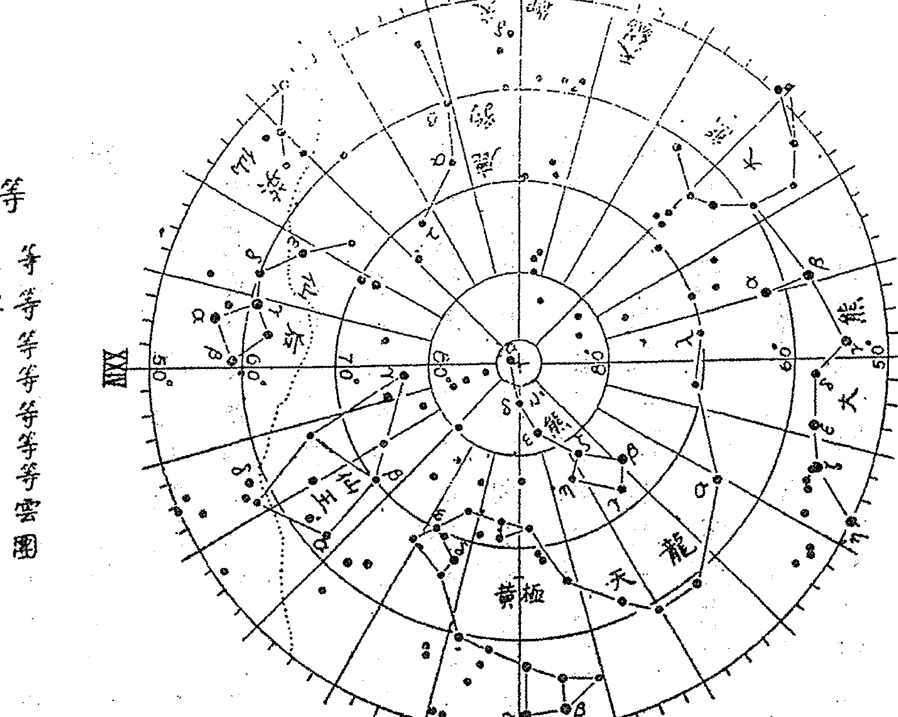

- 星等
- 一等星
- 二等星
- 三等星
- 四等星
- 五等星
- 星雲
- 星團

#### 北極附近星座（中名）

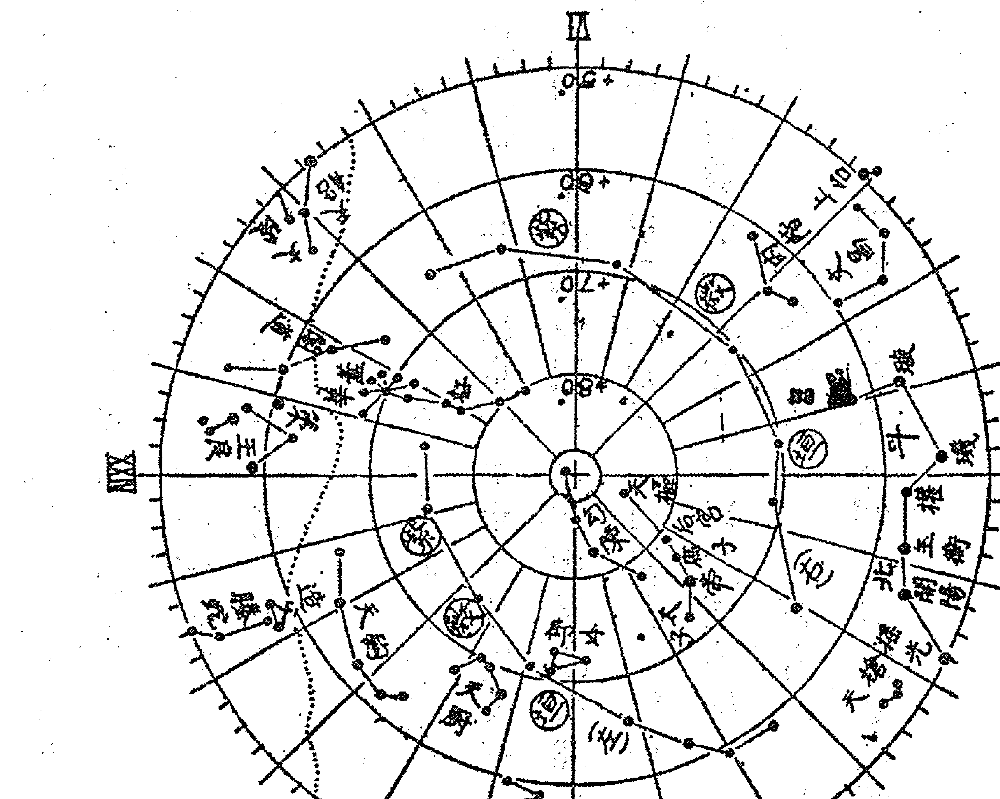

### 五、星命篇

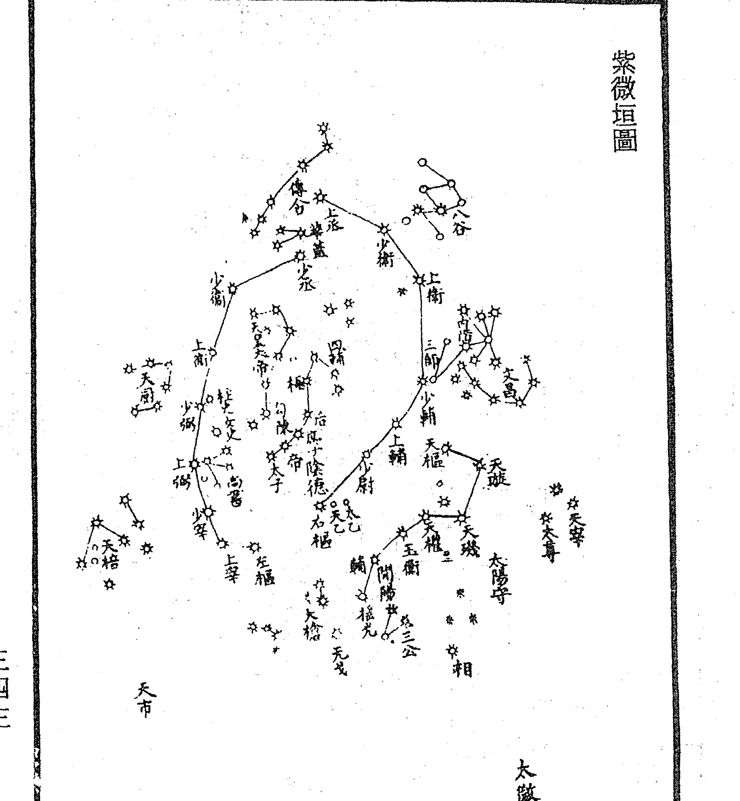

天市

太微

### 五行局紫微运行總圖

| 子 | 丑 | 寅 | 卯 | 辰 | 巳 | 午 | 未 | 申 | 酉 | 戌 | 亥 | 金四 | 水二 | 木三 | 火六 | 土五 |
|---|---|---|---|---|---|---|---|---|---|---|---|---|---|---|---|---|
| 1 | | | | | | | | | | | | | | | | |
| 2 | | | | | | | | | | | | | | | | |
| 3 | | | | | | | | | | | | | | | | |
| 4 | | | | | | | | | | | | | | | | |
| 5 | | | | | | | | | | | | | | | | |
| 6 | | | | | | | | | | | | | | | | |
| 7 | | | | | | | | | | | | | | | | |
| 8 | | | | | | | | | | | | | | | | |
| 9 | | | | | | | | | | | | | | | | |
| 10 | | | | | | | | | | | | | | | | |
| 11 | | | | | | | | | | | | | | | | |
| 12 | | | | | | | | | | | | | | | | |
| 13 | | | | | | | | | | | | | | | | |
| 14 | | | | | | | | | | | | | | | | |
| 15 | | | | | | | | | | | | | | | | |
| 16 | | | | | | | | | | | | | | | | |
| 17 | | | | | | | | | | | | | | | | |
| 18 | | | | | | | | | | | | | | | | |
| 19 | | | | | | | | | | | | | | | | |
| 20 | | | | | | | | | | | | | | | | |
| 21 | | | | | | | | | | | | | | | | |
| 22 | | | | | | | | | | | | | | | | |
| 23 | | | | | | | | | | | | | | | | |
| 24 | | | | | | | | | | | | | | | | |
| 25 | | | | | | | | | | | | | | | | |
| 26 | | | | | | | | | | | | | | | | |
| 27 | | | | | | | | | | | | | | | | |
| 28 | | | | | | | | | | | | | | | | |
| 29 | | | | | | | | | | | | | | | | |
| 30 | | | | | | | | | | | | | | | | |

### 五、星命篇

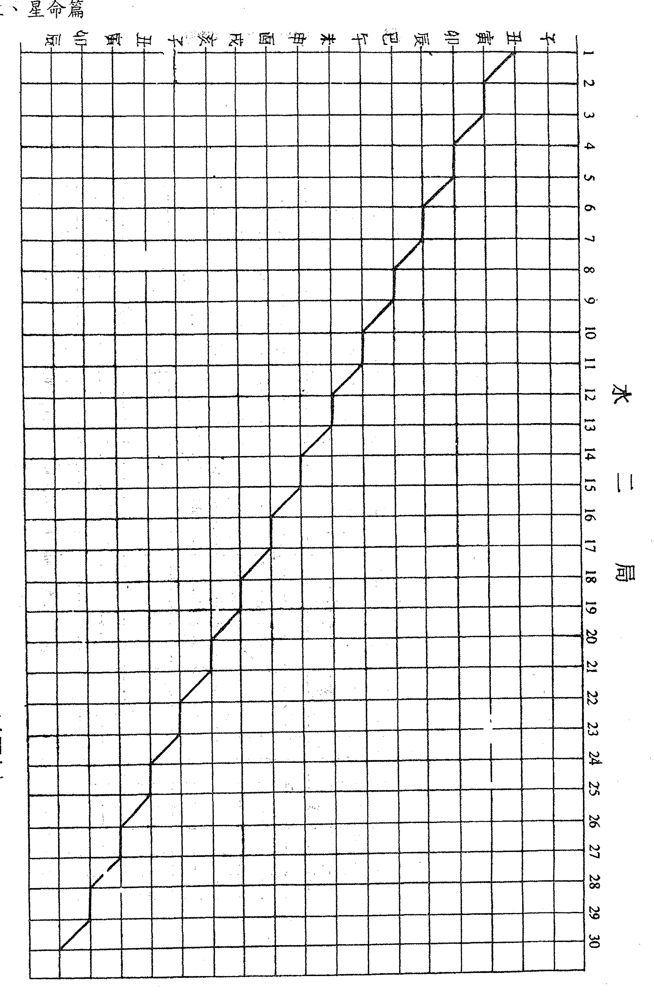

### 水二局

## 皇極經世·太乙神數圖解

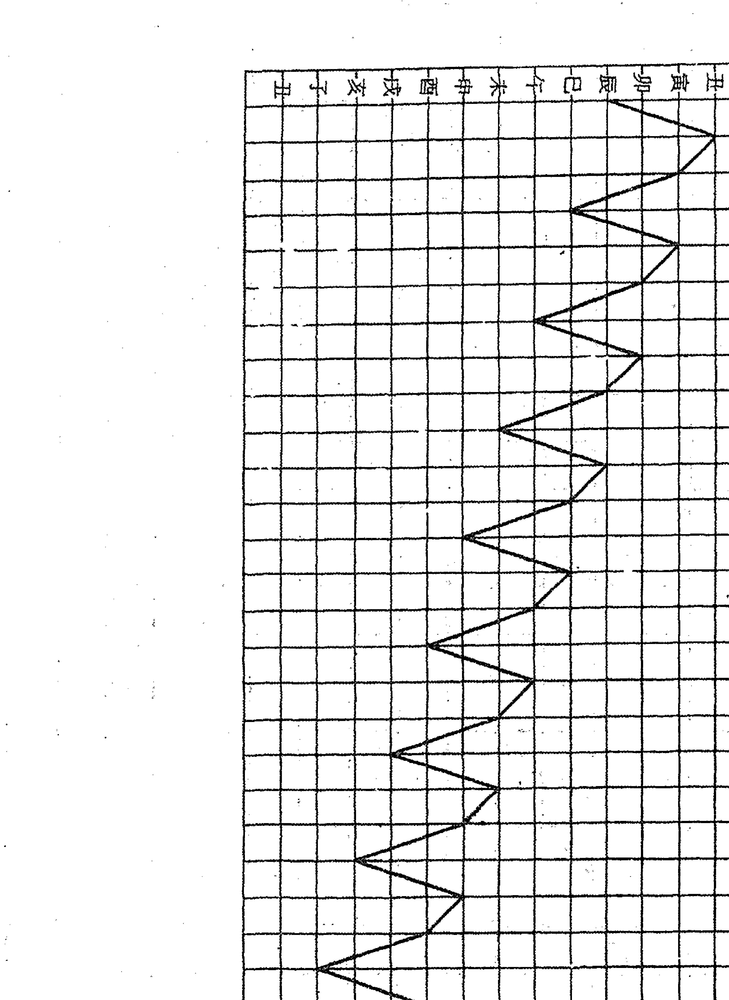

### 木三局
三四式

### 五、星命篇

| 子 | 丑 | 寅 | 卯 | 辰 | 巳 | 午 | 未 | 申 | 酉 | 戌 | 亥 |
|----|----|----|----|----|----|----|----|----|----|----|----|
| 1  |    |    |    |    |    |    |    |    |    |    |    |
| 2  |    |    |    |    |    |    |    |    |    |    |    |
| 3  |    |    |    |    |    |    |    |    |    |    |    |
| 4  |    |    |    |    |    |    |    |    |    |    |    |
| 5  |    |    |    |    |    |    |    |    |    |    |    |
| 6  |    |    |    |    |    |    |    |    |    |    |    |
| 7  |    |    |    |    |    |    |    |    |    |    |    |
| 8  |    |    |    |    |    |    |    |    |    |    |    |
| 9  |    |    |    |    |    |    |    |    |    |    |    |
| 10 |    |    |    |    |    |    |    |    |    |    |    |
| 11 |    |    |    |    |    |    |    |    |    |    |    |
| 12 |    |    |    |    |    |    |    |    |    |    |    |
| 13 |    |    |    |    |    |    |    |    |    |    |    |
| 14 |    |    |    |    |    |    |    |    |    |    |    |
| 15 |    |    |    |    |    |    |    |    |    |    |    |
| 16 |    |    |    |    |    |    |    |    |    |    |    |
| 17 |    |    |    |    |    |    |    |    |    |    |    |
| 18 |    |    |    |    |    |    |    |    |    |    |    |
| 19 |    |    |    |    |    |    |    |    |    |    |    |
| 20 |    |    |    |    |    |    |    |    |    |    |    |
| 21 |    |    |    |    |    |    |    |    |    |    |    |
| 22 |    |    |    |    |    |    |    |    |    |    |    |
| 23 |    |    |    |    |    |    |    |    |    |    |    |
| 24 |    |    |    |    |    |    |    |    |    |    |    |
| 25 |    |    |    |    |    |    |    |    |    |    |    |
| 26 |    |    |    |    |    |    |    |    |    |    |    |
| 27 |    |    |    |    |    |    |    |    |    |    |    |
| 28 |    |    |    |    |    |    |    |    |    |    |    |
| 29 |    |    |    |    |    |    |    |    |    |    |    |
| 30 |    |    |    |    |    |    |    |    |    |    |    |

### 金四局
三四七

| 地支 | 1 | 2 | 3 | 4 | 5 | 6 | 7 | 8 | 9 | 10 | 11 | 12 | 13 | 14 | 15 | 16 | 17 | 18 | 19 | 20 | 21 | 22 | 23 | 24 | 25 | 26 | 27 | 28 | 29 | 30 |
| :--- | :---: | :---: | :---: | :---: | :---: | :---: | :---: | :---: | :---: | :---: | :---: | :---: | :---: | :---: | :---: | :---: | :---: | :---: | :---: | :---: | :---: | :---: | :---: | :---: | :---: | :---: | :---: | :---: | :---: | :---: |
| **子** | | | | | | | | | | | | | | | | | | | | | | | | | | | | | | | |
| **丑** | | | | | | | | | | | | | | | | | | | | | | | | | | | | | | | |
| **寅** | | | | | | | | | | | | | | | | | | | | | | | | | | | | | | | |
| **卯** | | | | | | | | | | | | | | | | | | | | | | | | | | | | | | | |
| **辰** | | | | | | | | | | | | | | | | | | | | | | | | | | | | | | | |
| **巳** | | | | | | | | | | | | | | | | | | | | | | | | | | | | | | | |
| **午** | | | | | | | | | | | | | | | | | | | | | | | | | | | | | | | |
| **未** | | | | | | | | | | | | | | | | | | | | | | | | | | | | | | | |
| **申** | | | | | | | | | | | | | | | | | | | | | | | | | | | | | | | |
| **酉** | | | | | | | | | | | | | | | | | | | | | | | | | | | | | | | |
| **戌** | | | | | | | | | | | | | | | | | | | | | | | | | | | | | | | |
| **亥** | | | | | | | | | | | | | | | | | | | | | | | | | | | | | | | |

**注意**: 原始图片显示了一个网格图表，其中有一条折线（或三角形路径）连接了对应地支（子、丑、寅...）与特定数字（1-30）位置的单元格。上表网格结构仅示意行列布局，折线所表示的具体数据点未在表中以文本形式标记。

### 土五局
二四八

### 火六局

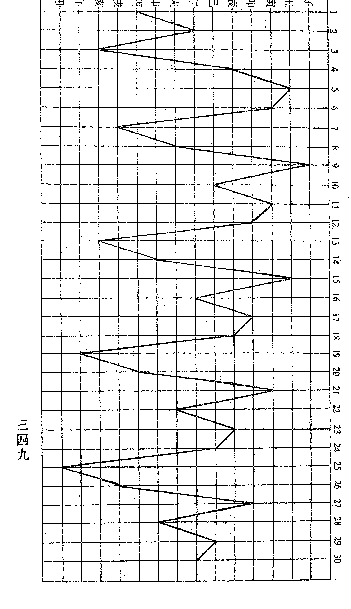

### 安紫微星算式(一)

| 命宮干支 | 納音局 | 算式 | R0 | R1 | R2 | R3 | R4 | R5 | 紫微曆宮 |
|----------|--------|------|----|----|----|----|----|----|----------|
| 水二局 | (B-1)÷2=Q+R | 0 | 1 |    |    |    |    | Q+K |
| 木三局 | (B-1)÷3=Q+R | 3 | 0 | 1 |    |    |    | Q+K |
| 金四局 | (B-1)÷4=Q+R | 10 | 3 | 0 | 1 |    |    | Q+K |
| 土五局 | (B-1)÷5=Q+R | 5 | 10 | 3 | 0 | 1 |    | Q+K |
| 火六局 | (B-1)÷6=Q+R | 8 | 5 | 10 | 3 | 0 | 1 | Q+K |

- 二、說明：
- ①設B為陰曆生日，即本生日，Q為商數，R為餘數，K為置換數。如金四局R得0時，K為10。火六局R得1時，K為5。依此類推。
- ②答數得1時，紫微曆賓宮，依次為：

### 五、星命篇

### 三、举例：

①阴女乙未年十月初九日亥时生，命宫戊子，纳音火六局。

算式：(9-1)÷6=1……2，Q=1，R=2，K=10，紫微=Q+K=11，换算得知紫微居子宫。

②阴男辛未年十一月十一日亥时生，命宫辛丑，纳音土五局。

算式：(11-1)÷5=2……0，Q=2，R=0，K=5，紫微=2+5=7，换算得知紫微归中宫。

| 寅 | 卯 | 辰 | 巳 | 午 | 未 | 申 | 酉 | 戌 | 亥 | 子 | 丑 |
|----|----|----|----|----|----|----|----|----|----|----|----|
| 1 | 2 | 3 | 4 | 5 | 6 | 7 | 8 | 9 | 10 | 11 | 12(0) |

③8、5、10、3、0、1之间有顺9，逆7，顺5，逆3，顺1之关系

如8+9=5（即8+9=17-12=5），5-7=10（即5+12-7=10），10+5=3（即10+5=15-12=3）

答数得负数时，须加12化为正数，得正数超过12则减去12。

3-3=0  0+1=1

- ① B ÷ M = Q …… R
   陰曆生日 ÷ 命宮納音局數 = 商數 …… 餘數
- ② K + Q = P

| 局名 | 0 | 1 | 2 | 3 | 4 | 5 |
|------|---|---|---|---|---|---|
| 火六局 | 3 | 10 | 7 | 12 | 5 | 2 |
| 土五局 | 3 | 7 | 12 | 5 | 2 |  |
| 金四局 | 3 | 12 | 5 | 2 |  |  |
| 木三局 | 3 | 5 | 2 |  |  |  |
| 水二局 | 3 | 2 |  |  |  |  |

### 安紫微星算式口

### 五、星命篇

### 置換數+商數=紫微歸宮

### 二、說明：

①宮位代號
子 丑 寅 卯 辰 巳 午 未 申 酉 戌 亥
1 2 3 4 5 6 7 8 9 10 11 12

②局數後之數字為置換數K，即宮位代號。

③若得數大於12，則減去12，再查對宮位，若整除時，須減1方是。

### 三、舉例：

①陰女乙未年十月初九日亥時生，命宮戊子，納音火六局。
算式：9 ÷ 6 = 1 ...... 3
Q=1，R=3，查得K=12
12+1=13，
13-12=1，
即紫微躍子宮

②陰男辛未年十一月十一日亥時生，命宮辛丑，納音土五局。
算式：11 ÷ 5 = 2 ...... 1
Q=2，R=1，查得K=7
7+2=9
即紫微躍申宮

## 安紫微星表式 •

| 日期 | 水二局 | 木三局 | 金四局 | 土五局 | 火六局 |
|------|--------|--------|--------|--------|--------|
| 一初 | 丑 | 辰 | 亥 | 午 | 酉 |
| 二初 | 寅 | 丑 | 辰 | 亥 | 午 |
| 三初 | 寅 | 寅 | 丑 | 辰 | 亥 |
| 四初 | 卯 | 己 | 寅 | 丑 | 辰 |
| 五初 | 卯 | 寅 | 子 | 寅 | 丑 |
| 六初 | 辰 | 卯 | 己 | 未 | 寅 |
| 七初 | 辰 | 午 | 寅 | 子 | 戌 |
| 八初 | 己 | 卯 | 卯 | 巳 | 未 |
| 九初 | 己 | 辰 | 丑 | 寅 | 子 |
| 十初 | 午 | 未 | 午 | 卯 | 己 |
| 一十 | 午 | 辰 | 卯 | 申 | 寅 |
| 二十 | 未 | 己 | 辰 | 丑 | 卯 |
| 三十 | 未 | 申 | 寅 | 午 | 亥 |
| 四十 | 申 | 己 | 未 | 卯 | 申 |
| 五十 | 申 | 午 | 辰 | 辰 | 丑 |
| 六十 | 酉 | 酉 | 己 | 酉 | 午 |
| 七十 | 酉 | 午 | 卯 | 寅 | 酉 |
| 八十 | 戌 | 未 | 申 | 未 | 辰 |
| 九十 | 戌 | 戌 | 己 | 戌 | 戌 |
| 十二 | 亥 | 亥 | 午 | 未 | 亥 |
| 一廿 | 亥 | 子 | 辰 | 申 | 亥 |
| 二廿 | 子 | 丑 | 酉 | 亥 | 子 |
| 三廿 | 子 | 子 | 申 | 申 | 子 |
| 四廿 | 丑 | 丑 | 未 | 酉 | 丑 |
| 五廿 | 丑 | 午 | 己 | 子 | 丑 |
| 六廿 | 寅 | 亥 | 戌 | 寅 | 寅 |
| 七廿 | 卯 | 辰 | 未 | 戌 | 寅 |
| 八廿 | 申 | 酉 | 申 | 丑 | 卯 |
| 九廿 | 己 | 午 | 午 | 戌 | 卯 |
| 三十 | 午 | 未 | 亥 | 亥 | 辰 |## 八、论南北二斗

天陽地陰，一合而生兩曜，兩曜行度，五緯周天，是謂七政，則七星九皇北斗也。每以杓隨月建，分指二十四節氣、二十八宿；應下土七十二候、三十六禽，宿中有斗六星者是，則號南斗六司，與北斗七政分職，共理三才、六合、八卦、九宮，總轄中外，百辟官品。北斗位處坎宮，名同月曜，降神于人，名之為魄也，主司陰府，宰御水源，將濟生聚，功莫大焉。南斗位屬離宮，名同月曜，降神于人，名之為魂也，主司陽官，宰御火帝，將濟動用，德莫大焉。泊自天地造至于今，二司兩極，同共陶鑄萬品，生成萬物，注擁天人之爵秩，增減土庶之祿俸，延促齡長，去留災禍，莫不由其與奪也。所以然者，乃知陽日、陰月南北二司、魁斗魁罡，受性水火，稟質陰陽，助天地而育萬物，體道德而垂萬靈。物得而豐也，非此而孰能乎？人得而生也，非此而孰能乎？生生之生，全繫水火，水火比于道之真體，故不可暫離，可離而獲存者，非物非人。

南北二斗、陶魂鑄魄，一身之根、在乎道炁，保固形命，形命保固，在乎敎法，敎法存乎科儀之細密，聲發響應，形動影隨，形從心移，發足動步，神靈微妙。南北二斗在紫微斗數，合而為廿一主星之部份，北斗七星合輔弼共九星是為命主星，為人命主宰，論命根本，是為先天。南斗六星是合火鈴為身主星，主後天命運之榮養修行，造化福德，是為後天。命主與身主合居南北，相反相成，亦相輔相助，二司分職，主宰先後天命身運程。

### 论北斗諸星

北斗九星，位北天球紫微垣內，拱北辰而周之，于大熊座內（Ursa Major），約赤經八時至十四時，及赤緯北二十八度至七十三度間，由座中之α β γ δ ε ζ η等七星組成，狀似斗形，居中之δ為三等星，餘六星均係二等星，于赤緯北四十度以上，終年可見其在地平線上，拱繞紫微極星而旋，每年四月廿五日下午九時中天，見其正居頭頂之上。春秋運斗樞曰：「天文地理，各有所主，北斗有七星，天子有七政也。北斗七星，所謂璇璣玉衡，以齊七政，杓攜龍角，衡殷南斗，魁枕參首，是謂帝車，運於中央，臨制四鄉，分陰陽、建四時、均五行、移節度、定諸紀，皆繫於斗。第一天樞、第二璇、第三璣、第四權、第五衡、第六開陽、第七瑤光，第一至第四為魁，第五至第七為杓，合而為斗，屬陰布陽，故稱北斗。史記天官書略同。星經云：「北斗星謂之七政，天之諸侯，亦為帝車，魁四星為璇璣，杓三星為玉衡，齊七政，斗為人君，號令之主，出號施令，布政天中，臨制四方。李淳風觀象玩占曰：「北斗七星，在紫微垣外，太微垣北，七政之樞機，陰陽之元本也：：樞為天，璇為地，璣為人，權為時，衡為音，開陽為律，瑤光為呂，又為帝車，運乎中央，而臨制四方，以建四時、均五行、定綱紀，為號令主。北斗尊屬北極，位證天中，朝金闕而覆崑崙，運璇璣而行造化，群生元命，悉歸陶鎔之德，九州分野，總屬照臨之恩，何災不滅，何福不臻。北斗七星，為人身之主宰，為造化之樞機，判人間善惡之期，司陰府是非之目，五行共稟，七政同科。斗亦帝車，運于中央，臨制八表、燮理陰陽，建四時、和五行，定諸紀、移節度，均繫于斗。北斗燦然星光、宣威三界、統御萬靈、攝伏魔精、位冠五方，調理紀綱，仰啟中天聖，曾居北斗垣，宣威司造化，垂象制乾坤。

七星合共輔弼紫微帝座，為陰陽之本源，掌七政樞機，運乎天中，宰制四方，以建四則，而均五行。劉伯溫白潦經曰：「占斗光之明暗，辨月色之初新，占氣候之陰晴，卜國政之休咎」。我國古稱北斗為天罡，各星均有所司，前四星樞璇、玉衡、權合稱為魁，亦稱璇璣；五至七星玉衡、開陽、瑤光合稱為杓，亦稱玉衡，即所謂璇玉衡也。

北斗第一星曰天樞，為大熊座主星，西名（Dubhe，αUMi），為著名雙星，合視星等為二等。我國古稱照中勳今天蓬陽明貪狼大星，簡稱貪狼。為政星（又曰正星），主日法天，亦主陽德，天子之象也。在斗司權，為眾星樞機。在數主禍福，化氣曰桃花。為大桃花。

北斗第二星曰天璇，西名（Merak，βUMi），光度二點四星等。為大熊座β星，我國古稱英明集華天任陰精巨門元星，簡稱巨門。為法星，主月法地，亦主陰刑，女主之位。在斗為暗星，在數主是非，化氣曰暗，不明，口舌之事。

北斗第三星曰天璣，西名（Phecda，γUMi），光度二點五星等，為大熊座γ星。我國古稱通玄須變天柱真人祿存真星，簡稱祿存。為令星，亦象人。在斗司爵，常掌爵祿。在數司貴壽，有解厄制化之功。化氣曰祿，主禍福財祿。

北斗第四星曰天權，西名（Megrez，δUMi），光度三點四星等，為大熊座δ星。我國古稱總承符元天心玄冥文曲紐星，簡稱文曲。為伐星，主天理殄惡，每伐無道，亦象時。在斗司文，乃文魁之首。在數為能文之士。化氣曰科甲，司爵名祿。

北斗第五星曰玉衡，西名（Alioth，εUMi），光度一點八星等，為大熊座ε星，是七星中最亮者。我國古稱執慶剛星丹元廉貞紐星，簡稱廉貞。為殺星，主中央土為殺將；助四方殺有罪。亦象音。在斗司品秩，在數司權令，為斗中上將。

北斗第六星曰開陽，西名（Mizar，ζUMi），又作開陽，為著名分光雙星及變星，主星光度二點一星等。我國古稱大益樞京天輔北極武曲紀星，簡稱武曲。為危星，象律。主天倉百穀、樹糧司財。在斗司財，為財祿之官。化氣曰福，福祿綿長。

北斗第七星曰瑤光，西名（Alkaid，ηUMi），又稱（Bene tchnasch），光度一點九星等。我國古稱凝華好化天衡破軍關星，簡稱破軍。為部星或應星，主統帥兵事，兵戈殺弑。又象曰。在斗為殺氣，在數為耗星，化氣亦曰耗，司禍福，為夫妻、子女、僕役主。

北斗第八星曰洞明，為開陽伴星，我國古稱陽璣予度天芮左輔大道星，簡稱左輔，又稱玄弋。屬開陽之左，為佐斗助星，帝極左輔，施行善令。在斗司令，在數主文貴，化氣曰助，為陽貴顯達之官。

北斗第九星曰隱光，亦開陽伴星，我國古稱陰襲天英右弼大道星，簡稱右弼，又稱招搖。居開陽之右，為佐斗助星，帝極右弼，佐司制令，在斗司令，在數主官顯，化氣曰助，為陰貴忠良之官。

> 玄門寶海經曰：『北斗亦有九星，七見二隱，其八曰洞明，九曰隱光，是帝皇太尊精神也。』

北斗七星又曰魁、杓、罡、魓、䰢，占星家認七星共明主國昌，二輔星明則臣彊。以天樞為北斗主，則杓之璇、璣、權，及柄之玉衡、開陽、搖光，皆日三公，又主宣德化，理調七政，及司陰陽之官。古人並認凡流星遇年則國亂。

開陽左右之伴星，即洞明、隱光二星，西名合稱（Alcor，80 UMi），源自波斯人，意為無依靠之人，亦稱為開陽之駕馬者，我國古稱輔星或輔弼。星等為五等，肉眼僅見；與開陽主星相隔十四秒，開陽色白，輔弼淡綠，歷來均視其為開陽之伴星，近始知非伴星，其與開陽並無任何物理關係，此雙星系統系三百年前意大利人（α B U Mioccoli H）發現為分光雙星，近始發現係四重星系。古賢及陳希夷依天道即推知，此即斗數上所言北斗四助星，左右羊陀四者。據言，古蘇丹及阿拉伯人微選新兵，以其能肉眼見到開陽及80號伴星，確係分開之二星，即言目力佳，方為合格入選。

北斗四助，除輔弼外，另有羊陀，均屬金，羊為庚金陀為辛金，屬武曲（即開陽）之周，隱而不顯，現則刑傷剋害，是非曰有，國有奸臣、野有賊亂。

擎羊，又稱羊刃，在斗主刑，在數主剋，化氣曰刑，主刑傷剋害，疾厄天忌。

陀羅，在斗主暗，在數主傷，化氣曰忌，主暗害，小人，是非，口舌等。

綜觀，北斗諸星，主星曰紫微，正星有貪狼、巨門、祿存、文曲、廉貞、武曲、破軍。助星有：左輔、右弼、擎羊、陀羅，合共十二星。

## 皇極經世・太乙神數圖解

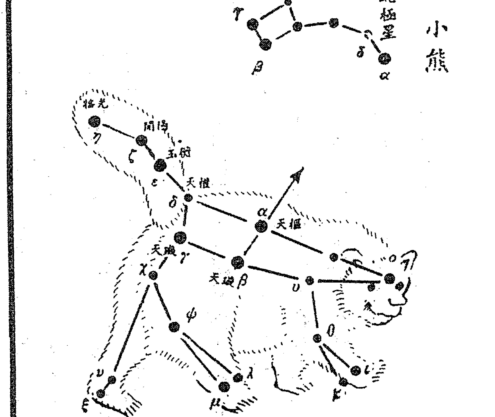

### 大熊星座

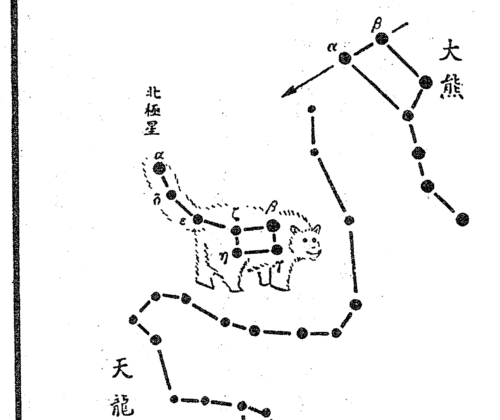

### 小熊星座

### 北斗九星

摇光 天蓬軍 破右（天芮）
辅左（天衝）

天武開 陽曲輔

天廉天 禽真衡

天文天 權曲心

天禄天 柱存璇

天貪天 樞狼英

天巨天 任門璇

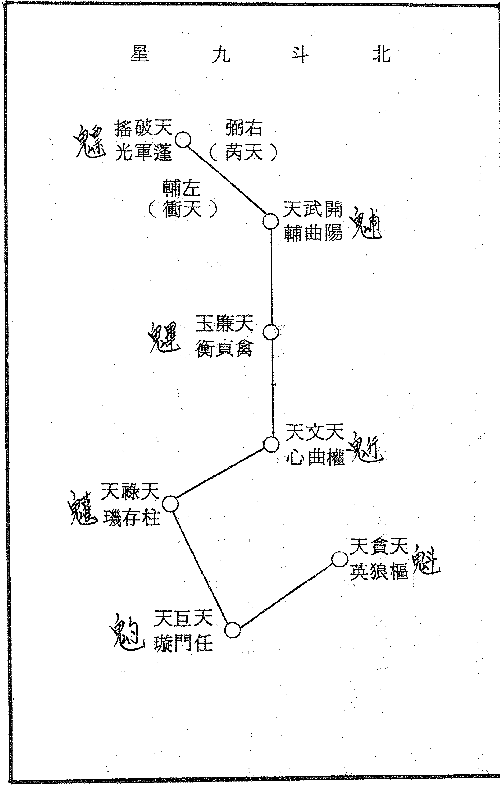

### 论南斗諸星

南斗六星，位南天球人馬座（Sagittarius）中，於赤經十七時十五分至二十時二十分，赤緯南八度至四十五度，由座中之 φ λ μ σ ζ 等六星組成，中有柄杓，狀以北斗，柄杓二星指向東北，每年八月廿一日下午九時中天。南斗諸星，即我國古稱二十八宿之斗宿，其正星有六，合主星及四助共十一星。

> 詩經小雅曰：『箕斗並在南方，箕在南，而斗在北，故言南箕北斗』。朱子注：『箕斗二星以夏秋之間，見於南方，云北斗者，以其在箕之北也』。此北斗係指南斗言。

> 星經有云：『南斗六星主天子壽命，亦云宰相爵祿之位』。

> 漢志曰：『貫于日月正道，為丞相太宰，酌量政事，褒進賢良，稟授爵祿，又主兵革』。

> 晉書及隋書天文志有曰：『婁北南斗之星，天廟也，是丞相太宰之位，主褒賢爵祿之位』。

進士，禀授爵祿，又主兵革，一曰天機，南二星魁天梁也，中央二星天相也，北二星天府庭也，亦爲壽命之期。將有天子之事占于斗。

> > 宋史天文志又云：「北方南斗六星，天之賞祿，府主天子壽算，爲宰相爵祿之位」。

> > 李淳風觀象玩占曰：「南斗之星曰天廟，一日天正，一日天關，一日天機，一日天府、一日天庫、一日天司，元武之首，丞相太宰之位。木星也，主天子壽命之期，主酌量政事，禀受爵祿，將有天子之事，占之於斗。」

五星貫之爲中道，其南首二星曰魁，爲天庫，又爲天梁、主襲賢進士。二星爲天相，主爵祿。北尾二星曰杓，爲天府，主壽命。

祿觀上言，南斗我國古稱司命之神，爲二十八宿之北方玄武七宿之首，主星有六似北斗。

> > 蘇東坡赤壁賦曰：「月出于東山之上，徘徊于斗牛之間」。

所指即此，古稱斗木獬，天廟也，其星明主天下和平。

南斗主司陽官，宰御火帝，位離宮而名日曜，隨斗柄而環應七元，助天地化育之功，體道德光明之照，受性降神，握品物生成之統紀，陶魂鑄魄，管人天邁化之樞機，注秩消災，延齡溥福。

南斗主星曰天府，爲斗中第一星，史記天官書云：「斗爲帝車，運于中央，臨制四鄉、分陰陽、建四時，均五行，移節度，定諸紀，皆繫于斗，斗魁戴匡六星曰文昌宮。文耀鉤曰：「文昌宮爲天府也」。孝經援神契又曰：「文昌宮爲天府也」。此文昌宮指天府也。

南斗第一星曰天府，西名（27 σ Sgr），爲人馬座中φ星，光度三點三星等。我國古稱司命鎮國上將天府星，在斗司權，爲紫微帝座之佐貳，主爵祿、福德。化氣曰賢，主賢進士，可延壽解厄，能制羊陀爲善，化火鈴爲福，常業爵祿，爲帝座帑藏之官。

南斗第二星曰天梁，西名（Kaus Borealis, 22 λ Sgr），爲人馬座中λ星，光度二點九星等。我國古稱延壽保命貴相天梁星。在斗司壽，能延壽溥福。在數司福，爲父母主，能解厄制化。化氣曰蔭，可蔭福致祥。掌帝座生殺之權，爲御使監察之官。南斗第三星曰天機，西名（13 γ Sgr），爲人馬座中γ星，光度四點零星等。我國古稱上生監簿大理天機星。司帝座壽算監簿之職，爲益壽善算之星。在數司算，爲益算之星。在數司善，爲兄弟主，益壽之星，化氣曰善，主機謀權變，清顯忠良之士。

南斗第四星曰天同，西名（Nunki，34 σ Sgr），光度一点一等，与北极星相福，有解厄制化之功，不怕劫煞相侵，不畏诸凶同度，于十二宫中皆为福论。

南斗第五星曰天相，西名（40 ε Sgr）光度二点五星等，我国古称司禄镇狱上相天相星，为帝座部从，为司印之官。在斗司爵，主爵禄功名。在数为官禄主，能制廉贞之恶。化气曰印，常掌印玺文墨。为三台上相之官。

南斗第六星曰七杀，西名（Ascella，38 δ Sgr），光度二点三星等，我国古称司令肃权护国七杀星，掌帝座肃杀之权，为斗中上将。在斗司令，为护国上将，在数主肃杀，化气曰将星，遇紫微化为权。

南斗第六星为双星系统，主星光度三点三星等，即七杀。伴星二点五星等，即文昌，合视星等为二点六等。其色青白，均属金，杀为辛金，昌为庚金，杀为将星，昌为文星，文武和合，自成系统。

文昌一星，我国古称厄炼魂文昌星，为帝座部从，司文墨之官。在斗司文，在数为科名主，乃文魁之首，科第所主。化气曰能文之士。又名文馆。

于南斗机梁二星间之上方，另有一双星，即斗魁钺二助星。

天魁屬丙火，在斗司財名，在數主晝生貴，為陽貴，即天乙貴人，司科甲爵名

天鉞屬丁火，在斗司才名，在數主夜生貴，為陰貴，即玉堂貴人，司科甲魁第

南斗另二助星，火星屬丙火，鈴星屬丁火，與北斗助星羊陀均隱而不現，顯則君子在野，小人當道。居天相之周，受其剋制，天相能解火星之惡，如廉貞、火鈴、空劫、孤寡等。

綜觀，南斗諸星，主星曰天府，正星有天梁、天機、天同、天相、七殺、文昌。助星有天魁、天鉞、火星、鈴星，合共十一星。

### 论中天諸星

中天諸星，主星為太陽、太陰。甲級正曜星有祿、權、科、忌四化，其餘均為乙級以下之星。

中天吉曜有：
- 台輔
- 封誥
- 恩光
- 天貴
- 天官
- 天福
- 三台
- 八座
- 龍池
- 鳳閣
- 天才
- 天壽
- 紅鸞
- 天喜
- 天馬
- 解神
- 天巫等十七星。

中天凶曜有：
- 地空
- 地劫
- 天刑
- 天姚
- 天傷
- 天使
- 天虛
- 天哭
- 孤辰
- 寡宿
- 天空
- 截空
- 旬空
- 蜚廉
- 破碎
- 天月
- 陰煞等十七星。

以上中天諸星合計共四十星。（各論從略）

總計北斗有十二星，南斗十一星，中天四十星，合博士十二星、長生十二星、將前十二星，歲前十二星，共計一百一十一星。

### 天市垣圖

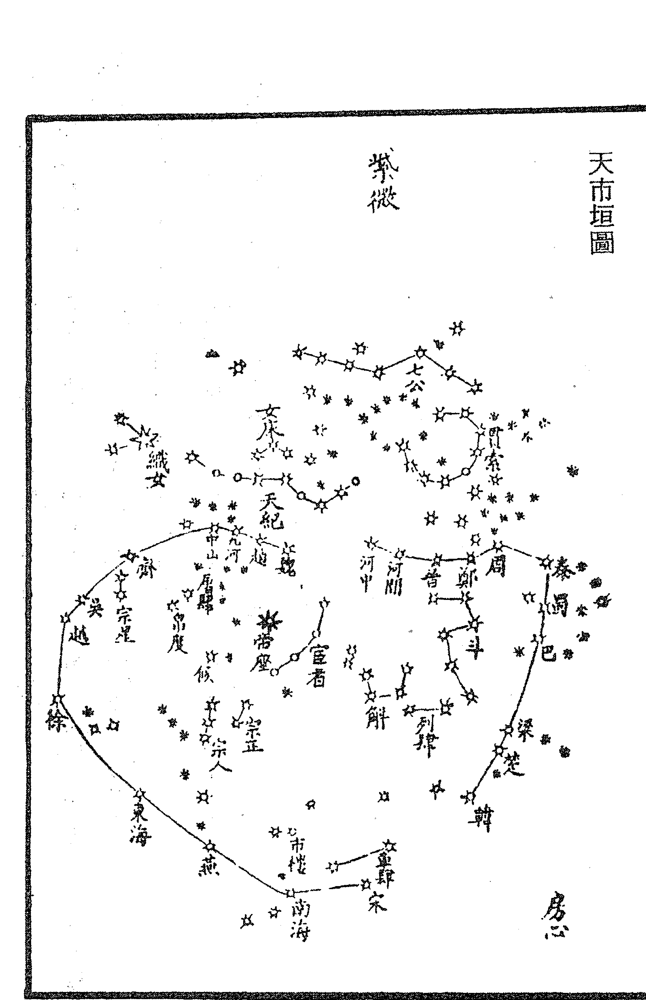

### 五、星命篇

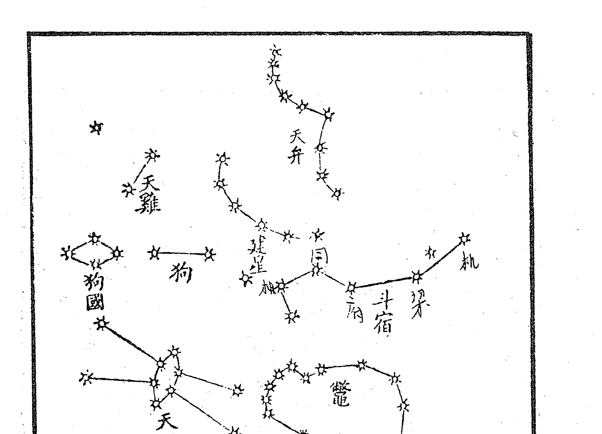

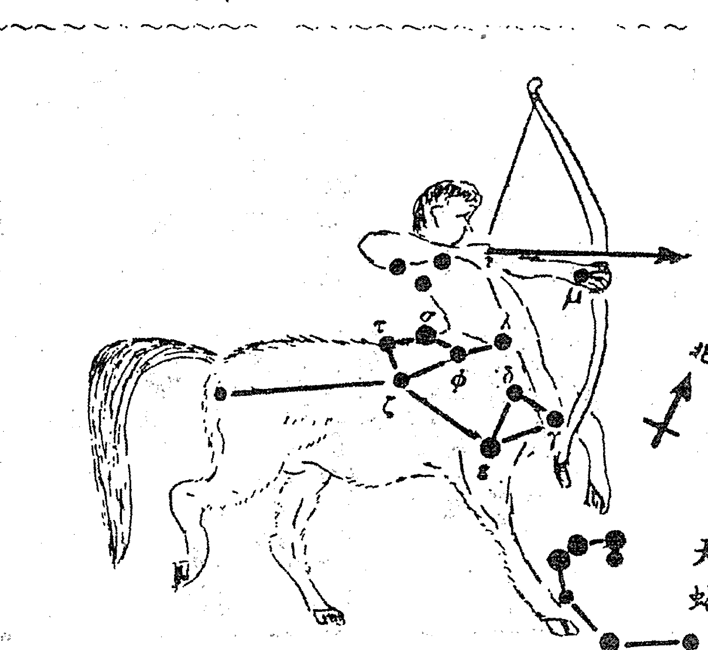

人馬星座

## 皇极经世·太乙神数图解

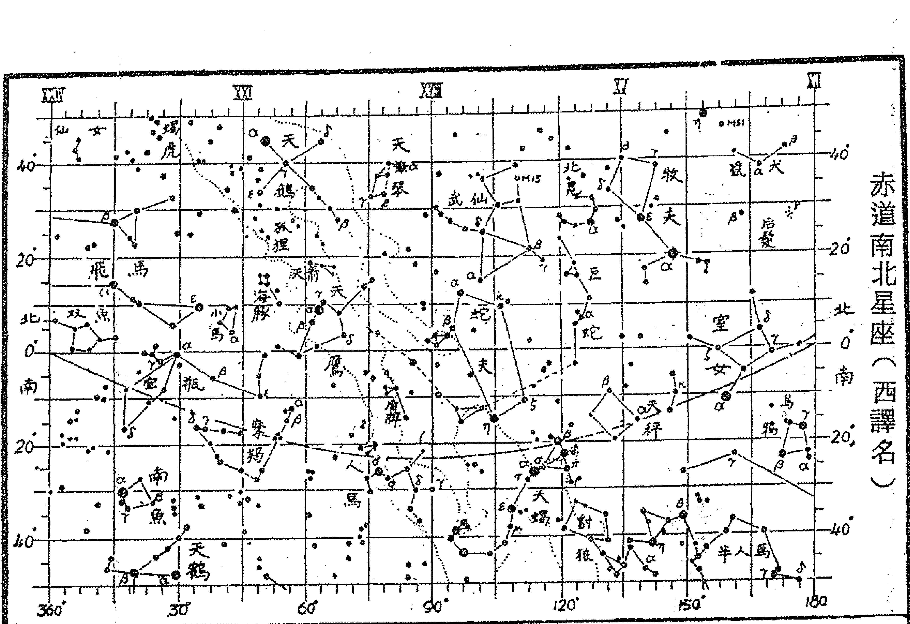

### 赤道南北星座（西译名）

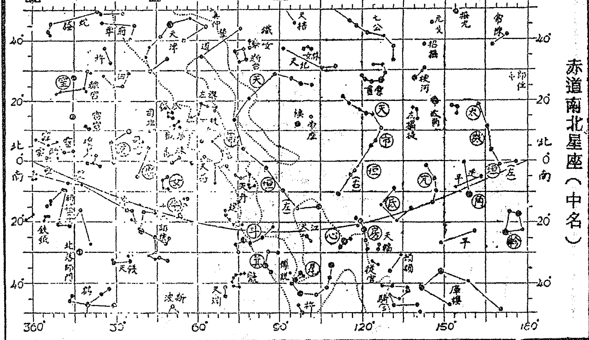

### 赤道南北星座（中译名）

### 九星曜图说

#### 一 星曜图

##### (一)紫微在子午

| 天机 | 紫微 | 破军 |      |
| :---: | :---: | :---: | :---: |
| 七杀 |      |      |      |
| 天梁 太阳 |      | 廉贞 天府 |      |
| 天相 武曲 | 巨门 天同 | 贪狼 | 太阴 |

| 太阴 | 贪狼 | 巨门 天同 | 天相 武曲 |
| :---: | :---: | :---: | :---: |
| 廉贞 天府 |      |      | 天梁 太阳 |
|      |      |      | 七杀 |
| 破军 |      | 紫微 | 天机 |

##### (二)紫微在丑未

| 天机 | 破军 紫微 |      |      |
| :---: | :---: | :---: | :---: |
| 太阳 |      | 天府 |      |
| 七杀 武曲 |      | 太阴 |      |
| 天梁 天同 | 天相 | 巨门 | 贪狼 廉贞 |

| 贪狼 廉贞 | 巨门 | 天相 | 天梁 天同 |
| :---: | :---: | :---: | :---: |
| 太阴 |      |      | 七杀 武曲 |
| 天府 |      |      | 太阳 |
|      | 破军 紫微 | 天机 |      |

##### (三)紫微在寅申

| 太陽 | 破軍 | 天機 | 紫微天府 |
| :---: | :---: | :---: | :---: |
| 武曲 | 九 |  | 貪狼 |
| 天同 |  |  | 太陰 |
| 七殺 | 天梁 | 天廉相貞 | 巨門 |

##### (四)紫微在卯酉

| 巨門 | 天相 | 天梁 | 七殺 |
| :---: | :---: | :---: | :---: |
| 貪狼 | 三 |  | 天同 |
| 太陰 |  |  | 武曲 |
| 紫微天府 | 天機 | 破軍 | 太陽 |

##### (五)紫微在辰戌

| 天同 | 天府武曲 | 太阴太阳 | 贪狼 |
| :---: | :---: | :---: | :---: |
| 破军 |        | 巨门天机 | 紫微天相 |
|      | 十一     |          | 天梁 |
| 廉贞 | 七杀     |          |      |

| 天梁 | 七杀 |   | 廉贞 |
| :---: | :---: | :---: | :---: |
| 紫微天相 |   |   |   |
| 天机巨门 |   |   | 破军 |
| 贪狼 | 太阴太阳 | 天府武曲 | 天同 |

##### (六)紫微在巳亥

| 天府 | 太阴天同 | 贪狼武曲 | 巨门太阳 |
| :---: | :---: | :---: | :---: |
|      |        |        | 天相 |
| 破军廉贞 |        |        | 天机天梁 |
|      |        |        | 紫微七杀 |

| 紫微七杀 |   |   |   |
| :---: | :---: | :---: | :---: |
| 天机天梁 |   |   | 破军廉贞 |
| 天相 |   |   |   |
| 巨门太阳 | 贪狼武曲 | 太阴天同 | 天府 |

#### 二 图 隈 星

天机
天机 天机 天机 太阴、天机
天梁、天机 天机 巨门、天机
巨门、天机 天机 天梁、天机
太阴、天机 天机 天机 天机

紫微
紫微 七杀、紫微 破军、紫微 天府、紫微
天相、紫微 紫微 贪狼、紫微
贪狼、紫微 紫微 天相、紫微
天府、紫微 破军、紫微 紫微 七杀、紫微

武曲
武曲 破军、武曲 天府、武曲 贪狼、武曲 天相、武曲
武曲 七杀、武曲 武曲
七杀、武曲 武曲 武曲
天相、武曲 贪狼、武曲 天府、武曲 破军、武曲

太阳
太阳 太阳 太阴、太阳 巨门、太阳
太阳 太阳 天梁、太阳
天梁、太阳 太阳 太阳
巨门、太阳 太阴、太阳 太阳 太阳

| 贪狼 廉贞 | 天相 廉贞 | 七杀 廉贞 | 廉贞 |
| :---: | :---: | :---: | :---: |
| 天府 廉贞 | 廉 贞 | 廉 贞 | 破军 廉贞 |
| 破军 廉贞 | 廉 贞 | 廉 贞 | 天府 廉贞 |
| 廉贞 | 七杀 廉贞 | 天相 廉贞 | 贪狼 廉贞 |

| 天同 | 太阴 天同 | 巨门 天同 | 天梁 天同 |
| :---: | :---: | :---: | :---: |
| 天 同 | 天 同 | 天 同 | 天 同 |
| 天 同 | 天 同 | 天 同 | 天 同 |
| 天梁 天同 | 巨门 天同 | 太阴 天同 | 天 同 |

| 太阴 | 太阴 天同 | 太阴 太阳 | 太阴 天机 |
| :---: | :---: | :---: | :---: |
| 太 阴 | 太 阴 | 太 阴 | 太 阴 |
| 太 阴 | 太 阴 | 太 阴 | 太 阴 |
| 太阴 天机 | 太阴 太阳 | 太阴 天同 | 太 阴 |

| 天府 | 天府 武曲 | 天 府 | 天府 紫微 |
| :---: | :---: | :---: | :---: |
| 天府 廉贞 | 天 府 | 天 府 | 天 府 |
| 天 府 | 天 府 | 天 府 | 天府 廉贞 |
| 天府 紫微 | 天 府 | 天府 武曲 | 天 府 |

# 皇極經世·太乙神數圖解

| 巨門 | 巨門 | 巨門天同 | 巨門太陽 |
|------|------|----------|----------|
| 巨門 | 巨門 | 巨門天機 | 巨門 |
| 巨門天機 | 巨門 | 巨門 | 巨門 |
| 巨門太陽 | 巨門天同 | 巨門 | 巨門 |

| 貪狼廉貞 | 貪狼 | 貪狼武曲 | 貪狼 |
|----------|------|----------|------|
| 貪狼 | 貪狼 | 貪狼紫微 | 貪狼 |
| 貪狼紫微 | 貪狼 | 貪狼 | 貪狼 |
| 貪狼 | 貪狼武曲 | 貪狼 | 貪狼廉貞 |

| 天梁 | 天梁 | 天梁 | 天梁天同 |
|------|------|------|----------|
| 天梁天機 | 貪狼 | 天梁太陽 | 天梁 |
| 天梁太陽 | 天梁 | 天梁天機 | 天梁 |
| 天梁天同 | 天梁 | 天梁 | 天梁 |

| 天相 | 天相廉貞 | 天相 | 天相武曲 |
|------|----------|------|----------|
| 天相紫微 | 天相 | 天相 | 天相 |
| 天相 | 天相 | 天相紫微 | 天相 |
| 天相武曲 | 天相 | 天相廉貞 | 天相 |

| 破軍武曲 | 破軍 | 破軍紫微 | 破軍 |
|----------|------|----------|------|
| 破軍 | 破軍 | 破軍廉貞 | |
| 破軍廉貞 | 破軍 | 破軍 | |
| 破軍 | 破軍紫微 | 破軍 | 破軍武曲 |

| 七殺紫微 | 七殺 | 七殺廉貞 | 七殺 |
|----------|------|----------|------|
| 七殺 | 七殺 | 七殺武曲 | |
| 七殺武曲 | 七殺 | 七殺 | |
| 七殺 | 七殺廉貞 | 七殺 | 七殺紫微 |

### 十四主星定盘星曜图說

甲類：紫微、天府、天相、武曲、廉貞、七殺、破軍、貪狼
乙類：天機、太陰、天同、天梁、巨門
甲類諸星互曜，乙類諸星互曜。
甲類諸星與乙類諸星永不同宮。

- 1. 紫微、武曲、廉貞與天府、天相、七殺、破軍、貪狼互曜。
- 2. 天府、天相、七殺、破軍、貪狼與紫微、武曲、廉貞互曜。
- 3. 天機、太陰、天同、巨門、天梁互曜。
- 4. 太陰、巨門、天梁互曜天機、太陽、天同（詳見圖三）。

### 星曜圖(一) 諸星同宮之順序及宮位

| 破軍紫微未丑 | 七殺紫微未丑 | 天梁天機戊辰 | 天相紫微戊辰 | 巨門天機酉卯 | 貪狼紫微酉卯 | 太陰天機申寅 | 天府紫微申寅 | 廉貞天府戊辰 | 天同太陰午子 | 武曲天府午子 | 太陽太陰未丑 | 天機太陰申寅 | 紫微天府申寅 |
|--------------|--------------|--------------|--------------|--------------|--------------|--------------|--------------|--------------|--------------|--------------|--------------|--------------|--------------|
| 破軍武曲亥巳 | 七殺武曲酉卯 | 天梁太陽酉卯 | 天相武曲申寅 | 巨門太陽申寅 | 貪狼武曲未丑 | 太陰太陽未丑 | 天府武曲午子 | 廉貞貪狼亥巳 | 天同巨門未丑 | 武曲貪狼未丑 | 太陽巨門申寅 | 天機巨門酉卯 | 紫微貪狼酉卯 |
| 破軍廉貞酉卯 | 七殺廉貞未丑 | 天梁天同申寅 | 天相廉貞午子 | 巨門天同未丑 | 貪狼廉貞亥巳 | 太陰天同午子 | 天府廉貞戊辰 | 廉貞天相午子 | 天同天梁申寅 | 武曲天相申寅 | 太陽天梁酉卯 | 天機天梁戊辰 | 紫微天相戊辰 |
| | | | | | | | | 廉貞七殺未丑 | 武曲七殺酉卯 | | | | 紫微七殺亥巳 |
| | | | | | | | | 廉貞破軍酉卯 | 武曲破軍亥巳 | | | | 紫微破軍未丑 |

### 十、論諸星五行

## 一、甲級正偏化曜諸星：

斗數諸星星體五行，分先天五行，即本體五行，及後天五行，即外表五行。先天五行爲體，後天五行作用，體用合一，相互配當。希夷與康節均重先天易學，而以先天五行爲主，今以甲級正曜、偏曜、化曜諸星，分北斗、南斗、中天主星爲例：

（文王八卦）後天八卦

| 坤 | 離 | 巽 |
|---|---|---|
| 兌 | | 震 |
| 乾 | 坎 | 艮 |

| 巨門二黑 | 九紫右弼 | 文曲四綠 |
|---|---|---|
| 破軍七赤 | 五黃廉貞 | 祿存三碧 |
| 武曲六白 | 貪狼一白 | 左輔八白 |

- 1. 紫微帝座：本體五行中央己土，外表五行為甲木（十八飛星）。
- 2. 一白貪狼：本體為甲木，後天屬坎，為壬水。
- 3. 二黑巨門：本體為癸水，後天屬坤，為己土。
- 4. 三碧祿存：本體為己土，後天屬震，為甲木。
- 5. 四綠文曲：本體為癸水，後天屬巽，為乙木。
- 6. 五黃廉貞：本體為丁火，後天屬坤，為中央己土。（土無定位寄坤遊）。
- 7. 六白武曲：本體為辛金，後天屬乾，為庚金。
- 8. 七赤破軍：本體為癸水，後天屬兌，為庚金。
- 9. 八白左輔：本體無定，或曰戊土，後天屬艮，為戊土。
- 10. 九紫右弼：本體無定，或曰癸水，後天屬離，為丙火。
- 11. 擘羊：本體無定，或曰丙火。後天無屬，為庚金。
- 12. 陀羅：本體無定，或曰丁火。後天無屬，為辛金。

| 星名 | 本體五行 | 外表五行 |
| :--- | :--- | :--- |
| 天府 | 中央戊土 | 乙木 |
| 火星 | 丙火 | 庚金 |

### 星曜所屬陰陽五行

| 星曜 | 五行 |
|------|------|
| 貪狼 | 甲木壬水 |
| 巨門 | 癸水己土 |
| 祿存 | 己土甲木 |
| 文曲 | 癸水 |
| 廉貞 | 丁火 |
| 武曲 | 辛金 |
| 破軍 | 癸水 |
| 左輔 | 戊土 |
| 右弼 | 癸水 |
| 擎羊 | 庚金 |
| 陀羅 | 辛金 |

## 二、乙丙丁戊級雜曜星屬五行・詳見下表。

| 天相 | 天梁 | 天同 | 文昌 | 天機 | 七殺 | 天魁 | 天鉞 |
|------|------|------|------|------|------|------|------|
| 壬水 | 戊土 | 壬水 | 辛金 | 乙木 | 庚金 | 丙火 | 丁火 |
| 癸水 | 乙木 | 戊土 | 甲木 | 丁火 | 丁火 | 庚金 | 辛金 |
| 鈴星 | 太陽 | 太陰 | 化祿 | 化權 | 化科 | 化忌 | |
| 丁火 | 丙火 | 癸水 | 己土 | 甲木 | 壬水 | 壬水 | |
| 辛金 | 丙火 | 癸水 | 甲木 | 辛金 | 乙木 | 丁火 | |

| 南斗天府戊土 | 天相壬水癸水 | 七殺庚金丁火 | 中天星太陽丙火太陰癸水 | 紅鸞癸水 | 台輔戊土 | 天官戊土 | 孤辰丙火 | 地空丁火 | 化科壬水 | 截空丁火 | 小耗火 | 大耗火 |
|---|---|---|---|---|---|---|---|---|---|---|---|---|
| | 天梁戊土 | 火星丙火 | | 天喜壬水 | 封誥己土 | 天福戊土 | 寡宿丁火 | 地劫丙火 | 化忌壬水 | 旬空生干五行 | 將軍木 | 伏兵火 |
| | 天同壬水 | 鈴星丁火 | | 龍池壬水 | 恩光丙火 | 天哭丙火 | 天馬丙火 | 天傷丙火 | 華蓋甲木 | | 奏書金 | 官府火 |
| | 文昌辛金 | 天魁丙火 | | 鳳閣戊土 | 天貴丁火 | 天虛丁火 | 天空丙火 | 天使丁火 | 劫煞丁火 | | 博士水 | 飛廉火 |
| | 天機乙木 | 天鉞丁火 | | 三台戊土 | 天刑丙火 | 天才乙木 | 破碎丁火 | 化祿己土 | 咸池癸水 | | 力士火 | 喜神火 |
| | | | | 八座己土 | 天姚癸水 | 天壽戊土 | 蜚廉丙火 | 化權甲木 | 耗煞丙火 | | 青龍水 | 病符水土 |

### 十一、論命主星

> 希夷先生仰觀斗樞，以紫微帝座作星盤樞紐，而取北斗諸星為命主星，取南斗諸星為身主星。命主乃星盤之主宰，人命之樞機，壽夭禍福，富貴貧賤之根本，身主次之。二主與命身、三方、四正、四化等，同為論命訣要。

> 白玉蟾真人問于希夷先生曰：「斗數多矣，何為攝要？」答曰：「凡人立身安命之後，最宜看命身、祿馬不落空亡；截路最緊，旬空次之，命主星為緊，身主次之。」

希夷子于看命捷要中曰：「看命要看數法淺深，先以命主為緊，身主為次，然後可以二主參論，便知富貴貧賤定矣！」

命主星係以命宮所落宮位為準，而佈配斗星，與日人所言九星、氣學、方位學等之以生年支佈斗星法者大異。其法係依順數生月，逆數生時安命宮之法，取其星命之所主，詳述如下：

### 一、正輔命主：

- 1. 天樞即貪狼，為斗主，獨居子宮正位，巨門分居丑亥宮，祿存分居寅戌宮，文曲分居卯酉宮，廉貞分居辰申宮，武曲分居巳未宮，破軍獨居午宮正位。
- 2. 命宮落于子、寅、卯、午、申、亥七宮曰正宮，命主星則為正星，即子宮貪狼，亥為巨門，寅為祿存，卯為文曲，申為廉貞，未為武曲，午為破軍。
- 3. 命宮落于丑、辰、巳、酉、戌五宮曰副宮，命主須以左輔、右弼代之。
- 4. 安左輔訣曰：辰上起子，順數生月。安右弼訣曰：戊上起子，逆數生月。
- 5. 輔弼代用法，以子午為分界，由丑至午順行，為左輔行區；由亥至午逆行，為右弼行區。定要輔弼對位，即左輔居左位，右弼居右位，方得代用，否則不能。
- 6. 左輔在丑、寅、卯、辰、巳宮，而安命于丑、辰、巳宮，則須以八白左輔作命主星。右弼在亥、戌、酉、申、未宮，而安命于酉、戌宮，則須以九紫右弼作命主星。

### 二、納音命主：

納音命主係以命宮干支納音五行為準，作為命主之輔助，須參合命主論斷，方不失真，簡述如下：

### 五、星命篇

- 1. 納音屬水，為七赤破軍，其氣為辛金，體為癸水。
- 2. 納音屬火，為五黃廉貞，其氣為丁火，體為戊己土。
- 3. 納音屬木，為一白貪狼，其氣為甲木，體為癸水。
- 4. 納音屬金，為六白武曲，其氣為辛金，體亦辛金。
- 5. 納音屬土，為二黑巨門，其氣為己土，體為癸水。

納音命主剖命盤局數五行，如水二局之命，納主為破軍。木三局之命，納主為貪狼。金四局之命，納主為武曲。土五局之命，納主為巨門。火六局之命，納主為廉貞。

### 命主九星佈配圖

九紫右弼

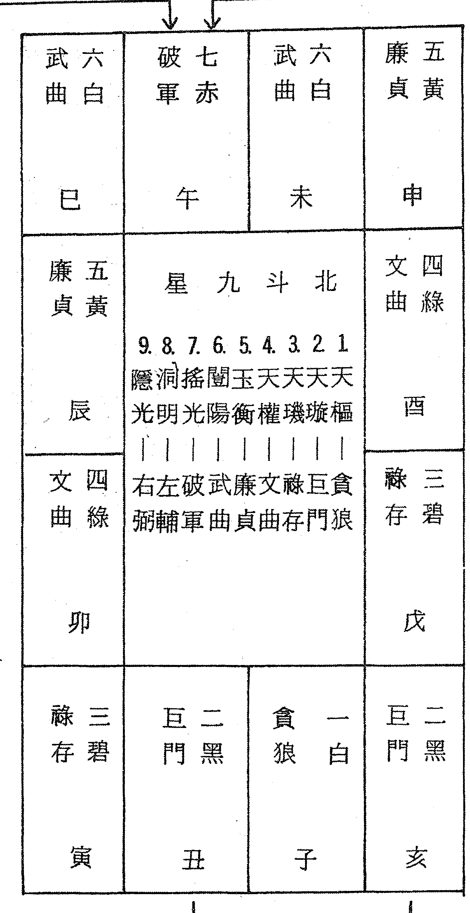

北斗九星：
1. 天樞 - 貪狼
2. 天璇 - 巨門
3. 天璣 - 祿存
4. 天權 - 文曲
5. 玉衡 - 廉貞
6. 開陽 - 武曲
7. 瑤光 - 破軍
8. 洞明 - 左輔
9. 隱光 - 右弼

### 五、星命篇

### 圖位對主命輔正

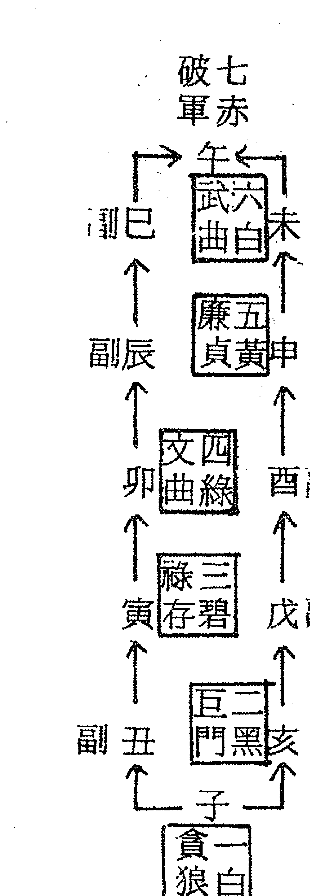

| 副巳 | 正午 | 正未 | 正申 |
| 副辰 | | 副酉 | |
| 正卯 | | 副戌 | |
| 正寅 | 副丑 | 正子 | 正亥 |

右弼對位

### 十一、論身主星

身主係屬命盤後天之用，以輔貳身宮決斷。命宮安法是以寅上起子，順數生月，順數生時，是知其為先天也。身宮乃以寅上起子，順數生月，順數生時，是知其為後天也。身宮、身主，皆用以推斷人命後天之榮養、修為、陰騭、福德諸端。
嘗有云，命盤有命宮及十二宮即可，何用命主，身宮、身主，實未知其用也。
前賢之發明創制，必有其理，必有所用。

### 正輔身主：

身主之佈配，乃宮宮相對，如身宮居子，則身主為天府（或曰火星），午為七殺（或曰鈴星），丑未二宮均為天相，寅申二宮均為天梁，卯酉二宮均為天同，辰戌二宮均為文昌，巳亥二宮均為天機。
魁鉞二助，所謂下魁上鉞，天魁由天門乾位至雷門震位，天鉞由月門兌位至地戶坤位。訣曰：甲戊庚牛羊、乙己鼠猴鄉、丙丁豬雞位，六辛逢虎馬（俗多順稱馬虎—疑誤），壬癸蛇兔藏。

### 三、納音身主：

納音身主係以身宮干支納音五行爲準，用以佐貳身主，猶紫微帝座，須有輔弼、分司、部從、傳驛、祿庫等，否則爲孤君。

納音身主，如身宮居子，配干得甲，則甲子納音得金，餘類推。則納音屬水爲天相，納音屬木爲天機，納音屬金爲文昌，納音屬土爲天府，納音屬火爲火鈴。

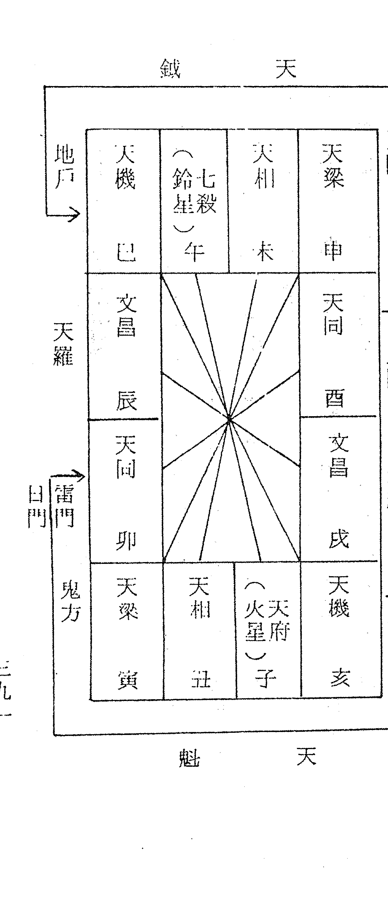

### 十二、論本命星

本命星又名三元星、奇門星、乃依本生年干支的值宮星，以定三元所主。三元指上元、中元、下元，小三元合計一百八十年而復初，大三元指上上元、上中元、上下元、中上元、中中元、中下元、下上元、下中元、下下元，合計共五百四十年而復還，此天道周遊循環之理。本命星係依奇門星遁之法，依螺進循環，遇而復始，九星周流，故本元所值命星，定與上元、下元所值有別，故命必有所異，茲列下表，以盡三元九星之輪變，係依洛書後天八卦序。

#### 三元九星六甲循環順序圖
| 中元四綠巽 | 九紫離 | 二黑坤 |
| 三碧震 | 居五中黃 | 七赤兌 |
| 八白艮 | 一白坎 | 六白乾 |

### 五、星命篇

| 干支 | 上元 | 中元 | 下元 | 干支 | 上元 | 中元 | 下元 | 干支 | 上元 | 中元 | 下元 |
|---|---|---|---|---|---|---|---|---|---|---|---|
| 癸亥 | 5 | 8 | 2 | 癸卯 | 7 | 1 | 4 | 癸未 | 9 | 3 | 6 |
| 壬戌 | 6 | 9 | 3 | 壬寅 | 8 | 2 | 5 | 壬午 | 1 | 4 | 7 |
| 辛酉 | 7 | 1 | 4 | 辛丑 | 9 | 3 | 6 | 辛巳 | 2 | 5 | 8 |
| 庚申 | 8 | 2 | 5 | 庚子 | 1 | 4 | 7 | 庚辰 | 3 | 6 | 9 |
| 己未 | 9 | 3 | 6 | 己亥 | 2 | 5 | 8 | 己卯 | 4 | 7 | 1 |
| 戊午 | 1 | 4 | 7 | 戊戌 | 3 | 6 | 9 | 戊寅 | 5 | 8 | 2 |
| 丁巳 | 2 | 5 | 8 | 丁酉 | 4 | 7 | 1 | 丁丑 | 6 | 9 | 3 |
| 丙辰 | 3 | 6 | 9 | 丙申 | 5 | 8 | 2 | 丙子 | 7 | 1 | 4 |
| 乙卯 | 4 | 7 | 1 | 乙未 | 6 | 9 | 3 | 乙亥 | 8 | 2 | 5 |
| 甲寅 | 5 | 8 | 2 | 甲午 | 7 | 1 | 4 | 甲戌 | 9 | 3 | 6 |
| 癸丑 | 6 | 9 | 3 | 癸巳 | 8 | 2 | 5 | 癸酉 | 1 | 4 | 7 |
| 壬子 | 7 | 1 | 4 | 壬辰 | 9 | 3 | 6 | 壬申 | 2 | 5 | 8 |
| 辛亥 | 8 | 2 | 5 | 辛卯 | 1 | 4 | 7 | 辛未 | 3 | 6 | 9 |
| 庚戌 | 9 | 3 | 6 | 庚寅 | 2 | 5 | 8 | 庚午 | 4 | 7 | 1 |
| 己酉 | 1 | 4 | 7 | 己丑 | 3 | 6 | 9 | 己巳 | 5 | 8 | 2 |
| 戊申 | 2 | 5 | 8 | 戊子 | 4 | 7 | 1 | 戊辰 | 6 | 9 | 3 |
| 丁未 | 3 | 6 | 9 | 丁亥 | 5 | 8 | 2 | 丁卯 | 7 | 1 | 4 |
| 丙午 | 4 | 7 | 1 | 丙戌 | 6 | 9 | 3 | 丙寅 | 8 | 2 | 5 |
| 乙巳 | 5 | 8 | 2 | 乙酉 | 7 | 1 | 4 | 乙丑 | 9 | 3 | 6 |
| 甲辰 | 6 | 9 | 3 | 甲申 | 8 | 2 | 5 | 甲子 | 1 | 4 | 7 |

#### 三元星周甲配佈表

## 皇極經世・太乙神數圖解

### 三元周甲圓圖
一内起第一圈為上元
第二圈為中元，第三圈為下元。
二由上元甲子一数起
順行至癸亥五數，
接中元四數，
再接下七数，
循環不已。

三九四

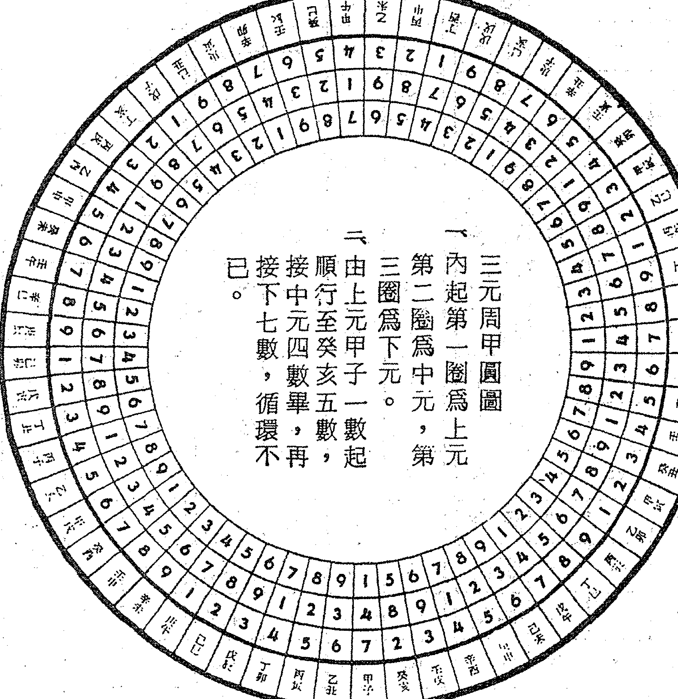

### 十四、論水火二局

河洛播五行於四時，木金土各二，惟水與火各一，即震巽木有二，乾兌金有二，坤艮土有二，惟離火，坎水各一。先儒曰：「離坎居中，中不可有二，故水火均一也。」又謂：「木金土皆有剛柔，惟水火無剛柔可分，故不能有二。」

然以十干分配五行，則水、火、木、金、土各有二，又以十二支分屬五行，則水、火、木、金、土各有二，又以十二支分屬五行，則水、火、木、金、土各有一，而土有四，則水、火不二之說，又不可通。

然八卦之於水、火，亦各有二，然與木、金、土無異；離為火，震為雷、雷亦火也；坎為水，兌為澤，澤亦水也。震之一陽出於坎，陰根於陽，內經所謂龍雷之火，乃真火也，故於十干屬丙，而離火屬丁。兌為澤，兌之一陰麗於離，故曰麗澤兌，陽根於陰，其義取明水於月，乃真水也，於十干屬壬，而坎水屬癸。

水火同源，陰陽互根，皆歸本於太一也。

水火二局之說，五行局依五行生序，原應為水一，火二、木三、金四、土五，

然斗數重先天，採其先天之體，變為後天之用。按先天本位，乾南坤北，離東坎西，

中五；考後天乾屬六數，坤屬二數，是取先天之乾卦火位，而用後天乾六之數；並取先天坤卦水位，而用後天坤二之數。而木三、金四、土五，仍尊原數不易。按斗數重乾坤，水火二方，聯合先後天體用，是以有此變化。故為水二局、火六局，乃於理有據也。

### 十五、論命身配卦

紫微斗數與河洛理數，同出于希夷先生，其理互有相通，斗數乃依星象所主以論人事，理數是依河洛之數以推性理。斗數之配卦，乃合先後天體用，併四計于卦象中。依前述，按本生月及本生時，取得命主星，以之配洛書後天八卦，如命主為一白貪狼，于卦為坎。同理，二黑巨門為坤卦，三碧祿存為震卦，四綠文曲為巽卦，五黃廉貞居中無定屬，六白武曲為乾卦，七赤破軍為兌卦，八白左輔為艮卦，九紫右弼為離卦。以上命主配卦，是為地卦。另依餘數定理，取本生日數，以八除之，視所得餘數，配以伏羲先天八卦。如## 五、星命篇

### 十六、论大小象运

本生日为二十，以八除之，余数得四，是为震卦。同理，余数一为乾卦，二为兑卦，三为离卦，四为震卦，五为巽卦，六为坎卦，七为艮卦，八为坤卦，是为天卦。凡阳男阴女，天卦在下作体，地卦在上作用，相盪而成六十四卦。阴男阳女，则为相错之卦，此谓先天命卦，主前半生运程祥咎等。（见命卦图例）

例：中元阳男甲午年三月十七日卯时生人，依前法得命主天卦八白左辅艮卦，本生日十七，以八除之余一，是为乾卦，则天卦艮在下，地卦乾在上，盪得天山遯，是为命卦。若为阳女，则以遯之错卦地泽临为命卦。

其身卦配法，是以地卦在下作体，天卦在上作用，相盪而成六十四卦，阳男阴女者准此。阴男阳女者，则为相错之卦，此谓后天身卦，主后半生荣养、福德等。

例依前法，中元甲午年三月十七日卯时生人，以地卦乾在下，天卦艮在上，盪得身卦为山天大畜，此为阳男阴女。若阴男阳女则以大畜之错卦泽地萃为身卦。

（卦正）女陰男陽（卦錯）女陽男陰一命卦圖

### 紫微斗數八卦相盪成卦表

| 命（本生日）卦 | 一乾 | 二兌 | 三離 | 四震 | 五巽 | 六坎 | 七艮 | 八坤 | 九離 | 八艮 | 七兌 | 六乾 | 五中 | 四巽 | 三震 | 二坤 | 一坎 |
| :--- | :--- | :--- | :--- | :--- | :--- | :--- | :--- | :--- | :--- | :--- | :--- | :--- | :--- | :--- | :--- | :--- | :--- |
| 主配卦（上卦） | | | | | | | | | 九離<br>⚋⚊⚊<br>⚊⚊⚊<br>⚊⚊⚋ | 八艮<br>⚊⚊⚋<br>⚊⚊⚊<br>⚋⚊⚊ | 七兌<br>⚊⚊⚊<br>⚋⚊⚋<br>⚋⚊⚊ | 六乾<br>⚊⚊⚊<br>⚊⚊⚊<br>⚊⚊⚊ | 五中<br>⚋⚊⚊<br>⚊⚊⚊<br>⚊⚊⚋ | 四巽<br>⚊⚋⚋<br>⚋⚊⚊<br>⚋⚊⚊ | 三震<br>⚋⚋⚊<br>⚋⚊⚊<br>⚋⚊⚊ | 二坤<br>⚋⚋⚋<br>⚋⚋⚋<br>⚋⚋⚋ | 一坎<br>⚋⚊⚋<br>⚋⚋⚊<br>⚋⚊⚋ |
| 一乾 | 比大有<br>⚋⚋⚋<br>⚋⚋⚊<br>⚊⚊⚊ | 萃大畜<br>⚊⚊⚋<br>⚋⚋⚋<br>⚊⚋⚊ | 剝夬<br>⚊⚋⚋<br>⚋⚋⚋<br>⚋⚊⚋ | 坤乾<br>⚋⚋⚋<br>⚋⚋⚋<br>⚋⚋⚋ | 坤乾<br>⚋⚋⚋<br>⚋⚋⚋<br>⚋⚋⚋ | 豫大畜<br>⚋⚋⚊<br>⚋⚋⚋<br>⚊⚋⚊ | 觀大壯<br>⚋⚋⚋<br>⚊⚊⚊<br>⚊⚋⚋ | 否泰<br>⚊⚊⚊<br>⚋⚋⚋<br>⚋⚋⚋ | 晉需<br>⚋⚋⚋<br>⚋⚊⚋<br>⚋⚊⚊ | 一乾<br>⚊⚊⚊<br>⚊⚊⚊<br>⚊⚊⚊ |
| 二兌 | 睽睽<br>⚊⚊⚋<br>⚋⚋⚊<br>⚋⚊⚋ | 咸損<br>⚊⚊⚊<br>⚋⚋⚋<br>⚋⚊⚊ | 艮兌<br>⚊⚊⚋<br>⚋⚋⚊<br>⚋⚊⚊ | 謙履<br>⚋⚋⚋<br>⚊⚊⚊<br>⚊⚊⚊ | 艮兌<br>⚊⚊⚋<br>⚋⚋⚊<br>⚋⚊⚊ | 小中過孚<br>⚊⚋⚋<br>⚋⚋⚊<br>⚋⚊⚊ | 漸歸妹<br>⚊⚋⚋<br>⚋⚋⚊<br>⚋⚊⚊ | 遯臨<br>⚊⚊⚊<br>⚋⚋⚋<br>⚋⚋⚊ | 旅節<br>⚋⚊⚋<br>⚊⚊⚊<br>⚋⚊⚋ | 二兌<br>⚊⚊⚊<br>⚋⚊⚋<br>⚋⚊⚊ |
| 三離 | 坎離<br>⚋⚊⚋<br>⚋⚋⚊<br>⚋⚊⚋ | 困賁<br>⚊⚊⚋<br>⚋⚋⚋<br>⚊⚊⚋ | 蒙革<br>⚋⚋⚋<br>⚋⚋⚊<br>⚋⚊⚋ | 師同人<br>⚋⚋⚋<br>⚋⚋⚊<br>⚊⚊⚊ | 坎離<br>⚋⚊⚋<br>⚋⚋⚊<br>⚋⚊⚋ | 解家人<br>⚋⚋⚊<br>⚋⚋⚊<br>⚊⚋⚊ | 涣豐<br>⚋⚋⚋<br>⚊⚊⚊<br>⚊⚋⚊ | 訟明夷<br>⚊⚊⚊<br>⚋⚋⚋<br>⚋⚊⚊ | 未既濟濟<br>⚋⚋⚊<br>⚊⚊⚊<br>⚋⚊⚋ | 三離<br>⚊⚋⚊<br>⚋⚋⚊<br>⚊⚋⚊ |
| 四震 | 井噬嗑<br>⚋⚊⚋<br>⚋⚋⚊<br>⚋⚊⚋ | 大頤過<br>⚊⚊⚊<br>⚋⚋⚋<br>⚋⚋⚊ | 蠱隨<br>⚋⚋⚊<br>⚋⚋⚋<br>⚊⚊⚋ | 升无妄<br>⚋⚋⚋<br>⚊⚊⚊<br>⚊⚊⚋ | 巽震<br>⚊⚋⚋<br>⚋⚊⚊<br>⚋⚊⚊ | 恒益<br>⚊⚋⚋<br>⚋⚊⚊<br>⚋⚊⚊ | 巽震<br>⚊⚋⚋<br>⚋⚊⚊<br>⚋⚊⚊ | 姤復<br>⚊⚊⚊<br>⚋⚋⚋<br>⚋⚋⚊ | 鼎屯<br>⚋⚊⚊<br>⚋⚋⚊<br>⚋⚊⚋ | 四震<br>⚋⚋⚊<br>⚋⚊⚊<br>⚋⚊⚊ |
| 五巽 | 屯鼎<br>⚋⚊⚋<br>⚋⚋⚊<br>⚋⚊⚊ | 隨蠱<br>⚊⚊⚋<br>⚋⚋⚋<br>⚋⚋⚊ | 頤大過<br>⚋⚋⚋<br>⚋⚋⚊<br>⚊⚊⚊ | 復姤<br>⚋⚋⚊<br>⚋⚋⚋<br>⚊⚊⚊ | 震巽<br>⚋⚋⚊<br>⚋⚊⚊<br>⚋⚊⚋ | 震巽<br>⚋⚋⚊<br>⚋⚊⚊<br>⚋⚊⚋ | 益恒<br>⚋⚊⚊<br>⚋⚊⚊<br>⚊⚋⚋ | 无妄升<br>⚊⚊⚋<br>⚋⚊⚊<br>⚋⚊⚊ | 噬井嗑<br>⚋⚊⚊<br>⚋⚊⚊<br>⚊⚋⚋ | 五巽<br>⚊⚋⚋<br>⚋⚊⚊<br>⚋⚊⚊ |
| 六坎 | 既未濟濟<br>⚋⚊⚋<br>⚊⚊⚊<br>⚋⚊⚋ | 革蒙<br>⚊⚊⚋<br>⚋⚋⚊<br>⚋⚋⚋ | 賁困<br>⚊⚊⚊<br>⚋⚋⚋<br>⚊⚊⚋ | 明夷訟<br>⚋⚋⚋<br>⚊⚊⚊<br>⚊⚊⚊ | 離坎<br>⚊⚋⚊<br>⚋⚋⚊<br>⚋⚊⚋ | 豐渙<br>⚊⚊⚊<br>⚋⚋⚊<br>⚋⚊⚋ | 家人解<br>⚊⚊⚊<br>⚋⚋⚊<br>⚋⚋⚊ | 同人師<br>⚊⚊⚊<br>⚋⚋⚊<br>⚋⚋⚋ | 離坎<br>⚊⚋⚊<br>⚋⚋⚊<br>⚋⚊⚋ | 六坎<br>⚋⚊⚋<br>⚋⚋⚊<br>⚋⚊⚋ |
| 七艮 | 節旅<br>⚋⚊⚋<br>⚊⚊⚊<br>⚋⚊⚋ | 兌艮<br>⚊⚊⚊<br>⚋⚊⚋<br>⚋⚊⚊ | 損咸<br>⚊⚊⚊<br>⚋⚋⚋<br>⚋⚊⚋ | 遯臨<br>⚊⚊⚊<br>⚋⚋⚋<br>⚋⚋⚊ | 兌艮<br>⚊⚊⚊<br>⚋⚊⚋<br>⚋⚊⚊ | 歸漸妹<br>⚊⚊⚊<br>⚋⚊⚋<br>⚋⚊⚊ | 中孚過小<br>⚊⚊⚊<br>⚋⚊⚋<br>⚋⚊⚊ | 履謙<br>⚊⚊⚊<br>⚋⚊⚋<br>⚋⚋⚋ | 睽蹇<br>⚊⚊⚊<br>⚋⚊⚋<br>⚋⚋⚊ | 七艮<br>⚊⚊⚋<br>⚋⚋⚊<br>⚋⚊⚊ |
| 八坤 | 需晉<br>⚋⚋⚋<br>⚋⚊⚋<br>⚋⚊⚊ | 夬剝<br>⚊⚊⚊<br>⚋⚋⚋<br>⚋⚊⚋ | 大萃畜<br>⚋⚊⚋<br>⚋⚋⚋<br>⚊⚋⚊ | 泰否<br>⚊⚊⚊<br>⚋⚋⚋<br>⚋⚋⚋ | 乾坤<br>⚊⚊⚊<br>⚊⚊⚊<br>⚊⚊⚊ | 大觀壯<br>⚊⚊⚊<br>⚋⚋⚋<br>⚊⚋⚋ | 小豫畜<br>⚊⚊⚊<br>⚋⚋⚋<br>⚋⚋⚊ | 乾坤<br>⚊⚊⚊<br>⚊⚊⚊<br>⚊⚊⚊ | 大比有<br>⚊⚊⚊<br>⚋⚋⚋<br>⚊⚊⚊ | 八坤<br>⚋⚋⚋<br>⚋⚋⚋<br>⚋⚋⚋ |

### 五、星命篇

### （殷倒卦命）卦身二

| 九离 | 八艮 | 七兑 | 六乾 | 五中 | 四巽 | 三震 | 二坤 | 一坎 | 命配（下卦） 生（日） 卦（上卦） |
| :--- | :--- | :--- | :--- | :--- | :--- | :--- | :--- | :--- | :--- |
| 同人 | 遁 | 履 | 坤 | 乾 | 姤 | 无妄 | 否 | 讼 | 乾 |
| 革 | 咸 | 损 | 艮 | 兑 | 大过 | 随 | 萃 | 困 | 兑 |
| 丰 | 旅 | 睽 | 坎 | 离 | 鼎 | 噬嗑 | 晋 | 未济 | 离 |
| 涣 | 渐 | 归妹 | 巽 | 震 | 益 | 震 | 豫 | 解 | 震 |
| 家人 | 渐 | 中孚 | 震 | 巽 | 恒 | 益 | 观 | 涣 | 巽 |
| 既济 | 旅 | 节 | 离 | 坎 | 井 | 屯 | 比 | 师 | 坎 |
| 革 | 咸 | 损 | 兑 | 艮 | 蛊 | 颐 | 剥 | 蒙 | 艮 |
| 同人 | 遁 | 谦 | 乾 | 坤 | 升 | 复 | 坤 | 明夷 | 坤 |

### 皇極經世·太乙神數圖解

大小象運，悉遵河洛理數，希夷曰：「夫探人之休咎氣數，如人必有所適也，蓋卦氣必有所遊，然後見天地運行之象，周流六虛之理，福善禍淫之機，鬼神吉凶之發，日月盈虧之道，四時順逆之布，星辰變易之會。」其一年交一卦之法，亦自本卦五行局所居之爻而始也。陽爻行九年，謂之大象；陰爻行六年，謂之小象。大象陽爻遇陽年不變，陽爻過陰年必變。小象陰爻無論遇陽年或陰年均不變，是以遵河洛之道也。其行爻之始，須依五行局，如水二局始初爻，木三局起二爻，金四局始三爻，土五局始四爻，火六局始五爻，上爻致極不用也。

- 童限例，不分陰陽男女，一歲為初爻、二歲為二爻、三歲為三爻、四歲為四爻、五歲為五爻。
- 起歲限例，不分陰陽男女，凡水二局由初爻二歲起運，陽爻九年，陰爻六年。木三局由二爻三歲起運。金四局由三爻四歲起運。土五局由四爻五歲起運。火六局由五爻六歲起運。上爻不用。

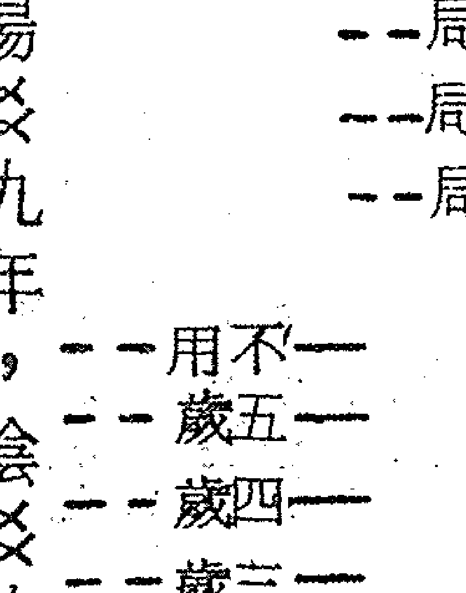

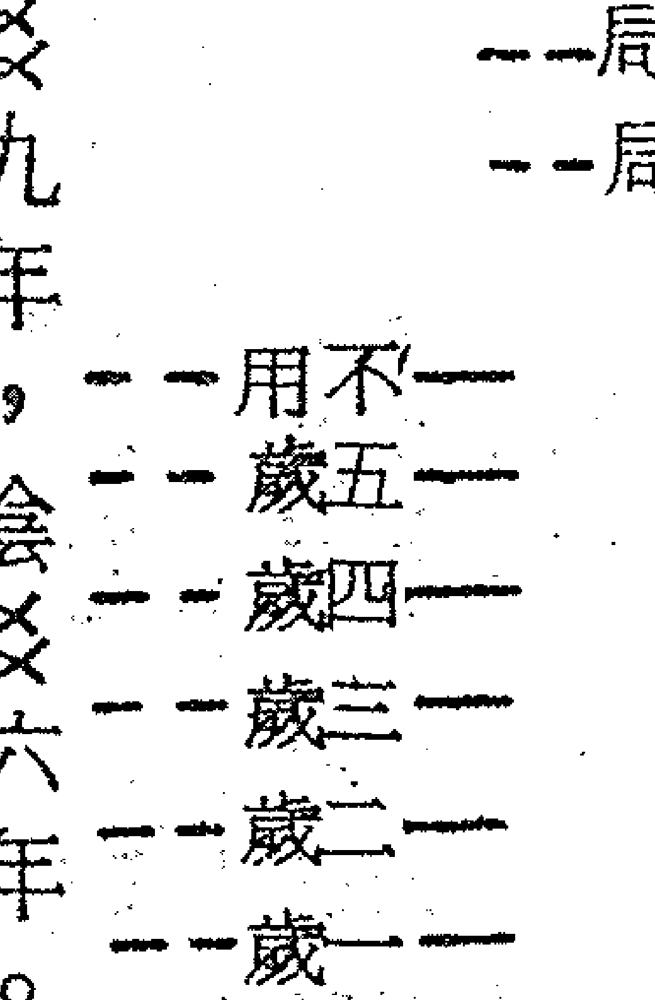

### 五、星命篇

大小象运之推衍，依前例中元阳男甲午年三月十七日卯时生人，命卦为遯，身卦为大畜。其命宫干支丁丑，纳音得水二局，故由初爻起二岁运，由初而上推，阳爻行九年，阴爻行六年。六爻行完，至四十九岁止，是为命卦运数。自五十岁起，阳爻行身卦大畜，身卦行爻是依身宫干支辛未，纳音五行得土，须由大畜六四起五十岁，接行命卦运数，亦由初而上，阳爻行九年，阴爻行六年，至九十七岁止，各依易经卦爻论断吉凶悔咎。

例：中元阳男甲午年三月十七日卯时生人

命卦 临 错 综 大壮
身卦 大畜 错 萃 综 无妄

依命宫干支纳音五行局起运定爻
49 -- 41
40 -- 32
31 -- 23
22 -- 14
13 -- 8
7 -- 2 岁起
岁止

依身宫干支纳音五行定爻接行命卦运数
73 -- 65
64 -- 56
55 -- 50
97 -- 92
91 -- 83
82 -- 74

九八七六五五
二三四五六一
？？？？？？本
九九八七六五卦
七一二三四五大
畜
泰小大损贲蛊
畜有

四州廿十
一二三四八二
？？？？？？
四四州廿十七本
九十一二三岁卦
逊 同
咸旅渐否姤人

### 十七、論流年運卦

大小象陽爻九年遊變之法甚緊，須仔細看初爻之年是陰是陽，方無誤差，其陰爻之年遊變，是由本爻變去，無陰陽之間也，陽爻九年一過運，陰爻六年一過運，蓋乾用九，坤用六也。依前例，以推運限，則甲午年一歲，按童限為水二局行遯初六同人。大象二至七歲變遯初六為同人，八至十三歲變六二為姤，十四至廿二歲變九三為否，廿三至卅一歲變九四為漸，卅二至四十變九五為旅，四一至四九變上九為咸。此為命卦大象。小象則一年一變，即流年運卦，二歲則以同人為本卦不變，由初而上，逐爻變去，即二歲仍為同人，三歲變六二為乾，四歲變九三為履，五歲變九四為中孚，六歲變九五為損，七歲變上九為臨。又如廿三至卅一歲，為九四值事，若廿三歲流年太歲為陽，則廿三歲卦不變，廿四歲起，依此為同人、家人、賁、明夷、謙、升、師、解。若廿三歲太歲為陰，則須變九四為漸，廿四歲起，依次為家人、同人、臨、豐、小過、恒、解、師。至於身卦運數之變，亦復如是。有關月卦、日卦等從略。

### 十八、論化曜四星

四化者，言化祿、化權、化科、化忌四者，此為斗數精妙，高明之發明。希夷先生仰觀俯察，取北斗、南斗及中天主星，作四化之基，並配十干為緯，以螺進循環法則以推理論事，極盡天地人事之妙。揆諸自然萬物，歷史遷變，人物性情，均

### 皇极经世·太乙神数图解

小限逢之，主进财之喜，二限相逢，内外威严，锦上添花。权为掌判生杀之神，属甲木，掌生杀，主权势，喜会巨武。守于身命，科禄相逢，出将入相，科权相会，文章冠世，巨武同临，掌握兵符。大限逢之，必遂亨通，小限临之，无有不吉。逢凶亦不为灾。

科为上界应试，主宰文墨之神，属癸水，掌文墨，主科名，守于身命，权禄相逢，宰臣之贵。守于身命，主人聪明通达，如遇恶煞，亦为文章秀士，可作群英师范，女命吉拱，主贵封赠。大限十年，声名必腾，小限逢之，百谋皆遂。

忌为上界多管之神，属癸水，计都星，亦为多咎之星，主是非，守于身命，一生不顺，招是惹非。大限相遇，十年悔吝，小限逢之，一年不足，二限遭逢，太岁加临，断然蹭蹬，文人不奈久，武人纵有官灾口舌不妨。

四化分本命、大限、小限、月、日等五种活盘变化。本命四化，依本生年干安之。大限四化依坐宫天干安之。小限四化依流年天干安之。月日四化各依其天干安之。

本命四化，不论于大限或流年、月份，均交互影响变化，大限四化，仅与流年交互影响。小限四化管流年一年之否泰，月日四化则仅与该月或该日发生作用，故

論命當遇多重四化，須靈活通變，妙在其中矣！祿主財祿，權主威權，科主科名，此三吉均以雙祿、雙權、雙科為最佳，逢凶化吉，解厄制化，喜慶重重。若三重相會，如三祿、三權、三科，則反主平平。若四重相會，如四祿、四權、四科，則反致凶。反之，忌主是非，雙忌最凶，官災刑剋；若逢三忌，傷病口舌；若會四忌，反主否極泰來。以上所言，乃物極必反，盛極必衰，否極泰來，窮變通久之理。宮星十干各化從略。斗數四化以十進輪變法則，由甲至戊，為一小變，由己至癸，又為一變。無論年、月、日、時，均由甲至癸十進輪變循環，各有所化，各盡其變，含否泰、剝復、損益、既未之道。甲祿廉貞為否極窮通之始，戊忌天機為泰極轉機之變，己祿武曲為通變致久之化，癸忌貪狼為物極元終，物物息止，然致極之窮必變，元始復初，生生不息，此亦天道行健，螺進循環之道也。

### 诸星四化

主星/四化 | 辅弼 | 文曲 | 文昌 | 破军 | 七杀 | 天梁 | 天相 | 巨门 | 贪狼 | 太阴 | 天府 | 廉贞 | 天同 | 武曲 | 太阳 | 天机 | 紫微
:--- | :--- | :--- | :--- | :--- | :--- | :--- | :--- | :--- | :--- | :--- | :--- | :--- | :--- | :--- | :--- | :--- | :---
禄 | | | | 癸 | | 壬 | | 辛 | 戊 | 丁 | | 甲 | 丙 | 己 | 庚 | 乙 |
权 | | | | 甲 | | 乙 | | 癸 | 己 | 戊 | | | 丁 | 庚 | 辛 | 丙 | 壬
科 | 戊 | 辛 | 丙 | | | 己 | 癸 | | | 庚 | 壬 | | | 甲 | | 丁 | 乙
忌 | | 己 | 辛 | | | | | 丁 | 癸 | 乙 | | 丙 | 庚 | 壬 | 甲 | 戊 |

### 诸干四化

天干/四化 | 甲 | 乙 | 丙 | 丁 | 戊 | 己 | 庚 | 辛 | 壬 | 癸
:--- | :--- | :--- | :--- | :--- | :--- | :--- | :--- | :--- | :--- | :---
禄 | 廉贞 | 天机 | 天同 | 太阴 | 贪狼 | 武曲 | 太阳 | 巨门 | 天梁 | 破军
权 | 破军 | 天梁 | 天机 | 天同 | 太阴 | 贪狼 | 武曲 | 太阳 | 紫微 | 巨门
科 | 武曲 | 紫微 | 文昌 | 天机 | 辅弼 | 天梁 | 太阴 | 文曲 | 天府 | 天相
忌 | 太阳 | 太阴 | 廉贞 | 巨门 | 天机 | 文曲 | 天同 | 文昌 | 武曲 | 贪狼
配卦 | 乾 | 坤 | 艮 | 兑 | 坎 | 离 | 震 | 巽 | 乾 | 坤