# 10小时，让你成为塔罗高手  

## 发光序曲  

### 成为自由调控魅力的发光体

  
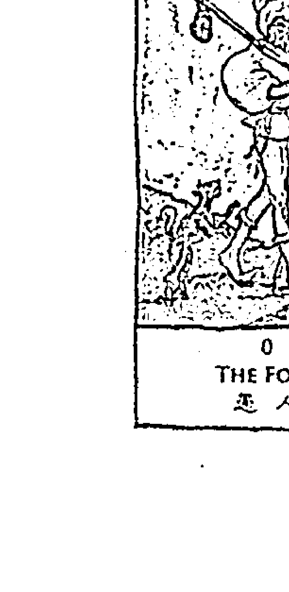  

如果你给出100分的好意，而对方只接受20分，那你们的美善交集就只有20分。如果你付出的80分对方都能接受，并能启发他对事件的新思维，那你们的美善交集恐怕就不只是80分了。  

有些时候，自以为是的好意，要对方能接受才算数。  

有朋友这样问我：“奇怪！我好意要帮他，为什么他都不接受？甚至还有些不悦？”  

> 行深如是回答：“我相信你带着光明善意，但你不会调光，尤其对于那些心处幽暗的朋友，适当的亮度很重要。太亮反而会伤了他们，使他们得了‘惧光症’。从此，害怕正面地关怀别人，也不再接受别人的关心。”  

其实，人性可同感推理。你越了解自己的同时，也一定能更了解你的朋友。当你越来越有智慧、有爱心，又能清晰地看见他的利益时，朋友自然会越来越愿意听从你的建议。  

行深邀请上班族、学生或家长一起来探索自我学塔罗，尤其是河图塔罗。  

河图塔罗，不只是一种塔罗牌的牌种，它还包括了河图的推理归纳法，教你应用它强大的“向外兼容”的特性，弄懂所有塔罗，并提高预算的精准度。  

> “预算”不见得百分之百准确，但“不拟预算”的结果常常差距更大。  

行深除了把学《易经》三十年的企划预算心得，架构在河图塔罗之中，还把二十几岁做台湾第一位蔬食行政主厨时训练厨师厨艺的技巧融入本书。让初学者有谱可循，也让一些厌烦枯燥生活的人能够边学边做，不至于听完一整套料理理论后，却连青菜都不会炒。  

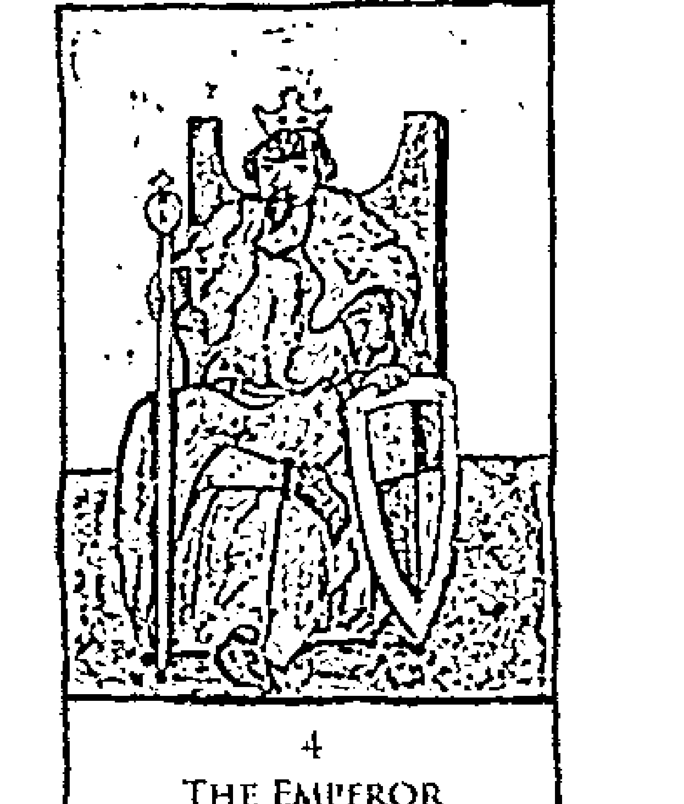

同时我又把当一百多家开店辅导师的辅导经验，以及从五岁起禅修的实证，移转为照见咨询的技术，让各位也能从书中体会“从旁协助”的辅导艺术，提醒当事者尽量避免做出错误决策。  

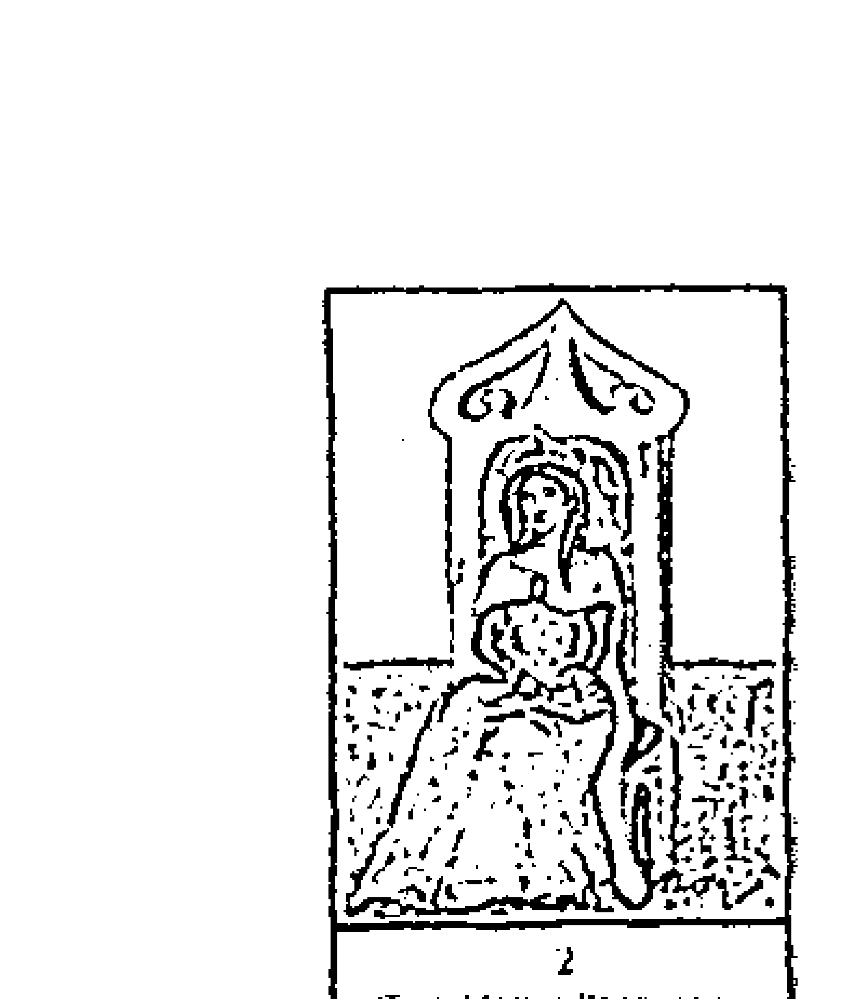

许多自学塔罗的朋友，兴致高昂地买了塔罗书籍来研究，结果看不懂，又算不准，垂头丧气地把塔罗牌置放仓库，并发誓从此不再相见。更有些自学者一本没仔细研读完毕，又再买一大堆塔罗相关书籍，像吃大餐一样狼吞虎咽，这样当然消化不良。  

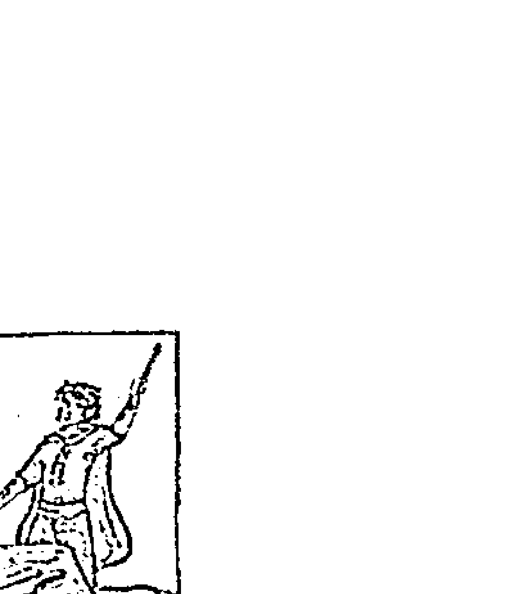

宝贵的知识因无法吸收应用而变成无用的数据，从此仓库越堆越满，变成一个塔罗收藏家。  

虽然，本书也一样适合收藏，但帮助读者发现“深层认同”，彰显个人魅力，为读者提供解决问题的趣味性与多参考性，才是本书的主轴。  

我常笑一些上完河图塔罗课程的同学：已有“遍吃遍喝”的本领。别误会，不是骗人的“骗”，而是吃遍台湾的“遍”。  

当你学得本领、魅力四射时，朋友争相热情地邀约，盛情难却下自然“行遍台湾”。  

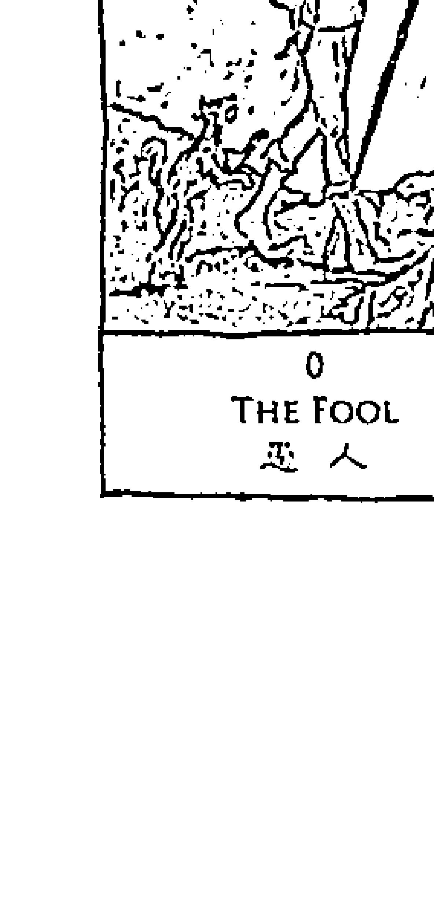

有些读者可能会怀疑，看书学习和现场上课有没有差别？  

行深要慎重地告诉各位，本书中不会刻意隐瞒重要的知识！但还是有差别，差别在笑声！本来是哄堂大笑，现在只有你一个人笑。  

有些朋友懊恼地问我：“面对问题要改变自己时，朋友都说这样比较好，我自己也认为这样比较好！但我为什么就是做不到？”  

> “对自己缺乏深层的认同！”我如此回答，“要对自己动向的‘深层认同’十分清楚，你才做得到！”  

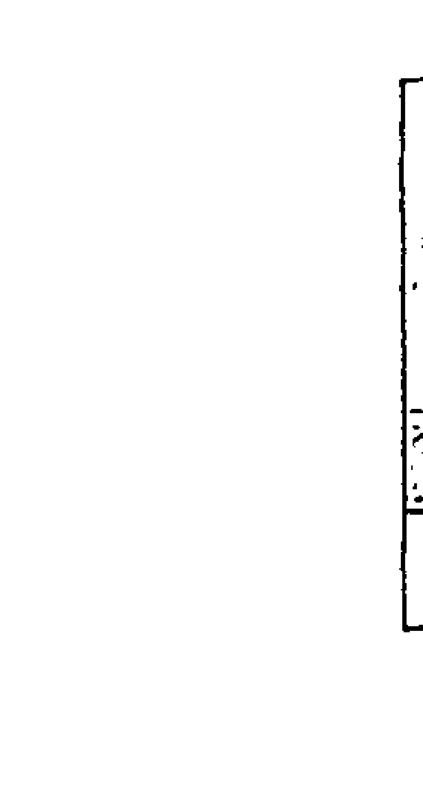

没有发现自己内在的光，没有去照见事情的全貌前，事情往往就停滞于浅层的认知，无法深层认同；也就没有深心感动，没有深心感动就缺乏自心临场价值；缺乏自心临场价值又如何产生实现愿望的热情呢？  

在你还未大放光芒之前，或你正当魅力四射之际，行深都要提醒你：身边的同学和亲友如果生活发生问题，通常心思会比较混乱或产生无力感。这时候，无论用不用塔罗牌，你都要用真爱给予他们支持鼓励，协助他们找出利益，并开启他们的未来价值之门，而且还要帮助他们看见自己，以及对自己动向和价值的“深层认同”。  

另外，还有一个很重要的观念，就是提供建议并非剥夺当事者的选择权利。因此，不管他们有没有听取你的建议，都请记住——每个人都是他自己人生的负责人。  

如果你倾尽全力帮他们，他们也不接受，你也不需要盲目生气。我们应该祝福他们，祝他们早日看见自己，对自己的动向能够“深层认同”，或是干脆请他们——看看本书。  

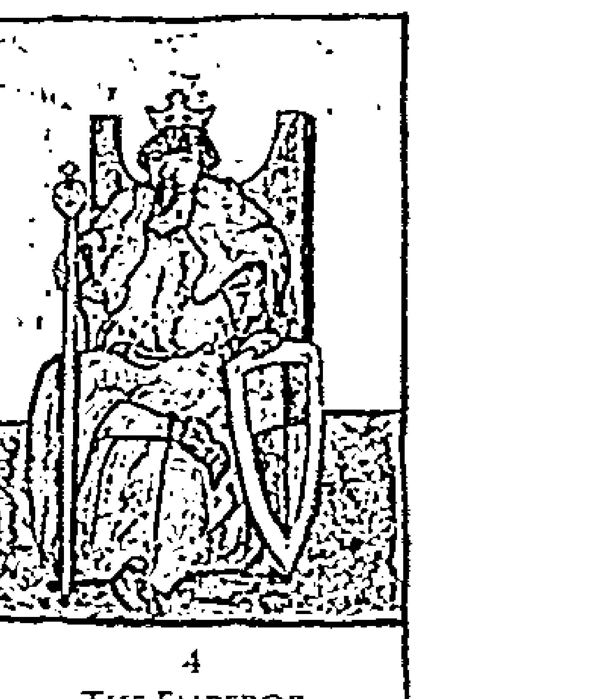  
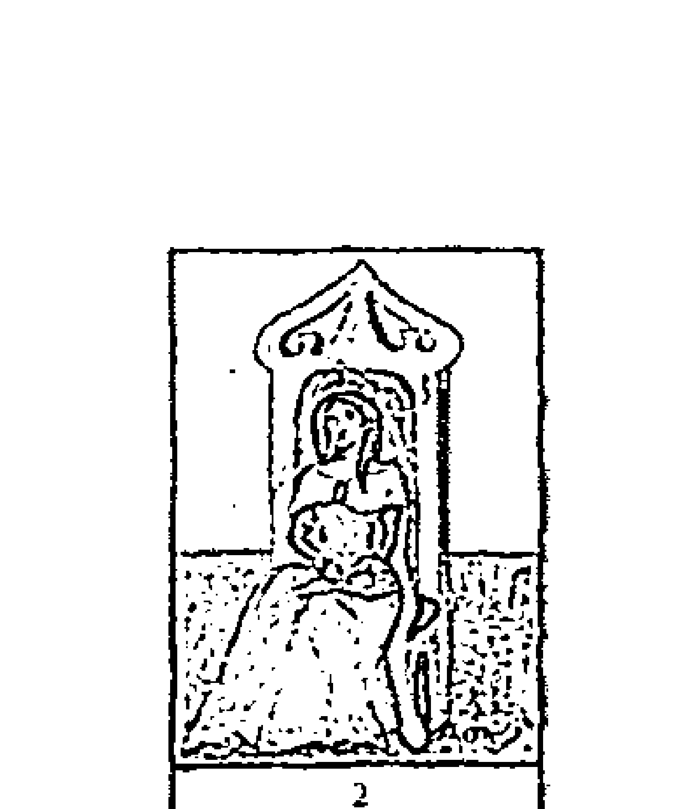  
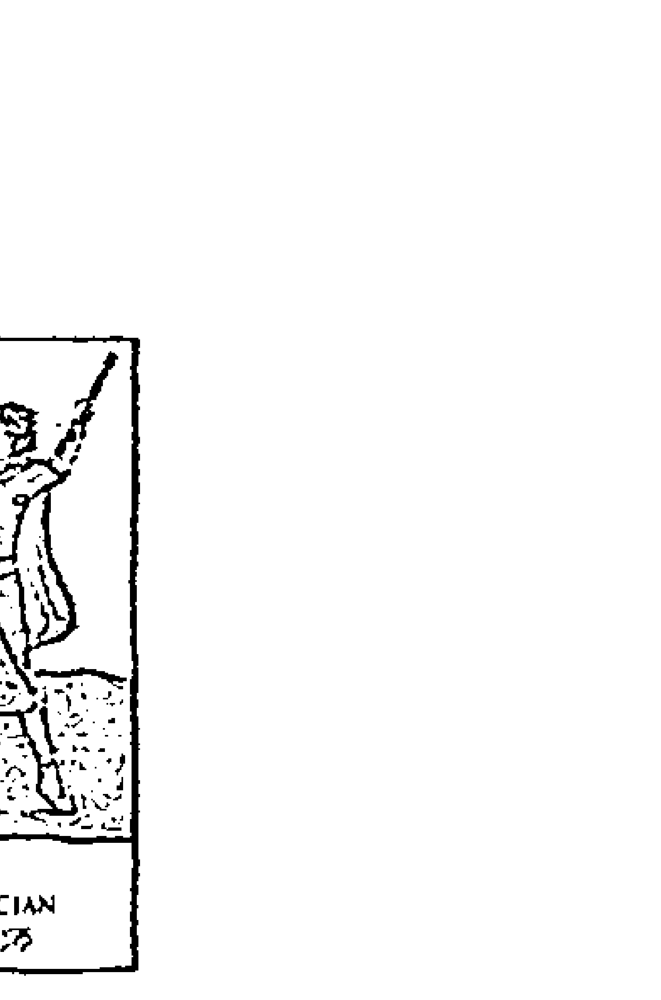

---

# THE LOVERS  
恋人  

---

## 发光第一小时  
塔罗与自我探索  

### 1-1 扑克、塔罗的历史与河图：客观游戏美学  

有些刚学塔罗的朋友，不懂“象外之象”就急着帮朋友算，虽用心程度令人佩服，但看不清楚人心的现象，处境尴尬。请看看这种状况——如果你认真帮朋友解牌的同时，餐桌那头的朋友却忙着吃他的火锅，有心无心地胡乱回应你一番……那你说你这么忙有用吗？值得吗？惨不惨呢？  

不幸遇此情境，请你随便拿一张塔罗牌到他的眼前晃一晃，并告诉他如果这张塔罗牌是以前真品画作的话，够他吃喝一辈子了。这不是吓他的，是真的。  

此刻，他注意力出来了，也是告诉他塔罗牌历史的时候了。  

塔罗牌到底是起源于哪一个国家呢？到目前为止并没有定论。只知道完整塔罗牌（Tarot）最早发现是在公元1422年（也有公元1450年的说法），由意大利画家 Bonifacio Bembo 所绘制的“维斯康提塔罗牌”。不管它起源于哪个国家，现已是地球村了，大可不必再坚持自家的比较好，任何美好的东西，只要不违反智慧财产权，谁都可以好好推广。  

塔罗牌与扑克牌架构类似，而扑克牌与河图有密切关联。河图这个古老的简单图像，很多人刻意研究一辈子，都不一定能弄懂它。而我们利用河图的简约数理来学塔罗的同时，也用塔罗牌丰富的人文意象与其互推。这样，我们不但学会塔罗，也能搞通河图这部无字天书了。  

河图是谁发现的呢？伏羲氏。而伏羲氏是哪个国家的人呢？中国人。那这样说起来，能不能说塔罗是中国人发明的呢？当然不是，只能说跟中国人有关系。  

我们再来看看最早出现纸牌的是哪一个国家？是公元969年的中国，那时候的纸牌有四种花色，各14张；与公元1376年的意大利扑克和1392年法国的54张扑克都不一样。这种古老的中国扑克牌，更接近现在塔罗的小阿尔克那（Minor Arcana，也就是小秘仪，本书以下简称“小牌”），因为它们都是四种花色，各14张。  

各位是否发现了？  

其实不管是古老的中国扑克纸牌（969年），还是法国的现代扑克牌（1392年），都比塔罗牌（1422年）的发明要早。所以，我们可以说塔罗牌源自扑克的部分架构。  

说明这些，并不是要考证塔罗的历史。考古塔罗的学者并不一定善于运用塔罗牌，因此塔罗的历史留待学者去考究，我们是为了要弄懂塔罗、善用塔罗才说明这些的。  

扑克、塔罗、河图都有一个共同的特点，就是都有从一到十这些数字。  

这些数符合了客观的协议，也成为玩牌游戏沟通的要件。例如，玩扑克牌捡红点，两张牌点数合十，就可吃牌。如果你不遵守合十这个客观的游戏协议，十三点也要吃、十六点也要吃，那么将只剩下一种人会想要与你一起玩牌——对！就是疯子。疯子不需要协议。  

“飞象过河”虽有创意但很难得到认同，大家遵守客观协议，游戏才公平，也才有美趣可言。想要再创造更高的乐趣，就得靠个人的主观心态和技巧了。  

法国大文豪雨果把《悲惨世界》稿件寄给出版社后，久久等不到出版社的消息，于是他寄出世界最短的一封信，内容是：“？”  

出版社随即回信：“！”  

主观的认知必须建立在客观的理解之上。我们都知道“？”是问号，所以出版社推断雨果的意思是：“稿件——到底看得怎样？”  

雨果收到“！”非常开心，因为出版社的意思是：“旷世佳作，赞！”  

不久，巨著面世了。  

多么心有灵犀的沟通啊！如果没有“？”和“！”这么简单的基本协议，又怎么会有如此妙的事情发生呢？  

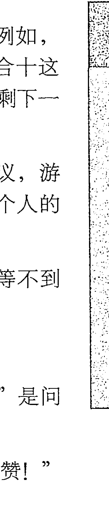

---

### 1-2 最近的爱情照见咨询：塔罗牌解读透析的意义  

心灵的沟通是双方面的，爱情更是如此。过度的强求，常会发生不愉快的结果。  

照见咨询近十几年来最多的个案，就属爱情与事业，其中又以爱情的问题最复杂。为什么呢？因为恋爱中的男女，情绪力量高很多，理智力也降低非常多。本来想一想就能了解的事，很可能当事人百思不解而陷入死胡同。  

这个时候可以选择用塔罗牌，来补救一下消失的智力。  

我所说的“照见咨询”，你们可以称为“占卜”，只不过它真的不等同于一般的占卜。  

照见咨询重视厘清问题，以理智判断为主，再用牌阵的探索性和预测性来处理理智，然后开放直觉与想象力，而从中看见自己的内在情感，走出自己的高亮之路。  

东方人的占卜，常常强调结果，而其实忘记努力的过程正直接影响结果。  

流程很重要；目标管理也很重要。  

如果一方面能自我探索，另一方面能推演每一个重要选择的可能结果，那么这样的占卜，与“照见咨询”将相去不远。  

以下是我最近的爱情照见咨询实例：  

> 行深：“牌阵虽能显示能量及意象，但如果不了解你的问题，我就不能给你最好的建议。请问你想问什么？”  

> 公馆的某大一学生：“我想问爱情。”  

> 行深：“你的恋爱有什么问题？”  

> 大学生：“我一个半月被同一个女生甩了三次！同学都笑我，骂我丢天秤的脸，我妈也骂我没用！我……心里还蛮难过的。”  

> 行深：“噢！这时候我差点笑出来，但基于专业我忍着。‘什么理由？她甩掉你。’”  

大学生：“第一次她说，不想这么早定下来；第二次她说，她爸爸说她以后或许会遇到更好的；最后一次她说，大二再看看，期间我们都先不交男朋友女朋友好不好？我跟她说好啊……要不然怎么办？”  

行深：“她应该不想这么早定下来。”  

大学生：“有可能。”  

行深：“会不会你太早认定？而内心深处事实上却不想太早认定。”  

大学生：“可能……我觉得我想要改变自己天秤座的花心，而刻意专情吧？”  

行深：“好，那好，我们先用三合明断牌阵来看看……你这样的爱情有何问题？”  

给他洗牌，我切牌后排好牌阵，我请他从每列选出两张。选好之后的牌阵如下：  

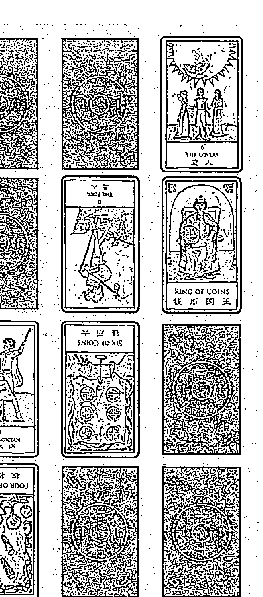

各位读者是否看到了，这个简单的牌阵，每一列出现两张牌，若没有人引导，各位可能就看不出所以然。其实，就算已经学过塔罗的朋友，也都面临到解牌就是看图说故事的窘态，无法给问者中肯的建议。  

融合了河图数理的塔罗，不但可帮助问者自我探索，也能提供较为明确的建议。  

在后面“实用牌阵实例解析”章节时，会做详细的牌阵解牌说明，现在你们请先看我怎么解大学生的案例。  

行深：“河图数为56，以你的问题来看，5代表变动需有定位，6代表要引导才不陷入险境。56数组转换《易经》中意象为‘塞’，建议‘要有自己的定位，不需要太主动’。”  

大学生：“对！这几天我没联系她，她反而晚上会打给我耶！”  

行深：“对嘛，对嘛……你要创造个人魅力来吸引对方，不是穷追猛追的。第二列的牌是你的关键主位，有一张愚人逆位，一张钱币六逆位。愚人太过乐观，有一股傻劲；而钱币六就是代表你心里要求公平的对待。你对她那么好，你也要求她要同样对待你，但爱情不是交易，无法等量。虽然过度不对称的爱情并不好，但彼此为爱的付出怎么可能那么对等呢？  

你看——钱币六虽有一座天秤，钱币与葡萄等重，但葡萄还是掉出几颗来了呀！当作送她不就得了。”  

大学生：“我想说，我对她这么好，她怎么可以……”  

行深：“既然还没认定，她就算跟男孩子出去，也是很正常的啊！你看——第一列的两张牌代表内在因素，权杖四逆位象征你心里对爱情的丰富幻想。魔术师代表的是，什么东西要想表演得好，就一定要熟能生巧。如果三次还没有学会，你说要几次呢？  

再看看第三列是恋人牌和钱币国王，这代表什么呢？”  

大学生：“代表什么？”  

行深：“代表你要像钱币国王一样有原则，又懂得运用资源，谈你现在该谈的恋爱。你读这么好的大学要做什么？你难道只为了上好的大学谈好的恋爱吗？”  

我以为他会说“当然不是”，结果他是这么说的……  

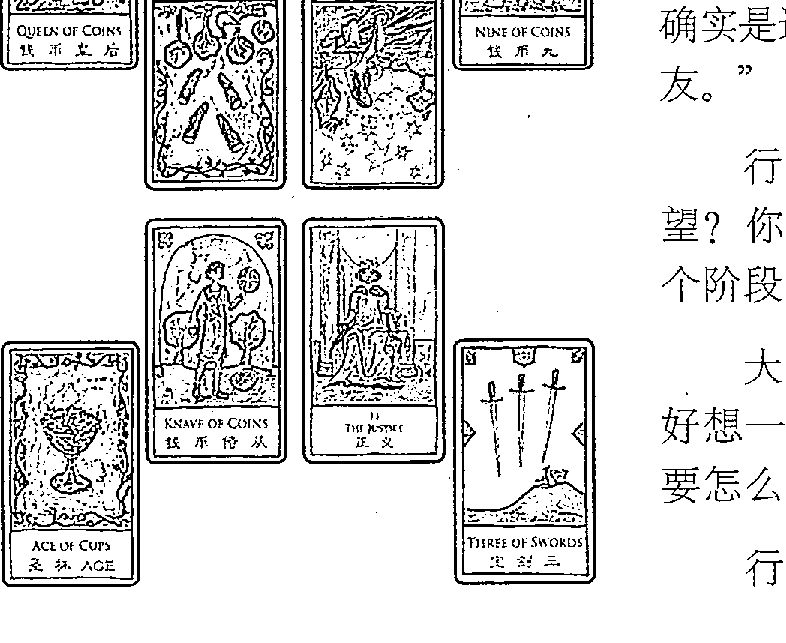

大学生：“是啊！我刚开始确实是这么想的，我只想要交女朋友。”  

行深：“难道没有其他的愿望？你要不要认真想一想大学这个阶段的安排？”  

大学生：“是有啦！我会好好想一想——大学的生活我到底要怎么过？”  

行深：“那就好！”

接着大学生已经提出反观自己的问题了。

大学生：“我想再问，这段感情到底给了我什么样的启示？”

行深：“那我们用四界探索牌阵！”

这牌阵帮助他了解自己的欲望、情绪、理智和精神的变化，使他对自己的做法更有方向、更深层认同。

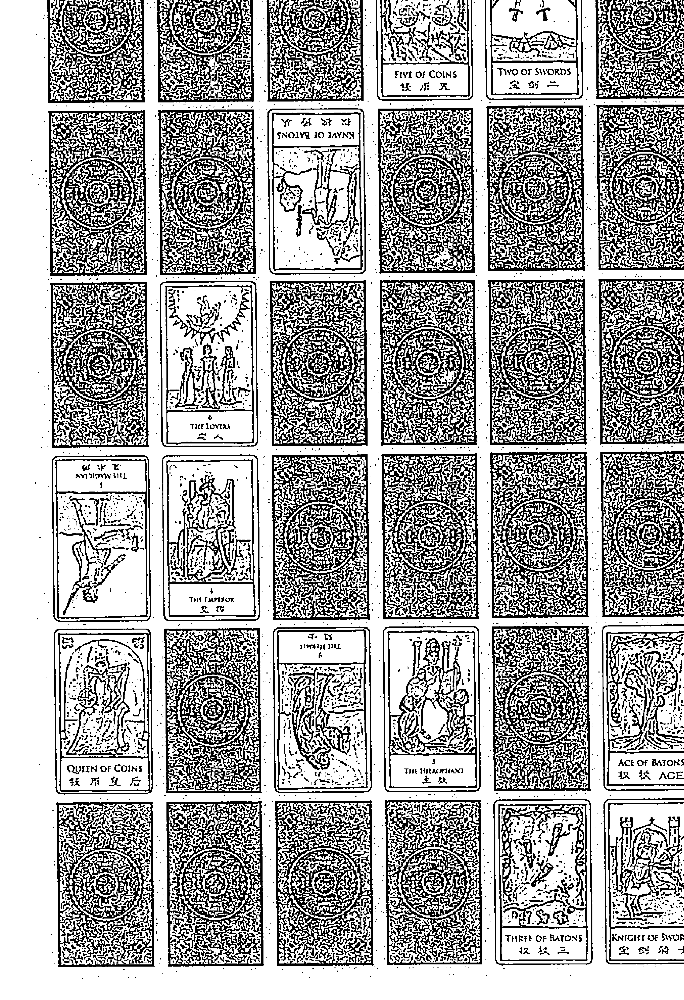

接着大学生又问：“如何增加爱情的把握度及主导权？”

我用了气象万千的三十六张牌阵……

这个牌阵叫六芒星牌阵，是极佳的指导策略牌阵。

大学生被如此气势磅礴的牌阵震得一愣一愣的。我随便说说他就听我的，这是不可能的事，我还是很认真的分析每列牌的含义，架构出最佳的方案。如果不这么做，只摆出徒有其表的牌阵，就真的华而不实了。

## 10问：让你成为爱情高手

大学生：“真的耶！我真的会这样。”

大学生惊笑连连，并且又说：“我知道该怎么做了。”

最后，我建议他再问：“如何强化恋爱品质？”

这个六芒星金划牌阵，最后让大学生建立起了正确的恋爱观念以及信心。从此大学校园少了一位危险情人，多了一位懂得品学爱情的大学生。爱情虽苦涩，但谁说酸甜苦辣一定不是美味的滋味呢？

以上提到的另三个牌阵，我将于牌阵的章节详细说明，并教会各位，请不要急着翻到中间。接下来各位要学习的是——理智中放大自己的直觉，并学会开牌。

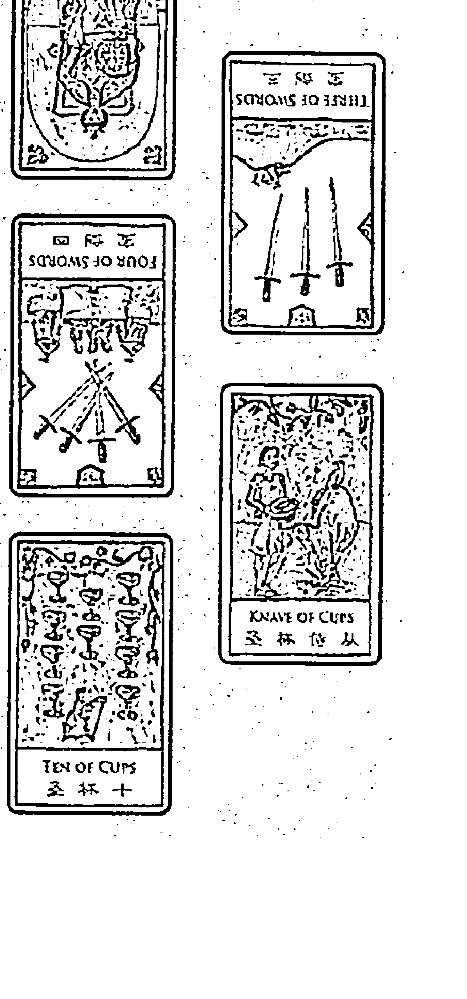

8  
10小时  
让你成为  
塔罗高手

### 1-3 理智中放大自己的直觉，让想象力发光

在处理感情或人、事的问题时，绝对的理性是非常不理智的。

例如，女生对男生很好，男生对女生也很好，但时间不对等。女生替男生买衣服、缴手机费等等，嘘寒问暖一天五六个小时，可能有的男生受不了五六个小时。而男生下班顺道买个鲜花、写个卡片兼一起吃个晚餐，总共才三个小时的陪伴，时间只用了女生的一半，相当有效率，不过这种效率通常人家不会心领。

如果女生向朋友抱怨，而朋友叫她要求男生也应付出对等的时间，这个时候就可看出女生客观的理性了。假如那个男生没办法做到，其实女生也算是已经尽到投诉沟通的责任了，尽力随缘不是很好吗？但绝对理性处理是分手！既然不能配合，分手虽然是很理智的，如果双方都做得到，倒不失为一个解决的方法。但实际上大部分的人都做不到，因此喜欢替朋友出点子的人，就有了生存空间。

除了理性现实面之外，两人交往还有许许多多的情感面，如记忆、感觉与想象等等，这些因素在解决双方问题时，都得考虑进去。所以当事者以及协助的朋友，必须还要掌握这些力量，才能导引出好的方向。假如你刚好是那个夹缝中求生存的好心朋友，或是你不小心是当事人的话，你就需要让自己的直觉和想象力发光，来帮助自己理性解决问题了。

不管平常时、咨询前，还是咨询时，你都可以练习从价值中找到自由和方向。

从价值中找到自由，就是在你喜欢的品质里，让你的热情扩展再扩展。例如，你想喝比较健康的咖啡是出于喜欢其品质，那你的热情就可以用来选择咖啡的栽种方式：有机的、野生的或自然种植的；也可以用来注意烘焙，考虑用鲜奶还是奶精，加冰糖还是不加糖等等。你越有热情注入到你喜欢的事物中，你就越有新的想法来支持你要的品质。或许你无法全部按照想的做，但那已经够了，因为那比你不扩展热情要强多了。

当你的直觉与热情能在你认同的价值中自由翱翔时，你的想象力就会开始发光了。

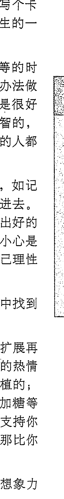

### 1-4 阳光和爱开启：每张牌都是通往心灵的道路

#### 单纯

又真诚的人，是幸福的。如果你是这种人，那恭喜了，你几乎可以不用开牌，因为你的幸福频率，就是最好的感应。你虽然不用开牌，但你还是得看完这篇内容，因为这篇涉及了更深的心灵感应。

开牌的方式很多，用宝石、瓶中净水、精油檀香、白烛，类似塔罗四大宝物的东西都可以用来开牌。你准备也好，不准备也罢！准备这些东西其实是为了让自己安定心神的。这举动，对忙碌的现代人来说，往往象征意义大于实质意义。

> 10小时让你成为塔罗高手

除了这些方法之外，行深要教你用内在的光开牌。内在光你不需点火，点火很容易不小心烧到牌。你只要在一张干净的桌子上，或准备一块你喜欢的布，把塔罗牌拆封，拿出22张大牌，以大牌为代表。如果小牌有空时，你也可以如法炮制。

22张大牌分两列展开，一列也可以，但桌子要很长。然后静下心来照顺序拿起塔罗，每一张看三到五分钟。要怎么看？等一下说明。

看完后，把牌洗一洗，上下叠洗，部分牌可以一百八十度转换，自然产生正逆位。或如洗麻将般地洗。都洗完后叠成一叠，你静心从其中抽出一张，这代表你现阶段得到的启示。然后，再一次看看刚刚开牌时已看过一遍的这张牌。

开牌的涵义是什么呢？

开牌就是让你对牌产生感觉。本来牌是牌，你是你，并不相干。但你开牌时，你产生了想探索它的愿望，这个愿望与牌的美丽图像产生了联系。就这样，你和牌已做了最初步的接触。

开牌除了接触之外，就是对牌的认识和观感。认真看它的时候，你所想到的就是你对牌最直接的认识。请你持续这样的热切感，这种感觉将带你进入塔罗牌的世界。行深有些学生，牌看完还是不认识牌，也没有什么特别观感。如果你刚好也是这样，那可以看看牌，然后参考行深书中后段的单牌解释。这样再试着去联想，你就能观察到牌的精神意念。

你可以主观地观想，或者客观地观想，也可融合两者进行观想，这样就能看到一条心灵道路。

“还是没看到啊？”好，很好！假如你还是看不到，不妨再说明一下。你看，你因诚实而得到更多了。

举例：

- 假如我是“女皇”，我如何去给出礼物？这叫做牌的主观观想。
- 假如他是“主教”，我希望他给我什么教导？这叫做牌的客观观想。
- 假如我是“皇帝”，我希望自己怎么发挥影响力？又想他是“皇帝”的话，他应该怎么做呢？融合两种，就叫做牌的主客观融合观想。

这种观想是专注看着牌，然后跟随时而张、时而闭的想象，而不是只想着“女皇”这个名词喔！

要记得先用正面性去看牌，然后注意一下缺失的一面，而不是一开始便停留在缺失上。光明的想望比较容易找到适当的路径。这就是以内在的光开牌。

还有，用爱的品质去看牌。这张牌的角色如何去彰显他的爱，以及为光的想望，比较容易创造出美好的感动。这就是以爱开牌。

综合前述，就是用爱和光开牌，透由开牌或以后观牌、解牌，而看见每个角色彰显的自性之路。

## THE MAGICIAN  
魔术师

## 发光第三小时  
超强解题之可区分解

## 2-1 愚人的心灵探索之旅·观图塔罗生日角色扮演大牌游戏

学习塔罗牌，真的是让想象力发光的心灵游戏。前面说的开牌观想的方法，也可以用到角色扮演游戏中。

我们先用主观想象的方式来算自己的角色，用客观想象的方式来帮你身边的亲友算，用生日的合数来对应塔罗牌的大牌。

为什么算命运数大都要用生日呢？这个稍后说明。生日真的可以决定一生的命运吗？答案是否定的。

没有一种命运，是出生后不能加入新的变数的。你的生命有无限可能。没有一个生命体的未来是全照出生时的剧本走的。你累积好梦想、能力和勇气，就随时可以改写自己以后的人生剧本。

你会说：“那以前的呢？”也可以改写，但改的范围有限！

你又会说：“过去都过去了，请问如何改写呢？”

过去虽然都过去了，现在也一定会成为将来的过去，对吧？但同一件事，因记忆面向的不同，会有感受的不同。如果你愿意重新去观察，那么过去你认为快乐或悲伤的事，就会使你重新得到领悟。

你想着：“原来，当时我为何那么快乐。原来，做这种类型或品质的事，我会快乐！”

你还想着：“原来，他对我不是那么坏。原来他想告诉我，那件事对我会产生不好的后果。”

你若用了不执著记忆的方式，不搜寻记忆，你以后就能建立更令自己喜悦的成长记忆。

未来的想望，可能会成为你未来的记忆。因此，从仿真塔罗大牌的角色游戏中，你可以想想你喜欢表现的方式。

生日角色扮演的心灵游戏是：把自己当“愚人”，或把“愚人”当成学会“魔术师”的能力的自己，来学习新角色的特质。你算到牌后，就先想象你如何以此角色特质来体验世界。

用生日来算，其实就是以你的出生第一印象来算的。你可能会说：“别骗人了，谁记得出生的事？”当然，第一印象是形容词。你带着遗传后的空白，感受了当时的阳光与环境，这是你出生后的第一个惯性，与大自然星辰射线能量的接触，其中影响最大的星球就是地球与太阳。

因此以地球的阳历来算，会比较接近当时感受的分类象征。这个象征有助于我们做特质初步的分类。当然，往后的教育、环境与自我期许等等，都会影响到特质。因此命运不是固定的，相反命运是很难掌握的：有些趋势，有些随机，也有些是跳跃的。你做出一个重大的决定，人生就会走成不同的方向。

所以，生日特质大都只对应个人潜在特质。你算出来后，一方面当作了解自己潜在特质的分类，一方面练习熟悉牌义。

大牌的角色扮演法是：用自己出生的阳历月与日逐数相加之和，来对照塔罗大牌的号数。

例如：1965年2月21日。年不用计入，月是2，日是21，因此是2加2加1等于5。对照的大牌是“主教”。

而主教这张牌有“教育、辅导、援助、战略欲望、传统”这些联想，是一个较具心灵自由的人。他喜欢辅导别人，可能也会学些传统的东西，然后还面对一些物质的诱惑。如果不贪取，他一定是一位很棒的心灵老师。

行深生日刚好是2月21日，哈哈……刚好了。

其实，行深晚报户口，身份证登记是4月2日。如果有像行深一样的，要查明后再以阳历算。假如无法确定真正生日，也可以玩角色扮演，照身份证上登记的玩。只不过对于个人潜在特质的参考性就降低很多很多了。不过玩一玩，认识牌，因为每个人总是关心与自己有关的。

例如在车站等等，如果有人大喊一个名字，虽然大家会看一下，但因为被喊的不是自己的名字，所以也就不太开心了。假如喊到的是你的名字，你一定会想了解一下他为何要叫你？到底有什么事呢？这就是注意力的范围，与自己的相关性成正比。

自己算好后，请对照本书后面部分提到的大牌牌义，来查询你的生日所对应的塔罗角色及其象征意义！

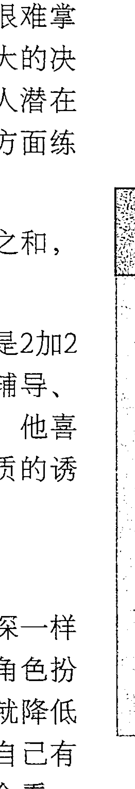

### 2-2 河图1到10序数理解：河图塔罗生日态度品质小牌游戏

河图的序数只是简单地从1到10，但要了解却不容易。以一个简表来说明：

| 数序 | 概念 |
|---|---|
| 1 | 独特的力量 · 自信 · 创造 · 追求卓越 · 沉迷 · 伪装 |
| 2 | 对称的力量 · 平衡 · 合作 · 懂得协调 · 保守 · 依赖 |
| 3 | 多样的力量 · 表达 · 敏锐 · 不服权威 · 主观 · 善变 |
| 4 | 成形的力量 · 稳定 · 分析 · 喜欢掌握 · 不安 · 跳序 |
| 5 | 变动的力量 · 自由 · 规范 · 重视风格 · 懈怠 · 固执 |
| 6 | 导引的力量 · 远见 · 完美 · 理由不断 · 空想 · 好辩 |
| 7 | 修正的力量 · 开放 · 学习 · 多方尝试 · 暂沉 · 偏执 |
| 8 | 组织的力量 · 丰富 · 权力 · 善用架构 · 放逐 · 分心 |
| 9 | 整治的力量 · 领导 · 正直 · 整合智慧 · 狂热 · 高压 |
| 10 (0) | 混沌的力量 · 直觉 · 感性 · 随机运作 · 放空 · 躲避 |

塔罗的4种小牌都有14张，除了宫廷牌四张没号数之外，都有从一到十的数，因此大都同于河图。而塔罗精彩的是，它又加上了四大宝物：权杖、圣杯、宝剑和钱币。数因宝物而意义更鲜明，又有图像的表征，使得数的意象被简化、扩大。

例如：宝剑2。本来的河图序数的意象是平衡、合作等含义，加上宝剑的决断，就是两把宝剑的僵持不下，于是意象鲜明度提高了。下一讲会提到塔罗的四大宝物。

先说明一下，小牌的生日态度品质游戏这么玩：

a. 把出生年、月、日逐数相加，和数超过14的，再把两位数相加，成最后得数。没超过14，就以该数为最后得数。以下用1965年2月21日为例。

例如：1965年2月21日就是1加9加6加5加2加2加1，等于26。26超过14，所以再将2与6两位相加，等于8。8就是最后得数。

8也就是态度牌的点数。

如果是11就代表侍从，12代表骑士，13代表皇后，14代表国王。

b. 把年、月、日逐数相加后，再除以4，余数就代表态度牌的第一种宝物。然后再算一种：把年、日逐数相加（不含月），再除以4，余数就代表态度牌可能性的第二种宝物。因为有可能“年月日”相加除以4的余数，与“年日”相加除以4的余数相同。余数相同就是宝物相同，余数不同就是宝物不同。

- 余数1代表：权杖  
- 余数2代表：圣杯  
- 余数3代表：宝剑  
- 余数0代表：钱币（整除4）

例如：1965年2月21日出生的态度牌的第一种小牌宝物，就是年月日逐数相加之和为26，除以4，等于6余2。余2代表圣杯，所以第一种宝物为圣杯。

态度第二种小牌宝物，就是年1加9加6加5加2加1逐数相加之和为24，除以4，等于6余0。余0代表钱币，所以第二种宝物是钱币。

c. 把所算的数与第一种以及第二种宝物分别结合，就是代表态度品质的两张小牌。

以前两项之例：点数为8，第一种宝物为圣杯，第二种宝物是钱币。结合后，象征态度品质的两张小牌就是：圣杯8和钱币8。

算出来后，也可以参照大牌。行深以自己为例稍做解释。你们算好后，可以自己参考后面的单牌解析。

“杯8”和“钱币8”。主教代表喜欢教育辅导别人，8之数代表丰富性与组织力。圣杯是分享，而牌之象象征追寻。钱币代表原则，而牌之象象征技艺。

综合解析为：喜欢教导别人，尤其喜欢推行心灵自由的方法；喜欢不断探寻新的品质；又有很好的组织能力与技艺。

这是看行深自己的牌。不能只说好的，其实对自己说坏的很不容易喔。你等一下也可以试着找出自己对应牌的缺失启发。

我先说自己的缺失：平常在分享或辅导时容易流露出说教的意味，而且总讲自己所懂的，也不管别人的思路是否跟得上；容易因为喜欢追寻新的事物而过度善变；也会因追求心灵自由而过分分心或自我放逐；而丰富的技艺又形成了彰显个性的障碍，因为时间不够用。

以上缺失我勇敢地说出来。还好，已经改进得差不多了。哈哈哈……换你看自己的牌啰！

## 2-3 塔罗的权杖、圣杯、宝剑、钱币：测图的元素、意义、原则

塔罗的四大宝物与河图易理四象，都象征运作时力量的品质和彰显。

握有权杖的人，是有经验的人。初生之犊不可能得到权杖，但他有内在的主意。权杖代表人的德望与经验。权杖不是拿来敲别人的头的。有些行业的老师傅，不但技艺舍不得教人，还不懂得与学生相处，动不动就施予棍棒。如果能像禅师一样直指描述执著之处，或许一棒领悟，省很多话。

棍棒是教心性的功夫，不是拿出来教技艺、传经验的。为人师如果乱打学生，小心被告。不懂得运用知识、宣示权威、执行远见的权杖，只会使人腐败贪婪。一旦权杖不能行“元”施仁德之政的话，权杖还真就成了障碍。

圣杯代表真心与人分享的精神。最后的晚餐时用的杯子，装的是耶稣的身心血汗。连身心血汗都能与人分享了，还有什么不能与人分享的呢？享者嘉之会，享通就是能与人共享，象征礼乐同欢。礼为和众，司寇共享以消除分歧之隔阂。

凡圣本一，有志有愿、能施能舍、想得通、做得到，便能超凡入圣。但不能高高在上，一直高高在上，没有人呼吸到跟他一样的空气，他也会孤独。所以愿意与人分享，与人协奏，自然亨通，礼乐兼备。

宝剑属于英勇正义感的人所有。公义必须维护，但不讲公义的人拿到宝剑，或有公义精神的人各持己见，利益就将难以分配。有利的一面则必有害的一面，如何决断才能避免其害呢？

“大利曰义”。许多人的价值观差异甚高，假如以“对大家有利”来判断其做法，就容易区分了。你有利、他有利、大家有利，事情得到合宜的分配，就是义。秉持大利以断，宝剑就是以维护大家“利”而行“义”的宝物。

钱币是大家的认同物与公信物，代表原则也代表通则。不能乱取乱予，一旦不慎，别人就不敢交付要事。所以“贞固足以干事”。信守原则承诺的人，大家都可以信赖他行重要的工作。

用钱不慎，将使自己失去信用。而发挥智慧运用钱币，则所做的事、所使用的财物都能使生命更美好。钱可以是愿望的工具，更可以是价值的彰显。

总之，运用任何宝物都要有智慧，没有智慧的力量，无疑是一种更大的障碍。

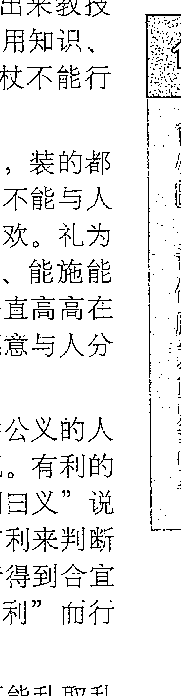

### 2-4 宫廷牌的服务：心有余力的服务

了解四大宝物后，我们再来看看宫廷牌。你可以将宫廷牌看成是一种“心有余力的服务”。

怎么说呢？通过对每一种宝物从一到十的学习，各种权杖人物已能驾驭各种状况，所以他已具有为公众服务的本领。有了本领，心又有余力，这种人大都是招人喜欢的。

侍从都有贴心服务这样的意味，而持的宝物不同，他表现的品质也略有不同。

权杖侍从：他服侍权杖，自然心有诚敬，思有主意。他诚心地探索一切，像个好奇宝宝、好好先生，而内心有自己的想法和主意。以此类推，就知道各种权杖人物的特性了。

如果你说：“还不熟，怎么推？”好，很好的问题。那就先不要推，翻到后面权杖宫廷牌的解析，行深有详细的说明。等你觉得有能力推了，联想力够了再推。不急，学习事物不能操之过急。

权杖骑士：传达命令的骑士，他积极而不着急，实现自己的理想。  
权杖皇后：有主见的乐观给予者。皇后角色本是精神支柱与辅导性礼物的给予者，加权杖表示她的给予有自己的想法。  
权杖国王：实施仁政的国王，他有坚定的信念。

圣杯侍从：懂得分享的侍从，所以他的服务细腻而温暖。  
圣杯骑士：重视分享的行动流程，他优雅而魅力四射。  
圣杯皇后：能够洞悉人性的给予者，从事丰富人性的事务。  
圣杯国王：懂得授权的国王，是有心灵智慧的国王。

宝剑侍从：皇宫的侍卫，机警而勇敢，懂得维护正义。  
宝剑骑士：行动果断，具有正义感与使命感。  
宝剑皇后：不怕辛苦的皇后，她历经一切，因为她能慎思明辨地给予。  
宝剑国王：勇猛的国王，为了守护人民与正义，他可以不惜一战。

钱币侍从：谨守中道的侍者，他知道什么该拿、什么该给，有自己的价值判断标准。  
钱币骑士：行使价值的骑士，他的行动兼顾内在价值，并认为没有化为行动的价值就没有价值。  
钱币皇后：有原则又有智慧的皇后，给人安定感，是精神富有的皇后。  
钱币国王：运筹帷幄、掌握资源的国王，是懂得制定规范、发挥更高价值的国王。

这是宫廷牌特色的介绍。

现在我们对大牌的心灵角色有些认识了，对小牌的点数与宝物也有所认识了，对宫廷牌也有了一些概念。只要再弄清楚一些解牌的观念、技巧和塔罗咨询的特征，就可以来玩牌阵啦。

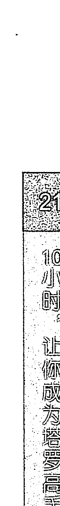

## ACE OF COINS  
钱币 ACE

## 发光第三小时

## 超强解牌之牌阵通解

## 3-1 解释牌义：这些看牌

帮别人咨询时，无非是些人与事的问题，因此牌义一定要与人、事连结。

除非你帮你的宠物咨询。你可以训练猫在马桶尿尿，不在马桶至少在浴室内，这样比较好搞卫生；当你用手势示意要按摩狗狗的时候，它就乖乖地去你的脚边。这些都是有基本知识可循的。行深不是要教你这个，这些留给宠物专家教你，如果你对宠物有兴趣的话。

其实不管对动物还是人与事，都不能脱离基本知识做咨询，一定要立足基本知识并超越基本认知。因为人会以认知去判断事物，却无法全然以认知来行事。

人是有感觉、有感情的。当然动物也有，只是动物的思考和表达没有人类好，而且动物的记忆只在脑、身体和简单事物上。你可能会说：“动物也会用事物来记忆？”怎么不会？随便举例，狗狗散步时会在轮胎、电线杆和路灯边上尿尿做记号。但记录的能力总是比不上人，也没有人表现得优雅。人类除脑之外有很多工具可用，纸、笔、计算机、便利贴等，真的比其他动物多了很多很多。人类之所以能掌握地球文明，最重要的是思考表达的丰富性、记录的丰富性和创意的丰富性，而不是人类的第六感直觉感应比动物好。请记得这一点。感应直觉力，人类还要向其他动物学习呢！

有关感应力的知识在其他章节会教。现在行深要告诉你，行深在看牌的时候是如何思考和如何有效联想的。看着牌——

- 这张牌是对自己的省思，还是对别人态度的省思？
- 这张牌的图，与你现在做的事有何关联呢？
- 如果是名为“力量”的这张牌，那你要想想，在这件事中，你如何适当地用力量呢？你能以柔克刚吗？
- 这张牌让你想到如何做好现在的角色了吗？
- 你能借着这张牌，看见自己的心吗？
- 你能借着这张牌，确定你的抉择吗？
- 你能从这张牌的象征意义中，发现你对这件事的情感面吗？

经过以上的思考想象过程，你应该就会对牌有一定的想法了。不要觉得你的想象力还不够，其实不是想象力不够，而是可以联想的数据不够。当你对牌越了解、越认识，你就会越发正确地使用你解牌的想象力了。

所谓正确的解牌想象力，就是你的想法是符合当下人与事的，而不是天马行空那样，创意好得很，可行度却烂得很。天马行空的想法对事情一点帮助也没有，就算有，这种散乱创意的坏处也比好处多。

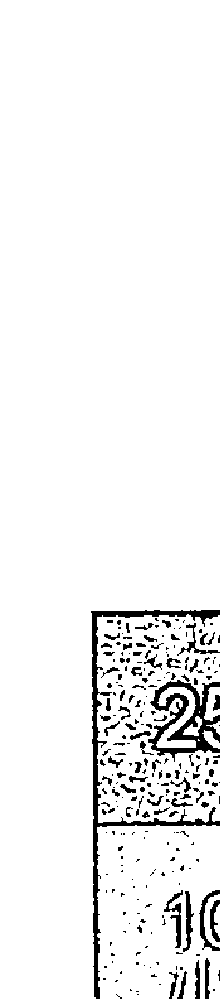

## 3-2 重点特写·正逆位、多看重

现在就说一说怎么看牌阵的牌。牌阵中较突出的牌，往往意象较鲜明，常常能对应当时的人、事。所以处在牌阵中重要位置的牌，大部分可以重点特写。

什么是牌阵中的重要位置？后面会提到。而重要位置上的牌，就代表对事情的重点提醒。

牌阵中除了重要位置牌之外，正位牌的能量也较强，意象也较清晰，参考性当然比逆位牌高。很多初学塔罗的人，以为逆位牌的意象就是与正位牌的解释相反，这种论断是解牌经验不够者的想法。其实逆位不完全与正位牌反义，甚至很多是与正位牌同义的。

逆位只是使牌阵的表现能力弱化，比较不显眼罢了。你仔细想也知道，逆着看报纸，报道的文字力量表现力就低了嘛！所以逆的图像，是自然意象表达力的降低，是形反非义反。

因此逆位牌在牌阵中的意象能量自然偏低。但如果逆位在牌阵的关键位置，那就表示你需要努力扭转并彰显其意象的象征力量。

例如宝剑 Ace，普通逆位就代表你可以表达想法，但不要过于尖锐。但假设在关键逆位，就是提醒你要勇于表达，不要压抑，只要想法表达够清楚，你就能冲破困境。所以，你可以再导正逆位，但要花些力量。逆位是弱化、被忽视的意象，但是用它时就要加以导正和强化。

牌阵中，一旦出现某牌种的比例较高时，其牌种的意象就须被重视。例如一个牌阵中出现高比例的宝剑，那表示明断性是处理时该注重的；如果圣杯居多，则提醒你要注意分享、协调问题，不宜过于乐观。

以此类推，如果较多张的牌种不在关键位置上，那关键位置上的那张牌，就要与多数牌种来看，即看关键牌义，并兼顾多数牌的品质特性表现。

举例，如果关键牌是正位权杖10，而多数牌为圣杯牌种，那就要做适度的调和解析。比如针对发问者所问的关于事业的问题，简单就是：

有责任感是好事，但不要给自己那么大的压力，量力而为，把一些责任分出去，或者把一些利益分出去，就不会那么辛苦了。钱要大家赚，大家赚得多，自己也才有得到。扛那么多责任，自己累垮了，又有什么用？想赚大钱是吗？先想想大家如何把事情做好吧！事情做不好，哪来的钱呢？要懂得分享分配，把事做好，钱还能不来吗？

以上如是解释，就是正位关键牌与多数牌的合解。

> 10小时  
让你成为塔罗高手

### 3-3 点线面连接：全方位思考

当你学塔罗一阵子后，有些朋友就会来问你问题。有时候，我们听完朋友的问题，会感觉他的大脑不见了……很想从他的头“巴下去”！不管你有没有学塔罗，你都会想“给他巴下去”对不对？

对吧！就知道你会这么想。行深是不会啦！行深会说：“是这样啊？”、“你说呢？”或是“没关系，我们来看看呀！”

好，别扯了。行深承认也很想“给他巴下去”，但这样他的脑并不会归位啊，只是碎成豆花而已。所以，我们要善用自己的情绪力，把此情绪变成解决问题的热情。

其实这样做并不难。你只要静静地看着他一下子，然后不要把焦点全放在自己的情绪上，而去想想他为什么会连这么简单的问题，都想听你的意见或咨询呢？

先肯定他看重你，你就不会那么气了！但有时候也难怪你气，因为有些人并不是要听你的意见。他们讲那么多好像是在请教你，其实他们只是在发牢骚。对！你给他再好的意见都没用，因为他们是纯发泄，他们要找垃圾桶，而你刚好是。如果有很多这种“他们”，你就会变成垃圾车。

其实当垃圾车是你的荣幸！说明你不仅很有雅量，而且很有耐心，还很有智慧，所以才会有那么多人向你倾吐心事。

行深有些学生就是这种喜欢出意见又有雅量的人，也很有智慧，但还是常常会被垃圾淹没。还好，都记得来行深这里充电。行深告诉他们：垃圾要分类。

你会说：“这是什么问题啊？切——”

请勿动怒，听我报告，是这么一回事：求教者应先把烦恼垃圾分类，不要乱丢胡撒，因为这样的话，再棒的人也无法为他处理。分类完，他就会发现根本没有那么多垃圾了，而且很多垃圾都可回收当资源。也就是说，在他的问题里面，其实已经藏有一些答案。

所以，你只要找到问题的重点，拉出线索，就能全盘分析了。不用塔罗牌的解决办法是如此，用塔罗更要如此。当问题厘清后，答案往往就呼之欲出了。

关于如何问问题，下一章会说。

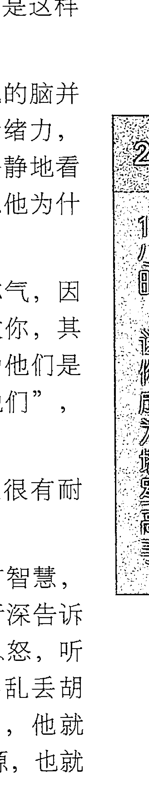

放松心境，你就能看见点、线、面信息的有效连结，因为你在心中已创造出了适当的环境。

解牌时，问题的重点对应关键牌；问题的解决线索对应重要的牌柱；问题的全盘探讨，则对应整体牌相。但整体牌相一般比较难懂，因此借用河图的数理来带动整体牌相，希望能让你更易理解。

接下来就来看看河图与整体牌相吧。

## 3-4 塔罗合数传输河图·河图百数数组态势指导词

例如：

我们都取牌阵左边第一柱和第二柱为数组来算，第三柱不纳入数组，只看牌意。

这牌阵中，最左边这柱是魔术师1加权杖4，和数为5；第二柱愚人0加钱币6，和数为6。河图数组是从左至右，第一柱的和数写在数组的左边，第二柱的和数写在数组的右边，因此这阵的数组为：56。

然后就可以对照河图百数组态势指导词来参考，以便增加联想与判断。

假如和数大于9，是二位数，我们就取尾数。例如和数第一柱是10，就取0；第二柱是17，就取7，然后数组就是：07。

好了，我们先看表格中的指导词。现在请看看就好，等你已经开始摆设牌阵时再详细对照。不要此刻一看到就想全背下来，如果这样做，那……行深也不反对。

河图百数组态势指导词图表中，数组序是组合序，非照自然数的排列。

数组是以数来表示牌阵的整体牌相的，态势指导词则是以词来描绘牌阵组合意象。

这些指导词，可以增加我们解牌时的思考灵感。指导词都用正面的语词来激励我们自己的态度，当然也要注意其反面意义。如65是“启发自己”，相反的就是不要“蒙蔽自己”。

## 河图百数数组态势指导词

> 30分钟，让情感成为你的智慧

| 数组 | 指导词 |
|---|---|
|11|朋友讲习|
|12|各擅其长|
|13|表达关怀|
|14|降低伤害|
|15|减少贪求|
|16|珍惜调节|
|17|异中求同|
|18|实时欢庆|
|19|明确履行|
|10|临场反应|
|21|清除杂念|
|22|分享喜悦|
|23|传递想法|
|24|展现注意|
|25|修饰表达|
|26|静心聆听|
|27|漂亮交流|
|28|感恩协助|
|29|注意沟通|
|20|避免暗昧|
|31|去本留末|
|32|提升内容|
|33|柔顺劝勉|
|34|感威并施|
|35|温馨话语|
|36|真心付出|
|37|勇于实践|
|38|更新架构|
|39|细心处理|
|30|放松给予|
|41|借势发挥|
|42|明晰彰显|
|43|再接再励|
|44|时时警惕|
|45|知识运用|
|46|需求导向|
|47|自然发展|
|48|妥善调整|
|49|慎重其事|
|40|正面影响|
|51|风趣接触|
|52|步步为营|
|53|风吹草偃|
|54|善解包容|
|55|心存善念|
|56|能行能舍|
|57|心境自在|
|58|超越自我|
|59|转换心境|
|50|谦和待人|
|61|鼓励突破|
|62|给予希望|
|63|行爱无碍|
|64|饮水思源|
|65|启发自己|
|66|专心致志|
|67|包容偶失|
|68|宁静解脱|
|69|化解歧见|
|60|良性竞争|
|71|以光驱暗|
|72|省思改造|
|73|亲切互动|
|74|交换意见|
|75|温情最美|
|76|安心交流|
|77|发光发热|
|78|丰盛心灵|
|79|创新合作|
|70|培养内涵|
|81|真心欣赏|
|82|辅助协商|
|83|支持善行|
|84|勇敢尝试|
|85|分享独特|
|86|积小成大|
|87|各取所需|
|88|给予力量|
|89|精诚无妄|
|80|考虑趋势|
|91|果决行动|
|92|大方承担|
|93|信心等候|
|94|建立典范|
|95|化识为智|
|96|导正需求|
|97|宽心以对|
|98|满载先垂|
|99|贯彻始终|
|90|稳当指引|
|01|多元并存|
|02|鼓动理想|
|03|明观洞知|
|04|不怕挫折|
|05|友好宽恕|
|06|多说好话|
|07|光明奖励|
|08|宽心有余|
|09|逆向思考|
|00|无限可能|

## 发光第四小时  
塔罗牌照见塔高准备

### 4-1 打开心门，开放更大的可能

打开门，就是要你的心愿意开放，以内在的力量向外发射感受。如果你不愿意把自己的手交给别人，别人怎么拉你一把。心也是如此，只要你愿意诚实地面对自己，开放自己，你就能跑出更广的天地。

不管是发问者，还是塔罗咨询师，都不要被定见限制住。先想其可能，就会比较有可能。如果事情先想不可能，那感知触角的空间就会缩小，方向就会模糊，动力也就会停滞。

事实上大部分关于人与事的问题都是有解的，只是你愿不愿意静心思考罢了。心静就会有感应，有对应，然后以此而往，自能找到方向或探出新路。

行深有一位志工朋友，到花莲当志工。有一位法师带着这位朋友去参访他处的法师。参访时法师盯着行深的这位志工朋友说：

“你到处看看，如果有问题，就把自己心静一静，再来说出自己的问题，然后求一句静思语来反省对照看看。”

行深这位友人心想自己又不属于这个团体，于是没求。法师在访友结束要回程前，又请这位志工朋友求感应。因为出发前，他向法师问：

“师父，为什么我的身体想来花莲就来花莲，而我心却不能做主呢？为何我不想烦恼，却心生烦恼呢？”

法师淡淡地说：

“本来我们修行，主要就是要修心啊！师父有时也会起烦恼心，静一静就好了。”

这位志工朋友嘟囔着：“我也知道，心要静一静，但就是静不下来啊！如果我能够静下来，我还需要……”心里还念着，就已经到他处寺庙了。

回过头来再说一说，这位志工朋友到底有没有求感应呢？后来临走前求了。他向佛陀及上人告解：

“释迦牟尼佛啊，上人慈悲啊！我自认为是个好人，没做什么坏事，家庭也还算幸福，但为什么这些年来财务不顺，常为钱烦恼？是不是我哪里修为不好呢？如果我将来有福分走修行的路，我是不是要补足我的福源呢？”

> 10小时 让烦恼停留

说完取一纸静思语，打开一看，这位朋友心灵震撼到不行，久久不能言语。在本书后边的某一小节里，行深会公开他找到的内容。想知道他所得到的不可思议的建言与领悟的朋友，要请仔细看本书的内容哟。

如果以惯性思维就能解决问题的人，他当然可以不需要另外的觉知系统，例如感应。大部分的人也都想用理智认知来解决问题，但事实上是，真的有些问题非理智能解，如感情、情绪、勇气、耐心和信心。这些都与理智同样重要，而且也都不是纯理性可以控制的。

因此静心地培养，与静心后的思考就很重要了。假如你想用感应的方式，例如静思语对应，还有塔罗牌阵或易经占卦等等，就要有一个先决条件：不欺骗自己和别人，要把问题说清楚。感应不是猜谜或玩弄特异功能，而是心湖的照映。

所以，世间事“可许则许”，只要不是强求，自然会有可许之道。

### 4-2 有力的设定：借势触发往善觉之路

#### 幸福

来自单纯与真诚。当你决心单纯，你的想象力强度就会升高，而你的想象力自然就会与幸福的讯息意象连接起来。

心的定位会影响到你的所见与体验。

你想看见桌上的杯子，你就看见杯子；你想看见天花板，你就看到天花板。你的心聚焦就做了讯息的设定，所以你能看见。如果你没有很想看杯子，就算你眼睛张着看到杯子，也是模糊的。因为没有聚焦的余光，比不上聚焦的定位清晰。

所以，当你用牌阵咨询解决问题时，就应该把心放在喜悦的良善品质上，放在处理问题的定位上。这样，心的感应与思虑都会朝这个方向前进。

当你的朋友有问题找你给意见，但他有气无力想赖给你时，那你真的不用急着替他设牌阵。你要好好地为他打气，唤醒他改变问题的动力，而不是由他全赖给你。如果他没有想改变问题的态势，又如何能改变问题呢？恐怕就算你给他世界上最好的建议，他也无法实行。

因此，告诉他，你会帮他。但他也要用心来想想解决之道。这样一来，就可以与他一起研究如何解决问题了。

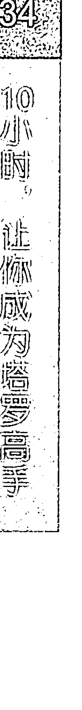

## 4-3 如何问问题：什么是你能够变和主导的

大部分的人找你排塔罗牌，一半以上只想知道结果。他只把它当做预测的工具，把你当预言家。

行深大胆地打破你的美梦：塔罗也好，易经也罢，纯粹只是要预测的话，平均值远远不及科学逻辑和情报的推理。偶有超越是事实，有些确实难到爆，但这又怎么样？平均值还是比逻辑理性推理低很多，你又何必用呢？

所以，直觉感应如果建立在科学逻辑和情报推理之上，就更胜理智了。

以下棋当比喻好了。理智像是已建立的棋谱和设局，而直觉感应则像是随机学习、尚未完全验证的临场智慧。

如果只照谱下棋，算是不错的程度；如果只按直觉下棋，应该下得不会很好。好的没几个。但假如有棋谱设局的知识，再加入随机的临场智慧，策略和行动就一定比前两者好。

直觉感应如果以理智为基础，就会产生新的可行创意，这是行深照见洛商二十几年来的体会。

所以，问问题，其实就是问这件事你可以加入什么关键变量。想想看你能改变和主导的是什么，而答案就是问题的方向。要让新的良性变量来破解难题和改善结果，而不是问一些：

“会不会考上？”  
“他爱不爱我？”

这些问题很重要，但不是靠牌来做结论的。

有的人不让他问结果，他就不会问了。行深的学生帮人洛商时常遇到这种情况。举以上问题的例子，行深引导给你看，要怎么问问题。

“会不会考上？”要先问问自己的把握度，然后问准备的方向或读书计划。最后从意象当中建议他准备主科、副科的比例，或是如何选择读书的环境。有了这些助力，才能往更好的方向走。至于结果，等发榜就知道了。

“他爱不爱我？”他爱不爱你？要问他才知道！但你可以问：怎么让他喜欢你？你要以什么态度与他交往？交往中应该注意什么？给他什么品质的爱比较好？

以上这些，才是你可以做的。不过也要你们已有一定程度的交集才可能。如果连交集都没有就问，也太心虚了吧！要不然，你可以问如何与他产生交集？这样才实际。

虽然塔罗也有预测的成分，但它更是探索自我的良好意象工具，它是从改变自我开始的。

### 用塔罗咨询问题的注意事项

- 一、检查78张牌是否完整无缺。
- 二、不合法的不要问。
- 三、争论性、权力斗争的、乱码的都不要问。
- 四、不要只问结果，因为过程会影响结果。
- 五、精神状态不好时，不要做咨询。
- 六、规划法：问怎么做才对该事情有帮助的企划。
- 七、指导性：问此事要怎么做，才会对事件关联者都好。
- 八、选择性：问选择性问题，就是比较两个指导性的优劣。
- 九、强化法：问这件事中需要加强的是什么。
- 十、处理法：实在不知怎么问，就问用什么态度和方式来处理这件事情。

以上简略标示了一下问题的问法。不同的人有不同的问题，问题实在是五花八门。除了以上问法，只要是问者真的愿意在好的方向去努力的，都可以问。

笼统问有笼统的意象，详细问有详细的意象。总之，请记得引导他以能改变、能看清的方向为主来发问。

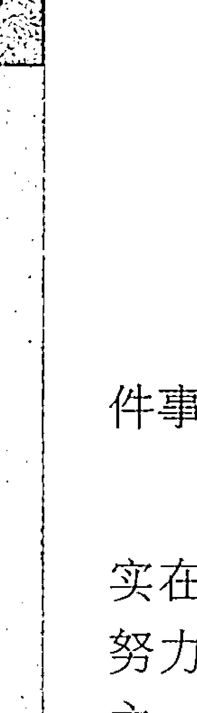

### 4-4 代替牌的速记法：概率中牌含量的速记法

许多塔罗老师常有一个问题，就是如何边咨询，边记录牌。照相，是个方式，但有时照相会干扰问者的情绪，所以如何及时记录真的很重要，尤其对于初学者来说。

当你觉得朋友的案例不错，想记录下来以便以后当范例或再研究时，速记法就很重要了。

如何速记呢？当然是把牌化为数字最容易记了。还有就是逆位就写“—”，用这个符号表示逆位。

以下就是大牌的速记代码：

大牌就照它的牌号。如果愚人就记为0，魔术师记为1，女祭司记为2……正义记为11，倒吊者记为12……审判记为20，世界记为21。

权杖牌从101开始记。权杖Ace记为101，权杖2记为102……权杖10记为110，权杖侍从记为111，权杖骑士记为112，权杖皇后记为113，权杖国王记为114。

圣杯牌从201开始记。圣杯Ace记为201，圣杯2记为202……圣杯10记为210，圣杯侍从记为211，圣杯骑士记为212，圣杯皇后记为213，圣杯国王记为214。

宝剑牌从301开始记。宝剑Ace记为301，宝剑2记为302……宝剑10记为310，宝剑侍从记为311，宝剑骑士记为312，宝剑皇后记为313，宝剑国王记为314。

钱币牌从401开始记。钱币Ace记为401，钱币2记为402……钱币10记为410，钱币侍从记为411，钱币骑士记为412，钱币皇后记为413，钱币国王记为414。

例如以下这个牌阵的记法：

413    409  
-104   -17  
411    11  
201    303  

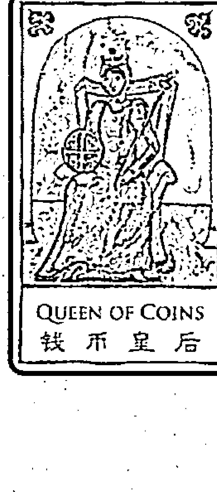
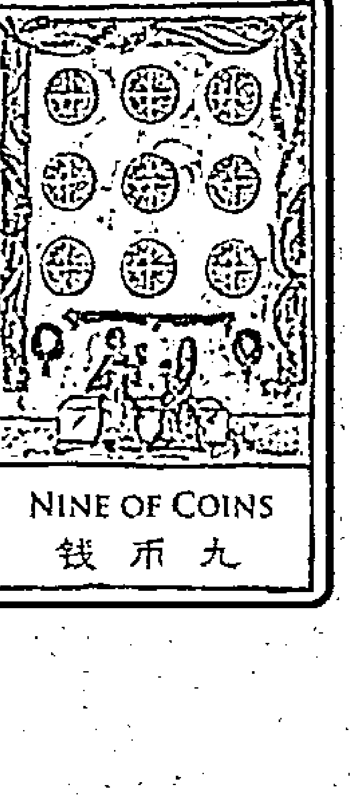
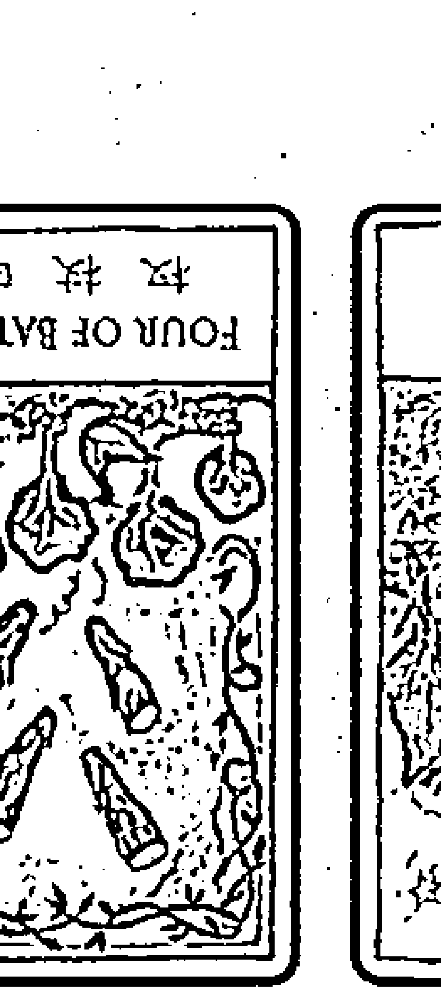
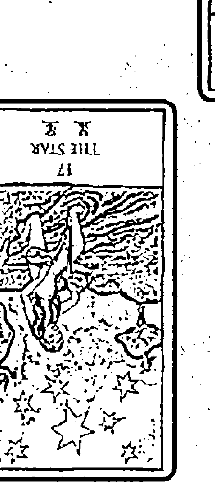
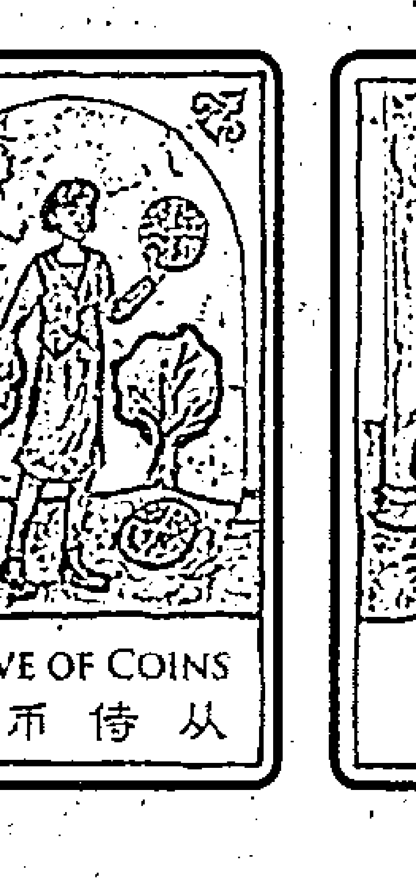
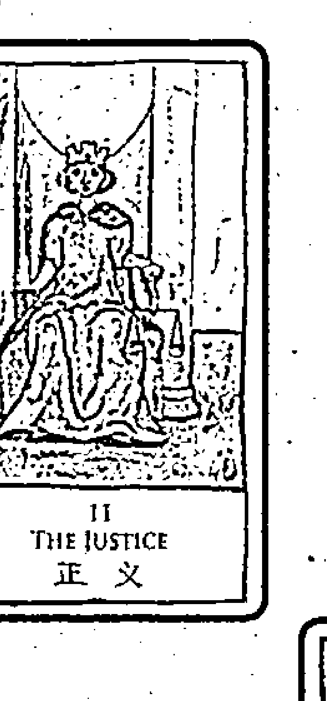
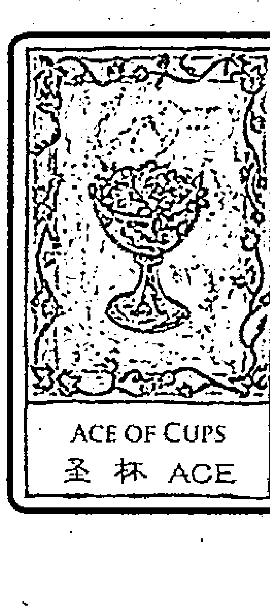
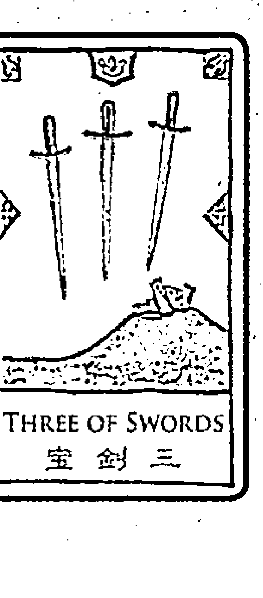

## 发光第五小时
塔罗牌阵流程

## 5-1 让问者洗牌·摆姿势做表情

#### 塔罗

咨询师与问者确定问题后，请问问题的人洗牌。

洗牌时，你会有个疑问就是，心里要想什么好呢？其实洗牌的人可以什么都不用想，但是有许多的经验是，什么都不想，问者很难做到，所以放松即可。或忍不住要想就想，反正放松地想着要问的事，或专注地想着要问的事，都可以；什么都不去想也可以。

举个例子，好比按照先前的准备，你该尽量轻松以对，表现当下的自己，调整好心态就可以了。联系到洗牌中来，你也可以像洗扑克牌那样洗，还可以像洗麻将那样洗，总之边洗边调整心情，心想事情是可以解决的，就一定会有好的指示的。

洗牌时最好除了同一方向洗之外，要偶尔反转反向洗。反转不是翻牌，而是保持牌同样是背面洗，有时还可将牌调一百八十度洗。一百八十度不是三百六十度噢，三百六十度就转圈了，就没达到调牌使牌产生自然的正逆位的效果了。

如果想着想着，边洗牌，牌掉了！没关系，塔罗牌的大小通常比扑克牌大一些，手掌不够大的人，本来就很难掌握，因此不小心就很容易掉。掉了捡起来，再放入洗，洗到确定心较为静了，就交给塔罗咨询师切牌。如果是你自问自解的话，就你自己切牌。

行话通常请问者洗牌一到三分钟。

> 40  
> 10小节  
> 让问者洗牌  
> 塔罗占卜

## 5-2 解牌者切牌·按快门的技巧

切牌与解牌一样重要。

切牌对行深来说，是解牌前最重要的一个动作！是塔罗占师定力感应修为的表现，如同一位艺术摄影家的表现：焦距、定位、取景、想表达的内涵、意境与艺术，全在按快门时完成，而切牌就相当于按快门这一过程。

说得如此华丽，你还是觉得很笼统对吧！

行深有位二十几岁的女性学生，塔罗学得还不错，在课程进行的途中也为亲友算一些。上课时会与行深讨论，行深也会就她的问题占卜示范。每次她都惊叹塔罗意象与事件的对应，如此深入人心。

而她刚开始也解析得不错，但后来却有点像看图说故事，她对牌阵感应心生怀疑。

行深告诉她，学占解的时候就说过了，占是心念感应，建立在分析问题的理智之上。问题不清，意象不明，本来就很难解。请问者说清楚，解者才能“抛之而后言”。所占的牌阵本就是感应的信息量，不了解事情的状况，如何套入事件解析呢？

行深跟她说，若有人求占是为了考占师，但我们不是要显能，而是要解决问题。既是考，问题就要明确，我们找出最好的解答，就是通过考验。不是问题没说清楚，而你就算能解，帮助性还是会降低，因为对你只能用心理学的角度去解析，根本不是深层认同的咨询。

当然，深层认同的咨询，有心理学的基础更好，但这不代表要任其自我探索，或含糊提问。

比如小明有100元，买汽水花了20元，又买一样零食不知道花了几元，请问他还剩几元？

行深问学生，她皱眉想了一下说：“老师，零食花了几元没说，怎么算？”

行深说：“对啊！少了可靠的参考点，任谁也无法确定变数与答案。”

说完，她懂了，原来不是没答案，是问题不成立。

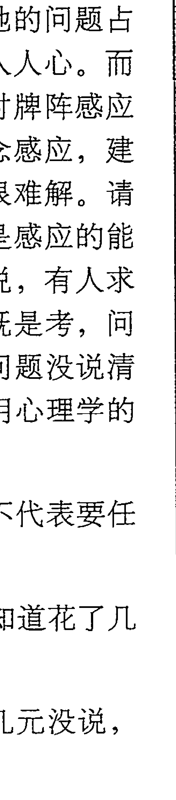
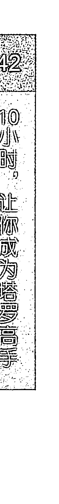

但行深知道她所谓的看图说故事的无奈，这也是许多塔罗学生的无奈啊！

行深又对她说，关于塔罗牌的运用，可教她三种方法：

- 第一种是以生日塔罗算特质，还蛮好玩的。  
- 第二种是不用占的，每一张牌都是一个启示，从观察中找乐趣，强化自己的想象力，也强化自己的逻辑运算能力，也是蛮好玩的。  
- 第三种就是行深认同的谘商，其中的占，是最不能轻视的，因为它代表了你对事情的态度，是一种高品质的生命态度。

> 行深说：“你可能切牌，就只是不经意地切牌，而行深为什么在进行塔罗占卜时，占经营有战车7，占技艺有钱币8，占感情有恋人；进行易经占卜的时候，占餐饮是鼎卦，占外遇是睽……总之，占什么就有很清楚的意象和对应？因为行深的态度与你不同。行深把问者的问题看得比问者重要，比问者冷静，比问者更有解决问题的热情，比问者更重视生命的品质，比问者更关心该事对问者的成长，至少当下行深是这样想的。”

说完，她激动不已，我心想，这个问题我还没说完。

> 行深又说：“切牌时，你的心，要清晰地定位。看桌面心就在桌面，看天空心就在天空。你的心要定位在你能解的最高品质上，即与能解此题的能量共鸣，与未来更高明的自己共鸣，与占、问者两心内的品质共鸣。瞬间做成这样的品质设定，再切牌！”

一说完，她泛着泪光说：“老师我知道了，我过去对事情的态度太随便了，我知道怎么帮助人家了。谢谢你。”

这就是切牌——可能也可以是解脱自在的设定。

### 5-3 发牌牌阵：拿掉切牌时的点数后摆设牌阵

切牌除了前面所说的注意事项之外，还要先想好要用什么牌阵，然后完成切牌。

切牌后，切掉的那叠最后一张，看一下是什么牌。有点数的，就照点数再把原来不动未切的那一叠，一点一点拿一张。十八点就拿掉十八张，然后把切掉的牌和拿掉的牌放在原来未动的那叠下面，以未被切过、拿过后的第一张开始发牌。

举例，如果切牌是倒吊者12，就拿掉12张再发牌。如果切牌是宝剑8，就拿掉8张，再发牌设阵。假如切牌是切到愚人和四种宝物的所有宫廷牌，就不用再拿掉牌，因为它们不是零，就是没有点数。

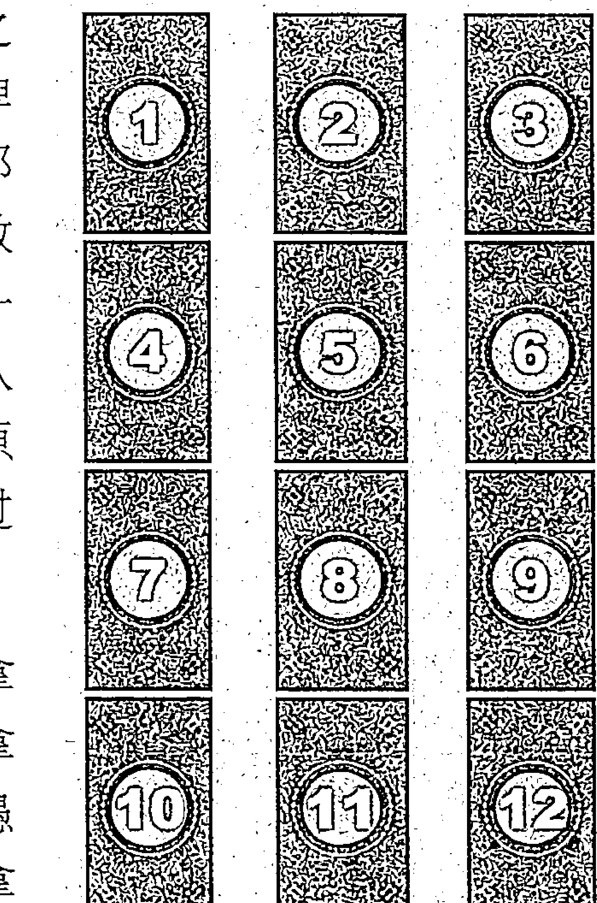

内在变数　外在变数　可能变数  
三合明晰牌阵：每列任选两张

本书提供四种好用的牌阵：“三合明晰牌阵”、“四界探索牌阵”、“六六易理牌阵”、“六芒星企划牌阵”。各牌阵发牌顺序如图：

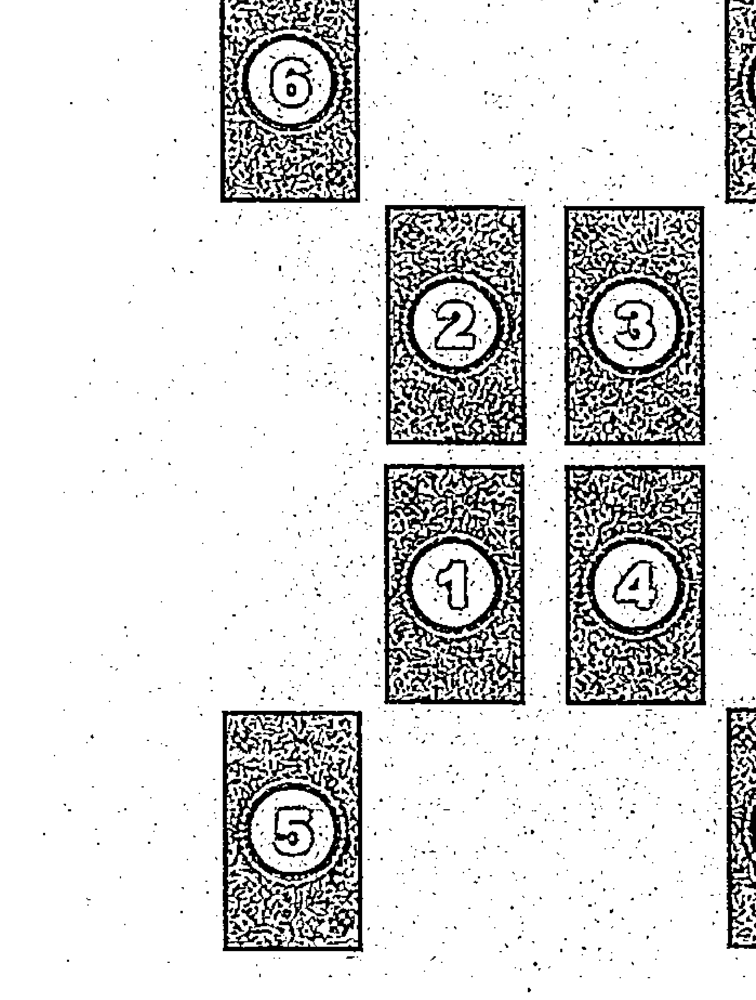

#### 四界探索牌阵

- 第1、5张代表欲望体  
- 第2、6张代表情绪体  
- 第3、7张代表理智体  
- 第4、8张代表精神体  

#### 六六易理牌阵

每列选出两张，36张之中选出12张。

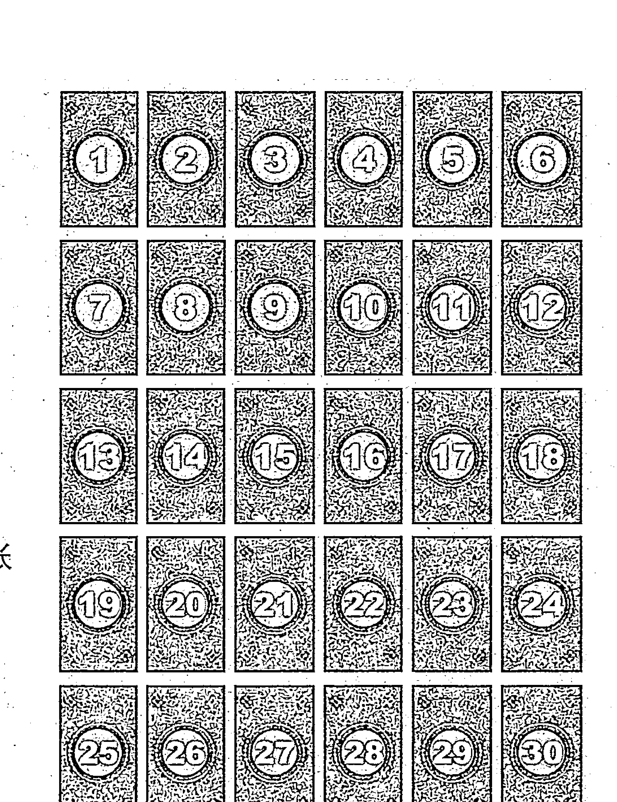

#### 六芒星企划牌阵

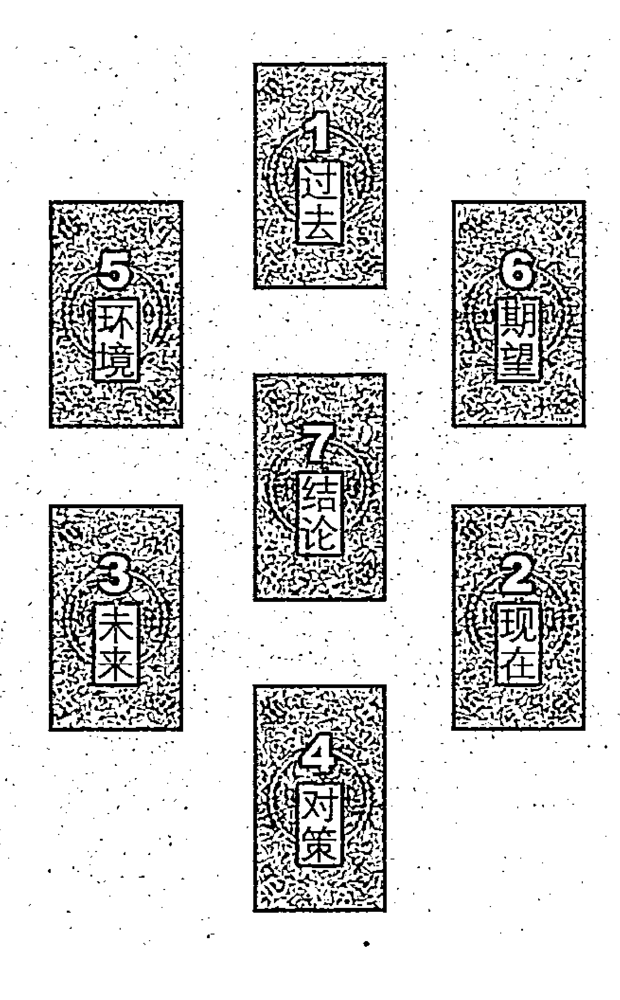

### 5-4 问者、解者都可翻牌：牌要左右翻，不要上下翻

#### 牌阵

牌阵设好了，不管是问者、解者都可以翻牌。牌要左右翻，不要上下翻。为什么呢？因为上下翻，牌就会发生一百八十度翻转，正逆位就会被改变。所以左翻、右翻都可以，因为这样不会改变到牌的正逆位。

好了，关于行深那位志工朋友所求的静思语，也该公布了。当时他全身颤抖，心灵被狠狠地刺了一下，但不痛。他感觉太恐怖，直接命中他的死穴，他当下惭愧到直逼觉悟的境界。

法师笑笑问他：“抽到什么啦？”  
他还在抖动的脸：“喔！对，抽到了。”言不及义。

法师还问：“是什么事啊？”  
他假装平静地看着师父：“喔！师父，我会告诉你，但不是今天，两天后，我一定告诉你。”

时间过了两天，他主动跟法师说起他的经过，说他是好人为何总是不顺，并告诉法师他自己的脾气相当不好。因为这位朋友已去当志工几天了，热情主动地工作，人缘极好。

法师就说：“不会啊！”

这位朋友说：“师父，你没看到我平常时，性子急乱发脾气不说，我认为对的事，就决不退让，还得理不饶人。我直刺朋友的要害，我认为对的我就说，即使伤害了他，也认为应该表达！”

他拿出抽到的静思语：

“脾气嘴巴不好，心地再好也不能算好人。”

他自己最引以为傲的所谓好人，既然不算！他真的是惭愧，惭愧！

接下来他到处做志工，说好话，所以跟行深说了这段经历。

行深向他比大拇指，赞赏他的勇气。也提醒他说：“行愿”与“观心”应并重。行愿是行心中所愿的美善之事，观心是观察自心的纯净、变化与性情。

许多人为善但不观心，容易沦为贪功之徒；观心但不行善愿，容易自私自利，无益社会。行愿者如能因其行感动之事、慈爱之情，而反观自心，悟性不远。观心者如能发挥所悟，力不藏身，一定可以利益大众，觉行圆满。

如不然，他所谓的领悟，只不过是空悟、傲慢、自私的行径，再好的体悟都与别人无关。

行愿请记得观心，如有机缘，也请提醒观心者记得行愿。

当下彼此点头深会，行深再送朋友远行。

行深说明这个，是要让大家了解，最简单的感应方式就是：心诚则灵！你要明说疑问、诚求方法、真实改变、勇猛行动，这才是感应诸象的正途。

接下来，行深以前面举的大学生爱情祈祷简例，来说明牌阵的应用。

大部分的人不愿重复看已观赏过的电影，因为剧情早就知道了。早就知道的这种人生有什么乐趣呢？大多数的人会觉得无趣。有点知道又有点不知道，才会有未知之美，也才会有探索的乐趣。

未来是有趋势可能而全貌未定的。每一个现在的抉择，都是走上未来的点。

你可以通过观察现在，来找到你认为的能获得美好未来的点。如果你找到了有利于未来的关键点，那这个三合牌阵就真的明晰了。

像是推理小说似的，牌阵常有一个谜样的开头，渐渐地重要线索浮现。有时你认为对的路线，其实是迷宫中没有门的墙。当你好像知道结果又不是那么确定时，这张牌阵的感觉就很像了。

牌阵咨询与推理小说最不像的是：推理小说故意制造疑点，而牌阵咨询不想制造疑点，相反尽量解决疑点。因此只要问者与占师用心，就能找到适宜的路径。

四个牌行深都用大学生近似掷筊的认真态度来说明，比较能够让你深入了解牌阵的运用。

阵里的魔术师1与权杖4逆位是第一柱，代表内在变数。  
愚人0逆位与钱币6逆位是第二柱，代表外在变数。  
恋人6与钱币国王是第三柱，代表可能变数。

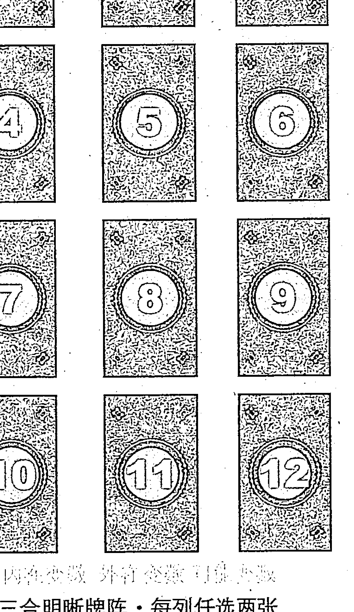

三合明晰牌阵 · 每列任选两张

第三柱上下牌的和数决定那一柱是关键主位。单数强化第一柱，双数强化第二柱。以此牌阵为例的话，上下加起来是6，所以此牌阵的第二柱为关键主位。

第一柱的和数为5，第二柱的和数为6，组合起来是56。对照前面的百数数组态势指引，为“能行能舍”。

对照后面的意象延伸易卦为：“蹇”。

讯息都对照好了，我们回想一下大学生的问题——被同一个女生甩了三次。其实不用占也知道不乐观。哈哈哈……但是你再高明的意见，如果没有共鸣度，也无法得到认同。

于是牌的意象成为寻找共鸣度的工具，又兼具探索未来的可能路径。有趣了吧！看看行深如何解析他的问题。

解析可从特写牌或整体牌相下手，因事而定，没有对错与好坏。

这牌阵的特写为“愚人0逆位”“钱币6逆位”，这两张牌要好好解释。别急，观察完整体牌相再说。整体牌相是“能行能舍”“蹇”，指导方向呼之欲出了。

所以，行深说：“你不需要太主动！”因为主动也没效，蹇啊！能行能舍，万一又发生被甩事件，才不会那么难过啊！有时候鼓励是一门艺术。

接下来行深说：“你有一股傻劲，太乐观了。”因为关键主位是愚人逆位，还有钱币6逆位这一张也是关键主位，但不及第一轮发的牌能量强。

所以整个问题的重点，就是愚人逆位，象征天真不思后果，比较容易被欺负。很多女生不喜欢太好欺负的男生，好人卡都要编号了。如果人太好的话，搞不好可编一部“好人卡塔罗牌”呢！

“你心里太要求公平性了。爱情付出严重失衡当然不好，也不会有好结果，但也不要像交易一样的公平公正啊！你看！”请他看钱币的天秤掉下来的葡萄……

“这么公平的交易，都可以多给了，何况是爱情呢？”

说到重点，大学生脸一阵白一阵青。

“虽然你也尽力表现了——魔术师正位；她也不是不喜欢——权杖4逆位；但学生有学生恋爱的方式无误——恋人牌正位；但你要懂得运用资源——钱币国王。谈学生该谈的恋爱，难道大学生活就只是恋爱？”

又导入整体牌相的“能行能舍”。

“难道没有其他的想望？你要不要认真想一想大学这个阶段的安排？”

鼓励思考未来，当脑想清楚时，脚才动得了。

我看牌阵当中缺乏宝剑和圣杯，我便补了一句：

“你不但爱的决断力不够，而且没有分享你们各自的生活。”

当然行深没全录下这牌阵的所有指导，因为光这案例的对话，就可以写一本小说了。所以只择部分，以方便你们学习。

人的感知与表达系统很复杂，四界探索牌阵就是去繁为简，把问题于人的层次分为欲望体、情绪体、理智体与精神体。通过牌阵与问者一起来发现自己，改变自己。

这个牌阵只是简单的检测问者的心理层面问题，不适合拿来分析预测性及选择性问题。

- 欲望体：是人的欲望，代表事的动机与渴望  
- 情绪体：是人的情绪，代表事的表现与掌握  
- 理智体：是人的心智，代表事的规划与方向  
- 精神体：是人的精神，代表事的目标与价值  

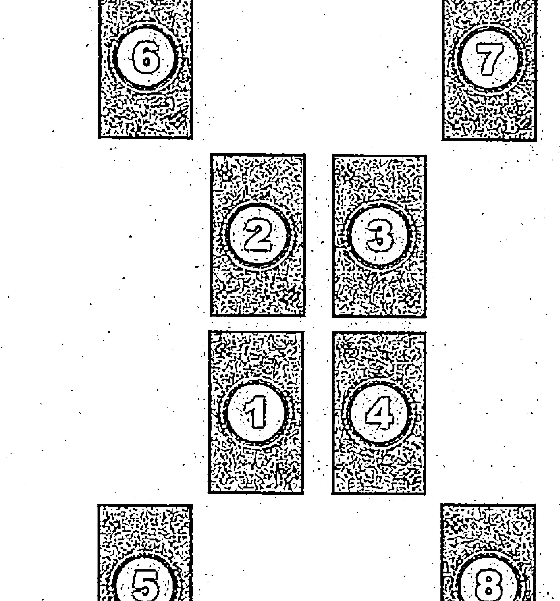

- 第1、5张代表欲望体  
- 第2、6张代表情绪体  
- 第3、7张代表理智体  
- 第4、8张代表精神体  

当大学生反思这段感情时，我开始引导他从这段感情来发现自己。

于是他问：“我想再问，这段感情到底给了我什么样的启示？”

四界探索牌阵与三合牌阵不一样的地方，在于它不设关键主位，每一界的位置都等量。

第一层是发牌顺序的1、2、3、4，代表较接近现实意义；第二层5、6、7、8代表自己的心理投射。

从第一层观察哪一个体出问题：欲望体OK，情绪体需要调整一下，理智自己觉得不优，精神也还好。

再看第二层，就精神体宝剑3比较突出。虽位置不刻意强调轻重，但这张牌为自然突出，要强化解释。

“想交女朋友是自然的欲望，她应该也是你喜欢的类型。钱币侍从就是主意原则的中道，圣杯1表示想望也OK。欲望的层面，你处理得很好。”

当行深这样说时，大学生点点头。

“情绪上你时而失落，时而掌握，可能是因为她对你忽冷忽热吧！你们约会的次数不多吗？你对她有些怀疑！”

权杖4逆位表示休闲不足、多疑不安。还好钱币皇后掌握了自己，没有使心情的低落过度受伤。

“你理智上觉得你们越来越没希望。为什么？”我反问大学生为何这么想。

“就……感觉比较淡。啊……反正也好几次，算了，不怕了。”大学生傻笑。

行深也跟着笑，谘商师不能太夸张。

“也对！珍惜你们现在所有的吧！你很欣赏她？你还有期待！”

理智体外层有一张钱币9，内层是星星逆位，表示期待着未来。

“你心里还真矛盾啊！”

“是啊！至少现在大家还是朋友嘛！”大学生故作轻松。

重点来了。在行深看来，整个牌阵的重点就是精神体：正义正位、宝剑3逆位。

“现实与你的期望落差太大了。一方面想好好谈个恋爱，一方面你又无法确定自己的情感。欣赏不等同爱。精神层面，你只是要求公平的对待；而精神的另一层，你很难过，甚至想伤害自己。”

还好宝剑3是逆位，又有正义牌拉着。

“其实不要对自己没信心啦！每个人都有适合的对象。这段感情就当作学习，你也从中得到了一些快乐，不是吗？”

“只是喜欢，既然自己都不确定是很爱，不管结果怎么……搞不好不久分了。”他半玩笑半认真地点了一下头。

“尽力去品味（圣杯1）爱情的丰盛，从中改善自己的不安（权杖4逆位）。不管怎么怀抱着希望，至少是一种成长。然后最重要是不要看坏自己。有错改进，但永远不要看坏自己。”

行深语气突缓：

“要看好自己，这么好的人。我想你帅帅的条件，应该你是好人卡发卡中心才对啊！你怎么会缺好人卡呢？”

建议的话没结尾。

“哈哈哈……”两人相视大笑！

大学生看着我：“哈哈……好，我知道我的问题了。奇怪，为什么我会处于挨打的状态呢？我对爱情掌控不好耶！”

行深半玩笑半教训：“什么不好，怎么会？是很差！哈哈……”

“是喔！好，我可以再问一下，如何增加爱情的把握度及主导权？”

“可以啊！”行深示意大学生一起探索，“未来……自己用！”

#### 大学生问：如何增加爱情的把握度及主导权？

这是策略性的问法，于是我用气象万千的六六易理牌阵来指引他方向。结果牌真的是直击要害，不只让他发现自己，也指引出男女相处之道。

第一列代表资源：  
魔术师1逆位、钱币皇后。（发牌顺序1、7、13、19、25、31的这一列为第一列）

第二列代表角色：  
恋人6、皇帝4。

第三列代表态度：  
宝剑侍从逆位、隐士9逆位。

第四列代表机遇：  
钱币5、主教5。

第五列代表方法：  
宝剑2、权杖3。

第六列代表价值：  
权杖1逆位、宝剑骑士逆位。

此牌阵河图百数数组的算法：超过两位数的，就留个位数就好。

第一列和第四列相加，代表数组的左边。  
第二列和第五列相加，代表数组的右边。

以此牌阵来算：

第一列和第四列相加为11，留个位数所以是1。  
第二列和第五列相加为15，留个位数所以是5。

数组15之整体牌相指导词：减少贪求。

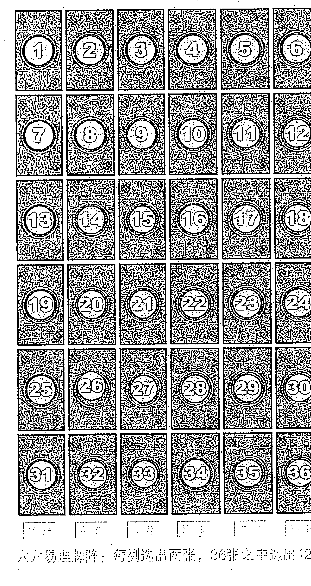

数组意象延伸之整体牌相易卜：损。  
（还有一个隐性的卦，为：家人卦。学易较久者可观出，这里就不说明了。）

这种牌阵，不是对牌义相当熟悉者，不要用。因为复杂，有的人看到这牌阵都呆了，不止是问者，连占师自己都呆了。

“你们的约会品质落差太大。”魔术师1逆位、钱币皇后价值表现不对应。

“是恋人，不是皇帝，怎么想谁掌握谁呢？”第二列角色刚好是这两张牌。

“恋人像是家人一样，但没有家庭的责任，所以是不用控制谁的。”

“你的态度既然像护花使者（宝剑侍从逆位），为何又想当心灵导师（隐士9逆位）呢？她可能没有需要你开导的需求。就算你想开导她，也不要做出一副老师的架势啊！”

刚说到这里，大学生就插嘴：

“你怎么知道，真是的，我的心里真的是这样想的，哈哈……”

他有点会意地笑，也有点苦笑。

我说：“不仅心里想，你的态度也已经表现出来了。”

接着我又说：

“你们见面少，你又太注重心灵层次。或许你们可以转化为心灵上的朋友，不过（钱币5）我想你做不到，应该也很难做到！”

大学生点头。

我继续说：

“其实每次分手，你都只是在忍受地接受（宝剑2）。你懂在那里无法反应，你没有做出该有的反应。你没抗议，你只是说：好啊，就这样。”

“没抗议，至少用讨论的（权杖3）可以吧！大哥。”

我叫大学生大哥时，大学生继续苦笑。

“啊！你用心度还是不够，这根本不像你啊！你的头脑这么灵活（权杖1逆位），却没有与她好好沟通！”

这时大学生插嘴抗议：

“有啊！这次我有叫她想清楚，如果还要交往就不能三心二意啊！”

“不错嘛！”我微笑着鼓励，差一点拍手！我尽量让鼓励的感觉停留久一点，然后才说出——

“但是……还不够（宝剑骑士逆位）！”

大学生也点点头，行深我也点点头，然后准备给他最后一击：

“你还不懂分享爱！”

牌阵中没圣杯牌，所以提醒他要注意。

“当你热情付出时，你也快乐不是吗？越不想求回报的人，越让人怀念，使人愈念愈恩，何况是爱情呢？越不贪求，心越宁静。付出后不在意，热情后不计较，越是不想掌握对方的人，爱情的主导权就越要落在他的手上。”

“不是叫你不在意她，而是不要在意她回报你多少。只有这样，你的自主性才完整不缺，你才更有吸引力。”

“越追越跑，付出后定住，该你的就是你的了。如果不成，至少也学到了如何爱人，不是吗？”

## 我建议大学生再问一个强化恋爱品质的问题，以免以后还有同样的问题循环。

此牌阵的河图洛书百数组算法是：把发牌顺序1、2、3点数相加，代表数组左边的数；超过两位数，就留个位数就好。把发牌顺序4、5、6点数相加，代表数组右边的数，同样超过两位数，就留个位数就好。

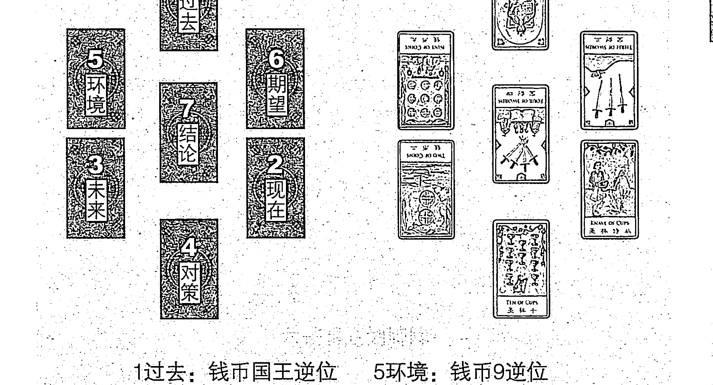

- 1 过去：钱币国王逆位  
- 2 现在：圣杯侍从  
- 3 未来：钱币2逆位  
- 4 对策：圣杯10  
- 5 环境：钱币9逆位  
- 6 期望：宝剑3逆位  
- 7 结论：宝剑4逆位  

发牌顺序1、2、3这一组和数是2。  
发牌顺序4、5、6这一组和数是22，留个位数2。

百数组22的整体牌相指导词是：分享喜悦。

数组意象延伸之整体牌相易卦是离、坤两卦。

“怎么样？”大学生好奇地问。主动学习是好事。

“一起来看牌。过去，钱币国王逆位，施恩不居你做了几分，你要求公平。”我知道他已打开心门，可以听用力一点的话了。

“我知道了。”他点点头。

“现在，圣杯侍从。经过了几个牌阵的分析，你比较懂得分享了。”我接着说：“未来要注意品质交流（钱币2）！爱情对策是要了解，恋爱是一场正式的演奏（圣杯10），要调好每一根弦。太松无力不成调，太紧尖锐，不但不优美，而且容易断弦。”

“对喔！”大学生拍了一下大腿说。

我继续说：“你们的生长环境与现在所处的系列虽区别很大，很难建立默契（钱币9），但还是要加强沟通与交流。你的期望与之前进行‘四界探索’（也代表精神的那张牌）一样，都是悲观的，彼此表达不够清楚。不要急着要承诺，而是要彼此进行沟通。”

大学生说：“是啊！有时她要叫我陪她散步，我甚至逃学都陪她。我问她要不要吃饭、看电影什么的，她都说忙，也没有说什么。”

我说：“你看，结论是宝剑4逆位！”

大学生说：“什么意思？”

我说：“意思就是你们不懂得忙里偷闲，不懂用恋爱来丰富彼此的生活。要彼此鼓励，不要相互猜忌。恋人要分享兴趣、感动和爱的品质。恋人不是人质，不能用心把对方绑得死死的，应互相关怀（离），互相包容（坤）。然后，让彼此在生活中活出最美的品质。只有这样，你才能因爱而丰富（分享喜悦）。记住，你们是恋爱，不是烙爱。彼此要放心、安心地爱，使自己的心灵更宁静而感动！同学，什么叫宁静而感动呢？”

我问他，结果他走近我，用手搭着我的肩，跟我说：“老师！你为何不到处演讲呢？”

换我一脸茫然，睁大眼认真看着他。原来年轻人也会眼眶泛着泪光啊！

“没有啦……谢谢你！”大学生放下搭在我肩上的手，握着我的手。

我心里庆幸，暗自低喃：“还好，没有十指紧扣！”

---

## 发光第七秒时  
看见自己心中的阀

---

### 7-1 不要站在塔罗牌咨询师的立场

许多找行深咨询的人，我会与他们先聊几句，让他们卸下心防。最简单的方式，就是向他们表明，所谓的塔罗易经咨询，只是帮助解决问题的，不能迷信。我们一起来看清怎样补足认知的局限，也许一些意想不到的惊喜，一些可行的创意就发生了。问者通常会比较愿意看看接下来要玩什么把戏。

如果是艺术家、作家、老师、医生、教授、极专业的人士或老板，这些人相当有自主意识。自主意识强不是坏事，因为都是聪明人，话不用多就理解了。但他们往往觉得被剥夺了自主权，其中以艺术家、作家和教授最明显，也会告诉你被自主权伤了。几次下来，有了深层经验，我会告诉他们：你们的自主权没有被剥夺，我的意见只是你自主权其中的一些情报罢了。就好像董事长请顾问，顾问没有权利帮董事长发布决策，相反，决策权永远在董事长身上。这些意见他们可用可不用。这时这些人就真的可以好好来谈问题了，因为他们已经把干扰处理问题时的心理情绪消除了。

所以塔罗易经咨询，不是宿命或命定，不是吓唬人一定要去遵循。而是让问者愿意把问题摊开来，一起研究，用所感应的丰美意象，为自己找出一条活路，并从理智认知的问题解决中，看见自己真实的情感与想望的价值。

然后，我们请他用笔把他自己感觉比较重要的几个问题写出来。有时看到一些问者写了十几个问题，花了一个多小时的咨询时间。我真的不是神，恐怕也无力解决。我会从问题中快速找寻相关性，从而用几个代表性的问题来探测他的心灵，看是人际相处的问题呢？还是经济问题？或是个性问题。

找到关键问题，就能把混乱的心理理顺。

记得理顺的流程：先放松，让彼此情感有些交流，告诉他这是帮助，不是权威，是解决问题的，不是制造问题的。有些越问越恐惧，就是什么冲、什么煞之类，有的人真的很怕遇到这些。所以要说明感应、想象都是帮助理解和解决问题的。然后，把问题摊开，但不是散落一地。等真正的问题出来后，就可以找答案了。

从主要问题开始抽丝剥茧，一颗纯净的心灵就能一跃而出。

---

### 7-2 看见去、来、念的脚步，踏得安心

多数的问题都与过去有关，因为人的生活与感知是连续性的。有些人不太愿意谈过去，使得一些陪商解析者就没辙了。

其实，行深的经验是，大部分人都愿意谈过去，但真的有一些人不想谈。我的方法是把焦点拉回问题，所有问题都有过去惯性的影子。不同人会产生不同面向的问题。

大部分的问题，都有沟通不良的情形。亲情问题是关于情绪松紧、关怀多少的问题；感情的问题是最复杂的，不能一概而论，但大部分是关于彼此给予、忠诚度和期待落差的问题；工作的问题，其复杂度仅次于感情问题，不过说穿了就是有关钱的问题与是否适任的问题，以及他有没有力量改变现状的问题；再看修行的问题，大部分是关于找寻不到宁静的问题，以及关于寻求心灵成长方法的问题。其实也是各类问题的根源，牵扯到情绪维度不放、自由度与安全度调整的问题。情绪维度不放，就不能体验更大的自己；情绪思维全放，就无力抵抗世俗的价值洪流。不管如何，都应以不要伤害自己为原则，安全自律，不要常常不快乐。

有时朋友或自己的负面情绪一来，光靠自己或别人的热情是不够的。

负面情绪难处理，是因为它有不规则的接触面，热情的光直射。

当一个人看见自己应该被照耀的部分时，也就是他蜕变成长的时候。不是转换环境，就是改善环境；不是转换心境，就是调整心境。愿意成长改变，自然会对未来有好的想望。虽尚未解脱困境，但面对困境时的感知已经与往日不一样了。

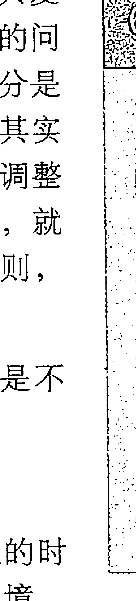

---

## 7-3 发现内在的光 深心感动的方向

前面提到看见改变的点。一些愿意真心帮人解惑的人，常有一个困惑：我都给他了，为什么他无法领会呢？

他遇到的问题先别谈，先谈谈你给他的。贴心、耐心、有力的爱，才叫爱！不管他是否感受，是否愿意等候。

假如你给他很多很多的好，比如你开心地朝他撒了二十个铜板，请问他能捡到几个铜板呢？

请你想一想，结果如何呢？能接到几个的算不错，被砸到的算倒霉！也就是说，要给，就要等对方打开双手的时候好好地给，不是我行我素地给。

其实，当你愿意以顾及彼此的感受，进入对方的心灵世界时，你就有能力引导他自己发光了。

我们要从他的问题中，看到他坚持的是什么，再从他所坚持的这些事物中搜寻其蕴含的价值。告诉他，这些才是他要的。而这些价值如何化成爱的品质呢？请他问自己：这些价值中有哪些是做了自己也不会感动的，而又有哪些是会感动自己很深的？那些不感动自己的价值先别管，先把那些会感动自己的事情捕捉起来，那就是你内在之光的来时路。循着光的方向，你就能找到光的来源。当你觉得迷失、觉得失落、觉得没有力量时，只要回到那个源头，享受内在之光的洗礼，就又会焕然一新，用最美的姿态发光。

---

## 7-4 倾听内在的声音·成为你想成为的自己

引导问者发现让自己感动的方向后，离他能随时回归内在之光的源头，还是有一段路要走的。这段路看似回归，也似前进。当你真正想做什么事来彰显自己的光与爱时，其实也是回到心的源头的时候。只是有的人从车站的前站回家，有的人从后站回家。

引导别人前，先学会引导自己。

有时你会听到自己不满的声音；有时听着自己内心幸福的吟唱；有时内心宁静得出奇，只有风轻轻拂掠；有时内心在狂喜叫喊。你用心倾听，那都是你自己。

在静心观察自己时，有种人相当可惜：心虽像是自由解脱，实则是在任由流转。知道所有的感受本来也是空空的，都是自己的体验罢了，就认为感受也如同椰子。但如果真像椰子一样，那你会连椰子壳、椰子仁、椰子水一起吃吗？不会！何况椰子壳可以雕琢装饰做用具，椰子仁可以做饼干菜，椰子水可喝、可蒸、可炖、可特调，它们都是有不同用途的。

所以，当你静心看见自己时，你可以选择一切随风，也可以随风而有方向，更可以不管顺风、逆风，都跑出自己生命最美的品质。

你不能决定风的方向，但你可以决定心的去向。

人生本就有许多无奈的事。如果你说没有，那我猜你才七岁。我大大的赞赏你，因为七岁就能看懂本书，又能提出反驳是了不起的。真心生活的人，用心行愿的人和真爱过的人，都会有无奈的事。但这些都不能成为阻止你自己成为自己的理由。（这一句，够绕舌吧！）

静观自己，一定有一种声音是你想跟随的，一定有一个方向是你想前进的，一定有一些你很想去做的事。去做吧！没有人可以限制你到什么境界，如果有，也只有你自己才能限制你的心。

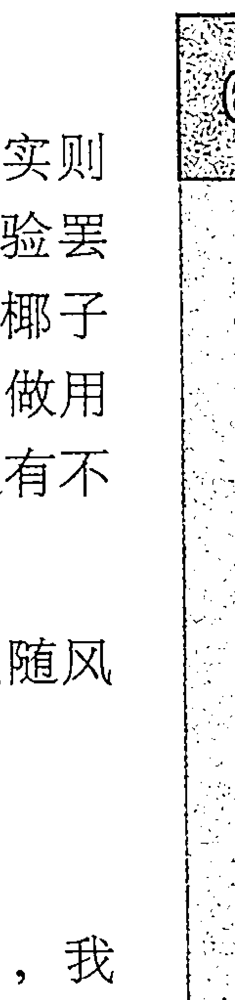

---

## KNAVE OF BATONS  
权杖侍从

---

## 发光第八小时  
## 开启未来价值之门

---

### 8-1 情报不足时的企划：事件定义要导向人

再来谈谈咨询时，事件情报不足怎么办。行深的学生中，有些是名咨询师，他们问我遇到开放性问题时，我是怎么处理的？尤其是情报不足时的开放性问题。

我向他们举了一个实例。在说实例之前，我先跟他们说：情报不足的开放问题，有一个处理原则，就是要引导当事人面对自己真实的情感。

有一名硕士，不，是准硕士。他由文系毕业，在研究所念音乐治疗。硕士考试在即，又要参加教师甄试，很是两难，因为现在的教师甄选名额低、竞争高，很难出头。

我问他硕士论文及口试那些准备得怎么样了。他说差不多了。我就说那把十分之六的时间给教师甄试好了。他说教师甄试很难，要准备很多才比较有机会。接着他又说：“当然最好是全省都考，但时间不够，我怕到时候硕选没上，硕士又没过，惨了。”

我跟他说：“既然这样，时间分配就一半一半好了。然后，全省挑几个县市来考这样好不好？”

他说：“好啊！如果要挑三个，要怎么挑呢？”

我说：“哪几个县市比较好？我看用牌阵对象来感应的思考会比较好。”

他说：“好啊！开始——”

我说：“慢着，感应不是凭空感应。就算我能凭空感应，我如何化为指导你的方向语词呢？因此，请告诉我，你为什么要当老师？”行深想从他的情感面去连结，这样牌阵出来比较容易联想，而且感应的频率也比较对应，因为已借此打开他的心了。

他说：“其实很矛盾！如果参加国中教师的甄试，我相当有把握。本来我想用我所学的知识去引导一些学生叛逆的心灵，但我又觉得当高中老师待遇比较好，也有不同发挥。”

我说：“很好，很诚实！但……你没说你为何要当老师啊！看你这样子也不像是为了铁饭碗而考老师的啊！”

他说：“其实我妈在澎湖当老师，我们是澎湖人。我妈想如果可以的话，让我回澎湖教书。”

我说：“那很好啊！那你自己呢？怎么想的？”

他说：“其实都可以啦！在澎湖当老师也很好啊！”

我说：“那好，我们可以开始弄牌阵了。”

因为我已经看到他关怀的点和爱的方向了。

咨询到最后选了三个地方甄试：一个屏东，一个台中，一个台北。台北是我强烈建议的，因为在台北以后要申请澎湖应该比较简单，而且从环境方面来说，对以后服务的学校与学生都好，对他自己也好。

牌阵卦象也跟我们想的很吻合。唯一跟他想的不吻合的是台北，因为台北较难考，但牌的指示在这里成长最大，所以他接受了我的建议。

最终，我从情报不足的开放性问题中，还是拟好了全盘规划。

结果，他硕士考上了，台北的某高中甄选也考上了。最近听说已调回澎湖了。

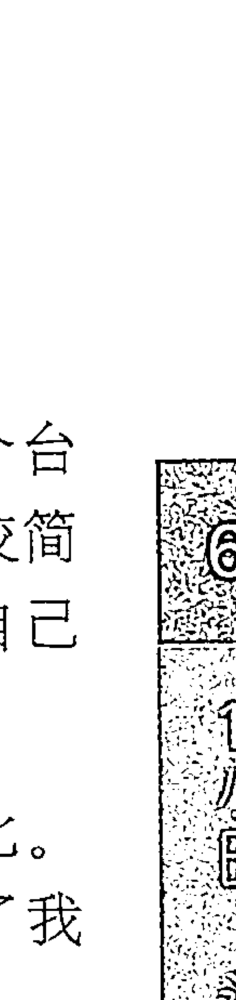

---

### 8-2 再度确认：别想从世界地图看清高雄市的苍茫

有的问题单纯，一个卦或牌阵就已能建立足够的参考点。有些问题有延展性，就必须另起牌阵深入分析或拆开细节。因为很有可能还有意识的意象推理很好，问者却喜欢另一种选择，但问者自己也知道自己喜欢的可能没把握。因此需再度确认哪里已经想清楚了，哪里还需再看个清楚。

有一个餐饮业的老板，五六年前找我看一家店，月租十六万，他已签约了。不然我会请他不要租。该店一楼及地下室大概一百多个位置，他要做欧式“吃到饱”。但两个楼层都不够高，柱子也很多。我认为做“吃到饱”式不好，因为一楼不是很大，而两个楼层都摆菜台成本过高，应做套餐之类的，因为原先的格局有一个菜梯，格调也吻合。

结果他还是开始做“吃到饱”的餐厅。他女儿也给他投资三百万，私下问我多久资金能回收。我预估了一下后跟她说，资金应该不能收回了。我说以每月来客率乘以平均消费额，这钱不太够应付人事、物料及房租。

她说：“那怎么办？”

我说：“除非改变营业形态！”

结果五六年来营业形式没太大变化，惨赔上千万了。

还有一个老板，去年五六月找我看店，是一家月租五万、面积二三十平方米的店，想着开个什么餐饮店。于是我用牌阵来做咨询，以建立更强的共鸣度。本来他想做面食店，但牌阵普通，不过引出还有新的可能。我又用牌阵问了一些形式，都不了了之，因为他没有很喜欢的。我建议他剖析自己真正要的是什么。

他说不想那么忙了。至于真正要的，他说：“我喜欢开一家没有菜单的店，每天我亲自下厨，客人来就由我准备菜色。”

我心想这店还真的好，是一种人性的浪漫。但谈商业头脑要清醒。我问他一天想做多少营业额，他说：“一万五。”

其实也还好，要求不算太高。但以他准备的形式，即便真的达到这个目标也不会超过很多。小规模的面食、两个人做的自选式菜色，牌阵都还好而已。

他说：“不然在门口卖便当，补足一些营业额。”

我说：“那倒不如做称重的自助餐。”他们以前曾在这个地点不远处开自助餐。

他说：“我们就是不想做称重的自助餐，才搬走的啊！”

我问：“你们搬走前日营业额还有多少？”

他说：“那时候已走下坡了，一天剩不到三万吧！我不想做那个形式了。”

我评估了一下，那个店可能要做称重自助餐的形式，才有办法赚到他们需要的开销。于是我根据牌阵说：“你不是要给客人惊喜吗？难道你不会用现在能做的方式给客人惊喜吗？品质一样啊！我们现在的开销及资源就是这样啊！”

说完他恍然大悟。虽然不是他最喜欢的，但是他还是问：“真的这样做比较好吗？”

我说：“在没打广告的前提下，大概每天就能超过你目标的一万五了。我估计每天三万！”

结果在没打广告的情况下，开业期间超过一千人次，蜜月期后还有五六百人次。

以上看来，复杂度高的问题，别想只用一个卦或牌阵来弄清楚问者自己的真正价值与可行策略。再度确认，才能看得清楚。

---

## 8-3 拿掉僵化的框架，深度企划力

名画配名框，好东西要有好包装。

框不是不能有，但是框如果不能衬托出画的美，那就不如不要。当你学塔罗一段时间后，你对牌义已经非常熟悉了。对于每一张牌你就会有一定的认识与惯性想象，这会使你快速地理解牌义。但当一切有了惯性，你可能就会忘了灵活性。所以，行深先提醒你别忘了灵活性。

这个灵活性是什么？就是牌与事的第一感觉性联想。是感觉性，非完整思考。不要用惯性思维把这个第一感觉性扼杀掉，而是让这感觉性在解析事件、分析问题时，变成可以顺畅带入深心的力量。

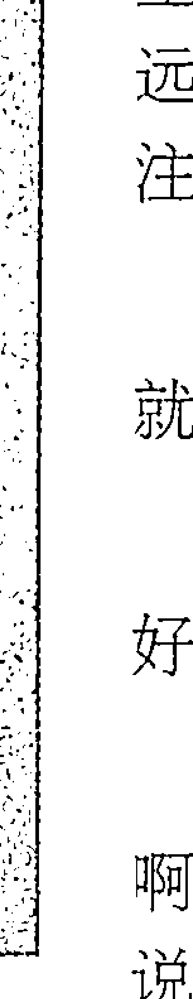

当你可以感到这个力量时，你就能把这股新的力量带入你的企划里面。不让破旧的框、僵化的框，阻碍了企划的格局。请记得，你永远有重新省思每一张牌的权利，你永远有能把人生体会的价值性注入牌义里的权利。

如果说理性心智是你的骨架，情绪思想是你的皮肉，那感觉性就是你的神经。

有骨无皮肉，再健康的骨也吓人；神经灵敏但裸露皮肉之外，再好的神经，别人也不敢恭维。

学生问我：“老师，为什么每次看你解同一牌，都有些许的不同啊？例如宝剑3，你有时说清楚地表达但不要伤害他人；有时就说表达时要圆融，理圆气又和，不要得理不饶人；有时就说不要太伤心，事情总会过去的。老师，为什么？”

我说：“因为事情不一样啊！所问的人能做的也不一样啊！但总是有主轴，对吧！老师上课时所说的例是义，不是不能做的法规。例如我示范鱼香茄子的煮法，因为很多人吃。要不然，我们也可以吃烤茄子、煎茄子、红烧茄子或炸茄子啊！你看喔，茄子（牌）是原料，所以料理（解释）不离茄子。因口味（人、事）的不同，而口感（指向性）也就不同啊！”

学生说：“了解了！今晚我要煮咖哩茄子。”

---

## 8-4 自心临场价值·预知力的翅膀

行深象外。

解决问题时，除了厘清问题、找寻能量趋势、连接相关意象外，最重要的就是想象力。

想象力可以天马行空、无所不能。先把想象力放出来，让它飞一下，然后停在深心感动的点，与第一感觉性融合。它几乎就可以为你描绘每一条你将选择的路径，尤其会导向较高价值的那一条道路。

例如开一家艺品店，除了准备资金、市场调查、店面装修等等你已经想到的企划后，还要重视所谓深心感动的点，即你因它而把能量扩大的点。这个点可能是一座达摩的雕像，可能是一对水晶天鹅，更有可能是“哇！这喜怒哀乐陶土娃娃，是谁做的啊？”一句令人喜欢的话。

这个点，就是你感觉的点。从这里飞出，然后与你掌握的一些信息拉出一条一条的道路。

当你用心想象，或用意识去感知每一条已成为路径的道路时，那种感受、那种价值，就是想象的自心临场价值。那种路径的顺畅度、临场的成就感和价值感，几乎能在想象的描绘中抓住一件事物的精髓。

这种感觉，就是深度企划力的延伸，是想象力找到的明晰路径的临场价值，也是预知力的翅膀。

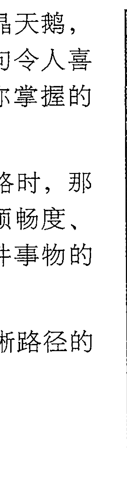

---

## KNIGHT OF CUPS  
圣杯骑士

---

## 发光第九小时  
暗光深层认同

再来说，每个人出生时哭声都不一样。有的急，有的慢；有的小声，有的大声。似乎人在出生时就有了明显的哭喊。哭声响亮而长，做事有魄力；哭急而短，满怀热情但容易虎头蛇尾；哭哭停停的，为人敦厚；哭声小的、不喜欢哭哭的，温良恭谦；哭得快、停得快，很有主见，掌控力强。

这些禀赋、遗传，以及出生季节与环境，都是人的出生第一印记。这些印记都有其影响力。也因此，才会有家庭教育、学校教育以及社会上种种教育的进步。人类知道，我们人的身体、头脑和心灵，都可以不断输入新的印记，来强化生命力的丰富性与发展性。

长大一点后，则“诚于中，形于外”。每个人的内心感受、思想情绪，多多少少会流露在外在的层面。

又大一些后，“人看起来，树看年轮”。一个人的志向流露在他的神韵与姿态中。从外观可断一二，但最好要交流才能更了解。

又大一些些了，“人不可貌相”。不要从外观去论断一个人，要从心量、志向与他的贡献去看。

你会说：长大一点、一些、一些些，到底是几岁？

您……误会了。

一点、一些，不是指被看的人，而是观察者成长的累积。

观察者发现，只要存有觉知期许，就很容易为自己的人生建立强而有力的印记，或是优雅自在的印记。

所以，自我期许是改变命运的基石；而启发性教育是改变命运的杠杆。

人是生命的容器、情绪的容器、思想的容器，也是价值的容器。

人的个性是空的。做美好的事，就感受到美好；做邪恶的事，我们的心就感染了邪恶。但每个人都有仁爱的本能。对自己的小孩、对自己养的宠物，自然会用心付出。看见小孩子摔伤了、小猫被卡车压到了，我们有不忍、不舍之情，这是人的善之本能。

所以，人性可善、可恶，而大部分往善的方向发展。善恶都只是……基本的价值观，重要的是你自己要如何表现，如何演出，彰显什么样的品质。

如果你学习你喜欢的品质，你就是人生的编导。

如果你尽情地投入演出，你就是人生舞台的最佳主角。

如果你会创作，能欣赏，可入戏、可出离，那你就是心灵的主人。

### 自我

当我们为朋友在咨询时，如果想要更好的结果，而不知道怎么做好，你就可以告诉他：“你的想法，正影响着你的经历、体验，而你的经历将影响你的未来。”

新的期望会影响到你对注意力的使用。例如，在同一座山林散步，你想要体验山林宁静，你就走上幽谷小径，看着潺潺溪流，踏着水中倒影，走出一线天峡谷。假如你体验山林的生态，你会看见蝴蝶飞舞，观察花草争艳，发现新的树苗。假如你体验山林浪漫，你会走上落叶步道，感受林间光影，听林间枝叶轻声说笑，听见鸟儿与风唱和。假如你想体验山林自然，你会感受土地无声的律动，裸根之树坚韧的生命之歌，葛藤缠树，风追逐着云。假如你想维护山林面貌，你会看到宝特瓶、废弃烤肉网架，甚至听到老调又大声的卡拉OK，感到你所有的不OK。

什么心看见什么世界，感动的心体验感动的世界，爱与美的心经历爱与美的世界。你因世界而存在，而你的世界也因你而存在。

当你领悟信念的力量与想象的魔力时，就是你决心幸福的时候。

当你决心幸福时，你可能会感觉月亮什么形状都美，小狗对你微笑。

你也可能看见你的障碍，小鸟空投“米田共”在你的爱车，出门时皮鞋的好朋友——狗屎常与你打招呼！为什么？那很可能是你过去心中不自觉的负面期望。你看，也都应验了，不是吗？

不过不要怕，你如果决心寻找幸福，就会使那些不属于幸福的渐渐远离。

### 无法

深层认同，大都是因为内在价值的不和谐，选择这个价值，而那个价值在抗议。至于如何做价值调和先不谈，我们先看看价值的选择。

当两种价值相当时，你会以什么当做抉择的标准呢？

自己无法做选择时，通常会求助他人，或者再度静心思索，然后做出抉择。例如说选修什么样的科系？这是很多学子的难题。解决这个问题再简单不过了。其实只要先想想自己拿手的是什么？兴趣是什么？大概能考上哪里？几乎就解决一半了。然后，再想想行业、别人的人力需求与自己想研究的项目，想清楚后差不多就能做出选择了。

如果还有问题的话，可能就是能力不足而兴趣有余了。也就是想读或想做的事，超过自己现有的能力，也缺乏该有的资源。假如是这样的话，如果选择以兴趣为主，那么你就得更努力地培养能力，更用心地累积资源。当然，能综合思考自己的兴趣、能力、资源与自己的独特性后再做出决定，是最好不过的了。

这样看大概就能知道如何选择了。

> “还是不太看得出来耶……”

> “什么？没看出来！好，好。简单说，就是你愿不愿意为价值较低的价值付出努力！你又能做到什么程度？”

这个问题想完，不管选择哪一种价值，都不会后悔了，而且认同层面就更深了。

价值的选择应避免矛盾的方法，就是应该自我沟通，如此才对啊！

你会问：“那又如何使价值更和谐呢？”

我会答：“这个问题比较难，但答案更简单，让它们看着更高的价值。”

你又问：“那什么是更高的价值呢？”

我会答：“成为更是自己的价值，或是想要彰显你心中最大愿望的价值。”

你会说：“喔！不懂，才怪！原来是用更大的画面来看自己啦！”

我会说：“那接下来呢？”

你会说：“还用再说，就做咯——”

### 人生的贵人

> “你紧张有什么用？别紧张！”

我们可以比求问者更关心他的事，因为我们要看清楚事情的关键。但你不能因为这样，变得比他还要紧张啊！那是不是最后由他来安慰你呢？当然也可以，回馈嘛！只要你确定这样的态度对他有帮助。

> “不要太相信混乱者的耐心！”

行深辅导过一百多家餐饮店的开店流程，有大约三分之一的投资者，开店前他们都说不急。他们这样对我说：“林老师……”

请各位放心，店还没开他们不会骂我。行深姓林。

“我准备的资金够一年，半年没赚钱没关系，这个我知道，餐饮业嘛！你放心，我不急。你发现什么问题，我们尽量改进！”

结果大概不会超过两个星期吧！通常是三五天，生意微微下降的时候，他们就非常紧张了。我还是如常尽量找问题让他们改进，然后一面安抚老板的情绪，告诉他：“刚开始打基础，我们不要赚钱……”我故意停顿，他脸色铁青，“我们赚客人。来的客人越满意，我们口碑越好，自然客人就变多。客人变多的时候，我们再来赚钱，好不好？”说到赚钱那句的时候，我是带着笑意的，他也开始露出白牙齿了。

有些时候，万一我们有很好的意见，而他们不接受那怎么办？其实尽力就好，再好的意见，你也不能取他性命啊！噢，是取代他的人生。每个人都应该为他自己的人生负责，因为他是他自己人生的负责人。

我辅导过的一些店的负责人常问我：“怎么办？他不适任……”有些人工作效率一直没达到要求，或很会搬弄是非，店东就会向我请教如何开除这些人。

我示范过开除几位员工，店东他们很过分，给我开除人的掌声，比辅导他们生意上轨道的掌声还大好几倍。其实我也不是乐在其中啦！而是其中有乐，自己找就有，反正我真的不是很喜欢做这种事。

“大宝，你好，我看你蛮认真的，你的清洁工作做得很好，你应该这方面的经验很丰富吧！”我这样说时，大宝点头。“我就知道，内场的人没有人比得上你，哈哈哈……”不是好笑，绝不是，而是看见！“但你是来应征什么职位的？”

大宝说：“主厨啊！我学砧板和水锅一年了，我很认真！”

我说：“大宝你真的很认真，我看到了。大宝，你也知道这家店才开一年，前一位主厨去当学徒了。这种景气，其实店里要维持这样的业绩，真的不容易。你来一个月了吧！最近生意掉很多，不是你的关系啦！是交接不好，公司好像也无法在短时间内训练好你。你自己觉得怎样……你适合再当主厨吗？”

大宝头斜斜地动一动：“我不适合！”

我接着说：“大宝，你人真的很好，前面湘之厨缺蒸锅的，我看你应该可以做得来。只是我们这边蒸锅的真的不缺啊！要不要我帮你问问看呢？”

大宝：“暂时不用！如果有需要，我再来找你。”

我拍拍他的手臂，点点头：“谢谢你的帮忙！”

我是真的看见他的能力，他有他适合的位置。行深处理这种事，以公司前景和个人能力的发挥为原则。结果，只要我去台中，大宝常常来找我玩，他工作还算稳定。

从旁协助的例子讲不完，重要的是灵活的真心，愿意看见自己的想法，愿意看见别人的能力。协助的最高艺术是“帮助他不用你，他也能再度看见自己。”再加一句：“让他忘了你的存在！”百姓皆谓我自然！

请继续发光，因为你是独特的；嗯，不，你是……恒星。

# 10-1 大牌（Major Arcana）22张解析：丰富的意象之美

塔罗的大牌，有一张编号为0的愚人牌代表自我，加上从编号1的魔术师到编号21的世界牌，共有22张，是愚人探索世界丰美的心灵之旅。

| 编号 | 牌名 | 丰盛的心灵之旅 |
|---|---|---|
| 0 | 愚人（The Fool） | 起程——怀着天真学习的心情展开探索。 |
| 1 | 魔术师（The Magician） | 舞台之旅——学习专注，卖弄才能。 |
| 2 | 女祭司（The High Priestess） | 神秘之旅——内外平衡的魅力。 |
| 3 | 女皇（The Empress） | 礼物之旅——欢喜给予，而又懂得保护自己。 |
| 4 | 皇帝（The Emperor） | 影响之旅——建立自己影响力的范围。 |
| 5 | 主教（The Hierophant） | 教育之旅——自律与自由的彰显。 |
| 6 | 恋人（The Lovers） | 美感之旅——需求与需求之外的引导。 |
| 7 | 战车（The Chariot） | 意志之旅——连结资源，坚定前进。 |
| 8 | 力量（Strength） | 慈爱之旅——力量表现形式的进化。 |
| 9 | 隐士（The Hermit） | 高峰之旅——能领导自己，才能领导别人。 |
| 10 | 命运之轮（The Wheel of Fortune） | 随心之旅——跳脱惯性思考，找到最想要的。 |
| 11 | 正义（Justice） | 执行之旅——彰显自己认为对的事。 |
| 12 | 倒吊者（The Hanged Man） | 回流之旅——看见别人与自己的不同。 |
| 13 | 死神（Death） | 明断之旅——删陈不良且不完整的价值体系。 |
| 14 | 节制（Temperance） | 调节之旅——拿出最佳的品质与人交流。 |
| 15 | 恶魔（The Devil） | 依心之旅——降服心中恶魔就是最有力的创造。 |
| 16 | 塔（The Tower） | 释放之旅——谦恭对待人与大自然，定位自己。 |
| 17 | 星星（The Star） | 希望之旅——开始发光，不论多遥远、多细微。 |
| 18 | 月亮（The Moon） | 阴柔之旅——反射别人的优点，可避免过分阴柔。 |
| 19 | 太阳（The Sun） | 喜悦之旅——发挥生命的光亮。 |
| 20 | 审判（Judgement） | 宽恕之旅——面对真实的自己，宽恕，然后觉醒。 |
| 21 | 世界（The World） | 爱与美的旅程终点，也是另一个旅程的起点。 |

愚人经历了丰富的心灵旅程，他懂得随时自在归零，从角色扮演中学会彰显个性，并发挥自己的独特性，成为自己想成为的自己，用自己的创意与世界共鸣，并从心中发光，播撒爱与美。

大牌单牌的意象解析分为：关键联想、牌阵速记、河图数理、塔罗大牌角色扮演、看见自己心中的脚，以及“想一想请你告诉我”六项。

### 1. 关键联想

是有关塔罗牌相关含义的想象，从关键词句去联想，可增加对牌的认识与解析。

### 2. 牌阵速记

前面的章节已说过，有些精彩的牌阵实例，当时未能记录，事后忘了颇为可惜，因此以数字代牌，很快就能记录好。

### 3. 河图数理

以河图序数之理，与塔罗的名相合推，简洁勾勒牌的数理意象。

河图序数：
- 1代表独特能量  
- 2代表对称的能量  
- 3代表多样的能量  
- 4代表成形的能量  
- 5代表变动的能量  
- 6代表导引的能量  
- 7代表修正的能量  
- 8代表组织的能量  
- 9代表整合的能量  
- 10（0）代表混沌的能量  

### 4. 塔罗大牌角色扮演

前面第一段说明愚人旅程的学习心得；第二段为各个角色的牌面解析；第三段为彰显个性的心灵演练。

### 5. 看见自己心中的脚

从塔罗牌的意象启发联想，看见自己的动机、规划、表现与价值，然后确认自己的想法，并再度确认此想法的可行性。

此项还包含了“爱的心灵咨询书写”和“策略企划咨询书写”的正逆位置提醒，以当作解牌时提纲挈领的重点归纳。

解牌当然不能只是参考咨询书写，牌阵的整体牌相、主次要位置都有很大的参考性，还有前述的关键联想、河图数理、塔罗大牌角色扮演之意象解析，都是深度解析的参考，以及最后一项的“想一想请你告诉我”。

### 6. 想一想，请你告诉我

以问想答，用引起自我好奇的问题来问，引领思考，带出心的主动探索性，来想牌的精义。

## 0 愚人 / The Fool

关键联想：天真、浪漫、不思后果、勇往直前、大智若愚

牌阵速记：0

### 河图数理

0这个数在河图，属于直觉力、感性与混沌。  
0之数搭配愚人象征着——天真的旅人。

### 塔罗大牌角色扮演

愚人的编号是0，代表无限的可能。

它可以与任何一张牌合作，也象征愚人怀抱着天真的梦想，开始探索他想体验的世界。

这张牌中，愚人背着简单的行囊，拿着探险杖，穿着红衣、红帽、红鞋。红色的衣着代表他对未来非常的热情；浅蓝色的袜子和披肩象征他的制约相当少。他什么都不怕，昂首阔步往前走。一只熟识的小狗正提醒他，是否有什么没带的旅资？他需要同伴吗？前方的危险他是否注意到了呢？

愚人背的行囊看起来没什么负担。他最好不要越旅行包袱越多，否则他不能自在地行动。他累积的经验能为他带来什么样丰富的生活呢？完全取决于他能不能善用资源、善用经验，以及他能不能保持自己的赤子之心。

每一个人都像人生过客，有的人留下垃圾，有的人留下礼物。要成为什么样的人，往往要看你想什么，又做了什么。

有的人浑浑噩噩过一生，有的人很想看看自己能到什么地方。

有的则像使徒、大智若愚或乘愿再来的人，用最自在的心传播爱与希望。

每个人内心都有个0，不会被摧毁的0，那就是你的清净本性。

人拿不走的，因为是0。至于你想要多么丰富的人生，你现在都可以马上建立，从零开始。再好的想法，没有行动，也是零。

### 看见自己心中的脚

有时你会有种冲动要去做一件事，想一想这件事与你的内在价值吻合吗？还是符合你的未来价值呢？只要是不害人害己的事，你都可以信任自己的直觉。

一个追寻自由与真爱的人，大部分被人认为是愚蠢的。但到底是勇敢追寻真爱、只问心而不论结果的人比较笨，还是只会评论的人比较笨呢？

悉达多坐在毕钵罗树下六年，想要悟道，笨不笨？

耶稣为宣扬神的爱而被钉十字架，笨不笨？

大部分的人不会说他们笨，反而相信他们看见神（佛）性，也看见真爱。

悉达多是夜睹明星悟道的。后来有人欣赏雁渡寒潭悟道，有人观心自在悟道。

每个人的悟道契机虽不太一样，但大都有些心态像愚人。愚人，有时一股傻劲，有时完全放心。

话说悉达多当时专注于悟道反而没有悟出道。后来，他决定保持体力、睡饱。结果，放下一切后，反而做到了悟道。

专注是他悟道的前因，但大部分的人也就停留在前因。（也就是有愚人的傻劲，却没有愚人的放松。）

如果他没有像愚人一样放心饮食，或干脆躺着睡觉（他本来以为坐着才能悟道），他哪有机会在黎明前看见天边最后一颗消失的明星呢？

他顿悟：原来星星一直都在，本性一直都在。

本性被外缘所盖，或许看不清了，但它一直都在。

爱何尝不是如此？情又何尝不是呢？一切如是。

情人或许因生气而爱不见了，因厌倦而爱不见了，其实就算看不见，它也还在。在一起它还在，分开也还在。

情人的爱如是，亲情的爱也如是。母亲不会因为小孩远游，爱就不在了。任何状况，不管母亲或小孩看不看得见，爱都在。

当爱被各种不同的情绪掩盖了，爱还是在。

只要藉由外缘无法掩盖自心，也无法使爱消失，就是剥尽凡尘。

### 爱的心灵塔罗牌

关键正位：  
爱不是单方面的，不能只是冲动行事。要考虑对方的感受。决定要做的话就做，但要想想怎么做彼此才能互惠而较易接受。

关键逆位：  
凡事不能过度乐观。反省后重新行动，或加强勇气。

### 策略给你的建议

关键正位：  
为了找寻知识，倾听内在的声音，不惜远行观察取经。要勇敢地表达自己的看法，但不能一意孤行，好好地沟通是成事要素。

关键逆位：  
要注意直觉只是判断事情的初机，经验法则、逻辑推理都很重要。

> 想一想，请你告诉我：

- 你要去哪里？  
- 你听到什么呼唤？  
- 你想当个什么样的旅人？  

## 1 魔术师 / The Magician

关键联想：专注、熟能生巧、创造力、新计划、调控力、透析人性

牌阵速记：1

### 河图数理

1这个数在河图，属于创造力、自信和独特。  
1搭配魔术师象征着——独特技艺的人。

### 塔罗大牌角色扮演

愚人在旅程中想要有所表现，得先学学魔术师，熟练每一项道具与可用资源。要不然不但无法露脸，甚至还可能丢脸。

这张牌中，眼神专注的魔术师左手拿着指挥性权杖，表示他懂得利用辅助工具，也懂得抓住别人的目光，在绿荫的场地玩弄他的才能，全身热情的装扮。他的头脑不但创新，所想到的把戏也常会行动化。例如他会熟练地玩耍桌上的杯子、刀子和钱币，这会是一场精彩的演出。

什么是你最想做的事？你的天赋是什么？你熟练你想表现的吗？你找到彰显个性的舞台了吗？你的终身事业是什么呢？

花些时间想清楚，你就能找到自己的终身事业。

你的天赋和你从小到大学会的能力，与最想做的事之间，常能连结出你的终身事业。终身事业不一定只有一项，也可以很多项。找出自己的独特才能，还得专注用心学习。

显现自己的舞台，又将如何做出令人激赏的表演呢？你熟悉你的演出吗？上台就得专业。

每个人都是自己人生的魔术师，设计并表演自己的把戏；同时每个人也都是看魔术的观众。所以，不管过度沉迷自己的演出而忘了观众的感受，临场反应常是更高分的关键。

### 看见自己心中的脚

每个人都有独特之处，成为自己的独特天赋与体验。

放弃自己的独特，将无法成为自己。先别管你的独特是否是别人喜欢的。你越是在意别人喜不喜欢自己的独特，越是增加别人喜欢你的困难度。先把自己做得更好、做得尽善、做得独特，别人想不喜欢你也难。

吸引与共鸣是喜不喜欢的两个管道。你不是做得令人无法抗拒，就是做得使人拍手叫好，那别人有办法不喜欢你吗？哪怕你的做法像魔术一样难以解释。

把你的天赋或独特想法化为你的行动或独特才能。把你的想法变成你的做法的过程，就是你成为自己人生魔术师的过程。

你的人生要多么精彩，你自己决定。

生命的本质虽然都是光亮活性的，但是每个人都有彰显个性的方式。就算是有很多相似之处的双胞胎，他们的表现还是不一样。他们就像拥有相同材料的料理，材料调味一样，但因人的偏好、流程与品质比例不一样，做出来的菜口味还是差很多。

所谓“共为物不齐，则其生物不测。”自性本一，彰显各异。

每个人都是不同的个体，但共通之处就是每个人都有人性，可以沟通的人性。当自己的独特想法无法与人沟通时，请记住：人都有共通性。人凭着喜欢探索的好奇心、喜欢生命的活力、喜欢舒畅的喜怒哀乐、喜欢美丽与感动的共通性，使自己的独特也能与别人产生共鸣，从而得到尽情的彰显。

毕加索会成为毕加索，就是他把自己的想法变成画，变成属于他的独特。

爱迪生会成为爱迪生，也是因为他为自己的创新付出了相当的努力。

而你可以成为自己独特生活风格的毕加索，也可以成为你自己生命闪闪发亮的爱迪生。

### 爱的心灵塔罗牌

关键正位：  
如果愿意用你的自信和灵巧开心付出，将为你的爱带来喜悦和惊奇，并找到属于自己爱的方式。

关键逆位：  
爱可以适度包装，但不可以伪装。虚伪久了就会失去真心。爱的关系不需要过多掩饰。  
还有一项爱的杀伤力，就是无趣、不用心。用心经营自有趣味，也才有好品质。

### 策略给你的建议

关键正位：  
创新地运用身边的资源，提出目标明确的新计划。魔术师动人的神奇艺术，来自愚人好奇的游戏心态。愚人可以只管天真，但魔术师需要锻炼与创新，才能获得共鸣。

关键逆位：  
过度自信就会变成自大。就算是在专业领域，也要一步一个脚印。

> 想一想，请你告诉我：

- 你和别人都有能创造事物的心，但你与他们的差异是什么？  
- 如果要你贡献一项特别的技艺或服务，你想贡献什么？  
- 你想带领或参与什么样的活动，来影响大家？

## 2 女祭司  
The High Priestess

关键联想：冷静、神秘、向内探求、理智、等待  
牌阵速记：2

### 河图数理

2这个数在河图，属于分享、平衡与对称。  
2之数搭配女祭司象征着——分享内在智慧的人。

### 塔罗大牌角色扮演

愚人学魔术师表演过后，发觉有所不足，他得向内探求，然后再度以新的表现形式，就像女祭司一样，懂得追寻内在智慧又了解如何发挥神秘的感染力。

这张牌中，女祭司看过智慧之书后，平静地看着前方，有种深不可测的神韵。高背椅上坐姿平稳，表示她的背后有着丰富的内在知识，以及自律的力量。而蓝色上衣、红色的裙和白色披风，代表女祭司继续理智研究内在知识，她等待着适当的时机，采取热情而圣洁的表现方式。

兼顾内在与形式的女祭司，她总能平衡精神与物质。

心灵力量的发挥，是一串想望与改变的连结！意识影响着环境，环境又影响了意识。几经良性循环，你将陆续看见梦想的能力，以及加强想要实现梦想的强度，才能兼顾现实与理想。当你懂得整洁的重要时，你就懂得打扫；你可能发现墙上如果再挂一幅画，是多么令人心旷神怡啊！

90  
10  
静止  
深藏  
感应为塔罗之母

敢多想自己的梦想。越不敢看自己的想望，内在想望的迷团就越大，对自己的猜疑也就越重。你可用内在的智慧来解外在事物的问题，也可用对外在事物的体验来丰富自己的内在。

不止是对自己要内外平衡，与别人合作的分享交流也要平衡。充分地了解别人的看法，你才能找到互补的版块。要带出双方的特点而又加以平衡，真的是一门学问。重要的是明晰每个人的良知本性都是互通而统一的，但因禀赋、环境、自己的期望等等因素，而产生对同一件事的看法不同、做法也不同。合作不要过度依赖，也不要过度保守，开放方能异中求同并相辅相成。

过度的退让是不尊重自己内在力量的表现，而过度的强势则是忽略别人心灵智慧的体现。

### 看见自己心中的脚

懂得平衡内外的人，内心常是丰富又宁静的。

每个经验都会产生新的认知。例如观赏一场庆典，当你看了热闹的开场，你会感受到欢乐的气氛；接着如果有神秘的仪式演出，你又想探其深度与虚实。随着庆典的音乐、文化及与人的交流，你对庆典就会有更全面的观感。庆典如是，探索内在心灵的智慧更是如此，永远有新的灵性品质与层次。

每个阶段的认知，都只是那个阶段的认知。有时候，当你愿意放开认知，让它自由时，内在的智慧会看见新的连结与知识，认知也因此进阶更新。

所以不要急于表现。看清楚事情的内外全貌，才能准备好，而准备好，才能从容。如果太急着表现，往往结果与预期有一段差距。假如这段差距不是很理想的话，最糟的不是别人的评价，而是你丧失自信与自省，变得不敢与别人合作又过度保守。

人在事情热烈发展的时候，往往就急于思考结论，无法静心等待，但事情发展总有其必经过程。刚植三日的果苗，你就希望它能结果，当然很难达到。静心培育，耐心等待，放开，放心地照顾，自有成熟之日。生命的成长，有时不能靠智慧思考，要靠智慧安心等待。

### 爱的心灵滴滴答写

关键正位：  
- 适度的情绪，是顺畅的、流动的、喜悦的。

关键逆位：  
- 过度的保守，将难以交心。

### 策略企划滴滴答写

关键正位：  
- 纪律是组织的基本规范。冷静地观察，热情地研究，找出可行的方案。

关键逆位：  
- 没有规章的管理，将令人无所适从。

小心被“正偏”感觉迷惑吗？

想一想，请你告诉我：

- 你将从你的宁静中学习到什么？  
- 对于你想做的事，你准备好了吗？你能积极而不着急地执行它吗？  
- 你的心灵与物质能够平衡吗？

---

## 3 女皇  
The Empress

关键联想：温馨、母性、发放礼物、高贵、包容力  
牌阵速记：3

### 河图数理

3这个数在河图，属于表达力、敏锐与多样。  
3之数搭配女皇象征着——发放礼物的人。

### 塔罗大牌角色扮演

当愚人学习女祭司的内外平衡后，就愿意把所学的东西与人分享。虽然女皇的爱心很大，但是她的分享自有她的原则。

这张牌中，女皇着红色鞋，表示她很有行动力。蓝色的衣服里面有红色的衬衣，象征着内心热情又能冷静处理事情。左手的权杖表示她懂得发号施令，右手的皇家盾牌表示她懂得保护自己。她戴着十字坠饰表示她有自己信赖的价值。这个拥有至高权力和丰足财富的女皇，她有天使的翅膀和悲天悯人的情感。这对天使爱心的翅膀加上热情的行动，使得接近她的人有福了。

每个人内心都有丰富的宝藏，热情、良善与爱等等。当你分享你所有时，你行动快速吗？你表达适当吗？还有，你自己快乐吗？

你会因心直口快而无意中伤到别人吗？付出又照顾对方的心情与尊严，才能传递真的快乐，也才是真的贴心。

一个感情丰富的人，常常也伴随着敏锐的情绪。不对别人的情绪过度反应，才能真正表现丰富的心灵力量，也才不会让人感觉太善变。

### 看见自己心中的脚

许多人舍不得去爱别人，生怕爱别人会使自己匮乏。除非你超越能力的付出，否则只要你量力而行，就会越来越富足，越来越快乐。

专业知识（像密宗的知识除外）的传播也是如此。当你教导别人时，你会学到更多。知识真的不会变少，你可以从学习者的问题当中发现新的可能，也可以从学习者改良操作的方式当中找到更高的妙计。当你愿意给出爱与善及自己的所学时，你就懂得了为自己创造好的来回路径。

其实只要付出是真心的，不管别人有无回馈，你至少会从中得到快乐，这就是礼物的光芒。每个人，都可以选择属于自己丰盛人生的方式。

丰盛是你该得的。看看自己，眼、耳、鼻、舌、身、意都会动，你不丰盛吗？看见自己的深心可以宁静，你不丰盛吗？只要你感到丰盛，丰盛就会找上你。想想看当别人感谢你、喜欢你的时候，你是不是会愿意多付出给予呢？

如果你不喜欢丰盛，而你却想要丰盛找上你，那当然看见丰盛的机会就少了。懂得用热情去行动的人，比较容易感受丰盛。一个冷漠无心的人，就算拥有再多，也只是囤积而已，因为他缺乏热情，就没办法享受。

就像一个亿万富翁的钱财一直放在金库，不做理财、不花不用、不想施予，到死了都不想动用他的财富。那虽拥有，但不丰盛。人死了，钱是带不走的，所以活着就要善用它，这样才能丰盛自己的人生。

有热情就有感动。能真心去感受丰盛的人，永远是最丰盛的人。当你愿意把最好的能力、服务、创作与人分享交流时，你就能获得丰富的能量。

### 爱的心灵疗愈练习

关键正位：  
- 怀抱热情，用温馨的方式对待一切。  
- 对于情感不管是看重还是看淡，都要看好。

看好就是带着丰盛的心，相互学习，对于其缺点包容或转化。

关键逆位：  
- 多愁善感或过于敏感的情绪，容易使人忘了你给予的真正关怀，忘了你其实期望彼此能喜悦。

### 策略企划落地特写

关键正位：  
- 大方地说明计划的可行性。美化执行的过程，并兼顾双方的利益。

关键逆位：  
- 资源的运用应避免浪费。不能太主观，也不能太善变。

想一想，请你告诉我：

- 你的生命因什么而丰盛？  
- 你如何用你内心的美善来引导他人？  
- 想想看，你要用什么方式来发放你人生的礼物呢？

---

## 4 皇帝  
The Emperor

关键联想：影响力的范围、统治、父性、权力、秩序  
牌阵速记：4

### 河图数理

4这个数在河图位，属于稳定、分析与成形。  
4之数搭配皇帝象征着——有影响力的人。

### 塔罗大牌角色扮演

愚人经过如女皇般的发放礼物后，别人也很自然地回赠他礼物。他与大家充分交流后，已有自己较为成型的看法与价值观。他要像皇帝一样领导大众，发挥他的影响力。

这张牌中，皇帝头戴权威的皇冠，右手拿着古埃及的十字权杖，象征着至高无上的权力。左手拿着皇家盾牌，表示他有攻有守，不只是盲目地扩张他的版图。穿着思想冷静又定位高尚的蓝色锦衣，还有感染力极强的红色披风。右脚跷高，表示一切都在他的掌握之中。他如能正面地发挥影响力，大众将自愿受其恩泽。

自我控制力不好的人，就算天下给他，他有办法掌握吗？  
不能自律的人，如何管理别人呢？

你清楚你此刻的影响力范围吗？如果要扩张你的范围，你会进行什么步骤呢？

清楚顺序但不依循顺序的人，常会使自己缺乏安全感。

花些时间整理一下自己的价值系统，然后看看哪些观念是符合你的价值观的。这些观念中体现的价值，是别人告诉你的，还是你自己体会的？如果是别人告诉你的，你为什么相信？是不是因为这些价值正好吻合你的价值观呢？

不清楚自己界限的人，容易侵犯到别人的权利与自由。

很多人不懂得吵架也是一种沟通，一项艺术。当权利与自由被侵犯的时候，有些人会发生吵架，尤其双方是亲近关系的时候，吵架会更频繁。吵架或纠纷往往是由双方各持己见、互不相让造成的。

吵架要寄望于理念好的一方好好表达。如果表达不好，吵架就成了一种破坏；如果表达良好，对方又接受，那么即使一方有很激动的情绪，也可以很好地与另一方沟通。

但通常是理念好，表达却不好。对方感受到的是愤怒的情绪，因为愤怒而忘了说明理念或正确方法，是吵架常有的事。

情绪比理念的感受力强而快，所以放慢情绪、加强理念运作，是化吵架为沟通的良方。

### 看见自己心中的脚

什么是你的权威？你又如何建立你的权威呢？

许多人以为粗暴才能显示权威，其实只要是合乎法理、真情，能说服人的事情，都可以透过协商、建立制度来确立彼此权利。

美国总统林肯宣布废除奴隶制度，不是为了权威，而是为了美国的南北统一，也是为了表达对基层的人性关怀。他因社会公义树立起无上的权威，到现在还是世人心目中最伟大的美国总统。

事实上，当你愿意给别人合理的自由时，你就能带领他们。对自己也是如此，只有给自己合理的自由，你的脚才会甘愿听从你内心的话。

### 爱的心灵密码撰写

关键正位：  
- 正面地表达，发挥你令人快乐的影响力。  
- 有主见，不会朝三暮四，善解人意，比较能够取得别人的信任与支持。

关键逆位：  
- 强迫性的沟通，称不上沟通。  
- 爱的安全感来自付出、沟通、信任。患得患失，是不会得到安全感的。

### 策略：建立资源整合优势

关键开位：  
- 将自己的看法带着热情、有条不紊地说出来。如果要批判别人，就要提出更优良的意见，甚至要有可行的规划，才能获得大部分人的认同。

关键进位：  
- 培养实力，要不然就算你占领很大的王国，你也不知该如何统治。避免独断专行。

想一想，请你告诉我：

- 你能领导、创造什么规格呢？  
- 别人又为何要与你相容呢？  
- 如果要你去影响周围人，你会用什么样的品质去影响呢？

---

## 5 主教  
The Hierophant

关键联想：教育、辅导、援助、战胜欲望、传统  
牌阵速记：5

### 河图数理

5这个数在河图，属于自由、规范与变动。  
5之数搭配主教象征着——教导心灵自由的人。

### 塔罗大牌角色扮演

在皇帝经历了战斗与统领后，愚人开始思考如何才能不战而胜？如何才能加深对人心灵的影响。他要像主教一样用所学、所做的经验教育大众，建立心灵的力量，给予别人无穷的信心。

这张牌中，主教右手中指与食指放在胸前，指引着心的方向。左手戴着象征热情的红手套，握着最高权力的金色权杖。白色纯洁的衣服又搭着象征热情的红色外衣。身后的门柱代表他是引领人们的使者。头上无与伦比的三层式皇冠，分别代表身、心、灵三层世界，这些都是他所重视的。

两位跪着的求助者完全臣服于他，听从他的教导。一位高举双手祈求指引，另一位则摊开双手等待辅导，他们有秩序地等待着主教的传法。

一位教导者，也应该是一位学习者与行动者。

教学相长。没有再学习的教导者，通常教导的能力会受到限制，因为他自己已圈地自限。而缺乏行动力的教导者，难于取得别人的信任，也无法从中学到最精妙的方法。

只要学、做、教进行良性循环，知识和智能就能螺旋式地上升。

你追求什么样的自由生活呢？

心灵的自由是抽象的。你可以想想以后要过什么样的日子，再想想什么是你要的生活模式，这么做对别人有什么好处，又会造成什么障碍。

每个人都想得到充分的自由，却都希望身边的人或工作伙伴能自律。但请记住，自律才能造就自由。如果多数人都闯红灯，不遵守交通规则，那么不但不能快速上班或回家，反而连能不能安全回到家都成了问题。

### 看见自己心中的脚

当我们的心宁静时，心就是最自由的。宁静才是中道基础，位置的中间并不一定是中道。

例如打桌球准备接球时，惯用右手者所站的位置应偏左一点；惯用左手者所站的位置常常偏右。因为他是用手打球的，不是用身体去打球的。身体的中与球桌的中，并不是真正的中。此时准备动作的中道，是以持拍之手与双脚可协调的灵活移动为中，方便良性接打为中。

所以行为时的中道，应该是动态和谐，而动态和谐的前奏就是宁静。

宁静也是自律的基础。懂得心宽便得清净，把心放宁静，自能有所为，有所不为，做起事来自在顺畅。

宁静的心并不是指思考。宁静的心是指：思考前、行动前、思考中和行动中的觉知状态。而良好的思考可以回馈成美好的宁静，美好的行动同样也可以回馈给心灵。

所以行使爱、希望与慈善，心灵会得到喜悦；开导一个人走上自己的道路，心里也会觉得更自在、更快乐。

《中庸》曰：“苟不至德，至道不凝。”许多心灵成长的关键疑问，都是在行使美善与感动时发现解答的。还有一些很难领悟的深奥道理，也是在心灵的宁静下才领会的。

关键正位：  
- 千里之行，始于足下。爱，要从爱自己和爱身边的人开始。  
- 恭谨地分享你的爱。

关键逆位：  
- 低下头并不会减损自己的尊严，在爱的世界，不必骄傲。

### 策略企划策略撰写

关键正位：  
- 给予充分的行动自由，但要赏罚分明。所谓恩威并施，宽猛相得。  
- 提出辅导性的提议。

关键逆位：  
- 能者多劳。有时做份外的工作，能帮自己累积更宝贵的经验。  
- 懂得寻求支持的人，他的能力就不局限于自身了。

想一想，请你告诉我：

- 你通常如何战胜自己的那些不可行的欲望？  
- 平常你心内最宁静的时候，是做什么事的时候？  
- 你在指导他人时，你对人够热情吗？

---

## 6 恋人  
The Lovers

关键联想：选择、多重可能、三角关系、性欲、结合  
牌阵速记：6

### 河图数理

6这个数在河图，属于金划力、完美与导引。  
6之数搭配恋人象征着——有趣的协调者。

### 塔罗大牌角色扮演

愚人学习主教的心灵教导方式后，还是得常常面对内心恶魔的争战。同时他也觉得心灵教育不应该只采取呆板的方式，应该有更有趣的方式。如果能像恋人一样用心，一定充满爱情的力量与趣味。

看这张牌，恋人牌中间有一位穿着红衣的热情男生，夹在两个女生之间。这两个女生中，一个将热情的红衣穿在里，一个将热情的红衣穿在外，她们相互指指点点，颇有较劲的意味。

男生的头顶上空，丘比特拿着无箭的长弓玩耍着，等待这个男生做好选择时，再把箭射向目标。

丘比特的背后有着一轮美丽热情的太阳，象征着关怀的爱与光明的交流。

爱情是自私的，但爱情也可以是无私的——爱别人，甚至是大爱的。

自私是真心为自己好，但什么是为自己好呢？得像主教一样懂得自律，并拥有自由。所以真心为自己好，也一定会想到被自己影响的、和影响自己的人与事。当考虑到别人时，自我意识就会相对减弱。

从自私、无我、爱人与大爱的过程中，你能拥有像恋人般互赠礼物的心情吗？你能把心中的喜悦与众人分享吗？

我们可以用恋人般的喜悦之情去经历世界，也可以用任何一张塔罗牌的正向品质去与世界融合，彰显出每一种组合创作的美趣。

但当爱失去纯粹的分享，很多问题就出现了：猜忌、怀疑不说，光是三角关系就能搞得天昏地暗。

当出现两种爱情时，你会以什么当做抉择的标准呢？比如两个爱慕者，一个激情，一个温情；一个是生活上的好伴侣，一个是心灵上的知音。

有时得交往看看才能决定选哪一个，有时则以爱的契合度就能作出决定。

不管作出什么决定，都要对自己负责并对别人负责，同时也应该关怀自己与别人的心灵成长。

假如是分手的话，更要妥善处理，说清楚并协定好，不要太强硬或不负责任，这样才能避免让爱变成一种伤害。

### 看见自己心中的脚

爱是一辈子的功课。

从爱人与被爱中教导自己，使自己快乐，也使别人开心。分得清谁是爱人、谁是友人的人都常陷入情感的泥沼，何况是那些分不清楚这些感情的人。

所以有人因爱争夺、纠葛困扰，使生命的品质变得低落。爱是真情的交融，如果只是坏情绪的交流，很容易变质。

对任何事要做抉择的时候，都要考虑到各个方面。只要用心去处理，至少可降低伤害，甚至可各取所需，交互辉映。

“好德如好色”。如果把彰显自性的一些利人利己的事，都像对待美好有趣的恋情一样去享受、经营、常保新鲜的话，一定会把事情做得更好。

### 爱的心灵策略特写

关键正位：  
- 丰富的情感，无限的可能。  
- 先倾听对方的需求，就能事半功倍。

关键逆位：  
- 互相指责，如果带着过大的情绪，就无法达成协议。  
- 爱是付出。想想自己的付出对方接受吗？对方给你的爱，你又接受几分呢？如果你爱他，但你不接受他的爱，那么他进发出来的爱的能量就会无法流动，最后导致沟通困难。

### 策略企划策略特写

关键正位：  
- 从柔性的一面去思考，加强趣味点，同心协力，发挥团队精神。

关键逆位：  
- 多元的想法有助于扩展视野，不要急着排斥不同的声音。  
- 会议时，想要批判就要提出更好的方法，不要因为有人反对就省略说明行动理念及方针。尽力后，顺其自然。

想一想，请你告诉我：

- 你的选择会不会阻碍更高的想望呢？  
- 你想表现的事件中，有没有一件是能够以更有趣的方式表现的呢？  
- 你能不能把内心的欲望与外界的生缘做出完美的结合呢？

## 7 战车 / The Chariot

- 关键联想：方向不一、意志、学习、想象力、前行  
- 牌阵速记：7

### 河图数理

7这个数在河图，属于学习力、开放与修正。7之数搭配战车象征着一心像强烈的挑战者。

### 塔罗大牌角色扮演

愚人向恋人学习后，已懂得选择，他发现有些事情有两种选择，每种都是他所要的品质。这时，他要的已不是抉择了，而是串连两种品质。他要像驾驶战车那样，发挥坚强的意志力，才能往内心向往的方向前进。

这张牌，战车是镶有盾牌的马车，上面站着一位英勇的战士。车篷的底色是蓝色，战士头戴桂冠、身穿战甲、手拿极锋利的宝剑，表示他身负使命、头脑冷静、很有决断力。他往目标前进，车后的树越来越小。两匹白马，一匹绑有红色马绳，另一匹绑着蓝色马绳，两匹白马或冲动、或犹豫地行进，似乎根本不清楚方向。

这张牌中，能不能把两匹力量相当，但方向相反的马驾驭好，恐怕是勇士现在应该关心的重点了。

实现新的理想时，我们得尝试新的方法，这时候如果目标不够明确，就很容易自乱阵脚。所以，明确的目标较能整合不同的力量。无法控制自己分裂的力量时，我们常常觉得这样也可以，那样也行！结果错失良机。这时只要轻声地告诉内心不同的力量——它们的目标是一致的，就能帮助自己有效连结不同力量。

心要定，意要明，能看见关键连结，事情自然畅行！

这张牌还告诉我们，善用工具可济天之不足，济人之不足。

煤油灯照路，就是济太阳、星月的不足。爱迪生发明电灯，更是济天之不足的绝佳典范。冷气、暖气、交通工具的发明都是如此。很多知识或生活中的事情要记录时，人脑不够用，我们就用笔、用书、用计算机、芯片等等笔记，这些也是济人之不足。人不但要充实自己，向上提升心灵，多善运用资源，还要济天之不足，更要济自己的不足，发挥创意、智慧与勇气，才能超越自我。要时刻懂得，战胜自己就是人生最大的胜利。

### 看见自己心中的脚

改变命运最强的力量，就是内心的想象力。

当人能酝酿足够的想象力，并付诸于实践后，就能发挥对命运的影响力，让自己朝全新的道路前进。

不管你内心的想象是正面还是负面，都很有力量！“积善之家必有余庆，积不善之家必有余殃。”如能明晰于此，相信大多数的人会选择行善。

发挥正向的强大力量其实也没那么困难，许多人被经书吓傻了，而忽略了更高的自我修为之哲理。更高的自我修为都是从看清自己开始的，尤其是看清自己心中的脚！看不清楚，不但不能确定自己的脚步，甚至还会影响到原先的信念。

为什么会这样呢？因为大部分人常常在决定方向后，因不够放松、包容而听不清自己心中的各种抗议或支持的声音。不够包容、听不清时，就不知如何整合这些多元的力量。无法整合这些多元的力量，心就无法获得深层认同。如果其中又有足以与原先的前进力抗衡的想望时，心就会乱了。

只有心里的正向力量够强，达到目标的渴望够大，才能轻易地整合心中的各种力量，从而顺利前进。

组织原理也是，只有尊重个体、目标一致、负有强烈的使命感，执行力才会强大。

### 爱的心灵橱窗特写

关键正位：  
不怕新的挑战，勇敢面对。  
行使自己想望的道路时，要敞开心胸，懂得适时欣赏路上的风景。  
也要注意沿途的路况，适度修正自己的定位。

关键逆位：  
想法杂乱时，静下来，先想想你为什么要做这件事？  
你想达到什么样的品质？

### 策略企划橱窗特写

关键正位：  
增加对目标的渴望，可以提高执行的效率。  
大公无私，自能轻易整合不同的力量。

关键逆位：  
“多头马拉车”式的管理有很大弊端，多方力量不但无法互补，反而相互拉扯，更令部署无所适从。

> 想一想，请你告诉我：

展现强烈意志力之前，你如何看待自己内心各种不同的想法？  
你想象自己会成为什么样的人呢？  
当你想象着目标已完成时，你会有什么样的感觉呢？

## 8 力量 / Strength

- 关键联想：柔能克刚、慈悲的力量、勇气、耐心、降低敌意  
- 牌阵速记：8

### 河图数理

8这个数在河图，属于权力、丰富与组织。

8之数搭配力量象征着——爱的意识强大的人。

### 塔罗大牌角色扮演

愚人在学习驾驭战车后，已懂得连接两种不同方向的力量，但现在要学习的是用一种仁者无敌的力量来平定野蛮粗暴的攻击。

这张力量牌中，一位体态纤弱、表情温柔的女性穿着蓝色的衣服，裹着蓝色头巾，冷静地面对一只凶猛的狮子。身上红色的披风表示她不逃避任何处境。她双手把猛狮的嘴轻轻地合上，比专业的驯兽师还厉害，没有人看得出她的力量是怎么来的？是不是深藏在内心呢？她又是如何临危不乱地发挥力量的呢？

猛狮的前腿那双锐利的爪，显然已无用武之地。如果说有，面对拥有强大慈悲力的女性，就只能高举前腿和高翘着尾巴，演出示好的马戏罢了。

如果有什么东西阻碍了你彰显自性？恐怕恐惧就是最大的障碍。其实这个障碍根本没有重量，但只要你看重它、注重它，它就有足够的力量阻挡你的去路。

所以要看清恐惧大部分不是事情本身自带的，而是人自己外加的。

事情该做时，就积极去做。但做之前得积攒足够的力量，有了强大的能力，恐惧才不容易存在，障碍才会减少。

其实，很多时候觉得自己最过不去的坎，反而是你获得最大力量的来源。例如，当一个妈妈在孩子进入青春期时，对他过度约束、管教和强制关怀，常常会导致孩子反感，更有甚者撕裂彼此的关系。温柔又适度的慈爱，才能引导这股强大的青春力量，找到自己的出口并发挥才能。过度的关怀则是一种无形的束缚，而漠不关心的态度，很可能又会使力量变成另一种伤害。

### 看见自己心中的脚

受到强迫时，以柔克刚是避免伤害的最好方式之一。

那些常用压制式、恶魔式的方式表达的人，通常不懂得控制他自己的本能活动，也没学会善意地表达。他们觉得善意、温柔就是没有力量的象征。其实真的能坚持慈悲、善意的人，就一定能使原本粗暴的本能，变得和善、优雅！

“上善若水”，一个真正有力量的人，是懂得以自心的宁静去影响周遭的一切的。所以，身旁的强制力、不安定的氛围，都不能使他的自心失去宁静。因为他的心思纯净，利万物而不争，不与人争也就没有敌人了。就算有人想与他对抗，终究也会因为他的慈悲而有所改变，即使不改变，至少也会注意自己的意念。

情绪管理良好的人，能自在地处理自己的情绪，而不会受情绪过度牵引。所以他能用足够的勇气、耐心、平静地去处理事情。

遇到不合理的强制力量时，你当然可以直接迎击，也可以用更好的方式去解决。如果你能找到避免造成双方伤害的方法，你就能未战先胜，甚至让彼此达成双赢。

关键定位：  
用平常心展现热情，会有一种不可思议的感染力。

正确的信念，使人有奋斗不懈的精神。

关键逆位：  
急躁和懦弱不能为爱带来任何正面的力量。

### 策略企划橱窗特写

关键正位：  
竞争与合作常在一念之间。  
看见彼此的利益，才能和平地共事。  
适任领导岗位才能发挥最强大的力量。

关键逆位：  
反向操作，找回努力的初衷。  
事不关己的态度，不能给同伴带来任何力量，只会远离目标。

> 想一想，请你告诉我：

- 什么力量是你最尊敬的？  
- 你哪一个方面是最需要改变的？  
- 面对强迫，你将如何应对？

## 9 隐士 / The Hermit

- 关键联想：指导者、持盈保泰、内省、本性、孤独  
- 牌阵速记：9

### 河图数理

9这个数在河图，属于领导力、智慧与整治。  
9之数搭配隐士象征着——再创高峰的指导者。

### 塔罗大牌角色扮演

愚人有了强大、慈悲的力量后，想当一位心灵的指导者，因为他已有足够的智慧来引导他人。

这张牌中，隐士站在高山之巅提着明灯，指引所有不熟悉路况的求道者。年老的长相、褐色朴拙的衣服和灰色的披风，表示他经验丰富、心灵富有。他不需要过多外在的装饰，也不想与人计较长短。左手拿着长短适中的登山杖，象征着他善用工具，谨慎探测路况，为问路者开创出一条心灵的智慧之路。

人要懂得持盈保泰，内心世界如此，现实世界更要如此。懂得持盈保泰的人，总能再创高峰。体悟后解行，解行后又沉潜，沉潜后又新启新行，才能体证新的品质。

当自己独自与内心对话时，你是认真面对还是只当成游戏？或是逃避自己的想望？

### 看见自己心中的脚

当自己尚未领悟内心的道路时，就算跋涉千里寻访，也是值得的。

有的人从找寻的过程中看清了自己追寻的东西，原来原地就有，但站在原地的人常常看不见自己原来就有的东西。不管心的道路往哪里去？终极在哪里？都是以自心为出发点。每一条道路，都是你自己选择的。

你所选择的道路具备什么样的品质呢？你快乐吗？你喜悦吗？你明晰觉知吗？如果不！你为何奋斗？为何努力？又为何要坚持现在的方向呢？

在观察自心的过程中，有三个重要的方式。  
第一是让心停下来，停下来才能看清楚。如果停不下，也要试着对焦，让心安定，或想一件正关心的事，以便观察；  
第二是把心洗净，沾染太多的欲望杂物，心将又沉又污。洗净的方法是加入慧见，让一些不干净的想法自然澄澈清净；  
第三是最重要的方式，即照亮它。不管心动还是静，不管心干不干净，照亮就能看清楚。光线充足时就自然观察，光线不足时就借光点灯，或向别人求助。总之要善用指导者的方法寻找光亮，才能看清楚心灵的力量、心灵的道路。

### 爱的心灵塔罗牌解读

关键正位：  
追求心灵的契合，得先点亮心灯。  
逃避不是面对爱情的态度。

关键逆位：  
不要过度理智地评断一份尚未成熟的感情。

### 策略企划塔罗牌解读

关键正位：  
谨慎考虑新的构想，以执行程序为要点。现在的行动，应与长期计划结合。

关键逆位：  
孤军奋战要有坚强的自信心。  
再一次审视自己的阶段性目标。

> 想一想，请你告诉我：

在黑暗或孤独中，是什么照亮你的心灵呢？  
你曾为了什么事而造成心中有阴影呢？  
什么事情是你可以交付他人代为完成的，而什么又是你必须亲力亲为的呢？

## 10 命运之轮 / The Wheel of Fortune

- 关键词：随机、循环、新的阶段、未知、流转  
- 牌阵速记：10

### 河图数理

10这个数在河图，属于相信直觉、感性、自主、放空与混沌。

10之数搭配命运之轮象征着——学习掌握机遇的人。

### 塔罗大牌角色扮演

愚人学习隐士的心灵指导力后，发现许多人的困境，常是自己个性和惯性造成的行为陷阱。他要学习运转命运之轮的方法，体验生命的真谛。

这张牌中，命运之轮放在田园的绿草地上，看起来并不是田园必需之物。三只精灵般的动物围在轮边，这位置风险较高。其中一只努力向上，另一只小心向下，还有一只稳坐不动。下边这两只身上都是红色的，它俩尽力维持不坠，试图想办法把轮顶端的动物手上的宝剑抢过来。但这不是很容易，因为轮顶的这只蓝色动物非常冷静，所以它的位置也很有利。蓝色动物不但站在轮顶的平衡杆上，而且自身有非常灵活的小翅膀。

那么在命运之轮上的动物们，能不能自在地逃脱命运之轮的控制呢？会不会运作不当而不小心掉落呢？能不能运用智慧之剑，跳出惯性思维呢？不管怎样，命运之轮玩完后，动物们还有一大片种瓜得瓜、种豆得豆的大地，以及宽广的世界。

愚人经过自我探索与魔术师的专注训练，已懂得表现独特的自我。他又向女祭司学习如何兼顾精神与物质，最终学会了表现的内涵与形式，能平衡内在，展现最迷人的魅力。他又把自己的所学像女皇一样地与人分享，他知道生命就是礼物。然后，他像皇帝一样扩展自己的影响力范围，找到自己安身立命之地。最后，他知道天使与恶魔就在一念之间，所以他要像主教一样关怀众生深层的心灵，教育辅导需要帮助的人。

他又学习恋人欣赏每个生命，把生命看成有趣的创作，懂得各种可能的选择都是结合与分手的美学。他一旦确定目标，就像战车一样协调各级战力，勇于前进！他也知道柔能克刚的深层感动，仁者无敌，力量来自信心与组织力、包容力。然后，他又懂得像隐士一样进修，再创生命的高峰，提着明灯照亮迷途，成为困惑者的心灵向导。

经过这样的学习，愚人来到命运之轮。他将使自己暂时回归混沌，借以酝酿新的愿望，走向命运的旅程。

但愚人也要避免过分地表现无所谓的态度，才能活得像自己。

### 看见自己心中的脚

当命运之轮转动后，有人升，有人降，有人喜，有人忧。在三百六十度的立体旋转中，你能自在而不坠落吗？你是否听见命运之轮警醒的声音？

命运之轮的惯性，有些是集体创造的，有些是自己创造的。当我们改变自己，顺此以往，自然也就能改变集体。

不管你要上，还是要下，每次的转动，都可能是全新的机遇，你都有机会重新调整你的定位。

你要看清的是，真的随得意吗？你能不能握到命运之轮转动的权柄呢？其实自己可以选择并跳出惯性意识的，如果惯性使你不自在的话。

有些人不敢与亲友沟通自己切身的事情，因为太注重彼此的感觉，而忘了沟通应有的诚意。没办法拥有行为思想自主权的人，谈不上顺从内在使命。当无法享受运作时的喜悦，这件事可能就不适合你来做了。

有一个女生，国家普考考了八九年了，分数一直都比录取分数线差一点。如果再努力，再坚持或许会考上，但考普考并不是她的本意，她只是不想违背她爸爸的安排才这样做。这期间她没有上班，爸爸希望她专心准备考试，但她根本无法专心看考试书本，翻了两页就开始拿起人性、励志、心理学的书看，而这些书她百看不厌。假如她以看人性的精力看考试书，相信下一次她就能考上，但她做不到。她终于打算告诉她的爸爸事实的真相了——在她偷偷上班几个月以后。

### 爱的心理策略

关键正位：  
清楚地说出你要的，尊重自己的直觉与别人的感觉。

关键逆位：  
不要等到事情难以解决了才说明。

### 策略会制造惊喜

关键正位：  
如果有新的契机，也要给出转变事情的方法，才能顺畅运作。

关键逆位：  
不能掌握的事情，不要只是放空，要学会更圆融地协商。

> 想一想，请你告诉我：

你可以把自主权拿给别人，但这样你快乐吗？  
从不断循环的事件中，你看见了什么呢？  
在转动的命运之轮中，你受到控制了吗？你能从自己的惯性中找到解脱之道吗？

## 11 正义 / The Justice

- 关键联想：公正、公义、公平、责任、果决  
- 牌阵速记：11

### 河图数理

11这个数在河图，属于双倍自信、创造力、规划和独特。

11之数搭配正义象征着——执行公义的裁决者。

### 塔罗大牌角色扮演

愚人受了命运之轮的洗礼后，已懂得自己可创造出新的命运。此刻他已有了较为明确的价值观，他要开始伸张他认为的正义。

正义这张牌中，一位坚毅的女性坐得四平八稳，她仪态端庄，眼神直视，表示立场正直、不畏强权。她左手持称量公平与否的天秤，右手拿着惩恶的智慧之剑。暖色系的穿着搭着冷静的披风，她坐的宝座下是一片充满绿意的草地，象征着人性化的正义。执行正义是否过于严厉呢？她心中自有她的价值。

有些人没有自己的核心价值，那是因为他不知道核心价值的重要性。

花些时间想想自己的核心价值是什么？花一周的时间，甚至花一两年都能清楚得到。尚未确定核心价值的人，当心里出现两种或多种声音时，往往就会摇摆不定，无法确定哪一种想法、做法才是自己想要的。这些人常常努力地去做一些事情，最后才发现那不是他想要的。

当你已有比较明确的核心价值时，你对未来的想望也会有清晰可行的概念。你可以在积累了新的经验后，扩大自己的核心价值，或是再建立多重的核心价值。

当你有了核心价值，无形中也就多了一股主动的力量。而要实现一些愿望时，核心价值就成了你的秘匙。因此，你的核心价值最好可以用一句顺畅的言语来表达。这样你行使你的愿望时，就会更有力量，而且方向更不容易偏离。

当你发现不妥的事情想纠正时，先想想自己的核心价值是什么？那样的行为违背了你的价值吗？如果是，你能不能为自己建立周边核心价值呢？这样的调整，能为自己的核心价值画圆吗？

### 看见自己心中的脚

或许你是对的，但当别人还不了解你的标准时，请别让你的情绪跑得比你的说明还快！因为情绪的感染力比理智还要强，不管是对自己还是对别人。

许多人有很好的想法、价值观与规范力，如果看到身边的人出了差错，就立即严词教诲，那受批判的人大都无法接受。

当你觉得自己做得对时，请再想想那是你的标准，还是他的标准，还是大家的标准？如果你认为你的方法才是正确的，那么你能说服对方理解你吗？如果他不能明晰你的方法，他又如何能接受你的要求或建议呢？

伏尔泰有句名言：“我虽不同意你的观点，但我誓死捍卫你说话的权利！”这就是民主的包容力，它能避免人们未审先判、过度主观、忽略客观。

当我们心中有想法要执行时，想想看这个想法的公义以及爱的价值在哪里？

如果事情无关对错，那你就以自己的感觉和情绪去传递爱的价值好了。但假如你觉得这个想法符合公义与爱的价值，那你就得注意执行的时机与方式了，合宜才能合义。

### 爱的心灵滋养策略

关键正位：  
没有任何事物比诚实的爱更容易取得他人信任了。交流时要兼顾对方的感受，因为若没有任何交往，也演不了独角戏，更无法满足双方的需求。

关键逆位：  
得理不饶人，有时比虽无理但也令人愉悦的做法更让人讨厌。一味地观望，无法让别人感受到你的爱。

### 策略性规划策略

关键正位：  
兼顾公平与责任，明辨计划的可行性。

关键逆位：  
观察对方的需求，适时给予支持。有争议时，要让双方都表达清楚自己的看法与目的。

> 想一想，请你告诉我：

你凭着什么经验去判断对错？  
你会用怎样的态度去执行你认为对的事情？  
你对自己的标准，表达清楚了吗？别人接受吗？

## 12 倒吊者  
The Hanged Man

> 关键联想：倒着看世界、牺牲、同理心、另类、以退为进  
牌阵速记：12

### 河图数理

12这个数在河图，属于独特分享、自信、平衡与对称。

12之数搭配倒吊者象征着——另类思考者。

### 塔罗大牌角色扮演

愚人在学习执行正义以后，发现原来反对他的人不少，到底别人想的是什么呢？他不是很清楚，于是他就倒过来看看，变成一位倒吊者。

这张牌，倒吊者单脚被吊起，表示仍有能力挣脱。暗红色衣着减缓了他的热情，他的手背在背后，一方面维持平衡，一方面隐藏着实力。他是一个牺牲者，如果他一直吊着的话，他是能力高强的人，即使吊着也很优雅。反过来看，又很像一位舞者。倒着看世界，使他看见别人看不见的，等他想清楚后，应该就是重拾英姿，开始行动的时候了。

当自己和别人意见相左时，你知道问题在哪里？每个人对事情都有其主客观的看法。有些地方需要强烈主观，例如，旅游心得，越是出于自己对地方人文景致的看法，感染力就越强，因为那是你个人的经历。但如果是一群人共同去实行的事，有了团队意识，你可能就不能那么主观了。因为与事情相关的人，都有自己的感受，所以你还要考虑别人的感觉、观点，如此，沟通起来才会比较容易产生共鸣。

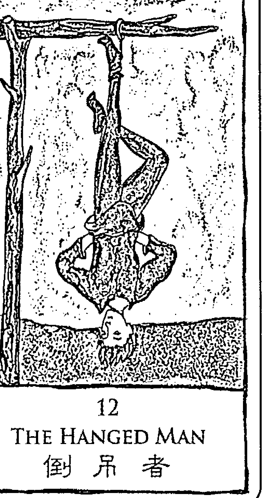

例如，因为他没去过美国，他就否认美国的存在，那么，你也不会相信他的话，因为他根本不客观。如果他又说太阳是不存在的，那他不但不客观，连自己的主观都有问题了，因为他忽略事实。

当然，也不能一直在主、客观问题上打转，事情虽不一定都要急着做，但如果一直思考，都没有行动的话，再好的思考也难以符合时效与实际。

### 看见自己心中的脚

无根，花从何来；虎拔羊皮，终被真虎吓退。很多事没有认真练习是不能熟悉的，擅长思考的人也因思考阻碍了自己的经验，经验不足往往就无法得到行事的诀窍。

学东西或自我修为时，当你想清楚后就不能再过度思考，企图以思考的推理代替实际的情况，只会陷入思考的迷局。如果你一直想着成为一位指导者，那很好，不过当你真正给别人指导时，你就会知道你的设想不一定够，不一定精细，因为人是活的，事情也是半活的，没有人，何来有事？

许多事情，不能光理念好而概念不好，因为概念不好就难以执行落实，不能执行的理念，就只是纸上谈兵。当你懂得从行动中学习时，你就真的可以好好思考了，因为人类最重要的能力之一就是思考。而当你能灵活地思考、正反来回地思考时，你就能看见别人所看不见的了。当你想要改变世界的时候，请先改变你自己，因为你离自己最近。这些想要改变世界而不改变自己的人，往往不是没想到方法，而是想太多。他们忽略了行动的连续性，一味强化自己，并想改变自己的热情。要知道，想太多、想太久，会使行动与热情无法合作，结果就是热情逐渐消退。这就如烧一壶水时，火太小，火烧热的速度与水散热的速度相当，那这壶水将很难烧开了。

> 爱的心灵 德鲁诺精写

关键正位：  
意志力的考验，通常是精神的召唤，要你面对自己的理想。

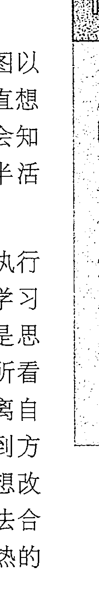

发挥深度同理心，自有另类的表达情感的方式。

**关键逆位：**

用更大的画面看事情，用更长的时间去串联觉察，你会看到不同的深度。  
不同的视角有不同的感受。

### 策略：纵览高峰

**关键正位：**

看到不同的创意面向时，只有避免天马行空，才能清楚表达出别人所关心的重点。

**关键逆位：**

试着站在对方的立场，贴心地给予，正确地付出。事件如果不是一个人能完成的，就不适合自顾自的行动，否则只是孤芳自赏。

> 想一想，请你告诉我：

什么事是你依照惯性模式即可完成的？

什么事是值得你思考的？

什么价值能使你愿意放弃自己的坚持呢？

---

## 13 死神  
Death

> 关键联想：去除、转变、结束、新生、明确  
牌阵速记：13

### 河图数理

13这个数在河图，属于独特、自信、敏锐表达、主观与多样。

13之数搭配死神象征着——果决的改变者。

### 塔罗大牌角色扮演

愚人在经过倒吊者的思考后，觉得人的想法真的很复杂，如果不把凌乱的念头整理一下，很难表现出较有系统性的思维。他决定把没有系统的思维做个整理，把杂乱、无益、不完整的想望删改或终结。

死神这张牌，依稀看得见躺有几根骨头的土地已长出绿草，这代表新旧交替。有一位衣衫褴褛的骷髅穿着黑鞋行走，气氛诡谲，只剩骨头的手轻松地拿着金色的大镰刀。这倒悬的大镰刀象征着他拥有决定死亡的力量。骷髅脸微微笑着，表示所有难以斩断的事情，在懂得运用这把大镰刀的人看来，都是可以轻松做出决断的。

有一种人总是看别人的事情不顺眼，觉得这个要改，那个要换。如能提出更高明可行的方案，倒也不失为仗义执言。除了给予的理念要明确，还得注意态度是否从容，会不会给人太大的压力？别让自己的好意，变成自以为是的好意。

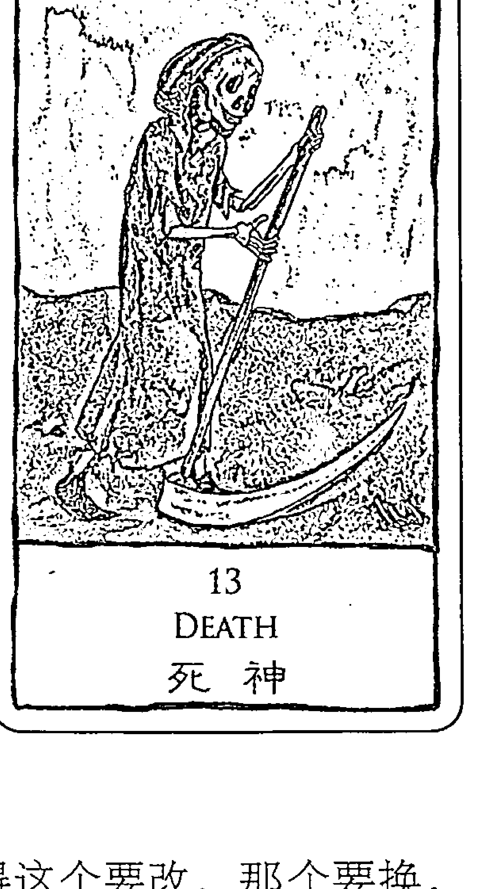

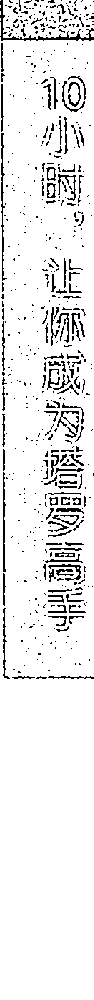

> “君子时中，小人无忌惮！”在该做的时候做该做的事，这是度。

因为这很有道理。有道理的道理，大家都知道，讲或不讲好像是一样。许多人喜欢说废话，因为他想说道理，而他说的可能只是道理的壳。

> “在该做的时候做该做的事！”只说了个壳，那它壳完之后是什么呢？这么简单的道理，为什么大家都很难做到呢？因为通常大家只靠近对自己有利的事情，看到有害的事情就会逃避，而又不一定真的能搞清楚什么是利、什么是害？其实利害是一体两面的，不符合自己的价值彰显，就算利来了，难保大害不会随后就到。如果兼顾阶段的可能性、事情的未来性与核心价值，那么就算短暂辛苦或有害处，但一旦度过了困境，也会迎来黎明。

利害常常是循环的，如果以短暂的利害评估自己的作为，那么自己就常常会陷入迷思当中。

就以景气来说吧！当高科技产业带动着需求的满足时，消费市场活络，景气繁荣，大众信心十足。如果一两家科技大厂即可满足全球市场的话，那很多商品的生产情形可能也是如此。这样的话，人力的技能转型一定跟不上。此时，如果各国没有涌出新兴行业，那么即使再努力培养人才，也是没有用的，终究得面临人力与市场不符合的社会状态。

勇于创造新的行业、新的商品、新的服务，才能终结高科技产品极大化所带来的劳工失业噩梦。

### 看见自己心中的脚

一念一生死，每一个新的想法的产生都是一种新的生命力，每一个不好的念头的结束，都会终结一个不好的循环。

天地的生机，在于生物的生灭，能量不断转生。人类吃了动植物的生命，呼吸天地的气体，吸收阳光，维持自己的生命。能量没有灭，就能转生；没有终结，就没有开始。人类把其他的能量转为自己的，用以作为维持生命运作的消耗。当然，也可以把能量的生灭化为有意义的行动，使能量的转生价值得以提升。

观察自己一周，看看你都把能量用到哪里去了？符合深心的想望吗？

### 爱的心灵修炼精写

关键正位：  
你所表现的爱，可适时地增加娱乐性。  
给予彼此适度的观察期，爱人不是做生意，太有效率得不到真爱。

关键逆位：  
你所表达的频率稳定吗？忽冷忽热虽有适度乐趣，但要注意时间性。

### 策略性斩断精写

关键正位：  
悲观的态度于事无补，面对问题要能“舍”才会“得”。

关键逆位：  
该处理的事，不要一拖再拖。  
明快、正确地终结不良的方案。

> 想一想，请你告诉我：

你为什么要大幅度地改变自己呢？

你如何有效运用自己的资源？

你能自在地使用你的能量吗？什么是你现阶段该结束的？

---

## 14 节制  
Temperance

> 关键联想：调和、平衡、节制、整合、净化  
牌阵速记：14

### 河图数理

14这个数在河图，属于创造新的稳定、信心、坚毅与成形。

14之数搭配节制象征着——懂得动态和谐的人。

### 塔罗大牌角色扮演

愚人在学习死神之果断后，发觉内在想法的调整净化，有助于打破自我的习惯性，但他想再学会节制，以便提升自己，正确调节自己的表现。愚人一旦学会如何节制，学会调控各方动态，那么往后的旅程中，他就有足够的能力去应付各种挑战了。

节制这张牌，金发天使头上戴着绿色的头冠，冠上有朵小白花，代表不管她以什么样的角色出现，都有洁净的价值和想象。她眼睛看着右前方，一手倒水一手接水，丝毫不注意手中的水瓶。流动的活水象征愿意与人交流，头脑才不会腐朽。深紫衣着表示她有高尚的价值观，淡紫的翅膀表示她的修为纯净又高超。她成功完成了众人难以调节的价值平衡。

“多识前言往行”，掌握成功者的经验，走向先导走过的路，是相对容易而且安全的。成功可以通过不断检验的模式——在新的模式未建立前获得。建立模式就要依据科学原理，在旧的发现没被新发现取代时，它就是一个客观稳定的价值体系。

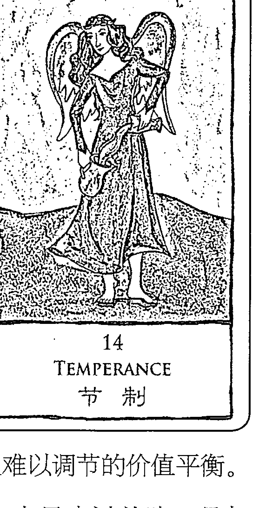

方案若缺乏软化、体贴道歉，或找不到进一步的共识，就会发生冷战，就容易使关系恶化。陷入冷战的状况因人而异，长短不一，有的一个星期，有的可长达一两个月，甚至最终分手。

亲密关系吵架后，最好要建立一些良性的沟通模式，才不会因一时的争吵，而使自己长久懊恼。

模式很重要，打破模式也很重要。模式可提高效率，打破模式可增加乐趣，端看经验模式能否与自心价值融合，与内在情感融合。

本来每个人的行事大都是“有所为、有所不为”。

有所为是愿，你愿意做什么？

有所不为是戒，你不想做什么？

只要你的“有所为”符合真心所愿，就较能信守自心价值，你就较能做到“有所不为”的规范了。

### 看见自己心中的脚

自己内在价值的调节，与内在情绪的调节方式有些不同。

这么说好了，内在情绪是野生的，像《老人与海》中的大鱼。如果没顺着小船的行驶方向游动，那老人手中的钓线就会早早断了。所以调节情绪最好的方法就是：真实地感受它、关心它，等它跑，让它飞跃，累了休息时拉它一把。渐渐它会知道跳没用了，也不想跑了，此时，一举拉上船。

而内在价值的养成与调整，就像牧场的乳牛。从小牛开始用广阔的栏栅畜养，稍大时，引导它们自行找到自己的位置。到成牛的产乳期，每天时间一到，就会有人自动排队挤牛奶。可见，顺着自己的成长，内在品质完成了核心价值和未来价值的自动模式。

那人的本性，要不要调节呢？既为本，何需调！不调整的调整，就是自然洗净。慢慢吹开覆盖真心的尘垢。看见自性前，会先看到覆盖其上的尘垢，拔除它后，自性会自然还原。但是不是没有尘垢就一定会还原呢？不是。还有一种不像尘垢的覆盖物，那就是心的彩衣，这美丽的彩绘比尘垢还容易遮住心的清净。洗净一切彩绘后，你就能看见自心的清净。看见清净后，如果再度彩绘，也能觉知原来的清净。

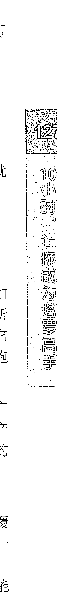

### 爱的灵魂沟通

关键正位：  
温和的态度，使人感到愉悦。  
不卑不亢地表达自己的想法，同时也能贴心地关怀别人。

关键逆位：  
沟通时，注意自己情绪的收放，以及别人的情绪波动。  
倾听别人的倾诉。

### 策略精要

关键正位：  
建立适当的模式，可化解流程中不必要的阻力。  
关心双方的利益与价值平衡。

关键逆位：  
反复练习，才能熟能生巧。

> 想一想，请你告诉我：

你建立的规格与别人的兼容性程度如何？

你想做的事符合自己的深心价值吗？

当你与别人出现对立时，你该怎样调节自己的心态呢？

---

## 15 恶魔  
The Devil

> 关键联想：强制、欲望、物质主义、本能、新的创意  
牌阵速记：15

### 河图数理

15这个数在河图，象征强烈自信、沉迷、自由与变动。

15之数搭配恶魔象征着——强制性很强的人。

### 塔罗大牌角色扮演

愚人在学会节制自心力量、懂得动态和谐后，发现善恶有时只是一念之间，而且潜藏深心的欲望有时会偷袭自己，自己有时也会被欲望控制。所以他要学会正视深心的欲望，正视恶魔。

这张恶魔牌，有位半人半兽、半男半女的恶魔站在石台上发号施令。恶魔长着一对羊角，长有羊腿、羊蹄，这表示动物本能性强、情绪多变。右手的长爪表示掌控欲很高，左手的剑加强了他的强硬。恶魔与天使一样长有翅膀，表示他也见多识广，很有力量，但他没表现出像天使般的爱心。他的翅膀长得像蝙蝠的翼，表示他心思幽暗。脚下的两只奇怪生物的脖子受绳索的捆绑，相互牵连，表示只要是自制力差的人，都将成为恶魔的俘虏。

追求幸福时，有时会产生难以承受的痛苦，但这痛苦不应该是阻碍自己前进的力量。爱是享有，不是占有。强制对方时，爱的根本就丧失了，痛苦也就随之来临。

强制是一种欲望。人的时间有限，精力有限，而欲望无穷。心如果没有停止跳动，就不知取舍，这个也要，那个也要，心思混乱、价值混淆，就会搞不清楚自己真正的想法是什么。

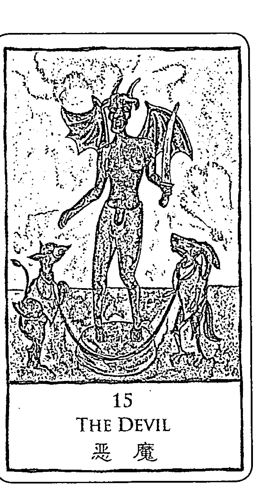

除了厘清自己真正想要的之外，还得看清自己深心的欲望。很多人很想克制自己的欲望，但是总做不到，因为他看不清哪个是欲望、哪个是愿望。看不见未来如何除罩？看不清楚幼苗又如何护苗呢？

善与恶、苦与乐常是一念之间的抉择。

当心可以自主行于价值的道路上，欲望的动能就会自动符合其价值。不符合就失去了心给的养分而丧失作用。

恶魔充满了力量，他是一个领导者，但他受欲望主导。

他不懂得“不教而杀谓之虐”，不先沟通教育，就强烈要求。这样就算他充满力量，终究也会失去民心而状况百出。当然，被领导的人也大都不快乐。

拿掉强制，调整欲望，每个恶魔都可以是最有创意的天使。

### 看见自己心中的脚

恶魔可以是最有创意的天使。

大部分人都想当天使，为什么有人想当恶魔呢？因为恶魔不想跟人家一样！这是当恶魔的第一个条件。其实跟别人不同，没有什么不可以，也没有什么不好。但恶魔的创意不建立在将心比心的基础上，他的所思所念不纯不净。他不但不守本分，不懂设身处地，还喜欢强制别人。

喜欢强制别人的人，常会被冠上恶魔的封号。

懂得自省的人，很难成为恶魔，因为他能看清楚自己，知道脚步何时出发、何时停止，也就是懂得脚步的依止。

脚步的依止是心灵修为的真实功夫。道家依止无为之虚，佛家依止自性之空，儒家依止本性之诚，基督教依止主之真理，各家有各家的巧妙，都是自爱爱人的实相创造，皆有所止。这里的止就是脚步，静或动的脚步。恶魔之所以成为恶魔，最重要还是因为他不知所止。他没有爱的价值观，他放纵自己、强制别人，他的创意没有适当的价值引导，他的表现成为粗暴情绪的发泄口。

“舞何人也，予何人也，有为者亦若是！”成为天使或恶魔在一念之间，就看每个人自我期许的方向。

### 爱的心灵陷阱

关键正位：  
强制的爱，会有勒痕，容易造成彼此的伤害。

关键逆位：  
自由的真谛，是只有愿意给别人自由的人才能领悟的。

### 策略的心灵陷阱

关键正位：  
找寻可以与自己互补的人，哪怕只会说而不会做的人。  
依止自我定位的价值，不随不相干的外物起舞。

关键逆位：  
划地自限，终究发展有限。  
分工不忘合作，有组织地发挥力量才能获得好的效果。

> 想一想，请你告诉我：

什么是你最大的捆绑呢？

欲望与愿望常是一体的两面，你能做出什么样的连结呢？

当你面对强势的人，你如何应对呢？

---

## 16 塔  
The Tower

> 关键联想：意外、量力而为、新的启示、重建、克服欲望  
牌阵速记：16

### 河图数理

16这个数在河图，象征高度自信、企划力、空想和引导。

16之数搭配塔象征着——价值的冲撞。

### 塔罗大牌角色扮演

愚人已学会面对自心的恶魔，他已能够自省、自制、善用创意。但他觉得人内心的两个价值观冲撞时，力量会战胜恶魔。他思索着：他会如塔一般毁坏？还是会去掉对高塔的认知，而回归自心尚无任何堆砌时的纯然旷野呢？人类的文明与大自然原生态发生冲突要怎么抉择呢？如何才能在发展文明时与大自然和谐共处呢？

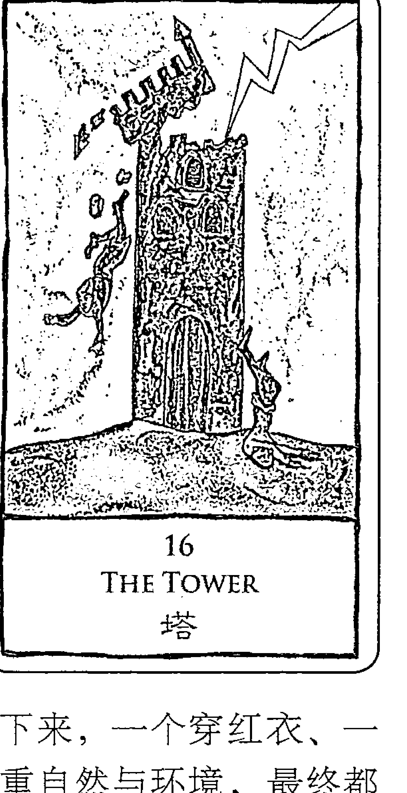

这张牌，塔被闪电击断顶层，表示领导者的傲慢自大会带来危险。高塔虽高，仍有更高者！这座类似巴比伦建的巴别塔，妄想通往神的疆界，这是不可能实现的妄想。人如果登高之后不敬重大自然，那么自然力将会反扑。有两个人从塔上摔下来，一个穿红衣，一个穿蓝衣，表示人不管热情还是冷静，如果不尊重大自然与环境，最终都将无法避免意外灾害。

假如这座高塔装有避雷针的话，是不是就不容易发生意外倒塌呢？

人际关系或爱情，如果不懂释放自己，那么结果将不是关牢别人，就是困住自己。释放自己之前，得破坏困住自己的高塔。高塔越稳固，你就越不容易走出来。除非有雷霆万钧的决心，先破坏后建设。如果高塔已不坚固、倾斜龟裂、年久失修，你一直待在里面也很危险。

结束或改变一段关系时，常常会产生强大的力量，而这力量很可能是破坏力。高塔倒塌前，得先疏散或引导当事者及关心者到达安全地方，才能减少伤害。当事情突然改变时，有时当事者没事，观众却遭殃。所以，当事者不要因为关注一件事，而忽略了其他的关系与可能。

如不妥善运用自然资源，大自然是会反扑的。盖高塔，得装避震、避雷设备，存着敬畏的心，对大自然、对人、对事、对自己都好，也会减少意外的发生。

假如不小心发生错误，就要想办法减少伤害，并从中吸取教训。有些人就算出现了错误，也无法察觉，更不清楚错误的雪球效应。

“履霜，坚冰至！”善于从轻度惩罚中得到教训，才能有效预防意外灾害的来临。

### 看见自己心中的脚

当无法战胜自己心中的恶魔时，灾害就会降临！

“天作孽犹可违，自作孽不可活。”大自然分春、夏、秋、冬四季；地理环境有高山、洼地、平原、河流等等，这些都是自然现象。但这些不同的形式，却对人的生活产生了相对性的利害关系。人可以利用大自然的利来改善大自然的害，也可以破坏自然资源或制造各种污染，来加剧大自然对人类的害。

导致意外灾害的因素，当然有一些是偶然的，但绝大部分原因是由于我们把自己置身在发生意外较高几率的环境中造成的。

台风天爬山、观浪，能不危险吗？下大雨时开车外出，能不危险吗？闯红灯不危险吗？你认为绿灯就安全吗？是，大部分是！但还得注意那些不守交通规则的人。

## 恐惧心灵——痛离得早

关键正位：

澄清安定的心，是避免意外的最好方法。当意外来临，心想解决之道，就走上解决之道。心思若难以平静，就会长困于险境。

关键逆位：

面对痛苦的方式，就是包容，平静以对。越是扩大痛苦焦点，就越会发生连锁效应。

## 骤变愈合——离得早

关键正位：

事件发生剧烈变化、情况急转直下时，应检视自己是否存有傲慢心态。对于不可知的意外，除了检讨改进自身因素外，还要学会释怀。

关键逆位：

消除一些忠诚度差的关系。强烈的破坏，不应波及旁人。

> 想一想，请你告诉我：

什么是你面对绝境时的支撑力量呢？

什么是你的靠山，你过度依赖它吗？

你用什么来净化自己的痛苦呢？

## 17 星星  
## The Star

关键联想：希望、珍惜、祝福、平静、鼓励  

牌阵速记：17

### 河图数理

17这个数在河图，属于信心、希望、学习与修正。  

17之数搭配星星象征着——给予希望的人。

### 塔罗大牌角色扮演

经过塔的毁坏，愚人已掌握协调天文与人文关系的方法。而天文中，最美、最具代表的就是星星、月亮和太阳。天文形成的差异光亮，有细微的热情、多变的热情和开朗的热情。愚人要先学习星星微细的光亮，珍惜每一个小小的力量。

这张牌，七颗小星星围绕一颗大星星在天空闪耀，照亮了夜空。七代表周期、反复，指引了回归心灵的道路。河流两旁的树上各停着一只鸟，象征生命找到了希望之光，有了归依，并散发着青春的气息。有一位女神赤裸着身体，拿着两个水瓶，并把瓶中的水往涓涓的河流中倾注。这象征着真诚无悔的付出，无论多少，总能为生命的长河注入新的力量。

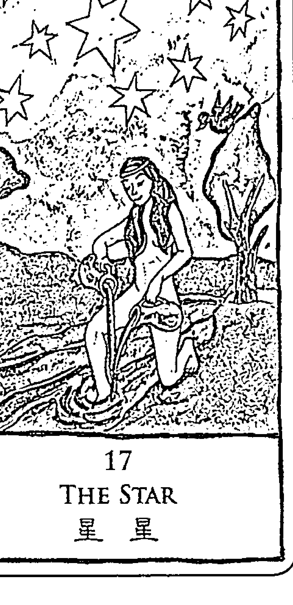

有一位年轻的游民，在天色微暗的街上翻着垃圾桶，无力又急躁的脸露出了饥饿的征兆。一对刚买了面包的男女朋友在对街看见这景象，女生便提议马上送两个面包到对街给那颓废而有气质的游民。男生制止，女生抗议说：“你怎么那么没有同情心啊！你没看他正饿着吗？”男生解释说：“记得上周我来买面包给你当晚餐吗？”女生点头，男生继续说：“我看他和现在一样找着食物，我就拿一个菠萝面包、一个青葱面包，要请他吃，结果他一口回绝，骂我莫名其妙，辩说他不是在找食物。”女生说：“怎么会这样？那我们该怎么办？”男生说：“可能我的方式欠妥，不够贴心……”

这对男女朋友商量的结果是，由女生在游民会经过的路上，假装发促销的试吃面包。结果游民拿了三种口味的面包，边走边嚼，并抬头看着宁静的星空，嘴角露出久违的微笑。

人世间最具价值的是真心。但除了真心外，很多真的东西，并不一定比假的贵重。例如，真的向日葵，就不会比梵高的向日葵画作值钱。有时候作假——如果是为了展示真心、展示美丽，那么也不一定不好。不过，千万不要因假装而忘却真心。

从游民的故事可看出，给予都应尽量做得贴心，何况是责备呢？诗云：“子怀明德，不大声以色。”子曰：“声色之于以化民，末也。”大声喝斥、动不动就发怒的人，其感情的表现方式很匮乏，也很无能。他找不到更好的表达方式，没有耐心和爱心，别人自然难以感受其真情。

当然，如果一个人能把想表达的形式，巧妙地注入真情实感，并做到无矫饰的痕迹，那么他就已接近“上天之载，无声无息”了。如此，不管表现的是喜、怒、哀、乐、忧、思、恐还是宁静，都是极致美妙的人性艺术。

### 看见自己心中的脚

不要小看祝福的力量。

很多时候我们只要在心里祝福一个人，这份祝福就能像遥远的星星一样，让远方的人们感到无限的希望。当我们在心里祝福一个人或一件事，这份祝福也就转化成了完整的想望，想望的累积就会慢慢带动我们自己朝目标前进。只要是真心的祝福，就会产生无穷的力量，因为真心是想望与念力的极度确定。只要是真心，不管这个祝福是不是已经成为过去，它都会保持它的力量。遥远的恒星闪耀着光芒，当我们看见它们闪烁时，其实那已是它过去的光芒。我们对人与事的祝福、想望，也会在未来闪耀着希望的光芒。

我们也可以说，当我们非常渴望实现一个合理但又不容易实现的愿望时，只要我们真心想望，在心里描绘其真实、幸福的形象，就会获得实现愿望的动力和希望。

兼具本质之美的想象是最美的艺术。如果我们祝福的是丧失良善本质、丢失希望的人与事，那么就算再有力量的想望，也很难实现我们的祝愿。即使实现，心里也不踏实，也不美丽。

所谓“绘事后素”，就像食材新鲜才是烹饪的第一要素一样，如果以不新鲜食材料理，再好的调味，也都难称为美食。

凡有形体终将分解为最小的组成元素，小到好像已经看不见了。凡无形体虽是看不见的，但如果你感受到了它的存在，它就会永远存在。所以，不能忽略看不见的爱，哪怕是以最小的形式表达出的爱。

### 爱的心灵隐喻撰写

关键正位：  
- 学习在希望的方向前进。  
- 给人希望是一项有意义的奉献。

关键逆位：  
- 鼓励是最好的责备。  
- 不要太注重形式，而忽略了本质。

### 策略隐喻撰写

关键正位：  
- 快乐与希望的共鸣度，永远是策略者应该参考的路径。

关键逆位：  
- 危机销售量与使命感营销同样具有高度感染力，但如果无法正确导向其真正的价值与希望，则只会显出装模作样的可笑。

> 想一想，请你告诉我：  
你希望不抱希望地进行一件事吗？  
如果这件事需要你做出不同于平常的表现，那么你要怎么做才能表达出美好又不失去本来的价值？  
你会用别人给你的美好指引去指引别人吗？

---

## 18 月亮  
## The Moon

关键联想：不安、诡异、幻想、丰富想象力、阴柔  

牌阵速记：18

### 河图数理

18这个数在河图，属于沉迷独特、丰富性、放空、组织。  

18之数搭配月亮象征着——阴柔的艺术幻想家。

### 塔罗大牌角色扮演

愚人在了解、学习星星的希望与祝福后，已懂得珍惜每一份细微的力量。他又觉知到月亮的盈亏变化蕴藏着多元的表现方式，并带给人无穷的想象力与阴柔的力量。如果没学会运用这份力量，则很可能自我迷失于不安的幻境。

这张月亮牌，是上弦的大弯月，月亮没有被云朵遮住，代表丰富的想象力正开展着。月下草地有两座城堡，一座像是新建的，另一座像是已荒废，两座新旧城堡中间有一间普通的平房，代表人的想望是可以选择的。景象前面有两只狼在跳舞，湖中有只火蝾螈高举着钳螯，使得原本诡异的气氛，更透出不安、恐怖的气息。

月亮是温柔的，但过分的阴柔，将带来不安与恐惧。

太阳照不到的另一边，就请月亮帮忙。月亮的反射，可照见太阳无法直接照射的地方。阳刚有阳刚的必要，阴柔有阴柔的价值。没有月亮反射阳光，地球将无法稳定地繁衍生物。

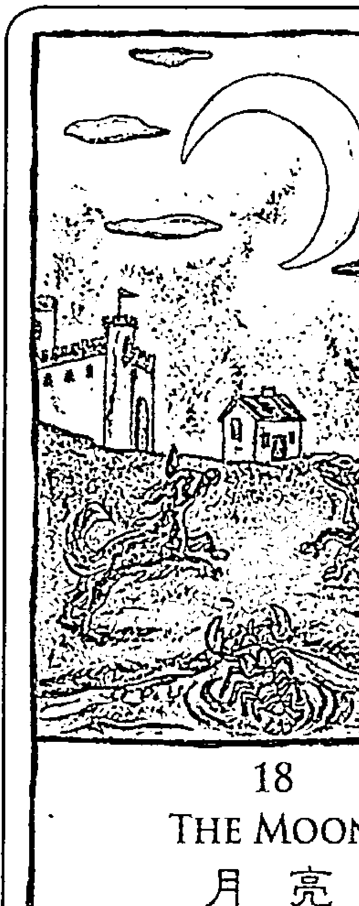

当事件还在初始的酝酿期，就无需过度控制，让想象力自由地飞翔吧，它将为事件的成功加入更大的可能。思考是立体的，多种创意可同时展开，而行动却要抉择其一来执行。

例如，你要外出用餐，你可以无限想象，可以想去吃怀石料理、麻辣锅、“吃到饱”的自助餐、阳春面，也可以想去吃臭豆腐，随你想象！一旦你已决定吃自助餐了，就应好好吃，不要一再后悔，不要想说为什么不去吃阳春面、为什么不去吃麻辣锅？这样只会制造更多的困扰，导致你无法尽心尽兴地去品味自己所选择的食物。也不要为了想吃别的而错过已选的行动，尤其是当一群人等你的时候。

决定行动就要为自己的行动负责。当你放开心去享受自己的行动时，你之前的想象反而会丰富你现在的行动。你已去吃到饱的自助餐了，或许刚好也有火锅、拉面、炸豆腐，而你都可以吃。但也不要太贪心，留一点给老板赚嘛，老板好开店，你自己的身体也健康。

### 看见自己心中的脚

人的想象力无穷无尽，丰富到不可思议的地步。

虽然你有些想法超出了现实，甚至充满了欲望，也有些不同于常人的地方，但这些都是你之所以成为你的地方，你得先包容自己。

包容自己是爱自己的表现。一个不让自己成为自己的人，常是一个不快乐的人。能够接受“现在自己”的人，才能看清楚自己。

“接受自己”不是不再进步，而是享受既有的，又不执著既有的。享有而不执著的人，是个懂得品味生命的人，其生命必能不断提升。所谓“知足进取”，一个知足的人，是知其“足”也。除了享受当下之外，也能知道自己的脚（足）要往哪里走，从此能舍能取，往自己的梦想前进。

隔代教养的小孩，长期不在父母身边，忽然因就学或其他原因被带回父母身边，很可能一下子不适应，表现会不符合父母的要求。这时如果父母心急而想要快速祛除小孩的不良习惯，可能就会对小孩子造成伤害。大人的观点就一定是对的吗？小孩辜负大人期望一定是错的吗？

暂且不论谁对谁错，先说关心的问题。没有关心的教养，无论再好的方式，小孩大都不能接受。所谓“子不教而杀，谓之虐”，缺乏关怀的要求，已令人很难接受了，何况是带有惩罚性的要求呢？

同理，对于自己那些不符合自我期许与价值的欲望，也不能急于斩除。应先真心关怀、了解，或许可透过观察，使自己找到通往价值之路的更大动力。陪伴自己，才能了解自己，也才能找到改变自己和超越自己的力量。

### 爱的心灵指南特写

关键正位：  
- 发挥独特的创意，打破僵化的教条。  
- 暧昧的态度，会使自己陷入自己所创造的关系里。

关键逆位：  
- 不要模糊自己的焦点，去除杂乱不可行的妄想。

### 愿景企划深窗特写

关键正位：  
- 在意念杂乱的堆积中，你只需选择有助于建构梦想的素材。  
- 用感染力强的方式去执行现有的计划。

关键逆位：  
- 注意气氛的营造。可以浪漫，可以华丽，但请不要偏离主题太远。

> 想一想，请你告诉我：  
是什么障碍了你的梦想？  
你有实现梦想的节奏吗？  

如果要你此刻反省，你觉得你最该反省的是什么呢？

---

## 19 太阳  
## The Sun

关键联想：分享、领导、积极、快乐、自由  

牌阵速记：19

### 河图数理

19这个数在河图，属于热忱的领导、信心、智慧与整合。  

19之数搭配太阳象征着——欢愉的人。

### 塔罗大牌角色扮演

愚人在学会了月亮多元化的力量表现形式后，知道阴柔是必备的，又觉得只有学会如太阳般的热情与开朗，才能真正克服过分阴柔所产生的不安与恐惧。

这张牌中，太阳和煦地照耀万物。太阳有着亲切的面容，像一朵绽放的花，代表它有着适度开朗的热情，并不强烈得令人难以接受。两个年轻人穿着新衣在田园里手舞足蹈，象征自由与快乐，也代表喜悦是可以分享的。绿草如茵，树有的长得茂盛，有的果实累累，大地一片光明，表示太阳的生命力已传递给万物，也代表能量是可以传递的。凡所有感染欣欣向荣景象的人，前途必会光明灿烂。

没有太阳，地球可能就没有生物。对我们而言，太阳是最亮的一颗星星。太阳无私无悔地给予生物能量，阳光少的地方，生物大都比较少；冰天雪地，人烟自然稀少。生物的生存虽依赖日光，但没有地面的保护，太阳光的热在空中很难附着，所以空中很难孕育生命。而越高的地方越寒冷，因此也说明太阳光的热还是需要附着于地，才能更彰显能量与价值。

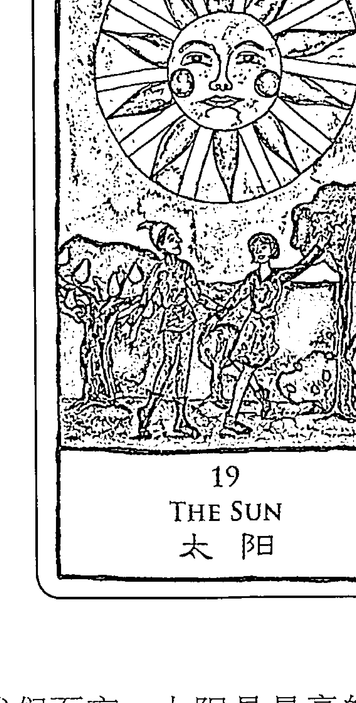

当你有了热忱，还要适度表现令人愉悦的热情。假如你对目标非常狂热，别人就无法与你共鸣，因为你的狂热会吓伤别人。有了适度的热情，你还要找到你的彰显之地。你要在平原、高山、原野、丘陵或山谷表现自己、鼓励别人，而这些地方你都可以自由选择。

太阳的热得靠云、林、溪、雾来调节，而你的热情不用其他外物，你自己就可以调节。你要给对方多少热情，你自己可以决定；你也可以根据对方的情绪、感受与理解去给予其美好的生命力。

### 看见自己心中的脚

如果把自己的一些黑暗想法，放置在心中的阳光下，那些黑暗就根本不会阻碍到你的自在，很可能还会成为你在夏日午后的凉荫。

> 人有善愿，天必从之。

当我们想要有美善之举时，我们心中就多了一道光。善愿就是真正想做的事，也是持久的想望。当我们坚持去做这个美善时，自然因缘助力不断，最终愿望成真。许多已成形的因缘并不能说改就改，事必有因，行必有果，但我们可以通过交换因缘、重组因缘，来使其更符合我们心中的想望。例如，你有茄子，你可以卖掉或以物换物，让茄子变成菠菜。

又如，你只有三十个宝特瓶，但想要换一千元来捐赠给福利机构。以这样的因缘你很难如愿，与你交易的对象恐怕还会嘲笑你。但你可以通过重组因缘而达成所愿。怎么做呢？你可以请愿意帮忙的人或你自己，把三十个宝特瓶变成一个环保艺术品或一项装置艺术。那些宝特瓶经由因缘重组后，很可能就能换得一千元了。

无论宗教信仰为何，大多数人相信因果律。但了解因缘，还得了解主能。人、事物受因缘法影响，但生命体自有其主动性。生命没有主动性，何以存在？太阳的发光，是太阳的因缘，也是太阳的主能。学习主动发光，把生命的主能发挥到自己想望的境界中去，才能成为你想成为的自己。

### 赞赏式美德赞美

关键正位：  
- 带着更多的光明想望与人交往，自然可展现开朗、快乐的一面。  
- 多说鼓励性的话，对自己和别人都好，但不要说自己都觉得过分的话。

关键逆位：  
- 太狂热，常会使人自我的温差过大而难以适应。  
- 活力不够，会使人丧失信心。

### 策略检视赞赏篇

关键正位：  
- 每一个光明的想望都能产生新的力量，公开讨论，做适度的整合。

关键逆位：  
- 当别人都不鼓励你时，别忘了，还有一个人永远可以为你打气，那个人就是你自己。

> 想一想，请你告诉我：  
什么是你今生最有力量的因缘？而你生命最精彩的主动性又是什么呢？  

当你接受大自然或人物给你的亮光时，你身心产生什么新的品质呢？  

你如何传递你内在的品质，给你周遭的人呢？

---

## 20 审判  
## The Judgement

关键联想：救赎、审判、回忆、宽恕、复活、觉醒  

牌阵速记：20

### 河图数理

20这个数在河图，属于权力分享、平衡、放弃与混沌。  

20之数搭配审判象征着——行宽恕之人。

### 塔罗大牌角色扮演

愚人在学习了太阳的热情与开朗后，开始懂得用温和之光去照见一切，不过仍对自己和他人的错误有些耿耿于怀。他要重新学习，让善、恶的审判回归应有的公平与正义，并宽恕自己和别人曾经的错误。

这张审判牌中，带着生命原动力从火红的云朵中探身出来的天使，头上有圣洁且敏锐的金黄色光圈，手上的长喇叭吹起越发嘹亮的声响，唤醒沉睡的心灵，告知救赎的来临。穿着蓝衣的天使，虽怀救赎的热情，却有冷静的判断。那些罪孽深重的人，是否能真心悔改而得到赦免呢？真是令人担忧！

审判的时候，也是解放苦恼的时候。善良的灵魂与当下觉醒的灵魂，将循着福音找到新的自己，从而复活。

审判是愚人从命运之轮的感性中蜕变的结果。经过命运之轮的洗礼后，他了解了正义的重要，也有了仰望者的同理心与改变世界的渴望，又具备了死神勇于结束的决断，然后有节制、平衡各种价值的能力，也懂得利用恶魔般的能量而达到不强制别人的目的。避免像塔那样的傲慢，以减少意外的伤害，从而找到自己最适当的定位。心中已有星星的无限希望，也能享有月亮盈亏的变化之美，而又不会过度阴柔。终于他的愿望能像太阳般无私地奉献发光。他知道接下来的旅程，虽能像命运之轮般随兴，但不能是那种不自觉的流转。他要自在地承担一切，因为他已觉醒。他知道一切所作所为都是有质有量的，他要面对真理，看清自己的善与恶，提升自己、超越自己。

其实，只要时时面对自己的良知，就做到了对自己的审判。每一念、每一次的呼吸都是真心的复活；每一念、每一次的呼吸，都可以是再造生命价值的奇迹。

既然人随时有重生的机会，你又何必让自己过往的错误一再痛苦地惩罚自己呢？忏悔是为了悔改，而不是要使自己陷入痛恨自己的深渊。忏悔是为了找到错误的前因后果。能够宽恕自己的人，才能做到真心地宽恕别人。宽恕自己，放开自己，让生命随时充满新的希望与美好吧。

### 看见自己心中的脚

不懂得帮助别人的人，常常会用别人的错误来惩罚自己。当你有什么事情看不过去，很想发怒的时候，也是你发现事情有改善余地的时候。既然如此，就把自己的生气转换为改善事情的动力。妥善运用自己的怒气，怒气或许就能变成打破坏习惯的动力。

其实如果错误不是你的，而是别人的，你又何必去捡原本不属于你的东西来让自己痛苦呢？人生也是如此。痛苦原本是一种感受，一种不好的感受。如果你觉得痛苦很好受，那你应该多创造一些可以让自己痛苦的事情来痛苦！但真相是没有人喜欢痛苦。就算有人喜欢痛苦，也可能只需要一点点痛苦来为生活调味。大部分的人都想拿掉痛苦。其实拿掉痛苦，说不简单真的很不简单，说简单又真的很简单。为什么这么说呢？因为不简单在于看不清楚痛苦的来源，看不到就拿不掉。而所有痛苦都是心与物的结合，只要你把自己的心转一下，事物变一下，痛苦就转了，事情也就简单了。（说得多简单啊！相信简单的人，就是这么简单；相信不简单的人会说，怎么可能呢？哈哈哈……）

慈悲且不陷入他人痛苦中的人，通常较容易让别人觉醒，而自己也不会再度迷失。再好的建议都有人不接受，再好的福音也有人不听。安心自在，努力就好。每个人自有他的因缘，也自有他应面对的审判。当别人不听你所给的呕心沥血的绝佳建议时，你能以欣赏祝福的心去看待他多元的选择，那你就很可能成为那种可轻易拿掉痛苦，并保持觉醒的人。

### 爱的心灵修炼指导

关键正位：  
- 真心待人、心灵坦率的人，最后受益最多。

关键逆位：  
- 面对自己造成的错误，勇于承担，并宽恕自己的人，才能宽恕别人。

### 策略金字塔修炼指导

关键正位：  
- 发挥长处的时候，一定要排除一切阻碍自己的理由，安排出时间执行。

关键逆位：  
- 做自己想做的事。与其提出一百个不能去做的理由，不如想一个可行的方案。

> 想一想，请你告诉我：  
什么时候你才能发挥你真正的独特天赋呢？  

你的痛苦是心里原本就很难受，还是会随着事情的好转而变好呢？  

你看见别人痛苦时，你会用什么样的觉知去帮助他？

---

## 21 世界  
## The World

关键联想：美好、新的旅程、生命力、爱、彰显  

牌阵速记：21

### 河图数理

21这个数在河图，属于创造、和谐、分享、独特。  

21之数搭配世界象征着——爱与美的旅程。

### 塔罗大牌角色扮演

愚人在面对审判，真心宽恕自己和别人后，开始解放自己所有的烦恼。他的生命得到了全新的力量，复活觉醒。在完成自我意识的探索时，也完成了世界的旅程。

世界这张牌代表着愚人对旅程的最终领悟。牌中央是爱与美的女神维纳斯，象征世界的核心价值是爱与美，一切的运转皆是爱与美的展现。赤裸的女神和她轻妙的舞姿，象征她以真诚面对世界。女神只披了一条粉色的围巾，手中拿着生命之树做成的法杖，象征单纯地品味生命的美，即能得到美妙的变幻与无穷欢乐。月桂叶编成的大花环散发出至高的荣耀。花环外有代表权杖、执行世界爱与美的狮王；有代表圣杯、分享世界爱与美的鹰鸟；有代表宝剑、维护世界爱与美的红衣天使；有代表钱币、承载世界爱与美的母牛。心如权杖有主意，心有圣杯能分享，心似宝剑能决断，心存钱币有价值。拥有这四大宝物，心就带着快乐自在地运转，世界也能顺利运行爱与美。世界是愚人探索心灵之旅的尽头，也是另一个旅程的开始。

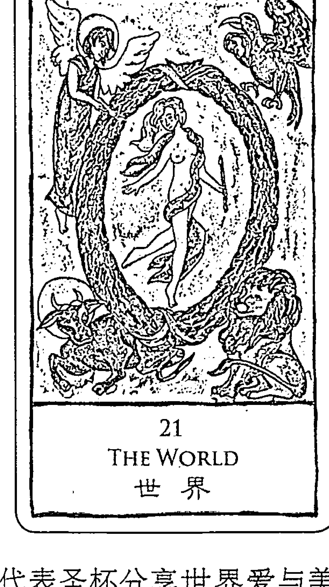

你可以成为你最喜欢的塔罗角色，也可以尝试各种人生的角色。

每一次自我探索，都是心灵开始新旅程的时候。

当你自己可以超越自我意识时，你就能与宇宙意识合一。与宇宙意识合一，即可觉知一切万物的共通性和一切心灵的统一性。当你觉知心灵统一性时，你就是独一无二的，因为每个生命都有着不同的旅行路线。就算你选择与别人相同的旅程，走的步伐快慢还是不一样，所看见的风景也不尽相同，产生的思想与彰显也会有差异。总之，生命具有无可取代的独特性。

当你愿意与别人分享你的独特时，你就跨出了实现自我的第一步。你的存在将丰盛宇宙，而当你打开心去看见别人的独特时，你的世界也会更加丰盛。了解心灵的统一性，并愿意彰显生命的独特后，你自己心中就创造了一个不动不灭的世界。当你以纯净的爱与美去行走，并愿意放开自己时，你就具备了穿越各种世界的力量。

分享你的世界，穿越别人的世界，开始吧！又是新的旅程。

### 看见自己心中的脚

信念影响到你的经历。当你觉得你已经完全了解世界时，请用不同的信念再经历一次，你一定会看见不同的世界。当你已经了解心灵世界是怎么一回事后，你好像会没事做，因为最美的已经历过了。但只要你用最新的信念再一次去经历，心灵就永远还是新的心灵。为什么会这样呢？因为你的信念影响到你感受的角度，而每一个感受的角度，都会组成全新的历境。

世界就是这么有趣！当你放开一切执著，世界就是世界的样子。

当你用索然无味的心态去经历，世界就好像真的就是索然无味。

当你用爱与美去经历，你就能发现有许多值得欣赏的事物。世界是原来的世界，也是你愿意看见的世界。

佛家说“超三界”。其实就算你在欲界、色界和无色界的三界内，也可看见自己超越三界的本性。

如果你愿意看见上帝所在的世界，你就会看见神的恩泽，感受到世界是主能的示现，感受到上帝无所不在。上帝既是无所不在，当然……从不离开你的心。

你会看到你的世界，他会看到他的世界，因此，兼具主、客观的角度来看世界，比较容易觉知世界的爱与美。当你愿意了解他，你就能看见他世界的美好；当他愿意了解你，你也就可以与他分享你世界的美好。所以，爱是道路！

纯净的爱与美是——所有心灵世界的通道。

### 爱的心灵踏影特写

关键正位：
- 透过美好的事物来表达心中的爱。
- 爱就是一趟最美的心灵旅程。

关键逆位：
- 一段关系的终点，是另一段关系的起点。

### 策略企划踏影特写

关键正位：
- 有攻有守的计划，即可执行。

关键逆位：
- 未完成的，加入新的力量，继续努力。

> 想一想，请你告诉我：

你能把爱、兴趣与感动加入你喜欢的事物吗？  
触动你生命的人、事、物，你能好好把握或品味吗？  
什么事情能使你感动？它的本质是什么？

# 10-2 小牌（Minor Arcana）56张解析

## 简约的强大可能

塔罗小牌中的四大宝物，包括权杖、圣杯、宝剑和钱币。

每种宝物都是从 Ace 到 10，又加 4 张宫廷牌，共有 14 张牌。小牌有四种宝物，所以共有 56 张。

四种宝物的宫廷牌都是：侍从、骑士、皇后和国王。

塔罗小牌的架构，有塔罗四大宝物从 1 到 10 的序数意象，以及宫廷牌的 4 种人物。就是这么简单的基本组合。

宝物代表牌的态度，号数代表牌的品质。

例如宝剑 1（Ace）就是以宝剑决断的态度，去行使 1 之自信与独特的品质，所以宝剑 1（Ace）就有不畏强权、突破、新的冒险、想法明晰等意象的观感与联想。

侍从代表防卫与服务的品质，骑士代表行动与传达的品质，皇后代表辅导与支持的品质，国王代表决策与主事的品质。经历从 1 到 10 的状况后，心有余力为公众服务而进入宫廷，以宫廷四种人物类型来代表服务品质的层次。例如，权杖的侍从是好奇热情的，宝剑的侍从是防卫机警的，以此类推。

小牌单牌的意象解析分为：“关键联想”、“牌阵速记”、“河图数理”、“塔罗小牌态度品质”、“看见自己心中的脚”和“想一想，请你告诉我”六项。

解析分类与大牌类似，不同的是把大牌的“塔罗大牌角色扮演”换成了“塔罗小牌态度品质”。

大牌重视角色的诠释与精神彰显，是愚人探索世界、明晰自我独特、彰显自性的觉知、行愿。

小牌则强调实现自我的内外态势，是愚人对世界的回望与创新，对阻碍彰显自性的意象的消除，也是对人性艺术巧妙的掌握。

小牌精彩的四大宝物，是行使内在智慧的意象代数。

套用易经乾卦四德，权杖为“元”为仁；圣杯为“亨”为礼；宝剑为“利”为义；钱币为“贞”为信。

不管是用权杖、举圣杯、持宝剑还是通钱币，行使仁、礼、义、信，都要有心灵的引导。

无智之仁，懦弱姑息养奸；无智之礼，累赘自设阶级；无智之义，鲁莽浩然失真；无智之信，牵扯执著痴迷。

智用权杖，仁慈俭勇；智举圣杯，礼乐和鸣；智持宝剑，义利合宜；智通钱币，信用良美。

塔罗小牌的四大宝物，正是愚人探索世界时运用的工具，也是感悟。简说如下：

### 权杖

权杖主要联想词：主意、执行、仁爱。运用权杖要怀藏着仁爱，伴随着责任，透露着远见。

权杖的牌，以耕作为主要意象。用耕作的各种状态，来代表使用权杖时所遇到的各种情形。

### 圣杯

圣杯主要联想词：分享、协调、礼节。运用圣杯应该注重和谐、尊重、喜乐。

圣杯的牌，以演奏为主要意象。以各种乐器的运用，表示使用圣杯时的分享给予。

### 宝剑

宝剑主要联想词：决断、维护、义气。运用宝剑主要是为了解决纷争、渡过险境、突破困难。

宝剑的牌，以战斗为主要意象。用各种艰辛的状态，来表现宝剑明断的重要性。

### 钱币

钱币主要联想词：价值、原则、信用。运用钱币进行公平交易，交流心物之美，信守游戏规则。

钱币的牌，以交易为主要意象。以收成的丰、欠，庆祝的简、富来表示钱币的代用性。

## 101 权杖 Ace  
Ace of Batons

关键联想：创造力、灵感、主体性  
牌阵速记：101

### 河图数理

1 这个数在河图，属于创造力、自信和独特；权杖代表主意、执行、仁爱。

1 之数搭配权杖象征着——魅力创见。

### 塔罗小牌态度品质

愚人探索权杖的权力、主意，体悟到权杖 1（Ace）代表做事一定要有自信，这是执行自己想望的第一要素。如果连自己都不相信自己，别人就很难相信你，自信只要去创造就能发挥生命的热情。

权杖 1（Ace）这张牌中，大树粗壮的根清晰可见，枝叶茂盛，加上肥沃的土壤，象征着有良好的基础、旺盛的欲望。一只可爱而不怕陌生的小鸟，在树梢休憩，自在歌唱，代表新的渴望，也代表展现吸引力。权杖 1（Ace）不是木棒，是有生命力的大树，代表对生活的热情，以及想法的实现。

树的根扎得深、扎得稳，枝叶才长得茂盛。

“地道敏树”，土地肥不肥沃、养分多不多，树最知道。养分不够则根不稳、枝叶也稀疏。这种自然的敏感就像我们内心的真实情感，有那么深的感情才有那么大的渴望与创见，真实地品味生命的态度，才能发挥创意的情感，也才能吸引小鸟的停靠，这是人际关系与创造力的隐喻。

组织的自然吸引。

领导人要有真实的热情，才能带动队伍。但不能独断专行，使队伍的学习力停滞。

### 看见自己心中的脚

生命是一场自编、自导、自演的戏码，你的角色由你自己创造，戏的情节你有权编排，要演多精彩你自己决定。如果有机会接触新的工作，且不背离你的生命价值，那么不管多么陌生，你都应该拿出你的原创性，以最新的心情去面对。

### 爱的心灵感悟书写

关键正位：
- 创造性的情感，能为生命价值赋予最精彩的热情。发挥你的创见，展开你的道路吧。

关键逆位：
- 浅层的交流，并无法深入内心。

### 爱的心灵策略书写

关键正位：
- 事情的开端，总是需要较大的动力，树立强大的目标，向下扎根，向上发芽，向外开展，表现出最美的一面。

关键逆位：
- 注意基础的建立与架构性的安排，才不会等事情发展壮大了，却失去了基础而崩盘。

> 想一想，请你告诉我：

你有没有什么创造性的计划？如果有，它是什么？实践它的热情又是什么？

## 102 权杖2  
Two of Batons

关键联想：权衡、同心协力、实践  
牌阵速记：102

### 河图数理

2 这个数在河图，属于分享、平衡与对称；权杖代表主意、执行、仁爱。

2 之数搭配权杖象征着——引导方向。

### 塔罗小牌态度品质

愚人探索权杖的权力、主意，他体悟到，如果要顺利执行想望，除了有权杖 1（Ace）的自信热情外，还要懂得权杖 2 的协调力，才能化解阻力，更顺利地行进。

权杖 2 这张牌，两只木棒没有并列，象征着虽是合作，但有主有从，表示沟通很重要。一个农夫拿着棍棒指挥两匹马拉犁，以马拉犁，富而有余。农夫在前指挥，代表引导式的领导又能适时鞭策，两匹马步伐整齐，表示同心协力。农地井然有序，代表行动已开始，并走上梦想的道路，是个成功的合作模式。

生活需要努力，但生活并不是战争。许多人急于完成自己设定的目标，而忘了适度地耗费财力终不能持久。踏着脚尖能站立多久？双腿撑得很开能走多久？一方看见远景，一方脚踏实地，观念可能会有一定的落差。如果一方操之过急，反而会弄巧成拙。彼此经过表达交流，才能踏出相互协调的步伐。

### 看见自己心中的脚

先天的长相、双手双脚是遗传命定的，但接下来的许多事情就不是命定的。一样的脸，可以笑，可以哭；一样的双手可以做让自己和别人开心的事，也可以捂住自己的脸和推倒别人。

你可以选择后天大部分事情的发展方向。

大部分的事情并不是命定的，而是有因有果、有发展趋势的。你愿意努力耕耘，你就有机会丰收。丰收的前提，就是你愿意向有利的方向前进。

### 爱的心灵策略

关键正位：
- 强制性地推动，很容易弹性疲乏，细心的引领，慢慢可发挥实力。

关键逆位：
- 远离无谓的权力争斗，找出彼此的平衡点。

### 策略建议

关键正位：
- 专业人员往往不容易受指挥。如果你以公司的整体利益为导向，你就能轻易领导那些比你更有能力的人。

关键逆位：
- 对抗源于看不见未来的路径，描绘出来，提出可行的路线，就会一切和谐。

> 想一想，请你告诉我：

当你与他人意见不同时，你能猜到什么样的情形呢？

## 103 权杖3  
Three of Batons

关键联想：建构力、讨论、成长  
牌阵速记：103

### 河图数理

3 这个数在河图，属于表达力、敏锐与多样；权杖代表主意、执行、仁爱。

3 之数搭配权杖象征着——新的建构。

### 塔罗小牌态度品质

愚人探索权杖的权力、主意，他体悟到，对权杖 2 两个不同意见的协调，虽然需要沟通，但还算容易；但当有多种声音的时候，就必须进行讨论，所以他还要学会权杖 3 的建构力。

权杖 3 这张牌，三支木杖已长出新的枝叶，象征权力的多样发展。小丘上有一间风车小屋，表示这些梦想正在构筑。草原上有三只兔子，旁边两只居于洞穴，到中间这只未离开洞穴的兔子身边，似乎正讨论着未来的计划。其中一只回头张望，表示还没完全赞同所讨论的意见，但在彼此将想法充分沟通后，一定能找到可行方案。

不服从权威的人，大都是很有主见的人。而有主见且愿意与别人沟通、讨论的人，通常才有办法领导这种不服权威者。许多时候，当我们自己很努力地想出一个方案时，通常就认为这已是最好的了，因投入与主观而失去新的成长与可能。好的想法，还要能广纳意见，才能架构出最佳方案。

### 看见自己心中的脚

用小鱼缸养鱼，鱼长大了，还是得换鱼缸。可以有定位，但不要限制自己心灵的成长。当你开始学习一样新的事物，你以为办不到的事，往往在投入时间努力练习后，就变得再简单不过了。

不要以刚接触时的困难点去评估未来的发展，而要用未来的能力来看现在所遇到的困难。

### 爱润心灵策略特写

关键正位：
- 梦想既然已诞生，我们就让它在稳定中成长吧！不要担心动荡与危险。

关键逆位：
- 失去理想与希望，往往就失去动力与活力。

### 策略金钥匙特写

关键正位：
- 关系到很多人的事，自己想好后，还要再与他人讨论，别急着定案。

关键逆位：
- 失去结构的组织，将很容易坍塌。

## 104 权杖4  
Four of Batons

关键联想：欢乐、繁荣、稳固、和谐  
牌阵速记：104

### 河图数理

4 这个数在河图，属于稳定、分析与成形；权杖代表主意、执行、仁爱。

4 之数搭配权杖象征着——休闲庆祝。

### 塔罗小牌恋爱品质

愚人在探索权杖的权力、主意后，体悟到权杖 3 的建构力与表达力。但他知道，有时候建构力还需要通过稳定的制度去规范，需要成形的模式去执行，因此，他还得学习权杖 4 的稳固和谐。

权杖 4 这张牌，四枝木头已长出新枝，一群小孩在大树的荫下快乐地成长，象征快乐、繁荣的景象。四棵树茁壮成长，一派稳固、和谐的景象，说明大事已成形、稳定。

让事情在正规的模式下发展、稳固，是值得庆祝的。

### 看见自己心中的脚

用制度、法规去管理事务，用情义去关怀他人，对人、事的管理就没那么难了。许多领导者喜欢管人不理事，骂人不做事，当然事情就做不好。用义理与他人疏导沟通，再给予行事的要领步骤，不但大家开心，而且事情也会执行得很顺畅。

只要你让一些固定运作的事情模式化，你就会更有余力去运作一些真的需要思考和创意的事。而且当你让该机械式的模式自动化了，你管理事情的品质也会相对提高。

分清楚哪些可以制式化，哪些需要灵活化，你就不会去操不该操的心，你的身心就能和谐运作。

### 震惊心灵澄澈练习

关键正位：
- 创造情境感受教育，比唠叨的效果好一百倍。

关键逆位：
- 自己的不安，常是来自对别人的不信任。

### 策略会制造澄澈练习

关键正位：
- 模式的建立，就是要让自己对品质更放心。改良不放心的模式，自能消除自己的不安。

关键逆位：
- 凌乱的运作，效能自然会降低。

> 想一想，请你告诉我：

什么是你觉得值得庆祝的事？

## 105 权杖5  
Five of Batons

关键联想：意外、冲突、超越阻碍  
牌阵速记：105

### 河图数理

5 这个数在河图，属于自由、规范与变动；权杖代表主意、执行、仁爱。

5 之数搭配权杖象征着——挑战权威。

### 塔罗小牌态度品质

愚人探索权杖的权力、主意，体悟到权杖 4 的欢乐和谐后，具有强大的感染力。但面对一些喜欢挑战的人，他还是得学会权杖 5 的危机处理能力，才能战胜对手。

权杖 5 这张牌，五支棍棒下有一片刚长成的翠绿树苗，五只乌鸦肆无忌惮地在苗田竞飞。后面一只站在田地，倒数第二只在树苗上啄食，看起来不像是好事，而是害虫。因为绿叶虽未减少，但难保它们接下来不会破坏树苗。贪玩、贪吃的鸟常象征着落后的竞争者，也象征着挑战与破坏。

当我们看见有人向权威挑战，被挑战者常常马上做出反击，这是本能，但不是根本。他们常怀着改善、超越之心，只是他们表现的态势容易使人误会。当受挑战者能够冷静以对，或许就能看清挑战者的动机，发现他们的行动。

同理而言，当我们要超越现状时，可以表现得光明正大，但不要让别人以为我们要搞破坏。

### 看见自己心中的脚

有些和谐，是歌曲的变奏。只是所变的奏，好听吗？真能创造高潮吗？敢于改变的人，才有办法超越现状、超越自己。

意外的惊喜通常是自己心声的爆点，经酝酿而突然发作，越是无法想象，就是惊喜。其实意外的灾害通常也是如此，也是经酝酿而突然发作，是人、事、物的心迹爆点。如果能观察心迹、事迹，了解到哪里不顺、心哪里不安、脚哪里不稳，就会避免意外。

### 爱的心灵特写

关键正位：
- 没有人喜欢非善意的造访，与人接触时应注意自己的态度。

关键逆位：
- 不要太在意他人的用词，要听见他真正的意思。

### 策略特写

关键正位：
- 竞争是一场耐力赛，不要过度迷恋路上的风景。

关键逆位：
- 有时候可以试着找寻与对手合作的可能，只要对方不是存心破坏。

> 想一想，请你告诉我：

你想改变的目的是什么？  
你如何化解与他人的冲突？

## 106 权杖6  
Six of Batons

关键联想：辛勤、回报、互惠计划  
牌阵速记：106

### 河图数理

6 这个数在河图，属于企划力、完美与导引；权杖代表主意、执行、仁爱。

6 之数搭配权杖象征着——胜利在望。

### 塔罗小牌态度品质

愚人探索权杖的权力、主意，体悟到权杖 5 权力的动摇与超越后，他思考着如何更有把握地行使权力，惠及更多人，于是学习了权杖 6 的互惠想法，制定出胜利的计划。

权杖 6 这张牌，六枝棍棒下有一片小坡度的田园，田里的农作物长势非常好，看起来丰收希望很高。农妇面带喜悦，正饲养着田里的鸡。一只大母鸡带着六只小鸡开心地吃着。田里的虫已够它们吃，又给它们好吃的饲料，它们一定会长得很好，母鸡也会生健康的蛋，而田里的作物又能够得到鸡肥，真是多方受益。

有信心的人，能够把自己的优点发挥出来。反之，畏首畏尾的人，不要说别人不相信他，或许连他自己都不相信自己。

有信心是好事，但太有信心就不一定是好事。大部分的人不可能样样都精，如果你信心满满地包揽许多人才能完成的事，最后你会发现每项品质你自己都不满意。

### 看见自己心中的脚

许多人心中有爱，也愿意把爱带给身边的人，但想法总还是笼统的。如果能花时间把想做的事思考清楚，就能确立为愿望。当你最想做的事、最能做的事变成你的愿望时，你的执行力自然会被强化。

为什么呢？因为当你思考想做的事时，就一定能发现所有你想做的事都有一些连结。仔细想，你就能找到很多，至少有一样——这些都是你喜欢的。

没有一种自己的愿望是自己不喜欢的。如果有，那肯定不是你真正的愿望。

### 爱的心灵提示

关键正位：
- 做好准备，培养好基础，以互利为连结，自能胸有成竹，胜券在握。

关键逆位：
- 过度的乐观自信，往往会忽略别人的想法。

### 策略金钥提示

关键正位：
- 互惠的想法，是胜利计划的最佳导向。

关键逆位：
- 当信心不够时，想想完成时的喜悦，你就有了力量。

> 想一想，请你告诉我：

请问你最想做的是什么？  
你如何把事物送给你想送的人？

## 107 权杖7  
Seven of Batons

关键联想：挑战、耐力、勇气  
牌阵速记：107

### 河图数理

7 这个数在河图，属于学习力、开放与修正；权杖代表主意、执行、仁爱。

7 之数搭配权杖象征着——坚忍不拔。

### 塔罗小牌深度品质

愚人探索权杖的权力、主意，体悟到权杖 6 充满信心的互惠引导后，还得面对事情完成前外在条件的考验。所以除了拥有信心和规划力之外，他还要学习权杖 7 的勇气与耐力。

权杖 7 这张牌，七支棍棒下刮起强烈的风。一位身穿红色披风的旅人拄着手杖，背着强风坚定地往前进。红色的衣服表示他对目标的热情，主杖代表他懂得应用工具与助力，能用强烈的意志渡过难关。

三棵已结实的果树，树干被强风吹得有些弯曲，有些树叶已飘落，地上也有些掉落的果实。象征面对考验总有人会放弃，也有人会坚持。成功属于坚持到最后的人。

在强风中，你是旅人、果树，还是手杖？

面临困境，往往是考验勇气与耐力的时候。这时要有坚强的毅力，才能支持下去。你是坚定意志的旅人？还是坚持不倒的果树？或是支持别人的手杖？如果你是魔鬼营的教练，或许你可以选择当强风。

不管你选择当什么，当通过考验后，必是收获的时刻。

### 看见自己心中的脚

如果去做一项事情，只图虚名，妄想财利，而不先评估其理想性与可行性，那往往会骑虎难下、进退维谷。理想性是支持行动的价值观。

现在许多人看企业家都艳羡他们的成功景象，但可行性却不是每个人能写得出来的，而可行性正是评估执行与否的企划重点。

可行性就是：可深耕、能协调、会架构、热爱欢庆和严防意外，以及有信心地行使互惠的引导。

如果事先评估好理想的可行性，那中途遇到困境时，就有支持下去的意志，也较能得到掌声与支持。

### 爱的心灵窗棂特写

关键正位：
- 意志坚定者，往往可获得别人无法掌握的成功经验。

关键逆位：
- 不要轻易舍弃支持。

### 策略途径窗棂特写

关键正位：
- 有完整可行的计划，又懂得自我激励的人，终会战胜困难。

关键逆位：
- 遇到困难就慌乱的人，心志往往动摇不定。

> 想一想，请你告诉我：

面对困难，支持你前进的动力是什么？

## 108 权杖8  
Eight of Batons

- 关键联想：时效、收获、流程  
- 牌阵速记：108

### 河图数理

8这个数在河图，属于权力、丰富与组织；权杖代表主意、执行、仁爱。  

8之数搭配权杖象征着——流程安排。

## 塔罗小牌态度品质

愚人探索权杖的权力、主意，体悟到权杖7面对困境坚定意志的重要后，他还想学会在经历困境后充满地收获，于是他学习权杖8的收获流程。

这张牌，八支棍棒排成一个环状，表示圆满收成，也表示流程的重要性。有三位农人正收割辛勤栽种的成果，前面有一位蓝衣农妇和一位红衣农妇正收割着，象征收获成果的不同情绪，有的冷静喜悦，有的则热情欢欣。后面有一位紫衣的农人忙着把前面两位收割的成果认真捆好，代表最后努力的结果。两个收割，一个捆好，象征流程工作量的调配恰到好处。

权力的运用，在于使工作时效更符合实际的运作。不能妄善运用的权力，无疑是一种束缚。当权力变成束缚时，不但耕耘时痛苦，连收获结果也很难共享。所以，权力应兼有仁心与远见。如果权力让有仁德、有远见的人掌握，那大众就有福了。

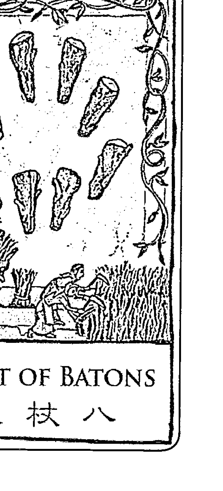

### 看见自己心中的脚

要想成功丰收，越到最后，就越应掌握时效，越应勤于修省，看看时间流程与运作流程的搭配是否适当。注意“行百里者半九十”，才不会因一时的疏忽而前功尽弃。而这些安排，一定得靠平日的专业修为，才可循序以进；还要靠完成时的能力施展，才能顺畅运行。运作能力平时要训练，上场才拿得出东西来，而且要发挥执行时的带动力。如果带动力不足，往往会影响到时效，也会影响到下一个阶段的进度。

## 爱的心灵滋养特写

- 关键正位：  
  - 包容的心，造就丰美的爱。  
  - 给予惊喜，给予感动的心。

- 关键逆位：  
  - 如果用混乱的热情来带动、组织，结果当然一团乱。

## 策略途径滋养特写

- 关键正位：  
  - 目标的贯彻，要有合理的进度，才能完成。

- 关键逆位：  
  - 组织的能力不够时，要重新学习，才不会运作得一团乱。

> 想一想，请你告诉我：  
> 你该用什么样的心情去收获？

---

## 权杖9  
Nine of Batons

- 关键联想：整合、谨慎、防御  
- 牌阵速记：109

### 河图数理

9这个数在河图，属于领导力、智慧与整治；权杖代表主意、执行、仁爱。  

9之数搭配权杖象征着——联合防卫。

## 塔罗小牌态度品质

愚人探索权杖的权力、主意后，体悟到权杖8的收获流程安排足以影响收获的效率，但问题来了：收获完成后，要如何保管成果呢？于是他学习运用权杖9的联合防御。

权杖9这张牌，九支排成两层弧形的棍棒下，放着收获完成的庄稼，它们全部被捆在一起，没有人看管。象征资源整合完成后，资源的保管、应用与分配，都是值得深思的事，并考验着领导人的智慧。如此场景真是让人捉摸不清，假使不愿看管，也应载往粮仓储存或搬到市场贩卖，要不然恐怕会惹人心生非分之想。

许多专利与研究成果，社会对它有一定的规范与保护，不能偷用、盗取。那样会使很多努力做出成果的人损失应得的利益。久而久之，努力研发创新和认真耕耘的人，会失去支持他们继续努力的动力。

> “非礼弗履”，意即非义勿取。想把不是自己的东西变成自己的，必须通过正当的途径。如果是不合理的拥有，通常也会失去礼义。

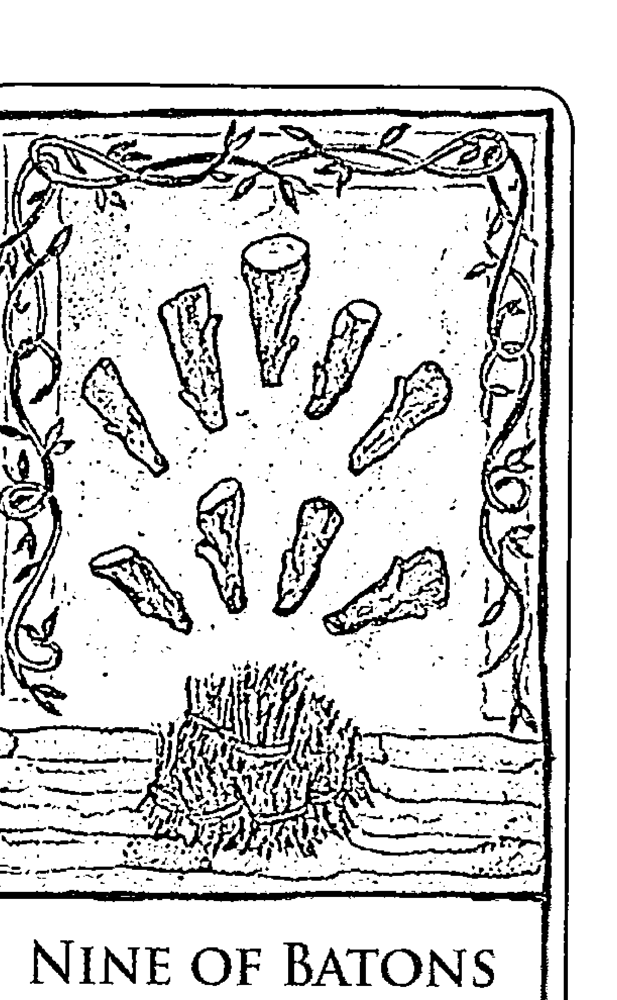

还是那句话：权力让有仁德、有远见的人掌握，那大众就有福了。

## 看见自己心中的树

“丧羊于易，无悔。”把羊养在没有栅栏的广场，就算走失了一些，又有什么好后悔的呢？自己不设安全的界限，发生问题本身就很自然。

许多自我修为的人因过度拘谨而无法发挥较大的潜能，一旦接触较开放的成长团体，往往就会大彻大悟地失去中道。只是没有“过”，人在往往就不知道何为“中”。体验后，就应知道自律与自由之间为心灵的力量。如果把安全界限全丢失，心灵自由的价值也就一并失去了。

## 爱的界限隐喻模型

- 关键正位：  
  - 爱是美的感动，心的给予。太小心的付出，很难获得共鸣。

- 关键逆位：  
  - 适度地保护自己，免得有人乘虚而入，造成莫名的伤害。

## 兼顾企业隐喻模型

- 关键正位：  
  - 小心自己辛苦努力的结果被轻易挪用。自己重视保护，才能获得别人应有的尊重。

- 关键逆位：  
  - 联合性的策略，除考虑经济规模外，还要考虑营销路线。

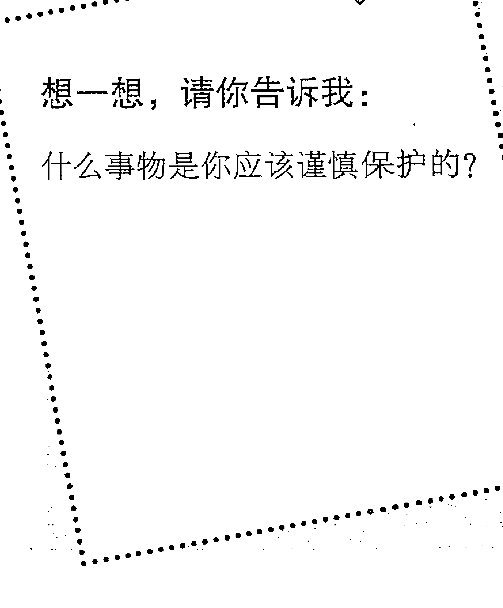

---

## 110 权杖10  
Ten of Batons

- 关键联想：压力大、责任过重、转换  
- 牌阵速记：110

### 河图数理

10这个数在河图，属于信任直觉、感性、自主、放空与混沌；权杖代表主意、执行、仁爱。

10之数搭配权杖象征着——压力管理。

## 塔罗小牌态度品质

愚人探索权杖的权力、主意后，体悟到权杖9联合防御的重要。他也想着如何与人分享自己所有的，考虑责任的背负与承担，于是他学习权杖10的资源转换与调整。

权杖10这张牌，十枝棍棒下，怡人的乡间小路上行驶着一辆超载的简陋马车。一匹老马使劲地拉着满载的粮食，尽管驾车的车夫挥舞着长鞭，依然难以前进。有一位车夫下车到车后倾力而推，却因刚好路经坡地，马车还是没怎么前进。在路旁草地上，有像一家子的三个人看到这种情形替他们捏一把冷汗，紧张张望着，并放下手中的小篮子。这景象后方有一栋房子，像是马车出发的地点（粮仓）。

老马拉着满载粮食的马车，与小篮子形成强烈对比，象征劳逸失衡、过重的责任。超载的马车与不远的粮仓，象征着重新分配的可能。

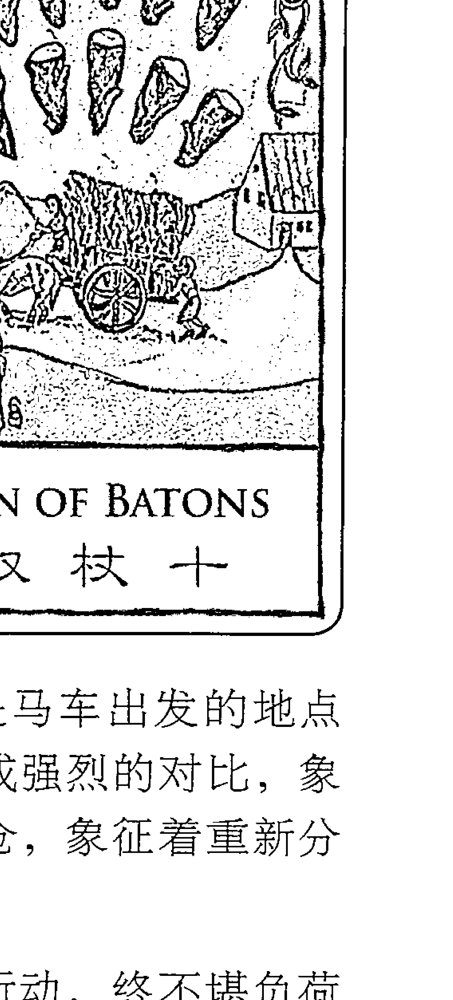

而难以行远。分权专职适任，是避免责任过重的方式。许多人已发现责任过重而无法负荷，却不想改变、不想卸除过重的承载，这是不懂转换变通的不智行为。

### 看见自己心中的脚

面临过重的责任与压力，会丧失该有的敏锐与机警，如此就容易伤害到身心。“预则立，不预则废”。预是预先企划，也代表宽裕，宽裕就不容易紧张。人、事、财物要有调度的弹性空间，一旦发生状况，才能随机应变，妥善处理。

### 爱的心灵滴滴写

- 关键正位：  
  - 责任的承担，要量力而为。过重的责任，会使人无法正确思考。

- 关键逆位：  
  - 压力通常来自最亲近的人、事、物。一旦发现，就应做出调整，才不至于生病或遭遇意外。

### 策略金钥滴滴写

- 关键正位：  
  - 成功来自不断地努力与调整。坚持大原则，调整小策略，才能享受努力的成果。

- 关键逆位：  
  - 劳逸不均的工作分配，难以得到认同。

> 想一想，请你告诉我：  
> 什么样的事情，会让你难以喘息？什么样的工作让你无法思考？

---

## 111 权杖侍从  
Knave of Batons

- 关键联想：好奇、认真、服务  
- 牌阵速记：111

### 河图数理

权杖宫廷牌的第一张。

1这个数在河图，属于创造力、自信和独特；权杖代表主意、执行、仁爱。

1之数搭配权杖侍从象征着——好奇、热情。

## 塔罗小牌态度品质

愚人探索权杖的权力、主意后，体悟到权杖各种状况的运用。他开始学习权杖侍从对什么都感兴趣的服务态度。

权杖侍从这张牌，一个有腮红的年轻男子，着蓝衬衣、红衣、红鞋，左手持着一枝棍棒。象征着他虽然喜欢服务别人以及追求新的事物，但他有自己的想法与信念。背后的果树硕果累累，树上停着一只安详的鸟，显得更为温馨有情。少年充满好奇的脚步，已踏上热情服务的起点。

好奇的态度，使得什么东西都变得有趣。他们展现亲切的热情，但如果以为他们没有自己的想法，那就错了。他们有自己的主见，只是还在尝试表达，因为他们知道拥有开放的态度，这种热情才容易学习到好的事物。所以，当身边的人产生好奇心时，别不耐烦。开放自己的同时，你将学到很好的知识，也将经历有趣的事物。

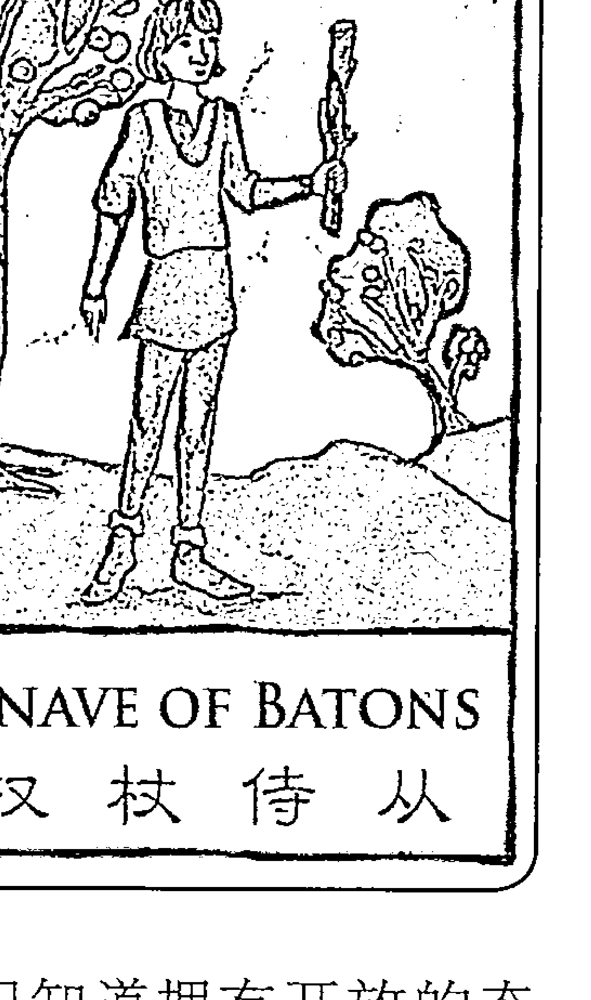

### 看见自己心中的脚

“鸣鹤在阴，其子和之。”自己心的发声能定调，别人才会找到与之和谐的鸣奏。自己的心不确定，杂乱无章的吹奏已经难听了，别人再和，岂不要更乱！因此自己在平常要有良好的思考节奏，以及心念曲调。这样，内心的热情一发出，自能吸引同品质的事物心思，从而得道多助。

### 爱德华·戴维斯撰写

- 关键正位：  
  - 热衷追求自己的理想，总会有些未知性。敢于冒险的人，不但敢梦也敢做。

- 关键逆位：  
  - 没有主见的人，对事情总是漠不关心。

### 戴维斯建议撰写

- 关键正位：  
  - 好奇心与兴趣是热情干劲的来源。保持新鲜的心情，事情做起来自然青春有劲。

- 关键逆位：  
  - 不要急着教导别人太多的技巧方法，应先培养他对事情的兴趣。

> 想一想，请你告诉我：  
> 当你发现有人偏离自己的道路，你会用什么样的态度去规劝他呢？

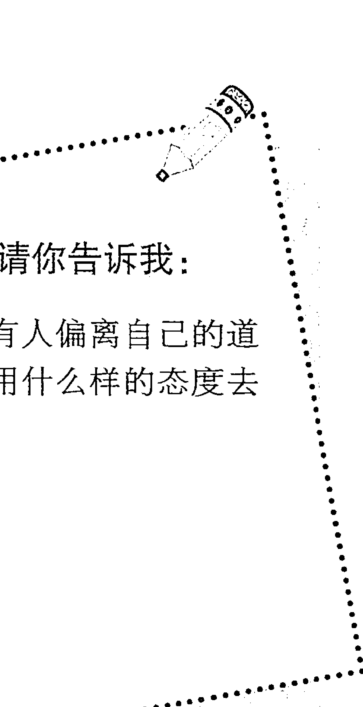

---

## 112 权杖骑士  
Knight of Batons

- 关键联想：行动力、积极、强烈愿望  
- 牌阵速记：112

### 河图数理

权杖宫廷牌的第二张。

2这个数在河图，属于分享、平衡与对称；权杖代表主意、执行、仁爱。

2之数搭配权杖骑士象征着——积极传达。

## 塔罗小牌态度品质

愚人探索权杖的权力、主意后，体悟到权杖侍从的热情服务。他想要学习权杖骑士，把这份好奇的想法化为积极的行动。

权杖骑士这张牌，骑士穿蓝色的衣装，着红色的鞋，表情自信从容，骑着一匹套有红色马绳、马鞍的白马，在山林的草地上漫步。蓝衣、红鞋表示稳定传递热情；白马、红绳与鞍代表积极地传递纯真的想法。骑士手持开放散叶的权杖，上方停着一只优雅的小鸟，象征把有成长性的计划积极传给相关部分。

热情无法化为行动的原因，往往是热情没有方向或不懂得调度。如果把动因想象成是一位自己喜欢的人，那样的心情自然会产生积极的移动，而不会只是原地踏步。他可以在意自己的装扮、态度和给人的观感。虽然稍微调整，但一定会行动，因为他是如此看重这份力量的传递。

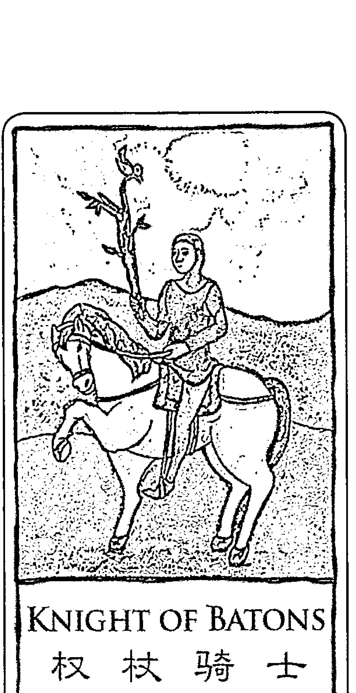

### 看见自己心中的脚

想法太复杂的人总是原地打转，难以前进。你要考虑的是，这件事情该不该做？想不想做？这些情形考虑完后，就不要再反复纠结。如果不做，就先搁下不做的想法；如果想做也该做，那就思考如何去做。办法想出来后，就是做！别再怀疑。

### 爱的心灵箴言摘写

- 关键正位：  
  - 有时候行动才是破除懒散的妙方。当你想好要做，就去做。只有去做，才会真正从中得到事情的窍门。

- 关键逆位：  
  - 你的用语会成为习惯性的表达方式。如果它没有正确地传递自己的感情，那就要再调整想法和用语。

### 深呼吸心灵箴言摘写

- 关键正位：  
  - 正确地传递自己的想法，才能有效地领导。

- 关键逆位：  
  - 配合行动时，要看清楚主事者的方向。

> 想一想，请你告诉我：  
> 你有什么想法，是别人认为不可能，而你却想冒险去做的？

---

## 113 权杖皇后  
Queen of Batons

- 关键联想：魅力、动向明朗、直率  
- 牌阵速记：113

### 河图数理

权杖宫廷牌的第三张。

3这个数在河图，属于表达力、敏锐与多样；权杖代表主意、执行、仁爱。

3之数搭配权杖皇后象征着——乐观进取。

## 塔罗小牌态度品质

愚人探索权杖的权力、主意后，体悟到权杖骑士的积极行动。他觉得除了积极外，还要有权杖皇后开朗乐观的态度，才能做得更好。

这张牌中，皇后坐在精雕的座椅上，象征尊贵无比。双手捧着粗壮的开枝权杖。蓝色衣服精致的镶边、红色披风，以及她专注的眼神，都表示她不但能冷静思考、热情行动，而且对事情有很高的把握，因为她专注又有吸引力。

有的人认真地执行一件事情，但不够友善。这样就算事情再有意义，也很容易受到阻力，因为大部分人不喜欢不友善。有想法、有热情的人，如果能再用心给人友爱，不但自己快乐，别人也会乐于支持。

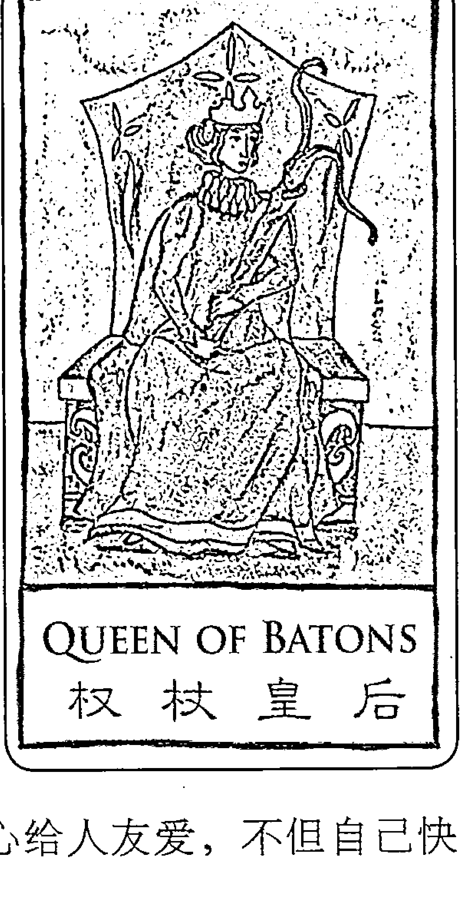

### 看见自己心中的脚

有些“功高震主”的人，因为资历老就不守规矩，这些人是老板最头痛的人物。老板确实得敬他三分，但没有一家公司的运作，是缺他不行的。

许多有功于公司的人，以为立下的功劳无人能比，公司没有他不行，甚至习惯影响公司运作，结果弄得自己落荒而逃，而公司依然正常运转。

我们千万别像这种人。“功成不居”才是上策。不居不是不承认自己的努力，而是不夸耀。当然，也要会做报告。有些做事能力普通的人却能高升，你能力很强却原地奋斗，原因可能是他会做报告，而你不会。回报是让最高层放心与掌握的方式。你做得好，但不报告，老板依然不放心，因为这样表示沟通的清晰度不够。因此我们要做到功成不居、友爱同仁，并懂得报告。

## 爱你的心灵增高垫

- 关键正位：  
  - 有主见的行动者，通常要注意亲切的态度。

- 关键逆位：  
  - 没有想法的人，连要辅导别人都无从下手。

## 策略金钥增高垫

- 关键正位：  
  - 专注地观察，就能找到着力点。

- 关键逆位：  
  - 规划要考虑执行的情绪。越紧迫的进度，越需要友善的态度。

> 想一想，请你告诉我：  
> 当你表现出什么样的态度，别人最信赖你？

---

## 114 权杖国王  
King of Batons

- 关键联想：主见、坚强、德政  
- 牌阵速记：114

### 河图数理

权杖宫廷牌的第四张。

4这个数在河图，属于稳定、分析与成形；权杖代表主意、执行、仁爱。

4之数搭配权杖国王象征着——强烈信念。

## 塔罗小牌态度品质

愚人探索权杖的权力、主意后，体悟到权杖皇后的乐观友善。他觉得自己一定要学会权杖国王的坚定信念与仁德之政，才能完全体悟权杖的运用。

这张牌中，国王坐在尊贵的雕椅上，表情坚定，蓄着胡须代表他阅历丰富，能果断行事。手持坚固的开枝权杖，表示他懂得分层负责。蓝色金边镶衣代表他的想法优越，红色披风代表他有执行的热忱。奋斗到现在的高位，就是要行使他的德政。他虽稳坐，却随时准备起身倾听人民的声音，并付诸实际行动。

> “精诚所至，金石为开。”要确认行动的正确性，如能确认，又能贯彻，自然再艰难的事情也能成功。精诚的重点，是在每个行动的间隔都要信念坚定。当你抱着舍我其谁的态度时，自会感召想帮助你的人。每次行动的间隔看起来似乎不重要，却是维系行动是否持久的关键要素。

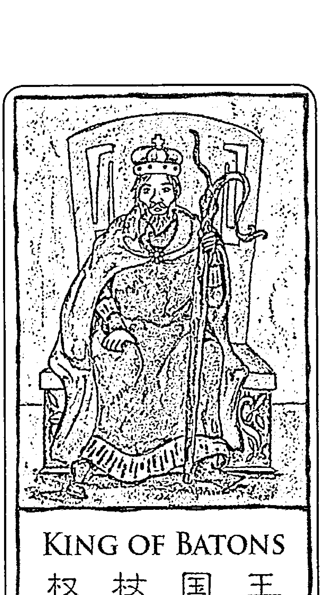

### 看见自己心中的脚

“勿意、勿必、勿固、勿我。”当决策已定后，要懂得让心回归自然的弹性。有些人因认真地抉择一些事件后，心变得异常坚硬。过刚易折，我们要保持坚强的信念，也要有柔软的身段，才能增强韧性、不屈不挠。

能坚持目标又能欣赏自己态度的人，他的坚强一定有绝佳的韧性。如果自己都不欣赏自己的态度，那就表示所坚持的态度是有问题的。

### 爱的心灵成长特写

- 关键正位：  
  - 对自己的想法有自信的人，能给人较强的安全感，也比较容易说服别人。

- 关键逆位：  
  - 换个立场想，就比较容易了解别人。

### 桑德拉·德勒塔特写

- 关键正位：  
  - 执行策略，要有坚强的信念，与随时随地都能应变的态度。

- 关键逆位：  
  - 固执己见，又无法接受他人意见的人，往往不容易成长。

> 想一想，请你告诉我：  
> 固执己见，又无法接受他人意见的人，往往不容易成长。

---

## 201 圣杯Ace  
Ace of Cups

- 关键联想：丰饶、满足、组合力  
- 牌阵速记：201

### 河图数理

- 这个数在河图，属于创造力、自信和独特；圣杯代表分享、协调、礼节。  
- 1之数搭配圣杯象征着——喜悦的爱。

## 塔罗小牌态度品质

愚人探索圣杯的协调、分享后，体悟到圣杯1（Ace）丰饶的心是与人分享的第一要件。他反思自己的内心不够丰美，如果内心没有东西，如何与人分享呢？所以要先建立分享的条件，然后开放自己，才能与人分享自己所创造的美好。

圣杯1（Ace）这张牌中，一个漂亮的金杯盛满了新鲜的果实，一些果实都快掉出来了，象征内心的丰盛已自然满溢，也代表分享是一种再自然不过的事。饱满的果实还长着新鲜的嫩叶子，象征分享时给出的都是最好的。圣杯象征分享与协调，一个圣杯中装有所有果实，代表努力的成果已是有目共睹的。

爱是自然的给予。当你觉得内心贫乏时，就什么也给不出来。组织当中需要各种不同能力的组合，生活也是如此。这些人都要有一颗愿意给出的真心，生活圈的品质才会提高。

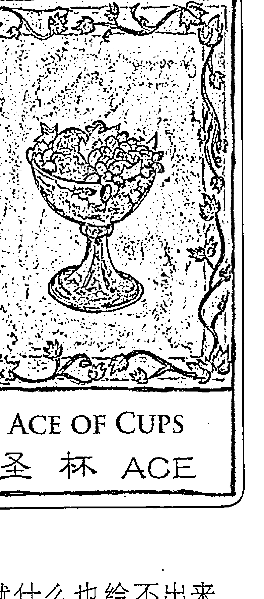

### 看见自己心中的脚

分享你的独特。当你想做一件事的时候，可以花些时间做准备。当准备到一个阶段，你可能会去泡个茶、买个零食、洗个衣服，或者看看隔壁家养的那对鹦鹉。生命本有许多偶然，你可以随时加入新的可能。

但当你每次要完成一件重要的事时，往往又会被其他事情绊住注意力，导致错用了自己的力量。

如果再有这种情形，就先准备好再投入。别担心你做得不够好，这个担心会使你分心去做没有意义的事。把焦点放在如何进行、如何改进、如何组合和如何变化上。如此，你就能善用丰沛的内在力量。

## 爱的心灵隐藏特质

- 关键正位：  
  - 一旦你知道自己的内在很丰盛，你就会把这既丰盛又独特的自己，以爱的喜悦分享。

- 关键逆位：  
  - 生命不要一直浪费在不是自己的道路上。

## 策略金钥·隐藏特质

- 关键正位：  
  - 有丰沛的产能，才有充足的产量，也才能建立更强而有力的分享条件。

- 关键逆位：  
  - 过度迟疑，体力与心力就会死于情绪。

> 想一想，请你告诉我：  
> 你的生命因何而满足？

---

## 202 圣杯2  
Two of Cups

- 关键联想：平等、和谐、友谊  
- 牌阵速记：202

### 河图数理

2这个数在河图，属于分享、平衡与对称；圣杯代表分享、协调、礼节。

2之数搭配圣杯象征着——和谐互惠。

## 塔罗小牌态度品质

愚人在探索圣杯的协调、分享后，体悟到要分享内在喜悦的爱，除了要了解圣杯1（Ace）的内在丰盛之外，还要学习圣杯2的和谐交流，才能顺利表达自己内在的品质。

圣杯2这张牌中，有两个一模一样的圣杯空着，代表你可以装入你的情感，也可以装入你的幸福。一位穿着紫色纱袍的女子，头发盘起来，怀抱着一支古老的七弦琴。她轻松的表情和姿势，代表她轻松地与人分享；盘起头发，表示她想听见自己的演奏，以便适时调整弹奏七弦琴丰富的情感。

与人分享的温度很重要。太高会把对方烫伤，可能因为自己太急着给予，反而让人无法接受；太低也不好，寿命较短的暖水，是等不到精彩冬季来到的。太过冷静的人，别人很难得知他何时要做什么，所以与他的配合度自然就不好。可以冷静，但与人交流分享时，要有一定的温度。

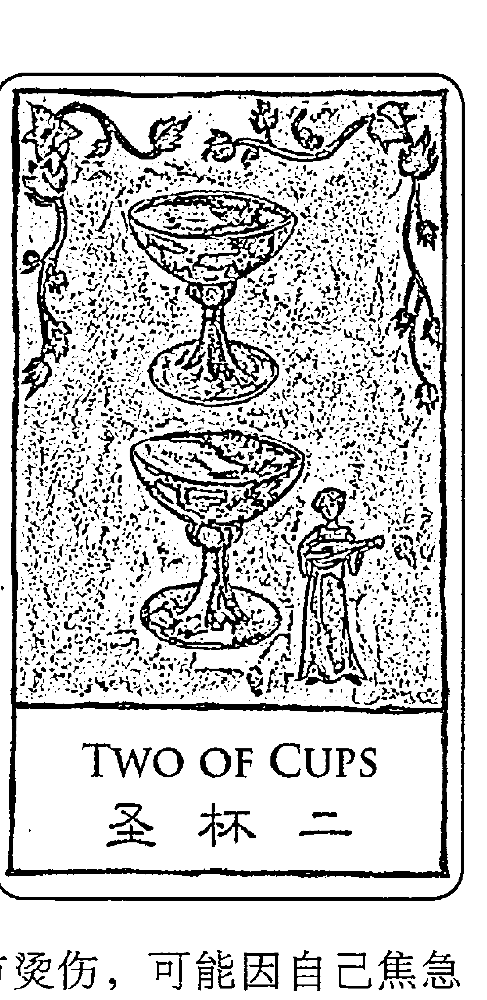

### 看见自己心中的脚

很多优美的情感表达，是从平和中开始的，慢慢增强或穿插变奏，才能表现情感的层次。就像吃套餐或宴席，先喝个餐前饮料，吃个色拉或冷盘，才开始上大菜、主菜，中间还穿插汤或炸物，还有创意佳肴，最后是甜品、水果、点心或冰品，至此才算完成了可口的筵宴。心灵筵宴也是如此，需要根据不同人的口味，然后发挥创意去调配。所以，你要怎样表达你的情感都可以，但千万记得表达对象是人，因此不能忘却人性。

## 爱情的心灵炼情特写

关键正位：  
平等地给予，和谐地分享。

关键逆位：  
朋友之间不要因为冲突就不沟通，冷静处理，自然会慢慢化解。

## 领悟企划沟通特写

关键正位：  
建立阶段性的需求，交流时会更有效。

关键逆位：  
失衡的非对等关系，要尽力去维持互惠的架构。

> 想一想，请你告诉我：

你认为怎样才叫和谐？你能借由它来表达你的爱吗？

---

### 203 圣杯3 / Three of Cups

关键词：鼓舞、庆祝、响亮  
牌阵速记：203

### 河图数理

3这个数在河图，属于表达力、敏锐与多样；圣杯代表分享、协调、礼节。

3之数搭配圣杯象征着——欢欣鼓舞。

### 塔罗小牌态度品质

愚人在探索圣杯的协调、分享后，体悟到圣杯2的互惠和谐，他希望再学习圣杯3的欢欣鼓舞的方式来分享他的爱。

圣杯3这张牌中，三个圣杯渐层排列，表示响亮度节节上升。一位穿着红色轻纱的女子，拿着手鼓正敲打着，象征着欢乐的气氛，也鼓舞了人心、士气。美好的东西已聚集一块，大家享用吧！

有能力的人往往有合作上的困难，如果寻求价值理念或利益的一致性，就能提高合作的机会。热情地表达，往往会有较大的感染力。懂得鼓励别人的人，通常也是懂得自我鼓励的人。有些人有好的能力，但是与人配合时却格格不入，那是因为他不懂得每个角色都有其适当的表现方式，这样才能各司其职、快乐工作。这些人，就要靠领导者富有欢愉的鼓舞，才会顺利发挥他们的能力。

---

### 看见自己心中的脚

一盘好吃的菜，依靠厨师的厨艺，也依靠食材的搭配。例如一盘香菇豆腐加辣，辣椒不会因切丝切段而失去辣性，它的本性不变，其辣味会与豆腐和香菇融合。而豆腐虽有辣味、有香菇味，但依然会保持它自己的味道。团体合作就是如此，个性会相互融合，但个人的本质不变。当然，加上明确的目标和适当的节奏感，自然会获得美丽的成果。

## 爱的心灵窗篇

关键正位：  
鼓励是任何阶段都需要的。懂得鼓励，才能共享成果，分享快乐。

关键逆位：  
过度地想念人与事，自己就会被想念困扰，影响其他的思考。这时走出去与人交流或自我鼓励尤为重要。

## 策略思维窗篇

关键正位：  
联盟的概念，不只是联合，而是懂得利用、串联各种想法，如此才会使你找到意气相投的伙伴。

关键逆位：  
过多不必要的程序，会影响效率，应将它简化、删整。

> 想一想，请你告诉我：

你希望别人能感受到你的什么品质？

---

### 204 圣杯4 / Four of Cups

关键联想：不满、沉思、难以调配  
牌阵速记：204

### 河图数理

4这个数在河图，属于稳定、分析与成形；圣杯代表分享、协调、礼节。

4之数搭配圣杯象征着——适度分配。

### 塔罗小牌态度品质

愚人在探索圣杯的协调、分享，体悟到圣杯3的欢欣鼓舞后，发现不能只是开心而不做调配。所以，他要学习圣杯4的适度分配，避免有的分得多，有的分得少而产生矛盾。

圣杯4这张牌，有四个圣杯分两列斜放，代表分享不是很平均。既想与人分享，又想稳固拥有，心里自然会有所不安。有位男子双手各拿一支长笛，他想同时吹奏两支长笛，象征多余的贪心。本想与人分享一支，又想自己两支都独占。假如他懂得收藏与调配使用，他就不至于陷入沉思了。

我们努力奋斗得来的东西，真的不容易做到与人分享，但常常鱼与熊掌难以兼得。有些人想让别人知道他的努力，但又舍不得把成果拿出来与人分享。即使拿出来，也担心别人拿太多，因此心里不安，失去安全感。不管他怎么拥有，都不会满足。其实，他只要建立一个与别人分享的基本调配模式，以后就不用为了与人分享而烦恼了。

---

### 看见自己心中的脚

有舍有得，手抓得紧紧的，就算别人给他新的东西、更好的东西，他都无法拥有。一位真正愿意与人分享的人，会愿意把自己的能力适时贡献于社会。当他真心付出时，他不会埋怨，而会赞叹自己能量的流动。

当你愿意让自己的爱流动，让喜悦流动，让能力流动时，你将会获得无比的安全感。因为你的心也因流动而得到了响应，生活也得以稳定。但要记住，稳定不是固守，越想固守，你就会越害怕失去。

### 爱的心灵悄悄话

- 关键正位：如果感到缺乏安全感，可能是你有什么事情没有调配好，能量流动不良。  
- 关键逆位：在问别人能给你什么东西之前，要先问你自己能给他什么东西。

### 策略企划悄悄话

- 关键正位：好的企划，不是所有好想法的集合，而是好的想法的取舍。  
- 关键逆位：你不满意的事，是给予得不够，还是要求得不够清楚呢？

> 想一想，请你告诉我：

你的能量流动的同时，产生了爱或喜悦吗？

---

### 205 圣杯5 / Five of Cups

关键联想：漫不经心、远行、失落  
牌阵速记：205

### 河图数理

5这个数在河图，属于自由、规范与变动；圣杯代表分享、协调、礼节。

5之数搭配圣杯象征着——自在延伸。

### 塔罗小牌态度品质

愚人在探索圣杯的协调、分享，体悟圣杯4的不满情绪与适度分配后，开始学习圣杯5的延伸性分享，使得分享的品质更丰富多元。

圣杯5这张牌，上面三个圣杯组成倒的等边三角形。下面的圣杯，一个倒、一个倾，表示信念虽不变，但做法得改变，甚至要把不合用的做法推倒，才能重建新做法。旅行、观光似乎是吸收新知、实际观摩的方式。

图中有个小孩背着两个小鼓，一个衣着鲜艳、衣色有层次的男子，正漫不经心地打着小孩背上的鼓，象征着不专注的传承，品质一定低落。要把所学分享给别人，一定要专注并且有步骤，还要鼓励别人多走、多学习，有体验才会有创新。

乐观的人看到三个稳定的圣杯，至于那两个有待稳固位置的圣杯，他不会担心其倾倒。其实，正确地看事情很重要，该改进的改进，该保持的保持，这样才能找到改进的方法。如果过度忧心，就容易焦虑，说不定连已稳定的都会被自己慌乱推倒了。

与人分享要放松心情。本来大家同乐就不能太紧张，但如果太漫不经心，对方就会感觉没受到尊重，如此一来，本来的好意就会打很大的折扣。

### 看见自己心中的脚

凌乱、无章法的自由传承，只是一种无奈的延续。如果要把所学的技能教导给别人，一定要自己掌握好自由与规范的度：哪些最好有谱，哪些可以临时变化，都要掌握好。如此受教者才容易上手，也才能活学活用。

### 爱的心灵滋养特写

关键正位：  
做事要专注而放松，即精神、心意专注，而情绪和身体肌肉放松。

关键逆位：  
散漫的作风，令人感到没保障，难以对其产生信赖。

### 策略金字塔滋养特写

关键正位：  
要分开估计固定的预算与流动的预算，避免混杂而看不清真正需要控制的事。

关键逆位：  
坚持大原则，细节部分可以有些弹性。

> 想一想，请你告诉我：

什么事让你觉得遗憾？现在如果可以补救，你会怎么做？

---

### 206 圣杯6 / Six of Cups

关键联想：熟练、善良、感染力  
牌阵速记：206

### 河图数理

6这个数在河图，属于企划力、完美与导引；圣杯代表分享、协调、礼节。

6之数搭配圣杯象征着——经验依靠。

### 塔罗小牌态度品质

愚人在探索圣杯的协调、分享，体悟圣杯5的自在延伸，以及既心意专注又能放松情绪的品质后，觉得他还应该学习圣杯6的掌握力与感染力。

圣杯6这张牌，六个圣杯放置得很协调，代表影响力稳定。一位妙龄女郎双手展开，并拿着铃铛起舞，淡紫色罗纱的衬托更让她显得轻盈曼妙。手上的铃铛仿佛是从腰际的袋子里拿出来的，这个袋子既实用又好看，象征着她注重品味。

当一位技艺之师，除了传授技艺之外，更重要的是启发思考，引导学生主动学习，慢慢熟练，而不是单纯教了一大堆观念。面对学生来说，不行动、不主动的话，根本学不好所有技艺。已经掌握到美妙的技巧后，更重要的是发挥那些技法的效能，以及让那些效能产生感染力。

### 看见自己心中的脚

记忆的目的，就是强化经验的连接。人如果完全没有记忆力，那么最普通的事也得重头学起，所以记忆很重要。有记忆，理性思维才能发生作用。

但人不能老是活在回忆中。怀念过去的种种，对当下的事就会失去包容心，也会对未来减少兴致。怀念很美，怀念也可以是心灵的拥有，但过度怀念过去，生命力就会降低，与现实也就格格不入。

### 爱的心灵隐喻特写

关键正位：  
情绪的感染力比理智性强很多，也容易感动人，但理智精神的感染力却能长存。近事善用情绪，远事善用精神。

关键逆位：  
给予要注意对方的品味与接受力。

### 策略检视隐喻特写

关键正位：  
最好的经验法则是，永远可以更新处事法则。

关键逆位：  
没有抓住关键因素的企划，只不过是一些文章的编排。

> 想一想，请你告诉我：

你如何运用你所掌握的关键因素，去影响事情的发展？

---

### 207 圣杯7 / Seven of Cups

关键联想：学习、浪费、不切实际  
牌阵速记：207

### 河图数理

7这个数在河图，属于学习力、开放与修正；圣杯代表分享、协调、礼节。

7之数搭配圣杯象征着——协奏共鸣。

### 塔罗小牌密度品质

愚人在探索圣杯的协调、分享，体悟圣杯6的感染力后，还想学习为大家服务时的开放程度，因此他要学习圣杯7的协奏共鸣，与人一同贡献发光。

圣杯7这张牌排列了七个圣杯，其中上下各三个杯对称排列，又一个杯放在正中央，代表学习与练习之后的共通性，相互连接与关系的建立。七个圣杯的杯脚都有花纹装饰，表示彼此配合时要注意细节与情绪。

中央杯子两边各站一位乐师，其中一位拿着七弦琴，代表他有良好的旋律感；另一位拿手鼓，代表他节奏感强。两人各有擅长，彼此也互相羡慕。他们可以发挥所长，也可以互相学习，但不能心生不满，更不能空想，否则不但自己会表现不好，与他人也会不协调。

懂得鼓励人的领导者，别人就喜欢与他配合吗？不一定。如果鼓励只是为了达到提高做事效率的目的，而不是注重人的感受与做事的品质，那当然难以使人信服。因为他忘了真正地关怀“人”，而只一味重视“事”。要知道事都是人做出来的，所以人、事都应注重，这样的领导者才能使人信服，使人愿意极力与他配合。

### 看见自己心中的脚

电视台会不会把收视率很高的节目随意换掉呢？不会！因为那节目效能佳。优胜劣汰，撤掉效能低的，换上效能佳的，是变换的基本原则。

一家自助餐店，常常需要变换一些菜色，客人才不会觉得腻。当然是把最受称赞的菜色留下，换掉冷门和周转率逐渐不高的菜，然后再试着推出一些新菜。而这些新增的菜，要以搭配或衬托原来菜色为要，整体才会协调。

### 爱的心灵滋养练写

关键正位：  
除了让优点相互辉映外，还要懂得相互学习与移转。好比果树进行接枝改良后，就会产生新的优良品种。

关键逆位：  
各吹各的调，如何合作？

### 策略金钥滋养练写

关键正位：  
建立赢家圈的连结，相互支持，并回馈给较弱的环节。

关键逆位：  
评估新方案时，应多听各方的情报与意见。

> 想一想，请你告诉我：

面对合作，你以什么为开放的重要条件？

---

### 208 圣杯8 / Eight of Cups

关键联想：新的追寻、内涵、善变  
牌阵速记：208

### 河图数理

8这个数在河图，属于权力、丰富与组织；圣杯代表分享、协调、礼节。

8之数搭配圣杯象征着——深度心灵。

### 塔罗小牌态度品质

愚人在探索圣杯的协调、分享，体悟圣杯7的协奏要领与共鸣度的发挥后，还想学会圣杯8的深度心灵，以做出更有智慧的分享。

圣杯8这张牌，八个圣杯的排列虽整齐，但感观上仍觉得缺少了一个，这象征虽有丰富的内在，却仍有所不足。牌下方一位男子正吹着笛子，身边放着小鼓，象征他多才多艺、求新求变，但也警示人们最好不要养成喜新厌旧的陋习，否则与您交流的人会很难适应你多变的个性。

“学而不思则罔，思而不学则殆！”

人往往要通过观察和学习新事物，才能建立丰富的内心世界。光靠沉浸自己是不够的，学习之后开始沉淀，然后再度观察，才会有新的领悟。经过闻、思、修的追寻，自能建立深度内涵。多样化的学习当然可旁征博引，但切忌贪多，过度分心会一事无成，更会增加放逐自我的可能。

### 看见自己心中的脚

有深度智能的人，懂得给予，也乐于当“花粉传播者”。当你是“花粉传播者”，你就会给予不同的人学习力，也会从你给予当中学习到新的传播方式。但传播者不是主事者，所以不需要为了权力问题而放弃。反之，如果主事者有这种深度的心灵品质，又不贪权力，那一定会大受欢迎。

### 爱的心灵塔罗特写

关键正位：  
有系统地传达内心丰富的想法。

关键逆位：  
外在形式过度变迁，虽然没有违背自我价值，但总让人难以适应。

### 策略企业塔罗特写

关键正位：  
具有鼓动性的组织能力，能带领大家找到内在品质。

关键逆位：  
决策善变，将令人无所适从。

> 想一想，请你告诉我：

你现阶段追寻的到底是什么？

---

### 209 圣杯9 / Nine of Cups

关键联想：游刃有余、快乐、吸引力  
牌阵速记：209

### 河图数理

9这个数在河图，属于领导力、智慧与整治；圣杯代表分享、协调、礼节。

9之数搭配圣杯象征着——魅力吸引。

### 塔罗小牌态度品质

愚人在探索圣杯的协调、分享，体悟圣杯8的深度心灵后，开始学习到圣杯9的驾驭力与吸引力。

圣杯9这张牌，九个圣杯排得非常稳当，代表整体性的分享。一个男子放下手边的小鼓，轻松地玩倒立，仿佛告诉别人自我实现真的很容易，你也可以轻松地彰显自己。

当一个人心满意足的时候，总会不经意地流露出喜悦，手舞足蹈，轻声歌唱，给人很大的鼓舞。所以不必担心自己是否能给别人快乐，重要的是你要自己先快乐。你够快乐、内心够喜悦了，就算你想掩饰都难。

### 看见自己心中的脚

看见自己丰富心灵的时候，你会游刃有余地表现自己，对于自己的生活态度，也会给人以怡然自得的感受。这样的你也不会得意忘形，因为你对自己有把握。这时候你像一个做惯批发生意的大盘商。

但你不一定能让别的小商店生意兴隆。在教导别人的时候，你可能会忘记把你的心摆在发现与创造的那个转变点上。你用现在所掌握的方法，去教一个正在进行心灵探索的人，你忽视了他的成长过程，也忽略了他的困难。对事、对人的心灵探索很重要。你可以一样轻松快乐，但却要真实面对每一次的感受，真实探索与人交流的感受。如此，你的影响力与魅力就将发挥得淋漓尽致。

### 爱的心灵随笔撰写

关键正位：  
丰富的情感与真实的行动，使得愿望的实现变得容易。

关键逆位：  
无心的交流，不如不交流，否则会招来不必要的麻烦。

### 策略金钥随笔撰写

关键正位：  
把需求层次、运作层次与心灵层次整体联系好，自能轻松实现想望。

关键逆位：  
对于没有把握的事，不要轻许诺言！先了解一下整体资源运用，再提出适当的配套措施。

> 想一想，请你告诉我：

你现在彰显自己时，是有些勉强，还是游刃有余呢？

---

### 210 圣杯10 / Ten of Cups

关键联想：愉悦、正式演出、慷慨  
牌阵速记：210

### 河图数理

10这个数在河图，属于信任、直觉、感性、自主、放空与混沌；圣杯代表分享、协调、礼节。

10之数搭配圣杯象征着——信任感觉。

### 塔罗小牌态度品质

愚人在探索圣杯的协调、分享，体悟圣杯9游刃有余地散发魅力后，还要学习圣杯10情绪的包容力。

圣杯10这张牌，十个圣杯整齐放置，腾出一个表演空间，象征情绪的包容力。一位衣着庄重的女士稳坐表演椅上弹奏竖琴，代表她进行着情绪旋律的调节。

弦的调节是分享的重点。弦太紧，分享太刺激，再好的东西也不被接受；弦太松，分享零落，再棒的事情别人也感受不到欢乐。调节好自己情绪的每一根弦，才能做出一场正式的分享，让别人感受欢乐与美好。

### 看见自己心中的脚

当你重视自己的演出，别人才有可能看重你的表演。

一位著名的布道家在台上演讲，他有许多忠实的信众，演讲每每爆满，听众挤得人山人海。另一位年轻的布道家想学习这位著名布道家的理念及情绪语言。经过几场的跟随，他发现著名布道家并没有很突出的见解，于是纳闷地问前面热烈回应的一位听众：“为什么你这么相信他所说的话呢？”

这位热情的听众笑着回答：“我没有很相信他讲的，是他自己很相信他所说的一切！哈哈哈……”

没有什么比“相信”更具感染力了。布道家与小说家都很有这种感染力。你“相信”自己所说的，你就是布道家；你“相信”自己所说，但又不一定完全信服，那你就有机会成为小说家。

### 爱的心灵密码特写

关键正位：  
美好的情绪，如同一场正式的演奏，表演时令人赞叹，表演完掌声不断！

关键逆位：  
相信爱是可以的，然后往可以的方向努力。不必要的猜疑，只会使爱搁浅！

### 策略企划密码特写

关键正位：  
调节好组织成员的关系，自能产生良好的默契，并产生美好的结果。

关键逆位：  
联络不畅的组织，情绪冲突一般较大，容易阻碍决议的实施。

> 想一想，请你告诉我：

你相信自己所说的话吗？

---

### 211 圣杯侍从 / Knave of Cups

关键词：信赖、关怀、思考  
牌阵速记：211

### 河图数理

圣杯宫廷牌的第一张。

1这个数在河图，属于创造力、自信和独特；圣杯代表分享、协调、礼节。

1之数搭配圣杯侍从象征着——温馨细腻。

### 塔罗小牌态度品质

愚人在探索圣杯的协调、分享，体悟圣杯分享时的各种心态后，想学习圣杯侍从温馨细腻的服务态度。

圣杯侍从这张牌里，侍从穿着充满生机活力的绿衫衣，象征热情的红上衣与代表行动细心的蓝毛袜；腰间系着可爱的袋子，代表他的细腻。双手捧着大圣杯，准备拿来装饲料给葡萄园上这两只大鸟喂食，表示他的分享不是随意地撒放，而是尊重地给予。地上这只大鸟伸颈期盼，而奇异花树上的那只大鸟也好奇地回头，表示异中求同。

细腻的关怀总是比较容易看到别人的需求。如果你给的不是他想要的，那可能他就很难感受到你想分享的品质。当然，有时候我们可以给他未来需要的东西，但要让他感受得到。不然他不会珍惜，更不会留到未来，可能在你转身时就丢弃了。所以，细腻地关怀他的需求，温暖地给予他最需要的，他就能享受你给予的品质了。

### 看见自己心中的脚

怀着适度的温度就能发光，并能看清你要走的路。做任何你喜欢的事都是幸福的，任何你想做的事都是生命的奖励。为自己奖励自己，而奖励别人也是奖励了自己。因为我们喜欢的事，都是生命关怀自己的事。看清楚自己喜欢的是什么，你就能发觉生命的关怀与奖励是什么了。

## 爱的能力：觉察篇

关键正位：  
细心关怀，异中求同，自能化解歧见，得到信赖。

关键逆位：  
不够谨慎或太过紧张，都容易弄翻了你的爱。

## 策略性觉察篇

关键正位：  
需要真心关怀、探询，才能从不同的事情中，找到自己想表现的品质。

关键逆位：  
你忽略的细节往往会影响大局，你为何不注意呢？往往找出与未来成果有关的细节，就是成功的决胜点。

> 想一想，请你告诉我：

你选择的是你喜欢的吗？它与你的生命活力有什么关系呢？

---

## 212 圣杯骑士 (Knight of Cups)

> 关键联想：浪漫、体贴、深思熟虑  
牌阵速记：212

### 河图数理

圣杯宫廷牌的第二张。

2这个数在河图中，属于分享、平衡与对称；圣杯代表分享、协调、礼节。

2之数搭配圣杯骑士象征着——行动优雅。

### 塔罗小牌态度品质

愚人在探索圣杯的协调、分享，体悟圣杯侍从的细腻关怀服务后，想要学会圣杯骑士优雅的行动，让分享的形式与内在都成为一种艺术。

圣杯骑士这张牌，衣着整齐的骑士骑着白色骏马，配以华丽的红色马鞍与马绳，更显英姿焕发。他左手拉着马绳轻驾，表示珍惜物力；右手端着金亮的圣杯，表示懂得美化、分享与善用物力。穿过葡萄园表示情感丰富，有种令人倾心的浪漫。

懂得分享的人，有自己的步调，不急不躁，不急不慢，他的行动有刚刚好的节奏。有一种“合章可点”的感觉，即慢慢放出光芒的方式，那种使人欣赏的力量，适度的原则，成就他人的雅量，以及循序渐进朝目标前进的精神，让他成为了一位成功的支持者。假如空有物资与能力，而不懂得渐渐释放，那也只能浪费那么好的条件，好比一曲未唱完就把气用完了，气力使用不平均，就无法随着情感把力道用歌声表达出来，一首歌唱起来断断续续的，怎么会好听呢？

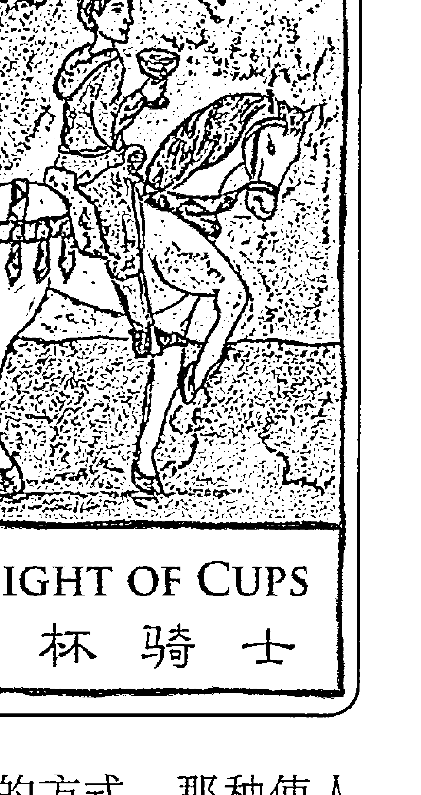

### 看见自己心中的脚

当一个人愿意为爱守护，他就有了强烈的幸福期许，他实现愿望的力量就会很强大，尽管他外在看起来是多么优雅。

爱与美、善，刚开始像树苗般脆弱，都需要守护，等它长大后，就成为可任风吹雨打的大树了。

### 爱的心灵滋养情写

关键正位：  
放松的情绪，比较容易增进感情。

关键逆位：  
优雅并非是无关紧要的行动，而是有所目标的行进，但不带急躁的情绪。如果以为缓慢是优雅，那恐怕是误解。

### 策略企划滋养情写

关键正位：  
注重整体步调的协调，表现一种适中的舒畅感，自能打动人心。

关键逆位：  
广告的夸张手法，往往只是为了聚焦效果，不能拿来欺骗顾客。

> 想一想，请你告诉我：  
你用什么态度来协调力量、目标与自我情绪？

---

## 213 圣杯皇后 (Queen of Cups)

> 关键联想：你用什么态度来协调力量、目标与自我情绪？  
牌阵速记：213

### 河图数理

圣杯宫廷牌的第三张。

3这个数在河图中，属于表达力、敏锐与多样；圣杯代表分享、协调、礼节。

3之数搭配圣杯皇后象征着——洞悉人性。

### 塔罗小牌态度品质

愚人探索了圣杯的协调、分享，体悟了圣杯骑士的优雅行动，他想再深度了解人内心的真正意愿与价值，因此，他想学圣杯皇后洞悉人性的能力。

这张牌中，圣杯皇后端坐在造型简明的木椅上，穿着白色的衬衣、红色绿碎花长袍，表示她想用纯真的方式看见需求，并发挥母性的光辉与温柔。左手协助右手捧着大圣杯，代表辅导性的协调角色，壁上满布葡萄的画，更见丰富的内心世界。

许多直觉很强的人，如能再与知性和感性结合，他的直觉力就会成为彰显自性的利器。当你直觉如此时，你的情绪感觉如何呢？知识逻辑又如何呢？如果符合自己的情感面与理性面的话，你可以把这种直觉力与感知力好好发挥，它可能会带你朝着未来价值大跃进。

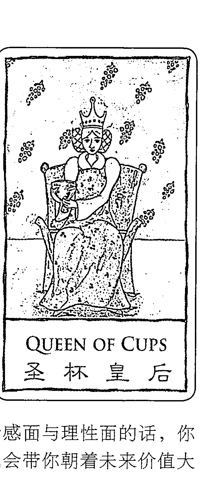

### 看见自己心中的脚

越能了解别人的人越有独特眼光，也越有包容力，因为他能看清楚事情的前因后果。他知道那些不大会为人处世的人，只是因为没有学习的环境，没有接受好的人格教育造成的罢了。所以，他不会急于纠正，或当众呵斥他们，他会先了解原因，思考他有没有别的选择，弄清楚他的动机与价值。

假如相处时间短，就用言语与他分享；相处时间不长不短，就用行为来影响他；相处时间长久的，就用情境与环境来造就他。

### 爱的心灵陪伴辅导

关键正位：  
当养分充足，建立生长环境后，就让草木自己成长，不过度关心与干扰，反而较能帮助他建立学习的兴趣。

关键逆位：  
对你有敌意的人，请你淡化你的光彩，避免与其形成过度强烈的对比，然后给出你的善意。

### 策略性刻意陪伴辅导

关键正位：  
辅导者要能倾听心声，然后结合知性、感性与洞察力予以带领。

关键逆位：  
做好改变的准备，才能从容应变。

> 想一想，请你告诉我：

你以什么力量去安抚别人？  
你真的了解他的需求吗？

---

## 214 圣杯国王 (King of Cups)

> 关键联想：宽容、懂得授权、亲切  
牌阵速记：214

### 河图数理

圣杯宫廷牌的第四张。

4这个数在河图中，属于稳定、分析与成形；圣杯代表分享、协调、礼节。

4之数搭配圣杯国王象征着——心灵智慧。

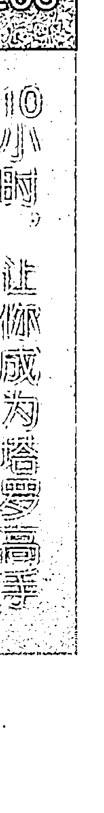

### 塔罗小牌态度品质

愚人在探索圣杯的协调、分享，体悟圣杯皇后的人性洞见能力后，已能结合理性与感性。接下来，他要把分享、协调能力做一次全盘的运用，所以，他还要学习圣杯国王的分享礼节与他的心灵智慧。

这张牌中，圣杯国王端坐在造型简明的木椅上，穿着白衬衣、红色绿碎花的长袍，并披着蓝色白碎花的披风，代表交融内心的热情与冷静的涵养。右手持圣杯，代表懂得爱的分享；左手拿权杖代表具备智慧与协调力。壁上画满收成的葡萄，显示他给大众丰足的生活。

愿意分享自身权力的人，常常是懂得授权的人。把得来不易的宝贵权力授予别人是多么不容易的事。人往往把权力握得太紧，自己累瘫了，事情也没做好，吃力不讨好，又无法得到支持，让这样的人握有大权无疑是一种浪费。

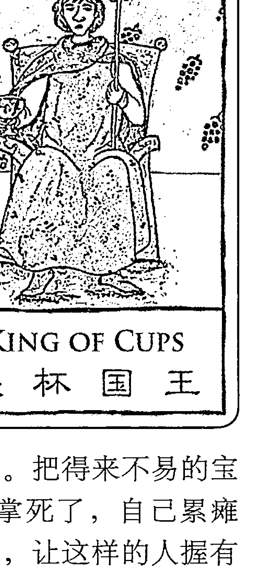

### 看见自己心中的脚

有了一颗慈爱悲悯的心后，还要培养心灵智慧。

否则，不了解别人的需求与价值，如何给予慈爱与快乐呢？或许光是有善意，别人就能感受到那种爱，但没有明确的给予，别人感受到的品质总是有限的。他若没有智慧的心灵，你的悲悯就只是同情，不能助他远离困苦。或许可以直接给予财物，这也很好，但如果能用智慧使他建立获取财物的能力，使他改变价值观念，那这样的帮助当然深远而广大。

### 爱的心灵策略导写

关键正位：  
有了宽容的心、坚强的信念与勇气，一定可以走出宽阔的道路。

关键逆位：  
不要在自己情绪不好的时候，去处理别人的坏情绪。

### 策略金钥策略导写

关键正位：  
建立权责相符、物利和谐、人事亲善的分层责任制，自然能提高效率。

关键逆位：  
处理事情公正又有智慧的人，当然会得到支持。恩威并施，自能服人。

> 想一想，请你告诉我：  
你愿意把多余的资源分享给别人吗？

---

## 301 宝剑 Ace (Ace of Swords)

> 关键联想：不要强权、突破、新的冒险  
牌阵速记：301

### 河图数理

1这个数在河图中，属于创造力、自信和独特；宝剑代表决断、维护、义气。

1之数搭配宝剑象征着——想法明确。

### 塔罗小牌态度品质

愚人要探索宝剑的决断力与正义感，他决定先学习宝剑1（Ace）勇于表达自己的想法，敢挑战权威，维持正义的力量。

宝剑1（Ace）这张牌中，一把锋利的宝剑穿过皇冠，象征不向权威屈服、伸张正义的决心。只要是想维护正义的人，都可以来拿这把宝剑。但如果不冷静专注地握住剑柄，恐怕反会被锋利的宝剑所伤。

有理想的人，通常也有野心；但有野心的人，不一定有理想。为了理想与信念突破一切的人，是受人尊敬的。但只为了满足个人私欲而破坏规则、破坏众人幸福的人，将受到众人的攻击。

## 看见自己心中的剑

社会上有许多不合理的习俗，要改变它们，往往要先带动另一种新的风气，只有这样才能将坏风气取而代之。风气的养成有赖众人的努力，当然更需要有决心、有想法的人来带动。

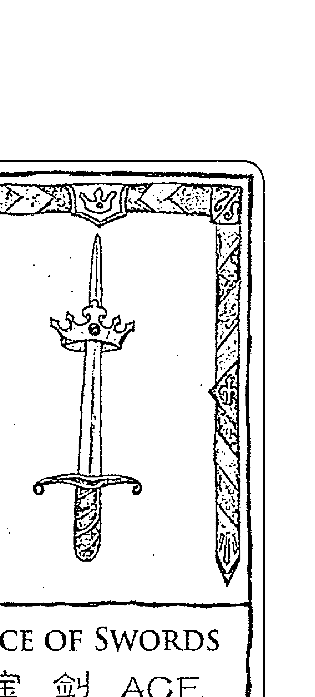

在台湾，资源回收的推广、不乱排污水等等，都是有心人士先敢而后做，然后政府政策才慢慢配合的。“风吹草偃”，如果持续力不够是很难形成风气的。当你觉得有一样事物或习俗该改善，你是以什么样的心态开始去改善它的？从心灵环保、环境保护、人身安全，还是从更舒适、更符合人性的发明开始呢？

不管你从哪个层面去想，只有方向对、持续做，才能看到效果。

### 爱的心灵随笔摘写

关键正位：  
明确地表达自己的想望，告诉别人你的目的是什么？你为什么要这么做？别人如果能信服，自然会支持你。

关键逆位：  
保护弱势与珍惜资源，最好能建立范例。

### 策略念随笔摘写

关键正位：  
将目标可视化，让每个人都能产生朝目标行动的欲望。

关键逆位：  
不要为反对而反对。如果你反对，那你必须提出更好的方案，拆完砖屋还是得盖楼屋。

> 想一想，请你告诉我：  
当今社会习俗中，你最想改变的是哪一项？为什么？

---

## 302 宝剑2 (Two of Swords)

- 关键联想：僵持、逃避、对立  
- 牌阵速记：302

### 河图数理

2这个数在河图中，属于分享、平衡与对称；宝剑代表决断、维护、义气。

2之数搭配宝剑象征着——互相尊重。

### 塔罗小牌态度品质

愚人在探索宝剑的决断力与正义感后，体悟了宝剑1（Ace）的信念以及维护正义的决心。但他还要学习宝剑2的互相尊重与反省，以便当有人与他对立并发生冲突时，他能更好地解决。

宝剑2这张牌中，两把不相上下的宝剑竖立在空中，仿佛正僵持、对立着。这两把剑对应着树林前的营帐，红白双方军队营地看不到任何战士，似乎正在营帐里推演如何解决两方的争端。

面对争议，如果尚有厘清的机会，就不该逃避。想想看彼此的信念是什么？当你看见对方的利益与自己的利益不同时，就应从不同点找到彼此可认同的协议。最怕彼此只关注自己，而忽略了对立的另一方。

### 看见自己心中的脚

面临争执时，情绪往往会很激动。情绪应该有，但过于激烈的情绪会阻碍自己的思考，也因此掩盖了事情的真实面。

很多时候你若不趋缓你执拗的想法，就无法看见与自己对等的另一面坚持。例如，你想要告诉别人应该怎么做一件事，你也想让别人自己想通这件事。这两个想法很可能你都认同，但你最后选择让别人自己想通。你做出了选择，很好！至少没有犹豫不决，但你做决定时，不能掩盖另一个想法而独断。

不掩盖的意思是，你可以适度说明、引导，但也要保留让他自己想通的空间。这样做不一定有好的效果，但你至少诚实面对了自己。

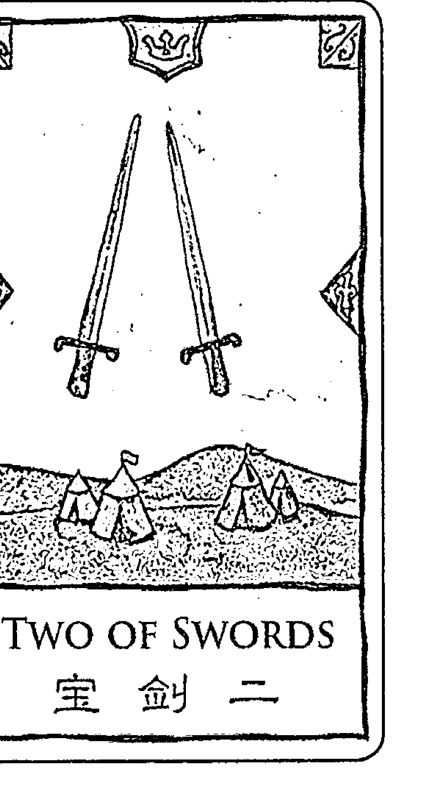

### 爱的心灵能量牌

关键正位：  
化解对立，需要诚实面对别人与自己的想法。有时退一步想，对立就不见了。

关键逆位：  
逃避不是解决问题的办法。

### 策略金钥能量牌

关键正位：  
可以执行信念的运作模式，但要兼顾信念的平衡。

关键逆位：  
互相尊重是沟通的基本要件。

> 想一想，请你告诉我：  
你和与你对立的人，平衡点在哪里？

---

## 303 宝剑3 (Three of Swords)

关键联想：犀利、悲观、伤害  
牌阵速记：303

### 河图数理

3这个数在河图中，属于表达力、敏锐与多样；宝剑代表决断、维护、义气。

3之数搭配宝剑象征着——伤痛考验。

### 塔罗小牌态度品质

愚人在探索宝剑的决断与正义维护，体悟宝剑2的相互尊重与化解对立后，发现自己因无法全然实现坚持而有些伤悲，因此，他要学习宝剑3的伤痛考验。

宝剑3这张牌，三把宝剑从天而降，表示此时面对的状态也是一种警示。宝剑下的山丘上的城堡，面对宝剑的呵斥已摇摇欲坠，象征着你面对考验时，守护能力在动摇。

清楚地表达自己的看法是率真的，但如果不顾别人的感受，那就有调整的必要。很多时候虽然你说的是事实，但人往往很难真实地面对事实，尤其在你说中他的缺点时。

当一个人彷徨时，清晰明确的建议对他说是很重要的，他可能因此找到方向。但当你的判断是他无法接受的缺失批判时，你们的感情就很可能因此而受到伤害。

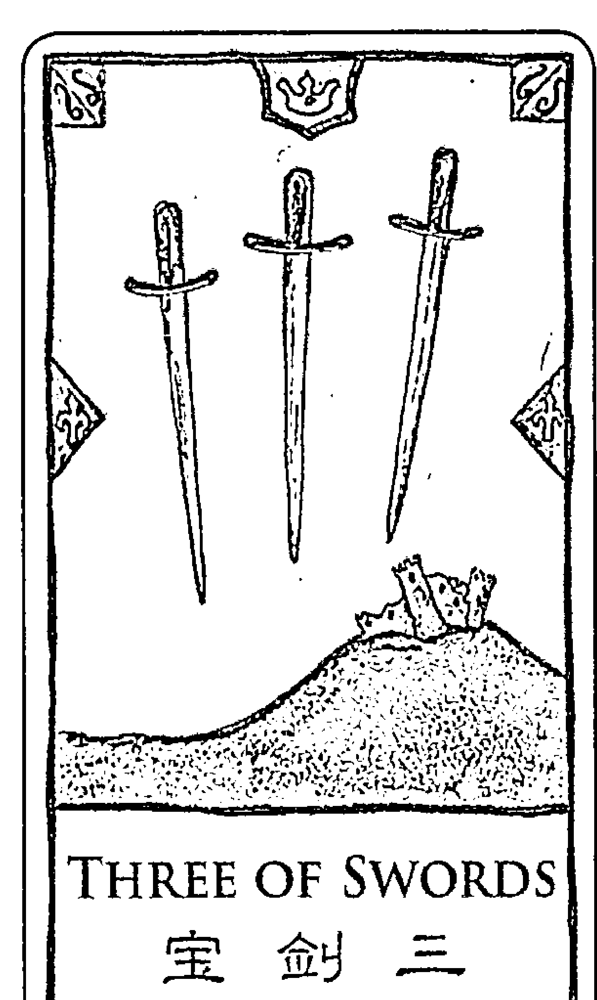

### 看见自己心中的脚

虽然心灵的成长不一定要通过悲伤的方式，但大部分的人却能因为悲伤而看见雨后的彩虹。悲伤时，你守住自己的价值了吗？你的真实情感又是什么呢？现实状况又是如何呢？

悲伤往往是因现实伤害到自我的价值与情感而起，比如你坚信的、你喜欢的未能如愿。生活中有很多这种状况，尤其是男女的感情世界里。

当现实未能完美时，你如何去调整价值面、情感面以及现实面呢？当然，思考清楚后的决断与面对，是你心灵高度成长的路径。

### 爱的心灵密码诗写

关键正位：  
你的表达是爱的示意，但对方的感受你也要顾及到，这样爱的力量与品质才不会被形式破坏。

关键逆位：  
言语的伤害，往往超过三把利剑的攻击。

### 策略金钥离合写

关键正位：  
真正乐观的人，不会过度乐观，他会承认有悲观的可能。

关键逆位：  
为所犯的错误做出弥补！勇于承担，绝不可耻。

> 想一想，请你告诉我：  
你的表达明确吗？会不会使别人伤心呢？如果会，要怎么弥补呢？

---

## 304 宝剑4 (Four of Swords)

关键词：忙里偷闲、纠缠不清、找寻方法  
牌阵速记：304

### 河图数理

4这个数在河图中，属于稳定、分析与成形；宝剑代表决断、维护、义气。

4之数搭配宝剑象征着——休息净化。

### 塔罗小牌态度品质

愚人在探索宝剑的决断与正义维护，体悟宝剑3的伤痛考验后，需要一些时间转化，于是他学习宝剑4的休息净化。

宝剑4这张牌，四把宝剑向下交错，代表事情有了转机。三位女子正铺着白色桌布，后方的营帐代表故事未过，她们只是忙里偷闲。

休养生息很重要。当人经历悲伤后，往往需要一段时间的净化，才能重新找回力量。当身心放松时，许多本来纠结的困扰就会容易解除。

生命是自己的，想法是自己的，别跟自己过不去。适度放松自己，你的快乐程度自然会提高。每个人都有所长，不要干涉别人的领域。如果你有看法，就请让自己的语言停在别人的翅膀上，做他的动力，而不是阻力，更重要的是不要拉着别人的翅膀拍打。

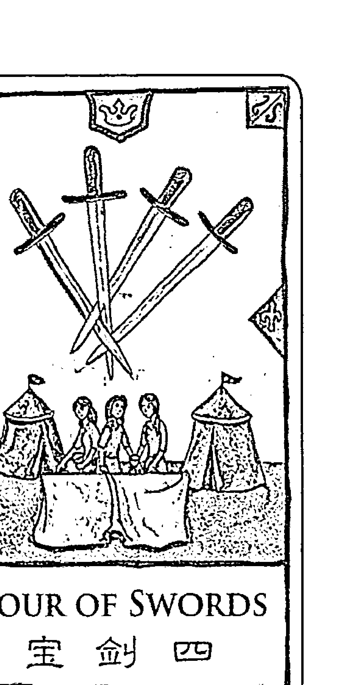

### 看见自己心中的脚

人在情绪混乱时，别急着做重大的决定。混乱的情绪，是跑出更大力量之前的不规律步伐，它等待你来调整，因为你就是自己情绪的主人。

看清它因何纠结、因何而混乱，把它带上轨道。

如果情绪过大不听使唤，那你就亮出你的多把智慧之剑，告诉自己要克服的是什么，清楚地提示自己未来的路径，指明方向，然后让自己休息。这样，你的心因找到定位，会慢慢恢复该有的弹性。

### 爱的心灵疗愈智慧

关键正位：  
忙里偷闲的闲，意义大于闲时的闲。放松自己，让自己调整好更大的力量再前进。

关键逆位：  
不安的情绪，是思考的敌人。先借着做其他的事来放松自己。

### 策略企划疗愈智慧

关键正位：  
冷静地面对困难，才能找出好的方法。

关键逆位：  
对于过去的冲突，不要耿耿于怀，放下恩怨，一起向前。

> 想一想，请你告诉我：  
什么过去是你放不下的？别人的什么错误是你无法原谅的？请问你要如何预防？

---

## 305 宝剑5 (Five of Swords)

关键联想：一面倒、暂时胜利、争斗  
牌阵速记：305

### 河图数理

5这个数在河图中，属于自由、规范与变动；宝剑代表决断、维护、义气。

5之数搭配宝剑象征着——注意纪律。

### 塔罗小牌态度品质

愚人在探索宝剑的决断与正义维护，体悟到宝剑4休养生息的重要性后，他又发现有人会因过度松散而失去纪律。所以，他还要学习宝剑5的纪律与执法，避免执法过当、丧失纪律而制造敌人。

宝剑5这张牌，五把宝剑从天而降，结构似乎有些松散，没有互撑，代表相互提醒的重要。五位军人在草丛中发现五个手无寸铁的弱势平民，军人举剑压制。有一位用剑尖指着小孩的脚踝，有一位端着宝剑作势要砍杀年轻壮年人。其实对这些弱民只需压制即可，情绪不需要那么激动，因为他们根本没有抵抗能力。

饶恕别人，才能放过自己。当你有力量伤害别人而选择不伤害时，你才是自己力量的主人。这些人事后可能感激你，也可能忘记，但至少不会恨你，不会想报复你。人很难永远得势，当你是弱势时，就是曾有恩怨降临的时候。

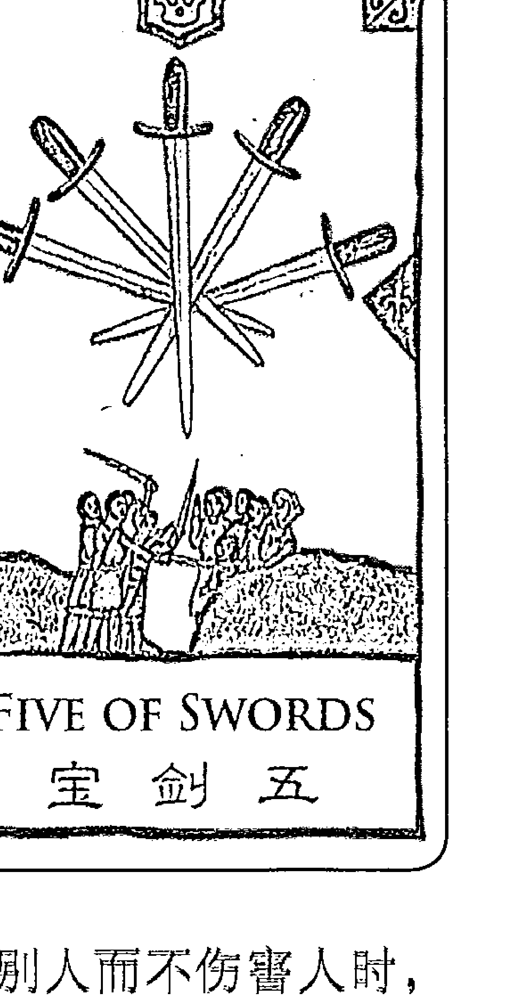

### 看见自己心中的脚

混乱中，容易误用自由，失去纪律。

失去纪律的人，他的自由顶多只是失序的乱流，只会造成更大的动荡。自由与规范本是一体的两面，你的自由侵犯到别人的自由，别人也可能侵犯你。

所以，有纪律的自由，才能享受成果。当自己的自由大于自律的态势很多时，请不要浪费你的自由，爱、分享与价值就是你自由的方向。

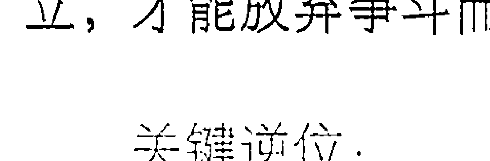

关键正位：  
爱不是争论输赢，而是能赢也要能输。唯有能输，才能放弃对立，才能放弃争斗而全心给予。

关键逆位：  
过度的关心，无疑是另一种形式的束缚。

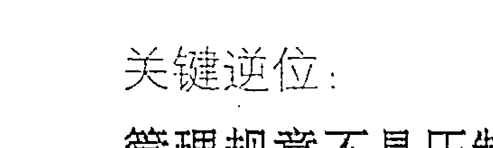

关键正位：  
目光不要太短浅。长远的规划虽可能还会有适度调整，但总比没有长远打算更令人安心，而且资源也比较好调度。

关键逆位：  
管理规章不是压制，而是避免混乱，让力量更顺利地运作执行。

> 想一想，请你告诉我：

你如何正确使用你的力量，  
如何行使你的自由？

---

## 306 宝剑6 (Six of Swords)

> 关键联想：训练、前往解决、尝试  
牌阵速记：306

### 河图数理

6这个数在河图中，属于企划力、完美与导引；宝剑代表决断、维护、义气。

6之数搭配宝剑象征着——训练引导。

### 塔罗小牌态度品质

愚人在探索宝剑的决断与正义维护，体悟宝剑5的注意纪律和适当执法后，为了避免临场的失控，他想在平时就充分准备，所以他学习宝剑6的训练引导，以及克服困难的能力。

宝剑6这张牌，六把宝剑平衡交错在天空，代表信念结构完整。底下果树果实累累，似乎训练已有一些成果。猎人穿着红衣，骑着灰蓝的马，并有两只黄色的猎犬在前奔跑，表示企划可行性高，训练程序顺利。

这不是战时营地的训练，而是平常的田野操练，象征着有备无患。

没有永远的顺利，如果没有培养排除障碍的方法，你想维护的品质就很难达到要求。公司的品管部门不强、教育训练不强的话，再好的策略与产品，也很难得到市场的认同。

没有品管，品质监控困难，而且生产的问题无法发现，也很难作为下一次研发的参考。训练就是给予观念、建立方法和不断练习，如此自能很快上手，做出较符合要求的品质。

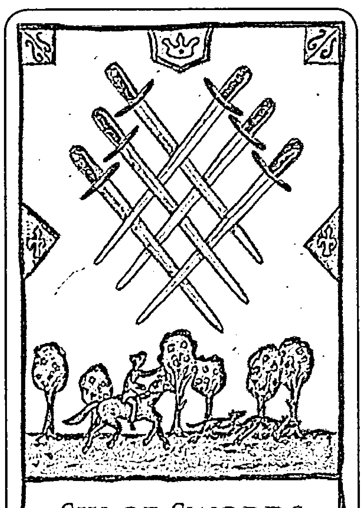

10小节：非偏颇为基础逻辑

### 看见自己心中的脚

解决纷争，最好的方法是了解为什么有纷争，争论点在哪里？如果当问题的双方一来，你未全面了解就依偏好来下结论，那问题会越解决越多。当然，解决纷争的最高境界是不要发生纷争。

“天与水违行，讼。君子以作事谋始。”

刚开始就训练好，上场时问题就比较少，这是对事。对人的话，就是不要一开始就动气，听见不习惯的话、看到不顺眼的事，也别着急反对，要知道你也不一定就是对的。你要先仔细听他的见解，才不会因自己一时的情绪，而破坏了共识的建立。

## 爱的心灵修炼情写

关键正位：
诚心地面对自己。

关键逆位：
问题一来，不要太早下结论。

## 策略金刚修炼情写

关键正位：
了解人与事物的关系后，才能架构脉络清晰的方案。

关键逆位：
缺乏建设性的意见，最好连提都不要提。

> 想一想，请你告诉我：  
你会不会让障碍一直存在于你的道路上？如果不会，你要如何清除？

---

### 307 宝剑7 / Seven of Swords

**关键联想：** 创意、与众不同、灵活决断  
**牌阵速记：** 307

### 河图数理

7这个数在河图，属于学习力、开放与修正；宝剑代表决断、维护、义气。

7之数搭配宝剑象征着——另类途径。

### 塔罗小牌态度品质

愚人在探索宝剑的决断与正义维护，体悟宝剑6的引导力和解决困难的能力后，开始学习解决路上随机所遇的问题，并渐除自己不切实际的幻想。因此他要学会修正自己的想象力，学习宝剑7开辟另类途径的能力。

宝剑7这张牌，六把宝剑架构平衡，另一把单独指向地面，代表了决断的灵活性。草地上有着奇特的景象：一位勇士与喷火龙对决。喷火龙毫不客气地喷出烈焰，勇士全副武装以对。这位勇士真的不简单，他不但勇气十足，还机智过人。正当他右手高举宝剑要砍向喷火龙时，眼看喷火龙已喷出烈焰，他左手拔出一把短剑向喷火龙刺去。象征着孤军奋战时，对工具与智慧的运用都很重要。

职前训练很重要，在职训练与专业训练一样也很重要。从职责中熟练，再从熟练中淬炼。这些训练中的经验法则解决了入职后大部分的问题。当想要再进步时，就得在经验基础上创新；不以经验为基碰撞出来的创新，可行度往往偏低。

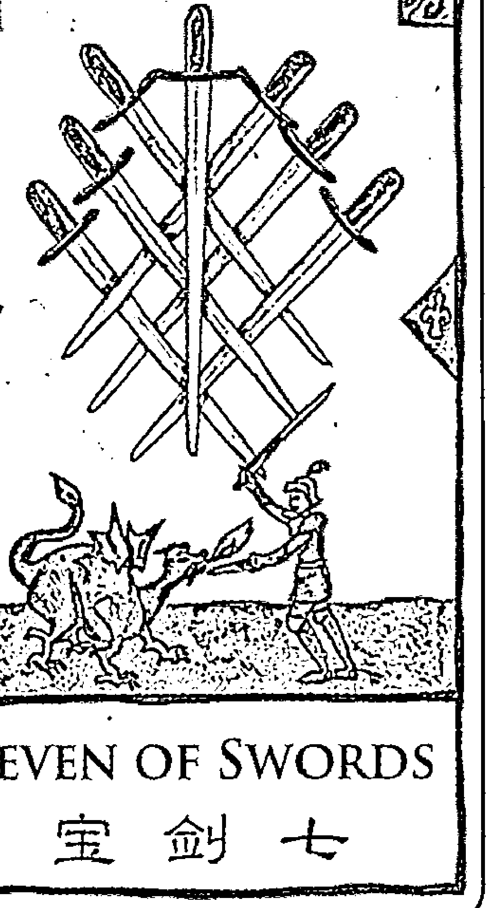

### 看见自己心中的脚

你的所做要真实地表达出你内心的想法。你的身体是灵魂体验生命的工具，你所做的事，如果不是真实的自我愿望的表达，那请问你彰显了什么？

一个真实面对自己、彰显自己的人，定会设立很多目标，并适时做出灵活性决断。如此，在遇见随机问题时，才能迎刃而解。

## 爱的心灵涂鸦墙

关键正位：  
彰显自己灵魂之美最好的方式，就是把自己的渴望与深层的灵魂连接起来。

关键逆位：  
特立独行还好，如果目中无人、独断独行，就会被孤立。

## 领导企业涂鸦墙

关键正位：  
“君子以同而异”，找到共识，并保留特性。

关键逆位：  
空泛的想象力，往往不可行。

> 想一想，请你告诉我：  
你的新想法，能不能变成灵魂体验生命的媒介？

---

### 308 宝剑8 / Eight of Swords

**关键词：** 制约、设计、自限  
**牌阵速记：** 308

### 河图数理

8这个数在河图，属于权力、丰富与组织；宝剑代表决断、维护、义气。

8之数搭配宝剑象征着——解脱束缚。

### 塔罗小牌态度品质

愚人在探索宝剑的决断与正义维护，体悟宝剑7的灵活决断与另类创意后，想学习宝剑8解脱束缚的能力。

宝剑8这张牌，八把宝剑编织交错，角度超过九十度，视觉比较发散而不是稳定往下。不像宝剑六、宝剑七，虽一样是交错，但其角度都不超过九十度，所以八把宝剑意象为头重脚轻，思想与行动不协调。

画面中人被关在监狱里，监狱两旁有两间漂亮的新屋，其门口都有蜿蜒的小路，而牢门的锁上正插着一把钥匙。看来这个慌张的人，只要冷静下来就能解脱束缚，迈向监狱前的康庄大道。

> “无妄，往，吉。”  
能真实面对自己的人，虽暂时对自己有些无法释怀，但因为能对自己诚实，所以只要花些时间澄清，终能看清自己，往前走，走出自己的道路。

其实不管定位在什么样的格局，总会有通往外界的道路，只要自己愿意走出来。要不然，就算别人把路铺好了，门打开了，你还是没辙。

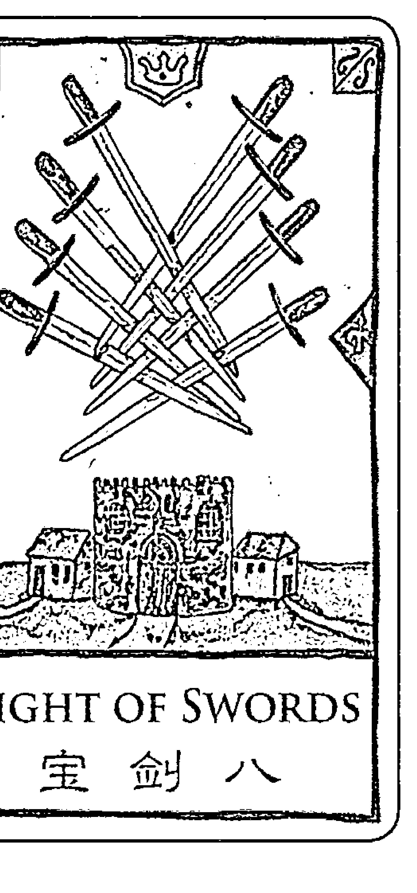

### 看见自己心中的脚

有丰富想法的人，如果能控制自己批判不满事件的力道，就是好事。但假如只是暂时控制，而心中没有真正地放下，终会让这个不满的想法障碍自己。

能控制自己的想法和言语，别人才能参与其想法、思索其想法。把话说满或不做表态的人，别人不明所以，自己也会陷入苦思而过度制约。

## 爱的心灵澄澈篇章

关键正位：  
可以先对事情做初步了解，但不能以对事情的初步看法来评定事情。

关键逆位：  
不要被自己的想法障碍住，这样会走不出来。

## 策略金锁澄澈篇章

关键正位：  
找到解决之道，就是找到与锁相吻合的钥匙。因此，看清被什么样的锁给锁了，就能找到合适的钥匙。

关键逆位：  
冷静处理事情，才能看清事实的真相。

> 想一想，请你告诉我：  
心要放在哪里，才是你的解脱之道？

---

## 309 宝剑9 · Nine of Swords

关键联想：坚强意志、恐惧、内心煎熬  
牌阵速记：309

### 河图数理

9这个数在河图，属于领导力、智慧与整治；宝剑代表决断、维护、义气。

9之数搭配宝剑象征着——克服恐惧。

### 塔罗小牌态度品质

愚人在探索宝剑的决断与正义维护，体会到宝剑8解脱自我束缚的力量后，还得学会处理外来的危机。因此他要学习宝剑9的勇气，并发挥坚强的意志。

宝剑9这张牌，有和宝剑8一样的大角度编织的八把剑，还有一把独立的宝剑正对着下面一位被捆绑的人，代表危险的紧迫性。

被处置的人被绑在木桩上，周边的木柴正是处以火刑的工具之一。即将被处置的这个人身穿绿色鞋子、蓝色衣装，代表他觉得自己还有一线生机、一线希望，所以他冷静以对。背后那片民房本应有很多民众，但为何没有人围观呢？难道大家不恨他？或他只是代替大家受刑的牺牲者呢？

> “畏惧是精神的毒药。”  
恐惧的情绪往往比事情本身的坏更坏。如果你产生的恐惧情绪过大，那事情本身尚未伤害你，你自己就被自己吓惨了。

所以常做噩梦、自己吓自己的人，往往是心理有某种不安没有得到安抚的人。只要自己决定放下恐惧，恐惧自然会慢慢远离。

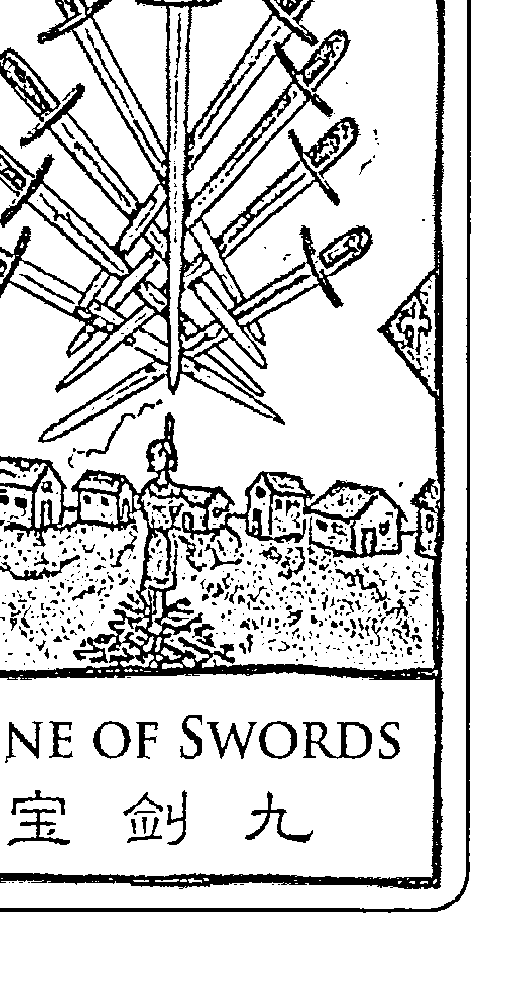

恐惧是无中生有、捕风捉影的。噩梦、鬼想其性本空，噩梦与鬼想最怕别人不让它们存在。如果你知道这些原本只是意识投射，自然就会心生强大坚定的勇气。

### 看见自己心中的脚

许多你认为可行的事，就应下定决心去做；要不然就不要做，也不要想。既然想了，就好好想清楚，试试看！

很多事情自有它的路径，问题大部分是可以解决的。如果你想了过多的障碍，你的心思就没有多余的时间去想可能的路径。

## 爱的心灵潜能撰写

关键正位：  
当你知道集体意识力量的强大时，你就能激发自己的坚定意识。

关键逆位：  
如果别人在心里吓你，那么你就别再自己吓自己了。

## 策略性激活潜能撰写

关键正位：  
面对困难、困苦、恐惧，应先冷静，才能找到方法突破困境。

关键逆位：  
串联共同的力量，去解决共有的困难。

> 想一想，请你告诉我：  
对于那些不适宜的模式，你到底为什么要坚持？

---

### 310 宝剑10 / Ten of Swords

关键联想：极端、起伏不定、救援  
牌阵速记：310

### 河图数理

10这个数在河图，属于信任、直觉、感性、自主、放空与混沌；宝剑代表决断、维护、义气。

10之数搭配宝剑象征着——及时救援。

### 塔罗小牌态度品质

愚人在探索宝剑的决断与正义维护，体悟到宝剑9的勇者无惧与集体意识的力量后，决定要执行正义。因此，除了了解危险、勇于面对外，他还要建立宝剑10的完整、及时的救援系统，建立良好的通报及调度程序，以维护大众的基本安全。

宝剑10这张牌，十把宝剑头重脚轻地交错，象征计划与行动的配合不好。茫茫大海中，一艘即将沉顶的船，上有半个船身没入浪涛中。能看得到陆地，但离岸与船还有一段距离。如果救援的快艇不来，恐怕此船难逃厄运。

他们的船竟没有准备逃生小艇，难道是意外？还是事先未掌握天候呢？没准备好就冲动做出的决策，真是害人不浅啊！

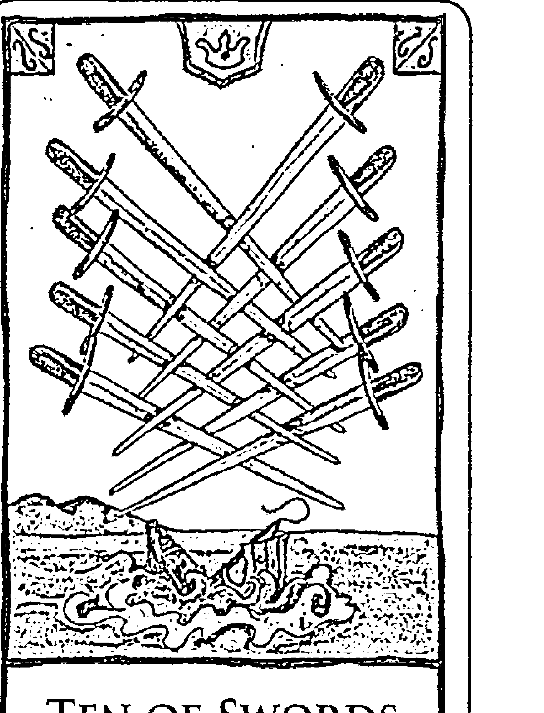

### 看见自己心中的脚

你明知缺失，但长久以来没有化缺失为特色的事情是什么？你为什么能一直秉持大家不认同，而自己也不是很认同的态度呢？

你知道这将成为你生活中的麻烦吗？你知道你无形中要花多少能量去支撑这些极端态度吗？

你可以继续坚持，真的可以，因为你还没体悟到自身生命能量的流动。当你不愿去正视应有的改变，那就让这样的麻烦无形中慢慢吞没你的愿望吧！

## 爱的心灵涂鸦特写

关键正位：  
苦难的发生，是集体意识的另一种改变预兆。看见苦难，有心人会产生强烈的改变动机。

关键逆位：  
生命的考验，常来自自己的明知故犯。

## 策略企划涂鸦特写

关键正位：  
处理危机的利器，就是强大的救援系统。没有人希望发生危难，但事实上要是发生了，也没有人会称赞你做了这么充足的准备。

关键逆位：  
不要忽视该准备的工作，可能因一项准备流程做得不好，就会影响到上市或生产的运作流程。

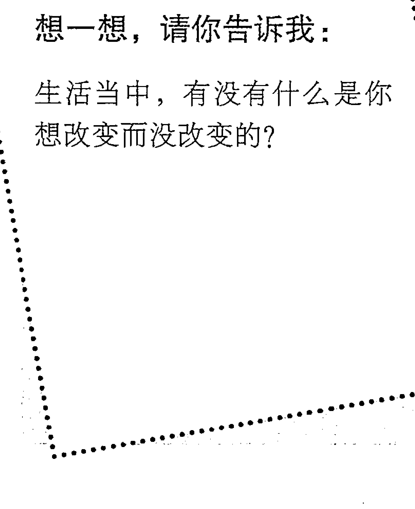

---

### 311 宝剑侍从 / Knave of Swords

> 关键联想：防御、毅力、机警  
牌阵速记：311

### 河图数理

宝剑宫廷牌的第一张。

1这个数在河图，属于创造力、自信和独特；宝剑代表决断、维护、义气。

1之数搭配宝剑侍从象征着——坚贞守护。

### 塔罗小牌态度品质

愚人在探索宝剑的决断与正义维护，体悟到决断与维护的各种状况后，想学习宝剑侍从履行承诺的决心与降低伤害的准备。

这张牌中，年轻的宝剑侍从穿着红衣、蓄着须，左手持蓝色宝剑，右手扶着剑鞘，代表守护的热情、经验、机警与决心。蓝色宝剑代表他已能冷静运用决断。

小山坡果树林立，身后的野兔和山鸡跳动着，表示侍从是善良的使者，而不是粗暴的守卫者。

敏锐的机智，可避免临时的危机！当有些成果需要我们守护时，我们可以和善又不松懈。对不会伤害成果的人、事与物，守护要机警，但可以各自应对。

其实，如果建立了一些守护的规则，陌生人在侵扰时就会有所顾忌。所以你可以用武力保护家园，也可以用智慧保护家园。

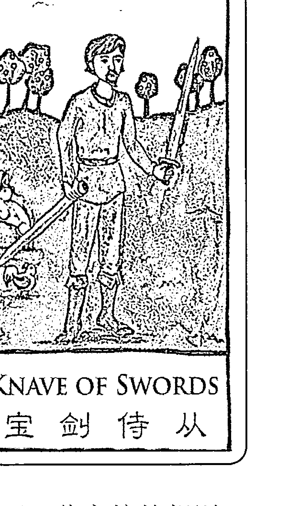

### 看见自己心中的脚

愿意承诺爱自己的人，通常能珍爱自己，并能看见自己的强与弱，然后用心弥补自己的弱项。

承诺爱自己不一定是固执的誓言，它是一种尽力而为的表现。它让你自己看见平时忽略的需求。如果慢慢感觉自己渐渐被爱自己了，那你就可以承诺其他事情。

例如想表现慈悲，你就会处处思考离苦得乐的方法；想表现希望，你就会尽量表现给人的温馨、信心与期许，你自己也会充满希望之光。

所以，承诺就是决心的开始，它使你专注而又灵活地运用力量。

## 爱的心灵简约稿写

关键正位：  
不要轻易许诺，如果许了，就尽力做吧！

关键逆位：  
这件事到底是谁需要的？想清楚后，自然能弄清楚。

## 策略简约稿写

关键正位：  
情报掌握得如何了？市场调查如何了？你的需求是什么？顾客的导向又是什么？反问这些问题，看着你需要做什么。

关键逆位：  
安全的库存量，要对应周期的变化。

> 想一想，请你告诉我：  
你愿守护谁？用什么品质？为什么？

---

### 312 宝剑骑士 / Knight of Swords

> 关键联想：言行合一、华丽挥卫、熟练  
牌阵速记：312

### 河图数理

2这个数在河图，属于分享、平衡与对称；宝剑代表决断、维护、义气。

2之数搭配宝剑骑士象征着——卓越态势。

### 塔罗小牌态度品质

愚人在探索宝剑的决断与正义维护，体悟到宝剑侍从的坚贞守护后，想要展现熟练的技巧，学习宝剑骑士用卓越态势宣示维护幸福的决心，学习这种华丽的挥卫。

宝剑骑士这张牌中，一位英姿焕发的战士戴头盔、穿铠甲，左手持蓝色智慧宝剑，右手拿金色高贵盾牌。他骑着白色宝马，红黄相衬的鞍缰装饰其上。马的两只前脚高抬，作势奔跑。

象征着保卫技巧的熟练，以及万全的准备。华丽的姿态象征挥卫时的充裕，并兼具潇洒意味。背后的城堡代表金色的希望与荣耀。

行动的宣示，加强了自己的信念。不管是用庄重还是华丽的方式，都能强化行动的坚持。但如果技巧不熟练、不加强实力，只在虚华的外表用功、喊口号，那就只会自暴其短，加速失败。

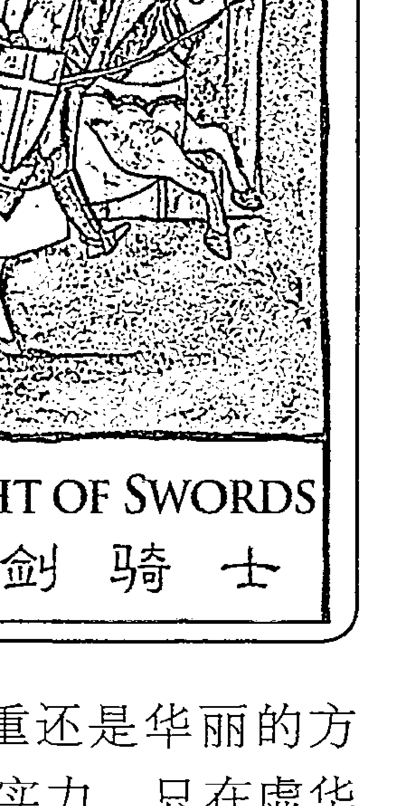

### 看见自己心中的脚

华丽需建立在实力之上。

当你做一件自己觉得重要的事时，你会以什么样的态度来表现？因为你的态度可能会为该事物定调。当一件事情定调后，你才能增加其他的演饰。

同一种乐器有主音，也有和弦；主奏之外又可协奏。这个乐器不够，还可以加入更多乐器来完成美好的演奏。

当然，为自己想做的事定调、宣示的同时，也得问问自己是否正积极为该事积攒实力。

## 爱的心灵落窗稿写

关键正位：  
你可以用言语当作取信于人的装饰，但取得信赖的最好装饰是言行合一。

关键逆位：  
短暂的吸引力虽好，但总不及彰显自我特质的魅力。

## 策略企划落窗稿写

关键正位：  
如果草案是你的专业，又是你所喜欢的计划，你可以勇敢表达支持，并提供行动策略参考。

关键逆位：  
事情往往不能从表面去评估。

> 想一想，请你告诉我：  
对于那些你正执行的事情，你想宣示什么？你又要如何表现？

---

### 313 宝剑皇后 / Queen of Swords

> 关键词联想：言词锋利、经验丰富、完美主义  
牌阵速记：313

### 河图数理

宝剑宫廷牌的第三张。

3这个数在河图，属于表达力、敏锐与多样；宝剑代表决断、维护、义气。

3之数搭配宝剑皇后象征着——慎思明辨。

### 塔罗小牌态度品质

愚人在探索宝剑的决断与维护正义后，领悟到宝剑骑士所创造的熟练技巧，并下定决心维护幸福。他开始学习宝剑皇后的慎思与明辨，以便妥善运用助力与资源。

宝剑皇后这张牌中，皇后右手举着蓝色之剑，这是宝剑宫廷人物特有的一种剑，代表他们都已能正确运用武力。他们的力量与智慧相融合，协调理性与维护正义的力量。

到宝剑皇后这里，这种能力已经发展得很好。因为她持的是智慧之剑，她的形象感性丰美，因此能巧妙运用正义决断。内在智慧与感性丰满的人，就叫宝剑皇后。

她穿着大花白色衣袍，披着红色披风，穿红色鞋子，象征如火的热情。她坐在城堡旁，看着警戒的方向，随时准备起身战斗。

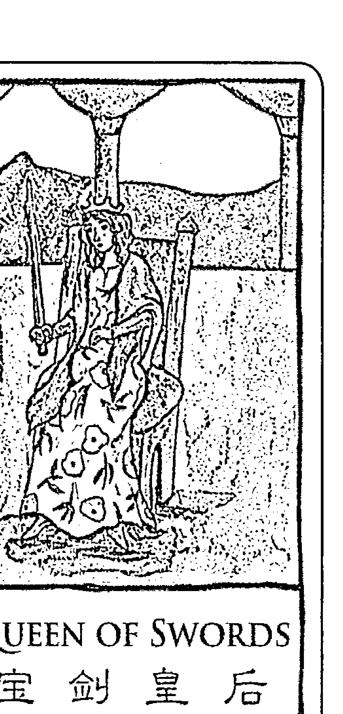

### 看见自己心中的脚

常常遇到这样的人：有些事明明有能力做，却说“我做不到”。为什么做不到呢？

如果是与自己的价值观相冲突，你可以想想价值观是否需要更新。如果价值更新后仍无法做到，那就千万别做。

但如果只是与自我设定的角色不合，那还是尝试一下。在你的一生中，不可能从始至终只扮演一种角色，你又如何肯定自己不能扮演新的角色呢？

## 爱的心灵落脚稿写

关键正位：  
用智慧、感情与正义，引导自己本身的丰富力量。

关键逆位：  
如果你不确定那是合乎理性与感性的话，不必太固执己见。

## 策略企划落脚稿写

关键正位：  
各司其职可以使组织运行顺利，而交错合作可以使组织呈现精彩活力。

关键逆位：  
过深的成见，无助于评估。

> 想一想，请你告诉我：  
你如何正确使用你的表达力？

---

### 314 宝剑国王 / King of Swords

关键联想：不惜一战、严密、固守公义  
牌阵速记：314

### 河图数理

宝剑宫廷牌的第四张。

4这个数在河图，属于稳定、分析与成形；宝剑代表决断、维护、义气。

4之数搭配宝剑国王象征着——勇者无惧。

### 塔罗小牌态度品质

愚人在体悟宝剑皇后的慎思明辨后，结合理性和感性维护正义的决心，继续学习宝剑国王信守正义的精神。不管任何状况，他都愿意维护家园、守护子民，他就是勇者无惧的正义化身。

宝剑国王这张牌中，国王坐在营区一把普通的椅子上，手持智慧与正义结合的蓝色之剑。身穿盔甲、内着红衣，象征维护家园的热情。

腰下跨着的剑鞘表示能攻能守、可战可和；背后的营帐整齐林立，象征以纪律为后盾。国王的穿戴几乎是战士装备，只有头顶王冠彰显身份。

他的身后，是他所想望的和平繁荣家园。这象征着他固守正义但又能屈能伸。为了维护家园，他愿意御驾亲征，不惜一战。

武力的准备，是为了避免他方的侵略与恫吓，让国家和平繁荣；为了实现正义与权力的结合，使人民安居乐业。

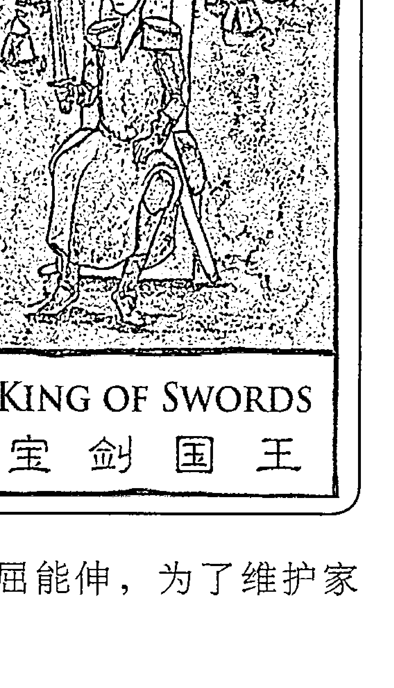

握住权柄，就无法离众，因为权柄就是权力与德望的象征。所以必须建立德望并拥有权力，这样才能顺势握住权柄，发挥正义的力量。

### 看见自己心中的脚

正所谓“无征不信”。如果没有可供验证的东西，叫人家如何相信你呢？

当你很想去做一件事情时，你可能会说那是你的梦想，是你的终生事业，你好久以前就计划了，你这辈子如果没做会遗憾等等。

可是，不管你说得多么动听，如果你没有真正踏出第一步，没有开始建立实现这些理想的条件，你就难以得到别人的信任与支持。

## 爱的心灵滋养特写

关键定位：  
公平正义，永远是处理争端的准则。

关键逆位：  
气势凌人的态度，将很难使别人看见你的爱。

## 策略金钥滋养特写

关键定位：  
强烈的意志决心与自律，常是决胜的一大关键。

关键逆位：  
你的想法虽然不一定要马上付诸行动，但要增强对目标的渴望，如此才能逐步搜寻到你想要的方法。

> 想一想，请你告诉我：  
如果你想信守正义，那你会用怎样的态度来建立自己的威望？

---

### 401 钱币 Ace / Ace of Coins

> 关键联想：妥善运用、地位、概念化  
牌阵速记：401

### 河图数理

1这个数在河图，属于创造力、自信和独特；钱币代表价值、原则、信用。

1之数搭配钱币象征着——丰美宁静。

### 塔罗小牌态度品质

在探索钱币的价值原则中，愚人体悟到了钱币1（Ace）成熟的价值观与原则性。愚人觉得价值是原则的基础，要去繁就简，培养喜悦宁静的心灵，这样才能享受丰美又有价值的人生。

钱币Ace这张牌中，大钱币的图纹是一幅丰收景象，象征努力的成果。一间小农舍前面是一大片金黄色正在收割的庄稼，代表丰富的心。屋后的树在收成的时节绿意如新，表示活力依然。远方天空中几只鸟儿悠然飞翔，更增添了一份知足的宁静。

我们对资源的运用，如果适当、有所节制，并关怀回馈系统，自然能爱护大自然，并快乐地享受物利。

如果创造力用在破坏环境的成分太大，而利益大众的成分太少，那这种创造力不要也罢。创造力应与核心价值结合，应与爱的感动结合，这样才能充分体现生命之美。

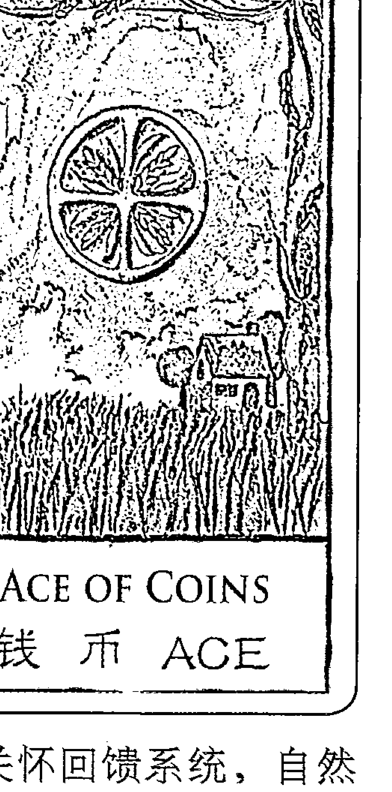

### 看见自己心中的脚

大部分的人都希望自己的人生是丰富多彩的，但盲目追求物质，会让生活变得混乱不堪，有时不但不能感受到人生的乐趣，还会有深深的失落感。因为混乱会使人失去宁静的心灵，只留下纷扰的杂念，所以也就难以得到丰美的人生。反过来如果使自己的心单纯地去感受美好，专注地体察生命力，自然能发挥创造力来建立丰美的生活与心灵。

生命的品质，是你所吸引、你所创造和你所感受的结果。

> 爱的心灵窗简编号

关键正位：  
宁静地创造自然丰美的心，丰美的心造就丰美的事物，这就是生命精彩的演出。

关键逆位：  
不懂节制资源的人，终将体会物资短缺之苦。

> 策略企划窗简编号

关键正位：  
原则是为了愿景，愿景是为了价值的实现，因此建立原则不能忽略价值的内涵。

关键逆位：  
阶段或部门的划分不够清楚，会产生资源及人力重叠的情形。

> 想一想，请你告诉我：  
你运用资源的原则是什么？  
符合你的价值观吗？

---

## 402 钱币2  
Two of Coins

- 关键联想：交易、运行、投资  
- 牌阵速记：402

### 河图数理

2这个数在河图，属于分享、平衡与对称；钱币代表价值、原则、信用。

2之数搭配钱币象征着——品质交流。

### 塔罗小牌态度品质

愚人在体验了钱币1（Ace）的丰美宁静后，想把此品质与人交流，于是他想学习钱币2循序渐进的品质交流。

钱币2这张牌，两个钱币上下对称，象征着事物循序渐进的原则。有一艘船张满帆在风平浪静的海上行进，满帆的风向与海岸呈相反方向，表明这船刚刚出发，它是否想去换些今年要播种的种子或果实呢？

每一次的收成，如果能为下一次的行动做准备，那就预示着再一次会有一个好的开始。用自己之前的努力，来增加现有的品质，是再好不过的了，不过就怕不知变通。死守既有的人，慢慢就会心生匮乏，只有愿意与人交流、分享，乐于再创造的人才会逐渐富足起来。

### 看见自己心中的脚

人在混乱中，容易误用自由，失去纪律。

失去纪律的人，他的自由顶多只是失序的乱流，只会造成更大的动荡。自由与规范本是一体的两面，你的自由侵犯别人，他的自由就有可能侵犯你，所以只有固守规范的自由，才能享受自由的成果。当自己的自由大于自律的态势很多时，请不要浪费你的自由，爱、分享与价值才是你自由的方向。

### 爱的心灵滋养练习

关键正位：  
爱情从来就不是对等的，但会因为爱，而往对等的方向行进。

关键逆位：  
不对称的付出，感受是辛苦的，只要多付出的一方觉得值得就可以。但如果有牺牲的感觉，就应做适度调整，以免情绪失衡。

### 策略金钥滋养练习

关键正位：  
连续的计划，应考虑事件的因果性与连续性。

关键逆位：  
注意流行性的风潮，可减少阻力。

> 想一想，请你告诉我：  
爱的给予，有哪一样不是你自愿的？如果有，为什么？

---

### 403 钱币3 / Three of Coins

- 关键联想：运用团队、突出的计划、发挥能力  
- 牌阵速记：403

### 河图数理

3这个数在河图，属于表达力、敏锐与多样；钱币代表价值、原则、信用。

3之数搭配钱币象征着——新的突破。

### 塔罗小牌态度品质

在探索了钱币的价值原则，体悟到钱币2的品质交流后，愚人产生了价值观的更新，他想学习钱币3了解新的需求，从而发挥更大的突破。

钱币3这张牌，三个钱币排成正三角形，代表各团队成员的能力相当。美丽的城堡前有一片田园，一边绿草如茵，一边像是种植了刚移植的果树，象征区域的土地肥沃。说明只要认真耕作，一定有不错的收获。这边的大片地，本应该需要许多人的耕作，但只出现了一位农夫，以他个人的能力，应该不足以承揽田园所有的工作。可是他似乎是发现了什么新方法，或找到了什么新的问题，才对果树施以特别的照顾，代表了团体活动能力之外的敏感度。

能感受到市场敏感度的人，除了具备专业能力之外，还应该用心投入，灵活行事。这些敏感度，正是异军突起的关键。但只怕发现的人，因其所感知的尖端层次而忽略了基础层次，如此，就算尖端再好，也会有行动的困难。即使敏感度高的人，也要注意团队的合作，如此才能发挥卓越的组织能力。

### 看见自己心中的脚

领导能力的培养，需要有好的人际关系，但不能只靠人际关系。只靠人际关系的领导，只能培养一些只仰仗权势而办事低效的朋友。它需要朋友之间建立共同的目标，共同提高办事的效率和热情，而不是马马虎虎或依势偷懒。领导的学问与能力需要慢慢建构，但可先将精神力、目标价值感适度调配，这样才能获得组织带动的效果。

> 爱的心灵疗愈简练

关键正位：  
爱及其所爱，因为爱不是口号。

关键逆位：  
爱可以爱得不顾一切，但不要爱得目中无人。

> 策略企划简练

关键正位：  
就算能力稍差，也应适度分配才能适才适任。

关键逆位：  
协调团队的步调，不要过度排挤能力逊嫩之人。

> 想一想，请你告诉我：  
你在单一操作熟练的事情中，发现了什么不一样的细节呢？

---

### 404 钱币4 / Four of Coins

- 关键联想：稳定、原则确立、控制  
- 牌阵速记：404

### 河图数理

4这个数在河图，属于稳定、分析与成形；钱币代表价值、原则、信用。

4之数搭配钱币象征着——妥善支配。

### 塔罗小牌态度品质

愚人在体悟了钱币3新的突破后，为了使收获更安全稳固，他想继续学习钱币4的妥善支配。

钱币4这张牌，四个钱币排成正四方形，象征原则的确立。美丽的城堡周围环绕着青翠的树木与果园，代表一切都很正规、和谐。两篓丰收的葡萄满满地放在牛车上，有一黑、一黄两头健壮的牛拉着车，在平坦的乡间小路上行走，表示分配还算公平，我想他们应该很快就可以到达目的地了吧！

在有所收获的时候，我们不能过于安逸，尤其在事情还没有完全完成之前。片刻的休息是必要的，但在事情还不适合停下的时候，会很容易发生意想不到的状况。因为对以后的事情的掌握与支配程度还不够，这样可能引来别人的觊觎，自己也会容易因此产生不确定的猜忌，所以，在该延续的时候延续，才能确保事情的顺利发展。

### 看见自己心中的脚

在做某些我们习惯的事情时，你的大脑可能会突然闪过一些新的想法，如果你用心去感受，就会从新想法中淬炼出可行的元素，这时应把这元素融入新的模式中，才不会丧失重新架构的机会。就像是你在画国画山水渲染泼墨时，忽然间想使用油画笔触技法，如果你敢想其可能性，就有机会尝试并建立新的技法，也会因此产生新的观念。

### 爱的心灵滋养练习

关键正位：  
爱是不能控制的，越想控制的爱，越不受控制。爱是调节并妥善给予。

关键逆位：  
精神的给予是爱，物质的给予也是爱。但如果缺乏主动性，总让人觉得爱的力量有限。即使倾尽一切物质去给予，你的爱也终将会被物质淹没。

### 策略企划滋养练习

关键正位：  
责任与资源的分配要能平均，才不会有过度承载而运作失衡的情形发生。

关键逆位：  
懂得妥善支配的人，往往也有风险管理的能力。

> 想一想，请你告诉我：  
你所关心的事，是谁在支配它进行？你觉得会有怎样的影响呢？

---

## 405 钱币5  
Five of Coins

- 关键联想：困境、突破惯性、辛苦  
- 牌阵速记：405

### 河图数理

5这个数在河图，属于自由、规范与变动；钱币代表价值、原则、信用。

5之数搭配钱币象征着——重整需求。

### 塔罗小牌态度品质

愚人在探索钱币的价值原则，体悟到钱币4妥善支配的原则后，想要学习钱币5的主动重整。

钱币5这张牌，五个钱币中有一个放置在四个钱币的中央，内代表价值，外代表需求，需求大于价值，而价值重于需求。田地上一片贫瘠，果树稀疏枯叶中，看起来不是长期缺乏照顾，就是收成已过很久，不管怎样，这片田园该是重新整理的时候了。

其实经常发生意外的人，一定是常常心神不宁的人，心不稳定，行动不安不全。心与行不协调，怎么会有好结果呢？有些人很有热情但定力不够，他们或许会好心好意去做一些能力不及的事，例如替人处理太大的负面情绪。热情是运用能力的推进器，并不是能力，纯粹的热情并无法处理负面情绪，又因自身心不安稳，反而自己也陷入负面。所以，重整自己，向外连接，才是好的解决方式。

### 看见自己心中的脚

以价值引导需求，以需求建立价值。

人的成长路线如果只以需求为指标，就容易陷入需求引领人生的窠臼，而无法使自己的思想升级，无法建立自我期许的人生。人生中确实有必须满足的需求，但需求与欲求一线之间，有的人有了房子要别墅，有了别墅要一大片土地，需求可以不断地被建立，但当你没有价值观引领的时候，人生就被需求决定了。

### 爱的心灵随笔摘写

关键正位：  
变境见真情！困难时还在的，才是好朋友。富转极贫，贫转极富，始终不离不弃的，才是好夫妻。

关键逆位：  
目标是鼓励自己在困境中前进的动力。

### 策略企划随笔摘写

关键正位：  
不必死守困塞，可重新建制，拟好深耕计划。

关键逆位：  
如不做改变，那就又是持续困境。

> 想一想，请你告诉我：  
如果有时你的需求有些混乱，你将如何重新调整自己呢？

---

### 406 钱币6 / Six of Coins

- 关键联想：理财、公平交易、附加价值  
- 牌阵速记：406

### 河图数理

6这个数在河图，属于企划力、完美与导引；钱币代表价值、原则、信用。

6之数搭配钱币象征着——友善给予。

### 塔罗小牌态度品质

愚人在探索钱币的价值原则，体悟钱币5主动的重整需求后，觉得自己新的价值已建立，是时候学习钱币6友善给予的公平交易了。

钱币6这张牌，六个钱币稳当对称地排列，象征着游戏规则的确立。在绿草地上有一张铺着雪白桌布的桌子，虽只看到桌子的边缘，仍知道它的平稳，因为桌上的天秤非常稳定，草地后面山丘的弧线更使得天秤的公正被彰显。天秤的一端放着钱币，另一端放着水果，看起来两端的重量相等，这场交易真的是非常公平。仔细一看，桌子上掉了一些葡萄，草地上还掉有草莓，看来卖家很会做生意，还懂得适度地增加附加价值呢！

有的人太过要求公平，当他在做事时，看到别人闲着，就会忍不住请别人也动手，这种行为请求别人支持可以，但想要以此来架构领导力就差得远了。因为领导虽也注重公平，但更重视付出的态度。所以，领导可以随机应变，但不要零碎支配。琐碎式的领导方法会使被带领的人感到浮躁与不快乐。

### 看见自己心中的脚

如果每次交易都有赠品，那赠品就会变得不被人重视，让人觉得好像那是应该就有的，因此人们就算接受了，也不会有惊喜与再度交流的热情。但假使是附加的给予，那种感觉真的比每次你都给他很多还要让他满足、感恩与珍惜。这就是人的情绪错觉。交易的关键除了品质与比价之外的决胜点，就是感受——你给予的态度与感受！

### 爱的心灵滋养练习

关键正位：  
慷慨的心，是一种和谐的满足，放开式的给予，别人也比较容易接受。

关键逆位：  
要求对方给予，不如自己贴心付出，当然能往平衡方向发展更好。

### 策略企划滋养练习

关键正位：  
架构式的引导，比较不容易失衡。

关键逆位：  
紧急时，与其求重新学习，不如赶快调节失衡的地方。

> 想一想，请你告诉我：  
给了时，你会忘了笑吗？

---

### 407 钱币7 / Seven of Coins

- 关键联想：休息、新的阶段、重新安排  
- 牌阵速记：407

### 河图数理

7这个数在河图，属于学习力、开放与修正；钱币代表价值、原则、信用。

7之数搭配钱币象征着——修正规律。

### 塔罗小牌态度品质

愚人在探索钱币的价值原则，体悟到钱币6的友善给予后，想再学习钱币7的规律修正，培养自己的耐力，不让不速之客干扰成果与进度。

钱币7这张牌，上下各三个钱币对称，象征两个不同的状态，中间一个钱币代表两个状态的连接。一个农人在田园收获两筐满满的葡萄，他坐在果实累累的果树下休息，可能是累得睡着了，把正吃着的葡萄掉落地上。两只乌鸦有恃无恐地吃着两筐的葡萄，这个农人还未醒过来。他虽然有可能变成下一个牛顿，但他还是无法照顾这两筐葡萄不受损伤。这象征着作息规律的重要性。

许多事情都应该有阶段性的安排，这个阶段到另一个阶段有一些路径，这路的接点就是通往下一个阶段的关键点。如果没有这阶段，很可能事情进展的完整性就不足，也比较不容易抓到休息的点和行事的规律。

### 看见自己心中的脚

其实，你从不断的观照中，已增加了对自己的了解。或许刚开始你不了解自己的心，也看不清楚自己心的去向，但慢慢地你会连自己心的脚都看得到。你不必紧张地观察每一个心念，这样太紧张了，你试着放心地看，想到就看，没想到就当然不看了。你的心可以休息，就像想睡觉一样自然。

你只要从生活中值得你思考的事去看，从你感动的事去看，从美善的爱去看，或是从最平常的一件事去看，这样不久，你就能深深确定自己的脚步。

### 爱的心灵涂鸦练习

关键正位：  
不要把爱看得太紧。关心，但让爱自由。这样的爱自然跑出最美的品质。

关键逆位：  
越害怕失去爱，就越容易丢失爱。

### 策略企划涂鸦练习

关键正位：  
进行阶段性安排时，要有缓冲的空间。

关键逆位：  
所谓的工作段落，就是真的可以放下，而不会影响品质的时候。

> 想一想，请你告诉我：  
什么时候是你很放心的时候？

---

### 408 钱币8 / Eight of Coins

- 关键联想：学习力强、技术、知识  
- 牌阵速记：408

### 河图数理

8这个数在河图，属于权力、丰富与组织；钱币代表价值、原则、信用。

8之数搭配钱币象征着——创造美好的知识。

### 塔罗小牌态度品质

愚人在探索钱币的价值原则，体悟钱币7的规律修正后，已懂得阶段性的安排，他接下来要学习钱币8的酝酿、彰显。

钱币8这张牌，八个钱币排列对称，钱币间有很强的连接性，代表精益求精。地上有一个酒桶，一大一小的酒壶和一大一小的酒盖，象征陈年佳酿的严选分级。酒器的前面和后面，各摆着一串当季采收的新鲜葡萄，酿好的美酒来源就是新鲜葡萄。等酿酒师准备好，这些葡萄就是顶级的酿酒素材。象征美好的东西的来源必是美好。但美好的素材，若没有好的技艺，就无法制造美好。

美好的发酵因子，就是组织者，他能使组织力量活跃，也能使组织的品质提升。这些人通常是了解人性或掌握重要知识的人。但这些人一旦得不到重视，或无法再为组织提升品质，就会放手。所以，提升品质的组织酿造师们，请自我警惕，别轻易自我放逐才好啊！

### 看见自己心中的脚

你心中向往的品质，你现在一定有！

你至少拥有那些你所向往的素材，你的生命里有，你的生活里也有。你自己可能认为你的生活、你的生命没有好的素材，仔细想，一定有。可能是一个微笑，可能是一种感动，也可能是个美食或买个好东西。不难找！怎么找？这些东西就是你愿意去改变、愿意去参与，以及你很喜欢的东西。

### 爱的心灵滋养练习

关键正位：  
深厚的爱，总是深深地表达。

关键逆位：  
过久的等待，会使人失去耐性。

### 策略企划滋养练习

关键正位：  
知识的建立，大多来自众多经验的累积。而品质的发挥，就要靠技艺把知识与创意组合在一起了。

关键逆位：  
不要让细节拴住你的脚。

> 想一想，请你告诉我：  
你想象中的天堂，你能从它的形态中淬炼出美好的品质吗？如果可以，你愿不愿意将这品质先在这个世界创造呢？

---

## 409 钱币9  
Nine of Coins

- 关键联想：美满、长期努力、默契  
- 牌阵速记：409

### 河图数理

9这个数在河图，属于领导力、智慧与整治；钱币代表价值、原则、信用。  
9之数搭配钱币象征着——深植默契。

### 塔罗小牌态度品质

愚人在探索钱币的价值原则，体悟钱币8的酝酿彰显后，觉得想彰显更高的价值，就一定要学会与人建立默契，所以他学习钱币9深植默契。

钱币9这张牌，九个钱币排成为阵，象征规矩的建立。墙壁上结彩挂花环，一对男女坐在简单的椅子上举杯谈心。既有情也有意：男的穿红色系衣服代表有情，女的穿着绿色系衣服代表有意。全场景象简单，人物只是小酌而非宴欢，虽是简单，但他们知足。懂得相互鼓励，继续努力，就能前途似锦。

成功大都是长期努力的结果。就算有一蹴而就的成功，又有谁会珍惜呢？努力的过程越有默契，就越能发挥坚强的实力。“二人同心，其利断金。”心相同，方向一致，力量如钻石之锋，又有什么能阻挡他们前进呢？

### 看见自己心中的脚

抱着必死决心不分昼夜干活的人，工作效率不一定比削水果、喝喝红酒的人高！

努力的过程中，饮食宴乐不仅可以培养你与合作者的默契，还能帮你建立更深的共识。有的人紧张兮兮，做什么事都像打仗似的，仿佛随时生命都要面临结束。一件简单的事情被他们搞得鸡飞狗跳，结果事情的效率并不高，进度也不好。为什么呢？因为慌乱的情绪使人浪费太多能量，多了许多不必要的动作。心能宁静就灵活自由，心能互相感恩则可热力四射。如果你的心可以做主，你要选择宁静感恩，还是慌张呢？

### 爱的心灵涂鸦特写

- 关键正位：  
  良好默契的建立，在于了解彼此的需求，以及熟悉彼此习惯性的表现方式。
- 关键逆位：  
  适度的鼓励，是打气；过度的鼓励，像是打兴奋剂！

### 策略及觉察涂鸦特写

- 关键正位：  
  当事情稳定发展时，更需培养团队默契。
- 关键逆位：  
  谨慎做预算，注意需要大量支出的事物。

> 想一想，请你告诉我：  
你能以新鲜有趣的心情，去达到你的目标吗？

## 410 钱币10  
## Ten of Coins

> **关键联想：** 富足、丰庆、奖赏  
**牌阵速记：** 410

### 河图数理

10这个数在河图，属于信任、直觉、感性、自主、放空与混沌；钱币代表价值、原则、信用。

10之数搭配钱币象征着——安心富足。

## 塔罗小牌态度品质

愚人在探索钱币的价值原则，体悟钱币9的高度默契后，想学习钱币10的安心富足。安心就是快乐地信守原则，富足就是价值被宁静地彰显。

钱币10这张牌，十个钱币有九个排成三行，另一个排到第四行，表示宽裕有余。第四行有余钱币的两边空处，摆有葡萄浮雕的徽章和家族浮雕的徽章，使得这四行结合更稳定的感觉。一对感情很好的男女，摆桌设宴享受烛光晚餐，桌上菜肴丰富，两个人正举杯欢庆，代表圆满成功。又有两只漂亮的狗趴在桌前，象征信守与安适。

很多人觉得奇怪，既然家庭圆满富足，为什么不依赖富有的家庭呢？人都可以自然地享受家的温暖。但是，每个人也是独立的个体，都需要走自己的路，开创自己最独特的品质。但人类的文明，没有人可以独立完成，也很少有人可远离人群而单独快乐地生活。所以，不管你的彰显是属于团体还是属于个人，都该自然地感恩回馈。

### 看见自己心中的脚

不安则乱。你心的宁静，就是你能创造一切的本源。当你有主意、能分享、能决断，又能重视心灵价值时，你就能安心富足。你可能不会做什么事都能很有把握，但你愿意这样去做，就要安心，要在心里预先建构未来。

## 爱你的心灵随笔撰写

关键正位：  
往喜悦与价值方向去努力，因为心灵的感受会影响到表现的品质。

关键逆位：  
就算土地肥沃，作物可以随便种、随便长，你也得花时间收割啊！哪能轻易不劳而获呢？

## 策略金钱滋养撰写

关键正位：  
欢庆喜悦，共享安心富足，是你通过努力的结果。而努力的过程其实比结果更需要重视。过程中什么阻碍了你？什么成就了你？你的感受又是什么呢？

关键逆位：  
没有安心富足的想望，你又怎么能得到安心富足呢？

> 想一想，请你告诉我：  
做什么事会使你感到安心、富足呢？

---

## 411 钱币侍从  
### Knave of Coins

> **关键联想：** 新的方案、求知欲、良好态度  
**牌阵速记：** 411

### 河图数理

钱币宫廷牌的第一张。

1这个数在河图，属于创造力、自信和独特；钱币代表价值、原则、信用。

1之数搭配钱币侍从象征着——独特服务。

## 塔罗小牌态度品质

愚人在探索钱币的价值原则，体悟各种原则的掌握与价值彰显后，想要学习钱币侍从独特服务的价值。

钱币侍从这张牌，年轻的侍从有红星的脸，穿着红色衬衣、蓝色上衣、褐色的鞋子，代表他有热情，能理性研究新的方法，又能融合价值与想法去行动。年轻人左手高举一个钱币，轻松站在城门旁绿草如茵的两棵茂盛树木中间，脚边也放着一枚钱币，这象征他不会顾此失彼，以及拿得起、放得下的行事作风。

能找到人生定位的人，总是有他独特的想法，这也是长期以来探求内在价值的结果。作风独特的人，不代表他一定不合群，他是用喜悦的态度去应对，用自在的态度去行事。喜悦的情绪能和气，自在的态度能顺心。如能培养自在的态度、喜悦的性情，你就能找到最独特的服务方式。

### 看见自己心中的脚

生命的体验路径，每个人都不同。一个确认自我价值的人，不会在生命的岔路彷徨迷失，因为他已有善的品质、爱的感动。他的选择将会以美趣为落点，呈现出生命的线条，流露出生命的自然原味。

他的彰显自然而有劲，因为没有人做自己喜欢的事是没有力气的。他的彰显独特有味，极富吸引力。为何连狗咬狗这种事都有很多人围观，因为它们都真咬！所以真实的彰显就是你给世界最独特的服务。

## 爱的心灵滋养简写

关键正位：  
拿得起也要放得下，有舍有得，你自能表现出自我的独特价值。

关键逆位：  
预测常常不是绝对的，临场应对，才能彰显你的服务风格。

## 策略性滋养简写

关键正位：  
认真专注地学习，是面对新事件最好的态度。

关键逆位：  
顾此失彼的行动，很难与人协作。

> 想一想，请你告诉我：  
如果能随意交换生命品质，  
你想与人交换什么品质？又如何交换？

---

## 412 钱币骑士  
### Knight of Coins

> 关键联想：物质主义、谨慎投资、按部就班  
牌阵速记：412

### 河图数理

钱币宫廷牌的第二张。

2这个数在河图，属于分享、平衡与对称；钱币代表价值、原则、信用。

2之数搭配钱币骑士象征着——行动价值。

## 塔罗小牌态度品质

愚人在探索钱币的价值原则，体悟钱币侍从的独特服务后，想再学习钱币骑士的行动价值。

钱币骑士这张牌，城门下有一位骑士骑着红色鞍辔的白马，象征着行动的单纯与热情。穿着蓝衣、绿衬裤，戴着蓝帽的骑士，右手拿着钱币盾牌，左手握着金色权杖，象征他防御残害、守护价值的决心，也象征他行使价值的活力。

要实践自我价值者必须懂得保护自己。有人因光芒而闪亮，也有人会借着光芒的保护行使他的私心。因此要以你的基本原则来防护自己，才能落实你的理想。

### 看见自己心中的脚

你有没有一面防止自我贪求的盾牌？或许你的原则就是这面盾牌，你的价值也是这面盾牌。

当有一些机会看起来能让你非常富足时，你会毫不考虑地直接接受吗？如果会，希望你是因为信任因缘而善意地接受。如果你谨慎考虑它是不是符合自己的价值观，或者想想你可以加入什么样的想法，那你就已有了防贪盾牌，你可以比较顺利、不受阻挡地去行使你的想望。

当然，钱币物质都是一体两面的。如果你因金钱丰富、物资充足而获得保护，更有力地行使你的独特价值的话，那物质就是你的最佳盾牌。有了最佳盾牌的保护后，你就再没有理由不安心地去行动了。

## 爱情心灵滋养特写

关键正位：  
有耐心的爱，爱的价值才高，行动的影响力才大。

关键逆位：  
反应迟钝会影响事情的进度，因此需要做适当的调整。

## 策略金钱滋养特写

关键正位：  
实事求是，谨慎研究其中利弊得失，再来全力行动也不迟。

关键逆位：  
对于必须该坚持原则的事，执行时不够稳重会让人无法产生信任。

> 想一想，请你告诉我：

你以什么来保护你的梦想？  
你通过做什么事来行使你的生命价值？

---

## 413 钱币皇后  
### Queen of Coins

> **关键联想：** 冷静付出、精神力、善解人意  
**牌阵速记：** 413

### 河图数理

钱币宫廷牌的第三张。

3这个数在河图，属于表达力、敏锐与多样；钱币代表价值、原则、信用。

3之数搭配钱币皇后象征着——精神富有。

## 塔罗小牌态度品质

愚人通过探索钱币的价值原则，体悟到了钱币骑士的行动价值，他想再感受钱币皇后富有的精神，以及行使价值后的成就感。

钱币皇后这张牌，皇后戴着后冠坐在皇宫拱门下的橘红坐椅上，穿着淡蓝衬衣、宝蓝上衣，以及橘红的鞋子，代表她的精神热烈也与行动呼应。她凝望一方，表示感知统合。右持大钱币，左持金权杖，象征她能掌握信用价值，又能执行内在主意。

精神世界丰富的人，在资源有限时，也能有不错的表现，因为他的目标感极强，旺盛的精力常会感召团队成员，甚至连周围不相干的人也都愿意挺身而出相助。所以，精力是实现价值理想的关键。

### 看见自己心中的脚

什么东西能吸引你凝望（发呆不算）？吸引点到底与你有何关联？这人、事、物是不是具有你没有的特质，或具有你欣赏的品质，还是你对某事强烈的需求感。

仔细思量你的凝望，倾注你的热情，就能找到你精神力量的根源。当你看到这根源，就会很想大喊，希望叫出自己的生命。这时，只要是做任何你曾凝望或热望过的事，你都能轻易地强化自己的精神力量。

当精神力量强化到出现一种确定感时，你就能轻易走上自己想要的道路。

## 爱的心灵滋养摘写

关键正位：  
善解人意常是一种柔性的精神鼓励，使人的力量在无形中被开发了。

关键逆位：  
如果你过于冷静、缺乏表达，别人就会难以探测你的心意，从而使你们的沟通品质降低。

## 素隐念心灵滋养摘写

关键正位：  
冷静地表达你要彰显的丰富品质。

关键逆位：  
你所掌握的与所做的，本就不一定相契合，但如果二者差距过大的话，就很难表现你处事的能力。

> 想一想，请你告诉我：

除了吃饭用餐以外，做什么事会令你感觉很有充实感？

---

## 414 钱币国王  
### King of Coins

> 关键联想：运筹帷幄、制定规章、掌握资源  
牌阵速记：414

### 河图数理

钱币宫廷牌的第四张。

4这个数在河图位，属于稳定、分析与成形；钱币代表价值、原则、信用。

4之数搭配钱币国王象征着——施恩不居。

## 塔罗小牌态度品质

愚人通过探索钱币的价值原则，体悟到了钱币皇后丰富的精神世界，他想要坚定地推行此精神，让它能发挥强大、长久的影响力，以达到自己内在价值的完成与提升，于是他学习钱币国王的施恩不居。

钱币国王这张牌中，国王坐在皇宫拱门下，表情坚毅地稳视前方，坐着红色的座椅，象征热情和光明。穿着的蓝色衣装和披着的深蓝色披风，代表他稳定、冷静、刚强；左脚露出的橘红袜正衬着右手拿的大钱币，象征价值典范规章的推行，也代表热情、光明、灵活又稳定的推广形式。

“上德不德”，能够功成不居的人，一定是个大智慧者，因为他知道若没有别人，自己什么也做不了，即使做了，也没有用。施恩于人，是因为自己的心感动了。你如果做了，你也会快乐，不是吗？你从做的过程中获得回馈，你是幸福的。何况善意的能量，常会连带其他爱与美的能量呢！

### 看见自己心中的脚

有什么事情能让你在进行时怀抱爱的热情，在回忆时又泛着美的热泪呢？

如果有这样的事情，且动机又是良善的，那请问你做了没？如果没做，请问为什么不做？好了，没关系，我们前进！再来，我们都尽力不要错过令人感动的美好事物。这不是让我们去贪求，而是说在行使自我价值时，对于相遇的一切，我们都应用爱的善意去感受，去体会其中的美趣与感动，从而行使深心的价值，并兼行慈悲与智慧，让大家充满希望。

这时，你就可以成为你想要的自己，甚至成为你自己都不敢想象的自己——一个不可思议的自己。

## 爱的心灵修炼格言

关键正位：  
没有人喜欢与固执不通的人相处，执著、固执的你应灵活变通。

关键逆位：  
不要做违背自我价值的事，除非它超越了自我价值。

## 策略修炼格言

关键正位：  
品质并重的目标管理，重点在于完整的架构，与灵活的操作。

关键逆位：  
如果不坚持，就什么事也做不了。

> 想一想，请你告诉我：

若行使自我价值时遇到困境，你内心还会幸福快乐吗？

---

# 10-3 河图洛书百数数理意象平台的延伸

### 如同手机支援电脑

河图百数与《易经》卦象对照表：

| 易卦 | 独特1 | 对称2 | 多样3 | 成形4 | 变动5 | 导引6 | 修正7 | 组织8 | 整合9 | 混沌0 |
|---|---|---|---|---|---|---|---|---|---|---|
| 独特1 | 11 兑 | 12 睽 | 13 中孚 | 14 履 | 15 损 | 16 节 | 17 随 | 18 归妹 | 19 临 | 10 临 |
| 对称2 | 21 革 | 22 离 | 23 家人 | 24 同人 | 25 贲 | 26 既济 | 27 离 | 28 豫 | 29 同人 | 20 明夷 |
| 多样3 | 31 大过 | 32 鼎 | 33 巽 | 34 姤 | 35 益 | 36 升 | 37 鼎 | 38 恒 | 39 姤 | 30 升 |
| 成形4 | 41 大畜 | 42 大有 | 43 小畜 | 44 乾 | 45 大畜 | 46 需 | 47 大有 | 48 大壮 | 49 乾 | 40 泰 |
| 变动5 | 51 咸 | 52 旅 | 53 渐 | 54 遯 | 55 艮 | 56 蹇 | 57 旅 | 58 小过 | 59 退 | 50 谦 |
| 导引6 | 61 困 | 62 未济 | 63 涣 | 64 涣 | 65 家人 | 66 坎 | 67 未济 | 68 解 | 69 讼 | 60 师 |
| 修正7 | 71 革 | 72 离 | 73 家人 | 74 同人 | 75 贲 | 76 既济 | 77 离 | 78 丰 | 79 同人 | 70 明夷 |
| 组织8 | 81 随 | 82 噬嗑 | 83 益 | 84 无妄 | 85 颐 | 86 屯 | 87 噬嗑 | 88 震 | 89 无妄 | 80 复 |
| 整合9 | 91 夬 | 92 大有 | 93 小畜 | 94 乾 | 95 大畜 | 96 需 | 97 大有 | 98 大壮 | 99 乾 | 90 泰 |
| 混沌0 | 01 萃 | 02 晋 | 03 观 | 04 否 | 05 剥 | 06 比 | 07 晋 | 08 豫 | 09 否 | 00 坤 |

---

### 二十一世纪是支持兼容与创新服务的世纪

什么都需要支持。交通需要支持、人力需要支持、行政需要支持……我们能看得到的东西没有一个不需要支持，连地球都需要太阳的支持。就连看不到的东西，也都需要支持。什么是看不到的东西呢？比如精神、信心与爱等等。身边的人一有挫折，就需要精神的鼓励，需要支持。

数理意象本是兼容的。科学原理可以用数学来表示，所有意象无不蕴含着精神思想，因此用百数支持塔罗牌阵并实现二者的兼容，其实是再自然不过了。人性的自然，行深想做就做，多自然的人性啊！总共也才研究河图《易经》二十几年，又花了十年把百数与牌阵结合，以及百数与《易经》结合。毕竟跟河图几千年的历史，还有塔罗几百年的历史相比，真的还好！

河图虽简而变化无穷，它是一个强大的向外兼容的系统。尤其在支持心灵的意象精神时，它可以说是游刃有余。对照表中，河图百数有100组，《易经》共64卦，如何相容呢？把64卦照其理数塞到河图序组中，将其中的36个数组用与其理数相合的两卦来代表，这样就完成了。

学过《易经》的人，解牌阵时就可以对照着这个表来延伸意象，作进一步解释。没学过《易经》的人，也可以参考百数组的态势指导词。按下来还可以学习中国最古老的经典《易经》。如果行深有与《易经》的书的话，你们一定要学；行深没写的话，你们就不一定要学了，哈哈哈……

---

## EIGHT OF SWORDS  
宝剑八

## The Fool  
是一个

## 21 THE WORLD  
世界