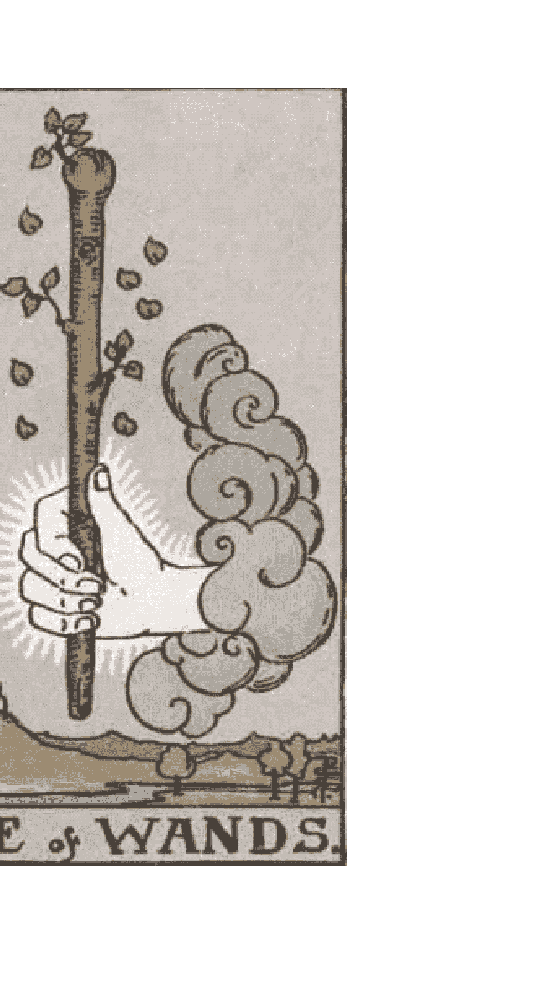
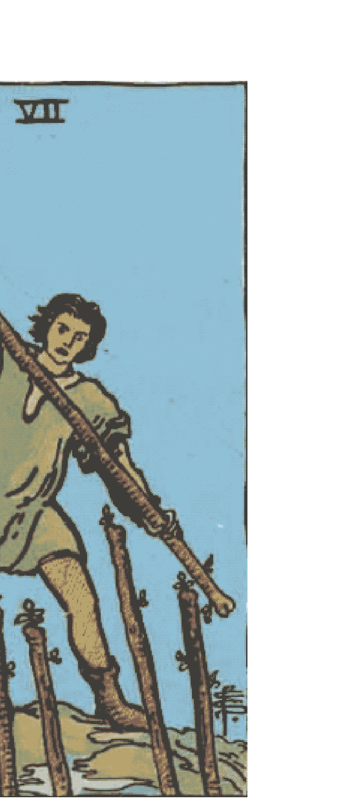
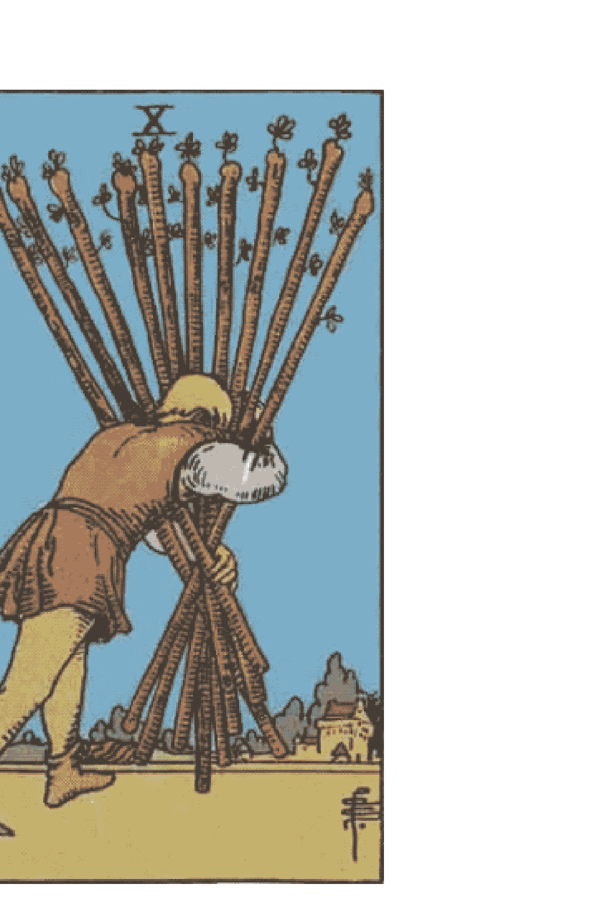
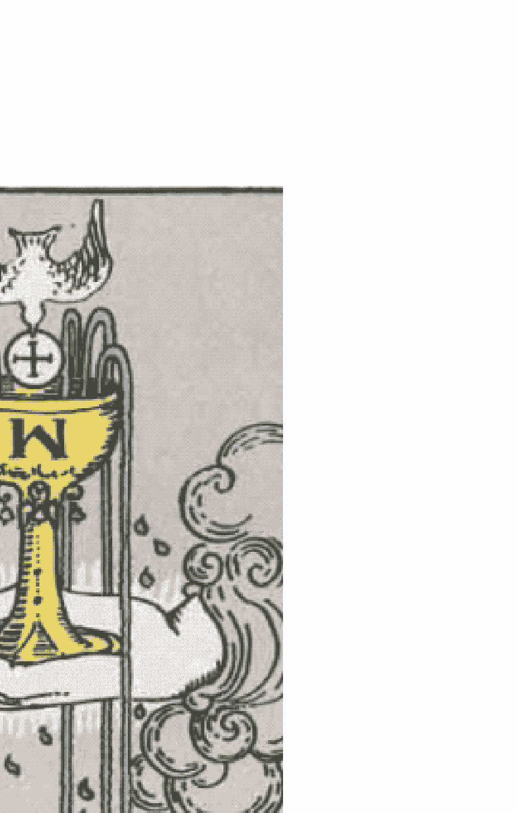
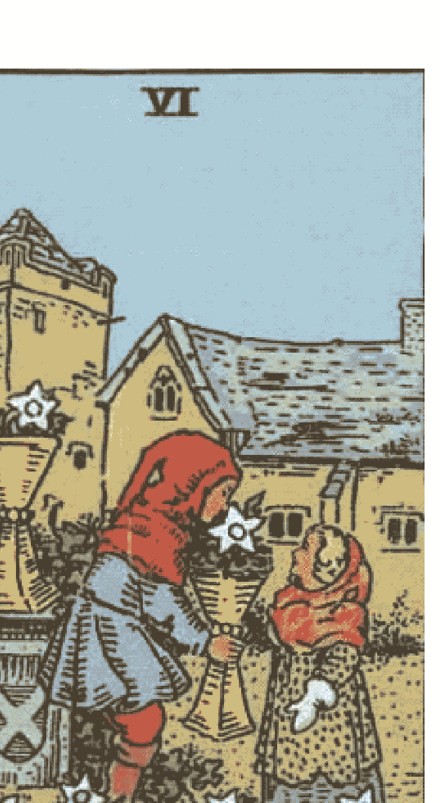
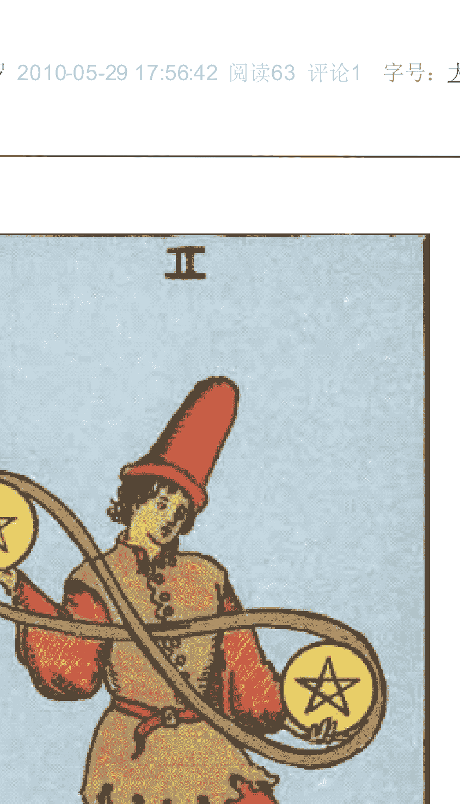
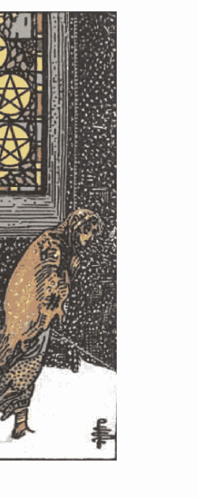
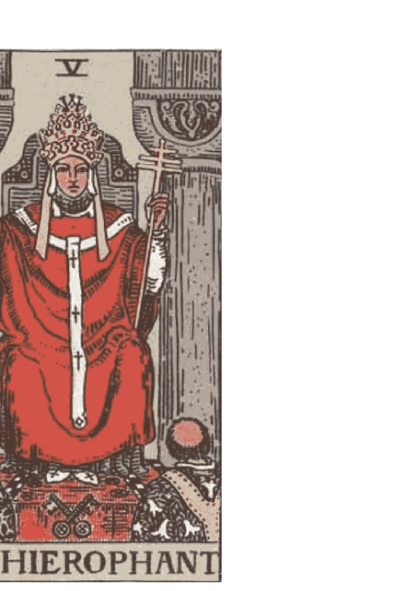
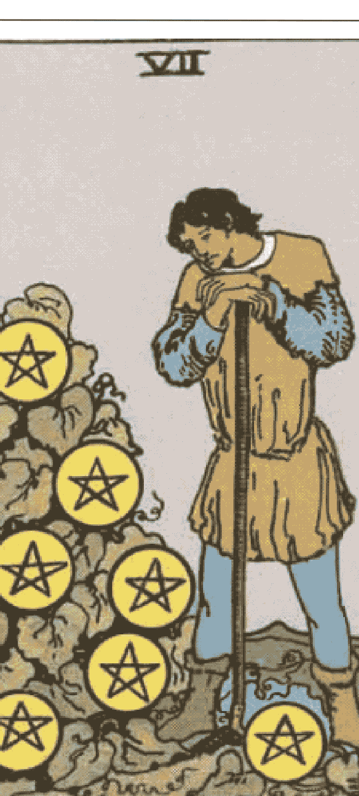
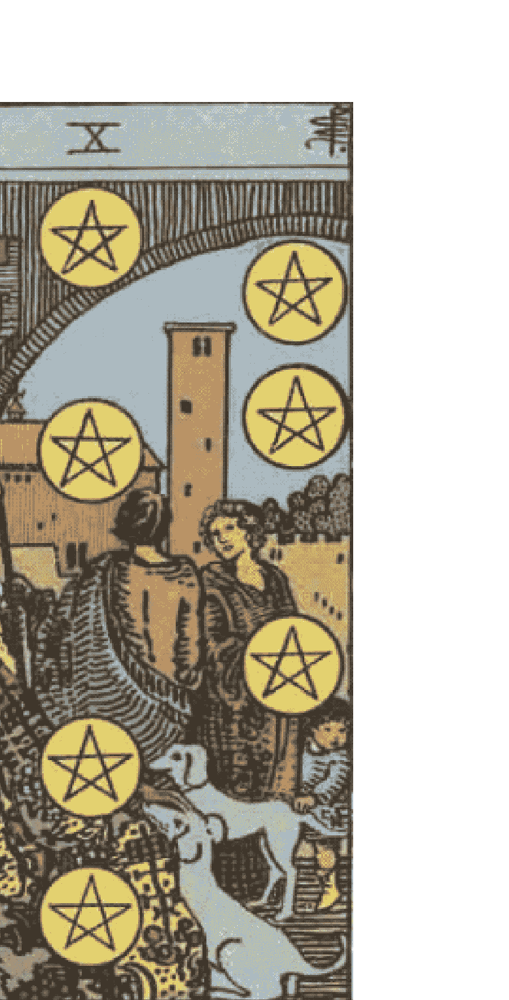

# 78度的智慧（英豪译）

## 一 引言 SEVENTY EIGHT DEGREES OF WISDOM（78张牌的智慧）

我爱塔罗 2010-05-29 12:14:53 阅读107 评论0 字号：大中小 订阅

## PART 1 大阿尔卡那

### 引言

### 01  
#### 塔罗的起源

大约在15世纪左右，当时出现了第一份提到牌的文献。就在那前后，一位名叫博尼法修·本博（Bonifacio Bembo，当然，你也可以翻译成博尼法西奥·班博）的画家为米兰的维斯康提家族绘制了这套没有名字、没有确切张数的纸牌。这些绘画纸牌被纳入意大利的纸牌游戏塔罗奇（Tarocchi）体系：包括4个系列，每个系列14张牌，外加22张表示不同场景的牌。后来人们把这些牌称为大牌或者王牌。

如今，人们认为这22张大牌上体现了中世纪的社会缩影，比如（人们也用这些名字来为大牌命名）“教皇”或“皇帝”，或体现中世纪道德训诫的“命运之轮”。一些牌体现着美德，比如“节制”（Temperance，或Fortitude），而另外一些则有着明显的宗教神秘含义，比如描绘死人从坟墓里站起的牌被称为“审判”（The Last Judgement，最终审判）。在大牌里，甚至还有一张描绘异端的牌——女教皇（有些翻译为女祭司）。如今，我们可以将这张牌视为与当时的教会开的一个玩笑，当然，这个玩笑开得非常深沉。不管怎么说，这张描绘异端的牌依旧是以当时的文化背景为根基的，有着非常明显的中世纪风格。

而在所有的牌中，有一张牌非常奇特。它描绘着一位年轻人头朝下，以左脚悬挂在木框之中。年轻人将双手谨慎地背在身后，他的双肘以及头颅三点连接起来，便形成了一个倒立的三角形。他的右腿在膝部屈曲，如此便形成了一个十字形，或是阿拉伯数字“4”的形状。年轻人的面部表情显得很放松，甚至可以形容为很陶醉。

人们会问，本博是从哪里寻来这样一个奇异的形象的呢？一些后来的艺术家曾揣测这张图可能是在描绘一个罪犯被悬吊在绞架上，但我们可以肯定这幅绘画无意描绘那种情形。在基督教的传统中，圣彼得被钉在十字架上处死时是头低脚高位，这样他就不会被说成是在模仿主。而在北欧神话《旧艾达》中，主神奥丁是位倒立悬挂的人物。他把自己倒着悬吊在世界树上长达九日九夜，这并非是为了惩罚自己，而是为了开悟，为了得到预言的力量。

其实，悬吊者是有其根源的，它源自西伯利亚和北美的萨满和巫医。当那里的人们为萨满的继承人传授知识时，有时会采取头朝下悬吊的方式。大概身体的倒立能为人们带来一些心理或精神上的益处，在极度的饥饿和寒冷状态下，人们有可能会体验到光芒四射的幻境。

欧洲的炼金术士和巫师或许也是萨满的分支之一，他们也保留着萨满的习惯，比如，他们也会把自己倒吊起来。他们相信这么做的话，充满生气的不朽物质元素就会倒流进入灵魂的核心部位：头颅。在瑜伽变得流行之前，人们便知道瑜伽信徒会采取倒立的姿势修行。

那么，本博绘制这张“悬吊者”，是否就是为了再现一位炼金术士呢？那为什么他不采取更寻常的炼金术士形象呢？比如绘制一个大胡子老者正在搅动一个坩埚，或者正把不同的化学物质混合在一起？

“悬吊者”这张牌因为T.S.艾略特的长诗《荒原》变得很有名，即便是在传统文化的背景中，悬吊者也并非代表着年轻的炼金术士。那么，本博是不是就是这张牌的始创者呢？

从悬吊者奇特的腿部屈曲姿势以及神秘的隐喻看来，人们倾向于认为本博就是始创者。从表面看来，本博有可能通过这张牌指向某种神秘实践活动，但是从实质上来说，这张牌可能映射着整个神秘学的知识体系。

### 02

为什么最初的塔罗牌（大阿尔卡那）是22张，为什么不是20、21或者25张呢？后面这几个数字在西方文化中显得更重要。那么，本博（或者本博所参考的对象）是出于偶然才选择22这个数字的吗？或者说，他想通过这个数字来表达某种神秘意味？因为希伯来语的字母就是22个。至今，都没有证据表明本博或者维斯康提家族与任何神秘组织有关联。

虽然缺乏证据，但塔罗牌和犹太教（卡巴拉）的高度一致性，使得人们认为本博设计的塔罗牌可以用卡巴拉来解释。

卡巴拉根植于希伯来字母系统。希伯来字母与生命之树紧密相连，每一个字母都具有其独特的象征含义。希伯来字母一共有22个，这与塔罗牌大阿尔卡那的数目相同。

此外，卡巴拉与神那不可诵读的名字“YHVH”也密切相关。“YHVH”代表着四个层面的世界，蕴含着4大基本元素、4种存在方式、4种《圣经》的解释方式等等。而在本博的4个系列牌面中，也出现了4次描绘法庭或庭院的图画。

而卡巴拉和数字10也密切相关：10条戒律、10个“神意的显现”（Sephiroth，可以音译为塞菲罗斯）。它们呈球形，以放射状的22条路径连接着4个生命阶层。

而塔罗牌小阿尔卡那中4个系列的小牌分别由1到10，各10张，共40张。这也难怪人们会认为塔罗牌是卡巴拉的象形解释。这种说法对于多数人来说毫无说服力，但对于少数人来说却意义非凡。不过令人遗憾的是，在成千上万涉及卡巴拉的文献中，没有一个字提到塔罗。

神秘学家对于塔罗牌的神秘起源提出了许多说法，比如崇高的卡巴拉，或其他一些1300年存在于摩洛哥的神秘体系，但却没有人能为这些说法拿出确切证据。而更要命的是，直到19世纪前，这些神秘学家自己都没有提过卡巴拉。

因此，我们可以这么说：塔罗牌的命名以及所涉及的数字并非来源于卡巴拉系统，而是来源于它们最初的牌面绘画。

如果我们接受卡尔·荣格的观点——关于人类意识中最基础的精神原型结构的理论——或许可以这样解释：本博无意中触碰到了隐藏在知识之下的暗流，使后来的人们得以通过牌面图像进行想象，连接无意识与意识。

不过，与卡巴拉所涉及的各种数字高度一致的22张大牌、4个系列每系列10张的小牌，以及愚者的位置和他脸上的嘲讽或狂喜，都被认为与集体潜意识密切相关。

多年来，塔罗奇（Tarocchi）被视为一种赌博游戏，而它的占卜功能一直居于次要位置。到了18世纪，一位名叫安托万·考特·杰柏林（Antoine Court de Gébelin）的神秘学家宣称塔罗（Tarot，这是法国对塔罗奇的称呼）是埃及《托特之书》（Book of Thoth）的残存之物。《托特之书》被认为由埃及诸神书写，浸透着魔力，传播全部的知识和神的律法。

安托万·考特·杰柏林的观点如今看来充满幻想，但缺乏事实依据。当时另一位法国人阿尔封斯·路易·贡斯当（Alphonse Louis Constant），笔名艾利法·莱维（Éliphas Lévi），将塔罗牌与卡巴拉联系在了一起。自那以后，人们赋予了塔罗牌越来越深的意义，发掘出越来越多的含义，包括学习、智慧、冥想、启蒙等等。

到了今天，我们将塔罗视作一种路径。经由这条路径，我们可以了解个人成长，理解我们自身以及生命本身。对于一些人来说，塔罗的起源是个非常严肃的问题；对另一些人来说，塔罗起源仅仅是塔罗历史自然而然的一部分。

不管怎么说，本博的确为我们设计出了塔罗的原型——不管他是无意识地设计出来的，还是出于某种深意。他的设计超越了任何神话体系。此后，不计其数的艺术家改良甚至改变了塔罗牌的绘画，他们精巧绝伦的设计深深迷住了无数爱好者。从某种层面上来说，他们把人们领进了神秘莫测的塔罗世界，这个世界无法言表，只能意会。

### 03  
#### 不同版本的塔罗牌

大多数现代塔罗牌与15世纪的塔罗牌存在明显区别。不过，它们都是78张，分为56张小阿尔卡那牌（包括4组：权杖、圣杯、宝剑以及钱币）和22张大阿尔卡那牌。

阿尔卡那（Arcana）这个词来源于“Arcanum”，意味着奥秘。一些牌面的绘画较从前版本有了较大的变化，但它们依旧以同样的概念为根基。例如，有无数个版本的皇帝牌，但它们都带有明显的皇帝特征。一般来说，塔罗牌面的设计越来越具象征意味，也越来越神秘。

在本书里，我们使用亚瑟·爱德华·韦特塔罗牌进行讲解，人们也称这副牌为莱德·韦特塔罗（莱德是出版商名称）。这副牌发行于1910年。

韦特当时因为更改了某些大阿尔卡那牌的设计而备受指责。例如，在维斯康提牌的“太阳”牌上，原本绘制的是两个小孩站在庭院里，手托着一轮太阳；而在韦特的“太阳”牌上，则描绘的是一个骑在马上的小孩，正快活地驶出庭院。

当时的指责认为韦特根据自己的理解擅自修改了塔罗牌的牌面，从而扭曲了塔罗牌的原意。他们的指责或许有点道理，因为韦特的确是个非常自我的人，他从来只相信自己是对的。

不过，在指责韦特的同时，我们也应想一想：古早版本的塔罗牌面真的就那么好吗？我并看不出本博所绘制的“太阳”到底体现了多么深刻的太阳含义。实际上，韦特所绘制的“太阳”反而更接近这张牌的本意。这张牌描述的是一个神奇的孩子，自由飞舞在空中，他怀抱着一个球体，球体内有一个微观城邦。

韦特和他的艺术家帕米拉·柯尔曼·史密斯为每一张小阿尔卡那牌都绘制了牌面场景，这是一个创举。在他之前的版本，没有哪一副牌为小牌逐一绘制具体场景；在他之后的许多牌，也没有给小牌绘制场景，人们习惯在小牌上摆上一大堆圣杯或者宝剑，以此表示它是圣杯六或者宝剑十。

而帕米拉·柯尔曼·史密斯绘制的宝剑十上，则是一个男人俯卧在乌云之下，在他背上、腿上插着十柄宝剑。

我们并不知道到底是谁设计了这些小牌。韦特确实构思了大牌的所有牌面，但我们不知道他是否亲自设计了小牌，或者他只是告诉帕米拉他的理解与想法，然后让她完成设计。

韦特在自己的著作《The Pictorial Key to the Tarot》（《图解塔罗》）中，并没有真正按照图像去解释小牌。例如，宝剑六的图面含义远比韦特的解释丰富，而宝剑二的图像含义甚至与字面解释完全相反。

不管这些牌是韦特设计的，还是帕米拉设计的，它们都对后来的塔罗牌设计者产生了强有力的影响。后来的设计者几乎在每张牌上都参考了韦特牌，从他们的设计中或多或少都能看到韦特塔罗的影子。

韦特将自己的牌称为“修正塔罗”。他坚持认为他的设计恢复了塔罗的原貌。在他的书里，可以看到他对先人的轻视。

如今，人们认为他之所以有资格称自己的牌为“修正塔罗”，是因为他隶属于金色曙光（Hermetic Order of the Golden Dawn），这使他有机会接触到塔罗的神秘“初源”。不过，韦特宣称自己的塔罗是“修正塔罗”，也可能只是因为他认为自己的设计更能表现塔罗的深意。

例如，他对“恋人”牌做了大幅修改，因为他认为旧版本的“恋人”牌毫无意义，而他的设计才真正体现了恋人的深层含义。

在这里，我并不认为韦特的塔罗牌只是对前人智慧的简单重构。韦特是一位神秘主义者，他学习魔法以及其他神秘事物，并将其付诸实践，而他设计的塔罗深刻体现着他的个人体验。

正因为他以个人实践为基础，所以他认为自己的塔罗牌绝对正确，而其他人的则是错误的。

我选择韦特塔罗牌作为讲解模板，原因有二：

- 其一，我认为他的许多革新非常重要。例如，韦特—史密斯版本的“愚人”让我印象非常深刻，比许多早期版本含义丰富得多。
- 其二，韦特和史密斯为每一张小阿尔卡那都绘制了场景。这项革新将人们从既有框架中解放出来。以前我们只能死记小阿尔卡那的含义，而它刻板的图画很少能带来更多理解。韦特牌则不同，它的图像意象丰富，能够触碰潜意识中的某些东西，使人们能够把自己的体验附加在小阿尔卡那之上，从而加深对牌义的理解。

简而言之，帕米拉·史密斯给了我们一个理解塔罗牌的途径。

在本书中，我选择韦特牌作为进行“基本解释”的工具。

绝大多数塔罗书籍都会选择一种塔罗牌作为解说对象。这种选择某种牌而不选择另一种牌，实际上是在宣称这一副牌是正确的，而其他牌是错误的。

很多作者认为选择一副“正确”的牌非常重要。例如阿莱斯特·克劳利、保罗·福斯特·凯斯，他们认为塔罗牌是一套象征符号知识系统。

但本书并不这样看待塔罗牌。在本书中，我更倾向于将塔罗视为人类生活经验的原型。如果从这个角度来看，塔罗牌就无所谓“正确”或“错误”。

在我心目中，塔罗牌是一个整体，是一个集合概念，包含了万年来所有塔罗牌的全部含义。

当我们把两种版本的塔罗牌放在一起比较时，会发现自己对塔罗的理解远比只看一种版本时更深刻。这种差异在诸如“审判”“月亮”等牌上比较微妙，而在“恋人”“愚人”等牌上则非常明显。

通过综合不同版本对塔罗含义的表达，我们能够深化对塔罗的理解。

#### 占卜

如今，人们大多把塔罗牌视为预测未来的工具。不过奇怪的是，在历史上有关塔罗占卜的记载却最少。

长期以来，塔罗牌主要被当作赌博工具使用。直到人们逐渐了解每张牌的含义之后，塔罗才慢慢成为一种占卜工具。

很可能是吉普赛人在欧洲流浪的过程中，使“塔罗奇”（Tarocchi）这项游戏变得流行，并最终将塔罗牌用于占卜。也可能是吉普赛人从某些早期的塔罗手稿中获得了牌义知识，然后把这些知识应用在占卜中。

人们大都认为吉普赛人是从埃及带来了塔罗牌。然而事实是：塔罗牌在意大利和法国出现几百年之后，吉普赛人才从印度来到西班牙。

接下来，我们要看看所谓的占卜到底是怎么回事，并了解人们是如何进行这种“无法无天”的活动的。

人们几乎可以用任何东西进行占卜：被献祭动物的肠子、鸟飞过天空时形成的图案、涂满颜色的石头、抛掷硬币等等。

这种占卜行为的原动力，简单来说是“对未来的渴望”；说得更玄妙一点，则是相信“万事万物皆有关联”“每件事物都有意义”“这个世界上没有偶然，只有必然”。

“随机”其实是一个非常现代的概念。根据这种观点，人们认为只有存在确凿逻辑联系的事件才有意义；如果两个事件之间没有明确的因果关系，它们就被视为“随机”“偶然”，即“没有意义”。

而在过去，人们往往认为各种事件之间是有关联的，是有迹可循的。人们会认为一个领域中发生的事情与另一个领域中的事情相互对应。例如，人们认为黄道十二星座与人生密切相关，认为茶杯里茶叶形成的图案可能预示战争的结果。

“万事万物皆有关联”这一观点一直拥有大量支持者。近年来，甚至一些科学家也开始认真看待这种想法，因为“祸不单行”这样的现象确实令人印象深刻。

那么，回到塔罗的话题。既然有这么多事物可以用来占卜，为什么偏偏要选择塔罗牌呢？

原因在于塔罗自成一个体系，而任何成体系的占卜方式，总能向我们揭示一些东西。占卜的价值正来自这种体系本身。

塔罗牌的每一张牌都包含深层含义。在占卜时，它们可以告诉我们很多事情——关于我们自己，也关于人生。

但不幸的是，大多数占卜者总是试图忽略这些深层含义，而转而使用一些简单的“公式”。例如告诉问卜者：“将会有一个穿黑衣的人出现并帮助你。”这种简单的解释往往更容易让顾客满意，也更容易被接受。

### 06

塔罗牌含义非常丰富，牌义往往看起来互相矛盾，或者过于直白。而几乎所有书籍都不会告诉你：在什么情况下应该选择哪一种牌义。

这种情况在解读小阿尔卡那时尤其明显。大多数塔罗研究文献倾向于重点讨论大阿尔卡那，很少深入探讨小牌。即便涉及，也往往只是简单列出几个含义，以敷衍那些坚持使用小牌占卜的读者。

即使是韦特本人，对于帕米拉·史密斯绘制的韦特塔罗，也只是简单说明了自己的理解，并没有进行详细解说。

而本书的主要内容正是塔罗牌的含义以及象征意义，同时也会仔细讲解在实际占卜中如何选择合适的牌义。

许多塔罗书作者（例如韦特）都低估了占卜，也低估了塔罗。实际上，正确地运用塔罗解读，可以有效增强我们对牌义的敏感度。

我们认为，了解每一张塔罗牌的含义非常重要，而理解当两张牌组合在一起时所呈现的“联合含义”同样重要。

对此我深有体会。许多次，当面对某些特殊牌阵时，我发现塔罗牌会向我揭示出某些“别样含义”。

解牌，对于所有学习塔罗的人来说都非常重要。有时候，一个牌阵似乎完全无法解读，它展示的内容似乎无法与现实生活联系，也无法判断吉凶。

只有当占卜者能够结合问卜者的背景，把前因后果联系起来思考牌阵时，才能发现其中隐藏的意义。

最后我想说的是，一些现成的解读案例能够帮助所有塔罗学习者更新知识，并增强对牌的直觉。本书中涉及的所有象征、案例与解释，都是为了帮助你在未来某个时刻拿起塔罗牌时，能够脱口而出：

:::writing
“这张牌告诉我……”
:::

---

## 二 第一章 SEVENTY EIGHT DEGREES OF WISDOM（78张牌的智慧）

我爱塔罗 2010-05-29 12:06:50 阅读114 评论0 字号：大中小 订阅

### 07  
### 第一章  
### 四张牌的牌阵解读

一元性和二元性：  
原点、零、奇数和偶数，光明和黑暗，男人和女人

长期以来，大阿尔卡那一直是人们关注的焦点，人们不断对其进行解读。如今，我们倾向于认为大牌讲述的是“心理层面”的内容，它揭示的是人如何逐步“完善自我”。

从这个层面来看，我们将世界视为一个整体，我们试图把自己从脆弱、困惑和恐惧中解放出来。而整副塔罗牌则向我们展示了“自我完善”的具体过程。

为了理解这一过程，我们先从四张牌的解读开始。这四张牌将形象地告诉我们，人如何一步一步发展到精神层面的觉醒，乃至达到“自我完善”的境界。

如果你手中有韦特塔罗，请将以下四张牌抽出来：

- 愚者  
- 魔术师  
- 女祭司  
- 世界  

将它们按照钻石形牌阵摆放。

仔细观察这些牌，你会发现：愚者和世界展现出一种愉快的“跃动”，而魔术师与女祭司则显得安静而沉稳。

纵观所有大阿尔卡那，你会发现除了编号0和21的两张牌之外，其余牌面几乎都处于静止状态，如同一张照片；而0和21则蕴含着明显的动态。

尽管愚者与世界都表现出动感，但两者含义不同。愚者表现出一种向前跃进的冲动，而且他衣着华丽；而世界牌中的人物则是裸体的。

愚者似乎试图从高层世界跳入低层世界，而世界牌则象征超越现实物质世界。世界牌中的女人被胜利的魔法花环包围。

请留意愚者的编号：0。

0是一个非常特殊的数字，它是原点，是“无”，但同时又蕴含所有数字的可能。在原点，一切尚未被束缚，一切皆有可能。

1和2是最早出现的数字：

- 1代表真实  
- 2代表稳定  

它们同时也是奇数与偶数、男人与女人、光明与黑暗、主动与被动的象征，代表着一切可能性的起点。

而世界牌的编号21，则将这两个数字结合在一起。

在魔术师这张牌中，魔术师将手中的权杖指向天空，这既象征精神与统一，也象征男性特质。

女祭司则端坐在两根柱子之间，象征二元性以及女性的阴性特质。

这两根显眼的柱子在其他阿尔卡那牌中不断重复出现，或者以更微妙的方式体现在编号6的“恋人”牌中，也让人想起“战车”牌中那两头斯芬克斯。

现在让我们回到世界牌。

在这张牌中，女人（在某些版本中是一个双性人）双手各持一根权杖。这象征男性与女性的统一。

此外，在世界牌轻快的跃动中，还体现出一种超越男女差异的更高层次——一种无上的自由与快乐。

从水平方向来看，魔术师与女祭司体现了对立的二元性；从垂直方向来看，编号0的愚者与编号21的世界则体现了一种连续性。

愚者代表一种理想的出发状态，而世界则让我们看到：当我们调和了对立的二元并获得自由之后，所体验到的喜悦是多么振奋人心。

与许多神秘思想体系一样，塔罗也用象征方式区分男女二元。

卡巴拉认为，人类始祖亚当最初是雌雄同体的，夏娃是从他的身体中分离出来的一部分。

在许多文化体系中，人们往往将男人与女人完全区分开来。在许多社会里，男女的社交甚至是完全分离的。

而如今，越来越多的人认为：每个人同时具有男性特质和女性特质。

### 08

如果我们把日常生活、把整个世界简单地一分为二——例如划分为阳与阴、黑与白、成功与失败——那么我们最终很可能会对这个世界感到失望。

么说是因为其实除去失败和成功之外，还有一个漫长的灰色地带。然而简单的二分法却会蒙蔽人们的眼睛，从而一旦不成功，便认定自己很失败。

对于我们每个人来说，并不是所有的愿望都能实现的。比如，一场婚姻似乎没有想象中的来得快乐，一个工作没有想象中那么好，相反，还挺让人烦恼的。还有不少画家声称，他们画出来的作品其实都不是他们脑海里原本设想的那一个，他们永远都没有办法充分完整地表达自己。如果你将世界尖锐地分为黑和白，我想你大约会是个苦闷的人，在做每个决定（不管这个决定是大还是小）时，都会痛苦不已，因为一旦你选择了一个方向，你必定会放弃另一个方向。此外，事情很难百分之百让人满意，然而非黑即白的世界是没有中间的灰色缓冲地带的，正是这一点让坚信二分法的人痛苦不已。现实世界是有其局限性的，请接受这一点吧。

这种设想与最终结果之间的落差，跟我们灵魂和身体的落差多少有点相似。我们的灵魂是没有限制的，能够抵达宇宙的任何角落，能够追溯时间，也设想未来；然而我们的躯体却是脆弱的，我们经历着饥饿、疲劳和疾病的折磨。人们试图填平灵魂与躯体之间的落差，抹平这两者之间巨大的鸿沟，这往往会让人走极端。比如，认为现实至上的人会宣称，根本没有灵魂，只有躯体和习惯才是真实的，所谓的灵魂不过是个虚拟的产物。而以精神至上的人则会走到另外一个极端，比如很多种神秘主义则声称现实不过是一种虚幻，甚至我们的躯体也是虚幻中的虚幻，是因我们对世界不完全的认知而产生的一种幻觉。

就基督教的传统认知来说，人们认为灵魂是不灭的，是不朽的真实自我，在躯体存在之前，在躯体消亡之后，灵魂都将继续存在。而很多神秘学说，比如卡巴拉和古代诺斯替派，他们则认为躯体更像是灵魂的囚所，因为我们古老的原罪，因此我们在现世才被拘禁在躯壳之中，经历现世的这一切。

没人知道二分法的源头在哪里。不过，当你向内在感知进行一番探寻的话，你会发现，在我们的躯体之下，在我们的内在，存在更有力、更强壮、更自由的力量，这是一份充满智慧的力量。此外，我们的内在中除了这些美好光明的东西，同样存在着狂野的动物本能，存在着欲望以及激情。这份光明的力量和狂野的动物本能都是真实的，它们隐藏在每个人的日常行为之下，隐藏在我们的人格之中。那么，我们怎么做才能探知内在的自我呢？如果就像前面所说的，我们的内在有着美好又明亮的一面，我们又该如何将这份美好和明亮释放出来呢？

持超自然学说的人老早就清醒地看到了我们躯体和灵魂的差异，认识到人类的局限性。不过，随着这种学说的发展，人们认为万事万物都有一个共同的源头，即“万物皆一”。一旦我们把握住“关键”，释放潜能，便能统合万事万物。人们往往对“精神修行”存在错误的认知，或者说错误地认识了修行的目的。所以，很多人试图通过炼金术变得富有（比如试图把铅炼成金子），坚信卡巴拉的人们则研究神秘的言语，还有很多人认为塔罗是预言的工具，能告诉他们未来的一切。其实，我们说，炼金术士试图改变的那块铅，正是在代表着他们自己，是他们自己想成为黄金，变得有价值。

我们都应该说服自己接受“局限性”，并耐心地等待未来的机会。没有人是那么完美的，事情不可能百分之百毫无瑕疵、没有遗憾。但是，持超自然学说的人虽然知道人类是有其局限性的，但他们并不接受这一点，他们总是认为我们的职责是使这个世界变得完美，这也是为什么他们总是在不遗余力地寻找那个神秘的“关键”，并试图统合万物。

一些人甚至认为塔罗就是他们所谓的“关键”。拜托，塔罗可不是“关键”，它可没有人们所想象的那么神秘。在我看来，塔罗向我们揭示的更多是“过程”，即我们周遭到底发生了什么。它还告诉我们，企图通过一个简单的“关键”便想统合世界万物的想法显然是错误的。当我们逐步经历“愚者之旅”时，我们便是在逐一体味大阿尔卡那（从愚者一直到世界）的深意，由此，我们开始成长，从而成熟。

## 09

愚者牌

塔罗中的“愚者”牌代表着完全的“纯真”。这是一种非常自由和快乐的状态，是一种每时每刻感知生命的情感。而这种纯真而“不朽”的自我，往往被我们日常的生活、被日常的这些烦恼淹没了，我们在世界面前早已习惯了妥协。有时候，人们甚至会觉得，这个光芒四射、明亮而纯真的自我，其实在一开始就没有存在过。我们总是觉得我们的纯真连同我们的直觉一起，一直在不断地流逝。几乎所有文明的神话传说中，都有关于“堕落”的传说，都有类似于人类因失去纯真而被从伊甸园里驱逐的神话。

“纯真”这个词一直以来都被人们所误解。它并不代表“没有负罪感”，它指的是自由，一种对生活敞开心胸的状态，无所畏惧，是关于活着的信仰，既相信生活本身，也相信自己。此外，“纯真”也不是指“无性别”的状态。实际上，它是带有性别特征的，愚者同样也是有“性”“欲”的，只是它是无惧的，没有负罪感，没有纷争，也没有不忠。它的表达自然而自由，愚者坦然地表达着“爱”，表达着“狂喜”，表达着“忘我”。

愚者牌的编号是0，这是个神奇的数字。在0这里，一切皆有可能，这是万物之初，是起点，包含无数的可能。愚者牌并没有固定的位置，说白了，它是张“野牌”。跟其他有固定位置的牌相比，它是自由的、无拘束的。愚者的纯真使他成为“没有过去”的人，他拥有无限的未来。

对于愚者来说，生活中的每一秒都是一个全新的起点。

在阿拉伯数字中，数字0是一个卵的形状，它预示着所有的事物均由此而诞生。最初，零的写法是一个小圆点，而在希伯来和卡巴拉体系中，人们认为宇宙便是由一个简单的小光点之中诞生的。在卡巴拉中，神被描述为“虚无”，因为若是你以任何词汇来描述神，都会对神加以限制和固定。

我们也看到，有一些学者在解释塔罗时，试图厘清愚者是否拥有过去，试图解释他的位置，将愚者安置在其他固定的牌中。对于这种做法，我们并不赞同。在我们看来，愚者是在运动中的，他在不断变化，他没有固定的位置，他随时准备跃进生活中去。

对于愚者来说，“现实”与“可能”之间没有任何区别。数字0意味着“希望”和“恐惧”均呈“空虚”的状态，愚者无所求、无所惧。他对于来到眼前的事物做出本能的反应，这就是我们所说的愚者。

其他人在愚者面前体会到的，也是他的这种“自发”或“自然而然”的反应。在愚者这里，没有算计，没有隐藏，一切都是坦荡的。很多人在朋友和爱人面前也显得非常忠诚、十分坦荡，但这些是刻意而为之。愚者并不是刻意要如此，对于他来说，这一切不过是自然而然的表现。他天生地表现出爱，表现出忠诚，他毫无保留地爱及周遭的一切。

这便是塔罗中的愚者。

## 10

### 钻石展开法

当我们提到愚者牌的时候，我们习惯于用“他”来称呼愚者，而当我们提到世界牌的时候，我们习惯用“她”来称呼世界，这是根据牌面所绘图案选择的称呼。而事实上，愚者也可以是女人，而世界则可以是男人，这对于两张牌的释义来说完全没有区别。因为愚者并没有与这个物质世界产生分离，因此对于愚者而言并不存在性别差异。从内在来说，愚者和世界是双性的，他们同时具备男性和女性的特质，代表完全的人性。

### 愚者牌

现在，我们有必要再一次回到前面我们摆好的钻石牌阵中来。在这里，你将清晰地看到，愚者分裂成为魔术师和女教皇。只有调和他们，将两者再度合二为一，我们才能来到世界。魔术师和女教皇是对立的，而世界则向我们展示出调和的统一。相对于愚者，世界的层次更高，意味更深，必须由愚者完成愚者之旅后，即游遍余下的18张牌后，才能到达。

愚者是纯真的，而世界则是智慧的，这是两者之间的区别。

#### 纯真和自由

愚者告诉我们的是，生活是简单的，是一连串经历的组合，我们只要全神贯注地随着生活的舞步前进就好。不过对于我们来说，想要维持这种小小的、短暂的自由都很困难。作为人类，我们往往经历着恐惧，受各种条件的限制，过于现实地看待每日的生活，这都妨碍了我们天性的发挥。我们确实有必要让“自我”从日常的繁杂现实中剥离出来。

事实上，在内心深处，我们能感受到一点模糊的“自由”。然而人们往往将其视为“堕落”的一种表现（它的源头是纯真），认为这是一种不正当的感觉。一旦人们丧失了纯真，我们便很难将它再度找回。但也不必恐惧失去纯真，因为接下来我们会挣扎着向前，我们会学习，我们会渐渐成熟，经历自我探索和自我觉醒的过程，最终我们将抵达“世界”牌。在那里，我们将享有更高层次的自由。

在塔罗牌中，魔术师代表着主动。  
而女教皇（女祭司）则代表着被动。  
魔术师代表着男性的一面。  
女教皇则代表着女性的一面。  
魔术师代表着意识。  
女教皇代表着潜意识。

### 魔术师

我们时常挂在嘴上的“要有觉悟，要有自觉”，其实说的并非是去“感受高层自我”“感知精神世界”，而是感知低层次的自我，现实层面的自我。虽然这个自我受到诸多限制，不过它却是相当有力的。正是现实层面的自我带给我们力量，使我们得以创造出现实层面的外在世界。

在这里，我们并不是想要贬低或小看魔术师的创造力。他无疑是非常强大的。试问，还有什么比创造出一个有序的物质世界更强大呢？魔术师正扮演着这样的强有力者。他富有创造力，强大，并赋予生命意义和目标。治疗者、艺术家、神秘学家均把魔术师视为他们的代表牌。尽管魔术师是如此强大，他的力量却还有另外一层含义，那便是与“失去”某人所独有的自由有关，以及并没有完全理解这个世界。魔术师是有其局限性的。

相对于“外向”的魔术师而言，“内向”的女教皇代表着潜意识。就某种程度上而言，这种暗藏的潜意识非常接近自觉本身。但是，女教皇的知识、她的内在探知，并没有抵达“虚无”或者说“无一物”的境界，她依旧没有超人那般的自由。

女教皇代表着内在的真理。但是，由于我们的内在往往是模糊的，属于潜意识的领域，不可进行实体体验，因此女教皇的表现形式非常被动。她只有通过这种被动的方式，才能诱发出内在的真理，诱发出我们的潜意识。

事实上，这种内在表现的被动性，在我们的生活里有诸多表现。我们其实都带着一份朦胧的自我认知存活着，这份朦胧的自我认知实际上是我们纯粹自我的折射。它无法言说，无法被他人感知。但是，不管是男人或是女人，如果你每日每夜都全身心地投入到竞争、工作、职责之中，却丝毫不经营内在自我的成长问题，那么你将很容易在欲望达成之后迷失自我。这种事情往往会反复发生。与这些堕落的男女截然不同的，是如今依旧在修行的佛教僧侣和尼姑。他们早已从现实世界中抽离出来，远离尘世，这是因为他们认为卷入尘世（哪怕只卷入了一丁点儿）都会干扰他们的修行和冥想，干扰他们的禅。

魔术师和女教皇都在某种程度上体现了纯粹。就某些方面而言，他们并没有失去愚者的光芒；他们仅仅是将这份光芒分作光明和黑暗两部分。就传统而言，西方宗教思想和东方宗教思想是存在分裂的，而魔术师代表的是西方，这是因为魔术师强调行动，强调历史与实践。而女教皇则代表东方，她代表着一份超然，一份从世界和时间之中脱离出来的倾向。如果你在东方和西方的宗教思想中浸淫的时间足够长，你将会体会到上述的趋势。

女教皇端坐在黑白两根柱子之间。但她本人所体现的却是其中黑暗而被动的一面，她以直觉来平衡黑暗和光明的两面。这似乎听起来有点自相矛盾。如果我们在生活中遇见许多对立的事物，遇到许多反对，我们要么来回折腾，从一个极端奔到另一个极端，试图突破这些反对和对立的东西；要么我们干脆什么也不做。这都是可能的。但长此以往，我们必然会失去平衡，在这些时候，内在的知识根本没有起到引导作用。

### 女教皇

女教皇代表着和谐，她充当着调和“慈悲”和“审判”（它们刚好是对立的）的作用。她端坐在庙宇中的黑白两根柱子之间。但是，由于女教皇是被动的，她没有能力将“和谐”引入行动之中，没有办法调和魔术师的行为，因此这份“和谐”也就白白流失了。

由于其过于典型的特点，魔术师和女教皇都没有办法在我们的现实世界中单独存在，当然，愚者也很难存在。对于我们来说，我们不可避免地需要将他们混合到一起。我们需要体会这几张牌所带给我们的东西，比如一场困惑、不安、负罪感、被动体验等等。在现实生活中，我们很难遇见非黑即白的情形，这是因为生活将一切混合在一起了。

- 一，它通过抽象和提炼，将我们生活各个层面的一些表现提纯、浓缩成为典型，这将有助于我们审视这些纯粹的表现，理解其含义，了解心理真相。
- 二，大阿尔卡那帮助我们面对这些各不相同的“典型”，协助我们面对生活的各个层面，一步一步地带领我们体会生命的不同，从而最终走到生活的大同和协调一致中去。

实际上，愚者所代表的这份纯真，可能在我们的现实生活中压根儿就没有存在过。我们不断地在生命中体会着各种失落，我们不断地在失去一些宝贵的东西。而大阿尔卡那牌，则是帮助我们将这些宝贵的东西一一拾回来的有力工具。

【第一章结束】

## 三 第二章 SEVENTY EIGHT DEGREES OF WISDOM（78张牌的智慧）

发表于 2010-05-29 13:09:42 阅读80 评论0 字号：大中小 订阅

## 12

## 第二章 总论

### 整体解读塔罗牌

大体而言，人们习惯于用以下两种方式解读大阿尔卡那牌：一，把它们作为分散的个体单独解读；二，将它们作为整体进行解读。

第一种方式认为每张大牌都标志着我们精神发展的不同阶段。这种方式倾向于认为每个阶段是独立的、不同的。

比如说，女皇代表着享受自然精神，我们的灵魂在大自然的包围下变得美好而富饶。皇帝则代表着自我控制力的强化。

在方法一中，在考虑每张牌的含义时，人们将每张牌的编号也一同考虑进去。在人们眼里，数字同样具有象征意义。

比如，数字1是属于魔术师的。倒不是说因为他是第一个出现的，所以1就非他莫属。说数字1属于魔术师，是因为1代表着“整体”“大统”“意愿”，这些含义与魔术师所代表的象征意味不谋而合。

而在方法二中，人们将整个大牌视为一段连续的过程。魔术师代表数字1，他的象征意味正是源于他位于整个连续过程的起点，他处于成长的起跑线上。而数字13则属于刚好位于这一点上的牌，它位于悬吊者和节制之间。每一张大牌都代表着前一阶段和后续阶段的过渡。

大体而言，我们倾向于使用方法二。数字本身的象征含义的确很重要，但大牌位于整个序列中的位置所带来的意味同样也很重要。通过前后大牌的比较，我们往往能更明确地理解单一张牌的局限性，以及它的独特性。

例如，数字7——战车。一般而言，我们会把它理解为“成功”。但这太笼统了，我们不禁要问，它到底指的是哪方面的成功呢？它指的是世界革命性的成功，或者它指的是并非那么大的成功，仅仅是一般意义上的成功呢？单看一张牌会很难回答这样的问题，但是如果你把战车放到整个大牌序列里去看，这样的问题就很好回答了。

以方法二解牌的人，一般来说会试图选择一个点来对大牌的整体序列进行阶段性划分，这样有助于理解大牌的含义。我们最常采用的分割点是命运之轮。数字10代表第一个周期的圆满结束，以及另一个周期的初始。

如果我们把0号的愚者算进去，那么命运之轮就把整个大牌序列平均分为两个部分，每部分11张牌。最为关键的是，我们一向认为，随着命运之轮的转动，事情将发生变化，这是改变的契机。人们的视野将从肤浅外在的表象（比如获得成功、获得爱情等等），转向更为深沉的内部探索（比如死亡和星星）。

不过，就我个人的角度而言，二分法还不足以满足我的需求。我会把整个大牌分为三个部分。

我会先将愚者牌单列出来，把这一张牌作为单独存在的部分（将愚者牌单列是很有好处的，它对于整副大牌而言将变得无处不在）。然后，我再将余下的21张牌平均分为三组，每组七张牌。

数字7的象征含义由来已久：占星学上最重要的七大行星；七由三和四组成，它们各自具有深意。此外，还有7根代表智慧的智慧之柱，生命之树初级的七个状态，人类的七窍，人类的七个脉轮（瑜伽里指代人类的精神能量中心），一周的七天。

实际上，塔罗与7有直接的关系。我们都知道希腊字母π指的是圆周率。在每一个圆里，直径乘以圆周率就等于圆的周长。不管圆是大是小，圆周率都蕴含其中，而22/7就是圆周率。如果我们算上愚者牌，那么大阿尔卡那牌一共22张。去掉一张愚者牌，我们便能用7除尽。

如果我们把22×7，那么我们会得到数字154（而1+5+4=10，正好是命运之轮的序号）。而如果我们把154除以2，便得到数字77，刚好是去掉愚者牌的所有塔罗牌的数量总和。

在卡巴拉体系里，神便是“虚无”，是“无一物”。

它是圆心，是核心，是圆的发源地，世界的起源。

而愚者牌的数字正好是0，它既代表着圆本身，又代表着圆心。

至于为什么要将塔罗牌中的大牌分成三个部分而并非两个，这实际上是根据大牌的含义进行的划分。

在如上图的划分中，每个部分的第一张牌都充满了力量。魔术师和力量牌都是强有力的牌，而恶魔牌也拥有不逊于前两张的力量。在魔术师和力量牌中，我们都可以清楚地看见象征无穷的“∞”漂浮在牌中人物的头顶上。让我们一起来看看恶魔牌：图中的恶魔一手朝上，一手朝下，它的姿势和魔术师所采取的姿势有点神似。只不过，恶魔朝下的那只手里握的是火把，而魔术师朝上的那只手里握的是权杖。

而在一些版本的塔罗牌里，对于牌号为15的大牌，人们管它叫“黑魔术师”，并非“恶魔”。

此外，我们再提一句，在许多其他的塔罗牌里，牌号为8的牌是正义，而并非力量。如果你查看一下正义牌，你会看到她采取的也是与魔术师神似的姿势，一只手向上，一只手向下。

这使得正义牌与恶魔和魔术师牌的联系也非常紧密。（英豪：左手象征显意识，或者说道德、意志；右手象征潜意识，或者说本能欲望。魔鬼牌中，魔鬼左手持火把向下，说明对物质世界（或者说显意识世界、浅层精神世界）的追求，象征精神（潜意识）的右手向上，说明精神世界的匮乏，内心的空虚。魔术师则刚好相反，握权杖的右手（象征潜意识）指向天空，说明对于精神世界的追求；象征物质世界的左手指向下面，这一指代表着关注。魔术师虽然注重精神层面的东西，但并未忽视对于物质世界的掌控。摆在前面桌子上的四元素代表着整个世界，所以魔术师所面对的是整个世界，包括精神世界，也包括物质世界。作为数字牌中数字为1的牌，魔术师所面对的是整个人生所有课题。到了数字15魔鬼牌，显然失去了精神世界与物质世界的平衡，偏向了物质世界。比较类似的一张牌还有11号正义牌。在正义牌里，仍然是一手朝上，一手朝下，不过两只手基本是持平的。如果套用弗洛伊德的概念的话，正义牌可以代表自我（前意识），调和潜意识与显意识，起着衡量、评判的作用。）

这三个部分的其他牌，如果我们纵向来看，它们实际上都是有某种意义上的相关性的。

### 体验的三个层面

将大阿尔卡纳牌分为三个部分，便意味着我们将体验也分为了三个层面。简单来说：

- （1）意识层面：主要是我们所感知的外在世界，我们的环境乃至社会。
- （2）潜意识层面：这主要指的是我们向内在的探索，以便发现某些深层次的东西，确认真正的自我是什么样子。
- （3）超意识层面，或者说灵性层面：这里指的是精神层面的高度发展，与原型能量的接触。

实际上，人们并不是强制性地把大阿尔卡纳牌分为这三个层面的。实际上，大牌根据其象征的不同，自然而然地出现了三个层面。

就第一个层面而言，我们在这里关注的都是现实中的事务，比如爱情，比如社会地位，比如权力、教育等等。我们时常在小说、电影、学校课程里看到社会的种种缩影，而这7张牌也是我们社会的一个缩影。有些人一辈子就被局限在这7张牌之中，从来也没有超越过战车。对于一些人来说，人生的最终成就全部都在战车里了，他们从来没有拓展到大牌的第二个层面。

现代心理学认为自己已经涉入了大牌的第二个层面，以隐者牌为代表，现代心理学向人的内在探索。

在向内心深处探索的过程中，我们迎来了死亡牌并获得重生。在第二个层面的最后一张牌——节制的牌面上，这位天使象征着我们已经逐渐揭开了一些自我欺骗、自我隐藏的假象，撤开抵触和敌意，放开自我保护的阀门，发展出真实的自我。在这里，我们将让一些旧有的不合时宜的东西死去，让新的东西取而代之。

那么，什么是大牌的第三个层面呢？我们能否真的超越第二个层面？在已经触知了真实的自我之后，我们还需要体验什么呢？简单来说，这个层面的7张牌描述的是生命本身所含有的冲突，以及终极的归一。这其中的每一张牌都显得非常重要。我们随着它们，准备沉入黑暗的深处；随后，我们获得变革，获得光明，破陈出新；最终，我们将重新回归光明的世界，回归阳光下的意识层面。

对于大多数读者而言，大牌的第三个层面显得过于模糊暧昧，看上去非常玄异。我们有时也用“宗教”或“神秘主义”来描述最后7张牌的内容，不过这样也让人难以理解，难以抓住牌意。

实际上，我们的思维本身就显得模糊而暧昧。或许，我们应该用这种模糊来理解最后7张牌的命题。这份模糊用来描述真实的自我、描述我们的时间，显得非常合适。在某种程度上而言，世界本来就是模棱两可的。

每个社会都在用自己的语言教育它的每一份子，我们每个人都被社会潜移默化，以一定的假定框架来看待这个世界。举例来说，就我们的社会而言，我们会看重价值体系，看重每个人的独一无二性，强调真实，强调爱，强调自由和公正。我们的社会（西方社会体系）强调每个人都是独一无二的个体——“我们孤零零来到这个世界，再孤零零地离开”。总体而言，我们的社会从十八、十九世纪开始，便强调现实基础，强调真实，强调物质。我们抵触“超自然”，抵触“宇宙的力量”。这倒不是说我们有多么讨厌这一类的描述，而是在于，关于这些神秘的知识，早在古老的年代就已经失传了，我们这些现代人压根儿就不知道“宇宙的力量”到底是什么。事实上，我们也并不理解神秘主义到底在向我们倾诉些什么。

所以，当我们面对大牌的第三个层面时，很多人都会感觉不自在。这使得我们对于它们的理解变得更加艰难。但如果你肯深入钻研，你的收获会不小。研究这些古老的象征图片，能使我们重新获得那些曾被我们的教育所否定的知识。

## 第三章 位于起始位置的大阿尔卡纳牌  
SEVENTY EIGHT DEGREES OF WISDOM（78张牌的智慧——英豪原创翻译）

我爱塔罗 2010-07-04 11:41:49 阅读58 评论0 字号：大中小 订阅

### 象征与原型

#### 0 愚者

（此节由塔罗小馆译，出处：http://www.taluoxiaoguan.com/blog/none/2924.html）

在之前的章节里，我们已经从一个层面讨论过愚者了，他代表着纯粹的精神自由。不过，在这里，我们还需要从其他层面来理解愚者。

他位于原点，我们需要跟随他进入大牌，开始塔罗之旅。

现在让我们想象，比如我们正在步入一幅风景画。那个世界与我们的世界不同，在那里，有魔术师，有喜欢把自己头朝下倒着悬吊起来的家伙，有舞者在明亮的空气中起舞。至于进入那个世界的方式，你可以随意想象，比如你可以想象自己穿过一个黑暗幽长的山洞，忽然见到了这片桃花源；也可以想象自己像爱丽丝一样，钻进了兔子洞。

不过，不管你选用哪种方式，我在这里不得不提醒你：这在其他“正常人”看起来可能显得有点傻。实际上，现实生活远比临时的想象来得安全。在现实层面，有工作，有家庭，有学校，有孩子。赫尔曼·梅尔维尔（就是写《白鲸》的那个家伙）曾提醒他的读者，千万不要脱离社会的寻常道路。所以，我在这里也是提醒你，这或许是一条不归路，我不保证你能回归日常生活。

对于那些想尝试一下“红色小药丸”的人来说，冒个险或许很值得，这有可能会给你带来快乐与冒险。如果你有足够的勇气一直坚持走下来，你或许在快乐之外，还会体验到一些恐惧。当你完成这一切，你终究会获得这次冒险的奖赏：知识、宁静、解放和自由。

有趣的是，像愚者这般的原型，在已有的宗教体系里很难见到，在神话中却可能时常碰到。不过这也难怪。一个官方的宗教体系通常不会鼓励信徒动不动就超越常规、超越典章的限制去冒险。相反，他们往往会鼓励信众循规蹈矩，为信众提供一个安稳的信仰避风港。你要是害怕生活，那么你就信教吧。

相对于宗教，神话则往往直接恐吓人本身。在几乎每一种文明的神话体系中，你都能看到骗子和疯癫的无赖。他们满嘴无法无天，却在最紧要的关头诱导国王和英雄直面内心、直面真相。

在亚瑟王的传说里，梅林既是巫师也是智者，但同时，他也扮演着骗子和无赖的角色。他不时在亚瑟面前假扮成一个乞丐，或变成一个孩子，或变成一个老朽。年轻的亚瑟因为自负和自傲，常常被梅林欺骗，被耍得团团转。只有在梅林揭穿自己身份后，亚瑟才恍然大悟。梅林实际上是想告诉亚瑟：最重要的事情不是你的军队、你的法典，而是学会如何透过幻象看清本质。道教的修行者不也常常跟他们的准则打擦边球，成天试炼来试炼去吗？

## 第四章 世界的顺序  
SEVENTY EIGHT DEGREES OF WISDOM（78张牌的智慧——英豪译）

我爱塔罗 2010-06-07 11:13:43 阅读55 评论0 字号：大中小 订阅

数字8

### 战车

早期的版本中，战车是被两匹马拉着，而非斯芬克斯。这源于一些历史及神话故事。起初，它来自于在罗马或其他一些地方为得胜而归的勇士举行的游行，战车载着他们走在满是欢呼的人群中。这种习俗明显地表明一种更深层的、对于团体参与的心理需求。即使两千年后的今天，在为总统、将军及宇航员举行的游行或阅兵式中，我们仍然这样做，只不过把战车换成了豪华轿车。

战车的含义不只是一个大的胜利。同时，驾驭两匹马也要求对两个动物进行完全的控制。

行动力是强大的意志力的完美车轮。柏拉图在《斐德拉斯》中提到，意志就像是被黑白两匹马拉着的战车，这与战车牌的画面很相像。

印度有一个关于湿婆神摧毁魔鬼“三重城”的故事。要做到这一点，他要求万物都要服从于他的意志。上帝为湿婆神造了一辆战车，所使用的不仅是战车本身，还包括天界及大地作为材料。太阳和月亮作轮，风作马。（在战车前面的那个象征符号，既像是个螺帽，又像是个门闩，或是车轮与车轴，叫作男性生殖器与女性生殖器。阳性象征着湿婆神，阴性象征着巴瓦妮，二者统一于一个形象。）通过神话中的形象，我们可以认识到：精神上对于邪恶的胜利，在于我们能集中本性中的一切——包括存在于湿婆神自己身上的无意识能量——并将其转化到显意识的意志之中。

这两个故事展示了意志的两个不同方面。湿婆神的故事讲的是关于真正的胜利，在这里，精神发现了一个释放全部力量的点。而《斐德拉斯》则给了我们一个成功自我的意象，这种控制不仅是化解生活最基本的冲突。那些把塔罗牌看成是由不同意象组成的诠释者认为，每一个意象都以一个重要的课题帮助我们进行精神分析，从而赋予战车更广泛的意义。他们指出，就数字7这张牌的大标题而言，考虑到所有神话内涵之后，应该是“胜利”。

在许多地方，尤其是在印度，马与死亡及葬礼联系在一起。当上升的父权制度废除了国王的陪葬仪式后，马成了殉葬的替代品。马的献祭成了最神圣的事情，与水神相提并论。即便是今天，马仍被用来牵引伟大领导人的灵柩。（战车牌这种异乎寻常的两个交汇点在约翰·肯尼迪之死上表现得很明显：在一次游行中，他被杀死在自己的豪华轿车里；而在州葬礼上，一匹不受训练员控制的马拉着他的灵柩。）

这些联系表明，精神的意念对于死亡之数的克服。

当我们看着这张牌时，会发现数字7这张牌是大牌第一组牌中唯一代表胜利的牌。这是成熟过程中的一次加冕，但从必要性来说，这还不能说明已经达到了无意识及超意识领域。这样来看，战车牌展现给我们的是一个发展成熟的自我。前面牌的课题已经领会，未成熟的探索及自我创造期已经过去。现在，我们看到的是一个成熟的成年人，在生活中很成功，被别人所敬仰，自信、自足，能够掌握情感，总之，能够指挥意志。

就像魔术师一样，战车牌也拿着权杖。不同的是，他并没有像魔术师那样把权杖高举过头。他的力量依从于他的意志。他手中没有抓缰绳，而是用强烈的个性控制着生活中的不同力量。

男女性感的象征符号表明，他可以控制自己成熟的性欲。这样，他就不受情绪影响，同时，他的性欲也有助于令人满意的生活。他胸前发光的方形是鲜活自然的象征，这把他与女皇的感性世界联系在一起；而他皇冠上的八角星表明，他的意识能量在指导他的激情（象征主义者把八角星看作是物质的方形世界与圆形精神世界之间的过渡）。

他的战车看起来要比他后面的村庄大，这表明他的意志比社会规则更有力量。然而事实上，他的战车并没有运动，这表明他并非一个逆反者。战车的轮子停在水上，表明他从潜意识中获得能量；可是战车本身停在陆地上，这就把他与这种强大力量的直接联系隔开了。

我们已经提到过男女性感的象征。同时，印度神话把马与死亡联系起来。弗洛伊德的象征主义者把马与力比多的性动力联系在一起。通过控制马（或斯芬克斯），战车的驾驭者控制了他的本能欲望。

不同的魔法符号装饰着他的身体。他的裙摆带着仪式魔法的象征，他的腰带显示着符号与行星。他两肩上的月形脸叫作 Urim 和 Thummim，被看作是耶路撒冷教宗的护肩，也因此被代指教宗牌。同时，月形护肩也指向女祭司。战士身后的布帘被看作是女祭司身后的帷幔。他已经把无意识的神秘之地置于身后。

可以看得出来，战车牌的象征意义包含了第一组牌中的所有牌：权杖象征魔术师，水、斯芬克斯以及布幔象征女祭司，胸前方形和绿地象征女皇，城市象征皇帝，肩章象征教皇，男女性感符号象征恋人牌。所有这些势力构成了外在的人格特征。

不过，我们也可以发现战车具有坚石一般的特质。战士把自己与石头车轮融在了一起。想要把所有事情都压缩到意识的控制之下，会冒着变得僵化的危险，从而与那些需要被控制的力量切断联系。同时还会发现，黑白斯芬克斯并不调和，它们看向相反的方向。战士把它们维持在一种紧张的平衡之中。如果这种平衡失败了，战车与战士就会分裂。

保罗·道格拉斯把战车与荣格有关“人格面具”的观点相比较。在我们成长的过程中，我们会创造一个面具来处理外在世界。如果我们能够成功地解决生活中的不同挑战，那么其他牌所象征的不同方面就会与自我的伪装统一在一起。但是，我们很容易把这种成功的伪装人格与真实自我混淆，以至于当我们试图撕掉这个面具时，会像害怕死亡一样害怕它的丢失。这就是为什么第二组大阿尔卡纳会认真地把外在面具之下的自我释放出来，并把死亡放在这一组最后一张牌的前面。

这样，我们把战车看作成熟男人的象征。然而，人类的概念远远超出了个体性。伴随着思想控制与生活动力运用的意象，战车也成了一个公民的象征：他从杂乱的自然中创造秩序，把自然界作为农业与城市发展的原料。卡巴拉的一条重要教义为这张牌的这一层含义作了外延。借着与希伯来字母“Zain”（扎因）的联结，战车具有语言的特质。

荧素：有点晕，搞不清是什么意思，把原句抄写如下：  
By its connection with the Hebrew letter 'Zain' the Chariot carries the quality of speech.  
这里面可能有典故。为什么战车会具有语言特质的象征呢？难道是因为他呈现的姿态很像个演讲家？但这样说似乎有点牵强。

语言对人类而言通常被看作理性意识的呈现，以及对自然的支配。就我们所知，只有人类拥有语言能力（尽管猩猩似乎可以学习人类的手势语言，鲸鱼和海豚也可能拥有自己的复杂语言）。我们可以说，语言使我们与动物区别开来。亚当在伊甸园通过为万物命名而控制它们。更重要的是，人类使用语言来传递信息，使文明得以发展。

语言是对世界的一种组织描述，并为每一种事物贴上标签。我们在自身与经验之间竖立了一道障碍。当我们看着一棵树时，我们感觉不到一个生命体的存在，我们只是想着“树”，然后走开。标签已经代替了事物本身。同样，如果我们过度依赖语言的理性特质，就会忽视那些无法用语言表达的经验。

我们已经看到女祭司如何表达语言之外的直觉智慧。当然，经验——特别是与精神的神秘联系——是无法被完整描述的。语言只能通过隐喻与寓言加以暗示。那些完全笃信语言的人坚持认为，语言表达之外的经验不存在，或者说，不能被心理学验证的经验就不存在。这只是因为这些经验无法被科学地描述。这种武断，在战车驾驶者与他的石头战车的融合中获得了很好的象征。

这样，我们基本上已经讨论了战车画面中的每一个象征意义，也许除了最明显的一个：两个斯芬克斯。韦特借用了艾利佛斯·李维（卡巴拉塔罗的重要先驱者）的这一创新。就像女祭司牌中的两根柱子，或者黑白马的替换一样，斯芬克斯象征生活中的二元性与矛盾。再一次，我们看到了三者之间的动力。在这里，调节的力量是意志。

斯芬克斯取代马也有更深层的含义。在希腊传说中，斯芬克斯是出谜语的存在，它向底比斯人提出关于生命的谜题。故事说，斯芬克斯抓住城里的年轻人，并向他们提出谜语：

“什么东西早上用四条腿走路，中午用两条腿，晚上用三条腿？”

不能回答的人就会被吞掉。答案是“人”：婴儿时爬行，中年时直立行走，老年时拄着拐杖。

这个含义非常清楚：如果你不理解人性的力量与弱点，生活就会毁灭你。战车象征成熟，接受生活的局限，再加上语言能力——也就是理性的理解——从而定义存在并试图控制它。

然而，这里还有另一层潜藏的意义。回答出斯芬克斯谜语的人是俄狄浦斯。他杀死了自己的父亲，然后来到底比斯城。弗洛伊德对乱伦问题的强调，转移了人们对这个神话真正信息的注意。俄狄浦斯是成功男人的典型形象。不仅因为他解救了底比斯并成为国王，还因为他凭借对生活的理解做到这一切。他知道“人是什么”。然而，他却不知道“自己是谁”。

直到神的力量迫使他面对真相之前，他从未真正接近过自己的内在。如果先知没有事先告诉他的父亲以及后来告诉他本人，俄狄浦斯或许永远不会做出那些行为。因此，虽然他理解了人类生活的外在意义，却既不理解自己是谁，也不理解自己与神的关系，而正是神在控制着他的命运。

而这两个问题正是第二组与第三组牌所要表达的。在第二组牌中，我们超越自我，发现真实自我；在第三组牌中，我们直面存在的原始动力，并最终达到二元性的统一——这是战车中的战士能够控制，却无法完全调和的。

战车的占卜意义来自于它强大的意志力。从某种层面上来说，此牌表明，一个人可以通过自身人格成功地控制某种境况。这张牌暗示着，一种状况中包含矛盾，但这些矛盾尚未融合，只是被操控在范围之内。这并不是强调此牌的消极面，而是理解战车牌的重要方式。从解决问题的层面来看，这张牌意味着成功。

逆位时，这种冲突会变得更加剧烈。战车逆位暗示意志力的运用失败，情形已经失去控制。除非这个人能够找到接近问题核心的方法，否则就可能面临彻底的失败。仅靠意志力并不能支撑我们。就像俄狄浦斯一样，我们有时必须向更高的力量屈服。

## 第五章 内省  
SEVENTY EIGHT DEGREES OF WISDOM（78张牌的智慧——英豪原创翻译）

我爱塔罗 2010-06-04 15:03:58 阅读53 评论0 字号：大中小 订阅

### 寻求自觉

从第二组大阿尔卡纳牌开始，我们从外部世界转向内在自我的挑战。隐藏在战车强大图像下的冲突，现在需要被直接面对，自我的面具需要被撕下来。

这听起来似乎有些夸张，但却又合乎逻辑。至少在需求尚未完成之前，反省与探索通常是中年人的特征。当人们年轻时，他们主要关心的是掌控生活的能力、寻找伴侣和获得成功。但当成功之后，人们又开始质疑这些行为的价值。这样的问题变得越来越重要：

“在我拥有的财产之下的那个我是谁？”  
“在我呈现给他人的形象之下的那个我是谁？”

如今，许多年轻人甚至不等到中年或成功之后才提出这些问题。我们这个时代的人普遍渴望理解生活的意义与人生的本质。越来越多的人感觉，这些答案就隐藏在我们自身之中。

然而，这种观点只说对了一半。魔术师告诉我们，作为物质存在，我们只有通过与外在世界的联系才能感知真实；女祭司所有的内在潜能，也需要通过魔术师的感知而体现出来。但是，只要我们的外在自我、习惯与防卫机制把我们与内在知识隔离开来，我们就不会真正知道自己在做什么，因此一切都会显得毫无意义。

要想真正拥有生活的价值，就需要让魔术师与女祭司之间的能量自由流动。

因为第二组牌与第一组牌的含义在某种程度上相反，许多牌看起来像是前一组牌的镜像。大牌1与2的两极特征，在这里转化为力量与隐士。但光与暗、外在与内在的性质并没有改变。命运之轮把我们从皇后那种自然与无思虑的世界，转接到一种内在神秘的视角。

在这一组的最后一张牌——节制——我们看到另一种胜利。战争的武力已经被和谐与冷静所取代。战车中高速前进的战车，在这里变成了与土地和河流直接接触的形象：节制天使一脚在地上，一脚在水中，象征着与自身以及与生活的和谐。

另一个主题也出现在第二组牌中。到目前为止，塔罗牌向我们提供了一系列课程，我们必须学习这些课题，才能成熟并在外在世界获得成功。但是，“启迪”是一种极其深层的个人经验，它无法通过研究或单纯的内省获得，只能通过生活来体验。

关于外在世界的一系列学习，在命运之轮这里达到顶点。这些知识给了我们一个关于世界与自身的框架。而吊人则呈现出完全不同的东西：这不再是一门课程，而是启迪本身。外在人格被一种极其真实的个人体验所颠覆。

在这两张牌之间——在整组大阿尔卡纳的中心——是正义牌。它谨慎地在内在与外在、过去与未来、理性与直觉、知识与经验之间保持平衡。

### 力量

韦特对恋人牌的修改是他对塔罗牌最明显的调整之一。他对力量与正义两张牌的位置调换也一直存在争议。他本人并没有给出真正的理由。

从某种程度来说，我个人对这种修改感到满意。正义牌原本位于8的位置，而被改成第11位。表面上看变化不大，但对读者来说仍然需要一些解释。

这种调整当然不仅仅出于个人原因。不仅韦特如此，保罗·福斯特·凯斯与阿雷斯特·克劳利也都把力量放在8的位置，把正义放在11的位置。也许他们都遵循了金色曙光的传统，因为金色曙光体系的秘密塔罗也做了同样的调整。

这与某些古老仪式的秘密规则有关。如今金色曙光已经不再公开这些仪式，尽管它声称这些仪式来自心灵导师的传授。但如果回到几千年前，仪式在世界各地都十分普遍——从埃及金字塔到澳大利亚沙漠。

这些仪式象征着一种特殊的心理转变方式，而这正是塔罗牌中间位置所表达的主题。也许正是由于这些古老仪式，正义牌被移到中心，从而使我们能够从经验层面理解塔罗牌。

去重新思考大牌最初的排列是很有必要的。正义牌的画面暗示我们在和谐中衡量自己的生活。第二组牌把我们从第一组牌的外在成就引向内在本性。因此，对第一组牌而言，正义意味着对生活价值进行评估，并进一步探索更深层的意义。

如果正义先出现，一切都会显得过于理性。评估只是对不满的意识反馈。但如果这种评估来自内在，它的力量就取决于命运之轮对我们的推动。正义手中的双刃剑象征行动——这是对评估所得知识的回应。这种回应直接通向吊人。

现在，我们可以从两个角度来看力量这张牌。

力量牌面展现了一位驯服狮子的女人。简单来说，这象征无意识能量的释放，以及平静而有意识的控制。如果把它放在中间位置，我们会把它视为整组牌的中心考验，而吊人那种平静而颠倒的形象正好跟随其后。

但我们也可以把力量看作生命活力的能量，作为这一组牌的开始。内在探索不能仅靠自我完成。我们必须面对潜藏在意识深处的情绪与欲望。如果我们试图用纯理性的方式改变自己，结果往往只是创造出另一种人格面具。

这种情况其实非常常见。许多人感觉自己的生活缺乏自发性。他们阅读心理学书籍，带着嫉妒或羞愧，看着那些似乎充满自发性的人。于是，与其真正经历释放恐惧与欲望的过程，他们只是谨慎地模仿“自发”。这其实只是把战车的控制扩展到新的层面。

如果把力量放在8的位置，它就与战车形成一种对照：不再是自我的意志，而是以内在力量去面对自己，平静而无恐惧。这样，奇妙的事情就会发生，因为我们已经拥有面对它们的力量。

狮子象征着所有被自我压抑的感觉、恐惧、欲望和混乱，它们试图掌控生活。战车把内在情绪当作能量来源，但始终小心地把它们导向意识决定的方向。而力量则听从内在激情，把这种力量作为走向自我之外能量的第一步。

在一个简单层面上，我们可以从那些允许自己像狮子一样哭喊的人身上看到这种被压抑情感的释放——尽管这种行为看起来可能显得愚蠢或尴尬。从更深的层面来说，狮子象征着……整个人格力量，这些力量通常被文明社会的需求所平衡。力量牌释放这些能量，把这些能量当作一种燃料，促使我们走向隐士的内在之途。这种目标会实现，因为狮子是被驯化的，它所象征的力量被释放。力量牌就像潘多拉打开了盒子一样开启了人格，并且伴随着平和的感觉、热爱生活本身，以及对最终结果的强大自信。如果不相信自我发现的过程是一个愉悦的过程，我们就不能从中获得成长。

画面和数字的象征意义加强了力量与战车的对比。战车以一个男人来表现，力量以一个女人来表现。习惯上来讲，这些象征着理性、情绪、进攻、放弃。同样，习惯上来讲，战车的数字7从属于男性的魔力，数字8从属于女人。这些象征意义是从解剖学的角度来说的。男性的身体包含有七窍（鼻子作为一个），女性有八窍。同样，男性的身体含有七点：胳膊、腿、头、胸、阴具；女性的身体含有八点，两乳取代了阴具。（英豪：关于这点我看不太明白。）

男性和女性的魔力是什么意思呢？神秘学的理论把性别能量作为宇宙整个能量原理的显现。男性与女性就像电磁场的阴阳两极。通过对这两极能量的操作，魔力的能量呈现出来。神秘学者把这种原理看作一种科学，不多不少，比现在科学家对原子能量的操作更具有不可思议的地方。我们可以把 Rider 牌中的恋人看作是能量简图。因此，从神秘学的角度来看，战车与力量是魔术师和女祭司的象征性的现实显现。

从心理学的角度来讲，它们同样包含着两种力量。我们的社会强调阳性的控制力，通过理智和意志力去克服、支配世界。但是，阴性是直觉、无意识——但不是柔弱——的特质。带着爱与信念释放你内在的情感是需要很大的勇气的，这和力量没有什么区别。

愚人插了进来。只有心灵的跳跃，我们才能从意识进入到潜意识之中。

也只有愚者才会有此一跃，因为为什么要放弃成功与支配呢？造物主在驱使着俄狄浦斯，是不是我们也在受着内在需求的驱动？

力量牌的位置作为第二组牌中的第一张牌，和魔术师相对应，而无限符号成了力量牌头上的另一个参照。性别的翻转表明男性与阳性原型面的交合。魔术师对生活的积极混杂已经被女祭司内在的平静所取代。

女人性感的外形、金色的头发，把她与狮子联结在一起的花带，当然也把这张牌与皇后牌连结在一起。皇后牌象征着自然的直觉与热情，我们再一次从这张牌上看到了情感的能量。有一些塔罗诠释者称此为“动物性的欲望”，释放出来的、驯化的。倘若把力量牌中的花带看作第二个无限符号，一个花环缠在女人腰上，另一个绕着狮子的脖子。我们可以把力量牌看作是魔术师和皇后牌的结合。也就是说，魔术师的意识力量和指向性与皇后的纵欲混合在了一起，使它具有朝向隐士的目标感。注意，在第一组牌中，1（魔术师）加3（皇后）等于4（皇帝），而对于第二组牌，1加3变成与2相乘——女祭司的内在真实。（英译：此句不理解，故附上英文原句：For the second line 1 plus 3 becomes multiplied by 2; the inner truth of the High Priestess.）

大牌的另一方面，1与3的结合意义会更多一些。凯思（Case）及另外一些人给力量牌的希伯来文数字是9。9从卡巴拉教义来讲意为“蛇”。不过，希伯来文中的蛇也有“魔法”的意思。全世界的人都有相似的联系，从赫尔墨斯权杖上的蛇到印度和西藏密教中的生命力。蛇在瑜伽以及其他体系中，也与性相关。塔罗牌中，在恋人牌里，女人背后的生命之树上缠绕着蛇，这是把性欲看作内省的驱力。如果从神秘学的角度来看，力量代表实际的性的魔力的实践。从心理学的角度来看，它再一次指向释放束缚在我们强烈感觉中的能量。当我们拿力量与恶魔（Devil）来比较时，我们将会看到这里所释放的只是一部分。狮子是被控制和指挥着的，而不是允许它自己到它们想去的地方。

在炼金术中，狮子象征着金子、太阳和硫磺。硫磺是较低的元素，而金子（在炼金术中）是最高的。从硫磺到金子的转化过程实际上也是低级向高级的转化过程本身。节制牌的设计——这组牌的最后一张——杯中的液体从一个杯子倒入另一个杯子，描述了炼金术混合对立物到一个新的、更具有意义的存在的目标。

那些把生活看作需要严肃操控的人，会把无意识看成是压力的“道德阴沟（moral sewer）”（荣格这样形容弗洛伊德学说的狭隘观点），把激情看作肮脏，把狮子看作理性不得不去对付的原始动力。一些较老的塔罗牌，包括节制牌，都是赫拉克勒斯（大力神）杀死尼米亚狮（Nemean Lion）的画面。理性战胜了激情。不过，狮子也站在上帝的旁边，是上帝的投射力。那些在生活中把无意识能量当作内在力量，用爱和信念加以引导的人，会发现这种能量并非是一种消极的野兽，而是魔术师手中魔术棒点化出的精神力量。

力量牌显示了面对生活的能力，特别是伴随着期待及渴望的一些困难问题或时间的转折期。它表明一个内在而坚强的人，带着激情同时伴随着平静地生活，不被激情所控制或因此失控。力量牌表示寻找力量，开始或继续一些困难的事情，而不要考虑恐惧以及精神压力。

如果力量牌是与战车一同出现的，那这张牌就象征着内驱力与精神力量的转变，尤其是当战车逆位的时候更是这样。这两张牌也象征着互补的两面：力量象征内在的自己，战车象征外在的状况（就像十字架的纵横面——the vertical and horizontal lines of a cross）。这样，我们就会看到一个平静但充满力量的人。

当力量牌逆位时，将首先象征无力。失去了面对生活的勇气，这个人会显得不堪重负和悲观。这也象征来自内在的折磨，狮子野性的一面会从灵性与纵欲的结合中挣脱出来。激情会变成敌人，担心会破坏由激情而建立起来的显意识人格和生活。

（英意：呵呵，本来英语就一般，而此书所涉及到的内容很广泛，因此译起来略感吃力。不过我想，译过几章后可能会有些感觉。）

## 节制 Temperance

大牌中所有的画面都呈现出联合的标识符号。当我们看着左边的韦特–史密斯牌的牌面时，我们首先看到一只杯子的水全部倒入到另一个杯子中。生活元素流通到了一起。我们注意到，低处的杯子并不直接处于上面杯子的正下方，因此画面呈现出一种物理上的非真实状态。对于一些人来说，节制牌中的人物有一种以快乐来处理生活问题的能力，这看起来就像某种魔力。

Rider 牌中的节制，两只杯子都以魔力来呈现；在沃斯（Wirth）牌中，右上方的杯子是银质的，表明来自月亮的流动——也即潜意识——流向太阳，即显意识。第二组牌从世界中撤回而去发现内在的自我，到了返回正常生活状况的时候。

路尤其象征着回程。我们已经深入到了自我的内在，现在我们正带着收获回到外在的生活之中。我们注意到，早期的两根柱子现在变成了两座山。抽象的概念变成了实在。节制牌是一张代表行动而非意念的牌。

天使一脚在水里，一脚在岸上。水象征着潜意识，而岸则象征着事物或他人的真实世界。节制的特性是由生活内在感觉而发的行为，联结着两个领域（潜意识与现实世界）。水还表明一种潜在性，即生活的可能性，而陆地象征着现象与现实。节制的人物通过她的行为，把来自吊人的奇妙感觉带入现实之中。（英意：吊人通过把自己悬置起来酝酿参照，痛定思痛而明白了一些东西；到死神牌终于可以舍弃一些东西而使自己得以成长，因此到节制时又重新把潜意识与显意识联结起来，尝试在二者之间达到统一。）

伯特牌（BOTA）中的节制是水洒向一只狮子，一只火炬的光投向一只鹰。狮子象征火元素（魔术师），而鹰——天蝎座的象征——象征水元素（女祭司）。天使在混合这种二元性，无望地要把生活的不同方面整合在一起，很明显，这两方面整合到一起似乎是不太现实的。现在，天使象征着天蝎座，因为天蝎座象征潜意识的能量。就较低层面而言，这种能量以性动力体现出来（即弗洛伊德所说的力比多），未发展的人格部分的动物性欲望。当这种能量通过意识转化后就变成精神之鹰。力量牌通过狮子的形式展现这种能量，在伯特牌中的节制里，如我们所见，鹰与狮结合在了一起。

天使象征着希腊女神伊瑞斯（Iris，彩虹女神），她的象征标志是彩虹。一条彩虹出现在伯特牌中，鸢尾花（iris flowers）出现在 Rider 版本中（即韦特牌）。彩虹是暴雨过后平静的标志，这提醒我们，节制牌所展现的人格特质是通过可怕的死神牌体验而得来的。彩虹从水中来，而在空中以光的形式展现：一种曾经是黑暗、混乱、恐惧的内在自我象征，而以一种令人愉悦的方式转化成新生活的希望。在犹太教和基督教传统中，彩虹是洪水后复活的标志。洪水就像湿婆神（Shiva）对宇宙的毁灭，象征着一种旧的、并不能反映真理与生活快乐的思想的死亡——这种思想把人们导向罪恶，对自己或他人的破坏性行为。

作为宙斯（Zeus）的信使，伊瑞斯下到地狱把她的金杯装满 Styx 河的河水。希腊人相信死者灵魂通过 Styx 河到达死亡之地。只有到达自我的地狱才能获得新生。

就宗教而言，天使象征着由死亡而释放出来的不朽灵魂。

如果你仔细看的话，在长袍衣领下面可以看到，上帝的名字隐现于织物之中。（英豪：此为希伯来语，缩写为 YHVH，在命运之轮中也有出现，可以看作是四元素。）在基督教传统中，当复活后灵魂就会与上帝联结在一起。方形中的三角形表明精神产生于肉体之中。

就心理学意义而言，天使表明生命的活力是在自我（ego）死亡之后形成的。三角形说明，这种能量的工作是在普通行为象征的方形中完成的。我们并不需要通过奇迹的显现来感知与永恒宇宙的联结，我们只需要做我们自己就好了。

还记得命运之轮中出现的四字神名符号（Tetragrammaton）吗？那是命运之秘的象征。在这里，名称已经成了我们自身的一部分。当我们学着顺势而为，而不是根据教义或防御来处理生活时，我们就成了自己命运的主人。

就占卜意义而言，如牌面所展示的：温和地开始，在所有事物中取得平衡，采取中庸方式处理问题。这张牌意味着适当的行为，不管在什么情况下都做正确的事情。更多的时候这意味着什么也不要做。无节制的人总是想要做些什么，但有些时候一个人需要的只是等待。这张牌有时会作为鲁莽和缺乏耐心的矫正而出现。

节制牌意味着把不同元素混合在一起，混合行为与情感以产生一种和谐平和的感觉。因为这张牌意味着平衡以及把生活不同方面结合在一起，因此节制牌在大牌中就有着特殊的重要意义。如果在解牌中，关于一个人的表述是分裂的——权杖与圣杯、行动与被动，或者圣杯与星币、幻想与务实——那么节制牌就从生活的内在感觉来进行调和，会产生把这些元素混合起来的启示。

就像愚人牌逆位一样，节制牌逆位表明一种近似极端的疯狂。就节制而言，这是因为这个人缺乏对什么是恰当的觉知。可以把这张牌逆位看作是在其生活无序以及从一种极端滑向另一极端的警告。这事实上也可以表明在一项重大工作面前失败地让位于旧习惯，害怕沉浸于过去之中。从较浅层面来说，节制逆位告诉我们要冷静下来避免偏激；从深层意义来说，它把我们带回力量牌，去重新经历有时痛苦、有时恐惧，但根本来说充满乐趣的死亡与重生过程。

## 英豪：

依 Pollack 的三分法，节制牌处在第二组牌最后一张的位置。如果说第一组是有关显意识的问题，那么第二组则是有关潜意识，而第三组则是有关天性。所以节制牌就处在潜意识与天性的交接点。如果说力量牌还在试着以潜意识来控制显意识，那么在节制牌中就看不到这种控制的痕迹，一切都呈现出自然与平和的特征。两只杯子的水是在均衡地来回流动。孔子说：“七十从心所欲不逾矩。”这是世界牌所描述的状态。显然，在节制牌中还未达到这种境界。节制牌严肃的表情说明，她在经营一种和谐，她还没有从心所欲，她还需要通过努力才有可能达到中庸的目的。

节制牌前的方形符号代表物质，也可以说是显意识；三角形代表精神，也可以说是潜意识。如果把战车与节制放在一起，我们会发现二者之间的许多联系。在战车牌车前的盾形符号就是三角形，这个三角形并不十分明显。也就是说，代表潜意识的三角形是第一组牌的课题，而不是第二组牌的课题。但因为战车是第一组中的最后一张，它将进入第二个重要课题，因此隐含的三角形出现。而翅膀的符号则是节制牌中天使的象征，很明显，翅膀中间的那个圆就是节制牌中天使头上的圆，而圆代表天性。这个圆在最后一张牌世界中变成了巨大的、真实而圆满的桂冠。在战车牌中，勇士胸前的方形符号非常明显；在节制牌中，方形、三角形与圆形的符号都很明显。不同的是，圆形在天使头上，与三角形和方形是分开的，这说明还未达到身心灵的完全统一。

所以，这张牌总的来说是站在灵性的层面来调和显意识与潜意识，或者说是现实与精神。

水代表潜意识，远处的山代表显意识，中间的路把二者连接起来。这就如同一脚在水中、一脚在陆地，以及手中的两只杯子的含义是一样的。

天使眼睛微闭，似乎处于冥想的状态之中。两只杯子之间水的流动并不依靠重力原理——如果那样的话，两只杯子上下应该近于垂直。所以杯中水的流动靠的是灵性的力量。静能生慧，宁静致远。不管是禅坐还是瑜伽冥想，都是要进入极静的状态以获取灵性能量。明白这个道理，就明白要想达到和谐的目的，最好的办法就是静：放空已有的一切，静静地聆听来自空寂深处的启示。

## 七 第六章 伟大的旅程  
SEVENTY EIGHT DEGREES OF WISDOM（《78张牌的智慧》 莫蒙 / 译）

我爱塔罗  
2010-06-07 11:18:54 阅读68 评论0 字号：大中小 订阅

### 世界

对于超越语言之外的领会、自由和喜悦我们会怎么说呢？潜意识可以觉知到，外在自我与生活的驱力，知识（并非全部知识，而只是一种持续的狂舞状态），这些都是真实的，却又是不真实的。

我们对这张牌及牌面已经有了较多观察。21这个数字就如世界牌中人物手中的两根权杖——把魔术师与女祭司统一在一起。在命运之轮中我们已经看到了世界牌的影子，这影射出大牌的象征意义现在怎样成为一种真实。无论怎样，命运之轮在最后一组牌中实际上提及了每一张牌。这一组可以描述为我们自己与10号牌中所出现的关于外在的观点——如命运、生活的工作方式、存在元素的统一。当达到这样的统一后，所有象征都会消失，而转化成舞动的灵魂。

我们在吊人这张牌中可以通过数字及画面看到世界牌的影子。12号大牌通过完全的静止而保持着它的酝酿。不过，即便是世界之树也只不过是因为意识上想要有所依托而创造出来的幻觉。当我们把孤独的自我溶解在吊人发光的脸下的水中时，我们就会知道真正的统一在于运动。

宇宙中的一切都在运动：地球绕着太阳转，太阳在太阳系之中，太阳系在银河系中，所有这些都在环旋。没有中心，也没有所谓开始与终结的地方。但是中心仍然存在，在每一个地方。因为在舞蹈中，舞者并非恣意移动，而是带着对于持续运动的统一感——一种持续而平和的中心。有与无马上统一起来。

因此我们又回到了愚人牌：天真无邪，心无一物，与自由为伴。就像一开始所说的，在所有大牌中，只有这两张牌中的人物是运动的。椭圆形的花环是0的象征，有着0的所有象征意义。这也暗示着宇宙体、浮现出的原型。万物都存在潜在性，而所有潜在性都成为现实。自我与万物同在。在上部与底部的饰带绕成无限符号，这表明自我不是封闭的，而是向宇宙打开。

饰带是红色的，这与瑜伽中生命力的基本象征颜色一致。舞者并没有失去她的物质实体，她仍然立于肉体与差异的现实之中。相反，能量不断流动、转化与更新。绿色的花环象征提升的自然状态而非放任。绿色同时是爱与疗愈的象征，完全辐射到每一个人身上，包括那些并不经常意识到这一点的人。紫色（飘带）象征神性，蓝色（天空）象征沟通。当我们意识到神性并不在外部而在我们自己身上时，我们的存在就会与周围万物产生沟通。

一个与世界牌类似的印度教形象是湿婆神——宇宙舞蹈之神。她也是两臂伸开，一脚着地，另一只脚抬起，头保持均衡，面部表情平静。右脚立足于现实世界，而另一只抬起的脚象征精神的释放。当我们更多地与生活联系在一起时，我们就会意识到自己的自由。面部既无悲伤也无欢欣，只有平静，徜徉在辽阔空旷之中。两臂伸开拥抱所有存在。

舞动的湿婆神通常被看作雌雄同体：身体一部分是湿婆神，另一女性部分是帕尔瓦蒂（雪山神女）。世界牌中的舞者也被看作雌雄同体，两性器官被飘带遮盖，这似乎在说这种结合的存在方式是在我们认知之外的。当谈到恋人牌时，也许可以拓展思路：所有人最初都是雌雄同体的。舞者表明并联合了事物的所有不同。

这样的体会可以把我们带入原初的记忆之中。

雌雄同体主义把人们带向更为深远的宇宙图景：整个宇宙也许曾经就像一个单一的人类个体。我们可以在灵知派（Gnostics）、布莱克（英国作家）、德国、印度以及其他神话体系中——尤其在卡巴拉教义中——看到详细描述。在那里，“亚当·卡德蒙”的形象被认为是从未知之神那里衍射出来的最初创造力。与其说是一个物质形象，不如说亚当·卡德蒙也是一个雌雄同体，被描述成一种纯粹的光。只有当光进发成宇宙不同部分时，光才缩减为物质。（英豪注：这很像史蒂芬·霍金描述宇宙大爆炸时的情况。）现代宇宙进化论也表明宇宙最初为一个奇点。当这个奇点爆炸时，呈现出的就是纯粹的光；之后散射的光分离开去，能量转化为物质。以爱因斯坦的著名公式表示就是：E=mc²。

神话故事把原初人的诞生看作不可逆转之事，而神秘主义者却相信复原的可能性。按照大阿尔卡纳所展现的进程，我们与生活联系在一起，因而我们自己变成了亚当·卡德蒙和混沌神帕瓦。

亚当·卡德蒙与生命之树联系在一起，以及他的十个萨菲罗斯（英豪注：Sephiroth，应与下文 sephira 同义——生命之树的十个质点与22条路径）及放射点（points of emanation）。我们已经看到了这个形象与塔罗22级图示之间的联系。世界牌中的舞者，从姿态上看，是生命之树最常见形式的表征。

非常简单：上面的三角形是超意识，中间是意识，底部是无意识，最后一点——树之根——是所有物质生活原则的体现。

在舞者身上，上面的三角形就是头上的王冠与两臂之点；中间的三角形是两手和性器之间；底部的三角形是交叉的腿与右脚。与此同时，所有这些又是一个完整的身体。当注视舞者时，我们体会到无意识、意识和超意识并不是分离的部分，而是一个整体。那么第十个生命之树（the tenth sephira）及生命之树的根在哪里呢？我们会发现它并不在身体之中，而是在整个宇宙之中——万物奇妙的地点就在我们移动之处。

描写性、象征性，甚至沉思，都能在奇异系统下的21号大牌中有所暗示。当这张牌在占卜中出现时，这些奇异的东西就被降低到解读者所关心的日常状态。这张牌意味着成功、成就与满足。从不同层面来看，它显示出人的内在感觉与外在行为之间的统一。

逆位时表示停滞——运作与成长慢到近乎停止的状态，或者至少看起来如此。事实上，世界牌的自由与狂喜以潜在方式存在着。当人们准备好再次舞起生命之舞时，它们就会被释放。

这是世界牌在占卜时的释义。它真正的含义是不可知的：那是一个目标、一种希望、一种直觉经验。通往这个目标的途径、舞蹈的步伐与音乐，就在大阿尔卡纳牌活的图像之中。

## 下部 权杖  
SEVENTY EIGHT DEGREES OF WISDOM（《78张牌的智慧》—英豪原创翻译）

发表于 2010-06-01 21:51:23 阅读54 评论0 字号：大中小 订阅

## 首牌

力量的恩赐，权力，巨大的性能量，现实的爱。叶子四射而出而成为灵光（yods），这是以神的名义的信念。灵光出现在所有的首牌中（星币首牌中没有），这说明我们接收这种作为生活礼物的原始的体验。我们不能通过普通的方式而获得它们。它们的到来就如同云中伸出的手一样。只有到达大牌后面一些牌中所隐含的更高的意识状态时，我们才能领会这种元素能量爆发之源。在通常状况下，去体验和感激就足够了。

在一些情况的开始阶段，没有哪张牌可以标明一个很好的开端，而只是提供了激情与力量。同时，这张牌也教导我们要谦卑，因为它提醒我们，我们最终也没做出什么值得乐观的事情，也不允许我们拥有更多的能量只为去压倒其他人。

#### 逆位

逆位的首牌表明最初行动的某种失败。这可能只是意味着事情对我们不利，尤其是和权杖及剑牌在一起时，我们发现很难坚持下去并从中获益。因此，权杖首牌逆位意味着混乱，事情分崩离析，也许是因为事情状况就是如此，或者是因为我们无谓的努力而造成了这一切。这可能会发生在一种实际的层面上：过多的行动，过多的新的尝试而忽视了对以往成果的巩固；或者，从情感方面而言，友情过于自负或者太专横；就性而言，可能是拒绝接受那种强烈的性欲。

韦特对这张牌逆位有比较乐观的看法：隐藏的快乐。这样的话，首牌就变得像是权杖4或者太阳牌，惊喜与快乐就在前方，而我们只是不能或还没有看到。

#### 图意

权杖牌属于火性牌，象征着激情与行动。我们可以看到，握着权杖的是左手。左手象征潜意识、内在的思想，也就是说，光靠激情与行动还是不够的，一定要和自己的内在联接，使外在的行动与内在的真实需要达到一致。

权杖散落的树叶象征着灵光。这种灵光可以说是直觉的灵感，也可以说是神灵的庇护，总之指向精神的更高层面。

远处是一座城堡，近处有一条河，再近一点有三棵树。城堡是现实中物质追求的象征，象征着物质世界的一切；河流象征着潜意识、内在的思想。因此，要想到达城堡，光靠蛮干是不行的，要先通过这条河流，也即与潜意识进行良好的沟通，获得潜意识的力量。

那三棵树可以让我们联想到权杖3。权杖3前面的那条河流与权杖首牌中的河流是同一条，在权杖3中就要面对如何渡过这条河的问题了（即如何与自己内在进行沟通，或者说真正明确地知道自己想要的是什么）。如果很好地过了河，就离城堡不远了，而这正是权杖4画面呈现的景象——在权杖4中已经到了城堡外。

---

## 权杖7

就像权杖9一样，这是一张有关冲突与矛盾的牌，不过，在这里是自我的战斗，并且其结果是令人振奋的。伴着自身的力量与自信，权杖牌总是渴望去赢，而事实也总是如此。通过积极的抵抗，画面中的人物把消极的情绪都转化成了令人振奋的情绪。

从某方面来讲，这张牌呈现出权杖9的某些背景。我们变得具有防御性，并为争先的一些胜利而捍卫，以使自己保持高高在上的位置。战斗继续，并且我们享受这种状态。在权杖牌的人们需要知道他们自己的存在，他们需要保持肾上腺的兴奋，以展示激情仍在他们体内流动。只有到后来，持续的战斗才可能熄灭激情之火。

#### 逆位

就像这张牌所展示的，画面中的人物以积极的抵抗来克服不确定与沮丧。逆位说明沉溺于焦虑、犹豫、困窘，也说明他不能很好地掌控自己的生活以保持处在高位。

总之，这张牌是对犹豫的警告，表明一个人如果回到清晰的行为路线来，权杖自身的自信将重新点燃，并解决焦虑及外在的一些问题。

## 含意

有两个细节可以引起关注。

一个是画面人物脚下所处的地方形似悬崖，这让我想起一句话：一个人爬得越高，就会跌得越重。而权杖画面的状况在权杖6就已经有所暗示。权杖6是凯旋而归的画面，胜利背后似乎总隐藏着危险。权杖6中的马勇猛跃起，那被遮住的部分也许就是危险的存在。在权杖6中所隐含的一些东西，在权杖7中充分地显露了出来。

另一个细节也很有意思：画面中的人物一脚穿长靴，一脚穿短靴。人物外衣与权杖6中人物外披下的衣服是一样的，发型也一样。应该说，权杖7中的人物与权杖6中的人物是同一个人。两脚的鞋子不一样，这暗示着权杖7所面对的冲突来得突然（就像正睡着时被惊醒，慌乱中穿错了鞋一样）。

再一个细节是，画面中只有一个人物，所面对的只是几根权杖。因此，权杖7真正要面对的，可能是自己，所谓的冲突也只是内在的冲突。也许只要画面人物放下手中的权杖，他所面对的权杖也就会消失。事实上恐怕也就是这样，在权杖9中，画面人物放下了权杖，而其他权杖则像树一样立在他的身后。

> 万物皆由心生，万象放下，自得清静。

---

## 权杖10

因为他们总是把自己置于行动与行为当中，所以权杖自己招来了问题。不断地争斗使他们招来了敌人与困难。这些部分来自于目标与计划的缺乏，同时也来自于权杖暗自对于任何竞争的乐趣。

权杖10告诉我们，表面上来看，这是一个不堪生活重负的人的画面，尤其是在责任方面。

权杖的欲望已经使他处于这么多的处境，而现在很矛盾地，这样的能量变成了任务及问题的压力。他想自由地旅行，去寻找冒险和新的投入，但相反地，他发现自己像是农民工，背负着大片无尽的责任——财务、家庭、工作——所有这些都是他自己招致的。他并不想这样，但这些已经困扰着他。

我们在这里看到权杖的最大问题。火元素动力下缺乏思考的行为，只会因为挑战而带来新的麻烦。但是，如果这个人并不质疑或者进行一些新的尝试，这些状况和责任是不会消失的。它们会继续存在，并会淹没控制这些的激情之火。

在情感方面，这张牌告诉我们，这个人承担了所有关系的重担。不管问题如何增加，冲突与不快，他都会尝试去平息这些。弱势而言，他努力地保持眼下的关系，而另外那个人可能并不知道是怎么回事。

不管是在实际状况还是情感方面，这个人都把重担放在自己一个人身上。他自己制造了这种状况，他们需要意识到另外的一些门路也是可行的。在这种状况下，这种重担也许并不完全真实，或者至少是可以避免的。他们也许只是找借口以避免做一些改变这种坏处境的行动。

#### 逆位

像别的一些牌一样，尤其是逆位的时候，并不只有一种含义。通过解读，我们可以断定最好的解释（虽然有时会有更多含义，但仍需要一个选择）。部分是通过另外一些牌，部分是通过一种实际操作的直觉。通过对这些不同意思的研究可以证明，一种状况可以转向不同的方向。

更简单地说，权杖10逆位说明重担已经增加到使一个人崩溃的地步，不管是体力还是精神方面。同时，这也意味着这个人已经扔掉了负担（也许是因为不堪重负）。这样，情况就有了分化：他扔掉手中的权杖是因为有所领悟还是为了一个更好的目的？或者这个人只是对责任的逃避，而没有做其他更有建设性的事情。

我曾接触过一个女客户，她的牌所描述的是把权杖扔在后面还是置于前面的问题。如果是后面，我们会尝试一个新的方向；如果是前面，那就意味着我们会再次拾起它，并重新艰难地走在同样的路上。

---

## 圣杯 SEVENTY EIGHT DEGREES OF WISDOM（78张牌的智慧——英豪原创翻译）

我爱塔罗  
2010-05-30 17:30:00  
阅读87 评论0 字号：大中小 订阅

## 首牌

从国王冲突性的情感，到不同的庆祝方式及被动性的平衡，我们最终到了首牌——爱的支持下的生活的象征。圣杯首牌有快乐时光、爱、开心的礼物的直接含义。就像火生成了世界，爱赋予这一切价值。

史密斯的画面（英：Smith。现在应该知道了，韦特牌又叫 Waite-Smith 牌，应是韦特与史密斯二人合作设计，所以此处提到史密斯的画面就是指韦特牌中的这张首牌的画面），以及鸽子与薄饼，尤其是圣杯，据说包含了世界中圣灵的现实显现。

在亚瑟王比较微妙的传说中，并非是骑士制度——也就是说，道德的架构——使得亚瑟王建立了显赫的帝国，而是圣杯的秘密存在隐蔽于国家之中。

圣杯离开后（因为亚瑟骑士没有在精神方面获得它），帝国就分崩离析了。这个故事告诉我们，世界的运作并不只是靠法律、道德秩序以及社会结构，而是靠精神基础。正是此赋予了事物意义，而不至于堕落。

当我们关注存在，就如某事被单独地挑战（就像亚瑟王的骑士追求圣杯一样），我们只会带来混乱。杯，水——象征着感受性。爱，终极的生活，不能要求，而只能领受。

#### 逆位

逆位的首牌常常带来崩溃。我们会看到不幸、暴虐、破坏——这种状况就像亚瑟王时代当圣杯离开王国时一样。

逆位的牌只是表明，我们所处的时机不对，我们只能接受生活所带来的问题，一如接受快乐一样。或者逆位表明，我们自己由于没有意识到生活所给予我们的而自寻烦恼；或者，当我们需要平静的时候却极端地反应。

#### 象意

鸽子象征着平和与生命。鸽子衔着的是面有十字的圣饼，圣杯可以看作盛着圣酒。饼代表着基督的肉，酒代表着基督的血，圣餐象征着来自神的精神滋养。

托着杯的是左手，左手象征意识，指向现实。这象征着显意识从潜意识或灵性的层界（或者说神）那里获得能量。

下面的水象征着潜意识，水中的水莲花象征着纯洁的思想。这里需要说明一下，潜意识并非都是好的，潜意识里面的能量有时是有害的、负面的，代表着人原始的兽性部分。但也有些是能带给人能量的，而这一部分在这张牌中就以水莲花来象征。

从圣杯中涌出五条水柱注入到下面的水中，这五条水柱象征着人的五种感官，总的代表着人的直觉。直觉是感觉与潜意识的联结纽带。

画面中还有26个水珠。类似的形象还出现在高塔之中，这象征着神的祝福，也或者说是灵光。这可以带给人祝福与希望。

---

## 圣杯6

作为充满善意和梦想的牌，圣杯牌象征着甜蜜的回忆。有时，这些回忆真实地反映了过去；而有时，我们可能会把过去理想化，因此只看到安全与快乐。

第二种态度的象征是孩子气，描绘出一个安全时期：父母，或者哥哥、姐姐保护我们，给我们所有我们想要的。有时，这种态度可以产生一种安全感，以使人们去面对当下的问题。

这样来看，这张牌展示出过去（那个矮人）给未来一个记忆的礼物，以儿童作象征。不过，有时如果固着在过去的话，就会阻碍人们去面对当下的问题。过去会使人从当下转移开去，就如同白日梦会让人远离未来。

除了回忆之外，这张牌还有另外一些意思。圣杯6还意味着给予和接受。我们可以看到这样一个画面：一个老师或监护人给予智慧或保障给某人，如家庭成员、学生或是朋友。

#### 逆位

就像圣杯7一样，圣杯6逆位时象征着需要采取一些行动。尤其是，它表明要看向未来，而不要总沉溺于过去。

这两张牌逆位时意义很相近：不同之处在于，圣杯6表明的是一种态度，而圣杯7则象征着实际的行动措施。

在另外一些时候，根据其正位的意思，圣杯6逆位表明扰乱了的回忆（参考圣杯3逆位时的意思——共享：圣杯3逆位则表明行动计划的打乱）。或者是远离过去的一种感觉。也可以象征着基于一个人保护另外一个人的关系的破裂。

#### 实景

很容易就可以看出来，虽然画面中的人物都是小孩打扮，并且身材也很矮小，的确像小孩子一样，但是人物的脸却不是小孩子的脸，而是成年人的脸。所以，这张牌的基本含意也就很清晰——就是对过往的回忆。

远处的房屋是破旧的，说明有关过往的回忆并不十分美好，并且远处还有一个拿着矛的男人，那象征着些微的恐惧。然而近处的场景却很美好：杯中盛着鲜花，一人送杯子给另外一人。无疑，这是想象中的场景。

给予与接受是这张牌的一个含意，同时又似乎透露着爱情的成分——两个人不就像小时候进行爱情过家家的游戏吗？

总之，这张牌是沉溺于回忆而不敢面对现实与未来。代表未来的一张牌是圣杯7，这是象征着困惑与迷茫的牌。这也正是圣杯6不愿向前看的原因。

而圣杯6所呈现的场景就像是圣杯5的场景：虽然三个杯子倒了，但还有两个杯子。所以圣杯6更多也是沉溺在所剩的两个杯子上。无论如何，圣杯6是应该往前看，多看向未来的，虽然有许多困惑，但这是生活。

---

## 五 第四章 SEVENTY EIGHT DEGREES OF WISDOM（78张牌的智慧——英豪原创翻译）

我要塔罗  
2010-05-29 17:56:42  
阅读63 评论1 字号：大中小 订阅

## 星币2

就像剑2一样，星币2处在不稳定的平衡中，虽然看起来较为开心一些。可以看出来，这正是变戏法者平衡的含义。同时，这张牌意味着对生活本身的变戏法，使一切都处在悬置之中（keep everything in the air）。

简单来说，这张牌有享受生活、拥有一个好时光的意思。这一点与圣杯9很像，不过更令人开心的是，是舞会，而不只是一次大餐（but lighter, a dance more than a feast）。

就像许多星币牌一样，这张牌暗示着一种来自其自身的通常的快乐的隐性魔力。变戏法者抓着他处在类似无限符号的带子中的魔力象征物。同样的象征符号出现在魔术师的头上和力量牌中。

有些人相信，精神方面的提升只有在特别的时刻才发生。但只要我们多加注意，乐趣和娱乐也可以教给我们更多的东西。

#### 逆位

逆位时星币2的游戏就变成了被迫式的。书中特称之为“假装的快乐”。面对一些我们不愿意面对的问题，或者带着一种不敢引起别人太惊小怪的社会压力，我们可能会自欺欺人地把所有事情都看淡。变戏法者的戏法看起来要失败。

---

## 星币5

这张牌不同的意思再次被提到，而这在解读部分已经有所探讨。我们如何知道在一个真实的情况下会采用哪种解释呢？同时，牌面所展示的牌义在某种情况下会转向不同的方向。

星币5阐明了某种冲突或缺失。就星币而言，这张牌首先意味着物质方面的问题，例如贫穷或者疾病。有时它象征着一段长时间的困苦。

这张牌也可能暗示着爱情，尤其是指两个人处在一种较差的处境。这可以证明，困苦已经成了他们相处在一起的主要因素，以至于他们物质问题的减轻也许会加深二者间的关系——至少他们会认为会是这样，并因此害怕改变。

注意到他们正经过一个教堂。现在，作为一个在暴风雨中的避难所，教堂提供了休息与慰藉。然而画面中的人物并没有看到它。人们总是习惯于一些事情，并且因此而错过了可以改变处境的机会。

转变的机会，他们甚至会一直等着他们的问题。如果我们把这张牌中的人物与星币6中跪下来乞求施舍的人相比的话，我们可以看到，星币5展现的是高傲与自主，有时甚至到了愚蠢的地步，当面对真诚帮助的时候。

如果我们仔细观察牌面的话，我们会发现另外一些选择，甚至是相反的含意。这张牌中并没有通向教堂的门。作为当今许多现实中的教堂，会像店铺那样在下午5点的时候锁着门，这样的教堂就把人拒之门外，避难所的意义也就没了。

总之，我们看到现代的宗教使很多人感到已经失去了提供舒适与救赎的功能。从简单的层面来说，许多城市的教堂对于人们的消费而言偏高。

再把星币5与星币6作比较，商人的形象可能象征着现代的、有安全感的教堂。当人们在精神方面失去关注时，给（或者将给予）他所能的物质方面的援助。

我们可以把没有门的教堂理解成社会层面。如果我们把重点放在人们身上，我们可以看到心理层面的东西。有时我们发现自己处在一种状况下，外在的力量——社会机构、家庭、朋友等等——并不能帮助我们，我们必须自己来面对问题。

我们可以把这种想法延伸到“魔力”或者神秘性的解释。在这本书的上部，我们讨论了魔术师如何通过自我发展的课程与教堂进行竞争的。教堂通常扮演着人与神之间的媒介角色。

这种选择可能会带来如同政治上的实质性结果。如果魔术师遇到了危险的心理力量，那么传统宗教是没办法帮助他去克服这些问题的。

把星币5与大牌中数字5的教宗相比，在那里，两个人请求者不管在什么状况下都遵从于教义的指引；而在这里，人们拒绝了这种教义，或者只是发现它们之间并没有联系。

#### 隐喻

老早我就注意到，画面中左边的那个人张着口，好像在说什么，而在面前前方，我发现隐约有个单词“hot”，这个词的意思是“热”。

我之前把此牌用词语“自欺欺人”来形容，但看过宝莱克（Pollack）对此牌的解释后，感觉“自欺欺人”未必十分准确。先不论是否那里有“hot”这个单词，就从人物的面部表情来看，也表达了同样的意思。

虽然是在冰天雪地之中，但画面中的人物并没有悲伤与难过的表情，更多的是忍受。有句话叫：“如果改变不了，就学会享受。”所以，在这样的状况下说“热”，可以说是自欺欺人，也可以说是自我解嘲。

画面背景窗上的星币背景是一棵树，我们可以看到星币周边还有红果。这并不是贫乏的场面，画面中的人物并非真的一无所有，只要他愿意，他就可以伸手摘下上面的金币。

这和教堂的含意很相似。教堂就在旁边，只要愿意，就可以到里面以求安逸。所以，画面中教堂有没有门不重要，重要的是画面中的人物想不想要的问题。

实际上，星币周围的树可以和吊人牌中的树联系起来，而这两张牌也有相近之处。吊人吊在树上，并非是被别人吊起来的，而是自己把自己吊起来的。他在积蓄能量，在等待时机。

星币5这张牌也有同样的意思。画面中的人物舍弃好过的日子不要，宁可把自己置于困境，那一定是有他自己的想法。

之前我找女友感情时抽到过这张牌，后来我与女友分手了。在分手之前我就已经知道要分手，但我还是保持在一起了很长时间。在这段时间我所做的就是为分手作准备。

这次以单张牌测试抽到了这张牌，很快我就明白了这张牌的含义。这次抽的是逆位的星币5。没错，我是要离开这里了，但不是现在。也许是一年后，也许是两年，也许时间更长，但毫无疑问的是——我要离开这里，是一定要！

这张牌逆位说明我已经不能忍受眼前的状况，而在寻求一种转变。这种转变是实际行动方面的转化，而不只是停留在思想上。

实际的情况是，眼前的环境不算太差，应该说是说得过去的，就像画面中的教堂，虽然没有自己的家温暖，但无论怎样却是可以带给人温暖的地方。

但对于我来讲，我要找的是真正的家，而不是“有点像家的地方”。

最近几天我就在想一个典故，就是勾践卧薪尝胆的故事。不管眼前环境是好是坏，这不是我想要的。但也不是现在马上离开，我要做的就是静待时机，并为时机的到来做好一切准备。

而实际上，这也正是吊人所面对的问题。

星币5逆位，说明要回归到星币4所面对的问题上来。星币4的主要问题是积攒金钱，而这也正是我目前所要面临的问题。

#### 逆位

书中给出的意思包括混乱、无序、毁坏、困惑。牌逆位表明，所面对的状况已经崩溃，画面中的人物将不再继续他们的处境。

眼下状况可能会看起来更坏，但是有时会导向进步。当人们已经习惯于承受时，崩溃可能会释放他们。

他们现在是否以更为积极的态度重塑自己，这部…

## 星币7

从工作的画面我们看到了回报。就像星币9一样，星币7展现出一个因劳动而获得的生活进展。有意义的工作不只是带来物质方面的益处，本人也会因此而成长。星币7表明一个可以满意地回望已经完成的成绩的时刻。

已经完成的事情可以指事业方面，也可以只是指短期的一个项目。这张牌表明，不管是建立起来的什么（包括两人的关系），已经到了可以自己发展的地步，这个人可以从中抽离出来而不会使事情失败。

#### 逆位

对于很多人来说，有意义的工作并非是很容易就能得到的。一般而言，星币7逆位表明普遍的失望，由不满意的工作任务所带来的压抑情绪。再者，星币7逆位可能意味着任何特定的失败与焦虑，尤其是在某事进展不顺利的情况下。

### 英豪

数字7是一个转折点，一个事情（或事物）的小结。所以，一周到了第七天的时候，就意味着这一周过完了。塔罗牌大牌除了愚人外，共21张，Pollack把这21张牌分成了三个部分，每个部分7张牌，因此，每一部分的第7张牌就代表了这一部分的一个小结。关于7这个数字，也许我们还可以找到更多类似的含义。

星币6中有两组人物：乞讨者与施舍者。如果把星币5也考虑进来的话，从整组牌的发展来看，星币6中的乞讨者与整组牌有更多的联系。因为星币6中的人物是穷困潦倒者，到了星币6时，放下高傲的态度，开始为生活而折腰，而到了星币7时，由于前面的努力而终于有了结果。

但这还不是收获的季节。画面中摘下来的果实只有一个，就放在脚下，而其他的还长在树上。因此，只能说是小有收获，前景不算大。无论如何，这是值得欣慰的，这从画面中人物脸上的表情就可以看出来。一切都是从劳动中得来的，这也正是为什么到了星币8时，画中人物更加努力的原因。

## 星币10

这是一张最具象征性及深层含义的小牌。星币10展现给我们的是通往日常事物潜在经验的画面。就像圣杯10所面对的是家庭生活——那里的男人与女人在庆祝这份天赐良缘；而星币10里面的男人与女人却没有注意到他们身边的魔力（英美注：那些表面上看不如意的生活背后的意义）。

表面上来看，这张牌呈现的是一个稳定的家庭、美好的生活，非常舒适与安全。画面中的人物看起来把这种舒适的生活看作是理所当然的；他们发现安全有时也会令人难过和郁闷。和圣杯10相比（这两张牌在解读时经常会同时出现），家庭成员之间看起来缺乏沟通与交流。男人与女人的脸看向相反的方向，尽管女人以一种焦虑的眼神回望向男人。小孩子紧张地抓着他的母亲，却看向别处。他们都没有注意到拱门外的老人。

虽然这张牌呈现的是世俗生活，魔力的标志仍然存在。10个金币来自于卡巴拉的生命之树，这在牌中无处不在。同时，我们也发现魔术棒靠在拱门上（英意：我注意到，权杖应该是拿在男人的手里的），其他的小牌中没有权杖。拱门墙上有一个天秤（就在老人的头上方）。天秤象征着正义牌，更进一步说，象征着那种保持每天生活不至于陷入混乱的微妙力量。

就“微妙的力量”而言，我并非只是指所谓的超自然法则，比如二极性（polarity），或者相应法则（the law of correspondences）（之上或之下）。这个课题同样适用于大自然中通常更容易接受的运作，比如重力或者电磁力（英意：作者在这里想要表达的可能是“吸引力法则”）。因为我们在学校学习了这些东西，所以我们不会把这种现象看得非常神秘。事实上，我们想当然地把宇宙的运作看作是很简单的事情，因为宇宙一直都运作得很好。

比起其他图像而言，老人更能唤起魔力。不管是在哪种文化中，他都很像是上帝或者天使的形象，他们会以乞讨者或旅行者的形象拜访一些家庭，考察他们仁慈好客的美德，然后送给他们一个神奇的礼物。比如，天使送给了亚伯拉罕和撒拉一个儿子——以撒。

在另外一些这样的故事中，只有狗可以识别出这样的造访者（就像在另外一些故事中，当狗识别出变化了的魔鬼时就跑开了）。因为它们在人类麻木的理性主义下并未失去直觉，当狗被呼唤时，它们可以感受到那种美好的感觉。

（英意：我注意到，尽管整个画面呈现出一种冷漠感，但老人和狗之间的关系却显得很亲近。两只狗依偎在老人身边，老人的一只手抚摸着一条狗的头。还有一个细节也是很吸引人的：小孩子摸着另一条狗的尾巴。这使得本来没有联系的几个形象之间产生了一种联系——老人摸着狗，小孩摸着狗，又抓着母亲；男人与女人虽然没有正面对视，却靠得很近，并且女人在回头望向男人。

男人的僵硬、女人的焦虑、小孩子的慌乱，也许这些只是因为爱的缺乏、沟通的受阻。老人是安详的。老人与狗、小孩子与狗之间呈现出来的是一种本能的、自然的爱。这种爱如果在每个人的心里开始流动，可能就会转向圣杯10那样的画面。

这张牌呈现了一个问题，同时也呈现了问题的解决之道。

还有一个细节：在远处的高大建筑物，很像是高塔，这很容易让人联想到塔牌。塔牌象征着毁灭，也许在星币10中，它象征着男人与女人之间的感情危机，因为这个塔的形象正竖立在男人与女人的中间。我们还发现一个细节，通过最远处房顶的十字架可以推断那里应该是教堂。教堂是让人心灵回归的地方，这与画面前方老人和狗所传达出的那种普遍意识中的、本然的爱相呼应，再一次强化了爱的主题。

我又注意到，在最左边看似远处的图形中，中间就是与塔牌中外形一样的塔的形状。这应该说明，男人与女人背后的高大建筑物是塔的象征这一判断是对的。而同一处画面的近处是水。水象征着普遍意识，象征着情感的流动，这就是解决之道。

现在，这一类的故事强调了这样一种道德：好好对待每一个人，你永远不知道谁是你不应该轻视的。不过，我们也可以给这样的故事一个更为微妙的解释：通过一种特定的方式，人们可以在内在创造出识别和接受身边世界祝福的能力。

所有这些隐藏的符号和奇迹强调了星币牌的主题：每一天的世界都包含着比我们看得到的更多的魔力。魔力就在我们身边，在自然中，在生活存在的方方面面，广大的宇宙并没有离散开来。

在拱门里，我们看到一个灿烂而平凡的一天。在灰暗的石头外面，甚至在老人色彩斑斓的外衣上，都有许多占星和仪式魔法的标记。整个家庭站在拱门之下，那种姿势就像是在演戏。

（英豪：我突然意识到拱门的含义——这是一个入口，一条分界线。门里门外是两种不同的生活，一脚门里，一脚门外，因此暗示着一种抉择。门柱上的天秤图案所要表达的也是这种意思：在做抉择前所要做的，可能就是一种称量。在拱门上方还有一个图案：城堡与水。城堡象征着物质生活，水象征着精神生活。这就是这张牌所面对的课题：如何使物质生活与精神生活达到有机的统一。）

真正的实在保持着一种原始的、黑暗而神秘的状态。因此，当我们看这张牌时，牌面透视的画面使我们处于拱门之外，伴随着魔鬼使者（the demon visitor）。

就整个牌面来看，我们可以发现自己是处于大门之外，向内看着我们自己那有点戏剧化的日常生活。再进一步来说，我们可以体验那种野性的、充满活力的宇宙，而这就存在于平凡之中。

当英雄奥德修斯（Odysseus）从文明的希腊之外那野蛮、怪兽般的世界历险归来时，他化装成一个乞丐。只有他的狗认出了他。尽管他穿得破旧，但那是荣耀的布片（很像是访客的百纳衣），这是女神雅典娜给他的。

奥德修斯从野蛮的世界回到了统治的国度，他消灭了家中的邪恶，重新建立了道德观。然而，首先他还要去经验那超出日常之外的事物。这张牌也同样把我们带到了那里。

#### 逆位

如果生活中的厌烦感上升，就会导致一些冒险，特别是在经济或情感方面。有时，根据某些背景或计划的结果，这种冒险是有情可原的。例如，当愚者牌在星币10旁边时，就可以赌一把。

但在另外一些时候，只是因为对我们所拥有的一切感到厌烦而去冒险，是不值得的。当星币10与圣杯10一起出现时，这种情况就显得更为突出。

当牌逆位时，相比奥德修斯而言，其含义也走向了反面。英雄的大部分麻烦往往是因为些微的鲁莽，使他在错误的时间做出疯狂的事情。想要赌一把的想法，会使人走向谨慎、能力与前瞻性的反面。缺乏这些，奥德修斯就不会看到故乡和家庭的未来，当然也不可能最终回去。