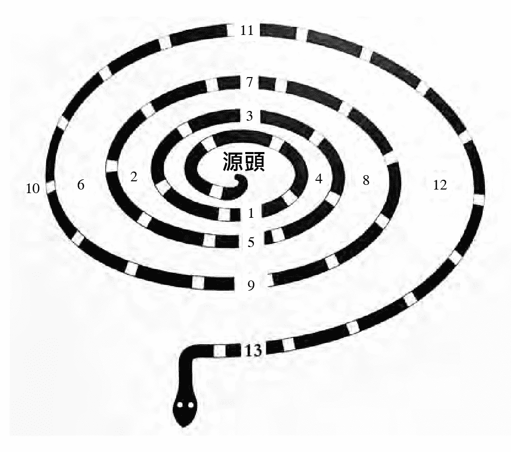

# 漫步灵魂森林

# 作者與譯者簡介

作者

瑞秋·波拉克 Rachel Pollack

纽约大学（NYU）英文荣誉学士，克雷蒙研究所（Claremont Graduate School）英文硕士，并在纽约州立大学执教。她是一位知名的作家，曾以《Unquenchable Fire》获得亚瑟‧C‧克拉布克科幻小说奖（Arthur C. Clarke Award for Science Fiction）。
瑞秋是国际公认的塔罗权威，曾经出版她自己的塔罗牌──“闪亮女子塔罗”（The Shining Woman）。她的代表著作《78 度的智慧》畅销逾 40 年，被推崇为“塔罗牌圣经”。她在塔罗界的资格计有：

►美国塔罗认证委员会（Tarot Certification Board of America）塔罗资深大师（Certified Tarot Grand Master , CTGM）

►美国塔罗认证理事会（the American Board For Tarot Certification）塔罗宗师（Tarot Sage , TS）

►美国塔罗协会（American Tarot Association）会员

►国际塔罗协会（International Tarot Society）会员

►澳洲塔罗协会（Tarot Guild of Australia）会员

►不列颠塔罗协会（Tarot Association of the British Isles）会员

瑞秋于 1945 年出生于纽约布鲁克林，2023 年逝世。挚友尼尔·盖曼在社群上发表对她的哀悼：“我和瑞秋有着 38 年的友谊，我会很想念她，无论她将在这段旅程前往何处，我都深切祝福。”

译者

黄春华

台湾台南人，东海大学社会工作系毕业，曾任出版社编辑。近期译作包括：《灵气与七大脉轮》、《观音神谕卡》、《塔罗终极指南》、《生活中的瑜伽智慧》、《塔罗自学指南》、《脉轮疗愈指南》、《手印全书》、《正念练习》、《解梦辞典》、《佛陀不废话》、《跟着大师学塔罗逆位牌》、《跟着大师学塔罗宫廷牌》、《初学者塔罗》、《灵魂调酒问塔罗》、《许愿水晶链接指南》、《脉轮水晶疗愈指南》、《365 天的塔罗魔法牌阵》、《卢恩全书》等。
译书赐教：gendayu@gmail.com

# 獻詞

献词

感谢她的所有洞见和知识

感谢她的智慧和对真理的献身

感谢她善良的灵魂

仅以此书，献与柔伊·马托夫

# 中外推介

中外推介

从占卜专家到小说作家，全球塔罗爱好者一致好评。

“真正的大师是以浅显易懂的方式带领读者进入深层的世界，而瑞秋·波拉克便是这样的存在。还记得十四年前阅读《78 度的智慧》如获至宝的感觉，他为我解答了包含塔罗的历史脉络、深层意涵，也影响我至今的解牌方向。能拜读大师最后一本著作，是非常幸福的事，因为这必定是一生精华的凝结。”──Claudia，植物系女巫

“作为一个拥有二十多年塔罗牌使用经验的人，当我阅读这本书时，我深刻地意识到自己对塔罗牌的理解还有待提升。作者瑞秋·波拉克生动地描述了她如何在生活中运用塔罗牌，并透过深入的文本阅读来解析塔罗牌所隐含的古老密码。这本书展现了塔罗牌集结了古老宇宙奥秘的美妙之处，让我深感震撼。通过千年的流传和转变，塔罗牌才成为我们手中所持有的工具。”──于玥，占星疗愈心理师

“我原本就是《78 度的智慧》的读者，无意中发现我跟作者的想法很雷同，她的书同样也有从数字开始分析。瑞秋·波拉克是早已举世闻名的塔罗大师，文笔也很精确深入，我个人觉得理性与感性兼具，可以给读者带来很实际的帮助，推荐她所有作品。”──天空为限，占星塔罗作家

“波拉克不只是塔罗占卜师，她是这时代的塔罗神秘学者，她渊博的知识与独到的见解，用塔罗打开了探讨内在世界的道路。《漫步灵魂森林》是她送给我们的最真诚的经验分享，她的生命经验融进各种塔罗图像的解读，内容充满了用塔罗探问心灵的机智与智慧。阅读本书，就会踏入了塔罗与心灵成长的奇妙旅程。”──王乙甯，《叙事塔罗作者》

“任何对生命怀有好奇的读者，都会被瑞秋·波拉克饱经淬炼的文字吸引。《漫步灵魂森林》是大师的最后专着，宛若时光酿造的美酒。作者呼吁我们打开本能感官，勇于和塔罗嬉戏。优美、诙谐且富有智慧的篇章，一步步穿越千百年来塔罗的历史争辩，游走于东西方神话与象征之间；最终引领我们超越藩篱，看见灵魂无穷无尽的舞蹈轨迹。”──玄享（杨善淳），《奥秘其中：托特塔罗学习笔记》作者

“塔罗不仅是占卜的工具，更是照见自我内在的一面镜子，是浪漫的朝圣之旅，也是我与灵魂终生的对话。每一次翻开塔罗牌，就展开一段未知的旅程。而这场壮游没有终点，也没有标准答案，却能透过图像带来反思觉醒，在一次又一次的顿悟觉察之下，收获心灵的滋润与启迪。盼望这本书能打开多元的视角，带领你重新认识塔罗这套充满智慧的知识系统，探索灵魂森林的奥秘。”──孙正欣，《用塔罗写日记：关于生活的 78 种觉察》作者

“这是一本让你得到自由的书！不拘泥于僵硬的学术架构，不沉迷于暧昧的通灵感应，不执着於单一的价值真理。为刚入门的塔罗初学者，提供开放而多元的观点；也为进阶的神秘学爱好者，在知识迷雾中拓展一条新路。《漫步灵魂森林》内容旁征博引，维持瑞秋·波拉克一贯的幽默感，笔法引人入胜，节奏畅快，语汇充满诗意，相对于她本身其他著作，更具备高度的易读性，完美融合了理性面与感性面，既有深刻的洞察与反思，又发挥无与伦比的想像力，不愧为大师写作历程的标竿经典。”──Gina 许怡兰，芳疗天后

“作者将感性丰沛的文字叙述、理性清晰的架构与古老的信息融合讨论，特别喜欢书中谈到塔罗时，结合数字、卡巴拉圆球与路径的理解来贯穿生命，鼓励我们活出仁慈、把心打开，走上这趟越过深渊的旅程，朝向更广大的意识提升之处前进。我相信所有热爱塔罗系统的读者，在细细阅读、进入书中的同时，就会领略为何这会是一趟觉醒的旅程了。”──陈盈君，左西人文空间创办人

“有幸成为塔罗大师瑞秋·波拉克书籍的中文版译者之一，翻译过程心受书中叙事撼动，深刻见识大师深厚文字功力及丰富知识涵养。大师自在悠游于犹太卡巴拉、基督教神学、神秘学诸领域，统整出她个人对塔罗的独到见解。如同伫立于卡巴拉深渊的女祭司，瑞秋鼓励我们满怀慈爱突破自身限制，如加百利跌下骆驼迎接爱人、如愚人跃入绚丽多彩的凡尘世界。”──黄春华，本书译者 

“《漫步灵魂森林》是当代一位伟大思想家的杰作。我和瑞秋·波拉克教授塔罗牌已经三十多年了，我深深钦佩她为塔罗牌带来的智慧和知识。在她所有的书里，我最喜欢这一本。”──当代塔罗大师玛莉·K·格瑞尔（Mary K. Greer）

“四十年来，瑞秋·波拉克始终是塔罗圈的顶尖作家和思想家。《漫步灵魂森林》感觉就像是一本集合她想让我们了解的一切知识的浓缩之书。无论是想要将塔罗运用于生活中，或是像我一样希望让塔罗出现在我们的小说故事里，这本书都是必读之作。”──畅销作家尼尔·盖曼（Neil Gaiman）

“瑞秋·波拉克的学术造诣既深厚又广泛。更令人印象深刻的是她的原创思想，以及她在追随灵魂迷宫中踏过面包屑时的无畏。《漫步灵魂森林》是我读过的最有趣、最具变革性的塔罗书。”──艾伦·劳伦兹-普林斯（Ellen Lorenzi-Prince），《黑暗女神塔罗》（Dark Goddess Tarot）、《希腊女神塔罗》（Greek Goddess Tarot）和《女巫塔罗》（Tarot of the Crone）的创作者

“这可能是瑞秋·波拉克迄今为止最好的作品，《漫步灵魂森林》将被誉为塔罗哲学探索的里程碑。这本书将为你的人生旅程带来灵感，为生命中最艰难的问题提供答案。《漫步灵魂森林》融合卡巴拉思想、神话和民间传说，是冥想、亦是滋养，它是为已经准备好接受人类存在真理的读者而写的一本书。无论是满怀好奇的新手、经验丰富的塔罗占卜师，这都是一本必读之书。”──班纳贝尔·温（Benebell Wen），《全像塔罗》（Holistic Tarot）作者

“《漫步灵魂森林》是写给所有被塔罗之谜所吸引的人的情书。波拉克对自己工艺的精湛表现在她无缝地将艺术、历史、宗教、科学、心理学和魔法编织在一起，创造出一幅引导读者质疑自己、塔罗、上帝本质和时间本身的画卷。波拉克的指导和引起好奇心的问题使这本书成为任何希望加深对塔罗理解和欣赏的人的必读之作。无论你是一位经验丰富的塔罗读者还是初学者，这本书都肯定会带给你丰富而有益的塔罗觉醒。”──珍娜·马特林（Jenna Matlin），《你会给我一场占卜吗？》（Will You Give Me a Reading?）的作者

“《漫步灵魂森林》将从一开始就吸引你，让你转身，挑战你的假设，让你以崭新的眼光看待塔牌。这是那种你会想一遍又一遍读的书，因为每次你这样做，你都会得到另一个塔罗领悟。每位认真的塔罗读者都应该拥有的必备之作。”──特蕾莎·瑞德（Theresa Reed），《塔罗：毋庸置疑的直觉阅读艺术》（Tarot: No Questions Asked-Mastering the Art of Intuitive Reading）的作者

“这是任何认真（并且认真玩耍）的塔罗学生必不可少的一本书。尽管有很多优秀的书教授塔罗牌的含义，而瑞秋·波拉克写过其中一些最好的，但《漫步灵魂森林》将带你深入了解塔罗本身的含义。尽管这本书借鉴了许多灵性传统的智慧，但波拉克使看似复杂的卡巴拉概念变得简单易懂，使读者能够与他们灵魂、塔罗和宇宙本身的最深智慧相连接。”──马克·霍恩（Mark Horn），《塔罗与光之门：通往解放的卡巴拉之路》（Tarot and the Gates of Light: A Kabbalistic Path to Liberation）的作者

“《漫步灵魂森林》可能是瑞秋·波拉克迄今为止最好的书──充满迷人的洞察和有价值的知识，以清晰、幽默和令人惊叹的新方向引导我们走向旅程。这本书的每一个方面都带来丰富的宝藏。瑞秋慷慨而引人入胜，将她一生的研究和实践的发现分享给从渴望的初学者到经验丰富的旅行者的塔罗爱好者，这是一份无价且华丽的礼物。”──莎拉萨，旧金山湾区塔罗研讨会（SF BATS）的创办人

“《漫步灵魂森林》之美在于它探讨了提出不可能问题的可能性。当瑞秋·波拉克展示我们如何与牌卡进行无穷对话时，没有人能赢过她。在她手中，牌卡从无形的象征变为始终以惊叹为基础的解决方案的具体表现，当我们走入其中，会不由得冒出‘啊哈’的赞叹，而这就是魔法所在。”──卡米莉亚·伊莱亚斯（Camelia Elias），阿拉迪亚学院的研究主任，EyeCorner Press 的总编辑

# 語錄集

语录集

很多人可能认为，写一本关于塔罗的书，灵感一定是来自其他塔罗书籍──包括塔罗的历史、纸牌含义、神秘学对应、牌阵等等。对我来说，赋予这本书生命力的那些书籍、教导以及故事，通常跟塔罗一点都沾不上边。它们可能会谈到其他占卜形式（比如《易经》），但并不是占卜技巧或含义列表。它们关心的是如何透过占卜去经验这个世界、它的神秘、它的魔力。“这带来的第一个影响是，世界开始恢复生机”，史蒂芬·卡彻如此写道。

在为本书收集资料的过程中，我从很多地方读到某些短语和句子。有些直接针对塔罗，有些涉及占卜，或灵性成长，或我们认识事物的方式。还有一些是关于卡巴拉，但同样没有列出教义或实际事件（ “谈论卡巴拉时最重要的一件事情是，绝对不要妄想你能清楚阐明它。”──诗人兼翻译家大卫·罗森堡［David Rosenberg］）。但是，这些引言中的每一句话，都在某种程度上与塔罗牌经验相关。我决定将它们全部汇集起来，作为这本书的一种肖像，而不是将它们散布在的各个章节的开头。每一则引言均附上作者和来源。如果是注记“我自己的笔记”，代表这些词句来自我自己的笔记本或以前出版的书。如果是写“我自己”，那就是来自我自己写的书。还有一些我称之为“指示”，代表打开那道风景的方法。所有这些句子和断简残篇的共同链接是，它们能为我们开路。它们带领我们进入塔罗的世界──一个比我们想像中更奇异、更奇妙的世界，而且，帮助我们在“灵魂森林”中找到我们自己的道路。

“塔罗是一场静止的梦。”

──与乔安娜·杨（Joanna Young）之对话

“我的工作是灵魂的助产士。”

──玛莉·K·格瑞尔，课堂上

“符号是时间的基本元素。”

──史蒂芬·卡彻（Stephen Karcher）译，

《大传》（Ta Chuan, The Great Treatise）

“立起门户，

然后转变就会在它们之间发生。”

──史蒂芬·卡彻译，《大传》

“如果你得到一个好计划，那就照着它去做。

如果你没有一个好的计划，就不要照做。”

──与詹姆士·威尔斯（James Wells）对话

“我不相信事情会有最后结果，除非你死的那天。”

──玛莉·K·格瑞尔，课堂上

“你学不到任何东西，除非在喜悦中学习。”

──艾奥安娜·萨拉詹（Ioanna Salajan）

“我们可以试着用知识和更多的知识来缓解另一面的威胁。

但知识永远不够。”

──大卫·罗森堡，《被活活吃掉的梦：卡巴拉的著作核心》

（Dreams of Being Eaten Alive: The Literary Core of the Kabbalah）

“谈论卡巴拉时最重要的一件事情是，绝对不要妄想你能清楚阐明它。”

──大卫·罗森堡，《被活活吃掉的梦：卡巴拉的著作核心》

“什么是神圣？使枯骨恢复生机的神之呼吸。”

──我自己的笔记

“我立大地根基的时候，你在哪里呢？”

──神，在［约伯记］

“所有的揣度测量皆是谎言。”

──我自己，《亡灵变性之书》（The Transsexual Book of the Death）

“看仔细。”

──摩西·德里昂（Moses de Leon），

《光辉之书》（The Zohar），大卫·罗森堡译

“有些事你该知道。

而知道它的正确途径是经由头脑里的一颗樱桃。”

──安妮·卡森（Anne Carson），“第一个迦勒底神谕”，

《下班时间的男人》（Men in the Off Hours）

“共通语言──骨头、织物、歌曲、梦。”

──雷布·阿维加伊·兰兹曼（Reb Avigayil Landsman），私人信件

“从远古跨到未来。”

──传奇前卫爵士乐团“芝加哥艺术团”的格言

“除了发现，没有任何规则。除了发明之外，没有任何传统。”

──我自己，《不灭之火》（Unquenchable Fire）

“站在众人之间，而且清楚知道你自己是谁。”

──林德尔·罗宾逊（Lyndel Robinson），私人信件

“神隐身在纸牌间的空隙里。”

──玛丽·吉赛尔（Mari Geasair）

“它不是在天上，也不在海外，就在你口中，

在你心里，使你可以遵行。”

──神，透过祂的代言人摩西，《申命记》

“第一件发生的事情是，世界变得活生生起来。”

──史蒂芬·卡彻，《占卜图解指南》（The Illustrated Guide to Divination）

“不要给我安慰的话语。给我魔法。”

──诺曼迪·艾利斯（Normandi Ellis），

《唤醒欧西里斯》（Awakening Osiris）

“至于我，我的祷告乃是为你，温柔的人，

那是我对你渴望爱慕的时刻。”

──摘自重建派犹太教祈祷书

“有福之人，那无相者，你以你之相创造了我。”

──晨祷，摘自重建派犹太教祈祷书

“圣杯是为谁服务的？”

──中世纪圣杯传说，帕西瓦尔未问的问题

“为什么底比斯会发生瘟疫？”

──俄狄浦斯向德尔斐神殿请示神谕

“现在时间和过去时间

两者都存在于未来时间

未来时间包含于过去时间中”

──T. S. 艾略特（T.S.Eliot），［焚毁的诺顿］（Burnt Norton），

摘自《四首四重奏》（The Four Quartets）

“翻动它，翻动它，因一切都在它里面。”

──拉比本·巴格·巴格（Rabbi ben Bag Bag），

《父辈之言》（Perkei Avot）

“洗牌，洗牌，因一切都在它里面。”

──我自己

“我猜想我们已在西奈山得到两副牌。其中之一是《托拉》，它让我们能够爱我们的邻居，跟随老师学习，横渡汹涌大河……这副牌为我们洗牌，并把牌发给我们。而另一副牌是奥秘，塔罗牌，是《托拉》沉默无声的作为：洗牌、抽牌和发牌。”

──乔尔·纽伯格（Joel Newberger）

“这是一种无有律法的方式，

是认识一个活生生的世界、与这个世界对话的方法。”

──史蒂芬·卡彻，《占卜图解指南》

“塔罗是一种充满各种可能性的结构，

几乎任何人都可出于任何原因、以任何方式使用它。”

──辛西亚·吉尔斯（Cynthia Giles），《塔罗牌：历史、神秘与传说》（Tarot: History, Mystery, and Lore）

“我唯一可以肯定的是，你永远不会到达终点。”

──我自己，《新塔罗手册》（The New Tarot Handbook）

# 指示

指示

看你所看见的

听你所听见的

触摸任何你所触摸的

说你必须说的

──我自己，摘自《不灭之火》

眼睛无法捶打手看不见的东西

像一只蝴蝶那样做梦

像一只蜜蜂那样回家

洗牌，塔罗牌女孩，洗牌

──我自己，《在穆罕默德·阿里之后》

保持专注！

# 導言 在塔羅場域中遊憩

导言

在塔罗场域中游憩
At Play in the Fields of Tarot

有些人可能会对本书的英文副标题感到好奇。塔罗的“旅程”（journey），究竟是指什么？对某些人来说，那句话意谓着预测灵魂伴侣是谁、会不会换工作、种种家庭困扰、或是法律问题如何解决（这些问题对于问卜者确实都非常重要）。

也有一部分人，已经对塔罗牌的神秘学传统相当熟悉，他们可能会认为自己完全知道我所谓的“旅程”是什么意思。对他们来说，塔罗里面含藏了大量不同知识系统的对应关键概念。这些系统包括：已知和未知的大自然法则、魔法、犹太教神秘主义、占星学、异教众神、基督教启示、秘密知识、埃及灵性启蒙仪式、天使、恶魔，尤其是卡巴拉生命之树的二十二条路径。

这本书并没有取道以上这些途径。虽然没有告诉你如何占卜预测，也没有逐一解释每一张塔罗牌的含义，但实际上，书里面有相当多关于如何占卜解牌的内容。只不过，书中的占卜，不是问某人会不会跟谁结婚、或是该去哪里找工作，而是发出此类提问：“我如何打开我的心？” 或“我如何滋养灵魂？”甚至是“如何解读上帝创造宇宙的真义？”等。

这本书里的占卜解牌，是作为探索未知领域的一种手段──包括我们自己内在、我们的外部世界，以及存在的神圣奥秘和谜题。它们运用了塔罗最与众不同的特性。与某些灵性思想书籍以及名人大师的教学课程不同，这本书里提到塔罗牌的部分并没有按照纸牌的顺序。牌卡本身看起来像是带有线性讯息，因为它们出现在我们面前时，已经都有了编号和标题，比如“女祭司”或“审判”等。很多书籍都会描述到线性讯息逐步发展的过程，但与圣书或心理学家、智者们的著作不同，我们每次抽到的纸牌都不一样，每一次都是新的内容。因为塔罗可以让我们洗牌，我们可以抽出数张纸牌，包括纸牌上的所有讯息符号，将它们混合，然后重新铺排成一个全新的牌阵局面。

小说《沉默的羔羊》（The Silence of the Lambs）当中，天才精神病患者汉尼拔·莱克特博士告诉联邦调查局探员克丽丝·史达琳，若要抓到凶手，她必须回到马可斯·奥理略（Marcus Aurelius）所说的“最初原则”（first principles）。什么才是最本质的东西？（在这个例子当中就是那位身分不明的杀手。）“它”是什么？“它里面”又是什么？

对我来说，这说明了一个事实：塔罗牌跟一般书籍不同，它的“页面内容”并不是固定的。不同的牌组（有标题和编号的大阿尔克那牌，以及小阿尔克那牌的四个牌组）有不同的编号和组合，但任何时候我们都可以将它们重新洗牌抽牌，而得到一个全新的结果。

不固定的占卜系统，称为“偶然性占卜”（aleatory），也就是用随机方式得到一组符号或讯息，因此每次做占卜时都会出现不同的结果。易经和塔罗都是属于这种偶然性占卜系统。非洲的伊法占卜系统（Ifa）也是，它是把沙子或贝壳抛撒在地面上来形成图像，然后占卜师根据图像的指示来为问卜者提供建议和解答。

有趣的是，我不知道有什么术语可以用来描述我认为的“固定式”占卜系统。占星是很好的例子。无论你排多少次出生星盘，它的结果都一样。占星师的技巧完全展现在解盘能力上。你也可以将你的出生本命盘“推运”到当下这个时刻，得到一个新的人生结构图（推运盘），但每次你把它推到某个特定时刻，结果都会相同。手相或颅相占卜也是。

我先自首，我有时会开玩笑说自己算是“随机队”。对我来说，塔罗能打开一个世界，而且每时每刻都是全新的。这本书的占卜解牌部分，都不是在谈一个固定的未来。而且正好相反；它们是在讲一种方法手段，如何走出我们平常的思维方式，去获得崭新的视角，探索更多的可能性。

对于塔罗神秘学传统以及符号含义已经相当熟悉的人，也可能从这本书发现一些惊喜。我们不会在这里告诉你预测命运的秘诀，更不会给你系统知识对应表、或是占卜师应该牢记背诵的灵性成长法则清单。我们会讲解这些知识系统的历史渊源，但不会只是简单将它们条列出来，因为我们的目的是找出其意义。当我们愿意接受那些符号、故事和美丽图像的引诱，让自己进入全新的理解领域，我们就能看见摊开在我们面前的奥秘。

有个古老的犹太拉比（Rabbi，译注：犹太教精神导师）故事是这样说的：有一天，农夫的山羊到处乱晃走失了，回来时嘴里叼着一根树枝，散发着奇异香味。第二天，又发生同样事情，农夫开始觉得很好奇。隔天，他跟着那只山羊进入一座山洞。山洞里有一条隧道，走着走着，农夫莫名心情愉悦起来；他感觉自己身上的疲惫感全都消失了。最后，他看见一道光，还闻到甜甜的香气。他走出隧道，眼前尽是一片芬芳的树林和鲜花，洋溢在明亮柔和的光线中，他突然意识到，原来山羊把他带到伊甸园，我们人类始祖的那座失落花园（而且后门似乎无人看守，前门则如传说所述，上帝将亚当和夏娃逐出伊甸园之后，在那里安设了手持火焰之剑的天使负责守卫）。

我认为塔罗牌有点像那只山羊。如果我们先放下心中想要立刻为那些图像找到定义、或是一成不变套上同一套解释、或认为它们的含义和目的都是固定不变的急切欲求，如果我们能将这些都先摆在一边，单纯跟着图像走，它们会把我们带到哪里去？这并不是说我们应该放弃学术研究，或是放弃神秘学家一路以来的贡献。这些都已经是塔罗图像的一部分，而我们可以利用它们来找到那条隧道，最后甚至可能打开那道奥秘之门。

全世界最著名的一套塔罗牌──亚瑟·爱德华·伟特（Arthur Edward Waite）和潘蜜拉·柯尔曼·史密斯（Pamela Colman Smith）的“伟特史密斯塔罗”，它的“星星”牌背景中有一只小鸟站在一棵树上。

如果你的眼睛只是快速扫过牌面，甚至不会注意到这只鸟的存在；或认为它可能只是一个小小的装饰图。仔细沉思这张图的人，可能会去思考鸟类这种动物的含义，以及鸟对我们的启示。但如果我们知道，牌面上的这只鸟，其实是一只朱鹭，而朱鹭就是代表埃及神托特（Thoth），那么，这只鸟就突然把我们带进一连串的故事和概念当中。托特是掌管知识、魔法、科学和书写的神，同时也是塔罗本身的传奇创造者。

透过这只朱鹭，以及认识它的神秘学象征含义，我们便可以进入埃及神话的世界，了解它所有的历史和智慧。在这本书里，我们会不断重复提到托特神和祂的故事。

那么，牌面上的那位女性人物呢？我们一开始会注意到她裸体，而且神情轻松自若，似乎对生命充满希望和自信。但请注意，她手上拿着两个水壶正在倒水。在古希腊施行了两千多年的艾卢西斯大秘仪（the Greater Mysteries of Eleusis，译注：艾卢西斯秘密教派的入会启蒙仪式），仪式的尾声，女神普西芬妮（Persephone）会从亡者冥界再次回到人间。当祭司以灵视看见她回来时，仪式成员（入会者、受启者）者就将两个容器里的水倒入地上的两条裂缝中。普西芬妮是冥界之后，是死去又复活的女神，因此能向受启者保证死后再度重生。

在这一点上，她不仅跟耶稣很像，也很像一位埃及神祇欧西里斯（Osiris），这位神被他的兄弟杀害，最后在他的妻子伊西斯（Isis）和托特神的帮助下起死回生。

我们一定要知道所有这些故事才能了解这张“星星”牌吗？当然不是，事实上，如果我们被这些知识分散掉注意力，我们可能会忘记要跟着山羊穿过那条隧道。但这张图像里确实隐藏了这些故事，当然还藏着其他东西。那为什么不把它们拿来好好利用呢？或许我们可以把塔罗里隐藏的各种神话和教义密码，视为山羊嘴里叼的树枝，它引诱我们，并示意要我们跟随。或者，我们也可以转换隐喻，然后将象征符号看作那条隧道。（这不就是隐喻的用途吗？如果不用洗牌来切换隐喻、不跟它们玩游戏，那要隐喻干么？）我们需要象征符号，因为它能引导我们到达伊甸园，但我们不应该把它跟我们的最终目标混淆。我们可不想被困在隧道里。

这本书是为有志于灵性探索的人而写的。当然也适合所有对塔罗有兴趣的人阅读。我尝试以这样的方式来书写：就算之前对塔罗一无所知，也能跟着它进入那条隧道（但如果无法经由它找到伊甸园，那隧道就毫无用处）；而对于塔罗老手来说，同样可以从中发现新的启示。这任务看似不可能，但好像也没有想像中的困难。唯一需要的是你的意愿──愿意从全新的角度来认识塔罗。

我们不会逐一解释每一张牌，但是在探索过程中自然会触及每一张牌的传统含义。其他的塔罗书籍大多按编号顺序阐释每张牌的含义和奇想；而我们的目的，则是利用塔罗图像作为打开灵性奇想的大门。

在这里，我们先为塔罗新手先做个简单介绍：塔罗牌由七十八张牌组成。包含四个花色牌组，每个牌组有十四张牌，外加二十二张编号为 0 至 21 的“大牌”（Trump，或称将牌）。Trump 原本是“胜利牌”的意思，因为在塔罗奇纸牌游戏（tarocchi，与桥牌和惠斯特纸牌玩法类似）当中，这几张牌的地位等级高于五十六张花色牌。大牌都有名称标题，比如魔术师或吊人，还有生动活泼的图画场景。在神秘学传统中，二十二张大牌统称为大阿尔克那（Major Arcana，阿尔克那的意思是“秘密、秘仪”），而其他四个花色牌组则统称为小阿尔克那（Minor Arcana，或称小牌、小秘仪）。

从结构上来看，塔罗的四个花色牌组跟一般的游戏扑克牌很像，每一个牌组都包括从 A 到 10 共十张牌，再加上侍者（Page）、骑士（Knight）、王后（Queen）和国王（King）四张人物牌。侍者牌相当于扑克牌的 J，但塔罗比扑克牌多了一张骑士牌。过去有一段时间，大多数游戏纸牌的四个花色都跟塔罗牌一样，包括权杖牌（Wands，或称法杖、棍棒）、圣杯牌（Cups）、宝剑牌（Swords）和钱币牌（Coins，很多现代塔罗牌称为五角星［Pentacles］。随着时间演变，一般游戏扑克牌的花色开始有了变化，至少在北欧国家和美国是如此。权杖变成梅花，圣杯变成了红心，宝剑变成黑桃，钱币变成方块。在某些国家，比如西班牙，游戏扑克牌仍然跟塔罗牌相同花色。

关于塔罗的起源，我们会在第一章仔细探讨，这里可以先提一下，据学术界说法，塔罗最初是一种游戏。很多人可能会对这种说法感到惊讶，尤其是听过一些夸张的塔罗起源传说的人。然而，我愈深入思索塔罗，就愈觉得它们确实是一种游戏纸牌。比起用正经八百的态度来面对塔罗，如果能将它当游戏纸牌来玩，我们可以做的事情其实更多，甚至可以让更多事情发生。

这本书也提出了一些让人惊讶的想法和问题。比如，塔罗图像在宇宙诞生之前就已存在，神可能是参考塔罗来创造宇宙的，甚至，我们还可利用这些纸牌来发现神在宇宙诞生之前所做的占卜。我不会奢望──也不希望──任何人在这个时候就把这个想法当真。如果我们必须将所有塔罗研究限制在我们认为的正确概念上，那我们要怎么去发现新事物呢？如果我们记得，塔罗是一种游戏，我们可以用洗牌来创造新的局面，那么，牌面上的图像就会带我们进入充满惊奇的花园。

这会不会让塔罗变成一种轻浮的游戏？绝对不会。学习以认真心态玩游戏，是灵性探索的最大秘密之一。这也是为什么，有那么多的宗教传统都是藉古怪诙谐的故事或谜语来传达智慧奥秘。如果这本书传达的只是如何认真玩塔罗，我会感到无比欢喜。

我们会在游戏中检视各式各样的塔罗套牌。这也可能让人惊讶。塔罗的迷思之一，就是有人认为世界上有一副“纯正的塔罗牌”，有唯一正确的象征符号，而其他套牌都偏离了这个正道。再提醒一次，据学术界之说法，根本不存在所谓最原始、官方正式版本、最纯正的一套塔罗牌。最早期的塔罗套牌，跟后来被视为标准或经典的塔罗牌，图案差异非常之大。到今天，我们可选择的套牌已经超过数千种，而且这还只是曾经存在过的塔罗套牌的一部分而已。

近年来，几乎所有的创新套牌都已不再宣称要“复兴”失传已久的“原始”塔罗牌。或许还是会看到这样的说法，但更大多数人已经愿意对塔罗保持开放胸怀，接受新的意识和可能性。

并没有所谓唯一纯正的塔罗牌。塔罗早已成为一种艺术形式，甚至已经成为一种“原型”（archetype）。各种不同套牌全部混合在一起，携带着各种变化变异，才造就了所谓塔罗。我们会在书中后面的章节再次讨论这个概念。

在这本书里，除了使用各式套牌之外，最常被引用的是《闪亮部落塔罗》（Shining Tribe Tarot）。一部分原因是因为这套牌是我自己设计和绘制的；另外也因为，我想尽力让《闪亮部落塔罗》成为人们打开、探索神圣之路的工具。这套牌的图案，有一部分是来自世界各地部落和史前艺术。请注意──实际上我并没有把任何文化的传统图案拿来照抄，当然也没有声称我个人是这些传统文化的崇拜者。我借由它们得到灵感和启发，就像这本书的部分内容，同样是受到许多文化传统（包括爱因斯坦狭义相对论）故事和象征概念的启发一样。

书中使用的其他套牌包括：莱德伟特塔罗的完整象征符号、克劳利和哈里斯女士所设计的托特塔罗及其神秘学含义、经典的马赛塔罗牌，还有一系列当代塔罗套牌。

书中会经常出现“神、上帝”（God）这个词汇，也会出现女神、各个神话人物的名字，还有异教、犹太教、基督教和其他宗教的思想概念。书中引用的这些文献资料，都不是为了吹捧任何宗教传统，更不是要代表这些传统的教会或组织说话。这本书里的上帝，是一种表达方式，代表我们想要认识和理解神圣事物的渴望。

我要将这本书献给所有带着游戏之心的求道者，所有想要穿越隧道抵达喜乐花园的人。

# 第一章 塔羅起源迷思

塔罗的起源在哪里？无论我们用什么方式处理这个主题，也无论我们是否深入符号的奥秘意涵、背诵占卜公式，或是玩图像游戏，我们都无法回避这个问题。答案当然有很多，只要一踏进塔罗的世界，它的起源故事就像兴奋的小鸟开始在你身边萦绕。以下是几种主要说法：

❖塔罗牌描绘的是罗姆人（Romani，译注：也就是吉普赛人）的神圣神话，图像里面藏着数世纪以来罗姆人从位于印度（或埃及）、或外太空的祖国家园开始，长达数世纪的流亡过程（而且罗姆人自己似乎最喜欢外太空人这种说法）。

❖塔罗是文艺复兴时期的一种纸牌游戏，灵感主要是来自当时一年一度、名为“胜利游行”（Triumphs）的狂欢节活动。

❖塔罗牌是一种纸牌游戏，源自一年一度、名为“胜利”（thriambs）的游行，是为了纪念酒神狄奥尼索斯。

❖塔罗牌隐藏着／揭示了毕达哥拉斯的灵数学理论，毕达哥拉斯是摩西时代的希腊神秘主义者，对柏拉图有深厚影响。

❖塔罗牌描绘了摩西亲自从上帝那里领受的口传秘密教导。

❖塔罗含藏着失落的亚特兰提斯大陆神话，这个沉没于大海中的岛国大陆，最早是由柏拉图在其书中所提出。

❖塔罗牌是十字军东征时期从巴勒斯坦和埃及引进的一种纸牌游戏。

❖塔罗牌是“生命之树”这个庞大记忆系统的呈现，生命之树就是宇宙创造法则的一种模型。

❖塔罗牌清楚隐藏着埃及神托特的智慧，托特是掌管世间一切知识之神。

❖塔罗牌呈现了埃及神庙的入会仪式过程。

❖塔罗牌呈现了谭崔密教寺庙的皈依过程。

❖塔罗牌保留了在漫长父权宗教黑暗历史夹缝中存活的女巫智慧。

❖塔罗牌描绘了迦勒底（巴比伦）占星术当中的月相变化模型图。

❖塔罗牌是由造纸行会创造出来的，他们是基督教纯洁派（Cathars）的最后残余势力，被罗马教会视为异端，并遭到残酷镇压。

以上所有塔罗起源的说法，都有塔罗书籍作者提出过。

著名神话学作家约瑟夫·坎伯（Joseph Campbell）曾评论说，世上充斥各式各样创世故事，但全都是错误的。塔罗也是如此──有着各式各样的起源传说，但可能全部都不正确。那些说法的错误在于，他们把某种说法概念当成唯一真理。他们的错误在于，硬要别人接受那些想法，若有人提出反驳，他们心中的塔罗意义和价值就产生了动摇。但是，如果我们能够学习将这些起源故事看作神话，看作是神的游戏，那么，我们就无需硬要证明某种说法比其他说法优越，同时，也能真正去欣赏每一种说法所要表达的诗意真理。我们会大大惊叹塔罗这个无比神妙的创作，居然可以用七十八张图像来传达那么多不同的灵性传统与历史文化。

塔罗的神秘起源也是其迷思的一部分。关于塔罗纸牌，最神奇的事情之一是，当人们一开始接触到某个概念，就会从此紧抓不放。以下是发生在我身上的故事。数年前，我的书《78 度的智慧》（Seventy-Eight Degrees of Wisdom）丹麦文译本出版，不久后我前往丹麦为书做宣传。有两个广播电台想访问我。第一个是在国家广播电台，进行得非常顺利。第二个是新时代专案（New Age program），我很期待有机会深入讨论塔罗。访谈前一天，主持人透过电话与我讨论谈话主题。我告诉他，我不相信塔罗起源于亚特兰提斯，也不相信某些秘术大师的游戏骗术，通话结束后，他随即取消了我的访谈。

讽刺的是，虽然我们无法确定塔罗纸牌的真正起源，但我们却找得到这些神话迷思的来源。约在西元 1770 到 1780 年间，一位名叫杰柏林（Antoine Court de Gébelin）的人出版了一套厚达九卷的神秘学研究，标题为《原始世界》（Monde Primitif）。“一个原始人类国度”（a primitive human state）这个概念本身就是一种神话迷思。在我们这个时代，“原始”一词意谓人类尚无制度规范、尚处于无知野蛮状态。但在古代，它的含义正好相反──是代表所谓的黄金时代，这个时代的人了解灵性真理，而且生活在和平美好之中。伊甸园就是这个神话的一个变体。

杰柏林在写作期间，曾拜访其友人 La C. d'H. 女士，她将当时最热门的东西拿给杰柏林看：那是一种流行于意大利南部乡下的纸牌游戏，叫做塔罗奇（tarocchi），法语称为塔罗（les tarots）。杰柏林一一浏览这些色彩鲜艳的图片，突然灵光顿悟：这些寻常的纸牌游戏，实际上是一部伟大神秘学著作的伪装！他称之为“托特之书”（the Book of Thoth），意思是：集所有知识之大成。

托特是埃及的一位神，主掌世间一切知识与智慧。祂为太阳神拉（Ra）的天空太阳船引路，发明木乃伊让被杀死的欧西里斯再度复活，为亡者灵魂进行转世裁判，甚至还跟月亮赌博，让一年多出五天时间（稍后我们会再提到这个故事）。希腊人将埃及托特神与他们自己的神祇赫密士（Hermes）链接起来，赫密士是掌管魔法、疗愈、智慧、科学、商业之神，也是骗子和小偷的守护神（一个有小偷之神的信仰，你怎能抗拒）。

塔罗的许多神秘传统起源说法是来自一位名叫赫密士·崔斯墨图（Hermes Trismegistus）的神秘人物，他就是《翠玉录》（The Emerald Tablet，又名《翡翠石板》）的作者，这本书的成书时间据说约在基督教传播初期的埃及亚历山大大帝时代。《翠玉录》的神话认为，赫密士·崔斯墨图就是托特神的另一个名字。而现在杰柏林则说，塔罗是比《翠玉录》更根本、更基础的神作。他说，托特神将这些象征符号的图像传授给他的人类弟子，并将它们伪装成一种游戏，因此可经历数世纪而不被发现。

多么美妙的说法！令人惊讶的是，这个灵光乍现的想法，对人们的想像力竟产生如此强大的影响，至今依然回荡。若不是第八卷中的这篇文章，杰柏林和他的九卷著作可能老早就被世人遗忘。这个神话最有说服力的部分，并不是他声称塔罗起源于埃及，这个说法只是枝微末节。它的核心概念是塔罗乃世间一切知识之基础，是钥中之钥，是神秘学家所称的“最重要的那支锁骨”。正是这个概念，大大影响了后来的塔罗起源故事（至少跟密术有关的神话是受其影响）。换句话说，塔罗是世间一切知识体系背后的基础。

塔罗集一切古代大师之奥秘与发现的大成。认识塔罗，正确理解它，你就能通晓世间一切。当塔罗诠释者说它不是埃及人发明的而是希伯来人，或说塔罗不是希伯来人发明的而是来自密宗谭崔、迦勒底、基督教异端或威卡巫术时，他们都有同一个假设：无论塔罗最早来自哪里，它都必然含藏着世间最终之奥秘。人们可能会争论塔罗到底包含了哪些奥秘，但他们从不会怀疑它确实具有深奥含义。

假如我们放掉对这些故事的信仰，如果我们接受塔罗可能是源于十五世纪流行的一种纸牌游戏，而且它的图像带有众所周知的寓意，我们会因此失去其神话价值吗？我们能不能以轻松游戏的角度来看待这些神话，而非只能一味信仰它？我和许多现代塔罗学者都有同样看法：当我们将塔罗的各式各样起源传说当作故事来看，而不是将它当成真实历史，我们实际上收获更多。一方面，我们可以停止争论，不再试图证明我们自己认为的起源版本才是唯一正确。然后，我们就能看见塔罗内部交织的各种神秘学知识的精妙与真理。

其中有一个主要传统认为，塔罗是犹太神秘主义思想卡巴拉的象征。关于这个概念的起源，稍后我们会再讨论，这里先来谈谈跟卡巴拉思想有关的迷思。卡巴拉主义者告诉我们，宇宙存在于十个层次的神圣能量中，这个神圣能量称为“辉耀”（sephiroth，这个字与 sapphire ［蓝宝石、光辉］ 相关联）。这十个辉耀有各种描绘方式，有时是排列成一个同心圆，最中心点是神（上帝），最外层是物质世界；更常见的描绘方式是，十个辉耀排列成一棵“生命之树”（Tree of Life），最顶端是代表终极能量的辉耀，称为科帖尔（Kether，希伯来语“王冠”之意），最底部代表物质宇宙，称为玛互特（Malkuth，希伯来语“王国”之意）。上帝创造了第一个人类亚当，让他具有看见并理解所有辉耀的能力。但是，亚当看到玛互特物质世界的美好，误认为那就是一切。于是，亚当“犯了罪”，不再与神亲近，而且让我们所有人都变成跟他一样。又或者，也许我们是出于己意而重蹈亚当的错误，不断误认物质世界即是全部。

在我看来，对塔罗牌任何特定起源的表面认知，都跟亚当当年犯下的巨大错误一样。我们被特定说法迷惑，忽略了它们的诗意层次和它实际上要教导我们的东西。同样的道理，假如我们驳斥某种见解，如果我们说，不是喔，塔罗不是来自埃及、亚特兰提斯或古代拉比──我们也可能会犯下认为那些思想不再具有任何意义的大错。

塔罗和卡巴拉的链接也可追溯到《原始世界》一书、以及一位名叫米列的伯爵，他曾写过一篇文章支持杰柏林的塔罗见解。杰柏林写道：“大牌共有 XXI（21）或 XXII（22）张，希伯来人和东方人使用的埃及字母有 XXII 个，而且也当做数字来用，很多的国家都用这些字母来记数。”1

这与我们对古埃及象形文字的普遍认知完全不同，它们确实是字母，而不是图画式文字。不过，数量并没有到二十二个。我们也无法确定他提到的“东方人”是指谁。但是，希伯来字母表确实有二十二个字母，而且犹太神秘思想认为这二十二个字母就是宇宙存在的基础。他们用二十二条路径将生命之树上的十个辉耀连接起来，每一条路径都代表一个字母的特质。如同杰柏林所说，它们具有数值特性，将一个单词的所有字母数字相加可得到一个数值，然后我们便可由此找出具有相同数值的单词之间存在的神秘关联（也就是所谓的“希伯来字母代码”，gematria）。借由这二十二个字母，我们得以穿行于神秘世界，并使用其圣名和其他字母组合来施行魔法。根据米列伯爵的想法，每一张塔罗大牌都会单独对应某个希伯来字母，这样一来，每一张牌就带有该字母的魔法力量。

塔罗学者兼塔罗大师玛莉·K·格瑞尔，对《原始世界》书中的文章提出了有趣的历史修正观点。杰柏林和米列伯爵都是共济会（Freemasons）成员。格瑞尔认为，共济会很可能在某段时期已经发展出塔罗的神秘学理论，然后交由这两位作者将其内容公开（而且她认为米列的文章比杰柏林更早出现）。至于 La C. d'H.这位女士的故事，很可能只是个幌子，是编出来的故事。但就算格瑞尔的猜测是对的，也不会减损杰柏林的论述对塔罗历史发展的重大影响力。

大约在意大利纸牌游戏“塔罗奇”首次出现的同时，基督教神秘主义者和魔法师们也对卡巴拉产生兴趣，因此塔罗源自卡巴拉思想并非不可能（尽管现代学术界认为，塔罗纸牌的出现时间，比基督徒最初运用卡巴拉的时间早了好几十年）。而且，两者在结构上的相似处也确实颇为惊人。二十二这个数字不像二十一是那么常见的神秘数字（灵数学家将二十二称为大师数 ［master number］，但这是受到卡巴拉思想的影响）。卡巴拉将宇宙之创造分为四界，每一界当中都有十辉耀。塔罗牌则有四个牌组，每一个牌组都有 A-10 这十张牌。卡巴拉用四个希伯来字母יהוה来代表神的神圣名字（英语称为 Tetragrammaton，四字圣名），而塔罗则有四张宫廷牌：侍者、骑士、王后和国王。难怪“塔罗源自卡巴拉思想”的说法如此有说服力。

十九世纪，一位名叫伊利帕斯·列维（Éliphas Lévi）的神秘学家兼魔法师（原名阿尔方斯·路易·康斯坦［Alphonse Louis Constant］），更将二十二张大牌与二十二个希伯来字母做出对应，进一步将塔罗与卡巴拉的象征符号链接起来。十九世纪末，一个名为“黄金黎明赫密斯派修会”的蔷薇十字会团体继承列维的研究，并加以扩大和修正，构建出一个包含卡巴拉、仪式、北欧异教众神、印度教哲学、共济会，及其他秘术传统、占星学、炼金术，以及各种神秘名称的魔法宇宙。而所有这一切思想的关键、那把钥中之钥、能够让最高阶行家在这些不同思想与魔法力量的世界中穿行无碍的，就是塔罗。杰柏林称塔罗为“托特之书”，列维则认为它是希伯来字母的具体化呈现。现在，黄金黎明协会已经将这些思想化为真实，或者至少可以说，已发展出一套完整的理论系统。

塔罗是来自卡巴拉或是源自埃及，这些历史证据很重要吗？如果你希望你使用的魔法系统有其真实根据，那么它就很重要。黄金黎明协会的成员有诗人、艺术家、学者，甚至好几位是科学家。以一个知识分子团体来说，他们似乎算是很容易轻易相信别人的那种。黄金黎明协会的其中一位创始人山缪·黎德·麦格雷戈·马瑟斯（Samuel Liddell “MacGregor” Mathers），还为这个组织制作了一套官方塔罗套牌，与传统塔罗牌风格大异其趣。

如果故事是这样：某天晚上，马瑟斯拿着一套空白纸牌走进一个房间，过了一会儿他从房里走出来，手里拿着一套彩色纸牌。这已足以让协会成员相信，这套纸牌有受到某种神圣灵启。但很显然，这七十八张图画并不是马瑟斯画的（也不是他的艺术家妻子莫伊娜的创作），他也没有将纸牌藏在房间某个角落。但随后，该组织的三位创始人马瑟斯、魏斯考特（Wynn Westcott）、以及伍德曼（W. R. Woodman），将整个事件创建在一场骗局之上。他们声称收到了一份“密码手稿”，其中一页是德国人斯普伦格尔女士写的，她说她可以授权他们在英国创建其秘密组织的分支。经过数十年争论，包括伊斯雷尔·雷加地（Israel Regardie，他本身也曾经是黄金黎明协会的成员）在内的好几位学者证明，根本没有斯普伦格尔女士这个人存在。那一页似乎是魏斯考特本人写的。这个证据是否会损害黄金黎明协会的声誉及其所有贡献？黄金黎明组织名称当中的 Hermetic 这个字，原本是来自《翠玉录》作者赫密士·崔斯墨图的名字，但最后却变成了希腊小偷之神赫密士。赫密士神应该会对这个组织的“丰功伟业”感到开心吧。也许这个协会之所以能有如此巨大成就，很大程度要归功于赫密士神的保佑。

以下这个故事来自这本书的早期版本。在那之后不久，我的狗狗旺德就过世了。我们想念她。她是很特别的灵魂，跟她共处的回忆是我永远的祝福。

以下是我自己的故事：在我撰写上面那段内容时，我的狗狗旺德想要从我的一副纸牌当中把一张牌咬出来，她之前不曾做过这个动作，之后也没有再做过同样的事。她把整副牌从桌子上扯下来，然后咬掉纸牌外面包着的那层布，将纸牌全部撒在地板上。其实她只咬了一张牌，而且将那张牌整个咬碎，然后跑回我正在工作的房间。在我发现她干的好事（而且已经从惊吓中回过神来）之后，我开始检查，她咬碎的到底是哪一张牌。这副牌不是塔罗牌，而是一副埃及神谕卡《命运之书》（The Book of Doors），而被旺德咬碎的那张牌，标题“克尔赫特”（Kerhet），是主掌秘密启蒙的埃及女神之名。而秘密启蒙正是黄金黎明协会的工作重点。

这套牌的作者亚松·维吉（Athon Veggi）和艾莉森·戴维森（Alison Davidson）在谈到这张牌时写道：“誓言缄口静默，保守造物运作的全部奥秘。”黄金黎明协会对待此概念极为严肃，其成员皆须起誓，若向外界透露任何内情，将遭神灵惩罚丧命。

赫密士神是在对我表达不满吗？因为我不尊重他的追随者，所以警告我吗？我个人宁愿相信他是跟我开玩笑。又或者，托特神是想要我放开心胸吧，因为旺德已经把那张守密牌咬走了，现在不管再怎么洗牌，都不可能再出现一张代表“誓言守密”的牌。

卡巴拉文献中最伟大的一部圣典，是被称为《佐哈尔》（Zohar）的《光辉之书》，这部书也是其后众多卡巴拉著作的源典。根据书中自述，作者是一位名叫西蒙·巴尔·约海（Simeon bar Yohai）的拉比，他为了躲避罗马人的袭击而躲在山洞里，对他的儿子口述而成。西元 1100 年左右，西班牙作家摩西·德里昂将此部著作披露。八百多年后，也就是 1930 年代，一位名叫格肖姆·肖勒姆（Gershom Scholem）的学者证实，《光辉之书》的作者正是德里昂本人。

德里昂有说谎吗？卡巴拉主义者应该要相信《光辉之书》当中所声称的古代权威吗？当代诗人大卫·罗森堡的著作《被活活吃掉的梦：卡巴拉的著作核心》深受《光辉之书》影响，他认为《光辉之书》并不是摩西·德里昂一人所作，而是由一群人共同撰写，德里昂只是这个团体的领袖。但德里昂的妻子后来声称，这部著作是由德里昂一人所写。根据我读到的一篇报导，德里昂死后，有人问他的妻子：“《光辉之书》是摩西写的吗？”她回答：“是啊，当然是他。”这表示当时的人非常清楚《光辉之书》的作者是谁，只有后来的人才需要相信那些表面说法。

我的建议是，我们应该以摩西·德里昂这群作者的精神来接触塔罗牌──认真严肃看待它，而不要仅看表面，我们应该真心诚意、带着最大胆的想法与塔罗玩游戏。

这是关于塔罗起源的其中一个迷思。其他所有的故事都是关于塔罗的神秘过去，只有这个故事谈的是未来。但我也不会希望人们把这个故事当作唯一真实。它是打开我们世界观的一种方法。但这不就是为什么很多人会开始接触塔罗牌的原因吗？

我们怎么知道时间是不是按照我们所想的方式运作呢？时间似乎是以直线方式，从过去往未来移动。过去的事件似乎导致了未来的结果。我之所以存在，是因为我的父母亲相遇、相爱、发生性关系。他们的过去造就出我的现在。这只是一般常识。但有时，常识之所以成为常识，只是因为它得到了大多数人的普遍认同。数个世纪以来，人们一直认为地球是所有星体的中心，因为从我们眼睛看出去它就是这样，而且因为这就是“常识”。看起来确实是这样啊，太阳绕着地球旋转，因为你每天都看得到它。它从东边升起，以弧线方式移动到你头顶，然后从西边落下，隔天又重复相同动作。太阳在动，我们在原地不动。人们花了很长时间才真正明白，其实不动的是太阳，而旋转移动的是地球。

请注意，我们的语言，要描述非线性（从过去到未来以外）的事件，是非常非常困难的。现在我们说，人们过去相信移动的是太阳，后来他们才知道，移动的是地球自己。我们对于时间的常识，有一部分依赖于我们的语言。过去一定先发生，因为有它才有现在。但如果假设时间顺序倒过来呢？假设我们把现在当作一个先发生的事实，然后过去才发生呢？举个例子，我们会这样说：是我现在存在的这个事实，让我的父母亲相遇，然后他们才生下我。也许，是未来正在阅读这本书的人促成我写了这本书。

还是晕头转向吗？想像一下，文艺复兴时代的博物学家告诉人们，太阳不会移动，是地球绕着太阳转，人们是什么感受。

物理学家很久以前就注意到，只要是涉及时间变化的方程序，都有一个奇异特性：方程序中不会有任何东西暗示方向性。无论是从未来到过去，或是从过去到未来，方程序都一样有效。量子理论（研究无穷小粒子行为的物理学分支）的时间观更是有趣。事件乃是透过一个称为“交互诠释”（transactional interpretation）过程而发生，波动是由当下、此时此刻向外荡开的。这股波动一定会跟来自未来的一股波动相遇共鸣，这两股波动之间的交互作用产生了事件发生的机率场域（probability field）。不管任何时刻，未来都跟当下此刻一样真实存在。

未来可以“导致”过去，就像过去导致未来。事实上，不是谁导致谁，而是它们两者是处于一种同时朝多方向发展的关系。可以想像有一个巨大网络，里面有无数个小点，所有的小点都相互连接，没有一个小点是其他小点的起源或主因。我们的意识会把我们放在某一个小点上，让我们相信有一条从过去到现在的时间轴，导致我们现在眼前的这个情况。但这很可能是一种错觉。物理学家路易·德布罗意（ Louis de Broglie）曾如是写道：基本粒子有时似乎不知从何而来，因为它们可以在时空之中自由移动，然后它们的存在刚好被我们的意识察觉到。

如果你发现自己很难理解这些想法，不妨试着用一个冥想来体验看看。找一个晴天，在户外站着（这样才不会让雨水或冷风分散你的注意力）。闭上眼睛，试着感受当下，让自己完全活在此时此刻，然后看你是否能感觉到有一道涟漪从当下此刻往过去荡开。观想你的父母亲，以及他们的父母亲，还有那些曾影响过你的人，那些塑造你、甚至创造了你这个人的事件，比如你父母亲的第一次见面。更细腻一点，观想朋友第一次拿出塔罗牌给你看的那一刻，或当你第一次看到一本改变你人生的书、改变你人生的那部电影。现在，你会感受到一道相同大小的涟漪向未来荡开，就像从现在荡向过去那样真实。试着观想，会有许多朋友受到你的影响，你生命中会遇到的那些恋人，你现在的孩子、或将会生下的孩子，还有他们的孩子，以及他们孩子的孩子。此刻不断在变化，每个人的当下都不一样，但必定都包含着过去和未来，而且过去和未来都跟现在一样真实。

诗人 T.S.艾略特（他的伟大诗篇《荒原》让我第一次知道塔罗的存在）在《四首四重奏》（The Four Quartets）第一篇［烧毁的诺顿］中这样写道：

现在时间和过去时间

两者都存在于未来时间

未来时间包含于过去时间中

有一个巨大的时间网，并不意谓所有时间都是固定、不变的。如果“那个网”是一个固体结构，那可能就无法改变。但是，如果我们把这个网里面的各个路径看作是机率或单纯的能量，那么，比起将时间看作一个被固定过去所决定的可能未来，我们实际上会获得更大的自由感。所有时间、所有事件都同时存在并相互影响，但没有一个能对我们形成控制。

时间观也是一种神话，就跟命运三女神的神话一样，三女神编织我们的生命模式，并在我们命定死亡的那一刻将线剪断；或是中世纪的生命观，灵魂脱离肉体后，会继续在星体间移动，寻找新的寄宿肉体。我们能不能体认，我们对时间的看法也只是一种迷思，而不是绝对的真理？

所有的神话都有其功用。时间是一张网，这个神话的功用之一是让我们能够去想像塔罗的起源。假设我们对塔罗的集体信念是“钥中之钥”──这所有的钥匙包括杰柏林的“发现”、黄金黎明学派现代心理学对塔罗纸牌的看法，以及我们不知道的任何“未来”发展──那所有这些观念和用途可以将塔罗拉回到过去，让它出现在文艺复兴时代的意大利吗？杰柏林称塔罗为托特之书时，这个概念是那么的强大，因为它“早已”存在于未来。

是我们、我们每一个人，让塔罗以如此完美的形式和结构进入纸牌创作者的脑子里，以致到了我们这个时代，可将它与各式各样神秘学、神话学以及文化概念作出对应。我的好友兼塔罗同行柔伊·马托夫（Zoe Matoff）指出，我们自身对塔罗的看法可能来自未来好几代人，他们要我们相信我们现在相信的东西，这样他们就能（在未来）发展出他们自己的想法。我们都知道（或我们认为自己知道），过去的那些概念，比如黄金黎明提出的论述，对我们当前的观点产生了什么影响（无论是赞同或反对，我们还是有对它做出回应）。但也许未来也正以某种我们无法得知的方式在影响我们，或许不是未来或过去彼此相互影响，而是所有时间就是一张网。

将所有时间看作同时存在、而且在同一张网中相互链接，能帮我们打开理解塔罗占卜的途径。也许，透过塔罗占牌可以让我们稍稍瞥见这张网的更广大面貌。每一时每一刻，过去－现在－未来相互转换的能量都在创造一个巨大模型，这个模型当中包含了一切存在样态。或许可以说，这是一幅巨大的潜在模型，也就是物理学家所称的机率波。当我们洗牌（等于放弃对纸牌的有意识控制），就是在模仿那个巨大模型。它们不去控制、也不显示固定不变的命运。它们只揭露各种可能性。

精通占卜的易经专家史蒂芬·卡彻曾写道：占卜帮助我们以自由意志行事，因为它将我们从制约的奴役当中解放出来。这单纯是因为它提升了我们的觉知力、让我们看到更多选择吗？还是，占卜使我们得到最根本的自由？纸牌游戏真能打开我们的命运、而不仅仅是揭露命运而已吗？纸牌占卜能改变现实吗？

有一个跟日历有关的埃及神话，可以让我们以全新的角度来看待塔罗洗牌和占卜。这个神话的主角就是我们的好朋友──万物之神托特，那位传说中的塔罗发明者。我把这个故事称为“与月亮赌博”，跟任何神话迷思一样，它所带来的深刻影响远远超出其表面故事。我们会在下一章讨论这个主题。

* * *

１引自《邪恶的纸牌》（A Wicked Pack of Cards, Decker、Depaulis&Dummett 合着，Bristol Classical Press 出版，1996）

# 第二章 與月亮賭博：占卜與自由

埃及神话故事经常有各种变体，也就是说，同一个故事架构，但有不同叙事版本（就像塔罗牌也有各种不同的设计套牌）。举例来说，在接下来我们要谈的这个神话当中，因为有托特神的帮忙，赛特（Seth）与荷鲁斯（Horus）才得以诞生。但荷鲁斯也是赛特的侄子，然后根据另一个故事版本，赛特让他的侄子“怀孕”，于是年轻的荷鲁斯头上出现一个金色圆盘，最终荷鲁斯“生下了”托特。

我要说的这个神话故事也有各种不同形式。在这个版本中，托特跟月亮下注赌博。但在其他版本中，托特本人就是月神，然后祂跟其他神明一起进行团体赌博。我采用以下这个版本，一部分是因为它是我读到的第一个版本，一部分则因我喜欢这个说法，而且发现它很实用。这也跟塔罗牌很像。很多塔罗牌收藏家虽然拥有好几百副塔罗牌，但真正实际用来做占卜（或冥想）的，通常是他们买到的第一副牌，因为，是这副牌让他们爱上了塔罗。

以下就是“托特与月亮”的故事，其中有一些细部的情节是我自己创造的。

努特（Nut）是夜空女神，嫁给全能的太阳神拉。跟很多为人妻者一样，她也走上歧途，爱上了大地之神盖布（Geb）。对神秘学象征涵义较为敏锐的读者可能会发现，这是隐喻从精神面“下降”到物质面──换句话说就是，获得了有形的物质色身。很多人可能会在塔罗的“愚人”牌中看到这个主题，愚人从悬崖走下来，进入到地球人间。

太阳神代表纯粹的光，这可能是神圣精神的隐喻，也可能实际上是指灵魂精神的本质，也就是现实世界的真实本质（我们会在后面章节再次谈及这个概念）。为了让创造发生，精神必须进入物质形式（第十三章我们还会谈到，光速变慢，实体物质显现）。与光明结婚的黑暗夜空，必须成为大地的情人然后才能怀孕。因为新事物要出现，势必先打破原有规则，然后开始一段孕育期，无论是神明的下一代、还是新概念与发现的诞生，都得经历这个过程。

当太阳神拉发现他的妻子因外遇而怀孕，他便发出命令，努特不可在一年当中任何一个月的任何一天生下孩子。这表示努特必须永远怀孕下去，不能把孩子生下来。在这里，我们遇到了日历和黄道十二宫的概念。埃及人想像，这个直接跟人类文化有关的新一代神明诞生之前，一年有十二个月，每个月都刚好整整三十天。完美而且规律，一成不变。但这是天空的世界，不是大地的世界，大地的生命是动态的，而且不断在变化。

显然，努特陷入了两难，但她做了一件很有智慧的事情，她跑去向专家中的专家托特求助。到这里我们想到的可能是，托特会去向太阳神拉求情，或是找到什么巧妙的解决方法（如果有人知道漫画唐老鸭，托特就很像里面那位伟大的发明家吉罗）。但托特没有这样做，他用赌博的。如果你想离开一个封闭系统，你绝对不能从这个系统内部去找出口，你必须先打破那个系统。赌博可以做到这件事，因为它能把控制力移除。托特跑去跟月亮赌博，最后月亮决定把一个月的周期改为二十九天半。

如先前所说，其他大多数故事版本是说，托特本人就是月神，他跟一群神明进行赌博──但我还是喜欢我第一次读到的这个版本。

托特很会赌博，所以他每天赢月亮 1/72 的时间，一整年就多出了五天，这些日子是独立存在的，不属于一年中的任何月份（360÷72=5）。努特就用这五天每天生下一个孩子：赛特、欧西里斯、伊西斯、奈芙蒂斯（Nephthys）以及荷鲁斯。伊西斯在很多塔罗套牌中是以女祭司牌出现，而赛特有时会以希腊神堤丰的形态出现，也就是塔罗牌命运之轮上的那条毁灭之蛇。

每一年的最后五天，不划入任何月份，后来成为埃及的节日日子，在社会规范严谨的时代，人们有了放松的机会，尝试用自己想要的身分去过生活。

我们先在这里暂停一下，来看看七十二这个数字。在后来的神话当中，赛特决定杀掉欧西里斯。为了帮助他，他召集了七十二名追随者。可能有人会想到，卡巴拉主义者声称神有七十二个名字，另一种说法是，某个著名的神名由七十二个字母组成，还有，希伯来圣经被翻译为希腊语时，第一个译本被称为《七十士译本》（Septuagint），因为它是由七十二位学者所合力完成。从以上资料我们看到，七十二并不是偶然碰巧出现在故事中的。它也不仅仅是为了让三百六十天多出五天才出现，因为七十二和三百六十两者的关系也不是偶然发生的。

黄道带由十二个星团（或星座）组成，这些星团多少都落在所有大行星通过的路径平面上（这个路径称为黄道［ecliptic］，冥王星之所以从行星地位“降级”为矮行星，其中一个原因就是它的轨道不在黄道上）。由于人类寿命很短，恒星年复一年在季节性位置上看起来就像固定不动。事实上，由于太阳和月亮引力的拉牵造成地球轨道的摆动，星座实际上移动得非常非常缓慢。每过 2,160 年，星座（黄道十二宫）相对于地球而言只移动一个月。也就是说，虽然占星历会说太阳在春分点进入牡羊座，但这其实是一种公认的虚构说法。事实上，太阳已经有大约四千年没有在春分点进入牡羊座了。有在关心占星学的人应该要知道，现代占星学事实上与恒星和行星的实际位置无关。有些人已经知道，占星学有一个派别叫做“恒星派”（side-real），看的是目前实际的星座位置。但如果你是牡羊座，担心自己搞不好其实是双鱼座，别怕！不管星座实际位置如何，你的星座都不会受影响，永远都有效。

大约两千多年前，耶稣降生的时代，太阳在春分点开始进入双鱼座。这就是为什么耶稣基督经常被比喻成鱼，而且主教都戴着鱼形的帽子（称为主教冠或法冠）。在那之后，星座已再次发生变动，太阳在春分左右进入水瓶座，因此有了新时代（New Age）和水瓶时代（Age of Aquarius）这样的说法。

我的占星学家朋友告诉我，西方占星学实际上遵循的是黄道十二星座（signs），而不是天文学上的星群星座（constellations）。也就是说，据说太阳在春分进入牡羊座，因为牡羊星座具有春天的特质。因此，占星学比较是属于一种占卜系统，而不是天文学系统。

以上这些，跟托特神和数字七十二有什么关系呢？整个黄道十二宫绕行地球一周，也就是柏拉图所称的“大年”（Great Year，译注：或称岁差年），是 25,920 年（刚好是 12×2,160）。黄道十二宫是一个圆，很久以前占星学家将这个圆划分出 360 度（以天文学星座为基础，十二个星座平均每一个星座分配到 30 度）。大年的一度，就是 25,920 的 1/360，刚好就是七十二。

当托特神与月亮神（或其他神）赌博，赢了一年中的 1/72 时间，他等于让一个封闭的圆多了一度。原本注定的命运、封闭的命运，在这时候打开了，新的可能性出现，改变了人类的进程。

赛特则用完全相反的负面方式使用七十二这个数字。他趁欧里西斯睡觉时，派了七十二个手下，非常仔细地量出欧里西斯身体大小形状，然后打造了一个完全契合他身形的华丽宝盒，可以将他完美包住。在一次聚会上，他们假装无意间发现这个盒子，赛特就说：“嘿嘿，我知道了，我们来玩个游戏吧。谁能把自己完全装进去，谁就能得到这个美丽的宝盒。”七十二个人全都假装兴致勃勃试着躺进盒子里，结果当然就像灰姑娘的那几个姊姊，没有人能穿得进那只玻璃鞋。

最后，欧西里斯也试着躺进去，当然，整个身体刚好紧紧塞进去，根本没办法再站起来。赛特和他的手下便朝欧里西斯头部重重一击，然后用钉子将木盒钉死，再用铅密封起来，然后丢进尼罗河里。欧西里斯最后窒息而亡。（别担心，他的妻子伊西斯后来把他救了起来，而且在托特的帮助下，让他复活了。）

当那七十二人在测量欧西里斯的身形时，他们是要将他的无限可能性限制在某个刻度当中。这样的测量结果令人窒息──那会变成一具棺材。这点对我们来说也一样。事实上，从我们出生的那一刻起，社会就开始测量我们。医生测量我们的身体（以及心理）能力；学校测量我们的智力和未来的职业“适性”；老板测量我们的贡献值；家人和朋友也会测量我们的个性。我们也会测量我们自己的身体，来判断我们是否有吸引力。可能成为我们人生伴侣的人，会为我们评分，从一到十打出分数。民意调查测量我们的意见和信念；商家企业会测量我们的喜好品味。每一次测量，那个盒子就会变得更紧、更精细。跟欧西里斯一样，我们被关在一个让人窒息的狭窄空间里，它限制我们只能成为某种样态的人。

为什么我们应该让塔罗占卜成为一种游戏？因为任何的解读都在定义你这个人，说你是这样、说你是那样，要不然就是用一些既定术语来描述你的命运，你变成了赛特手下那群让人窒息的帮凶。我们可不可以用托特神的方法来学习塔罗呢？──我们能不能跟假定的命运赌博，然后为它开辟新的可能性？就像在多出来的五天当中诞生的那五个新神，我们可以借着占卜将新事物带入我们的现实吗？

托特是跟月亮玩了什么赌博游戏才赢得那额外的五天呢？一些比较老的神话版本说是用骰子，但自从 1781 年和《原始世界》面世后，我们得到了更多信息。托特发明塔罗，并不是为了描述一个固定不变的宇宙。他发明塔罗，这样他就可以跑去跟月神说：“哈啰，想不想跟我玩牌呀？”魔法之神发明了塔罗，将我们从测量中解放出来。

与月亮赌博的占卜练习

如果我们想透过解读塔罗牌来解放我们的宿命、而不是限制我们的命运，那我们该问什么样的问题呢？这样的解牌风格需要转换思考方式，因此我们很难明确规定要问什么问题。但我们知道，哪一类问题会得出带有决定论的未来。比如：什么时候、什么地点我会遇见我的灵魂伴侣？我的餐厅生意会好吗？我什么时候会死、因为什么原因而死？

幸运的是，我们有办法突破这些限制。我们有塔罗。

既然我们可以用纸牌来回答问题，那为什么我们不用纸牌来问问题呢？我第一次开始这种方式来研究塔罗时，刚好有人邀请我去某个中心教课，但我想不出什么好的教学主题。于是，我决定直接向纸牌请教：“明年四月在纽约，你希望教给别人什么？”结果抽到的牌，都是在建议人们可以用塔罗牌来处理工作上的问题。

最近我发现，使用塔罗牌来设定占卜问题非常好用。作法是这样：有人提问说，她想知道如何将灵性成长与职业生涯相结合（这是真实的例子）。若依照传统的占卜方法，就是先选择一个现有的牌阵，牌阵的问题要能涵盖她想得到的答案。但是，几年前，我开始遵照盖儿·费尔菲尔德（Gail Fairfield）在其著作《以选择为中心的塔罗》（Choice Centered Tarot）提出的建议，为问卜者设计一个个人专属的牌阵。我们会先讨论她的问题，然后把问题列出来，组合成一个牌阵。这是费尔菲尔德所用的方法，她还举了一些例子，包括人们在各种情况下可能会想要问的问题。有时我也会请问卜者先洗牌，然后抽出三张或五张牌，用这几张牌来帮助我们提出更深入的问题。以上面那个例子为例，问卜者抽到魔术师牌，她用这张牌做为启发，对塔罗提出了这样的问题：“如果我的梦想真的实现了，我的生活会是什么样子？”用这种方法问完所有问题后，把刚刚抽出的牌放回牌堆中，然后用惯常方式洗牌、抽牌，看看塔罗会给她什么答案。

在我写完用塔罗跟我们的人生赌博的章节后，我很好奇这样的占卜会是什么样子。我知道它不会跟一般我们常用的“过去－现在－未来”占卜法一样，但正因为它不寻常，我很难想到该怎么提问。然后我发现，我可以用塔罗牌来提问。下面是用《闪亮部落塔罗》抽出的七张牌，按照抽牌顺序排列。限于篇幅，我不会详细解释这几张牌的含义（不过其中有几张牌在本书后面会有详细解释，特别是“命运螺旋”［Spiral of Fortune］这张牌）。这里只简要说明每张牌的特性、以及受它启发而得到的问题。

❖命运螺旋：这张牌（传统塔罗牌“命运之轮”的变体）牌面是一个螺旋图案，原本封闭的一个圆，其突破口变成一只鸟的脖子。它启发的问题是：“我如何打破我对自身潜能的限制性想法？”

❖鸟之五：我们看到一个萨满祭仪，魔法彩色秃鹰会叼走萨满的肉身，让他释放出内在的纯净之光。“我必须放掉什么、或提供给自己什么，才能找到意愿去碰触自己的力量？”

❖战车：传统上这是一张意志之牌，战车上的人物也踏进了那条流向世界的神圣能量之河。“我如何运用自己的力量突破限制？”（意志是必要的，因为自由不会从天而降，我们必须做出选择，才能得到它。）

❖女皇：这是一张代表热情的牌，特别是指原始的、肉体上的热情，例如性欲和母性。“我内在有什么样的热情在推动我？”

❖隐士：不像传统牌卡是用一位睿智老人来呈现，闪亮部落牌面上描绘的是一个半抽象人物，开心地走向星光界的入口。“打开通往未知的大门，我会看到什么？”

❖河流先知：圣杯骑士的改编版，牌面上这位萨满巫师比那位隐士还要具象，他从黑暗洞穴里走出来，全身充满力量。“如果我走进那道门，我会找到什么力量？”或是“会不会有一个全新版本的我出现呢？”

❖树木神谕者：权杖国王的变体，这张牌描绘出我们如何与他人分享生命中的火元素能量。“我如何表达我的热情，并将它带进有形世界？”

插曲──书写与蛇

在探究托特神发明塔罗的“真正”起源时，我利用空档时间，用《生活在伊甸园》（Life in the Garden）这副说故事牌卡做了一个简单的占卜。塔罗牌流行起来之后，市面上开始出现各种概念主题的套牌。比如：女神占卜卡、易经占卜卡、卢恩占卜卡、卡巴拉占卜卡、动物智慧占卜卡等等。还有一些更有趣，你可以将故事元素套在牌卡上，这样就可以创作出属于自己的故事。

我最喜欢的牌卡之一是艾瑞克·齐默尔曼（Eric Zimmerman）和南希·诺瓦切克（Nancy Nowacek）共同创作的《生活在伊甸园》。整套牌共有五十四张牌卡，每一张牌都包含一到四个角色的简要描述，这四个角色是：亚当、夏娃、蛇和神。先将牌卡洗牌，然后抽出你要牌卡张数来组成一个故事。你也可以把这套牌当作一种占卜。以下是我随机抽出的两张牌。补充说明一下，所有牌卡都没有编号，以下数字是我抽牌时的顺序。

第一张牌：

蛇

书写文章

在土地上辛勤耕耘

当它滑行穿过

肥沃泥土

在伊甸园

＊译注：蛇在伊甸园的沃土上滑行犹如在大地书写文章

第二张牌：

而亚当一整晚都在数星星

虽然塔罗牌是以图像来呈现，但塔罗的解读也跟语言有关。我们得到一组图像之后，必须将它们翻译成文字。我们可能会说，“恋人逆位代表爱情离开你了”，或是“战车牌显示，如果你专注行动并站稳立场，你就会成功”。为什么我们把占卜解牌称为“解读”（readings），这就是其中一个原因，因为我们是把一组图像翻译成一个故事，只要学习过塔罗的人，都可以为提问者做解读和解释。

那要如何以语言书写？当我们把某件事情写下来变成一种绝对性的陈述，当我们谴责或赞扬某人、仿佛是他们雇请我们来对他们做出评判，当我们对人做分类（“你是权杖国王，你乐观、精力充沛等等 ”），当我们衡量他人，我们其实是想要去控制。不是追求智慧、也不是追求新发现，而是追求控制。就像亚当在数星星，数完一颗接着下一颗。数星星时，你没办法真正看清楚星星的样貌，因为你不能停下来，否则可能会数错。“宝剑王说，你很聪明但批判力太强。”

还有另一种语言──属于本能和惊喜的语言，它与能量的运动以及肉体和大自然的愉悦感有关。这种语言就像一只蛇突然闪现，在泥土上留下行动痕迹。用这种语言进行的解读，通常同时会包含问题和答案。“你从宝剑国王这张牌看到谁？你有看到自己吗？端坐于王位，手上握着那把沉重而锋利的宝剑，是什么感觉？你如何对待那些向你屈膝和前来寻求智慧的人？还是，这张牌代表某一个对你做出强烈评判的人？如果你去找这个人帮忙、或是向他请益，你要付出什么代价？”

解读塔罗牌时，我们应试着将它们看作是蛇在大地上书写文字，不要再花一整个晚上去数星星。

# 第三章 塔羅是智慧工具

从事塔罗相关工作的这些年，各式各样的塔罗牌图像和定义充斥在我脑中，我的朋友和学生也都有相同经验。其中一部分内容会逐一在这本书中介绍，特别是“单脚站立谈塔罗”这个章节。当然，这是一种方法，可以帮助我们进入塔罗为我们揭露的世界，换句话说，塔罗就是我们发现智慧的工具。塔罗是一种学习工具，同时也是帮助我们发现自身智慧然后将它表达出来的一种手段。跟其他的塔罗用途一样，这种表达可传达很多含义，我们愈去思考它的意义，就愈会认同它是一项工具。

塔罗是智慧的密码，因此它是一种工具，你必须去挖掘藏在密码里的东西，然后将它表达出来。这是什么意思？虽然神秘学传统宣称塔罗是钥中之钥，但我们未必要接受这种说法，才能承认此一说法的影响力，因为神秘学家对这句话的信仰，会让他们创造出自己的现实。换句话说，因为他们相信塔罗就是整个宇宙系统的缩影，因此神秘主义者在设计套牌时也会尽力朝这个观点去做呈现。比如，克劳利（Aleister Crowley）和哈里斯（Frieda Harris）共同创作的《托特塔罗》（Book of Thoth），里面就藏着各种密码，包括卡巴拉教义、希伯来字母系统、克劳利自己的概念想法，以及将七十八张牌与占星做出对应。这些概念和关联对应，有很大一部分是遵循黄金黎明赫密斯派修会提出的论点，但也进一步提出自己的创见，不仅加以变化，更透过哈里斯的美妙画作让这副牌到达新的境界。

如果有人用托特塔罗来做占卜，他们一定会从每一张牌里获得大量讯息。这使得塔罗牌有点像是一个小型的随身碟。你可以将大量信息存在这个体积很小、又可即插即用的设备中，日后可随时查阅你需要的内容。如果你又能了解藏在塔罗牌里面的那些密码，那你获得的智慧讯息会更多。而且，塔罗也不是条列式特性清单或是图解示意图。它们是艺术创作，它们带给我们的心灵激荡，远远超过它所隐藏的密码讯息。

许多现代塔罗套牌都是以神秘学传统论点为基础设计出来的。但也有一些塔罗牌，比如克里斯汀·佩恩－托勒（Christine Payne-Towler）和迈克尔·道尔斯（Michael Dowers）共同创作的《圣光塔罗牌》（Tarot of the Holy Light），就用了不同的元素系统，跟标准黄金黎明协会使用对应系统（权杖－火、圣杯－水、宝剑－风、钱币－土）不一样。

《圣光塔罗牌》遵循欧洲传统，圣杯牌对应风元素，宝剑对应水元素。罗伯特·普莱斯（Robert M. Place）所写的《炼金术塔罗牌》（The Alchemical Tarot）虽然是依据传统对应系统，但还加入了文艺复兴时期炼金术的复杂学说。

《海德塔罗牌》（The Haindl Tarot）则包含了卡巴拉希伯来字母以及后黄金黎明占星学（黄金黎明学派的占星不包括海王星、天王星和冥王星，而且冥王星在他们制定系统时尚未被发现），此外，它的大牌上面有古日耳曼的卢恩字母，小牌上则有中国《易经》的卦象符号。

智慧密码拥有自己的生命。在这套牌的原始版本即将上市前，作者赫尔曼·海德（Hermann Haindl）告诉我，他计划推出新版本，他想把牌面上的易经卦象符号拿掉。《易经》对塔罗来说似乎没有必要，甚至毫无关联，毕竟塔罗牌是典型欧洲的东西。但是不到几天他就告诉我，他改变心意了。当他仔细浏览这些牌卡，他发现那些卦象符号的含义跟牌面图案已经完全契合交融。卦象符号并不仅仅是印在牌卡一角的枝微末节而已；相反的，它们让整幅图像多了一个向度。传统塔罗的概念和《易经》已成为结合成为一个新的整体，如果去掉那个元素，这副牌会失去非常多东西。

你无需重新设计一套新的牌卡，来将含义密码藏进纸牌里。法国神秘学传统已经从经典的马赛塔罗一成不变图案中开发出繁复且优雅的概念。相信牌卡当中隐含着深意，即能促使人们去寻找原始设计者可能从未想过的含义（请注意：“可能未想过”绝不等于“从未想过”）。然而，一旦那些含义被发掘，它们就存在了，纸牌就变成一个巨大的、有组织的、拥有前后连贯定律和结构体系的有形实体。一旦我们从图案中发现（或建构出）那个系统，纸牌就会成为它的工具。

对塔罗卡巴拉主义者来说，那个手拿权杖、面前摆着各种道具、身上穿着长袍的魔术师（魔法师），这个动态形象就代表一个希伯来字母，代表所有跟这个字母有关的象征含义，代表生命树上的一条路径，代表成为魔法师之前所受的训练，代表魔法师执行的仪式和其他秘术，代表执行这些行为所需的精神状态，代表他经验这些行为所产生的感觉，代表魔法师执行魔法所需的能量等等。同一幅图案，它可以代表一则科学原理，也可以代表创造之初的某个历史时刻、代表物质世界的某些特性、光及其属性、探究的思维意识、男性气概和阳刚气质（纯感官的，非单指文化上的），以及更为具体细微的概念想法与特质。所有这些，全都在一张彩色游戏纸牌上，而且这样的纸牌还有七十七张。更重要的是，这张牌并不仅是以上所有这些概念的摘要，而是实际上包含了全部这些概念。这张牌本身，已经成为你经验它所象征的那些事物的一种手段。一位真正的魔术师（魔法师），能够利用图像进入这些状态，沿着生命之树的路径移动，并了解神圣之光是如何展现它自己。

许多研究塔罗起源的当代研究者认为，塔罗牌图案是源自文艺复兴时期的记忆艺术（Art of Memory）传统。这种绘画技术必须训练他们的大脑去建构一幅整体图像，比如一座宫殿，将他想要记忆的每一样事情，都用宫殿里的某个物品或某个区域来代表。想要清楚记忆某个庞大思想体系的人，会在他们自己的脑中观想，他们在这座宫殿四处走动，将每个细节或概念都用一扇窗户、一尊雕像来代表，或将它想像成楼梯的一个台阶。这个概念在电视影集《新世纪福尔摩斯》（Sherlock）已得到精彩体现。

记忆艺术并非单单只是建构一个庞大的档案系统，就像我们在记录业务开支一样，专家会用它来记忆天界和地界之间一切存在事物的对应网络，为它们创建精确的对应关联。这个网络包括占星、炼金术等泛学科，还有无数的天使、恶魔，以及其他掌管着大自然和人类各层面领域的生物存有。如果你想要做某件事，比如求婚，或是想把铅变成黄金（炼金术的外部目的），你得先知道正确月相、行星和恒星的最佳相位，还要请求天使来帮忙，诸如此类。

所有这些关联对应的核心，就是赫密士·崔斯墨图《翠玉录》当中的名句：“如在其上，其下亦然。”（As above, so below.）这其实是一个长句的简单意译。凡常世界中的一切造物和事件，都在反映神圣界的一切存在以及广大宇宙的律则与结构。这样的一个概念，将人类生命和日常经验与天界的广阔和美好紧密链接在一起。我们可以透过对物质世界的正确理解，来认识和经验神。

举一个简单的例子。如果你站着，双臂往外伸直，双腿打开，你的身体就会形成一个五角星的形状（塔罗牌的五角星牌组符号，就是一个圆圈里面有一个五角星，这是黄金黎明学派开始引入的，用来代替过去的钱币牌组）。因此，五角星这个著名的魔法符印，代表的就是人类的肉体。

自然界中也看得到五角星图案。海星就是这个形状。某些花卉也有五片花瓣，比如野玫瑰。如果你把一颗苹果横切成两半（不是上下直切），你也会看到一个完美的五角星，可见植物界与人体也有链接。如果我们站在地球上去观测追踪行星移动的路径（不是看它们绕行太阳的实际路径），你会发现，它们以复杂的循环轨迹绕着地球旋转，甚至可能得花好几年时间才完成一个循环周期。金星用八年时间，在天空中画出了一朵五片花瓣的完美花朵。

这就是为什么爱神阿芙萝黛蒂（罗马人的维纳斯女神）常是躺在玫瑰花床上，要不然就是手上拿着苹果。这也是为什么欧洲人认定伊甸园中的那个“果子”就是苹果。人体、苹果里面的星星、玫瑰花、金星以及赋予我们生命活力的爱，都属于同一个巨大意义网络，并以五角星这个简单图案来予以概括。

这个关联对应网络并非限於单一个别符号，当时整个宇宙观都支持这个观点。如我们先前所说，在哥白尼证明地球绕太阳运行的可能性之前，人们一直认为地球是一群同心圆球体的中心。地球本身是一个圆球体（在哥伦布时代，人们认为地球是平的），然后地球外部包着好几个星体，一层一层往外扩，依次是月球、太阳、水星、金星、火星、木星和土星。

七个行星球体与恒星的缓慢运动相反，甚至恒星之外还有天堂，是神的国度。最小的球体是人的头部，比地球还要小很多，是觉知意识的所在。人体内的灵魂是怎么来的？一个灵魂离开神的国度后，依序穿越各个星体领域，最后抵达胎儿身上。在灵魂通过的那一刻，各个行星刚好落在某个天体星座范围。根据它的位置──比如月亮落在处女座，或火星落在水瓶座──这个灵魂就拥有了某种特质。占星学是对应系统的基础，因为每个人身上和每个时间点都包含了这整个知识系统。

记忆绘画艺术的目的并不仅仅是提供知识。如果你把它全部记住，如果你能将每一个对应关系的每一个精确细节放进你的记忆结构中，你就能掌握整个存在。你会成为创造的魔术师。

这跟塔罗的黄金黎明观点很像。象征图案将记忆结构外部化。你不必再将整件事情记在脑子里，你只要去认识每一张牌的图案里面有哪些东西、以及它们如何组合在一起就可以了。这是一座用纸牌搭建起来房子（宫殿）。塔罗是我们的智慧工具，因为它包含了造物的复杂细节，也包含了使用所有这些信息的方法。神秘学家称塔罗为钥匙，意思就是你可以用它来打开秘密和魔法力量。我们也可以把塔罗牌比喻为乐器上的琴键（一共有七十八键，比钢琴少十个键）。乐器的每一个键分别代表不同的音，除非你认识了每个琴键代表的音，否则你无法演奏这项乐器。当然，这些知识只是初步认识。之后还得将各个音符组成旋律与和声，然后以不同的节奏来演奏。每一张塔罗牌上的符号也是这样结合起来，而产生复杂的思想概念与观念之知识系统。

大约在十九世纪和二十世纪间，塔罗的神秘学释义者对于这项工具的结构，大致已经达成某种共识。它是卡巴拉主义、占星学、炼金术与赫密士主义。只是在细节部分各有歧见。但那些歧见其实非常关键，因为如果你也认同塔罗牌就像钢琴琴键的音那样精确，而你想弹奏这项乐器，你得先知道钢琴上的哪一个键是中央 C。如果你不知道哪个琴键代表哪个音，那你当然无法弹奏出一首以 C－G－F 音开头的歌曲。

换个比喻来说，假设你手上有一串钥匙，这串钥匙可以打开一整排宝箱，那你得先知道哪一把钥匙是配哪一把锁。所以，不同的神秘学团体或老师也会用逻辑或传统或魔法实践，来证明只有他们才了解塔罗这项工具的真正结构，以及如何使用它。我们可以再换个比喻，他们确实是将塔罗看作一种仪器，但是作为一种科学仪器，而不是音乐乐器，就像一架精密的望远镜，可以用来观看遥远的天空。

二十世纪后期的三十年当中，塔罗界发生了巨大变化。人们真的开始认为它不是那么科学，而比较像是音乐。当塔罗牌解释者告诉人们如何将塔罗与各种灵性系统相对应时，历史学家也证明塔罗并非起源于古埃及或巫师的神秘传统，而是一种古代流行的纸牌游戏，人们开始发现，其实是我们自己把密码编写到那些纸牌当中。因此，克劳利和伟特没有谁错谁对；他们只是各自创造了结构稍微不同的工具，这两种工具各自有其操作规则和设定。

塔罗是一种正规的知识系统，是为模仿生命型态而发展出来的一种纸牌游戏。这个由二十二张大牌和四组小牌组合起来的知识体系，必定是来自某个深层的象征层次（甚至可能是无意识层次），否则无法证明它为什么可以跟那么多不同传统产生对应关系。为什么这样说？一方面，形式本身就具有基本意义。以数字四为例。谈到四，塔罗专家可能立刻会想到中世纪时期四个代表存在本质的元素：火、水、风和土。事实上，大部分塔罗牌的含义解释都假设这四个元素与四个牌组之间存在着关联性，虽然，哪一个牌组对应哪一种元素未必所有人都看法相同（比如本章开头提到的《圣光塔罗牌》）。除了元素之外，卡巴拉主义者在解释塔罗牌时，可能会把焦点放在创造的四重世界，每一个世界各有自己的十辉耀和生命之树，就像塔罗的每一个牌组都包含了一号到十号牌。

事实上，数字四和十对于人类经验来说，比它们在任何其他符号系统中的使用更为基础。人类有两只手臂和两条腿，因此构成四肢。你站着，双臂向两侧平伸，就创造出前、后、左、右四方。两个手掌张开，手指和拇指伸出去，就会得到数字十。你的双脚有十根脚趾头接触到地面。双脚并拢站立，你变成一个有四个端点的十字架（双腿分开则会变成一个五角星）。我们跟地球的链接也是数字四，就像我们的身体可自然创造出前后左右四方，地球也是。地球绕着中轴旋转，产生了北极和南极，但同时中央还有一条环形赤道，形成东方和西方。

太阳每天直射赤道，从正东边升起，照耀十二个小时，然后从正西边落下，造成十二个小时的黑暗。地球的倾斜转动不仅产生四个方位，还产生一年的四个不同时刻，也就是昼夜等长的两个分点（春分和秋分）以及夏至和冬至。同时，白天和黑夜的每日变化也是另一个基本象征，即光明与黑暗的二元性或“双重性”（twoness）。

塔罗牌来自于我们生命存在的这些基本法则。它没有在最初就阐明某个教义学说，不代表我们不能将其他相关知识体系编码到它的灵活结构中。一旦我们将某种智慧知识以密码方式编入，我们就能使用这项工具，让那个智慧以有意义的方式回到我们身上，就像文艺复兴时期的记忆艺术宫殿一样。

维姬·诺布尔（Vicki Noble）和凯伦·沃格尔（Karen Vogel）已经用她们的《和平之母塔罗牌》做到这件事。她们将女神崇拜的历史和习俗与塔罗相结合，创造出一种工具，让全世界数十万人不仅能够认识女神，还能将其智慧带入他们的日常生活中。

最近出版的一副牌是艾伦·洛伦兹－普林斯 （Ellen Lorenzi-Prince）设计的《暗黑女神塔罗》（The Dark Goddess Tarot），将世界各地的女性神灵融合在这副牌卡中。《贫民区塔罗》（The Ghetto Tarot）则是由一群海地艺术家与摄影师爱丽丝·史密兹 （Alice Smeets）合力创作的作品，将塔罗图像以真人方式生动呈现出来。

塔罗牌是一种承载智慧的手段，因为我们可以将整个知识系统和各种传统编码到塔罗牌中。它也是一种实用工具，因为我们可以用它来深化我们个人对这些传统的认识。如果你确定你使用的塔罗牌有卡巴拉生命之树，那么你就能使用这些牌卡在穿越辉耀和路径。你可以运用冥想进入到牌卡当中，在生命之树旅行；你也可以借由占卜解牌来认识卡巴拉的含义，并了解这十个辉耀和你日常生活的关系。

占卜解牌能增进你对卡巴拉智慧的新见解，因为它能产生不同的牌卡组合。举个例子来说，假设你用《黄金黎明仪式塔罗牌》（Golden Dawn Ritual Tarot）随机抽出两张牌，分别是“正义”和“宝剑七”。“宝剑七”（标题为“不稳定的成就，Unstable Effort”）与戴着眼罩的“正义”牌人物，这个组合会让你想到什么？宝剑牌组属于风元素，是心智意识和冲突的象征。正义对于风元素之树会产生什么作用？

秘术传统倾向于将塔罗看作一种“科学”仪器。作家罗·米洛·杜奎特（Lon Milo DuQuette）在介绍他的《仪式魔法塔罗牌》（Tarot of Ceremonial Magick）时这样写道：“塔罗是卡巴拉的 DNA。若予以正确解码，它不仅可揭示卡巴拉的奥秘，亦能揭示仪式魔法和所有其他以卡巴拉为基础的知识系统之奥秘。”这就是西方神秘学传统的宏伟之处。但是，杜奎特是现代人，因此他多加了一条古代神秘学大师永远不可能做出的评论：“我们的目的不是要诱导你放弃你现在喜欢的任何一套塔罗牌，而是帮助你了解，无论你使用哪一套牌，它都拥有不可估量的力量和意义。”

科学仪器是精密的设计，而且经过校准，它可以产生精确的结果。大多数现代塔罗牌使用者则比较倾向于将塔罗纸牌看作一种乐器，我们则比较是用一种轻松游戏的心情来看待它，而且对我们可能从中得到的惊奇保持开放。我们知道，无论我们的目的是获得知识、是用来冥想还是占卜解牌，都需要不断练习，练习愈多，效果就愈好，尽管还是会有一些塔罗大师凭借他们的手法和解释能力让我们目眩神迷。

音乐也有各种不同类型。卡巴拉黄金黎明传统的塔罗观就像古典音乐──高度结构化、错综复杂、层层叠叠，而且每一张牌的含义是固定的。学习这样的系统可能需要很多年。但是收获和报偿也很多，因为你会学到思想概念和图像的架构，并训练出自己的魔法力量和觉知意识。有些人甚至说，你可以因此改变自身的分子结构。

和古典音乐家一样，你也必须给自己一套固定的意义和信念。BOTA（波塔，内殿建造者）的塔罗套牌有黑白线条版，你可以自己着色来创造出你个人的套牌。不过，它也会详细告诉你该如何上色，因为在卡巴拉传统中，每一种颜色对我们心灵的作用都不一样，如果你没有照规定涂色，那无关乎审美，而是涂错颜色。打个比方，如果一位古典音乐家不依照勃拉姆斯或拉赫曼尼诺夫作品的乐谱来演奏，那不叫做创作，而是弹错。

塔罗牌的另一种用途是占卜预测，我们可将它比喻为民谣或民俗音乐。跟民谣一样，没有人知道那些说法的确切起源到底来自哪里，比如我们会说，这张牌代表“水路旅程”或“一位信差带来悲伤的消息”或“法律诉讼会有好的结果”。说法来源不同，解释就有差异，就像“Barbara Allen”这首英语传统民谣也有各种不同曲调和歌词。跟民谣一样，算命预测给出的答案都很简单而且能打动人心，很容易学习，结果也有点神秘，但当中的智慧却非常有限。他们可能直接告诉我们将来会发生什么，但不会告诉我们那代表什么意思。

当代许多使用塔罗牌的方法，都是聚焦在复杂的原始含义解释上。占卜师和许多塔罗牌研究者，都试图利用各种占卜牌阵以及新的解读眼光来找出每一张牌的新含义。他们可能会即兴创作很多东西，因为他们可以透过牌阵或各种艺术创作手法，当场为牌卡创造新的含义。换句话说，他们是在玩塔罗爵士乐。最优秀的爵士音乐家，一定非常了解传统爵士演奏法，塔罗爵士音乐家也是，他们对于卡巴拉和其他塔罗解释系统都有非常透彻的了解，之后才开始各自放飞。“从远古跨到未来”，传奇前卫爵士乐团“芝加哥艺术团”（Art Ensemble of Chicago）的这句格言，很适合放在玛莉·K·格瑞尔和罗伯特·M·普莱斯这几位塔罗爵士音乐家身上。

如果有谁可称得上塔罗古典派，那应该就是亚瑟·爱德华·伟特，全世界最受欢迎、最普及的一套塔罗牌就是他所设计，潘蜜拉·柯尔曼·史密斯夫人绘制。虽然伟特自己进做了一些激进的改动，比如重新设计恋人牌，他仍认为自己这套牌是“修正后的”塔罗，是一把真正的钥匙。有趣的是，许多塔罗即兴创作者都还是使用伟特牌作为他们的主要演奏乐器。我使用伟特牌已经超过五十年，它激发新诠释的能力始终令我惊讶。我怀疑，伟特应该不会喜欢这样（而且他可能认为爵士乐不入流）。或许我这样说不太公平，因为事实上，虽然伟特说，如果你认为小牌带有“更深的”象征意涵那你就错了，但他又接着说：“占卜解释的可能性是无穷无尽的”、“那些图案，就像打开意料之外的密室房门，也像宽阔道路上的一个转弯，风景无限开阔宽广。”（出自其著作《塔罗图像之钥》［The Pictorial Key to the Tarot］。）

这套牌之所以可以用来演奏爵士乐，是因为潘蜜拉·柯尔曼·史密斯夫人的画作。它们看起来就像无文字的故事书插图。史密斯夫人的朋友们称她为“小精灵”，很淘气、很顽皮，她用塔罗牌来玩魔术，打开了纸牌的无限可能性。

塔罗牌可以是解开创造奥秘的一个科学工具，也可以是用来演奏不同风格音乐的乐器。还有另一种用途就是作为取得智慧的工具。使用方法非常简单，问它们问题就好。

任何时候我们都可以进行塔罗占牌，你甚至可以问它：“迈奇会邀请我参加舞会吗？”因为想要得到答案，我们会同时吸收到塔罗牌的一些象征含义。我们可能会知道，迈奇心里的盘算跟我们心里的想法可能有点冲突。我们可以借由塔罗学习认识自己：为什么我始终找不到对象？为什么我一次又一次爱上同一种人？

但为什么我们只用它来问一些自己或别人的问题呢？个人问题有这么重要吗？重要到我们只想知道自己这一世的命运？既然有这么强大的工具，为什么我们不直接问它灵性智慧的问题？数年前，我和玛莉·K·格瑞尔一起开课，我决定讨论关于灵魂知识的问题。玛莉和我都选择了“灵魂塑造”作为当年度的教学主题，令我惊讶的是，与其去思考如何用塔罗牌来教导这个主题，其实我可以直接问塔罗就好。

于是我自己做了一次占卜，以“灵魂是什么？”为主题，对塔罗提出了一系列问题。我使用的牌卡是我自己创作的《闪亮女性塔罗》（Shining Woman Tarot），这套牌后来做了一些修改、并重新出版，牌卡标题是《闪亮部落塔罗》。我抽到的牌如下。

对于“灵魂是什么？”这个提问，我们得到的答案是“鸟之一”（传统塔罗的“宝剑一”），设计灵感是来自一块古埃及铭文石碑。牌面图案是一只夜行的猫头鹰，锐利且炯炯有神的双眼直视着我们。猫头鹰是在夜间出没捕食的强壮生物，能够在黑暗中看见猎物并发动攻击。它们的翅膀很特别，飞行的时候完全不会发出声音。我们可以这样解释：灵魂在生命的奥秘与黑暗中寻找真理和意义。灵魂不会自我宣告，甚至不会对我们的明意识宣告它自己。它在天空高处逡巡，亦深深潜入水下，去寻找可以让自己成长茁壮的东西。

很多人可能对猫头鹰有一个错误印象，认为它是容易健忘失神的古怪教授，这可能是受了迪士尼和其他儿童漫画家或作家的影响，将一个古老的概念予以削弱了。猫头鹰是很有智慧的动物，它的头部可三百六十度转动，因此每一个方位都看得到。从象征意义来说，它可以看到过去和未来。猫头鹰也是智慧女神雅典娜／密涅瓦的宠物，也代表坚定的承诺与奉献。如果要用它来描述灵魂的特质，那就是智慧和忠诚奉献。北美的阿尔冈昆原住民认为猫头鹰是完美的灵魂之鸟。

将“鸟之一”与传统的“宝剑一”作个比较。宝剑牌象征智慧，可以斩除虚妄幻象，并推演出抽象的存在法则。虽然《闪亮部落塔罗牌》的鸟牌组代表心智头脑，但它强调的不是智力，而是创造力、艺术和预言。当我们追求这些东西，我们会变成跟猫头鹰一样，我们是生命黑暗之境的猎人。

“灵魂塑造”是那年夏天玛莉和我的课堂的主题名称，它来自心理学家詹姆斯·希尔曼（ James Hillman），他也是从十九世纪诗人济慈那里借来的。希尔曼喜欢说灵性扬升、灵魂降落，意思是，灵性（spirit）是我们内在的特质，它能扬升与神圣意识合一，而灵魂（soul）则让我们深入隐密和复杂之境。现在，想像一只从夜空中飞扑而下的猫头鹰，然后对比伟特塔罗的“宝剑一”，宝剑剑刃指向天空，穿透代表物质现实的王冠，抵达纯粹的心灵。

占卜抽到的其他张牌，进一步深化（deepen，这也是希尔曼的用语）我们对灵魂的觉知力。“我们如何塑造（创造）灵魂？”，我抽到“河流国度”（对应传统的“圣杯侍者”）。牌面图案是一个人坐在深水池边静心冥想。我们丰富灵魂的其中一种方法是，愿意深入了解我们生命中未知的深处和黑暗，并以平静和接受之心来做这件事。伟特塔罗的“圣杯侍者”也拥有类似特质，牌面上那位年轻人，平静地看着一条鱼从他手上的杯子里跳出来。（近年来有一种解释我很喜欢，有人说那只鱼其实是在跟他说话，这听起来就像童话。）

当我们问“灵魂对我们有什么要求”时，我们抽到编号二十的大阿尔克那牌，《闪亮部落塔罗》里的这张牌标题是“觉醒”，传统套牌的标题是“审判”。这张牌的图案通常是描述圣经中的最后审判，天使吹著号角，亡者从坟墓复活站起来。根据基督教教义，人死后真的会受到审判，少部分人可以上天堂，大多数人是被送往地狱。不过，在塔罗的“审判”牌当中，亡者从坟墓中站起来，全部的人都欢欣鼓舞。在我从事塔罗教学的这些年，我发现很多人对“审判”这个词感到不安。这也是我将标题改为“觉醒”的原因之一。灵魂要求我们觉醒。我们必须接受我们的真实自我，我们与神圣喜悦紧密相连，我们必须将它分享给别人。也是因为这个原因，“觉醒”这张牌的背景图案是一座城市。建筑物上一共有二十二扇窗户，中间那个精灵头顶上闪耀着二十二道光芒 （这两个对应都是无意间形成的，我在设计图案时没有刻意要这样做）。

最后一张牌，是灵魂给与我们的东西，抽到的是鸟牌组的“先知”（对应“宝剑骑士”，虽然先知实际上智慧更成熟）。这张牌描绘的是《易经》创始者仓颉。如果我们愿意深入探究奥秘，静坐、觉醒，那么灵魂就会给与我们智慧和启示。根据神话记载，仓颉看到从天而降的图像，将它们与乌龟甲壳和禽鸟飞迹结合起来，创造出文字线条。这个故事也跟神谕占卜相关联。乌龟和鸟都是古代用来占卜的动物，它们代表了神明谕示的系统面向，人们会研究鸟的飞行模式和龟甲上的图案来寻找占卜预言线索。从天而降的图像，象征先知的预言或预示。灵魂给予我们知识，也给予我们灵性启示。

这是我称之为“智慧占卜”的第一个实验。请注意，它不是用来解答个人信息，而是用来了解更重要的议题。我们可以用问题来形成一个个人化的占卜牌阵。我们可以问：“我的灵魂是什么？它对我的要求是什么？”既然有这么强大的工具，为什么我们只用它来问一些个人问题呢？纸牌创作者和含义解释者花了好几个世纪时间，将知识、概念及预知图像灌注到牌卡当中，使它们成为真正的智慧工具。为什么不让它们跟我们谈谈我们自身环境之外的问题呢？

我们一定要记得，古人认为“智慧”是一种有生命的存在体。圣经为她取名为“侯克玛”（Hokhmah），这个名字后来也成为卡巴拉生命之树上的第二个辉耀。希腊人称她“索菲亚”（Sophia），基督教的圣索菲亚大教堂（Hagia Sophia）即是以此命名。当我们把这个抽象特质想像成一个真实的人，它就会变得更真实。称呼塔罗牌为一种智慧之工具，我们就能透过塔罗直接与侯克玛／索菲亚对话沟通。当我们让自己以这样的方式来观想智慧，我们的学习、冥想和占卜解牌就会变得更有力。

问完“什么是灵魂？”这个问题后，过了几天，我决定再问另一个问题。“什么是塔罗？”得到的答案是“树木六”（相当于传统套牌的“权杖六”）。这张牌的图案是一位神采奕奕的卡通图案女子走在一片树林里，那里的树木形状怪异扭曲，而且树干涂着各种鲜艳图案。这张牌有很多含义，其中一个解释是有能力凭自信度过危机、化解险境。人们经常是在面临恐惧、痛苦或焦虑的时候才会来做塔罗占卜，我们可以将塔罗看作一种指引，让它带领我们穿越未知和恐惧。

不过，有时一张牌最重要的含义是在它的图案中。树干上的图案有大大的猫头鹰眼睛（图案来源是西班牙出土的一系列五千年历史的骨头雕刻）。天空也有猫头鹰的眼睛，女子行走的那片土地下方也有一张猫头鹰的脸，还有其他符号。如果灵魂是一只猫头鹰，那么这座树林就变成一片灵魂之森林，而塔罗，正如本书标题所言，就是“穿越灵魂森林”的一趟旅程。

我们每个人都是神秘生物，有时连我们自己都不了解自己。我们都是猎人，强烈渴望捕获意义和爱。我们合力构成一幅错综复杂且危机四伏的风景。塔罗会帮助我们顺利走过那片风景。它教导我们如何穿越，同时帮助我们找到方向和出路。它让我们审视自己，看清生命的种种交织景象，以及事件背后或内部可能存在的意义。如果我们愿意，我们也可以用它来探索日常生活表面之下的深层奥秘，以及潜伏在那位女子自信双脚下的那些符号。

这两个占卜抽牌：“什么是灵魂？”以及“什么是塔罗？”就是智慧占卜的初步练习。在这本书里，我们会将这个练习带到更值得记忆的场景，包括：“我们如何与神交谈？”甚至是“神如何创造世界？”等这类问题。因为，如果我们将“智慧”人格化成为知晓一切真理的女神，那为什么不问问她我们真正想知道的事情呢？

做完这些占卜之后，过了五年，我为一群塔罗占卜师开了一个小班制课程，当时，班上有位非常优秀的神秘学家兼占卜师卡洛琳·杰罗姆（Caroline Jerome），她问了一个问题：“上帝有灵魂吗？”我不会妄想自己有能力回答这样一个问题，除非手边有我们的智慧工具。于是，我建议卡洛琳直接向她手上的塔罗牌请益。她带着些许不安，开始洗牌，用克劳利和哈里斯的托特塔罗抽出一张牌，她抽到“权杖三”。

这张牌的副标题是“美德”，显示出这个问题（以及提问者）的纯粹性。这张塔罗牌的图案其实已经给出了强有力的答案，因为根据卡洛琳的解释，它是显示从精神转化为物质色身的运动过程。卡巴拉传统将权杖（棍杖）牌组与“原型界”（Atzilut，译注：又名光辉界、神圣界）关联对应，原型界是卡巴拉四重世界的第一重世界，属于火元素，是最接近上帝的纯粹本质。每一组小牌的第三张牌都代表庇纳（Binah），也就是生命之树的第三个辉耀（能量层级）。庇纳的意思是理解、领会，能协调前面两个辉耀，使其达到和谐状态。我们可不可以说，灵魂就是和谐与理解？从占星学来说，这张牌代表太阳在牡羊座（从牌面图案中央顶端的太阳符号和底端的牡羊座符号可以得知）。这象征着春天和新生命的开端。

对基督徒来说，这三支鲜艳明亮的权杖可象征三位一体，对女神信仰者来说，则是代表少女、母亲、老妪三位一体女神。在这两种宗教当中（其他许多宗教也是），神圣能量的统一性是透过“三”这个独特形式来呈现。卡洛琳·杰罗姆的看法是，这幅图案显示的是生命之树的三个最高层次，因为他们创造了达阿思（Da'ath，也就是知识［Knowledge］），它是一个隐形辉耀，将这三个最高层次与较易被人类理解的七个较低层次链接起来。知识使我们得以跨越障碍。我们可不可以说，灵魂就是将实体经验与神圣真理结合的知识？总而言之，上帝的“灵魂”对我们来说就是神圣能量。“权杖三”就是那个“神圣灵魂”，代表我们用来理解灵性真理的方法途径。

# 第四章 雙重問題：為占卜做占牌

很多年前，深夜电视脱口秀节目中偶尔会出现一位名叫欧文·科里“教授”（“Professor” Irwin Corey）的喜剧演员，他总是用戏谑夸张的方式模仿学术演讲，正经八百地胡说八道。他的头发乱如鸟巢，身上穿着一件破旧又宽大不合身的燕尾服，脚上穿着便宜的黑色篮球鞋（那个年代还没有耐吉这类高档运动鞋）。柯里结束表演后坐下来，主持人约翰尼·卡森（或其他人）就问他：“为什么你穿着球鞋？”

这时教授就会挺起身子，用他宏亮高扬的声音说：“你问了一个双重问题！你问‘为什么？’，这问题已经困扰了全世界最伟大的头脑好几个世纪。哲学家、神学家和科学家都在思考这个终极问题：为什么。你给我的时间那么短，却要我回答‘为什么？’，我穿着球鞋吗？”他暂停了一下。“是的。”

每当有人问我“为什么塔罗牌有用？”我都会想到欧文·科里。我很想回答对方：“你问了一个双重问题……‘为什么？’， 这问题数千年来连最伟大的思想家都难解。塔罗牌有用吗？有。”

话虽这样说，我们还是可以讨论各种不同理论。最古老的理论其实比塔罗本身还要早好几千年。我所说的（随机式）占卜的“古老”观点，是假设有诸神或神灵在引导我们的手，让那些纸牌（或棍子或贝壳或我们可以使用的任何其他物体）按正确顺序掉出来。

跟这个仅能以现代语言来表达的观点类似，很多人会拍胸脯保证说，某人的“高我”知道未来事情会怎么发展，知道哪几张牌最能代表其发展趋势，知道那几张牌在洗牌之前是在整副牌的哪个位置，也知道如何混合纸牌（以及如何控制他的双手），好让那几张“正确的牌”以正确顺序出现。至于这个高我到底是什么？仍是一团谜，只知道它一定在你身上，而不是你这个人之外的某种超自然力量。

关联对应理论（如在其上，其下亦然），跟属于固定占卜系统的塔罗随机占牌似乎有某种一致性，表面看似随机得到的讯息，似乎是“自己想要”与提问者的生命和命运达成一致。而洗牌可以让这件事发生。

有些人看法比较愤世嫉俗，他们坚称塔罗或任何一种占卜系统根本没什么用。说那些符号都很模煳，可以让我们将任何我们喜欢的含义强加上去，还能在事情发生之前和之后修正我们的解释，然后说塔罗牌可以预测事情。当塔罗占卜者说出他们在占卜牌阵中看到的惊奇发现，比如帮朋友读牌时发现朋友有外遇，或是可能陷入诉讼纠纷，或是预测对方可能孤老一生（这些例子都是来自我自己的经验 ），那些自称理性主义者的愤世嫉俗人士就会自信满满地跟你说，哎唷只要占卜做得够多，迟早会侥幸给你矇上呀。

有趣的是，这些人总是预期我会跟他们大肆争辩一番。我个人不能代表其他塔罗占卜师，但就我自己而言，我对这种观点没什么意见（虽然它跟我自己的经验不符）。我关心的是意义，以及灵性觉醒，而不是一言定生死的预测和神秘启示。事实上，这种预测有时会让我们忽略掉纸牌中可能含藏的更深层奥秘。如果我们把意义强加上去，如果纸牌可以给我们机会或灵感，让我们以新的方式看待我们的人生，我个人并不反对。不过，我和许多其他占卜师都观察到，当需求非常迫切、生命情况危急或事情很严重时，纸牌一定会传达明确无误的讯息。

还有其他方法。 在《共时性》（Synchronicity）一书中，心理学家卡尔·荣格和物理学家沃夫冈·包立（Wolfgang Pauli）迈出了对占卜进行科学解释的第一步。他们提出了一个“非因果性”（acausal）法则，叫做“共时性”（非因果性的意思是：“没有直接的物理起因”）。共时性被定义为“有意义的巧合”，用来解释人和事件为什么会莫名其妙同时发生，以及为什么祭司神谕看似一种未来预测。但是很可惜，除非我们能够解释此一原理究竟如何运作，或如何测量其效应，否则，“共时性”只不过是唬人的标题。我们可以把它拿来跟万有引力做个对比。牛顿当年提出万有引力定律时，这个概念几乎跟占卜一样荒诞怪异（事实上，牛顿一生致力于占星学和炼金术的时间，比研究万有引力的时间还要多）。太阳和地球相距九千三百万英哩，太阳是怎么影响地球运转的呢？牛顿将这个远距离作用力命名为“万有引力”（gravity），然后计算出它的精确数字，让人们无法否认它的真实性。但是到目前为止，还没有人为共时性做这件事。

近年来，塔罗和其他占卜系统的解释往往聚焦在量子理论，量子理论是专门研究次原子粒子行为的一个物理学分支。次原子粒子经常以非常奇怪的方式作用，其中一些方式似乎存在着非因果关联。举例来说，粒子有时似乎不知从哪里突然出现，甚至在时间轴上往回倒转移动。加来道雄的著作《穿梭超时空》（Hyperspace）描述到一个实验，正电子和电子这两个具相同质量但电荷相反的粒子相互碰撞然后爆炸。但是，那股爆炸的能量似乎会重新返回，让最初那两个粒子重新出现。看起来就像它们自己生下自己。

塔罗专家并没有将量子物理当作一种实际占卜理论，而只是看作一种证明，因果关系并不像表面看起来那么简单，而且两个看似彼此无关的事物之间会存在某种关联性，比如，塔罗随机洗牌和一个人生命事件之间的关联。因此，当某些塔罗师发现“粒子纠缠”（entangled particles）这个概念，他们非常兴奋。当两个粒子紧密关联交互作用后，会发生纠缠现象，就像物理学家将单一光子（光的基本粒子）分裂成两个相同的光子，你可以将两个纠缠的粒子分开，然后将它们分别移到相距数英哩外的地方，它们的行为表现会像是正在进行实时通讯一样。如果你设置一个实验，让其中一个光子必须在两条路径之间做选择，那么，另一个光子也会在同一时刻做出相同的运动。请注意最后那句话：最精密的仪器也检测不到两个运动之间的时间。因此，没有发生直接沟通行为的这两个东西，看起来却像物理上存在着链接。

爱因斯坦觉得这情况很怪异。他甚至用“鬼魅般的作用”（spooky）来形容它，而且坚称这些粒子似乎只是共同合力行为。他说，它们之所以表现相似行为，乃是出于所谓的“近距因”（local causes）。换句话说，那只是巧合──当塔罗预测出某些不寻常事件时，很多人也是使用这个论点。自爱因斯坦时代以来，纠缠理论的证据力已愈来愈强，甚至军方和私人企业现在也计划用它来创建不可破解的“量子代码”。

量子物理学家经常强调，基本粒子的次原子世界中发生的事情与寻常现实无关，我们不能使用粒子纠缠理论来当作心灵感应或占卜的论点。但试着想想同卵双胞胎。就像纠缠的光子一样，它们一开始（在母亲子宫里）是同一个胚胎，然后分裂成彼此完全相同的两个基因副本。如果一对同卵双胞胎出生时就分开，多年后又重逢见面，人们常常发现，他们一生的行为都是一致的，例如在同一天与相同名字的人结婚。我的一个好朋友就是同卵双胞胎，只不过她是右撇子，而她的妹妹是左撇子。换句话说，他们是彼此的镜像反射。有一次我的朋友告诉我，如果她踢到右脚，很快她妹妹同时也踢到左脚。

另一个经常被拿来解释“事情是怎么发生的”（how），是华人的精神哲学／宗教，称为“道家思想”。“道”就是贯穿一切生命存在的能量流。如果你的动静与“道”和谐一致，那么一切都有可能发生。如果你背“道”而行，就什么都做不成。塔罗占卜时，我们会洗牌，放弃对纸牌顺序的有意控制，让“道”将它们散开，然后引导它们落下。它们并没有做什么预测，只是让我们看到能量如何流动。

我们在西非的占卜和灵性系统“伊法”也发现类似观点。根据史蒂芬·卡彻在《占卜图解指南》当中的说法，伊法不做事件的预言，而是“化解人的内在自我、他们在社会中的行为方式与精神世界之间的阻力”。这跟当代塔罗使用的很多方法非常类似，是把重点放在对人形成阻碍的因素，以及让人们知道如何“打破”阻碍。（请注意，西方人是用“蛮力”──不是“化解”，而是“打破”。）

我们引经据典，各种神话和科学的、神秘学和心理学的理论，都是为了解决“事情究竟是怎么发生的？”这个古老问题。我们可以使用这些理论资源，但为什么要放弃我们自己的理论呢？因为如果塔罗确实有用，如果塔罗可以成为我们获得智慧的工具，为什么不直接问它呢？我决定抽三张牌，来解决“塔罗究竟是怎么运作的？”这个问题。这次，我还是使用《闪亮部落塔罗牌》，毕竟这是我自己最喜欢的智慧工具。

我抽到的三张牌分别是：“战车”、“传统”（在大多数现代套牌中称为“教皇”）以及“河流神谕者”（“圣杯国王”）。

战车是一张意志牌。塔罗之所以能发生作用，部分原因是因为我们的意志要它发生作用。这跟说“我们就是认为或假装它很准”并不相同。西方的神秘学传统很早就意识到意志在魔法操作中的重要性。黄金黎明学派的作者有时甚至将他们的一切事业界定为“魔法意志的训练”。

类似的概念也出现在量子物理。在量子物理学中，真正决定现实（reality，事实）的不是意志，而是观察者，是他创造了现实。古典物理学认为观察者是实验之外的局外人，最终也是属于存在之外。二十世纪初的“新物理学”修正了这个观点。海森堡著名的“测不准原理”证明，我们的存在始终在影响一个实验，或我们观察到的任何其他东西。

更近期的概念则认为，有意识的观察者即是现实本身的基础。宇宙及其所有部分，并非以固定状态存在，而是以机率波（wave of probabilities）的形式存在。当“意识”观察到某样东西的那一瞬间，那个波就会塌缩成我们所认定的现实世界那个固体状态。

“战车”牌描绘的就是这个强而有力的观察者。他头顶的那条精神河流里面，还藏着一道波浪。他把双手伸进那道波浪，然后让物质存在显化成真。“战车”是大阿尔克那（大秘仪）的第七张牌。在它之前的牌描绘的是原理法则和原型经验，比如：光明与黑暗、父母双亲、大自然、社会以及爱。到了“战车”这张牌，是将前面所有东西结合在一起，形成有形的生命。

在量子物理学中，观察者通常扮演被动角色。它只是被动观察，然后那些可能性（机率）就成为现实。由于战车是一张意志牌，这暗示着占卜必定涉及“有意的意图”。我们必须引导我们的意志，意义才得以显现。它并不是一种意识上的刻意决定，说：“我现在要透过机率波创造现实。”而是，洗牌这个动作，以及试着去了解牌卡本身的含义，这个行为本身就是一种意向的表述。

塔罗之所以能产生作用，是因为我们用我们的意志（甚至是在无意识层次）进入所有牌卡所代表的那条可能性之河，然后精准抽出那几张代表最有可能之发展的牌。它之所以能产生作用，是因为我们解读那些抽到的牌，并将它们组合在一起，创造出一个关于某人生命的有意义故事。

不只如此，塔罗能做到的事情比这更多。它可以帮助我们意识到我们的隐藏动机。例如，它可以让我们看到，我们是如何破坏我们跟别人的关系，以及童年时期的隐藏经验会导致我们做出哪些事情。塔罗占卜可以帮助我们摆脱制约和过去的行为模式，它让我们能够成为更有意识觉知力的创造者，去创造我们自己的人生现实。

量子概念的使用为我们提供了科学词汇，来描述战车告诉我们的塔罗运作原理。我们也可以用灵性词汇来做这样的类似描述：驾驶战车的那个人头顶上那条河就是神圣能量流，它流经一切存在，并为原本死寂的宇宙赋予活泼的生命力。当我们进行塔罗占卜，而且带着认真严肃的意图，我们就等于进入这条能量之河──用中文术语来说就是“道”──并得到最能代表现实状况的图像。牌卡的随机洗牌，让我们能够避开意识面的信念和讯息，得到最准确的图像（就像我们抽到的这张“战车”牌图案）。

在任何塔罗解读中，纸牌本身其实只回答了问题的一半答案。另一半答案在于我们如何解释它。这也牵涉到意志意愿，因为我们必须愿意自己去探究这张牌的含义，然后将我们从这张牌得到的讯息内容应用到实际的问题或情况中。

第二张牌“传统”，它提醒我们，塔罗之所以有其准确性，部分原因是因为我们运用各种传统来确定那些牌卡对我们的意义。从最直接的层次来说就是，我们相信命运预测传统。各种算命公式，比如著名的“高大阴暗的陌生人”或“水路旅程”，将我们抽到的牌与某个独立世界关联起来，它是一个人造宇宙，暂时被我们放在真实世界之上。事实上，人们使用这些算命公式已经好几个世纪，这个事实，赋予了它们力量。

那个人造的算命世界是怎么跟真实世界链接起来的呢？就是“传统”这张牌里面那五个伪装成石头的精灵。他们被好几条线串在一起。内圈的线条是金色，象征理解和觉知意识。外圈的线条是绿色，代表我们日常生活的成长。有没有可能，纸牌和它们的传统含义就是一种变压器，将真实事件（包括未来事件）与我们可以理解的内容链接起来？就像变压器将原始电能转换为可用的电力形式。“战车”牌代表我们愿意进入一条纯粹能量的河流。“传统”这张牌则让我们看到，实体纸牌及其传统含义如何将能量转换为我们可在生活中理解和使用的简单句子。

塔罗牌还有另一项传统，比命运预测还要复杂。自十八世纪杰柏林以来，塔罗牌就承载了各种神圣教义，其中最著名的就是卡巴拉。那些概念和观念将我们对纸牌的直觉和情感放进一个有意义的框架里。就像绿色线条转化为金色线条，塔罗牌的形上学传统，也将我们的问题和担忧转化为我们对自身生命目的的觉知。

我们已经变成比我们预期的还要理论化。“河流神谕者”是“圣杯国王”的变体，它为我们揭示出一个更直接的答案。这张牌代表说故事的人，当我们问，塔罗是如何运作的，它的回答是，纸牌邀请我们说出我们自己的生命故事。我们看到牌面图案，解读其含义或解析其符号，然后编织出一个故事，关于我们的过去和未来、关于我们是谁、以及我们可以成为什么。“河流神谕者”属于水元素，象征情绪感受，尤其是爱。人们的提问当中，爱的问题比其他任何问题都多，这张牌提醒我们，要说出我们的感受和渴望。

虽然这三张牌有揭露一些有趣的可能性，但它们并没有真正回答什么是塔罗牌的运作原理，至少，没有回答科学层面上的因果关系。它们只说，是我们自己创造了纸牌的含义，借由用传统概念来编织故事，然后希望它们成为具有价值和意义的“真实”。这会让塔罗牌变成毫无意义或是一种骗术吗？除非你认为自己的生命模式毫无意义，而且发现你自己其实是个骗子。

# 第五章 塔羅中的猶太思想

为什么是犹太思想？如果你相信塔罗是描绘卡巴拉，数世纪以来卡巴拉一直将自己巧妙伪装成一种纸牌游戏，就像超人伪装成克拉布克·肯特，那么，探究犹太思想就有其意义，因为卡巴拉的起源跟犹太神秘思想有关。就算你不接受塔罗是源自卡巴拉这种说法，塔罗的神秘学诠释者也确实已经发展出一套强大的卡巴拉传统，我们亦可借由检视其他犹太思想概念，看看它如何谈论塔罗或占卜，以此拓展对塔罗的认识。

讨论塔罗中的犹太思想，除了我刚好是犹太人之外，还有另一个原因。犹太传统依据的经典并不是《圣经》，而是解释圣经的注释文献。数世纪以来，包括《塔木德》（Talmud），以及名为“米德拉什”的传说故事（midrash，《圣经》中人物和情境事件的故事与推测），还有卡巴拉本身、拉比、神秘主义者、圣者贤人以及一般犹太人，一直对《圣经》进行论辩、冥想、深思，尤其是圣典《托拉》（Torah），也就是跟律法有关的《摩西五经》，以及创世纪史。犹太教给了我们一个典范，让我们知道如何去挖掘一部神秘学作品的真实含义。

塔罗确实是一部神秘学作品，无论它的起源为何。我们对它以及它真相的了解，不仅来自纸牌图案，也来自人们对它们的诠释。杰柏林的埃及图像、黄金黎明，然后是克劳利的卡巴拉主义和占星学架构、现代的诠释，以及最近出现的新兴塔罗套牌，主题涵盖非欧洲人种、LGBTQ+、不同体型和能力的民族等等，都是以原始图案为根基，建构出一座座奇异的城堡。

犹太人对《托拉》的解释，只要你的论述有所本、能指出某段经文作为“证据”，无论它是一整个段落还是一个句子，你就可以完全天马行空、甚至朝引起公愤的方向去诠释。对塔罗，我们也可以这样做。我们允许人们对牌卡含义提出各种解释和主张，甚至是关于其起源的牵强附会，只要他们能够自圆其说，将他们的观点与塔罗牌的图案和象征符号结合起来即可。

《塔木德》当中有一个故事，相当能够阐明这种激进主张。它引用了一段经文，来告诫那些反对诠释的人。在［申命记］中，摩西告诉希伯来人，他们有义务谨守神的诫命律例。为了让人们没有借口说律法太难理解、太神秘、或离平常经验太远，摩西告诉他们：“律法不是在天上，也不在海外，就在你口中，在你心里，使你可以遵行。”（［申命记］30 : 12-14）

以下是这个故事。四位拉比在辩论《托拉》的一个观点，其中三人站同一边，只有一位拉比以利亚撒跟他们论点不同。三人组愈辩愈激烈，但以利亚撒顽固坚持自己的立场。最后，他对他们说：“如果我是对的，就让墙壁证明我的论点无误。”这时，书房的墙壁开始弯曲变形，若不是那三人当中有一位拉比命令它们停下来，整面墙就坍塌了。这又不能证明什么，那三人对以利亚撒说。于是以利亚撒又说：“如果我是对的，就让海水证明我的论点无误。”那三位拉比向屋外望去，发现附近的一条小溪已经开始往山上流。

那三人还是坚持认为这并不能证明什么。这次，以利亚撒大声哭喊：“如果我是对的，请神亲自证明我是对的！”霎时，天空变成一片漆黑，书房里响起一个声音。“你们为什么要和我的儿子以利亚撒争辩？他说的每一件事情都是对的呀！”

整个房间陷入长长死寂。最后，其中一位拉比抬起头来，说：“这干祢什么事？祢自己的书不是说，它不在天上，而是在我们口中、在我们心中，我们每个人都可明白？啊现在是怎样？拜托让我们明白吧。”瞬间黑暗退去，天色重现光明，以利亚撒拉比终于同意尊重多数人的意见。

当天稍晚时刻，先知以利亚行经上帝宝座，看见上帝脸上带着微笑。他就问上帝在高兴什么，上帝对他说：“我被我的孩子纠正了。”

所以，当我们探索塔罗、以及它的所有美妙与复杂，让务必记得也要这样做：用我们的口，把我们的发现分享出去，也用我们的心，带着深刻感情对你感受到的真理事实保持忠诚。

你不必是犹太人……

在 1960 年代，有一家名为利维的面包公司决定帮他们家的黑麦面包开拓更大市场。他们在看板和杂志上刊登广告，各个不同种族的人，手上拿着黑麦三明治，脸上露出灿烂笑容，还附上一句口号：“你不必是犹太人才能爱上利维的正宗犹太黑麦面包。”

我想秉持同样精神，向异教徒、基督教徒、穆斯林、佛教徒、无神论者和其他所有人保证，你不必是犹太人，才能喜欢“塔罗中的犹太思想”。我提出这样的想法，并不是为了帮塔罗套上犹太教形状，当然也不是为了主张塔罗有犹太血统（毕竟，有一张牌叫做“教皇”）。我只是把两种传统放在一起，看看我们能从中发现什么。

同时，我也无意冒犯任何可能对这种结合感到震惊的犹太教徒。虽然我很认真将塔罗看作一部“圣典”，但我这样做是本着认真严肃的游戏精神，也就是“假设有此可能性”。我跟部分神秘主义者不同，我认为没必要坚持将塔罗看做一种直接的启示，而且也能接受塔罗最初应该是一种纸牌寓言游戏。我不认为我们应该像看待《托拉》、《福音书》、《古兰经》，或在史前洞穴和寺庙中发现的宏伟女神画像那样看待塔罗。不过，我真心认为，这些牌卡已经演变为一部伟大的智慧作品，如果我们能尝试用不同角度去看待它，我们就能梦想未来势必这样演变。

单脚站立谈塔罗

首先，我们要用一个著名传说来打开我们的犹太思想探索，这个传说讲的是犹太人历史上的一位大贤者，名叫希勒尔（Hillel），他是一位拉比，大约与耶稣同时代的人。希勒尔是拉比释经传统的创始人之一，是家喻户晓的犹太教领袖。他对于经义解释有一个非常著名的论点，以下是我听到的第一个故事版本。

某天晚上，他正独自钻研经义，突然一群人闯入他房间。这群人不是来偷东西或搞破坏的，而是想来嘲笑这个毕生致力解经的人。他们命令他从椅子上站起来，要他用单脚站着。当他用一只脚站稳后，这群人命令他，在他把脚放下来之前，要把整部《托拉》圣典的内容讲给他们知道。希勒尔很严肃看着他们，然后说：“你憎恨的事，不要对别人做。剩下的都是解释了。”然后他把脚放了下来。

（我的朋友巴特·利多夫斯基是一位知识渊博的人，他告诉我，这只是其中一个故事版本，比较偏向历史意义，不过，因为这是我听到的版本，更重要的是，它激发了我以下的想法，因此我采用这个版本。）

不久，人们对那句话开始感到兴趣，有一个人居然可以对《托拉》的本质做出如此简短且完美的陈述，而且还是用一只脚站着的时候说出来的。希勒尔过世后大约五十年，伟大的拉比阿奇巴·本·约瑟夫（Akiva ben Yosef）接下了这个挑战。阿奇巴是一位留着大胡子的英勇战士，他不仅领导犹太人反抗罗马人，而且还是一位传奇占星家，他帮忙创建的神秘学传统，在数世纪之后发展成为卡巴拉。当阿奇巴思考如何用一句话来定义《托拉》这部圣典，他选择了［利未记］经文中的诫命：“要爱人如己。”耶稣，终究是一位拉比，他当年也说了类似的话，“爱你的邻人”即是“全部诫命”。

阿奇巴的一位对手向他提出挑战。万一你不爱自己呢？那你应该会对你的邻居很坏。他用［创世记］中神说的话来回答：“我们乃是照着自己的形象造人。”当我们认识到，我们和其他所有人，都是神按照自己的形象所造，我们便无其他选择，我们只能选择爱自己和爱别人。

这里出现了一个有趣的概念：神的形象。若仅从字面上理解，神看起来应该是像人，因此我们也拥有神的形象，一个坐在金色宝座上的老人，这个画面很适合用来说故事（虽然带有强烈性别歧视），但如果有人把它当作一种事实陈述，一定会遇到麻烦。然而，如果我们把它解释成我们具有和神一样的本质，它就变成一个更深层次的概念。犹太教的核心思想，跟后来的伊斯兰教一样，都在于对神的概念，它超越任何固定定义，超越我们试图赋予神的所有形象。

现在，我们已逐步接近塔罗，因为塔罗完全是以图像来呈现，它有七十八张图，所有的解释都不固定。还记得那句话吗？塔罗是钥匙。或许我们可以说，塔罗钥匙要解开的不是那些现成秘密，而是要解开我们对自己和宇宙的所有定义和限制性概念。

当代犹太人的祷告词，相当能够表达这个形象悖论（我们等一下会回来谈塔罗牌，我保证）。祷告词通常是为了回应一个困难而写的。每天早晨，虔诚的犹太人都会念一大串祷词，来感谢造物之神赐予的生命和一切奇迹。有一句只能由男性来说的祷词，冒犯了许多现代人，因为非常大男人主义。一般翻译是这样：“感谢你，主啊，世界之王，感谢你没有把我生成女人。”

性别歧视并不是这个祷词的唯一问题。“主”（Lord）这个字是圣经中出现的四字圣名的婉转翻译。这个字不仅带有父权思想（译注：因为 LORD 这个字在英文当中有时专指男性君主），也具有误导性，因为神真正的名字仍是个谜。传统都是以“难以发音”来描述它，象征神的真实状态超出我们的头脑所能定义。

卡巴拉学家有时将这个名字描述为“创造之公式”，而塔罗学家则经常将这四个字母与火、水、风、土这四个元素作对比，也因此，小阿尔克那有四个牌组和四张宫廷牌（国王、王后、骑士和侍者）。这四个字母实际上也有出现在某几张塔罗牌上，最著名的是伟特牌的命运之轮，我们能看到轮子上清楚写着 TARO 这四个字母。

我们无法发音念出神最强大的名字，此事实是一个悖论，这就类似神并无固定形象，但神却按照祂自己的形象创造了我们。一些当代犹太教徒以各种不同的翻译来推崇这个神名的神秘本质，因为这个圣名拥有许多特质，比如包括“永恒无限”、“慈悲心”、“父母亲”和“造物者”。于是，重建主义运动的祷告书也把“感谢你，主啊，世界之王，感谢你没有把我生成女人”换成一句同时适用男性和女性的祷词：“感谢你，无固定形象的神，以你之形象创造了我。”

了解这些知识之后，或许我们可以来思考一下，如果有人要我们单脚站立，同时告诉他塔罗是什么，那我们会怎么说？我首先想到的是，如果你单脚站立，那就是“世界”这张牌的画面。

“世界”是大阿尔克那（大秘仪）的最后一张牌，代表灵性成就。这比犹太教故事里的姿势更有力。你可以亲自试着做做看。站起来，做几次深呼吸，身体重心保持平衡。感觉你的双脚踩在大地上，与地球创建稳固链接。将双臂向两侧平举，确定自己站得很稳时，将左脚举到右小腿后方，让两腿呈交叉。深呼吸，维持这个姿势，同时让自己的头脑保持开放，接受任何关于塔罗本质的想法或图像。

以下是人们对塔罗的一些想法：

“塔罗是卡巴拉的 DNA。”

── 罗·米洛·杜奎特

“塔罗是一场静止的梦。”

── 乔安娜·杨

“塔罗是一部天堂舆图。”

──艾伦·摩尔（Alan Moore）

“塔罗是一台说故事机。”

──伊塔罗·卡尔维诺（Italo Kalvino）

“塔罗是我们的智慧工具。”

──我自己

第一次思考这个问题时，我想到这样一句话：“塔罗是灵魂从出生到启蒙之旅的地图。”然后我发现，这句话似乎只描述了塔罗牌的功能，而没有讲到它们的内在核心，于是我让自己更深刻去思考，我想到以下这个句子：“塔罗是以七十八张图像为门户，通往无象之境。”

如果我们认为神超越任何固定观念、形体或形象，我们至少有两种方式可以接近这个觉知。我们可以试着用禅坐的冥想方式，放空我们的头脑，静静释放掉我们头脑思绪中充斥的所有图像。抑或，我们可以试着走进图像当中，进入其深奥与微妙之处，直到我们能感受那当中蕴藏的奥秘。塔罗图像给了我们一个非常特别的机会来做这件事。一方面，它们启发了各种灵性思想和神秘学教义。但是，无论解释多么详尽、理论系统和意识形态多么充分，图像依旧是图像。图像在论述解释之前即已存在，在论述解释之后依然存在，尽管有些套牌的创作灵感是来自概念论述。

A. E. 伟特和史密斯夫人的莱德伟特塔罗牌，完美地证明了这件事，尤其是小牌的部分。以下是伟特对“宝剑六”这张牌的解释：“水路旅行、路线、途径、使者、权宜之计。”逆位：“声明、坦白、公开；还有一种说法，说它代表爱情求婚。”现在我们来看看牌面图案。

从图像中，我们感受到一股深沉的静默死寂，摆渡人撑着船划过平静水面，乘客似乎是一位身上裹着长布、佝偻着腰的女性，她的孩子蜷缩在她身边。他们要去哪里？这次“水路旅行”的目的是什么？为什么那六把剑直直插在船上？

有些人会用卡巴拉观点来解释小牌，他们会说这张牌描绘的是生命之树的第六个辉耀，属于心智头脑的风元素。伟特本人并不同意这种说法。“这些图案不应被视为更高层次和超凡符号的暗示。”他反而认为，“塔罗图案就像一道道门，打开后即通往意想不到的密室。”

跟图像谈恋爱──或是，你爱的人也会爱上你

几年前我说过，我对塔罗的态度是“跟图像谈恋爱”。首先，这表示我们要好好跟图案相处，不要急于说出它们的含义。很多时候，当我们用占卜抽出一张牌，然后想要了解它的含义，我们做的第一件事就是翻阅手边的书籍，查出那张牌的含义解释。要不然就是把这张牌套入其他理论系统，比如卡巴拉的生命之树。我们将符号看作一种代数问题，X = Y，魔术师 = 觉知意识、阳刚法则、意志等。当我们变得比较“资深”之后，我们可能不需要再查阅资料，可以直接看着这张牌，然后自动“知道”这张牌的含义。我们甚至会对持不同见解看法的人生气。毕竟，我们已经掌握“正确”含义，你这样的新手知道什么？

但是，如果我们是跟图像谈恋爱，我们绝不会逃避它们。我们会认真看着它们，看看它们里面发生了什么事，我们活在当下此刻，每一次看着它，仿佛都像在看一幅全新的图案。我们会回想起来，“魔术师”这张牌，不是要显示阳性意识或男性法则，它显示的是一位魔术师，他的脸有某种表情，他的身体呈某种姿势样态，还有鲜花在他脚边。我们会回想起来，魔术师不只这一个，而是各式各样不同套牌里面全部都有魔术师──而且眼前这个魔术师实际上包含了各式样貌，不单单只是这个版本。

我们先在这里暂停一下，思考人类学家克劳德·李维史陀（Claude Lévi-Strauss）所说的话。李维史陀认为，神话，任何一个特定神话，都是由已知的各种不同版本组成的，甚至是来自现代文学或心理学（例如，佛洛伊德对俄狄浦斯神话的诠释与古希腊故事版本的对照）。李维史陀如此写道：“我们的理论，解决了这个问题……关于到底要追求真正版本，还是较原始的版本。”还有，“我们不能说只有某个版本是真正的本尊，而其他版本都是复制或扭曲的版本。每一个版本都是那个神话的一部分，都属于那个神话。”（摘自《结构人类学》［Structural Anthropology］，［神话的结构研究］）。

“魔术师”或其他任何一张塔罗牌也是如此。

和图像谈恋爱还有另一个层次，就是以热烈和兴奋之情去靠近它们。画出那些牌卡图案的艺术家，写下那些牌卡文字的神秘主义者、神话创作者或心理学家，寻求图案真相的占卜师和通灵人，他们全都带着热切渴望来到图像面前，希望将它们带到某个深处。如果我们记住这件事，然后以同样的精神来运用这些图像──或者说，好好跟这些图像玩游戏，它们就能把我们带到一处奇妙之境，超越我们所有的限制性定义。

《闪亮部落塔罗》里面有一张牌就是在描述这种与图像谈恋爱的概念。大多数塔罗套牌的“恋人”牌画的都是爱神丘比特，或是有一位天使站在两人或三个人上方。《闪亮部落塔罗》的“恋人”牌画的是一个天使与一个人类互相热情拥抱。

这幅图案有很多含义，当然，也包括感情关系和性。不过，某个程度上，它是象征我们与塔罗本身的关系。如果我们以冷静、理性的心态去接近它，我们一定会得到某种知识。如果我们将它看作一种命运预测工具，而且认为它可以为我们揭露秘密，我们或许可以用它来做一些了不起的事情。但是，如果我们单纯拥抱这些纸牌，拥抱它们所有的面向，如果我们允许纸牌拥抱我们，如果我们爱上它们，同时允许它们也爱上我们──教导我们、激励我们，向我们揭露它们自己──那么，它们就可以把我们提升到非常高的境界。

另一篇现代犹太教祷词，其实是圣经经文的翻译，可用来阐述将塔罗看作恋人的这个观点。它也可以打开我们对占卜和命运的看法。重建主义运动的祷告书中，还有这样一段祈祷词：“至于我，我的祷告乃是为你，温柔的人，那是我对你渴望爱慕的时刻。”“温柔的人”（Gentle One）是四字圣名的另一个翻译。这句祷词读起来根本是在对恋人说话，在传统宗教中长大的人可能会感到震惊（异教徒应该很能接受这句祷词，只是没想到在主流宗教里面也会看到这样的说法）。虽然我是在画了这张“恋人”牌很久之后才发现的，但两者可说完全契合。而这句话是从哪里来呢？

书上说这是圣经句子的翻译，所以我请学者朋友帮我查了一下。令我们惊讶的是，我们发现被翻译为“渴望”的那个字，在圣经经文中通常被翻译为神的“旨意”（will）。但，旨意和渴望是完全不同的概念啊，于是我们更进一步去挖掘，发现这个字的希伯来语字根最初确实带有“渴望”之意。不是那种“如果你反抗我就把你毁了”的强迫性旨意，而是一种希望世界、事情和我们的生命朝有益方向发展的一种愿望。这正是我们所冀求、或想要从我们的爱人那里得到的。事实上，圣经中包含了大量关于神与人之间关系的情色意象，而不单单出现在［雅歌］。

这对塔罗有什么影响？有些人担心塔罗解牌和占卜会夺走人的自由意志。塔罗向我们揭示我们的命运，那我们能对这个揭示做些什么呢？一个过时的说法是，占卜 （divination，请记得这个字正是来自神［divine］ 这个字）是揭示神的旨意，因此我们无能为力。但如果占卜揭示的不是旨意，而是渴望呢？或甚至，那是被请求的渴望呢？当我们解读塔罗牌时，如果我们不仅仅是揭露塑造我们生命的力量，而是拥抱它们，那会怎样呢？或许我们可以将塔罗和我们所做的占卜解牌看作一种表达方式，是在对塑造我们生命的神圣力量说：“愿这是我对你渴望爱慕的时刻。”

但爱情不能只是单向。如果我们不先升起渴望爱慕，我们就不能期待任何人渴望爱慕我们。因此我们发现，我们必须自己先怀抱渴望之心去接近塔罗纸牌。我们必须拥抱它们，与它们一起玩耍，深入探索它们的内在灵魂，就像我们探索爱人的灵魂一样。

希勒尔占卜

我们要再回到希勒尔身上，看看他的另一句名言是否能启发我们关于塔罗的其他想法。这位贤者曾如此写道：“如果我不为自己，谁会为我？如果我不为别人，那我又是什么？若不是现在，那待何时？”我们可以将这些问题转成一个塔罗占卜，来了解我们对自己和他人的责任。这个占卜可用于解决人际关系问题、离婚问题（尤其如果有牵涉到孩子）、工作伦理的问题，或是照顾年长父母的问题。以下是可能的提问：

❖我该怎么为自己？

❖我该怎么为别人？

❖我现在该做什么或看清什么事情？

这是一位在大型宗教组织工作的女性的占卜案例。她基于理想主义、以及想要探究基督教神秘面向而加入该组织，但一段时间之后，她发现这个组织很虚伪、表里不一，因而感到失望。结果，她变成组织内的挑衅者角色，挑战主事者的虚伪和谎言。很不幸，她是单打独斗、孤立无援，工作带给她极大压力。

我们决定使用《圣圈塔罗》（Sacred Circle Tarot）来进行这个占卜，这套牌是以凯尔特神话为基础，采用优雅的电脑绘画技术创作而成。请参见下方的牌卡图案。

首先，“战车”牌代表坚定迈向目标。为了自己好，她必须相信自己。她必须掌握战车的缰绳（象征她所面临的挑战），并以自信和技巧来驾驭它。这张牌卡图案描绘的正是曾领导不列颠人反抗罗马的女战士布狄卡女王（queen Boadicea）。

卡巴拉塔罗传统将“战车”与两种特质相关联：言语和意志。这位女士认为直言不讳就是她的工作，几乎把它当成一种使命。这张牌提醒她，她这样做是为自己好、也为保有自己的正直高洁。

由于这位女士本身就是一名塔罗占卜师，她也提供了这张牌的其他解读法。基督教神秘主义者认为，“战车”的编号“七”是一个神圣数字。大部分旧版“战车”牌的驾车者手上都没有握着缰绳。对她来说，这始终象征将自己的意志交给神。传统上“魔术师”和“战车”都是象征意志的牌。对她而言，“魔术师”牌代表达成神圣目的的那条管道；而“战车”则代表实际采取行动去达成这个目标。

不过，这张牌告诉她，她必须亲手掌握缰绳。为了驾驭战车，她得控制一黑一白这两匹马。这两匹马对她而言就是象征心里的矛盾和犹豫，她不确定自己真正要什么，尤其是到底该继续留在这份工作上还是离开。她无法期待完全解决这个问题。为了贡献社会，无论是为她自己还是为任何更崇高的目标，她必须利用她内心的矛盾和犹豫来做为她的人生动力，为她的战车提供动能。

第二张牌也是七号牌，“圆盘七”，标题是“谨慎”（谨言慎行）。最早帮每一张有编号的小牌取标题名称的是黄金黎明，克劳利是第一个将标题直接印在纸牌上的人。许多现代塔罗家都不喜欢标题，因为担心它们会妨碍解释。有些人甚至将纸牌的边框全部剪掉，有人甚至连大牌上的标题都剪。我个人则经常发现标题文字很好用。

在这个例子当中，“谨慎”这张牌代表她需要为别人做的事，特别是当问题涉及言语表达。若是为自己，她应该用战车般的果断决心来说话。但若为了别人着想，她就需要考虑到是否对别人有帮助，这是一种谨慎。她必须控制好马匹。

根据《圣圈塔罗》手册中的解释，图中的第七个圆盘跟其他六个圆盘是区隔开的。这位女士认为，这张牌相当能够代表她自己在工作上以及生活中的大部分情况。她不太能融入任何社交场合。对她而言，这是她可以为别人做的事，稍微把自己抽离出来变成局外人，用不同的角度去看事情。谨慎有助于她站稳这个立场，因为如果她变得太过咄咄逼人，甚至是偏离社会常规太多，别人应该不会认真把她当一回事。

第三张牌是“恋人”，代表她现在能做的事情。从象征层次来说，这张牌代表她应该要拥抱周围的人，而不是跟他们对抗。因为“恋人”不同于“战车”的好战姿态（我们或许可以说，这个占卜几乎是 20 世纪 60 年代一句口号的翻版：“要做爱，不要战争”）。由于在大牌当中，六号恋人牌是在七号战车牌前面，我们可以说，实际上就是从战车向后退回到恋人。我们也可以把它想成，那个局外的第七个圆盘跟其他六个圆盘一起共舞。

这并不是说她应该跟工作场合里面的人创建感情（当然更不可能是情爱关系）。它是在描述一种与别人的交往方式。她现在必须做的是诚实说话，但必须是从她所谓的“神圣智慧的最高体现”出发。这无关乎宗教意识形态，而是要去追求“神的意图”，也就是，要明白知道神希望她做什么。她提到，卡巴拉生命之树的第六个辉耀是梯孚瑞特（Tiferet 或 Tiphereth，希伯来语“光辉”之意），这个辉耀使整棵树处于一种和谐状态并稳稳链接在一起。作为一名基督徒，她认为这种和谐是“以基督为中心的思维”，或者说，是超越个人小我、达成神之旨意或渴望的思维。

虽然这位女士显然对她的基督信仰相当认真，但她已经开始探索当代异教。她喜欢异教的活泼和感性，以及对生命的真诚。这些特质都显现在圣圈塔罗的“恋人”牌当中。“战车”牌风雨如磐，“圆盘七”漆黑阴暗，“恋人”牌则是明亮欢快。她说，这提醒她要让自己活得开心。她称这是“神圣但轻盈的接触”。

# 第六章 宇宙誕生前的塔羅

接下来，我们要更进一步深入塔罗中的犹太思想。犹太传统中最受人注目的概念就是，《托拉》（也就是《摩西五经》）在宇宙诞生之前即已存在。据说，神在创造宇宙之前先创造了《托拉》，然后才依据它来创造世界。因此，《托拉》不单单是一部创世历史，事实上是一部预言、一部蓝图。而且神不是只有制定一份计划而已。神让他／她本身受《托拉》的约束，因此我们可以说，当她／他赋予《托拉》生命，神自己也放弃了某种程度的自由（用双性别代名词并不仅是政治正确；犹太教拉比们将神描述为雌雄同体，部分原因是，除非神里面包含了男人和女人，否则神不可能按照自己的形象造出男人和女人）。正如我们前一章提到的故事，三位拉比对上帝提出纠正乃是引述［申命记］当中的一句话，神也不能恣意妄为，而必须遵循《托拉》的教导。

让我们用现代用语来思考这个问题。宇宙，以及地球上的众生，之所以能以稳定形式存在，是因为有一组力量和交互作用在正确运作。比如，原子核内部存在着两种力（forces）：“强力”和“弱力”。如果其中任一力大于或小于另一力，让宇宙诞生的那个大爆炸也会让宇宙生命终结，因为所有存在粒子都会崩落或分离飞散。因此我们可以想像，就算是神圣的造物主也会需要一张蓝图。

我想再次强调，这本书里没有任何内容意在认可或否定任何一种宗教意识形态。我在这里使用“造物主”一词，并非意指有一个全能的统治者，坐在宝座上双手任意一挥，就能像舞台上的魔术师从帽子里变出一只兔子。它只是为了将思想概念拟人化，是一种速记方式，用来代表宇宙存在之谜，以及它可以让我们知道，关于塔罗和我们自己的事情。

《托拉》早于宇宙诞生前即已存在，这个神话未必会导致僵化的基本教义派出现。首先，我们不需要将任何神话看作表面事实才能从中发现智慧。我认为（其实这整本书都抱持这样的论点），唯有当我们放弃将这些事情认定为字面上的事实，我们才开始进入神话和塔罗的深层谜奥。

《托拉》的故事之所以能够打开，而不是限制我们看待塔罗的可能性，还有另一原因。因为《托拉》不是一部静态档案文献，人类不断在对它进行解释。过去两千多年，犹太教的核心就是解经。翻动它，翻动它，就像这位名字取得很巧妙的拉比“本·巴格·巴格”（Rabbi ben Bag Bag）所说，“因一切都在它里面”。

塔罗也是如此。无论其起源为何，它都透过各种不同解释而继续在演变和变化。事实上，每次我们占卜读牌时，它都在发生变化，因为每次我们洗牌、将牌随机混合，它们就会形成新的关系、新的模式、新的发现。所以我们洗牌又洗牌……。

当然，现在有些人可能会指出，《托拉》是直到摩西时代才出现的（其中一部分出现得更晚），塔罗也是直到十五世纪才存在。我想再提醒一次，只有当我们把自己束缚在字面意义的死结中，才会出现问题。因为当我们说，《托拉》在创世之前即已存在，我们指的并不是那些成卷的羊皮纸卷轴，比如伟特塔罗和其他现代套牌中所描绘的女祭司膝上的卷轴。

我指的是，我们可以想像，某些由能量组成的、活生生的生命──如同拉比阿奇巴所描述：“白火上的黑火。”或如同基督教［约翰福音］所说：“太初有道，道与神同在。”存在于羊皮卷轴或纸张上的《托拉》，是神之话语在人类世界的延伸，它不仅与神同在，也约束神的行为。神话的说法是，它进入创造出它的人类心智头脑中，因为它早已存在于超越寻常现实、超越时间的层面上。同样的，一旦神创造了它，神就不能再恣意妄为，而必须遵循《托拉》行事。

我们也可以这样来理解塔罗吗？我们能否接受这样的概念：事实已经证明，那些充满活力、带有那么多暗示寓意、包含那么多知识体系和预示的塔罗图案，实际上在物理宇宙之前就已经存在了？在这个塔罗起源神话中，十五世纪的寓言图画，以及之后接踵而出现的数千副塔罗套牌，进入了艺术家的脑海当中，因为它们早已超越物质而存在。

与这个概念形成有趣对照的另一个传统是起源于中国的《易经》。《易经》是一种占卜系统，也是一部智慧之书，也有人说它是世界上最古老的一部书籍。史蒂芬·卡彻是《易经》翻译家和解释者（在众多解释《易经》的书籍当中占有一席之地），他认为易经就为中国灵性教导的核心。卡彻所翻译的《大传》，就是最早一部解释《易经》的书。他在评论中写道，变化在创造出变化的人之前即已存在。这个概念是刻意造出来的矛盾，目的是要撼动我们原本认定的世界运作观。卡彻在《大传》译本中写道：“圣人以易造易（以变化来创造变化）。它既存在时间之内，亦存在时间之外。”

如果我们去探索“塔罗在宇宙诞生前即已存在”这个想法，我们会发现什么？首先，它让我们回到卡巴拉神话所描述的塔罗，它是一本包含一切知识的书，也是生命之树的具体展现，卡巴拉主义者确实是把塔罗视为存在的蓝图，一部“天堂舆图”，这是漫画作家艾伦·摩尔（Alan Moore）给它的称呼（《普罗米修斯画刊》第十三期）。因此，在这个版本的神话中，造物主将塔罗设定为宇宙的实现计划。但它不仅仅是一项计划而已，因为它的物理存在就来自塔罗牌图像，如果我们可以去挖掘出那些“原始”图案，以及它们（可能的）正确顺序，我们就能获得那把钥中之钥，成为创造万物的大师。

关于这个概念，还有另一种表述。造物主用塔罗来创造实体宇宙，这个宇宙最终导致了塔罗本身被发明出来。在［约伯记］，神对约伯说：“我立大地根基的时候，你在哪里呢？”这是一个反问句，经文中没有人真的回答，因为事实上神是在说：“你是谁啊，竟敢挑战我？”

或许还有更深的层次，也或许这个问题就是字面上的那个意思，我们需要去深思，我们自己这个人、我们的灵魂，在进入有限的寻常生命形式之前，它在哪里──换句话来说，在你拥有肉身之前，你在哪里？在你存在之前，你在哪里呢？或者，如我先前的提问，在世界创造出来之前，你的母亲在哪里？

不管圣经作者的意图如何，我们不妨严肃地（或以轻松好玩的心态）对待这个问题，并假设塔罗可以提供答案。造物主发明塔罗来当作一种“奠立根基”的工具。

这是一个隐喻，而隐喻的妙处，正是在我们以有形词汇讲述它时，正是在我们解释它之前先跟随它。因此，套用以赛亚的话，来吧，让我们一起想像。想像一下，神拿起塔罗的四个牌组，将它们安放在宇宙的四个“角落”。塔罗的四个小牌牌组就象征物质现实。然后，神将大阿尔克那牌的精神／生命能量倒入物质容器中，让宇宙活起来。

这代表什么？我们就是这样学习新事物的──我们不是从一个既定概念开始，然后才试图去建构正确图像或隐喻来表达它，而是从一个强烈的图像开始，然后看进去它里面，看看我们可以从那里发现什么概念。

显然，宇宙并没有四个角落，但它确实有那些特性。塔罗的神秘学传统将四个小牌分别用四个元素来描述：火、水、风和土（其他文化也有类似概念，只是使用的“元素”不同）。

或许我们可以说，造物主透过创造四个基本元素奠立了世界的根基，这些元素结合起来，形成了物理宇宙的所有无数现实。中世纪的元素理论（源自古希腊）还包含第五种元素，也就是“精质”（quintessence），称为以太（Ether）。尽管以太没有形体，但却遍及一切存在。它与四个物理元素的关联，也就是在万物之中流动的精神能量、神之气息，就像大阿尔克那之于小阿尔克那的四个牌组。许多塔罗学家都将大阿尔克那称呼为以太元素。

数世纪以来，直到二十世纪初，科学都认为以太是一种物理现实，就算人们已经知道其他四个元素根本不算是基本属性，就算没有任何仪器可侦测到以太的存在。科学家认为，以太是光波传递的媒介，就像声波是以空气为媒介来传递一样。当探测以太效应的实验证实以太实际上并不存在，而且光是一种纯物质时，物理界陷入了混乱，爱因斯坦的狭义相对论也由此诞生。爱因斯坦最著名的方程序 E = mc2，是在狭义相对论论文发表一年后面世的，它理解物质和能量实际上并不是两种个别独立的类别，它们实际上是同一种东西的不同形式展现。如果我们将“物质和能量”翻译成“身体和灵魂”，我们就会学到一项重要功课，此一功课也可以在许多现代异教教义中找到：身体是灵魂的展现，反之亦然（我们会在第十三章更详细讨论这个问题）。

一旦我们知道，四元素并不能真正描述基本现实，那么塔罗四个牌组的对应比喻会因此失去意义吗？假设我们思考元素，然后是小牌的四个牌组，用现代术语来说就是物质的各种状态。事实证明，完全对应得起来。土元素（钱币、圆盘、五角星或石头牌组）代表固态物质，像是岩石、树木、骨头和皮肤。水元素（圣杯、碗、河流牌组）就是液态物质，例如水或血液。风元素（宝剑、刀刃、鸟牌组）代表气态物质，例如蒸气或我们呼吸的空气。火元素（权杖、法杖、树木牌组）可以象征化学组合、变化和变形，将物质从一种状态转成另一种状态，例如，冰是固体，加热之后变成液体，再继续加热就变成蒸气，也就是空气（风元素）。

因此，我们可以用隐喻的方式说，造物主用四个塔罗牌组，也就是不同种类的存在，奠立了物质世界的根基。

那以太呢？如果光不需要靠任何物质来传递，那么光本身就成为精质，也就是第五元素，在它与四个物理元素所形成的关联之中移动（精神与物质融合），就像大牌和小牌之间的关联。造物主安置了四个小牌牌组后，将大牌放在正中央，让它们活起来。造物主“奠立世界的根基”，然后说：“要有光！”

隐喻不仅可帮助我们理解或想像生命；他们也给予我们工具。你可以根据神用塔罗创造世界的神话，来进行精神重生的仪式。找五个人一起来进行，效果最好，把主题设定在他们所关心或想要改变的课题。我曾经在一个小城镇带过一个课程，班上正好有五位女性。

其中一名女性刚结束一段漫长而痛苦的感情，这段经历让她对自己产生怀疑。我们为她做了一个占卜，然后我问其他四位女性是否愿意用仪式来帮助她克服这道难关。那名女士躺在地板上，我和她一起进行呼吸冥想，帮助她释放限制性观念、恐惧、或让她感到无助的东西。然后其他四位女士，每个人分代表一个小牌牌组，坐在她四周围：火元素权杖牌组在她头顶上方，水元素圣杯牌组在她左手边，风元素宝剑牌组在她的右手边，土元素钱币牌组在她脚部。每个人都用双手将该牌组握在胸前，最上面一张是一号牌（王牌 Ace），牌面朝上。一号牌代表该元素的纯然能量，而且有一种送礼物的感觉。因为我们用的是伟特塔罗牌，每一张一号牌的图案都是从云中伸出一只手，手中握着代表该牌组的象征物，看起来就像从灵魂精神世界送来一份礼物。

四位女士手握牌卡，同时想像自己是生命能量的守护者。然后我们一起观想，那位躺在地板上的女士是一片可创造出事物的土壤，以及一个中空的容器。然后我将大阿尔克那牌交给她，要她用双手握着这二十二张大牌，置于胸口正中央。接着，我们所有人都把注意力集中在这位女士身上，她感觉到一号牌强大的精神力量进入到她的体内，并带给她一个新的生命。当这位女士感觉自己已经完成冥想，所有人就可以用意识将刚才带到仪式圈中的力量全部释放掉，然后将四组小牌和大牌重新叠在一起。

如果神是参考《托拉》来创造世界，那么神就得放弃完全的自由，遵循《托拉》中之圣言。如果造物主是参考塔罗来创造世界，那么创造物就不能恣意出现，而必须遵循纸牌所揭示的计划。我们可以将塔罗视为一份宇宙存在的结构图、一份蓝图。或者──我们可以说，神做了一个塔罗占卜。占卜牌阵可以让新事物现身。我们放弃控制，为了看见现在既存的模式，也为了让新模式有机会做为新的可能性，呈现在我们眼前。

在我思考了神借助塔罗牌创造宇宙的这个神话含义之后，我觉得我需要测试一下我的想像力有多勇敢。我决定问塔罗牌，塔罗在创世之前是否存在。我拟出六个问题，不过，其中第二到第五个问题，都是根据第一个问题的肯定答案才衍生出来。问题如下：

❖塔罗在宇宙诞生前就存在吗？

❖神如何运用塔罗创造世界？

❖神受塔罗约束吗？

❖我们与神的合伙关系是什么？

❖在这个合伙关系中，我们的角色是什么？

❖神的角色是什么？

最初我学习塔罗占卜时，书上告诉我，先将纸牌混合洗牌，然后将整副牌切成三堆，然后再把它们重新叠在一起，原本最底下的那堆牌改放在最上面，最上面那堆牌放在最下面。最近我发现，在我把牌堆重新叠起来之前，先看看每一堆牌的最下面那张牌，颇有参考价值，尤其是关于寻求智慧建言的占卜。我将这三张牌称为“导师牌”（teachers），我认为它们可以向我们传达有关该次占卜主题的重要讯息。我们可以将三位导师看作智友，他们能用全面性的观点提供我们整体建议，而不是根据个别问题提供答案。

所以，整个占卜牌阵会有九张牌，而不是六张。阵型是这样：

在这次占卜中，我们得到的三张导师牌是《闪亮部落塔罗》的“鸟之十”、“河流国度”和“鸟之九”。

“鸟之十”的图案是一个女人因眼前所出现的东西而惊慌失措近乎崩溃。牌面上有十只鸟，其中很多只看起来相当奇幻诡异，这些鸟飞到她面前，她用双手蒙住自己的眼睛。这张牌让我想到，我问的这个问题可能会把我带到某个深水区，让我陷入困境，如果我想要近距离看清它，我可能会承受不了。这张牌呼应的是一个著名的犹太故事（没错，又是犹太故事）。四位拉比来到“天堂”──意思是，他们借由冥想和灵修进入深层的内在领域，当中有三个人因为看到天堂景象而承受不了。一个人因为太过狂欢喜悦结果死掉了；第二个人发疯抓狂，不久也死了；第三个人因为把每一样东西都看得太清楚，因此失去了信心。只有第四位拉比阿奇巴（还记得他吗？就是用“爱邻人如己”这句话描述整本《托拉》精髓的人），他很平静地进入天堂，又很平静地离开。也就是说，他让自己始终保持务实冷静，因此能够经历天堂的奇异景象，然后又回到寻常意识。“鸟之十”是在提醒我保持冷静，以平常心进入这个问题，然后离开。

第二位导师，“河流国度”，某种角度来说，它是在回应第一位导师，因为它让我们看到，面对这个问题最该拥有的心态，坐在深邃黑暗的水域旁，探看它们的奥秘，并保持冷静。

最后一位导师，“鸟之九”，甚至比其他两张牌更能呼应四位拉比的故事，不过原因比较特别。几年前，我就用塔罗占卜问过这个传说故事，当时我问：“什么是天堂？”我抽到“鸟之九”。这张牌描绘的景象，我称为“亡者国度”。不是实际指我们死后会去的地方，而是一幅神秘景象，是死亡与出生之间、悲伤与创造力之间的隐密链接。这张牌告诉我，当我细究灵魂问题，我探看的是超越我们寻常经验的领域。

图案里面有一座坟冢，一位女神从坟冢走出来。这位色彩鲜眼的女神，她的耻骨刻意画成很夸张的三角形，代表重生的象征（牌面若出现金黄色，都是表示灵魂重生），这张图的原始灵感是来自在保加利亚发现的一个骨头石雕，距今已有 6,500 年左右的历史。人们甚至在欧洲以及其他地区的洞穴里发现数万年前的壁画或石刻，会以女性外阴部做为新生命的象征。创世可意指物质宇宙的起源，亦可代表有记载之历史的起源。牌面上的女神形象，在历史考证上，确实可追溯到我们历史课本所描述的人类文明最早期的父权文化之前。

当我决定问塔罗牌，塔罗在宇宙诞生之前是否存在？我很好奇它们会怎么回答。哪几张牌可以代表“是”或“否”？我抽到“河流一”，答案非常清楚，让我吓到全身寒毛直竖起。还有另外五张牌，一起放在这里（记忆力好的读者应该认得出来，最后那两张前面出现过）。

“河流一”代表所有养分的泉源，牌面图案是一条河流，是从一位女神（或男神）的口中流出。画完这幅画后的一段时间，我想到一句格言：“人不是单靠面包活着”，而且发现［申命记］中的完整句子是这样的：“我将你和你列祖所不认识的吗哪赐给你吃，使你知道，人活着，不是单靠食物，乃是靠耶和华口里所出的一切话。”

对应到传统塔罗，这张牌是“圣杯一”，牌面图案通常是一个圣杯。

圣杯象征神的恩典，精神真理在物质世界中的真实证明。水从杯中溢出，因为神的爱无有止尽。许多研究圣杯神话的学者认为，这个图像来自于古代凯尔特仁慈女神的大锅，大锅里面有满满的食物和营养的东西。换句话说，这是一个代表所有物质和精神养分来源的概念。

对于“塔罗在宇宙诞生前就存在吗？”这个问题，我想不出比这更有力的肯定答案了。既然第一个问题有了答案，我们就可以继续往下问：“神如何用塔罗创造世界？”我抽到的牌是“树木国度”。这张牌（大致可对应“权杖侍者”）画了一个花园，里面有两个女人，其中一个可能是一位女神，正在敬拜一把代表转化的双头斧。这种斧头在古代克里特岛随处可见（牌面上的斧头图案就是取自数千年前的克里特石印符号），它不是武器，而是代表转化的象征，因为这个符号让人联想到月亮的盈亏变化，还有蝴蝶的翅膀，蝴蝶正是从低等的毛毛虫羽化而成（希腊语的 psyche 是“灵魂”的意思，也是指“蝴蝶”）。

树木牌属于火元素牌组。看起来有点矛盾，但只要稍微想一下，树木的生长是靠光合作用，光合作用是吸收太阳光然后将它转化为养分的过程。太阳的火能量透过树木根植于物质世界。就我们的问题来解释，这张牌代表造物之源头使用塔罗来形塑自然法则。这些法则将神圣能量建构成能够生根和生存的有形色身。这张牌的标题，从字面上来看，是神创造了一个“国度／地方”，也就是，一个可以接收生命之火的实体宇宙。

神受塔罗牌约束吗？我抽到的牌是“石头国度”。石头是土元素牌组，而火与土的区别，就是计划的开始与完成的区别，就是火焰的闪光与岩石的坚固之间的区别。树木国度接收了创世的第一个火花。它制定律法与结构。当我们抵达石头国度，我们就看到世界的真实面貌。如果我们接受这个概念──神之智慧创造了物理宇宙，那么，宇宙的法则一旦被创造出来，它就对智慧形成约束，就像它对最低层次的住民设下约束一样。

我知道，这违背了很多人在主日学里学到的知识，神创造了宇宙，神可以用它做任何祂想做的事。我无意要读者抛弃自己的信仰，只是希望他们自己去玩味不同的可能性，看它会把我们带到哪里去。

事实上，我们也未必要接受塔罗约束造物主智慧的这个概念，才能探讨这个概念对我们的意义。当我们创造某些东西，我们即受到我们所创造之物的现实约束，但如果塔罗──这里的塔罗是代表所有神秘法则和牌卡的象征对应──可以限制我们，同样的，它也可以将那个限制解开。因为，我们可以用它来作为一种神谕，而神谕揭露的，并非仅是既定的宿命。我们可以用自由的精神来使用它们，借以打开新的可能性。我们可以利用神谕来了解自己是如何一路走到成为现在这个自己，然后将自己从史蒂芬·卡彻所说的“受制约之奴役”当中解放出来。不只如此──我们还可以用它来跟月亮赌博，扩大真实世界的范围。

到这里，这个占卜变得很有趣。 当我们问：“我们与神的伙伴关系是什么？”我们抽到“河流三”，这是一张代表最深厚伙伴关系的牌。牌面图案是三股血流，最后汇合注入代表圣杯的一个碗里。在传统的“圣杯一”牌面图案中，是养分从满满的圣杯往外流出。而在这里，是我们将生命能量注入到神的容器中。因此，我们可以说，这个伙伴关系是我们将自己奉献给神（请参考戒酒匿名协会的十二步骤疗愈法，无论对“神”这个字的理解是什么）。神接收我们的能量、我们的生命血脉，然后将它转化成灵魂的喜悦欢愉。

还有一种更简单的解释，但可能比较激进一些。我们也可以把左右两边那两条溪流看作是我们自己和神，而中间那条溪流就是我们和神结合之后创造出的新事物。对于在传统西方宗教环境中长大的人来说，传统西方教义里的神是“全能的”，而人类是微不足道的，说自己跟神是真正的伙伴，这想法太荒谬了吧。伙伴是什么意思？那代表神也需要我们，就像我们需要神，甚至某个角度来说，物质尘世相当仰赖这种合作关系。异教徒可能会觉得这个想法并不奇怪，因为在现代异教信仰中，神的能量并非超然独立于尘世之外，而是表现为一切自然力量。异教徒经常称男神／女神与人类是“共同创造者”。

我们确实在卡巴拉看到类似概念。卡巴拉让我们看到，神有女性的一面，同时也有男性的一面，但现在这两个面貌已经被分离开来。他们只能借由人类的男人和女人作为替身，才能回到彼此身边，凭借意图（意图是卡巴拉思想中一个非常重要的概念，在塔罗也是），让他们所附身的男人和女人在肉体之爱中结合。

神谕占卜并无牵涉到性（它可以涉及，但通常不会这么做），但我们可以来探究一下所谓“合一”（unification）或“合造”（cocreation）这个类似概念。占卜（divination）这个用语，最终极的意思是意指与神对话，无论这个神是指各种神灵、上帝、高我、无意识，还是你个人的任何一种理解。通常人们认为这个对话是单向的；也就是说，我们期待神单向对我们揭露秘密。不过，也有一个古老传统认为，占卜是一种真正的双向沟通交流，神需要我们向祂揭露一些神不知道的事情。我们从卡巴拉了解到，神创造宇宙是为了有一个“他者”，作为一面活的镜子，或者换句话说，一个可以交谈的人。

让我们换个角度来看这个问题。西方主流宗教传统认为神是全知全能的，整个宇宙和所有历史从一开始就是“已知”，甚至可能神早就计划好了。小孩子经常对此感到困惑，所以常常问这样的问题：“如果神知道亚当和夏娃会去吃苹果，但又不希望他们这样做，那为什么神要把苹果放在那里？”问得真好！很多人因为这类问题而放弃了整个信仰。

为什么我们所信仰的神一定得是无所不知的神呢？也许更重要的问题是，我们从这样的信仰中得到什么好处？因为这样我们就觉得自己受到保护而感到安心吗？还是说，根本一点都没有用，一个全知的神对这个宇宙根本毫无影响力，因为事情永远不会按照原来的安排发生？难怪有这么多真正的灵性追求者逃离传统宗教。

或许我们还有其他选项。想像一下，一位造物主创造了一个世界，祂看着世界展开，并好奇会发生什么事，这位造物主不会事先知道一切，事实上，祂需要人类来帮助祂发现奇迹。对于这个想法，你的直觉反应是什么？困惑？害怕？兴奋激动？也许你因此突然想通了，啊，原来如此！这样就说得通了。

伙伴关系和双向沟通的概念，可以让占卜这件事产生一百八十度的转变。它不再是一种揭开秘密的方式，而是变成让诸神灵和我们一起坐下来、彼此对话的一种方法。

长期接触神话和宗教艺术的人经常会感应到，神的能量透过图像和故事来展现它们自己。正如我的小说《不灭之火》的主角珍妮所说：“神是故事造出来的。我们每一个人其实都知道。”从另一个角度来说，人类也会透过行动、事件、物理现实来展现自己。因此，我们有两种存在世界：精神和物质的世界，图像和事件的世界。在占卜系统中，图像可描述事件。塔罗牌的图像可描述诸如婚姻危机、或某人梦想成为治疗师，等等这类事情。占卜就是一座桥梁，将人类和神界这两个现实链接起来。

现在我们要进入另一个层次，当我们问：“在这个伙伴关系中我们扮演什么角色？”我们抽到“鸟之一”，这张牌正是最初我们问塔罗关于智慧的问题：“灵魂是什么？”所得到的回答。刚好可以用这个例子来说明塔罗的一个原则，通常不太有人提到这点，尤其是在某些对每一张牌的含义给出严格定义的书籍中。我把这个原则称为“积聚”（accretion），它的运作原理是这样的：你每做一次占卜读牌，就为某张牌带来新的含义。这个含义可能来自你问的某个特定问题，比如：“灵魂是什么？”，或是来自你给它的解释。举例来说，有人曾经告诉我，“宝剑七”代表外遇。我立刻想到伟特牌的“宝剑七”，牌面上那个男人似乎带着一脸诡异满足的笑容，蹑手蹑脚熘走。事实上他是偷了牌面上那七把剑当中的五把，这暗示了他给帐篷主人戴了绿帽。

自从知道这个解释后，每次我帮人占卜出现这张牌，我都会问对方，他们（或他们身边的某个人）是不是有外遇？或是打算出轨？对方都马上回答：“是”。

因此，如果我们问，跟神的伙伴关系中我们的角色是什么，然后抽到“鸟之一”，它是在告诉我们，必须献出我们的灵魂。不可以有所保留。这里我们想引述《圣经》中另一句名言，希望不会让你感觉过于矫情或虚伪：“你要尽心、尽性、尽力爱耶和华，你的神。”（［申命记］6:5）又或者，用比较轻松的角度来说，著名的夜总会歌曲“灵与肉”（Body and Soul）当中的那句歌词：“我的肉体和灵魂，全都为你而存在。”（莎拉·沃恩的录音版本经常让我感觉仿佛经验到神）。

即使没有参考先前的那个（灵魂问题）占牌，牌面上那只猫头鹰也等于是在建议我们，必须深入探看，在生命的黑暗与混乱中寻找真理。顺便一提，请注意，这只猫头鹰也栖息在“鸟之九”的那座坟冢上，“鸟之九”是三张导师牌的其中一张。它栖息在岩石上，似乎掌管着新生命的诞生，那个新生命就是那位女神和祂身上的金黄色三角形。

如果我们对这两个问题有什么不解──“灵魂是什么？”以及“在这个伙伴关系中我们的角色是什么？”──最后一张牌给出了解答。“神的角色是什么？”答案是“树木六”，这张牌与回答“塔罗是什么？”所抽到的牌完全相同。牌面上那几棵树的树干上出现的猫头鹰脸，刚好跟“鸟之一”链接起来，而且成为这本书的书名标题。现在，这两张牌又再次出现，而且具有类似关联。

那么，这表示神所扮演的角色就是塔罗吗？我们是不是可以说，神“藏”在塔罗中，就像神隐身在《托拉》和［福音书］以及洞穴和石碑的女神符号，还有世界上所有的神圣典籍、神话和占卜系统中？神隐藏在这些东西里面，因为我们需要进入它们的内在层次，与那些文字和图像玩游戏，深入表层之下去探究最深的含义（当人们只是从表面层次阅读圣经或任何神圣经典时，我们会说：“神就藏在那里你却看不见”）。或许我可以用这句话来描述这本书：“试图找出塔罗当中隐藏的神。”这个概念也为我们提供了另一种单脚站立描述塔罗的说法：“塔罗就是神的藏身之处。”来自科罗拉多州波德市的塔罗占卜师玛丽·吉赛尔是这样对我说的：“神隐身在纸牌间的空隙里。”

有一种更简单的方法可以来理解“树木六”这个答案。神在伙伴关系中扮演什么角色？可以说，神给了我们塔罗。为了让我们能够与神圣能量创建某种伙伴关系，这股能量的源头给了我们（启发人类去创造出）一种叫做“塔罗奇”的纸牌游戏，随着时间演进，它的图像也跟着拥有愈来愈多含义，直到它们可以启发我们的灵性觉知，并成为一种重要的沟通工具。如果塔罗确实不是卡巴拉主义者、神秘主义者或女巫设计出来的，如果它诞生之初只单纯就是一种游戏，这不是更有意思吗？就像你走过一座树林，群树现出它们的猫头鹰脸直直凝视着你，你走在群树之中，突然发现某种稀有宝石！

我们的角色是往生命和我们自己的黑暗深处探看。神的角色是为我们提供实现此一目标的工具，也就是塔罗七十八张带有隐喻的图像。这里的塔罗，是所有占卜系统的代名词。它们让我们能够踏出那一步，离开凡常事件的世界，然后带着新的知识和领悟返家。

跟其他张牌一样，我们可以用两种角度来思考这份礼物。比较传统的概念是，神送给我们塔罗，让我们得以知晓奥秘。透过研究图像和占牌，我们超越了自我的局限，与神创建了更好的伙伴关系。我们也可以从不同角度来看塔罗的这份礼物，那就是：神圣能量要我们借由占卜来揭露连神都不知道的事。占卜创造了新的可能性，它将造物主从一切预先计划和已知宇宙中解放出来。

我们是灵魂；神是塔罗。如果神之智慧确实创造了一个透过自然法则结合在一起的宇宙，那么，也许这些法则需要一项例外条款。塔罗和其他占卜系统为新的事物提供了机会。神──无论这个字代表什么──给了我们塔罗，那些“从神口中而出”的图像，并相信我们会“仔细探看”，如同《佐哈尔》（光辉之书）所说，这样我们便可创造各种概念和奇迹并与它们玩游戏。

在占牌结束前，我做了一次切牌，然后再抽出一张牌。有些占卜师认为这种做法有风险，因为塔罗可能会告诉你一些你不想听到的事情（意思就是说，你原本可以不要管它的）。结果，我抽到“河流七”这张牌。

这张牌的主要含义是幻想──无法在现实中落实的美丽想像。很多占卜师都有同样经验，塔罗和其他形式的占卜都带有某种幽默感（《易经》也是以此闻名）。实际上，“河流七”这张牌说的是：“好了，不要走火入魔喔。这些都是美丽幻象，但这就是它们的真实面貌。”只是这个幽默笑话是一把双面刃，因为若要接受这个当头棒喝，我们需要认真看待一个概念：塔罗可以直接对我们谈我们的问题。如果我们相信这件事，那么为什么不相信前面抽到的那些牌呢？

真实人间──积聚牌义之实例

就像“鸟之一”和“树木六”从先前的占牌中获得新的含义，现在它们出现在这个新的占牌，也携带着不同的含义特质。进行过“创世之前”那个占牌之后，有一次，我读着史蒂芬·卡彻的《占卜图解指南》。书中有一句话：“占卜对我们最重要的一个影响是，让我们与‘活生生的世界’创建链接。（本着充分披露事实的精神，我必须说，这个说法最初的来源是本人创作的小说《不灭之火》）。宇宙不再是某种按照无意识法则运转的大型机器，而是充满了意义、兴奋和觉知意识。

我决定透过占牌来了解我自己跟这个真实人间的关联。这个占卜架起一座桥梁，弥合了个人问题占卜和寻求智慧占卜之间的间隙，因为它是以个人真实问题的角度来询问关于“灵性”的问题。任何人若有精神灵性上的疑惑、或是想知道塔罗占卜究竟有何意义，我都大力推荐这个占卜。

我拟出三个问题：我可以跟真实人间创建什么链接？如果我创建起这样的链接，我能学到什么、或我会变成什么样子？我如何能让这个链接成真？我抽到的牌是：“河流一”、“河流二”以及“命运螺旋”。我没有严格按照抽牌顺序来摆牌，而是决定将抽到的第三张牌摆在第一张和第二张牌中间，当作从期望迈向实现的那座桥梁。

我可以跟真实人间创建什么链接？答案是“河流一”。作为“宇宙诞生前”这个问题的解答牌，这幅图像现在也有了新的特殊含义。我（或任何人）与真实人间的链接，就是回归到真正的生命本源。它让我看到我内在的一个面向，我渴望灵性滋养，为了能够喝到来自“神”口中流出的那条河水，我来到真实人间。牌面有两个生物走到河边，是一个女人和一只大羚羊（这两个图案都是来自突尼斯沙漠中发现的五千年石刻图画）。大羚羊代表我们渴望体验神圣时刻的那个冲动、欲望。当我们闭上眼睛聆听苏菲经文，或是以威卡旋转舞蹈来庆祝春天，或是爬上一座小山见证壮观的金红色落日辉光，我们就像那只大羚羊。

女人用她的水壶袋来接取宝贵液体，象征长期实践灵修。当我们学习塔罗、或每日进行冥想、或遵循异教年度循环的季节性仪式、或常态性的“传统”宗教仪式，我们就像那个扛着行李走到河边的女人。所以，这是我的链接：我要记得，无论我做什么事情──包括我的工作、我的人际感情、永无止尽的日常差事──都要到河边喝水，而且要用水壶接水，让我在其他时候也能喝到这水。

“河流二”，自然是从“河流一”流过来的（牌卡顺序就是如此）。这张牌是受到著名的一半黑一半白的阴阳符号之启发，牌面图案中有一条深色和一条浅色的鱼，它们相互追逐对方的尾巴。这张牌似乎非常符合受史蒂芬·卡彻的思想概念所启发的占牌，因为卡彻是《易经》专家，而《易经》讲述的正是万物运行之道。我们可以说，“道”就是在万物生命中流动的精微能量，或是使人间充满生命力的那股能量。在西方文化中，我们倾向无时无刻都要努力，以坚定心志面对生命，不顾一切障碍去追求我们想要的东西。道家观点认为，没有单一方法可适用所有情况，有时我们需要让步。但是，“道”所讲的不仅仅是实用性。我们还要用心去感受，与它一起行动，让它载着我们走，这正是我们来到人间的意义。

这个占卜告诉我，如果我走向那些可以滋养我的东西（对我来说，它代表着朋友、占卜本身、神话、艺术绘画，以及一些单纯的事物，比如圆满月光下，映在雪地的树影），那么我会发现，我可以堂堂正正行走于人间，也就是所谓的“道”──至少在那些短暂时光中。中间这张牌是在告诉我如何做到这件事。跟另外两张牌一样，它代表一种理想，或者也可以说，一种原则。

“命运螺旋”这张牌来自传统塔罗的“命运之轮”。在许多塔罗套牌中，这张牌都隐含了大量神话内容──包括年度之轮、业力与转世轮回、女神的死亡与重生之循环。

那些牌卡和神话，大多数描绘的都是一个封闭系统。我们在里面一直绕圈，最终什么也没变。命运螺旋这张牌却不是如此，它画了一个出口、一个突破口。这张牌的主要画面来自现在位于犹他州的美洲原住民石刻。我们以为自己一直在绕圈圈，但事实上，这个螺旋每绕一圈，我们的意识就愈来愈开阔。螺旋最后变成一只鸟的颈子。

那个螺旋被一个圆圈包住，直到变成鸟的颈子突破那个圆圈的限囿。我将这个圆圈称为“已知宇宙之极限”。它代表了阻碍我们前进的一切的观念、信念，尤其是，我们认为自己是谁，以及我们能做什么和不能做什么。它让我们想到，埃及的一年有十二个月，每个月都刚好三十天，不允许生出任何新东西。或许，我们可以将那只突然出现的鸟看作是托特神，因为，如我们在本书导言所说，埃及人将这位知识之神的头部，描绘成一只有长长喙嘴的朱鹭。

托特神并没有在赌博中输给月亮（或者，若托特神自己就是月亮，他也没有输给其他诸神）。相反的，他赌赢了，然后得到额外的五天时间。赌博意谓着风险。你将承担起人生冒险，你可能会失败，但除此之外，你还能有什么赌赢的机会呢？有时你必须甘冒风险，才能挣脱封闭的信仰体系，或是经验到一个比你原本所知还要更宽广、更奇妙的世界。

在我进行这个占牌之前大约一年左右，不仅在我自己的占牌中经常出现“命运螺旋”这张牌，它也经常出现在我为其他人做占卜解牌时。对我来说，这张牌一直在积聚它自己的牌义，它不断在超越我原本认为的绝对真实，无论是关于我自己，还是关于世界，而且一直在打破我原本深深相信的所有“不可能”。这个占卜让我知道，从这样的限制性信念当中解脱出来，并不会为我们带来什么神秘力量、或突然让我们功成名就，它只是让人们觉知，是那能量的起伏流动、光明与黑暗的无常变化，创造了一个活生生的真实人间。

# 第七章 神之占牌

如果造物主是向塔罗问卜后而创造宇宙，那到底神是占出了哪几张牌？我们能否这样要求塔罗：“可不可以让我们看看，神在创造世界之前做的那局塔罗占卜？”这个问题根本异想天开，甚至有点荒谬，但确实有过类似例子，同样是来自塔罗的中国姊妹《易经》。

彼得·兰伯恩·威尔逊（Peter Lamborn Wilson）是一位致力钻研神秘学的作家，他曾经告诉我，有一位研究当代中国政治的英国专家，得向英国情报部门提供关于中国是否会入侵印度的信息。想必他应该是有研读大量官方文件和新闻稿，但他也在危机发生期间每天都做易经卜卦。他卜易的问题，不是问中国会采取什么行动，也不是问中国当局心里在想什么。他是每天早上问卜：“请让我看看中国将军们今天卜卦的结果。”他看到卜卦内容，发现明确相关讯息，最后他告诉英国情报局，中国会撤兵。

《易经》的神话告诉我们，“神”透过“圣人”（很久以前对智者的称呼）将易经传授给人类，就像埃及托特神将塔罗传授给他的人类弟子，然后一位名叫拉吉尔的天使，在伊甸园里将一本“秘密之书”交给亚当──这就是卡巴拉的起源。无论谁使用《易经》，自始自终用的都是同一本书。但塔罗并不只有一副牌，而是好几千张牌，每一副出版的套牌多少都跟一般普及版略微不同。因此，就算我们有自己的神话语汇──永恒的造物主向塔罗请益之后才知道如何创造有限的物质宇宙，我们也没办法看到神当初做的那个占卜牌局，因为我们不知道神是用哪一套牌做占卜（当然也不知道神用什么方法洗牌）。那为什么我们还要在这里问这件事呢？我的回答是，唯有当我们敢于向塔罗提出最离谱的问题，塔罗才能称得上是提供智慧建言的最有效工具。

要进行这个占牌，首先需要一个牌阵。我已经在这本书示范过好几个牌阵，也示范过如何将这些牌阵应用到个人问题上（比如，在“什么是灵魂？”的那个占牌中）。这次我要介绍一个完全不一样的牌阵。

我的朋友兼塔罗家同事吉尔·恩奎斯特曾经用一个螺旋牌阵来做万圣节占卜。万圣节（原名叫做 Samhain，萨温节）是凯尔特人的除夕夜，传统上都是在这天晚上占卜问事（各种类型的占卜，尤其是塔罗占卜）。和许多民族一样，凯尔特人也同样认为过渡时刻既存在着危险，同时也是一个机会。“过渡”的意思是，我们已经离开一个情况，但尚未完全进入新的情境。夜晚时分，介于一个白昼与下一个白昼之间，是过渡时刻，旧年与新年的交接时刻也是。因此，在萨温节这一天，“世界与世界之间的帷幕”会变薄，所以我们很容易看到鬼魂，但也是问卜的最佳时刻。

吉尔将一张牌放在牌阵正中央，然后依序往外绕三圈，每一圈各放四张牌，最后在最外圈再单独放一张牌，代表新循环的开端。若以这个牌阵来询问“个人”问题，正中间那张牌称为“源头”（Source），代表你在人生这个阶段的核心事实（根本状况）。接下来的牌分为三层（三圈）：1－4、5－8、9－12。第一层代表你的内在自我，包括你的情绪、渴望、想像。第二层代表你与外部世界的互动，包括工作关系等。第三层代表你在精神灵性或情感面的“发展状态”（becoming），也就是你未来可能会变成什么样的人。

因此你会得到相同模式的四组牌，每一组四张牌。第一组牌（1、5、9）揭露的是某个重要的过去经历。第二组牌（2、6、10）代表这个经历对你产生的影响，或是你对它做出什么回应。第三组牌（3、7、11）代表不久的将来会发生什么事情。第四组牌（4、8、12）代表远程的可能性。最后一张牌（13）代表新开端的可能性。

虽然这个牌阵是吉尔和我专为万圣节设计的，但只要你发现自己处于过渡状态，或单纯想要看看自己的螺旋牌阵会如何呈现，你都可以用这个牌阵做占卜。

在吉尔和我用它做了个人占卜后，我突然意识到，这个牌阵可能非常适合我所说的“神之问卜”。我喜欢蛇蜕皮时把自己蜷缩成螺旋形，因为蛇经常象征智慧，有时甚至象征生命力。更重要的是，蛇有能力自己蜕皮而得到新生，也和这个占卜的含义完全吻合。或许我们应该将这个牌阵取名为“蜕皮牌阵”。

以下就是这个牌阵的阵形，我称之为“意识的螺旋”。由于传统说法是“神灵”下凡（降世）到物质尘世人间，因此这个螺旋牌阵是呈现出下旋形状。

接下来列出的问题，都是从“宇宙诞生”的角度来提出的。

源头──代表宇宙诞生之源，也就是世界开展之前的状态。

第一圈：

❖1──奥秘牌，从源头发出的第一个行动。

❖2──从内部深处第一个出现的东西。

❖3──第一次的灵魂扬升。

❖4──从这个开端发展出的结果。

第二圈：

❖5──实体物质的奥秘。

❖6──开始从物质中诞生的东西。

❖7──创世过程本身。宇宙存在的早期阶段。（注意看，创世过程刚好位于中途点）

❖8──演化。

第三圈：

❖9 ──即将显现的宇宙样态之奥秘。

❖10──即将显现的精神样貌。

❖11──更高层次的可能性。

❖12──将会发生之事。

最后一张牌：

❖13──返回神圣奥秘。

以下是用《闪亮部落塔罗》抽出的牌：

❖源头──鸟之七

❖1──鸟之一

❖2──石头六

❖3──高塔

❖4──皇帝

❖5──魔术师

❖6──鸟之六

❖7──鸟之礼物

❖8──鸟之国度

❖9──鸟之八

❖10──河流五

❖11──树木二

❖12──觉醒

❖13──世界

光是讨论这个占卜牌阵就可以写出一本书，而且未来还有很多不同解读空间。我邀请所有对此牌阵有兴趣的人都可自行去探索它的可能性。你可以在冥想中多放入一张或多张牌，然后直接去感受，看会发生什么事。我也建议大家用自己喜欢的塔罗套牌来进行这个牌阵，看看会出现什么结果。我个人先在这里占用一点点篇幅，试着提出几条基本的解牌路线和一些重点，供大家参考。

我们可以注意的第一件事是，鸟牌组在这个占牌中居主导地位，十四张牌中有六张是属于鸟牌组。鸟牌组对应传统塔罗的宝剑牌组，属于风元素，代表我们的心智思维。许多神秘学家都认为风元素是最纯粹的元素，离固态物质最远，因此最接近“精神”领域。从科学角度来说，风（空气）是由分子组成，跟石头一样，只是分子数量较少，分子与分子之间的空隙较大。也因此，风（空气）的速度很快而且比较细微，能延伸到空间的边缘处。跟地球上的人类不同，鸟可以在空中自由飞翔，也能发出美妙的声音。这些特质使得鸟成为众神的使者，以及世界各地各种占卜的载体。在《闪亮部落塔罗牌》中，鸟牌组代表智慧思想，同时也代表艺术和预言。这个占牌中出现好几张鸟牌，代表它拥有智慧和预言奇迹的特质。

占次多张数的牌组是大阿尔克那牌，共有五张。我们稍后会更详细讨论，解读二十二张大牌的其中一种方法是，将“愚人”牌（旅行者）单独拿出来，剩下的二十一张牌分成三组，每一组七张牌。这个占牌抽到的五张大牌，其中两张牌──“皇帝”和“魔术师”──属于第一组牌（第 1 到第 7 号牌），另外三张牌──“高塔”、“觉醒”和“世界”──来自最后七张牌（第 15 到第 21 号牌）。第一组的七张牌是代表生命的基本议题，因此也代表存在于我们之外的现实。最后七张牌是属于自我之外的宇宙能量。中间七张牌（第 8 到第 14 号牌），代表个人和心理层面，都没有在这个占牌中出现。除了六张鸟牌和五张大牌之外，其他三个小牌牌组──树木、河流、石头──都各出现一张牌。

当我们解读这些纸牌时，请务必记得，这些都是我们对它们的虚构假想。不是这些纸牌本身，甚至也不是纸牌要为我们揭露什么神圣奥秘。我们只能说，这“可能是”神为了创造世界而占出的牌。

从某个角度来说，第一张牌是最有趣的，因为它立刻将我们带进关于宇宙诞生的卡巴拉神话。“鸟之七”的牌面上有两个人面对面坐着，他们之间有一道隐形的边界。当他们密集交流，身上也散发出金黄色的能量光线。他们长得几乎一模一样，但又不完全相像，而且似乎没有性别区分。

这幅图案的灵感来自布鲁斯·查特温（Bruce Chatwin）的著作《歌之版图》（Songlines），书中描述到某些澳洲原住民维持部落边界的方法。这个部落是用歌曲的形式来标示他们的领土，他们会在歌中描述部落景观的种种细节，包括大自然景观和神话。例如，有一首歌描述到某一座山是他们部落祖灵曾经举行会议的地方。

部落的每一位启蒙成员都各自负责看守一块歌曲领地。当部落与部落在边界相会（边界没有做记号，当然也没有所谓的“巡逻”），两个部落就彼此面对面坐下来。第一个部落先唱自己的版图歌，然后另一个部落也唱他们部落的歌。透过这种方式，他们实际上是共同透过歌曲来声明自己的领土界线。

当我第一次读到查特温的描述时，我觉得这是一个关于人与人如何创建和维持良好关系的绝妙比喻。当我们不试图告诉对方他们是什么样的人（比如：“你知道吗，你防卫心很强。你要面对事实”等等），而是真诚倾听对方说话，然后尽可能诚实地说出自己的事情，我们就能与对方相处融洽（对我们大多数人来说，很难这样做）。

不过，这张图所隐含的意义并不止于个人人际关系。十六世纪伟大的卡巴拉学者艾萨克·卢里亚（Isaac Luria）讲过一个创世神话，也让我们想到两人面对面的情景。卢里亚说，宇宙诞生之前，神遍布一切实相，因此没有任何事物的存在不是神。这让神没办法完全“自我知晓”，因为如果没有其他事物来作为反照，神根本无法真正知晓她／他自己。因此，如卢里亚所说，神“往内收缩”，为“其他事物”（一个被创造的宇宙）腾出空间，让具意识的存有可以探索造物主。

“鸟之七”这张牌作为这个占卜牌阵的“源头”，描绘的就是这种既各自独立存在、同时又彼此沟通交流的状态。在卢里亚之前，《光辉之书》也描述过“合一之神”的男性和女性面向。这些都不是在讲字面上的意思，而是让我们能够开始去了解神的特质、以及人类如何反映这些特质。在鸟之七这张牌中，这两个雌雄同体的人，形态如此相似，代表一种超越所有类别的神圣意识。

接着我们看下一张牌，发现这位老朋友又出现了。“鸟之一”最开始出现时是“灵魂”，然后是我们与神的合伙关系的一部分。看来，这张牌很喜欢出现在任何跟神有关的占卜中！在这里，这张牌代表从“源头”下来的第一个动作，强调宇宙诞生的奥秘，因为它向着黑暗处探看。由于这是离开“源头”之后的第一个行动，我们可以想像，无尽永恒凝视着那被创造出来的巨大“空无”，当无尽永恒往内缩以腾出空间给宇宙。

从下降而进入奥秘，接着螺旋又上升，看从这个最深处会出现什么。出现的这张牌展现了塔罗的幽默，因为“石头六”这张牌本身就是代表占卜的牌。从猫头鹰的凝视中浮现出来的是知晓事物的渴望，以及了解到，知识并不总是来自理性探究，有时必须绕过有意识的选择才能得到知晓。

第三张牌代表螺旋的最初次向上转动，是朝宇宙诞生迈出的第一步。“高塔”这张牌可能会让一些人感到惊讶，因为大阿尔克那的第十六号牌通常代表毁灭。对很多人来说，这座塔代表从物质限制或某种徒刑中勐烈解放出来。例如，在一般情况下，它可能代表一段糟糕的婚姻关系可能会在痛苦中破裂，但最后仍是带来自由。在神话层面上，这座塔是隐喻基督教的世界末日宇宙毁灭的概念。那么为什么它会出现在这个时间点上呢？

一方面，一些较古老的套牌将这张牌称为“神的家”（House of God）。也许它是意指造物主为保存创世能量而建造的一个结构。在卡巴拉，这个结构就是著名的生命之树，许多现代塔罗学家都认为，生命之树就是对宇宙的字面直接描述。

我的好朋友、杰出学者大卫·维恩（David Vine）曾经告诉我，La Maison-Dieu 的意思并不是神的家。在法文中，称建筑物不是用 La Maison-Dieu，而是 La Maison de Dieu。这就像用英文的 House-God 来称第十六号牌一样。而 Maison-Dieu 是希伯来语 Beth-El（伯特利）的字面翻译，是古代迦南的城市，雅各就是在这里梦到通往天堂的梯子（事实上，希伯来语的意思是“坡道”，这比梯子更合理），有“天使”（神的使者）在梯子上面上下走动。此外，伯特利，又名路斯，是一个著名的繁荣城镇。大卫和我几年前翻译了《俄狄浦斯》（Oedipus），这是一个很棒的专案计划，我们讨论到一本书，写到雅各与神摔角（不是跟天使，内文写得很清楚，尽管令人震惊），还有梯子／坡道、以及当时人们看到的所有景象。

这张“高塔”牌也有启示的意思，突然的惊天一闪，人们称之为开悟启蒙（enlightenment）。大数的扫罗（Saul of Tarsus）在迫害基督徒的途中被闪电击中，之后归信基督成为保罗，将基督的话语传播到新社区。进入深度冥想的人，会经验到体内能量上升，瑜伽称这股能量为昆达里尼（kundalini）。当能量一路上升，最后从头顶炸开，人们经验到一切存在乃是一体。我们会在讨论最后一张牌“世界”时回来详述这个概念（更详细的内容在第十三章）。这里我们要注意的重点是，在《闪亮部落塔罗》版本的“高塔”，没有人从高塔掉出来被摧毁，而是相反，有一个人站在火焰之中欣喜若狂地跳舞。

如果我们回到艾萨克·卢里亚的创世神话，把它拿来跟现代科学对宇宙起源的描述做个对照，也许我们就能完全理解这张“高塔”牌。卢里亚告诉我们，神往内收缩到一个不可知的点，有时被描绘成生命之树上的一个黑点。宇宙学是研究宇宙起源和结构的科学分支，他们将宇宙开始之前的现实状态称为“量子奇异点”（quantum singularity），一个无限小的能量集中点。

“要有光！”造物主在《创世记》如是说。卢里亚告诉我们，那道闪光突然爆炸并填满所有辉耀，卢里亚将它们想像为容器，形状类似陶罐。只是，这些容器的强度不足以容纳能量，因此破裂四散。结果就是，我们活在一个分裂破碎的宇宙里，而我们自己就是生命之树的碎片，每一个碎片当中藏着我们自己的光。因此，“高塔”牌描绘的就是卢里亚所说的，宇宙诞生的瞬间“容器破碎四散”的景象。

从科学描述我们了解到，奇异点会经历随机波动，最后导致爆炸。这个爆炸释放出巨大的热能和运动。就好像，整个宇宙被塞进了一颗宇宙蛋里，然后突然整个往外爆出。宇宙一直到今天仍在因最初那个爆炸的能量而不断在膨胀。因此，“高塔”牌描绘的就是宇宙诞生时的大爆炸。

这股最初的能量带来什么结果？“皇帝”牌象征结构和外相形式。从那位斗篷下穿着盔甲、坐在沙漠王座上对着我们皱眉头的伟特塔罗“皇帝”牌开始，许多人就认为这张牌代表社会的压迫性控制。不过，其他套牌则将“皇帝”牌看作是主宰宇宙的法则，是一个更崇高的角色。他们甚至将他直接比作卡巴拉主义者对神的称号──“亘古的神”（the Ancient of Days）。神圣能量本身在生命第一次爆发后就开始具有某种外相形式。

在许多古老套牌中，皇帝的双腿交叉呈数字四。这不仅仅是这张牌的编号。在传统象征主义中，圆形代表精神，方形及其四个方位代表物质世界。四也代表四个元素（小阿尔克那的四个牌组）以及难以发音的四个希伯来字母四字圣名。

大爆炸之后，能量的形式和结构必须出现，否则世界万物将无法生存。物理学已经证明，万物是靠四种力的交互作用而聚在一起，这四种力是：原子内的强力和弱力，加上电磁力和重力。如果其中任何一个力量不存在了，甚或稍微改变，宇宙就会像它诞生时那样，迅速且灾难性地消灭。四号牌出现在第四个阵位，似乎是为了强调这一点。

螺旋的第一圈启动宇宙并创建它的律则。现在，第二圈将解释这些律则的含义。第五个阵位开始探问物理现实之奥秘。答案非常直接。“魔术师”将世界看作是一场持续不断的魔术表演，一个伟大的奇迹。宇宙并不是真的只有创造一次，不是像旧式时钟上紧发条后不断滴答摆动，最终停止运转。而是，生命、精神灵魂一直不间断进入物质存有之中。

我们可从魔术师的身体姿势看出来。他的一只手往上举，指向头顶的那条能量之河；另一只手指着沙漠里的一朵花，仿佛是他用自己的魔法让这朵花生长起来。这里的魔法就是将精神转化为物质。画家和作家经常会选择这张牌作为他们最爱的牌。因为他们相当能够体会这种经验。艺术家们总是说，不是他们自己创作了一首诗或一幅画。而是有某个东西进入他们身体，他们只是成为媒介工具，让那件事情发生。这就是创造的奥秘，它每时每刻都在发生，而且我们每个人皆有如此能力。

第六个阵位揭示了“从物质里诞生出来的东西”。在这里，我们又遇到数字六，“鸟之六”，这张牌与“石头六”（第二阵位）并排而立，似乎是为了强调这件事。“石头六”和“鸟之六”都是在强调寻常意识之外的认知。因为石头是固体，所以“石头六”的知识是来自使用物质有形物件作为占卜工具。鸟牌组是属于心智精神的牌组，而这张六号牌是一幅召唤梦境的画面。长板凳上熟睡的女人，描绘的是在马耳他岛一座地下的石器时代神殿中发现的石雕像。考古学家认为，这个房间是用来“孵梦”的，也就是利用仪式和祷告来召唤一个力量强大的梦境，通常是用来疗愈、占卜或提供指引。

从物质里诞生的是梦境，因为梦来自物质世界、来自大脑，但它能带我们超越有形物质，提醒我们可以体验那些非物质的东西。塔罗几乎是在指示造物主（请回想我们的故事，我们正在偷看神创造宇宙的占卜牌局），要构造一个坚固的实体宇宙，但是别忘了要开一扇可向外飞出的窗。那扇窗就是梦境。

来到第七张牌，整个宇宙──我们所知的这个世界终于诞生。我们又看到一张鸟牌组，“鸟之礼物”（相当于“宝剑王后”，但更积极也更有活力）。宇宙诞生确实是一份礼物；就算我们认为它是自我创造、或纯粹运气的结果（有些人持此观点，他们不认为有一个具有意识的造物主），它依然是一份礼物。不过，这份特别的礼物是艺术之礼。“鸟之礼物”牌面上有一支笛子从天而降；人类很可能是仿效鸟类而创造出长笛和其他抒情乐器。因此，宇宙并不是一台毫无意义不断运转的机器。塔罗告诉造物主，要将宇宙塑造成艺术的礼物。

第八张牌，螺旋第二圈的最后一张牌，让我们看到了演化。这也是一张鸟牌组牌，“鸟之国度”，相当于“宝剑侍者”，它在牌组中的实际排序比“鸟之礼物”还要前面。不过，在这局占卜中，它让我们看到从最初礼物中诞生的、已发展完成的宇宙。牌面上有一个巨大迷宫，横跨好几座山脉，里面有树木、洞穴、溪流、小路，甚至活生生的鸟群。近看，你看到的只会是局部图案。当你从很高的视角鸟瞰，完整图案就出现了。“已经演化”的宇宙也是如此。我们愈是从整体角度去观看它，我们就愈能看出它不可思议的结构和美丽，也愈能将它看作一件宏伟的艺术作品。科学家认为美是一个科学理论的基本特质，并非没有道理。

最后一圈将会告诉我们，造物主在进化的宇宙之外还发展出什么东西。当它往下走，它询问，宇宙这件艺术品，会变成什么样子。跟“高塔”牌一样，“鸟之八”也是一幅爆炸图案，一座火山。造物主不可以让宇宙变得太过稳定，最后连改变都不可能。但这张牌也讲到知识和失去之记忆的恢复。一名妇女坐在火山前面抛掷石块。透过占卜之石（请回想第二阵位的“石头六”），女人寻找被遗忘的真相。火山里面有一栋房子，大门敞开，门上有一只眼睛，象征记忆。在这张牌中，被创造出来的宇宙变成了一个谜。有勇气打开大门的人，就能看到里面隐藏的爆炸性真相。那位女性人物让人想起塔罗的神秘学神话──它是揭露存在秘密的钥中之钥。

第十张牌让我们看到，这件伟大艺术作品即将诞生灵性。“河流五”这张牌代表从失落中诞生的觉知意识。也就是说，经历悲伤，让我们获得新的领悟。鱼儿顺着蜿蜒河流向下游。但突然在某个时刻，河流发生变化，变成一只鸟的脖子。跟“命运螺旋”这张牌一样（这两张牌的灵感都来自美洲原住民艺术），看似随机发生的变化，带来了新的觉知。没有人能逃避此一事实：我们生活在一个充满各种失落的宇宙。人会死去，爱与美丽的时光会消逝。但，正是那个痛苦，将我们带到“灵性涌现”之境，更深刻认识存在的意义。

“鸟之八”牌中的女人（这张牌也是一张美洲原住民牌，灵感来自当代马斯科吉／克里克族桂冠诗人乔伊·哈乔［Joy Harjo］的作品）想要解开谜团。这个过程的一部分要求我们接受悲伤，以作为通往智慧的途径。难道只有神的创造物会有悲伤，造物主本身不会吗？基督徒称耶稣基督为“忧患之子”（a Man of Sorrows），神的希伯来四字圣名其中一个现代翻译是“慈悲心”，意思就是分担他人的苦痛。

第十一张牌的位置在整个牌阵的最高点，因此它预示着世界未来发展阶段的更高可能性。“树木二”为我们描绘出通往新世界的大门。一名女性站在两棵树中间，这两棵树分开独立然后弯向彼此，仿佛为她造出一扇大门。女人衣着破烂，因她在意的不是物质财富。阳光洒在河面上，粼粼波光仿佛形成一个光圈，环绕着女人头部。

这代表什么？也许我们可以说，物质世界之外存在着“更高可能性”，让物质世界成为经验觉知意识／拥抱神圣之光的门户。请记得，大阿尔克那牌象征光的纯然状态，而四个小牌牌组则是体现物质存在的四个面向。

喜欢阅读神圣典籍的人可能知道，一位名叫约瑟夫·吉卡蒂拉（Joseph Gikatilla, 1248 - 1305 之后）的早期卡巴拉学者写过一本书叫做《光之门》（Gateways of Light）。在此之前，远古时代的古埃及有一部莎草纸和金字塔文典籍，人们称之为《亡灵书》（Book of the Dead），事实上它的书名标题叫做 Pert Em Hru，意思就是“进入光明”或“在光明中觉醒”。

物质世界是监狱或惩罚，灵性光明是解脱，这个观念对某些人来说可能有点老旧过时。异教徒长期以来一直反对这种观念。异教思想认为，物质世界是一处惊奇、美好、和精神真理之地。对我个人来说，这些牌卡，尤其是“树木二”，也都是从这个概念应运而生。我们不逃避或否认这个世界，我们行走在它里面，穿越它。我们允许它揭露我们目前尚无法理解的一切惊奇与美好。

这样，接下来会发生什么事？第十二张牌给出了非常明确的答案：觉醒。如先前所述，这张牌是取代一般套牌编号二十的“审判”牌 （Judgement）。审判牌描绘的是基督教的复活神话，它会发生在世界末日到来之时。这可能会让这个占卜解读往基督教或世界末日的方向走。它可能会这样解释：“接下来宇宙会发生什么事？世界将会终结，死者将会复活，接受上帝的审判。”

幸运的是──因为我发现这样的解释太过字面化，对世界的看法也太消极──《闪亮部落塔罗》的这张牌不叫做“审判”，而是叫做“觉醒”（Awakening）。物质生命不存在毁灭，也不存在“赦免”，只存在对我们自身实相和命运的一份领悟，以及目前尚无法被我理解的生命存在之真实本质。一位神灵现身于一座城市。人们终于真实体认并欢欣庆祝凡常生命中的神圣奇迹。我们看到牌面上不只一个人，因为这不是单单对某人的个别启示，而是送给我们所有人的一份盼望。

最后一张牌，螺旋再次向下转，返回神圣奥秘。在这里，我们看到了真正所谓的神奇。上一张牌“觉醒”是第十二张牌，它的下一张，也是这个占卜牌阵的最后一张牌，刚好就是大阿尔克那的最后一张牌：“世界”。套句幽默作家大卫·巴里（Dave Barry）说的话，这不是我编出来的喔。这些牌确实是随机洗牌抽出来的。

“世界”牌将宇宙描绘成一个完美的单一存有（a single perfect being）。灵光不在是闪耀于外，而是闪耀于自我内在。同时，世界并没有沦为同质化的统一体。相反的，宇宙因其内部所有光辉壮丽的细节而散发出光芒。动物、星星、人类建筑、抽象符号、故事，它们全部聚集在一起，形塑出一个正在跳舞的女神，祂实际上是雌雄同体，是一切万物。（“世界”牌以雌雄同体呈现乃是一个古老传统。这张牌通常是描绘一个女人，但她的腹股沟系着腰带，因此我们看不到生殖器。有些套牌则是描绘一位炼金术士，标题为“戴着皇冠的雌雄同体”［Crowned Hermaphrodite］。而《闪亮部落塔罗》的“世界”牌，那位人物的生殖器部位刚好是一棵树，这个意象既可代表男性、也可代表女性。）在“鸟之国度”这张牌，我们获得了宇宙存在的鸟瞰图，仿佛从高处观看着一切。而这张牌，是全视角，一切万物都变成更大范围实相的一部分，这个实相，在我们内部，也在我们之外。

这个占卜牌阵从两个人的图像作为开端，造物主需要分离成两个人才能觉知到自身。现在，它以回到合一状态作为结束，带着超越所有凡常知识的觉知意识。

# 第八章 2001 年復活節：為耶穌復活占牌

由于工作时间无法预测，复活节礼拜天我正好在撰写［神之占牌］这章的内容。中午时分，突然灵机一动，也许该把握这个机会，看看塔罗对这个重要的基督教之谜有什么看法。对于神降生成人，被钉在十字架上牺牲然后又复活，塔罗会说些什么呢？这次的占牌，又是一次令人寒毛直竖的不可思议经验，也证明了塔罗相当能够让自己融入任何一种灵性传统。

我决定问七个问题，七这个数字刚好可以呼应近代的天体宇宙论。如同先前我们在关联对应的章节中提到，古代人在天空中看到七颗会移动的“星球”：太阳、月亮、水星、金星、火星、木星和土星。彩虹有七种颜色，人体有七大脉轮，所以，将天界和人间链接起来的是“七”这个数字。在基督教神学中，将神与人类链接起来的是耶稣基督。

我们先前提到，从人类眼睛看出去，所有天体星球似乎都绕地球转动，因此人们想像宇宙是一个同心圆，以地球为中心，所有行星球体绕着从地球一层一层往外扩，神圣起源则是在比最外层星球更远的地方。从神话学角度，基督徒可能会说，耶稣基督从完美的“天国”离开家园，穿过七个星球，降生为人，然后牺牲他自己，让人类得到救赎。将灵魂与祂一起带到神圣国度，意谓穿越七个行星球体来提升人类意识。

基于以上这些原因，我觉得七是一个很棒的占卜数字。以下是我们的提问：

❖牺牲（钉于十字架）要告诉我们什么讯息？

❖它对神的意义是什么？

❖它对世人的意义是什么？

❖复活是什么样的经验？

❖它带给我们什么启示？

❖它对我们有什么要求？

❖这个经验会把我们带到哪里？

我还是要说，就像你不必是犹太人才能看到犹太思想中的智慧，你也不必是基督徒，或一定要相信基督教思想的字面意义，才能欣赏塔罗以如此迷人的方式来表达基督教思想。我本身并不是基督徒；我只是愿意──事实上是很高兴──询问有关基督教的问题。很多基督徒读者可能都比我了解福音故事和基督教神学的意涵，对于这样的读者，我没有任何不尊重的意思。

由于这个占卜大致上是依循“宇宙诞生占卜”的路线，所以我还是选择使用《闪亮部落塔罗牌》，另外也是因为我特别偏爱这副牌！抽牌之前，我将整副牌分成三堆，并查看每一堆牌最底下那张“导师牌”（请参见第六章的解释）。这次我也会查看每一张导师牌下面的那张牌，来做进一步评论（我们把这张牌称为“教导牌”）。事实上，虽然三张导师牌我都会解说，但只解说其中两张教导牌。我承认这是一个武断的决定，我只愿意接受看起来特别有趣的事情影响。多年来我从塔罗学到的一件事情是，允许自己打破规则，即使那些规则是我自己订下的。

因为导师牌和教导牌在本次占卜的七个正式问题之外，因此它们似乎也给了我们一些退路。加上（三张）导师牌和（两张）教导牌，整个阵形是这样：

第一张导师牌马上就清楚显示，我们占到的牌完全可以解释我们所问的问题。这张牌是“恋人”，它底下是“树木七”。

“恋人”这张牌体现了基督教的某些思想概念。神学说：“神爱世人，甚至将他的独生子赐给他们。”据说，耶稣就是爱的化身。这个版本的恋人牌描绘的是天使和人类拥抱的画面，我们将基督教的慈爱概念看作是一种动态力量，一种真正的热情。它不是单向的，这张牌的图案告诉我们，人类需要对神的爱做出回应，将自己投入神的怀抱。

除了神爱世人的概念外，这幅画也可以代表这样的想法：神化身为人，示现为基督的形像，这也是一种爱的作为。神满怀热情拥抱人类。祂有人的形体，充满激情和感性。

我们可以从基督教神话之外来思考这件事，将它视为我们自身之起源和道成肉身的明证。灵魂不会把人身肉体当作一种惩罚、一种考验或一种教训。它这样做，乃是为了爱这个物质世界，并成为它的一部分。

在“恋人”牌底下，我们看到“树木七”。这张牌给了我们一个生动意象，象征着心理和精神的敞露开放。牌面上我们看到一根人体嵴柱，太阳在心脏部位闪耀着光芒。在中世纪，基督教象征主义者经常用太阳来代表耶稣基督。这也让我们想到许多耶稣圣心的图像，代表耶稣基督因世人之悲伤而痛苦。为了真正成为人，神必须拥有人身肉体，因嵴柱当中蕴藏着生命能量，但也必须坦露其心面对悲伤，因人世总是充满各种苦痛。（有关“树木七”这张牌的详细解说，请参见第十二章）

第二张导师牌和第一张一样让我感到不可思议，因为“鸟之七”又出现了，跟我手上正在打字撰写的“神之占牌”的那张“源头”是同一张牌。基督徒当然认为基督是源头（泉源）。与前一个占卜的关联，也暗示了基督教的观点，宇宙诞生的目的，它的源头，就是要为基督的死亡和复活提供背景脉络。当塔罗打定注意要融入某个灵性传统，它确实是全心全意投入的！

牌面上，两个人物面对面坐着，暗示与神对话的概念。在“恋人”牌，人与神拥抱；在“鸟之七”，他们以同样强度相互沟通。或许我们可以说，我们从两张牌获得同一个讯息──性灵并非仅从神降下给卑微世人。它必须是双向的。这不是千篇一律的说法，就我对基督教教义的理解，基督的道成肉身（incarnation）乃是独一无二──基督是“神的独生子”，我完全相信［福音书］的说法，但他跟神是平等的。我们必须献出自己，这样神才能真正来到我们身上。

我们问关于耶稣基督的复活，然后我们得到一位导师，他告诉我们，我们应该直接参与其中。大多数在传统教会长大的人，应该会认为这是异端思想，或者根本与基督信仰无关。不过我猜想，那些能够深入传统教义表面说法的人，应该会认同这样的概念：人和神在宇宙的创造和救赎上乃是平起平坐的伙伴。

最后一张导师牌是“死亡”，教导牌是“月亮”。

“死亡”牌当然是我们在复活节占卜预期会看到的一张牌，因为，比起复活，基督徒认为耶稣的自愿赴死更是其信仰的核心。“死亡”牌底下的“月亮”牌强调神秘性。就算神学、圣经预言、或神圣异象都描述此事必然发生，但，从死亡到复活的这段旅程，并不是可以随便简单解释的。

“死亡”牌之后接着“月亮”牌，也暗示这个基督教故事带有某种异教属性。［福音书］称耶稣于星期五过世，然后第三天复活，也就是星期天复活日。那段时间月亮无光，人类看不见月亮，因此我们在这个基督教节日中发现了月亮男神和女神的源头，复活节的英文名称 Easter 正是来自日耳曼的生育女神奥斯塔拉（Eostre）。

占卜抽到的七张牌（在导师牌和教导牌下方），如下所示。

1.牺牲（钉于十字架）要告诉我们什么讯息？我们抽到“传统”。从第一层来说，这张牌告诉我们，必须去理解信仰和神话传统中的经文寓意。这对某些基督徒来说可能很困难，他们的整个传统都强调基督的死亡和复活是真实历史事件。然而，这个改变世界的事件，是来自一个故事。如果你接受这个故事是两千多年前发生的真实事件，那你应该就是基督徒。基督徒说，“这是有史以来最伟大的故事”。毕竟，当今世界发生的大多数事件，无论是关于选举或名人的生与死，都是透过报纸、电视或网络上的故事流传到我们耳中。这个基督牺牲和复活的独特故事，也是来自拥有两千年历史的神学和民间传统。

较古老的塔罗牌将这张牌称为“教皇”。如果我们用的是马赛塔罗牌，我们就必须指出，“官方”教会已经控制并指导其信徒从基督教奥秘中得到的讯息。当然，马赛塔罗的发源地法国，历史上是一个天主教国家。但这不是马赛塔罗牌，我们可以在这张特别的牌中发现标准版本的编号 V 这张牌没有出现的面向。

牌面上，五个精灵伪装成五颗石头，将一朵花团团围住，花是一种细致脆弱且美丽的东西，需要受到保护。我们或许会说，我们对生命的信仰就像这朵花，总是受到生存的严酷威胁。基督徒可能会说，耶稣被钉死十字架让我们知道自己是受到保护的。耶稣基督为了保护世人而受苦。

线条进入这个圆圈里面又出来，颜色也跟着改变。先前我们问“塔罗牌是怎么运作的？”也是抽到这张牌，那时我们把圆圈和线条解释为一种电力变压器。这些携带着符号的牌，接收纯粹的精神能量，然后将它“下降”到我们人类意识可以理解的层次。我们也可以用类似说法来描述神的复活。这样一个事件，或者故事，将神的能量转化成我们可以在生活中使用的形式。换句话说，耶稣死后，祂的人性又重新融入圆圈正中央的神圣意识中。当他返回人间，他又再次来到人类觉知意识的世界，但形式已经不一样。

还有另一个有趣的细节，带有塔罗的幽默（这是塔罗的其中一个面貌，不被人重视，但却非常真实），就是那只跃出水面的鱼。在《闪亮部落塔罗》所附的手册书中，我有解释到那片水域为什么代表死海，还有，那只鱼代表灵魂的力量可以起死回生。当然，死海位于圣地，离耶路撒冷不远。死海古卷就是在死海沿岸的洞穴中发现的。从基督教诞生那天起，信徒们就将他们的神比作一条能够起死回生的鱼。从死海跃出的鱼，确实概述了耶稣基督死后复活的讯息。

我们也可以用另一种方式来看这张牌。“神”，或所谓神圣意识，乃是存在于时间之外。透过基督的道成肉身、死亡、以及复活，神进入时间，也就是“传统”，因为耶稣很有可能来自他那个时代的犹太教。耶稣基督在《马太福音》5 章 17 节说：“我来不是要废掉（律法），乃是要成全。”

2.对神的意义是什么？“石头神谕者”。这张牌大致相当于“钱币国王”，代表大地的力量。以人之肉身死去，然后复活，这位神因此有办法讲述物质世界的经验和智慧。基督教三位一体概念的其中一部分是，神必须成为人，才能真正同理同情那些在生命中受苦然后死去的凡人。

这张牌的主要意象来自在捷克共和国发现的长毛象象牙雕刻，是整副牌当中最古老的一幅意象，时间可追溯至两万年前。相较之下，基督教可说是一个非常年轻的宗教，只有它年龄的十分之一。不过，复活是一个非常古老的概念（或经验），可追溯到石器时代以及它的重生女神神像。石头神谕者的古老属性提醒我们，“牺牲对神的意义”，是将基督教故事放进人类最古老的神圣经验表现中。

我知道，犹太人、基督徒、以及其他很多人，可能不认为我们有资格问这样一个问题，因为那仿佛是用一叠印刷纸牌来对神做访谈一样。我无意将它变成一种事实陈述，而是希望当作一种探索意义的指南。塔罗专家玛莉·格瑞尔称塔罗占卜解牌为“无法无天的专业”（outlaw profession），而我有时会说我的“宗教信仰”是异端邪说。从这个角度来看，塔罗如果不能用来提问，那它还能拿来做什么？

3.对世人的意义是什么？“树木二”。我们再次看到之前占过的一张牌。那时的“树木二”是代表宇宙诞生之后世界的未来发展阶段。这确实是基督教观点：耶稣的死亡与复活构成了人类经验的新阶段，与过去截然分隔。

我们也可直接从这幅图案来解析这张牌。牌面图案中有一个类似门户或出入口的地方。任何宗教或神话上的“突破”，都是在为人类意识打开新的可能性。请注意看这张图，一道阳光洒在女人面前的河流上，看起来像是在她头部四周形成一个光环。复活创造出圣洁与可能性，让人变成近似于神（不是变成神，而是近似于神）。

这是否意谓着这幅图案画的是天国、或是肉身之外的异世界概念？女人的衣服有点破烂，显示她对物质条件并不重视。那么，这肉身皮囊，就是我们为了跟随基督进入天国而需脱掉的一套破烂衣裳吗？这道门户是这两棵树造出来的吗？这与我们之前解释过的问题相同（而它会再次出现，乃因它是塔罗奥秘思想的核心）。我的回答还是跟之前一样：“并非如此”。这幅画实际上是在赞扬肉身，因为顺着山脉棱线，我们看到这样一行文字：“给与我们色身的母亲有福了。”这个“色身”，指的就是有形物质存在。

在我看来，当耶稣说进入“天国”，祂并不是指死后去到某个真实存在的地方，而是指意识的彻底改变（我们之前也有解释过这个概念）。如果我们愿意进入那扇门，我们当下就可以让这个尘世人间成为天国。

只要两棵树的意象出现在基督教或犹太教信仰的文本中，我们都可以将它跟伊甸园、知识树（译注：圣经中文版本称为“分别善恶树”）和生命树的概念链接起来。［创世记］提到，当那道门对亚当和夏娃关闭，知识树和生命树也跟着消失了。基督教复活概念的其中一部分含义，就是诗人约翰·弥尔顿所说的“重获天堂”。借由基督的牺牲，大门再次打开，人类重返纯洁状态。在耶稣的时代，犹太教的神秘学路线已经发展起来，其中一部分重点就是在寻找通往伊甸园的路，不是在另一个世界或死后，而是当下现在，透过密集的冥想和观想技巧即可到达（这些技巧就是那四位进入天堂的拉比故事的来源）。“树木二”那两棵树所形成的门户，其中一种解释就是：重返伊甸园。

4.复活是什么样的经验？“树木一”。从“树木二”的双重性，我们进入到一号牌的直接了当。因此，对第四个问题最简单的回答是：复活经验带我们穿过大门，回到合一的感觉，就像我们在母亲子宫里曾经历过的那种紧密合一感。耶稣说：“你们若不回转，变成小孩子的样式，断不得进天国。”

我们问的这个问题：“复活是什么样的经验？”暗示有某样东西，相对于外部而来的讯息或宗教教义，是我们自己内在可以知道的。因此，我们就来看看，能否让“复活”这个宏大概念深入到我们的日常生活中。我们可以说，当我们允许自己可以令我们生命中感到疲惫的东西消失，在心理上经历起死回生，复活就成为可能。也许我们可以再深入一点。我们以一种新的眼光看待生命，视一切万物皆是奇迹和神圣，或许我们就会经验到重生。也许，我们要经验复活，唯一要做的事情就是，让世界在我们眼前打开，像“树木二”所描绘的一样，为我们显露那存在于物质“色身”之中的神性。

“树木一”的图案灵感来自德尔克·吉尔拉贝尔（Dirk Gillabel）创作的《脑与心塔罗牌》（Brain-Heart Tarot），牌面上有一个婴儿──实际上是一个胎儿，这幅美妙的图相当能够诠释“复活”。我们正是以这种方式经验复活，当世界变得像小孩子的宇宙那样新，我们就回到纯洁状态。

婴儿的脐带通向开口，变成一棵生命树──不是卡巴拉的生命之树，而是一棵真的活树。透过精神的复活我们发现，我们的生命，不再像是传统神职人员、学校、或书籍教导我们的，存在于我们自身之外。而是相反，它源自我们内在最核心的本性。

我们可以再回来谈谈［创世记］故事。亚当和夏娃吃了分别善恶的知识树果子之后变得傲慢，因而失去了吃生命树果子的机会。在［福音书］中，耶稣被死的那座十字架，后来变成生命之树，因为基督的牺牲带来了生命。当然，它也是一棵死亡之树，因为耶稣被钉死在它上面。在这张图中，我们看到一棵真正的活树，因为它是从复活的孩子身上长出来的。

5.它带给我们什么启示？“石头八”。我对这张牌特别有共鸣。有一年圣诞节，我和一位丹麦朋友在网络上聊天，我们决定各自做一个塔罗占卜。我问：“我送给神的礼物是什么？”我抽到“石头八”。所以我们可以说，在这次占牌中，神给了我们同一个礼物。

根据这几年的解牌经验，这张牌的主要含义，我称之为“悖论思维”。牌面上，我们看到一匹长着翅膀的马，马是石头做的，但它的鬃毛是真的鬃毛。一对精致美丽的蝴蝶翅膀从它背上扬起，上方有几条断掉的锁链，似乎是从太阳里面向外迸发出来的，仿佛是原本被困在逻辑和教义里面的那些光芒，所有那些不可能，全部都被解放出来。

悖论思维的意思是指一种可能性，以非线性、甚至不可能的方式去作思考。塔罗可能是来自未来、或可能在宇宙诞生之前即已存在，这样的概念就是悖论思维。经历复活，我们便能以全新方式看待世界。这个占卜，还有另一个很棒的基督教链接：“圣诞节”将神以婴儿的形式带到人间，然后东方三博士（Magi，是波斯语，也是英语 magicians ［魔术师］ 这个字的来源）把三样礼物送给这个孩子。我从自己的个人占卜想到，作为人类，我们能送给神的礼物是：一种愿意，愿意以超越凡常局限的方式来思考。神话、洞见、以及预知异象，全都可能来自这个意愿。而复活节，则是一个回礼，这次不是我们送给上帝礼物，而是上帝送给我们礼物，因此又出现了这张牌。这个解释非常恰当，因为基督徒认为，钉十字架和复活就是神送给世人的最究竟礼物。

6.它对我们有什么要求？“正义”。在得到“树木一”代表的重生更新之前，我们必须依循正义之道路。这并不是特指做好事，比如道德善行、助人等等，虽然这些也都算是。“正义”的意思是，我们要正直诚实，并了解我们是谁。除了我们自身之外，我们也要完全以诚信来行事，这是一种承诺、一种忠诚，并非只是要求我们遵守社会道德规范而已。

（这里又发生了一个共时性事件。就在我写完前面那个句子后，我从书桌站起来，打开收音机听新闻节目“万事皆晓”［All Things Considered］。一位名叫史考特·米勒［Scott Miller］的民谣歌手正在痛苦呐喊：“十字架上可有我的位置？”）

我们会在第十二章更仔细来解析这张正义牌，但现在我们可以先了解，这张牌刚好位于二十二张大阿尔克纳牌的正中间。这使得它成为一个关键点──它可以是障碍，也可以是一道门，取决于我们如何面对它。那么，这就是“复活”对我们的要求：我们要将自己交给正义，这样我们才能够如耶稣所说的，进入天国。不是在某个遥远未来，不是在天空某个渺茫地方，而是现在，此地。

7.这个经验会把我们带到哪里？“河流十”。关于这张牌的图案，我们可以说的第一件事，也是最简单的一个解释：它向我们展示什么叫做喜乐。我们看到一男一女手牵着手，外侧手臂向上高举，像是在庆祝。然后我们还看到一栋房子和一只像鸽子的鸟。复活经验将我们带到单纯的喜乐之境。我们可以如此来描述这种状态：能为我们的凡常生命赋予灵性价值的，是爱。

不过，就像很多人的塔罗占卜经验，这张牌的含义并不像乍看之下那么直接。一方面，不同的人有不同看法。在占卜解牌中，有人会形容说，这两个人是在向房子挥手道别。他们已经与过去和解，现在要继续往前走。复活将我们带到一个地方，我们放下过去、获得新生命。

这是不是在说，我们应该舍弃尘世生活？我的看法还是一样，我认为这是一种可能的解释，但未必要这样去解读。应该改变的是我们对世间的态度，我们看事情的角度。每一个片刻，每一样东西，都可以成为欢乐和庆祝的来源。我们可以把这两个人想成亚当和夏娃，但从他们身上穿的衣服风格和现代的房子外观看来，他们也是真实活在现在的人。男人和女人站在波浪之中。或许我们可以想像，他们已经让旧的自我消融于意识之海，然后带着新的认识重新返回平凡生活。这，也是一种死亡与复活。

在基督教意象中，从他们上方天空飞过的鸽子象征圣灵。这是基督教的上帝观当中最神秘的一个面向，但在这里，它显现为一只真实的鸟。复活将我们带到一个地方，在那里，我们从每一个活物中认出神的临在，每一刻，都是天堂。

谨以此章，向吉姆·桑德斯、海勒·阿加特·贝尔霍姆、杰拉丁·阿玛拉尔、以及达西·斯坦克，致上最深的敬意。

# 第九章 塔羅中的卡巴拉思想（與夢）

“大多数关于卡巴拉的书籍和文章，都在做解释和使其简明化，这些都没问题、都很好，但必定有那么一天，我们会停止解释，然后开始作梦。”这惊人的见解，一针见血的话语，来自大卫·罗森堡一本短小精悍的书：《被活活吃掉的梦：卡巴拉的著作核心》。

罗森堡是一位诗人和《圣经》翻译家，他送给我们的卡巴拉，更多是关于谜奥而不是解释，更多是关于灵魂对神性的向往，而一条一条解释“高超上层”的知识。罗森堡对卡巴拉的阐释像一场梦，像你从某个梦境中醒来，然后躺在床上几乎无法动弹，你无法言诠，仅能体会感受，那口无限深邃、深不见底的含义之井。

当然，我说的不只是大卫·罗森堡和卡巴拉，我也是在说塔罗。长久以来我始终认为，接近塔罗最棒的方式，是将它看做一种梦境，套句我朋友乔安娜·杨说过的一句精彩名言：“塔罗是一场静止的梦。”但甚至连梦，也经常沦为我所说的“解释帝国”（Empire of Explanation）的牺牲品：这个帝国里的人，全都如此渴望解释、分类，想要保护我们的一切经验使其毫发无伤。但我们真的想让每一样东西都万无一失吗？有些经验，若我们坚持保有它，或许真的可以帮我们打开世界，让我们获得并非信息或教条教义的觉知意识──那个世界，比我们所知更宽广、更精彩。

想想你这几年来看过的所有关于解梦的书。想一想，它们当中有多少铁口保证要解释每一个“梦境符号”，仿佛每一样东西都必定要代表某件事情；梦中的一切，或甚至生命中的一切，都不能单单只为自己而存在。仿佛光是解释还不够，这些书籍接着还要指导你如何控制你的梦境，甚至提前对它们作编码，就像你可以预订在手机上观看一部令人振奋的影片一样。我无意要对那些努力教人造梦的人不尊重。透过清醒梦，你可以完成了不起的事情。但我的想法是，我们也需要让自己放任我们的某些经验，不要老是想用我们的意识去控制它。如果连梦境和神话──还有塔罗──都要全部交给解释帝国来接管，那我们要如何知道那些我们不知道的事情？

解梦的书并不是什么新东西。它们至少可追溯到古希腊及更古早时候的阿特米多鲁斯（Artemidorus）。以下是大约西元前 1275 年埃及一本《释梦书》里列出的有趣解释。摘录自彼得·兰伯恩·威尔逊（Peter Lamborn Wilson）的书《星雨：苏菲主义与道教解梦入门》（Shower of Stars: The Initiatic Dream in Sufism and Taoism）。

每一句解释都是以“如果一个人在梦中看到自己......”为开头，然后接着是看到的东西。

正在杀牛：吉。代表作梦者会将敌人亲手铲除。

看到一只大猫：吉。代表作梦者会发一大笔财。

喝血：吉。代表将他的敌人消灭。

正在跟一只猪交配：凶。代表破财，作梦者的财产会被夺走。

跟一只豹正面相对：吉。代表在乡亲间取得威信。

除了列出埃及人的一些不寻常梦境外，这本书也明白让我们看到，人类始终渴望事情可以变好。

（又一个神奇同步：从纽约搭机飞往哥本哈根途中，我突然想写下这句话。写完之后，我瞄了邻座一眼。看到旁边那人手上的杂志正翻到一页广告，里面有一句广告词： “乘着我们的翅膀，让你的梦飞翔。”）

人们用来理解塔罗和卡巴拉的方法，与他们理解梦的方法一模一样，此一事实应该已足够清楚证明，这三样东西具有相似特质。三者都属于奇想领域，它们将我们带入寻常生活所忽视的现实，虽然它们处理的似乎都是凡尘俗世的问题。这三样东西都是透过意象图案来运作。虽然卡巴拉的意象，例如生命之树上的十个辉耀，有时看似高度有序且抽象，但只要那个知识仍属于智性头脑，培训中的卡巴拉学家就无法真正利用这些知识。他们必须借着沉思冥想，用图案意象去观想辉耀，观想它散发出神圣光辉，才能真正理解它们的意涵。

卡巴拉并不仅仅是辉耀的解析图。同样的，就算用上千页的书籍仔细阐述大阿尔克那牌的含义（是的，包括我自己的书），也无法给你真正的塔罗体验，除非你允许自己进入塔罗图像里面。我指的并不是一般的引导式冥想，而是一种敞开，真正用心去看，借由让你自己走进图像里面，而让它们进入你里面。

当我们让它成为像是一场梦，塔罗就会对我们产生深刻作用。梦不断在改变它们的形状──前一刻你走在漆黑街道，下一刻你就在弹奏祖母的钢琴──塔罗也是这样。它透过所有不同套牌改变形状，甚至透过洗牌改变形状，因为每一次我们将纸牌随机混合，它们就以一个完全不同的秩序现身。塔罗具有可塑性。它能让自己安身于任何一个真心的传统之中，所谓的真心就是，那个传统，愿意试着打开自己的心。（关于这个概念，会在第十二章详细阐述。）

在梦中，每一刻都是鲜明的现实，即使它们根本不合理。当我们真正观看塔罗，每一张牌都会让我们相信，其深层含义超出我们的意识解释能力。杰柏林称塔罗为“托特之书”，也是一种梦的宣言，其信念如此坚定（且没有任何证据），以致从那时起，它就牢牢地抓住了人们的心。或许可以说，我们所有人，都已进入杰柏林的梦。

我们经常试图以解释梦的方法来解释塔罗牌。我们对纸牌做分析、找出它们的象征、查阅各种参考书籍，全都是为了让塔罗合理且安全。我们试图将它固定下来，给它一个起源──卡巴拉、异教、纸牌游戏、游行──所有这些，都是要将它从梦的状态拉出来，安全着陆于历史之上。我们不必这样子对待塔罗。事实上，我们可以利用塔罗及其梦般的趣味，将它从其他传统中释放出来。举个例子，假如我们说，塔罗等于卡巴拉，那么，我们可以用塔罗那些怪异且静默无声的图案，将卡巴拉从无穷无尽的解释中解放出来。

讲一个我自己的故事吧。我曾经投宿在以色列加利利一家青年旅社，距离耶稣布道的橄榄山不远。我们三人决定步行前往，下午三点左右抵达山顶那座可爱的小教堂。我们在那里待了一段时间，看着山坡上挤满人群，看着修女们在教堂四周走来走去。接近傍晚时分，一辆游览车开进停车场。导游催促人们赶快下车，把整群人带到教堂门外。导游说，没时间进去了，于是他只背诵了耶稣“登山宝训”的两句话，然后用命令口气催促他们上游览车，还讲了一句令我永生难忘的话：“我们必须趁关门前抵达伯利恒。”如果这群人（可能是基督教朝圣者）不是被那位导游带来的，如果他们在这里待上一段时间，那会发生什么事？他们有没有可能进入基督？

引导式冥想是塔罗的一根柱石，对卡巴拉也是。有些梦境治疗师会引导你重演你的梦境，来创造你要的理想结果。他们会要你闭上眼睛，把梦中发生的事依序重新叙述一遍，但这次要让自己做出不同反应，比如，你要比你在原来的梦中更有自信（我有时也会这样做，但通常是我做完塔罗占卜，为一个梦打开新的可能性之后才会这样做）。

在引导式冥想中，引导者不会信任那个人或那个经验，因此要仔细引导他们，仔细描述每一个细节。“你站在一棵黑色的大树前面，树叶是黄色的。树干里面有一扇红色的门，门是打开的。你觉得有点害怕，但你决定走进去。”（是的，这些引导者甚至会告诉你，你该有什么感觉。）“然后你看到一张长形木桌，桌上摆着一个银碗和一把金钥匙。”到这里，这应该会是一个有趣的故事，但它不会是你的故事。一切都是安排好的，你永远没机会经验你自己的旅程。

塔罗、卡巴拉和梦，都具有危险性。梦会让我们害怕，尤其如果我们用太过简化的方式去解梦的话。你可能会梦见你在攻击某个你亲近的人，或是跟一位家人发生性关系，然后你认为这个梦是在揭示你内心真正的渴望。光是梦中那种强烈的能量，就可能让我们心神不宁。

卡巴拉比梦更危险，因为卡巴拉的修练方式当中，会刻意练习唤起我们梦醒后残留的朦胧状态。由于卡巴拉是属于集体的，人们可能会误用它。十七世纪，一位名叫萨巴泰·泽维（Sabbatai Zevi）的“假弥赛亚”，漤用卡巴拉教义，导致犹太教几乎一分为二。或许这就是为什么，对卡巴拉文献和修练方法的研究，后来被限定在四十岁以上有孩子的已婚男性。但还是有例外──很多人公认成就最高的卡巴拉大师艾萨克·卢里亚，是在三十八岁那年去世的。塔罗也有类似情况，就算是开店的占卜师有时也会骗人。绝大多数从事这项占卜工作的人，都是想要帮助人。但偶尔，也会有人利用占卜解牌来唬烂人，诈骗他们的钱财。这种情况通常是占卜师从牌面上“发现”，有人在嫉妒他的这位客人，对他下了诅咒。

对我来说，卡巴拉之所以具危险性，原因比“操弄人心”更直接。首先，你可能会挑起你不知道如何处理的能量，或是进入到某个深处而不知道如何回来。另一个原因跟字面含义有关。你可能会被混淆，比如说，将《佐哈尔》（光辉之书）、或其他文献当中的文字描述认定为字面上的事实。你可能会陷入迷信，或认为自己已经知道所谓的宇宙秘密法则。

最危险的是，你可能会发现自己获得了一种别人不知道的力量，若真有这种情况发生，你可能会开始认为自己比一般人优越，或认为其他人无法跟你相比。这种心态相当具诱惑性，但对于任何走在灵性道路上的人来说，非常危险。

很多神话都描述到这种危险性，以及英雄拥有抵御这种危险性的能力。我想到两个例子：一个较浅显，另一个比较深。第一个例子是电影《星际大战》，达斯维达要他儿子路克利用原力的黑暗面来得到他要的东西。路克从父亲的恶行知道，黑暗面会让他变成怎样一个腐败的人，因此他拒绝屈服。

基督教［福音书］中有一个比较深的例子，魔鬼撒旦与耶稣一起站在山顶上，魔鬼对耶稣说，“你如果俯伏拜我，我就把这一切都给你”。基督教的正统解释称这是一种诱惑，因为如果耶稣接受了，他就会迷失他的精神道路，屈服于自己的小我。

人们对这个故事的解释方式，相当能够说明他们自己对待神秘经验的态度。某些基本教义派（原教旨主义者）坚称，事情的发生就是如文字所述的那样。还有一些人，认为圣经记载、卡巴拉、还有塔罗都是幻想出来的东西，将它们看作是隐喻或知识概念。在我看来，这两种解释方法都会让我们远离真正的故事，也无法让我们从中学到功课。

布鲁斯·齐尔顿牧师在他的著作《拉比耶稣》（Rabbi Jesus）一书中提出了一条中庸之道：耶稣确实经历过这种诱惑，但那是在现实的内在层面上。齐尔顿说，耶稣曾深入后来发展为卡巴拉的神秘旅程和冥想的修练。透过这样的内在工作，类似萨满巫师，耶稣来到很高的境界。在那里，他面临巨大险境，因为世界上的魔法和神秘学传统都告诉我们，无论你爬得再高，都可能跌倒。

另一个基督教神话也给出了类似教导，这次是来自一个未通过试探的人。光明使者路西法，是天使当中最为美丽、也最靠近上帝的一位。当他屈服于自己的小我，便一路堕入地狱，变成了撒旦。许多在基督徒家庭中长大的人都不相信这个故事，因为他们很清楚，地狱的概念是用来恐吓人们服从的。但一旦我们克服了罪与惩罚的教条，我们就能从神话中学到很多东西。

我们从事塔罗牌（或实际上是卡巴拉）工作的人，面临的危险性要小得多，因为我们没有声称自己拥有耶稣或路西法那样的程度。但无论我们达到什么程度，危险都确实存在。以塔罗来说，当我们变成占卜解牌的能手，我们开始相信自己拥有超越常人的心灵力量和知识，我们自认为比别人优越。若是这样，我们就迷失方向了，不仅无法引导别人，连自我都会失去。记得魔术师这张塔罗牌吗？他一手指着天空、另一只手指着大地，这个姿势告诉我们，我们的个人力量并无法将光明带入世界；我们应该让自己成为一个管道，一条开放的信道，让力量通过我们倾注而出。这确实就是大多数塔罗通灵者的经验。

尽管如此，当我们用塔罗牌做占卜，我们仍面临这样的危险：我们相信自己拥有特殊力量。如果我们将塔罗牌看作神秘知识的一张蓝图，我们可能会认为自己比那些不知道这些知识的大众程度更高。这两种心态都可能会挑起我们内在的能量，但我们却不知道如何处理。因为纸牌中蕴含着力量，就像所有深奥象征符号都蕴含着力量一样：那力量会以近乎没有章法的方式唤醒我们。

塔罗的大阿尔克那牌清楚为我们演示了这个概念，爬得更高，可能跌得更深。“恶魔”可是接在“节制”之后，到第十五张牌才出现的喔。

“节制”牌代表高度觉知意识。在它前面的“死亡”牌，我们放弃生命中一切不重要的东西，因此在“节制”牌我们可以看到自己的“天使”本性。然而，危险就在于，我们相信自己已经一路来到神圣意识境界，我们已经成为神──不是神的一部分，而是神的替身。这听起来或许诡异，但可悲的是，宗教和神秘主义的历史上有很多这样的案例。

人们常说，塔罗让他们害怕。他们说这句话时，或许会因为尴尬而笑出来，但通常他们是真心这样认为。他们一开始可能只是把塔罗当作一种游戏或实验而去找占卜师，结果却发现自己的人生整个被摆在面前，不单是隐私或未来事件，可能连内心的真相都一览无遗。于是他们笑出来，然后说：“哦，不，我不会再来了。这东西太恐怖啦。”

一些宗教的基本教义派甚至用渲染的方式表达这种恐惧。不知从哪里来的这种想法：撒旦坐在某个炉火台前，发明了塔罗牌这种骗人把戏，用来引诱内心有疑的人类远离正道。我曾经读过一本小册子，当中解释说，塔罗牌确实“很准”（能预测未来），但那个答案是撒旦喂给人类的。很显然，撒旦这样做的目的是要让人认为没必要信基督，或是让人类拥有超自然的力量来取代上帝。

这两种反应都表达了类似的恐惧，但心理架构完全不同。塔罗似乎确实拥有一种力量，但他们不了解它，想要远离它。这种恐惧的部分原因在于，光凭一副纸牌就能揭露未来事件以及（或是）一个人的内心状态，这简直令人发指。还不止如此，那感觉就像是一场梦跟着我们的脚步进入清醒世界。有时还更离谱，那个梦居然跑在我们的前面，在转角等着我们走过去。

从以下这个故事，你就能知道塔罗如何把人逼到喘不过气。如果你沿着意大利托斯卡尼海岸附近的高速公路往南行驶，你会突然看到一群色彩鲜艳的雕塑作品，高耸于一片浓密树林之上。这些雕像有着各式个样生动的圆弧造型，外部贴着镜面玻璃和抛光过的陶瓷片，是伟大艺术家妮基·桑法勒（Niki de Saint Phalle, 1930-2002）的“塔罗花园”。这里就像一个异想世界──一个梦的世界，花园里全部都是塔罗大阿尔克那牌的雕塑。桑法勒花了大约二十年的时间创作这座花园，期间她一直住在现场，其实就是在“女皇”这座雕像里面，造型是有着一对巨大乳房的人面狮身像。每天，整个工作团队都会到现场，将水泥灌入钢制框架中，或将彩色陶瓷碎片和镜面玻璃黏在雕像表面。但到了晚上，他们就会全员离开，剩下艺术家独自一人和她的雕像在一起。

就在这部大型创作接近尾声时，她开始感到非常难受。在创作“死神牌”雕像期间，一位亲近的友人生病了，桑法勒担心那位朋友可能会死，那种担心像是被下了咒一样。后来这位朋友复原了，但一名工人心脏病发，又让她非常惊恐。在此期间，桑法勒暂时停下工作，到巴黎处理家族生意，而我刚好去巴黎拜访一位朋友。我们碰了面，她问我是否愿意帮她做个占卜，关于她对那些雕塑的感觉，因为她似乎被那些雕像压得喘不过气，甚至觉得非常恐惧。

我不记得是抽到哪几张牌，但清楚记得那条讯息。纸牌告诉她，要放下那些雕像。她必须放下这样的信念：认为那些雕像属于她，因为它们是她亲手设计和建造的。就像孩子到了某个年龄后，父母亲就应该放手，让孩子去过自己的生活；她必须将雕像看作独立的个体。矛盾的是，这样一来它们会回复到单纯的雕像，而不是活在她头脑中的生物。

当我们对塔罗或卡巴拉的力量感到害怕，我们可能会想到一句古老的俄罗斯俗语：“该拿它怎么办才好？”很多人会做的一件事就是，帮这个力量下定义并为它命名，以创造出一种控制的错觉。跟亚当数星星一样，他们会列出含义清单。“魔术师有这样那样的特质。它由水星主掌。它象征阳刚法则”诸如此类。大卫·罗森堡写道：“大多数关于卡巴拉的书籍和文章，都在做解释和使其简明化。”我们可以把这句话里的“卡巴拉”换成“塔罗”，同样完全能够描述塔罗发生的情况。

正如罗森堡所说，“做解释和使其简明化”、“这些都很好”。我们需要书籍和教学课程来传递数百年来人们编码到塔罗纸牌里的智慧。解释很有用，因为它们让我们了解图案，但我们要很小心，不要将“解释描述”与“事物本身”混淆在一起。

有时在课堂上或占卜解牌中，人们会抽到一张他们不理解或感到不安的牌。我会对他们说：“你看到什么？”如果他们回答的是象征概念或传统“占卜含义”，我可能会说：“这些都是抽象概念。你自己看到的是什么？”然后他们会把牌拿起来，放在自己面前，从那一刻开始，他们才会用自己最原始的想法、对自己有意义的方式来描述它。

罗森堡又说：“我们可以试图去缓解另一面的威胁”（从深处涌出的、可怕的、梦般的图像和故事），“用知识和更多的知识”。但知识永远不够用。跟卡巴拉学者一样，我们也会试图用知识去缓解塔罗的可怕。通常会用相同知识、关联对应、生命之树、占星关联、路径以及确切预兆。我们做关联、解释、举例。但我们要记得，知识本身并不是占卜解牌的目的。

然而，知识可以成为一种工具。生命之树上，那个隐形的辉耀叫做“达阿思”（Da'ath），意思就是“知识”，这股能量会带我们穿越“深渊”（就是将“外部的解释与定义”和“内在的直接体验”区隔开来的东西）。这里所谓的“知识”，并不单指我们通常说的信息。它是指活在我们内在的觉知意识。以塔罗来说，它只能透过花时间研究图像而不仅仅是列出纸牌的可能含义来获得。

女人和狮子

能带领我们跨越深渊的，不只要有知识讯息，还要敞开。如果我们想发现塔罗的秘密，就必须揭露我们自己的秘密。我所说的“秘密”，尤其是指我们内心深处的恐惧和渴望。没有这样的真诚之心，我们无法往前走，当然也不会安稳顺利，因为，如果压抑了自己心里的某些东西，同时又想要去探索塔罗的各种奇境，我们的心灵会受到干扰。

揭露秘密，不是说我们一定要捶胸顿足悲伤愤怒、或是对我们所有朋友据实以告。当然也不表示我们必须去追溯过去曾有过的任何可怕想法或行为，然后谴责自己。因为那是懊悔羞愧，不是敞开。因为那些未必是你真正隐藏的东西。揭露秘密的意思是，我们接受自己，接受自己的真实面目，自在面对我们生命的每一部分、我们自己的性格、欲望和幻想，无论是光明的、可怕的还是荒谬可笑的。（坦白说，这不是一个简单的实验！）

这种接受，塔罗给了我们一个很棒的意象。我们称它“力量”（Strength，或力 ［Force］或坚毅［Fortitude］，看你用的是哪一套牌）。

在传统图像中，女人并没有控制或主宰那只狮子。她没有把它关在笼子里，也没有鞭打它要它屈服。相反的，她拥抱它。

这张牌有一些较古老的文艺复兴时期版本，画的是希腊英雄海力克士（Hercules）弑狮的著名神话场景。有些人认为这个意象意谓着我们必须战斗，甚至杀死我们内心的激情热力，就像战士杀死野兽。然而，在《威斯康提－斯弗扎塔罗》之后大约两百年，马赛塔罗给我们的画面是，那个女人抱着那头狮子，或许是正在驯服它。她似乎把狮子的嘴巴掰开，像是要它放弃什么，也许是揭露秘密。它是不是要告诉我们宇宙的隐密真相？抑或，它其实是表露出海力克士想要摧毁的那个激情？

事实上，女人与狮子是非常古老的一个意象，比海力克士和他手上的粗棍还要古老。事实上，海力克士的故事可能代表了希腊战士想要去征服一个更古老、更本土的文化，一个以女神为中心的文化。女性神祇与大型猫科动物的意象，至少可追溯到八千年前，在土耳其出土的一尊小雕像。一位有权势的女人坐在椅子上分娩，表情毫无痛苦挣扎，身边两侧各躺着一只花豹。

巴比伦的伊丝塔女神在故事和神像艺术作品中也与狮子一起出现。希腊神话的狮身人面像是女人和狮子的结合体（请不要跟著名的埃及雕像混淆，埃及的狮身人面是男性）。在印度，我们发现女战神杜尔加（Durga，或称难近母）身边也有狮子。然后是土耳其，“诸神的伟大母亲”西布莉（Cybele），从那尊无名雕像所在的同一地区出发（只是年代大约晚了五千年），她乘坐由两只狮子拉的战车前往罗马帝国（这个意象就是塔罗的力量牌与战车牌的结合）。

女人与狮子的伙伴关系并没有在那里结束。十一世纪末，在法国，《光辉之书》描述到神的女性形象，女神舍姬那（Shekhinah），她身边也有狮子。大约五百年后，马赛塔罗牌上那位女人和她身边那头爱讲话的狮子，取代了海力克士，成为标准意象。

我建议大家先不要对这种伙伴关系作出解释，先花一些时间跟这对伙伴相处。先试着想像自己是那个女人，然后再想像自己是那头狮子。让自己从内在开始去体会这张牌。如果你发现这头狮子不想再保持温和，而想要转身攻击你，也要让自己好好体会那个感受。大卫·罗森堡将他的书称为“被活活吃掉的梦”，绝非没有道理。

女人和帷幕

神秘学传统将塔罗称为“秘仪”（阿尔克那）或秘密。当我们思考这个词汇时，我们经常认为它是指秘密讯息，就像一些被锁起来的机密文件（或是老套说法：“锁在梵蒂冈地下室里的秘密”）。若不是讯息，比如某种咒语公式，那可能就是启示。或沉思盘算。不管怎样，秘密似乎都等于“知识”。

请看下图那张伟特塔罗的“女祭司”牌（也可以用其他版本，但伟特牌的图案在这里表达得最为直接）。

她穿着女神伊西斯的长袍（还记得她吗？就是托特神帮助她让她丈夫欧西里斯起死回生的那位女神），坐在一张帷幕前，仿佛挡在她的神殿入口处前方。被帷幕遮住的伊西斯，是源自希腊文化世界（赫密士·崔斯墨图的世界）神秘主义信仰的一个象征符号。作家海伦娜·布拉瓦茨基夫人（Helena Blavatsky, 1831-1891）是神智学运动的共同创始人，十九世纪的这场运动对黄金黎明学派产生了重大影响，布拉瓦茨基将自己的一部著作命名为《揭开伊西斯的帷幕》（Isis Unveiled），另一部重要著作书名是《秘密教义》（The Secret Doctrine）。现在我们确实是来到女祭司的国度，甚至布拉瓦茨基出版的两部作品，每一部最初都有上下两卷。因此，帷幕之后一定藏着秘密，而从布拉瓦茨基多达数百页的巨著，我们可以猜测，秘密一定极为复杂。

秘密的意象就在她膝上的那两幅卷轴。卷轴上面露出“TORA”字样（希伯来圣经《托拉》的另一种写法，也可能是把 taro 这个字的字母调动顺序），但是卷轴是卷起来的，仿佛那里面是什么禁忌或奥秘的东西。如果是打开的，那就是象征“可外传的”、通俗的《托拉》，是星期六早晨在犹太教堂里宣读的公开经文。如果是卷起来的，就暗示那是一个内密真理。同时，卡巴拉学家经常将这种奥秘层次描述为“存在于有形字母间的密意”。换句话说，卷起来的卷轴，并不是在说：“我知道你不知道的事情，而且那些事情不准你知道”，而是说：“世界含藏着许多智慧，比你表面上看到的还要多。学习深入观看那些空白之处，你将发现惊奇之物。”

帷幕张开在两根柱子之间，柱子一黑一白，上面分别标示着 B 和 J 两个字母（在塔罗研讨会上，最多人问我的问题可能就是：“那个 B 和 J 代表什么意思？”）符号来自共济会，那个复杂神秘学城堡。波阿斯（Boaz）和雅斤（Jakin）是竖立在古耶路撒冷所罗门圣殿入口处那两根柱子的名称。牌面上描绘的那两根柱子，就是象征再次创建圣殿入口。这就是共济会的灵修目标──重建圣殿，不是用真的石头和木头去建造，而是用神秘主义者喜欢说的“星光界”或“更高振动频率”这类“心灵建材”。（如果我有误解共济会的目标和做法，在此向他们深深致歉。）

共济会就是秘密吗？布拉瓦茨基的教诲是秘密吗？古埃及或希腊化时代的入会仪式是秘密吗？也许这个秘密埋藏在耶路撒冷的圣殿山，也许是藏在现今同一地点的两座大清真寺的其中一座──或可能两座都有，因我确信，其中一座有着闪闪发光的金色圆顶，另一座则是银色拱顶，这绝非偶然。或者，秘密是藏在圣经里，藏在神告诉所罗门如何建造圣殿的指示中。虽然所有这些教义都造就出雄伟建筑，无论它是藏在石头中、或是哲学还是寓言中，它们依然是教义教条，而不是秘密本身。

这两根柱子不是仅仅来自所罗门的圣殿或共济会。它们一黑和一白，象征我们人类存在的所有二元性、所有双面性。光明与黑暗，正面与负面，男性与女性，意识与无意识，动与静，生与死，喜剧与悲剧，美与丑，热与冷，干与湿……等等等。这就是我们所知道的宇宙──或者更确切地说，这是我们所感知到的，因为在现实世界中，这些东西没有一样能单独存在。

可是等一下。牌面上还有第三根柱子。女祭司坐在两根柱子中间。光是她安安静静在那里坐着，就体现了生命之树的中柱。

在卡巴拉，我们从右柱和左柱也看到二元性，右柱是扩张法则，左柱是收缩法则。扩张包含慈悲与仁慈的理想，收缩包含严厉和正义的理想。两者都是必要的，就像原子内部没有正电和负电宇宙就无法生存。过度收缩，会全部崩塌，过度膨胀，会四分五裂。任何父母都可以告诉你，教养孩子也是同样道理。

但是，是什么使得宇宙不会在膨胀和收缩之间剧烈震荡呢？中柱代表和谐、平衡的法则。在“女祭司”这张牌，我们并没有将这项法则看作一根石柱或一个抽象符号，而是一个真实的人，一个冷静且自信的女人。现在，我们已经开始接近这张牌真正要向我们显示的秘密──不是被禁止揭露的讯息，而是一个发现。

作为一个真实活着的女人或男人──或者变性人、双性人或非二元性别者（但没有谁比谁高等），你自己可以协调生命中的对立和冲突。学习“女祭司”的道路，你就能平稳安坐于一切纷乱之中。同样的，学习“力量”之道，你就能驯服狮子，与他轻柔玩耍。

就这样？嗯，还没结束喔。别忘了帷幕，那张布幕上面画着石榴和棕榈树（这两种植物实际上共同组成了卡巴拉生命树的意象，石榴就是辉耀，棕榈树是左柱和右柱）。它挡住通往神殿的道，使我们无法看到里面隐藏的奇异风景。但，真的有挡住吗？仔细看这张图。布幕和柱子之间有一条缝隙，实际上你可以看见帘幕后面的东西，你可以看到一片水域。没有石碑雕刻，没有超自然生物，也没有咒语公式或方程序。就只有一潭水。这是完美的“无象”之象，因为水无比强大，没有任何形状，除非你将它装进容器里。水，就像心灵那样深奥而神秘，它就是生命本身，因为一切有机生物的祖先，无论是动物、植物或微生物，都起源于我们的母亲──海洋。地球表面大约有四分之三是水，人体也是。在我们体内流动的血液带有咸味，跟大海一样，当我们要表达内心最深层的情感时，无论是心碎还是喜悦，我们会流下咸咸的眼泪。

“女祭司”牌的秘密非常单纯：没有任何固定的规则能定义生命，存在没有绝对的真理。要了解事实，我们必须像水那样流动，并向生命的脉动敞开我们的灵魂。或许说起来容易，但做起来却很困难，甚至让人害怕。为了真正经验这个事实，我们必须让我们性格的固定形状溶解，消失于无形。我们必须放弃数星星的欲望，放弃我们可以控制一切的信念。这就是它成为秘密的原因。

这是否意谓着“水”是最究竟的元素，圣杯牌组是唯一真实的存在？显然不是，否则塔罗牌一定会以不同样态出现在我们面前。小阿尔克那牌的水元素牌组确实象征生命存在的无形无状，但这是一个特殊视角。要生活在现实世界中，我们需要与他人保持平衡。水元素牌组代表了我们经验的四个面向中的其中一个。

丹麦塔罗学家海勒·阿加特·拜尔霍姆（Helle Agathe Beierholm）认为，小阿尔克那的四个牌组，就是将大阿尔克那的灵性法则带入我们实际生活中的四种方式。这个概念其实是双向的，小秘牌也是发现这些大秘牌法则的四种途径。

拜尔霍姆用一个婴儿出生的过程来描绘这些元素。婴儿躺在子宫的羊水里，我们也可以将它比喻为大海的原始行星子宫。火元素让人想到，身体燃烧食物来获取能量以维持生命和生长。当婴儿离开母体，必须靠自己生存下来时，它开始呼吸空气，获取风元素提供给细胞的氧气。风元素属于心智头脑牌组，代表婴儿对这个崭新宇宙的迷恋。这一切活动都发生在一个形体之中，而这个有形之体，也就是肉体本身，代表土元素。在这个精密设计中，大阿尔克那象征这个肉体的灵魂，这使得肉体既是一个活生生的存有，亦是独一无二的灵魂。

# 第十章 成為閱讀者

如果我们思考如何使用塔罗，我们就能透过不同的镜头视角来观看元素。大卫·罗森堡再一次告诉我们，如果我们想深入卡巴拉，就不能完全依赖知识，因为知识会变成屏障。对塔罗来说也是如此。你愈是认为自己知道很多，你脑子里的那张牌义清单就愈可能阻挡你看见眼前的真相：“哦没错，这张牌就是代表……”

罗森堡的这句话非常精彩：“我们不能只是当个知识的持有者。我们必须成为阅读者。”在这里，他指的不是塔罗牌的占卜师、解牌者，他指的是真正阅读一首诗或一个故事的人应该具备的品质，他不该去解释那首诗或对那个故事做分类，就算只讲给自己听也一样。要真正阅读某个东西，你必须对它敞开你自己，用你的心和直觉去读，而不是只用知识头脑去读，而且无论你之前已经读过多少遍，还是每次都要这样做。即使罗森堡说这句话时没有想到塔罗，他的话对我们来说依然意义非凡，因为在塔罗的领域中，“阅读者”（reader）一词带有双重含义。这也是塔罗和卡巴拉之间奇妙关系的一个缩影──卡巴拉的系统和思想概念，完全可以应用在塔罗上，他们两个简直就是天生一对。

我们不能只是成为知识的持有者，而必须成为阅读者。要真正进入塔罗牌，我们要做的不仅仅是学习关于它们的各种知识；我们要实际使用它。阅读塔罗牌可以让它们把你带到你自己想未曾想过的地方。那个冒险是属于知识之外的，因为知识系统是一种已知系统，但是当你跟月亮下注赌博──发挥想像力来发挥你最深层的直觉──你永远不知道会有什么东西浮到表面上来。塔罗的“月亮”牌，画的是一只从深层水域爬上来的龙虾（或螃蟹），明白阐释了此一奥秘。

什么是阅读者（塔罗读牌者）应有的品质（qualities）？我们可以直接用塔罗牌本身来揭示可能性。塔罗的四个牌组及其元素，正好可以用来代表解读塔罗应具备的四种品质。有“火元素”，我们就能满怀热情来读牌。我们得到火般的灵光一闪，突然有了领悟洞见。我们必须付出深切的关心，要愿意献出自己，给我们在纸牌中所感应到的东西，否则它永远不会告诉我们答案。就像骑着火热战马的权杖骑士，我们带着欢欣冒险的心情跃入占卜牌阵中。

安妮·迪勒（Annie Dillard）在她的书《短暂人世》（For the Time Being）引用了一个跟火元素有关的基督教故事。早年，沙漠修士时代（Desert Fathers，在俗世中隐居苦修者），一位修士罗特来拜见他的老师约瑟夫。“神父，”他对他说：“我已尽我所能，恪守清规，禁食、祷告、冥想、闭关静默，并尽一切所能努力净化我的思想心念。接下来，我该做什么？”

年老的修士站起身来，将他的双手伸向天空。他的十只手指变成了十盏灯火。他说：“何不让自己化成火？”

灵性追求（塔罗占卜也是一种灵性追求，如同占卜这个词所显示）不是展现虚假谦虚之处。为了得到真实结果，我们必须完全献出自己。我们必须允许塔罗图像将我们化成“火”。

有了水元素，我们就能接收细微和深层的情绪感受。我们让直觉引导我们，如同顺着一条河流而走。水是爱的元素，跟提问的人创建真正的链接是必要的──这个提问的人包括你自己。水带来慈悲，慈悲的意思就是分担他人的痛苦。很多人是因为有某种痛苦而来询问塔罗牌。爱情顺遂时，我们往往不会想要问塔罗，但是当我们心中的理想对象不再回我们电话，我们就会去问塔罗。如果你不想让你的解牌变得冷酷无情、甚至残忍残酷，以自我为中心来炫耀你的技能和预言能力，那么，你一定要记住，塔罗解牌的存在，不是为了让你炫耀你的见识或见解，而是为了缓解提问者的不舒服。你要为提问的人提供“大悲水”──那个提问的人也包括你自己。

风元素带来理性智慧。我们不能仅凭感觉来解读摆在我们面前的牌。虽然直觉可以引导我们了解一张牌的重点，我们还是需要去了解，它跟其他牌、以及跟提问者的生命关联性。我们也需要心智头脑，也就是风元素的最重要特质，才能真正从杰柏林开展神秘主义塔罗以来，这两百多年中所有出现的牌义解释和学术论述中受益。

土元素，亦即物质现实，提醒我们，解读塔罗牌是在处理真实的人事物。人们谈恋爱、工作、生病、旅行或搬家、生孩子。当我们摆出一个塔罗牌阵，所有这些现实都会进入到我们所寻求的智慧之中。对许多人来说，这就是他们想要在塔罗中找到的一切。他们看过吉卜赛算命师的电影，或是通灵者等待接听到你电话的深夜电视广告，保证准确率高达百分之九十八，而现在，他们来到塔罗面前，希望知道自己会嫁给谁，他们的配偶是不是欺骗他们，或在该去哪里找工作。塔罗占卜师（解读者）可能会试图让他们知道，那些纸牌要告诉他们哪些心灵功课或心理问题，但他们只想知道一件事：它到底准不准？

土元素关心的是真正的现实担忧，我们不该认为它们不如“更高真理”重要，而忽视那些问题。真正有价值的塔罗解牌，会将把实际问题与围绕在它周边的多重层次含义全部结合在一起，来进行解读。

许多古老的神秘学著作都颂扬风元素以及心智头脑，认为这个元素最接近大阿尔克那牌象征的纯粹性灵境界。风没有形体，不受有形之土元素（地球）所拘，最不具实体物理性，因此（据说）最接近神（神性）。心智头脑（据说）可以将我们从肉体感官的有限视角中解放出来，因此我们可摆脱幻象，发现纯粹理性的真理。为了理解风元素的这种向上扬升性，我们需要简要回顾一下灵性思想的历史，特别是对于女性的态度。

那些赞扬心灵优越性的作者，几乎都是男性，他们认为感官和直觉属于女性，理性属于男性，这绝非单纯巧合。对身体和物质世界的厌恶有其文化历史（至少可追溯到古希腊），它们一直想要否认女性的神圣性，并颂扬男性的特质。为什么男人要把女人和身体链接起来，认为她们比较低等？很简单，我们每一个人，无论男女，都来自母亲的身体。许多早期的宗教表现形式，例如石器时代艺术和寺庙神殿（有时以女性身体的形状来建造），都在庆祝女性生育生命的这种能力。为了回应关于我们生命存在此一有力事实，（男性）希腊人和其他种族的人认为，物质存在不仅与精神截然有别，而且等级比精神还要低，甚至是精神的敌人。他们认为精神是被囚禁在物理现实的“粗糙物质”中。因此假设，我们的心智头脑可以将我们从身体的牢狱中解放出来。这里我们可能会注意到，英语的“物质”matter 是来自 mater 这个罗马字，意思就是“母亲”（mother）。

这些对本能、直觉和情绪感受等这些水元素特质的偏见，到了二十世纪 60 和 70 年代，突然转了个大弯。突然间，人们认为这个“心智头脑”（mind）是真实生命的敌人。如果我们能净空自己的思绪，如果我们能像动物一样凭本能行动，我们就能“让我们的心智头脑爆炸”（将我们从自己的头脑思绪中解脱出来）。我们将回归大自然，重新发现真实的自我，甚至看到我们内在的神圣本性。我们会发现强大力量。在电影《星际大战》中，路克一心想凭借头脑意识之力引导他的太空船进入邪恶死星的正中心，但始终没办法做到。“相信你的感觉，路克。”他的老师尤达如此告诉他。当路克放下他的心智头脑，他才能接触到原力，并让原力带着他抵达目的地。

为什么我们要认为一种元素优于另一种元素；认为一种是洁净的，另一种是肮脏的；或一种是值得信赖的，另一种是虚假的？在塔罗牌中，四个小牌牌组全部都有相同编号的牌，也就是 1 到 10 号牌，还有相同的人物角色，无论我们称他们为侍者、骑士、王后或国王，还是女儿、儿子、母亲和父亲；或任何其他不同的名称。当我们执行一局占卜，我们会将所有纸牌混合在一起，因为这就是我们所谓的人生：各种元素材料的综合杂菜汤，每一种元素都有自己的味道和养分，每一种元素也都有它自己的超额限制和风险。

当代女神信仰和异教运动始于二十世纪 70 年代和 80 年代（这些东西并不是什么新的概念，只是在那段时间开始传播开来广为人知）。这些运动尊重女性和大自然，并赋予肉体一种神圣感。人们对环境的认识也在同一时期展开，之后开始对原住民族的神灵信仰产生兴趣，因其信仰传统的多样多元，有时也被称为“以地球土地为基础的宗教”（Earth-based religions）。而塔罗牌也在这个时期出现了各种女神塔罗牌、推崇不同文化的塔罗牌、以及异教／威卡巫术塔罗套牌。

乍看之下，似乎早期的神秘主义意识形态是将风元素和理性置于一切之上，而嬉皮则将水元素的情感和火元素的冲动能量置于至高无上的地位，而异教徒则是推崇地球高于一切。好在，事实情况并非如此。异教和女神崇拜者跟其他任何一个群体一样，都有单单偏向一边的人，但整体而言，他们已经将元素平衡当作一个重要目标。

也许这种平衡感，部分是来自塔罗在异教复兴中占有一席之地。许多异教徒一定会在节日期间做塔罗占卜，尤其是萨温节（万圣节）、凯尔特人和巫术崇拜者的新年，他们认为这些日子是“世俗”世界和“灵魂”世界的分界打开的日子。也有一些人会在仪式中使用塔罗牌。他们会在地面上铺设一个迷宫阵，一位蒙着面纱的女祭司坐在迷宫阵的正中央，手上拿着一副塔罗牌摊开成扇形，让所有人来抽牌，第一张牌代表需要放手的东西，另一张牌代表他们想要留下来的东西。

某些塔罗神秘主义者和卡巴拉主义者认为，跟把塔罗牌作为存在法则的记忆系统之研究相比，塔罗占卜根本无足轻重。如果你是这样想，那你可能会认为抽到某几张牌或某些元素牌组才是“好牌”。你可能会把某几张牌认定是“坏牌”，或是做出错误引导。但如果你是把塔罗占卜当作你的灵性塔罗修练的核心，你会发现，生命无时无刻不在变化，某个时间点对你有用的那些元素特质或想法，在其他时候可能会变成你的阻碍。

假设你现在来到迷宫正中央，然后抽出两张牌，第一张是你必须放手的东西，你抽到“太阳”，另一张代表要留下的东西，你抽到“恶魔”。

你是否会感到惊慌？还是决定把它当成失误而不予理会？事实上，塔罗从来不会强迫我们，我们始终有权拒绝它的建议。如果你将这两张牌解释为“放弃幸福快乐，成为恶魔的崇拜者”，那么你最好是拒绝它们。但如果你已下定决心要认真看待塔罗，你或许可以这样思考：单纯和快乐未必总是对我们有益，有时我们也需要进入内心的阴暗角落，将里面隐藏或被囚禁的所有东西释放出来。当然，有些人会把“恶魔”牌解释为追求感官享乐。

在各个元素的平衡中，大阿尔克那牌又扮演什么角色呢？首先要说的是，大牌的功能是将“以太元素”（灵性元素）带入火、水、风、土的作用中。在这里，塔罗占卜读牌再次为我们上了宝贵的一课，当我们把牌全部混合在一起洗牌，我们无法因为大牌比小牌“高等”而将它们单独挑出来。精神与俗世生活密不可分。经过数十年的神秘学塔罗释义，有些书籍作者和塔罗老师偶尔会认为，跟大牌的价值比起来，小牌似乎没那么重要，有时可予以忽略。有些书籍甚至连提都没提，或大略提一下最粗浅的含义。而这种偏见似乎已经被带到占卜解牌当中。如果人们在占卜中抽到好几张大牌，他们会觉得很开心；如果出现小牌，就感到失望、或觉得受辱。但是，如同我希望借由本书示范的卜牌阵来证明，我们智慧的工具，是包括全部七十八张牌全部要用上。真相的呈现，是来自单张牌的个别特征以及牌与牌的相互组合。就像我们的人生一样。

塔罗的三个层次，阅读者的三个层次

前面提过，从我的塔罗牌使用经验中，我发现有个方法相当有价值，就是，将大阿尔克那二十二张牌看成是“愚人”牌外加三组牌，每一组七张牌：从“魔术师”到“战车”，从“力量”到“节制”，从“恶魔”到“世界”。在这本书中，我们会多次反复以这种方式来检视这三组牌，并从不同角度来看它们如何彼此组合与相互影响。不过现在，我们要先来思考，关于“如何成为阅读者（占卜师）”，它们要告诉我们什么。

“三”的意象与神话有非常密切的关连。我们可以在许多宗教的三位一体神看到“三”的存在，从“少女－母亲－老妪”三面女神，到印度教的“创造者－保护者－毁灭者”三相神，再到基督教的“圣父－圣子－圣灵”三位一体，皆是。“三”也出现在现代神话中，从哲学（黑格尔的正－反－合）到心理学（佛洛伊德的本我－自我－超我）。“三”有两个基本来源：超越二元性的需要，以及，更根本的来源，“母亲－父亲－孩子”三元组合。因为我们皆是从一个母亲和一个父亲而来，因此，“三”的概念始终根植于我们心灵中。其结果是，我们将时间分为“过去－现在－未来”，将经验的世界分为“身－心－灵”。塔罗书籍作者兼塔罗牌教师玛莉·K·格瑞尔告诉我，当她教授两张牌解读法时，人们总是想再帮它多加一张牌。当她告诉人们一个问题有正反两面时，人们会立刻想要寻找解决方法。她指出，有时候，停留在进退两难的困境中，可以让我们获益良多。

因此，当我们思考任何重要主题时，似乎很自然会从三个层次来讨论问题。大阿尔克那牌为我们提供了前往三世界的完美旅程模型。“愚人”展开他的旅程，先到“战车”，再到“节制”，最后抵达“世界”，我们发现，这三组牌分别代表了不同的人生问题和生命挑战。在这里，我们要跟大卫·罗森堡的卡巴拉观点进行最后一个“对话”，我们要来看看，关于人们想要在卡巴拉中寻找的三样宝藏，他会提出什么样的看法，然后看是否能在塔罗中发现类似东西。

罗森堡将人们接触卡巴拉的理由分为三种取向（译注：就是上一段提到的，人们想要在卡巴拉中寻找的三样宝藏），分别是：实用（practical）、启发（creative）和边陲（frontier）。“实用”描述的是那些想要用卡巴拉咒式、魔法和冥想来造福自己生活的人。我开始撰写这本书时，正值千禧年之初，卡巴拉受欢迎的程度急遽上升。电影明星推崇它的力量，生命之树项链在新时代礼品店卖到翻，卡巴拉的书籍纷纷面世，向读者保证卡巴拉可以让他们发大财、身体健康、性关系更和谐美好，这一切，全部都可透过卡巴拉及其神圣真理来实现。甚至更早之前，有时你还可以在火车站或机场看到一些小桌子，上面摆放着色彩鲜艳的书籍介绍卡巴拉，以及它可以为你做到的一切。

以塔罗来说，确实完全不欠缺实用性。大部分人去找占卜师问问题，都希望能得到具体答案，问题不外乎感情、性爱、生涯职业或是健康（有一项针对塔罗占卜师的大规模调查，包括他们通常会被问到哪些问题，以及各种问题出现的频率，从中可看出人们想要在生活中追求什么）。有时，提问者会隐藏问题来测试占卜师。有一次，一位女士来找我做占卜，当我问她想知道什么事情，她说她没有具体的问题，只是想看看塔罗牌要告诉她什么。我为她布了一个牌阵，抽出的八张牌当中，就包含了《闪亮部落塔罗》当中仅有的三张跟婴儿和怀孕有关的牌。于是我问了她一个敏感问题：“你明年有可能生小孩吗？”她突然兴致高昂起来，说这就是她来这里找答案的原因。

塔罗能够办到这样的事情真令人惊讶，有时人们甚至惊吓到无法从纸牌看见其他东西。不过，如果你认为这种期待很肤浅，那就错了。塔罗的“战车层次”就是着重于人们生活中的一些基本问题。这些牌可以告诉我们很多事情，因为它们能揭露关于感情或工作问题的答案。我们可以学习去看我们自己和我们的各种模式。纸牌可以帮助我们打造我们的人生。我们可以将它想像成像是在打造我们自己的战车，一辆载着我们穿越生活挑战的交通工具。

大多数“严肃”的塔罗书籍，会试图扭转算命师可怕形象的那些书，事实上就是从战车层次来使用塔罗，用一种更全面的观点，更真切去思考人们的真正需求。塔罗教师和占卜师会描述他们如何面对这类客户──他们只想要塔罗牌告诉他是否有人爱他，甚至是如何让别人爱上他。（美国塔罗协会发行的刊物曾经引用一封来信，问道：“我该如何让迈奇跟我上床？”）通常占卜师会建议他们把问题转向自己对感情的看法，比如问这类问题：“我想从一段感情中得到什么？”或“我的感情关系模式是什么？”以及“我是否自己设下障碍把爱情往外推？”还有“怎样做才能帮助我突破这个障碍？”每当塔罗占卜师或书籍谈到障碍、以及突破障碍的方法，我们就是搭上了“战车”。

罗森堡将第二类称为“启发性卡巴拉”。在这个层次，人们追求的是灵性上的转化。深入研究和深度冥想引导追求者摆脱对外部世界的关注，发现自身内在的精神核心与神性意识。我们发现，这些主题强烈呼应大阿尔克那牌的中间层次，也就是到“节制”为止的这七张牌。人们找到力量，以摆脱“战车”的成就，扭转以前的价值观，追求小我（ego）的死亡，找到平静与平衡的内在天使。废弃小我、找到真正价值、灵性解放──对我们大多数人来说，这些似乎就是一切追求的终极目标。但是，塔罗大牌还有七张，那是一个全新的层次。

罗森堡写道，他并不怀疑那些走上启发性道路的人的诚意，但有些事情让他感到不安。当他意识到，整个追求都关乎“本我”（the self），他才恍然大悟。直接引述他的话：“那是在为人类服务。”

即使是浩瀚宇宙，不知何故似乎变成一个为人类造福的实体。如果你在新时代圈子待过一段时间，你可能听过人们这样说：“向宇宙表明你需要一份新工作”，或是：“宇宙会给你一个完美的关系”。我们很容易就把这类说法看作是“战车的贪婪”。但是，那些借由冥想来学习宇宙法则的课题、或是坚持认为有一个仁慈宇宙会引导我们走向开悟启蒙的那些人呢？宇宙的存在目的，真的是作为一种自学系统来启迪人类的意识吗？

近年来，“宇宙”一词已成为塔罗占卜师、灵性追求者和通灵师的常用语。一些拒绝童年时期教条主义宗教的人，现在用“宇宙”来取代“上帝”，这经常让我受冲击。人们会说：“宇宙会给我最好的”，或是：“宇宙永远不会给你一个你无法克服的挑战”。很显然，这个宇宙的含义跟天文物理学的宇宙完全不一样！

如果我们将“节制”层次误认为是终极事实，那每一样东西就会变成一项功课、一项隐喻。没有一样东西的存在是只为它自己，没有一样东西不是要教导我们或让我们知道什么事情。我们开始相信生命中发生的每一件事、占卜中出现的每一张牌，都是为了帮助我们提升。无论我们研究某张牌的符号含义、或是从占卜牌阵中发现灵性讯息，我们都不允许这些图像依然是一个谜、一件不可思议的东西。这就是为什么我经常强调，我们必须热爱图案意象。否则，我们该如何让它们逃离我们为它们建造的解释牢笼呢？

否则，我们又该怎样让它们爱上我们呢？几年前我好像讲过这样一句话：“你爱的，才会真正爱你。”如果你带着爱接近塔罗牌，它就会向你敞开，为你揭露不可思议和谜奥，引导你，并向你显露它自己。

罗森堡将他的第三个层次命名为“边陲卡巴拉”，这个术语是他从生态学家那里借来的，生态学家用这个词汇来认识存在于自然界中、未受人类控制的边境地带。边陲卡巴拉学家不遵循每一个辉耀的既定解释，也不将全部重点摆在生命之树或任何其他预先确立的知识体系。边陲成为一处地方，在这里我们不再只是知识的背负者，我们成为阅读者。那么，让我们来看看大阿尔克那的最后这张牌，不是根据它们的教义，而是从他们的故事。事实上，我们要把重点放在一个故事上，这是大多数读者从小就知道的故事。

塔罗、塔罗，把你的长发放下来

从表面上看，大阿尔克那牌的十五到二十一张牌遵循着一个明确计划，甚至是一个相当简单的计划。我们称它为“光明解放”（the liberation of light），因为它从“恶魔”的黑暗之境离开，进入“高塔”的雷电闪光，然后是“星星”、“月亮”、“太阳”，到“审判／觉醒”的灵魂之光，最后在“世界”牌的本我中发现宇宙无边的光明。

这个计划很简单，但不代表它里面不包含复杂的概念。

我们可以从故事的层次开始。节制天使降临黑暗，释出光明。神秘学传统认为那位天使就是米迦勒（Michael，希伯来语 Micha-el，意思是“像神的那人”，译注：台湾一般身心灵书籍有时译为“麦可”），根据基督教神话，他是将路西法扔进地狱的那位神圣护卫。路西法并不只是一个只会用叉戟和诡计来折磨人灵魂的可怕怪物。路西法是光明使者（Light-bearer，带来光明者）、是晨星（the Morning Star）、是金星（Venus），这颗星在异教信仰是一位女神，无论叫做维纳斯、阿芙萝黛蒂、伊南娜还是伊丝塔。路西法因为傲慢和自负而放弃神圣明光，变成了诗人约翰密尔顿所说的“可见暗域”的统治者。

但“星星”牌也象征神话的金星维纳斯（是天界女神的一个意象，一个故事，不同于实际上的天体星球）。在这张牌，我们将金星看作一位女神。结果，金星实际上出现了两次，分别在高塔牌前后：黑暗的金星是恶魔，光明的金星在“星星”牌中。

而这里有个吊诡之处。刚才，我们区分了神话中的金星和科学知识中的金星。由于金星会在天空中发出美丽的光，古时候的人便将这颗行星描绘成一个光明人物形象、一位女神或天使，以及爱的使者。然而，到了二十世纪末，科学家发射探测器发现，金星实际上受到极严酷的温室效应，它的外围被厚厚的云层覆盖，在金星表面形成强大压力（最强的探测器也只能在那里待很短的时间），造成幻象和扭曲（如果有意识的生物能够存活足够长时间来观测四周的话），还有高热，是整个太阳系中温度最高的行星。听起来是不是很像地狱？

不过，还有另一个金星维纳斯，是代表美丽和希望的形象──从物理事实中解放出来的人物。金星几乎全年都隐蔽不可见，在许多地方，她的重新出现标志着播种时间到来，代表地球恢复生育力。这就是为什么与她相关的几位女神都是生育女神，因为古代人看到了人类性行为和地球生育植物这两种能力之间的深厚关联。那么，“恶魔”牌就变成了那颗隐蔽不见的金星，代表缺乏生育力的时期，或是性能力受困时期，而星星牌则代表金星回归，生命再次恢复生机和活力。

最后七张牌的故事很简单，但我们可以从它身上链接出的神话、哲学甚至科学理论，几乎和塔罗本身一样多。诺斯底教徒在“恶魔”牌的黑暗与光明的解放中看到灵魂被囚禁在暗黑物质中，这是他们最喜欢的故事。我们也可以在这几张牌中发现到，男神和女神被杀之后带到地下冥界，然后被忠诚的爱人救出的故事。

我们可以将“恶魔”牌看作一种变态的爱、戴着枷锁的爱，因为“恶魔”牌的编号是十五，化约之后是六，也就是“恋人”牌的编号（15=1+5=6）。A.E.伟特借由重新设计“恋人”牌，让这个概念更加明确，这样一来，“恶魔”牌看起来就会像是扭曲变形的“恋人”牌。

在《闪亮部落塔罗》中，“恋人”牌与“恶魔”牌的关联变得比较隐微，但还是相当紧密强烈。在这副牌，我们看到的恋人是一对在天空中自由拥抱的激情情侣，而恶魔则是一个被锁在门口处的一位孤独人物，一个是性能量高度集中，一个是受压抑。

解放恶魔之光明，意谓着解放爱。还记得大阿尔克那的三个层次吗？每一个层次都各有其任务，最后一张牌则是应对这些挑战的结果。“战车”层次代表我们在外部世界遭遇的个人挑战。“节制”层次带我们进入个人转化。第三个层次带我们超越个我，进入到一种神圣体验。它是从“恶魔”走到“世界”，从黑暗走向终极光明。用神话学术语来说，节制层次的任务不仅仅是带我们超越小我。节制实际上是让我们为第三条路线的伟大任务做好准备。我们成为天使米迦勒，并在我们自己身上找到神圣护卫，不是要将路西法丢进黑暗地狱，而是要解放他。换句话说，我们必须进入黑暗才能找到光明，然后将它释放到世界。

这是我们可以在这些牌卡中发现到的一个故事：释放光明。还有很多其他故事，数不尽的故事。以下我们要特别来讨论一个乍看之下可能让人吃惊的故事。

在格林兄弟童话《长发公主》（Rapunzel）中，一位名叫葛索（Gothel）的巫婆（不是原始版本写的“女巫”，巫婆的形象更黑暗、法力更强）将她的养女拉芬采尔囚禁在一座没有门的高塔里面。根据威廉·厄尔文·汤普森（William Irwin Thompson）在其著作《想像之景》（Imaginary Landscape）当中的说法，“Goth-el”的意思是“光明之神”。不过，跟路西法一样，她也变成了黑暗人物。这个巫婆／神想要掌控爱，因此，像塔罗牌的恶魔用锁链将那对男女禁锢起来，她把长发公主关在塔里，不准她跟外面的人接触。

有一位无名王子，像希腊神话里的诗人／歌者奥菲斯（Orpheus）下到黑帝斯的冥府，将他的爱人尤丽狄丝带回人间（但角色倒过来），他听到孤独的拉芬采尔诡异却优美的歌声，于是顺着她用长发编成的“梯子”爬进塔里。葛索发现后，盛怒之下将他们从窗户丢出去，丢进一片没有爱情的苍凉荒野。这恰好就是塔罗“高塔”牌的意象，两个人从一座没有门的建筑物高处窗户被扔了出去。

现在我们要来玩个小游戏，把两张牌对调，“月亮”牌放在“星星”牌前面。早就有人这样做过类似事情，黄金黎明协会把“正义”牌和“力量”牌的顺序对调，克劳利则是将“星星”牌和“皇帝”牌的希伯来字母对调。“月亮”牌上有狼、神秘龙虾，但没有半个人，可以象征王子的困境，他从窗户跌入荆棘丛，被荆棘刺瞎而双目失明，因此沦落为一只动物，凭感觉到处寻找食物和躲避野兽。

时光荏苒，数年过去，然后，他听到歌声。经过漫长的一夜，他再次为心爱的人那诡异且几乎不文明的歌声心神震荡，毕竟长发公主从未听过文明人类的音乐，却不得不在孤独中自学唱歌。王子来到她身边，全身虚弱无力。看到爱人的模样，长发公主哭了。她的泪水滴进爱人双盲的眼窝里，王子奇迹似地痊愈了。这不正是“星星”牌的意象吗──赤身裸体，毫不文明，不停倒出她的水。她再次成为金星维纳斯，那颗晨星和晚星，跟许多女神一样，治愈了她们被杀或受伤的爱人。

重获光明后，眼前的景象令他惊奇，不仅看见他心爱的拉芬采尔，另外还有一男一女双胞胎孩子。虽然葛索想尽办法要让她女儿变成自己的延伸，但拉芬采尔最后还是把孩子生了下来。这对双胞胎的意象，也对应到古代传统塔罗的“太阳”牌。

最后两张牌将我们带进幸福快乐的生活。“审判”牌里面有母亲、父亲和孩子，象征这家人团圆重聚（只是牌面上是一个孩子而不是双胞胎）。同时也隐喻爱可修补一切，“恶魔”牌里的败坏场景，回复到原本的“恋人”牌景象。“世界”牌提醒我们，从这个简单童话故事的图画和文字当中发现到关于世界的实相，比我们能想像的还要多。

在童话故事里看到大阿尔克那牌，这只是我们的荒诞想像吗？也许吧，但它有比“发现”塔罗牌里藏着创世秘密还要荒诞吗？如果我们不要把“长发公主”当成只是一个轻松的床边故事，或许我们会比较容易接受这种链接。

汤普森写过一篇关于长发公主拉芬采尔的文章，文中提醒我们，拉芬采尔是一种植物，一种食用生菜（译注：一说是莴苣，也有说是风铃草或桔梗的叶子，可做成生菜沙拉），英语称为 rampion（就在我写这篇文章之前不久，我住在德国的一位女教师安妮·根特纳的家；一天晚上，她的丈夫给我们端来了一份用 rampion 做的生菜沙拉 ）。故事说，一对农民夫妇住在葛索夫人花园的隔壁，他们看到葛索夫人菜园里种着莴苣。后来妇人怀孕了，非常想吃生菜，她的丈夫便翻墙进入葛索夫人的花园想要偷摘菜。不幸被葛索夫人逮个正着，于是强迫他交换条件，葛索要他答应，等孩子生下来之后，要交给她抚养。

野生的风铃草这种植物有两个特征非常有意思。首先，它跟很多植物一样，可以自体受精，如果没有昆虫来帮忙授粉，它也可以有效复制它自己。不过，为了引诱昆虫来授粉，植物会长出塔状的茎柱。若茎柱无法吸引虫鸟，它会自己分裂成两根相互卷绕的茎，如汤普森所说，“就像少女头上的长辫子或卷绕的长发”，让雌性组织与雄性花粉相接触。不仅如此，为了帮助受精，塔茎还会长出“集聚花粉的毛”，于是我们得到长发公主的意象了，她将她的长发从塔里垂下来，把男性带进她原本不育（贫嵴无生机）的塔里。

自体受精实际上意谓着，在演化创造出雄性之前，回归到无性生殖的状态。葛索巫婆那座围墙里的花园，代表了远古时代的世界，那时，生物单纯从一分裂为二，母亲变成了两个女儿。她将拉芬采尔囚禁在塔中，变成一场反向进化（逆演化）的实验。她能否让拉芬采尔成为她自己的复制品，她能否完全与世隔绝？事情往往更常这样发展：性爱战胜了一切，任何想要阻止它发生的企图，性爱都会将它克服，高塔的完美世界瞬间粉碎崩塌。性是改变的伟大推动者，是带来新可能性的使者。每一个孩子都为生命形塑出一个独特而新鲜的机会，但即使没有孩子，性也会粉碎小我，它显露出我们的虚幻妄想，我们总妄想自己可以控制自己或其他人，当然，还有世界。

有些塔罗套牌的“太阳”牌画的是两个男孩，而不是一个男孩一个女孩。保罗·休森（Paul Huson）写过一本研究塔罗牌的重要书籍《恶魔图画书》（The Devil's Picturebook），可惜没有受到重视，在书中，他将此一意象与卡斯托（Castor）和波路克斯（Pollux）这对双胞胎英雄的神话以及星座链接起来。亚历珊卓·杰内蒂（Alexandra Genetti）的《变幻之轮塔罗牌》（The Wheel of Change Tarot）对这张牌的描述是：太阳在冬至重生，双胞胎兄弟是太阳神和他的影子，影子会在夏至之后接手，太阳光线自此开始减弱。（事实上，杰内蒂认为第二个孩子就是恶魔。）

我个人比较喜欢男孩和女孩的这个意象，原因有二。第一，它暗示着性的介入，演化得以进行。其次，它让“魔术师”和“女祭司”始终存在的对立最后结合在一起，“魔术师”象征着光明、阳性、太阳、以及明意识，而“女祭司”则象征黑暗、阴性、月亮、以及无意识。在“太阳”牌，阳性与阴性结合；在“审判”牌，他们生下一个孩子，这个新生的意识将在“世界”牌实现完全的觉知。

当我们在“拉芬采尔”和“塔罗”当中发现相同意象──两个人从无门的高塔坠落以及双胞胎孩子，我们才意识到，它们讲的是同一个故事。这并不代表塔罗源自于童话故事。但两者是来自同一个源头，也就是：进化的奥秘与灵性意识。

还有就是关于天堂的奥秘，因为风铃草这种植物的第二个特征是，它的花有五片花瓣。就像夏娃的苹果中央的五角星、或阿芙萝黛蒂的野玫瑰有五片花瓣一样，拉芬采尔这种花也跟金星用八年在天空画出一朵五瓣花图案的意象相链接。古代人认为某些种类的野生生菜具有催情效果。中东地区的维纳斯女神神话经常描写到，她将垂死的情人放在生菜床上令他起死回生。（显然，那个时代的沙拉吧并不只有养生功能！）

追踪行星运行模式的古代天文学家（这项知识可以追溯到石器时代），不仅关注单一模式，也关注它们一起移动的方式、以及它们在季节中与地球生命的关联性。 如果你观察金星和火星一段时间，会发现它们几乎像恋人一样，以充满激情的动作绕着对方跳舞。火星和金星的行星符号也代表生理上的男性和女性（分别是 ♂ 和 ♀）。某些塔罗牌中，“女皇”身边有一面刻着金星符号的盾牌，不仅代表它的阴性特质，同时也将金星与爱的女神链接在一起。

大多数具备占星属性的塔罗牌都遵循黄金黎明系统，第一到第四张牌分别对应水星（“魔术师”）、月亮（“女祭司”）、金星（“女皇”）和火星（“皇帝”）。

另一种合理的对应方式是：太阳、月亮、金星和火星。这让我们清楚看到太阳和月亮当中存在的阳性和阴性理想法则（以“魔术师”和“女祭司”为象征人物），然后在金星和火星（“女皇”和“皇帝”）中具体实现。这几张牌确实显示了这样的关系，“魔术师”和“女祭司”代表原理法则，例如光明与黑暗，而“女皇”和“皇帝”则将这些法则转化为不那么抽象的特质，例如自然与社会，或是激情与控制。

那么标题为“太阳”和“月亮”的这两张牌呢？这时先不用担心占星学的关联性（重点不是要创建一个新系统，而是提出解读塔罗牌的新角度），我们可以说，“魔术师”和“女祭司”是作为一种概念，代表太阳和月亮，而“太阳”牌和“月亮”牌则是代表这些概念实际成为我们生活中、我们自己身体上的真实体验。这就是为什么在牌卡排序上它们排在比较后面。

汤普森写道，古代人将这两颗行星的复杂舞蹈称为“火星和金星的求爱”。他们并不是把天上发生的事情当成俏皮故事来看。金星在初春时分重新出现在天空中，这不仅仅意谓着何时该栽种作物、何时观察新开的花。火星与金星的求爱，金星的回归，代表天与地之间、行星的巨大运动与我们透过摄取食物来维生的这个事实之间存在着一种关联，还有，当叶子开始从枝头冒出来、灰扑扑的大地开始展现缤纷色彩，我们的性欲也在此时激增。火星和金星教会了古人，关于生命存在的奇迹。

（备注：我撰写此文时是在 2021 年 5 月 1 日五朔节，这是古代庆祝欢乐、性爱和生育力的一个日子，而且 2021 年的这天刚好是礼拜五，是女神弗蕾雅的日子，谨以此文献给金星。）

现代世界几乎把这种来自万物关联模式的惊奇感都剥夺殆尽了。我们将事物分解，做分段研究，并坚决否认任何事物之间存在关联。但还是有一些方法可以帮我们找回这种惊奇感。其中一个方法就是占卜，因为占卜让我们看到，关联模式确实存在，万物确实紧密相关。“这带来的第一个影响是，”史蒂芬·卡彻写道：“世界开始恢复生机。”

火星和金星的求爱也出现在拉芬采尔的故事中。王子双眼失明在荒野流浪的这段时间，是两颗行星分离的漫长冬季，我们在高塔牌和月亮牌中看到这些象征。当冰雪消融，泉水自由流动，爱又回返，他们重逢，星星牌里面的少女倾倒源源不绝的水，将王子的眼睛治愈，重现光明。

拉芬采尔的故事最后有揭露塔罗的神秘起源吗？可以说没有，也可以说有。没有，是因为只有“愚人”（塔罗双关语）才会去争辩说是童话故事的匿名创作者设计了塔罗牌。有，是因为它和塔罗都讲述了同一个故事，而且透过不同的外部伪装形式彼此阐明、相互辉映。拉芬采尔这个简单的故事，将天空和地球、行星不变的循环运行模式，与母亲、父亲和孩子这个不断重复的性演化模式相结合。这些东西也出现在塔罗牌中，跟童话故事一样浓缩、一样让人感觉愉快可亲。

告诉你一个大秘密：童话故事、神话和塔罗不会将智慧密藏在那么简单的形式中，来防止外行人接触到它。从某个角度来说，恰好相反。他们之所以这么做是因为，当那智慧让我们震颤和着迷，我们才真正能吸收到那智慧的精华。“你学不到任何东西，除非在喜悦中学习。”我的老师艾奥安娜·萨拉詹多年前这样说过。如果我们真心热爱塔罗牌的图像，包括那些痛苦和悲伤的画面，我们就能明白她这话的意思。

是这个宇宙／演化故事让塔罗的最后七张牌如此特别的吗？是它把我们带到“边陲”的吗？未必如此。重要的不是故事本身，而是我们阅读故事的方式。了解这些信息可以把我们带到更深的层次，但我们还需要迈出最重要的那一步。我们需要去经验它。我们可以尝试用知识和更多的知识来解放恶魔，但知识永远不够。

奥秘的无尽深邃黑暗，依然会召唤我们进入它之中，往它深处走。唯有当闪电袭来，我们才会知道。唯有当我们已在暗夜借着月光追踪野兽的足迹，当我们已倾注悲伤和充满爱意的泪水，让拉芬采尔和她的王子在灿烂阳光下重逢，我们才会真正清醒过来。当我们觉醒，我们会跳舞。我们会知道，我们在宇宙里面跳舞，宇宙也在我们里面跳舞。我们会得到真正的明白，不是以信息形式，而是在我们的生命中。

如果没有这种真知，我们能从纸牌获得真实讯息吗？还是我们会依旧待在岸上，深陷于信息的沼泽之地，只能远远一瞥那短暂闪现的光芒？有一条路，那就是轻松欢乐的道路。当我们真的用纸牌来游戏，当我们用我们的生命跟月亮赌博、阅读图像之中隐藏／揭露的故事，当我们深深热爱那些图案意象，我们才开始变得自由。

# 第十一章 騎駱駝的女人

有一部很老的电视影集，以纽约市为拍摄背景，每一集结尾都会有旁白声音念出一句经典台词：“这赤裸之城有八百万个故事。这是其中之一。”我不确定塔罗牌里的故事是否有多达八百万个，如果有，我也不会惊讶。想像一下，我们洗牌，然后抽出一到七十八张牌，会出现多少种可能组合（包括正位牌和逆位牌），可以产生多少个可能的故事，我相信我们的故事很快就会超过八百万。但是，让我们来思考一下其中一个故事。这故事不是用随机抽牌得到的，而是一个实例，让我们看看，我们可以用塔罗牌作为交通工具，走上什么样的一个特别的灵性旅程。

不久前（如果按页数计算，从那时起我们已经游历过好几个世界），我们看到伟特塔罗的“女祭司”是代表奥秘知识这个概念。现在，让我们改看另一套最著名的现代塔罗牌，由克劳利设计、哈里斯夫人绘制的托特塔罗。在哈里斯绘制的图像中，我们在这张牌的底部看到一匹骆驼。也有其他套牌仿效托特塔罗，最著名的是德国画家赫尔曼·海德创作的《海德塔罗牌》（The Haindl Tarot）。

为什么会出现一匹骆驼？从“女祭司”这个标题，我们可能会想到古埃及神庙，但是，连杰柏林也从没暗示过那是代表法老们骑着骆驼游历旅行。最直接的答案就在二十二个希伯来字母跟二十二张大牌的对应。在黄金黎明系统中，编号“二”的这张牌，实际上对应的是希伯来字母表的第三个字母，因为第一个字母对应编号零的“愚人”牌，第二个字母对应一号“魔术师”。我们会在第十三章更详细讨论这个怪异的系统。希伯来字母表的第三个字母是 gimel（音译：基梅尔），字面意思就是“骆驼”。

现在我们知道这匹骆驼是哪里来的了，但，那是什么意思？现代神秘学派“内殿建造者”（ Builders of the Adytum，简称 BOTA，波塔）的创始人保罗·大众特·凯斯（Paul Foster Case），传授塔罗关联对应课程已有十三年经验，他根据骆驼的特质给出了多种解释。人们会用骆驼作为交通工具，因此它的意思带有“旅行、交通、传播、商业贸易等这类概念”。（有趣的是，这些概念都跟赫密士神有关，而赫密士神通常是对应“魔术师”牌）。由于商人和朝圣者会用骆驼当交通工具，而这些人需要与其他人一起工作，因此凯斯认为骆驼是代表“关联、结合、合作、伙伴关系”的一个象征符号。（引号内容均摘录自保罗·大众特·凯斯的《塔罗牌》［The Tarot］一书）

现在，我们可以从数字“二”看到这些概念了，但还是无法从那位神秘女祭司看出她跟这些概念的关联性。我们需要有一张图解表，将以上这些特质全部列出，然后写在黑板上，让全班同学抄下来应付下次考试。

当凯斯将骆驼与女祭司的占星链接“月亮”做出关联，骆驼这个象征符号突然变得生动起来。他告诉我们，月亮是人格和深层记忆的象征。就像骆驼，把水储存在它的驼峰（而且形状有点像新月），潜意识也储存着我们的灵魂记忆，并带着它轮回转世。

我们可以说，潜意识就像骆驼一样，坚韧、暴躁、难以亲近。我们可能还会联想到电影《阿拉伯的劳伦斯》里面那位阿拉伯酋长阿里说的话：“如果骆驼死了，我们也会死。”要让一个符号真正发挥作用，需要的不仅仅是能总结出一张特质清单。它必须要像骆驼一样，能载着我们越过外部经验的沙漠，到达意义的绿洲。

托特塔罗的现代诠释者安哲莉·亚立恩（Angeles Arrien）指出，牌面上那匹骆驼是站在绿洲之中，而不是沙漠里。她在《塔罗手册》（The Tarot Handbook）书中写道，“女祭司”的原型“代表返家或回归自我的旅程”。因此这张牌就是象征“回归内在的绿洲，或内在花园”。她认为骆驼具有“自给自足能力”，因为它可以穿越贫瘠荒原，“但总是能找到绿洲”。（其实我认为是骑骆驼的人将骆驼带到绿洲。换句话说，意识要去引导本能。）

让我们来看看骆驼在生命之树的位置（见下图）。二十二个字母 ／二十二张塔罗牌的位置并不是在辉耀上，而是在辉耀与辉耀之间的路径上。这些路径都大约等长，只有一条路径除外。这条路径是从最顶端的辉耀科帖尔（王冠）往下延伸到生命之树正中间。在塔罗卡巴拉对应传统中，这条是基梅尔、骆驼的路径，“女祭司”的路径。

这条路径长度最长，因为介于上位三辉耀的正立三角形与中间三辉耀的倒立三角形之间，有一个空间（empty spaces），卡巴拉主义者称之为“深渊”（Abyss）。上位三辉耀象征神圣完满境界，几乎超出人类理解范围。下面七个辉耀则比较接近人类意识。虽然亦相当崇高，但比较可亲近，较能成为我们生活的一部分。生命之树的各部分之间的旅程相当艰难，甚至充满危险。就像骆驼可以带我们横越沙漠，基梅尔、女祭司的特质也能带我们跨越人与神之间的深渊。

克劳利在他的《托特之书》中写道，女祭司是原型（archetypal）世界与形塑（formative）世界之间的链接。骆驼可载运意识，踏上从纯粹理想到物质现实的伟大旅程。直觉、静默、完整、内敛、完满、无可言诠、深奥，这些全部都来自于女祭司。无意识的无形之海变成了骆驼驼峰里储存的水，让它能够横越广大的空无空间。

我向我的朋友赫塞尔·V·舒尔茨（Hercel V. Schultz）询问有关骆驼和女祭司的问题，他是一位摩门教长老，也是一位秘术思想的真正学者（用“真正”来形容，是因为他能将这些思想与人们的实际生活链接起来）。他曾在其他评论中写道，如果有人跟他说他梦见骆驼，他会要那人说出三件关于骆驼的事情，梦见骆驼的含义自然会从他自己的话中表达出来。不妨试试看（不需要等到作梦，你现在就可以用任何一个意象来做这实验），看你会发现什么。

赫塞尔接着说，女祭司始终待在同一地方，但骆驼到处旅行走动，所以他们看起来像是对立的。事实上，他们的链接非常深。女祭司居住在“深渊”（the Great Deep）之内，Great Deep 这是赫塞尔的用词，指的是“存在的无可名状”（formlessness of existence），也就是，当我们不将世界分解为各种精神类别时的那个状态。就像伟特塔罗“女祭司”牌的神殿内有一片水域，水的特质也弥漫在哈里斯夫人和赫尔曼海德版本的“女祭司”牌当中。闪亮部落塔罗当中那位带着面具的女祭司，真的就住在大海里面。

骆驼体内携带着深渊。凭借这内在之水的撑持，他可长途跋涉穿越空无。没有水，他会死亡。赫塞尔写道，我们必须拥有那内在深水，否则我们的精神就会死去。确实，我们活在一个经常是干涸贫瘠的世界。事实上，从字面意义来说，我们体内也确实携带着深渊，因为我们的眼泪是咸的，我们的血液在化学成分上类似最初孕育生命的海水。

我们开始抓到了一点感觉，但它仍然是一个抽象概念。让我们看看是否能够让它更具体一点。

由于骆驼是卡巴拉的一个象征符号，而卡巴拉的象征最终是源自于《圣经》，那么，就让我们来看看《圣经》中最古老、最神秘的那一层，骆驼出现的地方：《创世记》。你可能还记得，神告诉亚伯拉罕，要在山顶上将以撒献祭。就在亚伯拉罕举起刀要杀他儿子以撒，天使制止他下手，并告诉他，这只是神在试验他是否愿意顺服神。现在的我们来看这件事，会觉得很奇怪，但在当时，将男孩作献祭确实偶有发生。（但这几年，我其实开始质疑这件事。令我震惊的是，拿小孩献祭这件事情出来说的，似乎都是来自原本要做这件事那群人的敌人或对手──比如“那边那群人把婴儿拿去献祭呢！”）

一般的观点是，人们将宝贵生命的血祭视为与神的一种直接交流。当天使制止亚伯拉罕，他等于是将人类带离这种表面的（且有点可怕的）宗教表现，转向较隐微的、以人为中心的信仰。

两件事情预示了这样的转变──而他们并没有特别高兴。一是，在那之后亚伯拉罕再也没有直接与神交谈。第二件事是，以撒的母亲撒拉死去。旧道路结束，为新道路腾出了空间。

这当中还有一项变化是，以撒已届娶妻之龄，在神话和实际人生当中，总是用此一仪式来创造新开端。但要到哪里去找新娘呢？就算旧迦南有单身酒吧，以撒也不是那样的人。于是亚伯拉罕派他的仆人回到亚伯拉罕的故乡（译注：中文圣经和合本译文为“本地本族、原出之地”），帮忙寻找一个合适的年轻女子。亚伯拉罕在他的指示中说了一些奇怪的话。除了坚持新娘必须来自他的故乡，而且更强烈要求，不管任何情况以撒都不能亲自回那里去。

仆人带着十匹骆驼起身出发。当他来到一口水井边，一位女子（利百加）不仅给他水喝，还帮他的骆驼打水，让骆驼也喝足。他很高兴神让他遇到这样一位善良的女人，他便去请求她父亲安排这桩婚事。父亲问利百加是否愿意和仆人同去（这在当时是非常前卫的），她说愿意，然后他们就出发了。

那时，以撒在田间默想。利百加远远就看见他，光彩照人，看得她从骆驼上跌落下来。经过一段介绍后，他们结婚了。然后，以撒便领加百利进入他母亲撒拉的帐篷，以撒自他母亲不在以来，到这时才得到安慰。

这究竟是发生什么事？利百加从骆驼上跌下来、以撒带她进入他母亲的帐篷（意思是他应该也有自己的帐篷才对），这到底是什么意思？为什么亚伯拉罕那么强烈坚持要找一个来自他故乡的女子，而且坚决要求以撒不能自己亲自去找新娘？这些讯息，和“女祭司”牌的那匹骆驼到底有什么关联？

让我们从十匹骆驼开始谈起。每当我们遇到数字“十”，我们都会想到卡巴拉生命之树和它的十辉耀。有些人可能会争辩说，辉耀的概念是在圣经故事写下来很久之后才出现的。从历史来追溯，我们首次遇到辉耀是在《形塑之书》（Sefer Yetzirah，或译《创世之书》），根据学者格肖姆·肖勒姆（Gershom Scholem）的追溯，此书大约写于西元 400 年左右。

确切地说，这些东西是什么时候写下来的，在这里并不重要，因为我们已经进入神话，而神话总是把我们从史实里带出来。如果没有这种转向，我们根本无法讨论卡巴拉和塔罗，因为没有任何证据显示塔罗牌跟卡巴拉有渊源。但是，这种链接却非常有用而且契合度相当高，当我们允许自己走出历史事实，它会将塔罗牌，还有我们，带入更深的层次。

因此，生命之树，十道辉耀，十匹骆驼，从迦南到家乡，然后返回，带着以撒的新娘。我想提个建议。在这里我们先假设亚伯拉罕的故乡，无论它是在地图上的什么地方，事实上是指纯粹性灵所在的天界，是我们每个人的起源地。在威尔斯神话中，一位名叫格维昂·巴赫的男子经历命运的可怕转变，变成一个海上漂浮的小婴儿。这孩子虽然身形很小，却能唱歌和作出预言，因此当他来到宫中，国王惊讶地问他的名字和出身来处。“我的名字是塔里耶森，”小婴儿说：“夏季星星之国是我的家。”这也是亚伯拉罕的老家，夏季星星所在的区域，也是我们的故乡，尽管我们大多数人皆已遗忘。塔罗可以帮我们回想起来。塔罗就是我们的骆驼。

数年前，我经历一次人生重大危机，我拿出纸牌，没有提问、也没有摆设任何牌阵，我只说：“请带我回家。”我不记得当时是出现哪几张牌，甚至有多少张牌，但我确实记得，对那些图案意象的沉思，如何带我脱离眼前的一切表面风暴，回到我内心深层自我里的那份真知。

克劳利将“女祭司”牌解释为原型与形塑之间的链接。旅程之路并非只是单向。我们原本就是来自夏季星星的原型国度，也就是耶稣所说的天国，现在，带着我们的十匹骆驼，生命之树的化身，我们就能回到那里。

利百加可以骑着她的骆驼，从原型界穿越形塑界，一路直抵物质界，在这里，她将从骆驼身上跌下来，在以撒母亲的帐篷里成为以撒的妻子。亚伯拉罕知道，以撒的新娘一定是来自那个原型故乡，但他也知道，以撒不能自己去到那里，因为以撒牢牢属于这个人间世界。当天使制止献祭、神结束与亚伯拉罕的交流对话、撒拉死去，自此以撒就牢牢根植于尘世人间。于是，仆人依循十之路径回到家乡。于是，利百加骑上她的骆驼，顺着生命树上那条最长的路径回来，只为在见到她命中注定爱人的那一刹那，坠入有形的肉体世界。

利百加的父亲询问她是否愿意与仆人同去，这种做法在当时和世界上某些地区可能是前所未见。没有任何魔法或力量，可以在违背灵的意愿之下，硬将灵拉入物质现实。灵光依其意愿、自己选择进入物质尘世，这是一种爱的行为。

从某个角度来说，我们在这里看到了“恋人”牌。在托特塔罗，我们看到炼金婚姻的荣耀光辉，男与女的结合，产生了神圣意识。在闪亮部落塔罗，我们看到人与神的拥抱。在马赛塔罗，一名年轻男子似乎从一位年长女性（他母亲？）走向一位年轻女子。在伟特塔罗，我们看到亚当和夏娃分别站在生命树和知识树旁；但天使没有谴责或驱逐他们，而是为他们祝福，因为他们本来就是亚当和夏娃，没有犯罪。以撒和利百加原本就是亚当和夏娃。

撒拉是异世界的女祭司，能与神直接交流。有人认为她是迦南女祭司。我无意影射她有主持活人献祭。事实上，某个米德拉什传统声称，撒拉是因为对亚伯拉罕计划要做的事情感到害怕而死。（我最近写了一个故事，当中提到，撒拉的死是为了成为天使去制止亚伯拉罕杀掉以撒。）不过，作为栖居在深处的女祭司，她必须让位给一位新的女祭司，一位即将成为新世界一部分的女祭司。利百加就是骑着骆驼旅行、成为这个尘世之恋人的女祭司。

于是，以撒在母亲的帐篷里与利百加做爱，而且抚慰了撒拉之死带给他的伤痛。解释“恋人”牌的一种方法是，将这张牌看作“魔术师”和“女祭司”所象征的、看似相反法则的结合。

还记得上帝取了亚当的一根肋骨来创造夏娃的故事吗？如果有一个故事从古至今一直被用于政治目的，那就是这个故事了，它一代又一代被带有性别歧视的男性引用，作为女性自卑的证据，甚至说男人比女人更靠近上帝，因为上帝先创造了他们。一些卡巴拉主义者给了一个不那么令人反感的解释。他们说，亚当和夏娃原本是一体的，是肋骨相连的完美雌雄同体。但是，作为一个受造物，他们无法创造出任何新的东西，于是造物主便将他们分开成两个人，让他们去寻找彼此，重新成为一体。这也是“恋人”牌，是二的合一。我们也可能会想到宇宙诞生占牌中里面，位于“源头”阵位的那张“鸟之七”。在那里，一也必须化形为二，才能认识它自身。

利百加，人类之爱的新女祭司，从故乡──生命之树上最顶端的那道辉耀，向下进入生命树的中心点，第六道辉耀，爱所在的地方（六也是“恋人”牌的编号）。为此，她必须越过将上位三辉耀与下层七道辉耀分隔开来的“深渊”。

体内携带着深渊的骆驼，载着她越过深渊。骆驼是最吻合这段漫长生命树旅程的一个符号意象。跟女祭司一样，骆驼默默将我们出身起源的记忆藏在它身体里面。从骆驼上跌落下来，就像愚人从山顶悬崖一跃而下：那不是罪、也不是灾难，而是一种爱的行为。利百加一看到她心爱的人就跌下骆驼。愚人跃入绚丽多彩的凡尘世界。

骆驼象征的不仅是记忆。犹太传统将字母 gimel（骆驼）与希伯来句子 gimalut chasidut 链接起来，意思是“慈爱之作为”（acts of lovingkindness）。这也包括乐善佈施，犹太人有时会描述说，一个富人追着一个穷人要给他钱（可惜这在当代社会并不常见）。当利百加把水拿给陌生人“以及”他的骆驼喝，她也向仆人显露了她的真实本我（在沙漠地区，水是珍贵之物）。她是水的女主人──女祭司的另一面向化身，但她也仁慈善良和慷慨大度。

仁慈和爱，将世人凝聚起来，将物质与精神链接起来。爱带着利百加跨越从原型界到形塑界之间的深渊。爱也会成为我们的骆驼，载我们重返故乡家园。不是只有静观冥想或知识才能带我们回家。我们需要让自己变得神圣，而这件事并非只能透过仪式或魔法达成。我们透过慈爱之行、慈爱的骆驼，来到这个境界。

以上大部分内容，尤其是关于以撒、利百加以及慈爱之行的部分，非常感谢阿维加伊尔·兰斯曼跟我分享她的看法，她是一位充满智慧和慈心的女人。

# 第十二章 把心打開：越過深淵的旅程

从骆驼的故事，我们看到慈爱之行为什么能够带我们穿越深渊，从较上层的精神境界走向较下层的物质可触世界，因为慈爱能将我们的心打开。这个概念──把心打开──出现在许多灵性传统之中。埃及人认为，心才是智慧的所在，而不是头脑。“心灵敞开”不单单是一个句子，用来形容当我们帮别人一个忙、或观看一部爱战胜一切的电影时，所感受到那种光明美好。这句话实际上代表了一个极为复杂的概念，无论对精神意识、还是我们如何理解塔罗，都非常重要。

在印度教的教导中，我们学到人体内部有七个能量中心，这些能量中心也是意识运行移动的门户。每一个能量中心都对应我们体内某个内分泌系统，而且会发出不同颜色的光。光的颜色刚好就是彩虹的颜色，因为有七道门户，同时也对应七颗可见的“行星”，于是，人类变成天空的一面镜子。这些排列有序的门户，称为脉轮（chakras），每个脉轮各自对应彩虹的一种颜色，只是身体脉轮的颜色顺序与彩虹正好反过来。彩虹最顶端是红色，最底端是紫色，但在人体上，红色是位于嵴椎底部，紫色则是位于头部顶端的顶轮。

《海德塔罗》的创作者赫尔曼·海德研究爱尔兰人的彩虹颜色划分时，也发现到这件事。他了解到，“吊人”牌就是彩虹，他借由让自己身体上下倒吊，来释放他的小我，那是真正的心灵开放状态。当我们将我们的正常状态上下颠倒过来，我们就与天空、甚至跟大地和谐一致。有人可能还会想到：瑜伽修行者经常做出有名的倒立姿势，或是圣彼得头下脚上被倒钉在十字架上，或是，卡巴拉主义者将“埃茨查伊姆”（Aytz Chayim，Tree of Life ，生命之树）形容为一棵倒立生长的树，它的根在天上，它的枝条往下伸向大地。

存在于人体内的能量，瑜伽称为昆达里尼，既是性欲的能量，也是精神灵性的能量。这两者实际上是同一件事，只是根据我们意识所在的层次而有不同表达方式。大多数人的昆达里尼是盘绕于嵴椎底部，就像一条沉睡的蛇，只有在性欲被唤起时才会稍稍醒来。我们的大多数脉轮都只是部分打开状态，但它们可能因某种经历而更加敞开（例如，灵光闪现代表位于前额的第三眼脉轮瞬间打开）。

为了让昆达里尼可以在我们体内上下自由移动，我们必须打开每一道门户。当能量门户完全打开，人会感受到一股巨大热能，如闪电般从嵴椎往上窜升至头顶。他会感觉头部好像不见了，因为他的本我与上帝、宇宙之间的分离感消失了。这种经验，闪电般的灵启，也是塔罗“高塔”牌的另一种解释方式。那座石头高塔象征自我意识的封闭僵化，是一种分离错觉，认为我们跟其他存在体是分隔开的。光的释放打破了这个错觉幻象，分裂的二元对立自我发现自己被扔出那座高塔。在某些塔罗套牌的图案中，我们看到塔顶被拆掉了，似乎是为了表达这种头脑意识被拔除的状态。

我们在拉芬采尔的故事中说过，当二元对立的自我真正治愈之前，可能会出现一段困顿和荒野流浪期。在圣经故事《出埃及记》当中，以色列人在沙漠中流浪了四十年，但实际上很可能只要几个礼拜就能横越西奈半岛（阿拉伯的劳伦斯骑着骆驼只花了短短数天就完成这段旅程）。 四十就是四乘以十。卡巴拉的四个世界，每一个世界之中都有一棵它自己的生命之树和十辉耀，因此，事实上以色列人在沙漠流浪的那段期间，已经游历过所有世界。

卡巴拉的象征符号，是以闪电来描绘神圣能量在生命之树的各个辉耀之间的移动方式。在某些“高塔”牌图案中，我们也看到一道闪电以这样的形式击中建筑物。

灵修和静观冥想，是为了将昆达里尼往上提升。但这不仅非常困难，而且过程也相当危险。要提升这股能量，你必须先做好准备。基于这个原因，神话学作家约瑟夫·坎伯在《外部世界的内在抵达》（The Inner Reaches of Outer Space）书中写道，大多数修练者都会在昆达里尼提升到第四脉轮时，又再让它次往下沉。只有那些已完成必要之灵修功课的人，才有办法让昆达里尼顺利通过第四脉轮，从头顶往上扬升。这样说来，第四脉轮的作用就像是一道障碍、一道关卡。第四脉轮就是心轮。

坎伯接着说到印第安纳瓦霍族（Navajo）的沙画，信仰者会用细沙绘出一个灵魂的图像，然后在上面跳舞，以改变自己的精神意识状态。这个灵魂图像上面有七个部位，只有极少数的舞者能真正顺利全部跳过这七处，一路移动到了灵魂的头部之外。这舞蹈不是运动或美学表现。当他们从那个灵魂图像的脚部进去，就代表离开凡人世界，进入到宇宙的身体里面。从头部出去，意谓着打开他们自己头顶的顶轮。那些还没准备好要完成这样一个完整旅程的人，只能跳到第四个位置，然后重新回到他们来时的那条路，回到凡常意识。纳瓦霍族和印度教传统都一样，心成为分隔上下旅程的关卡，也就是深渊。

很多人都知道，西方赫密士主义的传奇创始人赫密士·崔斯墨图说过的这句名句：“如在其上，其下亦然。”（As above, so below. 其实这个说法是后来才出现的）。通常，这是意指天上的规律反映了我们现下的生命状态，或者，我们可以透过认识自己的实相来认识神。它也可以指，上层脉轮和下层脉轮以及他们在心轮的交会处。

现在我们切换一下参考架构，回到古埃及，也就是传说中的塔罗起源地。一幅大约西元前 1300 年的纸莎草画，描绘了一个神话场景，一名死者的心脏和一根鸵鸟羽毛被放在天平两端秤重。稍后我们会更详细讨论这件事，现在我们先将焦点放在维持天平两端平衡的那根中心杆。图中，杆子上有七个圆圈，呈上下垂直排列。女神伊西斯（重新将她被肢解的丈夫欧西里斯拼回来的那位女神），用她的手指指着第六个圆圈。

如果这七个圆圈真的是代表脉轮（比年代最早的印度参考文献早了几个世纪），那么伊西斯手指指的就是第三眼脉轮，也就是主掌打开通灵能力以及凡常世界之外的灵魂世界知识的脉轮。在中东和地中海地区，与爱情和性有关的女神，有时都会跟数字“六”相关联，六也是塔罗“恋人”牌的编号。第六脉轮变成迈向顶轮终极合一的起点，在这里，自我消融，男神和女神亦不再有分别。

（保罗·大众特·凯斯传统的一位塔罗牌老师朱莉·吉伦汀向我指出，有人说第六脉轮实际上是在第七脉轮之后才打开。能量沿着嵴柱向上移动，穿过头顶，再从前额下来，将通灵觉之力打开。）

那幅莎草纸图画中还有另一个生物图案，与我们现在的主题更直接相关。这只怪物，头部是鳄鱼、下半身是河马、上半身是狮子（也就是埃及乡间所有危险野兽的集合体），他的鳄鱼鼻子指在第三个圆圈和第四个圆圈中间。这只名叫阿米特（Ammut）的生物，在埃及的来世的信仰中占有特殊地位，它与图中的秤重天平有直接关系。

《亡灵之书》（The Book of the Dead）这部神庙手抄本、图画和赞美诗，一般称为 Pert Em Hru，意思是“通往光明”（Coming Forth into Day）。这部书告诉我们，亡者灵魂必须来到众神的法庭上接受审判。其中一个步骤是，一位名叫玛亚特（Ma'at）的女神，会在托特神的帮助下，用鸵鸟羽毛来秤这个人的心脏重量。如果心脏比羽毛轻，诸神就会为这个人穿上圣袍，引领他们走向来世。如果心脏比羽毛重，那么这个人就会变成阿米特的大餐。

当阿米特的鼻子指着刻度柱上第四个圆圈下方，他等于是在暗示，对埃及人以及印度教徒或纳瓦霍族人来说，心脏代表着一道边界，同时也是一处危险之地。

手持天平的女人

为心脏秤重，其实也出现在塔罗牌中，只是以隐藏的伪装形式出现。在“正义”牌，我们看到一位穿着长袍的女人，她一手拿着剑，另一手拿着天平。这个人物代表罗马正义女神朱斯提提亚（Justitia，在希腊神话中是泰美斯［Themis］或狄克［Dike］女神）。大多数人都曾在法院和有关审判的电影中看过她，她的双眼蒙着布条，象征无论是富是穷，在法律之前一律平等。

塔罗“正义”牌中的人物没有蒙住眼睛，因为灵性的正义女神要求我们以绝对诚实来审视我们自己和我们的人生，不要将目光移开。我对这张牌的看法长久以来皆是如此，那对锐利、直接的眼神，是这张牌里面最重要的象征，因为它代表一种勇气，不将目光从任何事物上移开。

在美国的法院里，那个天平会稍微有点倾斜，因为在审判中，判决必须决定其中一方胜负。而大多数塔罗的“正义”牌图案，天平都是左右完全平衡，因为当我们真正了解我们的生命，我们意识到一切都处于完美平衡状态。我们从外部世界获得的经验──包括我们的出生环境、他人的行为、我们所受的文化影响──透过我们自己对生活以及其要求做出反应，来保持平衡。别人的行为不是我们的责任，但我们绝对要为自己的行为负责。

天平的两端同等重要。意思是，在我看来，如果我们认为自己对其他人的行为负有某种责任，或是对我们身处的外在环境、我们的社会或事件有责任，这就跟认为我们自己是受害者一样，都是不平衡。

在较古老和传统的塔罗牌中，“正义”牌的编号是八，也就是第二组七张牌的开头一张牌，以此标记出她在整个大牌序列中的地位。黄金黎明系统将正义牌移至编号十一，将“力量”牌移到编号八的位置（之前是编号十一）。“力量”变成第二组牌的头一张牌，代表我们需要这样的温和内在力量来展开内在的转化旅程。

“正义”非常适合放在十一号位置。十一是大阿尔克那牌的中心点，因为如果我们将“愚人”牌看作是旅行者，要走过全部二十一张大牌的旅程，那么“正义”牌刚好就在前后各十张牌的正中间。跟心轮一样（心轮排在七个脉轮中的第四个），如果我们想往前走，去经历真正的死亡与重生（第十三和十四张牌，“死亡”和“节制”），“正义”就变成我们的必经之地，它可以让我们为最后七张牌的伟大启示做好准备。

无论我们走到时间轴的哪个阶段，都可以将“正义”牌看作是我们生命的中间点，因为正是在这里，我们要真正去面对我们到底是谁。我们需要理解、并接受过去，才能创造未来，或是，如史蒂芬·卡彻所说，“正义”牌能将我们从限制的奴役中解放出来。另一种说法是，“正义”能打开我们的心。

基于以上这些象征理由，正义女神阿斯特莉亚（Astraea）的形象也非常适合这张牌。但拿着天平的女人也代表玛亚特，用天平为心脏秤重的女神。也因为这个理由，许多埃及风格的塔罗牌，都是用玛亚特和托特以鸵鸟羽毛为人心秤重的情景来作为牌面图案。

那么，“把心打开”是什么意思呢？是什么将它封闭，又是什么让它变得比羽毛还要重？怎么样才能让我们的心像鸵鸟羽毛一样轻盈、开放，可以让神圣能量可以穿透它而闪耀出光芒，仿佛是透明的羽毛一样？为什么那只怪物要将过重的心脏吃掉？

我们之前说过，仁慈的人心胸开阔，没有慈善心的人他的心是封闭的。在利百加和骆驼的故事中，我们看到所谓的“慈心之行”，带我们穿过深渊，从上位辉耀的较高领域进入生命之树的中心点，梯孚瑞特，暗示着这样的行为可以将我们再次回到故乡老家。仁慈能提升我们的精神意识，让我们能够敞开自己。

在卡巴拉传统中，梯孚瑞特就是生命之树的心脏，当我们将辉耀对应到人体上，发现梯孚瑞特正好位于树的心脏位置。跟埃及人将心看作意识的核心一样，卡巴拉主义者也将心，而非头脑，看作知识的真正所在地。

将知识放在心的放置，也与瑜伽的教导相符。昆达里尼沿着嵴椎向上移动，然后从头顶而出，简要描绘了高度复杂的意识扬升技术。正如威廉·厄尔文·汤普森在《当我们重新看见身体》（The Time Falling Bodies Take to Light）一书中所写，生殖器和大脑之间的沟通，实际上是聚焦在男性的深度冥想体验上。男性瑜伽士会经验到性欲被强烈唤醒，但不会有高潮，狂喜是集中在大脑之内。

对于女性瑜伽修行者来说，子宫和心脏之间存在着极为关键的链接，处于深度冥想状态的女性，会找到一种狂喜，汤普森称之为“心的高潮”。他补充说：“心轮的突然打开，会带来一种欣喜若狂的光明体验；女人的心变成了宇宙的中心。”苏菲派描绘这种体验是“一颗长着翅膀的心”。在西方文化中，最著名的神话代表是吉安·洛伦佐·贝尼尼（Gian Lorenzo Bernini）的雕像《圣女大德兰的狂喜》（The Ecstasy of Saint Teresa）。圣人欣喜若狂躺着，头向后仰达到高潮，身旁一位天使，手持一支箭对着她的心脏。

汤普森认为，人们会（而且也确实这样）漤用男性和女性身体灵性之间的差别，为女性的父权式统治“道歉”。然而，他指出，当瑜伽修行者打开了他大脑里面的“某些中心”，他学会将自己的存在转移到心脏，而不是头部。最终，女人和男人都是将焦点集中在心脏，因为心脏是我们向宇宙大爱敞开自己的地方。

当我与茱莉·吉伦丁 （Julie Gillentine）谈到昆达里尼的移动时，她告诉我，能量从嵴柱底部逐步上升到头顶，这样的想法是错误的。对于下层三个脉轮来说，能量来自底下，但是上层三个脉轮的较高频能量是从上面下来的。这样，肉体和精神就结合在一起了。如在其上，其下亦然。它们相会的地方──上与下的边界──就是心轮。

仁慈能打开心轮，因为我们的自然状态，我们的神性状态，是同情同感，是对他人的认同之感。如果我们无法与其他生物找到这种合一感，我们就不能指望能与神合一。这就是为什么圣经告诉我们要“爱人如己”，而且“你要尽心、尽性、尽力爱耶和华，你的神”。这两个说法是同一件事，因为它们描述的是，当我们不关闭我们的心，我们的自然状态就是：爱神，爱我们自己，彼此相爱。

我们在威卡教（Wicca）当中也发现相同概念，就在其训谕之中：“随汝意而行，但无伤一人”（Do as you will and harm none）。人们有时会觉得这很矛盾，因为他们认为“随汝意而行”就是恣意妄为和自私。但这句话确实能说明当我们处在同理心之下的状态。威卡是一极为乐观的宗教。与较传统的组织宗教不同，它不认为我们需要用严格的道德规范和对惩罚的恐惧来控制人。相反的，它相信，我们愈是让人了解他们的真实本性，他们就愈不会伤害任何人，因为这确实是人们的意愿。

关闭心轮

但同时，世界和人类文化及其所有环境，并不总是对仁慈做出正向回应。由于恐惧和困惑、以及必须在艰难情势下继续运作，我们的行为有时会违背我们的本性。有时，做我们认为对的事，似乎是一种奢侈。我们可能会觉得某件工作对我们是一种压抑，或要求我们做出不道德的行为（不是违法，只是违背我们自己的道德观念），但如果中途停下来，就代表一切得从新来过。于是我们告诉自己，事情没有那么糟，没关系，我们只是在做必要之事。

小孩子、婴儿相信成人世界告诉他什么事情该做不该做。即使成年人给他们的指示、或给与的生活型态，与他们内心深处的某些东西相悖，他们也会听从父母的声音和文化给他的讯息。然而，他内心其实知道有些事情好像不太对。他内在能感觉到自己的心受到侵犯。

然而，我们的本能始终存在。我们内心会有一种很深的罪恶感，不光是因为社会的制约，而是因为我们感觉自己背叛了自己。有三样东西比其他任何东西都更能封闭我们的心：恐惧、内疚和羞耻。这些东西都来自内部，但也会来自外部。当我们不遵循自己的真理时，我们会感到羞耻，当我们发现社会和身边的人，特别是我们的家人，认为我们真实自我的某些面向不可接受时，我们也会有非常深的羞耻感。

许多人必须不断地与“错误”肤色、“错误”宗教、“错误”语言、“错误”性别、“错误”性取向的耻辱感作斗争。现代的术语称这叫做“自我憎恨”。在许多人类文化当中，几乎所有的女孩都会因为自己是一个“卑下”、不受欢迎的性别而感到羞耻。酷儿（Queer，译注：对所有性取向非异性恋、以及性别认同非二元性别、或非顺性别的人的统称）儿童，尤其是女性化的男孩和男性化的女孩，经常因为他们的自然行为而面临严重的肉体危险。为了避免伤害、嘲笑和惩罚，他们试着让自己顺从。这种顺从的代价，就是否认他们知道自己该如何生活，是一种非常深的耻辱。羞耻感来自外部，是社会对好与坏、男性与女性的武断价值观强加的，但也来自内部，来自他们发现，自己已经背叛了自己的心。

对真实自我的否认，往往比我们为了适应一个充满敌意的社会而做出的有意识妥协，还要更深沉深刻。它甚至可能从婴儿期就开始了。孩子爱身边的人和世界，是一种本能，而且也期待爱的回报。当人们伤害它，它会开始否定自己。它变得内心充满困惑和恐惧。我相信，我们每一个人在成长过程中，都保有完整的本能以及对世界应该是何种模样的那个内在感觉。我们很可能不会意识到这件事。当我们的父母亲虐待我们、或干脆拒绝给我们爱，当我们面对残酷和偏见，当生命根本不是我们内心深处知道的那个模样，我们会变得失去方向、内心感到无比恐惧，然后开始封闭自己的心。

在最深的层次上，这个过程甚至开始得更早，在刚出生的最初几个小时。我们一离开母亲的身体，就拥有完全的意识，能够与人目光接触，表现出自己的情绪感受，也接收别人的情绪感受。但我们已经进入一个全新的宇宙，不用几个小时，婴儿的心就关起来了。

我们透过学习我们文化所称的现实世界，努力求生、让自己活下来，这现实世界包括：我们的父母亲、种族群体或宗教，以及所有跟生活有关的外部信息来源。我们学习将自己看作与宇宙和其他人完全分离，我们单独存在于我们的身体之中。这样的幻觉，保护着我们。然而，为了维持它，我们得关闭真正的内在觉知──我们分明知道，世界并不是我们所学习到的那个样子。我们需要封闭来自上方和下方的信息。为了做到这件事，我们把心轮关闭起来，把那个本能直觉与知识的能量中心，紧紧封闭起来。

我们大多数人都是这样激烈地关闭了自己的心，以致我们不知道（至少我们在意识上没有知觉到），我们已经做了这件事。如果我们开始认真练习，去移动我们身体内部的能量，让它从头顶出去──也就是说，向宇宙展露我们自己的真实样貌──我们可能会遇到大麻烦。所有恐惧、罪恶感和羞耻感的混合体，所有对于我们真实本性的否认，全部都会抗拒暴露它自己。

如果那个抗拒够激烈，最后就会以怪物或恶魔的神话形式出现。我们可以这样来理解阿米特，也可以这样来理解塔罗的恶魔牌。希伯来语 Satan 或 shaitan（撒旦）最原本的意思就是“对抗者”（adversary）。他像一位检察官，指责人类偏离了神的道路。一个那么小的人物，到底是怎样变成基督教神话里的超自然野兽的？某种程度上，这个恶魔的概念变成了一种很好用的说法，来攻击基督教想要取代的异教信仰：因为他们无法说服人们异教诸神从未存在过，于是直接指控异教是魔鬼。但或许还有另一种很主要的（扭曲式）心理经验。

想像一下，一个恐怖的形象出现在早期的基督徒面前，这些人很想要“进入天国”，但尚未真正打开他们的心。他们可能一直很努力要投入神圣的“父”（耶稣所称的上帝）的怀抱，但没有进行必要的净化来让自己摆脱恐惧和羞耻感。那些恐怖意象其实都是心灵的投射，但它们看起来很真实，又非常可怕。

当教会开始巩固自己，成为权力中心，它也将恶魔定形化，以这个形象建构出一个神话，作为控制众人的手段。（这是对重要宗教发展的简要描述，若有任何扭曲，我深表歉意）

我们可能会把这个问题带进塔罗的图案意象中，说走灵性或冥想道路的人可试着从“战车”直接抵达“恶魔”和“高塔”。换句话说，他们相信自己可以用强大的意志来克服一切阻力，解放灵性之光。但恶魔正好就是以这种英雄主义为食。我们最终是在锻造我们自己的锁链，因为在我们把心打开并达到“节制”的层次之前，我们其实无法承担起这项任务。或许，因为太过想要让自己有强烈的神奇经验，这种欲望导致了我们逃避自我认识。

通俗灵修和奥秘灵修之间的区别，通常在于对内在过程和意识觉知状态的理解。外在如是，内在亦然。外显宗教所描述的事件（通常是死后世界），内秘主义者可能会将它理解为心灵精神状态。因此，在埃及，《亡灵之书》似乎勾勒了众神的审判大厅中发生的事情，一只怪物把心脏比羽毛重的人吞了下去。现代人读到这样的内容时可能会很惊讶，居然有人把这件事情当真。但已经习惯象征性文本的人读到的是，人若想要打开觉知意识，他需要先解放他的心，让心自由。

在基督教当中，外显信仰也会描述人死后发生的事。那些在基督里受净的人，将能通过“最后的审判”，进入“天国”；其他没有这样做的人，会堕入地狱受永恒折磨。但耶稣谈的洁净和净化以进入天国，是今生，而不只是来世。耶稣要求的净化和绝对奉献，都是打开心轮的方法。“变成像小孩子一样”，这句名言也是这个意思。

塔罗牌相当能够顺应各种深奥内密传统，因为它描述了迈向灵性精神转化的必要过程。塔罗不是埃及宗教或卡巴拉或威卡或基督教或密宗谭崔。正因为不是它们其中任何一个，因此可以看起来像是它们每一个。我们可以这样来描述它：它是一张灵魂旅程的地图，将我们从狭隘视野带到实相的广阔辉煌。

打开心轮之路

在闪亮部落塔罗牌中，有一张很特别的牌让我们看到心轮完全敞开的景象。“树木七”（还记得复活节占卜里出现的这张牌吗？），一根人体嵴柱，上面有一颗太阳──天堂之光──在心轮位置闪耀光芒。嵴柱本身变成了一棵树，卡巴拉的生命之树，现在是人体。两侧的神经丛变成树枝，因为当我们对着太阳敞开我们的心，我们发现，我们跟一切自然万物深深链接，这不是一种哲学思想，而是我们身体内在深处的一个真实体验。

嵴柱顶端没有出现人的头部。正如我们先前提过，当能量完全往上提升，头部似乎消失了；我们不再相信，我们与世界之间有严格的分界线。我们的感官不再过滤现实，让它变成一种安全的结构。我们遇见了宇宙的神圣之风，光明无比闪耀。

在塔罗牌旅程的中途，第八到第十四张牌，我们从“战车”所象征的、对世俗成功和意志力的外部关注，转向象征内在状态的“节制”天使。不过，正如我们先前所提，个人的改变并不代表最终目标，尽管当我们努力扬弃旧模式和过去的价值观时，可能会有这样的感觉。事实上，这整个经验就是一个过渡时刻。我们从力量前进到节制，让自己从“战车”的个人外部导向之意识，转进到一条可以引导我们抵达“世界”牌之“超然意识”的道路。

“正义”牌是关键，也是这条路的正中心点（至少在黄金黎明传统是如此），但它并不是处理这些问题的唯一一张牌。这整条路其实都在打开我们的心，让我们做好准备，到达象征的恶魔那里，释放狂喜之爱的光芒。我们会遵循这些步骤，并认知到，这些叙述仅是构成第八到十四张牌的其中一个模型。还有其他许多种解释，每一种都有其道理。塔罗牌的象征性解释并不是一场竞技。

“力量”牌让我们看到开放自我的基本承诺。它描绘的是一种意愿，愿意放下外在担忧、走向内在。它教导我们对生命与凡尘世界的热情，那是灵性的深刻追求，不是追逐功成名就或权力，而是追求爱。然后，“隐士”开始向内追寻。传统的“隐士”牌图案通常是一位隐者站在山峰顶上、手里提着一盏灯，仿佛在为他人照亮道路。我们可以想像，他离开凡间生活，不畏艰辛崎岖，往上攀爬到罕见的智慧高度。于此同时，我们也形容他的这条孤独旅程是一种“降凡”（descent），因为每一次我们从外部追求转而向内去追寻内在真理，我们其实是在“往下降”，穿过层层堆叠的文化、制约和恐惧，一路而下。如在其上，其下亦然。

我们可以从两千多年前犹太神秘主义者（也许包括耶稣）的冥想旅程中，找到这种扬升／下降的类似对比。在卡巴拉正式形式化之前，古代求道者会用梅尔卡巴（Merkavah，战车），西结的异象（vision of Ezekiel）来做密集静观冥想。

在本书的第一版，那时我认为“战车”是扬升的载具。也就是说，以西结对天上的战车做了如此详细且精确的描述，因此神秘主义者可将它观想为他们自己的冥想载具，穿行天上的七个“宫殿”（七个行星球体）。但后来我发现，以西结的战车并不是交通工具，而是目的地，因为拉比们认为，先知看见的其实是上帝宝座。

当罗伯特·M·普莱斯和我一起根据犹太教故事和教导创作《拉齐尔塔罗牌》（The Raziel Tarot）时，我建议我们使用“以西结的异象”来当作“战车”牌的图案。这张传统画作的意象非常细密复杂，但罗伯特灵光一闪，用一个特写镜头抓住了关键细节。

我们当中许多人的成长过程，都是上帝的形象陪着我们长大的，上帝是一个白胡子老人，坐在天堂宝座上，而神圣战车的这个图案意象，让人联想到从地面飞升到天空（在实际画作上，先知以利亚乘坐一辆战车被载到天堂，战车确实是往上飞入天空）。但是，梅尔卡巴神秘主义者却形容他们的旅程是下降（降凡）：“下降到梅尔卡巴”（The Descent to the Merkavah）。他们说的确实是移动穿过七个天体“宫殿”（我认为这是指占星学的七个行星），但他们把整个旅程看做是一个往下降凡的过程。

或许我们可以说，要踏上这样的旅程，我们必须先静观冥想我们自己。唯有如此，我们才能找到通往其他世界的大门。隐士或许是站在山顶上，但他将他的光照进最深之处。

我们可以说，“命运之轮”就是“隐士”以灵视看见的异象（心象）。“命运之轮”显示了一幅景象，既是代表一个人的个人生命过程，同时也是存在的奥秘。无论我们称之为业力之轮，还是命运之轮，或是四季轮转，或者只是生命从出生到成熟再到死亡的轮转过程，轮子的意象都会让人联想到命运。在许多塔罗套牌中，“命运之轮”四周都有几个象征图案。可能是狮身人面像、或其他神话人物。还有长着翅膀的生物分踞四个角落，可能代表黄道十二宫的四个“固定”星座，或是《新约》的四福音传道者。还有猴子等其他动物在轮子上爬上爬下。

看见灵视心象之后是接受。“命运之轮”以其符号为我们带来感受印象，“正义”则直视我们，它的讯息非常明确：权衡你人生的轻重，使其保持平衡。要对自己诚实。接受你真正的样貌，接受那些造就你的一切东西。正义也可能令人感到严厉、有压力、恐惧、深层悲伤。然而，最终，这个经验会带给我们强烈喜悦感，因为“正义”使我们得到解脱。正如我们在这探索旅程中遇到的其他情况一样，我们要牢记，喜悦未必等同快乐或欢愉。

艾奥安娜·萨拉詹说：“你学不到任何东西，除非在喜悦中学习。”在每周课堂上，我们经常要进入过去的痛苦和创伤之中。我记得有一堂课，我们深入过去的愤怒经验，看到即使是正义的愤怒也会和恐惧、羞耻感、以及我们童年（甚至婴儿期）的古早经历共舞。正义的喜悦是透过真理获得真正自由的兴奋与惊奇。透过正义，我们首先向自己敞开，然后向我们身边的人敞开，甚至向那些我们觉得伤害过的人、以及伤害过我们的人敞开，最后，向世界的悲伤和美丽敞开我们的心。

当我们对正义敞开我们的心，我们会发现许多的不可思议。我们不必独自一人去面对生命的巨大沉重。在冰冷宇宙中，我们感觉孤独而渺小，这其实是一种错觉。套句匿名戒酒协会的十二步骤计划所说的：“有一个力量比我们更广大”，我们发现自己和所有人紧密相连。

在埃及的亡灵世界，凡能通过考验的人，代表他们的心没有带着任何重荷负担，因此能如鸵鸟羽毛那样轻，他们穿戴好神明的服装，准备进入无垠的宇宙广衾。他们不是成神，只是穿着神明的衣服，但紧紧依附在神身边。这个依附能让灵魂通过死亡之路，顺利转生，进入新生命。

在艾卢西斯大秘仪当中，多达数千名的庆祝者并不是打扮成死而复生的女神普西芬妮（“星星”牌），虽然传达的讯息是，死亡对他们来说只是短暂的。就像欧西里斯的追随者一样，他们也会透过死亡进入更广大的存在。但他们反而是穿上普西芬妮的母亲狄米特（“女皇”牌）的丧服。为期九天的仪式结束后，丧服会被切割成用来包裹新生儿的襁褓带。

在塔罗牌中，我们在“吊人”牌看到这种深刻的依附。大部分人一看到这张牌，第一个动作都是先把它倒过来。注意观察那些还不认识塔罗的人，他们如何浏览整副牌；他们会把“吊人”牌上下倒过来，以为纸牌放错了。这张上下颠倒过来的牌有许多可能含义，其中我们发现两个重要概念。首先，这位受启蒙者现在走的是一条与社会大多数人不同的道路，因此他们看起来像是走错路了。当你把它再一次上下倒转，意思还是一样，只是变成转向内在。吊人之所以上下倒吊，是因为他要向内寻找真理，而不是向外去追寻。就像赫密士和梅尔卡巴的追寻者，他学到一个伟大秘密：通往广阔世界的入口就在你自己内心，想要往上探求，你必须往下方深处看。

对许多人来说，看见内在灵视景象非常困难，尤其当小我（ego）拒绝臣服于超越你自身所知的生命感受时。这或许就是为什么很多人认为“吊人”牌的图案令人不安，或认为它代表受苦。大多数塔罗套牌的吊人图案，其实并没有那么让人不舒服。如果看一下我们目前已知的最早版本，也就是 1450 年左右的威斯康提－斯弗扎塔罗牌，我们看到的是一种幸福的表情，没有半点痛苦。

北欧神话中的奥丁和卢恩文字明白让我们看到，有时需要采取极端做法，借以将注意力转向内在和下方深处。斯堪的纳维亚神奥丁追寻卢恩，这是一种带有魔法力量的字母，可用来占卜、施咒、辟邪护身，还有全世界最伟大的魔法──书写。卢恩就藏在知识之神密米尔的黑暗深井里。为了让密米尔交出智慧宝藏，奥丁以长矛刺伤自己，然后将自己倒吊在尤格德拉希尔（Yggdrasil）世界树上九天九夜。（数字 9 与 25,920 年岁差年［2+5+9+2+0=18=1+8=9］、以及人类怀孕需九个月亮循环周期有神奇共振。）

最后，奥丁挖出自己的右眼，将它丢进井里。密米尔接受了他的祭品，奥丁将手伸入井里，将卢恩文字拾起。右侧通常代表理性或外在意识，左侧则代表直觉或内在意识（没有共通的象征符号，但这种左右区分在全世界各个地方都存在，而且得到了一些现代大脑研究的支持）。换句话说，奥丁不得不尽一切所能来扭转他的灵性道路方向。

艺术家赫尔曼·海德将奥丁的这种暴力式自我牺牲看作小我的反抗，以及与地球人间分隔的傲慢。对海德来说，世界树象征自然，而奥丁则代表一种文化（主要是欧洲），试图逼迫自然放弃它的秘密。为了证明有另一种可能选择存在，海德事实上画了两个奥丁。一般传说的暴力故事的奥丁，以圣杯国王的形像呈现，而吊人牌，则是满怀喜悦且完好无损的奥丁，他将自己献给大地人间。

虽然很多人第一眼看到“吊人”牌时都是把焦点放在那个倒立的人，但其实那棵树也非常重要。无论是上下颠倒的 T（所谓的 tau 十字架／T 型十字架，tau 是希伯来字母表的最后一个字母），还是一根树枝、一棵完全开花的树或一根木梁，这棵树都象征找到一股比个人小我还要强大的力量。透过这个依附，我们可以超越我们的限制。我们可以真正死去。

“死”这美妙字眼

“死神”跟在“吊人”之后，看似不太妙。想像一下，有个塔罗促销活动广告：“臣服于更高意识然后死去！”还好，吊人不会从广告的角度看事情（如果他会的话，他就不会上下颠倒过来了）。 死亡意谓着解脱，意谓摆脱过去限制。死神没有像埃及神话中那样出现在正义之前，而是在跟在臣服之后到来，因此它很温和，不会有什么阿米特把我们吞下肚。

但我们要小心，不要太轻易就这样接受下来。大多数现代塔罗占卜师都会在翻到“死神”牌后急忙告诉问卜者，不要担心，没有人会死，它只是代表旧模式死去，或是，我有时将它称为：“过去之我之死”（the-death-of-the-old-self）。

这个短句中的链接符号代表一种过于自信的信口开河，我们有时会假设“死神”牌就是这个意思。当我们向自己保证，“死神”牌代表释放，我们会感到比较舒服和安心，也因此比较容易接受它。对于那些已经真正敞开自己的心、而且将自己紧紧依附生命之树的人来说，确实比较容易接受死神这张牌，但我们大多数人都没有那些释放和链接的深刻经验。因此，死神牌确实是释放，但也很吓人。

这些都比较是从心理学观点来看“死神”牌。我们可以把它再往上提升一点，用神话或萨满的角度来看，事实上，我认为这样的方法比从心理学角度来解释更诚实，虽然会比较不舒服。我们在“死神”牌当中看到一种力量，很多塔罗套牌中都是如此，“死神”牌的图像最能唤起人的想像。

从某方面来说这反映了，死亡是一个“巨大未知”（the Great Unknown），因此为艺术家的想像力提供了天马行空的机会。正是这个神秘未知赋予了“死亡”（“死神”牌）力量。我们可以再回过来谈谈那些披着来世故事外衣的奥秘传统。从结构来说，埃及人为心脏秤重的故事和基督徒进入天国的故事非常相似，都是发生在死后。异教传统也经常描述到一些灵魂化形的故事，是发生在“另一世界”（the Otherworld），也就是所谓“亡灵国度、冥府”（Land of the Dead）。

为了完全把心打开，甚至超越“正义”的诚实，真正体验释放之能量的力量，我们必须“再次”拥抱死亡，不是把它当作一种概念，而是成为一种经验。我们必须用张开的双臂、清醒的头脑邀请它来到我们身边。耶稣原本可轻易改变事情的走向，他却心甘情愿走上十字架。希腊女神普西芬妮被冥王黑帝斯绑到冥府，后来冥王答应放她回阳间，离开冥界之前她吃了几颗石榴籽（数量多少，各种说法不一）。虽然荷马史诗说那是冥王黑帝斯设下的诡计，但我和好几位现代评论家都认为，普西芬妮是故意吃下石榴籽，表示她愿意每年重返冥府，让灵魂再次穿过谜奥，获得新生。

诗人惠特曼（Walt Whitman）有一首非常有名的诗：“走出摇篮无尽摇摆”（Out of the Cradle, Endlessly Rocking），描写了精神死亡的诱惑与感性。惠特曼是美国最带神秘主义色彩的诗人，也是最现实主义的诗人。我们许多人都是在一个“将灵魂和肉体视为敌人”的传统中长大的，对我们来说，惠特曼对神圣与感官感性同具热情似乎非常奇怪。但惠特曼，和波斯诗人鲁米或旧约《雅歌》（Song of Songs）的作者一样，他明白，要真正爱神，我们必须要爱这个凡尘世界，以及尘世当中所有的欢乐和挑战。这就是为什么，恋人牌在大阿尔克那的排序比较前面，因为如果没有热力激情，我们的精神奉献就会毫无生气、苍白无力。英格兰作家多琳·瓦连特（Doreen Valiente）在她的仪式诗“女神的诫命”（Charge of the Goddess）当中完美表达这个概念，诗中，女神如是宣告：“所有爱和欢愉行为皆是我的仪式。”

在“走出摇篮”一诗，惠特曼描述到，小时候他在海边看到两只鸟互唱情歌。每天，他都会来观察它们、听它们唱歌。有一天，那只“母鸟”不见了，“可能被杀死了”，再也没有回来。整个夏季的剩余时光，这只“公鸟”一直对着海浪啼叫歌唱，仿佛是那海水带走它的爱人。稍微了解希腊神话的读者都认得出来，这是诗人先知奥菲斯的有名故事，是进入冥府地狱寻找爱人的一个神话变体。

奥菲斯下到地狱去拯救他死去的爱人尤丽狄丝，但未能将她成功带回阳间。后来他自己也被一群酒神的女信徒杀死，还被分尸，他的头颅被丢进大海，永远在海上漂流，低唱着对爱人的无尽思念。

当那男孩听着鸟儿歌唱，他发现：“刹那间，我知道我为什么来到这里了。我醒来”，“一千首歌曲……在我体内活过来，永远不会死去。”但仿佛这只鸟唤起的是男孩心里的诗歌和渴望，他知道有一个更伟大的真相，“有一字……至高无上”就在那大海──我们最初的母亲──的声音之中。于是他恳求大海：“若我注定要承受如此之多，那就给我更多吧！”

大海回答：“请彻夜在我耳边低唱……那卑微而美妙的“死”字／永不停歇的，死，死，死，死。”惠特曼写道，从那时起，他自己的诗歌才真正苏醒。

我们不能单单认为，拥抱死亡是为了之后得到好的结果。这些知识有助于消除我们的恐惧，但事实上，如果我们认为那是旧模式的死去，如果我们只将它看作“过去之我之死”，那不会有什么用。我们必须爱那个死神，然后加入它的行列。

如果我们将大阿尔克那中间七张牌与人体七个脉轮做对应，那么对应第六脉轮的“死神”牌，就变成了第三眼。在上一排的七张大牌中，是“恋人”牌打开第六脉轮，然后第二排是“死神”打开第六脉轮，最后一排是“审判”牌打开第三眼，这张牌在《闪亮部落塔罗》中是“觉醒”。爱、死亡、复活，这个垂直排列绝非偶然。什么是真正的释放？我们可以这样说：就是这三种经验合而为一的那一刻。或许这就是伊西斯女神的手指为什么会指着第六脉轮，因为她知道，唯有拥抱这个伟大的三重奏，我们才能发现我们的真实自我：全心全意去爱，将自己献给死亡，然后在光明中苏醒。

“死神”牌之后，是最后的释放，“节制”牌的天使。克劳利把这张牌称为“艺术”（Art），而一些现代套牌，比如《海德塔罗牌》的这张牌标题是“炼金术”。之前有提过，有些人觉得这张牌很阴暗、隐晦不明。当我们经历过一切，经历过“死亡”本身之后，我们得到的奖励就是宁静和平衡？我得承认，好几年前，当我第一次浏览整副伟特塔罗牌，我并没有像对“魔术师”或“星星”牌那样，立即对这张“节制”牌节有什么反应和感受。

后来，当我意识到，天使的翅膀张开得如此有力，以致牌面无法完全容纳，我的视觉反应发生了变化（与符号分析相比）。那宁静状态之中有强烈能量在流动。我们当中许多人认为，宁静意谓着我们必须将自己封闭起来，不让生活的一切影响我们。我们认为我们必须避免热情，才能保持平静、不受影响。但试着想像一下一种状态，在这个状态下，你可以允许最强烈的情绪感受在你身上流动，在必要时采取坚定行动（毕竟，这位是把撒旦扔进地狱的天使呀），爱，哭泣，舞蹈，你永远不会让步，对于自己是谁、以及你认为真正重要的事情，你都一清二楚。想像一下，你知道，神性像一条河在你身上流动，那不是一个概念，而是你清楚知道，它在身上的每一个细胞、你做出的每一个行动、以及你表现出每一种情感。或者像是一道明亮的水流，从一个杯子流到另一个杯子。

我们的文化剥夺了天使原有的力量，把他们变成了毛茸茸的小守护者，或道德美德的明智维护者。创造这个传统的古人认为，天使是拥有巨大力量、充满神之荣光的存在。如同诺斯底文学评论家哈洛德·布鲁姆（Harold Bloom）在其著作《千年预兆》（Omens of Millennium）当中所描述的，天使最初并不是没有性别的。有男性天使也有女性天使，他们不仅做爱，而且繁衍下一代。

古人也不是纯粹将它们当作一种巧妙的象征手段。古代神秘主义者和艺术家在萨满旅程和神秘冥想中看到天使，并与他们交谈，比如“下降”到梅尔卡巴。许多现代通灵者也延续着这个传统，说他们是从“天使和指导灵”那里获得讯息。有趣的是，如果我们还记得，希伯来字母都是子音，那么“God”、“Good”和“Guide”就都是同一个字──GD（当然，也因此有一些人经常用 GD 来代表黄金黎明赫密斯派修会，Hermetic Order of the Golden Dawn）。

第十四号大牌（“节制”）并不是我们自身之外的异象。我们已经走过那个阶段。“节制”是你内在的天使面向，是那个你，让你对永恒心神震颤，但同时没有忘记时间或责任。如果你敞开你的心，拥抱死亡，你就能成为“节制”。

占卜牌阵：打开你的心

我们要记得，当我们使用塔罗牌，它可以为我们做两件事。第一，纸牌的故事、从“愚人”到“世界”的象征排序，以及四个牌组的排序，教导了我们不同的智慧传统。如果我们想了解打开自己的心是什么意思，我们可以将这个概念与“正义”牌作链接，然后将向左右两边延伸，到构成大阿尔克那中间的七张牌。这是第一件事。第二件事是，我们将这个概念直接应用到我们自己生活中的可能性。这时候就要用到占卜牌阵。

当我们根据灵性转化的理想概念来解牌时，我们通常会将能量、或一些宏伟的概念“下降到”我们的实际生活中。这并不会让解牌变得肤浅，因为当我们面对真实的自己、面对我们的真实经验，我们可以得到深刻的发现。占卜能带给我们真正解脱的可能性，因为在占卜中，我们超越理论，诚实观看塑造出我们的那些实际礼物和力量。

以下是一个占卜牌阵，可在平常生活中运用，练习打开你的心。阵形阵位的设计，是我和我的朋友柔伊·马托夫共同讨论出来的。

阵形与阵位含义：

1.我的心的核心是什么？我们选择这样的表达方式，是为了强调我们要去探看一个人的核心本质。是什么让一个人与众不同？他们的挑战和机会是什么？

2.是什么将心封闭起来？过去的哪些经验、恐惧或压抑让这些特别的礼物被藏起来？是什么让一个人的生命变得狭窄，让他们陷入漆黑隧道，看不见生命的美好？

3.是什么东西把心包裹起来或遮蔽起来？心封闭起来之后，外围开始层层包裹了哪些东西？为了找回自己与世界之间的独特链接，此人必须将什么清除？

4.我的心渴望什么？佐伊和我就这个问题讨论了一段时间。我们希望第四个阵位成为整个占卜牌阵的枢纽，在这个地方，我们从封闭的心转换为敞开的心。作为七张牌中的第四张牌，它代表了心本身，因此也是问题的核心。佐伊提出了“渴望”的概念。本心的渴望什么？ 换句话说，圣灵对此人的呼召是什么？在这里，很重要的是，要用积极正向的角度来解这张牌。举例来说，如果这张牌是伟特塔罗的“钱币五”（教堂外有两名乞丐），那可能代表我们受到呼召，要去帮助那些受苦的人。

5.什么可以帮助我们把心打开？开始踏上自我发现之路，我们需要一些助力来帮我们克服恐惧、罪恶感或羞耻感。这张牌可以代表能够帮助你进行心灵探索的那个助力（某种特质），或是你可能想像它是女神或某一位神的精神能量，甚至是某一位真实的人，比如你信赖的老师、谘商师或朋友。跟第四张牌一样，如果这张牌带有挑战性质，我们不应该拒绝它。通常，我们所回避的那些特质，力量也最大。

6.什么可以带我走过这段旅程？大多数情况下，自我探索需要时间。跟最初起步时一样，整个过程或许会充满困难，让人害怕，因此需要某些特质来帮助我们，不退回到层层保护里面，也不回避困难。

7.我会经验到什么？塔罗牌无法、也不会告诉我们将来发生的每一件事情，开放的心会生活的一切经验都看作不断发生的惊奇。同时，带着期待的心，可以激励我们继续往前进。

# 第十三章 躍入愚人之境

整个塔罗史上都一直在问一个有趣的问题：我们该把“愚人”牌放在哪里？我们可能会认为它是零号牌，在一号牌前面，应该放在最开头。黄金黎明系统确实把它放在最前面，大多数现代套牌都效仿他们的做法，但问题并不像看起来那么简单。零，意谓空无一物、什么都不是，也代表没有固定位置。在各种不同版本的塔罗奇纸牌游戏（扑克牌）中，“愚人”牌在分数等级中似乎并无占有确切位置；游戏中，为了避免被迫丢掉一张较好的牌，你可以把它打出来，但它本身不代表任何分数。相较之下，愚人的“表兄弟”小丑（Joker，鬼牌）则可以变成任何东西，前提是，要跟其他牌一起打出来。它本身并不存在（如果我们用解释塔罗的心理学方法来解释扑克牌，我们可以把小丑称为终极依赖者）。

大多数对“愚人”牌的现代解释，都形容这张牌是“旅行者”，一个走过所有其他大牌旅程的旅人。其他所有大牌都坚守在自己岗位，只有这位小丑，从一个地方跳到另一个地方。不信可以问看看，有多少人把整个大阿尔克那二十二张牌的探索过程称为“愚人的旅程”。而且人们都是各自提出这样的看法，并不知道其他人也是从同样角度来看这二十二张牌。我要坦白：我在《78 度的智慧》一书当中使用过这个说法，但我不认为在那之后每个提出相同看法的人，都是因为看了我的书才这样说。

不过，当我们仔细研究卡巴拉主义者对塔罗牌的解释，问题就变得锐利起来。要用“愚人旅程”这个方法来做解释，基本上必须将二十二张大牌与二十二个希伯来字母对应起来，同时要用这二十二个字母来对应生命之树的二十二条路径。在希伯来字母表中，每一个字母和单字都有一个数值。而整个希伯来字母表里面，没有一个字母是代表“零”。它们是从“一”开始，一直到二十二。同样的，生命之树也没有任何一条路径是象征空无一物的概念。路径一样是从一开始，依序排到二十二。空无一物（Nothingness）有时会被看作是生命树之外不可知的神圣能量的一个面向，称为 Ain Soph，无有极限。但这个概念并不能帮我们把“愚人”牌放到树上的某个位置，因为如果我们将它从树上移走，那就无法有二十二张牌来对应二十二条路径了。

如果把“愚人”牌设定为零，那对希伯来第一个字母／路径会产生什么影响？如果你把这张牌的零对应第一个字母，那么一号牌就变成对应第二个字母，二号牌就对应第三个字母，依此类推，一直到最后一张牌，编号二十一的世界牌，就变成对应第二十二个字母和生命之树的第二十二条路径。很显然问题出现了。在课堂或研讨会上，好几次我都看到人们一脸疑惑，当我试图解释，二号牌、也就是“女祭司”，带有“双重性”的所有象征意涵（二元性等）的这张牌，实际上是代表第三个字母 gimel，那匹带着我们走过生命之树上最长那条路径的骆驼，所以，它当然是对应第三条路径。看到没？连读起来都快要把人搞疯，有没有？

对塔罗卡巴拉学家来说，这不仅仅是引人好奇，甚至是一个哲学问题。如果你接受生命之树这张图本身确实存在，而塔罗是为你提供理解这张图的钥匙，更重要的是，是用来作为魔法或奥秘的启蒙，那么，弄清楚每一张牌是各自对应哪一条路径，就变得非常重要。在这家公司里面，愚人到底是在什么职位上，就变成一个重要问题。

问题还不只这一个。黄金黎明系统将“力量”牌和“正义”牌的编号对调，导致路径也跟着改变。然后，克劳利把“皇帝”牌和“星星”牌的对应希伯来字母对调了（但克劳利在牌卡图案上保留了传统的数字编号，这也造成了混乱，因为这两张牌的希伯来字母变成跟它们原本的数字对应不起来）。但是各位，愚人有能力改变这一切。

列维（Éliphas Lévi）把愚人牌放在倒数第二张牌，解决了这个问题。如此一来，就只会动到最后一张牌，“世界”牌；也就是说，编号二十一的这张牌，变成对应第二十二个字母、第二十二条路径。其他的每一张牌，从“魔术师”到“审判”，都遵循跟希伯来字母相同的顺序。“魔术师”，编号一，对应第一个字母。“审判”牌，编号二十，对应第二十个字母。列维如果让“愚人”变成最后一张牌，那么“世界”牌就可以是编号二十一，对应第二十一个字母。但是，“世界”显然应该要是最后一张牌、最巅峰，要把它换到其他位置，光想就很困难。

让“愚人”牌变成编号二十的另一个原因是，第二十的字母叫做 shin，在传统希伯来语象征意义中，意思是“牙齿”。许多较古老的塔罗牌都将“愚人”牌描绘为被动物咬伤的人。

此外，字母的象征意义、以及它在塔罗牌中的使用，并不总是根据其原始希伯来语含义。第一个字母阿尔法 aleph，字面意思是“牛”，但大多数卡巴拉学者并不是把重点摆在牛这个意象上。它的其他含义更重要，例如，aleph 是沉默（稍后会详细讨论这一点）。当伟特设计塔罗牌时，他要史密斯夫人把愚人的身体姿势画成类似这个字母的形状。动物还在，只是从一只敌对的猫变成一只友善的狗。身体的移动方向，以及站在悬崖边缘，暗示了从高处往下落的概念。

“愚人”是我为我的《闪亮部落塔罗》画的第一张牌。我曾看过一幅画，画着一个张开双臂的孩子，让我印象非常深刻，于是我把愚人画成一个从悬崖上跳下来、去追一只鸟的小孩子。在无意识的纯粹之中，孩子飞过广阔风景，飞向连绵的山脉。

在最后两张牌之间插入“愚人”牌，我总觉得有哪里不足。或许我有这种感觉，是因为我的塔罗探索是从伟特牌开始的，因此一开始就从那里吸收了我对“愚人”的概念。我继续发展关于“愚人”的想法，它其实跟其他所有的牌完全不同，是一个在其中移动的角色。对我来说，“愚人”代表抵抗自满的能量。当我们到达某个更有价值的地位、处境，比如“战车”，我们可能会想停下来不再前进，或是告诉自己我们已经取得终极成就，只有愚人会推着我们继续往前。也只有“愚人”会放弃“战车”的权势力量和控制，迈向第八到第十四张牌，打开自己的心。到达“节制”牌的天使境界后，也只有“愚人”会让自己往下降，进入“恶魔”的国度。

先不说“愚人”作为第一张牌的象征意义，把“愚人”放在倒数第二张牌，对我来说总是显得很尴尬，那种感觉就像我们不知道该拿它怎么办，像家庭聚会里的那个古怪亲戚。就在不久前，我开始在想，“愚人”出现在“审判”和“世界”牌当中，这可能意谓着什么。我愈想，它就变得愈有趣──不是替代掉最开始的那个愚人，而是补充。换句话说，我们可以把“愚人”看作旅程的起点，然后再一次将它看作最终解放之前必要的一步，从第二十张牌的觉醒，跃入第二十一张牌的宇宙意识。

我发现，这种方法并不能解决卡巴拉的编号和字母问题。我们可能会说，多加一张额外的牌会让事情变得更糟。不过，本书的读者可能已经猜到，比起符号结构，我更关心符号的含义。由于我认为生命之树是一种意象、而不是一种科学描述，因此我宁愿尝试多种可能的含义，而不是执着於单一绝对真理。

事实上，生命之树本身也有几个不同版本（辉耀的位置都一样，但是二十二条路径有很大不同），而且大多数塔罗学家认为是普遍真理的那棵树，实际上与传统犹太卡巴拉主义的那棵树有很大的不同。

因此，让我们来探索“愚人”牌的一些含义，包括它作为整个旅程的起点，以及在最后两张牌之间的奇怪位置。

也许我们应该改一下说法──它不是整个旅程的起点，而是起点“之前”的那张牌。毕竟，“愚人”是零，而零意谓着“无有一物、无”（nothing）。如果你是“无”，你没有任何东西、你也不是任何东西，换句话说，不属于任何固定定义或类别。当人们试图将我们归类、或将我们与他们自己的想法或他们的群体认同做链接，“愚人”提醒我们，这些事情都没办法真正限制到我们。包括大阿尔克那牌也是。零将“愚人”与它后面的所有那些数字全部区隔开来。一、二、三、以及其余所有数字，都各有其特质。“愚人”走过所有这些数字的旅程，但依然是…… 无。

透过量子物理学，我们已经认识到，现实（reality）并不像我们日常感官所见的那样坚固和不可改变。我刚好是在明尼亚波里斯一栋房子二楼木桌上的精装笔记本上写下这些话。所有这些东西，看起来都坚实而牢固。但事实上，如果我能在最深的层次上去感知现实，我会认知到，书、桌子和房子（以及明尼亚波里斯市）是一个粒子场，这些粒子本身部分是物质，部分是能量波。这些“波粒”（wavicles）并不是真实的“物”（things），而是机率，当一个意识观察到它们时，它们才“塌缩”（collapse）成为现实。

这使得“愚人”牌比所有其他牌都更忠实。“魔术师”、“女祭司”和其他所有的牌，从某个角度来说，象征着能量塌缩成为特定现实的各种时刻。几年前，我读过一篇关于电子的精彩量子描述：“无在旋转”（nothing spinning）。我们或许可以这样描述愚人──以及终极的我们自己──无在跳舞或无在飞翔。“愚人”作为最起始一张牌，会跳舞、会飞翔，也会跳跃。

让我们天马行空想像一下，“愚人”存在于古老神话中的可能性。我们或许可以说，当托特创造塔罗来与月亮赌博，并在正常日历之外多创造出五个日子，他之所以能够这样做，是因为愚人的灵魂进入到他里面。跟赌徒一样，愚人会去冒险。它往下跳。它拒绝接受要求安全地成为“某、有”（something），尽管危险，它坚持不变，它是“无”。

作为第一张牌，“愚人”对应的是希伯来字母 aleph。除了外形看起来像一个正在跳跃或飞翔的孩子，aleph 最有趣的特征是，它实际上不发出任何声音。它仅作为元音的载体，存在於单字中。aleph 本身创造了一张只是打开但不发出任何声音的嘴巴，就像一张空白画布，它的空无包含了所有潜在可能的绘画。aleph 的沉默无声，使它成为愚人的零的完美表达。零，无，承载着一切可能的事物。这是现代阿拉伯数字把零写成鸡蛋形状的原因之一（最早是用一个黑点来表示）。

我们已经多次讨论过生命之树以及它对塔罗的重要性。卡巴拉主义者教导我们，辉耀是从神那里放射出来，以各种不同化身包含神的本质，但神的全体依然超脱于这生命树之外，没有任何极限、也没有任何定义。如之前所说，他们称这个神圣全体为 Ain Soph，“无有极限”。然后，Ain 的第一个字母是 aleph，因此数学家使用 aleph 作为代表无穷大的符号。无穷与零，一切与无，其实完全相同，因为两者都存在于正常意识之外，是真的，存在于正常现实之外。

先前我们提过，犹太教和卡巴拉传统认为神的四字圣名难以发音。这并不表示我们已经遗失了它的发声秘密，而是，人类的心智头脑由于其语言和文化的限制，无法涵盖神的名字（这四个字母实际上构成了动词 to be、to exist（存在）的变体，但其形式不属于任何文法时态或人称）。现代卡巴拉主义者有时将四字圣名描述为，是一口气息，而不是声音。嘴巴张开，将生命之气吐进宇宙。这无声之声，这张开嘴的吐气，也描述了那沉默无声的 aleph。

这是一个神话，表达了 aleph 的力量。我不是在做字面内容的叙述，而是在说一个故事，它可以帮助我们捕捉，沉默无声对我们的意义。

圣经告诉我们，所有以色列百姓都聚集在西奈山脚下，聆听神颁布十诫的声音。关于如何生活如何保持圣洁的诫命，大约有 613 条，神晓谕给摩西，摩西再将它们传达给百姓，但百姓自己听到了基本的十条诫命。

但他们究竟听到了多少？ 他们听到了每一个字、还是只听到一部分？完整经验可能会令他们承受不了，以致神的声音可能只向大众说出了最精髓的部分。这样，他们就会知道神是真的，而且依然活着。

生命之树有上位三辉耀和下方七个辉耀，十诫也和生命之树一样，分为三个神圣宣言（例如，要守安息日、定为圣日）以及七个道德指示（例如，不可奸淫）。因为这个缘故，有人就研究了这个问题，然后说，以色列百姓只听到神说的前三个，然后摩西转达了另外七个。但这三个真的都是必要的吗？第一句是：“我是永恒，你的神，曾将你从埃及地、为奴之家领出来。”（这是犹太教版本，与某些基督教圣经版本可能略有不同。）当然，神亲口做的这个宣告，足以让每一个人体验到圣灵力量，充满我们的一生。

或者，也许可以再多谈一点。为什么不单纯说“我在”（I am，希伯来语 anokhi）？想像你自己就是那沙漠中的众人之一。你的领袖摩西宣称与神交谈，然后让你知道神要你做的事。你跟其他人一样，对这个说法感到好奇，但你必须承认，摩西之前行使过一些惊人绝技。瘟疫之灾、分海奇迹──嗯，确实令人印象深刻，他确实做了这些事情。现在他爬上一座山，消失在岩石和云层中，并承诺：上帝不仅会对摩西说话，还会对所有人说话。包括你。

你紧张地抬起头。厚厚云层堆聚在山顶四周。巨大闪电撕裂黑暗天空。你的弱点，你的脆弱，你对生命的所有狭隘看法，全部从你脑海一闪而过，然后消失无踪，就在你惊愕万分看着那片广大天空的那一刻。然后──一道声音自雷电中响起。比地震更响亮，比母亲对熟睡孩子说话更轻柔，它佈满整个天空，穿透整片大地，声音穿过你身体的每一个粒子。我在。你真的还需要再听吗？你还想要再听更多吗？

啊，但是等等。神秘主义者会进一步逼问，就像他们经常做的那样。为什么是说了整个字？他们问。为什么不只说第一个字母？难道不能仅凭那个字母让人充满神圣存在的知识吗？但是──anokhi，I am（我在）的第一个字母就是 aleph。那无声的字母。如果不加上元音，它甚至连那一声“啊”都不会发出。和“愚人”的零一样，aleph 的无声包含一切，而这无声，成为了最终极真理。

有这么多的象征意义和故事支持“愚人”作为大阿尔克那的起始牌，为什么我们还要考虑把它移至倒数第二张牌呢？不过请记得，我们不必移动它，我们可以把它加上去。如果我们寻找它的含义，那么只有在我们思考它的两个传统位置时，“愚人”才会得到含义。我们可能会发现这两个概念之间的链接或关系。

我们从无开始，移动成为有。艾伦·摩尔（Alan Moore）在他精彩的漫画系列《普罗米修斯》（部分以塔罗为根据）当中，形容宇宙的创造（从无到有）乃是魔法的终极之行。值得注意的是，第二个希伯来字母 beth，意思是“房屋”（house），它是《圣经》的最开头，因此也是创世故事的开头。“起初”（In the beginning），这句名言就是译自希伯来语的 B'raishith。换句话说，beth 从原初存在的无之中开展出物质的有。然后，gimel 紧跟在后，骑骆驼的女人一路风尘仆仆行过漫长旅程，从神圣法则的“超凡”世界往下进入更容易被人类理解亲近的世界。于是，在“无”之后，我们展开旅程，开始经历“有”的各个阶段，变得愈来愈复杂，直到──我们抵达第二十张牌，“审判”，或“觉醒”，或者克劳利所称的“新纪元”。

走过代表“重生”的这张审判牌（或保罗·大众特·凯斯所称的“新生”［regeneration］）之后，我们能否顺利进入“世界”牌所描绘的神圣意识状态？在我看来，“审判”与“世界”之间发生了根本性的断裂。“审判”是一连串某物的延续。它使它们达到顶峰，但也属于它们。但“世界”并不单单是一个更好、或更完整的“有”。“愚人”是“无”，同样的道理，“世界”是“一切”（Everything）。

我们并不能透过累积更多的“有”来成为“一切”。事实上，我们需要放下所有从从“魔术师”和“女祭司”开始一路到“审判”的那些特定意识状态。为了真正解放自己，真正了解那个“一切”，我们必须先回到“无”。如同我们在数字零、以及上帝在西奈山的沉默雷霆中所见，无包含一切。在塔罗，字母 aleph 代表零；在数学，它的意思是无穷大。将任何数字除以零，都会得到无穷大。在国家公共广播电台节目中，我听过有人把宇宙诞生前存在的那个“奇异点”（singularity）形容为“上帝除以零”。

列维把“愚人”放在那个位置，蕴含着大智慧，因为我们需要“愚人”的自由，才能获得“世界”。然而，当我们同时将“愚人”放在开头，那智慧变得最忠实。既然“愚人”是零，为什么不允许它去任何地方，发挥它最大的作用呢？

除了“无”的概念外，我们还发现从高处坠落（或跳跃）的象征意义。在伟特版本的塔罗牌，我们看到一颗白色太阳，代表精神之光。那么这个“坠落”代表什么意思呢？它是指亚当和夏娃误吃树上的果子而犯下的“大错”吗？坠落和跳跃，不同在哪里？

这里我们要花一点时间来讨论，西方文化中最有名的一个关于“坠落”故事，伊甸园故事里的“从天堂坠落”。有些读者可能会拒绝接受这个故事，认为这是他们在主日学学到的，或是宗教领袖用来控制人心的东西。另外一些人可能想知道这和塔罗有什么关系。我请读者耐心等等，因为这个故事，特别是它的隐微含义，大大影响了西方神秘学思想，因此也对塔罗产生了深远影响。

很久以前发生的故事，跟死后故事一样，都非常多。这些故事的出现，一部分是因为需要去解释世界存在的事实现象，一部分则是内在发现的外在表达。从天堂坠落的故事，是在解释为什么人生有如此多的不如人意。我们的寿命短暂；我们虚弱多病；我们尝尽爱情的痛苦；好人罹患癌症……许多人渴望直接了解神，但却只得到沉默无语和一个广大无边的宇宙，令我们显得比渺小更加微不足道。面对这些痛苦，人们因此编出一个故事，说是因为某个笨蛋把天堂美好的时光毁了，这有很奇怪吗？

但是，这个故事中发生的事情，并不单单是为了给生命的苦难一个理由。一方面，神话的基本直觉常常被我们所谓的政治所掩盖。对亚当和夏娃故事的“各种修饰”似乎就是这样。不服从的问题，夏娃的软弱和上帝的诅咒，经常被用来支持这样的意识形态，例如，命令女人要服从男人，或将自然本性视为敌人，或是神职人员利用权威来威胁人们会受永恒酷刑。由于迦南地区以女神为中心的宗教，会用树林作为祭祀亚舍拉女神的仪式场所，因此，编出一个被禁止摘取果子的树的故事，或许可帮助希伯来祭司令众人去反对他们的对手──亚舍拉的祭司。

还有更多类似的故事。如果起源神话反映的只是用来做解释或为政治目的，那么它们不会持续存在数千年那么久。这些故事之中，必定存在更深层的悟见。那个悟见，由神秘主义者清楚表达说出，由心理学家、科学家等等给出说明。那个悟见是这样：我们认为的真实现实，只是一种幻觉幻象。我们的真实状态是一种流动，而且与一切万物实为一体。在我们真实的存在中，光充满整个世界和我们。事实上，我们不能真的说“光充满世界”，因为我们自己也是纯粹的光，一道可以具体表现于黑夜中、在阳光照耀中的“光”，然后，我们的自我和神之临在之间的分别，完全消失不存在。

如果这些东西听起来让你觉得是空想，或是很荒诞，请暂时放下你的疑虑（我们很快会回到这些问题），先假设神秘主义者是对的。那么，我们是如何失去对自己真实状态的认知的呢？这就是坠落和跳跃之间的差别。如果我们坠入一个分离和孤立的世界，那表示我们要么做了非常糟糕的事情，要不然就是做了非常愚蠢的事。圣经故事，至少从表面上看，是站在“非常糟糕的事”那一边。亚当和夏娃原本有机会与上帝一起生活在天堂乐园，却因为不听话、不顺服，毁掉了这一切。但，是什么样的神会要求人以服从作为圆满人生的代价呢？如果他们需要果子才能分辨是非，而那果子（圣经从未说是“苹果”）是长在分辨善恶的知识树上，那么他们怎么会知道自己正在犯错呢？换句话说，只有当他们的意识已经与造物主分离，他们才可能不顺从不听话。

那我们其他人呢？圣奥古斯丁（Saint Augustine）深知自己人性的弱点，提出了原罪这个观念，这罪一代传一代，一路往回追溯就到了亚当。如果奥古斯丁了解遗传学，他可能会说，我们的 DNA 携带着罪。但他不是这样说，他声称这代代传承的罪存在于父亲的精液中。对奥古斯丁来说，我们因性爱而受孕，因此我们全身上下都带了亚当的罪，唯有基督的牺牲能消除它。

与圣奥古斯丁不同，古代的犹太拉比拒绝继承罪的观念。他们很难将性爱看做一种邪恶的传播，因为《圣经》的第一条诫命就告诉人类“要生养众多”。他们认为，是我们自己的罪使我们无法进入天堂、得到永生。他们说，亚当犯了一次罪，就必须死；我们是一直不顺从，那我们还期待什么？（有趣的是，他们一点都没有怪罪夏娃；拉比们认为，神给了亚当指示，而亚当没有将指示正确传达给夏娃，所以该咎责于他。）

一些后期的卡巴拉主义者则比较是从“愚蠢”这个方向来看这件事。最初的生命，雌雄同体的“亚当·卡德蒙”（Adam Kadmon），他看着生命之树，然后就被最后一个辉耀玛互特（Malkuth，希伯来语“王国”之意）所诱惑。由于亚当误以为玛互特就是这棵树的全部，于是他／她与神性意识分离，一分为二，分开（堕落）成亚当和夏娃。（卡巴拉神话告诉我们，这两半原本在肋骨处是相连的，分开也一定是从肋骨处分开，因此出现了《圣经》里面夏娃来自亚当肋骨的说法。）

卡巴拉主义者认为，我们一直在重复相同的幻觉，一代传一代。我们看不见事实，只看到它最明显的那一面，然后就认定我们看到的是一切。这个概念类似跟佛教的教导类似，当我们因欲望创造出小我，我们就将自己与那神性至乐分开了。

所有这些概念和故事，构成了从神圣状态坠落到幻觉和孤立状态的信仰。这个信仰的最极端版本说，物理存在，物质，是我们真实本性纯净之光的一所牢狱。诺斯底（Gnostics）是早期基督教的一个教派，他们发展了一个神话，认为创世之神是个假神，他创造世界作为自由灵魂的陷阱。在他们看来，蛇变成了这个故事的英雄，因为它试图用知识来让亚当和夏娃获得自由（gnosis 这个字在希腊文中就是“知识”的意思）。虽然许多人认同这个概念，反抗那个要求服从的上帝，但诺斯底派不断用最负面的语汇来描述世界和身体。秘术教义也继承了这种对物质的偏见。

一些神话学家和女权主义者，特别是约瑟夫·坎伯和《上帝为女性时》（When God Was a Woman）的作者梅林·史东（Merlin Stone），已经发展出一条不同的道路，来重新解释创世记神话。他们指出，在父权宗教出现之前，人们在树林和花园里敬拜大地女神。蛇经常被看作是女性神明的伴侣。在某些地方，特别是希腊，女神们手上拿着一个苹果，苹果正中心有一个五角星，象征天堂（金星用八年时间在天空中形成的五瓣花）、植物的自然世界、还有人体，当我们双腿分开站立、双臂向两侧伸出，人体也会形成一个五角星形状。

在这个天堂神话的重新想像版本中，女神欢迎我们进入她的花园，在那里，她和她的蛇（可能象征人体中的昆达里尼生命能量）给我们吃知识的果子。大自然和人体不再是精神的敌人，而是成为重新发现我们神性本我的手段。我们可以从“女皇”、“恋人”、“星星”和“世界”这几张塔罗牌中看到这个神话的痕迹。

如果“坠落”的概念导致我们对世界产生负面看法，认为世界是一座牢狱，那“愚人”的“跳跃”呢？在这个版本中，愚人没有犯罪或犯错，而是选择快乐地进入经验和感官世界。就这样，那“伟大的魔法之行”、从无到有的创造，就变成了一种选择，而不是随机偶然的结果；是庆祝，而不是灾难。从“愚人”迈向“魔术师”──从无声的 aleph 迈向 beth──变成了一种意识有意选择的行为。伟特塔罗的“愚人”是一位美丽少年，欢欣喜悦、快乐无忧。《闪亮部落塔罗》则画了一个孩子从悬崖上跳下来去追一只鸟，飞过一片以能量虚线构成的广阔风景。

除了一种诗意的直观感受之外，它里面有什么合理性吗？我们原本是光和神性能量的生物，不知何故开始相信我们是孤立无依而且必然一死，这是真的吗？毕竟，我们确实有肉体，我们的血肉之躯确实会生病然后死去呀。

关于“光”，先让我们暂时抛开奥秘教义，思考一个看似与诺斯底知识完全不同的观点：爱因斯坦的狭义相对论。

我们之前提过，一项实验发现以太（第五元素或精质）的存在和作用导致两个惊人结果。首先，任何人都知道，以太根本不存在。这意谓着光波是以某种方式、在没有任何物质可穿过的空间中传递。声波靠空气传播；空气振动然后携带着声音。没有空气，就不可能有声音。还记得经典电影《异形》里面的那句台词吗？“在太空中没人听得见你喊叫”。冲浪者乘着波浪在水面上移动。没有水就没有波浪。光波似乎是靠自己的力量传播的。仅仅这件事，就赋予了光特殊地位。后来，物理学家承认了这种特殊质性，提出了一个有争议的观点：光可以表现为粒子、也可表现为波动，端看你用什么方式观测它。他们称这个原理为“互补原理”（complementarity）。

以太实验的第二个结果更令人震惊，因为它似乎撼动了我们对现实的认知感受。这项实验是由迈克生（Michaelson）和莫利（Morley）两位科学家执行，证明了光速是绝对的。事实上，它似乎是宇宙中唯一绝对的东西，其他一切都变得相对，这就是为什么爱因斯坦称他的研究为相对论。

为了了解这有多激进、有多么违反直觉，用一个普遍的表达方式来说，请思考下面这个例子。在理想条件下，也就是，在没有任何东西阻挡或减慢光速的真空状态中，光的传播速度为每秒 186,282 英哩。假设我建造了一艘能够以每秒 100,000 英哩速度飞行的太空船，然后假设你人在地面上，准备在我飞闪而过时对我挥手。就在我经过你之前，我送出一束光。也许太空船有头灯，而我刚刚才想起来要把它们打开（我刚刚忙着为我的副驾驶解读塔罗牌）。

现在，如果我们两个同时测量光束，它的传播速度有多快？从我在太空船里的视角来看，我打开灯，它以每秒 186,282 英哩的速度射出。但是，当你看着我，我的船已经以每秒 100,000 英哩的速度移动，因此你会预期光以每秒 286,282 英哩的速度传播，也就是它自己的速度再加上船的 100,000 英哩。错。当你测量光速，它的传播速度还是每秒 186,282 英哩，跟我测量到的速度一样。更糟的是，如果太空船有尾灯，我将它们与前灯同时打开，地面上有某人正在测量光线向后移动的速度。你可能会预期，因太空船是向前移动，因此尾灯的光速会减慢，但实际上，尾灯也是以每秒 186,282 英哩的速度射出光，无论是谁来测量、从任何方向测量，结果都一样。

怎么会这样呀？答案是，时间会随着你移动的速度而改变。光速对所有观察者来说都是绝对的，是所有存在中唯一绝对的东西，这意谓着时间、时间的移动速度，不断在变化，它会随着一件物体行进的速度，跟着变快或变慢。我们无法注意到这个效应，是因为我们的移动速度非常慢，但科学观察已经一次又一次证实了这件事。时间是相对的，这就是为什么我们有时会读到有人这样描述：如果你能乘坐太空船旅行，假设以 90%的光速前进，时间速度对你来说会变慢很多，以致你可能在太空中只待很短的时间，但当你回到地球，时间已经过了数百年。

有没有感觉很熟悉？很多这样的故事，英雄进入凯尔特精灵之国，过了一夜，回来时发现一百年过去了，他认识的每个人都死了。如果我们从相对论的角度思考这个故事，精灵世界的移动速度比凡常现实世界更接近光速。

事实上，随着某样东西的加速，三样东西会跟着改变。当时间变慢时，质量会增加，但长度实际上会减少。这意谓着有某样东西同时变得更重和更短。质量并不等于真正的重量，我们可以将它描述为，一件物体的物理性存在。因此，矛盾的是，物体变成愈来愈小（长度收缩），同时它的密度就会变得愈来愈大，存在感也愈来愈大、愈明显。而且，时间会变得愈来愈慢。

现在，试着想像，你不仅可以愈来愈接近光速，而且实际上可以达到光速本身。你的质量──你的存在──以及，也许，只是也许，你的意识会同时无所不在。但是，你也不会有任何长度。你会成为一个点，没有维度面向，也就是说，没有物理形态，你无所不在，但不被固定在任何地方。时间将不再存在。用灵性术语来说，你会与神性意识结合。你会成为神性意识。

大多数物理学家会说，物质不能变成光，光也不能变成物质。换句话说，对于一件达到 99.99.....9%光速的物体，科学可以描述它发生什么事，但不是它真正穿过障碍物时会产生的结果。因此，并不存在一个从光到物质、从物质到光的过程。而是，我们发现一个根本性的断裂。

但即使不存在科学上的描述，事实上也有一种精神上的描述。它发生在塔罗中。从“愚人”移动到“魔术师”──从无到有，就是从光转变为物质的过程。从“审判”移动到“世界”──在这之间愚人得到解脱，就是从物质转变为光的过程。我们称它为“世界”，因为意识变成无所不在，不受物理局限，而且超越时间。

再重新思考一次，神秘学的创世故事，以及它从纯粹的光之状态到物质状态的坠落或跳跃，现在，想想狭义相对论的另一个面向，也就是那条著名的方程序 E=mc2。这说明了两件非常了不起的事情：第一，物质和能量实际上是同一个东西，只是形式不同；第二，极大量的能量存在于一个极小量的物质当中。想一下，用一磅的钸做成的炸弹，破坏力会有多大，然后再想像一下，你自己的体内蕴藏着多少能量。

愚人从一个超越我们知识之外的纯净之光的地方或状态，“从上往下降”。如果我们把它想成是一种跳跃，而不是一种罪或一个错误，那么，那灵性之光就会选择成为物质，去体验那个不同的环境状态。它必须用“跳跃”来实现这件事，因为光不能慢慢变成物质。

但是，当它经历了所有不同的状态和物质知识，也就是大阿尔克那牌第一到第二十张牌所象征的所有存在阶段，剩下的唯一一步就是，回到它自己作为纯粹之光的完整知识，无处不在而且超越时间──嗯，那它必须再次跳跃，因为物质无法慢慢变成光。因此，我们终于明白列维的明智理解，他把“愚人”的位置，放在第二十张牌和第二十一张牌之间。

# 第十四章 最後的賭博，另類大祕儀

最后，我们要回到一个已经变成老朋友的主题：托特神与月亮的那场赌博（或者托特本身就是月亮神，与其他神赌博），而且事实上，祂正是为了这个目的才发明了塔罗牌。虽然我们不知道祂们可能玩过什么赌博游戏，也不知道规则，但我们可以给它一个标题。我们称它为“命运赌局”，或是“生命赌局”。我们该如何玩这样一场游戏呢？用塔罗与命运对赌，到底是什么意思？

任何占卜解牌都是一场赌博。这可能会让一些人感到震惊，因为毕竟，塔罗传统认为纸牌可以说出真相，因此它们在一局占卜中出现的结果根本不是一种机率问题。那些想要抹黑整件事情的人会说，如果你再洗一次牌，就会出现其他结果。对于这个问题的回答，塔罗占卜师，包括我自己，会尽职地坚持说，即使出现的牌略有不同，讯息也会非常类似。这种情况确实经常发生，而且通常第二次占牌时会出现好几张相同的牌，但也许这不是重点。也许我们应该承认，每一次洗牌，我们都在冒险。或许，与其去寻找什么可以控制结果的神秘媒介──高我、同步性、无意识、神灵世界，我们应该接受这样一个概念：没有任何东西可以控制纸牌，而正是这种缺乏控制，这种赌博，使得新智慧的发现成为可能。

因此，为了结束这次穿越灵魂森林的旅程，我们要来进行一场赌博，对象就是所有塔罗传统中最受尊崇的：大阿尔克那牌，大秘仪。

大秘牌有编号顺序，随着年代演进，编号顺序也成了解释牌卡非常重要的一部分。大多数塔罗解牌者在看魔术师这张牌时，不仅是看它的个别属性特征，同时也看它做为一号牌的这个身分，也就是整个旅程的开端。我们之前提过，对卡巴拉学者来说，纸牌的顺序决定了每一张牌在生命之树的路径位置。但是，塔罗的壮丽美妙就在于，它们是一张张的纸牌，而不是一本装订好的书。每一次我们重新把纸牌打乱，它们实际上都会形成一个全新的排序，而不是固定顺序。

事实上，先后顺序一直是个值得商榷的问题。一些非常早期的套牌，并不遵循马赛塔罗牌中固定顺序。我们目前已知的最古老塔罗牌，上面根本没有显示任何数字编号。甚至有人质疑，是从古到今都是二十二张牌吗？也令人质疑。

随着神秘学传统的蓬勃发展，人们开始争论哪一个顺序才是正确。正如我们在上一章讨论的，列维将“愚人”放在倒数第二张牌，而黄金黎明将它放在最开头。请记得，黄金黎明学派的魔法师们也把正义和力量的编号做了对调。

不过，所有这些调动的共同点就是：人们坚持一定要有一个好的理由，即使，有时给出的理由是神的启示、或来自无形灵体的讯息。人们经常激烈争论这些变动。他们会说，他们提出的新顺序可以解释一切事情。一旦人们接受纸牌的顺序安排，宇宙的所有法则都说得通。

很少有人想过，或许我们可以放弃整个顺序，只是单纯想这样做，只是为了看看如果我们赌这一局，会发生什么事。如果我们称塔罗为我们的智慧工具，为什么我们期待它只演奏一首歌？无论那首歌有多么美妙，为什么不让纸牌本身即兴创作新的作品呢？

让我们暂时想像一下，塔罗确实来自万物皆知的神。如果托特想给他最初的信徒们一个固定的符号顺序，他应该会直接递给他们一张表、或一本缝好的书。但是，他给了他们一张张的纸牌，而且这些纸牌跟大多数神圣经文和／或神圣讯息不同，不必维持它们原本的顺序。如果你拿起二十二张大秘牌，将它们洗牌，然后以新的顺序排列，你会得到什么样全新的、或另类的大秘仪？

人们将标准排列顺序称为“愚人的旅程”，因为第一张牌“愚人”画的是一位无忧无虑的旅行者。我无意蔑视这趟旅程的重要意义，也无意贬损沉思这趟旅程可获得的深刻感受。前一章已经我们瞥见传统排列顺序可以发现的奇景。然而，它依然只是一种可能的排列，是众多可能性中的其中一个“大秘仪”。（全部二十二张大牌可以得到多少种可能的排列顺序，只要将这些数字相乘：22 × 21 × 20 × 19.... 以下类推。我没有真的去算过，但我向你保证，那一定是一个非常大的数字。

如果我们将纸牌打乱，然后第一张牌（主题牌）变成“女祭司”，我们可能会将整个大秘牌称为“女祭司的冥想”，而且将它看作是一个巨大的冥想异象。事实上，所有以零号牌开始的各种不同排列顺序，也会产生好几种可能的“愚人”之旅。

爵士音乐家都知道，即使是最自由的即兴创作，如果能在一个结构下进行，结果会比完全没有章法更好。为了帮助我们的做解释，我们可以遵循任何一个传统顺序的模型。这样的模型有很多，有多少种解释法，就有多少种可能模型，而且任何一个模型都能为我们提供一种理解纸牌的方式。举例来说，卡巴拉生命之树，它也有因各种历史或秘法演变所产生的模型。

或者，我们可以用不同的神话和故事作为模型指引。如前面章节所述，我自己最喜欢的大秘牌结构是，将“愚人”独立出来，作为焦点牌，然后将其余所有牌分成三组，每一组七张牌。

多年以来，我一直用这个模型来解牌，各个不同的位置都已经有了明确含义。我把这个模型再次放在这里：

起始牌，标准版的“愚人”牌，作为主题牌。底下有三排，每一排都具有相同结构。前两张牌显示的是每一排的基本问题。例如，以标准排序来说，“魔术师”和“女祭司”象征生命的基本对立面──活跃与静止、光明与黑暗、言语与沉默、有意识与无意识。中间三张牌代表该排的“功课”：也就是我们必须面对的问题，如果我们想要掌握这些牌的讯息，特别是如果我们想要在生活中经验它们并理解它们，可能要面对的问题是什么。“女皇”、“皇帝”和“教皇”，象征自然、社会和传统三位一体；或是母亲、父亲和教育；或是女神、男神和祭司。

每一排正中间的那张牌，构成了考验或危机。对很多人来说，“皇帝”都是一张非常困难的牌。它要我们去面对社会、规则和限制。人们可能认为父亲很遥远很疏远，或是很严厉、批判性很强。如果我们希望认可、接受我们自己内在的皇帝，我们就必须设定界限、并让我们的生活变得有组织有条理。我们需要学习做宣示和捍卫我们的领域疆界。由于喜欢塔罗的人通常都是富有同情心和爱心的人，因此我们经常会去回避“皇帝”所代表看似冷漠的态度。但如果我们想要走过每一个阶段，我们就必须接受“皇帝”和他的结构。

最后两张牌代表了该排的成就成果。第六张牌显示的是我们完成工作后获得的直接经验，而第七张牌代表我们会变成什么样。换句话说，透过经历“女皇”、“皇帝”和“教皇”的生命课题，“愚人”就能去体验“恋人”的热情，并承担起“战车”的成功角色。

另外两排也是重复同一模型，进入更深层的知识和智慧层次。正如我们在标准排序中看到的，第二排可能会逆转第一排的许多价值观，因为这个人开始向内看，他开始打开自己的心。第一排是外部挑战，第二排是内在探索。第三排，超越个人层次，去发现更大的原理法则，甚至灵魂的一种解放。

并非每一种新版本的大秘仪都会产生出对传统结构的深刻领悟。神秘学的学习者对这个模型进行了两百多年的研究和思考，并将它跟数千年前的灵性概念链接起来。不过，新鲜感也有其价值，正因如此，现在我们才会看到几乎每天都有大量的新塔罗套牌出现。

把这三排结构（或任何其他结构系统）放在脑子里，我们就能打乱大秘仪的顺序，来跟我们想要发现的东西进行一场赌博。赌博方法有两种。你可以将全部二十二张牌洗牌，然后把你翻到的第一张牌设定为你的主题牌。如果你翻开的第一张牌是“正义”，那么你得到的就是一个“正义大秘仪”，你会在这当中学习这个主题带来的问题、挑战和生活经历。如果这张牌是“力量”，那么你会学到，当我们学习如何在精神上变得坚强，你可能会遇到什么考验、得到什么奖赏。万一我们翻开的第一张牌刚好是“愚人”牌，那怎么办？嗯，那么我们就会得到一个新的“愚人”旅程。

第二个方法，可以让我们去检视一个自己选定的主题。假设，你在爱情和感情关系的问题上遇到挑战。你可以先把“恋人”牌拿出来，剩下的二十一张大牌充分洗牌，然后将它们以每一排七张牌的形式摆在“恋人”牌下方。这个模型可以让你看到，你人生中跟爱有关的问题。

上图这个范例，用的是第一种方法，将全部二十二张牌混合洗牌。这里用的是《闪亮部落塔罗牌》，通常处理灵性智慧的问题，我都会使用这套牌。

主题牌是“战车”。跟“愚人”牌一样，它暗示了一段旅程，但“愚人”是凭本能行动，“战车”驾驭者则是带着意识和目的在驾驶他的马车。我们可以将基本问题描述为：我们如何在面对世事时变得坚强有力，或是，我们如何表现我们的意志。以下是简要解读。

第一排，从“皇帝”和“正义”开始。“皇帝”告诉我们，要驾驭人生的战车，我们要让自己坚强，并设定好界线。但我们也需要秉持正义来行事，因为如果我们不秉持公义、光明正大行事，“皇帝”就会成为暴君。三张功课牌分别是“命运螺旋”（传统套牌的“命运之轮”）、“女祭司”和“力量”。一个坚强有力的战车驾驭者，需要知道如何随顺命运的流转。他们需要内在“力量”来赋予外在意志真正的深度。不过，最大的考验是“女祭司”，象征内在奥秘，因为“战车”很容易将所有注意力都导向外部世界。

完成这项功课后，我们经验到“魔术师”，也就是受引导意志的魔法创造力。有趣的是，在标准排序中，是从“魔术师”开始，在“战车”结束。这两张牌都牵涉到意志的培养及和运用。如果意志已经变成这个新大秘仪的主题，那么原来的位置变成“魔术师”来填补我们可以体验的东西，那就很合理。“魔术师”之后，代表“我们会变成什么样”的这张牌，给了我们“世界”。这张牌已从标准排序的第三排末尾移动到第一排末尾。它用内在精神意义平衡了“战车”的外部之力。

第二排进入更深的内在层面。“节制”和“死亡”对“战车”来说都是挑战。第一个需要冷静和平衡，第二个则让我们面临失落。两者都牵涉到放弃控制权。有趣的是，这两张牌也互相对调了原来的位置。也就是说，在标准排序中，“死亡”是在第二行的第六张牌，后面接着“节制”。在这里，“节制”变成第二行第一张牌，“死亡”是第二张牌。在这一排的功课排序中，“恋人”和“愚人”都要求“战车”驾驭者进一步放弃控制权。“隐士”，作为核心考验牌，要求“战车”驾驭者进入它正上方的那张牌的状态，也就是“女祭司”。“战车”驾驭者必须学习将注意力转向内在。遵循这个臣服的主题，“战车”驾驭者在“星星”牌找到了意识的回归。透过这次回归，传统的精神真理（传统套牌的“教皇”牌）被发现。“战车”驾驭者成为传统，成为精神智慧的大师。

最后一行进一步探讨了这些主题。“高塔”和“太阳”是对立的。“高塔”象征一切似乎崩塌的时刻，“太阳”象征单纯和快乐的时刻。两张牌都非常强烈，充满能量。它们创造出一种力量的二元性。“战车”想要超越个人意志，就必须面对这样的宇宙能量。

功课牌也延续了相同强度。在这个最深层次，“战车”驾驭者必须面对内心的黑暗恶魔，并在倒吊女人（或男人）身上找到世界树的更大价值。在这中间，“战车”必须在“月亮”的半明半暗中行驶，这是代表深层本能直觉的牌。注意每一行所有牌卡之间的链接。“教皇”、“隐士”和“月亮”都是向内看。他们透过将“战车”带到深处来考验驾驭者，在这些地方，外部导向的意志根本不够用了。同时也要注意，“月亮”出现在它原来的标准位置。对任何一位旅行者来说，无论是“愚人”还是“战车”驾驭者，“月亮”都是代表一段奇异而艰难的旅程。

别忘记──这是一次随机洗牌，但中间出现的三张牌──“女祭司”、“隐士”和“月亮”都非常相似，都是对“战车”外部导向意志的考验。

最后两张牌，让原本专注于追求成功的“战车”驾驭者，享受了“女皇”的纯粹激情，之后是灵性“觉醒”。在前一章，我们提过这个概念：在“觉醒”和“世界”之间，我们再一次需要“愚人”，以便我们能够自由地跳跃到纯粹存在的状态。这里也出现了类似情况。在“女皇”，“战车”驾驭者者达到了极乐状态。从神话角度来说，“战车”驾驭者栖居于大母神（Great Mother）体内。但这还没结束。“战车”驾驭者需要再次返回外部世界，它的象征就是“觉醒”牌，牌面上是一座城市，有二十二盏灯和二十二扇窗户。重返外部世界需要意志力，而且是超越个人层面的意志。从“女皇”牌的经历中，“战车”驾驭者发现了神圣喜悦。为了达到完全觉醒，“战车”本身需要被看做一辆神圣之爱的交通工具。换句话说，“战车”需要在再次出现在最后两张牌之间。

这种三层次的塔罗佈局，遵循着一个特定模式。你可以在任何系统中设置另类大秘仪。如果你愿意，你可以将纸牌放在生命之树上，去发现它可能代表什么含义，例如，“战车”现在出现在科帖尔（王冠）与侯克玛（Chokmah，智慧）之间的路径上，“皇帝”出现在科帖尔和庇纳（领会）之间的路径上，以此类推。重要的是，这个另类选择，给了我们以新方式去游戏和探索纸牌的自由。

我们会以托特神的画像来结束这本书──朱鹭的头、全神贯注、智慧闪耀。观想这位神，我们的塔罗祖先，我们的导师和朋友，安静站着，温柔微笑，慢慢地、慢慢地洗牌。

# 致謝

致谢

很多人，无论他们知情或不知情，都参与了这本书的制作。我的灵感来自很多地方。尽管我从未见过大卫·罗森堡，但任何读过这本书的人都清楚知道，我对他的著作《被活活吃掉的梦》所抱持的感激之情。我确实见过史蒂芬·卡彻本人，他的占卜书籍为所有想成为预言家的人带来了一线光明。对于卡巴拉的洞见和知识，以及她的热情与慷慨，我要特别感谢茱蒂丝·劳拉。我的好友兼教学伙伴玛莉·K·格瑞尔，持续不断以她的学识、教学技巧和对塔罗的热爱激励着我，令我惊叹不已。辛西亚·吉尔斯和卡米莉亚·埃利亚斯以其独特方式，为我们展示了塔罗的可能性。雷布·阿维加伊·兰兹曼教会我字母、《托拉》的乐趣和欢笑，以及通往心的门户。我感谢以上所有人，以及本书中引用的所有人，感谢他们的智慧和知识。若有任何误解他们的想法之处，在此致上深深的歉意。

最后，我要特别感谢 Red Wheel／Weiser 出版公司，特别是朱黛卡·伊利斯（Judika Illes），她是才华横溢的作家与出色的编辑，感谢她对本书的爱和支持。

# 塔羅牌出處

塔罗牌出处

The Brady Tarot, by Emi Brady. © Emi Brady. Used by permission. All rights reserved.

Haindl Tarot, by Hermann Haindl, used with permission of U.S. Games Systems, Inc., Stamford, CT 06902\. © U.S. Games Systems, Inc. All rights reserved.

Motherpeace Tarot, by Vicki Noble, used with permission of U.S. 

Games Systems, Inc., Stamford, CT 06902\. © U.S. Games Systems, Inc. All rights reserved.

The Raziel Tarot, by Robert M. Place with Rachel Pollack. Reproduced by permission of Robert M. Place. © Robert M. Place. All rights reserved. www.robertmplacetarot.com.

The Rider Tarot, by A. E. Waite and Pamela Coleman Smith, published 1909, London. Reproductions of the original courtesy of Holly Voley, scanned for the public domain.

Sacred Circle Tarot, by Anna Franklin and Paul Mason, is used with the permission of Llewellyn Worldwide Ltd.

The Shining Tribe Tarot by Rachel Pollack. Used by permission of Rachel Pollack. All rights reserved.

Tarot of Ceremonial Magick, by Lon Milo DuQuette. Used by permission of Lon Milo DuQuette. All rights reserved.

Tarot de Marseilles, this version circa 1700\. Photographic credit: Isaiah Fainberg/Shutterstock. Used by permission for editorial use only.

Tarot of the Spirit, by Joyce Eakins and Pamela Eakins, used with permission of U.S. Games Systems, Inc., Stamford, CT 06902\. © U.S. Games Systems, Inc. All rights reserved.

Thoth Tarot, Aleister Crowley and Lady Frieda Harris. Used by permission.

© Ordo Templi Orientis and AGM-Urania. All rights reserved. Thoth Tarot is a trademark of Ordo Templi Orientis.

Visconti-Sforza Tarot. “Fortitude, recto.” Milan, Italy, ca. 1480–1500 Pierpont Morgan Library. Manuscript. M.630.8\. Photographic credit: The Morgan Library & Museum, New York.

Wheel of Change Tarot, by Alexandra Genetti. Used by permission of Destiny Books, an imprint of Inner Traditions International, Rochester, VT. © 1997 Alexandra Genetti.

Wirth Tarot, Oswald Wirth, this version 1889\. Rights: public domain, via Wikimedia Commons.

# 推薦參考書目

推荐参考书目

※本书所提及的塔罗牌，请参见［塔罗牌出处］。

※为了方便检索，正文出现过的书名，亦一并标注内文中使用的译名。

Amaral, Geraldine. Tarot Celebrations. Red Wheel/Weiser, 1997.

Anonymous. Meditations on the Tarot. Element, 1985.

Besserman, Perle. The Shambhala Guide to Kabbalah and Jewish Mysticism. Shambhala, 1997.

Black Elk（Joseph Epes Brown, ed.）. The Sacred Pipe. University of Oklahoma Press, 1953.

Boer, Charles. The Homeric Hymns. Swallow Press, 1970.

Calasso, Roberto（Tim Parks, trans.）. The Marriage of Cadmus and Harmony. Alfred A. Knopf, 1993.

Calvino, Italo. The Castle of Crossed Destinies. Harcourt, Brace, Jovanovich, 1976.

Campbell, Joseph. The Hero with a Tiiousand Faces. Bollingen, 1949.

──.《外部世界的内在抵达》，The Inner Reaches of Outer Space. Harper and Row, 1986.

Case, Paul Foster.《塔罗牌》，The Tarot. Builders of the Adytum, 1974.

Chatwin, Bruce. The Songlines. Penguin, 1987.

Chilton, Bruce.《拉比耶稣》，Rabbi Jesus. Doubleday, 2000.

Critchlow, Keith. Time Stands Still. St. Martin's Press, 1980.

Crowley, Aleister.《托特塔罗》，The Book of Thoth. U.S. Games Systems, 1977.

Decker, Ronald, Thierry DePauIis, and Michael Dunmiett.《邪恶的纸牌》， A Wicked Pack of Cards. St. Martin's Press, 1996.

Diller, Annie.《短暂人世》，For the Time Being. Knopf, 1999.

Dummett, Michael. The Game of Tarot. U.S. Games Systems, 1980.

DuQuette, Lon Milo.《仪式魔法塔罗牌》，Tarot of Ceremonial Magic. Weiser Books, 1995.

Eliade, Mircea（Willard R. Trask, trans.）. Shamanism. Bollingen, 1964.

Ellis, Normandi.《唤醒欧西里斯》，Awakening Osiris. Phanes Press, 1988.

Fairfield, Gail. Choice-Centered Tarot. Newcastle, 1985.

Giles, Cynthia. The Tarot: History, Mystery, and Lore. Paragon House, 1992.

──.The Tarot: Methods, Mastery, and More. Simon & Schuster, 1996.

Gleason, Judith. Oya: In Praise of the Goddess. Shambala, 1987.

Gray, Eden. The Tarot Revealed. Inspiration House, 1960.

Greer, Mary K. The Complete Book of Tarot Reversals. Llewellyn, 2002.

──.Tarot for Your Self. Newcastle, 1984.

──.Women of the Golden Dawn. Park Street Press, 1995.

Grimm, Jakob and Wilhelm. The Complete Grimm's Fairy Tales. Pantheon, 1944.

Huson, Paul.《恶魔图画书》，The Devil's Picturebook. G. P. Putnams Sons, 1971.

Kaplan, Rabbi Aryeh. The Living Torah. Maznaim, 1981.

Kaplan, Stuart. The Encylopedia of Tarot, vols. 1–3. U.S. Games Systems, 1978, 1986, 1990.

Karcher, Stephen.《大传》，Ta Chuan: The Great Treatise. St. Martin's Press, 2000.

──.The Illustrated Encyclopedia of Divination. Element, 1997.

Karcher, Stephen, and Rudolf Ritsema. I Ching. Element, 1994.

Kerenyi, Carl. Eleusis: Archetypal Image of Mother and Daughter. Princeton, 1967.

Kliegman, Isabel. Tarot and the Tree of Life. Quest, 1997.

Kusher, Lawrence. Honey from the Rock. Harper and Row, 1977.

Lao Tzu（Gia-Fu Feng and Jane English, trans.）. The Tao Te Ching. Vintage, 1989.

Moakley, Gertrude. The Tarot Cards Painted by Bonifacio Bembo. New York Public Library, 1966.

Nichols, Sallie. Jung and Tarot. Samuel Weiser, 1981.

O'Neill, Robert V. Tarot Symbolism. Fairways Press, 1986.

Opsopaus, John. Guide to the Pythagorean Tarot. Llewellyn, 2001.

Patai, Raphael. The Hebrew Goddess. Avon, 1967.

Pollack, Rachel. “Aphrodite: Transsexual Goddess of Passion.” Spring Journal 57, 1995.

──.The Body of the Goddess. Element, 1997.

──.“Breaking the Will of Heaven.” Spring Journal 60, 1996.

──.《塔罗全书》，Complete Illustrated Guide to the Tarot. Element, 1999.

──.“The Four Rabbis Who Entered Paradise.” Spring Journal 66, 1999.

──.The New Tarot. Aquarian, 1989.

──.《78 度的智慧》，Seventy-Eight Degrees of Wisdom. Weiser Books, 1980, 1983, 1997.

──.《闪亮部落塔罗》Shining Tribe Tarot. Llewellyn, 2001.

──.《闪亮女性塔罗》Shining Woman Tarot. Thorsons, 1994.

──.Tarot Readings and Meditations. Aquarian, 1986.（Previously titled The Open Labyrinth.）

Pollack, Rachel, and Caitlin Matthews. Tarot Tales. Random Century, 1989.

Rosenberg, David.《被活活吃掉的梦：卡巴拉的著作核心》，Dreams of Being Eaten Alive: The Literary Core of Kabbalah. Harmony House, 2000.

Scholem, Gershom. Major Trends in Jewish Mysticism. Schocken, 1941.

──.On the Kabbalah and Its Symbolism. Schocken, 1965.

Schwartz, Howard. Gabriel's Palace: Jewish Mystical Tales. Oxford University Press, 1993.

Teutsch, Rabbi David A., ed. Kol Haneshamah, The Reconstructionist Prayerbook, third edition. The Reconstructionist Press, 1994.

Thompson, William Invin. Imaginary Landscapes. St. Martin's Press, 1989.

──.《当我们重新看见身体》，The Time Falling Bodies Take to Light. St. Martin's Press, 1981.

Waite, Arthur Edward.《塔罗图像之钥》，The Pictorial Key to the Tarot. William Rider and Son, 1911.

Whitman, Walt（James E. Miller, ed.）. Complete Poetry and Selected Prose. Houghton Mifflin, 1959.

Williams, Charles. The Greater Trumps. Gollancz, 1932.
