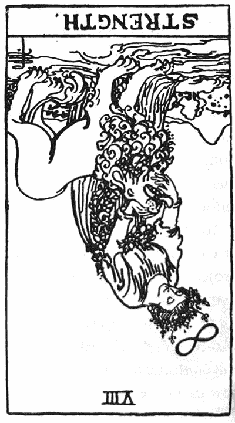
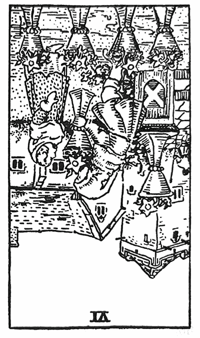
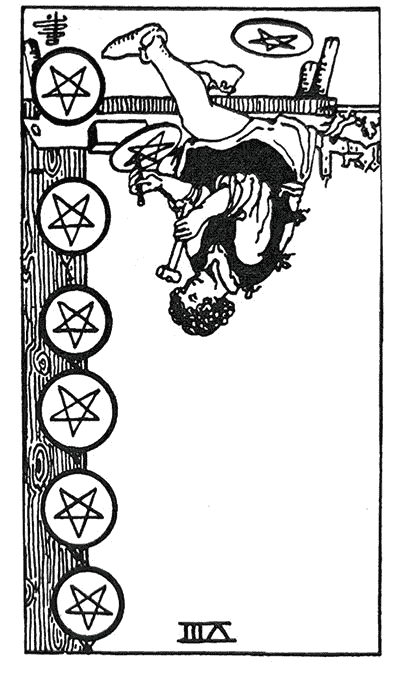
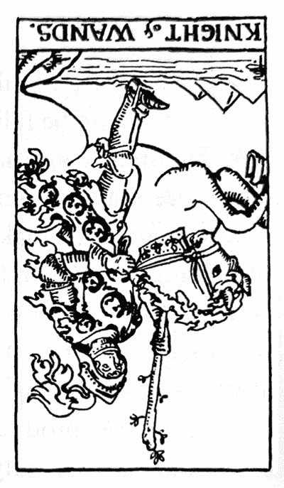
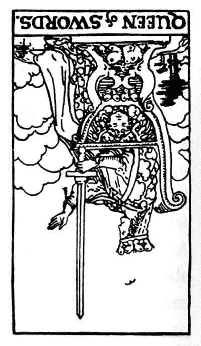

# 跟着大师学塔罗逆位牌

## 推荐短语

本书的英文版是陪伴我初学塔罗时，每日抽牌的桌面书，给我帮助很大，牌卡解说相当完整丰富，呈现逆位牌多面向的解读，虽然书名是塔罗逆位牌，但是，正位的解说也丝毫不马虎，很适合做为随身参考书。

──巫婆的锅子粉专版主／Jade

此书作者在书中提及的经历，让我有相当深的共鸣，我与塔罗牌的缘分有许多跟她在生命故事有类似的遭遇；许多学习塔罗牌的朋友都害怕逆位解，但你会从这本书发现，逆位是一个礼物，它将会是打开你走向新天地的钥匙。

──资深塔罗牌实务工作者／于玥

本书对逆位牌提供的多元观点，带领读者从塔罗占卜中探究生命中的矛盾、对立、冲突等的状态，让学习塔罗，成为探索生命的内在旅程。

──辅仁大学宗教系博士研究
斜杠塔罗 Podcast 主持人／王乙甯

逆位牌过去常被蒙上宿命论的色彩，是全然负面、带来疾病与厄运的象征。然而本书提供了贴近心灵的崭新诠释，揭示逆位牌翻转惯常视角的艺术。透过生动丰富的叙事，以及荣格心理学的观点，鼓励读者跨出思考局限；在深刻内省之中，将痛苦化为觉知。

──塔罗艺术工作者／玄享

深深喜欢这本书，因为以荣格观点为主轴。喜欢荣格的朋友，就算你不是塔罗师，也会喜欢此书。就像魔术师，荣格称为──永恒的青春。书中不只讲逆牌，也讲正牌。抽到逆牌，也要像魔术师一样，用另类观点，去学习让各种力量能够保持和谐。

──塔罗研究教学家／吴安兰

现代塔罗发展的拓荒时期带领者──玛莉．格瑞尔大师，以许多名著为塔罗各方面奠定基础，本书更在逆位的主题上发挥到淋漓尽致，统合新旧观点赋予完整的理论，带出多元的操作方法和丰富的解析变化，用切身的体悟演示塔罗的深刻内涵。

──塔罗畅销名著作者／林乐卿 Farris Lin（星宿老师）

许多人会将塔罗牌视为未卜先知的工具，然而我认为塔罗牌的意义绝对不只如此，乍看不好的牌组，若能窥见端倪，也有机会扭转局势。知名塔罗牌老师 Mary K. Greer 以此书说明抽到逆位牌也是和潜意识对话的机会，当我们试图“正视”逆位牌，便能重新校正身、心、灵，看见死局中的机会点。

──作家／高瑞希（奶妈 Naima）

“逆位”就像是从吊人牌的视角，超越过往经验，颠覆习性与表象，重新理解这张牌的教导与意义。过程也许痛苦受挫，但逆境背后总蕴藏着生命的礼物。跳脱好坏的二元对立，撕掉逆位牌的“不祥”标签，本书协助我们从逆位牌中觉察自我的限制，打开丰富的世界观，同时，领受塔罗占卜背后的美好祝福。

──Alisa 的丰饶角：用塔罗写日记／孙正欣

“逆位”是一种启蒙状态，它要求我们离开常态、重构认知。身为一个逐渐资深（！）的塔罗牌老师，逆位牌对我而言一直是在教学中需要特别关注的主题，也是一种独特的思考练习。本书把“逆位牌”上升为一种方法论，实是具有一种诚恳而广阔的心意在其中。

很期待本书面世，期待见到它的全貌，给予我们新的洞见！

──塔罗牌老师
ＦＢ“阿梅．心的家”经营者／黄咏梅

献给

莎琳．麦克唐纳（Sharyn McDonald）

以及

芭芭拉．莱普（Barbara Rapp）

## 推荐序医者视野与大师之路

爱智者书窝版主、心理学作家／钟颖

逆位牌是塔罗学习者在解牌之路最重要的关卡之一，而《跟着大师学塔罗逆位牌》则是这个领域的经典。

自黄金黎明协会整理前辈神秘家理论，奠定了塔罗学研究的基础之后，塔罗牌的奥秘随着伟特博士与克劳利本人的著作而逐渐为人熟悉。然而，前辈神秘家虽然以卡巴拉理论赋予了塔罗牌宇宙学的架构，但在实占上，逆位牌的解读却是所有欲一窥塔罗堂奥的人最感头疼的题目（另一个头疼的题目则是宫廷牌）。但这个题目却甚少得到重视。

本书作者玛丽．Ｋ．格瑞尔是当代的塔罗大师，年轻一辈的读者或许不知道，她早期的作品基本上是跟塔罗史有关的（特别是黄金黎明协会中的女性神秘家），在她的研究里，逆位牌最早出现在 1783 年法国神秘家伊特拉的作品中。但有趣的是，逆位牌义虽然自此有了雏形，却一直未能单独发展。

就以大家熟悉的伟特为例吧！他本人在书写逆位牌义时，就仅是以注记的形式作为书中的补充。而另一位知名的神秘家克劳利，他所发想的托特塔罗牌则根本不使用逆位。如果把塔罗牌作为一种修行或魔法仪式的道具，逆位牌的使用时机自然不多。但是，塔罗牌却是一项古老而有效的占卜工具，因此在实务上，逆位牌义的解读其实对占卜者来说非常重要。但长久以来，它的推演原则一直未能出现系统化的理论。

然而，随着时间过去，我们在漫长的塔罗史中开始看见几个有趣的发展。

首先，随着女性受教育人数的普及，神秘家的性别已大量地从男性转成女性。现如今，塔罗界的大师中，女性的人数已经远多于男性，这或许说明女性的心灵更贴近塔罗的运作。其次，塔罗书籍从通论转向专论。这种分科精细化的现象带动了这门古老技艺的高度成长，这本《跟着大师学塔罗逆位牌》就是一个很好的例子。第三，塔罗学与心理学知识的高度结合。跨学科的对话不仅发生在塔罗学，也发生在整个神秘学领域。可以这么说，不了解心理学（尤其是荣格心理学与人本心理学）的学习者，就会与整个时代潮流脱勾。

而各位读者手中的这本书，就完全体现了这个趋势。

初学者可能会想，逆位牌不就是相反的意思吗？事实上这是很常见的误解，逆位的解读方式绝非简单的牌义反转，否则你就会看见太阳牌的逆位是晚上，宝剑九的逆位是一夜好眠这样的荒谬说法。特别是考量到塔罗牌上的元素之后，要是有人告诉你权杖牌组的逆位会变成水元素，钱币牌组的逆位会变成风元素，你恐怕也会觉得很怀疑。为什么呢？因为如果水元素是此时应该出现的牌，命运之神何不让你直接抽出圣杯牌组，还得绕个弯改用权杖逆位来表示呢？

正因如此，虽然相反义也可能是逆位牌的意义之一，但它却是众多可能性中最小的一个。

因此，在解读逆位的时候，最常用的传统方式反而是延迟与减弱。另外，借由心理学知识的辅助，当代占卜师也大量采用了投射、压抑、黑暗面、未觉察到的相关情结来解读逆位的牌义，因此大大增加了逆位的解释原则。但在我的经验里，这一方面可能让学习者觉得因能切合个人的成长议题而感到兴奋，另一方面则可能让学习者觉得倍感困扰。

如果你有这样的困扰，或许应该想想，自己更期待成为什么风格的命理工作者。是一个能预判吉凶祸福、铁口直断的占卜者（cartomancer），还是一名可以协助问卜者自我整理的解牌者（card reader）呢？这两个用语的差异，决定了你的位置。当然了，在实务工作中，任何一个命理工作者都会同时扮演这两种角色。因此它真正牵涉的，其实是关于命运的哲学问题。

随着信息的快速流通以及教育水准的普遍增加，比起十八世纪，人类已经大幅获得了前所未有的可能性。“命运”（也就是天生的限制）固然还存在，但“自由”（也就是后天的觉察与努力）却越来越多地掌握在当事人手里。作为一门促进他人成长的职业（而不是一个妄想能窥测天机的自大狂），哪怕你已洞悉了求卜者命运的走向，也应自觉地站在解牌者的位置，在陪着当事人探索完个人的动机、条件的限制，以及资源的有无之后，再将选择权交还给本人。

而要做到这件事，就必须仰赖你对逆位牌的深刻瞭解。

作为塔罗逆位牌最权威性的代表著作，作者为我们整理出十二种逆位牌的解读法，但若能仔细体会，你会发现作者真正看重的是逆位牌作为矫正、药方（remedy）或处方（recipe）的能力。易言之，逆位牌就是你的心药，就是你未充分觉知到的阴影。如我常说的，我们的阴影中深藏着黄金。正是书中这个独到的观点，使占卜者才真正具备了一份类似于医者的视野。

因此，下次再遇到逆位牌时请不用紧张，命运之神已经为当事人错误的生活态度开出了解方，只待你翻开这本书，静下心来沉思与面对。

作为一门古老的职业，塔罗牌曾经陪伴我们度过好几个世纪。在我的解牌过程中，我也屡屡被塔罗牌精准的预测能力给折服，它是一门永不消失的技艺，心灵宇宙的模型。这本书是重翻上市的经典，译者流畅的文字更让阅读本书成为了愉快的享受，我深切期许书中内容能让所有读者共同走向大师之路！

## 推荐序芭芭拉．摩尔

芭芭拉．摩尔（Barbara Moore）

与每一位资深的塔罗爱好者一样，我对于市面上许多塔罗书籍非常熟悉，也充满感谢。这些书籍探讨了塔罗的各式主题，从基本牌义解析，到使用塔罗牌作为一种疗愈工具来进行冥想，范围相当广泛。但是到目前为止，还没有一本书针对塔罗逆位牌做全面性的研究。由于不同占卜师对塔罗解牌的掌握度各有不同，有些占卜师能用逆位牌来增加解牌的深度，有些则是含煳其辞、瞎解一局牌阵，有的则是介于这两者之间。很多占卜师甚至完全不使用逆位牌来占卜；有些则已经开发出自己的一套逆位牌解读法。无论你个人如何看待和使用逆位牌，我相信诸君一定能从本书含藏的智慧和洞见得到益处。在这本书里，玛莉．Ｋ．格瑞尔分析了许多种处理逆位牌的方法，深入探究每一张牌的含义，并描述了“女英雄之旅”──代表着从愚人牌开始的大阿尔克那逆位牌旅程。

我想不出有谁比玛莉．格瑞尔更有资格写这本书。对很多人来说，玛莉是不需要多言介绍的人物。《跟着大师学塔罗》（*Tarot for Your Self*）早已是塔罗牌界最受欢迎且经常被推荐阅读的书籍之一。她在全美各地开办工作坊，也曾与瑞秋．波拉克（Rachel Pollack）在纽约莱茵贝克镇的欧米茄学院（Omega Institute）共同举办过为期一周的精彩塔罗课程。玛莉不仅是一位学者、态度严谨的研究者、极富创意的思想家，同时也是一位杰出的老师和真正热爱塔罗的人。她的作品内容扎实且丰富成熟、面面俱到。书中内容皆以研究为基础，并经过实战经验测试。很少人能像她这样让塔罗如此生动有趣、活灵活现──一如你在她的序言中所见。

尽管玛莉撰写的这本《跟着大师学塔罗逆位牌》已足够让人兴奋，但这只是鹿林月亮出版公司（Llewellyn）的塔罗专题系列新书的第一本而已。我们开辟这个系列是为了满足中上程度和资深塔罗占卜师的需求，让他们能学习到更多更新的塔罗解牌与应用方法。有时某些针对塔罗初学而出版的新书，通常只会有一个章节或部分信息是全新的。也就是说，中上程度／资深塔罗占卜师花了钱买这些书，却只能获得一小部分新信息。因此，这个新系列的书籍将会省略掉关于塔罗的基础信息，比如：什么是塔罗牌、塔罗的历史、什么是牌阵、如何洗牌、如何收藏和净化你的牌卡等等，而是将每一本书的重点锁定在一个非常明确的主题。即将出版的书籍主题包括：将塔罗应用在魔法、自我探索，以及解梦上。此一全新的塔罗系列专书，预计每年发行三本。每一本新书都会有玛莉．格瑞尔大师专文作序（当然，本书除外）。关于这本书的封面，玛莉认为吊人牌最为合适。因为吊人牌正是塔罗逆位牌根本含义的缩影。正如玛莉在本书提到的，这张牌的含义就是“完全臣服于对立的观点，翻转你的意识，逆转你的想像。”我想起电影《春风化雨》（*Dead Society*）当中的一个场景。演员罗宾．威廉斯饰演的这位老师，要他的学生们站在课桌上，从不同的视角来看这间教室。这就是逆位牌可以做的事。有时候，这正是我们需要的。有了玛莉．格瑞尔大师作为我们的向导，我们就可以满怀自信和兴奋，大胆去探索经常让我们困惑不已的逆位牌世界。玛莉，谢谢你给了我们一张可以站在上面重新看世界的桌子。

二〇〇一年十月序

## 致谢

我要感谢鹿林月亮出版公司的企划编辑芭芭拉．摩尔（Barbara Moore），感谢她对于提升塔罗书籍品质的卓越贡献，感谢鹿林月亮出版公司愿意出版更多进阶行家的塔罗书。我也要特别感谢芭芭拉，在我面临到人生逆位情境时，对我有诸多体谅。康妮．希尔（Connie Hill）是一位充满智慧的天使，每当我需要她时，她总是在我身边帮助我。

感谢艾德．布林（Ed Buryn）和莎琳．麦克唐诺（Sharyn McDonald），他们在阅读本书初稿之后，对内容增添了许多宝贵的意见和修正，我甚至无法指出他们个别的功劳所在。不过，若书上有任何错漏，皆非他们的责任。

感谢瑞秋．波拉克（Rachel Pollack），多年来我与她共同教学，她一直是我灵感的来源；还有上过我课程和工作坊的学生，因为为数众多，我无法一一唱名；还有我的谘商个案，他们对于塔罗的洞见经常让我自叹不如，时时心怀谦卑。还要特别感谢“象征符号课程”中的伙伴：莎琳．麦克唐诺、达瓦．菲茨莫里斯（Dawa Fitzmaurice）、克里斯．欧文（Chris Irving）、维尔．科贝（Vail Kobbé）、夏洛特．博林格（Charlotte Bollinger）、维吉尼雅．韦斯特伯里（Virginia Westbury），尤其是杰克．迈耶（Jack Meyer）和大卫．海特（David Haight），他们的系列演讲“神话隐喻”（Myth as Metaphor），总是让课程迸出新的火花。感谢爱希斯神殿团契的女祭司们的鼓励和支持。

我还要感谢一群帮忙创建塔罗学习团体的人，包括：萨拉莎（Thalassa）、芭芭拉．莱普（Barbara Rapp）、珍奈特．贝瑞斯（Janet Berres）、盖瑞．罗斯（Gary Ross）、安．夏特（Anne Shotter）、瓦德．安博史东（Wald Amberstone）、露丝．布劳萨（Ruth Ann Brauser）、约翰．吉尔贝特（John Gilbert）、克里斯托．赛吉（Crystal Sage），以及每一位参加过塔罗牌聚会的朋友。特别要感谢克莉丝汀．佩恩托勒（Christine Payne-Towler），她对欧洲塔罗传统的关注和兴趣开拓了我的视野；感谢布莱恩．威廉斯（Brian Williams）引领我穿越意大利文艺复兴塔罗的奇妙世界。另外还要感谢唐娜．贺内林（Donna Hanelin）、芬恩．莫西耶（Fern Mercier）、杰拉丁．阿马罗（Geraldine Amaral）、阿内尔．安藤（Arnell Ando）、亚利姗卓与肯．简内提伉俪（Alexandra and Ken Genetti）、詹姆斯．威尔斯（James Wells，他经常从多伦多打电话来为逆位牌提供建言）、尼娜．李．布拉登（Nina Lee Braden，是我在逆位困境期间的好姐妹）、梅兰妮．奥莱里奇（Melanie Oelerich）、利亚．萨穆尔（Leah Samul）、朵琳．维特库斯克（Doreen Vitkuske）、以及詹姆斯．里克尔夫（James Ricklef，又名夜鹰）。

感谢网络上的塔罗社群，尤其是在雅虎网站上的 TarotL 与 ComparativeTarot 两个社群有非常精彩的讨论，因为很多人不吝与我分享他们对塔罗的见解，包括：海兰德（Tea Hilander）、瓦莱丽（Valerie Sim-Behi）、黛安（Diane Wilkes）、麦可（Michele Jackson）、伊莉莎白（Elizabeth Hazel）、伊娃（Eva Yaa Asantewaa）、dt 国王（dtking）、小汤姆（Tom Tadfor Little）、鲍伯（Bob O'Neill）、詹姆斯．利瓦克（James Revak，他为我们精彩解说了伊特拉的牌义解释如何影响了马瑟斯和伟特），以及我在注释当中提到的每一个人。要感谢的人可能超过百位，我怕我会有所遗漏，因此只能在此一并对诸位表达我简短的谢意。

最后，我想要向先前出版过塔罗书籍与套牌的作者与创作人致上敬谢之意。对于这群塔罗占卜传统的开路先锋，我们的感激之情难以言喻。

## 序言关于本书

本书对于逆位牌义的解析，涵盖了多种不同理论和传统作为解牌基础；除了采用“传统”塔罗牌义，也融摄了结合数字、元素以及图像原理和隐喻为主的现代解牌取向，目的当然是希望能够提供大家更完整的解牌背景知识。牌义解析的用意是为了激发出你自己对于塔罗牌的直觉想法。当你在检验这些牌义时，请特别留意哪一种解释取向最适合你；因为这有一部分跟你自己的世界观、解牌风格、占卜目的，以及问题种类有关。

如果你占卜的目的纯粹是为了算命和预测未来，那你可能会觉得标示为“传统牌义”的解释以及一些相关资料内容就够了。传统牌义几乎没有什么意义上的模煳空间，除非这张牌与其他牌产生了关联性的解释，这部分的解牌技巧则必须靠观察、直觉和经验来获得。而如果你做塔罗占卜是为了检视你对某件事情的个人动机、厘清自己的目标和期望，或是帮问题找寻新的解决方案，那你可能会发现，牵涉到逆位牌的现代牌义会更适合你。

传统牌义对于逆位牌的解释通常会谈到疾病。这是有道理的，因为出现逆位牌就是在告诉你某些事情需要调整了，而压力就是我们身体对于外部调整与变化的一种回应。现在医生相信，所有疾病皆源于压力。压力反应愈大，对身体可能产生的危害就愈大。压力会影响我们身体连锁系统中最脆弱的那个环节。而逆位牌就是在为你指出目前你最主要的“脆弱环节”所在。迪恩．施洛克（Dean Shrock）在《医生的嘱咐：来去钓鱼》（*Doctor's Orders: Go Fishing*）这本书中就提到：“人类历史上最不受时代和文化限制、也最贴近日常的健康照护法就是萨满巫术。”萨满巫术信仰认为，“疾病是正向积极的传讯者，它是在告诉你，你需要在精神上重新找到平衡。”[[1]](#fnS-1)

这本书对于每一张逆位牌的解释，都包含了萨满巫术和魔法的观点在内。塔罗占卜是非常棒的一种回馈机制，它可以在你身体失衡出现问题之前（不管这个问题是因肉体本身或因压力导致），就先接收到警示讯息。它还可以精准指出导致你能量失衡的根源，让你有机会去处理你的潜在心理模式，比如批判、愤怒、怨恨、内疚、恐惧等等，然后从这些模式的束缚中挣脱出来。

###### 健康方面的建议

在这本书中，所有跟健康和疾病有关的信息都不能拿来当作医疗上的预测。请不要在占卜当中做任何疾病的预言或提供任何医疗建议，无论占卜对象是你自己还是别人，除非你是合格的医疗人员。如果问卜者担心自己的健康，请建议他们去看合格的医生。

书中提及健康和身体状况的所有信息，纯粹皆属隐喻性质。那是一种隐喻模拟，意思是说，我们的心理惯性和思维模式可能会沉淀成各式各样的压力，这些压力如果长时间都不去纾解，可能就会导致生病。这并不是在暗示某个人有书上提及的任何身体毛病。比如“脑内风暴”（brainstorm）可以意指激发灵感点子，也可能意指大脑皮层中神经元运作失常。从隐喻的角度来说，这个词是代表一连串的可能性。

######  说说我的故事

我一开始撰写这本书的目的，是为了纠正一个“错谬”观念，很多人认为逆位牌就是正位牌含义的相反，而且通常把逆位牌看成是不好的牌。虽然我在占卜解牌时，主要是让问卜者去面对和处理他们所提出来的问题，但我同时也会把重点摆在厘清目标以及主动创造你想要的人生。从这个角度来看，问题就是代表受到束缚的能量，而且这个束缚是可以被解开的。如此一来，我们就能探取问题背后隐藏的智慧与可能性。我先前应该要知道、却没有意识到的那些事情，就像一条积满脏物的水管，当你第一次把水打开，里面各种脏东西一定会被水冲出来，然后慢慢的，这条管子的水才能逐渐变干净。

就跟每一位写过塔罗书籍、教导或研究过每周占卜，或曾经绘制过塔罗套牌的人一样，你会发现你的人生和塔罗牌之间有着离奇不可思议的同步性。佛瑞妲．哈利斯夫人（Frieda Harris）接受委托绘制托特牌时，刚好是在二战期间，当她画到标题为“胜利／Victory”（权杖六）的这张牌时，盟军大获全胜；画到“挫败／Defeat”（宝剑五）这张牌时，盟军遭遇惨败。虽然以常理来说，这有点荒谬，但哈利斯夫人依然觉得塔罗牌和当时发生的事件互有关联。我也曾在自己的人生中真实经历过每一张逆位牌的状态。

以下只简要举几个例子，让你知道，当你进入到心灵或灵魂的幽冥境界时，可能会碰到什么事。逆位牌绝对不是什么邪恶的坏牌，但它们有时确实代表逆境，是为了让我们知道自己拥有什么样的能耐，让我们知道自己该指望什么事情、以及什么事情对我们才是真正重要的，而且也是为了要考验我们的德性和品格。当我们与逆境战斗，我们就能学会以诚信正直和决心来回应它，而不逃避每一次逆境的功课。

在我述说自己的遭遇之前，我想特别说明一件事，我的人生一直都算相当幸运，几乎没遇过什么人身伤害、或是有家人生病的情况，而且几乎每一次工作都能在截稿期限前圆满完成。

我人生中第一次延迟交稿，是因为我买的一部新电脑居然花了一个多月时间才到货。有一位房客连续跟我租屋三年，但是当我开始写书，才刚动笔写逆位宫廷牌，四个月内我就换了四位房客。写到宝剑牌期间，我还遇到一个跟诈骗集团有关的风波。写到钱币一逆位时，原本当时计划要前往意大利进行一趟塔罗之旅，没想到在出发前四天，我的脚踝就严重扭伤。[[2]](#fnS-2)写到钱币十逆位，银行搞丢了我的两张支票，原本那是要用来支付房屋税的。

写到女祭司逆位时，我正在阅读克莉丝汀娜．摩根（Christiana Morgan）的传记，她的内在灵视画作（从接受卡尔．荣格的心理分析之后开始创作），成了荣格四年教学研讨会的基本探讨内容。传记作者经常形容摩根是“逆位的女祭司”，例如：“（她）作为镜像的阿尼玛──也就是用来映射、圆满，以及创造男人的那名内在女性……精神伴侣……消失在她的角色里；而爱着自己内在女性映射者的这个男人，觉得他有权拥有这个映射者，认为那是他想像力资产的一部分。”[[3]](#fnS-3)

在我写书时，我阅读的许多书籍、我举办和出席的课程与研讨会，都完全对应到我当时正在撰写的那张塔罗牌──而且与我所写的内容字字句句相互呼应；例如，我写到“吊人牌”时，一场荣格研讨会刚好讨论到“牺牲”（sacrifice）这个主题。

办完离婚那天，我正写到死亡牌。写到高塔牌时，我的一位朋友急性盲肠炎。那年整个冬季最热的一天出现在一月，当时我正写到太阳牌。当我开始着手编辑这本书，我就摔倒了，背部严重扭伤，甚至卧床无法起身，后来是不靠拐杖就无法自己行动。接下来是遇到暴风雪、停电、电子邮件故障，然后，当我为这本书的初稿进行最后编辑、疯狂删改内文章节时，我的继女被诊断罹患乳腺癌，我只好将手上的工作暂时搁置。幸亏鹿林月亮出版公司主编芭芭拉．摩尔体谅我的情况，最后我才能够依照自己的进度完成这份工作。

过程尽管困难重重，但这些充满压力的经验让我有机会与自己内心种种“素材”正面相会，我必须诚实地面对这些状况，并尽力保持清明思绪，这样我才能疗愈自己，“让各种力量保持和谐”。[[4]](#fnS-4)

当然，过程中我也经历到一些好事，包括朋友给予我的支持肯定，超过我以往所知。我之前接受灵气Ⅰ级和Ⅱ级培训也及时派上用场。还有，就在这本书撰写到一半时，洛杉矶塔罗牌研讨会（ＬＡＴＳ）策画人芭芭拉．莱普（Barbara Rapp）颁奖给我，表扬我对塔罗界的贡献。奖杯刚好是伊登．葛雷（Eden Gray）根据“莱德伟特史密斯塔罗”（以下简称ＲＷＳ或伟特牌）的吊人牌创作的一座青铜雕塑。这是一件意义深远的作品，也是葛雷女士唯一一件塔罗铜雕，芭芭拉当年在芝加哥举行的第一届国际塔罗牌大会时，向伊登．葛雷买下这件作品（当时葛雷也是去受奖）。这座雕塑在芭芭拉家里摆了三年，她觉得应该是时候把它传给别人。当时，我正写到最能代表这本书的塔罗牌形象，也就是吊人牌。当天研讨会一开始，我就受邀为在场所有人抽一张牌来代表这个日子──我抽到的正是吊人。

######  关于牌义解析的说明

现代牌义或是英语系塔罗牌义，基本上都是以受到“莱德伟特史密斯塔罗牌”（ＲＷＳ）影响而创作出的视觉图案元素，以及黄金黎明赫密斯派修会（Hermetic Order of the Golden Dawn）所使用的概念和关键字，来作为解牌基础。一九〇九年问世的莱德伟特史密斯塔罗牌，是第一副将七十八张牌都绘上不同图案的套牌，塔罗牌的图案设计从此翻开新页。使用其他套牌所做出的牌义解析可能极为不同，不过，作为全世界最受欢迎的一副英文套牌，它已经对塔罗牌的现代牌义解释产生了深远影响。

塔罗的古代牌义、或是我书上所谓的“传统牌义”，都是以法国的伊特拉（Etteilla）在一七八三年所做的牌义解释为基础（详见本书第一章“历史”一节），后来的创作者又将伊特拉或马赛塔罗的牌义做了一些更动。在当今意大利、西班牙和法国，可以看到各式各样不同风格的塔罗套牌作品。其中有些套牌对于逆位牌的解释似乎相当武断，而且跟正位牌义可能搭不上任何关系。还有一些套牌，在试图从传统牌义转换到现代牌义时，甚至把逆位和正位的牌义完全对调了。现代的解牌技巧比较倾向于针对正位牌义做一些修正，而不是使用毫无相关的概念。尽管如此，你还是可以从当代的许多英文牌义解析中看出，这些解释都受到伊特拉的深刻影响，但同时又能让你在解牌时产生新的领悟。

本书的传统牌义解释是取自以下作者，他们的著作也会列在本书末尾的参考书目中：

伊特拉（Etteilla，大约一七八〇年代）以及帕布斯的重制版本（Papus, 1909）

麦克逵格．马瑟斯（MacGregor Mathers, 1888）

圣哲曼（Saint-Germain, 1901）

厄德．皮卡德（Eudes Picard, 1909）

意大利圣甲虫出版公司（Lo Scarabeo Publishers，当代）

葛兰德．奥瑞恩特／伟特（Grand Orient／Waite, 1889）

亚瑟．爱德华．伟特（A. E. Waite, 1910）

M. C. 波因索／亚农（M. C. Poinsot／Anon, 1939）

亚历山卓．贝伦吉（Alessandro Bellenghi, 1985）

玛丽苏．古勒（Maritxu Guler, 1976）

西班牙富尼耶出版公司（Fournier Publishers, 1992）

马吕斯博士（Docteur Marius, 1975）

大伊特拉／B. P.格里莫（Grand Etteilla／B. P. Grimaud, 1969）

请记得，本书当中给出的牌义解释都只是建议性质。不同套牌的牌面图案、一张牌在牌阵中与其他牌的关联，或是每一个人对牌面图案的直觉和联想，都可能让一张牌出现完全不同且更加适当的含义。

######  专用术语解说

为了方便参考查询，以下就针对本书所使用的专有名词术语先给予定义。文中有楷体字标示的词汇，表示在此列表中有单独的解释条目。

**阿尼玛／阿尼姆斯（Anima／Animus）：**心理学家荣格用来代表男性个体潜意识或心中隐藏的女性形象，以及女性个体潜意识中隐藏的男性形象。虽然它在男性和女性心灵中的运作方式不同，但其基本功能都是带来启发。

**原型（Archetype）：**人类心灵中从远古留存下来的直觉本能模式，深深影响着我们的心理状态。这些集体思维模式是与生俱来的，而且代代相传。我们没办法看见原型本身，只能看到人们依循这些潜在模式而表现出的特定意象和行为，也可以在世界各地的神话、童话故事、人们的梦境、幻想、艺术作品中看到它们的身影。

**对应关系（Correspondences）：**秘术形上学和魔法的一项基本原则或“法则”，意思是，宇宙中一切具有相同或相近振动频率的事物，彼此之间都存在着象征譬喻和相似性的链接，而且，透过这种象征链接，当一件事物受到影响，也会连带影响其他事物。总结一句就是赫密斯学定理所说的：“如在其上，如在其下”（As Above, So Below）。

**宫廷牌（Court Cards）：**十六张“人物”牌，分为四个牌组，在牌义解释上，通常指自己或他人，或这些人的角色、人格面具、以及次人格（潜隐人格，subpersonalities），或是一种行为样式；但也可以指你所遇到的情况。宫廷牌的四个人物名称有很多种，在英语系套牌中最常见的是：国王（King）、王后（Queen）、骑士（Knight）、侍者（Page）。

**元素质性（Elemental Dignities）：**一张牌的含义，会随着它的邻近牌之元素不同而产生变动。参见附录Ｃ。

**元素（Elements）：**宇宙的基本构成要素，西方秘术形上学认为宇宙是由火、水、风、土四大元素组成。塔罗牌组和元素之间的对应关系，会因不同套牌而有所差异，解牌者可选择自行忽略牌卡创作者的意图，或是自行修改创作者对于牌面特征的描述内容。请参见附录Ｃ。

**元素对应（Elemental Correspondences）：**本书所使用的元素与塔罗牌组对应关系如下：

**权杖　火　**欲望。活力能量。灵感。自我成长。冲动。

**圣杯　水　**情绪感受。关系。想像力。反照。

**宝剑　风　**思维。冲突。区别辨识。解决问题。

**钱币　土　**物质显化。安全感。价值。结果。

**反向转化／物极必反（Enantiodromia）：**心理学家荣格用这个术语来表示一个人心理状态的逆转。意思是，事物会翻转成它自己的相反样貌，或者，看起来相反的两极可能会发生相互翻转的情况。这最早是古希腊哲学家赫拉克利特（Heraclitus）提出的概念，意谓朝相反方向运行。

**伊特拉（Etteilla）：**尚巴提斯特．阿里耶特（Jean-Baptiste Alliette, 1738–1791）的化名。他是最早为纸牌撰写占卜牌义书籍的人，这些书籍持续影响现代的牌义解释，并创造了逆位牌的概念，更发明了“cartonomancie”一词，意思就是“用纸牌占卜”。他还自己设计了一副塔罗牌。

**黄金黎明（Golden Dawn）：**黄金黎明赫密斯派修会是一八八八年在伦敦成立的组织，至今依然在运作。协会成员主要是修练西方魔法传统中的仪式魔法。他们以塔罗牌、占星符号，以及希伯来字母的对应关系为基础，自己发展出一套仪式和修练方法，其中的希伯来字母更影响了二十世纪最受欢迎的两副塔罗牌──《莱德韦特史密斯塔罗牌》和《托特牌》的创作。这两副牌的创作者伟特（Arthur Edward Waite）、史密斯夫人（Pamela Colman Smith），以及克劳利（Aleister Crowley），都是黄金黎明协会的成员。“黄金黎明传统”指的就是以上提到的这些对应链接，它们跟列维所创建的法国塔罗传统、以及净光兄弟会（Brotherhood of Light）的“埃及塔罗”所使用的对应系统不同。

**荣格／荣格学派（Jung／Jungian）：**荣格（Carl Gustav Jung, 1875–1961），瑞士心理学家和精神分析学家。亦指荣格的心理学理论，荣格学派对人类心灵或精神灵魂的探索以及符号的诠释具有重大影响。

**列维（Lévi）：**伊莱．列维（Éliphas Lévi, 1810-1875），本名阿方斯．刘易斯．康斯坦（Alphonse Louis Constant），是一位法国作家、魔法及秘术理论家。他所发展的对应关系解牌法，通常被称为“法国学派塔罗”，大大影响了后来的法国秘术塔罗以及马赛塔罗的使用者。

**魔法／魔法方式（Magic／Magical）：**传统对于秘术（occult）的定义是这样的：“魔法是使用少数已知的自然力量，来改变意识和物理环境的一门艺术与科学。”[[5]](#fnS-5)较为接近心理学的定义则是：“魔法……是宇宙世界的灵魂，它依据自身的法则创造出它自己。”[[6]](#fnS-6)以此观点来看，魔法的世界（也就是秘术家所说的“内在层界”），就是原型心理模式拥有物质实体的界域，在那里，我们可以感知宇宙灵魂的存在样貌。

**大阿尔克那（Major Arcana）：**二十一张有编号和一张未编号的纸牌，牌面描绘的隐喻图案，皆源自中世纪晚期和文艺复兴时代早期，欧洲天主教盛行地区普遍熟知的图像。以现代塔罗牌义的解释来说，这二十二张大牌通常代表事件的发展原则和需要关注的主要课题。

**马赛塔罗（Marseilles Tarot）：**法文写做“Tarot de Marseille”。大多数使用“马赛塔罗套牌”的占卜师，都是使用由列维所设计的占星和希伯来字母对应组合来解牌，而不是使用黄金黎明的对应系统。使用者通常需要把每张牌的基本含义背起来，因为小阿尔克那的数字牌上只有牌组符号（没有故事图案）。

**小阿尔克那（Minor Arcana）：**共有五十六张牌，分为四个牌组，每一组都包含十张编号一到十的数字牌以及四张宫廷牌。因此一共有四十张数字牌（英文也称作 pip，点数牌），以及十六张宫廷牌。在现代牌义解释中，小牌通常代表遇到的事件、情况或人物。

**灵启（Numinous）：**荣格学派使用的专用术语，意指某样事物或事件让看到它或经验到它的人产生一种深刻的情绪反应，对它感到敬畏、着迷，觉得神秘莫测。

**秘术／秘术形上学（Occult／Occult metaphysics）：**occult 这个字的意思就是“秘密的”或“隐藏的”，意指必须透过搜索追寻才能被发现和揭露的隐密知识。形上学是指超越有形物质的事物哲理。“密传之学”（esoteric）这个词也跟这个概念有关，意思是“与内部事物有关”。这几个词汇都是意指隐藏在我们心灵中的知识和智慧，可以透过检视察看而被我们的意识所觉知，而且当你以魔法方式使用它，就可以让事物产生变化。

**投射（Projection）：**心理学术语，意指在潜意识（unconscious，或译为无意识）中将自己的某些特性（包括情绪感受、心态和欲望）归咎于某人或某事物。同时，创造这个投射的人本身又否认或拒绝承认自己拥有这样的状况。

**心灵（Psyche）：**源自希腊语的“呼吸”，因而衍生为“灵魂”或“精神”之意。意指人类意识和潜意识的心智运作过程，也指人类渴望与上帝合一的部分。希腊神话中，爱与情欲之神爱洛斯（Eros）爱上了少女赛姬（psyche），就是象征我们的灵魂从潜意识到明意识、再与神性合一的发展过程。而心理学（Psychology，心灵之学）就是研究人类心智心灵的一门学问。

**引灵者／普绪科蓬波斯（Psychopomp／Psychopompos）：**灵魂的向导，特别是指在冥界中为亡灵引路的向导。

**永恒少年／永恒少女（Puer／Puella）：**心理学家卡尔．荣格所提出的原型概念，代表“永远年少青春”的一种心理模式。永恒少年是指，在情感上永远不会成熟的男人，而永恒少女就是永远不会成熟的女性。此原型虽然拥有青春期的顽皮活泼、美丽、魅力，以及诱惑力，却无法以负责任的方式做出全部的承诺。

**药方（Remedy）：**意指用来协助恢复健康的媒介，比如一种医疗药剂、疗方、药物、丹药、医疗行为，或是医术。这个字的英文字根是 medi，意思就是“修正错误”或“修复”，就像解毒剂一样，将错误予以纠正或抵销，以矫正（裨补）先前发生的不良影响或失衡状况。药方的英文缩写就是 Rx，刚好跟逆位牌的缩写一样。这种整顿（rectification，译注：亦有蒸馏提萃之意）的本身就是一种炼金术的变化过程，当中必定涉及酒精溶液（心灵）纯度的调整（译注：英文的 spirit／心灵这个字本身也有酒精溶液的意思，比喻心灵的提炼）。

**莱德伟特史密斯牌（ＲＷＳ）：**就是指 Rider-Waite-Smith 这副塔罗牌，是由英国伦敦莱德出版公司（William Rider and Co.）于一九〇九年首度出版，亚瑟．爱德华．伟特（Arthur Edward Waite）设计创作，潘蜜拉．柯尔曼．史密斯夫人（Pamela Colman Smith）执行绘制工作，也是有史以来第一副在每一张纸牌上都绘有不同图案的塔罗套牌，至今已成为古典马赛塔罗牌之外，最具影响力的现代塔罗牌之一。由于塔罗的“解牌者”习惯根据纸牌上的图案来说故事，因此这副牌也更容易让占卜者透过自由联想和具有文化意涵的象征图像来解释一张牌的含义，而非仅单单把每一张牌的含义背下来。由于这副牌的广受欢迎，也影响了后来许多现代塔罗套牌的创作，经常被用来作为设计新牌的参考基础。

**逆位牌（Rx）：**这个缩写符号经常被塔罗占卜师用来表示逆位牌，占星师则用它来表示行星“逆行”。有时候你也会在药房招牌看到它，因为它也可以代表治疗疾病的药方或药物。最初这个缩写是用英文草书来写，把大写Ｒ的最后一画拉长，再反拉回来画一笔短斜线，成为小写的ｘ。根据《布鲁尔惯用语和寓言词典》（*Brewer's Dictionary of Phrase and Fable*）当中所述，“这个缩写的最后那一笔就是木星（Jupiter）的符号♃，代表在它的特别保护之下所有的药方都能被正确投放。从Ｒ这个字本身的含义（Recipe／处方，拉丁语的意思就是“服用”），以及它的草体书写姿态，或许可以这样来解释：‘在药物守护神朱比特（Jupiter，译注：与木星同字）的良好看顾之下，依指定剂量服用药物’。”Recipe 这个字的意思就是：“可达到预期结果的一种处方或手段”。一般对于逆位牌的传统或现代含义解释，通常都暗示着生活中有一些压力可能会导致疾病和不舒服，但它同时也让我们看到，这样的压力背后存在着正面力量，我个人喜欢这样去思考逆位牌：“不舒服本身即是药方”。（请参见本章前面“健康方面的建议”一节。）

**占卜／预言（Scry, Scrying）：**Scry 这个字是源自“descry”，意思是“辨识出肉眼难以看见的事物”。[[7]](#fnS-7)也就是指借由出神凝视一样物件，比如一张塔罗牌上的图案、一枚小火焰、水面或油面上的倒影，来获得灵视预言画面。

**老者（Senex）：**荣格原型理论的其中一个原型，它包含了智慧老人，以及充满压抑忧伤的垂死老人，这两个极端的人格原型。

**阴影（Shadow）：**荣格所使用的一个心理学术语，用来表示我们潜意识（无意识）自我的其中一个面向，它通常是被压抑、被否认、不会表现于外的人格部分，并且无法被我们的明意识察觉。我们经常会将自己的阴影投射到别人身上，它可能是“光明的”、或我们渴望拥有的那些特质，也可能是“黑暗的”、或我们不喜欢的特质。

**萨满／萨满巫术（Shaman／Shamanic）：**这个字是来自通古斯语（Tungus），意思是“一个能够让人振奋、感动，或得到提升的人”。可以是男人或女人，当他接受到神的授意，会进入一种狂喜的出神状态，与现实之外的灵界（也就是所谓的上层世界或下层世界）接触，以此来获得知识、保护力、疗愈能量，以及／或是对自己和他人的支持力。[[8]](#fnS-8)

**牌组（Suits）：**小阿尔克那分为四组：权杖（法杖、魔杖）、圣杯、宝剑、钱币（圆盘、五角星）。一般来说，每一个牌组各自对应四个元素的其中一个。

**同步性／共时性（Synchronicity）：**心理学家卡尔．荣格和物理学家沃夫冈．鲍利（Wolfgang Pauli）所提出的一个“非因果法则”理论。根据这个理论，在某一时刻同时发生的所有事情，彼此间都存在着一种有意义的关联。

**塔罗奇（Tarocchi）：**最早出现的一种塔罗纸牌游戏，今日欧洲某些地方仍然有人在玩。跟桥牌有点类似，不同的地方在于塔罗奇全部都是将牌（Trump）花色。在意大利，塔罗奇一词也用来代表纸牌本身（单数是 Tarocco）。

**神圣空间（Temenos）：**一处神圣的场域、区域、场所，通常属于封闭性质。在荣格学派当中，它是意指可以安心进行深度蜕变的地方。

**传统牌义／传统逆位牌义（Traditional／Traditional Rx）：**如本章前面内容所述，“传统牌义”指的是，最早在十八世纪由塔罗占卜师伊特拉对每一张纸牌给出的解释，再由法国、意大利，以及西班牙的各个塔罗学派的牌义解释者进行牌义扩充，并出现在马瑟斯和伟特的早期著作中。

**将牌／胜利之牌（Trumps／Triumphs）：**是大阿尔克那牌的另一种称法，最早出现在意大利北部，人们用“I Trionfi／胜利之牌””这个词来称呼这几张塔罗牌，暗示着它们在纸牌游戏中的角色是永远不败的王牌花色，可以战胜其他所有的牌，但也可能跟意大利诗人佩脱拉克（Petrarch）的诗集《凯旋》（*Trionfi*）有关。

* * *

[1] 迪恩．施洛克（Dean Shrock）《医生的嘱咐：来去钓鱼》（*Doctor's Orders: Go Fishing*），第 96 页。⤴

[2] 《文艺复兴塔罗牌》和《古伊特鲁里亚塔罗牌》的创作者布莱恩．威廉斯（Brian Williams）在二〇〇〇年所带领的意大利北部旅游团，是对于塔罗牌图像溯源的一趟朝圣之旅。⤴

[3] 克莱尔．道格拉斯（Claire Douglas）的著作《黑暗解译：荣格心理分析圈里的蒙面女郎，克莉丝汀娜．摩根的一生》（*Translate this Darkness: The Life of Christiana Morgan*）。摩根和她的情人兼工作伙伴哈里．莫瑞（Harry Murray）是“主题统觉测验”的共同开发者（Thematic Apperception Test，简称ＴＡＴ，是一种使用图像来进行性格评估的工具）。由多位知名的荣格学派分析师共同出席的每周研讨会纪录，后来也整理成两册书籍出版，书名是《内在灵视：1930－1934 年研讨会纪录》，作者为卡尔．荣格，主编为克莱尔．道格拉斯。⤴

[4] 感谢赫曼．赫塞（Hermann Hesse）《玻璃珠游戏》（*The Glass Bead Game*）一书第 311 页当中，主角珠戏大师约瑟夫．克涅奇所说的话。⤴

[5] 此一简要定义是引自英国小说家法兰西斯．金（Francis King）与史蒂芬．斯金纳（Stephen Skinner）合着的《高阶魔法的技术》（*Techniques of High Magic*）第９页，主要是以黄金黎明赫密斯派修会之成员所做的定义为基础。⤴

[6] 罗伯特．萨德罗（Robert Sardello）《以灵魂面对世界》（*Facing the World with Soul*），第 20 页。⤴

[7] 《美国传统英语词典》（*American Heritage Dictionary of the English Lanugage*）。⤴

[8] 感谢本书编辑莎琳．麦克唐纳告诉我这个定义的核心精神，并提供她在神话和萨满巫术方面的知识作为参考。⤴

## 第一章　截然不同的视角

<ops:switch id="svgswitch0"><ops:case required-namespace="http://www.w3.org/2000/svg"></ops:case><ops:default></ops:default></ops:switch>

“我该如何解读牌阵中出现的那些上下颠倒的逆位牌？”[[1]](#fnS-1)“为什么那么麻烦要管逆位牌？”为学生解答了这些问题超过三十年之后，让我决定撰写这本书。

有一段时间我忽略逆位牌的解释，因为我不喜欢我在塔罗书籍上读到的那些牌义。后来我发现，无论我用哪一套系统来解读这些牌，它们一样都说得通，只要我刻意留心让这些牌符合该系统的解释。是否要解读逆位牌，是占卜师可以自己决定的，选择要让这些牌代表什么意思，也是解牌者可以自己决定的。我会在第二章提供你多种牌义选项，让你可以自由选择最符合你世界观的牌义解析。

许多塔罗占卜师都发现，逆位牌能够增加解牌的深度、细腻度、广度，并且激发更多想法，让你在寻找明确答案时，看到多一倍的可能性。此外，逆位牌也鼓励我们从一个截然不同、而且更全面综合的角度来看事情。翻到太多逆位牌可能会让你觉得要去处理“一手坏牌”，但我希望这本书能帮助各位扭转这个局面。

事实上，逆位牌是看透事物“另一面”的方法。逆位牌能让我们超越已知的界限。因为它能提供更多非立即明显可见的可能性和见解，让我们有机会走出逻辑之外，引导我们进入表层之下的领域，去看到事物潜藏的原因，在这个世界里面，我们会看到所有事物都是相互关联，而魔法就是在这里发生的。翻到逆位牌就表示我们受到邀请，要我们超越表面可见之物，去看到内部具有更丰富意涵的一个世界。你可以试着把逆位牌看作是受了愚人牌或吊人牌影响，这样会帮助你更容易解读逆位牌。逆位牌能揭露出事物更为深奥或隐密的部分，也就是属于萨满巫术信仰的世界，或者说，那是一个跟所谓“现实世界”截然不同的梦境或内心世界。诚如一位睿智女士在一次网络讨论中所说：“逆位牌让我们有机会去靠近平常不易触及的能量、感受、现实，以及潜在力量。”[[2]](#fnS-2)

逆位牌拥有无比丰富的潜力，但人们却经常以极为有限或简化的方式来解读它。你可以用好牌／坏牌，或其他二元概念来将每一张牌分类。但是，请不要被一个错谬想法误导，认为逆位牌就只是把那张牌的好坏属性颠倒过来而已──虽然有时候确实是如此。如果将逆位牌都看作坏牌，那等于是在强调非理性的恐惧和怀疑，看不到我们精神和心灵中充满创造性的礼物，没必要这样做。因为没有一张牌是绝对的好或绝对的坏；每一张牌的含义范围都非常广，从问题到助力都有可能。比方说，太阳牌可以代表幸福和快乐，也可以代表晒伤和能量耗尽。如果逆位，那就表示传统太阳正位含义的影响力被削弱而不是改变，因此它可能代表对于幸福感或倦怠感的否认。当然，太阳逆位也可能是在告诉你，要去寻找你自己内心的太阳和精神上的指路明灯，而不要单单认为太阳只是代表外在资源。

塔罗新手可以选择只解读正位牌，等到自己能够完全掌握基本牌义后，再尝试解读逆位牌。但是有经验的占卜老手也可能基于各种理由，只解读正位牌。都没问题。无论你的选择是什么，这本书都可以大大拓展你对塔罗牌义的了解。就算最后你依然选择只解读正位牌，你也会成为一位更有广度的占卜师。

塔罗占卜的第一条规则是，**要彻底了解每张牌的基本含义，从这张牌作为助力到作为问题原因的各种可能解释。**有几副牌我到现在都只解正位牌──比如《威廉．布莱克塔罗牌》（*William Blake Tarot*）和《托特牌》──但我会把我对逆位牌潜在含义的了解也整合进去，让每一张牌的牌义更为完整、全面。

######  同步性、原型、二元性、反向转化

由于在塔罗占卜中出现的每一样东西都有其意义，我开始意识到，上下颠倒的逆位牌可能会为解牌带来不可忽视的细微差异。心理学家荣格与物理学家沃夫冈．鲍利共同提出一个非因果法则理论，称为“同步性（共时性）”，该理论认为，在同一时刻发生的所有事件都具有意义上的关联性（参见序言中的“专用术语解说”）。从这个角度来看，含义无处不在，只要我们有时间或意愿去思考所有的可能性。借由布设一局塔罗牌阵，我们就设定了一种意图，希望在问题与当下纸牌所给出答案之间找出有意义的关联。逆位牌也有它自己想要传递的独特讯息，而我们的其中一项工作就是，去思考它可能代表什么意思。

我们可以将塔罗牌看做人类心灵中自远古传承至今的直觉本能模式之特殊表现形式，也就是精神分析师荣格所说的原型[[3]](#fnS-3)。这些原始的意义模式（例如父亲、母亲、英雄／拯救者、掠夺者、阴影、智者、负伤的疗愈者）影响着我们的心理状态，而且不断逼迫着我们，使我们深陷其中。荣格经常说原型是“双极性的”，亦即，它带有积极与消极、光明与黑暗、男性与女性、好与坏等双重属性。在这里我们可以帮他加上塔罗的说法，那就是“正位和逆位”。不过，他也提醒我们，像这样将原型裂解成截然相反、二元对立的形象，其实是心理发展还不够成熟的表现。杰洛米．泰勒（Jeremy Taylor）在《人生迷宫》（*The Living Labyrinth*）一书中指出：“较令人振奋的事实是，我们无法单独只拥有其中一面而无另一面，因为它们实际就是同一股能量的不同面貌。”泰勒指出，荣格学派一般认为，人类在潜意识（无意识）中“有一个共同倾向，因为恐惧之故，原本具有多重价值面向的原型力量于是产生‘分裂’和‘双生’。”[[4]](#fnS-4)当我们透过解读逆位牌、试图将一张牌的含义加以裂解，往往会把我们带入恐惧和阴影栖居的潜意识领域，这个地方也是某些边缘或受禁文化（比如萨满巫术和魔法）介入运作的地带。然而，正是借着去认识这相反两极之间存在的张力，我们才得以提升我们的感受敏锐度，增进我们的自我认识。

荣格借用了古希腊哲学家赫拉克利特提出的一个术语，叫做“反向转化／物极必反”，用杰洛米．泰勒的话来说明就是：“一种可预测的倾向，原本看似相反的两极，会在它们最极端对立的时刻发生翻转，变成对方的状态。”[[5]](#fnS-5)当能量信道中的障碍物被移除、或是新的能量场被打开时，就会发生这种情况[[6]](#fnS-6)，塔罗占卜解牌有时也可以达成这个结果。诚如荣格所下的结论：

我们亟需去欣赏与我们过去观念相对立的价值，意识到我们过去深信不疑的信念当中存在的错误，认识到我们过去认定的事实当中的非事实，并深深去感受，到目前为止我们认为的爱当中，藏了多少敌对、甚至仇恨……重点不在于变成相反的一面，而是在保有过去旧价值的同时，也认识到其对立面的存在。[[7]](#fnS-7)

逆位牌之所以这么难解读的一个原因是，它会将我们带到一个最不舒服的地方──灵魂的界域──我们当中很多人只有透过不舒服（也就是离开舒适状态），才会认识和接触到这个地方[[8]](#fnS-8)。不过，如果我们能够学会在这个地带优游前进，并欣赏其奥妙，我们会有极丰盛的收获。我们不需要再透过疾病和困扰之事来告诉我们，而是能够张开双手去迎接这生命的附加物，去领会生命提供的一切经验。从第二章开始，到读完整本书，我们就会知道如何运用这些概念来处理逆位牌。

######  吊人：翻转逆境的艺术

若说有哪一张牌可以作为逆位牌的缩影，那就是吊人牌了，它代表的正是“负伤的疗愈者”（wounded healer）这个原型。在最早的意大利套牌中，这张牌描绘的是将叛徒倒吊起来，以羞辱作为惩罚。从某个层面来说，这个意象代表的就是我们自己内心的羞愧感，以及我们因为经历过伤害而背叛了自己的潜在能力。

当我们能够学习将苦难不幸与痛苦转化为自我实现和理解，如莱德伟特史密斯牌中所画的那个光环，我们就能翻转我们对自己和人生的错误想法与诠释，破除外表假象，进入真实之境。我们会发现，原来我们可以反映我们的真实内心，我们学会去看穿外表假象，就像法国和意大利牌所绘的图案，吊人的头部在地上一样；我们会从小我（ego）的人格模式转而进入真我（self）。这将会彻底翻转我们对自我的概念以及对生命的看法；就像把原本的人生价值观翻转了一百八十度那样。

为了翻转逆境，我们让自己倒吊、从宇宙意识垂挂下来（也就是吊人牌上画的那棵活树，参见马赛塔罗吊人牌），觉悟到一切外境都是宇宙大灵与个我灵魂的独特相遇。于是，我们改变了对于苦痛来源的想法，也改变了我们对于受苦原因的认定。真实的“我”是不可能有错的。每一次的逆境，都是我们收集智慧与领悟的机会，因为唯有真实经验能治愈我们的无知。[[9]](#fnS-9)

当内在成长与我们意识人格相互为敌时（以逆境的形式表现出来），意识人格的真我意志就不得不屈服于内在成长的过程，要不就是死去。当内在心理冲突变得过于激烈，我们的生命就会处于悬而未决的停滞状态，变成像是“倒吊”一样。生命无法继续往前进。荣格学派治疗师玛丽－路薏丝．冯．法兰兹（Marie-Louise von Franz）形容说，这种生命之流的阻断和难以忍受的痛苦，就像“你的右脚想要往前踏出去，但是左腿却拒绝，反过来也一样。”[[10]](#fnS-10)而吊人牌的图案上描绘的正是这个问题；吊人的其中一只脚是自由的，而另一只脚被绑住。原型治疗师詹姆斯．希尔曼（James Hillman）指出，萨满巫医会用单脚跳舞，而这种不自然的扭曲或是“异乎寻常的站姿”就是代表超自然力量。这个跳舞的人“受到羁绊阻碍、相当英勇，而且无比神奇。”[[11]](#fnS-11)

正如宗教史学家默西亚．埃里亚德（Mircea Eliade）曾经说过的话：“我们必须让一轮生命死去，才能迈向另一轮生命……如此才可能参与神圣之境[[12]](#fnS-12)。”正是这种寻常现实“信仰体系的暂停”将我们释放，让我们得以迎接灵魂的再次繁盛花开。

######  历史

虽然塔罗牌似乎早在十五世纪初就出现在意大利北部，但是关于这些纸牌的心理学意义或占卜含义，塔罗研究学者目前找到的理论系统，都是在十八世纪之后才出现的。

一七七〇年，尚巴提斯特．阿里耶特以“伊特拉”这个化名，首次出版关于逆位牌占卜含义的书籍。他自己发明了“cartonomancie”一词（意思是“用纸牌占卜”），并使用只有三十二张的游戏纸牌“皮克牌”（piquet）来占卜。为了增加解牌的可能性，他把逆位牌的含义也加了进来。[[13]](#fnS-13)在《伊特拉：用一副纸牌自娱的方法，作者无名氏先生》（*Etteilla, ou Maniere de se récrér avec un jeu de cartes part M****）这本书当中，他列出了多种占卜算命法，包括一种他称为“塔笏”（les Taraux）的东西，Taraux 这个字，就是早期 Tarot／塔罗的法语称呼[[14]](#fnS-14)。阿里耶特最初是一名种子和谷物商人，后来在巴黎和史特拉斯堡贩卖印刷品和游戏纸牌，最后变成一位“professeur d'algèbra”（代数大师），意思可能是“用数字占卜的算命师”。因为他说用纸牌算命是一种“代数娱乐”。[[15]](#fnS-15)

西元一七八一年，法国共济会成员格柏林（Antoine Court de Gébelin）在其百科钜着《原始的世界》（*Monde Primitif*）第八册中宣称，塔罗牌当中留有埃及伟大奥秘知识的遗迹。一七八一这年，不仅见证了秘术与占卜塔罗的诞生，还有其他原因使它成为非常重要的年分。在这一年，美国独立战争结束。三月三十一日，威廉．赫雪尔（William Herschel）发现了天王星，这是自史前巴比伦时代以来发现的第一颗恒星。俄罗斯帝国的凯萨琳大帝和神圣罗马帝国皇帝约瑟夫二世瓜分了巴尔干地区（成为后来两次世界大战的远因）。康德出版了《纯粹理性批判》（*Critique of Pure Reason*），吉朋发表了《罗马帝国衰亡史》（*History of the Decline and Fall of the Roman Empire*）。莫札特正在编写他的伟大音乐作品。这是一个巨大变革时代的结束，也是一个新时代的开端。

两年后，伊特拉发表了塔罗占卜含义的书籍，其中包括他新发明的逆位牌含义。在这段时期，社会充斥着斗殴事件、监狱塞满了无力偿还债务的人、流行病蔓延、大量婴儿和孕产妇死亡、革命四起，不久之后就要进入使用断头台的年代。也难怪，人们会觉得受到可怕的预示警告之宰制，觉得受到未知命运的打击威胁，生命突然遭遇变故时有所闻，人们因此开始认为逆位牌是一种“不祥之兆”，也就不足为奇了。不过，我们很快就会明白，逆位牌其实是可以“解救”正位牌中出现的困境。

十九世纪晚期，马瑟斯在一八八八──一九〇〇年期间担任黄金黎明赫密斯派修会的领导人，莱德伟特史密斯牌和克劳利的《托特牌》就是在此时期出现的。他教导了一种解牌系统，是透过观察“元素质性”（Elemental Dignities，简称ＥＤｓ）来调整纸牌含义的方法。所谓元素质性／ＥＤｓ，恰如其名，是依据四大元素和四个牌组之间的相生（相亲）和相克（相斥）来作为解牌的判断基础。近几年来，这个解牌技术有复兴之势，愈来愈受大众欢迎，无论是否使用逆位牌占卜，都会使用这个方法。现代的塔罗占卜师也针对马瑟斯当年所提出的解说不断予以完善和修正，在附录Ｃ中有简要说明。

时代已经改变，塔罗解牌也逐渐朝向为更趋近人类心理和灵性层面，强调人的成长潜力。但另一方面，逆位牌的含义却依然过于负面和宿命论，至少目前在市面上看到的书籍内容是如此。人们对逆位牌的反应大多是恐惧和忧虑。我们确实可以进入内心的恐惧来取回我们的力量，但我们需要一种方法，保证我们在付出努力之后会得到回报。

每一位占卜师都有自己开发的逆位解牌方法，我也跟全美各地使用他们自己的逆位解牌法、而且方法与我相近的占卜师有过讨论，但这种极大程度依靠直觉的解牌智慧，至今却很少被诉诸文字或撰写成书。从现在开始，逆位解牌的新时代就要降临了。

######  准备工作

####### 用洗牌得到逆位牌

占卜时，你可以透过洗牌、或把纸牌随意掺混在一起，让有些牌变成图案上下颠倒，这样就可以得到逆位牌。洗牌时，所有牌面都要朝下，不能看到正面图案，只能看到牌背。然后用你喜欢的方式洗牌。你可以使用桥式拨洗法，把纸牌分成左右两叠，将纸牌边缘角角抬起，然后再慢慢放掉，让左右两叠牌交错成为一落，或是使用过手洗牌法。你也可以将所有纸牌摊开在干净平坦的桌面上，然后像在水池中绕圈轻推，将所有纸牌彻底相混，记得偶尔要转一下其中一些纸牌，这样才能得到逆位牌。

####### 抽牌

**如何替一个牌阵抽牌，以下介绍三种方法：**

*   从一堆散开的纸牌中随意抽牌；
*   将整副牌在桌面上或手中摊成扇形，然后随意抽牌；
*   洗完牌后，将整副牌整理成一落，切牌，再重新叠成一落，然后从上面一张开始拿牌。

最后一个抽牌方法是伊登．葛雷传授的，是先由问卜者洗牌，然后用左手将牌向左切成三叠[[16]](#fnS-16)。最后再由占卜师任意将这三叠牌重新叠成一落，然后从最上面一张开始拿牌，摆出牌阵。

你的手握牌的方向很重要，这样当你在翻牌时，正位和逆位牌的方向才会跟问卜者洗牌时的方向一致。如果你是坐在问卜者同一侧、或是帮自己占卜，就直接把牌由右向左平行翻开即可。如果你是坐在问卜者的对面，那就需要把整叠牌先转一百八十度，让它现在面向你的方向与问卜者洗牌时的方向相同。要不然，就是直接把洗好的牌从桌子对面移到自己面前（先不旋转一百八十度），翻牌时才把每一张牌由上往下垂直翻开，摆出牌阵。

####### 牌阵

牌阵（Spreads），也称为“牌形”（layouts），就是在洗牌后将抽出的每一张牌依序摆放在特定位置上。而“解牌”（reading）就是将每一张纸牌的个别含义与它所在的阵位意义结合起来，来回答问卜者的问题。举例来说，有一种最基本的三张牌牌阵，它有三个阵位，分别代表过去、现在、未来，当你在解释每一张牌时，要根据该张牌所在的阵位，将该牌含义套入该阵位所代表的时态（过去、现在、未来），这样才能回答问题。

塔罗牌阵有好几百种可供你选择，甚至你也可以自己发明牌阵。无论哪一种牌阵，都可以使用逆位牌。对于大多数占卜师来说，基本的三张牌牌阵，以及使用十到十二张牌的牌阵，是必备技能，不过，你可能也会想要多去了解近年来出现的其他数百种牌阵。牌阵中的每一个阵位所代表的议题（意义），是帮助你确认问卜者问题的关键要素，因此，你所选择的牌阵，一定要具备跟该问题相关的阵位，所做的占卜才会准确。

几乎每一本塔罗书籍都会介绍凯尔特十字牌阵（The Celtic Cross Spread），这是有原因的。跟所有好听的故事一样，它是从位于牌阵中心位置的冲突点展开的，这个冲突点是由两张十字交叉摆放的牌所构成，代表的就是根本困境。这是主体当前生命的核心问题，只不过现在是用塔罗符号系统描绘出来。剩余的牌是在探讨问题的潜意识根源、过去发生的事、意识尚未觉知到的事或理想、以及未来可能情况；接下来右侧的牌分别是代表真我、外部环境、期待和恐惧，以及最终结果牌。无论是处理一般性笼统问题或是某个特定的具体问题，都非常好用。本书第四章“为莎拉解牌”的范例，使用的就是最基本的凯尔特十字牌阵。

还有一些牌阵特别能够透露一个人生命中特定领域的真实情况，比如此人的家庭状况、健康状况、人际关系、职业、创造力、金钱等等，有些则比较侧重随时间变迁所带来的变化。还有一些牌阵是探讨不同的选择或替代方案，有些是呈现一件事情的各个发展阶段，或是探究一个人内在心灵的不同面向，或是呈现一个人际互动的真实情况等等。本书第三章会详细探讨几个牌阵，供你参考。

####### 牌阵中出现多张逆位牌

有些塔罗占卜师会选择不去解读太多逆位牌的牌阵，因为他们认为这代表问卜者其实不想接受这次的占卜讯息，或是问卜者心情太过沮丧、不够诚实，或是太过哀伤，而无法好好面对占卜内容。如果你将它做负面解释，那可能存在一定的合理性，但事实却未必如此。正如我在书中一再强调的，逆位牌并不仅仅代表负面坏事。你必须去判断，哪一种情况可能会让这个人觉得比较难过，是在看到抽出的牌之后又不解牌，还是解牌之后可能会加深他的恐惧。有一个解决方法就是，重佈另一个新的牌阵，问这个问题：“这个时候怎样做对问卜者最有利[[17]](#fnS-17)？”

不过，出现太多逆位牌也有可能是塔罗牌在告诉你，当下这个时间点问这个问题无济于事，或者不会有什么结果。这也是一个机会，你可以去帮助这个人看到，为什么他们可能有必要自我成长。

牌阵中出现大量逆位牌，还有另一个处理方法就是，去判断这些上下颠倒的牌是否有共同的主题。例如，如果主题是延迟或否认，那请先将这些牌转成正位，并记住哪几张原本是逆位，然后继续解牌，试着去找出这些牌可能隐藏的正面潜力。原本就是正位的那少数几张牌，代表的就是最有助力，而且最能够施力的地方。正位牌也可以代表那些较为明显和自然出现的特质或情况，或是能量正常流动的部分。这些牌可以提供一条出路或助力，对逆位牌的部分做出补救。

####### 取得逆位牌的其他方法

有一种传统塔罗占卜，是建议你先将整副牌都转成正位。然后在洗牌前让问卜者抽出其中三张牌，将它们转成逆位，然后再开始洗牌和抽牌。如果这三张牌有任何一张牌出现在你的牌阵中，就表示那是“命运之手”所注定，这几张牌的重要性会大于其他牌。

我自己将这个方法做了小小的改变，一样先将整副牌转成正位再洗牌、抽牌，然后佈设牌阵，进行解读。接着，将此牌阵中每一张牌的阵位写下来，再把这些牌拿起来洗牌，将其中任意三张牌转成逆位。然后将每一张牌放回到原来牌阵中的位置，看看是哪三张牌变成逆位牌，就表示那是最困难或最令人难过的地方。由于你先前已经看过此牌阵的整体潜力，现在你只要去判断哪些地方可能会“遇到颠簸”，或是阻碍你实现那个潜在结果。如果你想要，也可以不只将三张牌转成逆位，而是将这个牌阵的牌彻底正逆相混，让命运来决定最后有多少张牌会变成逆位牌。

请记得，如果你把整副牌都彻底正逆相混洗牌，“正常状况”就是你有一半机率会抽到逆位牌。因此，这个牌阵的十张牌中如果出现六张、甚至七张逆位，依然算是正常！

####### 从单张逆位牌（Rx）[[18]](#fnS-18)开始

当你想更了解你的困境、走出意识可理解的现实之外、进入神秘魔法力量的国度，或是检视本书的牌义解释时，你可以单单抽一张逆位牌。单张逆位牌可以回答以下这类问题：

*   现在什么事情受到阻碍或延误？
*   目前我没有看到自己内在的哪些部分？
*   我现在哪个地方遇到困难？
*   我现在想要突破或翻转的是什么？
*   是什么新的概念或想法在等我认同？
*   这件事情的神秘力量藏在哪里？

取得逆位牌的方法是：先洗牌，同时要确定整副牌都有正逆位相混。切牌，然后重新把牌叠成一落。接着从最上面一张一张翻开，直到第一张逆位牌出现。请参考第二章的牌义解析来解释这张牌。

如果想要获得更多讯息，不妨留意一下，在第一张逆位牌出现之前，你一共翻了几张牌。如果没有超过两张，表示这件事情的能量很强，而且目前相当积极活跃。如果超过五张，那表示这件事情仍深藏在你的潜意识，目前还看不到什么迹象，或是可能性微乎其微。如果超过十张以上，那表示现在问这个问题没什么意义，你可以改天再问，或试着问不同的问题。

* * *

[1] 本章稍后会对牌阵做出定义。⤴

[2] 感谢 DancingWorld@yahoogroups.com 网站的伊娃（Eva Yaa Asantewaa）。⤴

[3] 参见荣格著作《人及其象征》（*Man and His Symbols*），第 67－68 页。若想更了解原型的概念，我推荐克莉斯汀．唐宁（Christine Downing）主编的《自我之镜》（*Mirrors of the Self*）一书，以及罗伯特．约翰逊（Robert Johnson）的著作，他称原型为“能量的心理基石”。⤴

[4] 杰洛米．泰勒（Jeremy Taylor）《人生迷宫》（*The Living Labyrinth*），第 74 页。⤴

[5] 同上，第 73 页。⤴

[6] 玛丽恩．伍德曼（Marion Woodman）与埃莉诺．迪克森（Elinor Dickson）合着《在火焰中舞蹈》（*Dancing in the Flames*），第 148 页。⤴

[7] 荣格着《无意识心理学》（*On the Psychology of the Unconscious*），第 117－119 页。⤴

[8] 詹姆斯．希尔曼（James Hillman）在《重现心象的心理学》（*Re–Visioning Psychology*）一书讨论到“病理”（pathologies）作为通向灵魂或心灵之路所扮演的角色。⤴

[9] 此段内容改写自ＢＯＴＡ（波塔）机构前执行长安．戴维斯（Ann Davies）出版的小册《关于塔罗的启发性思考》（*Inspirational Thoughts on the Tarot*），第 51－54 页。ＢＯＴＡ是神秘学校“内殿建造者”（Builders of the Adytum）的简称，创始人是保罗．大众特．凯斯（Paul Foster Case）。⤴

[10] 玛丽－路薏丝．冯．法兰兹（Marie-Louise von Franz），《童话中的阴影与邪恶》（*Shadow and Evil in Fairy tales*），第 36－41 页。⤴

[11] 詹姆斯．希尔曼主编，《永恒少年论》（*The Puer Papers*），第 102－104 页。⤴

[12] 我无法找到这句话的确切出处。⤴

[13] 隆纳．德克（Ronald Decker）等多人合着，《邪恶套牌》（*Wicked Pack of Cards*），第 74 页。⤴

[14] 同上，第 83 页。⤴

[15] 同上，第 82 页。⤴

[16] 伊登．葛雷（Eden Gray）曾在纽约市经营一家形上学书店。当时英文版塔罗书籍极少，她便自行编写了多本简明、实用的现代指南手册来介绍莱德伟特史密斯牌，其中第一本《塔罗牌揭秘》（*Tarot Revealed*），于一九六〇年自费出版。⤴

[17] 参见凯特琳．马修斯（Caitlín Matthews）《凯尔特智慧塔罗》（*Celtic Wisdom Tarot*），第 129 页。⤴

[18] 有关 Rx 符号的有趣说明，请参见序言中的“专用术语解说”，Rx 在本书代表“逆位牌”，占星学家用此符号代表“逆行”，医药界则用它来代表“处方”。⤴

## 第二章　如何解读逆位牌

<ops:switch id="svgswitch0"><ops:case required-namespace="http://www.w3.org/2000/svg"></ops:case><ops:default></ops:default></ops:switch>

在第一章，你已经学到如何用洗牌来取得逆位牌、如何使用牌阵、如何处理出现太多逆位牌的牌阵，以及如何从单张逆位牌阵开始练习解读（第三章会介绍更多牌阵）。在这一章，你会学到解读逆位牌的各种方法，以及学会判断该使用哪一种技巧。你还会学到如何“补救／矫正”（rectify）一张牌，以及什么时机可以用逆位含义来解释正位牌。

一般来说，将逆位牌视为一种“警示”对解牌是有帮助的，那表示你应该在这些地方多加注意。它们发出信号，告诉你某些事情似乎没有如常运作。正位牌通常代表我们可意识到的、外在的、自发形成的、正在进行中的，以及有机会达成的。逆位牌通常代表抉择点，需要你多留意的地方。如果你要充分利用这些能量和机会，那么你可能需要认真、有意识地处理它。就像你知道前方一辆车子可能要往右边车道开了，你就必须保持警觉，并做出调整。或者，逆位牌的出现可能是在告诉你，在这些地方你要停止挣扎，让自己放松，放下所有的期待。

######  十二种逆位牌解读法

以下建议的几种方法都说明了，一张牌呈现逆位，会让这张牌的正位牌义产生什么样的变动。不妨把每一种情况都尝试看看，直到你找出哪一种占卜问题使用哪一种解释最合适。最后你就会知道，哪几类解读法最符合你个人的解牌风格和世界观。

####### 1. 阻碍或抗拒

表示这张牌原本呈现的能量可能受到阻碍、压制、否认、拒绝，或是抗拒。这可能是恰当和健康的，也可能是恐惧的一种表现，依实际情况而定。比如说，圣杯八逆位（Rx），可以代表对于抗拒独处、假期受阻，或是压抑自己想要踏上内在旅程的渴望。从另一个角度来说，也因为逃跑的冲动受阻，或许你就能重新回到原来的环境，帮自己创造自我成长的机会。而审判牌逆位，可能代表抗拒付诸行动，或是以公义为由无视别人的评断或批评。

####### 2. 投射[[1]](#fnS-1)

代表可能把自己拒绝承认的事情投射到别人身上。包括你喜欢或不喜欢的一些特质。皇帝牌逆位可能代表一个人将自己内在压抑的侵略性投射到一个漤用职权、或是无法有效使用自己权力的人身上。或者，你可能将那些人拥有的优势与命令权过度理想化了。

####### 3. 事情受到延迟、遇到困难、做不到

代表可能出现犹豫、不确定、做不到，或是因为外在因素而有延迟的情形。如果牌阵当中出现多张逆位牌，代表整个情况如果要改变可能得花比预期更长的时间。它可能是在暗示你，要耐心等待，因为时机延迟可能是为了让你有机会做更好的准备，来获得更好的报偿。出现任何一张一号牌逆位或是命运之轮逆位，代表一项新的事业或改变即将来临，但是起头会碰到困难；你可能需要去厘清自己的选择、再多做一点努力，或是更明确做出承诺，来强化自己的内在动机──如果这件事情真的是你想要做的。这可能会是一条充满阻碍和困难的崎岖道路；能量的流动没有那么顺畅或自然。有些逆位牌可能不适合转成正位来解读，比如圣杯三，因为那代表你的朋友可能只是暂时没空。如果牌阵中刚好也出现隐士牌，那表示这是你回到自己内心好好思考的机会。我的一位个案不再跟他的酒友出去喝酒之后，我看到他的牌阵出现圣杯三逆位。这张牌出现逆位，一方面代表饮酒过度，同时也代表他不再和那群酒友往来了。

####### 4. 内在的、无意识的、私密的

逆位牌也可能代表那个能量是属于潜意识（无意识）的、内在深层的，或是私密的，而非明意识的、外显的，或是公开的。例如，圣杯二逆位可能意指内在阴阳两极特质，以及自我与内在男性或女性能量的关系。还有一件事要记得，如果这股能量真的是无意识的，问卜者自己可能还无法察觉到。

####### 5. 新月或黑月（以及各种圆形塔罗牌）解牌法[[2]](#fnS-2)

如果是使用圆形的塔罗牌卡，可以参考这个方法，因为这类塔罗牌可能出现的图案方向有很多，会影响到一张牌的含义解释。这些圆形套牌大多跟女性主义及女神有关，相当能够呼应荣格学派人文主义占星家丹思．鲁迪亚（Dane Rudhyar）所提出的月相周期理论。简单来说，圆形牌图案如果完全上下颠倒逆位，就代表这个能量属于黑月或新月阶段，也就是无意识的、本能的、隐藏的。这是内在构思和重新塑形的时刻。如果圆形牌的正位图案顶点跑到左边，象征月亮渐盈或渐满，代表正在成长、学习、发展、探索。牌面图案呈现百分之百正位，代表满月，象征完全觉知的意识状态、已经发展成形、明显可见的情况。图案往右边倾斜，代表适合进行教导、贡献己力、向外传播的好时机。当图案顶点跑到底部附近，代表释放、以及该放下那些你已经没有需要或应该改变的东西。如果图案刚好转到正左或正右，代表盈亏周期当中危机点出现了。

####### 6. 突破、颠覆、拒绝、改变方向

代表问卜者可能正翻转、挣脱、摆脱束缚、排斥、拒绝，或是离开牌面图案所描绘的状况。也可能显示一件事情（事态情况）即将结束、消逝、松动，或改变发展方向。例如，宝剑八逆位代表束缚、碍眼之物、阻碍可能正在消失。权杖十逆位代表此人似乎正在逐渐卸下责任和重担。

####### 7. 非正位含义、或没有正位含义；缺少

有的时候，你也可以用“非正位含义”或“没有正位含义”来解释逆位牌。或是直接把正位牌义加上否定意思即可。皇帝逆位可能意指“没有表现阳刚特质或权威性格”。请注意，这不该是一种批判，也不能过于专断，或态度过于负面。有一位才华洋溢的女士来寻求指引，希望知道大灵要她成为什么样的人、做什么样的事情。结果她抽到一整组牌阵都是大阿尔克那牌，而且全部都是逆位。后来我才发现，塔罗是在告诉她，不要将自己特别界定为老师、艺术家或谁的情人，因为她真正的灵魂使命是超越这些标签的，她不应该受到这些角色的限制。

####### 8. 过度、过度补偿或欠缺补偿

逆位牌也可能代表正位牌含义的增强或削弱，或是正位状况的极端发展和沉溺放纵：不是太少就是太多、发展不足或是过度发展、不够成熟或是过度老成。从心理学的角度来说，它可能代表有过度补偿或补偿不足的情形，或是可能会在两个极端之间戏剧性地快速跳换。问卜者通常可以明确知道自己是属于哪个极端，因为那个极端情况会非常明显──除非他自己否认（前述第一类情况）。

####### 9. 误用或误导方向

无法达到预期效果、某样事物被误用，或是误导到错误方向，一开始就走错路了、时机不恰当，或是能量使用不当。比如，钱币六逆位代表金钱或善行可能会被误用。宝剑七逆位代表你可能方法策略错误，或是把你的忠心放在错误的人身上；或是你原先缺省的“敌人”并非真正的敌人。

####### 10. 带有“再次、重新、回返”的意思：重新尝试、撤回、重新检视、重新思考

有时逆位牌也代表“重新、再一次”的意思，例如上述标题提到的那些情况[[3]](#fnS-3)。一个字词前面加上“重新、再次”（以英文来说就是 re-开头的字），表示一个动作重新回头进行，或是动作被收回、呈现相反状态、否定，或重新再做一次。在占星学中，这类词汇通常用来形容行星的运行向后倒退，在这段期间，行星在黄道带上的运行看起来像是倒退逆行，这时候我们就要重新检视、重新思考、重新修正我们先前的行动。比如，魔术师逆位代表你可能想要收回某个意图。权杖七逆位代表可能想要重新考虑是否有需要那么坚持自己的立场来跟对方对抗。

####### 11. 矫正：把疾病不适转为药方

逆位牌可以被视为疾病／disease（或者说，至少是会造成人生病的那些压力），但同时也可以是一种药方／remedy，正所谓“无法杀死你的，最终会治愈你”。根据《美国传统英语词典》的定义，“药方／remedy”的意思就是“用来协助恢复健康的媒介”，它是透过“纠正”或“抵消”的作用来矫正（裨补）错误之处。而“整顿、改正”（rectification，译注：亦有蒸馏提萃之意）的本身就是一种炼金术的变化过程，借由蒸馏和调整“酒精浓度／spirits”来进行萃取、提炼精华（译注：英文的 spirit ／心灵这个字本身也有酒精溶液的意思，在这里比喻心灵的提炼）。以电力学来说，rectify 这个字的意思是指将交流电转成直流电。“药方／remedy”这个字的英文字根 medi 的意思是“采取适当措施”，medi 同时也是“静心冥想／meditate”的字根，这意味着疗愈和冥想一直都有其关联性。有时，借由深入逆位状态去寻找事情的根本原因，而非仅仅只看结果，同时去经历所有的放肆和越界行为，我们反而能够有所突破，进入相反方向的状态。关于逆位牌代表健康与药方等概念，请参阅序言的内容。

####### 12. 非传统、萨满巫术、魔法、幽默

如果正位牌描述的是传统智慧，那么逆位牌所呈现的就是非传统的智慧。它是对正位牌义背后的所有假设提出质疑。它不是规规矩矩的，而是有点歪斜、有点疯狂。每一张牌都有一个地方是你可以“将它看透和看穿”的。你必须看穿那“看似为真”的假面具。因此，一张逆位牌也可能有它诡诈的一面。它可能是在告诉你，你需要用一点幽默感，或是不要把事情看得太严肃。教皇逆位很明显就是“土狼能量”，代表以你料想不到的形式出现的智慧和灵性。

更特别的是，逆位牌也代表萨满巫术或魔法的视角，它邀请你进入这张牌，展开爱丽丝梦游仙境的奇幻旅程，然后把重要的讯息或领悟带回来。它是在告诉你，要从不同于寻常世界的角度来看事情，而且通常我们认为的“隐喻”，其实才是真正活生生的现实，我们所谓的“现实”，不过是一场梦。这个观点就是代表“密传之学”，亦即秘密或隐密的教导。

######  其他解牌技巧

塔罗占卜师们总是不断在创造新的逆位解牌技巧，因为他们个人对于现实上如何运作，想法观念也不断演进。以下这些解牌方法的发明者，在注释中都有完整人名。

*   一张牌的逆位含义，有时会跟它在整副牌排序中前一张牌的正位含义相类似。新的能量之所以无法显露，是因为对先前那张牌的状况还有所依恋执着。也许你需要回去重新审视前一张牌要教给你的功课或经验。因此，一张逆位牌的出现可以“把你扔回”或“让你回复到”前一张牌的状态[[4]](#fnS-4)。例如，**权杖五逆位**可能是在反映**权杖四正位**的状态，**星星牌逆位**可能是在要求你重新去思考**高塔牌正位**的课题。**一号牌逆位**可以返回到**十号牌正位**，但是**愚人牌**和**侍者牌**呢？那就由你自己来定义喽。
*   一张逆位牌的含义可以解释成是这张牌的正位含义的“阴性面”或消极能量的展现（也就是相对于正位的“阳性面”或积极能量来说）。请留意这张牌的背景形状（类似阴影的概念），然后问这几个问题：如果正位牌当中的人物从牌里面走出去，会有什么样的可能性从背景浮出来？如果你把积极（正位）能量从画面中删去，那剩下来的是什么？如果我就是正位画面中的这个人、正在做他做的这件事，有什么事情是我没有注意到的？这个解牌法主要是在检视，当你略过正常角色或行动，可能产生什么样间接或隐微的后果[[5]](#fnS-5)。同样的，逆位牌也可能指出灵性的讯息，代表来自“镜像反射、阴影、平行世界”的影响或讯息[[6]](#fnS-6)。
*   逆位牌可能代表那些事情或那些人是你不能信靠的。也代表你可能缺乏资质天赋或技巧方法，以致把那些事情变成问题或弱点，或是一个可能发生错误的地方[[7]](#fnS-7)。
*   有时，宫廷牌或大阿尔克那牌的逆位代表与图面上人物相反性别的人[[8]](#fnS-8)。
*   美国塔罗协会的约翰．吉尔贝特（John Gilbert）提供了两种解读方法。“逆位牌的出现，暗示着这些事情是……重大问题，需要用最负面的角度来读这些牌。正位牌则要用最正面积极的角度来看待。大阿尔克那牌逆位是在警告你，你的灵性旅程走错方向了，你太过涉入这一世的物质尘世中。因此你需要去检视，你究竟要往哪里去？以及你觉得为灵性成长做了什么努力[[9]](#fnS-9)。”
*   约翰．吉尔贝特提出的这个方法，是将正逆位牌分别对应到两大类含义[[10]](#fnS-10)。

######  判断要使用哪一种逆位解牌法

一张逆位牌可能会同时有好几个特性在发挥作用，使这张牌产生多种含义。比如，女皇牌的正位含义包括女性化方式、滋养培育、关心关照，而逆位牌（关键字以黑体标示）则是代表不以女性化的方式表现。如果我们深入探究，这可能是因为你正在突破家庭的养育模式，或是在抗拒你母亲的影响力，因为你的母亲在情感上对你很冷淡。但是，你可能会把你自己的行为视为一种自主力量的展现，而不认为自己缺乏自主权，特别是，假如你始终对于社会对女性的期待存着质疑，你想要去找到一条路，如何不用满足别人的需要和期望就能够展现自己的女性化能量。这样，你就可以打破常规，去探索神圣女性能量的全部面貌。

但有时，太多的可能性反而徒增困扰。如果你的解牌主要着重于预测，或是倾向于处理需要明确答案的问题，那么你可能就要选择一个同样重视精确答案的解牌法。但如果你比较关注的是灵性面和心理面的领悟洞察，那么你可能会比较喜欢具有歧义性的答案，因为它可以让你去探索原型的多面向特质。

若你本身是塔罗初学者，或当你需要让解牌单纯一点，那就从以下这几个方法当中选一个来用就可以了：

*   将每一张牌的逆位含义背起来。这是我最不喜欢用的方法，因为我觉得要把牌义背下来很困难。而且，它一定会限制你对这张牌的直觉想像和解牌的广度。但是，如果你是使用法国和意大利传统解牌经常出现的武断性解释，那么把牌义背起来就变得很必要，比如，**圣杯八逆位**代表“祖父”，但是**钱币九正位**是“祖母”。
*   当你遇到逆位牌时，仅选择二到四种解牌方法或关键字来解牌。你可以从上面的“十二种逆位牌解读法”或附录Ａ的“逆位关键字”来选择。或者试试看詹姆斯．里克尔夫（James Ricklef）的“５Ｄ解牌法”[[11]](#fnS-11)：
    １．Delay：延迟原始牌义的影响力。
    ２．Diminution：削弱原始牌义的影响力。
    ３．Direct opposite：与原始牌义相反。
    ４．Dark side：原始牌义的阴影面。
    ５．Direction change：改变事情发展方向。
*   查看牌阵中的其他牌是否出现相同的主题、符号、颜色或特定微细动作。例如，**宝剑十逆位**后面出现**权杖一**，可能表示你已经打破过去的循环模式（不再受到限制），迈向一个新的起点。**星星牌逆位**和**圣杯三**一起出现，可能代表这是一场多人集体进行的祭酒仪式，而非私人活动，而**星星牌逆位**和**权杖六逆位**一起出现，可能表示当你的成就没有被别人注意到，你的自尊就发生动摇了。
*   翻到附录Ａ的“逆位关键字”列表，用以下介绍的占卜技巧，为每一张逆位牌选出最适合用来调整含义的词汇。方法是：闭上眼睛，将这张表格任意旋转到一个角度，然后伸出手指，在纸上画圈，然后停下来，随便指一个地方。就用最靠近你手指的那个关键字来调整这张正位牌的含义。
*   检视逆位牌的图案，是否有看出什么新的图案触动到你。比如，有人认为**宝剑九逆位**当中，那九把平行的剑看起来就像一张通往地窖的梯子。**钱币五逆位**的那面窗户变成了一扇门。**宝剑三逆位**和**宝剑十逆位**当中的那几把剑，看起来好像从那颗心脏和那个人的背掉出来了。
*   当你在考虑该用本书或其他书中建议的哪些逆位牌含义时，请将它们变成开放式问题（怎么发生的？何时发生的？在哪里发生的？发生了什么事？等问题），让问卜者来回答。
*   我最喜欢的方法是，让问卜者自己从牌面图案去描述这张牌（此阶段先不解牌），包括牌面人物的心态、情绪感受或心情等等。然后运用你对正位含义的了解，听听看对方说的有没有什么反常的地方，也就是任何偏离正位牌含义的常态、不合乎常理的地方。例如，如果问卜者认为圣杯九正位当中的那个人很不快乐、心怀不满，而且认为那些杯子里面空空的、什么也没有，那就跟这张牌的传统正位含义不吻合，他们其实是描述了自己内心的“不安”，而且认为自己的愿望不可能实现。此外，如果你感觉问卜者的描述严重偏离“正常”的正位含义，那表示对方内心有非常深的痛苦、不想承认某些事情，或是对某件事情缺乏理解。若要知道更多讯息，你可以用“这些杯子空空的、什么也没有”当作主题，请问卜者编一个简短的故事，然后问他们现在对这件事有什么感受。
*   与问卜者一起讨论几种可能的解释，并询问哪一种解释最符合他们的状况。
*   使用删去法，与问卜者一起讨论哪些解释不合适，看看最后留下来的是什么解释。
*   使出浑身解数，对牌阵中的每一张逆位牌分别使用不同的解读法[[12]](#fnS-12)。请记住，多重含义可以增加你解牌的深度。

######  “补救”逆位牌的方法

如果你或你的个案抽到一张逆位牌，但是希望它能带有正位意义，是否有任何补救的办法呢？当然有。塔罗占卜解牌就是要让你去觉察，以你目前的心态和做出的选择，可能会为你自己创造出什么结果。它可以帮助你依据你在解牌中得到厘清和确认的内容，来做出新的、有意识的决定。虽然有些情况确实很难改变，但你现在做的每一个决定、你采取的每一个行动，都是在为你创造新的未来。既然正位和逆位图像都是这张塔罗牌能量的一部分，那你就势必会遇到各种可能情况，虽然有时候感觉就像在跨越栅栏障碍，或是在泥沼中前进，举步艰难。在大多数情况下，你都得扩大你的想像力、竭尽努力才能达到你想要的改变。

*   仪表板估测法。想像这张牌的所有可能含义都显示在一个半圆形仪表板上（类似瓦斯表那样），仪表的左右两端分别代表最有利的解释和最不利的解释。然后针对这两种含义各举一个可能发生的实例情况。想像一下你的前臂是这个仪表板上的那根指针，让你的手臂在仪表板两端之间摆动，最后停在你认为你目前所处的状况位置上。描述一下这个位置的情况。接着，再次摆动你的手臂，让它停在你希望的位置。然后把你认为这个位置所代表的牌义说出来。
*   能量启动法。在解牌后的两天内，实际上去表现，或是用象征方式展现你想要的那种能量。比方说，假如你想要让自己变得更调皮、更有玩心一点，那就去游乐场玩一场。这个方法称为模仿的魔法，你可以实际去模拟你想要创造出来的东西。
*   课题修补法。检视一下这张逆位数字牌同牌组的前一张牌，思考一下你对前面这张数字正位牌的理解是否不够完整，以致妨碍到你继续往前进。把理解不足的部分补起来，或是回顾一下前面这张牌的课题是否有尚未完成的地方。
*   想像对话法。看着这张逆位牌图案上面的人物，问问他们，问题出在哪里，他们对你有什么要求，以及接下来你该如何做。把你最先想到的事情说出来或写下来。如果你觉得很难、想不出来，那就随便编一个你觉得最蠢的情况，然后继续跟它对话。实际上去执行它建议你做的事，至少做一件事，无论那件事有多小。
*   实际演出法。尽你所能，做出跟这张逆位牌图案一样的动作，然后把牌转成正位，再表演一次图案上的动作。从前一个动作到后一个动作，你需要做什么样的改变？
*   观想法。运用你的想像力，尽可能去延伸这张牌的可能含义，范围愈广愈好，或是在安全的情况下，把最极端的含义实际演出来。根据我们在第一章提过的“反向转化／物极必反”原理，当你把可能情况推得愈极端，能量就会发生翻转，变成与它完全相反的情况。这个时候你通常会突然喊出一声“啊！”好像看到问题的症结了，或是突然有一种如释重负的感觉。举例来说，假如你拒绝接受像是审判牌逆位中描绘的那种“呼召”，那你就用手捂住耳朵，不断反复说或大声喊：“我不想听；我拒绝；你不能强迫我听”，类似这样。一直说不要听，然后你就会突然明白你实际上真正不想听的到底是什么事情。这样做可以把你的能量从这个特殊状况中释放出来，而这个状况跟你真正顾虑的问题可能只有一点点相似处而已。
*   热点追踪法。先把这张牌的正位和逆位图像分别描述一次。在描述过程中，如果发现有什么东西触动到你的情绪，让你感觉情绪起伏，那就是所谓的“热点／故障点”（hot spot），你可以循着这条线索进入，去了解自己的过去。当你重新回顾这条生命路线时，请让自己尽量去感受先前的那些情绪，让它鲜活起来。顺着这条情绪线索往前推进，尽可能去找到最早的画面。注意一下，你现在对这个早年经验有什么样的实际情绪反应。你能对它抱以同理心，并原谅年轻时候的自己吗？通常，只是单纯回顾早年经验，就能纾解你在目前处境中感受到的紧张和压力。

附带说明：把逆位牌转成正位，并不是你唯一的选项。或许你可以试着接受逆位牌呈现的征兆，或是愿意去观察这股能量会怎样自然演变。学会欣赏它的奥妙，你就能欣然接受它，让它成为你生命经验的一部分。

######  用逆位牌义来解释正位牌

一张牌的逆位含义也可以运用在正位牌上。举例来说，权杖七逆位可能代表一种偏执感受，觉得“大家都在找我麻烦”，但这个逆位含义也可以用来解释当这张牌呈现正位，但在牌阵中的位置是代表苦恼、遇到困难或直接代表某个问题时。以下这些情况，可以用逆位牌义来解释正位牌：

*   这张牌在牌阵中所在的阵位含义，刚好是逆位关键字中的任何一个（参见附录Ａ），或者这个阵位本身就是代表“问题”、“挑战”、“什么事情对你不利”等等这些概念；
*   此张牌的能量受到牌阵中其他牌的削弱、干扰，或抵消，例如，属于“敌对／相克元素”（参见附录Ｃ“元素质性组合”），或牌阵中的“十字交叉牌”（crossing card）；
*   牌阵中的其他牌也重复出现相同主题，使这张牌的力量状态变得很强烈（无论是过度还是不足）；
*   此占卜是跟个人的内在成长和动机、人生使命、灵性旅程，或是心理层面之探索有关时，逆位牌会自然倾向强调原因、动机，以及生命的内在层面；
*   此占卜是跟个人的问题、不安、疾病／不适、障碍、担忧或所犯之错误有关时；
*   此占卜主要是针对萨满巫术或魔法的层面来进行的。

请记得，逆位牌通常是在传达一张牌的全部含义范围中，原本就存在的极端情况。

######  进一步思考逆位牌

*   请思考逆位、上下相反、上下颠倒、翻转、倒置等这些词汇对你的意义。
*   当你在占卜牌阵中看到逆位牌出现，留意一下，你有什么反应。你是不是认定那代表坏消息、事情会失败、会遇到重重困难，或是认为一定有人做错了什么事？举例来说，有些人相信，逆位的宫廷牌就是代表那些对你不好的人，或者那些令人不舒服的人格特质为你生命带来难题。是你过去的经验让你有这些臆测吗？
*   请翻到附录Ａ的“逆位关键字”列表，先选出你觉得最具意义的十二个逆位关键字，然后再缩小范围，从中选出三或四个最重要的词汇。从整副牌中随机抽出几张牌，看看你选出的那几个关键字适不适用。
*   浏览一下“逆位关键字”列表，把你认为对你没有意义的关键字都删掉。
*   把这些逆位关键字分类，创建你自己的类别纲要，然后实际上用几张牌来检验。注意一下，哪几类关键字对你在实际占卜时最有意义，哪几类对你的解牌最有帮助。

接下来的章节提供了七十八张牌的牌义解析范例，示范如何运用本书所提出的逆位解牌原则来修改一张牌的现代牌义和传统含义。请将这些牌义解释当作启发你解牌直觉的灵感或起点就好。

* * *

[1] 参见“专用术语解说”的“投射”。⤴

[2] 这类圆形塔罗牌包括：《和平之母塔罗牌》（*Motherpeace*）、《月亮女儿塔罗牌》（*Daughters of the Moon*）、《修道院塔罗》（*Tarot of the Cloisters*），以及新西兰套牌《返家旅途之歌》（*Songs for the Journey Home*）。⤴

[3] 多年前，在欧米茄学院举办的塔罗牌研讨会上，尼娜．李．布拉登（Nina Lee Braden）与我分享了此一观点。她在自己的网站上也有讨论她对逆位牌的想法（请见参考书目）。⤴

[4] 雅虎网站 TarotL 社群中的 Rita Moore 和 Sherryl Smith 都分别提到这个效果。⤴

[5] 来自网友小汤姆（Tom Tadfor Little）在 TarotL 社群中分享的观点（参考书目中有他的个人网站）。⤴

[6] 雅虎网站“比较塔罗讨论群组”的伊娃（Eva Yaa Asantewaa）对逆位牌的看法和小汤姆差不多。⤴

[7] 约翰．巴兰特里（John Ballantrae）在他的著作《千禧年塔罗牌》中提出了这个逆位牌解读法。⤴

[8] 感谢 TarotL 社群的帕蒂（Patty Keaney）提出的观点。⤴

[9] 美国塔罗协会的约翰．吉尔贝特的看法是，你要有“一个定义明确的解牌系统，不要把这些事情交给我们的直觉、想像或推论。”他在二〇〇〇年七月及八月的美国塔罗协会月刊（ATA News）中发表了他对解读大阿尔克那逆位牌的建议。⤴

[10] 同上。⤴

[11] 詹姆斯．里克尔夫为多种塔罗刊物撰写专栏，包括令人激赏的“请问夜鹰”（Ask Nighthawk），而且已经集结成书。请见本书参考书目。⤴

[12] 纽约市塔罗学院的瓦德．安博史东（Wald Amberstone）与露丝．布劳萨（Ruth Ann Brauser）建议这个方法，因为他们觉得此法最有趣，也最具启发性。⤴

### 大阿尔克那牌义解析

<ops:switch id="svgswitch0"><ops:case required-namespace="http://www.w3.org/2000/svg"></ops:case><ops:default></ops:default></ops:switch>

##### 愚人（The Fool）

这张牌代表了事物具体显化之前的“宇宙精神能量”（Spirit），这个时候，所有可能性都是存在的。现在的你可能正处于人生的一个起点，准备轻装上阵。也许，你正在开展一些新事物，但你所具备的知识可能不多，也没有太多深谋远虑。愚人时时刻刻活在当下，用崭新、永不厌倦的眼光看事物。这张牌赋予你幻想与想像的飞行权力，为你打开各种奇妙有趣的可能性，不过，它本身却缺乏自信或持续实践的能力。由于受到本能驱使（通常以狗或山猫作为象征），你可能常常会一时兴起，去追逐怪异的念头。比如说，你可能觉得好像有什么东西“缠着”你，一直要把你推向天真愚蠢的颠峰，迫使你去从事从未有过的冒险。

你可能会完全不顾责任，只追求一些无以名状、你根本说不出来的东西。你，或你认识的某个人，可能像个小孩子一样，非常热情、自由奔放，整天开心得不得了。你也可能显得傻里傻气，要不就是表现出事不干己那种冷漠，甘愿去冒险，不管那是不是蠢行或者聪明之举。完全不理性、非常好骗，就是你的行为特征，甚至可以说是没有头脑、少一根筋。你这种搞不清楚状况和不负责任的态度，可能对事情造成极大破坏，也有可能让人觉得耳目一新。愚人牌可以意指对于宇宙精神能量的绝对信任，也可以是疯子或白痴的胡言乱语。它代表的是，尽管知之甚少却勇于学习的那股精神意识。

**愚人**有时会被认为是浪荡无赖、流浪汉，或无家可归的游民，而且容易受到骚扰之苦。你可能缺乏“一般正常人”看事情的角度和目标，没有什么目的意图，而且带点无知。你可能什么事情都能插一脚，却都使不上力。你可能感觉自己老是在受人欺压、任人摆布。因为容易随兴而为，再加上对事情的判断力不足，因此往往不经意泄露了应该保密的事情。但是，因为没有特定目标或目的地要去，也就无所谓的“迷路”，当然也就不会有“失败”。

**传统牌义：**疯狂、愚蠢、痴狂、蠢行、挥霍无度。游荡、犯错、混乱失序。声名狼藉。自我陶醉、激动。盲目、迷恋、妄想。背叛。无知愚蠢、荒唐不理性。天真。放任情欲、不顾道德。废话谬论。让步或赎罪弥补。

##### 愚人逆位

**愚人逆位**代表不想去冒险，或是变成完全相反的极端，非常冲动放肆、鲁莽冒险。有时它是在提醒你要谨慎小心，或是你该让自己长大，承担起成年人的责任了。而且它往往会对人的自由精神意志加以限制或否认。你的人生可能缺乏冒险精神，不然就是经常拒绝外出冒险的机会。现代的牌义解释，为正位**愚人牌**的天真无邪赋予了一顶神圣的防护罩，但是对逆位愚人牌的天真则解释为可能让你摔得惨兮兮。你可能因为不想被当成傻瓜，以致担心自己做出蠢事。你可能对某件事情完全不信任──不管这种感觉是否正确。因为非常坚持传统和安全的做法，你可能会让自己接受极大的限制，或是根本不信任未来会有什么改变。或是，你可能非常懒散和冷漠。由于不知从何着手，你发现自己焦躁不安、游移不定、而且觉得受人排挤。你可能会觉得自己被宇宙大灵遗弃了，或是内心充满悔恨。但你的懊悔自责与想要赎罪的心意，却完全不被别人当一回事。

你可能想要重新考虑其他可能的抉择，并检视其他选项。也许你没有注意到某个警告，没有依循自己的直觉，或是太过粗心大意和轻率。年代较古早的塔罗套牌中，愚人的裤子被那只小狗或小猫抓破了，这表示你可能试图“保护自己”，免得让自己的错误行为被抓包，或是想要把自己的错误掩盖起来。你可能正在从事一件“傻事”，徒然白费时间，而且没有任何结果。为了避免让自己陷入窘境，你甚至可能会不择手段做出任何事情。

如果这张逆位牌是代表你对别人的投射，那表示你可能认为他们很天真但又不负责任、能够信任但又漫不经心、好像长不大。他们可能会因为神经大条的古怪举动而把你惹毛，而且你可能根本不愿意相信他们。从心理学角度来说，这张逆位牌代表你的“内在小孩”，当他不被接受，就会乱发脾气，但是，一旦他被接受，你就能优游于各种情况，接纳各种可能性。就这张逆位牌的表面意义来说，可能代表你所认识的一个孩子出了什么问题。这张逆位牌也可能代表，对于先前你认为是愚蠢的人或愚蠢的想法，现在你的看法突然改变了。

从萨满巫术或魔法的角度来说，愚人牌逆位的意思是，像一个手捧乞讨碗的流浪苦行僧将自己献给上帝或宇宙大灵、一个老实的呆子，或是秉其天真个性而成道的巫师圣者。这意谓你能在平常事物中看见魔法。以此开展一场看不见尽头的启蒙旅程。

**传统逆位牌义：**过失疏忽、错误决定、笨拙、粗心大意、分心、愚蠢。鲁钝。轻率。心不在焉。冷漠、疲惫。无用之人、虚无、草芥之人。犯错。犹豫不决。缺少物质财产。抛弃。徒然悔恨。

##### 魔术师（The Magician）

这是一张关于“我、我自己、我这个人”的牌，古早说法是“吾人自身”（numero uno）、本我或自我──因此也可以单纯意指靠一己之力完成某件事。它也是指意识专注，运用各式工具、技巧、才能，集中你的意志力来完成一项任务。你对自我有所觉知，清楚意识到自己是一独特、有创造力的个体。你可能需要运用你的心智头脑、技能，以及灵巧力来组织和操作各种点子和素材。也可能需要主动采取行动、创造新想法，或与他人交流。你可能正在自我推销，或推销一个计划案，或是运用有力的说服策略。你可以独力完成工作，或对一件事情的成败完全负起责任。如果是与他人合作，你会需要自主权。作为一名推动者，你有能力促进变革，而作为一名沟通者，你有办法与人联系和创建人脉。这张牌代表的就是语言和沟通技巧的使用。你可能正在写作、演讲或运用某些新科技。这张牌也代表机智、头脑灵巧和精明。它的变动属性意味着灵活弹性与多变的技能。你可能正在创建人脉或促成一些互动。从比较坏的一面来说，你会使用诡计和骗术去营造一种假象，玩弄事实来满足个人私欲。这张牌也可以代表一名年轻人、或是一个拥有年轻人般灵活机智、个人魅力、迷倒众生之能力的人，就像心理学家荣格所说的永恒少年或永恒少女。不过，根据这张牌的传统含义，你或你认识的某个人，你们的举止有点像行走江湖卖假药的骗子、耍把戏的人，或是假内行；诱惑者如现代牌义所说，比较像是园丁花匠、诗人，或是艺人。魔术师的能耐就是能让事情无中生有。莱德伟特史密斯牌所画的那些玫瑰花，代表你可能正在酝酿、准备或精炼材料，以此作为一个更大计划的开端。你可能正在扭转某件事情的局面，让它更有利于达成你的需求。

**传统牌义：**很有技巧、灵巧机敏、技艺非凡、手法巧妙。具有外交手腕、辩才无碍。适应力强。意志坚强、意志力、意图。自信十足。独创性。开端。狡诈诡计、瞒骗。虚弱、疾病、疼痛。麻烦、损失、灾难。

##### 魔术师逆位

**魔术师逆位**让我想到年轻人：“不是我；不是我干的。我当时根本不在场。”事情可能跟你计划的不一样。情况可能非常棘手。你可能不得不放下你的责任、放下这件事。或许是你没有具备必要的技能（不适任），或是你无法单靠自己做到这件事（能力不足）。思考一下，你是不是把焦点放错地方了。你的意图可能还不够清楚，需要重新思考。魔术师逆位牌代表的是过度自信或自信心不足带来的危险，也可能是承担了太多事情，或是事情超出你的能力范围。就像一个魔术师学徒，你现在做的事情，其实是你尚无力完成的。

也许真正的你跟外表看起来不一样。魔术师的变身能力很容易成为他欺骗自己和欺骗别人的工具。你可能自我降格，以自私自利的手段和大胆的诡计来获取你想要的东西。再加上意志力薄弱、喜欢找借口，很容易就为自己招来灾难。作为希腊神话沟通传讯之神赫尔墨斯（Hermes）的代表牌，它的逆位强调的是其欺瞒、诈骗性格的那一面，即使那只是些不怎么重要的事情。或者代表，你可能脾气暴躁、任性、耍孩子脾气。这张逆位牌也代表了一种危险，你可能在个人力量尚未成熟就加以漤用，或是躲在幕后操控一切。

这张逆位牌的出现可能代表你觉得有点孤单，或是已经厌倦什么事都靠自己。也可能代表你没有足够的自信可以创建亲密友谊。可能是某件事情的起头遇到困难。沟通可能遭到阻碍或方向错误。你可能感到悲观或愤世嫉俗。

如果这张逆位牌是代表对别人的投射，那表示你可能会被他们的闪亮外表、长袖善舞、狡诈所吸引，但又怀疑他们是不是要欺骗你耍弄你，或者，你认为他们根本就自以为无所不知、鲁莽又不够专业，只想要不惜一切代价取得成功。从内在状态来说，这张逆位牌可能代表你正在努力自我成长、培育你的内在花园，在自己身上施展魔法。

从健康方面来说，这张逆位牌可能代表你有某种精神上、心理上或神经方面的疾病，或代表你是一位处理这类病苦的治疗师。

从萨满巫术或魔法的层面来说，魔术师逆位是代表奇巧之人、巫医、药人、炼金术士或草药师，在现代，他们可能是医生、整嵴师、心理治疗师，或是能量治疗师。根据荻恩．佛琼（Dion Fortune）的定义，魔法是“依意志改变意识状态的技术”，因此魔术师拥有改变意识和看穿幻象的能力。

**传统逆位牌义：**意志薄弱。精神上或神经方面的疾病。头部的伤害、疾病。耻辱、不满。优柔寡断。医生、魔法师。吹牛者。假内行、冒牌货、骗子、恶贼、剥削者。隐瞒、幻术家。煽动者。

##### 女祭司（The High Priestess / Papess）

如果魔术师是代表自我，那么女祭司就是代表知识；两者合在一起就是自我认识的开端。女祭司的知识只能借由象征符号这层面纱被看见，并以情绪和情感来传达。

这张牌意谓把时间花在独处上、独自一人与世隔绝，以及听从你身体和本性的自然节奏与循环。它代表你或某个你认识的人可能外表看起来很神秘、冷淡、冷漠，但实际上极富慈悲心，愿意指导别人，能够体谅别人。它也代表你正在保守某个秘密或维护某人的隐私。你在寻找更深层的生命意义、灵性使命，或是更有价值的行为，想要为你的生活和工作带来更大意义。你可能会得到某位睿智女性、谘商顾问或是仲裁者的建言或帮助，或是代表你具有同理心，可以成为别人的倾听者。这张牌也代表有隐藏的动机或看不见的因素可能会影响你的决策或谈判结果。你可能与某人有精神上的链接或心灵感应，或是可能成为对方的灵感女神。你可能因为一次性经历而得到极大的蜕变和疗愈。荷尔蒙周期可能会影响你对事情的感知。这张牌也可以代表一段独自梦想、静心冥想，或沉浸于某种情绪的时光。你可能在寻找内在的指引或寻求他人的建议，来确认你走的是正确的中庸之道，而不致陷入极端。有时候这张牌也代表前世带来的影响目前正在显现。若你渴望追求内在隐密知识，女祭司牌的出现是在告诉你，要去统合对立的两端。

这是一个充满奥秘与内在女性智慧的国度。你可以让自己成为一个天启神谕的容器，一个浮潜于阴性智慧循环之道的童女。在圣境、教堂，或自我认识的圣殿中，你会发现那隐密的、深奥的、神秘的、内在的真实本我。直觉就是你的心灵导师和梦想守护者。这张牌的出现也表示你可能需要去忆起某些事情。如苏格拉底所说：“我们所谓的学习，只不过是一个重新回忆的过程。”

**传统牌义：**奥秘、秘密、智慧、知识。尚未揭晓的未来。直觉。隐居、退隐、庇护、转向内在、静心冥想。静默、谨慎、谦虚质朴、慎重、平和。学习、教育。记忆。女性问卜者或是问卜者关心的人。

##### 女祭司逆位

**女祭司逆位**可能代表你难以接通你的直觉、忆起你的梦境，或是了解你自己的感受。你可能与你内在的女性智慧脱节，或是对它予以否定。有些人反而比较能接受女祭司逆位，而无法坦然面对女祭司正位的深沉暗流。女祭司逆位的一个极端状况是，你可能会变得不再害羞、不顾一切，玩弄肤浅的感情。另一个极端是，你会变得更拘谨、务实或是孤僻退缩，甚至可能感觉受困。你要不是成为壁花或荡妇，要不就是因为没有其他选择而内心惶惶不安。然后，因为你敢于不照他人的期望行事，而且不愿逆来顺受当别人的踩脚埝，你可能会被贴上魔女或坏女巫的标签。有时候，女祭司逆位也可能代表缺乏女性友人，或是被某个女人背叛。一般来说，它代表你的人际情感关系变得肤浅或是跟人有距离，不然就是，你在一段时间的孤立独处之后重返人群。

虽然多了孤单寂寞和缺乏自信的感觉，但另一方面，也代表你可以坚定“依靠自己”。有时这张牌也隐含了性的激情、诱惑，以及放荡之意，或是可能发生了你不想要的性接触。或许是你的纯洁受到了玷污，无论是实际上如此，还是象征性的隐喻。如果你的角色是带给别人鼓舞的人、是对方的反照镜或是仲裁者，你可能会感觉有点迷失自我，对自己的角色产生怀疑。女祭司逆位也代表秘密被揭露出来或被否认，信任破裂；阴谋诡计会打坏你的人际关系。你外表的平静和接纳可能会变成生气和焦虑。

如果这张牌代表你对他人的投射，那可能表示你认为对方是神圣不可侵犯的，又或者相反，认为对方很不理性、放荡、不可靠。你可能会怀疑对方冷漠、肤浅、不真诚，或是坚持认为对方是敏感而脆弱的人。由于女祭司是你内在阿尼玛的反射，因此你从逆位牌看到的内容可能会令你感到不安。

在健康方面，女性可能会遇到月经问题或其他女性病症。只要跟周期有关的事情都可能被打乱。因为这张牌与月亮有关，因此可能会出现跟荷尔蒙有关的情绪波动或“疯狂”行为。如果有在服药，那药物内容可能需要有点调整。

从萨满巫术或魔法的层面来说，这段时间可以向黑暗和冥界女神祈求显化你的愿望。它代表了与月亮有关的仪式、女性祝仪、神秘结社，以及女英雄旅程的艰难黑暗道路[[1]](#fnS-1)。也可能代表容易进入出神和梦境状态，拥有占卜预知能力、通灵能力、巫术，以及灵魂附体能力。

**传统逆位牌义：**激情、热情、欢腾、情感奔放、容易动感情。动乱。尖酸刻薄。表面知识、肤浅、无知。自私。阴谋、隐藏的意图、虚伪。泄露秘密。错误判断。懒散。

* * *

[1] 参见附录Ｄ，逆位大阿尔克那牌的“女英雄的旅程”。⤴

##### 女皇（The Empress）

传统上这是代表母亲／情人的牌，也就是女性能量与创造性的生命原力。女皇牌代表大地和人类生育力的丰饶旺盛。她促进与滋养万物的生长和发展，将各种不同元素融合成一个和谐的整体。作为维纳斯－阿芙萝黛蒂女神的化身，她体现了爱和吸引力的能量，关注的是社交与人际关系。女皇牌的出现，代表你可能正在体验感官上的欢愉，尽情展现你的女性特质，或是对某人很有吸引力。这张牌也暗示了你母亲对你的影响，以及你自己在担任母职和滋养他人这方面的问题。你可能正在制造或生产某样东西──也许是一个点子、一项新产品，或是一个孩子。有时这张牌也代表怀孕，在古早传统的解释中也代表婚姻。

从伟特牌的图案我们看到女皇在花园里，这代表了自然环境、园艺、美化环境或调理食物、照料植物，以及个人的提升。你可能很关心自己的外表、想改变发型或衣着风格，或是想要为你的环境创造出美丽的东西。你拥有美学的鉴赏力，喜欢精致的东西。也非常关心环境或你的族群文化。你可能透过娱乐活动、交际应酬或设宴款待他人来施展你的社交技能。对男性而言，这张牌可能代表你实际生活中的某位女性，但也可能代表你内在的女性面向（也就是荣格所说的阿尼玛），或是代表你滋养和照顾别人的能力。你可能即将完成一项计划。有时这张牌也代表你心里推崇、爱戴、印象深刻，或想要去保护的一个人或机构，或是捍卫某个象征性原则，比如大自然母亲、家园、“妈妈和苹果派”（译注：意指自己认为非常珍贵、需要守护的东西），或是某种“善行”。如果你是为人父母或担任一家公司的经理人员，你可能会发布一些能够促进和谐、互动，以及体能健康的命令，来展现你的权势和权威，而且希望你的角色地位能获得别人应有的尊重。

**传统牌义：**生育力、多产、财富。母亲、姊妹、妻子。婚姻。忠诚、理想主义。优雅、迷人魅力、亲切殷勤。喜爱交际。行动、计划、担保承诺。实际动作、进展、进步。晦涩难解、暧昧隐密、未知事物。象征、人物形象、意象、寓意。

##### 女皇逆位

**女皇逆位**可能代表足以将人吞没、令人窒息、要求极为严苛的母亲，或是母亲角色缺席，或是，你可能不希望变得像你母亲一样。她的负面阴性特质还包括自我放纵、爱慕虚荣、肤浅。但是从反面来说，你可能会以一种建设性的思维去否定或拒绝传统女性角色，或是决定不生小孩。不过，这张逆位牌也可以代表堕胎、流产、子宫切除、不孕、性冷感、离婚，或是守寡，但还要看牌阵中是否有其他牌来支持这样的解释。女皇逆位也可能代表没有妥善照顾自己或他人；或是，对人太过无私或过于慷慨。也有可能代表太过奢侈和过度放纵，因而需要节制预算或节食。你可能觉得自己没什么吸引力、也不怎么性感，或是根本放着家事不管。由于懒散或没有朝气，你可能变得优柔寡断、无所作为。你或你认识的某个人，可能对一项计划失去兴趣，不想要再出力赞助。你觉得自己因为性别或女性特征，导致自己的权利受到剥夺、失去自主权或是受到轻视。有时这张逆位牌也可能代表“空巢期”症候群，你感觉自己很孤单而且没用。

正位牌代表的丰饶生产力和创造力，在逆位牌就变成了毫无节制的蔓生、不健康的生长以及过剩。出现女皇逆位表示你可能缺乏节制力，致使计划不断扩张，结果因为过度发展而枯萎衰亡。或是，你可能面临创造力匮乏的窘境，或因自己的创意被拒绝而感到沮丧。在健康方面，它可能代表营养失衡或甲状腺异常，或是可能罹患肿瘤和囊肿，这类由身体提供环境来培育异常细胞的病变。

由于女皇正位牌与族群文化及社会有关联，逆位牌可能代表对于传统文化不接受的行为予以谴责和反对，尤其是不合社会礼仪、追求享乐主义、传统角色对调、不符合法律规定的结合、婚外情或是私生子。如果这张牌代表你对别人的投射，那么这一点可能会更明显。作为荣格所称的“明亮阴影”（bright shadow）的化身，她被认为是不可能达到的那种理想女人──无论是母亲形像还是选美皇后和模特儿。或者相反，你可能会认为她对自己过度防卫或是具有破坏性。在内在心理层面，女皇逆位代表你可能会觉得别人没有看到真正的你，或是，你可能会把真实的自己隐藏在传统女性特质的面具之下。

从萨满巫术或魔法的层面来说，女皇逆位牌代表了创造者、大地之母、大地的魔法，包括接触到具有女性神圣力量的场域和自然力量。这张牌也可能代表你领受到女性能量和大自然当中令人害怕、具破坏性的一面。所有形式的爱和丰饶魔法，还有药草和药酒酊剂的力量，都是从这里被激发出来的。

**传统逆位牌义：**矫揉造作、虚荣心、轻浮。踌躇犹豫、浮躁。懒散无精神、麻痹无力、无所作为。焦虑。不孕、不忠、勾引。没有爱心。物质上的损失。白日、清晰、光明、真理。方便、轻松舒适。一个开端。

##### 皇帝（The Emperor）

这张牌代表父亲、为人父、内在男人，以及年长的、阳刚的、如父亲般的、权威的、专业的人。女皇牌掌管的是我们的感性之心，皇帝牌则是掌管我们的理智理性；他是整个有机体的首领，运用理性和逻辑来执行仁慈的独裁。这张牌代表的是你有很强的能力可以制定规则律法、设定界限、为事物命名与定义，以及为你专长的领域分析。它也代表你可能正在创新、建设和执行，或是做管理、命令，以及奠定的工作。以女祭司和女皇的感受和想像力为基础，你正在开创崭新的计划与格局。这张牌也代表你拥有知识和专长，是所谓的专家。你可能正在主张你的领导权、追求权力或承担责任。当前的情势显示出你有一个绝佳的机会，可以带着自信，大力去采取某项行动。对于男性来说，这张牌可能代表了社会对你的期望，或是意指男性间的关系以及主导权的支配竞争。无论是男性或女性，这张牌都可以代表内化的父亲形象，对于某些行为或期望的认同或否定。

这张牌的出现是在告诉你，你拥有自主权，或是要去注意在哪些地方放弃了你的自主权，以及把这个权力交给了谁。你对这张牌的反应，也代表你与权势力量、法律和秩序等这些事情存在着什么样的关系。在工作上，你可能是负责分派职务与决策、开创计划、分配资源，或者你是听命于执行这项工作的人。它是代表管理层级、老板或经理的心态，也可能代表政府或军队。皇帝牌鼓励你要在阶级架构中将你的愿景表达出来，并借由设定目标来塑造和引领你的未来。这张牌也代表你可能正在设定界限，或是在策略上武装自己来抵御攻击、风险或是扰人的情绪。你可能正在为那些倚赖你的人创建稳定感和保护他们的安全。这是一张充满阳刚之气的牌，代表此人精力充沛，对外强力展现自己的意志。

**传统牌义：**意志、权势力量、权威、律法。保护、稳定、保证、信心、信念。实现、成就、达成目标。理性、逻辑、智性、原则。父权、阳刚之气、男子气概。领导、统御、支配。订立契约。公司集团。

##### 皇帝逆位

**皇帝逆位**通常代表一个不怎么仁慈的独裁者、自以为正义的暴君。或者，也可能代表其相反──一个意志薄弱、懦弱胆怯、没有男子气概的懦夫。通常是介于这两者之间，例如一名父亲、老板、领导者，他们背叛了你的信任、放弃对你的支持、无法保护你，或是不想继续坚持原则。所以，出现这张牌表示我们的父亲可能失职或无能，我们的顶头上司可能没有坚持其职守，是个失败的领导者。皇帝逆位也可能暗指一种妄自尊大的心态──一丝不挂的国王却以为自己有穿衣服，结果变成了一个小丑。原本的皇帝身分被倒转过来，变成了卑下的普通人，你的王国整个被推翻了。

你可能处于摇摆不定的状态、不想面对挑战、失去掌控权，或是过度使用强悍蛮力。你不选择设立好自己的边界，却选择了筑起高墙和路障。你不是选择坚定自己的决心，却选择了让自己变得僵硬死板。也许你一直过于依赖你所谓的理性和“事实”，没有给自己留下余地来接受其他意见。你可能过于挑剔、批判心太强；或是自以为是、竞争心很强、有父权主义或沙文主义的心态。逆位牌代表一个人使用权力或优越的体力或是智性力量来支配他人。如果你把自己的主导权交给另一个人，可能会削弱你的自信心，变得不看重自己的价值。

从另一方面来说，皇帝逆位代表你可能拒绝某些男性阳刚特质，或是借由突破传统男性刻板印象来定义所谓的新男人。如果牌阵中有其他牌呼应，这张牌也可能代表不成熟或衰老，或是不符合传统的性癖好和性取向。也许你目前没有什么男性的友人。皇帝牌逆位也代表你内在的男性形象（荣格所说的阿尼姆斯）、内化的父亲以及权威人士，他们可能对你不认同而且非常挑剔，也可能以世俗能接受的方式提供你明智的指引。

如果这张牌是代表你对别人的投射，那牌义涵盖范围可能很大、情况很多种，虽然有时候你可能赋予此人理想的专家形象，你也可能认为他们是暴君或傻瓜、施虐者或受虐者；也可能是你的对手，或一名从宝座上摔下来的过气英雄。健康方面，可能代表痛风、头痛、失去男性雄风和精力、前列腺问题、意外事故、受伤，以及创伤后压力症候群。

从萨满巫术或魔法的层面来说，这张逆位牌是代表亚瑟王传说当中的那位渔夫王（Fisher King），他受伤之后，王国土地也跟着变得贫瘠荒芜，唯有找到圣杯，让社会重新恢复神圣性，国王和这片土地受到的诅咒才能解除。这张逆位牌也代表男性正式被社会接受的仪式，也象征堪为青年榜样与先锋的公民领袖或社会头角。

**传统逆位牌义：**保护、仁慈、慈悲、善意。对立、阻挠、中断、固执。不成熟、没用、优柔寡断。偏见。暴君。个性软弱。漤用权力。失败。绑架劫持。

##### 教皇（The Hierophant / Pope）

这是一张关于教导、谘询、学习的牌。教皇牌代表你人生当中“应该”和“应当”做的事，是你跟传统价值观与既定认知的链接。教皇是透过神明、社会以及政府制定的律法来教育你、培养你的良知。这样至少理论上可以确保你会尊重社会禁忌、服从纪律。就目前情况而言，你可能是正在上课的学生或负责教课的老师，正在学习有用的以及经过时间证明是有效和有意义的事情。你可能正专注于解决问题，强调灵性真理的实际应用。你可能正在寻找一些秘诀，让你可以跻身某个群体、实践某种生活之道，或是进入成长和改变的下个阶段。也许你希望能透过一位人生导师、一种宗教，或是最近当红的某位个人成长讲师来找到这些东西，或者你自己就担任这个角色。

与女祭司一样，你可能会去寻求建言或给出建议，但这张教皇牌主要是强调既有的知识和资源。你可能正在跟大型组织或机构、“体制”或“政府机关”打交道。对有些问卜者来说，这张牌代表一名建筑物检查人员，他们有必须遵循的一套规章，而且受委托要好好维护这些标准。当某种专业知识用你可以了解的方式分享出来，原本晦涩神秘的学习过程就变得平易近人。虽然有些人认为牌面上那位人物看起来很亲切，是乐于助人的导师或谘商顾问，但是也有一些人（比如一九七〇年代早期的塔罗占卜师）认为，他是代表教条、僵化、拒绝接受质疑的心态。

“Hierophant”这个字原本的意思是，用人们可理解的方式来揭露神圣智慧，因此这张牌如果代表我们自己，就是意指要去发挥自己的天赋才能或与生俱来的气质和精神。你可能会希望教会或寺庙来指明你这条道路，或是进行冥想和灵修。神的赐福、祝祷和赦罪有很好的疗愈力量。这张牌也代表你可能对更高的力量有坚定单纯的信仰，或立誓发愿要投身某条道路。

**传统牌义：**灵感启示。结合、链接、结盟、缔结婚姻。囚禁、奴役、约束。慈悲、善良、仁慈、心胸宽大。责任、道德、良知、顺从。受人尊敬、保守。原谅。教导。好的建议。

##### 教皇逆位

**教皇逆位**可以代表你对传统社会习俗的质疑、不愿遵守规定、怀疑或藐视道德准则，或是拒绝你所受的宗教教养。它也意指“局外人”或违反传统信仰的意识。也许现在是你“质疑权威”的时候了。你可能希望选择你自己的行事标准，而不是只接受“当权者的规定”。你可能会与“既有的体制”对抗，这个体制可能是宗教的、企业的、政府的，或是教育的。你可能很想要参与公民不服从的社会运动，或是彻底反叛体制。也许你的良心使你感到惶惶不安。那些“应该”和“应当”可能让你现在感到筋疲力尽。抑或是，你可能正在想着某些不道德、不合道德标准或不符合原则的事情。如果这张逆位牌是出现在一般日常占卜中，它可能单纯意指不恰当的行为、程度轻微的“罪恶之事”，或是让你感觉羞耻的事情。

从另一个极端来说，它可能代表太过僵化或武断。你可能执着于一些过时的想法或不合时宜的原则。你可能会严厉地批判自己，或是让别人来扮演大判官的角色，接受他们的谴责或负面观点。你可能很害怕被逐出教会或怕被你所属的团体赶出去。你之前决心投入的那条道路，最后证明可能是一种限制和束缚。

你自己或你认识的某个人可能显得很自大、自以为正义，或是很傲慢。你可能基于盲目的信仰，而执着于未经证实或无法证实的准则。这张逆位牌显示出你在思考上有固定的惯性和陈腐的习惯。也可能代表相反的极端情况，你因为缺乏信念或因为胆怯而无法坚持自己的理念。

你现在可能感到困惑，无法确定对与错之间的差别，或是陷入两边都对或两边都错的困境。如果有其他牌作为呼应，那有可能代表离婚，或是脱离传统，或离开学校。

如果这张牌是代表你对别人的投射，那表示你可能将此人看做是你接触灵性真理的途径，而且认为此人道行高过其他凡人，或是比一般人更纯洁。要不然就是，你认为他们设下了不可能达到的标准，外表一副道貌岸然，却只坚持律法的形式而不讲求律法的精神，或认为他根本是一个伪君子。逆位牌也可能代表你的一位教师或导师陷入了必须妥协的困境，因此你觉得自己被你所崇拜的人或体制背叛了。

健康方面，这张牌代表耳朵、鼻子和喉咙的状况，可能有感染、肌肉紧张和疼痛，以及关节僵硬。

从萨满巫术或魔法的层面来说，这是最能代表萨满巫医的其中一张牌，因为萨满就是不同世界间的中介者或链接者。这也是一张关于仪式祭典的牌，大祭司正在主持正式的宗教仪式，并解释神圣奥秘的圣义。

**传统逆位牌义：**社会、机构。过度仁慈、愚蠢的慷慨、软弱。不恰当的亲密关系、言行放肆。易受人影响。掺假混合、掺杂不纯、相混。非正统。道貌岸然、道德僵化、不知变通。宣告放弃。

##### 恋人（The Lovers）

借由这张牌，你学到如何将教皇牌所教导的道德责任应用于人际互动上。你可能正在为一种关系努力，包括跟家人、朋友、同事、爱人、宇宙大灵，以及你内在不同层面的自己。恋人牌经常会跟左右两边的邻近牌相互牵连或显示出某种关联，要不是相互吸引，就是相互平衡。这表示你可能正处在一种与他人结合，或需要跟人合作的状况中。很有可能会出现浪漫爱情，或是有发生性关系的可能。也可能是你身边某个人正在影响你的想法或决定。

在黄金黎明的传统中，恋人牌在占星学上是对应双子座，因此与沟通交流有关。由于婚姻谘商通常会从沟通技巧开始，因此这可能是你目前最关注的核心问题。你可能想跟别人创建关系，透过分享象征符号和经验来交换彼此的想法和见解。莱德伟特史密斯的恋人牌图案是一对裸体男女，这暗示了你将自己完全显露出来，希望这个真实的你可以被接受，不需要隐瞒任何东西。爱可以让你从压抑或罪恶感中解脱出来。或许你需要去调和与平衡自己内在的二元对立。你可能正在寻找一种更高超的视角，可以将你所有的选项都涵盖进来、做出总结。或者，也许你渴望的是灵性上而非肉体上的结合。而伴侣对待你的方式，可能反映出你的自我价值感。思考一下，你最爱的是什么？你想要选择什么人或什么事物来陪伴你呢？

伟特牌上描绘的伊甸园图案，是夏娃选择吃下分别善恶的知识树果子的那一幕，因此，这张牌也代表你的选择会为你带来知识和体会。较古老的塔罗套牌画的是两条道路以及善与恶的抉择。这表示你可能面临某种成熟度的考验，需要用到你的分辨能力。图上还画了爱神邱比特正在射箭，犹如你的痴情迷恋可能让你陷入无意识的欲望魔咒一样。

**传统牌义：**欲望、情感、渴望。爱慕、吸引力、爱情。青春、纯真、美丽、完美。试炼、试探、通过考验。两股力量处于均衡状态。和谐。一致。信任。明智的选择。自决权。责任。

##### 恋人逆位

**恋人逆位**可能代表一种非形体的结合、一种精神上而非肉体的融合。有时这是一种纯粹的灵魂伴侣关系，是在天堂的结合，但因物质环境而分开。你可能会将某人理想化（尤其是如果他们不在你身边），或是将你们两人的关系理想化。

你可能正处在一个充满困难、不和谐、不成熟，或是不健康的关系中，尤其如果这张牌两边的邻近牌出现关联呼应的话，也许你在沟通上出了问题，或是不知道如何亲近某个人。由于意见分歧或误会，可能会出现混乱和冲突的情形。或者，近期你可能不会跟任何人发展出恋爱关系，也有可能你跟对方原本有机会交往却失败了，因而感到失望。

在爱情方面，你可能会在没有爱的情况下被人引诱，或是你主动去勾引别人，也有可能你的爱情只是单恋。在性关系上，你可能会觉得有挫败感，或是两人不协调。你可能因嫉妒、怨妒，或占有欲而感到痛苦。极少数人可能会出现有如电影《致命的吸引力》所描写的那种纠缠不休和跟踪的行为。另一种情况是，你可能会让自己沉迷于自我放纵的肉体欢娱、贪恋色欲以及享乐主义。也有可能其中一方控制欲太强，或是你们双方都在争夺主导权。恋人逆位也可能代表你跟对方的结合对你的个性造成了压抑。或许你现在需要的就只是空间。

你可能缺乏分辨能力，而且做出错误的选择，导致后悔和内疚，尤其如果牵涉到其他人的话。有的时候，这张逆位牌代表难以做出决定，或是延迟下一步的行动，导致别人对你下了最后通牒。究竟要把爱和热情奉献给另一个人，还是奉献给自己的高我，你夹在这种冲突之间，让你无法往前迈进。你可能害怕分离，即使那只是暂时的。如果有其他牌相呼应，这张牌也可能代表有不信任或欺骗、争吵或不忠的事情发生。有时这张牌也可能暗指分手、分居或是离婚。如果有彼此渐行渐远的情形，你可能不知道要如何用有意义的方式重新跟对方联系。

心理层面的投射也是这张逆位牌的一个重要主题，它同时也代表你需要透过另一个人的眼睛来看你自己。不过，如果你正在有意识地进行心灵统合的工作，它也可以代表你的内在男人和内在女人处于平衡状态，或是意指他们在梦境世界里能够积极整合，达到一种平衡。

从萨满巫术和魔法的层面来说，这张逆位牌可以代表内在男性和女性力量透过“大祭仪”或“神圣结合”的仪式达到完全合一。它也可能是在反映，你所交往的对象究竟是个恶魔或是真正的梦中情人，也可能意指内心层面深层的灵魂交流。

**传统逆位牌义：**失败。不明智的计划。未能通过考验。情况相反。怀疑、犹豫、混乱失序。不服从。干涉。勾引。不当性行为。诱惑、软弱。缺乏信任、理想破灭。不成熟。分离。

##### 战车（The Chariot）

最早的胜利之牌或塔罗奇纸牌游戏，很可能就是源自图上这种马车的胜利游行而发展出来的。因此这张战车牌的出现，代表你可能会获胜；也就是赢得胜利，或证明你居于支配地位。你可能正试图取得对你生活一切情况的掌控力。若说前一张牌是代表爱，那么这张牌就是代表战争，或至少是为维护自身利益而战。迫于情势，你可能需要强化你的自我，好让你可以继续往目标迈进，同时能够好好控制你的本能（图面上的人面狮身兽司芬克斯或马）以及你的情绪（双肩上的月亮）。举例来说，你可能是一个干劲十足的人，正在寻求工作上的升迁。你手中紧紧握着缰绳（以象征意义来说）。某件事情可能正在驱使你去达成目标并获得掌控权。基本上，这张牌代表的是，你正在努力驾驭你前进的工具，磨练你自己的能力，并专注实现你的目标。你可能正在创建你的事业、名声，以及影响力。你可能会在某些事情上采取主动攻势，但同时，你也被两个或多个相互冲突、方向不一的需求和欲望拉扯着。你可能会像一名战士，为了某个理念挺身而出，或是成为守护家园的斗士。为了得到成功，你为自己披上“盔甲战袍”，清楚展现你的专业精神；但它也可能是一种面具、一个刻意扮演的角色或是次人格，用来掩饰你的脆弱。当内在的阳性能量和阴性能量同时并进，意识和潜意识并驾齐驱，就有可能得到胜利。有时这张牌也代表服兵役或运动竞赛，你的任务是要打败对手，排除障碍赢得胜利。

不过这张牌最常见的解释是代表旅行和移动。你可能在事业上或个人生活中取得大幅进展，或是移动到一个新的地点，或是去旅行。你可能需要透过复杂的生意和财务金融交易，学习关于组织和谋略的知识。究极而言，这张牌代表成熟度的试炼，考验你是否能够完全发挥自己的个性。

**传统牌义：**胜利、成功、掌控权、征服、控制力。克服障碍和逆境、往前迈进。旅行、探索。援助、深谋远虑。战争、纷争、动乱、复仇、争斗、麻烦。愤怒、激怒。受伤。名声、自豪、傲慢、虚荣。

##### 战车逆位

**战车逆位**描绘的正是俄狄浦斯的故事。俄狄浦斯驾着战车停在一个三岔路口上，失手杀死了一名老人。在路上他遇到人面狮身兽司芬克斯，要求他回答一个谜题，他答出正确答案：“人”，因而解救了底比斯王国，并娶了该国国王的遗孀为妻。俄狄浦斯后来发现，那个被他杀死的老人正是他的亲身父亲，他娶的那位王后其实是他的母亲，这就是精神分析学家弗洛伊德“俄狄浦斯情结”（恋母情结）理论的由来。你可能也正走在这条自我追寻的道路上，试图克服重重障碍赢得胜利，但逆位牌要问的是，你是不是得付出什么代价？也有人主张说，这战士基本上是一名年轻人，才刚要展开征服之路，因此逆位牌代表他在驾车前进的路上跌倒了。也就是说，你的态度可能过于自信，行动可能过于鲁莽。你的车子可能会故障、半路抛锚，或是在安排旅行时遇到困难。你的旅行行程可能会被迫延期或取消，或是代表你很容易在途中走上岔路。

你可能会因为对立的意见和目标，而遇到冲突和困难。或是因为对立或缺乏经验而畏缩气馁，你可能会感到犹豫不决，不然就是轻率行事，被失控的想法所吸引，或是不停东奔西转，却非朝着自己的目标前进。你的能量可能会被分散，或是失控涌动。现在的你可能对人不够体谅，忽视了别人的权利。可能很容易愤怒、激动，偶尔会出现暴力行为。在竞技和比赛中，你可能会因缺乏气力、耐力或专业技能而被对手击败。相反的情况是，你可能会攻击性过强，或是采取不正当的手段跟人比赛。你有自我膨胀的危险，你认为你可以为了达到目的不择手段。

如果这张牌代表你对别人的投射，你可能认为他们就是恶霸、不法分子、违法者、抗争者或是革命人士。如果是代表内在明亮阴影面的投射，你可能会将此人理想化为战神或是救星，认为他可以解决任何问题。相反情况是，你可能会刻意选择不在前线冲锋陷阵，而是担任幕后操盘工作。你可能会不想离开家，比较想把自己的精力留在家乡，或是专注于内在成长旅程。

在健康方面，可能会有出疹子、溃疡、肠胃道毛病，或其他跟压力有关的问题、意外事故或外伤，可能会需要坐轮椅。

从萨满巫术和魔法的层面来说，这张逆位牌代表的是灵魂出体的经验──在想像空间或星光体里面旅行。或是代表内在旅程，你已经踏上英雄之旅，在精神的最高层次上，你成为一个转化的载体，让宇宙能量借由你来展现它自己，将你的本性塑造成埃及人所称的“荷鲁斯神”（Horus god），一位灵性战士[[2]](#fnS-2)。

**传统逆位牌义：**喧闹骚动、噪音、喧嚣。争吵、纠纷、诉讼。竞赛。被推翻、被征服。失败、挫败、瓦解。篡位、密谋。暴动、叛乱。意外事故。坏消息、担忧、延误。野心过大。用不当手段取得成功。危险的投机主义。

* * *

[2] 感谢诺曼迪．艾利斯（Normandi Ellis）在《爱希斯之梦》（*Dreams of Isis*）一书中描述了这个过程。⤴

##### 力量（Strength）

坚忍是一种美德，可以帮助我们遏制恐惧、减缓冲动气势，以理性来面对危险。这张牌就是代表恐惧和蛮勇之间的平衡。你可能正在调整你的情绪，和你的本能直觉做朋友，面对任何可能会将你吞噬的东西。你正借由找到“内在力量”来创建自信──而非一味使用战车牌“盛气凌人的力量”[[3]](#fnS-3)。无论你内在本性的本能有多么狂野、可怕，你都需要去接纳和尊重它，它会带给你勇气、自信、宽广气度、耐心以及毅力。也许你正在和一个艰难问题搏斗，此刻你需要的就是这种毅力。你可能需要狮子般宽大勇健的心肠。你可能内心有强烈的渴望或情欲炽烈。如果你的基本求生机制已经被启动，那就好好运用你的智性和意志力来引导你内心的冲动。换个角度来说，愤恨与怒意有时能够给你力量，让你做出疗愈性的改变。

这张牌也与打造人际链接以及创建情谊有关。你可以扮演一个“好的倾听者”角色，来鼓励和支持他人。你可以用爱与温柔的理解，来舒缓痛苦或平息愤怒。将热情的承诺与温柔的指引、爱的引导结合起来，你就能从容自信地面对危机，安抚野蛮的兽性。你会像女巫一样，有办法驯服原始气力，将它转化为成功所需的能量。当你拥有对生命的热情以及全心奉献的的勇气，你就能获得力量，去展现自己独特的创造力和根本才能。

有时，这张牌也代表对动物的爱或投入之心，特别是对猫科动物。这张牌也可以代表文明与粗野的交互作用。也许你现在需要的是坚定的意志、坚强的性格、清晰的头脑，或是明确的目标。或者，你只需要用体力来完成手上的某项任务。性能量也可以成为一种工具，帮你完成创造性的蜕变。

**传统牌义：**力量、蛮力、坚韧、勇气、权势、威能、才能。坚忍的毅力、耐力。权威、命令、信念。宽广气度、宏大。耐心、冷静。热忱、热情。道德能量。克制热情。精神高过物质。

* * *

[3] 斯塔霍克（Starhawk）在《梦中黑暗：魔法、性与政治》（*Dreaming the Dark*）一书中详细阐述了“权力控制”（power over）与“内在力量”（power within）两者的区别，并以战车牌和力量牌的对比做出完美诠释。⤴

##### 力量逆位

出现力量牌逆位，代表你可能对自己的热情、冲动或本能感到害怕，或是刚好相反，可能过于大胆和放肆。也许你的内心感到挣扎，正在与另一个内在自我相互斗争，理智与本能、文明与粗野无法协调。如果你不将你的心放在某件事情上，你可能无法忍受这种矛盾。无法掌控的力量可能会将你压垮。

或者，你可能会用你的个人权势来操纵他人或使别人屈服。不然就是胆怯或顺从，像一只被打过的动物一样，卑躬屈膝、摇尾乞怜。因此，力量牌逆位可能代表你正在创建某种阶级顺序。有些只是好玩性质的打打闹闹，有些则像猫抓老鼠一样，变得非常狠毒。你的热情可能会失控，要不就是被压抑和无理拒绝。你可能会出现不舒服的窒息感。可能有失败、胆怯、个人弱点，以及软弱的情况出现，要不然就是表现得很鲁莽、过度骄傲和自负。有人对邪恶的定义是：一种被误用的本能。你可能会高估自己的能力，让自己陷入极为不利的情势中，而且硬要去做一件应该停手的事情。又或者，你可能因为害怕自己处理不当，而干脆坐视不理。你可能会变得反复无常、善变、不忠实。

此外，这张逆位牌也可能代表“把猫咪从袋子里放出来”──不单是指无意中泄露了秘密，也代表一个人将原本应该受到约束（但实际上无法被绑住）的力量，完完全全释放出来。

如果这张牌是代表你对别人的投射，可能表示你认为他们很情绪化，或是控制欲很强。你可能觉得他们想要利用自己的魅力来束缚你。对于此人的权势力量和支配地位，你要不是感到害怕，就是非常崇拜。从内在层面来说，这张逆位牌是关于身体和心灵的平衡，以及借由自在平等地对待你的身与心来找到你的道德勇气。你可能需要仔细聆听你的身体在对你说什么。

健康方面，想要让自己变得坚强，可能会引发冠状动脉疾病、高血压以及忧郁症。可能会有荷尔蒙引发的热潮红或经前症候群等症状。愤怒和暴怒会对你的身体造成伤害，就像肉体上的粗暴折磨一样。

从萨满巫术和魔法的角度来看，这是代表生命力能量非常重要的一张牌。它也牵涉到法术、巫术、谭崔性爱、月经奥秘、变身动物，以及与力量动物或盟友共同合作等内容。这张牌也代表触摸的疗愈力量，或是生命能量的疗愈。在秘术形上学中，这张逆位牌代表你自身魔法力量的苏醒，无论是好的还是坏的。

**传统逆位牌义：**专制、残暴、漤用权势力量。主权。王国、国土、政府、行政。人民、国家。软弱、无助、不完美。愤怒、残酷、不和谐。不耐烦。屈服于诱惑。

##### 隐士（The Hermit）

跟教皇一样，隐士也可以代表一位老师或上师，但更像是人生向导、导师，或榜样──也就是荣格所说的“智慧老人”或老者（senex）原型。由于专注于独处和内省，你可能会选择不跟团体或组织接触，虽然这张牌也代表你仍然会持续进修。更切合的解释是，你是透过非传统的途径在寻找真理、智慧和知识。九号作为最后一个单一整数，这张牌也代表你觉得自己带有某种程度的责任，应该以人道主义的方式来服务他人。有人可能会向你寻求指引。

你可能会离开让你注意力分散的场域，好让自己更专心、更专注。你可能正在精进磨练一项技艺，或致力完成一项计划。静心冥想、写日记或疗愈等这类内在追求可能很吸引你。你可能想要对某件事情反思回顾，或正在寻找某次生命经历的意义。善用过去得到的知识，将帮助你抉择出一条可持续发挥潜能的道路。举例来说，这张塔罗牌或许能帮你看清过去经验可能会如何影响未来。

你可能正在策划一项明智、谨慎的行动方案，这取决于经验、公正性或独特的视角。古早的塔罗牌上画的隐士，手上是拿着沙漏，因此这张牌也代表你可能正在安排你的时间表和事情的优先顺序，借以创造最大效率。或是代表事情已经快到截止期限，时间快要不够用了。此外，这张牌也代表你可能会用自己的方法做事，也许会默默打破传统常规，但不会去标榜自己的特异风格。事实上，你可能觉得自己需要考虑更周全和保守一点。如果是指情感关系，那代表你本身或你的伴侣可能需要独处的时间。这张牌也可以代表这段时间是独身或是对性没有兴趣。也有可能代表你被一个比你年纪大很多的人吸引，或是跟年长者一起工作。也可能你有简朴苦行、完美主义，以及缺乏弹性不知应变的倾向。

**传统牌义：**审慎、谨慎、深思熟虑、设想周到、慎重行事。智慧。警觉。克制、限制、顺从。内向、独来独往。静心冥想。商议。伪装、掩饰、秘密。背叛、欺骗、腐败。

##### 隐士逆位

你可能不想要一个人独处，所以隐士逆位有时是代表你在追求一份感情，因为你怕自己到了晚年会一个人孤独以终。或是，你可能觉得自己孤僻，想要逃避亲密关系。你可能被人离弃，也可能是你自己疏远了朋友或家人。可能有某位老师或上师被证实是假道学或背叛了你。这张逆位牌也可能代表你过度要求自己和他人都要非常完美，坚持不可能实现的标准。或是刚好相反，你可能变得非常鲁莽、轻率、爱炫耀，一点都不慎重周到。你可能声称自己是专业人士，但实际上却名不副实。

你可能害怕仔细检视某件事情，或是你会否认眼前发生的事。谨慎小心是好事，但如果太过分，就会变成偏执狂。你可能拒绝倾听别人说话，或是给了别人不好的忠告，或接受了他人糟糕的建议。或是相反，你可能变得神神秘秘遮遮掩掩，想要隐瞒或掩盖某件事情。隐士逆位可以让你看到你对哪些事情不满、不认同。当它驱策你深入某个情绪经验来寻找过去的根源时，它又显得异常慈悲。如果你对于内在追寻与精神领悟有所需求，你可能会变得太过投入，甚至到有点强迫症的地步。

这张逆位牌也可能代表某种中年危机感。你害怕自己变老或体力衰退，无论年纪多大。你可能会装年轻借以逃避这件事，或因智力衰退直接进入第二个童年期。抑或是紧紧抓住旧观念、旧习惯或过时的想法不放。你可能一直在留恋过去、走不出来。举止过分拘谨，或是变成一个脾气乖戾的老人，对年轻人充满怨恨和不宽容，尤其当你心中怀抱悔憾的话。这张牌也可以代表探究自己的族谱家世。

如果这张牌代表你对别人的投射，那就是你认为他们人生经验丰富却孤独一人。你或许认为他们顽固守旧，要不就是觉得他们是正直和智慧的榜样。如果将这张逆位牌视为一种内在指引，那可能是在告诉你，不要向外投射，要把光引导到自己身上，这样你才能看见自己的缺陷和潜力。

健康方面，可能有消化系统方面的问题。它也可以代表所有跟老年有关的问题，包括衰老、僵硬、视力和听力下降，还有失眠。

从萨满巫术或魔法的观点来看，隐士逆位是炼金术士、秘术师、神秘家或形上学书店的老板。他是灵魂的向导、灵性的引路人。不过，伟特和克劳利两人都认为，这个人物是隐藏版的普西芬妮（Persephone），也就是传说中的冥界王后，她会在冬天带领众生灵进入冥界，又在春天使他们恢复生机。

**传统逆位牌义：**胆怯、遁世、孤隐、隐士、厌世者。与世隔绝、孤单寂寞。孤僻、阴沈。恐惧害怕。过度谨慎、轻率鲁莽。不活跃。不成熟、早熟。愚蠢的、糟糕的建议。隐藏、伪装。独身、贫穷、静默。

##### 命运之轮（The Wheel of Fortune）

命运之轮这张牌象征着我们生命每一个层面可能发生的变化、移动、扩张和机会。这种变化往往突然发生，而且相当明确，事发时或许令人兴奋，但最终结果却难以预料。不过，有了幸运女神的参与，情势可能会转好。从形上学的角度来说，你可能会觉得这是命中注定而非偶然机遇，是共时性而非巧合所致。犹如罗马神话所喻，命运是天数必然的女儿（译注：意思是命运发展受天数必然性之主宰，典故来自罗马神话），你也会随着人生四季变化的需要而采取应对之道，并随之改变。对你有利的情况可能会出现，但你要不要抓住机会赌一赌，决定权还是在你，因为俗话说：“准备加上机会就是好运发生的地方。”资源、人脉、金钱或资讯消息可能来来去去、变化很快。你可能需要去处理一些重复出现的事情或是起起伏伏的模式，比如在生意上、周年纪念以及每年重复举办的季节日典。你可以努力取得一个更全面的视角，寻求更高超的视野，也可能只是顺其自然随波逐流。你甚至可能会陷入“反正来得快、去得也快”这种不当一回事、不专一的心态中。

你可能因为完成某些事情而获得奖励和认可。你可能会陷入社交活动的漩涡中，生活节奏也会加快。你的视野扩展，很多机会跟着打开，包括职务升迁、旅行或地点的转换，或是知识上的拓展。就像伟特牌那四个身上带着翅膀和书本的图像一样，你可能正借由媒体来扩大业务经营范围、进行行销、创建网络、广告或传播讯息。趋势走向是影响范围愈来愈大，也愈广泛。

你可能有机会巧遇某人，或是在正确的时间出现在正确的地方。这张牌也可以代表轮回和业力的问题，这些问题都跟你的转世轮回及意识的螺旋进化紧紧相连。这张牌也在提醒我们回收和再生资源的重要性。

**传统牌义：**命运、天数、命数。出乎意料的成就、好运、幸福。必然性。天意。繁荣昌盛、进步、发展。提升、高升、进展、移动。变化、流动。全盛顶点。行动有成效。胜利。健康状况良好。

##### 命运之轮逆位

在传统解牌上，命运之轮逆位依然是对你有利的好牌，只是比较不稳定──就像在心理上玩熘熘球──希望感和沮丧感不断交替起伏。你可能因为原本期待的事情发生变化（例如事情反复走走停停），导致事情的进展有所延误，或是起了一点小烦恼。你可能感到忧心，为新的局势做好了准备，却又受到阻碍和阻拦，不知接下来事情会如何发展。也许事态尚未“成熟”，行动还为之过早。你可能需要不断重复做你之前做过的事，在同一个地方打转。

另一种相反情况是，频繁的社交活动带来的兴奋感或生活上的一些变化，会开始让你变得非常忙碌，而且脱不了身，就像你在跑步机上无法停下来。有些事情可能会变化非常大，发展的速度很快，影响的幅度很广而且零星分散。无论是哪一方面的计划，速度都可能太快了。如果这时候你心里有所迟疑，觉得事情发生得太快太容易，可能会因为想要把速度放慢下来，而变得过于谨慎、死板、保守。

某些解释会认为这张命运之轮逆位是代表失败和坏运，但很可能这是跟心态有关，因为当我们认定逆位牌跟正位牌相反，这当中就已经悄悄混进负面想法了。你需要勇气、毅力和信念，相信命运之轮一定会转动起来。有可能你选错了时间点，在不对的时间做了一些事情。你可能担心自己会错过某个机会，并且不确定是否有另一个机会出现。跟战车牌一样，这张牌也代表跟旅行有关的事情。由于这张逆位牌带有不稳定性，因此赌徒的风险变得很大，输赢难料，两种情况皆有可能。事情的不可预测性会增加。

如果这张牌代表你对别人的投射，也许你认为他们非常幸运，一路向上爬升，命运正在对他们微笑，但如果你继续看下去，可能会看到他们从云端坠落。从内在层面来说，这张逆位牌代表你的意识中发生了看不见的移动和变化，这些变动和变化会在日后才透过外部事件显现出来。你可能会意识到某些模式和循环的意义，是你以前从未发现的。你也开始认识到，你的行为其实是会影响到全体，也会反映全体。

健康方面，这张逆位牌代表身体状况好坏起起伏伏，例如某些症状不断复发、体重增增减减、水肿，或是躁郁情绪波动。它也可能代表过敏或季节性情绪失调（Seasonal Affective Disorders）。

从萨满巫术或魔法的观点来看，代表可能有机会透过前世回溯治疗和灵修来帮你摆脱转世轮回。它代表四季运转的魔法、四季和季节转换本身带来的影响。伟特牌图案上描绘的是来自宇宙四方的智慧之书，以及代表转化的炼金术符号。

**传统逆位牌义：**增加、发展、扩张、生产。丰富、盈余、过量、多余。粗心、疏忽、不安全、不稳定。前后矛盾。冒险、风险、投机。意料之外的、没有人情味的。厄运、失败、命运乖舛。失去权力。

##### 正义（Justice）

这张牌的出现，代表你需要为你自己的行为负起责任。你可能正处于抉择时刻，这个决定关系到后面会产生什么结果。你可能正在与他人进行某种协议，你必须在自己和对方的需求与愿望当中取得平衡；包括工作契约、婚姻、合伙关系、协商谈判、交换或是和解等等。你也许会涉入法庭案件、诉讼、调查或调解等情事。当然，你也可能是被要求执行正义的那个人。你可能是法官、律师、调解人或中间人，协助双方做出判决。某些塔罗评论家认为，这张正义牌代表真理和正义会胜出，无论是基于善恶报应、道德、伦理还是法律判决，你都会得到应得的结果。

由于笔比剑更有力、能做的事情更多，这张牌也可以代表写作和作家。有时它也代表批评的声音，要求纪律、逻辑、理由、正当性以及精确性。牌面上的符号让人想起音乐节拍器，要求你要保持一致的步调。

更深一层来说，这张牌代表要忠于你自己和本性；否则你与他人的任何协议都不会是真正公平和公正的。为了做出你能接受的决定，可能需要去权衡利弊得失、进行分析和评估、列出评估表，然后评估价值。你可以按照自己内心的感受来调整，并且尊重自己的真实情况，同时保持公平和道德上的正直。正义牌两侧的邻近牌，通常会清楚显示你正在尝试取得平衡、调整，或是做决定的事情是什么。

牌面图案中的天平也可以代表生意行为，比如平衡你的收支帐目；也可以代表支付帐单、贷款和税款；以及商业交易和合作伙伴关系。在情感关系中，你可能要求对方要公平公正地均摊责任。也许你想要让一段感情“得到法律的认可”。牌面上这位法律与正义女神泰美斯（Themis）也代表大众舆论，因为“泰美斯”原本的意思就是“社会惯例”或社会的固定看法。

**传统牌义：**均衡、平衡、平稳、和谐。正确、公平、廉洁、正直。公正不阿。诚实、诚信、美德。法律、秩序。仁慈、公平。逻辑、理性。对、错。好、坏。行政事务、执行。规律、方法。纪律。必要之事。胜诉。

##### 正义逆位

当人们看到正义逆位出现时，通常会说，那是代表某些事情“不公平”。人们担心正义会彻底被推翻，秩序会被打乱，或是自己期望的结果受到阻挠。这张牌也代表可能有法律上的纠纷和败诉，或是完全藐视法律。你可能需要调整生活中和人际关系中的失衡状况。检视一下这张牌两侧的邻近牌，就可以看出问题出在哪里。或许你是在害怕不得不为自己的行为负起责任，或是担心可能需要为某些事情赔偿或赎罪。你可能心里感到羞耻或羞辱，或觉得难以面对那些后果。也有可能代表相反情况，你谦虚地承认和接受自己的错误。这张逆位牌也可能意指恶有恶报，也就是有人得到报应，而且是在奇特的情况下，被一种带有讽刺意味的正当手段报复了，自业自得。它也可以代表作家遇到写作瓶颈，或是被文书工作压垮。

代表原本稳定、均衡，或通常不会改变的东西被搞乱。你已经无法再仗恃以前的价值观、老旧的经验法则以及社会期待──在几乎无以为继的情况下，你必须在当下随机应变。你可能试图打破社会和传统习俗所能容忍的界限。当你需要冷静的理智时，可能反而有情绪化的反应。你可能正在努力为你的行为辩护。抑或陷在犹豫不决和无所作为的困境中。

当然，这张逆位牌也代表不公不义的事情正在发生，还有偏执、偏见以及成见。米兰主教圣安布罗斯就曾经提过力量与正义两者之间的关系（这两张牌也是同时拥有数字十一这个编号的牌），他说，所谓的“不公不义”，就是只有力量而无正义，因而随时会去压迫弱者。这张逆位牌的出现，也代表你的批评太过严厉，结果反而带来破坏，或是缺乏理解之心。你过度依赖理性或事实，或因缺乏辨识力而忽略了事实。

如果这张牌代表你对别人的投射，可能会去取笑律师和警察，要不然就是像你在警匪片中看到的，把他们过度理想化。当你仔细审视自己的内心，你会发现内在的正义和决心是最难达到的任务之一。

健康方面，这张牌可以代表任何一种新陈代谢的失衡或维生素的缺乏，不过在传统上它与毒物有关，因此代表肝脏功能受损。特别是环境和化学造成的敏感性和疾病，或是任何可能导致法律诉讼的意外事故或状况。

从萨满巫术和魔法层面来说，被放在天平上称量的是心。这张牌也跟“三倍果报定律”以及在神前起誓有关联，还有违背那些誓言的后果。它也可以代表用来找出失衡、疾病或灾难根源的占卜技术和磨难事件。

**传统逆位牌义：**法学家、法律专业人士。立法、法律、法规、法令。警察。人权和自然权利。偏执、偏见、不宽容。诬告。不实指控。法律纠纷。过度严苛。不平等。官僚作风。

##### 吊人（The Hanged Man）

因为这张牌的图案本身就是上下颠倒的，所以平常会出现在逆位牌的特征，你都能在这张正位牌里找到，所以直接在这段讨论。吊人可说是整副塔罗牌中最复杂的象征意象，或许这也可以解释，为何它会出现在那么多电影和文学作品里。我们之所以感到害怕，是因为我们不了解它。有些解释就是基于这种不安而来的：人们觉得自己受害，无力摆脱命运，悬附于各种瘾头，或是被幻想和幻觉困扰。你可能觉得自己“被绑在十字架上”，或是受到其他惩罚，自怜自艾，被迷茫和困惑所折磨，要不随波逐流、要不陷入困境无处可去，受人利用，被人攻击或成为代罪羔羊。无论你是否真的活该，都可能因为上述这些情况，或因受到嘲讽和虐待，感觉自己受到屈辱。

在塔罗牌刚刚问世的那个时代，背叛者会被画成上下倒挂的模样展示在公共建筑物上，作为一种羞辱。不过，这并不是这张牌的深层含义，这张牌的意思是，当你只关心物质世界而逃避你的觉知意识对你发出的灵性要求时，你可能会受困于这种状态。由于现实世界似乎冻结了，你因此可以暂时停下脚步，重新去思考自己究竟在执着什么。

从本质而言，吊人这张牌的含义是关于：完全臣服于相反的观点，翻转你的意识，做出完全不同的想像。在这样的状态下，你将灵性觉醒放在首位，追求的是意义和智慧，而非物质世俗的有形之物和数据。这张牌也代表奉献、无私，以及牺牲。你可能会跟神秘主义者、萨满巫士、治疗师、艺术家、诗人或梦想家很相契，能够体会生命的诡谲矛盾与奥秘。你可能想献身于某项事业或理想，或为自己的某些错误行为赎罪。你能够舍弃世俗所期待的生活，更加全心接受生命的试炼和境遇，也能舍身在圣灵的祭坛献上自己。然后，你可能会经验到一种自我的解脱感，进入超越理性与自我控制的狂喜状态。因此，你能够为更大的理想境界牺牲较小的东西，尽管那并非有形之物。“牺牲”的意思就是“使之成圣”，正如小说家玛莉．雷诺特（Mary Renault）所说：“并非流血召唤出力量；而是因为你的应允。”重点不在救赎，而在你愿意被救。

从这个新的角度，你就能看透事物的表象，翻转你对生命意义的认知意识。逆境因而变成集结智慧与领悟的机会，这正是逆位牌所呈现的问题能够为你带来的契机。如果你抗拒这种成长的内部变化过程，就不知不觉受困其中，觉得自己是受害者很可怜。透过彻底臣服你在正义牌中发展完成的高度智慧和自我意志，你是可以免除这种痛苦的。最有效的方法就是借由祈祷和冥想，并将自己交托给那个更强大的力量。如果你抽到吊人牌，那表示你可能会透过心灵感应经验、占卜、梦境、异象，接收到来自另一个世界的暗示、指引，以及肯定和承诺。

如果这张牌代表你对他人的投射，表示你可能认为他们不切实际、是无可救药的理想主义者、很敏感、想像力很丰富，甚至觉得他们可能是疯子或“神经病”。

健康方面，任何身体、心理或精神上的疾病都可能出现，因为这种逆位状态会激发出“负伤的疗愈者”原型意识，他的缺省是，唯有当我们自己受过伤，我们才能疗愈别人。不过，成瘾症和其他形式的逃避或过度漤用，都可能会削弱我们对宇宙大灵启示的接收力。

从萨满巫术层面来说，这是非常重要的一张牌，因为它代表对于异世界的感应。人类学家伊安．刘易士（I. M. Lewis）说过：“凡是神所召唤之人，最初必逢苦难与绝望，因而谦恭自卑”，然后“因将自己完全交托给神，而获得觉悟之大礼……其中之一就是能够随时随地进入降灵状态。”[[4]](#fnS-4)在仪式魔法中，它代表进入一个需要经历死亡与重生来获得新生命的内在过程。也代表进入一种狂喜状态，得以在其中完成许多疗愈工作，并获得启示预言。

**传统牌义：**牺牲、自我牺牲、舍身、无私。智慧。人生暂停、狂喜状态。奉献。屈从于责任。爱国精神。叛徒。试炼。直觉、预言、预知。理想主义。重获新生。逆转。忏悔、赎罪。

* * *

[4] 伊安．刘易士（I. M. Lewis），《狂喜的宗教》（*Ecstatic Religion*），第 70 和 57 页。⤴

##### 吊人逆位

注意：吊人逆位牌一般讨论的主题，在正位吊人牌的解释中皆有提及。

**吊人逆位**看起来像是已经准备要采取行动，但似乎无事要做。从他头上那圈明亮的光环和整个人调皮的站姿看来，他的状态似乎好到有点不太真实；而或许这真的有点问题。你可能想让人看起来不错，想要讨好其他人，但背后可能隐藏着别有用心的动机。你可能不像你外表看起来那么天真老实。你的目标可能是自私的，或只在乎自己的事情和看法。你可能沉迷于追求物质。虽然你外表看起来意愿十足，但会毁约或违背承诺，不愿做出当初答应的牺牲。或许你一开始就对于是否必须牺牲感到愤恨不满。最差劲的是，你带有一种傲慢自大、“我比你圣洁”的心态，有一种虚妄不实的优越感，因为你根本对任何事情都不在乎。你也可能很不务实，对人生感到无聊厌烦，而且麻木不仁，只到处闲晃、毫无目标。

从相反角度来看，你实际上可能比外表看起来更脆弱，想要把事情做好，但又不知从何着手，或是一直在拖延，导致事情没有进展。你可能觉得自己被困住、被逼到角落、任凭他人摆布，或是刚从某种形式的禁闭中解脱出来。你可能雄心勃勃想要开始行动，但依然受到一些小麻烦和责任义务的束缚。

也许你已经开始意识到自己的处境，但还不清楚自己有哪些选择。你可能正处于灵性的转捩点，正在追寻方向，等待一个征象或预兆。很像刚入师门的门徒或学生，希望获得师傅的关注，指引你一条明确的道路。如果你觉得自己非常脆弱，请查看牌阵中的其他牌，以获得更多指示。

**传统逆位牌义：**自私。没有全心全意、无用的、或是背弃原本承诺要做的牺牲。一般群众、普通老百姓、居民、全体人民。未实现的计划或未执行的点子。没有兑现承诺。只关心自我。错误的预言。不公平的指控或徒刑。摆脱束缚。

##### 死神（Death）

当你抽到这张牌，可能会有大大松了一口气的感觉，或是解脱与感伤交织的情绪。疑惑与忧心已经来到尽头；改变和转化已是必然发生的结果。一直以来你为之痛苦挣扎的事情，若不是即将结束或终了，就是很快会有结果，你终于能够继续往前迈进。这个过程就像修剪树枝和制作堆肥，清出一条干净的道路来迎接新生命，同时，分解和腐烂作用会将残枝碎叶转化为肥沃营养的土壤。正如高灵赛斯透过灵媒珍．罗伯兹（Jane Roberts）传讯所说：我们所谓的死亡其实是“充满创造力之生命能量的激烈涌动”，因为它已将缺乏活力之物去除[[5]](#fnS-5)。为新生做准备而进行的破坏，以及为了重生清出道路而进行的分割支解，都让你得以放掉限制性的旧习惯和过时的做法。你可能正在将自己连根拔起，离开一个死气沉沉的环境，或是离开已经不适合你的友伴情谊。也可能是一项计划或工作任务的结束，或是代表公司减产和财务清算。

将一切无关紧要的东西去除，你就能深入到一件事情的基本骨架，看见是什么东西真正在支撑你。死神牌代表放弃你的个人意志，舍弃不必要的形式。但这可能需要经历一段时间的悲痛和哀悼。

从相反角度来说，你现在可能感受到一种热烈的激情、情欲，或解放。在莎士比亚时代，性高潮被称为“微小的死亡”，因为每次高潮等于你的生命缩短了一天，而且在高潮中体验到个体自我的消失感，也跟濒死经验很像。这张牌也可能代表任何一件“让你屏息惊叹”，或“甘愿为之而死”的事情。

有一名问卜者已身怀六甲，她在超音波产检当天抽到这张牌。她看到超音波的黑色背景影像中是一个白色图案，就跟伟特牌的那面黑底白花旗一样。“这些层层叠叠的图像让我想到一朵正在绽放的玫瑰，尤其，玫瑰的正中央刚好就是玫瑰花的子宫和胚胎（雌蕊和子房）；因此，玫瑰当然就是女性生殖系统的经典象征。”[[6]](#fnS-6)这个宝宝很健康，所以我们有了一个完美的例子，告诉我们不需要害怕这张牌。

**传统牌义：**改变。结束。转化。变动。必死命运。毁灭、灭绝。舍弃。腐败、腐化。失去、分离。失败。恶化。幻想破灭、觉醒。不执着、听任。失业。

* * *

[5] 珍．罗伯兹（Jane Roberts），《赛斯书：个人实相的本质》（*The Nature of Personal Reality: A Seth Book*）。⤴

[6] 感谢张苏珊（T. Susan Chang）在 TarotL 社群上分享了这个故事。⤴

##### 死神逆位

如果你试图抵抗无可避免的改变，那么死神逆位会比正位更难面对。你可能在拖延或逃避某件事情的结局，因而欺骗自己，想要延后痛苦和悲伤，不想面对新的成长。它也可能代表你对预期发生之事的担忧和烦恼──尤其如果你认为那是坏事或是会带来伤害──无论这个恐惧是否会成真。你可能觉得某件事或某个人正在纠缠着你、追着你不放，让你感觉很讨厌。这张牌也可以代表“活死人”的状态，像是懒惰、睡太多、整天懒洋洋或疲软无力、呆滞、僵化，以及吝啬──这些都是由恐惧和不安而引发的。请注意，这张逆位牌比较是在描述一种悲观的心态或心智状态，而不是指真正实际的不幸灾难。不过，这种悲观情绪也可能会让你在最阳光灿烂的日子看起来阴郁、毫无生机。

但也可能是相反情况，你可能感觉自己好像“死而复生”，走出了忧郁期或停滞期，再次苏醒过来，享受生命的喜悦和感官的欢愉。也许你现在正要走出悲伤或悲痛。某些东西你以为已经死去，现在可能会再度复活或重新出现，比如你可能跟旧爱感情复燃。可能有人会“从死里复活”，可能是象征性的，也可能真的有“濒死经验”。

也有可能是你对死亡、病态或哥德式黑暗恐怖事物着迷。你可能会想要跟死者沟通，或是参加招魂活动。或是完全相反，你可能完全排斥、不相信这类事情。

如果这张牌代表你对别人的投射，表示你可能觉得这些人很不吉利、让你感到威胁，比如税务员，有时候人们会把他们跟亡者、“恐怖黑衣人”、充满阴郁杀戮气氛的人画上等号。或者，你可能认为这些人是精神吸血鬼──在情感上不断压榨你，却又散发出一种奇异的魅力或情色感。

在健康方面，请千万不要将这张牌（无论正位或逆位）解释为是死亡的预兆。如果真的跟死亡有关，人们通常会清楚地告诉你。如果代表疾病，可能包括便秘、传染病（尤其是性病）、手术，以及任何一种切除手术，或是身体某些部位萎缩和失去知觉，还有昏迷。它也是更年期的象征牌。

从萨满巫术和魔法领域来说，知道人如何死亡，是灵性启蒙的一大奥秘，而高阶的启蒙通常包括类似“濒死经验”（ＮＤＥ）的死亡与重生仪式。这张逆位牌也可以代表“操纵亡灵”，比如巫术人偶、僵尸、吸血鬼以及招魂通灵法术。

**传统逆位牌义：**惊险逃过死亡或意外事故。缺乏活力、昏沉、嗜睡。停滞。毁坏。僵直不动。梦游。缓慢或局部的变化。变得更好。气馁、消极悲观、忧郁。希望和计划破灭。

##### 节制（Temperance）

**节制**这张牌的含义是关于适度与调节，以及借由培养温和节制与周到体贴之心，在两个极端之间找出适合自己的方式。你可能正使用混合、组合或成分交替法来创造出某样全新的东西，虽然这些混合物在本质上可能是相反的。你可以从这张牌两边的邻近牌看到这个情况。或许你正在寻找解决问题的方法、想要消除两端的差异、促使改变发生，或是让自己去适应周围的环境和情势。这个时候，最重要的是过程，而不是目标或结果，你可能需要反复尝试、测试、试验、犯错，才能“炼出真金”、找到适切之道。为了维持并达到最大平衡（恒定性），你可能必须不断调整。你也可能正在观察正确时间、温度、发展程度或情绪状态，想要感应出正确的时机、季节、速度或数值。它可以像烹煮食物一般那么平凡，也可以像炼制神丹妙药那么崇高。

**节制牌**图案上的天使，可以象征神圣指引或你的守护天使，它带着耐心、慈悲以及宽恕，在你炼金转化的过程中一路支持着你。或许你现在正得到一位你信赖之人的指引和协助。有时候，在放下对死神牌的恐惧之后，会经历洗礼、重生或更新。在现代的牌义解释中，这是一张重要的疗愈牌，而且这种疗愈是全面性的，会透过修正不平衡与调和对立信念来达成。由于可以保持冷静情绪，让能量轻松流动，你能够纾解紧张感、给人安慰或是达成和解。这张牌是将压力视为一种具有创造力的挑战，将错误视为一种祝福。你可以肯定自己的完整性、美丽、力量，并且知道自己有能力完成你想要的任何事情。

也有人认为这张牌代表资金支助者、影视圈的“守护神”。你可能正在参与公司的管理、做预算，或产品测试工作。如果你的工作跟公关人脉有关，你会顺利创建双方的关系，或促进双方合并。这张牌的出现，是希望你能够用具体务实来平衡你的情绪感受，让思想和力量都能保持通畅。

**传统牌义：**调节、适应、调整。管理。撙节、精打细算。组合、联合。兼容并蓄、迁就。抚慰、安抚、缓解、安慰。节制。宁静沉着。谨慎、慎重。氛围、时机。

##### 节制逆位

**节制逆位**代表某些事情可能会失去平衡、发生冲突或超出限度，因而产生压力，如果不予以缓解，可能会导致健康状况不良。请查看这张牌两侧的邻近牌，找出可能的问题，或是有哪些事情无法相容。也有可能，你觉得有人不跟你配合，或是你的利益和需求受到竞争或与人相冲突。你可能会情绪失控，导致与人争吵和意见分歧。可能会发生意外事故，或是机械或产能出问题；例如：漏水、或是加热／冷却调节系统故障。化学溶剂可能离析或变质。能量消散。创意计划和实验可能无法执行或需要更多时间才能完成，让你感到不耐烦和沮丧。你可能缺乏同情心，而且认为某件事情“要么就不要做，要么一次做到底”。你可能觉得自己好像跟人脱节，跟外界失去联系。

有可能你现在完全不想放弃任何东西，或是你告诉自己要忍住，不能只答应其中一件事而不管另一种可能性。你可能在逃避解决问题，可能因为你觉得自己没什么创意或是缺乏信心。你可能会因为不专心、效率低落、犹豫不决而拖延或浪费时间。这张牌也暗示了你内心感到不安、浮躁、不确定。时机可能错误；你无法跟人同步，并且做出的调整也不正确。你可能反应过度，或是心理上有过度补偿的情形。

如果这张牌代表你对他人的投射，可能会认为他们太优秀、太完美，就像天使一样，比你更有才华。或是相反，你可能会认为他们毫无节制。如果从自身内在心理层面来看，这张牌是在告诉你，要对自己的内在情绪和生理状况保持觉知。或许你拥有一种直觉能力，知道某件事情需要有哪些正确元素来配合，但你无法用言语表达出来或是说服别人。

健康方面，这张牌代表你体内的平衡系统和下视丘正在努力调节你的身体状况，比如产生抗体来对抗感染。你可能因为吃到坏掉的食物、消化不良或饮食失调，而感到恶心不舒服，或者你可能有暴饮暴食的情形。你可能对于同时处理身体和精微能量体的“整体疗法”有很好的反应，例如：能量疗法、手触疗法、按摩、嵴骨疗法、草药酊剂和补品、花精、芳香疗法、顺势疗法等。

以萨满巫术和魔法层面来说，这是一张代表心灵手术、炼金蜕变，以及疗愈的牌。它代表有能力同时在两个不同层界进行疗愈工作。它也代表你可以跟场所或物品的守护灵接触或供养他们、能够召唤天使的魔法来工作。它也代表了行使神圣奥秘工作的男女祭司神职人员。

**传统逆位牌义：**教会、宗教、神职人员及其事工。不和谐、分离分裂。有欠考虑的组合。竞争。利益冲突。缺乏合作。被动的改变。情绪起伏。不耐烦、气馁。生重病。不安定。

##### 恶魔（The Devil）

**恶魔**这张牌的含义主要是关于恐惧、谎言和无知，最后导致怀疑与悲观主义。Devil 这个字是来自一个英文字根，意思是“敌手”（adversary），也就是跟你的利益或福祉相悖的人或事。这张牌可以告诉你，是什么东西在阻碍、限制或束缚你的创造力和行动，而且可能跟童年期的罪恶感有关。较温和的表现方式是，你可能会出现“恶魔般”的行为，做出对你自己“不利”的事情，而且，可能会去嘲讽、骚扰或迷惑他人。你可能会触犯社会或性方面的禁忌、只关心物质方面，或企图改变规则来满足自己的利益。你也可能会使用不正当的权势和影响力来得到好处。你可能会将自己的意志交给别人，或是反过来，想要支配他们。你可能很害怕某些残忍的、外部的力量或命运想要伤害你，于是把你心存偏见和仇恨的对象当作你的代罪羔羊。表象之下的实情是，你没办法爱人，因而产生一种孤立和分离感。

从心理学层面来说，这张牌象征的是你的“阴影”──也就是被你自己否认、你不想承认，或是想要隐藏的那个自己。虽然这张牌也可以指性行为，但它很容易变成变态或暴力的性。你可能感觉自己受到性欲、欲望、贪婪，或骄傲心态的诱惑。你可能深陷一段感情或迷恋你觊觎的对象，感觉有一种致命的吸引力。你可能感到恐慌或困惑，也或许你正是那个引发混乱或带来紊乱的人。有时候，这纯粹是顽皮捣乱和恶作剧，“只是一时着魔”。也可能，你在担忧害怕，而且想要避免你认为的坏事，这本身就是一种充满限制、受到束缚的状况。有时，这张牌也代表故意或恶意要造成某人的痛苦，或出于嫉妒、怨妒、怨恨之心而做出某些行为。你可能有某些成瘾症状或强迫性的行为。如同希腊神话纵欲牧神潘恩（Pan）一般，恶魔使你心怀敬畏，并吸引你去碰触大自然狂暴的神秘威力。但是，它也可能意谓没有半点幽默感、无法自嘲，还有过分教条、独断，只看事物表象。

**传统牌义：**命运、宿命。暴力、混乱、浩劫、惊吓。疾病。勐烈、暴力、威力。原动力。狂妄。激情、性欲、肉欲、吸引力。神秘力量、黑魔法。束缚。恶毒。诱惑。自我毁灭。

##### 恶魔逆位

**恶魔逆位**这张牌，在牌义解释的极端性上可说比其他牌更为强烈。一方面，它代表邪恶的胜利、灵性上的盲目，或屈服于诱惑、尽情纵欲。但在相反的一端，它也代表你可以远离邪恶和束缚，开始迈向精神启蒙、灵性开悟的道路。根据“反向转化／物极必反”原理，你可能轻易从罪人变成圣人，像钟摆摆动得太厉害就会翻过顶端，翻转到另一边。这就像圣者保罗在前往大马士革的路途中，从一个迫害基督的人变成改信基督的使徒。有时这张逆位牌也可能代表你觉得自己比其他人优越，因为他们都有缺陷和弱点，或者代表你过度正直、过分讲求道德和美德。

你可能会拒绝诱惑，除去束缚你的东西，逃离不愉快的情境。例如，可能你觉得自己被公司“占有”了，或是只为了糊口而被公司绑住，而现在你认为是时候该辞掉这份摧毁灵魂的工作了。这张逆位牌也代表这是一个机会，你可以大大方方展现自己一直以来守护、隐藏的宝藏，也就是你自身的创造力和发自内心的喜悦。如果你清楚知道你的恐惧是毫无根据的，就可以从错误的压抑、操纵和依赖的模式中解脱出来。通常你会开始更清楚意识到自己那些毁灭性的行为，以及对于权势力量的误用。另一种情况是，你发现公众人物的弱点和邪恶行为让你非常失望。或许你只会找借口，而没有去正视那件事情的真实情况到底有多糟糕。

如果你认为这张牌的能量不是指你自己，而将它投射到其他人身上，那么，你可能会认为他们是假面领导人、是灵魂的窃盗者或是制造麻烦的人。你或许会看到这种能量清楚展现在政治人物和支持群众身上、独裁者和代罪羔羊身上、暴力殴打者与受害人身上、江湖术士和他们的受骗者身上。从内在心理层面来说，这张牌的能量会表现为做噩梦、对罪恶感的执着依恋或是内心恐慌。从相反面向来说，这种能量也可能会以欢乐的喜剧形式爆发出来，比如恶魔被打败了这种爆笑剧情，而且会展现出虚假的自负和卑劣的偏见。

健康方面，正位牌可能代表虐待／漤用（肉体上的、情绪的、性或药物）、吸烟、痔疮以及性病，而逆位牌则代表恢复健康。因为某些文化相信，细菌和病毒是因为恶魔入侵身体所致，因此逆位牌就表示把恶魔从身体里赶出来了。

从萨满巫术或魔法层面来说，这张牌代表本性不受控的带角之神，也代表恶作剧妖精的能量。萨满巫士设起具有保护力的结界和五芒星，在这个层界中作法，利用灵魂复原术（soul-retrieval）、梦境以及阴影治疗，将恶魔敌人击败。

**传统逆位牌义：**命运、宿命。软弱、卑鄙。盲目。肉体欲望。混乱纠葛、阴谋、麻烦。蛊惑、迷恋。摆脱束缚、终结奴役。康复、得到喘息。离婚。灵性体悟的开始。美德、道德。

##### 高塔（The Tower）

**高塔**也是属于“变动牌”，但这张牌的变动通常是突然发生的、不在预期中的、非自愿的。它主要是指不稳定的动荡情势，以及这个动荡带来的突破和崩坏。通常这张牌代表突然发脾气或怒气爆发，你可能会卷入攻击性的行动、争吵之中，有时也会有暴力行为。由于目标是扩大觉知意识，因此它会先粉碎那些已经僵化和顽固的东西，并将你从充满限制的环境中赶出去。这张牌也暗示命运或神的力量已介入你的生活，带来刺激、动荡以及危机，或已经压抑了太久的能量突然得到释放。你可能会面临极困难或危险的状况，或是原本的体系受到冲击。这种冲击动荡可以帮助你发现，你有哪些缺陷和弱点承受不起压力，剥去你在工作、家庭、人际关系或自我意识中的虚假安全感。你可能会受到严重羞辱的打击，或是从一个崇高的位置或心态被往下丢。你的自尊心可能会崩盘，你的人格结构体（大楼）的裂缝也会暴露出来。虽然这张牌也可能包括自然灾害、意外事故、破产或是被解雇等情况，但比较不是指实际上发生灾难。它也可能是指你突然灵光一闪、有了新的领悟或突破性的想法，通常都会让你非常震撼，而且出乎意外。或者，这张牌也可能单纯代表你正在打扫房子，把那些无用的东西全部丢掉。

牌面上的闪电代表内在领悟，显露出新的可能性与契机，一朵朵的小火焰就像发动机的火星塞被点燃，驱使你去采取行动。皇冠就像顶轮，当海底轮的昆达里尼能量逐渐往上提升，感知力的门户也随之打开。你可以清除掉所有残骸碎片、烧尽一切障碍，得到净化和翻新。当被压抑的能量得到释放，高塔就象征着创造欲望的射精与性高潮的原始力量。有时，这张牌也代表恋爱的情感火焰，如同晴朗的蓝天突然出现一道闪电，令人措手不及；或是，可能单纯如牌面图案所示，房子的屋顶出了问题。如果再扩大一点解释，也可以代表都市更新、发生地震、革命，以及随之而来的人口外移。

**传统牌义：**悲惨、苦痛。贫困、贫乏、穷困。灾难、浩劫、毁坏、破败。垮台。突发、意料之外。逆境、不幸。推翻。耻辱。失去。破产。惩罚。觉醒。正向危机。大自然灾害。船难。

##### 高塔逆位

在传统解释上，高塔逆位是代表高塔正位牌义的影响力和影响程度削弱。此外，它也可以代表惊险地逃过灾难、摆脱束缚，或是艰难处境中止。有一名位问卜者认为牌面上这些人是“平安逃离、安然无恙”。表示你可以在事态恶化之前全身而退。

另一个可能是，虽然你一直强调说没有问题，但实际上你生活中有某些事情已经摇摇欲坠、快要崩盘。不过，你可以接受那些失败或挫败，或是这样的情况已经由来已久，不会再吓到你。或者，必要的改变可能会被耽搁或否决，以致你有机会可以在事情爆发之前稍微缓和一下。

从另一方面来说，有可能压力一直在加剧，让你根本无法逃脱。你可能不认为你跟别人之间的紧张关系自己该负什么责任，或是装作不知道有这回事，或是对压力视而不见。你可能也感觉到事情不太对劲，却不愿意去面对解决。你可能固执于既有的体制结构和现状，不理会警讯，而且认为自己绝对撑得住、不会被打败。或者，你可能感觉到灾难即将来临，内心充满忧虑和恐慌。不过，你的混乱与不安通常都超过事情的实际危急程度。也许你正在清理自己过去失败所留下来的残骸碎片。法国塔罗界有一个传统，认为这张逆位牌代表徒刑坐牢，因为据说拿破仑被流放到圣赫勒拿岛时，抽到的就是这张逆位牌。

如果这张牌代表你对别人的投射，你可能担心他们会制造麻烦，或认为他们故意要制造混乱。也许你认为他们很生气而且具有破坏性。也有可能你认为他们不断变动、过分自信，而且带有刺激的危险性。从个人内在层面来说，这张逆位牌可能代表内心的动荡、混乱或是愤怒，或者也可能是神在“踢你屁股”，要让你摆脱得意自满的心态。

健康方面，这张牌代表外科手术、手术处置、化疗以及意外事故、割伤和烧伤。可能会发烧和皮肤出疹，比如长青春痘、疥疮、疖、皮疹，或是恶心和呕吐。不过，这些症状也可能代表你的身体正在进行自我排毒。有一名问卜者提到，他抽到这张牌时刚好遇到急性盲肠炎。就如正位牌可以代表男性射精，逆位牌也可以代表阳痿。

从萨满巫术或魔法层面来说，这张牌也可以象征能量像是一个锥形筒不断往上扬升，或是，可能因为昆达里尼能量或神圣力量的介入，突然瞬间突破得到惊人的开悟。也可象征心灵手术和性爱魔法，或是代表魔法格斗和灵力交战。

**传统逆位牌义：**程度较轻的毁坏、崩坏、推翻、损失。徒刑、逮捕、囚禁、诱捕。压迫、暴政、征服。疾病。惩罚。私生子。垅断。流亡。迫害。

##### 星星（The Star）

经历过高塔的狂暴风雨，随之而来的是平静，你不仅摆脱了徒刑枷锁，而且得到真正的解脱和安心。它意谓一种情势，这时你可以完全敞开心胸，诚实表露自己，不需有任何隐瞒。这是自尊自信的核心，也是对于人类能够不断进步向上的信仰。星星这张牌的含义是：要以务实的角度，将自己视为如宇宙般广大无边，是大自然的一股力量。你可以感觉到星星与地球之间有着密不可分的深深链接，内外一致、上下一如。在事件情境当中，你可以感知到整个生态和行星的相互牵连影响。因此，你可以将精力投入到一个善业中，或将自己奉献给一个长远的愿景，尽管这可能是超前部署，比一般人更前卫，所以暂时无法获得别人的欣赏。举例来说，你可能会参与环境保护、资源再生或采用审慎的保育管理方法。这张牌也可以代表静心冥想、仪式、科学和电脑，或是自然医学。占星学、天文学，以及其他以形态辨识为主的知识体系或是网络系统，也可能会受到重视，还有，加入自由传播和理念思想的交换，比如在网际网络上。

另一个面向是，这张牌也可能代表你像一个“明星”，站在镁光灯下接受大家对你的美丽与成就的肯定。也代表展露才华，或是你有机会“把马车套在星星上”，一展胸怀大志。你能够以优雅、沉着和个人魅力处理好某件事；或是完全付出，不求回报。在感情上，你可能会遇到一个理想中的、非常独立的交往对象。这张牌也可以代表灵视力，或是冷静、清晰的创意想像力和灵光，能够引导你在正确的时间做正确的事。你可能会感觉到自己似乎是带着某种天命，注定要做某些事情。牌面上的倒酒图案可以代表祝福、净化或是感谢。也可以代表循环利用、受到滋润而恢复生机，如同在“青春之泉”中重获新生。

**传统牌义：**希望、信心、期望、前途光明。灵感。理想主义。青春美丽永驻。坦率。大自然、气候、气氛。天界、占星学、天命。吉兆。期待与付出达到平衡。满足。

##### 星星逆位

**星星逆位**就像女英雄的冥界旅程。你或许可以摆脱一切对于自己的错误想法，包括仰仗地位、外表、财产创建起来的自我。抑或如同心理学家荣格所说的“明亮阴影”概念，你可能会否定自己真正的天赋，认为自己缺少才华、魅力或美貌。因此，你无法看见自己其实是一颗闪耀的明星。通常这是指一种暂时性的失望，是目光短浅所致，而非代表事实。这张逆位牌也可意指你与你的灵感来源失去链接。你的愿望可能看起来没什么追求价值，或根本不可能实现。由于缺乏清晰的愿景，导致在决策上也变得莫衷一是、目标不明确，或迟迟无法做出定论。所有努力似乎都是枉然，或是徒劳无功，好比想要用有洞的筛子把池塘的水捞光一样。有可能你的清白会被剥夺或失去纯洁之心。因为自尊心低落，可能不希望别人看到你。或者，现在可能时机还不成熟，因此你无法得到别人的认可，或是做什么外部的努力，但你可以往内沉思自省，或是单纯“存在”就好，不需要“做”什么行动。

从相反面向来说，你可能会变得骄矜傲慢、狂妄自大，漤用他人给你的赞美，瞧不起他们对你的恭维和赠礼。你可能会陷入虚妄的野望和自我欺骗中。它也意味着你在生活的每一方面都徒劳无功、白费力气。你可能会感觉筋疲力尽或想像力枯竭。有一名问卜者认为这张逆位牌代表在“现实世界”的责任义务（把水倒在地上）、与她的灵性修行上（将水舀回宇宙大池中），她难以取得平衡。或者，也可能代表沉浸于毫无意义的狂热追求。你也可能在憧憬一个根本无法达到的理想，比如一个完美的灵魂伴侣，但似乎永远遥不可及。

当你把这张牌投射到他人身上时，你可能会认为他们很美丽、很有才华、相当有魅力，或是可以不受约束和自由思考──而这些似乎都是你缺乏的特质。你也可能觉得他们无法像你一样欣赏自己的才华。从内在心理层面来说，你可能会认识到自己是一个神圣的火焰：没错，事实上你就是一个能够自己发光、自给自足的存在体。你的内在能够自行产生源源不绝的能量，跟你所流出去的能量，以及别人被你吸引的能量，恰恰保持完美平衡。

健康方面，代表你的身体正在痊愈复原，尤其是可以通过生物反馈法进行的那种疗愈。星星的能量有利于驱散负面思想、降低发烧的体温、缓解偏头痛和身上的出疹情形；它也能缓和歇斯底里的情绪、镇定过动症状和神经紧张。

在萨满巫术和魔法层面，这张牌是指与自然界元素精灵、大地和植物药草一起工作。当身心因为惯性而变得不清澈时，它也代表身体与灵魂的净化与神圣化。这张牌也意指使用占星排列来进行疗愈。

**传统逆位牌义：**愿望无法实现、期待落空。傲慢、狂妄自大。不知羞耻。剥夺。考验。分类、分开。不谨慎、轻浮、缺乏自发性。固执。坏运气。不稳定。风暴、暴风雨。

##### 月亮（The Moon）

这是一张与同步性、直觉、梦境、奥秘，以及象征主义（卡尔．荣格认为象征就是“含煳隐晦、不为人知晓、隐而未露的东西”）有关的牌。由于月亮的光是属于反射光，因此这张牌也代表了事物的意义从一样东西转移到另一样东西。伊莱．列维说：“没有象征符号就没有奥秘”，反之亦然。你先在肉眼不可见的梦境和灵视异象世界中（也就是所谓的星光层、灵魂层界）观看到所谓的现实。点子想法或新的样态可能在你心中浮现，但尚未定型。这张牌描绘的就是，在灵性进化的道路上，超出你最后意识防线之外、在全然陌生的风景中，那些可能会带给你困扰的恐惧和幻象。一切妄想、深沉恐惧，乃至你惊恐之事，都可能唤醒你的求生本能，使你做出不理性或惯性行为反应。你可能会感到困惑或迷惘、失落或害怕。在你意识认知范围的边缘，可能有某些事物是你无法完全理解的。由于被情绪淹没，你发现自己陷入了误解、模煳认知、隐藏的动机、秘密，以及种种潜在问题之中──无论是你自己的还是别人的。从另一个面向来说，你觉得自己被某个东西导引或吸引，仿佛受到命运浪潮的推动，或难以抗拒之冲动所引导，把你带到某个不确定的目标。你可能就像那只螫虾，正借由消化过去生命经验的残骸碎片，来清理那片潜意识惯性的水域，并在“本能需求”（狼）与“被驯化”（狗）的如影随形包夹之间，继续勇敢往前走。

如果你在梦境或灵魂出体的星光层界、集体无意识或下意识中感到很自在，那么你可能有灵媒体质、有灵魂出体的经验、会写诗或想像力丰富的小说、从事疗愈工作，或是帮亡者“超渡”。如果你对主观体验和隐密意义感到不舒服，那么你可能是害怕所感知到的东西是危险的幻觉。当代塔罗牌创作者布莱恩．威廉斯说，法国人用“entre chien et loup”这句话来形容黄昏朦胧薄暮的千变万化之形，意思是“既像狗又像狼”，这意味着，危险的东西让你看起来可能是良善的，反之亦然。

**传统牌义：**隐藏的敌人。秘密、玄妙力量。欺骗、幻觉、假象。黄昏的朦胧薄暮、黑暗。未知的事物。危险、警告。本能的恐惧。惊恐。阴谋策画。丑闻、诽谤、八卦。虚假的朋友。怀旧。梦境。精神错乱。朝目标前进。

##### 月亮逆位

**月亮逆位**的出现，代表你可能会否认肉眼看不到的世界，执着于理性、理智、表面所见，以及具体实物，尤其面对到困惑、感知到非理性事物时。你可能会阻挡通灵讯息，或拒绝接收直觉画面。你可能想要努力阻挡那些“野性的东西”，或是想要将它们吓跑，这让你整个人精神疲惫和虚脱。你可能会缩回传统和从众的安全堡垒中，或是整个人退缩起来，变得沉默不想说话、不想动、没有精神。你可能觉得月亮代表的变化（包括大气变化）让你不适应、难以面对，尤其是当你无法了解那些事情的意义时。在某些情况下，这张逆位牌也可以代表奇妙荒诞的事物，比如看见幽浮、遇到外星人、平行时空生物、转世的人、极端浪漫奇想主义，以及少有人相信是真实的异世界。万事万物的原型，有时会披着异世界危险之物或都市神话传说的外衣，从集体无意识中爆发出来。这张逆位牌的出现，代表非理性行为可能会增加，尤其会表现为害怕有人在策画什么阴谋或不法行为、认为会受到掠夺者的攻击，或是被其他灵体附身。这些都可能是错觉，但也未必如此。

从另一个角度来说，这张逆位牌也可以代表有能力以冷静和接纳的态度面对危险，尤其是当一个人或一个文化开始发生蜕变或灵性进化时。因此，不稳定和欺骗的情况似乎不像正位牌那么具有威胁性。隐而未露之事物可能会见光。原本不为人知的成瘾症头或疯癫状态或创伤，可能会暴露出来，需要接受治疗。

如果这张牌代表你对别人的投射，你可能会认为他们是喜欢做梦、充满妄想或过度情绪化的人，而且对自己的行为不负责任。或是，你可能认为他们故意要使用某种心灵攻击的方式来伤害你。从内在心理层面来说，可能存在自欺欺人的情况。或是也有可能，你拥有洞悉人们心灵景象的能力，用十九世纪神秘主义学者安娜．金斯福德（Anna Kingsford）的话来说就是：“灵魂从内在得到光明，神圣回忆照亮了她心灵密室的幽暗之处。”接纳能帮你消化和厘清你的一切经历。

健康方面，这张牌跟各种形态的精神错乱和心理健康特别有关。此外，也可能指尿失禁或水肿、睡眠障碍、神经衰弱、失去嗅觉，或任何受到旧脑和边缘系统影响的问题，以及所有跟原始生存有关的问题。也可能是指吸毒、酗酒、昏迷或垂死过程。

这是一张对于萨满巫术和魔法来说非常重要的牌，代表灵魂出体、进入冥界、梦境、前世回忆、找回失物，以及跟随月相周期脉动、各种月亮魔法、与动物灵接触、灵体附身、心灵攻击与防御、灵魂复原术。

**传统逆位牌义：**不稳定、变动、震荡。液态流质、露水、薄雾、雨水。静默。变动无常。不合常理的改变。奇异古怪的想法或灵视预见。程度较轻的欺骗、微小的错误。占人便宜。伏击、诡计、恐吓勒索。克服弱点或诱惑。

##### 太阳（The Sun）

**太阳**是一张充满喜悦、光明灿烂幸福感的牌。也是大家最喜欢的好牌。你现在可能为了某件事特别高兴，也或许只是单纯开心活着、享受简单的快乐。有时这张牌也预示着成功、荣耀、繁荣兴旺、理智得胜，以及尽情展现真实自我──或者，至少这些事情短暂实现了。你可能刚达成一个期待已久的目标，或是家里有新生婴儿报到，或刚刚创立新事业。天上的太阳代表本性当中的童心和自发性，所以你的行为展现会带着孩子般的清新和纯真气息。你的工作可能跟儿童或动物有关，或是正在面对你自身内在小孩的问题。忧郁阴霾一扫而空，你的生活充满光明，工作任务、生活庶务和种种事情都变得明亮轻盈。在你感觉中，一切似乎都光明乐观，因为你能够自由自在地展现自己的真实个性。你可能喜欢在户外工作和玩耍。也许你现在对一个绝妙的新点子感到兴致高昂，或是正在善加运用自己的才华、兴趣以及能力。你的乐观、创意和远见都能照亮别人的生命，为他们带来激励──你因而能把自己真正信赖的产品和理念大力推广出去。这张牌也可以意指有某样东西是你的宇宙中心──其他一切都是绕着它转，这个东西可能是孩子、工作、感情、家庭、健康或其他你所关心的事物。这张牌也可以代表自信和自我肯定。

凡阳光照见之处，隐藏的事实和动机都会被揭露和澄清，事态状况也将一览无遗。你可能因为有了某种领悟，或突然了解某个真相而有大彻大悟之感。你可能会与别人有某种思想意识上的结盟、确立友谊，或是与人和解。你可以慷慨大方与人分享你的好运。你可能正在考虑或正在享受一段充满阳光的假期。

**传统牌义：**开悟启蒙、清晰洞见、启示。幸福快乐、满意、喜悦、满足。成功、荣耀、光荣、成就。光芒四射。理智得胜。真心诚意。物质财富。婚姻、夫妻幸福美满。美好的友谊。

##### 太阳逆位

一般来说，太阳逆位与正位含义相同，只是程度略微削弱或有过度的情形。不管是哪一种情况，快乐和满足感都可能因此降低。你可能拒绝去感受你生命中那些快乐的事，或者，你的喜悦似乎被乌云笼罩着。对别人来说非常清楚的事情，你却可能产生误解。或许你是害怕喜欢你自己、害怕接受好事，或是你怀疑这种好是否能够长久维持下去，因为它“好到令人不敢相信”。你可能缺乏自信心，不相信自己值得获得肯定或成功。你可能会压抑你内在的光芒。

或是相反情形，你的人生过度热烈了。你可能过于重视自己或喜欢自我炫耀。你的能量可能太过蛮横霸道、太过热情，你的过度自我膨胀和自信反而将别人灼伤了。或是，你可能感到“能量都烧光了”、筋疲力尽和虚脱。有可能天气本身太热，要不就是阴天灰蒙濛一片。如果牌阵中的其他牌也显示出问题，那代表可能会有协议破裂、合约作废的事情发生，或是原本一片光明的情况现在出现污点瑕疵。如果离婚，也会是心平气和地分手。以最坏的情况来说，你可能会打出一个虚假的幌子，假装乐观或装开心，来掩盖你的不切实际、乱吹牛以及狂妄自大。或者，根本就不是你的功劳，但你却硬要抢功。

你可能会表现出不恰当的幼稚行为、举止显得很不成熟，或是害怕被别人看见自己的脆弱和孩子气。有一位塔罗占卜师发现，这张逆位牌代表跟一个比自己年纪小很多的人谈恋爱，而这段感情比较是创建在外貌上，而非出于真心[[7]](#fnS-7)。我的一名个案认为，这张牌对他来说是一幅意义深远的生死意象，因为他最近刚去世的人生伴侣，就是在马年出生的。当我的个案在他房子外围四周放满马儿的雕像，我仿佛看见他的人生伴侣又回复青春活力，无病无痛地骑在马上。

如果这张牌代表你对别人的投射，你可能认为他们是一名创意十足的领袖，充满年轻人的乐观与热情，虽然此人要不是过于以自我为中心，不然就是容易受骗上当、天真无知。这些人外表看起来似乎十分耀眼、光芒万丈，能够与别人分享他们的快乐。

健康方面，提醒你可能会中暑、心脏病发、皮肤癌以及晒伤。但它主要还是一张代表健康、活力、重获新生的牌，而且表示季节性情绪失调（ＳＡＤ）、恐惧、和焦虑的情况会缓和。从内在心理层面来说，这张牌代表你能够把自己当作一个独特的个体来爱自己、接纳自己。

在萨满巫术和魔法层面，它代表光明启示、开悟启蒙、伟大工程圆满完成、神圣婚姻或神圣结合、炼金、流露出宇宙大灵的大爱之心、唤醒神圣的内在小孩、解除束缚和摆脱原罪。

**传统逆位牌义：**程度较小的幸福、喜悦、成就。热度、火焰、激情。光明照耀。虚荣、骄傲、吹牛自夸、妄想自己很伟大。虚张声势、假面。被误解。乌云密布的未来。解除婚约或婚姻破裂。胜利迟来。

* * *

[7] 感谢 TarotL 社群的伊莉莎白（Elizabeth Hazel）。⤴

##### 审判（Judgement）

**审判**这张牌的含义是：超越物质界限或局促环境的狭隘限制。你发现自己来到一个十字路口，在那里，你得到某种顿悟或启示，为你的人生带来了深刻而重大的变化。就像蜕变的蝴蝶，你换上了新装，或从束缚中解脱出来。也许有什么东西正在“呼唤”你，可能是新的职业、聪明的点子或是伟大的真理。你可能面临重大抉择或决定，需要你全心投入。你可能会成为某项任务的志工。这张牌预告了一种典范式的改变：一个全新的观点、全新的人生意义或生活品质，会瞬间实现。也有可能是在宣告有重大事件发生，比如：新的生命周期或生命阶段即将展开。也许你的良心对你发出警告，让你有机会为过去的罪孽或错误判断做出弥补。你可能正在进行个人盘点或自我评估。它建议你要重新斟酌你的人生方向，为过去的行为负起责任，将自己的业力模式做个了结。对某些人来说，这张牌就像再次获得生命，或是终于找到自己真正的人生使命。

另一种情况是，你会以成熟健全的态度，运用你一切才能来培养良好的判断力。你可能在批评别人或受到别人的批评，或是负责做计划的审核。如果是涉及法律审判，那么判决结果将会符合更高的真理。如果你觉得自己是牌面图上那位吹著号角的天使，那么你也许是在发号施令指挥别人、自我吹捧、发出危险讯号、宣传一项事业，或是对大众演讲。这张牌也代表，家庭、团体，或社区的合作与行动在这个时候可能很重要，要像佛陀对一切众生慈悲关怀。你可能对群众的需求、流行时尚以及大众喜好十分敏锐。有时这张牌也意味着让某个老旧的东西重新复活，或是在风格和趣味上使它得到新生。这张牌也可以代表，每一个世代都在为意识觉醒和身分认同而奋斗，努力要发出自己的声音。有时，这张牌所指的状况可能跟音乐或频率共振有关。

**传统牌义：**新生。复活。觉醒。变动、变化。结果、后果。智性、理性。意见、信念。决断一件事情。说明解释。弥补、忏悔。兴奋得意、惊奇。名声。使命。

##### 审判逆位

**审判逆位**代表艰难的过渡期及抗拒转变。你可能放弃一个目标，或因为感觉到原本的舒适安全受到威胁，而逃离某个位置（某件事情）。你可能讨厌改变、逃避做决定或是需要时间来调整。如果你深入挖掘，可能会发现里头有瘀积和腐烂的东西。你可能拒绝听见“呼唤”，或是排斥新技术。另一个相反情形是，你可能太过草率仓促，自愿要做某件事。

有可能家庭会解体或是遭遇不幸、被迫搬家，或是蒙受物质财产的损失。有可能因为错过某个机会或某个重要的沟通协调，而导致事情延误和陷入混乱局面。你可能会被排除在某个邀约之外。某个群体的人可能感到彼此不和，可能会发生动乱、抗议以及示威。最坏的情况是，可能会发生暴动或鼓吹武装战争。

你可能对法院或法律的一个判决不满意。太爱挑剔和自我分析，或是批判性太强。或是你认为别人的批评过于严厉、带有恶意或充满偏见，可能会阻碍你的创意。整体来说，就是缺乏远见、无法看到大局，可能会导致错误的判断和决策。你可能错过了一些重要的新闻或信息。以世俗层面来说，这张牌也可以代表未经请求就打来的推销电话，或是令人厌恶的打扰。你可能在怀疑（姑且不论是否合理），某项改变是否值得、自己心里的声音是否有正当性，或领导阶层的承诺是真是假。有时，这张逆位牌也代表对老年和死亡的恐惧。

如果这张牌代表你对别人的投射，你可能会认为这些人想要借由他们的个人名声或宣传力量来影响一般大众。或是相反情况，你认为他们是怯懦毫无主见的跟随者。从内在层面来说，代表你可以听见自己内心的声音或收到灾难预示。

健康方面，这张牌代表过敏、昆虫叮咬、晕船、消化不良、偏头痛、气喘、腹绞痛、经痛，以及整体健康状况不佳。或者，也可以代表疾病突然出乎意料地康复。

在萨满巫术和魔法世界，这张牌代表在社会、集体层面进行意识转化工作，也包括全球性的变迁，可能还包括气候和地球的变化，或是一个新时代的到来。更具体一点来说，它代表音乐和振动对于人类灵性提升的神奇效果。

**传统逆位牌义：**最终结果被延迟、延误、规避。懦弱。软弱、无能、单纯。判刑。逮捕。噪音和扰动。失望。优柔寡断。拖延、停滞、延迟。疏远。

##### 世界（The World）

作为大阿尔克那的最后一张牌，世界的含义是关于达成胜利、圆满成功，在艰难奋斗之后终于得到胜利。当目标达成，带着成就的光辉，你就可以站在物质奖赏的中央宣告你的地位，收下你的奖励品。当你的成就全部开花结果，世俗的礼物和认可就会围绕在你身旁。这张牌要说的是，你已经认知到自己是一个拥有多重面向的三維存在，而且很确定你的肉体和精神是处在同步的世界。你现在可以在自己的有限空间上翩然起舞；也就是说，你可以在无可避免的时空限制当中找到个人的自由，或在艺术媒材的限制中找到创作灵感。或是你现在的处境非常棒，你拥有你所需的一切。你可以结合来自四面八方的资源和人力，让他们聚在一起，成为一个复合的完全体。你现在的思维是全球性的，在世界各地旅行，或是参与跟国际关系有关之事。从另一个角度来说，你也可能正在设立或界定一个影响范围，设置起物理上和心理上的界限。这张牌也代表，你可以对超出你能力范围的事情说“不”，并根据需要创建起个人的安全保护网。你可以用沉着的态度去处理一件充满挑战、包含全方位经验的事情。你能在一个新的层次上重新创造自己，统合自己内在的男性与女性特质，表现出属于你个人的独特风格。

直接从牌面图案来说，代表你可能正在跳舞、锻鍊身体或做运动，或是采取整体疗愈的方法来促进健康和幸福感。或是你因工作出色而获得奖励或晋升。这张牌也跟行星或大地之母盖亚意识有关，代表尊重一切有情生命。这张牌也意味着你目前处于美好、繁荣、优雅的状态，并且努力追求卓越表现。与此同时，在你的宇宙之舞和神圣的游戏中，也有非常务实、实际以及具有支持性的东西。你从过去人生的子宫走出来，站在令人兴奋的边界上，准备跃入无限可能性的未知领域。

**传统牌义：**圆满、成功、成就、胜利。完美。目标达成、最终结果出现。报偿、奖赏、升迁。健康。荣耀。航行、移民、飞行。完整健全。旅行。整合、融合。继承。大欢喜。

##### 世界逆位

与太阳牌一样，世界逆位基本上牌义保持不变，只是在程度上会削弱。工作升迁或奖励可能会受到延迟或低于预期，胜利一样会到来，只是比较低调或不为人知。从另一个角度来说，也可能代表即使一件事情达到完满成就，也随即跟着出现空虚感，有点类似产后忧郁症。旅行可能会遇到阻碍。你可能会故意将某件事的高潮或结尾延后。或是，你可能必须把你认为已完成的工作重新再做一遍。

你可能觉得受到束缚，或你的能量受到限制、很不舒服。你可能受到过度保护，四周环境充满限制，四面八方充满束缚。你可能缺乏远见，难以看清全局。你的物质财物状况可能会限制你个人的成长和发展途径，让你感到沮丧，觉得有所缺失。惰性和停滞可能会阻碍你朝自己的愿望前进，或是你可能满足于现有的成就，不再往前走。你可能被责任和义务绑住了，就像吊人牌，他的双脚也是这样被绑起来的；不过，这张牌所做出的牺牲，应该是来自智慧和慈悲心所致。就像一个已经业力完满、得到开悟的灵魂，仍决定回到尘世凡间度化众生，直到所有生灵得到解脱为止。

如果牌阵中其他牌也显示有问题存在，那代表可能会失去现有职务、遭遇失败，甚至发生灾祸。

如果这张牌是代表你对别人的投射，你可能会以理想化的眼光看待他们，认为他们很美、很有成就、身边围绕着许多崇拜者。这些人只能远观不可亵玩，如天神一般，不属于这个尘世。在个人内在层面上，这张牌意谓一个内在的完满时刻，你放下了阻碍你加入神圣创造之舞的那些事物。

在健康方面，这是一张很重要的牌，强调的是整体相通性。可能只有在其他迹象出现时，你才会发现背部、嵴椎或骨胳出了问题；也可能代表骨质疏松症、身体残疾或免疫系统降低。你关心的是减重或自己的外表。无论是正位牌还是逆位牌，都预示生产顺利，但如果是逆位牌，生产时间会稍延迟。

在萨满或魔法层面，这张牌是盖亚、大自然或大地女神的化身，也代表创造出能够反映“如在其上，如在其下”（上下内外一如）此一定理的神圣仪式空间。牌面图案的正中央，这位女神的欣喜舞蹈，恰恰是对于生命的庆赞。也正代表大多数魔法巫术所追求的圆满、和谐与平衡境界，以及对生命永恒存续的承诺。

**传统逆位牌义：**惰性、固着、停滞。障碍、失败。恶报。敌对的气氛。第一原质。物质。地球。不完美。缺乏愿景或远见。干扰。失去方向。绝望。激烈变动。未完成的工作。

### 小阿尔克那数字牌

<ops:switch id="svgswitch0"><ops:case required-namespace="http://www.w3.org/2000/svg"></ops:case><ops:default></ops:default></ops:switch>

#### 权杖

##### 权杖一（Ace of Wands）

**权杖一号牌**在能量层面提供了新的机会。这是一张代表“很赞”或“肯定”的牌，无论你正在考虑什么事情，都可尽管去做。它也可以代表一个点子、一项热爱之事、一个灵感启示，或是自我成长的驱策力。有时候它也可以代表事情的发端（或生小孩）。你可以抓住一个重要契机，全力往前冲。由于王牌／一号牌代表潜力或种子，因此，是否要发展这个潜在可能性，还是要由你来决定。这张牌的图案很明显是代表男性阳具，因此也是在表明你的意图，你即将展开热烈的行动。如果你已准备妥当，那就代表处在“热血沸腾”状态。这张牌可能为你带来挑战，看你是否能够自动自发采取行动，并且快速做出决定。当这张牌出现，表示你可能一直以来都渴望改变。它代表一种具有激励作用的信念，你认为事情会变得愈来愈令人兴奋期待，也暗示成功即将到来。它也是在告诉你，魔法是活的，只要你接受挑战，就能创造出惊人的东西。权杖一在牌阵中所在的阵位就是你该注意的重点，它几乎像是一种命令，提醒你要注意这件事。这张牌也代表一个你想达成的目标。不过，有一名问卜者觉得它像“绑在一根棍子上的胡萝卜”，是一种诱饵，要他去做一些他原本不想做的事情。

**传统牌义：**信函。命令、法令、裁定。公告声明。开始、诞生、发端。发明创造、财富、企业。一次冒险。武力、权威、秩序。起源。原则、杰出。前提、原因、理由。房子、血统、家族。

##### 权杖一逆位

**权杖一逆位**有时也被称为“反对牌”（thumbs down），是建议你暂时不要行动，意思就是“不行”或“不是现在”。不过，即使是逆位的一号牌，还是可以感觉出端倪，这件事即将有一个新的开始。你可能已经准备要改变──愿望或意愿都已经有了──只是恰当机会还没有出现。另一种情况是，现在谈这件事情还为时过早，你还没有足够的热情，也还没准备好要接受它。因此，你可能会有一点受挫或受阻的感觉。如果这个目标是虚幻的或不合法的，那你的热忱可能用错地方了。如果是过度狂热或太过兴奋，那就会变得太过鲁莽轻率，可能会一开始就走错路。你可能在抗拒，或不愿意再承担更多责任。查看一下牌阵中的其他牌，看看是什么在阻碍这件事的进展。有时候，这张牌也代表有延迟、取消或妥协的情况发生，或机会整个消失无踪。可能是物品损坏，或是人力不足。有人可能会让你失望。也许你只是暂时兴致缺缺或打不起精神。跟所有的逆位牌一样，可能会出现疾病。逆位牌的阳具是倒过来的，代表消风没气或是阳痿。你可能有无能为力或徒劳无功的感觉。如果是应征某个职位或提出一项计划，你可能会被拒绝、被否决，或有人阻止你采取行动。最好重新考虑你的计划和目标，或暂时先将此事搁置一段时间。

在伟特牌中，这根上下颠倒的木杖看起来像是从天空往下长出来的，这表示你的想法应该扎根于灵性潜能的领域，但不要对结果抱持太大期望。正如这张牌可以代表你要对外部说“No”，它同时也是在告诉你要对内部说“Yes”，把重点放在好好使用你的内在力量和自主权。

从萨满巫术和魔法的角度来看，这张牌就像一支手电筒，它可以当作一个光源，引导你在冥界旅行。与权杖牌相关的神秘箴言是“意志力”（will），意思是，要将你的能量集中在一个带有自觉性的明确意图上。

**传统逆位牌义：**跌落、衰微、毁灭、式微。崩溃、烦恼。遗失或损坏的物品。徒劳无功。喜悦蒙上阴影。非婚生子或生产不顺利。独裁、残暴、迫害。抛弃。糟糕的开始。愿望没有实现。

##### 权杖二（Two of Wands）

这张牌有时会被认为是代表“拥有一切却渴望得到更多”的牌。抽到权杖二，代表你可能正在决定下一个计划要做什么。你可能在评估各种不同的选择或行动计划，或是正在寻找替代方案。伟特牌的权杖二画了一个人手里捧着地球仪，象征对资源拥有掌控权。你可能有够大的权力、影响力和掌控力，可以做任何你在世上想做的事。你可以选择在特定影响范围内完成什么事情。或是你可以现在创建一个据点，之后再加以扩展。也许你正在思考要来一趟旅行，或是在出国之前最后再看一眼自己所在的土地。这张牌也可以代表你来到机会的门前，虽然你可能还在犹豫要不要走进去。或许你正在等待，想看看之前的努力是否会有结果。这张牌存在着一个奇怪的矛盾：虽然已经腰缠万贯功成名就，但似乎还有一股淡淡的愁绪或不满。我有一名塔罗个案将这张牌解释为夫妻分居。从另一个角度来说，这两根权杖可以表示协力、合作、权力结盟或是权势均等。你正站在抉择的门槛上。从最深层来说，你可能正在追求精神与物质之间的平衡。

**传统牌义：**让人感到惊讶和悲伤的离去或缺席。忧愁。悲伤。痛苦。麻烦。失去信心。苦痛折磨。争吵。愤怒。怨恨。对一件事失望。妒忌。金钱损失。婚姻失败。

##### 权杖二逆位

**权杖二**也可称为“灰姑娘牌／麻雀变凤凰牌”，因为它可以预言一个原本陷入僵局的情况将产生令人惊讶的变化。你可能缺乏方向、资源有限，或在决策过程中感到束手无策和挫折。你可能觉得自己受到某个有支配性格的人的拘限，或是很讨厌出去旅行或离开家里。也许你在期待那些你无法拥有的东西。这可能会让你错失大好机会，或是无法再继续保有你现在拥有的事物。不过，可能会有奇迹带你离开眼前的困境。事情会出乎意料来个大逆转，让你惊讶赞叹或有受宠若惊之感。这个逆位状态带来的好结果，并非因你的意志使然，而是因为你愿意接受。你可能会被吓到，因为某个人突然来到你眼前。或是你因为遇到困难，而需要中断你的旅程半途折返。可以期待会有意想不到的事情出现，因为它会打开你过去不曾见识过的新角度和新视野。但是，如果牌阵中有出现代表欺骗的牌，那就要检视一下，你是不是一直都太容易上当或受骗。在一连串事件发生后，可能会突然出现令人扫兴的结局，让你感到失望或心有不满。因为失去了一些东西，你可能会觉悟到自己内在拥有的潜力与资源，而不再单单依赖外部给你的刺激。

健康方面，这张牌代表可能有广场恐惧症，害怕人群聚集的开放空间。

如果是将这张牌投射到别人身上，你可能觉得他们握有一切权力，或是他们不愿意跟别人分享他们的财富，或者，你可能畏惧于他们的名声，以致觉得自己不值得受到他们关注。此人可能会阻碍你的晋升机会。

从萨满巫术的角度来说，就像许多奇幻故事一样，这张牌可能是通往另一个世界的门户或入口，或是一个从未意想过的界域或迷魅状态，充满狂喜、欢欣，令人欣喜若狂。

**传统逆位牌义：**从未料想过。惊喜、令人惊讶。欣喜若狂。惊叹、畏惧。奇迹。迷魅。出乎意料的喜悦。半路折回。恐惧、惊恐。麻烦。支配。新的可能性。意料之外的失落和哀伤。焦虑。

##### 权杖三（Three of Wands）

**权杖二**显示有一个决定待定夺，但到了权杖三，事情已经展开行动。在伟特牌图案中，那些船只都已经启航。这张牌显示出你拥有阳刚的魄力、信心和勇气，可以来开创事业，也许把三个人或三个条件结合在一起就可以办成。你站在权威的位置来指挥、监督和主导整个活动。可能是贸易和商业方面的事情，或是海外业务和国际谈判。船只一旦启航，你就可以定下心来稍微轻松一下，等候你的船回航。从历史经验看来，航运业是高风险行业，就算一切顺利，可能也要花上数个月、甚至数年时间才能获得报偿。因此，这张牌代表你可能正在制定长期计划或是展望未来前景，需要具备创造性的眼光，更全面看清大局。不过，你也许会忽略一些眼前的小细节。或是，你可能正在寻找新的展望、开辟新的疆土，准备好好抓住前一张牌中首度出现的机会。这张牌也暗示了你相当大胆、勇气十足、敢于踏出脚步往你的目标迈进，虽然这可能看起来有点轻率。这张牌也代表你可能需要出差，或是可能必须从远端操作你的生意。在你抉择未来的需要时，很重要的一件事情是：要看得远。

**传统牌义：**事业、贸易、协商谈判。活动、工作任务。果敢、无畏、鲁莽、不谨慎。夺取或强占。勇敢、大胆。智性的活动力、商业能力。创新。旅行、探索之旅。富有成效的合作。

##### 权杖三逆位

**权杖三逆位**代表你很难将计划付诸实行，或是遇到创造力瓶颈了。你可能因为承担了超出能力范围的事情而感到泄气，而且这些任务显然让你不堪负荷。一个极端情况是，因为行动太过鲁莽仓促，不仅让自己累个半死，还发生意外闪失，显示出你缺乏远见。另一个极端是，你老是在做梦，有一堆期望和愿望，但你根本不知从何着手，或因害怕承担风险，以致从不起身行动，愿望也永远不会实现。也可能会遇到很多困难，因为野心太大、过于傲慢或是固执，接着就产生一堆焦虑，担心得不到回报。由于对别人不信任和害怕被欺骗，你会犹豫不决，不知道是否该接受别人的帮助，结果让自己变得很孤立，跟人群疏离隔绝。虽然这些事情可能会导致延误和挫折，但基本上都是暂时的；情况有机会好转。不过，你的投资还是有可能得不到回报，或是，计划也可能会失败。

专注于眼前的、务实的、一个步骤一个步骤的琐碎细节。你可能会将一份工作重新组织，变成多个较小的任务。你可能有潜意识的缺省和期望，当有人无法符合你的假设和期待，或是做错事情时，问题就来了。你可能会觉得被忽视或被排挤，不属于讯息圈的一分子。以个人内在层面来说，你可能不太去管未来，只专注于探索过去，包括前世回溯、族谱寻根等等。这张牌也代表可能移居海外。

如果这张牌是代表你对别人的投射，你可能认为此人很爱做白日梦、只关心未来的发展，而忽略经营当下每一天。健康方面，可能代表出国旅游途中生病，或源自遗传因素而来的某些健康上的问题。

在萨满巫术和魔法层面，这张牌代表一个人对自己的行为和决定该负的责任，因为它们带来的果报甚至会影响未来“七代子孙”，有人甚至说会溯及过去七代。

**传统逆位牌义：**动机隐密不明。不信任、背叛、欺骗。因不幸事故而中断。劳力得到报偿。逆境中止。痛苦、辛劳和失望都结束了。痛苦暂时停止。对别人提供的帮助保持戒心。希望、渴望、企图、愿望。

##### 权杖四（Four of Wands）

正如权杖三代表启程，权杖四代表的是抵达或返家。这张牌通常会是一个庆祝图案，表示一个阶段已经完成，或一个季节及其劳动工作结束。一项工作任务完美达成，成果丰硕。你的努力已经开花结果，让你觉得很有成就感。你会借由庆贺仪式来欢庆这样的时刻，像是订婚、结婚、结业、毕业典礼、团聚、宴会、在大会或集会上接受颁奖。你可能会趁此时巩固你的人脉和创建盟友、确认亲密关系，或是回归家族的根、认祖归宗。另一方面，你可能正在对立的派系之间调解出协议，让双方恢复和谐。也许你正在激励或鼓舞他人要勇敢迎接即将到来的任务。这张牌也可以代表季节性的仪式或周末市集。你可能正在乡间或其他度假胜地享受轻松的休假生活。有机会得到休息和放松、心情愉快、社交融洽、幸福美满。或是，你可能考虑购买房地产，或用其他方式为未来的成长奠立稳健扎实的基础。在你准备展开新的人生经验之前，你可以稍微停下来，感谢到目前为止你所拥有的一切。

**传统牌义：**社会、联盟、社群。团聚、集会、宴会。欢乐的聚会。待在乡间。协议、契约、盟约。意料之外的机会。小奖励。目标达成之后的轻松时刻。力量。繁荣。辛勤工作成果丰硕。

##### 权杖四逆位

在传统牌义解释上，权杖四逆位并不会改变正位牌义。虽然是逆位牌，但一般来说人们仍然幸福快乐，生活还是很顺利，只是你可能忘了对这一切心存感激。我们大多数人对于家庭和学校聚会，以及一些会议或宴会总是存着矛盾心态，不想参加或非常抗拒。你可能很想跟每个人见面，但同时又害怕彼此可能无法相处愉快，也不喜欢繁文缛节的社交礼仪。你心里的不安和抗拒可能会浮现出来，或是你可能会意识到生活表象之下潜藏的那些污点让你感觉不舒服。这张牌也可以代表打破常规惯例，可能你在那样的场合中感受不到乐趣。你可能会发现自己将完美的幸福投射在别人身上，而且假设你自己是那个唯一的例外。如果你正在参与一个你喜欢的工作坊或聚会，你可能在担心这个聚会如果结束，你就得回到原来的生活。如果家人或团体成员即将各奔东西，这张牌可能代表你觉得伤心或开心。看似圆满的东西也可能存在裂缝。可能人生阶段大事令你感到不安，或不符合传统，比如不受旁人认可的婚姻。也可能代表离开家的时候到了，或是该把房子卖掉了。这张牌也可以代表在社交场合上发生闪失和出错，但比较是幽默搞笑性质而已，无伤大雅。在工作上，你可能会变得太重交际，或害怕破坏好的气氛导致拿不到业绩。

如果将这张牌投射到别人身上，你可能认为这些人就是你的大家庭的一分子，或是对你有恩之人。健康方面，代表恢复健康，或是生产或医疗过程很顺利。

在萨满巫术和魔法层面，这是象征人生阶段仪式很重要的一张牌，因为这就是他们的基本目的，要帮助人们迈向文明或灵魂进化。在灵魂出体旅程中，这张牌代表经咒、鼓声以及祈祷词，帮助你从冥界安全回返。

**传统逆位牌义：**繁荣、成功、美好、幸福、愉快、浪漫。稳固扎实的基础。兴旺繁荣。优势、助力。美丽、装饰。残缺的幸福。缺乏喜悦感。失色的美景。

##### 权杖五（Five of Wands）

**权杖五**破坏了权杖四的美好和谐。这张牌暗示着你可能陷入了冲突、竞争、权力斗争、竞赛、野心或骄傲心态。从另一个角度来说，伟特牌的图案画面也可以解释成团队游戏竞赛、相互激发灵感点子，以及化解对立的立场与争取成功。我把这张牌称为“委员会牌”，你可能透过与他人的冲突和不同意见来检视自己的想法，或是你内在有五个不同的自己因为欲望冲突而在相互争斗。一开始只是因为好玩而争吵或是假装吵架，最后可能会演变成怒气冲冲的战斗或毁灭式的批判。当你害怕你的想法不被认同，或是你想要的东西得不到，你可能就会心生敌意。抑或这张牌是在暗示你，要培养自由和幽默的方式表达你的想法，来探索更多元的观点。可能也代表会有振奋人心的活动、争夺职位，或是激起强烈的性欲。你可能正在努力追求成功，或是争取让自己的声音被听见。伟特牌图案上的这五个拿着棍棒的人，好像正在建造一个五角星，而五角星就是力量和保护的象征。这张牌建议你要去检视各种不同的观点。事情虽然有往前推进的可能性，但也许你必须更努力，要去克服途中的障碍，才能获得好的结果。

**传统牌义：**黄金、财富。富裕、奢华、光彩夺目。丰盛。收获。婚姻要慎重考虑。道德高尚的活动。过度骄傲或发怒可能会坏了好事。

##### 权杖五逆位

**权杖五逆位**可以表示打破僵局，或结束一段冲突和压力。不过，这可能需要法律或专业的介入才行。你可能会拒绝玩游戏，或是借由不加入战局来缓和一个潜在的冲突情势。但你无法一直置身事外。就像美国前总统克林顿和白宫女实习生陆文斯基的案子一样，其他人可能想尽办法要为难你、骚扰你，最后甚至对你提起法律诉讼。有人可能会破坏协商的结果，让事情处于悬而未决或不稳定的状态。

你可能会试图缩小你的选择范围，而不愿开诚布公拿出来讨论。你可能害怕把事情说出来，或是不愿引起争议。这是一张逆位牌，代表这个混乱可能是属于内在的，你内心可能有很多冲突，让你难以做出决定。你不知道该优先考虑什么。敌意可能会扩大，演变成重大争执和争吵，或是会逐渐减少到最后耗尽。在正位的伟特牌图案中，每一根棍棒的角度都不一样，但是从逆位牌看起来，这五个人的脚刚好整齐排成一列；因此，从另一个极端情况来说，你们最后有可能结成一个团队一起共同努力，达成协议、结束敌对状态。然后，你可能有机会轻松一下，暂时得到一段安静和解脱的时间。这张逆位牌也代表比赛或体育赛事可能会延期或取消。

健康方面，这张牌代表你体内的抗体正在对抗感染。如果是将这张牌投射到其他人身上，你可能认为他们是制造敌意或破坏和谐的人，而你则一派悠闲，觉得自己跟这些冲突毫不相干。你也可能怀疑他们会使诈。

在萨满巫术和魔法层面，表示你可能在使用心灵防御术。或是你可能会装成坏蛋或骗子，比如使用诡计或阴险手段来挑起纷争。这可能是为了转移对方的注意力，然后你就能趁乱逃脱。

**传统逆位牌义：**诉讼、法律程序。法庭、法院裁处。纠纷。诡计、欺骗。迫害。激怒、骚扰、争执。矛盾。虽然有延误和不愉快，但整体上是好的结果。

##### 权杖六（Six of Wands）

继权杖五的纷争之后，权杖六出现了一位胜利者或领袖，其他人则集结在他身边支持拥护他。似乎也代表了正在带动某种行动风潮。这张牌代表成功、胜利、骄傲、自主权，或进步发展，而且通常是因为某个单一个人本身的技能和勇气所促成。在伟特牌中，我们看到一名头戴桂冠的人物，“高高骑在马上”。这张牌预示了获得胜利、权力晋升，或是得到奖赏。你可能因你的个人成就而获得高知名度与公众赞誉或奖励。你可能目前正担任领导角色，或是正在支持和追随一个身处此职位的人。因此你可能期待这些位高权重的人能展现他们的领导力。这个人可能会带来好消息，或预示着希望和愿望的实现。也可能有人把你拱上一个显要位置，或是请你来领导全局。你的自信和积极态度可以鼓舞追随者或激励团队合作。不过，这个位置还是得靠众人的持续拥护才能维持。作为一张六号牌，权杖六也暗示了领导者与追随者处于互惠互利状态，因为是靠双方共同协调来运作的。另一种解释，这张牌描绘的是一群劳动者的集会，以及能够决定一名公众人物受欢迎与否的民意舆论。

**传统牌义：**居家和家庭生活、家、仆人、家事。传讯者。好消息。希望、渴望、愿望、期望全部实现。化解困难。时而懒散时而勤奋工作。职员间发生争吵。努力就会有回报。进步。

##### 权杖六逆位

**权杖五逆位**代表可能遭受迫害和骚扰，接着，到了权杖六逆位，代表从高处摔下来。这是标准的“特洛伊木马”牌（译注：比喻内部的破坏集团）。传统解释上，它代表胜利或成功可能是短暂的。敌人可能就在本能寺，也许还会发生背叛或叛变。消息或快递物件半途遗失或被拦截，或是你遇到沟通不良的情况。职员或你手下的人可能不忠诚、不支持你，或是纯粹因为不符合你的期待而让你感到失望。另一种情况是，你可能对你的下属态度高傲、盛气凌人，或是颐指气使。胜利可能会离你远远的。你的行动也许会受到阻碍。事情可能会被延迟，或是你可能觉得害怕或担忧。行动要步步为营，尤其是在你必须仰赖他人的情况下，但不要让不信任感造成你们的隔阂。骄傲心态可能会让你失足滑倒，或摔成难看的四脚朝天。某件事情可能只是在做秀、毫无实质内容，根本虚有其表。某人可能相当无能，欠缺领导力或毫无影响力。某位英雄或公众人物后来被证明其实“双脚是泥巴煳的”，有很多不为人知的缺点。你可能发现自己改变主意了，不想履行某个约定。你可能在抗拒，或拒绝担任某个领导职位。你可能原本就有求胜的企图，事实上也有战功只是不为人知，不要觉得好像必须把你的桂冠（应得的荣耀）藏起来。

如果你将这张牌投射到别人身上，认为获胜的是别人，那表示你可能在嫉妒他们，不信任他们的能力，或是认为他们根本没有付出那么多。健康方面，这张牌代表你免疫系统的抗体无力抵抗感染，或是代表你可能真的会跌倒。

在萨满巫术的层面上，这张牌让人想起童话故事那些从土丘骑着马出来胡闹的人，大声喊着，只要谁进入他们的地盘就是他们的人。也像苏美神话中的女神伊南娜（Inanna）的追寻一样，象征堕入冥界展开一段自我探索的旅程。

**传统逆位牌义：**不贞、有异心、不忠。忧虑、小心谨慎、恐惧。等待、期待。愿望迟迟无法实现。背叛。延迟。差劲的服务。短暂的收获。表面利益。信件丢失或被拦截。相信自己、信心。远见。

##### 权杖七（Seven of Wands）

这是一张山大王（首领）牌。这张牌的含义是：坚守阵地，打败所有对手。每当有人爬到最高位置就会有其他人等着要挑战他或将他击倒，就像权杖七牌面画的那样。接下来就是要考验你是否有足够的气魄可以克服这些障碍。勇敢承担成为领袖之后，当你面对逆境、甚至是最单纯的谈判，都需要勇气与坚持不懈的毅力。你可能需要表明自己的意见，或捍卫自己的立场、信念和理想。你可能正面临竞争对手，或在某个演讲、讨论会，或网络上遇到反对意见。也许有人会不认同你。伟特牌图案中的这个人，双脚似乎横跨在分界线上，或像是站在悬崖边缘。虽然他拥有优越的制高点，但他的双脚分别穿着不同的鞋子，这可能代表两边的情况并非势均力敌，或是立场不确定。如果能够带着坚定不懈但自制的心态去面对困难、与对手竞争、直球对决，你就能培养出自信心，相信自己是有价值、有勇气的人。不过，有一位塔罗占卜师这样提醒，去处理那些反对的意见可能会耗尽你的精力和时间，或许你可以把这些时间精力用在更有益的事情上[[1]](#fnS-1)。另一种情况是，画面中这个人可能正在将木棍插在地上，以此来做出正确的定位，或是将某个计划的种种配合条件安排到位。

**传统牌义：**讨论、谈判、发表演说。贸易、商业买卖。会议、研讨会、座谈会。发表论文论述。八卦。成功、优势、利润、收益。辛勤努力和竞争之后取得胜利。高生产力。考试得到好成绩。

* * *

[1] 这是《祖先之路塔罗牌》（*Ancestral Path Tarot*）的创作者茱莉（Julie Cuccia-Watts）提出的观点。⤴

##### 权杖七逆位

这张逆位牌让人想起柏林墙，这道墙的设置是为了让人们彼此相隔。因此这张牌的含义也跟偏执狂有关，或是关于如何克服偏执、将围墙拆除。这张牌也可以代表你觉得压力过大、不堪负荷，或是有太多事情要处理。你可能正在解决家人或朋友对你的工作或交往对象的反对。你可能主动筑起围墙或路障，让自己跟人保持距离。从好的方面来说，这些围墙路障可以让你在做决定之前有时间和空间好好反省思考，或是让你可以一个人安静去面对困难，心平气和地调整。但这张牌也可能代表以烦躁为借口，来逃避下一步的行动。在传统牌义解释上，这张牌被称为“困难窘迫”牌，它有两层意思：一个是自己能够意识的烦恼痛苦，一个是因为对某个东西过度沉溺或超过限度，以致生出困难纠葛，让事情横生枝节。你可能会变得过于谨慎或胆怯，尤其是当你处在不利的位置或居于劣势时，你可能会退却或退缩，或做出被动式的攻击。当你面对协商谈判时，可能会选择妥协，而不是坚持自己的立场，尤其是为了获得对方的赞同或声望时。但也可能完全相反，你会变得顽强不屈、攻击性强、愤恨难平，尤其是当你感觉自己随时会受伤，害怕变成受害者，因而产生一种过度补偿的心态。优柔寡断会让你立场摇摆不定，或变得心灰意冷。如果你是将这张牌投射到其他人身上，可能会认为这些人意志力很薄弱，只会顺从或拍马屁，或者你认为他们像是穷追不舍的跟骚者。这张逆位牌也可以代表人与人之间的防卫心、围墙，以及屏障解除。

健康方面，这张牌可能代表神经紧张、强迫症，或体内有某种物质成分含量过多，比如糖尿病。

在萨满巫术和魔法层面，这张牌是在告诉你，无论何时，当你要敞开自己的心灵，或是自己去处理那些造成你人际隔阂与障碍的恐惧和童年创伤时，很重要的事情是，一定要具备稳固接地和回归中心的技巧。

**传统逆位牌义：**困难窘迫、焦虑、惊惶失措。优柔寡断、怀疑、犹豫不决、踌躇。不确定、困惑、摇摆不定。失去。多样、多元。变成受害者。诋毁。过量、超过限度。

##### 权杖八（Eight of Wands）

**权杖八**经常被称为“恋爱牌”，黄金黎明协会则是把这张牌称为“迅速”。也就是你整个人为某些事情激动倾心，比如对某人痴心迷恋、出现很棒的想法，或是对某些事物很热衷，整个人被欲望冲昏了头脑，肾上腺素飚升。活动力和精力能量都被启动，全力加速上升。这张牌也可代表商业交易，以及透过电话、网络或快递信件迅速沟通。也可能是搭机旅行、军事演习、某项比赛，或是朝着目标快速前进的任何一种事情。就像伟特牌图案上画的那些“爱情的箭”，每一件事情都浮在半空中，却是整齐地平行排列着。你可能正在把流程加以系统化、排序、校正或简化。在创意发想的领域，你可以独立运作，但同时也和其他人保持平行，就像好几个人同步进行一样。这张牌通常代表事情正在往前进展，虽然可能有太过躁进的危险。也代表你愿意跟随潮流的脚步。你可能会意识到有同步性或机缘凑巧的事情发生，让你更肯定自己是朝正确的方向前进。从另一个角度来说，这张牌也可能暗示着，你正经历如同在市集庙会或游乐园里才有的狂热能量。

**传统牌义：**乡村生活或外出旅行。农事、耕作。花园、田野、树林。旅行。娱乐、消遣、庆祝活动。大型活动。平静、宁静祥和。升起爱意。好运。仓促发展。商业交易。进展、方向。

##### 权杖八逆位

**权杖八逆位**的那些棍棒似乎挡住了去路，或是有人正挥舞着那些木棍，所以，你可能很快会一头栽进困难之中。原本相处和谐一下子就起争执，原本痴心迷恋变成嫉妒或敌对，你的情绪整个失控了。你可能会失恋。你可能会太过冲动，或是陷入不稳定的反覆无常模式中。可能会与人意见不合而吵架。情意过度喷发的结果，让自己脚步大乱。可能会有第三者出现，扰乱你的爱情。跟人沟通不良，或是找错人沟通。整个精力都白费了，一切努力最后徒劳无功、一事无成。一堆小事突然都出错，你可能到最后一刻都还在四处奔波。因为超过限度，最后可能导致歇斯底里或恐慌。这张逆位牌也可以代表不协调、无法相互包容、不合常规，或是某样东西不相配。另一方面，这张牌也可能代表罢工或怠工，事情可能会突然遭到延期和取消。计划和灵感可能消散无踪。也有可能是相反的解释，这张牌也可能代表解除限制，现在你已经完全摆脱束缚。逆位牌上这些木棍的运动方向似乎往上走，而不是往下掉，这代表你会向上突破，得到新层次的经验。

有一名问卜者跟丈夫已经分居三年，她认为这张逆位牌代表时间已经到了，自己不该再犹豫不决（钱币二），应该要申请离婚。当她将自己从自我束缚中解放出来，所有的疑虑不安都消失了。

如果你是将这张牌投射到其他人身上，可能会认为他们过于鲁莽仓促而坏了好事，平添困难阻碍。健康方面，这张牌代表的是体内荷尔蒙、肾上腺素、以及其他会让身体、心灵和情绪产生变化的化学物质之功能。

从萨满巫术和魔法的角度来看，这张牌代表生命力能量的爆发。在空中快速移动的木棍，可以代表女巫的扫帚，以及在空中飞行或灵魂出体的能力。

**传统逆位牌义：**争吵、家庭纠纷、不和。嫉妒之箭、内在动乱、良心谴责、家庭不和睦。第三者引起的婚姻失和。障碍、停工、罢工。懊悔、悔恨。犹豫、踌躇。

##### 权杖九（Nine of Wands）

**权杖八**的进展在权杖九得到完成。伟特牌的权杖九画面中，所有木棍都抵达目的地，被筑成一道防御要塞。你可能正遭到某人或不明事物的攻击。你可能在守护和看管某项计划和利益，或是储备必须被保护的应急物资。就像一名老兵头上的伤证明了他的经历，你之前所受的训练、培育，以及纪律，也已经为你培养出道德与精神的力量或性格。画面中这名士兵的警觉和明智行为，暗示了目前的情势需要仔细评估，因为已经出现警讯和可疑迹象，困难和敌人预计会出现。若果如此，你可能会将工作延后、延期，或停下脚步，虽然这可能只是暂时休息一下而已。你可能要从很多选项做出一个抉择，代价是牺牲掉其他可能性。你让自己看起来与众不同，你的独树一格会让你跟人群疏离，再加上过去的情感创伤，你可能会筑起一道自我防卫的墙，然后躲在墙的后面不出来。不知变通的观念想法与惯性行为模式可能会变得更加根深柢固。当你能够坚定立场或坚决捍卫你先前创立的东西，你的理念就会生出决心和勇气，帮助你面对眼前的困难。这张牌也可能代表一个人带着“再看看吧”的观望心态，跟权杖八的匆忙仓促完全不同。

**传统牌义：**延期、暂停、休会。移除。隔阂。困难、挫折。等待、盼望。隐藏的敌人。停滞。秩序、纪律。经验。储备力量。暂停行动、休息一下。谨慎。缺乏动力。

##### 权杖九逆位

伟特牌权杖九逆位中的这个人，看起来似乎已经准备要打破禁闭状态，正在寻找出路。此时，正位牌中的障碍和困难可能会变得更加严峻，孤独感和疏离感也会更加强烈，最坏的情况是，会有一种被流放边疆异地之感。也许该是拆除防卫、重新投入人群的时候了。也有可能，你正在努力化解别人对你的反抗。你可能想要推翻之前所做的承诺、想要推卸责任、变得缺乏纪律，或是你可能已经厌倦等待那些永远不会实现的事情。另一种解释是，可能单纯就是指不用执勤了。一旦有了一点自由，你可能会冲动或轻率做出某件事情。

你可能在前进的路途上遇到绝境，或是遇到事业上的挫折。就像在医院候诊或机场候机，因为时间太过漫长，你可能会有一种无尽等待的绝望感。健康方面，可能会有一个不是很严重、但时间拖得很长的疾病，可能是某种慢性病和烦人的小毛病，还有免疫系统低下，这些都代表你正在为健康而战斗。换句话说，你身体的基本防御功能可能有减弱和受损的情形。事实上，你可能一直“背着自己的十字架”，阻碍你达成目标。如果这张牌代表你对他人的投射，你可能觉得他们充满敌意，好像拒绝你加入某个俱乐部或不让你跟他们同一国。也可能你呈现的是你虚假的一面，拒绝承认自己对他人心存敌意或怀疑。你要不是过度防卫就是完全没有防备，导致措手不及。这张逆位牌也可以代表内在没有与人分享，或无法与人分享的知识和经验。

在萨满巫术和魔法层面，这张牌对应的是智慧老人、隐士，甚至是龙的原型，他们像是守门的人，在等待旅行者的到来。它也展现了在使用力量时需要具备的敏锐洞察力。

**传统逆位牌义：**障碍物、十字架。逆境、困难、延误、灾难。需要排除的障碍。痛苦。轻微但长期的疾病。厄运、不幸。敏感度很低。不悦。

##### 权杖十（Ten of Wands）

在权杖九达到个人圆满之后，进入到权杖十与社会分享结果。出现权杖十这张牌，代表成就与痛苦同时存在。从一号牌开始，原本单纯只是一个很棒的点子，后来继续增生，但或许是过度自信，到权杖十这张牌变成承担了太多事情。担子变得非常沉重。可能是信息量超载，或疲劳过度。这张牌讲的就是重担、责任、义务，以及那些被期待一定要完成的事情。你可能觉得被自己的野心出卖了，或是对你所服务的人感到愤恨不满。如果你是被“体制”拖累，无论是指家庭、政府、还是工作，你往往觉得这种负担很不公平而且残忍。比如你可能受重税所累。你感觉受困，压力很大。也许你没办法把责任分担出去，或把每一件事情都揽在自己身上。结果，眼前的工作反而成了障碍，让你难以看见未来远景。热忱就在责任重担之下逐渐枯萎死亡，创意也因此陷入瓶颈。从另一个方向来解释，你可能为自己的技能感到自豪，觉得自己有能力帮助别人，因此你能秉持坚忍毅力承担任务，而不觉辛苦。这张牌也可以象征事情已经来到最后的冲刺阶段，在漫长而辛苦的努力之后，就差最后几步就可成功，苦尽甘来。

**传统牌义：**压迫。过度活跃。背叛、不忠。赝品、假象、伪装、背信弃义。不公不义。残忍。固执。旅行移动。自信心、安全感、荣耀感、真诚信实。高风险的赌博。不惜一切代价追求成功。丰收。丰盛的回报。

##### 权杖十逆位

**权杖十逆位**可以代表卸下重担、摆脱压迫、将责任分担出去。困难即将过去，你快要从压力中解脱了，或是即将摆脱过去迎接新的开始。从另一个角度来说，你可能不愿承认某项工作对你负担太大。如果困在一个你无法负荷的职位，最后可能会有绝望和失望的感觉。你可能会“把头埋在沙子里”来逃避问题。如果借用传统正位含义，它也可以代表赝品和假象、金玉其外败絮其中，或者纯粹是一种伪装。你可能“深藏不露”，或是为了推托责任而隐藏自己的真实身分，就像侦探福尔摩斯把自己化装成一般工人。重点在于检视这当中是否有不诚实或背信弃义之举。检视一下，你是认真要把责任分担出去，还是在“推卸责任”。

如果你把这张牌投射到别人身上，可能觉得他们充满矛盾和虚伪，或是你认为他们根本不负责任、不值得信赖。也许你曾经很信任某个人，现在却要帮他“背黑锅”。家务事好像永远都做不完。你可能因为路上层层阻碍而感到无能为力。无论你付出多少努力，可能都不会有好的结果。这张逆位牌也可能代表你长期以来的抱负或梦想就要告终。请检视牌阵中其他牌的状况，找出其他的处理方法。健康方面，传统上的意思是代表你因为没有接种疫苗而染上某种疾病，比如流感、麻疹或是肺结核。假如你正在解除产权负担，可能会有一种重获新生之感。这张牌也可以代表清除家中杂物和断舍离。你可能正准备搬家或移民。

在萨满巫术和魔法层面，这张牌代表处理跟祖先有关的问题，放掉不符合你最高福祉的家族传承模式。

**传统逆位牌义：**很努力但成果有限。败絮其中。陷阱。障碍。故意违背诚信、蓄意打破信任、背信弃义。表里不一。相反。损失。阴谋诡计。虚伪、担忧、密谋。

#### 圣杯

##### 圣杯一（Ace of Cups）

**圣杯一**出现，代表在情感、心灵和家庭层面有了新的机会。它可能预示你会有一段新感情，或是现在的感情关系会进一步加深。也可能会有外遇、敞开心扉追求幸福，或是欢迎某人进入你家中。会有很多食物或饮料出现，或是会有派对或社交活动的机会。你可能会经历到一种莫名的冲动或情绪高涨，因为从牌面图案可以看到你的情感和情绪满到溢出来了。你和你所爱的人可能会收到来自人们的礼物，或收到神的祝福与灵性的滋养。你可能会收到爱情的告白，有人可能会写情书给你，向你传达爱意。这张牌对你的建议是：顺其自然，跟别人创建关系。在工作上，你可能有机会“找到自己真正热爱的事”，做你喜欢的工作。有时候，这张牌也代表生育、受孕、生小孩或结婚。它也暗示着你的通灵能力可能会打开，或能够从梦境、异象和直觉得到大量启示。你现在很容易就可以接通想像力和潜意识的领域。这时你的感受性可能会特别强，也更具反思能力。这是你探索自己内在的好时机。你内心充满喜乐、“福杯满溢”。这张牌也代表圣杯的理想主义境界，以及象征丰收的羊角（cornucopia），灵性与物质源源不绝的聚宝盆。

**传统牌义：**家、舒适温暖之处、住所、家人。餐桌、宴会、营养食品、盛宴。邀请。美酒佳肴。丰盛富裕、过度放纵。好消息。生育、出生。爱、激情。善良。丰饶富足。美丽。喜乐。恒久不变。

##### 圣杯一逆位

**圣杯一逆位**意味着在情感、心灵能力或梦境时刻的经验受到限制或局限。先前你对某人、对家庭或对工作的热爱，可能随着时间逐渐消失或消散。你可能感到筋疲力尽、无比空虚。你可能选择跟某件事情保持距离，以免出现破坏性的影响。可能受到不愉快回忆和先前失望经验的影响，让你不愿意接受新的观念或新的感情。你可能会否认自己的感觉，或是相反，对别人表现出虚情假意的关心和关怀，实际上你根本没那么在乎他们。举例来说，你可能对人表现出虚假的奉承，以此来操纵他们。或者，你可能会用你的感情去换取金钱、安全感或是工作职位。如果你有暴饮暴食或饮食失调的情形，那代表原因是来自更深层的内在。你可能会单相思或失恋，或是被人欺骗感情。或是，你真正渴望的爱情根本不是眼前这个。跟其他逆位的一号牌一样，代表事情延迟或生不出结果。

你可能阻挡了自己的通灵能力、灵感能力或直觉能力，或是认为它们不值得相信。也有可能你立场不定而且容易轻信别人，无法专注在一件事情上，或是全心全意致力于一个方向。如果你是将这张牌投射到其他人身上，可能会认为他们个性很不稳定、容易变来变去。这时候你并不希望改变，而且你可能会紧紧抓住过去不放，变得多愁善感或忧郁。你可能觉得别人在“泼你冷水”。你可能会拒绝别人对你施恩惠，或回绝掉一个机会。从另一个角度来看，这张逆位牌也可能代表一个转机，当你对于生命真正的本源有更多的了解，就能摆脱毒品、酒精或其他瘾癖。健康方面，这张牌代表可能有成瘾问题，还有胃部、消化系统以及其他跟食物相关的毛病，还有“妇女病”。

从萨满巫术的角度来看，这张牌代表深深潜入你的感受──尤其是负面情绪──循着一条线索去回溯你的早年记忆，去化解那次经历所留下的激烈情绪和内疚感，重新找回你的感觉。

**传统逆位牌义：**变化、新奇事物、革命、转变。腐蚀、变质、改变形态。无常、不稳定。单恋。虚情假意。没有生产力。交换、交易、推销。捐助。不屑接受恩惠。

##### 圣杯二（Two of Cups）

正如圣杯二的牌面图案所暗示的，这张牌的含义正是跟爱情以及爱所带来的振奋与疗愈力量有关。红色的、带着翅膀的狮子，描绘出激情的潜在精神意义，而整张牌就是代表对等、平等，以及双方相互尊重、互利互惠。也有人认为这张牌相当能够诠释异性相吸的强大力量，因为它代表了一段爱情或两人彼此关心互动所带来的可能性。你可能会跟某人共同合作或分享，试图超越彼此的差异，或为了更高的目的而团结起来。或许你正在试图整合内心两个不同面貌的自己，比如阳刚的一面与阴柔的一面，或让你的外在与内在保持一致，让付出与接受能够达到平衡。你能够同理和同情对方，或是愿意为对方让步。圣杯二也是一张跟选择有关的牌，如果是这种情况，那就是代表可能会出现合并或结盟的选项。威廉．布莱克（William Blake）曾经下过这样的注解：个性相反的两个人相互需要，才能引出各自最完整的自己。如果发生冲突，这张牌的出现代表你希望寻找一种方式来原谅对方或跟对方和解；也代表双方的分歧正逐渐弥合，恢复和谐。这张牌也可以代表结婚或订婚、友谊、激情或单纯只是迷恋。你可能会立下双方都同意的合约，或是在商业合作案上达成共识。

**传统牌义：**情爱关系、爱、依恋。吸引力。热情。情意、亲和、体贴。相处融洽、同理心、和谐。真心诚意。订婚、结婚、伴侣、结合。友情、合作。共享财富。慈悲善行。

##### 圣杯二逆位

**圣杯二逆位**可以代表一种讯息，表示可能发生冲突、双方互动处于“拉扯”状态，或是发生争吵、徒有空洞的热情。双方结合的企图可能会失败，至少暂时是这样。爱情可能会有阻碍或遭到反对。双方的歧异可能导致分手──但未必一直如此。这张逆位牌也暗示可能会有一段孤立期，暂时不会谈恋爱，也不会有盲目的欲望。你可能会拒绝一段恋情或不想谈恋爱，或是秘密经营一段感情。如果你们目前关系很好，那可能会短暂出现问题。从牌阵中的其他牌可以看出是否有虐待、出轨或性关系不协调的情形发生。这张牌也可能代表固执、沟通不良、分手、单恋、没有恋情，或是有人对你泼脏水，败坏你的名声。最坏的情况是，你发现自己对对方失去信任、热情消退，或是希望落空。你可能会陷入一段对你不利的关系中。从另一个角度来说，这张逆位牌也可能是一张好牌，除非有什么事情导致那些最坏的情况发生，否则就只是事情没有像你期待的那样顺利而已。并没有多少恋人会像罗密欧与茱丽叶那样命运坎坷。比较可能发生的情况是，你的约会迟迟才出现、情侣双方吵架，或是尝到两人分开的甜蜜悲伤──也只有周末而已。

如果你是将这张牌投射到别人身上，可能会觉得他们背叛了爱情或是拒绝对你让步。从内在心理层面来说，这张牌是指内在的阳刚性格与阴柔性格之平衡、金星和火星之平衡（译注：金星代表女人，火星代表男人），或是意识与潜意识之平衡。它就像一面镜子，映照出你的内在自我，因此别人如何对待你，正是反映出你如何看待你自己。健康方面，可能代表具有传播力的性病或其他传染病，不过，根本上来说，这是一张代表痊愈的牌。

在萨满巫术和魔法层面，这张牌是代表性魔法、跨性别萨满，但特别是指镜子疗法（mirror-work），亦即借由在另一个人身上与自己的阴影面或对立面相会，透过他们，你可以看见自己内在不愿承认的东西。

**传统逆位牌义：**欲望受阻碍。希冀、欲望、渴望、渴求。贪心。羡妒、贪婪、嫉妒。性欲、爱欲、激情。错觉、假象。阻碍、障碍、对立。争吵、冲突。分开、分居。不满。不忠。

##### 圣杯三（Three of Cups）

在圣杯二的配对结合之后，你开始扩展你的人际互动，进入圣杯三所描绘的人际群体关系。这张牌特别能代表纯女性的交友圈和集结聚会，不过也是可以代表男性间的感情、男性与女性的友谊，或是感情很好的工作团队。这张牌也象征好人缘，而且暗示着可能有结盟机会、聚会、欢乐场合、宴客，以及欢乐时光。你可能会出席一项娱乐活动、音乐演奏会、表演节目；或是加入游戏战局；或是庆祝工作升官、庆祝一项工作任务圆满达成。你会从同侪友伴那里获得帮助和支持，或是从别人的建议和分享的信息中获益。伟特牌上代表农作收成的图案符号，也暗示着这是大丰收的季节，工作任务已圆满达成，问题已得到解决。尤其是跟艺文方面有关的成就，包括文学、诗歌、歌曲、音乐以及舞蹈。你可能会参加某个灵修仪式，像牌面中这三个人，似乎正在结合彼此的能量，进一步达到精神提升的境界。重点是快乐、满足、恩典、团体分享，以及相互支持的感觉。娱乐和舞蹈安排就绪。不过，这张牌也可能代表药物漤用或酗酒，或是跟人有相互依赖的问题，如果牌阵中有其他牌作为呼应的话。

**传统牌义：**成功、声望。成果丰硕。困难结束、快乐的结局。复原、缓解、安慰、疗愈。成就。圆满。文学聚会。愉快、欢笑。大丰收。订婚。怀孕。

##### 圣杯三逆位

**圣杯三逆位**出现，表示你的朋友可能会减少，社交时间也会比平常更少，可能是因为你把注意力投注在其他事情上使然。生活可能会变得非常忙碌，几乎没有时间出去玩或维系朋友之间的感情。结果可能因为失去朋友，或好友相处的欢乐时光消灭，而出现苦乐参半的怀念情绪。也可能意指你太过沉迷于与友同乐，而开始感到厌倦。你可能对你的同事或朋友不再抱有幻想，或是发现这种快乐其实很空虚，无法让人得到真正的满足。这张牌也可以代表饮食过量和上瘾症。舞会可能会变成醉酒狂欢，或是放着工作不管只顾玩乐。你所依赖的对象或人际支持网络可能离你而去。这张牌也可能代表你已经减少跟人聚会的时间，或是“已经戒酒”，不再跟那群老朋友一起出去鬼混。如果你正努力于某项工作任务，希望最后能成功收场，那么这件事可能还存在着一些障碍，或是缺乏其他人的助力。这张逆位牌也可能代表你从某个派系或内部圈子被除名，比如有人反对你，你感觉自己受到排挤。另外还有一个传统解释，这张逆位牌代表某个你认识的人偷了你的东西。你可能会发现，你宁愿与那些会嫉妒你的成就，或是跟你没有相近价值观与目标的人亲近，也不愿跟那些会为你的成就开心庆祝的人为友。如果你是将这张牌投射到其他人身上，可能认为他们像是只会玩乐的蝗虫、蚱蜢，而不像蚂蚁那样勤劳准备过冬。健康方面，圣杯牌通常意指沉迷于某样事物，但也可能代表会发生意外事故和跌倒。

在萨满巫术和魔法层面，这张牌代表少女、母亲、老妪三位一体的三相女神。这张牌的出现是在暗示你，要献点供品给那些“小鬼”和元素精灵，这样才能跟大自然力量保持良好关系。也可以代表进行魔法修练而提升能量。

**传统逆位牌义：**终止、最后结局。工作忙碌、步调加快、差遣调度。快乐结局来到之前还有障碍需要克服。挫折。过度享乐、过剩、过度放纵。名声败坏。延迟。盗书贼。意外事故。

##### 圣杯四（Four of Cups）

**圣杯四**有时也被认为是代表圣杯三的“狂欢夜之后的翌日早晨”。在尽情欢乐之后，你可能需要一点安静踏实的感觉，让自己沉淀和休息。你可能会借由静坐冥想、沉思或退出人群，来得到宁静。或是，你可能只感觉到昏沉慵懒、没有精神、人生无聊透顶。你可能会重新思考反省自己之前的放纵行为，还有自己心里那些憎恨、不满或厌恶的感觉。也可能你真的是宿醉或胃痛，或是单纯因为某些吃重费力的工作而感到筋疲力竭。你对什么东西都没有兴趣，没有什么事情能让你感到开心。你会刻意表现得冷淡漠然，而忽视或拒绝一样礼物、一个机会，或拒绝别人跟你交朋友，或认为某件事情是理所当然，所以你不需要努力。你可能会想要为自己腾出一点时间或是去度个假。

从另一个角度来说，这张牌也可以是一张“白日梦牌”，你可能正在脑中沉思、构想或组织什么事情。如果是跟创意有关，这张牌可能代表会有一段休眠期，在这段时间里，外部似乎没有什么事情会发生，因为处于放松状态，充满创意的新点子会不断出现。这张牌也可以代表花时间与大自然相处交流，或单纯等待下一步的自己清晰显现。

**传统牌义：**疲倦、厌倦、沮丧。烦恼。无聊。憎恶、厌恶、不满。不满意、不开心。痛苦悲伤。家中出现问题。爱情的伤痛。苦恼。厄运、怨恨。悲苦。对两人关系不满。静止不动的时期。

##### 圣杯四逆位

**圣杯四逆位**出现，代表你正在寻找新的机会来克服无聊和被动消极状态。为了让你的生命再次活跃起来，你可能会重新考虑先前拒绝过的事情。你需要的只是一个征兆、预示或预感，来告诉你应该投入哪些新的学习研究、结交哪些新朋友或是参加哪些活动。逆位牌有时也代表你的通灵能力会提升，你会更加敏锐，可以接收来自不可见之世界的讯息。对于那些陈年的老问题，会意外出现新的解决方法。

另一种解释，这张牌也可能代表一种烦躁不安的感觉，无法静静坐着或静下心来想事情。你可能正在摆脱正位牌中看到的那段不愉快的休眠期，而且渴望有新鲜的事情发生。如果一段旧感情让你感到厌烦，你会渴望结识新朋友，如果单纯只为了追求新鲜感，你可能不会特别挑剔。有时候你会突然有很强的预感或某种不祥之感，令你全身毛骨悚然，像人们形容的：“有人从我坟上走过”，类似这种感觉。如果这张牌是你对别人的投射，你可能会认为他们冥顽不灵、非常封闭，或是觉得他们一直在追求虚幻的目标，追逐短暂的狂热，然后很快就觉得无聊。更极端的情况是，你可能会沉浸在梦想、冥想或幻想的世界里，不愿意踏实地生活在当下这一世。

健康方面，可能会有食欲不振的情形。经常感觉疲惫和倦怠，尤其如果因低血压、血液循环不良、贫血或慢性疲劳让你失去元气的话[[2]](#fnS-2)。

从萨满巫术的角度来看，这张牌可能代表占卜工具和神谕的使用。就像童话故事会出现的情节，在最绝望的时刻，总是会有小精灵带着礼物出现。另一种情况是，它也可能代表精神能量被吸干。

**传统逆位牌义：**新鲜感。重新经历一轮。研究新知识、认识新朋友、机会。征兆、预兆、预感。不祥的预感、预测、预言。不祥之兆。

* * *

[2] 感谢纽约市塔罗学院的露丝．布劳萨。⤴

##### 圣杯五（Five of Cups）

**圣杯五**意味着痛苦、悲哀、悲伤、失望，以及勉强牺牲。经历过圣杯四的消极被动之后，你可能因为失去大好机会或平静的生活而感到懊悔。伟特牌图案上的那个人披着黑色斗篷，正是代表无知、限制或恐惧。这张牌呈现了悲伤情绪的几个发展阶段：从失落到愤怒和绝望、收十残局，然后跨过一座桥进入新阶段，最后回到代表本我的家。你可能在哀悼你失去的东西，而只顾流眼泪。不过，你似乎没注意到那两个直立的杯子。纵然遭遇不幸，但仍出现了一些有价值的东西──根据传统解释，这两个杯子就是代表遗产或遗物。从另一个角度来说，你可能因为愤怒而把杯子踢翻；也许那两个直立的杯子是代表残留的伤害和愤怒。你来到人生的一个转折点。但你可能满怀自责或自怜，总是有一种“要是……就好了”的懊悔感觉。你可能发现自己被人背叛、欺骗或遭到变节。你原本期待的事情可能会被打翻，计划好的事情可能会出差错。也可以说这一天做什么都不顺。当你只关注那三个倾倒的杯子，可能就会忽略还有两个杯子里面的东西是完好如初，因而让你的选择受到限制。被遗弃的恐惧似乎会成为真实。你可能因为忧愁和悲伤而抱着过去不放，但你也可以把它看做如“桥下流水”，接受它已然逝去的事实，然后继续往前走。

**传统牌义：**哀叹。无爱的婚姻。不完美、错误。争执、分手。失去。继承之物、遗物、遗产、遗嘱。礼物。传统。牺牲。欺骗、背叛。危险的男女私通。放下过去。懊悔。残留的伤害、积怨。

##### 圣杯五逆位

**圣杯五逆位**通常是满怀希望的，代表复原和更新──走出失去的伤痛，继续你原来的生活。如果你这样做，可能会有意想不到的收获。你可能会感到无比惊喜，老朋友或亲人再次回到你身边，或是你受邀去参加某个团圆聚会，或是发现有个朋友在默默支持你。这张牌讲的是弥补裂痕，并让过去成为过去。你可能正在与人结盟和创建人脉，未来你将因此得到好处。这张逆位牌是典型代表基于政治和环保议题而结盟的同温层团体，比如关心物种和栖息地可能濒临灭绝，或是担忧未来世代的生活环境。你可能正在探索你的家族历史和族谱，然后发现了家族的“代罪羔羊”和遗传疾病，当然还有家族里的英雄人物和先人祖辈的特有才能。失散的父母和孩子可能正在寻找他们的原生家庭，也可能会重新团圆，要看牌阵中是否有其他牌作为呼应。有时这张牌也代表你的处境更加艰难，尤其如果你始终不愿承认自己确实失去了某些东西，不愿意接受自己的伤心情绪，或是紧紧抓着悲伤不愿让它过去。若是这种情况，你会很明显地不跟人接触，而且会认为自己就是受害者或被牺牲的人。你会描绘一种虚假的光明，把自己的悲伤和失落隐藏起来。如果这张牌代表你对别人的投射，你可能认为他们困在过去不愿走出来，或是把自己的才能浪费在注定会失败的事情上。他们的忧愁让你感到挫折和担忧。

健康方面，可能出现尿失禁的毛病，有可能因为意外事故或疾病让你变成残疾人士，或是丧失先前原有的能力。

在萨满巫术层面，这张牌可以代表通灵以及与死者沟通。这是进入冥界原型旅程的第一阶段；在此阶段，此人必须卸下一切世俗的虚荣和虚饰，才能发现真正有价值的宝物。

**传统逆位牌义：**前景充满希望。盟友、同温层、人脉联系。血缘关系、家族成员。种族、血统。邀请。老朋友或亲人归来。团圆。益友。拒绝继承。错误投射。

##### 圣杯六（Six of Cups）

经历过圣杯五的失落之后，来到圣杯六，除了寻求过去的慰藉，也接受现在朋友的安慰和支持。整体而言，这张牌谈的是你的过去对现在造成了什么样的影响。你可能在怀念过去那些单纯快乐的时光，或是早年的创伤现在可能正在影响着你。有些回忆偶尔也会牵涉到前世的业力羁绊。一般认为，六号牌在每一个牌组中都是属于最佳状态的牌，代表平等互惠或对等交流，以圣杯牌来说，就是情感能量的交流。你可能会送人礼物或持续充满慈爱的浪漫行为。你可能对你的青春时期和童年时光充满追忆，或是对古早风格和旧时代有一种向往。也可能，你会向某人求爱，或在争执之后与对方和好。这张牌也暗示了感官上的愉悦和幸福感，或对他人的关心和感谢。你可能正在美化你的周遭环境，特别是把它改造成古时代的风格。也有人对伟特牌的圣杯六提出另一种解读，牌面左边那名守卫、整个封闭的庭院，以及两位人物的身材大小差异，都暗示着这张牌若非代表保护、就是藏着某种机关，但它显然带有一种令人不安的感觉，因为这张牌可能指出此人童年受到虐待（尽管这种情况可能为数极少），而现在刻意否认或遗忘，就像快乐的全家福照片背后隐藏着一个不正常家庭的真相。

**传统牌义：**过往、从前、早年。回忆。想念旧爱。怀念。褪色、消失无踪。旧时代、衰老、古风。渴望、向往。对爱情优柔寡断。糟糕的选择。创伤、犯错。不满、缺乏感情。求爱。新认识的朋友。

##### 圣杯六逆位

虽然传统上认为圣杯六逆位是代表未来即将发生之事，但现代解释则是强调对于过去经历的执着。两种解释合并起来就是，你可能正在摆脱过去，将眼光放在未来，无论是否真的能够做到。其实这两种情况都意谓无法全然活在当下。一直专注于过去，会让人失去朝气、变得缺乏活力──正如医疗直觉治疗师凯若琳．密思（Caroline Myss）所指出，“伤痛学”（woundology，译注：意思是坚持抓着自己过去的创伤不放）的危险在于，它会让一个人无法走出旧伤。

从另一方面来说，这张牌也可以代表重获新生。从治疗的角度来看，你可能正在挣脱过去情绪的捆绑，以及摆脱无意识的行为模式。当你重新回到过去的时空环境，可能会发现，一切都跟你记忆中的不一样。美化过的回忆，在面对残酷的现实时可能会瓦解。你可能想要让自己从过去的义务和责任中解脱出来。从相反的极端来解释，你可能会投入跟新兴技术、科幻小说或其他未来主义有关的工作。虽然这也可能是一张跟内在小孩有关的牌，但它也是在告诉你，该长大了，要活在当下，或许你该放下你童年时候的家或家里的一些东西，无论是隐喻性质的、还是指具体实物。你可以重新装修你的家，来摆脱过去的记忆。超越你过去的立根之处，尤其如果你对它感到羞耻的话，可以激发你对未来的雄心壮志。在极少数情况下，这张牌也可以代表跟旧爱复合。

如果把这张牌投射在别人身上，你可能会认为他们要不是保守反动派、就是极端进步派，或者，你可能认为他们拒绝长大。

从萨满巫术的角度来看，这张牌可能代表像牌面上那些花朵的植物药草。也可能意指穿越时空到过去或未来旅行。透过嗅觉和味觉，可以让你进入内观世界或重新经验过去事件，因此，牌面上的花园庭院是在提醒人们，进入内在神圣空间或内在圣地疗愈的重要性。

**传统逆位牌义：**未来、未来前景。近期、不久、之后。很快就会发生的事情。承诺美好的未来。重获新生、复苏、更新。新朋友或新环境。计划可能会失败。

##### 圣杯七（Seven of Cups）

随着我们在圣杯牌组中前进，我们也渐次进入到梦境、幻想以及异象的领域，幻境和错觉愈来愈难区分，要做出明确的抉择也愈来愈困难。由于七这个数字代表考验和试炼，因此这张牌也可能指一种精神心灵上的冲突或灵魂的交战，它是在考验你看穿错谬概念的能力。伟特牌上的这七个杯子，可能代表七大罪（seven deadly sins，译注：天主教教义中对于人类基本恶行的分类），对于灵性成长具有毁灭性的力量，或是代表一位神秘主义者或艺术家眼中看到的异象。你可能正在运用创意想像和灵魂的象征符号，也或许你自暴自弃自我放纵，沉迷于罪恶和感官享乐之中。你可能在建造虚幻的空中城堡，或是因优柔寡断而感到迷茫和困扰。从另一个角度来解释，你也可能正在想像各种令人振奋的机会，暗自在心里排练如何将这些计划实现。但这当中存在着危险，你可能会被自己想像出来的景象迷惑，沉溺于白日梦中，白白浪费掉自己的精力。由于画面中堆叠成金字塔状的物品看起来很像多层次传销，很可能你受到一夜致富的诱惑，想要追求快速成功。伟特把这种虚幻或短暂的成就称为“神仙眷顾”（fairy favors）。牌阵中的其他牌或许可以告诉你如何让这些梦想成真。

**传统牌义：**想法和计划。幻想。灵魂、精神、智慧。想法、观点、想像。沉思、反思。看法、意见。不切实际的心态、愚蠢的怪念头。幻想出来的成就。

##### 圣杯七逆位

**圣杯七逆位**强调清晰、合乎逻辑的思维、制定务实的计划，以及确认事情的优先顺序。它很清楚预示你的愿望抱负将会实现。你可能正在穿越混乱与假象的迷雾，全神贯注于一个选定的目标上。由于目标意向坚定，你会设定计划并找到解决方案。

另一种情况是，你会变得更加慌张困惑，最严重的情况是，有可能完全与现实脱节。你可能正在努力抗拒诱惑，或是想要用你的意志力来压抑欲望或将欲望升华。比如，这张逆位牌有可能代表一名舍弃感官享乐的独身主义者。事实上，你可能正在用相对的美德来对抗七大罪当中的任何一项罪恶：以谦虚对抗骄傲、以仁慈对抗怨妒、以节制对抗暴饮暴食、以守贞对抗爱欲、以忍耐对抗愤怒、以慷慨对抗贪婪、以勤勉对抗懒惰。你过去渴求的东西现在可能没有那么吸引你了，因此你可以舍弃短暂的快乐来获得更大的回报。究竟是为了灵性成长而这样做，还是另有其他目标要达成，可以从牌阵中的其他牌看出来。

如果你是一位创意艺术家，那么这张牌可能代表你精心设计出一个作品，但却缺乏正位牌所具备的那种生动想像力和灵魂。如果你是将这张牌投射到别人身上，那代表你认为他们是理性至上者，没有能力欣赏富有想像力的美好事物，或是你认为他们看不到自己的立论前提里隐藏的虚假谎言。一个希望可能会破灭。健康方面，这张牌可以意指虑病症（hypochondria），无缘无故怀疑有人生病了，或是代表任何由不良习气（罪恶）引起的疾病。

在萨满巫术的领域，这张牌讲的是消除幻象、看见内部的实相，以及如何面对世俗的诱惑，比如，很多灵性导师和精神领袖就是因为受不了诱惑而跌落圣坛。这张牌也可以代表一个人把太多时间花在想像的世界。

**传统逆位牌义：**计划、设计、工作方案。欲望。意志力、意图。决断力、决心。清晰的思考。一个快要达成的目标。理智选择。理想抱负实现。

##### 圣杯八（Eight of Cups）

八号牌代表往前迈进，随着前进的脚步适时调整。在圣杯八，兴致开始减弱或逐渐消退。你可能会抛弃先前吸引你、滋养你，在情感上支撑你，让你着迷不已的东西，比如圣杯七里的那些异象愿景。一段感情几乎把你的精神榨干，你感到筋疲力尽、相当疲惫、心情不快、失望透顶。你可能已经安排好一段假期或打算隐居休息。或许你需要找到某种方法让自己从某个情境中退出，至少是暂时退出，也或许是为了调养生息。伟特牌图案中的水暗示着大海的舒缓能量或潮间带水域的沉静愉悦。你可能会被某种未知的、心理感受上的渴望（牌面上代表欲望的红色披风）所吸引，这种渴望会表现为一种精神追求或深层的灵魂追寻。虽然这可说是一张代表流浪者或旅行的牌，但也跟“抛弃”这个议题有关。你或你生活中的某个人可能已经失去关心、感到疏远或心有不满。感觉上似乎缺少了什么东西，让情绪无法保持平静。从牌阵中的其他牌可以看出，这种情况是暂时的、还是你已经彻底“灰心泄气”。害羞、胆怯或忧虑其实是一种掩饰，是在掩盖你对成功的恐惧，或是希望不要引来痛苦，不过，这很容易被误解为冷漠不关心、兴趣缺缺。

**传统牌义：**跟一名金发女孩或是谦虚、害羞、百依百顺的美女谈恋爱。举止得体。胆怯。依恋、温柔。一件事情的衰败。努力的事情遭到中断。爱情的梦想可能会成真；害怕它不会实现。

##### 圣杯八逆位

相对于圣杯八的转身离去，圣杯八逆位是代表在一个滋养的环境中逐渐复元。就像一个人为了寻找一只失踪的羊而暂时抛弃他的羊群，这张逆位牌就是代表寻回小羊之后的喜悦和庆宴。传统解释上，这张逆位牌代表坚持必经的过程以确保最后可以得到成功。占满逆位牌最顶端的整排杯子，就是“机会之窗”，会有更多的东西从这里进来。这些杯子也可能单纯是这个人从外面捡回来堆在家中的物品，表示他总是在寻找更多东西来囤积，是一个积习难改的收集者。

从另一个角度来说，你可能对独处有所抗拒。也可能代表想要休假却被拒绝，或是假期遭到延宕，或是很想去旅行但是受到阻碍。原本梦想从现实逃脱，可能会因惰性而受阻，或是你可能感觉自己被一些人绑住，因为这些人认为自己是为了你好。

这张逆位牌也可以代表一个对人生不抱希望、四处漂泊的人，因为他无法忍受被束缚，或是永远无法融入人群。也可能你自己或某人对亲密关系感到害怕，很难对人许下承诺和遵守诺言。另一种相反的极端情况是，你可能发现自己很难放下过去往前走，即使一段感情早已破裂、无可挽回，你仍顽固地执着于过去。

这也是一张很重要的内在心理象征牌，代表引导式心象观想以及内在精神旅程。最坏的情况是，你可能将内在或外在旅程当作一种逃避，让自己可以逃离现实。健康方面，你可能有失眠或梦游的情形，或是需要拔牙[[3]](#fnS-3)。

在萨满巫术和魔法层面，这张牌是指探索你心灵中“无法填补的洞”或“无底洞”，表现于外就是暴饮暴食或购物狂，或是对于感情的渴求。利用回溯旅程，回到最初的场景重新去修复它（就像用更强力的补丁把当时应急贴上去的胶带换掉），可能是你需要去进行的内在疗愈的一部分。

**传统逆位牌义：**幸福、满足、喜悦、安心。欢乐、盛宴、庆典。家庭聚会。公开的闹剧。准备妥当。继续努力迈向成功。道歉、赎罪。偿还债务。

* * *

[3] 这些健康方面的问题是塔罗学院的露丝．布劳萨提出的。⤴

##### 圣杯九（Nine of Cups）

在传统解释上，圣杯九也被称为“愿望牌”，抽到这张牌表示你的愿望会实现。这张牌代表物质上的充裕和情感上的满足。一般来说，它是预示着身体健康状态良好，虽然可能稍有过度放纵的倾向。你的胃口满足了，愿望也实现了。一切似乎都非常顺利；但是可能“高处不胜寒”，身居高处而感到孤单。你可能是艺术家的赞助者。你像是庆典的主人，正在统筹一项活动或安排演出。从表面意义来说，这张牌也可以代表一场晚宴。你的桌子上摆满了东西，你展示你的收藏品和奖杯供大家欣赏。你可能对自己很满意、自鸣得意、沾沾自喜，甚至有点自以为是。不过，好像有一些令人尴尬的事情被藏在桌子底下，或“直接扫到桌下”当作看不见。红色帽子代表你有很强的能力可以去想像和观想你想要的东西，而且观想得非常清晰细腻，细节非常清楚，因此你可以照你所想的将它创造出来。但是，牌面上并无显示有其他人在这场宴会上，这表示你可能忘记了某些非常重要的东西。九号牌通常代表能量达到完满饱和的状态，因此可能会愈来愈骄傲自满，甚至变得有点懒散呆滞。要小心，因为你可能会变成大家所说的“沙发马铃薯”、一动也不动的植物，电视看太多。

**传统牌义：**祖父。跟年纪很大的人结婚。战胜敌人。梦想实现。成功、丰盛、获利、收获。物质上人生胜利者。爱享乐。华丽盛况。身体健康。克服困难。繁荣兴旺。

##### 圣杯九逆位

出现圣杯九逆位这张牌，表示差错、错误、缺失、缺点可能会被暴露出来。这就是为什么这张牌在传统解释上既是代表真相，同时也代表错误。原本藏在视线之外一切令人不悦的东西，可能都会暴露出来。只要你对人真心诚意、诚实、诚信，老实将事情揭露，或承认自己的错误，真相就会显现。一旦你放掉肤浅或虚假的执着，就会有一种解脱的感觉。你可能需要舍弃先前那种骄傲自满的心态，虽然这意谓你势必要揭开你的情绪面纱，去看清你表面感受的背后究竟藏了什么东西。你可能会遇到反对和困难，打乱了你原本的计划，尤其是跟聚会和娱乐有关的事情。你跟别人可能会意见分歧，此时，信息的厘清变得非常重要。正位牌中的过度自我放纵倾向可能会变严重，导致不顾后果的享乐主义、肤浅以及成瘾症状。不过，这张牌也代表可能有人要你担当罪责、负起责任。执着于过去的荣耀，只会阻碍你当前应对事情的能力和方法。在瞬息万变的世界中，你可能会被抛在人后，追不上众人的脚步。

从另一方面来说，这张牌也可能是关于追求内在快乐而非外在幸福，追求精神上的喜乐而放弃物质上的享乐。它描绘的是一个追求感官享乐的人推翻了自己原本的生活方式，转而追求纯朴沉静的生活。如果你重新去思考，究竟什么东西可以让你快乐、你真正想要的是什么，那么你可能会觉得不需要再去维持外表的体面。健康方面，可能会有暴饮暴食的情形，虽然这些症状或其他病症仍然隐而未现。

在萨满巫术的层面，这张牌可以代表一间出汗小屋或蒸气浴，可以让你身体和灵魂的毒素都释放出来。它也可以代表你有能力舍弃自己拥有的一切，因为你将自己的金银财富都公开展示出来，做一次免费大放送。

**传统逆位牌义：**失误、错误、缺失都可被厘清和克服。真心诚意、真实、诚实。忠诚。坦率、单纯。自主。学术、自由。富裕。你的错误被揭露。短暂的痛苦或困难。

##### 圣杯十（Ten of Cups）

**圣杯九**的喜悦在圣杯十变成众人共有。这个代表爱、想像力、梦想以及潜意识的牌组，在这张牌达到最高潮。它代表惊奇和狂喜、丰厚报酬和庞大遗产、深情爱意和相互包容、和谐的情感关系以及幸福的家。这张牌意谓“大千世界中所有最美好的一切都在这里了”。在伟特牌图案中，十个杯子排成一道彩虹，象征暴风雨过后的宁静。不过，彩虹本身就是幻象，所以，看来似乎理想而美好的东西，实际上可能是一种过度理想化──无论是图中描绘的家园、乡间、婚姻还是工作成果所得。你所渴求的那个梦想，是贩卖幻想的广告商人推销给你的，根本不可能达成。从较表象的层次来说，你现在可能跟一个大家庭或充满爱心的社区共同生活，可能暂时寄居乡间，正在迎接一个贵客，或你本身就是那位被欢迎的贵宾。你可能是你的家乡之光，拥有很高的声望。孩子也许在你的生活中扮演重要角色。你可能已经找到一种方式来调和你的私人生活和工作事业。在托特牌当中，这张牌的标题叫做“餍足”（Satiety），意思就是：一种超出预期或超出适当程度的饱足。以最好的情况来说，这张牌是指你跟周遭环境以及身边的人都相处和谐。

**传统牌义：**家乡、乡间、小镇、住宅、所在地、住所。公民、人民、居民。居住地。荣耀显赫。尊贵、光荣、美德。名声。家人的爱。福祉。安心满足。安全感。

##### 圣杯十逆位

**圣杯十逆位**暗示了家庭或人际关系中可能存在着问题。你可能很快就会遇到扫兴的事情或干扰，或是你的愿望会受到现实的检验。庆祝活动、返乡定居，以及亲友团聚可能会被延迟、取消或让你感到情绪低迷。幻想或梦想可能破碎。有时候，这张逆位牌也是在预示孩子们离家之后你会出现“空巢症候群”。但它也可能是告别、分手或失去你称之为家的东西。它可能意味着相处不和谐、离婚或争吵。你可能在家族中扮演了那个代罪羔羊的角色或被认为是家族中的坏分子。你可能会感到既羞耻又愤怒，比如，被迫要接受慈善机构、社福机构的帮助，或他人的同情怜悯。另一种情况是，家人的情感需索和期望压得你喘不过气。由于这是一张十号牌，因此这个情况比较是跟部落或家族的价值观与信仰有关，而不是你个人的价值观问题。你可能会拒绝这些价值观，拒绝参与家族事务或不想和家人一起生活，或是决定不生养小孩。

这张牌也可能意指从餍足变成憎恶。东西已经多到过剩，“穷得只剩下钱”（有钱到不知如何是好），多到变成不健康。在健康方面，这张牌反映出你的环境是否安适幸福。可能一个城镇发展太快，乡村田野变成丑陋市郊的延伸，或是你自家的后院或花园被铲掉了。你本身或你的社区亲友圈可能没有去照顾到其他弱势者的福祉。

从内在心理层面来说，这张牌代表你心理内部的家庭，自我内部各个元素保持一种均衡和谐的链接。它描绘的是一种不需要仰赖外在刺激就能得到内在情感的满足，一种心灵的完满。

在萨满巫术层面，上下颠倒的彩虹代表一艘船，像是埃及冥王欧西里斯与其他众神在日落后登上小船在冥界大海航行，也像是亚瑟王离开卡美洛王国时搭的那艘船。在神秘学传统中，这张牌代表重获新生的喜悦旅程，象征身体死亡时灵魂和神识的重逢。

**传统逆位牌义：**大发雷霆、愤慨。悲伤。侮辱。轻率不谨慎导致幸福安稳受到威胁。家庭纷争。意见分歧。争吵、激怒。失去朋友。气量狭小、发怒、生气、战斗。暴力。

#### 宝剑

##### 宝剑一（Ace of Swords）

这张一号牌象征下定新的决心与贯彻意志力。你可能正在运用新的思考方式，或直接切入问题化解模煳不清的论证。图中剑尖朝上，代表集中精力、全神贯注于新的方向和特定行动。作为风象牌组的一员，由于风元素与心理敏锐度有关，因此这张牌也代表新的计划或策略，以及使用批判和解析法来作为分析事情的工具。但是，就如宝剑是一种双面刃，你可能会对某些事情存在着分裂的看法，或是需要去权衡一个问题的正反两面，衡量利弊得失，或评估其真伪。如果是遇到某些事情受束缚或受阻，你可能会切断那些束缚，而且果敢采取行动。从表层含义来说，这张牌可以代表手术、雕刻，或是使用某种尖锐物品。在象征意义上，笔与剑属于同类物品（比如羽毛笔就代表风和心灵），因此这张牌意谓沟通交流非常重要。王冠和桂冠代表伟大成就，因此宝剑一也代表雄心勃勃，但同时代表着公平竞争以及律法与秩序。你可能对自己的聪明机智和解决问题的能力充满信心。这张牌暗示着，你已做好准备要继续往前迈进，坚定维护自己的权利。你会以理性、逻辑以及科学方法来做出判断和决定。

**传统牌义：**困难。意外事故。冲突、战斗、侵略性。勇敢。力量、正义、权力。过度。以武力取胜。权威。征服。光荣。竞赛。效能。情绪高涨、热情。受孕。

##### 宝剑一逆位

跟权杖一逆位一样，宝剑一逆位也是劝告你“现在不要做这件事”。工作计划可能会延误、法院判决会对你不利，或是先前的努力最后会失败。我们天生内建的“战或逃”生物机制这个时候会跟你说“赶快逃！”如果武力攻击和思考逻辑都失败，请尝试不同的方法：铸剑为犁（或者说，将宝剑换成钱币）（译注：引申为化干戈为玉帛、停战以求和平之意）。这张逆位牌也可以代表自我的谦卑臣服，亦即所谓：“不要成就我的意思，只要成就你的意思。”（译注：语出《圣经》路加福音 22：42）

由于悲观和缺乏自信，事情可能会出差错。结果可能导致风元素（或火元素）特有的精神压力和神经问题。精神的折磨或身体的疼痛可能会出现，比如偏头痛或溃疡，或是对于令你感到不安的想法一概否认。你可能很难清晰地思考，因此会出现写作障碍或遇到无法化解的难题。

如果这张牌代表双方结束敌对状态，那可能是因为你认为这件事情注定会失败。你会习惯性将攻击投射在别人身上，认定是别人在攻击你。你可能会发现自己以冷酷的事实真相和客观为名，跟某人切割，或者觉得自己被别人切割。语言和逻辑也可能被拿来骗人。可能会跟权威的一方发生冲突抵触。你可能会害怕被责罚，感觉自己像是“刀下鱼肉”，尤其如果你不服从的话。

你可能会对某件事情设下限制，界定某个明确的影响范围，或妥善保管某样东西（就像那把石中剑一样）。你也可能会拒绝对他人嘲讽或跟人打架，或是撤回和收回对别人的刻薄批评。虽然我们也许会认为这张牌应该是代表阳痿，但其实这张逆位牌在古老含义上是指受孕喔！

从萨满巫术的角度来看，这张牌可能代表一次离开阳间、进入到下层世界的旅程。它也可以代表心灵手术，移除那些导致失衡和“不适”的对象（无论是象征性的，还是具体实物），也代表用来跟谎言与欺瞒斗法的精神武器。异世界之剑仍在湖泊、石头、洞穴中沉睡，直到被英雄召唤而出，将正义带回人间。

**传统逆位牌义：**诽谤。灾难。惩罚。暴政。不公不义。失去威权。破坏。障碍、阻碍。偏见。种子。精子。受孕。阳痿。

##### 宝剑二（Two of Swords）

**宝剑一**代表只有一个想法，但宝剑二则是出现相互矛盾的观点，而你正试图在这两种观点之间维持公正无私的和平，来取得和谐或一致共识。这也意味着暂时停止敌对行动与批判，而且拒绝选边站。你可能会参与外交谈判，或借由安抚和劝慰来缓和局面、平衡两方。你所创建的这种平衡，有可能是双方权力处于一种安定平衡状态，也可能是互相僵持不下的局面，包括因为恐惧、犹豫不决或需要服从，而变成墙头草。这是一种不稳定的和平，因为当中存在着微妙的权力拿捏。你可能会跟其他人结盟，以超越党派的立场来争取双方互利互惠。相互冲突的想法或愿景，需要靠沟通和公正无私的中庸之道来化解。不过，你也可能会关起门来，不想去看到或知道那些会破坏你自身平衡的东西。也许你害怕有人过度影响你。你的头脑在进退两难中挣扎，但你努力保护自己的心使它不被攻破。在意见南辕北辙的情况下，你往往会矛盾、优柔寡断，不愿全心全意投入其中，因此你可能无法拿定主意做出决定。你可能还在看风向，想要等待情势有所变化才开始行动，也有可能只想拖延了事。由于想法南辕北辙，你可能需要靠直觉来做出决定。

**传统牌义：**友谊、感情、和谐、温柔。结盟。一致与平衡。危急时刻，需要勇气和豪迈气概。决斗但不致命。紧张。权力平衡。协定。

##### 宝剑二逆位

**宝剑二逆位**代表打破和平状态并采取行动。忠诚可能会被分裂，不管有意或无意，最后都会导致谎言和欺骗。你可能感觉四分五裂，像身在拉锯战中，无法与自己和平相处。你可能在抗拒权力平衡，试图制造麻烦、扰乱计划，或者更恰当地说，你想要停止观望，决定支持其中一方，不想再当骑墙派。或许你想打破那种得意自满和表面和谐的状态，撕开眼罩，看清那些令你困扰的问题，并实际采取行动。（你可能在怀疑，制造麻烦或做出违法行为是否真是什么名誉或智慧之举。）

伟特牌宝剑二逆位的图案看起来像是一个圆规：圆规的两臂最上端相连，将其中一臂置于中央，另一臂绕着这个中心点而走。其目的是画出一个圆圈范围；将事物封闭在一定范围之内或圈在里面。它跟正位牌所呈现的“分离但对等”的意象截然不同，逆位牌是相互对立的两方同时被涵盖在一个大整体里面，最后形成一种内部的和平。从另一种极端情况来说，由于这是把对立的两方限制或约束在某个范围之内，以致对手也会变成像是假朋友一样，但却存在着背判的危险。（就平常生活而言，你可能单纯只是想要限制一些令人讨厌的事情，比如指定吸烟区和禁烟区。）

整体来说，宝剑二正位牌所说的那种双方僵持不下的僵局，对逆位牌并不适用，但你也无法说他们是维持一种和谐关系。你可能在调解对立的双方，或是认为他们真的很难应付、找不出共识。你会选边站，但可能会选到错的一方。你可以睁开眼睛看到真相，但它揭露出来的事实是，你一直活在一个谎言中。无论外部情况如何，似乎很快就会有更深层的真相被揭露出来。

从萨满巫术的角度来看，这张牌是在告诉你，若你以为自己可以阻止动乱不发生，这样的想法其实是荒谬的。作为一名心灵战士，你必须勇敢走出去迎战敌人，而那个敌人，或许就隐藏在那身斗篷之下，就是你自己的虚妄假面。

**传统逆位牌义：**背信忘义、口是心非、谎言、欺骗。虚妄假面、假冒品。虚伪的朋友。被人背叛或被人欺骗的受害方。不名誉。决斗。肤浅表面。分歧。断交。

##### 宝剑三（Three of Swords）

**宝剑二**的折衷妥协企图失败了，精神压力大到不堪负荷。一颗心脏被剑刺穿，这个意象第一次出现在塔罗牌中，是在十五世纪后期的索拉布斯卡塔罗牌（Sola-Busca deck），由此可见，这张牌代表嫉妒、心痛、决裂的这个传统含义由来已久。三号牌对应的是创造力与整合，但宝剑却带来不和谐，而且还以悲伤收场，这让我们看到，要调解三个人或三种想法的不同需求有多么困难。也许你的心很想要某样东西，但你的头脑跟你说不行。你可能觉得很不快乐然后自艾自怜。可能会出现三角恋爱、失败的爱情或是分手。合伙关系可能会瓦解。不同的信念或宝剑牌特有的剑拔弩张、错误的沟通方式会带来问题，引发情绪风暴。眼泪、指责和苛薄言语纷纷上场。有的时候是因为心中怀有强烈恶意使然。可能会有身体上的疼痛，或是外伤和手术。这张牌甚至带有“一位修女”这个传统含义，代表（在那个时代）违背自己意愿而与家人和社会分离的人，或是一位献身于基督悲心大业的人。从比较世俗的层面来说，你的心思可能没有放在你的工作上或这段感情中，或是有人伤了你的心。平心而论，心碎确实激发出许多动人的艺术作品和优美的音乐。共同的痛苦感受也会让人们产生深厚的情谊，带来深刻洞见。而且，没有什么事情能像好好大哭一场这样让人痛快了。

**传统牌义：**移除、离开。分离、分裂、破裂。反感。仇恨。不和。异议。吵架。本能直觉被误用。病态。失去。眼泪。单恋。一位修女（比丘尼）。

##### 宝剑三逆位

**宝剑三逆位**的出现，代表侥幸逃过一场灾难，随之而来的一种解脱感。这三把剑从心脏掉落出来，乌云消散退去。你可以放下悲伤情绪，踏上复原旅程。旧伤口可能正在愈合，疼痛已逐渐减轻。手术可能根本没有必要，或是大概只会有小手术。一场争执之后，你正在收十自己的情绪，并承担起责任，而不是去指责别人。这张牌也可能代表你做出一个支持的承诺──无论是对朋友，还是对某个事业或组织。

不过，你可能也感觉到内心有一种无形的痛苦。你可能不想承认自己在嫉妒或悲伤，或是拒绝相信一段关系已经变质。这张牌也可以代表一个从不哭泣掉泪的人。

如果是将这张牌投射到另一个人身上，你可能会认为他们根本就是“戏剧女王”，反应过激，情绪超级浮夸，而这一直都是悲伤故事的根源。以最极端的情况来说，这张逆位牌代表永远无法愈合的伤口；一直深陷其中将导致与人疏远，最后崩溃。你可能会把自己遇到的麻烦归咎于别人，拒绝承认自己也该负一份责任。

早期对这张逆位牌的解释偏重于警告，代表灾难会加剧。局势可能会恶化，出现混乱、失序以及暴动。争执会演变成暴力。你觉得自己仿佛心碎欲绝，痛苦到快要发疯。

从萨满巫术的角度来看，这张牌可以代表用来伤害别人的黑魔法、诅咒、巫毒，以及咒术。尽管我们的文化可能会看不起这些东西，觉得荒谬可笑，但原始部落民族都知道，恶愿诅咒会为整个社区带来很深的不安定与不和谐。在实体世界和想像世界同时设置起个人保护盾，可以帮助你阻挡恶意的伤害。你可能需要一位兼具智慧与爱心的治疗师、萨满巫师，或是心理顾问来协助你。

**传统逆位牌义：**疏离、隐居、孤独。疯狂、发疯。错误、迷乱、混乱、失序。疾病。争执。战争。“你会在一次出游中接受你同伴的追求，当你们再次出现在公众面前时，这件事会让你感到难为情”。[[4]](#fnS-4)

* * *

[4] 摘自格里莫出版的《大伊特拉塔罗》（*Grand Etteilla Tarot*）。⤴

##### 宝剑四（Four of Swords）

如果宝剑三的压力和痛苦没有减轻，可能会影响到你的健康，像宝剑四描绘的一样。为了逃避悲伤或厘清自己的思绪，你可能会一个人躲起来或一直睡觉。你可能希望暂时中止敌对状态，从压力中获得一点喘息的机会，或是让自己静坐冥想或任意做梦幻想。从伟特牌的图案我们看到，墙上挂着三把剑，然后有一个人躺在第四把剑上。表示你正在整理你的思绪、决定事情的先后顺序，以此来解决你的精神压力。也有可能，你会把多数问题先搁置一旁，而在潜意识中只处理一个问题。不过，那几把悬挂在墙上的剑还是会给你带来压力。这段时间你可能正在自我观察，写出你的想法和梦想，也有可能你正被别人监视着。伟特牌图案中的那面彩色玻璃窗上，一名祈求者跪在一个写着ＰＡＸ（圣像）字样光环的人面前，暗示着一种平静的意识。这些细部图案可能代表祈祷、寻求建议、希望得到一个具有威信的人物的帮助（比如医生、律师、神职人员、上师或是亡灵等）。此外，这张牌也可能跟徒刑、退休或和平主义有关。

在极少数情况下，这张牌代表死亡。有一名个案，是一位年长的俄罗斯籍学者，她打算万一她病到无法自理时，会选择自杀。对她而言，彩色玻璃上的图案代表她希望她的孩子能够理解并接受她的决定。

**传统牌义：**孤独、孤立、避难所。警戒。安静。闭关、退隐、隐士生活。流放、放逐。遗弃。一座坟墓。疾病。暂时喘息。

##### 宝剑四逆位

从伟特的逆位牌上，我们很容易就能看出，宝剑三那三把交叉的剑在宝剑四中变成平行的整齐排列。牌面上这个人现在似乎是从天花板往下看──就像在梦中或占卜时灵魂出窍一样。你可能正从睡梦中醒来（无论是字面意思或隐喻），比以前看得更清楚、或是有了不同的视角。在度过一段祥和宁静的时光之后，你开始要来解决问题了。也有可能，这张牌是代表你大病初愈。如果不是，那请思考一下，你是不是在拒绝他人的建言，或是没有好好照顾自己。这张牌也可能代表你因为失眠或噩梦的干扰而无法好好休息。你现在可能准备要结束孤隐生活，重返人间尘世。事实上，这张牌也可说是一张“出狱牌”──或是离开任何一种形式的徒刑或隔离。你可能会重返工作岗位，不然就是辞掉一份没有出路的工作。

牌面上这个人也可能会掉入剑中。你可能因陷入某种困境“死角”，或因环境所逼而感到绝望无助。这张逆位牌的传统含义是强调警戒谨慎。由于谨慎照顾、打理、和节俭理财，你可以补回先前生意上的损失、解决个人困难或是疾病痊愈。

如果你将这张牌投射到其他人身上，可能会认为他们永远都是那么美好、永远完美无瑕，就像曾经叱咤一时但现已作古的领袖，或是一位暂时沉睡的英雄，会在时代需要他的时候苏醒。也有可能，你认为他们生性孤僻、生病，或是没办法或不愿意提供帮助。也可能代表你对某人感到同情。

在萨满巫术层面，这是一张代表梦境或灵魂出体的星光层界的牌。它描绘的是我们与内在指导灵或力量人物的链接，就像彩色玻璃窗画的那名祈求者。也代表通灵或通灵能力。

**传统逆位牌义：**节俭理财、管控支出。谨慎小心。预防措施。明智的管理。远见。损失逐渐补回。和谐。同情。贪婪、贪心。

##### 宝剑五（Five of Swords）

**宝剑四**的暂时喘息，到了宝剑五爆发打斗场面。天空中那些破碎的锯齿状云朵，正是情绪风暴的反照。头脑意识（包括字面意义和抽象意义）再加上一连串的“事实”，打败了温情感受。你可能跟人起了争执，就像伟特牌图案的那三人当中的一个。最远的那位似乎败得很惨，心情沮丧。中间那个人很像半途走开了，或许是不愿与人争斗。最前面那位似乎击败了他的对手；像食腐动物那样，从别人的不幸中捡十好处。我们在这里同时看到了战斗者或敌对者的心态。你可能想挽救局面或是想要干脆退出。沟通经常会破裂。你现在处理事情的原则也许符合正义与道德，却缺乏善意和理解，或是可能涉及策略不公。思考变得支离破碎。你可能会感觉心思涣散或受到攻击。或许你需要将一项大任务拆成几个小任务。从另一方面来说，这种分割也可能会造成分歧、精神上的分裂或是负面思维。

这张牌基本上是属于一种“没有赢家”的局面──赢了一场小打斗却输了整场战争──或是最后变成一个朋友都没有、得不到任何支持。你看到的所有结果选项──从洋洋得意到觉得屈辱──似乎都没有达到预期效果，什么事情都没解决。如果牌阵中有其他牌作为呼应，这张牌也可能代表家暴（或虐待）。

**传统牌义：**输了（损失）、毁坏、损坏、破坏。不幸、破败。击败、击溃、战斗。征服。羞耻、耻辱、屈辱。绑架。怨恨。存心刁难。诽谤。内贼。强暴、谋杀。

##### 宝剑五逆位

这是少数几张在传统牌义解释上，正位与逆位牌义相同的其中一张牌，不过逆位比正位多了残杀或葬礼之后的哀痛感。“掩埋／埋葬”（bury）的意思是予以隐藏或保护──跟“打捞／挽救”（salvage）刚好相反。因此，逆位牌可能代表一件事情带有潜藏的诱发因素存在。比如说，当一个人经历难以承受的痛苦，他的人格可能会分裂，然后次人格（潜隐人格）就会浮出，就像牌面中最前面那名霸凌者一样，受害、受伤的部分会往内退缩，然后被埋藏在心灵深处。

另一个诱发因素是抽象的理想主义，它看重人本主义原则更胜过重视个人。如果有一群人，他们跟你的工作任务无关，你可能就不会去同情他们。一个抽象的信念（比如爱国主义）可能会让你只着眼于一个“真理”、问题或是任务，不管它是不是会给其他人带来巨大痛苦。

这张逆位牌也可以代表“言归于好”、结束冲突或消弭分歧。类似的概念，有一些以“re-”（再次）作为开头的词汇，比如 remorse／懊悔、regret／遗憾、revocation／撤回、reparation／弥补，也都可以用来解释这张逆位牌。当积怨消除、隔阂化解，接下来就看能够挽救些什么。不再是剑的聚集，而是有机会聚集众人之力，做出弥补、修复裂痕，或是判定彼此的责任义务归属。就像大多数植物在修剪后会更加茁壮，这张牌也反映了在失去和悲伤之后灵性成长的可能[[5]](#fnS-5)。

**宝剑五逆位**的传统含义也包括像一些以“dis-”为开头的词汇，比如 distress／苦恼、dismay／沮丧、disdain／鄙视。如果你是将这张牌投射到其他人身上，可能会觉得他们试图要阻挠你做的事情。另一个角度来说，也可能代表你不想承认失败。整体而言，无论正逆位，这张牌对于新创事业都不算好牌。它反而是建议你先去解决让你伤脑筋的问题。可能会有背叛或不法行为被揭露出来。

从萨满巫术的角度来说，这张牌若不是代表灵魂各部分分裂，就是指人死后灵魂到处游荡、漂泊无依。不管是哪一种情况，都代表此人可能需要协助。这张牌也可以代表葬礼仪式和改变气候的魔法。

**传统逆位牌义：**不幸、损失、麻烦。哀痛、痛苦、沮丧、悲伤。葬礼、埋葬。苦恼、灰心。悔恨。报仇。不利于开展新事业。

* * *

[5] 感谢 TarotL 社群的伊莉莎白。⤴

##### 宝剑六（Six of Swords）

历经宝剑五的艰辛局面后，你可能需要将自己暂时抽离，让心情恢复平静。宝剑六这张牌往往被称为“水路之旅”，意谓任何一种形式的过渡或通行（变迁）。你可能正努力想办法从困境中脱身，以求恢复和谐与心情上的平静。你可能正在逃离某种危险，寻求安全的避难所，但这张牌也同样可以代表假期旅行、愉快的航程或是调职。由于宝剑属于风元素，对应心理精神层面，因此这张牌也可以指规划你的心灵成长旅程，或是改变心念、换掉脑中的资料或素材。有时候它也暗示着可能正在秘密规划某个出逃行动。

这张牌也可以代表一种需要跟目标对象保持距离的科学理性思维。每一个牌组的六号牌都是代表共同合作，强调辨识事物之间的关系与模式的重要性。暂时远离动荡和纷扰，去到一个比较平静的地方，你或许就能获得不同的视野，让自己更客观。伟特牌图案描绘的就是对于你这种努力的支持。此外，这张牌也可能代表你对别人的权益福祉展现出一种人道关怀的胸襟。牌面上这三个人物，你认为哪一个最能代表你，就能看出你目前的心态和处境状态。同时也代表你有机会可以选择自己要用什么样的想法和观点去看事情。需要清晰的沟通，而且愿意付出心力，才能真正理解他人的观点。

**传统牌义：**道路、路径、信道。手段、方法、路线。列队前进。旅行、航行、假期。使节、使者或访客。追踪、迹象。依赖别人。尝试新的目标和方法。努力克服困难。

##### 宝剑六逆位

**宝剑六逆位**出现，代表你可能无法离开眼前的艰难处境，或是在抗拒新的观点。也许你在精神上和肉体上都被困住了。你可能会拒绝一次旅游行程，或是一点都不想动。更极端的情况是，你会变成广场恐惧症，害怕开放空间、害怕接触人群。事情可能会有延误、计划可能会变更，或是货品运送会出问题。可能会发生水灾、与水有关的困难、被水呛到或溺水，或是你感觉自己在逆流而上。秘密活动可能会被揭发，比如在边境被捕。你可能会认为自己只剩死路一条。这张牌也可能单纯意指从外地旅游归来，可能还受了一些文化冲击。

由于固守岸边、只待在浅滩区，代表你可能害怕全心投入某件事，不敢更进一步。你可能会曲解别人的观点，固守自己的偏见来保有安全感，主观地根据自己的内在感觉来解释每一件事情，不去向外部求证。

如果你是将这张牌投射到其他人身上，可能会认为他们正在“跳船”，弃你于不顾。或是你觉得他们的思想似乎不知变通，不肯退让、不愿意对你妥协。固执于未经检验的信念和偏见是相当危险的。在传统含义上，这张逆位牌也暗示着，你因为某件被公开泄露的秘密、或是被不喜欢的人求婚，而感到很不开心。这些事情可能会迫使你改变计划，或是觉得需要赶快逃走。从另一个角度来解释，代表这趟旅程可能是内在的，而不是外在的，比如使用引导式观想的方式用神识游历，或是坐在椅子上神游旅行。

面对没有前景的未来，你可能会出现过度补偿心理，变成冷漠以对、不去关心这件事，而不愿直接去面对困难。如果心理补偿不足，你就会变成陷入两难，在恐惧和犹豫不决当中纠缠不已。

从萨满巫术层面来说，这也是一张代表冥界旅行的牌，意指有需要进行灵魂复原或接受灵疗，或是需要打开灵视看一下前世和来世──通常会出现沿着时间之河旅行的心象画面。尤其如果牌面上这三个人都出现更好，因为他们分别代表本我、内在小孩，以及灵魂向导。

**传统逆位牌义：**被不喜欢的人求婚。公开揭露、披露、招供、泄露。诧异。被诊断出疾病。因为事情被泄露而改变计划。因为一次公开表态而声名大噪或臭名远扬。

##### 宝剑七（Seven of Swords）

在宝剑六以具体行动逃离危险后，接着来到宝剑七，你提升了自己的价值，也重新取回失去的东西──像〇〇七詹姆斯．庞德一样。这张牌主要是在讲心智头脑的考验，以及运用战略技能来应对挑战。你可能会遇到一个要求秘密行动的危险情境，你的行动要不是很坚决，就是摇摆不定。理想化的目标可能会让你将所有手段都合理化，包括使用诡计。聪明才智可以用来解除对方的武装，敏捷的心思可以突破对方的防线。这张牌在现代解释上是强调徒劳无功、欺骗、背信忘义，以及推托闪避，而早期的传统解释则是强调，尽管内心感到不安，依然以恒心毅力来面对。这张牌的含义范围非常广，从资料搜集研究、拟定战略、做好妥善准备，到从事间谍活动、欺骗、逃跑，都可以解释。若是跟“骗局、圈套”有关，这张牌显示你可能会“偷偷摸摸不告而别”，或是回避你不想面对的事情。

你可能是在收集点子想法、为某个工作计划进行资料的收集研究，或是为了自身利益去操弄事情的最终结果。插在地上的剑可能代表分配任务或物品，或是被深深植入脑中、根深柢固的观念想法。可能代表你点子想法很多，也可能代表你在推诿逃避。这张牌也经常暗示可能有感情上的不忠和出轨。信任感可能会被打破，完整性会被破坏，就像图中的剑分散成好几堆；也可能代表，你跟人私奔。相对于前一张牌的水路之旅，这张牌暗示着这趟旅程是走陆路，也可能是不能公开的秘密行程。

**传统牌义：**希望、愿望、心愿。新计划。动机意图。发誓。企图。恒心毅力。对自己的努力有信心。以力量对抗不安。根据权利而提出要求。偷窃。背叛。穷愁无计。不可能达到的梦想。陆路旅行。

##### 宝剑七逆位

出现宝剑七逆位，你可能会因为害怕被抓包而变得更加谨慎保守。或许你太过老实，不想要做那些不三不四的事情，因此无法成功，或是因为根本无心而不愿意听取好的建议。还有，你会选择趋吉避凶。你可能会否认自己做出的可耻行为。可能会推翻先前的计划和安排。不老实或欺骗的行为可能会被揭露。从相反面向来说，也代表你可能非常大方表露自己，来证明你没有隐瞒任何事情。

你可能一方面很想要什么东西，但一方面又害怕受伤，内心因此陷入冲突。如果自信心不够，又对别人有妒意，你可能不会公开行动，但转而使用狡猾手段，偷偷在背后操弄。不过，这也许是你公开表明心意、开诚布公的时候了，不需要继续带着恐惧，过着惶惶不安的生活。

另一种解释是，这张牌可能代表你重返某个意外事件现场、回到旧地取回某样东西，或是去帮助另一个人。也代表先前被偷的东西有机会回到你手上。你可能正在检视过去的行为，来确认哪里出了问题（类似戒酒协会的“十二部曲／Twelve-Step program”，借此过程为自己过去犯下的错误请求原谅，并做出弥补）。你可能会对某人提出建议或警告，或提醒他们该注意那些被忽略的事情。你甚至可能在秘密培训一群人某些技能或从事秘密研究。

如果将这张牌投射到其他人身上，你认为他们可能是小偷、会背刺你，或是利用操纵手法来获得他们想要的东西。不过，你也可能让他们来利用你，自掘坟墓，陷自己于险境。

从萨满巫术层面来说，这是一张代表“入门启蒙”的牌，利用鬼祟行动、诡计或是偷窃行为，来作为神圣仪式或入门考验的一部分。启蒙者会向入门受试者解释神圣奥义，以及圣界咒语和符号如何使用。

**传统逆位牌义：**指引、建议、警告、告诫。新闻、公告。明智的建议、忠言（但不一定会被采纳）。审慎、谨慎。诽谤。争议。一时的挫折。

##### 宝剑八（Eight of Swords）

**宝剑八**这张牌讲的是受到束缚；也是指绝望无助的受害者，或等待英雄救美的少女。因为发生宝剑七的事情之后，你能做的选择已经不多。你可能会面临公开批判、或是肉体上真的动弹不得、感官敏锐度变差的危险。你感觉自己的双手被绑住；不过，更可能为你带来阻碍的，其实是你在扯自己后腿、批判自己。思想中途被扼杀或发生短路。虽然你想弄清真相、看清事实或运用你的天生直觉，但是会遇到干扰。理性可能会妨碍别种类型的内在洞察。

你可能对于如何在某个特殊地形中前进缺乏技能或知识。请注意，伟特牌中那位女士，捆在她身上的绳带是松的，而且她的双脚也没有被绑住。这表示，是你强加给自己的观念束缚了你，而不是客观环境限制了你。如果你愿意自己积极采取行动，或许就能离开那个环境。你可能跟脱逃术大师胡迪尼（Houdini）一样，喜欢接受挑战，从极为困难、几乎不可能脱逃的情境中成功逃生。另一种解释，是将这张牌比作共济会的启蒙入会仪式，因为追求灵性智慧的人必先经历牺牲和严峻考验。你可能感觉自己受困于黑暗中，被各种危险包围。或许得先经历绝望无助和放弃，或是经过沉思之后默默做出决定，才被迫打开你的内在眼睛。这可能是对于你的创意智慧、信任感以及信念的一种考验。如果牌阵中有其他牌作为呼应，也可能代表跟审判、坐牢，或其他跟束缚有关的问题。

**传统牌义：**危机、灾难。状况很危急或麻烦很大。谴责和审查。注解、结语。诉讼。批判。徒刑。住院。意外事故。来自所有人的轻蔑和侮辱。

##### 宝剑八逆位

**宝剑八逆位**这张牌跟重新评估和改进有关──这两种能力在正位牌中被批判性思维或外在环境限制住了。要克服这些限制，可能需要一点魔法──不是胡迪尼大师的那种舞台魔术，而是真正的魔法。英国女演员佛罗伦丝．法尔（Florence Farr）对魔法的定义是：“打破寻常经验的限制”，理查．卡文迪什（Richard Cavendish）的定义是：“能够超越人类一切限制的那股力量”[[6]](#fnS-6)。伊特拉则认为这张逆位牌代表命运、天意，以及预先注定的事是可以被超越的[[7]](#fnS-7)。

幸好，因为逆位，所以运用创意巧思和即兴创作来去除障碍的可能性大大增加了。你可能正在突破某种束缚，包括社会强加的限制。束缚可能是暂时的，但也可能是另一种极端情况，如果有明显合理的理由证明你认为自己受到迫害，那么这些束缚可能会变得令人无法忍受。你也许会因为害怕成功，而扯自己后腿，做出自我破坏的行为。你也可能在隐藏自己的才能，但这种谦卑却是假的。

你可能因为被某人骗了，而陷入眼前的困境。宝剑牌也暗示着，对于那些想要说服人的观念、论点或事实非常敏感。有一名问卜者认为，这张牌代表不想看到或听到医生说她母亲快要死了；确实，她母亲后来活得好好的。

如果你是将这张牌投射到其他人身上，可能认为他们自认为受害者，为每件事情找借口，因此把事情搞得一团糟。或者，你认为他们是害你惹上麻烦的骗子。

从萨满巫术的角度来看，这也是对于启蒙传统来说很重要的一张牌，因为它显示出这些考验不在于技巧高低，而在于受试者的信念和信赖度如何。这可能是一场攸关耐力和心理素质强度的考验，而且是透过非实体感官来做灵魂的接触。克劳利称这张牌带有“神秘主义的倾向”。它也可以代表斩断情感联系或“精神能量绳索”（psychic cords）。在极少数情况下，这张牌甚至意指发现外星人绑架事件。

**传统逆位牌义：**天命。命运、不幸、事故、危险。诧异。极为困难和艰苦的工作。精神抑郁。不幸中的大幸。过去曾有异心。

* * *

[6] 英国女演员佛罗伦丝．法尔（Florence Farr）曾经是黄金黎明赫密斯派修会伦敦神殿的主席。理查．卡文迪什（Richard Cavendish）是《塔罗》（*The Tarot*）和《黑色艺术》（*The Black Arts*）的作者。⤴

[7] 见第一章历史部分关于伊特拉的评述。⤴

##### 宝剑九（Nine of Swords）

**宝剑八**的危机变成了绝望，指责变成了羞耻，盲目无知变成了残酷之行。在宝剑九这张牌，我们看到了抑郁、痛苦、内疚、恐惧，还有悔恨──所有会让你颓丧疲惫的精神折磨都出现了。这张牌也可能代表失眠和噩梦、灵魂的暗夜，或是受伤和生病。一切似乎都失败了、也失去了，尤其这又是因为你自己的缺点和处置失当造成的。你无法爬出失败沮丧的深渊、向上振作，绝望感让你心中惶惶不安、无法平静。你感觉死亡之剑就悬挂在你头上，随时都可能落下。但从另一个角度来说，拼布棉被上的玫瑰图案也暗示着你的生活中还有一块温暖舒适的地方，十二星座图案则代表时间会治愈一切。

从世俗生活层面来说，宝剑十可能代表热潮红和盗汗，或是暂时性的低潮。你可能觉得悲观厌世，而且总是习惯性地忧闷沉思，或把事情往最坏的方向去想，而且不知道自己该怎么做才好。比如说，你可能发现一个让你痛苦的事实、担心意外怀孕，或是发现自己生了某种病。你可能会因失去和改变而哀伤，或因伤害了某人而感到痛苦。

跟其他的九号牌一样，宝剑九也带有一种孤独感和与世隔绝感，这可能跟十八世纪时把这张牌解释为独身禁欲和修道生活有关。同样的，这张牌更古老的含义是代表对宗教的虔诚与奉献，也可能跟良心和忏悔有关。

**传统牌义：**独身禁欲。教士、僧侣、隐士。修道院。邪教。虔诚、奉献。良心。真诚信实、正直。典礼、仪式。哀伤。流产。结局。失望。危险、怀疑、痛苦。悲伤。遭受道德上的谴责。与世隔绝。不公不义、仇恨、嫉妒。

##### 宝剑九逆位

**宝剑九逆位**可以代表走出抑郁。噩梦已经结束，情况正在好转。真心的告解减轻了你的内疚和自责。你开始让自己走出自怨自艾。不过，若说要锲而不舍将一项工作进行到底，你可能还缺了一点信心和精神力气。

你可能会否认自己有羞耻、抑郁、孤独的感觉，你的态度不是反抗、就是强烈否认。或者，对于你的失落，你会出现一种延迟反应。如果牌阵中有其他牌作为呼应，那你可能要去检视一下，是不是已经出现长期的、非常严重的，而且可能带有危险性的忧郁症，而你自己却不愿意承认。

从另一个角度来说，这张牌也可以代表心理阴影的治疗或灵性的自我省思，包括愿意探索你的恐惧和自我仇恨心理。有一名问卜者来找我解牌，他之前做了一个梦，梦见顺着一道像是用一整排剑铺成的楼梯一路往下走，进入到一个地下室，里面全部塞满了他需要面对的恐惧。所以，抽到这张牌，也代表你可能有了契机，可以去面对你的恐惧。

你的焦虑可能是合理的，怀疑也是有道理的。因此，你确实“有权利”悲伤或痛苦。你可能在躲避什么危险，不想跟哪个认识的凶神恶煞碰到面。如果你是八卦流言的主角，而且你也因此而谴责批判自己，你可能会躲开众人视线，避免面对其他人。另一种情况是，你觉得自己受到不公平对待，你想重建自己的声誉。

如果你是将这张牌投射到其他人身上，可能会认为此人心怀恐惧、心情失望沮丧、执着于病态幻想。这张逆位牌也可能代表一个霸凌别人的人或是施虐者，他口口声声说自己很后悔，但很可能会再次出手打人。

以萨满巫术层面来说，这张牌代表“童男或童女的死亡”、害怕被肢解而死亡、跟未知世界的一次可怕相遇，或是打破禁忌──这些都是启蒙考验的重要内容。

**传统逆位牌义：**八卦流言。合理的反抗。合理的恐惧或怀疑。羞愧、耻辱、污名。谣言。灵性挣扎。小心翼翼。

##### 宝剑十（Ten of Swords）

一般情况下，宝剑十的处境并没有像宝剑九那么艰难。克劳利指出，宝剑十指的是集体的精神错乱，而不是个人层次的疯狂与折磨。你可能来到一种暴力和杀戮都已经超过极限的状态，这种灾难已经不是属于个人层次了。你过去一直深深相信某个人，但那人却背叛了你，现在是你放手的时候了。

不过，这张牌的出现确实也代表个人的挫败、失败、倒闭。可能会失去健康、财富、地位或荣誉。你的人生可能真的不幸到了极点、已来到穷途末路，或是被困在理智的死胡同里走不出来。可能有人从背后捅你一刀。这张牌也代表会有改变和新的可能性出现。整体而言，你会放弃挣扎，接受不可避免之事，而且你会把自己交给神、交给命运或环境。过去的信念和思维模式已经没有用了；老旧的思考方式也不复存在。虽然看起来好像相当凄惨，却也是一种释放、一种纾解、一种结束，就像瑜伽课结束时必做的“摊尸式”。挣扎对你完全没有意义。

你可能有背部方面的毛病，或是正在看针灸师。你可能已经筋疲力尽、身体生病，或是生活刻板乏味。虽然你可以客观看清所有事实，但一切已成定局，没什么意义了。如果你愿意放下旧包袱，继续往前走，崭新的日子就会到来。

**传统牌义：**苦恼、眼泪。凄凉。抱怨、委屈、懊恼。悲伤、痛苦、悲痛。筋疲力竭。结束。失败。社会和经济条件的改变。无法预知的不幸。信心破灭。失去朋友。敌人。

##### 宝剑十逆位

**宝剑十逆位**预示了复原与重生。牌面上的十把剑看起来像是从这个人的背部往下掉，黑暗也逐渐退去。黄色地平线上是一片蔚蓝的天。你已经度过难关、平安脱险，事情正在好转，但你可能感觉自己像是大难不死的生还者。解脱束缚与振奋人心的大跃进即将到来。压力得到舒缓，就像暴风雨过后天气一片晴朗，因为你已经放下对于头脑理智的要求。最坏、最艰难的处境已经过去。如果你的疾病刚刚康复，病症还是有可能复发。另一种情况是，你会有反复出现的健康问题，尤其是背部、慢性疲劳、狼疮或免疫系统的毛病。

你可能还是会自我怀疑和有自卑心理，让你刚刚得到的成果变得有点不稳定。你可能对未来还是会担心，“如坐针毡”。有一个女士对这张逆位牌的解释是，她觉得自己像是躺在一张钉子床上，为过去所犯的错误赎罪，就像俗话说的：“自食恶果，自作自受。”另一个人觉得，这张牌是在告诉他，该离开那张令人痛苦的钉子床，不要再自怨自艾了。虽然逆境会翻转，但是对于过去痛苦经验的反应，可能还是多少会阻碍你前进的脚步。

你可能正致力于修补你计划中或防御动作中的薄弱之处。有些时候，你可能会否认问题的严重性。也有可能你会拒绝放手。

如果这张牌代表你对他人的投射，可能认为他们是无用之人，或是认为他们就是需要被牺牲。你甚至可能认为他们罪有应得，反正“弱肉强食，适者才能生存”。

在萨满巫术层面，这张牌可能代表灵魂出体──进入梦境、星际旅行，或濒死经验中。在启蒙仪式上，它指的是经历考验磨难，包括仪式上的杀戮、肢解或是物质形态解体等等，借由此仪式过程来获得新生。你必须臣服于这个新的状态，即使你对这个状态一无所知。

**传统逆位牌义：**暂时的好处、恩惠、利益。恩典、仁慈。权力、权威、影响力。暂时的收获。顺利通过关卡。收益。些许进步。意外之财或工作升迁。复原。

#### 钱币

##### 钱币一（Ace of Pentacles）

**钱币一**代表会有人提供你有形物质层面新的机会，为你带来财运。可能是接到一份工作或计划案，可能是加薪或职务晋升。接受这个新机会不仅带来实质报酬，也带来了责任。这张牌包含了代表繁荣、舒适、快乐和安全的种子，以及随着种子生长而得到的欢喜和满足。如此美好的景象，不想继续维持下去的人，大概是傻瓜吧。有些占卜师认为，这张牌的能量甚至可以削弱它附近阵位带有负面情绪的牌。伟特牌的图案暗示着，物质上的收获会让你更加固守于花园的安全范围内，只在住家附近活动，而不是去探索未知领域。不过，花园大门朝着代表灵性渴望的山脉敞开，这是在提醒你，物质享受可能会让你离开那条较为艰难险峻、但亦可带来精神报偿的路。这两条路都会带来它们各自的黄金。钱币牌组代表你劳动后得到的果实，是你在其他牌组辛勤耕耘之后的结果。你获得赏金、赢得奖牌，并品尝你努力后的成果。

这是一张代表身体健康和物质丰盛的牌。它也要求你要敬重和珍惜你的有形资源，包括你的健康、财产，以及技术技能。有时候这张牌也指遗产、礼物、工作机会或其他意外之财。

**传统牌义：**心满意足、幸福、快乐。财富丰盛。意外发财。令人着迷、狂喜、愉悦、满足。成就。全方位的日光疗法；黄金。一个“财运护身符”。

##### 钱币一逆位

根据传统含义，即使是逆位，也不会减少这张牌的强大运势。事实上，反而优势还会加倍扩大──小发财变成大富翁；没什么价值的小玩意儿变成无价之宝；每一样东西都变成黄金。不过，这有点像“点石成金”的诅咒（译注：Midas touch，出自希腊神话迈达斯国王点石成金的故事）。你可能因为太过于追求物质利益，最后所有东西都沦为一种个人占有物，而且用它的珍贵度和价格来判断其价值。

你可能很怕自己没有那些东西不行，以致紧紧抱着那些利益不放，拒绝跟别人分享，因而变得贪婪无度。一旦你害怕失去，你的选择就变少了。这种执有的心态会导致资源无法有效利用、资金流转不通畅。身体上你会失去机动性和灵活性，因此，出现这张逆位牌，你可能需要多多关注身体或物质层面的问题。

由于钱币的外观看起来像轮子，代表你可能会陷入一种枯燥乏味、一成不变的窘境。你可能会拒绝一个机会，因为它“好到令人无法相信”，或是，你怀疑它是否会为你带来你不喜欢的限制。一些像是付款、合适的工作，或是材料运送方面，可能会有所延迟或出状况。这张逆位牌也可以代表“台面下”的交易（贿赂、走后门）。从另一个角度来说，钱币一逆位也可能是在暗示你，要用比较轻松的态度去看待这些东西，不要太执着，因为“那不过就是钱罢了”。

从萨满巫术和魔法的角度来看，这是一个含义非常丰富的意象。与钱币（五角星）图案相关的奥秘箴言是：“保持沉默”，以保留和集中魔法能量。这个钱币看起来像是整个黏在手上，不免让人联想到柏油娃娃（Tar Baby）这则民间故事的主题，一只兔子因为贪心和愤怒而让自己整个身体都黏在一个柏油娃娃上。位于你掌心的能量中心可以用来帮你吸收能量。在萨满疗法中，萨满巫士也会在进行心灵手术时使用这样的磁吸力。最后，我们看到的是炼金术的黄金意象──隐藏在物质中的大灵。

**传统逆位牌义：**寻找宝藏。财富。金银财宝。利润收益。富裕。有钱但是不快乐。稀有珍贵。总数。本金。资金。浪费。贪心、吝啬、贪婪。唯物主义。腐蚀人心的财富。愚人金（译注：也就是黄铁矿，意指看起来像黄金但其实毫不值钱的矿物，比喻初看喜欢，但其实不值得追求的人事物）。

##### 钱币二（Two of Pentacles）

**钱币二**，代表你得到的东西可能会翻倍──很可能它给你带来的惊喜多于快乐。就像俗话说的“钱磙钱”，前提是这个钱要不停流通运转，用钱来换取物品和服务的交易不能中断。因此，这张牌也代表商业活动，特别是指市场的波动。二号牌通常代表选择，这张钱币二则是代表你想要“鱼与熊掌两者兼得”。可能需要耍点花招、反应迅速，才能同时做好几件事情──比如，做两份工作、跟两个人谈恋爱、拥有两份事业，或是工作与娱乐兼顾。《和平之母塔罗牌》的钱币二就画了一名女性手上抱着正在吸奶的双胞胎──很开心也很辛苦。懂得灵活变通有助于改变，但往往会让你太专注于过程而不在乎结果。欧洲大陆对于这张牌的解释，是强调处理多重复杂问题的困难度，或是得失盈亏的起起伏伏。现代解释则是希望我们能够享受旅途的过程，而不必担心最终目的地，因此强调玩耍、欢乐、娱乐、练习，而且经常建议你去度个假。在伟特牌图案中的那两艘船，将旅程这个主题具体画出来了，尤其又结合了商业活动，完整描绘出“掌稳船舵航行于汹涌大海”的景象。因为起伏不定、混乱或其他可能的困难，会造成难堪的局面──比如财务出问题。以最坏的情况来说，你可能会陷入某种辛苦累人的循环之中，感到筋疲力尽。

**传统牌义：**难以展开新计划。阻碍、障碍、阻力、困难。困惑、纠结、躁动不安、进退两难。担忧。难堪的局面。订定契约或商务交流。大众欢迎度。前后不一。

##### 钱币二逆位

这是一张“繁文缛节”或“热搜新闻”牌。你可能会被困在一堆烦人的表格、文书工作、档案和电子邮件中。讯息进来的速度比古董电报纸条跑得还要快，资料数据不断累积，多到你几乎无法处理。你可能正在努力不要让讯息过载，或是正在处理电脑当机的问题。或者，你可能正在试着评估那些相互矛盾的数据，比如股市指数或政治民意调查。一条棘手的内线消息或股票市场的操作，可能就会让你有如坐云霄飞车，心情七上八下。要小心喔，因为这样别人就可以轻易影响你。你可能已经改变了你的观点，但外部看起来还不是很明显。

这张牌早期的含义是强调文学能力，但更像指新闻从业人员和约雇写作者，根据作品完成的速度和数量来赚取报酬。你可能正想要把一份稿子或提案寄给出版社，或是在办公室传阅一份商务便笺。这张牌的解释之所以会跟文字和写作有关，是因为早年的塔罗牌出版商会将他们的名字和出版日期印在一条丝带上，丝带的设计是前后两端各系着一枚硬币。因此，这张牌也代表你可能正在进行某种促销活动或广告。

这张逆位牌最坏的情况是，财务上或是跟信息有关的问题会变得一发不可收十。当你想要假装一切都很好、都没问题，就会做出疯狂的行径。这有点在影射当年罗马大火时，尼禄皇帝还在装悠闲弹着七弦琴。如果你是将这张牌投射到其他人身上，可能会认为他们很轻佻妄动、优柔寡断，或是一个人做太多事，却一事无成。也代表能量的起伏波动。你可能觉得自己被繁重无聊的重复性工作困住了。玩乐变得乏味；笑话也了无新意。

从萨满巫术的角度来看，这张牌可以代表小丑、诡术师、或是男／女异装癖者，他们会刻意模仿一些人物，或拿社会议题开玩笑，让人们去关注失衡的地方。单脚站立或一只腿跛脚，是萨满巫士的标准特有装扮，代表神力的锥形帽也是。

**传统逆位牌义：**票证、文件、文书工作。文学能力、学习。字母、手稿。信件、消息、论文。商务通讯。严重财务困境和流弊。天真无知。不公正。强颜欢笑。

##### 钱币三（Three of Pentacles）

在钱币二奋力让事情顺利持续进行之后，你现在得到了其他人的帮助。在伟特牌图案中，我们看到有一个团队正在参与教堂或寺庙的建造，包括委派工作的修道院院长（或寺庙住持）、手上拿着营建计划书的建筑师，以及技术精湛的工匠师傅。每一个人都致力完成被指定的任务，但这三个人必须协调一致、共同合作才能完成此项工作──这本身就是一种本事。此外，制定周密的计划以及遵循指示的能力也帮了大忙。这张牌可以代表各式各样的受雇情况，包括同心协力完成一项工作任务、技术才能的发挥、进行工作简报、示范工作流程、评估与找出缺点、约雇工作，或是以物易物和交易。若是作为一张代表技术工艺或学徒制的牌，重点则是放在自我提升以及关键人物的赞助或支持。你目前可能需要透过测验或提供作品来证明你在工作上的专业知识。从较深层的含义来说，这张牌是意谓将神圣性实体化、来自精神本源的助力，或是某种身分地位和阶级的提升。你似乎正在创造一件价值不菲的东西，需要注重美感和细节。你可能需要改进或翻新，为此你需要发挥你的才能和技术，当然还有勤勉努力。在极少数情况下，这张牌也可能代表负责送达或接收一张传票。

**传统牌义：**阶级和权力。重要人物、贵族、名人。无比崇高。名声、名望、名流。一项事业开始获利。很多小开销。考试成功。

##### 钱币三逆位

**钱币三逆位**的牌面意象看起来像是正在挖洞，或是陷落到地下室里面。你可能会遇到跟工作有关的问题。可能会失业──无论这对你来说是问题还是解脱。面试和简报很不顺利，或是你主动拒绝一项工作机会（或捐助）。你跟同事或上司之间可能出了问题。你觉得自己没被看见和不受重视。工作计划和图表可能有多处错误。某件东西可能会坏掉或受损。因为年纪轻又缺乏经验，可能导致工作态度马虎和拖延，或是不愿意问别人、不愿意找人帮助。有时候你可能认为自己很普通、很平庸，甚至觉得自卑。你的努力可能并不突出或是被视而不见，也可能你觉得这份工作很无聊。你可能被小材大用或大材小用。如果有人要来对你评量工作，那你一定会被批评。

支助支持可能会被收回或有所欠缺。从另一个角度来说，老板可能会要求你做一些不诚实或危险的事情。你可能会发现自己在某个议题上独自逆风，跟大多数人意见不同。废弃物的处理可能会是个困难。这张牌也可能代表某个阴谋策画想要破坏某个基础、根基或成就，甚至是一种有计划的破坏行动。

你可能很难挤出新鲜的、有创意的想法。你可能会因为被其他人超越而感到紧张。如果你是将这张牌投射到其他人身上，可能会认为他们心不甘情不愿、工作没有效率或是没有能力。要注意工作成就被贬低的倾向，或是你会轻视自己的或别人的工作。不妨思考一下，你视为糊口的工作中存在着什么样无形的价值，以及你现在做的事情是不是你真正热爱的工作。

在魔法和萨满巫术的层次上，这是一张意义重大的牌。它类似众大师的聚会，让人想起在尘世人间创造天堂的“伟大事工”。它可以代表在潜意识（无意识）、下层世界或想像世界中修练──建造内部结构，或使用神秘图形作为内观或内在旅行的地图。或许，你正在跟你内在的向导或老师会面也说不定。

**传统逆位牌义：**幼稚、轻浮。缩减、渺小、微小、默默无闻。平凡普通、平庸、品质低落。冷漠、懒惰、邋遢。资金短缺。危险的、不确定的。浪费、奢侈。

##### 钱币四（Four of Pentacles）

**钱币三**的建构工作，在钱币四中以实体物品和权势力量的形式巩固。在现代塔罗套牌中，这张牌的重点是放在资源的掌控与保护，以及安定稳固和设置边界。不过，也可能代表你在情感关系中有所保留、不愿付出。从另一个角度来说，传统解释是强调善良和慷慨，但依据现代思维，这也可能是一种自私自利的表现。你可能把全部精力都投注在积累有形物质财产、权势力量以及财富上，而且确保你能长久拥有它们。这张牌可意指退休金和储蓄计划或投资，或是确立商业或政治版图；安心保障是最重要的考量。这张牌也被称为“守财奴牌”，它是在影射希腊神话中的迈达斯国王，所有被他触摸到的东西都会变成黄金，包括他自己的女儿。是你内心那个“收集东西的需要”在支配你，而不是你在支配你内心的需求。随着贪婪与囤积而来的，就是害怕失去、吝啬、缺乏慈悲心。你可能无法松手和放下。伟特牌中的那个人，手上拿着一个盾牌遮着他的胸口，来保护自己不受攻击。它就像一个标志或商标，在宣示他的领土版图。

反过来说，你也可能会喜欢这张牌代表的保护、安心，以自我为中心的含义。它显示出你身体内部有一个力量中心，能带给你稳定感、安全感，还有内在力量。由于什么东西都抓得很牢，你也可以把它解释成一个生活呆板单调、对什么事都毫无兴趣的人（译注：原文是 underground vegetables，地下根茎蔬菜）。

**传统牌义：**善良、慷慨、豪爽大方。礼物、恩典、礼品。捐助。奖金。月亮疗法。生活呆板单调。感官享受、华丽。成功创建企业或公司。投资。害怕失去。

##### 钱币四逆位

**钱币四逆位**代表释放、风险，以及变化，这种状态无论对钱币牌组或四号牌，都不是容易接受的事。你可能会出现几种极端反应：愈来愈害怕、愈贪心、守得更紧，不然就是像悉达多和其他苦行者那样，抛下一切权势地位和财产。这张牌的传统含义代表束缚，虽然不是你的过错，却会带来阻碍、延误以及失败。也可能确实会碰到排水管堵塞的问题。你可能处处都感到受阻，或觉得受到限制。你可能会在工作中遇到无形的限制，阻碍工作进展。

从另一个角度来说，你可能会随便乱花钱、投机买卖或是赌博。某些商品可能会贬值或是被拒绝付款。这不是一个很好的投资指标。不切实际或软弱无力（不够踏实）可能会妨碍决策。无论出于何种原因，你都可能对财务问题或物质方面很不满意。如果你是将这张牌投射到他人身上，可能会认为他们内心有一种需要，想要去掌控每一件事情，想要牢牢抓住属于他们的东西。

如果有其他牌作为呼应，钱币四逆位也可能代表放松和解除紧张情绪。你可能正在慢慢放掉原本占据你注意力的股票或责任。或是开始卸下防御和防卫心态，开始去表达你的感受。虽然这不是什么革命，但你可能正在努力抵制或推翻某个权力集团，或试图打破垅断。是该要好好重新思考的时候了，想想你究竟需要什么东西才会感到安心，你自己的力量核心到底在哪里。

从魔法或萨满巫术的角度来看，这张牌代表魔法工具和护身符的力量。它可以指实际上被某位神祇或灵体附身，而这个灵体会要求你交出金银财宝、声望和权利来换取你恢复健康、得到疗愈。因此，一个手上没什么权利也没什么掌控权的人，也可以借由这样的灵体附身来取得特权的象征物。

**传统逆位牌义：**围绕、包围。阻塞、堵塞。垅断。隐遁（幽闭）。固定不变的。强加的。里程碑。限制。阻碍。延迟付款。经济损失。考试失败。

##### 钱币五（Five of Pentacles）

推翻钱币四创建起来的成果，钱币五代表了财务危机、物质条件不稳定，以及出现“场内干扰”，需要在物质层面上进行一些调整。从伟特牌的牌面图案我们看到，教堂的一扇窗户灯火通明，俯瞰着教堂外那些生活艰苦的人们，将他们“冷落在外”。你可能陷入一种匮乏意识，害怕变成“一无所有”，或成为社会底层的贱民。韦特称图中人物是“行乞者”（mendicants），意思是“有缺陷的人”，所以你可能感觉跟人很疏远、觉得自己有很多缺点、觉得被轻视。这张牌也可以代表“自愿过简朴生活”，是为了追求更高层次的价值而舍弃奢侈品的一种“非惯例”生活方式。《托特牌》的圆盘五标题叫做“忧虑”（Worry），牌面图案画了五个轮子或齿轮“相互啮咬”（worrying）而形成一种紧张扭曲关系。你可能担心自己的身体健康；你可能面临破产、无家可归或感觉精神受损颓废，尽管能帮助你的人可能就在身边。信息可能会有耽搁的情形，资源也无法取得，也有可能在运输和沟通上会发生困难。[[8]](#fnS-8)

最早这张牌的含义跟现在完全不同，它是代表夫妻相爱、深情爱意以及友谊。因为婚姻誓约需要靠忠诚来维持，就算面对贫穷和疾病依然坚贞如一，因此这张牌也可以解释成“只顾爱情不顾面包”，或是因为个人感情因素而蒙受生意上的损失[[9]](#fnS-9)。此外，这张牌也可以指照顾生病的人。《螺旋塔罗牌》（*The Spiral Tarot*）的钱币五画的是寒冬中有人站在窗外看着屋内正在举行派对，我有一名问卜者跟我说过，她也曾站在一家舞厅的窗户外，看着她的前任男友和新欢在一起。

**传统牌义：**情人、情妇、配偶、朋友。深情爱意、情投意合。疼爱、珍惜、爱慕。相配。得体。危险的激情。物质上的困窘、贫穷。穷困潦倒。一段恋爱的有形障碍。失去。

* * *

[8] 感谢伊莉莎白在 TarotL 社群上提到这一点。⤴

[9] 感谢克莉丝汀．佩恩托勒（Christine Payne-Towler）提出这个洞见，她对塔罗传统含义之价值的理解，让我第一次重新思考其用处。⤴

##### 钱币五逆位

**钱币五逆位**意指在变动中持续坚持、失业后重返工作岗位，或是破产之后重新翻身。它也代表面对物质上或精神上困境之后来到一个转捩点。从伟特牌的钱币五逆位我们看到，现在大雪已经在牌面上端，黑暗渐渐褪去，教堂窗户变成了一道进入避难所的门。可想而知，你已经找到避难所。也有人认为，这张牌代表先前的潜在可能性现在已经可以实现。它也预示着否极泰来的趋势，以及对物质尘世重新燃起兴趣。波因索（Poinsot）的解释是，你会在路途中发现意想不到的收获[[10]](#fnS-10)。

另一种完全相反的解释是，由于资源的混乱或漤用、浪费而造成损失。如果你是将这张牌投射到其他人身上，可能会认为此人生活荒淫放荡，而且会把他们的不幸归咎于是因为他们自己不节制或没有道德，将社会弊病归咎于人们生活不检点。也有可能，你会可怜他们，认为他们是社会的受害者。

先前你认为不合适、或处不来的朋友或爱人，现在你们的相处情况可能会有所改变，不是彻底分手、就是承诺关系加深。这张牌也呈现了许多跟爱滋病有关的议题（正位和逆位皆然）。从另一个角度来说，如果你跟你所爱的人有疏远的情况，接下来你们之间的不愉快会化解，重新言归于好。这张逆位牌也可以代表这是一段特赦期，在此期间，罪犯可以返家，或是重新被接纳。有一名来问卜的个案认为，这张牌代表了有组织的宗教反而是造成拒绝感和背叛感这种困境的来源[[11]](#fnS-11)。

在萨满巫术层面，这张牌直接描绘出一位可能成为萨满的人，在受到召唤之后，开始经历疾病或痛苦磨难。在仪式魔法中，这张牌暗示了与低等灵体合作施法的危险。以荣格学派的术语来说，这张牌是建议我们要深入去探索自己的“阴影面”。

**传统逆位牌义：**行为不端。失序、迷乱、混乱、破坏、毁坏。消耗、衰退。放荡、放纵。不名誉的爱恋。轻率、放肆、挥霍。失和、灾难。恋爱中的烦恼。否极泰来的趋势。

* * *

[10] 波因索（M. C. Poinsot）是《秘术学大百科》（*The Encyclopedia of the Occult Sciences*）主编。他为十九世纪法国作者的诠释做出总结，特别是埃利．阿尔塔（Elie Alta）和尤德．皮卡（Eudes Picard）的论点。⤴

[11] 感谢詹姆斯．里克尔夫（James Ricklef，又名夜鹰）指出这一点。⤴

##### 钱币六（Six of Pentacles）

**钱币五**的那两名乞丐，在钱币六中找到了善心的施主。黄金黎明协会认为，每一张六号牌都是该牌组和该元素的最颠峰状态。六号是代表和谐、互惠，以及社会关怀的数字，就像赞助者需要有人被赞助，施与者也需要有接受者。你可能正在捐助他人，或接受别人的金钱、礼物或帮助。你可能刚收到补助金、版税或薪水。这张牌也可以代表贷款申请获准。抑或，你捐款、分享股份或是在离婚协议中做财产分配。以最坏的情况来说，这张牌代表一种支配与服从、富人与穷人、权充场面的改革，或是相互依赖的情况。牌面上这几个人当中，你认为哪一个代表你，你对这张牌的诠释也会完全不同。最好的一种情况是，所有的人都拥有物质上的丰盛，因而能够共享资源，现金能够在社会各个阶层中顺畅流动，而且有真正公平慷慨的慈善事业。其他含义还包括：清偿贷款、打赢一场官司，或是得到一份遗产。牌面图案上的天平左右平衡，代表问题已经顺利解决。

你可能正在跟老板要求加薪，或是对长官阿谀奉承。这张牌也可以代表赞助商和投资者，或是给出捐款献金。生意成交、互利互惠。被发出去的不一定是钱──所以这张牌也可以指规划调度、时间管理，以及其他资源的分配。

**传统牌义：**当下、目前、现在、突发、今天。留意、警戒。赠品、礼物、可喜之事。眼前的财富。慈善事业、仁慈、慈善。支付贷款。

##### 钱币六逆位

这张逆位牌的其中一个解释面向就是侠盗罗宾汉──劫富济贫，将富人的财富重新分配给穷人。权势力量的差距可能更加悬殊，因此渴望扭转这种局面。你可能感觉被亏待或被否定。一种极端的解释是，贪婪之心压倒了正位牌代表的公平正义。另一个相反的解释是，可能出现呆帐、“一夜致富计划”或预期进帐的收入没有实现。你可能不得不去拜托人、跟人谈条件或施些恩惠，或是会有你不喜欢的附带条件出现。金钱可能被盗用或漤用。贷款付不出来，继承的遗产不见了。报酬可能变成一场空，或是你可能变成忘恩负义之人。就像努力想要填补一个无底洞，欲望和满足之间似乎存在着一道裂缝，永远补不起来。

你可能会拒绝慈善捐助，否认你自己的需要，也否认他人的需要。如果你是把这张牌投射到其他人身上，可能会认为他们不够慷慨，不然就是认为他们永远不满足。

如果你过去曾经受到不公平的对待或忽视，可能会渴望得到关注。你可以考虑送给自己一份礼物。如果曾经有人向你借钱，那这笔钱可能拿不回来了，所以，也许就把它当成那是你送给对方的礼物或捐赠吧。这张牌也可以代表打破社会阶级、寻求阶级平等。不妨重新思考一下你运用时间和金钱的方式，以及该如何让状况升级来达到标准。还有，这张牌也是在建议你，不要把钱借给别人，或是要保留储备金。在疾病治疗方面，要注意传染病传播，还有药物剂量要适当。

在萨满巫术和魔法层面，这张牌代表能够辨识每一个学生已经做好什么样的准备，以及可以处理什么样的事情。个案和学生可能会希望得到快速的解方，但是有智慧的巫师会清楚知道该提供给他们什么。抑或，这张牌也可能代表江湖术士，靠着透露一点点巫术来敲诈大笔金钱。

**传统逆位牌义：**欲望、愿望、渴慕、热爱。渴望、期待。贪婪、羡妒、嫉妒、贪心、贪欲、觊觎。自私自利。野望、目标。错觉、妄想。呆帐。继承的遗产出现争议。不公平、不公正。

##### 钱币七（Seven of Pentacles）

**钱币七**是一张跟发愤努力、耐心等待以及评估评价有关的牌。你可能正在评估你的收获，确认先前的努力是否值得。作为一张代表考验和挑战的牌，它要你发挥技能、勇气和决心来证明自己可以成功。整体而言，这张牌是预示你的辛勤劳动会有好的结果。在伟特牌图案中，一名农民正在观看他的农作物，也许是想要等待全熟期再采摘。你可能正在观察你的某项投资，或正在盘点收益。虽然投资事业已经开始长出果实，但你可能需要多点耐心和信任，因为自然完整的成长周期一点都急不得。黄金黎明学派对这张牌的解释则比较悲观，认为它代表利润减少，或是有人会毁约。你的耕耘可能得不到收获。从心理层面来说，这张牌代表“对成功的恐惧”，你破坏了自己的潜在可能性，因为你不相信或无法信赖自己会得到报偿。

早期这张牌的含义是强调清除或淘汰东西，比如把已经损坏的物品丢掉，清理你的橱柜，或剔除劣质物以确保东西的品质。小心照料你正在耕耘的任何东西。有时这张牌单纯意指休息一下，等着看接下来事情会如何发展。也可以代表完美主义和拖延的毛病。这张牌的含义很大程度会受到它邻近牌的影响。

**传统牌义：**金钱、财富、金融、货币、利润。清除、净化。进展缓慢。辛勤工作的收获。耕耘没有结果。事业上的阻碍。别出心裁。

##### 钱币七逆位

几乎所有解释都对这张逆位牌有普遍共识，认为代表焦虑感和损失的可能性会大增。你现在可能有一种莫名的不安、担忧和郁闷的感觉。整个人觉得烦躁、沉不住气，要不然就是变得喜欢拖延。你可能认为人们会偷走你的点子、你辛苦耕耘的作物或是商品，让你时时刻刻处在一种戒备状态。如果牌阵中有其他牌作为呼应，那你的这种不信任和怀疑可能是有道理的。事情会变得困难重重，新问题不断出现。事情多到永远做不完，整个人已经到了筋疲力尽的地步。无论原因是什么，你会发现根本无法休息。

工作上经常会出问题。虽然花了很多时间和精神，却不一定保证会有利润或报酬。我有一名个案认为自己就像图案中那个被雇用的劳工。“那些收成的作物都不是我的，”她说，“虽然我很努力，但辛辛苦苦付出劳力之后我并没有拿到钱，更没有得到肯定或有任何收获。”

资源可能过度开发，造成过剩浪费。杂草或废弃物可能会大量增生蔓延。另一个相反情况是，什么东西都长不出来、没有成长。投资和流程没有按计划进行。同样的，眼前一大堆做不完的工作，或是只出不进的财务状况，可能会压得你喘不过气。

如果你是将这张牌投射到其他人身上，可能认为他们很懒散或投资错误，要不然就是认为他们过分疑神疑鬼，担心可能会有损失。健康方面，你整个人好像很虚弱无力。从内在心理层面来说，这张牌在提醒你，不管你做什么，都要全神贯注于眼前正在进行的事，就如禅宗所说：“开悟之前，砍柴挑水；开悟之后，砍柴挑水。”

在萨满巫术和魔法世界，这张牌是指建造圣坛，作为意识转向的聚焦之处。慎重地将你的意念灌注到一座圣坛（或一句咒语）中，然后呼唤和哺育神灵，你必须不干涉这个过程，信任它会展现它的神力。

**传统逆位牌义：**焦虑、骚动、担忧、郁闷。精神的折磨。焦急不安。苦恼、错综复杂的问题、挫败。不信任、怀疑。关心、关注、专注。不明智的投资。

##### 钱币八（Eight of Pentacles）

完成钱币七的收成进帐之后，你就可以专心填报订货单和管控品质。你可能即将完成生产目标、销售配额即将达标，或是正在完善产品的制作技术。也可能正在为经济不景气或退休做准备，深谋远虑、谨慎面对一切是现在的重点。你可能亲自参与房子的装修。跟钱币三一样，这张牌也跟工作和手艺技术有关，但是更强调精确、精密以及细节。也许你正在钻研某种学问或收集研究资料。有人看到伟特牌上的那些钱币，就像他展示出来的学位文凭。这张牌的传统含义，比如“贞洁端庄的女子”，可能就是在描述一个“理想中”的工人──听从指示命令、努力工作、从来不问问题。你可能正在填报销售订单、盘点库存和存货，或是捍卫你的工作和保障你的投资获利。从另一个角度来解释，这张牌也可以代表健美塑身、锻鍊体能或是为某个表演预先练习。事实上，任何类型的分数累积、反复进行的工作任务，或是每天的点滴进步，都适用于这张牌的解释，此外也可代表坚持不懈、勤奋努力、循序渐进的发展。不过，任何的新技能，久而久之也会变成重复动作、呆板乏味、无聊无趣。或许你可以试着提高效率并精简生产流程，但是不久之后，一样要回来做日常维护。

黄金黎明学派认为，这张牌是代表“小钱仔细，大钱挥霍”，省小钱花大钱的意思。这张牌也跟保持身体健康有关，包括：正确饮食、计算卡路里、运动健身，以及如《托特牌》所描绘的，要小心翼翼谨慎保护，以免那些花朵被太阳晒到枯干。

**传统牌义：**黑发女子。贞洁、纯真、端庄。率直、坦白、务实。平等。公平分配财产和遗产。晚婚。好职位。意志坚定。学徒制、奖学金、学习。

##### 钱币八逆位

出现钱币八逆位，你可能是对工作厌倦了、工作太过辛劳，或是觉得这份工作毫无前途。你可能想要换工作或转职，或是创建新的工作习惯。或许对于你想要从事的工作，你尚未接受过培训。正位牌代表谨慎、深谋远虑，因此逆位牌也可能就是轻率和鲁莽、不顾后果。在传统牌义解释上，这张牌的意思是虚荣浮华、对金钱的渴求，以及因为缺乏雄心壮志导致从事毫无意义的工作。收入可能是短期的、维持不久。沉闷无聊的工作让你变得麻木与反应迟钝，结果生产出许多劣质产品、甚至偷工减料，还造成工作意外事故。你的注意力无法集中，真的该休息一下了。从另一个角度来解释，你也可能很空闲或是失业。可能会发生罢工，或是几乎没有工作机会。

你可能会用奉承拍马屁、假仁假义，以及耍阴谋诡计来让自己出头。这张逆位牌也可以代表多层次传销，你或某人正在说服别人来投资。

如果你手上有受委托的工作，则可能无法如期完成，或是会遇到困难。帐单可能把你压得喘不过气，你的信用卡额度也可能已经用完了。

如果你将这张牌投射到其他人身上，可能认为他们就像童话故事里的那只蚂蚁，而你是蚱蜢，或是两者倒过来──总之不是太过勤奋、就是太过轻佻不负责任。从内在心理层面来说，你可能正在接受治疗、正在面对和处理过去的行为模式，或是你可能每天都会写日记。另一种情况是，你可能一直在记录自己到底得到了多少赞美、是否被人冷落轻视，或是得到多少成就。

从萨满巫术或魔法的角度来看，这张牌跟制作和供奉神圣用具、预备神圣药水药物有关。这是一份相当细腻、需要非常注重细节的工作，要用最好的材料、做适当的排列，然后注入正确的意念和祈祷符咒。你可能是热心过头的巫师学徒。土狼可能会说，你太严肃了，把自己看得太重要喽（译注：土狼，Coyote，是萨满药轮中的南方灵性守护者）。

**传统逆位牌义：**空虚。空洞无聊。贪心。放高利贷。奉承拍马屁、假仁假义。虚荣自负、骄傲自大。不可靠、懒散。不真诚。轻率躁进。缺乏锻鍊。缺乏雄心壮志。阴谋诡计、不诚实。小风险。工作上的问题。

##### 钱币九（Nine of Pentacles）

**钱币九**代表了前面几张牌已经结出丰盛果实，呈现出繁荣富裕的景象。你现在可以安心。除了获得物质上的回报，也可以好好享受悠闲时光。这张牌可以代表退休、度假，或是在自己的花园中度过一个轻松愉快的午后。伟特牌图案中的人物穿着优雅高尚，葡萄成熟，果实累累，猎鹰也已经就位──这些都是奢华生活、感官享乐以及兴趣嗜好的象征。它预示着此人健康状况良好，以及各种形式的幸福和安心满足。九号也是隐士牌的编号，所以也代表你可以培养独处的快乐或追求自我实现。土地和财产也是这张牌很重要的象征，因此代表你可能正在购买或照料这类东西。

伟特牌的图案也同时存在着几处矛盾。这位女士的长袍上绣着金星符号，但她却是独自一人。鸟类通常代表灵性和自由，但这只鸟却是一只蒙面的食肉老鹰。处处都有封闭圈围的迹象：宽松的长袍、围墙高筑的花园、手套以及老鹰头上戴的遮罩──每一样东西都具有保护作用，却同时也是圈闭限制。图案最前方有一只蜗牛在地上爬，小心翼翼扛着它的壳；但这只看起来弱小的低等生物，却足以侵蚀整座花园。安心和优雅与隐密的贪婪本能形成强烈对比，看来，你内心可能有一股追求自由的渴望，必须去正视这个课题。这张牌也代表一种内在本具的秩序和纪律。

**传统牌义：**效果、后果、结果。实现。成就、圆满达成。成功。审慎、慎重、深谋远虑。辨别力。流浪者性格。财产。安心满足。业务拓展。成熟完备。祖母。

##### 钱币九逆位

**钱币九逆位**代表可能有一种愈来愈被困住的感觉，渴望得到自由。你可能正在拒绝财富的诱惑，抵抗奢侈隐居生活的引诱。繁荣景象依旧，但价值观念似乎是错误的，或是掩盖了某种内心的惶惶不安。或许你的一切环境并没有那么好。你可能感到很无聊，或对别种生活方式感到好奇，很想要到处流浪闲晃。抑或，你可能正在被人利用。别人可能认为你是个很容易上当受骗的人，因此把你当成猎物。满足感和安全感可能会受到威胁，无论这是来自你自己内心，还是外部环境使然。可能会有财产上的损失，可能是因为大自然灾害所导致，也可能是因为你做生意不老实。环境问题可能会影响你的身体健康。你可能是诈欺手法的受害者，也可能你用了诡计骗术而获得某些东西。可能会有诈骗和抢劫这类事情发生。如果你要购买房地产，可能需要再谨慎评估、观察一下局势。

有的时候，这张牌也代表一个人否认自己拥有的幸福或好运好命。或是相反情况，丰盛财富对这个人似乎永远遥不可及。你可能发现很难让自己放松下来，即使你早已赚够、可以松口气了。你可能没有时间去度假或发展你的嗜好兴趣。另一个角度来说，你可能完全放纵自己、非常任性；你认为一切都是你理所当然应得的，想要什么就有什么。健康方面，你可能运动量不足。

如果是将这张牌投射到其他人身上，你可能会认为他们什么都有了，可能是生下来就咬着金汤匙，或认为他们是做了一些卑鄙龌龊的勾当才得到那些东西。或者，你可能认为他们在觊觎你所拥有的。从内在疗愈来说，你可能会经验到一种平静安宁的感觉。

在萨满巫术或魔法层面，这张牌代表仙界皇后或冥后，她们拥有奇妙的恩赐能力，但也同时付出对等的巨大代价。从完全不同的角度来看，这张牌也可以代表与动物盟友或妖精魔宠一起共同合作。

**传统逆位牌义：**诈骗、盗贼。欺骗、不老实。诡计。罪责。小偷。失望。空头承诺。计划中途夭折。安全受到威胁。风暴。损失。放纵任性。表面而非实际收获。

##### 钱币十（Ten of Pentacles）

在钱币九达成的兴旺繁荣，到了钱币十变成了“家族财富”和“家族的价值标准”。虽然这张牌有时也被认为是代表财富和繁荣，但更多时候它跟广义的财产继承和遗产比较有关。它指的是可以永久持续传承下去的东西。目前你可能在关心跟财务、遗传基因或文化遗产有关的事情，或是智慧与知识的传承。所涉范围非常广，包括家族、朋友圈、社区以及文化传统等事务。家庭事务、人际感情关系和财产都可能出现了一些危机。古董宝物可能会升值。你可能正在追溯自己的家谱，或是检视家族里的一些文件档案。你可能会出席家族团圆聚会。基于对家人的责任，你可能正在思考关于遗产和保险的问题，或是其他可以让后代子孙受益的事情。

有一些跟机构、公司或家族企业有关的事情，可能会影响你个人。这张牌有时也会牵涉到忠诚度的问题。由于你想要有一种“归属感”，或是希望不要被当成外人，可能会影响你的决定。有一名男性个案，他希望已故父亲能够认可他现在的一切成就，而这张牌上面画的，就是他们夫妻、两个年幼的儿子、两条狗，还有他们家经营的老旅馆。

你可能是遗嘱的执行人或受益人，或是需要照顾年迈的父母。这张牌的重点就是家。是关于你如何为你所爱的人提供一个安稳的环境。你可能刚结束一段旅程返回家中，可能会搬到一个更好的房子，或是你的家庭成员可能会增加。以“大”字为开头的词，涉及“广大”、“整体”意义的词汇，都有可能跟这张牌的含义相关。

**传统牌义：**房屋、住所、住宅、家。家族、种族、血统、后代。文件档案、记录。财富、经济条件、存款。一项遗产。遗嘱、契约书、养老金、保险。智慧。安全。荣誉。旅行。

##### 钱币十逆位

**钱币十逆位**代表离家或拒绝家族传统。你可能在家族中不受欢迎，要不然就是跟家族信仰和传统很疏离。你跟家人、社区圈子或是组织机构经常有相处上的问题。包括争吵、意见不合，或是夫妻相处困难。你可能会陷入忠诚度的冲突，你会觉得自己像个局外人。或是，你可能得不到家族的援助或财产。智慧和建议不被重视。

从完全相反的角度来说，你或许会保留你的才干和技术，或是另一种极端情况，将物质世界有形财产视为你的最终极依靠。举例来说，当伟特牌的钱币十呈现逆位，牌面上那棵生命之树图形中，代表物质世界的“玛互特”（Malkuth）就反过来跑到牌面最顶端了。因此，出现这张逆位牌，你有可能是被困在物质当中，也有可能开始回归大灵怀抱，展开精神进化之旅，把物质红尘俗事抛在脑后。

如果你是将这张牌投射到另一个人身上，可能会认为他们是需要照顾的老人、是沉重负担，或是被家族包袱和家庭义务拖累的人。从内在心理层面来说，外在有形世界的一切都是你内在各种自我面貌的映射，而且也跟整个大宇宙存在着对应关系。

如果牌阵中有其他牌作为呼应，有可能代表你会有重大损失，而且跟家庭、家人或储蓄存款有关。家族遗产或宝物可能被证明是没有价值的。也有可能你会因为玩乐透彩或赌博把所有家产都败光。你可能觉得命运在跟你作对，或是老天爷在跟你开玩笑，不过，也有可能你只是把家里的二手物品拿出来拍卖而已！健康问题方面，请多小心家族遗传方面的问题。同时也检查一下，你包包里装了多少来自家人的情感包袱。

在萨满巫术或魔法层面，这张牌的丰盛财富是指灵性祝福。代表来自祖先对其后代部族的关怀关心。这张牌也是一扇进入你内心风景的门，进入到那个世界，就能够与你的真实心灵会面，或与过世已久的人沟通。

**传统逆位牌义：**机会、风险、财运、天命、命运。游戏、赌博。家财散尽。抢劫、损失。缴税。有争议或毫无价值的遗产。礼物、嫁妆、养老金。不安定、没有安全感。

### 小阿尔克那宫廷牌

<ops:switch id="svgswitch0"><ops:case required-namespace="http://www.w3.org/2000/svg"></ops:case><ops:default></ops:default></ops:switch>

##### 权杖侍者／公主（Page / or Princess of Wands）

**权杖侍者**是一个自由的灵魂──个性火热、炽烈，又充满热情，具有火象星座（牡羊、狮子、射手）特有的年轻气盛与不成熟。虽然所有的侍者牌都是代表消息和信息，但这位权杖侍者尤其带有使者、媒介或消息提供者的意涵。你或你认识的某个人可能对于特定对象或目标感到好奇或关注。你可能会被新的想法点子吸引，或对新的嗜好感到兴趣浓厚，一有机会就会去尝试具有刺激性或冒险性的东西。你内心有一种强烈欲望想要了解自己，会去寻找可以让自己成长和进步的新方向。可能有一个人现在让你非常仰慕和敬佩。你目前的位阶可能比较低，是别人的下属，但你雄心勃勃，努力想要往上爬到顶峰。你个性坦率又爽朗、单纯天真、自然不造作。你会带着一种无所畏惧的优雅去探索身边一切事物，而且能够在不寻常的陌生环境中悠然自处，深深沉浸其中。这张牌也象征着热烈行动的开端，或是一名年轻人对某位人士的理想化崇拜。你可能会亲身经验到什么叫做粉丝或狂粉的热情，或是对某项嗜好好深深着迷。无论是代表消息本身或是一名信使，这张牌都暗示着可能会有意想不到的信息、惊喜，以及新的可能性，需要你立即采取行动。通常，这个消息本身或是携带这个消息的媒介，都会像催化剂一样带来正向积极的改变。如果这张牌是代表一个小孩子，那这个小孩会比其他孩子精力更旺盛、外向，特别需要人去关心注意。

**传统牌义：**陌生人。无名小卒、默默无闻的人。不同凡响、不寻常、前所未有。惊喜、美妙、令人赞叹。天才。插曲、题外话、故事、童话。使者、密使、信差。奇怪的消息。忠实、始终如一。开心、满足。灾难。次等的。

##### 权杖侍者／公主逆位

如果没有得到她（或他）想要的东西，或是有人把她的玩具拿走，逆位的权杖侍者可能会大发脾气。也可能她觉得累了、已经没什么兴致，不想继续玩下去。你或你认识的某个人，可能在抗拒什么新的事情，或是害怕改变、担心结果会让人失望。你可能拒绝一项机会或计划，但感觉像是你被拒绝一样。你可能缺乏好奇心或专注力，对细节和单调沉闷的工作感到厌烦。你可能认为从头干起有失自己的身分，或是需要花太多功夫。你可能不想让人看起来很幼稚、天真或容易上当受骗。或许你会表现出一副很有学问、傲慢的优越态度、瞧不起人。或是，你可能粗心大意、鲁莽躁进或感觉迟钝。

另一种情况是，你或许什么事情都愿意尝试，但是很急躁、没耐性、随随便便不加选择。因为现在就要得到，你可能不会花时间去做出好的判断。你可能很享受冒险和赌博带来的刺激感，喜欢肾上腺素激增的感觉。因为个性草率随便，你可能看不到那些有价值的东西，无法欣赏事物的细腻之处。这张逆位牌讲的就是那种虽然人生经验丰富但却没什么品味、一知半解却半瓶醋响叮当、只会有样学样却只是一时跟风的人。因为不知道自己在追寻什么，以致变得靠不住，人际交往很随便、飘忽不定。另一种情况是，在某件事情上，你已经越过灵感发想阶段，要着手进行。

如果这张牌代表小孩子，那他们可能相当任性，或是个不良青少年。如果你是这个小孩，很可能你喜欢的事情根本没人能懂，只要你要求什么东西，就会有苦头吃或是被扇耳光。另一种情况是，你会我行我素、随心所欲，变成一个被宠坏、过度骄纵的孩子。

如果这张牌代表一名信使，表示她（或他）带来的通常是坏消息，比如一封拒绝的信。或是那些消息可能只描述了事情的开头或一部分，不尽完整。也可能代表一个很会胡说八道、胡乱吹牛的人。

健康方面，可能会有烧烫伤、轻微意外、脱水的情形发生。也可能过动或注意力无法集中，或是相反，缺乏活力。在萨满巫术和魔法层面，这张牌是代表巫师的学徒，但他们承担的工作超出了他们的能力范围。也可能是一位初出茅庐的吟游诗人，讲述着遥远国度的传说、奇珍异兽的神话以及怪闻轶事。

**传统逆位牌义：**坏消息，比如败诉。犹豫不决、不稳定、前后不一。无能为力。不悦。公告、通知。指示、建议、警告。轶事、记事、故事、历史、传说、寓言。评论、教导、规戒。不忠。江湖术士。担忧。

##### 权杖骑士／王子（Knight/or Prince of Wands）

**权杖骑士**是一位大胆的冒险家──冲动随兴、点子很多、鲁莽性急──代表了火象星座（牡羊、狮子、射手）的活跃能量。他也是一个充满热情、行事冲动、又非常带劲的情人。他善于制造火花，却不想许下承诺。你或是你认识的某个人，可能遇到一名非常热情的对象，或是对这样一个人很感兴趣。也有可能，你会带着满心期待和热力，突然冲动地投入某些计划，实际上完成的很少。或许你很想要拥有行动上的自由，渴望有机会探索新的领域。对于你想要得到的东西，你绝不允许中间存在任何阻碍。若是遇到困难挑战，你会临机应变马上想出办法去迎战，不过，就像一名冲动的圣战士，不太能处理跟细节和流程有关的事情，而且很难贯彻到底。你可能很抗拒那些陈腐古板或过时的东西，因此会想要大肆改革一个体制或流程。你可能会鼓动其他人要更随兴自发、更有实验精神去做不同的尝试。你可能会表现得有点喜欢炫耀卖弄、行事急就章、态度傲慢、变幻莫测或是没有耐性。你习惯像个小丑一样，喜欢搞笑或娱乐大家。你可能对商业销售、竞技体育或是戏剧很有兴趣。你可能比较喜欢卖点子胜过卖东西，而且正努力为新的目标和挑战而奋斗。这张牌的出现代表你具备前瞻性思维和远见，而且善于鼓励人们要有叛逆精神、大胆去追求。这张牌也可以代表出外旅行、住处变动或是将想法付诸行动。你可能正在四处旅行、遇到许多有趣的人，面临需要就地即兴发挥的挑战。它也可以代表炎热干燥的天气，或是驾着内燃机发动的车辆在陆上旅行。

**传统牌义：**出发、飞行、移动、分开、距离。旅行、旅程、住处变更。抛弃、遗弃、移民。关系疏远、缺席、陌生异域。进入未知。调换、转译、移植。改动。逃避。变换位置。

##### 权杖骑士／王子逆位

**逆位的权杖骑士**可以代表一个业余半吊子或游手好闲的流氓、一名优胜的勇士，或无缘无故搞叛逆的人；一个敢于为私利冒险和喜欢卖弄炫耀的人，或是一个粗暴又爱吵架的恶霸。

你可能无处可去，也没有精神走出去。要不然就是精力过剩、鲁莽愚勇。你可能像闪火一样，不管碰到什么东西都会被你烧焦。因为没耐性、性子鲁莽或粗心大意，你可能会把一件事情搞得乱七八糟，又跟人相处不和，结果搞到事情破局、分手收场。你甚至有可能卷入帮派。这张牌描述了一种混乱状态，事情表面之下有欲望在沸腾和酝酿，但却找不到焦点目标、也没有疏导的出口，或是任意流窜到表面，完全无法预测去向。你可能会陷入一种“始乱终弃”的情况，对你来说，性爱只是一种娱乐或竞赛。热恋激情要不是装出来的，就是昙花一现。假如事情进展得太慢、让你感到气馁，你可能马上动气、大为震怒。意见不合导致争吵、争论，还心生嫉妒。你可能感到烦躁和不安。

另一种情况是，火点不着。你可能会抗拒或拒绝掉一些可以为你带来改变和振奋情绪的机会，一有什么新的发展你马上就踩煞车把它压下来。热情一受到威胁，你就马上转身扬长而去。一趟旅程可能会被取消、延期或受干扰。你可以掌控你心中的冲动和欲望。当你把速度放慢，就能停下来“闻闻花香”，专注于眼前当下，不会老是想着未来会怎么发展。逆位牌的缓慢速度可以让你更有效率，也对事情有更深刻的体会。不过，拖延的毛病也可能让你一事无成。有句看似矛盾的话是这样说的：“慢慢来最快”，应该很适合这个情况。逆位牌面图案中的火蜥蜴现在变成重点，此人可能会变成一个激情的催化剂，而不是他本身热烈多情。

在健康方面，身体可能会突然冒出水疱、疮、疹子，或是发炎。在萨满巫术和魔法层面，这张牌就像赤脚过火仪式，你将心中一切恐惧喂入火中便得以毫发无伤在火中行走。这张牌也代表一名深入内在世界的探险先锋，他们想知道自己身上带的这些魔符、护身法宝和密语能带他们走到多远。

**传统逆位牌义：**不团结、争吵、失和。误会、隔阂。争吵、争执、破裂。分歧、分裂、分开、分离。冲突、纷争。竞赛。派系或党派。中断、干扰。关系破裂。贷款未还。意想不到的变化。

##### 权杖王后（Queen of Wands）

**权杖王后**喜欢用戏剧天分扮演浪漫爱情的主角，希望生活充满激情和刺激。这张牌代表的是热情如火的女性能量，具有火象星座（牡羊、狮子、射手）的特质。跟其他牌组的王后牌比起来，权杖王后拥有更强大的领导力和更坚定的决心，能够自己做出决定，或按自己的想法行事，同时保有和善与乐观的态度。当你或你认识的某个人表现出权杖王后的性格，你们会抱定决心去追求自己想要的东西，大胆展现你的热情天性，自信地向人说出自己的创意愿景和最初想法。你可能正担任某个委员会的主席，或是一项大型制作的监督。伟特牌图案中的那根向日葵权杖代表着你光芒四射、外向活泼的个性，喜欢站在舞台正中央，而且很爱把事情搞得很夸张。你乐观正向、点子爆多，整个人充满活力和自信。你会秉持积极创业的精神来推广一项产品或服务，为它背书。如果你是比较关心个人发展的人，可能会被各种灵修法门和具有启示性的哲学思想吸引。虽然你会用尽全力追求自己的利益，但你也拥有影响他人的力量。牌面上那只黑猫代表独立、泰然自若，以及不受约束。此外，当你受到攻击或是要保护他人时，你可能也会变得非常凶猛。在爱情当中你既热情又忠实。身为母亲和伴侣角色，你温暖、勇敢而且充满爱心，但有时也会变得傲慢、霸道，而且可能会过度控制孩子的生活和未来。

**传统牌义：**自然纯朴的女人。伴侣、配偶。品德高尚、贤慧、值得尊敬。女性的魅力和优雅。有同情心、善体人意。和善、充满爱心。有教养、有礼貌。甜美、温顺温和、个性善良。贞洁的。爱钱。事业成功。节俭、俭朴、精打细算。

##### 权杖王后逆位

**逆位的权杖王后**是一名充满魅惑力又具有危险心机的阴谋家，就像英格兰王后安妮．博林（Anne Boleyn）一样，跟她的女儿伊莉莎白一世代表的正位牌刚好性格相反。正位牌的活跃魄力与成就，颠倒成逆位牌之后，变成了女巫、婊子、坏女人。而且，跟宙斯的妻子赫拉一样，多疑善妒、报复心很强，因为她长期以来被丈夫背叛、饱受屈辱，而且又被强行赋予造物者的力量。她从热情如火变成了具有强大破坏力量的熊熊大火与冷酷的冰。

在个人的成长和自我发展上你可能遇到困难和限制。你的理想抱负可能会受挫和失败，或是你可能缺少机会来证明和挑战自己的能力。那些嫉妒你或是希望你“永远停留在原地”的人可能会故意破坏你的成长计划或抢你的工作。敌对和竞争会破坏一个人的意志力。最后，你要不是感觉抓不到方向、意志消沉，就是变成自我中心、霸道、愤怒，甚至歇斯底里。

你或你认识的人可能表现出一副自以为是、咄咄逼人的样子，不然就是尖酸刻薄又恶毒。逆位牌带有某种不可预测性，因此当你的能量改变时，你可能会忽冷忽热，变得反复无常。或是，也有可能会出现一种危险倾向，你会把注意力全部放在未来的发展，而忽略眼前的情况和当前立即的需求。或是你会拖延、逃避做决定，或推迟改变。

狂野不羁的热情可能会让你陷入漤交、不忠或欺骗。整个人可能变得反复无常或有出现夸大行为的倾向。跟人的互动可能会升级为相互对抗，要不然就是你会退缩起来与人保持距离。可能会变得更加自私自利，要不然就是相反，你会放弃自己的决定权，变得虚弱无能。你的意志会溃散，或是原本顽强的意志最后完全撑不下去。也有可能完全相反，你会把自己的需要暂时放在一边，而去服务他人。如果这张牌代表一位母亲或伴侣，你可能会过于霸道、易怒、自以为是、只关心自己，或是不负责任。

健康方面，可能会出现发烧、热潮红、病毒、感染、肿瘤以及躁郁症行为，但是也会自己痊愈。

在萨满巫术和魔法层面，这张牌代表身上带着符咒、魔咒、会施法术、会念咒语的萨满女巫／女魔法师。也代表凶猛、具有破坏性和强大掠夺性的大自然力量，这些力量对于抑制过度生长是必要的。

**传统逆位牌义：**好女人。善良、仁慈。恳切热心、乐于助人。利益、恩惠。礼节、义务。可能的欺骗、不忠、嫉妒、反复无常、易变。阻碍、障碍、阻力。爱心放错对象。奢华挥霍（有时也适用于正位牌）。

##### 权杖国王（King of Wands）

**权杖国王**展现的是火象星座（牡羊、狮子、射手）的稳定成熟，也代表了传奇历史人物“狮心理查”的慷慨、勇敢以及宽宏大度的性格。他高贵、庄严、威风凛凛，是凛然的独裁者或暴君，带点专横跋扈，会为他所信仰的理念赴汤蹈火在所不惜。手上握有极大权力。

你可能是一个借由冒险和创造力达到事业顶峰的企业家。你会凭借你的气势和自信来主导一件事情的局面，而且你可能会显得咄咄逼人、攻击性很强，直到你清楚创建起自己的版图和事业为止。或许你正在观察是否有新的工作案子、活动或计划。你或你认识的某个人可能表现得自信满满，并担当领导者角色，靠着强势的意志或你擅长的专业知识来统御别人。你可能会被要求做出重要决策并设定目标，而你可能试图自己一人掌控全局。你可能正在为某些团体或个人提供建议，为他们提供支持。你可能带着自豪、自尊和自信的态度处理某件事情，或是因为你的能力而受到公众的认可。你的内心经常有一种强烈欲望想要表达你自己、说出你的想法，并创造出能让你与众不同的东西。

如果是作为父母亲或伴侣角色，这张牌就是代表“爸爸都了解”的最佳体现──严格、有控制欲，但又鼓励、宠爱、关怀备至。如果代表一件事情的发展阶段，那可能是已经形成既定范式，已经出现一个具有主导性的意见，但它背后的假设可能需要被挑战。

**传统牌义：**乡绅。一名好心、行事端正、心思纯正的男人。严肃、严厉。诚实、立意良善。良心、正直。农民、劳工、农业家。已婚男子以及／或是父亲。才华洋溢、天才。知识、教育。

##### 权杖国王逆位

**逆位的权杖国王**因为帝王性格太过头，使他变成傲慢、专制和独裁。他不能容忍别人干涉他，而且自以为有理、坚持自己的权威地位。火象星座特有的自负个性变成了盛气凌人的霸道。在此表象之下，他其实是“没穿衣服的国王”；他的权力、自负以及虚荣，都是创建在咆哮、炫耀、别人的曲意奉承之上。

你或你认识的某个人，可能误用了权力或做出了愚蠢的决定。你之所以反对别人，只是为了显示你比别人优越。你有很强的攻击性，像个恶霸或毫无人性的总司令，随便谩骂霸凌别人。如果再多施点压力，你可能整个人就抓狂了。界限和分寸的拿捏对你来说往往很困难，不是过于霸道、手段强硬，就是力道薄弱没什么效果，起不了作用。你可能很难适应退休或失业的日子。就跟李尔王一样，放弃了统治权之后就不知道自己是谁了，看起来有点可笑。当你的世界不再按照你预期的样子运转，你可能就变得很无能。看似不重要的事情，会被你整个忽略或过分放大，不然就是暴露出你的判断力错误百出，导致你的地位受到质疑和弱化。你可能把全部的精力投注在控制一个非常小的市场或势力范围，完全没有注意到，从更大的世界来看，你已经跌落神坛。最坏的情况是，只要一次滑倒、一次失算，整个帝国就跟着崩塌了。

从另一个角度来看，你可能已经退出权力职位，交给其他人去负责，你宁愿当个追随者而不是领导人。或是，你可能意识到自己缺乏专业度和知识，然后决定放弃控制权。对于别人强加给你的地位或职位感到不自在，你可能会推辞掉这份权力。另一种情况是，你会想办法推翻一个领导者或一种意见。

身为一位老板或父亲，你可能会是绝对的权威者，要求绝对服从。或是，跟其他逆位国王一样，权杖国王逆位也可能代表一位缺席的父亲，或是缺少一位积极进取的男性榜样。从另一个角度来说，你也可能过于宽大仁慈，太好讲话。健康方面，可能会有心脏的毛病和中风。在萨满巫术和魔法层面，这张牌代表一名能够纯熟掌握火能量的巫士，比如会吞火，而且提醒我们，帝王的智慧经常怀抱着愚者的智慧，要知道自己也有愚蠢的一面。

**传统逆位牌义：**一个好心又严肃认真的人。宽大、宽容、正确、容忍、顺从迁就。错误投资。过分和夸张的点子想法。顾问、建议。教条主义。严格、严厉。恶毒。

##### 圣杯侍者／公主（Page/or Princess of Cups）

**圣杯侍者**是一个浪漫的梦想家，或是一个具有水象星座（巨蟹、天蝎、双鱼）特质的小孩子或年轻人：富有同情心、敏感、很配合，又可爱迷人。你可能会注意到来自你的梦境、直觉或潜意识的声音。或者对你的朋友来说，你可能是一名很好的倾听者。你会以提供对方支持和关心照顾别人来表现你的爱心。你可能会被要求保守秘密。或许，你对恋爱关系是持开放态度。感觉有点像是青春初恋，或是即将有第一次约会，在一段长期的关系之后现在重新展开一段恋情。你可能在情感上很脆弱或天真。有一种将人际关系理想化，或渴望浪漫爱情的倾向。你会用你的轻松调皮、友谊以及服务他人的愿望，为别人的生活带来喜悦和欢乐。你可能很希望避免冲突或不愉快，促进彼此的和谐与美好感觉。你可能会得到别人的建议，或是你会想要得到别人的赞美。有时候，这张牌也可以代表盛装打扮和美容化妆。

如果这张牌代表一名学生，在共同分享和爱的氛围中，当你也投入自己的感情时，学习效果最好。如果代表一个消息，那可能是一张聚会邀请函、情书，或是订婚、婚姻、怀孕或小孩出生的消息。如果有其他牌作为呼应，也可能代表生育。它也可以代表闲言八卦，或是阅读爱情小说。这张牌也可能代表你生活中一个生性敏感、想像力丰富，又充满爱心的小孩子。

**传统牌义：**金发蓝眼的少年。好学。忠心耿耿。心志专一。学习。应用。工作、职业。反思、观察、思索、冥想、沉思。正直诚实。谨慎、老实。自愿服务别人。

##### 圣杯侍者／公主逆位

**逆位的圣杯侍者**可能对爱情怀有恐惧心理，抗拒谈恋爱，或是否认自己在情感上很脆弱。有时候，这张牌也代表失去纯真和信任。相反情况是，代表性经验丰富、男花痴／女花痴、或是需要对方不断向你保证你是被爱的。你可能因为被某人吸引而感到苦恼，或是会用诱惑和奉承来让自己受欢迎。你的举止可能过度浮夸，或者你可能会在别人都穿牛仔裤的时候偏偏盛装打扮，或是你可能爱上“跟自己身分不相配”的人。这张牌也可以意指过度敏感、以及敏感度过高而无法过正常生活。另一种情况是，当对方向你抗议说你不够爱他（她）时，你可能反而会变得很冷淡、冷酷无情。你可能已经决定永远不要再让自己受伤。

你可能正从一个人身边或某个情况中逃开。你可能拒绝听取建议、不想听别人说故事、不想听到任何消息。你的直觉可能在告诉一些你不该听到或原本不会知道的事情。或者，你可能沉迷于指导灵、灵体、碟仙以及占卜法术，或是被灵体附身。你可能会退回到自己的幻想或浪漫想法中，或是沉浸在自己的私人王国，里面都是自己想像出来的朋友。

这张牌也可能指一个在过去曾经对别人伸出友谊的手，却被人唾弃或嘲笑的孩子。他们很容易受别人影响、被别人伤害。如果让他们去接触他们感到兴趣的事物、让他们充分发挥想像力，他们会学到最多东西。从内在心理层面来说，这张牌告诉你，要聆听你的梦，即使那些画面让你感到不安或恐惧，要学习去倾听、去爱、去安慰你的内在小孩。

健康方面，这张牌代表因爱而憔悴，甚至害相思病，出现恶心、昏厥以及胃不舒服。如果代表消息，那可能是一封分手信，或是某项邀约和社交聚会的邀请被取消。这些消息影响的是你的情感面，而不是理智面。接收到的通灵讯息后来可能被证明是错误的。

在萨满巫术和魔法层面，这张牌代表青春期与初经仪式。在某个文化传统中，这张牌象征启蒙仪式使用的“玉米娃娃”（或稻谷女神），可能代表部落收成年年丰收、财运亨通。

**传统逆位牌义：**一个很容易受人影响的柔弱少年。倾向、嗜好、习性。偏好、品味、风格。同情心、感情、依恋。爱。心痛、羡慕、嫉妒。吸引力、魅力、诱惑。邀请、同意。奉承、谄媚、阿谀。

##### 圣杯骑士／王子（Knight/or Prince of Cups）

以最好的情况来说，圣杯骑士是一名追求精神上的纯洁完美、致力寻找圣杯的武士，也是将自己全部奉献给爱的吟游诗人。他是一名充满理想的梦想家，受内在价值观和情感的支配，在浪漫的感官享乐世界中冒险前进。你或你认识的某个人，目前可能处于爱心满满的状态，表现出水象星座（巨蟹、天蝎、双鱼）特有的平静、温柔、诗意和艺术天性。豪爽义气又和蔼可亲的你，可能正在创建人脉、提出建议案或参加活动邀请。包括音乐会、舞会、灵性成长和宗教修持、谘商、聚餐，以及幻想式娱乐（比如电影）等各方面。你可能会用礼物和献殷勤来向某人求爱，设宴款待你爱慕的对象。你可能想对他们献出你最深的感情、展现你的创意想像力、从事精神方面的消遣娱乐、满足他们心灵和情感的需求。你可能对别人的情绪特别敏感，也在练习取悦他人的技巧来促进人际和谐、避免冲突。不过，你也可能会把爱情当作一种手段，把爱慕和奉承变成工具来达成你的目标。就算是正位牌，也可能代表“始乱终弃”型的爱，因为“征服”就是你的目标。另一种情况是，你在“寻找”一种气味相投或是能激发你艺术灵感的环境，或是将某个价值非凡的东西运送到一个新的地点。你可能会收到一个心灵影像或异世界异象的指引，或是拥有通灵意识能力，以及正在追寻灵性和疗愈方法来解决现实生活中的难题。这张牌也可以代表水路旅程或是在潮湿的天气出外旅行。

**传统牌义：**一名魅力诱人、令人着迷的情人。邀请、提议。来临、到达、接近。吸引力。征服。登陆。会面。接待、欢迎、欢喜迎接。接通。相吸或汇聚。合意、承诺、意气相投。加入、追随、结盟。富裕。比较、同类型。

##### 圣杯骑士／王子逆位

**逆位的圣杯骑士**可能是一个诡计多端的阴谋家，或是一个过度感性、追求幻想爱情的唯美主义者。他可能很容易表露自己的感情，隐藏他的真心爱意，或是利用爱情，只为达到自己的目的。事实上，这张逆位牌还有一个传统解释是“不敢说出口的爱”──这是十九世纪对于同性恋的委婉说法。通常一张逆位牌强调的是温柔与秘密的那一面。如果这张逆位牌的出现，你反而变得更豪爽直率，那么它可能暗指“出柜”，无论你长久以来隐瞒的是什么事情。另一种情况是，某项邀约可能会被取消，或是你可能会带着适度的怀疑和冷静头脑来看待一项提议。你的感情可能是单恋，也可能被骗和有所隐瞒。事情往往不是表面看起来的那样。你或你认识的某个人，可能抱着小心谨慎的态度看待承诺。也许你在情感上并不诚实，你会讨好和奉承阿谀、不真心或像墙头草。这可能是因为你一直飘浮不定，必须一直去适应各种情况，见人说人话、见鬼说鬼话，让你变得很难局限于一处或被人掌握。你可能只是“爱上恋爱的感觉”，或者说，你很自恋，只爱你自己，因此无法对别人付出真心。你可能会有喜怒无常的情绪、整日眼泪汪汪、缅怀过去，或觉得没有安全感，觉得快要无法忍受。你可能会变得无精打采，整天做梦和幻想。也许你不想要谈任何感情。

健康方面，如果有其他牌作为呼应，你可能会性漤交、漤用药物或是酗酒，来获得感官快乐或逃避残酷的现实。失衡会造成贫血或浮肿、容易感冒流鼻涕、恶心想吐、宿醉、精神混乱。如果这张逆位牌代表内心的真实感受，就如牌面上那件有金鱼图案的袍子，以及牌面最上方的水流所显示，你可能认为自己只是别人借精生子的媒介，或是对方下意识里的替代品，而不是一个真真实实的人。因此，你可能突然感觉难以承受，原来自己过去一直沉浸在诗意浪漫幻想中，淹没在注重心灵感受和感情用事的海底世界里。

在萨满巫术和魔法层面，这张牌代表灵魂复原的旅程，或是梦境治疗，你可以在其中探索梦的符号以了解它们更深层次的含义。也可以代表以描写性爱来隐喻精神结合的奥秘诗人。

**传统逆位牌义：**诡计、诱惑、欺骗、欺诈、狡诈。作弊、恶棍。策略。用计谋、权计、诡诈。感性。足智多谋。态度柔软、顺从。狡猾。令人发指、残暴、背叛、诋毁。

##### 圣杯王后（Queen of Cups）

**圣杯王后**就像象牙塔里的少女：感性、浪漫、爱做梦、喜欢沉思，带有很深沉的情感。她可能很有爱心、亲切优雅、善良、充满关怀、有美感，对诗歌、美学、艺术拥有精致的鉴赏力。她也可能自我耽溺、不切实际、无法专注、离尘脱俗。你或你认识的某个人，可能会用情绪反应和个人价值观来评判事情。你可以感受别人细微的情感和潜在的情绪，你特别容易受到情绪和感觉的影响──包括你自己的和别人的。人们可能会来向你询问你的直觉感应；或许你会使用通灵和同理心的能力来了解他们。由于你感受很敏锐，而且会想要取悦别人，你可能会变成对方的投射，将他们潜意识里的女性面向反映给他们看。你可能很难了解真正的自己，因为你会像水注入各种形状的容器中，随因缘变化出各种形态的自己，只要你在那里面觉得自在和安全。对某些人来说，这种敏感多变看起来会像是一种掩饰和伪装。或者，你会让自己变得内向矜持和独来独往，来保护自己这种敏感的个性。你可能更在意的是自己内在的节奏和流动，而不是时钟上的时间。这张牌暗示了你是害羞、多愁善感、容易上当受骗、异想天开、爱做梦的人。你可能比较喜欢平静与和谐的环境，但你也一样可以在幻想和想像的世界中过得很好。有时候会对神秘主义着迷。或许在别人看来，你是个充满魅力、非常迷人、能使人神魂颠倒的人。你现在跟你心爱的人感情很好，也可能在梦想着有这样一个对象。在情感关系中，你想要被珍惜、被宠爱和捧在手心。如果这张牌代表母亲和伴侣，你会认为你所爱的人没有任何缺点，会为他们创造一个充满艺术气息的美好环境。

**传统牌义：**一名金发蓝眼的女人。善良、品德高尚、贤慧、热心。可敬、端庄、体面、贞洁、诚实。好看、长相姣好。高雅、忠实、秀丽。美德的典范。

##### 圣杯王后逆位

**逆位的圣杯王后**看起来就像天使般空灵飘逸，仿佛不属于这个尘世。讽刺的是，她也可能是堕落的女人或是一个会勾引男人的女子。在维多利亚时代的文学作品中，她受到爱情诱惑，却遭男人背叛，最后她选择跳海自杀，变成水鬼海妖，引诱男人步向毁灭。一方面，她是个荡妇；另一面，她又欲语还休。

逆位牌暗示你可能在否认自己的情绪感受，又或者整个人没有活力、虚弱无力、意志薄弱。它同时也代表你死也不肯装腔作势，拒绝你无法接受的信念。一个极端是，你可能会完全缩回不切实际的幻想和自怨自艾里，酗酒或嗑药。因为太过渴望和你喜欢的对象精神结合，可能会让你整天魂不守舍，结果被其他灵体附身，或是染上恶习。另一种极端是，你可能敏锐机警而且能干，不让任何人来占你便宜，你克服自己的虚妄幻想，拒绝被感情所左右。

你可能不切实际，对别人的批评过于敏感，或是没有时间观念，对于规定视而不见。你可能轻浮、反复无常，也可能会为了维持自己的生存而榨干别人的精神能量。你可能会用消极抵抗的方式、生闷气或用性爱来获得你想要的东西。情感上的不安全感让你容易吃醋、嫉妒、充满敌对和恨意，而且可能产生报复心理，对感情非常执着，紧紧抓着不放。要不然就是，你会把自己封闭起来，变得无血无泪、冷漠无情、报复心很强。你可能会把你的爱藏起来。

健康方面，可能会有消化不良的症状、心情郁闷、水肿或是贫血。如果这张牌代表父母亲或伴侣角色，这位王后可能很孤僻、心中充满怨恨、自私自利，而且可能会把自己的不快乐归咎于别人。她会用情感勒索或依赖，让她所爱的人喘不过气。从内在心理层面来说，这张牌也代表一种深层的奥秘联系，将自己完全奉献给上帝或大灵，以致可能会否认自己的真实感官经验。

在萨满巫术和魔法层面上，这是一张代表灵媒、通灵能力，以及透过承担他人的疾病或痛苦来治疗心灵的牌。在某些萨满附身形式中，她会嫁给一位仁慈的冥夫，或堕入恶魔情人的魔掌中。这张牌也可以象征药草茶和酊剂。

**传统逆位牌义：**一名阶级尊贵的女性。贤慧的女人。也有邪恶、不光彩、不诚实、堕落、粗鲁的一面。伤风败俗。腐败、丑闻、放荡、放纵、私通。反复无常和善变。一名地位崇高的已婚妇女献出她的爱。

##### 圣杯国王（King of Cups）

**圣杯国王**这张牌让人联想到狂野放纵的希腊酒神与诗神狄俄尼索斯（Dionysus），但其实他只喝醉过一次，而且跟其他希腊诸神完全不一样，他对妻子始终保持忠贞。他也像海神波赛冬（Poseidon），整个人充满潜藏的深度和深沉的暗流，拥有如水象星座（巨蟹、天蝎、双鱼）一般的成熟权威形象。你可能正努力在激烈的情绪波动中保持稳定。若你是拥有权威地位的人，目前的文化几乎不会鼓励像你这样的人展现出你的艺术才能、对人的深情爱意、直觉能力以及温柔照顾的一面，因为如果你这样做，可能会被认为是一个软弱的人。为了不让自己被情绪淹没，你可能需要严格自我克制，让自己像国王脖子上挂的那条鱼一样冷冰冰。不过也有可能，你会展现出值得信靠、感性、有爱心、富有同情心的行事风格，也可能会是一名和蔼可亲的主人、好朋友、别人的知己。这张牌也可以代表诗人或艺术家、商业钜子、神职人员或牧师、家庭医生或是顾问、谘商师。

你或是你认识的某个人，可能是一个相当能够考虑和满足别人需求的人，或者成为别人的慰藉。你可能正在主导某些文化活动，提供既慈悲又明智的建议，也可能刻意煽动他人的情绪，让他们同情你的活动目标。你可能有怀旧的倾向，信奉老派的价值观。如果这张牌代表一位父亲，这个圣杯国王父亲若不是非常慈爱、很会照顾人，就是会因为文化背景教育因素，害怕表现出自己对孩子的关心。

**传统牌义：**一名金发蓝眼品德高尚的男人。诚实和正直。平等、公正。艺术家。科学家。律师。对宗教非常虔诚。公平交易、善良、负责、体贴。给别人支持、情深意重。

##### 圣杯国王逆位

**逆位的圣杯国王**可能会把自己封闭起来不与人接触，似乎冷酷无情，或是他会深入去探究自己的心──但代价是牺牲了外部人际关系。你也可能会多愁善感、容易流泪。另一种情况是，你会表现出男子气概，以免让人觉得你很懦弱、软弱、无能。由于受到情绪波动的折腾，你有点害怕自己会情绪失控。你可能对自己感到失望，因此忧郁和沮丧，对什么事情都提不起劲。

你可能会在完全错误的地方寻找你的爱情，也可能会非常疼爱你的爱人，就像约翰．蓝侬对小野洋子一样，对妻子献出全部的爱。或是也有可能相反，你或许相信只要坐着等待，爱情应该就会自己到来。由于你认为这个世界就是冷漠和剥削利用，因此你可能也会去利用别人──所以这张牌的传统含义也带有贪污和诈骗的意思在内。你可能会躲在爱心的假面具背后，或者对外人假装迎合。如果你一直戴着假面具来满足别人的需求，最后你可能连自己是谁都忘了。或许你觉得自己为家人的牺牲都没有被感谢。你可能只是想要得到别人的同情。很像电影《白日梦冒险王》里的那位主角华特．米堤，一个怕老婆的老公躲进幻想世界里做白日梦。

如果牌阵中还出现其他圣杯牌，那你可能有嗑药、酗酒或工作狂的倾向。你可能会抱着“我好可怜”的心态，沉溺在消极抵抗的自怨自艾中。因为很难正面采取行动，你可能会偷偷摸摸做一些事。或是，你可能会消极地随波逐流。

如果这张牌代表一位父亲或伴侣，这个逆位状态可能会让你对家人过分溺爱、让人窒息，或是完全没办法给家人情绪支持（可能因为酗酒的关系），而且喜怒无常。可能会用性爱来勒索对方，要不然就是性变态和到处偷腥。另一个角度来说，这张逆位也可以代表突破男性角色在照顾家人与男性友谊方面的社会观念。健康方面，你可能在考虑使用非传统的治疗方法。这张逆位牌也意指找出“不适”或不和谐的潜在原因。单纯从图面看来，你可能有晕船或生育方面的问题。

在萨满巫术和魔法层面，这张牌代表献身于实际行动的祭司角色。也是指亚瑟王圣杯传说中那位负伤的渔夫王（Fisher King），直到有人向他问起：“这圣杯是要服事谁呢？”他的伤才得以痊愈。

**传统逆位牌义：**一名男性商人或坐办公室的男性职员。一个不名誉的男人。狡诈的双面人。敲诈勒索。盗用公款。贿赂。不公正。拦路抢劫、强盗，小偷。流氓、骗子、诈骗。罪恶、腐败、不公不义、丑闻。荒废。

##### 宝剑侍者／公主（Page / or Princess of Swords）

**宝剑侍者**看起来就像一个棒球打击手，他（或她）的眼睛紧紧盯着球，等着投手把球投出。你或是你认识的某个人，可能对接下来会发生什么感到好奇，如果是跟人有冲突，那就是处于防守和戒备状态。或者你可能大胆鲁莽行事。在人际互动中，你相当警觉、机智、反应敏捷，但如果受到威胁，你也会变得很尖锐或是怀恨在心。你可能正在尝试必须迅速适应的新点子或新技术，或是正在玩一场同时挑战身体和头脑的游戏，需要灵活机敏的技巧。你可能在帮忙解决纷争或处理危机，或是收集事实和数据来决定要不要接下一份工作或案子。你可能正在学习或是使用逻辑、语言、写作，以及演讲、研究、设计、调查、电脑和技术。或是，你可能参与了间谍活动或监视工作。以最好的情况来说，你已经培养了辨识力、反应能力和机智，能够“飞快”即兴创作。你已准备把握时机，好好运用你的精神实力以及如剑般精准的策略。

从表层含义来说，这张牌可以代表使用刀、剑或其他切割工具。你可能需要保持警戒和警觉。如果宝剑侍者这张牌代表一个小孩子，那这个小孩可能防卫心很强或多疑，可能是因为早年被人遗弃或受过伤。这张牌也可以代表早熟和充满好奇心的小孩子，或行事带有风象星座（双子、天秤、水瓶）不成熟倾向的人。如果代表消息，那这个消息可能跟困难、谈判、合约签订或是法律问题有关，或是关于八卦和传说。一般也可以代表对于新想法、新意见保持开放和渴望的心态。

**传统牌义：**间谍、保密、好奇。监视。监视者、调查员、警戒。财产管理人、财务主管。检查、记录。推测、测量、计算、数值。博学多闻、学者、科学家、演员。

##### 宝剑侍者／公主逆位

**逆位的宝剑侍者**可能很尖酸刻薄、喜欢骂人、毫不留情，但也可能非常脆弱、不擅言语。你可能会放松警戒，或是放下手上的剑。你可能发现自己很难站出来捍卫自己的立场。或是你会使用拖延策略来把问题想清楚。

**宝剑侍者**的防御姿态可能显示出童年时期受过创伤，以及无法真正化解过去的伤害。你，或者你认识的某个人，可能会无预警发出勐烈抨击，而且可能会靠着伤害和贬低他人来获得心理上的满足。可能会有人想用谣言绯闻来恶意中伤和诽谤。你可能纯粹因为喜欢争论而争论，也可能心存报复使然。但是也有可能，你完全不知道自己的言语和行为会造成什么样的后果。

你可能会逃避社交或人际往来，不太想在众人面前发言或分享想法，你会变得舌头打结。你可能行事诡秘，或是在隐瞒跟自己有关的消息。也可能完全相反，你会随便胡诌，讲话不合逻辑。你的虚张声势可能会被认为是刻意摆出的姿态。

可能会发生口头上或书面文字上的误解，你可能会在工作中抄捷径、图省事。你可能没有什么信心讲出自己真正的想法。如果你把这张牌投射到其他人身上，会认为这个人很狡猾、残忍、喜欢撒谎，有可能会背地里捅你一刀。或者你把每一件事情都当成背后有阴谋。你可能认为自己还没准备好，还缺乏某种心理或技术上的能力，因此会过度防卫。

这张牌也可能代表一个年轻人遇到法律上的问题，或是受到父母离婚或分居的负面影响。他们可能感觉自己被看轻、嘲笑和羞辱，而且可能会拒绝跟人沟通互动，也有可能这个人正在试图克服以上这些状况。

健康方面，这张牌代表可能有言语表达上的困难、自闭症、口吃，以及受到心理或身体上的虐待。也可能意指免疫系统低下。如果有其他牌作为呼应，可能会有自杀念头。如果代表消息，那这个消息可能非常突然、不在预期之中──因为突如其来而造成痛苦和不安。某项计划或事情流程无法“起步”，因为它缺乏逻辑或详细计划，或是陷入意见上的分歧。

在萨满巫术和魔法层面，这张牌代表成年的考验，就像亚瑟王拔出石中剑，或是美洲原住民在青少年成年之际进行的灵境追寻（vision quests）。这张牌也可以代表具有想像异世界现实的能力。

**传统逆位牌义：**一个虚弱无力的人。冒名顶替者。缺乏防御力。生病。一个阴谋、攻击。突如其来、瞬间发生。意料之外、冷不防。令人吃惊、令人惊讶、不同凡响。没有做好准备就开口说话和行动。

##### 宝剑骑士／王子（Knight / or Prince of Swords）

**宝剑骑士**“不顾一切”骑马冲锋陷阵，就像誓言斩杀巨龙的英雄，也可能是一个带着警告讯息急急前往某地的信差。他展现了风象星座（双子、天秤、水瓶）的革命精神，特别是专注于心理和言语的行动。这张牌也代表你自己或其他人的一个性格面向，能够对每一件事情批判性思考、分析、区辨、衡量的那一面。你可能很果决、很有说服力，但也很刚愎自用、没有耐性。或许你正在努力修正错误或扫除某些障碍。你可能有心要说出自己的观点，或是跟别人传达你的想法或哲学观，但由于太过急躁、冲动，而有一种“自以为无所不知”的倾向，你可能没办法停下来倾听别人的观点，或是停下来看一下自己究竟要往哪里去。你可能正在订立原则或对事物分类。从另一个角度来说，你可能处在一种会让你愤世嫉俗和挖苦嘲讽的情境中。你可能会自以为是地捍卫你所认为的真理，或是以解开那些几乎无解的想法为乐。你可能会急于为争论而争论。你可能将逻辑、批评和分析当作武器，来扫荡非理性和模煳不清的论述。这张牌也代表对于研究和分析工作、公关企划、执法或是沟通感到兴趣，或是有机会接触这类事情。你可能会带领一支作战队伍或声援捍卫一项议题。或许你脑筋转得很快，想要节省时间或免除一些没有效果的行为。如果这张牌代表一种移动方式，那就是搭乘飞机、骑摩托车或是急着赶去某个地方。天气的话，有可能起风或有暴风雨。

**传统牌义：**剑客、军人、追随者、恶霸、刺客。斗士。敌人。争吵、战争、战役、决斗。英勇的行为。狂热。攻击。防御。对立、破坏、毁灭。鲁莽冲动。推翻。粗鲁。仇恨、恶意、怨恨。生气、愤怒、勃然大怒。技能。勇气、勇敢、英勇。

##### 宝剑骑士／王子逆位

**逆位的宝剑骑士**会非常狂热、无法控制自己，最后搞得自己筋疲力尽。就像一名足球员努力往前冲想要达阵，但是却跑错边，又像活在错觉里的唐吉诃德，骑着马奋力冲向风车、要跟风车对战。最后，这名骑士得到的评语就是荒唐可笑、鲁莽、无能。你或是你认识的某个人，可能是个不切实际、只会讲空话的吹牛大王，每天跟云作战、对着稻草编成的马乱揍一通，争论些无关紧要或空泛的理论。你可能因为一些不公道或不公平的事情大发雷霆，却没有实际去查证事实或消息来源。你的话听起来像是在胡说八道，论点完全不合情理。或是，你身上可能已经千疮百孔，或被犀利尖锐的言词所伤，你只想从前线撤退，放下手上的剑。你可能很努力要克服你的冲动，或是驯服你内心那匹“脱缰野马”，无论是指你的本能还是想法。你可能会刻意让自己变得更加深思熟虑、更谨慎，而不是鲁莽冲动。

不过，你可能还是会发脾气，贸然就造成痛苦和伤害。你可能会变得冷酷无情，或是报复心很强，老是将错误归咎于他人，或是用残酷的理由来制造毁灭。如果行事太过匆促，你可能会发现根本是在浪费时间，而且会犯上一堆错误。当你在炫耀时，可能会不小心让别人陷入危险。伟特牌上的那匹马在逆位牌中看起来比正位还要生气，代表你根本不听别人建议就一股脑儿往前冲。你可能认为自己动作比别人迅速、头脑比别人聪明，因此可以“侥幸脱逃”一个圈套或一场骗局。或是完全相反，你发现自己被这样的人陷害了。你可能会因为一些不公不义的事情感到愤怒，想要报复。另一个角度来说，你也可能是在后退而不是前进，急急忙忙从某个危险情境中逃走。这张逆位牌对运输移动来说并不是好牌；可能会火车出轨、被赶下飞机或绕远路。

健康方面，可能会有肢体暴力的倾向、会发生意外事故、受伤，尤其是手臂或腿部，而且是在跟速度有关的地方。也可能意指中风（也称为脑内风暴）。在萨满巫术和魔法层面，这张牌代表灵魂战士，在上层世界努力奋战。也可以代表心灵上的自我防御。

**传统逆位牌义：**扒手、骗子、诈赌。装傻。轻率。无能、笨拙、无知。软弱。因冲动造成错误。愚蠢、单纯、愚笨。胡说八道、嘲讽。自负、虚荣。挥霍。靠小聪明过活。灾难消息。

##### 宝剑王后（Queen of Swords）

**宝剑王后**在传统含义上是代表一个离婚或丧偶守寡的女人，或是老处女。虽然聪明而且能够明辨是非，却含蓄矜持且超然冷淡，是一个冰雪女王。她那严肃不苟言笑的自信模样，可能让人望而生畏，但你绝对可以信赖她会坦诚相待、诚实以告，还会剪除那些无关紧要的枝枝节节，因此不管任何事情都能精准直指核心，绝无废言。她可能会穿着一身如黑色丧服般简洁俐落的套装。她勇敢从痛苦中记取教训、面对悲伤和失落来获得智慧，就像牌面背景中那些浮在空中的云。她的复杂心思也让她有能力应付复杂的状况。她秉持严格的专业精神，坚持真理与原则，不太在乎他人感受。她精心锻鍊过的头脑和自律使她能够执行诚实且严谨的评论、研究、写作或商业交易。你可能会要求别人诚实，同时挑战他们的能力、效率、能耐以及进取精神。你可能会提供明智的指引，但要达到你的完美主义标准可能很困难。你会公正不阿地处理各种状况，也善于应付别人的失望情绪。个人自由和意见独立、不受人左右，是你非常看重的品质。你可能非常果断、严厉、有很强的批判性而且顽强不屈，如果有必要，你甚至会与人断绝联系，虽然你也会因为失去他们而感到哀伤。不过，你可能也会适时斩断自己的情绪，不让自己陷入悲伤。在伴侣关系中，敞开心房的沟通对你来说非常重要，虽然你可能会没完没了地向对方剖析一段感情。如果这张牌代表一位母亲，你对你期待的事情要求很高、很挑剔，而且丝毫不让步。

**传统牌义：**守寡、悲伤、哀愁。丧失、匮乏、缺席、分离、缺少。贫瘠、贫穷、穷困、不幸。空虚、空缺、没有东西、空的、闲置、休眠、空闲。

##### 宝剑王后逆位

从传统牌义来看，逆位的宝剑王后就像莎士比亚笔下的马克白夫人或白雪公主的后母。她会用欺骗和诡计来达到她的疯狂目的。不过，若仅仅将她看做坏人，那这出戏就太通俗无奇了，没办法看到一个性格上有致命缺陷的人身后的更大悲剧。个性残忍、心胸狭隘通常不是这个人真的恶毒，而是因为内心深沉的绝望和自我欺骗所导致。坏脾气与恶劣行为很可能是因为雄心抱负无法施展、理想受挫，以及能力被牺牲或没有好好利用所致。另一种可能是，这位王后逆位之后反而变得更有爱心、更感性，没那么不近人情，也比较能够依赖别人，而且会让她卸下防卫之心。

一个极端是，你可能会将自己的才华与能力藏在奸诈的面具之下。另一个极端是，你可能是一个拒绝舒适度日和群居生活的苦行僧。你压抑哀痛，抗拒忧伤。离群索居、自我限制、对人不宽容，都可能是因为心碎和失望。你可能会对他人表现出过分批评的态度，或是严厉自我批评。这张牌也可以代表拒绝划下句点，或想要延迟决定。你可能害怕孤独或被拒绝，却又将自己与身边的人隔绝开来。你可能不希望自己过度理智化，拒绝玩心理游戏，或是想要克服因为父母或上司对你冷淡、漠不关心而带来的痛苦。如果有其他牌作为呼应，这张牌也可能代表死亡、离婚或分居带给你的难题，因为它们可能不会“切得干干净净”。在个人情感关系中，可能存在积压的愤怒和残忍行为，或缺乏骨气和辨识力。如果代表一位母亲，她可能因为内心带着极大的悲伤，而表现在外是却是同情心或冷漠和距离。她可能不宽容、不讲道理，也可能优柔寡断和冷淡迟钝。

在健康方面，这张逆位牌代表气喘症状、过敏（尤其是对霉菌过敏），以及环境的危害。在萨满巫术和魔法层面，这张牌代表有能力设下结界、界定工作内容，或是清楚知道哪些事情不该揽在自己身上。也可以代表熟悉毒物知识，知道哪些会使人没命、哪些可救人性命。它也可以包括为亡者准备后事以及执行仪式，传统上会透过女性耆老的灵视预先得知。

**传统逆位牌义：**一名邪恶、坏心肝、恶毒的女人。恶毒、恶意、报复心。欺骗、诡计、蒙骗、欺瞒、用计、计略。偏执、假正经、虚伪、不宽容。狂热。心胸狭隘。离群索居。

##### 宝剑国王（King of Swords）

**宝剑国王**正在“执行其职责”。他是严厉的法官、坚定无畏的士兵、书籍主编、外科医生、法官或是一位哲学家。正所谓“以刀剑治国”，意思是，他有一套如铁般严格的标准在衡量事情。像其他牌组的国王牌一样，他也是真理与正义的公平仲裁者；该他负的责任他绝不推辞。他具体展现了风象星座（双子、天秤、水瓶）的外在专业素养。因此，他是一个会依据逻辑、理性、伦理、原则以及事实来决策的人。这张牌最好的情况是，他会努力做到诚实、公平、严格和精准界定，遵循绝对的规则与指导方针。这张牌代表要处理法律事件、诉讼判决以及谈判，或是跟警政和军事相关的事务。你或你认识的某个人，可能非常坚持做事的标准或时程，或是正在评论一件作品，找出它的瑕疵、错误或缺点。你对你的工作有非常严格的要求。可能会为自己设下界限，必要时不惜放弃自己想要的东西，以尊重某个原则或决定。面对事情时你总是非常干脆而且冷静，以求达到最大效率、最高的精确度和秩序。纪律是绝对必要的。你会谨慎评估计划行动的后果。如果有必要，你会毅然斩除任何不需要的东西，即使这表示你自己可能得牺牲。如果这张牌代表一位父亲，那么这位国王会设定极高的标准，教导他的小孩每一个行动都会有其后果。如果代表配偶，此人可能非常聪明、诚实，有原则，但也可能有点爱挑剔，又要求很多。

**传统牌义：**神职人员或律师。法官、议员、参议员、商人、医生、法律学者、诉讼当事人。法理法学。权力、命令、情报。武力。

##### 宝剑国王逆位

**逆位的宝剑国王**借着发怒或让自己变得不近人情，将秩序和纪律发挥到一种非常极端的地步，他的行为丝毫不带同情、非常冷酷，而且坚决不动摇。他的训练可说非常严厉冷酷，毫无怜悯之心。但另一种可能情况是，此人无法为任何事情挺身而出，他的意志力非常薄弱、个性松散马虎、无法做决定。这张逆位牌也可能代表所谓的“心不在焉大教授”：在某些地方非常敏锐，但在其他地方完全没神经，或者，也可能代表一个缺乏才智能力的人。

你可能会跟无耻或狡猾的人打交道，尤其是跟法律有关的事情。或是，你可能会做出违法或犯罪的事。有时你会有思考上的错误，或是将偏见当作事实。它也可能是在告诉你，轻松点、开个玩笑亦无妨。

世界可能看起来相当不公平而且腐败。你或你认识的某个人，可能对司法体系、政治，商场上的理想破灭。你可能有操守却感到孤单。或许你一直承受不公平的对待。判决和决策可能不会如你所愿，甚至会有不公平和偏袒的事发生。你可能很努力要“打击体制”，或是想要避免先前行为造成的后果。你可能无法坚持自己的信念或实现你的目标，除非使用诡计花招。你可能会做出反常行为或伤害某人，无论是故意还是无心。你可能过分挑剔、喜欢挖苦人、冷酷无情、不愿宽恕别人。

这张逆位牌也可以代表企图驳回不人道或不公平的规则。你可能想要让一件法律诉讼翻案、想要让你的上司丢官，或是罢免一位民意代表。也可能代表政治异议分子或激进行动，因为你可能对专制政权感到不安。

健康方面，可能有精神退化或衰老的现象。身体上可能出现疼痛，或许是因为僵硬、旧伤或背部毛病引起的。

这是一个脾气暴躁的父亲，可能会跟自己的孩子断绝父子关系或拒绝往来，或是施加不合理的惩罚。另一种情况是，他没办法挺身而出去对抗任何人或任何事情。他要不是过度纪律严明，就是根本毫无底线。

在萨满巫术和魔法层面上，这是一张代表面对严峻考验和血咒为誓的牌。也可以代表坚守宇宙法则的灵魂战士。

**传统逆位牌义：**心念邪恶。一个危险人物。敌人。恶毒、恶意。恶作剧。脾气暴躁。任性、背信忘义。犯罪。残忍、不人道、暴行。虐待狂。担忧、悲痛。冲突、干扰。一场官司败诉。

##### 钱币侍者／公主（Page / or Princess of Pentacles）

**钱币侍者**是一名学生或学徒，代表的是土象星座（金牛、处女、摩羯）的不成熟特质。他（或她）行事谨慎而务实、忠诚而坚定，只有当他亲眼看到和亲手摸到他才会真正相信一件事情。你或者你认识的某个人，可能带着惊叹与好奇在检视某件事情，当然也会根据普通常识来判断。也许你正在寻找事实、收集数据资料观察一个过程或实验。你可能在上课、思考要从事什么职业，或是在学习新的技能，可能是透过职业培训，或是在应征工作。你可能被一些新技术或其他令人惊奇的事物吸引，感到着迷。当你要购买某样东西，会仔细检查它的品质和做工。你会收集一些东西，比如海滩上的贝壳。你愿意冒险，但前提是它必须有实际目的，而且要能符合特定目标和标准。偶尔，你也会感觉有些欲望和渴望没有得到满足。

如果这张牌代表一名信使，那他可能是要告诉你，特别注意有形的东西，比如你的身体、健康、财产，以及一些具体实际的东西。你可能需要非常仔细地阅读业务上或财务方面的通知或合约，要小心遵照说明文字或图表的内容。这张牌也可以代表信息和数据的收集和传播。

如果这张牌代表小孩子，那他会是警觉心很强、学习认真、务实的小孩，而且对大自然特别感到好奇。他们常常可以自己一个人玩得很快乐，而且可能很喜欢把东西拆开，看看内部结构是怎么运作，然后再拼回去。

**传统牌义：**一名肤色和发色较深的年轻男性属下。学习、指导、应用、冥想、反思、专注。工作、职业、学徒制。学校、门徒、门生、学术研究、学徒、业余人士。投机商人、贸易家、谈判家。投机公司。

##### 钱币侍者／公主逆位

**逆位的钱币侍者**可能会注意力不集中、不再认真学习，或是干脆逃学跷课，而且通常会变得很不实际，无法脚踏实地。机会可能无法实现，期望或计划会落空，比如失去工作上的升迁机会──或是你会自己把它拒绝。你可能会很难学习新事物，很难掌握必要的信息或事实。你可能会对某件值得花时间或非常重要的事情失去耐性和兴趣，结果犯下严重错误、把事情搞砸。也可能你会改变心意，过去你想要得到的东西，现在你发现那对你已经没有吸引力。有时候，这张牌也可以代表过度找碴。

你可能贪求金钱和财产到一种地步，变成你被它们占有、受金钱支配。你可能会对你认识的人产生不成熟或神经质的依恋。你会发现你拥有的东西比你想的还要多，你参与的事情也超出你所知，你不知道该怎么办。

另一种可能是，你会远离一切有形物质的追求，将注意力转移到灵性和转瞬即逝的事物上。内在灵视力可能变得比物理上的视觉还重要，因此你可能会对占卜、水晶球或是碟仙、显灵板等这些东西着迷。你可能不会想让别人知道你有这类兴趣。

你可能忽略了你的健康或卫生问题。再扩大一点来说，你可能也会忽视或不尊重地球母亲，所以你会制造垃圾、乱丢垃圾、破坏你身边的环境。你的视力可能会受损，无论是实际身体上的还是隐喻上的。你可能全神贯注于日常琐事，以致感觉好像陷入某种困境。或是完全相反，你可能会决定摆脱琐碎的执念，然后发现有一个全新视野的世界在等待着你。

健康方面，这张牌代表因为工作过度劳累而导致抑郁和疲惫。也可以代表一般的儿童疾病。如果是代表消息，那这位信差带来的可能都是坏消息，比如原本的计划遭到取消。如果你将这张牌投射到另一个人身上，你可能认为他们太过物质主义，要不然就是与现实脱节。

在萨满巫术或魔法层面，这张牌代表学徒，或是童话故事里那个年纪最小的弟弟或妹妹，他发现了一样东西，但完全不知道那是价值非凡的宝物，只是觉得开心和好奇，一直把它带在身上。

**传统逆位牌义：**专业。慷慨、大方、奢华。多到有剩。自由、仁慈。人群、群众、多数。降职、贬低。损坏、破坏、掠夺。损耗殆尽。叛逆。带来坏消息的人。插手管别人的事。

##### 钱币骑士／王子（Knight/or Prince of Pentacles）

**钱币骑士**很好用。他绝对是你可以信靠的人，只要他说他会帮，就一定做到，而且他一定会待到把所有工作都完成。他要不是很会修东西，就是一定会去弄清楚状况，而且有时可能还是一位具有强大审美观的老练技术工匠。他具备土象星座（金牛、处女、摩羯）的特质，是一个举足轻重的人：他可能不会经常变动，但只要一有动作，就会坚持到底。他头盔上的那些橡树叶告诉我们，他的力量和智慧来自大地，而且他关注着这片土地以及土地上的所有问题。他尽忠职守、为人可靠，但也非常性感，对身体感官享乐有适当健康的欲望。我们看到他对那片犁得很整齐的田感到自豪，他会花时间仔细观察事物。在情感关系中，他很重视对方、能给对方安全感、井然有序、又相当可靠，有人可能非常欣赏这些特质，但也有一些人则觉得这种人很乏味无趣。你或你认识的某个人，可能会以一种务实、有条不紊的态度去处理一项工作，或是对另一个人展现你的忠诚、提供你的服务。资源保护、投资或财产管理可能是你关心的事情。你可能会运用你的常识，仔细验证事实和细节，全神贯注于真正可以实现的目标。借由运动和营养来保持身体健康，对你来说可能很重要。不够主动和固执己见可能会阻碍你前进的速度。如果这张牌代表旅行，它会建议你搭乘公车或火车在陆路移动；不过，首选交通工具当然是四轮传动越野吉普车，或是黑色奔驰轿车。

**传统牌义：**积极主动的人。很好用、耐用、有益。实用。利己、关心。感兴趣。有利可图、价格诱人。优厚待遇、收益、利润。重要、必要。乐于助人、善良、热心相助。成功源于力量、毅力、意志。

##### 钱币骑士／王子逆位

**逆位的钱币骑士**可能太过沉迷于唯物主义和物质世界，以致没有多余的时间跟人互动、做白日梦或是从事休闲娱乐。他把所有精力都放在本季劳动成果、或下一季采收上。他可能是一个反应迟钝、古板守旧的人，在社交聚会上像个木头人，要不然就是沙发马铃薯──他的世界就只有电视、啤酒和零嘴。但也有可能，他只对运动和健身非常投入。

你或你认识的某个人，可能非常固执、心胸狭隘，或是脾气暴躁、反社会。你可能感到非常疲累、整个人无精打采、提不起劲。这种倦怠和无聊的感觉，通常会在你对工作和生活觉得毫无意义和用处时出现。你可能缺乏坚持下去的毅力、失去兴致，以致你可能会抛下某些人、某些工作，或是不想再努力，因而错过了一些机会。可能发生的情况包括：失业、困在没有出路的工作中、缺乏方向，或是失去动力。你担心你会一无所获。预期的援助可能无法实现。时间、精力以及资源可能会被浪费，或是因为粗心或疏忽而错失一个机会。如果没有人在旁边敦促，你可能根本没有动力去做某件事。

另一种可能是，你会放下对物质的执着，专注于内在有价值的东西，追求精神上的安心感。你会练习打坐冥想，寻求内心的平静和安宁。这张逆位牌也可能代表工作已经完成，玩乐的时间到了，该好好休闲享受一下了。不过，如果这当中缺乏意义，结果可能就是空洞的玩乐、毫无意义的消遣，反而会让你分心，看不到自己其实缺乏自信、人生没有目标。你可能正在挖掘被埋藏的宝藏，或发现了其他人没注意到的东西。

健康方面，这张牌代表体重过重、缺乏运动，或是运动过度导致肌肉僵硬粗大。生理系统可能运作缓慢而且笨重、动脉阻塞。你可能有慢性疲劳的现象。

在萨满巫术或魔法层面，钱币骑士代表树精和橡树王。它也意指透过仔细观察大自然来读出隐微的暗示和预兆。

**传统逆位牌义：**和平、休息。嗜睡。无精打采、懒洋洋、停滞、没有活动力。无所事事闲晃、失业。休闲、娱乐、玩耍。粗心大意。懒惰、怠惰。平稳宁静。麻木、没有活力。气馁。

##### 钱币王后（Queen of Pentacles）

**钱币王后**就像号称美国最会赚钱又最会生活的女人玛莎．史都华（Martha Stewart），这张牌讲的就是殷勤好客、高尚雅致的生活、物质充裕无忧。她关心非常实际的资源保护议题，而且对于做生意、大自然、动物、家政、室内或景观设计都非常感兴趣。这张牌经常也被用来作为繁荣兴旺的象征。

**钱币王后**代表你自己（或其他关心经济安全与物质福祉的人）内在的一个性格面向。你可能是个很会照料和照顾自己身体、食物、土地或财产的人。或是正在享受舒适生活，也拥有社会声望。你为人相当慷慨，愿意帮助支持别人。别人也可能会仰仗你提供丰盛的膳食、舒适的环境、治疗、照护，甚至文书庶务方面的服务，你甚至还会帮别人付帐单。除此之外，你在商务和企业管理方面也都有实务经验和能力。也许你现在的生活非常富裕、奢华、丰足。你会从事某种手工艺或自己创作歌曲，或是发展有形的产品或服务。

对于身体感官的欢愉，你虽然大胆而且能够自然展现，但其中可能带有一种母爱在内。你会运用务实的普通常识来协助事情顺利发展。你可能正在努力保存对你或你的族群具有重大价值的东西。你正用平静的心情看着事情顺利蓬勃发展。你原则性很强，坚持做事的标准，并提供精致便利的设施。你会把自己的责任摆在第一位，用你的智谋来使生活稳定、有保障，或是提高你的生活水准。如果这张牌代表一位母亲，这位女王会希望她的孩子拥有一切物质上的优势，而且对他们自己有安全感。

**传统牌义：**深色皮肤的女性、有钱的女继承人、交际花或是暴发户。严格但慷慨、心胸开阔、心灵宽广。经济自由、安心保障、安全感。丰裕富足、富有、奢华。自信、安心。勇敢、大胆。坦率、真诚。繁荣兴旺。社会地位很高。

##### 钱币王后逆位

**逆位的钱币王后**不是一个家庭至上的人，而且讨厌乡下地方。她不会做饭、不会种花，而且要每个人自求多福。你或你认识的某个人，可能很不会照顾自己、不会照料周遭环境。你可能看起来很邋遢，屋子杂乱无章。你可能会拒绝照料他人，也不想成为一位母亲或别人的照顾者。你可能有财务上的困难、浪费资源，或是喜欢囤积垃圾。你可能觉得自己的努力永远达不到标准，食物或生活用品会不够用，或是有人的需求无法得到满足。面对基本的管理要求，有时你会感到犹豫和为难。相反的一面是，你可能对家务事非常热衷，对食物和运动有强迫症，对于你爱的人你会想要霸占，占有欲很强。

逆位的钱币皇后也表示占有欲愈来愈强，对安全感和地位的渴望日渐加剧，如果有人威胁要把这一切夺走，你可能会想办法报复他，或决定不惜一切代价把它夺回来。但另一方面，你可能会表现出畏缩、胆怯和自卑。这些反应的背后，其实是一种对于贫穷的深深恐惧。你可能非常渴望拥有安全感或从未真正感受过的自我价值感。你可能感到无助，需要别人的关心，或是没有花时间好好照顾自己。你的身体可能会用受伤或生病来出卖你。性爱变得很低贱，或只是一种交换的工具。你会变得没有原则，无法做决定。或是相反情况，你可能会放弃追求安全感或抛弃家庭的价值观，去追求无忧无虑、冒险的生活。

健康方面，这张牌可以代表任何消化或营养的问题，以及身体的一般护理和照顾。可能会对环境毒素变得很敏感。如果代表一位母亲，她的家可能乱七八糟，小孩老是饿肚子而且到处撒野，但这并不表示这位妈妈不爱她的小孩。另一种情况是，这位王后会过度管教和控制她孩子的人生，认为孩子应该乖巧听话、是她的财产，而且外在表现比他们本身的真实样貌更重要。

在萨满巫术或魔法层面，她带领其他人通过人生阶段仪式，是女巫大聚会的领袖，并且精通厨房魔法。

**传统逆位牌义：**健康状况不佳。一个坏心、多疑的女人。怀疑、不信任、不忠。背信忘义。放荡、轻佻、不稳重。失和。复仇。邪恶。恐惧、恐怖、忐忑不安。胆怯。犹豫不决、优柔寡断、拿不定主意。不知所措。没有责任感。女冒险家。

##### 钱币国王（King of Pentacles）

**钱币国王**有一双仁慈、能够点石成金之手──凡他所碰过的一切，都会繁荣兴旺──只要是在有形物质世界里面。他为人爽快、保守稳健、踏实、稳重。这张牌也可以代表资金管理方面的能力。事实上，“行情看涨”这句话也适用于这里，因为它不仅相当能够代表土象星座的金牛，也代表了对股市上涨抱持乐观和信心。这位国王虽然是一位大家长、供应众人吃穿，但他可能会将人当作他的财产或可以被转让的商品。

你可能是从事金融、商业市场、房地产或投机事业。你把能量都用在追求具体有形事物，以及身体和物质的安稳健康。你追求生活中一切美好的事物，专注于它们的实用性和实际价值。你能欣赏美食美酒、以及美好的生活，借由你的感官获得快乐。能够表现这种土象星座特质的术语还包括：务实、可靠、稳定、坚韧、健壮、坚定、有耐力、精力充沛。当你付出金钱和精力时，你重视的是品质与可靠。有时候，这张牌也代表对土地有一份深沉的爱恋，想要好好去守护它的一切恩赐。你可能会相当关注身体和健康状况，经常运动和健身。当有人告诉他们，自己因为他们而感到很安心、有价值时，他们就会觉得自己是被爱的。你可以提供一个坚持的结构，来维持一份深厚持久的关系，或是持续为一项计划努力。这张牌也可以代表保守主义，以及对传统价值观的坚持。如果代表一位父亲，他会努力追求安稳富裕的生活，来供应和保护他的家人。

**传统牌义：**一名黑发男人。商人、贸易家、银行家、股票经纪人、会计师、从事投机生意买空卖空的人、放高利贷的人。在体能、数学和科学领域很有才能。讲师或教授。忠诚。

##### 钱币国王逆位

出现**逆位的钱币国王**，表示你可能有点吝啬、会剥削别人，或是行为浮夸喜欢炫耀。这张牌可能代表一名运用权力和金钱来操纵政治的腐败老板或商界领袖。对他们来说，一切都是买卖，包括权势地位。你可能对人或事有很强的占有欲或嫉妒心，尤其当你觉得自己没有受到应有的重视时。另一种情况是，因为不安全感，你可能整个人缩回到一种优越的心态后面，没有人能靠近你。这张牌也可能单纯意指你非常固执己见，拒绝对一个议题妥协。

这张逆位牌也可以代表对土地、资源和人的粗暴洗劫、剥削和漤用，或强烈反对这种漤用。你可能希望借由拒绝一些代表财富的象征，来推翻物质主义的价值观。时候已经到了，现在你该重新去思考，什么东西对你才是真正重要的。虽然你的生活从外在看起来可能很贫穷，但那可能是最让你感到安心、满足，也最幸福的一段时间。有人称之为简陋不堪，但也有人称之为朴实无华。这张牌的另一个极端表现是，会故意夸耀自己的粗鲁愚钝行为，故意表现得很粗俗、粗鲁和漠不关心。你可能感觉生活枯燥乏味、心情郁闷，或是精神萎靡不振、缺乏想像力、觉得人生平凡无奇，或是卡在单调沉闷的事情里。对于其他人的细腻感情，你似乎显得太过直接了当或感觉迟钝、麻木不仁。

金钱收入可能会呈现迟滞状态，或是你的商业敏锐度可能会下降。钞票一直从你指尖熘走，你开始对金钱感到担忧。一般认为这张逆位牌就是代表，因为收支不平衡或无法确实掌握财务和税务状况而感到挫折沮丧。你可能对于管理或照顾你的房子、房地产、保险或其他贵重物品感到压力重大和没有把握。

健康方面，对美食的热爱可能让你暴饮暴食、消化不良。有可能出现衰老症状，比如精神和体力下降、关节疼痛、关节发炎，以及摄护腺毛病。如果代表一位父亲，这个人可能很软弱、冷淡、无情。他要不是无法养家和保护家人，就是使用铁腕手段的高压统治。在萨满巫术或魔法层面，这张牌代表身上枝叶繁茂的绿巨人，还有侏儒之王或山大王。他可能会送给你大地的宝藏，但也会要求某样东西作为回报。

**传统逆位牌义：**邪恶、贪婪。匮乏、缺失、不足、不完美。软弱、虚弱。腐败。生理缺陷、劣根性。不规则、失序、丑陋、畸形、变态。恶臭、臭气冲天。邪恶的老男人。不忠实。

## 第三章　牌阵

<ops:switch id="svgswitch0"><ops:case required-namespace="http://www.w3.org/2000/svg"></ops:case><ops:default></ops:default></ops:switch>

不管是哪一种牌阵，你都可以使用逆位牌。我会在这里介绍几个特别好用的牌阵，其中，吊人牌阵的设计，是为了让你更深入了解逆位牌的深层含义以及内在动机因素（motivational factors）。此外，你也会在下一章的解牌范例看到凯尔特十字牌阵，每一个阵位代表的意义都会清楚说明。

######  提问

用你平常惯用的方式来问问题就可以了。除此之外，有几件事请特别记住：

我在做塔罗占卜时，大多会问一个能够涵盖各层面的概括性问题：“我现在生活中最需要注意的是什么？”这个问题很容易就能修改成任何一件你特别想要知道的事情，比如：“我在事业上最需要注意的是什么？”或是：“关于我跟 _____（某某人）的关系，我最需要注意的是什么？”这就是我所说的“问题导向”的提问法。我比较喜欢这种概括性的开放问法，胜过特定范围的问题，因为太过明确范围的问题往往会限制你的思考，而且不一定每次都能触及最能让你受益的部分。

但如果你是希望得到具体建议，那么请尽可能提出精准的问题，由于占卜神谕往往会按照你问的字面意思来回答问题，所以，把你要问的问题写下来，可以确保你的措辞更加精准。大部分占卜解牌的准确性期限最多就是六个月或一年，因为你每次在一个抉择点做出一个选择，你的人生就会跟着打开一组全新的选项。所以，最好是指明时间期限。例如：“接下来的两个礼拜内，我可以做什么事来提高我工作的升迁机会？”

一般来说，多使用开放式问法，而不要用“是”或“不是”这样的问题，会比较好，除非你确定要用“是否牌阵”（参见［是否牌阵］）。

######  全逆位牌阵

就像你可以解读全部都是正位牌的牌阵，同样的，你也可以解读一个全部都是逆位牌的牌阵。解牌方法请参考第一章的“单张逆位解牌法”，有简要实例说明。“全逆位牌阵”可能特别适用于以下几类占卜：

*   让你感到心烦、担忧、难过，或一直拖延悬而未决的事情。
*   跟疾病或“不适”有关的征象。
*   你不想承认自己是那样而把它投射到别人身上的事。
*   你可以突破或翻转的事情。
*   希望厘清潜在根本原因、动机以及需求。
*   跟萨满、魔法、梦境有关的事情。
*   想要做带点“黑色”幽默的占卜。

######  基本三张牌牌阵

如果想要立即得到答案，很多人都会使用三张牌牌阵。三张牌牌阵可以显示一件事情的发展时间序、不同选项，或是中间牌可以调解左右两边的牌。以下仅列出几种可能的应用情况，供你参考。你可以用“全逆位牌阵”来问上面提到的几种适合逆位占卜牌的问题，然后参考以下列出的几种阵位解释。

<ops:switch id="svgswitch0"><ops:case required-namespace="http://www.w3.org/2000/svg"></ops:case><ops:default></ops:default></ops:switch>

######  是否牌阵

由于这个牌阵是靠逆位牌或正位牌的含义来获得答案，而且答案通常可以在事后加以验证，因此非常适合用来测试你抽到的牌到底准不准。你可以根据你想要获得的讯息量多寡，来决定你要抽几张牌，但一定要是奇数；通常是三张、五张或七张牌。先洗牌、切牌，然后从最上面一张开始发牌，由左到右横向排成一排。

正位牌代表“是”，逆位牌代表“否”。中间牌要算两份，因此可能会出现正、逆牌份数一样的平局。如果出现平局，可能代表几种情况：

ⓐ 此事还无法有确定的结果，

ⓑ 这个时候的答案不符合你的最大利益，或是

ⓒ 你问的问题不够明确。

提示：请仔细留意你对答案的反应。有时候你光是观察自己是松了一口气还是感到失望，就能得到清楚的答案。

得到“是”或“否”的答案之后，再根据基本时间序来解读每一张牌，最中间牌代表现在，左边牌（可能多张）代表过去，右边牌（可能多张）代表未来。在解牌之前，你也可以先帮每一个阵位指派特定含义，例如，每一张牌代表一个选项、一个人，或是一个状况的其中一个面向。

<ops:switch id="svgswitch0"><ops:case required-namespace="http://www.w3.org/2000/svg"></ops:case><ops:default></ops:default></ops:switch>

######  人生盘点牌阵[[1]](#fnS-1)

以下七个生活领域，无论在人生哪个时间点，都可能是带给你力量和幸福的地方，也可能是压力产生的地方。逆位牌所在的阵位，代表那个部分可能存在着阻力、缺乏能量、发生补偿作用，或是生命中的那个领域发生变化。占卜解牌可以帮助你了解自己对这个处境的感受，决定是否有必要调整，并思索如何把问题视为隐藏的祝福。如果你想要改变什么事情，可以继续使用下节介绍的“解决问题牌阵”，或试着用第二章介绍的“补救逆位牌的方法”。

**阵位 ①：**社会和家庭支持；情感关系

**阵位 ②：**养分；你正在吸收和消化的东西

**阵位 ③：**玩乐；为你带来快乐的事情；天真犯傻的好笑事情

**阵位 ④：**人生目标；灵性追求

**阵位 ⑤：**观想；静心冥想；放松；直觉；做梦

**阵位 ⑥：**运动健身；运用你的身体；扩展的能量

**阵位 ⑦：**工作；义务；责任

######  解决问题牌阵[[2]](#fnS-2)

你可以单独使用这个牌阵，也可以跟之前介绍的“人生盘点牌阵”结合使用。如果选择后者，请把“人生盘点牌阵”中你觉得最不喜欢、最讨厌的那张牌放在这个牌阵的阵位①或阵位②，如果无法决定，请直接放在阵位①。重要的是，你认为你抽到的这张牌是代表什么意思，把想到的全部写下来。事实上，用脑力激荡法来思考一张牌，就可以得到好几个可能的解决方法。单独以这个牌阵来说，每当你抽到一张逆位牌，你就试着在这张牌的正位牌义前面加上“不是／没有”或“不要”，然后问这个问题：“如果你没有做那件事，那你会做什么事？”举例来说，如果你抽到宝剑九逆位，然后你对这张牌的解释是：“没有躺在床上消沉郁闷”，那你会是什么感觉？你是在做什么事？

**第一步：界定问题**

**阵位 ①：**显现于外的征状或可见到的后果（影响）。

**阵位 ②：**造成这个后果的潜在需求、动机或原因。

**第二步：描述问题**

**阵位 ③：**你似乎“应该”或“必须”做什么事？

**阵位 ④：**是谁说的？这种说法是哪里来的？

**阵位 ⑤：**是根据什么？“应该”的背后是依据什么想法或观念？

**第三步：决定替代解决方法**

**阵位 ⑥：**抽出两张到四张牌来代表替代的解决方法。

**阵位 ⑦：**这个问题最疯狂的解决法是什么？

备注：阵位⑥和⑦的牌有给出什么建议吗？在列出所有的可能解决方法后，你想要先尝试哪一个方法？请排出先后顺序。阵位⑦那张牌尽量愈疯狂搞笑愈好。

**第四步：你想要的结果**

**阵位 ⑧：**你希望这些替代的解决方法为你带来什么结果？什么事情会激励你，让你有动力开始采取行动？

注意：你可以选择阵位⑧这张牌，也可以随机从整副牌中抽出一张牌，或是将整副牌牌面朝上然后一张一张开始翻牌，直到出现你认为最能激励你去行动的牌。这张牌最支持哪一个解决方法？

**第五步：行动**

这个步骤不需要任何一张牌。而是把你要做的事情写下来，无论那件事有多小，然后尽快去做（最好在四十八小时内行动）。这个行动可以是实际动作、可以是象征性的，或是仪式性的。反正去做就对了！

* * *

[1] 这个牌阵是受到卡尔．西蒙顿（Carl Simonton）医师启发，他列出打造个人健康计划的六大项目，在迪恩．施洛克（Dean Shrock）的著作《医生的嘱咐：来去钓鱼》当中也有提及。这本书针对影响人类生活品质和健康的身心作用因素，有非常精彩的研究，也提出了非常实用的技术。施洛克曾任“身心医学”机构执行长，为四十家癌症中心提供服务，他是最早开始从事“抗压团体如何支持癌症幸存者”之研究的先锋之一。⤴

[2] 这个牌阵的灵感是来自肯．麦考利（Ken McCaulley）的“四Ｄ问题解决法”，在施洛克医师的著作《医生的嘱咐：来去钓鱼》中也有提及。⤴

<ops:switch id="svgswitch0"><ops:case required-namespace="http://www.w3.org/2000/svg"></ops:case><ops:default></ops:default></ops:switch><ops:switch id="svgswitch0"><ops:case required-namespace="http://www.w3.org/2000/svg"></ops:case><ops:default></ops:default></ops:switch>

######  吊人牌阵

这个牌阵很特别，跟其他一般牌阵不一样，因为每一张牌都会被解读两次：第一次是当作问题来解，第二次则是当作内在对大灵的回应来解。这是根据我们在第一章提过的一个观点：每一次的逆境，都是我们收集智慧与领悟的机会。

当内在成长变成意识人格体（conscious personality）的敌人，你的内在成长与你的意识人格体发生冲突，意识人格体的自我意志就必须臣服于内在成长的进程，否则就会死亡。内在心理冲突太过激烈，生命就会被迫停下来，没办法继续往前走。“你的右脚想要往前踏出去，但是左腿却拒绝，反过来也一样。”这意味着，生命之流出现了阻塞，生命中有无法忍受的痛苦[[3]](#fnS-3)。吊人要求你要臣服内在的成长与变化过程。这个牌阵能够帮助你看穿事情的表象。它能够为你带来一种逆位观点，让你的思维想法和你对自己的诠释彻底翻转，尤其是，它能够让你看到痛苦的根源，以及为什么你会经历这件事的原因。每一张牌都从两个视角来看，它可以帮助你让意识人格体（也就是那个陷于迷茫和痛苦中的你）死去，然后在神圣的灵魂层界再次得到重生。我给这个牌阵取了一个别名叫做“大欢喜牌阵”（Ecstasy Spread），因为当你在灵魂开出的伤痕花朵当中认出这份礼物或祝福，那个当下，就是一种大欢喜的经验。

请参阅牌阵图。

分别从两个视角对每个阵位的牌做出回应──一个是外部或正位视角，一个是内部或逆位视角。

**阵位 ①：代表他吊挂着的那棵树**

我在外部世界仰赖着什么（正位）？

我在内部世界仰赖着什么（逆位）？

备注：仰赖的意思是“凭借、依靠，比如支持或援助；你信任依赖的东西；让你垂挂在上面的东西。”

**阵位 ②：代表把他绑住的绳子**

外部：是什么东西把我绑住、阻碍我，或让我挂在上面动弹不得？那个逆境是什么？

内部：这里有什么机会可以让我收集智慧和领悟？

阵位③和阵位④往往会出现相互唱反调的牌，就像荣格学派治疗师法兰兹（Marie-Louise von Franz）所说：“你的右脚想要往前踏出去，但是左腿却拒绝，反过来也一样。”

**阵位 ③：明意识／右脚**

外部：我的明意识对这件事的假设是什么？我对这件事情的观念是什么？

内部：我现在是要踏过哪一扇门进入神圣领域？

**阵位 ④：潜意识／左脚**

外部：与我的明意识意志相冲突的潜意识信念是什么？

内部：这个冲突如何成为内在成长的一个过程？

**阵位 ⑤：藏在背后的手**

外部：我觉得自己牺牲、放弃或是要放手的是什么？哪些方面我感觉无能为力？

内部：需要完成的内在功课是什么？

**阵位 ⑥：发光的头部**

外部：什么事情逼得我变得有耐心和谦卑？

内部：出现了什么新想法或完全相反的观点可以照亮黑暗、完成神圣功课呢？

* * *

[3] 这个概念在法兰兹的著作《童话中的阴影与邪恶》（*Shadow and Evil in Fairytales*）第 46 页有讨论到。⤴

<ops:switch id="svgswitch0"><ops:case required-namespace="http://www.w3.org/2000/svg"></ops:case><ops:default></ops:default></ops:switch>

######  潜在影响力牌阵

选一张牌作为你的代表牌（significator）。你认为哪一张牌最能代表目前你的状态，任何一张牌都可以。如果无法决定，若你是男性，可以用魔术师，若你是女性，就用女祭司。然后把这张代表牌放回整副牌里。

洗牌。然后切牌，将整副牌均分成三叠。（小技巧提示：手握在整副牌的侧边，大约估测一下，将牌分成三等分，在三分之一和三分之二处切牌）

快速查看一下这三叠牌，哪一叠里面有你刚刚指定的那张代表牌。将这叠牌依序叠整齐。另外两叠牌暂时放到旁边不管它。

将手上这叠牌牌面朝下，依照下面的牌阵图形和放牌顺序，将牌依次摆在一张大桌子上。摆牌时，顺手将牌由右向左平行翻开，让牌面图案朝上。

请注意，你摆出来的牌阵图案可能会跟书上不太一样，这跟你切牌时拿到几张牌有关。你拿到的张数可能会介于二十到三十二张之间（三分之一刚好是二十六张牌）。

找出你的代表牌。这张牌就是你！具体来说，这就是你要察觉的关键点。围绕在你的代表牌四周的那几张牌（最少三张，最多八张）就是你主要关心的问题。这些牌对你的影响最直接。你这张代表牌的作用，就是周围任两张相对位置牌（比如在你上方和下方、以及在你左侧和右侧的牌）之间的链接牌或调解牌。

**横排：**

**第一排：**创造的渴望、灵感、意图。火元素。

**第二排：**情绪、感受、想像。水元素。

**第三排：**心思、想法、心态。风元素。

**第四排：**物质显化、结果、有形色身。土元素。

**第五排：**潜意识动机、需求、潜在深层原因。

**第六牌：**与第五排相同，但是更深层。

你的代表牌所在的那一排，就会占有更大的影响力，它的元素也是。举例来说，代表牌落在第四排，土元素的特性就会被强调，而且钱币／土元素牌组的影响力也会增强。

**直列：**

你的代表牌都是指现在。如果它在最左边那列，那么它右边的每一列都是指未来。如果你的代表牌在最靠右边那列，那么这整个牌阵就只跟过去和现在的事情有关。

如果代表牌在正中央那列，那就是：

**最左：**遥远的过去

**中左：**最近不久的过去

**中央：**你的现在

**中右：**不久的将来

**最右：**较远的未来

**对角线：**

*   从左下角到右上角这条对角线上的任何一张牌，都是代表能量从过去的潜在原因移动到未来的灵感，反之亦然。
*   从左上角到右下角这条对角线上的任何一张牌，都是代表能量从过去的意图移动到未来的显化实现（横排五），或是，移动到未来的需求（横排六），反之亦然。

**代表牌：**

某些牌会指向特定类型的事件。举例来说，恋人和圣杯二会告诉你，你的感情问题出在哪里。战车或宝剑六代表这次旅行或“向前移动”的地点是哪里、时间在什么时候，以及旅行或移动的原因。跟金钱有关的牌会告诉你钱在哪里。跟天秤、平衡以及选择有关的牌，比如正义、**节制**或钱币二，会告诉你选项在哪里──只要看它两边的牌就知道了。宫廷牌则是代表你的为人风格或处事方式，或是代表你身边的其他人。

如果你刚好拿到二十六张牌，那么第六横排那唯一的一张牌就特别重要了，因为它本身的作用就是代表一个动机因素，会直接指向阵位二十四那张牌的结果，同时策动阵位二十五这张牌所代表的新方向。

<ops:switch id="svgswitch0"><ops:case required-namespace="http://www.w3.org/2000/svg"></ops:case><ops:default></ops:default></ops:switch>

######  进一步的解牌建议

１．离代表牌最近的几张牌，通常就是对你影响最强烈也最实时直接的牌，不过也是你最容易处理和矫正的几张牌。如果你的代表牌在第三排（代表心智层面），那你应该会用逻辑和理性来厘清问题，但你也必定要去检视你的情绪感受（第二排）来影响你的意图（第一排）。

２．如果你的代表牌是逆位，那你应该会比较清楚那些逆位牌要说的故事。它们都是你可以看到也可以理解的东西，也代表了你是如何在经历这件事。如果是这个情况，正位牌就代表发生在你身上的事。总之，逆位的代表牌可以意指这整个牌阵就是在讲这个人的内在或灵性生活。不妨尝试用萨满或神话的修练旅程来解读它。

３．如果你的代表牌是正位，表示你在这件事上比较主动积极，而正位牌就是代表你做出的选择。如果是这个情况，逆位牌很可能就是困难挑战或障碍。

４．只解读逆位牌，将所有正位牌都翻到背面，让牌面都朝下，这样你就看不到图案。试着用这些逆位牌说出一个故事。邻近牌会相互影响，因此可以将它们的牌义合并起来解释。

５．只解读正位牌，同样将所有逆位牌牌面朝下，只看正位牌。跟第４步一样，用所有的正位牌说出一个故事。这些牌通常比较是事件导向，而且会公开、明显、直接发生。注意那些同类型的牌，可以将它们放在一组，合并起来解释。

６．将所有牌面朝上，然后留意正位和逆位这两组牌会怎样相互影响。以三张牌为一组来读牌，中间牌是它两侧邻近牌的调解牌、链接牌、平衡牌或关联牌。两侧的牌会支持和修正中间牌。有些三张组合牌会在同一段时间内（直列）、针对不同的功能层次（横排）产生作用，而另一些三张组合牌则显示不同的功能层次在不同的时间点会如何运作。

７．如果你使用元素质性组合来解牌，那可以将这些原则应用到三张组合牌上，尤其是那些以代表牌为中间牌，或是有一张牌代表问卜者渴望得到的东西的三张组合牌。

## 第四章　为莎拉解牌

<ops:switch id="svgswitch0"><ops:case required-namespace="http://www.w3.org/2000/svg"></ops:case><ops:default></ops:default></ops:switch>

五十二岁的莎拉已经为人祖母，但外表看起来只有四十岁。个性乐观，生活过得也很有创意、愉快惬意。她经常出差旅行，自己经营多项非传统的另类事业，对自己从事的工作很有信心。虽然这些事业没有一项能够单独让她完全生活无虞，但是结合起来却能让她过着她想要的多采多姿和自由生活。

问：关于“打开魔法”，我最需要知道的是什么？

这次占卜，我们用了伟特牌和凯尔特十字牌阵，因为我已经使用它很多年。抽到的十张牌中有六张是逆位，比例略高于我们预期在一个占卜牌阵中“平均”会出现的逆位牌张数。莎拉虽然以前也做过塔罗占卜，但她自己并没有在使用塔罗牌；比如她会问，女皇牌是不是属于“大牌”。这次解牌用了超过一个半小时的时间，因此，以下文字内容仅是我们整段讨论的浓缩摘要而已。

在我给你看我的解读版本之前，我要先提供一份含义解释，是来自一般市售塔罗套牌习惯附赠的典型“白色小册子”。我想让你看看，我的解牌技巧跟一般初学者会使用的方法当中的对比差异。我建议先把这几张牌从你的套牌中拿出来，这样你比较能够从这些范例得到最大收获。

<ops:switch id="svgswitch0"><ops:case required-namespace="http://www.w3.org/2000/svg"></ops:case><ops:default></ops:default></ops:switch>

######  “白色小册子”的解析[[1]](#fnS-1)

１．**核心问题──圣杯七逆位：**主题是欲望、决心、一个结果快要达成，以及目标的实现。

２．**横向──女祭司：**横向牌是隐藏的智慧，包括直觉和潜意识、内在领悟的力量、表象之下有很多事情发生。

３．**下方──圣杯一逆位：**外表开心但内心深处忧愁、心情沮丧、空虚、失去信心。

４．**后方──钱币四逆位：**过去在财务上并不顺利、迟迟没有收入、获利受阻。

５．**上方──女皇逆位：**她在思考关于不孕或是某种匮乏。浪费精力（在心思头脑上）导致没有实际成就，结果心情更加郁闷，可能影响到家庭和收入。

６．**前方──宝剑三：**不久的将来，她会感到跟人疏远、迷茫、心烦意乱、伤心、心情杂乱无章，同时她也努力想要厘清一切，希望能得到疗愈、重十信心。

７．**自己──命运之轮：**她认为自己也是不断地改变，人生命运起起伏伏是正常的，坚信“现在的一切也都会过去”。

８．**环境──权杖九：**身边其他人可能会遇到困难，但他们会战胜对手（是指她吗？）或许他们会借由让环境维持在一种可控和纪律状态，并透过创建秩序（对她吗？）来达到成果。

９．**希望、恐惧、功课──权杖六逆位：**她会担心迟迟得不到报酬，而且会感到失望，因为她被对手打败、又失去职位。她需要学习一点人情世故、繁文缛节。

10．**结果──圣杯二逆位：**结果是感情会破裂、有人出轨、发生误会，或是歧见和争执。她的爱得不到回报。

**简要结论**

莎拉对于如何实现她的目标和愿望有她的直觉，虽然过去以来一直心情沮丧，而且经济状况不佳。可见的未来是，事业上还是不会成功，事实上情况只会变得更糟。她正在改变，但她身边的人会因此碰到困难，而且会想要借由控制她来让他们自己取得胜利。结果是，她会失去现有的职位。此外，她也会失去一段感情，她的愿望会得不到回报。建议是，她需要：信赖生命的安排、要更相信自己，这样才能得到疗愈，继续秉持这个信念，相信现在遇到的一切也都会过去，同时要学习一点人情世故和礼数。

**我的意见**

上面那些结论听起来有点可怕，但这就是一个占卜牌阵里面出现多张逆位牌时，会得到的典型解读。这样的解读能够帮助莎拉改善她的现况吗？因为我认识莎拉这个人，我认为这样的解读，对于一个创造力十足，不断从自身经验中学习，努力让自己的生命更有意义，也乐于帮助和照顾别人的人来说，其实是一种相当无情、没有灵魂的回应。从中我们看不出有任何成长改变的可能，但我清楚看到莎拉一直从经验中得到成长，那些经历并没有像上面说的那么糟糕。请注意以下的解牌，看我如何将主导权交给莎拉，让莎拉自己认知到自己担忧的事情，而不是由占卜师单方面做出“看似客观”的解读，因为那些东西通常听起来会像是在批判、为对方下判断。你的看法是什么？你比较喜欢哪一种解牌风格？还是你想要这两者的折衷？

######  为莎拉解牌

**阵位一，盖住你的东西**

莎拉的第一张牌，代表她心中最关注的事情同时也是这次占卜的重点，是圣杯七逆位。我先让她看正位牌，然后请她简单描述一下这张牌的图案。她看到的是，这些杯子装满了礼物还满到溢出来──那些都是她想要、而且觉得是她应该得到的东西，比如一个舒适美好的家（城堡）、声誉（桂冠花环），以及金钱（金银珠宝）。她很快就说那个被白布盖住但是闪闪发光的人就是她自己，而且她不喜欢那只蛇朝着她吐芯子。当我问她，要怎样才能把那块布移走，她回答说，她相信时间到了就自然会发生──就像季节到了自然开花。

我要莎拉去观想图片前景中那个黑影人物可能是什么样的心情或感受。她说她看不见他，因为他很黑、又神神秘秘把自己藏起来，但她觉得他就是她渴望的灵魂伴侣。他也看不到她，因为她也被白布盖住了。“他一定会完全接受我，而且向我保证我会得到我渴望的一切宝物。”她补充说，当然啦，不包括那只会让她想起童年恐惧的蛇和龙。

接下来看逆位牌，从莎拉自己所描述出现的几个重点，我们可以看出逆位牌的一些特性。我很仔细听，看看这些主题是不是会重复出现。

１．逆位牌人物角色很特别，她并不认为画面前景中的那个观看者是她自己，反而认为自己是那个连她自己都无法看到脸的蒙面人物。

２．她认为杯子里的东西是代表尚未实现的愿望，尤其牌面上那两个看不到彼此面目的人，更增强了这种无法实现感。

３．那些宝物是代表，如果没有一个陌生人帮忙她绝对无法拥有的东西。

４．蛇和龙是她讨厌的东西，而且具有威胁性。

备注：对我来说，凯尔特十字牌阵的前两张牌，是代表需要重新表述、或有时候需要重新定义的主题（或课题），以塔罗自己的语言来说就是这样。而这正是塔罗占卜的真正用意。

**阵位二，横过你的东西**

第二张牌（或横向交叉牌）是女祭司。这张跟月亮有关的牌，让头两张牌的水元素得到了增强。在莎拉跟我预约占卜时间时，她就问过我有没有跟灵性女神有关的阅读书单，所以，我对这张牌的出现并不惊讶。对莎拉来说，女祭司这张牌代表奥秘和记忆，她相信她的前世应该是一位女祭司，而现在她接受呼召要回到这条道路上。她对经卷的含义非常好奇，我认为这是代表她目前对知识的追求，也代表她目前的写作工作。她补充说，她刚刚将她的第一篇文章卖给了一家全球性大型杂志社──主题是关于女性在人生过了大半辈子之后才实现自己的梦想。当年她结婚生子时，还是大学三年级学生，因此放弃在海外的求学生活。去年，五十一岁的她在意大利生活了一年，实现了当年自己没有完成的愿望，同时在那过程中，也化解了心里的许多旧怨和埋藏许久的愤怒。

我们谈到，女祭司这张牌就是代表她自己的内在智慧，是她“打开魔法”的向导。她发现，“处女”这个词原本的意思是“完整的、属于自己而不属于任何男人”，这很有意义。看来，这次占卜的主题可能会跟完成内在（精神圣殿）的功课来实现未完成的愿望有关。

当我们把这张牌跟圣杯七逆位链接起来，发现很有趣，月亮或传达神谕的女祭司经常会跟蛇一起出现在画里，而且会从蛇的毒液得到谕示和洞见。在原型心理学中，蛇和龙代表了我们心灵中埋得最深、最隐密，也最神秘的部分。

**阵位三，你底下的东西**

在牌阵底部或最下方是圣杯一逆位，它是第三张跟水有关的画面。莎拉一眼就看出天主教会的核心符号：鸽子、圣饼，还有圣杯，也就是代表圣灵、基督的圣体，以及宝血。对她来说，这些都是天主教弥撒的变体论奥秘，源自基督（教）以前一段悠长深远的历史。“这就是百分之百纯魔法，但人们不会这么称呼它。”她这样说。所以，这张牌可以被看做是从过去传统中诞生、但至今未被承认的奥秘与魔法。这也代表了她目前想要从爱情得到自我实现的那份渴望，但至今依然受挫。我们粗略讨论了圣杯的奥秘，我提到，圣杯就是代表子宫，而她以前从来没想过这件事。

在逆位牌图案中，那只手变成手掌朝下，她感觉那朵云将杯子“整个包起来”，就像圣杯七当中那位蒙着面纱的隐身人物一样。她于是想到，她从小就一直觉得自己好像是个隐形人，没有人看到她、没有人承认她的存在，就连她自己的母亲也不想正眼看她。

**阵位四，你后面的东西**

在代表“过去”的这个阵位出现了钱币四逆位。到目前为止，四张牌有三张是逆位，这表示这次占卜可能是一次“逆位占卜”，意思就是说，这次的占卜会由代表内心世界、萨满巫术，以及魔法的牌居主导地位。这对莎拉来说是说得通的，因为她问到关于魔法的问题，这个问题本身全部都跟内在世界有关。她一看到这张牌马上就说，那是一个带着满心期待在等待的孩子：“我觉得我好像一直在等待。”

我要莎拉把自己想成是正位牌里的那个人，然后告诉我她的感觉。她想像自己的双脚底下踩着钱币，头顶上方放了一个钱币，然后把第四个钱币抱在胸前。“感觉很强壮，”她说，“而且很有力量。这些都是我力量的源泉──知识、魔法以及我的整部生命历史带给我的深度，但它们全都被隐藏起来了。”我请莎拉用她的内在视觉去观想那些钱币，看看它们是代表她过去生命中的哪些经历。“它们是我以前做过的顾问工作、我推销过的商业课程，以及我让我丈夫读完医学院。”过去，她总是在为别人解决问题，但现在，她要把机会留给自己。

我确定她已经为自己培养了一技之长，也有足够的内在自信，然后我问她，过去当她在展现和运用自己的这些优势时，是不是有遇到什么困难阻碍。“当然有。”她回答，然后跟我说明，为什么她不再参与这些业务。还有，她觉得她的男性讲师兼合作者最后背叛了她，因为从他们的表现看出，他们并没有看到她真正的优点或欣赏她的价值。过去她所学到的一切技能还是在她身上，但不幸的是，因为她曾经非常敬佩的男性导师深深伤害了她，以致她把那些创伤跟她学到的技能牵扯在一起。

**阵位五，你头顶上方的东西**

第五张牌，代表她脑子里面的东西和她的想法，她拿到的是女皇逆位。莎拉认为牌面上这个人就是她自己，她在她的农场里，那里有小溪、三叶草、黑麦、还有野花。身上的珠宝和王冠就是她想要得到的财富，然后她注意到那根代表权力的权杖，是被这位女皇用一种平常随意、又优雅仁慈的权威模样拿在手上，而这正是莎拉目前还无法达到的境界。

“我脑子和心中想的都是达到成就和‘拥有’，因为我觉得我差一点就得到了。我想要现在就‘拥有’。这位女皇虽然握有权力，但她是用一种带着女性温柔、非常温和柔软的方式握有权力，一切就是那么自然。”

她的注意力被那个刻有金星符号的盾牌吸引。“要是我知道我拥有一面盾牌，那该有多好。我觉得那会让我知道，我可以拥有自己的力量，因为我可以保护自己。”

由于前一张牌正中央的那个钱币看起来也像一面盾牌，我们谈到她确实也帮自己打造了一面盾牌（内部和外部世界都是），而这面盾牌一方面代表她这个人，同时又能保护她。

因为牌阵里同时出现了女皇和女祭司这两张牌，莎拉现在已经有塔罗牌最初的两位女性原型人物跟她作伴了，一位是希腊神话当中掌管谷物和大地收成的地母神狄米特（Demeter），一位是她的女儿普西芬妮（Persephone）。当普西芬妮被黑帝斯绑架到冥界去时，她的母亲非常伤心，于是谕令大地荒芜、米谷不生。

这张逆位牌的出现，意味着莎拉依然不觉得她的美丽、她的优点以及天赋被人真正看见或是得到认可。连她自己的母亲也拒绝正眼看她（女皇逆位的另一个含义）。虽然她目前有一个朋友也是她的情人，但两人都认为他们还在等待自己真正的人生伴侣出现。再加上因为她有自己的女儿要抚养（而且是花了很多年才解决这个家庭问题），莎拉并不想要成为她情人年幼儿子的母亲。所以，虽然她清楚表示自己就是那位女皇，但她也知道，她并不想承担这张牌所代表的某些传统含义。我的建议是，把重点放在自己的内在心灵层面，就像很多逆位牌所显示的，她的第一件功课，可能应该探索她与自己的内在男性人格之间的关系，然后她才有办法为自己做好准备，迎接她在寻找的人生伴侣[[2]](#fnS-2)。

**位置六，你前面的东西**

**宝剑三**出现在代表“不久的将来”的第六个阵位。这是到目前为止的第一张正位牌（女祭司是横向牌，所以不算正位也不算逆位）。

“虽然我现在认为，年纪轻轻就结婚大概是我命中注定，但是早婚这件事让我最感到遗憾的是，我没有选择一个真正适合我的男人，可以真的陪在我身边、跟我一起成长的人。我想知道，我还有时间吗？我觉得我灵魂之旅的那个部分，是要与我自己以及另一个人创建深刻的关系。”

我们两人都认为，这张牌代表在不久的将来会有痛苦思绪；“若讲到那个真正的我，几乎像是个隐形人，没有被看见。”也可能会受到更深的伤害，可能跟她以前遭人背叛的事情有关。这张牌的来源可能跟七苦圣母（Maria Dolorosa）的哀伤雕像有关，圣像描绘了耶稣基督的母亲在人世间所受的苦难，她的心脏也同样被利剑刺穿受伤。我提到这个主题，莎拉立刻想起了欧洲各地都看得到的圣母玛利亚圣像，它们看起来确实非常像女祭司和宝剑三这两张牌的结合。

我跟莎拉建议，如果我们假设“打开魔法”就是意味着要经历宝剑三的伤痛，那么，“你就要跟随这张牌给你的指引。下次，当你又感觉自己被当作隐形人、觉得伤心难过，或是有人不肯定你的工作，或你担心自己可能找不到一个能够完全接纳你的人生伴侣，请好好去感受那个痛苦，然后反过来追踪它，把它当成是一条带路的绳索，留意你脑中闪现的回忆，跟着它尽量去追溯最早的记忆画面，然后看清楚那个回忆的内容。”莎拉之前就这样做过，也很清楚这件事在这个时候对她的重要性。

**阵位七，你自己**

第七个阵位有时也被称为“你自己所看到的自己”，莎拉抽到的是命运之轮。这时莎拉提到她今天早上喝了一杯咖啡，但她是从来不喝咖啡的人，对于咖啡带来的亢奋感，她现在觉得很不舒服。由于我相信同步性，所以我就问她，她的生活是不是处于咖啡带来的这种亢奋状态。“我手上同时有很多事情要处理，一不小心，整个人可能就会冲得太快。因为每一件事情都想同时做到。”

我跟她断言，她现在就正在经历这个冲太快的变化过程。她表示同意，同时提到这张牌看起来很正面乐观，好像事情很快就可以好转。作为一张代表季节变化的牌，它呼应了先前莎拉在圣杯七那张牌时提过，待时机一到，那块面纱自然就会从那个人身上脱落。我们谈到女皇牌时，她也说过，她感觉等到春暖花开时，自然有一些事会发生。

**命运之轮**上面的希伯来字母和炼金术符号，就像我们先前讨论过的盾牌上的识别标记。书本出现在这张牌的四个角落，让她想起女祭司手上拿的经卷。知识的研究可以带来意识的扩展。盘旋在轮子下方的这条蛇，刚好呼应圣杯七里面那只朝着她吐芯子的蛇。轮子顶端的人面狮身像，手里握着一把剑，可能就是宝剑三那三把剑的其中一把，刚好模拟了先前建议她要跟随那份痛苦，进入到更深的地方将它释放的那个过程。

备注：如果莎拉要打造一面盾牌的话，那么看她是否可以把那条蛇也放到她的盾牌上，让蛇成为她内在疗愈功课的一位动物盟友，应该是满值得的。人面狮身像也可以作为她练习静心冥想时的力量动物。

**阵位八，你的环境**

第八个阵位是环境，如果拿来跟阵位七对照，我会把这个阵位称为“非你”牌（在某些版本的凯尔特十字牌阵中，它是代表“其他人如何看待你”）。在这里，我们拿到的牌是权杖九，虽然也是正位牌，但画的是一个受伤的人，而且他的眼睛似乎直直盯着宝剑三。如果它出现在这个牌阵的其他任何位置，这个人很可能代表莎拉自己，但偏偏莎拉是那个命运之轮，一路磙动变化，来到这个男人面前，这个人正在一道围篱屏障前站哨守卫。于是我问了一个问题：“这个人是谁，那道阻碍又是什么？”

莎拉的说法是：“他看起来不是很放心。如果有必要，他应该是已经准备好要全力出击。他内心似乎怀着某种恨意。”

我问她：“如果这道围篱就在横在你和魔法大门之间，而他是守门的人呢？是谁让你过不了那道门？”

莎拉回答：“我想到的是，我在怪罪别人。比如和我共事过的一个人。我责备他没有做到他自己教别人的东西，然后我怪自己没有把我们的协议定清楚。我觉得自己没有受到正视，因为他根本没有真正看到我的努力。还是一样──没受到正视的感觉其实跟我妈妈有关。所以这张牌或许是在告诉我，不要再怪罪别人，全心全力去追求我想要的就好。”

“因此，这张命运之轮可能代表有必要去改变自己内心的想法，不要再觉得有人挡在你和你的理想中间。你有机会去善用你在那些处境当中经历到的痛苦（宝剑三），然后一路坚持下去，直到更深的领悟出现。”

莎拉认为，这个人就是她的前夫，还有曾经跟她一起经营事业的两个男人。“他们从来不想分享权力，但他们真正代表的是我害怕自己拥有权力。”

有没有可能他们也觉得自己被她伤害了呢？事实上，一个男人背叛了她，是因为那男人的妻子起了嫉妒心。整体来说，这张牌代表了她自己内心尚未化解的旧伤与防卫（呼应女皇逆位这张牌），因此她一直将她的不满投射到这些男人身上，而这些人可能在这过程中也同样受了伤。正是这个东西在阻碍她。或许，她需要把这个受伤的守卫重新整合到她自己心灵中，因为，讲得彻底一点，一个牌阵里面出现的所有象征符号，全部都是她自己这个人的一部分。

**阵位九，期望与恐惧**

“期望与恐惧”，也可以看作是“需要学习的课题”，这第九个阵位填上的是权杖六逆位。对莎拉来说，这张牌充满了希望和胜利感。骑在马上的这个人，看起来像是刚从意大利回来，而且清清楚楚被身边周围的人看见了。他戴着圣杯七和女皇也出现过的桂冠花环，象征着莎拉希望她的新事业能够成功，而且其他人也会看见并推崇她所做的杰出工作。

“你在意大利那段时间，重新找回了另一部分的自己，那就是你尚未实现的愿望。”我这样告诉莎拉。“而现在，你正在一段新的旅程上，你要把那个不被看见的自己重新找回来。”

莎拉想像这个人骑着马走入他的未来──他真正所属的那个地方，而且他现在就这样主张。但因为逆位的关系，他的脸面向圣杯七，而圣杯七里的那些东西，实际上就是她的愿望。她担心自己可能会再跟先前一样碰到麻烦，因为逆位牌里的她也望向宝剑三。她想要学习如何带着自信骑着马到权杖九的守卫那里，这样他就会在身边陪着她，让她轻松通过这道关卡。

**阵位十，结果**

最后一张牌是圣杯二逆位。莎拉很快认出那根代表医疗之神的蛇杖，有点生气地说：“我的两段感情，对象都是医生，我还帮忙负担让第一个读完医学院。”然后她看到女人头上的绿色花环，说：“这也是我，但为什么男人的头发上戴着粉红色的花？”我告诉她，这可能代表他情感很细腻、很体贴。我还提到，那头狮子的动物激烈情欲和本能已经被爱的疗愈力量灵性化了（以翅膀为象征）。它将动物的激烈情欲向上提升到了大灵的境界。

而这张逆位牌指出，疗愈首先要从她自己的内在开始，她的内在男人和内在女人需要先得到疗愈，然后她才能期待在她自己这个人之外找到具有这些特质的人。命运之轮告诉她，时机已经到了，该做这样的改变了，而逆位牌（十张牌里面占了六张牌）显示她已经准备好要进入内在疗愈功课。我告诉莎拉，圣杯七里的那条蛇正朝她吐芯子而来，而且，正如她之前提到的，那只龙是看着那个男人。这些力量都非常强大，最终都需要被化解、被整合。在圣杯二，面纱和黑影都不见了，两个人都可以清清楚楚看见对方。

我问她：“如果女祭司代表女神的智慧，如果她就像那些描绘圣母受伤之心的雕像，那么，女祭司会给圣杯七里面被布盖住的人什么建议？”

莎拉很快回答：“出来吧。现在很安全，别再等了。”

“如果你问她要怎么做，她会如何回答？”

“她会说：‘你一定知道怎么做。春天就要来了。’继续做好准备迎接它吧。”

######  突破的过程

解牌来到尾声，我问她，整组牌阵中，哪一张牌是代表她在不久的将来可能会遇到的最大问题、障碍或阻碍。她指着宝剑三，“因为它看起来很痛。”我把这张牌从牌阵中拿掉，然后请她举出一个实际例子来说明，如果是现在这个牌阵，情况可能会变成如何。她花了一点时间才弄清楚这个问题，然后她回答：“我今晚要去参加一个专为商业课程筹办者举行的宴会。我已经很久没有见到这些人，我当时离开之前曾清楚表达过我的失望。我很怕里面的一个女人，我怕我会被她中伤、捅刀，或是被误解。”

我请她从牌阵中选出一张牌，代表她克服了这个问题、而且将它处理得很好。她选了权杖六说：“他很强大，又戴着花环，而且他就是心无旁骛一路骑着马往前去。我知道自己的工作品质如何，我理应得到认可。”

“如果你是权杖六这个人，而那女人说出尖锐中伤你的话，你会怎么应付？”

莎拉挺直了背，笑着说：“我根本就没注意到她。我知道我要去哪里，我还有其他事要做。”

“如果这个女人说了一些刺伤你的话，权杖六会给你什么建议？”

“我会继续往前走，我不会回头。她就是想把我拉回过去。但现在我骑在马上，一路向前走，我头上戴着花环，手里握着权杖，新的成长就在前方。那感觉像是──‘不要忘记我自己的力量，不要忘记我是谁。’如果我屈服于她，我就等于放弃了我自己的力量。现在的我，跟去意大利之前的那个我已经不是同一个人了，我不希望别人认为我还是以前那个人。”

最后一个步骤，我请她再选一张牌，代表她在不久的将来最想培养出的心灵品质。她很快选了圣杯二。我请她为那些心灵品质命名，然后依据她的陈述，我们以一句正向肯定语来结束这次占卜：

**“我的内在男人和内在女人平衡和谐，我知道自己是完整完满的人。”**

######  短评

请注意，虽然莎拉最初的问题是跟如何“打开魔法”这个概念和主题有关，但这次的占卜自己把重点放在人际情感关系上，这原本就是她心中所想的。这意味着她的人际关系状态是一个重要关卡，在这个关卡上，她要做出决定，是否要让“魔法”在她的生命中真正发生。

######  后续追踪

那天晚上的聚会，莎拉“根本就没注意到”那个女人有没有说出什么中伤她的言论。一开始，我有点失望，她居然没有给出更多回馈，但后来我发现，她说的这句话，跟她在“突破的过程”中讲的那句话一模一样。

######  更深入的进阶练习

如果你想用这个牌阵来磨练更进阶的解牌技巧，以下几个练习可供你参考：

１．试着自己解读这次的占卜，或运用你最喜欢的解牌书籍为莎拉做一份解读。你会给她什么建议？

２．用不同的塔罗套牌来检视这次的占卜牌阵。有哪里相同？哪里不同？你比较喜欢哪一个版本？这个练习也可以帮你找到最适合你的塔罗套牌[[3]](#fnS-3)。

３．把两个版本的解读从头到尾各做一遍，找出所有共同点。两个版本都提出的警告和建议是哪些？不同之处又在哪里？

４．把我跟莎拉一起解牌的过程从头到尾做一遍，针对每张逆位牌，从莎拉自己的叙述语句和词汇中找出代表这些逆位牌的含义。我在阵位一那张牌有做过示范。

５．做一张表，把出现超过一次的符号或主题全部列出来（包括实际有出现的和暗示性的）。然后根据这些符号的重要性排序，再依据你自己的发现，为莎拉的状况做个概述和总结。

６．你有什么其他建议或练习想要推荐给莎拉，来帮助她从这次的占卜解牌中得到最大收获？最棒的建议是，莎拉自己已经有所暗示（但她可能没发现），或是提醒她有哪些符号和主题值得注意。

７．在这个牌阵中，每一个牌组花色都有出现，但是水元素居主导地位，你会如何看这个情况？还有，这个牌阵一共有：一张一号牌、两张二号牌、两张三号牌、一张四号牌、一张六号牌、一张七号牌、一张九号牌，以及一张十号牌？这又是什么情况？或者换个角度，这个牌阵没有五号牌或八号牌？你又怎么看？

８．如果你是占星师，用金色黎明学派的占星对应系统来看这个牌阵，三张大牌刚好对应到三个行星，而没有对应到任何一个星座：月亮（女祭司）、金星（女皇）和木星（命运之轮），然后，七张小牌的对应是：金星在巨蟹座（圣杯二）、土星在天秤座（宝剑三）、太阳在摩羯座（钱币四）、木星在狮子座（权杖六）、金星在天蝎座（圣杯七）、月亮在射手座（权杖九），刚好是三个基本星座、两个固定星座，以及一个变动星座，你会怎么看待这个情况？如果你使用不同的占星对应系统，对于这个牌阵的整体解释会有什么不同？

９．如果你解牌时会使用元素质性组合（详见附录Ｃ），你如何根据元素之间的友好度或相克程度去看以下这些三张组合牌（triads）？这样的分析是不是能支持以上的解读？还是有我所抵触？

*   圣杯七、女祭司、圣杯一（阵位１、２、３）
*   钱币四、女皇、宝剑三（阵位４、５、６）
*   命运之轮、权杖九、权杖六（阵位７、８、９）
*   圣杯七、圣杯二、女祭司（阵位１、10、２）
*   圣杯一、圣杯七、女皇（直向阵位３、１、５）
*   钱币四、女祭司、宝剑三（横向阵位４、２、６）
*   女皇、宝剑三、圣杯二（未来阵位５、６、10）
*   钱币四、圣杯一、权杖六（过去阵位４、３、９）
*   命运之轮、权杖九、圣杯二、女祭司（阵位７、８、10、２）

* * *

[1] 这些含义解释是根据梅兰妮．詹德隆（Melanie Gendron）创作的《詹德隆塔罗牌》（*The Gendron Tarot*）附赠的小册子。⤴

[2] 有些人发现，将自我的内在面向分类为男性和女性，可能会受到局限、形成干扰，产生反效果。大多数塔罗套牌都将男女性别形象做了非常两极化的区分，这对某些人来说可能不是那么合适。我之所以强调莎拉的内在男人和内在女人，是因为这样她比较容易去对照自己过去的经历。我要感谢雅虎网站“比较塔罗讨论群组”的伊娃（Eva Yaa Asantewaa）指出这种方法可能带来的局限性。⤴

[3] 感谢雅虎网站“比较塔罗讨论群组”的版主瓦莱丽（Valerie Sim-Behi），传授这种技巧的各种应用变化。⤴

## 附录Ａ逆位关键字

有时候，我们会将正位牌的含义加以修改、调整，来得到逆位牌的含义。以下这些列出的关键字词汇，就是这种情形。

**用直觉探测法找出关键字**

当你想要解释一张逆位牌，不需要逐一去搜寻所有的关键字，只要用这个直觉探测法就可以了。把这些关键字放在你面前，闭上眼睛，然后把这本书页面稍微转个角度。用你的食指在页面上画圈圈，同时心里默想，请它把最合适的关键字显示给你，等到你感觉探测完成，停止画圈，手指停在一个点上。张开眼睛，看看离你的手指最近的那个关键字是什么，就用它来修改这张牌的正位牌义。

<ops:switch id="svgswitch0"><ops:case required-namespace="http://www.w3.org/2000/svg"></ops:case><ops:default></ops:default></ops:switch><ops:switch id="svgswitch0"><ops:case required-namespace="http://www.w3.org/2000/svg"></ops:case><ops:default></ops:default></ops:switch><ops:switch id="svgswitch0"><ops:case required-namespace="http://www.w3.org/2000/svg"></ops:case><ops:default></ops:default></ops:switch>

## 附录Ｂ牌组与数字的关键字

###### 大阿尔克那牌

####### 正位

原则、法则和课题。人类的潜能。心灵的需求。集体无意识的原型。

####### 逆位

漤用或缺乏原则和需求。生产力被削弱／能力被贬低。尚未解决的问题。未实现和未被察觉的潜力。恐惧害怕。加深。臣服于更高的目标。另一个实相。看穿表象。突破。

###### 小阿尔克那牌

####### 权杖

自我成长、精神、创造力、热情、欲望、精力能量、灵感、动力

####### 权杖逆位

过多或过少：活力能量、行动；自私或无私；不堪负荷、倦怠

####### 圣杯

情绪感受、想像力、直觉、梦境、异象、关系、感受性、反射反照

####### 圣杯逆位

过度情绪化、冷漠无感、不切实际、感情脆弱、上瘾、逃避现实、脱离尘世、不够热情

####### 宝剑

思绪、理智、困难挣扎、冲突、决定、智慧、分析、沟通交流

####### 宝剑逆位

愤怒、内疚、严厉批判、惩罚、缺乏同情心、释放、嫉妒、不妥协让步

####### 钱币

有形的、物质的、结果、知觉、安全感、显化、技术才能、报酬奖赏

####### 钱币逆位

物质损失、财务问题、羡慕嫉妒、过度放纵、缺乏运动、剥削、不重视

####### 一号牌

开始、种子、焦点、礼物、机会

####### 一号牌逆位

延迟耽搁、无法掌握、阳痿、无能、贫瘠、有形实体、内在专注、渴望、潜意识

####### 二号牌

二元性、选择、平衡、回应、反照

####### 二号牌逆位

不平衡、不和谐、犹豫不决、对立、口是心非、反映精神、内在平衡、打破平手局面或僵局

####### 三号牌

创造力、行动、合作、生殖力／肥沃、整合

####### 三号牌逆位

无作用、不配合、痛苦、过度耽溺、不作为、不孕、恢复、疗愈过去、创建内在支持力

####### 四号牌

坚实巩固、休息、实现、基础、秩序

####### 四号牌逆位

对限制不满、没有安全感、鲁莽、失控、对未来可能性的预示、解除限制、内在根基强健

####### 五号牌

危机、冲突、考验、改变、适应

####### 五号牌逆位

缺乏活力、教条、镇压、受害者意识、挥霍、从众、放荡、僵局、期待、重十兴趣、调解、和解、满意

####### 六号牌

互惠、交换、支持、知识、完美

####### 六号牌逆位

自我中心、虚荣心、疏远分离、肤浅、挫折、自我实现、自由意志表现为自私、不服从

####### 七号牌

挑战、测试、诱惑、控制权、权势力量

####### 七号牌逆位

傲慢、欺骗、偏执、为难、进退两难、怯懦、焦点、打算、意图、坚决抵抗诱惑、坚定不移、贯彻执行

####### 八号牌

进步、调整、延伸、重新评估、分配

####### 八号牌逆位

缺乏毅力、进展受阻、积存、判断力差、仓促行动、灵性成长、慷慨、理解、包容、宽阔

####### 九号牌

完整、独自、智慧、正直、保护

####### 九号牌逆位

无纪律、没有自觉、防御力削弱、依赖、敌意、内在智慧、人道慈悲、释放毒素、非物质收益

####### 十号牌

结局、结果、传承、收获、成就

####### 十号牌逆位

影响因素过多、叛逆、损失、贫困、家庭纷争、成果短暂、内在收获、释放、解放、免除、卸下负担、缓和

####### 侍者

小孩子、传讯者、学生、身体、催化剂、开端、不成熟、天真、冒险、感受性强、开放、学习、服务、尝试、成长发展

####### 侍者逆位

假装成熟、容易受伤、郁闷、发怒、发泄、封闭、拒绝学习、脆弱、易受骗、被剥夺、糟糕的开始、坏消息、内在小孩、未开发的潜能

####### 骑士

精力充沛、旅程、任务、行动、移动、冒险、革新、扩张、侵略、任性、任务或目标导向、女人内在的男性能量阿尼姆斯、男人内在的自我

####### 骑士逆位

各元素力量的动因、狂热、鲁莽、具破坏性、不负责任、误导、缺乏决心、麻木不仁、一事无成、步伐缓慢、内在追求、牵制的冲动

####### 王后

内在掌控力、个人能力、人际关系管理、成年女性、母亲、女性首领、权威人士、自我／阴影／阿尼玛、魅力、吸引力、养育照顾

####### 王后逆位

自私、窒息、不明智地使用权力和控制力、缺乏安全感、无效果、愚蠢、不忠、反复无常、不忠诚、软弱、不可靠、恍惚、被侵犯、处女或妓女、坏母亲、推翻父母或社会的约束和权威、内在女性能量

####### 国王

外在掌控力、公共事务能力、外部管理、成年男性、父亲、首领、权威、自我／阴影／阿尼姆斯、盛气凌人、命令、统治

####### 国王逆位

自私、专横、不明智地使用权力和控制力、缺乏安全感、无效果、愚蠢、不忠、反复无常、不忠诚、软弱、不可靠、恍惚、欺凌、傲慢、宽大、坏父亲、推翻父母或社会的约束和权威、内在男性能量

## 附录Ｃ元素质性组合

元素质性组合（Elemental Dignities，简称ＥＤｓ）根据牌组元素是友好还是敌对（friendly or contrary，译注：类似“相生或相克”之意），决定两张牌或三张牌彼此间是相互增强还是相互削弱。黄金黎明协会的麦克雷戈．马瑟斯（MacGregor Mathers），是第一位在著作中描述这种根据塔罗牌组合或其相互作用关系来解牌的人，这本论文就是《Ｔ之书：塔罗──含手稿Ｎ、Ｏ、Ｐ、Ｑ、Ｒ，以及无字母编号之 T.A.M. 说明》（*Book “T”—The Tarot（Comprising Manuscripts N, O, P, Q, R and an Unlettered T. A. M. Instruction*）。[[1]](#fnS-1)大阿尔克那牌的关联亲和性（affinities），则是根据与该牌相关联的星座或行星之元素对应来决定。以下内容有上下引号的地方，均引自该书原文。

基本概念其实很简单，但若要了解它实际上如何运作，则必须研究马瑟斯本人提供的范例，或是查询一些专门运用此解牌技术的网站，这些资料在本书参考书目中都有提供。由于愈来愈多人在使用这个系统，也因此让我们更知道如何将它运用在实务中。

相同牌组／元素的牌，“影响力非常强，是好的影响或坏的影响，则视该牌含义本质而定”。

**权杖／权杖（火／火）　　宝剑／宝剑（风／风）**

**圣杯／圣杯（水／水）　　钱币／钱币（土／土）**

牌组／元素同样属于阳刚／积极、或阴柔／消极时，影响力为“中强等级”，因为这些牌“互相友好支持”（friendly）。

**权杖／宝剑（火／风）　　圣杯／钱币（水／土）**

牌组／元素属于互补属性，则彼此“稍微友好支持”。

**宝剑／圣杯（风／水）　　权杖／钱币（火／土）**

当出现的牌属于“敌对／相克元素”，它们往往会“大大削弱对方的力量，而且会中和（或抵销）它们的作用力，无论是好或坏”。

**权杖／圣杯（火／水）　　宝剑／钱币（风／土）**[[2]](#fnS-2)

如“金色黎明”手稿中所描述：以三张牌组合的情况来说，“如果敌对（相克）元素只出现在其中一张相邻牌，那么另一张牌就会变成一张链接牌，如此一来，第一张牌的影响力就不会被削弱，而只是被修正，因此力量仍是相当强。如果中间主牌是圣杯牌，两侧相邻牌是权杖牌，那就是代表这个人可能缺乏那两张权杖牌代表的特质。如果一张牌夹在两张相克牌当中，那这张牌就不会受到任何一张侧牌的影响，因为它们会相互削弱。”

* * *

[1] 此篇论文于罗伯特．王（Robert Wang）的《金色黎明塔罗导论》（*An Introduction to the Golden Dawn Tarot*），以及伊斯瑞．瑞格德（Israel Regardie）的《金色黎明魔法系统全书》（*The Complete Golden Dawn System of Magic*）当中皆有转载。元素质性组合的运用有非常出色的新研究。请查看以下网站：[www.supertarot.co.uk](https://supertarot.co.uk/)（by Paul Hughes-Barlow, see “Lessons”），或搜索关键字：“elemental dignities” + tarot。⤴

[2] 有些行星掌管两个星座，因此有两个关联元素。括号中的元素代表，当它与元素质性组合一起作用时，主导性会比较弱一点。⤴

<ops:switch id="svgswitch0"><ops:case required-namespace="http://www.w3.org/2000/svg"></ops:case><ops:default></ops:default></ops:switch>

## 附录Ｄ女英雄的旅程

塔罗研究者创造过好几个不同版本的“大阿尔克那愚人旅程”，其中一些是奠基在荣格和坎伯（Joseph Campbell）的“英雄旅程”（Hero's Journey）[[1]](#fnS-1)论述所发展出来的。撰写这本书时，有好几张逆位牌都让我想起神话与童话故事场景中典型的女英雄旅程缩影。这些“女英雄”的故事包括：长发公主、白雪公主、女神赛姬、希腊神话的安朵美达公主、普西芬妮、埃及女神爱希斯、苏美女神伊丝塔、伊南娜等等。以下是我的一个小小尝试，试图为神话、童话和现代社会中出现的女英雄旅程勾勒出一些细节。用意是为了激发你的想法，而不是一种定论，也不应缺省逆位的大阿尔克那牌就单单只代表女性。故事的发展有很多可能性，这仅是其中之一。

**０ 愚人逆位：**女英雄展开一段旅程，或者跟很多故事一样：逃脱。相对于英雄的启程通常受到鼓励、强迫或大肆庆祝，女英雄的启程大多无声无息、未被注意。

###### 第一组的七张牌

旅程的这个阶段，逆位牌的含义通常和正位牌相反。

**１ 魔术师逆位：**她的才智或才能没有受到赞扬，也没有受过一些使用工具技术的训练，让她能在这个世界随心所欲、做自己想做的事。就算她接受训练，也是暗中进行，或使用一些诡计才办得到，根本不可能得到社会的认可。她的兴趣嗜好很特殊，跟她这个人好像不太相称。她会嘲弄那些来向她求爱的年轻人，说他们的才华和技能都不够好，借此展现出她的聪明机智。

**２ 女祭司逆位：**家人始终将她与尘世隔绝、令其不谙世事，并非出于对她的尊重或爱护，而是将她当成一种有价的财产（如果她被污染了，就会丧失价值），或是将她当作一文不值的苦力劳工，她本身的价值或出生时的身分地位都被剥夺。如果别人告诉她，她只能认命当某种角色，她会非常生气。有一个会魔法的女人，被藏在附近某个地方，或是把自己装成不会魔法，这个女人可能是女英雄真正的母亲，或是某位女巫、神仙教母或是女神。

**３ 女皇逆位：**她的母亲过世或抛弃她，而且／或是她有一个邪恶（贪婪）的后母。除非她生下儿子，否则无法得到被尊敬的地位。以我们现代社会来说，这名女性的孩子会被送到托婴中心，而她自己则在公司里，努力在父权世界中证明自己的能力。

**４ 皇帝逆位：**她的目标是去见见世面，并且获得男性才有的利益和福利，或是透过男人取得这些东西。她自信拥有才干和技巧能够统御和治理她身处的环境，因此被认为不像女人。在神话中，她的父亲虽然有时受人爱戴，但经常意志软弱或是缺席。

**５ 教皇逆位：**她被规定哪些事情不应该做，而且成为社会规范制度下的一个奴隶。在神话中，她的命运被某场竞技或审判决定（比如她会嫁给谁）。

**６ 恋人逆位：**在神话中，她必须被动等待，等着自己被选为新娘，或是她会断然拒绝所有恋人。以现代社会来说，她要不是被当作圣洁处女，就是被看成妓女，因而失去爱情。她在寻找一个不存在的理想灵魂伴侣，可能会堕入纵欲或离婚等等。

**７ 战车逆位：**她失去了她在父权社会中好不容易创建起来的声望，从驾驶座上摔下来，失去了掌控方向的缰绳。人们告诉她，她只能待在家里当贤妻良母，被男人保护或囚禁，不能开车，或甚至在某些国家，她们连出去旅行都不允许。在神话里，她必须被动等待一个英俊的陌生人来“解救她”，因为她自己没能力做到。

###### 第二组的七张牌

逆位牌可以视为她将自己的优势和能力投射在别人身上。

**８ 力量逆位：**她发现自己内在的热情，但却被指控说那是被人欺骗。她否认自己的力量。她发现有一些事情她不能被哄骗和被迷惑。她唯一的朋友和帮助者是她起初并不信任的动物。她跟她的动物朋友相依为命。她已经准备要被自己的兽性（女性能量的阴暗面）吞噬，而不认为自己有能力制伏它。

**９ 隐士逆位：**她被放逐，囚禁在一座高塔上或四周满是荆棘的城堡里，她进入杳无人烟的荒野或地下冥府。她迷茫不知去向，黑暗中升起一股不可知的力量。她的好奇心带领她走向光明之处，看见了自己内在某些受禁制的东西，她因此勐然失足坠落，但也同时得到了最终的救赎。

**10 命运之轮逆位：**她的周遭环境发生激烈变化，她原本的立足之地崩解，她因而失去方向，一切都跟她原来所想的不一样了。她的命运掌握在别人手中。

**11 正义逆位：**她因犯错而受到他人严厉批判，而且被定罪。或许她是被设计或遭到陷害，因为男人的法律经常只会责备受害者（比如那些被殴打或被强暴的女性）。她接受了别人对她的一切指责。

**12 吊人逆位：**她受到处罚和惩罚，被人抛弃，或被捆绑起来，非出于自愿而被当成祭品送入妖怪口中。从事的事业可能没什么出息、不正当或愚昧无知的。

**13 死神逆位：**她死了，被谋杀，或陷入长时间的睡眠，或是自我放弃，或坠入地下冥府幽暗世界。但也是在这里，她开始看到真正的自己，因为她探触到了意想不到的深度。

**14 节制逆位：**在神话中，众神对她慈悲怜悯，神仙教母也现身在背后偷偷帮助她，但这位女英雄浑然不知自己身处在这样充满助力的环境里。在现实中，她意识到有些东西失去平衡了，并开始运用自己的直觉本能，为自己负起疗愈的责任。

###### 第三组的七张牌

逆位不再是一种对立抵抗，而是在内在层面运作，与深层蜕变的呼应交谈。

**15 恶魔逆位：**她的对手（负面消极的阿尼姆斯或阴影）指责她是恶人，并设下一连串不可能完成的任务，让她对自己的不足开始升起恐惧。这就是神话中那只把少女囚禁起来、而且藏了一堆宝藏的龙。当她成长进化到某种程度，就会认出那只龙其实就是她自己内在创造力量之门的守护者，并与它成为朋友。

**16 高塔逆位：**在神话中，她陷入绝望深渊，认为自己永远无法完成任务。当她成长进化，会惊讶地发现到自己过去的心态和自我认知是不正确的，必须彻底粉碎。原本认为总有一天英雄会解救她，这样的想法也必须彻底放下。如此，她和她的阿尼姆斯（以及她投射在其他男人身上的一切），都会从社会期望的错误禁制中解脱出来。

**17 星星逆位：**她必须用筛子把池子里的水捞光，或是将不同种类的豆子挑出来，或是从冥后那里拿到装有美貌秘密的盒子。一位已成长进化的女英雄，甚至在幽暗冥界也会闪闪发光。她给予、同时也接受大地与河海的疗愈力量，开始看见自己真正的美，并知道自己是一朵具有神性的火花。

**18 月亮逆位：**动物（和一座塔楼）在荒野中前来帮助她，引导她、或为她完成任务，他们将各自拥有的本能智慧全部教给她。进化后的女英雄，不再惧怕无意识的力量，她能引领其他人度过灵魂的暗夜，带给他人重生的希望。

**19 太阳逆位：**她功成名就，并被皇室／神族接纳。她生下了能够善用其本能天性的神圣孩子。

**20 审判逆位：**她与家人重新团聚──自己、恋人、孩子重新合一。她本身也变得神圣，新的时代就此展开。她得到许多人生经验，视野也更加广阔，这有助于她未来的抉择。她的故事将被流传，如此一来，她的故事和她的任务工作就能继续为全人类服务。

**21 世界逆位：**她知道自己是个智者、有适当界限的完整圆满之人。她带着感谢之心将她的动物帮手留在她身边，让自己能够永远记得这些动物拥有的智慧。她向上扬升，并在众神和宇宙中占有一席之地（可能变成一个星座），或是带着觉醒意识转世为人，重返尘世人间。

* * *

[1] 除了荣格和坎伯的著作外，以下书籍也有助于了解什么是女英雄的旅程：莫琳．默多克《女英雄的旅程》（*The Heroine's Journey* by Maureen Murdock, Boston: Shambhala, 1990）。另外也推荐：克里斯多夫．佛格勒《作家之路：说书人和编剧的神话构成》：Christopher Vogler 的故事讲述者和编剧的神话结构（*The Writer's Journey: Mythic Structure for Storytellers and Screenwriters* by Christopher Vogler, Studio City CA: Michael Wiese Productions, 1992）。在此特别感谢沙琳．麦唐诺与我一起脑力激荡集思广益。⤴

## 相关专有名词

Elemental Dignities　元素质性（元素质性组合）、元素权重、元素比对法、元素牌格

effectiveness　作用、影响力、有效性

affinities　关联、亲和关系、亲缘、亲近性

inflict　干扰

contrary elements　敌对／相克元素

bright shadow　明亮阴影

adjacent cards　邻近牌

intensified　被增强

triads　三张组合牌

friendly　（元素）友好度、友善、相亲、相互支持

contrary　（元素）相克、对立、敌对、相抵触