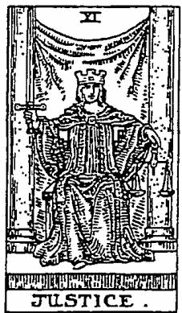
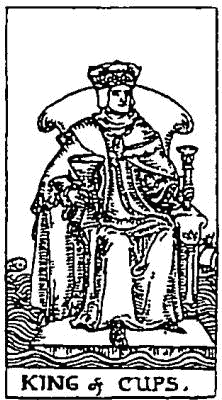
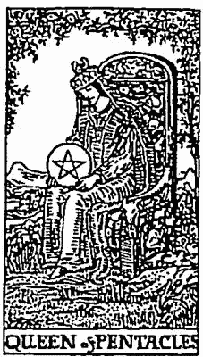
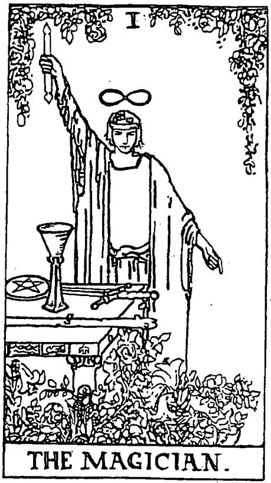
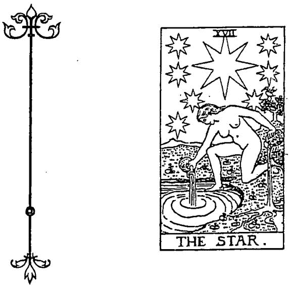
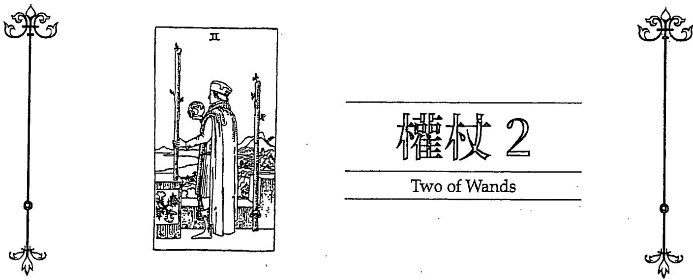
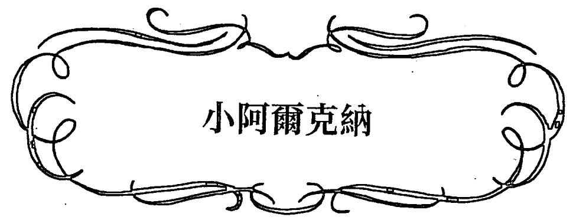
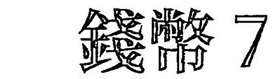
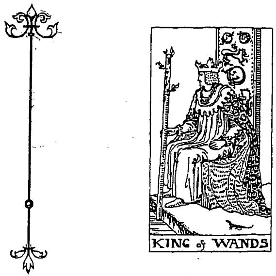
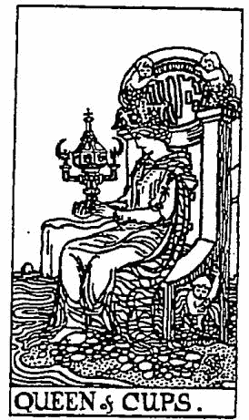

# 塔罗星事

香莉娜

# ASTROLOGY IN TAROT

# 塔羅星事

搞懂星座與塔羅牌的關聯,從占星角度理解自我覺察

# 塔羅與占星,我生活中離不開的良師益友

歡迎你翻開《塔羅星事》,這本書結合了兩頂神秘學工具,一個是塔羅,是由七十八張美麗動人的圖畫所構成,另一個則是由行星排列所形成的一張神祕星圖。它們是我十多年前踏入這個領域後一直離不開的兩項珍寶。

記得第一天到教室學習塔羅課程時,看到牆上貼著一則隔日就要開課的占星課程廣告,當時的我不曉得是什麼原因,不假思索地就報了名,開啟同時學習塔羅與占星之路。如果你問我,這兩個系統會打架嗎?我會毫不猶豫地跟你說:「不會。」但這個肯定的答案卻是我在多年之後才悟出的道理。塔羅牌是圖像式工具,易學難猜;而占星則是由許多符號組成,博大精深,不易入門。透過視覺對圖像式的理解,更進一步在學習占星時,能對這兩個系統有更深一層的認識,這就是本書要闡述的理念。

但是,塔羅與占星結合起來,能做什麼?我認為透過這兩項工具,能達到自我的覺察。就像我常用的一個比喻:我們不一定要像醫生一樣,什麼醫學知識都懂,但跟我們自身相關的議題,一定要理解。你一定要知道吃什麼容易長痘子、過敏,做什麼運動容易拉傷,發生什麼事會讓自己焦慮……這些都要靠自己的覺察才能發現問題的根源,而塔羅與占星正是感知身心靈之祕的兩大絕佳工具。

塔羅牌適合顯現當下事件該如何回應,能在我們抽出牌的時候,告訴我們潛意識的心境,或是要如何面對困難;而占星則是用星象來瞭解人生藍圖,理解自己的個性與特質。這兩項缺一不可的工具要怎麼整合?又該如何自我覺察?這本《塔羅星事》就是我一路學習下來的資訊分享。

出版的同時,很感謝塔羅事典一路陪伴,以及啟蒙老師的帶領,也謝謝商周所有參與朋友給予的支持與鼓勵,當然也要謝謝購買本書的你。感恩!

喬莉娜

# 占星舆塔羅概述

自古以來,塔羅牌和占星學有著密切的關聯,透過本書,期待你能發現其中的奧祕。

少人在生活中會和朋友聊到星座話題。不可諱言地，十二星座永遠是拉近彼此距離的好題材，但想要深入一點研究，似乎不是那麼容易，不僅占星領域要學，而且還有太多太多面向需要研究了。有什麼方法可以不要死記或硬背符號？或許，你可以嘗試與圖像式思考的塔羅牌結合。

相信不少塔羅牌愛好者也對星座有興趣。自古以來，塔羅牌和占星學的發展有著密切的關聯，由於塔羅占卜運用的是圖像式思考，而占星學則從神話故事和天文學來詮釋這個領域，其擁有的星座與行星符號學起來會稍微複雜，若是能夠從塔羅牌中找出和占星學的對應關係，相信會更加有趣。

塔羅牌是比較容易上手的工具，因為是圖像式思考，而且外觀就像撲克牌一樣地讓人熟悉，所以許多人會愛不釋手。但占星就不同了，它不需要隨手拿個工具，就算需要，也是在APP輸入出生年月日後產生出星盤。接下來就要靠自己對星盤的理解來解讀，而這就需要有些許功力，不像塔羅牌還能從圖像中大約理解牌卡是代表失落、痛苦或快樂等，因此會有人覺得和塔羅牌比較起來，占星不容易學習。但是，這也是占星的迷人之處，當你越投入，你就會越發現其中隱藏的內容。

塔羅與占星的組合是非常自然且具有明顯的關聯，因為塔羅牌中的二十二張大牌與占星中的十二星座、十大行星彼此對應。在本書中，我會把過於複雜的術語與歷史剔除或簡化，因為我相信這些資訊在其他書籍中一定會解釋得很詳細，而我想分享的是結合塔羅與占星的面向，先從基礎的必備知識著手，再逐步進入占星學的元素與塔羅牌的牌義介紹，其中的重點就是彼此之間的關聯，再加入解牌與星盤的詮釋技巧。因此，如果對於塔羅牌與占星學都不清楚，你可以把此書當成入門書籍，先把此書熟讀後，再進階參考其他各個領域的專書；若你是塔羅牌的占卜高手，或是星盤的解盤專家，對於書中已熟悉的領域就當成是複習，至於重點可以擺在兩者之間的對應關係。這本書能夠讓塔羅學習者透過與占星的對應更精進解牌技巧，而占星學習者也能夠透過塔羅牌的對應來覺察自己，就像潛入大海深處，找到自己更深一層的意識狀態。透過本書，期待你能瞭解兩者之間的關聯與奧祕。

# 星座是什麼?占星學又是什麼?

大家都知道,只要知道出生年月日就可以得知其星座,而網路與電視上也常有星座運勢的話題,把人區分成十二星座。但是,世界上那麼多人,真的只有分成十二種運勢嗎?相信對星座懷疑或不熟悉的人都會有這種疑問。其實,星座並非簡單地把一年分成十二等分而已,只是因為網路或電視上的運勢分析無法看到你的出生星盤,所以只能大約說出太陽或上昇星座在哪個位置,其運勢如何。故有人說準,有人說不準。

除了太陽之外,還有月亮、水星、金星、火星、木星、土星等,也都同時間在天空中運行,這些行星位置構成一張星盤。而每個人出生的地點不同,經緯度就不同,若是同時間出生,但一人生在臺北,另一人生在美國,雖然行星位置相同,卻因為經緯度有異,造成上昇星座不一樣。所以全世界沒有一個人的出生星盤會和其他人重覆,這和東方命理看時辰的方式有差異。

若更探人解释,就涉及占星術的領域,或稱為占星學、星象學,研究天體運行、相對位置與世事變化所產生的關聯,比一般在網路和電視上看到的十二星座運勢複雜許多,只是媒體上的占星老師為了要讓大眾更容易理解,才將之分成十二等分。

那麼,占星學可以做哪些應用呢?下列舉幾個簡單的例子。★個人占星:利用出生星盤算出運勢與個性。★卜卦占星:利用占卜時間算出目前的決策對不對,或推測遺失的鑰匙在哪裡。★合盤占星:利用兩人的出生星盤,看出和另一半有哪些地方需要調整與謀合。★擇日占星:找出適合的時間,例如為結婚、搬家挑選好日子。

其他還有預知何時可以種玉米、馬鈴薯的農業占星等,甚至可以看國運、經濟。

# 學習占星的四大基

要瞭解上述知識,必須要有四大基礎,分別是星座(Signs)、行星(Planets)、宮位(Houses)與相位(Aspects),這四大基礎構成一張完整的星盤。

# 十二星座

即白羊座、金牛座、雙子座、巨蟹座、獅子座、處女座、天秤座、天蠟座、射手座、摩羯座、水瓶座和雙魚座。出生時,出生點之地平線上所在的星座,就是你的上昇星座。

# 十大行星

由於占星是以地球為中心做研究,因此天空中看到的太陽、月亮、水星、金星、火星、木星、土星、天王星、海王星和冥王星,都統稱為行星。雖然太陽和月亮在天文學中不算行星,而冥王星是否算是行星也一直有爭議,但在占星中還是會用行星來統稱。

# 十二宫位

利用出生地點的經緯度位置,劃分出一至十二個等分,稱為一到十二宮,每個宮位代表不同的領域。

# 相位

當行星和行星彼此呈現特定的角度,就稱為相位。舉例來說,新月時,我們放眼望去,太陽和月亮在同一直線上,就稱為0度合相;而滿月時,地球在太陽和月亮的中間,三者呈現一直線時,以地球的觀點來看,若一個在左,另一個就在右,稱為180度的對分相。

這四項工具是學習占星的核心基礎,若把這四項工具用戲劇的元素來做比

，可以這樣區分：

★行星就像演員：行星就像是劇裡的演員，可以當作行動推展時的力量。每位演員都有各自的角色，有的演員負責演陽光男，有的負責情緒失控女，也有的角色是富商。

★星座類似性格：星座類似是演員的性格，可以當成行動的領域。當演員開始演戲時，會因為演員的性格而有不同的詮釋，因此星座就像是行星如何透過它們而行動的副詞、形容詞。劇場要上演的是場痛苦悲憤戲，而不同的演員對悲情的表達方式就不一樣：陽光男可能會用苦笑或一笑置之的方式來表達；情緒失控女則是哭得淅遲嘩啦，或是表面故作堅強，但內心痛苦；富商則把悲情轉成力量，用過去創業奮鬥時越挫越勇的方式來面對挑戰。

★宮位好比舞臺：宮位就像是戲劇裡的舞臺，是行動發生的場所，如辦公室、街道、住家等不同的場景。場景分成十二等分，每等分代表不同的地點，也是人生中不同的領域。

★相位就是劇本：相位是戲劇裡的劇本情節，是行星與行星之間互動的模式。失控女遇到富商會擦出什麼火花？是產生衝突，還是彼此瞭解、互相愛戀？劇本會清楚寫明。

學習占星最主要的就是先理解上述四個項目，就像數學的加減乘除一樣，所有的占星學知識都由這四個基徒延伸下去。

# 以地球為中心的地心系統

在開始認識占星學之前，我們先來聊聊天文學的概念。我們都知道地球和水星、金星、火星等其他行星會繞著太陽轉，而月亮繞著地球轉，這是以太陽為中心的系統，稱之為「日心系統」。但日心系統是在十七世紀才被瞭解，於此之前，人們一直以為地球是宇宙的中心，而其他星球則繞著地球旋轉，古希臘的托勒密（Claudius Ptolemy）是第一位將地心說模型發展詮釋得較為完善的人，因此「地心系統」又稱為「托勒密系統」。

根據歷史上的記載，第一位懷疑地球不是宇宙中心而提出日心說理論

的是古希臘天文學家亞里斯塔克(Aristarkhos)。之後哥白尼(Nicolaus Copernicus)提倡日心貌模型,以及克普勒(Johannes Kepler)發表行星運動定律後,才慢慢清楚原來地球並不是宇宙的中心,形成天文學和占星學採用完全不同模型基礎的狀況。

為什麼占星學要以地心系統為基礎,而不改用日心系統呢?那是因為我們生於地球上,是用地球的觀點來看事情,就像站在自己的觀點來看外面的世界一樣。占星學所關注的重點,是人和人之間的關係,也就是以自己的角度來看世界,和天文學家研究觀察的重點是整個宇宙不太一樣。因此,我們從電腦上排出來的星盤是以地球為中心,而各行星在天空中運行,運用彼此交織出的軌跡來思考。

# 黃道與十二星座

當我們把地球放在星盤中間時,要如何把地球繞著太陽運行的想法,轉換成太陽繞著地球的方向來思考?想像一下,有兩臺火車停在月臺上,而我們坐在其中一臺火車上,當我們的火車開始發動時,從窗戶上望去,你會發現隔壁的火車好像開始移動了,不過事實上是自己坐的火車開始跑。這就是雖然地球在自轉且繞著太陽轉時,我們並不會感覺到地球在動,而是覺得太陽在移動。

所以,我們可以想像有一個天球,而地球在天球的中間,當我們站在地球上向天空望去,就像是太陽繞著地球一樣,而這個太陽運行的軌道就稱為黃道(Ecliptic)。地球自轉產生的軌跡中,周長最長的圓周線就是我們熟知的赤道。赤道線對應到天球上的圓周,和黃道每年會有兩個交叉點,一個大約是在春分附近,另一個大約在秋分時間。把春分點(Spring Equinox)當作白羊座的0度,並且把黃道的圓周,也就是此圓周的360度,從春分點逆時針算起,每30度給予它一個星座名稱,於是十二星座的位置就被設定出來了。

把十二星座的位置定義好後,就能看出太陽在目前的哪個地方。通常太陽運行至春分點時,大約是三月二十一日左右,這一天的晝夜長短相同,以此當成白羊座的0度,而此時出生的孩子就是個白羊寶寶;若是太陽運行到200度時,這個度數上的星座是天秤座,那麼於此時出生的孩子就是個天秤寶寶了。

相同的方式也可以套用在其他行星上,因為我們是以地球為中心,已經用黃道十二星座規畫出一個圓了,就像座標一樣,看向天空,就可以看到這顆星是在哪個位置,也可以標明它所在的度數。

十二星座是大家最為熟悉的,只要知道你的出生日期,就可以推論出你的星座是什麼。這種由出生日期算出來的星座,嚴格說起來是太陽星座。每個人出生時,從太陽位於黃道十二星座中的位置,可以得知其太陽星座;同樣地,出生時月亮位在哪個星座上,便能得知月亮星座為何。

# 初探七十八張塔羅牌

接下來看看塔羅牌的部分。塔羅牌總共有七十八張,本書是以萊德偉特塔羅牌作為學習的工具,如果你的手上有以偉特系統為架構的塔羅牌就可使用了。

# 三大體系:托特、馬賽、偉特

目前塔羅牌以圖案區分大概會分成三大體系,也就是托特(Crowley Thoth Tarot)、馬賽(Le Tarot de Marseille)與偉特(Rider Waite Tarot)。托特牌的解釋比較偏向心靈層面,在探索心靈方面是個很好的工具,但其牌義和偉特有一點點不同。至於馬賽體系,則是大牌和偉特一樣,但在小牌中會單純以四種花色來代表,也就是權杖8牌就是八支權杖,錢幣10牌就是畫十枚錢幣,和現今的撲克牌圖形類似,看起來不像偉特牌那麼生動有趣,因此較多人會用偉特系列的塔羅牌當作占卜工具。當然,牌的選擇還是依自己喜歡的為主。

如果你是新手,打算買一副塔羅牌來學習,我認為把偉特塔羅牌當作你的第一副塔羅牌,是個很好的主意。它在一九一〇年初首次發行時,隨牌卡附上一本小冊子,作為占卜說明書,當中簡單解釋了塔羅牌的原理及占卜法,因此受到很大的迴響,再加上牌卡圖像含有深厚的神祕學基礎,影響後代世人很大,以致目前市面上的塔羅牌教學書籍亦多以偉特系統為主。而本書在寫作時便是以偉特塔羅牌作為說明與參考的工具。

# 塔羅牌的架構

相信大家都玩過撲克牌,它的牌卡分成數字1到10,以及人物J·Q·K,每種類別又分成紅心、方塊、梅花與黑桃。許多研究學者認為,撲克牌的前身和塔羅牌脫離不了關係,只是塔羅牌的最早用途是像小朋友的教學圖卡一樣,不像現今大部分的人是拿來收藏、占卜或靜心等。

塔羅牌分成兩大類,分別是二十二張大牌與五十六張小牌,大牌又稱為大阿

爾克納(Major Arcana),小牌稱為小阿爾克納(Minor Arcana),也是撲克牌的前身。五十六張小牌中,分成權杖組(梅花)、聖杯組(紅心)、寶劍組(黑桃)與錢幣組(方塊)四組,每組十四張中,依序是數字1至10,以及四位宮廷人物——隨從、騎士、王后與國王。

# 大牌

大阿爾克納的二十二張中,包括代號從0號起始的愚者牌,到21號的世界牌。大阿爾克納在心靈層面上,描述了人的心理過程和意識狀態,並且闡述了生命課題。這二十二張塔羅牌分別和占星學中的十二星座、十大行星相對應(見P22),有些塔羅牌會把8號和11號牌對調,也就是8號是正義牌、11號是力量牌,這在解釋上是沒有影響的。

# 数字牌

數字牌分成火、土、風、水四大元素,每一種元素包含數字1至數字10。如果和星座相對應,十二個星座也包含了這四大元素。

★火元素:展現對行動的驅力,和小牌中的權杖組相呼應,亦與十二星座的白羊座、獅子座、射手座相對應。

★土元素:展現對物質的重視,和小牌中的錢幣組有關聯,亦與十二星座的金牛座、處女座、摩羯座相對應。

★風元素:展現了理性的思維,和小牌中的寶劍組有關條,亦與十二星座的雙子座、天秤座、水瓶座相對應。

★水元素:展現了情感的交流,和小牌中的聖杯組相關聯,亦與十二星座的巨蟹座、天蠟座、雙魚座相對應。

# 宮廷牌

宮廷牌也稱為人物牌,分為四類,分別是隨從、騎士、王后與國王。★隨從:代表不成熟的小孩。

★士:代表青年人。

★王后:代表具有母性特質的人。

★國王:代表成熟穩重的人。

以上對塔羅牌的基本介紹是以大架構的方式呈現,<Chapter 4 塔羅與占星的對應>會仔細探究七十八張牌卡圖形的關鍵意義。

塔羅牌與十二星座、十大行星對應表

<table><tr><td>塔羅牌</td><td>星座</td><td>符號</td><td>符星</td><td>符號</td></tr><tr><td>0 愚者牌</td><td></td><td></td><td>天王星</td><td>坐</td></tr><tr><td>1 魔術師牌</td><td></td><td></td><td>水星</td><td>坐</td></tr><tr><td>2 女教皇牌</td><td></td><td></td><td>月亮</td><td>坐</td></tr><tr><td>3 女帝牌</td><td></td><td></td><td>金星</td><td>坐</td></tr><tr><td>4 皇帝牌</td><td>白羊座</td><td>Y</td><td></td><td></td></tr><tr><td>5 教皇牌</td><td>金牛座</td><td>Y</td><td></td><td></td></tr><tr><td>6 懸人牌</td><td>雙子座</td><td>Ⅱ</td><td></td><td></td></tr><tr><td>7 戰車牌</td><td>巨蟹座</td><td>坐</td><td></td><td></td></tr><tr><td>8 力量牌</td><td>獅子座</td><td>坐</td><td></td><td></td></tr><tr><td>9 隱者牌</td><td>處女座</td><td>坐</td><td></td><td></td></tr><tr><td>10 命運之輪牌</td><td></td><td></td><td>木星</td><td>坐</td></tr><tr><td>11 正義牌</td><td>天秤座</td><td>坐</td><td></td><td></td></tr><tr><td>12 吊人牌</td><td></td><td></td><td>海王星</td><td>坐</td></tr><tr><td>13 死神牌</td><td>天蠟座</td><td>坐</td><td></td><td></td></tr><tr><td>14 節制牌</td><td>射手座</td><td>坐</td><td></td><td></td></tr><tr><td>15 惡魔牌</td><td>摩羯座</td><td>坐</td><td></td><td></td></tr><tr><td>16 高塔牌</td><td></td><td></td><td>火星</td><td>坐</td></tr><tr><td>17 星星牌</td><td>水瓶座</td><td>坐</td><td></td><td></td></tr><tr><td>18 月亮牌</td><td>雙魚座</td><td>坐</td><td></td><td></td></tr><tr><td>19 太陽牌</td><td></td><td></td><td>太陽</td><td>坐</td></tr><tr><td>20 審判牌</td><td></td><td></td><td>冥王星</td><td>坐</td></tr><tr><td>21 世界牌</td><td></td><td></td><td>土星</td><td>坐</td></tr></table>

# 十二星座的分類

回到占星學來看,學習占星首要之務是先將十二星座的順序記起來。如果要將星座歸成兩類,可以採用陽性與陰性二分法,陽性代表的是比較外顯,陰性則是比較內斂。若用季節來區分,又分成啟動(又稱基本、本位或開創)、固定與變動三種模式。若要區分成四類,則是分成火、土、風、水四種元素。如果你已經把十二星座的順序記起來,上述各種區分法對你來說都不難記憶,因為它們完全是按照順序來區別的。

# 星座的二分法——陰陽(Feminine & Masculine)

陽性星座(Masculine Sign)包含了白羊座、雙子座、獅子座、天秤座、射手座及水瓶座六個單數星座。陰性星座(Feminine Sign)則是金牛座、巨蟹座、處女座、天蠟座、摩羯座及雙魚座,也就是十二星座中排列在雙數的星座。

陽性星座有外向、開放的特質,個性較積極、活潑、樂觀,具開創性,而且活動性強;而陰性星座則是相反,較為內向、收斂、拘束,個性較消極、悲觀、守成,也較有耐力。這兩類星座在處理事情的方式上會有一點點差異,陽性星座會較為主動正陰性星座則是會先靜靜地、消極地觀望再行動。

# 星座的三分法——模式 (Mode)

將星座用春、夏、秋、冬四個季節來分,每個季節的第一個月代表啟動開創。第二個月代表固定穩重,第三個月則代表變化異動。將十二星座分成下列三類,能展現出一個人的表現模式、個人風格與態度。

<table><tr><td>學節</td><td>鳳凰星座(巨辰)</td><td>固定星座(國巨)</td><td>鑄制星座(鑄巨)</td></tr><tr><td>春</td><td>白羊座→權杖王后牌</td><td>金牛座→錢幣國王牌</td><td>雙子座→寶劍騎士牌</td></tr><tr><td>夏</td><td>巨蟹座→聖杯王后牌</td><td>獅子座→權杖國王牌</td><td>處女座→錢幣騎士牌</td></tr><tr><td>秋</td><td>天秤座→寶劍王后牌</td><td>天蠟座→聖杯國王牌</td><td>射手座→權杖騎士牌</td></tr><tr><td>冬</td><td>摩羯座→錢幣王后牌</td><td>水瓶座→寶劍國王牌</td><td>雙魚座→聖杯騎士牌</td></tr></table>

啟動星座又稱開創星座、本位星座或基本星座,由於這些星座都是在每季的第一個月,就像農民在每季開始要準備插秧播種,因此帶有開創的特質。

固定星座是在每一季的中間區域,就像農民在播完種後就要努力灌溉,等待農作物成長,因此帶有守成的特質。

變動星座是在每一季的第三個月,農民們除了要採收農作物外,還要準備與思考下一季的農作物,因此帶有變動、適應的特質。

有些書會把啟動星座對應成塔羅牌的國王、固定星座對應成王后,其實這兩種方式都是可以的,只要找出一個好記憶的方式即可,如果你以前學習的與本書不同,請用自己的方式來解讀這個關聯。

# 敲動星座（Cardinal）：白羊座、巨蟹座、天秤座、摩羯座

啟動星座的人熱切、有野心、熱忱、獨立、心思快捷，但不容易满足，做事也较極，就像是個創業家，做什事情都很主動。

若將這四個星座想像成具有領導型性格的創業家，白羊座探取的是身先士卒的行動式領導風格，也就是我先做好給你看；巨蟹座則是採家庭式的領導，對自己人與外人探取不同的領導法；而天秤座採用的是合理型領導，凡事要符合規章與道理；摩羯座則是務實型計畫領導，任何事都要有完美的計畫。

<table><tr><td>興型</td><td>星座</td><td>對應將種類</td><td>圖示聯想</td><td>性格聯想</td></tr><tr><td>陽性
火象星座</td><td>白羊座</td><td>W
THE EMPEROR</td><td>皇帝牌：領導
白羊座具有勇氣與信心，在行動上能展現意志，就像皇帝牌，以積極的態度領導著所有人民，身先士卒地開疆闢土。</td><td>一馬當先型</td></tr><tr><td>陰性
水象星座</td><td>巨蟹座</td><td>W
THE CHARIOT</td><td>戰車牌：勝利
巨蟹座具柔軟與纖細的內在，為了取得安全感，會將自己包在硬殼中，就像戰車牌，協同代表智慧與力量的人面獅身，用保護家人般的領導風格來爭取勝利。</td><td>保護領導型</td></tr><tr><td>陽性
風象星座</td><td>天秤座</td><td>W
THE CHARIOT</td><td>正義牌：平衡
天秤座講求的是協調與公平，在領導風格上講求理性與公正。就如同正義牌，行事不能有任何偏頗，做任何事一定要先評估再做。</td><td>協調評估型</td></tr><tr><td>陰性
土象星座</td><td>摩羯座</td><td>W
THE DEVIL</td><td>惡魔牌：欲望
摩羯座一生追求至高無上的權力頂峰，而要達成頂尖成就必須計畫完善，就如同惡魔牌，知曉欲望無窮，故要慎重規畫。</td><td>慎重計畫型</td></tr></table>

# 固定星座（Fixed）：金牛座、狮子座、天螺座、水瓶座

固定星座的人專注：意志力強、穩定、眼光遠大、記憶力好、洞察力佳，但較為頑固，像是守成的企業家，其堅強的持續力是穩固的基礎。

若將這四個星座想像成具有組織型性格的老闆，金牛座探取的是給予獎金利潤的方式來代領團隊；獅子座則是採用指揮的方式來領導，用發號施令、出一張嘴來叫員工做事；天蠟座則是用團隊效忠型的領導方法，會用私下小團體的方式來帶領；而水瓶座打的是群體戰，利用團隊合作來完成工作。

<table><tr><td>類型</td><td>星座</td><td>國際跨國界</td><td>國民聯想</td><td>個體聯想</td></tr><tr><td>陰性
土象星座</td><td>金牛座</td><td>天蠟座</td><td>教皇牌：援助
金牛座穩守在自己的領域中，追求安定與滿足，就像教皇牌駐守在教堂，援助需要心靈與物質提升的人，有時也會為了宣揚教義而在物質上施惠幫助。</td><td>利益誘惑型</td></tr><tr><td>陽性
火象星座</td><td>獅子座</td><td>天蠟座</td><td>力量牌：勇敢
獅子座具有創造力，藉由光芒四射的生命力來展現自我，就像力量牌，用特別的技巧與方法來發號施令，指引他人展現雄心。</td><td>發號施令型</td></tr><tr><td>陰性
水象星座</td><td>天蠟座</td><td>天蠟座</td><td>死神牌：結束
天蠟座具有穿透強烈情感的轉化力量，就像帶有毒刺的蠍子，只要被其刺傷，就無法逃過一劫。如同死神牌，在萬事萬物中謹守生生不息之理，用以轉化與解放。</td><td>宣誓效忠型</td></tr><tr><td>陽性
風象星座</td><td>水瓶座</td><td>天蠟座</td><td>星星牌：希望
水瓶座具有獨特的想法，能引領大眾走向未知，就像是星星牌，透過熠熠星光傳遞希望，集合點點繁星之力，成就眾人之事。</td><td>群體同儉型</td></tr></table>

# 變動星座（Mutable）：雙子座、處女座、射手座、雙魚座

變動星座的人多才多藝、善於變通、心思細膩、適應力強，但較缺乏恆心，像個協調家，善於調整與變動，比較靈活。

若將這四個星座想像成具有溝通型性格的主管，雙子座是靈活、愛出主意、有想法的主管，但也常常變來變去；處女座細心、分析力強，不僅要求結果正確，連處理的過程都必須符合要求；射手座採用冒險而有變化的領巖風格，善用拓展、開發來帶領大家前進；而雙魚座則是既感性又溫暖，用溫情來帶領團隊。

<table><tr><td>興興</td><td>星座。</td><td>對應將羅牌</td><td>圖示聯想</td><td>性格聯想</td></tr><tr><td>陽性
風象星座</td><td>雙子座</td><td>THE LOVERS.</td><td>戀人牌：結合
雙子座靈活多話，能善用當下的覺知，以言語表達與旁人的關係。就像是戀人牌一樣，能對周遭表現出親切、友好及充滿好奇的心態，具備善於結合、交談的伶俐品質。</td><td>能言善道型</td></tr><tr><td>陰性
土象星座</td><td>處女座</td><td>THE HOMME.</td><td>隱者牌：指引
處女座心思細膩，具有細微的分辯力，諷遜且會自動自發幫助他人，提供需要的服務。猶如隱者牌一樣，指引他人走向正確的道路。</td><td>缜密細心型</td></tr><tr><td>陽性
火象星座</td><td>射手座</td><td>THE MERCHANT.</td><td>節制牌：淨化
射手座具有冒險的精神，對於理想具有深度的渴望，能結合周遭許多法則，來達到心靈提升，就如同節制牌，和周遭人事物用交流淨化的方式來傳達理念。</td><td>冒險變化型</td></tr><tr><td>陰性
水象星座</td><td>雙魚座</td><td>THE MOON.</td><td>月亮牌：不安
雙魚座是理想主義者，具有靈敏、感性、脆弱的特質，就像月亮牌，能在旁人心情不穩定時給予溫暖的建議，提供療癒心靈的力量。</td><td>情感溫暖型</td></tr></table>

# 星座的四分法——元素（Element）

将十二星座按照四大元素（土、火、風、水）分類，每一類包含三個星座，如下表所示。

火元素代表的是内在的意志力，轉化成外在動機的行動需求，具有想要給予其意義的渴望。火元素對應的權杖1牌，是行動與開創的開始。

土元素代表的是内在的感官知覺，轉化成向下扎根的具體需求，具有想要落實其價值的渴望。土元素對應的緣1牌，是將想法物質化的開始。

風元素代表的是心智的理解能力，轉化成溝通交流的連結需求，具有想要建立其概念的渴望。風元素對應的實劍1牌，是心智與挑戰的開始。

水元素代表的是情感的感受反應，轉化成情緒層面的互動需求，具有想要建立愉悅感的渴望。水元素對應聖杯1牌，是人際關係與直覺的開始。

火、土、風、水四種元素各自包含了啟動、固定、變動三種星座。

<table><tr><td>元素°</td><td>閤應瑤星座°</td><td>閤動星座°</td><td>閤恒星座°</td><td>閤動星座°</td></tr><tr><td>火象星座</td><td>權杖1牌</td><td>白羊座</td><td>獅子座</td><td>射手座</td></tr><tr><td>土象星座</td><td>錢幣1牌</td><td>摩羯座</td><td>金牛座</td><td>處女座</td></tr><tr><td>風象星座</td><td>寶劍1牌</td><td>天秤座</td><td>水瓶座</td><td>雙子座</td></tr><tr><td>水象星座</td><td>聖杯1牌</td><td>巨蟹座</td><td>天蠟座</td><td>雙魚座</td></tr></table>

# 火象星座（Fire）：白羊座、狮子座、射手座

火象星座的人都比较積極主動，是有自信卻沒耐性的一群。對應的塔羅牌是權杖1牌。通常會表現出某種追求領導地位的欲望，脾氣有時火爆，但也反映出高昂的力量與率真的個性，性格熱情、果斷、自信、率性而天真，是比較熱情的一群。

★缺乏火象元素的人，就像逆位的權杖1牌，缺乏衝勁或活力不足，亦容易缺乏熱情。

<table><tr><td>龜型</td><td>星座</td><td>對應塔羅牌</td><td>圖示聯想。: 
。 
。 
。 
。 
。 
。 
。 
。 
。 
。 
。 
。 
。 
。 
。 
。 
。 
。 
。 
。 
。 
。 
。 
。 
。 
。 
。 
。 
。 
。 
。 
。 
。 
。 
。 
。 
。 
。 
。 
。 
。 
。 
。 
。 
。 
。 
。 
。 
。 
。 
。</td><td>元素類類</td></tr><tr><td>陽性
啟動星座</td><td>白羊座</td><td>龍神</td><td>權杖王后牌
白羊座的能量能夠投注在個人的解
新經驗中,行動偏向自我的確立,
就像手中的熊熊火把,以自我為中
心,而行掌風格如同權杖王后般直
接、率真、直覺。</td><td>熊熊火把型</td></tr><tr><td>陽性
固定星座</td><td>獅子座</td><td>龍神</td><td>權杖國王牌
獅子座熱情且渴望受到大眾肯定,
為了保持活力,常常展現出戲劇
化的誇張氛圍,因此就像營火晚
會裡的大營火,透過眾人圍繞,
綻放王者之姿,展現如同權杖國
王般的穩重與作為。</td><td>營火圍繞型</td></tr><tr><td>陽性
變動星座</td><td>射手座</td><td>龍神</td><td>權杖騎士牌
射手座精力旺盛、感情外顯,會
不斷驅策自我朝理想邁進,就如同權杖騎士,對於理想與信仰,
能持續地往外傳遞,率真地將目標向外擴張,就像野火竄燒一般。</td><td>野火亂竄型</td></tr></table>

# 土象星座（Earth）：摩羯座、金牛座、虚女座

土象星座的人實際、重視感官，但是較固執己見，通常會表現出務實、安定的特質。重視物質條件和感官享受，性格實際、獨立、保守，是較為實際的一群。缺乏土象元素的人，就像逆位的錢幣1牌，缺乏穩定或不切實際，亦容易說得多、做得少。

<table><tr><td>龜型a。</td><td>星座</td><td>對應塔羅牌</td><td>圖示聯想</td><td>元素聯想</td></tr><tr><td>陰性
啟動星座</td><td>摩羯座</td><td>金牛座</td><td>錢幣王后牌
摩羯座可靠又值得信任，行事得體，喜歡用有條不紊的方式來處理問題，就像峻嶺高山，在更壯麗雄偉之前必須一步一腳印地累積經驗，亦如同錢幣王后般，緩慢而有條理地累積財富。</td><td>峻嶺高山型</td></tr><tr><td>陰性
固定星座</td><td>金牛座</td><td>金牛座</td><td>錢幣國王牌
金牛座穩定保守，有耐心，喜歡與人為善，性格溫厚，而且堅持自己的行事步調，就像頑固的岩石，不喜歡別人逼迫他們加快腳步，亦如同錢幣國王般，固守自己既有的資源而不受外界動搖。</td><td>岩石頑固型</td></tr><tr><td>陰性
變動星座</td><td>處女座</td><td>金牛座</td><td>錢幣騎士牌
處女座謙遙且善於處理細節，亦討厭掌權做決定，他們證明自己價值的方法就是努力工作，就像農夫每天辛苦地翻整土地，亦如同錢幣騎士，透過為周遭環境提供服務而提升自我價值。</td><td>翻整耕地型</td></tr></table>

# 風象星座(Air)：雙子座、天秤座、水瓶座

風象星座(Air)：雙子座、天秤座、水瓶座風象星座的人理性、重視思考，能客觀看待人事物，但是比較冷漠，擁有智慧與邏輯頭腦，表達能力強，善於交際、演講及說服，是非常理性的一群。★缺乏風象元素的人，就像逆位的寶劍1牌，缺乏理性或想象力，亦容易有死板的特質。

<table><tr><td>團型</td><td>圓座</td><td>對應塔羅牌</td><td>圓示聯想</td><td>元素聯想。</td></tr><tr><td>陽性
啟動星座</td><td>天秤座</td><td>天秤座會利用平衡和諧的方式來實現自我，表面上公正、圓滑，就如同季節西風，會隨著外界局勢來塑造情勢，亦如同寶劍王后，雖然理性、專業、具公正形象，但仍有一點點柔性特質。</td><td>季節西風型</td><td></td></tr><tr><td>陽性
固定星座</td><td>水瓶座</td><td>水瓶座會用平衡和諧的方式來實現自我，表面上公正、圓滑，就如同季節西風，會隨著外界局勢來塑造情勢，亦如同寶劍王后，雖然理性、專業、具公正形象，但仍有一點點柔性特質。</td><td>狂大颺風型</td><td></td></tr><tr><td>陽性
變動星座</td><td>雙子座</td><td>雙子座會用平衡和諧的方式來實現自我，表面上公正、圓滑，就如同季節西風，會隨著外界局勢來塑造情勢，亦如同寶劍王后，雖然理性、專業、具公正形象，但仍有一點點柔性特質。</td><td>風向變化型</td><td></td></tr></table>

# 水象星座(Water):巨蟹座、天蝶座、雙魚座

水象星座的人浪漫、重感情,但不切實際,比較憑感覺行事,心思細膩、敏感而情緒化,是較為感性的一群。

★缺乏水象元素的人,就像逆位的聖杯1牌,缺乏感性或過於情緒化,有時會不太想照顧周遭的人,讓人感受不到深刻的情感。

<table><tr><td rowspan="2">轉型。 
陰性
啟動星座</td><td rowspan="2">星座
巨蟹座</td><td>鐵座塔羅牌</td><td>圖示聯想</td><td rowspan="2">元素聯想
大海潮水型</td></tr><tr><td>KING &amp;amp; CURS</td><td>聖杯王后牌
巨蟹座擁有母親般的滋養包容與保護他人的同理心,對情感的交流就如海水般的敏感、廣大,亦有自我保護的本能,就像聖杯王后般,舉止謙遜,並願意接納他人,保持如家人般的友好關係。</td></tr><tr><td>陰性
固定星座</td><td>天蝶座</td><td>KING &amp;amp; CURS</td><td>聖杯國王牌
天蝶座會用強烈的情感來對待周遭的人事物,只是這樣熱切的欲望就像神祕湖泊般,表面風平浪靜,但內在波濤洶湧,亦如同聖杯國王,內心擁有熱情與深厚的控制力量,卻在平穩外表的保護下偷偷綻放。</td><td>神秘湖泊型</td></tr><tr><td>陰性
變動星座</td><td>雙魚座</td><td>KING &amp;amp; CURS</td><td>聖杯騎士牌
雙魚座看似沒什麼殺傷力,也沒什麼主見,就如河水被攪動而掀起波瀾。雙魚座也容易跟著外界的喜怒哀樂起舞,亦如同聖杯騎士,具有超凡脫俗的魅力,並會適時給予他人溫暖與夢想。</td><td>隨波逐流型</td></tr></table>

# 太陽星座與塔羅牌的對應

前六章的尾聲都有一個棘習,逐步带领大家利用關鍵詞語來探索內在心事,你可以跟著Q先生一起來完成。提筆寫時,完全不用拘泥語句通不通順、文字流不流暢,只要找到跟自己有關、相對應的塔羅牌,就可以靜下心來書寫。這種療癒書寫的練習,只要抽空持續不斷地進行,就能夠透過出生星盤與塔羅牌,覺察到自己生活中一直跨不出去、走不出來或焦慮恐懼的盲點,並且找到自己的特點與專長。若是有靜坐冥想習慣的朋友,可以在找到對應的內容後,先靜心約十分鐘左右,再開始提筆寫下。第一個練習,請從塔羅牌中找出與星座對應的兩張牌。

第一個練習,請從塔羅牌中找出與星座對應的兩張牌。

舉例來說,Q先生(星盤請見P356)是一位剛開始接觸塔羅牌與占星的人。他的太陽星座是水瓶座,而和水瓶座有關的塔羅牌是星星牌與寶劍國王牌,以下是Q先生自己在塔羅牌與占星所看到的衍生關鍵詞語,進而寫下來的塔羅星(心)事。

# $①$  塔羅角度  $①$

我是1996/2/16下午1:30出生的水瓶座,我從塔羅牌中抽出了兩張跟這個星座有關的牌,分別是「星星牌」與「管劍國王牌」。

★滿天皇空的星星牌

星星牌中的關鍵詞是「希望」,性格聯想是「群體同儕型」,從牌裡我看到有個深穿衣服的女人,提了兩壺小倒在地上,我想這可能是我內心一直想要把自己的不安倒掉,然後給旁邊的人希望吧!就像我新買的這副塔羅牌,雖然還無法理解牌義,但一拆開這副牌就急著跟旁人分享。

# ★看似專業的管劍國王牌

★看似專業的管劍國王牌但管劍國王這張牌,看起來就嚴肅許多,國王代表「成熟穩重的人」,元素聯想是「狂大賬風型」,但其實我自認不夠穩重,只是會想要隱藏內心不安,而故意保持自己穩重的樣子,而且我喜歡一群人一起出去玩,我的一群朋友都是像體行動的,看起來聲勢浩大。但也因為這樣,我認識了不少打工、學校等不同領域的人。我想,這應該有像書裡所提到的狂大賬風吧!

# ?占呈角度?

小瓶產是「陽性」、「固定」模式與「風象」元素。

★外向的陽性性質

★外向的陽性性質陽性性質代表主動、積極。我平時還滿懶的,但對於周遭看不慣的事情,會有一股衝動,覺得該說就要說,這大概就是主動的表現吧!

★固定的表現模式

★固定的表現模式固定星座一成不變,不喜歡接受變化,我覺得……還好呀!因為我也喜歡接受改變。若是不好的事,改變是有必要的,但已經是對的事,就不需要改呀!

★理性的風象元素

★理性的風象元素風象星座理性。這點我很贊同,我自認超級理性的。

# 黃道十二星座

我們不能直接以星座去定義一個人，而是透過關鍵詞來強化形容其表現方式，因為星座只是個形容詞，它不是主角。

黄 垣 二星座卷分點始，逆時針方向依序是白羊座丶金牛座丶雙子座丶巨蟹座丶狮子座丶處女座丶天秤座丶天虫座丶射手座丶摩羯座丶水瓶座和雙鱼座，每個星座是30度，所以十二個星座總共有360度。瞭解十二星座的顺序能加速學習。此外，星座的符號丶特質，以及各星座分别對應的大牌和宫廷牌，也都是本章要介绍的重點。

在這裡，有個地方需要先釐清，那就是關於星座的日期。有些人可能會覺得納悶，為什麼在報章雜誌中看到的星座日期會有一些差異？或是有的人會質疑，我的生日是八月二十三日，為什麼這裡寫的是處女座，而別的書上寫的是獅子座？如果大家還記得上一章提到的春分點定義，就應該知道表上的日期只是個概約，若要確實知道哪一天是什麼星座，必須透過精密的計算，同樣是八月二十三日，可能在這個時間點上，太陽是在獅子座的29度59分，但下個時間就跳到處女座的0度，因此出生時間可能只差了一分鐘，但一個是獅子座，另一個卻是處女座。因此，出生日期在星座邊界的朋友，最好的方式是上網查詢。

十二星座與塔羅牌對應表  

<table><tr><td>星座</td><td>回期</td><td>符號</td><td>對照的大牌</td><td>唱聽的信題牌</td><td>備注。</td></tr><tr><td>白羊座</td><td>3/21～4/20</td><td>γ</td><td>皇帝牌</td><td>權杖王后牌</td><td>牡羊座</td></tr><tr><td>金牛座</td><td>4/21～5/20</td><td>δ</td><td>教皇牌</td><td>錢幣國王牌</td><td></td></tr><tr><td>雙子座</td><td>5/21～6/20</td><td>Ⅱ</td><td>戀人牌</td><td>寶劍騎士牌</td><td></td></tr><tr><td>巨蟹座</td><td>6/21～7/21</td><td>♂</td><td>戰車牌</td><td>聖杯王后牌</td><td></td></tr><tr><td>獅子座</td><td>7/22～8/22</td><td>♂</td><td>力量牌</td><td>權杖國王牌</td><td></td></tr><tr><td>處女座</td><td>8/23～9/22</td><td>Ⅷ</td><td>隱者牌</td><td>錢幣騎士牌</td><td>室女座</td></tr><tr><td>天秤座</td><td>9/23～10/22</td><td>♂</td><td>正義牌</td><td>寶劍王后牌</td><td></td></tr><tr><td>天蠟座</td><td>10/23～11/22</td><td>Ⅷ</td><td>死神牌</td><td>聖杯國王牌</td><td></td></tr><tr><td>射手座</td><td>11/23～12/21</td><td>♂</td><td>節制牌</td><td>權杖騎士牌</td><td>人馬座</td></tr><tr><td>摩羯座</td><td>12/22～1/19</td><td>γ。</td><td>惡魔牌</td><td>錢幣王后牌</td><td>山羊座</td></tr><tr><td>水瓶座</td><td>1/20～2/18</td><td>♂</td><td>星星牌</td><td>寶劍國王牌</td><td>寶瓶座</td></tr><tr><td>雙魚座</td><td>2/19～3/20</td><td>♀</td><td>月亮牌</td><td>聖杯騎士牌</td><td></td></tr></table>

# 概黄道十二星座

十二星座都有其正面特質,也有其負面特性,就像塔羅牌有分正逆位一樣,但星座的正面與負面特性不完全以塔羅牌的正逆位方式來解讀。有學過塔羅牌而剛接觸占星的朋友,可以先從塔羅牌的基本牌義來做對應。

十二星座的順序,若用「物極必反」、「否極泰來」的思維來解釋,會比較好記憶。白羊座是個頒頭羊,做什麼事都衝太快;物極必反的結果就是要像金牛座,做事一定要慢,想好再做;想太久的結果,物極必反之後就是像雙子座一樣,思維快速又靈活;但靈活過度,一直往外跑,就覺得還是像巨蟹座顧家一點好;顧家顧到整天窩在家也不行,物極必反就會像獅子座一樣,來點花樣,玩樂多一點吧!但花費多、排場多的結果,還是需要處女座來精打細算、仔細分析,並注重小細節;但追求完美太過嚴格,物極必反到天秤座時,認為人生該要公平一些,萬事要考慮周全才行,而不是只著重在小地方;到了天蠟座時,卻覺得還是別考慮太多,為什麼要想那麼多?實在太累了,倒不如掌控性高一些,才能把事做好;射手座倒覺得為何要像天蠟座那麼執著,樂觀知命、追求成長才是人生該有的態度;摩羯座卻認為每天都在追求靈性成長,倒不如刻苦耐勞地追求權力才重要;水瓶座卻不以為然,物質世界怎麼能跟世界大同比;雙魚座的物極必反則是認為博愛的最終目的不是尋求外在的一致,而是內心深處的和平。這十二個星座的每一個特質到了下一個星座時,都會有強烈的反差,也成了有趣的現象。

在記憶星座特質的時候,有時需要將對面星座的特質納入參考。生活中有時會發現,這個人的某些特質和他的星座南轅北轍,例如:明明是處女座,做事非常井然有序,但他在處理某些事務上卻又不是那麼俐落,總有點凌亂、沒頭緶的感覺,好像雙魚座迷糊特質上身;或是明明是居家好男人形象的巨蟹座,在工作上卻野心勃勃,完全把升遷、求官職當作一件重要的事。每個星座或多或少都有對面星座的特質,我會把這種特質稱為「過度補償」,也就是「你所不熟知的星座」。通常來說,若有行星是屬於逆行的狀態,就容易會有補償行為出現。為

什麼會有如此對立或衝突的狀況呢？這是因為每個星座的基本特徵雖然已牢牢穩固，但也是其表現時所出現的最大障礙，故有時會出現一些相反的行為模式，表現出和他們原特質完全相反的傾向。大家可以細細觀察周遭朋友，是否有如此反常的狀況，你會發現，這些有趣的現象也就是對立產生的拉鈕，偶爾會出現在生活中。

另外，研究星座特質時也可以將神話故事的原型和季節因素考慮進去，例如：★雙元星座：雙子座丶處女座丶射手座丶雙魚座

這四個星座都處於季節變換之時，因此環境會處於一個面臨變化的狀態。

四足星座：白羊座丶金牛座丶狮子座丶射手座丶摩羯座

這個星座在神話故事中都是具有四复和默類特質的星座，因此在交流上也

呈現较真實、不修飾的樣貌。

★類人星座：雙子座丶處女座丶射手座丶水瓶座丶天秤座

基本上，這個星座在群體中會較友好丶易溝通。

以上這些分類都是星座有趣的地方，但在這裡我們暫不探討這些分類，而是把重點擺在星座關鍵詞，以及與塔羅的相關對應。不管是透過塔羅來進入占星領域，或是直接進入占星殿堂來學習，都要理解這些關鍵詞的分類。但我們不能直接以星座去定義一個人，而是透過這些關鍵詞來強化形容其表現方式，因為星座只是個形容詞，它不是主角。我們無法鐵口直斷：你是處女座，所以你個性龜毛；你是天秤座，所以你有選擇障礙。因此，請先熟悉十二星座的分類與特質，但不能光憑本章就去定義一個人。當你在後面章節中讀到這樣的敘述：「白羊座特質重的人……」指的是有很多行星在白羊座而容易出現的表現模式，但他不代表全部的白羊座。每個人的意志，都是透過這些關聯對我們的生活產生影響，進而建構出人生的生命藍圖，這就是占星有趣的地方。

當太陽到達黃經0度時,陽光直射赤道上方,南北半球受光相等、晝夜平分。萬物都在開始,春天不就是個百花齊放的季節?這時候,萬事萬物都在一年的起頭階段,農夫忙著準備耕種,行動力很強,也很忙線,家家戶戶都在想著如何在春天這個好季節裡做更多的事,因此白羊座的人都有快速的特質,做什麼事都要跑第一,是個行動力非常足夠的火象星座,也由於是春天的第一個月,因此有開創的特質。

白羊座特質重的人喜歡第一,因此很容易將活力感染給他人。團體中若有一個人帶頭,就很容易激勵其他人一起行動,但這種領頭羊的角色並不表示就一定要當團隊的領導者。白羊人也喜歡模仿,但這種模仿並不是原封不動地拿過來學習使用,而是「別人有,我也要有」的想法,就好像弟弟總是會說:「為什麼哥哥有,我沒有?我也要！」有趣的是,他並不是真的很需要這樣東西,而是這個東西或這件事「我也有參與或投入」的感覺。

白羊座的符號是一個山羊角和鼻梁形狀,也像剛長出來的幼苗或新芽一樣。許多白羊人的上進心都很強,有時難免衝動,忽略他人的感受,以自己為中心。星座句訣是:我是(I am)。

# 白羊座神話:宙斯送羊助苦難兄妹脫離險境。

後母依諾非常不喜歡佛里克索斯和赫勒兩兄妹,時常虐待,並惡言相向,還計畫殺死他們。親生母親涅斐勒知道後,祈求宙斯幫忙,於是宙斯送給兩兄妹一隻裝上翅膀的羊,讓他們能飛上天空來脫離險境,但飛行途中妹妹赫勒卻不慎跌落而死掉,只有哥哥逃離成功。這隻能夠協助兄妹脫離險境的羊,就是白羊座的神話由來。

# 白羊座對照牌：皇帝牌

在皇帝牌中，皇帝坐的椅子上就有很明顯的兩個公羊圖形。皇帝是位領導者，有遠見、有自信又有勇氣，愛好冒險，行事果決且堅強。有時個性有點急，有時又不知變通。因為是皇帝，是至高無上的首領，他會主動帶領大家勇往直前，開展全新的局面，這和白羊座是第一個星座有關聯。皇帝牌中的自信、果斷、領先，能對應出白羊座的特質。

皇帝牌中的自信、果断、领先，能對應出白羊座的特質。

# 白羊座呼應牌：權杖王后牌

白羊座呼應的塔羅牌是權杖王后牌。白羊座表面上看起來溫和，但實際上是有點躁的，在堅強的外表下，其實有一顆脆弱而柔軟的心。白羊座的火象、啟動、陽性星座特質，在面對事情時總能主動積極跑第一。就像權杖王后一樣，不遲疑，不拖泥帶水，坦率地面對一切。權杖王后牌中的坦率、真誠、積極，能呼應出白羊座的特質。

權杖王后牌中的坦率、真誠、極，能呼應出白羊座的特質。

<table><tr><td>日期</td><td>03/21~04/20</td></tr><tr><td>符號</td><td>Y</td></tr><tr><td>寶應塔羅牌</td><td>皇帝牌、權杖王后牌</td></tr><tr><td>節余對應</td><td>春分、清明至穀雨前</td></tr><tr><td>星座對應的考體部位。</td><td>頭</td></tr><tr><td>守護星</td><td>火星</td></tr><tr><td>關聯速記。</td><td>皇帝牌→首領、第一，座椅上有個公羊的裝飾
白羊座→第一個星座</td></tr></table>

# 你所不熟知的白羊座

白羊座對面的星座是天秤座。當白羊座的皇帝牌遇上天秤座的正義牌,所有的威權都要遵循律法,不再是皇帝說了就算,而是要按照國家的規定來走,威權不再。因此你會發現,有些白羊座的人有自己一套想法,卻又想要在律法之間取得利益。大部分的白羊座會為了一些私利而說謊,那是因為他以自我為中心,較為自私的緣故,但他們不善於自圓其說,謊言很容易被拆穿,幸好被拆穿時又勇於承認,就像皇帝也該遵守法律,但有時會為一己之私想要跨過法律界線一樣。白羊座的性格如果發揮得好,就會應用在果斷與活力上;但若發揮得不好,就會過於衝動。

白羊座的性格如果發揮得好,就會應用在果與活力上;但若發揮得不好,就會過於衝動。

白羊座的我,充滿活力,但不過於衝動。

# 白羊座的關鍵詞

★優點:企圖心、開拓、開創、突破、先鋒、冒險精神、新鮮、純真、坦率、有幹勁、活力

★缺點:衝動、自私、好鬥、粗枝大葉、不細心、衝動、爭執、好鬥、三分鐘熱度、爭先的

當春天的第一個月忙著插秧、栽種後,第二個月就是每天像牛一樣辛勤工作、悉心灌溉,只為了後續能夠採收豐碩的果實,所以金牛座的人都有一股穩定的耐力,保守地朝目標前進,為確保農作物能夠收成,不斷努力再努力,不像白羊座那麼急性、衝動,只會墨守成規地照規定來,但有時會只執著在豐厚的種植上,而不曉得變通。

金牛座特質重的人,通常不會想改變生活方式,因為金牛人會覺得現在這樣就很好呀!為什麼要改變呢?如果在團體或家庭中,大夥沒有計畫就臨時說要去哪裡玩,金牛人一定會小抓狂,即使要去的那個地點是他想去的。抓狂的原因並不是他不想去,而是認為原本預計要做的事被打亂了。金牛座固定、土象星座的特質,讓一般人覺得他很固執,但對於金牛人來說,穩定或照著原本的規畫走才是真理。

金牛座的符號是一個圓形牛頭加上角的形狀。古代利用牛來耕種,因此也象徵了豐富的收成。星座句訣是:我有(I have)。

# 金牛座神話:宙斯變身雪白金牛吸引歐羅巴

風流的宙斯喜歡上一名美少女歐羅巴,但又害怕善於嫉妒的天后赫拉知道,於是將自己變成一頭長著透明牛角的公牛,來吸引歐羅巴。歐羅巴對這頭雪白又閃閃發亮的大公牛著迷不已,當歐羅巴爬上公牛的背上,變成公牛的宙斯帶著她飛過了愛琴海,來到一座小島上後,才變回人形,兩人在小島上過著快樂的日子。這頭美麗的公牛就是金牛座的神話由來。

# 金牛座對照牌：教皇牌

金牛座對應的塔羅牌是教皇牌，兩者的特質都很溫和，靜靜地瞭解局勢，並且眼光放得較遠，再加上都屬於保守派，認為如果現況過得不錯，何必冒險追求新事物。這種保守又不急不徐的個性，做任何事不會只看眼前，比一般人想得更遠，沒有十足把握，不會任意出手，因此許多人對金牛的印象都是固執而不懂變通，那是因為他們還在評估事情是否符合經濟效益。金牛人和教皇牌對「豐盛」都有自己獨特的一番見解，教皇牌的豐盛是將眼光放在靈性追求，但金牛座則是放在未來物質與財富的舒適上。教皇牌中的豐盛追求、保守，能對應出金牛座的特質。

教皇牌中的豐盛追求、保守，能對應出金牛座的特質。

# 金牛座呼應牌：鐵國王牌

金牛座呼應的塔羅牌是鐵幣國王牌。金牛座的固定、土象、陰性星座特質，使他們將眼光全部放在對物質豐盛的滿足上。對他們來說，成功取決於賺了多少錢，因此會努力工作來換取富有後的安全感。就像鐵幣國王一樣，手上拿著一枚大大的金幣，而眼光也望著這枚金幣，心裡充滿了滿足與穩定。

鐵幣國王牌中的穩定、擁有、價值保存，能呼應出金牛座的特質。

<table><tr><td>日期</td><td>04/21～05/20</td></tr><tr><td>街號</td><td>8</td></tr><tr><td>對應塔羅牌</td><td>教皇牌、錢幣國王牌</td></tr><tr><td>節氣對應</td><td>穀雨、立夏至小滿前</td></tr><tr><td>星座對應的身體部位</td><td>頸部、肩膀</td></tr><tr><td>守護星</td><td>金星</td></tr><tr><td>關聯遠記</td><td>教皇牌→保守、溫和
金牛座→穩定、有耐性</td></tr></table>

# 你所不熟知的金牛座

金牛座的對面是天噬座。當金牛座的教皇牌遇上天噬座的死神牌,管你是什身分或角色,所有的人終將接受最後的老、病、死。許多金牛座的人掌控欲很高,因為對他來,所有身的人事物都是財產,而他們也相當有耐性,給人一種重、踏實、可靠的觀感,但有時喜歡炫耀的個性會旁人受不了,再加上又不喜歡别人的批與建,故人有固、固執的感覺,就像是教皇牌一樣,想法過度保守,然溫和、友善、值得信賴,但古板而不知變通。許多金牛座的人對於金非常敏感,導致人覺得他很愛,但不可否地,金牛座在追求物質生活上總是不遣餘力。

金牛座的性格如果發得好,就會應用在增加產能上;但若發得不好,就會於唯物主義。

金牛座的我,穩定,但不固執。

# 金牛座的關鍵詞

★優點:有主見、意志堅定、有耐心、責任感、可信賴、實際、可靠、具商業頭腦

★缺點:保守、抵抗、缺乏應變能力、懶惰、自我放縱、固執、頑固、倔強、任性、物欲、貪婪、享受

當春天種下的植物長出果實,就要準備收割了。這是農夫辛勤努力的成果,除了歡欣採收之外,還要為了夏天的到來思索該準備什麼夏季種子,所以一邊採收四季中最豐盛的果實,一邊思考下一階段該如何進行,反映出雙子座非常靈活敏捷的特質。不少雙子座朋友都會被貼上聰明的標籤,但想得多,不見得做得也多,那是因為雙子座好似擁有兩個腦的緣故,才準備開始身體力行,腦筋就已經想到另一件事了,讓人覺得做任何事都是蜻蜓點水,或者是聰明卻不專精。

雙子座特質重的人很注重交流與連結,好像是一個很會串門子的朋友,但這種朋友也說不上深交,因為他總是像風一樣,讓人摸不著邊際。但不可否認地,在雙子人旁邊會覺得很有趣,他總是有許多好玩又特別的事。然而,雙子人定性不夠,當大家沉醉在某件有趣的事物上時,雙子人早已跑到別的地方去玩了。當雙子人不再找你時,表示他覺得你已經不有趣、不好玩了。想要跟雙子人當朋友,就要想辦法讓自己也變得有趣。

雙子座的符號是兩條平行線,上下用兩根較短的線封住出口,象徵著兩個孿生兄弟。由於代表著溝通與思考,星座句訣是:我想(I think)。

# $\rightsquigarrow$  雙子座神話:永生合作無間的孿生兄弟  $\rightsquigarrow$

宙斯和斯巴達公主生了一對雙胞胎——卡斯托爾和波魯克斯,孿生兄弟的感情非常好。卡斯托爾專長劍術,波魯克斯則精通馬術,兩人常在戰役中併肩作戰。然而在一次的戰爭中,卡斯托爾不幸死在戰場上,這讓波魯克斯非常難過。宙斯看著兩人感情那麼好卻不得已而分開,於是將他們移到天空中,讓兩人永遠生活在一起,成為了雙子星座。

# 雙子座對照牌：戀人牌

雙子座對應的塔羅牌是戀人牌。看著牌上的亞當及夏娃，無疑和雙子座的兩個人相對應。通常雙子座都很受人喜愛，因為生性靈活多變，和他一起生活會感覺到很有趣，就像戀人一般激情蜜意。然而，如果喜歡上雙子座，一旦生活少有變化，雙子座戀人就會覺得無聊，轉身去尋找其他有趣的事情。因此這一張牌也示了要看清楚對方是否真的喜歡你，並做出明智決定。

人牌中的和谐、信任、做出選，能對照出雙子座的特質。

# 雙子座呼應牌：寶劍骑士牌

雙子座呼應的塔羅牌是寶劍騎士牌。雙子座的陽性、風象、變動特質，使其靈活、有彈性，能夠多元思考與觀察，善變且反應快，有時又有點浮誇、狡猾，讓人完全不知道他心裡在想什麼。就像寶劍騎士一樣，「咻」的一下子，行動力、想法或腦子早已飛出我們所理解的範圍。

寶劍骑士牌中的敏捷、明、反應快，能呼應出雙子座的特質。

<table><tr><td>日期。</td><td>5/21～6/20</td></tr><tr><td>日期。</td><td>丑</td></tr><tr><td>對應塔羅牌</td><td>戀人牌、寶劍騎士牌</td></tr><tr><td>節氣對應</td><td>小滿、芒種至夏至前</td></tr><tr><td>星座對應的身體部位。</td><td>手臂、手肘、手腕、手掌</td></tr><tr><td>守護星。</td><td>水星</td></tr><tr><td>團隊速記。</td><td>戀人牌、雙子座→兩個人</td></tr></table>

# 你所不熟知的雙子座

雙子座的對面是射手座。當雙子座的戀人牌遇上射手座的節制牌,兩者在思維表現上都有變化的特質。雙子座在思維表現上是機靈的,雖然不見得思緒很快,但靈活的表現會讓人覺得他懂得不少,跟他聊天也很有趣,好像每天都有新花樣。而射手的思維表現是智慧,讓人覺得他還滿明的,因此跟射手人聊天時會覺得他的陳述沒什麼破綻,即使聊天的內容並非他的專長。因此,如果跟雙子人相處久了,就好像節制牌一樣,有不同問題可聊,有時甚至會覺得他是個飽讀詩書的人。

雙子座的性格如果發揮得好,就會應用在交流上;但若發揮得不好,就會過於膚淺。

雙子座的我,伶俐,但不善變。

# 雙子座的關鍵詞

★優點:適應力強、機智、敏捷、活潑、健談、多才多藝、多元、好奇、圓滑、反應快、善交際、口才好

★缺點:缺乏耐性、狡猾、不安分、慌張、神經質、喜新厭舊、喋喋不休、表面、虛偽、博而不精

到了夏天,不少地方的天氣都很炎熱,耕種時要特別注意缺水的問題,因此巨蟹座都有脆弱、水象的特質,畢竟這個季節耕種不易呀!基本上,他們很容易受傷,因此會用硬殼來保護自己,雖然外表看起來很堅強,但生性多疑,只要有一點點風吹草動就躲回硬殼裡,然後心裡一直想著自己難受、被迫害的可憐狀況,所以家對於巨蟹人來說很重要,因為那是他一輩子的避風港。因此巨蟹座會不顧一切地去保護和照顧旁人,非常在意別人的感受與需求。由於遇到事情都是向內轉化,所以巨蟹都有保守、被動且念舊的特質,處於自我保護的狀態。

巨蟹座特質重的人,經常回憶以前生活中的點點滴滴,也很頑固。巨蟹人不容易放下過去的回憶與家人,執著於舊有的人事物。和金牛不同的是,金牛人的固執是喜歡穩定的感覺,而巨蟹人的頑固是過於執著、放不下。

巨蟹座的符號像一隻頂著硬殼橫行的可愛小螃蟹,也有人認為是螃蟹的鉗子像巨蟹座執著的天性,而左右兩個圓的符號,也意味著用乳房來養育的特質。由於重視感受,星座句缺是:我感覺(I feel)。

# $\infty$  巨蟹座神話:海克力斯踩死魔蟹  $\infty$

勇士海克力斯和天后赫拉非常不對盤,雙方常會為了小事情吵架。有一次,海克力斯和九頭蛇怪物在搏鬥的時候,赫拉竟派了一隻巨大的魔蟹去協助九頭蛇。這讓海克力斯更加地生氣,於是海克力斯舉起了他大大的一雙腳,狠狠地將魔蟹踩扁。赫拉沒辦法,只好將魔蟹移到天上去,這就是巨蟹座的神話由來。

# 互蟹座對照牌:車牌

互蟹座對應的塔羅牌是車牌。大家對互蟹座的第一印象就是媽媽的特質。想想看,很多媽媽是不是都會有時很凶,有時又發揮母性,慈愛得不得了?車上英勇的士,駕著一黑一白的人面獅身獸,代表著嚴厲與慈悲。車牌代表堅強的意志力,就像許多媽媽一樣,不管生活再怎麼困苦,也會努力把孩子拉拔長大。

車牌中的不屈不撓、野心、保家衛國,能對應出互蟹座的特質。

# 互蟹座呼應牌:聖杯王后牌

互蟹座呼應的塔羅牌是聖杯王后牌。互蟹座感性、情化,天生具有照顧人的欲望。王后具有養育與照顧的責任,這是每位母親的天性,而聖杯王后和其他王后比起來,更具有敏感的特質,仁慈且有愛心。聖杯王后低頭向下,意味著心事未彰顯,就像互蟹座帶著硬殼,將自己關在裡面一樣。

聖杯王后牌中的多愁善感、情化與同情心,能呼應出互蟹座的特質。

<table><tr><td>日期。</td><td>6/21～7/21</td></tr><tr><td>符號。</td><td>50</td></tr><tr><td>對應塔羅牌</td><td>車牌、聖杯王后牌</td></tr><tr><td>寶氣對應。</td><td>夏至、小暑至大暑前</td></tr><tr><td>星座對應的身體和血</td><td>胸部、乳房、胃部、消化器官、卵巢</td></tr><tr><td>守護星</td><td>月亮</td></tr><tr><td>關聯迷記。</td><td>互蟹座→左右兩個鉗子</td></tr><tr><td>車牌</td><td>車牌→左右兩個人面獅身</td></tr></table>

# 你所不熟知的巨蟹座  $\infty$

巨蟹座的對面是摩羯座。當巨蟹座的载車牌遇上摩羯座的恶魔牌,雙方都具有野心的特質。那是因為兩者都是啟動星座,只是巨蟹座的野心和外向較為內化,只讓人看到敏感而當同情心的那一面。巨蟹座渴望擁有安全感,一方面想要成為家庭的一分子,另一方面又具有野心,當巨蟹座在家庭與事業間攔盜而欲取得和諧之時,就當表現出摩羯座惡魔牌的一面,為了目標而努力奮鬥。

巨蟹座的性格如果發擇得好,就會應用在關心、保護上;但若發揮得不好,就會流於沒有安全感。

巨蟹座的我,敏感、受滋養,但不沉溺於情緒不安。

# 巨蟹座的關鍵詞

★優點:善良、熱心、敏感、富同情心、保護色彩濃厚、重視家庭,擅理家務、母性、孕育、溫情、念舊、復古

★缺點:多疑、不安、情緒化、過度敏感、歇斯底里、個性善變、不穩定、無趣、歇斯底里、心胸狹窄

獅子座無疑是最喜歡出鋒頭的星座,他們需要有掌聲,需要被看見,更需要被肯定。他們也都很好強,也很單純,由於喜歡被讚美,因此只要有人稱讚他們,就即刻被擺平。由於需要舞臺的緣故,只要哪個地方能讓他成為眾人注目的焦點,就是他發光發熱的地方。基本上,獅子座是罵不得的,因為被罵就等於自尊心擯地,對於獅子人來說,自尊心遠比其他所有事重要,萬獸之王獅子怎麼可以被別人指著鼻子罵?在他們心中有種自我高貴的念頭,最不喜歡低聲下氣,因為他要有萬人愛戴的感覺。

獅子座特質重的人很需要舞臺,也很喜歡被擁戴的感覺,最好是圍著他轉。滿足他安全感的方法就是認可他,以及讓他站在鎮光燈下。許多獅子人吃軟不吃硬的原因,是當你用謙虛、低調、溫柔且不帶攻擊性的方式來拜託他時,他就會無法招架,這種把他當王的態度,正是獅子人喜歡的方式。

獅子座的符號像是一頭獅子的尾巴。星座句訣是:我將要(I will)。

# $\infty$  獅子座神話:勇士海克力斯勒死食人獅  $\infty$

海克力斯是位勇士,但他倚仗著自己力氣大,常自吹自擂地說沒人能打倒他。諸神都對他很不滿,於是派了十二件苦差事給他,而第一個工作就是要和食人獅搏鬥。這頭食人獅很厲害,幾乎刀槍不入,但海克力斯用有力的雙手勒住牠的脖子,導致食人獅窒息死亡。最終,死後的食人獅升到天空中,變成了星星,成為了獅子座。

# 獅子座對照牌：力量牌

獼子座對應的塔羅牌是力量牌,而力量牌中有一頭猛獸,剛好就是一頭獼子。獼子座單純,沒有什麼心機,再加上有點吃軟不吃硬,跟力量牌中的以柔克剛很類似。獼子人喜歡受到重視,希望大家能把焦點放在他身上,力量牌中的女人眼睛望著獼子,但以一理堅定而雍容的態度來收服獼子,她自有她對付猛獸的一套方法,意味著只要有強大的意志力,萬事都能夠順利解決。力量牌中的支配指揮、無限力量、膽識氣魄,能對應出獼子座的特質。

力量牌中的支配指揮、無限力量、膽識氣魄,能對應出獼子座的特質。

# 獺子座呼應牌：權杖國王牌

獼子座呼應的塔羅牌是權杖國王牌。獼子座的火象、陽性、固定星座的特質,總是希望能夠成為目光焦點,他們努力的目的只為享受在鎮光燈下受人矚目。就像是權杖國王,朝著具體的想法與目標全力以赴,希望大家跟隨著他的熱情起舞。權杖國王牌中的活躍、勇敢、膽識,能呼應出獼子座的特質。

權杖國王牌中的活躍、勇敢、膽識,能呼應出獼子座的特質。

<table><tr><td>日期</td><td>7/22~8/22</td></tr><tr><td>祝明</td><td>0</td></tr><tr><td>對應塔羅牌</td><td>力量牌、權杖國王牌</td></tr><tr><td>節氣對應</td><td>大暑、立秋至處暑前</td></tr><tr><td>星座對應的身體部位</td><td>心臟、上後背部</td></tr><tr><td>守護星</td><td>太陽</td></tr><tr><td>團隊起</td><td>同樣都有獼子</td></tr></table>

# 你所不熟知的狮子座

狮子座的對面是水瓶座。當狮子座的力量牌遇上水瓶座的星星牌,兩者都會希望有亮麗的表現。獅子人熱情、大方、喜歡被簇擁的感覺,希望眾人如星星般圍繞著他。而水瓶人努力不懈,內心卻是用「數大便是美」的發光發熱方式來展現自己。獅子人想要的優越感,是希望能被眾人看見,就像是繁星點點中最耀眼的一顆。

獅子座的性格如果發揮得好,就會應用在創造力與愛上;但若發揮得不好,就會過於自豪。

獅子座的我,能展現創意與自信,但不獨裁與虛榮。

# 獅子座的關鍵詞

★優點:博愛、熱心、慷慨、指揮、有領導能力、花錢大方、思想開闊、具創新的、有自信

★缺點:自以為是、偏狹、自視過高、勢利、奢華、虛榮、高傲、自大、愛面子、霸道、吃軟不吃硬

許多人對於處女座都有很清晰的詮釋,像是龜毛、吹毛求疵等,這些字眼雖然都不好,但不可否認地,有什麼星座能比處女座看得更透徹呢?比較正面的說法就是細心、要求完美,因此他們很能夠吃苦,卻也有點放不開。仔細觀察,會發現處女在小細節上很縝密,剛開始認識處女座時,總會被他的吹毛求疵給嚇到,但相處久了以後,就會發現處女座是個值得深交的朋友。

處女座特質重的人,會很在意過程的每一個細節,任何一個小地方若沒有符合處女人的要求時,就會認定這是不及格的,即使結果是對的也不行。許多成功人士都有處女座的痕跡,因為大多數人的自我要求是一百分或八十分,但處女人的自我標準絕對是要達到一百二十分,甚至是一百五十分。

處女座的符號像是一位手持一串穀物的處女,而她手中的每一粒穀物,都象徵著在經驗的田野中所收穫的智能果實。這個符號跟天蠍座符號很像,只不過處女座垂下來的是穀物,而天蠍座往上的是一個尖物。星座句訣是:我分析(I analyze)。

# 處女座神話:普西芬妮被冥界之王擄到陰間

冥王喜歡上宙斯和農神狄蜜特所生的女兒普西芬妮,而且硬是將普西芬妮帶到陰間。農神狄蜜特因此傷心不已,無心工作,導致農作物都枯萎了。冥王無計可施,只好答應讓普西芬妮重回人間,但普西芬妮早已吃了冥界的甜石榴,已經沒辦法再返回人間,只好升到天空中,變成現在所看到的處女座。

# $\therefore$  虚女座對照牌：隱者牌  $\sim$

處女座對應的塔羅牌是隱者牌。處女座是內斂的星座，個性上具有勤勉、努力、盡責的特質。處女座也是個很容易就在小細節中發現問題的人，就像隱者牌一樣，能夠用他的經驗來引導他人解決問題。處女座是土象、陰性、變動星座，這種狀態展現出穩定、務實及沉穩的一面，就像隱者牌中的老人一樣，總能在紛擾的世俗中展現出穩定的一面。

隱者牌中的務實、審慎、內省、沉思與盡責，能對應出處女座的特質。

# 處女座呼應牌：錢幣士牌

處女座呼應的塔羅牌是錢幣騎士牌。處女座的土象、陰性、變動特質，能比別人更快看清楚細節，知道努力工作才能過好的生活，而安穩的物質生活才是未來的依據，因此他們一步一腳印，用實際的行動力來展現對目標的追求。就像錢幣騎士一樣努力耕耘，務實地付諸行動。

錢幣騎士牌中的務實、有計畫、有目標，能呼應出處女座的特質。

<table><tr><td>日期</td><td>8/23~9/22</td></tr><tr><td>衛脫</td><td>彫</td></tr><tr><td>對應塔羅牌</td><td>隱者牌、錢幣騎士牌</td></tr><tr><td>節氣對應</td><td>處暑、白露至秋分前</td></tr><tr><td>星座對應的身體部位</td><td>腹部、腸部、消化</td></tr><tr><td>守護星</td><td>水星</td></tr><tr><td>團隊連結</td><td>處女座仔細分析與實事求事，和隱者牌追求真理雷同</td></tr></table>

# 你所不熟知的處女座

處女座的對面是雙魚座。當處女座的隱者牌遇上雙魚座的月亮牌,彼此都有內向不安的意涵。處女座的隱者牌會擔心自己不夠完美而努力充實自己,但雙魚座的月亮牌則是擔心別人過得不好而不安。許多處女人會將任何事都看得很認真,因為太過認真,想把每件事都做得有條有理,因而產生不安的狀態。當這種狀態顯現出來時,就會讓人看到他混亂的模樣,而當混亂狀態一出現,內心不安的情形就益加顯現。但沒有人是十全十美的,百密總有一疏,處女人只要學習如何放下,偶爾給自己一點空間,就能過得不那麼辛苦了。處女座的性格如果發揮得好,就會應用在明晰上;但若發揮得不好,就會陷於批評。

處女座的性格如果發挥得好,就會應用在明晰上;但若發挥得不好,就會陷於批。

處女座的我,細心,但不挑剔。

# 處女座的關鍵詞

★優點:謙虛、愛整潔、頭腦清晰、分析能力強、明辨是非、歸納、判斷、流程、勤勉、努力、耐勞

★缺點:吹毛求疵、多愁善感、小題大作、古板、難以取悅、潔癖、拘泥小節、叨念的、要求完美。

天秤座的名稱一看就知道跟平衡、衡量有關。當太陽進入天秤座時,正值秋分時節,日夜是均等的,故天秤人總是在衡量孰輕孰重,總想找出最公平的狀態,因而予人猶豫不決的觀感。天秤座的另一項特質是優雅,自然而然散發出一種舒服、典雅、體面與禮貌的氣質,再加上天秤人的分寸拿捏得宜,基本上不喜歡太魯莽的人事物,這些特質使得許多天秤人的人際關係都還不錯。。

天秤座特質重的人,往往會出現選擇障礙,而且還會有反對的傾向。問天秤人晚上要吃日式料理還是中式餐點,他會猶豫不決地想很久,但當大家決定吃日式料理,天秤人卻表示還是中式餐點來得好,於是大夥又依天秤人的想法改吃中式餐點,可是天秤人又會反過來否決先前依他想法所做的改變。這種情形會讓許多人崩潰,尤其是當天秤人問你兩樣東西哪個好時,你會發現你給他的意見往往都被否決,即使花了很多時間討論出優缺點,隨後又提出反對意見的總是天秤人。

天秤座的符號就像是天秤。由於一直在擺盪中求取平衡,想要找出一個最佳、最好、最適合的方案來,因此星座句訣是:我平衡(I balance)。

# 天秤座神話:正義女神用秤來區分善惡

阿斯特莉亞是個很稱職的正義女神,她會用兩個秤盤來區別善與惡。但由於人類越來越有貪念,天秤漸漸地傾向惡的那一邊,阿斯特莉亞看到傾斜的天秤非常擔心,於是到處勸人向善,但人類都不理會她。死心的阿斯特莉亞只好帶著天秤升上天空,變成了天秤座。

# 天秤座對照牌：正義牌

天秤座對應的塔羅牌是正義牌。天秤座是強調理性與心智的風象星座。總是讓人聯想到穩定又平衡的天秤，此一意象讓人聯想到正義牌的平衡與鎮定，還有正義牌中的女子手持天秤，優雅地坐在椅子上，不偏不倚的模樣，是為了要展現出自己與他人、合夥、配偶之間的平衡點。手中拿著的天秤是要提醒大家：處理事情時，即使需要折衷與妥協，總能找到一個公平公正的方法。正義牌中的平衡、不偏不倚、理性合作，能對應出天秤座的特質。

正義牌中的平衡、不偏不倚、理性合作，能對應出天秤座的特質。

# 天秤座呼應牌：寶劍王后牌

天秤座呼應的塔羅牌是寶劍王后牌。天秤座具有陽性、風象、啟動星座特質，一切均許諱理性與平衡，因此他們知性、客觀、策畫能力強。為了取得平衡，必須破除情感面的干擾，就像寶劍王后一樣，以理性與沉著來面對一切。

寶劍王后牌中的理性、知性、客觀超然，能呼應出天秤座的特質。

<table><tr><td>日期</td><td>9/23~10/22</td></tr><tr><td>守望</td><td>△</td></tr><tr><td>對應塔羅牌</td><td>正義牌、寶劍王后牌</td></tr><tr><td>·節氣對應</td><td>秋分、寒露至霜降前</td></tr><tr><td>·星座對應的身體部位</td><td>腰部、腎臟</td></tr><tr><td>守護星</td><td>金星</td></tr><tr><td>·關聯遠記</td><td>正義牌中的人物手上拿著天秤</td></tr></table>

# 你所不熟知的天秤座

天秤座對面的星座是白羊座。當天秤座的正義牌遇上白羊座的皇帝牌,兩者都很有主見、有分析能力。天秤人在萬事都想取得平衡的狀態下,容易因未達公平狀態而需要拿出主見、拿出主權,進而展現出皇帝的氣質;而白羊人則是對萬事萬物都想取得領先,但最後若因某些原因而無法領先的話,他也就作罷,不想爭到底,此時的他已把目標放在別的地方上。天秤座的性格如果發揮得好,就會應用在平衡上;但若發揮得不好,就會過於猶豫不決。

天秤座的性格如果發挥得好,就會應用在平衡上;但若發挥得不好,就會過於豫不决。

天秤座的我,優雅,但不豫。

# 天秤座的關鍵詞

★優點:高雅、擅交際、平易近人、和諧、均衡、寧靜、美感、有品味、典雅、愉悅、迷人、調和、調解

★缺點:善變、猶疑不定、優柔寡斷、賣弄風情、沒有主見、患得患失、老練、世故

天螂座有驚人的耐力與意志力,一旦決定目標就會努力往前,不畏艱難地達成目的。天螂座還具有陰性、固定星座的特質,行為表現較不張揚,有神祕、摸不透、高深莫測的感覺。天螂人比較膽小又心思鎮密,會為了安全感或保護自己而築起一座防火牆,但只要不去惹到他,是個非常重感情的朋友。許多人對天螂座的刻板印象均是報復心重,故天螂座的關鍵詞都跟重生、死亡或掌控有關,但其實天螂人只是愛恨分明而已。

天螂座特質重的人恩怨分明,不畏挫折,對決定的事情有執行力。許多天螂人會有一種神祕或性感的魅力,再加上不易流露情感,讓人看不清他的內心在想什麼。此外,天螂人也比較低調,如果他是一位成功人士,比較不會花時間在對外的交際應酬上,因為他不喜歡成為眾人注目的焦點。而天螂人往往具有細膩的洞察力與覺知,常常有挖掘內心深層欲望的能力,容易被許多神祕的事物所吸引,例如玄學、心理學等,就像名偵探柯南一樣,有抽絲剝繭、深入問題核心的能力。

天螂座的符號像是一隻翹著尾巴的毒蠍子。星座句缺是:我創造(I create)。

# $\sim$  天螂座神話:大力士俄里翁被毒蠍咬死  $\mathfrak{S}$

海神波賽頓的兒子俄里翁是個非常俊美的大力士,只可惜個性暴躁且自負驕傲,還常常鬧過。天后赫拉實在看不下去,於是在俄里翁的腳旁放了一隻毒蠍,當蠍子咬了俄里翁的腳後,俄里翁就毒性發作死掉了。天后赫拉非常高興毒蠍完成了重要的任務,於是將這隻毒蠍升到天空中,變成了天蝎座。

# 天对座對照牌：死神牌

天蝎座對應的塔羅牌是死神牌。通常大家看到死神牌都會很害怕，其實死神意味著重大的轉變。天蝎座是水象、陰性的固定星座，有著深入核心且深刻的情感能量，當情感來到需要轉變的時刻，就意味著我們需要抛開舊有模式，重生之路才會顯現。雖然它代表一件事情的結束，但也是展開新旅程的一個機會。死神牌中的重生轉化、深沉操控、深層意識，能對應出天蝎座的特質。

死神牌中的重生轉化、深沉操控、深層意識，能對應出天蝎座的特質。

# 天对座呼應牌：聖杯國王牌

天蝎座呼應的塔羅牌是聖杯國王牌。天蝎座的固定、陰性、水象特質，會將自己的感情深埋心底，對他人的關愛也是默默付出，就像聖杯國王一樣，是個慈愛的君主，對任何事都懷抱憐憫與慈善之心，但他對你滿滿的愛並不會表現在行動上，而是透過照顧與關懷來體現。聖杯國王牌中的掌控情感、外冷內熱，能呼應出天蝎座的特質。

聖杯國王牌中的掌控情感、外冷內熱，能呼應出天蝎座的特質。

<table><tr><td>日期</td><td>10/23～11/22</td></tr><tr><td>徐源</td><td>m</td></tr><tr><td>對應塔羅牌</td><td>死神牌、聖杯國王牌</td></tr><tr><td>節氣對應</td><td>霜降、立冬至小雪前</td></tr><tr><td>星座對應的身體部位</td><td>下腹部、生殖器官</td></tr><tr><td>守護星</td><td>火星、冥王星</td></tr><tr><td>聯聯起</td><td>死神牌有重生意味，和天蝎座的再生相同</td></tr></table>

# 你所不熟知的天螺座

天螺座的對面是金牛座。天螺座的死神牌遇上金牛座的教皇牌,兩者都有追求、再造的意涵。天螺座的再造是放在重生、死而後生之上,就好像一座古老的建築物打掉重建,在重建過程中會處處擔心而親力親為,而金牛座的再造則是在不破壞根基的基礎下為老建築物拉皮。兩者雖然都是再造,但金牛座更希望的是穩定。因此,天螺人在重生過程中會加以掌控,而金牛人的再造則是有穩定的基礎。天螺座的性格如果發揮得好,就會應用在再生與轉換上;但若發揮得不好,就會過於濫用權力。

天螺座的性格如果發挥得好,就會應用在再生與轉换上;但若發挥得不好,就會過於濫用權力。

天螺座的我,有決心,但不善妒。

# 天螺座的關鍵詞

★優點:有謀略、洞察力、感情細膩、果決、意志堅定、有毅力、機敏、聰明、領悟力高

★缺點:善妒、易怒、多疑、善變、心機深、占有、操控、獨裁、報復、陰險、深沉、黑暗

射手座是樂觀又快速的星座。對他們來說,向外尋求發展是一生追求的夢想。許多人對射手的評價是太過樂觀而又有點直白或白目,或是講話不看場合、不懂分寸。射手人因為較率性、隨心所欲,容易將目標著眼於遠方而忽略小細節。和天蠟座相較,不同之處是天蠟人注重深度,而射手人注重廣度;和雙子人相比,不一樣的是雙子人心智傾向通才,而射手人心智傾向專才。

射手座特質重的人有時會過於樂觀,導致工作很難按照時間完工,因為他們太有自信能在規定時間內完成,或是過於粗心大意導致拖累整個進度。有些射手人會有遲到的特質,那是因為他們沒把路途上可能有的突發狀況算進去。由於射手人常有船到橋頭自然直的想法,如果跟射手座一起進行專案,或是在學校一起做報告,需要時時注意他們是否有過於自信而導致交出草率成品的傾向。但不可否認的,他們樂觀的特質總能帶來許多正能量。

射手座的符號像是一把射出去的箭。星座句訣是:依我看(I perceive)。

# 射手座神話:狩獵高手凱隆命喪毒箭

大力士凱隆是個半人馬,他允文允武,熱愛自由與探險,不僅學過醫學和音樂,也是打獵的簡中高手,許多英雄好手都會來向他請益學習。某次,在一場狩獵行動中,一名凱隆的學生不小心誤將毒箭射到凱隆身上,導致凱隆身亡。宙斯對於凱隆的死很難過,於是將他移到天上,變成了射手座。

# 射手座對照牌：節制牌

射手座對應的塔羅牌是節制牌。射手座是外向的星座，具有火象、變動、陽性的星座特性，意味著有一颗外放的心，能結合不同文化、意見與想法，而節制牌中大天使倒水的模様，就有融合的意涵。射手座也與哲學有關係，就像節制牌中大天使的腳，為了達到意識融合，要求抵達高我的道路。

節制牌中的交流互動、更高追尋、意識融合，能對應出射手座的特質。

# 射手座呼應牌：權杖骑士牌

射手座呼應的塔羅牌是權杖騎士牌。射手座的火象、變動特質，讓他總是像個陽光男孩一樣，自信又有活力。他們無拘無束、精力充沛，好像隨時都要出發、向外尋求擴張一樣，就像是權杖騎士，為了自己的目標，努力開拓向前。他們對權力的追求與物質的追尋總是大膽而積極、樂觀而自信，在他們的眼中，只要衝、衝、衝，就會成功。

權杖騎士牌中的積極、樂觀、自信，能呼應出射手座的特質。

<table><tr><td>早期</td><td>11/23~12/21</td></tr><tr><td>符號</td><td>×1</td></tr><tr><td>寶應各種牌</td><td>節制牌、權杖騎士牌</td></tr><tr><td>節制對應</td><td>小雪、大雪至冬至前</td></tr><tr><td>星座對應的身體部位</td><td>臀部、大腿、坐骨神經</td></tr><tr><td>守護星</td><td>木星</td></tr><tr><td>團隊速記</td><td>節制牌中的兩個杯子互相交流以習得知識，跟射手座一樣</td></tr></table>

# 你所不熟知的射手座

射手座的對面是雙子座。當射手座的節制牌遇上雙子座的戀人牌,兩者都有對外交流互動的想法與需求。射手座的交流互動偏向寬廣的視野,也就是看得較長遠,但容易忽略小細節;而雙子座的交流互動則是偏向日常隨手可得的天馬行空,兩者一遠一近。因此射手座的節制牌是一大桶水,可以聊很深入、很專精、很長遠的內容;而雙子座的戀人牌則有一種間話家常的小確幸,非常有趣。射手座的性格如果發揮得好,就會應用在智慧上;但若發揮得不好,就會過於妄想與吹噓。

射手座的性格如果發挥得好,就會應用在智慧上;但若發挥得不好,就會過於妄想與吹嘘。

射手座的我,有洞見,但不過於吹嘘。

# 射手座的關鍵詞

★優點:樂觀、活潑、坦率、思想開明、瀟灑、擅長哲學思考、喜愛自由、開闊、寬容、博愛、冒險

★缺點:好吹嘘、誇張的、過分樂觀、揮霍、粗心、空談、及時行樂、放縱、任性、無責任感

摩羯座又為山羊座,是個保守又规律的星座。他很踏實、自律,遵守傳統或制式規定,有時會讓人有老派、食古不化的感覺,但這種低調、謹慎又有自制力的人通常會是各領域中的翹楚。

摩羯座特質重的人很擅長制定長遠的計畫,而且這些計畫也都會一步一腳印地逐步完成。大部分的人在訂定新年新計畫時,常常幾個月後就不了了之,但摩羯人不會,他們的腦海中可能早就有五年、十年等長遠計畫,而每年的年度計畫又是為了推進長遠計畫而準備。就像有些摩羯媽媽們,可能小孩剛出生,就開始苦惱要念哪間幼稚園,甚至可能自己打算開一間安親班、補習班來因應孩子的成長。

摩羯座有兩種符號,但都像是山羊的頭。星座句訣是:我利用(Iuse)。

# 摩羯座神話:牧羊神鷺慌逃跑變成山羊

潘恩是個長相醜陋,留著山羊鬚。長了山羊角和羊蹄的牧羊神。某次,潘恩在尼羅河畔的宴會上,為眾神吹奏木笛,但由於笛聲太好聽了,竟吸引了怪物過來。此時諸神紛紛變身後落荒而逃,但潘恩正在演奏,一時來不及應變,便在慌亂中跳入尼羅河裡,想化身成魚逃走,但實在太匆忙了,竟然變身不完全,導致泡在水中的下半身變成了魚尾巴,上半身卻仍維持原有的山羊模樣。宙斯在天界看到他這副模樣,覺得很有趣,便將這半半半魚的潘恩化身成天上的星座,這就是摩羯座的神話由來。

# 摩羯座對照牌：恶魔牌

摩羯座對應的塔羅牌是恶魔牌。亞當和夏娃受不了惑而吃下禁果，這種放欲望的行為會人聯想到摩羯座對權力的渴望。摩羯座的啟動、土象、陰性星座特質，在内心欲望的展現上比較偏向實際、穩定與不動聲色，而恶魔牌是為了追求表象，會因為缺乏心靈滋養而被囚禁在物質世界中。

恶魔牌中的追求權力地位、物質欲望，能對應出摩羯座的特質。

# 摩羯座呼應牌：王后牌

摩羯座呼應的塔羅牌是王后牌。王后座椅上有山羊的圖案，也就是摩羯座的符號。摩羯座的陰性、土象、啟動星座特質，使他成為一位務實的人，能用一種平和、關心與不外顯的方式對待你，但同時能在物質面有實質的幫助，就好像王后，具有陰柔的特質，但又關心你是否衣食無缺，是位能將感性內化又兼具理性的王后。

王后牌中的踏實、穩健可靠、平靜思考，能呼應出摩羯座的特質。

<table><tr><td>日期</td><td>12/22~1/19</td></tr><tr><td>符號</td><td>η</td></tr><tr><td>對應塔羅牌</td><td>- 惡魔牌、錢幣王后牌</td></tr><tr><td>節氣對應</td><td>冬至、小寒至大寒前</td></tr><tr><td>星座對應的身體部位</td><td>膝蓋、牙齒、骨骼系統</td></tr><tr><td>守護星</td><td>土星</td></tr><tr><td>團隊連結</td><td>惡魔牌中對於掌控、掌權的意涵和摩羯座相同</td></tr></table>

# 你所不熟知的摩羯座

摩羯座的對面是巨蟹座。當摩羯座的惡魔牌遇上巨蟹座的車牌,兩者在前進的目標上都有不為人知的欲念。摩羯座的欲念是對權貴和威權的執念,而巨蟹座的欲念則是來自於母性照顧與呵護的特質。摩羯人希望有朝一日能夠站上山頂,因此他一步一腳印地堅持不懈,而巨蟹人則會為了保衛心中的堡壘而背水一戰。

摩羯座的性格如果發揮得好,就會應用在成就上;但若發揮得不好,就會過於墨守成規。

摩羯座的我,謹慎有規律,但不頑強貪吝。

# 摩羯座的關鍵詞

★優點:保守、謹慎、實際、有責任感、有組織、有主見、尊敬權威、看重自己、謹慎、有抱負、有耐心、守紀律

★缺點:悲觀、冷漠嚴肅的、不易親近、墨守成規、吝嗇、苛求、官僚、冷漠、不苟言笑、頑固的

許多人對水瓶座的印象是特立獨行,有自己的想法,他們不依慣例,總是打破傳統、不墨守成規,很容易讓人聯想到為了人權奮鬥、為了環保而努力的社會運動者,那是因為水瓶人有許多革新大志,儘管有時不見容於當時的環境,但世界上總要有這些水瓶人存在,才能往前邁進。

許多水瓶座特質重的人,總是具有邏輯或突如其來的洞察力閃入,並具有獨立判斷的思考能力,因此水瓶座也可以跟電子或高科技聯想在一起,而這種非典型及不依照正軌的行事風格,會讓人聯想到「怪」,但這種怪又會帶著一些聽慧,因此水瓶人和雙子人都會讓人覺得很聰明。但和雙子座不同的是,雙子人的聰明比較像是伶俐的小聰明,但水瓶人的聰明像是一般人沒發覺到的聰敏。

水瓶座的符號像是一個人拿著水甕往下倒出水的樣子。星座句訣是:我知道(I know)。

# 水瓶座神話:蓋尼米德擔任斟酒侍役

宙斯宴請眾神之時,總是由女兒赫柏擔任斟酒官,掌管聖山宴席事務,但是赫柏出嫁後,此一職務就一直空缺,讓宙斯很傷腦筋。有一天,宙斯在天空巡遊時,看見正替父親牧羊的特洛伊王子蓋尼米德,被他俊美外型給迷住了,於是變身成一隻老鷹擄走他,讓他留在身旁做斟酒侍役,之後更直接將他留在天上,成為水瓶座。

# 水瓶座對照牌：星星牌

水瓶座對應的塔羅牌是星星牌。水瓶座中陽性、固定、風象的特質。能給予對未來感到迷惘的人們一個希望。就像我們仰望夜空，透過星體的運行軌跡求指引，彷彿想要透過群星指出未來的方向一樣。而占星師依據星辰的象徵與角度，描繪出人們渴求的夢想與方向，亦是相同的道理。因此星星牌中理想與方向的意涵，跟水瓶座對未來的渴望與理想有關。

星星牌中的給予方向、渴望自由、理想主義，能對應出水瓶座的特質。

# 水瓶座呼應牌：寶劍國王牌

水瓶座呼應的塔羅牌是寶劍國王牌。水瓶座的陽性、風象、固定星座特質，能將自己的思路擴張到對外的行事風格上，那是因為他們的判斷力強，具有邏輯基礎，想法又專業、客觀、冷靜。就像寶劍國王一樣，擁有一套自己的完整構想，用專業的心智與行動力來表現出自主與獨立。

寶劍國王牌中的客獨立、平等專業，能呼應出水瓶座的特質。

<table><tr><td>日期。</td><td>1/20～2/18</td></tr><tr><td>符號</td><td>※</td></tr><tr><td>·對應塔羅牌</td><td>星星牌、寶劍國王牌</td></tr><tr><td>·節氣對應</td><td>大寒、立春至雨水前</td></tr><tr><td>·星座對應的身體部位</td><td>小腿、腳踝</td></tr><tr><td>·守護星</td><td>土星、天王星</td></tr><tr><td>·關聯迷記</td><td>星星牌上的女人倒水的樣子，和水瓶座符號與神話的意涵一樣</td></tr></table>

# 你所不熟知的水瓶座

水瓶座的對面是狮子座。當水瓶座的星星牌,遇上狮子座的力量牌,兩者對未來的希望與目標,都需要有「參一腳」之感。水瓶座若遇到自認是違反真理之事,就會想為不平之事發聲,拿出獅子座中的力量牌來展現勇氣,這種勇氣雖然不是激烈的,但也足以對環境局勢產生不小的殺傷力。就像許多水瓶座認為,面對世界不平之事,與其忍耐、默許,倒不如為了「明天會更好」而祈諸行動。水瓶座的性格如果發揮得好,就會應用在獨創性上;但若發揮得不好,就會過於叛逆。

水瓶座的性格如果發挥得好,就會應用在獨創性上;但若發挥得不好,就會過於叛逆。

水瓶座的我,創新,但不怪異。

# 水瓶座的關鍵詞

★優點:求知欲強、獨立的、博愛的、友善的、有創意、遠見、思想新穎、頭腦敏銳、善於觀察、有改革精神

★缺點:個性怪異、過分執著、易誇大問題、過於理想主義、倔強的、標新立異、偏激的、叛逆、不合群

雙魚座是十二星座中最不切實際的星座,會被大家如此認為的原因,是由於許多雙魚人太過敏感,重視靈性大於物質,對周遭事物常有感同身受的領悟。看電影遇到感人的情節時,眼淚最快掉下來的大概就是雙魚座。由於他們善良,有捨己助人的犧牲奉獻精神,仁慈、和善、寬厚、溫柔、與世無爭,卻又多愁善感,導致許多朋友會受不了雙魚的懼情和不切實際。

雙魚座特質重的人很會替對方著想,但他為對方著想的方式在別人眼中看起來是懼情、無來由地犧牲,好像為了別人可以不顧自己,就如同南丁格爾般「我為人人」的情操。但雙魚人不見得每次都會遇到善良的好人,如果不睜大眼睛看清局勢,被騙的機率就很高。

雙魚座的星座符號剛好是兩條魚往相反的方向游,就像雙魚座的複雜性格一樣。有些雙魚座在遇到事情,或來到他自認格格不入、不安全的環境時,內心的小劇場就會開始上演,不斷琢磨著要先行離開或繼續待著,但最後會走或留,取決於當時的環境與情況,就像兩條魚爭論著究竟該往哪走一樣,猶豫很久。星座句訣是:我相信(I believe)。

# $\sim$  雙魚座神話:維納斯與邱比特化身成魚逃走  $\sim$

營潛恩在尼羅河畔的宴會上為眾神吹奏木笛時,維納斯和她的兒子邱比特正在河邊散步,此時怪物被笛聲吸引而衝了過來,兩人都受到驚嚇,相繼跳到河裡化身成魚,維納斯擔心和邱比特會被河水沖散,於是先將絲帶將兩條尾巴綁在一起,成為了雙魚座的神話由來。

# $\sim$  雙魚座對照牌：月亮牌  $\sim$

雙魚座對應的塔羅牌是月亮牌。在占星的行星中有一顆月亮，而塔羅牌中也有一張月亮牌，彼此的對應有些相關，卻又不太一樣。月亮代表情緒，故較偏向水象星座，水象星座中的瓦蟹座是啟動星座，天蠟座是固定星座，而雙魚座則是變動星座。嚴格說起來，塔羅牌中的月亮牌雖然圖面上有一隻天蠟，也和占星裡的月亮守護巨蟹座相呼應，但變動的狀況則是跟雙魚座較相關，因此雙魚座會比巨蟹座或天蠟座更符合對應到月亮牌。月亮牌中的朦朧、想像、幻覺、混亂、茫然，能對應出雙魚座的特質。

月亮牌中的朦、想像、幻覺、混、茫然，能對應出雙魚座的特質。

# 雙魚座呼應牌：聖杯士牌  $\sim$

雙魚座呼應的塔羅牌是聖杯騎士牌。聖杯騎士牌中的聖杯代表著崇高理想與理念，與雙魚座內心不符現實的想法相呼應。騎士身上的衣服有著魚圖案，跟雙魚座相關。而聖杯騎士以情感為出發點，對人包容、體諒，也跟雙魚座類似。聖杯騎士牌中的溫柔浪漫、善解人意、包容諒解、謙虛柔順，能呼應出雙魚座的特質。

聖杯騎士牌中的溫柔浪漫、善解人意、包容諒解、謙虛柔順，能呼應出雙魚座的特質。

<table><tr><td>日期</td><td>2/21～3/20</td></tr><tr><td>符號</td><td>×</td></tr><tr><td>對應塔羅牌</td><td>月亮牌、聖杯騎士牌</td></tr><tr><td>節氣對應</td><td>雨水、驚豎至春分前</td></tr><tr><td>星座對應的身體和角色</td><td>腳、足部、松果體、靜脈、淋巴系統</td></tr><tr><td>安靜星</td><td>木星、海王星</td></tr><tr><td>關聯迷記</td><td>月亮牌→夜晚的模糊朦朧感，對應雙魚座的混亂不安</td></tr></table>

# 你所不熟知的雙魚座

雙魚座的對面是處女座。當雙魚座的月亮牌遇上處女座的隱者牌,兩者都有"優柔寡斷"寂寞不為人知之感。許多雙魚人具有悲天憫人的胸懷,而且越可憐的人越容易得到雙魚人的同情。就像有些雙魚朋友在找對象時,容易一時迷惘,因為對方很可憐而愛上對方,完全沒考慮到未來,似乎有了愛情,麵包就完全不重要,這時的雙魚人就會表現出處女座的隱者牌樣貌,認為唯有自己看破世俗,唯有自己才能引導對方走向光明之路,直到旁人大力阻止才清醒。雙魚座的性格如果發揮得好,就會應用在同情上;但若發揮得不好,就會過於濫憤。

雙魚座的性格如果發揮得好,就會應用在同情上;但若發揮得不好,就會過於濫憤。

# 雙魚座的關鍵詞

★優點:天真、清純、溫柔而富直覺、謙虛、敏感、善解人意、感情豐富、脫俗、適應力強、仁慈、富有同情心、多才多藝★缺點:不實際的、自憐的、混亂的、迷惘的、渾沌的、茫然的、善變、宿命、愛幻想、自我欺騙、意志力薄弱

# 綠習2

# 太陽星座的性格優缺點

Q 先生是水瓶座(星態見 P356),他從星座關鍵詞中找出符合自己的相關語句,用以敘述自己的性格,如下。你也可以試試,找出書中關於你的星座說明,並寫下有共鳴的語句與心得。

# $①$  塔羅角度  $②$

★小瓶座的對照牌:星星牌

星星牌的意思是渴望自由、理想主義,這真的很符合我內心的想法。小時候,覺得媽媽很愛管束管西,很嘮叨,於是老大嬰時就特地選了一間離家鄉很遠的學校,為的就是能住校遠離家裡。而現在又覺得學校門禁太嚴,所以搬離學校宿舍,和朋友在校外合租公寓,這樣我就自由確!

★小瓶座的呼應牌:寶劍國王牌

寶劍國王牌相的語句是客觀、獨立、平等、專業。我問了我室友,我有客觀、獨立、平等、專業嗎?室友說:「布吧！」

我自我的客觀、獨立會比較偏向為大家謀福利、赤公道上。因為我認為,若是大家要為了一件看不慣的事而隱忍,還不如提出來、改變它,不是更好?

# $①$  占星角度  $②$

小瓶座的人會為了人權而奮鬥、為了環保而努力。這個我有很深的共鳴,室友常常沒做垃圾分類,我看不下去,就自己默默地把它分類好了。而這句「小瓶座的我,創新,但不怪異」,只能說我不是怪,是真的有創意,但朋友一直說我怪,我也沒辦法。

行星與星座的關係

行星來到強勢位置,能夠輕鬆彰顯它的力量;行星落入弱勢位置,也不用太緊張,總有解套之法。

大隔系的八個大行星,依序為水星(、金星(、地球(、火星(、木星(24)、土星(、天王星(和海王星(。在占星學中,行星包含了古典占星學中的水星、金星、火星、木星和土星,以及現代占星學加入的天王星、海王星與冥王星。為了簡單起見,在占星學裡到行星時,亦把太陽和月亮算在裡面,因此就構成了十大行星,指的就是下表中的太陽、月亮、水星、金星、火星、木星、土星、天王星、海王星和冥王星。

這十顆行星依照其象徵意義可用聯想的方式來記憶。我們透過自我的意志與表現(太陽),當內在有了情緒與安全感的需求後(月亮),透過思想與思維(水星),來理解我們喜歡與愛的東西(金星),並且展開行動力去追求(火星),進而擴張我們的理念(木星),但生活中偶爾會有限制與責任需要去面對(土星),但只要展現與眾不同的個體與獨立性(天王星),即使對未來感到迷惘,只要有夢想(海王星),在面對恐懼時就能夠轉變與重生(冥王星)。

十大行星與塔羅牌對應表  

<table><tr><td>行星</td><td>符號</td><td>國龍詞</td><td>對應塔羅牌</td></tr><tr><td>太陽</td><td>○</td><td>自我、個性、信心、權力</td><td>太陽牌</td></tr><tr><td>月亮</td><td>Ø</td><td>內心世界、情緒、安全感</td><td>女教皇牌</td></tr><tr><td>水星</td><td>Ø</td><td>溝通、思想、交流</td><td>魔術師牌</td></tr><tr><td>金星</td><td>Ø</td><td>愛、金錢、吸引力</td><td>女帝牌</td></tr><tr><td>火星</td><td>Ø</td><td>行動力、主動、衝突</td><td>高塔牌</td></tr><tr><td>木星</td><td>Ø</td><td>擴張、好運</td><td>命運之輪牌</td></tr><tr><td>土星</td><td>Ø</td><td>限制、責任、人生課題</td><td>世界牌</td></tr><tr><td>天王星</td><td>Ø</td><td>獨立、與眾不同</td><td>愚者牌</td></tr><tr><td>海王星</td><td>Ø</td><td>夢想、創造力、朦朧、迷惘</td><td>吊人牌</td></tr><tr><td>冥王星</td><td>Ø</td><td>轉型、重大轉變、深層恐懼</td><td>審判牌</td></tr></table>

# 行星的尊贵力量

這十顆行星在某些特定的星座位置時,最容易發揮星座原本的特質,就好像是回到自己的家一樣舒適安全,我們稱其為守護位置。在古代天王星、海王星與冥王星還未被發現時,認為太陽能將獅子座發光發熱的特質發揮得很好,而月亮在巨蟹座時,則能將感受、母愛、滋養的特質顯現出來,因此就稱獅子座的守護星是太陽、巨蟹座的守護星是月亮。水星、金星、火星、木星和土星則是依照獅子座位置遊時針、巨蟹座順時針方向依序排列。

當天王星、海王星和冥王星被發現後,占星學家研究該讓這三顆行星守護哪個位置時,認為天王星代表的改革跟水瓶座很像,就將天王星納入水瓶座。同樣地,海王星的模糊特質和雙魚座很像,而冥王星在天蠟座時,世界的局勢正發生巨大的變化,就像是天蠟主宰著重生與死亡。故現代占星將這三顆行星納入後,水瓶座、雙魚座與天蠟座就會各有兩個守護行星。

當行星在自己的守護位置(簡「廓」或是「守護星」)會覺得舒適自在,若是在守護位置的對面則會不自在,稱之為失勢位置(又稱「陷」)。以火星在白羊座為例,代表行動的火星,在白羊座這個領頭星座內,就很容易發揮其特質,但到了對面的天秤座,一切都要先考慮對方需求,要在兩者間取得平衡,就容易被牽制而無法發揮了。

行星除了回到自己家會感到舒適自在外,還有另一個強勢位置也能夠發揮其影響力(強勢位置又稱「旺」),就好比雖然到了別人家,但被對方奉為座上寶,其一言一行都能發揮影響力。行星在旺位的星座上,較能夠執行行星原本良好的力量,也能朝著較良好的一面發展。舉例來說,太陽雖然不是白羊座的守護行星,但自信、主動、積極的特質卻和白羊座很接近,因此太陽在白羊座的人亦能發揮太陽的正面特質;但到了白羊座的對面天秤座時,發揮的力量就弱掉了,進而展現不出正面能量,因此強勢位置的對面就是弱勢位置(又稱「弱」)。這種特質展現在占星裡又稱為「尊貴力量」。在古典占星中,關於尊貴力量的說法頗為複雜,在此我們只用廟、陷、旺、弱來闡述,因為不管是現代占星或古典占星,廟、陷、旺、弱都是占星領域裡很重要的一環。

十大行星之廊、陷、旺、弱表  

<table><tr><td>行星
。</td><td>守護位置(廟)
Rulership</td><td>失勢位置(陷)
Detriment.</td><td>強勢位置(困)
Exaltation.</td><td>弱勢位置(弱)
Fall</td></tr><tr><td>太陽</td><td>獅子座</td><td>水瓶座</td><td>白羊座</td><td>天秤座</td></tr><tr><td>月亮</td><td>巨蟹座</td><td>摩羯座</td><td>金牛座</td><td>天蠟座</td></tr><tr><td>水星</td><td>雙子座、處女座</td><td>射手座、雙魚座</td><td>處女座(注1)</td><td>雙魚座</td></tr><tr><td>金星</td><td>金牛座、天秤座</td><td>天蠟座、白羊座</td><td>雙魚座</td><td>處女座</td></tr><tr><td>火星</td><td>白羊座、天蠟座</td><td>天秤座、金牛座</td><td>摩羯座</td><td>巨蟹座</td></tr><tr><td>木星</td><td>射手座、雙魚座</td><td>雙子座、處女座</td><td>巨蟹座</td><td>摩羯座</td></tr><tr><td>土星</td><td>摩羯座、水瓶座</td><td>巨蟹座、獅子座</td><td>天秤座</td><td>白羊座</td></tr><tr><td>天王星</td><td>水瓶座</td><td>獅子座</td><td>天蠟座</td><td>金牛座</td></tr><tr><td>海王星</td><td>雙魚座</td><td>處女座</td><td></td><td></td></tr><tr><td>冥王星</td><td>天蠟座</td><td>金牛座</td><td></td><td></td></tr></table>

如果行星位在弱势或落陷位置時怎辦?其實在弱勢或落陷位置没什不好,總有解套的方法,其中一種解決之道就是使用星座廟或旺的古典行星來支持它,就像每個人都有強項與弱項,對於自己不拿手的課業,就找厲害的同學來協助。在此,解決之道俗稱「解方」,也就是解決方法,在占星學裡稱為「容納」(Recept)。

熟悉守護位置有助於對行星落入星座的理解,然而對初學者來說,要記憶這個部分比較難,若是剛開始覺得困難,可先記住比較好記的守護位置,而失勢位置就是其對面的星座,待守護和失勢位置都熟悉之後,再來記強勢與弱勢位置。

注1:

在古代占星學中,把水星的強勢位置設成處女座,但有的占星師認為,水星在處女座,既是守護位置,亦是強勢位置,會不會太傻了呀?是否該給另一個星座呢?因此才會將水星的強勢位置設成也有聽慧特質的水瓶座,若讀者在其他書上看到是水瓶座時,也是正確的,只是觀點差異而已。

# 太陽的象徵意義:

# 自我的意志與認同感

通常問一個人是什麼星座,指的就是太陽星座。地球繞著太陽需要三六五·二五天,若以地心系統來說,就是太陽繞一圈的時間。若再區分成十二個星座,通過每個星座所需的時間大約是三十天。太陽是發光體,它散發的光與熱對照著我們生命力的展現,也是有意識地表達自我與自尊。在希臘神話中,阿波羅是一位光明與真理之神;而在羅馬神話中,光明神之子索爾也是位英雄與君王,這兩個神話中對應的就是太陽。太陽的符號是一個圓,中間一個點,就好像所有的行星圍繞著太陽轉一樣。星座句訣是:我是(I am)。

太陽的符號是一個圓,中間一個點,就好像所有的行星圍繞著太陽轉一樣。星座句訣是:我是(I am)。

<table><tr><td>關鍵詞。</td><td>自我、個性、信心</td></tr><tr><td>特別。</td><td>○</td></tr><tr><td>行星的正面特質</td><td>英雄的、尊貴的、亮麗的、熱情的、光明的、權威的、活力的、受矚目的、創造力的、父愛的</td></tr><tr><td>行星的負面特質</td><td>自我中心的、驕傲的、霸道的、好面子的、孩子氣的、愛出風頭的、好賭的、虛榮的、揮霍的、重表面的</td></tr><tr><td>·相關事件。</td><td>有意義的行為、領導統御的風格、戀愛態度、健康活力</td></tr><tr><td>代表人物</td><td>父親、丈夫、兒子、男性上司</td></tr><tr><td>對應格羅特。</td><td>太陽牌</td></tr><tr><td>團隊速記。</td><td>名稱相同,都叫做「太陽」</td></tr></table>

# 太陽在星座的重要位置

太陽是顯陽性行星,若是落入以下四個不同的星座,就會展現出不同的尊貴特質:

★太陽在獅子座入廟:獅子座是陽性、火象、固定星座。太陽本身的自信、生命力特質,若在獅子座時,會將獅子座主動、外向、熱情的特質發揮良好,兩種特質一拍即合。就像一位有威權的男士,在自己的國度裡,想做什麼就做什麼,完全依照他的想法來執行。

★太陽在水瓶座落陷:水瓶座是陽性、風象、固定星座。太陽在水瓶座時,因水瓶座的大眾群體、理性特質,讓太陽無法發揮其影響力。就像權威男士的自我意識高,卻待在一個萬事都要靠大眾投票決定的地方,無法像在自己國度裡一樣自由自在,想做什麼就做什麼。

# 太陽在水瓶座的落陷解方——

我透過「土星」的界限與責任劃分,來展現自我的意識。

★太陽在白羊座入旺:白羊座是陽性、火象、啟動星座。太陽在白羊座時,因白羊座主動又積極的特質跟太陽很像,雖然白羊座和獅子座相較之下,多了快速與行動力的特質,但整體來說彼此之間的特質接近。就像權威男士雖然出遊到別人的國度,但這個國度也很自由,想做什麼都非常尊重你,由你自主決定。

★太陽在天秤座入弱:天秤座是陽性、風象、啟動星座。天秤座是取得平衡的星座,而太陽卻是以自我為中心的行星,因此無法有效發揮太陽的風采。權威男士在這裡,無論做什麼事都要處處考慮到別人的想法,而權威男士的想法又不易被大眾理解與接受,因此感到非常受限與退縮。

# 太陽在天秤座的人弱解方——

我運用「金星」的審美能力,以及「土星」的成熟承擔力量,來展現我本性的風貌。

# 太陽對照牌: 太陽牌

太陽在塔羅牌中對照的是太陽牌,兩者不僅名稱相同,而且太陽牌上方就畫著一個大大的太陽。太陽牌代表的是自信、有活力,也是我們對靈魂意志展現所散發出來的生命力,是生命能量的來源。就像是太陽系裡的太陽是個發光體,而所有行星繞著太陽轉一模。

許多塔羅牌在繪製太陽牌時都會畫一個小孩,這個小孩是希臘神話中的阿波羅,後面耀眼的光芒描述著我們發光的方式。

太陽牌中的自信、活力與生命力,能對照出行星太陽的象徵意義。當太陽落入哪個星座,其發光方式就會依照不同的星座而展現出不同的生命力。

# 太陽的十二星座

# 太陽牌+皇帝牌（太陽在白羊座）：

# 以獨立、表現自我的方式來達到意志的展現

太陽在白羊座的人，無論做任何事都想要第一個做完，這種積極程度能夠將自我意識發揮到極致，也因此能夠不斷地表現自己，具有卓越的信心。如果你的太陽在白羊座，請善用「皇帝牌」中具有實現目標、野心強化的特質來展現生命力。

# 太陽牌+教皇牌（太陽在金牛座）：

# 以豐盛的資源取得活力與生命力

太陽在金牛座的人，對任何事物都會在內心評估其價值，因為對金牛座的人來說，支配這股行動力量的內在動機就是解讀它重不重要、值不值得。這股強大的力量能讓金牛座的人對價值的追求有豐盛的決心。如果你的太陽在金牛座，請拿出像「教皇牌」中追求物質豐盛亦尋求心靈滿足的特質，以達到生命力的展現。

# 太陽牌+戀人牌（太陽在雙子座）：

# 以和他人溝通交流的方式來達成對自我的認知

太陽在雙子座的人，在日常交流活動中，能夠在快速傳達訊息後，終被瞭解這件事情是有意義的，也由於此項特質，能夠藉由說話、語言、寫作等達到良好的展現。若是需要實現自我認知，將想法寫下來就對了。如果你的太陽在雙子座，請拿出像「戀人牌」中對喜愛的人事物展現純真來吸引他人的方式，來達到生命力的展現。

# 太陽牌+載車牌（太陽在巨蟹座）：

# 以取得情緒穩定與安全感的方式來得到生命力的滋養

太陽在巨蟹座的人，總會展現出內外不一的特質。一方面表露出外向、甜美的特質，但過一陣子又出現內向、疏遠的特性，那是因為情緒掌控了巨蟹座的靈魂意志，導致非常需要安全感才能穩定情緒。如果你的太陽在巨蟹座，請拿出像「載車牌」中具有實現目標、強化野心的特質來展現活力。

# 太陽牌+力量牌（太陽在狮子座）：

# 以主動求得他人仰慕的方式來發揮創造力與意志力

太陽在狮子座的人，總喜歡大家將目光焦點放在他身上。對於狮子座的人來說，自我認可比什麼都重要，因此想要讓人覺得你是尊貴且獨一無二的，需加上自我創造力，才能凸顯你的價值。若你的太陽在獅子座，請拿出像「力量牌」中以柔克剛、發揮創造力的特質，來達到生命力的展現。

# 太陽牌+節制牌（太陽在射手座）：以拓展視野的方式来實現生命力

太陽在射手座的人，有強烈的理想主義，對於未知領域總是樂觀嘗試，也擁有看穿未來的洞察力，因此在行動上直來直往，不會拐彎抹角。如果你的太陽在射手座，請拿出像「節制牌」中具有自信樂觀、調節融合的特質，來拓展與追求崇高的意志。

# 太陽牌+惡魔牌（太陽在摩羯座）：

# 以求得更多有效組織結構的方式來運作

太陽在摩羯座的人，會用更有效的組織去勾勒出自己的生命藍圖。為人謹慎，寧可辛苦工作，間著頭默默努力找方法，也不願意做任何不正當的事，故成功總在努力之後。如果你的太陽在摩羯座，請拿出像「惡魔牌」中步步往上爬升的特質來達到自我實現的目標。

# 太陽牌+星星牌（太陽在水瓶座）：

# 以社會變得更有希望的方式來運作

太陽在水瓶座的人，對未來總是懷抱希望。他們很喜歡結交朋友，也樂於和他人交換意見，因此很容易贏得他人的尊重。如果你的太陽在水瓶座，請拿出像「星星牌」中讓人充滿活力與希望的特質，來達到世界一家的夢想。

# 太陽牌+月亮牌（太陽在雙魚座）：

# 以完成夢想與理想的方式來運作

太陽在雙魚座的人，溫和且具有同情心，但時而樂觀時而悲觀的性格，易讓周遭朋友難以接受。若敏銳察覺情緒的特質不是展現在自我情感面，而是發揮在對旁人的觀察上，就能夠轉換成優點。如果你的太陽在雙魚座，請拿出像「月亮牌」中具有心思細膩、覺察他人需求的特質，來達到生命力的展現。

# 月亮的象徽意義:

# 無意識的情緒反應、感受與安全感

# 月亮

Moon

月亮繞地球轉一圈大約是二十八天,若分成十二等分,每個星座大約會有二、五天的時間。月亮在個人的出生星盤上非常重要,代表著我們的情緒與安全感,若只知出生日期,但不知出生時間的話,其他行星的誤差不會差距太大,但月亮就不一定了。因此拿出星盤的第一件事,就是判斷出生時間準不準,若有誤差,需要知道誤差範圍到哪裡,才能判斷月亮是否就是這個星座。月亮吸收太陽光,在占星學中跟情感有很大的關係,用「月有陰晴圓缺」來比喻人的內在情緒起伏就非常貼切。羅馬神話中的月神和黛安娜,象徵母親、妻子、生育、撫育等,都跟月亮有關。月亮的符號是一個彎彎的形狀。星座句訣是:我感覺(I feel)。

月亮的符號是一個彎彎的形狀。星座句訣是：我感覺（Ifeel）。

<table><tr><td>關鍵詞</td><td>變化、情緒、感受</td></tr><tr><td>符號</td><td>D</td></tr><tr><td>行星的正面特質</td><td>母性的、溫馨的、安全的、感性的、念舊的、記憶力佳的、傳統的、保守的、敏銳的、保護的、內斂的</td></tr><tr><td>行星的負面特質</td><td>防衛的、情緒化的、記仇的、心胸狹隘的、害羞的、不穩定、過敏的、搬弄是非的</td></tr><tr><td>·相關事件</td><td>家庭、照顧、保護、無意識的行為模式</td></tr><tr><td>·代表人物</td><td>母親、妻子、女兒、女性上司</td></tr><tr><td>對應塔羅牌</td><td>女教皇牌</td></tr><tr><td>團隊速記</td><td>女教皇頭上的月亮裝飾</td></tr></table>

# 月亮在星座的重要位置

月亮是陰性行星,若是落入以下四種不同的星座,就會展現出不同的尊貴特質:

★月亮在巨蟹座入廊:巨蟹座是陰性、水象、啟動星座。月亮的撫育、照顧、像母親般的滋養特質,在巨蟹座上完全能有效發揮。當孩子受到挫折、需要安全感時,媽媽一定第一個親上火線來保護你。

★月亮在摩羯座落陷:摩羯座是陰性、土象、啟動星座。摩羯座的角色比較像爸爸,成熟且理性,雖然講道理,但比較不講情面。若月亮的照顧特質少了情感面,一切都以實際物質為出發點,就像是按表操課的照顧方式,無法發揮月亮的情感模式,也像母代父職的媽媽,展現出壓抑情感、具理性的一面。

# 月亮在摩羯座的落陷解方——

我透過「土星」的物質給予與「火星」的行動力,來達到安全感的滿足。

★月亮在金牛座入旺:金牛座是陰性、土象、固定星座,月亮的情緒起伏,若是來到了金牛座的位置,就會產生穩定而沒有太多情緒的反應。情緒穩定才能夠成就大事,即使金牛座不像巨蟹座有照顧、滋養他人的意圖,但穩定、穩固的狀態會讓人很喜歡跟月亮金牛的人相處,就像是一位不愛生氣、不情緒化的媽媽,讓人感受到她美好的一面。

★月亮在天蠍座入弱:天蠍座是陰性、水象、固定星座,月亮天蠍的人容易把心情悶在心裡,即使內心深處澎湃洶湧,也不輕易展露,讓旁人無法覺察他心裡在想什麼,進而也就容易忽視月亮天蠍的內心需求,就像是想要掌控孩子的母親,卻又不明說,讓孩子們完全不知媽媽心裡在想什麼。

# 月亮在天蠍座的人弱解方——

我透過「火星」的果斷快速,來改變不易掌控的世界。

# 月亮對照牌：女教皇牌

月亮在塔羅牌中對照的是女教皇牌（又稱女祭司牌）。月亮是反射太陽光所呈現出來的一顆夜間行星（天文學中稱為衛星），繞著地球轉，掌管著黑夜。當太陽西下、月亮升起，就如同神祕的女教皇深藏不露且內隱的性格。

女教皇牌不外顯張揚的狀態，就像是月亮隱喻的內心深層安全感，反映出我們無意識的反應與需求。而每個月的月相就如同心境起伏，時而明亮通透，時而陰暗迷濛，亦像是女教皇的情感，埋在內心深處，不讓人知。

女教皇牌中的内隐感受、無意識行為，能對照出月亮的象徽意義。當月亮落入哪個星座，其安全感需求就會依照不同的星座而展現出不同的行為與感受。

# 月亮的十二星座

# 女教皇牌+皇帝牌(月亮在白羊座)：

# 以快速、未考虑太多的方式来感受周遭事物

月亮在白羊座的人,容易有浮動的情緒。因為情緒影響行為,導致做出許多未經深思熟慮的事情,那是因為有自我獨立的需求,未覺察到他人的反應。如果你的月亮在白羊座,請像「皇帝牌」一樣穩住內心的情感。

# 女教皇牌+教皇牌(月亮在金牛座)：

# 以穩定、專一來穩固自身安全感

月亮在金牛座的人,在情感表現上,總會考慮到如何尋求物質上的舒適,亦想追求情感的完整與穩定。如果你的月亮在金牛座,請拿出像「教皇牌」中舒適、不慍不火的情緒表現,來感受任何人事物。

# 女教皇牌+戀人牌(月亮在雙子座)：

# 以靈活、輕鬆、愉悅來取得內心安定

月亮在雙子座的人,需要跟他人有交流、交集,才能找出自己不安的源頭。透過書本閱讀、網路聯繫或與他人聊天等方式,就能夠獲得安定的力量。如果你的月亮在雙子座,請拿出「戀人牌」中與他人輕鬆人互動的方式,來取得情緒穩定。

# 女教皇牌+载車牌(月亮在巨蟹座)：

# 以內在情緒安全、穩定、沉著來求得安定

月亮在巨蟹座的人,認為家庭關係要和諧穩定才會有保障,對他人的心思有高度敏感,且對家庭有強烈的依戀,做任何事都會先願家,再來才是自己的需求。若你的月亮在巨蟹座,請拿出像「載車牌」中捍衛家庭與主權的心思,來穩住情緒。

# 女教皇牌+力量牌(月亮在狮子座)：

# 以争取票人目光舆可的方式取得安全感

月亮在狮子座的人, 潜意識中有驕傲且帶誇張的傾向, 有時太自我, 導致他人無法理解你, 這是因為想透過浮誇或創意的行徑來得到旁人認可。如果你的月亮在狮子座, 請拿出像「力量牌」中適時展現溫柔、內斂的方式, 來穩定自我的情緒。

# 女教皇牌+隱者牌(月亮在處女座)：

# 以仔細、注重小細節的模式得到安全感

月亮在處女座的人, 具有害羞、畏縮的特質。他們喜歡在幕後默默工作, 不張揚表達自己意見, 有時會鑽牛角尖, 並太過拘泥於細節。如果你的月亮在處女座, 請拿出像「隱者牌」中取得更高覺知的方式, 來得到安全感。

# 女教皇牌+正義牌(月亮在天秤座)：

# 以優雅、容、和的方式來滿足安全感

月亮在天秤座的人, 不喜歡粗俗又暴力的環境, 會盡可能逃避衝突, 但也因此無法強力表現出自己的觀點, 甚至會為了避開不必要的低氣壓而順從他人。如果你的月亮在天秤座, 請拿出像「正義牌」中理解、理性與公平的情緒, 來處理安全感的議題。

# 女教皇牌+死神牌(月亮在天螺座)：

# 以占有且具明顯動機的方式求得自我安定

月亮在天螺座的人, 會隱藏內在感受或需求, 直到占有或相信他人時, 才會放下心防, 展現出熱情, 但過度的占有欲和嫉妒心容易產生對安全感的不滿足。如果你的月亮在天螺座, 請拿出像「死神牌」中放下、勿執著的思緒, 來處理安全感的心魔。

# 女教皇牌十節制牌(月亮在射手座)：

# 以溫暖、正直又坦率的特質來表現安全感

月亮在射手座的人,較為率真、狂放,因為有宏觀的心緒,亦能夠用樂觀的方式激勵他人,在團體中順從自己的心意與他人相處,進而達到安全感的滿足。如果你的月亮在射手座,請拿出像「節制牌」中與他人多交流、多互動的方式,來穩住安全感。

# 女教皇牌十惡魔牌(月亮在摩羯座)：

# 以自制、保持與老線的特質來求得内在安全

月亮在摩羯座的人,看起來沉穩又保守,對待生活的方式是自我壓抑與謹慎的。透過掌握實質的權力、擔任重責或被委以重任,才有辦法穩固內心不安的情緒。如果你的月亮在摩羯座,請拿出像「惡魔牌」中對沉迷與自制的控制力,來舒緩內在的不安。

# 女教皇牌十星星牌(月亮在水瓶座)：

# 透過提高社會參與度來處理內在安全感

月亮在水瓶座的人,非常嚮往自由,對人道關懷有強烈信念,並對過度的束縛易心生反抗。由於需要有個人空間,讓人誤以為有疏離感。如果你的月亮在水瓶座,請拿出像「星星牌」中給予旁人希望與安定的方式,來滿足自己內心的安全感。

# 女教皇牌十月亮牌(月亮在雙魚座)：

# 以具同情心、脆弱、逃避的方式來保護自我

月亮在雙魚座的人,會以忽略或逃避現實感受的方式來處理情緒,總是不敢面對內在的恐懼,並試圖透過旁人對他的憐憫來幫他做決定。這種不敢面對的方式,正是自己內在不安的根源。如果你的月亮在雙魚座,請像「月亮牌」一樣,先釐清自己在害怕什麼,才能找出安全感。

# 水星的象徽意義:個人的想法、思维與表達

水星是最靠近太陽的行星,軌道運行周期很短,繞太陽一圈大約只有八十八天。由於水星運行速度很快,故代表敏捷,和日常生活的交流與溝通有關,也代表我們的思維。與同樣有快速特質的月亮相較,月亮的快速偏向內在的情緒反應,但水星的快速則是發揮在想法上。水星之原文名來自羅馬神話中的墨丘利,他的兩隻腳長有雙翼,行走快速如飛;埃及神話中的托特,是個有智慧、專門守護文藝和書記之神;希臘神話中的荷米斯則是個商業與旅行之神,這些都是形容水星跟文字、商業交易、寫作、溝通有關。水星的符號是在女生或金星符號上多了一個半蟄狀的天線。星座句訣是:我想(I think)。

水星的符號是在女生或金星符號上多了一個半蟄狀的天線。星座句訣是:我想(I think)。

<table><tr><td>關鍵詞</td><td>思考、思維思緒、溝通交流</td></tr><tr><td>符號</td><td>α</td></tr><tr><td>行星的正面特質</td><td>機靈的、聰明的、多樣化的、多才多藝的、反應快的、能言善道的、活潑的、普溝通的、傳播的、有趣的、理性的</td></tr><tr><td>行星的負面特質</td><td>狡猾的、多嘴的、矛盾的、善變的、神經質的、奸詐的、虎頭蛇尾的、膚淺的、八卦的、淘氣的</td></tr><tr><td>相關事件</td><td>廣播、文書、交通、運輸、八卦、謠言、想法、合約</td></tr><tr><td>代表人物</td><td>兄弟姐妹、同學、鄰居</td></tr><tr><td>對應塔羅牌</td><td>魔術師牌</td></tr><tr><td>團隊速記</td><td>水星是離太陽系最近的一顆行星,和魔術師牌是塔羅牌中的「1」是一樣的</td></tr></table>

# 水星在星座的重要位置

水星是一颗中性行星,若是落入以下六種不同的星座,就會展現出不同的尊貴特質:

★水星在雙子座和處女座入廟:水星位在雙子座及處女座時,能發揮水星極好的特質。水星是太陽系中最內圈的一顆行星,繞行太陽的進度非常快,因此靈活、伶俐的特質很符合雙子座的個性。而水星掌管文書、行政書記,需要細心、仔細的特質,也跟處女座的特質一致,就像是一位細心的人在做能發揮其專才的工作。

★水星在射手座和雙魚座落陷:水星在射手座及雙魚座時都具有落陷的狀況。由於水星需要細心察覺日常生活中的微小現象,但水星在射手座的人因為想法偏向遠大、寬廣的方向,而無法發揮出水星的特質;而雙魚座具有迷惘、迷糊的特性,也跟水星的敏捷思緒無法對應,因此水星在這兩個星座都是落陷位置。就像一位細心的人適合做行政、文書或祕書工作,卻被老闆指派去做業務或客服員,完全沒辦法發揮他仔細的專才。

# 水星在射手座和雙魚座的落陷解方——

我透過「木星」的宏觀視野,來達到清晰的批判性思考。

★水星在處女座(或是水瓶座)入旺:現代占星會將水星放在水瓶座,作為入旺的位置,因為水瓶座的想法很特別,跟水星特質很像;而古典占星和部分占星學家依舊將處女座作為水星入旺的星座。這兩個位置都沒有錯,因為水星原來就是一顆靈活的行星,和水瓶座或處女座皆能發揮良好的專長。就像細心的人很受老闆賞識,有什麼話都直說,老闆也都相信,並願意採納。

★水星在雙魚座入弱:水星在雙魚座的人,有時講話內容太過迂迴,容易被他人忽視。就像是細心而有條理的人,來到了說話不能太直接、怕話語傷害對方的國度中,只能欲言又止,最後講話內容就被忽視了。

# 水星在雙魚座的入弱解方——

我透過「木星」的廣大思維,以及「金星」對藝術創作的鑑賞力,來表達感受。

# 水星對照牌：魔術師牌

水星對照的是魔術師牌。水星是我們的想法、思維，當我們有了太陽的自我意志，以及月亮對內在情緒安全感的需求後，就會開始思考如何表現與行動，而這個思想與思緒就必須像魔術師一般靈活、有創意。

塔羅牌中的魔術師牌具有傳達宇宙能量的能力，而這股能力敏捷快速，就如同大腦中的思緒速度是快速而複雜的，而我們就是透過思緒與想法來決定該如何與他人溝通交流。

魔術師牌中的靈活、傳達與交流，能對照出水星的象徽意義。當水星落入哪一個星座，其思維與表達方式就會依照不同的星座而展現出不同的風格。

# 水星的十二星座

# 魔術師牌+皇帝牌(水星在白羊座)：

# 以自我、單一的方向來思考

水星在白羊座,思維上結合了火象星座與啟動星座的特質,易有念頭一閃而過就立馬行動的傾向。若個人主觀意識太強,就容易剛愎自用。若你的水星在白羊座,請像「皇帝牌」一樣,以穩定、成熟的方式來思考。

# 魔術師牌+教皇牌(水星在金牛座)：

# 以豐富、實用的商業頭腦來思考

水星在金牛座,在考慮事物時會偏向以實用性、價值多寡來考量,有時會忽略了自己倔強或貪欲多的特性而不知改善。若你的水星在金牛座,請拿出像「教皇牌」中以靈性、共享的思維來思考。

# 魔術師牌+戀人牌(水星在雙子座)：

# 以好奇、善於表達的模式和他人互動交流

水星在雙子座,喜歡周遭的八卦或資訊,對每件事情都很有興趣知道,但缺乏持續力與耐性,造成學不專精的狀況。若你的水星在雙子座,請嘗試用「戀人牌」般的純真來交流,以敦促自己更深入研究。

# 魔術師牌+戰車牌(水星在巨蟹座)：

# 以深層的情感思考模式來吸收資訊

水星在巨蟹座,思維與思考模式都深受內在情緒影響,由於非常敏感,常懷疑周遭人事物和言語都是針對自己而來,導致情緒低落。若你的水星在巨蟹座,請用「戰車牌」中具有努力與充沛的正能量來思考及消化資訊。

# 魔術師牌十力量牌(水星在狮子座)：

# 以誇張、展示意志力的方式和他人互動

水星在狮子座,喜歡使用一些浮誇、強而有力的言詞,這種積極與自信的展現,有時會讓人覺得誇張、有趣或傲慢。若你的水星在狮子座,請試著用像「力量牌」中和緩、耐心而鎮定的方式來表達。

# 魔術師牌十隱者牌(水星在處女座)：

# 以細心引導的方式來思考與表達

水星在處女座,凡是必求精確的態度常讓人覺得吹毛求疵,而且一味追求精細與細緻,往往會過度注重細節而忽略大方向。若你的水星在處女座,請練習用「隱者牌」中引導的模式,讓他人跟上你仔細的腳步。

# 魔術師牌十正義牌(水星在天秤座)：

# 以關注人際與良好溝通的方式來表達

水星在天秤座,善於和他人溝通,也強調和諧與平衡,不喜歡以粗俗的語句來表達。若你的水星在天秤座,請拿出如「正義牌」般考慮周到、符合公平公正的特質來互動。

# 魔術師牌十死神牌(水星在天嶽座)：

# 以直覺、精準與高度智慧來理解與思考

水星在天嶽座,通常都具有強烈的決斷力,能以精準、深奧且具直覺式的思維來處理外在事務,但有時隱而不明的動機會讓人無法理解或相信。若你的水星在天嶽座,請發揮如「死神牌」中能看透事情本質的能力。

# 魔術師牌+節制牌(水星在射手座)：

# 以表面、忽略内在的思維來看清事情本質

水星在射手座,容易偏重事情的表面,思維會偏向大方向,卻未看清事實的基礎邏輯。若你的水星在射手座,請如「節制牌」一般,多花些心思和他人交流,去理解事情的內在意涵。

# 魔術師牌+惡魔牌(水星在摩羯座)：

# 以專業、保守實用、具目標性的方式來思考

水星在摩羯座,在思維上具有實際,條理與實用的特質,並希望透過物質或權力的成就來獲得地位,注重實用價值的理念與思想,有時會過於保守、壓抑與老套。若你的水星在摩羯座,請像「惡魔牌」一般,擁有敏銳的掌控能力,但勿被貪婪欲望掌控。

# 魔術師牌+星星牌(水星在水瓶座)：

# 以開放、新奇且獨樹一格的態度來看待事物

水星在水瓶座,總會用開放的胸懷來接受新奇事物,並能跳脫個人的角度來面對周遭環境,亦能理解存在於宇宙心靈之中更深一層的面向。若你的水星在水瓶座,請拿出如「星星牌」中的對未來懷抱夢想的力量,將穩定與專注的思維散播在生活中。

# 魔術師牌+月亮牌(水星在雙魚座)：

# 以豐富的想像力與感應力來思考

水星在雙魚座,思考邏輯常不自覺地受到過去經驗或非意識的情緒模式影響,由於具有高度的敏感力與豐富想像力,常常和他人溝通時一緊張就會顯得猶疑與不安,但其實只要用客觀的態度來理解,就能除掉不安全感。若你的水星在雙魚座,請記得「月亮牌」中所要傳達的訊息:不使其實都是來自於自己的過度想像。

# 金星的象徽意義:愛與美的和謝感受

金星是八大行星中第二接近太陽的行星,繞一圈大約是兩百四十八天。金星象徽的是愛與美的事物,也象徽著豐盛富足。金星之原文名來自羅馬神話的維納斯,她是一位美麗的女神。希臘神話中的雅典娜也跟金星有關,她是位手工藝女神。在占星學中,金星也稱作小吉星,另一顆大吉星則是指木星。舉凡愛情、婚姻、美麗、金錢、人際社交都跟金星有關。金星的符號就是平日常見的女生符號,像是女神使用的鏡子。星座句訣是:我愛(I love)。

金星的符號就是平日常見的女生符號,像是女神使用的鏡子。星座句訣是:我愛(Ilove)。

<table><tr><td>關鍵詞</td><td>和諧、愛、美、吸引力</td></tr><tr><td>符號</td><td>♀</td></tr><tr><td>行星的正面特質</td><td>吸引人的、美的、藝術、協調的、和諧的、高雅的、喜悅的、社交的、和平的、浪漫的</td></tr><tr><td>行星的負面特質</td><td>享樂的、放縱的、懶散的、濫情的、物欲的、貪婪的</td></tr><tr><td>相關事件</td><td>美、流行時尚、愛情、婚姻、藝術、社交、金融、歌曲、合影</td></tr><tr><td>代表人物</td><td>朋友、較年輕的女性</td></tr><tr><td>對應塔羅牌</td><td>女帝牌</td></tr><tr><td>團隊迷記</td><td>女帝牌裡女帝所坐著的椅子上有著金星的符號</td></tr></table>

# 金星在星座的重要位置

金星是陰性行星,若是落入以下六種不同的星座,就會展現出不同的尊貴特質:

★金星在金牛座和天秤座大廟:金星位在金牛座,能夠發揮金牛座對於物質及金錢上的良好特長;而金星在天秤座,則能發揮協調、社交及婚姻中美好的一面,因此金星在金牛座及天秤座大廟。

★金星在白羊座和天蠟座落陷:當金星來到白羊座,一個對美與和諧有能量的行星,卻來到了行動積極快速的白羊座,就會覺得綁手綁腳,優雅的氣質全部無法發揮;而在天蠟座時也是一樣,對於喜歡的事物急著想掌控或擁有,卻不愛和人分享,無法展現出和諧的關係。金星就像一位優雅細緻的女生,卻來到一個認為越胖才會越有女人味、勇敢積極才有成熟美的國度,完全無法發揮她的美麗特質。

# 金星在白羊座和天蠟座的落陷解方——

我透過「火星」的活力四射,來達到魅力的展現。

★金星在雙魚座入旺:當金星在雙魚座,其感性浪漫及善良柔順的特質剛好能讓金星有效發揮。就像一位優雅的女生來到一個具有仁慈與夢幻的國度,她雖然不會開車,但被這個國度的人奉為上賓,開著敞篷車載她到處跑,讓她能在這裡展現自己戴著墨鏡、披著美麗絲巾飄呀飄的樣貌,盡情享有受到歡迎的喜悅,並散發和諧與美的特質。

★金星在處女座入弱:當金星在處女座,原本熱愛藝術、具有美感與和諧的狀態丕變,成為必須按照規畫、講究細節的模式,讓金星無法在處女座中發揮其和諧與合作的特質,導致容易被忽視。就像一位優雅的女性來到一個請求修理和步驟的國度,她想出去兜兜風,卻發現只有跨坐、手拼的機車可以坐,讓她騎上去完全無法展現優雅。

金星在處女座的入弱解方——

我透過「水星」的思慮周全,來達到和諧與滿足。

# 金星對照牌：女帝牌

金星在塔羅牌中對照的是女帝牌（又稱皇后牌）。金星象徵著我們喜愛的人事物，從這張牌能看出女帝穿著美麗的大衣，正優雅又安逸地坐在具有愛心的椅子上，眼前的一大片大麥正是豐盛和多產的象徵。大部分的人都希望有好的人際關係、舒適的生活與情感，以及豐盛的物質生活，這幾項要素在女帝牌上都被呈現出來了，就像是羅馬女神維納斯，美麗且具有吸引力。

塔羅牌中的女帝牌，具有孕育和繁茂的意涵，她擁有安全和舒適，且具有吸引力。透過金星與女帝牌在星盤中的位置，能看出在哪個领域會我們有舒適感；而在男性的星盤中，则能看出其所喜歡的女性類型。

女帝牌中的和諧、美與享受，能對照出金星的象徵意義。當金星落入哪一個星座，其喜好與審美方式就會依照不同的星座而展現出不同的風格。

# 女帝牌+皇帝牌(金星在白羊座)：

# 以主動、衝動、不拘謹的方式傳達情感

金星在白羊座,在和他人互動接觸時容易激出熱情的火花,而且會以一種不穩定且傾向衝動的性質來展現人際情感與互動。若你的金星在白羊座,請記得善用「皇帝牌」中的穩定能量來展現和諧。

# 女帝牌+教皇牌(金星在金牛座)：

# 以穩定、持久且忠誠的情感展現愛與美

金星在金牛座,會非常重視情感的保障與穩定,也喜歡享受與所愛之人擁抱或身體接觸來傳達感情,這種溫柔的感覺能讓人享有安定感。若你的金星在金牛座,請善用如「教皇牌」中溫暖與舒適的情感關係。

# 女帝牌+戀人牌(金星在雙子座)：

# 以多采多姿、具好奇心的方式展現和諧與愛

金星在雙子座,比較難安於同一種浪漫或穩定的關係中,由於在追求愉悅與社交上需有足夠的自由,常予人變化無常的傾向。若你的金星在雙子座,請像「戀人牌」中善用情感、懷抱真誠的方式來展現你多變的優點。

# 女帝牌+戰車牌(金星在巨蟹座)：

# 以脆弱、浮動的方式展現對情感的認知

金星在巨蟹座,對於人際社交的追求首重如家庭般的安全感,但也因此常在內心裡隱藏著脆弱不安。若你的金星在巨蟹座,請拿出如「戰車牌」中勇敢、展現尊嚴般的方式來達到和諧。

# 女帝牌+力量牌(金星在狮子座)：

# 以誇張、熱情的方式展現對人事物的喜愛

金星在狮子座,總是用熱心、開朗且帶點誇張的方式來表達情愿。有時會用一種戲劇性的方式來面對感情,這是因為內心期待得到他人的讚賞。若你的金星在獅子座,請利用「力量牌」中具有創造力的特質來展現你的愛與美。

# 女帝牌+隱者牌(金星在處女座)：

# 以過度分析細節與挑剔的傾向來展現對人際關係的認知

金星在處女座,總是將關係仔細分析得很透徹,導致對另一半的要求非常高,過度注重流程與細節的結果,容易阻礙了社交接觸,導致和他人產生社交距離。若你的金星在處女座,請拿出如「隱者牌」中無為而治的方式來處理人際關係。

# 女帝牌+正義牌(金星在天秤座)：

# 以和諧、優雅、樂於合作的姿態來選作

金星在天秤座,總是能和他人互相尊重,取得和諧與平衡的關係,但往往會因為在意他人而忽略了自己的喜好與欲望,考慮較多。若你的金星在天秤座,請拿出像「正義牌」般的公平公正,在考慮他人之餘,也請善待自己。

# 女帝牌+死神牌(金星在天鐵座)：

以具有神秘感且帶有掌握、擁有的意涵來處理對愛的渴望金星在天鐵座,具有神祕感與無窮的魅力。總能吸引他人,但對喜愛與擁有的感受會以占有的方式來達到滿足。如果你的金星在天鐵座,請試圖將自己濃烈的情感用「死神牌」中臣服和放手的心境來展現。

# 女帝牌+節制牌(金星在射手座)：

# 以愉悦、輕快而自由的方式求美與愛

金星在射手座,對於親密與人際關係會採取比較自由、隨性與開放的態度,比較不善於理財。若你的金星在射手座,請像「節制牌」般愉快地與外界交流來享受生活吧！

# 女帝牌+恶魔牌(金星在摩羯座)：

# 以物質地位及獲得豐盛的方式來取情感

金星在摩羯座,往往會壓抑自己的情感,不太喜歡公開吐露情感及感受,但會去思考背後所產生的意義。如果你的金星在摩羯座,請將「惡魔牌」中對情感的熾熱展示在外在表現上,勿太壓抑自己。

# 女帝牌+星星牌(金星在水瓶座)：

# 以非個人而友善的態度來處理愛與美的需求

金星在水瓶座,在朋友圈中很受歡迎,而且會和大家都成為朋友,喜愛的事物偏向不尋常的東西。如果你的金星在水瓶座,請像「星星牌」一般,在群眾中發展出自己獨樹一格的魅力吧！

# 女帝牌+月亮牌(金星在雙魚座)：

# 以理解自己與他人的感受來散播美感

金星在雙魚座,對於愛與美的態度是浪漫而敏感的,認為宇宙萬物的情感融合能帶來心靈上的深刻憐憫及同情,並能理解別人的立場與感覺。如果你的金星在雙魚座,請勿過度受困於自己的情感而缺乏判斷力,進而產生像「月亮牌」中的不安。

# 火星的象徽意義:行動、自我主張與衡突

岩以地球太陽的轨道大約是一年來計算,火星的運行周期大約是一·八八年,因此它行太陽的轨道已在地球轨道之外。以我們住在地球的視角來看,會覺得火星聚跟在我們附近似的。仿佛在跟我們競爭,就好像內圈的跑選手,然有優勢地位,可以較快速抵達終點,但仍覺得較外圈跑道的選手一直虎視眈眈地想要超越我們,因此火星象徽快速的行動力和衡突。火星之原文名來自羅馬神話的馬爾斯。馬爾斯是位英勇善戰的戰神,而希神話中的阿瑞斯,是位粗魯、殘暴又好鬥的野蠻之神,這兩位具有衝突性格的神話人物都是火星的象徵。

火星的符號就是日常在使用的男性符號。星座句

<table><tr><td>團體詞</td><td>能量、主動、動機</td></tr><tr><td>符號</td><td>♂</td></tr><tr><td>行星的正面特質</td><td>勇敢的、有推動力的、雄壯的、有進取心的、專家的、精力旺盛的、積極的、果斷的</td></tr><tr><td>行星的負面特質</td><td>具破壞性的、好戰的、易怒的、任性的、粗鄙的、謄調的、反常的、殘酷的、虛有其表的、好爭吵的</td></tr><tr><td>相關事件</td><td>打架、戰鬥、競賽、開刀、生氣、意外傷害、性</td></tr><tr><td>代表人物</td><td>同事、敵人</td></tr><tr><td>對應塔羅牌</td><td>高塔牌</td></tr><tr><td>團隊連結</td><td>高塔牌上的閃電和火星的衝突意涵類似</td></tr></table>

# 火星在星座的重要位置

火星是一颗陽性行星,若是落入以下六種不同的星座,就會展現出不同的尊貴特質:

★火星在白羊座和天噬座入扇:火星在白羊座時,其衡動、具行動力的特質能有效發。火星在天噬座時,然天噬座是陰性星座,個性不外張揚,但内心對於欲望與行動的力不亞於其他星座。因此火星在這兩個星座中,皆能展現出行動力,一個外顯,另一個內敛,皆有進取的特質。就像是一位行動力很強的人,在自己的國度中想爬山就爬山、想水就水,完全可由自己掌控。★火星在金牛座和天秤座落陷:火星是具有高度行動力的行星,來到了缓慢的金牛座,無疑是行動力無法展現;而在天秤座中,則是為了先考別人、先顧慮到公平公正與否,亦無法展現火星的快速與極。就如同一位行動力很強的人,來到步調缓慢而美麗的國度中,想去登山冒險,無處可去。

# 火星在金牛座和天秤座的落陷解方——

「我透過「金星」先愛自己,再愛別人。

★火星在摩羯座入旺:火星是具有旺盛精力的行星,而摩羯座雖然是陰性星座,外表看起來好似沒有非常極,但其實內心一直有股想要拓展、往上爬的欲望,完全符合火星極向上的決心。就像一位極又行動力強的男性,在只要努力就能得到職位的國度或公司中,充分發揮所長,努力耕耘就有收穫。

★火星在巨蟹座入弱:火星在巨蟹座,然有著無限的行動力,卻要考量到照顧、情緒、安全感等需求,被綁手綁腳,無法顯露出衝勁與活力。就像是身兼父母雙職的人,即便行動力超強,在一邊賺錢一邊顧慮家中無人照料的情況下,就算再極進取,到最後行動力也會被消磨殆盡。

火星在巨蟹座的入弱解方——

我透過「月亮」來給自己安全感,再加上「木星」的榮觀,來達到目標與想法的一致。

# 火星對照牌:高塔牌

火星在塔羅牌中對照的是高塔牌,是我們的力、行動與衝突表現。行動力的展現,源自於內在的思維與想法(水星),以及對喜愛與擁有(金星)的事物不滿足,因而產生了動機與行為,就像羅馬神話中的馬爾斯,不斷在戰鬥之中展現其雄心,但行動有時會因過度展現而產生衝突,就像是突然被轟擊的高塔,塔中的人們突然跌落到外面。

塔羅牌中的高塔牌具有瓦解或崩潰的意涵。當我們的行動受到毀壞、干擾或衝突時,就必須想辦法調整與改變,雖然這一張牌非常不討喜,但在出生星盤中可以反映出我們的行動力,如果是女性的星盤,還可看出她喜歡的男性類型。

高塔牌中的驚動、衝突與混亂意外,能對照出火星的象徵意義。當火星落入哪一個星座,其行動力與內在力就會依照不同的星座而展現出不同的風格。

# 火星的十二星座

# 高塔牌+皇帝牌(火星在白羊座):

# 以一馬當先的方式來展現熱情與活力

以一馬當先的方式來展現熱情與活力火星在白羊座,渴望將內心的原動力和自我驅力轉化成外在的實際經驗,並有異於常人的剛強和獨立表現,在行動之前不會想太多。如果你的火星在白羊座,請記得在行動之前像「皇帝牌」一般,用穩定、成熟的方式來展現你的熱情。

# 高塔牌+力量牌(火星在狮子座)

# 以富有创造力与活力的方式展现精

火星在狮子座,能带来精力与意志力,有时会专注在具有创造力的事情上,应用此活力来吸引异性,此时要小心适度以自我为中心。如果你的火星在狮子座,请像「力量牌」般妥善利用良好的力量来展现自己。

# 高塔牌+隐者牌(火星在女座)

# 以要求细節與縝密的方式来執行

火星在女座,会细心计量再行動,有系统地去執行,但有時會倾向於控制小細節而忽視大環節。若遇到衝突時,容易喋喋不休或批判他人。如果你的火星在女座,请拿出如「隐者牌」中引导他人的方式来關心細節。

# 高塔牌+正義牌(火星在天秤座)

# 以赞同他人、獲取他人支持的方式来厘作

火星位在天秤座,在社交中容易有强烈的行动欲望,容易受限于他人的合作及赞同,希望能受到注目与欣赏,喜喜敬与他人一起工作。如果你的火星在天秤座,请像「正義牌」一样注重公正公平,并优雅地关心和,进而自我要求。

# 高塔牌+死神牌(火星在天螺座)

# 以深刻而内敛的方式来感受欲望与驱力

火星在天螺座,会将人的情感及欲望贯彻在行动力上,并勇敢地彻底施行,直至心智成就的最高阶段。拥有坚强的毅力与勇气,遭受困难时亦能坚持到底。如果你的火星在天螺座,请拿出如「死神牌」中置死地而後生的意志力,来对待自己内心的痛哭。

# 高塔牌+節制牌（火星在射手座）：

# 以樂觀、大而化之、隨性的方式處理衝突

火星在射手座，對信奉的事物會非常狂熱，企圖灌輸他人自己獨断的想法。由於具有樂觀、理想化的動機，而想要去探取行動，有時會欠缺圓滑而自以為是。如果你的火星在射手座，請像「節制牌」一樣多為對方想想，站在中立的立場來執行。

# 高塔牌+惡魔牌（火星在摩羯座）：

# 以雄心壯志且具體的方式展現行動力

火星在摩羯座，能為自己帶來不張揚的充沛活力，並轉化成事業上的雄心。有強烈的欲望，會一直想得到他人的認同，並建立崇高地位。如果你的火星在摩羯座，請勿像「惡魔牌」般用極端的唯物論當作行事動機。

# 高塔牌+星星牌（火星在水瓶座）：

# 以特立獨行、獨著其身的方式展現行動力

火星在水瓶座，喜歡以非正統而特立獨行的方式，來處理事務或欲望，由於不喜歡傳統，具有獨樹一格的創意表現，能讓他人感受到你不一樣的特點。如果你的火星在水瓶座，請拿出如「星星牌」中給予眾人希望與創新的方式，來面對周遭問題。

# 高塔牌+月亮牌（火星在雙魚座）：

# 以感性而敏銳的直覺來運作

火星在雙魚座，行動力明顯由心靈的強烈情感來驅動，並以柔順的方式來表達贊同或憤怒。如果你的火星在雙魚座，請放下擔憂，用「月亮牌」中的細緻情感來處理內在衝突。

# 木星的象徽意義: 擴張的理念與願景

木星是太陽系中體最大的行星,繞行太陽一圈大約需要十二年,因此每年會換一個星座。木星之原文名來自羅馬神話中的朱庇特,而在希臘神話中的代表人物則是到處繁衍子孫的宙斯。這兩位都是受人敬重的最高神祇,因此木星的意涵有擴張、擴大之意,也跟幸運、信仰及願景相關,而這些形容詞讓木星成為一顆大吉星。因此,年度的星座運勢,主要會依木星移到了哪個星座,來判斷哪個星座較 lucky。木星的符號就像是羅馬神祇朱庇特的閃電或神魔。星座句訣是:我研究(I look into)。

木星的符號就像是羅馬神祇朱庇特的閃電或神魔。星座句訣是:我研究(I look into)。

<table><tr><td>關鍵詞</td><td>擴張、膨脹、好運</td></tr><tr><td>“符號”</td><td>21</td></tr><tr><td>“行星的正面特質”</td><td>仁心的、有禮的、愉快的、受歡迎的、行政的、堅忍的、有同情心的、聰明的、公正的</td></tr><tr><td>“行星的負面特質”</td><td>揮霍無度的、浪費的、自大的、狂熱的、自我放縱的、偽善的、無法斷力的、懶惰的</td></tr><tr><td>“相關事件”</td><td>哲學、宗教、長途旅行、國外事務、移民</td></tr><tr><td>代表人物</td><td>貴人、教師</td></tr><tr><td>對應特羅牌</td><td>命運之輪牌</td></tr><tr><td>“團隊遊記”</td><td>命運之輪牌四個邊上的圖案均看著書,象徵更高層次的追求</td></tr></table>

# 木星在星座的重要位置

木星是陽性行星,若是落入以下六種不同的星座,就會展現出不同的尊貴特質:

★木星在射手座和雙魚座入廟:木星是一顆擴大的行星,在射手座更能擴及遠方;而在雙魚座中,因為雙魚座比較沒有邊界、模糊,具有類似光譜的特質,故有擴大的想像。由上述可知,木星在這兩個星座之中能展現出良好的特質。木星在射手座的人,總覺得天永遠不會塌下來;而木星在雙魚座的人,則是認為就算天會塌下來也總有高的人頂著。

★木星在雙子座和處女座落陷:木星是與哲學和宗教有關的行星,來到了關注日常交流的雙子座,容易對廣泛學習各種知識有興趣,但稍嫌偏向廢淺的常識;而木星在處女座時,意念與理念傾向關注日常細微之事,用較為現實的考量來服務他人,因而較無法發揮其向外擴張的特質。

# 木星在雙子座和處女座的落陷解方——

「我透過「水星」的廣泛學習來擴大視野。

★木星在巨蟹座入旺:木星是一個擴張理念與想法的行星,當木星來到巨蟹座,巨蟹的安全感擴及到對家人、旁人的照顧與滋養,能讓木星好好發揮其影響力。★木星在摩羯座入弱:摩羯座是個內斂的星座,和木星向外擴張的特質完全不同。木星在摩羯座的人有責任意識,懂得節省,不輕易浪費,有時會讓人有吝嗇的錯覺,因此木星在摩羯座完全欠缺擴張的本性。

# 木星在摩羯座的人弱解方——

我透過「土星」的認真與「火星」的積極來擴張自身版圖。

# 木星對照牌:命運之輪牌

木星在塔羅牌中,對照的是命運之輪牌。木星象徵著我們的理念、理想及拓展的方向,就像人們自小就擁有的志向與願景,引導著我們向前,而我們必須像命運之輪牌一樣,經過不斷地學習,一次又一次地透過時間累積經驗,在滾動之中慢慢發掘,顯示出自己內心深處想達成的目標。

命運之輪牌具有好運、幸運的意涵,但它不是忽然降臨的運氣,而是經由時間運轉所帶來的佳境,其呈現出來的人生歷練也是一點一滴匯聚成河。

命運之輪牌中的提升、進步與好運,能對照出木星的象徵意義。當木星落入哪一個星座,其理想與理念就會依照不同的星座屬性而展現出不同的願景方向。

# 木星的十二星座

# 命運之輪牌+皇帝牌（木星在白羊座）：

# 以極、開拓與领先的方式來宣揚理念

木星在白羊座，會無時無刻展現出單純的精神特質，能悟且重視精神層面的創造力，凡是追求新潮及第一。用極的手段來求精神的改善，但容易自滿、過度重視自己。如果你的木星在白羊座，請拿出如「皇帝牌」般導統的專長來宣揚理想。

# 命運之輪牌+教皇牌（木星在金牛座）：

# 以穩定物質資源與應用的方式來運作

木星在金牛座，會將物質資源或金錢運用在有利可圖和正確的人事物上，到所有的資源都是永恆的生存法則，再明地將資源分享給需要的人。如果你的木星在金牛座，請勇於將「教皇牌」中的資源分享拓展在生活中吧！

# 命運之輪牌+戀人牌（木星在雙子座）：

# 以靈活學習或寫作的方式來涉

木星在雙子座，對於教育、法律或哲學等領域感興趣，心靈不斷張是為了啟發內心強烈的好奇心，亦喜歡用旅行、出遊來拓展知識，但小心對所有的事情都一知半解。如果你的木星在雙子座，請像「戀人牌」一般，對周遭都充滿好奇心吧！

# 命運之輪牌+載車牌（木星在巨蟹座）：

# 以溫暖舒適的居家生活來求心靈展現

木星在巨蟹座，幼年生活對其影響非常深。很用心追求道德、哲學及高等教育，想建立一個安全溫暖又舒適的家庭環境，用強烈的母性本能照顧全人類。如果你的木星在巨蟹座，請發揮如「載車牌」般的行動力來展現你的特質吧！

# 命運之輪牌+力量牌(木星在狮子座)：

# 以心胸寬、極、有自信心的方式來運作

木星在狮子座,喜歡別人以識揚或崇拜的方式來回應,很容易展現熱情和自信心,但也會讓人覺得有過度自滿或自我膨脹的現象。如果你的木星在狮子座,請適時展現自己的「力量」。

# 命運之輪牌+隱者牌(木星在處女座)：

# 以講究細節的方式來運作

木星在處女座,重視工作,以相當現實的方式來服務他人。講究細節及精確的性格,容易過度工作或服務,若有他人協助,較易放寬自己過度的狀態。如果你的木星在處女座,請發揮如「隱者牌」般追求更高理想的願景。

# 命運之輪牌+正義牌(木星在天秤座)：

# 以和、講究平等的關係來展現

命運之輪牌+正義牌(木星在天秤座)：以和、講究平等的關係來展現木星在天秤座,在婚姻、合影關係或親密的人際關係上非常重視道德原則,會說身處地為他人著想,理解他人的願望及需求,故常受到眾人的喜愛。有說服他人接受某種思想或社會方案的天賦本領。如果你的木星在天秤座,請發揮如「正義牌」公正、和諧的特質。

# 命運之輪牌+死神牌(木星在天螺座)：

# 以神秘、超越物質的靈性角度來運作

命運之輪牌+死神牌(木星在天螺座)：以神秘、超越物質的靈性角度來運作木星在天螺座,對宗教、神秘、超自然及未見領域非常有興趣,而且相當堅守自己的哲學或宗教理念。雖然態度固執而內斂,但因總是默默幫助他人,而能獲得好評,如果你的木星在天螺座,請發揮如「死神牌」般堅定、重生的方式來展現靈魂意志。

# 命運之輪牌十節制牌(木星在射手座)：

# 以國外、宗教無私的方式來作

木星在射手座,喜愛哲學、宗教、教育及外國文化,懷有強烈的社會思想,會要求自己的行為要符合無私的道德原則,以贏得他人的尊敬及讚揚。如果你的木星在射手座,請發揮如「節制牌」般的無私、互動與交流。

# 命運之輪牌十惡魔牌(木星在摩羯座)：

# 以以律己的方式来展現自我理念

木星在摩羯座,會有保守、傳統而嚴肅的願景與理念,有時會因太過謹慎小心而缺乏想像力、創造力及改革能力,對於權力地位有強烈的欲望。如果你的木星在摩羯座,請拿出如「惡魔牌」的欲望驅力來完成目標。

# 命運之輪牌十星星牌(木星在水瓶座)：

# 以追求社會公平的方式來作

木星在水瓶座,總認為道德、宗教、社會和價值都是公平民主的,希望社會上各階層的人都可以享受好生活。對他們來說,尊重及合作是維護社會秩序的重要法則。如果你的木星在水瓶座,請像「星星牌」般給予他人希望與遠景。

# 命運之輪牌十月亮牌(木星在雙魚座)：

# 以重視情感而富有同情心的方式来作

木星在雙魚座,能夠體諒他人的處境,而且富有同情心,相信宗教的神秘力量。對於精神領域的事物有強烈的直覺力及心靈感應力。如果你的木星在雙魚座,請拿出「月亮牌」強大的感受力,展現在自我的目標上。

# 土星象徽意義：自我的限制與内在的瞻

土星象徽意義：自我的限制與內在的膽憂土星是太陽系中體積第二大的行星，繞行太陽一圈大約需要二十九年。土星是一顆限制之星——限制你在某個範圍內要按規矩行事，因此許多人認為這顆行星讓人膽戰心驚，但這也是要你承擔、讓你成長與接受磨練的原因。土星之原文名來自羅馬神話中手拿著鑲刀的薩圖恩努斯，而希臘神話中掌管時間和秩序之神柯羅諾斯，也是土星的象徵人物。土星的象徵意義與自我限制都和磨練有關，當它繞太陽一圈，大約二十八至三十年左右，回到原來的位置上（稱為「土星回歸」）時，我們已經出社會工作，準備結婚生子，是需要非常努力的時刻，那時所經歷的苦難與磨練都是成長的養分，就像土星所象徵的意義一樣。土星的符號一把鑲刀。星座句訣是：我遵守（I obey）。

土星的符號一把鑲刀。星座句訣是：我遵守（I obey）。

<table><tr><td>團體詞</td><td>限制、責任、人生課題</td></tr><tr><td>行動</td><td>η</td></tr><tr><td>行星的后面特質</td><td>忠誠的、系統的、老練的、節儉的、謹慎的、負責的、守時的、謙虛的、勤學的、正直的、具體化。</td></tr><tr><td>行星的負面特質</td><td>悲觀的、壓抑的、妒嫉的、膽小的、嚴峻的、宿命論的</td></tr><tr><td>相關事件</td><td>責任、挑戰、危機、陷阱、壓力</td></tr><tr><td>代表人物</td><td>小人、長輩、年紀大的老人</td></tr><tr><td>對應者羅牌</td><td>世界牌</td></tr><tr><td>團聯連記</td><td>世界牌中的完成意涵，寓意必須經過磨練才能完整</td></tr></table>

# 土星在星座的重要位置

土星是陽性行星,若是落入以下六種不同的星座,就會展現出不同的尊貴特質:

★土星在摩羯座和水瓶座入：摩羯座是陰性、啟動、土象星座，對於任與義務的承，摩羯座的人總是吃苦當吃補，故土星在摩羯座能發挥良好的特質。水瓶座是陽性、固定、風象星座，他們總是獨善其身，展現不同作風，有獨特性，會以負责任的態度來推動改革，因此和土星的冷静類似，土星在水瓶座亦能為團體與群冢發挥其社會任感舆影響力。

★土星在巨蟹座和狮子座落陷：巨蟹座是偏向母性的星座，跟土星象徽父權的特質不同。狮子座是喜歡镁光燈的星座，但土星喜歡低調，來到狮子座也無法有效發挥。因此，土星在巨蟹座和狮子座均無法發挥其正面特質。

土星在巨蟹座和狮子座的落陷解方—

我透過「月亮」給自己滋養，以及「太陽」的活力展現，來開靈拓土。

★土星在天秤座人旺：天秤座是個需要思索、求公平與和諧的星座，跟土星真的是非常契合，兩者特質都不喜歡突出，也清楚合作才是關鍵，因此土星在天秤座也會感到舒適，能發揮好的影響力。

★土星在白羊座入弱：白羊座是火象、陽性、啟動星座，跟沉悶而壓抑的土星在一起，讓白羊座的風格完全無法發揮，一個是前進的力量，另一個則是後退的穩定力，兩種不同的方式讓白羊座的特質弱化了，因此土星在白羊座，會害怕別人批評他太急、太衝動，反而減弱了白羊座較主動積極的一面。

土星在白羊座的人弱解方—

我透過「火星」的極與「太陽」的自信，來成就萬事萬物。

# 土星對照牌:世界牌

土星在塔羅牌中對照的是世界牌。土星象徵磨練,也代表限制與擔憂。當大阿爾克納牌的最後一張牌來到了圓滿成功的世界牌,人們還是會擔心有什麼事情被局限住,就像是牌中的圓形桂冠,即使你已完成階段性的任務,但責任與義務還在外圈,讓你即使對事情的完成有了手舞足蹈的喜悅,但眼睛仍舊望著自己在圓滿下的限制。

世界牌訴求的是努力之後的成功,跟土星必須經過嚴厲的考驗而後成長一樣,兩者都必須經歷付出,才得以收成。

世界牌中的經歷、實現與成長,能對照出土星的象徵意義。當土星落入哪一個星座,其限制與壓抑就會依照不同的星座屬性,而展現出不同的狀況。

# 世界牌+皇帝牌(土星在白羊座)：

# 以具有擔當、膽識的方式來面對責任與限制

土星在白羊座的人,會傾向獨斷獨行,只關注在自己的需求,因為自我受限而不想向他人尋求合作或付出。如果你的土星在白羊座,請拿出像「皇帝牌」中具有穩定、膽識的特質來面對自我限制。

# 世界牌+教皇牌(土星在金牛座)：

# 以擁有價值的方式來面對受限與壓抑

土星在金牛座的人,會渴望在物質世界中有實際的成就,在物質與靈性層面都有靈乏之感。如果你的土星在金牛座,請如「教皇牌」一般,找出真正的內在價值,以面對自我的限制。

# 世界牌+戀人牌(土星在雙子座)：

# 以良善的溝通方式來面對限制與壓力

土星在雙子座的人,害怕別人無法明白你所表達的原意或誤解你的意思,在學習與思辨上會希望別人理解。如果你的土星在雙子座,請拿出「戀人牌」中找回初心、善良溝通的特質來面對自我限制。

# 世界牌+戰車牌(土星在巨蟹座)：

# 以照料、滋養安全感的方式來突破限制

土星在巨蟹座的人,對安全感有強烈的需求,對於家庭的付出總是不遺餘力,或是會和家庭疏離,亦或有被孤立的不安狀況產生。如果你的土星在巨蟹座,請拿出像「戰車牌」中具有實現目標、野心強化的特質來突破壓力。

# 世界牌+力量牌(土星在狮子座)

# 以強化認同感、展現創造力的方式面對壓力

土星在狮子座的人,總是害怕權威,也常常對自己的創造力沒有信心,但要讓他人欣賞你,必須先懂得欣賞自己。如果你的土星在狮子座,請拿出像「力量牌」中努力、有信心的特質來面對自我挑戰。

# 世界牌+隱者牌(土星在處女座)

# 以避免過度小心的方式來突破限制

土星在處女座的人,重視細節、嚴厲且勤奮,有時會有過度工作而忽略自己健康的傾向。如果你的土星在處女座,請拿出像「隱者牌」中回歸自我、休憩、低調的特質來面對生活中的壓力。

# 世界牌+正義牌(土星在天秤座)

# 以持續合作、維護和諧來面對平衡與壓力

土星在天秤座的人,總是相信責任需要共同承擔,並會和他人保持良好的相處模式。如果你的土星在天秤座,請拿出像「正義牌」中具有平等、公平、不暴怒的特質來平靜面對生活壓力。

# 世界牌+死神牌(土星在天螺座)

# 以有毅力、貫徹始終的方式來處理危機

土星在天螺座的人,具有強大的意志力,面對負擔與磨難總是壓抑,故讓旁人無法察覺你現在已經非常難受、快要到臨界點了。這時只要拿出一些行動力,將痛苦化為驅力,適時讓旁人協助你解決問題,就會雨過天晴。如果你的土星在天螺座,請拿出像「死神牌」中具有強大意志力的特質來面對自我限制。

# 世界牌十節制牌(土星在射手座):

# 以宏觀、理想的方向來處理壓力

土星在射手座的人,總是擔心自己不足,會透過不斷地努力來證明能力。對土星在射手座的人來說,個人榮譽是非常重要的,請嘗試用輕鬆豁達的方式來肯定自我價值。如果你的土星在射手座,請像「節制牌」一樣,透過與他人溝通交流來證明自己的能力,便能突破限制。

# 世界牌十惡魔牌(土星在摩羯座):

# 以努力聽策自己的方式面對人生課題

土星在摩羯座的人,知道萬事萬物皆有價值,也認為透過學習與努力一定能成功。在他們的信念中,達成自我成就比什麼都重要,故土星在摩羯座的人總能順利達到顛峰,但過度的權力欲望會讓利益凌駕理智。如果你的土星在摩羯座,請拿出像「惡魔牌」中對欲望掌控得當的特質來面對。

# 世界牌十星星牌(土星在水瓶座):

# 以獨立而有智慧的方式處理受限的壓力

土星在水瓶座的人,會用良好的組織及明的心智來處理受限的壓力,並以客觀、理性與條理化的方式來面對變化。對於土星在水瓶座的人來說,維持群體和諧與安定是很重要的。如果你的土星在水瓶座,請拿出像「星星牌」中具有遠大希望的特質來增進社會福祉。

# 世界牌十月亮牌(土星在雙魚座):

# 以穩定情感、調整內在的方式面對外界壓力

土星在雙魚座的人,會過分擔憂一些原本不屬於自己的問題,雖然他們在情感上的悟性很高,總會努力幫助不幸的人,但許多原本不需要在意的事情也因此壓在心裡,久久無法釋懷。若你的土星在雙魚座,請像「月亮牌」一樣,先穩住自己,才有餘力幫助別人,進而面對外在的悲苦。

# 天王星的象徽意義：特立獨行的大膽創新

天王星的象徽意義：特立獨行的大膽創新天王星繞行太陽一圈大約要八十四年，也就是大約七年會轉換一個星座，因此出生年度差不多的人，天王星幾乎是在同一個星座。海王星和冥王星的情形也與天王星類似，因此在解讀出生星盤時，這三顆行星並不會拿來單獨解釋。天王星是在一七八一年被發現的，由於自轉軸傾角的度數很大，大約是97.77度，也就是天王星的南極位置始終對著太陽，故讓人有獨特、特立獨行、背道而馳的感覺。雖然它被發現時已是工業革命期間，但命名仍然用羅馬的天空之神烏拉諾斯來命名。天王星的符號使用發現者弗里德里希·威廉·赫雪爾爵士（Frederick William Herschel）姓氏開頭的字母H。星座句訣是：我突破（I breakthrough）。

天王星的符號使用發現者弗里德里希·威廉·赫雪爾爵士（FrederickWilliamHerschel）姓氏開頭的字母H。星座句訣是：我突破（Ibreakthrough）。

<table><tr><td>“開鏈詞”</td><td>抽離、與眾不同、驟變、獨立</td></tr><tr><td>“符號”</td><td>坐</td></tr><tr><td>“行星的正面特質”</td><td>提倡改革的、人道主義的愛好者、直覺的、預言的、富哲理的、科學的、熱心的、英雄的</td></tr><tr><td>“行星的負面特質”</td><td>古怪的、奔放不羈的、狂熱的、無責任的、無政府主義的、自我中心的、放蕩的、混亂的、無法無天的</td></tr><tr><td>“相關事件”</td><td>革命、發明、天文占星、未來科技</td></tr><tr><td>“代表人物”</td><td>意外出現者</td></tr><tr><td>對應答羅牌</td><td>愚者牌</td></tr><tr><td>團隊遊記</td><td>愚者離開要走去哪兒？永遠未知，跟天王星的抽離類似</td></tr></table>

# 天王星在星座的重要位置

天王星是現代行星,由於每隔七年才換一個星座,在出生星盤上比較不會用來探討個性或個人特質,而是以世代的角度來看其尊貴特質:★天王星在水瓶座入廟:水瓶座是偏向獨立風格、高科技的星座,他們獨到的眼光和世俗不一樣,因此天王星在水瓶座能夠發揮其獨創的特質。★天王星在獅子座落陷:獅子座期待萬眾矚目,但天王星的想法卻顛覆眾人眼光,因此天王星在獅子座會無法展現其特質。

# 天王星對照牌:愚者牌

天王星在塔羅牌中對照的是愚者牌。天王星象徵著不按牌理出牌、讓人摸不清方向或目的等特質,而愚者展開一段未知的旅程,跟天王星有類似的屬性。計畫趕不上變化,當你縝密構思好任何方案,遇到天王星總會忽然來個大意外,導致無法按原定計畫進行,就像愚者一樣,都已經要整裝出發了,還不知道要往哪裡去。

塔羅牌中的愚者牌,對於未來的想法總有無限可能,就像天王星和發明、科技的關聯,總是走在時代尖端,讓人無法預知未來的變化。這種未知、無限可能對照出天王星的象徵意義。在占星學中,天王星落入哪個星座,就顯示出那個時代中所產生的新奇與創意變化。

# 海王星的象徵意義:夢想與迷濛的夢幻

海王星是一顆充滿氣體的行星,是在一八四六年被發現的。在海王星的軌道外圍有一圈古柏帶(Kuiper Belt),那裡有許多撞擊碎石塊的遺跡,因此古柏帶就像一條河,在河裡有許多漂亮的殘影與幻覺。故海王星的象徵意義與迷失、朦朧與不切實際有關。海王星也象徵非物質世界的一種靈性提升,跟逃避現實、逃避痛苦類似。海王星象徵著夢想,但當夢想不切實際或期待靈性提升,為了得到救贖就有可能迷失自我。海王星的原文名是以羅馬海神涅普頓來命名。海王星的符號就像是海神涅普頓手上拿著的三叉戟。星座句訣是:我夢想(Idream)。

海王星的符號就像是海神涅普頓手上拿著的三叉戟。星座句訣是:我夢想(Idream)。

<table><tr><td>關鍵詞</td><td>模樹、朦朧、夢想、創造力</td></tr><tr><td>符號</td><td>Ψ</td></tr><tr><td>行星的正面特質</td><td>迷人的、美學的、預言的、有透視力的、鼓舞的</td></tr><tr><td>行星的負面特質。</td><td>迷失、幻覺迷惑的、通靈的、病態的、欺騙的、挖苦的、精神病的、心情不定的、精神混亂的、恍惚的</td></tr><tr><td>相關事件</td><td>上癮、夢、睡眠、藝術、電影、共產主義</td></tr><tr><td>代表人物</td><td>偶像</td></tr><tr><td>對應塔羅牌</td><td>吊人牌</td></tr><tr><td>關聯送記</td><td>海王星的自我犧牲形象跟吊人牌相關</td></tr></table>

# 海王星在星座的重要位置

海王星是現代行星，在出生星盤上比較不會用來探討個性或個人特質，而是以世代的社會現象來看其尊貴特質：

★海王星在雙魚座入廟：雙魚座是夢幻型的星座，和海王星的迷霧感類似，對於夢想的追求，在內心亦會起波瀟感，因此海王星在雙魚座能夠彰顯彼此的特性。★海王星在處女座落陷：處女座小心處理細節，和海王星不著邊際的感覺完全沒辦法套用在一起，故海王星在處女座時完全無法發揮其迷濛的特性。

# 海王星對照牌：吊人牌

海王星在塔羅牌中對照的是吊人牌。海王星是由霧氣與氣體所構成的行星，象徵著迷濛與夢幻，不受外在事物所限制，擁有幻覺與想像力。就像吊人一樣，懸掛於木架上，在恍忽的境界中，頭頂仍然擁有智慧光亮，對未知力量擁有超強的感應力。塔羅牌中的吊人牌具有犧牲的意涵，也具有預言和透視的能力，但他沒有行動，只是倒吊著，就像海王星沒有界限的逃避現實，或是透過酒精、毒品來尋求慰藉。

吊人牌中的迷惘、退隱、自我犧牲，能對照出海王星的象徵意義。在占星學中，海王星落入哪個星座，就顯示出那個時代對未來的夢想。

# 冥王星象徽意義：掌控舆重生的力量

冥王星體很小,繞太陽一圈的軌道非常傾斜,已被天文學家排除在太陽系之外,但由於能量的後作力太強,故現代占星學還是常會使用及研究。冥王星有死亡、重生、控制的意涵,此外核能、再生能源或隱藏的相關資源等,也跟冥王星有關。跟冥王星有關的羅馬之神是冥界之神普魯托,並用此來命名。

冥王星的符號有兩個:一是「P」,源自普魯托的第一個字母P,也有人認為是由冥王星發現者帕西瓦爾·羅威爾(Percival Lawrence Lowell)的姓名字首組成;另一個符號是占星常用的「♀」,象徵現實靈魂和心智間的轉化。星座句訣是:我渴望(I desire)。

<table><tr><td>團鏈詞</td><td>再生、轉型、重大轉變</td></tr><tr><td>符號</td><td>♀</td></tr><tr><td>行星的血面特質</td><td>堅決認真的、精力旺盛的、有轉變能力的、足智多謀的、強有力的、有勇氣的、隱密的</td></tr><tr><td>·行星的負面特質</td><td>無情的、變化的、重生的、貪婪的、侵略的、強制的、懷恨的、諷刺的、極端的、妒嫉的、強迫的、操縱的、不合作的</td></tr><tr><td>相關事件</td><td>重大的失敗</td></tr><tr><td>代表人物</td><td>革命家</td></tr><tr><td>對應塔羅牌</td><td>審判牌</td></tr><tr><td>·團隊速記</td><td>人一出生就必須經過生老病死的循環,都必須通過因果循環的審判、轉化與重生</td></tr></table>

# 冥王星在星座的重要位置

冥王星是現代行星,由於每十七至三十年左右才換下一個星座,在出生星盤上比較不會用來探討個性或個人特質,而是以世代的角度來看其尊貴特質:★冥王星在天蠟座入廟:冥王星在天蠟座時,大約是西元一九八四至二○○○年,因此在這時段出生的人對轉化、重生具有特別的意義。在這個期間內,人們開始意識到如果沒有好好愛護地球,人類將面臨天災、飢荒等生存危機。此外,原子戰爭也讓人類對於快速死亡與重生有所省思。

★冥王星在金牛座落陷:冥王星在金牛座時,大約是在西元一八五二年至一八八四年,當時歐洲和美國在工業生產、鐵路、電器等方面正如雨後春筍般展開,而金牛座正是代表物質與貨幣的星座,當時的寶本主義環境確實也快速地發展。

# 冥王星對照牌：當判牌

冥王星在塔羅牌中對照的是當判牌。冥王星的意涵就像是人死後到陰曹地府,接受冥界的當判,你在人世間做了哪些好事或壞事,都被記錄在生死簿中,並以此決定之後的動向。

在當判牌中,所有的人都在接受當判,它尋求的是真理與重生的意義,也是轉型與再造、將成果打掉重整的一張牌,就像冥王星一樣,必須置死地而後生。當判牌中的再生、轉化與改革,能對照出冥王星的象徵意義。在占星學中,冥王星落入哪個星座,就顯示出那個時代中所對應的相關行業面臨改革與重生的變化。

# 行星搭配星座解讀

在練習解盤時,將行星套入星座是學習占星的第一步。初學者可以將行星當作主詞,也就是主角,而星座是形容詞,以此概念來練習。塔羅學習者也可將相對應的塔羅牌找出來,與之配在一起,就能夠互相交錯應用。做練習時,請用古典的七顆行星當作主角,天王星、海王星和冥王星先暫時排除。以下是Q先生(星盤請見P356)的書寫筆記,請你試著參考以下方式寫下自己的塔羅星(心)事。若你的行星剛好和Q先生位於相同的星座上,請試著用自己的方式寫,一定會寫得和Q先生不同。

以下是Q先生(星盤請見P356)的書寫筆記,請你試著參考以下方式寫下自己的塔羅星(心)事。若你的行星剛好和Q先生位於相同的星座上,請試著用自己的方式寫,一定會寫得和Q先生不同。

# 塔羅角度

太陽在水瓶座:太陽代表自我認同感,對照的塔羅牌是[太陽牌和星星牌],會以對社會變革更有希望的方式來運作。關於這點,我自己沒有發覺,但室友一直認為我有,例如宿舍的冷氣總是不冷,我就會一直去找相關單位,希望能解決這個問題,雖然是冬天,室友都認為不急,但我總覺得冬天趕快處理好,到了夏天才不會很麻煩。

月亮在摩羯座:月亮代表內在安全感,對照的塔羅牌是[女數皇牌+惡魔牌]。在我內心,總是有一股欲望,想做點什麼事,但都一直被卡住,無法往前拓展,這樣拓展不開的感覺讓我很難受。

水星在水瓶座:水星代表思維、思想,對照的塔羅牌是[魔術師牌+星星牌]。我的想法和思維還滿開闊的,有時會想得比較遠。

金星在白羊座:金星代表喜歡、愛與美,對照的塔羅牌是[女帝牌+皇帝牌]。對於喜歡的人,我完全會用主動、積極的方式來追求,我的男

友就是在我主動之下而在一起的。

★火星在雙鱼座: 火星代表的是衝突、行動力,對照的塔羅牌是 [高塔牌 + 月亮牌]。我和男友常為了許多想法不合而吵架,仔細想想,這都是因為我沒有安全感的關係。幸好他很能夠包容我。

★木星在摩羯座: 木星代表願景與信念,對照的塔羅牌是 [命運之輪牌 + 恶魔牌],會用嚴以律己的方式來對外展現自我理念。關於這點,我還沒有覺察,但和室友比起來,在未來的目標和願景上,我比他務實多了。

★土星在雙魚座: 土星代表責任與壓力,對照的塔羅牌是 [世界牌 + 月亮牌]。對於這點,我有很深的感受,因為對我來說,情感穩定很重要,即使旁人不祝福我和男友,我也要堅持下去。

# 占星角度

★太陽在小瓶座: 我的意志與認同,會用具有改革的、追求獨立的方式來展現,若是我沒辦法發揮時,就要拿出土星強大的界限與責任,先劃分好近程目標。

★月亮在摩羯座: 但我需要保守地、嚴肅地穩定我的內在安全感。若是沒有安全感時,解決的方法就是用火星的行動力,以及土星的強大耐力,來支持我穩定。

★水星在小瓶座: 我的想法創新,有時偏向怪異。這個地方能有效發揮,我必須善用。

★金星在白羊座: 對於喜歡的事情總是會快速積極地投入,但有時只有三分鐘熱度,此時就要依靠火星的活力來支持。

★火星在雙魚座:對於衝突,我傾向採用包容與仁慈的方式,最好用友善的方式來解決。

★木星在摩羯座:對於信念與理想,我需要在成熟與踏實的狀況下開展。

遇到擴張有困難時,就要拿出土星的認真與火星的積極。

★土星在雙魚座:我的壓力常因內心想要穩定,因此只要混亂就會產生焦慮、胡思亂想。

從上述的文字中發現,我有很多不足之處,都要依靠土星來支持我前進,但土星在雙魚座又會讓我混亂、焦慮、胡思亂想。目前想到的解決方法,是先穩住內心的混亂。想到聽音樂會讓我心靜,我該常聽音樂的,來找男友一起聽好了。看了星籃的配置,我才發現,原來是胡思亂想這件事一直影響著我。

塔羅與占星的對應

瞭解七十八張塔羅牌與占星的對應和聯想,能讓你對塔羅牌義有更深人的理解,提升解牌的深度、廣度和靈活度。

如果把七十八張塔羅牌和占星元素做對應,可以分成兩個架構,一個是大阿爾克納(又稱為大牌),另一個是小阿爾克納(又稱為小牌),而小阿爾克納又可以分成數字牌及宮廷牌。

二十二張大牌中,每一張牌都有對應的行星或星座,請參閱《Chapter 1 占星與塔羅概述》中的說明。若將十二星座的每個星座都分成三等分,一一分配給數字牌時,是以火星、太陽、金星、水星、月亮、土星和木星的順序及循環(稱為伽勒底秩序),依序分配給十二個星座的三十六個區間。呼應的塔羅牌則是以2至10的數字牌列入,再依星座的元素性質分配。

星座區間與呼應塔羅牌對照表  

<table><tr><td>星座</td><td>10座區間</td><td>伽勒底秩序</td><td>呼應的塔羅牌</td></tr><tr><td rowspan="3">白羊座</td><td>00～10度</td><td>火星</td><td>權杖2牌</td></tr><tr><td>10～20度</td><td>太陽</td><td>權杖3牌</td></tr><tr><td>20～30度</td><td>金星</td><td>權杖4牌</td></tr><tr><td rowspan="3">金牛座</td><td>00～10度</td><td>水星</td><td>錢幣5牌</td></tr><tr><td>10～20度</td><td>月亮</td><td>錢幣6牌</td></tr><tr><td>20～30度</td><td>土星</td><td>錢幣7牌</td></tr><tr><td rowspan="3">雙子座</td><td>00～10度</td><td>木星</td><td>寶劍8牌</td></tr><tr><td>10～20度</td><td>火星</td><td>寶劍9牌</td></tr><tr><td>20～30度</td><td>太陽</td><td>寶劍10牌</td></tr><tr><td rowspan="3">巨蟹座</td><td>00～10度</td><td>金星</td><td>聖杯2牌</td></tr><tr><td>10～20度</td><td>水星</td><td>聖杯3牌</td></tr><tr><td>20～30度</td><td>月亮</td><td>聖杯4牌</td></tr><tr><td rowspan="3">狮子座</td><td>00～10度</td><td>土星</td><td>權杖5牌</td></tr><tr><td>10～20度</td><td>木星</td><td>權杖6牌</td></tr><tr><td>20～30度</td><td>火星</td><td>權杖7牌</td></tr><tr><td rowspan="3">處女座</td><td>00～10度</td><td>太陽</td><td>錢幣8牌</td></tr><tr><td>10～20度</td><td>金星</td><td>錢幣9牌</td></tr><tr><td>20～30度</td><td>水星</td><td>錢幣10牌</td></tr></table>

宮廷牌也有對應的方式,在《Chapter 1 占星與塔羅概述》中已經列出,請參閱。本章就用七十八張牌的排序方式,來看看彼此的關聯。

在此要特別說明,在接下來的各牌卡解析中,若有相關聯的行星或星座,就會加上占星與塔羅的聯想。大牌中的占星聯想,會標示出廟、旺或現代行星位置,方便查詢;而在小牌的占星聯想上,若是在廟、旺、弱、陷的尊貴力量上有和占星對應,就會提列出來,但若沒有相對應就不會列出,例如四張隨從牌都沒有相關的行星或星座可對應,或是權杖 6 牌,對應的是木星在獅子座,並沒有任何的廟、旺、弱、陷等力量,就不會標注。

<table><tr><td>星座</td><td>10座圓周</td><td>伽勒底秩序</td><td>呼應的塔羅牌</td></tr><tr><td rowspan="3">天秤座</td><td>00～10度</td><td>月亮</td><td>寶劍2牌</td></tr><tr><td>10～20度</td><td>土星</td><td>寶劍3牌</td></tr><tr><td>20～30度</td><td>木星</td><td>寶劍4牌</td></tr><tr><td rowspan="3">天蠟座</td><td>00～10度</td><td>火星</td><td>聖杯5牌</td></tr><tr><td>10～20度</td><td>太陽</td><td>聖杯6牌</td></tr><tr><td>20～30度</td><td>金星</td><td>聖杯7牌</td></tr><tr><td rowspan="3">射手座</td><td>00～10度</td><td>水星</td><td>權杖8牌</td></tr><tr><td>10～20度</td><td>月亮</td><td>權杖9牌</td></tr><tr><td>20～30度</td><td>土星</td><td>權杖10牌</td></tr><tr><td rowspan="3">摩羯座</td><td>00～10度</td><td>木星</td><td>錢幣2牌</td></tr><tr><td>10～20度</td><td>火星</td><td>錢幣3牌</td></tr><tr><td>20～30度</td><td>太陽</td><td>錢幣4牌</td></tr><tr><td rowspan="3">水瓶座</td><td>00～10度</td><td>金星</td><td>寶劍5牌</td></tr><tr><td>10～20度</td><td>水星</td><td>寶劍6牌</td></tr><tr><td>20～30度</td><td>月亮</td><td>寶劍7牌</td></tr><tr><td rowspan="3">雙魚座</td><td>00～10度</td><td>土星</td><td>聖杯8牌</td></tr><tr><td>10～20度</td><td>木星</td><td>聖杯9牌</td></tr><tr><td>20～30度</td><td>火星</td><td>聖杯10牌</td></tr></table>

136 塔羅與占星的對應

# 正位關鍵詞:純真冒險

愚者牌在大牌中是0號,代表著未知。他身穿燦爛的衣服,背起小包袱,展開一場未知的旅行。他樂觀、盲目的特質使他看不清已走到危險的懸崖邊,旁邊的小狗出於本能瘋狂叫著,提醒他要小心。手上的白色玫瑰花象徵內心的純潔善良,而小包袱意味著已放下不必要的東西,只帶著一點點家當即展開旅程。普照的陽光散發著光明,象徵著有上天在背後默默保護著他。

這是一張即將旅遊、展開冒險的牌,但純真善良的勇敢行為完全沒顧慮到後續的危險,也由於沒有目的地,這趟旅程也帶有瘋狂的意涵。

☆正位牌義:大智若愚、天真善良、勇敢冒險、瘋狂放縱、旅行出遊

# 與占星的對應:天王星

天王星是顆中性行星,代表突然的變化,而這種變化是好、是壞完全未知。就如同愚者牌中的愚者,不知自己要走向哪裡,用樂觀、勇敢和獨到的思維來克服困難,並開拓新的可能性。另一方面,愚者具有童心、魯莽與輕率的特質,以致產生許多不必要的風險,就如同天王星的釅鑊一樣,具有獨到、抽離或跳脫的特質。

當生活中出現突如其來的變化,或歷經無法避免的改變,愚者牌要我們學習運用獨到的思維來突破受限的信念與能力。

# 天王星的聯想

★跟占星的關聯：天王星在水瓶座（現代守護星）★跟塔羅的關聯：天王星的對照牌（愚者牌）

# 逆位關鍵詞：一意孤行

當愚者牌轉變成逆位時，愚崖移到了左上方，意味事情到了更顯困的狀况。若愚者丢掉肩上的包，就代表困；若是他總崖上跳下來，那根本就是愚蠢的自行為。而狗的位置超過了愚者的高度，暗示如果硬聞只會更危。颠倒的愚者忽略了外在環境，再加上漠視與不關心的熊度，易粗心大意導致危機。

這是張若一意孤行就更顯無知與愚昧的逆位牌。若更放肆、決意不聽，執意去冒險，就會導致更糟的狀況；但若不敢去冒險，表示因為害怕做出蠢事，內心則會感到更加空虛。

★逆位牌義：輕浮無知、愚蠢笨拙、粗心大意、漠不關心、空虚、落

# 塔羅占卜

<table><tr><td>点卜</td><td>極位</td><td>總位。</td></tr><tr><td>戀愛</td><td>對戀情或狀況還不太瞭解，但有可能會在瞭解後發現彼此不合適。</td><td>關係降到冰點，或彼此沒什麼感覺。</td></tr><tr><td>工作</td><td>過於特立獨行的表現，容易搞不清楚實際狀況。</td><td>工作不穩定，且無法掌握狀況，只能抽離才能脫身。</td></tr><tr><td>金錢</td><td>若有賠錢就要認賠殺出，當機立斷才能降低損失。</td><td>過度忽視自身的財務狀況，以致未發現問題。</td></tr><tr><td>學業</td><td>學習不認真，太混導致成績不理想。</td><td>愛聞見且臨時抱佛腳，將導致一事無成。</td></tr><tr><td>人際</td><td>不小心冒犯他人而不自知。</td><td>沒有認真經營自己的人際關係，有時單獨行動反而自在。</td></tr><tr><td>建議</td><td>體會新的經驗，但要注意自身安全。</td><td>漠不關心的結果只會讓事情越變越糟，該正視與檢視過程。</td></tr></table>

# 正位開：萬事俱備

魔術師在大牌中是編號1的牌，代表萬事萬物的開始：一手指天，一手指地，是溝通上天與地面的媒介。腰帶上繫著一條吞食著自己尾巴的蛇，象徵永恆的新生命。在桌面上擺放了火（權杖）、土（錢幣）、風（寶劍）、水（聖杯）四大元素，代表萬事俱備。在魔術師的頭上有個倒8的無限符號，意味著未來有無限的可能與機會。而地上的花叢開滿了紅玫瑰與白百合，則是熱情與純潔的象徵。

這是一張具有開創新局、主動與未來無限發展之意的創造牌，意味著萬事皆俱備、時機成熟。魔術師的火、土、風、水四項工具皆在身邊，所有的事情已來到水到渠成的地步，只要展現出自己的才華與創造力，就有無限的可能。☆正位牌義：條件完備、傳達溝通、自信十足、才華洋溢、別出心裁

# 與占星的對應：水星

水星代表著想法、思緒和思維模式，與魔術師牌相對應。魔術師的活動雖然是在物質世界中進行，但他的行為卻是由精神世界來驅動，他有神聖的指引，在可見的世界中實現了自己更高的自我意志，並象徵了個人意志與普遍意志的結合，但這種結合方式必須透過人的想法（水星）來完成。

魔術師的創造力、執行力與鑑別能力皆表現在好的發展模式上，但若沒有經過思考，就會太過於依賴直覺或過度自信。魔術師牌提醒著我們：多運用創造力，並不斷學習，才能夠萬事俱備，進而培養出宏觀的視野。

# 水星的聯想

★跟占星的關聯:水星在雙子座(廟)、水星在處女座(廟)

★跟塔羅的關聯:水星的對照牌(魔術師牌)、水星在金牛座第一區間(錢幣5牌)、水星在巨蟹座第二區間(聖杯3牌)、水星在處女座第三區間(錢幣10牌)、水星在射手座第一區間(權杖8牌)、水星在水瓶座第二區間(寶劍6牌)

# 逆位關鍵詞:過度自信

當魔術師牌轉成逆位,原本放在桌子上的四元素都掉到地上了,象徵條件並不完備,而原本居高臨下的魔術師移到了牌面的下方,不再取得優勢,暗喻過度自信,認為自己有充足的準備或實力。原本魔術師的手勢是將上天的旨意傳達給人間,現在卻變成江湖術士般地欺騙大眾。

因此,這張牌有因溝通不良、資源不足而導致欺騙或冒用之意,容易發生當事者過度自信,沒有評估好自己的能力,造成失敗的結果。如果抽到這張逆位牌,代表不適合有新的開始。

★逆位牌義:溝通不良、資源不足、江湖術士、冒牌欺騙、不宜開始

# 塔羅占卜

<table><tr><td>点卜</td><td>亞位</td><td>。 0 0 0 0 0 0 0 0 0 0 0 0 0 0 0 0 0 0 0 0 0 0 0 0 0 0 0 0 0 0 0 0 0 0 0 0 0 0 0 0 0 0 0 0 0 0 0 0 0 0 1 0 0 0 0 0 0 0 0 0 0 0 0 0 0 0 0 0 0 0 0 0 0 0 0 0 0 0 0 0 0 0 0 0 0 0 0 0 0 0 0 0 0 0 0 0 0 0 0 0 4 0 0 0 0 0 0 0 0 0 0 0 0 0 0 0 0 0 0 0 0 0 0 0 0 0 0 0 0 0 0 0 0 0 0 0 0 0 0 0 0 0 0 0 0 0 0 0 0 0 5 0 0 0 0 0 0 0 0 0 0 0 0 0 0 0 0 0 0 0 0 0 0 0 0 0 0 0 0 0 0 0 0 0 0 0 0 0 0 0 0 0 0 0 0 0 0 0 0 0 6 0 0 0 0 0 0 0 0 0 0 0 0 0 0 0 0 0 0 0 0 0 0 0 0 0 0 0 0 0 0 0 0 0 0 0 0 0 0 0 0 0 0 0 0 0 0 0 0 0 8 0 0 0 0 0 0 0 0 0 0 0 0 0 0 0 0 0 0 0 0 0 0 0 0 0 0 0 0 0 0 0 0 0 0 0 0 0 0 0 0 0 0 0 0 0 0 0 0 0 9 0 0 0 0 0 0 0 0 0 0 0 0 0 0 0 0 0 0 0 0 0 0 0 0 0 0 0 0 0 0 0 0 0 0 0 0 0 0 0 0 0 0 0 0 0 0 0 0 0 2 0 0 0 0 0 0 0 0 0 0 0 0 0 0 0 0 0 0 0 0 0 0 0 0 0 0 0 0 0 0 0 0 0 0 0 0 0 0 0 0 0 0 0 0 0 0 0 0 0 3 0 0 0 0 0 0 0 0 0 0 0 0 0 0 0 0 0 0 0 0 0 0 0 0 0 0 0 0 0 0 0 0 0 0 0 0 0 0 0 0 0 0 0 0 0 0 0 0 0 7 0 0 0 0 0 0 0 0 0 0 0 0 0 0 0 0 0 0 0 0 0 0 0 0 0 0 0 0 0 0 0 0 0 0 0 0 0 0 0 0 0 0 0 0 0 0 0 0 0 、 0 0 0 0 0 0 0 0 0 0 0 0 0 0 0 0 0 0 0 0 0 0 0 0 0 0 0 0 0 0 0 0 0 0 0 0 0 0 0 0 0 0 0 0 0 0 0 0 0 ０ 0 0 0 0 0 0 0 0 0 0 0 0 0 0 0 0 0 0 0 0 0 0 0 0 0 0 0 0 0 0 0 0 0 0 0 0 0 0 0 0 0 0 0 0 0 0 0 0 0 ． 0 0 0 0 0 0 0 0 0 0 0 0 0 0 0 0 0 0 0 0 0 0 0 0 0 0 0 0 0 0 0 0 0 0 0 0 0 0 0 0 0 0 0 0 0 0 0 0 0 ① 0 0 0 0 0 0 0 0 0 0 0 0 0 0 0 0 0 0 0 0 0 0 0 0 0 0 0 0 0 0 0 0 0 0 0 0 0 0 0 0 0 0 0 0 0 0 0 0 0 《 0 0 0 0 0 0 0 0 0 0 0 0 0 0 0 0 0 0 0 0 0 0 0 0 0 0 0 0 0 0 0 0 0 0 0 0 0 0 0 0 0 0 0 0 0 0 0 0 0 》 0 0 0 0 0 0 0 0 0 0 0 0 0 0 0 0 0 0 0 0 0 0 0 0 0 0 0 0 0 0 0 0 0 0 0 0 0 0 0 0 0 0 0 0 0 0 0 0 0 」 0 0 0 0 0 0 0 0 0 0 0 0 0 0 0 0 0 0 0 0 0 0 0 0 0 0 0 0 0 0 0 0 0 0 0 0 0 0 0 0 0 0 0 0 0 0 0 0 0 】 0 0 0 0 0 0 0 0 0 0 0 0 0 0 0 0 0 0 0 0 0 0 0 0 0 0 0 0 0 0 0 0 0 0 0 0 0 0 0 0 0 0 0 0 0 0 0 0 0 ） 0 0 0 0 0 0 0 0 0 0 0 0 0 0 0 0 0 0 0 0 0 0 0 0 0 0 0 0 0 0 0 0 0 0 0 0 0 0 0 0 0 0 0 0 0 0 0 0 0 ？ 0 0 0 0 0 0 0 0 0 0 0 0 0 0 0 0 0 0 0 0 0 0 0 0 0 0 0 0 0 0 0 0 0 0 0 0 0 0 0 0 0 0 0 0 0 0 0 0 0 ！ 0 0 0 0 0 0 0 0 0 0 0 0 0 0 0 0 0 0 0 0 0 0 0 0 0 0 0 0 0 0 0 0 0 0 0 0 0 0 0 0 0 0 0 0 0 0 0 0 0 ； 0 0 0 0 0 0 0 0 0 0 0 0 0 0 0 0 0 0 0 0 0 0 0 0 0 0 0 0 0 0 0 0 0 0 0 0 0 0 0 0 0 0 0 0 0 0 0 0 0 ～ 0 0 0 0 0 0 0 0 0 0 0 0 0 0 0 0 0 0 0 0 0 0 0 0 0 0 0 0 0 0 0 0 0 0 0 0 0 0 0 0 0 0 0 0 0 0 0 0 0 。。 0 0 0 0 0 0 0 0 0 0 0 0 0 0 0 0 0 0 0 0 0 0 0 0 0 0 0 0 0 0 0 0 0 0 0 0 0 0 0 0 0 0 0 0 0 0 0 0 0 ！！ 0 0 0 0 0 0 0 0 0 0 0 0 0 0 0 0 0 0 0 0 0 0 0 0 0 0 0 0 0 0 0 0 0 0 0 0 0 0 0 0 0 0 0 0 0 0 0 0 0 ）。 0 0 0 0 0 0 0 0 0 0 0 0 0 0 0 0 0 0 0 0 0 0 0 0 0 0 0 0 0 0 0 0 0 0 0 0 0 0 0 0 0 0 0 0 0 0 0 0 0 。（ 0 0 0 0 0 0 0 0 0 0 0 0 0 0 0 0 0 0 0 0 0 0 0 0 0 0 0 0 0 0 0 0 0 0 0 0 0 0 0 0 0 0 0 0 0 0 0 0 0  0 0 0 0 0 0 0 0 0 0 0 0 0 0 0 0 0 0 0 0 0 0 0 0 0 0 0 0 0 0 0 0 0 0 0 0 0 0 0 0 0 0 0 0 0 0 0 0 0 ｝ 0 0 0 0 0 0 0 0 0 0 0 0 0 0 0 0 0 0 0 0 0 0 0 0 0 0 0 0 0 0 0 0 0 0 0 0 0 0 0 0 0 0 0 0 0 0 0 0 0 １ 0 0 0 0 0 0 0 0 0 0 0 0 0 0 0 0 0 0 0 0 0 0 0 0 0 0 0 0 0 0 0 0 0 0 0 0 0 0 0 0 0 0 0 0 0 0 0 0 0 ２ 0 0 0 0 0 0 0 0 0 0 0 0 0 0 0 0 0 0 0 0 0 0 0 0 0 0 0 0 0 0 0 0 0 0 0 0 0 0 0 0 0 0 0 0 0 0 0 0 0 ５ 0 0 0 0 0 0 0 0 0 0 0 0 0 0 0 0 0 0 0 0 0 0 0 0 0 0 0 0 0 0 0 0 0 0 0 0 0 0 0 0 0 0 0 0 0 0 0 0 0 ６ 0 0 0 0 0 0 0 0 0 0 0 0 0 0 0 0 0 0 0 0 0 0 0 0 0 0 0 0 0 0 0 0 0 0 0 0 0 0 0 0 0 0 0 0 0 0 0 0 0 ７ 0 0 0 0 0 0 0 0 0 0 0 0 0 0 0 0 0 0 0 0 0 0 0 0 0 0 0 0 0 0 0 0 0 0 0 0 0 0 0 0 0 0 0 0 0 0 0 0 0 ４ 0 0 0 0 0 0 0 0 0 0 0 0 0 0 0 0 0 0 0 0 0 0 0 0 0 0 0 0 0 0 0 0 0 0 0 0 0 0 0 0 0 0 0 0 0 0 0 0 0 ３ 0 0 0 0 0 0 0 0 0 0 0 0 0 0 0 0 0 0 0 0 0 0 0 0 0 0 0 0 0 0 0 0 0 0 0 0 0 0 0 0 0 0 0 0 0 0 0 0 0 ８ 0 0 0 0 0 0 0 0 0 0 0 0 0 0 0 0 0 0 0 0 0 0 0 0 0 0 0 0 0 0 0 0 0 0 0 0 0 0 0 0 0 0 0 0 0 0 0 0 0 ９ 0 0 0 0 0 0 0 0 0 0 0 0 0 0 0 0 0 0 0 0 0 0 0 0 0 0 0 0 0 0 0 0 0 0 0 0 0 0 0 0 0 0 0 0 0 0 0 0 0 ｍ 0 0 0 0 0 0 0 0 0 0 0 0 0 0 0 0 0 0 0 0 0 0 0 0 0 0 0 0 0 0 0 0 0 0 0 0 0 0 0 0 0 0 0 0 0 0 0 0 0 ｎ 0 0 0 0 0 0 0 0 0 0 0 0 0 0 0 0 0 0 0 0 0 0 0 0 0 0 0 0 0 0 0 0 0 0 0 0 0 0 0 0 0 0 0 0 0 0 0 0 0 ｏ 0 0 0 0 0 0 0 0 0 0 0 0 0 0 0 0 0 0 0 0 0 0 0 0 0 0 0 0 0 0 0 0 0 0 0 0 0 0 0 0 0 0 0 0 0 0 0 0 0 ｅ 0 0 0 0 0 0 0 0 0 0 0 0 0 0 0 0 0 0 0 0 0 0 0 0 0 0 0 0 0 0 0 0 0 0 0 0 0 0 0 0 0 0 0 0 0 0 0 0 0 ａ 0 0 0 0 0 0 0 0 0 0 0 0 0 0 0 0 0 0 0 0 0 0 0 0 0 0 0 0 0 0 0 0 0 0 0 0 0 0 0 0 0 0 0 0 0 0 0 0 0 ｉ 0 0 0 0 0 0 0 0 0 0 0 0 0 0 0 0 0 0 0 0 0 0 0 0 0 0 0 0 0 0 0 0 0 0 0 0 0 0 0 0 0 0 0 0 0 0 0 0 0 ｃ 0 0 0 0 0 0 0 0 0 0 0 0 0 0 0 0 0 0 0 0 0 0 0 0 0 0 0 0 0 0 0 0 0 0 0 0 0 0 0 0 0 0 0 0 0 0 0 0 0 ｄ 0 0 0 0 0 0 0 0 0 0 0 0 0 0 0 0 0 0 0 0 0 0 0 0 0 0 0 0 0 0 0 0 0 0 0 0 0 0 0 0 0 0 0 0 0 0 0 0 0 ｔ 0 0 0 0 0 0 0 0 0 0 0 0 0 0 0 0 0 0 0 0 0 0 0 0 0 0 0 0 0 0 0 0 0 0 0 0 0 0 0 0 0 0 0 0 0 0 0 0 0 ｈ 0 0 0 0 0 0 0 0 0 0 0 0 0 0 0 0 0 0 0 0 0 0 0 0 0 0 0 0 0 0 0 0 0 0 0 0 0 0 0 0 0 0 0 0 0 0 0 0 0 ｂ 0 0 0 0 0 0 0 0 0 0 0 0 0 0 0 0 0 0 0 0 0 0 0 0 0 0 0 0 0 0 0 0 0 0 0 0 0 0 0 0 0 0 0 0 0 0 0 0 0 ｕ 0 0 0 0 0 0 0 0 0 0 0 0 0 0 0 0 0 0 0 0 0 0 0 0 0 0 0 0 0 0 0 0 0 0 0 0 0 0 0 0 0 0 0 0 0 0 0 0 0 ｗ 0 0 0 0 0 0 0 0 0 0 0 0 0 0 0 0 0 0 0 0 0 0 0 0 0 0 0 0 0 0 0 0 0 0 0 0 0 0 0 0 0 0 0 0 0 0 0 0 0 ｇ 0 0 0 0 0 0 0 0 0 0 0 0 0 0 0 0 0 0 0 0 0 0 0 0 0 0 0 0 0 0 0 0 0 0 0 0 0 0 0 0 0 0 0 0 0 0 0 0 0 ｋ 0 0 0 0 0 0 0 0 0 0 0 0 0 0 0 0 0 0 0 0 0 0 0 0 0 0 0 0 0 0 0 0 0 0 0 0 0 0 0 0 0 0 0 0 0 0 0 0 0 ｒ 0 0 0 0 0 0 0 0 0 0 0 0 0 0 0 0 0 0 0 0 0 0 0 0 0 0 0 0 0 0 0 0 0 0 0 0 0 0 0 0 0 0 0 0 0 0 0 0 0 ｓ 0 0 0 0 0 0 0 0 0 0 0 0 0 0 0 0 0 0 0 0 0 0 0 0 0 0 0 0 0 0 0 0 0 0 0 0 0 0 0 0 0 0 0 0 0 0 0 0 0 ｌ 0 0 0 0 0 0 0 0 0 0 0 0 0 0 0 0 0 0 0 0 0 0 0 0 0 0 0 0 0 0 0 0 0 0 0 0 0 0 0 0 0 0 0 0 0 0 0 0 0 ｐ 0 0 0 0 0 0 0 0 0 0 0 0 0 0 0 0 0 0 0 0 0 0 0 0 0 0 0 0 0 0 0 0 0 0 0 0 0 0 0 0 0 0 0 0 0 0 0 0 0 ｆ 0 0 0 0 0 0 0 0 0 0 0 0 0 0 0 0 0 0 0 0 0 0 0 0 0 0 0 0 0 0 0 0 0 0 0 0 0 0 0 0 0 0 0 0 0 0 0 0 0 ｚ 0 0 0 0 0 0 0 0 0 0 0 0 0 0 0 0 0 0 0 0 0 0 0 0 0 0 0 0 0 0 0 0 0 0 0 0 0 0 0 0 0 0 0 0 0 0 0 0 0  ＋ 0 0 0 0 0 0 0 0 0 0 0 0 0 0 0 0 0 0 0 0 0 0 0 0 0 0 0 0 0 0 0 0 0 0 0 0 0 0 0 0 0 0 0 0 0 0 0 0 0 一 0 0 0 0 0 0 0 0 0 0 0 0 0 0 0 0 0 0 0 0 0 0 0 0 0 0 0 0 0 0 0 0 0 0 0 0 0 0 0 0 0 0 0 0 0 0 0 0 0 二 0 0 0 0 0 0 0 0 0 0 0 0 0 0 0 0 0 0 0 0 0 0 0 0 0 0 0 0 0 0 0 0 0 0 0 0 0 0 0 0 0 0 0 0 0 0 0 0 0 三 0 0 0 0 0 0 0 0 0 0 0 0 0 0 0 0 0 0 0 0 0 0 0 0 0 0 0 0 0 0 0 0 0 0 0 0 0 0 0 0 0 0 0 0 0 0 0 0 0 七 0 0 0 0 0 0 0 0 0 0 0 0 0 0 0 0 0 0 0 0 0 0 0 0 0 0 0 0 0 0 0 0 0 0 0 0 0 0 0 0 0 0 0 0 0 0 0 0 0 五 0 0 0 0 0 0 0 0 0 0 0 0 0 0 0 0 0 0 0 0 0 0 0 0 0 0 0 0 0 0 0 0 0 0 0 0 0 0 0 0 0 0 0 0 0 0 0 0 0</td></tr></table>

# 正位關鍵：平穩智慧

女教皇又女祭司,是個身藏不露的人,她的手上握著象徽神聖奥秘知識的卷軸,而卷軸隱藏在衣服內,半顯露在外頭,看起來是不輕易展現鋒芒之人。胸前四邊等長的十字架,是平衡的象徵。她平靜地坐在暗喻陰陽、兩極的黑白柱子中間,莊嚴而沉穩,表情略顯壓抑,頭上戴了象徵月神的皇冠,代表具有神祕學的內在知識,腳底下的月亮暗示具有直覺力,並在理性的外表下隱藏著感性的情緒。

這是一張平穩、不輕易展現成果的牌,但未展現並不代表沒有實力,只是因內向或壓抑、謙虛的關係,未將真正的意圖或專業表現在外。左右兩邊的柱子代表任何事情總有一體兩面,看清內在本質才能發現真正的意義。

★正位牌義:內在智慧、情感壓抑、知性直覺、奧祕知識、靜默旁觀

# 與占星的對應:月亮牌

有的朋友會以為塔羅牌中的月亮牌是對應到占星學中的月亮,但其實月亮牌是對應到雙魚座;而女教皇牌隱而不顯的特質,跟占星學中月亮的無意識表現方式較為相關。從女教皇腳下的月亮,以及手中半隱藏的卷軸,就能夠發現其無意識、不外顯的徵象。

在占星學中的月亮代表情緒、安全感與無意識的情感需求。當你擁有了智慧、聰明才智,面對理性與感情的衝突、客觀與主觀的意識,該怎麼處理外在環境給予你的考驗?女教皇牌要我們穩住情緒,用平穩與直覺的方式,透過自己專業的智慧來面對。

# 月亮的聯想

★跟占星的關聯：月亮在巨蟹座（扇）、月亮在金牛座（旺）

★跟塔羅的關聯：月亮的對照牌（女教皇牌）、月亮在金牛座第二區間（錢幣6牌）、月亮在巨蟹座第三區間（聖杯4牌）、月亮在天秤座第一區間（寶劍2牌）、月亮在射手座第二區間（權杖9牌）、月亮在水瓶座第三區間（寶劍7牌）

# 逆位關鍵詞：虜淺知識

逆位的女教皇牌中，原本地上的新月移到了上方，代表原來的直覺已不再靈敏，也沒辦法連接到內在的智慧。左右兩邊的黑白柱子對調，意味著已經失去平衡。女教皇原本被動的心態也轉成主動，再加上手中的卷軸已經外顯，代表原本奧祕的智慧與知識都向外展現與宣揚，容易流於一般的虜淺知識。

這是一張打破沉默且誤用直覺的逆位牌，有誤判情勢、判斷錯誤而失去平衡的傾向，再加上缺乏研究，只憑自己錯誤的直覺導致誤判，因此抽到這張逆位牌必須更加仔細察覺問題，才能找出事情的主因。

★逆位牌義：潛在危機、欠缺研究、判斷錯誤、失去平衡、冷漠、無知

塔羅占卜  

<table><tr><td>吉卜</td><td>垣位。</td><td>避位。</td></tr><tr><td>戀愛</td><td>感情觀心如止水，此時不適合將心思花在戀情上。</td><td>戀情平淡，且有冷戰的可能性。</td></tr><tr><td>工作</td><td>工作穩定，按部就班即可，莫要強出頭。</td><td>表面上還好，但實際上要靠自己，莫刻意去討好他人。</td></tr><tr><td>金錢</td><td>財運穩定保守，不宜有太大的投資。</td><td>財務有些小問題，不宜衝動行事。</td></tr><tr><td>學業</td><td>深入研究學習就有好效果。</td><td>太過主觀與偏見，容易因自己的喜好而去學習，導致整體成績不佳。</td></tr><tr><td>人際</td><td>人際關係平淡，也不想積極參與社交活動。</td><td>同事間容易因不小心選錯邊站，而有誤會或危機產生。</td></tr><tr><td>建議</td><td>有耐心且依照自己的直覺行事。</td><td>保持中立態度，小心因應外在的局勢變化。</td></tr></table>

# 正位關鍵詞: 豐盛富足

女帝又稱皇后,她坐在心形的椅子上,椅子上金星的符號具有愛與美的含意。她穿著舒適且象徵多產、豐富的石榴圖案衣服,正輕鬆舒適地享受著一切。手中握著的權杖,以及王冠上象徵十二星座的星星,意味著她握有權力,並且能在任何時刻豐盛地滋養大地。地上的黃金大麥也寓意著這是肥沃豐盛的狀態,並且已來到收成的時刻。

這是一張具有豐盛、多產及享樂的牌。如果抽到這一張牌,代表之前的狀態已經來到了收成的時刻,並可以開始享樂,是一張重視感官與物質且具有愛與美、魅力與藝術氣息的一張牌。

★正位牌義: 豐盛富裕、藝術魅力、雅量包容、盡情享樂、多產、肥沃

# 與占星的對應:金星

金星代表我們的喜好與擁有。我們喜歡什麼?愛什麼?當我們擁有了想要的東西,就能感到豐盛與喜悅。女帝頭頂上的大皇冠,代表她擁有並支配著十二星座,以及一年當中的十二個月;而座椅上的金星圖案,以及旁邊的豐盛土地,則意味著有享受不盡的狀態。當一個人能夠在每一個月都過得富裕,盡情享受生活,這不就是金星所賦予的本質嗎?

當我們有了處理幸福關係和穩定家庭生活的能力後,女帝牌要我們能夠用雅量包容的心態,來看待身旁其他的人事物。

# 金星的聯想

金星的聯想☆跟占星的關聯:金星在金牛座(廟)、金星在天秤座(廟)、金星在雙魚座(旺)☆跟塔羅的關聯:金星的對照牌(女帝牌)、金星在白羊座第三區間(權杖4牌)、金星在巨蟹座第一區間(聖杯2牌)、金星在處女座第二區間(錢幣9牌)、金星在天蠟座第三區間(聖杯7牌)、金星在水瓶座第一區間(寶劍5牌)

# 逆位關鍵詞：奢侈浪費

原本豐盛的景象，因為轉變成逆位後，大麥移到了最高處，意味著有奢侈浪費的傾向。女帝的權杖轉到了右下方，代表事情的發展讓人猶豫不決。椅子上的金星符號倒置後，看起來像是火星的符號形狀，暗示目前隱藏著許多衝突危機；但瀑布逆流而上，代表即使有衝突也只是白費力氣。

逆位的女帝牌顯示出在肥沃、生產過多之後，導致過度享樂、奢侈的狀況產生，讓自己淪於喜歡奢華、浮誇裝鬧的樣貌，是一張表面奢華且內在虛榮的一張逆位牌。

★逆位牌義：猶豫不決、白費力氣、自私嫉妒、過度膨張、裝模作樣

塔羅占卜  

<table><tr><td>占卜</td><td>亞位 0 0 0 0 0 0 0 0 0 0 0 0 0 0 0 0 0 0 0 0 0 0 0 0 0 0 0 0 0 0 0 0 0 0 0 0 0 0 0 0 0 0 0 0 0 0 0 0 0 0 1</td><td>逆位 0 0 0 0 0 0 0 0 0 0 0 0 0 0 0 0 0 0 0 0 0 0 0 0 0 0 0 0 0 0 0 0 0 0 0 0 0 0 0 0 0 0 0 0 0 0 0 0 0</td></tr><tr><td>戀愛</td><td>重視享樂與和諧的關係。</td><td>感情有點盲目、自私。</td></tr><tr><td>工作</td><td>薪資不錯，或是工作上有不錯的回報。</td><td>工作表現不錯，但衝勁不佳。</td></tr><tr><td>金錢</td><td>財務豐盛，獲利佳。</td><td>有財務過度膨張或愛花錢的傾向。</td></tr><tr><td>學業</td><td>學業基礎穩固，也有不錯的成績表現。</td><td>成績不錯，但有時會有點不夠專心。</td></tr><tr><td>人際</td><td>受人歡迎且好相處。</td><td>關係好，但有點太過享受、花大錢。</td></tr><tr><td>建議</td><td>積極主動可得到更多好人緣。</td><td>別過度奢侈、裝鬧。</td></tr></table>

# 正位關鍵詞:領導統御

皇帝坐在龍椅上,有一種高高在上且具有領導意識的權威感。龍椅是由方正、嚴謹且嚴肅的石頭做成,扶手上有公羊的圖形,是雄性的象徵,也代表著十二星座中的白羊座。紅色衣服與背景象徵著有指揮的行動力,右手拿著權杖,象徵是能掌握所有人事物的一國之君,左手拿著如地球的球狀物,意味他的權力非常穩固,且做事會偏向圓滿與完整。

這是一張具有領導、統御和統籌之意的牌,也代表著具有權力、責任和領導能力的人或事項。國王必須鎮定指揮一切,面對危機也要能夠用成熟穩重的方式來度過難關,在行事上偏向嚴肅、有行動力,能開疆闢土,並能以不透露情感的方式展現其地位。

★正位牌義:權力責任、領導有方、嚴肅成熟、勵精圖治、父權主義

# 與占星的對應:白羊座

皇帝具有領導和開創的能力,對應到占星學中的白羊座。白羊座的自我意識較強,行事風格果決,個性直率,和皇帝牌中的意志力、決心有關聯。

在占星學中的白羊座象徵著第一,具有主動的精神,萬事萬物皆從「我自己」先開始。當你採取行動後,面對突如其來的風險或危機,該怎麼應對外在變化多端的世界?皇帝牌要我們對自己的行動或行為負責任,透過責任與領導能力來穩定疆土。

# 白羊座的聯想

★跟占星的關聯:火星在白羊座(廓)、太陽在白羊座(旺)

★跟塔羅的關聯:白羊座的對照牌(皇帝牌)、白羊座的呼應牌(權杖王后牌)、火星在白羊座(權杖2牌)、太陽在白羊座(權杖3牌)、金星在白羊座(權杖4牌)

# 逆位關鍵詞:武斷傲慢

一位原本具有領導能力的皇帝,變成逆位牌後,下方的岩石移到了上方,意味當事人容易遇到更多的挫折與失敗。皇帝手上拿著的十字架轉向下方,代表皇帝容易因環境限制而有權力濫用的情形,個性較為殘暴或固執己見,但有可能只是在虛張聲勢,虛有其表地為自己得不到民心而隱藏不足。

這是一張固執、殘暴與剛愎自用的逆位牌。當皇帝變成暴君之後,意味著做任何事都不能夠衝動過頭,必須要非常小心,以免造成失控。

★逆位牌義:固執己見、虛有其表、濫用權力、剛愎自用、殘暴失控

塔羅占卜  

<table><tr><td>占卜</td><td>亞位</td><td>遷位</td><td>遷位</td></tr><tr><td>戀愛</td><td>積極的做法能讓他人感受到你的決心。</td><td>太過強勢的態度易讓另一半受不了。</td><td></td></tr><tr><td>工作</td><td>工作受到肯定，也具有企圖心與領導力。</td><td>缺乏熱情或固執己見，易招致失敗。</td><td></td></tr><tr><td>金錢</td><td>努力會有好回报。</td><td>小心因為過度自信而遭受損失。</td><td></td></tr><tr><td>學業</td><td>穩健踏實的讀書方式能獲取高分。</td><td>太過大意與自信，容易錯失分數。</td><td></td></tr><tr><td>人際</td><td>與人互動佳，能讓人感受到你的穩健態度。</td><td>避免過於挑剔或強硬的態度，以免招來口舌紛爭。</td><td></td></tr><tr><td>建議</td><td>具有責任感的態度能讓你如魚得水。</td><td>請用虛心態度努力吸收經驗，以獲取外在資源。</td><td></td></tr></table>

# 5

# 教皇

The Hierophant

# 正位關鍵詞:貴人相助

教皇坐在椅子上,頭上戴著象徵身心靈的三層皇冠,右手擺著祝福的手勢,左手拿著教皇專用的十字架,引領人們必須依循倫理道德與天地人的秩序與約束。左邊穿著紅色玫瑰圖案的僧侶,代表尋求幫助及求道者的熱情;右邊穿著百合紋飾的僧侶,則象徵求道者的純潔,以及對靈性的臣服。下方中間的兩把鑰匙代表能通往天堂,以及疑問能獲得解答。

這是一張具有靈性成長的牌,也是精神層面的最高境界。當我們的人生遇到困境,需要心靈寄託或自我肯定時,或者是在物質豐盛之餘仍感心靈匱乏時,就需要教皇的指引,他的慈悲、無私、奉獻與寬容,要我們理解須達到身心靈合一,才能夠解開心中封閉之鎖。

★正位牌義:宗教靈性、慈悲無私、寬容順從、無私奉獻、道德約束

# 與占星的對應:金牛座

教皇追求靈性與舒適生活,個性保守且不慤不火,很符合固定星座、土象星座的特質,和金牛座相對應。金牛座是黃道上的第二個星座,跟金錢、價值、豐盛有關,而教皇牌也是跟物質豐盛相關聯,只不過一個是以物質為出發點,另一個以靈性為出發點,但兩者皆是尋求豐盛和價值感之意。

當你內心空虛,找不到自我價值時,教皇牌要我們從容與順從,堅定地凝聚內心所尋求的真理。

# 金牛座的聯想

★跟占星的關聯:金星在金牛座(廟)、月亮在金牛座(旺)

★跟塔羅的關聯:金牛座的對照牌(教皇牌)、金牛座的呼應牌(錢幣國王牌)、水星在金牛座(錢幣5牌)、月亮在金牛座(錢幣6牌)、土星在金牛座(錢幣7牌)

# 逆位關鍵詞:心靈空虛

教皇移到了下方,而僧侶移到最高處,意味著價值觀容易混淆,或是有過度迷信的傾向。這是因為心靈空虛、不知人生方向的緣故。教皇手上的十字架移向下方,代表教條式的規則太過古板與拘謹,而如此僵化的模式容易導致事情無法得到好結果。此時若是過度善良或軟弱無能,就很容易迷失自己。

這是一張因為心靈空虛而導致過度迷信的逆位牌,有時也指向心胸不夠寬廣,或遇到小人而不自覺。此時需要打敗自己軟弱無能的個性,主動付出,用更積極的態度來面對。

★逆位牌義:心胸狹隘、過度善良、軟弱無能、小人當道、道德拘謹

塔羅占卜  

<table><tr><td>占卜</td><td>運位</td><td>經位。</td></tr><tr><td>戀愛</td><td>柏拉圖式的感情，雙方因心靈契合而有好的關係。</td><td>關係不平等，雖然付出多，但得到的回報較少。</td></tr><tr><td>工作</td><td>工作上有貴人幫助。</td><td>易遇到心軟或無法做決定的人，只能盡力協助他。</td></tr><tr><td>金錢</td><td>財務有人支援，可以不用擔心。</td><td>財務不夠務實，不適合投資或決定。</td></tr><tr><td>學業</td><td>能遇到有耐心且樂意協助你的同學或老師。</td><td>學習狀況需要找出核心與重點，才有機會進步。</td></tr><tr><td>人際</td><td>有相同的信仰或理念，彼此能成為好友。</td><td>人緣佳，但容易太心軟而幫助他人。</td></tr><tr><td>建議</td><td>提升或找尋自我價值。</td><td>用主動付出且友好的方式應對。</td></tr></table>

# 正位關鍵詞:純潔愛情

戀人牌中的亞當和夏娃分別站在左右兩旁,象徵兩情相悅的戀人。赤裸的身體絲毫沒有任何慾念,代表純潔的愛情。雲中浮現的大天使拉斐爾(Raphael),在大太陽的照耀下,具有光明且受到神的祝福之意。亞當身後的生命之樹,吃了能長生不老,夏娃身後的智慧樹,則能判斷善惡,但樹上纏繞的蛇代表人類自主與對性的慾望。

這是一張具有純潔愛情、純真且能互相吸引的牌,也是一張需要跟隨你的心去做出選擇與指引的牌,跟結合有關,也跟美好與信任有關。但這張牌也暗示在受到祝福、與人合作的同時,要能不受誘惑,才能做出最正確的選擇。★正位牌義:兩情相悅、完美信任、互相吸引、明智決定、美好和諧

# 與占星的對應:雙子座

占星學中對雙子座的形容總是靈活多變,它的象徵圖像是兩個小孩,意味著因為有兩顆頭腦才會那麼聰明。雙子座是理性的風象星座,也是變動星座,跟戀人牌中即使誘惑在旁也未受影響相呼應,也與變化之意相關。

當你擁有了智慧和聰明才智,面對情感來臨時,該怎麼處理和另一半的關係?戀人牌要我們運用信任與明智,透過自身專業的智慧來判斷。

# 雙子座的聯想

☆跟占星的關聯:水星在雙子座(廟)

☆跟塔羅的關聯:雙子座的對照牌(戀人牌)、雙子座的呼應牌(寶劍騎士牌)、木星在雙子座(寶劍8牌)、火星在雙子座(寶劍9牌)、太陽在雙子座(寶劍10牌)

# 逆位關鍵詞:不夠真誠

逆位的戀人牌中,兩個人超過了天使的高度,表示小我意識大於上天的大我意識,樹上的智慧果實顛倒後就易掉到地上,代表缺乏智慧,有誤判情勢、考慮不全或混亂之意,也有可能因兩人產生衝突而導致分手。盤繞在樹上的蛇由上往下捲曲,暗示外在的诱惑很大,導致不夠專一,有多情的傾向。

這是一張不夠真誠、極有可能懷疑對方而產生分離的逆位牌,在詢問感情問題時,常會顯示出不忠真的狀況。然而,此時就算多疑也沒有用,唯有看清楚局勢,瞭解背後真正的原因,才能有效解決。

☆逆位牌義:摩擦衝突、拆夥分手、多情種子、考慮不周、猶豫、混亂

塔羅占卜  

<table><tr><td>占卦</td><td>正位 5 0</td><td>避位 5 0 0 0 0 0 0 0 0 0 0 0 0 0 0 0 0 0 0 0 0 0 0 0 0 0 0 0 0 0 0 0 0 0 0 0 0 0 0 0 0 0 0 0 0 0 0 0 0 0 0 1 0 0 0 0 0 0 0 0 0 0 0 0 0 0 0 0 0 0 0 0 0 0 0 0 0 0 0 0 0 0 0 0 0 0 0 0 0 0 0 0 0 0 0 0 0 0 0 0 0 4 0 0 0 0 0 0 0 0 0 0 0 0 0 0 0 0 0 0 0 0 0 0 0 0 0 0 0 0 0 0 0 0 0 0 0 0 0 0 0 0 0 0 0 0 0 0 0 0 0 5 0 0 0 0 0 0 0 0 0 0 0 0 0 0 0 0 0 0 0 0 0 0 0 0 0 0 0 0 0 0 0 0 0 0 0 0 0 0 0 0 0 0 0 0 0 0 0 0 5 5 0 0 0 0 0 0 0 0 0 0 0 0 0 0 0 0 0 0 0 0 0 0 0 0 0 0 0 0 0 0 0 0 0 0 0 0 0 0 0 0 0 0 0 0 0 0 0 0 1 5 0 0 0 0 0 0 0 0 0 0 0 0 0 0 0 0 0 0 0 0 0 0 0 0 0 0 0 0 0 0 0 0 0 0 0 0 0 0 0 0 0 0 0 0 0 0 0 0 4 5 0 0 0 0 0 0 0 0 0 0 0 0 0 0 0 0 0 0 0 0 0 0 0 0 0 0 0 0 0 0 0 0 0 0 0 0 0 0 0 0 0 0 0 0 0 0 0 0 6 0 0 0 0 0 0 0 0 0 0 0 0 0 0 0 0 0 0 0 0 0 0 0 0 0 0 0 0 0 0 0 0 0 0 0 0 0 0 0 0 0 0 0 0 0 0 0 0 0 6 5 0 0 0 0 0 0 0 0 0 0 0 0 0 0 0 0 0 0 0 0 0 0 0 0 0 0 0 0 0 0 0 0 0 0 0 0 0 0 0 0 0 0 0 0 0 0 0 0 2 0 0 0 0 0 0 0 0 0 0 0 0 0 0 0 0 0 0 0 0 0 0 0 0 0 0 0 0 0 0 0 0 0 0 0 0 0 0 0 0 0 0 0 0 0 0 0 0 0 2 5 0 0 0 0 0 0 0 0 0 0 0 0 0 0 0 0 0 0 0 0 0 0 0 0 0 0 0 0 0 0 0 0 0 0 0 0 0 0 0 0 0 0 0 0 0 0 0 0 3 0 0 0 0 0 0 0 0 0 0 0 0 0 0 0 0 0 0 0 0 0 0 0 0 0 0 0 0 0 0 0 0 0 0 0 0 0 0 0 0 0 0 0 0 0 0 0 0 0 3 5 0 0 0 0 0 0 0 0 0 0 0 0 0 0 0 0 0 0 0 0 0 0 0 0 0 0 0 0 0 0 0 0 0 0 0 0 0 0 0 0 0 0 0 0 0 0 0 0 7 0 0 0 0 0 0 0 0 0 0 0 0 0 0 0 0 0 0 0 0 0 0 0 0 0 0 0 0 0 0 0 0 0 0 0 0 0 0 0 0 0 0 0 0 0 0 0 0 0 7 5 0 0 0 0 0 0 0 0 0 0 0 0 0 0 0 0 0 0 0 0 0 0 0 0 0 0 0 0 0 0 0 0 0 0 0 0 0 0 0 0 0 0 0 0 0 0 0 0 8 0 0 0 0 0 0 0 0 0 0 0 0 0 0 0 0 0 0 0 0 0 0 0 0 0 0 0 0 0 0 0 0 0 0 0 0 0 0 0 0 0 0 0 0 0 0 0 0 0 8 5 0 0 0 0 0 0 0 0 0 0 0 0 0 0 0 0 0 0 0 0 0 0 0 0 0 0 0 0 0 0 0 0 0 0 0 0 0 0 0 0 0 0 0 0 0 0 0 0 9 0 0 0 0 0 0 0 0 0 0 0 0 0 0 0 0 0 0 0 0 0 0 0 0 0 0 0 0 0 0 0 0 0 0 0 0 0 0 0 0 0 0 0 0 0 0 0 0 0 9 5 0 0 0 0 0 0 0 0 0 0 0 0 0 0 0 0 0 0 0 0 0 0 0 0 0 0 0 0 0 0 0 0 0 0 0 0 0 0 0 0 0 0 0 0 0 0 0 0 、</td></tr></table>

# 正位關鍵詞:戰勝征服

軍的士穿著具有高超智慧與上達天意的半月形盔甲,坐在具有星空的布車裡,手中拿著權杖,準備出征。他是神所挑選的人,能用自己的意志力,日以夜地不断努力,往前進。黑白兩色的人面身,是智慧與力量、属與慈悲的象徵,意味著士需用自己高超的智慧取得成功,既能幹,亦能智取。

張牌顯示出取得優勢,有充沛的活力與力量,經由不断努力或以行動力來取得成功。不管內心多麼脆弱,只要穿上盔甲,就要藏內心、抑制情緒來展現雄心,因此這一張牌意味著只要努力,成功就不遠矣。

★正位牌義:能量充沛、野心勃勃、戰勝敵手、極努力、征服、勝利

# 與占星的對應:巨蟹座

有些人為巨蟹座容易有消極的想法,或是有精神耗弱的性格,而這種偏見可能來自於巨蟹座的情總是起伏很大,再加上巨蟹座的守護星是月亮,陰晴圓缺的貌總人摸不著頭。巨蟹座是啟動星座,能動能,但它也是水象星座,有感性與溫柔的一面,故戰車牌中的士反駁了許多人對於巨蟹座的偏見。

士手上無任何可控制兩個人面身的繩索,因此他必透過不斷地觀察來駕。車牌要提醒情起伏很大的朋友,唯一能外在、掌控外界的,就只有你自己。

# 巨蟹座的聯想

★跟占星的關聯：月亮在巨蟹座（廟）、木星在巨蟹座（旺）

★跟塔羅的關聯：巨蟹座的對照牌（戰車牌）、巨蟹座的呼應牌（聖杯王后牌）、金星在巨蟹座（聖杯2牌）、水星在巨蟹座（聖杯3牌）、月亮在巨蟹座（聖杯4牌）

# 逆位關鍵詞：徒勞無功

當戰車牌變成逆位時，黑白兩色的人面獅身移到了最上方，形成對立且無法控制的情況，表示事情的發展因當事人有過大的野心，在和他人競爭時失控而徒勞無功。當戰士移到了下方，牌中護城河裡的人掉落下來，河水也淹沒整個大地，顯示出當事者太過情緒化，或是有恃強欺弱的傾向。

這張逆位牌顯示出和他人對立，導致做任何事都不易成功，有時也代表錯失機會、延誤而導致失敗。若是抽到這張逆位牌，必須找出你的真正目標在哪裡，並且避免和他人產生對立或誤會，以免問題沒有解決，人際關係卻出問題。★逆位牌義：失去動力、野心過大、爭論、競賽、騒亂、對立、錯失、延誤

# 塔羅占卜

<table><tr><td>吉卜</td><td>亞位</td><td>總位</td></tr><tr><td>戀愛</td><td>主動出擊吧！積極追求自己想要的愛情。</td><td>對自己的情感還沒有搞清楚狀況。</td></tr><tr><td>工作</td><td>只要努力，就會有收穫。</td><td>野心過大，只關注自己在意的地方，導致錯失機會而遭遇挫折。</td></tr><tr><td>金錢</td><td>容易收到嘉獎，進而得到財富。</td><td>若有投機心態的話，就會損失慘重。</td></tr><tr><td>學業</td><td>努力會有好回報。</td><td>請再努力一點。</td></tr><tr><td>人際</td><td>收放自如，人際互動良好。</td><td>待人不要奮爭、躁進。</td></tr><tr><td>建議</td><td>腳踏實地展現自己就能成功。</td><td>萬事急不得，要看清事情的本質。</td></tr></table>

# 正位關鍵詞:以柔克剛

獅子象徽原始的欲望或強大的力量,但在力量牌中卻被馴服了,意味著理性成功地控制了欲望。女子看似柔弱,但內心非常堅定,她低著頭,用花環來引導獅子,並且已成功收服牠,看起來是用了一些技巧與方法,也具有面對困難的勇氣。女人頭上如倒8的無限符號,暗示著她具有權力與能力,可以輕易地用智慧解決困難。

獅子也象徵人類的本能,女人則意味著自我掌控的能力,這張牌顯示出只要擁有堅強的意志力,就能化腐朽為神奇,用耐心、堅毅與勇氣來解決問題。☆正位牌義:堅毅勇氣、不屈不饒、信念強大、能力優秀、耐心、鎮定

# 與占星的對應:獅子座

力量牌對應的是獅子座。獅子座是主動積極的領導者,具有統治和掌控的意涵,而力量牌也是與控制有關的主題,但由誰來控制呢?是人類,抑或野獸?正位的力量牌表現出少女的精神,能夠用柔性的內在力量來控制獅子,並且在不侵略或不使用暴力的情況下擊敗獅子的動物力量,因此這張牌是透過信念、創造力及堅毅的能力來面對所有的狀況。女子頭上的無限符號就是力量無限大的象徵,就如同獅子座是十二星座的第五個星座,跟創造力有很大的關聯。

堅毅與不屈不饒的勇氣,運用創造力來展現意志力,是這張力量牌要給予我們的資訊。當生活遇到困難,就該想想如何像牌面中的女子一樣,努力突破難關。

# 獅子座的聯想

★跟占星的關聯：太陽在獅子座（扇）

★跟塔羅的關聯：獅子座的對照牌（力量牌）、獅子座的呼應牌（權杖國王牌）、土星在獅子座（權杖5牌）、木星在獅子座（權杖6牌）、火星在獅子座（權杖7牌）

# 逆位關鍵詞：專制獨裁

逆位的力量牌中，獅子的高度超過了人的高度，代表會用誇張、自我或過度自信的方法來壓制別人，或者是虛張聲勢，表面誇大，事實上卻順從、畏縮。人居於下方，代表在競爭時落居下風，欲望超過了理性，容易有情緒化的表現。

這張逆位牌意味著正在建立某種權勢階級，而且想要打敗對方，但實際上卻沒有贏面。力量牌原本具有毅力的意涵，因為逆位導致容易半途而廢，故抽到這張逆位牌，要避免跟他人合作，或是避免做出超過能力以外的事情。

★逆位牌義：虛弱無助、半途而廢、自信不足、欠缺考慮、失去理性

塔羅占卜  

<table><tr><td>占卜</td><td>運位</td><td>運位</td></tr><tr><td>戀愛</td><td>感情穩定，主動付出能得到更多穩定成長的機會。</td><td>因為雙方認知落差而出現僵局。</td></tr><tr><td>工作</td><td>工作順利，但遇到需要尋求他人配合時，必須用理性、和善的方式和他人互動。</td><td>遇到專橫的主管或同事，唯有堅持自己的立場，才能得到最好的成果。</td></tr><tr><td>金錢</td><td>財務狀況佳，是個存錢的好時機。</td><td>財務沒有自己預估得那麼好，最好能見好就收。</td></tr><tr><td>學業</td><td>成績良好，若能增加創意或與他人一起合作會更佳。</td><td>課業上遇到困難，必須先找到解決方法再繼續努力。</td></tr><tr><td>人際</td><td>關係良好，若對他人付出越多，自己也會得到越多。</td><td>小心流言酸諒對你的傷害。</td></tr><tr><td>建議</td><td>用理性且具創造力的和緩方式就能成功。</td><td>別再以自我為中心，否則完全未顧慮到他人，事情發展就不如想像中好。</td></tr></table>

# 正位關鍵詞:深思熟慮

經驗豐富的長鬍子老人穿著灰色斗篷,站在空曠的山頂上,打算要與世俗隔絕、離群索居。而他手中拿著燈籠,是智慧的象徵,燈內散發出來的六芒星燈光,是光明與真理的指引,能引導與教育他人。老人低著頭,手裡拿著手杖,在追尋的過程中需要謹慎小心,並透過自己的智慧,深思熟慮地內省,去尋求真理,並引領他人追尋。

這張牌具有智慧、引導追尋之意,並且要我們仔細思考、尋求真理。老人代表智慧,但他在到達頂峰後卻決定隱遁幽居,就像是一生都在追求世俗物質,但也需要內省與思考,探求內心在尋求的到底是什麼,而隱者牌中的智慧之燈便是要引領我們踏上追尋之路。

☆正位牌義:審慎評估、引導追尋、獨來獨往、聰明睿智、到達頂峰

# 與占星的對應:處女座

隱者牌對應的星座是處女座。隱者牌的灰色調和處女座謙虛、低調的模式不謀而合。隱者拿著一盞六芒星明燈,追尋的是智慧和內在的真理,就如同處女座縝密的態度,追求的是完美與仔細,以服務者的姿態來引導他人。

面對人生的工作、目標或使命,你會用什麼樣的方式來看待自己?隱者牌要我們運用智慧,並以處女座追求完美的精神,來達到自我的要求,攀上顛峰。

# 虚女座的聯想

☆跟占星的關聯：水星在處女座（）

☆跟塔羅的關聯：處女座的對照牌（隱者牌）、處女座的呼應牌（錢幣騎士牌）、太陽在處女座（錢幣8牌）、金星在處女座（錢幣9牌）、水星在處女座（錢幣10牌）

# 逆位關鍵詞：不擅社交

逆位的隱者牌，手上的提燈由上方轉到下方，暗示從原本的引領者變成了追尋者的角色，也因為保守、膽小與羞怯，做什麼事都會逃避，或是看別人怎麼做就跟著做，完全沒有自己的想法，有過度保守之感，並且內心孤單寂寞，甚至導致人際關係障礙。過度謹慎的結果，就不易看見或拒絕承認眼前的狀況，造成隱瞞或偽裝的情形。

隱者原是一位年紀較大的長者，在逆位牌中卻變得沒有經驗或失去自我風格，因此這張逆位牌也有中年危機或年紀過大而失去資格的意涵。女逆位牌義：過度消極、隱瞞偽裝、內省反思、保守膽小、逃避現況

# 塔羅占卜

<table><tr><td>占卜</td><td>亞位</td><td>亞位</td><td>亞位</td></tr><tr><td>戀愛</td><td>感情遇到瓶頸，沒有新鮮感，該好好思考如何相處下去。</td><td>感情不明確，對方也沒有要走在一起的打算。</td><td></td></tr><tr><td>工作</td><td>事業已到頂峰，但高處不勝寒，這時該思索如何讓經驗傳承下去。</td><td>還需要花時間摸索，自己深入研究後找出問題，才有辦法完成。</td><td></td></tr><tr><td>金錢</td><td>財務算穩定，但該有把目標放得更長遠的打算。</td><td>財務狀況不佳，需要保守因應，否則會血本無歸。</td><td></td></tr><tr><td>學業</td><td>學習狀況還不錯，但同學們的互動狀況不如預期。</td><td>應該多花時間做練習，更深入研究才會進步。</td><td></td></tr><tr><td>人際</td><td>獨自一人有點孤僻，沒有深交的朋友。</td><td>獨自一人，和他人沒有什麼交集。</td><td></td></tr><tr><td>建議</td><td>小心謹慎且經驗成熟，能獨立完成，不需要和他人合作。</td><td>對狀況更深入探討或瞭解會有幫助。</td><td></td></tr></table>

# 正位關鍵詞：時來運轉

命運之輪在牌中間，象徵著人類的命運正生生不息地變化，中間的符咒有幸運的意涵，代表時來運轉的好運。輪子下方的狼頭人身是埃及神阿努比斯（Aunbis），他是位靈魂護送者，能將死者送往另一個世界，也是重生之後的象徵。輪子上方中間的人面獅身，具有人類的智慧與獅子的力量，能夠做出正確的判斷。而四個角落的生物，是一年四季的循環，牠們均拿著書本，代表透過學習才能進步。

這張牌象徽著慢慢地往好的方向運轉，透過持續不断地學習與努力，最後取得成功，也象徽廣泛的人生歷，會有改變與進步的契機。

★正位牌義：改變時機、多元學習、前進成功、處變不、提升進步

# 與占星的對應：木星

命運之輪牌對應的是木星。命運之輪代表輪迴的周期，也象徵生生不息的循環。牌中的四個標誌（水瓶座  $=$  人、天蠟座  $=$  魔、金牛座  $=$  牛、獅子座  $=$  獅）是四個固定星座，也出現在世界牌中，象徵著穩固，永久且不斷變化的現實。木星代表擴張，和世界牌中代表壓抑的土星，雖然南轅北轍，卻是相輔相成。

命運之輪牌中的命運與自由意志，代表著意識的內在旅程，也是理想與理念的追尋，這些都必須透過木星的擴張來加以完成。當我們回歸自我的理念時，命運之輪牌要我們用更寬廣的學習來達到目的。

# 木星的聯想

★跟占星的關聯:木星在射手座(廟)、木星在雙魚座(廟)、木星在巨蟹座(旺)★跟塔羅的關聯:木星的對照牌(命運之輪牌)、木星在雙子座第一區間(寶劍8牌)、木星在獅子座第二區間(權杖6牌)、木星在天秤座第三區間(寶劍4牌)、木星在摩羯座第一區間(錢幣2牌)、木星在雙魚座第二區間(聖杯9牌)

# 逆位關鍵詞:錯失良機

逆位的命運之輪牌中,埃及神移到了上方,意味著意外與風險提升了。人面獅身由上方移到下方,表示局勢已經超過預期,容易發生意料之外的變化。雖然命運之輪仍在運轉,但比起正位牌來說,呈現較不穩定或有停滯不前的狀況。

這是一張事情發展每況愈下的逆位牌,也意味著當事者過度樂觀,會因為出現意外而錯失良機。

★逆位牌義:停滯不前,意外改變、盲目樂觀、不安風險、意料之外

# 塔羅占卜

<table><tr><td>占卦</td><td>定位</td><td>逆位</td><td>位</td></tr><tr><td>戀愛</td><td>感情越走越順,只要不過度擔心或煩惱,可以慢慢有發展。</td><td>無法預料未來會有什麼發展,感情有停滯的問題。</td><td></td></tr><tr><td>工作</td><td>只要順勢而為,照著流程方向走,就沒有問題。</td><td>工作上遇到的變化多,只能跟著局勢做出改變。</td><td></td></tr><tr><td>金錢</td><td>財務還不錯,可以做長遠規畫。</td><td>財運過度樂觀,宜謹慎。</td><td></td></tr><tr><td>學業</td><td>只要持續努力就有佳績。</td><td>成績起伏不定,是時候換個學習方式,或者轉系。</td><td></td></tr><tr><td>人際</td><td>交友圈慢慢擴張中,是累積好人脈的時期。</td><td>人際互動沒有想像中好。</td><td></td></tr><tr><td>建議</td><td>順著目前的局勢走就對了。</td><td>設法找到改變的方法,才有可能扭轉局勢。</td><td></td></tr></table>

# 正位關鍵詞：公平正義

正義女神頭戴象徵權力與智慧的皇冠，皇冠上的寶石位在第三眼的地方，具有明晰的洞察力，能夠看清楚事實的真相。她一手拿著代表理性的寶劍，另一手拿著天秤，就像法官一樣，必須做出重要且公平正義的評斷。她位在象徵法院的紅色布幕場景中，並且坐在石凳上，代表目前還未主動出聲，仍在謀定而後動的評估階段，也暗示著事情必須經由公平公正的方式才能得到解決。

這張牌跟重要的決定或法律有關，是一張必須理性決策的牌，也代表問卜者有決策的權力，只是該怎麼決定必須有合理的依據，用理性、公平、符合正義的角度考量，就能夠解決所有的問題。

★正位牌義：理性決策、光明磊落、重要決定、合約法律、紀律明

# 與占星的對應：天秤座

正義牌中的天秤就是占星對應的星座。天秤座的人常會有猶豫不決的傾向，這是因為天秤人在決定一件事情時，總會想到「公平」兩個字，總要慎重考慮後才會出擊，深怕決定錯誤而造成某一方的損傷。天秤人也像正義牌一樣，坐在椅子上先暫停行動，直到找出最合理的方式，有穩定的特質。這是張作為調解最好的牌。

天秤座是與人際關係相關的星座，當我們面臨如結婚等重要決策時，正義牌要我們想清楚，是否真的非常愛對方，還是為了其他目的而沖昏頭。

# 天秤座的聯想

☆跟占星的關聯:金星在天秤座(廟)、土星在天秤座(旺)

☆跟塔羅的關聯:天秤座的對照牌(正義牌)、天秤座的呼應牌(寶劍王后牌)、月亮在天秤座(寶劍2牌)、土星在天秤座(寶劍3牌)、木星在天秤座(寶劍4牌)

# 逆位關鍵詞:不公不義

當實劍移到了下方,象徵對當事者具有傷害性。天秤因為倒立而開始搖晃,表示優柔寡斷、猶豫不決,造成事情不公平。落下的皇冠也因此失去了權力,看起來無法得到合理的對待。

當不平衡的狀態顯現,就無法看見真理,也會從利己或物質的角度來看待事情,此時容易做出偏心或傷害他人的事情。若是抽到這一張逆位牌,示著該跳脫自己的身分與角度,別用主觀的方式來處理事情。

★逆位牌義:法律糾紛、厚此薄彼、優柔寡斷、猶豫不決、不合時宜

塔羅占卜  

<table><tr><td>占卜</td><td>延位</td><td>避位</td></tr><tr><td>戀愛</td><td>和諧、平衡的關係，以理性相互配合。</td><td>雙方各持己見，過於依賴或溺愛對方。</td></tr><tr><td>工作</td><td>穩定、制度健全、依照規矩。</td><td>待遇不公平，且同事間分許多派系。</td></tr><tr><td>金錢</td><td>穩健投資，財務平衡。</td><td>投機取巧，容易有不當獲利或損失。</td></tr><tr><td>學業</td><td>成績平均，循序漸進。</td><td>偏愛某一科目，導致成績時好時壞。</td></tr><tr><td>人際</td><td>在各個小團體中都有你的足跡，也扮演和事佬的角色。</td><td>偏心，彼此不合，有時也對人太過於嚴苛。</td></tr><tr><td>建議</td><td>謹慎考慮，找出最佳方案。</td><td>看清楚自己內心要的是什麼，才能做出最佳的決定。</td></tr></table>

# 正位關鍵詞：犧牲奉獻

灰暗的天空象徵四周的沉悶,事情來到懸而未決,但還不至於絕望的狀態。吊人被吊在木架上,受到束縛與限制,無法自由行動,代表還必須再等等,無法立即展開行動。吊人的姿勢是兩腳交叉,並把雙手放在背後,從他平靜的表情看來似乎沒有非常不舒服,代表平和而不受干擾。頭上的智慧之光代表吊人已開悟,擁有神聖的智慧,並且上下顛倒看著遠方,具有與眾不同的洞見與預言能力。

這張牌具有犧牲之意,但還無法做決定或出動出擊,而這也是一張有先見之明、有智慧與想法的牌,只是事情還未來到積極行動的時候,只能等待時機到來,才能逆轉順。

★正位牌義：自我犧牲、理想主義、懸而未決、先見之明、等待逆轉

# 與占星的對應：海王星

占星裡的海王星與吊人牌相對應。吊人牌代表理想主義及更高的意識,它超越了肉體的感受。而海王星則是代表感官以外的世界,象徵精神上的嚮往,具有靈感、直覺和宇宙意識,因此兩者都有更深一層的洞見與理想。

海王星與吊人牌都有界限模糊的狀況,並且為了與更高意識相連結,要做出任何改變都是無畏的。當我們為了挖掘深藏在內心的潛意識,需要有像吊人牌般與眾不同的洞見,切莫有逃避現實的心態。

# 海王星的聯想

★跟占星的關聯：雙魚座（現代守護星）★跟塔羅的關聯：海王星的對照牌（吊人牌）

# 逆位關鍵詞：偏袒自私

吊人牌逆位之後，吊人轉成正向，原本與眾不同的觀點與洞見，現在回復成正常的站姿後，就顯得平凡而沒有特色，也暗示著在事情發展過程中當事人傾向逆來順受或隨波逐流。吊人牌正位時代表犧牲，而逆位則意味造成無謂的犧牲，覺得受到不實指控而憤恨不平，或是有自私的想法。

吊人頭頂上的光移到了上方，更凸顯出聰明智慧才能夠戰勝一切、擺脫束縛，唯有自立自強才能面對外在環境的變化，若是一味的自私，只顧到自己，就會造成無謂的損失。

★逆位牌義：無謂犧牲、逆來順受、不實指控、擺脫束縛、自立自強

塔羅占卜  

<table><tr><td>吉卜</td><td>亞位</td><td>龍位。</td></tr><tr><td>戀愛</td><td>適合先觀察，不宜有所行動。</td><td>逆來順受造成感情不受重視。</td></tr><tr><td>工作</td><td>需要新的觀點與刺激，雖然面臨重大挑戰，但時機還不成熟，要先靜觀其變。</td><td>事情懸而未決，需要有人讓步，以顧全最大利益。</td></tr><tr><td>金錢</td><td>對金錢掌握不太拿手，投資沒有太大的收穫。</td><td>切莫犧牲別人的利益來成就自己。</td></tr><tr><td>學業</td><td>應採取全面性的學習，不可放棄任何一項科目。</td><td>無法隨心所欲找到自己喜歡的科目，只能犧牲休閒娛樂來專心讀好書。</td></tr><tr><td>人際</td><td>關係有點退縮或不夠主動。</td><td>容易被人占便宜，請保有自己的原則。</td></tr><tr><td>建議</td><td>要用不同的觀點來查看局勢。</td><td>放掉自己的煩惱與恐懼，冷靜才能找到解決方法。</td></tr></table>

# 正位關縫：重大轉變

士的骷髅、跨著白馬，象徽他是名死者，帶來的是死亡前的結束訊息；他居高下的優勢地位，人們瞭解必死的命運。馬下的人用各種不同的方式面對死亡的到來。皇帝的死代表不管權位多高終將一死；教皇雙手合十，平靜地等待生命的結束，但他瞭解死亡能帶來重生與轉化；年輕的女孩則用恐懼的心情來抗拒死亡，不像小孩一點都不害怕，願意接受死亡後的蛻變。背後的河流是一條冥河，暗示著唯有死亡才能夠解脫。

這是一張需要結束、做出改變的牌，也意味著事情來到了重大的轉變時刻，有時面對混亂的局面，重新開始會是一個解脫，因為放手離開才能邁向新局面。★正位牌義：關係結束、全新狀態、除舊布新、結束、重生、轉化、解放

# 與占星的對應：天噬座

死神牌占星的對應是天噬座。天噬座代表重生，也代表死亡。由於天噬座的守護星是冥王星，也和重生、重大轉變有關，有神祕不可知的力量，也有置死地而後生、脫胎換骨的意味，就像死神牌一模，是每個人必經的最後一醒路，但何時會邁向這條路，永遠未知。所有的事情一定要有結束，才能夠開始，很符合死神牌的牌義。

死神然可怕，但就如天噬座的重生與轉化，人生免會遇到非常痛苦的問题，死神牌要我們理解，當上帝關上一道門，就會再開啟另一扇窗。

# 天的聯想

★跟占星的關聯:火星在天噬座(扇)、冥王星在天噬座(現代守護星)

★跟塔羅的關聯:天噬座的對照牌(死神牌)、天噬座的呼應牌(聖杯國王牌)、火星在天噬座(聖杯5牌)、太陽在天噬座(聖杯6牌)、金星在天噬座(聖杯7牌)

# 逆位關鍵詞：抗拒改變

逆位的死神牌，地上的人物超過死神的高度，代表想要抗拒現况，企圖找機會勝局勢。這是張不願做出改變的牌，然很清楚自己必须做出轉變，但仍執著地探取消極熊度，想要有逆轉勝的機會。

這是張在重大轉變中尚有一絲喘息空間的逆位牌，也暗示了可能陷入停滯的狀態，雖然無法全部砍掉重線，但部分改變也已讓當事者陷入面臨大轉變的狀態。如果能夠有開拓的勇氣，或許就會有轉機。

★逆位牌義：藕斷絲連、動彈不得、死裡逃生、改變機會、消極抑鬱

塔羅占卜  

<table><tr><td>占卜</td><td>巫位</td><td>隨位。</td></tr><tr><td>戀愛</td><td>關係結束，已經無法復合了。</td><td>藕斷絲連，一直忘不了過去。</td></tr><tr><td>工作</td><td>工作上面臨裁員、組織重整，或是工作模式改變。</td><td>行事消極，但企圖挽回劣勢。</td></tr><tr><td>金錢</td><td>面臨重大變化，投資可能血本無歸。</td><td>錢財流失，只能夠等待時機，再重新開始。</td></tr><tr><td>學業</td><td>錯誤的學習方法，導致遇到重大挫折。</td><td>學習停滞，學習量已超過自身能力。</td></tr><tr><td>人際</td><td>放棄分手，關係邁向新階段。</td><td>關係停滞，沒有變化，只能維持現狀。</td></tr><tr><td>建議</td><td>順應改變，才能迎向新的人生。</td><td>無法拋下過去，將無法迎向未來。</td></tr></table>

# 正位關鍵詞：溝通交流

大天使米迦勒（Michael）手上拿著兩個象徵淨化的水瓶在做交換流動，這是理性與感性的交流，象徵著即使意見不同也需要溝通與融合。他的頭頂上閃爍著光芒，是在引領著人們，若想獲得開通智慧的方法，就是要透過反省，並整合不同的意見。胸前的三角形與四方形徽章，代表對於任何事都能了然於胸。而大天使的腳一隻在水中，一隻在地上，表示能兼顧表意識與潛意識。

這張牌顯示出需要溝通交流才能取得共識，並得到最佳解答，也是要我們去調整、修正，拋開不好的意識與自我，用最單純、純淨的心來面對，才能取得溫和的中庸與轉化結果。

★正位牌義：調整順暢、融合交流、淨化轉化、中庸之道、聯合、調節

# 與占星的對應：射手座

節制牌對應的是射手座。牌中出現的天使代表著精神世界，就如同射手座的本質是向外擴展知識，去尋求更深一層的真理。節制牌裡的融合交流，將各種元素融合為一個實體，是精神與物質、身體和靈魂、無意識和有意識的展現，這跟射手座半人馬的神話原型一致。

面對生活中的理想與理念，我們總是努力的在不失現實基礎的情況下展現精神高度與能力，並用自身本能採取行動，持續爭取更高的知識和精神上的提升。節制牌要我們用最單純與溫和的轉化方式，達到最終目標。

# 射手座的聯想

★跟占星的關聯：木星在射手座（廓）

★跟塔羅的關聯：射手座的對照牌（節制牌）、射手座的呼應牌（權杖騎士牌）、水星在射手座（權杖8牌）、月亮在射手座（權杖9牌）、土星在射手座（權杖10牌）

# 逆位關鍵詞：溝通不良

原本跟溝通交流有關的節制牌，轉成逆位後，就形成了溝通不良。因為杯中的水傾洩出來，雙方會無法達成共識，或是為了各自利益著想而無法合作。水波從下方移到了上方，代表會用較為情緒化的方式處理事情，導致混亂或分裂。

這是一張雙方無法合作的牌，也顯示出自己的想法與他人的想法不同，因而起了糾紛。若是抽到這張逆位牌，會建議自己獨善其身就好。

★逆位牌義：利益衝突、缺乏合作、消耗浪費、混亂未解、被動、分裂

# 塔羅占卜

<table><tr><td>吉卜</td><td>亞位</td><td>總位</td></tr><tr><td>戀愛</td><td>關係緊密，彼此也能有共同的話題。</td><td>兩人有溝通不良的情形，不是一見面就吵，就是雙方冷戰。</td></tr><tr><td>工作</td><td>工作上跟人互相合作，將各自的想法表達出來，就能完成目標。</td><td>因有利益衝突，使得工作無法完成。</td></tr><tr><td>金錢</td><td>財務基礎還不錯，可以適時再加以調整。</td><td>財務結構不佳，切勿進行投資。</td></tr><tr><td>學業</td><td>同學們互相討論，較易有好成績。</td><td>只能抓住某幾個科目加強，全部一把抓則都學不會。</td></tr><tr><td>人際</td><td>人際關係良好，遇到事情也能夠溝通協調。</td><td>和朋友互動不太好，也沒辦法和他人合作。</td></tr><tr><td>建議</td><td>有任何狀況和問題時，彼此都攤開來講明白就沒有問題了。</td><td>這時只能暫時獨善其身，因為協調或合作的成效不大。</td></tr></table>

# 正位關鍵詞：貪婪欲望

牌中圖像明顯呈現出惡魔正盯著兩個被束縛的人，頭上的倒五角星形，象徵過分重視物質而忽略靈性成長。站在祭壇上的惡魔，左手拿著象徵欲望的火把，右手比了一個災禍的手勢，代表誘惑者正站在優勢的地位。兩位被束縛者頭上都長角，也都有尾巴，他們是為了追求短暫的名利、滿足而鬥爭，卻被利益薰心所控制，這些貪婪欲望與執著使他們向下沉淪、無法自拔。

這是一張食心的牌。欲望是無窮無盡的，人們往往為了追求世俗的誘惑，而執著於成功、財富、名利或愛情，最後走向深淵。抽到這張牌，若問創業，代表想掌握強大的力量；若問感情，則暗示性愛大於真誠的愛情。

★正位牌義：強烈欲望、贪婪诱惑、意圖掌控、過度感官、短暫享樂

# 與占星的對應：摩羯座

惡魔牌與占星的對應是摩羯座。摩羯座具有啟動、土象星座的特質，是較偏向追求名利或物質層面的星座，較少著墨於心靈成長，總是一步一腳印地朝目標前進。故惡魔牌提醒著我們，要擺脫欲望的束縛，才能邁向成功。

牌中的兩位受縛者受不了邪惡的誘惑而被綑綁著。欲望無窮無盡，控制不了的下場就是導致犯罪，但人們卻不自覺地受欲望驅使而遭受處罰，就像亞當和夏娃偷營禁果一樣。若是能夠透過意志來擺脫邪惡的想法，不被深層欲望所掌控，就能夠有所覺知與成長。

# 摩羯座的聯想

★跟占星的關聯：土星在摩羯座（廓）、火星在摩羯座（旺）

★跟塔羅的關聯：摩羯座的對照牌（惡魔牌）、摩羯座的呼應牌（錢幣王后牌）、木星在摩羯座（錢幣2牌）、火星在摩羯座（錢幣3牌）、大陽在摩羯座（錢幣4牌）

# 逆位關鍵詞：拒絕誘惑

逆位的惡魔牌中，被束縛的男女移到了上方，代表落入了陷阱與誘惑，並且有自甘墮落的跡象。惡魔的火把轉向上方，再加上原本倒立的五角星轉了方向，意味著物質感官的享受凌駕於任何事物之上。如果當事人在牌中看到有跳脫的徵象，就有可能因此捨棄不好的習慣，而有了靈性的體悟，否則只能受到命運糾葛的捉弄而無法自拔。

這張逆位牌顯示出受到誘惑，但也可能因此看清局勢而抗拒誘惑、解脫束縛，只要能下定決心遠離不正常的關係或誘惑，就會看到另一條光明之路就在遠方。★逆位牌義：命運糾葛、解脫束縛、捨棄惡習、自甘墮落、靈性體悟

塔羅占卜  

<table><tr><td>占卜</td><td>頂位</td><td>逆位</td></tr><tr><td>戀愛</td><td>留意對方是否對你真心，還是兩人只在意情慾上的滿足。</td><td>被愛情沖昏頭，需要自己想清楚，遠離這段關係。</td></tr><tr><td>工作</td><td>對前景有強大意念，清楚自己想要的就能有好成績。</td><td>意志消沉，容易受到糾葛與牽制。</td></tr><tr><td>金錢</td><td>別重視物質享受。</td><td>謹慎用錢才能度過危機。</td></tr><tr><td>學業</td><td>上課專心聽講，從中意會重點內容。</td><td>學習課程內的基本含意，不是光做题目而沒有好好理解。</td></tr><tr><td>人際</td><td>人際分寸要拿捏好。</td><td>只重物質享樂，交不到真心朋友。</td></tr><tr><td>建議</td><td>控制好自己的欲望，才能達成目標。</td><td>看清事實真相，才能體悟物質不能凌駕一切。</td></tr></table>

# 正位關鍵詞:毀滅瓦解

無法預期的閃電正打在高塔上,塔上的人從高處掉落,讓人措手不及,就像是突如其來的毀滅。高塔上還冒出陣陣火花與黑煙,並有好幾把熊熊火焰,象徵著目前正遭受痛苦與煎熬。屋頂上飛出了象徵彰顯自我的皇冠,右邊的國王表現出投降臣服的姿態,看來心中已有所悔悟,但左邊的臣子則是在慌亂中完全沒顧慮到國王而自己往下逃生,表現出兵慌馬亂下各自逃命的狀態。

高塔牌呈現的是徹底瓦解,這種毀滅性的爆發就像災難片一樣,任何事都呈現出不好的狀態,故這張牌有累積了一段期間、已到忍無可忍、一觸即發的意味,顯示我們若仍執著或執迷不悟,只會更加悲慘,唯有放下、臣服才能有所改變。★正位牌義:無法預期、執迷不悟、自作自受、悲慘災難、震驚、瓦解

# 與占星的對應:火星

高塔牌的占星對應是火星。火星代表著戰士和行動力,具有強大的能量,也象徵自信心野心與侵略性。高塔牌通常都有劇烈改變的意味,就像火星能量一樣,只要出擊,就勇往直前,不再瞻前顧後。因為火星是一顆非常陽性的行星,主動而直接,象徵一個人努力及積極的地方,也代表一個人的脾氣與勇氣。由於火星支配著原始的野性,因此在占星學上也代表著性愛的態度。

在感情關係中,濃情蜜意一觸即發,很容易未看清楚後果,造成無法預期的事情。高塔牌要我們理解:衝動之下很容易誤事,凡事都要仔細與小心。

# 火星的聯想

★跟占星的關聯:火星在白羊座(廟)、火星在天螂座(廟)、火星在摩羯座(旺)★跟塔羅的關聯:火星的對照牌(高塔牌)、火星在白羊座第一區間(權杖2牌)、火星在雙子座第二區間(寶劍9牌)、火星在獅子座第三區間(權杖7牌)、火星在天螂座第一區間(聖杯5牌)、火星在摩羯座第二區間(錢幣3牌)、火星在雙魚座第三區間(聖杯10牌)

# 逆位關鍵詞：及時回頭

逆位的高塔牌看起來也很慘,只不過不像正位那麼嚇人。跳樓的人從下方移到上方,看起來像是從塔中努力逃出,因此這張牌有「逆轉順」的意味。由於皇冠已從高塔上方移到牌中的最下方,表示一切的榮華富貴都已經不重要了。

逆位的高塔牌中,人物已從掉出塔外變成逃出塔外,就像已經不需理會原本的框架,因為許多的不安都是來自內心的恐懼,只要去除內心的害怕,及時回頭,就有補救的機會。

★逆位牌：慌亂恐懼、內心害怕、補救困境、內部混亂、難關已過

塔羅占卜  

<table><tr><td>占卜</td><td>垣位</td><td>遊位</td></tr><tr><td>戀愛</td><td>感情突如其來的轉變，以致遭受打擊。</td><td>走不出過往情傷，或壓抑內心欲望。</td></tr><tr><td>工作</td><td>突然發生重大意外，或是有被辭退的危機。</td><td>執著舊有模式，不肯改變。</td></tr><tr><td>金錢</td><td>可能面臨破產，導致血本無歸。</td><td>即將面臨破產危機或財務出現赤字。</td></tr><tr><td>學業</td><td>成績表現不佳，有被退學或留級的危險。</td><td>學習方法不對，成績難以補救。</td></tr><tr><td>人際</td><td>友誼已無法挽回，正面臨四面樹敵的狀況。</td><td>被孤立或交不到新朋友。</td></tr><tr><td>建議</td><td>重新改變舊有模式。</td><td>步步為營，小心為上。</td></tr></table>

# 正位關鍵詞:理想希望

星星女神一在地上、一在水裡,象徽著表意識與意識的調和;她將一水倒入湖中,另一水注入大地,意味著將生命之水回歸到自我内在與外在的希望之中。樹上的小鳥是對自由的渴望,天空中的大星星是我們理想與目標的中心,而四周的七颗小星星則是占星學中傳統的七顆行星,是宇宙秩序的真理,也象徽著生命的生生不息。

這是一張具有理想與希望的牌,和節制牌不同之處在於節制牌的水是在融合自己,但星星牌的水是在注入能量、給予希望。這張牌中的水在提醒我們:順著宇宙的自然法則,透過分享與回饋,就能帶來希望。

★正位牌義:前途光明、理想主義、回饋分享、想像創造、渴望自由

# 與占星的對應:水瓶座

從星星牌中的裸女,將兩個水壺裡的水倒在湖中和大地,能夠快速對應到水瓶座。星星牌中的理想、渴望自由,跟水瓶座的個人主義有關,水瓶座崇高的理想與理念,具有新穎、求變的特質,能讓人體會自然法則中生生不息的意念,就如同星星牌當中的希望。

在占星學中的水瓶座,代表在集體意識中發展出個人的獨特意識。當你仰望星空,想著自己來到這個世界到底具有什麼個人特質、個人魅力?這張星星牌或許會給你答案。

# 水瓶座的聯想

★跟占星的關聯：土星在水瓶座（廓）、天王星在水瓶座（現代守護星）★跟塔羅的關聯：水瓶座的對照牌（星星牌）、水瓶座的呼應牌（寶劍國王牌）、金星在水瓶座（寶劍5牌）、水星在水瓶座（寶劍6牌）、月亮在水瓶座（寶劍7牌）

# 逆位關鍵詞：不切實際

當天上的星星移到了下方，原本的希望就會受到現實狀況的局限，而沒有想像中的美好。星星牌逆位之後，人的高度超過了星星的高度，象徵主觀的意識凌駕於上天的啟示。而圖片中的裸女原本往下看，在逆位牌中變成往上看，水瓶由傾倒在水中變成正立，意味著悲觀、妄想的傾向，並且不願意分享。

這張牌顯現出由於主觀意識過強，或者過於自大、自傲，並且對未來悲觀，又缺乏變通性，而造成期望落空。通常抽到這張牌，代表對未來或事件的發展不要有過度期待。

★逆位牌義：期望落空、主觀意識、缺乏彈性、悲觀、妄想、輕佻、失敗

塔羅占卜  

<table><tr><td>点小</td><td>座位</td><td>逆位</td><td>逆位</td></tr><tr><td>戀愛</td><td>戀情發展充滿希望，是個令人期待的戀情。</td><td>太過理想化，導致期待落空。</td><td>-</td></tr><tr><td>工作</td><td>目標明確，只要努力發揮創意就有好成績。</td><td>工作不太明確，只能努力吸取經驗以達到目標。</td><td>-</td></tr><tr><td>金錢</td><td>財務良好，適合做長期投資。</td><td>不要好高驚慮，只想著賺大錢，應該務實地投資。</td><td>-</td></tr><tr><td>學業</td><td>目前狀況還不錯，繼續保持就能有好成績。</td><td>成績還算平穩，但若不下苦功、沒有腳踏實地就容易退步。</td><td>-</td></tr><tr><td>人際</td><td>朋友眾多且能互相幫助。</td><td>關係還不錯，但若吝於分享就只會有泛泛之交。</td><td>-</td></tr><tr><td>建議</td><td>樂於分享就能有更多倍的回饋。</td><td>務實保守地累積經驗，才會成功。</td><td>-</td></tr></table>

18

月亮

The Moon

# 正位關鍵詞:不安害怕

月亮代表人的潛意識,也代表內心世界。月亮投射出來的光芒反映著人們內心的恐懼,因此這張牌意味著不安與害怕、虛幻與無法捉摸。左右兩邊的雙塔暗示著我們,因內心不安,所以不敢跨步邁向遠方的目標。微弱而隱晦的月光中,湖邊的兩隻狼狗正在對著月亮嚎叫,岸邊的龍蝦代表深層潛意識的自我保護,此時也產生焦慮感,代表人們面對未知時情緒很容易波動起伏。

這是一張令人擔心害怕的牌。當夜深人靜,只聽到狼狗在嚎叫,再搭配月光呈現出來的幻景,讓人情緒波動不安,亟需安全感的想法也油然而生。通常抽到這張牌,代表這是個難以捉摸的情況。

★正位牌義:流言誤會、夢境幻想、謠言中傷、多變不安、難以捉摸

# 與占星的對應:雙魚座

月亮牌對應的是雙魚座。具有豐富的想像力,並跟潛意識有關聯。潛意識是直覺的渠道,但也伴隨著恐懼與焦慮,跟月亮牌當中的情緒波動非常接近。雙魚座也與神祕·迷幻、夢境、感受相關,而這些詞語都不屬於光明、自信與明亮的元素,故從月亮牌中的夜晚情境就能對應到雙魚座。

在占星學中的雙魚座代表慈悲、包容、悲觀、不實際的。當你面對外界的誤會或謠言時,該怎麼應對外在環境所給予你的批判?月亮牌要你面對不安的幻象時,必須戰勝恐懼、克服焦慮。

# 雙魚座的聯想

★跟占星的關聯:木星在雙魚座(廟)、海王星在雙魚座(現代守護星)、金星在雙魚座(旺)

★跟塔羅的關聯:雙魚座的對照牌(月亮牌)、雙魚座的呼應牌(聖杯騎士牌)、土星在雙魚座(聖杯8牌)、木星在雙魚座(聖杯9牌)、火星在雙魚座(聖杯10牌)

# 逆位關鍵詞:克服焦慮

逆位的月亮牌:水面移到了上方,代表情緒波動更大;狼狗超過塔的高度,暗示心中已在懷疑的事情應該依直覺行事;水能慢慢沖淡一切,隨著當事人的克服狀況或時間因素,能使事情漸有轉機。當焦慮減輕,事情會慢慢的明朗化,代表局勢演變成可以掌握的狀態。

這張逆位牌也跟欺騙或遭受背叛有關,但當事者已經有所察覺或懷疑,故能依過程中的情況掌握資源,迅速水落石出。

★逆位牌義:自我欺騙、懸勢明朗、克服焦慮、靜觀等待、掌握變化

# 塔羅占卜

<table><tr><td>占卜</td><td>亞位。 。。 。。 。。 。。 。。 。。 。。 。。 。。 。。 。。 。。 。。 。。 。。 。。 。。 。。 。。 。。 。。 。。 。。 。。 。。 。。 。。 。。 。。 。。 。。 。。 。。 。。 。。 。。 。。 。。 。。 。。 。。 。。 。。 。。 。。 。。 。。 。。 。。 。。 。。。</td><td>逆位。 。。 。。 。。 。。 。。 。。 。。 。。 。。 。。 。。 。。 。。 。。 。。 。。 。。 。。 。。 。。 。。 。。 。。 。。 。。 。。 。。 。。 。。 。。 。。 。。 。。 。。 。。 。。 。。 。。 。。 。。 。。 。。 。。 。。 。。 。。 。。 。。 。。。</td></tr><tr><td>戀愛</td><td>曖昧不明的關係,尚有很多未知的狀態。</td><td>欺騙或遭受背叛,要各自小心互相隱瞞的狀況。</td></tr><tr><td>工作</td><td>工作上會面對許多不確定的風險,是當事者尚未察覺的。</td><td>小失誤卻造成大影響,宜採取靈活的方式來面對。</td></tr><tr><td>金錢</td><td>沒有務實地評估風險。</td><td>過於擔心財務,亦不適合投資。</td></tr><tr><td>學業</td><td>目標不定,最好邊做邊學,改掉自己不好的學習模式。</td><td>讀書效果沒有想像中差,只要找到真正不足之處,並加以改進即可。</td></tr><tr><td>人際</td><td>小心不實謊言而遭受傷害。</td><td>再怎麼解釋都有點多餘,時間會證明一切。</td></tr><tr><td>建議</td><td>很多狀況都是來自於謊言,看清局勢,將誤會或不明狀態澄清。</td><td>檢討過去的得失,接受自己的不完美,盡力就好。</td></tr></table>

# 正位關鍵詞:自信熱情

陽光總帶來光明、自信與美好的感覺。太陽充滿了能量,在陽光的照耀與滋養下,能讓我們展現積極活力的一面,就像太陽牌中的赤樑小孩,純真而單純,他蔚著象徵純潔的白馬,不畏懼地張開雙手,迎接嶄新的未來。旁邊的紅旗幟則是象徵活力,展現出意識與力量。背後的太陽則是慷慨地滋養著萬物,向日葵的花朵也朝向小孩的無瑕心智,一切都是那麼美好。

這是一張展現熱情與活力的牌,也是一張標誌著努力向前和其忘初心的牌,因為生命藍圖就是自己的未來目標,需要展現出活力四射、熱情不懈的樣貌。★正位牌義:熱情純真、自信滿足、順利進步、光榮成就、圓滿成功

# 與占星的對應:太陽

太陽牌對應的是太陽。太陽是一顆恆星,也是發光體,其他行星都圍繞著太陽轉,但在占星學中為了解釋與研究方便,統稱為行星。大地萬物都必須依靠太陽的光與熱才能存續下去。太陽也是日間、陽性行星,自然散發出的光芒告訴我們意識的展現便源自於此。

占星學中的太陽代表有意識的表現方式。當我們對未來目標有自信與熱情時,就像太陽牌中的小孩一樣,樂觀而單純,但生活中總有考驗與磨難,若遇到挫折時該怎麼面對呢?太陽牌要我們想著太陽光無私無偏、照耀萬事萬物的精神,以及小孩的純真熱情,莫忘初衷。

# 太陽的聯想

★跟占星的關聯:太陽在獅子座(廟)、太陽在白羊座(旺)

★跟塔羅的關聯:太陽的對照牌(太陽牌)、太陽在白羊座第二區間(權杖3牌)、太陽在雙子座第三區間(寶劍10牌)、太陽在處女座第一區間(錢幣8牌)、太陽在天蠟座第二區間(聖杯6牌)、太陽在摩羯座第三區間(錢幣4牌)

# 逆位關鍵詞:過度自信

逆位的太陽牌,陽光仍然照耀著大地,但移到了下方,所以光與熱的力道會稍微減弱一些,故這張逆位牌會有一點過度自信且虛榮自大之意,但仍不減其成功與自信。若滿分是一百分,這張逆位牌是接近一百分。

太陽牌逆位在解讀上會加上一些當事者膨風、沒自信或差一點點的意味,有時也暗示表面成功,但實際上沒有想像中完美,故這張逆位牌也代表虛張聲勢。★逆位牌義:虛榮自大、吹牛浮誇、虛張聲勢、不夠完美、表面成功

# 塔羅占卜

<table><tr><td>吉卜</td><td>垣位。</td><td>遷位。</td></tr><tr><td>戀愛</td><td>對感情生活十分滿意，感到溫暖，並且有為長遠打算之意。</td><td>熱情，但有點過於衝動，當中偶爾會有點小摩擦，但都能很快雨過天晴。</td></tr><tr><td>工作</td><td>工作表現佳，也能帶來滿足與成就感。</td><td>偶爾遇到小瓶頸，但都能順利解決。</td></tr><tr><td>金錢</td><td>財務與投資能做有效分配，獲利也佳。</td><td>別因為愛面子而撒大錢。</td></tr><tr><td>學業</td><td>狀況好，以目前的學習步調即可取得高
分。</td><td>學習狀況良好，但若能找出粗心或不太理解的部分加以努力，會更進步。</td></tr><tr><td>人際</td><td>在朋友中很吃得開，也能交到好朋友。</td><td>在朋友圈裡很受歡迎，謹記謙卑、與人為善，才能持續下去。</td></tr><tr><td>建議</td><td>適時展現鋒芒，但也要適時收斂。</td><td>認清自己誇大的部分，尋求他人協助，別在意面子掛不掛得住。</td></tr></table>

20

審判

Judgement

# 正位關鍵詞:復活覺醒

大天使加百列(Gabriel)的號角響起,傳遞著上天的旨意與召喚,這是個有重大事情要宣布的時刻。白旗上的十字架,意味著現在已來到了最終結局,是計算成果的時刻。遠方的群山與墳場,象徵目前狀態已經是陳舊的老事物。許多人從棺木中復活、甦醒,無論男人、小孩、女人等均張開雙手,均有平等機會,準備接受上天的召喚,因為現在已來到要被公正審判、驗收與結算的時刻。

這是一張重生、復活與覺醒的牌,也是來到了事情要有個總結的時候,在因果報應之下,若是先前有好的表現,現在就能有好名聲、收到好結果;但如果先前狀態不佳,也只能接受果報、彌補懺悔。

★正位牌義:重生復活、信念改變、成果結算、良好名聲、彌補、懺悔

# 與占星的對應:冥王星

冥王星是顯強力轉化之星,代表深層的意識與轉化,跟重生之後的再生有關,也代表著更深入潛意識,會在最深層的意識中重新評估,並為全面變革做準備。就如同審判牌,天使體現了喚醒的力量,將人類從死亡中喚起,現在到了最後階段,所有人都必須接受神的召喚,被公正審判及驗收。

當人生歷經巨大轉變,不知為何會發生這麼多讓人無法理解的狀況時,審判牌要我們仔細傾聽精神的呼喚,透過天使號角的指引,走向轉化與覺醒。

# 冥王星的聯想

★跟占星的關聯：天螺座（現代守護星）

★跟塔羅的關聯：冥王星的對照牌（審判牌）

# 逆位關鍵詞：執迷不悟

逆位的審判牌中，原本大天使從上方移到下方，而人群移到了上方，暗示著許多召喚都是來自於人類的內心，並且群眾會為了抗拒轉變而放棄或逃避原本的理念。號角從下方往上方吹奏，暗示其實自己是有辦法去影響他人的。人類從棺木中離開，意味著已經復活，來到了下個階段，故事情的發展必須重新開始。

這張逆位牌有還未覺醒且執迷不悟的傾向。事情一直處於停滯當中，也有被拖延的樣子，但根源其實是來自於自身不願意去改變，只想用疏離的態度應付，若是願意重新開始，就能影響他人。

★逆位牌義：延遲拖延、重新開始、延宕停滯、影響他人、軟弱、疏遠

塔羅占卜  

<table><tr><td>点小</td><td>短位</td><td>短位</td><td>短位</td></tr><tr><td>戀愛</td><td>感情到了最後決定的時刻，該慎重考慮。</td><td>感情過於被動，但若是努力改進就有機會重新再來一次。</td><td></td></tr><tr><td>工作</td><td>來到需要認真思考與判斷的地步。</td><td>抓住東山再起的機會，重新開始。</td><td></td></tr><tr><td>金錢</td><td>出現重大的轉折點，保守與耐心等待將能創造機會</td><td>該重新調整資產配置，請設停損點，將不好的認賠殺出。</td><td></td></tr><tr><td>學業</td><td>認真上課要比自學苦讀來得有效。</td><td>進度嚴重落後，必須花上很多力氣才能補回來，不如重新開始。</td><td></td></tr><tr><td>人際</td><td>友情來到要下結論的地步，若是值得交往的朋友就別放棄。</td><td>交友圈狹小，不重視他人，過度疏遠的結果只會使朋友越來越少。</td><td></td></tr><tr><td>建議</td><td>將不適合的人事物做斷捨離。</td><td>將事情重新規畫，從頭開始。</td><td></td></tr></table>

21

世界

The World

# 正位關鍵詞:目標完成

一名跳舞的裸女,具有純潔的心靈,在象徵圓滿的桂冠中,十分快樂地舞動著。桂冠上下的紅色彩帶,象徵著永恆的秩序,也是成功與完美的展現。她的雙手各握一支權杖,彷彿在指揮著物質界中的一切,身上纏繞的絲巾則是代表回歸靈性,即使在物質世界之中,依然可以安然自若地完成目標。四個角落的生物,分別代表著水瓶座(人)、天蠟座(鷹)、金牛座(牛)與狮子座(獅),象徵宇宙自然的法則與規律,也是統整之後的結果。這是一張代表圓滿、完成目標的牌,也意味著最後的結局是完美的。在經過長途旅行之後,終於來到了終點,也有最後達成升遷或成功之意。

這是一張代表圓滿、完成目標的牌,也意味著最後的結局是完美的。在經過長途旅行之後,終於來到了終點,也有最後達成升遷或成功之意。

★正位牌義:完美結局、最後結果、整合統整、榮耀升遷、旅途、飛行

# 與占星的對應:土星

土星是一顆責任與壓力之星,帶給人生歷練與磨難,但最終也帶給我們成長。每個人從出生到結束,就像一場愚人之旅,從最初到最後必須歷經許多風霜,寓意著我們付出多少就有多少收穫。現在,旅程來到了最後一張牌,而這張牌就如同磨難之星——土星,讓我們在各種挑戰之中成長、茁壯。當人生遇到痛苦、折磨或磨難時,世界牌要我們理解:想要有完美的結局,就會有辛苦的過程。

當人生遇到痛苦、折磨或磨難時,世界牌要我們理解:想要有完美的結局,就會有辛苦的過程。

# 土星的聯想

★跟占星的關聯:土星在摩羯座(扇)、土星在水瓶座(扇)、土星在天秤座(旺)★跟塔羅的關聯:土星的對照牌(世界牌)、土星在金牛座第三區間(錢幣7牌)、土星在獅子座第一區間(權杖5牌)、土星在天秤座第二區間(寶劍3牌)、土星在射手座第三區間(權杖10牌)、土星在雙魚座第一區間(聖杯8牌)

# 逆位關鍵詞：計畫中斷

當世界牌轉成逆位時，雖然四個生物依然在四個角落中，但結果可能會因為倒立而無法順利完成，抑或被耽擱，導致事情的發展沒有原先預期得好。中間的裸女倒立後手中權杖容易掉落，造成事情中斷，有時也代表雖然事情完成，但內心若有所思，反而有空虛之感。

逆位的世界牌，代表事情的發展被中斷，有可能是計畫停滯而維持現狀，即使硬著頭皮做下去，也易出現不太好的結局。

★逆位牌義：準備不足、維持現況、無法合作、結局不佳、目標未成

塔羅占卜  

<table><tr><td>占卜</td><td>亞位。 0 0 0 0 0 0 0 0 0 0 0 0 0 0 0 0 0 0 0 0 0 0 0 0 0 0 0 0 0 0 0 0 0 0 0 0 0 0 0 0 0 0 0 0 0 0 0 0 0 0 1</td><td>逆位。 0 0 0 0 0 0 0 0 0 0 0 0 0 0 0 0 0 0 0 0 0 0 0 0 0 0 0 0 0 0 0 0 0 0 0 0 0 0 0 0 0 0 0 0 0 0 0 0 1</td></tr><tr><td>戀愛</td><td>戀情來到了開花結果的時刻。</td><td>戀情停滯不前，雖然穩定，但無火花。</td></tr><tr><td>工作</td><td>工作能夠如期完成。</td><td>維持現況是目前最好的決定。</td></tr><tr><td>金錢</td><td>財務或投資圓滿成功。</td><td>財務沒有什麼大變化。</td></tr><tr><td>學業</td><td>適合做總複習來獲取高分。</td><td>成績來到一個瓶頸，已經停滯一段時間沒有進步了。</td></tr><tr><td>人際</td><td>朋友能夠真心相待、互相扶持。</td><td>人際關係穩固，但大部分都是老朋友，而且沒有太多互動。</td></tr><tr><td>建謢</td><td>事情來到了驗收成果的時刻，只要負起責任就能順利完成。</td><td>目前一直處於維持現況的狀態，想突破必須有更萬全的準備。</td></tr></table>

182 炬耀與占星的對應

權杖牌組

# 正位關鍵詞：新行動力

遙遠的高山上有座象徵安全穩定的城堡,意味著具有崇高的目標與理想。雲朵中露出一隻強而有力的右手,是行動力的象徵,而手中握著一根樹枝,暗示目前正積極地掌握住機會,樹枝上萌出的嫩葉則是預期未來能夠成長、茁壯,並展現出堅強的生命力。

這是一張具有自信與意志力的牌,手中握住的權杖能夠展現其企圖心,但由於是數字「1」,代表目前才正要開始,是個新計畫、新契機,只要主動積極,後續就會有好的發展。

★正位牌義：潛能無限、起始計畫、新的契機、主動積極、能量起源

# 與占星的對應：火象星座

權杖1牌的占星對應是所有跟行動有關的火元素。火元素的星座包括白羊座、獅子座與射手座,在行動力上都是以積極、較直接的方式來展現。白羊座展現的是以自我為中心,獅子座是以具有魅力、自信的方式來呈現,而射手座則是用直率且具有高遠的理想、理念來展現自己。

# 火象星座的聯想

★跟占星的關聯：白羊座、獅子座、射手座★跟塔羅的關聯：權杖牌組

# 逆位關鍵詞：能量不足

權杖1牌原本代表新的行動力，手拿權杖像是比讀的模樣，而逆位的權杖1牌就成了一個不識的手勢，代表行動力不夠、信心不足，或是有力不從心之感。或許主控權不在手上，造成事情無法順利推動，因此這是一張從內心思考、檢討才會有成長機會的逆位牌。

抽到這一張逆位牌，表示可能因無實質的行動力，很難發揮原本權杖的火能量，此時倒不如先檢視自己，採用穩固扎根的方法，才能順利推動相關的事情。★逆位牌義：沒有行動、信心不夠、力不從心、向下扎根、苦惱、頹廢

# 塔羅占卜

<table><tr><td>占卜</td><td>巫位</td><td>“”</td><td>避位</td><td>“”</td><td>“”</td><td>“”</td><td>“”</td><td>“”</td><td>“”</td><td>“”</td><td>“”</td><td>“”</td><td>“”</td><td>“”</td><td>“”</td><td>“”</td><td>“”</td><td>“”</td><td>“”</td><td>“”</td><td>“”。</td><td></td><td></td><td></td><td></td><td></td><td></td><td></td><td></td><td></td><td></td><td></td><td></td><td></td><td></td><td></td><td></td><td></td></tr><tr><td>戀愛</td><td>有新戀情展開，或者是原本戀情有了新的變化。</td><td></td><td></td><td>戀情不是以你預期的方式出現。</td><td></td><td></td><td></td><td></td><td></td><td></td><td></td><td></td><td></td><td></td><td></td><td></td><td></td><td></td><td></td><td></td><td></td><td></td><td></td><td></td><td></td><td></td><td></td><td></td><td></td><td></td><td></td><td></td><td></td><td></td><td></td><td></td><td></td><td></td></tr><tr><td>工作</td><td>工作中出現新的挑戰，要好好表現，拿到主導權。</td><td></td><td></td><td>找到真正的問題點，才有可能在工作中有所表現。</td><td></td><td></td><td></td><td></td><td></td><td></td><td></td><td></td><td></td><td></td><td></td><td></td><td></td><td></td><td></td><td></td><td></td><td></td><td></td><td></td><td></td><td></td><td></td><td></td><td></td><td></td><td></td><td></td><td></td><td></td><td></td><td></td><td></td><td></td></tr></table>

# 正位關鍵：觀望评估

一個人正站在高牆內的城堡裡，城牆上的紅玫瑰與白百合是熱情與純潔的象徵。他的手上拿著地球，有想要離開出去發展的意圖，但另一手握著權杖，表示還在思考與評估，因為他對目前的狀態不太滿意，正猶豫著下一步該怎麼走。右邊的權杖被固定在城堡上，暗示他的擔心與猶豫是因為缺乏安全感，以致有行動受限的感覺。

這是一張想行動卻不敢有所行動、還在評估與計畫的牌，也代表行事被動、受限與延遲的狀態。或許是他需要想得更完整、更全面一點，才有辦法做出下一步的決定，故這個行動一直被自我受限。

★正位牌義：思考計畫、被動決定、行動受限、评估、猫豫、受限、延

# 與占星的對應：火星在白羊座

火星代表行動力、衝突、奮鬥與動機，而火星是白羊座的守護星，這個狀況就稱為廟。當火星在白羊座時，火星積極與快速的能力在白羊座能得到充分的發揮，但白羊座畢竟是火象的啟動星座，雖然能夠發揮快速又生氣勃勃的能量，但是以自我為中心，會拚命捍衛自己而忘了顧慮他人。火星在白羊座的呼應牌是權杖2牌，這張牌要我們在達成自我目標時，也要思考、計畫，更要評估。

當我們為了達成個人目標時，應顧慮到哪些事呢？權杖2牌要我們行動之餘，多一份周詳的計畫，多想一下做這件事的動機，才能不過於爆。

# 火星在白羊座的聯想

★跟占星的關聯：火星在白羊座（廓）

★跟塔羅的關聯：火星在白羊座第一區間（權杖2牌）、火星（高塔牌）、白羊座（皇帝牌、權杖王后牌）

# 逆位關鍵詞：無從選擇

逆位的權杖2牌，城堡已經超過人的高度，代表事情的限制是來自於外在的阻礙，而非個人行為。手上的球很容易就會掉下來，暗示有可能會損失某些東西，但也代表放下了責任與壓力。事情的發展會讓人感到猶豫，逆位後人物的頭已轉向右邊，是在持續觀望與內省，但這種狀態會讓人錯失良機，也就是事情拖得越久就越不好處理。

這是一張外在變化多且再怎麼規畫也無法完善的逆位牌。這個時候只需要有實際的行動，並隨著變化去做調整，以不變應萬變，倘若沒有行動，也就沒有其他的選擇，只能觀望。或許此時用自己的特質或創意來解決問題，較可能有新契機。★逆位牌：外在阻礙、意料之外、新的機會、觀望猶豫、損失、焦慮

# 塔羅占卜

<table><tr><td>吉卜</td><td>亞伯·a·a·a·a·a·a·a·a·a·a·a·a·a·a·a·a·a·a·a·a·a·a·a·a·a·a·a·a·a·a·a·a·a·a·a·a·a·a·a·a·a·a·a·a·a·a·a·a·a·a·</td><td>逆位·a·a·a·a·a·a·a·a·a·a·a·a·a·a·a·a·a·a·a·a·a·a·a·a·a·a·a·a·a·a·a·a·a·a·a·a·a·a·a·a·a·a·a·a·a·a·a·a·a·e·</td></tr><tr><td>戀愛</td><td>對感情狀況不滿意，但又不想放棄，因而呈現膠著中。</td><td>出現意料之外的狀況，有點失控，而且也不是你能做決定的。</td></tr><tr><td>工作</td><td>工作中面臨選擇，但現在還不是做決定的時候。</td><td>工作中出現突如其來的變化，勇於負責才有新的機會。</td></tr><tr><td>金錢</td><td>財務上不適合做任何形式的投資。</td><td>財務發生非預期的變化，只能穩住或以保本為優先考量。</td></tr><tr><td>學業</td><td>成績還好，但自己仍不夠滿意。</td><td>成績時好時壞，有時也會粗心失誤，這時要更細心，並調整讀書計畫。</td></tr><tr><td>人際</td><td>不是很在意與他人的互動，會有一直猶豫的傾向。</td><td>人際上總是和他人保持著距離，也不是很喜歡一群人互動。</td></tr><tr><td>建議</td><td>多評估，多觀察局勢，再視狀況而定。</td><td>發揮自己的專長或特質，才能解決手上的問題。</td></tr></table>

# 正位關鍵詞：初步成效

站在高地上的男子,看著遠方出港的船隻,船上裝著許多商品,都是要貿易出口的貨物。也是男子努力的成果。三支權杖矗立在山頭,代表生命的支撐點,正在穩定中求發展。權杖3牌雖然穩定,但不像權杖4牌那樣平穩,因為還少了一支權杖。這就是男子想要追求的改變,想要尋求更好的發展。

權杖3牌是張主動尋求改變的牌,也代表在工作上具備創新的能力,有遠見、理想、目標的意涵,在達成初步的成就之後,想用更積極的精神迎向未來。女正位牌義:遠行貿易,創新旅行、商業能力、初步合作、積極探索

# 與占星的對應：太陽在白羊座

太陽代表光和自信,也代表意志力,而太陽在白羊座是個強勢的位置,又稱為旺。當太陽進入白羊座,就像來到貴賓室一樣備受禮遇,與權杖3牌一樣,力量穩健又有目標。太陽在白羊座的人,有進取心,態度積極敢衝,有些白羊人還有創新的精神,具有商業頭腦,在成就事業時不會只貪圖眼前小利,而會往長程目標去做規劃。

太陽在白羊座的人,雖然能展現自己的光與熱,有時卻會表現出過度自滿的態度,雖然這並非他的本意,但在旁人看來有愛面子的假象。當面對別人對你的質疑時,你該怎麼去表現?權杖3牌要我們用更積極、創新、宏觀的想法,以既有的能力來改變他人對你的評價。

# 太陽在白羊座的聯想

☆跟占星的關聯：太陽在白羊座（旺）

☆跟塔羅的關聯：太陽在白羊座第二區間（權杖3牌）、太陽（太陽牌）、白羊座（皇帝牌、權杖王后牌）

# 逆位關鍵詞：缺乏適見

當海上的船隻變到上方，代表所有的事情都會因為風險提高而產生變數。原本正位時顯現的遠見與目標，因為逆位而產生猶豫，無法主動出擊，再加上只專注在眼前的事項，導致計畫失敗。這是一張創意受挫的逆位牌，也是難以將計畫付諸實現的逆位牌。

這張逆位牌顯示出要仔細留意，把握眼前的機會，用循序漸進的方式來處理事情，由於風險提高，更需要專注在小細節上，並且將眼光放遠，而不是只在意過往的成就，才能夠達成夢想。

★逆位牌義：留心留意、結束等待、專注過往、度過危機、風險過高

塔羅占卜  

<table><tr><td>占卜</td><td>征位</td><td>超位</td></tr><tr><td>戀愛</td><td>遠距戀情，兩人有初步共識。</td><td>感情不夠穩定，因忙碌而忽略。</td></tr><tr><td>工作</td><td>長遠計畫，主動出擊，有好的發展。</td><td>缺乏前瞻性的工作，或是事業剛起步。</td></tr><tr><td>金錢</td><td>投資有遠見，且具有前瞻性。</td><td>投資風險太高，要利有減少的跡象。</td></tr><tr><td>學業</td><td>已奠定良好基礎，繼續往更高目標前進。</td><td>苦盡甘來，但也有可能因此失去繼續念書的動力。</td></tr><tr><td>人際</td><td>穩定務實的互動，保有理性就會有好的溝通。</td><td>人際關係偏向平淡，不是很融洽的相處模式。</td></tr><tr><td>建議</td><td>主動出擊，並謹慎規彙事項。</td><td>留意小事項，多關注風險變化。</td></tr></table>

# 正位關鍵：穩固安全

四支權杖高聳矗立在城堡前，象徵目前的狀況傾向穩定而安全，而權杖立在土上，是在維持現況的狀態。權杖上的花環及果實是歡樂與和諧的象徵。城堡前的人們高舉著雙手，正在歡喜慶祝，盡情享受努力的成果，代表著敞開的胸懷。權杖裡的城牆構築了穩固與安全的堡壘，表示目前正來到歡慶、享受又平穩的狀態。

這張牌代表目前來到了歡慶喜樂且穩固安全的時刻，還不需要改變或做什額外的行動。此時若是與他人和平相處，或是有結盟狀態，也會有良好且穩定的結果。

★正位牌義：維持現况丶歡享樂丶和平相處丶歡豐收丶協結盟

# 與占星的對應：金星在白羊座

金星跟愛與美有關，代表我們樂於擁有的東西。金星也跟人際、婚姻、愛情、錢財有關。舉凡我們內心喜歡的人事物，大概都脫離不了金星。但金星位在白羊座是落陷的位置，由於金星是注重和諧的行星，但白羊座是只注重自我的星座，所以金星在白羊座就會有些不知所措，不知如何發揮，此時就需要由權杖4 牌來穩定白羊座快速又積極的能量。

當我們努力追求喜歡的人事物時，權杖4牌要我們想清楚：是你的，就是你的；不是你的，強求也無用。只要用穩定、和諧的狀態來和平相處，就能有歡樂、享受的氛圍。因為愛不是占有，也不是擁有，而是需要穩定與平和。

# 金星在白羊座的聯想

★跟占星的關聯:金星在白羊座(陷)

★跟塔羅的關聯:金星在白羊座第三區間(權杖4牌)、金星(女帝牌)、白羊座(皇帝牌、權杖王后牌)

# 逆位關鍵詞:發展瓶頸

逆位的權杖4牌中,慶祝的人已移到上方,代表更重視美好及享樂生活,並且不易滿足於現況。大致上來說,權杖4牌正位和逆位的差別沒有很大,只是逆位顯得更開心享樂,忘了心存感激,間接造成不易滿足的狀態,進而投射出別人很幸福,但自己沒有那麼幸運的比較心態,其實是因為自己沒有安全感而已。

此時或許沒有太多的成長,只能慢慢從傳統或固有的地方去發展,就像是在同學會裡,大家開心齊聚,彼此聊著生活大小事,然而在歡樂的氛圍下總覺得大家過得比較好,而自己卻有點陷入發展瓶頸。

★逆位牌義:美好享樂、不易滿足、傳統限制、同儕壓力、無安全感

# 塔羅占卜

<table><tr><td>占卜</td><td>亞位</td><td>避位</td><td>無</td><td>無</td></tr><tr><td>戀愛</td><td>感情穩定,也常常處在和諧中。</td><td>戀情穩定,偶爾的小波折不會造成什麼大問題。</td><td></td><td></td></tr><tr><td>工作</td><td>努力有了成果,可以開始放鬆心情,並繼續在穩定中求發展。</td><td>工作穩定且持續發展,但有不易滿足現況的傾向。</td><td></td><td></td></tr><tr><td>金錢</td><td>投資或財務方面有不錯的獲利。</td><td>財運有好的獲利點,雖然有時不是很穩定,但不要急,不宜做高風險投資。</td><td></td><td></td></tr><tr><td>學業</td><td>成績表現很穩定,要繼續保持下去。</td><td>學業表現穩定,若想要更進步,可以增加預習或複習的時間。</td><td></td><td></td></tr><tr><td>人際</td><td>人際關係良好,也能和朋友常常聚會或進行活動。</td><td>努力經營自己的人際關係,若和他人有心結,在聚會中講開來就好。</td><td></td><td></td></tr><tr><td>建議</td><td>盡情享受成果,可以放鬆一下,找到自己安定的力量。</td><td>穩定中總有受限的感覺,這時只要在固有的成果中加點小變化就有安心的感覺。</td><td></td><td></td></tr></table>

# 正位關鍵：立場不一

五個人各自拿著棍棒，互相打鬥，看得出來想要一較高下。很明顯地，這是一張鬥爭、混亂的牌。每個人都想要爭出個輸贏，誰也不讓誰，用盡一切方法，就是要打倒對方。五個人的衣著都不一樣，代表彼此的立場都不相同，但這五位雖然彼此行動不一致，卻都把眼光看向其他四位，有想要仿效、模仿的樣子。

這是張有摩擦的牌，由於彼此觀點不一致，導致有衝突的可能性。另外，這張牌也有為自己的權益積極努力的狀況，有時也代表你的一些行為或技術被別人學了去。

★正位牌義：努力進取、反抗、門爭、衡突、模仿、仿效、爭

# 與占星的對應：土星在狮子座

這張牌對應土星在獅子座。獅子座是個需要舞臺的星座，也很喜歡大家注意他，但土星在獅子座的人卻會害怕大家把注意力集中在他身上。一方面需要舞臺，另一方面一站上舞臺就會緊張、窘迫，像是自信心不夠的小獅子，其內在的衝突、對立就像權杖5 牌一樣，需要建立更多的自信。

對於向或不擅於站在鏡光燈下的人來說，突然被推向大眾面前，雖然能夠享受群眾的目光，但也會感到害怕與擔憂。權杖5 牌要我們學習：只要能事先學習與模仿成功人士，並有條理的好好準備，就能避免害怕與恐懼。

# 土星在獅子座的聯想

★跟占星的關聯：土星在獅子座（陷）★跟塔羅的關聯：土星在獅子座第一區間（權杖5牌）、土星（世界牌）、獅子座（力量牌、權杖國王牌）

# 逆位關鍵詞：無所適從

當權杖5牌由正位轉成逆位，代表爭執已經結束，或是已分出高下，也代表準備妥協。由於人的高度已經超過棍子的高度，代表這次的糾紛是對人不對事，或者代表內部的矛盾讓人無所適從。

這張牌也跟訴訟有關，為了結束衝突與壓力，需要達成協議，或是請法律專家來調解。如果能夠放下鬥爭和衝突，用更寬廣的心去對待人事物，或是嘗試新的方法，就有解決問題的機會。

★逆位牌義：內部衝突、矛盾妥協、協調爭議、法律訴訟

# 塔羅占卜

<table><tr><td>占卜</td><td>亞位a</td><td>亞位b</td><td>亞位c</td><td>亞位d</td><td>亞位e</td><td>亞位f</td><td>亞位g</td><td>亞位h</td><td>亞位i</td><td>亞位j</td><td>亞位k</td><td>亞位l</td><td>亞位m</td><td>亞位n</td><td>亞位o</td><td>亞位p</td><td>亞位q</td><td>亞位r</td><td>亞位s</td><td>亞位t</td><td>亞位u</td><td>亞位v</td><td>亞位w</td><td>亞位x</td><td>亞位y</td><td>亞位z</td><td>亞位w</td><td>亞位z</td><td>亞位w</td><td>亞位z</td><td>亞位w</td><td>亞位z</td><td>亞位w</td><td>亞位z</td><td>亞位w</td><td>亞位z</td><td>亞位w</td><td>亞位z</td><td>亞位w</td><td>亞位z</td><td>亞位w</td><td>亞位z</td><td>亞位w</td><td>亚位z</td><td>亞位w</td><td>亞位z</td><td>亞位w</td><td>亞位z</td><td>亞位w</td><td>亞位z</td><td>亞位w</td><td>亞位z</td><td>亞位w</td><td>亞位z</td><td>亞位w</td><td>亞位z</td><td>亞位w</td><td>亞位z</td><td>亞位w</td><td>亞位z&lt;ftd&gt;亞位w</td><td>亞位z&lt;ftd&gt;亞位w</td><td>亞位z&lt;ftd&gt;亞位w</td><td>亞位z&lt;ftd&gt;亞位w</td><td>亞位z&lt;ftd&gt;亞位w</td><td>亞位z&lt;ftd&gt;亞位w</td><td>亞位z&lt;ftd&gt;亞位w</td><td>亞位z&lt;ftd&gt;亞位w</td><td>亞位z&lt;ftd&gt;亞位,w</td><td>亞位z&lt;ftd&gt;亞位,w</td><td>亞位z&lt;ftd&gt;亞位,w</td><td>亞位z&lt;ftd&gt;亞位,w</td><td>亞位z&lt;ftd&gt;亞位,w</td><td>亞位z&lt;ftd&gt;亞位,w</td><td>亞位z&lt;ftd&gt;亞位,w</td><td>亞位z&lt;ftd&gt;亞位,w</td><td>亞位z&lt;ftd&gt;亞位,w</td><td>亚位z</td><td>亞位,w</td><td>亞位z</td><td>亞位,w</td><td>亞位z</td><td>亞位,w</td><td>亞位z</td><td>亞位,w</td><td>亞位z</td><td>亞位,w</td><td>亞位z</td><td>亞位,w</td><td>亞位z</td><td>亞位,w</td><td>亞位z</td><td>亞位,w</td><td>亞位z</td><td>亞位,w</td><td>亞位z&lt;ftd&gt;亞位,w</td><td>亞位z</td><td>亞位,w</td><td>亞位z</td><td>亞位,w</td><td>亞位z</td><td>亞位,w</td><td>亞位z</td><td>亞位,w</td><td>亞位z</td><td>亞位,w</td><td>亞位z</td><td>亞位,w</td><td>亞位z</td><td>亞位,w</td><td>亞位z</td><td>亞位w</td><td>亞位z</td><td>亞位,w</td><td>亞位z</td><td>亞位,w</td><td>亞位z</td><td>亞位,w</td><td>亞位z</td><td>亞位,w</td><td>亞位z</td><td>亞位,w</td><td>亞位z</td><td>亞位,w</td><td>亞位z</td><td>亞位,w</td><td>亞位z</td><td>亞位,w</td><td>亚位z</td><td>亞位,w</td><td>亞位z</td><td>亞位,w</td><td>亞位z</td><td>亞位,w</td><td>亞位z</td><td>亞位,w</td><td>亞位z</td><td>亞位,w</td><td>亞位z</td><td>亞位,w</td><td>亞位z</td><td>亞位,w</td><td>亞位z</td><td>亞位w</td><td>亞位z&lt;ftd&gt;亞位,w</td><td>亞位z</td><td>亞位,w</td><td>亞位z</td><td>亞位,w</td><td>亞位z</td><td>亞位,w</td><td>亞位z</td><td>亞位,w</td><td>亞位z</td><td>亞位,w</td><td>亞位z</td><td>亞位,w</td><td>亞位z</td><td>亞位,w</td><td>亚位z</td><td>亞位w</td><td>亞位z</td><td>亞位,w</td><td>亞位z</td><td>亞位,w</td><td>亞位z</td><td>亞位,w</td><td>亞位z</td><td>亞位,w</td><td>亞位z</td><td>亞位,w</td><td>亞位z</td><td>亞位,w</td><td>亞位z</td><td>亞位,w</td><td>亞位z&lt;ftd&gt;亞位,w</td><td>亚位z</td><td>亞位,w</td><td>亞位z</td><td>亞位,w</td><td>亞位z</td><td>亞位,w</td><td>亞位z</td><td>亞位,w</td><td>亞位z</td><td>亞位,w</td><td>亞位z</td><td>亞位,w</td><td>亞位z</td><td>亞位w</td><td>亞位z</td><td>亞位,w</td><td>亞位z&lt;ftd&gt;亞位,w</td><td>亞位z</td><td>亞位,w</td><td>亞位z</td><td>亞位,w</td><td>亞位z</td><td>亞位,w</td><td>亞位z</td><td>亞位,w</td><td>亞位z</td><td>亞位,w</td><td>亞位z</td><td>亞位,w</td><td>亚位z</td><td>亞位,w</td><td>亞位z</td><td>亞位w</td><td>亞位z</td><td>亞位,w</td><td>亞位z</td><td>亞位,w</td><td>亞位z</td><td>亞位,w</td><td>亞位z</td><td>亞位,w</td><td>亞位z</td><td>亞位,w</td><td>亞位z</td><td>亞位,w</td><td>亞位z&lt;ftd&gt;亞位,w</td><td>亞位z</td><td>亞位,w</td><td>亚位z</td><td>亞位,w</td><td>亞位z</td><td>亞位,w</td><td>亞位z</td><td>亞位,w</td><td>亞位z</td><td>亞位,w</td><td>亞位z</td><td>亞位,w</td><td>亞位z</td><td>亞位,w</td><td>亞位z</td><td>亞位w</td><td>亞位z</td><td>亞位w</td><td>亞位z</td><td>亞位,w</td><td>亞位z</td><td>亞位,w</td><td>亞位z</td><td>亞位,w</td><td>亞位z</td><td>亞位,w</td><td>亞位z</td><td>亞位,w</td><td>亞位z</td><td>亞位,w</td><td>亞位z</td><td>亞位,w</td><td>亚位z</td><td>亞位,w</td><td>亚位z</td><td>亞位,w</td><td>亞位z</td><td>亞位,w</td><td>亞位z</td><td>亞位,w</td><td>亞位z</td><td>亞位,w</td><td>亞位z</td><td>亞位,w</td><td>亞位z</td><td>亞位,w</td><td>亞位z</td><td>亞位,w</td><td>亞位z&lt;ftd&gt;亞位,w</td><td>亞位z&lt;ftd&gt;亞位,w</td><td>亞位z</td><td>亞位,w</td><td>亞位z</td><td>亞位,w</td><td>亞位z</td><td>亞位,w</td><td>亞位z</td><td>亞位,w</td><td>亞位z</td><td>亞位,w</td><td>亞位z</td><td>亞位,w</td><td>亞位z</td><td>亞位w</td><td>亞位z</td><td>亞位w</td><td>亞位z&lt;ftd&gt;亞位,w</td><td>亞位z</td><td>亞位,w</td><td>亞位z</td><td>亞位,w</td><td>亞位z</td><td>亞位,w</td><td>亞位z</td><td>亞位,w</td><td>亞位z</td><td>亞位,w</td><td>亞位z</td><td>亞位,w</td><td>亚位z</td><td>亞位,w</td><td>亚位z</td><td>亞位w</td><td>亞位z</td><td>亞位,w</td><td>亞位z</td><td>亞位,w</td><td>亞位z</td><td>亞位,w</td><td>亞位z</td><td>亞位,w</td><td>亞位z</td><td>亞位,w</td><td>亞位z</td><td>亞位,w</td><td>亞位z&lt;ftd&gt;亞位,w</td><td>亞位z&lt;ftd&gt;亞位,w</td><td>亚位z</td><td>亞位,w</td><td>亞位z</td><td>亞位,w</td><td>亞位z</td><td>亞位,w</td><td>亞位z</td><td>亞位,w</td><td>亞位z</td><td>亞位,w</td><td>亞位z</td><td>亞位w</td><td>亞位z</td><td>亞位,w</td><td>亞位z</td><td>亞位,w</td><td>亞位z&lt;ftd&gt;亞位,w</td><td>亞位z</td><td>亞位,w</td><td>亞位z</td><td>亞位,w</td><td>亞位z</td><td>亞位,w</td><td>亞位z</td><td>亞位,w</td><td>亞位z</td><td>亞位,w</td><td>亚位z</td><td>亞位,w</td><td>亞位z</td><td>亞位,w</td><td>亞位z</td><td>亞位w</td><td>亞位z</td><td>亞位,w</td><td>亞位z</td><td>亞位,w</td><td>亞位z</td><td>亞位,w</td><td>亞位z</td><td>亞位,w</td><td>亞位z</td><td>亞位,w</td><td>亞位z&lt;ftd&gt;亞位,w</td><td>亞位z</td><td>亞位,w</td><td>亞位z</td><td>亞位,w</td><td>亚位z</td><td>亞位,w</td><td>亞位z</td><td>亞位,w</td><td>亞位z</td><td>亞位,w</td><td>亞位z</td><td>亞位,w</td><td>亞位z</td><td>亞位,w</td><td>亞位z</td><td>亞位w</td><td>亞位z</td><td>亞位,w</td><td>亞位z</td><td>亞位w</td><td>亞位z</td><td>亞位,w</td><td>亞位z</td><td>亞位,w</td><td>亞位z</td><td>亞位,w</td><td>亞位z</td><td>亞位,w</td><td>亞位z</td><td>亞位,w</td><td>亞位z</td><td>亞位,w</td><td>亚位z</td><td>亞位,w</td><td>亞位z</td><td>亞位,w</td><td>亚位z</td><td>亞位,w</td><td>亞位z</td><td>亞位,w</td><td>亞位z</td><td>亞位,w</td><td>亞位z</td><td>亞位,w</td><td>亞位z</td><td>亞位,w</td><td>亞位z</td><td>亞位,w</td><td>亞位z&lt;ftd&gt;亞位,w</td><td>亞位z</td><td>亞位,w</td><td>亞位z&lt;ftd&gt;亞位,w</td><td>亞位z</td><td>亞位,w</td><td>亞位z</td><td>亞位,w</td><td>亞位z</td><td>亞位,w</td><td>亞位z</td><td>亞位,w</td><td>亞位z</td><td>亞位,w</td><td>亞位z</td><td>亞位w</td><td>亞位z</td><td>亞位,w</td><td>亞位z</td><td>亞位w</td><td>亞位z&lt;ftd&gt;亞位,w</td><td>亞位z</td><td>亞位,w</td><td>亞位z</td><td>亞位,w</td><td>亞位z</td><td>亞位,w</td><td>亞位z</td><td>亞位,w</td><td>亞位z</td><td>亞位,w</td><td>亚位z</td><td>亞位,w</td><td>亞位z</td><td>亞位,w</td><td>亚位z</td><td>亞位w</td><td>亞位z</td><td>亞位,w</td><td>亞位z</td><td>亞位,w</td><td>亞位z</td><td>亞位,w</td><td>亞位z</td><td>亞位,w</td><td>亞位z</td><td>亞位,w</td><td>亞位z&lt;ftd&gt;亞位,w</td><td>亞位z</td><td>亞位,w</td><td>亞位z&lt;ftd&gt;亞位,w</td><td>亚位z</td><td>亞位,w</td><td>亞位z</td><td>亞位,w</td><td>亞位z</td><td>亞位,w</td><td>亞位z</td><td>亞位,w</td><td>亞位z</td><td>亞位,w</td><td>亞位z</td><td>亞位w</td><td>亞位z</td><td>亞位w</td><td>亞位z</td><td>亞位,w</td><td>亞位z&lt;ftd&gt;亞位,w</td><td>亞位z</td><td>亞位,w</td><td>亞位z</td><td>亞位,w</td><td>亞位z</td><td>亞位,w</td><td>亞位z</td><td>亞位,w</td><td>亞位z</td><td>亞位,w</td><td>亚位z</td><td>亞位,w</td><td>亚位z</td><td>亞位,w</td><td>亞位z</td><td>亞位w</td><td>亞位z</td><td>亞位,w</td><td>亞位z</td><td>亞位,w</td><td>亞位z</td><td>亞位,w</td><td>亞位z</td><td>亞位,w</td><td>亞位z</td><td>亞位,w</td><td>亞位z&lt;ftd&gt;亞位,w</td><td>亞位z&lt;ftd&gt;亞位,w</td><td>亞位z</td><td>亞位,w</td><td>亚位z</td><td>亞位,w</td><td>亞位z</td><td>亞位,w</td><td>亞位z</td><td>亞位,w</td><td>亞位z</td><td>亞位,w</td><td>亞位z</td><td>亞位,w</td><td>亞位z</td><td>亞位w</td><td>亞位z</td><td>亞位w</td><td>亞位z</td><td>亞位w</td><td>亞位z</td><td>亞位,w</td><td>亞位z</td><td>亞位,w</td><td>亞位z</td><td>亞位,w</td><td>亞位z</td><td>亞位,w</td><td>亞位z</td><td>亞位,w</td><td>亞位z</td><td>亞位,w</td><td>亚位z</td><td>亞位,w</td><td>亚位z</td><td>亞位,w</td><td>亚位z</td><td>亞位,w</td><td>亞位z</td><td>亞位,w</td><td>亞位z</td><td>亞位,w</td><td>亞位z</td><td>亞位,w</td><td>亞位z</td><td>亞位,w</td><td>亞位z</td><td>亞位,w</td><td>亞位z&lt;ftd&gt;亞位,w</td><td>亞位z&lt;ftd&gt;亞位,w</td><td>亞位z&lt;ftd&gt;亞位,w</td><td>亞位z</td><td>亞位,w</td><td>亞位z</td><td>亞位,w</td><td>亞位z</td><td>亞位,w</td><td>亞位z</td><td>亞位,w</td><td>亞位z</td><td>亞位,w</td><td>亞位z</td><td>亞位w</td><td>亞位z</td><td>亞位w</td><td>亞位z</td><td>亞位w</td><td>亞位z&lt;ftd&gt;亞位,w</td><td>亞位z</td><td>亞位,w</td><td>亞位z</td><td>亞位,w</td><td>亞位z</td><td>亞位,w</td><td>亞位z</td><td>亞位,w</td><td>亞位z</td><td>亞位,w</td><td>亚位z</td><td>亞位,w</td><td>亚位z</td><td>亞位,w</td><td>亚位z</td><td>亞位w</td><td>亞位z</td><td>亞位,w</td><td>亞位z</td><td>亞位,w</td><td>亞位z</td><td>亞位,w</td><td>亞位z</td><td>亞位,w</td><td>亞位z</td><td>亞位,w</td><td>亞位z&lt;ftd&gt;亞位,w</td><td>亞位z&lt;ftd&gt;亞位,w</td><td>亞位z&lt;ftd&gt;亞位,w</td><td>亚位z</td><td>亞位,w</td><td>亞位z</td><td>亞位,w</td><td>亞位z</td><td>亞位,w</td><td>亞位z</td><td>亞位,w</td><td>亞位z</td><td>亞位w</td><td>亞位z</td><td>亞位,w</td><td>亞位z</td><td>亞位,w</td><td>亞位z</td><td>亞位,w</td><td>亞位z&lt;ftd&gt;亞位,w</td><td>亞位z</td><td>亞位,w</td><td>亞位z</td><td>亞位,w</td><td>亞位z</td><td>亞位,w</td><td>亞位z</td><td>亞位,w</td><td>亚位z</td><td>亞位,w</td><td>亞位z</td><td>亞位,w</td><td>亞位z</td><td>亞位,w</td><td>亞位z</td><td>亞位w</td><td>亞位z</td><td>亞位,w</td><td>亞位z</td><td>亞位,w</td><td>亞位z</td><td>亞位,w</td><td>亞位z</td><td>亞位,w</td><td>亞位z&lt;ftd&gt;亞位,w</td><td>亞位z</td><td>亞位,w</td><td>亞位z</td><td>亞位,w</td><td>亞位z</td><td>亞位,w</td><td>亚位z</td><td>亞位,w</td><td>亞位z</td><td>亞位,w</td><td>亞位z</td><td>亞位,w</td><td>亞位z</td><td>亞位,w</td><td>亞位z</td><td>亞位w</td><td>亞位z</td><td>亞位,w</td><td>亞位z</td><td>亞位,w</td><td>亞位z</td><td>亞位w</td><td>亞位z</td><td>亞位,w</td><td>亞位z</td><td>亞位,w</td><td>亞位z</td><td>亞位,w</td><td>亞位z</td><td>亞位,w</td><td>亞位z</td><td>亞位,w</td><td>亚位z</td><td>亞位,w</td><td>亞位z</td><td>亞位,w</td><td>亞位z</td><td>亞位,w</td><td>亚位z</td><td>亞位,w</td><td>亞位z</td><td>亞位,w</td><td>亞位z</td><td>亞位,w</td><td>亞位z</td><td>亞位,w</td><td>亞位z</td><td>亞位,w</td><td>亞位z&lt;ftd&gt;亞位,w</td><td>亞位z</td><td>亞位,w</td><td>亞位z</td><td>亞位,w</td><td>亞位z&lt;ftd&gt;亞位,w</td><td>亞位z</td><td>亞位,w</td><td>亞位z</td><td>亞位,w</td><td>亞位z</td><td>亞位,w</td><td>亞位z</td><td>亞位,w</td><td>亞位z</td><td>亞位w</td><td>亞位z</td><td>亞位,w</td><td>亞位z</td><td>亞位,w</td><td>亞位z</td><td>亞位w</td><td>亞位z&lt;ftd&gt;亞位,w</td><td>亞位z</td><td>亞位,w</td><td>亞位z</td><td>亞位,w</td><td>亞位z</td><td>亞位,w</td><td>亞位z</td><td>亞位,w</td><td>亚位z</td><td>亞位,w</td><td>亞位z</td><td>亞位,w</td><td>亞位z</td><td>亞位,w</td><td>亚位z</td><td>亞位w</td><td>亞位z</td><td>亞位,w</td><td>亞位z</td><td>亞位,w</td><td>亞位z</td><td>亞位,w</td><td>亞位z</td><td>亞位,w</td><td>亞位z&lt;ftd&gt;亞位,w</td><td>亞位z</td><td>亞位,w</td><td>亞位z</td><td>亞位,w</td><td>亞位z&lt;ftd&gt;亞位,w</td><td>亚位z</td><td>亞位,w</td><td>亞位z</td><td>亞位,w</td><td>亞位z</td><td>亞位,w</td><td>亞位z</td><td>亞位,w</td><td>亞位z</td><td>亞位w</td><td>亞位z</td><td>亞位,w</td><td>亞位z</td><td>亞位w</td><td>亞位z</td><td>亞位,w</td><td>亞位z&lt;ftd&gt;亞位,w</td><td>亞位z</td><td>亞位,w</td><td>亞位z</td><td>亞位,w</td><td>亞位z</td><td>亞位,w</td><td>亞位z</td><td>亞位,w</td><td>亚位z</td><td>亞位,w</td><td>亞位z</td><td>亞位,w</td><td>亚位z</td><td>亞位,w</td><td>亞位z</td><td>亞位w</td><td>亞位z</td><td>亞位,w</td><td>亞位z</td><td>亞位,w</td><td>亞位z</td><td>亞位,w</td><td>亞位z</td><td>亞位,w</td><td>亞位z&lt;ftd&gt;亞位,w</td><td>亞位z</td><td>亞位,w</td><td>亞位z&lt;ftd&gt;亞位,w</td><td>亞位z</td><td>亞位,w</td><td>亚位z</td><td>亞位,w</td><td>亞位z</td><td>亞位,w</td><td>亞位z</td><td>亞位,w</td><td>亞位z</td><td>亞位,w</td><td>亞位z</td><td>亞位w</td><td>亞位z</td><td>亞位,w</td><td>亞位z</td><td>亞位w</td><td>亞位z</td><td>亞位w</td><td>亞位z</td><td>亞位,w</td><td>亞位z</td><td>亞位,w</td><td>亞位z</td><td>亞位,w</td><td>亞位z</td><td>亞位,w</td><td>亞位z</td><td>亞位,w</td><td>亚位z</td><td>亞位,w</td><td>亞位z</td><td>亞位,w</td><td>亚位z</td><td>亞位,w</td><td>亚位z</td><td>亞位,w</td><td>亞位z</td><td>亞位,w</td><td>亞位z</td><td>亞位,w</td><td>亞位z</td><td>亞位,w</td><td>亞位z</td><td>亞位,w</td><td>亞位z&lt;ftd&gt;亞位,w</td><td>亞位z</td><td>亞位,w</td><td>亞位z&lt;ftd&gt;亞位,w</td><td>亞位z&lt;ftd&gt;亞位,w</td><td>亞位z</td><td>亞位,w</td><td>亞位z</td><td>亞位,w</td><td>亞位z</td><td>亞位,w</td><td>亞位z</td><td>亞位,w</td><td>亞位z</td><td>亞位w</td><td>亞位z</td><td>亞位,w</td><td>亞位z</td><td>亞位w</td><td>亞位z</td><td>亞位w</td><td>亞位z&lt;ftd&gt;亞位,w</td><td>亞位z</td><td>亞位,w</td><td>亞位z</td><td>亞位,w</td><td>亞位z</td><td>亞位,w</td><td>亞位z</td><td>亞位,w</td><td>亚位z</td><td>亞位,w</td><td>亞位z</td><td>亞位,w</td><td>亚位z</td><td>亞位,w</td><td>亚位z</td><td>亞位w</td><td>亞位z</td><td>亞位,w</td><td>亞位z</td><td>亞位,w</td><td>亞位z</td><td>亞位,w</td><td>亞位z</td><td>亞位,w</td><td>亞位z&lt;ftd&gt;亞位,w</td><td>亞位z</td><td>亞位,w</td><td>亞位z&lt;ftd&gt;亞位,w</td><td>亞位z&lt;ftd&gt;亞位,w</td><td>亚位z</td><td>亞位,w</td><td>亞位z</td><td>亞位,w</td><td>亞位z</td><td>亞位,w</td><td>亞位z</td><td>亞位,w</td><td>亞位z</td><td>亞位w</td><td>亞位z</td><td>亞位w</td><td>亞位z</td><td>亞位,w</td><td>亞位z</td><td>亞位,w</td><td>亞位z&lt;ftd&gt;亞位,w</td><td>亞位z</td><td>亞位,w</td><td>亞位z</td><td>亞位,w</td><td>亞位z</td><td>亞位,w</td><td>亞位z</td><td>亞位,w</td><td>亚位z</td><td>亞位,w</td><td>亚位z</td><td>亞位,w</td><td>亞位z</td><td>亞位,w</td><td>亞位z</td><td>亞位w</td><td>亞位z</td><td>亞位,w</td><td>亞位z</td><td>亞位,w</td><td>亞位z</td><td>亞位,w</td><td>亞位z</td><td>亞位,w</td><td>亞位z&lt;ftd&gt;亞位,w</td><td>亞位z&lt;ftd&gt;亞位,w</td><td>亞位z</td><td>亞位,w</td><td>亞位z</td><td>亞位,w</td><td>亚位z</td><td>亞位,w</td><td>亞位z</td><td>亞位,w</td><td>亞位z</td><td>亞位,w</td><td>亞位z</td><td>亞位,w</td><td>亞位z</td><td>亞位w</td><td>亞位z</td><td>亞位w</td><td>亞位z</td><td>亞位,w</td><td>亞位z</td><td>亞位w</td><td>亞位z</td><td>亞位,w</td><td>亞位z</td><td>亞位,w</td><td>亞位z</td><td>亞位,w</td><td>亞位z</td><td>亞位,w</td><td>亞位z</td><td>亞位,w</td><td>亚位z</td><td>亞位,w</td><td>亚位z</td><td>亞位,w</td><td>亞位z</td><td>亞位,w</td><td>亚位z</td><td>亞位,w</td><td>亞位z</td><td>亞位,w</td><td>亞位z</td><td>亞位,w</td><td>亞位z</td><td>亞位,w</td><td>亞位z</td><td>亞位,w</td><td>亞位z&lt;ftd&gt;亞位,w</td><td>亞位z&lt;ftd&gt;亞位,w</td><td>亞位z</td><td>亞位,w</td><td>亞位z&lt;ftd&gt;亞位,w</td><td>亞位z</td><td>亞位,w</td><td>亞位z</td><td>亞位,w</td><td>亞位z</td><td>亞位,w</td><td>亞位z</td><td>亞位,w</td><td>亞位z</td><td>亞位w</td><td>亞位z</td><td>亞位w</td><td>亞位z</td><td>亞位,w</td><td>亞位z</td><td>亞位w</td><td>亞位z&lt;ftd&gt;亞位,w</td><td>亞位z</td><td>亞位,w</td><td>亞位z</td><td>亞位,w</td><td>亞位z</td><td>亞位,w</td><td>亞位z</td><td>亞位,w</td><td>亚位z</td><td>亞位,w</td><td>亚位z</td><td>亞位,w</td><td>亞位z</td><td>亞位,w</td><td>亚位z</td><td>亞位w</td><td>亞位z</td><td>亞位,w</td><td>亞位z</td><td>亞位,w</td><td>亞位z</td><td>亞位,w</td><td>亞位z</td><td>亞位,w</td><td>亞位z&lt;ftd&gt;亞位,w</td><td>亞位z&lt;ftd&gt;亞位,w</td><td>亞位z</td><td>亞位,w</td><td>亞位z&lt;ftd&gt;亞位,w</td><td>亚位z</td><td>亞位,w</td><td>亞位z</td><td>亞位,w</td><td>亞位z</td><td>亞位,w</td><td>亞位z</td><td>亞位,w</td><td>亞位z</td><td>亞位w</td><td>亞位z</td><td>亞位w</td><td>亞位z</td><td>亞位w</td><td>亞位z</td><td>亞位,w</td><td>亞位z&lt;ftd&gt;亞位,w</td><td>亞位z</td><td>亞位,w</td><td>亞位z</td><td>亞位,w</td><td>亞位z</td><td>亞位,w</td><td>亞位z</td><td>亞位,w</td><td>亚位z</td><td>亞位,w</td><td>亚位z</td><td>亞位,w</td><td>亚位z</td><td>亞位,w</td><td>亞位z</td><td>亞位w</td><td>亞位z</td><td>亞位,w</td><td>亞位z</td><td>亞位,w</td><td>亞位z</td><td>亞位,w</td><td>亞位z</td><td>亞位,w</td><td>亞位z&lt;ftd&gt;亞位,w</td><td>亞位z&lt;ftd&gt;亞位,w</td><td>亞位z&lt;ftd&gt;亞位,w</td><td>亞位z</td><td>亞位,w</td><td>亚位z</td><td>亞位,w</td><td>亞位z</td><td>亞位,w</td><td>亞位z</td><td>亞位,w</td><td>亞位z</td><td>亞位,w</td><td>亞位z</td><td>亞位w</td><td>亞位z</td><td>亞位w</td><td>亞位z</td><td>亞位w</td><td>亞位z</td><td>亞位w</td><td>亞位z</td><td>亞位,w</td><td>亞位z</td><td>亞位,w</td><td>亞位z</td><td>亞位,w</td><td>亞位z</td><td>亞位,w</td><td>亞位z</td><td>亞位,w</td><td>亚位z</td><td>亞位,w</td><td>亚位z</td><td>亞位,w</td><td>亚位z</td><td>亞位,w</td><td>亚位z</td><td>亞位,w</td><td>亞位z</td><td>亞位,w</td><td>亞位z</td><td>亞位,w</td><td>亞位z</td><td>亞位,w</td><td>亞位z</td><td>亞位,w</td><td>亞位z&lt;ftd&gt;亞位,w</td><td>亞位z&lt;ftd&gt;亞位,w</td><td>亞位z&lt;ftd&gt;亞位,w</td><td>亞位z&lt;ftd&gt;亞位,w</td><td>亞位z</td><td>亞位,w</td><td>亞位z</td><td>亞位,w</td><td>亞位z</td><td>亞位,w</td><td>亞位z</td><td>亞位,w</td><td>亞位z</td><td>亞位w</td><td>亞位z</td><td>亞位w</td><td>亞位z</td><td>亞位w</td><td>亞位z</td><td>亞位w</td><td>亞位z&lt;ftd&gt;亞位,w</td><td>亞位z</td><td>亞位,w</td><td>亞位z</td><td>亞位,w</td><td>亞位z</td><td>亞位,w</td><td>亞位z</td><td>亞位,w</td><td>亚位z</td><td>亞位,w</td><td>亚位z</td><td>亞位,w</td><td>亚位z</td><td>亞位,w</td><td>亚位z</td><td>亞位w</td><td>亞位z</td><td>亞位,w</td><td>亞位z</td><td>亞位,w</td><td>亞位z</td><td>亞位,w</td><td>亞位z</td><td>亞位,w</td><td>亞位z&lt;ftd&gt;亞位,w</td><td>亞位z&lt;ftd&gt;亞位,w</td><td>亞位z&lt;ftd&gt;亞位,w</td><td>亞位z&lt;ftd&gt;亞位,w</td><td>亚位z</td><td>亞位,w</td><td>亞位z</td><td>亞位,w</td><td>亞位z</td><td>亞位,w</td><td>亞位z</td><td>亞位w</td><td>亞位z</td><td>亞位,w</td><td>亞位z</td><td>亞位,w</td><td>亞位z</td><td>亞位,w</td><td>亞位z</td><td>亞位w</td><td>亞位z</td><td>亞位,w</td><td>亞位z</td><td>亞位,w</td><td>亞位z</td><td>亞位,w</td><td>亞位z</td><td>亞位,w</td><td>亚位z</td><td>亞位,w</td><td>亞位z</td><td>亞位,w</td><td>亞位z</td><td>亞位,w</td><td>亞位z</td><td>亞位,w</td><td>亚位z</td><td>亞位,w</td><td>亞位z</td><td>亞位,w</td><td>亞位z</td><td>亞位,w</td><td>亞位z</td><td>亞位,w</td><td>亞位z&lt;ftd&gt;亞位,w</td><td>亞位z</td><td>亞位,w</td><td>亞位z</td><td>亞位,w</td><td>亞位z</td><td>亞位,w</td><td>亞位z&lt;ftd&gt;亞位,w</td><td>亞位z</td><td>亞位,w</td><td>亞位z</td><td>亞位,w</td><td>亞位z</td><td>亞位,w</td><td>亞位z</td><td>亞位w</td><td>亞位z</td><td>亞位,w</td><td>亞位z</td><td>亞位,w</td><td>亞位z</td><td>亞位,w</td><td>亞位z</td><td>亞位w</td><td>亞位z&lt;ftd&gt;亞位,w</td><td>亞位z</td><td>亞位,w</td><td>亞位z</td><td>亞位,w</td><td>亞位z</td><td>亞位,w</td><td>亚位z</td><td>亞位,w</td><td>亞位z</td><td>亞位,w</td><td>亞位z</td><td>亞位,w</td><td>亞位z</td><td>亞位,w</td><td>亚位z</td><td>亞位w</td><td>亞位z</td><td>亞位,w</td><td>亞位z</td><td>亞位,w</td><td>亞位z</td><td>亞位,w</td><td>亞位z&lt;ftd&gt;亞位,w</td><td>亞位z</td><td>亞位,w</td><td>亞位z</td><td>亞位,w</td><td>亞位z</td><td>亞位,w</td><td>亞位z&lt;ftd&gt;亞位,w</td><td>亚位z</td><td>亞位,w</td><td>亞位z</td><td>亞位,w</td><td>亞位z</td><td>亞位,w</td><td>亞位z</td><td>亞位w</td><td>亞位z</td><td>亞位,w</td><td>亞位z</td><td>亞位,w</td><td>亞位z</td><td>亞位w</td><td>亞位z</td><td>亞位,w</td><td>亞位z&lt;ftd&gt;亞位,w</td><td>亞位z</td><td>亞位,w</td><td>亞位z</td><td>亞位,w</td><td>亞位z</td><td>亞位,w</td><td>亚位z</td><td>亞位,w</td><td>亞位z</td><td>亞位,w</td><td>亞位z</td><td>亞位,w</td><td>亚位z</td><td>亞位,w</td><td>亞位z</td><td>亞位w</td><td>亞位z</td><td>亞位,w</td><td>亞位z</td><td>亞位,w</td><td>亞位z</td><td>亞位,w</td><td>亞位z&lt;ftd&gt;亞位,w</td><td>亞位z</td><td>亞位,w</td><td>亞位z</td><td>亞位,w</td><td>亞位z&lt;ftd&gt;亞位,w</td><td>亞位z</td><td>亞位,w</td><td>亚位z</td><td>亞位,w</td><td>亞位z</td><td>亞位,w</td><td>亞位z</td><td>亞位,w</td><td>亞位z</td><td>亞位w</td><td>亞位z</td><td>亞位,w</td><td>亞位z</td><td>亞位,w</td><td>亞位z</td><td>亞位w</td><td>亞位z</td><td>亞位w</td><td>亞位z</td><td>亞位,w</td><td>亞位z</td><td>亞位,w</td><td>亞位z</td><td>亞位,w</td><td>亞位z</td><td>亞位,w</td><td>亚位z</td><td>亞位,w</td><td>亞位z</td><td>亞位,w</td><td>亞位z</td><td>亞位,w</td><td>亚位z</td><td>亞位,w</td><td>亚位z</td><td>亞位,w</td><td>亞位z</td><td>亞位,w</td><td>亞位z</td><td>亞位,w</td><td>亞位z</td><td>亞位,w</td><td>亞位z&lt;ftd&gt;亞位,w</td><td>亞位z</td><td>亞位,w</td><td>亞位z</td><td>亞位,w</td><td>亞位z&lt;ftd&gt;亞位,w</td><td>亞位z&lt;ftd&gt;亞位,w</td><td>亞位z</td><td>亞位,w</td><td>亞位z</td><td>亞位,w</td><td>亞位z</td><td>亞位,w</td><td>亞位z</td><td>亞位w</td><td>亞位z</td><td>亞位,w</td><td>亞位z</td><td>亞位,w</td><td>亞位z</td><td>亞位w</td><td>亞位z</td><td>亞位w</td><td>亞位z&lt;ftd&gt;亞位,w</td><td>亞位z</td><td>亞位,w</td><td>亞位z</td><td>亞位,w</td><td>亞位z</td><td>亞位,w</td><td>亚位z</td><td>亞位,w</td><td>亞位z</td><td>亞位,w</td><td>亞位z</td><td>亞位,w</td><td>亚位z</td><td>亞位,w</td><td>亚位z</td><td>亞位w</td><td>亞位z</td><td>亞位,w</td><td>亞位z</td><td>亞位,w</td><td>亞位z</td><td>亞位,w</td><td>亞位z&lt;ftd&gt;亞位,w</td><td>亞位z</td><td>亞位,w</td><td>亞位z</td><td>亞位,w</td><td>亞位z&lt;ftd&gt;亞位,w</td><td>亞位z&lt;ftd&gt;亞位,w</td><td>亚位z</td><td>亞位,w</td><td>亞位z</td><td>亞位,w</td><td>亞位z</td><td>亞位,w</td><td>亞位z</td><td>亞位w</td><td>亞位z</td><td>亞位,w</td><td>亞位z</td><td>亞位w</td><td>亞位z</td><td>亞位,w</td><td>亞位z</td><td>亞位,w</td><td>亞位z&lt;ftd&gt;亞位,w</td><td>亞位z</td><td>亞位,w</td><td>亞位z</td><td>亞位,w</td><td>亞位z</td><td>亞位,w</td><td>亚位z</td><td>亞位,w</td><td>亞位z</td><td>亞位,w</td><td>亚位z</td><td>亞位,w</td><td>亞位z</td><td>亞位,w</td><td>亞位z</td><td>亞位w</td><td>亞位z</td><td>亞位,w</td><td>亞位z</td><td>亞位,w</td><td>亞位z</td><td>亞位,w</td><td>亞位z&lt;ftd&gt;亞位,w</td><td>亞位z</td><td>亞位,w</td><td>亞位z&lt;ftd&gt;亞位,w</td><td>亞位z</td><td>亞位,w</td><td>亞位z</td><td>亞位,w</td><td>亚位z</td><td>亞位,w</td><td>亞位z</td><td>亞位,w</td><td>亞位z</td><td>亞位,w</td><td>亞位z</td><td>亞位w</td><td>亞位z</td><td>亞位,w</td><td>亞位z</td><td>亞位w</td><td>亞位z</td><td>亞位,w</td><td>亞位z</td><td>亞位w</td><td>亞位z</td><td>亞位,w</td><td>亞位z</td><td>亞位,w</td><td>亞位z</td><td>亞位,w</td><td>亞位z</td><td>亞位,w</td><td>亚位z</td><td>亞位,w</td><td>亞位z</td><td>亞位,w</td><td>亚位z</td><td>亞位,w</td><td>亞位z</td><td>亞位,w</td><td>亚位z</td><td>亞位,w</td><td>亞位z</td><td>亞位,w</td><td>亞位z</td><td>亞位,w</td><td>亞位z</td><td>亞位,w</td><td>亞位z&lt;ftd&gt;亞位,w</td><td>亞位z</td><td>亞位,w</td><td>亞位z&lt;ftd&gt;亞位,w</td><td>亞位z</td><td>亞位,w</td><td>亞位z&lt;ftd&gt;亞位,w</td><td>亞位z</td><td>亞位,w</td><td>亞位z</td><td>亞位,w</td><td>亞位z</td><td>亞位,w</td><td>亞位z</td><td>亞位w</td><td>亞位z</td><td>亞位,w</td><td>亞位z</td><td>亞位w</td><td>亞位z</td><td>亞位,w</td><td>亞位z</td><td>亞位w</td><td>亞位z&lt;ftd&gt;亞位,w</td><td>亞位z</td><td>亞位,w</td><td>亞位z</td><td>亞位,w</td><td>亞位z</td><td>亞位,w</td><td>亚位z</td><td>亞位,w</td><td>亞位z</td><td>亞位,w</td><td>亚位z</td><td>亞位,w</td><td>亞位z</td><td>亞位,w</td><td>亚位z</td><td>亞位w</td><td>亞位z</td><td>亞位,w</td><td>亞位z</td><td>亞位,w</td><td>亞位z</td><td>亞位,w</td><td>亞位z&lt;ftd&gt;亞位,w</td><td>亞位z</td><td>亞位,w</td><td>亞位z&lt;ftd&gt;亞位,w</td><td>亞位z</td><td>亞位,w</td><td>亞位z&lt;ftd&gt;亞位,w</td><td>亚位z</td><td>亞位,w</td><td>亞位z</td><td>亞位,w</td><td>亞位z</td><td>亞位,w</td><td>亞位z</td><td>亞位w</td><td>亞位z</td><td>亞位,w</td><td>亞位z</td><td>亞位w</td><td>亞位z</td><td>亞位w</td><td>亞位z</td><td>亞位,w</td><td>亞位z&lt;ftd&gt;亞位,w</td><td>亞位z</td><td>亞位,w</td><td>亞位z</td><td>亞位,w</td><td>亞位z</td><td>亞位,w</td><td>亚位z</td><td>亞位,w</td><td>亞位z</td><td>亞位,w</td><td>亚位z</td><td>亞位,w</td><td>亚位z</td><td>亞位,w</td><td>亞位z</td><td>亞位w</td><td>亞位z</td><td>亞位,w</td><td>亞位z</td><td>亞位,w</td><td>亞位z</td><td>亞位,w</td><td>亞位z&lt;ftd&gt;亞位,w</td><td>亞位z</td><td>亞位,w</td><td>亞位z&lt;ftd&gt;亞位,w</td><td>亞位z&lt;ftd&gt;亞位,w</td><td>亞位z</td><td>亞位,w</td><td>亚位z</td><td>亞位,w</td><td>亞位z</td><td>亞位,w</td><td>亞位z</td><td>亞位,w</td><td>亞位z</td><td>亞位w</td><td>亞位z</td><td>亞位,w</td><td>亞位z</td><td>亞位w</td><td>亞位z</td><td>亞位w</td><td>亞位z</td><td>亞位w</td><td>亞位z</td><td>亞位,w</td><td>亞位z</td><td>亞位,w</td><td>亞位z</td><td>亞位,w</td><td>亞位z</td><td>亞位,w</td><td>亚位z</td><td>亞位,w</td><td>亞位z</td><td>亞位,w</td><td>亚位z</td><td>亞位,w</td><td>亚位z</td><td>亞位,w</td><td>亚位z</td><td>亞位,w</td><td>亞位z</td><td>亞位,w</td><td>亞位z</td><td>亞位,w</td><td>亞位z</td><td>亞位,w</td><td>亞位z&lt;ftd&gt;亞位,w</td><td>亞位z</td><td>亞位,w</td><td>亞位z&lt;ftd&gt;亞位,w</td><td>亞位z&lt;ftd&gt;亞位,w</td><td>亞位z&lt;ftd&gt;亞位,w</td><td>亞位z</td><td>亞位,w</td><td>亞位z</td><td>亞位,w</td><td>亞位z</td><td>亞位,w</td><td>亞位z</td><td>亞位w</td><td>亞位z</td><td>亞位,w</td><td>亞位z</td><td>亞位w</td><td>亞位z</td><td>亞位w</td><td>亞位z</td><td>亞位w</td><td>亞位z&lt;ftd&gt;亞位,w</td><td>亞位z</td><td>亞位,w</td><td>亞位z</td><td>亞位,w</td><td>亞位z</td><td>亞位,w</td><td>亚位z</td><td>亞位,w</td><td>亞位z</td><td>亞位,w</td><td>亚位z</td><td>亞位,w</td><td>亚位z</td><td>亞位,w</td><td>亚位z</td><td>亞位w</td><td>亞位z</td><td>亞位,w</td><td>亞位z</td><td>亞位,w</td><td>亞位z</td><td>亞位,w</td><td>亞位z&lt;ftd&gt;亞位,w</td><td>亞位z</td><td>亞位,w</td><td>亞位z&lt;ftd&gt;亞位,w</td><td>亞位z&lt;ftd&gt;亞位,w</td><td>亞位z&lt;ftd&gt;亞位,w</td><td>亚位z</td><td>亞位,w</td><td>亞位z</td><td>亞位,w</td><td>亞位z</td><td>亞位,w</td><td>亞位z</td><td>亞位w</td><td>亞位z</td><td>亞位w</td><td>亞位z</td><td>亞位,w</td><td>亞位z</td><td>亞位,w</td><td>亞位z</td><td>亞位,w</td><td>亞位z&lt;ftd&gt;亞位,w</td><td>亞位z</td><td>亞位,w</td><td>亞位z</td><td>亞位,w</td><td>亞位z</td><td>亞位,w</td><td>亚位z</td><td>亞位,w</td><td>亚位z</td><td>亞位,w</td><td>亞位z</td><td>亞位,w</td><td>亞位z</td><td>亞位,w</td><td>亞位z</td><td>亞位w</td><td>亞位z</td><td>亞位,w</td><td>亞位z</td><td>亞位,w</td><td>亞位z</td><td>亞位,w</td><td>亞位z&lt;ftd&gt;亞位,w</td><td>亞位z&lt;ftd&gt;亞位,w</td><td>亞位z</td><td>亞位,w</td><td>亞位z</td><td>亞位,w</td><td>亞位z</td><td>亞位,w</td><td>亚位z</td><td>亞位,w</td><td>亞位z</td><td>亞位,w</td><td>亞位z</td><td>亞位,w</td><td>亞位z</td><td>亞位w</td><td>亞位z</td><td>亞位w</td><td>亞位z</td><td>亞位,w</td><td>亞位z</td><td>亞位,w</td><td>亞位z</td><td>亞位w</td><td>亞位z</td><td>亞位,w</td><td>亞位z</td><td>亞位,w</td><td>亞位z</td><td>亞位,w</td><td>亞位z</td><td>亞位,w</td><td>亚位z</td><td>亞位,w</td><td>亚位z</td><td>亞位,w</td><td>亞位z</td><td>亞位,w</td><td>亞位z</td><td>亞位,w</td><td>亚位z</td><td>亞位,w</td><td>亞位z</td><td>亞位,w</td><td>亞位z</td><td>亞位,w</td><td>亞位z</td><td>亞位,w</td><td>亞位z&lt;ftd&gt;亞位,w</td><td>亞位z&lt;f</td></tr></table>

# 正位關鍵詞：凱旋勝利

一個頭戴桂冠、身著紅袍的人在白馬上，是極行動、熱情、擁有純淨力量的象徵。他手上的權杖也掛著成功、勝利的桂冠，自信驕傲地騎在馬上凱旋歸來，從他昂首的模樣，看得出來他正歸來傳遞戰勝的捷報。後面有許多侍從圍繞、迎接，意味著目前正受到支持者的讚美與支持。

這是一張反映榮耀與成功的牌，也代表著願望能約實現，在努力的同時，不值能有支持者的鼓勵與讚美，且能藉由自身努力得到良好回報。★正位牌義：成功勝利、傳遞佳音、願望實現、努力回報、讚美、支持

# 與占星的對應：木星在獅子座

權杖6牌呼應了木星在獅子座。木星是代表幸運、擴張、放大的行星，來到獅子座時就會展現出自信、創意的意涵，這種情境不就是跟權杖6牌一樣，載著榮耀、成就與勝利，受到支持者擁戴嗎？因此若是具有理想與理念的木星來到了獅子座時，正是展現自我、追求崇高理想的時刻。

當你站在鎮光燈下，所有目光都在看著你時，記得就像權杖6牌一般，出自信、成功的貌，去享受别人给予你的美與支持。

# 木星在獅子座的聯想

★跟塔羅的關聯:木星在獅子座第二區間(權杖6牌)、木星(命運之輪牌)、獅子座(力量牌、權杖國王牌)

# 逆位關鍵詞:短暫收穫

逆位的權杖6牌是由成功轉向失敗的過程,因為權杖上面的桂冠移到了下方,代表當中隱藏了許多內心的欲望和野心,而四周的人群超過了爵士的高度,代表過度自信,有兵必敗的意涵。雖然看起來還是有勝利之意,但其實是短暫的成功而已。

權杖6牌逆位代表雖然成功,但其實已經陷入四面楚歌的狀態,所有的成功都來自於表面,若是過度自滿,就容易會因剛愎自用而失敗。

★逆位牌義:表面利益、兵必敗、四面楚歌、希望耽擱、領導無方

# 塔羅占卜

<table><tr><td>占卜</td><td>巫位。</td><td>避位。</td></tr><tr><td>戀愛</td><td>之前的付出已有成果，開始步入穩定期。</td><td>感情中出現屬害的競爭者，或是喜歡的人已有其他心上人。</td></tr><tr><td>工作</td><td>有很豐厚的成果，繼續努力會得到更多人肯定。</td><td>對自己太有自信，導致錯誤連連。</td></tr><tr><td>金錢</td><td>財務得到良好回報，可以趁勝追擊。</td><td>財務狀況不佳，不適合做更多的投資規畫。</td></tr><tr><td>學業</td><td>學業表現優秀，也對自己有信心。</td><td>挑戰困難多，實力發揮不出來。</td></tr><tr><td>人際</td><td>人際互動佳，能得到周遭朋友的支持。</td><td>人際互動不佳，因高傲導致沒朋友。</td></tr><tr><td>建議</td><td>是辛苦終於獲得回報的時刻，只要繼續保持就能長久下去。</td><td>適時地暫停或收手，先找出自己太過自信的一面，才能解決問題。</td></tr></table>

# 糖杖7

Seven of Wands

# 正位關鍵詞:堅持不懈

六支長短不一的權杖下往上直立在男子面前,表示男子正面許多不同的問題與挑戰。男子站在高處,手上拿著另一支權杖,正奮力地反擊與禦敵,看起來敵人不少,但他仍英勇奮鬥,努力捍衛自己的主權,僅管只有一人獨立奮戰,但站在高處,取得優勢,而且以一當多,充滿了無限的勇氣,這時只要堅持不懈,一定會有好成績。

這是張努力舊門而終能取得好成績的牌,不管發生多少困難與阻礙,只要保持堅毅的決心,就能克服重重難關。

★正位牌義:孤軍舊門、積極抵抗、取得優勢、英勇奮戰

# 與占星的對應:火星在獅子座

權杖7牌對應的是火星在獅子座。獅子是很有勇氣的星座,如果遇到火星,除了有勇氣外,更增添了許多行動力,能夠將衝勁和力量發揮得淋漓盡致,就像權杖7牌一樣,最後終能因為有毅力、決心與意志力,而達成願望。

但火星在獅子座需要小心過度的衝勁與堅持,雖然有努力與抵抗的意涵,但會過度積極、過度重視眼前的成果,而將感性面與理性面均忽略了,使得權杖7牌的努力不懈少了柔性特質,就會形成爆衝的現象。當我們著眼於當下的成果與成績中,權杖7牌要我們舊門的同時也要適當地運用自己的力量。

# 火星在獅子座的聯想

★跟塔羅的關聯：火星在獅子座第三區間（權杖7牌）、火星（高塔牌）、獅子座（力量牌、權杖國王牌）

# 逆位關鍵詞：優勢不再

當人從高處轉成低處，代表優勢不再，居於劣勢，此時堅持下去可能也無法挽回勝利。若是他人對你產生懷疑，就會開始焦慮、困惑或躊躇不前，此時除了要面對外在的困難，獲得克服內心的不安全感。挑戰風險提高的結果，讓原本的努力奮鬥演變成猶豫不決、居於劣勢，不如正位時果斷。

這是張焦慮不安及猶疑再三的逆位牌，也代表許多狀況朝向不利的方向發展，演變到最後極有可能造成失敗。

★逆位牌義：居於劣勢、猶豫不決、過度保護、躊躇困惑、焦慮、犧牲

塔羅占卜  

<table><tr><td>点位</td><td>座位</td><td>避位。</td></tr><tr><td>戀愛</td><td>感情出現競爭者，或是挑戰壓力增加。</td><td>對感情感到懷疑，無法做出好的選擇。</td></tr><tr><td>工作</td><td>工作面臨困難，只能堅持下去。</td><td>問題很多，工作陷入困難。</td></tr><tr><td>金錢</td><td>財務基礎穩固，但投資理財要有主見。</td><td>財務陷入困境，投資也容易失敗。</td></tr><tr><td>學業</td><td>基礎穩固，能夠克服困難。</td><td>慌亂而沒有效率的學習方式，導致成績不好。</td></tr><tr><td>人際</td><td>僅管面對四面八方的競爭，但只要強勢、有主見就能堅持下去。</td><td>猶豫不決將導致關係不佳。</td></tr><tr><td>建議</td><td>只要堅持下去，成果就是你的。</td><td>想清楚，勿做出不智的選擇與判斷。</td></tr></table>

# 正位關鏈：快速抵達

八支權杖朝同一個方向行進,看起來快要落地了,一看就知是個象徵快速的牌,並且具有超強的行動力。雖然飛行方向一致,但權杖長短不一,暗示雖然保有不同的專長與優點,但在大方向下能各自擁有彈性,努力奮鬥,為共同的理想而努力,且齊心協力達到最終目標。

這是一張為了共同理想團結一致且以速度取勝的牌,因此這張牌有先跑先贏的意味,用速度來達成目標。通常抽到這張牌表示成功已不遠矣,只要再加把勁,就能手到擒來。

★正位牌義:行動快速、忙碌不停、共同目標、戶外行程、同心協力

# 與占星的對應:水星在射手座

水星代表思維與溝通,也代表一個人的心智表現。水星在射手座是個落陷位置。當人的思緒跳躍快速時,就可能會考慮不周全,往往只想到目標與結果,而沒有顧慮到其他細節。故水星在射手座需要像權杖8牌一樣,用齊心協力的方式才能達到目標。

當我們內心有遠大的目標和理想,卻不知如何落實、如何展現時,權杖8牌要我們將行動力具體化實現,不光只是在心裡想想就好,透過努力且保有彈性的方式,將心裡的目標與擁有的資源列出,坐而言不如起而行,就能快速實現。

# 水星在射手座的聯想

★跟占星的關聯：水星在射手座（陷）★跟塔羅的關聯：水星在射手座第一區間（權杖8牌）、水星（魔術師牌）、射手座（節制牌、權杖爵士牌）

# 逆位關鍵詞：目標遜遠

當權杖8牌由正位轉成逆位，原本往下的權杖變成往上，表示才剛開始往前出發，並且距離目的地還很遙遠。河流超過了城堡，暗示所有的決定都是臨時的，或是情緒因素所造成的，並沒有經過事先的精細規畫，也由於所有的權杖才剛開始要對外，目標和方向仍有未知性，暗喻這些力量可能會有失控、凝聚力不夠，或者是忙碌過頭的傾向。

這張逆位牌代表路程才剛出發，如果內部不夠團結，力量就會不足，成功力道也容易分散，以至於可能無法到達目的地，造成白忙一場。

★逆位牌義：一時失控、力量不足、忙碌過頭、缺乏共識、內部不合

塔羅占卜  

<table><tr><td>点小</td><td>定位: 0 0 0 0 0 0 0 0 0 0 0 0 0 0 0 0 0 0 0 0 0 0 0 0 0 0 0 0 0 0 0 0 0 0 0 0 0 0 0 0 0 0 0 0 0 0 0 0 0 0 1</td><td>逆位: 0 0 0 0 0 0 0 0 0 0 0 0 0 0 0 0 0 0 0 0 0 0 0 0 0 0 0 0 0 0 0 0 0 0 0 0 0 0 0 0 0 0 0 0 0 0 0 0 0</td></tr><tr><td>戀愛</td><td>發展十分快速，但需要更進一步的溝通或認識。</td><td>戀情還有很長一段距離要走。</td></tr><tr><td>工作</td><td>工作非常忙碌，也要很拼命才能有成績。</td><td>工作中出現內部問題，彼此缺乏共識，也不夠團結。</td></tr><tr><td>金錢</td><td>財務擴張過快。</td><td>財務困難，不適合進行任何投資。</td></tr><tr><td>學業</td><td>對讀書只有三分鐘熱度。</td><td>在學業上不夠用心，以至於學習效果不好。</td></tr><tr><td>人際</td><td>關係互動來來去去，沒有很深交的友誼。</td><td>人際關係中有很多問題，而且大家只顧自己的事。</td></tr><tr><td>建議</td><td>擬定目標，就要努力往前衝。</td><td>欲速則不達，這時要有謀略，並團結一致，才會有好結果。</td></tr></table>

# 正位關鍵：防守策略

男子頭上包著繃帶，手上緊握住權杖，看起來是受傷了，但仍保持警戒，隨時小心防備敵人的出現。他雖然保有行動力，也打算反擊，卻採取防守的策略，是因為目前正遇到瓶頸，只能採用保守的方式。排列在後面的權杖形成籬笆，象徵著守護與靠山，而他則站在最前方的位置，表示即使受傷無法行動，仍有捍衛的決心。

這張牌顯示出防衛或遇到瓶頸的狀態，但仍堅守目標，只要時機到來就準備反擊，也意味著目前處於暫停行動、無法出擊的時機。

☆正位牌義：發展瓶、等待反擎、暂停行動、缺乏動機、防衛、延

# 與占星的對應：月亮在射手座

權杖- 9. 牌對應的是月亮在射手座。月亮跟內在安全感、情緒有關，是顯晚上才能展露自己的行星，但射手座是個很外放、開朗的星座，當月亮來到射手座，原本內在情緒理應受到滋養與保護，卻要像射手座一樣在陽光下，讓大家意識到，察覺到你的不安之處，就像一個害羞又受過傷的小孩被強迫待在鏡光燈下受人注目，難怪會像權杖9. 牌一樣，畏畏縮縮，害怕擔心。

當你面對內在脆弱或極度不安的一面時，權杖9牌要你不用擔心，顧好自己不安的感受，等待時機到來，找到内心自在的力量，就能突破難關。

# 月亮在射手座的聯想

★跟塔羅的關聯:月亮在射手座第二區間(權杖9牌)、月亮(女教皇牌)、射手座(節制牌、權杖騎士牌)

# 逆位關鍵詞:障礙障難

逆位的權杖9牌中,原本採取防守策略的主角轉而看向右方,代表已經失去鬥志與防守的決心,萌生想要撤退的想法。山丘從下方移到了上方,暗示障礙非常多,若是一直堅持自己的立場、過分固執,反而會遭受更多的磨難。權杖9牌正位時顯示出過程中遇到許多困難,導致有猜疑與敵對的態度,而逆位牌則是因為知道被孤立且已無法有好的發展,於是會縮起來,不願意再繼續下去。

這張逆位牌顯示出運氣不好,導致事情無法順利發展,而想要停止或等待,再決定該行動或撤退,如果決定不再使用防守策略,事情才會有轉機。

★逆位牌義:隔絕孤立、過分固執、運氣欠佳、失去鬥志、猜疑猜忌

# 塔羅占卜

<table><tr><td>占卜</td><td>頂位</td><td>臨位。</td><td>避位。</td></tr><tr><td>戀愛</td><td>彼此不信任對方，戀情僵持不下。</td><td>戀情有很多問題，而且無法輕鬆解決。</td><td></td></tr><tr><td>工作</td><td>工作上遇到瓶頸，覺得再怎麼努力都無法有好成績。</td><td>工作上遇到很多困難，導致失去鬥志。</td><td></td></tr><tr><td>金錢</td><td>財務不夠健全，最好先保本再說。</td><td>財務要小心評估，且不適合進行任何投資。</td><td></td></tr><tr><td>學業</td><td>因為要念的東西太多而有點不知所措。</td><td>成績遇到重大障礙，如果無法突破，就得換個方法。</td><td></td></tr><tr><td>人際</td><td>人際上採取過度防備的心態，無法和他人保持友好關係。</td><td>人際關係上遇到很多問題，很難交到朋友。</td><td></td></tr><tr><td>建議</td><td>此時該謹慎地面對未來，順著局勢發展，採用防守策略。</td><td>暫時休息一下，才能釐清自己接下來要怎麼做。</td><td></td></tr></table>

# 正位關鍵：壓力劳累

一個男子抱著十支權杖,看起來非常辛苦與勞累,這些權杖象徵著非常沉重的壓力,但男子緊緊抓著不放,因為他有責任與義務,必須要努力撐下去。他彎腰膨寬的姿勢代表已經過勞了,頭埋在權杖之中也意味著埋頭苦幹的狀態,他正辛苦地從家的方向前進,象徵著朝遠方的目標邁進。

這是一張看起來非常辛苦且具有勞累與壓力的牌,但目標就在不遠處,也暗示來到了最後階段,只要再努力一下,就能抵達目的地。★正位牌義:辛苦盡責、緊抓不放、最後階段、身心俱疲、不計代價

# 與占星的對應:土星在射手座

權杖10牌對應的是土星在射手座。土星的象徵意義是責任、擔心與壓力,土星在射手座的人總是害怕自己不夠專業,因此會一直努力的更深入挖掘真理,為了追求深度與廣度,什麼事都想一把抓,就像權杖10牌一樣,為執著的事情擔心、害怕,手中緊緊抓住不放,深怕它們掉下來。

每個人生活中都有壓力與責任要煩惱,不管是家庭、愛情、金錢或事業,當你發現手中緊握的東西已造成身心俱疲,請想想這張權杖10牌中的男子,他的模樣是你想要的嗎?

# 土星在射手座的聯想

★跟塔羅的關聯：土星在射手座第三區間（權杖10牌）、土星（世界牌）、射手座（節制牌、權杖騎士牌）

# 逆位關鍵詞：解脫困難

逆位的權杖10牌，看起來壓力還是很大，困難還是很多，但當中的人物改朝向左方走，表示仍然在辛苦前進，只是距離目標還很遙遠。但若十支棍子都因為逆位而掉落下來，代表當事者決定放下壓力，並且可能從壓力當中解脫，或者是走向新的開始。由於對原本想做的事不再堅持，加上當事者的頭仍然被隱藏起來，呈現不願意面對現實的狀態，故有欺騙或隱藏困難之事發生。

這是一張比正位還要辛苦的牌，但只要放下或負起責任，壓力自然就會減輕。★逆位牌義：成果有限、陷阱能計、欺騙背叛、刻意違諾、隱藏困難

塔羅占卜  

<table><tr><td>占卜</td><td>定位</td><td>位</td><td>位</td></tr><tr><td>戀愛</td><td>戀情中的壓力大於快樂。</td><td>戀愛遇到困難，需要花很多時間解決。</td><td></td></tr><tr><td>工作</td><td>工作壓力很大、很累，要扛的事情很多。</td><td>工作上沒有人能夠予以協助，導致成果有限。</td><td></td></tr><tr><td>金錢</td><td>超過自己可以掌控的範圍，易被責任壓得喘不過氣。</td><td>財務上遇到很多問題，需要一步一步慢慢解決。</td><td></td></tr><tr><td>學業</td><td>想要掌握所有的東西，反而什麼都學個皮毛，不如好好規畫，將科目分輕重緩急。</td><td>成績很不好，原因是心理壓力過大，或遇到太嚴格的老師。</td><td></td></tr><tr><td>人際</td><td>每天忙著自己的事情，導致沒有多餘時間經營人際關係。</td><td>對朋友的掌控性太強，有點讓人受不了。</td><td></td></tr><tr><td>建議</td><td>一直想掌控事情的發展，但只要堅持，就能有好成績。</td><td>依自己的能力範圍負起責任，自己做不來的就放下吧！</td><td></td></tr></table>

204 塔羅與占星的對應

聖杯牌組

# 墅杯1

Ace of Cups

# 正位關鍵詞:感情起始

手上捧著代表感情的聖杯,而杯中的水正不斷地滿溢出來,表示現在正值情感與心靈的無限滿足狀態。代表和平與純潔的鴿子,從天上帶來畫有十字的圓餅,象徵此事正受到上天的祝福。因此聖杯1牌象徵喜悅、純潔與和平的愛,也代表一段剛開始萌芽的感情,但還沒到正式在一起的階段。通常這張牌代表著不求回報的愛。

聖杯代表人的情緒與感受,而對應到「1」的能量,意味著在情感方面是新的開始,或是有新戀情的跡象。無論在任何時候抽到這張牌,都是代表在情感或心靈的基礎上有了新的契機。

★正位牌義:上天祝福、心靈滿足、敞開心胸、快樂滿足、喜悅、純潔

# 與占星的對應:水象星座

聖杯1牌的占星對應是所有跟情感有關的水元素,而水元素的星座包括巨蟹座、天蠍座與雙魚座。這三個星座在決定事情的出發點或想法上,都會以情感作為優先的考量。巨蟹座關切的是對家的歸屬感,天蠍座在意的是強烈的親密關係,而雙魚座傾向於內心與靈性的感受。

# 水象星座的聯想

★跟占星的關聯：巨蟹座、天虫座、雙魚座★跟塔羅的關聯：聖杯牌組

# 逆位關鍵詞：愛無回報

手上的聖杯因為倒立而快要從手中掉下來了，就像付出的感情無法掌握。原本向上的鴿子被倒立的聖杯壓住，代表事情無法按照自己的理想去實現。杯子逆位之後，水被倒空、流光，暗示無法握住機會而失望、不滿足。這是一張感情付出卻得不到回報的牌，或是因為機會已逝而導致結果不如預期。

逆位的聖杯1牌有時也代表單戀，或是虛假的愛。由於代表感情的水已俱而下、付流水，所以通常都是暗示感情得不到回報，最後會因愛不到而轉成悲傷、難過。

★逆位牌義：無安全感、虛情假意、過度享樂、單方付出、仍不穩定

塔羅占卜  

<table><tr><td>占卜</td><td>亞位  。  。  。  。  。  。  。  。  。  。  。  。  。  。  。  。  。  。  。  。  。  。  。  。  。  。  。  。  。  。  。  。  。  。  。  。  。  。  。  。  。  。  。  。  。  。  。  。  。  。  2023-03-03</td><td>逆位  。  。  。  。  。  。  。  。  。  。  。  。  。  。  。  。  。  。  。  。  。  。  。  。  。  。  。  。  。  。  。  。  。  。  。  。  。  。  。  。  。  。  。  。  。  。  。  。  。</td></tr><tr><td>戀愛</td><td>感情的新開始，具有心靈契合的感覺。</td><td>單戀、不誠懇，或是感情被拒絕。</td></tr><tr><td>工作</td><td>對工作感到滿意，也還算順利，是自己喜歡的工作。</td><td>不穩定的工作環境。</td></tr><tr><td>金錢</td><td>新開始，並且已開始有好獲利。</td><td>財務有新的變化，或是投資方面不太順利。</td></tr><tr><td>學業</td><td>樂於分享心得，成績不錯。</td><td>成績不穩定，也不夠認真，有虛度時光的傾向。</td></tr><tr><td>人際</td><td>純潔的友誼，人際互動單純、無心機。</td><td>太重視享樂，無法和朋友交心。</td></tr><tr><td>建議</td><td>敞開心胸，透過愛讓情感持續。</td><td>消除不滿足的部分，別一直愛比較。</td></tr></table>

# 正位關鍵詞:平等和諧

兩個手拿著杯子的人互相看著對方,彼此舉起的聖杯是在同一個高度上,意味著兩人目前正互相吸引,並且是在平等的關係中。其中一人伸出右手,象徵著主動地付出與邀約。空中浮現著由兩條蛇纏繞的赫密斯之杖,上方有著獅頭與張開的羽翼。代表天使的祝福,也是熱情與具有吸引力的象徵。遠方的房子是安全與穩定的象徵,代表兩人正打算建立長期平等的合作關係。

這是一張具有平等、和諧且真誠、一致的牌,暗示兩人溝通良好,而且有長期合作的傾向,只要採取平等互惠的合作模式,雙方就可達到良好共識。☆正位牌義:良好溝通、真誠一致、友誼結合、親切仁慈、合作伴侶

# 與占星的對應:金星在巨蟹座

聖杯2牌對應的是金星在巨蟹座。金星代表的是美、關係與人際,而巨蟹座是對家庭感受很深的星座,因此金星在巨蟹座能夠讓關係處在家庭和諧、溫暖的氛圍裡。當我們在外努力打拚之後,回到家最想要、最期待的就是好好休息,或是坐在客廳裡聊著一整天遇到的煩心事,而家人給予的是傾聽與理解、親切卻不嘮叨的感受,就像聖杯2牌一樣,互惠、平等,絕非碎念與抱怨。

家是避風港,工作或上課累了一天,回到家裡,最想做什麼?聖杯2牌要我們理解:以平等、良好的溝通方式來維繫親情。

# 金星在巨蟹座的聯想

★跟塔羅的關聯:金星在巨蟹座第一區間(聖杯2牌)、金星(女帝牌)、巨蟹座(戰車牌、聖杯王后牌)

# 逆位關鍵詞:被動回應

逆位的聖杯2牌中,原本和識與平等的關係變成有爭執、衝突或溝通不良的狀況,而聖杯倒向下方,雖然還保持在平等的狀態,但已來到了感情付出卻沒有得到回報的地步,就像情感得不到公平的對待,致使心中產生不平與不滿。會有這種情形,源自於付出得不到正面的回饋,並且彼此間已有心結產生,最後導致分開。

這張逆位牌就像球丟出去,但沒有彈回來。對方的回應過於被動,或者是欲求不滿,最後無法有良好的溝通。

★逆位牌義:溝通爭吵、分離分開、不平不滿、溝通不良、半信半疑

# 塔羅占卜

<table><tr><td>占卜</td><td>巫位</td><td>“”“”“”“”“”“”“”“”“”“”“”“”“”“”“”“”“”“”“”“”“”“”“”“”“”“”“”“”“”“”“”“”“”“”“”“”“”“”“”“”“”“”“”“”“”“”“”“”“”“”“”。”””””””””””””””””””””””””””””””””””””””””””””””””””””””””””””””””””””””””””””””””””””””””””””””””””””。”””””””””””””””””””””””””””””””””””””””””””””””””””””””””””””””””””””””””””””””””””””””””””””””””””。”。”。”。”。”。”。”。”。”。”。”。”。”。”。”。”。”。”。”。”。”。”。”。”。”。”。”。”。”。”。”。”。”。”。”。”。”。”。”。”。”。”。”。”。”。”。”。”。”。”。”。”。”。”。”。”。”。”。”。”。”。”。”。”。”。”。”。”。”。”。”。”。”。”。”。”。”。”。”。”。”。”。”。”。”。”。”。”。”。”。”。”。”。”。”。”。”。”。”。””。”。”。”。”。”。”。”。”。”。”。”。”。”。”。”。”。”。”。”。”。”。”。”。”。”。”。”。”。”。”。”。”。”。”。”。”。”。”。”。”。”。”。”。”。”。”。”。”。”。”。”。”。”。”。”。”。”。”。”。”。”。”。”。”。”。”。”。”。”。”。”。”。”。”。”。”。”。”。”。”。”。”。”。”。”。”。”。”。”。”。”。”。”。”。”。”。”。””””””””””””””””””””””””””””””””””””””””””””””””””””””””””””””””””””””””””””””””””””””””””””””””””。””。”。”。”。”。”。”。”。”。”。”。”。”。”。”。”。”。”。”。”。”。”。”。”。”。”。”。”。”。”。”。”。”。”。”。”。”。”。”。”。”。”。”。”。”。”。”。”。”。”。”。”。”。”。”。”。”。”。”。”。”。”。”。”。”。”。”。”。”。”。”。”。”。”。”。”。”。”。”。”。”。”。”。”。”。”。”。”。”。”。”。”。”。”。”。”。”。”。”。）。”。”。”。”。”。”。”。”。”。”。”。”。”。”。”。”。”。”。”。”。”。”。”。”。”。”。”。”。”。”。”。”。”。”。”。”。”。”。”。”。”。”。”。”。”。”。”。”。”。”。”。”。”。”。”。”。”。”。”。”。”。”。”。”。”。”。”。”。”。”。”。”。”。”。”。”。”。”。”。”。”。”。”。”。”。”。”。”。”。”。”。”。”。”。”。”。”。”。”。”。</td></tr></table>

塔羅星軍 209

# 正位關鍵词:豐富充足

結满瓜果的果園象徽資源與豐收。三個人起墅杯環在中間,其中一人手拿葡萄,歡慶著成果,意味著團結就是力量,集結人之力,相互配合後終於來到收成的時刻。但三人身著不同顏色的衣服,代表專長與個性不同,都能彼此尊重,互相助,且各自都能得到平等的報酬。

這是張歡慶因團隊合作而獲得豐碩成果的牌,也傳達出每個人貢獻所長,透過平等互惠來達到和的重要,另外還暗喻結果是豐盛、有利的,只要透過團隊合作就能成功。

★正位牌義:慶祝豐收、團隊和、歡樂氣氛、應有回報、平等合作

# 與占星的對應:水星在巨蟹座

聖杯3牌對應的是水星在巨蟹座。水星和思、思維有關,而巨蟹座是啟動的水象星座,因此水星在巨蟹座表示想法與思考模式都會以感受、包容與懷舊為基,依照自己原有的經驗,找到自己的思考輯,深切明白唯有依循自己的經驗法才能得到正確的方式。就像這張聖杯3牌一樣,集合原有的力量與經驗來達到目標,且享受成果。

我們有時會在思上產生盲點,或是像鬼打一,不知道下一步該怎做,聖杯3牌要我們理解:求他人經驗,且融合自身固有的經驗,才能獲得最大的成就。

# 水星在巨蟹座的聯想

★跟塔羅的關聯:水星在巨蟹座第二區間(聖杯3牌)、水星(魔術師牌)、巨蟹座(戰車牌、聖杯王后牌)

# 逆位關鍵詞:樂極生悲

逆位的聖杯3牌中,全部的聖杯都朝向下方,代表花了很多時間與精力,卻得不到預期的結果。三個歡樂的人轉向逆位後,原本合作的關係與歡樂的氣氛因心存芥蒂而結束。地上的瓜果移到了上方,暗示著若想要成功,光靠自己是不行的,必須向外尋求支援。

這張逆位牌顯示出原本處於歡樂、富足的狀態,但因事情有了變化,導致終止與結束。如果沉溺於過去的成功而掉以輕心,最後會因為成果未達預期而樂極生悲。

★逆位牌義:過度享樂、結束終止、結算成果、未達預期、失去聲望

# 塔羅占卜

<table><tr><td>錯位</td><td>正位。</td><td>錯位</td><td>正位。</td></tr><tr><td>戀愛</td><td>處在歡樂、和諧的關係中。</td><td>過度玩樂，且有時一不高興就翻舊帳，導致關係不知如何維持。</td><td></td></tr><tr><td>工作</td><td>對目前的工作很滿意，也能和同事互相合作。</td><td>工作到了結算成果的時刻，之前若太過鬆懈，就會受到責備。</td><td></td></tr><tr><td>金錢</td><td>財務來到了開始選利的階段。</td><td>財務在短期表現上還不錯，但長期來看仍需好好規畫。</td><td></td></tr><tr><td>學業</td><td>成績表現佳，多充實自己，便能進步更多。</td><td>之前若是太過大意，不夠認真，只注重享樂，成績就不會太好。</td><td></td></tr><tr><td>人際</td><td>常常和朋友聚會，讓友誼加分。</td><td>人際關係開始出現問題。</td><td></td></tr><tr><td>建議</td><td>真誠待人，對方也會誠意相待，讓你有好的收穫。</td><td>不可太過大意，否則會失去原本想達成的目標。</td><td></td></tr></table>

  
Four of Cups

# 正位關鍵詞:冷漠抽離

坐在樹下的人雙手交叉在胸前,看似對眼前事物不滿足,並且有防衛的姿態。雲中的手遞出一個聖杯,代表新的機會出現,但此人漠視不屑的表情,顯示出對於別人的給予毫不理會。眼前三個聖杯代表過往經歷造就的成果,而他對此也漠不關心。背後的樹木象徵過去努力所獲得的成果,是唯一可以倚靠的基礎。

這是一張對人事物都漠視的牌,也是張對周遭不滿的牌。數字「4」代表穩定。當旁人給予你機會、幫助或意見時,若你表現出冷淡、不屑、消極或不滿足的狀態,那麼就無法穩定前進。因此抽到這張牌會希望你張開眼睛,看一下周遭的世界。

☆正位牌義:缺乏動力、無精打采、沒有目標、漠不關心、獨處放空

# 與占星的對應:月亮在巨蟹座

聖杯4牌對應的是月亮在巨蟹座。月亮在巨蟹座就像媽媽在家一樣,每天為了全家張羅東張羅西,為了全家的健康和環境清潔努力不懈,還會叨念孩子衣服穿不夠、熬夜不睡覺、太晚回來、吃太少、不夠用功讀書等。這時許多孩子的反應就像牌中的男子,採用冷漠、漠不關心的方式來面對,這種態度就很符合聖杯4牌的狀態。

在媽媽的眼中,你是否像牌中的男子一樣無精打采、沒有目標且缺乏行動力?聖杯4牌提醒著我們,若是改變一下自己,被碎念的次數就會少一點。

# 月亮在巨蟹座的聯想

★跟占星的關聯：月亮在巨蟹座（廓）★跟塔羅的關聯：月亮在巨蟹座第三區間（聖杯4牌）、月亮（女教皇牌）、巨蟹座（車牌、聖杯王后牌）

# 逆位關體詞：喜新履舊

在逆位的聖杯4牌中，所有的聖杯都超過了人的高度，暗示目前有了新的狀況，可能有新的目標或機會出現，讓當事者因無法掌握原本的狀況而喜新厭舊。雲朵伸出的手原本朝向右方，現在轉向左方，意味事情的發展來自於內心想法，而這些想法起源于當事者的直覺與靈感。

這張逆位牌顯現出在現況不佳的狀態中忽然出現轉折或新機會，雖然現在的狀況還不明朗，但之前曾經拒絕或錯失的機會有可能重啟，端看當事者的決定。★逆位牌義：固執消極、直覺預感、機會增加、新的目標、另有轉折

# 塔羅占卜

<table><tr><td>占卜</td><td>正位</td><td>逆位</td><td>正位</td></tr><tr><td>戀愛</td><td>戀情有點無趣，不是心裡想要的愛情。</td><td>戀情進入新的發展，或有新的對象，是意料之外的感情。</td><td></td></tr><tr><td>工作</td><td>工作上有點意興闡珊。</td><td>工作即將出現重大變化，若有新機會出現，要好好把握。</td><td></td></tr><tr><td>金錢</td><td>財運狀況只能依靠原有基礎，長期來看並不理想。</td><td>財運沒有很穩固，是時候該開始研究新的投資或目標了。</td><td></td></tr><tr><td>學業</td><td>成績持平，自己也對表現不夠滿意。</td><td>對新的課程很感興趣，但對原有科目漠不關心。</td><td></td></tr><tr><td>人際</td><td>不怎麼關心朋友，也沒有花時間去經營人際關係。</td><td>有機會認識不少新朋友。</td><td></td></tr><tr><td>建議</td><td>對狀況感到無力，需要找回當初的熱情。</td><td>出現轉折點，應留意是不是機會來臨。</td><td></td></tr></table>

# 正位關鍵词:期待落空

一個身穿黑色斗篷的人低著頭,沮喪地注視著前方倒下的三個聖杯,他正為了期待的事情或東西落空而難過,但其後方還有兩個直立的聖杯,暗喻他仍擁有其他美好的事物,只是他沒看到。遠方的城堡象徵安全與穩定的狀態,但情感逝去就像河水一般流向遠方,而遠方的拱橋提醒人們,只要跨越情緒的失落感,就能夠重新再起。

這是一張有點傷心難過與悲傷失落的牌,他嘆息著失去所有,但其實他所擁有的不止如此,只是還未意會與覺察,只要走出悲傷,就能看到好的一面。☆正位牌義:悲傷後悔、傷心難過、片面偏頗、失望嘆息、遺憾挫敗

# 與占星的對應:火星在天噬座

聖杯5牌對應的是火星在天噬座。火星象徵個人的行動與驅力,在古典占星中是天噬座的守護星。天噬座具有敏感且內斂的特質,從外表上完全看不出來有多強大的能量,但其意志力與洞察力是非常驚人的,具有神祕的特質,彷彿能探究所有一切有關重生、軸迴等非世俗世界的議題。這種內在驅力的表現雖然不外顯,卻完全展現出火星的爆發力。就像聖杯5牌前面倒下的聖杯,以及後面被忽視的直立聖杯,如果我們沒有回頭,完全不知道後面立著的杯子到底有多少。

當我們面對生死相關或傷心難過的議題時,與其難過痛苦,不如想想聖杯5牌要告訴我們的訊息:與其傷心失去多少,不如樂觀面對你還有多少。

# 火星在天螺座的聯想

★跟占星的關聯：火星在天螺座（廓）

★跟塔羅的關聯：火星在天螺座第一區間（聖杯5牌）、火星（高塔牌）、天螺座（死神牌、聖杯國王牌）

# 逆位開键词：一無所有

原本正位的聖杯5牌中有三個聖杯倒了，但起碼還有兩個聖杯是立著的，但逆位的聖杯5牌卻全都倒了下來，代表已經來到一個完全無法轉變、一無所有的境界，這時只能選擇放下。聖杯5牌雖然有落空的意涵，但若是能從悵然若失中走出來，就會有新的機會與合作計畫，因為放下不切實際的期待，就不會受到傷害，反正會有新契機。

這張逆位牌代表有不好的消息來臨時，若做好最壞的打算，也放下執念，解脫後反而會有新機會或新結盟，雖然有失，但或許還有些希望。

★逆位牌義：錯設計畫、合作聯盟、放下解脫、不好消息、新的機會

# 塔羅占卜

<table><tr><td>吉卜</td><td>巫位</td><td>遊位</td><td>遊位</td></tr><tr><td>戀愛</td><td>難過與失落讓你看不到旁人對你的付出與關心。</td><td>與其痛苦，不如分手或重新來過。</td><td></td></tr><tr><td>工作</td><td>工作中有強烈的失落感，但其實事情沒有想像中悲觀。</td><td>工作問題接續而來，找不到解決方案，不如重新開始。</td><td></td></tr><tr><td>金錢</td><td>投資或財務有得有失，情緒會影響你的判斷。</td><td>財務到了無法補救的地步，已經虧損，化為烏有，不如再尋找其他機會。</td><td></td></tr><tr><td>學業</td><td>表現不佳時，與其難過，不如將目標放在拿手的科目上。</td><td>學習效果不好，也達不到預定目標，不如重新擬定讀書計畫。</td><td></td></tr><tr><td>人際</td><td>人際關係的互動讓你失落沮喪，但往好的方面想，還是有人支持你。</td><td>和他人沒有什麼互動，別對友情有過多期待。</td><td></td></tr><tr><td>建議</td><td>以樂觀的正向思維去察覺其他人事物的美好。</td><td>與其執著，不如放下。</td><td></td></tr></table>

  
Six of Cups

# 正位關鍵詞:照顧關心

牌上的兩個小孩一高一矮,代表兩人的關係並不平等,而較高的小孩手上拿著裝滿花朵的聖杯,要給較嬌小的孩子,看起來充滿童趣,非常可愛,表現出真誠、無條件的愛與承諾。城鎮中的花園具有單純與安全的感覺,是小時候熟悉的情境,左邊的守衛走向高樓,象徵提供保護與照顧,暗示著雖然有不平等的關係,但被真誠地照顧著、關心著與保護著。

這是一張具有單純、照顧與關心的牌,也有回憶過去之意,就像童年的生活總是充滿回憶。在這張牌裡,要我們用真誠照顧的心境,以及童年般沒有心機的方式來面對問題。

★正位牌義:真誠關係、回憶過去、過往事件、尋求慰藉、照顧

# 與占星的對應:太陽在天螺座

聖杯6牌對應的占星是太陽在天螺座。天螺座對情感信念非常強烈,願意用很真誠的態度相待,但天螺座也是較為執著的星座,當一個人對某件事很執著,就會有掌控及照顧對方的欲望,希望所有的事情都能夠照自己的路線走。就像這張聖杯6牌,出於敏感與同情而想要照顧對方,因此事過境遷之後,有許多執著的天螺座會因難以跳出原本的框架而無法自拔,將自己鎖在回憶裡。

這張牌要我們理解:回憶過往雖有助於尋求內在安定,但若是不好的回憶,也要適時跳出過往情傷。

# 太陽在天的聯想

★跟塔羅的關聯:太陽在天的第二區間(聖杯6牌)、太陽(太陽牌)、天的座(死神牌、聖杯國王牌)

# 逆位關鍵詞:重新開始

逆位的聖杯6牌,原本高度不一的兩個小孩轉變成同樣的高度,表示原本不平等的關係演變成對等模式,原本照顧、庇護的模式已不存在。聖杯上的花朵因為倒立而掉落下來,代表真誠的關係已經演變成沒有誠意、失衡的承諾。若一味留戀過去,就只是空留回憶,必須重新開始,才能有新的希望。

故這張逆位牌要我們學會獨立自主、自己照顧自己,也代表無法回到過去,唯有解放舊有的責任與模式,才能往前進。由於原本回憶的本質轉成逆位後,有時也代表採取新的模式,或是與舊情人復合。

★逆位牌義:不夠真誠、留戀過去、無法回溯、失衡關係

# 塔羅占卜

<table><tr><td>吉卜</td><td>亞位</td><td>經位</td></tr><tr><td>戀愛</td><td>無私的愛。</td><td>不再依賴對方，宜重新開始。</td></tr><tr><td>工作</td><td>工作穩定，但是靠經驗來謀生。</td><td>新的工作與經驗，重新開始學習。</td></tr><tr><td>金錢</td><td>財務穩定，但要從自己熟悉的領域下手。</td><td>應該要轉換新的投資標的。</td></tr><tr><td>學業</td><td>良好和諧的學習環境，成績不錯。</td><td>自主學習，成績才能進步。</td></tr><tr><td>人際</td><td>你喜歡照顧他人，所以大家也都喜歡你。</td><td>不真誠的互動，人際關係中的承諾常無法實現。</td></tr><tr><td>建議</td><td>用最真誠、無私的方式來處理。</td><td>改變舊有的模式，才能邁向成功。</td></tr></table>

# 墅杯7

Seven of Cups

# 正位開錯：梦境幻覺

七座浮在雲端的聖杯上，盛裝了五花八門的東西，而望向那七個聖杯的黑衣人只有身形，沒有實際的樣貌，看起來就像置身於夢境般不真實，而他的內心渴望擁有眼前浮現的東西。蓋著布的人象徵自己，面具是對外呈現的樣貌，小蛇代表智慧，珠寶和桂冠則是財富與榮耀，桂冠與龍象徵勝利與誘惑，這些都是內心所渴望的，也是大部分的人一生所追求的事物，但盛裝桂冠的杯子上有個骷髏頭，提醒成功與失敗是一體兩面。

這張牌是在告訴我們：在現實生活中，如果無法追求真實的自我，就會為不切實際的幻想；也代表許多事物都含有想像與幻覺的成分，有時會讓人分不清是夢境、靈感，還是想像力。抽到這一張牌，通常代表虚幻而無法持久的事项。★正位牌：夢境靈感、各種欲望、幻覺想像、做白日夢、不夠理解

# 與占星的對應：金星在天噬座

金星對應到愛與美。但金星在天噬座會有一股不輕鬆、想掌控的特質，也有一股複雜、神祕、不可測的力量，就像是聖杯7牌似的，夢幻，不切實際與遙不可及，因此就好像人的欲望無窮，一旦活在自己的幻想中，沒有實際的行動，就會幻滅。

人在失意或不安時就會對人生感到迷惘，與其老是詢問人生使命是什麼、人生目地為何，就像聖杯7牌一樣，什麼都想抓卻什麼都抓不住，倒不如活在當下，將目標規畫成一小步一小步，然後一步一步向前邁進。

# 金星在天螺座的聯想

★跟占星的關聯:金星在天螺座(陷)★跟塔羅的關聯:金星在天螺座第三區間(聖杯7牌)、金星(女帝牌)、天螺座(死神牌、聖杯國王牌)

# 逆位關鍵詞:頭腦清醒

如果將夢幻轉為實際,就會像逆位的聖杯7牌一樣,所有杯子上的東西都掉落下來。黑色的人影移到最上方,代表看起來只是表面上的成功,實際上還是存在著因太過理想化而產生的諸多問題,但只要放掉內心過多的欲望,就能夠回歸正常步調。

由於這張牌和夢幻有關,因此不管正位或逆位都有不瞭解自己的真實面之意,只是逆位牌顯示出已開始面對現實,靜下心來把腦袋放空,仔細思索自己要的是什麼,也會轉念,想要改變目前的生活,所以這張逆位牌有缺乏靈感、讓腦袋清醒的意味。

★逆位牌義:表面成功、腦袋放空、意念決心、缺乏靈感、太過理想

塔羅占卜  

<table><tr><td>占卜</td><td>正位。</td><td>逆位。</td></tr><tr><td>戀愛</td><td>不真實的感情，有點活在自我幻想中。</td><td>積極追求情感，別太過理想化。</td></tr><tr><td>工作</td><td>迷失方向，有被表象迷惑的跡象。</td><td>缺乏想法與靈感，是個外實而內虛的工作。</td></tr><tr><td>金錢</td><td>對於財務管理太過擔心，且未注意風險。</td><td>財務不穩固，必須有完善的理財計畫才行。</td></tr><tr><td>學業</td><td>實力不佳，未找到自己感興趣的科目。</td><td>該重新評估學習成效了。</td></tr><tr><td>人際</td><td>大部分都是泛泛之交的朋友。</td><td>必須真誠對待，努力經營與互動。</td></tr><tr><td>建議</td><td>釐清自己內在的需求。</td><td>請將幻想化成實際。</td></tr></table>

  
Eight of Cups

# 正位關鍵：不满現况

一個人背向聖杯,打算走向遠方,去追尋自己真正想要的東西,即使已有八個聖杯堆叠起來了,但他仍不滿意,仍對缺少一個聖杯而展開實質行動。後面的岩石高山是個艱難的環境,河流環繞則意味著目前有改變現況的可能,只是滿月擋住了太陽,呈現日食的狀態,顯露出失去光明的跡象。

這是一張對現況不滿而離開去尋找更多可能性的牌。即使已擁有許多,但仍自覺缺乏,因而放棄現有事物,決定去尋求改變。通常抽到這一張牌,意味著想去尋找內心真正的價值。

☆正位牌義:不夠滿足、倦怠散漫、實質行動、尋求、追尋、遺棄、離開

# 與占星的對應:土星在雙魚座

聖杯8牌對應的是土星在雙魚座。土星是賜有限制、有界限的行星,但雙魚座卻是具有光譜、願意付出與慈悲的星座,當土星位在雙魚座,很容易因為責任、壓力或限制而想要向外尋求更多庇護,就好像是聖杯8牌,知道目前的局勢已經無法走下去了,必須向外尋求心靈或情感上的滿足。

當我們遭受磨練或壓力,總想去尋求更多的機會與希望,但就如聖杯8牌一般,其實已擁有八個聖杯了。這張牌要我們去思索:當你已擁有這麼多,還在不滿足什麼?

# 土星在雙魚座的聯想

☆跟塔羅的關聯: 土星在雙魚座第一區間(聖杯8牌)、土星(世界牌)、雙魚座(月亮牌、聖杯騎士牌)

# 逆位關鍵詞:維持現狀

逆位的聖杯8牌中,八個聖杯都移到上方,意味著牌中人物非常重視情感,人際關係也很良好,處在滿意且愉快的狀態中。牌中拿著手杖的人對於現況是滿意的,沒有想要改變的動力,傾向維持現況,像是已經放下,不再執著,或是失而復得,因而有喜悅、慶祝之意。

這是一張顯示維持現狀的逆位牌,另外也顯示出割捨或放下執念後找到內在真正的本質。若是抽到這張逆位牌,建議你去探索自己的內心,來一場心靈之旅,並在維持現況中找到內在需求,將會是最佳的解決方案。

★逆位牌義: 割捨放下、和諧相處、滿意愉快、彌補虧欠、宴會慶祝

塔羅占卜  

<table><tr><td>占卜</td><td>定位</td><td>逆位</td><td>逆位。</td></tr><tr><td>戀愛</td><td>對感情一直不滿意，找不到當初在一起的感覺。</td><td>感情來到了重要的轉折點。</td><td></td></tr><tr><td>工作</td><td>對工作不滿，也無法達到自己的理想。</td><td>工作忙碌又不穩定，有時想離開卻又捨不得。</td><td></td></tr><tr><td>金錢</td><td>財務狀況到了該進行改革的時候了。</td><td>財務或許已出現漏洞或轉變，該檢討成果，才能及時補救。</td><td></td></tr><tr><td>學業</td><td>請針對自己最弱的部分去擅教。</td><td>自己看不清楚問題在哪，這時該發揮自己的創意，別被的方法局限。</td><td></td></tr><tr><td>人際</td><td>勇敢做自己想做的事，別受朋友影響。</td><td>人際關係良好，但都是泛泛之交，沒有深交的朋友。</td><td></td></tr><tr><td>建議</td><td>將想法付諸實行，拿出實際的行動力。</td><td>將內心最想要的做法列出來，並努力尋求創意。</td><td></td></tr></table>

# 正位關鍵词:满足炫耀

男子身後的九個聖杯排成一列,看起來像不像是贏得勝利的獎杯?而男子雙手交叉,一副自得其樂的模樣,像是很滿意自己的成果。這是一張滿足的牌,不過所有的聖杯都在男子背後,代表除了炫耀的心態外,並沒有要和別人分享的想法。

這是一張滿意自身成就且已達成心願的牌,但是帶有炫耀的意味,卻又不肯分享,簡言之就是愛現的心態。如果抽到這一張牌,除了對現況感到欣喜之外,還要小心別過度得意。

☆正位牌義:滿意成就、不肯分享、炫耀心態、達成心願、滿意成功

# 與占星的對應:木星在雙魚座

聖杯9牌對應的是木星在雙魚座。在古典占星中,雙魚座的守護星是木星。木星代表幸運與成功,但雙魚座是比較被動、消極的星座,因此會有不夠積極的感覺,就像聖杯9牌中的男子,雙手交叉於胸,不願主動出擊。

在占星學中,木星意味著膨脹、幸運,在雙魚座中是非常好的位置,但這樣組合會不會讓人聯想到過度擴張而發懈?或是滿足於自我成就而行動力不足?當你達成心願時,聖杯9牌要我們瞭解:心滿意足或自得其樂之餘,別忘了分享的重要性。

# 木星在雙魚座的聯想

★跟占星的關聯：木星在雙魚座（廓）★跟塔羅的關聯：木星在雙魚座第二區間（聖杯9牌）、木星（命運之輪牌）、雙魚座（月亮牌、聖杯爵士牌）

# 逆位關鍵詞：自以為是

逆位的聖杯9牌中，男子的高度超過了所有的聖杯，看起來想要掌控的意願更強烈，也更固執己見，覺得所有的事都是他對，導致有自以為是的想法。逆位後所有的聖杯都會掉下來，象徵失敗或挫折的狀態，可能因出錯或未達預期的成績而有不滿意的結果。

這張逆位牌顯示出發現自己的錯誤、察覺自己的瑕疵、自以為是或固執己見，卻被他人發現了，但也因為瞭解自己不夠好，而能夠從膚淺或錯誤的過程中走出來。故抽到這張逆位牌，只要拋出自己不理想的地方，用虛心的態度來學習，並且坦率地面對問題，就能從失敗中走出來，進而得到好成績。

★逆位牌義：固執己見、不夠滿意、出錯失敗、獨善其身

塔羅占卜  

<table><tr><td>吉卦</td><td>亞位</td><td>·  ·  ·  ·  ·  ·  ·  ·  ·  ·  ·  ·  ·  ·  ·  ·  ·  ·  ·  ·  ·  ·  ·  ·  ·  ·  ·  ·  ·  ·  ·  ·  ·  ·  ·  ·  ·  ·  ·  ·  ·  ·  ·  ·  ·  ·  ·  ·  ·  ·  ·  -</td><td>逆位。</td></tr><tr><td>戀愛</td><td>只願擁有，但不願分享，導致情感未真
誠付出。</td><td>只會意氣用事，或對感情不夠滿意。</td><td></td></tr><tr><td>工作</td><td>容易因獨自奮鬥而取得成功。</td><td>太有自信，容易因固執而造成錯誤。</td><td></td></tr><tr><td>金錢</td><td>對物質感到滿足，但有炫富的成分。</td><td>對資金掌控嚴格，且對獲利不夠滿意。</td><td></td></tr><tr><td>學業</td><td>努力就能獲得好成績。</td><td>遇到挫折，容易對成績不滿意。</td><td></td></tr><tr><td>人際</td><td>友誼中存在許多主觀與自負，導致朋友
不多。</td><td>人際互動遇到挫折，或是被欺負。</td><td></td></tr><tr><td>建議</td><td>只要願意分享，就能擁有好的結果。</td><td>見好就收，別太固執己見。</td><td></td></tr></table>

# 墅杯10

Ten of Cups

# 正位關鍵詞：和樂滿足

彩虹當中浮現出十個聖杯,這是受到神的祝福,展現出喜悅,也意味著圓滿和諧。遠方的房子與豐盛的大地,象徵目前正處於穩定、富足與安全的狀態。一對伴侶一手擁抱對方、一手向外展開,是關懷與開放心胸的象徵,而小孩正手拉著手跳舞,就像是純真的交流。這是快樂、和諧又富足的一家人,和樂融融的樣子充滿著滿足與喜悅。

這是一張情感和諧與圓滿穩定的牌,當中有知足與安全感的成分存在,洋溢著活在當下、簡單就是幸福的平穩感覺,非常和樂美滿。

★正位牌義：穩定圓滿、希望知足、氣氛和樂、有安全感、情感和諧

# 與占星的對應：火星在雙魚座

聖杯10牌對應的是火星在雙魚座。火星是具有行動力、快速與積極的行星,來到了雙魚座時,會以感性、貢獻的方式來主動追求理想。這種不躁進且有夢幻特質的方式,就像是聖杯10牌中和樂融融的一家人,平時大家努力工作、認真生活,而舒適的家就是一切圓滿的根源。

當我們努力在外打拚,辛苦賺錢,最後回到家中享受天倫之樂,就像聖杯10牌所呈現的圖像:幸福的婚姻、可愛的子女,還有溫暖的家,人生的完美與圓滿都在這張圖畫中。

# 火星在雙魚座的聯想

★跟塔羅的關聯:火星在雙魚座第三區間(聖杯10牌)、木星(命運之輪牌)、雙魚座(月亮牌、聖杯騎士牌)

# 逆位關鍵詞:爭執不合

逆位的聖杯10牌中,人物全部都移到了上方,代表原本和樂的一家人因家庭問題或親密關係出了問題,導致出現阻礙與危機,例如戀情被家人阻止,或是表面和諧,其實暗藏衝突。這張逆位牌也常顯示出不太穩定的情況,你一言,我一語,大家意見都不相同,此時若過度重視人際和諧的話,就會出現外表和諧,但其實每個人都在為自己盤算。

這張逆位牌呈現出眾人的想法對立不合,但為了表面的和諧而將狀態美化。由於沒有真誠地付出,需要更謹慎務實地去面對,才能夠度過暗藏的危機。★逆位牌義:不夠滿足、表面和諧、暗藏危機、家人疏離、意見不同

# 塔羅占卜

<table><tr><td>占卜</td><td>正位</td><td>逆位</td></tr><tr><td>戀愛</td><td>相處和諧,就像家人一樣甜蜜。</td><td>表面和諧,但其實內心有非常多的衝突與不平靜。</td></tr><tr><td>工作</td><td>完美的工作,能榮頼家庭與生活。</td><td>工作上很難和同事互相幫助,因為大家都只是維持表面上的和諧。</td></tr><tr><td>金錢</td><td>財務狀況佳,而且相繼穩定。</td><td>過度樂觀,宜務實地細心評估。</td></tr><tr><td>學業</td><td>成績表現不錯,要繼續保持。</td><td>學習態度過於理想化,導致無法跟上進度。</td></tr><tr><td>人際</td><td>關係穩定和諧,彼此也都有誠意深交。</td><td>堅持自己的立場,若別人無法理解也就算了。</td></tr><tr><td>建議</td><td>成功來自於真誠的感受與付出。</td><td>放下內心的不安,才能夠找到真正的平靜。</td></tr></table>

226 塔羅與占星的對應

寶劍牌組

# 寶劍I

Ace of Swords

# 正位關鍵：理性征服

一朵雲中伸出的右手握住一把寶劍，呈現應戰的姿勢，代表已有堅定的決心面對未來的挑戰。寶劍上端的王冠與垂下的葉子是榮耀與勝利的象徵，但寶劍高度略高於王冠，有突出與過度的徵兆，後方山峰意味著目前正處在挑戰的環境，需要冷靜判斷，運用理性思考，才能夠克服困難。

這是一張主動出擊的牌，寶劍出鞘意味著有衝突、意外的風險，勇敢冒險面對狀況時，必須小心因競爭而有過度表現，唯有理性面對，才能征服一切。★正位牌義：主動出擊、意外衝突、過度競爭、勇敢冒險、榮耀征服

# 與占星的對應：風象星座

寶劍1牌的占星對應是所有跟理性、思維有關的風元素星座，包括雙子座、天秤座和水瓶座。這三個星座在理性與想法上會用較直接、主動的方式來展現。雙子座的思維快速、靈活，腦筋動得快；天秤座的思維展現出和諧，會考慮到他人的立場；水瓶座所在意的地方，會以是否符合社會公平正義與福祉為依歸。

# 凤象星座的聯想

★跟占星的關聯：雙子座、天秤座、水瓶座★跟塔羅的關聯：寶劍牌組

# 逆位關鍵詞：過於衝動

寶劍1牌逆位時，原本下方的山巖移到了上方，代表外在的障礙與困難增加了，也暗示易遭受他人攻擊而受傷，或是他人有不合理的要求或對待。寶劍上的葉子或皇冠會因為逆位而掉落下來，暗喻此時的發展容易失敗且喪失權利。

這是一張遇到困難阻礙或太過衝動導致失敗的牌，之所以會如此是因為不夠理性，或是對自己沒有信心，而且沒有方向與目標。抽到這一張逆位牌，暗示著沒有理性思考而導致困難增加或失敗。

★逆位牌義：不夠理想、口是心非、困難障礙、缺少自信、失去目標

# 塔羅占卜

<table><tr><td>点小</td><td>亞位</td><td>亞位</td><td>亞位</td></tr><tr><td>戀愛</td><td>面臨新的挑戰與衝突，容易發生口角。</td><td>感情面臨極大的問題，也不是發展的好時機。</td><td></td></tr><tr><td>工作</td><td>面臨全新的挑戰，應主動出擊解決。</td><td>面對困難必須小心處理，否則很容易失去工作。</td><td></td></tr><tr><td>金錢</td><td>財運還可以，但不要衝太快。</td><td>財務出現很不好的狀況，以理性判斷才能減少損失。</td><td></td></tr><tr><td>學業</td><td>成績不錯，但別因自信而掉以輕心，導致成績下滑。</td><td>表現不太好，也無法專心念書，要找出問題藏結。</td><td></td></tr><tr><td>人際</td><td>雖然人際關係還不錯，但要釋出善意，太過主觀易導致關係出現危機。</td><td>受到排擠且和朋友關係不佳。</td><td></td></tr><tr><td>建議</td><td>主動出擊，且步步小心謹慎。</td><td>減少誘惑，堅定自己的立場，並建立自信，才有辦法扭轉乾坤。</td><td></td></tr></table>

# 正位關鍵詞:自我防禦

女子交叉的雙手各拿著一把寶劍,坐在冰冷的椅子上,表現出鎮定、自我防禦的狀態,但背後的海洋及高掛的月亮顯示出內心其實是恐懼的,只是她不敢回頭面對,並且刻意壓抑情緒,保持理性。手中的兩把寶劍是保護自己的武器,但她住雙眼,即使雙手和雙腳沒被綁住,可以行動自如,但不願意看到真相,不敢面對事實,無法做出抉擇,陷入兩難之中。

這張牌顯示出因自我意識過強而封閉內心,導致事情發展僵持不下。雖然是坐在椅子上靜止不動的狀態,但由於手上握有寶劍,只要把眼罩拿掉,就可以站起來,做出決定來改變規況。

★正位牌義:僵持不下、意識過強、封閉內心、無法合作、逃避現實

# 與占星的對應:月亮在天秤座

月亮代表情緒,但天秤座是理性的風象星座,因此月亮在天秤座的人會刻意隱藏內心的情感,就像雙手交叉的寶劍2牌人物一樣,封閉內心,不願表達真實想法。而天秤座總是搖擺不定,在做任何事之前都會考慮東考慮西,就像手上拿著兩把寶劍的寶劍2牌人物,行動前還得想想到底要用哪把劍才好。

當我們猶豫不決、不知如何是好而自我封閉時,寶劍2牌要我們勇敢站出來,用理性與行動力來戰勝一切。

# 月亮在天秤座的聯想

★跟塔羅的關聯：月亮在天秤座第一區間（寶劍2牌）、月亮（女教皇牌）、天秤座（正義牌、寶劍王后牌）

# 逆位關鍵詞：面對現實

海洋的高度從原本的下方移到上方，代表情緒已經超越了理性，情緒混亂致使無法客觀地看清局勢，導致被背叛或被小人中傷。這種狀況是痛苦的，不得不採取行動，並預先做好最壞的打算，才有機會打破僵局。面對真相不只要有智慧，還需要有勇氣，才能達到整合與平衡的境界。

這張逆位牌通常代表不名譽或見不得光的事，也象徵逃避或陷入死胡同，唯有打破僵局，才能夠看清真相。

★逆位牌義：打破僵局、背叛他人、看見真相、謊言欺騙、調適平衡

# 塔羅占卜

<table><tr><td>古仆</td><td>亞位 0 0 0 0 0 0 0 0 0 0 0 0 0 0 0 0 0 0 0 0 0 0 0 0 0 0 0 0 0 0 0 0 0 0 0 0 0 0 0 0 0 0 0 0 0 0 0 0 0 0 1</td><td>避範 0 0 0 0 0 0 0 0 0 0 0 0 0 0 0 0 0 0 0 0 0 0 0 0 0 0 0 0 0 0 0 0 0 0 0 0 0 0 0 0 0 0 0 0 0 0 0 0 0 2</td><td>0 0 0 0 0 0 0 0 0 0 0 0 0 0 0 0 0 0 0 0 0 0 0 0 0 0 0 0 0 0 0 0 0 0 0 0 0 0 0 0 0 0 0 0 0 0 0 0 0 0</td></tr><tr><td>戀愛</td><td>雙方陷入冷戰，感情已名存實亡。</td><td>感情受到傷害，或是被欺騙。</td><td></td></tr><tr><td>工作</td><td>陷入僵局，自己的防衛性過強，無法跟同事合作。</td><td>工作上不協調，只是維持表面平靜，無法被信任。</td><td></td></tr><tr><td>金錢</td><td>不清楚自身財務狀況。</td><td>財務陷入兩難。</td><td></td></tr><tr><td>學業</td><td>積極度與行動力較弱，沒有認真學習。</td><td>表現不佳，未能有效地把基礎打穩。</td><td></td></tr><tr><td>人際</td><td>陷入兩難，無法抉擇，導致人際關係疏離。</td><td>只做表面工夫，無法互相瞭解。</td><td></td></tr><tr><td>建議</td><td>請尋找信任的人來協助解決問題。</td><td>要找出問題予以解決，並統合眾多方法才有幫助。</td><td></td></tr></table>

# 寶劍3

Three of Swords

# 正位關鍵：傷心欲

三把寶劍同時刺向紅色愛心,象徵在豐盛的情感下卻被萬劍穿心,感到撕心裂肺之痛。上方的烏雲密布,就像愛傷的情緒,也代表過去不堪的經歷正層層堆疊,雨水就如悲傷的眼淚傾瀉而下,但也意味著已來到淨化與宣洩的時機。一看就知目前正處於心碎、分離、破碎的狀態,而且是愛被深深刺痛,是沒有得到應有回報的傷痛。

這是一張正面臨心碎、痛心疾首且傷痛失落的牌,但雨滴打在愛心上,提醒我們:只要用力哭出來,就能夠淨化與釋放情緒,慢慢地讓時間沖淡一切。★正位牌義:心碎憂愁,悲傷分離、愛無回報、阻撓、延遲、傷痛、失落。

# 與占星的對應:土星在天秤座

土星在天秤座是人旺的位置,照理來說應該是很好的狀態,怎麼會跟寶劍3牌聯想在一起?土星是顆壓抑的行星,而天秤座是風象、啟動星座,會顧慮到他人需求。但有時會忘了愛自己,導致自己時常在傷心難過的狀態,總認為對他人的愛夠多。但他人回報的愛卻太少,但其實真正愛自己不夠多的就是自己。就像這張寶劍3牌一樣,傷心痛苦,認為付出去的愛沒有回應。

在人際關係中,常會因愛有無被好好對待而讓感情受傷,讓我們有如處在寶劍3牌的情境中,此時該想想能夠真正愛自己的其實只有自己。

# 土星在天秤座的聯想

☆跟占星的關聯:土星在天秤座(旺)

☆跟塔羅的關聯:土星在天秤座第二區間(寶劍3牌)、土星(世界牌)、天秤座(正義牌、寶劍王后牌)

# 逆位關鍵詞:走出憤傷

逆位的寶劍3牌中,刺傷內心的劍轉移指向上方,代表目前的狀況是當事者去傷害他人。烏雲移到畫面下方,暗示內心非常迷惑與混亂,無法清晰思考。但是三把寶劍都因轉成逆位而落下來,表示有機會走出憤傷,開始進入療癒止痛的階段。

這張牌不管正逆位都是讓人傷心難過的意思,但逆位的寶劍3牌更顯示出混亂與衝突之感。不管狀況如何,只要想辦法走出來,就能夠脫離痛苦,進入療傷的階段。

★逆位牌義:傷害他人、寂寞孤立、混亂失序、痛苦抽離、錯誤、迷惑

# 塔羅占卜

<table><tr><td>占卜</td><td>巫位</td><td>“”“”“”“”“”“”“”“”“”“”“”“”“”“”“”“”“”“”“”“”“”“”“”“”“”“”“”“”“”“”“”“”“”“”“”“”“”“”“”“”“”“”“”“”“”“”“”“”“”“”“”。</td><td>絕位。</td><td>“”“”“”“”“”“”“”“”“”“”“”“”“”“”“”“”“”“”“”“”“”“”“”“”“”“”“”“”“”“”“”“”“”“”“”“”“”“”“”“”“”“”“”“”“”“”“”“”“”。</td></tr><tr><td>戀愛</td><td>感到相當悲傷,或許是他人做了讓你難過的事。</td><td>感情混亂失控,而且不小心傷了對方的心,讓他感到痛苦。</td><td></td><td></td></tr><tr><td>工作</td><td>工作本質讓你很不好受,有一股有志難伸之感。</td><td>工作一直出現嚴重錯誤,造成無法彌補的損失。</td><td></td><td></td></tr><tr><td>金錢</td><td>財運很不佳,隨時有損失或破產的危險。</td><td>財運非常混亂,損失的數字已經到了算不清的地步。</td><td></td><td></td></tr><tr><td>學業</td><td>對於自己的學業表現非常不滿意。</td><td>學習混亂且焦慮擔心,必須先定下心,才能找到學習方法。</td><td></td><td></td></tr><tr><td>人際</td><td>或許是別人踩到了你的界限,讓你很受傷。</td><td>人際互動很差,可能因言語不慎而得罪他人。</td><td></td><td></td></tr><tr><td>建議</td><td>難過就哭出來吧!之後再出發一定會更好。</td><td>承認失敗,找出彌補的方法。</td><td></td><td></td></tr></table>

# 正位關鍵：暂時休兵

左上旁的彩繪玻璃顯示出這裡是神聖而寧靜的場所，一名士兵以祈禱之姿平躺在教堂裡。有休息和避難的意涵，畫面中沒有看到他的腳，是缺乏行動力的象徵。牆上的三把劍朝下，代表外面的威脅仍在，也意味著目前正處於消極的狀態。士兵身旁還留著一把寶劍，代表雖然暫時休兵，但仍有可能隨時拿起寶劍投入戰爭。

這張牌代表開關、休兵，且用消極的方式來逃避現沉，但不表示未來不會再續展現行動力，只是必經過深思之後才能東山再起。

☆正位牌義：開關休養、消極應對、隨逃避、獨處、流亡、沉思、退

# 與占星的對應：木星在天秤座

木星是對外擴張的行星，來到了天秤座，表示需要仔細評估與他人關係是否和諧時就會停頓一下，先想好再出發，就像這張寶劍4牌暫時休兵，但不代表永遠停止不動。

當我們追求理念與夢想時，常會受限於外在多變的環境，如果願景被打亂，覺得快要撐不下去時，寶劍4牌的出現是在提醒你：靜下心來，冥想靜坐，或是找個無人打擾之處好好獨處，就能醒悟接下來該如何東山再起。

# 木星在天秤座的聯想

★跟塔羅的關聯:木星在天秤座第三區間(實劍4牌)、木星(命運之輪牌)、天秤座(正義牌、寶劍王后牌)

# 逆位關鍵詞:重新投入

原本暫時休兵的寶劍4牌轉成逆位後,就是士兵要起來重新投入戰局的時刻。原本手邊的寶劍移到最上方,表示爭鬥的狀況再起,牆上的寶劍轉而刺向士兵,意味著問題的根源來自內部,必須先將內在的狀況處理好,而且此時的戰士已經無法逃避,只能選擇繼續努力奮鬥。

這張逆位的寶劍4牌象徵暫時休兵後的再出發,而且有了前次不好的經驗,此次要採取更慎重、更仔細的方式來面對外界變化。

★逆位牌義:東山再起、繼續努力、慎重預防、慢慢恢復、無法休息

# 塔羅占卜

<table><tr><td>占卜</td><td>巫位</td><td>遷位。</td></tr><tr><td>戀愛</td><td>感情處於暫停或休息的狀態，之前的爭吵已經休兵，或是戀情沒有進展。</td><td>戀情平淡，甚至有點冷漠，有想要預防吵架的跡象，抑或沒有新戀情發生。</td></tr><tr><td>工作</td><td>暫時得到喘息，可以稍微放鬆一下。</td><td>工作中有很多未發現的危機，要小心應對。</td></tr><tr><td>金錢</td><td>財運進入穩定的局面，但不適合做進一步的投資。</td><td>財務有很多地方需要調整，不適合做新的投資。</td></tr><tr><td>學業</td><td>成績表現平平，沒有什麼鬥志念書。</td><td>之前念不好的部分，想要休息再慢慢重拾書本。</td></tr><tr><td>人際</td><td>朋友不多，也不常聯絡。</td><td>朋友少，而且大家為了不挑起事端都有點冷漠。</td></tr><tr><td>建議</td><td>暫時休息一下，但要為了後續做準備。</td><td>休息差不多了，該慢慢找回之前努力的感覺。</td></tr></table>

# 正位關：一時得意

萬里烏雲正被風吹動著，有急速與快速的意涵，代表目前正處在意氣用事的爭論氛圍中。勝利者正露出得意的表情，手拿寶劍展現出征服對方與羞辱他人的樣貌。但他沒辦法再拿起地上的兩把寶劍，代表即使勝利也沒有實質上的收穫。兩名失敗者沮喪地走向遠方，更襯托出勝利者得意洋洋的姿態，看得出彼此勝負已分。

這是一張擎倒對方、征服他人且一時得意的牌，但這個結果也只是一時的狀態，雙方有分出真正的勝負，也意味著挫败只是一時的，他日極有可能改變局勢。

☆正位牌義：擎漢對方、分出勝負、破壤毁减、心術不正、征服、羞辱

# 與占星的對應：金星在水瓶座

水瓶座是具有個人主義且偏向革新、理想主義的星座，金星是一颗享受、具有愛與美的行星，當金星進入風象、固定的水瓶座時，金星所展現的都是要融洽、和諧、不能有衝突，但水瓶座樂於分享又具有獨特性、反叛的特質，讓金星無法有好的表現，而彼此之間為了保有和諧，只能有其中一方讓步、妥協，甚至要在表面上分出勝負。

和另一半相處時，想要保有個人喘息的空間，又要維持愛意，實劍5牌要我們彼此之間保有一點距離，避免在想法或立場上爭個你輸我赢。

# 金星在水瓶座的聯想

★跟塔羅的關聯:金星在水瓶座第一區間(實劍5牌)、金星(女帝牌)、水瓶座(星星牌、實劍國王牌)

# 逆位關鍵詞:落居下風

逆位的寶劍5牌中,原本勝利者手上的劍指向下方,成為位居下風的狀態,並感到無能為力;而原本位居劣勢的失敗者移到圖片上方,代表現在已到了非常痛苦、悲傷的地步,呈現出無法忍受、不甘心失敗的狀態。

這是一張比寶劍5牌正位更痛苦的逆位牌,雙方都沒有居於上風。因為惡意傷害、霸凌,導致雙方皆無好處,雙雙留得臭名,此時若能將這件造成痛苦的事放下,彼此和解,才能將最壞的狀況降到最低。

★逆位牌義:不甘失敗、聲名狼藉、惡意傷害、懊悔悲痛、痛苦、洩氣

# 塔羅占卜

<table><tr><td>吉卜</td><td>垣位。</td><td>○</td><td>○</td><td>○</td><td>○</td><td>○</td><td>○</td><td>○</td><td>○</td><td>○</td><td>○</td><td>○</td><td>○</td><td>○</td><td>○</td><td>○</td><td>○</td><td>○</td><td>○</td><td>○</td><td>○</td><td>○
○</td><td>○</td><td>○</td><td>○</td><td>○</td><td>○</td><td>○</td><td>○</td><td>○</td><td>○</td><td>○</td><td>○</td><td>○</td><td>○</td><td>○</td><td>○</td><td>○</td><td>○</td><td>○</td><td>○</td><td>-</td><td>-</td><td>-</td><td>-</td><td>-</td><td>-</td><td>-</td><td>-</td><td>-</td><td>-</td><td>-</td><td>-</td><td>-</td><td>-</td><td>-</td><td>-</td><td>-</td><td>-</td><td>-</td><td>-</td><td>-</td><td>-</td><td>-</td><td>-</td><td>-</td><td>○</td><td>-</td><td>-</td><td>-</td><td>-</td><td>-</td><td>-</td><td>-</td><td>-</td><td>-</td><td>-</td><td>-</td><td>-</td><td>-</td><td>-</td><td>-</td><td>-</td><td>-</td><td>-</td><td>-</td><td>-</td><td>-</td><td>-</td><td>-&lt;f摇摇摇摇摇摇摇摇摇摇摇摇摇摇摇摇摇摇摇摇摇摇摇摇摇摇摇摇摇摇摇摇摇摇摇摇摇摇摇摇摇摇摇摇摇摇摇摇摇摇摇摇摇摇摇摇摇摇摇摇摇摇摇摇摇摇摇摇摇摇摇摇摇摇摇摇摇摇摇摇摇摇摇摇摇摇摇摇摇摇摇摇摇摇摇摇摇摇摇摇摆摆摆摆摆摆摆摆摆摆摆摆摆摆摆摆摆摆摆摆摆摆摆摆摆摆摆摆摆摆摆摆摆摆摆摆摆摆摆摆摆摆摆摆摆摆摆摆摆摆摆摆摆摆摆摆摆摆摆摆摆摆摆摆摆摆摆摆摆摆摆摆摆摆摆摆摆摆摆摆摆摆摆摆摆摆摆摆摆摆摆摆摆摆摆摆摆摆摆摆摇摇摇摇摇摇摇摇摇摇摇摇摇摇摇摇摇摇摇摇摇摇摇摇摇摇摇摇摇摇摇摇摇摇摇摇摇摇摇摇摇摇摇摇摇摇摇摇摇摇摇摇摇摇摇摇摇摇摇摇摇摇摇摇摇摇摇摇摇摇摇摇摇摇摇摇摇摇摇摇摇摇摇摇摇摇摇摇摇摇摇摇摇摇摇摇摇摇摇搖搖搖搖搖搖搖搖搖搖搖搖搖搖搖搖搖搖搖搖搖搖搖搖搖搖搖搖搖搖搖搖搖搖搖搖搖搖搖搖搖搖搖搖搖搖搖搖搖搖搖搖搖搖搖搖搖搖搖搖搖搖搖搖搖搖搖搖搖搖搖搖搖搖搖搖搖搖搖搖搖搖搖搖搖搖搖搖搖搖搖搖搖搖搖搖搖搖搖搖摇摇摇摇摇摇摇摇摇摇摇摇摇摇摇摇摇摇摇摇摇摇摇摇摇摇摇摇摇摇摇摇摇摇摇摇摇摇摇摇摇摇摇摇摇摇摇摇摇摇摇摇摇摇摇摇摇摇摇摇摇摇摇摇摇摇摇摇摇摇摇摇摇摇摇摇摇摇摇摇摇摇摇摇摇摇摇摇摇摇摇摇摇摇摇摇摇摇摇</td></tr></table>

# 正位關鍵词:低調療傷

船上插了六把寶劍,代表之前曾受過傷害。大人和小孩都低著頭、包裹著大衣坐在船上,讓人無法看清是誰,像是要隱瞞與告別過去。寧靜的湖面顯示出當事者的低調,寬廣的河流象徵充沛的情緒與傷痛,表示這是雌療傷之旅,現正藉由船夫的帶領走出艱困時刻,在面對事實的情境下往對面的河岸前進。

這是一張哀痛的牌,這種哀傷的氛圍,就像平時花了很多心思與努力,最終得不到預期的結果,那種挫敗感真叫人痛苦萬分,需要一段時間才能平復。通常抽到這張牌表示要保持低調,別讓太多人知道,以靜心等待來轉移注意力。☆正位牌義:遠離困境、療傷止痛、低調行事、接受挫敗、換新目標

# 與占星的對應:水星在水瓶座

水瓶座總是有個人的獨特想法,而水星是代表思維、想法或溝通的行星,當水星來到水瓶座時,能迸發獨特的思考魅力,除了有創造力外,觀察力也很敏銳,並能吸納獨特、抽象的事物。但這種想法與模式有時無法被理解,就會產生抽離之感,就像有的人總認為自己是外星人,和周遭的朋友格格不入。這時不妨離開現場,靜靜地轉移目標,和他人保持距離,就像寶劍6牌一樣,低調地遠離人群。

當我們的想法不被認同、思維不被理解時,寶劍6牌要我們接受與遠離,用短暫的抽離來面對一切。

# 水星在水瓶座的聯想

★跟塔羅的關聯:水星在水瓶座第二區間(寶劍6牌)、水星(魔術師牌)、水瓶座(星星牌、寶劍國王牌)

# 逆位關鍵詞:意外變化

逆位的寶劍6牌中,在水上航行的小船整體翻覆,意味著發生了許多意外,也暗示之前的決策失誤,必須改變計畫。原本在船上的人正準備前往療傷的路上,因波動變化而不得不自立自強,此次失誤只能讓當事者重新思考該如何前進。

這張逆位牌顯示出遇到突如其來的變化,導致原本想隱藏的事件或行動曝光,在被披露或揭發的當下有措手不及之感。這時只能自己保護自己,讓原本想維持低調的事情公開,反而有新的機會。

★逆位牌義:失誤失策、改變計畫、自立自強、披露揭發、波動、意外

# 塔羅占卜

<table><tr><td>点小</td><td>定位。</td><td>定位。</td></tr><tr><td>戀愛</td><td>當中存在很多問題，但彼此都仍在療傷止痛中。</td><td>有很多狀況需要去克服，但能在過程中慢慢累積情感。</td></tr><tr><td>工作</td><td>低調行事，才能將任務好好執行。</td><td>工作上面對太風暴，只能自立自強，無法太相信別人。</td></tr><tr><td>金錢</td><td>需要努力去解決財務問題。</td><td>財運起伏很大，都是一些失誤引起的。</td></tr><tr><td>學業</td><td>表現不理想，但仍要努力補救。</td><td>該改變策略，重新檢討讀書方法。</td></tr><tr><td>人際</td><td>彼此雖然會幫忙，但都只流於表面。</td><td>雖然朋友在遇到事情時會共患難，但還不到交心的地步。</td></tr><tr><td>建議</td><td>用時間去淡化內心的傷痛。</td><td>找出失策的點，並加以調整，不要有太多負面想法。</td></tr></table>

# 實劍7

Seven of Swords

# 正位關鍵：虚假欺

一個人偷偷摸摸、手來到對方地盤偷取寶劍。這位小偷很得意地拿走五把寶劍，心地遣留兩把在對方地裡没拿走。後方的喉羅意味著團體與人群，小偷趁虚而入又趁人不備時離開，意味著正在做不合群或不真誠的行為。表面上看起來，這位小偷算計著寶劍被偷後人就無法再進攻了，然而就算寶劍被偷，對方就一定會輸？

這是一張偷的牌，就像小偷一樣，鬼鬼崇崇地偷東西，不知自己的行很快就會被人發現，故這張牌也代表虚假丶人，且没有事先做好估而身陷境。

★正位牌義：不真誠丶欺丶虚假不實丶趁虚而入丶太有信心

# 與占星的對應：月亮在水瓶座

這張牌對應了月亮在水瓶座。水瓶座是風象星座，是個擁有大群朋友、交際廣的星座。當你身處一個團體之中，是否會有想要瞒自己缺點、展現最佳狀熊的想法？這時你需要展露微笑，收起不安的情。因為在群體中，如果别人看出你真實不好的一面，是不是很容易就一傅十丶十傅百，然後很多人都知道了？就像這張寶劍7牌，必须用虚假丶強歡笑的狀態來掩飾。

生活中偶爾會有不想要交際應酬的時候，寶劍7牌提醒著我們：评估這個活動是否真有参加的必要，不必要的應酬就如同虚假的互動。

# 月亮在水瓶座的聯想

★跟塔羅牌的關聯:月亮在水瓶座第三區間(寶劍7牌)、月亮(女教皇牌)、水瓶座(星星牌、寶劍國王牌)

# 逆位關鍵詞:投機取巧

逆位的寶劍7牌,原本偷寶劍的人從左邊走向右邊,暗示著偷竊者就是自己,雖然這種欺騙方式能夠短暫成功,但也只是一時取巧的成效,一定要見好就收,否則很容易就會被發現了,被發現後還得大力否認自己做了不光明、有失顏面的事情。

逆位的寶劍7牌,仍有虛假、不單純的手段在裡面,而且投機取巧的成分更高。如果抽到這一張逆位牌,代表必須按部就班,避免自我欺騙,才有可能遠離風險。

★逆位牌義:短暫成功、欺騙他人、有機可乘、自我欺騙、一時挫折

# 塔羅占卜

<table><tr><td>吉卜</td><td>征位“”。 “p”。 “p”。 “p”。 “p”。 “p”。 “p”。 “p”。 “p”。 “p”。 “p”。 “p”。 “p”。 “p”。 “p”。 “p”。 “p”。 “p”。 “p”。 “p”。 “p”。 “p”。 “p”。 “p”。 “p”。 “p”。 “p”。 “p”。 “p”。 “p”。 “p”。 “p”。 “p”。 “p”。 “p”</td><td></td></tr><tr><td>戀愛</td><td>戀情有欺騙或隱瞞的狀況。</td><td>無法向對方坦白，似乎有難言之隱。</td></tr><tr><td>工作</td><td>疏於防備，太過鬆懈，導致狀況不理想。</td><td>這是有點挑戰性的工作，要集中精神才能突破。</td></tr><tr><td>金錢</td><td>財務狀況不太穩固，應小心謹慎地計畫再行動。</td><td>不要被一時獲利沖昏頭，短期獲利不是長久之計。</td></tr><tr><td>學業</td><td>若用不正當的手段得到好成績，長久下來也沒辦法進步。</td><td>表現還不錯，但只是短期的進步，必須找到一個穩固的學習方法，才是長久之計。</td></tr><tr><td>人際</td><td>表面和樂，但實際上易因主觀而落人口實。</td><td>彼此互相競爭，或有瑜亮情結，交不到真正的朋友。</td></tr><tr><td>建議</td><td>過度自信易看不清楚事實，唯有謙卑才能得到真正的目標。</td><td>成功來自於穩固的基礎，若有一時的成就，要更努力才能長久持續。</td></tr></table>

# 賓劍8

Eight of Swords

# 正位關鍵詞:囚禁限制

矗立在荒地上的城堡被寶劍指住了,象徵目前正處在無法被保護的狀態;地上的一堆癮泥顯現出經歷了許多痛苦與挑戰。一名女子的雙手被反綁著,她的力量被限制或剝奪,而眼睛被住,也就無法看清真相了。八把寶劍圍繞在旁,代表四周盡是充滿敵意的人事物,也意味著周遭盡是對女子的責傷與批評,看起來這名女子正被囚禁束縛,無法展現自我。

這是一張表現出外界充滿敵對、敵意與障礙的牌,造成目前的狀態動彈不得,但即使如此,女子的腳並未被綁住,只要勇敢地跨出一步,就能離開現場,得到解脫。

☆正位牌義:責備批評、不好消息、充滿敵意、汙疇、束縛、災難、限制

# 與占星的對應:木星在雙子座

木星是象徵擴張、放大的行星,來到了雙子座,代表原本有宏大的理想、理念與願景,現在僅能著力於生活中的小地方。就像是一直懷有出國夢想的朋友,卻因為環境或其他原因,被鎖在自己居住的小地方出不去,也如同寶劍8牌,想要對外拓展,卻施展不開來。

木星在雙子座是落陷的位置,呼應寶劍8牌動彈不得的狀態。有時人的夢想會因為雜事而裹足不前,寶劍8牌提醒著我們:勇敢跨出去,路就寬廣了。

# 木星在雙子座的聯想

★跟占星的關聯：木星在雙子座（陷）★跟塔羅的關聯：木星在雙子座第一區間（寶劍8牌）、木星（命運之輪牌）、雙子座（戀人牌、寶劍騎士牌）

# 逆位關鍵詞：突破困難

逆位的寶劍8牌中，原本地上的爛泥移到了上方，凸顯外在環境變得更嚴峻，也就是意外狀況不斷增加。女子雖然仍被綁住，但八把寶劍轉向後極有可能會掉落下來，意味著有突破困難而解放痛苦的可能，而此時被綁綁的女子也會因寶劍掉落而發現真相，進一步採取行動。

這張逆位牌顯示出雖然有困難，但會在激烈反抗後突破困境，進而採取行動，原本被限制的情況也會因局勢轉變而有突破的可能性。

★逆位牌義：看清真相、激烈反對、意外狀況、痛苦解放、採取行動

塔羅占卜  

<table><tr><td>這小
個小</td><td>亞位</td><td>“”</td><td>“”</td><td>“”</td><td>“”</td><td>“”</td><td>“”</td><td>“”</td><td>“”</td><td>“”</td><td>“”</td><td>“”</td><td>“”</td><td>“”</td><td>“”</td><td>“”</td><td>“”</td><td>“”</td><td>“”。</td></tr><tr><td>戀愛</td><td>感情受到旁人的極力阻止或激烈反應，未受到祝福。</td><td>“”。</td><td>“”。</td><td>“”。</td><td>“”。</td><td>“”。</td><td>“”。</td><td>“”。</td><td>“”。</td><td>“”。</td><td>“”。</td><td>“”。</td><td>“”。</td><td>“”。</td><td>“”。</td><td>“”。</td><td>“”。</td><td>“”。</td><td>感情出現混亂，而且爭吵不斷。</td></tr><tr><td>工作</td><td>工作受到很大的限制，無法發揮實力。</td><td>“”。</td><td>“”。</td><td>“”。</td><td>“”。</td><td>“”。</td><td>“”。</td><td>“”。</td><td>“”。</td><td>“”。</td><td>“”。</td><td>“”。</td><td>“”。</td><td>“”。</td><td>“”。</td><td>“”。</td><td>工作意外狀況很多，而且要小心有人扯你後腿。</td><td></td><td></td></tr><tr><td>金錢</td><td>財務狀況很不好，也無法賺到錢。</td><td>“”。</td><td>“”。</td><td>“”。</td><td>“”。</td><td>“”。</td><td>“”。</td><td>“”。</td><td>“”。</td><td>“”。</td><td>“”。</td><td>“”。</td><td>“”。</td><td>“”。</td><td>“”。</td><td>財務上出現大筆支出，而且投資負債不少。</td><td></td><td></td><td></td></tr><tr><td>學業</td><td>成績表現被困住了，也缺乏讀書方向。</td><td>“”。</td><td>“”。</td><td>“”。</td><td>“”。</td><td>“”。</td><td>“”。</td><td>“”。</td><td>“”。</td><td>“”。</td><td>“”。</td><td>“”。</td><td>“”。</td><td>“”。</td><td>學業老是被舊思維給綁住，該找出新的學習方法。</td><td></td><td></td><td></td><td></td></tr><tr><td>人際</td><td>朋友對你有誤會，或是不受他人歡迎。</td><td>“”。</td><td>“”。</td><td>“”。</td><td>“”。</td><td>“”。</td><td>“”。</td><td>“”。</td><td>“”。</td><td>“”。</td><td>“”。</td><td>“”。</td><td>“”。</td><td>“”。</td><td>人際關係不佳，為了小事就吵架。</td><td></td><td></td><td></td><td></td></tr><tr><td>建議</td><td>在困境之中，不要對自己失望，先放下他人對自己的批判，找出自己不好之處。</td><td>“”。</td><td>“”。</td><td>“”。</td><td>“”。</td><td>“”。</td><td>“”。</td><td>“”。</td><td>“”。</td><td>“”。</td><td>“”。</td><td>“”。</td><td>“”。</td><td>“”。</td><td>放棄舊有的思維模式，許多限制都能迎刃而解。</td><td></td><td></td><td></td><td></td></tr></table>

# 實劍9

Nine of Swords

# 正位關鍵詞: 焦慮害怕

全黑的場景暗示著目前正處在黑暗的深淵之中。床頭櫃雕刻著戰爭圖案,代表衝突與危機正在發生。一名坐在床上掩面哭泣的人,看起來還未從惡夢中清醒,意味著不肯面對事實的狀態。牆上掛著九把平行的實劍,象徵外界的傷害;實劍已高過當事者的高度,讓他處在焦慮、恐懼的氛圍之中;但羞恥的棉被暗示了儘管擔心受怕,但仍會受到保護。

這是一張恐懼、擔心與害怕的牌,就像是剛做了一場惡夢,還在痛苦與驚嚇之中,只要看清局勢,就不必再擔心受怕,因為現況只是南柯一夢而已。★正位牌義: 一場惡夢、無能為力、恐懼擔心、哀憒、受苦、怨恨、逃避

# 舆占星的對應: 火星在雙子座

火星是一顆快速且具衝突意涵的行星,雙子座亦有快速的感覺,但火星的快速是展現在形體、行動力上,而雙子座的快速則是展現在變化多端的思緒上,因此兩者碰在一起就要小心發生爆衝。就像是團體中的一群孩子,有個行動力強的孩子瘋起來,其他小孩就會跟著一起瘋,這種不受控的局面著實讓人擔心害怕。

火星在雙子座雖然不會構成太大的殺傷力,但混亂的現況就像是惡夢,然而只要把帶頭的人掌控好,就能hold住全場。當你為了一件重要的事情而擔心不已時,請記得這張實劍9牌:恐懼擔心是沒有用的,唯有看清局勢,找到害怕的根源,才能解決問題。

# 火星在雙子座的聯想

★跟塔羅的關聯:火星在雙子座第二區間(寶劍9牌)、火星(高塔牌)、雙子座(戀人牌、寶劍騎士牌)

# 逆位關鍵詞:防衛猜疑

焦虑害怕的寶劍9牌轉成逆位後,原本掛在牆上的九把寶劍轉到下方,代表事情的發展沒有那麼令人害怕了,就像惡夢醒來,雖然還在痛苦、猜疑中,但已經能慢慢走出恐懼。床頭櫃的戰爭圖案因逆位而移到上方,代表有極大的防衛心,必須非常謹慎才能夠慢慢走出陰影,此時能重拾希望,但有過度小心之意。

這是一張防衛心過重而導致猜忌的逆位牌,但也由於惡夢初醒,已過了最痛苦的階段,是一張能夠慢慢走出陰影、重燃希望之牌。

★逆位牌義:正常防衛、痛苦掙扎、重燃希望、惡夢初醒、過度謹慎

# 塔羅占卜

<table><tr><td>占卜</td><td>定位</td><td>避位</td><td>避位</td></tr><tr><td>戀愛</td><td>一個沒有未來的感情，就像是惡夢一場。</td><td>不信任對方，只能快點結束這段關係。</td><td></td></tr><tr><td>工作</td><td>工作讓你焦慮害怕，壓力大到每天活在恐懼中。</td><td>每天都為工作擔心害怕，只能在痛苦之中掙扎。</td><td></td></tr><tr><td>金錢</td><td>財務狀況很糟，且有快速惡化的傾向。</td><td>財務狀況很不好，不要做任何投資。</td><td></td></tr><tr><td>學業</td><td>成績非常不好，得失心過重。</td><td>壓力大到非常討厭上學，其實只要放寬心，上學並沒有心裡想得那麼恐怖。</td><td></td></tr><tr><td>人際</td><td>對人際互動完全絕望，變得不信任朋友。</td><td>對他人有防衛心，不太願意敞開心胸。</td><td></td></tr><tr><td>建議</td><td>事情若只看表面，一定無法釐清問題，必須看清房勢才有翻身機會。</td><td>煩惱來自於內心的害怕與焦慮，現況並沒有那麼嚴重，放寬心就沒事。</td><td></td></tr></table>

# 正位關鍵詞：極度痛苦

十把寶劍正刺在橫屍岸邊者的背上,看起來這人剛承受了極大的痛苦,是一個扎扎實實的傷害。黑夜籠罩,全然靜默,現在是最黑暗的時刻,但海平面透出一道曙光,代表最困難的狀況莫過如此,未來將出現重大的轉變。廣大平靜的海洋象徵情感的解脫,即使身披紅袍,對生命充滿了熱情,也只能放下悲痛,等待黎明的到來。這是一張具有淒涼與痛苦、折磨與毀滅的牌,但也意味著最壞的狀況就快要過去了,黎明即將出現,只要靜待事情的轉機。

這是一張具有淒涼與痛苦、折磨與毀滅的牌,但也意味著最壞的狀況就快要過去了,黎明即將出現,只要靜待事情的轉機。

☆正位牌義：悲傷孤獨、如坐針、淒涼悲苦、毀滅、折磨、死亡、結束

# 與占星的對應：太陽在雙子座

太陽是太陽系的中心,所有的行星圍繞著它;而雙子座是風象的變動星座,會隨著外在環境變化。當太陽來到雙子座,突然間變化多了,彈性大了,不再需要大家圍著它,而是它跟著外界起舞。這兩種特質不同的行星和星座聯想在一起,就如同這把寶劍10牌般,想法和思緒已經跑到千里遠,形體還在準備出發,完全顛覆太陽原始的想像,是非常大的轉變。

太陽在雙子座展現了變化多端的性質。當我們正做著自己不怎麼擅長的工作或事情時,寶劍10牌要我們不要擔心,放下焦慮與擔憂,靜靜等待時機的到來。

# 太陽在雙子座的聯想

★跟塔羅的關聯:大陽在雙子座第三區間(寶劍10牌)、太陽(太陽牌)、雙子座(戀人牌、寶劍爵士牌)

# 逆位關鍵詞:苦盡甘來

逆位的寶劍10牌,看起來一樣很痛苦,但黎明的曙光超過了黑夜的高度,代表光明即將來臨,是苦盡甘來的時刻;但死者的高度又高過於黎明的高度,意味著即使成功也只是短暫的。十把寶劍都有可能從死者身上掉落,代表痛苦的狀況已經來臨,雖然還有許多問題要面對,但總是新的開始。

這是一張諭示將會歷經重大轉變的牌,事情的發展已經無法維持現況,是即將改變的時刻。

★逆位牌義:重大轉變、新的開始、短暫成功、拒絕放手、即將改變

# 塔羅占卜

<table><tr><td>占卜</td><td>正位</td><td>逆位</td></tr><tr><td>戀愛</td><td>戀情只剩下痛苦的感覺。</td><td>戀情沒有快樂的感覺,也無法滿足雙方的需求。</td></tr><tr><td>工作</td><td>工作非常痛苦,只想趕快結束。</td><td>工作沒有起色,也沒有發揮的空間。</td></tr><tr><td>金錢</td><td>財務隨時有損失的可能,要小心是否有破產危機。</td><td>看起來好像有短暂的獲利,但其實財務非常糟,只能選擇放手或認賠。</td></tr><tr><td>學業</td><td>成績完全沒有好的表現。</td><td>學業表現不好,即使有短暫的好成績,也只是一時的。</td></tr><tr><td>人際</td><td>人際互動差,幾乎沒有什麼朋友。</td><td>若不調整或改變互動狀況,會失去友誼,甚至沒朋友。</td></tr><tr><td>建議</td><td>最痛苦的時期快要過了,唯有放下才能繼續往前走。</td><td>現在非常痛苦,但最重要的是找出新的契機,才能走出傷痛。</td></tr></table>

248 塔籍奥占星的對應

# 正位關鍵：投資計

雲朵之中伸出一隻手，手上捧著一枚大錢幣，代表掌握著資源。錢幣1 牌表示一個新的開始，是關於財富或有價值的計畫，雖然這張牌並非代表一定成功，但確實顯示出好的方向。地上的花園是豐富的象徵，通往拱門的小路代表通往可以預期的發展目標，遠方的高山則延伸到精神層面，是一個遠大的目標或能夠實現的未來。

這是一張具有心靈與精神滿足的起始牌，也是物質穩定的源頭。當我們將夢想化為實質，在穩定的基礎上獲得滿足，就會有踏實感與安全感。錢幣代表人的物質與安全，對應到「1」的能量，表示在生活方面有新的開始。在任何時刻抽到這張牌，都代表穩定的計畫。

☆正位牌義：物質穩定、好的投資、新的方向、具體目標、快樂满足

# 與占星的對應：土象星座

錢幣1 牌的占星對應是所有跟物質有關的土元素，土元素星座包括金牛座、處女座和摩羯座。這三個星座做起事來比較會用實際的角度來評估。金牛座會用值不值得、有沒有價值作為考量重點；處女座考量的是有無可再改進的地方、能不能夠做得更完善；摩羯座則會以未來能否有實質權力作為評估的重點。

# 土象星座的聯想

★跟占星的關聯:金牛座、處女座、摩羯座★跟塔羅的關聯:錢幣牌組

# 逆位關鍵詞:計畫失策

正位時手托著錢幣向上,轉成逆位後,手心往下,使得錢幣很容易就掉下來,呈現計畫容易失敗的狀況。花園移到畫面最高處,表示目前的成績或績效並不佳,有延遲或未來不明朗的情形。逆位牌的手掌和手勢像是將錢抓回自己的方向來,代表唯利是圖、只考慮到自己的利益。

這張逆位牌顯示出計畫因資金不夠而成效不彰,或是計畫不夠周全而沒有成果,此時只能重新擬定計畫,將問題根源找出來才能夠解決。

★逆位牌義:唯利是圖、過度享受、計畫延遲、資金不足、沒有成果

# 塔羅占卜

<table><tr><td>占卜</td><td>巫位</td><td>○○○○</td><td>避險。</td><td>○○○○</td><td>○○○○</td><td>○○○○</td><td>○○○○</td></tr><tr><td>戀愛</td><td>有愉快的感受，在過程中較重視物質層面的享受。</td><td colspan="6">感情沒有穩固的基礎，是以物質需求作為考量。</td></tr><tr><td>工作</td><td>工作有具體的成果，也能夠掌握進步的技巧。</td><td colspan="6">工作有種不太踏實的感覺，必須做好表面工夫。</td></tr><tr><td>金錢</td><td>財務狀況或投資都布不錯的獲利或收入。</td><td colspan="6">財務狀況尚可，但有不必要的花費。</td></tr><tr><td>學業</td><td>沒有花很多時間學習，卻收到不錯的效果，考運還不錯。</td><td colspan="6">成績表現還可以，但有時會有投機取巧或想要作弊的想法出現。</td></tr><tr><td>人際</td><td>關係不錯，有一群吃吃喝喝的朋友。</td><td colspan="6">身邊的朋友都不是真心對待，酒肉朋友較多。</td></tr><tr><td>建議</td><td>整體來說，朝向物質豐盛的方向前進，不要太重視物欲就沒有太大的問題。</td><td colspan="6">過度追求物質，請別忘了心靈的滿足。</td></tr></table>

# 正位關鍵：波動起伏

在錢幣2牌的圖像中，男子戴著高帽子在跳舞，帶有娛樂與歡愉的意味；手上拿著兩枚錢幣，一高一低，看起來是在玩著這兩枚錢幣；而8字形的圖案形成一個無限符號，代表有無限的可能性；由於兩枚錢幣一高一低，必須要平衡地拿好才不會掉下去，有波動起伏的意涵；背景的海浪起伏很大，代表是一種高風險、高報酬率的事件。

這是一張魚與熊掌都想兼得的牌，但看起來不是那容易，因為起伏實在太大了。抽到這張牌的時候，示凡事要仔細衡量清楚，到底要的是什丶失去的又是什。

★正位牌義：衡量選挥、起伏不定、有有赔、没有平衡、阻凝、結

# 與占星的對應：木星在摩羯座

摩羯座是謹慎的星座，而木星是一颗擴大的行星，當樂觀的木星進入摩羯座時，許多放大的現象便無法好好發揮，看似有遠景，卻隱藏著不安的風險，就像錢幣2牌人物手上的錢幣一樣，看似拿在手上，卻又掌握不住。

木星在摩羯座是人弱的位置，這張牌要我們用謹慎的態度來面對變化。當你面對發展不是那麼明朗的事情時，錢幣2牌要我們衡量輕重緩急，才不會讓看似快拿到的機會在眼前錯失。

# 木星在摩羯座的聯想

★跟占星的關聯：木星在摩羯座（弱）

★跟塔羅的關聯：木星在摩羯座第一區間（錢幣2牌）、木星（命運之輪牌）、摩羯座（惡魔牌、錢幣王后牌）

# 逆位關鍵詞：停滯不前

逆位的錢幣2牌，海浪凸顯在最上方，表示起伏更大，已經來到失衡的地步；而海上的船隻面對反覆無常的環境，已無法繼續往前，導致停滯不動；但牌上的人仍拿著兩枚錢幣，無畏後方起伏的環境，有過於樂觀的跡象。

這是一張已經失去平衡的逆位牌，即使男子手上拿著兩枚錢幣，但由於逆位的關係，導致無法拿穩，極有可能都掉下來。若抽到這一張逆位牌，最好是暫時保持現狀。

★逆位牌義：反覆無常、情緒起伏、過於樂觀、公事公辦

塔羅占卜  

<table><tr><td>占卜</td><td>亞位</td><td>亞位</td><td>亞位</td></tr><tr><td>戀愛</td><td>面臨分分合合、時好時壞的局面。</td><td>時常受到情緒化的影響，反覆無常。</td><td></td></tr><tr><td>工作</td><td>工作上將面臨大變動。</td><td>工作沒有什麼發展性，只能保持現況。</td><td></td></tr><tr><td>金錢</td><td>風險高，起伏大，而且獲利無法預期。</td><td>風險高，有不確定的因素存在。</td><td></td></tr><tr><td>學業</td><td>成績時好時壞，呈現不穩定的狀態。</td><td>容易受到環境影響，導致不夠用心準備課業。</td><td></td></tr><tr><td>人際</td><td>關係時好時壞，無法真誠對待。</td><td>浮於表面的人際關係。</td><td></td></tr><tr><td>建議</td><td>謹慎看清自己想要的是什麼。</td><td>維持現況，等待下個好時機。</td><td></td></tr></table>

Three of Pentacles

# 正位關鍵詞：創意合作

3牌中的色不是金黄色的，而是和上相同的銀色，表示目前處在未完成的狀態，暗示和其他金相較起來特別不同。三個人眼望上，其中一人還拿著設計圖，正在討論與思索該如何完成目標；另一人踏在穩固的平臺上，象徵這項工作必須落實在穩定的基礎上。看起來這項工作必須以專業為基礎，並結合眾人想法，通力合作，才有辦法完成。

這是一張需要合作的牌，必須結合彼此的想法與專業技能，才能將工作達成，也就是三個臭皮匠勝過一個诸葛亮的概念。

★正位牌義：互惠合作、協力達成、增加創意、提升收益、思完整

# 與占星的對應：火星在摩羯座

火星是個快速的行星，但是來到摩羯座的位置就會少一點衝動、多一點穩定。火星象徵行動力，是一顆會努力前進的行星，而摩羯座也具有行動力，但會為了達成目標而著手長遠規畫，並為此努力不懈地專精技能，因此這張牌不僅有火星的衝勁，更多了穩定的元素。另外，火星在摩羯座也暗示著專精技巧之餘，創意也很重要。

有什麼辦法能不被職場淘汰呢？錢幣3牌提醒我們：運用火星的積極與摩羯座的務實，透過創意與不斷學習，培養第二專長，就能夠擁有斜樣人生。

# 火星在摩羯座的聯想

☆跟占星的關聯：火星在摩羯座（旺）

☆跟塔羅的關聯：火星在摩羯座第二區間（錢幣3牌）、火星（高塔牌）、摩羯座（惡魔牌、錢幣王后牌）

# 逆位關鍵詞：眼光短淺

當錢幣3牌的方向轉成逆位，三個人全部都移到上方，此時成功與否都與人的因素有關，故合作的重要性更加顯現，但也暗示出此時較易遇到心胸狹小或散漫、平庸的合作者，在合作關係中會因偏見而做出草率或平凡的決定，因為大家都沒有為了長遠做打算，只是在尋求短期獲利而已。

這時如果遇到合作者是出資方，就要小心對方是否不再支持你而有收回資金的狀況，或者是事先計畫好的事項，因故被打亂而造成結果不如預期。★逆位牌義：品質不佳、短期獲利、幼稚輕浮、心胸狹小、散漫懶惰

# 塔羅占卜

  
Four of Pentacles

# 正位關鍵詞:小氣吝嗇

一名男子頭上頂著一枚錢幣,代表對錢財非常重視,也意味著有穩定的固定收入。但他緊抱著錢幣外,兩隻腳亦踩著兩枚錢幣,非常害怕失去的樣子,有極度控制錢財與物質的欲望。從背景後方的許多樓房得以看出此人早已得到不少財產或遺產,並累積了許多的豐碩成績,但他就是對財產有著極度的不安全感,導致有小氣、吝嗇的狀況出現。

這是一張極度小氣且害怕失去擁有之物的牌,由於一直有掌控的欲望,想要在現有的價值之中再擴張出去,導致成為一個守財奴。

★正位牌義:掌控欲望、累積增值、不安全感、恐懼失去、金錢奴隸

# 與占星的對應:太陽在摩羯座

太陽是發光體,當太陽在摩羯座時,自我意志會用努力、堅毅的模式,努力追求權利和地位。在他的心目中,把目前手上的事情做好,一步一步腳印,努力不懈地將目標完成是非常重要的。就像錢幣4牌一樣,努力地把手上的資源守住,並不斷地累積,按著原有的步調前進,持續追求權勢和名譽,就是錢幣4牌要呈現的模樣。

這張牌會讓人想到為了工作忙碌不堪的上班族,每天累得半死,只為了賺生活費,好像沒有什麼休閒娛樂似的。當你的工作忙到沒有自我時,錢幣4牌要你靜下心來想想:是不是快要變成金錢的奴隸了?

# 太陽在摩羯座的聯想

★跟塔羅的關聯：太陽在摩羯座第三區間（錢幣4牌）、太陽（太陽牌）、摩羯座（惡魔牌、錢幣王后牌）

# 逆位關鍵詞：財務損失

逆位的錢幣4牌中，頂頂的錢幣掉落下來，表示財務上出現損失，但也意味著不能再以金錢作為唯一考量了，而是必須要耐心地、慢慢地思索事情的本質，找出真正的問題核心，切莫急著盲目解決。這張逆位牌有阻礙、挫折或延誤之意，會因為限制束縛了整件事的發展，導致受到阻礙，無法繼續往前。

抽到這張逆位牌，代表損失不小，但也是因自己不願付出、不願瞭解真正的合意而導致失敗。此時唯有採用保守的策略，並擬出完善的計畫，謹慎執行，才有可能降低損失。

★逆位牌義：不願付出、停滯不前、無法掌控、失敗、損失、妨礙、堵塞

塔羅占卜  

<table><tr><td>点小</td><td>亞位</td><td>。 0 。 0 。 0 。</td><td>鏈位。</td></tr><tr><td>戀愛</td><td>感情發展真誠且樸實，雖然沒有太多的浪漫，但能在穩定中發展。</td><td>感情似乎不錯，但其實有許多問題，為了面子而維持表面假象。</td><td></td></tr><tr><td>工作</td><td>工作有不錯的發展空間，運用直覺就能夠處理工作上的大小事。</td><td>工作有許多的條件限制，可以發揮實力的地方不多。</td><td></td></tr><tr><td>金錢</td><td>財務或投資偏向保守，只要是長期投資都有穩定的獲利。</td><td>財務遇到一點小狀況，雖然不是什麼大問題，但要先找出藏結才能解決。</td><td></td></tr><tr><td>學業</td><td>成績表現算是穩定，只要努力都會有好成績。</td><td>成績沒有太多進展，對自己的表現也不是很滿意。</td><td></td></tr><tr><td>人際</td><td>人際關係不錯，對他人真誠付出，均能獲得好回報。</td><td>易把自己的主觀想法強加在他人身上，導致沒有深交的朋友。</td><td></td></tr><tr><td>建議</td><td>相信自己的直覺去執行就不會有太大的問題。</td><td>若能放下自己的意見與執念，才有轉圜的餘地。</td><td></td></tr></table>

# 錢骼5

Five of Pentacles

# 正位關键词:弱困患難

兩名老巧走在寒冷的街道上,其中一名頭上包裹著紗布、拄著柺杖,呈現受傷狀態,另一名穿著破舊衣服的人則仍有行動力,看起來他們目前正處於潦倒時刻,但結伴同行代表即使有困難仍不離不棄、患難與共。教堂的彩繪玻璃中有五枚錢幣圖案,其富裕景象和暴風雪形成強烈對比,意味著即使遇到苦難,仍有精神的寄託與慰藉。

這是一張目前正面臨財務危機或苦難的牌,但在心靈與人際上仍有情感的庇護或寄託,也有患難與共的情誼存在,只要互相扶持,或找到願意支持你的人,就能度過難關。

★正位牌義:弱困潦倒、落魄窘况、難兄難弟、表面光鮮、心靈寄託

# 與占星的對應:水星在金牛座

水星是離太陽最近的一顆行星,在占星學中除了月亮以外,是速度第二快的行星。水星象徵思維、思緒,來到固定星座金牛座時,會讓人覺得雖然明卻用較緩慢的方式表現出來,也就是呈現出一種僵化、規律的思維模式。就像是錢幣5牌,外在弱困落魄,內心卻擁有強大的心靈力量。

我們有時會為了金錢問題而傷腦筋,當金錢不夠用時,錢幣5牌要我們以內心的強大念力來支撐,即使物質生活暫時無法滿足,也要保有心靈上的豐盛。

# 水星在金牛座的聯想

★跟塔羅的關聯:水星在金牛座第一區間(錢幣5牌)、水星(魔術師牌)、金牛座(教皇牌、錢幣國王牌)

# 逆位關鍵詞:走出貧困

逆位的錢幣5牌中,原本地上的種雪移到了上方,很容易就會崩落下來,代表是一個可以走出陰霾與貧窮的機會,有可能在失業之後重返工作崗位,或是破產後又萌生轉捩點。然而,原本兩人和誰及共患難的情形可能會有所轉變,發生不和、爭吵的狀況,彼此疏離,且有臭名遠播的意涵。

這是一張逆境開始慢慢轉順境的逆位牌,但也可能表示狀況越來越嚴重,雜亂失序的情況更明顯。在混亂之後,必須停止爭吵,才有可能慢慢找到希望。★逆位牌義:逆轉劣勢、臭名遠播、雜亂失序、輕率放肆、不和爭吵

# 塔羅占卜

<table><tr><td>治小</td><td>巫位</td><td>絕位</td></tr><tr><td>戀愛</td><td>感情出現危機,沒有足夠的物質條件來支撐關係。</td><td>常為了金錢問題吵架,價值觀也不同。</td></tr><tr><td>工作</td><td>工作的收入很少。</td><td>工作在表面上看起來不錯,但實際狀況很糟。</td></tr><tr><td>金錢</td><td>財運非常不佳。</td><td>財務混亂到搞不清楚到底損失了多少。</td></tr><tr><td>學業</td><td>基礎太差,導致成績不好。</td><td>學業表現不好,不太用功。</td></tr><tr><td>人際</td><td>朋友很少,但自己也沒有能力去擴展社交圈。</td><td>時常與朋友吵架。</td></tr><tr><td>建議</td><td>物質空虛,必須務實地面對實質問題。</td><td>釐清問題的本質,在混亂中找出關鍵點來解決。</td></tr></table>

# 正位關鍵：接濟給予

一位富商正一手拿著天秤，另一手在施捨錢財給乞丐，頭上的六枚錢幣象徵他對目前的財務狀況很滿意，並能慈悲施予他人，但天秤意味著給予多少其實是經過仔細計算與衡量過的；想要利用金錢來掌控對方。跪在地上的兩位乞丐，和富商明顯處於不對等的地位，但礙於現況也只能接受對方的幫助。

這是一張關於給予和接濟的牌，也代表在財務上滿足後會慈善地回饋給外界，但亦有想經由接濟而意圖掌控的含意。

★正位牌義：慈善給予、關懷赞助、利誘掌控、接受助、衡量計算

# 與占星的對應：月亮在金牛座

月亮在金牛座是入旺的位置。月亮象徵情緒表現，在金牛座時，因為金牛忠貞、保守的特質，讓月亮的浮動變化得到穩定，亦像是內心不安的人多了一份安全感。就像錢幣6牌一線，能受到他人的協助而暫時解決問題。這張牌有點像公益單位或團體，有幫助弱勢的特質。弱勢團體努力習得一技之長，將自己製作的物品販賣出去，而願意施予幫助的人也能夠依弱勢者的情況。衡量要買多少東西或給予多少錢。

普遍來說，月亮在金牛座的人心情都算平穩。當我們內心焦慮不安時，錢幣6牌提醒著我們：若能夠協助他人，或許自己內心也能得到安定的力量。

# 月亮在金牛座的聯想

月亮在金牛座的聯想★跟占星的關聯：月亮在金牛座（旺）★跟塔羅的關聯：月亮在金牛座第二區間（錢幣6牌）、月亮（女教皇牌）、金牛座（教皇牌、錢幣國王牌）

# 逆位關鍵詞：自私誇喔

逆位關鍵詞：自私誇喔逆位的錢幣6牌，原本富人的慈悲心變了質，做慈善的目的是在誇耀自己財富，而不是真心助人。兩名乞丐超過富人的高度，代表乞丐有予取予求、貪得無餍的狀況，而富人的天秤轉成逆位，表示用錢未經仔細衡量，有為錢煩惱的意涵。這張逆位牌有貪心、自私且嫉妒他人比自己好之意，彼此之間處於不平衡的狀態中，像是因計畫或期望無法實現而不得不找人幫忙時，卻遇到對方獅子大開口，或是開出附帶條件，導致事情發展不如預期。★逆位牌義：貪心自私、貪得無餍、為錢煩惱、不切實際、羨慕嫉妒

★逆位牌義：貪心自私、貪得無、為、不切實際、羡慕嫉妒

# 塔羅占卜

<table><tr><td>占卜</td><td>亞位。</td><td>運位。</td></tr><tr><td>戀愛</td><td>關係雖然甜蜜，但不太對等，某一方會用物質控制他人。</td><td>認為自己付出很多，但其實對戀人有所要求，不是真心對待。</td></tr><tr><td>工作</td><td>工作收入不錯，也會受到同事照顧。</td><td>工作上時常要找人幫忙，但別人不太甘願協助你。</td></tr><tr><td>金錢</td><td>財務不太平衡，有時需要接受他人幫忙。</td><td>財務需要他人接濟，而且想一步登天。</td></tr><tr><td>學業</td><td>成績不錯，若有強項科目，可以協助同學，他日當你有問題時，同學才會幫助你。</td><td>成績表現普遍，且執著於自己的想法，不接受他人建議。</td></tr><tr><td>人際</td><td>朋友關係不錯，也能接受他人建議或幫助。</td><td>表面和諧，但其實都在接受他人協助，偶爾要回饋一下。</td></tr><tr><td>建議</td><td>互相幫忙才能有好結果。</td><td>適時對協助你的人道謝，施與受對等才能有最好的結果。</td></tr></table>

  
Seven of Pentacles

# 正位關鍵詞:初步成效

一位農夫手上抓著鈔頭,低頭望著自己耕種的果實,看起來是在思考下一步。樹上的錢幣代表已有初步的成果,待適當的時機即可收成;地上的一枚錢幣在農夫腳邊,則是象徵目前已有的成果,需要好好規畫使用。然而,農夫的表情像是被目前的狀態給限制住,正想著該如何突破固有的模式。

這是一張已有初步成果,但仍需耐心等候的牌,就像棋士眼望著棋盤,心裡盤算著下一步該怎麼走。農夫的表情顯示出這張牌被現有的框架框住,若想要有所突破,必須要有更創新或許畫性的做法。

☆正位牌義:耐心等待、思考觀察、略有成果、規畫準備

# 與占星的對應:土星在金牛座

土星執掌任、界限與壓力,土星在金牛座,對於財務、價值與金錢非常在意,會有錢老是不夠花、總是賺不夠的感覺,故一直思索該怎麼提升價值、如何增加資產。就像錢幣7牌中的農夫,覺得樹上的錢幣還不夠多,一直在思考、計畫要如何賺更多的錢。

這種錢不夠用的感覺來自於對物質的不安全感。當我們覺得手上的資源不夠時,錢幣7牌要我們仔細思考、規畫,想想接下來要怎麼走。

# 土星在金牛座的聯想

★跟塔羅的關聯:土星在金牛座第三區間(錢幣7牌)、土星(世界牌)、金牛座(教皇牌、錢幣國王牌)

# 逆位關鍵詞:缺乏耐心

逆位的錢幣7牌中,農夫仍然苦惱地望著自己種出來的果實,但原本向下思索的臉已轉而向上觀望,而錢幣也超過了人的高度,代表他有一種說不出來的擔心與憂慮,並且有難以擺脫、拖延、無法慢慢等待而缺乏耐心之感,可能是在等待的過程中,發現此時利潤、酬勞及付出的時間不成比例,因而著急苦惱。

因此,這是一張需要考量財務損失且有錯誤投資的逆位牌,因為從當事者感到苦惱的表情可知,有缺乏耐心而導致財務損失的跡象。

★逆位牌義:擔心焦慮、坐困愁城、著急苦惱、錯誤投資、金錢損失

# 塔羅占卜

<table><tr><td>占卦</td><td>亞位</td><td>0</td><td>0</td><td>0</td><td>0</td><td>0</td><td>0</td><td>0</td><td>0</td><td>0</td><td>0</td><td>0</td><td>0</td><td>0</td><td>0</td><td>0</td><td>0</td><td>0</td><td>0</td><td>0</td><td>0</td><td>0</td><td>0</td><td>0</td><td>0</td><td>0</td><td>1</td><td>1</td><td>1</td><td>1</td><td>1</td><td>1</td><td>1</td><td>1</td><td>1</td><td>1</td><td>1</td><td>1</td><td>1</td><td>1</td><td>1</td><td>1</td><td>1</td><td>1</td><td>1</td><td>1</td><td>1</td><td>1</td><td>1</td><td>1</td><td>1</td><td>2</td><td>2</td><td>2</td><td>2</td><td>2</td><td>2</td><td>2</td><td>2</td><td>2</td><td>2</td><td>2</td><td>2</td><td>2</td><td>2</td><td>2</td><td>2</td><td>2</td><td>2</td><td>2</td><td>2</td><td>2</td><td>2</td><td>2</td><td>2</td><td>2</td><td>3</td><td>3</td><td>3</td><td>3</td><td>3</td><td>3</td><td>3</td><td>3</td><td>3</td><td>3</td><td>3</td><td>3</td><td>3</td><td>3</td><td>3</td><td>3</td><td>3</td><td>3</td><td>3</td><td>3</td><td>3</td><td>3</td><td>3</td><td>3</td><td>3</td><td>4</td><td>4</td><td>4</td><td>4</td><td>4</td><td>4</td><td>4</td><td>4</td><td>4</td><td>4</td><td>4</td><td>4</td><td>4</td><td>4</td><td>4</td><td>4</td><td>4</td><td>4</td><td>4</td><td>4</td><td>4</td><td>4</td><td>4</td><td>4</td><td>4</td><td>5</td><td>5</td><td>5</td><td>5</td><td>5</td><td>5</td><td>5</td><td>5</td><td>5</td><td>5</td><td>5</td><td>5</td><td>5</td><td>5</td><td>5</td><td>5</td><td>5</td><td>5</td><td>5</td><td>5</td><td>5</td><td>5</td><td>5</td><td>5</td><td>5</td><td>6</td><td>6</td><td>6</td><td>6</td><td>6</td><td>6</td><td>6</td><td>6</td><td>6</td><td>6</td><td>6</td><td>6</td><td>6</td><td>6</td><td>6</td><td>6</td><td>6</td><td>6</td><td>6</td><td>6</td><td>6</td><td>6</td><td>6</td><td>6</td><td>6</td><td>7</td><td>7</td><td>7</td><td>7</td><td>7</td><td>7</td><td>7</td><td>7</td><td>7</td><td>7</td><td>7</td><td>7</td><td>7</td><td>7</td><td>7</td><td>7</td><td>7</td><td>7</td><td>7</td><td>7</td><td>7</td><td>7</td><td>7</td><td>7</td><td>7</td><td>8</td><td>8</td><td>8</td><td>8</td><td>8</td><td>8</td><td>8</td><td>8</td><td>8</td><td>8</td><td>8</td><td>8</td><td>8</td><td>8</td><td>8</td><td>8</td><td>8</td><td>8</td><td>8</td><td>8</td><td>8</td><td>8</td><td>8</td><td>8</td><td>8</td><td>9</td><td>9</td><td>9</td><td>9</td><td>9</td><td>9</td><td>9</td><td>9</td><td>9</td><td>9</td><td>9</td><td>9</td><td>9</td><td>9</td><td>9</td><td>9</td><td>9</td><td>9</td><td>9</td><td>9</td><td>9</td><td>9</td><td>9</td><td>9</td><td>9</td><td>10</td><td>10</td><td>10</td><td>10</td><td>10</td><td>10</td><td>10</td><td>10</td><td>10</td><td>10</td><td>10</td><td>10</td><td>10</td><td>10</td><td>10</td><td>10</td><td>10</td><td>10</td><td>10</td><td>10</td><td>11</td><td>11</td><td>11</td><td>11</td><td>11</td><td>11</td><td>11</td><td>11</td><td>11</td><td>11</td><td>11</td><td>11</td><td>11</td><td>11</td><td>11</td><td>11</td><td>11</td><td>11</td><td>11</td><td>11</td><td>12</td><td>12</td><td>12</td><td>12</td><td>12</td><td>12</td><td>12</td><td>12</td><td>12</td><td>12</td><td>12</td><td>12</td><td>12</td><td>12</td><td>12</td><td>12</td><td>12</td><td>12</td><td>12</td><td>12</td><td>13</td><td>13</td><td>13</td><td>13</td><td>13</td><td>13</td><td>13</td><td>13</td><td>13</td><td>13</td><td>13</td><td>13</td><td>13</td><td>13</td><td>13</td><td>13</td><td>13</td><td>13</td><td>13</td><td>13</td><td>14</td><td>14</td><td>14</td><td>14</td><td>14</td><td>14</td><td>14</td><td>14</td><td>14</td><td>14</td><td>14</td><td>14</td><td>14</td><td>14</td><td>14</td><td>14</td><td>14</td><td>14</td><td>14</td><td>14</td><td>15</td><td>15</td><td>15</td><td>15</td><td>15</td><td>15</td><td>15</td><td>15</td><td>15</td><td>15</td><td>15</td><td>15</td><td>15</td><td>15</td><td>15</td><td>15</td><td>15</td><td>15</td><td>15</td><td>15</td><td>16</td><td>16</td><td>16</td><td>16</td><td>16</td><td>16</td><td>16</td><td>16</td><td>16</td><td>16</td><td>16</td><td>16</td><td>16</td><td>16</td><td>16</td><td>16</td><td>16</td><td>16</td><td>16</td><td>16</td><td>17</td><td>17</td><td>17</td><td>17</td><td>17</td><td>17</td><td>17</td><td>17</td><td>17</td><td>17</td><td>17</td><td>17</td><td>17</td><td>17</td><td>17</td><td>17</td><td>17</td><td>17</td><td>17</td><td>17</td><td>18</td><td>18</td><td>18</td><td>18</td><td>18</td><td>18</td><td>18</td><td>18</td><td>18</td><td>18</td><td>18</td><td>18</td><td>18</td><td>18</td><td>18</td><td>18</td><td>18</td><td>18</td><td>18</td><td>18</td><td>19</td><td>19</td><td>19</td><td>19</td><td>19</td><td>19</td><td>19</td><td>19</td><td>19</td><td>19</td><td>19</td><td>19</td><td>19</td><td>19</td><td>19</td><td>19</td><td>19</td><td>19</td><td>19</td><td>19</td><td>18</td><td>19</td><td>19</td><td>19</td><td>19</td><td>19</td><td>19</td><td>19</td><td>19</td><td>19</td><td>19</td><td>19</td><td>19</td><td>19</td><td>19</td><td>19</td><td>19</td><td>19</td><td>19</td><td>18</td><td>18</td><td>18</td><td>18</td><td>18</td><td>18</td><td>18</td><td>18</td><td>18</td><td>18</td><td>18</td><td>18</td><td>18</td><td>18</td><td>18</td><td>18</td><td>18</td><td>18</td><td>18</td><td>16</td><td>16</td><td>16</td><td>16</td><td>16</td><td>16</td><td>16</td><td>16</td><td>16</td><td>16</td><td>16</td><td>16</td><td>16</td><td>16</td><td>16</td><td>16</td><td>16</td><td>16</td><td>16</td><td>18</td><td>18</td><td>18</td><td>18</td><td>18</td><td>18</td><td>18</td><td>18</td><td>18</td><td>18</td><td>18</td><td>18</td><td>18</td><td>18</td><td>18</td><td>18</td><td>18</td><td>18</td><td>18</td><td>15</td><td>15</td><td>15</td><td>15</td><td>15</td><td>15</td><td>15</td><td>15</td><td>15</td><td>15</td><td>15</td><td>15</td><td>15</td><td>15</td><td>15</td><td>15</td><td>15</td><td>15</td><td>15</td><td>17</td><td>17</td><td>17</td><td>17</td><td>17</td><td>17</td><td>17</td><td>17</td><td>17</td><td>17</td><td>17</td><td>17</td><td>17</td><td>17</td><td>17</td><td>17</td><td>17</td><td>17</td><td>17</td><td>15</td><td>15</td><td>15</td><td>15</td><td>15</td><td>15</td><td>15</td><td>15</td><td>15</td><td>15</td><td>15</td><td>15</td><td>15</td><td>15</td><td>15</td><td>15</td><td>15</td><td>15</td><td>15</td><td>18</td><td>18</td><td>18</td><td>18</td><td>18</td><td>18</td><td>18</td><td>18</td><td>18</td><td>18</td><td>18</td><td>18</td><td>18</td><td>18</td><td>18</td><td>18</td><td>18</td><td>18</td><td>18</td><td>17</td><td>17</td><td>17</td><td>17</td><td>17</td><td>17</td><td>17</td><td>17</td><td>17</td><td>17</td><td>17</td><td>17</td><td>17</td><td>17</td><td>17</td><td>17</td><td>17</td><td>17</td><td>17</td><td>16</td><td>16</td><td>16</td><td>16</td><td>16</td><td>16</td><td>16</td><td>16</td><td>16</td><td>16</td><td>16</td><td>16</td><td>16</td><td>16</td><td>16</td><td>16</td><td>16</td><td>16</td><td>16</td><td>15</td><td>15</td><td>15</td><td>15</td><td>15</td><td>15</td><td>15</td><td>15</td><td>15</td><td>15</td><td>15</td><td>15</td><td>15</td><td>15</td><td>15</td><td>15</td><td>15</td><td>15</td><td>15</td><td>14</td><td>14</td><td>14</td><td>14</td><td>14</td><td>14</td><td>14</td><td>14</td><td>14</td><td>14</td><td>14</td><td>14</td><td>14</td><td>14</td><td>14</td><td>14</td><td>14</td><td>14</td><td>14</td><td>16</td><td>16</td><td>16</td><td>16</td><td>16</td><td>16</td><td>16</td><td>16</td><td>16</td><td>16</td><td>16</td><td>16</td><td>16</td><td>16</td><td>16</td><td>16</td><td>16</td><td>16</td><td>16</td><td>14</td><td>14</td><td>14</td><td>14</td><td>14</td><td>14</td><td>14</td><td>14</td><td>14</td><td>14</td><td>14</td><td>14</td><td>14</td><td>14</td><td>14</td><td>14</td><td>14</td><td>14</td><td>14</td><td>12</td><td>12</td><td>12</td><td>12</td><td>12</td><td>12</td><td>12</td><td>12</td><td>12</td><td>12</td><td>12</td><td>12</td><td>12</td><td>12</td><td>12</td><td>12</td><td>12</td><td>12</td><td>12</td><td>11</td><td>11</td><td>11</td><td>11</td><td>11</td><td>11</td><td>11</td><td>11</td><td>11</td><td>11</td><td>11</td><td>11</td><td>11</td><td>11</td><td>11</td><td>11</td><td>11</td><td>11</td><td>11</td><td>10</td><td>10</td><td>10</td><td>10</td><td>10</td><td>10</td><td>10</td><td>10</td><td>10</td><td>10</td><td>10</td><td>10</td><td>10</td><td>10</td><td>10</td><td>10</td><td>10</td><td>10</td><td>10</td><td>12</td><td>12</td><td>12</td><td>12</td><td>12</td><td>12</td><td>12</td><td>12</td><td>12</td><td>12</td><td>12</td><td>12</td><td>12</td><td>12</td><td>12</td><td>12</td><td>12</td><td>12</td><td>12</td><td>10</td><td>10</td><td>10</td><td>10</td><td>10</td><td>10</td><td>10</td><td>10</td><td>10</td><td>10</td><td>10</td><td>10</td><td>10</td><td>10</td><td>10</td><td>10</td><td>10</td><td>10</td><td>10</td><td>15</td><td>15</td><td>15</td><td>15</td><td>15</td><td>15</td><td>15</td><td>15</td><td>15</td><td>15</td><td>15</td><td>15</td><td>15</td><td>15</td><td>15</td><td>15</td><td>15</td><td>15</td><td>15</td><td>12</td><td>12</td><td>12</td><td>12</td><td>12</td><td>12</td><td>12</td><td>12</td><td>12</td><td>12</td><td>12</td><td>12</td><td>12</td><td>12</td><td>12</td><td>12</td><td>12</td><td>12</td><td>12</td><td>15</td><td>15</td><td>15</td><td>15</td><td>15</td><td>15</td><td>15</td><td>15</td><td>15</td><td>15</td><td>15</td><td>15</td><td>15</td><td>15</td><td>15</td><td>15</td><td>15</td><td>15</td><td>15</td><td>10</td><td>10</td><td>10</td><td>10</td><td>10</td><td>10</td><td>10</td><td>10</td><td>10</td><td>10</td><td>10</td><td>10</td><td>10</td><td>10</td><td>10</td><td>10</td><td>10</td><td>10</td><td>10</td><td>16</td><td>16</td><td>16</td><td>16</td><td>16</td><td>16</td><td>16</td><td>16</td><td>16</td><td>16</td><td>16</td><td>16</td><td>16</td><td>16</td><td>16</td><td>16</td><td>16</td><td>16</td><td>16</td><td>10</td><td>10</td><td>10</td><td>10</td><td>10</td><td>10</td><td>10</td><td>10</td><td>10</td><td>10</td><td>10</td><td>10</td><td>10</td><td>10</td><td>10</td><td>10</td><td>10</td><td>10</td><td>10</td><td>1</td></tr></table>

# 正位開鍵：努力専注

上掛滿許多錢幣，這是工匠之前努力的成果，地上的錢幣還未完成，手上也有錢幣正在努力雕刻中，看起來有忙不完的工作。雕塑出來的錢幣長得一模一樣，意味著有純熟的技巧，但缺乏創意。後面的背景是通往城鎮的道路，代表製作完成即可將錢幣拿到市集去賣，但目前還未鑄造完畢，仍需要不停地努力專注工作，謹慎地運用自己的專業技能來達成目的。

這張牌顯示出需要努力工作，且要運用專業技能，以穩打的方式才能有結果，即使摊有豐富的經驗，仍要小心謹慎，才能有所成。

☆正位牌義：技術成熟、小心謹慎、專業技能、扎實穩定、勤努工作

# 與占星的對應：太陽在處女座

太陽在處女座的人，意志力展現在微小細節上，容易對生活中不完美的小事感到在意，就像錢幣8牌中的工匠一樣，做事謹慎細心；而同一件事情反覆不断地執行就能變成專業，也讓人容易聯想到錢幣8牌。

這張牌在提醒我們，學習一項技能，必須像太陽在處女座一樣，細心負責，不斷努力，也要像錢幣8牌一般，專注、扎實地勤勞工作，才會有成就。

# 太陽在處女座的聯想

★跟塔羅的關聯:太陽在處女座第一區間(錢幣8牌)、太陽(太陽牌)、處女座(隱者牌、錢幣騎士牌)

# 逆位關鍵詞:技能不足

原本努力的工匠轉成逆位後,牆上的錢幣都移到了左方,象徵愛面子、愛炫耀,喜歡向外展現自己。未完成的錢幣掉落下來,代表無法完成所有的工作,由於技能不夠熟練或沒有受過良好的訓練,只要遇到較大的挑戰就無法應付,導致半途而廢或沒有成績。工匠移到了上半部,凸顯出工匠只注重細節,沒有將心思放在整體的工作表現上。

因此,這張逆位牌顯現出只做表面工夫,而沒有腳踏實地去完成工作。通常出現這一張牌有虎頭蛇尾之意。

★逆位牌義:半途而廢、重視細節、注重面子、缺乏訓練、沒有成果

# 塔羅占卜

<table><tr><td>君小</td><td>垣位</td><td>避位</td></tr><tr><td>戀愛</td><td>重心都放在工作上，對戀情發展沒有花太多心思。</td><td>戀情有點貌合神離，雖然表面上還在一起，但其實兩人並沒有正視問題。</td></tr><tr><td>工作</td><td>需要十分專心努力才能完成。</td><td>需要高度專業的工作，唯有努力精進技能才能勝任。</td></tr><tr><td>金錢</td><td>財務狀況還算穩定，大部分都是工作存下來的錢財。</td><td>勿用借貸來投資或增加錢財。</td></tr><tr><td>學業</td><td>願意花很多時間在學習上，成績還不錯。</td><td>沒有很用功，應該更專心在學習上。</td></tr><tr><td>人際</td><td>不太重視人際關係。</td><td>都是一些泛泛之交，沒有值得深交的朋友。</td></tr><tr><td>建議</td><td>努力有所成就，也值得花心思去學習高端技能。</td><td>勿過度注重細節。</td></tr></table>

Nine of Pentacles

# 正位關鍵詞:享受收成

廣大的莊園中長滿了葡萄,園中還長了九枚錢幣,象徵滿滿的收成。一名女子穿著布滿金星符號的衣服在果園中散步,彷彿期待情感的到來,這種悠閒的步調洋溢著豐盛與滿足。但她孤單一人,只有停在手上的一隻鳥和地上的小蝸牛與她相伴,小蝸牛一步一腳印地用堅毅的步調前行。左手的手套顯現出情感的隔離,也代表她的作風偏向謹慎,戴著頭套的鳥也只是因為失去自由而短暫停留。

這是一張具有享受成果與目標的牌,也意味著洞察力強就能夠實現財富滿足,但物質上的成功仍夾雜著擔心為人所驅而小心謹慎,也顯示出與他人隔離的無奈感。

★正位牌義:達成實現、財產滿足、豐盛拓展、洞察力強、謹慎

# 與占星的對應:金星在處女座

金星在處女座是入弱的位置,對微小的細節總是吹毛求疵,例如一直花錢整型,其實已經非常漂亮了,還擔心鼻梁不夠挺、下巴不夠尖、身材太胖。擔心自己不夠完美而沒有自信的模樣,就像是錢幣9牌,甚至認為別人對他的稱讚可能是欺騙,謹慎小心地檢視自己的外貌,看看還有哪邊需要調整。

就如同錢幣9牌,有時我們會為了自己的外在而擔憂,但其實已經非常好了。這張牌要告訴我們,金星的美是來自於發自內心善良的微笑。

# 金星在處女座的聯想

★跟占星的關聯：金星在處女座（弱）★跟塔羅的關聯：金星在處女座第二區間（錢幣9牌）、金星（女帝牌）、處女座（隱者牌、錢幣騎士牌）

# 逆位關鍵詞：競計許騙

逆位的錢幣9牌中，錢幣的高度超過了人的高度，代表財務狀況已經超過預期，來到無法掌控的地步。雖然周遭豐盛的景象依舊存在，但牌中女人的眼睛已經朝向左邊，代表再富裕的景象也只是一種表象，女子在這個環境中感到無聊、焦慮，想要向外出走；而戴著頭套的小鳥在轉成逆位後，更凸顯這是一場騙局。

這是一張益加凸顯欺騙與損失的牌，許多的承諾都很難兌現，外表看似浮華的景象也都是不切實際的，因此抽到這張逆位牌，表示別被事情的假象所蒙蔽。★逆位牌義：空頭承諾、損失缺乏、任性無理、不切實際、欺騙、損失

# 塔羅占卜

<table><tr><td>占卜</td><td>亞位</td><td>隨位</td><td>亞位</td></tr><tr><td>戀愛</td><td>感情有歡喜與快樂，但相處時間不長。</td><td>感情只流於表象，實際上都沒有真誠付出。</td><td>亞位</td></tr><tr><td>工作</td><td>工作駕輕就熟，因洞察力強而有好表現。</td><td>工作能按部就班，但要小心謹慎，別被表象所騙。</td><td>亞位</td></tr><tr><td>金錢</td><td>財務良好，也適合脫資。</td><td>風險太高的標的，可能暗藏危機。</td><td>亞位</td></tr><tr><td>學業</td><td>雖然沒有很認真在課業上，但仍能有好成績。</td><td>學習狀況不佳，應該腳踏實地將基礎打好。</td><td>亞位</td></tr><tr><td>人際</td><td>雖然朋友不多，但人際關係良好。</td><td>大部分都是流於表面的朋友，沒有主動付出與關心。</td><td>亞位</td></tr><tr><td>建議</td><td>懂得享受，也要學習如何付出。</td><td>透過理性觀察做出最好的決策，別不切實際地懷抱過多期待。</td><td>亞位</td></tr></table>

  
Ten of Pentacles

# 正位關鍵詞:家族傳承

錢幣10牌中的老人代表經驗豐富,也意味著世代交替與傳承;旁邊的狗是他的忠實伙伴;牌裡其他的人物也很盡責地各司其職,具有交流與活力;最旁邊的孩子象徵未來充滿著無限可能。十枚錢幣排列成生命之樹的圖案,代表豐盛來自於物質的富饒,但每個人扮演各自角色的模樣,讓人覺得雖然豐盛富足,但在情感面上仍嫌不足。

這是一張為了享受富裕而團體合作的牌。雖然看起來是一家人,但並未有情感面的存在,好像只注重物質面,沒有顧慮到家庭的需求。

★正位牌義:家庭責任、集體豐盛、用錢得當、財富保障、實踐完成

# 與占星的對應:水星在處女座

水星代表思維、想法與思緒,水星在處女座是人廟的位置,因為水星能將明才智放到需要縝密心思處理細節的地方,剛好能有好好發揮的機會。水星在處女座的呼應牌是錢幣10牌,就像是合著金湯匙出生,占有先天的優勢。

財富必須要按部就班、日積月累才能擁有,這是大家一輩子追求的目標。錢幣10牌要提醒我們,想要有豐盛的生活,必須像水星在處女座一樣,注意細節,心思縝密,並關心生活上的微小事物,才能讓物質生活無慮。

# 水星在處女座的聯想

★跟占星的關聯：水星在處女座（廟、旺）★跟塔羅的關聯：水星在處女座第三區間（錢幣10牌）、水星（魔術師牌）、處女座（隱者牌、錢幣騎士牌）

# 逆位關鍵詞：明爭暗鬥

原本是各司其職的家族企業，轉向逆位後，所有的人物都由下方移到了上方，表示家族有非常多的明爭暗鬥，大家都為了權利或財產利益爭吵不斷。家庭中原本該有的責任與義務都被拋諸腦後，大家都不想負責任，故這是一張企業家族為了各自利益或權利而耗損、鬥爭的牌。

逆位的錢幣10牌中有非常多的錢幣，有一群人為了這些錢而傷了和氣，就像有錢人家為了爭遺產而撕破臉；也可能因為賭博、投機而浪費錢財。★逆位牌義：用錢不當、擺脫責任、為錢爭吵、耗損浪費、賭博投機

# 塔羅占卜

<table><tr><td>占卜</td><td>巫位</td><td>逆位</td><td>逆位</td></tr><tr><td>戀愛</td><td>感情穩定，但有點無趣。</td><td>會以金錢作為交往的前題。</td><td></td></tr><tr><td>工作</td><td>可能在家族企業裡工作，只要按部就班就沒問題。</td><td>若是經手大筆金錢，要非常小心。</td><td></td></tr><tr><td>金錢</td><td>財務狀況穩定，可做長遠的規畫。</td><td>財務狀況有點走下坡，該減少浪費，節儉一點。</td><td></td></tr><tr><td>學業</td><td>成績在穩定中求進步，持之以恆就會有好表現。</td><td>要加倍努力才能趕上進度。</td><td></td></tr><tr><td>人際</td><td>朋友多，但都不是能夠談心的對象。</td><td>留意一堆酒肉朋友。</td><td></td></tr><tr><td>建議</td><td>付出多少就能享受多少。</td><td>莫花費太多力氣在不對的人事物上。</td><td></td></tr></table>

270 塔羅與占星的對應

宮廷牌組

# 正位關鍵詞：天真活潑

權杖隨從眼睛望向權杖頂端,是位天真又樂觀的人,身上穿著要外出的斗篷,代表準備有所行動。下方的沙地象徵有困難需要去克服,而他帽子上的羽毛暗示著即使有障礙,只要具有理想,能從錯誤中學習,就有機會成功。

權杖隨從牌是火元素和風元素的結合,在積極之中加上了訊息與思考的特性。隨從是位年輕人,雖然經驗不足,但只要用最單純的做法,就能夠將事情完成。這是一張具有行動力且活潑天真的牌。如果指的是事件,意味著接收到訊息之後,要用最單純、最簡單的方法處理;若指的是人物,則會是單純而無心機的人。

★正位牌義:天真純潔,起身行動、愉悅滿足、訊息消息、嘗試錯誤★代表人物:單純的人

# 逆位關鍵词:不熟成熟

逆位牌中的權杖隨從,轉變成一個不熟成熟穩重且容易擔心的人。他的眼睛轉向左下方凝視,代表內心存在著許多擔心和害怕,做任何事都猶豫不決。原本的沙地移到最上方,意味事情的難度變高,局勢呈現不太穩定的狀態,或者是壞消息。

這張逆位牌具有善變、不穩定之意。如果指的是事件,意味狀況不佳,事情發展朝向不穩定的狀態;若指的是人物,則會是只有三分鐘熱度、善變且猶豫不決的人。

★逆位牌義:不安擔心、不夠穩定、猶豫不決、三心二意、壞消息

★代表人物:膚淺的人

塔羅占卜  

<table><tr><td>占卜</td><td>位</td><td>經位</td></tr><tr><td>戀愛</td><td>一段新開始的戀情，或是戀情進入新的階段，有許多地方需要互相學習、成長。</td><td>想法三心二意，沒辦法定下來。</td></tr><tr><td>工作</td><td>工作還在起步階段，需要不斷學習，以增加經驗。</td><td>工作上有些不好的消息在影響著你，此時需要沉著忍耐，確認消息來源是否正確。</td></tr><tr><td>金錢</td><td>新手或新的財務投資，許多地方還需要搞清楚或慢慢累積。</td><td>與其為了投資有無獲利或穩定與否而擔心，不如轉換現金，或許可減少焦慮。</td></tr><tr><td>學業</td><td>還在打穩基礎的階段，需要持續努力。</td><td>學習過程不快樂或沒有興趣，先找出挫折感來源，才有辦法改善。</td></tr><tr><td>人際</td><td>剛進入一個新的人際關係中，請放開心胸去接受各式各樣的人。</td><td>保持自信與穩定，避免他人對你產生不好的印象。</td></tr><tr><td>建議</td><td>用赤子之心來面對外界的局勢。</td><td>穩定自己的思緒與行動力，不要太猶豫不決。</td></tr></table>

# 空士

Knight of Wands

# 正位關鍵：；權實率真

權杖騎士騎著馬、穿著火焰圖案的盔甲，象徵內心有強烈的熱情與行動力；他手上高舉著權杖，代表正準備出征。他具有樸實、樂觀且率真的特質，是位有自信、有活力且願意付諸行動、勇於面對挑戰的人。

權杖騎士牌為權杖的火元素與騎士的火元素相結合，在積極之中更強調了強大的行動力。故這是一張具有行動力且願意接受挑戰的牌。如果指的是事件，意味著可以勇於面對挑戰；若指的是人物，則會是積極且精力充沛的人。★正位牌義：啟程旅行、搬遷分開、勇敢面對、行動力強、樂觀熱情★代表人物：敏捷樂觀者

# 與占星的對應：射手座

權杖騎士坐在奔馳的馬背上，手持權杖，像是要出征的模樣。他的眼睛望向遠方，跟射手座的原型（持弓箭的半人馬）一樣，都是象徵勇敢的追求。射手座的上半身像徵著知識與智慧，而他手中的箭則展現出積極的行動力，顯現出樂觀而無畏的精神。

在生活中，我們對射手座的印象是樂觀、率真、極的，具有冒險精神與敏捷的特質。好像都不害怕遇到挫折的樣子。射手座的呼應牌——權杖騎士牌，要我們去學習其大無畏的精神。

# 射手座的聯想

☆跟占星的關聯：木星在射手座（廓）

☆跟塔羅的關聯：射手座的對照牌（節制牌）、射手座的呼應牌（權杖騎士牌）、水星在射手座（權杖8牌）、月亮在射手座（權杖9牌）、土星在射手座（權杖10牌）

# 逆位關鍵詞：誤會爭吵

在逆位的權杖騎士牌中，沙地的高度超過了人物的高度，暗示外在的困難非常大，早已超過能力所及，原本向左奔跑的馬匹轉向右邊，代表必須回頭顧好自己原有的部分，也代表動力不足、關係破裂。

這張逆位牌暗示了太過衝動，完全沒有考慮到後果，因而有爭吵、不和的傾向。如果指的是事件，意味著吵架、衝突不斷；若指的是人物，則是沒有實質行動力而只會找架吵的人。

★逆位牌義：爭吵不和、意見分歧、執迷不悟、沒有動力、關係破裂

★代表人物：狂熱暴徒

塔羅占卜  

<table><tr><td>當卜</td><td>恒位</td><td>逆位</td><td>逆位</td></tr><tr><td>戀愛</td><td>感情具有挑戰性，但忙碌的生活使得你無法花太多時間經營。</td><td>常因為小事爭吵，關係不佳，而且雙方都很難控制住脾氣。</td><td></td></tr><tr><td>工作</td><td>雖然工作上挑戰多，卻是可以磨練與累積經驗的機會。</td><td>工作無法掌握，且外在因素過大，導致事情發展不如預期。</td><td></td></tr><tr><td>金錢</td><td>財務穩定性不夠，要小心風險的承擔能力。</td><td>財務有點危機，要仔細評估與調整資產的配置。</td><td></td></tr><tr><td>學業</td><td>成績有進步，若能主動學習就會進步更多。</td><td>心情一直受到外在因素干擾，分心的結果會導致成績不佳。</td><td></td></tr><tr><td>人際</td><td>人際關係不錯，也能認識許多新朋友。</td><td>和朋友間常因理念不合而起衝突，如果真的合不來就少往來吧！</td><td></td></tr><tr><td>建議</td><td>不要害怕面對生活中的各個挑戰。</td><td>控制住自己的脾氣。</td><td></td></tr></table>

# 正位關鍵：真誠温厚

權杖王后手拿著向日葵，代表具有光明和友善的特質，就像鄰家朋友般親切。她坐在象徵權力與地位的獅子寶座上，是位有錢有權的女地主，給予人們真誠且無心機的模樣，用真心對侍周禮朋友。旁的黑貓暗示當事者沒有經過深思熟慮，往往靠直覺行動，先做就對了，是個溫厚且善良的人。

權杖王后牌代表火元素與水元素的結合，在活力之中加上了許多感性與直覺的特性。這是一張正直、忠誠又愉快的牌。由於黑貓象徵直覺，如果指的是事件，意味著必須傾聽自己內在的聲音；若指的是人物，則會是個的正直忠誠且能帶給他人愉悅的朋友。

★正位牌義：受人尊敬、親切友善、財運提升、正直忠誠、歡樂愉快★代表人物：女中豪

# 與占星的對應：白羊座

權杖王后的外表親切，用真誠的方式對待他人，就如同白羊座的特性。白羊座雖然喜歡當第一，但他並不是用戰勝對方的方式來取得，而是在互動競爭中求進步，不會讓他人有壓力。

在生活中，我們往往太在意他人的感受，或是受限於環境或人際關係，雖然想要做自己，卻又不免感到擔心與不安。白羊座的呼應牌——權杖王后牌，要我們運用直覺，相信直覺，做自己。

# 白羊座的聯想

★跟占星的關聯:火星在白羊座(廟)、太陽在白羊座(旺)

★跟塔羅的關聯:白羊座的對照牌(皇帝牌)、白羊座的呼應牌(權杖王后牌)、火星在白羊座(權杖2牌)、太陽在白羊座(權杖3牌)、金星在白羊座(權杖4牌)

# 逆位關鍵詞：聲張跋扈

逆位的權杖王后牌,黑貓從下方移到上方,意味直覺超過了理性判斷,極有可能流於不切實際。王后轉而望向左方,變成一個非常重視自我且無法聽進任何意見的人,也容易有聲張跋扈的傾向。手上的向日葵也往下了,代表失去光明和愉快的特質,讓人難以親近。

這是一張具有反對意味與困難障礙的逆位牌。如果指的是事件,意味著事情的發展過度意想天開;若指的是人物,則會是個愛面子且蟹橫霸道的人。

★逆位牌義:缺乏忠誠、抵制反對、阻礙障礙、過度抗拒、不切實際

★代表人物:蟹橫霸道者

# 塔羅占卜

<table><tr><td>占卦</td><td>運位。</td><td>0</td><td>0</td><td>0</td><td>0</td><td>0</td><td>0</td><td>0</td><td>0</td><td>0</td><td>0</td><td>0</td><td>0</td><td>0</td><td>0</td><td>0</td><td>0</td><td>0</td><td>0</td><td>0</td><td>0</td><td>0</td><td>0</td><td>0</td><td>0</td><td>0</td><td>0</td><td></td><td></td><td></td><td></td><td></td><td></td><td></td><td></td><td></td><td></td><td></td><td></td><td></td><td></td><td></td><td></td><td></td><td></td><td></td><td></td><td></td><td></td><td></td><td></td><td></td><td></td><td></td><td></td><td></td><td></td><td></td><td></td><td></td><td></td><td></td><td></td><td></td><td></td><td></td><td></td><td></td><td></td><td></td><td></td><td></td><td></td><td></td><td></td><td></td><td></td><td></td><td></td><td></td><td></td><td></td><td></td><td></td><td></td><td></td><td></td><td></td><td></td><td></td><td></td><td></td><td></td><td></td><td></td><td></td><td></td><td></td><td></td><td></td><td></td><td></td></tr><tr><td>戀愛</td><td colspan="35">感情發展真誠且權實,雖然沒有太多的浪漫,但能在穩定中發展。</td><td></td><td></td><td></td><td></td><td></td><td></td><td></td><td></td><td></td><td></td><td></td><td></td><td></td><td></td><td></td><td></td><td></td><td></td><td></td><td></td><td></td><td></td><td></td><td></td><td></td><td></td><td></td><td></td><td></td><td></td><td></td><td></td><td></td><td></td><td></td><td></td><td></td><td></td><td></td><td></td><td></td><td></td><td></td><td></td><td></td><td></td><td></td><td></td><td></td><td></td><td></td><td></td><td></td><td></td><td></td><td></td><td></td><td></td><td></td><td></td><td></td><td></td><td></td><td></td><td></td><td></td><td></td></tr><tr><td>工作</td><td colspan="34">工作有不錯的發展空間,運用直覺就能夠處理工作上的大小事。</td><td></td><td></td><td></td><td></td><td></td><td></td><td></td><td></td><td></td><td></td><td></td><td></td><td></td><td></td><td></td><td></td><td></td><td></td><td></td><td></td><td></td><td></td><td></td><td></td><td></td><td></td><td></td><td></td><td></td><td></td><td></td><td></td><td></td><td></td><td></td><td></td><td></td><td></td><td></td><td></td><td></td><td></td><td></td><td></td><td></td><td></td><td></td><td></td><td></td><td></td><td></td><td></td><td></td><td></td><td></td><td></td><td></td><td></td><td></td><td></td><td></td><td></td><td></td><td></td><td></td><td></td><td></td><td></td></tr><tr><td>金錢</td><td colspan="34">財務或投資偏向保守,只要是長期投資都有穩定的獲利。</td><td>學業</td><td colspan="66">課業表現算是穩定,只要努力都會有好成績。</td><td>成績沒有太多的進步,對自己的表現也不是很滿意。</td></tr><tr><td>人際</td><td colspan="67">人際關係不錯,對他人真誠付出,均能獲得好回報。</td><td colspan="34"></td><td></td></tr><tr><td>建議</td><td colspan="67">相信自己的直覺去執行,就不會有太大的問題。</td><td></td><td></td><td></td><td></td><td></td><td></td><td></td><td></td><td></td><td></td><td></td><td></td><td></td><td></td><td></td><td></td><td></td><td></td><td></td><td></td><td></td><td></td><td></td><td></td><td></td><td></td><td></td><td></td><td></td><td></td><td></td><td></td><td></td><td></td><td></td></tr></table>

# 正位關鍵詞：成熟穩定

權杖國王穿著火蜥蜴圖案的衣服坐在寶座上,是個有權力與地位的人。衣服上的圖案與背後的火蜥蜴,都是頭尾相連成一個圓,象徵完成與成熟的狀態,也代表不斷的新生與永恆的生命。腳下的蜥蜴陪伴著國王,能讓他有更穩定的狀態。

權杖國王牌代表火元素與土元素的結合,在活力之中加上穩定與保護的特性,再加上蜥蜴是火元素的精靈象徵,更加深行動的特質。這是一張象徵穩定與成熟的牌。如果指的是事件,意味著事情來到了穩定期,需要謀定而後動;若指的是人物,則是過於穩定而有點固執或嚴肅的人。

☆正位牌義：誠信誠實、經驗豐富、謀定後動、固執、頑固、嚴肅、嚴厲☆代表人物：老農夫

# 與占星的對應：獅子座

權杖國王牌呼應的是獅子座。講到有點固執、頑固的老農夫,就會想到辛苦耕種、皮膚被太陽曬得黝黑的模樣。雖然農夫沒有獅子座的創意特質,但有自信、穩定與支配的能力,以自己的豐富經驗,以及保守又固執的特性來達成目標。

獅子座總會讓人想到熱心、霸氣、固執且愛面子的形象。就像固守田地的老農夫,平時努力耕種,但只要有人來拜訪他,就會展現出好客、熱情的一面,讓人感受到滿滿的人情味。獅子座的呼應牌——權杖國王牌,要我們多多關心與理解農民們辛苦的模樣。

# 子座的聯想

☆跟占星的關聯:太陽在獅子座(廓)

☆跟塔羅的關聯:獅子座的對照牌(力量牌)、獅子座的呼應牌(權杖國王牌)、土星在獅子座(權杖5牌)、木星在獅子座(權杖6牌)、火星在獅子座(權杖7牌)

# 逆位關鍵詞:守舊頑固

當原本成熟穩定的權杖國王牌轉成逆位時,國王的高度超過寶座的高度,意味著他很固執、守舊、自視甚高,而且對他人有偏見,是個會用權勢及地位去衡量他人的武斷者。由於他無法聽進任何反對的意見,完全以自己為中心,最後極有可能失去權力或地位。

這是一張對他人嚴苛、自以為是的逆位牌。如果指的是事件,意味著固執、頑固造成事情推展不易,若指的是人物,則是個太過武斷或沒有決策權的人。★逆位牌義:固執守成、自視甚高、失去權力、具有成見、武斷、嚴苛★代表人物:頑固老頭

# 塔羅占卜

<table><tr><td>占卜</td><td>垣位</td><td>垣位</td></tr><tr><td>戀愛</td><td>感情歷經風雨的考驗之後,已呈現穩定的狀態。</td><td>感情雖然有穩定的感覺,但彼此都沒有好好理解對方,互相有偏見。</td></tr><tr><td>工作</td><td>工作穩定且熟悉,若能以創意的方法來完成會更有效果。</td><td>不確定性的因素增加,加上自視甚高,以致容易失去權力。</td></tr><tr><td>金錢</td><td>財務在穩定中求發展,偏向保守。</td><td>財務狀態不太穩定,容易因過於輕忽或未覺察而落入投資陷阱。</td></tr><tr><td>學業</td><td>對擅長的科目駕輕就熟,若要更進一步尋求進步,就要有新的學習方法。</td><td>在學習上有很大的壓力,而且會太過堅持自己的讀書方法而沒有進步。</td></tr><tr><td>人際</td><td>人際關係穩定,容易成為團體中的領袖。</td><td>常因各持己見而人際互動不佳。</td></tr><tr><td>建議</td><td>不宜太過急躁,先保有穩定基礎。</td><td>站在不同角度上思考,才能夠理解事情該如何發展。</td></tr></table>

# 墅杯隨從

Page of Cups

# 正位關鍵詞:觀察考量

聖杯隨從手拿著杯子,裡面有條代表好奇心的魚探出頭來。隨從身上穿著蓮花圖案的衣服,代表具有服務他人的特質;他的雙眼注視著杯中的魚,象徵他具有好學不倦的特質,且有豐富想像力。地上的水波形狀象徵情感交流。這是一張願意分享且帶有新訊息的牌。

聖杯隨從牌代表水元素與風元素的結合,在感性之中加上了理解與學習的特質,而這些特質來自於對事情的觀察與好奇。這是一張充滿想像力且具有訊息分享之意的牌。如果指的是事件,意味著人際關係的新開始、新訊息;若指的是人物,則會個好學不倦的人。

★正位牌義:具好奇心、有想像力、學習應用、新的訊息、提供分享

★代表人物:好奇學徒

# 逆位關鍵詞：奉承討好

逆位的聖杯隨從牌中，水波的高度超過隨從的高度，意味著外在的影響與誘惑太大，並且暗示言很多，當事者容易在事情的發展中受到誘惑。隨從的眼睛轉向右方，代表會重視自己的利益，且當事者有不敢面對現實的跡象，只會用討好奉承的方法來達到目的，沒有為大局著想。當杯中的魚掉落下來，代表好奇心消失，只憑事情的表象就妄下斷言，造成言八卦滿天飛。

這是一張具有隨波逐流、奉承討好之意的牌。如果指的是事件，意味著到處充滿誘惑且不切實際；若指的是人物，則會是個阿諫諭婚的人。

★逆位牌義：諕媚阿諫、隨波逐流、過度軟弱、不切實際、引誘、誘惑

★代表人物：網軍

塔羅占卜  

<table><tr><td>小</td><td>亞位。aBaa。aBaa。aBaa。aBaa。aBaa。aBaa。aBaa。aBaa。aBaa。aBaa。aBaa。aBaa。aBaa。aBaa。aBaa。aBaa。aBaa。aBaa。aBaa。aBaa。aBaa。aBaa。aBaa。aBaa。aBaa。aBAA。aBAA。aBAA。aBAA。aBAA。aBAA。aBAA。aBAA。aBAA。aBAA。aBAA。aBAA。aBAA。aBAA。aBAA。aBAA。aBAA。aBAA。aBAA。aBAA。aBAA。aBAA。aBAA。aBAA。aBAA。aBBA。aBBA。aBBA。aBBA。aBBA。aBBA。aBBA。aBBA。aBBA。aBBA。aBBA。aBBA。aBBA。aBBA。aBBA。aBBA。aBBA。aBBA。aBBA。aBBA。aBBA。aBBA。aBBA。aBBA。aBBA。aBAA。aBAA。aBAA。aBAA。aBAA。aBAA。aBAA。aBAA。aBAA。aBAA。aBAA。aBAA。aBAA。aBAA。aBAA。aBAA。aBAA。aBAA。aBAA。aBAA。aBAA。aBAA。aBAA。aBAA。aBAB。aBAB。aBAB。aBAB。aBAB。aBAB。aBAB。aBAB。aBAB。aBAB。aBAB。aBAB。aBAB。aBAB。aBAB。aBAB。aBAB。aBAB。aBAB。aBAB。aBAB。aBAB。aBAB。aBAB。aBAB。aBBAB。aBBAB。aBBAB。aBBAB。aBBAB。aBBAB。aBBAB。aBBAB。aBBAB。aBBAB。aBBAB。aBBAB。aBBAB。aBBAB。aBBAB。aBBAB。aBBAB。aBBAB。aBBAB。aBBAB。aBBAB。aBBAB。aBBAB。aBBAB。aBBAB。aBAB。aBBAB。aBBAB。aBBAB。aBBAB。aBBAB。aBBAB。aBBAB。aBBAB。aBBAB。aBBAB。aBBAB。aBBAB。aBBAB。aBBAB。aBBAB。aBBAB。aBBAB。aBBAB。aBBAB。aBBAB。aBBAB。aBBAB。aBBAB。aBAB。aBAB。aBBAB。aBBAB。aBBAB。aBBAB。aBBAB。aBBAB。aBBAB。aBBAB。aBBAB。aBBAB。aBBAB。aBBAB。aBBAB。aBBAB。aBBAB。aBBAB。aBBAB。aBBAB。aBBAB。aBBAB。aBBAB。aBBAB。aBAB。aBBAB。aBAB。aBBAB。aBBAB。aBBAB。aBBAB。aBBAB。aBBAB。aBBAB。aBBAB。aBBAB。aBBAB。aBBAB。aBBAB。aBBAB。aBBAB。aBBAB。aBBAB。aBBAB。aBBAB。aBBAB。aBBAB。aBBAB。aBBAB。aBAB。aBAB。aBAB。aBBAB。aBBAB。aBBAB。aBBAB。aBBAB。aBBAB。aBBAB。aBBAB。aBBAB。aBBAB。aBBAB。aBBAB。aBBAB。aBBAB。aBBAB。aBBAB。aBBAB。aBBAB。aBBAB。aBBAB。aBBAB。aBAB。aBBAB。aBBAB。aBAB。aBBAB。aBBAB。aBBAB。aBBAB。aBBAB。aBBAB。aBBAB。aBBAB。aBBAB。aBBAB。aBBAB。aBBAB。aBBAB。aBBAB。aBBAB。aBBAB。aBBAB。aBBAB。aBBAB。aBBAB。aBBAB。aBAB。aBBAB。aBAB。aBAB。aBBAB。aBBAB。aBBAB。aBBAB。aBBAB。aBBAB。aBBAB。aBBAB。aBBAB。aBBAB。aBBAB。aBBAB。aBBAB。aBBAB。aBBAB。aBBAB。aBBAB。aBBAB。aBBAB。aBBAB。aBBAB。aB BAB。aBAB。aBAB。aBAB。aBAB。aBAB。aBAB。aBAB。aBAB。aBAB。aBAB。aBAB。aBAB。aBAB。aBAB。aBAB。aBAB。aBAB。aBAB。aBAB。aBAB。aBAB。aBAB。aBAB。aBAB。aBAB。aBAB。aBAB。aBAB。aBAB。aBAB。aBAB。aBAB。aBAB。aBAB.</td></tr></table>

  
Knight of Cups

# 正位關鍵：傳播理念

聖杯爵士是位年輕的傳教士,溫和、浪漫又有夢想,傳播他的理想是畢生努力的職志。背景的高山代表困難,因為傳播理念原本就不是件容易的事。下方的河流表示真情流露,因為聖杯爵士提出的建議都是出自真心為對方好。從爵士身上的魚圖案則可以看出他溫柔浪漫的特質。

聖杯爵士牌代表水元素與火元素的結合,在感性之中加上了行動的特性。這是一張追求理想的牌,也是一張為了理念付諸行動、表達主張的牌,但這種方式不是積極衝動的,而是溫柔而自然流露情感的。抽到這張牌常有拜訪朋友的意味;若指的是人物,則會是個溫柔浪漫且溫文有禮的人。

★正位牌義:溫柔浪漫、傳達想法、文質彬彬、溫文有禮、傳播、拜訪  ★代表人物:紳士

# 與占星的對應:雙魚座

聖杯爵士衣服上的圖案讓人很快就聯想到雙魚座,而這個圖案也是宗教的象徵。在雙魚座的想法裡,人要有崇高理想,並且要能扶傾濟弱。在街道上偶爾會看到傳教士發送著傳單、傳播宗教理念,而聖杯爵士的特質大概就是如此。

在戀情中,我們總會被文質彬彬、溫文有禮的對象所迷惑,雙魚座的呼應牌——聖杯爵士牌,要我們在面對另一半溫情的浪漫時,也要真誠付出自己的體諒與溫柔,因為施與受是互相呼應的。

# 雙魚座的聯想

★跟占星的關聯:木星在雙魚座(廟)、海王星在雙魚座(現代守護星)、金星在雙魚座(旺)

★跟塔羅的關聯:雙魚座的對照牌(月亮牌)、雙魚座的呼瘋牌(聖杯爵士牌)、土星在雙魚座(聖杯8牌)、木星在雙魚座(聖杯9牌)、火星在雙魚座(聖杯10牌)

# 逆位關鍵詞:強情虛假

當聖杯爵士牌由正位轉成逆位時,原本真誠可靠的情感就變得強情虛假,就好像是花花公子一樣,對你的甜言蜜語都太過矯情,也由於背景的岩石高山超過了爵士的高度,代表困難更高,也就是說爵士給予的建議或想法都不是正確的方向。

這張逆位牌跟表面工夫有關,也代表過於浪漫而不切實際。通常在情感方面抽到這張牌,是要當事者小心對方對你的愛另有目的,或是不切實際。這張牌若指的是人物,則是個虛假的花花公子型人物。

★逆位牌義:不切實際、過度浪漫、表面工夫、花花公子

★代表人物:強情者

# 塔羅占卜

<table><tr><td>点小</td><td>亞位</td><td>2000</td><td>2000</td><td>2000</td><td>2000</td><td>2000</td><td>2000</td><td>2000</td><td>2000</td><td>2000</td><td>2000</td><td>2000</td><td>2000</td><td>2000</td><td>2000</td><td>2000&lt;fnl&gt;</td><td>戀愛</td><td colspan="35">浪漫的愛情,雙方也都願意全心投入。</td><td></td><td></td><td></td><td></td><td></td><td></td><td></td><td></td><td></td><td></td><td></td><td></td><td></td><td></td><td></td><td></td><td></td><td></td><td></td><td></td><td></td><td></td><td></td><td></td><td></td><td></td><td></td><td></td><td></td><td></td><td></td><td></td><td></td><td></td><td></td><td></td><td></td><td></td><td></td><td></td><td></td><td></td><td></td><td></td><td></td><td></td><td></td><td></td><td></td><td></td><td></td><td></td><td></td><td></td><td></td><td></td><td></td><td></td><td></td><td></td><td></td><td></td><td></td><td></td><td></td><td></td><td></td><td></td><td></td><td></td><td></td><td></td><td></td><td></td><td></td><td></td><td></td><td></td><td></td><td></td><td></td><td></td><td></td><td></td><td></td><td></td><td></td><td></td><td></td><td></td><td></td><td></td><td></td><td></td><td></td><td></td><td></td><td></td><td></td><td></td><td></td><td></td><td></td><td></td><td></td><td></td><td></td><td></td><td></td><td></td><td></td><td></td><td></td><td></td><td></td><td></td><td></td><td></td><td></td><td></td><td></td><td></td><td></td><td></td><td></td><td></td><td></td><td></td><td></td><td></td><td></td><td></td><td></td><td></td><td></td><td></td><td></td><td></td><td></td><td></td><td></td><td></td><td></td><td></td><td></td><td></td><td></td><td></td><td></td><td></td><td></td><td></td><td></td><td></td><td></td><td></td><td></td><td></td><td></td><td></td><td></td><td></td><td></td><td></td><td></td><td></td><td></td><td></td><td></td><td></td><td></td><td></td><td></td><td></td><td></td><td></td><td></td><td></td><td></td><td></td><td></td><td></td><td></td></tr><tr><td>工作</td><td colspan="67">工作有好的發展,不僅可以拓展視野,也會有好的溝道。</td><td>金錢</td><td colspan="66">財務還在打基礎,尚在穩定中求發展的階段。</td><td colspan="67">表面上還不錯,但其實有打腫臉充胖子的跡象,要小心投資陷阱。</td><td colspan="34"></td></tr></table>

# 墅杯王后

Queen of Cups

# 正位關鍵詞:慈愛端莊

聖杯王后坐在刻有人魚圖案的寶座上,手拿著富麗堂皇的大聖杯,目不轉睛地小心呵護著這個杯子,看起來非常慈愛溫柔。這個聖杯看起來比其他聖杯組的杯子都還要華麗,代表王后非常重視靈性成長,具有善良、高貴的特質,在情感上值得信任。腳下的海水波紋象徵情感豐沛,在感情中能找到安全感與歸宿感。

聖杯王后牌是聖杯的水元素與王后的水元素相結合,在感性之中更強調了同情與善良的特性。這是一張具有靈性成長與安全感的牌。如果指的是事件,意味著可以用感情的力量來達到目標;若指的是人物,則會是注重情感且能給予安全感的人。

★正位牌義:善良高貴、具同情心、值得信任、專注專心、靈性成長★代表人物:慈愛修女

# 與占星的對應:巨蟹座

聖杯王后具有感性、溫柔和體貼的特質,就像是慈悲的修女,講話總是輕聲細語,給予旁人關懷與照顧,並且重視心靈的滿足與提升。這種特質很容易讓人聯想到與撫育、照顧、滋養、安全感有關的巨蟹座。巨蟹座也跟母親有關,母親總是專注地照顧著自己的小孩,是孩子最信任的人。

聖杯王后牌非常重視靈性成長。在物質充斥的世界裡,巨蟹座的呼應牌聖杯王后牌,要我們理解:若想進一步提升自我,就要專注於靈性的成長。

# 巨蟹座的聯想

★跟占星的關聯:月亮在巨蟹座(廓)、木星在巨蟹座(旺)

★跟塔羅的關聯:巨蟹座的對照牌(戰車牌)、巨蟹座的呼應牌(聖杯王后牌)、金星在巨蟹座(聖杯2牌)、水星在巨蟹座(聖杯3牌)、月亮在巨蟹座(聖杯4牌)

# 逆位關鍵詞:不值信任

當聖杯王后牌轉成逆位,手上的聖杯很容易就會掉落下來,原本的靈性成長失去了焦點,轉而向下墮落、沉淪。水波提升到最上面的高度,表示情緒被淹沒,導致感情無法專一,是不值得信任的狀態。王后的臉朝向右方,代表她只在意內心的幻想,也就是只活在自己的世界中,與他人沒有穩定的關係。

這是一張具有幻想、不夠穩定且過度敏感導致情緒化的牌。如果指的是事件,意味著事情的發展幻想多於實質;若指的是人物,則會是個活在自我世界、自憐自艾的人。

★逆位牌義:無法專注、過度敏感、墮落放肆、過度幻想、沒有節制★代表人物:幻想者

# 塔羅占卜

<table><tr><td>占卜</td><td>巫位</td><td>避位</td></tr><tr><td>戀愛</td><td>感情十分穩定融洽，能彼此珍惜。</td><td>有點情緒化的狀態，讓另一半有點受不了。</td></tr><tr><td>工作</td><td>工作上能專心表現自己的專長，且值得他人信任。</td><td>工作有點不太穩定，也常因不夠專心而沒有什麼好表現。</td></tr><tr><td>金錢</td><td>財務狀況還不錯，但要設定目標，將錢慢慢存下來。</td><td>財務狀況不太好，甚至連錢花到哪都不太清楚。</td></tr><tr><td>學業</td><td>專心、認真、具有敏銳的觀察力，能提升學習效率。</td><td>無法認真與專心，導致成績不佳。</td></tr><tr><td>人際</td><td>具有善於幫助朋友的特質，大家都喜歡你。</td><td>想太多，或是有時說話得罪了他人而不自知。</td></tr><tr><td>建議</td><td>運用直覺，專注在心靈滿足，就能夠顧慮到所有人的需要。</td><td>把實際要做的事情列出來，過度幻想無法成事。</td></tr></table>

# 正位開鍵：善良慈悲

水波荡漾中，聖杯國王坐在椅子上，他的模樣穩重，完全沒有擔心的模貌，因為他沉穩且處變不驚，見識過各種大風大浪。波動的水面就像寬廣無垠的心胸，在面對各種不同的想法與意見時，都會用不批判的狀態去面對，不僅具有豐富的學識涵養，也能夠用包容與善良的心去展現他的慈悲，因此也具有樂於助人的特質。

聖杯國王牌代表水元素和土元素的結合，在感性之中多了一些穩定與平穩的特質。如果指的是事件，意味事情會朝向正面及良好的模式發展，只要能心平氣和處理，就能開創新局；若指的是人物，是慈悲善良的人。

☆正位牌義：公平寬容、體貼負、處變不、樂於助人、涵養豐富

☆代表人物：慈善家

# 與占星的對應：天噬座

聖杯國王在波浪起伏的水面上卻臨危不亂，彷彿所有的事都在掌控中，若只從外表或表情看來，完全不知道水面下是如何波濤洶湧，對應到天噬座是最適合不過了。天噬座總是外表溫和體貼，在聖強的意志下，能熟練地操控整個局勢，因此有時會讓人有神祕與深沉的感覺。

在生活中，天蝎座常被貼上報復的標籤，但處變不驚、默默觀察局勢，並適時提出幫助，也是天蝎座最強的韌性與本質。天蝎座的呼應牌——聖杯國王牌，要我們去理解：別用負面語句去替任何人貼標籤。

# 天的聯想

★跟占星的關聯：火星在天噬座（）丶冥王星在天噬座（現代守星）★跟塔羅的關聯：天噬座的對照牌（死神牌）、天噬座的呼應牌（聖杯國王牌）、火星在天噬座（聖杯5牌）、太陽在天噬座（聖杯6牌）、金星在天噬座（聖杯7牌）

# 逆位關鍵詞：心口不一

逆位的聖杯國王牌中，水中的魚超過了國王高度，意味外在的衝突和風險已超過可處理的極限。國王的眼睛望向左方，代表當事者目前只著重在自己的利益與野心，只是外表仍表現出善良與和氣的一面，是個表裡不一、虛偽的人，會讓人有無法信任之感。原本慈善的一面在過度強調後，會轉變成對感情的過度要求，這是一張具有偽善之意的逆位牌。如果指的是事件，意味著「金玉其外，敗絮其中」的假象，表面上看起來很美好，實際上已有一堆問題；若指的是人物，則是個不名譽之人或偽君子。

★逆位牌義：無法信任、表裡不一、欺騙感情、情感不滿足、偽君子★代表人物：神棍

# 塔羅占卜

<table><tr><td>吉卜</td><td>巫位。</td><td>避位。</td></tr><tr><td>戀愛</td><td>彼此以結婚為前題交往，也能受到大家的祝福。</td><td>感情總是只有口頭承諾，而沒有真心付出。</td></tr><tr><td>工作</td><td>工作中雖然有許多變數，但都能迎刃而解。</td><td>工作只做表面，沒有將內在本質做好，表裡不一的做法容易造成身敗名裂。</td></tr><tr><td>金錢</td><td>財務穩定，但勿做高風險投資，選擇保本的生財工具為佳。</td><td>表面上財運良好，但實際狀況很差，該認真面對與解決了。</td></tr><tr><td>學業</td><td>學習總能舉一反三，打好基礎就能有好成績。</td><td>學習不夠扎實，應該腳踏實地將基礎打好。</td></tr><tr><td>人際</td><td>人際相處良好，也能在朋友圈中受到喜愛。</td><td>表面和諧，內心卻無法信任彼此。</td></tr><tr><td>建議</td><td>樂於助人，使你在任何時刻都能如魚得水。</td><td>夢想不能只有想，但都沒有去實施。</td></tr></table>

# 實劍隨從

Page of Swords

# 正位關鍵詞：觀察監視

實劍隨從手拿著劍，眼睛卻看著遠方，看起來是在警戒狀態，而且眼神銳利、頭腦敏捷，旁邊的一點風吹草動，都逃不過他的法眼，就像是負責監視敵軍的間碟，或者是國家元首身邊的特勤保鏢。他手中高舉著寶劍，身上卻沒有任何的防護，代表只有萌生想法而尚未行動。

寶劍隨從牌是代表寶劍的風元素和代表隨從的風元素相結合，在理性之中更加深了思考與觀察的特性。這是一張具有小心觀察、刺探別人隱私的牌。如果指的是事件，意味著必須用敏銳細心的覺察才能夠發現問題；若指的是人物，則會是聰明、仔細且喜歡追根究柢的人。

★正位牌義：敏銳細心丶刺探私丶装腔作勢丶警戒小心

★代表人物：稽核人員

# 逆位關鍵词:這聽途說

逆位的實劍隨牌中,變曲不平的荒地超過了隨的高度,代表外在的變化已非當事者所能掌控,也意味著事情起了非常大的變化。隨手持的實劍朝著下方,代表當事人容易受到流言傷害或霸凌,或者是事情出現了其他的挑戰者,需要更加小心防範。

這是一張具有壞消息、八卦滿天飛的牌。如果指的是事件,意味著意料之外的事情不斷發生,而且偏向不好的消息,造成當事者疑神疑鬼;若指的是人物,則是偏向愛講八卦、造成事情一發不可收拾的人。

★逆位牌義:過度輕率、疑神疑鬼、突如其來、流言蜚語、壞消息★代表人物:狗仔隊

塔羅占卜  

<table><tr><td>占小</td><td>定位</td><td>弱位</td></tr><tr><td>戀愛</td><td>想要掌控彼此行程，是感情不太穩定的狀態。</td><td>彼此缺乏信任，無法真誠付出。</td></tr><tr><td>工作</td><td>工作上有許多變化，需要細心去觀察與處理。</td><td>職場上都是一些流言，容易受八卦消息影響。</td></tr><tr><td>金錢</td><td>財運不太穩定，且沒有良好的規畫。</td><td>只聽信名嘴或八卦風向來投資，自己沒有認真做功課是不行的。</td></tr><tr><td>學業</td><td>雖然在意成績，但沒有努力去學習。</td><td>沒有認真讀書，成績當然不會好。</td></tr><tr><td>人際</td><td>朋友中都是泛泛之交，沒有什麼深交的朋友。</td><td>都是一些八卦流言，沒有彼此付出真心的朋友。</td></tr><tr><td>建議</td><td>透過敏銳的觀察，才能夠找到問題的核心。</td><td>對任何事都疑神疑鬼，無法成事，需要穩下心來好好釐清問題。</td></tr></table>

# 寶劍騎士

Knight of Swords

# 正位關鍵詞：驍勇激進

寶劍騎士是位奮勇殺敵的勇士，手上拿著寶劍，騎著白馬，快速地奔馳在戰場上。他擁有積極且喜歡接受挑戰的個性，敏捷無畏，卻也帶有殺傷力，時常造成糾紛與爭議。

寶劍騎士牌代表風元素與火元素的結合，在理性之中加上快速行動的特性，因此是一張急躁又魯莽的牌，為了實踐心中想法或要執行的事項，不惜破壞原有規則與狀況，也因慌張和混亂導致流言蜚語就此產生。如果這張牌指的是人物，可以想像此人一定脾氣火爆、衝動，易有暴力傾向，鐵定不是一個溫柔的人；若指的是事件，代表將有緊張的情事發生。

★正位牌義：急躁火暴、防無破、迅速敏捷、行動力強、激進、快速★代表人物：刺客

# 與占星的對應：雙子座

大家可能很想像，雙子座怎會跟寶劍騎士牌連在一起，因為雙子座並不是具有殺傷力的星座，但他頭腦靈活，思考快速又充滿變動與彈性，腦筋轉得像風一樣，就好像寶劍騎士驍勇善戰的模樣。

雙子座善變、好奇、機智，但是有廣淺的傾向。在混亂又網路八卦充斥的社會中，要如何面對外在環境的多變？雙子座的呼應牌——寶劍騎士牌，提醒我們：面對流言蜚語時，試著用理性的角度思索，別跟著外界的紛擾起舞。

# 雙子座的聯想

★跟占星的關聯：水星在雙子座（）

★跟塔羅的關聯：雙子座的對照牌（戀人牌）、雙子座的呼應牌（寶劍騎士牌）、木星在雙子座（寶劍8牌）、火星在雙子座（寶劍9牌）、太陽在雙子座（寶劍10牌）

# 逆位關鍵詞：過度倉促

逆位的寶劍騎士牌仍有肅殺之氣，而解牌的重點要放在奔跑的馬匹上，因為這匹馬超過了騎士的高度，呈現不太受控的狀態，讓局勢發展朝向災難與毀滅，這也代表騎士已經沒有能力將事情處理好，或是只利用小聰明，倉促地面對事情。

這是一張具有毀滅、傷害與報復成分的逆位牌。如果指的是事件，意味著報復或魯莽的做法，導致事情朝向更多衝突的方向發展；若指的是人物，則是個居心不良的人。

★逆位牌義：無能笨拙、報復傷害、詐賭騙子、小聰明、揮霍、虛榮★代表人物：地方角頭

塔羅占卜  

<table><tr><td>習種</td><td>亞位</td><td>亞位</td><td>亞位</td></tr><tr><td>戀愛</td><td>感情直來直往，有什麼不滿都會直接說出口。</td><td>常有口角衝突，無意間會傷害到對方。</td><td></td></tr><tr><td>工作</td><td>工作十分忙碌，事情又多又雜，一定要全神專注才能做好。</td><td>工作上吃力不討好，既忙碌又沒有好的收穫。</td><td></td></tr><tr><td>金錢</td><td>風險很高，只適合炒短線。</td><td>財運很差，而且大部分都被花掉了。</td><td></td></tr><tr><td>學業</td><td>團體中充滿競爭對手，用比賽的心態去學習會有好效果。</td><td>成績表現不好，會故意惹事來吸引老師或大家的注意。</td><td></td></tr><tr><td>人際</td><td>人際關係很直接，但彼此都喜歡直來直往的性格。</td><td>脾氣火爆，導致大家都敬而遠之。</td><td></td></tr><tr><td>建議</td><td>行動力強，應適時保持彈性。</td><td>太過急躁會造成事情一團亂，應穩下心來仔細規畫。</td><td></td></tr></table>

# 正位關鍵詞:沉著冷靜

實劍王后是個理性、成熟且冷靜的女人,內心封閉、沉著,表現出冷漠的樣子,容易演變成異性緣不佳,就像過於理性、公事公辦的女強人或鐵娘子,讓人有不易親近的感覺。背後大片的烏雲,象徵著她有憂鬱與沉重的心情,但遠方的飛鳥暗示著在冷酷、理性的外表下,其實還是很渴望自由與愛情。

實劍王后牌代表風元素與水元素的結合,在理性之中更加上了許多敏感的特性,因此這張牌和成熟、快速出擊有關。如果抽到這一張牌,代表在事件的處理上要堅定信念,用快速一戰的方式來取得成功;但若在戀情上,則代表不夠柔軟與感性,讓人不敢靠近;若指的是人物,則會是非常冷靜的人。

★正位牌義:有距離感、悲傷分離、異性緣差、具批判性、窮困、荒蕪★代表人物:女強人

# 與占星的對應:天秤座

實劍王后牌呼應的是天秤座。天秤座陽性、啟動、風象的特質,使得在她內心亟思有一番作為,只是包裝在理性、冷靜又試圖協調的外表下,展現出來的是顧全大局和求取和諧的心態,讓人無法輕易發現,就像是沉著的實劍王后般,冷靜,但內心有無窮的渴望。

當我們內心有想法,但不敢付諸實現時,天秤座的呼應牌——實劍王后牌,要我們擬定目標後就不要遲疑,用一股作氣、快速一戰的方式取得成功。

# 天秤座的聯想

★跟占星的關聯:金星在天秤座(廟)、土星在天秤座(旺)

★跟塔羅的關聯:天秤座的對照牌(正義牌)、天秤座的呼應牌(寶劍王后牌)、月亮在天秤座(寶劍2牌)、土星在天秤座(寶劍3牌)、木星在天秤座(寶劍4牌)

# 逆位開键词:心胸狭窄

逆位的寶劍王后牌中,大片烏雲超過了寶劍王后的高度,象徽所有狀況已被情緒干擾,並帶有偏見的預設立場。王后轉向左方,代表雖然重視別人的看法,但也在意自己的面子,故有虛假的狀況,往下指的寶劍則是暗示事情發展存在著許多內部鬥爭。

這是一張具有偏見、偏執且虛偽的逆位牌。如果指的是事件,意味著內部鬥爭很嚴重,雙方都有為了一己之私而耍詐或惡意攻擊他人的現象;若指的是人物,則會是冷漠且心術不正的人。

★逆位牌義:心術不正、懷恨在心、偏執偏見、冷漠孤寂、背叛、狡詐★代表人物:女殺手

# 塔羅占卜

<table><tr><td>吉卦</td><td>運命</td><td>經位</td><td>運命</td></tr><tr><td>戀愛</td><td>太過理性與精打細算的戀愛態度，缺乏感情。</td><td>心機強又不夠溫柔體貼，導致沒有什麼好桃花。</td><td></td></tr><tr><td>工作</td><td>需要集中火力擲自完成，且不能有任何失誤。</td><td>表面上看起來是不錯的工作，但實際上充滿內部鬥爭。</td><td></td></tr><tr><td>金錢</td><td>財運出現一些問題，亦不適合投資。</td><td>財務上有很多糾妨，也不適合再繼續投資。</td><td></td></tr><tr><td>學業</td><td>容易因心情浮躁而導致成績不佳，應區分小段落來學習才會有效果。</td><td>成績表現普通，有些還是靠小手段或作弊得來的。</td><td></td></tr><tr><td>人際</td><td>對他人無法信任，也很難交到知心朋友。</td><td>人際互動太過於冷淡，個性孤癖，不好相處。</td><td></td></tr><tr><td>建議</td><td>冷漠封閉的態度，讓人無法理解與靠近，敞開心胸才能有好進展。</td><td>找出自己內在的想法，過於虛偽只會讓事情越來越糟。</td><td></td></tr></table>

# 正位關鍵詞：專業客觀

寶劍國王是個成熟且理性的男人，他坐在蝴蝶圖案的寶座上，象徽著精神與靈性的轉化。手握著寶劍就像是掌握了生殺大權，是個有想法，有目標且實際的人。專業、有計畫、有目標正是寶劍國王的特質，就像律師、科學家、顧問類型的人物。

寶劍國王牌代表風元素與土元素的結合，在理性之中加上了許多穩定的特質，因此這一張牌代表著專業與暹輯思考，是個不折不扣的專業人士。如果指的是事件，代表在處理事情時可求專家建或協助；若指的是人物，是個學有專精的專家或顧問。

★正位牌義：判断清晰、學者専家、求專業、理性分析、冷静

★代表人物：専家顧問

# 與占星的對應：水瓶座

寶劍國王牌呼應的是水瓶座，而水瓶座還對應到星星牌。有些人會認為寶劍國王的特質和摩羯座很接近，但摩羯座是土象、啟動星座，而水瓶座則是風象、固定星座，再看一下寶劍國王牌的圖像，他是拿著劍的，故符合風象星座的特質多些。

水瓶座的理性特質，總有異於常人的想法與理念，就像是專業的寶劍國王般，具有客觀與專家的特性。當我們面對不熟悉的人事物，不知該如何解決時，水瓶座的呼應牌——寶劍國王牌，提醒著我們：尋求專家協助將會是最好的辦法。

# 水瓶座的聯想

★跟占星的關聯：土星在水瓶座（廓）、天王星在水瓶座（現代守護星）★跟塔羅的關聯：水瓶座的對照牌（星星牌）、水瓶座的呼應牌（寶劍國王牌）、金星在水瓶座（寶劍5牌）、水星在水瓶座（寶劍6牌）、月亮在水瓶座（寶劍7牌）

# 逆位開龍洞：最特爱暴

原本象徽專業的寶劍國王牌轉成逆位，右手中的寶劍掉落，象徽失去權力，或是得到一個高高在上卻有名無實的地位，也暗示著當事者對目前情況沒有任何的決策能力，或是有強豫不決、固執或自私的傾向。

逆位的寶劍國王牌更凸顯其霸道、專制及不手段的一面，對於自己得不到的東西，別人也休想得到，而這種邪惡意念會衍生出背信忘義的行為。這張逆位牌若指的是事件，將是用不手段得到的結果；若指的是人物，則是個為了利益或目標而做出殘忍或背信忘義之事的人。

★逆位牌義：背信忘義、邪惡意念、自以為是、不手段、霸道、殘忍★代表人物：黑道

塔羅占卜  

<table><tr><td>占卜</td><td>垣位</td><td>避位。</td></tr><tr><td>戀愛</td><td>過於理性地面對情感，沒有真正戀愛的感覺。</td><td>在戀情中顯得霸道或過於強勢，對於情感也不願付出。</td></tr><tr><td>工作</td><td>需要非常專業的能力，謹守專業規範才能不犯錯。</td><td>工時長或工作嚴苛，容易過勞。</td></tr><tr><td>金錢</td><td>透過專家協助能有效的獲利。</td><td>財務風險過高，易造成損失太大，宜謹慎小心。</td></tr><tr><td>學業</td><td>有系統地學習才能得到好成績。</td><td>容易遇到困難或嚴苛的科目或老師，學習起來很痛苦。</td></tr><tr><td>人際</td><td>和人保持一定的距離，彼此之間亦沒有良好互動。</td><td>太過強勢導致他人對你敬而遠之。</td></tr><tr><td>建議</td><td>向專家尋求建議。</td><td>宜放下身段，用同理心來處理狀況。</td></tr></table>

# 錢隨

Page of Pentacles

# 正位關鍵詞:學以致用

錢幣代表土元素,因此錢幣隨從是一位務實的青少年,雙手捧著一枚錢幣,務實地觀察著,臉上也顯現出對未來有著殷殷期盼,看起來對自己的目標與理想有一定程度的期許,準備努力成就一番事業。左下方的樹木代表未開發出來的潛能,右下角還在耕種中的土地,則是尚在學習的部分,代表著必須學以致用,才能夠發展出獨特的風格。

錢幣隨從牌代表土元素與風元素的結合,在物質之中更多了一層思考的特性,故這是一張代表學習、深思熟慮且以務實觀察獲取新訊息的牌。如果指的是事件,意味著對任何事情都要盡量學習,而且有馬上就能運用到實務中的傾向;若指的是人物,則是個務實、細心、謹慎且會不斷思考和練習的菜鳥,而且會在過程中改進缺點,不犯重複的錯誤。

★正位牌義:財務訊息、謹慎小心、深思熟慮、細心觀察、認真學習

★代表人物:學徒

# 逆位關鍵詞:漫不經心

逆位的錢幣隨從牌中,隨從手上的錢幣很容易因漫不經心就掉落下來,表示無法保有自己原有的東西,也暗示著對他人過度大方、過度浪費或揮霍的傾向。原本朝向右邊的隨從,在逆位牌中轉向左方張望,象徵對外有無窮的好奇心。下方未開發的土地移到了上方,表示事情還有許多努力的空間,若不夠認真或過度任性的話,很容易將事情搞砸。

這是一張代表揮霍、浪費且不夠認真的逆位牌。如果指的是事件,意味著有不好的消息,或者粗心大意導致事情發展不如預期;若指的是人物,則會是個有點任性、不夠用心且又不願負責的人。

★逆位牌義:浪費揮霍、過度慷慨、不願受限、愛管閒事、壞消息

★代表人物:揮霍者

塔羅占卜  

<table><tr><td>点小</td><td>垣位。</td><td>絕位。</td></tr><tr><td>戀愛</td><td>對感情採取謹慎的想法，再加上沒有什麼經驗，還需要彼此努力。</td><td>感情不夠穩定，彼此不想受限，但又想要管對方。</td></tr><tr><td>工作</td><td>有許多地方還需要學習，只要細心觀察，並多跟前輩請證，就能夠將事情做好。</td><td>工作上不夠用心，造成時常有混亂的狀況。</td></tr><tr><td>金錢</td><td>對財務狀況很清楚，可以做出適當的規畫。</td><td>投資無法獲利，加上又喜歡揮霍，所以難以存錢。</td></tr><tr><td>學業</td><td>成績在穩定中求發展，是能夠打好基礎就會進步的時刻。</td><td>慢慢在退步中，有點混的心態導致成績沒有起色。</td></tr><tr><td>人際</td><td>人際互動不錯，也能夠回報他人對你的幫助與善意。</td><td>沒有用心經營人際關係，雖然有朋友，但大多是酒肉朋友。</td></tr><tr><td>建議</td><td>不斷地觀察與學習，就能夠有好成績。</td><td>沒有節制只會讓事情發展不順，應該定下心來找出自己內耗之處。</td></tr></table>

  
Knight of Pentacles

# 正位關鍵詞:務實細心

一名士細心地捧著帶,足在廣大的耕地上,是一位會努力工作賺的人。頭盔上的線葉裝飾,象徵內心對財富有非常大的渴望,再加上他的眼光只關注在帶上,顯現出雖然努力工作卻有點不解風情,對他來說,理性又務實地將工作按部就班達成,比什麼都重要,是位只把工作放在第一的人。

帶士牌代表土元素與火元素的結合,在物質之中多了極的特質,是一位負責、細心又堅持到底的人,因此這是一張具有務實、努力工作與責任的牌,但過度重視工作,有時會顯得沒有情調。如果指的是事件,意味事情的發展很穩定,但沒有什麼創意或變化;若指的是人物,則是個有點無趣細心負責的人。★正位牌義:務實努力、細心負責、不解風情、沒有情調、不苟言笑★代表人物:專業經理人

# 與占星的對應:處女座

帶士專注地看著帶,眼前最重要的工作就是顧好手上有價值的帶,就像處女座一樣,不容許有不完美的狀況發生。帶士雖然有點不解風情,但縝密的處理態度絕對是心細高手,和處女座有很多相似之處。

在生活中,我們總對處女座貼上吹毛求疵的標籤,但他務實和細心的態度能讓事情呈現最完美的狀態,這就是處女座最厲害之處。處女座的呼應牌——帶士牌,要我們去理解:別再對處女座朋友們下不合理的形容詞。

# 虚女座的聯想

☆跟占星的關聯：水星在處女座（扇）

☆跟塔羅的關聯：處女座的對照牌（隱者牌）、處女座的呼應牌（錢幣騎士牌）、太陽在處女座（錢幣8牌）、金星在處女座（錢幣9牌）、水星在處女座（錢幣10牌）

# 逆位關鍵詞：粗心大意

在逆位的錢幣爵士牌中，手上的錢幣掉落下來，意味著可能失去工作或留職停薪，而原本積極又細心的爵士在處理事情上會缺乏行動力，並且有冷眼旁觀的傾向，有時又會過於粗心大意，或是有懶散的狀況發生。

這張逆位牌代表暫時停滯或休息之意。如果指的是事件，意味事情無法推展，或是一個不太有執行力的人，想用最少的時間或精神來處理事務，讓人有不願負責的感覺；若指的是人物，則會是個袖手旁觀的人。

★逆位牌義：不願負責、停薪失業、怠惰懶散、無聊沉悶、袖手旁觀

★代表人物：留職停薪者

# 塔羅占卜

<table><tr><td>占卜</td><td>巫位  、  、  、  、  、  、  、  、  、  、  、  、  、  、  、  、  、  、  、  、  、  、  、  、  、  、  、  、  、  、  、  、  、  、</td><td>避位  、  、  、  、  、  、  、  、  、  、  、  、  、  、  、  、  、  、  、  、  、  、  、  、  、  、  、  、  、  、  、  、  、、</td></tr><tr><td>戀愛</td><td>彼此感情穩定，對象也很有責任感，但有點不解風情。</td><td>沒有用心經營感情，只流於平時的表面互動。</td></tr><tr><td>工作</td><td>工作量大，如果薪水還不錯，就努力吧！</td><td>工作停滯或有被裁員的可能。</td></tr><tr><td>金錢</td><td>努力賺錢、存錢，有機會有好獲利。</td><td>財運沒有什麼進展，只能維持現狀。</td></tr><tr><td>學業</td><td>努力表現，並奠定良好基礎，就能有好成績。</td><td>成績表現不佳，太懶散學習造成沒有進步。</td></tr><tr><td>人際</td><td>以工作上的朋友居多。</td><td>人際關係不佳，也沒有花心思去經營。</td></tr><tr><td>建議</td><td>只要是值得的，就努力吧！</td><td>打起精神來，仔細觀察後續局勢才能因應狀況。</td></tr></table>

# 正位關键词:照顧服務

王后身處玫瑰花叢中,象徵著熱情與美麗;手拿著,坐在具有山羊符號的座椅上,意味著她的目標著重在穩定的實質收入;目不轉睛看著,則是具有照顧與保護之意,暗示著她是個精打細算且具有商業頭腦的人,會為了長期利益而以寬宏的胸襟對待他人。右下角的野兔在草地上跑,代表她雖然安靜保守,但具有敏捷與機靈的特質,是一位喜愛大自然且會照顧他人的成熟女人。

王后牌代表土元素與水元素的結合,在物質中加上感性的特質。這張牌顯示出對未來有長期利益考量,並精打細算。如果指的是事件,意味著能夠透過服務他人來達到目的;若指的是人物,則好比店家裡熱情招呼客人的老闆娘,是個機靈又實際的人。

★正位牌義:精打細算、服務他人、長期利益、心胸寬大、腳踏實地★代表人物:商店老闆

# 與占星的對應:摩羯座

精打細算的王后像顧店的老闆娘,尤其像是社區型的店家,總是熱情招呼來店的客人,鄰居也都認得她,偶爾打個折、送個小贈品,這種熱情服務的模式其實是為了長期經營著想,就像是摩羯座,努力在地耕耘,為的是多年後的成績。

工作中難免得為了五斗米折腰,摩羯座的呼應牌——王后牌,提醒我們:為了長期利益著想,只要腳踏實地、努力不懈,就會有好成績。

# 摩羯座的聯想

★跟占星的關聯:土星在摩羯座(廟)、火星在摩羯座(旺)

★跟塔羅的關聯:摩羯座的對照牌(惡魔牌)、摩羯座的呼應牌(錢幣王后牌)、木星在摩羯座(錢幣2牌)、火星在摩羯座(錢幣3牌)、太陽在摩羯座(錢幣4牌)

# 逆位關鍵詞:斤斤計較

當錢幣王后牌轉向逆位,錢幣有可能會掉落下來,原本照顧和服務的心態變成凡事只想到自己。右下方的野兔在轉成逆位後,改變方向往上方跑走了,代表當事者缺乏照顧他人的特性,或是對事件的處理不夠熟悉,進而遭受損失。

這張逆位牌具有自私、無法信任他人而導致損失之意。由於缺乏安全感,任何事情都偏向以自身利益為重,導致控制欲很強。如果指的是事件,意味著事情的發展呈現無法合作、愛計較,進而導致損失;若指的是人物,則是個疑心病很重的人。

★逆位牌義:多疑多慮、變化無常、財務損失、控制欲強、缺乏照顧★代表人物:多疑者

# 錢幣國王

King of Pentacles

# 正位關鍵詞:財務穩定

手拿著權杖與錢幣的國王,坐在象徵穩定的城堡之前,是一位有權有勢之人,且具有財物穩定的基礎;國王的座椅上有公牛的圖案,象徵成熟的金錢觀念;身上的葡萄長袍,則呼應了工作之餘也重視物質享受,像是一個完全不用擔心經濟問題的大老闆。

錢幣國王牌是兩個土元素的結合,在物質中強調了穩定與保護的特質。這是一張具有良好財務基礎、穩定成功且重視生活品質的牌。如果指的是事件,意味事情的發展順利且穩定務實;若指的是人物,則是一位工作勤奮又懂得享受生活的人,能善用金錢,將財務分配得恰到好處。

★正位牌義:事業有成、堅定務實、企業成功、善用金錢

★代表人物:企業家

# 與占星的對應:金牛座

講到財務穩定的富商,一定會想到金牛座,而錢幣國王牌呼應的正是金牛座。金牛座是土象、固定的陰性星座,很符合企業家有錢、守成且善用金錢的特質。

金牛座的想法與思維全都圍繞在錢財上,就像是有錢的錢幣國王般,具有穩定與成功的傾向。金牛座的呼應牌——錢幣國王牌,暗示著我們:提升自我價值,不僅要注重工作技能,也要善用金錢,重視生活品質。

# 金牛座的聯想

★跟占星的關聯:金星在金牛座(廟)、月亮在金牛座(旺)

★跟塔羅的關聯:金牛座的對照牌(教皇牌)、金牛座的呼應牌(錢幣國王牌)、水星在金牛座(錢幣5牌)、月亮在金牛座(錢幣6牌)、土星在金牛座(錢幣7牌)

# 逆位關鍵詞:精於算計

逆位的錢幣國王牌中,原本財務穩定的狀況演變成為金錢擔憂,或是收入不平衡,無法應付支出而精打計算,只是這種算計會用在刺削他人身上。牌中的城牆從下方移到了上方,代表有過度防衛他人或工於心計的傾向。國王手上的權杖掉落之後,代表失去了控制權,變得無能或軟弱。

這是一張具有真心之意且會剝削他人的逆位牌,有時也顯示出當事者過度浪費的傾向。如果指的是事件,意味著過程中充滿貪婪與算計;若指的是人物,則是用權力或政治來操弄一切的人。

★逆位牌義:過於貪婪、工於心計、剝削他人、鋪張浪費、軟弱無能★代表人物:奸商

# 塔羅占卜

<table><tr><td>占卜</td><td>亞位。</td><td>亞位。</td></tr><tr><td>戀愛</td><td>感情基礎穩固，彼此也都很注重生活品質。</td><td>戀情有算計與貪圖對方財產的隱憂。</td></tr><tr><td>工作</td><td>工作狀況佳，也能穩固發展。</td><td>工作上出現很大的問題，整體來說不夠務實，不易達成目標。</td></tr><tr><td>金錢</td><td>財務基礎穩固。</td><td>利益勝於一切，且因過於貪婪而剝削他人。</td></tr><tr><td>學業</td><td>能找到有效的讀書方法，學業表現不錯。</td><td>成績表現雖然還可以，但有不夠努力的傾向。</td></tr><tr><td>人際</td><td>人際上受到歡迎，多幫助別人就能交到好朋友。</td><td>人際關係上會以利益為考量。</td></tr><tr><td>建議</td><td>踏實、規律地走每一步。</td><td>別貪求不屬於你的東西。</td></tr></table>

# 找出各個行星相呼應的宮廷牌

這個練習是要從自己的星盤中找出行星相呼應的宮廷牌,看看哪一顆的宮廷人物特質最多。這回的練習不需要採用占星角度,並請用古典的七顆行星來思考,天王星、海王星和冥王星則暫時排除。

以下是Q先生(星盤請見P356)的書寫筆記。請試著參考以下的方式,寫下自己的塔羅星(心)事。

# 塔羅角度

★太陽在小瓶座,呼應牌是寶劍國王牌。

★月亮在摩羯座,呼應牌是錢幣王后牌。

★小星在小瓶座,呼應牌是寶劍國王牌。

★金星在白羊座,呼應牌是權杖王后牌。

★火星在雙魚座,呼應牌是聖杯騎士牌。

★水星在摩羯座,呼應牌是錢幣王后牌。

★土星在雙魚座,呼應牌是聖杯騎士牌。

整體結算下來,有兩張寶劍國王牌、兩張錢幣王后牌、一張權杖王后牌和兩張聖杯騎士牌。看起來我的王后牌與國王牌的比例比較高,照這個比例來看,我還滿成熟穩重的。如果以人物特質來看,專家顧問、商店老闆與紳士,這三個人物特質將會跟我的出生星盤相呼應,往專業之路邁進,將會是我未來要走的方向。

星盤的領域十二宮位

宮位都有各自執掌的生活領域與心理領域,熟悉星盤領域的概念,將有助於黃道十二宮牌陣的運用。

若把出生時的空間地點納入星盤考量,出生地之地平線上的位置所標示的星座就是上昇(ASC)星座。當上昇星座確定後,依序以逆時針分成十二等分,所形成的十二區就是十二宫,每個宮位都有其生活領域與心理領域,下表是每個宮位的相關資料。

由於塔羅牌並沒有和十二宮位相對應,在此我會用星座與現代守護星的概念來解釋宮位。在塔羅牌的領域中,十二宮位的概念主要可運用在黃道十二宮牌陣,將抽出來的牌應對到每個宮位領域,便能算出整體運勢。關於這個部分的詳細說明,請參考《Chapter 7 塔羅的牌陣與解牌》的介紹。

# 十二宮位相關領域與事務

<table><tr><td>宮位</td><td>祖國領域</td><td>祖國皇載務</td><td>祖國</td><td>祖國皇載務</td></tr><tr><td>第一宮</td><td>童年、人格</td><td>體格、長相、健康</td><td></td><td></td></tr><tr><td>第二宮</td><td>動產、金錢、價值觀</td><td>花錢與存錢的方式</td><td></td><td></td></tr><tr><td>第三宮</td><td>基礎教育、兄弟姐妹、溝通能力</td><td>日常溝通、短程旅程、學習</td><td></td><td></td></tr><tr><td>第四宮</td><td>家庭、歸屬感</td><td>家族、族群、不動產</td><td></td><td></td></tr><tr><td>第五宮</td><td>玩樂、休閒、戀愛</td><td>愛情、休閒、小孩</td><td></td><td></td></tr><tr><td>第六宮</td><td>工作場所、工作、同事關係</td><td>保健、養生、家禽家畜</td><td></td><td></td></tr><tr><td>第七宮</td><td>婚姻關係、合夥、一對一互動關係</td><td>對手、訴訟</td><td></td><td></td></tr><tr><td>第八宮</td><td>死亡、性關係、共同財產、深層意識、祕密</td><td>保險投資、遺產</td><td></td><td></td></tr><tr><td>第九宮</td><td>外國、外地、高等教育、哲學性思考</td><td>宗教哲學、長途旅行、印刷出版</td><td></td><td></td></tr><tr><td>第十宮</td><td>公眾形象、名譽、成就感</td><td>事業、上司、創業</td><td></td><td></td></tr><tr><td>第十一宮</td><td>朋友、理想、夢想、願望</td><td>社團、社群</td><td></td><td></td></tr><tr><td>第十二宮</td><td>治療場所、醫院、獨處、奉獻犧牲</td><td>暗地敵人、志工、因果業報</td><td></td><td></td></tr></table>

# 上昇舆天頂

星上的行星進入的星座在同一個時間點上是固定的,因此又為「先天宮位」,是星座相對於地球上的位置。早期占星家必須將天上的空間區分成星座,如此才能替行星定位,故相同時間點出生的人,行星度數會一樣。但同一時間點,一個在臺灣出生的人和一個在美國出生的人,他們的命運會一樣嗎?相信大家都會說怎麼可能,環境的影響也很大呀!因此,若我們將地點也納入考量,就會有「後天宮位」的出現。

後天宮位是相對於出生地點的位置,也是行星表現的舞臺。若把出生地點的經緯度也納入考量,出生地區的東方地平線和黃道的交點所標示的星座,就是上昇星座。又因為地球會自轉,故必須將地球每日自轉也納入考慮。舉例來說,站在地球上觀察時,春分(也就是每年三月二十一日左右)時的日出時刻,東方地平線上的位置是白羊座,太陽剛好從東邊升起,但到了中午,太陽早高掛在天空中最高的位置,根本不是在地平線上,此時地平線可能已到了巨蟹座的位置,因此出生星盤中的出生地點經緯度和出生時間很重要,它會標示出你出生當時的地平線上是什麼星座。

從上昇星座的點開始,依序劃分成十二等分,就是我們出生時的宮位。這個相對於出生地點的位置,是行星落入這幾個等分時所展現的區域,也就是行星表演的舞臺,是發生的領域。因此相同時間點,在臺灣和美國出生的人,雖然行星在星座上的度數一樣,其宮位卻會不同。

上昇星座的對面就是下降(DSC)星座,即西方地平線和黃道交點所標示的星座,因此上昇星座一定和下降星座呈現180度。

古希臘天文學家喜帕恰斯(Hipparkhos)創立了以經緯度表示地理位置的方法,將地球用經緯度來劃分區域。現在的本初子午線,又稱格林威治子午線,位在0度經線的位置;往北極最高的地方向天球延伸的點,稱為天頂(MC);往南極延伸稱為天底(IC)。星盤上,天頂的位置就是天頂星座的度數,而天底

位置就是天底星座,因此天顶和天底一定是呈现180度。

這四個基本點(上昇、下降、天頂和天底)又稱為四軸點,非常重要。如果有行星剛好落在這四個基本點附近,就會更彰顯行星的重要性。

# 占星學家對於宫位的爭議

占星學家對於宮位的爭議若要將上昇星座作為起點,逆時針分成十二等分,該如何分呢?有些占星師主張就直接像切Pizza一樣,平均分成十二等分,但有的占星學家則認為天頂很重要,因此除了要在上昇點區分為上下兩區外,亦要將天頂分成左右兩區,因此就有等宮制與四分儀宮位制的出現。

# 等宫制

等宫制就是將星盤以上昇度數為基礎,等距切成十二等分,每個宮位都是30度。目前較常用的是:

★整宫制(Whole House System):從上昇點落入星座的0度開始第一宮,因此宮位和星座是完全重合的,例如你的上昇星座是金牛座,那麼第一宮的起始點就是金牛座0度、第二宮是雙子座0度……依此類推。

★等宫制(Equal House System):如果上昇星座在獅子座15度,那麼第二宮就是處女座15度、第三宮就是天秤座15度……依此類推。

★太陽宮位制(Solar House System):以太陽所落入的星座度數開始當作第一宮,大部分在媒體上介紹的星座運勢就是以此作為論斷的基礎。

# 四分儀宮位制

四分儀宮位制又稱「象限宮位制」,就是用上昇、天頂將星盤歸納出四等分後,再用不同的理論基礎來區分其他的宮位區塊,目前比較常用的有:★普拉西宮位制(Placidius Houses System):以時間為基礎的宮位制,亦是目前在臺灣最多人用於出生星盤的宮位制。

★寇區宮位制(Koch House System):是普拉西宮位制的延伸和改良版,又

為「出生地分宮法」。

看了那多的宫位制，一定眼花撩亂，由於每位占星師都有自己習慣使用的宮位制，對於初學者來說確實滿困擾的。例如明明我的土星在第五宮，怎麼給另外一位占星師起盤，土星就跑到第四宮了？如果你的某顆行星介於兩個宮位中間，那麼以我個人的經驗來說，我會將兩個宮位都納入參考，再用實際生活上較常遇到的狀況來考慮這顆行星較常發生在哪個領域。目前在臺灣，最常使用的宮位制是普拉西宮位制，若是單純看自己的出生星盤，初學者可以先用這個宮位制來學習。

本章會兼採兩種宮位制，許多占星師在解盤時，也都是兩種宮位制一起參考。若以塔羅與占星的整合來考慮，本書會用整宮制，那是因為運用在塔羅牌上，不需要精細考慮每一宮有多大的距離與度數，因此每個宮位都是30度比較方便分析。而且這種宮位制所考慮的是火、土、風、水，啟動、固定、變動，以及陰陽等元素和模式，是古典占星常用的宮位系統，只要知道你的上昇星座，就能夠推估出你的第二宮、第三宮……是什麼星座，非常方便。但為了怕讓者們跟第二種宮位制（普拉西宮位制）有所混淆，故在敘述時會用上昇星座算起的第幾個星座來解釋。例如：若是你的上昇星座是射手座，那麼你的第三宮就會是「上昇星座算起的第三個星座是水瓶座，水瓶座裡所有的行星都是位在第三宮」。

本書第二個使用的宮位制，是目前坊間最常用的普拉西宮位制，但這種宮位制僅限於出生時間是正確的情況，而且只有在解讀出生星盤、沒有套用塔羅牌時才能夠解讀。若是你的出生時間不太準，但很確定上昇星座是什麼星座，請使用第一種整宮制來練習。

# 出生星盤對時間與地點的釋疑

每一種宮位制都有其優缺點，這也是為什麼有經驗的占星師在解盤時會用到兩種以上的宮位制。但本書的重點是在用塔羅牌解讀與占星有關的資訊，一時間要學的資訊太多會有點複雜，故請先確認自己的出生時間準不準就可以了。

# 出生時間不準怎辦？

如果你的出生時間不太確，那上昇星座的度數就會有差。這是由於出生時間會影響到出生宫位的關係，地球自轉轉一圈是360度，而一天24小時乘以每小時60分鐘，以一天1,440分鐘來，出生時間差4分鐘，上昇星座度數就差了1度。

華人較早期的出生時間記錄方式像以時辰來計算，因此年齡較大的人可能只記得自己是午時生、寅時生，但現在的人記錄時間較準確了，如果向戶政事務所調閱出生資料，就能發現時間登記得頗為完整。若有機會可找個時間向戶政事務所查詢，亦可詢問家中長輩看看是否有記錄出生時間，畢竟知道自己何時來到這個世上是瞭解自己的重要一步。

有些占星師會依據你的人生經驗幫你做生時校正的服務，又稱為定盤，就是依據你從小到大發生了什麼事來推算何時出生。定盤相當考驗占星師的經驗與功力，再配合個案年紀較大，人生中已發生了不少事，才有辦法推演。若真的無法知道自己的出生時間，那就先訂個大約時間，例如：只知道丑時生的人，丑時在半夜一點至三點之間，那就暫訂兩點；若只知道七點多出生，就暫訂七點三十分；但若是只知道日期，不知何時生，那就暫訂白天中午十二點。

# 出生地不準怎辦？

這個問題就簡單多了，以臺灣來說，各地的經緯度沒有差多少。星盤上的出生地不需要精細到在哪條街、巷、弄出生，只要知道是哪個城市，基本上誤差都不大，因此只要曉得大方向，如新北市、臺北市，就可以了。

# 出生當天是否為日光節約時間？

臺灣和格林威治時間相差八小時，但在民國六十八年以前，某些時段會實施日光節約時間，因此如果你剛好在日光節約時間出生，當時的時鐘經過手動調整多加了一小時，也就是與格林威治時間差了九小時。有些占星軟體會自動設定是否有日光節約時間，但有些占星軟體則需要手動設定，你可以上網搜尋出生當時

是否有日光節約時間,來決定需不需要手動調整一小時。

美國占星家羅伊絲·羅登（Lois Rodden）針對出生日期與時間的準確性設定了幾個等級，當你知道自己是幾點出生，就能依下表查到出生的等級：

<table><tr><td>AA</td><td>依據官方出生(如戶政事務所)證明</td></tr><tr><td>AA</td><td>由家人或親友所記錄的資料</td></tr><tr><td>B</td><td>當事人的傳記</td></tr><tr><td>C</td><td>資料是從上述以外的管道取得</td></tr><tr><td>DD</td><td>有兩個以上的出生時間</td></tr><tr><td>X</td><td>只有日期,沒有時間</td></tr><tr><td>XX</td><td>不知日期或日期有矛盾之處</td></tr></table>

上述的等級資訊對於研究占星星盤是非常有用的，因為在解盤時可根據它來瞭解哪些資訊能夠參考，哪些需要剔除不看。

如果你的出生資料等級是AA、A，那麼本章中的宮位就可以參考。但若是DD、X或XX，那麼上昇星座與宮位就完全不能使用。至於等級是B或C，則是依實際狀況，若拿到的時間是很籠統的整點時間，例如七點、九點，或許時間正確與否就有點存疑，此時在宮位的使用上可以省略不用，或是僅可參考，但參考的比例降低。

# 掌理自我表現的第一

第一宫,是我們出生來到世上的第一個宮位,也就是我們一生出來時和這個世界產生連結的位置。第一宮代表我們的氣質、長相,也就是我們的形象,第一宮也代表早年環境的氛圍,因此從第一宮的位置可以看出童年時的環境狀況。

第一宮的起點(ASC,圖中標注圓點之處),就是我們常說的「上昇星座」,上昇星座的守護星又稱為星盤的「命主星」。舉例來說,你的上昇點位置是在射手座15度,那麼你的上昇星座就是射手座,而射手座的守護星木星就是你的命主星,也稱為「第一宮宮主星」。此外,第一宮內有哪些行星,代表那些行星也會對你的第一宮產生影響,稱之「第一宮宮內星」。

# $\sim$  皇帝牌的鞏固自我  $\sim$

在心理層面上,第一宮代表的是你的人格,也就是自己看待自己的樣子,就像皇帝牌。皇帝擁有權威,不僅在意自己治理國家的好壞與否,也很在意國家的整體穩定,因此第一宮就如同皇帝牌般,必須要對自我肯定,也會有自我要求與自我成長。

掌理自我價值的第二宫

第二宫又為財運宫、金宫。這個宫位代表價值觀念,以及花、存的方式,可以把這一宫比喻成正財,也就是透過工作或自己能力得來的財,因此第二宫代表的是你口袋的、銀行存裡的,和投資理財、合的不一樣。

第二宫的宫始點(圖中標注圓點之處)位在哪個星座度數上,其守護星就為第二宫的宫主星,從第二宮宮主星跑到哪個宮位,可以看出你獲得金的來源,也就是財從哪個地方取得的意思。例如第二宮宮主星是水瓶座,水瓶座的守護星有兩個,即土星和天王星,在此以古典守護星來看,那就是土星,土星飛入了四宫,意味著你的財取得來源是家族企業,或是其他跟不動產有關的行業。

# 教皇牌的内在價值

教皇牌的內在價值在心理層面上,第二宮和價值觀有關,代表我們渴望的事物。第二個星座金牛座及其守護星金星的特質,都和金錢有關。金牛座和塔羅牌對應的是教皇牌,要我們除了追求物質外,心靈層面的價值感也非常重要,透過對自我價值的滿足、自我安全與保障的需求,以及所擁有或希望擁有的資源和特質,來更實際地認同自己。

# 掌理基 碑交流的 第三宫

第三宫代表的是基教育,以及兄弟姐妹,因此也有人福這一宫為兄弟宫。第三宫可以看出與人之間的溝通能力,在相關的實際事務上包括與學習有關的課程、考試,以及日常交通、短期旅遊,還有和兄弟姐妹之間的重要關聯。

第三宫代表的是基蘊教育,以及兄弟姐妹,因此也有人稱這一宮為兄弟宮。從第三宮可以看出與人之間的溝通能力,在相關的實際事務上包括與學習有關的課程、考試,以及日常交通、短期旅遊,還有和兄弟姐妹之間的重要關聯。從第三宮宮主星所在的宮位,可以看出你與兄弟姐妹間的重要關聯。第三宮也跟基蘊教育相關,也就是早期的讀書、在學校的經驗,是關於聯繫、說話、語言、寫作等領域的宮位,因此第三宮包含了最基礎的互相交流,代表著我們從小開始牙牙學語後,開始和最親近的旁人的交流接觸,如兄弟姐妹、鄰居的連結。

# $\hat{\mathcal{A}}$  懿人牌的學習交流

在心理層面上,第三宮和溝通表達、知識相關。我們學習如何溝通,然後透過表達將知識傳遞出去。從第三個星座雙子座及其守護星水星的特質,就可以看出我們如何利用「講話」這件事,來和別人取得互動。

掌理家庭歸属的第四宫

第四宫代表的生活领域是家族、家庭,還有對於家庭的歸屬感,以及和家庭之間的重要關聯。這個宮位是在星盤中最下方的位置,若是用四分儀宮位制,第四宮的起始點就會是下降點,落葉歸根的家庭歸屬就跟這個宮位有關。我們一生出就受到家庭的保護與照顧,可想而知,這一宮對人生有多重要。

由於第四宮的宮始點(圖中標注圓點之處)是星盤中最下方的位置,因此它代表了我們向下扎根、取得安全感、歸屬感的宮位。我們一出生時就必須受到家庭的保護與滋養,因此這個宮位影響我們非常大,它代表雙親之一,有可能是父親,亦有可能是母親,亦即我們對雙親之一的感受,是透過家庭的歸屬感來取得連結。

# 職車牌的保家園

在心理層面上,第四宮跟歸屬感有關。要如何透過家庭來得到安全感呢?從第四個星座巨蟹座及其守護星月亮的特質,就可以看出我們如何透過「家庭」的滋養,來得到安定的力量,就如同車牌,努力地捍衛自己的家園。

掌理

# 喜悦享樂的第五宫

第五宫代表的是玩樂及休閒。舉凡生活當中喜歡的事項或小確幸,即快樂的源頭,都跟這個宮位有關。戀愛是快樂的,小孩出生是喜悅的,內心蹦出了創意也是值得高興的,這些讓人心中不自覺展現愛、美及微笑的領域,都是由第五宮所執掌。

第五宮跟戀愛、小孩、創意或賭博投機有關,但這三類看似沒什麼相關的領域怎麼會放在一起呢?其實很容易理解,哪些人事物會讓我們感到喜悅、快樂?是戀愛的感覺?生了小孩的甜蜜負擔?受人激賞的創意?還是賭博小賺一筆意外之財的驚喜?這幾件事都屬於很容易讓人眉開眼笑的領域,因此它們都隸屬於第五宮管轄。

# 力量牌的創造勇氣

在心理領域上,第五宮有一種戀愛的感覺,相關事務也會跟愛情有關。我們都喜歡愛情的甜蜜,也樂於藉由玩樂、休閒來增加更多創意,進而讓生活更多彩多姿。第五個星座是獅子座,其守護星是太陽,兩者的特質均是要我們運用自身的意志讓生活更美好,進而造成如力量牌中的勇氣。

掌理 劳動工作的第六宫

第六宫的生活领域是工作場所,跟日常生活及勞動有關。簡而言之,這是個勞其筋骨的領域,因此在日常生活中有沒有注重健康、有無讓身體過勞而導致身體欠安,都是由這個宮位負責。此外,如果你的工作領域是創業主或主管,從這個宮位也可以看出你的員工、部屬的狀態。

第六宮亦有人稱之為奴僕宮,也就是日常生活中付出心力、勞力的領域。當你付出心血,還要擔心身體是否過勞,因此這個宮位跟辛苦有點關係;而在工作中當上主管後,除了要費心於自己的工作外,還要煩惱部屬或員工有無認真工作,因此這個宮位也跟員工、部屬相關。此外,家中養的小狗、小貓等寵物也歸此宮位,因為在古代牠們是負責看門、抓老鼠的,也是有工作的,但現代有人將毛小孩寵得像真小孩一樣,因此有時會依情形將寵物放在第六宮,或是改至第五宮。

# 隱者牌的審慎細心

在心理領域上,第六宮是跟工作與健康相關的領域,也就是在你心裡是怎麼對看待你的工作?每天辛苦工作會不會過勞?因此這個領域會間接影響到身體健不健康。第六個星座是處女座,是個努力耕耘、細緻人微的星座,而在這個領域正需要借助隱者牌中的仔細與謹慎,在努力工作之餘,也要覈好自己的身體。

第七宫在第一宫的對面,如果第一宫是代表自己,那麼第七宮就是他人、另一半、合作夥伴,對已婚者來說就是婚姻宮位。如果用眼睛注視著前方,第七宮與第一宮離得最遠,眼睛一睜就直直瞪著對方,因此這個宮位所呈現的是「你與他人的一對一關係」。

第七宮跟婚姻、合夥有關係,當你和親密的另一半從戀人昇華或配偶後,宮位就會從第五宮轉至第七宮。有人常常會質疑為什麼另一半婚前、婚後不一樣,在占星學中認為:當喜悅享樂轉換成一對一的關係後,確實有可能會有差異。此外,若是有事業上的合夥關係,這個宮位也很重要,因為它代表了你和合夥者的關係。

# 正義牌中的真理公平

在心理層面上,第七宮與處理他人關係的方式有關,也代表了我們對婚姻的態度。第七個星座是天秤座,天秤座及其守護星金星的特質都跟人際關係有關。天秤座和塔羅牌對應的是正義牌,要我們在婚姻或合夥關係中,以及在覺察他人觀點時,都要如正義牌一樣做到公平與公正。

掌理共有財務的第八宫

第八宫位在第二宫的對面,如果第二宫代表物質面,那麼第八宮象徵的就是靈性面;若第二宮代表的是自己的錢,那麼第八宮就是合夥的錢,也就是非自己手上原有的錢,故第八宮跟遺產、債券、保險有關。另外,第八宮也跟深層欲望有關,就好比我們總是認為自己的錢不夠多,老想著別人的錢也是自己的該有多好。

第八宫除了是他人的資源外,也跟死亡、重生及性關係有連結。若第六宮代表勞心勞力的身體負擔,那麼第八宮就意味著深層恐懼的心理包袱。許多內心最原始的欲望都跟這個宮位有關係,而我們也必須透過這個宮位來轉化與重生。

# 死神牌中的死亡重生

死神牌中的死亡重生在心理層面上,第八宮代表的是最原始且不想讓人知道的欲念,也是深層的根源,故這個宮位跟死亡和性關係有關,是一些不想啟齒或不太願意提及的領域。第八個星座是天蠟座,現代守護星是冥王星,就如同死神牌的意涵:必須先歷經死亡,而後才能重生。

掌理深層思考的第九宫

第九宫位在第三宫的對面,若第三宫代表短期旅遊,第九宮就代表長途旅行;第三宮跟基礎教育有關,而九宮則是代表高等教育。當我們學會了基本知識,就會想進一步往更高等的領域去思考,例如宗教、哲理,以及人生追求的理想與理念,這些都跟第九宮有關。

第九宮掌管我們更深層的思考,代表了哲學思想、高等教育等,是我們為了追求更高領域所應具備的宏觀視野。因此,若第三宮注重的是眼前小事務,第九宮看的則是更遠方的大目標。由於第九宮跟「遠」有點關係,所以舉凡貿易、出國、長程旅行、理想、理念等都隸屬於這個宮位。

# 節制牌中的長程交流

在心理層面上,第九宮和哲學思考有關,推動我們追求更高、更遠的理想或理念。第九個星座射手座及其守護星木星的特質,都是跟理念、願景相關。射手座和塔羅牌對應的是節制牌,要我們追求人生真理時,必須不斷透過深度交流與學習,才能理解其精神意義。

掌理事業形象的第一

第十宫位在天頂的位置,最容易被看見,因此掌管外界看待我們的形象。若第四宮代表家庭,對面的第十宮就代表事業,兩者距離最遠,所謂家庭事業兩頭燒,就是在詮釋這兩個領域難以兼顧的狀況。第十宮所代表的事業、職業跟第六宮的工作有點不同,第六宮的工作是為了溫飽所做的事,而第十宮的事業則是為了被看見所做的形象。

第十宮的宮始點(圖中標注圖點之處)是星盤中最高的地方,除了跟事業、對外形象有關,也跟父親或母親有關。若第四宮指的是雙親之一的父親,那麼第十宮就是母親;若第四宮代表母親,那第十宮就是父親。在現代,父母的角色已很難區別誰主外、誰主內,因此這兩個宮位象徵父母中的哪一位,可以由當事者依宮主星是哪個星座或職業來推估。

# 惡魔牌中的形象追求

在心理層面上,第十宮代表的是成就與名譽。天頂是星盤中最高的位置,也是最容易被看見和被讚揚的領域,故這個宮位跟職業有關。第十個星座是摩羯座,對應的塔羅牌是惡魔牌,要我們在追求事業時,小心別如惡魔牌般被貪念所奴役。

第十一宫是與多數人有關的宮位,舉凡團體、大眾等都和這個宮位有關。一大群人之所以會聚在一起,往往是基於某個相同的喜好或理念,或者是同溫層的聚集,而第十一宮所呈現的就是「你與他人的一對多關係」。如果第五宮是自己喜歡的事,那麼第十一宮算是一大堆人喜歡的事,所以這也是個願望宮位。

第十一宫有「一對多」的關係,在團體中有沒有辦法融入大家、有沒有跟大家有相同的想法或興趣等,都可以算是這個宮位的職掌,由於它跟群體有關係,所以社群媒體、大眾方面的事也都算是第十一宮。

# 星星牌中的希望理想

在心理層面上,第十一宮代表的是理想與夢想,也代表集體意識,是追尋夢想、希望、目標的位置。第十一個星座是水瓶座,其現代守護星是天王星,對應的塔羅牌是星星牌,故這個領域要我們在追求夢想時,需要用自由獨立的精神,並透過人脈的經營來達成目標。

第十二宫與玄祕事務有關。如果第六宮是物質貢獻,那麼第十二宮就是心靈奉獻。在第六宮中,我們必須為了生活溫飽而投入時間來工作,但在第十二宮則是必須犧牲自己來求得精神滿足,因此這個宮位也是個隱祕宮位,就好像是要將自己想要的物質欲望隱藏起來,去做一些能夠獲得內心滿足的事。

第十二宮隱藏了許多靈魂意識,比如前世,均是透過心靈奉獻或救贖才能得到釋放,因此這個宮位也跟犧牲、因果有關係。由於第十二宮與「看不見」的事物相關,故也代表「看不見的敵人」。所謂「明槍易躲,暗箭難防」,敵人躲在暗處,你根本無從得知這個暗處小人是誰,跟第七宮裡看得見的公開敵人和小人有所不同。

# $\infty$  月亮牌中的内心不安  $\infty$

第十二宮與精神層面有重要的關聯。第十二個星座是雙魚座,對應的是月亮牌,當我們在心理上有困頓之感,或是內心有想法、欲望被隱藏起來時,月亮牌中的不安就會出現,我們必須理解,許多不安是來自於沒有安全感,因此當我們被不安淹沒時,必須告訴自己:跟著直覺與感覺,就能戰勝恐懼。

# 行星搭配星座舆宫位

Q先生(星盤見P356)的時間是準確的,因此可以做下列的習。如果你的出生時間不準確,這個習請略過。

以下的塔羅角度探用的是整宫制,也就是如果知道上昇星座是什星座,那第二宫就是上昇星座算起的第二個星座,第三宫就是上昇星座算起的第三個星座,依此類推。如果你以前曾經學過占星,或是有占星基,在占星角度的察時,可使用普拉西宫位制來解讀。

以下是來自於Q先生的自我覺察,裡面的內容沒有對錯,只要能透過牌與行星對應出來,就能達到自我療癒的目標。

# 塔羅角度◎

我的上昇星座是巨蟹座,因此巨蟹座是我的第一宫,宫内沒有任何的行星。我需要像皇帝牌般,用巨蟹守護的方式來保護自我。對我來說,守護自己、愛護自己非常的重要。

巨蟹座算起的第二個星座是獅子座,獅子座是我的第二宫,宫內沒有任何的行星。我需要像教皇牌般,用和善、慈悲的方式來幫助人,並且用有創意、鋒芒外顯的方式來得到價值感的滿足。

巨蟹座算起的第三個星座是處女座,處女座是我的第三宫,宫內沒有任何的行星。我很喜歡用仔細、小心翼翼的方式,和他人加轉人牌,快樂、愉悅的交流。對我來說,講話必須要有禮貌,才能得到大眾喜愛。

巨蟹座算起的第四個星座是天秤座,天秤座是我的第四宫,宫內沒有任何的行星。在家裡,我必須像戰車牌一撲負起責任,為了更好的將來而創造出家庭的氛围。

巨蟹座算起的第五個星座是天噬座,天噬座是我的第五宫,宫内沒有任何的行星。我喜歡像力量牌骰,用有趣、有創意的方式,和我男友互動,但天噬座是用深刻內斂的方式來表達,也就是不外顯,甜言蜜語並不是我們喜愛的表現。

巨蟹座算起的第六個星座是射手座,射手座是我的第六宫,宮內有冥王星。工作上我必須要像隱者牌骰,默默努力達到目標,但冥王星跟轉化有關,因此要做到萬事都要掌控住、做到好,否則很容易被上司叮得滿頭包。

巨蟹座算起的第七個星座是摩羯座,摩羯座是我的第七宮,宮內有木星、月亮和海王星。另一半就像是正義牌骰,給我鑿觀、情緒平穩的力量。

巨蟹座算起的第八個星座是小瓶座,小瓶座是我的第八宮,宮內有水星、天王星和太陽。在共同資源上,我可以透過交易或網路、電子商務等來擁有他人資源。

巨蟹座算起的第九個星座是雙魚座,雙魚座是我的第九宮,宮內有火星和土星。在學習上,我總是有想法、衝勁,但也有壓力,但就像節制牌骰,我必須透過和同學不斷地交流,才能擁有好成績。

巨蟹座算起的第十個星座是白羊座,白羊座是我的第十宮,宮內有金星。在事業上,我想要從事和金融業務有關的工作,很符合金星和白羊座的特質,而惡魔牌也告訴我,在這一方面我必須懷抱更大的野心。

巨蟹座算起的第十一個星座是金牛座,金牛座是我的第十一宮,宮內沒有任何的行星。和紅團或朋友互動時,我總是像星星牌骰,給予夢想和希望。這一方面我還需要慢慢覺察。

巨蟹座算起的第十二個星座是雙子座,雙子座是我的第十二宫,宫內沒有任何的行星。對於我來說,月亮牌中的內心不守,其實來自於有太多的變化是我沒辦法掌握的。

以下是Q先生的星座與宮位搭配的練習,用的是普拉西宮位制(星盤請參考P356),使用的是七顆的古典行星,如果你的出生時間不太正確,以下部分請略過不用練習。

如果是空宮(注2),就直接看星座的宮主星,也就是「守護星」位在哪一個宮位。例如第七宮是空宮,但第七宮在白羊座,白羊座的守護星(廟)為「火星」,火星跑到三宮,那麼就用火星和第三宮、第七宮的關係來聯想。這種方式用到的是「飛星」的技巧,也就是將A宮位與B宮位之間的關係串聯起來。

飛星的練習稍微複雜,剛開始接觸占星的朋友不必氣餒,多熟悉幾次後就能抓到要領。

# 占星角度

我的上昇星座是巨蟹座,因此巨蟹座是我的第一宮,宮內沒有任何的行星。巨蟹座的宮主星(廟)是月亮,月亮跑到了第七宮,代表我需要另一半的仔細呵護才能有安全感。

我的第二宮一撲是巨蟹座,巨蟹座的宮主星(廟)是月亮,月亮跑到了第七宮。沒錯,只要錢花完了,我就會很沒有安全感,有時還要跟男友借錢。

我的第三宫是腳十座,腳十座的宮主星(廂)是太陽,太陽跑到第九宮。我喜歡透過不斷地聊天、說話,講一些看似很遠大的事情。

我的第四宮是處女座,處女座的宮主星(廂)是水星,水星跑到了第八宮。在家裡,我媽老是念一些等她死了以後要怎麼分財產呀!多辛苦地照顧我呀!有點煩,不知這個跟第四宮有沒有關。

我的第五宮是天秤座,天秤座的宮主星(廂)是金星,金星跑到了第十宮。我喜歡到處去玩,也喜歡把工作當玩樂一攃,希望事業有一天能變得很有趣,這是我的目標。

我的第六宮是天蠟座,天蠟座的宮主星(廂)是火星,火星跑到了第九宮,第六宮裡面還有一雜冥主星,我打工時真的很忙,有時會太過勞累,遇到奧客又讓我問到不行。

我的第七宮是摩羯座,摩羯座的宮主星(廂)是土星,土星跑到了第十宮,第七宮裡有木星、月亮。看起來我的另一半很務實,而且具有崇高的理想。

我的第八宮一攃是摩羯座,摩羯座的宮主星(廂)是土星,土星跑到了第十宮,而第八宮內有海王星、水星和天王星。我在想是否該努力存錢,然後做一些高科技的投資?

我的第九宮是水瓶座,水瓶座的宮主星(廂)是土星,土星跑到了第十宮。第九宮裡有太陽和火星。怎麼那麼多宮主皇都跑到第十宮,我是否該好好想想未來出國、職業這些事?

我的第十宮是雙魚座,雙魚座的宮主星(廂)是木星,木星跑到了第七宮,第十宮裡有土星和金星。越寫越覺得我的第七宮和第十宮很重要。

我的第十一宫是白羊座,白羊座的宫主星(扇)是火星,火星跑到了第九宫。第十一宫跟群體有關,我還滿常跟一群人聊些未來夢想、出國等事。

我的第十二宫是金牛座,金牛座的宫主星(扇)是金星,金星跑到了第十宫。又是一個跟第十宫有關的領域,可見專業形象、未來職業這件事對我很重要,這件事能夠讓我心靈穩定。

行星互動的牽引——相位

行星之間若是有相位就會被互相牽引，更有可能互相牽制、互相影響。想要靈活解讀星盤，一定要先熟悉相位。

在占星學裡,每顆行星散落在星盤上,彼此互動所產生的狀態,就稱為相位。例如太陽在獅子座,月亮也在獅子座,兩顆行星彼此靠得那麼近,一定能擦出火花;但若是太陽在獅子座,月亮在獅子座對面的水瓶座,就會是最遙遠的距離,彼此遙遠相視。因此行星彼此之間若是有相位就會被互相牽引,更有可能互相牽制、互相影響。

而在塔羅牌中,並沒有相位關係,但熟悉本章節對月相牌陣與黃道十二宮牌陣的運用有所助益,而且能在解牌上有更深入的解析。所以,想要學好上述牌陣之前,一定要先熟悉相位。

接下來會以太陽和月亮的位置來做介紹,其他行星的位置亦是一樣的概念。

# 主相位

主相位又稱為「托勒密相位」,分成合相(0度)、對分相(180度)、四分相(90度)、三分相(120度)與六分相(60度)。若再加以細分,又能夠分成30度、45度等小相位。這些相位所呈現出來的互動是數字的質數,也就是以  $2 \cdot 3 \cdot 5 \cdot 7$  去細分。

# $\therefore$  關於二分法與三分法

本書中只會用到五個主相位,故只介紹二分法與三分法。

# 二分法

二分法就是用「2」這個數字去分割星盤的意思。一個圍是360度,用2去分割,會得到180度(又稱對分相)；把180度再切一刀會得到90度(又稱四分相)；如果把90度再切一刀,會變成45度。180度二分相與90度四分相再次劃分,就可以得到135度(180先加90再除以2得出135)。但只有90度和180度是最常用的主相位。用二分法分出來的相位,在占星學裡往往被視為「硬相位」,亦有人稱「凶相位」,代表摩擦與衝突。

# 三分法

三分法就是用「3」這個數字去分割星盤的意思。若是將圓用3去分割,會得到120度(又稱三分相)；從120度的中點分割就能得到60度相位(又稱六分相)；60度再繼續分割會得到30度相位。但只有120度和60度是最常用的主相位。用三分法分出來的相位,在占星學裡往往被視為「軟相位」,亦有人稱為「吉相位」,跟和諧、舒暢、愉悅相關。

# 關於容許度

占星學裡,兩顆行星之間到底距離多少才算是有相位,這就牽涉到容許度的問題了。舉例來說,太陽位在白羊座3度,月亮也位在白羊座3度,這兩顆行星位在同一個星座與度數上,就為合相(彼此之間相差了0度),但月亮走得快,月亮接下來繼續往白羊座4度、5度前進時,使得兩顆行星距離越來越遠。當月亮來到了白羊座10度,若當時太陽仍位在白羊座3度,那麼彼此的距離會是7度。有的占星師認為距離超過7度就不算是合相,那麼就稱之為日月的容許度是7度,但也有占星師會將容許度設成5度或8度等,這種容許度會依各自使用的技法不同,而有不同的設定。

由於本書是將占星運用到塔羅牌的解讀上,不會用到容許度的概念,所以只要是兩顆行星位在同一個星座,就會稱之為合相。這種依古希臘占星常用的相位分類,非常適合套用在塔羅牌的解牌中。

接下來,我們就來看看五個主相位各自蘊含了哪些意義吧!

# 合相

合相代表兩顆行星位在同一個星座,由於彼此之間都有相同的元素(火、土、風、水)、相同的陰陽、相同的模式(啟動、固定、變動),因此合相有「融合」之意。

舉例來說,當太陽來到了白羊座的位置,而月亮也來到了白羊座的位置時,兩顆行星都位在白羊座。這時太陽的自然象徵是自我意志,就像白羊座一樣主動、積極、領先,而月亮的自然象徵是內在情緒,也像白羊座一樣有快速、積極的感受。太陽擁有火象、啟動、陽性的特質,月亮也擁有火象、啟動、陽性特質。外在和內在都有著快速行動的想法,彼此很一致,這就是合相。

太陽和月亮在同一個星座的相同度數時,大約是農曆初一左右,是日月合相的日子。

# 對分相

對分相是兩顆行星離得最遠的狀態(180度),就好像彼此之間有對立、拉錯之意。彼此之間有不同的元素(火、土、風、水)、相同的陰陽、相同的模式(啟動、固定、變動),因此需要經過一番拉扯、對立,才能找到兩者之間的平衡。

太陽和月亮在對面星座的相同度數時,大約是農曆十五左右,是日月對分相的日子。

# 四分相

將360度像切Pizza一樣,分成四等分,彼此距離90度。這時,這幾個位置彼此之間有不同的元素(火、土、風、水)、不同的陰陽、相同的模式(啟動、固定、變動),就容易有衝突、危機、摩擦和阻礙。

舉例來說,當太陽來到了白羊座的位置,而月亮到了巨蟹座的位置時,兩顆行星都擁有啟動的特質,太陽的自然象徵是自我意志,就像白羊座一樣主動、積極、領先,而月亮的自然象徵是內在情緒,像巨蟹座一樣內心澎湃,但意志表現主動,內在情緒卻感性內隱,兩者之間就會產生衝突,這就是四分相。

# 三分相

若以三分法先將360度除以3,那麼就會得出120度。這時,這幾個位置彼此之間有相同的元素(火、土、風、水)、相同的陰陽、不同的模式(啟動、固定、變動),就會非常契合,有種「你懂我」的感覺。

舉例來說,當太陽來到了白羊座的位置,月亮到了獅子

座的位置時,兩顆行星雖然不同模式,但都具有陽性積極的特質,並且都是火象星座。太陽自然象徵的自我意志與月亮自然象徵的內在情緒相契合,兩者之間就容易創造出順利、和諧的發展,這就是三分相。

# 六分相

承上,再將每個120度都對半切開,一個圓就會被切成六等分。此時,這幾個位置彼此之間有不同的元素(火、土、風、水)、相同的陰陽、不同的模式(啟動、固定、變動),這時雖然元素和模式不同,但都是同樣的陰陽性,即都有主動或都有被動的特質,故彼此之間雖然不像三分相那麼契合,卻都有互相幫助、互相合作的關係,這就是六分相。

# 其他相位

合相（0度）、對分相（180度）、四分相（90度）、三分相（120度）和六分相（60度），這五個相位是學習占星裡最重要的主相位。若以〈Chapter 5星盤的领域——十二宫位〉中的介紹來看，也是相同的看法，例如第一宮和第七宮，是自己和他人的關係，一個是自我，一個是他人，是在對分相的位置；再以第四宮代表家庭、第十宮代表事業來看，亦是呈現對立，因為要兼顧家庭和事業真的是非常困難的課題。

除了上述主相位外，還有四個領域不包含在上述，那就是位在前、後，以及對面的前、後，若以宮位位置來看，就是第二宮、第六宮、第八宮與第十二宮。這四個位置彼此之間有不同的元素（火、土、風、水）、不相同的陰陽，連模式（啟動、固定、變動）都不一樣，呈現「你看不到我，我在各方面也無法理解你」的情況，這樣的模式就像是形同陌路的狀態，又稱為「不合意相位」。

相位的應用是占星學很重要的部分，但在本書是用於第七章的解牌，學會以上簡單的相位概念便足矣。

# 太陽與月亮之間的互動

這個練習的功用在於從自己的星盤中找出太陽與月亮之間的互動關係,看看彼此是和諧、衝突或對立。這個練習不需要用塔羅角度來練習。

下是Q先生(星盤請見P356)的書寫筆記。請參考以下的方式,試著寫下你自己的塔羅星(心)事。答案沒有對錯,寫下來僅是利於自我覺察。

# 占呈角度

我的太陽是小瓶座,月亮是摩羯座,兩者相差了一個星座,從相位來看是個不會為的相位,也就是形同陌路的模式。原來我外在的表意識裡一直向外尋求獨立、拓展,但潛意識裡卻又想要穩定下來,兩者有不相關、內外交戰的感覺。這兩者一直讓我處於糾結的狀態。我在人群中看似很吃得開,做什麼事都有外放特質,但每次在做這件事情時就天人交戰,內心裡常有個聲音叫我別多事、別沒事找事做,原來都是月亮想穩定的關係。看樣子我必須先穩定好自己的情緒反應,再來想想看要怎麼發展,才不會在內心有這種想法出現。

塔羅的牌陣與解牌

塔羅牌能顯示當下事件該如何回應,

而占星則揭示了人生的藍圖,

融合二者,將能使占卜內容更精準、更豐富。

終於來到最後一個單元囉！前面六個章節的概念都是為了本章做準備。關於牌陣的用法，基本上常用的有時間之流、二擇一、塞爾特十字等，而本章節僅會列出跟占星有關聯的牌陣，至於其他常用的牌陣，當然還是可以採用塔羅牌與占星的對應，讓解讀時可以更擴大視野。

若是熟悉了原本的牌陣，亦可以用後續介紹的牌陣來替換練習。舉例來說，常用的「時間之流牌陣」，能看出整個事件發展的時間過程，過去影響現在，現在造成未來，這時若想要看出關鍵時刻的動機，就能使用本章後面介紹的「月相牌陣」來替換。又或者「塞爾特十字牌陣」能看出整件事情的狀態，使用「行星牌陣」，亦可以達到同樣效果，並且能更熟知行星的運用。

# 占卜程序

不同的占卜師有各自不同的占卜程序，但大部分都不難以下個步要點。

# Step1：確問题

釐清占卜的問題是塔羅占卜最重要的一個步驟，如果問題清楚明白，就能夠得到較精準的答案。塔羅牌卜算是事件一類的問題，與看出生星盤是不一樣的，故占卜問的事情最長不超過一年，例如詢問：「我跟他有沒有未來？」這樣的情題就太過籠統；或是詢問：「他是我的真命天子嗎？」像這類長達一輩子的情題不太可能有精準的答案；但若是問：「最近我們吵架了，我跟他該如何打破僵局？」或是「我和他要如何面對接下來的互動？」就是比較好的詢問法。

# Step2：確牌陣

確好要詢問的問題之後，接下來就是針對問題找出最適合的牌陣。占卜師自己還要先釐清一個問題，那就是要不要使用逆位牌。初學者在練習時，可以先全部使用正位解讀，待未來解牌技巧越來越純熟時，再來挑戰正逆位兼用。使不使用逆位來解釋，只要占卜師自己內心想好就行。

# Step3：洗牌

洗牌時，可以將牌放在桌面上，以打麻將洗牌的方式來進行，抑或在自己手上直接洗牌，待洗好後放成一疊。接下來，以我的習慣會請問卜者將雙手放在牌上，心裡冥想清楚問題。由於大部分問卜者問卜時的心情是很焦躁的，透過這樣的冥想能讓心靜下來。問卜者冥想結束後再切牌，也就是將一疊分成兩疊或三疊，再合成一疊。如果牌牌中需要使用到切牌，就在最下方抽出一張牌當作切牌。有的占卜師不喜歡讓問卜者碰到自己的牌，那也沒關係，因為洗牌方式可由占卜師自己訂好適用的規則，沒有絕對的對或錯。

# Step4:抽牌

Step 4: 抽牌占卜師將牌攤開,告知問卜者要抽幾張牌。此時若占卜師決定正逆位都要看,就必須在洗好的牌疊成一疊時,先定好哪一邊是正位、哪一邊是逆位。我的習慣是:若牌洗好時是橫放,我會將牌往右轉向問卜者,變成直立式的放法,以問卜者的位置來看,牌卡是正向呈現者算是正位。

# Step5:解牌

Step 5: 解牌依照牌陣放好位置之後,再一張一張攤開來解釋。若是只使用正位解釋,只需要將牌依正位的方向放在指定位置即可。但若兼探正逆位解法,就要依問卜者的位置方向看,也就是從占卜師角度來看的話剛好顛倒。

# 牌陣放置的方式

1. 洗好牌後,將牌轉成直立。

2. 依問卜者的位置來看正逆位。

占卜師

依問卜者方向看

  
逆 正

以我個人的習慣,由於我希望解牌時能夠準確解讀,不要受到正逆位要顛倒解牌的影響,所以會在抽牌後開始放在桌上時,先偷偷轉方向,使問卜者看的角度是顛倒,而我的方向看上去是正確的,這樣會比較好解釋。但在解牌時,我會事先告知問卜者,我有看正逆位,並且是用我的方向來看。在一張一張解釋時,也會拿起牌來向問卜者解牌,讓彼此在看牌面時都能很清楚地看到是正位或逆位。以上是我的解牌習慣,當然不同的占卜師有不同的流程,只要找出自己習慣的程序即可。

# 四元素牌陣

四元素牌陣中,會使用到火、土、風、水四元素,其關鍵要訣是要依問題方向將重點放在某一張元素上。例如詢問與感情有關的事,水元素的位置會是解牌重點;若詢問的是工作,就會是火元素;若問題與財產或金錢有關,就會是土元素;若問的是糾紛或爭吵,除了要看風元素之外,水元素也是重點之一。

# 占卜方式

洗牌後,先抽出最後一張當作切牌,再請問卜者抽出四張放在指定位置。

解牌

例

某小姐來詢問和A男的合夥關係如何,適不適合一起創業。

  
1. 火

  
4. 水

抽牌結果

  
2. 土

  
切牌

  
3. 風

切牌:聖杯10牌正位,火星在雙魚座

1. 火元素:錢幣4牌逆位,太陽在摩羯座

2. 土元素:聖杯8牌正位,土星在雙魚座

3. 風元素:權杖10牌正位,土星在射手座

4. 水元素:錢幣6牌逆位,月亮在金牛座

# 牌義解析

★徙塔羅角度來看：

·問卜者想和A男合夥，來自於問卜者認為和A男的相處像家人一般，彼此能夠契合，也很有向心力，因此考慮進一步在事業上合作。

·在行動力上，顯示出有財務損失的情形，看起來應該是要先付出一筆錢，才能夠開始合作，也就是先投入再來看看後面有無收穫。在土元素位置上的是聖杯8牌，顯示會有不滿現況的傾向，表示兩人合夥上仍有需要溝通或再調整的必要，否則在獲利上會有收入與付出不成正比的感覺。

·風元素的位置是權杖10牌，看起來是需要勞心勞力的工作，相當累人。這種合作方式可能有造成身體耗弱的傾向。

·水元素的位置是錢幣6牌逆位，看出這是一個新的開始。

·若是要給問卜者建議的話，由於切牌抽出的是聖杯牌組的牌，表示問卜者較能在聖杯組裡找到適切的建議，以這次的抽牌來說，就是聖杯8牌，因此會建議問卜者在合夥關係中應該針對彼此分工再多加討論，才不會因為分配不均而有拆夥的可能。

# ★從占星角度來看：

·問卜者是聖杯牌組，因此是用情感面來考慮要不要合夥一事。

·火元素的位置上是個土元素，彼此陽陰性不同，這將是最大的問題點。土元素的位置中放的是水元素（兩個都是陰性），風元素位置放的是火元素（兩個都是陽性），水元素位置上則是土元素（兩個都是陰性），若以陰陽的角度來看，問卜者若能直接不要考慮和此人合夥，後續的狀況都不會發生，因此可以直接了當地說，彼此要合的地方太多了，合作容易造成荷包失血。並不會創造更多價值。

·解牌重點：直接用火、土、風、水元素的陰陽判斷雙方是否適合合作。

# 月相牌陣

月相牌陣是依據太陽與月亮的距離來估算事情的發展狀況,適合使用在有關鍵時刻及過程的問題,例如考試、活動、求婚等。

# 占卜方式

洗牌後,先拿出最後一張牌當作切牌,再請問卜者抽出四張牌放在指定位置。

# 閣題

某一個男士想向在一起多年的女友求婚,是否能夠求婚成功呢?

1. 新月

抽牌結果

2. 上弦月

切牌

4. 下弦月

3. 滿月

切牌:月亮牌正位,雙魚座

1. 新月:聖杯7牌正位,金星在天噬座

2. 上弦月:聖杯3牌正位,水星在巨座

3. 滿月:審判牌正位,冥王星

4. 下弦月:命運之輪牌正位,木星

# 牌義解析

★徙塔羅角度來看：

·從月亮牌中看出問卜者內心非常不安，打從籌備之初就一直在想，該用什麼方式向女友求婚才好，從聖杯 7 牌得以看出，雖然想了很多方式，但都沒有具體的做法。

·從聖杯3牌可以看出過程中有朋友相助，所以求婚得以順利成功。

·其實從審判牌就可以發現，女友早就認為兩人遲早會攜手走向婚姻。

·從命運之輪牌中推測，後續並沒有快速成婚或馬上開始籌備婚事，而是轉向慢慢準備，給彼此時間來好好策畫，因此可知這場求婚是能夠成功的。

# ★從占星角度來看：

·問卜者是月亮牌，對應的是水象雙魚座，而新月與上弦月的星座亦都是在水象星座，因此即使問卜者非常不安，但還是能夠依照感性，直覺來策畫好求婚事宜。

·滿月的位置上是冥王星，意味著這是個很大的轉變，若能夠處理好，後續就完全不用擔心了。

·下弦月的位置是木星，看起來結果是會朝向樂觀的方向前進。

·解牌重點：依問卜者的火、土、風、水模式，來查看是否能掌控住各個階段，亦可以用行星的象徵意義來擴大解釋。

# 行星牌陣

行星牌陣會抽出七張牌,分別代表太陽、月亮、水星、金星、火星、木星和土星。適合用在以不同角度來看整體的面向與狀態。

# 占卜方式

洗牌後抽出最後一張當作切牌,再抽出七張牌依序放置在1至7的位置。

牌

例

問卜者問創業會不會成功。

抽牌結果

4. 太陽

2. 水星

切牌

6. 木星

1. 月亮

7. 土星

切牌: 錢幣 1 牌逆位  1. 月亮: 墅杯王后牌正位  2. 水星: 權杖 6 牌正位

3. 金星: 樻杖 3 牌正位  
4. 太陽: 錢幣 8 牌正位  
5. 火星: 錢幣隨從牌正位

6. 木星: 樻杖 4 牌逆位  
7. 土星: 惡魔牌逆位

# 牌義解析

★從塔羅角度來看:

·切牌抽到1牌逆位可以看出問卜者目前的想法,是心創業資金不，導致想要做的事無法成功。

·聖杯王后牌顯示出創業之事不能穩定自身安全感,還能藉此提升心靈力量。

·權杖5牌在水星,表示目前所定的創業方向是正確的。

·權杖3牌在金星,指出創業能推往更高遠的方向前進。

·太陽的位置是8牌,表示問卜者必须坚定信念,要非常努力。

·火星的位置上是8牌,代表此次創業要謹慎小心、認真努力,一邊創業一邊學習,就會帶來收穫。

·木星的位置是權杖4牌逆位,指出將會遇到一些發展瓶頸,導致惡魔牌逆位的情況發生,可能是受到一些無法預期或掌控的事件干擾。

·整體而言,創業的方向是對的,但資金不足且缺乏變化,以致有一些受限,需要增加創意元素,並想辦法向外拓展,用謹慎小心的態度來創業,就有機會成功。

# ★從占星角度來看:

·用占星的角度,必須先找出問題的最核心行星。以創業來說,火星位置很重要,代表有沒有行動力去施行,當然也可以用木星,看看有無幸運、樂觀之處。問愛情、人際的核心牌就是金星,問家庭則以月亮為主。當然整件事情的發展必須通盤考量,只是在核心位置上可以再多加著墨分析。

·在這個例子中,火星的位置是8牌,和切牌是同一屬性,因此能夠以8牌隨從代表問卜者來解讀。問卜者在創業領域上,其實還在「學徒」階段,也就是對創業領域其實不熟,導致木星的位置是權杖4牌逆位,表示創業受限。因此解牌時可以建議問卜者,必須將創業相關領域的事宜都學好,成功的機率才會高。

·解牌重點:從行星的自然象徵意義找出最核心的牌。

# 黄道十二宫牌陣

如果想要把占星和塔羅做整合,透過黃道十二宮牌陣來學習是很好的方式。若欲占卜一整年的運勢,可以參考《Chapter 5 星盤的領域——十二宮位》中的解析。當然,也可以把每個宮位當作是每個月的整體運勢。另外,還有許多衍生的使用方法,例如想知道和另一半的關係,可以用此牌陣來看你和另一半的每月交流,或是在各個宮位領域的互動,應用非常廣泛。因此在占卜抽牌時,占卜師必須先想好要看的是黃道十二宮牌陣,還是一整年的每月運勢牌陣。

# 占卜方式

占卜時只需使用二十二張大牌,但若想要看得更細一些,可將小牌拿出來抽。先將所有的牌分成二十二張大牌與五十六張小牌。大牌洗牌後,先拿出最末張當作切牌,再請問卜者順序抽出十二張牌,放在1至12的位置。若要看更仔細的解答,可在五十六張小牌中抽出十二張,放在13至24的位置。因此這個牌陣至多會使用到二十五張牌。在這裡使用的切牌除了是指問卜者的主觀心態,亦能夠當作整體建議。

切牌(建牌):命之輪牌正位第一宫:節制牌正位、寶劍王后牌正位第二宫:死神牌正位、聖杯9牌逆位第三宫:星星牌正位、權杖10牌正位第西宫:力量牌正位、權杖王后牌逆位第五宫:戀牌逆位、綫幣士牌逆位第六宫:女帝牌正位、綫幣10牌正位

第七宫:月亮牌逆位·綫幣8牌正位第八宫:教皇牌逆位·綫幣3牌逆位第九宫:判牌正位·聖杯6牌逆位第十宫:载車牌正位·綫幣國王牌逆位第十一宫:皇帝牌正位·聖杯1牌正位第十二宫:正義牌逆位·綫幣7牌逆位

# 牌囊解析

★徒塔羅角度來看:

·第一宫指出間卜者在這下半年會用専業、理性、與人交流的方式來面對外在變化。

·第二宫指出在財務方面會有投資獲利了結,但對獲利的結果不甚滿意,看起來是因為對未來獲利空間感到悲觀,才不得已變現。

·第三宫顯承出然溝通交流不少,但自己實在太忙了,沒有好好經營與兄弟姐妹之間的關係。

·第四宫表示在家庭中若用創造力,以及以柔克剛的方式,能穩固安全感,但要注意自己常常會懷疑東懷疑西的,導致不安全感油然而生。

·第五宫的域中,常常會為了感情問題或喜歡的事情而荷包大失血。

·第六宫顯示工作上能與同事共創良好的獲利模式。

·第七宫顯示和另一半一直存在著不安全感,需要更努力去經營才能穩固。

·第八宫在投資保險上,由於沒有他人的協助與幫忙,獲利不是很理想。

·第九宮在更進一步的學習上,之前的學習已到結算成果的時刻,此時應該要把之前學的資訊好好打包,並重新開始學習其他東西。

·第十宮顯示在事業上總是分身乏術,而且老闆也認為你沒有務實地將工作做好。

· 第十一宮表示在群眾及朋友當中總能保有感情的交流,因而有穩定的人際關係。

· 第十二宮看起來,心靈層面是問卜者最沒有花心思的地方。

· 建議牌是命運之輪牌,顯示出可以順著目前的局勢走,但在某些已顯現不穩定或忙碌的領域,可以再加以調整或強化。

# ★從占星角度來看:

· 若用占星的角度來解釋,可以看各自對立與衝突的位置,也就是用到〈Chapter 6 行星互動的牽引——相位〉中介紹的對分相及四分相。將第一、四、七、十宮一起解釋,第二、五、八、十一宮一起看,第三、六、九、十二宮一起觀察,找出宮位中較佳的部分來支援,有衝突、有對立才是最需要調整的。舉例來說,問卜者的第三宮溝通領域的部分,出現很辛苦、很累的狀態,連帶會影響到第九宮更高等的學習效果,而第六宮看起來狀況不錯,會有不少錢財,但第十二宮卻沒有花心思去處理,因此若想要有學習、交流或更高等的技術精進,建議問卜者減少工作分量、避免過勞,多花一些精力、時間來獨處,或上一些能夠提升心靈層面的課程。

· 解牌重點:用第一、四、七、十宮一組(我與家人、另一半、事業的關係),第二、五、八、十一宮一組(我在財務、人際互動與價值觀上的關聯),以及第三、六、九、十二宮一組(我在工作及心靈層面中的學習與成長),這些衝突或對立相位的領域若有不平衡、不協調,便要找出最好的領域來支援。若是同一組之間都沒有好的狀態可以調整,亦可以三分相的狀態來協助。

# 出生星盤解讀

利用自己的出生星盤,將各個對應的塔羅牌都找出來解讀。藉此可以練習用自己的星盤來覺察個人特質與天賦。有許多網站或APP都可以排星盤,只要輸入自己的出生日期便能得出你的星盤。

以Q先生來說,他的出生日期是一九九六年二月十六日,下午一點三十分在臺北市出生,在APP或網頁就會排出如下的星盤。

若是你對出生時間不清楚,就找出最接近的時間,但有許多地方就得省略不看,這部分在相關單元中已有說明。

每個章節末都有星盤的解讀練習。Q先生寫下了自己的自我覺察,透過塔羅牌與星盤慢慢理解自己,初學者不妨也跟著Q先生一起,以自己的星盤來做練習,相信漸漸便能有所領悟,也會對塔羅與占星的搭配使用更加熟悉。

在此不建議先拿他人的星盤來練習解讀,因為星盤解讀是門需要研習多年的技術,除非你已在占星領域裡學習多年,具有深厚的星盤解讀能力。當然,若你已是在執業的占星師或塔羅占卜師,可將本書介紹到的技法應用在你的工作中。
