。台湾首席塔罗大师华语处女作。国内首本权威塔罗占卜速成正版教材。百分百独家同步引进亚洲最红塔罗全牌义。

（图片描述：封面图片）

台湾 开心老师 著

# 两小时学会塔罗
# 塔罗完全自学手册

TAROT TOTALLY TEACHES ONESELF BOOK

# 两小时学会塔罗

作者 开心老师

绘者 魏纬

甘肃文化出版社

# 自序

从1995年，我开始自学与研究塔罗，至今已将近十个年头。在这段说长不长，说短不短的时间里，台湾的塔罗风从当初信息不足，到现在报章媒体竞相报导介绍，令我感到非常兴奋，因为我真的非常期待这股风气能继续盛行。

目前台湾的塔罗仍有非常浓厚的魔幻风，曾有一说是：若要让自己的塔罗牌准一点，就要养牌或是借助某些开牌仪式。我认为这些说法都太趋于怪力乱神。我曾因为听信书中的说法而亲身尝试，后来才发现这种做法实在很愚蠢，因为要让自己的塔罗牌很准，唯有加强“解牌经验”一途，全与养牌及开牌仪式无关。

某些初学者说，他们从买牌到使用塔罗不到几个月，就是因为有养牌，所以才解得准。针对这个说法我的看法是：有一些初学者能够解牌解得准，是因为塔罗牌有图案，倘若使用这种最基本的看图说故事来解牌，连小学生都可以解的很不错。我这样说并非轻视这些初学者，只是让各位了解，很多塔罗书籍上所写的禁忌与规范都并非必要，这些禁忌与规范常常只会让各位在学习塔罗牌时绕了一大圈，因而阻碍自己的成长。

其实，学习塔罗只须要保持一颗自由、轻松的心就可以了，不要给自己太多压力与束缚，这样所学到的东西才会更多、更广，进而发展出自身独有的塔罗风格，我衷心期待有一天各位也能拥有不同的塔罗风格，届时我们再一同分享、畅谈塔罗！

# 本书使用手册
## 如何使用本书

很多初学者在刚打开本书时可以会觉得压力好大，看到书的内容那么多，真怕自己学不会……其实不用担心，本书的使用方法很简单。一般来说，初学者只要先翻一下书的内容，稍微把内容看一遍，再把一些观念性的东西搞清楚，再了解一下书内的解牌技巧就可以了。针对牌义部分不需要去硬记，只要在解牌的时候对照书内的牌义，透过经常练习解牌自然能够记得牌义内容。另外，要记得多找人练习解牌或找人讨论（在本书后有几个网站都可练习解牌），有一些地方都有供塔罗认知的讨论。总之，初学者一定要努力问，不懂的不要害怕问，并且要努力的解牌，不要怕解错，因为只有从错误中学习才是真正的学习。

## 塔罗的功用

塔罗牌是一种很棒的占卜工具。当遇到问题时，只要轻松的把塔罗牌拿出来随手一占，就可以知道自己要去的方向，自然在爱情或事业、学业上，都可以轻松处理。

## 本书特色

本书使用非常简单的方式告诉读者可以怎样解牌，尤其作者自创的“无视论”还可跨越牌种与牌义的限制，避免了大而无用且容易自相矛盾的牌阵理论。本书的内容由浅入深循序渐进，并且辅有案例可让初学者一面学习、一面参考，让初学者在学习时能够轻松了解书内理论与解牌方式，相信初学者在看书自学两个小时之后，除了还需要翻书查询牌义与解释外，就一定可以轻松帮人占卜了。

## 本书使用的塔罗系统

塔罗牌有三种系统，分别为古系统（或称马赛系统）、伟特系统、变体系统。古系统与伟特系统的差别，在于这22张大牌当中有两张牌的排列位置是不同的，这两张牌就是正义牌与力量牌（在古系统里正义牌是第八号牌，而力量牌是第十一号牌；但是在伟特系统里，力量牌是八号牌而正义牌是第十一号牌）。另外，古系统牌的56张小牌多以单元素图象呈现，图象较单调；伟特系统牌的56张小牌图象就相当多彩多姿。

变体系统则是在总张数上与前两者不同，古系统与伟特系统都是78张牌，变体系统有的不足78张，有的超过78张。这三种系统各有不同，不管使用什么系统的塔罗牌，都不会影响占卜上的准确度，但在本书，我将统一使用伟特系统的塔罗牌作为解说。

# Q&A

**问：** 我的朋友说塔罗牌一定要抽主牌才会准，这是真的吗？
**答：** 塔罗牌会准与抽不抽主牌无关，抽主牌只是一种商业噱头，可以不用太认真看待。

**问：** 新的塔罗牌要不要什么开牌仪式？
**答：** 新的塔罗牌不用什么开牌仪式，只要很轻松的把原包装打开来就可以了。

**问：** 我的朋友告诉我，塔罗牌一定要养才会准，是真的还是假的？
**答：** 塔罗牌不用养，也不需要养，塔罗牌只是一个占卜的工具罢了，没有生命，所以不用养，而塔罗牌会准与占卜师的功力与经验有关系，经验足了，功力高了，自然准确度也会提高。

**问：** 塔罗牌有没有牌精或牌灵？为什么会那么准？
**答：** 塔罗牌没有什么牌精或牌灵，塔罗牌只是一副很普通的纸牌，会准只是因为占卜师了解问卜者的问题后，再从问卜者抽出的牌里找出符合逻辑的答案告诉问卜者。

**问：** 怎样区分正逆位？
**答：** 在区分正逆位上，其实并没有一定的要求与规定，有的是以翻牌后朝占卜师的方向为主，有的是以翻牌后朝问卜者的方向为主，依照个人习惯来处理就可以。

**问：** 塔罗牌有没有什么禁忌？
**答：** 塔罗牌没有什么禁忌，可以说是百无禁忌，其实禁忌多是人自己想出来约束自己用的。

**问：** 怎么样区分正统与非正统的塔罗牌呢？
**答：** 广义来说，塔罗牌并没有正不正统的分别，只是有一些塔罗老师会为了商业考量所以自称正统塔罗，不过这只是属于个人自称式的正统，与广义无关，所以当参考就可以了。

**问：** 怎么样在短时间内让自己的塔罗牌很准确？
**答：** 其实这是没有办法的，因为塔罗牌要准确需要经验，当解牌的经验越多，也代表准度越稳定越好，一般来说，要让自己的准度稳定，大约需要解三千个案例才行。

（图片描述：目录页图片）

- 自序 3
- 本书使用手册 5

# 第一章 牌义篇
## 塔罗牌义介绍
- 22张大牌牌义介绍 14
- 56张小牌牌义介绍 52
- 以数字轻松了解小牌牌义 83

## 塔罗图象思考
- 看图说故事 99
- 图面关键字取法 122

# 第二章 占卜篇
## 塔罗牌义
- 无视论解牌法 144
- 无视论的简单解牌法 146
- 抓应期：如何从牌中抓取应事时间 148
- 无视论解牌流程 152

# 第三章 高阶篇
## 塔罗牌联系思考法
- 牌面图象联系：22张牌彼此的联系关系 156
- 塔罗轮回观念：22张牌的轮回观念 163

## 配牌技巧
- 牌象配法：以牌象来讲解配牌法 + 范例 3则 167
- 牌义配法：以牌义来讲解配牌法 + 范例 5则 182
- 元素配法：以元素来讲解配牌法 + 范例 5则 210

## 再进阶
- 问题篇 237
- 沟通篇 239

# 初上手
- 哪里买塔罗 242
- 哪里学塔罗 244
- 哪里占塔罗 246
- 哪里交流塔罗 250

（图片描述：章节标题页图片）

## 第一章
## 牌义篇

## 22张大牌牌义介绍

（图片描述：0愚者牌图片）

#### 牌面关键字

手中的木杖代表自己当下所拥有的权力，杖上的包袱代表自己过去的经验，头戴小丑帽，身穿五彩衣，脚踏五色鞋，代表无视众人眼光，非常拥有自己的主张，脚边的小狗可视为众人的建议或是自己的阻碍，面前的悬崖也许是一个终点，但也是另一个新的开始。

#### 牌义关键字说明

- 幻想
- 梦想
- 希望
- 自由
- 直接
- 直率
- 前卫
- 独特
- 创新
- 活泼
- 开创
- 聪明
- 解放
- 自主
- 独立
- 掌握自我
- 充满期待
- 自我实现
- 放下过去
- 与众不同
- 标新立异
- 小孩子气
- 天真无邪
- 多方尝试
- 不拘小节
- 无视众人的眼光
- 超脱世俗思想
- 打破旧有观念
- 坦然面对阻碍

- 退缩
- 害怕
- 畏惧
- 懦弱
- 担心
- 意外
- 不测
- 失望
- 无能
- 安静
- 矛盾
- 不和
- 停摆
- 停留
- 缓慢
- 停留过去
- 没有未来
- 不愿正视
- 固步自封
- 太过依赖
- 没有主见
- 推三阻四
- 想东想西
- 害怕改变
- 抗拒改变
- 只愿活在过去
- 对自我没信心
- 没有太多自我想法
- 容易任人摆布

#### 实占经验论断

- 婴孩
- 小女孩
- 有靠山
- 有贵人
- 忧郁症
- 燥郁症
- 同性恋特质
- 正在行动
- 现在进行式

#### 工作论断

- 作家
- 编剧
- 发明家
- 与梦、幻想有关之职业
- 高科技类型

元素配对：风元素。

### 1魔术师牌

#### 牌面关键字

（图片描述：1魔术师牌图片）

面前的桌子是表演的舞台，桌上的杖、剑、钱、杯象征四元素的拥有，也代表事务已准备就绪的状况，手中的魔杖是能力的控制，也代表一种掌握，头上那无限大的符号，代表自己的能力是很好的，有蓄势待发之意。

#### 牌义关键字说明

- 起点
- 开始
- 施展
- 创造
- 掌握
- 发展
- 行使
- 展现
- 表演
- 表达
- 沟通
- 思考
- 互动
- 传递
- 流通
- 独立
- 来源
- 有目标
- 雄心壮志
- 事务之始
- 蓄势待发
- 掌握能量
- 准备就绪
- 拥有才能
- 得到帮助
- 全新的开始

- 停顿
- 迟缓
- 被困
- 焦虑
- 沮丧
- 卡住
- 欺骗
- 诡计
- 狡猾
- 没目标
- 失去方向
- 没有勇气
- 尚未准备
- 无法掌握
- 能量失控
- 思绪混乱
- 情绪不稳
- 失去联系
- 受到阻碍
- 发展不顺
- 沟通障碍
- 未获援助
- 不够灵敏

#### 实占经验论断

- 同志
- 表演者
- 街头艺术家
- 雌雄难辨
- 拥有个人特色

#### 工作论断

- 魔术
- 命理
- 企划
- 表演相关职业

元素配对：风元素。

### 2女教皇牌

#### 牌面关键字

（图片描述：2女教皇牌图片）

身旁的两根柱子是平衡也是对立，白色的柱子代表“阳”，是逻辑与物质表象的力量，黑色的柱子代表“阴”，是直觉、想象，属于较内在的力量，柱子上的布幔，是内心与外在的交界，布幔后的水池是精神的世界或状况，月亮代表阴性，夜晚则是让人安静下来思考的时间。

#### 牌义关键字说明

- 灵性
- 空灵
- 智慧
- 冷静
- 超脱
- 脱俗
- 坚持
- 专注
- 忠贞
- 直觉
- 内在
- 胆怯
- 谨慎
- 害羞
- 阴柔
- 温和
- 平衡
- 心灵感应
- 精神状况
- 多愁善感
- 钻牛角尖
- 优柔寡断
- 相信内在能量
- 稍具神经质的状况

- 实在
- 现实
- 踏实
- 理性
- 大胆
- 直接
- 积极
- 兴奋
- 活跃
- 善变
- 变动
- 对立
- 感情用事
- 充满魅力
- 展现自我
- 主动追求
- 充分自主
- 放弃潜在能量
- 追求外在诱惑
- 情绪较高亢
- 喜欢接触群众

#### 实占经验论断

- 生理期
- 年轻女孩
- 温柔的女人
- 出轨的状况或心态
- 容易钻牛角尖

#### 工作论断

- 神职人员
- 医护人员
- 服务业类

元素配对：水元素。

#### 牌面关键字

（图片描述：3皇后牌图片）

结实累累的稻穗是丰收也是生产力，茂密的森林与流动的小溪意味活力、生机与生命力，头上带着后冠与身上穿的华丽服饰是高尚与财富的代表；也表示能掌控一切财富；安稳的坐在后位上面，代表着时机已经成熟，或者是状况已经明确，不需要在烦恼。

#### 牌义关键字说明

- 正位：富贵、富裕、丰收、快乐、优雅、优美、美感、调合、高尚、多产、精致、金钱、享受、物质、情趣、舒服、安逸、安定、放松、艺术、爱情、温柔、和睦、善意、悠闲、怀孕、婚姻、婚礼、生产力、有气质、亲密关系、柔性特质、心情开朗、高贵典雅、没有压力、轻松自在、感官享受、和蔼可亲、缺乏主动、较易满足。

- 逆位：浪费、贪婪、贪玩、贪财、不实、浮夸、奢侈、糜烂、虚假、虚幻、谄媚、不忠、轻浮、夸耀、阿谀、肉欲、随便、淫乱、淫荡、好色、小产、堕胎、没气质、产量不足、收入减少、不够真诚、物欲较重、过度纵欲、沉迷性爱、夸耀不实、混乱的两性关系。

#### 实占经验论断

- 怀孕
- 堕胎
- 意外之财
- 充满母性特质
- 年纪较长的女人

#### 工作论断

- 金融相关产业
- 高级主管
- 艺术工作者

元素配对：土元素。

（图片描述：4皇帝牌图片）

#### 牌面关键字

（图片描述：4皇帝牌另一张图片）

座落在高山上且雕刻着公羊的石椅是意指成功的位置，手中的宝珠与权杖是财力与权力，在华丽的衣服底下是铠甲，这铠甲是欲望的象征，也代表贪念，而这份贪念与欲望不会显露出来，因为有华丽的衣服遮掩着，也意味光鲜亮丽的外表底下有着丑陋或凶残的内在。

#### 牌义关键字说明

- 权力
- 财力
- 正直
- 信心
- 安定
- 安稳
- 能力
- 成功
- 骄傲
- 征服
- 表现
- 突破
- 积极
- 活力
- 兴奋
- 勇敢
- 胆量
- 主动
- 领导
- 掌控
- 驱使
- 指挥
- 要求
- 进取心
- 埋头苦干
- 目空一切
- 高高在上
- 掌握一切

- 暴力
- 欲望
- 狠心
- 暴烈
- 伤害
- 激烈
- 攻击
- 侵略
- 争斗
- 夺取
- 发泄
- 消耗
- 浪费
- 恶意
- 死亡
- 离去
- 强迫
- 不友善
- 占有欲
- 企图心
- 铁石心肠
- 冲锋陷阵
- 冒险精神

#### 实占经验论断

- 父亲
- 房子
- 成熟的男人
- 安稳的状态
- 有财有权的象征
- 显示已有家室与对象的状态

#### 工作论断

- 创业
- 房屋中介
- 高级主管
- 管理阶层

元素配对：火元素。

（图片描述：5教皇牌图片）

#### 牌面关键字

头带着皇冠代表权威，也表示智慧，手中的手杖是能力，也是指挥他人的条件，身后教堂的石柱是真理与精神的支柱，也是信心的来源，钥匙是开启智慧的象征，也是一种恩惠与机会。

#### 牌义关键字说明

- 导师
- 付出
- 智慧
- 神圣
- 父性
- 神性
- 灵性
- 悟性
- 开悟
- 教导
- 引导
- 传统
- 信仰
- 宗教
- 祝福
- 服务
- 分享
- 内敛
- 压抑
- 自制
- 沉着
- 神格化
- 给予者
- 指导者
- 指引方向
- 指点迷津
- 旧式思想

- 学生
- 信徒
- 收取
- 要求
- 需求
- 拿取
- 转换
- 离开
- 外放
- 新朝
- 信念
- 找寻
- 进修
- 改革
- 突破
- 抗拒
- 理性
- 新思想
- 新观点
- 不沉着
- 不付出
- 没耐心
- 新方向
- 被救赎
- 受指点
- 突破现状

#### 实占经验论断

- 贵人
- 老人
- 长辈
- 师长
- 新机会的来临
- 有缘份的感觉

#### 工作论断

- 教职人员
- 讲师
- 哲学家

元素配对：土元素。

#### 牌面关键字

（图片描述：6恋人牌图片）

天空的天使是祝福，也是对命运、或者周遭亲朋好友的祝福，也可以视为帮助。牌面的那对恩爱恋人，问卜者若是问感情则是指自己与情人，问工作上是问卜者与公司，问事业则是合伙的双方，身后的花园或森林是良好的环境，或谓良辰吉时。

#### 牌义关键字说明

- 爱情
- 恋人
- 合作
- 合伙
- 伙伴
- 交情
- 同志
- 伴侣
- 友谊
- 婚姻
- 耐心
- 调和
- 和睦
- 享乐
- 热情
- 交往
- 互惠
- 信任
- 付出
- 收获
- 真诚
- 了解
- 沟通
- 互动
- 幸福
- 祝福
- 成长
- 新关系
- 良好关系
- 一见钟情

- 分手
- 分离
- 拆伙
- 不和
- 争吵
- 斗争
- 敌对
- 怨恨
- 对立
- 推翻
- 私奔
- 外遇
- 变节
- 反常
- 含糊
- 躲避
- 逃避
- 阻碍
- 隔离
- 孤立
- 怀疑
- 不足
- 失望
- 自由
- 不愉快
- 交流停止
- 沟通障碍
- 貌合神离
- 疑神疑鬼

#### 实占经验论断

- 恋人
- 性爱
- 一夜情
- 正在发展中的关系

#### 工作论断

- 合作类型工作
- 苏活族
- 签约类型工作

元素配对：风元素。

（图片描述：7战车牌图片）

#### 牌面关键字

有棚子的战车是家庭、环境，或是与车有关系的相关物，驾驶战车的战士是指一件事情的掌控者或是被掌控者；手中拿着权杖意味着指挥方向，战车前的两匹马或人面狮身像是带领者，或是一件事情的关键之处，车轮卡在水中有当下事情稍微受到阻碍之象，有些牌上战车正在奔跑，代表事情正在顺利进行。

#### 牌义关键字说明

- 汽车
- 航行
- 行动
- 家庭
- 环境
- 掌控
- 能力
- 冒险
- 守卫
- 驱策
- 发展
- 进取
- 升迁
- 成长
- 进步
- 改良
- 勇气
- 热力
- 扩大
- 扩充
- 扩展
- 突破
- 河流
- 生命力
- 企图心
- 保护者
- 交通工具
- 运输工具
- 行进之中
- 短途旅行

- 翻车
- 停滞
- 受困
- 束缚
- 卡住
- 攻击
- 脱序
- 失控
- 不测
- 横祸
- 意外
- 突发
- 偶发
- 灾难
- 恶化
- 退化
- 不动
- 固定
- 掠夺
- 缓慢
- 延期
- 征服
- 侵略
- 暴力
- 无力感
- 无法掌控
- 无法驾驭
- 超乎想象
- 腹背受敌

#### 实占经验论断

- 运输
- 交通工具
- 正在进行式
- 有目标的行动

#### 工作论断

- 业务相关行业
- 运输业
- 军事人员

元素配对：水元素。

#### 牌面关键字

（图片描述：8力量牌图片）

图中的狮子是指事件或是环境上的障碍，安抚或控制狮子的女性是自己的能力，或是自己面对危机时的处理态度，女性的头上有着一个跟魔术师牌上一样代表无限大的符号，代表这女性拥有无限大的能力与力量，意味当面对危机时自己的潜力是无穷尽的。

#### 牌义关键字说明

- 坚持
- 持续
- 忍耐
- 坚忍
- 雅量
- 和平
- 控制
- 掌控
- 管理
- 强制
- 强迫
- 服从
- 收敛
- 温柔
- 细心
- 小心
- 呵护
- 安抚
- 大胆
- 勇敢
- 活力
- 权力
- 压力
- 妥协
- 有胆量
- 有胆识
- 有信心
- 有能力
- 有耐性
- 不屈不挠

- 暴躁
- 暴动
- 暴力
- 反击
- 争吵
- 斗争
- 易怒
- 激怒
- 焦躁
- 烦躁
- 任性
- 冲动
- 动乱
- 暴动
- 反弹
- 凶恶
- 险恶
- 失序
- 无情
- 无耐性
- 恶意中伤
- 不受掌控
- 不易掌控
- 无法掌控
- 失去信心
- 失去耐心
- 压力过大

#### 实占经验论断

- 坚持
- 明知不可为而为之工作论断
须在同一地点进行重复动作.较单调类型工作。

元素配对:火元素。

9隐者牌
牌面关键字
手提着灯是指引道路的光芒,代表一线希望或机会,手杖是探路的辅助用具,代表谨慎小心与步步为营,身后或身旁的高山是阻碍或是内心的不确定感,黑夜之中渐有光明,代表事情正在慢慢转好,也代表事情开始有良好发展。

牌义关键字说明
- 缓慢，思想，思考，找寻，搜寻，探究，冷静，冷却，内在，内化，内省，心智，知性，理性，仔细，记忆，回忆，感觉，隐居，隐藏，沉默，想象力，潜意识，自我调整，深思熟虑，精神状况，探索内心，自我保护。
- 逆：模糊，迷惑，困惑，胆怯，困难，阻碍，停滞，停止，迟缓，受克，恍惚，狭窄，狭小，懦弱，失败，挫败，缺陷，缺乏，不足，焦虑，寂寞，自怜，疑虑，难以捉摸，捉摸不定，含糊不清，心不在焉，失去方向，没有方向。

实战经验论断
旅行，远离，离去，修道士之恋，断袖之癖，单独一人的状态。

工作论断
修行修道之人，通灵命理人员。

元素配对:土元素。

牌面关键字
牌面上的轮子代表时间，轮子不停的转动虽然代表着时间的流动，却也表示时间并没有流动，而当时间真的流动时，是福是祸都无法确定，但是一旦当时间没有流动，就肯定不是福而是祸了，轮子也代表希望与机会在酝酿，虽非马上但却将要出现，就等时间到来。

牌义关键字说明
- 运转、转动、持续、时间、意外、机会、希望、放大、扩大、扩张、膨胀、开销、浪费、改良、进步、升迁、变动、移转、前进、缘分、过程、旅途、起点、终点、转折点、因果律、行进当中、因果关系、顺其自然。
- 逆：暂停，不动，停滞，停顿，意外，坏事，缩小，僵化，减少，阻碍，困顿，困难，静止，慢性，延期，退化，恶化，沈闷，落后，凝固，障碍，丧失，压迫，强迫，沮丧，反效果，停滞不前，无动于衷，时间未到。

实占经验论断
缘分，前世因缘，三角恋，同性恋，运输业。

工作论断
钟表业，运输业。

元素配对:火元素。

牌面关键字
一位女人端正的坐在椅子上，透露出刚正不阿的气息，手中拿着一把宝剑与一个秤子，秤子是衡量一切是非善恶的工具，意味着公平，宝剑是劈砍一切不公不义的象征，代表理智，身后的两根柱子是法律的象征，又可以视为一种稳定。

牌义关键字说明
- 正位：公正，公平，公道，平衡，平稳，稳定，稳固，稳当，衡量，尺度，正义，法则，法规，法条，法律，契约，守法，诚实，信义，信任，信条，负责，责任，理智，理性，分析，决断，判断，评量，评断，对称，均衡，对等，协调，条理分明。
- 逆位：歪斜，犯法，官非，官司，不公正，不公平，不公道，不平衡，不平稳，不稳定，不稳固，不稳当，不协调，不对等，不对称，不均衡，没条理，不理智，不理性，无法无天，尺度模糊，触犯法律，官司诉讼，法律问题，契约问题，拒绝互动，拒绝沟通。

实占经验论断
法律，官非，一段互等的关系，彼此的付出都是一样的，潜藏同性恋的特质。

工作论断
法律相关，会计师事务所。

元素配对:风元素。

牌面关键字
双手被捆绑并且倒吊的人是忍耐的意思，是对自我的挑战、要求与对未来的期待，也是对整件事的付出，倒吊的人脚上有一把短剑，代表放弃发展的机会，身后的彩虹与流水代表坚持下去会得到的美景与成果。

牌义关键字说明
- 等待，期待，盼望，梦想，坚持，坚忍，坚强，忍耐，耐性，耐心，束缚，被困，被缚，自缚，静止，迟缓，缓慢，延迟，延期，延宕，拖延，不动，固定，奉献，牺牲，耐久力，暂时停止，发展缓慢，过程缓慢，自我牺牲，作茧自缚，不屈不挠，无动于衷。
- 离去，挣脱，跳出，脱离，放弃，释放，移转，行动，快速，不等待，不期待，不坚持，不忍耐，不奉献，不牺牲，不付出，不拖延，寻找目标，寻找方向，重新调整，挣脱束缚，发展快速，过程快速，很快放弃，失去耐性，脱离控制。

实占经验论断
等待，无悔的付出。

工作论断
投资，打工上班领薪阶级。

元素配对:水元素。

牌面关键字
手中的镰刀带来死亡，也带来重生，可视为结束与转机，有些牌的死神骑着一匹马，有比较强硬的意思，也代表事情没有转圜的余地，有些牌上的死神是站在船上，并且带领水里面的死者，感觉比较柔和，代表整体状况比较不会那么糟糕，因为可以把它视为死神正在带领着死者离开当下的状况。

牌义关键字说明
- 过程，渡过，跨过，越过，转机，生机，复活，重生，再生，顺从，服从，听从，愿意，甘愿，暗中，宿命，无怨尤，暂时性，被带领，被领导，冥冥之中，心甘情愿，无怨无悔，听从安排，顺其自然，听天由命，生死交关。
- 放下，死亡，被迫，挣扎，痛苦，难过，失望，害怕，伤心，暂停，停止，歇息，休息，悬念，怨念，怨恨，哀怨，抱怨，失望，没信心，没自信，没希望，不愿意，不愿放弃，不愿听从，不愿前行，不愿服从，心不甘情不愿。

实占经验论断
转机，转变，较宿命的状况。

工作论断
与生死有关之行业，妇产科，丧葬业。

元素配对:水元素。

牌面关键字
天使手中的两只水瓶子，代表交流或沟通的工具，两只水瓶中互相流动的水代表正在交流或沟通，天使脚边的小溪或河水，象征远行或旅行，也解释为藉由旅行得到成长，另可解释为自己设计、安排或改变旅行行程。而节制牌本身也有节俭、小心之意。

牌义关键字说明
- 旅行，旅程，远行，航行，交流，沟通，互动，教导，教学，教授，教育，节制，节俭，节约，节省，小心，注意，细心，仔细，自制，克己，思考，思绪，思想，智慧，知性，逻辑，理性，理智，远距离，长途旅行，远距离的沟通或交流。
- 浪费，铺张，挥霍，浮华，奢侈，夸耀，虚饰，夸张，自大，狂妄，放肆，刻薄，不对等，不平等，不相等，短距离，近距离，没智慧，不理性，不理智，从属关系，阶级关系，粗心大意，不良互动，不良沟通，不愿沟通，不愿互动，停止交流，停止沟通。

实占经验论断
沟通，互动，交流，学习，旅行。

工作论断
学生，讲师，补教业，旅游业。

元素配对:火元素。

牌面关键字
恶魔手中串连一对男女的铁链，是红线的意思，代表缘分的牵连，面目狰狞的恶魔常给人不善之感，代表手中牵连的因缘铁链并无法确定是福是祸，有一点“因缘天注定、半点不由人”的意味。

牌义关键字说明
- 缘分，因缘，姻缘，宿命，前世，天命，安排，欲望，注定，控制，掌控，操控，束缚，物质，野心，金钱，欲望，欲念，放纵，纵欲，结合，合作，合伙，同盟，联盟，合并，控制欲，掌控欲，合伙关系，姻缘关系，婚姻关系，前世因缘。
- 孽缘，失控，挣脱，抗拒，抵抗，离开，断开，分开，离去，自由，不合，摩擦，危险，对立，敌对，停止，停顿，静止，障碍，惧怕，害怕。

16 塔牌
牌面关键字
破坏塔的闪电代表外在的压力或阻碍，被破坏的塔代表旧有环境与既有状况，从塔上跌下来的两个人是这件事情的问卜者与相关人员，牌内的塔画得较远，表示状况还没有那么严重，有些牌内的塔画得相当近，代表伤害破坏的状况非常严重而且正在发生。

牌义关键字说明
- 破坏，毁坏，崩溃，崩坏，崩塌，瓦解，伤害，伤难，遇难，动乱，突然，横祸，意外，偶发，阻碍，危险，紧急，冲动，冲突，爆冲，暴力，爆炸，爆发，被干扰，被伤害，被阻碍，突发事件，分崩离析，动荡不安，被迫改变。
- 内乱，私底下，私下冲突，慢性破坏，慢性毁坏，自我冲突，自我破坏，自我毁坏，自我伤害，内在破坏，内在毁坏，内在伤害，内部不合，内在动乱，内在冲突，暗中破坏，暗中阻碍，飞来横祸，不法企图，不为人知的阻碍。

实占经验论断
破坏，毁坏，意外，一个转变的过程。

工作论断
建筑相关行业。

元素配对:火元素。

17 星星牌
牌面关键字
一颗高挂天空的星星代表希望，或是对未来的期待，一位女人手中拿着两个瓶子，正把这两个瓶子中的水往地上与池塘里倒，是一种对自己所希望的事情有所付出的动作，当然这也是一种投资的动作，但是对于未来的收获却不是那么有把握或重视，因为那可能只是当下的感觉。

牌义关键字说明
- 希望，期待，期望，期许，奉献，付出，投资，给予，施舍，当下，追求，找寻，探索，了解，确定，正确，内在沟通，内在智慧，自我追求，自我期许，内在需求，确立目的，确定方向，确定目标，目标正确，方向正确，心灵沟通。
- 达成，达到，得到，得手，获得，收获，收成，成功，成长，胜利，成熟，成就，稳定，稳当，妥当，安定，安稳，安全，沈稳，有希望，目标达成，希望达成，目的达到，状况稳定，状况确定，稳定发展。

实占经验论断
得到或拥有好的状况。

工作论断
投资，创投，期货等投资相关类型产业。

元素配对:风元素。

18 月亮牌
牌面关键字
牌中的月亮代表事物的正反两面，也代表事情有受到蒙蔽的可能性，甚至真相不只一个。

牌义关键字说明
- 正位：母亲，母性，孕育，情绪，波动，周期，月事，遗传，特质，直觉，感情，阻碍，障碍，妨碍，幻想，幻觉，空想，假象，错觉，温和，温顺，温柔，小心，注意，直觉，本能，夜晚，看不透，摸不清，潜意识，步步为营，寻找方向，寻找真相。
- 逆位：反面，背面，呈现，出现，发现，展现，找到，真相，不稳定，负能量，起伏较大，阻碍排除，阻碍消失，目的达到，状况达成，达到目标，失去目标。

实占经验论断
怀孕，生产，孕育，隐瞒，隐藏，找寻，过程。

工作论断
征信社，调查类型产业。

元素配对:水元素。

牌面关键字
从地平在线升起的太阳代表事情渐渐好转，万物从黑夜之中慢慢苏醒，暗示僵局慢慢打破，某些牌上有太阳神阿波罗驾驶着黄金马车往天空奔驰，暗示事情的发展是快速的，牌上光明绽放与黑夜退散的状况很明显，暗示事情正朝好的方面发展。

牌义关键字说明
- 正位关键词：能量，能力，能源，光亮，光明，苏醒，复苏，复原，复活，好转，权力，活力，动力，热力，动能，朝气，温暖，活泼，明显，掌权，才能，正面，能力凸显，步步高升，蓬勃发展，打破僵局，新的开始，新的状况，突破现状，重见光明。
- 逆位关键词：黑夜，黑暗，夜晚，深夜，暗处，暗中，阴暗，潮湿，阴冷，凝重，安静，冷静，停滞，停顿，僵局，僵化，僵住，反面，暗地里，没动力，没活力，没能量，僵持不下，发展停滞，发展停顿，无法突破，暂时停止，尚须努力。

实占经验论断
好的发展，正在起步，有所突破。

工作论断
灯具，灯饰，与光或能源有关产业。

元素配对：火元素。

牌面关键字
天使在空中吹着号角，象征重生，也可以把天使当成贵人，死者从土里或棺材里复活，代表事情有转机与转圜的可能，某些牌中没有死者出现，代表死者还在土里或棺材里，尚未得救，意味重生的机会正在进行，而非结果。

20 审判牌
牌义关键字说明
- 正：审判，审查，审核，审视，审理，处理，处置，赏罚，得救，拯救，救援，机会，重生，重整，整理，整治，复活，复苏，复原，转机，生机，改善，改变，变化，新机会，得到机会，得到救援，改变状况，改变现状，改变方针。
- 逆：等待，消极，失望，没望，无望，没机会，没希望，没变化，没改善，没改变，时间未到，等待机会，等待救援，救赎。

实占经验论断
贵人，救赎，救援，援助，外援，新机会。

工作论断
宗教工作者，社工人员，以大众服务为主的相关产业。

元素配对:水元素。

21 世界牌
牌面关键字
围绕在女神身边的环是成功的象征，但也代表受到束缚，另也代表一个完整的状况，亦可解释成这件事情的发展并没有太多问题、缺陷或缺憾，是可以掌握的状况。

牌义关键字说明
- 正：完整，圆满，达成，得到，成功，成就，成果，完成，享受，拥有，享有，顺利，亨通，顶点，顶端，停止，稳重，坚定，可靠，稳固，固定，坚固，守成，所有，一切，快乐，欢乐，和平，高层人员，高层阶级，好的结果。
- 逆：缺憾，缺陷，缺少，缺乏，束缚，受困，受阻碍，受考验，差一点，差一步，差一些，不稳固，不稳重，不够完整，不够完全，不够全面，时间未到，临门一脚，尚未达成。

实占经验论断
- 得到
- 成功
- 被困
- 困住

工作论断
- 跨国企业
- 土地买卖
- 大型产业
- 表演类型

元素配对:土元素。

56 张小牌牌义介绍
权杖组牌是火元素

基本涵义
代表行动力、精力与爆发力，是一种相当主动与直接的快速行动，通常可以视为外在的表现与行动力，甚至是肢体上的活动或冲突，火元素也是一种实行的力量，在于表达一件事情演进的能量与继续下去的力量。这份力量若是缺少或不足，这件事情的发展就可能迟缓或停摆，所以权杖组牌的牌义多半跟行动力、活动力有关，也象征具体的状况代表行动力、精力与爆发力，是一种相当主动与直接的快速行动，通常可以视为外在的表现与行动力，甚至是肢体上的活动或冲突。火元素也是一种实行的力量，在于表达一件事情演进的能量与继续下去的力量。这份力量若是缺少或不足，这件事情的发展就可能迟缓或停摆，所以权杖组牌的牌义多半跟行动力、活动力有关，也象征具体的状况。

运势
权杖组牌的出现代表当下的事来得快、去得也快，可能很多机会与运势都正在运作中。

杖1
| 方面 | 牌意 |
| --- | --- |
| **正位简短牌意** | 开创、行动力、生命脉动、外在能量聚集 |
| **逆位简短牌意** | 停顿、无力感、欠缺能量、能量受到压抑 |

> > 一见杖一：事务之始，如火燎原。

杖2
| 方面 | 牌意 |
| --- | --- |
| **正位简短牌意** | 挣扎、决策力、仔细思考、重新调整步伐 |
| **逆位简短牌意** | 烦闷、不满足、欠缺动力、停留安全地带 |

> > 一见杖二：必有远行，恋爱远距。

杖3
正位简短牌意：
- 等待
- 持续力
- 确定目标
- 实现心中愿望

逆位简短牌意：
- 放弃
- 空虚感
- 受到阻碍
- 放弃成长机会

一见杖三：必有等待，两地恋爱。

杖4
正位简短牌意：
- 稳固
- 安全感
- 和乐融融
- 承诺逐渐形成

逆位简短牌意：
- 松散
- 不牢固
- 心浮气躁
- 欠缺凝聚力量

一见杖四：必有喜事，成家立业。

两小时学会塔罗

杖5
正位简短牌意：
变化，求突破，求新求变，拒绝稳定束缚

逆位简短牌意：
转变，耗能量，消极反抗，夹缝中求生存

一见杖五：必有斗争，动手动脚。

杖6
正位简短牌意：
胜利，新机会，得到成功，掌握自我能量

逆位简短牌意：
失败，没机会，失去自信，停止追求成长

一见杖六：必有荣归，夺得芳心。

杖7
正位简短牌意：
抵抗，坚持力，面对阻碍，坚守自我理念

逆位简短牌意：
放弃，没能力，屈服阻碍，受到诸多限制

> 一见杖七：必有抵抗，以一挡百。

杖8
正位简短牌意：
旅行，行动力，发展顺利，事件行进当中

逆位简短牌意：
受制，无力感，发展缓慢，无法顺利进行

> 一见杖八：必有漂泊，浪迹天涯。

▶▶ 杖9

正位简短牌意：

操控.握权力.支配他人.尝试控制一切

逆位简短牌意：

摸索.被束缚.受到控制.失去正确判断

一见杖九：必有掌控.力不从心。

▶▶ 杖10

正位简短牌意：

压力.受苦难.身负重担.行动受到压抑

逆位简短牌意：

放弃.不负责.摆脱负担.不愿受到压抑

一见杖十：必有压力.背负重担。

杖公主(侍卫)(火中之风)

正位简短牌意：
积极.新方向.精力充沛.迎接新的挑战

逆位简短牌意：
延迟.不积极.忧柔寡断.只愿活在当下

杖骑(火中之火)

正位简短牌意：
出征.爆发力.积极追求.希望征服一切

逆位简短牌意：
停滞.没动力.计划延迟.害怕失败结果

杖后(火中之水)

正位简短牌意：
耐心.活化力.深思熟虑.积极展现自我

逆位简短牌意：

暴躁.不冷静.过度发展.容易嫉妒他人

杖王 (火中之土)

正位简短牌意：

稳定.有耐心.充满自信.作风明确干脆

逆位简短牌意：

易怒.没耐心.缺乏自信.自我控制失调

圣杯组牌

## 基本涵义

代表情感的沟通、交流与互动,和爱、亲情有关,意味着人与人之间的人际关系。水元素也有学习之意,包括学习与教导,水的动作比较柔和、缓慢,是一种很柔性的力量,然而这力量却很大,因为一滴雨水可以成就大海,所以不能小看。

## 运势

圣杯组牌的出现代表当下的运势流动很缓慢,意味很多事情是急不得的,一急可能就会出事,或是产生不好的状况,有时自然的让运势来去,反而会很顺利。

### 杯1

正位简短牌意:
- 情感
- 满足感
- 感情开始
- 情感上的活动

逆位简短牌意:
- 物质
- 不足感
- 情感暂缓
- 失去心灵连结

一见杯一:事务之始.细水绵长。

### 杯2

正位简短牌意：

合伙.契合度.亲密关系.一段愉快合作

逆位简短牌意：

结束.不融合.情感冲突.一段关系结束

一见杯二:必有交易.婚姻大吉。

### 杯3

正位简短牌意：

分享.欢乐感.庆祝丰收.另外一种选择

逆位简短牌意：

失望.不稳定.收成欠佳.彼此互相竞争

一见杯三:必有合伙.脚踏两船。

### 杯4

正位简短牌意：
无情.不满足.内在诱惑.太过深思熟虑

逆位简短牌意：
逃避.求满足.过份依赖.重新找寻机会

一见杯四:必有不满.情感空虚。

### 杯5

正位简短牌意：
悲伤.失落感.感受孤独.忘却自我拥有

逆位简短牌意：
跨越.求解脱.得到改变.离开悲伤环境

一见杯五:必有心贪.坐二望三。

### 杯6

正位简短牌意：

安全.有保障.隐密环境.稳定基础阶段

逆位简短牌意：

冒险.没保障.充满挑战.舍弃安全成长

一见杯六:必有期望.夫妻同心。

### 杯7

正位简短牌意：

需求.找机会.内在欲望.找寻内心所须

逆位简短牌意：

决定.有机会.美梦成真.找到生活满足

一见杯七:必有挑选.遍地机会。

### 杯8

正位简短牌意: 远离.求突破.慢慢进步.迈向成功旅程

逆位简短牌意: 停顿.缺勇气.欲走还留.留在安全空间

一见杯八:必有诱惑.欲走还留。

### 杯9

正位简短牌意: 享受.满足感.需求满足.得到内心所须

逆位简短牌意: 追寻.不满足.找寻欲望.渴望得到被爱

一见杯九:必有满足.夫复何求。

### 杯 10

正位简短牌意：喜悦.得承诺.气氛和谐.互相奉献合作

逆位简短牌意：脱离.不快乐.缺乏情感.尚未得到承诺

一见杯十:必有愉悦.福杯满溢。

### 杯公主(侍卫)(水中之风)

正位简短牌意：思考.新机会.心灵发展.掌握精神能量

逆位简短牌意：失望.没机会.消息未至.空等希望阶段

### 杯骑(水中之火)

正位简短牌意：

消极.做决定.行动迟缓.一段等待光阴

逆位简短牌意：

逃避.不负责.尚未解脱.不愿面对现实

### 杯后(水中之水)

正位简短牌意：

感性.想象力.情感满足.温柔细心特质

逆位简短牌意：

感伤.失落感.失去重心.变的冷酷无情

### 杯王(水中之土)

正位简短牌意：

自律.创造力.追寻创意.满足他人需求

逆位简短牌意：

- 消极
- 不诚恳
- 充满恐惧
- 仔细计算仇恨

宝剑组牌

## 基本涵义

与理智、思考、思绪内在精神等关联，风元素其实是一种念头也称为念力，亦视为精神上的互动或沟通，它可分为内在与外在，内在分为内省、自我矛盾，外在则可解释为精神交流或是远距的情感交流，由于风元素的速度非常快速，可解为一念之间的速度，但因为只存在于思考层面，隐含先思考后行动的意思，但一般来说，宝剑组牌的出现代表不好的状况。

## 运势

宝剑组牌其实不是好的运势，当宝剑组牌出现时便代表当下的运势很不顺利，有必要好好冷静下来思考与重新规划未来。

### 剑 1

正位简短牌意：精神.行动力.清晰思考.强化思考活动

逆位简短牌意：物质.破坏力.思考受阻.削弱意念活动

一见剑一:事务之始.补风捉影。

### 剑 2

正位简短牌意：思考.不稳定.内在纷乱.自我情感冲突

逆位简短牌意：封闭.不平衡.内外冲突.抗拒外在改变

一见剑二：必有逃避，不利爱情。

### 剑3

正位简短牌意：

失落.伤痛感.内心困惑.正在体验绝望

逆位简短牌意：

伤痛.空虚感.受到打击.尝试抵抗失败

一见剑三：必有伤感，生离死别。

### 剑4

正位简短牌意：

退隐.细思考.强迫内审.尝试了解内在

逆位简短牌意：

冷静.求突破.打开机会.重新找到方向

一见剑四:必有孤单.梦会佳人。

### 剑 5

正位简短牌意:

- 妥协
- 未解决
- 气氛紧张
- 卷进一些纷争

逆位简短牌意:

- 冲突
- 不协调
- 激烈反抗
- 纷争尚未停止

一见剑五:必有比试.胜负已定。

### 剑 6

正位简短牌意:

- 趋缓
- 过渡期
- 进展困难
- 宁静接受转移

逆位简短牌意:

- 受困
- 没希望
- 失去信念
- 停止继续前进

一见剑六:必有波动.贵人引路。

### 剑7

正位简短牌意:

挣扎.不坦承.另觅途径.不愿放弃希望

逆位简短牌意:

放弃.有隐情.事迹败露.行事受到监视

一见剑七:必有欺瞒.偷鸡摸狗。

### 剑8

正位简短牌意:

自缚.无动力.发展停滞.不断自我欺骗

逆位简短牌意:

挣脱.被解放.发展渐顺.愿意采取行动

一见剑八：必有阻隔，固步自封。

### 剑 9

正位简短牌意：

- 忧虑
- 疲惫感
- 碰到烦恼
- 将要离开困惑

逆位简短牌意：

- 烦扰
- 受伤害
- 隐藏自我
- 思考过度发展

一见剑九：必有心惊，恶梦袭身。

### 剑 10

正位简短牌意：

- 结束
- 被伤害
- 行动停止
- 一项事务结束

逆位简短牌意：

- 挣扎
- 求改变
- 辛苦发展
- 夹缝中求生存

一见剑十:必有苦痛.万念俱灰。

### 剑公主(侍卫)(风中之风)

正位简短牌意:
- 旅程
- 新想法
- 新的消息
- 一件新的构想

逆位简短牌意:
- 迟缓
- 受阻碍
- 空谈梦想
- 尚未有所行动

### 剑骑(风中之火)

正位简短牌意:
- 急燥
- 没耐性
- 行动迅速
- 很快改变想法

逆位简短牌意:
- 粗心
- 欠考虑
- 缺乏效率
- 行事毫无结果

### 剑后(风中之水)

正位简短牌意：理性.有智慧.思维细腻.略微完美主义

逆位简短牌意：冷淡.好算计.心胸狭窄.略微尖酸刻薄

### 剑王(风中之土)

正位简短牌意：成熟.好思考.思维清晰.需要自我空间

逆位简短牌意：狡猾.不成熟.思路混乱.行事处理极端

## 钱币组牌是土元素

# 钱币组牌

## 基本涵义

这是一种很实际的状况，意味安全感、安定与稳定,它的延伸涵义是指物质取向上金钱上的满足,土元素也可以视为实际的结果与成果,代表一件事进展到最终时程的状态,土元素的动力几乎是静止的,也许也会有运作的时期,但那都是因为另三种元素的影响而使“土”有了短暂的动力,不过实在是太短暂了,所以不须特别强求。

## 运势

钱币组牌的出现,多半代表当下正在进行的事情有被暂时卡住的状况，这不须担心,因为只要等时机到了自然就会顺遂。

### 币1

正位简短牌意：

务实.新计划.坚定稳固.金钱状态稳固

逆位简短牌意：

流失.不踏实.失去平衡.无法有效掌握

一见币一：事务之始.拖泥带水。

### 币2

正位简短牌意：

选择.平衡点.小心抉择.在两者间挑选

逆位简短牌意：

决定.低潮期.挑选错误.舍弃一段关系

一见币二：必有抉择.好坏参半。

▶▶ 币3

正位简短牌意: 表演.有价值.表现自我.呈现好的一面

逆位简短牌意: 调整.打基础.与人分享.重新寻找目标

一见币三:必有互动.桃花遍地。

▶▶ 币4

正位简短牌意: 节省.占有欲.物质诱惑.太过小心谨慎

逆位简短牌意: 浪费.不稳定.不知节约.财务出现状况

一见币四:必有自封.不愿付出。

### 币5

正位简短牌意：

空虚.被分离.不断挣扎.物质缺乏环境

逆位简短牌意：

改变.更积极.脱离恐惧.离开贫穷环境

一见币五:必有不均.贫富悬殊。

### 币6

正位简短牌意：

稳定.有机会.受到控制.付出劳力赚钱

逆位简短牌意：

破坏.不平衡.失去控制.被迫受到改变

一见币六:必有婚配.上车补票。

### 币7

正位简短牌意：
期待.待收成.计划未来.确定自我方向

逆位简短牌意：
白费.未成熟.停滞不前.丧失目标方向

一见币七:必有播种.脚踏实地。

### 币8

正位简短牌意：
辛苦.有耐心.某整承诺.建立长久安定

逆位简短牌意：
懒散.没信心.无法发挥.缺乏承诺时期

一见币八:必有耕耘.埋头苦干。

### 币9

正位简短牌意：

收成.好成绩.物质优渥.得到良好报酬

逆位简短牌意：

持续.为抵达.收获太少.投资尚未回收

一见币九：必有收成。开花结果。

### 币10

正位简短牌意：

安稳.得成功.和乐融融.幸福美满感觉

逆位简短牌意：

苦闷.不稳定.不够安全.未有幸福感觉

一见币十：必有欢乐。天伦之乐。

### 币公主(侍卫)(土中之风)

正位简短牌意：
稳定.新事务.充分掌握.认真追求自我

逆位简短牌意：
善变.欠稳定.改变目标.过份物质追求

### 币骑(土中之火)

正位简短牌意：
沉稳.负责任.耐心等候.努力勤奋工作

逆位简短牌意：
懒散.不负责.受到延迟.太过依赖旁人

### 币后(土中之水)

正位简短牌意：
耐心.很敏锐.深思熟率.尝试规律生活

逆位简短牌意:

野心.不稳固.失去耐心.重新评估自我

### 币王(土中之土)

正位简短牌意:

务实.重承诺.脚踏实地.凡事循规蹈矩

逆位简短牌意:

平庸.不诚实.不够谨慎.太过物质表象

# 以数字轻松了解小牌牌义

当手中并没有小图图案可以参考时，也可以以元素加上数字进化来做思考，这种思考法相当简单，现在我们就来了解一下元素的基本特性。

数字 1 是一个开始的数字，可说是一切事务的开始。

## 以小阿牌元素配合解答

当正位时：

- 权杖组=行动上的开始。
- 圣杯组=情感或沟通交流的开始。
- 宝剑组=开始思考。
- 钱币组=追求物质满足的开始。

当逆位时：

这四组牌的逆位都意味：不愿意开始，或是还停留在过去的旧状况里，而安于现状。

## 数字2 ▶▶

数字2是一个选择或是决定的数字,它延续了数字1的动作,不过这一个动作只是暂时性的,还看不出未来的发展是好是坏,一切都还只是未知数。

### 以小牌元素配合解释

当正位时：

- 权杖组=行动上的决定，或者说是已经决定该怎么行动。
- 圣杯组=情感或对外交流的决定，也可以说是决定开始对外交流或开始有情感上的交流。
- 宝剑组=是一种思考上的选择，这样的选择是属于内心思考的范围，也可以说是一种内在的冲突或不稳定。
- 钱币组=物质上的选择，代表两条明确的道路已经出现，自己必须仔细思考着到底该走那一条。

当逆位时：

- 权杖组=还在犹豫不决，或者是还正在努力的增加自己的信心来做出决定。

圣杯组=有两种可能，一种是还未决定对外交流互动，另一种是交流与互动的失败。

宝剑组=拒绝选择，或是说因为害怕内在的冲突，所以抗拒选择或消极面对一切事务。

钱币组=拒绝选择的状态，又或者是说钱币组逆位牌是没有能力去做选择。

数字3是指正在进行中的，或是表现自我的状况，数字3从数字2的决定当中得到了确定的行动，而在某程度上来说，数字3意味着一个小周期内的暂时成功或者是失败。

## 数字3 ▷▷

### 以小元素配合解读

### 当正位时：

权杖组=正在接近暂时性成功，或是在等待成功音讯的来到。

圣杯组=已经正在享受成功，也可以解释为正在享乐之中，是愉快的。

宝剑组=意指失败，是一种内在的伤痛，或者说是一种绝望。

钱币组=还在努力表现自我，不断的把好的一面展现出来，让世人看到。

### 当逆位时：

权杖组=仍在努力的阶段，也可视为是没有成功音讯来到的可能性。

圣杯组=和正位牌反义，只处于悲伤，或是不快乐的状态。

宝剑组=和正位牌意思相去不远，只不过逆位牌会比正位牌来得更糟一点。

钱币组=处于一种不愿意把自己的能力表现出来的状态。

## 数字4 ▷▷

数字4是稳定的象征，数字4因为数字3的短暂成功或失败之后，而暂时的休息或疗养以迎接接下来的挑战。

> 以下将从正位和逆位解析

- 当正位时：
  - 权杖组=稳定，安定与安全感的象征。
  - 圣杯组=静下来思考未来方向，又或是想要求取更多的欲望象征不满足。
  - 宝剑组=正在进行疗伤或静养。
  - 钱币组=在保护着自己在数字3时的努力，当然，这也是一个稳定的象征，只不过这样的稳定似乎不太快乐。

- 当逆位时：
  - 权杖组=不稳定的状态，意指还没有达到稳定前的那段时间，也可能是曾经稳定过，但现在却已经脱离了的状况。
  - 圣杯组=没有欲望的状态，但除了没有欲望之外，还可能对现况是非常消极。
  - 宝剑组=和正位牌一样，都是指正在进行疗伤或静养。
  - 钱币组=花钱浪费的象征，又或是当下还是有野心，但却没去注意自己的能力到那里。

数字5是个变化的开始，也意味着另一个挑战的来到，因为数字4时的静养与休息已经足够，所以有足够的精神可以迎接前来的挑战，这也代表混乱与斗争来临，因为数字4时的稳定与安宁被破坏了。

### 以小牌元素配合解读

### 当正位时：

权杖组=一种斗争的状况，是为了打破稳定状况而不得不进行的阵痛期。

- 圣杯组=一种因为无法求取到心中所想而失望的状况，又或者是因为得不到满足感而想要离去的感觉。
- 宝剑组=产生重新想要竞争的念头，或者是实际抗争的状况，这都是来自于数字4时的疗伤有了实际上的效果。
- 钱币组=开始出了状况，因为在数字4时太过保守而让自己失去了一些机会，所以开始有了物质缺乏与不足的状况。

### 当逆位时：

- 权杖组=斗争之意，但却表示斗争的失败，又或者是在遇到不稳定时是非常消极的面对。
- 圣杯组=消极的停留在现况里不愿意去做改善。
- 宝剑组=抗争失败的状况。
- 钱币组=因为想要突破困境，而有所行动。

## 数字6

数字6与数字2有类似，都会有选择的条件出现，数字6其实是另一次的选择或机会的开始，而能不能好好把握住这机会并且顺利前行，就要看自己了。

### 以小牌元素配合解释

### 当正位时：

- 权杖组=因为掌握住机会而有成功的可能性，不过也要注意是否会因为太过顺利而出了差错。
- 圣杯组=有了一个新的选择，但这个选择是好与不好，就要视情况而定。
- 宝剑组=冥冥之中有一个新的机会在产生，自己虽然知道，但不一定能够掌控，而处于一种很被动的状态。
- 钱币组=机会的象征，这个机会虽是别人施舍的，但只要掌握住就有翻身的机会。

### 当逆位时：

- 权杖组=因为没有好好把握而错失了好机会，因此产生一些不好的状况。
- 圣杯组=没有选择，或者是当下是没有新机会产生，所以只能继续等待。
- 宝剑组=也许曾经有过机会，但是机会都已经流失，所以现阶段的运势正处低潮期。
- 钱币组=除了没有什么机会之外，还可能把原有机会丧失掉。

## 数字7 ▷▷

数字7与数字5也很类似，都意指正在面临冲突或是纷争，也代表着自己不满意现状而想要突破，可能自己突破，又或者正在当下多种机会之中找寻突破的方法。

### 以小牌元素综合解读

### 当正位时：

- 权杖组=正在面临一次强烈的冲突，所以还不需要太担心。
- 圣杯组=正在多种机会里找寻突破方式，因为还只在寻找，所以不算是已经突破。
- 宝剑组=正在进行突破困境，不过还比较偷偷摸摸就是了。
- 钱币组=正在进行突破，当下正在等待突破时间的来到，等待之意非常强烈。

### 当逆位时：

- 权杖组=正在面临冲突，不过却代表着自己没有足够能力去面对，所以会被攻击的很糟糕。
- 圣杯组=找不到认为的机会。
- 宝剑组=正在突破困境时却受到阻挠。
- 钱币组=在等待突破的时间来到，只不过时间也许会久一点，所以要更有耐心。

## 数字8 ▷▷

数字8代表着正在进行某件事，或是向外发展，又或者是正在努力为自己未来打拼的过程，也可能是正在被困住，或犹豫是否要离去的过程。

### 当正位时：

权杖组=正在向外发展的过程，也可以说是一张正在行动，又或者是行动很快速意涵。

圣杯组=正在向外行动，不过这个向外行动的能量并没有权杖组正位牌来得强，所以算是一个缓慢进行的过程。

宝剑组=正被困住，处于一种正在承受困境的过程，短时间没有突破的可能性。

钱币组=正在努力追求物质的过程牌，一般的解释上也会把这张牌当做是辛苦的象征，又或者是付出与收获成正比的象征。

### 当逆位时：

- 权杖组=被困住而无法有效进行，所以没有太多的动力可言。
- 圣杯组=被困住或者是无法行动，也可以说是自己不愿意行动的状况。
- 宝剑组=解脱的象征，虽然这只是在挣脱的过程，但与宝剑组正位牌比起来已经算不错了。
- 钱币组=并非是一张努力的牌了，反而比较像是浪费与懒散的状态。

数字9代表处在即将成功的状态，又或者是进入终点前的最后冲刺，也代表着即将离开某一个状态的过渡时期，它也许是痛苦...

## 数字9

### 以小牌元素配合解释

### 当正位时：

权杖组=当下正在尝试着去掌控一些事情，以达到成功的目的，却没有考虑到自身的能力是否足够。

圣杯组=开始安静下来休息等待成功来到。

宝剑组=暂时挣脱某一个不好的状况，但因挣脱的力量不够强大，所以被卡在这个阶段的机会很大。

钱币组=已经开始享受成果，因为之前的努力现在已有不错的回馈，算是一张不错的牌。

### 当逆位时：

权杖组=因掌控不当而被所掌控的事务所击倒，明确显示出自身能力不足。

圣杯组=太急着进入稳定或成功的状态，而有打乱步调之势，反而造成了一种阻碍。

宝剑组=还没有挣脱的能力，仍处在不太乐观的环境，走不出去。

钱币组=还正在努力中，意味着享受成果的时间还没有来到，必须再过一段时间才能见到努力的成果。

数字10是指处于稳定的阶段，又意味当下已经得到成果而没有继续下去，这种状态不一定是好的，因为进入这个阶段之后会开始有负担与压力，不一定处理得掉。

宝剑组正位牌代表着事情坏到谷底，再也没有比当下更坏的时机了，圣杯组正位代表当下正在愉快的享受成功，是一种与人分享的状态，钱币组正位牌意味正处在物质的

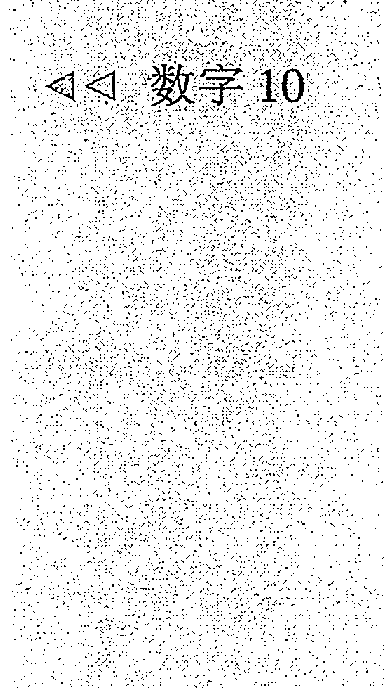

状态下感到非常满足，这四组牌的逆位牌也很简单，除了宝剑组逆位牌意指处于不好的状态，算是不错的牌。

# 塔罗图像思考

## 看图说故事

### 以伟特牌看图说故事

现在，请各位把塔罗牌准备好，我现在要教各位如何看塔罗牌上的图案说故事，大体来说，初学塔罗一定要先会看图说故事，这样才能很快进入塔罗世界，进而了解塔罗牌牌义，不要怕！想要了解塔罗牌牌义一点也不难，只要稍微有联想力和直觉，就一切ok啦。

我先举两张牌为例，以伟特系统帮助各位快速了解如何看图说故事，我们先把牌上正逆的问题摆一旁，拿出“愚者”这一张牌。

各位就会看到一个人拿着一根手杖，手杖上面还绑着一个包袱，脚的后面或前面有一只小狗，因为这一个人有正在走路的动作，手杖上有包袱，所以我们可以推论这人可能在旅行，这只小狗则是此人旅途上的伴侣，这个旅程可能是愉快的，因为这个人走起路来如跳舞般手舞足蹈，但此人前面的路是一个悬崖，所以也代表这人可能会遇到危机。

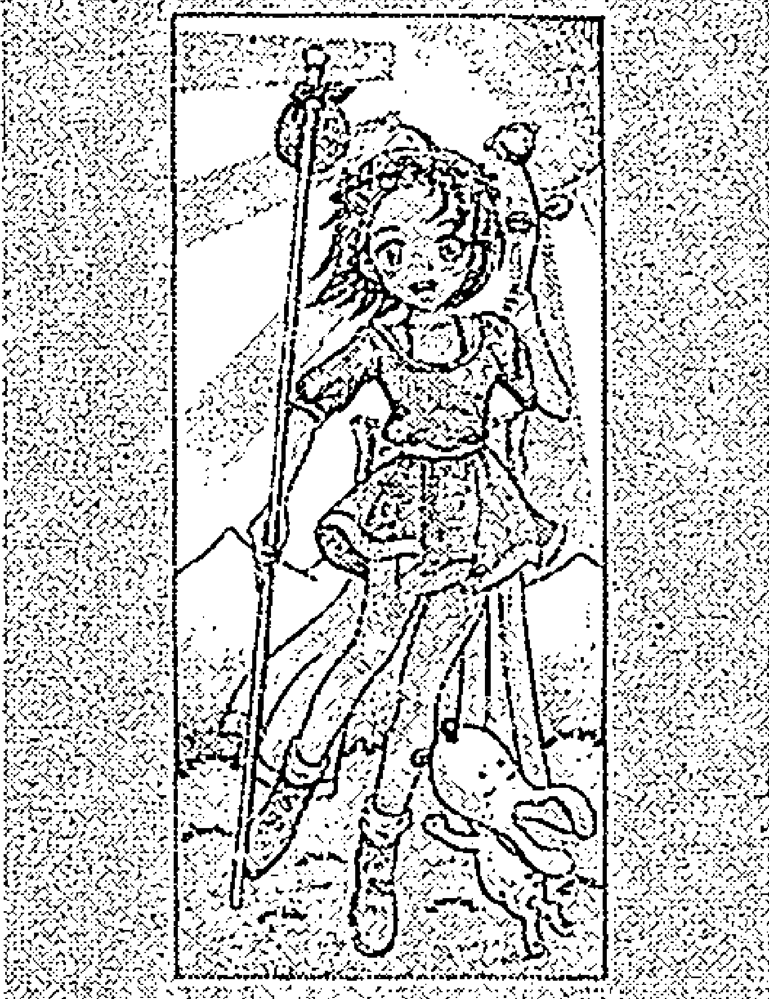

我们把刚刚得到的故事放入以下例子来看，假设一位问卜者想要知道自己是否能够顺利追求到心仪的女子，那么可将牌上的人视为这位男问卜者，旅行时的感觉可以看成是他的追求行动，而那只旅伴上的小狗则当成他的竞争对手，男问卜者认为这没有什么大不了，甚至觉得那位竞争者不是自己的对手，因为在图面上他是开心的，但是他也可能是错误的，太低估了那位竞争者，因为牌面上的悬崖代表危机，暗示他可能失去追求这位女孩的机会。

### 再以魔术师为例

再以魔术师这张牌为举，牌面上是一位魔术师站在一张桌子前面，桌子上有杯、杖、剑、钱这四大象征施法的元素，而魔术师一手指着天，另一手指着地，好像正在做导引能量，从这图案上可以联想成这位魔术师正在施法，而且正在做导引能量，但是我们无法确定他是否会施法成功，因为他还正在导引能量，是成是败都还是未知数。

假设一位问卜者在问是否有创业机会而翻到这张牌，那么牌中的这位魔术师自然就是这位问卜者，桌子上施法用品是问卜者目前可运用的资源，导引的能量则是问卜者想要寻求的外援，但因为还正在导引能量，所以可以看成问卜者还正在努力找外面的资金或帮手，可是暂时还无法得知是否成功。

看到这里，相信各位应该已经知道该怎么看图说故事了，是不是很简单呢，不用担心塔罗牌一点都不难，不妨把心情放轻松，以看小说的心情来看塔罗就可以了。

基本上，看图说故事其实是很主观的一种解牌方式，因为有可能同一张塔罗牌与同一个问题由两个人来解，会解出南辕北辙的答案，所以看图说故事也可以说只适合初学者来使用，若是希望自己塔罗功力更加高深，就要多下点苦功去记牌义啰，后面的文章我会用几个范例来跟各位介绍该怎么看图说故事来解牌。

## 范例1 ▶▶ 故事缘起

这是一间小公司，规模不很大，员工加上老板才不过五个人左右，可是几乎每一个月都要大洗牌一次，看得出这间公司的人才不容易留住，老板为此很伤脑筋，因而想要了解公司内的运气或者人际是不是出了问题，所以跟我预约了占卜时间。

我记得当时开出的牌是：魔术师正位·战车正位·塔逆位

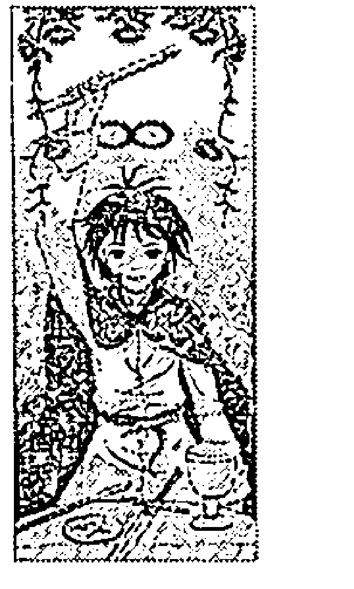

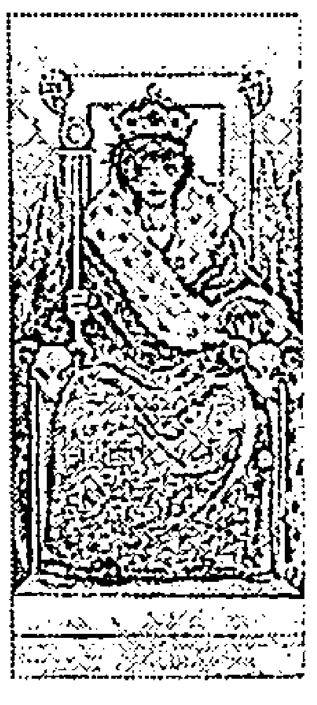

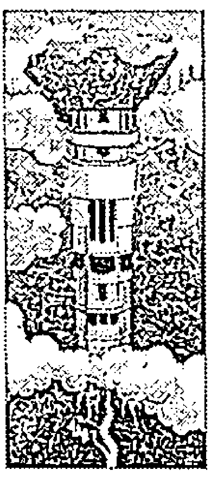

> “老师，牌上怎么说？”

牌一翻开来，这位老板就很紧张的一直问。

> “嗯，这牌中透露出你们公司内部的人员常常火气很旺，小口角时有所闻对吧。”

我看牌后稍微思考了一下告诉这位老板。

“对对对，不只是小口角，根本就是天天吵，很奇怪，只要一进公司，大家的火气就变的很大也不知道为什么。”

这位老板听到我的论断之后马上响应我。

“不过你们公司的业务推展的很顺利，而且从开公司到现在一直都在赚钱，也没什么竞争者。”

我又看了一下牌，并且从牌中再多抓出一些重点来告诉这位老板。

“没有错，我们公司从一开张到现在都在赚钱，投资进去的钱其实早就回收了，而且我们公司的服务很好，真的没有其它家可以和我们竞争。”

讲到这里这位老板就很开心且眉飞色舞的跟我形容着她们公司的经营状况。

“其实这是因为你们公司的气流很旺的原因，但是气流虽旺，却有回堵的状况，所以会造成了你们公司内部常常发生口角的情况。

我听完这位老板的生意经之后，就继续的往下说。

> “啊？老师，那这样子我要怎么做才会让公司内的人际比较好？”

这位老板听完后担心的问我。

> “其实很简单，你们公司内真正在跑业务的有几个人呢？”

我看了一下牌后问这位老板。

> “只有两个人。”

> “那其它人都坐在办公室内没有动啰？从早上打卡上班一直坐到下班？”

> “是呀，因为我们公司小，所以目前两位业务也就够了。”

> “嗯，那我建议你们公司要定时的办一些员工旅游或者是在公司内设一个运动间。”

我与这位老板聊了一下她公司内的状况后，透过牌子，抓出了这一个建议给他。

“真的只要这样子做我们公司内的人际问题与人事异动就会好吗？”

老板带着怀疑的神情问我。

“是呀，就是这样做就行了。”

“为什么呢？”

“我刚刚说过，你们公司气流很旺却往回堵，才造成公司内部人际失和，而你们公司真正往外跑有在动的也只有两位员工，其余所有员工，包括你都被这回堵的气影响到，你有没有注意到，这两位业务其实都没什么大问题，我判断这两位业务应该在你们公司至少有两年以上了吧。”

我又跟他分析了一次。

“对对，没有错，这两位业务跟了我最久，是我们公司的开国元老，也从来没见过她们吵着要离职或者是与公司内的人员不愉快。”

这位老板听到我后头的分析之后马上点头回我。

“是啰，所以你就照我这样的建议做就好啦，不用想太多。”

“好，谢谢老师，我回去马上去办员工旅游。”

### 开心老师开心解说

其实这一个问题还算好处理，因为已经知道问题是在公司内的“人和”问题，所以我们就往这一个方向思考，当抽出牌时，可以先看唯一与其余两张不同的牌，也就是唯一逆位的塔，塔逆位是一座被破坏的塔被倒过来，画面上有人从塔上掉出来，所以我们可以把塔看成是这间公司，把人看成是公司内部的员工，当被破坏的状态在正位时是指外在的破坏，现在是逆位，所以可解释成内部的破坏。

塔逆位可以联想成这间公司的内部员工有彼此破坏的状况，“破坏”又可视为一种争执口角，所以可推想成这间公司的内部员工彼此有争执与口角，现在第一个重点已经抓出来，让我们继续来抓第二个重点。

再来看魔术师正位与战车正位这两张牌，魔术师这张牌包含魔术师跟代表着四大元素的物品——杖、剑、杯、钱，以及魔术师本身蓄势待发的架势，战车这张牌上有武士驾驶战车要出征的图案，我们可以把魔术师这张牌上那代表四大元素的物品看成这间公司的体质，然后把魔术师蓄势待发的架势配上战车那出征的武士，视为这间公司的业务能力，由这几个象征可判断出，这间公司的体质架构很好，业务能力也很强，牌中又以战车为主魔术师为辅，战车出征与魔术师拥有的四大元素，都显见其气势之畅旺，无人能出其右，当然一定没有竞争者啰。

因为魔术师跟战车这两张牌看起来动力非常强，有动就有气，所以这间公司的气流很旺，气太旺就容易有口舌之争。

但又为什么会有回堵现象呢？这是因为塔逆位这一张牌所造成的，塔逆本身有把外在的破坏转成内在的破坏，所以魔术师与战车把气往外放，当碰到塔逆位时又被强制收回，因而造成回堵现象。

我建议老板举办员工旅游，或是在公司内部设运动间，就是要让气流顺畅流动，进而把气消化掉，这样就不会气流过旺不顺畅，反而回堵到公司内。

## 范例2 ◁◁ 故事缘起

小李跟女友交往且同居了一年多，看起来还算稳定的感情却开始发生了变化，刚开始小李以为女友只是心情不好，总会低声下气的安抚女友，可是女友的反应却越来越差，从三天一次不愉快到天天见面都臭着脸，弄得小李每天心情都很低落，两人因此口角不断，甚至吵到要分手的地步，无计可施之下，他便来找我占卜。

当时开出的牌是：皇帝正位·正义逆位·女皇逆位

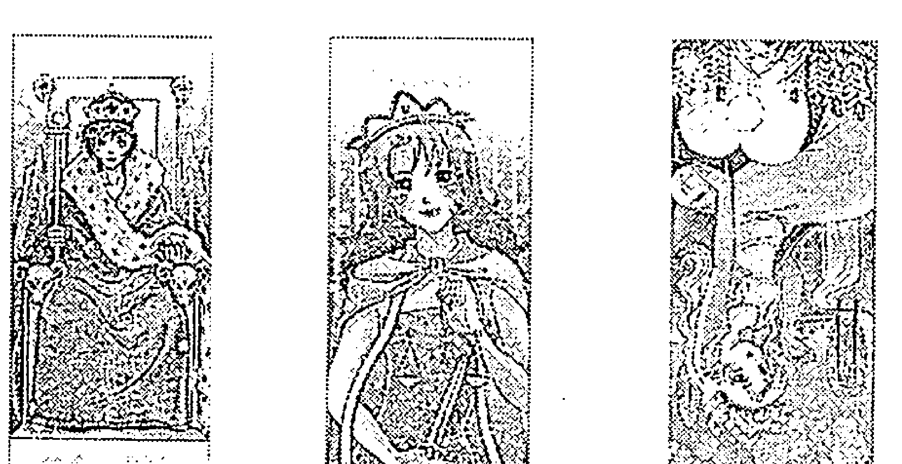

> “老师，这三张牌看起来怎么样呢？”

小李看了一下抽出的牌问我。

> “这三张牌以你的角度来看会比较好一点，但是从你女友的角度去看，就比较不好。”

我看了一下牌对小李说。

“老师，怎么说对我比较好？我不太懂耶？”

小李一脸迷惑的问我。

“小李，你跟你女友的相处，是不是她让你比较多？在一些特别的日子，都是你女友主动送你礼物，都要她提起，你才会回送对不对？”

我把几个重点抓出来问小李。

“是啊。”

小李听到我的论断后，不好意思的回答。

“从牌中还看得出，你女友其实很贤慧，尤其在照顾你的起居上，更是好的没话说。”

我又继续看着牌说。

“嗯，是呀，她每天早上都会帮我准备早餐，晚上也有宵夜。”

小李一面点头一面回应着我。

“那就对啰，我现在就告诉你，为什么从你女友的角度来看会比较不好。”

我又仔细的把牌看了一次。

“从牌中看得出来，你在你女友的眼中其实不那么温柔、体贴，而且相当木头还非常大男人主义。”

我把从牌中抓到的重点一口气全讲出来。

“啊？真的耶，每次我们吵架时她都会这样子骂我。”

小李听到后猛点头。

“是啰，从牌中还看出，你女友就是因为这些原因想要离开你，你要是再不改，这一段感情真的准备要结束了。”

我用了稍微重一点的口气对着小李讲着。

“老师，那怎么办？我是真的很爱她耶。”

一听到我讲重话，小李也紧张了起来。

> “其实还算有得救啦，从牌中来看，你女友其实也还爱着你，只要你稍微改善一下就没问题啦。”

我拿起了茶喝了一小口，然后轻描淡写的跟小李说。

> “好好好，要是不会分手，我一定改。”

小李一听到还有补救的方法，马上点头答应。

> “其实也很简单，你只要去回想你女友之前怎么对待你，你就反过头去对她，然后改掉你的大男人主义，这年头不要再有什么男尊女卑的想法，男女已经平等好久了。”

我把大致的改善方法告诉了小李。

> “谢谢老师，我大概明白了，我会努力去做到的。”

小李听了我的建议然后一本正经的对我说。

# 两小时学会塔罗

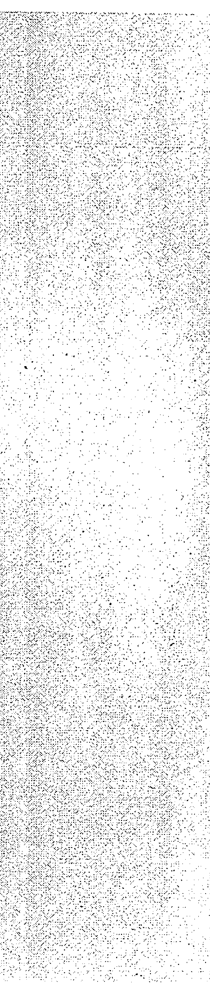

> “嗯，要加油，对了，顺便告诉你，如果你肯改进的话，那你们俩的好事就快近了。”

“真的吗？谢谢老师。”

### 开心老师开心解说

这个案例基本上蛮好解决的，只要把双方之间吵架的问题点抓到，再就这一个问题点来改善就行了，从三张牌来看，刚好是一张皇帝与一张皇后，可以分别代表男方与女方，皇帝正位代表小李，皇后逆位就是他的女朋友，以看图说故事的方法看来，牌中皇帝安坐在王位上，手中拿着权杖与宝珠，等于非常明显的把权力掌握在手中，所以我才说小李处于优势地位，而皇后在逆位，代表后位从上面跌下来，所以从小李女友的角度来看比较不利。

另一张牌是正义逆位，双方之间的好...还有更明确的划分，在正义牌中有一位女神手拿着天秤与宝剑，在逆位时，那个天秤是歪斜的，意味两人的付出呈现不平衡状态，再加上皇帝的正位与皇后的逆位，更是强烈对比出双方所处位置的优劣，因此很自然可以想到小李的女友对小李很好，但小李对女友并不太好。

另外从皇后逆位来看，因为皇后从后位上跌下来，可看出小李的女友有想要分手的念头，可是因为正义逆位，所以这一段感情还算有救，也正因为正义逆位时，那一把宝剑是向下的，有收剑的意味，所以并没有斩断情丝。

因此，他们之间的改善方式非常简单，只要把小李与女友的角色位置互换，并从女生的角度去推想，让小李把女友对他的不满处改善就可以了。

## 范例3 ▷▷ 故事缘起

小萍与前男友分手不到半年，就很快的进入了另一段感情，与现任男友交往没多久，前男友又跑回来希望与她复合，小萍动了心，因为对前男友的感情还是存在的，可是现任男友对她也很好，所以她开始迷惑了，不知道该重新接受前男友，还是要回绝掉，百般苦恼之下，她跟我预约占卜。

小萍所抽到的牌是：**隐者正位**·**皇后逆位**·**命运之轮正位**

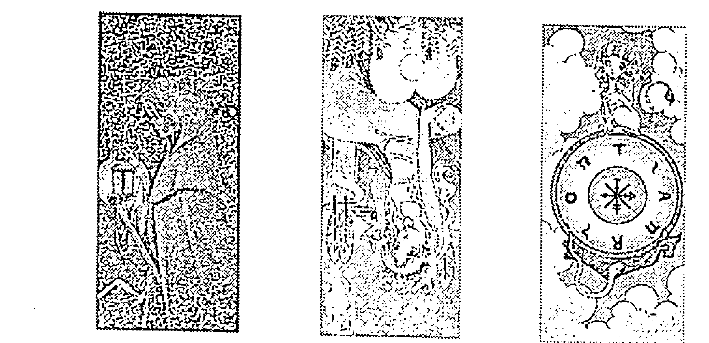

> > “其实你已经决定要回到前男友身边，来找我占卜也只是要确认你的决定。”

我看了牌后跟她说。

> > “没有错,老师你真厉害。”

她听到我的论断后吓了一大跳。

> > “而且你跟前男友确实也比较有缘份, 若以牌来给建议,我也会建议你回到前男友身边。”

我又看了一下牌。

> > “真的吗? 太好了。”

她高兴地回我。

> > “可是! 若你这一次回去,我相信不久后,你又会来找我了。”

我没等她高兴完,就继续的往下说。

> > “会吗?”

她听到我突然这样说,开始有一点怀疑。

> > “你前男友是不是对事情都没什么规划,常常一个人发呆想事情,当你想问他时,他也不愿意跟你讲。”

看到她怀疑的眼神，我又继续说下去。

> “嗯，没错，我每一次问他在想什么，他都说没事，但是我知道一定有问题。”

她想了一下才回我。

> “那就对啦，你想一想你之前和他分手的原因是什么呢？”

等她讲完后我反问她。

> “就是因为我不知道他在想什么呀，我每次问他，他就是不愿意告诉我，所以我一直觉得我们之间沟通有问题，我知道他很努力想改善，可是就是改不了这个部份，那时我真的很累才跟他分手。”

她想也没想，就一股脑把之前的不愉快全讲了出来。

> “呵呵，那你觉得现在的他有改吗？”

我听完后继续问她。

> “我不知道。”

她听到我问她后，想了很久。

“这就是我要讲的重点，我相信你现在回去他身边之后没多久，你就会为了要不要跟他分手跑来找我，因为我从牌中看到，你与他还是有过去的旧问题，而且没有解决的可能。”

我把重点一口气讲完。

“那我该怎么办？”

她听完后，脸色凝重的问我。

“我建议你暂时先和他做好朋友，等到他真的确实改善之后，再考虑复合。”

我把我的建议告诉她。

“好吧，我会试试看的。”

她听完后很沮丧的回答，然后付了钱就回去了。

### 开心老师开心解说

类似这样子的问题还不少，会跑来问其实多半是心中已有了答案，只是不够笃定所以才想来确定一下,基本上,这些问题都可以从牌面上看出端倪,我们现在就来看看,要如何看图说故事来解释这一个问题。

同样的，先看所抽出牌当中唯一的牌，也就是逆位的皇后,在皇后的图片上有一位皇后安坐在后位上面，可是因为是逆位的牌,所以可以把牌看成是皇后跌下来,或者是离开后位,由此可看出,她有离开现任男友的念头,再来是隐者正位,隐者牌上有一位修道士,手拿着一盏灯且正在行走,有一面找路一面往前走的感觉,所以也可看成她想要离去, 再把皇后逆位加上隐者正位,又更加深了她想要离去的想法,接下来是命运之轮正位,这一张牌上面有一个大轮子像在转动,可以看成是正在往前转动,没有停留的意味,这一张牌也显示她想要离去,连续这三张牌都有离去之象,代表小萍真的很想要脱离现状,亦即离开现任男友,所以我才推论她已经决定回到前男友身边。

很明显，牌面强烈意味她想要回到前男友身边，但我最后还是建议不要，因为这三张牌中有出现可以代表双方的牌，那就是隐者跟皇后，皇后很自然的被视为女方，隐者视为男方，皇后逆位显示出女方的一些状况，例如，女方现在想要回到前男友身边，隐者还可以看得到男方的一些状况，现在来用隐者论男方，隐者牌除了有一面走一面找路的感觉之外，还有孤单一人想事情的感觉，或者是比较容易陷入沈思的状况里，所以就会造成隐者多半在自己思考，或者是陷入一个情况里走不出来，这对于皇后来说当然会比较辛苦了，因为皇后无法参与隐者的思考。

所以对皇后而言，复合反而不是好事，所以我才会建议不要复合，而两人既然还有一点感情存在，那就把这感情转换成朋友之情，相处起来就比较不会有很大的问题与压力，这样自然就不用去想为什么无法与对方沟通的问题了。

## 图面关键字取法

图面关键字取法也是一种看图说故事，只不过关键字取法的重点是在图面上的一些特定物。基本上。关键字的抓取很简单，只需要多运用一下联想力，试着把特定物与问题作联系，自然就可以解出牌义。

现在，就请各位把塔罗牌准备好，并准备好纸跟笔，各位先把牌上的特定物写下来，然后把对这些特定物的想法与看法写下来，过程中可参考下一章节有关牌义介绍单元中所写的关键字，再去思考这些关键字是如何抓出来的。

### 以图面特定物做联想

同样的，我还是举两张牌为例。请各位再把愚者这一张牌拿出来。愚者这张牌面上有一些特定物：如愚者手中拿着的手杖、手杖上面的包袱、脚边的小狗、身上穿的衣服、脚上套的鞋子、前面的悬崖；某些牌上还有远方的山群与树林、身后还有一位天使，这些都是特定物，我们现在就来聊一聊这些特定物。

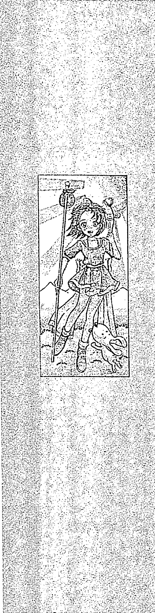

愚者手上的手杖可以解释为探路时寻找与测试的工具；手杖上的包袱是愚者过去的经验，或是目前所拥有的东西；脚边的小狗可解释为陪伴者或是阻碍者；身上穿的衣服与脚上套的鞋子可解释成比较怪异或是不受拘束的感觉；前面的悬崖是即将碰到的问题或危机；远方的山群与树林是对未来的憧憬与希望;身后的天使则是靠山。各位也可以再增加一些诠释，例如,手杖上的包袱可以是过去的压力,也可以是目前暂时唯一能掌握住的东西。我们就来看一看，该如何把图面上的关键词使用到问题里。假设一位男孩想要追一位女孩,想得知是否能成功,在把愚者牌中的图面关键词放进问题时,由远方的山群与树林,可知这位男孩对这位女孩有一些期待与梦想;由手杖上的包袱，可知这位男孩子虽有恋爱经验，但还是非常害怕，所以还在试探这个女孩;由愚者身上穿的衣服与脚上套的鞋子,可推论男孩在追求女孩时，会用比较特别的方式;前面的悬崖是这男孩即将遇到的问题与危机;可想而知,天使就是这男孩子的好朋友兼换帖,所以可以想见,男孩一定有好朋友在帮忙追这位女孩子。

### 再以魔术师为例

再举一张牌为例。请各位拿出魔术师这张牌，在魔术师这一张牌上面的特定物品有魔术师前面的桌子、桌子上的剑、杖、钱、杯、手中的魔法杖、头上无限大的符号，另外还有红白玫瑰，某些牌的魔术师正在行走，或是把剑、杖、钱、杯穿戴在身上。

魔术师前面的桌子可以代表魔术师的小舞台；桌子上的剑、杖、钱、杯是魔术师所拥有的物品，也可能是当下可以掌握或准备好的状况；手中的魔法杖是魔术师的能力；无限大的符号代表魔术师可以使用的能量，或是可以借用的外力；红玫瑰代表热情，白玫瑰代表纯洁；行走的魔术师代表现在进行式；把剑、杖、钱、杯穿戴在身上则代表财产。

现在，我们试着把求得的图面关键字放入问题里。假设一位问卜者想知道目前工作好不好，由桌子来看，可知这位问卜者的工作有不错的发展空间,因为这是桌子;由桌子上的剑、杖、钱、杯,可知薪水优渥;由魔法杖可得知这位问卜者拥有相当的权力与掌控权;由红白玫瑰,可知问卜者对这份工作很有冲劲与负责任;由正在行走的魔术师来看,可知这份工作很有发展性。

看到这里,相信各位应该已有相当程度的理解,知道该如何抓取图面关键字。比较重要的是,大家一定要多多练习,再详细的纪录下来,将这些关键字多加扩充、延伸,这样就可以了。我要提醒大家,图面关键字仍属于看图说故事的范畴,会受图面改变的影响而改变关键字的设定,而且也深受主观的影响,因此千万不要死板的认为图面上出现什么特定物,就要作如何解释,以免受局限。另外,在关键字的抓取上,不需要把整张塔罗图案都抓取进来,只需要抓取几个重点关键字就行了。

### 故事缘起

王小姐跟男友已经认识了三个月，但是男友却背着王小姐偷偷跟前女友藕断丝连。某天，王小姐拿男友的手机起玩游戏时，意外发现男友和前女友两人互传爱的简讯。王小姐看到之后相当生气，和男友大吵了一架。男友虽然答应要改，可是没多久又被王小姐抓包。这一次，王小姐气的提出分手，并马上换掉手机号码，但是才过没几天，王小姐就反悔了，所以就跑来请我占卜，看她和男友是否可以复合。

当时抽出的牌是:皇后正位·审判逆位·皇帝正位

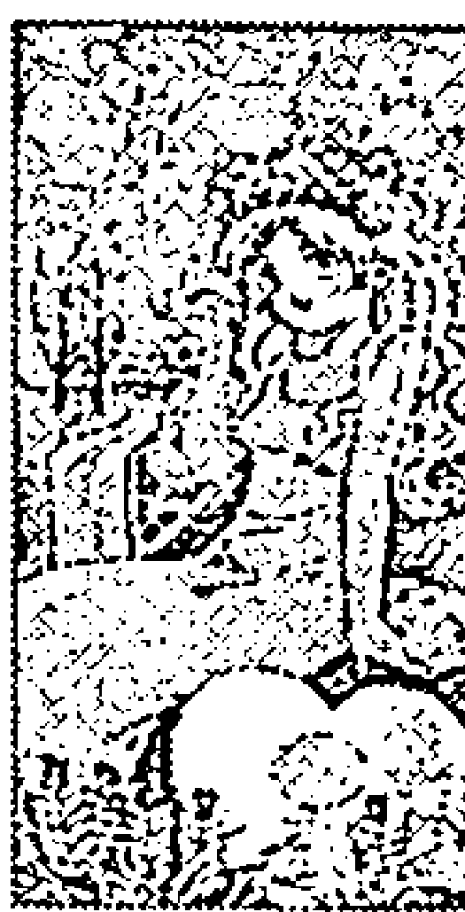

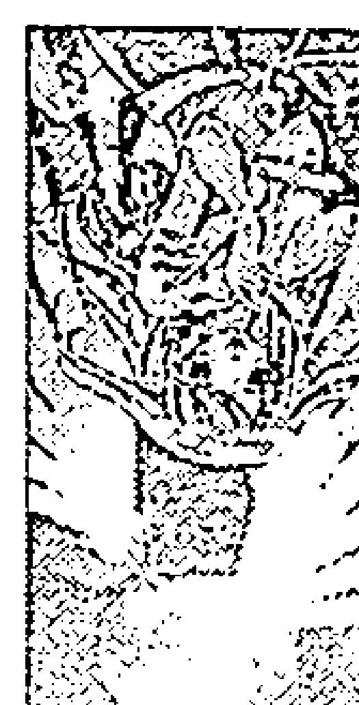

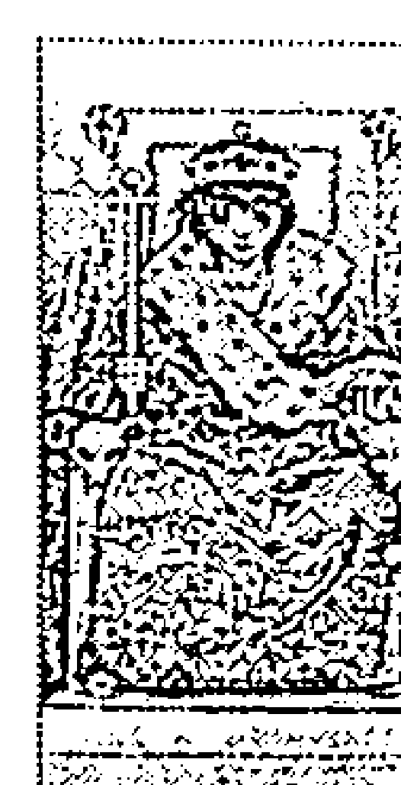

> > 范例1

“你确定你们真的分手了吗？”我看到牌的时候觉得有一点怪。

“是呀！我确定。老师为什么这样问？”王小姐被我一问，也觉得奇怪。

“因为我看到牌面上你与对方还是男女朋友的关系，而且还有互动，只不过是互动少了一点。你不是说你换了手机号码吗？”我提了几点从牌面上看到的状况。

“是呀！我手机号码在分手当天就跑去换掉了，所以不太可能与他有互动呀！”王小姐听我这样说，更纳闷了。

“没关系，你慢慢想一想，是否在这几天有收到他的E-mail，或者是与对方有共同的朋友在传递讯息。”我把互动的范围稍微的放大一点，让王小姐自己去思考。“都没有耶！我这几天都没有收到他的E-mail，而且我们没什么共同的朋友，除了几个要好的同事外。”王小姐想了一下。

“啊？同事？你跟你男友在同一间公司上班吗？”我听到王小姐的回答后，突然领悟到了一些事情。

“是啊！我跟我男友在同一间公司上班，还同一个部门呢！”王小姐想也不想就回答。

“那你们就天天见面了嘛！怎么会没有互动？”我一面大笑，一面回答着。

“啊！对耶！哪有啦！我跟他有在公司见面，也有聊些事情啦！”王小姐好像发现新大陆一样把眼睛睁大的说着。

“另外，从牌中看到，现在你与对方还存在心结，要回复到跟之前一样的感觉可能需要一点外来的帮助，或是要靠贵人帮忙。”我继续往下说着牌上看到的状况。

“对，我也觉得我们两人需要贵人帮忙。”王小姐听到我提起贵人，马上附和着。

“可惜从牌中看不到贵人之象。所以从牌中推论,你要自己来。”我想我这一句应该要早一点说的。“啊？没有贵人帮忙噢！”王小姐一听到没有贵人就着急了。“没有关系呀！从牌上来看,你跟你男友的状况还没有糟到救不回来,就要看你自己怎么做。” 这一句算是给王小姐一点信心。“老师,那我该怎么去做呢？请老师告诉我,我一定很努力的去做。”王小姐一听就有一点信心了。“很简单，只要自然的把你之前对待对方的态度表现出来,更温柔一点,然后再把手机号改回去。”我大概的讲了一下方法。“好好好，我一定会做的，老师，谢谢你。”王小姐听到后马上点头答应。

### 开心老师开心解说

这问题其实满好玩的，因为从问题当中看起来似乎很糟糕，可是牌一打开来看，居然没什么大问题，加上两人原来是公司同事，基本上也不会有那一种久没见面，就出问题的状况发生。

请各位抓这三张牌中唯一的逆位牌——审判。该牌的关键图案有：从棺材或是土里复活的人代表着受到拯救；天空中吹号角的天使意味贵人或是机会的来临，看来这张牌的正位还不错，又是受到拯救，又是有贵人，但很可惜，这张牌抽出来却是逆位，因此便代表这件事需要贵人帮忙，但又没有贵人出现。另外，也代表棺材里或是土里面的人并没有复活的机会，而且还卡在里头，这表示双方关系还没有脱离男女朋友，但也代表双方目前的问题暂时没有解决的可能性。

另外的两张牌更可以确定这个论点。皇后牌中有森林、流水、结满稻穗的稻子，是富足之意，代表皇后其实并不感到空虚；皇后安坐在后位上,暗示女方还安坐在这段感情里,没有太大问题。而皇帝牌中的皇帝手拿着权杖与宝珠,表示还拥有这段感情;安坐在王位上面,意指皇帝也没从这段感情之中走开,那么怎么说双方还有互动呢？ 从皇后牌中的森林、流水、稻穗所显示出的富足, 与皇帝坐镇在皇位上的稳定,都明显看出双方关系是稳定的, 应该还未分手,我才会论断双方还在互动,所以从这三张牌看起来,他们之间的关系是乐观的。

## 范例 2

### 故事缘起

小如与男友交往了一年多, 这段期间, 两人分手了好几次, 每次分手的原因都一样,但每次男友都保证会改善,所以他们就复合了,可惜没多久又故态复萌。而这一次小如真的受不了了,便找我占卜,想知道这一段感情是否能顺利结束。

当时抽出来的牌是：愚者逆位·太阳正位·死神逆位

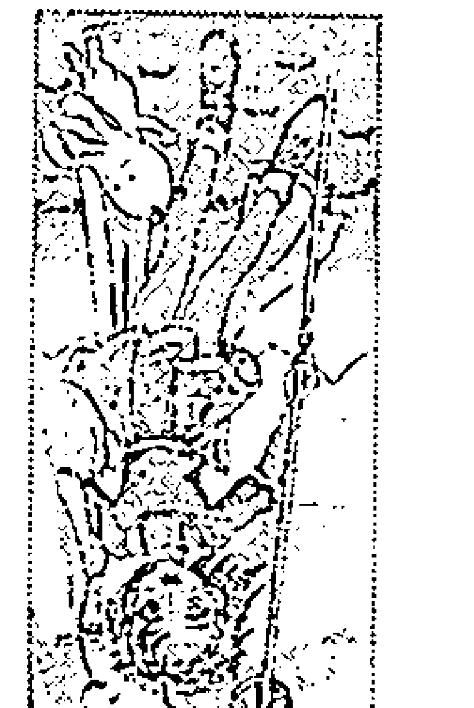

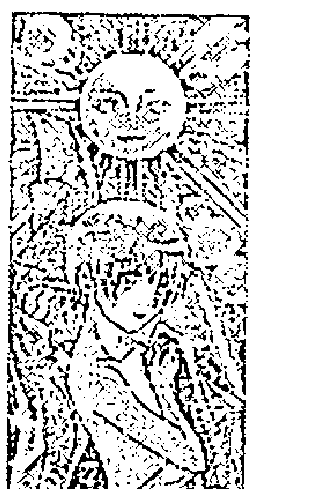

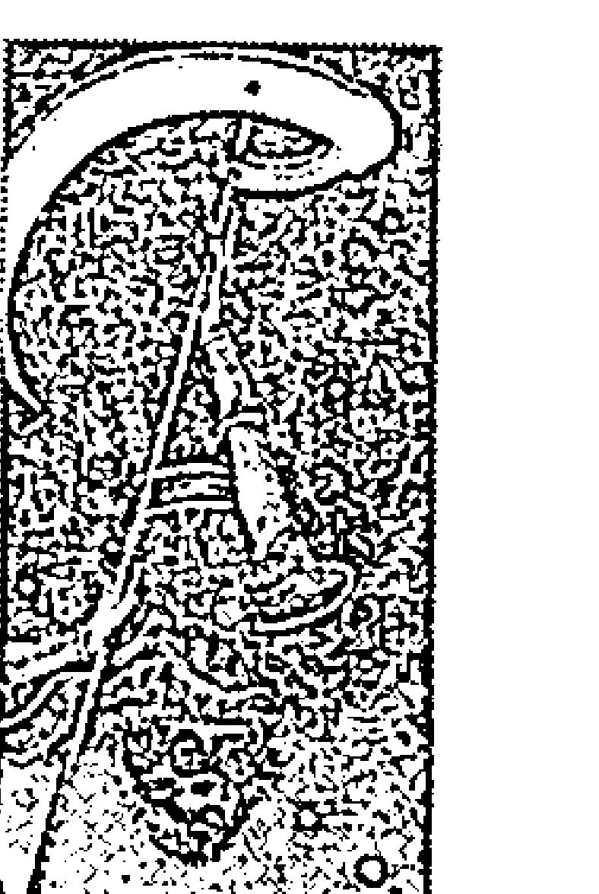

“你真的要分手吗？状况还不错耶！”我看了牌后又问了小如一次。

“是啊！我真的受不了他了，改都改不掉。”小如很肯定的告诉我。

“好吧！我先讲一下对方大概出什么状况。”

“嗯！”

“你与对方分手的原因，是因为对方比较没什么动力，而且比较没有上进心。在某种程度上来看，也可以说对方很懒，只愿意待在一个安全的地方活着。对吧！”我从牌中把分手的原因大概讲了一下。

没有错，他真的好懒，而且都没有上进心。要他多努力一点赚钱好像要他的命一样。”小如听到后马上响应我。

“但对方其实还不错，对一些事情有不错的坚持，也许你就暂时别那么苛责他了。”我大概又看了一下牌，然后再把重点抓出来。

“是吗？我是知道他想吃牛肉面的时候，一定会跑到同一家去吃，不知道这算不算坚持。”小如带着点怀疑的口吻问我。

“不要把他想的那么没用嘛！你看，你跟他分分合合那么多次，他始终爱你一个，这也是一种坚持嘛！”俗话说，劝合不劝离，况且牌中状况也不错，所以我就继续帮小如的男友说好话啰！

“那哪叫坚持呀？根本就是他没人要，不得不求我啦！”小如听到我讲的话后，有一点酸酸的回复我。

“呵呵！其实我要讲的坚持是他应该有在进行一些事情，或者是一个规划，应该是跟他过去的工作有些关系。从牌上来看应该是有好一阵子都没什么发展，但是快要有起色了，你就多等他一下嘛！”我继续把牌中所看到的一个最重要的状况讲出来，希望让小如安心些。

“对耶！老师真厉害，他一直说他有一个计划正在进行，可是我每一次问他，他又不跟我讲，我都不当一回事。既然老师有算出来，那可能就真有其事啰！”小如稍微想了一下，带点惊讶地对我说。

“也许你这一次就暂时别那么冲动，回去好好的跟他讲，请他告诉你，你也好告诉他，你愿意跟他一起打拼嘛！”

“嗯！那我大概知道了，谢谢老师。”

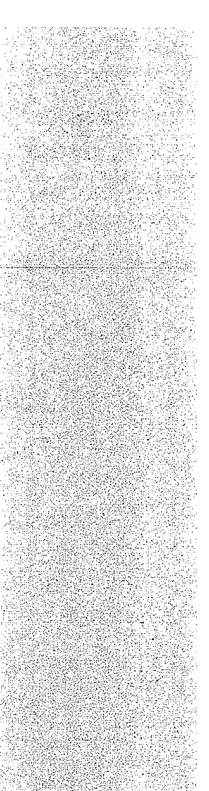

### 开心老师开心解说

这一个问题也是看起来快要完蛋了，但牌面上看来却没有那么严重，我这么说大家一定觉得很奇怪，因为这三张牌除了太阳这张看起来比较好，其它两张牌都不是很好呀！现在，就让我们一起来看这三张牌的图面关键字取法。

这三张牌中我们先来抓唯一的正位牌——太阳。该牌中太阳在天空（有些牌的太阳则正在日出东升），代表事情有好转的迹象；有一个小孩子骑在马上（有些牌是一部黄金马车在天空奔驰），这代表运势正强，或者有些事情正在进行当中。愚者逆位，牌中的愚者被倒转过来，有无法往前之意；手中的手杖与包袱在逆位时，可以看成被丢到地上，所以我才说对某些事情无法掌握。死神逆位牌，死神手中的镰刀被倒置过来，有无法攻击的感觉，代表虽然阻碍已经存在，但是没那么严重；死神牌也因为逆位，象征无法跨越，表示将被卡在某一个点而出不去。

我解释一下这些关键字与答案的关系。
我论断他们状况还不错，是因为太阳代表事情有好转的迹象与运势正强；愚者逆位表示没有往前的动力与无法掌握状况，再加上死神象征无法跨越，因此显示双方想要分手。
我会论断对方正在进行或规划一些事情，则是从太阳牌中所判断的；而愚者逆位与死神逆位都有跨越不过去与无法前进的感觉，所以我才说这些规划与过去的工作有关，代表还停留在旧有的状况里。

### 故事缘起

陈小姐离开学校没多久就进了这间公司，职位是助理，工作的内容都是一些琐碎的杂事，并不特别辛苦，但却无聊且没有成长性。近来陈小姐开始思考自己的未来，想要离开公司的念头越来越强，但现职其实还算稳定，她有点犹豫，不知道该不该离开，因此找我占卜。

陈小姐当时抽出的牌是：女教皇正位·塔逆位·审判正位

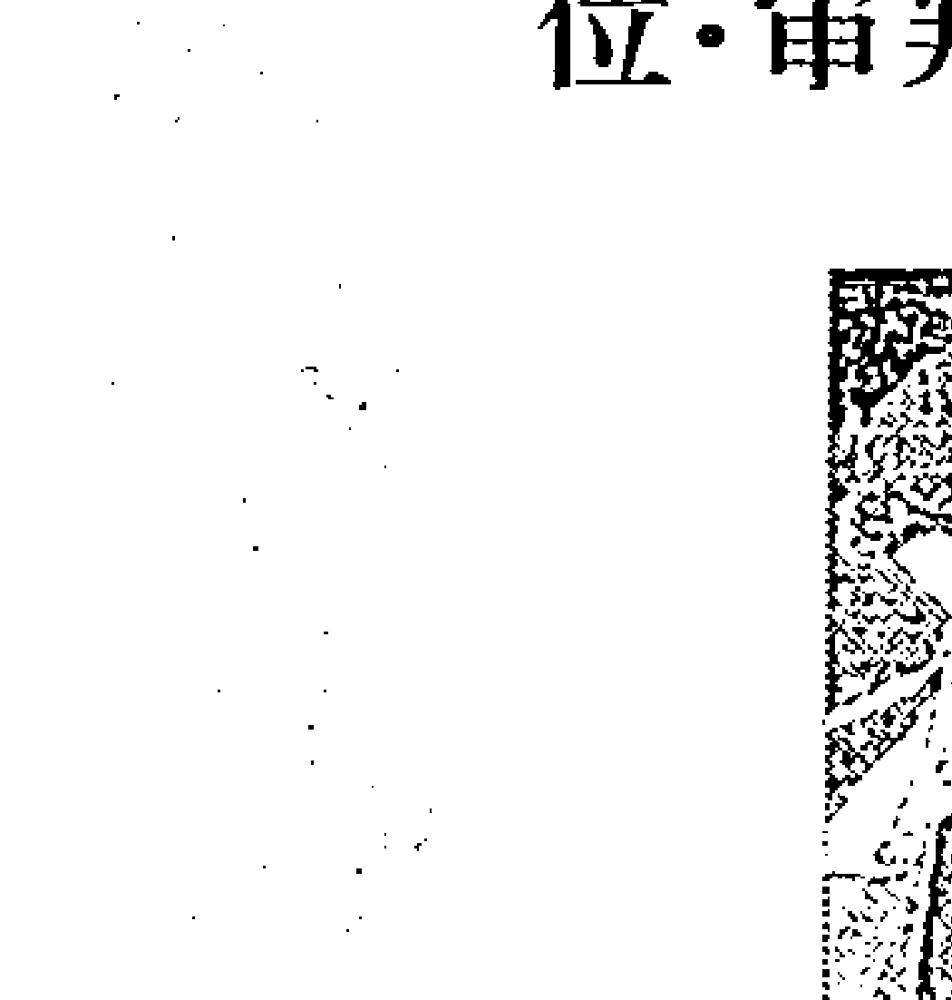

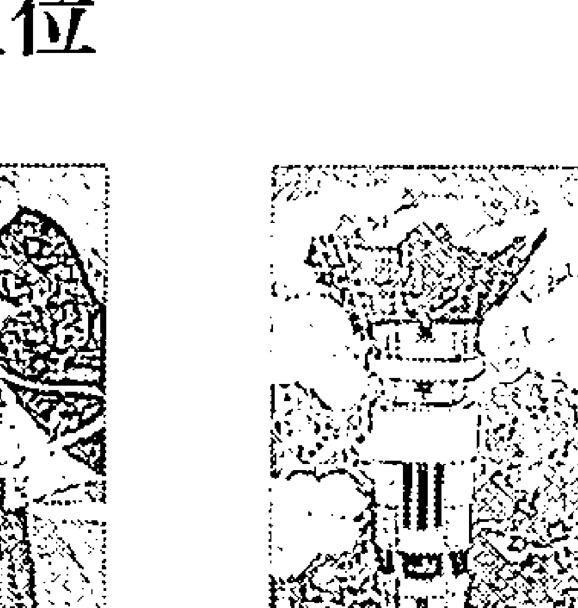

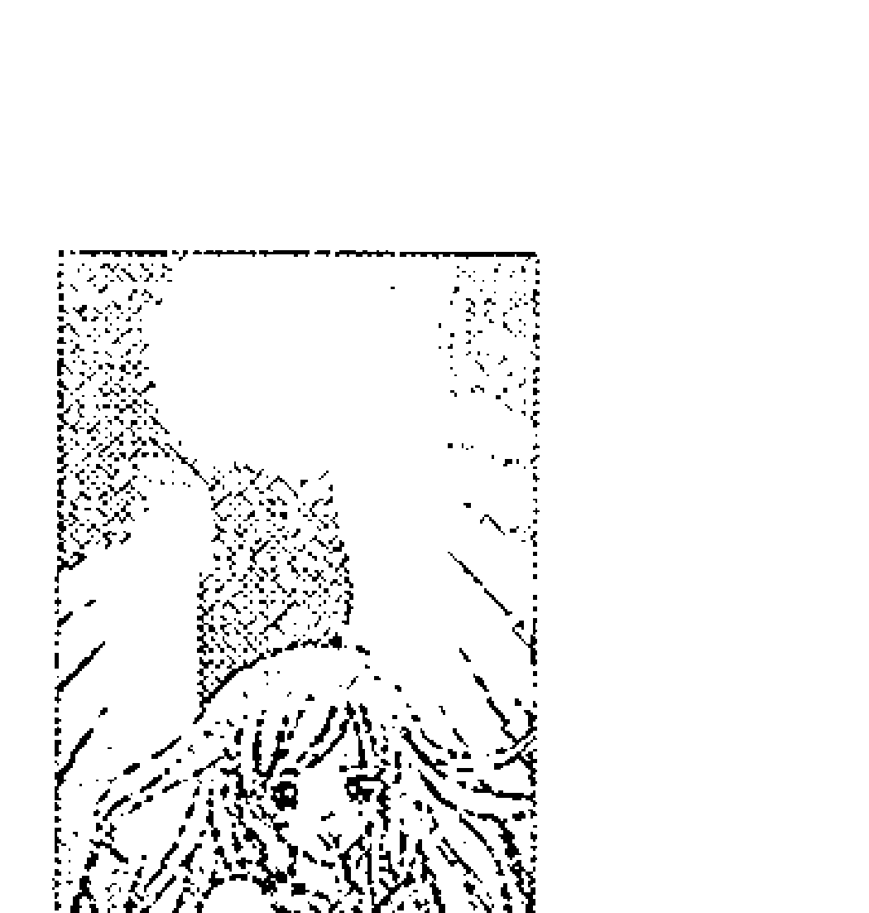

> > “陈小姐，从牌面上来看，你是有机会离开，但是没那么快。”

我看了一下牌后对陈小姐说。

> > “是噢！那我还要在这里待多久呢？”

陈小姐听到我的论断后，有点气馁的说。

> > “你应该有去一些公司丢履历表，对不”对？“我继续论断着牌。

“没错，我已经去试了好几间公司，牌上也有显示哦？”陈小姐讶异地问我。

“是呀！还看得出这几间公司都还没跟你联络，所以你还在等消息。”我喝了一口茶后，轻描淡写地对陈小姐说。

“对对对，我确实还在等消息，我想大概没有希望了。”陈小姐听到我的论断后接着说。

“不会呀！我刚不是说你有机会离开吗？只是没那么快呀！”我重复一次刚刚的论断给陈小姐听。

“对噢！老师刚才讲过。”陈小姐有一点不好意思地说着。

“不过，从牌上来看，你有一点被动，看得出来你也不想离开公司。”我继续把牌中显示的重点讲出来。

“确实有一点，因为现在的公司薪水很不错，上班时间也稳定，上司不会要求我加班，只是工作内容比较琐碎无聊。”陈小姐讲了一下她上班的状况。

“那你就暂时继续待下去，等到有回音再离开吧！反正看得出来你能顺利离开公司。”

“好吧！反正现在那些公司也还没有回音，我就继续待在这里吧！”

“加油！不要担心啦！”

“谢谢老师，我会加油的。”

### 开心老师开心解说

这一个问题还算好解决，只要把牌中能够决定去留的因素拿来处理就可以了，不需花太多时间考量其它因素。而且这牌中所显示的状况很明显，所以我当时没有花太多时间去解决这个问题。

首先来论三张牌中唯一的逆位牌塔。塔的图面上有一座塔正在被破坏着；有两个人从塔中跌出来，但因为是逆位的塔，代表这个破坏是从塔的内部形成，显示出是陈小姐自己想要离开工作。另外，逆位时人物虽然有掉出来，但可以解释成时间会慢一些，这可视为陈小姐离开原公司会比较慢一点，甚至可以解释成陈小姐有一点不想离开公司。

再者，女教皇正位牌中有一位女教皇坐在椅子上面，膝上有一个小卷轴，有些牌会把卷轴拿在手上，都可看成女教皇正在等一个人或是一个机会来打开这个卷轴，这可解释成陈小姐在等待回音。但是没做什么事，怎么可能有回音等呢？我用逻辑推理，认为既然在等待回音，就表示陈小姐应该有对一些公司投递履历表。

审判正位牌上，天空中有一位天使在吹号角，把土里或棺材里面的人拯救或带领出来，天使代表贵人或是一个机会，放到这个个案可解为陈小姐有机会离开这间公司。

## 第二章

### 占卜篇

## 无视论解牌法

## 跨牌阵的解牌技巧

此解牌技巧前身称为“跨牌阵解牌法”。我于公元2000年初开始研究，经过两年多的使用与改善，在公元2002年中发表在网络上，并且正式实际运用。在2003年后更发展出跨越牌种的解法，且归纳出更详细的解牌架构与论点，于此时正式定名为“无视论”。

无视论是一个跨牌阵的解牌技巧，这个解牌法则可以运用在所有牌阵上，不管各位是否熟悉牌阵架构都可以运用无视论来解牌，也可以只随意抽出几张牌来做使用，因它完全脱离会让人绑手绑脚的牌阵框架。

无视论的解牌技巧转化自五行易的论断方式，因此很多观念与运用都与五行易类似，比如：

- “动静阴阳，反复迁变”转化成：“全正转全逆，全逆转全正”。
- “夫人有贤不肖之殊，卦有过不及之异，太过者损之斯成，不及者益之则利”转化成：重点牌的方式，同中求异。
- “长生帝旺，争如金谷之园”转化成：四元素配牌法。

### 无视论可弥补牌阵过于僵化的缺点

我之所以研究这个法则，是因为我认为牌阵本身有时会有太多矛盾之处，而且存在着牌阵的框架，解起牌来会绑手绑脚的，无法让占卜师轻松发挥更多实力。而且牌阵的使用也容易让占卜师的思考僵化，解起牌来显得制式，内涵也被削减不少。

又因为塔罗牌在欧美等地的发展，没有占星学与灵数学来得好，所以很多欧美地区的塔罗牌占卜师对于塔罗牌的解法，都会卡在某一个阶段，无法进步，才需要牌阵的辅助来解牌，但是这对拥有中国命理底子的我来讲，实在很没有效率，所以无视论于焉诞生。

本书我也将介绍比较常被使用的无视论论断技巧，请各位多加练习，这在解牌时就会更灵活、也更轻松。

## 无视论的简单解牌法

无视论的简单解牌法主要针对初学者而写，没有什么高深理论与繁杂论点，此牌法完全以无视论为架构，并引用常使用又简单的无视论解牌技巧，相信初学者一定能够很快上手。

## 无视论解牌技巧取牌法（又名同中求异法）

- 1. 正逆：牌一抽出必有正、逆两位，以弱势者为重点牌，余牌为辅佐。

### 范例1：

教皇正位·钱10正位·剑王逆位·世界逆位·杯3正位

五张牌中只有剑王与世界为逆位，因此以这两张牌为重点牌。

### 范例2：

教皇正位·钱10正位·剑王正位·世界逆位·杯3正位

五张牌中只有世界为逆位，所以这张世界牌为重点牌。

- 2. 大小：牌一抽出必有大小，可以合凑，以弱势者为重点牌，余牌辅佐。（此法全正全逆也可使用）

范例：进某家公司上班，薪水如何？

抽出之牌：钱公主正位·钱1正位·世界正位

取重点牌使用（大小），取出唯一大的世界牌，推论出薪水固定，而另两张牌为钱牌，所以推论薪水很优渥，整体上来看，就是薪水很好但固定，所以加薪加的慢。

## 抓应期：如何从牌中抓取应事时间

定应期其实就是在抓事情发生的时间点。相信各位在占卜时，总会心生“所占卜的事情什么时候会发生？发生在何处？”的疑问。在台湾，普遍会把这段期间订在三个月，这是比较折衷、但不一定正确的方式。以下我会介绍两种方式，一是我学自国外的“元素时间点抓取法”，另一是我自创的“牌序加减法”，两者可以合用，也可以分开用，只要依照各人喜好来选择即可。

## 定期追踪占卜记录决不可轻忽变量

在进行这两则时间点的抓取法时，请不要忽略变量。占卜术非常重视变数。当占卜完成到事情发生，理论上很平顺、没有问题，但实际状况却不是这么一回事，因为占卜的结果是死的，但人是活的，当人知道结果而不满意时，可以改善自己的想法或做法来趋吉避凶，这就是一种变量。另外，当该次占卜事件牵涉的人事物过多过大，或是该次占卜事件的主导权不在自己手上时，都会产生变量，而当发生变量，事情发生的时间就可能改变，而使发生事情的时间点延后、提前，或是根本就不发生，甚至让事情以另一种方式呈现。基本上，变量是可怕的，各位千万不可轻忽，如果可以，一定要尝试以占卜追踪记录。

做占卜追踪记录在国外是很正常的，就好像医院的病历表，这样的做法，一来可以让占卜师较容易掌握案情，也可以透过这个记录来了解自己在解牌上的优缺点与改善方向。对塔罗有热忱，希望能在塔罗世界精进的人，就一定要做占卜追踪记录。

## 元素时间点抓取法

“元素时间点抓取法”，这个方法要先对所属的元素时间区段做了解，这可以从占星来得到相关信息，而时间牌的逆位也会改变元素属性而改变了时间点。其相关资料如下：

### 元素时间区段：

- 火元素 03/21~04/20
- 土元素 04/21~05/20
- 风元素 05/21~06/21
- 水元素 06/22~07/22
- 火元素 07/23~08/22
- 土元素 08/23~09/22
- 风元素 09/23~10/22
- 水元素 10/23~11/21
- 火元素 11/22~12/21
- 土元素 12/22~01/19
- 风元素 01/20~02/19
- 水元素 02/20~03/20

### 牌面逆位元素转换：

火元素与水元素互转；风元素与土元素互转。

当各位要定时间点时，可以请受占者随意从牌中抽出一张牌，然后再从这张牌上的元素来抓最接近的元素时间区段。例如，抽一张皇帝牌正位来定事情发生的时间点，占卜时间为 02/21。皇帝牌正位为火属性元素，所以就可以抓到三个时间区段，分别是 03/21~04/20、07/23~08/22 和 11/22~12/21。但这时要取的是 03/21~04/20 这一个时间区段，因为这一个时间区段离占卜时间最接近。而若是皇帝牌逆位时就要取水元素时间区段，可以取到的区段有 02/20~03/20、06/22~07/22 和 10/23~11/21。虽然占卜的时间是 02/21，但因为才刚刚进入 02/20~03/20 这一个时间区段，所以还是取 02/20~03/20 这个时间区段来做应期定位；但是若占卜时间是 03/15，那么就取 06/22~07/22 这个时间区段。

### 牌序加减法

牌序加减法的时间点取法相当简单，就是把抽出的牌做加总与互减的动作，不需要另抽时间定位的牌。例如，抽出恋人、皇帝、世界这三张牌，就把这三张牌先做加总的动作，恋人的排序是 6、皇帝的排序是 4、世界的排序是 22，加总可得到 6+4+22=32。再来做三张牌互减的动作，互减就是大数减小数到最后一组数字：22-6-4=12，那么这应期就是占卜过后的 12~32 天之间，这个方法较简单，准度却很高，各位可以多练习。

## 无视论解牌流程

本书所教授的无视论其实对初学者来说有一点困难，困难的应该不是看不懂内容，而是该如何使用无视论来解牌，所以我把无视论的用法流程写下来，以条列方式让各位明确了解。

## 正逆位重点牌抓取法（此抓取法为第一顺位）

抽出牌且展开后先看牌面上的正逆位分布，取分布较少者为重点牌并解之。例如，抽出五张牌为正位三张、逆位两张，则先取逆位解之，正位次解之；若抽出五张牌为正位两张、逆位三张，则先取正位解之，逆位次解之。若抽出五张牌为全正位或全逆位，则请使用数字分法或大小二分法。

## 数字区分与大小二区分重点牌抓取（此抓取法为第二顺位）

这两种抓取法基本上是为了遇到全正全逆位时而设的，但若不是遇到全正全逆位时也可以使用，因为这样做可以增加补足解牌方向。数字区分主要用在抽出之牌只有 22 张大牌时，使用方式为把 22 张牌由第 10 号牌区分成两半，取分布较少者为重点牌并解之，余牌辅佐解之，详细说明请看本书的〈简单塔罗解牌法则〉一文。而大小二区分主要用在抽出之牌内大小都具备的状况，用起来更是简单，也就是把 78 张牌分成 22 张大牌与 56 张小牌，然后取分布较少者为重点牌并解之，余牌为辅佐也解之，详细说明也请看本书的〈简单塔罗解牌法则〉一文。

透过以上两大项重点牌抓取法抓出重点之后，可以使用“牌象配法”或“牌义配法”来解牌。我个人比较建议各位直接以“牌义配法”来处理。由于元素配法是另一种完全不同的架构，它有非常特别的论法，不需要借用重点牌抓取法来运作，因此我建议初学者刚开始先不要使用元素配法，等到自己解牌程度到达一定时间后再使用之。

## 第三章

## 高级篇

## 牌面图象联系

### 22 张牌彼此的联系关系

在解说如何以 22 张大牌的牌面图象联系时，请先了解 22 张牌彼此关联与可互动之处。本篇内容在无视牌阵的解牌法则中，称为“化牌法”，在塔罗中占有一定重要性，希望各位能尽量熟记与多练习。

### step by step

- 1. 请各位先拿出 22 张牌，然后去掉愚者，再按照顺序排好；去掉愚者之后的排列顺序是从魔术师开始顺排到世界。
- 2. 然后请各位把魔术师到隐者的牌取出来按照顺序，一张一张摊开来放在桌上，这时各位面前应该会有九张牌摊在桌子上，接着再把剩下的牌按照这九张牌的顺序，一张一张迭上去，从命运之轮到世界。
- 3. 当各位选好时会发现，有三组牌是三张牌迭在一起，这三组牌分别是：第一组的魔术师、命运之轮、太阳；第二组的女教皇、正义、审判；第三组的女皇、吊人、世界。其它都是两张一组的配牌，这配牌一共有九组，每一组图象牌义各有：合与分、生与死、大与小、太过与不及、时空循环、现况组合、期待未来等彼此相对、互补、循环、增减、期待与现在进行式的状况存在。我们来了解一下这九组配牌的配法：

### 第一组的魔术师、命运之轮、太阳

这组牌中三张都有“开始”的相近之意。魔术师是一切事物之始；是一切准备就绪有信心的开始，具有自主性。命运之轮是轮回的开始，牵涉到宿命的开始，不管是跨越过去或是重头开始，都是非自主的状态，但也可以视为机会的来临。太阳则是无穷尽的开始，每天都是一个新开始，是一种周期性且被强迫的状态。

由这三种不同的开始，又可以看出需要与被需要的状况。魔术师的开始，需要命运之轮的开始来制造机会，以及太阳的开始来运转，让这开始的状态不断循环并且保有活力。

### 第二组的女教皇、正义、审判

在这一组牌里，三张牌彼此间是一种互补的状态，女教皇的留下、离去或对立矛盾的状态，需要正义来做平衡；而女教皇期待外来的带领者则在审判里出现，但是女教皇也许会要先了解带领者的优劣，所以需要正义来衡量，也可以说女教皇所拥有的能力与需要，都在正义与审判里面。

### 第三组的皇后、吊人、世界

这一组牌里，这三张牌组合成了一个现况：吊人是皇后的等待，等待新生命的来到，等待出征的丈夫胜利归来；世界是皇后的成就，后位的得到也许需要辛苦的过程与等待，而皇后已经得到了，但世界是困住也是成长的停滞，代表皇后得到后位就停止自身的欲望，而专心的相夫教子。

而这一组另外有一种组合，就是把重点放在吊人上，吊人希望得到皇后里的财富快乐与世界里的成功状态，所以心甘情愿的付出与等待。

### 第四组的皇帝、死神

这一组牌的配置带来了生与死，皇帝的征战杀戮与掠夺带来了死亡，而死神则带来了另一世界的重生。也可以说皇帝的皇位是死神的赐予，而绝望且受苦难的人们因皇帝而重生。不过这生与死也许是一种环境的改变所带来的感觉，所以死亡也许是好事，因为死亡也代表着自己从坏的环境转换到好环境的一个过程。皇帝不一定好，死神也不一定坏。

### 第五组的教皇、节制

这一组牌的配置成为循环，教皇是教导，节制是学习，但是教皇不是永远在教导，而节制也不是永远在学习，当教皇自觉所学不足时，那么就进入节制的状态。当学习到一个小完结时就又回到教皇时的教导，两张牌呈现出一个循环的状态。另外节制也有克制或小心谨慎的状态，也可以视为教皇在严守纪律的状态。

### 第六组的恋人、恶魔

这一组的配置是一体两面的状态，基本上，恋人与恶魔都是一种合伙或结合的状态，差别在于恋人是轻松的、自然的、无拘束、没有烦恼、快乐的，但却需要积极追求；而恶魔是因果的、宿命的、有前世牵连的，在某程度上来看，恶魔也是较沉重的，被迫的。但是也不能因为恋人的状况看起来较好就说其好，也不能因为恶魔的状况看起来坏就说其坏，其实要用中庸的观点去看才是好。

### 第七组的战车、塔

这一组的配置属于循环的状态，塔本身可以看做是一个家庭，但这个家庭正面临到被破坏的状况，所以战车的行动就展现出一种保卫家园的状态，亦即在战车时因为生活太过平稳安逸，而产生了塔的破坏能量；但塔的破坏能量太强烈时，战车修补的能量就出现了。

### 第八组的力量、星星

这一组的配置是期待，两张牌都在为了某个状况而有所付出与动作，只是坚持与付出的动作和心态有相异之处，力量是为了某件事或未来而坚持与拥有信念的行动着；星星是充满对某件事或未来而努力付出着，所以在某程度上，这两张牌暗示着一种固执，或是明知不可为而为之。

### 第九组的隐者、月亮

这一组的配置是一个寻求的现况，也是正在发生的一种情况。隐者是寻找，希望找到一条路来看到月亮的背面，但月亮的背面不是容易找到的，所以也代表隐者找寻的很辛苦，但是隐者可能没有注意到，或者自己早就找到了，只是自己不愿意去正视或承认。

## 塔罗轮回观念

## 22 张牌的轮回观念

塔罗牌的轮回观念对于用塔罗来推大运与剖析流年有很深影响，各位若是一次看不懂就多看几次，再多思考一下，并且拿自己做例子来练习。

### 分为两大循环 命运之轮与审判是关键牌

请各位先把这 22 张塔罗牌拿出来，把愚者跟世界这两张牌先放在旁边，剩下的就是从魔术师到审判这 20 张牌。这 20 张牌又可分为魔术师到命运之轮；正义到审判之两大循环，这两大循环又称上轮与下轮，上轮的力量较强烈，下轮的力量较柔顺，在这两大循环中，命运之轮与审判是很重要的关键牌，它们都代表难关或关卡；而且命运之轮串联着前一张的隐者与后一张牌的正义，审判串联着前一张的太阳与后一张的魔术师，因此这两张牌也称为串联牌，它们都把前一张牌与后一张牌串联起来。

### 九年为一大运 上下轮各自自我循环

这两个循环又各代表九年一大运，而两张串联牌并不列入其中来计算。理论上运势会顺着走，从上轮进入下轮再回到上轮，不断的循环，但是实际状况却是每一个人都可能会在上轮卡住而在上轮自我循环，或是在下轮卡住而在下轮自我循环，直到自己突破关卡进入另一轮为止。

### 当下和九年前的对应关系

走笔至此，我建议各位可以思考一下并做记录，把自己当下的运势或者发生的事对应九年前来看看，或许可以发现一些有趣的关联性。对照九年前是否类似，或者根本就是一样，而这些事通常是一些比较小的事情。例如，自己当下跟九年前都有一个足以改善自己的机会，只是这个机会的内容或状况不尽相同；又或者当下所面临的人事问题与九年前差不多；再不然就是当下与伴侣或家人的相处模式，与遇上的问题和九年前一样。在此只略举三例，其它就请各位自行发掘。要补充的是，倘若尚未达九年或者已过了关卡，就在此限之外。愚者牌与世界牌是特例。

## 愚者牌与世界牌是特例

愚者与世界这两张牌比较特别，这两张牌在上下轮里同时存在每一张牌里面，也代表每一年的开始与结束，或是每一年的过程与目标，所以这两张牌每年都在小循环，或者静止不动。

以上为塔罗的轮回观念，各位有此观念后，在处理自己或是问卜者的问题时，就会有比较明确的方向。

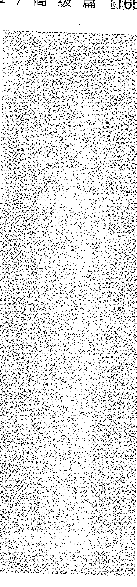

## 配牌技巧概论

配牌技巧在无视论中相当重要，因为配牌技巧等于是把有牌阵解法的点，进化到线、再到面，最后再进化到一个跨越时间与空间的立方体，这也代表解牌者将有更大的空间来进行牌的解释，所以能够看得更广、更全面，因此无视论最重要的要素就在配牌上，若配牌技巧使用的很熟练并成习惯，在解牌上将不会受到阻碍或被卡住，碰到难缠问题时也不会有解不出来的困扰。

配牌技巧的解释方式一定要从单张牌义的解释法，转变成一次先把所有抽出的牌打开，再开始做串联式的解释，在串联时可以把牌义做各种方式的串联，包括从左到右、从右到左、从上到下、从下到上、隔牌、跳跃等，也就是突破点的解法，把线连起来，然后画成面，再把面组合成立方体。初学者刚开始练习时一定得花一些时间适应，但是只要常使用自然就成为习惯，希望各位能多练习。

这一章节要介绍三种配牌法，它们彼此互补，在解牌时可以单用一种配牌法来解释，也可以三种同时使用。

## 牌象配法

### 延续看图说故事之意

配牌技巧中牌象配法是最简单的，因为它延续了看图说故事的方式，它好比将原本单张的图案组合成一部动画，在解读上自然比较容易找出整件事情的问题点，与该怎样处理或补救事情的方法。
不过，牌象配法会被限制在22张大牌里，因为56张小牌不完全都有图案，现今塔罗牌系中除了伟特系的56张小牌图案较丰富，其它非伟特系的牌多维持原古塔罗的56张小牌中只有元素或数字的设定，所以在此我就不谈56张小牌的图象配法。我建议各位多详读与熟悉本书的元素配法与牌义配法，只要熟练这两种配法的使用，之后在解牌时，不管是伟特系或非伟特系都可以解得轻松、自然，不会有因为没有图案，或图案与伟特系不符合而解不出来的问题发生。
通过以下三篇案例，多研究与融会贯通之后，相信大家一定很快就可以上手。

## 范例1 ▶▶

### 故事解说

张小姐所任职的公司最近财务上出现了问题，所以公司内裁员与重整的流言传来传去，这样的情况让张小姐很紧张，深怕自己是被裁员的那个人，所以就到咖啡厅找我占卜，想知道自己是否可以安然度过这个危机。

当时开出来的牌是：月亮正位·审判逆位·皇帝逆位

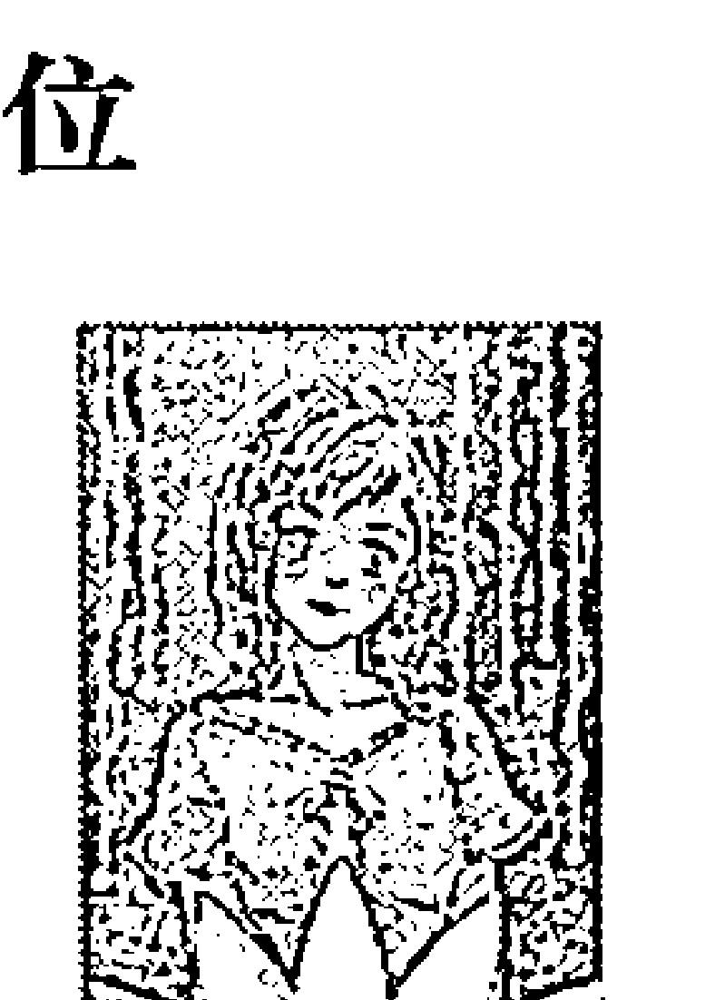

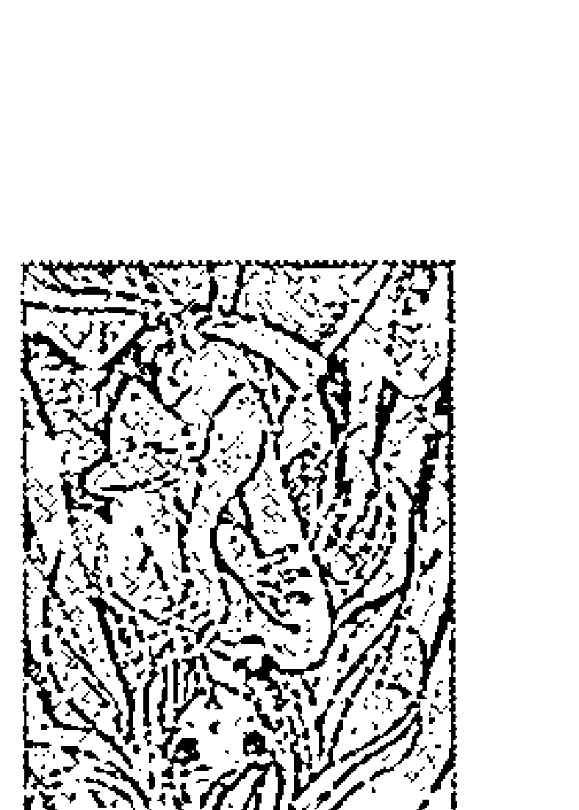

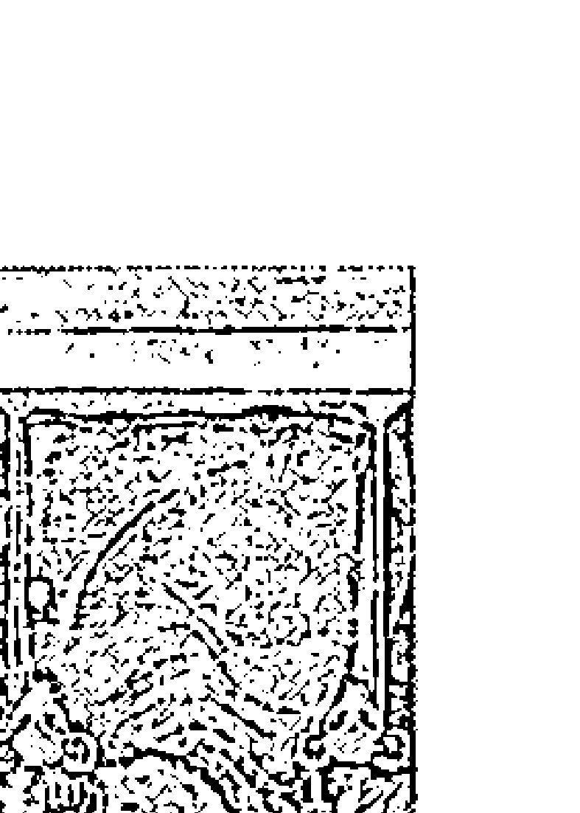

“看来你们公司这种状况还会维持好一段时间，所以你还是会继续困在这个胡同里。”我看了牌后跟张小姐说。

“是噢！可是这样子好难过耶！”张小姐听到我的论断后，做这样的回复。

“别担心，看得出来，其实你们公司高层主管已经在想办法了。”我继续论着牌。

“有呀！我听说公司主管正在寻求跟其它同类型的公司合作或是合并。”张小姐说。

“那就不用担心了呀！就等你们公司主管把事情搞定嘛！”我听张小姐说的话后回她。

“还是会担心啦！谁知道那些主管有没有能力把这件事情搞好……”张小姐还是很担心。

“这你可以放心，看起来你们公司的主管还算有企图心，想要把公司救起来。”我又看了一下牌后说。

“老师，那我要不要干脆换工作好了？”张小姐大概是觉得公司没救了，所以问我。

“嗯！从牌上来看，你应该有在找新工作吧！”我对张小姐说。

“没错，我已经丢履历给一些公司了，也去面试了几个工作，现在都在等机会。”张小姐说。

张小姐听到我说她有在找新工作时惊讶地说。

“不过，从牌上来看，应该不容易找到新工作，还是有可能会在旧公司待一阵子。”我继续把刚刚看到的状况论完。

“啊！那怎么办？那不是就要在这里不上不下了？”张小姐听了紧张的问。

“我建议你先别着急。你这一阵子运气也不太好，过一阵子再说。找工作的事就继续找，等运过了之后就好转了。”我看张小姐开始想太多，于是如此建议张小姐。

“好吧！也许也是运气的问题，最近老是做什么都不顺，我只好继续等啰！谢谢老师。”

### 开心老师开心解说

这一个案例其实还算简单，不用花太多的心思处理，因为牌象已经很明显了。以牌象配法来看，为什么状况继续悬在那边，在于月亮正位虽然显现出有寻求办法的机会，但是审判逆位却让这种状况陷入胶着。再从皇帝逆位与月亮正位的搭配看得出公司的高层主管已经在想办法了，这是因为皇帝逆位也有出征的象征，而月亮正位意指在寻求办法，两张牌合起来就有公司高层主管在想办法的意味。

由月亮正位与皇帝逆位这两张牌，可嗅出张小姐已经有在找新工作的迹象，就像公司主管在找办法一样，但是因为审判逆位，所以就算张小姐再努力找工作还是胶着其中，又或者说是运势与时机都还未到，所以张小姐正处于运气很差的状态。如果把三张牌合起来看，月亮正位虽然有寻求帮忙的迹象，但也有路途危险的象征，而审判逆位意味事情胶着化，再加上皇帝逆位，代表着离去或被压抑，总而言之，这三张牌的结合意味着不好的运势。

### 故事缘起

林小姐的感情路始终不顺，交过几个男朋友，也很认真的付出感情，但最后总以悲剧收场。后来透过朋友找我占卜，想知道自己的感情到底发生了什么问题。

当时抽出的牌是：正义逆位·女皇正位·教宗逆位

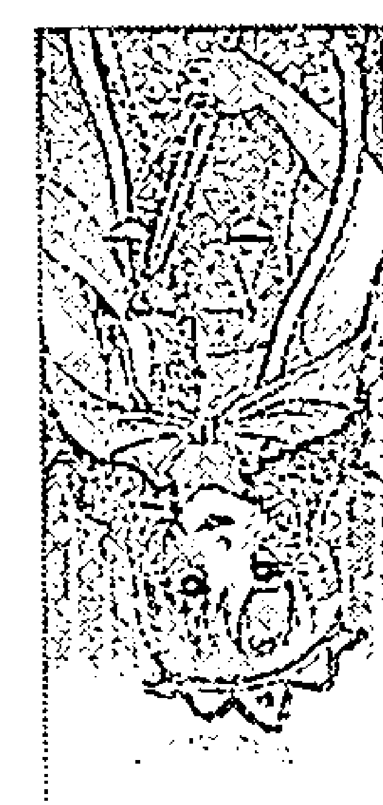

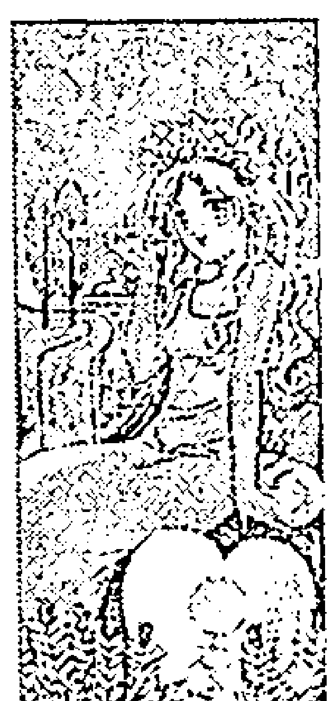

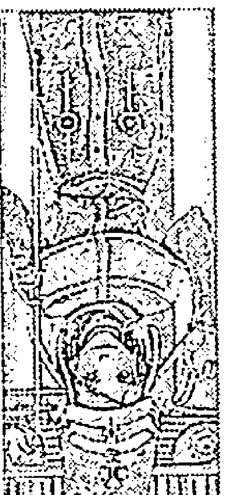

“从牌上看起来，你和前几任男友之间很容易因为沟通而发生问题。”

我看了一下牌后对林小姐说。

“对呀！我老是觉得跟那些前男友都无法沟通，每一次要讲重要的事都会吵起架来。”林小姐听后说着。

## 范例2

“不过，不都是你前男友的问题，牌上显示你也有点难接受对方的想法跟意见。”我继续论着牌。

“是有一点啦！不过也不多嘛！我是女生耶！他们应该要让我一些呀！”林小姐听到我的论断后，不好意思的说。

“你在和前几任男友沟通时，应该都比较凶呦！而且比较会指使别人，这样的习惯要改一改啦！”我对林小姐讲着牌上显示的结果。

“其实我自己也知道，我有时真的太凶了，但是我就是很习惯嘛！很自然的就会在他们面前摆高姿态。”林小姐有点不好意思的说着。

“不过，也许是你的运势问题，你比较容易遇到容易出轨的人。”我又继续往下论著。

“对呀！都是他们出轨，我都很死忠的。我那么爱他们，结果他们一个个都跑去找其它女生。”林小姐听到后忿忿不平的说着。

“没关系啦！过去的就过去，反正那些都不算你的正缘。”我一面看着牌、一面安慰着林小姐。

“真的？那请问老师，我的正缘什么时候会到？”林小姐一听我说前几任都不是正缘，就好奇的问我。

“还早啦！时间到了你自己自然就会知道了。皇帝可是能够制服皇后的呢！”我笑笑的对着林小姐说。

“好吧！那我就耐心的等我的正缘。”林小姐听了后有点泄气的回着。

现在让我们来看看，这一个案例是怎么解出来的。

### 开心老师开心解说

这是一个小技巧，只要看感情的问题就先从牌面上找出与感情有关系的牌，或者是有所配对的牌。以此案例来说，与感情有相关配对的牌是女皇正位与教宗逆位。为什么以这两张牌来做配对，因为这两张牌都是人物属性比较重的牌。

所以这一个案例要拿来看感情就很简单了。女方与男方都有出现，所以要抓出彼此间的问题点也很容易。

先来看为什么我会论林小姐和前几任男友都有沟通上的问题，这是三张牌的配对所产生的。女皇正位代表女皇高高在上，而教宗逆位代表教宗失去了原有的地位，再配上了正义牌逆位，就有一种不相等或不对等的状况发生。而正义牌有沟通互动的涵义，所以很自然的就把问题点往沟通上面放。而皇后正位与教宗逆位的地位差，造成了林小姐比较难去接受对方的意见或观点，或是容易摆出高姿态来面对对方。

而正义逆位与教宗逆位的组合，可以看得出来，这些男生都有出轨的状况，正义逆位时的天秤歪了，代表失去了道德的平衡，教宗逆位时教宗有出走离开信仰的状况，也可以看成一种道德背叛，所以出轨的状况就呈现出来了。

正缘未到是因为代表林小姐的皇后牌正位有高高在上之意，而皇帝牌正位还未出现，所以能和林小姐匹配的男人还没出现。

### 故事缘起

杨小姐的女儿课业一直有问题，成绩在班上常常吊车尾，这让杨小姐很担心。但是跟女儿学校老师聊过几次发现，女儿上课其实都很认真听讲，学习能力也没什么问题，但考试就会出问题。所以杨小姐来找我占卜，看看有没有什么办法让女儿的成绩好转。

## 范例3

当时抽到的牌是：星星正位·魔术师逆位·吊人正位

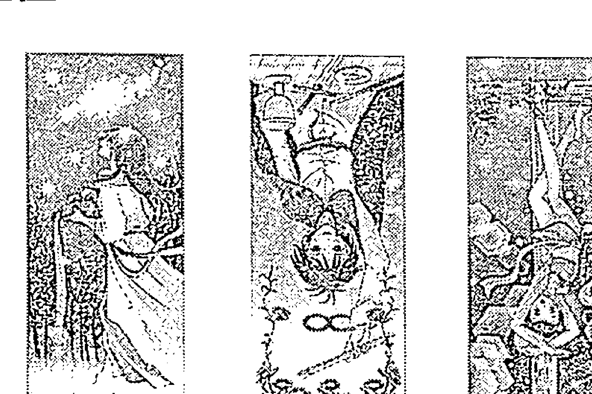

“老师，怎么样？牌上怎么说？”杨小姐着急的问着我。

“我从牌上看到一些问题，不过我要先问你几个问题。”我看了一下牌后对杨小姐说。

“好，老师你问。”杨小姐回答。

“你是不是对你女儿有很多的期望呢？”我看着牌问杨小姐。

“是呀！”杨小姐说。

“你有时的期望超过她现在所能应付的，你应该也知道吧！”我拿起牌看了一下，然后对杨小姐说。

“我知道，我有时也在想自己这样对我女儿要求是不是正确的。”杨小姐听到后点头回应我。

“另外，你女儿其实读得很辛苦，你是不是把她放进资优班去上课呢？”我又看了一下牌然后对杨小姐说。

“对对对，她确实是在念资优班。”杨小姐惊讶的回答。

“我建议你别急，按部就班的来教育你的女儿，太急会出事。”我建议杨小姐。

“怎么说？”杨小姐好奇的问。

“牌上显示：你女儿的整体状况都还没有准备好，但是又因为你的要求，所以就强迫自己去努力念书，她真的念得很辛苦。”我把杨小姐女儿的问题一口气讲出来。

“我也是为她好，才会这样子要求她啊！”杨小姐听到后向我辩解。

“也对啦！为人父母都希望自己的孩子好一点嘛！可是有些事是急不来的呀！”我对杨小姐说。

“唉！那我现在要怎么办？”杨小姐有点气馁的问。

“暂时先让你女儿回到普通班，再慢慢加强她的功课，要慢慢来，不要急！”我回答。

“好吧！看起来这方法也不错，谢谢老师。”杨小姐跟我道谢完就离开了。

### 开心老师开心解说

这个案例其实有点小麻烦，因为问题出在妈妈身上，但是要怎么去区分是妈妈还是女儿有问题，就需要一点经验了，我会在以下的解释上多着墨一些我的经验与看法。

先聊一下，为什么我会论出问题出在妈妈身上，因为星星正位的希望加上吊人正位的期待，可谓满溢着期待与期望，这反射出母亲对待女儿的态度，而加重了我如此论断的原因。又因为这个问题的发问者是杨小姐，杨小姐已经不自觉透露出对女儿的期待与期望，因此我借由利用问卜者求问的心态，与母亲对待女儿的态度，再加上牌上所显示出来的第一顺位涵义来做判断，认为问题出在母亲身上。

如何看得出杨小姐的女儿读得是资优班，这也是一个经验。首先，先把杨小姐对女儿的期待与期望拿出来，再把魔术师逆位拿来论断。魔术师正位是一切准备就绪的状况，逆位代表还没有准备好、时机未到之意，因此，从杨小姐对女儿有期待，但女儿又还没有准备好，可以解释为目前女儿所在的环境让女儿喘不过气，或是产生无力感。这也清楚显现，杨小姐的女儿既然没有学习上的问题，那么就可能是环境出问题了。一般来说，普通班不可能让人产生这种压力，只有资优班或升学班才有可能，所以我如此论断。

## 牌义配法

## 由关键字与串联法来解牌

在配牌技巧上，牌义配法是最麻烦、也最困难的。因为通常一张牌就可能有好几个关键字，再加上其它抽出的牌之后，出现一大堆关键字都属正常；这一堆关键字再经过串联法来解，更会组合出多种可能性。如何从这么多的可能性中抓到正确可能性，就实在需要花时间去练习啰！

当然，这么多可能性组合，经过问题的确定与无视论重点抓取法的配合之下，要抓出正确的可能性就相对简单多了。在这一章节中，我先教导各位牌义配法该如何运用，无视论重点抓取法则参考本书另一章节面的〈无视论的简单解法〉。

牌义配法在使用上有两种最常使用也最容易的做法，前者是在抽出之牌中找寻与问题相关联的解释；后者是在抽出之牌中找寻共同或相通性最高、最多的解释。我会在下文介绍前者但不针对后者做解说，因为后者非常容易，只要解牌时多注意一下就可以了。

## 先以中心点论之再论周遭环境

要从抽出的牌中找寻与问题相关联的解释，其实相当简单。如果是问感情，只要从抽出之牌中先找寻与感情有较直接关系的牌，像恋人、恶魔、杯组牌等；当与感情有较直接关系的牌找出来时，就先把这几张牌上的解释整理一下，然后论之，看看这一段感情双方互动如何、感情发展又将如何。基本上，这是在论这件事情的中心点，当中心点论的差不多之后，就开始从抽出之牌上抓取与感情较无直接关联的牌来看周遭的状况，看看周遭是否有阻碍与距离上的问题，或者是物质上的问题。当中心点与周遭环境的解释都抓出来后，基本上，这个问题就解得差不多了，最后再把所得到的解释再整理一下就行了。

在找问题相关牌上有一定的方式，各位可以做一些增减变化，不需要完全按照我所教的方式。又因为22张大牌比较难做硬性的定义，因为每一张牌在解释上都很容易与问题紧密结合，所以在此我只谈56张小牌在感情、事业这两大问题的基本运用，其它的还请各位自行类推与延伸。

## 感情首看杯组牌

感情首看杯组牌，因为杯组牌代表感情上互动、交流与情感发展的主体，是比较深层情感上的表现，因此当问感情时出现杯组牌，这段感情的好坏将立刻显现。

## 杖组牌将双方情感互动实体化

杖组牌在感情上代表周遭的影响与较实际的双方互动。杖组牌可谓把双方情感的互动实体化，因此不管是好是坏，都可从杖组牌中显现出来。

## 剑组牌在感情上非吉兆

剑组牌在感情上代表双方的精神状况，或是在面对这一段感情时与对方的态度。基本上，剑组牌若出现在感情的问题当中，多半不是吉兆，也代表精神压力与实质上的距离感。

## 钱组牌代表感情上的物质层面

钱组牌在感情上代表物质表象上的显示，或者是对一段感情发展的稳定要求，但水能载舟亦能覆舟，一段感情能稳定是件好事，但若太过度要求稳定，反而会让这段感情发生危机。

## 事业一定要看钱组牌

事业则一定要看钱组牌，钱组牌所代表的钱财是事业的根本，也可以说是事业发展的原动力。若是问事业的开创而出现良好的钱组牌，就代表事业的前景可期。

## 杖组牌论断公司的成长

杖组牌在事业上代表事务的拓展与业务的推广，这样的活动力若旺盛，就代表收入将会增加。因此，在看一间公司的成长，杖组牌千万要仔细。

## 杯组牌表示事业上的人际关系

杯组牌在事业上，代表一间公司外在的人际关系交流与内部人员的组织互动。一间公司是否有生命力或有组织性，由其对外的人际与对内的交流，便可略知一二，所以杯组牌的建议也要多注意。

## 剑组牌意味事业不祥

剑组牌在事业上也多半代表灾变与不祥，在某程度上，当问事业时出现了剑组牌，就要多注意一下内外在潜藏的灾变。

## 22张大牌的实用配法

以下我所介绍的22张大牌实用配法，是我担任职业塔罗占卜师多年来的经验与心得，可说是职业级的论法，各位一定要多多练习。在此我只讲解感情上的实用配法，因为事业与其它类型的问题配法，只要把小牌与大牌的特色抓住就没什么问题，比较单调无变化，所以我在此不多加论述。

- 1 恋人、恶魔
恋人、恶魔这两张牌若单独出现，都代表这段感情的开始与发展过程，若两张牌一起出现，则代表一夜情或是肉体关系。

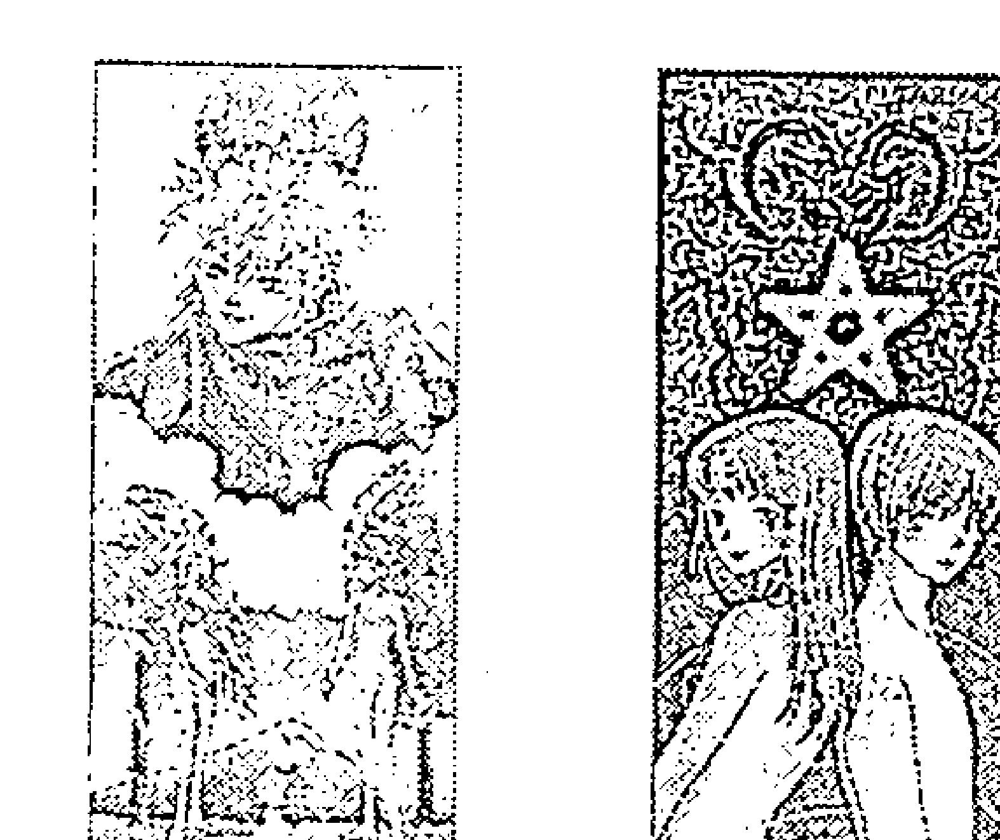

- 2 命运之轮、恶魔
命运之轮、恶魔这两张牌若单独出现，代表这段感情很有缘份或有前世今生的联系，若两张牌一起出现，则代表这段感情一见钟情的机率很高，或者两人的相识很戏剧化、很有缘份。

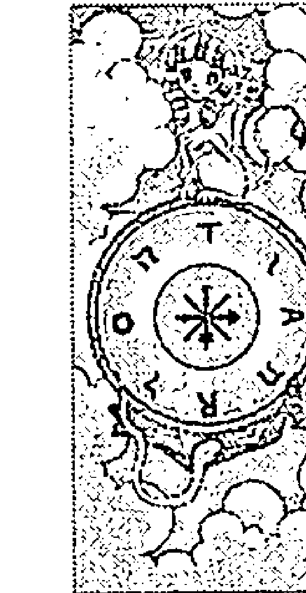

- 3 命运之轮、月亮
命运之轮、月亮这两张牌若单独出现时，代表三角关系的状况隐藏其中，两张牌一起出现时，则三角关系的状况非常明显，而且是现在进行式。

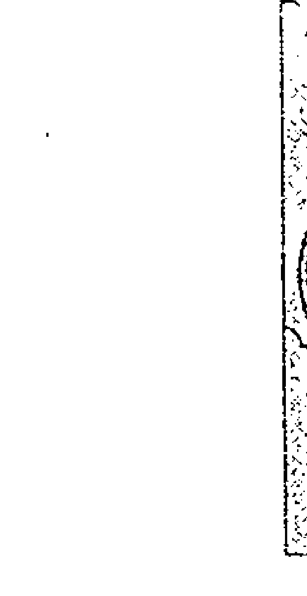

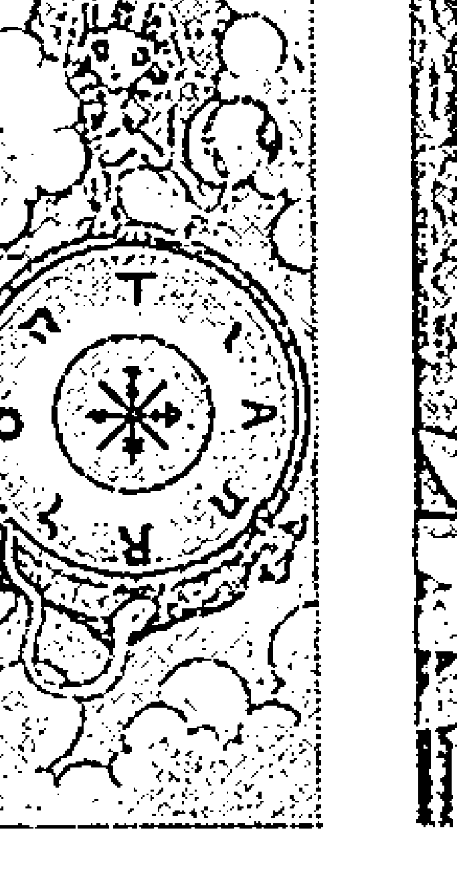

- 4 皇后、命运之轮、月亮、世界
皇后、命运之轮、月亮、世界这四张牌若单独出现，会有怀孕或性关系的状况隐藏其中；若四张牌中同时出现两张以上，则强烈暗示怀孕与性关系。

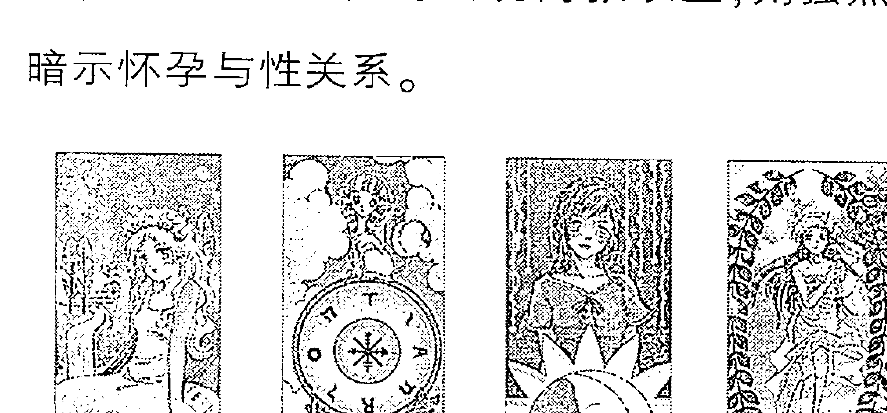

- 5 皇后逆位、世界正位、隐者正位
皇后逆位、世界正位这两张牌若同时出现，那么怀孕、堕胎或流产的状况会很明显，若是再加上隐者正位，那就会有因意外或是他人的问题而失去这胎儿的可能性。

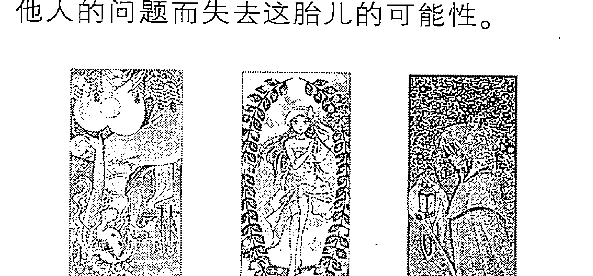

## 6 皇帝、皇后

皇帝正位与皇后正位这两张牌若同时出现，代表在这段感情中双方的关系是平等的，彼此的付出都一样，而且双方对这一段感情有足够的满意度；它并表示双方的年龄相近，价值观差不多，相处沟通上也没有问题。但若是皇帝逆位、皇后正位时，就代表男女双方在这一段感情不是处于平等的状况，可能男方比女方较无定性，并对这一段感情较不忠实；而当皇帝正位、皇后逆位时，整体状况就反转过来。

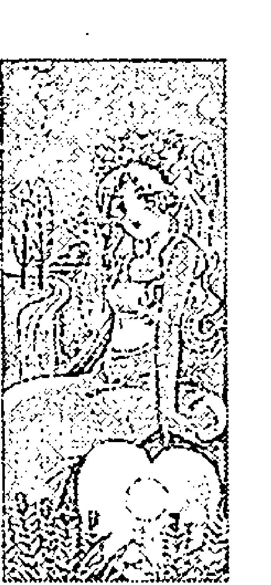

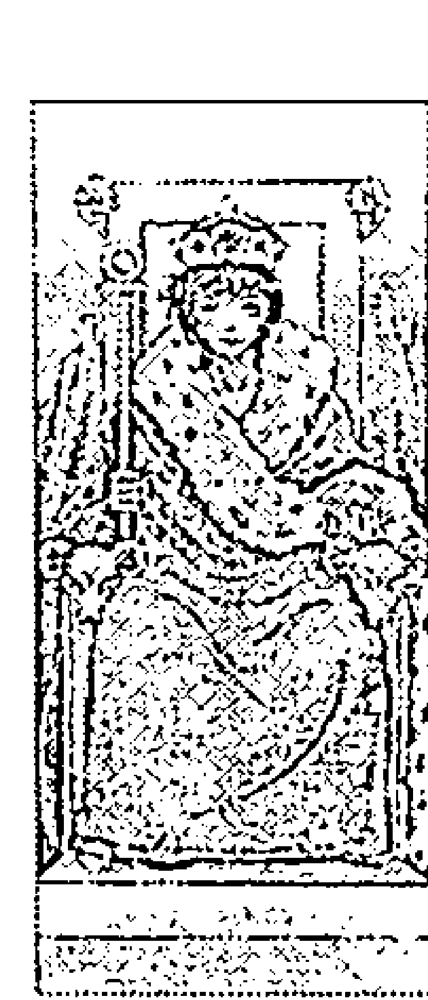

## 7 教皇、女教皇

教皇正位、女教皇正位在感情上也算正配，只不过双方互动比较倾向柏拉图式恋爱，欠缺比较热情的互动。教皇逆位、女教皇正位时，代表男生在这一段感情的交流比较积极，女生比较被动，并暗示男生有出走的状况。若教皇正位、女教皇逆位时，则整体状况反转过来。皇帝、女教皇跟教皇、皇后这两组牌的状况都很类似，皇帝、女教皇与教皇、皇后的配对都是男大女小、感情不伦、互动不对等状况。

以下以五个案例，让各位对牌义配法的运用更加了解。

## 案例1 ▷▷ 故事缘起

吴小姐待业半年，上个月刚找到一份新工作，也对新工作的环境感到满意，最近却有些莫名其妙的想法一直扰乱自己，总觉得自己好像无法胜任，但又不愿意轻言放弃，所以找我占卜，想知道发生什么事，为何自己会如此胡思乱想；也很想知道自己在这份新工作的成就如何？

当时抽出的牌是：**星星正位·愚者逆位·隐者正位**

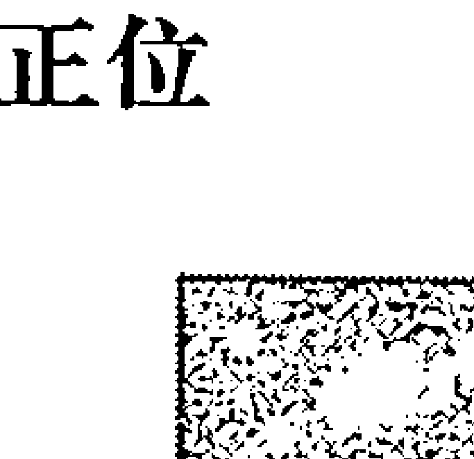

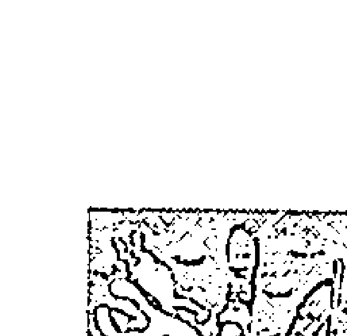

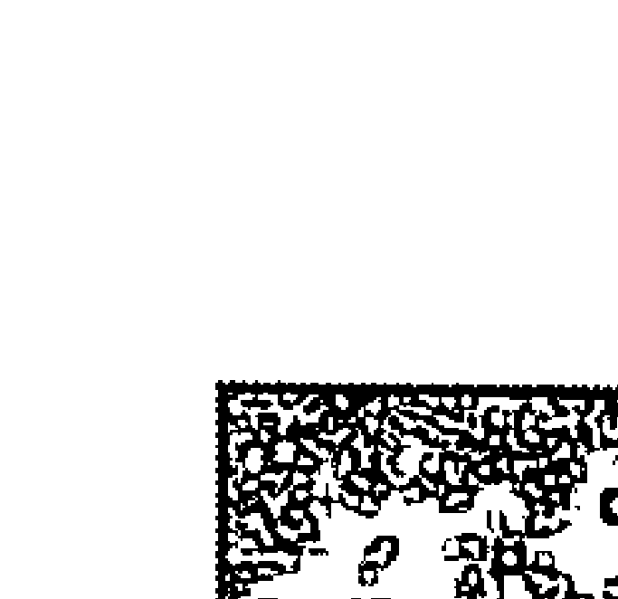

“老师，怎么样呀？牌上有什么显示？”吴小姐看我思考了一阵子后，忍不住的问我。

“你是不是对过去的工作还很怀念呢？”我问吴小姐。

“是呀！我上一份工作比现在这一份工作轻松很多，而且薪水也差不多。”吴小姐听后回答我。

“嗯！这就是你最近胡思乱想的问题点。”我回答吴小姐。

“对耶！老师好准，我最近真的一直在想，之前的工作好轻松为什么要离开，因为现在这份新的工作压力好大。”吴小姐听到后惊讶的回答。

“另外也看得出来，你对这一份新工作其实有很多期待，而且你也才刚起步。”我看了一下牌后，继续对吴小姐讲着。

“对，因为这一份工作有不错的升迁机会，所以我一直很希望自己能够在这工作上面有所成就。”吴小姐听后回答。

“不过说老实话，这牌面上看起来，你很多时候都只是在思考或者期待，真的要去做一些什么事时，就会比较懒。”我继续论着牌。

“被老师看出来，我真的有时只会想个不停，真正要做事的时候，又会不想动。”吴小姐听到我的论断后不好意思说着。

> “所以，看得出来这工作的成就也许可以很高，但重点在于你自己要不要去冲一冲。”我把牌上剩下的意思告诉了吴小姐。

> “我了解了，谢谢老师。”吴小姐向我道谢后就离开了。

### 开心老师开心解说

这个案例虽然牌一开出来好像一面倒，看似很简单，但也让我思考了一下，因为我必须分辨出是否真的是吴小姐个人问题，而与工作内容本身无关，否则对吴小姐反而是伤害，而这个伤害虽不快速，但却是绵长的。

以牌义配法解这个案例时会发现，吴小姐对过去工作的怀念来自于愚者逆位与星星正位。愚者逆位意味沉迷过往，星星正位则有着期待的涵义，两张牌加起来就变成怀念过往的工作，并对过往的工作有所期待与希望。而星星正位加上隐者正位使期待的力量跑了出来，所以我论吴小姐对新工作其实有所期待，并希望能够在新工作上有成就。

隐者正位代表找到了一条道路，亦即找到自己想要的方向；当星星正位加上愚者逆位，表示吴小姐光想不做，因为星星正位代表思考，而愚者逆位有不肯前行的象征，所以两张牌加起来让吴小姐的前进力量不怎么强烈。

## 案例2 ▷▷ 故事缘起

林先生与女友交往三年，感情一直很好，但是四个月前，林先生出差时，却与上司发生了亲密关系。出差回来后与上司继续维持这一层关系。出自于贪心，林先生找我占卜，想知道该怎么做才能够不让女友知道，又继续与上司维持肉体关系。

当时抽出的牌是：吊人逆位·恋人正位·战车逆位

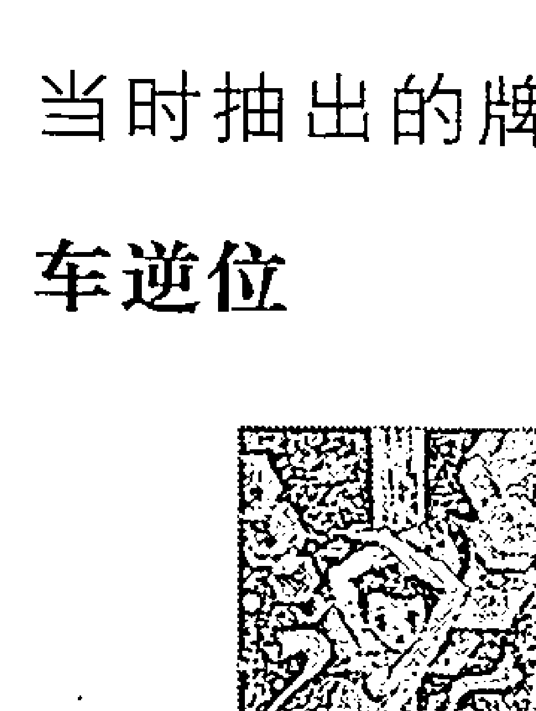

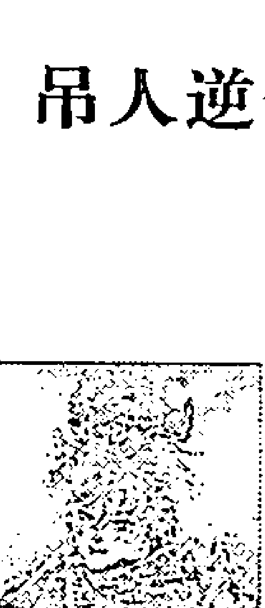

“我看已经东窗事发了，你赶紧回去安抚你女朋友吧！”我看了牌后对林先生说。

“老师太准了，我女朋友确实已经知道了，而且我也已经安抚她了。我现在先告诉她我会跟上司停止联络。”林先生听到我的论断后很惊讶的回答。

“我看处理不掉。从这牌上来看，有一人一定会离开，要不就是你上司，要不就是你女朋友。”我继续跟林先生讲着。

“真的吗？难道我没办法把这段感情掌握住？我该怎么做呢？”林先生听到我的论断后，着急的问。

“你是希望与上司继续发生关系呢？还是与你女朋友继续下去？”我问林先生。

“我两个都想要啦！”林先生想也不想就回答。

“两个都想要啊！可是你只能选一个。你自己仔细想一想，要选哪一个。”我听到林先生的选择后回他。

“女朋友像我妻子，上司像我的恋人，这很难选择啦！”林先生不是很愿意选择，所以又把难题丢回给我。

“可是你一定要选一个呀！这个牌很硬，只能留一个人。而且你要考虑双方的感受呀！如果今天换成你女朋友有这种情况，你的心情会如何？”我稍微对林先生施加一点压力，让林先生自己去思考一下。

“老师，我知道你要说的啦！我承认我比较贪心，但我真的想两个都吃嘛！”林先生还是不愿意放弃他的想法。“我了解，但是从牌上显示你只能选择一个人，我建议你再回去思考一下，如果还是选不出来的话，再来找我好了。”当下林先生还是不愿意接受塔罗牌上的建议，所以我就请他回去再想想。

“好吧！我再想一下。”林先生看到答案还是他不想要的，就带点气馁的离开了。

### 开心老师开心解说

这类问题在往后日子各位一定会碰到，我建议各位在解牌时一定要跳脱社会的道德规范，不要把自己的主观放进去。这个案例中，牌上显示只能择一，所以简单很多；如果牌上显示能够都选择的话，我建议各位也要照实讲，不然有时会断了问卜者与对方间的因果，这样可能会发生一些不太好的事，所以各位一定要注意。

从牌义配法来看，这一案例很简单，三张牌中出现了一张恋人正位，感觉上应该很不错。但因为吊人逆位加上战车逆位，一张牌是离去，另一张牌是停顿，而让恋人正位朝不好的方向走去。我断定被林先生的女朋友发现，是因为恋人正位被吊人逆位与战车逆位牵引，所以代表原本的感情出状况了；另外，从牌面上整体来看，离去与停顿的状况很明显，自然便是告诉林先生只能选择一个人。而为什么恋人正位在这里不能视为两人都可以接受，是在于恋人正位被吊人逆位与战车逆位夹住，反而没有力量可以发动，意味感情正呈现颓靡的状态。

而剩下的，就是林先生自己的我执太重，这得靠林先生自己去处理了。

## 案例 3 ▶▶ 故事缘起

施小姐因为与男友大吵一架，所以两个星期以来都拒绝与男友联络。当她气消了再与男友联络，居然发现男友已经与客户有了感情上的发展，施小姐一气之下，跑去找那个女生吵架，并且迅速与男友分手；但过没几天她就后悔了，所以找我占卜，想知道能否挽回这段感情。

当时抽出的牌是：吊人逆位·恶魔逆位·审判正位

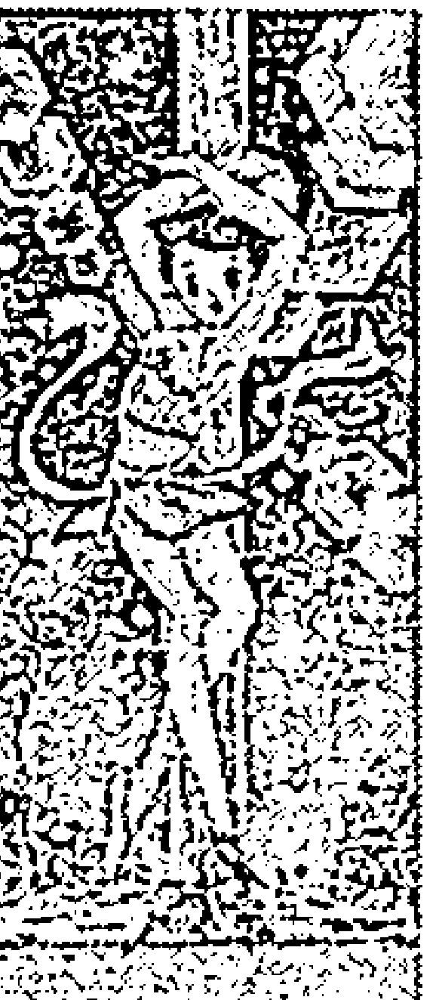

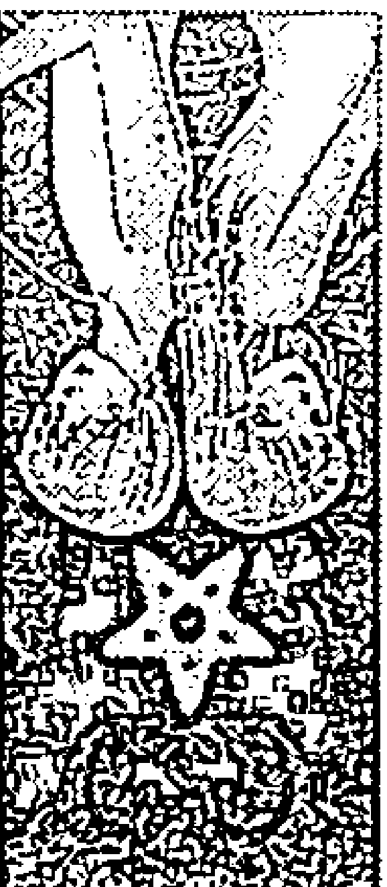

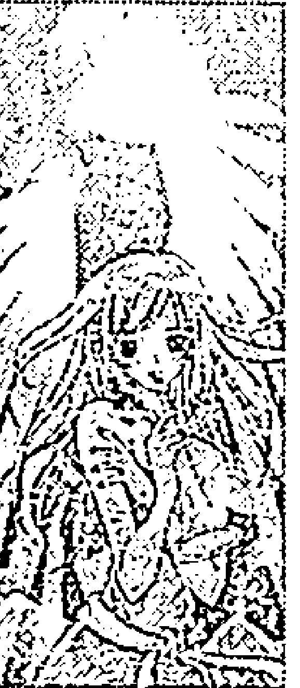

> > “施小姐，这段感情现在想要挽回的机会很渺小呢！”我看了牌后对施小姐说。

> > “那怎么办？”施小姐一听，惊讶的问。

> > “你男友这一段外遇是必须经历的缘分，虽然不是好缘分。”我对着施小姐说。

“那等他与对方的缘分结束后，我还可以把男友抢回来吗？”施小姐着急地问。

“可能性也不大，因为看不到你们两人的连结性了。”我摇摇头对施小姐说。

“可是我真的好爱他，我那时真的不是故意的。老师，能不能告诉，我该怎么办？”施小姐听到后哭着对我说。

“其实，这牌上真的找不到你与对方的互动，只显示出你与对方的现况，我甚至觉得你男友应该早就出事了。”我一面看着牌一面告诉施小姐。

“其实，我早有耳闻，他与一些女客户常打情骂俏的情况，我问他时他都告诉我只是逢场作戏，没想到都是真的。”施小姐一听更伤心地回答。

“嗯！我了解。”

> > “我真的好伤心。老师，能帮帮我吗？”
> 
> “我想，缘份尽了，也许早点离开也好。”
> 
> 你下一段感情进来的也比较快。”
> 
> “可是我真的很爱他。”
> 
> “我了解，我能体会。”
> 
> “真的没办法吗？老师？”
> 
> “嗯！”
> 
> “好吧！谢谢老师，我可能会回去哭好几天。”

### 第三章 / 高级篇

这个案例其实不是很让人开心，当我一开牌时，我的心情确实也被抽动了一下，但马上被理智拉回来，因为我只是一位塔罗占卜师，不能被客户的情绪或牌上的显示所牵引，不然就失去了客观性。现在就来看看我是怎么解这案例的。

这三张牌的组合看得出施小姐想要挽回的机会很小，因为吊人逆位加上审判正位代表施小姐的男朋友离去，然后被别人救走；而恶魔逆位又代表施小姐与男友的缘分失去，牌面上没有任何有利于这段感情的迹象，所以可以论出双方之间已经没有什么互动与交流，代表施小姐的男友其实已经离去好一阵子，施小姐才知道。

基本上，这案例很好解释，因为牌面一面倒，所以不需要花太多的时间去做解释与分辨。

### 案例 4 ▷▷ 故事缘起

赵先生与前女友因为个性不合，已经分手快半年，这半年来，赵先生一直与前女友断断续续的联系，而且越来越密切，赵先生因而开始产生复合的念头，所以跟我预约占卜，想要知道与前女友是否有机会复合。

当时抽出的牌是:杖六逆位·钱三正位·杯王正位·月亮正位·剑九逆位

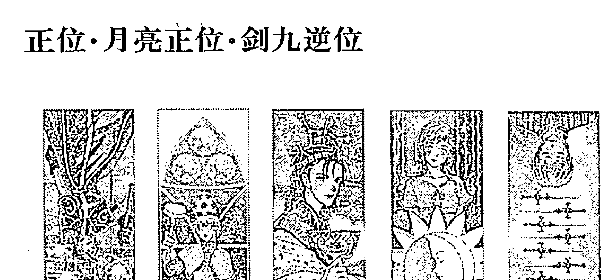

“看得出你的心态已经回到你与前女友交往时的感觉了。”我看了一下牌后对赵先生说。

“没错，因为我最近跟我前女友互动还不错。”赵先生开心的回答。

“可是，我觉得你别开心的太早，因为牌上有三角恋的状况。”我继续对赵先生说。

“我知道呀！她有告诉我最近她公司里有一个男生对她很好。”赵先生听到我的论断后不意外的说着。

“那你还确定你要问复合吗？”我听了后愣了一下，然后又跟赵先生确定问题。

“当然，我要把我前女友抢回来呀！老师，快告诉我，我抢不抢得回来呢？”赵先生很有自信的大声对我说着他的想法。

“看起来追回来的机会是有，不过呢！三角恋的状况还是会继续维持。”我看了一下牌后告诉赵先生。

“没有关系，只要先再有互动，然后再有感情就可以了。除掉那个男生是早晚的事。”赵先生听到我论断后开心的说着。

“啊！这样子呀！那就祝福你啰！”我听到赵先生的想法后有一点错愕。

“谢谢老师，我会努力的。”赵先生付了钱后就开心的离开了。

### 开心老师开心解说

赵先生对自己很有自信，所以对于追回女友很有信心，因此从牌洗好，到把牌展开、翻开后、论完，不到二十分钟就结束，是一次很快速的占卜。

从这五张牌中，钱三正位跟月亮正位这两张牌都隐藏三角恋的涵义，而两张一起出现，又更加确定了三角恋的存在。我会论赵先生已经把心态回复到之前与前女友的交往状况，是因为杯王正位。而杖六逆位与剑九逆位这两张牌，一张被困住，一张脱困，代表赵先生从被困住的状况脱困出来，因此有追回前女友的机会。这两张牌也可以论成赵先生从脱困的状况再被困住，这也意指从原本的自由身，之后又会有感情上的牵连。

## 案例 5

黄小姐与男友交往两年，因为男友要出国念书，所以双方互动出现一些问题，这对黄小姐来说造成很大的影响，因而开始对这段感情产生动摇，并考虑分手。但是男友对黄小姐仍有很深的依恋，黄小姐于是透过朋友介绍，找我占卜。

当时抽出的牌是:杖二正位·杯四逆位·杖王逆位·杯骑士正位·杖八正位

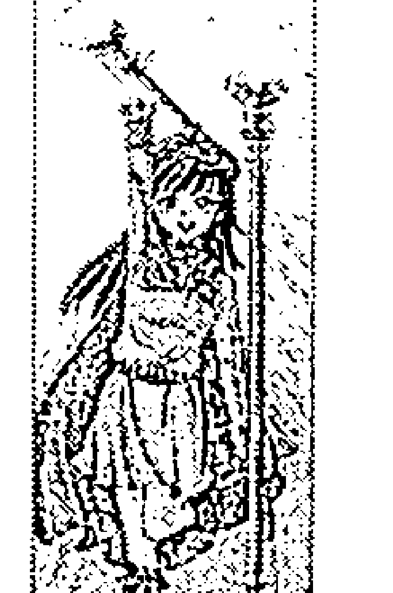

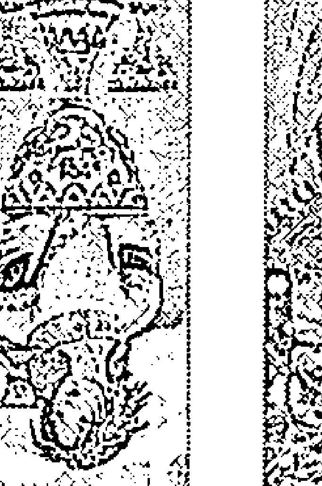

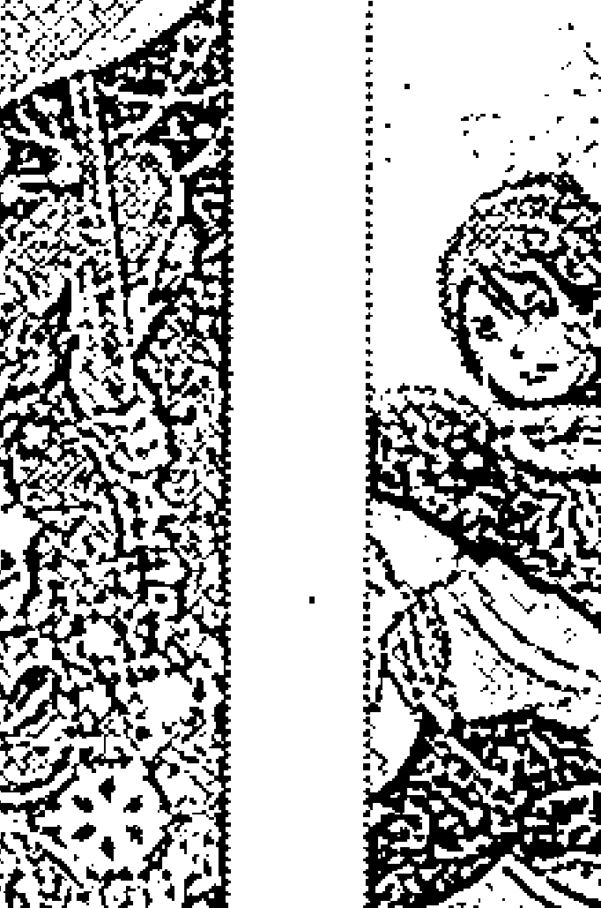

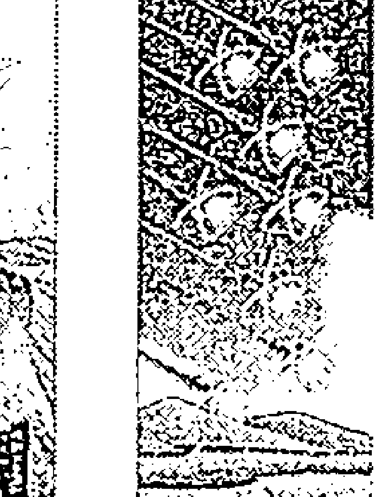

“从牌上来看，你似乎想太多或是担心太多了。”我看了一下牌后对黄小姐说。

“对呀！想太多是我的特性，想改也改不掉。”黄小姐笑着对我说。

“你确定分手只是因为双方互动出了问题吗？”我又从牌上看到了一些暗示，所以问黄小姐。

“是啊！不然老师还看到什么呢？”黄小姐愣了一下然后问我。

“我看到有人在追你耶！”我把我在牌上看到的暗示对黄小姐说。

“好吧！我承认有人在追我，其实想分手也有这一个原因啦！”黄小姐听到我讲出那个暗示后，很不好意思的说着。

“最近你有要出远门吗？或者是出国？我从牌上看到你有出国的征兆。”我从牌上抓出黄小姐有出远门或出国的状况。

“有，我要跟那个追我的男生一起去旅行。”黄小姐因为我已经把那个追求者抓出来了，所以就很老实的对我说。

“唉！也许你早就决定要分手，现在来找我占卜其实已经来不及了吧！”我听到黄小姐的回复后叹了一口气。

“我知道啦，可是我就是想问嘛！因为从老师的口中确定分手，我会比较安心。”黄小姐听到我叹气后，对我说。

“那就恭喜你啦！加油啰！自己想一下该怎么跟男友讲分手的事。”

> > “谢谢老师，其实我来找你之前已经透过朋友告诉他了啦！”

### 开心老师开心解说

这个案例实在很让我伤脑筋，因为客户其实早就已经下定决心要分手，而找我占卜作为最后确认。

这五张牌中，人物牌就出现两张，杖王逆位与杯骑士正位都是代表男方的牌，它们又分别可被视为男友与追求者，而不见女方的牌在其中。这代表女方已经确定要离开原男友，而我会论黄小姐最近有出国的征兆，则是因为杖二正位与杖八正位。

## 元素配法

在配牌技巧中，元素配法的辅助性质比较重，通常都是当其它解法处理好之后，才使用元素配法来补强。当然，元素配法也可以单独使用，因为它能很快的抓出牌组中的重点，而且相当简单、好用。各位在论牌时也可以只用元素配法来单独解读，因为元素配法的准确度相当高，但前提是必须把元素配法练熟，并熟记每一张牌所属的元素。由于元素会受牌的正逆位而翻转改变，当逆位时火元素与水元素会互转；风元素则与土元素互转，而且每一种元素属性各自有特别的意思，请各位要详记一下。

### 1 火元素是行动与力量的表征

火元素代表行动力、活动力、精力与爆发力，是一种相当主动、直接的行为，速度相当快，又可视为外在的表现与行动力，甚至是肢体上的活动或冲突。火元素也是一种实践的力量，表示一件事情演进的能量，或是所拥有能够继续下去的力量，因此若是缺少或这份力量不足的话，这件事情的发展就可能迟缓或是停摆。

### 2 水元素象征柔性与情感

水元素代表情感、沟通、交流、互动，象征爱、亲情，以及人与人之间的互动关系。水元素也有学习的涵义，包含学习与教导之意。水元素的动作比较柔和且缓慢，是一种很柔性的力量，但这力量是非常大的，因为一滴雨水可以成就大海，决不能小看。

### 3 风元素意味思考与飘忽

风元素代表理智、理性、思考、思绪，与内在精神相关连，也是一种念头或念力，可视为精神上的互动或沟通，这种精神上的互动或沟通可能是内在的，属于自身；也可能是外在，属于自己与他人。内在是指内省或自我矛盾，外在则视为精神交流或是远距的情感交流。风元素的速度也是快速的，可以看成是一念之间的速度，但因为只存在于思考层面，所以有先思考后行动之意。

### 4 土元素代表实际与物质

土元素是一种很实际的状况，有安全感、安定、稳定之意，甚至金钱上的满足，是属于比较物质表象的状态。土元素也可以视为实际的结果、成果，是一件事进展到最终时程的状态。土元素的动力几乎是静止的，虽然也有运作时期，却都是因为另外三种元素而使土有了短暂的动力，但因为太过太短暂，所以不太需要特别强求。

就元素消长来说，四种元素基本上是各自存在、互相平衡，但这种平衡的状态并非永久，总是互有消长，当这种状况发生时而就会产生元素失衡，问题便一一发生。以下我略举两个元素的消长变化，供各位思考与推想。

### 火元素 VS 水元素

火元素过强水元素衰弱，容易发生冲突、冲动、无法沟通的状况。

水元素过强火元素衰弱，容易说的多、做的少，而且进度缓慢。

### 火元素 VS 风元素

火元素过强风元素衰弱，容易没经过仔细思考就行动。

风元素过强火元素衰弱，容易花太多时间思考，但行动力不足。

### 火元素 VS 土元素

火元素过强土元素衰弱，容易虎头蛇尾、雷声大雨点小，或是三分钟热度，却缺少维持的力量。

土元素过强火元素衰弱，容易目标太多太大却无行动力去完成。

### 水元素 VS 风元素

水元素过强风元素衰弱，容易没有仔细思考就把话说出口，或是祸从口出。

风元素过强水元素衰弱，容易与人互动时想的过多，或给人太过小心、城府过深的感觉。

### 土元素 VS 水元素

水元素过强土元素衰弱，容易发生爱嚼舌根与讲话不够真诚的状况。

土元素过强水元素衰弱，容易发生与人沟通时过于硬冷、不知变通。

### 风元素 VS 土元素

风元素过强土元素衰弱，容易想法或思考太过空泛，天真梦幻而不切实际。

土元素过强风元素衰弱，容易思考过于僵化，不知变通且不够灵活。

以上是针对两组元素，当是三组元素或四组元素时，则消长之间又会有更多变化。

有时会因某一组或两组过多的元素，因为另一组或两组衰弱元素的牵扯而转变，变成较无害、或是伤害力更强的状况发生。

例如：当火元素过强、风元素衰弱、土元素衰弱时，这时火元素可能会因为要去与风与土两元素融合，而消耗了自己的力量，但也因此得到平衡，也就是让火的冲动转为风的思考，因而找到土的目标。

元素的变化相当有趣，各位可以透过以下五则案例，了解我的解法与思考模式，并加以融会贯通，相信一定有可以属于各位的新看法。

## 案例1

### 故事缘起

魏小姐与男友交往两年多，因为分隔两地，所以聚少离多，最近男友又因为工作的关系，忙到让魏小姐常常找不到人。本来刚开始魏小姐还觉得没什么，但日子一久便难免胡思乱想，再加上几次打男友的手机时，接电话的都是一位女生，所以魏小姐开始担心了起来，于是跟我预约占卜要问与男友的感情是否出了问题。

当时抽出的牌是：教宗逆位·恶魔逆位·愚者正位

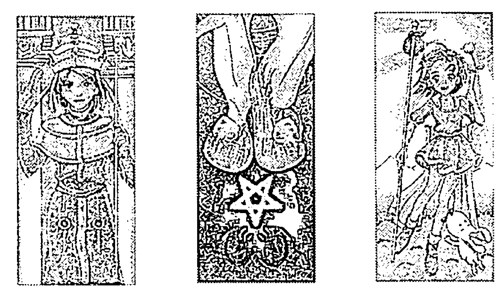

“老师，牌上怎么说？”魏小姐很着急的问我。
“嗯！你真的太会胡思乱想了，花太多时间在想东想西。”我看了牌后对魏小姐说。
“也是啦！我真的太会胡思乱想了，不过有时候找不到他，还是很担心嘛！”魏小姐难为情的对我说。

“所以，你一定要找些事来忙，不然一定苦死自己。”我对魏小姐说着。

“有啦！我有上班啦！”魏小姐有一点不平的回答。

“上班还是在努力想，对不对？”我有点调侃的对魏小姐说。“哪有，想一点罢了。”魏小姐有点不好意思的回答。

“老实讲，你们最近一次见面是不是已经有好一阵子了。”我看了一下牌后问魏小姐。

“是呀！因为他忙我也忙，最近一次大概是半年前了。”魏小姐听后不加思索就回答。

“我建议你最近几天飞过去找他，给他一个惊喜，问题就处理掉啦！”我建议着魏小姐。

“真的？就这么简单？”魏小姐有一点怀疑的问。

“真的啦！快去准备一下，跟公司请个假买张机票就过去啦！”我建议着魏小姐。

“好吧！我等等回公司就去请假，谢谢老师。”

### 开心老师开心解说

用元素配法来解牌其实是最简单且轻松的解法，因为只需把牌上的元素找出来，然后再用元素分配法来做解释就可以了。有很多问题只要一配，就可以很快找到重点与建议，现在我们就来看一下，这个案例如何使用元素配法做解释。

这三张牌分别是教宗逆位的土元素、恶魔逆位的土元素、愚者正位的风元素。由于教宗与恶魔都逆位，所以土元素反转成风元素，教宗与恶魔这两张逆位牌就成了风元素牌，因此这三张牌都变成了风元素牌。而风元素属于思考，也就是思想范围的状态，所以我才会说魏小姐想太多。三张风元素也充分表现出魏小姐与男友的交往现状，因为风元素代表用思考在交流、用精神在互动，甚至意味双方处于分隔两地的状况。在风元素过多下，欠缺另外三个元素，亦即火元素中肢体上的互动、水元素中情感的实际交流，土元素的稳定，所以我才建议魏小姐快一点飞去国外找男朋友，让双方的火水土三元素补充足够，这样感情问题便能很快得到解决。

## 案例2 ▶▶ 故事缘起

郑小姐与现男友交往一年多，两人感情很好，已届适婚年龄的郑小姐，当与男友聊起结婚，男友却对郑小姐发了一顿莫名其妙的脾气，郑小姐怕男友再生气，口头便不再提起结婚一事。但虽然如此，郑小姐想要结婚的念头却不曾改变，所以就跟我预约占卜，想知道与男友能不能顺利结婚，也想知道为什么男友会因为这件事跟她发那么一大顿脾气。

当时抽出的牌是：**星星逆位·隐者逆位·世界正位**

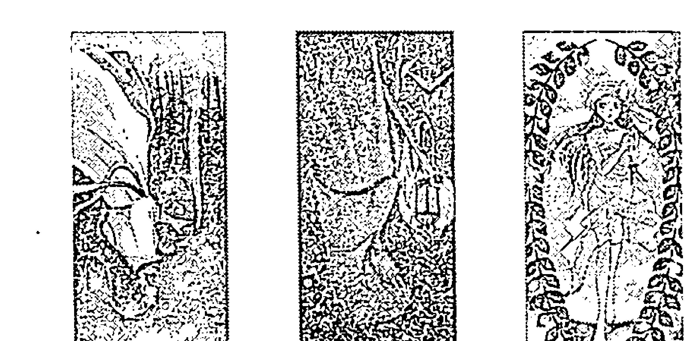

“你男友很重视工作。对吧？”我看了一下牌后对郑小姐说。

“对对对，他根本就是一个工作狂。”郑小姐听到后马上回答。

“其实你男友很重视实质上的安全感，所以我相信他老是觉得钱不够用。”我又看了一下牌后对郑小姐说。

“对对，他常说他赚的钱不够多，还要多赚一些。”郑小姐点头如捣蒜的回答。

“答案就已经出来了，你男友因为怕钱不够，所以迟迟不敢跟你结婚。”我把为什么郑小姐男友会生气的结论先告诉郑小姐。

“而且，你们对结婚的态度与想法还不够一致，只是单方面在着急。”我继续跟郑小姐说。

“嗯！”

“另外，你们两人不常沟通，彼此间互动不多。你是不是常常觉得有好多事都放在心里不知道该怎样讲出来？”

“对对对，老师说得对，我老是觉得面对他时话都讲不出来，好像卡在喉咙里面一样，很难过，久了之后就觉得算了。”

“问一个比较私人的问题，你与对方有多久没有亲密关系了？从牌面上来看，你们这方面很缺乏哦！”

“有三个月了，因为他都很忙，回到家都很晚，我也都睡了。”

“嗯！我建议你自己先做些改变，把情趣带到生活中，再慢慢去影响他。”

“噢！好，我会去做，还有吗？”

“而且，你要开始尝试把心中的话，用写情书的方式写给他，让他上班时看，就好像你们两人在玩交换日记一样。”

“好，请问老师，还有吗？”

“大概先这样子做一阵子。过一阵子你与对方有好的互动之后，再找我占卜一次。”

“好的，谢谢老师。”

### 开心老师开心解说

这个案例比较需要思考，也需要比较活化解释方式，不过基本上还算简单，各位看了我的解法便了解了。星星本属风元素，但因逆位而转换成土元素；隐者本属土元素，但因逆位而转换成风元素，外加世界的土元素，因此土元素明显比较多且旺，所以我会论郑小姐的男友是因为钱的问题而不想结婚，而且看得出来他很努力赚钱，把钱看得很重。又因为风元素在这三张牌中属弱势，代表只有一方在思考着要结婚，显得弱势，所以结婚的想法无法实现。再者，牌中缺少水元素，意味郑小姐与男友缺乏沟通与互动；又因缺少火元素，因此他们之间缺乏激情与亲密关系，这两个元素都是郑小姐要去改善的问题。

## 案例 3 ▷▷

### 故事缘起

何小姐目前在百大企业里任职，工作内容相当轻松，薪水也让朋友羡慕。不过何小姐自己仍不满意，因为她认为这份工作很没有挑战性，所以她利用上班闲暇上网创业。对手机很有兴趣的她，就往中古手机买卖方面进行。在刚开始时，生意还不错，但最近生意却有退步的迹象，所以找我占卜，想知道为什么生意会减少。

当时抽出的牌是：魔术师正位·星星正位·命运之轮正位

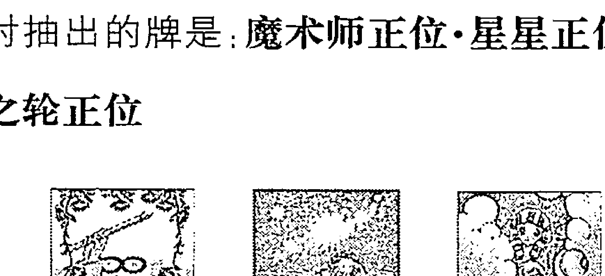

“你最近是不是很容易想太多？老是想得多、做得少？有企画却没有执行的动力。”我看了一下牌后对何小姐说。

“是有那么一点啦，老师看到了些什么？”何小姐回答。

“而且你做事情总是三分钟热度，不够脚踏实地。”我继续论着牌。

“嗯！我最近真的比较有三分钟热度的情形，想过要改，但都改不掉。”何小姐听后点着头回答。

“你面对客户时，讲的不够多，显得不够平易近人。”我稍微看了一下牌后对何小姐说。

“对对对，这问题我自己也知道，可是有些时候有些客户问的问题真的很奇怪，我又不太会打字，所以都回答得很简短。”何小姐听到我的论断后回答。

“这需要练习啦！既然是在网络上拍卖，就得多靠文字的叙述才能顺利成交呀！如果你都嫌麻烦，又怎么会吸引客人呢？”我提醒着何小姐。

“也是啦！但我打字慢嘛！每打一个字要打好久，等到我打好一个字以后，又忘记接下来要打什么内容了。”何小姐带点抱怨回答。

“你可以先把回复的内容写好在纸上，然后再打字回复嘛！”我给何小姐一点意见。

“也是可以啦！之前怎么没想到？”

“另外，你拍卖上确实收入不太稳定，要过一阵子才会转好，建议你别着急，先把沟通的问题搞定再说。”

“好！谢谢老师。”

### 开心老师开心解说

这个案例很好处理，因为状况都与问卜者自己有关。但问卜者的运势则和外在因素比较无关，现在就让我们来看如何用元素配法解释。这三张牌都是正位，所以不会发生需要翻转元素属性的问题。由于魔术师与星星牌都是风元素，命运之轮是火元素，显示风元素多且旺，代表何小姐容易想太多。风元素通常代表网络，代表何小姐的经营场所很可能是在网络上。火元素的行动力原本不错，但因为有两张风元素，让火元素的不稳定性更加强，所以何小姐才容易三分钟热度。恰巧的是，所缺少的两个元素就是沟通与互动的水元素跟代表金钱的土元素，这已把何小姐的问题全部点出来，因此，何小姐只需要把这些问题改善就可以了，不需要太过烦忧。

## 案例 4 ▶▶ 故事缘起

李小姐与先生冷战多时，最近又怀疑先生有外遇，而生起和先生离婚的念头，但她又怕双方家长与周遭亲友反对，所以暂时放下这个想法。可是最近，李小姐因为一些小事情而与先生大吵一架，她气冲冲的跑来问我是否真的该离婚，而且想知道是否真得离得成？

当时抽出的牌是：剑十逆位·杯后正位·杯三逆位·杖公主逆位·杯八逆位

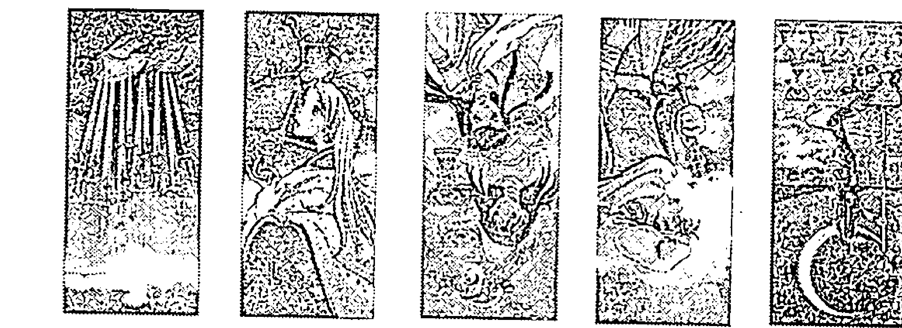

“你们最近吵得很凶哦！”我看了一下牌后对李小姐说。

“是呀！刚刚我出门前他还抓着我大吵了一架。”李小姐点着头回复我。

“整体牌面都不够理性。其实你们这种状况已经有一段时间了。”我继续对李小姐论着牌。

“是呀！已经一年多了。”李小姐回答。

“其实不是没有救，只是看你要不要让而已。”我看着牌对李小姐说。

“其实我也知道我该让步，但是为什么他不先让步呢？”李小姐听到我的论断后不平的说。

“你想要离婚也不是不行，牌面上看得出你先生也很想离婚。”我想了一下李小姐的问题，然后对她说。“嗯！他离婚协议书早就签好了，只是一直不愿意拿给我。”李小姐听到后点着头回答。

“但这一段婚姻也不是不能救呀！”我继续对李小姐说。

“这我也知道，但我就是不想再继续下去了，我真的觉得好累……”李小姐想起这一段婚姻的痛苦，不禁掉起了泪来。

“也许你觉得离婚对你比较好，牌面上来看也可以离，不过我还是希望你再想一想。”我等李小姐情绪稍微平复之后，对她这么说。

“嗯！我知道了，我的决定是要离，也谢谢老师帮我确定我心中的想法。”李小姐听完我的话后，就离开了。

### 开心老师开心解说

这一类问题其实我算多了，所以有一点麻木。对于客户的选择，我多半会先劝和不劝离，但我还是尊重客户的选择，因为我只是一位塔罗占卜师，真正要做抉择的还是客户自己。

五张牌中，剑十为风，但逆位所以转土；杯后正位为水不变；杯三为水，但逆位所以转火；杖公主为火，逆位所以转水；杯八为水，逆位因此转火，所以整个牌面的元素配置为：“土、水、火、水、火”，很明显的火和水过多，所以我会论李小姐与她先生最近吵得很凶。而土只有一个，无法阻止那过多的水和火，所以我论双方之间很不稳定；也因为缺乏风元素代表双方缺乏理性，但也因为有一个土元素， 所以双方都还是想要维持现状、不想离婚。而我能确定双方离得成，是因为土的稳定感被水冲、被火烤到已经不成样，所以离婚可成。

## 案例5 ▷▷

### 故事缘起

王小姐在目前的公司工作已经十多年，最近觉得老是在同一个地方做事很无聊而想换工作，最近她朋友也找她一起开店，她很有兴趣，所以跟我预约占卜塔罗牌，她想知道自己适不适合离开现在的工作，去跟朋友合作开店。

当时抽出的牌是：杯二正位·杖二逆位·杯后正位·杯骑士正位·杯公主逆位

“我现在先从牌面上抓一、两个工作项目，你听看看是不是。”我看了一下牌的元素后对王小姐说。

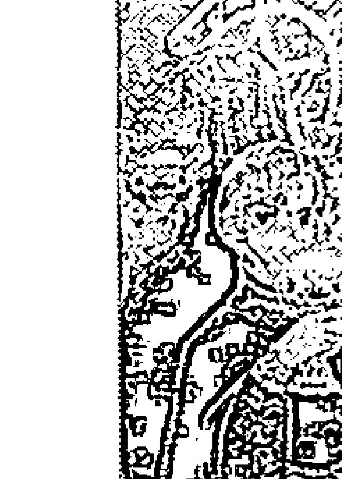

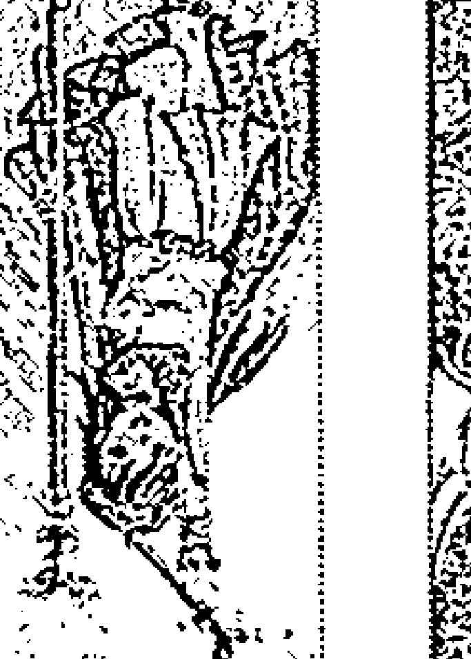

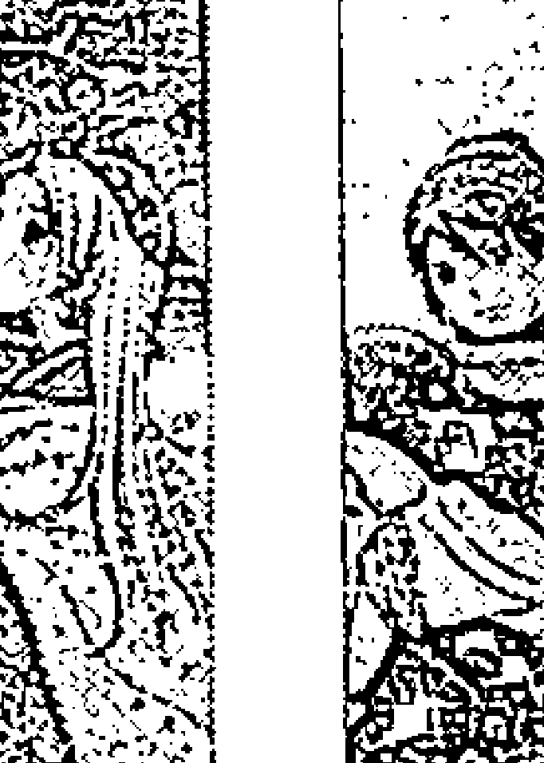

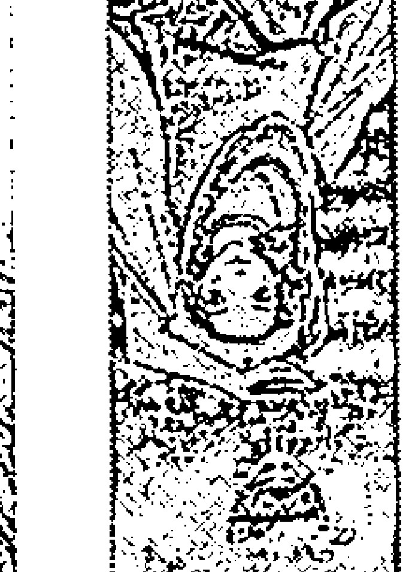

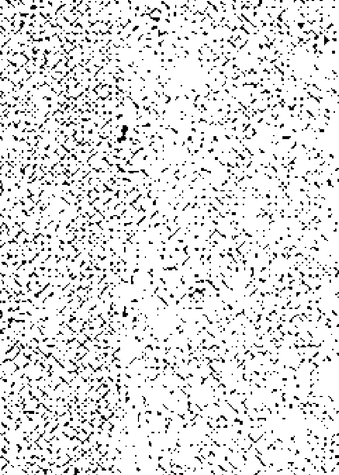

“好，请老师直说。”王小姐不啰嗦的回答。

“你是否做与旅游有关或是与交通运输有关的职业呢？”我从牌上抓出两个大方向问王小姐。“没错，我在连锁租车公司上班。”王小姐一听，马上笑着回答。

“那我不建议你离开目前的工作。”我一听王小姐确定后马上对她说。

“耶？为什么老师这么说？”王小姐一听到我不建议她离开，马上好奇的问我。

“因为我从牌面上看到，你的工作很适合你的运，或者是说你做这一行会很顺。”我看着牌回答王小姐。

“真的耶！我这几年去算紫微斗数跟八字，那些老师都这么说。”王小姐一听，就马上搬出她过去的算命经验。

“所以，我不建议你换工作呀！而你与朋友合开的店，我建议做吃的。”我继续就王小姐的问题论着牌面。

“对耶！我就是要跟我朋友合开一间牛排馆。”王小姐听到我的论断吓了一跳。

“我建议你现在不必辞职，而用出资的方式跟朋友合作，这样会很赚。”我看了一下牌后给王小姐建议。

“好，那我知道了，谢谢老师。”王小姐听了我的建议后就付钱离开了。

### 开心老师开心解说

这个问题其实非常简单、也很轻松，因为牌面几乎一面倒，所以我没花多少功夫在讲解问题。加上王小姐是一位很直爽的客户，所以直来直往非常轻松。

五张牌中，杯二为水正位不变，杖二为火但逆位为水，杯后为水正位不变·杯骑士为水正位不变·杯公主为水但逆位为火，所以整个牌面上的元素配置为：“水、水、水、水、火”。因为水元素较强，所以我论王小姐目前的工作应该与水元素相关，而水元素本身有旅行的涵义，所以我会论旅游业或是交通运输业。另外，水元素也代表餐饮业，所以我也论断王小姐与朋友可以合伙餐饮业。而我不建议王小姐离开目前的工作，是因为牌面中只有一个火元素，显得衰弱，所以不利行动，因此我建议王小姐不要离职，继续在目前的公司上班。

# 问题篇

一位好的塔罗占卜师，一定要帮问卜者找出问题。因为问卜者有时候并不知道自己要的是什么，所以一开始最重要的就是引导问卜者明白他自己要的是什么，甚至主动帮问卜者决定他要的是什么。若遇上不了解自己想要什么的问卜者时，千万别问他想要什么，因为塔罗牌是占卜类的术数，需要一个很明确的问题，若是问卜者丢出一个范围很大的问题时，那么累的就是占卜师自己了，这也是很多占卜师容易犯的错误，希望大家一定要注意这一点，不然只是让自己解牌解的很难过，问卜者也听的雾煞煞。 问题的选项很简单，大致可区分成：爱情、工作、学业、人际。当大分类问题已经找出来之后，接下来就要把问题细化。如果是问爱情，就要知道问卜者是否已经有对象，若是连问卜者有没有对象都不知道就占卜，那真的像是乱枪打鸟，打中是运气。如果已经知道问卜者有对象就简单多了，一般来说，有对象可以区分为：双方还不是男女朋友、双方已经是男女朋友、双方曾经是男女朋友、双方已结婚、双方已离婚。通常会来问爱情，多半都会问以下几个常态性问题。例如：我与对方什么时候能在一起？我与对方能不能有结果？我与对方走的长不长久？我与对方能不能结婚？基本上一个问题只要了解到这里就足够了，因为这已经算是具体的问题。

以上是举已经有对象的问卜者做例子，如果是没有对象的问题更简单，因为没有对象，问题也多半会集中在什么时候会有对象出现。我在处理爱情问题时，大体上已经有对象的我都以双方是否有缘份来做处理，当双方有缘份时再解下去也比较有趣，因为如果没有缘份，讲再多都没用。倘若是目前还没有对象，而想要问爱情什么时候会来到的问卜者，我会选择用看运势的方式来做处理。例如，今年几月份的桃花运会比较强，如果占卜的案例很多的话，自然就可以从各种问题中找出一个规律性。

另外，当问卜者在描述问题时，各位一定要掌握问题的重心，并适时阻止问卜者继续讲述下去，因为有时候，问卜者在描述的是问卜者自身的观点与心理状况，如果听太多问卜者的描述就会失去客观性，在解牌上也会出现很多问题，这一点请各位一定要注意。

# 沟通篇

虽说是沟通，但更重要的是如何给问卜者一定的心理建设。塔罗占卜师虽然不是心理医生，但是适时的给予安慰与信心却更重要。也许大家会觉得占卜出来就这样了，哪需要给问卜者什么安慰或信心，然而，在我过往的客户里，不乏占卜完后大哭一场或者是当场呆掉的状况，这时就需要给予问卜者一定的信心、沟通或安慰。

当占卜出来是好事，要锦上添花很简单，一两句阿谀奉承就可以把问卜者抬上了天；当占卜出来是坏事时，要如何给予问卜者一定的安慰与信心，可就是一门艺术了。当问卜者得知状况不好时，心情不佳在所难免，此时不妨转个弯来论牌义，虽然不需要特别的言语修饰，但是小小的解析技巧却是需要的。例如，当问及感情时，牌面已经很确定双方没有结果，这时最好以双方缘分不足，或是两人的缘分比较属于兄妹情或姊弟情来带过，要点到让问卜者懂，但也不要太过打击问卜者的心。当然，这需要一些经验，我建议各位多多练习。

在一些问题中，总是会有很糟糕的情况被投射出来，这时也可以用宿命论的方式带过，这也是问卜者比较能够接受的方式。千万不要觉得这是很老八股或是江湖术士的讲法，因为，这种做法会比直指问卜者有错，或者是问卜者心灵成长不够来得有效。

再者，我们来谈谈有关建议的部分。我把建议的方式区分为两种，分别是无关痛痒式与技术性的建议。什么叫做无关痛痒？当问卜者在占卜与对方之间的感情出问题时，占卜者可以多跟对方聊心事，或是多用爱的力量让对方转变态度。这种无关痛痒的建议其实很常见，是属于比较没有效率的建议方式。

另一种比较有技术性的建议则属于硬功夫，比较简单的方式就是依照牌上所能得出的象征来建议问卜者。例如说，抽到愚者正位，就可以建议问卜者，双方之间应该有一些情调，或者是建议问卜者不要一直怀念过去的好，应该尝试建立未来；而愚者是风元素，也可以建议问卜者若是发现与对方陷入无法沟通的状况时，可以多利用科技的力量，例如，使用手机简讯、网络 E-mail 来与对方沟通，基本上，我只是举比较简单的例子与做法介绍给各位，个中奇妙还是要各位多多练习。若是各位运用得当，也可以利用牌上所显示的状况来做风水或运势上的补强。

# 初上手

## 哪里买塔罗牌

### 网络

- 1. 纸牌博览馆
  网址: http://www.tarot.com.yahoo.tw/
  介绍: 这是一间超老牌的网络塔罗牌专卖店,里面有很多国外的塔罗牌贩卖,建议各位一定要到这网站去看一看,我也常到这里看牌。

- 2. 雅虎拍卖场
  网址: http://tw.bid.com/
  介绍: 在雅虎的拍卖场里面,也有很多不错的卖家在贩卖着自己从国外带回来的塔罗牌, 各位进入雅虎拍卖场后可以在搜寻上面打塔罗牌,就会出现很多的拍卖场,可以慢慢挑选, 但是也请各位要多注意一下所挑选拍卖场的卖方评价,因为我没在拍卖场买过塔罗牌,所以不对拍卖场的卖家做些评论,就请各位多多注意了。

- 3. 瓦德占卜馆
  网址: http://home.kimo.com.tw/taiwanmap/
  介绍: 这是占卜师瓦德所经营的网店,瓦德取得了 Yesaisa.com 的授权在其个人的网站上介绍 Yesaisa.com 所贩售的塔罗牌,欢迎各位前去了解。

### 实体

- 1. 诚品书店
  地址: 全国诚品书局
  介绍: 我多在台北活动,最常去的就是诚品敦南店,也在那里看过一些国外进口的牌,有些牌也相当的棒,建议各位也可以去那里绕一绕,若是找不到牌,也可以请诚品的员工代为下订,一般来说约两个月~三个月就可以到货。

- 2. 淳贸企业有限公司
  地址: 台北市八德路四段768巷7号3楼之一
  电话: 02-27889231
  介绍: 淳贸在国内其它地方也有分店,各位可以打通电话去询问。而淳贸是国内网络塔罗界众多同好推荐的地方。塔罗牌进来的很快,种类也很多,最重要的是价钱相当的便宜,受到很多塔罗同好的喜爱,虽然我没有去买过,但很多同好都如此推荐,那么我就放上来推荐给各位。

## 哪里学塔罗

### 前言

以下只是我在网络上收集的数据,有关于教课内容方面磨子不做评论与保证,还请各位读者在报名前能够自己先前去确认,并且可以的话,先行了解授课老师的程度是否符合自己的要求与是否与自己的调性吻合。

- 1. 雷洛思老师
  上课地点: 抹茶橘子
  地址: 台北市辛亥路1段34巷6号 (近台电大楼站2号出口)
  联络方式: 0922-630-456

- 2. 李孟浩老师
  上课地点: 群杰成长分享空间
  地址: 台北市敦化北路307号3楼之1 (万福大厦后栋)
  联络方式: 02-2713-9987

- 3. 虫虫老师
  上课地点: 高雄市 (请与虫虫老师联络)
  地址: 高雄市 (请与虫虫老师联络)
  联络方式: 0929-780-818

- 4. 清风老师
  上课地点: 道家书院 (中华民国道家学术研究会)
  地址: 台北市敦化北路155巷1号B1 (敦化北路与长...)

- 5. 林乐卿老师
  上课地点: 奥修咖啡 ~ OSO咖啡
  地址: 台北市师大路93巷13号
  联络方式: Gi___m@sinamail.com

## 哪里占塔罗

### 前言

以下只是我在网络上搜集的相关数据，有关于各占卜师的占卜功力与经历，我就不表评论与保证，各位若是有需要的话，可以与他们联络占卜事宜。

- 1. 子鸣老师
  占卜地点: FOTO126.3
  地址: 台北市士林区文林路126号三楼(近剑潭站，阳明戏院斜对面)
  联络方式: 0926-047-778

- 2. 角落咖啡(杰克老师)
  占卜地点: 角落咖啡
  地址: 台中县龙井乡新兴路1巷2号
  联络方式: 04-2631-8706

- 3. 领域咖啡(幽月老师)
  占卜地点: 领域咖啡
  地址: 台北市新生南路二段125号2楼(新生南路仁爱路口、加油站旁)
  联络方式: 0911-271-941

- 4. 雷洛思老师
  占卜地点: 抹茶橘子
  地址: 台北市辛亥路1段34巷6号 (近台电大楼站2号出口)
  联络方式: 0922-630-456

- 5. 虫虫老师
  占卜地点: 高雄市(请与虫虫老师联络)
  地址: 高雄市(请与虫虫老师联络)
  联络方式: 0929-780-818

- 6. 堂堂老师
  占卜地点: 台北市(请与堂堂老师联络)
  地址: 台北市(请与堂堂老师联络)
  联络方式: 0953-372-035

- 7. 政裕老师
  占卜地点: 树林市(请与政裕老师联络)
  地址: 树林市(请与政裕老师联络)
  联络方式: 0915-207-168

- 8. 大猫老师
  占卜地点: 台南市(请与大猫老师联络)
  地址: 台南市(请与大猫老师联络)
  联络方式: BigCat@ms90.url.com.tw

- 9. Jamie 老师
  占卜地点: 台北市(请先与 Jamie 老师联络)
  地址: 南势角捷运线,顶溪一号出口左,星巴克或丹堤咖啡馆
  联络方式: 0932-069-238

- 10. Ian 老师
  占卜地点: 台北市(请先与 Ian 老师联络)
  地址: 台北市(请先与 Ian 老师联络)
  联络方式: 0963-385-739

- 11. 小夜老师
  占卜地点: 台北市(请先与小夜老师联络)
  地址: 台北市(请先与小夜老师联络)
  联络方式: 0927-416-058

- 12. 书军老师
  占卜地点: 台北市(请先与书军老师联络)
  地址: 台北市(请先与书军老师联络)
  联络方式: 0930-252-364

## 哪里交流塔罗

### 前言

以下只介绍我常去讨论交流的地点，也许也是有其它的地点而我不知道。不过这几个地点我是可以保证有料的地方，而且也有很多功力很好的高手在其中讨论交流，建议各位要常去一同讨论交流，让自己的塔罗功力更加的成长。

### 实体

- 1. FOTO126.3
  地址: 台北市士林区文林路 126 号三楼(近剑潭站,阳明戏院斜对面)
  时间: 每日十八时过后

- 2. 抹茶橘子 人文 咖啡 二手书房
  地址: 辛亥路一段 34 巷 6 号一楼(捷运台电大楼站二号出口对面漫画王台大店巷内)
  时间: 每日十七时过后

### 网络

- 1. 无视论推广站-(磨子森林)-(我自己的论坛站)
  网址: http://tarot.why3s.com/

- 2. 台大批踢踢实业坊
  网址: BBS://ptt.twbbs.org
  版名: 塔罗牌的世界

- 3. 光与影的塔罗圣殿
  网址: http://ralos.why3s.org/

- 4. 无名小站
  网址: BBS://wretch.twbbs.org
  版名: 塔罗版

- 5. KKCITY 网络城邦
  网址: BBS://bbs.kkcity.com.tw
  版名: 实占塔罗讨论区

- 6. 台大不良牛牧场
  网址: BBS://bbs.badcow.com.tw
  版名: 牛牛的塔罗占卜绘者简介

# 编者简介

### 魏 纬

从小贪玩，酷爱画画。每天重复、重复再重复的画啊画。成立过漫画工作室，精彩但穷困潦倒地过了一年。为了让荷包饱满并享受年轻的生活，决定成为新潮的soho一族，从事书籍设计及原创插画，工作生活两相宜，真正体会到工作的快乐。

# 图书在版编目(CIP)数据

两小时学会塔罗/(台)开心老师著.一兰州:甘肃文化出版社,2006.8
ISBN 7-80714-274-X
Ⅰ.两... Ⅱ.开... Ⅲ.扑克一基本知识 Ⅳ.G892
中国版本图书馆CIP数据核字(2006)第094728号
本书经台湾雅书堂文化事业有限公司,授权甘肃文化出版社出版中文简体版本。
著作权合同登记图字:26-2006-54

# 两小时学会塔罗

- 出版发行: 甘肃文化出版社
- 地址: 兰州市庆阳路曹家巷1号
- 经销: 新华书店
- 印刷: 北京宏伟双华印刷有限公司
- 开本: 787×1092毫米 1/24
- 印张: 10.5
- 字数: 90千字
- 版次: 2006年10月第1版
- 印次: 2006年10月第1次印刷
- 书号: ISBN 7-80714-274-X
- 定价: (盒装)38.80元

> 如果发现印装质量问题,请与承印厂联系调换。
版权所有,翻印必究:未经许可,不得转载!