# 人人都能玩塔罗

## 塔羅牌是什麼？

塔羅是一種紙牌的神諭（oracle；神的啟示），它以目前的結構遠從十六世紀流傳至今。它是由七十八張牌所組成的，被分成兩組：主牌和副牌，主牌有二十二張，叫作大阿爾克納（拉丁文的阿爾克納意味著祕密）；副牌有五十六張，分成四組，叫作小阿爾克納。主牌按照數字的秩序代表著人類心靈成長和演變的旅程；副牌則是代表著人類生活上各個層面的不同狀態。基於上述塔羅牌所設計出來的內涵，我們可以了解，塔羅牌比較適用於解決人類心靈和生活上各個層面的問題。副牌是現代撲克牌的前身，它的四組牌跟撲克牌的對應如下圖：

| 塔羅牌 | 法國的撲克牌 | 德國的撲克牌 |
|---|---|---|
| 權杖 | 梅花 | 球果 |
| 寶劍 | 黑桃 | 葉子 |
| 聖杯 | 紅心 | 心 |
| 金幣 | 方塊 | 鈴 |

對於這四種圖象的背景有很多種猜測，它們可以跟中古世紀的四個階級連結，或是跟塞爾特族的四種標幟連結，或是跟某些印度神的特性連結，尤其可以跟傳統的四元素（地、水、火、空氣）連結。

| 塔羅牌 | 中古世紀的階級 | 塞爾特的標幟 | 四元素 |
|---|---|---|---|
| 權杖 | 農夫 | 長茅 | 火 |
| 寶劍 | 騎士 | 劍 | 空氣 |
| 聖杯 | 教士 | 杯子 | 水 |
| 金幣 | 商人 | 碗 | 地 |

它似乎很明顯，在古時候的教導裡，將火和空氣視爲男性的元素，而將水和地想成是女性的。這個區別仍然可以在法國的撲克牌裡面找到，他們將黑色的梅花和黑桃視爲男性的，而將紅心和紅色的方塊視爲女性的。

最原始的主牌和副牌是否混在一起，而到了後來才變成配對使用，這已經和牌的起源一樣變得不可考了。有一些證據顯示，副牌是在十四世紀從回教世界傳到歐洲來的。至於這些牌上面畫些什麼，它們如何被使用，以及它們只是用來玩的，或者它們可以用來作爲神諭，已經不知道了。主牌對塔羅牌的愛好者來講是更有意義的，但是對於它的起源，我們所知道的甚至更少。在西元 1430 年，它首度出現在義大利的牌裡面，叫作「維斯康提-斯佛薩」塔羅牌，但是關於它的起源有很多種不同的說法。有些人將它說成跟義大利的文藝復興有關，因爲它首度出現在十五世紀，其他有一些人將它推到更遠的年代。根據一個理論說，主牌是古埃及教士的一種智慧之書，它從好幾千年前就被流傳下來，但是只限於少數的奧秘團體。然而，即使在十五世紀的時候正式被發現，它們真正的本質還沒有完全被了解。塔羅牌的奧秘象徵圖象直到西元 1781 年才被一個叫作傑柏林（Court de Gebelin）的法國博學家在一個巴黎的沙龍玩牌的時候所解碼。

常常那個真理可能就存在於這個臆測的某一個地方。就我的看法，不管怎麼說，這些牌出現的年代並不是特別重要，因爲這些牌傳遞了古老的智慧，它的根源存在於我們集體的潛意識裡，而且它可以追溯到人類最原始的階段。所以我認爲這些畫出這個智慧的牌不論是有 500 年的歷史或是有 5000 年的歷史並不是關鍵，反而是這些圖畫和象徵符號所顯示出來的東西才是重要的，而它們的確是出現在紙張和印刷技術發明之前。

然而，就只是這二十二張象徵圖象的主牌就蘊涵了這個人類生命途徑的深奧知識的確令人稱奇，關於這個部分，我在另外一本書「英雄的旅程」(The Journey of the Hero) 裡有更詳細的描述。這個古老的智慧是如何保存，在什麼時候保存，爲什麼要保存，以及是由誰所保存在這二十二張循環圖畫裡至今仍然是一個奧秘。也許那些文藝復興的貴族們，基於古老的地中海的秘教，扮演了一個重要的角色，因爲這些牌早期的名字跟它們有關。

五十六張副牌就不具有那麼深的象徵意涵，畢竟它們只是用來輔助的。

## 各種不同的塔羅牌

直到二十世紀初期，副牌所畫出來的圖象還是跟一般的遊戲紙牌差不多，這一類較早期的牌現在仍然可以找到，比方說馬賽麗斯塔羅牌（Tarot of Marseilles）。除了一些裝飾之外，它們只是顯示出那個數字和那一組牌的象徵。換句話說，在權杖三這張牌上面，一個人只會看到三根權杖，而聖杯八的牌上面就只是畫出八個杯子。這些牌只能藉著數字學和該牌所代表的元素來作解釋。這本書包含了所有四十張數字牌的傳統解釋。

在這段期間，有好幾百副不同的塔羅牌被印出來，而且每年都有很多新的牌誕生。初學者常常會面臨要選哪一副牌的問題。可以理解的，有很多人會遵循他們的美感來買他們所喜歡的牌。但是因爲每一副牌的意義都有所不同，所以當要解釋那些看起來很喜歡的牌時常常會碰到困難。爲什麼要有這些新的設計呢？所以找到每一副牌適當的解釋是重要的。目前大多數的書都是在討論萊德・偉特塔羅牌和克勞力・托特塔羅牌。如果一個人決定要購買其他的牌，尤其是比較奇特的牌，他必須先看看那副牌有沒有可用的解釋書。

## 有沒有所謂好或不好的牌？

哪一副牌是好的，哪一副牌是不好的，這個問題很難作概括性的回答。一開始，它要依一個人想要用這些牌來做什麼而定。如果一個人想要學習二十二張主牌，將它視爲可以提供古代深奧知識的智慧之書，那麼他將會對一些新的塔羅牌感到失望而無法找到他所要的牌。在這個層面上，一個人可能很快就會了解這些新牌的設計師並沒有掌握到，甚至沒有覺察到塔羅牌較深的層面，想要在這些牌裡面探討較深的層面是不可能的。

如果一個人只是想要使用塔羅牌來作爲隨機的啓示，爲自己擺出一個牌陣，那麼就沒有不好的牌。在這種情況下，問題就要看你是否能夠將這些牌作正確的解讀。在此，決定性的問題並不在於哪一副塔羅牌可以做得比較好，而在於你跟哪一種象徵性的語言比較有親和力，以及你對哪一副塔羅牌可以了解得比較好。就如每一副牌的形象各有不同，每一副牌也都有它自己的語言。如果一個人想要解釋那些牌，他必須能夠了解那些圖象以及它們象徵性的意義，以便能夠找到適合自己的答案。

## 牌的出現是一種巧合嗎？

跟很多其他古時候的神諭一樣，塔羅牌這個系統也是有加進一些巧合的因素。有很多人覺得這是荒謬的，所以不願意再更仔細去看這個現象。另外有一些人認爲它們是愚蠢的、盲目的，或是純粹的巧合，而將它們貶爲無意義的、不相關的。這些人不相信任何成年人會對這些隨意抽出的牌給予任何嚴肅的意義。

「巧合」這個字是比較新的，它並不存在於古老的語言裡，這個字在十四世紀的時候被創造出來，來指出那個不能計算的。在以前，很明顯地，某些神聖力量的運作一直都是被表達在那個不能預知的裡面，所以在一開始的時候「巧合」並不是一個遭到輕視的概念，它是到了十七世紀才被稱爲是不好的，因爲隨著科學的進展和啓蒙運動的開始，有很多古老的觀念都被認爲是不科學的，或者乾脆就被認爲是荒謬的。自從那個時候開始，巧合就開始被視爲是一種打擾和不能預測的麻煩製造者，或者至少是潛在的例外的難題。只有到了最近這幾十年，人們才再度開始將巧合視爲可能是有意義的，我們要如何來看待它？

從心靈的觀點來看，時間並非只是一個在流動的數量而沒有任何意義，時間也有一個品質，它帶著它本身的意義注入任何一個片刻。至少那是大多數神諭的基礎觀念。當時鐘的指針指示著時間的數量，我們可以從星座或某一個巧合的現象來推論該片刻帶著什麼樣的意義。根據完整的 worldview，問題和答案是互相歸屬的，它們形成了一個統一體，因此問題也包含了答案。一旦一個人去覺察那個片刻的品質，一個人也可以在那個當下的象徵圖象裡面讀到那個答案。因此巧合的本質是，它能夠透過那個當下隨機的星座圖來指出那個片刻的品質，這是很多神諭典型的品質，它們各自以它們自己的方式讓我們來解釋這個象徵圖象。

當然，可以有很多方式來使用巧合。比方說占星學家會看著天空——至少以前是如此，現在他會看電腦螢幕——從星座的位置來推論事情。古時候的中國人也會抽籤，查看人類最古老的智慧之書——易經裡面六合符號的意義。有精通塔羅牌的人會將牌展開，杜魯伊德派的教徒會問北歐占卜石（Runes），還有一些人會讀咖啡渣的排列，從它在當下巧合的結構來看出它象徵性的意義。在所有這些例子裡，時間扮演著一個很重要的角色。問題不見得在於哪一種神諭比另外一種來得優越，而比較是在於那個人能夠最了解哪一種象徵符號——星座、塔羅牌、或北歐占卜石等等。

儘管有這些很好的解釋，還是有很多人保持懷疑，而不想賦予這些巧合任何重要性。而且，每一個人都知道，當你抽五次牌而將它們排開來，你一定不會五次都得到同樣的答案，所以有很多人懷疑這種隨機抽樣的神諭的可靠性，或甚至蔑視以這種方式來尋求忠告的作法。然而這種看法是基於某種錯誤的假設。在理性思考的世界裡，科學家重複實驗一件事很多次，得到同樣的結果，以此來證明某件事是真實的。為了要讓實驗得以順利進行，科學家會營造出一個環境，將所有隨機出現的打擾盡可能排除。雖然變數在實驗室裡面被認爲是打擾的因素而必須儘量避免，但是它在神諭的世界裡可能是一個重要的訊息。因此科學方法不能就這樣被移植到意義的領域。

塔羅牌陣的意義存在於那個獨一無二的、巧合的排列裡，它反映出那個當下特殊的品質。它的無法重複這個事實是它的本質，但是這並不能證明什麼。一個人可能會引用夢的世界來當作類似情況的例子，在夢的世界裡，每一個夢都是有意義的，而不必說一定要夢五次同樣的夢才被重視。同樣地，第一個牌陣對於某一個特定的問題就是有意義的。

## 牌的忠告有多可靠？

一個人可以一直依賴這些牌嗎？它們真的從來說謊嗎？當然，跟世界上其他任何東西一樣，塔羅牌並不能提供給我們一個絕對、客觀的真理。但這並不意味著牌所給的答案是隨機的或專斷的，它們的可靠性可以像是一個年老的智者的忠告——我們會喜歡得到他的忠告，我們也會將它慎重考慮，但是如果為了它而出賣了你的靈魂，變成依靠它，盲目地跟隨它，而放棄了你自己的責任，那顯然就不對了。

塔羅牌是一個好的僕人，但是是一個壞的主人

## 問問題和作解釋

如果你想要立刻開始

這本書可以使你立刻將牌攤開，即使你是第一次接觸塔羅牌。當你要這樣做的時候，請你按照下列的步驟：

+ 1、提出你個人想問的問題，然後選擇下列牌陣的其中之一：

a) 如果你想要知道一個問題、一個計劃、或你的愛情生活將會有什麼樣的發展，你必須使用「指南針牌陣」（參看第 19 頁的說明）來了解更多關於你未來的展望。

b) 如果你想要問牌關於你跟某一個人的關係，那麼你就可以使用「愛的神諭牌陣」（參看第 19 頁的說明）。

c) 如果你需要在兩個或更多個可能性之間作決定（比方說，房子、工作、假日的旅行、或人），那麼你就可以使用「指南針牌陣」（參看第 19 頁的說明）來找出哪一個是最好的選擇。

d) 如果你在找尋對自己更多的了解，那麼你就必須使用「盲點牌陣」（參看第 21 頁的說明）。

+ 2、將 78 張牌洗一洗，在你的面前攤開呈扇狀，牌面朝下。

3、就你所選定的牌陣來看看需要抽出幾張牌。

4、然後放鬆地用你的左手將牌抽出，不必集中精神或是特別想什麼。將抽出來的牌堆在一起，牌面仍然朝下。

5、現在將牌依照你抽出的順序（那就是，從那一堆牌的最下面那一張開始）將牌翻開，根據牌陣的號碼將它們排出來。

6、在這本書解釋的部分裡面找到每一張牌在它特定位置上的意義。

7、最後，將單張牌的解釋或一般性的解釋跟你所找到的解釋連結在一起來形成一個綜合的解釋。

8、試著找出它的精髓（參看第 17 頁的說明）。

## 如果你想要知道得更精確的話

一個人能夠從塔羅牌學到什麼？

塔羅牌的使用基本上有兩種方式，其一就是將它們視為智慧之書來學習，藉著那些牌的象徵圖像的幫助和透過抽牌的連結來找出人生旅程當中所需要的深刻和豐富的洞見。一個人可以藉著它以一種更深刻、更完整的方式來了解人生中的很多問題、事件、和十字路。這個來自集體潛意識的古代智慧存在於這二十二張主牌的圖像和結構裡。

然而最普遍的方式就是將牌攤開來，在這種情況下，牌能夠給予圖畫式的答案關於：

+ 1、目前事情或關係的狀態。
2、未來的發展。
3、最佳的進行方式，和
4、對自己的了解。

## 正確的問問題的方式

在將牌攤開的時候最重要的和最有影響的因素莫過於你所問的問題。根據經驗，你以什麼樣的方式問問題，塔羅牌就會剛好以同樣的方式來回答：清楚的問題——清楚的回答；沒有問題——沒有回答；嚴肅的問題——嚴肅的回答；愚蠢的問題——愚蠢的回答。當那個問題只是問著玩玩的，那個回答也只是玩玩的。它甚至可能是，當你帶著特定的慾望來問一個問題，那個回答可能會反映出這些慾望，而不會顯示出未來的發展。

而且，不只是你想要知道什麼是重要的，你是否真的想知道它也是重要的。有時候你會不想去面對某一件事，或者不想知道某一件事，然而一個人必須牢記古希臘人對神諭所說的話：「只有在你準備好要聽取神諭所說的每一個答案時才來問它！」

你可以大聲地問問題，或者靜靜地問問題，你可以重複它好幾次，或是將它寫下來。這是你可以自由決定的，沒有說哪一種方法就比另外一種方法來得好，重要的是你要真正知道你在問什麼。當你在抽牌和解牌的時候必須保持鎮定和放鬆的心情。

平鋪直敘地將問題問出來，不需要一定要問得多優雅，你只要知道你想要知道什麼。為避免混亂，你不可以在一個問題裡面包含了好幾個主題或步驟，你必須針對每一個問題重新抽牌擺牌。

## 不適當的問題

當然，有一些問題是無法由塔羅牌來回答的，比方說，關於名字、地方、電話號碼、和其他的數字。同樣地，關於什麼事剛好會在什麼時候發生，這也是塔羅牌無法精確回答的。關於大多數「是或不是」的問題，可以以一種不同的方式來提出，這樣比較能夠由「指南針牌陣」來得到回答。下列的一些例子可以用來作為參考：

| 不適當的問題 | 適合「指南針牌陣」的正確問題 |
| --- | --- |
| 它是否會解決？ | 如果我去嘗試它，將會有什麼樣的事發生？而如果我隨它去的話將會變成怎樣？ |
| 我會很快搬家嗎？ | 我需要去找新的房子或者待在原來的地方？ |
| 在我的婚姻危機裡，情況是否會好轉？ | 我必須儘量做來挽回我的婚姻，或者我必須放棄它？ |
| 我是否需要再換職業？ | 如果我繼續走原來的路，會有什麼樣的前景？如果我改變我的路線，變成自己當家作主，提早退休，或是找新的工作等等，會有什麼樣的機會？ |
| 我是否能夠在某一天還清債務？ | 我未來的財務狀況看起來怎麼樣？如果我嘗試 A，B 或 C，會有什麼樣的展望？ |
| 我是否要自己創業？ | 我如果自己創業的話會有什麼樣的展望？或者如果我繼續受僱於人的話現況會怎麼樣？ |
| 我會恢復嗎？ | 隨著我的恢復將會有什麼樣的事發生？如果我嘗試A，B 或 C，會有什麼樣的展望？ |
| 我的愛情生活是不是會有好的結果？ | 我應該繼續等這個人或是再去找另外一個？ |
| 我們還會有小孩嗎？ | 如果我們繼續按照原來的方式進行，有機會可以生小孩嗎？如果我們尋求治療性的幫助的話會變成怎麼樣？ |

## 這個解釋的有效期間是多久？

通常牌的建議和回答對目前和未來的三到六個月是有效的，除非那個問題本身隱含著不同的時間。比方說，如果你問關於一個週末或兩個星期的假期，或者當你使用「星座圓形牌陣」來占卜一整年的情況。當然，如果你問關於職業的發展，那個時間的架構可能會改變。比方說，如果你用「指南針牌陣」或「決定的遊戲牌陣」來檢視你的工作 A 或 B 的展望，那麼那個指示著長期展望的牌將會延伸到超出兩個月之外。

如果時間的架構對你來講非常重要，你必須將它納入你的問題裡，比方說，你可以問「我的關係在未來的四個禮拜裡面將會有什麼樣的發展？」不能保證你所得到的答案只是關於未來四個禮拜的，但是至少那個重點落在所指定的期間。

## 適當的牌陣

讓我們來看一下本書第 19 頁以下的三種牌陣，這是本書的主軸。用這三種牌陣，幾乎所有要問塔羅的問題都可以得到解答。然而，如果你還覺得你特殊的問題用這些牌陣不是很貼切，那麼本書的附錄還列有另外十二種牌陣可供選擇。

### 洗牌、抽牌，並將那些牌排出來

一旦你決定了你的問題，同時決定了要用哪一個牌陣，你就可以按照下列的方式來進行：

+ 1、洗牌，洗牌沒有一定的規則，只要將牌洗得均勻，你要洗多久或是要用什麼方式都可以。
2、將牌在你的面前攤開呈扇狀，牌面朝下。
3、用你的左手抽出你所選擇的牌陣所需要的牌，一張一張疊好，牌面朝下。
4、將剩下的牌擺在一旁。
5、現在，按照你抽牌的順序（那就是，從那一堆牌的最下面那一張開始）將牌翻開，根據牌陣的號碼將牌擺出來。

### 解牌

#### 特定的解釋

首先，那個解釋需要查看該張牌在你所選定的牌陣的位置的意義。

當你所選定的牌陣是「愛的神諭」、「指南針」、或「盲點」，那是很容易的，因為這本書有提供給你完整的解釋。如果你使用其他的牌陣，比方說附錄裡面的牌陣，你就必須自己去組合出它的意義。在這種情況下，你可以在本書的「一般意義」、「工作領域」，或「愛的方面」那些欄位找到該張牌的意義，至於該張牌所處的位置的意義則可以查看每一個牌陣對該位置的描述。

對於某些牌陣，以跟你翻牌不同的順序來解釋是有幫助的。進一步的指引可以在這些牌陣的「解釋方法」那個章節裡找到。

#### 綜合的看法

在每一個解釋結束的時候會有一個綜合的看法。將個別的解釋融合起來，成為一個總括的看法。當你這樣做的時候，你不可以將可能的矛盾丟開。生命本身充滿了矛盾，這些牌為什麼不能也充滿著矛盾？

#### 難以捉摸的牌

有時候某一張牌或甚至整個牌陣會覺得很難懂。常常人們就只是繼續再抽出新的牌，直到那個意義變得清楚。我的建議是，要使用這種策略的時候必須很謹慎。經驗告訴我們，很奇怪地，在大多數的情況下，令我們不愉快的牌我們比較不了解，或是不願意去了解，所以人們傾向於繼續抽新的牌，直到它們導致「快樂的結果」。

你必須記住，一個不清楚的答案也可能是一個重要的陳述，它可能是那個情況或展望本身還很模糊，因為它必須根據某一個決定，而那個決定還沒有做出來。如果你只是繼續抽出新的牌，那個特定的陳述本身可能會被歪曲，因為你「強迫」那些牌給你一個明確的、有利的，甚至是令人愉悅的答案，而它跟原來的描述是無關的。

我會建議你接受那個不清楚，如果它只是關係到一張牌。如果整個牌陣都使你感到困惑，你還是必須將那些牌攤開來放著一陣子，放在你經常會看到的地方，那個意義也許會突然出現在你的腦海，那個可能性滿高的。如果在經過了幾天之後，你還是不了解它的意義，那麼再重新抽牌就覺得沒有什麼不對。

#### 倒立的牌

有一些塔羅牌的解讀師會在倒立的牌裡面看到不同的意義，另外有一些解讀師就只是將它們擺正。這兩種方式都可以，依你預設的規則而定。

你可以根據你自己的經驗或你的喜好來決定，但是必須在你翻開第一張牌之前就作決定，看看你就只是要將牌擺正，或者你要將倒立牌的意義納入你的解釋。在後者的情況下，你在洗牌的時候就必須更加注意，在桌子上將牌不規則地轉一轉，這樣做，正逆位的機率才會比較平均。

## 精髓

在解牌接近尾聲的時候，塔羅牌會給你最後的忠告，關於發問者要如何來處理這些牌的建議，以及在你進行事情的當中要考慮什麼。這個「精髓」可以由抽出的牌的數字值相加而得。宮廷牌（侍者、騎士、皇后、和國王）以 0 計算，Ace 牌以 1 計算，其他所有的牌的值就按照它們所指示的數字來計算。在萊德・偉特塔羅牌裡面，「正義」牌和「力量」牌已經被重新編號過，然而我建議你們以它們原來的數字值來計算這些牌，那就是，正義牌是 8，而力量牌是 11。

如果這些牌的數值總合是個位數，那個「精髓」就是主牌裡面跟它數值相同的那張牌。如果那個總合是兩位數以上的，那麼你就必須將這兩個數字相加，直到它變成個位數。如果總數是介於 10 和 22 之間，在主牌裡面跟它對應的牌可以提供額外的訊息。它也可能是進入那張個位數牌的主題的一個條件。在此，愚者牌的計算有些微的不同。在一般的情況下，愚者牌以 0 計算，但是如果所有的牌總合為 22，那麼就是由愚者牌（22）和國王牌（4）形成「精髓」。你可以參考每一張主牌的「精髓」那一欄的意義。

## 不好的牌？

當然，一個人有時候會抽到他不喜歡的牌，而且人們也常常會對於牌的忠告或是它們所提供的展望覺得很苦惱，所以一個人必須記住下列的話：

塔羅牌的忠告是從潛意識的觀點來指出最適當和最值得建議的進行方式，然而這可能不見得是最舒服和最令人愉悅的。比方說，一個關係的結束。一個人常常會希望儘快有一個新的戀情來讓自己比較容易克服那個失落。但是牌的忠告可能是必須先經過一段悲傷（聖杯五）的期間，來處理那個痛苦和失望，待時機成熟才能夠再度敞開自己來迎接新的機會。

當塔羅牌的回答比較不像是忠告，而是一個對未來悲觀的展望，你必須記住，那些牌顯示出最可能的發展——如果你繼續保持以前的作法的話，或是以你問那個問題時所指出的方式。然而你可以不必被這個預測給綁死，你可以讓牌指出一個更好的、更有前途的選擇。這剛好就是「指南針牌陣」的原則。

當然，那並不意味著塔羅牌是一頂很好的魔術師的帽子，它一直都能夠提供簡單的、愉快的、有利的、令人喜歡的選擇。很明顯地，在一個人的人生當中有一些不可避免的困難階段，比方說有一些不可避免的傷心、失望、和挫折的經驗。在這種情況下，塔羅牌剛好可以幫助我們來了解為什麼我們必須經歷過這些經驗，我們可以從它學習到什麼，以及如何以最好的方式來處理它們。

## 三個適合所有問題的牌陣

在這本書裡面你可以找到三種牌陣來幫助你回答所有通常會問塔羅牌的問題。此外，在這些牌陣裡面每一個位置所出現的每一張牌都有一個解釋，所以，即使你是一個新手，你也可以了解那些牌。

### 「愛的神諭」牌陣——適合「心」的事情

可以用這個牌陣來回答的典型問題有：

+ • 對方對我的感覺如何？
• 我們的關係進行得如何？
• 我對於這個關係能夠做什麼？

要回答這些問題，一個人必須按照下列的圖形排出四張牌（所有 78 張牌在不同位置的解釋都可以在這本書裡面找到）：

| 1 它是怎麼樣 | 2 什麼東西從內在推著你 | 3 對方對你的態度 |
| --- | --- | --- |
| 4 神諭對你的忠告 | | |

### 「指南針」牌陣——適合指引未來的方向和幫助作決定

以它的基本型式，這個牌陣可以顯示出一件事的趨勢和展望。在它的延伸型式裡，它可以指出另外的選擇，並作為一個方向的導引來幫助作決定。

### 基本的型式

下列的問題是典型的可以由這個牌陣的基本型來回答的問題：

+ • 我在工作上的展望如何？
• 我跟某人的關係將會有什麼樣的發展？
• 我的財務狀況會有什麼樣的發展？
• 我的假期將會如何？
• 我對未來的期望會有什麼樣的結果？
• 我在心靈上或理智上的發展將會怎麼樣？
• 我的愛情生活將會怎麼樣？

只要將四張牌按照順序排出來：

| 1 它是怎麼樣 | 2 它就是這樣開始的 | 3 反應 | 4 它將會引導到哪裡 |
| --- | --- | --- | --- |

全部 78 張牌在上述每一個位置的意義都可以在書上找到。

### 延伸的型式

如果基本型的指南針牌陣所指出的未來發展你不是很滿意，你可以再繼續探討其他的可能性。你可以再抽出另外的三張牌來檢視另外一個選擇。如果你的工作展望並不好，另外的選擇可能是：我需要找新的工作嗎？我要成爲一個個體戶嗎？我需要找某某人幫忙嗎？我是否暫時按兵不動？你可以在指南針牌陣的不同方向的 2、3，和 4 的位置一再抽出另外三張牌。（參看下圖）

| 4f 它將會引導到哪裡 | 3f 反應 | 2f 它就是這樣開始的 | 4g 它將會引導到哪裡 | 3g 反應 | 2g 它就是這樣開始的 | 2h 它就是這樣開始的 | 3h 反應 | 4h 它將會引導到哪裡 |
| --- | --- | --- | --- | --- | --- | --- | --- | --- |
| 4e 它將會引導到哪裡 | 3e 反應 | 2e 它就是這樣開始的 | 1 這是關於什麼 | 2a 它就是這樣開始的 | 3a 反應 | 4a 它將會引導到哪裡 |
|  | 3d 反應 | 2d 它就是這樣開始的 | 2c 它就是這樣開始的 | 2b 它就是這樣開始的 | 3b 反應 |  | 3c 反應 | 4c 它將會引導到哪裡 |
| 4d 它將會引導到哪裡 |  |  |  |  |  |  |  | 4b 它將會引導到哪裡 |

在這個牌陣裡，每一條路線所得到的「精髓」也會不一樣，雖然第一張牌保持不變。

### 「盲點」牌陣——適合有關了解自己的問題

這個牌陣可以用來幫助了解你自己。它是由一個心理學的方法叫作喬哈利的窗戶（Johari-window）所沿用過來的，它顯示出一個人人格的四個面。牌按照下列的方式排列：

|  | 發問者對於他或她自己所知道的 ↓ | 發問者對於他或她自己所不知道的 ↓ |
| --- | --- | --- |
| 別人對於發問者所知道的 → | 1 每一個人都知道的 | 2 盲點 |
| 別人對於發問者所不知道的 → | 3 發問者如何看他或她自己 | 4 很大的未知 |

這個牌陣一直都是在處理對自己的了解，所以那個問題是：「我是誰？」或者「我現在在哪裡？」

## 上述四個位置的意義：

1 = 清楚的認同  
在這張牌的範圍裡，別人對我們的看法和我們看我們自己是一樣的。

2 = 盲點  
這些是跟我們的行為有關的，是別人有看到，但是我們自己不知道的——至少沒有到那個程度。

3 = 影子，那個隱藏的  
這些是我們所知道的關於我們人格的某些面，但是——不管是什麼原因——我們並沒有將它表現出來，也許是刻意隱藏不讓別人知道。

4 = 很大的未知  
在此我們可以找到無意識的過程和未知的力量，它對我們有影響，但是我們並不知道，別人也不知道它們。

## 如何進行解釋：

從第一個位置的牌開始，這張牌是最容易了解的，然後查看第四個位置的「未知」所指的是什麼。由這張牌所透露出來的訊息通常在整個牌陣裡面是具有決定性的，因為無意識的力量常常會有很大的影響。一個人常常會因為那些無意識的力量受苦而不自知。如果能夠由這張牌指出問題之所在，那麼我們就能夠以比較理智，甚至是主動的方式來處理它們；如果它所指出來的是正向的品質，那麼，當然，知道它永遠都是有幫助的。

另外的兩張牌具有額外的意義：第三個位置的牌反映出一個人的自我評估，第二個位置的牌則是指別人如何看自己。如果這兩張牌的描述差別很大，那就是，如果自我形象和外在的形象衝突，這可以被視為一個警訊。當別人對自己的看法和自己對自己的看法完全不同，它可能是我們的自我形象是錯誤的。

這個了解自己的牌陣通常在一開始的時候可能會不大清楚，所以建議將這些牌擺在它們的位置上一陣子，經過的時候從眼角瞄一下，而不要盯著它們看或是集中精神來看它們，這樣做可以喚醒我們視覺的連結，而使這些牌的訊息突然變得清楚。

## 一個關於愛的範例

如果你問塔羅牌關於愛和關係，那麼「愛的神諭」這個牌陣特別適合，因為在此你可以了解到別人對你的態度，以及這個神諭鼓勵你或告訴你要怎麼做。

在這方面典型的問題可能是：「我跟某某人的關係是怎麼樣？」在下列這個例子裡，這個問題導致底下的解釋：

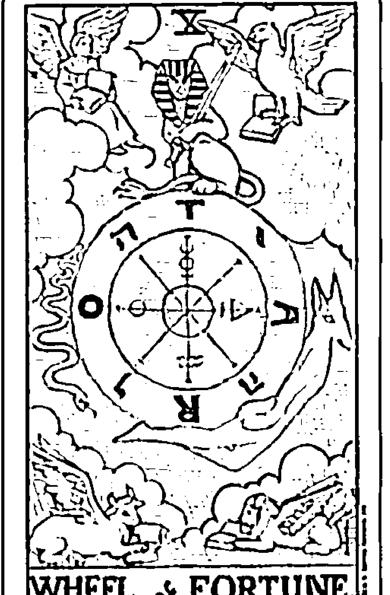

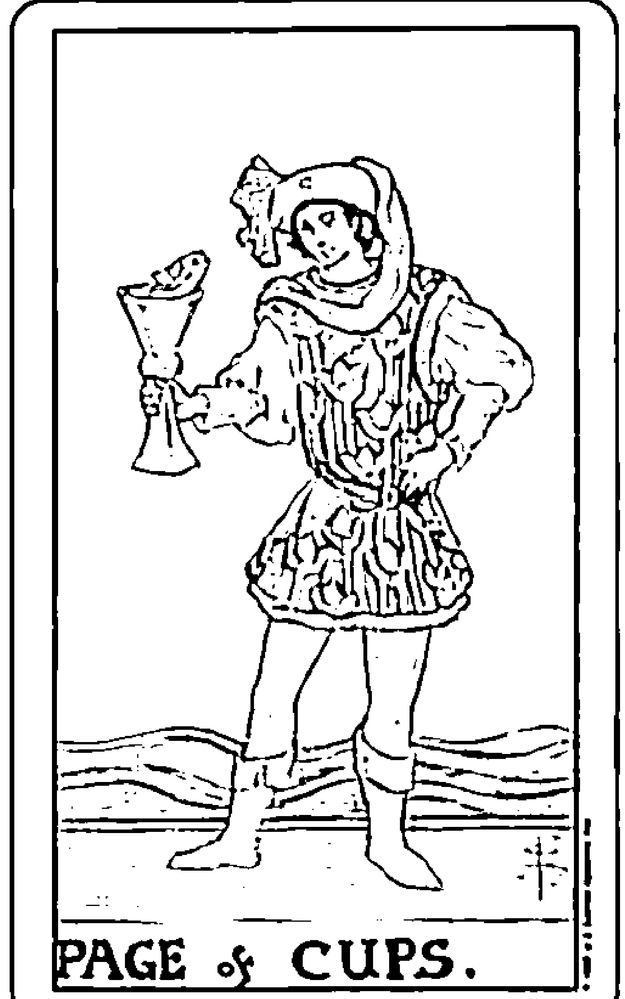

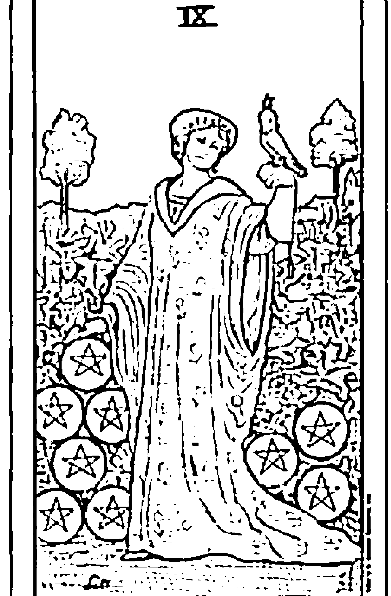

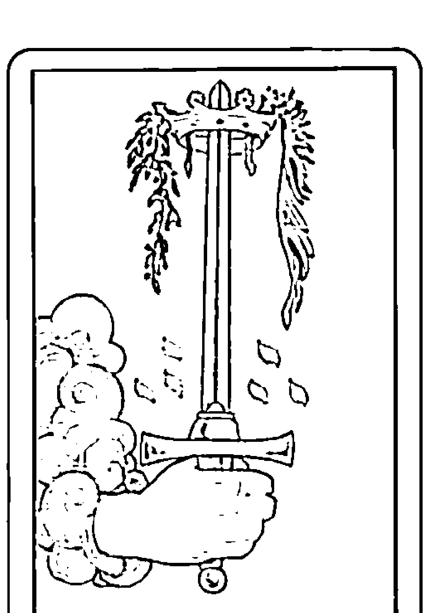

1  
它是怎麼樣

2  
什麼東西  
從內在推著你

3  
對方對你  
的態度

4  
神諭對你  
的忠告

## 2  
什麼東西從內在推著你

你對充滿著愛的姿勢敞開，對和平的結盟敞開，或者你在等待你的愛人以不同的方式來接近你，或是在心靈上支持你。

## 1  
它是怎麼樣

這個關係是你的命運——不管是就好的或壞的方面來講，事情的好壞要依你如何去處理它而定。在最差的情況下，你是一個宿命主義者，你覺得你沒有辦法做什麼。然而，如果你了解它是一種你必須去面對的挑戰，那麼你就可以為你的關係做一些具有創造性的事。要特別注意第四個位置關於神諭的忠告的牌。

## 3  
對方對你的態度

你的同伴碰到你覺得很幸運，他或她不久就會試圖贏得你的心，如果他或她沒有已經這樣做的話。

## 4  
神諭對你的忠告

將空氣清理乾淨。抓住機會來作決定，將清晰帶進你的關係裡。要對了解敞開，它將能夠幫助你去行動而不會覺得模稜兩可。

愛的神諭牌陣只適合現有的關係，或至少是一個存在於你的頭腦裡實際上的人。如果不是這樣，因為你還單身而想要知道你的愛情生活將會怎麼樣，那麼你就必須用基本型（四張）的指南針牌陣來看在這方面是不是不久以後會有什麼樣的發生，如果是這樣的話，那麼是怎麼樣。比方說，以下列的例子來看：

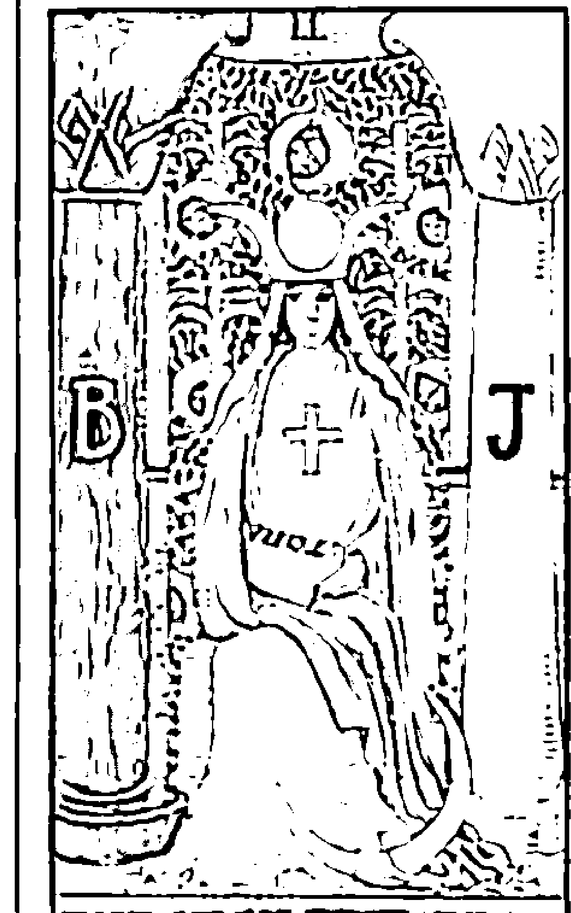

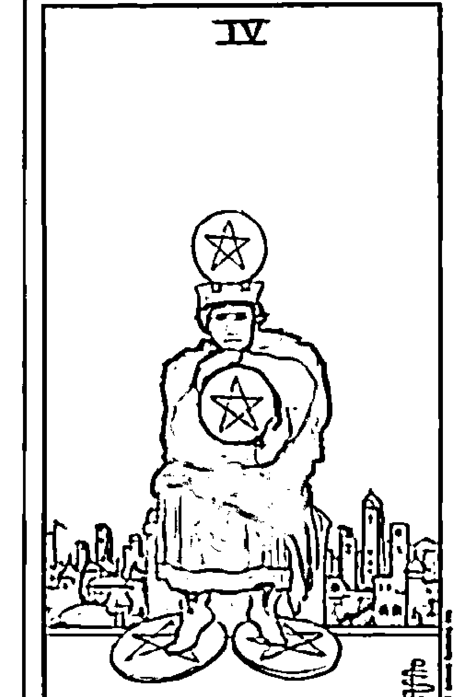

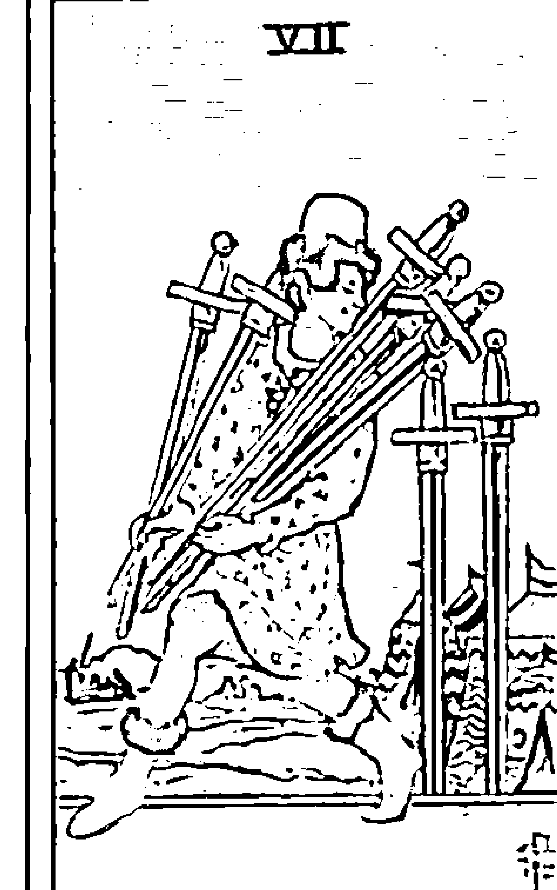

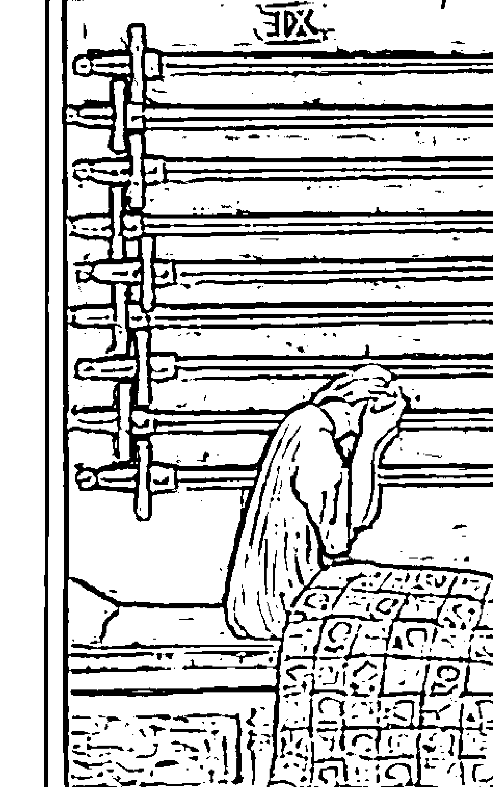

## 1 它是怎麼樣

## 2 它就是這樣開始的

## 3 反應

## 4 它將會引導到哪裡

你可以在本書上找到每一張牌的解釋。簡言之，這些牌顯示出這個主題基本上是幸運的（女祭司），但是你太過於小心了，也許是太貪婪（金幣四），你將會碰到一個騙你的人（寶劍七），而且，到了最後，你將會變得徹夜難眠，後悔走那一條路（寶劍九）。

結果，你知道如果你繼續按照原來的方式進行，事情的發生將會不好。然而，在第一個位置的女祭司至少指出在這方面的展望基本上是不錯的，所以你必須想其他的可能，並以指南針牌陣來檢視它們，

比方說你可以問：

- 1、我是否要再交更多的朋友使自己有更多的機會？
- 2、我是否必須把自己放在可以碰到更多人的地方，比方說讀書會，健身中心、研討會、旅行團、健行隊，或是繼續升學，等等？
- 3、我是不是要在網路上作一點私人的廣告？
- 4、可能時機還沒有到，所以我是不是再等一陣子再說？

在上述的情況下，可能會出現下列的牌：

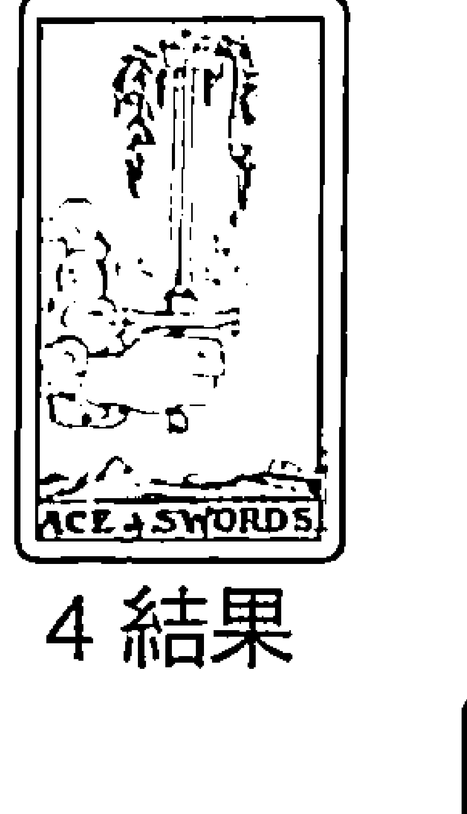

基本問題：
我的愛情生活
將會有什麼樣
的發生？

這些牌提供給你下列的展望：

- 1、如果你交更多的朋友，這對你是有利的 (金幣三)，你的朋友圈對它是敞開的，你將會有很好的時光 (聖杯九)，所以，這個方式的確是一個不錯的選擇。然而，你是否能夠碰到新的愛人，這仍然是未知數，因為這些牌並沒有說出任何關於這個主題的事。
- 2、參加團體或讀書會等等是很有前途的。在一開始的時候，你可能不知道怎麼做，你被黑暗所包圍著，而且可能還會有害怕 (月亮)，但是之後你將會發覺別人對你的反應很正向 (愛人)，你有很好的機會可以在這個路線上找到快樂 (聖杯一)。
- 3、在一開始的時候，網路上的廣告可能懸在那裡，你會很沒有耐心地等待那個反應 (權杖騎士)，但是事實上，可能會有人回信給你，一個有魅力，而且善於談話的人，也許有著一個隨興而且很酷的外表 (寶劍國王)，然而，這是不是會有具體的結果只有到後來才知道 (寶劍一)。
- 4、等待也不是一件壞事，因為這樣的話，你可以退回來澄清你自己，看看你真正要的是什麼，以及什麼樣的愛情關係對你來講才是真的有意義 (隱士)。沒有什麼值得一提的反應，因為別人都有他們自己的事 (世界)，最後，你會開始做一些新的事，在對你的後續發展有幫助的路線上踏出你的第一步 (金幣八)。

很顯然地，有幾個有趣的可能性。第二個選擇似乎是最有吸引力的，但是第三和第四條路線也會引導到新的愛。在這些情況下，計算一下最終的「精髓」可能會對你的作決定有額外的幫助。它引導到下列的牌：

- • 基本的問題 (22/4 = 愚者/國王)：剛開始的時候，那個發展將會有一點混亂 (愚者)，但是之後那個達成是可能的，一個可以持久的結構會被建立起來 (國王)。
- • 另外的選擇 1 (14/5 = 節制/教皇)：這是一個和諧的方式，你可以採取這個方式而不必擔心 (節制)，而且你也將能夠了解它的意義 (教皇)。
- • 另外的選擇 2 (9 = 隱士)：在你進入這個途徑之前，你必須弄清楚你在找尋什麼，你準備要怎麼做，以及你真正想要什麼 (隱士)。當然，這個澄清的階段也能夠幫助你克服初期定位的困難 (月亮)。
- • 另外的選擇 3 (3 = 女皇)：這是一個有好結果的路線，裡面充滿著生命 (女皇)。
- • 另外的選擇4 (4 = 國王)：在這個路線上，你可以達成協議，同時可以實現你的計劃 (國王)。

事實上，所有另外的選擇看起來都比繼續走原來的路線來得好，至於你要選擇哪一個路線就要看你了。從牌的觀點來看，第二和第四個選擇是最好的。

如果你決定要選擇第二個，但是不知道應該參加讀書會、健行隊、合唱團、舞蹈社、或跳傘隊，你可以再以指南針牌陣來重新檢視每一個團體。

如果你想要更了解你自己，那麼你可以用盲點牌陣來幫助你。假定你所抽到牌如下：

## 1
每一個人
都知道的

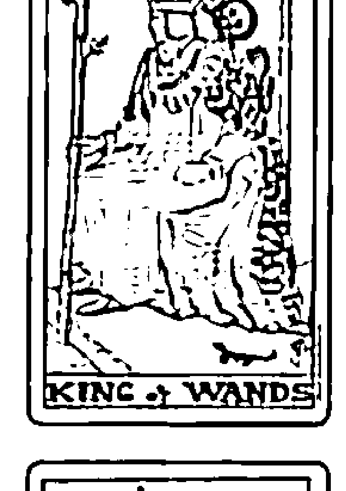

## 2
盲點

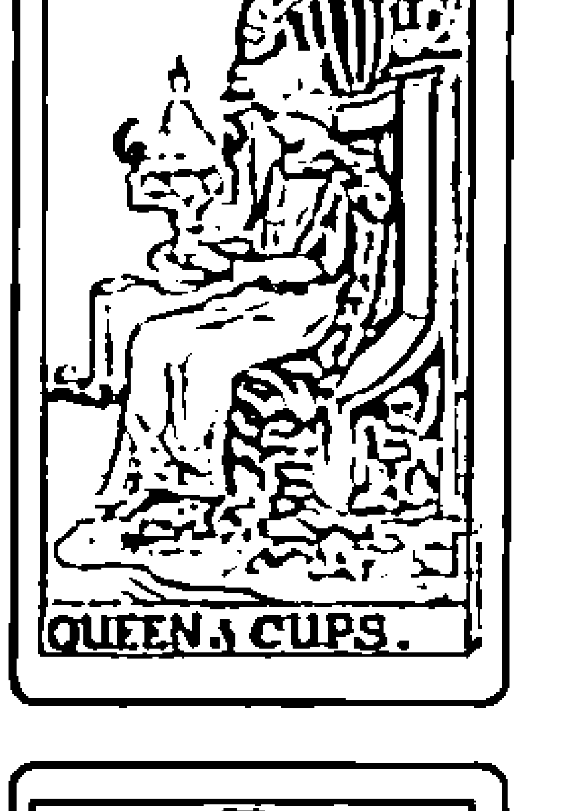

## 3
你如何
看你自己

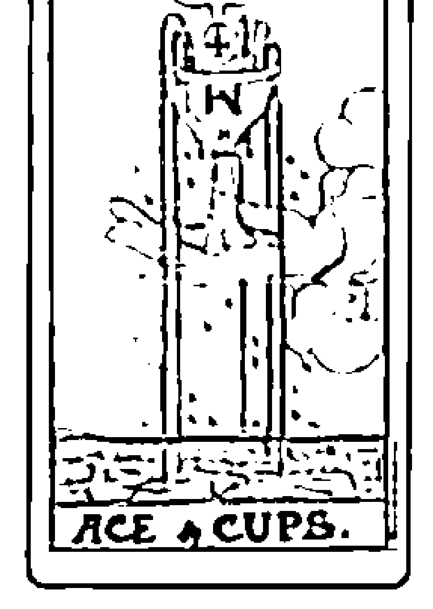

## 4
很大的未知

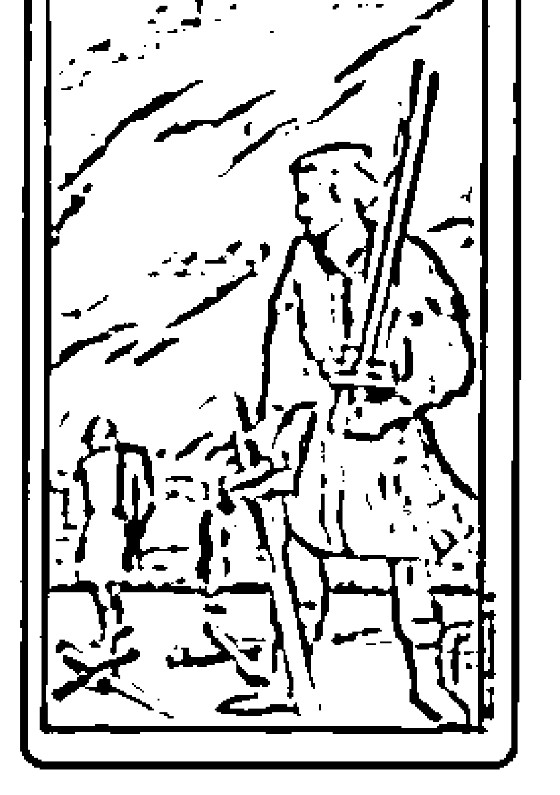

你可以在本書裡面找到下列的解釋：

| 位置 1——每一個人都知道的： | 你是有自信的、自主的，你知道如何表達你的意志和走出你的路。在你的領域裡面你可以領導，用你的想法來鼓起別人的熱情。或者你目前所處的階段是你被一個具有這些品質的人所影響。 |
| --- | --- |
| 位置 2——盲點： | 別人覺知到你的敏感和感情面。你的想像和洞見的能力是被公認的。因為這剛好是你的盲點，所以有可能別人認爲你有一點瘋狂。或者，是否這張牌意味著有一個迷人的、敏感的，也許有一點夢幻的女人就在你的周遭，但是你忽略了她？ |
| 位置 3——你如何看你自己： | 你知道眼前有一個機會可以得到快樂和滿足。唯有當位置 2 的牌顯示出別人對這個情況的看法非常不同，你才必須重新評估一下你的假設，然後用一個比較客觀的觀點來看這個情況。 |
| 位置 4——很大的未知： | 在你無意識的內在深處，你嚴重地受到傷害，而且充滿著憤怒。只要你沒有好好地了解你的這一面，你將會發覺你自己一再一再地被捲入醜陋的衝突裡——成爲一個易怒的人，或是一個受害者。如果你能夠治好你內在的創傷，你在面對衝突的時候將會有一個健康方式的處理，或是提出一個健全的主張。 |

有趣的是，有水性的（杯子）一面隱藏在火性的（權杖國王）外表背後，事實上，發問者本身知道他有水性的一面（聖杯皇后），所以，那個盲點（聖杯一）根本就不是盲點。然而會使他感到驚訝的是別人能夠很清楚地看到他的水性這一面，而且甚至會認爲它是一個很大的潛力。當然，由寶劍五所代表的「很大的未知」是一個定時炸彈，它很可能會爆炸，因爲就如上面所說的有火和水的對照。

# 牌的意義

## 主牌
第 30 頁

## 副牌
第 74 頁

# 0 愚者（The Fool）

## 敞開

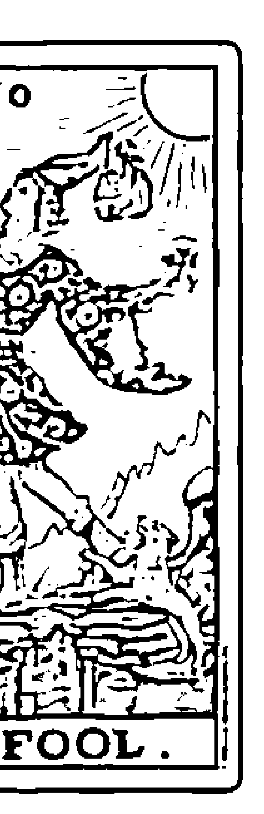

象徵圖象：
人物
深淵
狗
吠叫
白色的花
白雪覆蓋的山頂在背景
白色的太陽
數字 0

意義：
一個無愛無慮的人物
危險
有幫助的本能的聲音
警告有危險
天真
尚未看到的高超目標
純潔，孩子般的天真
空無，從它可以產生出一切

### 愚者——作為一張牌或是在其他的牌陣裡

#### 一般性的意義：

愚者象徵著混亂，從那個混亂每一件新的事都會產生。他象徵著無愛無慮，沒有偏見的敞開和想要去經歷新的事物。他的力量和保護存在於他好的本能，使他能夠免於大的危險，而這常常是甚至連他自己都不知道的。受到好奇心的驅使，他的途徑能夠引導他到更高的目標，那是他自己還不知道的。

#### 工作領域：

你正處於起點，或是再度來到起點，也許你甚至必須從一無所有開始。不論怎麼樣，你都必須走你自己的路而不要有任何擔心，以一種不複雜的方式來接下工作。你也許是沒有經驗的，但你也因為這樣而是敞開的，準備學習新的事情。

#### 愛的方面：

如果你目前的愛情生活似乎有點混亂，不必擔心。讓你自己由你的慾望來引導，展現出你對一個不尋常的邂逅或是一個活生生的，也許甚至是瘋狂的經驗敞開。

#### 精髓：

如果所有牌的加總數目是 22，那個精髓就是「愚者」，然後進一步引導到「國王」，因爲 2 加 2 等於4。最終的忠告是：事情在新的結構和秩序（國王）能夠建立之前真的很混亂（愚者）。

### 愚者在愛的神諭牌陣裡

#### 位置 1 — 它是怎麼樣

你的關係正處於一個新的開始，每一件事都仍然是敞開的。你的愛情生活是光和遊戲，你們之間充滿著好奇，而且沒有任何保留，然而你也許會覺得目前的階段太輕浮了，一點確定感都沒有，因爲愚者也可能意味著純粹的混亂，沒有人知道是怎麼一回事。

#### 位置 2 — 什麼東西從內在推著你

你想要採取主動，為你的關係做些什麼，注入一些新的動態能量，這樣它才能夠（再度）充滿活力。你被那個挑戰所吸引，想要去精通它。

#### 位置 3 — 對方對你的態度

你的伴侶是一個有魅力的人，充滿著豐富和活躍的生命，他生下來不是要來等待的，而是要有技巧地快速採取行動。不必太久，他或她就會來接近你。也許他或她想要先衡量一下自己，來跟你作一個比較，或者想要讓事情進行得更有建設性。或者你是一個挑戰，你的伴侶一定要來嘗試，否則內在的慾望無法平息。

#### 位置 4 — 神諭對你的忠告

不要再等待別人來接近你，將事情掌握在你自己的手中，踏出第一步，直接面對問題。主動形成你的關係，帶進一些新的概念，像睡美人一樣，重新活化你的愛情生命，從荒野救回你的愛人。

# 愚者在指南針牌陣裡

#### 位置 1 — 它是怎麼樣

沒有什麼事是確定的，每一件事都保持敞開，也許它是純粹的混亂。或者你是處於你計劃的起點，或者你處於一個必須再度重新開始的點。

#### 位置 2 — 它就是這樣開始的

你想要這個成爲你的最佳作品嗎？不管怎麼說，每一件事在剛開始的時候看起來都很棒，你既不能等待，也不想再等待，或者讓別人來告訴你要怎麼做。你覺得需要走出你自己的界線，克服一些困難，用你自己的力量來影響那個發展，使事情按照你想要的方式來運作。

#### 位置 3 — 反應

在你周遭的人是強壯的，有決心的，既不遲疑，也不會有太多的顧慮。他們會以不同的方式來反應，但基本上對自己是有自信的。如果你想要贏過這些人，你將必須有很好的聯盟。然而，如果他們是你的敵人或對手，他們可能會讓你難以應付。

#### 位置 4 — 它將會引導到哪裡

這是一條很好的路，因爲到了最後你將會達成和精通。即使位置 2 或 3 的牌指出它是一個潛在困難的經驗，你也必須選擇這一條路，因爲你不僅可以去迎接這些挑戰，你還可以透過它們而得到個人的成長。

# 愚者在盲點牌陣裡

#### 位置 1 — 每一個人都知道的

你是一個主動的人，你知道你的能力，你比較喜歡行動，而比較不喜歡等待。或者，至少你目前覺得你是不猶豫的，你喜歡立刻處理你的工作，你有勇氣承接大的計劃。

#### 位置 2 — 盲點

別人可以看到你的靈巧、彈性、很強的創造力、和果斷力，爲什麼你自己本身不知道這些力量呢？你是謙虛的，直到目前爲止，並沒有足夠的機會可以讓你去經驗你的這些能力。在最壞的情況下，這意味著別人可能會覺得你是操控的，而你不知道他們爲什麼會這樣想。

#### 位置 3 — 你如何看你自己

你有覺知到你想要活躍，充滿著開創性和影響力。你喜歡將你的命運掌握在你自己的手中，也許甚至認爲你自己是一個專家。不管怎麼說，你不喜歡被低估。位置 2 的那張牌可以告訴你，別人是否以同樣的方式來看你，或是以非常不同的方式來看你。

#### 位置 4 — 很大的未知

在你的潛意識深處隱藏著一股力量，想要走向力量、自我達成、精通、和影響。只要你完全沒有覺知到你內在的那一股力量，你可能會對你自己非常不滿意，同時會害怕那些具有這些你所缺乏的品質的人。注意看你裡面的魔術師，你將會了解他如何能夠幫助你成爲有決心的，並發展出堅強的意志，成爲無懼的。

# II 女祭司（The High Priestess）

## 直覺

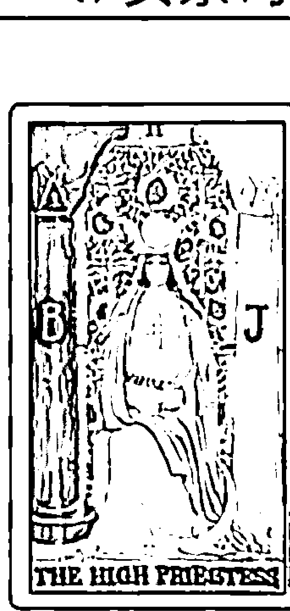

象徵圖象：
在布簾前面的位置
左右兩邊的黑白柱子
柱子上的B和J

兩根柱子之間的位置
柱子上方是敞開的
大腿上的 Torah 卷軸
后冠上面有月亮的三個階段（）○（）
石榴
數字 2

意義：
握有最終奧秘的人
兩極
所羅門廟前面的兩根柱子（Boas and Jachin），
也可以解釋成光明和黑暗
在兩極之間靜心冥想而不判斷
具有接受性
進入奧秘智慧的直覺力
生命的整個循環：漸盈的月（）丶滿月（○）丶
漸虧的月（）
多產丶豐富
二元性，陰的數字

### 女祭司——作為一張牌或是在其他的牌陣裡

#### 一般性的意義：

女祭司象徵著靜心的、直覺的力量，和一種特別的敏感度。她代表對內在的聲音有信心，同時準備接受內在的衝動，並讓自己被那些衝動所引導。尤其，她具有允許事情發生的藝術，以及在正當時刻所需要的耐心和智慧。

#### 工作領域：

對事情和對自己要有耐心。你走在正確的道路上，關於要做什麼以及不做什麼，你有很好的直覺。依賴和善用這個直覺，每一件事都會變得很好。然而，如果你盲目地行動，那將會很冒險。

#### 愛的方面：

這張牌指出，在你目前的關係裡，你們是親近的，有很深的互相了解，同時有愛和敏感。如果你目前是單身的話，這張牌預示著你已經準備好要進入一個新的關係，它也代表你依賴你內在的心聲來告訴你要做什麼，以及什麼時候可以採取行動來找到正確的人。

#### 精髓：

如果所有牌的加總數目是 2，那個精髓就是女祭司。她告訴你要把自己準備好，耐心觀察事情的發展，直到你內在的聲音告訴你說正確的時刻已經來臨，你可以採取行動了。

### 女祭司在愛的神諭牌陣裡

#### 位置 1 — 它是怎麼樣

你們的靈魂非常相近，所以你們不說話也可以互相了解，就好像你們已經互相認識很久很久了。

#### 位置 2 — 什麼東西從內在推著你

你已經準備好要敞開你自己來經驗很深的親近。然而，你不想要太匆忙，你想要等待外在的刺激，或者只是等待正當的時機。

#### 位置 3 — 對方對你的態度

你所交往的人是一個敏感，而且有直覺力的人，他能夠了解你，而且對你的靈魂有很深的洞見。他或她會對於來自你的刺激有很好的回應。只是要小心不要要求太多，或是給對方太多的壓力。

#### 位置 4 — 神諭對你的忠告

做任何事都不要匆忙，你並不需要特別主動，只要展現出耐心、了解、和你的敏感度。然而，你也要表示，只要對方的做法適當，你也是喜歡跟他或她交往的。

# 女祭司在指南針牌陣裡

位置 1 — 它是怎麼樣  
似乎你在想著這個主題已經有一陣子了，它現在就需要被處理。或者是不是自然在呼喚你？也許是有一塊肥沃的土地擺在你面前，等著你去開發耕種。

位置 2 — 它就是這樣開始的  
那個發展符合自然的成長過程，而且非常和諧。在剛開始的時候，你在培養一些東西，然後每一樣東西都快速發展而變得很有活力。你可以放手去做，相信那塊土地會產出豐富的作物。

位置 3 — 反應  
你會得到正向的回饋。你所處的環境是非常有利的，人們將會對你的想法敞開，同時會支持你的努力。

位置 4 — 它將會引導到哪裡  
到了最後，每一件事都會按照它自然的路線進行。某種新的東西將會誕生，你將會踏在肥沃的土地上，任何事物都會成長、發展、開花。

# 女祭司在盲點牌陣裡

位置 1 — 每一個人都知道的  
你非常活生生，很感性，有自然的愛心。或者你正處於創造性的階段，你在蘊釀著一些新的事物，你帶著那個想法直到它準備被實現。

位置 2 — 盲點  
別人看到你很活生生、很自然的那一面想要被表達出來。如果這一面對你來講是隱藏的，它可能會以有問題的方式展現出來，比方說一再一再地發動新的事情，但是之後卻沒有徹底執行它們——虎頭蛇尾。

位置 3 — 你如何看你自己  
你知道你創造性的那一面和你的活力，你感覺到有某種東西在內在推著你，你可以將它生出來。也許你會想要過著一種更自然的生活，或甚至住在鄉下？

位置 4 — 很大的未知  
內在深處具有創造性的那一面可以給你很多活力，同時想要嘗嘗新的事物，如果你能夠允許它在你的生命中有一些空間。看一下你的這一面，覺知你自然的享受生命的能力，也許你會發現你想要有小孩，那個部分是你還沒有被滿足的。

# III 女皇（The Empress）

## 肥沃的土地

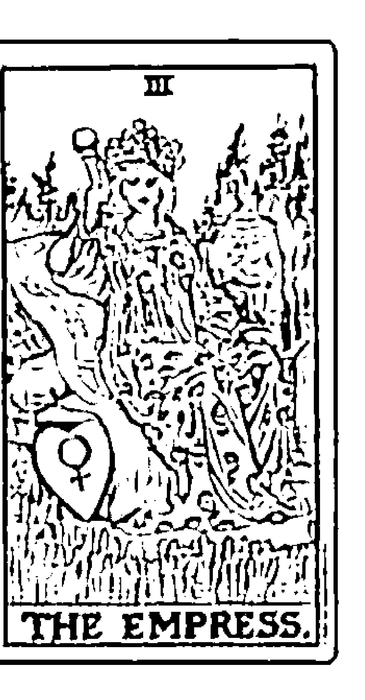

象徵圖象：  
外表  
麥子，石榴  
河流  
樹木  
有 12 顆星形寶石的后冠  
有一個圓球的權杖  
金星符號  
數字 3  

意義：  
母性  
豐收、多產、肥沃  
生命的水，生命的泉源  
自然的力量  
統治著一年的循環  
母性統治著任何圓形的東西  
強調美和女性特質  
神聖的數字，生命力的象徵  

### 女皇——作為一張牌或是在其他的牌陣裡

#### 一般性的意義：

女皇代表肥沃的土地，在那個土地上一些新的東西可以茂盛和豐富地成長。她具體表現出創造性的過程和活生生的成長，以及新事物的誕生。

#### 工作領域：

你正在面對一個活生生的、創造的階段，它將提供給你很多可能性。如果你能夠徹底地耕種土地，不久之後它將會產出豐富的水果。

#### 愛的方面：

這張牌指出在愛的方面很有活力的時光，那可能意味著在關係上的成長和湧現，溫暖和很多感性、感官的東西，有時候它甚至意味著會有子孫。

#### 精髓：

如果所有牌的加總數目是 3，那個精髓就是女皇。決定性的建議是要走在肥沃的土地上，信任成長活生生的過程，並期待新東西的誕生。

### 女皇在愛的神諭牌陣裡

#### 位置 1 — 它是怎麼樣  
你的關係處於成長的階段，它將會開花結果，或者你正在築愛巢。

#### 位置 2 — 什麼東西從內在推著你  
你覺得有一股衝動想要將新的生命帶進你的關係裡，也許它意味著你會想要有小孩。或者你會想要使你的日常生活變得更享受，優先享受各種美好的事物——從美食到戶外旅行到性愛的歡愉。

#### 位置 3 — 對方對你的態度  
你所面對的人是一個活生生的、有創造力的人，而且他對你是敞開的。接受你的建議和想法，並且從它們做出最好的，這對他或她來講將會是一件很愉快的事。

## 位置 4 — 神諭對你的忠告  
呈現出你的感性和活生生的那一面，試著將新的能量和啓示帶入關係裡。同時要對成長的過程敞開，即使它會伴隨著一些改變。

### 女皇在指南針牌陣裡

位置 1 — 它是怎麼樣  
似乎你在想著這個主題已經有一陣子了，它現在就需要被處理。或者是不是自然在呼喚你？也許是有一塊肥沃的土地擺在你面前，等著你去開發耕種。

位置 2 — 它就是這樣開始的  
那個發展符合自然的成長過程，而且非常和諧。在剛開始的時候，你在培養一些東西，然後每一樣東西都快速發展而變得很有活力。你可以放手去做，相信那塊土地會產出豐富的作物。

位置 3 — 反應  
你會得到正向的回饋。你所處的環境是非常有利的，人們將會對你的想法敞開，同時會支持你的努力。

位置 4 — 它將會引導到哪裡  
到了最後，每一件事都會按照它自然的路線進行。某種新的東西將會誕生，你將會踏在肥沃的土地上，任何事物都會成長、發展、開花。

### 女皇在盲點牌陣裡

位置 1 — 每一個人都知道的  
你非常活生生，很感性，有自然的愛心。或者你正處於創造性的階段，你在蘊釀著一些新的事物，你帶著那個想法直到它準備被實現。

位置 2 — 盲點  
別人看到你很活生生、很自然的那一面想要被表達出來。如果這一面對你來講是隱藏的，它可能會以有問題的方式展現出來，比方說一再一再地發動新的事情，但是之後卻沒有徹底執行它們——虎頭蛇尾。

位置 3 — 你如何看你自己  
你知道你創造性的那一面和你的活力，你感覺到有某種東西在內在推著你，你可以將它生出來。也許你會想要過著一種更自然的生活，或甚至住在鄉下？

位置 4 — 很大的未知  
內在深處具有創造性的那一面可以給你很多活力，同時想要嘗嘗新的事物，如果你能夠允許它在你的生命中有一些空間。看一下你的這一面，覺知你自然的享受生命的能力，也許你會發現你想要有小孩，那個部分是你還沒有被滿足的。

# IV 國王（The Emperor）

## 結構

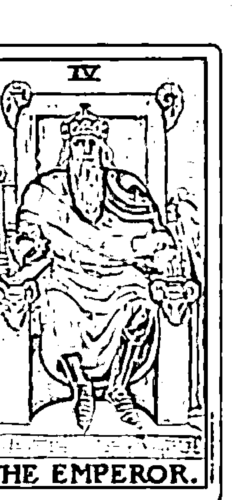

象徵圖象：  
態度  
石頭寶座  
紅色  
盔甲  
公羊頭  
右手中的「安克」權杖  
左手上的圓球  
數字 4  

意義：  
堅定、穩定  
嚴厲、結構  
行動  
不怕衝突、保護  
宣稱自己的領導權威  
掌握生命的人  
直覺上想要求得完整  
象徵著秩序、結構、和世俗的實相  

### 國王——作為一張牌或是在其他的牌陣裡

#### 一般性的意義：

國王具體表現出直截了當、責任、重視實際、明智、秩序、清晰、和一致性。他常常太快被指控為太嚴厲、太堅硬、沒有感情，但是他的力量存在於他保護弱小的能力和保證有一個安全的環境。在有利的方面，他能夠幫助實現願望，幫助使想法和意圖化為事實，他是一個事情的執行者。

#### 工作領域：

現在你必須有清楚的觀念，使事情得以進行，而且繼續保持。採取行動，使事情變得有秩序，實現你長久以來想要做的事，同時繼續保持你到目前為止所達成的。

#### 愛的方面：

國王可能太清醒了而不會有羅曼史，在他的身上愛情故事很少。這張牌比較是關於承諾和一致性。也許你會敢於踏出你尚未完成的那一步，使你長久以來的希望成真。

#### 精髓：

如果所有牌的加總數目是 4，那個精髓是國王。在這個情況下，最後的忠告是要以堅定的意志來實現你的計劃，但是也要以一種清醒和實際的方式來分析那個問題，然後做該做的事，不要存有任何幻想或冒不必要的險。

### 國王在愛的神諭牌陣裡

#### 位置 1 — 它是怎麼樣  
現在你必須將你的關係放在一個固定的框架上，你必須展現出真實的自己，使事情變得更清楚，同時負起責任。

#### 位置 2 — 什麼東西從內在推著你  
你也許是想要在你的關係上有更多的安全、承諾、和長期的展望，或者也許你想要實現長久以來的想法。

#### 位置 3 — 對方對你的態度  
對方是一個非常控制，且理智清醒的人，他以理性來看待這個關係。也許你會覺得他或她一點都不浪漫，的確，他或她不容易被誘入你的陷阱，或是被你玩弄，但是一旦他或她對這個關係承諾了，你就可以信賴他或她。然而當這個人說「不」，他就真的是不要。

## 位置 4 — 神諭對你的忠告  
對於發生的事或當下使你感動的事負起責任。要很清楚你對這個關係是有承諾的，避開會危及你們共同的未來的事情。實現你長久以來所想的事情，在你的關係裡加入一些秩序。

### 國王在指南針牌陣裡

位置 1 — 它是怎麼樣  
它是關於秩序和責任，它是一個試驗過而且真實的方法。以實際和清醒的方式來實現一個計劃，或是保護好那個已經達成的。

位置 2 — 它就是這樣開始的  
在開始的時候，你必須去分析整個問題，看看你的計劃是否可行，計算一下得失。根據計算的結果來決定你是否要維持現狀或是要有毅力地一步一步來執行你的計劃。

位置 3 — 反應  
你周遭的人是客觀的、清醒的，所以你可能會覺得他們是冷酷的、有所保留的。如果你想要說服別人，你必須提出具體的事實和可行的方案，但是一旦有人同意了，你就可以真的信賴他或她。

位置 4 — 它將會引導到哪裡  
這個路線是好的。到了最後，你將會完成你的工作，同時實現你想要的。但是之後你必須能夠繼續保持你所達成的。

### 國王在盲點牌陣裡

位置 1 — 每一個人都知道的  
你是一個很實際的人，你喜歡結構和秩序，並按照方法來做事，或者你至少是處於一個要將計劃附諸行動使它變成具體的階段。

位置 2 — 盲點  
別人可能會認爲現在你需要清晰和智慧，你必須去實現一些長久以來一直在延宕的事。因爲這張牌是你的盲點，所以它也可能是別人認爲你在規避責任，在另外一方面，他們可能會認爲你對每一件事都太實際、太理智了。

位置 3 — 你如何看你自己  
你認爲你自己是很實際做事的人，是一個按部就班工作的人，同時是一個為行動負起責任的人。在位置 2 的那張牌會指出別人對你不同的看法，你必須徹底檢查你的自我形象。

位置 4 — 很大的未知  
在內在深處，有一股秩序的力量你還沒有去經歷。只要它仍然停留在潛意識裡，就會一再一再地有一些混亂衝擊著你，可能會有一些解決方案，但是效果不彰。然而，如果你能夠跟你內在的國王取得連繫，他將不會像照片上看起來的那麼冷酷和有距離的感覺。相反地，他將會是一股活生生的，保護生命的力量，同時能夠幫助你實現你的計劃。

# V 教皇（The Hierophant）

## 自信

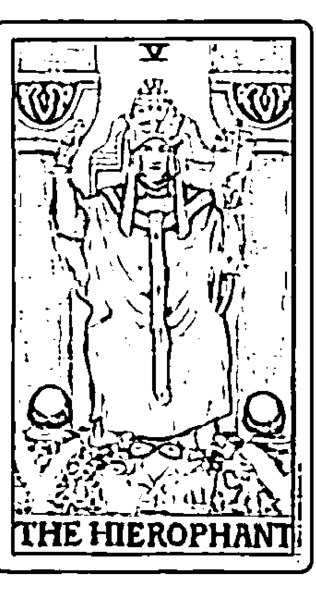

象徵圖象：  
教士和下跪的和尚  
紅色的袍，白色的百合花  
三重十字架，三層的皇冠，  
兩腳邊各有三個十字架  
祝福的手，三根手指頭向外，兩根手指頭向內彎曲  
灰色的柱子  
交叉的鑰匙  
數字 5  

意義：  
教導  
神聖的愛，靈魂的純潔  
橫跨各個領域的能力和責任；上天、地球、和地獄；頭腦、身體、和靈魂  
想要找到本質的人必須將他的注意力指向那個明顯的，同時指向那個隱藏的  
介於黑色和白色之間  
聖彼得和教皇的象徵符號  
男人的數字，創造的精髓和意義  

### 教皇——作為一張牌或是在其他的牌陣裡

#### 一般性的意義：

教皇是在秘教和古代知識方面的高階教士。這張牌象徵著在找尋意義和找到意義，因此常常暗示著能夠幫助我們了解的經驗，此外，這張牌象徵著正直和高超的倫理。它常常是一個好的跡象，它代表有成果的路線，因為我們帶著信念、自信和正向的態度走過它們。

#### 工作領域：

現在信任神是重要的。你即將要踏出重要的一步，它是有意義的，同時是正確的，如果你帶著很好的良知來做它，而且保持你的原則。也許你會很明顯地了解到你的工作有多少意義。

#### 愛的方面：

你正面臨一個階段，在那裡面，自信、信任、和正直將會伴隨著你的找尋而成長，人生的意義常常隱藏在困難的經驗裡。除此之外，這張牌也可以是一個即將到來的婚姻的預示。

#### 精髓：

如果所有牌的加總數目是 5，那個精髓是教皇。在這個個案裡，最終的忠告就是在處理一件事的時候必須一直都要記住這張牌的本質，同時帶著誠實和正直來執行。這個精髓常常出現於它的意義在後來才會被了解的牌陣裡。

### 教皇在愛的神諭牌陣裡

#### 位置 1 — 它是怎麼樣  
你目前的愛情生活是真誠的、相互尊重的，因此那個信心同時在成長。你們在一起過著一個美好的時光。

#### 位置 2 — 什麼東西從內在推著你  
你有一個很棒的理想，想要有一個高超的關係，在它裡面充滿著真誠和相互信任。也許你的期望太高了一點，超出人類的本性所能達到的，但是你想要將你的關係塑造成有意義的方式是重要的，而且是好的。

#### 位置 3 — 對方對你的態度  
你所面對的這個人是一個正直的人，他很尊重你，而且對你很有信心，你可以信賴他或她的仁慈，同時也可以相信他會表現出最好的一面。

## 位置 4 — 神諭對你的忠告  
當你有自信，別人也會對你有信心。要誠實，同時要在互相對待當中表現出你最好的。這張牌也許是要你重視你的行為。

### 教皇在指南針牌陣裡

位置 1 — 它是怎麼樣  
它關係到意義的找尋，以及對它的深入經驗，或者某件事在比較實際的方面是有意義的，或者也許那個核心問題是倫理或道德的問題，或是一個祕密的問題。

位置 2 — 它就是這樣開始的  
在開始的時候，你充滿著熱情，你既不會缺乏好的意圖，也不會沒有信心。你是很有熱心的，同時在做這件事的時候充滿著高度的希望，因為你很確定它遲早會被證明會是有意義的。看看位置 4 的牌是否確認你的高度期待。

位置 3 — 反應  
你可以完全依賴你的周遭。那些對你來講重要的人會很誠實地反應，同時表現出最好的一面。如果你需要忠告、支持、或保護，他們會幫助你。

位置 4 — 它將會引導到哪裡  
這是一個很好的途徑，它將會引導你到很深的信念。即使位置 2 和 3 的牌是困難的牌，你也會看到這個途徑是有意義的，有一個守護天使在護衛著你。按照你所問的問題，這張牌也可以指出一個很深的宗教經驗或是一個令人感動的發現。

### 教皇在盲點牌陣裡

位置 1 — 每一個人都知道的  
你是一個正直的人，也許是一個宗教人士，有著很高的道德標準，或者，至少你目前所處的階段是別人對你有信心。

位置 2 — 盲點  
別人是否把你看成是一個典範、一個老師、或是一個師父，而你自己並不知道？或者別人認為你是一個虛守教義的人或是一個盲信者？也許這張牌也暗示著更深的意義的問題，那個問題到目前為止都被你給忽略了。

位置 3 — 你如何看你自己  
你知道你自己是一個有道德的人，你很誠實地想要找到生命的意義，而且想要過著一種好的、真實的、值得尊敬的生活。然而，如果位置 2 的牌指出別人以一種完全不同的眼光在看你，那麼你就必須檢視一下你自己的形象。

位置 4 — 很大的未知  
如果你一直受到不信任、失望、和一種完全沒有意義的感覺所折磨，原因就在這裡。那個能夠給你樂觀、正向的態度、和信仰，同時去經驗有意義的快樂的力量就隱藏在你的內在深處，它必須被揭開。試著找出你「內在的教士」，從他學習如何帶著信仰和信念來生活。

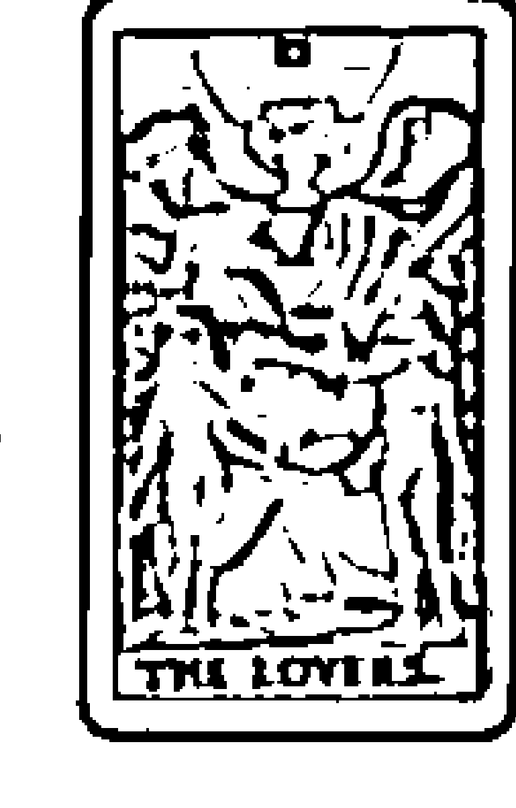

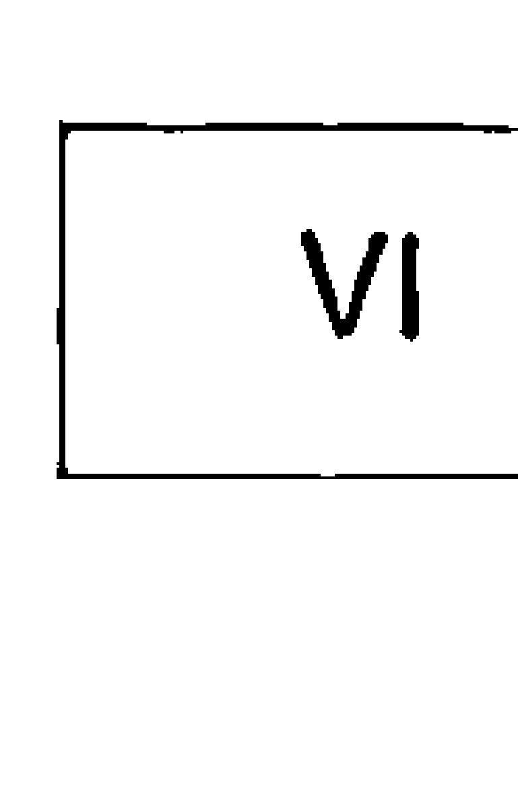

### 愛人在指南針牌陣裡

位置 1 — 它是怎麼樣  
現在是關於愛，或是一個從內心深處所做的決定。也許你已經來到了一個十字路口，必須做出清楚的選擇，或者需要一個清楚的態度。

位置 2 - 它就是這樣開始的  
在開始的時候，每一件事都很棒。你將會很熱情地進入這個路線，你是有決心、有自信的。如果你的問題是跟另外一個人有關，那麼你將會經驗到很大的愛——打從一開始就是這樣。位置 4 的牌會告訴你它只是曇花一現或是一個持久且快樂的愛。

位置 3 — 反應  
你的環境跟你非常同感。對方完全涉入，或者，如果它是關於愛的主題，他們甚至是處於愛之中，如果你想要為你的計劃或原因贏得對方，你必須覺知到一個事實：他們只會按照他們的感覺來行動，而不會被看起來好像很聰明的論點所說服。

位置 4 — 它將會引導到哪裡  
這是一條很好的道路，你應該接受它。到了最後，你將會找到很大的愛——如果那是你的問題的主題。或者至少你會很快樂，因為你在遵循著你的心所指示的方向。

### 愛人在盲點牌陣裡

位置 1 — 每一個人都知道的  
或者是你剛墜入情網，或者你是一個圍繞著愛在生活的人。它也可能是你正在面對一個需要從你的內心深處來做的決定。

位置 2 — 盲點  
你是不是已經找到了一個很大的愛，但是你自己還不知道？如果你的情況是這樣的話，你必須儘快讓某人來揭開你的盲點。或者你必須做出一個非常重要的決定，但是你自己不知道，或者不想要去面對？

位置 3 — 你如何看待你自己  
你被邱比特的箭射中了，想要按照你的心來做。或者你正在面對一個非常重要的決定，而你想要帶著愛和勇敢來做那個決定。

位置 4 — 很大的未知  
在你的內在深處，你有能力可以展現出你的愛心，然而，如果你沒有跟你內在的這一面連結，你很自然地會用你的理性來做決定。當然，你也會迷戀一些人，而且很喜歡他們，但是你將不會找到深愛，除非你能夠發現和活化內在的這一面。

# VII 戰車（The Chariot）

## 有自信地著手行動

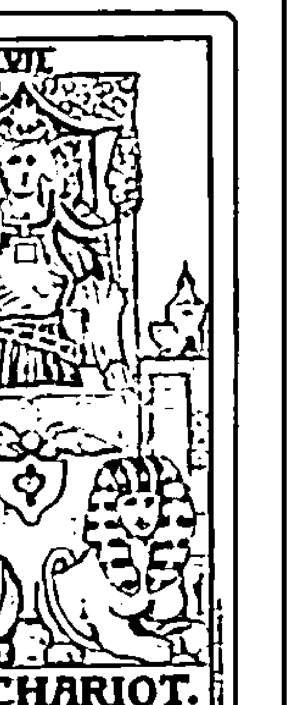

象徵圖象：
繁星滿佈的天空
肩章（月亮）
腰帶上的星座符號
八角星（＝跟更高領域的連結）
和四方形（＝世俗的事情）
有翅膀的太陽
背景的城市
一黑一白的人面獅身像
有金色頂端的棒子
數字 7

意義：
天上皇后的象徵，她的兒子在此被視爲春天之神，是一個救贖者

來自上天（八）在地球上活躍（四）

太陽神的象徵符號
向著遠處目標的起點
對立的力量已經被統一，爲了要往前邁進
高超的目標，努力求得統一
一個循環的結束和一個新的開始

### 戰車——作為一張牌或是在其他的牌陣裡

#### 一般性的意義：

戰車指出第一個春天的甦醒，聚集新的力量，想要從事一件新的事情。這張牌也可以指出對立必須被克服或是被統一，這樣才能夠向前邁進。有時候這張牌會被拿來作爲一個警告，不要高估自己的力量，那個力量可能是新鮮的，但是沒有經驗。

#### 工作領域：

現在它是關於重新開始，帶著新的動機走向大的目標。你有力量和才能可以拋下舊有的，克服對立的力量，走向一個全新的方向。如果你的周遭在爭吵，你可能會想辦法將敵對的雙方拉攏在一起。

#### 愛的方面：

你可能是快速走向新的愛，或是匆忙離開舊愛——它將會很快發生。在另外一方面，這張牌也可以意味著在你目前的關係上更新——這件事即將發生，因爲對立的傾向可以被克服。

#### 精髓：

如果所有牌的加總數目是 7，那個精髓是戰車。這張牌最後的忠告是不要再遲疑了，要立刻出發，將事情掌握在你的手中，使事情發生。

### 戰車在愛的神諭牌陣裡

#### 位置 1 — 它是怎麼樣

在你的關係裡面將會有新的移動或動力。通常戰車在這個位置意味著舊有的問題和衝突可以被克服，你可以帶著統一的力量往前走。然而，有時候這張牌也可能指出一個三角關係。

#### 位置 2 — 什麼東西從內在推著你

勇氣使你能夠飛翔，你想要追求新的目標。也許你想要在你的關係上注入新的能量，跟你的愛人一起去經驗新的冒險，環遊世界，或者只是移到一個新的地方。在另外一方面，它也可能是你想要切斷你的關係，然後走自己的路。

#### 位置 3 — 對方對你的態度

你所面對的人是活躍的，即將要跳。這張牌並沒有清楚地說出他或她是要跳向你或是逃離你，但是這張牌通常指出正向的事情。

#### 位置 4 — 神諭對你的忠告

勇敢地踏出你以前不敢踏出的一步。用上你所有的技巧去克服衝突和矛盾。在你日常生活的關係當中加入新的活動，但是同時要尋求新的目標來刺激你們兩個人，試著作一些努力來使事情得以進行。

### 戰車在指南針牌陣裡

#### 位置 1 — 它是怎麼樣

它關係到熱情，或是某一件你真的想做的事，但是它需要很大的勇氣、力量、和投入。

#### 位置 2 — 它就是這樣開始的

在開始的時候，它很好玩。你打從心裡喜歡參與，你感覺到你的力量和你的活力，你將你所有的能量都投放在這件事上面。

#### 位置 3 — 反應

那個環境很活，充滿著能量和興趣。如果你想要馴服對方，同時贏得他或她的心，你將會獲得承諾和有力的支持。然而，如果對方反對你，你必須小心避開他們。

#### 位置 4 — 它將會引導到哪裡

到了最後，你被慾望所抓住。你會有很好的發展，同時發覺你自己處於高峰狀態。如果不是已經這樣，那麼你正在全力以赴，除非你滿意那個結果，否則你不會放手。

### 戰車在盲點牌陣裡

#### 位置 1 — 每一個人都知道的

你很熱情，充滿著活力，是一個喜歡強烈的經驗的人，而且很明顯的，從來不會覺得缺乏能量。或者，你發覺你自己處於一種慾望很熱的階段，你讓你的衝動來接管。

#### 位置 2 — 盲點

別人認爲你是一個有活力的、熱情的人，這是你的盲點嗎？如果是這樣的話，你必須給予這方面更多的重要性。然而，如果你的確覺知到你個性上的這個特點，這張牌建議你要馴服你的衝動和熱情。

#### 位置 3 — 你如何看你自己

你知道你內在的動物性，但是並不覺得有受到它的威脅。沒有壓抑它或扼殺它，你以一種很好的方式來馴服你自然的衝動，那對愛是有幫助的。

#### 位置 4 — 很大的未知

有一隻很野的動物隱藏在你的無意識深處。只要它仍然保持比你更強，你將會常常覺得虛弱，同時被無名的恐懼所困擾，因此稍微意識到有危險，你就退縮了。然而，如果你能夠跟你內在的動物結盟，你將會發展出對生命的熱情，而且會變得很有活力。

# VIII 力量（Strength）

## 對生命的慾望

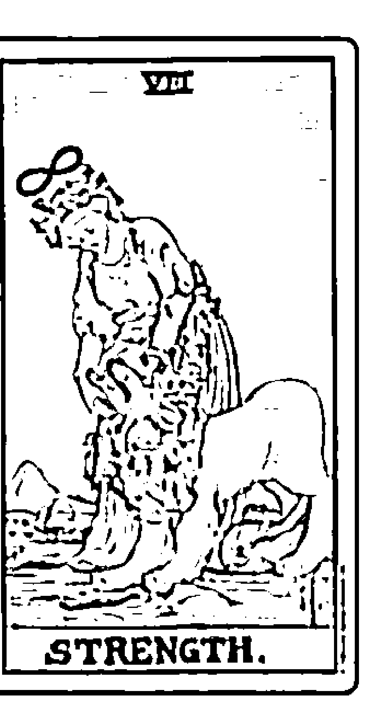

象徵圖象：
獅子
穿著白色衣服的女人
獅子閉著嘴巴和花圈
無限的符號（∞）
數字 11（作者認爲這張牌的數字是被改變過的，用原來的數字11是比較好的）

意義：
活力、野性、動物的驅策力
純潔
愛心的馴服
文明人和動物本性之間活生生的連結和經常的改變
罪惡的數字（動物在人裡面＝罪惡的本性），但同時也是精通的數字（精通動物本性）

### 力量——作為一張牌或是在其他的牌陣裡

#### 一般性的意義：

這張牌指出馴服野性的力量，它以一種和善的、照顧的方式來進行，因此代表文明人和他的動物本性的結合。它同時意味著活力、熱情、對生命的慾望，和真正進入它。

#### 工作領域：

全然地承諾你自己，將你所有的能量和勇氣獻給你的工作，不要有所保留。

#### 愛的方面：

在愛的方面你正面臨熱情和活生生的時刻。這張牌象徵著暴風雨般的、令人緊張的事件，以及正確的鎮定和熱情的混合。

#### 精髓：

如果所有牌的加總數目是 11，然後那兩個數字加起來是 2，那麼那個精髓是力量和女祭司。作爲結論的忠告是展現出你的力量——如果必要的話，用你的爪——弄清楚，這整個事情對你來講是多麼地重要（力量），然而到了最後，你必須信任你內在的聲音來告訴你要在什麼時候、要在哪裡、以及要如何採取行動（女祭司）。

### 力量在愛的神諭牌陣裡

#### 位置 1 — 它是怎麼樣

可能有很多事在進行著，也許在你的關係裡有很多熱情，或者你在努力奮鬥想在愛情和理智之間求得一個健康的平衡。

#### 位置 2 — 什麼東西從內在推著你

你覺得你熱血澎湃，你想要不顧一切地投入這個關係，你想要狼吞虎嚥你的愛嗎？

#### 位置 3 — 對方對你的態度

你所面對的是一個熱情、有慾望的人，他或她很容易被點燃。你必須先想一想，你要如何馴服他或她。

#### 位置 4 — 神諭對你的忠告

要熱心地在你的愛人身上點燃熱情的火，或者你是不是以前就已經這樣做了？如果是這樣的話，那麼這張牌要叫你稍微控制一下你那強烈的衝動。

### 力量在指南針牌陣裡

#### 位置 1 — 它是怎麼樣

它關係到熱情，或是某一件你真的想做的事，但是它需要很大的勇氣、力量、和投入。

#### 位置 2 — 它就是這樣開始的

在開始的時候，你很認真投入，而且表現出你最好的一面。你可能也有想要退回來的想法，因為你需要更加看清你真正要的是什麼。

#### 位置 3 — 反應

你的環境是嚴肅的、謹慎的。別人對你沒有敵意，而比較是在忙著他們自己的事，他們需要一些時間來想出怎麼樣跟你互動。你不應該試圖影響、說服、或操控任何人，因為那是沒有用的。如果你需要一些好的忠告，你將會在此找到。

#### 位置 4 — 它將會引導到哪裡

到了最後，你會找到你自己。你將會感到滿意，因為你保持對你自己真實，你也許甚至可以得到一些自我了解。你將會找到一條適合你的路，在那個路線上你將能夠經驗到和了解到一些對你來講真正重要的事。

### 力量在盲點牌陣裡

#### 位置 1 — 每一個人都知道的

你是一個謹慎的、理智的，而且也許是內向的人，你有時候會需要你自己的空間和僻靜的階段來整合你自己，之後你才能夠敞開，再度認真跟別人交往。或者，你只是覺得你自己處於一個定位和整合自己的階段，你需要這個階段的準備才能踏出重要的下一步。

#### 位置 2 — 盲點

別人看到你的真誠和你在找尋真實，如果那是你的盲點，它可能只是意味著你試圖在欺騙你自己。也許你希望讓別人認爲你是一個不複雜、容易相處、和好玩的個性的人——即使在一些不適合這樣做的情況下，你也是這樣，但那並不是你真實的自己。

## 位置 3 — 你如何看待你自己

你想要退回來，單獨靜一靜來重新定位你自己。你試圖排除外在的影響，然後努力充實自己，尤其是增加對自己的了解，以便能夠按照你的本性來發展。

#### 位置 4 — 很大的未知

在你的潛意識深處，那個「智慧老人」等著被發現。只要你仍然不知道他，或者你對他只有一個非常模糊的概念，那麼你可能會誤以爲他是一個苦澀、脾氣不好的人。然而如果你能夠跟你裡面的這個部分取得連結，你將常常能夠靠著你自己來經驗到安詳，你將能夠找到真正的自己，並傾聽內在智慧老人的忠告。

# IX 隱士（The Hermit）

## 對自己真實

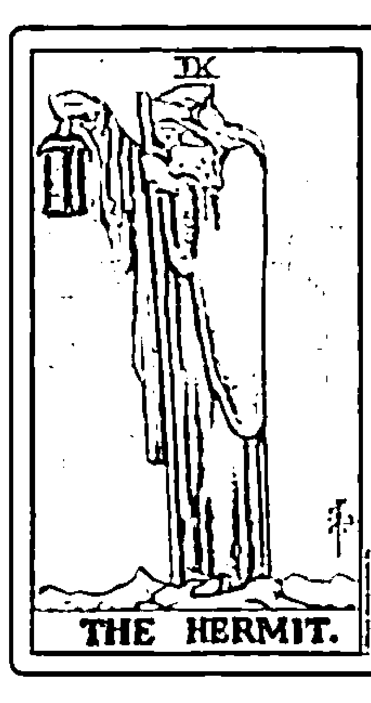

象徵圖象：
灰色的衣服
頭巾
姿勢
六角星作爲光的來源
覆蓋著雪的山峰
數字 9

意義：
嚴肅，謹慎的外表
保護自己，不受外界影響
爲別人照亮道路
來自結合各個極端——上-下，男-女，火-水——所產生出來的照明力量
達成的高度，孤獨
在踏進新的事物之前的隱居和鎮靜

### 隱士——作為一張牌或是在其他的牌陣裡

#### 一般性的意義：

隱士指出一個人的隱居階段和自我整合，尤其是在進入新的經驗領域之前。即使這張牌象徵著嚴肅和單獨，它並沒有指出缺乏幽默感，也沒有指出寂寞和悲痛。隱士表現出充滿著深度、了解、和清晰的態度。很明顯地，他仍然可以跟人們有很好的連繫而不需要掩飾。隱士一直都對自己很真實。

#### 工作領域：

現在即將要變得嚴肅一點，在此所說的嚴肅是以這個辭作最好的解釋而言的。從容不迫地把你自己的和你的力量整合起來。你正面對一個新的局面，它需要你的果斷力、清晰、和完整。首先檢視一下你真正想要什麼，工作上的成就、社會地位、金錢、和安全感對你來講意味著什麼，然後以你的方式來做它，面對這一切都要很真實。

#### 愛的方面：

目前你所處的階段需要你去澄清什麼事對你來講是重要的和正確的，以及在愛的領域裡面你真正在找尋什麼。也許僻靜一下來體驗單獨的生活是有幫助的。不管怎麼說，你都不應該讓你自己被引導到對你來講似乎不對的事。要保持對你自己很真實。

#### 精髓：

如果所有牌的加總數目是 9，那個精髓就是隱士。他的忠告就是退回來檢視一下自己的內在，看看你真正要什麼，了解什麼事對你來講是真正對的和重要的，在沒有這樣做之前，你不可以冒然行動。

### 隱士在愛的神諭牌陣裡

#### 位置 1 — 它是怎麼樣

它是關於一個定位的階段，在這個階段當中，你為你自己同時也為對方澄清你要的是什麼，真正重要的是什麼。也許你已經退回來要看清楚這一段關係。隱士指出一段關係，在那裡面，雙方都必須對自己很真實，同時對對方也很真實。

#### 位置 2 — 什麼東西從內在推著你

你是一個比較重承諾的人，但還是必須找出在此你真正在找尋的是什麼，你想要有什麼樣的愛和關係。也許在你對別人敞開和去接近別人之前，你需要給你自己更多的時間。

#### 位置 3 — 對方對你的態度

你所面對的人是一個成熟、謹慎的人，但是他或她仍然需要為他或她自己澄清一些事情。給這個人一些時間，不要催促他，尤其是對方已經有退縮傾向的時候。到了最後，不管怎麼說，對方都將會做出他或她認爲是最好的。

#### 位置 4 — 神諭對你的忠告

隱遁一下，先試著釐清一下自己。找出你真正要的是什麼，關係對你來講意味著什麼，你有什麼樣的慾望，以及你想要進入一個關係多深。要對自己真實，不要僞裝成那個不是你的。

### 隱士在指南針牌陣裡

#### 位置 1 — 它是怎麼樣

它是關於一個嚴肅的問題，那個問題需要以理智的方式來處理。它也許跟探詢更深的意義有關，或者跟在踏入一個新的領域之前先整合自己有關。

#### 位置 2 — 它就是這樣開始的

在開始的時候，你很認真投入，而且表現出你最好的一面。你可能也有想要退回來的想法，因為你需要更加看清你真正要的是什麼。

#### 位置 3 — 反應

你的環境是嚴肅的、謹慎的。別人對你沒有敵意，而比較是在忙著他們自己的事，他們需要一些時間來想出怎麼樣跟你互動。你不應該試圖影響、說服、或操控任何人，因為那是沒有用的。如果你需要一些好的忠告，你將會在此找到。

#### 位置 4 — 它將會引導到哪裡

你必須真的去走這個路線，因爲它會給你一個重要的經驗，或者它是一個你生命中必須去面對的任務。就好的方面來講，它可以成爲你的職業，然而，它跟事情是不是很容易，而你是不是很喜歡無關。唯一可以確定的是，隨著事情一步一步地開展，你將會變得更清楚這是要走的路，而且你的自信心也會隨著增加。

### 隱士在盲點牌陣裡

#### 位置 1 — 每一個人都知道的

在目前這個片刻，你還沒有自由做你想要做的事。在最好的情況下，你會將這個情況視爲你可以抓住某些機會的階段。在比較沒有那麼好的情況下，你就像是一個被命運所打擊的人，你甚至不知道爲什麼這一切會這樣發生。

#### 位置 2 — 盲點

別人看出你的時機已經來臨了，你可以踏出重要的一步，並透過經驗來成長。也許你事實上只是給別人一個印象，讓別人覺得你經歷了很多事，但其實是很宿命的。

#### 位置 3 — 你如何看你自己

也許你正在遭受不可避免的命運之苦，或者你知道每一件事的發生都有它的時機，在這種情況下，你了解到某些經驗是你必須去經歷的，所以你已經準備好投入精力來精通它們，並透過它們來成長。

#### 位置 4 — 很大的未知

這是一個未知的力量，這張牌可以以兩種不同的方式來解讀。或者它似乎指出一個生命中不可避免的命運，或者它只是意味著你生命的任務到目前爲止還是未知的。在這兩種情況下，很重要的是要去掌握這個內在的法則來了解生命想要從你身上做出什麼。

# X 命運之輪（The Wheel of Fortune）

## 職業

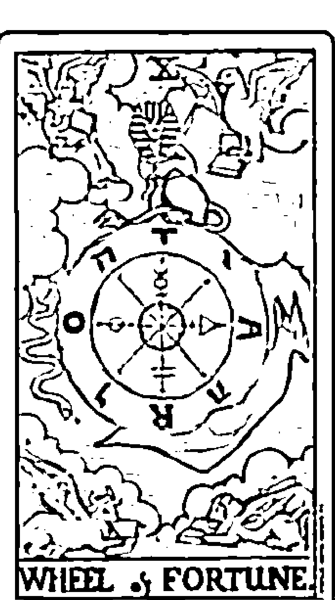

象徵圖象：
輪子
阿奴比斯（＝豺狼），獅身人面像，賽斯（＝蛇）
輪子上面的文字（）（JHVH）
煉金術的符號
數字 10

意義：
時間之輪
漸盈的（月）、滿的（月）、漸虧的（月）

神的名字

從較低的蛻變成較高的狀態
神聖的秩序（十誡/10個賽菲羅斯——神的10個屬性）

### 命運之輪——作為一張牌或是在其他的牌陣裡

#### 一般性的意義：

這張牌象徵著時間之輪，在生命裡面我們必須去履行的事都會在正確的時間出現，之後它又會被帶走。有一個力量持續地拉著我們走在命運的道路上。那些事或多或少是不可避免的，但它們也只是形成我們生命整體的一小塊。

#### 工作領域：

現在它全部都是關於要保持公平，和小心作決定。要保持不被腐化。要覺知到那個事實：到了最後，是你要對事情的發生和發展負責。它並不是一件容易的事，但是你也不能被騙，到了最後，你將會收穫到你所栽種的。

#### 愛的方面：

對於心的事情，公平、平衡、和平等對你來講是非常重要的。所以，你必須小心且精確地檢視你站在哪裡，然後做出清楚的決定看看它應該如何繼續。

#### 精髓：

如果所有牌的加總數目是10，那個精髓是命運之輪。這張牌最後的忠告是不要再遲疑了，要立刻出發，將事情掌握在你的手中，使事情發生。

### 命運之輪在愛的神諭牌陣裡

#### 位置 1 — 它是怎麼樣

這個關係是你的命運，不論它是好是壞都是你所造成的（這一世或前世）。在最糟糕的情況下，你是宿命的，但是事實上你可以在你的關係上作一些創造性的改變。特別注意一下位置 4，神諭的忠告。

#### 位置 2 — 什麼東西從內在推著你

你知道現在必須在你的關係上採取一些措施——那些措施也許並不是你非常願意的。它也許是關於更多的承諾，或是一個衝突，也許甚至是分手。不管怎麼說，你不應該再延緩它了。

#### 位置 3 — 對方對你的態度

就你的關係而言，你問題中的那個人並不是完全自由的。他或她也許覺得被遺棄而對你很依賴，或者覺得這個關係是一個他或她無法避免的挑戰。就好的方面來說，你是這個人的命運——好的命運。

#### 位置 4 — 神諭對你的忠告

你必須了解，對於所發生的事情你是要負責的。不要允許你自己受到不當因素的影響而作出匆忙的決定。倒是要考慮清楚，作出成熟的決定，並以公平、聰明、和反省過的方式來行動。

### 命運之輪在指南針牌陣裡

#### 位置 1 — 它是怎麼樣

你的問題是關於一個需要解決的主題，或是一個必須被精通的工作。如果你現在不做它，你就會一直延宕下去，你無法就這樣甩掉它。

#### 位置 2 — 它就是這樣開始的

你知道要進入這個方向的時機已經來臨了。如果你能夠享受它，那很好，但是即使你認爲在開始的時候，那個路途很坎坷，你在途中的每一步也會了解到它事實上是一條正確的道路，因爲那是你該走的路。位置 4 的那張牌將會顯示出它只是一個短暫的你必須去經歷的重要經驗，或是一條漫長的路。

#### 位置 3 — 反應

你周遭的人將你目前正在進行的案子視爲不可避免的。在理想的情況下，他們會了解你是在正確的時機做正確的事，所以他們會支持你。另外，他們也可能被動地反應，只是讓整個事情發生，一點都不插手，或者只是忍受著它。

#### 位置 4 — 它將會引導到哪裡

你必須真的去走這個路線，因爲它會給你一個重要的經驗，或者它是一個你生命中必須去面對的任務。就好的方面來講，它可以成爲你的職業，然而，它跟事情是不是很容易，而你是不是很喜歡無關。唯一可以確定的是，隨著事情一步一步地開展，你將會變得更清楚這是要走的路，而且你的自信心也會隨著增加。

### 命運之輪在盲點牌陣裡

#### 位置 1 — 每一個人都知道的

在目前這個片刻，你還沒有自由做你想要做的事。在最好的情況下，你會將這個情況視爲你可以抓住某些機會的階段。在比較沒有那麼好的情況下，你就像是一個被命運所打擊的人，你甚至不知道爲什麼這一切會這樣發生。

#### 位置 2 — 盲點

別人看出你的時機已經來臨了，你可以踏出重要的一步，並透過經驗來成長。也許你事實上只是給別人一個印象，讓別人覺得你經歷了很多事，但其實是很宿命的。

#### 位置 3 — 你如何看你自己

也許你正在遭受不可避免的命運之苦，或者你知道每一件事的發生都有它的時機，在這種情況下，你了解到某些經驗是你必須去經歷的，所以你已經準備好投入精力來精通它們，並透過它們來成長。

#### 位置 4 — 很大的未知

這是一個未知的力量，這張牌可以以兩種不同的方式來解讀。或者它似乎指出一個生命中不可避免的命運，或者它只是意味著你生命的任務到目前爲止還是未知的。在這兩種情況下，很重要的是要去掌握這個內在的法則來了解生命想要從你身上做出什麼。

# XI 正義（Justice）

## 成熟的判斷

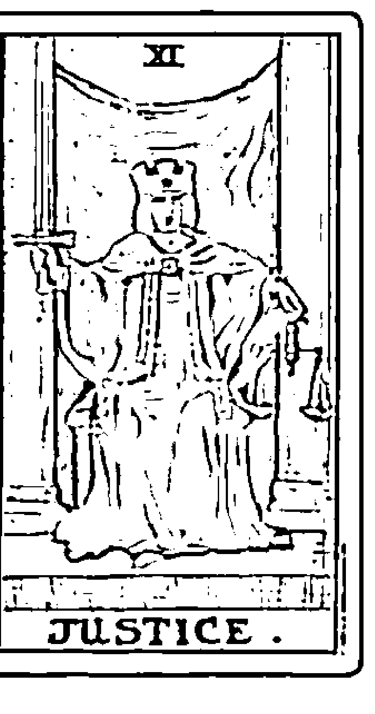

象徵圖象：
Astraea（正義的形象）
灰色的柱子
強調右邊（右手持寶劍；右腳和右邊的寶座暴露出來）
左手持天平
金色的背景
紫色的簾幕
數字 8（作者認爲這張牌的數字是被改變過的，用原來的數字 8是比較好的）

意義：
正義女神
中性
強調理性和客觀公平的判斷

平衡的直覺判斷
神聖的氣氛
世俗和神聖領域之間的界線
正義的數目，它一直都被分成相等的等分

### 正義——作為一張牌或是在其他的牌陣裡

#### 一般性的意義：

正義是審慎判斷的具體表現，是一個非常仔細思考之後的聰明決定。此外，正義清楚地認爲我們會經驗到什麼，這是我們自己要負責的，它指出，我們怎麼栽種就會怎麼收穫，這種事將會一再一再地發生。

#### 工作領域：

現在它全部都是關於要保持公平，和小心作決定。要保持不被腐化。要覺知到那個事實：到了最後，是你要對事情的發生和發展負責。它並不是一件容易的事，但是你也不能被騙，到了最後，你將會收穫到你所栽種的。

#### 愛的方面：

對於心的事情，公平、平衡、和平等對你來講是非常重要的。所以，你必須小心且精確地檢視你站在哪裡，然後做出清楚的決定看看它應該如何繼續。

#### 精髓：

如果所有牌的加總數目是8，那個精髓是正義。那個忠告是要負起責任，仔細地檢查事情，以審慎和明智的方式來作決定，永遠都要記住，你將會收穫到你所栽種的。

### 正義在愛的神諭牌陣裡

#### 位置 1 — 它是怎麼樣

你的關係是在公平、平等、和互相負責任的狀態下進行的。它可能涉及很聰明地作出一個重要的決定。

#### 位置 2 — 什麼東西從內在推著你

你很徹底地在檢查和深思熟慮，因為你覺知到你的責任。你想要作出一個清楚的決定，同時找到一個你可以覺得安心的位置。

#### 位置 3 — 對方對你的態度

你所面對的是一個正直的人，而且有時候甚至會有一點冷酷和保留。他或她需要一些時間來作出一個判斷，來弄清楚他或她想要什麼。但是不管怎麼說，你可以信賴他或她的公平。

#### 位置 4 — 神諭對你的忠告

你必須了解，對於所發生的事情你是要負責的。不要允許你自己受到不當因素的影響而作出匆忙的決定。倒是要考慮清楚，作出成熟的決定，並以公平、聰明、和反省過的方式來行動。

### 正義在指南針牌陣裡

位置 1 — 它是怎麼樣  
有一個正義的問題，或是一個其他的問題，它必須被公平和聰明地決定，你將為那個結果負起完全的責任。

位置 2 — 它就是這樣開始的  
你以理性的和具有判斷力的態度來處理事情，你在一開始的時候會將整個事情弄清楚。至少在開始的時候你是想要負責任的，同時以一種平衡、公平、和公正的方式在行動。

位置 3 — 反應  
你周遭的人是公正的。別人以一種聰明、公平、和審慎的方式在反應。沒有人會欺騙你或耍你，或是想佔你便宜。雖然它並不是一件容易的事，別人並不會阻擋你的機會。你給出什麼，你就會得到什麼。

位置 4 — 它將會引導到哪裡  
你要走什麼路線完全由你來決定。到了最後，那個評估將會是公平和公正的，你必須負起所有的責任。你越真誠、越努力，那個結果就會越好。

### 正義在盲點牌陣裡

位置 1 — 每一個人都知道的  
你是一個完全了解自己的責任的人，你通常會尋求聰明的、平衡的、和公平的生活形態。你目前正處於一個作決定的階段，它涉及一個平衡的判斷，那個判斷會受到所有人的檢驗。

位置 2 — 盲點  
別人認爲你對你自己的情況是要負責的，它對你達到一個審慎的決定是重要的。如果你無法覺察你的責任和缺點，那麼跟一個值得信任而且有經驗的人談一談是很好的。

位置 3 — 你如何看你自己  
你認爲你自己是一個很負責任的人。你試著聰明和理性地來行動，你一直都想要公平和公正。位置 2 的牌可以顯示出別人是不是也認爲你的態度和行爲基本上是值得尊敬的。

位置 4 — 很大的未知  
在內在深處存在著某種正義的感覺，它認爲，到了最後，我們都會收穫到我們所栽種的。只要一個人無法進入這個智慧，他就會在生命當中經驗到不愉快的事，覺得生命是不公平的，並傾向於責怪別人。如果你相信生命的公正，你就會了解，發生在你身上的一切都是你造成的，然後你就能夠以聰明和負責任的方式來引導你的生活。

### 倒吊人在愛的神諭牌陣裡

位置 1 — 它是怎麼樣  
它是關於一個道別，所以是一個關係的結束，或者是一個明顯的重要階段的結束。

位置 2 — 什麼東西從內在推著你  
你已經感覺到一個終點的到來，它是你關係中的一個階段嗎？是最初的熱情結束了嗎？或者是小孩要離家？也許是愛本身已經淡掉了嗎？

位置 3 — 對方對你的態度  
一個跟你親近的人在向你道別。不論它對你來講是否容易承受，他或她已經決定時候到了，必須走自己的路。

位置 4 — 神諭對你的忠告  
檢視一下你的關係是不是已經褪色了，而你只是執著於那個殘留的部分。如果不是這樣的話，那麼至少該是要跟某些期望、概念、或習慣說再見的時候了。

### 死亡在指南針牌陣裡

位置 1 — 它是怎麼樣  
它關係到一個結束，一個分離，或是放掉某一樣東西，因爲時間已經到了。

位置 2 — 它就是這樣開始的  
在開始的時候是一個分離，它可能意味著你需要先使你自己成爲自由的，才能夠開始去走你自己的路，或者這條路在一開始的時候就結束了，因爲它本來就不可能有結果的。在這種情況下，位置 4 的牌可能已經指出一個你在一個錯誤的開始或繞路之後所可能採取的新路線。

位置 3 — 反應  
你的周遭可能正處於某件事情的結束，而且可能充滿著分離和傷心的感覺。也許是某些人正好要離開，或者是他們正忙於處理一件分離的事而沒有時間理你。也許你可以給他們一些支持。

位置 4 — 它將會引導到哪裡  
至少每一件事都來到一個自然的終點。如果一個計劃有一個清楚的大綱，那麼這張牌是好的，因爲它指出你將會完成它。但是如果你在期待一個離得很遠的展望，那麼可能你選擇另外的路線會比較好。

### 死亡在盲點牌陣裡

位置 1 — 每一個人都知道的  
你將你的精神放在無常的事情上面，你正處於一個分離的階段，你正在遭受一個很大的損失，或者只是在腦海裡覺得將會有一個分離。

位置 2 — 盲點  
別人看到事情快要結束了，你應該要放手了，然而因爲這是你的盲點，所以你可能還在執著。跟別人談一談，這樣你才不會浪費太多時間在它上面，而會安排在正當時刻離開。

位置 3 — 你如何看你自己  
你知道某一件事已經來到了終點，你在想著死亡，或者更一般的，你在想著人生短暫的問題。

位置 4 — 很大的未知  
在內在深處，你知道人生沒有不散的宴席。只要你將這個分離從你的意識中排除，它將會變成一種對死亡和分離的恐懼。然而，如果你能夠了解它是不可避免的，你就能夠在事情發生的當下更強烈地去經驗它，而當時間來臨的時候，你也能夠放手。

### 節制在愛的神諭牌陣裡

位置 1 — 它是怎麼樣  
你的關係基本上是一個和平、和諧、和鎮靜等因素的健康組合。

位置 2 — 什麼東西從內在推著你  
你在親近和距離，自由和承諾，交融和個別發展之間找尋正確的做法。或者你傾向於使一個關係變得和平與平衡。

位置 3 — 對方對你的態度  
你所面對的人是一個和平，而且非常喜歡和諧和平衡的人。他或她對你有一個友善的態度，而且以愛心和關心在找尋正確的做法。

位置 4 — 神諭對你的忠告  
盡你的力量來成爲一個和平的締造者，同時創造出一個和諧的狀態。表達清楚，你準備要妥協，如果可能的話，你想要雙方共同來找到一個平衡點。假定你發覺你自己處於一個兩難的情況，很難作決定，你必須認真聽你的良知。

### 節制在指南針牌陣裡

位置 1 — 它是怎麼樣  
和平、和諧、鎭靜、或是正確的做法，這些是目前的主題。在另外一方面，它也許是關係到健康、或是一個良知的問題，或是在一個困難的道路上踏出正確的一步。

位置 2 — 它就是這樣開始的  
在開始的時候，這一條路感覺起來非常好，每一件事似乎都很和平、很和諧，你有很好的眼光可以找到正確的做法。位置 4 的牌可以告訴你，情形是否一直都會是如此，或者它遲早將會導致某種過度。

位置 3 — 反應  
你的周遭是鎭靜的、和平的。別人對你和你所做的事報以友善的態度，只要你不打擾到和平，他們不會給你任何阻礙。如果你在找尋連繫或需要幫忙，別人將會樂於助你。

位置 4 — 它將會引導到哪裡  
到了最後，每一件事都會成爲健康的和充滿和諧。你已經找到了正確的組合、一致、與和平，你可以完全滿意那個結果。

### 節制在盲點牌陣裡

位置 1 — 每一個人都知道的  
你是一個和諧的人，你致力於找到你的平衡，並加以保持。或者你正處於一個在找尋正確平衡的階段，它跟找到你頭腦的平靜有關，也許也跟注意你的健康有關。

位置 2 — 盲點  
別人了解到你必須注意你的健康，而且必須找到正確的平衡。雖然這個聽起來是很教條式的，你還是必須覺知到這個問題，同時繼續追蹤它。在另外一方面，它也可能是你需要在另外一個部分的生活找到正確的做法和目標。

位置 3 — 你如何看你自己  
你認爲你自己是一個和平的人，你強調和諧和保持正確的平衡。位置 2 的那張牌可以告訴你，你是不是這麼平衡的一個人，或者別人會認爲那只是你的糖衣。

位置 4 — 很大的未知  
在內在深處有一個隱藏的寧靜。只要它保持不為你所知，你將會從一個極端走到另外一個極端，然後在苦行和放縱之間擺盪。仔細來檢視一下這一面，只有你能夠確定地告訴你自己什麼對你來講是對的，什麼是不對的。

### 魔鬼在愛的神諭牌陣裡

位置 1 — 它是怎麼樣  
在你的關係裡面有一些權利鬥爭，你們互相在破壞對方，並看到邪惡隱藏在每一個地方。也許你們從自願在一起淪爲不健康的互相依賴。這張牌並非意味著那個關係是一個孽緣，但是你的確需要將一些光射進黑暗裡來使你自己從它解脫出來。

位置 2 — 什麼東西從內在推著你  
你目前是不是被纏住？你是不是受到誘惑跟你的同伴在玩權利的遊戲，在操控或玩弄對方？或者還有其他你無法抗拒的誘惑？這張牌包含一個警告，叫你要非常小心，不要被傷害到。

位置 3 — 對方對你的態度  
在你身旁的那個人非常有魅力，可能會有傷害性，但是對你非常重要。不管他或她會表現出很危險或很誘惑的一面，他或她都會不顧一切地想要得到你。那並不然意味著不好的意圖，但可以確定的是缺乏節制的。

位置 4 — 神諭對你的忠告  
似乎你藉著拒絕黑暗面和深度的熱情在壓抑你自己和這個關係。不要一直都只是想要表現出好的一面，也要站在你黑暗的那一邊，那可以幫助你在你的關係裡產生一個不同的，更強烈的氣氛。

## XVI 塔（The Tower）

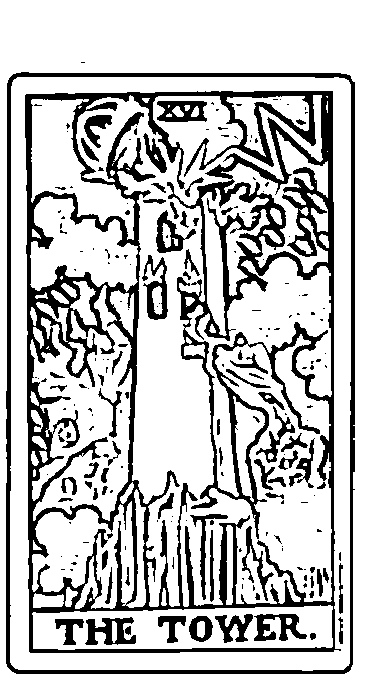

象徵圖象：塔皇冠的頂端是密閉的皇冠被甩開，閃電兩個人從塔上掉下來，22 滴露珠，一邊 10 滴，一邊 12 滴，數字 16

意義：狹窄，監獄，驕傲，羞辱，來自神的跡象，開悟的閃現，往下掉或是戲劇性地被解放的人對主牌的暗示，尤其是 X，命運之輪（職業，必然性），和 XII，倒吊人（靜止，改變）16 = 4 x 4。4 = 結構和堅定，4 x 4 = 呆滯

## 塔——作為一張牌或是在其他的牌陣裡

#### 一般性的意義：

塔指出一個戲劇性的改變——一個突破，或是一個瓦解。它指出舊有的外殼被打破了，某種東西從呆滯的狀態被解放。我們通常在經驗這些過程的時候都會有恐懼，但是事後來看，它們大多數都被證明是一個決定性的突破，而可以達到更大的自由。

#### 工作領域：

炸彈已經被丟下去，現在你發覺你自己處於瓦礫堆裡。不管怎麼說，某種高的期望已經被粉碎了，也許是你失掉了你的工作。即使那個戰場看起來很混亂，令人心生畏懼，但是很可能到了最後你會發覺這個改變是一種解放。

#### 愛的方面：

你被閃電擊中，每一樣東西都開始動搖。就在昨天看起來還是很明顯的事，現在突然變得有問題。即使你現在覺得有一點脫軌也不必覺得失望，有一天，你可能會了解目前所碰到的這些困難事實上是一種決定性的突破。

#### 精髓：

如果所有牌的加總數目是 16 和 7，那個精髓就是塔和戰車。它們聯合的忠告就是勇於突破，將框架粉碎，使你脫離監獄（塔），然後開始走向新的目標（戰車）。

### 塔在愛的神諭牌陣裡

#### 位置 1 — 它是怎麼樣

也許那個閃電是無意中出現的，也許它已經有預告一段時間。現在有戰爭，而且由它所衍生出來的力量很強，它可能會危及你關係的基礎。

#### 位置 2 — 什麼東西從內在推著你

你想要掙脫，想要粉碎現存的框架，你已經準備好要真正去冒險。你也可能被一些新的消息或事件所動搖。或者，也許你突然了解到你對事情的看法太狹窄了，或者你將你的城堡建築在沙灘上。

#### 位置 3 — 對方對你的態度

在目前，那個親近你的人是衝動的，一點都不好相處。你最好是避開這個人，因為你可能會很容易踏到地雷。很明顯地，你可以提出和平的建議，或者假定那個戰爭並不是針對你，你可以提供一些支持。

#### 位置 4 — 神諭對你的忠告

讓那個炸彈投下來，將那個長久以來對你來講就已經太狹窄的框架粉碎掉。去除掉既定的遊戲規則，去除掉先前的結論。冒一切險，你將會結束掉你的關係，或者全部更新。

### 塔在指南針牌陣裡

#### 位置 1 — 它是怎麼樣

它關係到一個冒險的計劃，一個重大的變革，一個戲劇性的想要解脫，或是將外殼粉碎掉，去除掉一個太狹窄的框架。

#### 位置 2 — 它就是這樣開始的

在剛開始的時候，你很有勇氣和信心，而且你很樂觀，因爲你相信你所走的路有美好的未來。檢視一下位置 4 的牌是否確認你的樂觀，或者你快樂的時機尚未成熟。

#### 位置 3 — 反應

你周遭的反應是有信心的，別人看到一顆幸運星在上升，很顯然地，你或你的做法使人們感到非常快樂。如果你需要幫忙或支持，你的周遭將會提供。

#### 位置 4 — 它將會引導到哪裡

這是一條有美好遠景的路，即使其他的牌顯示出有困難，你也必須去做它。到了最後，你將會看到困難消失了，你可以不必限制地跟著你的幸運星走，它將會引導到一個很棒的未來。

### 塔在盲點牌陣裡

#### 位置 1 — 每一個人都知道的

也許你是一個具有革命精神的人，你會發動造反，你是靜不下來的，到處都想改革，或者你強力地振作起精神想要作基本的改變。

#### 位置 2 — 盲點

別人看你坐在定時炸彈上面，它威脅著隨時要爆炸，或者你具有爆炸性的破壞效果。儘管如此，別人也可能覺得你正處於一個改變的階段，而那個改變會伴隨著一個很大的危機。如果你沒有覺知到這個現象，你必須跟別人談一談，這樣你才能夠對這些美好的展望睜開眼睛。

#### 位置 3 — 你如何看你自己

你知道你目前所涉入的危機，你想要藉由它來突破，使你能夠再度呼吸到自由的空氣。或者是那個災難完全癱瘓了你？

#### 位置 4 — 很大的未知

在內在深處有一顆隱藏的星星能夠讓你對更高的力量有信心。如果你不了解這一面，你將會一再一再地覺得無助，而無法感覺到宇宙法則的存 在。從你的內在深處找回這個光，它可以作爲你的引導星。

## XVII 星星（The Star）

## 一個新的未來

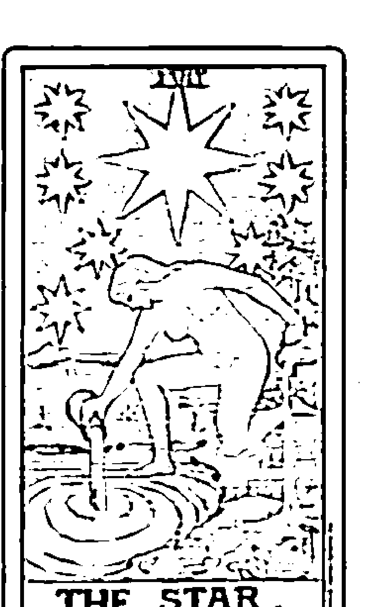

象徵圖象：
星星仙子將水倒在地面上和倒在水上
星星
八角星
主要的星星和 7 顆圍繞的星星
樹木
朱鷺
數字 17

意義：
上天的豐富

在占星學裡面可以說出命運
天狼星，愛西絲的星星，她宣佈每年尼羅河的洪水
智慧之廟的七根柱子
神諭的象徵圖象（古時候的樹木神諭）
智慧之神托特的吉祥物，看到未來
象徵「新的未來」，在經過了三個沒有月亮的夜晚，新的月亮出現在第十七天

### 星星——作為一張牌或是在其他的牌陣裡

#### 一般性的意義：

星星代表新的希望和美好的未來。每當這張牌出現，它意味著你所問的問題有美好的未來，常常甚至比發問者本身所能夠想像的來得好。在一個比較深的層面，這張牌象徵著一個進入宇宙法則的洞見。

#### 工作領域：

在你面前有一個長遠的未來，在那裡，事情將會很容易成功，而且有很好的機會會出現。要善用這個時機，對你的幸運星要有信心，帶著樂觀來執行你的計劃和任務。

#### 愛的方面：

你有足夠的理由可以快樂和充滿著新的希望。有美好的未來擺在你的眼前，你的愛情生活有幸運星的幫助。

#### 精髓：

如果所有牌的加總數目是 17，那個精髓是星星，它進一步引導到正義，因為這兩個數字的加總是 8。它的結論是：要對你的計劃有信心，要信任有美好的未來（星星），但是要記住，到了最後，你一直都會收穫到你所栽種的（正義）。

### 星星在愛的神諭牌陣裡

#### 位置 1 — 它是怎麼樣

你的關係受到幸運星的保護，它預示著一個美好和深遠的未來。

#### 位置 2 — 什麼東西從內在推著你

那個展望是會有一個充滿著愛和喜悅的持久的未來。即使你現在必須經歷危機也不要放棄，要重新鼓起勇氣和信心。

#### 位置 3 — 對方對你的態度

你所面對的人是有遠見的，而且充滿著信心，對他或她來講，你是一個幸運星，他或她會很喜歡跟你分享未來。

#### 位置 4 — 神諭對你的忠告

試著超越你平常的參考架構，從較高的觀點來看你的關係，一個鳥瞰的視野。你將會感覺到難題一天比一天減少，而未來更加地充滿著希望。將這個形象留在你的腦海裡，試著按照這個展望去贏得你伴侶的心。

### 星星在指南針牌陣裡

#### 位置 1 — 它是怎麼樣

它關係到一件事或一個計劃，它是很有希望的，而且它已經計劃很久了。就各方面而言，它都會受到幸運星的影響。

#### 位置 2 — 它就是這樣開始的

在剛開始的時候，你很有勇氣和信心，而且你很樂觀，因爲你相信你所走的路有美好的未來。你想要以遊戲的方式來嘗試那些事，而且充滿著樂觀。檢視一下位置 4 的那張牌，看看是否能夠一直都維持好天氣。

#### 位置 3 — 反應

你處於一個樂觀、美好、和有利的環境。如果你需要支持和鼓勵，你可以找別人，但是即使你只是想要有一些樂趣，你也會找到好的同伴。

#### 位置 4 — 它將會引導到哪裡

你可以走這一條路，即使前面的牌認為這一條路是困難的，因為這條路將會把你引導到一個新的狀態。在此你可以達成自我，你將會像一個新生的嬰兒沐浴在陽光下，既和平，又快樂。

### 星星在盲點牌陣裡

#### 位置 1 — 每一個人都知道的

你充滿著焦慮、容易生氣、和煩惱，同時很悲觀。或者至少你發覺你在這一段期間裡面被恐懼和惡夢所支配著。

#### 位置 2 — 盲點

別人看到你站在黑暗裡，也許甚至是迷路了。如果這真的是你的盲點，你是很明顯地在欺騙你自己，或者至少你在外在假裝你是堅強的。讓別人來打開你的眼睛，好讓你不會失去它。

#### 位置 3 — 你如何看你自己

你知道你迷失在一個恐懼的迷宮裡而陷入危險。你也許也知道有一個出口，但它是一個很狹窄的出口。對你內在的聲音要有信心，讓塔羅牌來一步一步引導你走出森林。

#### 位置 4 — 很大的未知

在內在深處有很大的不確定性和恐懼。它一定曾經出現在你的惡夢裡，也許也會不預期地在某些重要的時刻使你變得沒有勇氣。如果你能夠去面對這一面，將它整合為你人格的一部分，你將會了解到有些恐懼會自動消失，而其他的恐懼甚至會轉變成一個能夠讓你進入深刻經驗的重要指南針。

## XVIII 月亮（The Moon）

## 黑暗

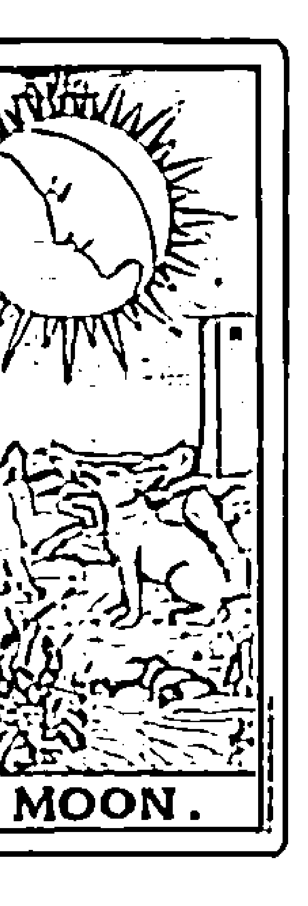

象徵圖象：
月亮在太陽前面
15 滴
月亮的露珠
高聳的耶路撒冷的塔
岸邊的龍蝦
狗
狼
在這兩者之間的道路
數字 18

意義：
日蝕
15＝滿月的數目
溼潤和肥沃
預示著最高的可達成的目標
從深處浮現
幫助本能的力量
本能危險的力量
走鋼索
日蝕和月蝕的數目，每 18 年會以同樣的順序再發生

### 月亮——作為一張牌或是在其他的牌陣裡

#### 一般性的意義：

月亮牌畫出夜晚和黑暗，那是我們很容易在裡面迷失的。它象徵著不確定、恐懼、易怒、和惡夢。然而，它並不是一張不好的牌，因爲它顯示出那個恐懼的路線可以引導到很深、很豐富的經驗，有時候甚至直接到達目標。作爲一個過度時期，它常常是一個呼喚，叫我們去喚醒我們的恐懼。然而，當它在路的盡頭時，它警告著我們，這條路會引導到黑暗或者可能轉變成一個惡夢。

#### 工作領域：

你站在黑暗裡，很容易生氣，不知道如何進行。或者是你放棄一切，試著儘快使你自己從這個惡夢中解脫，或者是你對你內在的聲音有信心，你可以在一條細線上取得平衡，堅持到最後，在終點的地方，解決方案在等著你。

#### 愛的方面：

你很害怕，不知道怎麼做。也許你的擔心有一個真實的原因，但更可能的是，你只是在踏出重要的一步之前還猶豫不決，但是當你踏出去之後將會有很好的進展。

#### 精髓：

如果所有牌的加總數目是 18，然後縮減成 9，再縮減成 1，那麼那個精髓是月亮和隱士。所以，最後的忠告是去經歷夜晚和恐懼（月亮），爲了要找到你自己（隱士）。

### 月亮在愛的神諭牌陣裡

#### 位置 1 — 它是怎麼樣

夜晚降臨到你的關係裡，目前你發覺你自己處於黑暗之中，你不知道要如何繼續下去。在昨天似乎是清楚的事，在今天變成一個問題。如果惡夢無法在不久之後自己停止，你真的是要去找尋任何狹窄的出口，以便讓你脫離黑暗。

#### 位置 2 — 什麼東西從內在推著你

你很混亂，而且很容易生氣，因爲那個團團圍住的黑暗會醞釀出妖魔鬼怪，它們會縈擾著你的夢，剝奪你的睡眠。不要讓這些幽靈嚇到你，集中精神在那個有光線穿透的地方。

#### 位置 3 — 對方對你的態度

你所面對的人充滿著焦慮，站在黑暗裡，不知道要如何脫離那個情況。他或她害怕接近你。如果你不是他或她害怕的原因，那麼你可以確定，如果你在這個時候給予支持，他或她一定會非常感謝。

#### 位置 4 — 神諭對你的忠告

進入那個令你害怕的途徑，即使周遭似乎是黑暗的。在隧道的終點找尋光。試著去跨過那個門檻，做那個常常出現在你的腦海，甚至是很吸引你，而你不敢去做的事。

### 月亮在指南針牌陣裡

#### 位置 1 — 它是怎麼樣

你的問題是恐懼、惡夢、不確定、某種隱藏在黑暗中的東西，或是那個應該在暗中放鬆的。然而，那個問題也可能是如何克服恐懼，以便可以得到寶貴的經驗。

#### 位置 2 — 它就是這樣開始的

在開始的時候有恐懼，你被黑暗包圍著，你弄不清楚方向，不知道如何開始。如果位置 4 的那張牌指出一個有前途的目標，你就應該信任你內在的聲音，不顧害怕地去走這一條路。而如果那個展望並不是很好，你就必須找尋另外的可能性。

#### 位置 3 — 反應

別人以不好的心情來反應，或者他們被你的方法所觸怒，或甚至害怕。也許人們的印象是你使他們矇在鼓裡。不管怎麼說，在此你無法指望會得到別人的幫助。沒有人會在大白天破壞你，但是你得小心夜晚的時候。

#### 位置 4 — 它將會引導到哪裡

你不應該選擇這條路線。到了最後，它將會變得很暗淡，它將會好像單獨一個人站在一個黑暗的大森林裡，不知道可以從哪裡走出去。讓塔羅牌來指引你一條更有展望的路。

### 月亮在盲點牌陣裡

#### 位置 1 — 每一個人都知道的

你充滿著焦慮、容易生氣、和煩惱，同時很悲觀。或者至少你發覺你在這一段期間裡面被恐懼和惡夢所支配著。

#### 位置 2 — 盲點

別人看到你站在黑暗裡，也許甚至是迷路了。如果這真的是你的盲點，你是很明顯地在欺騙你自己，或者至少你在外在假裝你是堅強的。讓別人來打開你的眼睛，好讓你不會失去它。

#### 位置 3 — 你如何看你自己

你知道你迷失在一個恐懼的迷宮裡而陷入危險。你也許也知道有一個出口，但它是一個很狹窄的出口。對你內在的聲音要有信心，讓塔羅牌來一步一步引導你走出森林。

#### 位置 4 — 很大的未知

在內在深處有很大的不確定性和恐懼。它一定曾經出現在你的惡夢裡，也許也會不預期地在某些重要的時刻使你變得沒有勇氣。如果你能夠去面對這一面，將它整合為你人格的一部分，你將會了解到有些恐懼會自動消失，而其他的恐懼甚至會轉變成一個能夠讓你進入深刻經驗的重要指南針。

## XIX 太陽（The Sun）

## 生命的喜悅

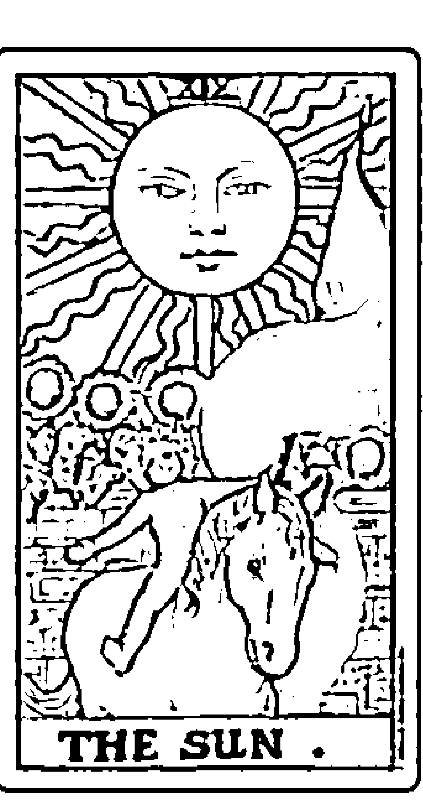

象徵圖象：
日正當中
小孩
紅色的布
豎起的鬃毛
牆壁和向日葵
白色的馬
數字 19

意義：
發光最強的時候，慷慨，信念
無憂無慮，簡單的智慧
活力
新鮮
多樣化（向日葵）和統一（小孩）之間的界線
純潔
宇宙的完整：12 個星座符號和 7 個古典的行星

### 太陽——作為一張牌或是在其他的牌陣裡

#### 一般性的意義：

太陽基本上是代表任何「陽光型」或「陽光普照」的事，比方說，生命的光明面和開朗的個性。它包含無憂無慮、客觀、和生命自發性的喜悅。在比較深的層面來講，它代表和解與和好，同時象徵著一個人覺知的發展，走向純真的智慧。

#### 工作領域：

你正在走向美好的時光，在進入時間裡，你可以很熱心地完成你的任務，並啓動新的計劃。抓住自我實現的機會，以一種大方和樂觀的方式來做它。

#### 愛的方面：

充分享受你愛情生活的美好時光，它將會使你成為無憂無慮的，同時充滿著喜悅，如果必要的話，給你自己一個和解的好機會。

#### 精髓：

如果所有牌的加總數目是 19，那個精髓就是太陽，然後這兩個數目的加總是 10，再縮減成 1，所以它的另外一個精髓是命運之輪和魔術師。總括的忠告就是要客觀地（太陽）去面對目前的問題（命運之輪），因爲你現在有力量和能力去應付跟隨著它而來的挑戰（魔術師）。

### 太陽在愛的神諭牌陣裡

#### 位置 1 — 它是怎麼樣

在你的關係當中有太陽升起，它帶來一個無憂無慮的歡樂時光，你會感覺到一種內心的溫暖，它能夠讓你治好舊有的傷口，並克服舊有的悲傷。

#### 位置 2 — 什麼東西從內在推著你

你希望有一個美好的關係，雙方都可以寵愛對方，並且一起享受生命。也許你也想要克服緊張，跟對方和好，達到一種真實的、有活力的交融。

#### 位置 3 — 對方對你的態度

在你旁邊的人有一顆溫暖的心，他是樂觀的、慷慨的，同時對你有一個很好的態度。如果你需要任何支持或是需要某人來鼓起你的興致，你可以找他或她。

#### 位置 4 — 神諭對你的忠告

從你溫暖、大方、和了解的那一面來呈現出你自己。寵愛你的伴侶，打開他或她的眼睛來迎接美麗的人生。

### 太陽在指南針牌陣裡

#### 位置 1 — 它是怎麼樣

它跟自我達成有關，或者你很樂觀地去看一些事情，你希望那些事情可以讓你的生命有更好的品質，或者至少有一段美好的時光。

#### 位置 2 — 它就是這樣開始的

在一開始的時候，每一件事都進行得很好，你對你自己很確定，而且變得很大方，你享受你正在做的。你想要以遊戲的方式來嘗試那些事，而且充滿著樂觀。檢視一下位置 4 的那張牌，看看是否能夠一直都維持好天氣。

#### 位置 3 — 反應

你處於一個樂觀、美好、和有利的環境。如果你需要支持和鼓勵，你可以找別人，但是即使你只是想要有一些樂趣，你也會找到好的同伴。

#### 位置 4 — 它將會引導到哪裡

你可以走這一條路，即使前面的牌認為這一條路是困難的，因為這條路將會把你引導到一個新的狀態。在此你可以達成自我，你將會像一個新生的嬰兒沐浴在陽光下，既和平，又快樂。

### 太陽在盲點牌陣裡

#### 位置 1 — 每一個人都知道的

你有一個開朗的個性，有很好的幽默感，你通常會激起人們的自信和滿足。也許你事實上是一個年輕人，或者你散發出年輕、新鮮的氣息。

#### 位置 2 — 盲點

別人對你的印象是你走在街道的陽光面，你是滿足的、高興的，你無憂無慮地過著你每天的生活，或者至少你是可以這樣做的。如果那是你的盲點，那麼這個評估可能會讓你感到驚訝。你是否以前從來不知道這一點？

#### 位置 3 — 你如何看你自己

你享受著人生的光明面，你是樂觀的，你喜歡追求自我成就。你知道你已經克服了內在的——也可能兼外在的——緊張，因此很和諧地過著你的人生。

#### 位置 4 — 很大的未知

在內在深處，那個太陽等待著被發現。它象徵著勇氣、決心、信念、溫暖、和自我達成。目前這些都只是你還沒有去經驗到的潛力，但是如果你能夠去開發你在這些方面的潛力，你一定會得到很多，那麼太陽就可以為你升起。

## XX 审判（Judgement）

## 救贖

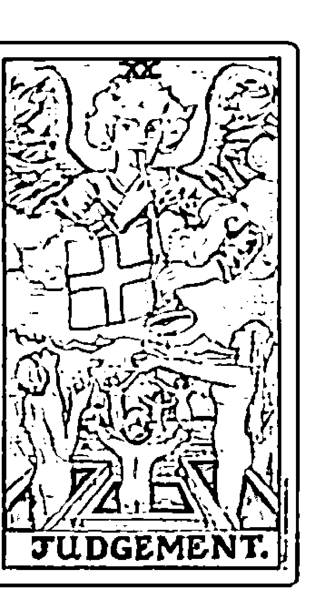

象徵圖象：
吹著喇叭的天使
復活的旗子
死人的復活
打開的棺材
三個來自長方形墳墓的死人
站了起來
數字 20

意義：
預報可以救贖
熱情和受苦的結束
使某種死的東西重新恢復活力
從世俗的監獄解脫
神聖的（3）救贖透過世俗的領域（4）

恩典和贖罪的象徵（5 種罪惡的意義和提供恩典與救贖的 4 福音的乘積）

### 審判——作為一張牌或是在其他的牌陣裡

#### 一般性的意義：

審判代表救贖和解脫，或是其他奇蹟般的蛻變，即使那個名稱是指向不同的方向（最終的審判在復活之前，它是這張牌的主題）。因此這張牌建議，某種你認爲失去的東西將會再度出現，有一個寶物會從深處升起，或者會有一個很大的舒緩，因爲困難的階段結束了。

#### 工作領域：

現在是吐氣的時候，在職業的層面，這張牌指出一個困難階段的結束，或是找到了一個奇蹟般的答案，或是某一件你已經放棄的事現在有了轉變，變得更好。

#### 愛的方面：

在愛和關係中所產生的任何痛苦和悲傷，現在那個受苦的時間已經結束了。它可能是舊有的難題突然自己消失了，或是那個長久以來被認爲已經失去的愛現在終於出現了，或者你真正找到你的真愛。

#### 精髓：

如果所有牌的加總數目是 20，那個精髓就是審判，然後這兩個數目的加總是 2，所以它的另外一個精髓是女祭司。最後的忠告是：將會有一個答案或救贖（審判），如果你能夠耐心地讓你自己被你內在的聲音所引導（女祭司）。

### 審判在指南針牌陣裡

位置 1 — 它是怎麼樣  
那個問題是一個家，在這個世界上的正確的地方或位置，正確的態度，或者更一般來講，一個你想要達到的重要目標。

位置 2 — 它就是這樣開始的  
在開始的時候，你覺得很好，你覺得你終於達到了你所要的，你很高興地涉入，而且打從心裡承諾。就各方面來講，你都走在正確的道路上，除非位置 4 的牌告訴你不是這樣。

位置 3 — 反應  
你發覺你自己處於一個非常有活力的環境，別人覺得很舒服，而且心情很好。那個情況可能是你的做法所造成的，或者人們只是很快樂地在一起，甚至不去找尋其他的接觸。如果你採取主動，他們一定會歡迎你。

位置 4 — 它將會引導到哪裡  
這是在這個位置可以找到的最好的牌之一，所以你應該選擇這個路線，它將會引導你到一個你會覺得很好的目標，你會有一種很深的確定感，覺得你達成了某件事。如果你的問題是關於內在的途徑，這張牌建議你要去經歷一個真正能夠使你變成熟和完整的過程。

### 審判在盲點牌陣裡

位置 1 — 每一個人都知道的  
你是一個開朗和平衡的人，你已經在這個世界上找到了你適合的位置，或者是你目前對生命有一個正確的態度。

位置 2 — 盲點  
別人認爲你處於正確的位置，或者那個目標至少是可以得到的。你難道不知道嗎？如果是這樣的話，那麼你必須快一點讓別人來打開你的眼睛。

位置 3 — 你如何看你自己  
你知道你已經達到了你的目標，或者至少你已經很接近它，而且對人生有一個正確的態度。位置 2 的牌可以讓你檢視一下別人對你的情況的評估是否也是很正向的。

位置 4 — 很大的未知  
在內在深處，你對於你真正的家有一些了解，只要你無法找到正確的方法來取得這個知識，你可能會迷失在這個世界裡而不知道要怎麼辦。是不是可以讓塔羅牌建議一個方式來使你接觸到你未知的那一面？

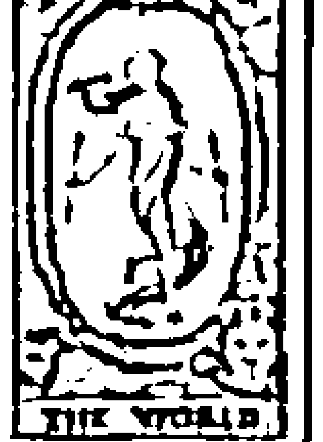  
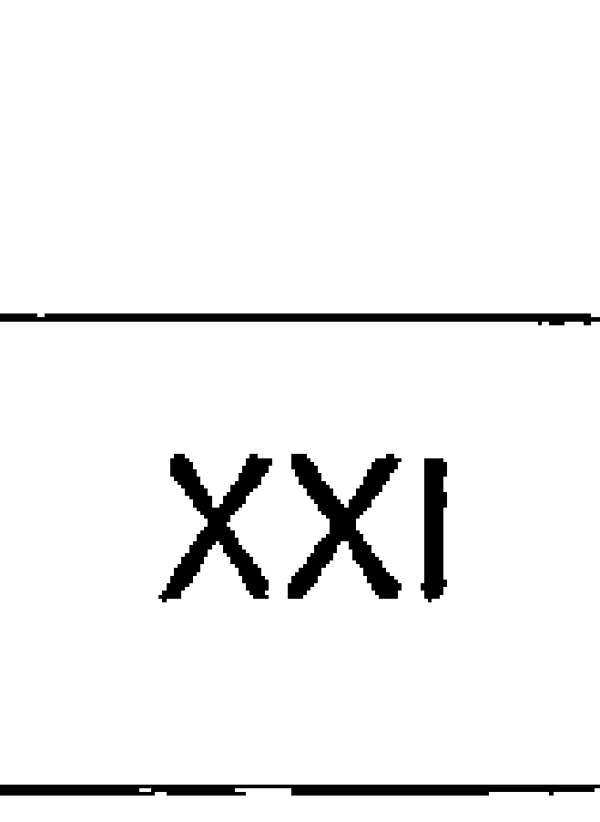

## XXI 世界（The World）

## 目標

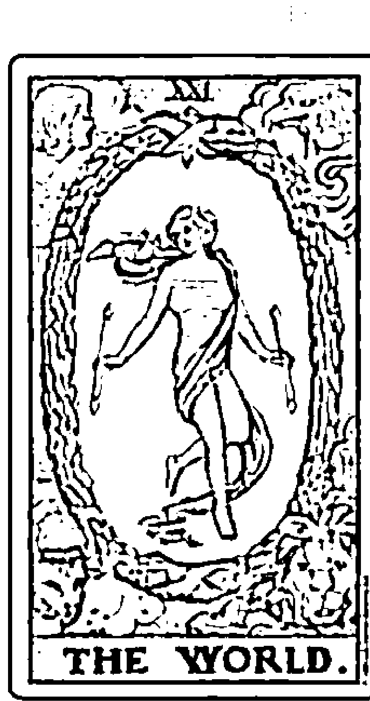

象徵圖象：  
跳舞的女人  
姿勢＝倒過來的倒吊人（XII）  
四元素的象徵圖象  
桂冠（月桂樹的花圈）  
綁著紅布條的花圈  
數字 21  

意義：  
活力、快樂  
解脫  
完整  
達到目標  
一個圓圈裡面包含兩個焦點＝更大的統一，跟廣大的世界連結  
7 是這個途徑的一段，或是一段時間  
3 X 7 = 整個途徑，整個時間，更大的統一  

### 世界——作為一張牌或是在其他的牌陣裡

#### 一般性的意義：

世界是塔羅牌裡面最好的牌之一，它指出我們已經達到了一個目標，或甚至是到達了最終的目標，我們已經在世界上找到了正確的地方或位置和正確的態度。這可以指外在的事情，也可以指內在的發展。

#### 工作領域：

你已經到達了目標，你已經找到了正確的地方、工作、和正確的態度。要使你的工作成爲一種你可以長期享受它的事。

#### 愛的方面：

你有充分的理由可以快樂，或者你已經達成了，或者你即將要達到一個真正屬於你的位置，一個你可以覺得舒適的位置。

#### 精髓：

如果所有牌的加總數目是 21，那個精髓就是世界，它進一步引導到女皇，因爲這兩個數字的加總是 3。最好的忠告是採取正確的態度或是在世界上得到正確的位置（世界），它會引導到活力和成長（女皇）。

### 世界在愛的神諭牌陣裡

#### 位置 1 — 它是怎麼樣

你們已經互相找到對方，這張牌表示在你的關係裡，你們雙方都覺得很舒服，你們一起成長，現在你們形成一個更大的單位。

#### 位置 2 — 什麼東西從內在推著你

你在找尋一個家，你想要在這個關係中覺得安全和被保護，你有一個內在的慾望想要真正去到某一個地方跟更大的東西結合。

#### 位置 3 — 對方對你的態度

那個在你身邊的人會支持你，而且非常想要建立一個關係，並注入新的活力。

#### 位置 4 — 神諭對你的忠告

了解你在這個關係裡面是舒服的，要將你自己完全投放進去。要衷心承諾，在你們的結合當中表現出最好的，這樣它才能夠變成一個更大的統一體。

### 世界在指南針牌陣裡

位置 1 — 它是怎麼樣  
那個問題是一個家，在這個世界上的正確的地方或位置，正確的態度，或者更一般來講，一個你想要達到的重要目標。

位置 2 — 它就是這樣開始的  
在開始的時候，你覺得很好，你覺得你終於達到了你所要的，你很高興地涉入，而且打從心裡承諾。就各方面來講，你都走在正確的道路上，除非位置 4 的牌告訴你不是這樣。

位置 3 — 反應  
你發覺你自己處於一個非常有活力的環境，別人覺得很舒服，而且心情很好。那個情況可能是你的做法所造成的，或者人們只是很快樂地在一起，甚至不去找尋其他的接觸。如果你採取主動，他們一定會歡迎你。

位置 4 — 它將會引導到哪裡  
這是在這個位置可以找到的最好的牌之一，所以你應該選擇這個路線，它將會引導你到一個你會覺得很好的目標，你會有一種很深的確定感，覺得你達成了某件事。如果你的問題是關於內在的途徑，這張牌建議你要去經歷一個真正能夠使你變成熟和完整的過程。

### 世界在盲點牌陣裡

位置 1 — 每一個人都知道的  
你——至少在目前——有困難作決定，比較喜歡保持中立。也許保持中立和不承諾是你個性的特徵。不管怎麼說，你目前覺得無法找到一個清楚的位置。

位置 2 — 盲點  
別人看你無法作決定，或是沒有意願，所以頂多只是有模糊的意願。如果你認爲你自己是一個果決的人，那麼你必須參考一下別人的意見。

位置 3 — 你如何看你自己  
你知道在這個時候最好是保持中立，至少沒有什麼具體的事情逼著你要採取立場。如果你需要一些時間來思考，那是沒有問題的，然而如果這種態度是你生活的策略，那麼你就得好好地反省一下。它可能會導致沒有熱情和漠不關心的態度，而使生活變得沒有意義，只是在度日子。

位置 4 — 很大的未知  
在你的內在有很多猶豫不決，如果你沒有覺知到這一面，那麼你將會感到驚訝，那個已經作了決定的事居然就這樣一直延緩下去。在最差的情況，這可能會導致一種冷漠的態度，使生活變得沒有能量。所以，很重要地，你必須去覺知你內在的這一面，以免成爲它的受害者。

# 魔術師在指南針牌陣裡

位置 1 — 它是怎麼樣  
有一個很熱的機會在等著你，但是你需要有一些勇氣和冒險精神。它也許是一個挑戰性的新嘗試，或是一件你需要帶著全部的熱情來做的事，或是一個能夠使你成長和成熟的挑戰。

位置 2 — 它就是這樣開始的  
在開始的時候就只有空洞的話語，你不想承諾，所以你的表現是中立的。你猶豫不決，或者試圖延緩你的決定，或者你只是在害怕下一步。也許你只是需要更多的時間來思考那個問題，或者那件事對你來講並沒有太大的意義？不管怎麼說，你是意興闌珊的。

位置 3 — 反應  
你的周遭是保持中立的，或者甚至是沒有興趣的。只要你能夠自己安排，那麼就沒有問題，然而如果你期待別人的支持和鼓勵，你將會失望。

位置 4 — 它將會引導到哪裡  
如果中立是一個想要的結果，那麼你就必須選擇這個方式。在其他的情況下，它將無法滿足你的期望，你將會碰到溫溫的、漠不關心的、和沒有承諾的行為。

# 魔術師在盲點牌陣裡

位置 1 - 每一個人都知道的  
你——至少在目前——有困難作決定，比較喜歡保持中立。也許保持中立和不承諾是你個性的特徵。不管怎麼說，你目前覺得無法找到一個清楚的位置。

位置 2 — 盲點  
別人看你無法作決定，或是沒有意願，所以頂多只是有模糊的意願。如果你認爲你自己是一個果決的人，那麼你必須參考一下別人的意見。

位置 3 — 你如何看你自己  
你知道在這個時候最好是保持中立，至少沒有什麼具體的事情逼著你要採取立場。如果你需要一些時間來思考，那是沒有問題的，然而如果這種態度是你生活的策略，那麼你就得好好地反省一下。它可能會導致沒有熱情和漠不關心的態度，而使生活變得沒有意義，只是在度日子。

位置 4 — 很大的未知  
在你的內在有很多猶豫不決，如果你沒有覺知到這一面，那麼你將會感到驚訝，那個已經作了決定的事居然就這樣一直延緩下去。在最差的情況，這可能會導致一種冷漠的態度，使生活變得沒有能量。所以，很重要地，你必須去覺知你內在的這一面，以免成爲它的受害者。

# 權杖二在指南針牌陣裡

位置 1 — 它是怎麼樣  
有一件事，不知道怎麼樣總是覺得缺乏能量和方向。它也許對你來講並不是那麼重要，或者有其他的原因使你提不起勁，不管怎麼說，目前就只有模糊的意願。

位置 2 — 它就是這樣開始的  
在開始的時候，你對你自己和對事情都很確定，你在執行你的計劃時充滿著樂觀的信心。位置 4 的那張牌可以告訴你，你正向的評估是有道理的，或者你的熱情是沒有基礎的。

位置 3 — 反應  
你的周遭對你的計劃是敞開的，而且很有興趣。別人對你是有信心的，沒有問題的，同時期待著一個很好的發展。也許你是用你的計劃在對這個情況作出貢獻。

位置 4 — 它將會引導到哪裡  
這是一條很好的路，即使前面的牌顯示出有困難，你也要去走它。到了最後，你將會達到一個很好的位置，要站穩，深呼吸，很放鬆地來看你的未來，它看起來是很有展望的。

# 權杖二在盲點牌陣裡

位置 1 — 每一個人都知道的  
你——至少在目前——有困難作決定，比較喜歡保持中立。也許保持中立和不承諾是你個性的特徵。不管怎麼說，你目前覺得無法找到一個清楚的位置。

位置 2 — 盲點  
別人看你無法作決定，或是沒有意願，所以頂多只是有模糊的意願。如果你認爲你自己是一個果決的人，那麼你必須參考一下別人的意見。

位置 3 — 你如何看你自己  
你知道在這個時候最好是保持中立，至少沒有什麼具體的事情逼著你要採取立場。如果你需要一些時間來思考，那是沒有問題的，然而如果這種態度是你生活的策略，那麼你就得好好地反省一下。它可能會導致沒有熱情和漠不關心的態度，而使生活變得沒有意義，只是在度日子。

位置 4 — 很大的未知  
在你的內在有很多猶豫不決，如果你沒有覺知到這一面，那麼你將會感到驚訝，那個已經作了決定的事居然就這樣一直延緩下去。在最差的情況，這可能會導致一種冷漠的態度，使生活變得沒有能量。所以，很重要地，你必須去覺知你內在的這一面，以免成爲它的受害者。

# 權杖三在指南針牌陣裡

位置 1 — 它是怎麼樣  
那個情況是樂觀的，而且有很好的、深遠的前景，那些事在目前已經有很好的呈現。

位置 2 — 它就是這樣開始的  
在開始的時候，你對你自己和對事情都很確定，你在執行你的計劃時充滿著樂觀的信心。位置 4 的那張牌可以告訴你，你正向的評估是有道理的，或者你的熱情是沒有基礎的。

位置 3 — 反應  
你的周遭對你的計劃是敞開的，而且很有興趣。別人對你是有信心的，沒有問題的，同時期待著一個很好的發展。也許你是用你的計劃在對這個情況作出貢獻。

位置 4 — 它將會引導到哪裡  
這是一條很好的路，即使前面的牌顯示出有困難，你也要去走它。到了最後，你將會達到一個很好的位置，要站穩，深呼吸，很放鬆地來看你的未來，它看起來是很有展望的。

# 權杖三在盲點牌陣裡

位置 1 — 每一個人都知道的  
你是樂觀的，而且在生活上有一個很好的基礎。你知道你已經達成了什麼，同時很有信心地在面對著未來。

位置 2 — 盲點  
別人認爲你已經達到了一個很重要的位置，同時覺得你的展望是很棒的。因爲這是你的盲點，所以在此你似乎忽略了某些事，或者至少低估了你的機會。你可以跟你周遭的人談一談，以便確定你不會錯過任何好機會。

位置 3 — 你如何看你自己  
你知道你已經達成了某些重要的事，現在很樂觀地看著你的未來。檢視一下位置 1 和 2 的牌，看看別人是否也跟你同樣地有信心，或者你可能是太天真、太樂觀了。

位置 4 — 很大的未知  
在你的內在隱藏著一個很樂觀、很有自信的人。只要你對那個部分是陌生的，你在發展未來的時候就會比較缺乏信心。當你更認識你自己，同時學會珍惜樂觀的品質，你就可以將陰鬱的簾幕拉到一旁，毫無阻礙地看到美好的未來。

# 權杖四 (Four of Wands)

## 敞開

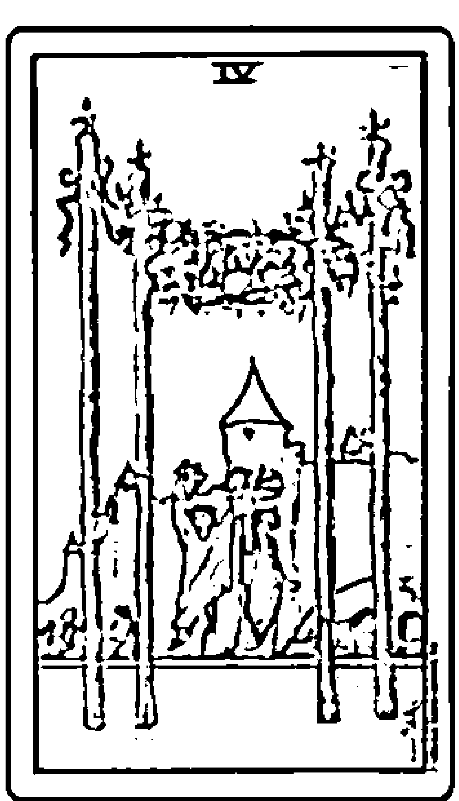

象徵圖象：  
城堡  
帶著花束的人  
權杖上面有花圈  
數字和元素  

意義：  
安全  
敞開、歡迎的祝賀  
快樂、慶祝  
穩定的（4）成長（火）

### 權杖四——作為一張牌或是在其他的牌陣裡

#### 一般性的意義：

權杖四代表一個情況，在那個情況下你覺得很安全，並享受著那個保障和保護，同時對新的經驗和遭遇敞開。這張牌也常常意味著你覺得被歡迎和歡迎別人。

#### 工作領域：

不必擔心，前面的路是直的，很放鬆地來處理你的工作，同時對別人敞開，你將會受到歡迎。

#### 愛的方面：

忘掉你的擔心和懷疑，當愛情生活正面臨一個新的春天。超越你的限度，對別人敞開，打從你的內心歡迎他們。

### 權杖四在愛的神諭牌陣裡

位置 1 — 它是怎麼樣  
你有很好的理由可以在你的關係中覺得快樂，你們互相對對方都很敞開，同時互相歡迎，享受著你們一起經驗的每一件事。

位置 2 — 什麼東西從內在推著你  
你覺得很安全，同時很敞開，你想要去接近別人，同時告訴他或她，你是多麼地快樂，而他或她是你生活上的一部分。

位置 3 — 對方對你的態度  
你所面對的人對你是敞開的，對你完全沒有戒心，很認同你，而且打從心裡歡迎你。

位置 4 — 神諭對你的忠告  
這張牌告訴你要勇敢地站出來，尤其如果你到目前為止都還躲在烏龜殼底下的話。不要等著被要求，要公開地展現出你自己，快快樂樂地走向你的愛人，你可以先採取主動。

### 權杖四在指南針牌陣裡

位置 1 — 它是怎麼樣  
它關係到你主動去接近一件事或一個人，因為你覺得跟這個人在一起是安全的，所以你對那個會面是敞開的。

位置 2 — 它就是這樣開始的  
在開始的時候，每一件事都很棒，你處於很好的心情，覺得被保護，所以毫無顧慮地暴露出你自己，同時去接近別人。如果它繼續這樣進行——位置 4 的那張牌將會針對這個問題來告訴你——那麼這對你來講是正確的方式。

位置 3 — 反應  
你處於一個被歡迎的環境，別人對你是敞開的，而且沒有任何隱藏的動機。也許他們在期待你或你的行動，你是他們所要的。

位置 4 — 它將會引導到哪裡  
這是一條很好的路。到了最後，你有很好的理由可以慶祝，將會有和平，你會覺得很安全，同時帶著敞開和樂觀的態度來接近別人。

### 權杖四在盲點牌陣裡

位置 1 — 每一個人都知道的  
你是敞開的，你覺得很安全，同時喜歡接近別人。或者至少你目前很勇於去看看周遭有什麼。

位置 2 — 盲點  
你所發出的訊號是敞開的，或者別人歡迎你，想要接近你。因為這是你的盲點，所以你的看法會有所不同。跟別人談一談，好讓他或她可以幫助你看清楚一點。

位置 3 — 你如何看你自己  
你知道你現在可以走出你被保護的環境去接近一個人，或者獻身於一個計劃。

位置 4 — 很大的未知  
在你的內在深處隱藏著一個冒險家，他喜歡危險和具有挑戰的情況。只要你仍然不知道它，你將會一再一再地進入困難的情況而不了解為什麼，一直都認爲自己是一個小心翼翼，甚至是膽小的人。但是一旦你知道了你的這一面，你就會變得更有勇氣。

# 權杖五（Five of Wands）

## 挑戰

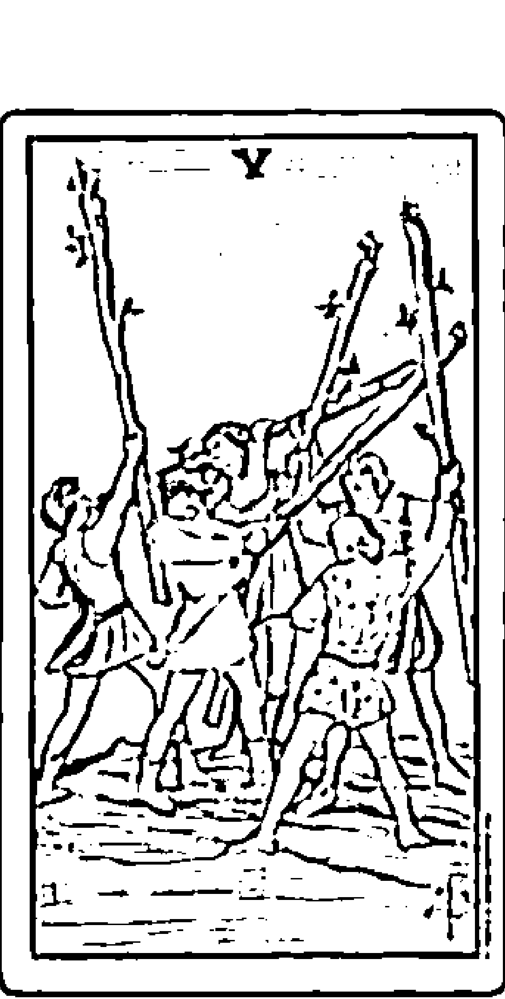

象徵圖象：  
交叉的棍棒  
數字和元素

意義：  
年輕人在爭鬥  
衡量一個人的力量  
挑戰的危機（5）存在於走向自我達成的路上（火）

### 權杖五——作為一張牌或是在其他的牌陣裡

#### 一般性的意義：

權杖五顯示出一個情況，在那個情況下需要勇氣，同時必須證明我們的能力、知識、和靈巧。關於它比較好的事是，每一件事都是公平的，沒有隱藏的惡意，而比較不舒服，同時比較刺激的一面是我們不知道它將會有什麼樣的結果。它就好像在一個競爭裡面，那個表現最好的人會贏。

#### 工作領域：

現在事情將會充滿懸疑，要表現出你的性向，面對挑戰，衡量你的力量，跟別人競爭。你將會有所得，或者是因爲你真的會成爲勝利者，或者是你會因爲勇敢地加入和不退縮而得到滿足。

#### 愛的方面：

你很確定你的成功，充滿著自信去征服某人的心。或者你已經在這方面很成功，現在正在慶祝你的勝利？

### 權杖五在愛的神諭牌陣裡

#### 位置 1 — 它是怎麼樣

在你的關係中有一個真正的成功，你可以感到快樂。也許你剛結束一個長期的戰役，克服了跟別人的衝突，或者有一個好消息使你快樂，甚至覺得紓解和放鬆。

#### 位置 2 — 什麼東西從內在推著你

你充滿著信心，也想要在你的伴侶裡面激發出這個感覺。另外，你也可能接到好消息而想要儘快跟你的伴侶分享。

#### 位置 3 — 對方對你的態度

在你旁邊的人是徹底的樂觀，而且對你有堅定的信心。或者他或她接到某些好消息想要儘快讓你知道。

#### 位置 4 — 神諭對你的忠告

拋掉所有的懷疑，充滿相信，你一定會勝利。如果你有好消息，一定要分享它。

### 權杖五在指南針牌陣裡

位置 1 — 它是怎麼樣  
那個問題是公平的競爭，是一個互相在爭勝的情況，是在衡量一個人的力量，或是一個有益的挑戰。

位置 2 — 它就是這樣開始的  
在開始的時候，你被吸引去面對那個刺激的挑戰，你覺得喜歡衡量你的力量，並藉此來展現出你全部的潛力。

位置 3 — 反應  
你或是你的方式是一個挑戰，它受到你周遭的歡迎。別人準備賭下去來衡量他們的力量，所有這些都不是卑鄙或惡意的，而是良性競爭。

位置 4 — 它將會引導到哪裡  
到了最後，事情將會充滿懸疑，你必須去面對一個挑戰或一個競爭，在那裡你可以展現你的潛力。

### 權杖五在盲點牌陣裡

位置 1 — 每一個人都知道的  
你是一個真正的樂觀主義者，一個天生的勝利者，或者你正在乘著勝利的風浪，它強烈地激發著你。

位置 2 — 盲點  
別人看到你是勝利者，也許這個消息還沒有傳到你這裡，或者有某種紗布矇住你，使你看不到你的勝利，要盡可能將那個情況再看清楚一點。如果你很機智地去面對這些怨恨，你將會以一個勝利者走出這個衝突。

位置 3 — 你如何看你自己  
你認爲你是一個志在必得的人，或者在某些事情上面你已經得到了好消息，所以你很確定你會成功。在位置 2 的那張牌可以顯示出別人跟你一樣樂觀，或者他們仍然保持懷疑。

位置 4 — 很大的未知  
在內在深處隱藏著一個勝利者。只要你還不知道他，你將會缺乏信心和勇氣，你是勝利所必需的。看看你的這一面，如果你能夠找到它，它將能夠幫助你驅散悲觀的雲，並揭開更多生命的喜悅。

# 權杖六（Six of Wands）

## 成功

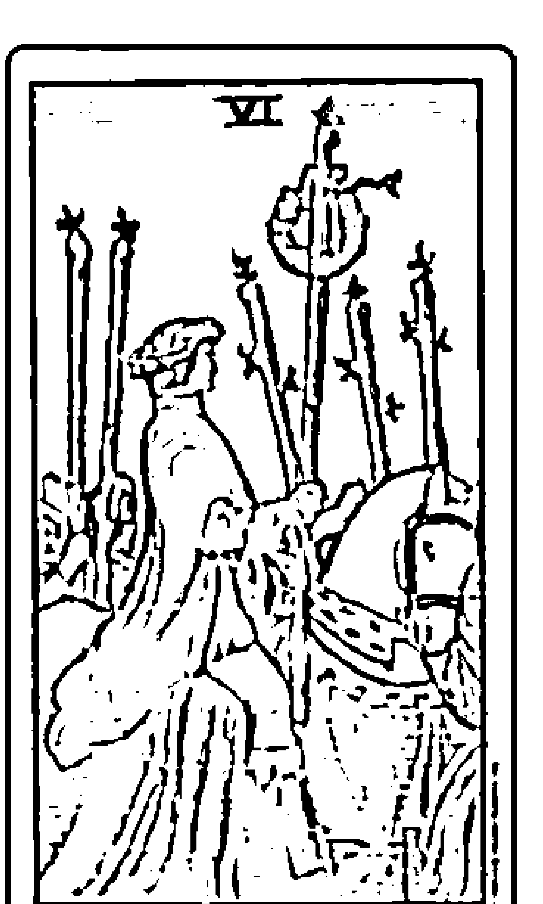

象徵圖象：  
桂冠  
騎士（報信者）  
有裝飾的馬  
數字和元素

意義：  
勝利  
宣佈好消息  
節慶的和歡樂的場合  
成功的（6）戰役（火）

### 權杖六——作為一張牌或是在其他的牌陣裡

#### 一般性的意義：

碰到權杖六，一個人有很好的理由可以樂觀。這張牌指出很好的展望，因爲有好消息，一件事呈現出很好的結果，成功是確定的，或者一個人已經勝利了。

#### 工作領域：

加緊工作，使每一件事成功。就快要有好消息了，那個勝利是你的，即使你只是在跟對手爭論，或者是在護衛你自己以對抗惡意的、嫉妒的、毀謗的人。

#### 愛的方面：

你很確定你的成功，充滿著自信去征服某人的心。或者你已經在這方面很成功，現在正在慶祝你的勝利？

### 權杖六在愛的神諭牌陣裡

#### 位置 1 — 它是怎麼樣

在你的關係中有一個真正的成功，你可以感到快樂。也許你剛結束一個長期的戰役，克服了跟別人的衝突，或者有一個好消息使你快樂，甚至覺得紓解和放鬆。

#### 位置 2 — 什麼東西從內在推著你

你充滿著信心，也想要在你的伴侶裡面激發出這個感覺。另外，你也可能接到好消息而想要儘快跟你的伴侶分享。

#### 位置 3 — 對方對你的態度

在你旁邊的人是徹底的樂觀，而且對你有堅定的信心。或者他或她接到某些好消息想要儘快讓你知道。

#### 位置 4 — 神諭對你的忠告

拋掉所有的懷疑，充滿相信，你一定會勝利。如果你有好消息，一定要分享它。

### 權杖六在指南針牌陣裡

位置 1 — 它是怎麼樣  
有很好的勝利和成功的可能性，至少會有好消息。

位置 2 — 它就是這樣開始的  
在開始的時候，你充滿著樂觀，相信那個勝利已經是你的囊中物。在位置 4 的牌將會告訴你它是否真的如此，或者你慶祝得太快了，真正的工作還沒有做好。

位置 3 — 反應  
你正在計劃的事對別人來講是一個好消息，他們會想要看到它的發生。所以你會得到正向的回應，或者如果必要的話，會得到支持和幫助。

位置 4 — 它將會引導到哪裡  
到了最後，每一件事都會導向抗爭，但是在那個抗爭當中，你將會勝利，如果你很清楚地說出你的立足點，同時展現出足夠的勇氣。

### 權杖六在盲點牌陣裡

位置 1 — 每一個人都知道的  
你是一個真正的樂觀主義者，一個天生的勝利者，或者你正在乘著勝利的風浪，它強烈地激發著你。

位置 2 — 盲點  
別人看到你是勝利者，也許這個消息還沒有傳到你這裡，或者有某種紗布矇住你，使你看不到你的勝利，要盡可能將那個情況再看清楚一點。如果你很機智地去面對這些怨恨，你將會以一個勝利者走出這個衝突。

位置 3 — 你如何看你自己  
你認爲你是一個志在必得的人，或者在某些事情上面你已經得到了好消息，所以你很確定你會成功。在位置 2 的那張牌可以顯示出別人跟你一樣樂觀，或者他們仍然保持懷疑。

位置 4 — 很大的未知  
在內在深處隱藏著一個勝利者。只要你還不知道他，你將會缺乏信心和勇氣，你是勝利所必需的。看看你的這一面，如果你能夠找到它，它將能夠幫助你驅散悲觀的雲，並揭開更多生命的喜悅。

# 權杖七（Seven of Wands）

## 堅信自己

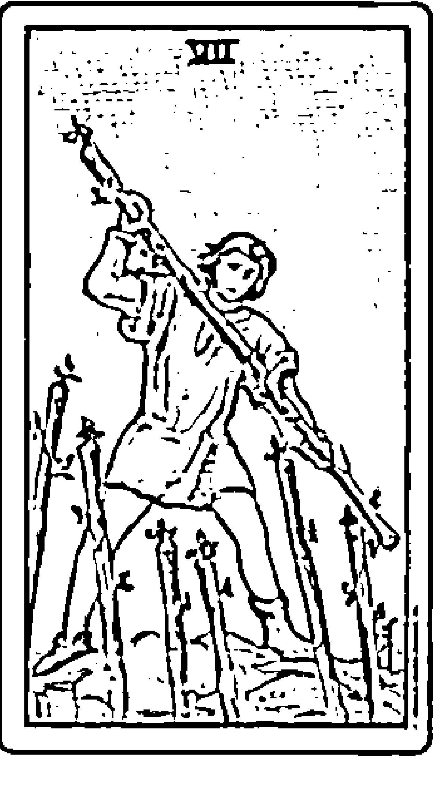

象徵圖象：  
那個人的姿勢  
站在高處  
六支棍棒指向他  
數字和元素

意義：  
打鬥、防衛  
有利的位置  
攻擊者  
自我挑剔的（7）堅信自己（火）

### 權杖七——作為一張牌或是在其他的牌陣裡

#### 一般性的意義：

權杖七指出你暴露在嫉妒、傷害、或是其他形式的攻擊之下，同時要求你要護衛你的立足點。如果你好好地應付，你的前景事實上是很好的，因爲你站在有利的位置。

#### 工作領域：

有人想要拉開你所坐的椅子，或是以其他的方式來使你陷入困難。也許你的工作或計劃陷入了危險。如果你接下那個挑戰，然後很確定地陳述你的觀點，你成功的機率很高。

#### 愛的方面：

在愛的領域裡面，你有一個清楚的位置，你護衛著你的立足點。也許你在爲某人抗爭，或是爲你的關係抗爭，或者你生活在一個很棒的隔離之中，不讓別人接近你？

### 權杖七在愛的神諭牌陣裡

#### 位置 1 — 它是怎麼樣

你在愛的領域裡面爲你的立場抗爭。或者是你們互相在角力關於你們的位置，或是你們的關係受到攻擊，需要護衛。如果你是前後一致的，而且是堅定承諾的，那個空氣不久之後就會被清理乾淨。

#### 位置 2 — 什麼東西從內在推著你

你暴露在怨恨之下，覺得受到攻擊，並處於危險之中。如果你決心護衛你的立足點，那是好的，因爲你站在一個有利的位置在打鬥，所以你的問題很快就可以被解決。

#### 位置 3 — 對方對你的態度

你所面對的是一個喜歡爭吵的人，他或她覺得受到攻擊，然後將會帶著很多的信念來護衛自己。如果你是一個攻擊者，你必須收斂一點，或者至少你必須小心一點，因爲你的論點比較薄弱，或者你會發覺你自己處於劣勢。

#### 位置 4 — 神諭對你的忠告

要將你的立足點弄清楚，爲你自己或是爲你的關係抗爭。了解你所站的位置有多麼好，你可以將事情按照你所要的方式做好。

### 權杖七在指南針牌陣裡

位置 1 — 它是怎麼樣  
你自己的立場陷入危險，或者你還必須去爭取一個工作。那個展望是好的，只要你立場清楚，而且下定決心去做。

位置 2 — 它就是這樣開始的  
在開始的時候，你接到了好消息，而且事情進行得很快。你很樂觀，想要事情開始動起來。檢視一下位置 4 的那張牌，看看這只是一個短期的成功，或者它將會引導到一個好的結果。

位置 3 — 反應  
你正在計劃的事對別人來講是一個好消息，他們會想要看到它的發生。所以你會得到正向的回應，或者如果必要的話，會得到支持和幫助。

位置 4 — 它將會引導到哪裡  
到了最後，每一件事都將會發生得比你預期的還快。它將會有一個好的結果。你很明顯地是發動了一件已經在流傳的事，所以之後每一件事都會進行得很順利。

### 權杖七在盲點牌陣裡

位置 1 — 每一個人都知道的  
舊有的創傷使你變得比較內向和不信任，或者你發覺你把自己封閉起來，藉以避免那個創傷重新被喚起。

位置 2 — 盲點  
別人認爲你是一個不信任和硬心腸的人，因爲這是你的盲點，所以你並不知道你是這樣，你反而覺得是別人跟你保持距離。在那個情況下，你的周遭是你的鏡子。要一步一步地鬆開來，你將會覺得別人開始信任你，對你有信心。

位置 3 — 你如何看你自己  
你知道你裡面的小孩被燙到了，你知道你的受傷，它使你覺得最好被保護著，這樣別人才不會太靠近你。

位置 4 — 很大的未知  
在內在深處，你經常都採取防衛的姿態，那可能是因爲舊有的創傷，但是只要你不知道這一面，你將會無意識地避開一些事實上是你所渴望的經驗和遭遇。

# 權杖八（Eight of Wands）

## 驚訝

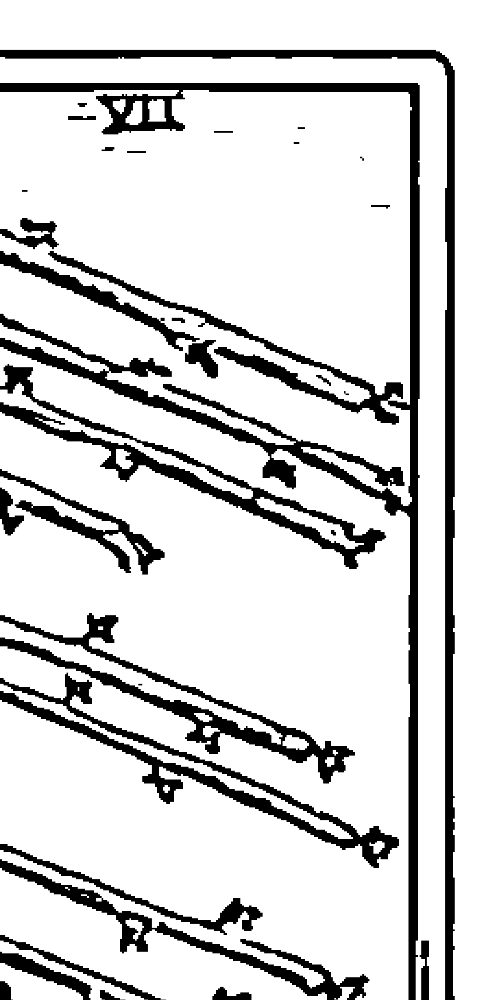

象徵圖象：  
飛逝的權杖  
那些權杖將會打到地面上  
數字和元素

意義：  
有一些事在流傳  
有一些事將會變成事實或是會到達  
快速的（火）改變（8）

### 權杖八——作為一張牌或是在其他的牌陣裡

#### 一般性的意義：

權杖八這張牌是少有的，它指出某一件事將會發生得比你預期的來得快。它指出一些事立刻就要出現，它們通常是正向的。它們可能是一些長久以來所欲求或期待的消息，或是一些令人驚訝的事件。但是也意味著進入一些情況而陷住在那裡。

#### 工作領域：

已經有消息在流傳，也許會進入一些似乎卡住的事，或者你會接收到一些你一直在等待很久的消息。然而它也可能是一個不愉快的意外，它完全在錯誤的時機抓住你。

#### 愛的方面：

要小心！邱比特的箭正在飛過。如果你一頭栽進去愛裡面也不要感到驚訝。如果你不想要進入新的關係，那麼這張牌指出新的能量注入現有的關係裡。

### 權杖八在愛的神諭牌陣裡

#### 位置 1 — 它是怎麼樣

有好消息在流傳，它可能會很快以正向的方式影響你的關係。有火花在飛翔，它可能很快會點燃熾熱的火——一種新的活力。

#### 位置 2 — 什麼東西從內在推著你

你希望你的關係會發展，新的能量會帶來新的春天。或者你很熱切地期待著新的消息，它不久以後就會到來。

#### 位置 3 — 對方對你的態度

在你旁邊的人是很活的，而且送出很好的震動。也許是每一件事對他或她來講都進行得很快，或者他或她是沒有耐心的。不管怎麼說，這個人會讓你驚訝。

#### 位置 4 — 神諭對你的忠告

試著將一些新鮮的刺激和一些活力帶進你的關係裡。讓你的伴侶有意外的驚喜。提議一些他或她沒有想到的事。

### 權杖八在指南針牌陣裡

位置 1 — 它是怎麼樣  
有一些好事在流傳，它也許是一些會讓你驚訝的消息，或是一個即將要開始的計劃，或是一個立刻就會發生的發展。

位置 2 — 它就是這樣開始的  
在開始的時候，你接到了好消息，而且事情進行得很快。你很樂觀，想要事情開始動起來。檢視一下位置 4 的那張牌，看看這只是一個短期的成功，或者它將會引導到一個好的結果。

位置 3 — 反應  
你正在計劃的事對別人來講是一個好消息，他們會想要看到它的發生。所以你會得到正向的回應，或者如果必要的話，會得到支持和幫助。

位置 4 — 它將會引導到哪裡  
到了最後，每一件事都將會發生得比你預期的還快。它將會有一個好的結果。你很明顯地是發動了一件已經在流傳的事，所以之後每一件事都會進行得很順利。

### 權杖八在盲點牌陣裡

位置 1 — 每一個人都知道的  
或者你是處於一個充滿著好消息的階段，或者你基本上是一個樂觀的人，相信每一件事都會進行得很快、很好。

位置 2 — 盲點  
別人看到有一些好消息在等待著你，或是有一個有利的發展即將要發生，而你不知道。也許你必須跟朋友或同事談論一下這些事情，才不會錯失良機。

位置 3 — 你如何看你自己  
你基本上認爲有一些好事即將要發生，至少你正在期待著一個驚喜，而且相信不久之後會有好的發展。唯有當位置 2 的牌顯示出你周遭的人有非常不同的看法，你才必須質疑你的樂觀。

位置 4 — 很大的未知  
在你的內在深處有樂觀的潛力，並期待著正向的驚喜。只要你沒有覺知到你本性的這一面，你很可能會傾向於悲觀，同時害怕突然的改變。

# 權杖九（Nine of Wands）

## 採取守勢

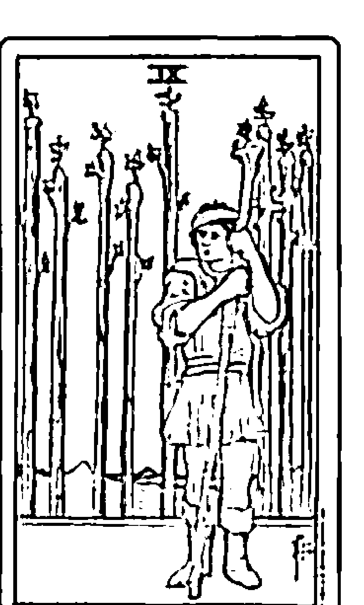

象徵圖象：  
姿勢和面部的表情  
8根木樁圍在後方  
沒有看到入侵者  
頭上的繃帶  
數字和元素

意義：  
採取守勢，決定抵禦攻擊  
保護、支持  
覺得受到威脅，但是沒有急迫的理由  
舊有的傷口  
匯集（9）一個人的力量和勇氣，準備抵抗（火）

### 權杖九——作為一張牌或是在其他的牌陣裡

#### 一般性的意義：

權杖九顯示出你受到威脅，但是，是不是真的有威脅，或者你只是害怕在舊有的傷口上灑鹽。不管怎麼說，你只是採取守勢，匯集你的力量，準備抵抗。當你想要放掉或戒掉一些事的時候，這張牌是正向的。在這個情況下，這張牌指出，你已經將後退的路給堵住了，所以你不會再回復到原來的狀態。

#### 工作領域：

事情變得更困難，你也許覺得受到一個挑戰的威脅，或是受到別人的威脅，或者你覺得好像站在一個關閉的門前面，不知道要如何進行。或者是你自己決定採取守勢？

#### 愛的方面：

你仍然對舊有的傷口念念不忘，所以還無法敞開自己，進入親密關係。在另外一方面，這張牌也可能指出反過來的情況，在那個情況下你是抗拒的、沉默寡言的。

### 權杖九在愛的神諭牌陣裡

#### 位置 1 — 它是怎麼樣

在這個關係中，你們雙方都採取守勢，你們之間有一個距離，互相對對方關起門來。

#### 位置 2 — 什麼東西從內在推著你

你覺得受到威脅，所以你將自己蓋住。舊有的傷口仍然記憶猶新，你覺得你必須保護你自己，避免舊有的傷口再度被挑起。

#### 位置 3 — 對方對你的態度

你所面對的人是比較內向的，他或她的不信任使他對自己的故事比較有興趣，而對你比較沒有興趣。如果你想要贏得他或她，你必須有耐心，要重視他或她舊有的傷口，一步一步地建立信任的關係。

#### 位置 4 — 神諭對你的忠告

如果你剛跨出了重要的一步，這張牌指出你會做很多事來避免退回去。然而，在另外一方面，它意味著你必須使你自己被蓋住，不要暴露出你自己，這樣別人才不會太靠近你。不要讓別人逼你或說服你去做什麼。

### 權杖九在指南針牌陣裡

位置 1 — 它是怎麼樣  
它是關於你的不願意敞開、舊有的傷口、抗拒，  
或是某種具有威脅的事

位置 2 — 它就是這樣開始的  
在開始的時候，你發覺你自己站在一個關閉的門  
前面，或是你自己把門關起來。你覺得受到一個  
挑戰的威脅，所以你採取防衛的姿態，你必須檢  
視一下位置 3 和位置 4 的牌，看看這條路是否  
真的很危險，或者你的害怕是沒有根據的。

位置 3 — 反應  
你周遭的人覺得受到你或你的行為所威脅，所以  
第一個反應就是將你排除在外。因此你無法得到  
他們的歡迎或支持。如果你想要贏得別人的心，  
你必須克服某些抗拒和不信任。如果你不知道如  
何進行，你可以用第 200 頁的十字架牌陣來問  
塔羅牌。

位置 4 — 它將會引導到哪裡  
當你在處理放掉什麼或是戒絕舊有的習慣的時候  
才使用這個方法。在那個情況下，你必須完全把  
門關起來，絕對不留後路。在其他的每一個情  
況，這張牌建議不要選擇這個路線，因爲你到了  
最後將會遭到抗拒，吃閉門羹。

### 權杖九在盲點牌陣裡

位置 1 — 每一個人都知道的  
舊有的創傷使你變得比較內向和不信任，或者你  
發覺你把自己封閉起來，藉以避免那個創傷重新  
被喚起。

位置 2 — 盲點  
別人認爲你是一個不信任和硬心腸的人，因爲這  
是你的盲點，所以你並不知道你是這樣，你反而  
覺得是別人跟你保持距離。在那個情況下，你的  
周遭是你的鏡子。要一步一步地鬆開來，你將會  
覺得別人開始信任你，對你有信心。

位置 3 — 你如何看你自己  
你知道你裡面的小孩被燙到了，你知道你的受傷，  
它使你覺得最好被保護著，這樣別人才不會太  
靠近你。

位置 4 — 很大的未知  
在內在深處，你經常都採取防衛的姿態，那可能  
是因爲舊有的創傷，但是只要你不知道這一面，  
你將會無意識地避開一些事實上是你所渴望的  
經驗和遭遇。

# 權杖十（Ten of Wands）

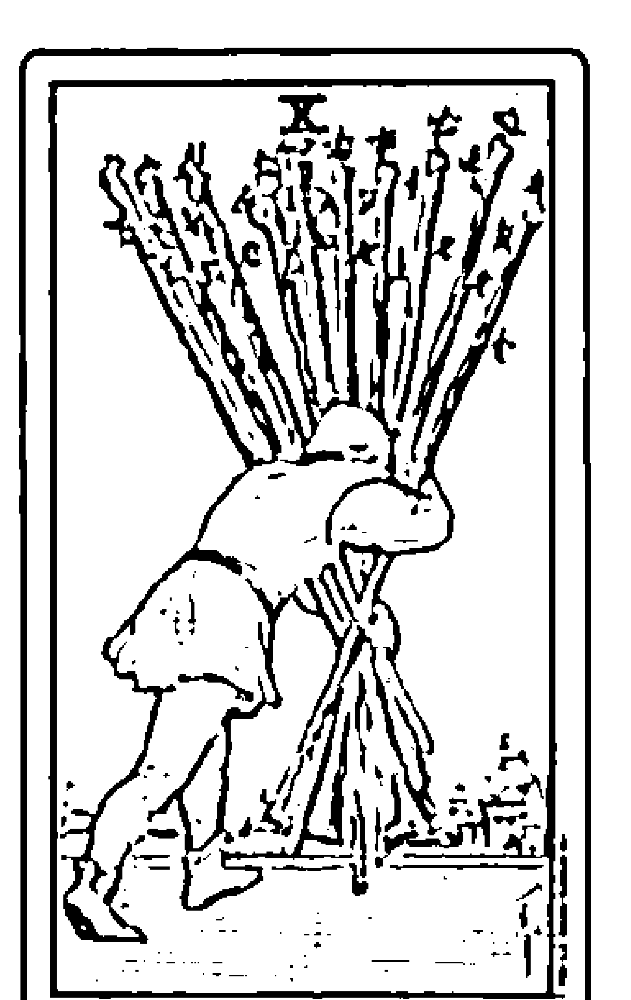

象徵圖象：
人物
姿勢
房子在地平線上
那些棍棒遮住了視線
數字和元素

意義：
一個負擔過重的人
很難操作的樣子
目標在遠處的地方
不好的展望
很多——在這個情況裡，太多了（10）——
野心（權杖）

## 權杖十——作為一張牌或是在其他的牌陣裡

#### 一般性的意義：

權杖十代表那個挑戰讓你喘不過氣，至少是在這個時候。或者是你真的不能勝任，或者是你不知道如何技巧地來處理它。也許那個難題是你承擔太多了，因為你認為你必須親自做每一件事。

#### 工作領域：

你在之前就已經達到了你的極限。如果——比方說，因為晉升的結果——你覺得無法應付新的挑戰，這張牌指出暫時的壓力過大。如果這是你工作上每天的情況，這張牌必須被視為一個警告——你長久以來都負擔太重。在這個情況下，你應該檢視一下，你是不是能夠將一些工作分派出去，或者是某些責任由別人來承擔。

#### 愛的方面：

目前你並沒有什麼展望，然而，有一些有價值的目標，即使它們可能不容易達到。那可能一部分是因為你笨拙的作法。你難道真的需要扛下所有的重量嗎？你必須往四周看一下，看看你是不是可以放下幾根棍棒，或是將其中的一部分交給別人。

### 權杖十在愛的神諭牌陣裡

#### 位置 1 — 它是怎麼樣

目前在你的關係裡有很多壓力。它受到外在因素的威脅，或者你們兩個人都有問題，使你無法看到前面的展望。

#### 位置 2 — 什麼東西從內在推著你

目前你覺得在關係上負荷過重，或是你的伴侶對你要求太高，你事實上已經想過要放棄。你也許還想撐一陣子，但是有一些事終究是要改變的。檢視一下位置 4 的牌，看看你能夠做些什麼來改善那個情況。

#### 位置 3 — 對方對你的態度

你所面對的人是沮喪的，不知道如何處理當下的情況。有一些事在困擾著他或她，使他看不到你。所以，看看你是不是能夠幫助他解除掉一些重擔，或者事實上你就是對方困難的原因？

#### 位置 4 — 神諭對你的忠告

將事情推到極限，即使它意味著你在嘗試某種你認爲不可能的事。不要讓你自己變得混亂，即使你一時不知道如何進行。你的涉入將會得到報償。

### 權杖十在指南針牌陣裡

#### 位置 1 — 它是怎麼樣

有一個令人興奮的機會，或是一個誘人的提議在等著你。雖然這張牌通常意味著一些好事，它也不是沒有可能會燒到你的手指。

#### 位置 2 — 它就是這樣開始的

在開始的時候，你非常受到激發，某人喚起了你的熱情，點燃了你的火。位置 4 的牌會告訴你，這個能量是否會持續，或者它很快就會熄掉。

## 位置 3 - 反應

在你周遭的人對你或是你所推動的事是敞開的，他們願意被你激發，並跟著你走。你只需要激起他們的冒險精神和他們的好奇心就能夠贏得他們的心。

#### 位置 4 — 它將會引導到哪裡

到了最後，你將會被激發，接收到很多支持，或是有一個令人鼓舞的機會會出現。然而這張牌也可能意味著你只是到了最後才會達到這個結果，所以現在就去走這一條路可能會太早。

### 權杖十在盲點牌陣裡

#### 位置 1 — 每一個人都知道的

你傾向於將很多事情都攬在自己身上。至少你目前有太多的壓力而不知道如何將每一件事都控制得很好。

#### 位置 2 — 盲點

某人想要點燃你的火，喚起你的熱情，或是引發出你探索的精神。至少有人提議你去嘗試一個令人興奮的經驗，或是一個新的靈感。如果到目前為止你還沒有看到這個，那麼從現在開始你就必須將眼睛睜大一點。

#### 位置 3 — 你如何看你自己

你喜歡被迷惑，你在等待著某人來點燃你的熱情。只是將心情準備好就好，或者你應該激發你自己？藉著位置 2 那張牌的協助，你就可以好好地回答這個問題。

#### 位置 4 — 很大的未知

在內在深處，你有很多火苗等待著要被點燃。只要你這個部分的人格仍然保持隱藏起來，你將會發覺你自己是一個小心翼翼的人，一直都避開冒險，而且很難被激發。然而，如果你將這一面揭開，你很快就會了解生命有多麼刺激，以及我們內在有多少熱情的潛力。

# 權杖侍衛（Page of Wands）

## 令人興奮的提議

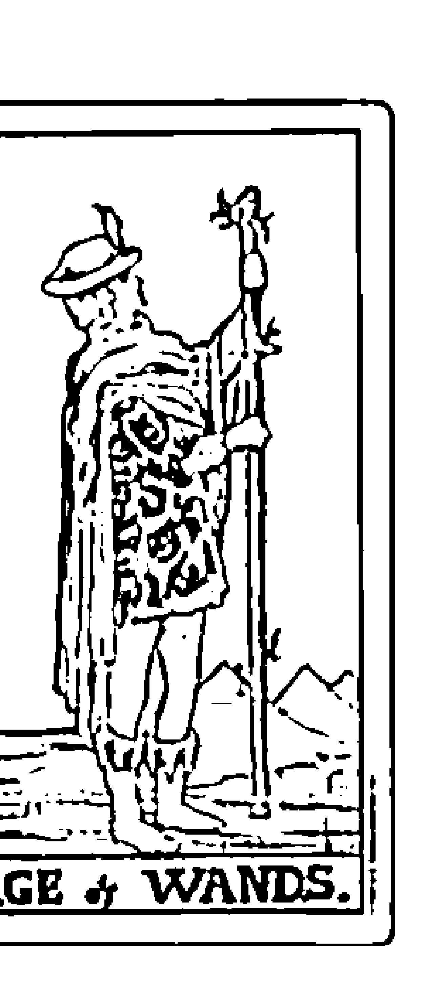

象徵圖象：
侍衛
姿勢
權杖
沙漠和沙丘
一把火在鋼盔上面
人物和元素

意義：
發動者
合作、提供
力量、勇敢
熱、火熱的脾氣
高昂的、容易發脾氣的
通報（侍衛）有一個熱情的提議（火）

### 權杖侍衛——作為一張牌或是在其他的牌陣裡

#### 一般性的意義：

侍衛代表從外在世界所產生的機會。權杖侍衛作出一個令人興奮的、挑戰的、和有吸引力的提議。他將一個新的活力和能量帶進一個停滯的狀態，他能夠激發和喚起熱情。

#### 工作領域：

要準備好來接受一個令人興奮的提議，或是一個新的，能夠真正激發你的提議。然而，如果你覺得非常被它所吸引，這張牌並不意味著你必須盲目地同意，衡量一下它的危險性和得失是好的。

#### 愛的方面：

一個誘人的可能性出現了，有一種冒險的感覺產生了，有一個火花即將要點燃你的火。如果它一直持續下去，它對你是好的，但即使它只是曇花一現，你也將會記住它很久。

### 權杖侍衛在愛的神諭牌陣裡

#### 位置 1 — 它是怎麼樣

要重視一個令人鼓舞和興奮的激發或提議，它能夠將新的活力和能量注入一個關係裡。

#### 位置 2 — 什麼東西從內在推著你

你喜歡變得有熱情嗎？你準備好去冒一些險嗎？你準備好作一個熱情的交往嗎？

#### 位置 3 — 對方對你的態度

你面對的人是一個充滿著期望，同時對任何你所發動的事敞開的人。他或她事實上只是在等待你去點燃他或她的火。

#### 位置 4 — 神諭對你的忠告

表現出你是可以被激發的，你對於誘人的提議是敞開的，你會很勇敢地去做任何事。

### 權杖侍衛在指南針牌陣裡

#### 位置 1 — 它是怎麼樣

有一個很熱的主題，它必須趕快被處理，不能等。它也可能只是曇花一現。

#### 位置 2 — 它就是這樣開始的

在剛開始的時候，每一件事都很熱，令人興奮，充滿懸疑。你是沒有耐心的，你幾乎不能等待，想要看看事情將會有什麼樣的發展。

#### 位置 3 — 反應

在你周遭的人很熱情。有些人很容易被吸引，但是他們的熱情也許只能持續一小段時間。不管怎麼說，你必須振作自己來應付沒有耐心和緊張忙碌的活動。

#### 位置 4 — 它將會引導到哪裡

到了最後，事情將會看起來很熱、很令人興奮，而且充滿著懸疑，然而雖然那個過程可能很熱、很有壓力、很緊張而且忙碌，但是會有什麼樣的結果是不一定的。

### 權杖侍衛在盲點牌陣裡

#### 位置 1 — 每一個人都知道的

你充滿著熱情，或者是一個急性子、容易被吸引、和喜歡冒險的人。至少在目前，耐心這個字對你來說是陌生的。

#### 位置 2 — 盲點

別人認為你是沒有耐心的，你的火非常容易被點燃。這是你的盲點，別人很可能會認為你常常很熱心地去發動一件事，但是並沒有去完成它。也許你也被認為是一個暴躁和製造麻煩的人。

#### 位置 3 — 你如何看你自己

你知道你是沒有耐心的，容易被吸引的。例行的事務和溫暖舒適無法吸引你。你覺得你比較處於火向的元素裡，當事情的進行比較熱、比較困難的時候，你比較會被激發。

#### 位置 4 — 很大的未知

在內在深處有一個潛意識的力量，它準備要去探險，它喜愛冒險，同時很容易產生熱情。也許你事實上是常常進入危險的情況，並且去做瘋狂的探險，而甚至不了解可能會有什麼樣的事發生在你身上。

# 權杖騎士（Knight of Wands）

## 没有耐心

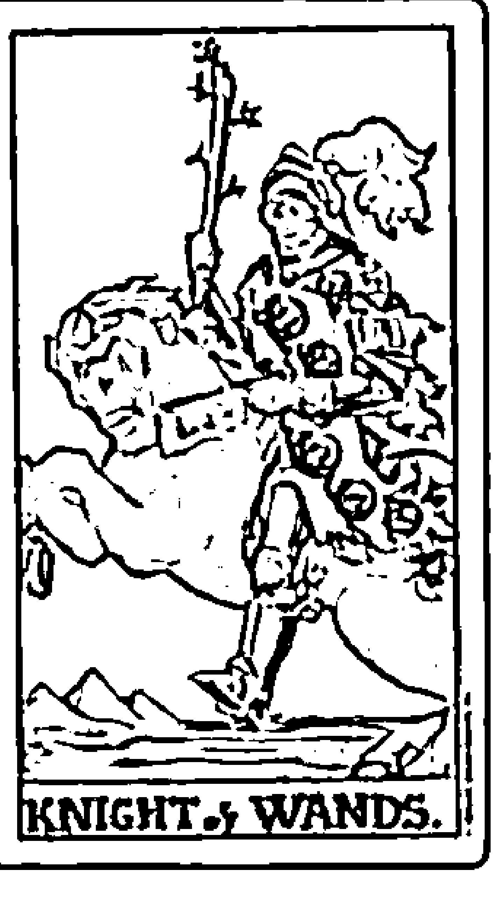

象徵圖象：
騎士和姿勢
權杖
偏紅的顏色
火從鋼盔冒出來
沙漠和沙丘
人物和元素

意義：
動力、勇氣
冒險精神
活躍的個性
火向的本性
熱，如火般的個性
熱情、活躍（火）的行動者（騎士）

### 權杖騎士——作為一張牌或是在其他的牌陣裡

#### 一般性的意義：

在塔羅牌的象徵圖象系統裡，騎士代表一個氣氛，權杖騎士代表一個火向的氣氛，他象徵著一個想要每一樣東西而且立刻就要的心情。他的態度充滿著興奮和熱切的期望，但也是發燒和沒有耐心的，它可能因為太衝動而破壞了一個好的結果。

#### 工作領域：

有一個很熱的階段正在來臨，如果每一件事都運作得很好，它將不僅是令人興奮的，同時也是有利的，然而它也可能會有很多壓力，因為事情不一定都可以運作得很好。

#### 愛的方面：

你已經不能夠再等待了，你想要有一個興奮的經驗，而且立刻就要。然而這張牌並沒有告訴你，這個經驗對你的愛來講是好的，或者你將會被燙到。

### 權杖騎士在愛的神諭牌陣裡

#### 位置 1 — 它是怎麼樣

你的關係正處於一個很熱的階段，在它裡面，沒有耐心、緊張、渴望冒險、和自負主宰著整個氣氛。

#### 位置 2 — 什麼東西從內在推著你

你充滿著能量和熱情，你想要往前挺進，看看你的關係能夠提供什麼，看看你的伴侶會如何反應，以及你是否能夠點燃他或她的熱情。

#### 位置 3 — 對方對你的態度

你所面對的人是一個個性很熱的人，幾乎不能等待事情的發生。他或她會想要全部，不能有任何延遲。如果你能夠跟上他的步調，他或她將會覺得很高興。在這種情況下，一切都似乎太熱了，你必須小心安撫他或她的火，否則它可能很快就會展現出它破壞的一面。

#### 位置 4 — 神諭對你的忠告

不要害怕直接處理，展現出你熱情的一面，將新的能量和溫暖注入你的關係裡，注意要提供一個有活力的環境。作出比較特別的提議，或者是安排一個冒險的旅行，或者至少安排一個熱情難忘的夜晚。

### 權杖騎士在指南針牌陣裡

#### 位置 1 — 它是怎麼樣

有一個很熱的主題，它必須趕快被處理，不能等。它也可能只是曇花一現。

#### 位置 2 — 它就是這樣開始的

在開始的時候，你非常受到激發，某人喚起了你的熱情，點燃了你的火。位置 4 的牌會告訴你，這個能量是否會持續，或者它很快就會熄掉。

#### 位置 3 — 反應

你將會碰到一個獨立、自主，同時有堅強意志的人，他或她對一個好的想法或是一個有趣的提議是敞開的。如果你想要贏得這個人，你必須打擊到正確的弦。最好是把目標放在他或她那熱心和外向的本性。

#### 位置 4 — 它將會引導到哪裡

這條路將會引導你到自我達成，你將會全然投入，到了最後，你將會變得很滿足、很樂觀。或者你將會找到那樣的人，而他對你的未來是重要的。

### 權杖騎士在盲點牌陣裡

#### 位置 1 — 每一個人都知道的

你是自動自發的、自信的，通常有很好的心情。人們知道你慷慨和快樂的那一面。你對冒險是敞開的，而且只要那件事是由你所掌控的，你是一個完全可以被信任的人。或者，你目前正處於一個階段，在它裡面有一個具有這些品質的人扮演一個重要的角色。

#### 位置 2 — 盲點

別人看到你的力量、你的穩定、和你的自信。因為你的熱心、你的能量、你的企業精神、和你的勇氣，所以人們很尊敬你。但是很奇怪地，這是你的盲點。或者這張牌是不是意味著有一個火向的、熱情的女人在近處，而你居然忽略了她？

#### 位置 3 — 你如何看你自己

你知道如果你真正想要的話，你可以說服別人，或是喚起別人的熱情，甚至很容易就可以做到這樣。如果它是關於涉入一個觀念、一個計劃、或是一個人，你會真的涉入，而且知道如何持久。

#### 位置 4 — 很大的未知

在你的內在深處，有一個力量等待著被實現，有一股能量想要將熱情和喜悅帶入你的生命中。你越是覺知到你的這一面，同時培養它，你就越了解如何得到自信和優越。如果你是一個女人，這張牌是關於一個男人的形象，它想要在你的關係生活中被發現、被經歷。

# 權杖皇后（Queen of Wands）

## 自信

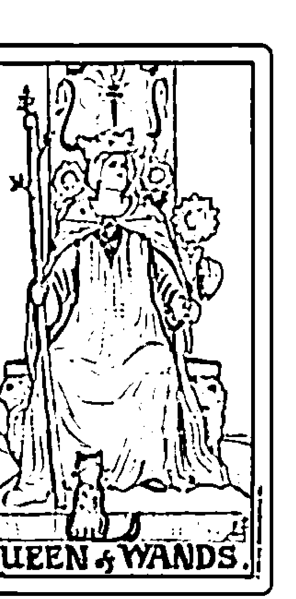

象徵圖象：
皇后
獅子
向日葵
貓
右手持權杖
人物和元素

意義：
敞開、具有接受性
穩定、喜愛生命
生命的喜悅、溫暖
柔順、聰明伶俐、堅強的意志
果斷
勇敢的、有自信的（火）女人（皇后）

### 權杖皇后——作為一張牌或是在其他的牌陣裡

#### 一般性的意義：

在塔羅牌的象徵主義裡，皇后代表人物，尤其是女人，但是有時候也代表男人。權杖皇后代表一個有自信、有活力的人，他具有企業家的精神，同時有高度的熱心。它可以是一個外界的人，他對你來說變得很重要，它也可以代表內在這樣形成的你。

#### 工作領域：

在你的職業環境裡，權杖皇后通常意指企業家或老闆。如果那張牌象徵著你，那麼你就必須領導、主動開創，展現出你的意志力和企業家精神去鼓舞別人。權杖皇后也可以意味著職業上的獨立，自己當老闆，或自己接工作做。

#### 愛的方面：

你具有堅強的意志，你是活躍的，你試圖用你的熱情來吸引某人，同時想要贏得這個人。然而這張牌也可以意味著你被具有這些品質的人所吸引。

### 權杖皇后在愛的神諭牌陣裡

#### 位置 1 — 它是怎麼樣

或者是一個熱血澎湃的人走進了你的生命，他引導你去做一些冒險的事，或者你被要求展現出你的火向個性，主動開創，並喚起別人的熱情。更進一步地，它也可能是一個有自信的、熱情的人在打擾著你的關係。

#### 位置 2 — 什麼東西從內在推著你

你想要做一些冒險的事，點燃熱情和慾望；你想要用你的溫暖來贏得某人，同時用你的慷慨大方來寵愛他或她。或者你被一個具有這些品質的人所吸引。

#### 位置 3 — 對方對你的態度

你所面對的是一個活躍的、慷慨的、充滿活力的人，也許甚至真的是一個非常有男子氣概的人。你可以藉著吸引他或她的熱情和活力的一面來贏得他或她。在採取主動的方面你可以仰賴他或她，他或她一定會採取行動。

#### 位置 4 — 神諭對你的忠告

展現出你的陽光和自信的那一面，採取主動，將新的能量注入你的關係裡，試著用一些令人興奮的看法來說服你面前的那個人，而如果必要的話，加強他或她的自信心，要用鼓勵的方式。如果你的關係受到外在的威脅，你必須很清楚地表達，你要為你的愛抗爭。

### 權杖皇后在指南針牌陣裡

#### 位置 1 — 它是怎麼樣

它是關於一個人，他或她能夠展現出具有說服力、果斷、和活躍的一面，或者這張牌意味著你本身採取這樣的態度。

#### 位置 2 — 它就是這樣開始的

在開始的時候，你完全被吸引，而且很熱心。你想要藉著勇敢和獨立來征服某些事。或者你想要贏得一個具有這些火向品質的人。

#### 位置 3 — 反應

你將會碰到一個堅強、自主、和充滿著意志力的人，所以他無法很容易被影響、被說服。如果你想要將他或她網羅到你這一邊來，你將必須非常具有說服力，同時能夠鼓起對方的熱情。你的做法最好是針對他或她的活躍和熱情的本性。

#### 位置 4 — 它將會引導到哪裡

這條路會引導到自我達成，到了最後，你將會變得很堅強、很有自信，或者那個發展會指引你去走向一個你認爲他很有自信的人，他對你的未來將會變得很重要。

### 權杖皇后在盲點牌陣裡

#### 位置 1 — 每一個人都知道的

你是有自信的、自主的，你知道如何表達你的意志和走出你的路。在你的領域裡面你可以領導，用你的想法來鼓起別人的熱情。或者你目前所處的階段是你被一個具有這些品質的人所影響。

#### 位置 2 — 盲點

別人看你不僅是有能力的，同時也能夠用你方式來刺激別人，使他們走向你的目標。如果這個描述跟你在位置 3 的自我形象形成強烈的對比，那麼你必須用批判的態度來檢視一下這兩種看法。或者是不是有一個熱情的、火向個性的人在你旁邊，而你一直忽略他？

#### 位置 3 — 你如何看你自己

你知道如果你真正想要的話，你可以說服別人，或是喚起別人的熱情，甚至很容易就可以做到這樣。如果它是關於涉入一個觀念、一個計劃、或是一個人，你會真的涉入，而且知道如何持久。

#### 位置 4 — 很大的未知

在你的內在深處，有一個力量等待著被實現，有一股能量想要將熱情和喜悅帶入你的生命中。你越是覺知到你的這一面，同時培養它，你就越了解如何得到自信和優越。如果你是一個女人，這張牌是關於一個男人的形象，它想要在你的關係生活中被發現、被經歷。

# 權杖國王（King of Wands）

## 意志力

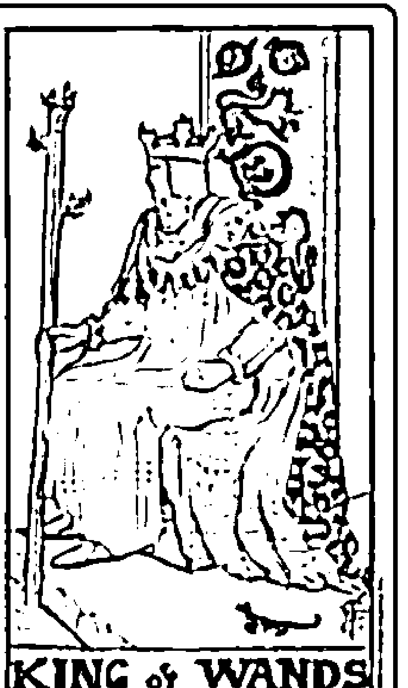

象徵圖象：
國王
姿勢
右手拿著權杖
蜥蜴
人物和元素

意義：
活動
準備跳起來
果斷
勇氣和勇敢
勇敢、自信的（火）男人（國王）

### 權杖國王——作為一張牌或是在其他的牌陣裡

#### 一般性的意義：

在塔羅牌的象徵主義裡，國王代表人物，尤其是男人，但是有時候也代表女人。權杖國王代表一個有意志力、有自信的男人，他具有企業精神，同時有高度的熱心。它可以是一個外界的人，他對你來說變得很重要，它也可以代表內在這樣形成的你。

#### 工作領域：

在你的職業環境裡，權杖國王通常意指企業家或老闆。如果那張牌象徵著你，那麼你就必須領導、主動開創，展現出你的意志力和企業家精神去鼓舞別人。權杖國王也可以意味著職業上的獨立，自己當老闆，或自己接工作做。

#### 愛的方面：

你具有堅強的意志，你是活躍的，你試圖用你的熱情來吸引某人，同時想要贏得這個人。然而這張牌也可以意味著你被具有這些品質的人所吸引。

### 權杖國王在愛的神諭牌陣裡

#### 位置 1 — 它是怎麼樣

或者是一個熱血澎湃的人走進了你的生命，他引導你去做一些冒險的事，或者你被要求展現出你的火向個性，主動開創，並喚起別人的熱情。更進一步地，它也可能是一個有自信的、熱情的人在打擾著你的關係。

#### 位置 2 — 什麼東西從內在推著你

你想要做一些冒險的事，點燃熱情和慾望；你想要用你的溫暖來贏得某人，同時用你的慷慨大方來寵愛他或她。或者你被一個具有這些品質的人所吸引。

#### 位置 3 — 對方對你的態度

你所面對的是一個活躍的、慷慨的、充滿活力的人，也許甚至真的是一個非常有男子氣概的人。你可以藉著吸引他或她的熱情和活力的一面來贏得他或她。在採取主動的方面你可以仰賴他或她，他或她一定會採取行動。

#### 位置 4 — 神諭對你的忠告

展現出你的陽光和自信的那一面，採取主動，將新的能量注入你的關係裡，試著用一些令人興奮的看法來說服你面前的那個人，而如果必要的話，加強他或她的自信心，要用鼓勵的方式。如果你的關係受到外在的威脅，你必須很清楚地表達，你要為你的愛抗爭。

### 權杖國王在指南針牌陣裡

#### 位置 1 — 它是怎麼樣

或者你的問題是關於一個人，他展現出具有說服力、果斷、和活躍的一面，或者這張牌意味著你本身採取這樣的態度。

#### 位置 2 — 它就是這樣開始的

在開始的時候，你完全被吸引，而且很熱心。你想要藉著勇敢和獨立來征服某些事。或者你想要贏得一個具有這些火向品質的人。

#### 位置 3 — 反應

你將會碰到一個堅強、自主、和充滿著意志力的人，所以他無法很容易被影響、被說服。如果你想要將他或她網羅到你這一邊來，你將必須非常具有說服力，同時能夠鼓起對方的熱情。你的做法最好是針對他或她的活躍和熱情的本性。

#### 位置 4 — 它將會引導到哪裡

這條路會引導到自我達成，到了最後，你將會變得很堅強、很有自信，或者那個發展會指引你去走向一個你認爲他很有自信的人，他對你的未來將會變得很重要。

### 權杖國王在盲點牌陣裡

#### 位置 1 — 每一個人都知道的

你是有自信的、自主的，你知道如何表達你的意志和走出你的路。在你的領域裡面你可以領導，用你的想法來鼓起別人的熱情。或者你目前所處的階段是你被一個具有這些品質的人所影響。

#### 位置 2 — 盲點

別人看你不僅是有能力的，同時也能夠用你方式來刺激別人，使他們走向你的目標。如果這個描述跟你在位置 3 的自我形象形成強烈的對比，那麼你必須用批判的態度來檢視一下這兩種看法。或者是不是有一個熱情的、火向個性的人在你旁邊，而你一直忽略他？

#### 位置 3 — 你如何看你自己

你知道如果你真正想要的話，你可以說服別人，或是喚起別人的熱情，甚至很容易就可以做到這樣。如果它是關於涉入一個觀念、一個計劃、或是一個人，你會真的涉入，而且知道如何持久。

#### 位置 4 — 很大的未知

在你的內在深處，有一個力量等待著被實現，有一股能量想要將熱情和喜悅帶入你的生命中。你越是覺知到你的這一面，同時培養它，你就越了解如何得到自信和優越。如果你是一個女人，這張牌是關於一個男人的形象，它想要在你的關係生活中被發現、被經歷。

# 寶劍一（Ace of Swords）

## 清晰

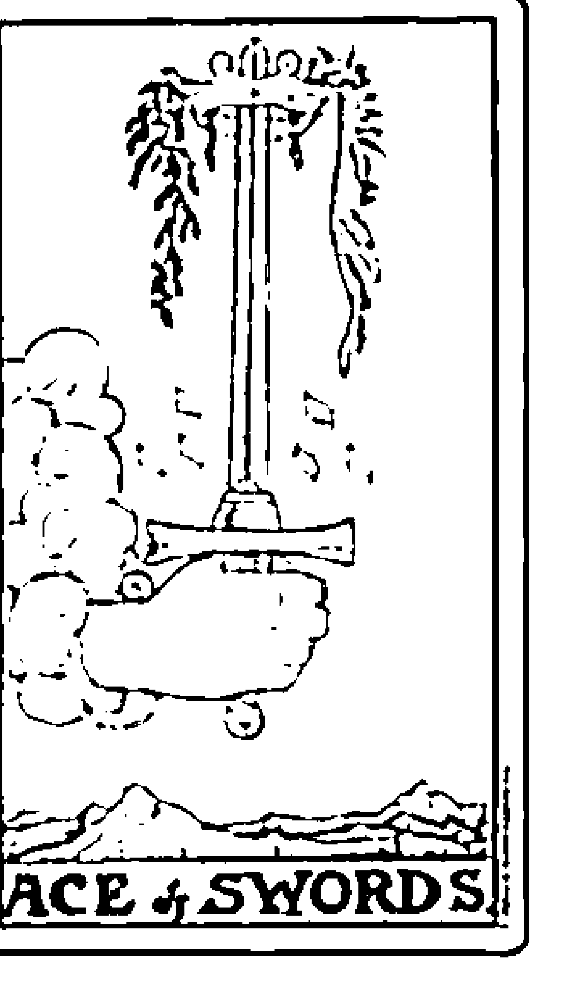

象徵圖象：
創造者的手
劍
有裝飾的皇冠
六滴露珠
不毛之地的背景
清楚的山峰
數字和元素

意義：
衝動、動力
決定、了解、判斷
最高的了解
暗示有其他六把劍的幫助
冷靜的清晰
最高的了解，清晰
有機會（1）可以作出聰明和清晰的決定（空氣）

### 寶劍——作為一張牌或是在其他的牌陣裡

#### 一般性的意義：

每一張「一」（Ace）的牌都指出一個好的機會，它必須被抓住，因為它提供了新的視野和新的可能性。寶劍一象徵著一個可以作出聰明、清晰、和令人解放的決定的機會。因為寶劍具有空氣這個元素冷靜的品質，所以這張牌強調著理性面的清晰。

#### 工作領域：

利用機會來了解你已經思索很久的問題，它將能夠幫助你作出一個聰明、清晰的決定。當你這樣做的時候，你必須保持客觀，至少也要保持冷靜。

#### 愛的方面：

你需要作一個決定，它也許意味著你要遠離某一個人，或是要去接近那個人，光是這張牌還看不出來，它只能指出現在是一個需要了解和澄清的片刻。

### 寶劍一在愛的神諭牌陣裡

#### 位置 1 — 它是怎麼樣

就心的事情而言，你必須對事情有一個清晰的看法，運用你的理智來作出一個重要的決定，它也許是增強這個關係或反對這個關係。

#### 位置 2 — 什麼東西從內在推著你

現在你想要了解和澄清一些事，所以不可以害怕或逃避困難的決定。

#### 位置 3 — 對方對你的態度

你所面對的是一個理智型的人，目前展現出理智和保留的態度，因為他或她處於一個正在澄清的過程。似乎他或她想要對事情有聰明的了解，以便能夠作出清晰的決定。

#### 位置 4 — 神諭對你的忠告

將空氣清理乾淨。抓住機會來作決定，它也許是老早以前就應該作的決定，要將你的關係弄清楚，盡可能了解，不要模稜兩可。

### 寶劍一在指南針牌陣裡

位置 1 — 它是怎麼樣  
那個問題就是要以客觀的方式來澄清一件事，要對事情有清晰的了解，用理智作出健全的分析，同時作出聰明的決定。

位置 2 — 它就是這樣開始的  
在開始的時候，你對那個問題是保留的，或者甚至是懷疑的。你在找尋一個聰明的作法，或者努力想要作出一個合理的決定。

位置 3 — 反應  
周遭的反應是小心的、理智的。也許別人可以根據你的做法來將事情了解得更清楚一點，不管怎麼說，你周遭的人想要作出清楚的決定。

位置 4 — 它將會引導到哪裡  
如果必須作出一個決定，或是必須達到某種了解，這條路是正確的，因爲有很深的洞見在盡頭的地方等著。然而，如果你想要達到一個具體的結論，你還必須再等一陣子，因爲重要的決定只能在最後的時候作出。

### 寶劍一在盲點牌陣裡

#### 位置 1 — 每一個人都知道的

你通常會想要作出聰明的、健全的決定，或者至少你目前正處於一個作決定的過程，在這個時候，理智和健全的判斷是重要的。

#### 位置 2 — 盲點

別人看到你有一個很好的機會可以對一件事作出清晰的決定。要睜開你的眼睛，或是跟某一個人談一談，如果你不想錯過一個好機會的話。

#### 位置 3 — 你如何看你自己

你知道現在是你應該對事情有一個清晰的了解，或是應該做出最後決定的時候了。

#### 位置 4 — 很大的未知

在內在深處，有一把劍隱藏在你的內在深處，如果你能夠想辦法找到它，並學習如何駕馭它，它能夠提供你清晰、簡單、客觀、和決心。

# 寶劍二（Two of Swords）

## 懷疑

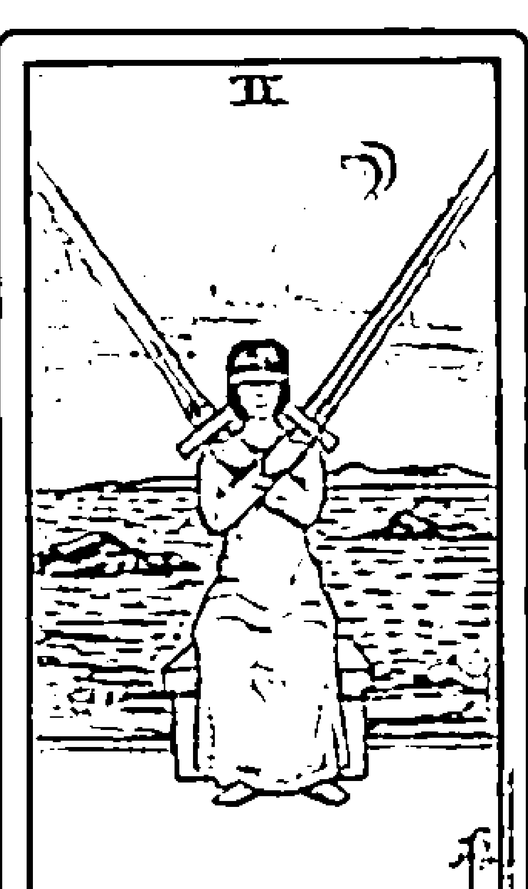

象徵圖象：
兩把劍  
去到海洋和月亮的路被阻隔了  
眼睛被矇住了  
悲傷、灰色的地面  
數字和元素

意義：
衝突的思想  
無法進入更深的知識；答案只能夠在理智的層面被追求  
看不到應該如何走下去  
失望  
衝突的（2）思想（空氣）

### 寶劍二——作為一張牌或是在其他的牌陣裡

#### 一般性的意義：

寶劍二跟女祭司互相呼應，它們兩者所坐的位置是一樣的，有一些顏色也是一樣的。女祭司象徵著我們對我們內在的聲音必須有信心，但是這張牌指出我們完全無法進入我們內在的聲音（海洋和月亮），同時無法找到我們的平靜，因為我們被懷疑所困。

#### 工作領域：

它似乎是沒有希望的。你陷住在一個危機裡，不知道要怎麼走出來。不論你如何努力地思考那個問題，你還是找不出任何具有說服力的答案。要不要聽聽你的感覺？

#### 愛的方面：

雖然目前每一件事看起來是令人憂鬱的，事實上你應該滿足，因為這張牌可能指出更大的失望、為愛相思，而非只是陰沈的展望。如果你以一種正向的方式來看那個情況，你應該感到高興，因為至少現在你已經知道那個不愉快的真相。

### 寶劍二在愛的神諭牌陣裡

#### 位置 1 — 它是怎麼樣

目前你的關係是有問題的。你可能想很多，內在有很多懷疑，但是還看不到答案。

#### 位置 2 — 什麼東西從內在推著你

你充滿著懷疑。你也許是在懷疑你自己，或是你的伴侶，或是這個關係。如果你對你伴侶的愛有任何懷疑，那麼你必須記住，那個原因可能是出在你身上。唯有當一個人覺得自己是值得被愛的，他才能夠承認和接受別人的愛。

#### 位置 3 — 對方對你的態度

你所面對的人已經從錯誤中醒悟，而且變得非常批判。也許是你拒絕他或她一些事，或者他或她在其他地方有陰鬱的經驗。也許是那個人很難作決定，因為他或她的頭和心被拉向兩個不同的方向。

#### 位置 4 — 神諭對你的忠告

做你該做的事，不要再延宕一個不愉快的決定或了解。踏出困難的但是你知道它是對的一步。

### 寶劍二在指南針牌陣裡

位置 1 — 它是怎麼樣  
有一件令人猜疑的事，或是高度被質疑的事，它也可能關係到懷疑、衝突、或不平靜的頭腦。

位置 2 — 它就是這樣開始的  
在開始的時候，也許是有一個痛苦的和憂鬱的了解在那裡，或者這張牌指出你強迫你自己去走這條路。可能是你的理智告訴你要採取某些步驟，但是你的感情可能會因此而受苦，或是不願意這樣做。在這個情況下，你必須檢視一下位置 4 的牌，看看繼續走這條路是否真的很好。

位置 3 — 反應  
你的周遭對你所採取的步驟並不高興。或者至少他們對你或對你的做法的反應是冷淡的。你無法指望他們會跟你合作或給予幫助。

位置 4 — 它將會引導到哪裡  
這是一條困難的路線，唯有當你經過了徹底的考慮，或是已經別無選擇，才走這條路。到了最後你的理智可能會贏，但是你的感情可能會受傷，你將會處於一種陰鬱的心情。

### 寶劍二在盲點牌陣裡

位置 1 — 每一個人都知道的  
你對人生有一個批判的態度，或者你目前不得不一定要去處理一些困難的事，也許你甚至決定要貶抑自己。

位置 2 — 盲點  
別人認爲你處於一個很難了解和很難作決定的情況下。也許人們也覺得你對自己太嚴厲了，你太過於嚴格地遵循你的頭腦，因而正在折磨你的心。

位置 3 — 你如何看待你自己  
你知道你正在經歷一個危機，或是站在一個戶限上，只有謹慎的考慮和聰明的、前後一致的行動能夠有所幫助，雖然它是痛苦的。如果位置 2 的牌指出別人認爲你的情況是更好的，你必須找人談一談，看看你的視野是不是可以不要那麼狹窄。

位置 4 — 很大的未知  
在內在深處，有一股力量經常想要破壞一些對你來講重要的事。這股力量會帶給你的生命悲觀的色彩。要對它覺知，並且加以善用，它將能夠幫助你使事情變順而帶給你和平。

# 寶劍三（Three of Swords）

## 痛苦的了解

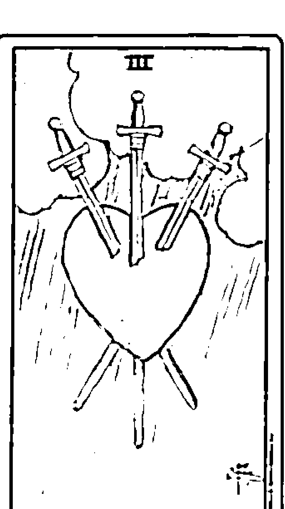

象徵圖象：
三把劍  
被刺穿的心  
雨  
數字和元素

意義：
了解、概念、決定  
痛苦的感覺  
陰沈的氣氛、不好的展望  
具體的（3）了解（空氣）

### 寶劍三——作為一張牌或是在其他的牌陣裡

#### 一般性的意義：

寶劍三指出陰沈的失望和痛苦的了解或決定。它常常是一張不愉快的，但不必然不是好的牌，因為這個洞見可能是不想要的，但卻是對的和聰明的。

#### 工作領域：

要準備好去面對令人洩氣的、被阻止的、和陰鬱的經驗。你非常想要的事物沒有按照你所欲求的發生。此外，這張牌也可能指出你正面對一個困難的決定或任務，尤其是因為你所渴望的跟它不同。

#### 愛的方面：

雖然目前每一件事看起來是令人憂鬱的，事實上你應該滿足，因為這張牌可能指出更大的失望、為愛相思，而非只是陰沈的展望。如果你以一種正向的方式來看那個情況，你應該感到高興，因為至少現在你已經知道那個不愉快的真相。

### 寶劍三在愛的神諭牌陣裡

#### 位置 1 — 它是怎麼樣

你的關係目前是陰暗的。某一件事的確對你有很糟糕的影響，也許是你發現了某一個不愉快的事實，或者你正面對著你不願意做的決定，或是不願意去走的一步。

#### 位置 2 — 什麼東西從內在推著你

你已經脫掉你那玫瑰彩色的眼鏡（或是某人幫你脫下了它？），現在你必須去面對你所不想要的現實。或者你可能試圖強迫你自己做出一些違反你自己感情的事。

#### 位置 3 — 對方對你的態度

你所面對的人已經從錯誤中醒悟，而且變得非常批判。也許是你拒絕他或她一些事，或者他或她在其他地方有陰鬱的經驗。也許是那個人很難作決定，因為他或她的頭和心被拉向兩個不同的方向。

#### 位置 4 — 神諭對你的忠告

做你該做的事，不要再延宕一個不愉快的決定或了解。踏出困難的但是你知道它是對的一步。

### 寶劍三在指南針牌陣裡

位置 1 — 它是怎麼樣  
它關係到一個痛苦的決定，一個令人憂鬱的了解，或是踏出困難的一步，即使它很清楚地是正確的一步。

位置 2 — 它就是這樣開始的  
在開始的時候，也許是有一個痛苦的和憂鬱的了解在那裡，或者這張牌指出你強迫你自己去走這條路。可能是你的理智告訴你要採取某些步驟，但是你的感情可能會因此而受苦，或是不願意這樣做。在這個情況下，你必須檢視一下位置 4 的牌，看看繼續走這條路是否真的很好。

位置 3 — 反應  
你的周遭對你所採取的步驟並不高興。或者至少他們對你或對你的做法的反應是冷淡的。你無法指望他們會跟你合作或給予幫助。

位置 4 — 它將會引導到哪裡  
這是一條困難的路線，唯有當你經過了徹底的考慮，或是已經別無選擇，才走這條路。到了最後你的理智可能會贏，但是你的感情可能會受傷，你將會處於一種陰鬱的心情。

### 寶劍三在盲點牌陣裡

位置 1 — 每一個人都知道的  
你對人生有一個批判的態度，或者你目前不得不一定要去處理一些困難的事，也許你甚至決定要貶抑自己。

位置 2 — 盲點  
別人認爲你處於一個很難了解和很難作決定的情況下。也許人們也覺得你對自己太嚴厲了，你太過於嚴格地遵循你的頭腦，因而正在折磨你的心。

位置 3 — 你如何看待你自己  
你知道你正在經歷一個危機，或是站在一個戶限上，只有謹慎的考慮和聰明的、前後一致的行動能夠有所幫助，雖然它是痛苦的。如果位置 2 的牌指出別人認爲你的情況是更好的，你必須找人談一談，看看你的視野是不是可以不要那麼狹窄。

位置 4 — 很大的未知  
在內在深處，每當你想要採取主動的時候，就有一種無能的感覺會破壞著你。這種感覺會讓你覺得一點力量都沒有，或者當你要決定一件事的時候，有一個內在的聲音會告訴你說每一件事都沒有用，不值得麻煩。試著找出這個內在的脆弱，給它一個適當的位置，比方說，在你每天的生活當中有一個固定的休息，這樣的話你就可以避免這種感覺在最不適當的時刻出現而破壞了你做事的計劃。

# 寶劍四（Four of Swords）

## 強迫休息

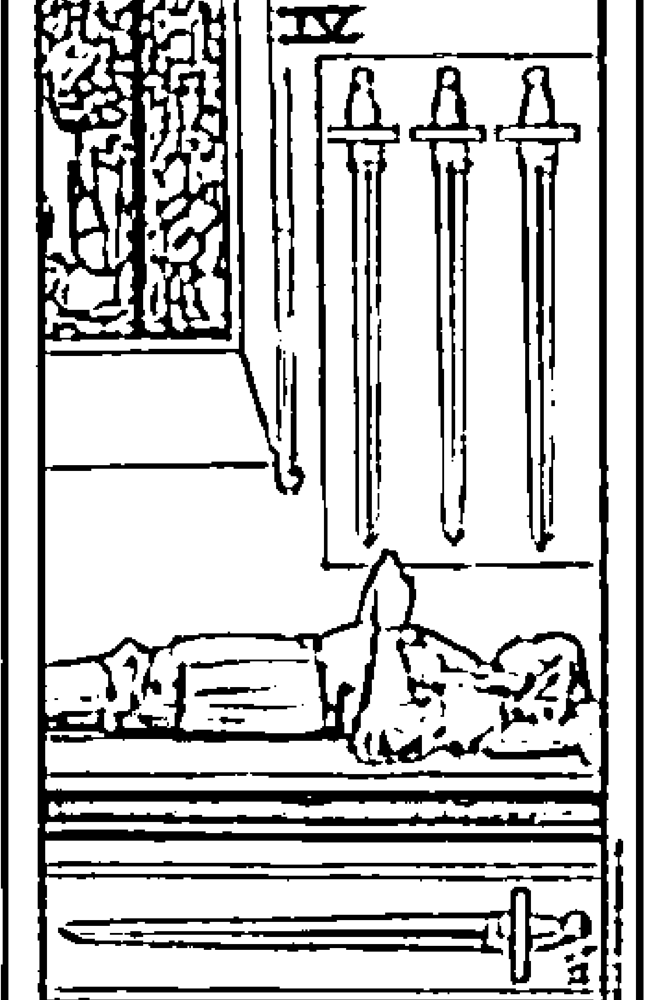

象徵圖象：
躺下來的騎士  
姿勢  
神聖的房間  
3 + 1 支劍  

數字和元素

意義：
沒有行動  
靜心的寧靜  
奉獻  
注意力集中在數字 3（＝心靈的、神聖的）；第四個層面（世俗的領域，活動）沒有在運作  
確立（4）思想結構（空氣）

### 寶劍四——作為一張牌或是在其他的牌陣裡

#### 一般性的意義：

寶劍四象徵著一個靜止的、被迫的休息，和非自願的不活動，比方說生病的時候，或是完全精疲力竭的時候，或者只是因爲似乎沒有什麼事奏效。雖然這些休息可以被蛻變成一種靜心的和平，然而它們也包含非自願的停滯的感覺，因爲這並不是事先計劃的。如果這張牌的位置建議一個人必須採取這個態度，那意味著一個人必須先照顧好自己，而將事情擺在一旁。

#### 工作領域：

事情完全不動，卡住了，也許是一個計劃並沒有如預期的發展，或是電腦當機，或是日常生活的重擔把你壓垮了。也許你已經完全沒有機會活動，因爲你失業了或生病了。不論那個情況是怎麼樣，你都不應該太跟那個狀態抗爭，因爲那只會浪費你的能量。倒是要利用這個休息來往內看自己，將步調慢下來，並找到內在的和平。稍事等待可能會有較好的時機出現。

#### 愛的方面：

目前你的愛情生活似乎是停滯的。也許你是被迫單身，或是暫時跟你的伴侶分離，或是太忙於工作而沒有時間談戀愛。也許你跟你的愛人有一個很大的爭吵，現在你覺得完全沒有力氣做什麼。任何你想要主動去改變那個情況的意圖現在都沒有用。接受那個休息，直到你真的覺得時機再度出現再採取行動。

### 寶劍四在愛的神諭牌陣裡

#### 位置 1 — 它是怎麼樣

目前你的關係缺乏動力，也許你們是因爲工作的關係而分開，或者你們的關係因爲某種外在的原因而懸在那裡。

#### 位置 2 — 什麼東西從內在推著你

你覺得內在癱瘓了，完全沒有力量而無法採取任何行動。在最差的情況，你覺得你是那個情況的受害者，你被推開而無法活動。然而目前你不要去跟這個情況抗爭，倒是可以試著利用這個靜止的狀態來匯集你的力量，爲將來更好的時機作準備。

#### 位置 3 — 對方對你的態度

你所面對的人是一個完全沒有行動力的人。不要期望他或她會有任何主動。他或她並沒有足夠的勇氣，或是不夠強壯，也許是某種外在的力量超出他的控制，迫使他或她變得無法行動。在最差的情況下，他或她已經——也許是非自願的——凍結了他或她對你的感情。

#### 位置 4 — 神諭對你的忠告

保持沈默，就只是待在那裡，即使這對你來講是不容易做到的。目前沒有機會可以得到什麼，你的關係需要一個休息，然而這是你可以用來釐清事情的機會。

### 寶劍四在指南針牌陣裡

位置 1 — 它是怎麼樣  
輪胎已經沒氣了，或者是那個問題本身已經打了一個死結，或者你已經覺得精疲力竭，癱瘓了，不知道要如何改變這個情況。不管怎麼說，在這個時候一點進展都沒有。

位置 2 — 它就是這樣開始的  
在開始的時候，事情一點進展都沒有，你覺得癱瘓了，你覺得你是那個情況的受害者，或者只是被迫休息。不管怎麼說，你目前是缺乏能量和活力的。檢視一下位置 3 和位置 4 的牌，唯有當你能夠在那裡找到很好的展望，你才去走這一條路，否則最好尋求其他的可能性。

位置 3 — 反應  
你的背景是癱瘓的，你將不會碰到任何共鳴，也不會有抗拒。如果你在找尋一些回應，你將不會得到任何回應，或者每一件事都一直在被延遲。只要你有足夠的能量可以追求你自己的路線，那麼就沒有什麼好害怕的。

位置 4 — 它將會引導到哪裡  
你的展望是不好的，如果你往這個方向走，它將無法引導你到任何地方。到了最後你將會變得很疲倦，精疲力竭。檢視一下你是否有更好的路可走。

### 寶劍四在盲點牌陣裡

位置 1 — 每一個人都知道的  
你覺得精疲力竭、生病、除役了，或是因爲其他的原因而被迫休息。也許你應該善用這個情況，試著使你自己完全恢復。

位置 2 — 盲點  
別人看到你被擊倒了，你的手被綁住了，也許別人覺得你利用這種不活動的情況來作爲隱藏你自己的藉口。

位置 3 — 你如何看你自己  
在內在深處，你覺得生病了，癱瘓了，或甚至被拋在一旁。要很認真地去看待這個暗示，盡可能地讓你自己休息來恢復和重新建立你的力量。

位置 4 — 很大的未知  
在你無意識的內在深處，你嚴重地受到傷害，而且充滿著憤怒。只要你沒有好好地了解你的這一面，你將會發覺你自己一再一再地被捲入醜陋的衝突裡——成爲一個易怒的人，或是一個受害者。如果你能夠治好你內在的創傷，你在面對衝突的時候將會有一個健康方式的處理，或是提出一個健全的主張。

# 寶劍五（Five of Swords）

## 卑鄙

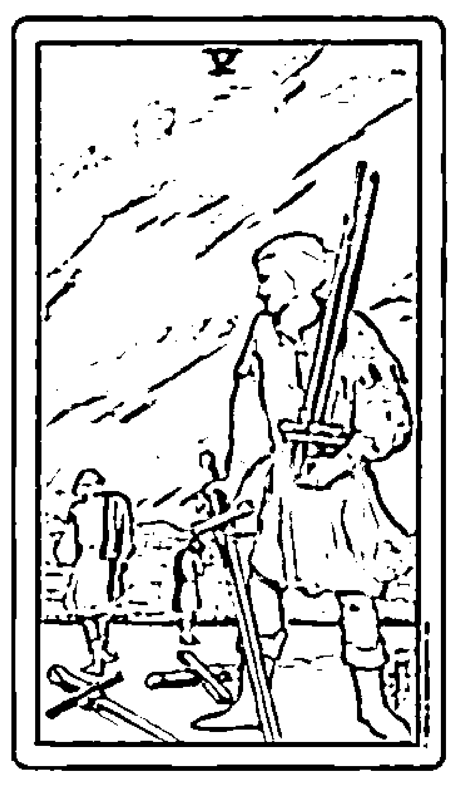

象徵圖象：
場景  
兩個人面對海洋  
一個微笑的人在前景  
烏雲密佈的天空  
數字和元素

意義：
一個戰役結束  
失敗者退回去  
明顯的勝利者  
充滿緊張的氣氛  
冰冷的（空氣）危機（5）

### 寶劍五——作為一張牌或是在其他的牌陣裡

#### 一般性的意義：

寶劍五意味著一個艱苦戰役的結束。它意指失敗、羞辱、和卑鄙，或是一個抗爭，那個勝利的代價太高了，而那個看似勝利的人並不是真正的勝利者。

#### 工作領域：

振作起來，那個在等著你的衝突並不容易。如果戰爭真的是不可避免，你必須用上你所有的工具勇敢地戰鬥。

#### 愛的方面：

在這個時候並沒有愛的氣氛，你所碰到的是恨、卑鄙、和惡意。你可能深深地受創，並渴望報復，或者你真的騙了某人。

### 寶劍五在愛的神諭牌陣裡

#### 位置 1 — 它是怎麼樣

有一個衝突，現在你的關係似乎已經支離破碎。也許這個醜陋的戰役仍然在進行著，但是將不會有贏家，即使其中一方看起來好像是勝利地走開。

#### 位置 2 — 什麼東西從內在推著你

你很冷淡，而且很可能充滿著恨。你在渴望戰爭，而且想要將它展示給別人看。你唯一的興趣就是如何傷害對方，將他或她結束掉。

#### 位置 3 — 對方對你的態度

要小心，你所面對的人對你的幸福一點都沒有興趣。你有激怒或傷害對方嗎？不論是為了什麼理由，他或她渴望報復，想要羞辱你，而且會傾向於用任何手段來達到這個目標。

#### 位置 4 — 神諭對你的忠告

神諭很少會建議這樣的做法，但是很明顯地，戰爭是不可避免的。你是否壓抑了太多沒有解決的衝突而試圖逃進一個美夢的世界？挖出你的武器，用你最大的力量來戰鬥。

### 寶劍五在指南針牌陣裡

位置 1 — 它是怎麼樣  
那個問題是戰爭、卑鄙、羞辱、挫敗、或報復。

位置 2 — 它就是這樣開始的  
在開始的時候，你面臨一個大的災難，也許是你本身充滿著破壞性的憤怒，或者你必須振作起來，因為別人正在極力地羞辱你，或是破壞你的計劃。

位置 3 — 反應  
注意！周遭的環境是危險的，具有侵略性的，卑鄙的。如果可能的話，你必須避開衝突，然而如果你必須去面對，你就一定不能低估你的敵人，更不必期待公平。

位置 4 — 它將會引導到哪裡  
你一定不要走這一條路，到了最後，你將會發覺你自己被打敗。但是即使你勝利了，你所付出的代價也可能太高。

### 寶劍五在盲點牌陣裡

位置 1 — 每一個人都知道的  
或者你是非常好戰的，或者你目前正處於一個骯髒的、使人羞辱的抗爭之中，或者也許那個戰爭已經結束了。

位置 2 — 盲點  
別人看到了你的傷口，同時也看到了你破壞的那一面。因為這是你的盲點，所以你也許並沒有覺知到它。這樣的話，你可能會坐在一個定時炸彈上面，它隨時都可能爆發，或者你可能會有暗中侵擾別人的傾向。

位置 3 — 你如何看你自己  
你想要報復嗎？不管怎麼說，在你裡面有某種破壞性的能量，它遲早會把你導入某種戰爭，如果你不是已經在它裡面的話。

位置 4 — 很大的未知  
在你無意識的內在深處，你嚴重地受到傷害，而且充滿著憤怒。只要你沒有好好地了解你的這一面，你將會發覺你自己一再一再地被捲入醜陋的衝突裡——成爲一個易怒的人，或是一個受害者。如果你能夠治好你內在的創傷，你在面對衝突的時候將會有一個健康方式的處理，或是提出一個健全的主張。

# 寶劍六（Six of Swords）

## 暫時外移

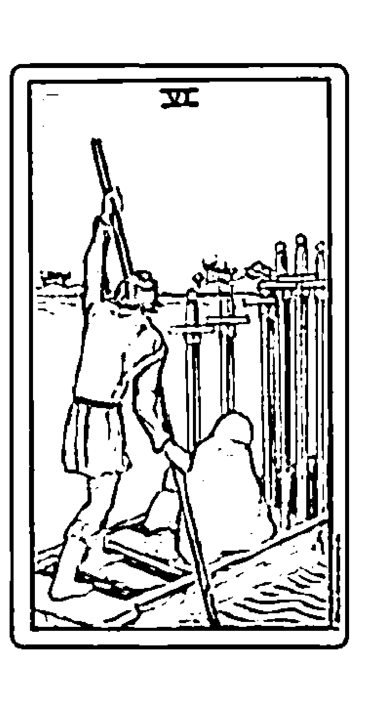

象徵圖象：
渡船
平靜的水域
濕冷的氣氛
渡船夫
遠方的那一岸
數字和元素

意義：
改變
沒有外在的危險
狀況不是很好，內在的不確定
能夠幫助的專家
未知的新地方
在改變的時候給予（空氣）幫助（6）

### 寶劍六在愛的神諭牌陣裡

#### 位置 1 — 它是怎麼樣

你的關係經歷了一個改變的階段，它讓你覺得忐忑不安。如果這個發展涉及持久的難題，你可以毫不猶豫地找朋友幫忙，或是尋求專家的意見。

#### 位置 2 — 什麼東西從內在推著你

你即將要離開熟悉的事物，並踏上未知的領域。你有一種不確定感，因為你不知道這個新的做法是否真的能夠改變你的情況。

#### 位置 3 — 對方對你的態度

如果你的愛情才剛開始不久，這張牌指出你的伴侶正在逐漸對你敞開。在另外一方面，如果你的關係已經有一段時間了，那麼你就必須有心理準備，你的伴侶——至少在內心——正在一步一步地疏遠你。

#### 位置 4 — 神諭對你的忠告

要對新的經驗敞開，即使你覺得有一點不確定和不安。只是執著於舊有的結構並不能為你帶來什麼。只有你自己知道新的情況意味著去接近另外一個人或是離開。

### 寶劍六在指南針牌陣裡

#### 位置 1 — 它是怎麼樣

那個問題是一個聰明但是可疑的行動，在它裡面有一些不真誠、欺騙、謊言、或詐騙。

#### 位置 2 — 它就是這樣開始的

那個開始是危險的，你也許是在玩一個虛假的遊戲，或者你在開始的時候就想要偷偷走開。對你來講也可能已經有一些外在的危險，也許某人想欺騙你。檢視一下位置 4 的牌，看看這條路是否真的值得繼續走。

#### 位置 3 — 反應

周遭是詭詐的，有人想欺騙你，佔你的便宜，或是玩某種邪惡的遊戲。也許是某人想要從你偷走一些東西。不管怎麼說，你對你的周遭必須保持適度的不信任。

#### 位置 4 — 它將會引導到哪裡

這是一條危險的路，到了最後，你將會碰到欺騙、謊言、和詭計，你將會損失一些東西。承諾將不會被遵守，或者別人會暗中偷走一些東西。

### 寶劍六在盲點牌陣裡

#### 位置 1 — 每一個人都知道的

你並非真的喜歡改變，或者至少在目前你有一點困擾。很明顯地，你正處於一個改變的過程，它讓你覺得不確定。

#### 位置 2 — 盲點

也許你是在欺騙你自己，或者你有被別人欺騙的危險。不管怎麼說，仔細來看一下這個盲點是有幫助的。

#### 位置 3 — 你如何看你自己

你知道你目前正在離開熟悉的事物，你或多或少自願地走向一個新的方向，但是你對這些新的改變並沒有太大的熱心，不管怎麼說，你是鎮定的，你知道當你需要幫助的時候要向誰求助。

#### 位置 4 — 很大的未知

你的內在深處有一個猶豫不決的本性，它不喜歡改變，因此在你要踏進新的領域之前都會遲疑。它常常使你覺得無法作決定，因此不必要地延長那個不確定感。要告訴你這個內在的遲疑者，如果一個人不懂得改變的話，沒有什麼事能夠改善。

# 寶劍七（Seven of Swords）

## 不真誠

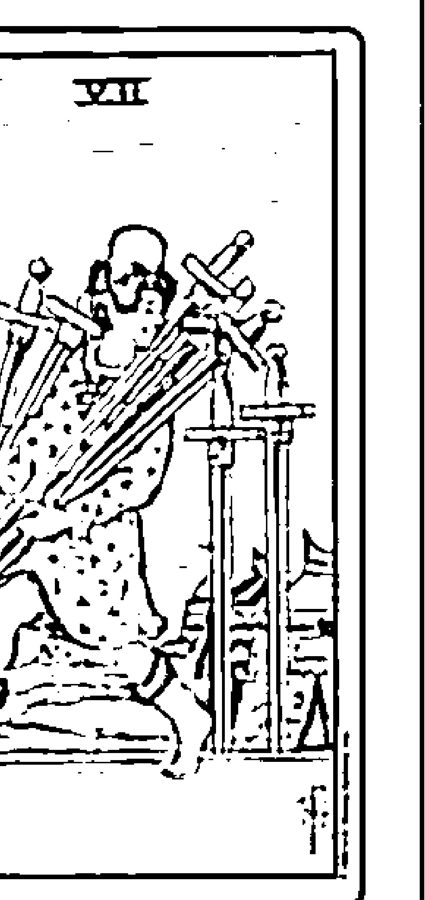

象徵圖象：
情況
姿勢
金色的背景

數字和元素

意義：
詐騙、偷竊
偷偷地走開
暗示著跟魔術師那張牌有關連，但這一張是有問題的
將智力（空氣）作批判的、不當的（7）使用

### 寶劍七在愛的神諭牌陣裡

#### 位置 1 — 它是怎麼樣

目前你們互相並沒有很誠實、很正直，也許你們試圖避開有問題的部分，或者你們互相都在僞裝。在最糟糕的情況下，你們互相在欺騙對方。

#### 位置 2 — 什麼東西從內在推著你

你正在做不誠實的計劃，或者是你想要偷偷走開，或者是你想要欺騙你的愛人，或者你真的有外遇了嗎？

#### 位置 3 — 對方對你的態度

你所面對的是一個經驗老到的人，他或她知道所有的詭計，你必須很小心，而且保持懷疑，也許他或她是一個僞君子，但是也可能他或她想要欺騙你。

#### 位置 4 — 神諭對你的忠告

詭計、虛張聲勢、想一走了之，或是要詐術，很明顯地，如果真相曝光的話，這些事是不好的，所以你必須使用你的想像力使你自己成為精明的。

### 寶劍七在指南針牌陣裡

#### 位置 1 — 它是怎麼樣

那個問題是一個聰明但是可疑的行動，在它裡面有一些不真誠、欺騙、謊言、或詐騙。

#### 位置 2 — 它就是這樣開始的

那個開始是危險的，你也許是在玩一個虛假的遊戲，或者你在開始的時候就想要偷偷走開。對你來講也可能已經有一些外在的危險，也許某人想欺騙你。檢視一下位置 4 的牌，看看這條路是否真的值得繼續走。

#### 位置 3 — 反應

你發覺你自己處於一個有問題的環境，你將必須去面對一些人，他或她也許覺得被排除在外，或是被限制了，或是有其他的原因使他們無法做他們想做的事。

#### 位置 4 — 它將會引導到哪裡

除非你沒有其他的選擇，否則你不必走這條路。在此你將無法發展，而會被暴露在不愉快的限制之下，無法找到任何滿足。

### 寶劍七在盲點牌陣裡

#### 位置 1 — 每一個人都知道的

你處於一個無法好好地行動的狀態下，因爲你被限制了，或是被陷住了，或是覺得被排除在外。

#### 位置 2 — 盲點

別人看到你處於困難的階段，你在跟一些限制抗爭，或是無法展現你的潛力。好好地評估一下，也許跟別人談一談有助於你去克服你自己的限制。

#### 位置 3 — 你如何看你自己

你知道目前的情況強迫你去做一些你不想做的事。在有利的情況下，你已經將這個情況納入控制，你知道要如何處理來脫離這個困境。在最差的情況下，你會覺得你自己是一個受害者。

#### 位置 4 — 很大的未知

在內在深處，你的某一個部分被綁住了，也許是因爲它從你的意識被排除，或者是因爲某種理由，它不被允許展現。注意看一下這個內在的囚犯，如果你能夠看清楚這一部分，能夠去感覺它，將它整合到你的生命中來，它將能夠豐富你的生命。

# 寶劍八（Eight of Swords）

## 束縛

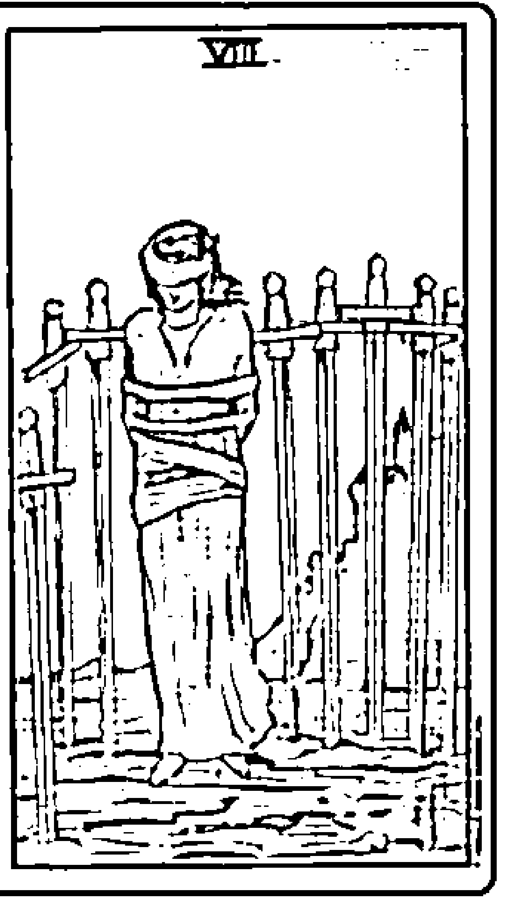

象徵圖象：
被綁住
矇起眼睛
背景有城堡
數字和元素

意義：
枷鎖、限制、控制
羞辱
被鎖在外面
一個在理智上（空氣）被迫的改變（8）

### 寶劍八在愛的神諭牌陣裡

#### 位置 1 — 它是怎麼樣

目前在你的關係中有一些事不能表達，如果這只是暫時性的，那麼你一定能夠克服，但如果這是一個持續存在的缺點，那麼你關係的前景可能不會太好。

#### 位置 2 — 什麼東西從內在推著你

你控制了你自己，你知道你必須克服一些限制，或者你覺得被拋棄了。

#### 位置 3 — 對方對你的態度

你所面對的人處在一種困難的狀態下。這個人可能被限制了，或者他或她正在跟內在的某種限制抗爭，不管怎麼說，他或她目前覺得無法自由按照自己的方式去做。

#### 位置 4 — 神諭對你的忠告

好好地整合你自己，暫時將你的興趣和慾望降低一些，尤其是當你的關係處於困難的階段時，你必須展現出你是可靠的，你已經將每一件事都納入控制，而且願意去經歷困難的階段。

### 寶劍八在指南針牌陣裡

#### 位置 1 — 它是怎麼樣

它關係到一個複雜的問題，某件事無法自由發展，也許是因爲某種抑制或限制。或者那個問題是某人被排除在外。

#### 位置 2 — 它就是這樣開始的

你覺得被壓抑了，或者你覺得有某種限制被加諸在你身上。也許是你想要使你自己納入控制，或者你要強迫你自己做些什麼。位置 4 的那張牌將會告訴你，你的努力是否有用。

#### 位置 3 — 反應

你發覺你自己處於一個有問題的環境，你將必須去面對一些人，他或她也許覺得被排除在外，或是被限制了，或是有其他的原因使他們無法做他們想做的事。

#### 位置 4 — 它將會引導到哪裡

除非你沒有其他的選擇，否則你不必走這條路。在此你將無法發展，而會被暴露在不愉快的限制之下，無法找到任何滿足。

### 寶劍八在盲點牌陣裡

#### 位置 1 — 每一個人都知道的

你處於一個無法好好地行動的狀態下，因爲你被限制了，或是被陷住了，或是覺得被排除在外。

#### 位置 2 — 盲點

別人看到你處於困難的階段，你在跟一些限制抗爭，或是無法展現你的潛力。好好地評估一下，也許跟別人談一談有助於你去克服你自己的限制。

#### 位置 3 — 你如何看你自己

你知道目前的情況強迫你去做一些你不想做的事。在有利的情況下，你已經將這個情況納入控制，你知道要如何處理來脫離這個困境。在最差的情況下，你會覺得你自己是一個受害者。

#### 位置 4 — 很大的未知

你的內在深處隱藏著失望的感覺，它的確剝奪了你生活的喜悅，而且常常使你陷入混亂。或者有一件事經常在折磨著你，讓你作惡夢，甚至睡不著。如果你能夠去探討這個未知的部分，去熟悉它和了解它，這將是走向解決的第一步。

获取更多好书，请加微信号：strcdts
店铺：http://strc.cr.cx

# 寶劍九（Nine of Swords）

## 失眠的夜晚

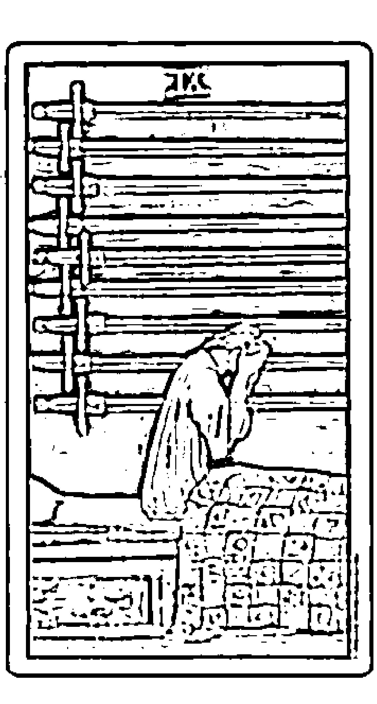

象徵圖象：
黑夜
姿勢
浮在空中的寶劍
床邊戰役的雕刻
玫瑰和占星符號的蓋被
數字和元素

意義：
鬱悶、焦慮
惡夢、恐懼、懊悔
威脅
衝突、攻擊
保護
集中精神（9）在負面的思想（空氣）

### 寶劍九在愛的神諭牌陣裡

#### 位置 1 — 它是怎麼樣

目前烏雲籠罩著你的愛情生活，也許它甚至看起來是絕望的。不管怎麼說，那個氣氛充滿著恐懼和負擔。你有什麼事必須懊悔和譴責你自己嗎？

#### 位置 2 — 什麼東西從內在推著你

也許你覺得很傷心或是被遺棄，或是你聽到了一些不好的消息——甚至是分手的消息。或者你受到了罪惡感的打擊而不知道如何處理。

#### 位置 3 — 對方對你的態度

你所面對的人是懺悔的、焦慮的、或擔心的。也許他或她對你良心上過意不去。不管怎麼說，他或她陷住在恐懼裡，心情非常忐忑不安。

#### 位置 4 — 神諭對你的忠告

如果你有恐懼，那麼就不要隱藏它們，而去面對它們，並漸漸加以克服。如果你受到良心的譴責，那麼你可以將它公開講出來，展現出真心的懺悔。

### 寶劍九在指南針牌陣裡

#### 位置 1 — 它是怎麼樣

你的問題使你鬱悶和煩惱，或者它涉及懊悔和良心的譴責。

#### 位置 2 — 它就是這樣開始的

在開始的時候，你在晚上失眠，也許你在後悔你走了這條路，或者你被內在的衝突所煩惱。但恐懼是不好的告誡者，你不應該讓恐懼來引導你或煩惱你。跟朋友或專家談一談，將事情看得更清楚。如果位置 4 的那張牌顯示出會有好的結果，那麼儘管你有害怕還是要走這條路。

#### 位置 3 — 反應

你的周遭充滿著焦慮，別人對你或對你的做法感到害怕，他們深深地覺得不安，或甚至遭受懊悔之苦。或是有人在擔心你嗎？

#### 位置 4 — 它將會引導到哪裡

到了最後，你會將事情清理乾淨，如果那是你的目標，你就必須去追求這個路線，然而如果你還在期待一些什麼，那麼當事情突然結束的時候，你將會感到失望。

### 寶劍九在盲點牌陣裡

#### 位置 1 — 每一個人都知道的

你是悲觀的、恐懼的，或者你目前處於一個困難的階段，在那裡面，恐懼和煩惱剝奪了你的睡眠。

#### 位置 2 — 盲點

別人看到你有危機、恐懼、和失望，或者你即將要做一件以後會後悔的事。如果這個看法一點都不符合你的自我形象（位置3），那麼你可以跟別人談一談，把那個情況弄清楚。

#### 位置 3 — 你如何看你自己

你覺得很懊悔，或是因為煩惱和恐懼而覺得很憂鬱。如果你想要全部由自己來處理這些事，你可以這樣做。然而你可以檢視一下位置 2 的牌，看看這張牌是否鼓勵你去尋求其他的幫助。

#### 位置 4 — 很大的未知

你的內在深處隱藏著失望的感覺，它的確剝奪了你生活的喜悅，而且常常使你陷入混亂。或者有一件事經常在折磨著你，讓你作惡夢，甚至睡不著。如果你能夠去探討這個未知的部分，去熟悉它和了解它，這將是走向解決的第一步。

# 寶劍十（Ten of Swords）

## 畫出界線

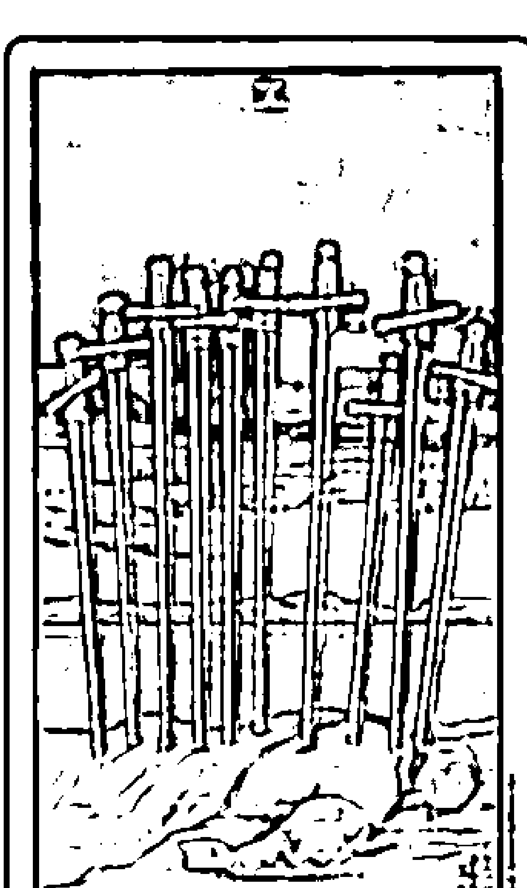

象徵圖象：
被劍刺死
黑色的天空
冰冷的顏色
數字和元素

意義：
突然的、憑私意的結束
陰鬱的展望
冰冷的氣氛
冷酷的、仇恨的思想（空氣）總合（10）

### 寶劍十在愛的神諭牌陣裡

#### 位置 1 — 它是怎麼樣

你們分手，現在它已經結束了。並不是說它按照它的路線在進行，而是因爲一個清楚的、冷酷的，而且，也許是令人驚訝的決定。或者，你只是在你的關係當中關閉起某些部分嗎？

#### 位置 2 — 什麼東西從內在推著你

你想要畫清界線，也許你真的渴望將某一個困擾你的部分結束掉，或者你想要將整個關係都結束掉。

#### 位置 3 — 對方對你的態度

你所面對的人是嚴厲的，它剛剛跟某事或某人突然分開——很可能是跟你分開。位置 4 的那張牌可以告訴你，你是否能夠——或應該——試著來挽救什麼。

#### 位置 4 — 神諭對你的忠告

做個決定吧！遠離那個打擾你的關係的人或習慣，或是結束掉你的關係，如果有需要的話。

### 寶劍十在指南針牌陣裡

#### 位置 1 — 它是怎麼樣

這是一個快速的決定，或是重大的一步，或是蓄意結束一件事。即使這張牌看起來是不祥的，這樣做也不見得是不對的，它也許是一個解放，雖然也可能是一個破壞。

#### 位置 2 — 它就是這樣開始的

在開始的時候有一個很大的分開。也許是在走這條路之前，你先對其他某件事說再見，或者這張牌指出你已經準備要放棄一件事。如果是這樣的，位置 3 和位置 4 的牌是沒有意義的。

#### 位置 3 — 反應

你周遭的反應很極端，也許是別人不想要跟你有任何瓜葛，想要跟你畫清界線，或是你的意圖使別人想要將某件事結束掉，使他們自己可以遠離舊有的習慣、行為、或枷鎖。

#### 位置 4 — 它將會引導到哪裡

到了最後，你會將事情清理乾淨，如果那是你的目標，你就必須去追求這個路線，然而如果你還在期待一些什麼，那麼當事情突然結束的時候，你將會感到失望。

### 寶劍十在盲點牌陣裡

#### 位置 1 — 每一個人都知道的

也許你是一個會做出快速決定的人，或者你已經來到了一個點，在那個點上，你畫出了一條清楚的界線。

#### 位置 2 — 盲點

別人所看到的是你突然跟某件事情分開，或是你突然結束掉一件事，或是時候已經到了，你必須堅決跟某件事分開。如果你還沒有覺知到這個，你必須去請教一些別人的意見，因為這個步驟將能夠帶給你真實的解放。

#### 位置 3 — 你如何看你自己

你很明顯地在你的生活上作了一個激烈的改變，也許是快速地跟某人分開，或者是你處於一個要就全部，不然就全部不要的階段。

#### 位置 4 — 很大的未知

有一個力量在你的內在深處，它傾向於突然結束一些事情。直到你能夠知道這個力量之前，你將會一再一再地經驗到事情似乎毫無預警地突然結束。你越是試著去了解你本性的這一面，你就越能夠在事情需要的時候下定決心，而不是在時機還沒有成熟就突然將一些必要的發展結束掉。

# 寶劍侍衛（Page of Swords）

象徵圖象：  
侍衛  
寶劍  
很多小鳥  
雲朵  
人物和元素  

意義：  
新訊息的提供者  
雙刀鋒：清晰，衝突  
很多想法  
飄浮在空中、不務實際  
預報（侍衛）會有批判或夢想（空氣）

## 寶劍侍衛——作為一張牌或是在其他的牌陣裡

#### 一般性的意義：

侍衛代表來自外在世界的機會，並將那些機會提供給發問者。寶劍侍衛提供了一個澄清的機會，然而它常常不被珍惜，因為它伴隨著一些批判。這張牌意味著我們受到攻擊、受到批判、或受到威脅，但是我們必須記住，這是一個學習事情和了解事情的機會。此外，寶劍侍衛也意味著一個人有太多的夢想，不務實際。

#### 工作領域：

要小心迎面而來的逆風，要準備接受批判，保持鎮定。如果你仔細聽取別人的批評而不要立刻覺得被冒犯，你就可以學習和了解到一些重要的事，即使那個批評本身是沒有根據的。另外權杖侍衛所給我們的啟示是工作必須務實，不能只是空有夢想。

#### 愛的方面：

你曾經有過較好的時光，現在也許是你的關係有了危險，或是你覺得受到批評的攻擊。即使這是惱人的和不公平的，它也是值得一聽的，你也許可以從中了解到一些重要的事。另外，即使在愛情方面，你也必須看到事實，而不要一味地將事情美化。

### 寶劍侍衛在愛的神諭牌陣裡

#### 位置 1 — 它是怎麼樣

你的愛正在經歷一個冷卻，也許是你們互相有一個批判和仇視的態度，或者是某種外在的事正在威脅著你們的關係。另外，也許是你的情感建立在夢想的基礎上，而你自己並沒有覺知到。

#### 位置 2 — 什麼東西從內在推著你

在目前，你並沒有真的覺得被愛，反而覺得受到攻擊，或甚至被拋在一旁。另外一個可能性是，你在你的愛裡面是否加進了很多想像。檢視一下位置 3 的牌，看看這個威脅是否真的來自你的伴侶，同時要正確解讀對方的反應。然後從位置 4 的牌來了解看看在這個情況下你能夠做什麼。

#### 位置 3 — 對方對你的態度

你所面對的人發覺你是冷淡的、仇視的，也許是他或她覺得受到威脅、受到批評，或是受到你的打擾。另外，也許對方並沒有看到真實的你，而只是活在對你的想像之中。

#### 位置 4 — 神諭對你的忠告

要準備接受批評，不要逃避或是受到批評就立刻生氣。如果你注意聽，你也許可以了解一些你所忽略或壓抑的事。凡事都要以事實為依歸，活在不真實裡面到了最後一定會付出代價。

### 寶劍侍衛在指南針牌陣裡

位置 1 — 它是怎麼樣  
它關係到一個冰冷的氣氛，一個很強的逆風，一個爭辯，一個惡意，或是一個卑劣的行為。

位置 2 — 它就是這樣開始的  
在開始的時候，那個氣氛降到很低，有很多麻煩和不好的侵略氣氛。位置 4 的那張牌可以告訴你這是否只是一個短暫的冰冷現象，或是在這條路上已經沒有機會了。

位置 3 — 反應  
要振作起來去迎接很強的逆風，周遭的環境是冰冷的，而且那個反應是準備好要衝突的。別人很明顯地被你或你的做法所激怒，所以會採取任何方式來阻止你或甚至把你除掉。

位置 4 — 它將會引導到哪裡  
你最好不要採取這個路線，它會引導到一個非常冰冷的氣氛。到了最後，你將會暴露在一個冰冷的逆風裡，同時會伴隨著很多麻煩和抗爭。

### 寶劍侍衛在盲點牌陣裡

位置 1 — 每一個人都知道的  
你目前遭受到很多批評，也許是你故意進入這個情況，因為你在追求個人的發展，如果不是這樣的話，這個階段是不舒服的。另外，別人可能認爲你是一個年輕或思想不成熟的人。

位置 2 — 盲點  
別人了解到你正在面對一個冰冷的氣氛，但是你可能一直往前衝而沒有顧慮到它。你必須讓別人來打開你的眼睛，才不會在事情有了激烈的變化時感到驚訝。

位置 3 — 你如何看你自己  
你是冰冷的，你處於一種好戰的心情，也許你懷著一些恨，或是想要報復。在這個情況下，這是最好的解決方式嗎？也許你必須再問一下牌關於這個問題。

位置 4 — 很大的未知  
在你裡面隱藏著滿多的憤怒。只要你沒有覺知到它，它可能會以批判來展現，或是會轉為惡意的侵略，然而這個行為可能會隱藏在沒有傷害性的面具背後。唯有當你能夠看到你的這一面，你才能夠學習如何以一種理智的方式來表達它，比方說，透過一種有力的主張或信念。

# 寶劍騎士（Knight of Swords）

## 冲突

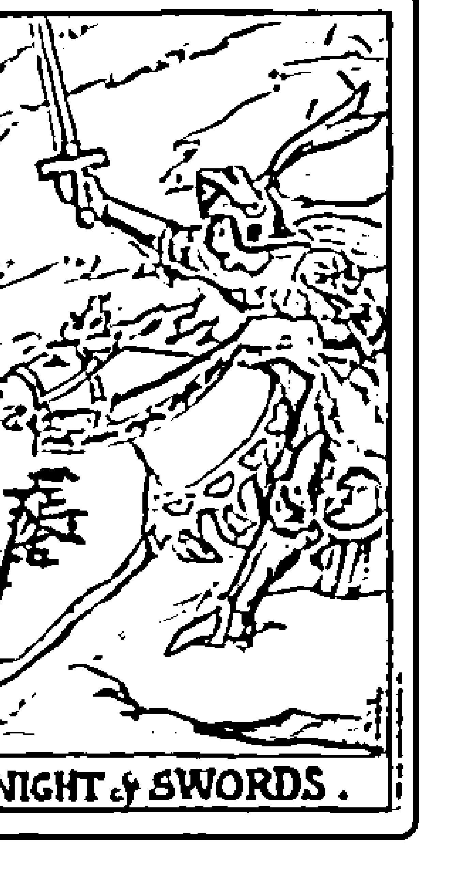

象徵圖象：  
騎士  
劍  
姿勢  
散開來的雲  
被風吹歪的樹木  
人物和元素  

意義：  
攻擊、好戰  
衝突、分離、澄清  
向前衝、攻擊  
暴風雨、戰爭  
逆風或經常的挑戰  
冰冷的氣氛（空氣）的代表（騎士）

### 寶劍騎士——作為一張牌或是在其他的牌陣裡

#### 一般性的意義：

騎士代表一個氣氛，寶劍騎士象徵著一個冰冷的、衝突的氣氛，或是一個爭論和卑劣的行為極度發展的心情。在最好的情況下，它是一種具有傷害性的批評，但是它也可以導致重要的洞見或自我達成。

#### 工作領域：

把自己振作起來，你正在面對一個冰冷的氣氛，要準備好迎接逆風、批評、或甚至卑劣的行為。不要縮進你的烏龜殼裡。如果必要的話，要展現出你是一個有能力運用策略的人。

#### 愛的方面：

在目前並沒有很多愛的氣氛，你充滿著憤怒，想要不惜代價地利用各種方法把事情弄清楚。

### 寶劍騎士在愛的神諭牌陣裡

#### 位置 1 — 它是怎麼樣

冰冷的氣氛進入了，它趕走了你的愛，取而代之的，戰爭和恨成爲主軸。只有另外的牌能夠告訴你說這是一個暫時的小衝突或是一個漫長的戰役。

#### 位置 2 — 什麼東西從內在推著你

你是冰冷的，同時已經拿出你的武器。你很生氣，有一些事你想要不計任何代價地澄清，而且你會使用任何方式來這樣做。

#### 位置 3 — 對方對你的態度

你所面對的人準備抗爭，或者至少在目前是一個脾氣火爆的人。他或她是冰冷的，而且對你不是很好。也許他或她甚至充滿著恨。如果你花太多時間在這種氣氛之下，你將會被冷到。

#### 位置 4 — 神諭對你的忠告

不要再避開衝突了。以一種鎮定的、清楚的、和有策略的方式來進行，把焦點放在對方的弱點上，除非那個問題被解決，否則不要改變立場。

### 寶劍騎士在指南針牌陣裡

位置 1 — 它是怎麼樣  
它關係到一個冰冷的氣氛，一個很強的逆風，一個爭辯，一個惡意，或是一個卑劣的行為。

位置 2 — 它就是這樣開始的  
在開始的時候，那個氣氛降到很低，有很多麻煩和不好的侵略氣氛。位置 4 的那張牌可以告訴你這是否只是一個短暫的冰冷現象，或是在這條路上已經沒有機會了。

位置 3 — 反應  
要振作起來去迎接很強的逆風，周遭的環境是冰冷的，而且那個反應是準備好要衝突的。別人很明顯地被你或你的做法所激怒，所以會採取任何方式來阻止你或甚至把你除掉。

位置 4 — 它將會引導到哪裡  
你最好不要採取這個路線，它會引導到一個非常冰冷的氣氛。到了最後，你將會暴露在一個冰冷的逆風裡，同時會伴隨著很多麻煩和抗爭。

## 寶劍騎士在盲點牌陣裡

位置 1 — 每一個人都知道的  
你是很理智的，準備好要進入任何衝突，或者至少這是你目前的頭腦狀態。

位置 2 — 盲點  
別人了解到你正在面對一個冰冷的氣氛，但是你可能一直往前衝而沒有顧慮到它。你必須讓別人來打開你的眼睛，才不會在事情有了激烈的變化時感到驚訝。

位置 3 — 你如何看你自己  
你是冰冷的，你處於一種好戰的心情，也許你懷著一些恨，或是想要報復。在這個情況下，這是最好的解決方式嗎？也許你必須再問一下牌關於這個問題。

位置 4 — 很大的未知  
在你裡面隱藏著滿多的憤怒。只要你沒有覺知到它，它可能會以批判來展現，或是會轉為惡意的侵略，然而這個行為可能會隱藏在沒有傷害性的面具背後。唯有當你能夠看到你的這一面，你才能夠學習如何以一種理智的方式來表達它，比方說，透過一種有力的主張或信念。

## 寶劍皇后（Queen of Swords）

## 獨立

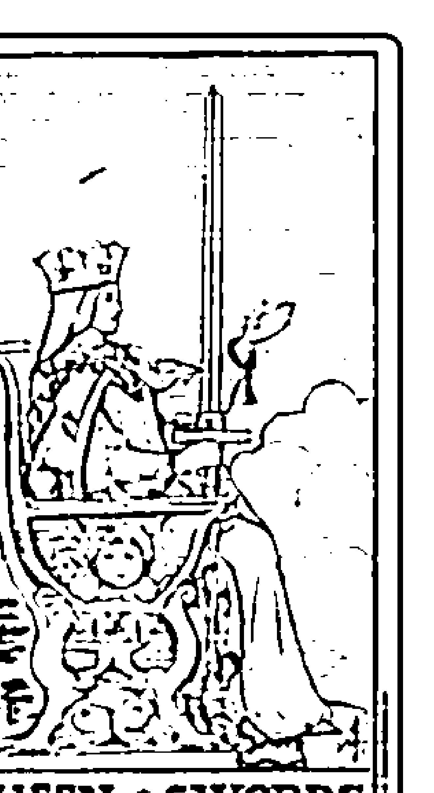

象徵圖象：  
皇后  
直立的劍  
姿勢  
左手有殘留的束縛  
右手拿著一把劍  
一隻小鳥在天上飛  
寶座上的少女  
人物和元素  

意義：  
敞開、接受性  
目標導向的思考  
很直  
解放自己，脫離依賴  
果決  
專注在達成的思想  
守護靈  
聰明、獨立的（空氣）女人（皇后）

## 寶劍皇后——作為一張牌或是在其他的牌陣裡

#### 一般性的意義：

皇后所代表的人大多數是女人，但是有時候也可以代表男人。她們強調小心警覺和準備接受什麼。寶劍皇后象徵著一個警覺的人帶著一個敏銳的頭腦，充滿著理智的好奇，是獨立的、有彈性的、和聰明的，也許甚至是有一點冷冷的。這張牌可以指出一個來自外界的人，或是一個內在的人，他在你的內在形成，所以他代表你。

#### 工作領域：

在職業的環境裡，寶劍皇后通常代表一個獨立的女人，一個自己接個案的人。如果這張牌象徵著你，你必須展現出你的獨立、分析能力、深思熟虑的能力、證明你的精明、和令人驚訝的巧思。這張牌也暗指一個顧問位置的人。

#### 愛的方面：

你可能會靠你的機智和幽默取勝，同時你也不會極力反對經驗和不合習俗的關係。這張牌也可以意味著你被一個具有這些品質的人所吸引。

## 寶劍皇后在愛的神諭牌陣裡

#### 位置 1 — 它是怎麼樣

也許是一個聰明的、有口才的女人走進了你的生命，使你們之間的談話活了起來，並帶來很多新的事物，或者你被要求展現出你喜歡探討的、聰明的那一面，來樹立和主張你的獨立。然而，它也可能是一個冷酷的、算計的女人在打擾著你的關係。

#### 位置 2 — 什麼東西從內在推著你

你需要更多的自由，至少想要抽離你自己，使你能夠更加獨立。或者你想要將一些新的空氣帶進你的關係裡。這張牌也可以意味著你被一個聰明而且有魅力，但是同時具有一種高不可攀的品質的女人所吸引。

#### 位置 3 — 對方對你的態度

你所面對的是一個警覺的、聰明的人，他或她一直都很健談。看你所期待的是什麼，你將會愛或崇拜他或她的獨立，或者當這個人表現冷淡的時候，你可能會覺得被冷落。

#### 位置 4 — 神諭對你的忠告

保持多一點的距離，這樣在你們的關係中才能夠享受更多自由的空氣。展現出你的獨立性，證明你也可以自己做好你自己的事。

## 寶劍皇后在指南針牌陣裡

位置 1 — 它是怎麼樣  
有一個人，他或她知道自己所想要的，他或她是比較酷的、批判的、聰明的，而且在本身的領域裡面很有才華。有可能這張牌事實上是代表你，由此可以顯示出你對這個問題的態度。

位置 2 — 它就是這樣開始的  
在開始的時候，你比較是理智上的涉入，而不是感情的涉入。你以比較冷淡和批判的態度站在一個距離來檢視事情。也許你並不是真的想敞開。不管怎麼說，你比較重視你的獨立。它也可能是你被一個聰明和冷淡的女人所吸引，或是你受到她的激發。

位置 3 — 反應  
你將會碰到一個聰明的人，他或她是多才多藝的，因此跟他談話覺得很有趣，也可以在理智上挑戰他，但是他或她可能有一點保守。如果你想要贏得這個人的心，你將必須先提升你的觀念，最好的方法就是引起對方的好奇心。

位置 4 — 它將會引導到哪裡  
在這一條路上，你將不會被別人所吸引，到了最後，你將會覺得是獨立的，能夠好好地獨處，然後可以站在一個距離來看清你所想要的。它也可能是到了最後你會碰到一個女人，你很賞識她的聰明才智，而且她可以提供很好的建議。

## 寶劍皇后在盲點牌陣裡

位置 1 — 每一個人都知道的  
你是一個獨立自主的人，對生命有好奇，你的警覺和精明是別人所認定的，或者你目前所處的階段強烈地被具有這些品質的人所影響。

位置 2 — 盲點  
別人認爲你都是走你自己的路，你是獨立的、機智的。然而，別人或許也會感覺到你的精於算計和冷酷的一面。或者這張牌是否意味著有一個聰明、有魅力的女人在你身邊而你一直忽略她？

位置 3 — 你如何看你自己  
你知道你在為你的自由抗爭，你喜歡獨立自主，你並不浪漫，你喜歡一個冷冷的距離，而不要太親密，因為你覺得太親密會變得不夠高尚。

位置 4 — 很大的未知  
在你的內在深處，有一個力量在推著你走向更高的達成，它想要看清楚你的生活，並給它一個答案。你越是去探討這一面，你就會越清楚，什麼樣的生活對你來講是最好的。如果你是一個女人，這是你正在找尋的形象，它等著被找到，並進入到你的愛情生活裡。

## 寶劍國王（King of Swords）

## 精明

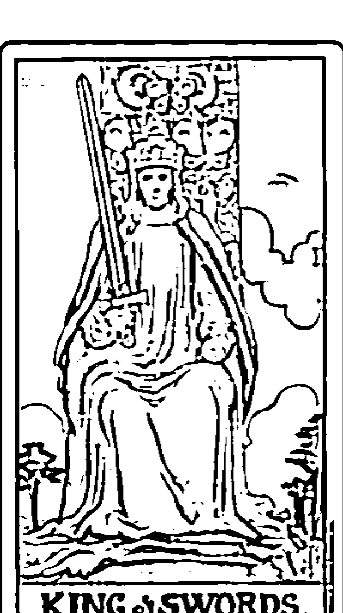

象徵圖象：  
國王  
姿勢  
兩隻小鳥在天上飛  
右手握著傾斜的劍  
寶座後方的蝴蝶  
人物和元素  

意義：  
活動  
敞開、興趣  
有很多想法  
批判的、深思熟慮的  
守護靈  
聰明的、有點酷的（空氣）男人（國王）

## 寶劍國王——作為一張牌或是在其他的牌陣裡

#### 一般性的意義：

國王所代表的大多數是男人，但是有時候也代表女人。它強調主動積極的那一面，和有效率的做法。寶劍國王象徵著一個聰明、多才多藝的人，他很精明，口才很好，很獨立，很有彈性。他可以是來自外界，對你來講重要的人，或是一個在你的內在形成的人，所以代表你。

#### 工作領域：

在職業領域裡，寶劍國王是一個顧問、一個仲介、一個文字工作者，或是一個提出概念的人。如果這張牌代表你，你必須變成獨立的，展現出你的精明和創造力，來解決問題和指導別人。這張牌也指出你必須成爲一個自己接個案的人。

#### 愛的方面：

你是有機智、有魅力、有動力的，你知道如何使用文字，你試著使用你的創意來贏得別人的好感。這張牌也可以意味著你被一個具有這種品質的人所吸引。

## 寶劍國王在愛的神諭牌陣裡

#### 位置 1 — 它是怎麼樣

一個有魅力的、令人愉悅的人進入了你的生命，他帶來他那令人振奮的幽默和機智。或者你被要求展現出你的聰明，培養你的探討能力，來幫助別人將事情看得更清楚。然而它也可能是一個多才多藝的、很酷的人在打擾著你的關係。

#### 位置 2 — 什麼東西從內在推著你

你是喜歡探討的，但仍然是深思熟慮的，你很喜歡一個非正式的關係，你喜歡沒有承諾，好讓你可以隨時做你想要的。或者你被一個具有這種品質的人所吸引。

#### 位置 3 — 對方對你的態度

你所面對的是一個聰明、有趣的人，他或她以自己的自由和獨立為優先考慮。你可以藉著喚起他的好奇來贏得他或她的心，但是這個人並不容易接近，因為他或她並沒有很熱情。

#### 位置 4 — 神諭對你的忠告

表現出你的聰明和機智的一面，要成爲具有創造力的，在你的關係中加進一些新鮮的能量。試著使你的伴侶開朗起來，或是幫助他澄清一些問題。但不要只是閒談。如果你的關係受到外界的威脅，你必須用你的精明和機智來保護他或她。

## 寶劍國王在指南針牌陣裡

位置 1 — 它是怎麼樣  
也許你的問題是關於一個聰明，有彈性的，很酷的人，或者這張牌指出你本身採取這樣的態度。

位置 2 — 它就是這樣開始的  
你想要了解一些事，作個決定吧！讓你自己被你喜歡探討的心所引導，變成獨立的。你想要贏得一個具有這些品質的人。

位置 3 — 反應  
你會碰到一個博學多聞的、批判的、和多才多藝的人，他不容易被騙。如果你想要邀請他或她來參與你的計劃，你必須要提供給他或她一個具有挑戰性的機會，最好的策略就是引發出他那喜歡探討的心。

位置 4 — 它將會引導到哪裡  
到了最後，你將會以一種聰明的、有策略的方式來進行。或者那個發展會導致一個人成爲你的顧問或是你的仲介，或者甚至他就是終點的目標。

## 寶劍國王在盲點牌陣裡

位置 1 — 每一個人都知道的  
你有一個清楚的、會分析的頭腦，你總是能夠找到正確的用語。或者你目前的情況受到一個具有這種品質的人很大的影響。

位置 2 — 盲點  
別人認爲你是批判的、很酷的，或是不願意承諾的人，而你自己並不覺得這樣。別人也可能認爲你談得多，做得少。另外，它也可能是有一個聰明的、機智的人在你的身旁，但是你卻忽略了。

位置 3 — 你如何看你自己  
你知道你是警覺的，基本上是被你那喜歡探討的心所引導著。因爲自由對你來講是最重要的，所以你不能忍受跟別人太親近，所以你常常會顯得有一點保守和喜歡保持距離。

位置 4 — 很大的未知  
在你的內在深處，有一個力量在推著你走向更高的達成，它想要看清楚你的生活，並給它一個答案。你越是去探討這一面，你就會越清楚，什麼樣的生活對你來講是最好的。如果你是一個女人，這是你正在找尋的形象，它等著被找到，並進入到你的愛情生活裡。

## 金幣一（Ace of Pentacles）

## 看得到的快樂

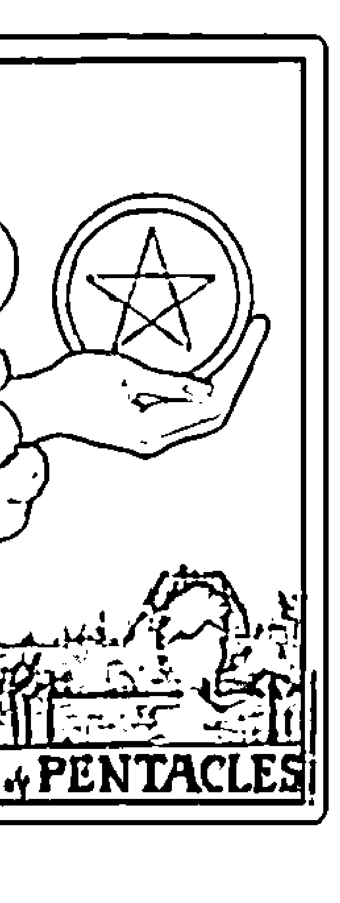

象徵圖象：  
創造者的手  
金幣  
五角星  
白色的百合花  
樹籬裡的門  
山峰  
數字和元素  

意義：  
衝動  
堅固的、持久的價值  
豐饒  
純潔  
好的展望  
頂點、經驗快樂  
有機會（1）可以找到持久的、愉快的價值（地）

## 金幣——作為一張牌或是在其他的牌陣裡

#### 一般性的意義：

每張一（Ace）的牌都是一個必須抓住的機會，因為它提供了新的看法和新的機會。金幣一是副牌裡面最幸運的牌，它象徵著有一個機會可以得到豐富的經驗，或是可以找到某種持久的、重要的東西，也許是財務的成功或內在的財富。

#### 工作領域：

一個有價值的機會擺在你的眼前，你必須不顧一切地抓住它，如果你正好處在一件事的開始，它所打開的路是非常有前途的。在其他的情況裡，有一個機會可以達成一些有價值的事，或是向前邁進一大步。

#### 愛的方面：

睜開你的眼睛，在愛的領域裡，你有機會可以找到一個很好的、持久的快樂。它可能意味著再度墜入情網，或是在你現有的關係裡分享一個快樂的、很好的經驗。

## 金幣一在愛的神諭牌陣裡

#### 位置 1 — 它是怎麼樣

它關係到一個有價值的機會可以在你的關係中打開一個新的、令人滿意的可能性，並建立起一個堅固的基礎和一個良性互動的模式。

#### 位置 2 — 什麼東西從內在推著你

你在渴望一個令人滿意的、愉快的經驗，它能夠在你的關係中注入新的能量，固定它，並加強它可以持久的基礎。

#### 位置 3 — 對方對你的態度

你所面對的人看到一個好的機會可以建立一個快樂的、互相承諾的關係，並積極使這個關係成形。

#### 位置 4 — 神諭對你的忠告

抓住你的關係所提供的機會。做一些事來穩固它的基礎，或是穩固你的財富。然而也許神諭在建議著你可以在你的愛情生活裡注入一些感官的快樂。

## 金幣一在指南針牌陣裡

位置 1 — 它是怎麼樣  
它是關於一個寶貴的機會，或是一條有前途的路，它有一個很好的展望，同時具有達到正向的、持久的發展的潛力。

位置 2 — 它就是這樣開始的  
在開始的時候，你有很好的機會可以找到快樂，你可以在財務上成功，或是達到某種具體的結果。位置 4 的牌可以告訴你這只是一個在開始階段的幸運，或是一個持久的幸運。

位置 3 — 反應  
周遭充滿著機會，別人將你的計劃或是你的做法視為一個意外的收穫，或是一個誘人的機會，因此你可以指望他們的承諾或大力的支持。

位置 4 — 它將會引導到哪裡  
不論你所走的路到目前為止是怎麼樣，到了最後，你將會有一個可以有真正發展的機會，它包括可能的財務成功，或是其他令人愉悅的、持久的結果。

## 金幣一在盲點牌陣裡

位置 1 — 每一個人都知道的  
你不僅覺得有一個很好的機會，而且你知道如何從它做出最好的。至少你目前是幸運的，你應該對這些好機會敞開。

位置 2 — 盲點  
你周遭的人知道你目前有一個好的機會可以達成某種有價值的事，它也許是在你的工作領域，或是財務方面的，或是關係到重要的內在經驗。如果你還沒有覺知到這個機會，你必須跟別人聊一聊，才不會錯過這個好機會。

位置 3 — 你如何看你自己  
有一個機會擺在你的眼前，它可以是你向前跨出一大步。檢視一下位置 2 的牌，如果別人的評估是比較懷疑的，那麼你就必須再仔細看一下你自信的態度。

位置 4 — 很大的未知  
在你內在深處有一個很大的財富等著被發現和帶出來。它可以給你財務上的成功，和好的生活基礎，還有令人滿足的、感官的經驗和其他令人高興的事。挖掘這個內在快樂的泉源，將你全部的注意力都投放進去，直到你能夠洋溢著喜悅。

## 金幣二（Two of Pentacles）

## 弹性

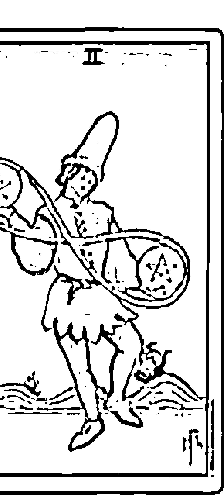

象徵圖象：
耍把戲的人
跳舞的動作
金幣在無限的符號裡
耍把戲
兩條船在海浪上
數字和元素

意義：
無愛無慮、幽默
彈性的觀點
力量永恆的運作
玩弄可能性
適應生命的浮浮沈沈
玩弄（2）具體的可能性（地）

## 金幣二——作為一張牌或是在其他的牌陣裡

#### 一般性的意義：

金幣二指出一個人生命中輕盈的、無愛無慮的階段，以及很能夠適應生命的上上下下。在最好的情況下，這張牌象徵著彈性，以及有能力操弄不同的選擇。稍微不好的情況是這張牌指出缺乏清楚的觀點。

#### 工作領域：

放輕鬆！現在並不是要做什麼大決定的時候，放鬆心情來操弄一下那個可能性，直到你能夠看清楚要怎麼做。

#### 愛的方面：

這張牌指出你愛情生活中的一個輕鬆的階段，它可能意味著幾件不同的事情。你可能是靜止的，或者可能是再度處於挑逗的階段，或者你持輕鬆的態度。你可能沒有固定在一個關係裡，只是想要先看看那裡有什麼。

## 金幣二在愛的神諭牌陣裡

#### 位置 1 — 它是怎麼樣

你在玩一個輕鬆的愛的遊戲，它可以是很優雅的、輕盈的、很吸引人的。有時候關係也可以是透過一個沒有承諾的方式來進行。

#### 位置 2 — 什麼東西從內在推著你

你想要以一種輕鬆的、無愛無慮的方式來生活，不必有承諾。所以你事實上並不想真正進入關係裡，或者你同時有幾件事在做？

#### 位置 3 — 對方對你的態度

你所面對的人不喜歡作決定，只是喜歡玩一玩。你將會覺得他是無愛無慮的、有彈性的、多變化的，當事情變得比較嚴肅的時候，他或她可能是軟弱的、不可靠的。

#### 位置 4 — 神諭對你的忠告

保持彈性，帶著遊戲的心情，放輕鬆，不要讓任何人把你推向不成熟的決定。

## 金幣二在指南針牌陣裡

| 位置 1 — 它是怎麼樣 | 位置 2 — 它就是這樣開始的 |
|---|---|
| 它是關於輕鬆和彈性，或是要去嘗試什麼。那個主題可能是要去玩一下不同的可能性。 | 在開始的時候，你很輕鬆地去接近一件事，沒有任何承諾，你非常有彈性，它可能只是要藉著玩弄不同的可能性去嘗試些什麼。 |
| 位置 3 — 反應 | 位置 4 — 它將會引導到哪裡 |
| 周遭並沒有什麼清楚的選擇，人們按照主流的意見來行動，他們是輕鬆的、好奇的，同時以一種沒有決定的方式來反應。 | 到了最後，你是沒有問題的，你會有一個輕鬆的態度，而且你的心情會很好，但是尚未作出任何決定，因此事情仍然是未定的，也許你需要擲一下錢幣來決定。 |

## 金幣二在盲點牌陣裡

#### 位置 1 — 每一個人都知道的

你很有幽默感，很輕鬆，你知道如何適應生命的上上下下。

#### 位置 2 — 盲點

別人看到你無憂無慮的樣子覺得你是一個不專一的人，你的傾向於不採取清楚的觀點可能甚至會讓別人認爲你是一個見風轉舵的人。

#### 位置 3 — 你如何看你自己

你認爲你自己是一個有彈性的、無憂無慮的人，很懂得怎麼樣處理生活。位置 2 的牌會顯示出別人的看法是否跟你一樣，或者他們對你的行爲有更多的批判。

#### 位置 4 — 很大的未知

在內在深處，你已經準備好向前走，克服舊有的狀態，在工作上或其他地方取得新的資格。你想要展現你的才能，進入神秘的領域，或者只是變成熟。一旦你覺知到你的這一面，讓它在你的日常生活當中發出它的聲音，你很快就可以解決或拋掉一些不愉快的問題。

## 金幣三（Three of Pentacles）

## 資格

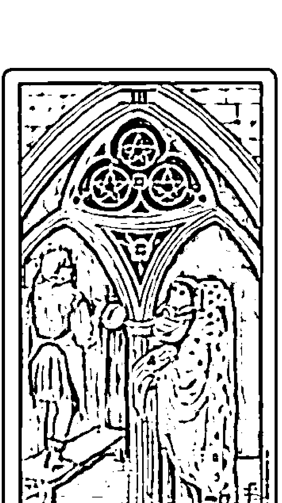

象徵圖象：
場景
黑色的背景
雕刻家在工作
和尚打扮的人
數字和元素

意義：
最後的檢查或入會的測驗
祕密、神秘
某人提供他的才能
檢查的人
具體的（地）新的層面（3）

## 金幣三——作為一張牌或是在其他的牌陣裡

#### 一般性的意義：

金幣三指出資格的提升，一個人離開了舊有的層面，而進入到一個新的、更有意義的層面。根據所問的問題，這張牌可以象徵著通過一個考試，或工作上的晉升，或是一個人的生命中具有決定性的一步。在心靈層面，這張牌象徵著加入某一個心靈團體，進入神秘的領域。

#### 工作領域：

不論你在哪裡需要證明你的技藝，現在那個展望是有利的。它也許是你通過了一個考試，完成一個計劃，或是在其他方面合格了。不管怎麼說，你對於那個往前跨進一大步可以有信心，它也可能導致一個晉升。

#### 愛的方面：

如果你的愛情生活一直都有問題，你現在已經有機會可以克服舊有的情況，並找到一個較好的方式來經驗事情。然而，如果原來每一件事都已經很順利，那麼現在你有一個較好的機會可以進入到一個更高、更成熟的伴侶關係。

## 金幣三在愛的神諭牌陣裡

#### 位置 1 — 它是怎麼樣

在你的愛情生活裡，你即將要走進一個較好的階段，它看起來好像是對你的一個試驗，不要避開它，因為你現在可以克服舊有的衝突。

#### 位置 2 — 什麼東西從內在推著你

你正在解決舊有的問題，並準備盡力來提升你的關係到一個更高的層面。

#### 位置 3 — 對方對你的態度

你所面對的人很認真地來看待你，或這個關係，或你的期望。他或她願意接受這個挑戰，並想要顯示出他或她是可以做好的。

#### 位置 4 — 神諭對你的忠告

抓住這個機會在你目前的關係中成長。你被要求採取一個更成熟的態度。檢視一下你內在的態度，在這個部分下功夫——比方說你說話的方式，或是透過文字的傳達——直到你真的覺得你進步了。

## 金幣三在指南針牌陣裡

#### 位置 1 — 它是怎麼樣

它是關於超越目前的層面，並繼續走到一個更具有挑戰性的層面。你必須使用你的經驗來證明你的才能和資格。

#### 位置 2 — 它就是這樣開始的

在開始的時候，似乎你是在試著要通過一個測驗。不管怎麼說，你正在準備盡你的力量來展現出你的才能。你想要向前跨進一大步，也許甚至是想進入一個你以前所不知道的領域。

#### 位置 3 — 反應

你所面對的人有很好的幹勁。如果他們將你視為一個對手，他們將會試圖證明他們可以達到你的標準。但是如果你試圖贏得在這個問題裡面的人，他們將會很高興地交出好品質的作品。

#### 位置 4 — 它將會引導到哪裡

總括來講，每一件事都指向進步、晉升。你將會看到你能夠克服舊有的狀態，同時有資格可以做更有價值的事。不管怎麼說，這條路能夠帶你向前跨進一大步，進入一個比以前更好的領域。

## 金幣三在盲點牌陣裡

#### 位置 1 — 每一個人都知道的

你傾向於想再度證明你的才能，或者至少你目前正在進行一個考試，或是試圖取得某種資格，來進入到一個新的、更高的層面。

#### 位置 2 — 盲點

別人看到你目前正在經歷一個重要的過程，或是正在準備某種考試，透過它，你可以變得更成熟。

#### 位置 3 — 你如何看你自己

你知道你即將要跨出重要的一步，它將會引導到一個外在的成功，或是引導到一個更深的內在經驗，也許甚至是加入一個心靈團體。

#### 位置 4 — 很大的未知

在你的潛意識深處有一個想要證明自己資格的人在玩遊戲。這一面上的你可能會使你做出一些甚至連你自己都不了解的事，比方說累積食物，沒有用的東西也捨不得丟掉，或是緊緊抓住你的愛人，使得他或她想要逃跑。唯有當你能夠覺知到你內在的這一面，你才能夠真正睜開眼睛，對每一件事都做出合理的處置。

## 金幣四（Four of Pentacles）

## 過份小心

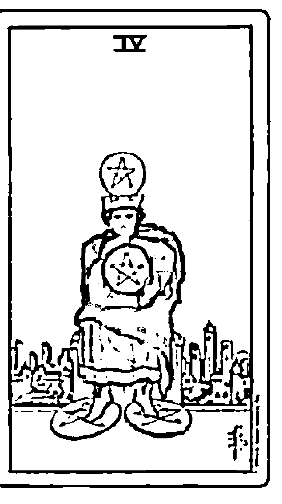

象徵圖象：
開店的人、商人
金幣在腳底下
金幣在皇冠上
兩手抱住金幣
背景有一個大城市，皇冠上面有城垛
數字和元素

意義：
興趣限制在物質的東西
在堅固的基礎上建立
戴上寶石而變得不能動
緊抓不放，繞圈子
這個性向是來自城市的生活
執著於（4）物質的價值（地）

## 金幣四——作為一張牌或是在其他的牌陣裡

#### 一般性的意義：

金幣四指出特別渴望安全，它通常警告著太狹窄和過份小心的態度。當我們變得過份小心或是屈服於貪婪，它可能會導致不活動。而且，它常常到後來會變成走到塔（The Tower）這張牌的初步階段，在此「塔」象徵著我們所強烈執著的東西的瓦解。

#### 工作領域：

你過度小心，想要排除每一個可能的冒險。但是當你這樣做的時候，你可能會進入一種完全不動的狀態。問一下牌，看看將你的全神貫注在絕對的安全是否真的聰明。

#### 愛的方面：

你力求避開犯錯，尤其不想要被任何人所騙。也許過去不好的經驗是你變得小心的原因，然而，你必須提醒你自己，愛和快樂只能在自由的氣氛之下開展，它需要某種程度的冒險。

## 金幣四在愛的神諭牌陣裡

### 位置 1 - 它是怎麼樣

那個問題是一個重大的關係，但不是一個很好的關係。它看起來好像是你們互相執著於對方，因此排除了任何其他的發展，所以你們的互相在一起已經變得沒有感覺。

### 位置 2 - 什麼東西從內在推著你

你是過份小心的，但是如果你要求太多的保證，你的愛將會陷入危險。那個愛將會從你的關係中被掃除——跟著你的快樂一起被掃除。剩下來的就只是那些沒有彈性的規則和約定，那些東西在目前似乎可以發揮作用，但是久而久之將會使關係窒息。

### 位置 3 - 對方對你的態度

你所面對的人也許是吝嗇的，或是一直想要停留在安全的那一面，甚至在屬於心的方面也力求安全。它也可能是他或她只是想從你這裡得到什麼，而不打算給出什麼。如果你真的想要能夠讓他或她鬆開來，你一定需要很多微妙的技巧、幽默、和耐心。

### 位置 4 - 神諭對你的忠告

必須很小心，不要作出任何不成熟的決定，它們到了最後將會危及你的關係。即使一些預防措施似乎限制了你，你也必須盡你的力量來維持你的關係，使它變得更穩定。

## 金幣四在指南針牌陣裡

#### 位置 1 — 它是怎麼樣

它是關於一個危機，或是一個計劃，它的財務情況尚未明朗，或者只是一件基礎不穩的事。

#### 位置 2 — 它就是這樣開始的

在開始的時候，每一樣東西似乎都匱乏，那個情況的確很慘。也許是真的缺錢，或者是某一件事的基礎不穩。如果位置 4 的那張牌預測著會有成功，那麼即使這個展望看起來是陰鬱的，你也可以走這條路。你必須要有毅力度過難關。

#### 位置 3 — 反應

你周遭的人處於一個困難的情況，也許是你帶走他們的某些東西，或者是你所碰到的那個人是缺乏資源或財務困難的。

#### 位置 4 — 它將會引導到哪裡

如果你不是一個拒絕物質享受的和尚，你將會不滿意這個情況。到了最後，你將會發覺你自己處於一種可憐的狀態，你的口袋空空的。你也許失去很多，但是什麼也沒得到。

## 金幣四在盲點牌陣裡

#### 位置 1 — 每一個人都知道的

你發覺你自己處於一種存在性的危機，或是財務上的瓶頸，或是因爲其他的原因使得目前的情況變得很慘。

#### 位置 2 — 盲點

別人看到你的貧窮，或是你站在一個搖晃的基礎上。就盲點而言，這可能意味著你在假裝有錢，或是你低估了某種危險而去冒險。

#### 位置 3 — 你如何看你自己

你遭受了一個很大的損失，使你陷入危機當中，內在和外在的東西都被剝奪了。

#### 位置 4 — 很大的未知

在你的內在深處有一種根深蒂固的對貧窮的害怕，即使情況可以過得去，你的害怕還是存在。這個內在的焦慮可能會使你變得過度小心，而讓你放棄很多有價值的經驗。試著掌握這些恐懼，跨過你內在的門檻，以便追求生命的喜悅。

## 金幣五（Five of Pentacles）

## 窮困

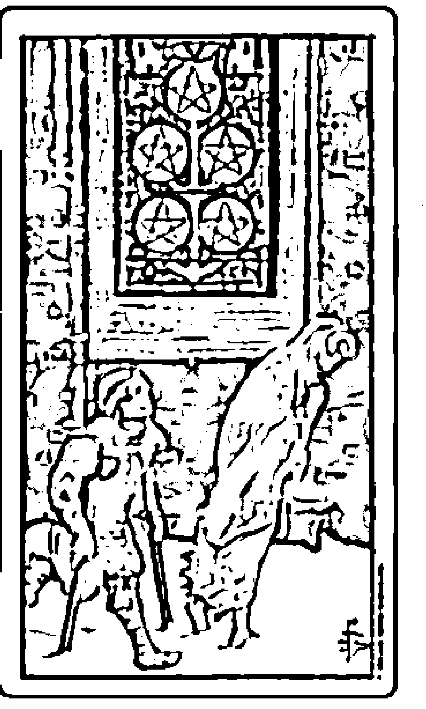

象徵圖象：
乞丐
拐杖
在教堂窗户的外面
雪
數字和元素

意義：
貧窮、匱乏
殘障、艱辛
被排除在外、被剝奪
寒冷、鬱悶
存在性的（地）危機（5）

## 金幣五——作為一張牌或是在其他的牌陣裡

#### 一般性的意義：

金幣五指出匱乏、被剝奪、和存在性的悲慘。然而這張牌並不是意味著必然會有財務上的損失，它只是指出一個更困難的時期，一個乾旱，或是一個必須被跨過的不穩定的區域。

#### 工作領域：

事情似乎很困難，而且短期內不可能改變。要降低你的需求和期望，好好地保有你的錢，不要冒任何險。振作起你自己，以便應付長期的匱乏。

#### 愛的方面：

在目前什麼都缺乏，你覺得不安全、被排除在外、孤獨、不被愛，你的心情是憂鬱的。

## 金幣五在愛的神諭牌陣裡

#### 位置 1 — 它是怎麼樣

因為外在環境的因素，所以可能你的關係被縮減到最小量的，或是你關係的基礎正在倒塌。然而它有時候也可能意味著外在的壓力或困難強化了兩個人的結合。

#### 位置 2 — 什麼東西從內在推著你

在這個關係裡，你覺得有什麼東西被剝奪了。也許你所得到的不夠，或者不論你得到多少，你都無法滿足，或者你覺得你是沒有吸引力的，同時在懷疑你有沒有足夠的東西可以提供給你的伴侶。

#### 位置 3 — 對方對你的態度

你所面對的人正在經歷一個危機，覺得不安全，和被忽視——也許是被你。或者他或她害怕無法跟得上你。

#### 位置 4 — 神諭對你的忠告

你可以表現出你覺得沒有被愛，或是受到太少的注意。或是講清楚你有一些困難，你正在經歷一個危機。不要只是由你自己來克服，你可以請求幫助。

## 金幣五在指南針牌陣裡

#### 位置 1 — 它是怎麼樣

它是關於一個危機，或是一個計劃，它的財務情況尚未明朗，或者只是一件基礎不穩的事。

#### 位置 2 — 它就是這樣開始的

在開始的時候，每一樣東西似乎都匱乏，那個情況的確很慘。也許是真的缺錢，或者是某一件事的基礎不穩。如果位置 4 的那張牌預測著會有成功，那麼即使這個展望看起來是陰鬱的，你也可以走這條路。你必須要有毅力度過難關。

#### 位置 3 — 反應

你周遭的人處於一個困難的情況，也許是你帶走他們的某些東西，或者是你所碰到的那個人是缺乏資源或財務困難的。

#### 位置 4 — 它將會引導到哪裡

如果你不是一個拒絕物質享受的和尚，你將會不滿意這個情況。到了最後，你將會發覺你自己處於一種可憐的狀態，你的口袋空空的。你也許失去很多，但是什麼也沒得到。

## 金幣五在盲點牌陣裡

#### 位置 1 — 每一個人都知道的

你發覺你自己處於一種存在性的危機，或是財務上的瓶頸，或是因爲其他的原因使得目前的情況變得很慘。

#### 位置 2 — 盲點

別人看到你的貧窮，或是你站在一個搖晃的基礎上。就盲點而言，這可能意味著你在假裝有錢，或是你低估了某種危險而去冒險。

#### 位置 3 — 你如何看你自己

你遭受了一個很大的損失，使你陷入危機當中，內在和外在的東西都被剝奪了。

#### 位置 4 — 很大的未知

在你的內在深處有一種根深蒂固的對貧窮的害怕，即使情況可以過得去，你的害怕還是存在。這個內在的焦慮可能會使你變得過度小心，而讓你放棄很多有價值的經驗。試著掌握這些恐懼，跨過你內在的門檻，以便追求生命的喜悅。

## 金幣六（Six of Pentacles）

## 慷慨

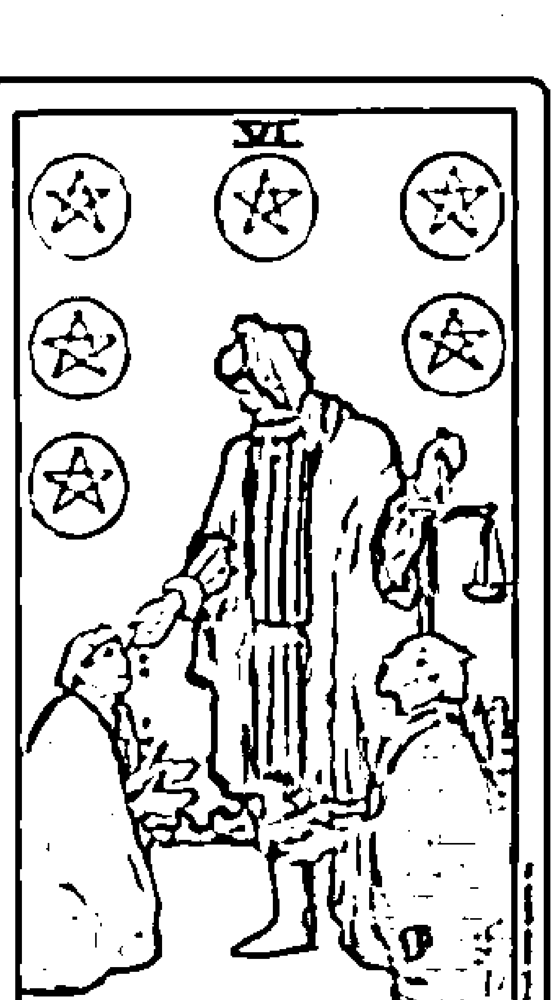

象徵圖象：
商人的姿勢
天平在左手
乞丐的姿勢
數字和元素

意義：
慷慨
給和取的平衡
優雅地願意接受幫助
具體的（地）幫助（6）

## 金幣六——作為一張牌或是在其他的牌陣裡

#### 一般性的意義：

金幣六指出有幫助的支持，慷慨，和比較廣義的，寬容。然而這張牌並沒有真正指出發問者是站在哪一邊——他或她是給予者或接受者。此外，這張牌可以指出某件事物是值得的，或者將會有什麼東西給發問者。

#### 工作領域：

你所計劃的將會得到報酬，供給和需求處於正確的平衡。要慷慨和寬容，在你需要支持的時候要讓別人來支持你。

#### 愛的方面：

再來將會有好時光，你將會覺得有接受性，因為你的愛充滿著慷慨、仁慈、和慈悲。

## 金幣六在愛的神諭牌陣裡

#### 位置 1 — 它是怎麼樣

你的關係具有寬容和慈悲的色彩，同時你們具有一種愛的了解和接受別人的差異。你所給予的和你所得到的是一個很好的平衡，你們互相支持、互相幫助。

#### 位置 2 — 什麼東西從內在推著你

也許是你本身希望有一些幫助和支持，或者你想要以某種方式幫助你的伴侶。如果你們之間有衝突，你必須主動提出優惠的解決方案。

#### 位置 3 — 對方對你的態度

你所面對的人是慷慨的、仁慈的，同時會想要幫助你。或者他或她處於一種困難的情況，而將會很高興得到你的幫助？

#### 位置 4 — 神諭對你的忠告

要慷慨和仁慈。如果它跟解決一個衝突有關，那麼你要放輕鬆，但是如果你發覺你自己處於危機之中，那麼你要要求幫助，同時感激地接受。

## 金幣六在指南針牌陣裡

#### 位置 1 — 它是怎麼樣

它是關於幫助某人，或者，比較一般的說法，是關於一個慷慨的行爲。它也可能跟一件事有關，在那裡面你可以得到周遭的幫助。

#### 位置 2 — 它就是這樣開始的

在開始的時候，每一件事都進行得很好，你得到了幫助，你了解人們願意幫助你。或者你本身是快樂和慷慨的施主。

#### 位置 3 — 反應

你的周遭是仁慈的、支持的，別人對你或對你的作法的反應是慷慨地幫助。如果你本身採取慷慨的態度，你將會碰到一些人，他們可以使用你的支持，而且會對你的幫助覺得很感激。

#### 位置 4 — 它將會引導到哪裡

這條路是值得走的，到了最後將會來到一個慷慨的解決，你將會覺得你接收到很多，而且也貢獻出你的部分。

## 金幣六在盲點牌陣裡

#### 位置 1 — 每一個人都知道的

你也許是一個慷慨的人，你享受著支持和幫助別人，或者你處於一個情況，在那個情況下你從別人那裡接收到仁慈的支持，那對你是很受用的。

#### 位置 2 — 盲點

是不是別人經驗到你的慷慨，同時覺得很感激，但是你本身並不知道？如果不是這樣的話，這張牌指出別人願意幫助和支持你，但是到目前為止你還沒有接受他們所提供的。

#### 位置 3 — 你如何看你自己

你認爲你自己是一個慷慨和寬容的人，你願意給予，也願意接受。

#### 位置 4 — 很大的未知

因爲這張牌所顯示的並不是很清楚，所以有兩個未知的面必須加以探討。在一方面，它可能是你不懂得慷慨和支持，所以你不知道藉著幫助別人可以得到快樂。或者你對於接受別人的幫助覺得有困難，所以當你處於困境的時候無法讓別人來幫助你。

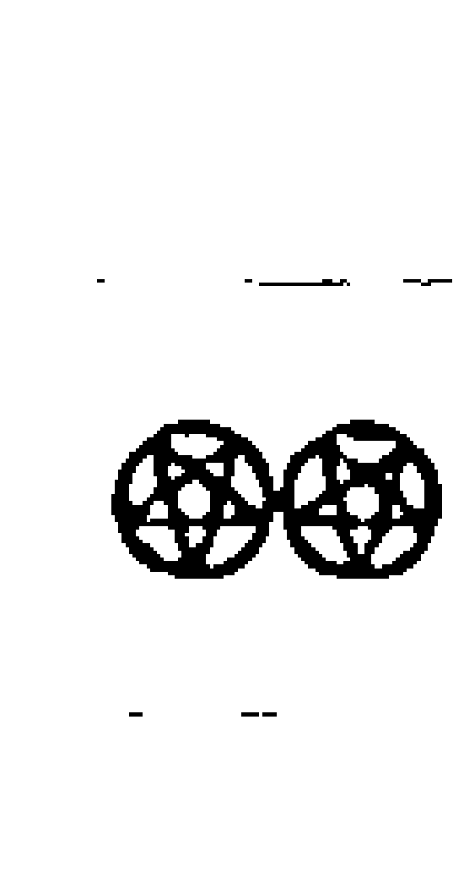

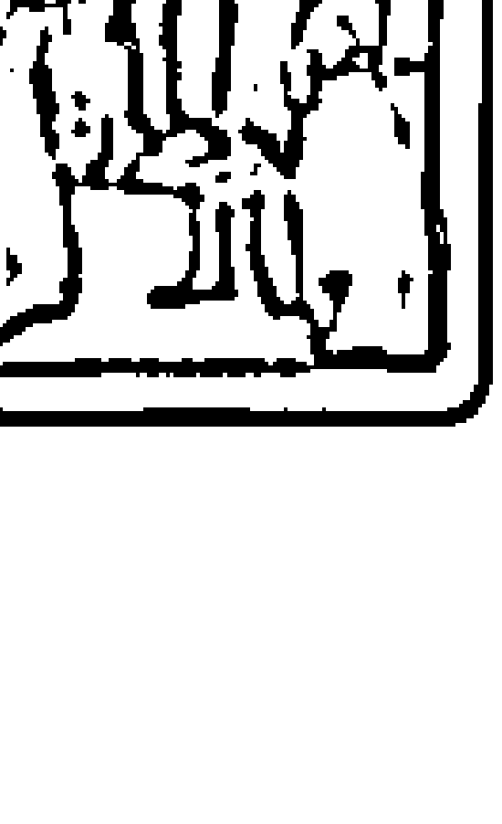

获取更多好书，请加微信号：strcdts	店铺：http://strc.cr.cx

## 金幣七（Seven of Pentacles）

## 考驗耐心

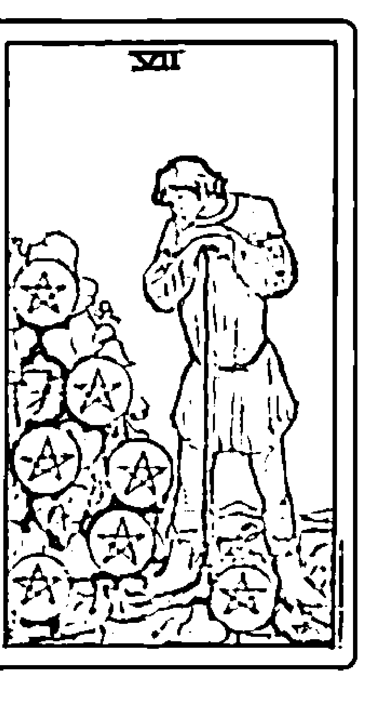

象徵圖象：
人
姿勢
樹叢裡面有很多金幣
數字和元素

意義：
園丁
觀察和等待
成熟的果實
因爲持續太久所造成的（地）危機（7）

## 金幣七——作為一張牌或是在其他的牌陣裡

#### 一般性的意義：

一個人是否喜歡金幣七要依他的個性而定。這張牌指出考驗耐心，它同時承諾事情將會有好的結果，如果你給它足夠的時間去發展的話。然而在另外一方面，沒有耐心和匆忙可能會造成很大的傷害。

#### 工作領域：

要力求穩定！不要倉促行事，否則你可能會欲速則不達而造成犧牲掉將來可能會出現的好結果。你的職業生涯正面臨一個必須花時間來徹底醞釀事情的階段。

#### 愛的方面：

「好事多磨」是你愛情生活的一句箴言。當你被迫等待的時候，你是否受到沒有耐心的折磨，或是你可以很放鬆地觀察著果實慢慢成長，這要依你的個性而定。

## 金幣七在愛的神諭牌陣裡

#### 位置 1 — 它是怎麼樣

你的關係就好像樹木一樣在成長，雖然很慢，但是很確定，所以那個情況是好的，可能你想要快一點達成某些事情，但是你必須學習有耐心。有時候這張牌也意味著某種東西慢慢在你們的關係中成長，比方說小孩。

#### 位置 2 — 什麼東西從內在推著你

你想要慢慢來，不要催促事情。你想要你的愛情不要有任何外在壓力地成長和成熟。或者你想要有小孩？

#### 位置 3 — 對方對你的態度

你所面對的是一個有耐心的人。他或她將會耐心地等待，而不會在事情還沒有成熟的時候就採取行動。然而如果對你來講，那個時間實在太長了，那麼你必須採取主動去接近他或她，不管這樣做是不是很好。

#### 位置 4 — 神諭對你的忠告

每一件事都有它自己的步調。要有耐心，即使它對你來講是困難的。讓時間來為你和你的關係工作。如果你稍微收斂一下你的期望和主動，你將不會後悔。

## 金幣七在指南針牌陣裡

#### 位置 1 — 它是怎麼樣

那個問題可能是耐心的考驗，或者至少是一個計劃，它需要很多時間才能夠產生出結果。

#### 位置 2 — 它就是這樣開始的

在開始的時候，事情進行得比較慢，目前可能沒有辦法做什麼，只能等待。如果你從一開始就有足夠的愛和耐心，那麼將會有很好的機會，漂亮的果實將會成熟，假以時日，你的計劃將會有很好的發展。

#### 位置 3 — 反應

你的周遭是有耐心的。你將會碰到一些人，他們將會對你的刺激有反應，但是要到他們能夠真正這樣做可能需要一些時間。不要試圖催促任何事，因爲那只會破壞事情。

#### 位置 4 — 它將會引導到哪裡

到了最後，你會被要求要有耐心，也許是要有很大的耐心。如果你準備這樣做，那麼結果一定不會令你失望。如果你沒有足夠的時間，或者是一個沒有耐心的人，那麼你可能必須去找其他的路。

## 金幣七在盲點牌陣裡

#### 位置 1 — 每一個人都知道的

在目前，你需要有很多的耐心。如果你的本性不是一個很有耐心的人，那麼這個情況對你來講將會是一個嚴格的考驗，可能會使你受苦。

#### 位置 2 — 盲點

別人認爲你必須等待，你生命中某些事情的發展必須花比你所喜歡的更多的時間。如果你的自我形象和位置 3 的牌跟這個非常不同，那麼你必須跟別人談一談這個問題，否則你會因爲沒有耐心和倉促行事而犯下錯誤。

#### 位置 3 — 你如何看你自己

比喻來說，你認爲你自己是一個用功的園丁，你很注意，而且有足夠的耐心，能夠讓事情以它們自己的步調成長。

#### 位置 4 — 很大的未知

在內在深處，你非常寬容，而且有耐心。只要你保持不知道你的這一面，它將會以矛盾的方式顯現出來，有時候你可能會背負了很多的重擔而受苦卻不知道是爲了什麼。在另外的情況下，你可能會因爲一些小事而發脾氣。仔細看一下你這個隱藏的部分。如果你能夠有意識地去處理它，你將會變得更平衡、更鎮靜。

## 金幣八（Eight of Pentacles）

## 幸運的開始

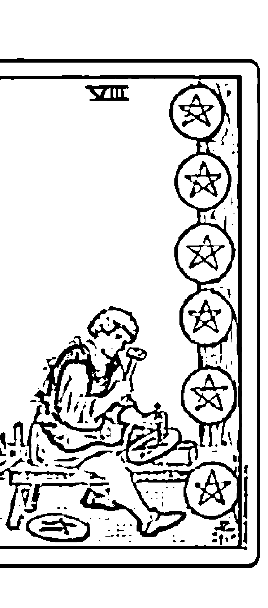

象徵圖象：
人=學徒
態度
一排金幣
數字和元素

意義：
一個計劃好的開始，將會有很好的發展
享受工作
一種建築的職業
具體的（地）新開始（8）

## 金幣八——作為一張牌或是在其他的牌陣裡

#### 一般性的意義：

金幣八指出一個經過思考的、有計劃的、新的開始，它能夠使你快樂。如果你充分投入，那麼你的計劃將會有很好的發展，不久之後就會建立起很好的基礎和結果。

#### 工作領域：

進入一個新的任務，開始建立起一些什麼，或者開始一項新的計劃，即使它是一個你所不熟悉的領域，而你必須一步一步地去經驗它。你將會很享受，而且會成功。

#### 愛的方面：

你在愛情方面的進展仍然很小。也許你才剛開始，或者你正在努力，不管怎麼說，你的努力將會有好的結果。

## 金幣八在愛的神諭牌陣裡

#### 位置 1 — 它是怎麼樣

你的愛才剛開始不久，或者你想在一個既有的關係裡從事新的路線，不管怎麼說，那個展望是好的。

#### 位置 2 — 什麼東西從內在推著你

你想要重新開始，那可能意味著你剛墜入情網，想要建立起一個好的關係，或者你想要在舊有的關係裡作另外的嘗試——也許是在碰到一些困難之後。

#### 位置 3 — 對方對你的態度

你所面對的人準備建立起一個新的關係，而且真的想投入。然而這張牌也可能指出，你仍然是一個沒有經驗的人，需要在這些事情上面得到一些引導。

#### 位置 4 — 神諭對你的忠告

相信新的開始的可能性，相信事情久而久之將會成功——如果你真正投入的話。

## 金幣八在指南針牌陣裡

#### 位置 1 — 它是怎麼樣

它是關於一個很篤定地投入一個新的開始，建立起某一件事，或是開始從事一條新的路線，它將會引導到好的結果，雖然可能慢一點，但是是確定的。

#### 位置 2 — 它就是這樣開始的

在開始的時候，你打從內心完全投入，你覺得很高興有新的開始，你期待著不久之後能夠完成你的第一項成就。

#### 位置 3 — 反應

對周遭來講，你的做法是新的，但是人們願意作一些練習來適應你的模式。別人很樂於學習一些新的事情。如果你在尋求幫助或支持，你很容易就可以得到，然而你所面對的人可能有一些笨拙，因為他並不是專家。

#### 位置 4 — 它將會引導到哪裡

那個結果是很不錯的，但是它可能不見得完全跟你的期待吻合。到了最後，你是一個業餘的，而不是一個職業的，你重新開始一件事。然而，如果你能夠很高興、很勤奮地工作，那個展望是好的。

## 金幣八在盲點牌陣裡

#### 位置 1 — 每一個人都知道的

你基本上是喜歡學習的，你很享受新的開始，如果那個成功的機率很高的話。或者你還在面臨一個新的開始，同時帶著很高的期望。

#### 位置 2 — 盲點

別人可能了解到你剛開始從事一些新的計劃。如果是這樣的話，那麼你自己卻昧於這個事實，這是令人驚訝的，它很可能是別人認爲你很勤奮，但畢竟是一個新手，然而你覺得你已經具有滿高的成熟度。

#### 位置 3 — 你如何看你自己

你知道你正在面對一個新的開始，你認爲它是很有前途的。檢視一下位置 2 的那張牌，看看別人是否持同樣的意見，或者他們對你的看法和評估是非常不同的。

#### 位置 4 — 很大的未知

有一個學徒隱藏在你的無意識深處，你很喜歡學新的東西。只要你不熟悉你的這一面，你在面對新的事情的時候可能會不敢大膽去做，或者乾脆相信你已經知道它了。

## 金幣九（Nine of Pentacles）

## 吉祥的片刻

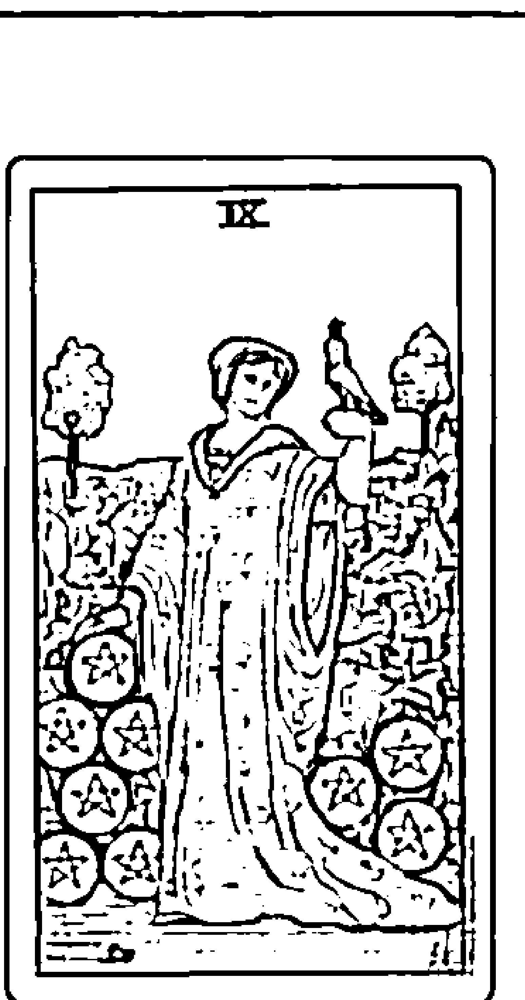

象徵圖象：
穿著很好的人在一個茂盛的花園裡
女人
葡萄藤
有一隻鷹棲息在手上
一隻蝸牛在前景的左下方
數字和元素

意義：
財富

準備反應
生命的喜悅
適時的停留
神秘的象徵＝內在的財富
集中精神（9）在價值（地）

## 金幣九——作為一張牌或是在其他的牌陣裡

#### 一般性的意義：

金幣九是一張古典的幸運牌，它通常被解釋為財務上的成功，但是它也代表一個驚喜，一個突如其來的幸運，或是在正當時機抓住機會的能力，並儘量做好它。前景的蝸牛暗示著它不只是關於物質的財富。

#### 工作領域：

抓住機會，真正進入它，將你所有的賭注都放在勝利上，即使那個結果似乎是不確定的，所以那個賭注是一個冒險。現在是正當的時機，你可以做好這些事情，儘量做好它，你將會有驚喜。

#### 愛的方面：

你處於幸運的階段，也許你正要墜入情網，或者在你的愛情生活當中有驚喜，有一個非常愉快的發展。

## 金幣九在愛的神諭牌陣裡

#### 位置 1 — 它是怎麼樣

你的關係是一個幸運，它也許是不知道為什麼就變成這樣，或者它突然變好，或者有某件事發生，它自然地有助於這個關係。

#### 位置 2 — 什麼東西從內在推著你

你想要找到快樂，或是想要利用一個機會，你覺得這是一個好的時機。

#### 位置 3 — 對方對你的態度

你所面對的人認爲你很幸運，如果他或她沒有已經這樣做，他或她一定很快就會想要贏得你。

#### 位置 4 — 神諭對你的忠告

了解你現在正處於幸運的階段，在這個時候可以在你的關係中注入很多可以促進它的刺激，或是做些什麼使它變得更好。你可以提出讓他或她驚喜的提議，或者如果你的關係正在經歷一個困難的時期，那麼你可以利用這個幸運的時機來注入新的正向的能量。

## 金幣九在指南針牌陣裡

#### 位置 1 — 它是怎麼樣

它是關於一個好的機會，或是一個意外的成功，或者只是一件有很好的前景的事。

#### 位置 2 — 它就是這樣開始的

你想要下賭，得大獎，快速賺錢，或是在其他方面試你的運氣。不管怎麼說，你想要抓住當時的機會。位置 4 的牌將能夠顯示出你是否能夠信任你的感覺，或者你的計劃到了最後將會失敗。

#### 位置 3 — 反應

你的周遭認爲你或是你所做的事是一個驚喜，一定會有好的結果，所以你可以指望他們會有正向的回饋和很多支持。

#### 位置 4 — 它將會引導到哪裡

你是幸運的，你必須走這條路，因爲它將不會使你失望，即使你在前面所抽到的牌並不是你真正想要的。感謝這個正向的轉變，到了最後，你將會是一個幸運的勝利者。

## 金幣九在盲點牌陣裡

#### 位置 1 — 每一個人都知道的

你是一個幸運的人，你一直都能夠達到目的。這張牌也許指出你正在經歷一個幸運的階段，在這個時候你可以經驗到內在和外在的成長。

#### 位置 2 — 盲點

別人認爲你是幸運的，或者你突然走運，你應該儘量利用這個機會。如果你沒有這樣的感覺，你必須找人談一談，才不會失去好的機會。

#### 位置 3 — 你如何看你自己

你相信你的手氣很好，你一直都會在勝利的隊伍上。也許那就是爲什麼你全部都賭在一張牌裡，希望會有幸運的發展。檢視一下位置 2 的牌，看看別人如何來看待你的情況。如果那張牌是一張有問題的牌，那麼你就必須質疑你的樂觀。

#### 位置 4 — 很大的未知

在你的內在深處，有一個幸運的仙子等著被發現。只要她仍然不被你所知，她將無法對你的幸運作出貢獻，或是使你忽略掉一些機會，或者甚至會誘惑你在錯誤的時機賭下一切，來吸引你的注意，所以，去找尋這個隱藏的內在力量是非常有幫助的。

## 金幣十（Ten of Pentacles）

## 財富

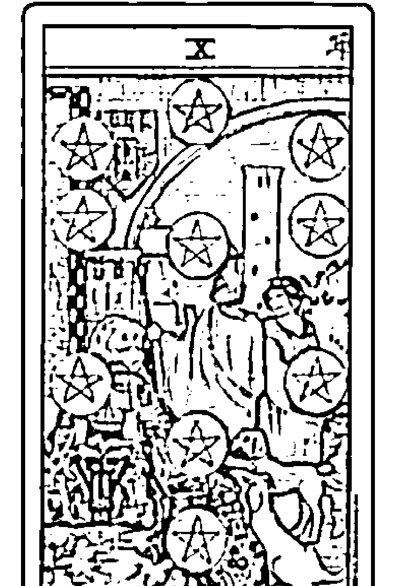

象徵圖象：
貴族的大宅院
金幣形成卡巴拉的生命樹
兩個人擦肩而過
兩隻狗
葡萄藤
老年人隱藏在葡萄藤裡
數字和元素

意義：
外在的財富
內在的財富
短暫的、匆忙的
有幫助的本能的聲音
好的生活
某種隱藏的的東西，雖然很接近，但是很容易被忽略
很多的（10）安全和穩定（金幣）

## 金幣十——作為一張牌或是在其他的牌陣裡

#### 一般性的意義：

金幣十指出外在的財富、安全、和穩定，但是它也顯示出，如果我們對周遭的事物睜開我們的眼睛，我們也可以找到內在的財富，但是我們很容易在匆忙之中忽略了它。

#### 工作領域：

好的時光將會來臨，或者至少你正在進入一個富有的、穩固的階段，在你裡面是豐富的，而且很有安全感。也許你發現了你一再一再地忽視的東西，但是現在它被證明是非常有幫助的。

#### 愛的方面：

享受愛的女神所降臨到你身上的財富，睜開眼睛來看那些隱藏的價值和你所忽視的東西。

## 金幣十在愛的神諭牌陣裡

#### 位置 1 — 它是怎麼樣

你的關係正在蓬勃發展，同時展現出它內在的豐富，如果你只看到外在的財富，那是一種羞恥。

#### 位置 2 — 什麼東西從內在推著你

你確認你關係的豐富和穩定，你想要在它裡面加進一些新的層面和新的經驗，或是揭開一些到目前為止還隱藏著的東西。

#### 位置 3 — 對方對你的態度

你所面對的人對你有很高的敬意，他知道你的價值，而且也知道你如何能夠豐富他或她的生命。

#### 位置 4 — 神諭對你的忠告

信任你關係的穩定，你本身也必須在它上面下功夫，睜開你的眼睛來看那些你到目前為止所忽略的寶貴細節。

## 金幣十在指南針牌陣裡

#### 位置 1 — 它是怎麼樣

它是關於安全和財富，也許那只是意味著很多錢，或者你睜開眼睛去看那些你以前所忽略的價值。

#### 位置 2 — 它就是這樣開始的

在開始的時候，每一件事都很完美，不論是安全、金錢、或豐富的經驗樣樣都不缺。在位置 4 的那張牌可以告訴你，這個情況是不是能夠保持到最後，或者在途中就變卦了。

#### 位置 3 — 反應

你周遭的人是富有的，而且覺得很安全。周遭的人也許覺得你的做法能夠使他們變得更豐富，或者他們覺得一點也不被吸引。如果你想要贏得某人，你將必須用比較特別的方法，也許你可以吸引對方到他或她所忽略的東西上面。

#### 位置 4 — 它將會引導到哪裡

這條路很棒，它會引導到一個的確很有助益的經驗、穩定、和財富。到了最後，你將會覺得很富有，而且很安全。

## 金幣十在盲點牌陣裡

#### 位置 1 — 每一個人都知道的

你也許是一個富有的人，生命當中充滿著有趣的經驗，或者你目前處於一個有錢且安全的情況。

#### 位置 2 — 盲點

即使你是富有的，但是你很明顯地忽略了一些層面和機會，它們能夠使你有更深和更豐富的經驗。

#### 位置 3 — 你如何看你自己

你覺得你在生命中得到很多，你有覺知到你的財富，或者你正好在尋求一些你所忽視的有價值的經驗。

#### 位置 4 — 很大的未知

你對「生命是豐富的」的感覺隱藏在你的內在深處，這意味著，儘管有外在的財富，你還是無法覺得滿足或豐富，或者你並不會尋求穩定和安全。

## 金幣侍衛（Page of Pentacles）

## 具體的提議

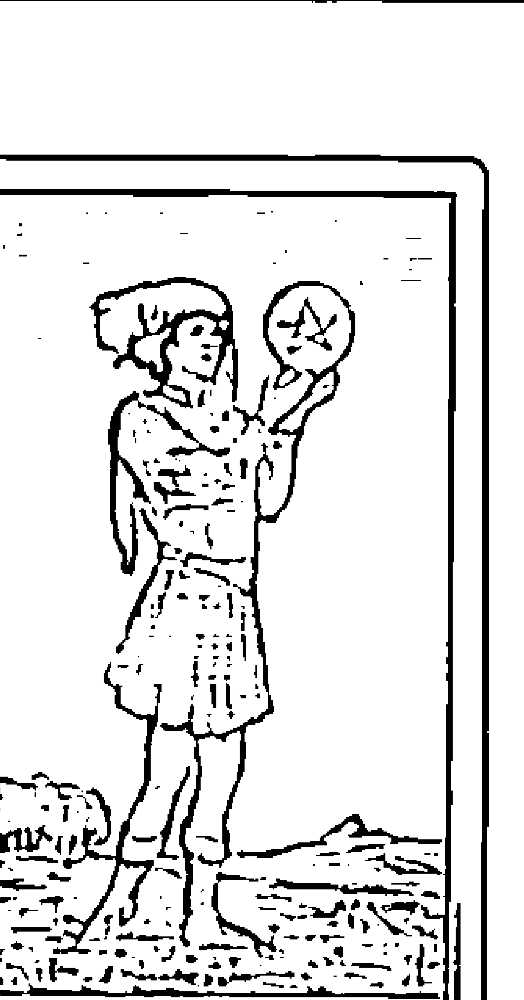

象徵圖象：
侍衛（小兵）
姿勢
金幣
綠色的大自然
人物和元素

意義：
刺激者
敞開、提供
具體的價值
肥沃
有價值的衝動（地）的遞送者（侍衛）

## 金幣侍衛——作為一張牌或是在其他的牌陣裡

#### 一般性的意義：

侍衛代表來自外在世界的機會，提供給發問者。金幣侍衛告訴你，有一個具體的提議是可以期待的。也許它是一個可以賺錢的機會，或是其他實際的獲利和有用的訊息。

#### 工作領域：

眼睛保持睜開，因爲有一個很好的機會正在來臨，你不要錯過。你也許會接收到主動的支持，或是某人會做出一個很好的提議，也許有一個好的賺錢可能性。

#### 愛的方面：

要對機會敞開，或是接受某人的提議，他們背後的動機是好的，而且它將會被證明是具體可行的。

## 金幣侍衛在愛的神諭牌陣裡

#### 位置 1 — 它是怎麼樣

由於有來自內心的刺激，或是有幫助的提議，所以你的關係接收到新的能量和可能性。

#### 位置 2 — 什麼東西從內在推著你

你在等待別人來接近你，或提出一個具體的提議，一個值得你期待的提議。

#### 位置 3 — 對方對你的態度

你所面對的人會等待別人來主動，他或她期待來自你的刺激或發動，或者至少他或她對這些舉動是敞開的。然而，你的提議必須是深思熟慮的、具體的。

#### 位置 4 — 神諭對你的忠告

要保持敞開，看看會有什麼事情發生，有人將會做出一個很好的提議，你必須接受而且加以執行。

## 金幣侍衛在指南針牌陣裡

#### 位置 1 — 它是怎麼樣

它關係到一個具體的提議，一個的確很好的機會——也許是一個賺錢的機會，或是可以增加你的安全，豐富你的經驗的機會。

#### 位置 2 — 它就是這樣開始的

在開始的時候，你接收到某種具體的支持，它可能是直接的或財務上的，或是某人提出一個具體的提議是你無法拒絕的。

#### 位置 3 — 反應

對方的反應有一點遲疑，但是對真實和有用的提議敞開，也許一個人只是在期待你的錢。如果你提出一個具體的提議，人們將會感謝而願意接受。然而，如果你的提議只是一個空中樓閣，對方將不會有興趣。

#### 位置 4 — 它將會引導到哪裡

到了最後，你將會從你的周遭得到很好的東西或真正的支持，也許甚至是實際上的金錢。這是否足夠讓你達到目標是未知的，就這個問題而言，位置 2 和位置 3 出現好牌是很重要的。

## 金幣侍衛在盲點牌陣裡

#### 位置 1 — 每一個人都知道的

很明顯地，你一直都是一個捷足先登的人，你一再一再地碰到好機會，同時知道如何善用每一個機會，或者至少你目前正在期待某人——或現實生活上——會提供給你一個具體的提議。

#### 位置 2 — 盲點

別人了解到你經常有好的機會，甚至得到具體的提議。因爲這是你的盲點，所以你似乎忽略了這些機會，或者你太驕傲了而不讓別人幫助你。

#### 位置 3 — 你如何看你自己

你知道你一直都對賺錢的好機會敞開，或者至少你目前正在期待某人——或現實生活上——會提供給你一個具體的提議。

#### 位置 4 — 很大的未知

在內在深處有一股力量在使你等待和發現好的機會，然後從它做出最好的。只要這個部分仍然停留在你的無意識裡，你將會錯過一些機會或甚至爲了生命的不公平而苦惱。

## 金幣騎士（Knight of Pentacles）

## 穩定與安全

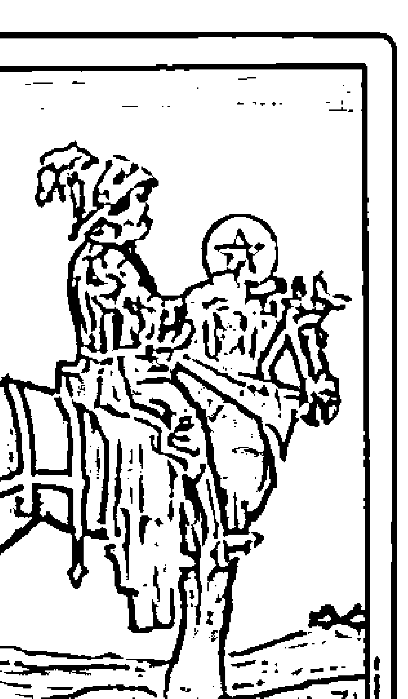

象徵圖象：
騎士
金幣
黑色的馬
姿勢
棕色的土
人物和元素

意義：
力量、堅定不移
安全
力量和活力
穩固、頑固
穩定、多產
堅定的勤奮（地）氣氛的代表（騎士）

## 金幣騎士——作為一張牌或是在其他的牌陣裡

#### 一般性的意義：

騎士代表一種氣氛，金幣騎士基本上象徵著一種勤奮的氣氛，以及一種安全和穩固的狀態，但同時也是一種對熟悉的東西的執著，甚至傾向於頑固。

#### 工作領域：

現在它是關於真正穩定一個基礎以及強化一個人到目前為止所達成的。展現出你的可靠，和具有品質的眼光，並享受建立專業的和持久的價值。

#### 愛的方面：

你不喜歡冒險的計劃。在你的愛情生活裡，你喜歡一個穩定的基礎和健康的氣氛，使那個關係得以持續，同時能夠互相信任。

## 金幣騎士在愛的神諭牌陣裡

#### 位置 1 — 它是怎麼樣

這張牌指出會有穩定和肥沃的地基，讓你的關係能夠成長。有時候這張牌也暗示著，在一個關係的日常生活裡，如果每天都是例行公事而沒有什麼變化，日子可能會變得有一點無聊。

#### 位置 2 — 什麼東西從內在推著你

你傾向於喜歡安全和穩定。你想要強化和穩定你關係的基礎，並創造出一個持久的結合基礎或是一個家庭。

#### 位置 3 — 對方對你的態度

你所面對的人是一個喜歡承諾的人，他不喜歡玩遊戲或非正式的風流韻事。他或她喜歡互相忠貞的穩定關係。如果你也是散發出這樣的氣氛，那麼你是適合他或她的。

#### 位置 4 — 神諭對你的忠告

做一些事來加強你對關係的承諾、信任、和親密。對你們的忠貞不要有任何懷疑。創造出一個可以享受感官歡愉和在一起的喜悅氣氛。

## 金幣騎士在指南針牌陣裡

位置 1 — 它是怎麼樣  
你在處理一件獲利的、專業的、和具體的事，或是一個可以帶來安全和持久的計劃。

位置 2 — 它就是這樣開始的  
那個開始是很紮實的，但是很可能會涉及很多困難的工作。此外，在開始的時候可能沒有很多的發生，因為在此的成長是緩慢的，雖然是確定的。

位置 3 — 反應  
周遭的人是有能力的、勤奮的，而且非常務實。你所面對的人是可靠的、穩定的，但是也許有一點頑固。如果你需要合作、幫助、或支持，你不可以太倉促行事，而要穩定地試圖贏得他們的信任。

位置 4 — 它將會引導到哪裡  
到了最後，你試圖營造出一個好的工作可以穩定，而且可以達成有價值的成果的氣氛。你將會在健康的氣氛之下覺得安全，而且能夠深入到事情的根部。

## 金幣騎士在盲點牌陣裡

位置 1 — 每一個人都知道的  
你是勤奮的、可靠的，不會到處漂泊。你很清楚什麼事是可以做的，所以別人自然不會向你提出不真實的計劃或野心太大的目標。

位置 2 — 盲點  
別人看到了你穩固和務實的一面，因為這是你的盲點，所以別人可能會認為你是頑固的，或是太固定在你的方式裡。

位置 3 — 你如何看你自己  
你知道你是很實際的，而且是很穩定的，你比較喜歡追求經過認可的價值和持久的成就，而不喜歡追求短暫的利益。

位置 4 — 很大的未知  
在內在深處，你有非常穩固和保守的一面，只要它藏在你的無意識裡，它將會形成一個奇怪的煞車，使你生活上的很多事情都慢下來，造成不舒服，或者你會讓別人覺得很頑固。你越是能夠了解你的這一面，你就越能夠發展出它的正向面而創造出一個穩固和舒適的氣氛。

## 金幣皇后（Queen of Pentacles）

## 踏實

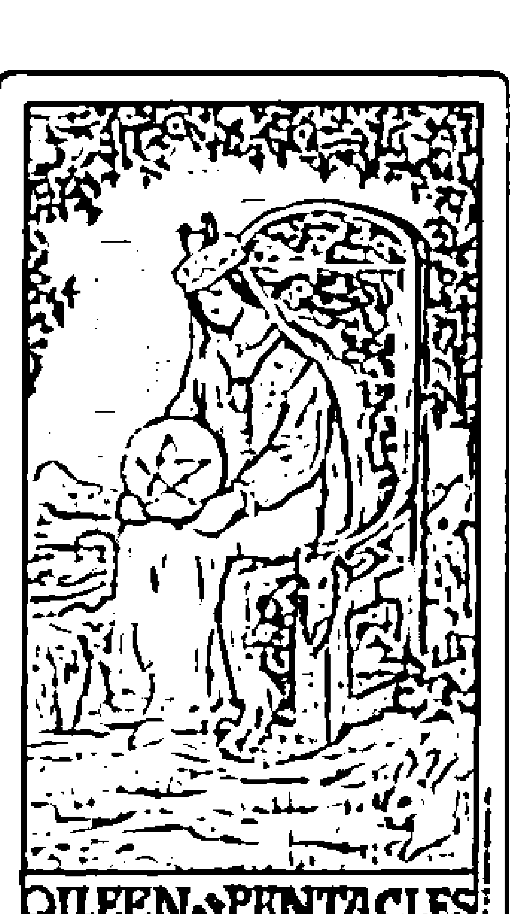

象徵圖象：  
皇后  
姿勢  
雙手拿著金幣  
茂盛的背景在土地的顏色上  
兔子  
人物和元素

意義：  
敞開、接受性  
靜心的心情  
小心處理有價值的東西  
肥沃  
感官性  
重視感官的、踏實的（地）女人（皇后）

## 金幣皇后——作為一張牌或是在其他的牌陣裡

#### 一般性的意義：

皇后通常代表人，尤其是女人，但是有時候也可以代表男人。皇后牌強調準備接受的重要性。金幣皇后象徵著一個踏實的、有能力的人，她很實際、勤奮、負責任、有活力，並給予一種穩定和安全的感覺。這可能是一個真實的人或是一個內在的狀態，它在你裡面形成，所以代表你。

#### 工作領域：

在工作領域裡，金幣皇后代表一個務實，並喜歡用她自己的雙手工作的人，此外，她也知道如何掌管財務。如果這張牌代表你，你必須工作、務實、勤奮，而且要有耐心，也許還要幫助別人。這張牌也建議某種手工藝或貿易，或是在外面的大自然工作，或是擔任財務方面的工作。

#### 愛的方面：

你可能在嚴肅和值得信任之間擺盪，你也不會太反對感官的歡樂或是被別人寵愛。另外，這張牌也可能指出你被具有這些品質的人所吸引。

## 金幣皇后在愛的神諭牌陣裡

#### 位置 1 — 它是怎麼樣  
也許是一個有能力和實際的女人進入到你的生命中來，她能夠提供安全和感官的歡樂。或者你被要求展現出你務實的一面，更歸根於地（實實在在），證明你的忠誠。然而，它也可能是一個重視感官的女人正在試圖破壞你現存的關係。

#### 位置 2 — 什麼東西從內在推著你  
你想要開展更感官的那一面，並享受愛。為了要這樣做，你需要一個受到保護的，同時有承諾的關係。也許你會想要有小孩，此外，這張牌也可能指出你被一個有能力、勤奮，並散發出溫暖和感官性的女人所吸引。

#### 位置 3 — 對方對你的態度  
你所面對的人基本上對你是敞開的，但是需要一些時間來鬆開。如果你被證明是可靠的、穩重的，同時很清楚你想要什麼，那麼你就可以贏得他或她的信任。

## 位置 4 — 神諭對你的忠告  
你只要繼續待在那裡，展現出你的可靠和你的能力，以及你的家庭觀念。想看看要如何展現出你的溫暖和感官的本性，來讓你每天的生活變得更好。

## 金幣皇后在指南針牌陣裡

#### 位置 1 — 它是怎麼樣  
它關係到一個可靠的人，她很實際、很活躍，而且喜愛大自然，她會對一個可行的計劃和具體的提議有反應。但是這張牌也可能代表你，所以意指你對這個問題的態度。

#### 位置 2 — 它就是這樣開始的  
在開始的時候，你在面對這一件事的時候是理性的、觀察的，你知道有一些事是值得等待的，所以你已經有心理準備，事情可能會比你原先所想的花更多的時間，但是一旦你覺得那個計劃是可行的，你就會採取行動。它也可能是你被一個有效率的、理性的女人所吸引、所激發。

#### 位置 3 — 反應  
你會碰到一個安靜的、有耐心的人，他或她是值得你依賴的。只要你尊重他或她的領域，你就能夠被允許按照你的方式來處理。如果你需要一些支持，你可以提出具體的建議，並提供足夠的報酬，這樣做你就可以贏得他或她。

## 位置 4 — 它將會引導到哪裡  
到了最後，你已經將你的花園整理得很好，你可以很鎖定地等待看看事情如何進一步發展。或者那個發展會引導到另外一個人，她是一個實實在在的，但是重視感官的人，她對你的未來是重要的。

## 金幣皇后在盲點牌陣裡

#### 位置 1 — 每一個人都知道的  
你是一個喜愛自然的人，你喜歡努力工作，用你自己的雙手來培養出一些東西。或者你目前正在被一個具有這些品質的人所影響。

#### 位置 2 — 盲點  
別人看到你的合理和實際的那一面，他們覺得你是負責任的、可靠的。因為這是你的盲點，所以它也可能是你被認為是頑固的、不敏感的，或是過度放縱在感官裡。另外，這張牌也可能指出有一個可靠的、熱情的人在你的周遭，但是你忽略了他。

#### 位置 3 — 你如何看你自己  
你認為你自己是一個實際的、勤奮的人，喜歡用自己的雙手來做事，但是你也知道你喜歡歡樂的那一部分，你喜歡享受生命的美。

## 位置 4 — 很大的未知  
在內在深處，有一個喜歡錦衣玉食的人。只要你跟你內在的這一面沒有連結，你可能會在苦行和過度放縱兩者之間擺盪。一旦你能夠更了解你的這一面，你將不僅能夠發展出享受事物的能力，同時也可能很實際、很順利地來處理你每天的事務。如果你是一個女人，這是你在找尋的形象。

## 金幣國王（King of Pentacles）

## 務實

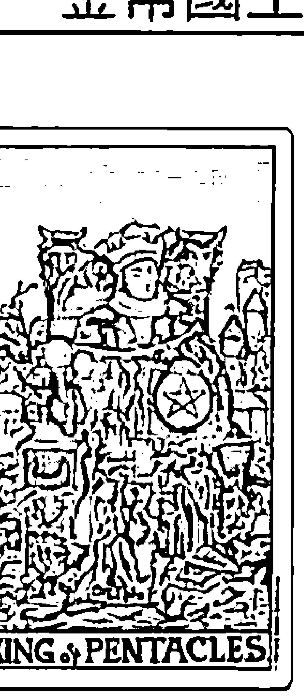

象徵圖象：  
國王  
姿勢  
左手持金幣  
牛頭  
葡萄藤  
背景的城堡  
人物和元素

意義：  
活動  
堅定  
對具體的價值有很好的了解和掌握  
很歸根於地而且能夠享受  
好的生活  
安全和財富  
活躍的、實際的（地）男人（國王）

## 金幣國王——作為一張牌或是在其他的牌陣裡

#### 一般性的意義：

國王大部分代表一個人，通常是男人，但是有時候也代表女人，它強調活躍的那一面和做法。金幣國王象徵著一個負責任的人，是一個很實際、很有活力的人，同時有能力享受生命。它可以是一個對你來講很重要的人，或是一個在你的內在形成的人，所以代表你。

#### 工作領域：

在工作領域裡，金幣國王象徵著一個人，他能夠努力工作，處理財務的問題，同時會負責安全和實際的事情。如果這張牌代表你，那麼你必須負起責任，展現出你的推廣能力，同時對真實的價值要有很好的了解與掌握。這張牌也可以建議會有一個實際的職業或暗示在財務金融方面的發展。

#### 愛的方面：

你是強壯的、果斷的、可靠的、忠誠的，想要用你感官的和喜悅的本性來贏得別人。這張牌也可能意味著你被一個具有這些品質的人所吸引。

## 金幣國王在愛的神諭牌陣裡

#### 位置 1 — 它是怎麼樣  
也許有一個很好的、喜歡歡樂的男人出現在你的生命中，他可以提供安全和很棒的感官歡樂。或者你被要求要成爲歸根於地的、認真的、有能力的，以及能夠給予安全感。在另外一方面，它也可能是一個很有魅力的男人正在打擾著你的關係。

#### 位置 2 — 什麼東西從內在推著你  
你想要有一個承諾的關係，或是加強它的基礎和可靠性。忠誠、身體上的親近、和感官的歡樂對你來講非常重要。或者你被一個具有這些品質的人所吸引。

#### 位置 3 — 對方對你的態度  
你所面對的人是一個歸根於地的、喜歡大自然的、鎮定的人，他會保持他的承諾。他或她不喜歡沒有承諾的冒險。如果你對關係很認真，想要一起享受生命，你可以去接近對方，你將會被歡迎，但是動作不要太快、太直接，因為那並不是他或她的方式。

## 位置 4 — 神諭對你的忠告  
創造出一個承諾的態勢，引進更多的穩定和感官的歡樂到你的關係裡。同時在你的日常生活當中激起一些熱情，給對方多一點的機會來享受生命。如果你的關係瀕臨危險，你必須盡全力來護衛它。

## 金幣國王在指南針牌陣裡

#### 位置 1 — 它是怎麼樣  
你的問題是關於一個人，他或她展現出勤奮、堅定、和實際的一面，或者是一個重視感官的人，他或她喜歡各種歡樂，尤其是貼近心的和大自然的。然而，它也可能是這張牌代表你，所以意指你對這個問題的態度。

#### 位置 2 — 它就是這樣開始的  
你立刻採取行動，然後穩定地、一步一步地追求這條路。當你這樣做的時候，你一直都會注意長期的結果。你的目標是要產生實質的結果，建立起一些具體的東西，或是為別人的安全做些什麼。它也可能是你被一個非常踏實的男人所吸引。

#### 位置 3 — 反應  
你將會碰到一個很可靠、很直接、很實際、很負責任的人，他在緊張忙碌的情況下也能夠保持鎮靜。如果你想要贏得他或她來參與你的計劃，你將必須提出一個具體的建議，或是吸引他或她感官的一面。只要花一點錢就能夠從他或她得到很多，或者有時候只要邀請他或她來參加一個精緻的晚餐也可以。

## 位置 4 — 它將會引導到哪裡  
到了最後，你將會證明你的勤奮，你將能夠實現你的計劃。你已經達成了一些事，它們能夠給你更多的歡樂和安全。或者你被一個支持你，能夠讓你有安全感的人所吸引。也許他或她就是你最後的目標。

## 金幣國王在盲點牌陣裡

#### 位置 1 — 每一個人都知道的  
你是一個勤奮的、喜愛大自然的、和實際的人，或者至少你正在想要完成一項任務，或是做些什麼來保障你的安全。或者你目前所處的情況被一個具有這些品質的人所影響。

#### 位置 2 — 盲點  
別人看到了你的堅毅，你的處事俐落，和你的活力。因為這是你的盲點，所以它也可能是你被認爲是頑固的、不敏感的，或是過度放縱在感官裡。另外，這張牌也可能指出有一個可靠的、熱情的人在你的周遭，但是你忽略了他。

#### 位置 3 — 你如何看你自己  
你認為你自己是一個實際的、勤奮的人，喜歡用自己的雙手來做事，但是你也知道你喜歡歡樂的那一部分，你喜歡享受生命的美。

## 位置 4 — 很大的未知  
在內在深處，有一個喜歡錦衣玉食的人。只要你跟你內在的這一面沒有連結，你可能會在苦行和過度放縱兩者之間擺盪。一旦你能夠更了解你的這一面，你將不僅能夠發展出享受事物的能力，同時也可能很實際、很順利地來處理你每天的事務。如果你是一個女人，這是你在找尋的形象。

## 聖杯一（Ace of Cups）

## 滿足

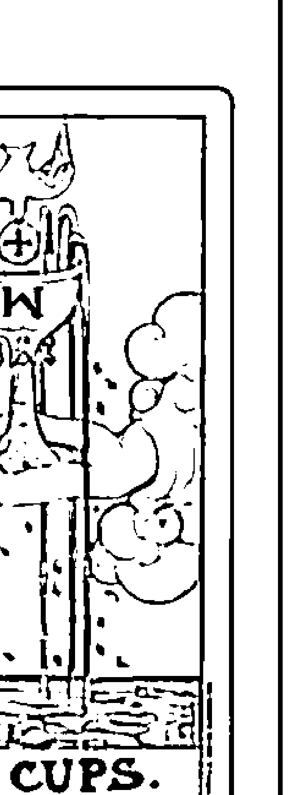

象徵圖象：  
創造者的手  
聖杯  
鴿子  
鴿子、聖餐、和杯子的場景  
5 條溢出來的水  
26 滴往下掉的水  

荷花  
數字和元素

意義：  
衝動  
滿足、幸運、快樂、愛  
聖靈  
更新聖靈的奇蹟力量  
洋溢的豐富  
神聖的恩典（26 = 根據希伯來的字母，26 是神的數值）  
從泥土中長出來的美  
有機會（1）可以找到滿足（水）

## 聖杯——作為一張牌或是在其他的牌陣裡

#### 一般性的意義：

每一張「一」（Ace）的牌都指出有很好的機會必須被抓住，同時被實現，因為它的確提供了一個很好的展望和具體的可能性。聖杯一是副牌裡面最重要的幸運牌之一。它指出很可能找到很大的喜悅、很深的滿足、自然的和諧、愛、與和平。

#### 工作領域：

要覺知到擺在你面前的寶貴機會。現在你可以去開創你的事業或走你的路，它將會引導到滿足，或是讓你進入真正適合你的職業。

#### 愛的方面：

你很可能有機會可以找到很好的愛，或是在你現有的關係裡經驗到快樂的更新階段。這張牌象徵著很深的感情和諧和快樂的時光。

## 聖杯一在愛的神諭牌陣裡

#### 位置 1 — 它是怎麼樣  
你目前的愛是幸運的，你正在經歷一個充滿著好機會的階段，如果你能夠抓住這些機會，它將能夠提供給你和諧、滿足、和安詳。但是你需要踏出第一步來贏得這些幸運。

#### 位置 2 — 什麼東西從內在推著你  
你感覺到你們之間的一種緊張，你想要去接近對方，你想要跟對方連結、修好，你想要溫柔一點，展現出你的愛，跟對方誠心在一起。

#### 位置 3 — 對方對你的態度  
你所面對的人被你所吸引，所以很歡迎你。他或她很喜歡跟你在一起，或是跟你分享一些事情。

## 位置 4 — 神諭對你的忠告  
不論那個問題是什麼，你應該毫不遲疑地踏出第一步，因為如果你現在去接近對方，你將會發現對方的門是開的。

## 聖杯一在指南針牌陣裡

位置 1 — 它是怎麼樣  
它關係到你眼前的一個好機會，你可以找到快樂、愛、和諧、和很大的內在的滿足。

位置 2 — 它就是這樣開始的  
在開始的時候，有一個你夢想中的好機會在等著你。如果你立刻抓住這些機會，它將能夠使你的某些夢想成真。檢視一下位置 4 的那張牌，看看它會呈現出什麼好的結果。

位置 3 — 反應  
環境對你很有利，你將會受到歡迎，並得到正向的支持。如果你的問題跟墜入情網有關，那麼你的愛情路將會很順利。

位置 4 — 它將會引導到哪裡  
這條路將會帶領你跟別人在一起，也許甚至是找到你理想中的對象。如果你們有爭執，那麼將會修好，如果你們以前比較冷淡，現在將會比較熱絡，到了最後，你將會跟一個好的人在一起。

## 聖杯一在盲點牌陣裡

位置 1 — 每一個人都知道的  
你處於一個令人羨慕的階段，現在你有很好的機會可以找到愛、和平、快樂、和滿足。

位置 2 — 盲點  
就你基本的幸福而言，別人看到你現在有機會可以達成一些重要的事，它也許是你的愛情或是你的事業，或者更一般的，你的日常生活。如果你無視於這個情況，你必須跟別人談一談，以免喪失這個好機會。

位置 3 — 你如何看你自己  
你知道眼前有一個機會可以得到快樂和滿足。唯有當位置 2 的牌顯示出別人對這個情況的看法非常不同，你才必須重新評估一下你的假設，然後用一個比較客觀的觀點來看這個情況。

位置 4 — 很大的未知  
在你的內在深處有一個很好的部分等著被發現，它能夠提供給你滿足和內在的和平。花一些時間來找出這個內在快樂的源頭，這個潛力沒有開發出來是很可惜的。

## 聖杯二（Two of Cups）

## 連結

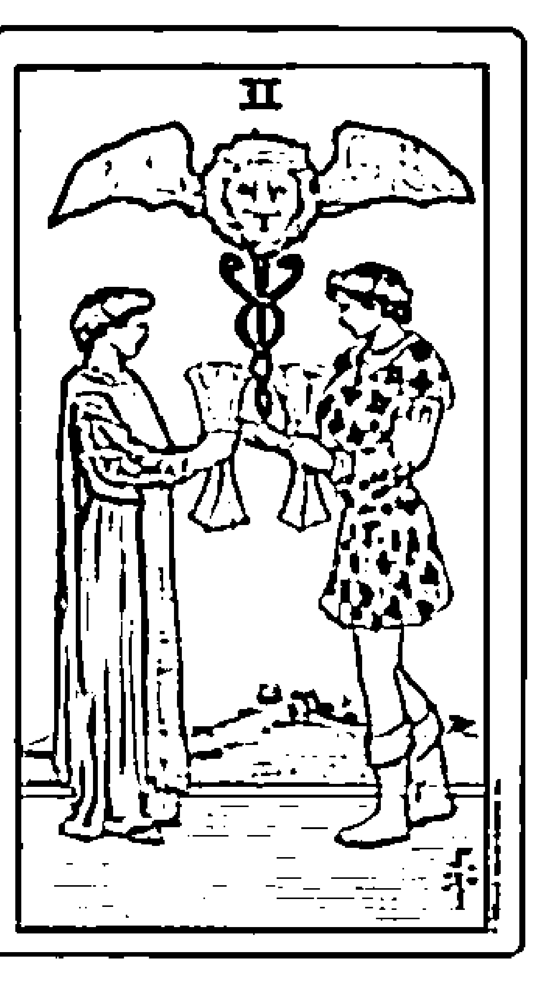

象徵圖象：  
姿勢  
男人＋女人，左＋右  
希臘神話中商業之神的手杖，有兩個翼和兩隻蛇交錯  
紅色的、有翅膀的獅頭  
數字和元素

意義：  
吸引、交融、修好  
兩極  
連結相反的兩極  

令人鼓舞的熱情，昇華的能量  
吸引相反兩極（2）的力量（水）

## 聖杯二——作為一張牌或是在其他的牌陣裡

#### 一般性的意義：

聖杯二指出相反兩極的互相吸引，因此，它代表在各種不同連結情況下的誠心在一起，比方說愛、友誼、和家人，或是在一個團隊裡面。此外，它也可能意指修好與和平。

#### 工作領域：

展現出共同感，合作，形成一個團隊，表現出團體精神。你將會受到對方的歡迎，你也必須展現出你對別人的歡迎。

#### 愛的方面：

它可能是你才剛開始一個新的、迷人的愛，或是正在跟某人修好，不論它是什麼情形，這張牌承諾著會有一個很棒的在一起的時光。

## 聖杯二在愛的神諭牌陣裡

#### 位置 1 — 它是怎麼樣  
你已經將你的手伸向某一個人，或者你甚至已經擁抱了那個人。不管怎麼說，你的關係是一種誠心的親近和交融。

#### 位置 2 — 什麼東西從內在推著你  
你感覺到你們之間的一種緊張，你想要去接近對方，你想要跟對方連結、修好，你想要溫柔一點，展現出你的愛，跟對方誠心在一起。

#### 位置 3 — 對方對你的態度  
你所面對的人被你所吸引，所以很歡迎你。他或她很喜歡跟你在一起，或是跟你分享一些事情。

## 位置 4 — 神諭對你的忠告  
不論那個問題是什麼，你應該毫不遲疑地踏出第一步，因為如果你現在去接近對方，你將會發現對方的門是開的。

## 聖杯二在指南針牌陣裡

位置 1 — 它是怎麼樣  
它是關於一個心連心的相遇、合作、交融、修好、或是一個新的愛。

位置 2 — 它就是這樣開始的  
你在這條路上並不是單獨的，你在一開始就跟另外一個人在一起。如果你的問題包含了某種衝突，那麼在一開始就會互相修好。

位置 3 — 反應  
環境對你很有利，你將會受到歡迎，並得到正向的支持。如果你的問題跟墜入情網有關，那麼你的愛情路將會很順利。

位置 4 — 它將會引導到哪裡  
這條路將會帶領你跟別人在一起，也許甚至是找到你理想中的對象。如果你們有爭執，那麼將會修好，如果你們以前比較冷淡，現在將會比較熱絡，到了最後，你將會跟一個好的人在一起。

## 聖杯二在盲點牌陣裡

位置 1 — 每一個人都知道的  
你是一個天真的、溫暖的、合作的人，你喜歡接近別人。也許你碰到了你的愛人，或者你正在慶祝一個複合。

位置 2 — 盲點  
是否你已經墜入了情網而不自知？或者你有一個邂逅，甚至是跟一個舊識，它很可能會發展成一個愛的關係？別人認為你不久之後就會很快樂，只有你還被蒙在鼓裡。

位置 3 — 你如何看你自己  
你知道你是一個願意修好的人，你在一個關係、一個團隊、或一群好朋友裡面才會有好的表現。

位置 4 — 很大的未知  
在你的內在深處是一個很棒的愛人，你的內在也想要給出你的愛、信任、仁慈、和溫暖。將這一面帶到你的意識層，那麼你每天灰色的生活將會充滿著奇蹟。

## 聖杯三（Three of Cups）

## 感謝

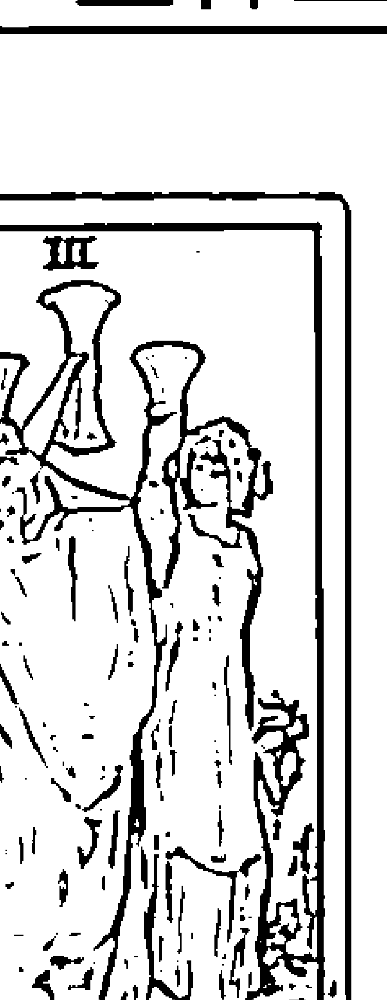

象徵圖象：  
跳舞  
舉杯  
水果和蔬菜  
情況  
數字和元素

意義：  
喜悅的跳舞  
快樂、喜悅、結婚  
作物已經有了收成  
慶祝豐收  
活生生的（3）感情（水）

## 聖杯三——作為一張牌或是在其他的牌陣裡

#### 一般性的意義：

聖杯三指出一件事將會有很好的發展，它描繪出一個豐收的慶祝，它意味著某件事已經到達一個很好的結果，作物已經有了收成，我們可以感謝、慶祝、和滿足。

#### 工作領域：

你的生意做得很好，你獲得了利益，你即將要做一個你會很滿意的交易。即使你沒有你自己的生意，你也可以很快樂，因為你的工作進行得很好，你很有理由可以慶祝一個好的結果。

#### 愛的方面：

你很有理由可以快樂，你知道你的心是興奮的。不論那個快樂的事情是什麼，你都可以打從你的內心來慶祝它、珍惜它。

## 聖杯三在愛的神諭牌陣裡

#### 位置 1 — 它是怎麼樣  
也許是因為結婚，或者只是因為在一起的快樂時光，你很有理由可以快樂和慶祝。

#### 位置 2 — 什麼東西從內在推著你  
你充滿著快樂，同時想要將這個快樂跟你的朋友們分享。那麼你就這樣去做，因為快樂可以藉著分享而加倍。

#### 位置 3 — 對方對你的態度  
你所面對的人是高興的、感謝的，同時享受著分享他或她的快樂。你也許甚至就是他或她快樂和感謝的原因。

## 位置 4 — 神諭對你的忠告  
確認你已經達成的所有事情，以及你在這個當中所得到的。要覺得感謝，邀請你的愛人來慶祝。

## 聖杯三在指南針牌陣裡

位置 1 — 它是怎麼樣  
它是關於一個很好的合作或結果，或是一個感謝，或是有很好的理由可以快樂和慶祝。

位置 2 — 它就是這樣開始的  
在一開始，你在走這條路的時候充滿著快樂。檢視一下位置 4 的牌，看看這個心情是否會持續，或者你快樂得太早了。

位置 3 — 反應  
你周遭的反應是感謝和滿足的，他們對你和你所做的事情感到快樂。如果可能的話，你可以去參加宴會，跟大家一起慶祝。

位置 4 — 它將會引導到哪裡  
這是一條很棒的路。到了最後，你將會有很好的收穫，你將會覺得感謝、快樂、和滿足。即使前面的牌指出那個事情將會拉得很長，這條路也是值得一走的。

## 聖杯三在盲點牌陣裡

位置 1 — 每一個人都知道的  
你是一個無愛無慮的、快樂的、感謝的人，你在享受著跳舞，以及跟別人分享你的快樂，或者你在這個時候很有理由可以慶祝。

位置 2 — 盲點  
別人認爲你做得很好，事實上你很有理由可以快樂和慶祝你的成就。你難道無視於這個情況嗎？如果是這樣的話，你必須立刻睜開你的眼睛，不要再忽視你的幸運。

位置 3 — 你如何看你自己  
你覺得你自己是滿足的，同時充滿著感謝，你喜歡跟別人分享你的信心和喜悅。

位置 4 — 很大的未知  
有很多的感謝和喜悅隱藏在你的內在深處。只要你對這個部分是不知道的，你將很可能無法經驗到滿足。唯有當你能夠喚醒你內在那三個跳舞的女神，你才能夠盡情地享受你的成就，並分享你的快樂。

## 聖杯四（Four of Cups）

## 悶悶不樂

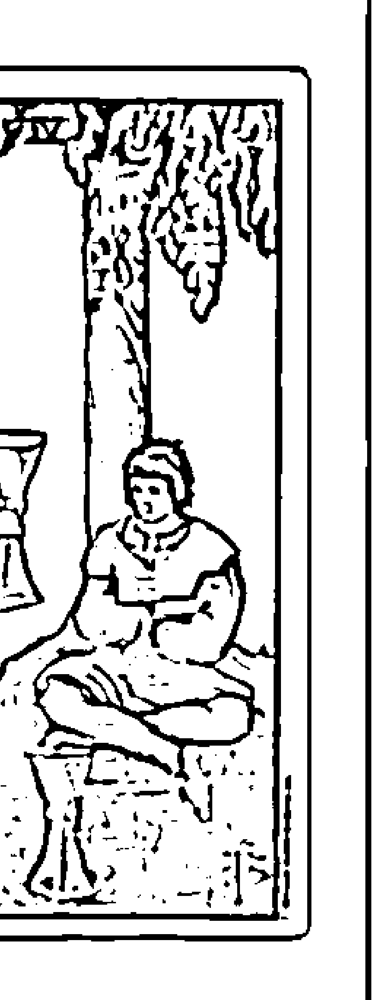

象徵圖象：  
坐著的人  
三個杯子在那個人的面前  
從雲中伸出的手拿著一個杯子  
數字和元素

意義：  
悶悶不樂的人  
熟悉的東西已經不再令人享受  
好的機會其實是可以得到的，但是因為心情不好，所以它並沒有被看到  
停滯的（4）感情（水）危機（5）

## 聖杯四——作為一張牌或是在其他的牌陣裡

#### 一般性的意義：

聖杯四象徵著事件或經驗，它可能在一個片刻之前使我們覺得非常快樂，但是突然轉向，使我們覺得生氣和不滿足。它可能意指反抗，或者只是悶悶不樂。這張牌同時警告著我們，我們可能會因為心情不好而忽視或甚至破壞一些事，因此沒有抓住垂手可得的好機會。

#### 工作領域：

有一些事發生在你身上，現在你覺得悶悶不樂，正在等待較好的時光。但是你必須睜開你的眼睛，在你的周遭可能有突然出現的好機會，如果你一直沈溺於自憐當中，你可能會看不到那個機會。

#### 愛的方面：

你是悶悶不樂的，也許你做什麼事做得太過火了，現在你變得不舒服，或者有什麼事困擾著你，破壞了你的整個心情。不要憂鬱太久，因為它可能會使你忽略掉一些重要的事。

## 聖杯四在愛的神諭牌陣裡

#### 位置 1 — 它是怎麼樣  
目前你關係的氣氛一點都不好，也許你們各自都退回到你們自己的小角落，覺得悶悶不樂，等待對方來道歉或發誓將來會做得更好。

#### 位置 2 — 什麼東西從內在推著你  
某件事使你覺得非常生氣，你想要毀了這一切，然而，要小心，不要過度反應，因為影響深遠的決定必須出自平靜的理智。要注意好的機會，因為對方可能會釋出微妙的訊息想要跟你妥協。

#### 位置 3 — 對方對你的態度  
你所面對的人可能陷入心情的低潮，有什麼事破壞了他或她的整個心情，目前他或她覺得不容易處理。你暫時無法希望對方會妥協，即使你想要主動求和，你也必須小心，雖然這對他或她來講可能是好的，但是如果你沒有很技巧地進行，你可能還是會吃閉門羹。

## 位置 4 — 神諭對你的忠告  
將你的憂傷和痛苦表現出來。不要只是苦笑而忍受它。勇敢地去經歷這個困難的階段，接受你朋友的安慰和支持。

## 聖杯四在指南針牌陣裡

#### 位置 1 — 它是怎麼樣  
它關係到一個痛苦的經驗、憂傷、眼淚、和受苦。或者它是關於還沒有完全被經歷的憂傷。

#### 位置 2 — 它就是這樣開始的  
在開始的時候，有一個憂傷的階段要被跨過，然後才會有一條新的路出來。如果你對這條路的評估是樂觀的，你必須徹底檢視一下，走這條路是否真的很好。看看位置 4 的那張牌怎麼說是有幫助的。

#### 位置 3 — 反應  
你周遭的反應是沮喪的，同時充滿著擔心。別人可能陷住在他們自己的憂傷裡，或是因為你或你的做法而受到冒犯、失望、和內心受傷。

## 位置 4 — 它將會引導到哪裡  
這條路看起來是陰鬱的，烏雲籠罩在地平線，悲傷在等著你，你的快樂將會被粉碎。如果你去走這條路——也許因為你無法選擇——你必須取得朋友的支持，然後給出一點時間來徹底經歷你的憂傷。到了最後，新的曙光將會出現。

## 聖杯四在盲點牌陣裡

#### 位置 1 — 每一個人都知道的  
你可能是一個悲傷類型的人，常常處於憂傷的狀態。或者你正在經歷一個困難和沮喪的階段。

#### 位置 2 — 盲點  
別人看到你的憂傷，認為你將會經歷過一個憂傷的階段。如果這是你的盲點，那麼你似乎已經克服了你的憂傷，或者你只是想試著掩飾來誤導別人。

#### 位置 3 — 你如何看你自己  
你知道你經驗了一個很深的痛苦，所以需要一些時間來經歷你的憂傷。但是你也知道一個事實，這個階段將不會永遠持續，新的希望或新的途徑終究會出現。

## 位置 4 — 很大的未知  
在你內在的無意識深處隱藏著很多悲傷。它讓你的存在背負著重擔而變得苦澀，也許因此而使你變得悲觀。試著去連結你內在的憂傷，並找出痛苦的原因。只要你單純的注意和覺知就已經在幫助療癒那個憂傷了。

## 聖杯五（Five of Cups）

## 憂傷

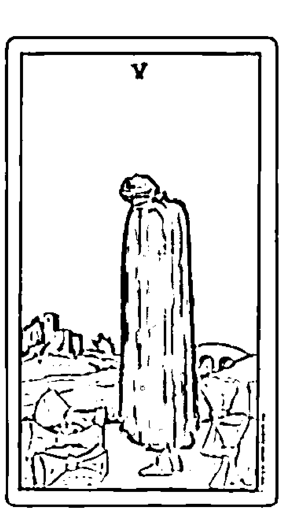

象徵圖象：  
黑色的人物  
三個倒地的杯子  
兩個站立的杯子  
河流  
橋  
堡壘  
數字和元素

意義：  
憂傷、悲傷  
被摧毀的快樂  
有幫助的、支持的、安慰的力量  
生命的河流一再一再地帶來這樣的經驗  
出路  
保護和拯救  
感情的（水）危機（5）

## 聖杯五——作為一張牌或是在其他的牌陣裡

#### 一般性的意義：

聖杯五象徵著痛苦的經驗、憂傷、和失望，尤其是一些我們才剛享受過的事情突然結束了。這張牌也強調在憂傷和悲傷沒有充分被經歷之前不要太早逃離。站立的杯子顯示出在經歷這些困難的階段時，一個人可以從朋友、親戚、或其他人找到支持。

#### 工作領域：

某件事變得不對勁，它使你非常沮喪。不要立刻再去從事新的計劃，而要讓你的悲傷和失望慢慢消化。讓朋友或同事來支持你。新的路線將會出現，然後你就可以帶著鎮定和樂觀的態度去重新出發。

#### 愛的方面：

你受到了一個很大的失望的打擊，烏雲籠罩著天空，在你面前的就只有悲傷和憂傷。雖然這個情況很難接受，但是你必須將它視爲生命不可避免的一部分。在這個時候，讓某人來安慰你、支持你，不要喪失了你的堅毅，因爲即使是黑夜也會有接下來的黎明。

## 聖杯五在愛的神諭牌陣裡

#### 位置 1 — 它是怎麼樣  
一個很大的失望粉碎了你的快樂，暫時沒有看得見的希望。你可以檢視一下位置 3 和位置 4 的牌，看看這意味著你的關係受到了一個打擊，或者這個關係事實上已經結束了。

#### 位置 2 — 什麼東西從內在推著你  
你有一些痛苦的經驗，當你在處理這些憂傷的時候，你需要一些安慰和感情上的支持。

#### 位置 3 — 對方對你的態度  
你所面對的人是悲傷的，因爲有一個很不好的經驗或消息深深地打擊到他。如果你不是他或她憂傷的原因，那麼如果你能夠提供一些安慰和感情上的支持，你將會被感激地接受。

## 位置 4 — 神諭對你的忠告  
將你的憂傷和痛苦表現出來。不要只是苦笑而忍受它。勇敢地去經歷這個困難的階段，接受你朋友的安慰和支持。

## 聖杯五在指南針牌陣裡

#### 位置 1 — 它是怎麼樣  
它關係到一個痛苦的經驗、憂傷、眼淚、和受苦。或者它是關於還沒有完全被經歷的憂傷。

#### 位置 2 — 它就是這樣開始的  
在開始的時候，有一個憂傷的階段要被跨過，然後才會有一條新的路出來。如果你對這條路的評估是樂觀的，你必須徹底檢視一下，走這條路是否真的很好。看看位置 4 的那張牌怎麼說是有幫助的。

#### 位置 3 — 反應  
你周遭的人有一點懷鄉，也許你的做法勾起別人美麗的回憶。如果它是關於實現一個舊有的夢想，你將會很容易贏得別人的支持。

## 位置 4 — 它將會引導到哪裡  
到了最後，你將會碰到你的過去。如果那是你的目標，那麼你是走在正確的路上。不管怎麼說，這張牌意味著你會將你原來的目標跟實際的情況作比較，來作最後的評估。如果你堅持原來的初衷，你將會重新燃起一些能量來完成它。

## 聖杯五在盲點牌陣裡

#### 位置 1 — 每一個人都知道的  
你可能是一個悲傷類型的人，常常處於憂傷的狀態。或者你正在經歷一個困難和沮喪的階段。

#### 位置 2 — 盲點  
別人認爲你很懷舊，如果那是你的盲點，那麼你可能會沈溺於昔日的豐功偉業，或是處於原來的庇護之下，而沒有將足夠的注意力放在現在。

#### 位置 3 — 你如何看你自己  
你知道你是一個念舊的人，或者至少你目前正在想著以前的目標和決定，並讓你自己受到舊有夢想的鼓舞。

## 位置 4 — 很大的未知  
你似乎對過去不重視，也許你覺得過去很無聊，因為它已經無法改變，或者你有其他的原因而不去想它。但即使你是一個很未來導向的人，你也必須記住你的整個人都是來自過去，唯有當你能夠站穩過去，才能夠向未來拓展。

## 聖杯六（Six of Cups）

## 記憶

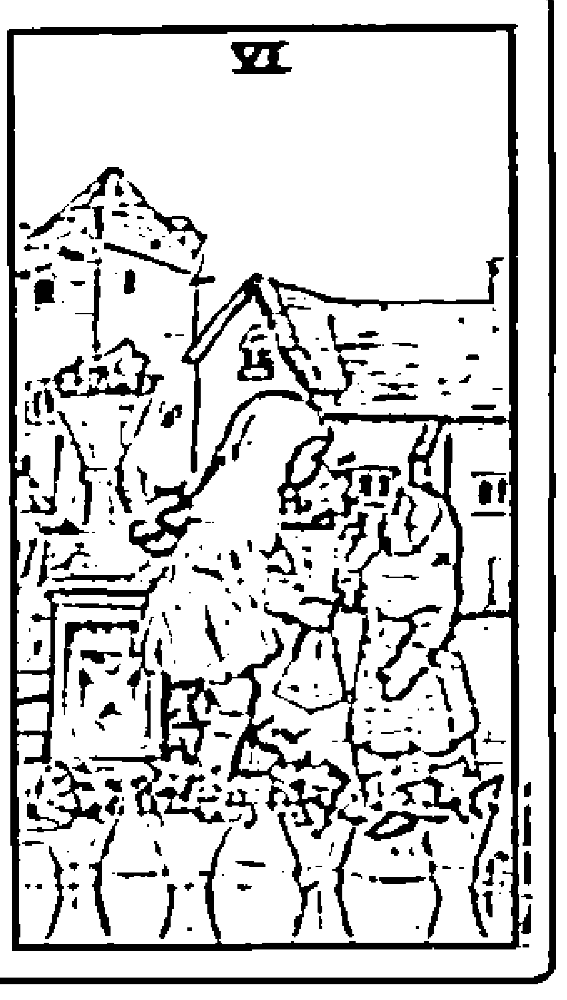

象徵圖象：  
房子在一個舊的花園裡  
小孩在玩耍  
花朵從杯子生長出來  
男孩給女孩一個有花的杯子  
監護人手持長矛  
數字和元素

意義：  
過去  
孩提時代的記憶  
美麗的回憶  
無愛無慮、孩子般的愛  
保護和安全  
幫助的（6）感情（水）

## 聖杯六——作為一張牌或是在其他的牌陣裡

#### 一般性的意義：

聖杯六將一個人引導到過去。這張牌可以象徵著具體的回憶或是實際上在某個地方碰到某人或發生某事，然而這張牌所強調的並不是對過去的懷念或是執著於過去，而是提醒一個人在過去所發生的成長經驗，鼓勵他再度尋回舊有的事，以便能夠了解和完成它們。

#### 工作領域：

你可能正在草擬以前所想好的計劃。或者你突然碰到一個你已經很久沒有看到的人。不管怎麼說，你接收到了來自過去很好的刺激，它給你能量來使你實現一些重要的事。

#### 愛的方面：

也許你碰到了一個你以前的舊識。或是你沈溺在以前美好的愛的回憶裡。

## 聖杯六在愛的神諭牌陣裡

#### 位置 1 — 它是怎麼樣  
它也許是關於重新點燃舊有的愛，或是你現存的關係接收到一個來自過去重要的刺激。

#### 位置 2 — 什麼東西從內在推著你  
你在想著你原來對這個關係的期望或愛。如果你將你的希望和夢想跟事實比較，它可能使你變得比較清醒。可能是這些記憶在激勵著你，給你能量去實現一些重要的事。

#### 位置 3 — 對方對你的態度  
你所面對的人目前正執著於過去，或者也許是你將過去的一些事帶出來。在另外一方面，他或她可能在想著一直以來的夢想或慾望。此外，他或她可能在想著要怎麼做才能夠完成一直以來的願望。

## 位置 4 — 神諭對你的忠告  
重新喚起你的記憶，為你自己，也為你們兩個人。澄清原來在這個關係中所期望的，試著從那裡得到一些靈感。現在你可以使你以前的夢想成真。如果你重新拜訪過去曾經在一起的地方或是見見以前共同的朋友，這或許會有所幫助。

## 聖杯六在指南針牌陣裡

#### 位置 1 — 它是怎麼樣  
它關係到一個舊有的問題，或是你曾經有過的夢想，或是一個你會聯想到的過去的主題，也許甚至是關係到你的孩提時代。它也可能是檢視你原來的想法，然後跟現在的情況作比較，來定位你的觀點。

#### 位置 2 — 它就是這樣開始的  
在開始的時候，你會想要回到以前的記憶。所以你可能在跟以前所認識的人連繫，或是你再度回到你以前所住的地方，或是曾經對你來講重要的地方。也許它是關於一個舊有的夢想，然後試著想要去實現它。

#### 位置 3 — 反應  
你周遭的人有一點懷鄉，也許你的做法勾起別人美麗的回憶。如果它是關於實現一個舊有的夢想，你將會很容易贏得別人的支持。

## 位置 4 — 它將會引導到哪裡  
到了最後，你將會碰到你的過去。如果那是你的目標，那麼你是走在正確的路上。不管怎麼說，這張牌意味著你會將你原來的目標跟實際的情況作比較，來作最後的評估。如果你堅持原來的初衷，你將會重新燃起一些能量來完成它。

## 聖杯六在盲點牌陣裡

#### 位置 1 — 每一個人都知道的  
你在懷念著過去，也許你正在重新勾起舊有的夢想，或是想起以前所訂下來的計劃。

#### 位置 2 — 盲點  
別人認爲你很懷舊，如果那是你的盲點，那麼你可能會沈溺於昔日的豐功偉業，或是處於原來的庇護之下，而沒有將足夠的注意力放在現在。

#### 位置 3 — 你如何看你自己  
你知道你是一個念舊的人，或者至少你目前正在想著以前的目標和決定，並讓你自己受到舊有夢想的鼓舞。

## 位置 4 — 很大的未知  
你似乎對過去不重視，也許你覺得過去很無聊，因為它已經無法改變，或者你有其他的原因而不去想它。但即使你是一個很未來導向的人，你也必須記住你的整個人都是來自過去，唯有當你能夠站穩過去，才能夠向未來拓展。

## 聖杯七（Seven of Cups）

## 幻象

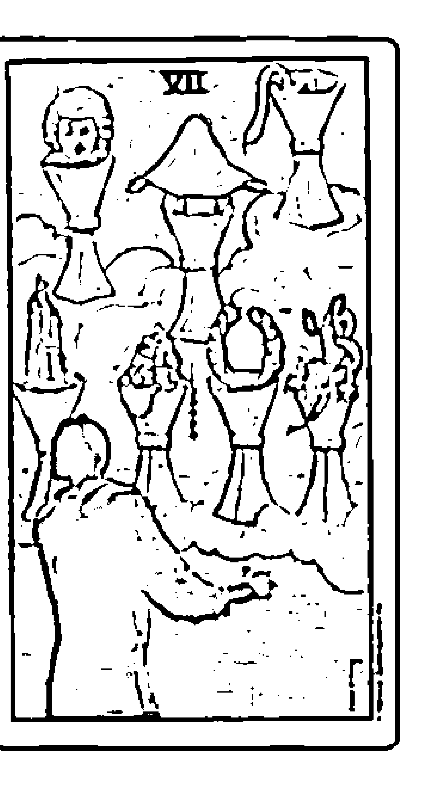

象徵圖象：  
黑色的人物  
女人的頭  
有紗布蓋著的，發光的人物  
蛇  
城堡  
珠寶  
桂冠  
怪物  
數字和元素

意義：  
魔術師、帶著幻象的人  
星靈的光，心靈的生活  
隱藏的自己  
能量和力量  
拯救  
靈魂  
勝利  
侵略、戰爭  
危險的（7）幻想（水）

## 聖杯七——作為一張牌或是在其他的牌陣裡

#### 一般性的意義：

就一般而言，聖杯七警告著我們不要有妄念、虛僞的答案，和其他沒有用的幻想。它所能夠給予的唯一正向的意涵就是當這張牌顯示在塔羅牌要求你要採取這種態度的位置。在這些情況下，你被要求要去探討一個想像中的看法，要覺知到你的夢，然後在最後，選擇其中的一個來附諸實行。

#### 工作領域：

對煙霧要小心！你很天真，所以可能是在追逐一個海市蜃樓。小心檢視一下你的情況，對你的計劃要很挑剔地評估。不要使自己受騙。按照目前事情的進行，你的計劃和行動到了最後將會落空。你必須盡你最大的力量來使你的目標成為清楚的、具體的。

#### 愛的方面：

你帶著玫瑰色的眼鏡，享受著墜入情網的高潮。如果你的愛情才剛開始，這可能是你的情況。然而這張牌指出你的幻想是誇大的、不實際的，到了最後一定會讓你失望。

## 聖杯七在愛的神諭牌陣裡

#### 位置 1 — 它是怎麼樣  
也許你的愛情還很新鮮，或者你只是在夢想著更好的時光。當你在作白日夢的時候，要小心，不要完全忽略了事實。

#### 位置 2 — 什麼東西從內在推著你  
你充滿著很多慾望，你在作你的愛情夢，它在夢裡可能很棒，但是你必須很小心，不要迷失在你夢的世界裡，因為它可能必須付出很大的代價才能夠醒過來。

#### 位置 3 — 對方對你的態度  
你的對象可能被你迷住了，你可以很容易叫他做什麼，如果你想要的話。相反地，他或她可能是你迷戀的對象，或者對方曾經許下很多如幻想般的諾言，但是完全無法兌現。

## 位置 4 — 神諭對你的忠告  
你可以允許你自己去夢想，花一些時間來想像所有跟你的愛有關的、美好的可能，但是之後要從夢中醒過來，將你的遠景告訴你的伴侶，共同去打造，讓美夢成真。

## 聖杯七在指南針牌陣裡

#### 位置 1 — 它是怎麼樣  
它是關於一個夢想或是一個很強的願望。如果你是在欺騙自己，或是處於幻象裡，它對你可能是有害的。

#### 位置 2 — 它就是這樣開始的  
在開始的時候，你迷失在你的幻想裡，你想要去實現你的夢，但是這張牌警告著你可能是在建造一個空中樓閣，它也可能意味著你是人家欺騙的對象。唯有當位置 3 和位置 4 的牌鼓勵你這樣做，你才去走這條路。

#### 位置 3 — 反應  
你的周遭是不真實的，也許你碰到了容易被騙的人，或是一個靠不住的人，他們可能生活在幻象當中。

## 位置 4 — 它將會引導到哪裡  
你最好不要選擇這條路，情況好一點的話，它可能只是沒有具體的結果，但是它也可能是你在追逐一個空中樓閣，或者你會被騙得很慘，覺得非常失望，甚至陷入困難。然而如果你的問題是關於感情的事，這張牌可能指出你將會墜入情網，但是這張牌並沒有說出在初期甜蜜的愛之後接下來會怎麼樣。

## 聖杯七在盲點牌陣裡

#### 位置 1 — 每一個人都知道的  
你是一個喜歡夢想的人，或者至少你目前處於一種不清楚的、幻想的狀態，你可能會投射出你的慾望而沒有真正去看事實，因此你可能會被一個海市蜃樓所騙。

#### 位置 2 — 盲點  
別人看出你在愚弄你自己，或是被江湖騙子所騙，或是在自我欺騙。如果你對自己的評估（參看位置 3 的牌）跟這個有很大的不同，你一定要去跟別人談一談，找出你的盲點。

#### 位置 3 — 你如何看你自己  
你知道你正在醞釀著一些希望，但是不知道這些只是純粹的幻想，或者它們是有可能達成的洞見。

## 位置 4 — 很大的未知  
在你的內在深處是一個帶著幻象的人，它可能常常讓你成爲一個受害者，因為你的希望常常落空。只要你真正覺知到這一面，然後將它帶到事實的層面，你將能夠減少很多失望和挫折。

## 聖杯八（Eight of Cups）

## 帶著沉重的心情出發

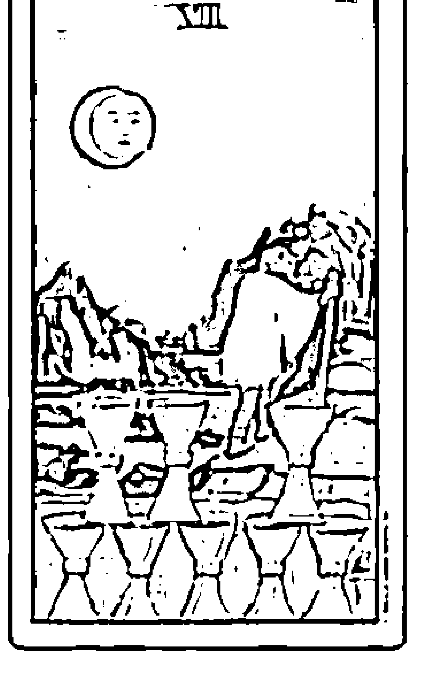

象徵圖象：  
紅色的衣服  
峽谷和月亮  
逆流而游  
有八個杯子在前景  
數字和元素

意義：  
依個人的自由意志去做  
進入那個未知的  
那個路是費力的  
對於一個人所拋在背後的東西有很強的感情  
感情的（水）改變和蛻變（8）

## 聖杯八——作為一張牌或是在其他的牌陣裡

#### 一般性的意義：

聖杯八意指進入到那個未知的，那是更困難的，因爲它需要離開一個人曾經非常執著的東西。發問者是依照他或她自己的意志去做的，但也許他或她已經不能再選擇了。

#### 工作領域：

雖然它看起來似乎是困難的，但該是向舊有的環境說再見，而必須去找尋新的工作的時候了，也許是踏入新的領域。

#### 愛的方面：

你向你熟悉的環境說再見，然後進入一個無人之境。即使那個路是冗長而乏味的，你也必須一步一步脫離舊有的枷鎖。這個過程將使你變得對你在每一個路的轉彎時所碰到的新的和未知的事越來越有興趣。

## 聖杯八在愛的神諭牌陣裡

#### 位置 1 — 它是怎麼樣  
它是關於對原來熟悉的事物說再見，它可以意味著關係的結束，或者至少是跟一個熟悉的生活形態，或是你關係中的例行事務說再見。

#### 位置 2 — 什麼東西從內在推著你  
你想要離開，而且你認爲你的確需要離開。同時，你仍然覺得非常眷戀你所拋在腦後的，所以那個離開並不容易。

#### 位置 3 — 對方對你的態度  
你所面對的人目前處於一種跟某件事物難以割捨的困難階段。它可能是他或她要跟你說再見去走他或她自己的路覺得心情很沉重。在另外一方面，如果你們的關係才剛開始，它可能是他或她的心仍然繫在其他的地方，而正在試圖掙開舊有的連結，想要跟你親近一點。所以你必須不要使他或她有太沉重的負荷，而要幫助他或她去治療每一個分離所產生的傷口。

## 位置 4 — 神諭對你的忠告  
即使這對你來講似乎是困難的，你也要向那個熟悉的說再見，出發去走你自己的路。雖然在開始的時候，那個離開的心情是沉重的，你所踏出的每一步將會變得越來越確定，不久之後，你對於追尋你自己新的路將會變得更有信心。

## 聖杯八在指南針牌陣裡

位置 1 — 它是怎麼樣  
它是關於一個困難的道別，一個令人心情沉重的離開，即使你知道那是正確的，而且是必要的。

位置 2 — 它就是這樣開始的  
開始的時候似乎很困難，這張牌可能甚至意味著你在開始的時候就放棄你的計劃，或者你至少覺得你不喜歡去追尋它。你會帶著沉重的心情來走這條路。

位置 3 — 反應  
你的周遭經歷了一個困難的蛻變過程，也許是因爲你或你的做法，使得別人不願意放棄熟悉的環境去走新的路線。所以你無法期待會得到任何支持，但是也許你可以助別人一臂之力。

位置 4 — 它將會引導到哪裡  
如果你的目標不是一個道別，或是一個分離，這條路的結果將不會令你滿意。因爲你帶著沉重的心情離開你所心愛或熟悉的，出發去作新的探詢。

## 聖杯八在盲點牌陣裡

位置 1 — 每一個人都知道的  
你知道如何享受生命，因為你已經知道每一件事都有它正確的時刻——工作、責任、休閒、和快樂的社交時光。

位置 2 — 盲點  
別人知道你喜愛歡樂，而且有著快樂和樂觀的一面。如果那是你的盲點，那麼你很顯然地無法公開承認你有享受生命的能力。

位置 3 — 你如何看你自己  
你知道你是喜歡社交的，你正在享受休閒的時光，或者至少你在期待著將會有美好的時光。

位置 4 — 很大的未知  
在內在深處，你有一部分知道如何過得很舒服，以及如何享受生命。只要你還不知道你的這一部分，它可能會以一種歪曲的方式顯現出來——也許是偶而會有過度的行為，或是憂鬱，或是一種無法解釋的不安。進入這些未知的領域，試著去了解和信任你內在的這一面，你將會變得更能夠享受生命。

## 聖杯九（Nine of Cups）

## 喜悅和滿足

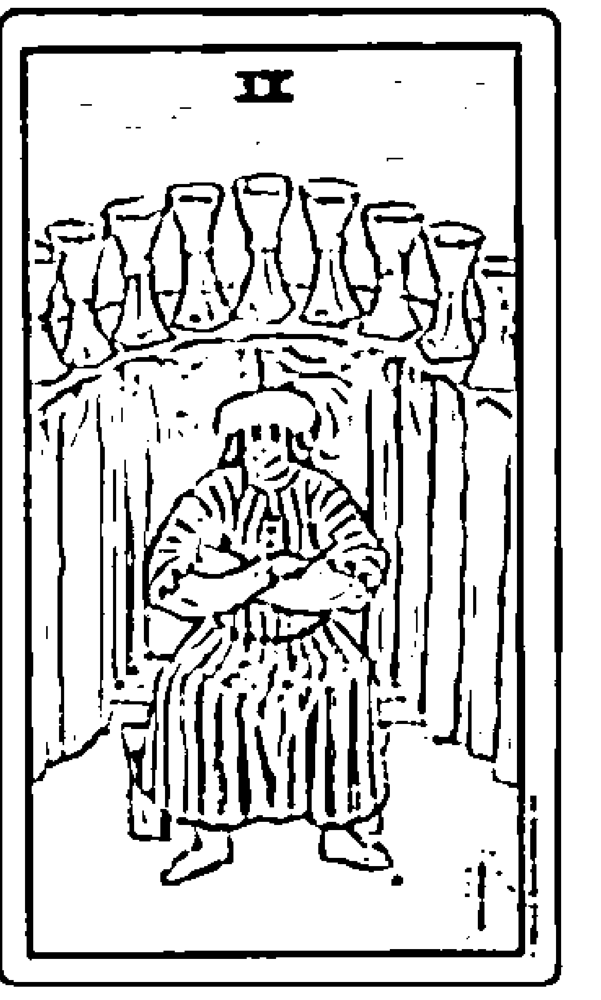

象徵圖象：  
人  
態度  
九個杯子填滿著酒放在高高的架子上  
數字和元素

意義：  
一個富有的人 在等待某些朋友的到來  
滿足、快樂的預期  
喜歡社交、幸福  
聚集起來的（9）喜悅和滿足（聖杯）

## 聖杯九——作為一張牌或是在其他的牌陣裡

#### 一般性的意義：

聖杯九顯示出一個人正在享受著他或她所得來的悠閒時光，並期待著跟朋友在一起享受美好的社交夜晚。這張牌代表生命的喜悅、滿足、社交、好的心情、休閒，或者只是代表美好的時光。

#### 工作領域：

享受你的人生，你有很好的理由可以滿足你所達成的，休息一下，跟別人分享你的快樂。

#### 愛的方面：

帶著愉快的心情充分享受你的愛。跟你的愛人一起享受一個美好的週末或是渡個假。現在完全不需要悶悶不樂。

## 聖杯九在愛的神諭牌陣裡

#### 位置 1 — 它是怎麼樣  
你目前的關係是歡樂的、喜悅的、滿足的、無憂無慮的。

#### 位置 2 — 什麼東西從內在推著你  
你想要有很多美好的時光、享受生命、愛、和感官的歡樂。

#### 位置 3 — 對方對你的態度  
你所面對的是一個完全承諾的人，他或她一直愛著你，想要快快樂樂地跟你共度未來。

## 位置 4 — 神諭對你的忠告  
給這個關係一個堅固的結構，創造出一個好的家，享受在一起的感覺，好好地為你的家奉獻。

## 聖杯九在指南針牌陣裡

位置 1 — 它是怎麼樣  
它是關於社交、享受生命，或者只是關於一個人應得的，而應該全然去享受它。

位置 2 — 它就是這樣開始的  
你已經完成了你的任務，現在想要享受美好的時光。或者你想要得到你真正喜歡的東西，你覺得你應該得到一些東西，而且非常期待它。

位置 3 — 反應  
你周遭的人很喜歡跟你見面，或是以任何其他的方式來享受跟你在一起的時光。你將不會缺乏歡樂的時光，但是如果你需要具體的幫助，或是想要說服別人來為你做些什麼，這並不是正確的時刻。

位置 4 — 它將會引導到哪裡  
這是一條很好的路，你可以去走，不必擔心。即使位置 2 或 3 的牌暗示著在開始的時候會有一些困難，到了最後你也會是滿足的，你會期待著慶祝這個正向的結果。

## 聖杯九在盲點牌陣裡

位置 1 — 每一個人都知道的  
你喜歡在一個團體裡，花一些時間跟你的家人或朋友在一起，或者你剛找到了你的家。

位置 2 — 盲點  
別人看到你是一個喜歡家庭的人，或者你喜歡跟朋友在一起。如果這是你的盲點，你可能會認爲你自己是一個孤單的人，或者你只是沒有時間？

位置 3 — 你如何看你自己  
你會對一個和平的提議敞開，同時會喜歡一個愛的宣言。然而，你並沒有主動，而只是在等待事情的發生。檢視一下位置 2 的牌，看看你的同事、朋友、或親戚是否同意你的行為，或者他們有另外的建議。

位置 4 — 很大的未知  
在內在深處，你有一個隱藏的部分渴望親近、和平、和愛。只要你不知道你的這個部分，你將會覺得你自己是一個獨立的人，甚至是一個孤獨的人。但是放棄你本性這個好的部分是一種羞恥。

## 聖杯十（Ten of Cups）

## 分享的快樂

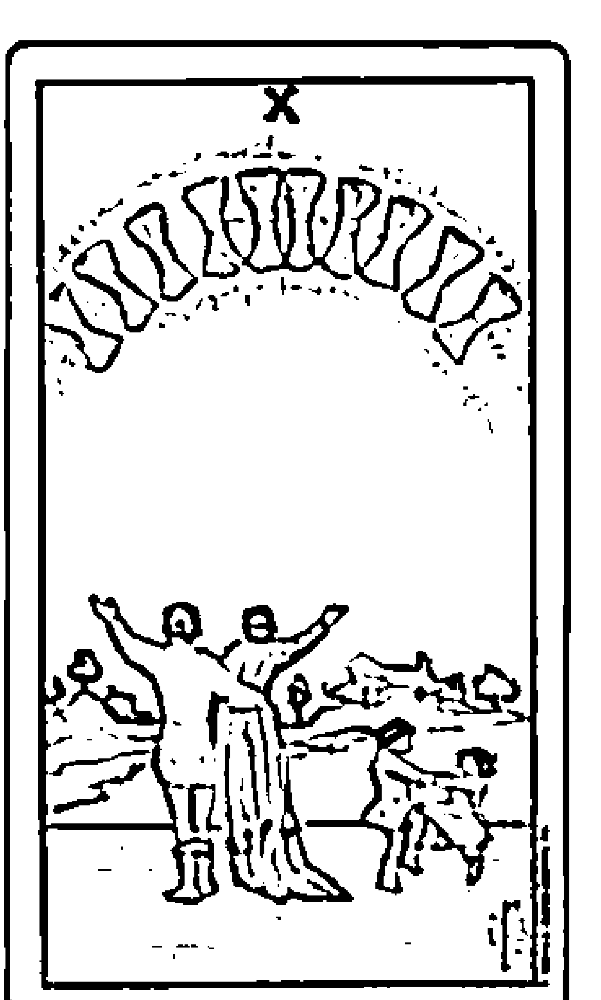

象徵圖象：  
彩虹  
快樂的伴侶  
跳舞的小孩  
房子  
數字和元素

意義：  
天與地之間的和平  
快快樂樂地在一起，感謝  
無憂無慮、家庭  
一個好的家  
完全的（10）滿足（聖杯）

## 聖杯十——作為一張牌或是在其他的牌陣裡

#### 一般性的意義：

聖杯十顯示出我們跟對的人在一起，享受著在一起的感覺，比方說家庭、一群朋友、一項工作、一個旅行、一個小組、一個團體，或是其他可能會發展的熟識。

#### 工作領域：

展現出你的團隊精神，你將會很享受你的工作。在你周遭的是對的人，你可以真正把事情做好。

#### 愛的方面：

你可能正在走向一個新的、很棒的愛，或者也許你們甚至已經要組成一個家庭。不管怎麼說，這張牌承諾著會有一個充滿愛的階段。

## 聖杯十在愛的神諭牌陣裡

#### 位置 1 — 它是怎麼樣  
陽光普照，因爲在裡面的人找到了合適的對象。享受你的愛，細細地去品嚐和經歷它。

#### 位置 2 — 什麼東西從內在推著你  
在這個關係裡，你喜歡有活力的互動，享受無憂無慮的和諧，同時覺得被保護和安全。你是否想要組一個家庭？

#### 位置 3 — 對方對你的態度  
你所面對的是一個完全承諾的人，他或她一直愛著你，想要快快樂樂地跟你共度未來。

## 位置 4 — 神諭對你的忠告  
給這個關係一個堅固的結構，創造出一個好的家，享受在一起的感覺，好好地為你的家奉獻。

## 聖杯十在指南針牌陣裡

位置 1 — 它是怎麼樣  
它是關於一個和諧的團體、愛、友誼、家庭、或是一個很好的在一起的感覺。

位置 2 — 它就是這樣開始的  
在開始的時候，每一個人都很快樂，大家都很合作，每一個人都很好地互相對待，有一個很好的團隊精神。

位置 3 — 反應  
環境是和平的、快樂的、和諧的。周遭形成一個很好的團體，覺得很自在，如果你想要加入他們的團體，或是加入他們的活動，你一定會受到歡迎。

位置 4 — 它將會引導到哪裡  
到了最後，每一件事都會變得很好，你會達到你的目標，覺得非常自在。你覺得很棒，因爲你跟對的人在一起，有一個安詳和樂的環境。

## 聖杯十在盲點牌陣裡

位置 1 — 每一個人都知道的  
你喜歡在一個團體裡，花一些時間跟你的家人或朋友在一起，或者你剛找到了你的家。

位置 2 — 盲點  
別人看到你是一個喜歡家庭的人，或者你喜歡跟朋友在一起。如果這是你的盲點，你可能會認爲你自己是一個孤單的人，或者你只是沒有時間？

位置 3 — 你如何看你自己  
你會對一個和平的提議敞開，同時會喜歡一個愛的宣言。然而，你並沒有主動，而只是在等待事情的發生。檢視一下位置 2 的牌，看看你的同事、朋友、或親戚是否同意你的行為，或者他們有另外的建議。

位置 4 — 很大的未知  
在內在深處，你有一個隱藏的部分渴望親近、和平、和愛。只要你不知道你的這個部分，你將會覺得你自己是一個獨立的人，甚至是一個孤獨的人。但是放棄你本性這個好的部分是一種羞恥。

## 聖杯侍衛（Page of Cups）

## 充滿著愛的姿勢

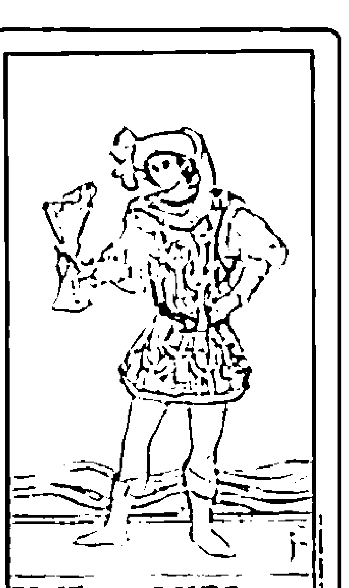

象徵圖象：  
侍衛  
姿勢  
杯子  
魚在杯子裡  
平靜的海  
人物

意義：  
刺激的提供者  
敞開、提供  
感情、愛、了解、和平  
慈悲  
溫柔、深度  
有益的刺激（水）的傳遞者（侍衛）

## 聖杯侍衛——作為一張牌或是在其他的牌陣裡

#### 一般性的意義：

侍衛代表從外在提供給發問者的機會。聖杯侍衛是有益的，因爲他會帶來各種不同的正向刺激，他是歡迎的、支持的，他會提出和平的建議，或甚至是一個愛的宣言。

#### 工作領域：

要敞開來接受別人好的態度，人們對你表示歡迎，展現出合作的態度，同時給予很誠實的讚美。或者有一個可以讓你達到真實成就的工作機會。

#### 愛的方面：

你收到一封情書，或者甚至是收到一封電子信，有人來向你求愛。不管怎麼說，你必須對愛敞開。相反地，如果以前有某種爭執，現在將會有和平或修好的提議。

## 聖杯侍衛在愛的神諭牌陣裡

#### 位置 1 — 它是怎麼樣  
你的關係接收到正向的刺激和來自別人衷心的祝福，它可能是一個邀請，或是一個好的提議，或是一個幫助你紓解感情不安的做法。

#### 位置 2 — 什麼東西從內在推著你  
你對一個充滿愛的做法或是一個和平的提議是敞開的，或者你等待你的愛人有不同的做法，或是給你某些心靈的支持。

#### 位置 3 — 對方對你的態度  
你所面對的人在等待和希望你踏出第一步。位置4的牌可以顯示出你是否只是在誘媚他或她，或是誠心地讚美，或甚至是即將要求婚。

## 位置 4 — 神諭對你的忠告  
顯示出你對友善和合作的態度是敞開的，你在尋求某種支持，或者只是有時候喜歡聽到你是被愛的。

## 聖杯侍衛在指南針牌陣裡

位置 1 — 它是怎麼樣  
它是關於一個機會，一個諂媚的提議，或是一個做法，顯示出有人想要親近你，或是想要支持你，或是你接收到一個使你深深動心的提議。

位置 2 — 它就是這樣開始的  
在開始的時候，有一些可以使你快樂的好事可能發生，有人伸出雙手迎接你，提供你誠心的支持，或是在向你調情。

位置 3 — 反應  
周遭對你的做法、計劃、或刺激是敞開的。也許人們甚至期待你去接近他們，或者至少對他們敞開，成為友善的，並表現出你溫暖和愛的一面。然而，如果不是由你這邊主動的話，事情將不會有很多發生。

位置 4 — 它將會引導到哪裡  
到了最後，你有機會可以得到很深的滿足，同時會有某種好的結果。有人會歡迎你，願意跟你和平相處，在心理上給你支持，同時會很了解你。或者，它是否甚至是一個令人驚訝的愛的宣言？

## 聖杯侍衛在盲點牌陣裡

位置 1 — 每一個人都知道的  
你基本上喜歡感情的親近，而且的確珍惜各種支持。或者至少你目前處於一個情況，在那個情況下你希望有一個修好，或甚至是一個愛的宣言。

位置 2 — 盲點  
別人對你是敞開和歡迎的，人們展現出支持和合作的態度，或者某人試圖諂媚你。你真的忽略了這個嗎？那麼你必須盡可能早一點醒過來。

位置 3 — 你如何看你自己  
你知道你是和平的、溫暖的、具有愛心的人，你喜歡創造出一個讓別人覺得很好的氣氛。

位置 4 — 很大的未知  
在內在深處有一個感情的騎士等著被發現，同時被帶到生命中來。注意一下你的這一面，試著去感覺它，因為如果你缺乏這一面，你將會錯過很多愉快、悠閒、和放鬆的氣氛，尤其你將會錯過一些愛的經驗。

## 聖杯騎士（Knight of Cups）

## 和平

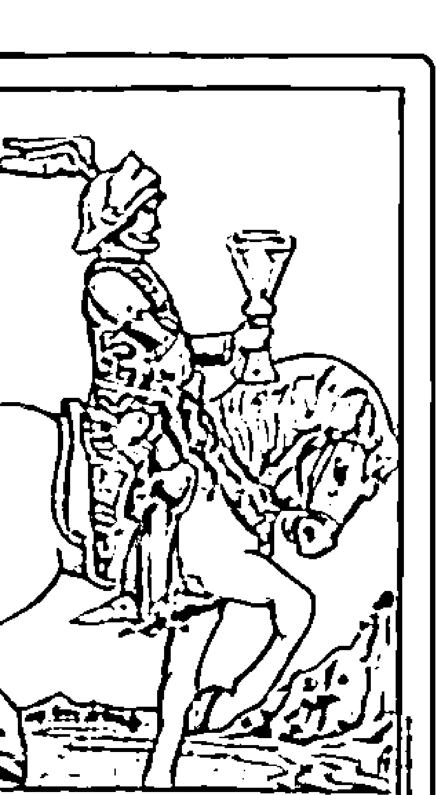

象徵圖象：  
騎士  
杯子  
白色的馬  
姿勢  
將要被跨過的河流  
山  
人物和元素

意義：  
優雅  
滿足  
純潔  
和平  
跨過一個門檻，走向別人  
頂點、高峰經驗  
愛與和平的氣氛（水）的代表（騎士）

## 聖杯騎士——作為一張牌或是在其他的牌陣裡

#### 一般性的意義：

騎士通常代表某種環境、氣氛、或心情。聖杯騎士象徵著春天的微風，或溫柔的晚風，它屬於和平、浪漫、愛、快樂、和好心情的氣氛。

#### 工作領域：

靠在椅背上，放鬆，你正在面對著快樂和和平的時光；你發覺你自己處於一個好的心情和一個好的工作氣氛。

#### 愛的方面：

你的愛正在面對一個有活力的階段，它讓人聯想到春天。根據你目前的狀況，聖杯騎士可以代表修好、和諧的平衡、愛的氣氛、或甚至是一個求婚。

## 聖杯騎士在愛的神諭牌陣裡

#### 位置 1 — 它是怎麼樣  
你目前的關係是無愛無慮的、不複雜的在一起，心的交流，同時處於好的心情。

#### 位置 2 — 什麼東西從內在推著你  
你也許只是處於一種好的心情，充滿著能量，或者處於新鮮的愛裡面，充滿著熱情。

#### 位置 3 — 對方對你的態度  
你所面對的人基本上是迷人的，通常處於好的心情，帶著愉快的心情，甚至有很棒的浪漫氣氛，在他的面前你會覺得很快樂和被愛。

## 位置 4 — 神諭對你的忠告  
引進一個更好、更溫暖的氣氛到你的關係來，敞開你的心來營造出一個充滿著愛、親近、熟悉，同時有很多的相互了解和慈愛的氣氛。

## 聖杯騎士在指南針牌陣裡

位置 1 — 它是怎麼樣  
它圍繞在愛、和平、和諧、修好，或一個好的和無愛無慮的心情，或者只是有一些樂趣。

位置 2 — 它就是這樣開始的  
在開始的時候，每一件事都很和諧，你處於很好的心情。你想要對別人和對你自己好一點，放鬆，和來點樂趣。或者你試圖扮演和平的使者，來促進愛的氣氛和真正的了解。

位置 3 — 反應  
環境是友善的、愉快的、宜人的。你覺得很舒服、很自在。人們將會對你敞開，歡迎你，並且願意幫助你。

位置 4 — 它將會引導到哪裡  
這條路將會使你快樂，至少到了最後每一個人都會覺得很放鬆，處於一種和平、友善、和好的心情之下，或甚至是處於愛之中。

## 聖杯騎士在盲點牌陣裡

位置 1 — 每一個人都知道的  
你基本上是一個正向的人，經常散播溫暖和創造出一個好的氣氛。至少你目前的心情是好的，或者甚至是在戀愛。

位置 2 — 盲點  
別人看到你事實上是處於一種和平、快樂、和愛的氣氛之下。如果你有不同的看法，你必須多跟別人談一談，看看他們是否能夠打開你的眼睛，讓你品嚐到那個很棒的氣氛。

位置 3 — 你如何看你自己  
你知道你是和平的、溫暖的、具有愛心的人，你喜歡創造出一個讓別人覺得很好的氣氛。

位置 4 — 很大的未知  
在內在深處有一個感情的騎士等著被發現，同時被帶到生命中來。注意一下你的這一面，試著去感覺它，因為如果你缺乏這一面，你將會錯過很多愉快、悠閒、和放鬆的氣氛，尤其你將會錯過一些愛的經驗。

## 聖杯皇后（Queen of Cups）

## 很深的感情

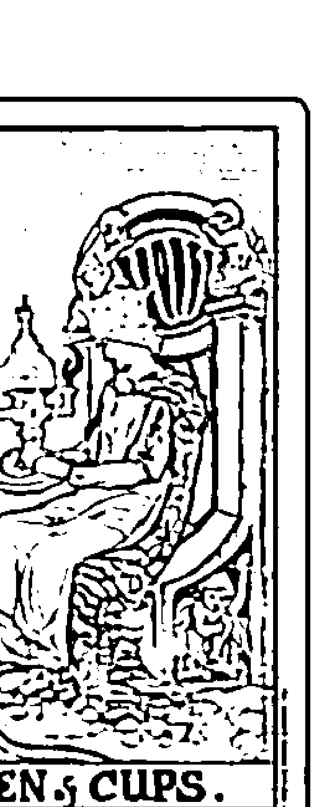

象徵圖象：  
皇后  
神聖的杯子  
貝殼的寶座  
保護河泉的女神（水精）  
人物和元素

意義：  
敞開、接受  
神秘、心靈、洞見的力量  
接受性  
水元素的誘惑  
直覺的、感情的（水）女人（皇后）

## 聖杯皇后——作為一張牌或是在其他的牌陣裡

#### 一般性的意義：

皇后大部分象徵著女人，但是有時候也可以指男人。它強調被動的態度和準備接受什麼。聖杯皇后代表一個敏感的人，她具有通靈的品質，她是慈悲的、同情的，喜歡幫助別人，同時知道如何啟發別人，或甚至迷惑他們。這張牌可以代表一個外在世界真正的人，或是一個內在的人，他在你裡面形成，所以代表你。

#### 工作領域：

在工作領域，聖杯皇后通常意指一個具有了解性和同感力的女人。如果這張牌象徵著你，你必須信任你的直覺，並展現出你的通靈能力。這張牌也可能建議著心靈或治療方面的職業。

#### 愛的方面：

你可以透過很深的感情和很多的想像而被說服，你也不會反對誘惑。這張牌也可以意味著你被一個具有這些品質的人所吸引。

## 聖杯皇后在愛的神諭牌陣裡

#### 位置 1 — 它是怎麼樣  
也許有一個很棒的、敏感的女人帶著很多的想像進入到你的生命，形成了浪漫的氣氛。或者你被要求展現出你水向元素的那一面，讓你自己被銷魂、被吸引。在另外一方面，它也可能是一個神秘的、有經驗的、多才多藝的女人打擾了你的關係。

#### 位置 2 — 什麼東西從內在推著你  
你有一個洞見，想要遵循你的感情，踏上你的心所屬的那一條路。你渴望親密和一種很深的、無言的了解，你知道如何吸引一個人，迷惑他或她，而且你可能正在做這種努力。相反地，這張牌也可能指出你被一個具有這些品質的人所吸引。

#### 位置 3 — 對方對你的態度  
你所面對的人是一個浪漫的、充滿著愛，同時非常具有了解性和慈悲的人。他或她會喜歡你的親近，如果你能夠在對方心情好的時候去接近他或她，如果你能夠引發出互相的幻想，你就可以贏得他或她。

## 位置 4 — 神諭對你的忠告  
先按兵不動，直到你能夠確定你的感情。試著站在對方的立場來感覺看看什麼事能夠真正感動他或她。找出一些能夠吸引你們兩個人，或甚至加強你們的連結和突顯共同目標的看法，將它放進你們的關係裡。

## 聖杯皇后在指南針牌陣裡

#### 位置 1 — 它是怎麼樣  
它是關於一個有直覺力的、感情導向的人，他或她可能具有一些通靈能力，這個人能夠用一個洞見或一個夢來說服。但也可能這張牌是代表你，所以它顯示出你對這個問題的態度。

#### 位置 2 — 它就是這樣開始的  
在開始的時候，你有一個洞見，你想要遵循你的慾望，使一個美夢成真，或是有一個令你感動的經驗。你信任你的感覺，讓你自己被直覺所引導。它也可能是你被一個很有感情的、神秘的女人所吸引。

#### 位置 3 — 反應  
你將會碰到一個具有很多想像力的人，他或她非常具有了解性，同時具有某種通靈的力量。如果你試著去吸引他或她的感情面，你將可以贏得他或她。如果你在找尋某種支持，這是對的人。

## 位置 4 — 它將會引導到哪裡  
到了最後，你想要掌握你的感情，並了解它們。你有新的洞見，你信賴你的直覺，你在感情上準備對別人敞開。或者你的發展使得你去接近一個具有這些特性的 人，而他或她對你的未來將會是重要的。

## 聖杯皇后在盲點牌陣裡

#### 位置 1 — 每一個人都知道的  
你有很多的想像，很深的感情，和一個很好的直覺。你具有心靈和藝術的傾向，而且可能甚至有這方面的才能。或者你被一個具有這些品質的人所影響。

#### 位置 2 — 盲點  
別人覺知到你的敏感和感情面。你的想像和洞見的能力是被公認的。因為這剛好是你的盲點，所以有可能別人認爲你有一點瘋狂。或者，是否這張牌意味著有一個迷人的、敏感的，也許有一點夢幻的女人就在你的周遭，但是你忽略了她？

#### 位置 3 — 你如何看你自己  
你覺得你對你自己的感情很真實，同時會遵循著你的夢想和洞見，你只相信你覺得對的，而不會被任何跟它相違背的理性爭論所說服。

## 位置 4 — 很大的未知  
在你無意識的內在深處，有一個女性的心靈等著被發現、被喚醒。只要你對她不熟悉，她可能會使你變得拒絕一切無法以嚴格的理性來解釋的事。一旦你能夠連結到你內在女性的直覺力，她將能夠給予很好的建議。如果你是一個男人，那是你在找尋的形象，你可以在你的關係中發現和經歷它。

## 聖杯國王（King of Cups）

## 感情的力量

象徵圖像：
國王
姿勢
右手拿著杯子
被水所圍繞著
腳踏在堅固的基礎上
人物和元素

意義：
活動
敞開
有意識地表達感情
感情的深度
堅固的基礎
一個男人（國王）帶著很好的直覺和高度發展的感情生活（水）

## 聖杯國王——作為一張牌或是在其他的牌陣裡

#### 一般性的意義：

國王大部分意指男人，也可以代表女人。在這裡，這張牌強調活動和對事情的活躍。聖杯國王是一個敏感的人，他象徵著感情的力量，很好的直覺，心靈的深度，慈悲，和照顧，這張牌可以代表一個來自外在世界真正的人，或是一個內在的人，他在你的內在形成，所以代表你。

#### 工作領域：

在工作領域，聖杯國王象徵著一個人，他很會表達感情，富有想像力，而且能夠深入到別人的靈魂裡。如果這張牌代表你，你必須信任你內在的智慧，同時幫助別人。它也可能意味著一個跟幫助、治療、或藝術生產有關的任務或職業。

#### 愛的方面：

你是一個浪漫的、很有感情的、很敏感的人，你想要贏得別人的愛，或是用你的想像力和溫暖來贏得對方。這張牌也意味著相反的情況，就是你會被具有這些品質的人所影響。

## 聖杯國王在愛的神諭牌陣裡

#### 位置 1 — 它是怎麼樣

也許有一個迷人的，感情溫暖的男人帶著很多的想像力，深情款款地進入到你的生命中來。或者你被要求要表達出你的這一面來進入到別人的生命中。在另外一方面，它也可能是一個很有感情的、很浪漫的、喜歡夢想的人在打擾著你的關係。

#### 位置 2 — 什麼東西從內在推著你

你想要去接近別人，對他或她表達你的感情，用你的想像力來吸引他或她。它也可能是你被一個具有溫暖的心和很多想像力的男人所吸引。

#### 位置 3 — 對方對你的態度

你所面對的是一個敏感的、感情溫暖的人，他有很深的感情，同時在夢想著你。你可以藉著展現出你浪漫的一面和激發出對方的想像力來贏得他或她。他或她溫柔的心和了解性是你可以期待的。

#### 位置 4 — 神諭對你的忠告

信任你的感覺，給予它們足夠的重視，以敞開和了解的方式來接近你所面對的人。在一個浪漫的約會裡，展現出你的魅力和說服力。如果你發覺你自己處於衝突的情況，你可以先讓步，來避免不必要的浪費能量。

## 聖杯國王在盲點牌陣裡

#### 位置 1 — 每一個人都知道的

你有很多心理的力量，你知道你可以信任你的直覺。你給你的感情足夠的空間，而且偶而喜歡以浪漫的、創造性的、或慈悲的方式來表達它們。或者你目前被一個具有這些特性的人所影響。

#### 位置 2 — 盲點

別人看到你強烈的感情面，你的富於想像，你的敏感，而且覺得你很能同情別人。如果你對這方面是不知道的，你必須跟朋友談一談，來增加你的了解。或者這張牌指出有一個感情溫暖，而且浪漫的人很接近你，但是你卻忽略了？

#### 位置 3 — 你如何看你自己

你知道你在感情、創造性、和想像力這些方面的傾向，同時信任你自己的直覺。唯有當你覺得某件事是對的，而且適合你，你才會被說服。

#### 位置 4 — 很大的未知

有一個很大的感情世界隱藏在你的內在深處，那是你可能不知道的。尋找你靈魂裡面的感情國王，將他從黑暗中解放出來。他將會感謝你而提供給你很多快樂的時光。如果你是一個女人，這是你要找尋的形象，你必須去發現他，而且在你的關係中經歷它。

## 十二種另外的牌陣

在本書的前面，我們已經廣泛地解釋了愛的神諭牌陣、指南針牌陣、和盲點牌陣。然而，你也可以用其他的牌陣跟「一般性的意義」、「工作領域」、和「愛的方面」作連結來看。下列的綜合觀點可以顯示出哪一種牌陣適合那些陳述，並給你一個概念看看它的解釋難度大概是怎麼樣（從 1 = 容易，到 4 = 困難）。

## 按照發問者問題的重點和解釋的難易程度所列出的牌陣綜合觀點

| 牌陣 | 適用情況 | 難度 |
|---|---|---|
| 埃及人的生命十字架 | 一個問題的原因、背景、和傾向 | 4 |
| 星座圓形牌陣 | 進一步描述現況和未來的展望 | 4 |
| 關係的遊戲 | 一個關係的現況 | 2 |
| 決定的遊戲 | 兩個可能的方向，幫助作決定 | 2 |
| 女祭司的奧秘 | 一件事的發展和它隱藏的意義 | 3 |
| 塞爾特的十字架 | 很普及的牌陣，特別適合用來了解一件事的進展 | 2 |
| 十字架牌陣 | 評估一個情況，給予建議和一件事進展的方向 | 1 |
| 下一步 | 關於短期內下一步要怎麼走 | 1 |
| 愚者的遊戲 | 在一個長期的發展裡面目前的位置和觀點 | 4 |
| 伴侶的遊戲 | 伴侶互相對對方的態度 | 1 |
| 門的牌陣 | 比喻性地描述一個人所面對的門檻 | 4 |
| 道路牌陣 | 達到某一個目標的最佳方式 | 3 |

## 埃及人的生命十字架

| 適用情況 | 一個問題的原因、背景、和傾向 |
| --- | --- |
| 難度 | 4 |
| 需要用幾張牌 | 9 張 |
| 典型的問題 | 我的危機（疾病、個人的問題等等）的原因是什麼？它的展望如何？ |
| 特性 | 找出一個問題的背景原因最佳的牌陣 |

這個牌陣以埃及象徵著生命的符號為基礎，叫作「埃及人的生命十字架」(The Ankh)。它由一個圓圈和一個十字架所組成。爲了要形成這個圓圈的意義，在它裡面的牌提供了一個心靈背景的圖和較深的基礎原因。對照之下，在十字架上面的牌顯示出這件事或這個問題如何在日常情況顯示出來，我們可以採取什麼樣的步驟，以及它的展望是如何。

## 每一個位置的牌所代表的意義：

1 + 2 = 兩個目前存在的動力、能量、或態度，它們互相阻礙對方，發問者被陷住在它裡面（被施以十字架刑）。

3 = 遠因。

4 = 引發事情的原因。

5 = 更高的了解。

6 = 必然的結果。假定一個人已經有了了解（5）而且也得到了結果（6），那麼接下來：

7 = 下一步。

8 = 令人驚訝的經驗。

9 = 未來的結果。

## 如何解釋這些牌：

首先你必須找出位置 1 和 2 的牌所顯示出來的衝突是什麼。尤其是當這兩張所代表的都是好事時，將會很難看出那個問題出在哪裡。在你看完這兩張重要的牌之後，你必須解釋位置 3 和位置 4 的牌，關於位置 3 的「遠因」這張牌通常可能只有模糊的了解。重點必須放在位置 5 和位置 6 的牌，因爲它們跟解決問題有關。最後你必須看位置 7、8 和 9 的牌，它們顯示出未來的趨勢。

> 附註1 當這個牌陣是用來找出一個危機的原因時，它才是這樣。然而，如果這個問題是關於一個正向的和想要的經驗，這兩張牌意指和諧互補的兩個面或兩件事。

## 星座圓形牌陣

| 適用情況 | 進一步描述現況和未來的展望 |
| --- | --- |
| 難度 | 4 |
| 需要用幾張牌 | 12 張 |
| 典型的問題 | 目前我在哪裡？
下個月或某一年最重要的經驗和事件將會是怎麼樣？
(如果沒有時間限制，這些牌反映出現在和立即的將來。) |
| 特性 | 包含所有生活面的牌陣 |

其他似乎沒有任何一種牌陣比「星座圓形牌陣」更適合關於所有生活面的問題。它提供給我們關於生活上十二個層面的洞見。

所以這個牌陣適合一般性的塔羅個案。被強調為重要的牌那些部分可以在結尾的時候用額外的牌陣來探討深一點。

這十二個位置的主題來自星座的十二宮，當然，這些只是建議，你也可以自己指定你自己想要的主題，只是要記住，那些主題必須在你將牌排開之前就先定好。

## 每一個位置的牌所代表的意義：

+   1 = 基本的心情：這張牌是重要的，因為其他位置的牌都是透過這個基本的心情來認定的。
2 = 財務：安全、金錢的處理、收入和支出。
3 = 每天的生活經驗：目前在你的生活上最突出的事情或問題。
4 = 物質和心理的家：我們覺得被保護和歸根的地方；當外在世界有太多的威脅時，我們會渴望去的地方。
5 = 每一件有趣的事：各種遊戲和歡樂；跟小孩玩；金錢的遊戲；愛的遊戲（在位置 7 的關係是比較認真的）；各種嗜好。
6 = 工作：指定的任務，哪一種工作，工作的方法，每天的例行公事，你職業生涯的內容，以及跟同事之間

## 主軸

位置 1 和 7 = 「我／你」的問題
位置 4 和 10 = 你來自哪裡，以及你要去到哪裡

附註1 如果這個解釋似乎太抽象或是太涉及隱私，你也可以將這個位置的意義定爲「危機以及如何克服它們」。

## 宮的元素(也被稱為「三個一組的元素」)

位置 1、5 和 9 火三角。它常常顯示出跟你的脾性有關的事，以及你自我達成的地位。

位置 2、6和10 地三角。它相當於財務和工作領域。

位置 3、7和11 風三角。它反映出思想、觀念、接觸、和談話的領域。

位置 4、8和12 水三角。它代表感情、直覺、慾望、和心情。

第一個結論性的解釋並不一定要包括所有位置的牌，它可以是某些特定的觀察，先讓它停留在這個階段，然後進行下一步：

## 其他的連結：

位置 5（挑逗、邂逅、和平常的關係），7（關係、結婚），和 8（性）常常會形成一個主題的連結。位置 12 的希望和恐懼常常可以藉著對位置 1 基本心情的了解而得到解釋。

到了最後，你必須將各別的結論串連在一起，導出一幅更大的圖畫，同時找出它的精髓（參看第 17 頁）。

## 關係的遊戲

| 適用情況 | 一個關係的現況 |
| --- | --- |
| 難度 | 2 |
| 需要用幾張牌 | 7 張 |
| 典型的問題 | 我跟某人的關係是怎麼樣？ |
| 特性 | 可以找出兩個人互相對對方的態度 |

這個牌陣通常可以用來指出一個人愛情關係的現況。然而一個人也可以用這個牌陣來了解工作領域的、鄰居的、家人的、或其他的關係。

## 每一個位置的牌所代表的意義：

1 = 指示牌，它顯示出你的關係所處的情況，或是主宰著你的關係的主題。

左邊的那三張牌（7、6、5）代表發問者，右邊的那三張牌（2、3、4）代表伴侶。

7 + 2 = 上層的這兩張牌代表個人在運作的有意識的層面。在那裡一個人可以看到伴侶雙方如何想對方，或是如何有意識地評估這個關係。（思想層面）

6 + 3 = 兩張中間的牌代表這個關係的心靈層面。它們顯示出伴侶雙方內心的狀態，或者是他或她的感覺、慾望、和恐懼。（感覺層面）

5 + 4 = 下方的這兩張牌代表一個人展現自己的方式，或是表現在外在世界的态度。它可能只是一個表面，而跟內在的思想（上層的 7 + 2）和感情（中層的 6 + 3）無關。（外在表現）

## 如何解譯這些牌：

藉著一號牌的幫助，你可以踏出第一步，找出目前主宰著你的關係的主題。然後再來解釋左右兩欄的這些牌，那就是，檢視一下在這三個層面上伴侶互相對對方的態度。最後，你必須試著來評估這個關係的動態：你們互相都有很好的意願嗎？或者至少有一方有很想接近對方？或者你們雙方都在等待對方踏出第一步？或者是是否甚至是你們互相在遠離對方？

## 特殊的品質：

因爲宮廷牌代表人物，所以在關係牌陣裡，這些牌很自然地就具有特別的意義。如果一張牌跟發問者是同樣的性別，它通常代表自我形象，那就是，他或她如何看自己——就牌所出現的那個位置的意義

而言。然而當一張女性的牌，比方說皇后牌，顯示在男性伴侶的那一邊，或是反過來，當一張國王牌顯示在女性的那一邊，它可能意味著下列的情況之一：這些牌可能顯示出他或她正在想著異性的那個人（位置 7 或 2）；在他或她的心中有這個人（位置 6 或 3）；或是跟他或她在一體或甚至是同居。另外，這些牌可能顯露出那個人在找尋的形象。

騎士通常指心情，在其他的牌陣也是以同樣的方式來解釋。

侍衛代表某種來自外在世界的刺激。在這個牌陣裡的解釋可能會有一些模糊。侍衛牌通常指出那個人對刺激是敞開的，同時期待著來自對方的舉動——或是害怕它，比方說在寶劍侍衛（批判）的情況。然而，比較難處理的是，這個刺激也可能是來自外在，來自第三者。

## 決定的遊戲

| 適用情況 | 兩個可能的方向，幫助作決定 |
| --- | --- |
| 難度 | 2 |
| 需要用幾張牌 | 7 張 |
| 典型的問題 | 我要如何決定？如果我做了某件事，那麼會有什麼樣的發生？或者如果我不做某件事，那麼會有什麼樣的發生？ |
| 特性 | 這個牌陣可以顯示出就現有的情況或發展，是否有另外一個好的選擇。 |

塔羅牌無法為我們作出我們的決定。它所能夠做的就是闡釋跟問題或主題有關的結果和隱含的意義。基於這個理由，所以「決定的遊戲」牌陣不適合可以只是簡單地用「是」或「否」來回答的問題。倒是，它指出了兩個可能的途徑，讓發問者在這兩者之間作選擇。

## 每一個位置的牌所代表的意義：

7 = 指示牌。它提供發問者一個關於「問題、難題、或甚至是發問者對這個決定的態度」的背景。

3、1、5 = 按照時間的順序，這些牌顯示出如果你做了 X，那麼將會有什麼樣的發生。

4、2、6 = 按照時間的順序，這些牌顯示出如果你不做 X，那麼將會有什麼樣的發生。

## 如何解釋這些牌：

不要對這些牌奇怪的順序感到不舒服。那只是因為這個牌陣當初是這樣設計出來的，它對解釋不會造成任何影響。從位置 7 那張牌開始，它可以給你關於那個問題的訊息，是什麼因素把你引導到它，在你作決定的時候，你必須考慮什麼，或是如何作這個決定。下一個步驟就是解釋往上走的那一組牌，一張一張地解釋，因此它的順序是 3、1，和 5，然後以同樣的方式來解釋往下走的那一組牌（4、2，和 6）。

6)。最後，你必須選擇這兩條路裡面較好的那一條。當你這樣做的時候，你必須記住，在這兩個情況裡的第一張牌（3 和 4）指出那個發展是怎麼開始的，然後接下來的 1 號牌和 2 號牌是指它是如何繼續的，最後的 5 號牌和 6 號牌告訴你那個發展將會引導到哪裡？所以 5 號牌和 6 號牌是最重要的，因為它們指出長期的展望。

## 訊號牌：

在這個牌陣裡有所謂的「訊號牌」，它指出塔羅牌喜歡這兩條路裡面的哪一條。如果在這兩組牌裡面有下列的牌出現，它明顯地指出要選擇這個途徑或方向。如果這些牌在兩個途徑裡都出現，那麼你必須檢視一下，看看你能不能兩個途徑同時追求，或者至少一個做完之後再做另外一個。然而，如果這些牌的其中之一佔據了 7 號的位置，那麼它並沒有特定的意義。

+   1、愛人（VI）指出，那個決定可能已經做了，傾向於這張牌所處的位置的那個途徑。
2、命運之輪（X）指出那個發問者無法自由選擇，而必須——至少在開始的時候——走向這張牌所處的位置的那個途徑。
3、星星（XVII）指出好的未來途徑。
4、審判（XX）顯示出解決的方式和救贖在哪裡，在哪裡可以有最深的經驗，以及在哪裡一個人可以發現或挖到寶物。
5、世界（XXI）代表發問者所屬的正確位置。

## 塞爾特的十字架

| 適用情況 | 很普及的牌陣，特別適合用來了解一件事的進展 |
| --- | --- |
| 難度 | 2 |
| 需要用幾張牌 | 10 張 |
| 典型的問題 | 我的計劃如何在發展？
我的關係將會如何？
我的工作將會變得怎麼樣？ |
| 特性 | 這個牌陣適合每一個問題 |

塞爾特的十字架是一個普遍在使用的牌陣，它適合各種問題，尤其對探悉一件事情的進展是最好用的，它可以讓你了解問題的背景，它可以讓你預見一個情況的未來展望，或是它背後的原始原因。關於一個特定的問題，如果一個人不確定要選擇哪一種牌陣，他永遠都可以使用塞爾特的十字架。

這個牌陣以前的用法：

+   1 = 這就是它。
2 = 跟它交叉的。
3 = 冠在它上面的。

+   4 = 它是基於這個。
5 = 之前出現的。
6 = 之後出現的。
7 = 這是發問者。
8 = 發生的地方。
9 = 希望或恐懼。
10 = 它會導致怎麼樣。

如果人們想要以更實際的方式來表達它的話：

+   1 = 它是關於什麼。
2 = 它是加在它上面的。
3 = 這是已經被認定的。
4 = 這是被感覺到的。
5 = 是什麼導致它。
6 = 它是怎麼繼續的。
7 = 發問者如何看它。
8 = 別人如何看它，或者這是它發生的地方。
9 = 這是發問者所期望或害怕的。
10 = 它會導致怎麼樣。

每一個位置的牌所代表的意義：

1 = 這是開始的情況。

2 = 這是額外的能量、力量、或刺激，它可以促進、補充、或阻礙。

所以這兩張牌給出了關於現況的主要回答，而接下來的這兩張牌則提供了一些背景資料。

3 = 有意識的層面。在處理這個主題的時候，發問者所知道的事情或層面，或者是他或她所看到的、所了解的，或甚至是努力想要達到的事情。

4 = 無意識的領域。那個魔術般的公式說：「它就是基於這個。」這意味著一件事強烈地根植於它，有一種很深的內在的確定，很難被撼動。

根據所問的問題的不同，這兩張牌有一些解釋的空間。但是到了最後它們基本上是反映出頭（3）和心（4）對於一件事或一個問題所說的。

5 = 這張牌引導你到之前的時間。它顯示出最近的過去，是什麼事引導到這個問題，或者它暗示著導致目前情況可能的原因。

6 = 這是第一張指向未來的牌，它提供了一個對立即的未來的展望，或是讓我們去看下一步將會有什麼樣的發生。

7 = 這張牌指出發問者對這個問題的態度（位置 1 和 2 的牌），或是他或她對它有什麼樣的感覺。

8 = 周遭的環境。在這個位置的牌可能指出這件事發生在什麼地方，或是指向另外一個人對這個情況的影響。如果那個問題是關於一個關係，那麼這張牌基本上是代表那個伴侶。

9 = 期望。這張牌的意義常常被低估了，因為它並不包含預測的元素。然而它提供給發問者很重要的暗示，尤其如果一個人是在為別人讀牌的時候。它顯示出發問者對那個情況的評估，同時透露出他或她的希望和恐懼。

10 = 這是第二張指向未來的牌，它給予長期的展望，同時顯示出那個發展到了最後將會導致怎麼樣。

預測的牌在位置 6 和 10。其他所有的牌則是提供給發問者關於那個問題的周遭環境和背景額外的重要暗示或解釋。

## 十字架牌陣

| 適用情況 | 評估一個情況，給予建議和一件事進展的方向 |
| --- | --- |
| 難度 | 1 |
| 需要用幾張牌 | 4 張 |
| 典型的問題 | 我的工作、我的關係、或是我的計劃進行得如何？我要如何行動？ |
| 特性 | 這是問牌關於某一件事最簡單的方式 |

十字架是最簡單的牌陣之一，但是是一個很有趣的牌陣。它作出一個簡短和簡潔的陳述，所以常常可以用來作為關於基本的方向和發展有價值的陳述，它同時是多功能的。如果你對全部的 78 張牌還不是很熟悉，一下子處理太多的牌覺得很負擔，那麼這個牌陣適合你，因為你可以只使用 22 張主牌。這 4 張牌的排列如下：

每一個位置的牌所代表的意義：

+   1 = 它是關於什麼。
2 = 這是你不應該做的。
3 = 這是你應該做的。
4 = 它會導致怎麼樣，它有什麼好處。

如何解釋這些牌：

從位置 1 的牌開始，它可以打開你的眼睛，但是有時候它可能只是提供你一些不相關的訊息。特別重要的是很清楚地分辨位置 2 和位置 3 這兩張牌的不同，因為它們提供了實際的建議。尤其當這些牌很類似的時候，它們之間細微的差別就變得很重要，因為它是這個陳述的重點。最後，位置 4 的牌指出那件事下一步將會採取的方向。

變化：

假定你不了解其中的某一張牌，你可以再度使用同樣的牌陣來澄清那個情況。只要重新洗牌，問「在上一個牌陣裡面的某一張牌是什麼意思？」然後將牌排開，在這個情況下，各個位置的牌具有下列的意義：

+   1 = 它是關於什麼。
2 = 這不是這張牌所意謂的意思。
3 = 這是這張牌的意思。
4 = 那個發展對什麼有好處。

## 下一步

| 適用情況 | 關於短期內下一步要怎麼走 |
| --- | --- |
| 難度 | 1 |
| 需要用幾張牌 | 4 張 |
| 典型的問題 | 我的下一步要怎麼走？ |
| 特性 | 這個牌陣特別適合常常使用。如果你想要藉著塔羅牌把你引導到某一個固定的目標，這是一個很好用的牌陣。 |

每當你想要藉由塔羅牌來指引你走向一個目標，或是在尋求一個引導，把你安全地帶出困境，那麼你就可以用這個牌陣。然而你要記住，它並沒有告訴你這一條路的終點，它只是告訴你下一步要怎麼走。因為這個牌陣的建議只是短期的（大約兩個星期），所以你可以經常問牌來得到新的概念或能量。此外這個牌陣還可以告訴你，什麼時候可以再問一次。

每一個位置的牌所代表的意義：

1 = 開始的情況。這是發問者目前所處的情況。

2 = 這個在目前是不重要的。你不需要欲求這個或害怕這個。

3 = 目前只有這個是重要的。

4 = 下一步會引導你到這裡。當這件事實際上發生了，你就可以再重新問牌。

如何解釋這些牌：

位置 1 和 4 的牌告訴你下一步是在哪裡發生的，以及它將會引導到哪裡。你不必太重視位置 4 的牌，它主要的任務是告訴你，什麼時候你可以再問牌，那就是，這一步在什麼時候結束。這是位置 4 這張牌所描述的經驗的片刻，有時候它可能只持續幾分鐘。最重要的是位置 3 的牌，它顯示出在這個階段你必須注意什麼，以及什麼事能夠真正帶領你往前走。位置 2 的牌必須被視爲一個警告，任何引導到這個方向的能量都是一個浪費，因為在這個時候這張牌所描述的經驗一定不會發生。

## 愚者的遊戲

| 適用情況 | 在一個長期的發展裡面目前的位置和觀點 |
| --- | --- |
| 難度 | 4 |
| 需要用幾張牌 | 12 張 |
| 典型的問題 | 在我的職業生涯裡面，我現在處於什麼位置？我在我的道路上（自我達成、心靈的追尋、心理分析，等等）已經有多少進展？ |
| 特性 | 這個牌陣可以用來觀察一個長期的發展過程。 |

「愚者的遊戲」基本上反映出按照時間順序的發展。它同時告訴發問者，他或她已經來到了這個發展的哪一個地步。此外，它也道出了一個人已經經歷的，以及即將要到來的。因此這個方法比其他任何方法都更適合用來觀察長期的發展。既然每一個位置並沒有固定的意義，而且一張牌繼續排列下去，所以常常會令發問者覺得不容易解釋。雖然這個牌陣描繪出事件或經驗的順序，但是它並沒有指出每一步或每一個階段要花多少時間。「愚者的遊戲」顯示給我們很多的矛盾、復發、新的開始、混亂、和迂迴，這些都是我們生命的一部分。

這些牌按照下列的順序排列：

第一步就是先將愚者牌拿開。洗剩下來的 77 張牌，以扇形攤開，牌面朝下。然後發問者抽出 12 張牌，將愚者牌跟它們混合在一起。發問者可以決定他或她要從那一堆牌的上方或底端開始翻牌。然後將這 13 張牌排成一排。

愚者象徵著一個人目前所處的點。在它之前所有的牌顯示出來自過去的發展，而在它之後的牌則是指未來會出現的情況。如果愚者牌出現在第一張，這表示發問者仍然處於一個發展的最初過程。如果愚者牌出現在最後一張，那表示發問者已經完成了一個發展，或是現在處於一個重要階段的末端。

如何解釋這些牌：

先看在愚者牌左邊的牌，它們象徵著過去的經驗，然後再解釋指向未來的牌。不要因為所出現的牌有明顯的矛盾而覺得不喜歡，也不要錯誤地賦予每一張牌同一個時間，然而互相緊鄰的牌也可能屬於同一段時間。

## 門的牌陣

| 適用情況 | 比喻性地描述一個人所面對的門檻 |
| --- | --- |
| 難度 | 4 |
| 需要用幾張牌 | 11 張 |
| 典型的問題 | 在下一個門、門檻、或挑戰等等的背後有什麼在等待著我？我要去執行我所想的嗎？再來將會有什麼樣的發生？ |
| 特性 | 這個牌陣提供一個非常比喻性的答案，所以特別適合一些基於很多直覺的解釋。 |

這個牌陣尤其適合那些喜歡以非常個人和直覺的方式來解釋事情，而不想被事先提供的方向所限制的人。無論如何，這個牌陣需要一些練習和經驗，所以不建議初學者來做它。

每一個位置的牌所代表的意義：

+   1 = 門的名字。它是關於什麼。
2 = 鑰匙孔。可能隱藏在門背後的第一個概念。
3 = 鎖。它使那個門直到現在都保持關閉。
4 = 門把。一個人需要它來打開門。
5 = 這個引導到門。
6 = 希望和恐懼。發問者對可能隱藏在門背後的東西的期望。
7 = 發問者對於那個門的態度。
8 = 那個真正隱藏在門背後的。
9 = 在哪裡可以找到門。
10 = 當把門打開時會有什麼樣的發生。
11 = 門的鑰匙。

附註：我們不一定要進入每一個門。這些牌也可能警告發問者關於一個陷阱的門，這樣的話，你就必須將那個鑰匙鎖在一個安全的地方。

如何解釋這些牌：

門的名字（1）只是那個東西的外觀，它就好像報紙的頭條。鑰匙孔讓你有多一點的瞥見（2）。就未來的事情而言，最重要的牌是位置 8 的牌，它顯示給你，就長期來講，在門背後的那一條路將會引導到哪裡。位置 10 的那張牌顯示出短期的感覺，或是當人們跨過門檻時的經驗。你必須先解釋這些牌來看看是否真的想要把門打開。

位置 6 和 7 的牌反映出發問者純粹的主觀期望。藉著將 6 號牌跟 8 號牌（長期的展望）作比較，以及將 7 號牌跟 10 號牌（短期的經驗）作比較，來檢視一下這些期望是否正確，或者將會失望。4、5 和 9 號牌代表要達到這個門必要的東西，最後的但並不是最不重要的，是 11 號的鑰匙牌，一個人需要它來將那個使門到現在為止都保持關閉的鎖（3）打開。

## 道路牌陣

| 適用情況 | 達到某一個目標的最佳方式 |
| --- | --- |
| 難度 | 3 |
| 需要用幾張牌 | 7 張 |
| 典型的問題 | 我要怎麼做才能夠達到X、Y或Z？
我要怎麼找到一個房子、一個生活伴侶、或是一個好的工作等等？
我要怎麼做才能夠變得健康和滿足等等？ |
| 特性 | 這個牌陣指出機會和觀點，同時可以告訴你那個目標是否能夠達到，
而如果能夠達到的話，要怎麼做。 |

「道路牌陣」可以告訴發問者有什麼樣的可能性可以達到某一個目標，它同時指出到目前為止他或她是如何在運作，以及未來要怎麼做。

每一個位置的牌所代表的意義：

1 = 可以達成什麼。

左邊那一欄表示到目前為止在下列的層面上你是如何在運作：

2 = 有意識的態度和理性的行為。發問者怎麼想，以及他或她是以什麼樣的假設在操作。

3 = 感情的態度。慾望、希望、和恐懼——發問者所感覺到的。

4 = 自我呈現。別人怎麼看發問者，他們對他或她有什麼樣的印象。它也可能只是發問者的表面。

右邊的那一欄包括包含一些忠告，關於你未來要怎麼做才能夠達到目標。那個意義跟位置 2、3、4 的牌是對等的：

7 = 有意識的態度。建議以一種新的方式來看事情。

6 = 感情的態度。一個暗示，關於發問者必須對什麼樣的感情敞開。

5 = 外在的舉止。發問者應該如何展現他或她自己。這是發問者必須去做和展現的。

如何解釋這些牌：

首先試著去評估 1 號牌所提供的展望和可能性。就某一個計劃而言，成功的機會有多高？這條路值得去走嗎？如果不值得的話，所欲求的目標可能是達不到的，或者時機未到。在這個情況下，一個人必須在稍後再問這個問題。然而，如果所欲求的目標是可行的，你必須檢視一下每一個層面，並找出在哪裡做，或是要做到什麼程度，有時候可能需要一些改變。當你這樣做的時候，你必須比較一下 2 號牌和 7 號牌，3 號牌和 6 號牌，以及 4 號牌和 5 號牌。6 號牌通常是特別有關的，因為它指出發問者具體地打算要怎麼做。

## 關於作者

哈灸·班哲夫於西元 1949 年 5 月 15 日誕生於德國的古德斯洛，他是德國最有名的塔羅牌專家。他開始的時候在法國和德國學習語言和哲學，之後在一家慕尼黑的私人銀行服務了 12 年。從 1985 年開始，他就開始寫書，並帶領課程，他同時是一個占星學家，他曾經編輯「凱拉許」——有名的德國奧秘書系列。

在他二十幾歲的時候，他開始對占星學有興趣。由於他被神話學和原型的層面所吸引，驅使他在這方面更深入地探討。幾年之後，經由這個神話學的橋樑把他引導到塔羅牌的圖象世界。他對神話學的了解，加上容格深層心理學的解釋，使他對於隱藏在塔羅牌象徵圖象裡面的意義有很深的了解。如今他將這個了解公諸於世。他對塔羅牌象徵主義的主要貢獻是將神話學的背景結晶起來，以一種清楚的方式來解釋主牌之間內在的連結，這個部分放在他的著作「塔羅和英雄的旅程」一書裡。

自從 1984 年開始，哈灸·班哲夫就開始帶領研討會，並為很多有名的雜誌寫專欄，還經常在歐洲各地舉辦有關占星和塔羅的演講。他是第一個德國塔羅協會（Tarot e.V.）的創辦人和美國塔羅協會（American Tarot Association（ATA））的指導委員。

哈灸·班哲夫是 17 本書的作者和合著者，那些書已經被翻譯成 21 種語言。

讀者可以上他的網站 www.tarot.de 找到更多的訊息。

## 直覺式塔羅牌課程

克勞力・托特塔羅牌教學

時代快速變遷，生活的腳步越來越快，人與人之間的連結卻越來越淡薄，越來越疏離，導致社會問題層出不窮。自從我開始接觸塔羅牌並廣泛地運用到生活上的各個層面上之後，不但幫助自己找到了自信，也藉此建立起與朋友溝通的最佳橋樑。對我而言，塔羅牌已經成為一個生活上有智慧的好朋友，它可以陪伴著我在感情低潮或出現狀況時幫助我釐清問題。我希望能將我對塔羅牌的親身體驗與朋友們分享，因此設計出三天的課程，讓每一個人都能以輕鬆及遊戲的心情窺進那以往被認為是神秘而遙不可及的殿堂。

第一天課程：09:30~10:00 相見歡
10:00~11:00 塔羅牌的由來，基礎架構
11:20~12:20 主牌(0 ~ 4)
12:20~14:00 午餐時間
14:00~15:00 主牌(5 ~ 10)
15:15~16:15 主牌(11 ~ 16)
16:30~17:30 主牌(17 ~ 21)
17:30~18:00 基礎牌陣

第二天課程：10:00~11:00 介紹權杖、寶劍、聖杯、金幣四大元素
11:20~12:20 介紹宮廷牌——侍者、騎士、皇后、和國王
介紹四張牌的「關係牌陣」
12:20~14:00 午餐時間
14:00~15:00 副牌——權杖牌組(火的元素)
15:15~16:15 副牌——寶劍牌組(風的元素)
16:30~17:30 副牌——聖杯牌組(水的元素)
17:30~18:30 副牌——金幣牌組(土的元素)

第三天課程：10:00~11:00 介紹 13 張牌的「目前生活解讀法」牌陣
11:20~12:20 學員分組練習，將邏輯學習切換成直覺
12:20~14:00 午餐時間
14:00~15:00 七脈輪解讀法——了解七個脈輪所對應的顏色及其功能
15:15~16:15 學員經驗分享
16:30~17:30 真實案例的解析
17:30~18:00 Ending

連絡：黃品萱 老師 0935-757-466
神奇塔羅出版社 (02)2395-9797

获取更多好书，请加微信号：strcdts
店铺：http://strc.cr.cx

生命靈數課程

招生簡章

人生總有一些疑問，為什麼別人的感情都那麼順利，而我卻總是緣份未到。明明很簡單的一件事，卻有人總是學不會，到底是要相信宿命或是要積極去駕馭人生？生命是一連串數字的組合，你也許不知道這些數字的意義，但是它的能量卻活生生地呈現在我們日常生活當中的每一個事件和每一段感情裡。我們的欲望及渴望都無形中受到了它的影響。

生命靈數是一個能夠幫助我們了解生命旅程的工具，它的目的在加強我們的覺知和提升我們的意識，它跟傳統的算命方式是不一樣的。

1 到 9 的數字經由不同的排列組合可以看出那個制約著我們的行為模式、賺錢方式、和找尋靈魂伴侶的模式。學習生命靈數最重要的目的是透過了解，將生命中的絆腳石蛻變成墊腳石，讓我們看事情的角度可以變得更高更遠。

第一天課程：09:30~10:00 相見歡  
10:00~11:00 出生日的圖表架構(生命藍圖)  
11:20~12:20 (1)號能量——理論、分析、體驗、與實務  
12:20~14:00 午餐時間  
14:00~15:30 (2)號能量——理論、分析、體驗、與實務  
16:00~17:30 (3)號能量——理論、分析、體驗、與實務  
17:30~18:00 解惑  
第二天課程：10:00~11:00 家族名字和個人名字的圖表架構  
11:15~12:30 業力圖表  
12:30~14:00 午餐時間  
14:00~15:30 (4)號能量——理論、分析、體驗、與實務  
16:00~17:30 (5)號能量——理論、分析、體驗、與實務  
17:30~18:30 (6)號能量——理論、分析、體驗、與實務  
第三天課程：10:00~11:30 (7)號能量——理論、分析、體驗、與實務  
11:45~12:30 實際案例解說  
12:20~14:00 午餐時間  
14:00~15:00 (8)號能量——理論、分析、體驗、與實務  
15:30~17:00 (9)號能量——理論、分析、體驗、與實務  
17:20~18:00 解惑 Ending  

連絡：黃品萱老師 0935-757-466  
神奇塔羅出版社 (02)2395-9797  

获取更多好书，请加微信号：strcdts  
店铺：http://strc.cr.cx  

塔羅牌占卜、諮商個案  

生命是一條繼續不斷開展的路，在這個過程當中難免會碰到一些問題或是常常發覺自己走到一個十字路口，不知道應該如何是好。因此常常需要一個商量的對象來解開內在的疑惑。「塔羅牌是一個有智慧的朋友」，當你碰到問題時，塔羅牌可以給予很好的幫助，尤其是透過有經驗的塔羅牌解讀師更是能夠藉著這些神奇的塔羅牌來給出有效的建議。

在這幾年當中，本人已經占卜和諮商超過 2,000 人次，絕大部分都獲得很正向的回應，尤其在某些個案裡，你可以從她們的眼中看到那個令人欣慰的豁然開朗，讓解讀師覺得做了一件很有意義的事。

塔羅牌占卜或諮商請先預約時間。

諮商師：黃品萱　八年經驗  

預約專線：黃品萱 0935-757-466  
神奇塔羅出版社 (02)2395-9797  

女巫宅急便  
GAAQOO.COM ........... �迢迢網  

塔羅占卜體驗預約專線：(02) 8773-0216  

塔羅專賣店首度進駐東區頂好名店城  

綠幽靈在東區與你一起寫生命的故事，此刻的你，或喜、或悲、或哀、或樂、或怯懦、或遲疑，然而，不管你(妳)正佇足在生命中的哪個十字路口，我們都有最簡單、最清晰的占卜工具可以為你除憂解惑，幫助你發現自己，清楚方向、找到答案。

- 塔羅占卜  
- 色彩占卜  
- 塔羅教學  
- 进口靈擺  
- 靈性彩油  
- 能量水晶  

進口塔羅牌專賣門市 西洋占星靈數解碼  

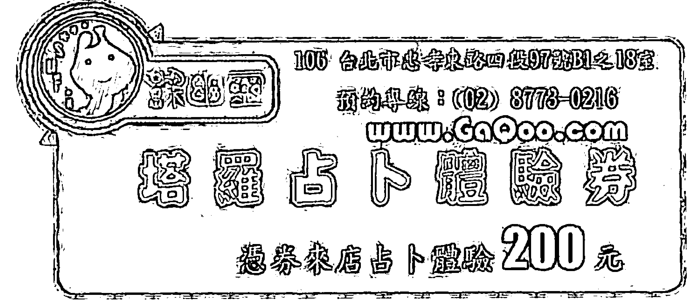  

佛化人生  

Watree Cultural Co., Ltd.  

佛化人生成立宗旨：

將人生的真理傳播到世界的每一個角落！這是一對夫妻十多年前共同經營的一間溫馨的店。和許多人一樣，他們對人生的意義和生命的目的充滿困惑，所以爲了探索生命的真相，他們涉獵了宗教、瑜伽、心靈科學、心理學、超心理學、神秘學、神智學等等內容，在心靈學的研究報告中，對人生的目的有了具體的掌握，希望用分享的態度來與大家一起成長。目前爲大家所提供的有身、心、靈淨化相關用品、資料、和訊息，期望能以真理爲核心，藉由宗教、科學、哲學、藝術、人生經驗、和心靈體驗，逐一來揭開宇宙的真理和生命的真相。

課程活動包括：

+ 1、塔羅牌入門班  
2、生命靈數課程  
3、占星學入門班  
4、Aura-Soma 與天使學工作坊  
5、光的課程  
6、胡因夢深度閱讀工作坊，等等，請上網查看。

產品：書、佛教文物、水晶等，種類繁多，請上網查看。

地 址：106台北市羅斯福路3段325號6樓  
電 話：(02)3365-1678 網站：www.watree.com  
e-mail：ab23632489@pchome.com.tw  

塔羅牌工作坊  

塔羅牌是西方世界流傳已經超過千年的占卜法，依據牌面圖像以及牌陣的變化加以解讀，是「事件性占卜法」中的佼佼者，不只是準實用，而且隨著占卜者閱歷經驗的累積，可以達到極高的境界，足以與中國的易卦等量齊觀。而其富於聯想，容易記憶的圖形，以及深具彈性、可以輕易連結時代脈動的特性，卻又是易卦難以比擬的。它不只可以為我們預示吉兇，還能為我們找尋出解決事情的方法。同時，只要有心，它還可以成爲學牌者內心的反射，協助我們進行內在的對話哦！

> 想要進一步了解塔羅牌的課程  
預約個案的時間，請聯絡：

群傑成長分享空間  

地點：台北市敦化北路 307 號 6 樓  
電話：(02)2713-9987  
傳真：(02)2719-7647  
網址：www.toptecmc.com.tw  

OH Cards 系列產品價格表  

|  | NT$ |
|---|---|
| 1、OH Cards | 1600 |
| 2、Cope 克服卡 | 1,100 |
| 3、SAGA 英勇故事卡 | 800 |
| 4、MYTHOS 神話卡 | 800 |
| 5、SHEN HUA 中國神話卡 | 800 |
| 6、1001 夜神話世界卡 | 800 |
| 7、ECCO 抽象圖卡 | 1,050 |
| 8、HABITAT 自然環境卡 | 1,050 |
| 9、PERSONA 人像卡 | 1,200 |
| 10、MORENA 土著卡 | 1,200 |
| 11、PERSONITA 年輕人像卡 | 1,250 |
| 12、QUISINE 食物卡 | 500 |
| 13、CLARO 空白卡 | 220 |
| 14、BOSCH 博許中古世紀歐洲卡 | 1,500 |
| 15、BEAUREGARD 抽象藝術卡 | 1,350 |
| 16、TAHITI 大溪地卡 | 1,350 |
| 17、Straberries Beyond My Window 窗外的草莓 | 600 |
| 18、The Power of OH (OH Cards 的力量) | 850 |
| 19、OH CASE 塑膠箱子 | 600 |
| 20、一套 (含箱子，不含OH Cards, The Power of OH, BOSCH BEAUREGARDS 和 TAHitI) | 11,970 |  

神奇塔羅出版社 電話：(02)2395-9797  

获取更多好书，请加微信号：strcdts  
店铺：http://strc. cr. cx  

天使呼喚卡  
- 心想事成天使寶典 -  

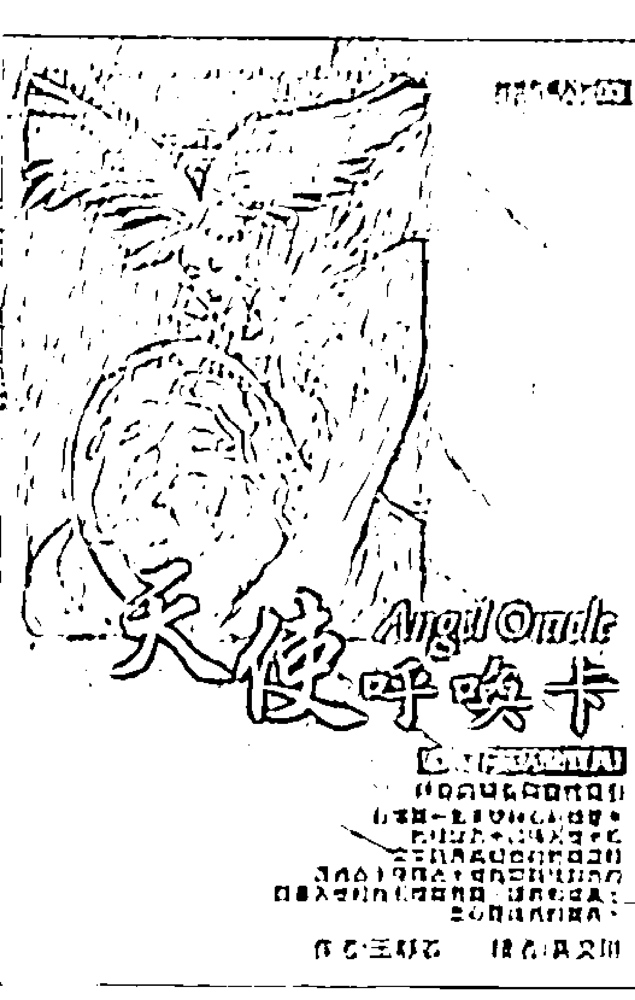  

台灣第一套天使靜心祈禱書卡，包括以五十四張天使卡和文字訊息為組合的祈禱遊戲。透過占卜，使得占卜者為問題找到方向，跟著天使的指引撥雲見霧、提升和成長，是心靈成長的寶典。

萊德·偉特塔羅牌  
- 普及版 -  

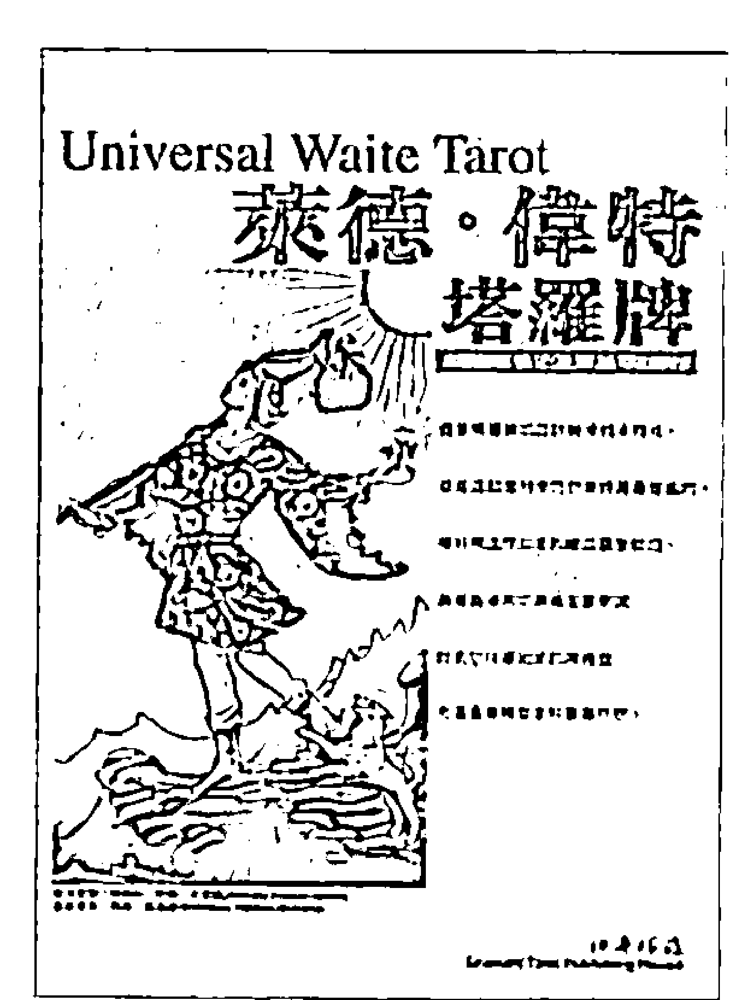  

儘管塔羅牌的設計變得很多樣化，但是這副牌仍然保持是最普遍的，偉特牌之所以能夠變成最受歡迎、最普遍使用的牌最主要的原因就是它所畫出來的牌裡面充滿著各種形象和象徵符號。

神奇塔羅系列  

定價 680元  

定價 850元  

埃及之光塔羅牌  
NEFERTARI'S TAROT  

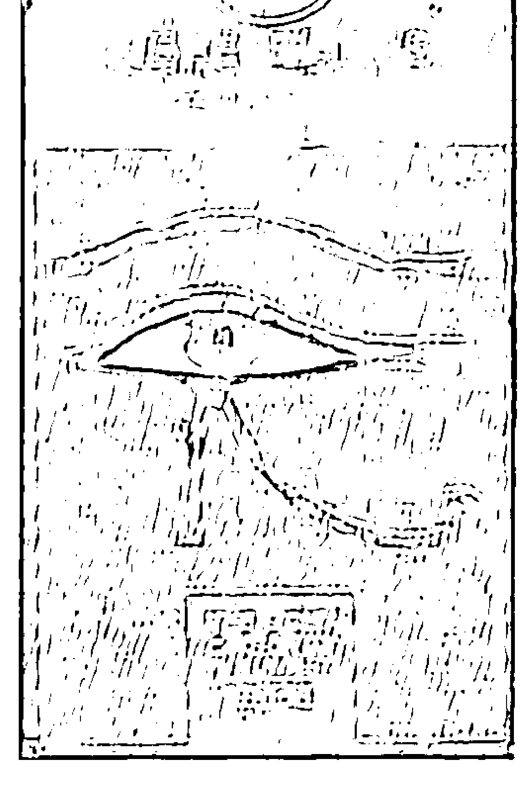  

這副牌是特殊燙金的埃及風塔羅牌，是最頂級的埃及塔羅牌，能量超強，它以尼芙塔莉（Nefertari）為主題。尼芙塔莉是埃及法老王第十四世王朝賴姆西斯二世的皇后。這副牌試圖重現當年尼芙塔莉所喜愛的那些東西的氣氛，她是埃及之光，同時是文化裡最美的各個面的象徵。

埃及塔羅牌  
EGYPTIAN TAROT  

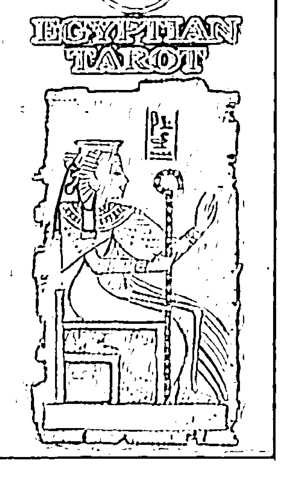  

埃及的魅力跟煉金術的魅力是平行的，那些完全不知道意義的圖畫和繪圖文字似乎蘊涵了很多的奧秘，難怪一些學者和作家也都受到了它們的吸引。考古學的發現和一些古代的人工製品增強了這個文明所產生出來的圖象的重要性。

定價 1,480 元  

定價 850 元  

女神塔羅牌  
- 探索內在的神性 -  

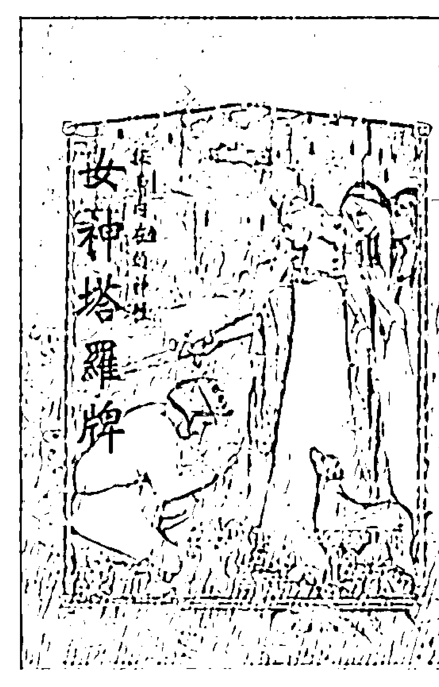  

就像一般塔羅牌的故事同樣地古老和豐富，這些女神的神話更是如此，因為這些神話原來都是活生生女人的故事。揭開歷史的面紗，這些故事透露了我們全部人的過去，它道出了女人與生俱來的神性、尊嚴和魔術般的特質。

美人魚塔羅牌  
MERMAIDS  

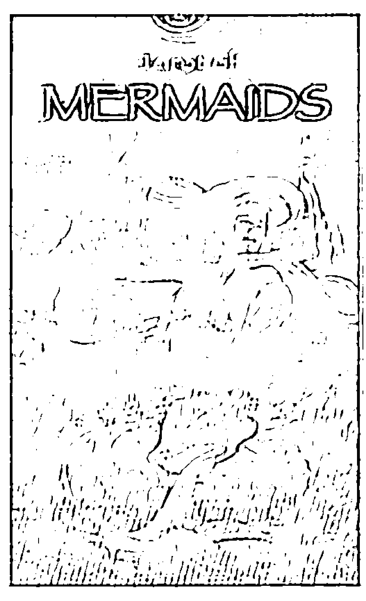  

根據希臘的傳說，美人魚是住在海裡的美麗少女，是悲劇女神媚兒波瑪妮、詩歌藝術女神繆司、和河神愛克羅瓦士的孩子，她們是冥王之後波西佛妮的朋友。當波西佛妮被冥王赫帝士擄走，帶到他的冥王府，眾神就給了美人魚翅膀，好讓她們可以去找她。

定價 880 元(書+卡)  

定價 850 元  

获取更多好书，请加微信号：strcdts  

店铺：http://strc.cr.cx  

奧修心靈系列  

神奇塔羅系列 1  

奧修禪卡  
-禪宗超凡的遊戲-  

神諭塔羅牌  
-易經禪卡-  

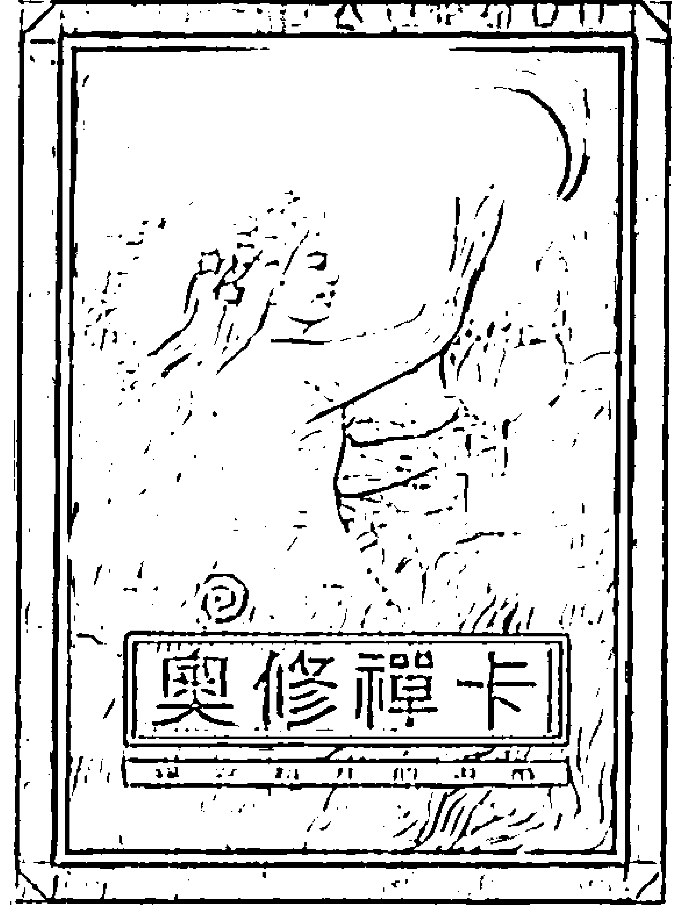  

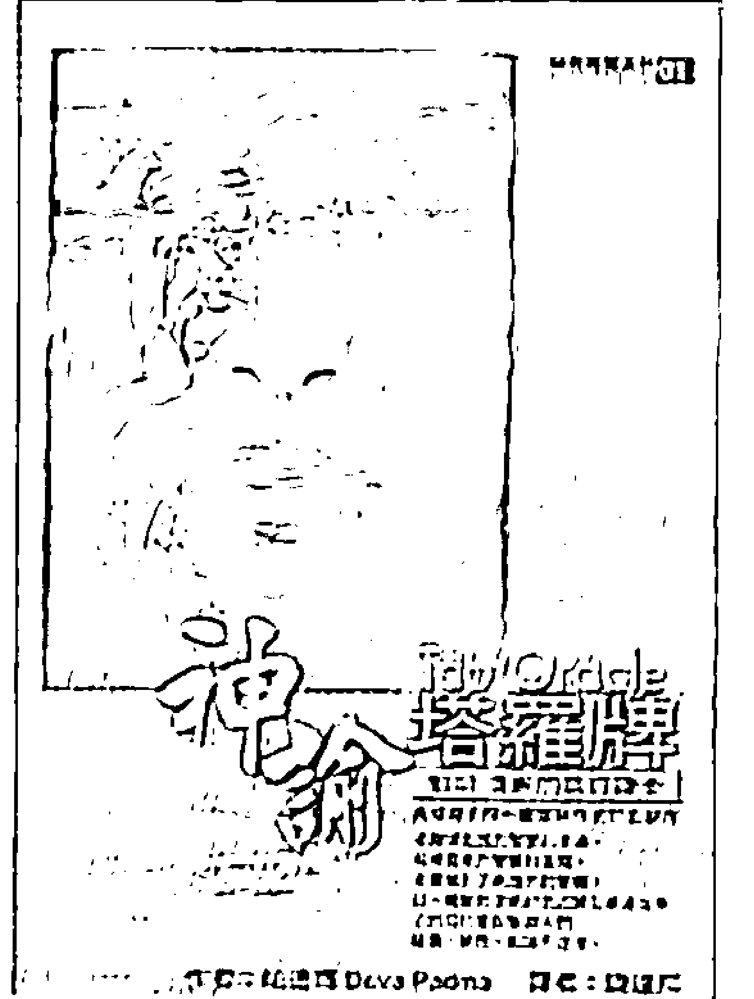  

在一生當中常有一些需要抉擇的片刻，有些人會去求神拜佛，有些人會去算命卜掛，有些人會找朋友商量：：：反正一定要找出一條路，不能老是站在十字路口。  
本書提供了另外一個選擇，它將禪宗的智慧濃縮在七十九張卡裡面，讀者在遇到困惑的時候，可以藉著這個抽牌讀卡的遊戲來幫助自己解決問題。

塔羅牌是西方智慧的表達，易經是東方智慧的呈現，本書結合了東西方的智慧，以一種鮮明清晰的方式將它表達出來，它的目的是在幫助人們除憂、解惑、和指引迷津。

定價 650 元（書＋禪卡／一套）  

定價 880元（書＋牌）  

获取更多好书，请加微信号：strcdts  

店铺：http://strc.cr.cx  

金色克林姆塔羅牌  
- 附中文說明 -  

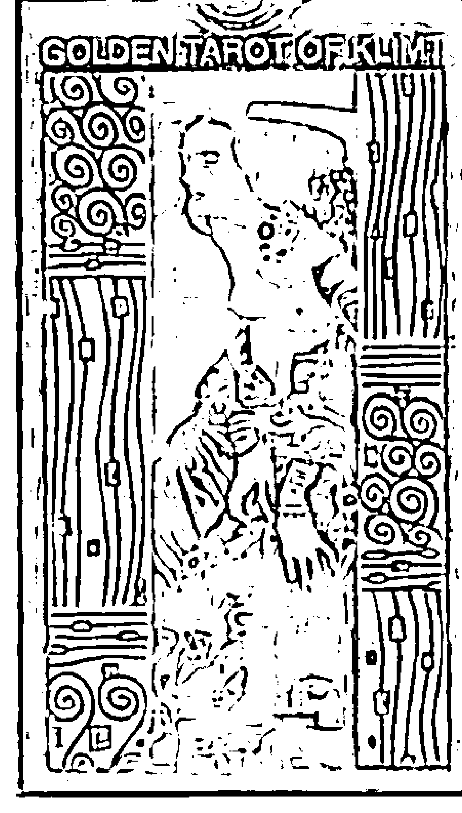  

克林姆這個藝術家很成功地用他的作品使那個時代的氣氛活了過來，它是我們現代文化的基础。克林姆的作品描繪出一種神秘，更是感情和慾望的表達，因此會令人聯想到阿多諾和他的美學理論，那個理論追蹤藝術的本質到一個謎。

瑜伽姿勢卡  
- 附中文說明 -  

  

本副瑜伽姿勢卡共54張，顯示出不同的瑜伽姿勢和瑜伽途徑。你要走到哪裡去呢？遵循瑜伽的途徑，讓這副卡裡面的54個姿勢來引導你。不論你是剛接觸瑜伽或是已經經常在練瑜伽，瑜伽姿勢卡都能夠引導你進入一個深入的自我發現的旅程！每一張卡都描繪出一個很美的瑜伽姿勢，卡的背面還有一個具有啟發性的訊息。
