# 内在疗愈塔罗

## 前言 Preface

當我告訴別人我是專業的塔羅牌老師及靈媒時，對方總是會先露出驚訝的表情，接著馬上轉變成滿滿的好奇心，我常被各式各樣的問題淹沒（不過，我從不厭倦回答），像是：「你從小就知道你有這個天賦嗎？」「當靈媒不會壓力很大嗎？」「所以，你……看得見鬼魂或其他有的沒的嗎？」針對這些問題，我的答案都是：不。我懂大家的好奇心及刻板印象——我也看過《神仙家庭》和《天才魔女》——不過我進入這領域的過程及我的靈性覺醒可能跟你想像的不太一樣。

我相信我的故事、我的經歷、我的創傷，這種體驗，不知不覺中引領我走向靈性的覺醒及重新連結。我從未有什麼突然的領悟或靈光乍現。在眾多的自我療癒工具中，塔羅牌只是其中一項工具，幫助我一點一點拼湊出我曾以為「破碎」的自我，而如今這個自己卻成為我引以為傲、樂於展現的部分。我跟塔羅牌結下的緣分大約從十年前開始，我打算在這本書中陸續跟大家分享我與塔羅的關係。在我開始為他人解讀塔羅牌前，我先自己研究及練習塔羅牌。每當我深入每張牌的主題時，我會連結到自己的生命歷程，並且融入它們的啟示中，讓我逐漸拾回自己的碎片，變得更加完整。基本上，我幾乎跟牌卡一拍即合，最終踏入這領域不只是為了幫助他人更理解塔羅牌及其傳統的象徵，也是為了讓他們信任這項工具，藉此連結自己的直覺，重視自身的內在療癒，透過敘述自己的故事，與他人或自己重新聯繫起來。

我擅長解牌，也對自己熟練的技能引以為傲。這確實能歸功於與生俱來的天賦，但我也非常清楚，長期的投入還有專注練習同樣重要。自從我買了第一副牌卡，每一天我都持續與它建立連結，並努力在每一次的解說中保持誠實正直。

我清楚記得在某次心理治療中，我對我的諮商師說了一些坦率又令自己驚訝且難過的話。我告訴她，我唯一能做好的事情只有自我破壞，以及對自己的力量感到恐懼。我認為自己沒有任何天賦或才華。後來，我在自己的靈性寫作及個人日記上寫下這份領悟：

> 我脆弱的身軀，
還有明顯動搖的信念，
我記得清清楚楚，那天坐在諮商師辦公室的沙發上。
「為什麼要堅持做出這些傷害自己的行為？」
「因為用這樣的方式存在，做出這些行為，
是我唯一擅長的事情。」

我每天都感謝上帝，我過去的想法是錯誤的。

今天，處在人生中截然不同的階段，我滿懷感激，不僅僅是感謝有機會將這份工作視為我靈魂的志業，還有由衷的滿足，以及一股走過風雨的深刻釋然。過去的艱苦引領我至此，身為一位靈性導師，我透過各種課程及培訓，教導了成千上萬塔羅牌愛好者。我以一對一的方式為我的客戶們進行解讀服務，以踏實且貼近人心的方式分享我的靈性指引。在多個社群平台上累積了龐大的追蹤者，持續分享牌卡的象徵，以及這個備受推崇且深具智慧的古老系統中的細節。我辦了無數場的靈性靜修營，讓這些靈魂能夠進入療癒的軌道，多年來創作大量靈性相關的內容和寫作——多到幾乎數不清。我也花了許多時間和努力投入在自己身上，繼續療癒自己。

雖說有了這些成果，我還是想特別強調：我與這個社群之間的連結，以及我們之間的共同體驗絕不是什麼街頭巷尾的小魔法，更不是什麼煽情、廉價的靈性包裝。我的牌卡教學不會設立聳動的標題，也不會戲劇性地誇飾任何人的未來或命運。反之，我們是一個共同成長的團體，我們一起擁抱真正的內在工作，而這真的是一件很美好的事情。針對一些其他人可能難以啟齒的主題，我們無所不談，共同打造一個不帶批判性、不必感到羞愧、也沒有任何不安全感的傾訴空間。這是我們內在小孩一直以來都渴望的空間。

我向群體的每一位成員承諾，我會持續保持初衷：以靈性、安全的方式分享心靈實踐的方法，並鼓勵所有人無須帶有罪惡感，勇敢成長與蛻變。成為一位靈性領導者帶給我更多的責任，我承諾自己也要活出真誠，正如同我所期望每一位勇敢來到這個空間、參與解牌和教學的客戶一樣。如果你此刻正拿起這本書，那麼請相信——你也屬於這個社群，是我們的一份子。

透過這本指南，你將會學習到塔羅牌分成兩大部分：大阿爾克那（Major Arcana）以及小阿爾克那（Minor Arcana）。阿爾克那（Arcana）這個字源自於拉丁文 Arcanus，意思是「秘密」。塔羅牌真是迷人，它如同字面上充滿著各種秘密——更準確而言，總共有七十八個秘密。有些是微小變化，圍繞著我們的日常生活（小阿爾克那），有些則是較重大的轉折，甚至難以啟齒的深層經驗（大阿爾克那）。這些主題都與我們息息相關，唯有去發掘它們，我們才能夠更清楚、全面地理解自我的各個面向，並進一步認識偉大的生命目的。

我認為，塔羅牌的秘密特質正是第一眼令我們著迷的原因。當我分享我的職業時，我會看到那些困惑的眼神和表情，而這些牌卡彷彿是一疊我們渴望破譯的未知訊息，這些訊息甚至帶點誘人、神秘和禁忌的色彩。有些人可能會認為塔羅占卜師就是一位瘋狂的阿姨，櫃子上擺放著不同牌卡，房間還瀰漫著香氣。但隨著大家變得更加成熟，拿下帶有批判性的濾鏡後，我們會意識到，這位阿姨在如何表達直覺這件事上，其實早就領悟了一些什麼——她一點也不瘋癲！

正是塔羅牌的神秘感將我們吸引過來。它們輕聲細語地發出邀請，邀請我們走近它的智慧。牌卡的迷人之處在於，當我們在尋找答案時，牌卡與我們所習慣依賴的典型搜尋引擎大不相同，因為牌卡其實是一面鏡子，反映出我們各種面向和缺陷，讓我們有機會發現，原來所有的答案一直都藏在我們內心深處。

塔羅牌所帶來的神秘感、隱密性和令人難以捉摸的黑暗氣息讓我感到不可思議，前所未有的「被理解」。我認為是因為我一開始接觸牌卡時，正處於「秘密」與「陰影」深度共鳴的階段，並正努力發掘自己尚未自我覺察的內在部分。我喜歡塔羅牌直指我的掙扎，而不是規避或繞過我所面臨的真實樣貌。

在成長過程中，我守著許多秘密，隱瞞家裡所發生的事情、身體所發生的事情，壓抑深深的羞愧感。在我二十多歲時，我被診斷出創傷後壓力症候群（PTSD），令我崩潰，卻也帶有一絲的解脫。這個診斷是在我經歷了一連串的艱辛歲月後才出現的，而那段時間裡，我的情緒起伏劇烈，對自己的信念幾乎被消磨殆盡。就這樣，我守著秘密將近十五年，直到我願意開口分享才被揭露出來。

當我說出真相後，過往的記憶、情緒和能量像洪水般湧現，我的感受及能量的閘門重新被打開，或許那時我的「第三隻眼」也被啟動，只是當時我還沒有意識到。我已經在「求生模式」中撐了太久，診斷出PTSD的標籤並沒有讓我感到受限，反而有一種不可思議的認同感，它給我再一次重新定義自己的機會。現在，我可以用自己的方式面對這些經歷；當我能以恰當的言語來說明自己的狀況，這就成為我人生轉變的關鍵，讓我改寫人生方向，能夠發掘和表達自己的直覺，不再退縮，不再隱藏自己。

在繼續之前，我想先提醒讀者：我將要分享一段童年性侵的經歷。這是我生命中的第一個秘密，而我現在才明白，正是這個經歷帶領我踏上內在之光和神聖目的的起點。讓我難過的是，有不少讀者會與我的故事產生共鳴，可能是胃部感到沉重，或者一種熟悉且憤怒的不安湧上心頭，想到：天啊！這也曾經發生在她身上。

我與身體斷開連結的那一天，就是我小時候第一次被性侵的那一刻。當下的我立刻凍結起來，封閉自己——成了另一個版本的我，我只是一個孩子，卻經歷了巨大的創傷。當時，這樣的經歷讓我相信自己的痛苦並不重要，而這些受傷的部分不該被說出來。從那一刻起，我無意識地踏上一段漫長旅程，重建「安全」的感受與對自己的信任——關於我的身體、我的生活、我自己。

即便虐待的日子已不存在，這件事仍然在我的靈魂上留下了暗黑的印記。隨著時間推移，我對自己的感覺時而清晰、時而模糊，甚至困惑。我不知道自己要成為什麼樣的人，或我真正渴望什麼。大部分時間，我只是努力逃避或否認恐懼的感受，而不是茁壯成長或探索我未來各種的可能性。這種失去連結的情況也表現在許多層面上，從憂鬱、飲食失調到過度反應以及強烈的憤怒。現在的我對創傷倖存者和自己的反應有了更多的了解，也讓我更能同理自己。我所創造出來的混亂其實是一種常見的防禦機制。

我的青少年以及成年時期都處於緊張和憤怒的狀態，應該說——我很易怒、很惡毒。我沒有意識到自己的內在小孩正在拳打腳踢加尖叫，好吸引我的注意力。每當外在情況讓她感到威脅，她就會鬧得天翻地覆。她希望我能夠分享這個秘密，好讓她能夠繼續前進。

我對於童年的記憶常常是空白的，隨著年齡增長，我的恐慌症會在各種奇怪的狀況下出現，像是教室或者電影院裡面，我感覺自己完全失控。對自己「感受到恐懼」的恐懼，又衍生出更多恐懼，所以到了青春期，我感覺自己被困住了。我不知道我能做什麼，是否有足夠的力量去做什麼，我想成為什麼樣的人。我總是精神緊繃，處於高度警戒，無法相信任何人，我對他人的不信任，透過各種混亂的人際反應表現出來，包括「惡女」的傾向，也不尊重自己的身體。為了讓自己不再有機會成為「受害者」，我寧願選擇先不尊重自己。這種自我毀滅的行為五花八門，包括飲食失調和尋求男性的認可。這些行為阻礙了我的人際關係、我的信心，讓我失去方向。現在我才明白，小時候的大秘密就像是推倒的骨牌，引導殘破不堪的我走上了跌跌撞撞，卻也真正自我覺察的道路。作為一個成年人，我現在知道，自己有責任立起每一張倒下的骨牌，如同一名堅強有韌性的士兵一樣，勇敢地佔好自己的位置，並用我一直以來就值得擁有的方式，讓自己的故事被聽見、被看見。

在被診斷出患有創傷後壓力症候群（PTSD）時，療癒成為我人生的重心，我別無選擇！我的焦慮不斷地耗損自己，使我對未來失去希望，我懷疑自己是否能夠成為一位有穩定工作並擁有健康親密關係的大人。接下來的幾年裡，我幾乎把「療癒自己」當作一份全職工作，一方面努力解除那些陳舊的創傷反應模式，同時重新與一個感覺既熟悉又有點陌生的自己建立連結。

一開始，我是進行臨床治療，當時（還）沒有水晶球或其他有趣的直覺輔助工具。你能說出的任何一種治療方式或資源，我大概都試過。從密集且專業的治療課程到團體治療、眼動減敏與歷程更新治療（EMDR）、藥物治療，最後是瑜伽、寫日記和禱告——我幾乎都經歷了一遍。治療師們幫助我避免接受一段我其實不想活出的劇本，但我仍然渴望一些更溫柔的療癒方式，感受到希望和支持。在我追尋更多以靈性為中心的工具時，我最終拿起了塔羅牌。它們充滿陰性的能量，既溫暖又迷人，令人著迷，也讓我看到自己那些不同的面向，甚至帶有瑕疵的部分依然有其美麗和獨特。每當自己在練習解牌時，那都是一種內心的療癒，這個儀式引導自己回歸真實的自我。這些曾經讓我感到羞愧的記憶和時刻，終於能夠在我反思牌卡時得到被重寫的機會，這些新故事成了我的支柱、標記和里程碑，譜寫能夠讓我引以為傲的篇章。

開啟療癒之旅後，我也開始對其他人的故事感興趣，對於生命中如何帶領我們克服所有障礙的韌性深感著迷。對我而言，與人隔著一副塔羅牌靜坐交談，是一個人能擁有的最親密、也最神聖的經驗之一，這也是為什麼我從不厭倦分享塔羅牌和占卜。我會專注、心懷敬意地傾聽，聆聽我的客戶如何優雅地應對各種逆境，如何勇敢面對生活中此起彼落的挑戰，在療癒之路上追尋其中的意義和歸屬感。

然而，當有人分享自己的經歷時，或者我在幫他們「解牌」時，我會看見他們開始退縮，讓我猶豫是否該抑制某些出現在牌卡上面的內容，忽略牌卡所揭示的陰影或不完美之處。

透過這本書，我想邀請你重新定義和詮釋我們內心深處的秘密，改變我們看待和述說自己傷痕的方式。用新的語言重新書寫我們的故事，讓塔羅牌與它們所承載的訊息，幫助我們擁抱故事中的不完美，而非將這些不完美視為需要被隱藏的東西。請將你所經歷的一切，都當作是內心的邀請，或是一段重返自我的旅程。

在這些篇章中，你將讀到我如何透過內在的探索覺察自我，還有我至今仍在療癒的部分。我希望用一種嶄新的方式來呈現塔羅牌和抽牌儀式，讓你開始把自己的秘密視為神聖的存在，而非羞愧的來源，而是值得被覺察、被看見、被肯定的內在空間。就像是一個有待發掘的空間，值得我們慶祝和覺察。

## 如何從本書中學習

本書不僅是一本學習塔羅的工具書，也是你深入自我探索的新入口。這本書將會引導你回憶過去的經歷，分享你最混亂、最不完美的部分，並且勇敢探索你的真相，在你尊重自己的同時也讓別人能夠看見你完整的樣貌。我會提供一些練習、建議和範例，告訴你怎麼做到。

我鼓勵你保留那些能引起你共鳴的內容，至於沒有共鳴的就放心地放下。在我的療癒旅程中，我做了許多嘗試，也犯過不同的錯誤，找到了真正適合自己的空間與工具，讓我感到自在、真實，也有另一些雖然有趣，卻始終覺得勉強、不自然的。同樣地，對你而言可能也是如此。有些牌與你一拍即合，而另一些牌則讓你十分抗拒。另外，我也建議你放下對塔羅牌先入為主的既定印象，或執著是否做對，而是把焦點放在真實感以及持續性上。

在第一部分中，我們會探討「抽牌」這項練習中的細微差異，幫你建立穩固的基礎，也能更有自信地解牌。你可以將這部分當作一門解牌速成課。我會分享我的技巧，包括如何為你的牌卡建立專屬的儀式流程、如何理解數字的意義、如何解讀逆位牌的訊息、如何設計屬於你的牌陣等等。

第二部分則是你在練習解牌以及建立自己的解牌流程後會反覆參考的內容。我們將從小阿爾克那牌開始，探索每種花色中的十四張牌，接著認識美麗且具有豐富象徵的大阿爾克那牌。我會提供關鍵字方便參考，還有更深入的解說，讓你能更全面的學習與反思。最後還有兩個具體的練習，讓你能夠整合並進行內在反思。這些練習的目的都是為了讓你能夠深化對塔羅牌的體驗，透過身體力行讓你對每張牌記憶更深刻、更貼近自己，最終能夠「活出」牌卡的能量和意義。這本書也會有許多寫作引導。我認為寫作與塔羅牌是共生的關係，因此我也建議你專門寫一本日記來反思自己所抽到的牌！我還提供了身體感知練習和其他實用工具，協助你實際運用每張牌所呈現的能量。

也許這本書裡最私密也最脆弱的部分，是我為每張塔羅牌所寫下的「引導式書寫」。在我的療癒之旅中，一邊與牌卡共舞，一邊在日記本中寫下的心語，每一段都記錄了我在重新認識自己的過程中所經歷的片段。這些是我的秘密，對應某些特定的牌，提醒我釋放內心的羞愧感。每首詩都是我最真實的表達，也很榮幸能夠分享給大家。

我希望你感受到我對這個過程的熱愛，以及這些牌卡的感情，也期望你能夠在我的故事中，看見自己。

現在，讓我們一起走向內心深處。

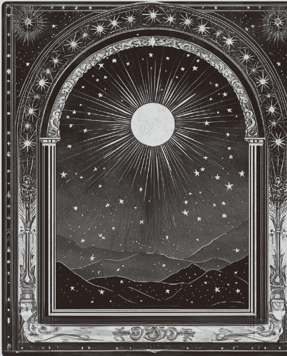

# Part 1 塔羅的基礎

## Chapter 1 回顧：塔羅牌的歷史

塔羅牌並非自古就用於占卜。事實上，它並不像大家所想像的那樣古老或神秘。雖然我們現在視塔羅牌為一種幫助自我探索、進一步了解心靈的工具，但是塔羅牌最原始的目的根本不是用來療癒或者算命。塔羅牌的演變過程中，確實賦予了神秘主義的色彩，並與女巫和通靈有所連結，但塔羅牌的歷史其實非常簡單：它起源於1400年代左右的義大利北部，是一種遊戲¹……

……就這麼簡單。塔羅牌並不神聖也非凶兆，它原本只是單純的遊戲。

隨著時間的推移，塔羅牌的故事和目的變得明顯更加複雜，然而當時牌卡的主要用途就是為皇家貴族提供一點娛樂，當時他們玩的牌卡遊戲叫做塔羅奇（tarocchi²），大約是泥金裝飾手抄本（illuminated manuscript）盛行的時期，富裕的義大利家族會委託別人製作精美的鍍金插圖卡，通常都是找當地著名的藝術家。這些牌卡被稱為carte da trionfi，意思大致是「凱旋牌³」。（我將在下一章深入說明這部分，大阿爾克那牌有時候也因此被稱為「王牌牌組（Trump Cards）」。）

我們現在所知道的十四張小阿爾克那牌組其實是一組「點牌（pip cards）」，其中包括十張編號牌和三到六張的男性宮廷牌⁴。我們現今的牌組與當時的牌組非常相似，儘管金幣牌（Pentacles）有時被稱為錢幣（Coins）或圓盤（Disks）牌組，而權杖牌有時則是被稱為短棒（Batons）、棍棒（Sticks）、法杖（Staves）或者棒子（Rods）⁵。

就如現代的牌組，牌面上的圖像代表我們在生命歷程中所面對的主題，反映出我們日常生活中所經歷的事情，並呈現各個群體所面對的起伏。其中，猶太、埃及和基督教意識形態以及占星學元素的視覺圖像⁶都十分明顯，像是女祭司牌裡面的妥拉（Torah），以及皇后牌皇冠上代表黃道十二宮的十二顆星，一切都顯示這些教義信條對我們現代牌組的影響。雖然某些牌的編號有被交換（正義牌與力量牌），而其他牌則有教皇、侍衛和慾望等角色，但這一切都有異曲同工之處：為了反映我們人類的經驗⁷。

最後，牌中所代表的各種主題也催生了另一種名為 tarocchi appropriati 的遊戲。這些玩家——就是我之前提到的高貴的義大利人，受到牌面主題⁸的啟發，因而為彼此寫詩。我十分喜愛這個遊戲，因為本質上，它就是我在這本書的後半段所要求你做的靈性書寫，不過是另一種版本而已，可以說是彼此解讀的最早形式。

直到幾百年後，大約是1800年左右，塔羅奇以我們現今所知的塔羅牌形式出現在法國⁹。1909年，英國神秘主義者亞瑟．愛德華．韋特（Arthur Edward Waite）與萊德（Rider）出版社合作出版了一副牌。這是由倫敦的女藝術家，也是公認的神秘主義者，帕梅拉．科爾曼．史密斯（Pamela Colman Smith）所繪製。史密斯與韋特相識，因為兩人都是同一個秘密會社的成員¹⁰。在史密斯所詮釋的版本之前，塔羅牌的圖像十分簡單，金幣一牌面上就是一枚金幣，金幣二牌面上就是兩枚，以此類推。史密斯是第一位用豐富的色彩和具有張力的人物來解述小阿爾克那牌的完整故事，而且也在每張牌上標註她的蛇形簽名¹¹。她對整套牌組進行現代化改造，以便敘述整個故事。這個版本及其藝術美感仍然是迄今為止最常被重新印製和最常被引用的塔羅牌¹²。

我認為史密斯天生擁有賦予塔羅牌個性和深度的天賦，我感覺她就是傳遞這門藝術的管道。令人遺憾的是，長期以來，她對工作的熱忱未能得到應有的認可。儘管塔羅牌是一種視覺的工具，而一般人往往都認為藝術家應該會受到讚賞13，但有段時間，她的名字從頭到尾都沒有出現在牌卡標題上。基本上，她完全改變了這個系統，所以在這本書中，我對這套牌的描述和引用中，你都會讀到「萊德．韋特．史密斯牌」（Rider-Waite-Smith）的名稱，而不僅僅是「萊德．韋特牌」（Rider-Waite）而已。我鼓勵你從內心喚起屬於你內在的「史密斯」，用敏銳的眼睛研讀你的牌。你永遠不知道她的插圖中隱藏著哪些能夠引起你共鳴的事物。

那麼，了解塔羅的歷史為什麼對你的學習這麼重要呢？首先，我們要向隨著時間推移而發生巨大變化的實踐致敬，就像你一樣。其次，我希望對塔羅牌歷史的了解能夠揭開塔羅牌的神秘面紗，並引導你與它們建立更健康的關係。在我多年的解牌經驗中，我注意到有些人會十分依賴牌卡，在危機時刻求助於它們（稍後我將對我所提出的「恐慌式抽牌」做更多論述）。他們希望牌組能提供人生重大問題的解答，或抹去過往的痛苦。但是這並非牌卡的初衷，這本書旨在幫助你欣賞牌卡的故事，因為這些故事正巧反映出你個人的歷程。

如果你在解牌中看到「負面」的牌而感到焦慮時，我希望你能夠用另一種觀點來看待。牌面所出現的任何事物都不是絕對的命運。說到底，牌卡就是牌卡；解牌之所以神聖在於我們與牌卡建立的連結，而非牌卡本身。（事實上，我對我的牌卡並不執著，甚至喜歡偶爾燒掉某張牌，當牌卡脫離牌組並消失無蹤時，我還會感到自豪。）牌卡並不會告訴我們任何具體的事情，它們只是靈魂（Spirit）向我們發送訊息的載體而已。所有占卜師都會有不同的詮釋，畢竟到頭來，我們都是擁有自由意志的。好好使用它吧！

### 破解迷思

我的灵性能力与塔罗的关系时常受到质疑，不过当我做出澄清后，人们往往会问我该如何与他们的牌卡建立关系。尽管我与牌卡的关系十分融洽舒服，且解牌已是我的第二天性，但对于一位刚接触牌卡的新手来说，这种感觉可能会像打开潘朵拉的盒子一样。

塔罗牌时常背负各种污名，你对于占卜的疑问也并非毫无道理，毕竟开始解牌后，你就是进入了一个未知的领域，就如愚者一般，一段令人兴奋的旅程正等着你。当你的期望或刻板印象越少，你就越能选择属于自己的冒险旅程。勇敢地问问题吧，但你也要先做好自己的功课！我将会破解一些有关塔罗牌的迷思，也鼓励你保持开放的心态，让自己能够了解牌卡的新面貌。

> Q1·塔罗牌拥有某种我应该感到害怕的「魔力」？

根据每个人对灵性、宗教以及直觉的过往经验与历史，塔罗牌或许会让人感觉像是某种带有恶意的「魔法」。这个社会已经把许多女性相关的习俗、行为画上错误的等号，但是我可以向你保证，抽塔罗牌并不是犯罪或者与魔鬼做交易。事实上，正好恰恰相反。当你视塔罗牌为疗愈的方法时，它们就会承载更多光明。如果你带着爱靠近它，它也会立即用爱回应你。

> Q2·我需要会通灵才能解牌吗？

不需要。但如果你想要的话，塔罗牌是灵性探索的最佳切入点之一。更重要的是，它能够促进你与自己的对话，因为牌卡的主题是如此真实、深刻且具有挑战性，当我们抽牌时，无可避免地会触碰到自己不这么理性、更加原始的那一部分。自然而然地，你的直觉会在不知不觉的情况下发挥出来，因为你正在进行不同的内在对话，使自己脱离自动驾驶模式，进入更神圣的空间。

> Q3·塔罗牌能预测我的未来吗？

如同生命中的其他事物一样，答案是肯定也是否定的。塔罗牌是解读当下的能量，所以可以根据我们当下的状况与提问，从牌中读出能量的走向。接着，我们可以采取行动，运用我们的自由意志有目的地干涉，让我们能够重新校准自己的生命，迈向不同的命运。

假如你感觉自己有偏巫术的那一面，对占卜也有兴趣，并认为探索这些对你而言无伤大雅，那么不妨可以尝试一下，塔罗牌确实还是有算命的面向。但如果你觉得那样很勉强或不自然，其实完全不需要拿来预测未来，而是很单纯地练习抽牌与反思。塔罗牌总是能够与当下的你同在。

> Q4·我需要别人送我第一副塔罗牌吗？

不用，这只是一种迷信。不过，我认为如果有人送你一份有意义且是为你精心挑选的礼物（胜过一支蜡烛或一瓶酒，对吧？），也是一件很美好的事情！但是，我最喜欢的牌往往都是自己受到吸引而买下来的。其实占卜也是在赋予你主动选择的力量，所以如果你受到某副牌卡的召唤，就顺着自己的心吧！

> Q5·塔罗牌有好坏之分吗？

有些牌让人容易亲近，有些需要多一点时间细细品味，而有些则让我们想立刻面对需疗愈的议题并从中走出。这跟生活一样啊！所有的经验都是中性的，但我们却赋予它们某种情感，并选择如何做出回应。所以，当我们想靠近或远离某些人，这都是很正常的。

每张塔罗牌都有中立、阴暗和光明面，而比较难以面对的牌，像是高塔或恶魔牌，也都还是隐藏着一丝希望。我们认为比较正面的牌，像是太阳或力量牌，也都有其极端的一面。只活在二元对立的世界并不好玩，所以我鼓励你不要太冲动，不需要马上将牌卡贴上「好」或「坏」的标签。更何况，我们接触塔罗，是为了倾听直觉，不是为了遵守更多规定或拘于框架，那又何必把这些拘谨带入我们与塔罗之间的连结中呢？我认为，灵性工作并不需要任何标签。

> Q6·塔罗牌必须单独练习吗？

我的建议是：优先考虑属于你与塔罗牌的私密对话，让牌卡成为美好的体验，成为你与灵魂之间的管道。但是人类——特别是女性——世世代代都聚集在一起，所以塔罗牌的团体应用也有其独特之处。

我们都是群体动物，能够透过分享与说故事的能力而茁壮成长，如果没有这些社群，我的疗愈也不可能成功。这本书会让大家回忆起，塔罗牌也曾是一种社交工具14，我也尽可能地详细说明如何与他人分享每张牌的领悟，同时深化你与牌之间的内在连结。你可以和大家分享你的收获，和挚爱或对塔罗感兴趣却犹豫不决的人聊聊你的心得。如果你对此引以为傲，就把你的塔罗牌介绍给大家，并且分享你在旅程中获得的智慧！

1. Jessica Hundley, *Tarot* (Cologne: Taschen, 2020), 10–19.
2. Tim Husband, “Before Fortune-Telling: The History and Structure of Tarot Cards,” In Season (blog), April 8, 2016, metmuseum.org/blogs/in-season/2016/tarot.
3. Hundley, *Tarot*, 20–35.
4. Benebell Wen, *Holistic Tarot: An Integrative Approach to Using Tarot for Personal Growth* (Berkeley, CA: North Atlantic Books, 2015), 7–11.
5. David Parlett, “tarot,” Encyclopedia Britannica, December 12, 2022, britannica.com/topic/tarot; Husband, “Before Fortune-Telling.”
6. Hundley, *Tarot*, 10–19.
7. Husband, “Before Fortune-Telling”; Hundley, *Tarot*, 10–19.
8. Hundley, *Tarot*, 10–19.
9. Parlett, “tarot.”
10. Hundley, *Tarot*, 10–19.
11. Hundley, *Tarot*, 10–19.
12. Hundley, *Tarot*, 20–35.
13. Jacqui Palumbo, “The Woman Behind the World’s Most Famous Tarot Deck Was Nearly Lost in History,” CNN, May 12, 2022, cnn.com/style/article/pamela-colman-smith-tarot-art-whitney index.html.
14. Wen, *Holistic Tarot*, 7–11.

## Chapter 2

## 拆解：塔罗牌的组成

塔罗牌本身拥有一个清晰与完善的系统，所以先让我们来定义及区分塔罗牌的组成。透过理解牌卡及系统的结构，身为解牌者的我们先奠定基础，明白这些牌卡并非随机出现，而是层层交织勾勒出一个有脉络的故事。我们首先会遇见编号零号的主角（愚者牌），跟随他经历接下来七十七张牌的旅程。每个主题都传递着不同的细节与深层涵义，而塔罗牌的整体架构可以协助身为解牌者的我们，帮助我们厘清应聚焦的重点，并对可能的发展有基本的认识。

### 总共有七十八张牌（不可能更少）

传统的塔罗牌不能少于七十八张牌。这些牌卡都是经过精心设计，组成一个有组织的系统中，故事层层推进，富含意义与复杂性。我认为一副标准塔罗牌就必须是七十八张牌，才能对塔罗牌的传统意义及解牌脉络表示尊重。确实有不同艺术家和创作者会额外添加牌卡，作为创意延伸，也能用有趣的方式扩充主题性。然而，大多数你接触到的牌卡都会包含大阿尔克那和小阿尔克那牌中的七十八种意义。

你可能会觉得与自己有共鸣的牌组少于七十八张牌，这些牌可能是神谕卡（oracle cards）、肯定语卡（affirmation cards）或天使牌（angel cards），虽然它们同样可以成为强大的治疗工具，鼓舞人心，但不应与传统塔罗牌混为一谈。

### 大阿尔克那

大阿尔克那由二十二张牌所组成，从愚者（编号0，或无编号）开始，到世界（编号21）结束。这些牌象征灵魂的旅程与灵性的成长。相较于小阿尔克那，它们更具原型性和主题深度，因为每张牌都代表我们一生中所面临的共体能量（和困境）。大阿尔克那有时也被称为王牌，它们之所以令人难忘，是因为它们描绘了我们生命中那些强烈的重大篇章，带给我们不同讯息，也预示着转变、终结、重生与整合的生命阶段。

基于我对牌卡的特殊情感，我将大阿尔克那牌称为塔罗牌中的「重量级人物」，因为每张牌的主题都蕴含丰富的象征和深远的意图。这组牌在我们的疗愈旅程中有举足轻重的影响，所以当你解读大牌时，请特别注意它们，并将它们视为当次解牌的主轴，它们传递的是你抽牌当下最能接受到的核心议题和最明显的能量动向。

### 小阿尔克那

小阿尔克那由五十六张牌所组成，分为四种花色，就如扑克牌一样，每种花色带有十张数字牌（从 A 到 10）以及四张宫廷牌。

小阿尔克那是整副牌中数量最多的部分，代表着我们日常生活的风格、任务、关系以及经历。有些牌对你而言可能十分熟悉，有些却又感到相当多余，因为这些都是在我们生命循环中习以为常或周而复始的能量。小阿尔克那能量多元，告诉我们如何行动、回应和整合来自大阿尔克那中的学习和灵性成长，提供具体的指引和启发。

#### 金币（土）

金币牌与物质世界息息相关，包括我们的身体、健康、家庭、财务和事业，它所对应的元素是土，象征着务实、勤奋、忠诚与耐心。

#### 圣杯（水）

圣杯牌掌管我们的情感领域、涵盖各种情绪、各类型的人际关系，对应的元素是水，与疗愈、脆弱和敏感有关。这组牌也强调我们的直觉与共感力。

#### 宝剑（风）

宝剑牌掌管智力和思维，连结我们的思想、沟通力（语言和非语言）、智慧和逻辑，对应的元素是风，象征适应性、快速变化和好奇心，宝剑牌也反映我们的个人真理、诚信和真实性，并重视正义、公正与诚实。

#### 权杖（火）

权杖牌与个人力量、激情和信心有关，探索我们对于生命目标、创意愿景和原始本能的觉察和连结。权杖牌与火元素有关，象征强烈性且具有转化力量。这个元素能触发我们的自我意识，迅速回应冲突或涌泉一现的灵感。权杖牌代表变革的力量，充满着魔力与独特性。

### 宫廷牌

宫廷牌是每组小阿尔克那花色的最后四张牌。这四种花色的宫廷牌在塔罗中创造了十六种性格类型和迷你「家庭」，每组宫廷牌由国王、皇后、骑士和侍者所组成。

#### 宫廷牌代表

**我们自己：** 特别当你在为自己解读时，宫廷牌可能会指出你性格中的某一块，提醒你应该更深入理解、欣赏并善用该特质，来克服现实中的冲突与挑战。或者，塔罗牌可以点亮你性格中需要释放或者更加成长的那一面，一个能让你进化的空间。

抽到宫廷牌后，你可以问自己一些问题：

- 这张宫廷牌的性格听起来像是朋友或家人对我的描述吗？
- 我在自己身上是否也看到了这个性格的天赋？
- 这张牌是否反映了我引以为傲的某一部分性格？
- 我是否有带着自信分享自己的这一部分？

**他人：** 有时，宫廷牌代表你的伴侣、挚友、有毒的同事、母亲或兄弟姊妹。善用并跟着你的直觉走吧！有时你会十分清楚这张宫廷牌代表生活中的某个人，可能是一位你可以信赖并会帮助你的人、一段需要设立界线的互动关系，或者一位仍占据你能量意识空间，需要透过更多疗愈来释放的前任。观看这些性格的天赋与优势，还有其阴影面。这些特质是否有与你相似之处并能够支持你，或是如何阻碍你的自我连结与平衡？

**事件及消息：** 虽然我们解牌时会将角色与自己生活中的人物对号入座，但有时候它们的出现会标记某个事件、代表即将到来的消息，或者反映能量的进程或成熟度。骑士与国王通常与事件有关，侍者则是带来消息或者传递讯息给我们，而王后可以代表创意计划或新机会的来临。

#### 宫廷牌的位阶与成熟度

> **侍者**
身为塔罗牌中的孩子与学生，侍者是宫廷牌中稚嫩与单纯的存在。天性带着好奇心，渴望探索未知，引导我们面对那些不常触及的自我面相。这股能量可能会唤起我们过去未曾敞开的经验，而他们孩子般的纯真与好奇心会让我们着迷，邀请我们带着喜悦的心，回应召唤，聆听它们的讯息。

> **骑士**
骑士们是行动派代表。在塔罗牌中，他们代表我们如何启动、何时出发及为什么采取行动。他们是发起者，即使不完美也勇于在行动中学习与调整。他们不怕冒险、犯错，并在过程中不断蜕变。在牌卡中，骑士们通常被描绘骑在马背上，代表他们回应及应对挑战与冲突的方式就是往前进。

> ## 皇后
皇后是宫廷的守护者。她们的能量温柔且女性化，带着智慧及成熟的态度，优雅地端坐在自己的宝座上。皇后帮助我们看见内在可被疗愈的地方。皇后们天生具有创造力与启发性，帮助我们进化，重新想像创作的方式与自我成长的路径。她们也象征女性的成熟、性欲及母性的转化过程。教导我们如何连结女神的能量，滋养自己也滋养他人。

> ## 国王
国王象征权威与掌控，是塔罗牌的领导者。他们往往在自己选择的领域中表现出色，可以运用技能与知识来服务他人。作为一种典范，经常反映出我们在生命中的强项或者已经建立的主导地位。他们代表著名的远见领袖或统御者。

#### 宫廷牌都是非二元的，所有十六张牌都存在你之内

请记住，每张宫廷牌都是非二元性别的。虽然你会在这本书和其他塔罗牌书中找到性别语言，但其实这些原型人物都没有特定的性别。例如，一位认同自己为女性的解牌者既可以是国王，也可以是皇后。要让自己练习脱离他们的外在形象，并更专注于他们所带来能量，思考自己是否也能展现出相同的能量。

另外值得注意的是，这十六个角色共同代表一个完整的个性和人物，也就是你。我们无法被其中一个角色所定义，因为在不同的生活场景中，我们可能展现出各种角色的优势（或显露他们的弱点）。有时候，我们可能会像权杖国王一样在职业生涯中占有主导位置，但当我们和伴侣踏入家庭时，我们会迅速转变成圣杯皇后的温柔角色。宫廷牌代表我们的多重面向，当你解牌时，可以将他们视为你最喜欢的情境喜剧中被放大描绘的角色，他们夸张地展现你的天赋或缺陷，但并无法代表完整的你。就如同被稀释成一堆标签和定义的系统一样，从占星学中的太阳星座到MBTI，再到九型人格，我们总是会发现例外。在学习的过程中，你可以做另一个有趣的练习，例如问自己这个角色出现在自己生命中的哪个地方，以及他们让你想到谁。你会考虑跟他们约会吗？成为他们的好朋友？还是一起创业？当你越来越熟悉他们的本质时，你将会看见自己的家人、老朋友甚至前任的迷你缩影。

好好运用这些宫廷牌，提醒自己究竟是谁，或者可以成为什么样的人，但不要让它们定义自己灵魂的全貌。

### 练习

请你的塔罗牌引导你学习并开启塔罗系统的探索之旅。

1. 拿起塔罗牌，并且分成三叠。
   - 大阿尔克那（二十二张牌）
   - 小阿尔克那，分成四个花色，从A排到十（四十张牌）
   - 宫廷牌（十六张牌）
2. 从每叠牌中随机抽一张，并在每次抽牌时问自己以下问题：
   - 我需要先专注于哪一张大阿尔克那的课题？
   - 我需要先学习哪一张小阿尔克那的行动？

## Chapter 3

## 循环：塔罗牌的数字学

小阿尔克那中的A到十代表一个循环，这个循环讲述着一个故事，故事有一个清晰的起头，经历波折起伏的中间过程，最后（希望是）以一个具有收获的结局落幕。在各种小说、令人感伤的电影还有我们着迷的Netflix连续剧中，我们接触到许多故事。事实上，我们每天沉浸在各式各样的故事中，以致于常常能预测接下来的剧情发展，甚至跟某些人物原型产生熟悉感和情感连结。

这些循环慢慢变得熟悉——甚至让人觉得理所当然。直到我们被要求回头检视自己的故事情节，不然我们也不太知道究竟发生了什么事情！我们可以轻易地看出别人应该如何度过他们的高峰和低谷，但当面对自己故事中的曲折时，情绪却往往过于激动，很难看清整体的脉络。然而，塔罗牌能够在这极其人性化的过程中照亮我们尚未理解的部分，帮我们后退一步，明白这些荆棘只是故事的延续，而非最终的结局。尽管解牌有时会令人十分沮丧，但这也是一种促进自我觉察的练习。

我完全可以理解为什么对初学者来说，塔罗牌可能会过于陌生又令人疑惑。当我们开始对塔罗牌提问、探索自己的内在时，就会意识到自己原来还有那么多未知需要被挖掘及理解。我也曾经是个满怀热情的新手，一开始会开心地翻开牌，但常常因为某张牌困住思绪而感到挫折迷惘。我知道这种练习会让人感到脆弱，或许在某些方面显得比较「神秘」，但我没预料到会如此压力庞大且细节繁琐。我隐约知道每个花色与某些元素是有关联的，而且某些牌比另一些牌更加「黑暗」。我知道（而且也很欣赏）每张牌的细节都是精心设计的，但是，天哪，要学习和背诵的东西实在太多了。

与其陷入这些细枝末节，我最后决定用不同的方式来学习塔罗牌。我不再执着每张牌的细节，反而专注于整个系统。致力于大阿尔克那和小阿尔克那之间的差异。我发现，每个花色有其相对应的生活领域，当我把大大小小的碎片组合在一起，就变成一幅完整的生命图像。

接着，我开始有更明确的方向，深入研究牌卡的图像，以便理解牌卡想展示给我看的故事。我也研究了数字学（Numerology）以及每张小阿尔克那数字牌所代表的意义。这时我才回头研究那些细节，内心不再感到不知所措，因为我已经明白每张牌都在这个故事中有它特定的位置。

我可以有自信地说，在我为客户解了数千次牌，并为自己也抽了一百万次牌后（好吧，这有点夸张），身为解牌者，我认为数字学是解牌中最有帮助的一课，能够强化我对讯息的直觉反应，使解牌变得更合理。尽管我不是数字学的专家，但我确实喜欢与新手们分享这个系统，让他们游走于各个原型人物之间时能够先做好准备，并多一条可循的线索。

### 什么是数字学？

数字学（Numerology）是一门研究数字及其象征意义的学问。每一个数字都有其独特的振动频率，这些频率包含了关于我们生活轨迹的讯息。这些数字能提供个人层面的洞见，帮助我们反思自己与自身的关系，或者以宏观层面而言，告诉我们如何与宇宙的集体能量相融合并受到其影响。

它是一种将频率或「振动」进行分解，并把这些能量构建成一套有系统的语言。数字学不仅应用于塔罗牌而已；我已经对塔罗实践中的数字学感到信心和熟悉，但同时我也对数字学在其他形而上学领域的应用保持浓厚的兴趣和好奇心，例如占星学和生命灵数等。

相信我，学习数字学比依赖自己的记忆力来得有效。当然，背诵是学习小阿尔克那五十六张牌的一种方式，就像背单字卡一样，背诵关键字和简要解释，直到脸色发青。或者，我们可以学着把塔罗「活用于生活」，不只学习塔罗系统本身，同时也能更深入地了解自己。我保证，你会对小阿尔克那的主题和重复出现的内容更加熟悉，而且由于重复性质高，你会认知到这些牌卡之间的细微差异（甚至让你开始欣赏它们）。

### 记住，我们同时处于许多循环之中

我们的故事无法一次合并到一张塔罗牌里。我的朋友，你的影响力比你想像的要大得多，你的个人生命历程十分复杂，无法简化为单一的框架。

你很可能遇见一位善良且充满吸引力的对象，但因为时间点错误或者不同的未来规划而结束这段关系。他们并没有陪你走一辈子，但下一个很可能就是对的人。

你看到一个意外很适合自己的职缺，所以没有想太多就打包了自己的行李，搬到那个城市，希望能够拿下这个机会有所成长。

你买了一间房子，但后来空间变得太小，只好搬到另一间。

你戒除了自己的成瘾行为。你透过哀悼来处理生命中的失落。

抵达个人疗愈旅程的结尾，有种焕然一新的感觉，你会发现自己已经不同，能以更多的智慧与韧性面对下一个挑战。

很多事情可以同时发生。尽管你的事业可能蒸蒸日上，处于循环的「稳定」阶段，但你的个人关系或灵性疗愈之旅可能才刚刚展开，让你感到脆弱不安。当你学习小阿尔克那的数字学时，希望你能够意识到自己同时正经历多个人生循环。

### 变是唯一的不变

在解读小阿尔克那时，请记住没有什么是必然的。如果你感觉是时候做出转变或结束某个循环，那就这样做吧！你对新工作、嗜好或人际关系的承诺不一定要永远持续下去。唯一的「永恒」就是当你来到这个世界，成为此时此刻真实且活生生、会呼吸、会感受的自己时，你的灵魂所选择的体验旅程。你是你现实的创造者、你故事的撰写者、你生命的神圣指导者。假如你认为需要退出时，其实这就是尊重自己的表现。挑战你内心的声音，优雅地告别并不该被看作是「放弃」。在解读塔罗牌时，我们不仅要聆听最真实的自我，还要遵从直觉的连结，聆听比内心批判更带有爱的声音。重要的是，尽可能地留意这些声音，并试着停止自我批判。

我们的课题就是辨别并修复生命中反复出现的模式，这样当一扇门关闭时，下一道门开启时拥有更高品质与乐趣。透过塔罗牌，我们有机会整合过去循环中所学习的教训，好让当下的循环更加顺利、丰盛且充满热情。这种自我觉察赋予我们更多力量，推动人生的故事向前发展。

### 循环并非线性的

虽然小阿尔克那和塔罗传统试图透过数字逻辑建立一条明确的路径，但我们不一定要完全遵循它。这些循环并非线性，不是一个接着一个依次发生。相反地，我们的经历有时会跳过、重复或原路返回某些阶段。试着不要太执著于数字顺序，而是专注于学习其中的课题。如果你发现自己倒退或跳过了某些步骤，那也没关系。牌卡的能量千变万化，不可预测，循环中的变动或许意味着你的精神向导已经为你安排好了特定的计划。

### 数字一（王牌）

| 关键字 |
| --- |
| 新的开始、崭新的观点、宇宙的礼物、灵感、最初的阶段 |

| 核心意义 |
| --- |
| 假如要参加一个活动，我们往往需要先收到一份邀请，而王牌（Ace）就是小阿尔克那旅程的那张邀请函。在塔罗牌系统中，王牌（1）象征全新的开始、第一步和眼前的机会，为我们展现潜在的可能性。当我们看到这个数字时，你的任务是判断这个机会是否能够激起你的兴趣和热情。如果可以的话，那么就要积极地做出回应，并说「好」。 |

我认为可以将四张王牌视为四种元素（土、火、水、风）最纯粹的能量表现。如果提问者愿意，王牌会提供一个全新而中立的起点，这也带出我常与其他客户分享的一个有关王牌的重要观点：如果我们不愿意，我们不必进入这个新的循环周期。就像我们可以拒绝某个工作机会或第二次约会一样，我们其实没有必要接受所有事情。

在莱德．伟特．史密斯牌组中，这些来自灵性的馈赠以一只漂浮、没有身体的手递出元素的礼物，象征我们尚未将这些新能量完全整合或具体化，而只是处于评估的阶段，准备接纳其积极性和潜在的可能性。

#### 解读时...

请以积极、正面的角度看待这些牌！王牌象征机会和轻松愉快的体验，就像呼吸一口新鲜空气，这些牌为我们提供身心灵重新开机的机会。不要让自我怀疑或无价值感掩盖它们，保持轻松自在高频的状态去解读。对于那些致力于内在成长和深度疗愈的人来说，王牌象征你努力所得到的祝福。王牌的能量非常「纯净」，所以在解读的过程中，你可以放心，因为你已经跨过了上一个循环周期，正于神圣的时间点迎向充满希望的新阶段。

### 数字二

### 关键字

伙伴关系、做出一致的决定、保持平衡、处于僵局或十字路口

#### 核心意义

我们正式做出了决定。接受了王牌的召唤后，我们就会向「二」的能量前进。「二」在塔罗牌中象征着伙伴关系、二元性、平衡和选择。我们进入了一个更稳定的阶段，开始注意到过去的责任以及他人意见与观点的影响。在这个阶段中，我们需要有意识地思考与选择，并在这些不同的影响之间寻求平衡，这才是关键所在。

以金币二为例，它所带来的课题是需要在时间与物质责任间重新排序与协调。宝剑二则显示思维所出现的僵局或不平衡，导致令人不安的优柔寡断。生活有时就是需要灵活应付多种事情，当你权衡利弊时，要记得，关键就是善用自己的判断能力。

#### 解读时...

这张牌通常暗示着有两方或两种对立观点。除了你或你正在解读的人之外，总有一个来自另一方的影响力（例如人、情境、地点、期望等）。考虑这些对立面，才能让解读更平衡、完整。

### 数字三

### 关键字

社群、姊妹或兄弟情谊、开始看到努力的进展和认可、潜在的第三方或外部能量、团队合作、协作、学徒关系

#### 核心意义

从数字学角度来看，三象征塔罗牌中的集体能量。这些牌谦逊地提醒我们再怎么强大，也无法孤身完成所有历程。虽然目标的设定或旅程的起头可能来自个人的灵感、想法或决定，但最后的实现必须依赖某种外部支持。在此，合作、社群和沟通是这一循环阶段中反复强调的关键主题。

#### 解读时...

主动寻找指引、学会接受帮助并暂时放下自我。在小阿尔克那的循环中，这个阶段强调社群的支持、团队合作的力量，以及协作而非竞争的价值。当你需要让他人介入时，留意任何可能出现的负面情绪或怨恨，同时也观察自己是否对朋友、同事或同侪的认可过于依赖。

### 数字四

### 关键字

基础、结构、停止、更新、内在专注力、稳定性

#### 核心意义

四是一个关键数字，也是我在数字学的循环中最喜欢的元素之一。通过结构和简单（有时甚至是重复）的例行公事，它提供了暂停、休息和重整的机会。虽然当事情才真正刚要开始时选择暂停似乎有些矛盾，但从直觉的角度来看，在这个阶段喘一口气，然后再积极地准备，迎接未来可能出现在五号牌中的挑战和混乱是相当合理的。就像我们的灵魂知道即将面临挑战之前，需获得片刻的安歇，好重新整顿，与灵性连结。

这个阶段也强调持续性。最初的兴奋和对新事物的冲动正在消退。在这个阶段，你的意图不再只是单纯的起步、让事情逐渐成形，而是要更加明确并稳定前进。随着这段疗愈的蜜月期结束，反思一下你目前培养的身心灵实践是否能够长期地持续下去。

#### 解读时...

此刻的缓慢不是浪费，放慢速度是绝对必要的。我们必须停下来反思，才能真正整合并成长。因此，像数字四这样的阶段并非在浪费时间。虽然这些牌可能让人感觉停滞不前，但它们代表我们需要按下暂停键，以协助我们在接下来的循环周期和挑战中保持稳定的心态。记住，你是一个人，而不是一台不停生产和前进的机器。重新调整及定义你对缓慢时期的看法和价值。

### 数字五

挑战、纷争、损失、哀悼、需要某种信仰、连结或灵性

五这个数字象征变化，无论好坏。如果要我老实说，这通常是带有破坏性且令人不适的改变。现在处于一到十循环的中间阶段，能量达到巅峰，情绪带有爆发性质，环境条件不太理想，因此必须做出一些改变来重新找到平衡，并帮助我们克服眼前的挑战。五所带来的不舒服感和艰难使我们能清楚看见自身的坚韧与强大，这些障碍往往以非常真实的方式引导我们成长，并在逆境中带来新的视角，提升我们的品格。

首先，练习同理自己，多带点宽容心。我们都会有跌倒的时候，责备自己并无法帮助你驾驭这股能量。当五出现在解读中时，请注意并有意识地思考你的疗愈能量该往哪里投注，以什么方式释放它。在这段经历的巅峰，试着找出能够抚慰自己的事物，这只是一个短暂的低潮，一切都会慢慢向上。如果你正在为他人解牌，请用谨慎的态度营造一个带有包容性的空间，专注于他们的困境。我建议你怀着希望和乐观的态度，因为你知道他们有能力克服难关，但在渡过难关的过程中，他们需要对这种不适保持觉知。

### 数字六

前进、坚持、进步、重拾正向的观点、焕然一新、恢复活力和重新调整

塔罗牌中的数字六颇受人爱戴。它平息了先前那些令人困扰的数字五能量，让我们从所经历的情绪动荡和令人分心的纷争中挣脱出来。与数字三相似，这个循环周期常会有朋友和帮助者的出现，我们也能够重新感受稳定的到来。此阶段的美妙之处在于，它不只带来平静，更帮助我们深化与内在自我、人生目标，以及过往困境间的连结。我称它们为「强者」卡。回想那些曾令你崩溃的时刻，是因为你勇敢站起，并坚定相信自己值得更好。要知道，你的旅程尚未结束，而你比以往更有力量前行。

在解牌时，我建议你试着欣赏过去所克服的挑战和所学到的灵魂课题，并将之融合在自己的生命里。感谢那些艰难的时期，并对一路支持你的人表达感谢之情。

### 数字七

| 关键字 |
| --- |
| 反思、沉思、评估、重新定位、知识、真理、自我负责、洞察力、负责任、致力于疗愈的实践 |

| 核心意义 |
| --- |
| 好吧！现在是时候迎接小阿尔克那牌组中另一股具有挑战性的能量了。数字七所代表的，并不是明显的不适或剧烈的冲突，但这股能量会考验我们的耐心，并要求我们进行内省。这个数字的频率有些奇特，且令人感到停滞不前。此时此刻，这阶段会测试你的耐心，让你不得不向内看，你可能渴望更丰富、多采多姿的事物。 |

数字七确认我们已经准备好迎来自己所选择道路的回报，并实现我们在循环的早期阶段所设定的目标。在此阶段中，灵魂和塔罗牌带来新的自我疗愈机会，而自我觉察是其中的关键。如果我们看镜子时无法诚实地面对自己，并评估自己需要更努力的地方，我们可能会在此阶段变得过于自满、停滞。这个数字并非要我们麻木逃避，而是鼓励我们再次深入并探索内在。尽管等待结果的过程可能令人沮丧，但这是创造和真正实现目标的必要过程。

#### 解读时...

将注意力聚焦于事实而非情绪。在解读数字七的时候，你可能会对自己的进展感到沮丧或不耐烦。这种缓慢前进的能量容易触发你原本就有的恐惧或无价值感，触发你的情绪。请诚实地检视你的生活和努力，必要时做出改变，不要急于评判你的进展、时间表或自身性格。根据我解牌的经验，为他人解读七这个阶段时，要么进展顺利，要么感觉有点勉强。要了解，这些课题在很大程度上取决于人们是否愿意融合或愿意真正面对所需要的自我觉察。所以，如果你所传达或建议的讯息没有被完全接受，请不用太介意！

### 数字八

| 关键字 |
| --- |
| 精通、技艺、奉献、行动、最后的努力、信心、自信 |

| 核心意义 |
| --- |
| 塔罗牌和小阿尔克那循环周期中的数字八，代表进展与完成，并提醒我们需要优先考虑和关注的事情。在经历前面几个数字的努力后，数字八预示着成功已近在咫尺——真是太棒了！此时的能量和振奋感正在累积中，你也顺利地接近周期的尾声。这个数字需要你做出最后的努力，使你更加熟练精通。准备好展现自己和你的目标，投入更多的精力来赢得即将到来的成果。数字八告诉我们，我们可以做到，而且我们即将成功。 |

#### 解读时...

到了最后的冲刺了。现在是时候全力以赴，并深化自我疗愈的体验。在这段旅程中，无论是需要放下阻碍你的思维（如宝剑八），还是更加努力追求目标（如金币八），又或是告别那些对你无益的事物（如圣杯八），这些都是你必须采取的最后几步行动，才能确定你与目标保持一致性，并为这个美好的故事迎来最有意义的结局。

### 数字九

| 关键字 |
| --- |
| 成就感、运气或命运、完成目标、独立、和谐、极致喜悦、幸福、过度激昂的能量、过剩（如宝剑九或权杖九） |

| 核心意义 |
| --- |
| 虽然你可能认为数字十才是逻辑上代表一个循环的结束和完成，但小阿尔克那的结局实际上分为两部分。九是故事情节中的高潮，是丰盛（无论是好是坏，取决于牌组的元素）的到来！有了这个数字，你所做的工作和努力的结果显而易见，你经历过的所有教训与历程，最终都导向这个有如「回报时刻」的章节。 |

相较于即将到来的十，九更具有独立的能量，因此留意自己是否能在内心感到安全，在哪些方面活得丰足、自主，并看看此刻人生有哪些领域与经历让你感到骄傲。

#### 解读时...

在你走过的旅程中，试着以同等的骄傲与感激来看待自己。在这个丰盈的阶段，自豪地肯定你所付出的努力和疗愈的成果。好好感受当下的觉察、谦逊和感恩之心，真正拥抱这个阶段，并回顾这段旅程带你走过了什么。如果你无法享受内在努力的成果和释放，这一切又有什么意义呢？你应该为自己庆祝一下，而不是急于进入下一个循环。

### 数字十

| 关键字 |
| --- |
| 循环周期的结束、丰富和满足、慷慨和给予的时刻、释放、承担责任 |

| 核心意义 |
| --- |
| 现在，真正的结局来临了！数字十是小阿尔克那牌组中的最后一张牌，虽然它们象征结束，但同时也代表着重生、对新体验的渴望，以及再次投入（通过新的王牌）的意愿，以获得更多的自我疗愈和成长。这个数字强烈而美好地提醒我们，内在的课题永远不会真正结束，因为我们的天性是追求更多的成长，以及灵性或个人的升华。对于眼前出现的挑战，我们或许感到无奈，甚至质疑自己是否有克服的能力，但事实是，我们天生具有韧性，享受克服困难的过程。塔罗牌中的数字十询问我们：接下来会发生什么呢？还有我可以从这次经验中分享什么？ |

#### 解读时...

想一下，你有哪些智慧可以分享给他人呢？我相信每个人都是疗愈者，因为我们的个人心路历程都可以鼓舞那些走在类似道路上的人们，使大家团结一致。当你在解读中感受到数字十这种丰沛的能量时，也许是时候将你的疗愈历程和经验分享给他人了。

### 我的完整循环周期

在撰写本章时，我才意识到我的塔罗之旅也可以浓缩为这十个部分。

我无意间发现了一个爱好，它轻易地启发了我，并引起我的兴趣（王牌）。接着，我决定为自己购买一副塔罗牌（二）。我开始阅读牌卡的意义，在网路问问题，并参考那些早已熟练这门技艺的读牌者们观点和想法（三）。后来，我发现这项练习让我感到平静、有安全感，对我个人成长有所助益（四）。那段时间，我正经历了几场人生暴风雨，在恐惧和转变时刻向塔罗牌求助（五）。我开始对这种实践有了新的看法，将其视为一种有价值且实用的工具（六）。多年过去，透过有意识且持续的内在探索，我有更深入的体悟，并强化自己原有的天赋（七）。我努力提升自己的解读能力，如同我努力提升自己一样。我建立了仪式，并始终如一地为我的客户服务（八）。最终，我发现自己置身于一个围绕着七十八张美丽牌卡而形成的社群之中，也迎来了源源不绝的事业机会（九）。我深感赞叹与感恩，也希望能为塔罗界留下一些特别且充满力量的东西：一本能支持读者们，在面对牌卡时能怀抱优雅、无惧，并完整地做自己的书。如今，这本书就在你手中（十），我为此深深地感谢你。

> ## 练习

请以我上述的文章为范例，回顾你人生历程中的循环或阶段，写下属于你的Ace到数字十的故事。回想一下这一路走来的错误、收获，以及学习到的课题。

## Chapter 4

## 实践：仪式、习惯、解牌准备

我们介绍了一些基础知识，包含最佳的实践方法、塔罗牌的起源，以及它们所遵循系统的周期和目的。现在，亲爱的朋友们，我们要进入最精彩的部分了。我们即将要开始洗牌并使用这副牌，看看我们作为占卜师和说故事者的能力。（相信我，你的能力远超所想）这一定会非常有趣！

其实，这一章完全可以发展成一本书，深入探讨你与塔罗互动时可运用的各种仪式、日常练习与神圣实践，供你在与塔罗互动的过程中加以运用。不过，我选择只提供最基础的内容，供你能自由探索。我的目的是分享建议和想法，启发你与这个灵性工具建立连结，同时不让那些刚开始将塔罗牌作为自我疗愈练习的人感到过于负担。在本章中，我主要会着重在为自己解牌的体验，但这里分享的一切，同样适用于你为挚爱之人提供解读与讯息时参考使用。

### 探索……然后建立（并坚持！）你的习惯

当你看完并消化这些建议时，我最大的忠告是：勇于尝试不同的方法，找到在你的实践中最有效又最能持续下去的方式。我相信，尝试各种洗牌和抽牌方式，并在开始解读之前做好准备，是帮助你找到适合自己、放松并感受到支持方式的最佳途径。我常对我的塔罗学生们说，解牌需要在完全信任和臣服之间取得平衡，跟着自己的直觉走，同时建立一个让你感到稳定、安全且可信赖的能量空间。

当你找到适合自己的方式，就坚持下去吧！一旦你打开直觉天赋时，重复练习就很重要了，因为这样有助于形成一套可预期的行为模式，让你的第三只眼能够「自在运作」，也让你在接收讯息并建立连结时，感到充分自信与支持。

### 准备自己的空间

当我在解牌时，拥有一个让我心无旁骛、没有声响与杂乱的空间十分重要。家中所有的物品都带有能量，如同所有生物一般。所以当解牌时，身旁有许多物品会干扰牌卡的讯息，让你的解读变得模糊不清。

许多塔罗读者会在家中设置一个专属的解牌空间，我认为这是一个很棒的主意。我喜欢在自己办公室内的圣坛上抽牌，圣坛是一个能激发我们的灵感的空间，并象征着我们的灵性意图、疗愈过程、形而上层面的承诺及学习。这不仅只是个能发布在Instagram贴文的水晶阵，而是对你来说真正具有神圣意义的所在，圣坛可以摆放你所需的一切工具，包含你的牌卡。它可以是满桌精致物品的华丽空间，也可以是窗台上几副牌卡与植物组成的简约角落。要记住，灵性无需过度奢华。你只需将这个空间融入你的日常仪式和灵性工作中，让你能够在此感受到轻盈和自在。

你的塔罗圣坛可以包含：

- 你的塔罗牌和神谕卡等。
- 水晶。
- 线香或蜡烛。
- 过世亲人的照片、儿时照、与你有所连结的神灵图片、或任何你认为与指导灵有关连的图像。
- 意义深远且特别的纪念品、笔记或小饰品。
- 干燥花或鲜花、河床岩石、小贝壳或其他自然元素。

> **提示** 我也喜欢在清晨交通开始喧嚣之前的那段宁静时光，在门廊或阳台上解牌。如果你选择在大自然中占卜，也可以留意周围的元素（大地、风、流水和阳光），并感受它们对你解读过程的影响。当你身处户外时，可能会与牌组元素有更深入的连结。

### 为自己和身体做好准备

抽塔罗牌是一种能量工作，在解牌的过程中也会需要我们的身体和情绪能量。所以你可能会注意到，当你要开始解牌时，身体会较为紧绷，或者在解牌结束时感到疲惫，因为在这过程中你会投入许多专注力与情绪。

首先，我喜欢透过一些运动来摆脱可能会影响我解牌的残留压力，所以我会去锻炼身体或散散步，或者有时我会站起来，摆动四肢，唤起一种清明且敞开的能量频率，也会花一点时间进行几轮深呼吸，让自己集中注意力，回到内在的稳定与中心。

有时候抽牌前，我也会练习一些能让我找回内心平静的接地练习，这些「能量保护仪式」基本上能够调整、转换或释放你的能量，稳定你的频率，让你在运用共感能力时感受到支撑与保护。

多年来，我从导师和指导者那里学到许多身心灵工具和技巧，而我会分享我日常能量保护练习中的两个基本且简单的步骤，你可以在进行解读之前、清晨起床时、或者在你与他人能量接触前使用。

### 能量保护仪式

#### 步骤 1：接地线练习

这条接地线象征性地将你的身体与地球连结起来。透过定期的接地练习去冥想这条接地线，可以帮助你在探索或进入更高灵性层次时，感受到稳定、扎根和支持。所以这个练习已经是我占卜前不可或缺的一部分。

**试看看……**

挺直坐姿并调整你的呼吸，冥想一颗光球在你的脊椎底部（海底轮）或脚底，这就是你的接地线。

一旦你能够看见并注意到这股能量的颜色与细节后，看着它，它会像一条绳索般从你的身体延伸，穿过脚下的土壤层，向下延伸数英哩，直到连接至地球的核心。现在，任何停滞、阻塞或沉重的能量都以这条绳索为通道，从你的身体排放出来。我喜欢想像我的担忧和焦虑从头部、肩膀和腹部慢慢地沿着绳索滑落，并由大地承接，不再由我独自承受。

#### 步骤 2：邀请新的光芒

每当我们释放或排除旧能量时，就有机会让更具意图和更有益的能量注入这个新的空间。在我的保护仪式第二步中，我会召

### 试看看……

首先，想像一个光球悬浮在你头顶上方。通常我都会将光球的颜色想像成白色或金黄色——明亮且充满喜悦！想像这颗发亮的球体，并将你的名字置于其中，这股能量完全属于你。请这道光将你近期可能流失的任何能量（这可能是你支持他人时所耗费的能量）带回来。如果你对这团光有其他意图，请表达出来，并冥想这颗光球变得更大、更明亮。接着，观想它从你的头顶进入，穿过全身，让光明和纯净的意图充满你身体的每一处，直到光球来到你的脚底。当你充满明亮和疗愈的能量时，代表你已经成功调整并引导自身的能量来为自己服务，这样的自我主导，就是一种负责、充满力量的解牌准备方式。

在解读前，你也可以加上一段祈祷文或意图宣言，保持你的能量敞开，好维持接收能力。范例如下：

> 高灵/高我，恳求您支持我，
> 在此次的占卜中，分享真实的讯息，
> 提升我、支持我、
> 鼓励我持续走在疗愈之路。

在你的日记中，试着写出属于自己的开场语或灵性意图，可以在你每次解牌时提供内在的支持。

### 使用你的牌卡

你的牌卡是作为直觉占卜师的实用工具，也是你最好的盟友，所以准备好迎接你的BFF（Best Friend Forever，即最好的朋友）吧！这个工具是你独特能量的延伸，能启动你作为灵性通道的连结。牌卡反映出你与自己、你的高我以及你内在真实声音之间的关系。因此，你应该带着关爱与觉察对待你的牌卡，如同对待自己的身体和心灵空间一样。以下做法有助于强化这段伙伴关系，帮助你与牌卡之间的能量建立清晰明确与支持的连结。

### 选择你的牌卡

你必须对你的牌卡有一种自然的吸引力。这不一定是一见钟情，但牌卡的能量、风格和整体氛围要能自然地引起你的注意力，并激起你的兴趣。我建议你耐心等待，直到找到对你来说格外特别的那一副牌，而不是选择朋友所拥有的或在网络路上看到的热门款。

### 一副牌用来学习，另一副牌用来疗愈

虽然成为占卜师不必拥有多副塔罗牌，但你可能会想要多收集几副。在本书中，我对牌卡的描述是参考全球最流行且最常被引用的莱德．伟特．史密斯牌组改编版。这副牌是我的「教学」工具，用来让学生理解牌卡及其含义。我透过这个系统来学习塔罗，如果你也有兴趣深入学习，我很推荐你拥有这副牌，里头包含丰富的塔罗细节，不过其基调和图像有些过时，且带有父权色彩。如果这种风格不符合你的喜好，我完全理解并尊重。我也必须刻意保持觉察，我自己对其中的性别议题也感受到不适与抗拒，并搭配更现代化风格的牌卡，还有那些与我内在价值更有共鸣的牌卡，来找到内心的平衡。

我拥有许多经常使用且十分喜爱的牌卡，它们能更契合我的能量。当我为自己或客户进行解读时，我会选择使用这些工具。

### 洗牌

洗牌其实没有对错之分。如果你（不像我）擅长花式牌技或曾当过二十一点的发牌员，那就大胆展示你的技巧吧。我并没有任何特殊或流畅的洗牌技巧。许多像我一样的占卜师，会用一只手握住牌卡，然后轻轻将牌卡引导至另一只手，让两边的牌混合在一起。我从事塔罗占卜以来一直是这样洗牌，效果就像魔法一样灵验。

> **提示** 慢慢来。我个人认为洗牌的诀窍就是放慢速度，感受牌卡在手中的能量，不必仓促。释放任何急于解读的压力，尤其是在你刚开始学习时。在整个过程保持耐心。

### 使用左手

我们身体的左侧与月亮能量和阴性能量有关。许多人是右撇子，因此用左手主导可能会感觉不太自在。我也是花了很多时间练习才习惯，现在我都是用右手握牌，左手洗牌，并且用左手从牌堆中抽牌。我建议你尝试这样的做法，看看是否适合你。你可能会发现身体的左侧感觉更加敏锐、更有感应力或直觉力。

### 选牌

每个人最终都会发展出属于自己独特的洗牌与抽牌风格，但在还没有建立起自己的仪式之前，参考其他占卜师的模式可能会让你比较安心一点。这边我会介绍我常用的两种抽牌方式。虽然洗牌和抽牌的方式没有对错，不过以下这两种方式对初学者而言特别实用，它们简单易懂，不会让人感到压力。

#### 抽牌法 1 展开牌卡，感受能量

先洗牌，直到你感觉牌卡充分混合且完整。接着，将牌卡置于面前的桌子或地板上，展开成扇形。将你的手（可以尝试用左手！）悬停在牌卡上方，缓慢地从右到左感受能量的流动。这是练习透过身体直觉来进行心灵感应的好时机。同时留意手掌的感受，例如磁力般的拉力或轻微刺痛感。这是你的超感应力在引导你选择正确的牌。如果某张牌在视觉上特别引起你的注意，那就选择这张；你的灵视力（心灵洞察力）会帮助你获得清晰的答案。当你将手悬停在牌上时，能感受到或听到何时该停下，那么你可能拥有强大的灵听力。

这种扇形展牌的方法，不仅能帮助你带着意识和耐心抽牌，还能练习你的心灵能力，增强你对牌卡和直觉的敏锐度。

#### 抽牌法 2 准备好时，从牌堆顶部抽牌

另一种选牌的方法是，先洗牌，然后当你感受到召唤时，从牌堆顶部抽出一张（或多张）牌。我通常在洗牌时会将注意力放在我的意图或问题上（例如，「关于 XYZ 的能量是什么？」）并在心中反复默念，直到我感觉是时候从牌堆顶部抽牌为止。这是我最常用的洗牌方式，因为我在解读时喜欢抽出很多张牌，而这种方法比扇形展牌的方式快得多。

### 飞出牌

如字面上所指，飞出牌（Fliers）是在洗牌时突然从牌堆中跳出或飞出的牌卡。它们可能会掉到地上、落在桌子上，或是方向与其他牌不同。

当飞出牌出现时，请将这些牌也纳入你的解读中，因为这些牌卡承载着你所设定的意图。它们正试图吸引你的注意力，渴望被看见和认可。或者，这也可能意味着灵魂正迫不及待地想要传递一个重要讯息给我们。飞出牌因为它的同步性与巧合，正是塔罗魔法感的一部分。我经常对飞出牌讯息的准确性和重要性感到惊讶。我对飞出牌的唯一规则是，你必须分清楚草率洗牌与真正飞出牌之间的区别。

我有注意到，在 TikTok 和其他社交媒体上，占卜师经常在洗牌时一次飞出五张牌，这（在我自己的观感看来）有点过于刻意或戏剧化。我更倾向于等待一张真正跳出来的牌，而不是以容易导致大量飞出牌的方式进行洗牌。

说实话，真的不需要依赖飞出牌！有些占卜师会一直洗牌，直到有一张牌从牌堆中飞出来才停下。我可以理解那些相信「正确的牌会在正确时刻出现」的人，不过我认为依赖这种抽牌方式会削弱自身的力量。你的身体和直觉会知道什么时候该切牌或从牌堆顶部抽牌。请信任你自己和内心的智慧。

### 澄清牌

澄清牌（Clarifying Cards）是指，当原本抽出的塔罗牌讯息无法提供足够的背景，或讯息不够明确时，用来补充解读的附加牌。假设你问了一个与职业相关的具体问题，但你抽到的牌似乎无法解惑（可能牌面涉及的主题与感情或友谊较有关联）。如果你感到困惑，可以自由地进一步询问细节，并在第一张牌的基础上抽第二张或第三张澄清牌来获取更多资讯。

针对澄清牌，需要强调的一点是，它们并非是用于「大改造」，不能替代最初的能量，而是用来补充和修饰原始的讯息，好让你更容易理解。当我的解读需要更多的资讯时，我会重新洗牌，默默地对自己、牌卡和灵魂说：我需要另一张能够澄清原始讯息的牌。

假如你发现自己不停抽出四、五、六张，甚至更多的澄清牌，我建议你重新解读，重新回到自己的中心。如果焦虑的能量影响到你，重新开始时可以试着提出更明确的问题或设立更清晰的意图，并保持更开放的思维和心灵，这或许会对你有所帮助。

### 保养你的牌卡

在所有形式的占卜中，干净的能量至关重要，塔罗牌也不例外！当你定期保养塔罗牌，并将净化仪式融入日常习惯中，你会发现解牌的精准度有所提升，牌卡之间的连结和沟通也会更加顺畅，并能带来更深层次的疗愈体验。

#### 你会知道何时该净化牌卡，并充饱能量

我建议，当你感觉有点「不对劲」时，就对牌组进行净化。不要过度思考——当你发现解读结果不太准确，或者在完成解读后没有像平常那样感到满意或受到启发，你就会明白是时候该为牌卡净化了。此外，我也建议定期花些时间来净化你的牌卡，像是……

- 当你购买一副新牌卡时（或有人赠送你一副）。
- 当你用这副牌卡为他人占卜后。
- 当你很久没有使用这副牌卡，它一直处在休息的状态。
- 当其他人碰过、洗过或者操作过你的牌卡。
- 当你认为自己过于频繁使用这副牌卡，特别是进行情绪过多或困难的解读。
- 当你携带牌卡外出，参加很多人的活动，然后还拿出来使用过。

#### 你不需要使用圣木或药草

我不再使用白色鼠尾草（White Sage）或秘鲁圣木（Palo Santo）来净化我的牌卡，尽管在我作为初学者时，曾经采取这样的做法好几年。当我了解到这些净化工具的来源不合乎道德以及它们与原住民传统的关联后，我做出了改变的决定。我感觉自己无意中冒犯了这些做法的传统和神圣性，因此选择发展其他更符合我自己价值观的净化仪式。我发现这些替代方法更尊重他人，而且同样有效。

#### 净化法 1：重新排列牌卡

我最喜欢用来净化和重置塔罗牌的方式，就是将牌卡依照数字顺序重新排列，从愚者到金币国王。首先，我会先排列大阿尔克那的二十二张牌（愚者到世界牌），接着再整理小阿尔克那中各花色的十四张牌，从ACE（王牌）到十，然后侍者、骑士、皇后和国王。我也喜欢依元素的速度排列，从土元素金币（最慢）、水元素圣杯、风元素/宝剑、然后火元素权杖（最快）。最后，我会将大阿尔克那放置在上头，所以牌堆的第一张牌为愚者。当七十八张牌依序排列好后，我会至少让牌卡休息一天，直到我再次使用它们。

#### 净化法 2：将牌卡与接地线连结

用来连接身体的接地线，同样也能够连结塔罗牌，释放牌卡的能量！将牌卡放在你面前，然后闭上眼睛，冥想那条能量线或绳索连接牌堆底部，延伸至地球中心，创造一条能够将能量从中释放出来的线。接着，深深地呼吸几次，观想任何老旧能量从牌卡中流出，随着接地线下行，借此来清除掉牌卡先前的能量。

#### 净化法 3：盐巴净化法

盐巴是一种极为有效的能量净化工具，而且幸运的是，每人家中通常都有大量的盐巴！你可以使用一个装有盐的碗，任何盐巴都可以，将牌卡放在上面，让一些盐滑过牌卡之间或直接放在牌卡上方。牌卡不需要完全被覆盖或埋住，只需让牌卡接触到盐即可，然后让牌卡静置几个小时或过夜进行净化。（由于盐分可能会吸收水分，我通常只让牌卡静置几个小时，避免牌卡因受潮而损坏，你也可以将牌卡用塑胶袋包裹起来保护。）最后，将使用过的盐丢弃，以清除它所吸收的能量。

> **提示** 盐巴其实是一种神奇的天然净化剂。假如你担心弄脏你的牌卡，也可以用盐巴净化双手。在操作牌卡之前或之后，可以将少量盐巴搓揉于手掌，或在占卜后享受一次盐浴来净化自己。

#### 为牌卡补充能量

为牌卡补充能量与净化类似，但这里的目的在于注入新的能量，增强牌卡的力量，而不仅仅除去老旧或停滞的能量而已。特别是做完净化后进行，效果会更加显著。就像我们在清理身体和能量场，释放不需要的部分后，以更有支持力和活力的能量来填补这个空间。

以下有几个方法能够补充牌卡的能量。

##### 方法 1：让牌卡休息

我的首要建议是让塔罗牌「休息一会儿」。在每次占卜之间留出一些休息时间，特别是在你感到连结或沟通不够顺畅的时候。

##### 方法 2：让牌卡曝晒在阳光或月光下

太阳和月亮都蕴含着美丽的能量，能为你的牌卡注入新的生命力。我个人偏爱使用阳光，主要是因为我经常用牌卡为客户占卜和进行其他专业工作，而太阳能量能为牌卡带来自信与活力。不过，满月的洗礼对塔罗牌也同样具有迷人的效果。你可以自行选择在满月之夜或阳光明媚的下午，将牌卡放在窗台上（如果环境允许，也可以选择放在户外）。不过要注意，当使用牌卡的频率增加，牌卡的磨损会逐渐显现。无论是因为阳光照射而褪色，还是因净化和保护过程中出现变形，塔罗牌会随着你的练习成长而自然老化。

##### 方法 3：使用月光石或其他水晶

许多占卜师喜欢用水晶来为塔罗牌注入能量与活力，比如白水晶 (Clear Quartz) 或月光石 (Selenite)。我经常将塔罗牌放在月光石柱或月光石盘上，因为这种特殊的水晶具有高频振动，能抵挡负能量，同时为塔罗牌带来纯净与光耀的能量。

##### 方法 4：注入声音和疗愈的频率

如果你有颂钵，可以在牌卡附近演奏，让塔罗牌吸收疗愈的振动和共鸣。没有颂钵也没关系！可以在家中或圣坛旁播放疗愈音乐（通常会调至特定频率），这同样也有助于在占卜后为牌卡补充能量。

### 内在塔罗练习：建立仪式并与牌卡连结

#### 向你的牌卡自我介绍，然后再请它也自我介绍

这是目前为止我最喜爱的迎接新牌仪式。每当我购买或收到新的塔罗牌时，我都会先介绍自己，然后再面试它，问它问题！每组牌都有其独特的个性，而我相信这副牌卡的到来，是为了帮助我们从特定的角度看待生命中的某些阶段。我拥有一些语气刚硬、表达直接的牌组，所以当我向它们请教时，它们的回应总是直指核心。另外也有一些牌卡则是以更具创意、鼓舞人心和温和的方式传达讯息。这两种风格各有其独特之处，我都十分欣赏！

向你的牌卡自我介绍时，请先用双手握住牌卡。静心坐下，进行几次深呼吸冥想，将牌卡靠近身体，让它们接收你的能量。请默想你与牌卡连结的意图，让它们知道，你了解这是一段可以一起合作、进行疗愈的旅程。接着，开始洗牌，然后向牌卡提出以下的「面试」问题：

- 你欣赏我以及我的疗愈过程中哪个部分？
- 你希望我将注意力集中在哪些方面？
- 你会以什么样的语气与我沟通？你将如何与我互动？
- 你想优先协助我疗愈生活中的哪些部分？
- 你认为我的独特天赋和优势是什么？
- 我有哪些需要注意或改进的「弱点」？
- 你的到来是为了教导我什么？
- 我该如何以最佳方式向你学习，并依靠你来进行内在疗愈？

将对话过程以日记的方式记录下来，让你能慢慢思索其中的资讯及牌卡的回答。在日记中注明日期，这样你可以回顾并记住这段关系的起点。随着后续的合作，观察这段关系会如何发展。

#### 进行每日抽牌的日记写作仪式

掌握塔罗牌的含义，并与牌卡建立连结可能需要一段时间！事实上，我也是花了好几年才完全了解牌卡的主题与意义，现在的我甚至还会随身携带熟悉的指南，以防脑中突然一片空白。不过，每日抽牌加上早晚的牌卡仪式，是帮助我在占卜中更有自信的关键。

##### 步骤 1：抽牌

选择自己感觉轻松自然的方式，每天为自己抽一张牌吧！先让自己稳定心神，洗牌，然后使用本章节的建议和方法，抽一张牌。你可以随机抽，相信自己的课题或主题会自然地浮现，或者也可以向牌卡询问具体的问题。

##### 步骤 2：交给直觉回答

在日记中写下你对这张牌的第一直觉反应。当你看到它时，是否有某种情绪涌上心头？你有没有感到抗拒，或者觉得松了一口气？你认为这张牌象征什么？勇敢地猜测它的含义（或许你会对自己的想法感到意外）。

##### 步骤 3：了解牌卡的含义

参考本书 Part 2 或其他资料，了解你所抽牌卡的含义和描述。

##### 步骤 4：赋予它意义

将牌的含义和你的直觉反应结合起来（即使有时两者会有所差异）。在完成早晨或晚间的日常活动后，把它写在日记里，反复思索，或者冥想这张牌可能想传达的讯息。

### 塔罗的「该做」和「不该做」

我其实不太想将任何练习或做法贴上「该做」或「不该做」的标签，毕竟生活中已经充满了太多规则、期望和限制。你的塔罗体验应该由你自己去探索，而不是由我来规范或强加绝对的指导。不过，我在塔罗占卜中走过不少弯路，所以现在所分享的这些建议，是希望能帮助你从一开始就与牌卡建立更深厚的连结。我知道哪些仪式对我来说感觉很怪异，哪些做法会让我感到疲惫或过度刺激，而非感受到支持。如今，身为一名占卜师，我终于找到对我而言既能持续、又真实契合的方式。

#### 1. 永远记得你拥有自由意志

塔罗牌能够解读当下的能量，但并不能精确地告诉我们必然或将要发生的事情；相反地，它提供一些背景知识、资讯和视角，让我们像清醒的驾驶者一样，掌握方向盘，行使我们的自由意志与主导权，积极掌握自己的前进方向。牌卡能协助我们识别哪些路径或选择会更顺利，同时也能揭示可能遇到的阻力，使我们更顺利地追求理想的结果。

#### 2. 设下界线，以防过度执着

塔罗占卜的过程十分迷人、充满吸引力、令人兴奋……直到它变得近乎执迷，甚至可能从支持的工具变成情绪依赖的浮木。如果你是「恐慌式抽牌」，或一旦开始焦虑就立即转向塔罗牌，那可能是时候暂停一下了。当情绪过度激动、脑袋渴望借由塔罗牌获取多巴胺的满足时，牌卡就会从一个支持工具变成依赖的拐杖。不要害怕在自己与牌卡之间设置界线。当你察觉到自己对塔罗牌的依赖性变得不健康时，先试着减少占卜的频率。

#### 3. 你很棒，别想太多

最伤害直觉的选择，就是质疑自己当下的感受和反应。可以对任何可能性保持好奇心，但尽量不要怀疑自己的能力。「想知道自己还会发现什么」跟「自己不可能真正理解牌卡传达的讯息」，这两者之间有明显的差异。

塔罗牌没有对错之分。就是这样。没有所谓正确的方式来练习，即便人们往往会认为我们的意图和行为非黑即白，也请放下这种本能反应。当你是带着意识来到牌卡面前，并与自己和指导灵建立连结时，你的一切做法都会是正确的。

#### 4. 别太戏剧化、别强迫自己

你的塔罗占卜是属于你自己的，不需要在意其他占卜师的做法。如果你发现其他占卜师以不同的方式抽牌或解读，不需要因此怀疑自己。从事直觉相关工作可能会引发冒牌者症候群和自我怀疑，但你只需记住，选择让自己最自在的方法就好。强迫自己使用某种僵固的占卜手法，无法带来真正的心灵满足。这感觉就像是新时代版本的讨好群体，披着灵性的外衣迎合主流。

## Chapter 5

## 支持：塔罗牌阵

一旦你与牌卡建立连结，必定会更频繁地进行抽牌。此时，你的好奇心可能会被点燃。上一章提到的仪式能够帮助你熟悉抽牌方式，让你能持续地练习下去，本章则将深入探讨如何解牌，以及在抽牌中发挥创意的多种方式。这些牌阵能帮助你与牌卡保持互动，并成为强大的灵性对话开端。

### 为什么帮自己占卜这么难？

为自己解牌确实非常困难，这是无法否认的，就像你的治疗师不应该在诊所外与你有所私交一样。为自己占卜时，你应该尽量避免受到个人偏见或情感投射的影响（毕竟，没有人比你更了解自己）。

为自己解牌是练习中最具挑战性且最宝贵的部分。根据我的观察，这种不适感似乎非常普遍。许多占卜师，包括我在内，在为他人解读时往往能够非常准确。作为第三方，我们可以客观地看待牌卡及其讯息，从中立的角度观察，并保留诠释的空间。然而，当我们为自己提出相同的问题，情况会变得微妙且更不明确，我们对某种特定讯息的期望，可能会干扰整体解读。

为自己解牌是不可能的吗？当然不是。当你以稳定扎实的方式进行自我引导的解读时，坦诚的内在对话可以带来极为强大且疗愈的效果。正如所有与灵性连结和直觉能力相关的事物一样，只是需要透过练习来提升。

### 设定合适的问题向牌卡询问并不容易

克服自我占卜挑战的其中一种方式是：提出适当的问题，并为成功做好准备。通常，我们会满怀期待地拿起塔罗牌，看看自己的直觉能揭示什么。我们期待得到一个顿悟或心灵上的突破，指引我们下一步的行动或未来的方向。接着，我们被卡住了，我们意识到，必须先向牌卡提出具体的问题；而在寻找问题的过程中，我们开始反问自己：我真正需要的是什么？

当问题具体且清晰时，塔罗牌的解读效果会更好。问题的品质往往决定是否能够顺利解读。要向牌卡提问得当，关键是找到一种平衡：一方面相信自己的直觉与判断，另一方面也愿意放手，信任塔罗传达的讯息。占卜师应该既能够确信自己内在的智慧，也能臣服于神秘力量之下。这种在掌控与放手之间的细微平衡，能够达成深刻且富有收获的解读，不会让人感到困惑或挫败。

经过多年在自我占卜中所经历的失误，我逐渐明白哪些问题能让我感到平静和专注，哪些问题则让我感到不安。我发现最有效的往往是开放式问题。毕竟，塔罗牌不是「神奇八号球」（我知道，这太遗憾了）。当然，塔罗牌能讲述完整的生命循环周期，但它并不像使用说明书一样为你的人生道路提供具体明确的指引。因此，你有责任为自己和牌卡减轻压力，放弃追求完美，这样它们才能提供有益的解读结果，并对不同的诠释保留开放空间。过于武断地解读常会让人感觉像在接受批判，仿佛是来自灵魂的责备。事实上，塔罗牌的真正目的是传递深刻的学习机会，帮助你做出最佳判断，并尊重你的自由意志。

以下我列出一些会削弱你力量和自信心的问题范例，同时附上更具疗愈性的替代方案：

| 與其問 | 不如問 |
|---|---|
| 「我會好起來嗎？」 | 「我該如何持續支持我的療癒之路？」 |
| 「我的靈魂伴侶在哪？我遇見他了嗎？」 | 「當我準備迎接神聖的伴侶關係時，我那脆弱的心正試圖傳遞給我什麼訊息？」 |
| 「我的職業生涯為何還沒有起色？」 | 「我能夠優先採取哪些行動或轉變哪些心態，來幫助我更接近目標？」 |

### 每日一抽的提問

在上一章中，我提供了每日的牌卡练习和技巧，目的是要帮助你培养愉快的塔罗日常习惯。以下是一些你可以在早晚日常例行练习中向牌卡提出的问题范例：

- 我今天该如何鼓励我自己？
- 我今天该注意什么样的能量？
- 今天，我该提醒自己注意什么课题？
- 今天会出现什么礼物？
- 今天会在哪里找到「热忱 / 连结 / 真相 / 协助 / 清晰等」？

当你开始频繁地使用牌卡，尤其是透过日常练习时，你与牌卡的互动有时可能会感觉过於单调。当这种情况发生时，试着保持学习者的心态。当我还是新手占卜师时，如果某张牌的主题无法给予我特别的启发（或者我暂时无法与它产生连结），我会在 Google 上快速搜索一个之前没注意到的新符号或我之前忽略的细节，或者根据牌卡的能量写下一些肯定句，让我可以在早晨中随身携带这些能量出发。

> **提示** 请记住，能量不会在一夜之间显著提升，因此请将日常仪式视为一种检视自身状态的方式，帮助你了解当天的感受或状态，而不是期待立即的转变或满足感。

### 什么是塔罗牌阵？

塔罗牌阵是我们进行占卜时的地图，就像形而上学里的GPS装置一样，指引我们走向目标并获得可能的清晰见解。塔罗牌阵告诉你，抽牌后牌卡应该实际的摆放位置及排列方式。每个位置代表特定的主题、问题或提示。在本章中，我会提供不同的牌阵，让你进一步探索与研究。

塔罗牌阵对新手来说非常适合，因为它们提供了一个解读框架，让你能多专注在少数几张牌上，不会一下子就被自由的解牌方式感到混乱。

尽管我现在为客户占卜时不会使用牌阵，但在我的个人练习中仍然经常使用，因为它们能帮助我聚焦，不致因偏颇或疏忽而出错，也避免我逃避面对那些不那么喜欢看到的牌。

### 使用牌阵好，还是以直觉抽牌好呢？

这两种方法都很有力量！如果你是靠直觉抽牌并提出后续相关问题，其实你也是在构建一个你自己的塔罗牌阵。基本上，你是让第一张牌引发后续第二个问题，并在你与塔罗牌间建立一段对话。

塔罗牌的魅力在于，整个体验不需要是僵化或固定的。这是一种阴性能量的练习，透过灵活和轻松的流动方式来支持自己。有时，你可能会选择与你深深共鸣的牌阵，隔天又凭直觉自由抽几张牌，完全不受限制。我建议你都试试看，并耐心地找到自己偏好的方法和风格。我一开始占卜的抽牌方式与现在截然不同，允许自己改变与成长是完全没问题的！

### 创造属于你自己的牌阵

社群媒体和相关书籍中都有许多关于塔罗牌阵的资源。Pinterest其实是我最喜欢用来搜寻主题牌阵的工具之一。事实上，我也喜欢创造自己的牌阵！设计属于自己的牌阵会让人感觉更亲密，就像为自己调制一份专属的配方，完全符合个人需求与品味。如果你想尝试创造自己的塔罗牌阵，我建议你像拼图一样将问题与结构拼凑起来，并依照以下三个部分来进行全面且实用的自我引导解读。

在开始之前，请你花点时间认真思考一下，你希望透过占卜更深入理解什么？在占卜后，你更想知道什么或有什么样的感受？当你没有明确设定意图时，讯息往往会变得混乱不清。我建议你把问题写在日记本的页首，以便在洗牌前提醒自己要专注于这个意图。这个简单的步骤能够稳固解牌能力，定下正确的基调。

**第一部分：** 根据你的内在经历提出第一个问题，让焦点完全集中在自己身上！你可以询问自己现在的感受、当前情况对你的影响，或者是你觉得自己被召唤改变、转变或疗愈的部分。

**第二部分：** 接着，提出一些有关于你外在经历的问题，询问哪些人事物或环境正在影响你的能量，这是个不错的开始。牌阵的第二部分能够协助你以更客观的视角审视自身的内在感受，使你更清晰地了解外在因素如何影响你的情绪和反应。

**第三部分：** 这是整个占卜的核心，是让我们觉察自身潜能，并思考结束占卜后如何继续支持自己参与这个世界的关键阶段。这一环节的牌阵可以探索前面讯息中的「为什么」与「如何」。我建议占卜师在这里要再设定几个问题，抽出几张牌，聚焦于：目前可以带来什么样的转变或疗愈？哪些能量可能正在转化？以及要如何实际运用牌卡给出的洞见与智慧。

### 内在塔罗牌阵

#### 牌阵 1 两张牌牌阵

**牌 1**

- 目前的问题
- 想法
- 什么是丰盛的？

**牌 2**

- 潜在的解决方案
- 相应的行动
- 什么是缺乏的?

#### 牌阵 2 三张牌牌阵

**牌 1**

- 过往的影响
- 什么该停止
- 你的经验
- 机会
- 你当下的能量

**牌 2**

- 现在的影响
- 什么该开始
- 他人的经验
- 潜在的挑战
- 可探索的路径

**牌 3**

- 未来的影响
- 什么该继续
- 双方之间的能量
- 理想的结果
- 该路径可能带来的发展

#### 牌阵 3 新月牌阵

- 上个月亮周期所学到的课题，将支持你迈入下个阶段
- 此新月周期，为你打开或带来的能量
- 你可以如何准备好迎接这个能量

#### 牌阵 4 满月牌阵

- 在上个月亮周期中所接收到的灵感
- 在即将结束的月亮周期中，正在离开或被释放的能量
- 你可以如何准备好释放这个能量

#### 牌阵 5 为自己欢呼牌阵

- 你的胜利
- 获胜的原因
- 你努力后所应得的回报
- 可以如何犒赏自己

#### 牌阵 6 强化自我觉察牌阵

- 你在疗愈过程中选择忽视的部分
- 你为自己找借口的地方
- 让你远离真实自我的行为或外在影响
- 你可以如何用更多的温柔支持自己

#### 牌阵 7 创意表达牌阵

- 你现在的能量渴望创造什么
- 你的创造力在哪些方面表现得最佳
- 你的真实自我希望通过创造力与世界分享什么
- 帮助发掘自己创造力的线索或提示
- 尚未被发现或未引起注意的创意和表达空间

#### 牌阵 8 直觉力牌阵

- 你今天的直觉连结状态
- 当下可协助你直觉发展的能量
- 在与直觉和指导灵连结时，可以尝试的新方法
- 来自灵性的讯息
- 当你把注意力放在外在生活，而非专注于内在连结时，你所体验到的感受或能量

#### 牌阵 9 神圣之爱牌阵

- 你渴望给予的爱
- 你期盼接收的爱
- 关爱自己的能量
- 你关爱他人的能量
- 这段关系或你内心中蕴藏的疗愈力
- 如何在这段情感关系中沟通自己的需求和疗愈方式

#### 牌阵 10 新年新篇章牌阵

- 去年/上一个篇章的挑战
- 去年/上一个篇章带来的礼物或课题
- 在上一个年度/篇章中对自己的认识或改变了什么
- 为新的一年/新篇章所设定的意图
- 新的一年/新篇章需要特别留意的能量

> **提示** 你可以为即将到来的季节、阶段或整个年度，每个月抽一张牌。从当下的月份开始，以「未来一年」为范围来解读能量的变化。可依需求调整成几个月都可以，我通常会选择三个月、六个月或整整一年。

1 编按：神奇八号球（Magic 8 Ball），一种占卜玩具，外型与撞球的黑色八号球一样。

## Chapter 6

## 阴影：塔罗的逆位解读

所有七十八张塔罗牌及其原型都具备强大而深刻的力量。然而，就如同万物一样，它们也具有在光明与阴影之间摆荡的两极性。我们可以将这些特征视为缺点或不足，但与我们一样，塔罗牌也有其不完美之处。当一张牌以倒置的方式盯着我们时，我们被迫转换视角，用全新的眼光看待牌卡。一张逆位牌可能代表其主题呈现出更黑暗、强烈或复杂的能量。透过学习用直觉的方式解读逆位，我们不仅能为占卜结果增添更多变化和深度，也能更加坦然、诚实地面对人类经历中的复杂与艰辛。

### 什么是逆位牌？

简单来说，逆位（或倒置的牌）指的是在解读中与其他牌呈现相反方向的牌。大多数情况下，牌卡都是正面朝上，而逆位牌是上下颠倒的。塔罗牌社群经常以神秘或带着担忧的态度讨论这些牌，当我开始教授塔罗牌基础时，总是会收到关于逆位的问题。

当学生发现逆位牌是随附牌卡手册中的一部分时，往往会觉得自己被骗了。现在，他们需要学习并熟记每张牌的两种不同含义，而不再仅仅是单一的解释！我完全可以理解大家对于解读逆位牌所感到的不知所措和抗拒。撇除第二层含义，塔罗牌本身就已经蕴含着丰富的细节。

虽然占卜师们起初可能会感到畏惧，但他们很快会发现逆位牌能带来更准确且直观的讯息。关键在于找到你自己觉得自在的解读方式，明确哪些时候、哪些情境下你想要解读逆位牌，并以更灵活、直观的方式解读塔罗。

逆位牌的出现能量通常较低、低沉，或者当下难以辨识和定义。这些阴影迫使我们停下来重新思考（因为我们对牌的理解会瞬间变得模糊），接着去面对这些不明朗，进一步展开直觉上的探究。

当我们抽出大量逆位牌时，这可能表明我们是出于恐惧而非信任的心态来寻求塔罗的指引，往往也意味着，我们正处在一种对自己（不论在生活中还是在解读中）普遍感到怀疑的状态。

### 为什么占卜中会出现逆位牌？

很简单！就像我们的衣服可能会穿反，袜子可能被丢进内衣抽屉一样：因为我们有时候会处于混乱的状态，忽略了细节。最合理的解释是，在洗牌或结束上一次占卜时，牌卡颠倒放置，让顺序都乱了。

然而，有些占卜师在每次解读后都会仔细整理和收好牌卡，避免任何牌反转，但偶尔仍会出现牌卡错乱的情况，这正好就是塔罗牌的神奇之处。

这些逆位所带来的能量，正好体现出塔罗牌是一种「有生命性」的工具，它承载着我们个人且神圣的能量。因此，它们和我们一样，拥有缺陷、怪癖和不完美，这都不是巧合。

### 我一定要解读逆位牌吗？

除了「什么是逆位牌？」这个问题外，另一个我经常被问到的问题就是：是否需要解读逆位牌？新手占卜师对此都充满好奇，这很正常，因为逆位牌确实让人困惑。在进一步解释之前，我先给你一个简单的答案：不需要，你不必非得解读它们。（是不是松了一口气呢？）

你不必解读逆位牌的原因是，在塔罗牌或疗愈过程中，你完全不必强迫自己做任何与你内心不一致的事情。塔罗占卜不该让人感到压力或像在表演。假如解读逆位牌让你感到畏惧，我建议你先熟悉正位牌的含义，这样当你进入逆位牌时，可以更容易理解及辨别牌卡的阴影面。当你对牌卡的特性或「正面」特质有初步了解后，就能更轻松地认识其「负面」特质和潜在的警告信号。然而，这并非是要你把正位含义背得滚瓜烂熟，而是至少不会对它们感到陌生。

假如因为某些原因使你不想解读逆位牌，我会建议你在洗牌之前，先清楚地向自己（还有指导灵与你的塔罗牌）表达这个选择。你可以在心中默念或大声说：「无论它们在牌阵中是正位或逆位，所有牌将会以正位的含义来解读」。

即使到今天，我自己在解读塔罗牌时也会做这样的区隔，特别是我有意识到无法与牌卡建立连结，或者我对于当下的主题感到十分焦虑时。当我觉得自己没办法解读「混乱的讯息」，而且也希望能够让解读变得更简单一些，好让我能够真正融合整个讯息时（这真的不是找借口），我会向牌卡厘清自己不打算解读逆位牌，并请求所有牌的含义都以正位呈现。在练习的时候勇敢表达自己的需求，而最动人的地方，是你能亲眼见证牌卡如何回应你，并尊重你的界线。

### 为什么逆位牌这么难解读？

逆位牌时常让人感到受挫，因为它们象征着阻碍、停滞或较弱的能量，使得它们想传达的讯息变得不清不楚。事实上，这些牌凸显了我们未能察觉的事物，难怪我们会这么迷茫！逆位牌让我们犹豫不决，因为我们能够直觉地感受到阴影能量中的不协调，但对于问题的根源，我们往往说不出个所以然，直到我们愿意进一步解读，并深入内在的觉察。

在本书中，你不会找到精确固定的逆位牌定义，因为经过多年的操作，我与逆位牌的关系已经有所不同了。我学会用更直观的方式来理解逆位，不再受规则束缚。不过因为逆位牌之间有一些共通的主题，我也因此发展出几种新的理解途径，并将这些方法整理在此。

### 如何用直觉解读逆位牌？

#### 逆位解读法 1 完全相反的意思

传统对逆位牌的解读往往采取与正位完全相反的意思，但我并不偏好这个方法。如果你抽到一张与你当前情况完全不符的牌（例如在刚经历分手的时候抽到恋人牌），也许就可以考虑用这种方式来解读。在多年的占卜经验中，如果一张牌确实需要以逆位来解读，那种感觉会非常明确，你会如同当头棒喝，很直觉性地感受到，就像砖块砸向你，你知道这里的讯息需要一百八十度的转变。不过，这种情况其实并不常见。所以，我有两个理由告诉你为何我不推荐使用这个方式。

首先，它会要求你必须熟悉整副牌及其所有牌义，才能对每张牌套用相反的解释。对我而言，这十分困难，感觉就像是一个僵化的记忆练习，而不是自然地整合牌面上的元素。

第二个原因是，在占卜中可能也会有其他牌提供与逆位牌相似的讯息，不过是以正位的方式出现。例如，金币十逆位可以解读为肤浅、匮乏和缺乏稳定性，类似于金币五的含义。虽然这种解读逆位牌的方式在塔罗中相当普遍，但我认为牌组本身内容丰富多样化，且系统涵盖了很多主题。如果一张牌可以完整表达它的含义与讯息，那它直接出现就够了，为什么还需要逆位牌呢？

因此，如果你是新手，这也许是个适合初学者入门逆位解读的方式。不过，我还是建议你参考下方的其他范例，探索更多细腻且深入的资讯。

#### 逆位解读法 2 灵性及情感上的阻塞

逆位牌有时象征能量受阻或心灵上的疑惑。当我们的限制性信念或羞耻感凌驾于内在的真实本质时，便会产生一些不必要的质疑。在这种情况下，逆位牌可能是反映出我们在某些事情上感到不确定、不值得，或者情感上尚未准备好的部分。我们的抗拒真实存在，也会干扰我们与宇宙的能量连结，削弱我们的疗愈过程。以圣杯九为例，正位时，这张牌象征深刻的感恩、喜悦与当下的存在感。但如果一个人觉得自己不值得拥有这些感受，或对这种幸福状态感到陌生，他们可能会排斥这种感觉，或者限制自己接受它的能力。潜意识中（或有意识地），我们可能相信这些恩赐永远不会出现在自己的现实层面上。在这种情况下，逆位牌便在提醒我们如果有意识地去处理这些感受，就能够带来疗愈并化解这些阻碍。这时，我们可以挑战该牌的逆位含义，找出真正阻碍我们的根源，并透过有觉察的努力、实践和自我反思，来化解并释放那些阻滞的经验。我们可以将逆位的讯息视为一种催化剂，促使我们主动踏上自我疗愈之路。

#### 逆位解读法 3 物理性延迟

我最喜爱的（说笑的）设想是牌卡暗示你「这将会到来！我保证！只不过……时机还没到」或「你已经很接近了，但在到达之前，你还有一些未完成的课题或弯路。」如果逆位能量象征的是时间线中的物理性延迟或停滞，即便不是最理想的状态，这也是一个很好的机会，让你明白一切都是最好的安排，而你也是在宇宙的保护下。如果显化还有点拖泥带水，不妨试着放松对结果的执着，让能量更自然地流动，或将注意力转移到其他事情上，给自己一些喘息的空间。

#### 逆位解读法 4 内在体验，而非外在经历

这多数与小阿尔克那有关，逆位能量正引导你向内探索。小阿尔克那象征我们的身体经历和外在事物，例如人际关系、环境等。但如果这张牌是逆位的，它是否正让你脱离这些外在经历，并引导你回归内心？例如，圣杯二逆位的解读可能比较负面，像是关系出现错位或失衡，但你也可以把它当成一个指引，希望你走向更真诚自爱的状态，要求你成为自己的伴侣，给予自己更多的爱，让自己回到自我整合，而非在他人身上寻求答案。正位的宝剑五代表冲突和恶意，但如果没有人与你真正对立，那么逆位是否反而指向某种自我破坏的习惯，或是你对自己内心的不信任呢？

#### 逆位解读法 5 能量不和谐 / 不健康的形式

这种情况在宫廷牌逆位时非常常见，它们通常突显出性格中自私、不健康或不真实的面向。当我们过度依赖或强调自己的某些天赋或优势，逆位牌可能是在提醒我们，展现或炫耀个人力量时，需要更加柔和或「低调」一些。大阿尔克那中也存在许多类似的例子。当皇帝逆位时，它可能象征控制欲，甚至是有害的阳刚特质。恋人逆位可能暗示强烈的依附关系。教皇逆位则可能呈现出一种不健康的灵性状态，也许是一种感到受限而非得到支持的宗教信仰。

#### 逆位解读法 6 能量过剩或依赖能量来定义自己

另一种可能是，这副牌揭示了你在生活中过于强调或投入过多注意力的领域。这可能意味着你开始用这些领域来定义自己或限制你的潜力、表达方式或生活经验。比方说圣杯十逆位，可能反映出一个人过度专注于家庭、子女和日常家庭生活，甚至以此来界定自我，从而失去其他生活领域的平衡。这种依赖性或许会如阴影般显现，显露出尚需疗愈的领域。

#### 逆位解读法 7 能量回避

相反地，我认为逆位牌出现是因为我们不愿面对或抗拒审视自己内心某种感受或议题。有时，在为客户解牌时，我会察觉逆位牌暗示他们正在回避或压抑某些情感或真实的自我表达。这可能是他们不愿公开或表达的部分人格或情感，但身为塔罗占卜者，我会带着谨慎和同理心完成我们的解读。圣杯五是一个很好的例子，这张牌象征着悲伤、哀痛和失落——事实上，我们许多人都试图回避这些情绪。逆位时，这可能表示他们在情感上封闭自己，把脆弱的一面隔绝在外，不愿全然地感受这些情绪。

#### 逆位解读法 8 过往能量影响到当下

假如你抽到了像是具有破坏能量的高塔牌或象征痛苦的宝剑三，而幸运的是，这些主题并非是你当下所面临的状态。那么在这种情况下，逆位牌有时可能指向过往的记忆或经历，一些不再主宰你当下生活的故事情节，但仍然影响着你的感受和观点。那些痛苦的回忆或旧伤能够增强你的韧性，当你面对新挑战时，也能将过去的经验作为有利的参考。若你抽到一张与「过去」相关，且对当前影响不大的逆位牌时，不妨思考这些过去的主题如何影响和引导你目前的疗愈。

#### 逆位解读法 9 万用牌 / 你未曾纳入考量的选项

万用牌（Wildcard）的解读和出现总是充满乐趣。尽管本书主要是用来指导个人的塔罗牌练习，但当你与塔罗牌建立连结后，几乎不可避免地会开始为亲密的朋友或家人进行占卜。如果你为某个人占卜时抽到逆位牌，可能会帮助他们发现一条从未想过的道路。用「你想过……吗？」这样的提问，引导他们反思并展开对话，让他们注意到那些过去没发现到的选择。

> **练习：将逆位牌纳入个人练习中**

首先，在洗牌的过程中，向塔罗牌和你的指导灵设下明确的意图，告知你正利用此次占卜探索那些未能看见或让人感到不安的能量。完成你习惯的仪式流程，依你所选择的方式洗牌并准备牌卡。

接下来，以逆位的方式来解读以下四张牌。刻意将它们视为「逆位」来练习，并逐渐熟悉它们所代表的阴暗面。使用以下的塔罗牌阵，并对每个提问进行反思：

- 牌卡1：究竟有什么阻碍着我目前的疗愈呢？是否有我未能察觉的思维、行为或观点呢？
- 牌卡2：目前的生活中，有什么我没注意到的能量？有什么我尚未发现的可用资源或支持呢？
- 牌卡3：是否有我之前未曾考虑过的机会或未充分发挥的灵感？
- 牌卡4：我需要注意哪个「阴暗面」？有哪些特质、盲点或

# Part 2

塔罗的牌义

## Chapter 7

## 金币牌组：我的身体

金币牌组对应土元素，提醒我们要活在身体之中。

我们的灵魂居住在人体这个载体中——也就是身体——这具身体承载着我们所有的情感体验，每一个行为模式与每一个选择。事实上，它是我们灵性旅程的实体记忆库。

金币（Pentacles）或钱币（Coins）牌组对应物质层面，与我们的身体健康、家庭、财富、金钱、安全和保障息息相关。每当我讲解到这个牌组时，我习惯用同一句话来展开这趟与元素连结的旅程：「凡是你看得到、闻得到、摸得到、握得住的，就会在金币牌组中展现出来。」这是所有塔罗占卜者在面对金币牌组时可以参考的法则。金币牌组具有可量化的特质，正如我们的身体一样。身体会告诉我们，什么能带来安全感与稳定感。

作为一名灵媒和直觉工作者，有些人可能会惊讶于我如此注重身体，并经常强调接地以及保护我们生理载体的重要性。我这么做的第一个原因是，我深刻明白自己身体的非凡之处，并对身体如何接收和储存直觉讯息充满敬畏。我们的身体感官和心灵感官一样，会与我们沟通，因为两者皆具有高度敏锐性，这意味着有时身体比我们的意识知道得更多，就像心灵感官如何处理（和储存）最细微的讯息一样。第二个原因是，身体记载着我们的故事。我的一些客户经历了生产或从流产中恢复，有些战胜了绝症，还有一些与成瘾问题搏斗，而许多人也像我一样，克服了对自己有害的饮食失调。无论我们的故事和经历是否相似，我们的共同点是：我们都拥有一个身体，陪伴我们走过地球上的生命旅程。

几年前，我会在卧室铺上我从 Target 百货买来的瑜伽垫。那是一种又薄又便宜（而且通常很滑）的垫子，如果折叠或卷起来太久，还会出现皱痕。我每晚会看着初学者的 YouTube 影片，进行不同姿势和序位的瑜伽体式练习。我大声播放音乐，随着练习增加，我注意到我的呼吸为练习增添了节奏感。我的动作通常很笨拙，也不够整齐，但我的努力是真诚的。当时，瑜伽课程费用超出我的负担，但我总是期待利用这段时间来放松，并让身体做出以前从未尝试过的形状。我会穿着内衣在镜子前练习，看着自己，对自己能达成动作惊呼连连。有时候，在 YouTube 课程结束后，我会继续让呼吸与动作同步，就在那张廉价的瑜伽垫上，安全地探索自己的身体。

那时，我从饮食失调康复已经有四年的时间了。我十九岁时曾参加过数月的密集门诊治疗，简称IOP（如果你对这种治疗不太熟悉的话，它有点像是戒瘾中心）。在那段治疗期间，我第一次谈到自己遭受的性虐待，而我的治疗师建议我接受更高级别的照护和针对创伤后压力症候群（PTSD）的治疗。对此，我斩钉截铁地拒绝了。我反抗着告诉那时一向支持我（却无助）的父母，我已经不打算再进行这么艰辛的治疗了，于是我自行退出了这个治疗计划，并自认已经完全痊愈。

剧透警告：我绝对还没好。

二十三岁时，我又再次进行IOP，虽然不情愿，但我已经准备好了。这次，我并非针对饮食失调，而是针对依然深埋在骨骼和细胞中的创伤。每天从长时间的团体和个人治疗课程回到家时，我都会在腋下夹着一个写满笔记和涂鸦的资料夹。我记得在那段时间里，我感觉自己非常失败。年纪轻轻的我，却深陷焦虑无法自拔，虽然外表漂亮，却完全无法认同自己。我很幸运能够获得专业支持（但我又为自己有这些需求而充满苦涩），因为我不得不要这样的帮助。然而，每天晚上，无论出于什么原因，我都会铺开瑜伽垫，让内心的批判声开始安静下来。我开始享受自己，沉浸在身体感知的流动中。

当我不再透过饮食失调或让自己挨饿来惩罚自己，我的身心都在逐渐好转中。然而，我仍感到不安，似乎徘徊在自由与「康复」之间，却又不完全是。我渴望彻底与身体重新连结，而直觉告诉我，瑜伽可能是帮助我找回自己的途径。

那次仿佛感觉回家的情景依然历历在目。我站在镜子前做高弓箭式，左腿向前迈了一步，双臂高举，当下感受到内心有某些东西在转变。我深深地呼出一口气，随后开始啜泣。我感受到充满生命力的根从我的双腿中延伸出来，身体的力量开始主导全局，将我稳稳地固定在一个一直以来都属于我的地方——我的身体，我的家。我先前从未带着学习爱自己的意图练习，也从来没有为了继续成长而挑战自己的身体。我过去总是习惯缩小自己的存在，将自己隐藏起来。而这是我第一次这么久以来（真的是这辈子第一次的感觉）体会到身体的沉静。今天，我终于明白为什么当时我的身体会本能地做出这样的反应，眼泪潸然而下：因为它终于感受到足够的安全感，能够安心地释放积压已久的痛苦。我从未料到一个瑜伽姿势竟像密码一样，打开了许多新的大门，而那把钥匙终于让我打开自己，迎接一直以来都为我存在的丰盛和完整性。

我为当时所探索到的体验深深着迷，于是我的瑜伽练习从那时开始便延续下去，最终我也来到当地的一家八肢瑜伽（Ashtanga Yoga）工作室做了一段时间的工读换课。后来，我还参加了瑜伽教师培训课程，创立了自己的直觉运动课程，分享给大家。直到今天，我依然将身体感知运动结合在我的疗愈课程和团体工作坊中。我对身心灵的连结深信不疑。当我们与自己的身体越亲密，我们就越能够导入和接收灵魂的直觉讯息。

当我开始占卜时，我抱持着与体位法练习类似的心态与承诺。解牌也是一种身体上的仪式。当你洗牌并翻动牌卡时，牌卡会在你手中轻盈地飘舞，展现出自然的流动。你越专注、越平静，它们的讯息就越能深刻地打动你。

我给所有塔罗占卜师的建议是：持续专注于你的牌组，并保持真诚的努力与意图。金币牌组与辛勤耕耘密不可分，你会在这些牌中感受到各种贴近日常生活的经历与循环。塔罗牌与瑜伽练习相似，透过不断地练习，它就能发挥最大的作用，甚至培养出「肌肉记忆」。

就像初学者初期学习瑜伽姿势时一样，刚开始抽牌也可能感到有些不自在。允许自己用一点时间去适应并融入这个过程，直到有一天，就像我那强健而稳固的高弓箭式一样，当你低头看着自己抽出的牌，一股深长的吐气会自内而发流经全身，而你的身体会给你一种明确无误的讯号：「对，就是这样。」你会惊讶于自己的成长，并赞叹直觉引领你达成的成就。对自己的直觉给予全然的信任，这是你一次次回到牌桌前、重复那些支持你内在疗愈与成长的仪式、习惯与实践所累积的成果。一旦你的身体感到安全，你将被引导进入更高层次的灵性体验和直觉能力。

假如你和我一样，你可能也会爱上自己身体的能力，并欣赏直觉如何透过肢体的动作与提示来与你沟通。一旦你的身体感到稳定，并习惯体验或接收直觉讯息后，你将会被带进一个全新的灵性连结领域，让天赋逐渐绽放。

别急着往前冲，不妨先放慢脚步，请花点时间像土元素和金币牌组所象征的丰饶一样，缓慢且稳健地前进。

### 有关金币牌组

**元素：** 土
**脉轮：** 海底轮
**时间与速度：** 一季（三个月）至数年
**星座：** 金牛座、处女座、摩羯座
**季节：** 冬季

**【金币牌组是……】**
稳定、丰盛、资源丰富、忠诚、熟悉、传统、身体力行、物质世界相关

## 为自己占卜时

引导你的努力方向。利用金币牌组来指导你进行各种投资，包含财务上的投资，当然也可能涉及你的时间、注意力和技能的投入。这个牌组可以告诉你哪些方面进展顺利，哪些方面不如预期，还有你是否付出了足够的努力来达成想要的结果。这些牌就像是你的经理或老板为你做的绩效评估，只不过它们蕴含更多的魔法。记得用行动来回应它们！当你抽到这些牌时，可以考虑透过一些身体仪式来迎接和运用金币的能量。让牌卡的启示引导你提升效率，同时提醒你该动起来了、迈开步伐、动手去实现目标，然后你将看到回报会源源不断地到来。

## 为他人占卜时

塔罗牌的传统比我们这些「新手小女巫」在Instagram限时动态中分享塔罗的历史还更悠久。我鼓励你在直观解读牌卡和遵循塔罗牌的传统含义之间找到平衡，这种结合一向对我十分有帮助。透过这种方式，我相信你也可以展现自己作为占卜者和空间掌控者的最佳及最有自信的状态。或许我听起来有点老派，但慢工才能出细活，做好一件事确实需要一点时间，赢得他人的信任同样需要时间。塔罗牌最需要时间和耐心，所以请放轻松，让自己好好地适应它。你所进行的仪式、对每张牌（无论是不是金币牌组）的承诺与深切的尊敬，以及对客户的无条件尊重与忠诚，都会直接影响你整体塔罗体验的品质与流畅度。

金币象征正直。在我过去十年的个人与专业占卜经验中，我最敬佩占卜者愿意在解读中礼敬传统，而非使用恐吓手段或奇特的预测方式，电影和情境喜剧常常以这种方式展示塔罗牌，但这不仅没办法表达什么，反而让人感觉非常虚假。有许多例子显示塔罗牌在电影、媒体、流行文化和社群媒体的病毒式传播中被贬低。塔罗牌并非是派对的娱乐把戏或简单的纸牌游戏。（我知道如果你在读这本书，你可能已经明白这点，但我仍认为值得重申。）请将学习塔罗牌的过程视为神圣的体验。放慢脚步，建立扎实且现实的塔罗关系，并持续享受一生的学习和深入的实践。

> **提示** 留意自己和客户是否带有任何固执的迹象。土象能量较务实和脚踏实地，但有时会显得顽固，不愿妥协。在金币占多数的解读中，你可能会发现与其他花色较为平衡的解读相比，金币的解读欠缺一点情感、激情、个性和魅力的特质，甚至可能让人感觉少了些活力和趣味。虽然避险并无不妥，但我们的经历和疗愈不必显得枯燥乏味。如果能量有这样的感觉，而你（或你所服务的灵魂）也感觉「卡住了」，可以询问牌组该如何打破这种僵化或过时的能量。

## 塔罗牌之外

在你的生活和塔罗练习中，寻找那些能给予你安全感的存在。许多人追求刺激，这并没有错！然而，当你找到能为你提供充分安全感的人和环境后，请原谅自己——原谅自己曾经没有优先考虑内心的平静，让自己陷入不适合的环境或处境中。原谅自己当初选择了那些削弱你根基的人事物，而不是选择与你一起共同打造自己理想生活的人事物。同样地，这也适用于任何信仰或灵性的实践。一旦某个地方让你感受到像家的归属感，便可将其视为你灵魂可以安住的工具、实践或资源。

### 练习

请专注在你的自身价值。想一下，当你收到别人的礼物、金钱、时间、赞美或**任何形式的给予**时，你对自己有什么感受？是否觉得自己值得被如此对待？土元素鼓励你向自己和宇宙请求**更多**。我指的不是那种灵性逃避（spiritual bypassing）的做法（比如「你可以一夜之间显化出逃避现实的办法！」）。金币象征的是一种深植内心且忠诚的价值感，虽然不显眼，但却扎根深厚。金币会引导你得到更多（并为此付出努力），直到你获得真正属于你的一切。你确实非常值得拥有这一切。

### ★ 我的身体—金币王牌 ★

我曳足而行，感受塔罗牌
在我手掌上轻轻飘动。
它们开始翩翩飞舞。
我的左手指挥编舞。
在这个舞池里，我有家的感觉。

### 关键词

显化、潜力、成长、通往安全的道路、繁荣新事业的起步阶段、一个可以落脚的地方和新的基础、带来丰盛的关系、机会或经验

### 意义

对我而言，金币王牌是所有王牌中最真实具体的，它所带来的礼物往往是可衡量的。圣灵伸出一只手，为我们提供了一个有形且值得抓住的机会。将这视为投资时间的邀请，别怀疑内心的渴望，因为这里隐藏着巨大的潜力。这张牌代表一个稳定的开端，它能够成长并经得起岁月的考验。或许是时候在新的城市或新的家扎根、迈出步伐追求更契合的职业、带着忠诚进入关系的下一阶段，或迎接家庭中的新成员。当你播下种子并让新的能量绽放时，土元素将会滋养你。

带着安逸的心，保持感激，并做好准备。你正在邀请物质形式的奇迹到来。

#### 连结金币王牌

将你的身体交给大地母亲的双掌上。最简单、最直接且最有效的接地方式，就是找到一片草地或土壤，让自己扎根于此。好好地深吸一口气，想像土元素进入你的身体。我经常选择闭上眼睛，感受地球的能量从我的脚底流入，沿着腿部上升，充满全身，直到我能站得更高、更有自信并更有力量。

#### 进一步反思

制作一个愿景板。它必须是海报板上的杂志剪报拼贴吗？不一定，当然也不是不行！你的愿景板可以像是模仿你未来回忆录的日记、带有精选内容的 Pinterest 板，或者你亲手绘制的图画。一切由你选择。这张王牌想要为我们带来一些东西，因此向宇宙展示你的愿望清单吧！具体说明你的愿望，并创造出你愿意为之付出努力的现实。

### ★ 我的身体—金币二 ★

期望的源头和重责大任
都从我脚边消失，
让我感到不稳定、不确定。
但这也赋予了我选择的自由；
我可以去任何我觉得受到召唤的地方。

### 关键词

适应力、灵活性、平衡、资源、耐心、决定、愿意改变、重新分配时间、精力和成本

### 意义

金币二向我们呈现了几种不同的能量，并要求我们学会同时应付多项任务。这张牌希望我们保持平衡，同时兼顾各个优先事项。时间非常珍贵，金币二提醒我们注意当下是如何分配时间、注意力和精力，以及分配到哪里。

由于这张牌的数字是二，代表即将面临的选择或决策，虽然看似迫在眉睫，但实际上并非这么急迫。其实，最好的做法是保持平衡，继续平稳地做好现实生活中的事务。我用一位有抱负的企业家作为例子，他需要平衡自己的「副业」与全职工作，以满足家庭（以及自身）的需求。这可以通过预算制定、时间表的安排，并在处理多重责任时保持冷静来达成。

#### 连结金币二

学会使用「也许」这两个字，并能自然而然地说出。金币二代表在黑白之间摆荡，而在灰色地带最为自在。当这张牌出现时，我们或许应该对自己多点宽容。说「也许」而不是承诺一些你无法确定的事情，真的会有这么糟吗？当你犹豫不决时，与其勉强说出一个答案好让自己迎合他人，不如坦诚地说「我不太确定」，真的会怎样吗？或许，正是在我们愿意承认自己不知道时，我们才最能信任自己。

#### 进一步反思

在你的日记本中，针对以下提示自由书写或者列出清单：

- 我还在决定……
- 我还不确定……
- 在还没开始……之前，我还是可以先继续探索。

### ★ 我的身体—金币三 ★

「我需要你的帮忙」，
过去我觉得这如同在袒露自己的爱
和脆弱，
像是承认失败或者说抱歉。

疗愈的过程，需要我请求
那我自觉不配拥有的支持。
在我无数次从崩溃走向重建时，
朋友、情人、家人，却又一次次出现
在我眼前。

### 关键词

共事、合作、累积知识、朝工作与目标迈进、善用资源、寻求他人帮助与智慧、学习、提升自我

### 意义

我们不断学习与体验新事物，甚至有时是在无意识的情况下。有时我们只是透过观察来吸收新资讯。而金币三提醒我们要更有意识地努力改善，采取行动，并借助他人的观点来提升自己的见解。这张牌谦虚地告诉我们，我们并非无所不知，必须依赖他人的技能与专业来发掘和发展自身才能。我们可以借由他人成功之路的启发，迈向更精湛、有意义的方向，将这些智慧融入自己的成长之旅。

金币三是一个关于合作和自我意识的完美测试。三角形象征着稳固的结构和强大的基础，这是此牌的核心主题之一。作为一个群体，我们通过社群和连结来成长、发展并共生共荣。如果这张牌出现在职业相关的解读中，它的讯息很明确：团队合作，并观察你的工作效率如何以倍数增长。不论占卜的重点是什么，请留意周围自己所建立的团队，迎接更多有用的资源和盟友，或考虑下一步向哪些专家或值得信任的人学习。

#### 连结金币三

把事情外包出去。请婆婆某天下午来帮忙照顾孩子，打电话给最好的朋友寻求片刻的协助，或雇用一个合适的人来完成你一直拖延的任务。当你面对多项任务和需求，可能是时候寻求额外的帮助了。如果你是企业主，这可能意味着需要聘请一名新的社群媒体企划或会计人员。对于新手父母来说，这或许是选择订购外送到家，因为今天真的抽不出时间。无论你需要什么，你要相信自己都值得拥有，因此不要犹豫，继续寻求帮助吧。

#### 进一步反思

反思，并写下：

- 我对「承认自己不知道一切」这件事有多自在？
- 我有多常主动去寻找新知？
- 内在哪个部分让我抗拒不完美、害怕犯错，或不愿承认自己无法完全自给自足？
- 我的独立性，是在帮助我成长，还是在阻碍我前进？

请以你认为最合适的情境回答这些问题，你可以聚焦在职场、爱情或者友谊。

### ★ 我的身体—金币四 ★

我渴望过上一种
能让我感到满足的生活，
并在此过程中学习到「满足」
与「饱足」之间的差异。

### 关键词

看守、囤积、节约资源、掌控、刚好够用、安定但不富贵、节俭、对物质得失的觉察

### 意义

「你好吗？」金币四会用「还过得去」来回答这常见的问题。

只是还过得去吗？虽然塔罗牌中的「四」给我们喘息和暂停的机会，但顽固的土元素会在这个循环周期迫使你停下脚步，并提醒你保持现状。这张牌表达了对未知的抗拒，对失去现有事物的恐惧往往会胜过我们对新事物的追求。虽然传统上，这股能量与存钱有关，但囤积或保留的概念其实可以延伸到生活的各个层面。莱德．伟特．史密斯牌组中的图像描绘了一个男人，他的双脚各踩着一枚金币，手中紧紧抓着另一枚，将所有财富（但也不算多）紧贴在胸前。你需要问自己：你究竟在守护或保留什么？这张牌的出现是要提醒你关注财务状况，或是那道你在内心筑起的防护墙？答案取决于解牌者你的决定，不过要记住，当你松开紧握住的手，你的生命就能容纳更多的可能。

#### 连结金币四

面对你的金钱创伤吧！我们每个人都有。如果你在二、三十岁时经历过根深蒂固的金钱恐惧，请举手（我也举手了）。我们与财务的关系通常深受家庭影响。金钱承载许多记忆——对有些人来说，是创伤；对另一些人而言则是目标或依恋。金钱的意义千差万别，早在我们学会如何数小猪桶里的硬币之前，我们的父母已经拥有他们自己的金钱观，而他们的父母也将自己的金钱故事传承下来。

试着回想你最初跟金钱相关的回忆，也可以询问家庭成员的金钱经验。我也会把这张牌和「害怕被看见」或「害怕展现脆弱」联想在一起。分享你所遇到的金钱烦恼，或倾听他人的担忧，能帮助你开始修复金钱的不安全感、迈向丰盛的阻碍和经济不稳定的问题，这些或许是世代传承的课题。

#### 进一步反思

在你的日记本中，反思以下的问题：

- 我是否相信自己能够捍卫（并维持）自己的价值观？
- 我对待物质的方式，是否也反映出我如何对待自己？

### ★ 我的身体—金币五 ★

奇妙的是，我意识到自己
曾经破碎的每一部分，
依然有足够的力量
支撑我去打造自己梦寐以求的人生。

### 关键词

匮乏、枯竭、深层焦虑、不稳定的局势、健康不佳、孤立无援

### 意义

当我翻开这张牌时，我知道我身上空无一文，身体疲惫不已，整个人被掏空，我厌倦这样的疲累感。

这张牌的能量很低，甚至带点绝望和匮乏，牌面描绘一个严寒的冬天，两个身体虚弱的人在冰冷的黑暗中徘徊。它可能象征失去、天灾，或是被家庭或社会疏远，它说明了一种被遗忘而不是被滋养的感受。虽然基调黯淡，但金币的周期已达到某种高峰，唯一的解脱途径是穿越金币五。身体虽然感到空虚，不过这里也蕴藏着重新补充或获取能量的可能性，诱使我们寻找战胜困境的力量与韧性，而非轻易放弃。这张金币五并不是嘲笑你所处的低谷，而是承认你的困难，同时鼓励你怀抱希望。由于金币牌组与物质和现实世界息息相关，现在你需要找到具体的解决方法来改善当前的困境。谦卑地向他人寻求支持，并接受更多帮助，才能够从低谷往上爬。过去你已经历过许多风雨，所以当你度过这个寒冬时，别忘了肯定自己的力量。

## ｜连结金币五｜

当我们精疲力尽时，身体和神经系统会呈现失调的状态。尝试使用盒式呼吸法（Box Breathing）帮助你回到中心。这个呼吸法分成四段，既简单又不容易忘记。因此，无论你感到多么不知所措，它都是可以在压力当下使用的工具，不会为你的练习添加不确定感。

请你试着……

- 1. 先将肺部的陈旧气息完全吐出，彻底清空身体。
- 2. 接着有意识地吸气，心中默数四拍。
- 3. 屏住呼吸，内心数到四。
- 4. 吐气，内心数到四。
- 5. 屏住呼吸，保持身体净空，内心数到四。
- 6. 多重复几回，或视需求重复进行。

#### 进一步反思

请创造一句属于个人的正向语，支持你穿过最艰困辛苦的时刻。请为以下句子填入能带给自己力量的词汇：「我不是『破碎的 / 被遗忘的 / 不值得的 / 失去的』。我是『坚韧的 / 有天赋的 / 值得的 / 有意识的』。我现在将要重新连结自己的内在力量，因为……」。

### ★ 我的身体—金币六 ★

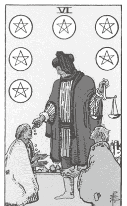

「长大后你想做什么？」
「我想创造一个空间、地方、形式，
让女孩们来这里可以感受到
自己的美好。」
这是我当时的回答。
多年后，我依然在努力创造和构筑
这样的圈子与空间，
让女性能够实现这个目标。

## |关键字|

慷慨、接受、分享、慈善、社群支持、给予与接受之间的能量平衡、提供

## |意义|

这张牌象征慈善与施予。如果要我简略说明的话，就是关于给予、支持以及与他人分享。经历了金币五的挑战后，在世俗周期的下一阶段，金币六带给我们所需要的援手。如今我与塔罗牌已建立更深的关系，对我来说这张牌也拥有更丰富的意义。我鼓励所有占卜者探索这张牌的深层意涵。在莱德．伟特．史密斯牌组中，「施予者」一手持硬币准备给予他人，另一手拿着象征公平的天秤。我们是否比想象中更能够保持我们的平衡？事实上，这位富有同情心的施予者在某个时刻也会需要他人的帮助，我们每个人都曾经历过富裕与匮乏的交替变化。当这张牌出现时，试着反思你当前的状态——是时候付出还是接受呢？如果你渴望在生活中看见更多的富足、金钱、成功或其他事物，灵魂可能在暗示你：要获得这些，或许需要先学会臣服，透过付出来接收更多。

请多留意，只要物质、金钱和资源的能量与频率能够互相流动，并以平衡的方式，既流向你又离开你，生活就能向你敞开，变得更加宽广。

## |连结金币六|

为他人服务。最慷慨无私的人往往都是那些充满使命感的人。你最后一次不求回报，纯粹只想提供帮助、服务或时间是什么时候？也许是为某个组织做志工，或是捐款支持某些团体活动。这类行动也可以很简单，例如打电话给远方的朋友，确认他们是否安好，或寄送小礼物或卡片，让家人知道你在想念他们。这张塔罗牌传递的是无私的慷慨精神，完全没有小我牵涉其中。不要因为期待赞美而假装当好人，那样反而令人反感。也不要因为怜悯而施予。谦逊地依循这张牌的指引，给予付出，因为你知道需要帮助是什么样的感受。

#### 进一步反思

相较于自己的付出，请进一步探索自己与讨好他人或者扮演「救世主」角色之间的关系。请在日记本上写下你愿意为谁挺身而出，以及他们的回应（或没回应）。接着，继续深入这场疗愈。请回答及反思以下问题：

- 我常讨好他人吗？
- 如果答案为肯定，这样的行为是从何时以及为何开始的？
- 在不须先付出任何东西的前提下，我值得接受什么？

### ★ 我的身体—金币七 ★

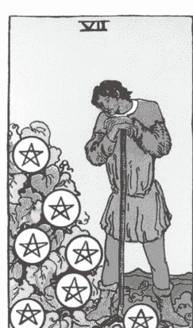

身体自有智慧。
它明白对与错。
它知道何时该留下，何时该离开。

它能辨识肥沃的土地。
它知道在哪里
值得扎根发芽，开出花朵。

### 关键字

规划、沉思、耕耘、反思、对目前周期的评估、有意识的努力、坚持

### 意义

留意自己是否正以自动驾驶模式在行动和回应生活。
这张牌通常描绘了一名长时间在田地里辛勤工作的人。解牌者可以想像一下，那七个在他脚底下的金币，似乎在嘲弄他的努力，像是在说「才这样而已？」这张牌提供了我们继续坚持的选择，或者引导我们去其他地方寻找我们认为应得的丰收。简而言之，这张牌要求我们仔细权衡利弊，思考这项努力是否值得继续下去。

回想一下，这样的教训你已经遇过多少次，这是一个相当常见的问题。当一段关系陷入困境时，双方都需要考虑这段关系是否坚韧到可以继续发展下去，还是已到了该分手的时机点。也许，尽管新工作的薪水丰厚，但它并不足以弥补工作与生活的不平衡，或者无法摆脱职场内的负面文化。我一直将这张牌视为一个评估的机会，并在必要时重新调整方向。排除情绪干扰，因为这时候更适合依赖土元素的实际性来做出判断。你的身体也是可以参考的指南，问问自己是否还能继续承受当前工作带来的疲劳和乏味。

#### 连结金币七

请停止同时间处理多项任务。这里的能量是多余且僵化的，而理解这张牌的最佳方式就是完全活在当下。当你思绪混乱、试图厘清自己真正想要什么时，忙碌只会加剧你的困境。

另一种能让你在物理层面与这张牌连结的方式，是进行正念运动，这可能是指散步时不带手机，或者在不听音乐的情况下完成日常锻炼，专注于你的呼吸节奏。尽量放慢脚步，留意你一天中的每一步，并在这过程中观察自己的内心想法。

#### 进一步反思

请在日记里列出你肩负责任的七个生活领域，然后针对每个领域写下你是否引以为荣，以及它们是否带来成就感，并说明原因。

### ★ 我的身体—金币八 ★

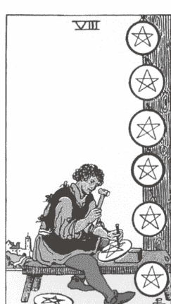

疗愈是在肮脏的指甲里
找到美好，

让指甲缝间沾满泥土的手指
紧握刚萌芽的茎干
并摘下鲜花。

疗愈是一份礼物，
感恩所付出的每一分努力。

## |关键字|

精通、贡献、全神贯注、完成已开始的事情、全力以赴、不懈的
专注、精湛工艺、完美执行

## |意义|

你一直在这个金币周期中耕耘，或许会怀疑，努力真的会有回报吗？如果你抽到这张牌，我会告诉你「是的」（或者已经八九不离十了）。这张牌所展现的全心投入与奉献，正是它最美丽且令人敬佩的特质。牌面是一位诚实且可靠的工匠，心无旁骛地专注于自己的工作，谨慎而机敏。如果要用塔罗牌中的一张牌来展现现代的奋斗文化，那么金币八正好能够作为代表，它展现出努力不懈与精心磨练。

虽然让自己筋疲力尽不应该是最终目标，但有时却是必要的过程。毕竟，是你自己选择忠于这份工作。（还记得金币七中的教训和反思吗？）努力之后，专业知识与技能都将会是你的回报。当金币八出现时，表示你已经全力以赴了。你正全心全意投入你所坚信的事物中，可能已持续一段时间，可能已经很擅长，或者比你自己想像中做得还要更好。

虽然这种投入精神令人钦佩，但请留意不要过度劳累，也不要用职业成就来衡量自己。

#### 连结金币八

规划一个自己在接下来八天中坚持每日早晚进行的例行事项，并将它写下来。这必须要简单易行，但同时具有一定的挑战性，让自己每天进行思考并有意识地做出选择。或许你可以进一步使用以色彩作为分类的追踪表来帮助你——任何对你有效的方法都行！设下一些纪律，运用金币八的能量，留意自己是否能在短短八天内培养出自然而然的动力与专注力。

#### 进一步反思

请依照以下指引与未来的自己对话：「亲爱的未来的我：今天，我尽了最大的努力。我忠于过程，持续前行，让我们引以为傲。未来的我，我想告诉你，我是多么为你感到骄傲……」

### ★ 我的身体—金币九 ★

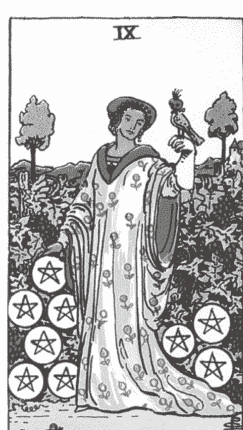

看着我的指引者递给我水果——
樱桃、草莓、甜瓜，
全部色彩鲜明，
一系列丰富而女性化的色彩。
我询问他们为何要献上水果。
「因为生活如此甜美，
而且现在是时候品尝和享受
属于你的丰盛了。」

## |关键字|

成就感、独立、自立、美丽的外表、奢华、富裕、自我放纵、自我照顾、财务成就、稳定持续的资源

## |意义|

你做到了。停一下，再念一次这句话。你做到了。就是你。

坐下来好好享受这份成就，并欣赏你的独立性。如果金币九为你带来了奢华与丰盈的能量，显然地，你做出了正确的选择。凭借长期的辛勤耕耘、耐心以及专注地投入某个过程，你已经积累了许多不会轻易失去的资源。毫无疑问，这都是你应得的。

自我价值是随着时间慢慢累积起来的，而拥有这样的认知不是很美好吗？如同牌中人物将手放在九个稳固的五芒星上，我们不仅可以，也应该为这张牌所象征的独立和自信感到骄傲。如果你希望赚取更多财富，这是一个好的预兆。如果你在考虑是否已准备好迎接更多的丰盛，我会告诉你，你已经准备好了。你目前比之前得到了更多的放松和休息。金币牌组教导我们以身体的毅力去承担责任、付诸行动和履行承诺，而最终金币九会带来健康、财富与骄傲，并让我们享受应有的休息。

#### 连结金币九

投资在自己、你的身体和带给自己舒适感的任何事物上。由于金币是贯彻到底的牌组，因此我们不容许任何借口。对自己好并不需要带着内疚。无论你选择哪种自我照顾的方式，都全心全意地去执行吧！对有些人来说，这可能是购物疗法；对另一些人来说，可能是一两天的独处时间，彻底放松休息。不用等别人主动给予或邀请！你已经不懈地为自己付出，所以现在理应获得这份奖赏。暂时放下你的责任，去做一些对身心有益的事情。

#### 进一步反思

在日记里完成以下的句子：

- 当我 _ _ _ _ _ _，我能感受到自己的独立性。
- 我透过 _ _ _ _ _ _，照顾和滋养自己。

### ★ 我的身体—金币十 ★

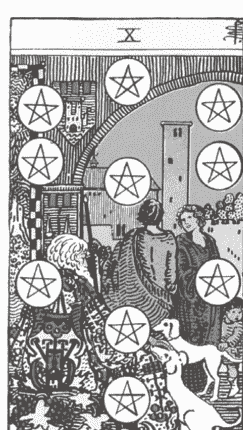

十六岁那年，我在左腕刺了一只鸟，
草率的选择且毫无灵感。
「这有什么意义？」接下来的几年里，
其他人经常问我。

当时与我的身体分离，
对于这个选择，
我不以为意，
完全不知道历史正在为我书写新篇章，

而我的身体只是让我在正确的时间
到达正确地点的载体。

「没有任何意义」
我回答。

二十九岁那年，我看着我挚爱的男人，
在北方他父母家的后院观察着鸟类。
「你看，又是一只稀有的鸟！我们今天真幸运。」他这样对我说。

不久后，我开始冥想，
看见了她，
也看到了他，
还看到了我们所有人。

我问灵魂她的名字。
「艾娃，」她回答道。
这是一个我从未想过的名字，
就像那只鸟不经意间在我柔软的皮肤上刻下了痕迹。

后来，我查了一下这个名字的来源，
发现它的意思是「像鸟一样，活泼。」

三十一岁的我，坐在我们的露天平台上写这本书，
这里是我们目前共同生活与爱的空间。
我的左手无名指上戴着一枚戒指，
点缀着与刺青手腕相同的那只手。

一只经常来访的鸟停在窗台上，
离我只有几英尺的距离。

是的，我们很幸运。
幸运的是，沉浸在彼此的安全感之中，
承诺与后代共同创造未来而努力。
幸运的是，现在一切都有了意义。

## |关键字|

满足感、富饶、家庭、祖先、安稳的家、财富、传统、特权、扎实的基础、根源、遗产 / 传承

## |意义|

金币十带来一种忙碌而充实的氛围，这并非巧合。从艺术角度来看，画面中正在发生很多事情，每个角落都充满细节。从孩子、忠诚的宠物到老人和社群，所有人都能感受到安全与丰盛。这张牌的基调和内在连结是偏向传统的，甚至有时会显得稍微保守和物质导向。它带有「老钱（old money）」的氛围。然而，这张牌以满足与家庭为主轴，因而呈现出慷慨、健康和单纯的意图。

用更现代且多样化的方式来诠释财富对人们的价值——我想强调，即便是在资源不多的情况下，依然有许多方式能令我们感受到安全感、保障、被爱和滋养。撇开资本主义的影响不谈，家庭和稳定的社群是这张牌的核心。它强调养育家庭以及与家人共享的过程能够带来满足感，身体也能因此感受到平静与健康。当走到塔罗牌循环的终点时，我们便拥有了与该元素相关的能量，在这里，土元素象征物质世界的力量和权力。如果你的目标是建立稳定的收入来源，或是找到能够共同创造家产的伴侣，那么这股能量将支持你的理想，让你的愿望更具实现的可能性。如果你抽到这张牌，这可能意味着你已经迈向以努力、爱与承诺所构筑的未来之路。

#### 连结金币十

思考并描述你希望自己留下什么样的传承（别有压力！请记得，这是可以灵活调整的！随着时间推移，这会改变、成长和演进。）但此时此刻，你对自己和长远的未来有什么期望？除了日常生活的需求之外，你还希望能在这个世界上激发或创造出什么？你的微小存在，能如何成为许多人眼中的礼物？给自己一些时间去思索、想像这一切，或许闭上眼睛，设想自己能留下什么样的能量烙印。谁的心会因此被触动？你能够带来什么样的改变？你是否能够鼓励自己去追求更大的梦想或更深层的爱？相信每个人都是独一无二，有能力在这一生中创造出重要、丰富且有意义的事物。

#### 进一步反思

这是一段漫长的循环周期，现在是时候感谢自己的身体了。经历了变迁、辛勤付出和充满幸福奇迹的季节后，你的身体始终与你同行。请在一天中为自己留些时间来进行以下的身体练习：

- 1. 请选择让你感到不安或没有自信的身体部位，将双手轻轻放在这个位置上。
- 2. 深呼吸，连结这个部位。当你触碰它时，你有什么感受（无论身体上还是情感上）？当你花时间尊重它时，你的身体传递了什么讯息？你能对这个部分的自己多一点包容和爱吗？
- 3. 反思并写下：「谢谢你，身体，因为你……」。

### ★ 我的身体—金币侍者 ★

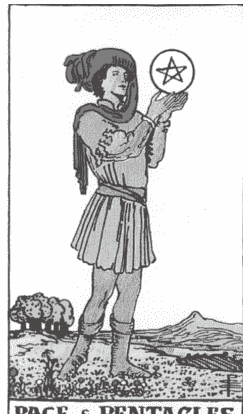

当我闭上眼睛，建立连结
寻求答案时，
映入眼帘的尽是一片绿意。

广阔的草原
与新芽的承诺。
我瞬间感受到自由
与宽阔的氛围。
在这，我成为了自己灵魂的学习者。

**人格特质：** 严肃、机智、乐于助人、完美主义、学徒、未来的领袖、支持他人、充满好奇心、机会主义

## |意义|

这张侍者牌希望你能以孩童般的好奇心去看待世界，并对那些随时出现的机会感到开心。它无疑是一名信使，为你带来充盈的新开端，类似金币王牌，但带有更强烈的渴望和迎接任何挑战的精神。当这张牌出现在占卜中时，你可以探索任何爱好、兴趣、事业方向或可能性。凭借稳定的步伐和愿意接受挑战的身体，金币侍者提醒我们，有时最好的学习方式就是亲身尝试。有意识地使用自己的身体，发现自己潜在的能力，即使这意味着可能犯下一些错误或偶尔的失足跌倒。

## |金币侍者的引导|

透过自由的律动来邀请新能量到来。运动具有不可思议的疗愈效果，它能震动并释放你身体中累积已久的沉重能量。这张牌带来机会与兴奋的感受。因此，让身体动起来，模仿这种兴奋感将使你感到更有活力，帮自己调频，迎向未来可能发生的任何事情。

首先，站直并将双脚稳稳地放在地面上，保持平衡并放松身体其他部位，然后自由地摇摆吧！可以是耸耸肩膀或快速地弯曲双膝，也可能上下左右挥动手臂。你甚至可以摆动手指，或是疯狂地扭动臀部，最后也可以跳来跳去。让肢体不带任何目的地自由晃动，就真的只是单纯地「动一动」。你会发现，动作持续越久，你的呼吸会越来越快，精神也会变得更加活跃。你也可以注意一下，即便只是站立、移动并感受身体存在，就能感到兴奋并活跃起来。

## |进一步反思|

完成下列句子：

- 我希望有天我能探索某些地方、习惯、嗜好和想法……
- 我正在认识自己的某些部分，那些我尚未熟悉，但仍对它们充满好奇的部分，例如……

### ★ 我的身体—金币骑士 ★

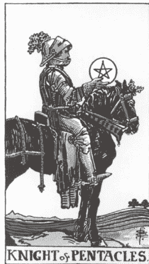

任何事情，

工作、
快乐、
痛苦，

只要没有爱
就只是死气沉沉地进行。

**人格特质：** 积极、可靠、团队合作、耐心、保护欲、冷静、专业、专注、传统、纯粹主义者、固执、自豪、稳定、负责任

## |意义|

这张牌的能量流动缓慢且井然有序，充满耐心与力量。当金币骑士出现在你面前时，你可能会想要雇用他，因为很难找到比他更愿意投入、忠诚于整个过程且对自己行为和工作有明确目标的人。如果这张牌不是指你团队中的一位得力成员（无论是工作中、家庭中，还是你的伴侣），那么塔罗牌是在提醒你，要努力工作，只要脚踏实地，必定会获得丰厚的回报。要注意，不要让日常生活和付出变得过于死板。

当我们迈向自己最大潜力与更高自我的过程中，总会不可避免地遇到一些需要重新定位的关键时刻。而这位骑士的性格并不擅长应对变化或突发状况。他与生俱来的正直天性是一项值得自豪的特质，不容忽视。无论你是为了达成财务目标，还是单纯为了所爱的人和所重视的事物而付出，都应该用真诚的态度去面对和执行。

## |金币骑士的引导|

将你对某些事物的爱与忠诚表达出来吧！你可以私下写在笔记本，或者以口头承诺的方式说出来，让其他人也可以帮助你履行责任。不要害怕投入工作、人际互动或者害怕做出长期承诺。

你最忠于什么？你是否准备好对什么事物更加忠诚？这些承诺又会是什么样子？你准备好信守诺言了吗？对于那些害怕承诺的人：就从一些小事情开始，无论多小都可以。如果你不确定该对什么作出承诺，不妨将你的内在疗愈和个人成长作为灵感来源。总有机会对自己许下承诺。比如，你可以说：「今年我将继续忠于我的疗愈，并开始接受治疗。」对于那些真正准备好全心投入的人来说，这张牌可能会激励他们做出承诺和辛勤耕耘，无论是展开梦想事业、向生命中的挚爱求婚，还是进行对自己有挑战但回报丰厚的投资。

## |进一步反思|

在你的日记中，回顾你一生中最辉煌的成就以及最艰难的时刻。纪录那些艰辛的付出，以及那些令你充满成就感的努力。

接着，写道：「当我继续前进时，当我选择不放弃或不辜负自己时，我感觉到 / 做到了……」。

### ★ 我的身体—金币皇后 ★

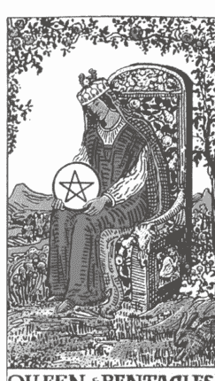

当她对宇宙心生敬畏时，
她在大自然中感受到神的存在——
她于自己的内外
滋养了这个宇宙。

**人格特质：** 神圣、滋养、女性、直觉、母性、慷慨大方、舒适感、稳定、韧性、善于应变、无所畏惧、祥和、丰饶、无限

## |意义|

当这位皇后的原型人物坐在你面前时，你看到的是一个充满亲和力并让你感觉回到家的人。你可能会想窝在她身旁，倾听她的建议，沉浸在她那平静又自信的气息中。她带来一种无法言喻但却真实可靠的安全感。

这位皇后最具魅力且最有深度的一面，在于她的全面性，她似乎在家庭生活与职业满足感之间找到了完美的平衡。她十分熟悉努力工作的节奏（毕竟，金币花色的宫廷成员从不畏惧劳动）。同时，她也深知家庭的重要性，并将身体与家庭视为她丰富人生的一部分。她珍视每一份祝福与恩赐。她的出现提醒我们，充实的生活确实很重要。这位皇后透过行动、自然且毫不费力的价值观，以及丰饶的生命力来传递她疗愈的力量。当她出现在我们的占卜中时，意味着我们也许已经准备好开创美好而富裕的新局面。我们可能感受到背后有股力量推动我们去滋养并壮大所拥有的、已投入精力的事物，还有所奋斗的目标。这些目标确实是我们的优先事项，但并不会因为要实现这些梦想而牺牲自己的内在平静与健康。

#### 金币皇后的引导

办一场晚宴吧！邀请你所爱的人来到你的神圣空间共享美好时光，这恰好就是这位皇后最纯粹（且充满乐趣！）的展现。准备来自大地的美食，营造温馨的氛围，并让聚会的规模保持在私密的小范围内。拿出精致的餐具，制作美味的无酒精鸡尾酒，庆祝自己的生命和他人陪伴的美好。金币皇后深知她的宾客都值得享受最好的，她为自己能够给予他人关怀而感到自豪，也慷慨分享她努力所获得的丰硕成果与她所拥有的空间。

如果主持宴会并非你的强项，那就为朋友或家人做些其他事情吧！采集一束他们所喜爱的花，手写一封感谢信，或者如果你有双巧手的话，编织一顶羊毛帽给他们吧。不论选择什么方式，请务必带着爱意行动，表达你对他们的感激之情。

#### 进一步反思

将你的感恩练习推进到下一个层次。首先，写下三件你感激的事情。很简单，对吧？很好，现在有了这份清单，请想出三个行动，以实际回应这些你所收到的礼物。

你很感谢祖父母吗？打通电话给他们吧。你很感谢自己的健康吗？用散步来庆祝自己的活力吧。很感谢自己的宠物吗？早上多花点时间回应牠们的撒娇吧。明白了吗？好好重视，并滋养生活中所拥有的人事物！

### ★ 我的身体—金币国王 ★

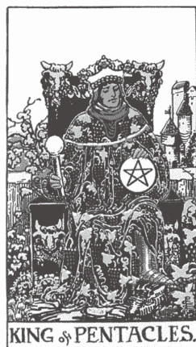

当我想起父亲时，
我总会想起他对我说的那些话。
「你是我的英雄。」
「我是你最大的粉丝。」
「我爱你胜过世界上的任何一切。」

就如我也记得小时候
我们一起发明的秘密握手手势，
或是他每晚八点打电话跟我说晚安。

日复一日，
让我永生难忘。

**人格特质：** 坚定、支持、慷慨、父爱、供养者、传统、自我提升、坚忍、商业头脑、信守承诺的人

### 意义

当这位父亲原型人物出现在牌面上时，总是带来一股稳定的力量。塔罗牌提醒你要优先关注自身的疗愈，就像金币国王为自己所做的一样。他坚守并忠于自己的信念，即使这些理想在别人眼中或许已经过时了。

身为结合土元素的父权宫廷牌，他以充满支持性和丰盛的能量安定大家的心。这位国王深谙如何创造并建立他的帝国，以他毕生事业与付出的热爱做为基础。当你抽到这张牌时，请留意自己正在建立什么，以及你如何供给自己和他人。你或许也可以问问自己，究竟重视和热爱哪些工作，以便继续用自己的热情来实现你所期望的生活。

如果你正在寻求经济稳定的话，这张牌是很棒的选择，因为它显示，为了实现自己的目标，你所选择的道路既受到尊重，且展现出高度的责任感。这位国王不仅是位商人，还是一位耐心且重视传统的人，他告诉我们：慢工出细活，稳扎稳打的步伐才是致胜之道。我们的一生更像是一场马拉松，而非短跑赛。这位充满耐心且保护欲强的人物形象可能会引导你反思，什么对你才是最为重要，鼓励你投资在自身健康和资源上，并珍视你在各方面所累积的丰富财富。

这张牌时时刻刻提醒着你：你是有价值的。你的时间、技能和爱都充沛十足。金币国王虽然擅长管理财务，但他并非一名贪婪之人。他创造并鼓励由双手建立传承，然后用爱分享这份传承。

#### 金币国王的引导

重新（或开始）投入一个全新的传统。传统是一种神圣的体验，因为它们让记忆深深地烙印在我们脑海中，让我们细细品味。我们总是能够重温自己所热爱的事物，一次又一次地选择它，珍惜这些记忆带来的感动。金币国王常被视为一位商人、有钱人或执著于成功的人，但别忘了他对家庭、传统与传承的承诺。创建一种能够经得起时间考验的传统，同时保持独特性，并忠于你的家族故事。由于这股能量非常丰沛，与他人分享，让他们也能够与你一起实践并庆祝这个传统。「家庭」是一个可以无限扩大的圈子，可以由你亲手划得多大，就有多大。

#### 进一步反思

在你的日记中，完成下列句子：「这就是我渴望生活的世界，而我的内在练习如何一步步将这美好世界成为现实……」

# Chapter 8

# 圣杯牌组：我的情绪

圣杯牌组与水元素对应，邀请我们去感受。它鼓励我们揭露潜意识的想法，承认并呼唤我们对爱与归属感的需求，并给予宽恕。牌卡引导我们进入情感脆弱的状态，进而净化我们的心理。这看似一股难以掌控的强大水流，其实为我们提供了一条通往内心深处的直接通道，让我们触及自身广阔且有时超脱现实的领域：我们的心。它将意图推向意识的核心，鼓励我们去感受和回应，而不是仅仅对不适的状态做出反应。更重要的是，这个元素具备疗愈的力量。

这正是为什么在整个牌组和塔罗牌体验中，圣杯是我最喜爱的，里头有几张牌对我意义非凡。我真正的疗愈旅程，正是从我愿意迎接水的汹涌，让那无穷的直觉能量淹没自己开始的。

当我开始与我的灵性连结时，我正在收集像塔罗牌这样的有趣工具，但却没有真正理解和运用它们的精髓。我总处于一种自我强加的倦怠状态，坚信唯有表现出坚强的一面，才能证明自己已经克服了过往的创伤。我将力量视为按照自己规则生活的能力，在每个当下掌握自己的命运。我（错误地）认为，一旦失去控制就意味着失败。我是一名年轻、有决心的企业家，也是所谓的「#girlboss（#女老板）」。然而，我经常感到愤怒和怨恨，每个人不都是这样吗？我对我的人际关系感到不满，经常被误解，但……这应该很正常吧？事实上，我对自己怀有一种父权式的错误信念，认为唯有不断耗尽心力地向上攀爬，才能证明自己已从过去的困境中重生，这样的信念驱使我持续追求那些不切实际的期望，我拼命燃烧自己。

在我人生中那段充满毒性的阶段，那段时期的我，就像在水中原地踢水，拼命维持漂浮（无意双关）¹。我是真心渴望疗愈自己，因为我打从心里知道自己的控制欲限制了我人生的可能性，也明白自己需要学会放松，只是我还不知道怎么做而已。

我的第一位灵性导师是一位塔罗占卜师，对我的牌卡旅程影响深远。她的性格充满魅力，令人难以捉摸。她是位刚从纽约搬到北部的女性，在这里追求绘画、减少胸罩的穿着，并通过Zoom指导那些试图学习爱自己、重新找回自我的女性（像我这样的人）。她（也像我一样）曾经是一名吸烟者，容易被激怒，但后来转向瑜伽、冥想和正念练习，发现自己比想像中还热衷于这一切。

她为我抽的第一张牌是节制牌。回头看，我意识到，或许就是在那一刻，我深深地爱上塔罗牌。相较于其他自我安慰的方式，这张牌所传递的讯息让我体会到更多的真诚与希望。

虽然节制牌并非圣杯牌组的一部分，但它同样与水元素息息相关。这张大阿尔克纳的特征在于两个圣杯之间的水流重新达到平衡。牌卡中的人物背后有山脉，象征我们曾经克服的困难与挑战。这张牌至今依然是我最喜爱教导的牌卡之一。

当这张牌出现时，我明白过去我没有真正的「爱自己」（不是只有洗泡泡浴和自我肯定句的便条纸，而是真正无条件地爱自己）。这是让我无法享有平衡生活的阻碍，无法让我与他人建立亲密关系，我无法与自身的直觉力建立独特又神圣的连结，也无法让我带着自信发展我的神圣女性特质。「爱自己」是让我成为自我的入场券，使我能够在外在世界如实地展现自己。

「你能够创造平衡的生活吗？」她问我，语气中仿佛这是世上最简单的事。

「天啊，我真的不知道。」我笑着回答。「我还太年轻，还不能停下。我必须得先证明一些事情。」年轻时的我曾经以为寻求平衡的人生等同于妥协或放弃成功的人生。那时的我，无法想像有人会拒绝那种疯狂追求高点，又在低谷里责难自己的起伏人生。

我的灵性导师只是对我微微一笑。一名伟大的导师，也是出色的占卜师，总是让探索者自己去寻找答案。尽管我耗费的时间比自己愿意承认的还要久，但那一刻的来临我依然记忆犹新。

几周后，我蜷缩在淋浴间，双膝紧靠胸前（我至今仍在我的日常生活中保持这个习惯），温水轻柔地滑过我的肌肤。我完全放空，沉浸在白日梦里。当我撩起手时，发现水珠滴落在我的手掌心，然后改变了方向，偏离了从莲蓬头喷出的原始路径，顺着我的身体流下，最后落在地面上。

我清楚地看见这些水滴如何顺从地流向我引导的方向，这之间没有任何强迫，而是自然的流动。它们并未试图用力穿透我的手掌好达到目的地，而是轻轻地从我的指尖滑落，最终落在淋浴间的地板上，再慢慢流入下水道。

我在淋浴间的地板上笑了出来。真的有那么简单吗？我能否像水滴一样优雅地流动，以宽容的态度和灵活的姿态流向我注定要去的方向？是否能够以一场轻盈优美的舞步，成为我心中所向往的自己？

这一切似乎都太理所当然，但当时的我并没有意识到。当然，我爱上瑜伽，也发现冥想的益处，并感受到一种超越自我（灵性）的力量，但我缺少引导它的管道，也没有能够承载它的容器。我选择了极端的生活，在混乱中寻求自我成长。

这或许听起来有点愚蠢，但当我在淋浴中看到水元素展现圣杯牌组的特质时，我体会到了女性能量的价值。我让它接住我、改变我、软化我的内心。想要真正融入塔罗牌练习，确实需要这种柔韧与弹性。

在本章中，你将看到塔罗牌中的水元素如何引领我走向现在爱自己的状态。我如今站在祥和的彼岸，凝望着人生的地平线，明白我从未强求它，而是积极地与它共同创造。

## 有关圣杯牌组

**元素：** 水
**脉轮：** 脐轮
**时间与速度：** 一个月或一个月亮周期
**星座：** 巨蟹座、天蝎座、双鱼座
**季节：** 夏季

**〔圣杯牌组是……〕**

爱、疗愈、浪漫、直觉、同情、潜意识连结、女性能量

## 为自己占卜时

带着意图练习。当我们接收到圣杯牌所传递的柔和、宽容和母性力量时，往往都会有一种被照顾、滋养和接纳的感觉。在这个洋溢着情感共鸣的柔软茧中，你可能只想静下心来休息，甚至不想采取任何行动，或根据牌的启示做出改变。

这也没关系。不过，我邀请你回应牌卡所传达的讯息，在练习中融入一些反思。留意自己在过往经验中是否因恐惧而逃避下一步，或者是否滥用圣杯的灵活性。你是否总是避免冲突？在温柔的流水与圣杯牌组的支持下，思考自己会采取什么样的行动。运用同情的能量，去滋养和放大你那些需要勇敢、积极主动并主导自己人生的部分。

不过，你要记住，水元素要求我们接受它强大却无形的本质。虽然水具有疗愈的力量，但我们也要时刻警惕淹没的危险。让体验触及你的心，但也不要忘记自己的目的。

## 为他人占卜时

温柔一点吧。对于在塔罗牌中探索圣杯主题的占卜师们，我最大的建议是软化自己的语调，让身体放松，并敞开心扉去感受面前之人的能量。当我们深入探讨敏感话题时，可以用这种能量让对方感到安心：「此刻此地，你可以完全做自己。」

流泪、露出脆弱的一面、分享自己的生命历程，这都是很私密的行为，所以能在他人面前坦诚相待从来都不是件容易的事。将这样的勇气与一副塔罗牌结合在一起，感觉就像是进行一场情感上的俄罗斯轮盘。那些来找你占卜的人，难免会担心他们最大的期望和梦想，或者最深的创伤（甚至是两者！）会不会显示在牌面上。当他们坐在你面前，赤裸裸地毫无遮掩，而你与他们穿梭在七十八张原型牌，透过牌卡分享自我消亡（ego death）、防御机制、贪婪、悲伤以及自我毁灭等议题。在那样的状况下，只有完全封闭自己的人才不会感到脆弱。

为了他们，变得更加缓和、轻柔吧。让声音变得更柔和、语调更平稳，让眼神也更加温柔些。让他们看见牌卡多么美丽、可爱，用热情的语气描述牌面，让塔罗牌成为寄给他们的情书。透过与他们同在，就足以让他们感受到这副牌组的美。当圣杯出现在占卜时，聆听的时间要等同于说话的时间，语言也要字字流露出诗意与美感。

> **提示** 简而言之，用关怀之心占卜吧！在这个充满干扰和手机通知的时代，能够被聆听、被看见并被一颗真诚敞开的心庆祝我们从以前到现在的感受，这的确是一种恩典与礼物。作为一名占卜师，这个空间并不需要过度分析或陷入理性的思维。

## 塔罗牌之外

在你的生活和塔罗牌练习中，请追随那些让你感到寒毛直竖的事物，关注那些能够激起你深深感激与欣赏的事物，留意那些让你因喜悦而眼眶湿润的人物、地方和经历。当我为自己或为敞开心扉的客户建立连结，向灵性和我的牌卡寻求能够触及内心和灵魂的讯息时，我经常会落泪。那不是来自喉咙的哀嚎（虽然这也没什么不妥！），而是一种轻柔而细微的情感释放，就像情感的宣泄、精神的净化。

我会有所感知。当这种情况发生在我身上时，我会静静地坐在那里，感知当下，对于自己的身体能够容纳源源不绝的情感与宇宙能量感到惊叹，我深深地明白，这是心灵体验的魔法所在。

> **练习**
让你的生命和灵性实践添加浪漫的色彩。并非每个灵性成长阶段都是充满阴影或沉重感，灵性也可以是美丽的。事实上，它本来就是美丽的。勇敢地在雨中跳舞吧！不要担心自己看起来像在演偶像剧。让自己沉浸在水中，感受那份充满活力的滋润。在这些片刻中找到快乐，这是维持这段深刻且变革之旅的唯一途径。

### ★ 我的情绪—圣杯王牌 ★

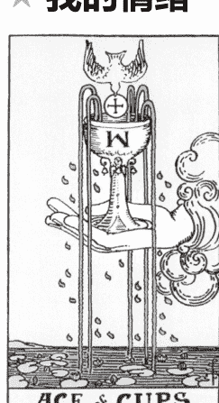

我坐在淋浴间的地板上，低下头，
水滴如朵朵亲吻，
轻柔地落在我的头顶。
它们从我的脸上滑落下来，
在我的鼻尖上跳舞。
我闭上双眼，想像光线倾泻进来。
这个空间已经净化完毕，
我更进一步，
迎接每次都充满生机的洗礼

### 关键字

爱与疗愈的新循环、自爱、纯洁、净化、来自灵性以心为中心的恩赐、一个清晰的新开始

### 意义

这张牌出现时，我感到安心并与自己的内在连结。其背后的意图非常纯粹；就如同宇宙在我们经历情感起伏后，轻轻拭去我们的泪水，并再次带给我们希望一样。当我们花足够的时间去疗愈时，它传递了一种内心平静的感觉，因为我们真正体现了那些Instagram 心灵语录所说的：自爱。无论是在爱情、情感疗愈和亲密关系上，圣杯王牌都为我们带来了大量的新契机（和观点）。它在询问你会将这股充满慈悲、良善且美丽而脆弱的能量引导向何处。爱的河流广阔无际，现在正为你所用。你可以将这份爱传递给某个人，但我建议你先将自己的杯子倒满。这张牌敏感而神圣，蕴含着神圣女性的柔和力量，而且可以用来净化、支持与滋养你认为最合适的对象。让爱变得简单，保持柔软与开放的态度。这是一次让你深入自己内心的邀约。

#### 连结圣杯王牌

从字面上来看，就是要你直接碰触到水。无论是在大自然中与水连结、泡个澡，还是喝一口水果水，去好好地感受当下。尽可能将指头泡在水中。回家时，也可以调皮地踩一踩水洼。请留意水是如何以各种形式支持你、接住你。

#### 进一步反思

请写一封情书给自己，然后继续写下去，直到那些害羞及不自在的感受消失。让文字倾吐在白纸上，就像是对你所深爱的对象诉说爱意一样。

### ★ 我的情绪—圣杯二 ★

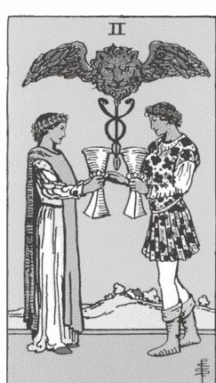

他们警告我，爱需要有所妥协，
而我总觉得更多是牺牲，
直到我抬头，望向与我平视的那双眼。
他都在，也一直鼓舞着我，却不会干涉
我所选择的道路，
他就在那，看着我，选择我。

### 关键字

有意识的连结、忠诚的开始、伙伴关系、心之所向的选择、为对方付出、平衡、在关系和情绪状态中感受直觉的引导

### 意义

圣杯二是一张以连结与忠诚为主轴的牌，象征真诚地努力将陪伴和照顾自己以外的人放在优先考量。虽然它的出现往往代表两个灵魂在浪漫旅程中的结合，但这张牌也可以超越爱情关系，象征着由两个契合或信赖内心的灵魂所建立的合作或友谊——那些上天安排好让我们遇见、学习的伙伴。

无论你是否认同灵魂伴侣的概念，还是相信偶然相遇的魔力，这些关系中的人很快就会成为我们旅程中的重要配角，并在我们美好回忆中占据一席之地。

圣杯二体现了我们与他人并肩走在一条如履薄冰的道路上，而这张牌的出现意味着这两股能量本能地在最完美的时间交会。在这独特的时刻（我们无法保证这将会是永远），他们彼此有所共振。这张牌我最喜欢的是双方的平衡与互惠。他们恰好位于牌卡的正中央，向解牌者表明他们原本是来自不同方向，但在这个当下合而为一，共同站在这个空间。

我也非常喜欢探索这张牌中如镜子般的倒影关系。圣杯二是否代表我们自身的两面性？还是前世的我们？未来的我们？当我们在寻求个人疗愈或其他独立体验时，可以依靠塔罗牌发挥最大的功效。请允许自己接受并反思这张牌的二元性。

#### 连结圣杯二

请练习触碰。记得，肢体接触并非只是爱的语言，更是人类基本的需求。而且这种接触也可以是自己给自己的，谁说你不能在漫长的一天后帮自己按摩双腿呢？如果你刚好有另一半——无论是恋爱还是柏拉图式关系——愿意在你面对困难的对话中握住你的手，或将自己的肩膀腾空出来让你依赖，那就接受吧！

#### 进一步反思

请你思考究竟是谁占据你生命中最亲近的位置呢？谁能让你完整地敞开心房？这是你给予最多关注、情感与情绪价值的灵魂。请你阖上双眼，或轻柔地眯着眼睛，进入冥想状态，想像这些人出现在这个冥想的空间。他们有多靠近你？他们是否站在中间，协助你保持平衡？请你深入自己的直觉意识。你有从他们身上感受到任何能量上的阻碍吗？请感受一下你们两者之间细微或明显的差异。

### ★ 我的情绪—圣杯三 ★

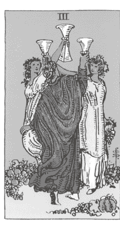

几杯龙舌兰苏打后，
还有起司残留在我嘴角，
感谢伪装成披萨的救世主，
提醒了我，我也是个人。
我还注意到身边的朋友，
嘴唇上同样沾满着油脂，
愿意见证那个我愿意成为的模样。

### 关键字

真挚的友谊、我们自己选择、凝聚而成的家人、欢乐庆祝及分享体验、兄弟姊妹情谊、神圣的连结

### 意义

你还记得跟好友们喝着美味的玛格丽特（或吃着特浓起司披萨），然后大家一起捧腹大笑的时刻吗？或许天气刚好不错，你看着刚下山的太阳，回忆起过去某天类似的傍晚？各种不同好笑的故事，还有互相戏谑捉弄，让此起彼落的笑声及谈话声跟饮料一样源源不绝，这恰好就是理想的圣杯三时刻。这张牌是一张团体牌，鼓励我们庆祝各种生活小确幸。

圣杯三代表着那些毫不迟疑就会出现在我们身边的人际关系。他们为我们的成就及荣耀时刻而骄傲，也不会错过任何聚会，当这些人聚在一起时绝对会相当轻松、欢乐而无忧无虑。他们之间的默契唯有透过时间的堆叠与真诚的亲密感才能获得，而这份连结必须永久珍惜。

这张牌不只代表友谊关系，也包含那些让我们感到最安全的群体。在这张牌的体验中，任何属于自己圈子里的人，包括身心灵圈子（指导灵及祖灵），都能占有一席之地。这群人不会对你有所期望。跟他们在一起时，你能够放下任何自己必须如何的期待，因为正是你的不完美才让你们相聚在一起，碰撞出友谊的火花。

#### 连结圣杯三

请向你信任的友人倾诉你的脆弱，至少拥抱个几秒钟，发送一则赞赏对方的讯息，或者望着对方的双眼。在他们需要时出现，如同他们也是如此这般地支持着你。

#### 进一步反思

请写下你的反思：

- 对你而言，「兄弟姊妹情谊」意味着什么？
- 我们之间的神圣连结，为我提供了哪些我无法独自培养的事物？
- 我在他们每个人身上所看见的美，如何反映出我内心的美？

### ★ 我的情绪—圣杯四 ★

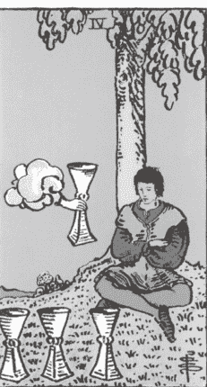

是逃避还是不满？
感觉是逃避。
毕竟如果我看着我爱人的双眼，
我绝对不会告诉他们要拖延或妥协。

### 关键字

停滞、漠不关心与冷漠、缺乏灵感、单调

### 意义

圣杯四显示出无聊的感觉，这是继圣杯二及圣杯三之后令人不快的冷漠能量。然而，快乐的时光终究会有个尽头，对吧？

圣杯四并非全然负面的，单纯就是一股令人不自在的安全感。就像是自动驾驶模式，没有惊艳，也不会让人感到困扰，只是不知道要把心力放在哪里。这就是水元素恢复平静的时候（在塔罗牌中，数字四永远是安稳的状态），可以说是……嗯。就这样。我们的情绪其实就像一潭深水，可以带来无尽的高低起伏，而这样极端的来回十分累人。假如你抽到这张牌，它在提醒你不要被高潮低落来回拉扯，反而该坐下来，反思自己目前的情绪状态。

问问自己，对于目前这样的无聊状态，我感到安全吗？我该如何达到情绪平衡呢？情绪的灰色地带可以暂时让我们喘口气，直到它不再如此。我们也必须凭直觉判断这种冷漠是否源于自己不够感激或满足，是否还有其他部分需要去探索或自我要求？还是我们的内省过于表面？

## ｜连结圣杯四｜

在试图深入更深层次的情绪前，如果那份情绪感觉遥远，甚至不真实，不妨先甩开那些让你感到冷淡与漠然的沉闷碎片。你甚至不需要命名它或顺从这种无聊感，就能够将其释放。

你可以尝试用喜悦呼吸法（Breath of Joy）来突破圣杯四。这是我喜欢的呼吸技巧，透过宣泄释放帮助我回到自己以及自己的能量。

1. 开始前，双脚打开与臀部同宽站立，膝盖稍微弯曲，双手随意轻松摆放。吸气时，分三次吸气，每次吸入三小口气，直到你吸满为止。吐气时，请一口气大口地从嘴巴吐出来，完全释放。
2. 现在，我们要加更多动作。第一次吸气时，手臂张开，呈 T 字形，将手指都伸直。第二次吸气时，将伸直的手臂往天空的方向伸展。第三次吸气时，从伸直的姿势回到一开始的 T 字形，从你的身体两侧伸展出去。
3. 吐气时要全然地释放出来。让头部与脖子放松，弯曲膝盖，双臂下垂直到手指轻扫过地面，温柔地将膝盖弯曲更多一些。每一次吐气，让停滞的能量释放，让自己更深地沉入当下；每一次吸气，重新迎接并感受清新的生命能（prana）与内在的喜悦。当你练习的时间越久，身体就越能够感受到活跃的能量。当你需要休息及重新连结时，就将双手放回身体中心（一只手在肚子的位置，另一只手在心脏的位置）。

#### 进一步反思

选一首你爱的歌曲，一首能让你真正感受到情绪流动的歌。在你的日记本上，针对以下的提示书写，从头到尾写完整首歌的时间：「在这里（我的周围环境、人际关系、兴趣爱好中），我发现自己感觉更加清醒、更有挑战性、更有灵感、更有活力……」

### ★ 我的情绪—圣杯五 ★

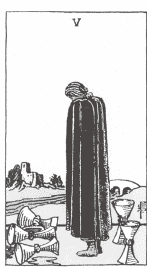

起初缓慢而悄无声息，如此顺利，
让我误以为自己才是在奔跑的人。
突然间一阵冲刺！你已不在。
正是在这种空虚感中，
我才明白悲伤到底是什么感觉。

### 关键字

沉重感、悲伤、悲痛和哀悼、离开、后悔、隔离和孤单、分离

### 意义

我将这张牌与内心的空虚感联系在一起，有时候我们会遇到一些突如其来的状况，当下的身心灵状态无法背负这种沉重感。然而，这也激起我们的力量及韧性，让我们能够扛下这段经历，并继续向前进。

即便这张牌充满负担，但是当我们从王牌到 10 的周期中跨越了这个痛苦的门槛后，就能够迎接即将到来的黎明曙光。尽管目前处于令人不适的情境中，圣杯五表明当泪水干涸时，和平与机会将随之而来。然而，此刻情绪的深渊难以窥见底部。请温柔地提醒自己，不必急着对这段经验下任何评语。

## ｜连结圣杯五｜

感受当下。这里的练习重点在于体验并驾驭你当下所经历的每一丝情感波动。虽然你可能并未选择经历圣杯五的能量，但不可否认的是，你需要臣服于它。你的任务是，每当想到这个主题时，让情感在你体内扩展，并流动于整个身心。允许泪水自然滑落，不加抵抗。请记住，走出黑暗的唯一途径就是穿越黑暗。就我们的生命历程和灵魂之旅而言，这些都是我们在抵达高峰之后（或之前）偶尔会跌入的低谷。

## ｜进一步反思｜

在日记本中，写下两个清单。第一个清单，列出那些你曾以某种方式哀悼的空间、人物和时刻。第二个清单，则列出为什么现在你能接纳自己仍会有这样的感受。

### ★ 我的情绪—圣杯六 ★

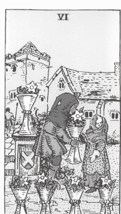

用心倾听祖先的声音，
在夜空中寻找他们的足迹。
带着敬畏凝望他们的光芒，
呼唤他们，聆听随之而来的回声。
从那些已无法为自己发声的灵魂中
汲取力量，
好好疗愈你的前世。

### 关键字

纯真、天真无邪、童年、回忆、怀旧、前世

### 意义

在这个循环中，一股甜美而怀旧的能量以温暖与真挚之情迎接我们。这张牌可以有多种诠释，其核心在于对过往的清晰呈现，而我们可以自由地运用直觉，去探索过去如何影响或激励我们当前的行为。正如牌面所绘，一个小孩献上他摘来的花，我们可以在简单的小举动中找到美好，在生活变得复杂、沉重或严肃之前，总是有一些深刻且充满意义的小事情让我们心满意足。圣杯六反映出我们的内在小孩、我们的纯真以及我们的前世记忆。这张牌可能象征一场实质的旅程，要我们回到自己所熟悉的成长环境，或者指向灵魂依稀记得的前世记忆。

## ｜连结圣杯六｜

今天做点孩子气的事情吧！如果你觉得连结小时候的自己稍微不自在，那就选择一个能唤起怀旧情感并充满好奇心的年龄阶段（以我来说，就是青少年时期，当时的自己既搞笑又疯癫，但同时也有自己坚强的一面）。接着，跟那个时候的自己互动。听听当年你在自己的第一辆车上从车窗放出来的音乐，或者做一道你和大学室友常吃但可能不太健康的食物。做一些能够让你想起那段还不完美的人生阶段的事情。

## ｜进一步反思｜

试着探索你对「天真」的想法。当你对某件事一无所知时，你会感到自在吗？还是会出现抗拒、不安，甚至觉得自己太过赤裸？持续写下你的感受，直到你能开始认同——天真与纯真，其实也象征着开放、柔软，和孩童般的好奇心。

### ★ 我的情绪—圣杯七 ★

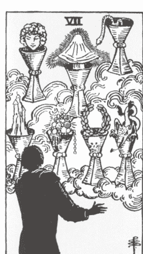

我们的灵魂比肉身经历的更多，
但身体却承载着每一次经验，
并为它们提供一个家。
难怪有些情绪和反应会让人感觉突兀、陌生或疏离……
就像陌生人一样。

### 关键字

解离、扭曲的情感滤镜、多种选择、断绝连结、幻觉、想像、没来由的情绪状态、对机会的不确定性、不堪负荷、痴心妄想

### 意义

这或许是圣杯牌组中最复杂，也最具挑战性的一张牌，带来阴暗与不安的感觉，让人感到忐忑。我们仿佛正凝视着机会的深渊，而想像力和不确定性正逐渐辗压我们。什么是真实？什么是幻想？我真正向往、渴望的是什么？我希望从人生中获得什么？是从我的人际关系中？还是从我自己身上？我是否带着伪装？正如我在前面的章节中提到，数字七象征自我意识，而这张牌也是如此。传统上，牌面的角色其实并非真实人物，而是一个黑色剪影，望着面前七个漂浮在空中的满溢的杯子。问问自己：在当下的经验中，我是谁？我是否失去了与自我的连结？刚好利用这个机会找寻内心的真相。在努力追逐目标、试图建立连结的过程中，我们有时会无意间失去与内心深处的连结，而这种状态只能透过自我探究来修复。如果你抽到这张牌，请放慢脚步，暂时抽离当下的状态。放下手上的事情吧！我经常以自助餐来比喻这张牌。当你饥肠辘辘地抵达自助餐餐厅，准备大快朵颐，面对众多的选项感到既兴奋又有些不知所措。没过多久，你已经吃得饱饱的，对味道麻木了。但奇怪的是，你依然渴望更多感官享受，还是硬塞着把甜点吃下去。

别误会我的意思，面前有选择确实令人兴奋又充满诱惑，有时甚至是必须的，但也可能让人分心或逃避。你长期以来寻找的答案或许隐藏在这些不同的道路和选择之中，但相信我，你的内心如明镜一般清澈。

#### 连结圣杯七

开始大扫除，无论是人际关系还是身边的杂物。暂时将社群媒体放在一旁，注意一下在日历上所标注的工作项目。花个十五到二十分钟整理一个让自己能够彻底放松、释放心灵和情感的空间，例如卧室或创意工作区。

#### 进一步反思

在日记中，用七句简单的个人真理来重新稳定自己的心，每一句都以「我知道」作为开头。例如：「我知道自己是一个充满爱心和善意的人。我知道我值得拥有互相回应的关系和能量。」

### ★ 我的情绪—圣杯八 ★

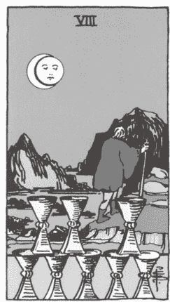

今天，终于是要放手的那一天。
我希望你知道，我一直都坚持不懈，
全力以赴。

### 关键字

投降、断绝连结、情绪释放、带着力量撤退、离开，摆脱困境、勇气、情感力量

### 意义

当我们开始要远离某些人事物时，这张牌就会出现。我们可能在某个人、某个目标或某个地方投入大量的时间和精力，但当弊大于利时，我们再也无法自欺欺人。这张牌传达了一个教训：当我们意识到某些人事物并未、也永远无法完全满足我们时，我们就要举白旗了。我们超越过去的自己，已经长大了。我们也得到疗愈了。这种成长并非他人所赋予，而是你自己的努力，这正是这张牌最吸引我的地方：它代表一个自我赋权且完全独立的选择。在圣杯八的启示中，我们常常感到失去连结，仿佛处于与世界隔绝的过渡期，但我们相信自己，确定自己的能力绝对能够发掘更多深度与快乐。请牢记，在这脆弱的时刻，这种信心和坚定将成为你的巨大力量来源，真正的自信便是力量所在。

#### 连结圣杯八

选择舒适的坐姿坐下，让身体稳稳地接触地面。双手合十，轻轻地揉搓。闭上眼睛，想像你想要断开连结的人、事、物就在掌心之间。接着，将左手轻放在心脏位置，右手掌则往前伸出。再度将双掌合拢，继续揉搓以产生更多的热能与能量。重复这些动作。这个过程能够清理能量线，帮助你摆脱不适的根源。再次揉搓双手，感受那股能量流动，并重申分离的意图。对自己默念以下短语：

- 「这是属于我的（左手放在心脏），这是属于他们的（右手伸出）。」
- 「这是我愿意承接的，这是我不愿承接的。」
- 「我在这里，而那股能量在那里。」

重复多次，直到你感觉已经完全断开这股能量了。

#### 进一步反思

使用以下引导句，连结到未来的自己并与他交谈：「未来的我，我想跟你分享，生活将会变得多么美好……」。

将你的回应视为一种宣言，承诺你将持续练习臣服于（并信任）未来的自己。向自己保证，你将继续寻求你梦寐以求的一切！

### ★ 我的情绪—圣杯九 ★

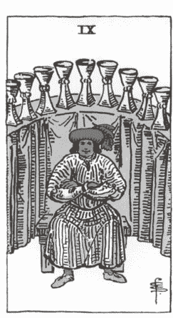

灵性力量和指导灵都希望你明白，
即使你只是在追寻一种感觉，
你的梦想依然是有意义的。

### 关键字

情感上的圆满、喜悦、庆祝、美梦成真、满足、成功与成就

### 意义

这张牌将我们带入一个洋溢着喜悦与真诚自豪的时刻。这并非那种高调、喧闹的骄傲，而是一种低调而内敛的自豪。它散发着温暖的光芒，即使是在街上与你擦肩而过的路人或在咖啡店偶遇的人也能感受到。

> 「哇！他们自身带着很棒的能量！」他们或许会这么说。

你可能会问，自己是如何有这么棒的能量？那是因为你跟随了让你情绪上感到圆满、满足的事物。你耐心地顺应圣杯周期的流动（或者逆流而上），经历了这个过程中的低谷和迷惘，现在已达到了平静的巅峰。你允许内心、直觉和同理心引领自己，也领悟到生活的真谛：知足。

圣杯九通常都是有收获和奖励的。这张牌往往会带来一份礼物、成就或愿望的实现，使这张牌变得几乎无可挑剔。它助长我们内心深层的自豪感和成就感，让我们可以放松休息（传统上，牌面的人物是坐着的），并享受应得的全体支持。这张牌也象征派对和庆典，当然也会有各种欢呼和庆祝！最引人注目的是，牌面上的人物通常是独自出现的。这段经验因与他人共享而变得更美好，即使只有自己一人庆祝，也依然感到无比欢欣。

## ｜连结圣杯九｜

设定一个「ME day（只属于我的日子）」。在心理自助和自我提升领域中，这已经成为一种潮流，身为一个极度 I 人²的我，对此深有共鸣。

「Me day」这个概念是要你花一整天的时间，来做些能够带给你快乐的事情。从早餐开始，一直到夜间的最后一刻，你的穿着、活动、饮食、娱乐，全部都依照你内心深处的渴望来安排。你的每一个选择和决定都为内心带来滋养，让你自然而然地感受到打从内心散发而出的满足感，使每个瞬间都成为难忘的回忆。

先将自己的杯子倒满并非自私的行为。事实上，在你实现圣杯九中所追求的那份永恒梦想之前，这是必要的。对自身的成就和所得的祝福感到满足与骄傲，而不是一味追求更多，这种惬意和满足的美好感觉，绝对值得我们庆祝。

## ｜进一步反思｜

请试着回答这个提问：「我曾在什么时刻、什么地方，真切感受到灵性与宇宙向我展现祂们的存在与支持？」

持续写下去，直到你觉得完整并再次与喜悦连结。根据这份清单，进一步深入探索，将你对塔罗牌的理解融入写作中：「在这段旅途之中，我经历了哪些具体事件、回忆以及特定的牌卡或旅程篇章，才走到今天这个位置？」

> **提示** 如果在思考过程中感到困难，请对自己保持耐心。要记住所有七十八张塔罗牌的含义需要时间。随着不断地练习，你会渐渐发现自己能够识别出「牌卡时刻」——那些能让你联想到特定牌名的情境与时光。从你第一次拿起牌的瞬间，你就已经是一名塔罗占卜师了，但当你开始在现实生活中运用这些牌，并看到它们在你周围的生活中显现时，你会感觉自己成为了一名更有经验且更专业的占卜师。

### ★ 我的情绪—圣杯十 ★

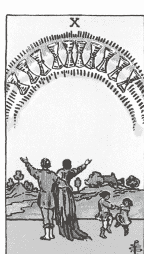

今天冥想时，
我发现自己站在母亲的药草园旁，
就是种在纱窗门廊外的那一片。
在我的记忆里，
我经常尽量不回这个家，
但我的内在小孩拉着我的手，
把我带到那里。

她开始跳舞，
为她身上的花裙子和同款式的发带感到无比自豪。
她那灰褐色的鲍伯头发
像裙摆一样轻轻摇曳。

但后来，我注意到我的父母，
他们看起来跟我记忆中的模样不太一样。
他们看起来很放松，没有压力，也没有怒气。
他们的目光全神贯注地放在我身上。

当我跳舞时，他们为我欢呼。
作为一个旁观者看着这个家庭，我感到无比喜悦。
看到我的父母为那五岁小孩喝采，而不是彼此恐吓或自我伤害，
这是我在冥想经历中最疗愈的片刻之一。
就在那里，那片药草园旁边。

### 关键字

幸福、福气、疗愈的连结、和谐、安全感、情绪上的安全、健康的家庭、安定富足的家、回家、稳定的关系、长期的伙伴关系、祝福

### 意义

传统上，这张牌象征典型的「白篱笆」式生活样貌——有小狗、有孩子，远处有一间温馨舒适的小屋。我承认，这样的意象确实美好。然而它缺乏包容性，也不符合更现代的生活方式选择，这些生活方式质疑并打破我们祖父母那一代的社会标准。

抛开传统和过时的幸福美满描述，转而将焦点放在这张牌的能量和情感层面，我们可以感受到和谐稳定的家庭，以及从选择家庭（没有血缘、法律关系的人在一起，互相支持）扩散到社区的疗愈力量——这份强大的爱如此丰盛，能够超越并鼓舞那些尚未遇见爱的人。说实话，我们难道不需要这些可能实现的画面，来让我们持续追求治愈的旅程吗？我们热爱赞赏并欣赏各种成功故事，像是白首偕老的夫妻迎来曾孙的诞生，或是历经不孕之苦终于怀孕的母亲。

我们不断努力与过去达成和解，并学会原谅自己曾经的经历。圣杯十提醒我们，不要限制未来的可能性。它让我们相信，深深的感恩、愿望的实现以及幸福的生活，并不仅仅是用来推销浪漫喜剧、说服我们尝试新约会网站或投资某些过多承诺的教练计划的口号而已。我们心中明白什么才是真正的渴望，以及回家的感觉。我们理想的生活，无论是否包含白篱笆，或是驾驶豪华油电SUV载着孩子去踢足球，都应该由我们自己去创造、实现并决定。

## ｜连结圣杯十｜

进入冥想，为你和内在小孩创造一个安全的空间。当你觉得时机成熟时，邀请你的内在小孩一起加入你。跟他们一起玩耍，问他们害怕什么、喜欢什么，真诚地跟彼此交流、对话。我透过直觉练习，学会了让他们引导对话，因为在某些方面，他们往往比我们更有智慧。用最真诚、可信赖的语气回应他们。你可以在心中想像这一幕，或者将你与他们的对话记录在你的日记里。向他们解释一些他们还未经历过、可能还不理解的事物，并表达你的爱意，让他们知道自己是多么被珍爱。让他们知道，随着时间推进，一切会走向何处。

## ｜进一步反思｜

冥想结束后，回想自己是如何与内在小孩进行对话，你如何安慰他们，还有他们的能量在哪方面带给你惊喜。写下一至三种方式，说明你今天将如何以温柔与同理来「陪伴并照顾」自己。思考这些方式会如何帮助你未来的人际关系和伴侣关系。

### ★ 我的情绪—圣杯侍者 ★

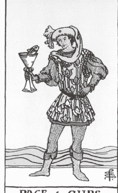

孩子，在这和善、温柔的世界里，
我希望你也有第二次机会。

**人格特质：** 梦想家、丰富的想像力、敏感、未经雕琢、艺术气质、爱探索、重视体验、讨人喜欢、真诚

### 意义

圣杯侍者如同听见灵性觉醒时的细微耳语，象征内心最敏感、最富同理心的那位内在小孩。侍者牌往往象征我们最能够自然表达自己、充满好奇心并从中学习的性格面，而这位圣杯侍者的自我成长正是借由直觉艺术来实现。通常以做白日梦、幻想或艺术形式呈现，这个角色带有一种天真甜美的感觉，也可以说是纯真，这种开放的心态实际上是一种天赋和智慧。当这张牌出现在占卜中时，提醒我要重视某个人的感受（可能包括他们受伤的内在小孩），这些人表现得安静内敛，以同理心直觉回应周遭的人与生活，然而他们真正渴望的是被爱、被珍惜和被关注。

在塔罗牌中，侍者的能量与王牌能量相似，象征我们有机会通过喜悦和玩乐来创造、显化并表达我们的直觉与最大愿望。或许，当我们接纳这位敏感的角色时，宇宙的魔法能更自由地流动，让我们的生活以想像力为导向，而不是被限制束缚。

## ｜圣杯侍者的引导｜

做场白日梦吧。找到一个能让你感到平静的场所，最好是在大自然中，让你的思绪自由漫游，进入白日梦的状态。你或许还记得在本章开头，我提到过自己在淋浴时透过做白日梦和不带杂念地观察内心思绪，得到有关水元素的「领悟」。侍者对我们日常生活中的幻想和梦境般空间有着极强的共鸣，借由融入艺术家的思维，并体验各种形式的美，你将能达到更深层次的体悟与欣赏。

#### 进一步反思

写下一个清单：

- 我在哪些领域和空间会变得特别敏感？
- 我会有这样的反应，是可以被理解与接受的，因为……

写完后，对自己重复以下话语：「你有情感，你可以安心地分享你的感受。你有感觉，你可以对他人表达这些情感。你正在成长，因此一切会不断地变化。你的身体、思想和心灵都在进步。你是被接受的。你被爱、光明与包容所环绕。你是独一无二的，你是有价值的。做自己是安全的。」

### ★ 我的情绪—圣杯骑士 ★

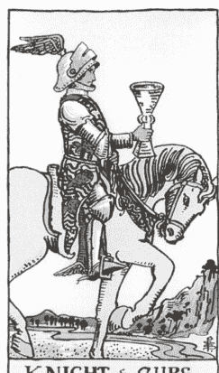

带着自爱的铠甲武装自己，
我成为捍卫自我价值的战士。
只为了让你来拯救我，
却也正好，让你不必再这么做。

**人格特质：** 浪漫、脆弱的灵魂、良善、艺术守护者、健谈、美丽

## |意义|

这张牌带着一颗温柔的心靠近我们，展现出爱情与浪漫的姿态，是许多人在爱情与关系占卜中最喜欢看到的宫廷牌之一。我欣赏这张牌是以感受为基准采取行动。骑士象征着我们迈向目标或承诺的方式、方向和速度，而这位骑士则以华丽、优雅、轻松的姿态前行。不论你是感受到内心的浪漫，还是因内心的脆弱而感到尴尬或不适，这张宫廷牌提醒你，欣赏自己的内在美，并勇敢地与他人分享这份美好。它可能也暗示你注意生活中某个受到内心驱动的领域，或是一个带着温柔情感与意图接近你的人。无论在什么状况下，请继续行动并回应任何爱与善意。

## |圣杯骑士的引导|

每当这张牌出现时，我总是告诉客户：「让生活浪漫一些」。成为自己故事的主角，让自己回到最放松的姿态！在你的空间点上蜡烛，为自己买束鲜花，煮饭时放点性感的音乐，随着节奏摆动屁股。无论是和伴侣制造点小浪漫，还是独自享受生活，这种强烈的表达和对美的欣赏会渗透到你生活的各个角落。这张牌是在提醒你，如果生活中缺乏享受、快乐，或是偶尔的小悸动，那还有什么意义呢？

## |进一步反思|

在日记本上，回忆过往因为爱而做出的决定。接着，反思这句话：「当我带着爱的意图时，我体验到了……」

### ★ 我的情绪—圣杯皇后 ★

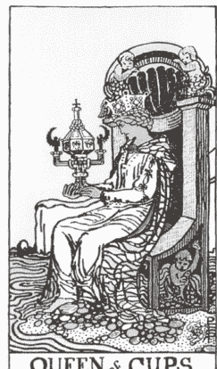

在她的头顶上方，
有一道巨大的光之通道
延伸至天空，
轻而易举地将她与源头连结。
她本身就具有通灵的能力。

**人格特质：** 女性化、直觉、同理心、母性、慷慨、疗愈者、创意、柔软、欣赏、优雅

## |意义|

当这位母亲原型人物出现在占卜中时，我对她与神圣女性能量及自然疗愈之间的巨大连结感到尊敬与钦佩。母亲的宫廷地位（皇后）与最具女性特质的水元素相结合，创造出充满活力且情感深邃的第三眼连结。这位皇后直觉特别敏锐，也是优雅与高贵的完美化身。透过连结艺术和无条件的爱，当然还有通灵的智慧，来分享她的疗愈力量和洞察力。由于她具备极高的同理心，她必须回来关注自己的情感，因为她不断承载并滋润每个与她相遇灵魂的情感。她能迅速吸收并感受那些不一定属于她的情绪与能量。对她来说，疗愈是一种自然的天赋，因此我们经常看到她以疗愈方式、灵性领导或照顾的形式引导他人。当她出现时，或许我们的精神与直觉连结会被唤醒或强化，或者我们正遇到一位灵性导师，带领我们迈向最敏感与神圣的本质。

## |圣杯皇后的引导|

测试并验证你的直觉力。向灵性世界请求一个可以作为确认的暗示（任何暗示都可以！）静下心来感受这个暗示是什么。也许你会闭上眼睛，并信任在寂静黑暗中所出现的第一个线索。常见的暗示有动物、特定的花朵，或任何对你有意义且独特的事物。这个暗示是你与你的灵性团队之间的默契语言。

当你接收到时，你会相信这个暗示吗？你会尊重它吗？圣杯皇后深知她与神灵之间存在着共同创造与沟通的连结。她敏锐地察觉自然流动中的微妙魔法，并拥有足够的信心去请求她所需要的事物。

## |进一步反思|

作为一位神秘主义者，这位水元素之母天生与潜意识相契合，具备疗愈万物的能力，并能在各种事物中找到直观的清晰洞察力，包括她的梦境。每天早晨，记下你的梦境细节。相信自己，也相信内心的智慧能将这些片段串联起来，进而揭示一些唯有透过直觉才能感受到的灵性讯息或疗愈启示。

### ★ 我的情绪—圣杯国王 ★

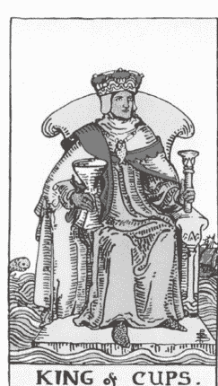

我知道自己已经蜕变，
因为如今当我感受到他人的破碎时，
我内心曾经破碎的部分
不再渴望拯救他们。
我并不会冲动地想停留在他们身边，
在修复过程中提供安慰。

我不再冒着被碎片割伤的风险，
但我愿意帮他们找到扫帚。

**人格特质：** 成熟、重视家庭、睿智、开放、负责任地自我疗愈、提供者、信任他人、值得信赖、明智、稳重、阳刚、令人安心

## |意义|

这位国王善待他的宫廷成员，树立情感成熟的典范。他温和且稳重，他的存在不会压迫或消耗他人的能量。反之，他安静地维系着生命中的每段关系，为每一个与他相遇的人提供轻松、自然且充满爱的氛围。他是一位慈善且好客的人，可能表现得有些害羞或说话轻声细语，但他所展现的优雅无人能及。圣杯国王珍视人际联系，他最令人钦佩之处在于，他能同时具备深厚的同理心与慷慨、保护他人与保持界线的能力。

当他在占卜中出现时，你应该意识到，你正以健康的方式来促进你的各种关系发展。当询问恋爱对象时，这是一张非常理想的牌，因为它体现了一种真诚和带有智慧的理解，深刻了解与他人共同成长与承诺所需要的努力。这位国王反映出你努力在内心培养的自爱能力。除了伴侣关系之外，这张牌也可能激励你去探索或实现你在艺术或疗愈方面的天赋，因为圣杯国王天生是一位空间守护者和富有创造力的远见者。

## |圣杯国王的引导|

花点时间凝视你所爱之人的双眼。选择一位对象（或镜子中的自己），坐在彼此面前。注视他的双眼，并好好观察。在有意的凝视中，你会发现什么、感受到什么、看到什么、体验到什么？安静地相处，直到双方觉得舒适为止（可以试试保持一首歌曲的时间），为此刻的你们两人创造一个充满爱与脆弱共存的空间。

## |进一步反思|

问问自己最近的情绪调节和稳定度，并用数字一到十来评分。一代表情绪调节最差且极度失衡，十则代表极度平衡且感到非常安全。

把这个数字写在日记页的开头，然后花些时间在安静且诚实的状态下书写。记下你如何继续为各种人类情感保留空间、如何创造更多的平衡，以及如何重新承诺（或持续对齐）内在情感的平静。将这些想法写成对自己的承诺，就像在对一位成熟健康的伴侣许下誓言。

1. 编按：指圣杯牌组是水元素，作者不是故意的，但这个比喻刚好非常贴切。
2. 译注：内向的人。

## Chapter 9

## 宝剑牌组：我的声音

宝剑牌组与风元素对应，要求我们对自己彻底地坦诚以对。它促使我们专注于与他人沟通的方式、我们的知识与学习、以及思维和自我对话。针对这套牌组所掌管的体验，我的建议十分简单：「宝剑主宰肩膀以上的一切。」因此，请将宝剑与你身体中掌管言语、思想以及头脑清晰度和意识的部位（如脖子、嘴巴和头部）连结起来。思想和言语，简单明了，对吧？

理论上是如此。

我想我们都明白，与他人保持有意识的沟通——更不用说与自己进行持续的心理对话——绝非易事。就像我们无法为每个想法留出足够空间时，仓促解读牌卡就会让讯息变得混乱。当我们没有时间进行充分的解释和反思时，就会感到与自己或他人脱节。我们的思想既可能是最大的敌人，也可能是最好的盟友。

宝剑牌组很容易成为四个花色中最具威慑力的牌组。这是因为它们通常非常精准，直捣问题核心，并以公开、诚实且不带玩笑的口气探讨主题。宝剑不会粉饰事实，使得某些占卜者常常无法直视这副牌组。宝剑牌已经准备好迎接各种挑战，每次所带来的讯息都真实无比，一旦连结上了，几乎无法逃避。宝剑牌是透过精准的指引来促进及扩展我们的成长，因此要明白，从这套牌组中所接收到的「严厉之爱」，是在提醒我们那些还需要疗愈的空间。牌中的人物并非用宝剑来破坏，而是清除那些限制你的潜能，让你陷入困境的障碍与干扰。

真相总是令人痛苦，却也带来自由。在疗愈过程中，我很快发现，当我越诚实面对生活中的痛苦，伤口愈合得就越快，也不再痒到令人难受。当我挑战自己变得更加脆弱和坦诚时，我感觉力量回到了我身上。例如，我不再焦虑不安，而是选择真实地分享让我困扰的事情，结果发现它的重量变轻了许多。这也是为什么文字和故事成为我分享的核心，并吸引我转向探索塔罗牌。整体而言，宝剑牌让我感受到一股原始的力量，特别是它所自带的坦率与透明。

我有两段特别清晰的回忆，都是透过写作，让自己的声音被听见，而在我说出真相后，整个人的感受就变得截然不同。第一次是在我高中时期，那时我翘课的频率远超过我完成作业的次数。唯一的例外是英文课，因为我认为这门课值得我花时间去学习。在那堂课上，我写了一首诗，内容是关于我曾居住过的所有房子。诗中巨细靡遗地描述了我和母亲居住的空间，以及每个空间的室内设计主题。我写到了这些房子如何为我们提供某方面的支持，同时也在其他方面带来了痛苦。我还描述自己如何以及在哪些地方找到家的感觉，以及当一个人与自己失去连结时，要在某个具体的地方找到安慰有多么困难。我的老师斯玛特夫人（没错，这确实是她的名字）看完后告诉我：「这是妳写过最好的作品，我希望妳知道它有多么强大的力量。」当时我已经因为写下这些内容感到自豪，而她的赞美更让我在分享这段内在经验时多了一份踏实与欣慰。

不到两年后，我十九岁，坐在一把摇椅上，手里握着一叠在大学图书馆列印的双倍行距稿纸。那天早上，我带着这叠纸张和虚弱的身体前往一个专门针对饮食失调的密集门诊计划接受治疗。我们每天都会聚集在一起，每周会由一位成员分享他们的生活故事。那周轮到我了。这些纸上承载了我从以前到现在的人生经历。治疗师建议我们以书写做为情绪抒发的方式，他们也向大家保证，如果我们允许自己被看见、被听见，并且欣赏我们所克服的一切，这会释放掉我们身上的压力。他们希望我们的言语能提醒自己，我们比削弱心灵能量的饮食失调症要强大得许多。

我在宿舍里花好几个星期写我的故事，享受每分每秒的写作过程和畅快的释放感。小组里的大多数人通常会分享两到三页的内容，概述他们的生活时间轴和重要经历。他们会告诉大家他们在学校所参加的校队、兄弟姐妹的互动、过去的感情关系以及他们错误的职业选择。然而，我很快就写满了至少十页，里面充满了故事、回忆和隐喻。我不确定是因为我真的有这么多话想说，还是说出来让我的内心感到释放。我迫不及待想要把所有的话都说出来，希望我能够因此重新学会爱自己，并再次用同样的嘴巴好好吃顿饭。

当我对着小组成员大声朗读完我的自传最后一句话后，我环视了房间四周。我的视线停留在那一双双的眼神上，那些目光让我感到温柔且被欣赏，既温暖又坚定。我感觉其他人能够真正地理解我，并透过我的经历看见真实的我。他们也因此有所共鸣，并珍视我所展现的脆弱。此刻，我再次为自己写下这本书而感到骄傲。

今天，我用塔罗牌来鼓励彻底的坦诚和毫无修饰的对话。当我与某人面对面坐下，牌卡布满在我们之间时，我希望我们能正视那些困难的事情，或者像我们在灵性圈子中喜欢称之为「阴影」的事情。我想了解这个人所讨厌及所喜爱之物，也想鼓励说脏话和有点太超过的笑话（毕竟，我们不需要对自己或塔罗解读过度严肃。）

所有七十八张牌都能够反映我们内在的力量，即便是像宝剑这样看似尖锐的牌面，我仍将它们视为一种机会，邀请你触碰自己内心深处最赤裸的那一面。这些真相可能会引起我们的不安，但同时也能启发他人。它们深深触动我们的心灵，同时带领我们回到自我核心。

在本章学习宝剑牌组时，请留意你内心的声音，并思考你用字遣词的品质与精准度、你音调的呈现方式，以及你有多常创作音乐、分享故事，或是聆听你那独一无二的神圣声音。唯有你才能如此真实地传达属于你自己的故事，因此让我们透过这些牌，全心全意地聆听这些声音吧。

> ## 有关宝剑牌组

**元素：** 风
**脉轮：** 喉轮和心轮
**时间与速度：** 一周
**星座：** 双子座、天秤座、水瓶座
**季节：** 秋季

**〔宝剑牌组是……〕**

博学、真诚、灵活、逻辑清晰、机敏、反应迅速、擅长沟通、善于社交、注重细节、充满好奇心、语气坦率或直截了当

## 为自己占卜时

宝剑牌组传递的讯息有时候可能让人难以接受。这组牌其实并非要吓你（尽管有些心灰意冷的占卜师可能会不同意我的说法）。无论如何，这些真相终究会浮出台面，而风元素旨在让你快速意识到现实，帮助你在疗愈过程中更加清晰地看见问题。它们的目的是来拯救我们，只不过方式稍微有些严厉。宝剑牌不会给你柔美婉约的诗词，而是会直截了当地指出你生活中的问题，即使你企图避开或否认这些事实。

在我个人的塔罗旅程以及为他人占卜的经验中，我注意到宝剑牌总是在恰当的时机切入解读。这些主题可能会带来一些不适，不过绝对值得我们去经验。起初或许会感到痛苦不安，但当我们打破限制或突破僵化的思维时，最终会让人感到自由。我也注意到，有时宝剑牌是在传递其他牌想传达却未被你接受的讯息。你可能在之前还没准备好听见这讯息，就如同紧急警报一样，灵性最终透过这个严厉的风元素给予你直观的提醒，而现在就是最好的倾听时刻了。

## 为他人占卜时

将对话拉到更深入的层次。如果在占卜过程中，抽到了许多宝剑牌，请你放下表面的闲聊，让讨论的内容变得更加坦诚透明。宝剑牌要求你停止修饰由牌卡直观引导出来的故事情节。你未经修饰的真实话语，可能正是对方需要听见的明确确认。

要效仿这组牌的坦率风格，凡事就请开门见山吧！让沟通内容简扼明了，并为风元素的变动特质提供一些具体可行的方向，或者给出继续前进的确认指令。请给你的客户诚恳又印象深刻的讯息，作为他们最后的提醒。

## 塔罗牌之外

在生活与塔罗实践中，保持好奇心。持续提问，成为世界的学生。你有改变方向或追求新兴趣的自由，但风元素提醒我们，时间与空间稍纵即逝，所以探索的最佳时机就是现在。保持适应力，允许自己随下一阵风或与陌生人的对话流动到命运的方向。

这组牌象征永无止境的求知心，它们的语气快速且机智。请你有意识地改变你的视角，参与具挑战性的对话，并不断地学习，你可以激发和运用宝剑牌擅长的口才与表达能力。

> ## 练习

我发现，练习积极倾听其实与「保有空间（holding space，身心灵层面与某人同在）」的概念是相同的。相信我，外面有很多不善倾听的人，而积极倾听确实是一种需要掌握的技能！成为一个积极的倾听者意味着你需要适应那些略显尴尬的沉默，并为话语之间所伴随的情绪提供一个富有能量的空间。这需要我们不要立即对问题做出反应、回应或给予解决方法。大多数的情况下，大家只是渴望被听见和理解。作为成年人，我们常常会根据自己的判断，来预期接下来应该接什么话或问什么问题，比如第一次约会时要问哪些「恰当」的问题。在塔罗占卜中，抛开那些社交礼仪，将注意力放在倾听，让自己全然参与其中，而不是在当下急于解决问题。将宝剑牌的精神和所象征的直白率真纳入考量，不要机械化地按照每张牌的既定解释来进行解读。首先，好好地倾听，然后准备好说真话，纯粹实话实说。这样，你才能完成一场真正有意义的塔罗占卜，并为提问者提供有效的支持。

### ★ 我的声音—宝剑王牌 ★

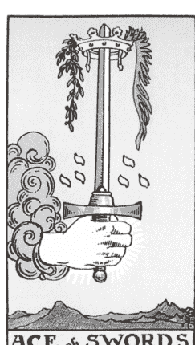

当我们身体电流般地
活过来时所出现的
那些细微的颤栗，
还有斑驳的鸡皮疙瘩，
仿佛是灵魂向我们发出的清晰讯号。

## |关键字|

真相、清晰的思维、新想法、重启直接的沟通、学习新事物

## |意义|

宝剑王牌在塔罗牌中代表「灵光乍现」的时刻。它带来一种强烈的确认感，促使我们对某个想法采取行动，或者踏上一条真实且具体的崭新路径。这张牌也是一个讯号，表示你已经清理了一些心理负担并释放了忧虑，现在你的思维可以进一步探索新的能量，可能是进步的、更具建设性和功能性的能量。

当有人在某个选择上需要明确的确认或肯定时，我特别喜欢看到宝剑王牌出现。我特别喜欢洗牌时这张牌突然跳出来，因为这样通常代表问题会被解决。如果你抽到宝剑王牌，请相信自己的沟通能力，并为自己能清晰地向他人描述愿景而感到自豪。在对话中，你应该深思熟虑且有意识地对谈，这股能量帮助你以清晰、有效且真诚的方式表达。如果你感觉自己的想法迷失在表达过程中，可以再放慢节奏，相信你会找到恰当的词汇来产生影响。

王牌也预示着自己所期待的消息即将到来。可能是你将在收件匣中收到期待已久的邮件，或者是某位特别的人传来的简讯。在沟通中保持明确的表达方式和诚恳的态度，并对新想法和观点保持开放的心态。

#### 连结宝剑王牌

成为灵性世界传达讯息的通道其实并没有你想象中那么困难。当你进入直觉和灵性工作时，设定意图是这个过程中最关键的一步。如果你觉得思绪浑噩或杂乱，或是头脑有太多讯息要处理，这里有一个简单而有效的练习，可以帮助你重新调整思绪。这个方法不仅适用于开始占卜前，也可以用于创作、重要对话或演讲之前。

试试看……

1. 采取坐姿，保持脊椎挺直，头顶向上延伸。身体放松，下巴也放松，肩膀自然下垂，感觉重量都在臀部和腿部上。
2. 闭上眼睛，想像一个光球在你头顶上舞动。留意它的细节：颜色、形状和大小。然后，向自己表达你的意图，并将讯息传送到漂浮在你上方的光球中。一个词就够了，比如「轻松」、「清晰」、「当下」或「净化」。
3. 当你准备好时，让光球坠入你的头顶，慢慢经过你的第三只眼、喉咙（特别注意这里）、心脏中心、核心和臀部。
4. 让这个意图穿越身体的每一个部位。想像一束雷射光束，这是直觉连结的象征，从你的头顶延伸到脚底。你是一个清晰、开放且能够接收的通道。你的逻辑强大，但直觉更强。怀着这份崭新的敞开，进入你的塔罗世界。

## |进一步反思|

在日记和塔罗练习中保持扼要精简。宝剑王牌到宝剑十的循环周期强调了沟通的重要性，因此你可以尝试「少即是多」的概念。冗长且华丽的日记确实会有些疗愈效果，但你也可以试试看给自己一个时间限制，用简短的方式回答，看看会有什么不同。例如，尝试在一首歌的时间内写完日记，然后把日记本阖上。

同样地，塔罗占卜也可以如此。在接下来几次练习时，挑战自己只抽一张牌（对，就一张），特别是在思绪繁乱、难以平静时。当你想同时解读不同讯息和主题时，自然会想用多张牌来厘清，但这样有可能会让解读更加混乱。你可以尝试只解一张牌，可能会带给你全新的见解。

### ★ 我的声音—宝剑二 ★

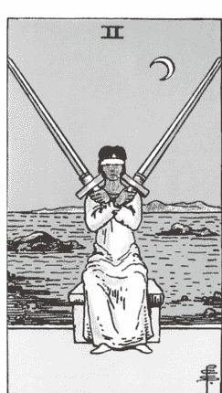

我用一只拳头，紧握着我的感情，
另一只拳头，则抓住着真相。
我出拳迅速，却无法击中目标。
当我张开双手，只见手掌一片虚无。
我到底在寻找什么？
我需要什么样清晰的思路？

## |关键字|

犹豫不决、不确定性、陷入僵局、心理障碍、缺乏方向、目标不明、感到停滞不前、处于抉择点、对立

## |意义|

这张牌上可以看见两把锋利的剑交叉于一颗心的中央，象征着情感与理智之间的流动被中断，我们不知道究竟什么才是对自己最有利的。犹豫不决的情绪悄然而至，使我们陷入困境，感觉就像是心灵与头脑的连结被切断了。虽然这种时候感到焦虑、困住或处在交叉路口是很正常的，但它仍然令人感到不适。当这张牌出现在占卜时，最好可以先暂停，跟你的身体、呼吸和情感重新建立连结，好了解这种## 连结宝剑二

练习辨别两种真相可以同时存在。多年来，我与许多客户都有讨论过这样的观念：一件事可以有两个真实面相，也就是说两件事实是可以同时发生——我们可以同时感到快乐和痛苦。我们可能已经「彻底结束」某件事，但仍然不愿意放手。我们可以都是对的，并能与同样也是对的人进行对话，即使彼此的感受不同。下次当你抽到这张牌时，花点时间思考自己在哪些地方感到矛盾，或者在察觉到生活中的不一致后，留意自己在哪些方面同时活在两个真实面向中。

#### 进一步反思

试着进行意识流写作。这个练习大幅度地改变了我的人生，我只希望本书中各种提示和练习，能够帮助你与灵性之间建立一种自然、流畅且充满魔力的连结。

- 请设定一个意图，静静地向自己（以及灵性）表达你希望从这次写作体验中获得什么。
- 先花点时间放松身体，调整呼吸。进入心流状态时，我们需要让身体和副交感神经系统彻底地放松和臣服。
- 设定计时器或用一首歌计时。开头往往是最困难的部分，因此安排一小段时间来进行书写是个很好的开始！
- 持续书写，不要停。如果找不到适合的词，还是要继续动笔，甚至重复同一个词「然后、然后、然后……」，直到下一个词出现。
- 不用追求完美的字迹，自然放松即可。一旦你进入意识流或心流写作的状态，你的手会自动加速，跟上创造性的思维流动。相信我，绝对可以的。
- 让思绪和感受片段、混乱地流露出来。当你之后回头阅读时，你绝对可以把写下的文字像拼图一样重新拼凑起来。

### ★ 我的声音—宝剑三 ★

我的声音在喉间颤抖着，
充斥着对你的轻蔑，但也格外刺痛。
这种震惊出乎我预料之外，
没有言语，只有情绪。

> 「你怎么敢？」我在心中震惊地问。

我的嘴唇静止，保持紧闭。
神经飞速运作，反应迅疾。
我的眼神却莫名地涣散，
冷静而专注，凝视着那个我从未预想过的你。

是你揭露了真相，说出了这一切。

## | 关键字 |

心碎、背叛、创伤经验或记忆、苦涩的结局、不为人知的痛苦经历

## | 意义 |

这张牌不好写。身为一位共感者，我整个身体会自然对围绕在这张牌的悲伤做出退缩、畏惧的反应，让我想起自己第一次心碎的经历，从此认清了世界的真实面貌，清楚看见他人能够伤害或背叛我们的方式。宝剑三的能量深刻地影响我们，触及到那些深层痛苦回忆中难以抹去的痛楚，并在体内形成一种细胞记忆，成为痛感的基准点。

如果我们还记得前面数字命理学的章节，塔罗牌中的「三」通常是指他人在我们个人旅程中所给予我们的能量。不幸的是，在宝剑花色中，数字三可能暗示痛苦是由另一个人造成的。当他人向我们揭示或分享痛苦的真相时，感觉就像匕首刺入心中，正如这张牌的传统图像所示。日子逐渐过去，我开始明白宝剑三常常与创伤反应有关，这意味着实际的背叛可能不是当下发生的，但身体却仿佛置身其中般地做出反应。当这张牌在占卜中如利刃般揭露时，我们的反应通常非常强烈，神经系统也一触即发，进入高度戒备状态，最原始的情绪也会凌驾于理智之上。因此，当我为他人抽到这张牌时，我会问他们（或问牌）这种感觉是来自最近的痛楚，还是以新方式揭开的旧伤。

#### 连结宝剑三

试试这个净化心灵的练习：

1. 吸气时，将双臂展开成T字形，让能量从每个指尖释放。尽管这可能让你感到赤裸且脆弱，但你的心仍要向上、向外延伸，勇敢地扩展你的能量，哪怕这种敞开感会让你感到不安。
2. 吐气时，弯曲手肘，将指尖拉回胸口中央，轻轻地触碰肌肤并轻拍身体。
3. 再次吸气，将双臂再次伸展，带入新鲜的能量。
4. 重复这个动作，在每次伸展之间轻轻拍打，最后闭上双眼作为结尾。

当你进行这个动作时，让任何不信任或怨恨的能量逐渐消散，并将这个动作成为你的疗愈方式，释放内心挥之不去的痛苦，将它从你身边拉开，这样你就能自由地迎接新的爱。

#### 进一步反思

就像我为这张牌自由书写的文字一样，你也可以从这句话开始：「你怎么敢……」。

顺着你的直觉去追溯事情的发展过程，并注意当你在面对背叛时，你会选择写信给谁。

### ★ 我的声音—宝剑四 ★

呼吸。
限制你的呼吸，
限制你的休息，
就是限制你的生命。

怀着感恩之心向当下的自己致敬，
理解通往那里的道路，
或许并不需要任何步骤。

这条路径可以在当下找到，
在呼吸之间，
如此而已。

## |关键字|

休息、冥想、沉思、自我照顾、独处、即使在威胁、恐惧或责任中仍能找到内心平静、暂停

## |意义|

经历了宝剑三的剧烈碰撞和对抗后，宝剑四是我们所需要的深呼吸。当你抽到这张牌时，它提醒你要好好休息。拜托，请务必认真听从这个建议。现在是时候找个安静的空间，独处一下，不要过度消耗自己。你要明白，如果我们无法放松，就只会一直处于战或逃、甚至僵住的状态里。这张牌提供你选择好好对待自己的机会。你是否愿意多花点时间来好好照顾自己，让自己彻底休息，恢复精力，保持清晰的头脑和稳定的心理状态？

从塔罗占卜的角度给你一个提示：当抽到宝剑花色的牌时，请你注意牌中的武器方向，这很重要——宝剑是指向你（威胁）、在你手中（防御），还是静静地放置着处于被动状态。莱德．伟特．史密斯牌的宝剑四描绘了一个人物，双手呈祈祷姿势，头顶上挂着三把处于静止的宝剑，象征他在先前（宝剑三）面对宝剑的威胁。但这次，他的身体下方摆着第四把宝剑，意味着他在准备好时，随时可以拿起这把剑，重新踏上战场。

生活总是有痛苦和挑战。我们需要对此做出反应，甚至要防卫自己。然而，要是没有足够的精力和意志力继续战斗，我们其实什么也做不了。有时，最有成就感的事情莫过于好好睡个午觉，进入一个深度恢复的时期，并专注于冥想和祈祷，让我们的信仰像宝剑一样锋利坚定。

## ｜连结宝剑四｜

练习冥想。不论你的正念练习是什么形式，都请优先进行。冥想有许多方法，我不会告诉你应该怎么做或使用哪种方式。如果你还没开始冥想，可以尝试从一种简单、容易进入且适合自己的方法开始。越早开始练习越好，因为这也是一种照顾自己的方式。不妨就从现在开始，可能今天早上、今晚睡前，或是此时此刻。

#### 进一步反思

使用以下句子来书写日记：

- 我最近一次允许自己深度休息是……
- 休息是我与生俱来的权利，因为……
- 当我的指导灵和直觉要求休息，他们会……

### ★ 我的声音—宝剑五 ★

也许下辈子，
权力、掌控与竞争
将不再成为我们的盾牌。
或许我们会选择放下宝剑，
渴望彼此能够建立和平的关系。
我们能够携手同心，相互扶持，
而不是彼此对立、四分五裂。

## | 关键字 |

冲突与竞争、操控、自我破坏、自我中心、有毒行为

## | 意义 |

这张牌反映了某种现实面，也就是我们每个人在某些时刻都会变得很糟糕，可能是变得好胜、好斗、自负，甚至做出卑鄙的行为。这张牌一心只想取得胜利，哪怕这意味着要采取不友善或不道德的行为。你是否曾因为他人的自私举动而遭遇挫折？一些最丑陋的策略和低级的行为习惯正是在这种处境中所形成。如果这张牌出现在占卜中，不妨考虑在这场斗争中投降。最好的方法就是远离任何有毒和具有攻击性的行为，无论是霸凌、心理控制，还是虐待。

宝剑五揭示这场冲突，但也提醒你采用更健康的解决策略，其实还是有其他更有觉知的沟通方式可以选择。这张牌非常有挑战性，因为它可能揭开我们内心那些不愿面对的阴暗面（就如所有的塔罗牌一样）。它是否在指引你反思自我破坏的行为？在指责他人之前，先仔细想一下。

## | 连结宝剑五 |

在每次占卜前以及离开家门时，我都会运用我的灵视力或「清晰视觉」能力来保护我的能量。这需要一些想像力和意愿才能够使用，但只要练习就一定可以掌握。

如果你愿意试试这个练习，首先闭上眼睛，稳定自己的能量。不论你身处何地，想像自己坐着或站着，并在面前看到自己的镜像。将这个双生的自己包裹在守护与光明之中。这个画面可以有不同的形式（毕竟，心灵视觉的练习并没有对错之分），它可能像是半透明的泡泡，或者是一个充满活力的金色光环，环绕着你的身体，形成坚固的能量屏障。我个人喜欢在我的能量场或光环边缘添上美丽的白玫瑰，这些玫瑰漂浮在周围，构筑出一道尊重且保护的屏障，将我珍贵的能量与外界的刺激隔开。

找到属于你的能量保护方式和视觉表现，看着自己被包围起来，并透过这个支持性的屏障来守护你。如果你感到当天有威胁，不妨闭上眼睛片刻，深深地吸气和吐气，重新建构这个保护屏障。

#### 进一步反思

无论这些提示唤起什么感受，都将它们写下来，并真诚地接纳自己。

- 我发现自己在生活中的这些层面变得更好胜……
- 除了对胜利的渴望之外，我可能还有更深层的原因，让我感觉需要战斗。我害怕放松警惕，因为……

### ★ 我的声音—宝剑六 ★

现在，让自己被带往安全的彼岸。
你已经尽力了。
你真的已经做得很好了。

## | 关键字 |

过渡期、行动、改变、脆弱、不情愿地放下某些事物、将疗愈和安全放在第一顺位、成长的仪式、与新环境的连结、接受帮助

## | 意义 |

这张牌提醒我们，有时即使还未完全准备好放手，也必须继续前行。宝剑六描绘了一名男人划着船，带着一名女子和孩子，远离波涛汹涌的水域，前往平静的河岸。

在塔罗牌中有许多张牌鼓励我们做出决定，放下那些对我们无益的事物。然而，宝剑六往往带有一丝不情愿或犹豫，这也是为什么有外部支持（如图中的划船人）这对过渡期是非常有帮助的。

宝剑六希望我们承认失败，并为灵魂选择更健康的道路。这是一种成长的仪式，让我们学会追随真实与自由，而不是让小我说服我们用意志力去克服困难。当这张牌出现时，我们可能会看到某段不健康的关系解体，或在某种层面上改变视角和观点。

我们也可以选择从负面角度解读这张牌，过度执著于那些我们不得不放弃的东西。然而，我们还是可以选择敞开心态，将焦点放在未来的新环境上。无论你最初对这段过渡期有何感受，这张牌所要传递的讯息是：你必须改变，接受他人的帮助，释放过去的伤痛，才能真正进化。

#### 连结宝剑六

练习设立界线。随着「安静辞职」²和社交媒体排毒³的观念越来越普遍，加上千禧世代和 Z 世代毫无避讳地愿意接受心理治疗（终于开始为好几代人进行疗愈了！）有关界线的探讨已成为热门且熟悉的话题。当这张牌出现在占卜中时，反思一下你目前的界线，并强化你需要更加受到尊重的部分。

这些界线可以应用于人际关系中，但如果你目前关系已经很稳固，试着评估一下你的日常习惯和作息，甚至是你所消费和接触的媒体类型。寻找新的方法来设立并维持界线，这对你的心理健康和整体心态有正面的影响。

#### 进一步反思

想一想你曾经在人生中所留恋过的一段经历、一段关系、一个工作环境，早已经超出原本初衷和舒适的界线。回想一下那些你曾经过度牺牲自己需求的时光。回答这句话：「我留下来是因为……，而我原谅自己在那边停留了这么久。」

### ★ 我的声音—宝剑七 ★

我们永远可以自欺欺人。
把真相掩盖起来，
就像压在一堆垃圾邮件下的停车罚单，
或是冰箱角落故意遗忘的剩菜剩饭。

当我们不想面对某件事时，
其实表现得会特别明显。
我们会开玩笑自嘲，找各种借口，

甚至用种种隐蔽的手段
来逃避真正应该进行的疗愈。

## |关键字|

欺瞒与不诚实、语气虚伪或不真实、找借口、营造假象、美化错误的感受、偷窃或夺取、逃避真相

## |意义|

在我们因这张牌中的细微意涵而产生焦虑之前，先来面对一件事：某些事情有点不对劲。一股奇怪而隐晦的能量，像低语般的警告正困扰着你。或许你担心有人在欺骗你，而这张牌刚好与谎言和不信任有关，所以这种感觉可能是真的。虽然我真心希望不是如此，但作为你的「塔罗闺蜜」和学习旅程的伙伴，我在此鼓励你先向内心探索。通常，这张牌所反映的问题更多是与你自己相关，而非他人（我知道忠言逆耳）。现在是时候问自己；你对自己、对他人、对自身言行是否存在不够真诚之处。最近有什么事情让你感觉像在说谎？

一开始学习塔罗时，这张牌对我来说非常具有挑战性，我很常犹豫是否要与客户讨论这个隐晦的主题。即使对新手来说，这张牌仍然是最让人感到不安的课题之一。在解读它时，要对自己温柔，同时也要勇敢挑战自己，看清哪些事情只是虚假表象，并找出背后的真正原因。

## ｜连结宝剑七｜

透过镜子进行自我忏悔。（在进行这个练习之前，请确认自己处于一个安静且保有隐私的空间，因为镜子练习较为私密，且会让人感到脆弱。）

1. 站在镜子前，望向自己的双眼，四目交会。
2. 接下来是比较困难的部分。诚实地面对自己，并与自己对话，进行真实的自我忏悔。说出你的恐惧，谈谈最近让你感到不安的事情。无论你想说什么都可以，这是属于你的空间，你的喉轮已经做好大解放的准备了。

如果你真的想让这个练习更深入一点，你可以选择脱下衣物，进行裸体练习（我真的曾经这样做过，效果很美好）。但请慢慢来，让自己放松。这可能是你这么久以来，第一次对自己说过如此真实的话。把心声说出来，让别人听见，确实具有转化的力量；但这项练习的设计初衷，是为了让你与自己独处、共鸣的神圣时刻。我希望你能体会到，它所带来的力量，和在公众面前诉说你的故事一样深刻。

## ｜进一步反思｜

在日记中回答这句话：「我必须大声说出这件事情……」
写完后，大声读给自己听。当你听到自己写下的勇敢话语时，让声音变得响亮、坚定且充满自信与骄傲。

### ★ 我的声音—宝剑八 ★

一位导师曾问我
内心的能量感觉像什么。
她建议我先好好感受它，
不加判断地观察它，
然后再仔细描述。
我终于找到了恰当的词汇来描述。

「感觉就像酸掉的牛奶。」
这个答案奇特却又很贴近真实。
那是我第一次真正明白，
我们的能量可以处于休眠、停滞，甚至腐败的状态。
忽视的后果就是会慢慢积累起来，
逐渐丧失原本的养分，
成为一种不健康的存在。
我们可以让任何事物变质：
我们的想法、
我们的关系、
我们的感受。
是的，我们可以眼睁睁看着一切变质。
但同样地，当一切都显得不再适合时，
我们也可以选择放手。

## |关键字|

感觉被限制或禁锢、被自身的想法困住、感到孤立、限制性信念、受害者心态、停滞、淹没、茫然无助，对自己的思绪无法掌控

## |意义|

我有个假设的理论。我认为这张牌可能是塔罗牌中最常被抽到的牌。我们的想法具有创造我们经历与人生轨迹的力量，而宝剑八便是最好的证明。从我们出生的那一刻起，就被各种资讯淹没——这些资讯包含了我们是谁、将成为谁、永远无法成为谁的词语、句子、预测和定义。周围的人总试图让我们迎合他们的世界，而这样的压力让人身心俱疲。

尽管我们在一个喧嚣的世界中成长，这个世界往往会压抑也不太支持我们的梦想和渴望，但我们仍可以学会去降低这种噪音，甚至麻木或将自己隔离出来。我们选择只相信别人对我们的评价（不是因为我们软弱，而是因为我们太疲惫），而不是自己主动定义或挑战那些我们从未想要认同的「真理」。

这样的例子不胜枚举：一名中学生，如果被刻薄的老师说懒惰，可能因此觉得自己永远无法展开热爱的计划，就因为自己缺乏这种特质。一名女性，被有毒伴侣贬低自己外表而动摇自己的自信心，可能需要多年后才能摆脱自己不够美的信念。我们的思想属于自己，却也无法完全免受外界影响。

宝剑八就是指出那些限制性信念和根深蒂固的自我定义，那些让人感到被束缚、孤立，仿佛被困在自己经历的情境。你可能让自己身陷一个并不想要的现实中，并且觉得束手无策。尽管这看来沉重且让人灰心，但我想让你知道，这一切仍充满希望。

正是宝剑周期的这个阶段，我们有机会掌控自己的思维。宝剑八的出现象征转变固化思维的契机，让我们可以用更真诚、充满爱的肯定句来取代过往的自我对话，并逐渐转换自己的思想模式。这是你压制内心批评声音的好时机，彻底将自己从限制性信念的束缚中解放出来。你会如何压制那些让你觉得自己不够好的声音？此时此刻，你又将如何踏出那谨慎的一步，迈向自由与心灵的扩展？

## ｜连结宝剑八｜

试试一种名为渐进式肌肉松弛法（progressive muscle relaxation）的技术来减轻焦虑。这种身体练习有助于更贴近自己的身体感受，同时也释放积累的压力。

从头顶或脚底开始，仔细扫描自己的身体，寻找紧绷或不适的部位。将注意力集中在特定的身体区域或肌肉群，并有意识地紧缩这个部位。例如，可以专注于肩膀，将肩膀耸到接近耳朵的高度。保持这种紧缩状态约十到十五秒，尽可能到极限。接着，慢慢地放松，观察身体逐渐放松、舒展，并变得更加柔和。

在进行的过程中，对自己重复说出以下句子：

- 我虽然不完美，但这份不完美是神圣的。即便自己（指出自己的不安或缺陷），我仍然爱自己，也相信自己。
- 我是自由的，从未被束缚。
- 此时此刻，我可以放下。现在就是我放手的时机。
- 在这份臣服中，我发现了真实的自己。

对其他两到三个身体区域重复这个练习。

#### 进一步反思

透过写作与反思，与未来的自己建立连结并对话：「亲爱的未来的我，今天，我让我们得以解脱。一些错误的信念曾经限制了我们，但我们将继续向前迈进。我们将……」

### ★ 我的声音—宝剑九 ★

他们带来了一场凶猛的暴风雨，
让窗户震动、发出嘎嘎声响。
它的强烈程度足以让我清楚意识到
自己内心深处的那场风暴。

## |关键字|

焦虑、过度担心、不安和睡眠问题、心理健康不佳、恐惧害怕、侵入性思维

## |意义|

这张牌的能量让我想到沸腾的水壶，刺耳的声响让人感到紧绷，想要尽快关掉它。宝剑九所传递的感受就像被梦魇和恐惧追逐，营造出一种与松弛完全扯不上关系的感受。

风元素从宝剑王牌开始就逐渐累积，焦虑的能量不断加剧，甚至达到冥想音乐也无法平息的程度。作为一个因创伤而经历过恐慌症发作、侵入性思维和失眠困扰的人，我深知焦虑的破坏力和耗竭。

当宝剑九出现时，塔罗占卜师必须谨慎且带着尊重进行解读，并留意当事人的心理健康状况（包括自身）。你不该忽视或掩盖这张牌。当焦虑、忧郁、恐惧和创伤达到沸腾点时，最有效的疗愈方式就是深入探索其根源。

## ｜连结宝剑九｜

这张牌会让我们感到极度无力，仿佛成了焦虑的受害者，或被奔放出来的忧虑思绪所操控。现在正是时候将这些狂乱的能量从体内释放出来，用声音来唤醒我们内心的战士。你可以透过以下练习来启动喉咙的能量：

1.  先深吸一口气，让心灵充满能量，为自己补充精力。
2.  吐气时，让下巴自然放松，口中发出可听见的吐气声。
3.  重复这个动作，每次的吐气声逐渐增强音量。从轻柔的叹息开始，声音应慢慢扩大，最终转为呻吟、呜咽或宣泄式的呐喊。放下对声音的评价，让它只是声音而已。这只是体内的能量在流动，为你创造更多安详、平静和心理健康的空间。

可以把这个练习想像成像小孩子对着枕头大喊发泄一样。用声音启动喉咙，并有意识地释放情绪，帮助我们突破关键点。回归原始的大声呐喊，让我们可以短暂驱散恐惧的能量，重新掌握内在的力量。

## ｜进一步反思｜

「晨间日记」是我多年前养成的习惯，直到现在也还持续着。这是一种自由书写或意识流写作的练习，把你的想法随意地写在纸上，这最好是早晨醒来后的第一件事（茱莉亚．卡麦隆在《创作，是心灵疗愈的旅程》中有深入探讨这个方法）。作为一位天生容易焦虑的人，每天早上闹钟响起时，我的头脑常常充满各种思绪，并且开始紧张。而正是在清晨的阳光中，我能够有机会回应或平静这些思潮起伏。

晨间日记有点类似通灵写作，因为它就只是任由文字流动。你的句子不必往特定的方向叙述，每当一个想法浮现时，你就将它释放出来。我通常会写一到两页，而茱莉亚．卡麦隆则建议她的读者们写满三页。写出的内容可能零散随意，甚至可以像一份待办清单，列出当天要处理的人事物。至少，这样的书写能让你释放醒来时所呈现的「杂乱」，将它隔离出来。这不是在逃避或掩盖责任与压力，而是为各种想法、恐惧和忧虑创造一个新的空间。完成后，阖上日记，转向下一个富有爱与关怀的练习，可以是深呼吸、祈祷或从塔罗牌中抽一两张牌。做完这些释放后，你可能会感到更轻松自在，也让自己准备好迎接这一天的未知。

### ★ 我的声音—宝剑十 ★

我意识到，如果我不愿投降，光明便无法降临。这只是在推迟黎明的来临。

## | 关键字 |

失败、崩解或灭亡，背叛或暗箭伤人，毁灭性的结局反而带来新的契机，疲惫不堪，死胡同，深刻的伤痕

## | 意义 |

我的朋友，一切都结束了。

在我继续之前，让我们停一下，刚刚上面这句话可能像是眼前最沉重的一击。当这种不受欢迎的课题出现在占卜中时，你可能会体验到各种强烈的情绪，从崩溃到解脱，不一而足。请在我引导你重构这个结局前，先忍耐一下这张牌所带来的不适，深呼吸一两次，然后下定决心继续前进。

当向客户或塔罗学生解释这股能量时，我常称它为我们的「许可单」，允许我们让任何该结束的事情就此告一段落。我们的思绪往往因风元素而反复盘旋，甚至可能紧捉某些早已该释放掉的事物不放。解读这张牌时，你需要让自己更加敏锐，就像解读宝剑九一样，因为它也经常涉及有毒或受虐的模式。虽然你可能觉得自己失败了，但在宝剑十的阶段，你必须放过自己。过度忧虑只会占据你的心灵空间，让你无法专注，并难以接纳新的、有建设性的能量。在开启新周期前，放下担忧是值得一试的。

## | 连结宝剑十 |

放下你的塔罗牌，让它稍作休息吧。当我开始频繁地抽到宝剑十时，我知道我可能太执着了。当我锲而不舍地探索、追逐，甚至一遍遍地向塔罗牌和指导灵表达我的渴望或需求，而非好好聆听已经传达给我的讯息时，宝剑十似乎就会突然出现。这是一张要我们思考自己的塔罗练习，并提醒我们过度依赖和执着会损害我们对于直觉的信任。放慢脚步让自己歇一会儿，静下心后再重新开始抽牌。

## ｜进一步反思｜

在你的日记中，带着释放的目的来进行书写。可以使用以下句子来确定最终需要放下的事物：「已经够了！我已经受够了……」

### ★ 我的声音—宝剑侍者 ★

给我的内在小孩：

你是个奇迹，
现在的声音听起来有些模糊。
但请相信我，
当我说，痛苦有天将会消失，
你的视野会变得清晰，

有一天
他们会 牢牢 记住
并庆祝
你所分享的话语和故事。

**人格特质：** 机智伶俐、聪颖、健谈、年轻、好奇、聪明、话多喜欢八卦、说故事的人

## |意义|

这张牌的侍者并不是胆怯或含蓄的人，而是充满活力的存在，鼓励我们探索自己的人生，追求更多知识好让我们扩展意识和视野。它让我想起那个不断追问「为什么？」的小孩，因为对他来说，答案永远不够。他们深信还有更多值得学习与理解的东西。

因为侍者牌让我们看到身为成人的自己仍有许多可探索的一面，当它在占卜中出现时，往往是要我们提出问题、寻求他人的协助，并透过文字和思想进行互动。而这位侍者借由与他人对话才能充分表达自己，尤其喜欢了解为何别人会持有不同观点。有时候，宝剑侍者牌也可能暗示八卦或过度干涉，因此需要留意和斟酌自己的对话和评论是否有必要性。总而言之，这个充满童心的角色特别擅长融入能够发挥他们智慧与魅力的情境、对话与空间。

如果你为自己抽到这张牌，那就去社交吧！它可能预示着即将到来的好消息（这张牌与王牌相似，带来新鲜感和机会），或预示着一场具有意义的对话将在对的时间和地点发生。

## ｜宝剑侍者的引导｜

在下一次的对话中，你可以积极提问。如果你是那种在群组聊天中很爱分享自己日常点滴的人，也许可以稍微改变一下方式，多向他人提出问题。宝剑侍者在深入的对话中总是容光焕发，并且从他人生活中的话语和观点中汲取灵感。每个人的声音和故事都提供了吸收新资讯并增长智慧的机会。

## ｜进一步反思｜

好好欣赏风元素，体验它如何为生活带来流动与变化。首先，你可以反思并写下：「在我的生活中 XX 让我感觉充满未知，因为……，这正是它让我感到兴奋的原因。」

### ★ 我的声音—宝剑骑士 ★

我等不及了。
等不及了。
内心有股期待逐渐酝酿中，
但我无法确切说出自己在期待什么。
然而，我选择顺流而行，
因为我已经等不及了。

**人格特质：** 迅速敏捷、反应灵活、主动回应、专注、自我意识强烈、雄心壮志、行动导向、思维敏捷、擅长解决问题、务实且讲求逻辑、自信满满、热情洋溢，常被视为具侵略性

## |意义|

这位骑士带着无比的决心，激动地冲向我们，所以现在就是准备展开行动的时刻。他是牌组中令人紧张的角色，因为他的速度和直率毫不妥协，让人几乎有种被逼迫的感觉。虽然他行事激烈，但我十分欣赏他那种心无旁骛、屏蔽外界干扰并全力朝着目标迈进的态度。我认为，大家如果都学会排除他人的期望和杂音，专注于自己的渴望，甚至偶尔选择以自我优先，这何尝不是件好事，而宝剑骑士正是这样的榜样。想想自己是否带着纯粹的信念与力量勇往直前？或只是为了证明自己的能力而勉强去做某些事情？这位骑士野心勃勃、不懈追求。你能展现他的毅力与无畏吗？你是否已经准备好迫切地达成目标或追求内在的疗愈？

## ｜宝剑骑士的引导｜

动起来，让你的心跳加速，不然就做一些心肺训练。身为一个长期无法正常饮食和运动习惯紊乱的人，我这么说并无意表达任何负面的节食文化观点。你不需要「燃烧」任何东西，也不必逼迫自己过度训练，但这张牌的能量自然带着冲刺的意味，所以不妨用运动来模仿这种动力。你可以透过一轮开合跳、快步走，或在户外跑步来连结宝剑骑士的能量。骑士在塔罗牌中代表行动和变革，而这位骑士的行动尤其迅速、勤奋，让人心跳加速，这类运动可能可以刺激你的神经系统，让你能够启动新的计划，然后像他一样勇往直前。

## ｜进一步反思｜

在面对这种猛烈而快速的能量时，你需要考虑一下有哪些工具、练习和资源来应付眼前的需求。写下并反思：「当生活节奏加快时，我会透过做 X 来保持能量。我依靠 Y 工具让我继续向前。」

### ★ 我的声音—宝剑皇后 ★

她来到这里是为了带来和平，
成为心灵与思想的调解者，
总是在内心中探寻真理，
借此成为榜样，
清晰地反映他人内心的实相。

**人格特质：** 通达情理、表达能力强、观察入微、诚恳坦率、被误解、追求公正公义

## |意义|

在占卜中，当这位皇后人物将宝剑指向你时，她是在提醒你注意自己的思维，要求你认清真实的自我并为此感到骄傲。她是终极的「唬烂验证器」⁴（BS Detector）。这位母亲角色的观察力敏锐（有时甚至挑剔），并以严厉的爱来滋养周边的人。我非常敬佩她对正义和公平的执着，因为整个宝剑家族追求一个由诚实和真理所塑造的世界。我也钦佩她设定界线的卓越能力。她确信真相能使我们自由，但揭露真相的过程总是让人心脏漏跳一拍。宝剑皇后不仅会提出锋利的问题，也毫不畏惧地指出你的问题所在。

这位皇后受到最直接且锐利的风元素影响，使得她性格复杂且经常被误解。她被认为是四位皇后中最冷酷无情的一位，拥有坚定的意志，绝不妥协。让她激励你找到自己的理性之声，并在疗愈过程中直入核心。这过程可能会有些生硬，但记住，这份强韧而深沉的爱就在你身边。

## ｜宝剑皇后的引导｜

积极争取更多空间来取得一席之地。也许现在是时候在对话中更清晰地表达你的立场了。这可能也是个好时机让你去冒险，把你的名字放进可能不完全符合资格的职位候选名单，或勇敢地私讯心仪的对象。我们常常害怕自己会显得太直接、太大胆、太令人不悦。忘掉这些顾虑吧！尤其是作为女性，我深知有时可能会担心自己过于突兀或占用过多空间。当你抽到这张牌时，请在这一天尝试以不同方式勇敢表现自己，让每个你走进的空间都充满更多真实，无所顾忌地展现自己。

## ｜进一步反思｜

除了写作之外，不妨用「禁语体验（silent retreat）」来滋养自己。你可以上网搜寻那些价值数千美元的豪华静修场所，享受强制性的静默和令人惊叹的五星级体验——老实说，这确实很梦幻——但你也可以运用纪律来达到类似的效果。

在日常中，你可以简单地创造「禁语」体验。这可能包含删除社交媒体APP、将手机调至静音，并承诺维持静默一段时间。透过减少外界的声音，你将给予自己更多内在对话的空间。尝试在一段时间内远离媒体、播客，甚至音乐，试着只保留内心的声音。观察这种无声对话会带你走向何方，并感受自己在其中的舒适度。

### ★ 我的声音—宝剑国王 ★

我小声说话，
并非因为我无法提高音量，
而是因为我已经大声说话太久了。

**人格特质：** 理性、自信、智慧、不妥协、知性、完美主义、公平公正、致力于真理、讲求合理、重视价值观系统、老师、领导者、值得信赖

## | 意义 |

当这位国王在占卜中出现时，他的眼神从牌面中心直视我们。他的姿态散发出威严和自信，可以感觉到他有讯息要告诉我们。他推动我们迈向更深层的智慧，体现我们的智慧和判断力。宝剑国王非常果断、敏锐，拥有无懈可击的洞察力，能够捕捉他人的个性和时机，因此他的出现可能预示着即将来临的决定，而你或许已隐约知道答案。尽管他明显严厉多于柔和，但他的冷静、自制和沉着的个性令人钦佩，激励我们在领导、沟通以及与他人交往时也表现出相同的稳健与自信。

如果你在寻求认真且具有明确意图和愿景的事物（或人物），这张牌的出现是个好兆头。宝剑国王是一位思虑周全的团队领袖、主管或负责人，因此不妨思考自己是否具备相似的技能，或者想想这张牌是否在鼓励你扮演这样的角色。

#### 宝剑国王的引导

请做决定，并愿意承担决策的最终责任。请在今天一整天的时间内，自信地表达你的意见，成为一位深思熟虑的领袖、社群与团队中的决策者。

我并不是要你压制他人话语或忽视他人的喜好，而是建议你留意团队会议中，如果有出现犹豫不决的时刻，或者当你和伴侣在晚餐前进入「我不知道吃什么，那你想吃什么？」的熟悉对话时，不要再乱猜测，好好地思考且自信地做出决定。

宝剑国王以卓越的机智实现他的愿景，因为他从不反复怀疑自己。当你抽到这张牌时，不要害怕挺身而出，为自己和你关心的人做出果断的决定。

#### 进一步反思

请思考并在日记中写下：「这些是我引以为傲的个人价值观和道德准则……」。

1.  译注：斯玛特原文为Smart，意思是聪明。
2.  编按：指人们在工作中不再额外付出、只做分内的事，作为一种界线感的展现。
3.  编按：指暂时或长期停用社交媒体，以保护心理健康。
4.  编按：像是识别假话的雷达，能一眼识破所有的谎言与借口。

# Chapter 10

## 权杖牌组：我的意义

权杖牌组与火元素相关，提醒我们要有意义的活着。请记得，我说的是用有意义的方式去生活，而不是要你「找到意义」。寻找存在的意义或理由说起来或许让人觉得钦佩，但做起来却非常艰苦。找我占卜寻求指引方向或帮忙寻找目标的客户多得不胜枚举，大家都想知道自己能够发挥什么样的影响力，以及如何启发他人。

权杖是创造力的指南针，帮助我们每次都往前迈出（有意义的）一小步。火元素的能量发挥时，每次会给我们一点点线索，引导我们靠近自己该走的方向，让我们去追寻那些让人心动、让人自然被吸引的事。

这就像与另一半产生化学反应或是半夜突然闪现的灵感，都是完全无法强迫的，我从塔罗练习和牌卡连结中不断地体会到这件事。与其徒劳无功的追求或把自己打上迷失的标签，我们也可以转换想法，接受「下一件对的事」的观念。是时候把握机会回归自我、感受内心，并问自己下一步想做什么？停下脚步让我们有机会发挥直觉，厘清现在有什么事情让我们感到满足。当我们习惯信任自身力量与直觉，就会开始建立信心。练习做出有力的决定并倾听内心的节奏，我们会慢慢放下那种对「每个选择都要有深远意义」的压力。有些决定，其实就因为它当下让你感觉对，那就够了。

我还记得之前和工作上的朋友在纽约散步，我们在联合广场附近一起逛精品店，想说在主持活动前先打发一下时间，这是由某个康普茶品牌赞助的活动，邀请了一位在社交网站上很有名的营养师来谈论肠道健康。

当时我和其他人共同创办了一个健康相关的活动策划公司，我蛮享受这份工作，但没有真正爱这工作。我对成为创业家感到骄傲，也很开心我们打造了拥有健康意识的社群，但身为一个高敏感人，举办活动需要消耗大量的体力，繁琐的细节也常让我精疲力竭。尽管如此，我还是全心投入这份事业，有段时间我也认为这就是我的人生方向。

我会特别提到自己在当时的人生阶段没有怀疑过自己，是因为我觉得这一点很重要。如今我才明白，对工作抱持开放心态以及不执著于任何灵魂使命，才让我得以那么自然地走进一家店、拿起那副塔罗牌，也就这么无意间踏上了我后来热爱的旅程。

我和朋友逛了一间都是家居用品和家具的商店，我其实没有打算要在这家店购置新东西，因为那时候我才二十几岁，穷到不行，但我注意到店中央一个小展示架的最底层，有一个写着「塔罗」的黑色盒子非常引人注目。或许是因为盒子跟一堆居家摆饰放在一起显得格格不入，才会被我注意到，但也可能是运气的关系，总之，我伸手把这个盒子拿了起来。

在这之前我从来都没有接触过塔罗牌，但那一刻我知道，我想要这个东西。我当时并不知道这套牌会在接下来几年一直陪着我，最后在经历了无数次为客户算牌后光荣退役，而这套牌也被放在家里一个神圣的角落（现在装潢得更漂亮了）。我没想到这套牌会用这么久，也没想到盒子会变得陈旧斑驳，牌卡边缘也卷曲出现了磨痕。

> 「要走了吗？」我的朋友出声打断了我与天赋相遇的时刻。

「没错，但我买一下这个，很快就好。」我无法解释为什么要这样做，但我觉得把这套牌买下来是正确的事，如果我当时没有这么做，谁知道还要等到什么时候才能体验到牌卡的疗愈力量，或是在学习的过程中更深入了解自己。

那天晚上的活动结束后，我在饭店房内打开牌卡，快速浏览了解说并翻看每张崭新的牌卡，有些牌我看到后就爱不释手，有些则让我感到害怕。现在我知道这种回避行为是一种自然的本能，第一眼就喜欢上某些牌也是很正常的事。然后我进行了第一次抽牌，对自己所做的事和收到的资讯感到疑惑。可是，天啊，能够感受到这种指引真的太棒了。

我就这样开始了塔罗占卜的旅程，随着时间慢慢从小白新手变成学员，再变成占卜师和专业塔罗师。而我的人生方向，也在每一次拿起牌、询问讯息的过程中，悄悄地改变着。有些心灵疗愈仪式或纾压疗程让我感觉难以进行，但塔罗牌的练习却相当自然不费力。我之前都要用手机提醒自己天天冥想，还要把每周的咨商时间都写在行事历中才不会忘记，但不管生活有多忙碌，塔罗牌却能自然而然地融入我的生活中。

我可以自信地跟大家说，自从十多年前在纽约买了那副塔罗牌后，我每天都有练习塔罗牌，没有一天是偷懒的。虽然我收集的塔罗牌越来越多，而且跟塔罗牌的对话都集中在帮忙治愈其他人，但这些牌卡就像呼吸一样充斥在我的生活中。

塔罗牌带着我进行更具价值的内在疗愈和自我反思，用爱重新描绘了我的人生故事，并带领我用新的方式分享这些故事，它变成我的休闲娱乐、学习领域以及教学的内容。塔罗牌在不知不觉中帮我建立了一个更适合我的新事业，温柔地将我推离不适合的事情，走向更具影响力与实际的道路。回想起来，如果我不是某个下午在纽约市到处乱晃、打发时间，我可能要更晚才能发现自己的意义！

于是当我卡在人生的岔路上，心中觉得犹豫与迷茫时，就会重新回想这些相信直觉而不是逻辑的时刻。你心中正确的下一步是什么呢？

> ## 有关权杖牌组

**元素：** 火
**脉轮：** 太阳神经丛
**时间与速度：** 一到三天
**星座：** 牡羊座、狮子座、射手座
**季节：** 春季

**〔权杖牌组是……〕**
转变、力量、热情、破坏、创新、自我驱动、男性特质、启发、决心、强壮

## 为自己占卜时

培养与自我（ego）的健康关系。

其实你是才华洋溢的。阅读这本书并翻看塔罗牌的你，拥有独一无二的才能，而且只有你能完美展现这个才能。意识到自己的优点了吗？

在灵性圈里，「自我」常常是个被回避、被压抑，甚至被觉得应该感到羞耻的话题。

我的看法是什么呢？我们以人类的身分来体验这一生，而我们可以拥抱它！每个人都有自我，重点不是消灭它，而是学会跟它相处，把它变成你走向充实人生的推进器。

在学习权杖牌组的时候，请尽情展现你健康的自我和个人特质，你有独一无二的能量，所以进行本书的练习与指引时，好好享受、拥抱自己与生俱有的天赋，了解自己的价值以及无限的潜能。

## 为他人占卜时

鼓舞对方吧！占卜中出现的火元素越多，我的角色就越像是一位鼓舞人心以及带来力量的老师，我会成为他人的专属啦啦队，最神奇的是，我其实没有刻意这样做，只是自然而然切换成这个状态。权杖牌卡以及火元素的能量就是这么强大，会在我们内心勾起并点亮光芒，所以当这些牌出现在占卜中时，我经常会聊一下每个人所拥有的力量，以及我们是如此独特及闪闪发光，就像火焰一样。

为他人解读讯息时，要大胆、自信地向对方表明他们是特别且重要的，他们的气场、本质及灵魂的每一个角落都蕴含着神圣魔力。当占卜出现丰沛的火元素和权杖牌组能量时，你扮演的是占卜师，同时也是一名鼓舞人心的讲师。

> 提示 你可以让占卜更加有趣！在占卜时可以问一些不一样的问题，或是不按照传统的方式抽牌、洗牌或使用牌卡。权杖牌组赋予我们一个打破传统并优先选择冒险跟玩乐的机会，这是你找到自己「直觉风格」的好机会。

## 塔罗牌之外

在日常生活及塔罗练习中，要记得追随那些会点燃你热情的事物。你表现出来的创意以及某些活动对你产生的吸引力，已经充分透露你内在灵魂的渴求。我会鼓励大家多花时间在这些兴趣上，不要压抑这种情感，要好好回应它们！对我来说，点燃这把火的是塔罗。塔罗给了我其他灵性工具无法给予的启发与热情（懂我在用火的比喻吧？）我也希望当大家拿自己的牌卡做练习时，能够跟我获得一样的启发。

虽然这本书着重于你的内在旅程和个人疗愈，但我也想邀请你往外走一步。让权杖的火引领你去支持你所相信的价值、理念，或社会议题。用你的声音自信地说出你重视的事情，表达你的观点，让对话带来转化与改变。火元素不害怕破坏或摧毁过去，所以请想一下该怎么替你的社群带来必要的改变。

### 练习

拥抱「人生只有一次」的YOLO¹态度（我知道，这是 Y 世代的讲法），时时提醒自己生命短暂且珍贵，就算被认为行为荒谬也值得。不要管其他人的目光，你可以穿自己喜欢的衣服（就算是抖音上流行的打扮也没问题）、在演唱会上尽情摇摆、打开窗户大声唱歌或是吃蛋糕当早餐，不需要随时都循规蹈矩的生活。火元素不希望我们过着无趣的生活，身而为人已经非常复杂及困难了，你随时都可以让自己度过一些特别、与众不同及魔幻的时光！

### ★ 我的意义—权杖王牌 ★

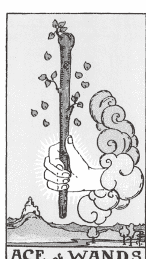

当你品尝过让你满足又渴望的工作，
同时，
当你找到了「它」，
就不会再满足于金钱与权力，
因为灵魂完全在不同层次上了。

## |关键字|

激发创意与热情的新循环、启动、化学作用、瞬间吸引力、艺术天才

## |意义|

当占卜出现权杖王牌时，我就知道能量即将变得活跃、刺激。这种能量可以激发行动。不管是大胆且不假思索地对喜欢的人主动出击（惊喜吧！），或是在洗澡时突然想到一个好点子，权杖王牌都可以点燃腹部的能量火焰。这团火焰磁性十足，充满能量与希望。眼前是可以直接点头答应的绝佳机会——但前提是，我们要具备实际执行所需的热忱、真情与信心。权杖王牌的能量可能来得突然，而且经常转瞬即逝。如果不够小心谨慎，就会像火柴上的火苗，微风吹过就熄灭。我们要建立一个积极且稳定的环境（像是生活风格、适合的工具、还有足够心灵修练，让自己在这段旅程拥有正确的自信心）来照顾权杖王牌。让狂野的梦想与热忱带领你，忠于自我并保持谦虚。你是才华洋溢且绽放独特光芒的人，权杖王牌正邀请你一起来探索其中的原因。

## ｜连结权杖王牌｜

坐在清晨的阳光下，这有助于建立生理时钟和调节荷尔蒙，跟着初升的太阳一起苏醒，并沐浴在晨光中大约十五分钟，可以帮助我们重新调整及滋养身心。每个早晨都是一个全新的机会，让你能拿出权杖王牌的朝气与热忱来度过这一天，试着优先晒太阳补充维他命 D，并观察温暖的太阳能量与心灵体验结合后的影响。

## ｜进一步反思｜

把让你有所启发、感到好奇或有兴趣的事情列成清单。今天有什么事情让你特别兴奋吗？接着再把你觉得有意义且重要的事情都一一列出来。

将这两张清单上的事情好好看过一遍，看看有没有彼此相似或有彼此呼应地方。你自身的热忱与大胆自信的行动，有没有哪些相似或互补之处呢？

### ★ 我的意义—权杖二 ★

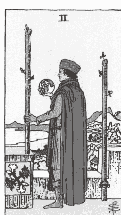

腹部深吸一口气，膨胀又收缩，
一次又一次，膨胀又收缩。
我的信心也是如此反复变化。
有一部分谦逊又安静，
有一部分炽烈又自豪。
我有权进入任何地方，
宣告我的归属，
并将这片土地视为我的领地，
就像我的呼吸一样。
我只是触及了自己丰盈力量的一小部分而已。

### |关键字|

大胆的愿景、新方向、勇敢的选择、狂野的机会、规划、更多的渴望

### |意义|

权杖二让我们得以一窥自己的潜能，这是一张充满勇气的牌，引领我们进入脆弱的自我探索，思考什么才能带来真正的满足。

在这张牌中，有个人影矗立在城堡的顶端，穿着华丽的衣着，手中拿着一颗地球仪。他望着眼前诱人的世界，似乎对这个早已熟悉的环境感到不满。或许，你也跟他们一样，走在一条还算可以接受的道路上，但这样真的能感到满足吗？

抽到这张牌代表你心中可能有改变某件事情的躁动或渴望。如果给自己机会尝试新事物，会发生什么呢？你可能正要做出重大决定，胃里也跟着充满焦虑紧张的情绪，忐忑不安。

我都戏称这张牌为「五年计划」，但权杖二指的不是你要承担的那些风险，而是指深思熟虑的规划和坚持愿景，缓缓建构璀璨的未来。

毋庸置疑，权杖王牌点燃了我们内心的火焰，此刻我们已无法忽视这股好奇心。不管你是选择相信自己获得上天的指引，或是打开心胸边前进边学习，这张牌都将带你走向命中注定的命运，那是你透过独立自主、意志和能力能够追求与发现的道路。

#### 连结权杖二

练习火呼吸法，或称头颅清明呼吸法（Kapalabhati Pranayama）。这种呼吸技巧就像火元素，可以提升能量、进行净化和带来温暖，并产生物理热能，激发能量流动。就像发动引擎一样，它可以从自身内部启动。当我们在追寻答案时，这种与信心和健康自我的连结对于我们进行关键一跃或重大行动时非常重要。在瑜伽界中，这种练习被称为「消除假我（ego eradicator）」，因为它能够破除限制潜力、瓦解抑制灵性连结的阻碍和壁垒。

这种呼吸法常用于昆达里尼（Kundalini）瑜伽，属于动态活跃的呼吸练习，所以最好循序进行，逐步增强耐力。

1. 背部挺直，让身体正坐，将双手放在腹部上。
2. 从鼻子深吸一口气，再从嘴巴吐气，做好准备。
3. 再次深呼吸，让腹部填满约四分之三的空气。接着，用快速的动作，将肚脐朝内推往脊椎的方向，并同时将肺部的所有空气大力吐出。让这个动作从横膈膜发力。
4. 让肺部再次充满空气，放松自然扩张，然后再次收紧腹部，重复呼吸动作。
5. 重复这个动作 20 到 30 次，然后恢复正常呼吸，观察体内的感受，例如蜂鸣或嗡鸣的感觉等等。

#### 进一步反思

可以好好想一下：「如果我知道自己不会辜负任何人或任何事情，我会做X，以及探索Y。」

### ★ 我的意义—权杖三 ★

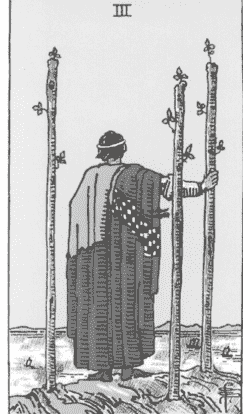

宽恕自己曾经惧怕自身的力量，
或选择了错误的方向。

相信潜意识的引导和经历的曲折，
因为灵魂深知什么对你最适合，
并正为你的成长做好准备。

## | 关键字 |

自信、清晰、朝目标前进、自由、个人成功、冒险得到回报、因选择而收获快乐、乐观、未来规划、移动或旅行

## | 意义 |

低头凝视自己的脚，看看你站的地方，你应该会替自己的成就感到自豪。在权杖二中做出追求某件事的选择后，世界在权杖三的能量中变得更加充满希望与光明，当你连结这张牌的能量，你将可以探索新的世界并享受触手可及的自由。莱德．伟特．史密斯塔罗牌便以丰富的黄色来呈现这种乐观精神。黄色在塔罗牌中被认为是积极乐观的颜色，牌卡中的人不再陷于先前平凡、灰暗且清冷的环境，而是终于沐浴在欢乐与光亮中。

塔罗占卜者常会要我深入讲解这张牌。基本上，权杖三的本质很简单：你选择了自己，把自己的想法放在第一顺位，你应该继续跟随自己的脚步，相信只要继续把重心放在自己身上，这趟旅程就会持续下去。

虽然权杖三本身不是复杂或很难解释的牌，但它却是真实的，而我会说，这是生活、疗愈和自我实现的美好方式。

## | 连结权杖三 |

想像你的理想生活，大胆发挥创意吧！把理想生活视觉化，透过想像力、感官体验来见证你高我的美好生活与梦想。作为一个专业灵媒，我也被问过「我的未来会发生什么？」这种问题。当有人要我给出详细的预测时，我会专注在他们渴望的感受，还有可以帮助他们达到至善与灵性连结的情境上。我会立刻转移单纯算命的话题，连结可以带来力量的事物，让我跟客户可以一起共同创造这份理想。

你可以试试看……

1. 当你觉得可以自在安全地与内在连接时，把眼睛闭上，并放松身体。专注在当下，尽量静定。
2. 请未来的你 / 高我向你展示画面：未来的你正过上灵魂理想的一天，稍微等待一下，并让画面自然发展，不要强迫！
3. 运用灵视（透视）的心灵感官，查看、感受和注意眼前的画面，观察未来的自己在哪里、穿什么、身边有什么玩具或工具，还是有没有其他人。有发现哪些事物是现在生活就拥有的吗？
4. 想花多久的时间都可以，好好感受这一天，详细描绘梦想的生活。

#### 进一步反思

书写并反思以下问题：

- 我最近冒了哪些风险？
- 我在哪方面为自己感到骄傲？
- 我在哪些地方注意到自己的独特之处和内在光芒？
- 当信心受到动摇或外在世界要我掩盖光芒时，我该如何持续散发光芒？

### ★ 我的意义—权杖四 ★

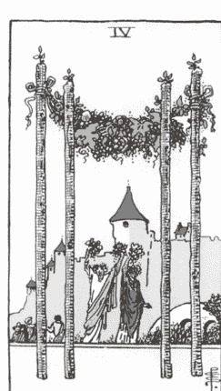

张大眼睛，我们双眸相望，
带着彼此相映的喜悦，
无声的认可，
未言明却彼此心领神会，
「我们成功了，做到了，
我们来到了这里。」

我们带着困惑歇下，
惊叹其中的复杂。

大胆，
奇迹，
爱与生命让我们一起齐聚在这里。

## |关键字|

庆祝与快乐的体验、共有的回忆、繁荣、达成里程碑、订婚、结婚、宣布重大事件、成就

## |意义|

权杖四就像是校庆中的校友表扬大会，象征庆祝、派对或迈入下一个令人兴奋期待的章节。我通常都会开玩笑的说，如果你正在参加一个有蛋糕的派对，那可能就是处于权杖四的时刻。当然，像订婚、升职、毕业、婚礼以及其他充满爱与欢乐的场合，都蕴含权杖四的能量。权杖四赋予我们想要和他人分享的体验，因为我们希望自己所爱的人可以和我们一起庆祝。

牌面中的四根权杖竖立在画面的最前方，引导你跨越门槛并进一步提升自我。眼前是显化的最佳机会，有美好的能量，对生命的热爱会指引我们方向。这张牌提醒我们有能力将幸福与快乐放大，并吸引更多的幸福与快乐。

在塔罗的数字学循环中，四代表的意义是兴奋但稳定的能量，我们总是采取行动往未来迈进，但当占卜中出现数字四时，我知道这代表他们可以好好享受这一刻，因为他们付出了很多才能达到这一步。我们应该要专注在这个当下，好好珍惜这个特别时光。

相信我，你真的做得很好。要好好把握欢乐跳舞的机会，并对你已经自我疗愈的每一部分表达尊重。

## |连结权杖四|

跳舞吧！你可以和伙伴一起共舞或自己翩翩起舞，但一定要跳起来。虽然对于一张跟派对和庆祝有关的牌来说，这个建议听起来毫无新意，但其实我们很难也很少有可以跳舞的理由。抽到权杖四时，试着在当下打造一场派对。有时候，提升振动频率最简单的方法就是放音乐，用可以展现自我疗愈的方式律动，透过身体来达到与生俱来的权利：欢乐。

#### 进一步反思

在笔记本中，用一首完整的歌曲将你的内心创意表达出来。首先，挑一首你最喜欢的歌，也可以选择让你想起与权杖四有关的庆祝回忆或某个人生篇章，然后开始随意涂画。直觉式绘画就像是通灵写作：没有任何限制，这是一个可以创意发挥的空间。

你也可以试着画出自己雀跃的心灵，并透过形状、线条和符号来展现。让自己专心地投入纸笔之中，同时感受你自选主题曲的歌词和旋律。

### ★ 我的意义—权杖五 ★

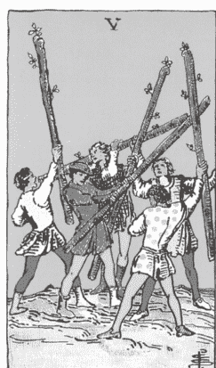

我们总是犹豫是否要表达自己的愤怒，
但我从来不懂为什么要犹豫。
当你想压抑怒火时，
想想雷电交加轰隆隆的暴风雨。
即便是我们的母亲有时也需要
又踢又打、尖叫一下。

## |关键字|

混乱、困惑、愤怒、怨恨、冲突、共同的挑战、纷歧、抵抗、障碍

## |意义|

这张牌充满激烈又混乱的能量，但通常没有明确的理由。这股能量如同理智突然断线后的大发雷霆，所以请问问自己：是否有人挑起你的情绪，还是自己的反应太粗暴、充满敌意，让人措手不及。权杖五的出现通常代表纷争。如果你可以整理一下自己的情绪，这场战火或许可以很快得到平息。

在莱德．伟特．史密斯塔罗牌中，权杖五描绘了五位手持权杖的男人正吵得不可开交。我很爱笑这张牌的能量，就像是一群青少年男孩在后院张牙舞爪般地挥舞着棍子。如果你再仔细看一下，会发现其实根本没什么好吵的。

你再问问看自己：是否在面对某些情况时，我是以战士的姿态回应，而非用爱回应。你在为什么而战呢？这件事情真的有这么重要吗？还是自己的态度因为火元素而变得过于高昂、激烈，甚至没来由地感到挫折？

如果你抽到这张牌，先让自己放松一下，面对任何障碍不要反应过度。人非圣贤，都是会犯错的，会时不时做出一些无意的动作或者过度反应。当你发现自己白白浪费精力、徒劳无功时，这张牌正是在告诉你赶快脱离这个状态吧！任何粗暴或极端的作为只会使你偏离正轨。

请如实地检视自己都把时间和精力花在哪里，是否扛了太多责任在自己肩上？是否有太多大厨一起挤在厨房内？太多意见？太多期望？太紧绷？就是太多太多？

在你开始埋怨这些责任与期望前，如何才能够让你舒缓、厘清这些混乱呢？请记得，愤怒往往是从更脆弱的情绪所衍生的，可能是感到受威胁、寂寞、无价值感或者恐惧。事实上，权杖五可以让我们分心，也可以帮助我们将注意力聚焦到源头，开始重视自己的需求、能量和个体性。

## ｜连结权杖五｜

停下、放下，并且连结另一个不同的元素。如同失控的野火般，有时候最好的方法就是先冷静一下，不要再火上加油。如果你下次又刚好抽到权杖五，你可以做一些让你能抽离这股能量，并且回到当下（接地）的事情上。冲点冷水澡（水元素）、走到户外与大自然（土元素）接触，接点地气，这两个都是抽离情绪，把重心拉回到自己身上不错的方法。

## ｜进一步反思｜

请在日记中写下两三件会激怒你、燃起内心怒火的事，可以是家庭成员的小举动或者任何让你感到烦恼的小事。

写出来后，可以反思为何这些事情会让你感到愤怒。在这些挫折感背后，你究竟有什么样的真实感受？

### ★ 我的意义—权杖六 ★

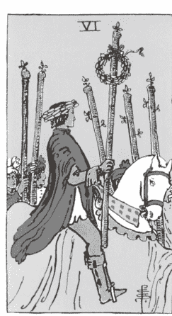

我拥有的每一丝情感
交织成一匹温暖我的崭新布料。
我将一片片布料缝缀成匠心之作，
并在今日将它披挂在胸肩上。
这是我最美丽的铠甲，
点缀着自我探索的胜利。

### |关键字|

荣耀、胜利、被看见与听见、找到自己的聚光灯、自信心、自我膨胀、公众认可、好消息、成就、名声、骄傲、领导力

### |意义|

权杖六在塔罗中有胜利之舞的意义，我们一直在期盼这个可以展现天赋与成功的机会，现在终于有懂得欣赏及仰慕我们的人，会为我们的努力鼓掌欢呼。自信与骄傲的能量让我们享受成为全场焦点，如果这张牌在占卜中出现，表示你可能会因为表现优异而备受赏识。恭喜！传统上，这张牌上画的是获得胜利的战士跨坐在马背上，穿过人群凯旋而归。我们可以假设他们刚经历权杖五所象征的战役。

抽到这张牌时，问问自己，哪些人会注意到你和你的努力？你在哪方面做得特别出色呢？是不是该让自己的创意和热忱获得更多的关注呢？

如果想要升职、加薪或在工作上获得赞美，抽到这张牌有很好的寓意。在这个循环的早期阶段，我们选择冒险并追求独一无二的特殊道路后，权杖六提醒我们只要忠于自己，就可以脱颖而出。大家都可以感受到我们的自信，温暖又迷人。记得，真诚的你有激励他人的力量，你值得在成就的荣耀中被人看见。

## ｜连结权杖六｜

低调炫耀自己吧！听好，如果塔罗中有一张牌可以激励信心，那就是权杖六。要低调（但也不要太低调）地跟其他人分享最近有哪些好消息、你的内在价值以及你有哪些突出的地方。你可以讲给好朋友听、发LinkedIn讯息给负责招募的人资，或是分享给在瑜伽课堂上愿意跟你聊天的陌生人。在对话中聊到自己的成就没有什么不好，而且，不要担心，这是正常健康的对话。

虽然权杖六通常跟工作有关，因为这张牌和我们的成功与热忱相关，但也可以代表个人的胜利。举例来说，我记得自己刚结婚时就是这样，我真的经常不自觉把左手伸出来，像是面前有一只赶都赶不走的蜜蜂，希望不管谁都好，能注意到我手上象征携手一生的新戒指。我当然很享受未婚妻的新身分，但我最期待的是大家看见真爱中的我，希望在社群网站上受到关注来庆祝这件事，同时也非常感激大家发讯息恭喜我的人生里程，这种庆祝并非让人讨厌的炫耀。爱我的人都知道我要先努力疗愈自己，才能重新展开一段感情，也都理解我们拥有健康且真挚的感情。

你可以低调炫耀成就，因为这是你努力自我疗愈，变成更好自己的最佳体现。

#### 进一步反思

探索站在镁光灯下的意义，想想有多少事情是因为你想获得认可而做的呢？你能够舒服自在地让人看见你的天赋与技能吗？可以先从：「对我来说，名声的意义是X，如果我成功做到了，我会觉得……」。

### ★ 我的意义—权杖七 ★

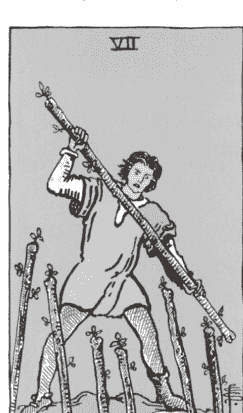

我的自我发出呐喊。
我的真我跟我说：「就只有这样？」
我的自我大声咆哮。
我的真我嘲讽我：「还不够。」
我的自我放声怒吼。
我的真我说：「我还是喊得比你更大声」

## |关键字|

自我防卫、坚定立场、保护自己、勇气、界线、坚毅、勇敢、热情

## |意义|

简单来说，权杖七这张牌的意义是：「给我他X的（可以自己填入想要骂的脏话）滚开！」（Back the [insert your preferred expletive] off.）。这是一张属于保护的牌，通常和坚定立场与信念的考验有关。

我最喜欢莱德．伟特．史密斯塔罗牌画面中的一个细节是：这个男人穿着不同的鞋子，表示他根本没有预料到这场战斗，但他还是挺身面对这个情况。

还有一个细节我也很喜欢，那就是他直接把权杖横挡在身前保护脆弱的心脏，把所有会打压他内在力量或心中光芒的事情都挡在外面。我觉得这张牌其实有着两个极端的意涵：一方面是在称赞拥有明确的界线，愿意挺身出来保护自己相信的事情，但另一方面，也可以暗示某个人内心的防御戒备和过度反应。

这张牌是数字七，从数字命理学的角度来看，这代表重新思考，还有提高自我觉察。如果抽到这张牌，你可能会发现你需要保护自己的选择，并且大声自豪地说出想法，你也有可能会接受到其他充满防御性的能量。你会发现这张牌的火元素非常两极化，它是如此强烈且具颠覆性，但如果我们还没准备好接受这个能量，就没办法以创意或自信显化出来，而会变成过度愤怒或自负。这就像一场野火，温度随着牌卡数字上升不断增加，每张牌都会变得比上一张更加疯狂且难以控制。

## | 连结权杖七 |

这张牌带有领地意识和野性的感觉，我们与生俱来的本能之一就是提供身体滋养跟食物，当身体、创造力和内在能量需要大量勇气和精力时，就需要透过食物和养分来滋养内在力量。

抽到这张牌时可以思考自己的饮食品质，并食用跟太阳神经丛有关的食物。可以摄取丰富的全谷食物和充分的蔬菜来维持精力，和这个脉轮 / 元素有关的食物有黄扁豆、南瓜、柠檬、凤梨、香蕉，以及像糙米或番薯等复合碳水化合物。

## | 进一步反思 |

在日记本中，写下哪些事情是为了拥有热情的生活而无法妥协的，帮助你了解自己的创意之火及内在勇士需要什么，才能维持真实以及忠于你的目标。

要具体写出哪些事物不被允许进入你的光芒（能量场）和生活中，了解那些会阻碍你的道路及影响天赋的事物，例如办公室的流言蜚语、只想获得好处的朋友或是酒精等等，然后再写下可以保持信心高昂和带来能量的必要事物。

### ★ 我的意义—权杖八 ★

## |关键字|

速度、移动、扩展、旅行、自由、令人兴奋的消息、意想不到的机会、充满希望、期待、交流与向外拓展

## |意义|

在权杖的循环周期中，权杖八带有欢迎的能量，数字八火热的能量就像宇宙在提醒我们：倾听自己内心的重要性。它可能带来意想不到的机会，或某场巧合的相遇，让事情突然加速发展。这种能量虽然常常让人措手不及，感觉像从天而降的一张王牌，但它其实正把你推向更满足、更有意义的命运。我觉得这张牌不管在哪一种情境都是一张好牌，因为这张牌带来更多光亮与动能，不管是自我疗愈、关系发展，还是工作上的进展，它都能帮你加速前进！

莱德．伟特．史密斯牌组的权杖八并没有描绘任何人像，只有八根能量蓬勃的权杖整齐划一的在空中飞翔，这张图的意象完美诠释了权杖八与采取特定行动没有关系，相反的，这关乎的是引导并接收来自宇宙的能量与支持。当我们需要动能或高频能量的肯定时，这股能量就会前来帮忙，让我们自信地跟随信念踏上正确的道路。权杖八的能量也会介入并带我们走向更好的方向，让我们怀抱目标继续疗愈并提升自我。这张牌也显示宇宙会给予我们勇敢后应得的体验与机会。

这张牌也代表旅行，不管是计划度假旅游、接触更多主题、探索文化或寻找新的环境，这张牌都在告诉大家离开自己的舒适圈。

## |连结权杖八|

稍微变化一下自我照顾的方式。选一个你平常固定会做的活动，例如写日记的时间跟方式、喜欢的健身课程或工作时听的音乐 / Podcast类型，接着，换个做法！这样的小调整不但能让你跳脱原本的惯性循环，说不定还能激发新的灵感，开启不同的思路与感受，让你用全新的方式去接收和连结能量。

## |进一步反思|

回想一下生命中那些意料之外、颠覆传统或随机出现但又与你契合一的事件，提笔书写与反思，与未来的自己连结并对他说：「今天我想要重新定义『冒险』与『未知』，我想让它们不再那么可怕。未来的我，我要跟你分享，那些意想不到的体验有多美妙……」

### ★ 我的意义—权杖九 ★

在多数的日子中，我都想要优雅而行。
可直至最后我只剩下力量。

## |关键字|

疲倦与消耗、坚持与毅力、达成目标、韧性、觉得受伤、疲惫、信念的考验

## |意义|

当我抽到权杖九，我会联想到拳击教练在擂台角落帮选手加油打气的画面，他会帮选手按摩肩膀、递水、擦干汗水，然后再次让选手回到只有自己但却充满热情的比赛中。这张牌就是帮你加油打气的教练，尽管你努力走到这一步，可能已经满身瘀青且精疲力尽。权杖九提醒我们就算遇到挑战也不要放弃，因为这张牌已经来到权杖牌组循环周期的末端，我们知道终点就在前面（终于快要结束了！），只要再努力加油一下，就能好好庆祝，虽然身体筋疲力竭，你的灵魂依然强壮坚韧。

如果抽到这张牌，可以回忆一下权杖王牌带来的灵感启发，这是你踏上这趟旅程的起点。火元素能量驱使我们脱离平凡，不再遵循原本预期的道路，而是踏上奇妙又独特的旅程。这需要勇气才能做到，这张牌是在告诉你：是时候为自己再加一把劲，好好完成你一路走来的努力。你怎么回应这股能量，未来会成为让你骄傲回首的时刻。

## |连结权杖九|

透过接受这张牌的挑战及深入自己的身体来找到更多力量。在瑜伽垫上，从四足跪姿开始，手掌推地并让肩膀对齐手腕，保持双手和膝盖稳定。准备好后，膝盖离地离开地面，进入高平板式（如要调整姿势，可以让膝盖着地，稍微往后移动），腹部出力并运用核心力量，让视线落在指尖中央，保持脊椎拉长，并记得持续呼吸。

稳住身体，平息内在觉得自己做不到的声音，把维持这个动作的耐力当作模拟生活中遇到的考验，试着多撑一会儿——比你以为的还久一点。在那段时间里，对自己说些鼓励的话，超越时间，也超越那个总在心里唱反调的声音。当你真的到了极限，让膝盖落到地面，进入婴儿式，让身体休息并感谢它完成如此困难的事情。

## |进一步反思|

进入内心并问自己：「今天我觉得有多倦怠？」

把自己的倦怠感以一到十划分等级，在日记本最上方写下你的倦怠程度，并用一整页纸来记录自己为什么会有这种感受，看看这种消耗是否值得，以及是否对让你疲惫的事物仍感到热情。

### ★ 我的意义—权杖十 ★

我的指导灵试着引领我走向明晰，
他们知道我可能会陷入过去的苦涩中，
所以将我推向当下的光明。

## |关键字|

负担与压力、义务与责任、挣扎、失去重心、沉重感、劳累过度、不必要的烦恼

## |意义|

好吧，接下来讲的可能比较难懂，但稍微想像一下你用手抱着十根大圆木。总共有十根。这样一定很重，对吧？这些木头限制了你想要前往的方向，而且还要想办法把这些圆木抱在身前，不但碍手碍脚，还很别扭。

权杖十就是差不多的意思。这张牌象征承担过多责任，或是承担别人的烦恼而没有专注自我所感受到的不适和压力。火元素独特、闪耀且引人注目，就跟你一样！当我们开始绽放内在光芒，跟随命定道路自信地面对世界时，我们也会吸引其他人——甚至会有迷人的魅力，就像飞蛾扑火一样，在这个循环周期中，你散发更多的温暖和热情，其他人也会感受到你的本质。当你拥有如此魅力时，也会因为你的天赋和力量，从其他人身上吸引更多责任和能量。

某种程度来说，这张牌是共感人的恶梦，它要求我们辨别哪些能量是真正该承担的。这张牌上的人被背负的重担阻挡了视线，甚至连面前的几步路都看不清楚，所以需要从这些重担中脱离出来。做为占卜者，我们可以把这张牌视为「卸下包袱」的机会，把背负的包袱拆开并重新整理。我们有机会选择那些真正能启发我们的事物，帮助我们履行责任，并妥善安排一切。

## |连结权杖十|

打造一个柔和的环境帮自己充电，我们不仅能在这里学会设立界线（现在就是设立边界的时刻），还有机会重新平衡牌中过剩的阳性能量。权杖十出现时，身体、心智、灵魂可能都感到异常疲倦，在新的循环周期开始前，花时间充电并创造可以迎接更多柔和能量的物理空间。

以下是一些帮助你建立环境，创造更多神圣能量的建议：

- 使用扩香精油，并在空间中摆放鲜花与绿植。
- 在家中播放柔和的纯音乐，避免播放会让人兴奋或焦虑的音乐。
- 远离萤幕和人工光源，多到户外晒太阳，在室内使用柔和温暖的光线。
- 在家里多准备舒适的毛毯、枕头和衣服。
- 最重要的是，找时间在自己打造的神圣空间独处，就算只是离开小孩一个小时或是远离电脑一个下午也可以。

## |进一步反思|

就像你在本章开始时列出权杖王牌启发你的事情一样，盘点一下，是什么点燃了你内在的火焰，又是什么让它熄灭。现在，从日记中拿出一张纸，列出你每天的日常需求，你在哪些地方被需要、你有哪些责任、别人对你的期待是什么、你每天做了些什么。

接着，做一个简单有效的练习，把必须完成的事圈起来，然后在你热爱跟喜欢做的事情下划线标注，再把可以卸下的责任打叉删掉，设立界线、将事情交付给其他人，或减轻一些压力。想要拥有充实又活力满满的人生，就要知道哪些事情无法让我们感到充实或无法拥有内在力量，并采取行动减少这些事，帮自己独特的内在之火创造更多燃烧与成长的空间。

### ★ 我的意义—权杖侍者 ★

如果她没有迷失在迷宫中，
而是选择打破其中一面围绕她的墙，
然后找到一条属于自己的道路呢？

**人格特质：** 寻求刺激、大胆冒险、打破规则、创意、领导者、旅人、有艺术天赋、顺着感觉走、勇敢

## |意义|

权杖侍者有一种感染力和惊奇感，我不会说这张牌是智慧或「老灵魂」。事实上，权杖侍者的血液内流动着相反的能量，驱使四处探索的渴望。侍者的能量喜欢玩乐及期待尝试各种事物，他们知道当创意能量出现时，只要跟随这种能量就可以从自己身上发现新的事物。

在教导新手占卜师这张牌时，我都会讲同样的笑话，要大家想像一个射手座年轻人第一次去参加疯狂的火人祭（Burning Man）（每次都会让大家笑出来）。侍者的能量不会去管其他人对他们的看法，由于自身的魅力，他们不仅能度过一段美好的时光，还能吸引并激励大家欣赏他们的大胆无谓。他们选择以创意的愿景自由自在地展现自己，并呼吁大家透过旅游、探险及追求新兴趣来展现自我。他们也具备天生领导者的能力，随着时间晋升为其他的宫廷牌角色（骑士、皇后，最终成为国王）。但现在，他们还在享受当下，将生活变成一场冒险。

如果抽到这张牌，问问自己最近精神是否充沛，生活是否活力旺盛。这种孩子般的特质喜欢色彩缤纷的世界，不愿世界变得灰暗无趣。思考一下自己内在小孩的光芒是否正逐渐黯淡，询问自己（还有世界）一些问题来帮助你脱离目前的困境并回到让你兴奋的愿景中。

## |权杖侍者的引导|

凝视火焰（或蜡烛）。权杖侍者充满强烈的惊奇感，其元素的灵感也显而易见，可以透过这个睁眼冥想的技巧，凝视火焰摇曳的舞姿，建立与火能量的紧密关系。这种冥想方式也称为烛光冥想（Trataka），是一种可以增加注意力和稳定纷乱情绪的瑜伽练习。

和火焰或蜡烛维持安全距离并凝视火焰，同时专注于自己的呼吸、注意力和内在之火。

## |进一步反思|

回想曾经心血来潮、抛下传统及鼓起勇气为自己冒险的一段回忆，写一封信给那个大胆冒险前的自己，恭喜自己有勇气踏上新的探险。

### ★ 我的意义—权杖骑士 ★

当我真心喜爱与欣赏
从内心深处
让我感到温暖的能量后，
我的温暖似乎，吸引了更多人。

**人格特质：** 充满魅力、擅长社交、迷人、温暖、幽默、尽职尽责、适应力强、激励人心、独特、欢乐有趣、有野心、友善、有远见

## |意义|

权杖骑士的行动迅速，因为他的使命对他而言十分重要。他心怀大胆不凡的愿景，以自己独特的方式建立人生，抛开规范行动，他可以凭着直觉、天赋及自信的目标打破世俗的界线和限制。权杖骑士是一名开路先锋，透过自己的努力、创意才能和领袖特质改变世界，他明白自己的吸引力，而且我认为不仅如此，他也知道自己的魅力可以掳获支持者的心，可以收获一群会在他成功时高声欢呼的观众。

当骑士透过这张牌带来火焰和热情时，请满怀期待，骑士的能量可以感染他人并深入各处。由于你拥有自信以及与内在力量连结，你最期待的梦想已经近在咫尺。这张牌可能在问你是否愿意为了自己冒险，因为你知道，自己的真正天赋终有一天会获得认可。

## |权杖骑士的引导|

想像一下你理想中的结果。暂停手上的任务，并进一步思考更大的格局。你为什么要做现在做的事呢？

权杖骑士具有看到更大愿景的能力，这就是为什么他能出色地带领团队获得胜利，或是推动更具影响力的任务或冒险的原因。他愿意努力（所有的骑士都会采取行动），也拥有明确的目标，以及赋予狂野梦想一个机会的坚定信心。

写下你对世界做出的贡献，不要忽略你替家庭、家人、工作所做的事情（不管大或小）。你每天做的事情为世界带来什么呢？

完成后，检视你的清单，然后问自己：

- 我正在做的事情背后，更大的愿景是什么？
- 我为什么愿意做这些事？
- 这些事情有哪些关联和共同性呢？

你可以先随意写下内容，重新阅读后，试着帮自己写一份愿景说明，这有助于你将注意力转移到想要达成的目标上，以及思考你能带来多大的影响。我们的力量就像水面上的涟漪一样，可以让更多人感受到。

## |进一步反思|

在日记中，写下大家对你性格与特质的赞赏，透过其他人的眼光来认识与欣赏自己。接着，用下面的提示帮自己反思：「我的才能包含了X、Y、Z，我运用这些才能的方法有……」

### ★ 我的意义—权杖皇后 ★

当我担心自己太过分
或觉得我「太超过」时，
我就会想起我们的各种渴望。
贪婪地追求，
我们在性、甜食和金钱中寻求慰藉，
过多或刚刚好之间的平衡，
往往成为一个问题。

或许我让其他人觉得不舒服，
或许我很诱人，
或许我让人欲罢不能，
或许我只是做我自己，
但无论如何，我决定，我，就是刚刚好。

**人格特质：** 精力充沛、女性特质、强壮、大胆、有主见、保护他人、多面向、坚韧

## |意义|

这位皇后的出现深深吸引大家的目光，人们想知道她的故事，了解她的故事是如何展开的。她是塔罗中的典型酷炫女孩，身上散发一股让人仰慕（又或是羡慕）的特殊能量，这是无法克制的感觉，这位皇后有种特别的「魅力」，她真诚、温暖，且个性充满感染力，让你有被她看见、听见、并受邀进入她生命及生活圈的感受。她是社交圈的皇后，不管是透过表演艺术或追求创意或热情，她都会站在镁光灯下。她想要更多关注时就会大胆勇敢地说出来，始终坚守自己的价值，她也是会率先挺身出来捍卫心爱之人的女王。这个原型见证了阴暗与困难，并从人生过往困境的疗愈和韧性中建立自信，如果你在占卜中也感同身受，请记得自己也有这种女性力量及神圣之力，妳有自信的底气，所以不要退缩，把握机会分享自己的天赋和技能，妳的光芒不会就此熄灭，只要连结权杖皇后的力量，妳的灵性会从过往的灰烬中重生。

## |权杖皇后的引导|

享受肉体上的欢乐，拥抱自己的性欲。性是我们原始自然的本能，跨越各种光谱，值得我们探索和怀疑。每个人对性欲的表达都是独一无二且充满个性，但火元素和这套牌组蕴含的性能量十分强烈，权杖皇后是当中最具体展现且毫不隐藏的一张牌。如果抽到这张牌，妳可能正享受自己的能量，并散发天然的性吸引力与自信，所以要热情投入这种能量，自己来或跟伴侣一起享受都可以。挥别那些跟压抑性欲有关的父权主义或窒息想法，把让自己觉得性感的方式写下来并重新拥抱它们。

## |进一步反思|

回想生命中对某个人、某件事或某些地方做得「太超过」的一段回忆，确定这段经验与哪一种情绪有关，再思考一下这种感觉是否让你觉得羞耻、尴尬或自我否定。

闭上眼睛坐着，把手轻柔地放在太阳神经丛上（肚脐上方的位置），给自己的感受一些空间，然后柔和地肯定自己：「我的光是我自己的，我觉得我已经够好了。」

然后在日记中，针对「够好了」继续探索，并写下：「我已经够好了，因为……」

### ★ 我的意义—权杖国王 ★

我再也不会活在
不断道歉的阴影当中。
我不会一直追求其他人的肯定，
而是选择在对自我的了解中
以及属于自己的认知中茁壮。

**人格特质：** 有目标的领导者、指挥能力、男性特质、有才华、王者风范、创业精神、有吸引力、骄傲、强大、不留情面、霸道

## |意义|

当国王牌出现在占卜时，他拥有令人敬畏的力量，可以震慑所有人。带着满满的自信，国王在宫廷牌中的地位不容置疑，他以领袖风范获得这个尊称，并在这个角色中壮大。国王绝对是高瞻远瞩的人，当他能落实自己的愿景并引领其他人一起迈向相同的道路时，便会感到精神抖擞。这位国王会竭尽全力透过自身的创意、创业才能和深刻的自我了解来激励他人。但权杖国王也有高度的男性特质，有时候会让人觉得自大、麻木冷漠，或想要抢先一步而辗压其他人。

毫无疑问，权杖国王是宫廷牌中最具天赋的领袖，如果占卜中出现这张牌，代表你的信心与领导能力正在展现并受到鼓励。现在是自私追求自己内心想法的时刻，要相信自己的能力，并大胆放手去做！

如果你觉得这张国王牌代表你生活中的某个人，可以思考一下他们的温暖是否帮助你找到自己的内在光芒，还是热情地分散了你对目标和期望的注意力呢？

## |权杖国王的引导|

试着指导一位正在学习、会感激你引导的人吧。当我们达到一定程度的技能水平后，可以选择竞争，尽可能掌握更多权力，努力成为最优秀且唯一的领袖；我们也可以选择分享这股力量，给那些还在发展自身技艺与信心的后辈。如果好一阵子都出现这张牌，要记得自己是强壮的、能力卓越的，并拥有许多值得骄傲的地方，或许是时候，把这些分享给一位正在学习中的人——他们会因为你分享的热情与智慧而感受到支持与启发。

## |进一步反思|

权杖国王呈现的是「不是喜欢他，不然就是讨厌他」的个性类型，在日记中，针对以下叙述进行反思：「我没办法让所有人都喜欢我，但没关系。我透过以下方式忠于我自己和我的愿景：……」

1 编按：YOLO 是 “You Only Live Once” 的缩写，意思是「人生只有一次」。

# Chapter 11

# 大阿尔克那：我的故事

我已经和大家分享了许多关于我的故事，现在是时候让你利用剩下的二十二张牌，专注并庆祝属于你的故事。我们知道，大阿尔克那在塔罗牌中具有举足轻重的影响力，因为它象征着我们灵魂成长和灵性进化的强大推力。这些原型人物背后隐含着不同的秘密，像是内心深处的整合度、崇高的目标，以及真实的自我表达。它们是塔罗系统中的核心角色，也是我最喜爱的部分。如果你认为国王和皇后代表「主角的力量」，那么等你在这些牌组中遇见那些灵性导师时，会有更深的体会！

大阿尔克那的原型人物如同钥匙，每一张都能解锁我们内在的某个面向。它们温柔而谦逊，提醒我们跟随宇宙的能量流（相信我，有时这过程像极了云霄飞车）。在你探索完金币的物质面、圣杯的情感面、宝剑的理性面和权杖的热情面后，你现在已准备好与愚者一同踏上一段更加灵性的旅程。

我曾读过一句有关塔罗牌的话（但我到现在都想不起它的出处），指出大阿尔克那与小阿尔克那的差异，这是我所看过最棒的描述：大阿尔克那承载宇宙的能量，而小阿尔克那则指引我们该采取什么样的行动。

当我读到这句话时，心中忽然有所领悟。我立即意识到，我并不需要明确知道如何应对这所有七十八张牌的方法，我只需要承认和尊重它们试图想要教导我的课题。大阿尔克那牌会创造一个主题，并深入解析其意义，而小阿尔克那牌则像指南，为我们提供如何从 A 点到 B 点的具体指引。

在本章中，我将分享一些写作引导和肯定语，而不像前几章那样着重于实际的仪式或具体练习。你可以将肯定语视为基础信念，在你探索不同的灵魂课题和人生章节时，可以对自己重复这些话语，就如愚者一样。每个肯定语后的写作指引会邀请你回到某段记忆或经验，去对应每一张牌的主题。透过这样的方式，你可以更清楚地看见：原来你早已在生命中，亲身体会过这些复杂的原型能量。

## 提醒

由于这些牌的基调与我们先前学习的牌稍有不同，我希望提供一些温柔的提醒和解读建议，帮助你更好理解本章的二十二个大阿尔克那主题。

1. 故事不可能真正走到尾声

愚者的旅程不断在变化与成长，正如你的经历一样。虽然世界牌标志着一个循环的完成，但新的循环总会随之开启，引领我们进入下一个全新的开始。塔罗牌的系统是有循环性的，没有绝对的起点或终点。每次循环都是一个机会，让我们看见新的智慧，并且能够连结更深的内在状态。在塔罗牌中，如同人生一样，我们总有第二次（甚至第三次、第四次……）机会。

2. 耐心是一切

这些牌卡的进展速度缓慢，就像贯穿一生的过程。我们可能已经习惯了权杖牌的迅速燃烧或是圣杯牌的节奏流动，但身为新手，大阿尔克那需要我们用最大的耐心来体会。这些牌所呈现的是更深刻的生

### 3. 在占卜时给予大阿尔克那牌足够的重视

我不希望任何一张牌会让人感到恐惧或不适，但我鼓励你去重视大阿尔克那牌所带来的深意。它们的内涵错综复杂，引领我们带着信心迈出关键一步，甚至成为生命中值得回顾与铭记的重要篇章。基于这个原因，请你在占卜中赋予这些课题应有的重视。在占卜时，你可以很直觉地让大阿尔克那成为贯穿整个牌阵的主线或主题（我认为，真的必须如此），而且我喜欢先检视大阿尔克那牌，然后再检视小阿尔克那牌。如果同时有数张大阿尔克那牌出现，我会花更多时间反思、思考，并特别专注于这些牌的意义。

### 4. 注意细节

塔罗牌中的每一个细节都是刻意安排的。创作牌卡的艺术家会精心选择颜色、场景，甚至人物所面向的方向。每一处的存在皆有其原因。你可以仔细观察每张大阿尔克那牌，寻找那些看似细微但意义重大的细节，因为无论使用何种牌组，这些牌往往蕴含大量象征图示。在本章中，我会针对每张牌提到一些符号，尤其是我在学习莱德．伟特．史密斯牌组时印象最深刻的符号，但这只是皮毛而已。我鼓励你深入探索，寻找更多隐藏的细节。

### 5. 享受这段旅程

尽管塔罗带来的主题和课题并不总是令人感到舒服，我还是相信我们依然可以让这个过程保持愉快。享受这趟探索之旅，如果你刚好是塔罗新手，更需如此。我经常在第一堂塔罗课对学生说，我其实很嫉妒他们，因为这是他们与牌的第一次接触，可以体验它所带来的魔力，那些准确而深刻的讯息总是让人惊叹与欣喜。

作为一个每天在日常生活中都会抽牌的人，我可以告诉你，这个练习的神圣性与特别之处始终存在，因此要持续保持学习的乐趣，该轻松时便轻松，切勿停滞不前。牌卡就像是我生活的伙伴，既熟悉又舒适。而我的抽牌练习也提供了一个安全空间，让我可以珍惜并敬重自己。但我依然记得最初的体验，那时牌卡还像是陌生人一样，每次我接触塔罗牌时，内心都会小鹿乱撞，就像是为期盼已久的首次约会做准备。正如每一次新邂逅时内心都充满脆弱感，直觉的「感应」也让我的内心像被微风吹动般轻微地颤动。这种直观式表达的喜悦可以让你重新拥抱阴性能量并接受直觉的天赋，也提供了一个机会，让我们能更自在地拥抱这份曾经被误解、被看轻的直觉练习，不再为练习塔罗感到不好意思。朋友们，享受这段回归自我的旅程吧。

## ★ 我的故事—愚者 ★

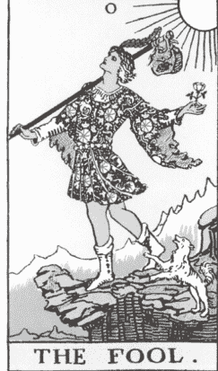

心中充满焦虑不安，我明白
是时候迎接崭新的阶段了。
我望着一个自信、
却也有些许不确定的身影，
去挑战最艰难的事情：
跳跃，
无法预知什么或谁会接住我，
除了我自己。

# | 关键字 |

勇于冒险、带着信任跳入未知、新的开始、自由、愚蠢、重新自我定义、天真无邪、跟着感觉走

**元素：** 风

# | 意义 |

编号为零，这是塔罗牌的第一张牌，象征着我们旅程的真正开端。在这段旅程中，塔罗牌的主角——愚者，仅仅瞥了一眼，便毫不犹豫地跳入未知，完全没有考虑后果，他相信自己会在途中学会所需的一切。作为占卜者，每当我们坐下来抽牌，并将讯息与自身记忆和经历连结时，其实都在展演这张原型牌的精神。

透过与他人和自己的连结，愚者正在追求及探索自己的个人身份、神圣使命与灵性成长。这张牌也描绘了一个年轻，或许有些天真的角色，但同时也充满勇气与智慧，因为他愿意信任并臣服，而我们知道，这会暴露出极大的脆弱面。

作为新开始的象征，我认为这张牌提供了重新定义自我或清除过往的机会，不再评判过往，而是带着自发性与热情迈向未来。如果你渴望改变、新鲜感或新的方向，这是一张很棒的牌。有时候，初学者比那些担忧和恐惧的专家更有洞见。无知即是福，不是吗？愚者享受着这段不被他人所影响的旅程。

某些视觉元素和符号进一步突显了这股能量。首先，愚者站在山脉边缘，山脉在塔罗中象征挑战与障碍。周围有大量的黄色，天空十分晴朗，还有阳光照耀在他身上，使他散发出乐观与正向的能量与光环。他只带着一个小行囊，选择在踏入新篇章时轻装上阵，计划沿途寻找他所需的一切。他的忠实同伴——一只狗，忠诚地跟在他身边，但牠也发出警告，提醒愚者他固然勇敢，但并非无敌。

#### 愚者牌的肯定语

> 「我接受一切未知，因为每次跃进总是让我更进一步认识自己。」

### 连结你的生命历程

在日记中，写下一件你尚未准备好便展开尝试的新事物。

## ★ 我的故事—魔术师 ★

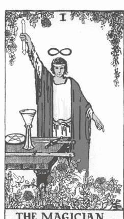

魔法
无需追寻或信仰，
魔法
一直都在自身之中。

## |关键词|

一致的行动、显化、采取主动、力量、技能、专注、影响力、意志力、不让任何事阻碍你
**元素：** 风

## |意义|

魔术师带着决心，骄傲地站在我们面前，充满无与伦比的自信，举手投足间展现出力量与优雅。这张牌象征我们将最大的梦想与愿景变成现实，它让我们窥见自身的潜力，激励我们认识到自身的伟大，并突显我们借由个人力量、积极行动与专注力来与宇宙共同创造的能力。抽到魔术师时，可以想想自己如何透过主动行动为自己吸引和创造更多可能性。

这位原型人物拥有四大元素的和谐平衡：火的热情、风的适应力、水的直觉和土的稳定与理性。这些元素共同作用能够调和魔术师的天赋和技能，让一切相辅相成。如果在占卜中看到这张牌，不妨思考自己天生所具备的能力，并勇敢地向世界展示！

有时，这张牌会传递出「弄假直到成真」的能量。尽管魔术师仅仅是大阿尔克那探索灵魂之旅的一小步，他仍然展现出一种自信的气场。即便其中带有些自我膨胀的意味，但无可否认的是，在塔罗牌中，魔术师确实能够展现力量与自信。

#### 魔术师牌的肯定语

> 「我选择与生命的魔法协调共鸣。」

### 连结你的生命历程

在日记本中，请写下你曾经自信且完美执行某件事情的经历。

## ★ 我的故事—女祭司 ★

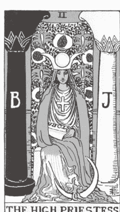

小时候，奶奶教我
在满月时嚎叫，
那是少数几次，让我意识到
身为女人是有意义的。

我们撞起头，
站在被月光笼罩的舞台上，
在聚光灯的照耀下，
将声音透过力量核心的扩音器放大，
我们大声嚎叫。

那一刻，我感觉自己无所不能，
然而日出后，我又莫名地沉默下来。

如果有一天我有了女儿，
我也会带着她对着月亮嚎叫，
并且在每个清晨唤醒她，
对着太阳咆哮。

# | 关键字 |

直觉连结、心灵能力、内在智慧、感知看不见的事物、等待答案
而不是寻找答案、神秘、感性、潜意识

**元素：** 水

# | 意义 |

这张牌流动着一股神秘和诱惑的氛围，引领我们探索自身直觉的深度与更高的意识。女祭司洞悉万物奥秘，是彻底的灵视者。她掌握着灵性智慧与资讯，如果我们选择探索并进入内心新的领域，这些智慧便会成为我们旅程的一部分。我最欣赏这个原型人物的特质，是她以微妙、柔和的方式表达出丰富的意涵，让我们明白最深刻的能量并非总是显而易见的。

在莱德．伟特．史密斯牌组中，女祭司坐在两根柱子前，身后是一片象征丰盛肥沃的石榴。她的姿态充满吸引力，而塔罗牌中的柱子暗喻着更深层次的讯息。她让我们明白，若能信任自己的灵性能力，我们便能体验到与高我甜美而强大的连结。「你也想见见自己的高我吗？」她微笑着问道。

当女祭司出现在占卜中时，她提醒我们少说多听。她的出现暗示着我们可以开始运用并表达自己的直觉，去发掘内在更深的力量。这张牌希望我们优先信任并依赖自己的直觉与「第三只眼」的洞察力。魔术师教导我们如何透过行动去推动并创造改变，而女祭司的智慧则启发我们在恩典中寻找空间、资讯与连结的契机。

女祭司并不急于行动。当你是为自己解读这张牌时，要知道你即将获取更多资讯。等待有时比急于应对更具帮助。

#### 女祭司牌的肯定语

> 「我信任内在神圣的深层智慧，并相信我的高我会向我传递讯息。」

### 连结你的生命历程

在你的日记中，写下你生命中直觉力特别敏锐的时刻。是什么带领你走向这份清晰？

## ★ 我的故事—皇后 ★

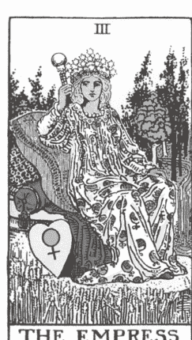

身为女性，我们就是如此……

能够同时身为
画家与缪斯，
孩子与母亲。

赤裸裸地站在镜子前，
告诉我——
你看不见艺术的美。
告诉我——
你不相信奇迹的存在。

# |关键字|

丰盛、女性特质、孕育能力、神圣母亲、女创造者、和谐生活、
健康人生、艺术、自然之美、亲近大自然

**元素：** 土

# |意义|

皇后象征滋养、孕育，是大阿尔克那中的母亲原型，深知自己肩负着神圣而重大的角色，并对此怀有深刻的敬意。她引导塔罗占卜师们察觉美和艺术，以及尘世经验与物质层面的奇迹。她让我们知道——美不只是我们所看见的，它也会透过我们说话、透过我们流动。我们每个人，其实都是神圣的创造者。

这张牌散发着女性与感官魅力，让我们沐浴在神圣的爱之中，让我们懂得珍惜地球和子宫所蕴含的创造潜力。皇后深知：她能在内在孕育出一个世界，如同她所喜爱的自然与环境一样令人满足，使她乐在其中。这种充满活力的展现是她的天赋，教导我们安心地欣赏自己的身体，也接纳那些自然存在的不完美。也因为这样的态度让她能够为自己创造出更多，轻松地显化眼前这一切。她是一位拥有神圣力量的女性，邀请我们坐下来，真实地体现自己的价值。同时，这张牌也可能鼓励你孕育某些事物，或毫不保留地向世界分享某个属于你独一无二的东西。

皇后牌无疑是一张与怀孕相关的牌，但请记住，「诞生」的意义远不仅限于创造新生命。这张牌也代表创意的计划、健康与智慧的人际关系、第二脉轮的疗愈，以及对母性创伤的课题。我经常将这张牌视为成为女人的必经仪式与成熟女性的象征。我总是很开心能将这张牌分享给那些渴望更爱自己的女性客户，享受自己作为母亲、梦想家、艺术家或缪斯的甜美感受。

传统上，皇后被描绘为坐在一个有着柔软靠枕的宝座上，四周被茂密的树木和自然环境环绕，象征她作为自然界女王的地位。这张牌提醒你检视自己身上是否流动着母性能量，不论是实际的还是隐喻的，并且是否正在享受与拥抱这股女性的能量和天赋。

#### 皇后牌的肯定语

> 「我是神圣的化身，在神性之中创造并分享艺术。」

### 连结你的生命历程

在日记中，反思你对「母亲」这个词的关系与经验。

## ★ 我的故事—皇帝 ★

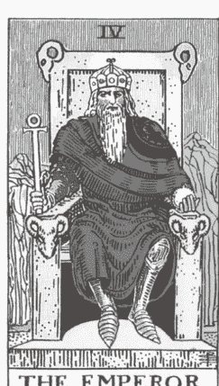

没有什么比引擎平稳的嗡嗡声
更让人感到安心，
当我在半梦半醒间凝望窗外，
你驾着车载着我们开往回家的路上。

# |关键字|

父权、稳定、权威、结构、基础、保护

**元素：** 火

# |意义|

作为大阿尔克那中的大家长，皇帝是男性原型的象征，代表着强大的权威、掌控力与力量。皇后则是相对应的神圣女性原型，主宰着大自然与有机创造的世界，而皇帝则掌管物质世界，并强调逻辑与结构。由于皇帝充满务实精神，遵循规范和条理，许多占卜师在解读这张牌时可能会本能地抗拒他的能量，觉得皇帝过于严肃甚至乏味，仿佛是一位父亲在没有主动要求的情况下给予各种意见。

当这张牌出现时，我建议你停下来反思，看看这股能量是否真的让你备受压迫。尽管皇帝看似有男权至上的倾向（因此我们可能对其反感），但他的意图是纯粹的。我觉得这张牌的美在于，他非常认真地看待自己作为神圣供给者的角色。坐在王位上的他充满自信，努力保护、支持并优先考虑家人与所爱之人。

多年来，在我的塔罗占卜经验中，我对皇帝牌的理解也有所转变——从控制欲和对规则的过度执着，变成一种提醒我夺回自己生命掌控权的重要课题。皇帝试图将他的力量分享给我们，帮助我们将他的领导能力运用到我们所关心的事物上。他引导我们与自己的意志连结，从而执行并实现那些在大阿尔克那前几张牌中所发掘的梦想与意图。流浪的愚人若没有稳固的结构，将无法成长和进化。因此，在他旅程中的这个阶段（也是你的旅程），皇帝提醒我们是时候检视自己的系统、组织方式和运作流程了。

你会注意到牌面上的皇帝全身几乎都是红色，这是个人力量与强烈的象征。他左手握着一颗金色小球，代表他所统治并支撑的世界。在图像中，这位父亲拥有一个充满可能性的世界，而你也同样拥有这样强大的力量。

#### 皇帝牌的肯定语

> 「我拥有领导的天赋，而我使用这个力量来保护他人，不威胁，不胁迫。」

### 连结你的生命历程

写下你曾经体验过神圣阳性能量的经历。

## ★ 我的故事—教皇 ★

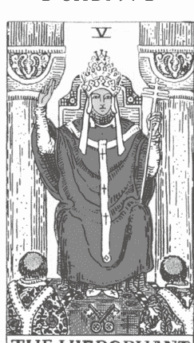

我的灵性不在我之上，
而是深植于我心中。

# | 关键字 |

追求知识、神圣智慧、导师、传统信仰、伦理与道德、履行承诺、遵从传统道路

**元素：** 土

# | 意义 |

教皇是大阿尔克那中的灵性导师，以传统、博学和严肃的形象与我们对话。他提醒我们，人生的旅程中，我们始终在寻求理解与归属。他强调社会所依循的制度、秩序与结构，包括高等教育、有组织的宗教、共享价值观的社群以及婚姻等契约。然而，由于其传统性的特质，人们常对这股能量感到抗拒，或者认为它过度僵化而不具任何支持性。在经历了魔术师与女祭司带来的灵性觉醒，以及皇后与皇帝所塑造的个人认同阶段后，年轻的患者对自我有了更多认识。此时，教皇的出现，成为他旅程中的下一位导师，引领他进入更高层次的学习。

教皇的使命是传承他的灵性价值观，因此在解读中，这张牌也可以象征师生关系。牌面上，教皇坐在两根柱子间，面前有两位坐着或跪着的追随者，吸收教皇的智慧以便进化为他们所注定的角色。传统上，会有两把交叉着的钥匙在他面前，分别象征意识与潜意识，代表我们经验中的两个对立却又必要的面相。他仿佛在向我们提出挑战，使用这些同样的工具，去解锁内心深处的新知识与洞见。

教皇也如同导师一样给予我们新的内在智慧，透过忠诚与反复学习，使我们融会贯通，最终传承这些智慧，成为他人的导师。当这张牌出现在占卜中时，它预示着传统学习与灵性追求的重要性，提醒我们需要「按照规则」来实践灵性。问问自己这个问题：你是否正在盲目追随大众主流，而非成为掌控你命运的引路人？

#### 教皇牌的肯定语

> 「我的高我渴望新的知识，而我相信我会找到属于自己的导师。」

### 连结你的生命历程

写下你曾经顺从现状或按照他人期望行事的经历。这对你有帮助吗？

## ★ 我的故事—恋人 ★

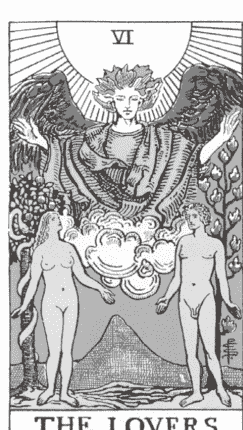

我曾经也做过选择。
而我的选择是根据逻辑和其他人的
需求以及对我的期望。
今天，我要像孩子一样装傻。
我会根据自己的内心来做选择，
就像恋爱中的愚者。

# | 关键字 |

爱、和谐关系、灵魂伴侣、结合、信任、基于价值的决定、平衡、和平
**元素：** 风

# | 意义 |

这张牌可以用两个字做总结：和谐。在这张牌的殿堂中所建立的关系，是能滋养灵魂、令人满足且充满灵感的。恋人牌代表着所有在我们的生命历程和心中占有一席之地的人。在大阿尔克那的旅程中，愚者在这个时刻意识到自己无法、也不应该独自经历这段生命周期。爱与真挚的连结是我们与生俱来的两项权利。

虽然先前的原型人物能够反映出我们个人认同的某一部分，不过到这牌时，能量会开始转换，我们更加依赖且专注于与他人的连结。这张牌所对应的关系是充满爱的关系，而我们在这关系中能找到丰盛、意义和合一的力量。这张牌绝对是指向充满承诺和潜力的浪漫关系，而且生命中各种灵魂契约（包括柏拉图式）也受到这股能量掌控。

除了迎向爱情，恋人牌也反映我们的核心价值。上一张「教皇牌」中，我们探索了社会对我们的期望，还有我们是否能够承受这些压力。而这张牌是我们能够去探讨关系价值的机会，以自己个人道德为基准，然后询问自己，一段关系中什么最重要，然后以此建立值得信任的伙伴关系。当我们需要根据个人价值观做出重大决定的阶段时，恋人牌往往也会出现。找到支持我们理想的人，无论我们选择什么道路，都希望我们能过得最好的人。

在塔罗牌中，如果牌面上呈现越多颜色、越缤纷，就代表能量是命中注定，并充满希望感。在莱德．伟特．史密斯版本中，一对赤裸且面对面的恋人在天使的注目下（有些人认为这是大天使拉斐尔），站在彩虹底下正中央。当他人的能量注入自己的生命历程时，生命会变得更加多采多姿、更立体，所以，当这张牌出现时，请看看周围，看有没有人让你的生命更加美满。

#### 恋人牌的肯定语

> 「我歌颂着爱的频率。我吸引那些与我内心旋律共振的人。」

### 连结你的生命历程

请拿出纸笔，写下你爱上某人的那一刻。

## ★ 我的故事—战车 ★

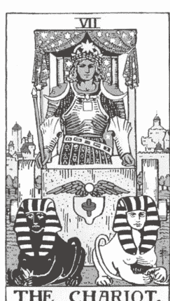

这不再是虚度光阴的问题，
因为总有新的时间
等待我们去把握。

# |关键字|

雄心壮志、决心、自信、勇气、意志力、成功、胜利、阳刚、蛮力

**元素：** 水

# |意义|

准备好，因为现在确实是出发的时刻了！战车牌要求我们立刻行动和回应。这张牌充满决心和勇气，代表野心勃勃的能量。当你抽到这张牌时，很快便能感觉到行动时机就在前方。

当占卜中出现战车牌时，你可以将这张牌视为一个灵性指引，提醒你去寻找振奋人心的机会。运用你的自信帮助自己开启新的大门，探索新的机会和环境。战车就如同一名勇士，凭借自己的蛮力克服挑战，并在过程中学习到自己的韧性。这张牌告诉我们：你不必总是接受「不」作为答案。

我想要你将这种能量想像成愚者的升级版，他现在拥有了一辆更高规的战车。这位速度飞快的勇士，驾驶着他的战车，以更快、更高效的方式朝目的地迈进。尽管前方的道路仍然是未知数，但现在的他拥有更多的知识，理解成功与失败的潜在可能性。他的战车由一黑一白的狮身人面像牵引，象征着月亮与太阳的对立力量。背后是一座繁荣的城市，代表着他选择离开的熟悉世界，提醒他这段旅程的意义。就如同魔术师一样，他手持魔杖，将宇宙能量引入自己的身体，透过神圣连结显化自己的愿景和梦想。

如果这张牌在占卜中出现，请考虑当前所面临的挑战。请求你的指导灵支持你，激发你不常展现的雄心壮志与自信心。

#### 战车牌的肯定语

> 「我将恐惧放在一边，转而倚赖自己的愿景。我可以的。我必将做到。」

### 连结你的生命历程

回想你上一次凭借意志力与决心克服障碍的经历，并记录下那次经历中你所面临的挑战。

## ★ 我的故事—力量 ★

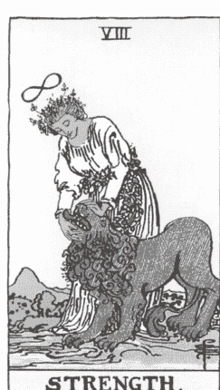

我的第一副塔罗牌，在短短一周内
便少了一张牌。
当时我既焦虑不安又沮丧，责备自己
为何如此粗心大意。

我总是小心翼翼地对待牌卡，
每次请求指导后，还会轻声向它们表达感谢。
我怎么会这样？
我怎么会这么快就搞砸了呢？

作为一个刚开始抽牌并努力保持秩序的新手，
我忽略了一个重要的事情：
我的牌组，其实在用一种出乎意料的方式，
为我编织出了一个故事，引导我走向自己的使命。

那张我失去的牌——力量牌，
让我多年来透过不完整的七十七张牌学习，
无意间挖掘出自己内心深处的热忱与力量——那些我从未察觉的潜能。

今天我终于明白，那张牌从未真正离开；
而是由我取代了它的位置。

## |关键字|

内在力量、韧性、疗愈、克服自我怀疑、自豪、平静安详、驾驭
内在批判、温柔

**元素：** 火

## |意义|

这张牌的意义深远，牌面描绘一名穿著白衣（象征纯洁与善良）的冷静女子，安抚着一头不羁的狮子。她以温柔的姿态驯服这头可怕的野兽，使他感到平静，并接受她充满爱的抚慰。她平息了野兽的狂性，象征着力量可以化为温柔，而疗愈可以展现出和煦的一面。力量牌引导我们面对内心和记忆中较黑暗的部分，并教我们用仁慈而非批判，去探索伤口的深度。

我喜欢这名原型人物的原因在于，她强调了自我同理心，讲述我们如何在需要时安慰自己，保持稳定，并坚定地自我成长。力量牌象征着我们以优雅的姿态所走过的战斗。当我们与这样强大的能量有所连结时，应该为自己感到无比自豪。这张牌的课题正是勇气，通过勇敢的行动来更加了解自己与生俱来的天赋和优势。这张牌还反映了我们进行内在工作时所展现的勇气与爱，用疗愈者的爱作为回报，这种爱是源自我们自己，也存在于自己内心深处。

力量牌是对应战车牌所象征的蛮力与行动的阴性能量。当我为朋友或客户解读这张牌时，我不只喜欢提到他们的坚韧与力量，还会提到塔罗牌所展示的讯息：他们具有帮助他人疗愈的潜力。我们每个人的故事中都有某些优雅且独特的部分。这张牌通常会出现在我们即将发现内心使命的时刻，提醒我们有能力将这份能量分享及回馈给他人，让他们从我们身上接收到这些细致且动人的力量。

如果这张牌在占卜中向你表示认可，请继续以你正在使用的方式疗愈自己和他人吧，我的朋友。我唯一的建议是：多感谢自己，你真的很了不起！你已经用爱平息了内心野兽的咆哮，这是值得庆祝的成就。

#### 力量牌的肯定语

> 「凭借优雅与洞察，我能够疗愈自己与他人。」

### 连结你的生命历程

写下你人生中曾经需要展现坚韧与勇气的经历。当时的感受如何？事后又有什么体悟？

## ★ 我的故事—隐者 ★

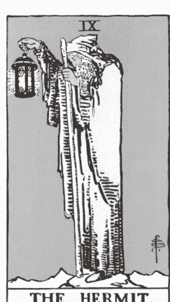

在这个季节，我不断地狩猎与采集，
寻觅着某些东西，不论是丰盛、安稳，还是真理。

自给自足成为我的指引，
我提供一切给自己
因为这种自主与独立
让我感到充实与满足。
我依靠自己赤裸而美丽的双手
收集资源，筑起我的世界。

## |关键字|

隔离、孤独、尊重自己的内在声音、保有安全的空间、自我探索、启示、内省
**元素：** 土

## |意义|

在大阿尔克那中，隐者是一位睿智、安静的人物，享受着孤独。他的存在散发着祥和与静谧的氛围。即便只是短暂的一下子，隐者也是选择独立自处，与自己的内在连结。在占卜中，他不急于提供资讯或对话，可能只是静静地经过。他温和的态度可能会启发你暂时抽离社交，专注于自己的内心世界。

从牌面艺术而言，这张牌非常简洁。一位年长的男子提着一盏灯，在阴暗的环境中独自行走，那盏灯为他提供探索未知与寻求真理所需的唯一光源。我喜欢将这张牌与喉轮疗愈连结在一起，透过消除周遭的干扰，让内心的声音浮现，倾听深藏心底的真诚与智慧。如果你在友谊或社群中容易感到焦虑或相当依赖他人，这种向内的专注可能会让你感到不安或脆弱。虽然「隐者」这个词或许带有负面意思，不过这张牌却不代表孤立，而是鼓励你建立健康的界线，保护你的内心平静。

这张牌的出现可能是在提醒你，是时候计划一个独自旅行的周末，或将手机调成静音，给自己一个独处、完全沉浸在自身能量中的机会，帮助你加深对自己的理解与信任。当你抽到隐者牌时，它是在邀请你向内探索。我建议通过冥想或写作来连接内在对话，因为这些练习往往比与他人交谈更能提供深入的洞察。

#### 隐者牌的肯定语

> 「我看见了静止的意义，并相信自己的声音，同时透过休息来珍视与尊重它。」

### 连结你的生命历程

写下你第一次向他人寻求建议，但最终还是透过倾听内心的声音而得出结论的经历。

## ★ 我的故事—命运之轮 ★

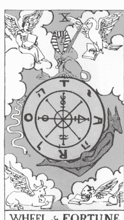

所有的一切都涌现而至——
新的生活、新的承诺，
将我推向了一条我从未准备好的旅程。
我用声音表达，
不是抗拒，而是感恩。

## |关键字|

幸运、命运、改变、命中注定、周期、不幸、放下控制、臣服
**元素：** 火

## |意义|

当命运之轮开始转动（无论是实际还是能量上），将我们转向新方向时，我们将愿意信任比自身更伟大的力量。这张牌代表命运、幸运、新周期的结束与开始，堪称大阿尔克那中的万用牌。我视其为来自灵性指导与宇宙的提醒，像是洒落的面包屑，证明我们走在正确的道路上。背后正在酝酿某些变化，尽管我们目前无法了解具体的时间或细节，但我们能感受到四周将会有变动的能量。灵性正在策划每一个同步性和偶发事件，为我们开创出未曾设想或计划的全新道路。

如果你在占卜中抽到这张牌并为此感到振奋，那就太棒了！命运之轮是一个吉兆，预示着命中注定的机遇即将降临，但它同时要求我们放下对控制的执着，为未知做好准备。

这张牌的正面能量重燃我们对命运和好运的信心，因此我建议你顺势而为。当我们与高我及更宏大的目标保持一致，并尊重过去所有的经历与教训时，宇宙就会加速我们的进展，以快速变化与转型回应我们内在努力的成果。

你可能会注意到，抽到这张牌时，它的能量似乎来自外部，像是命运在我们身上发生，而非我们有意识地共同创造。这是因为命运之轮是大阿尔克那周期的中继点，是一个彻底改变并让旅程更加有趣的契机，它本来就不在我们掌控之中！

#### 命运之轮牌的肯定语

> 「我愿意迎接改变，让它引领我前往真正属于我的地方。」

### 连结你的生命历程

在日记中写下你生命中某个好运伴随的时刻。这让你有什么感受？

## ★ 我的故事—正义 ★

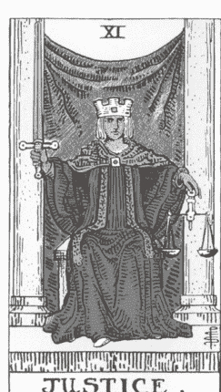

宇宙不会因为
你活出自我
而责备你、惩罚你。

## |关键字|

公平公正、真理、法律、正义或不公、因果、决定，事实胜于感受

**元素：** 风

## |意义|

正义牌象征公平正义。牌中的领导者（通常是法官）左手握着天秤，面容冷峻、毫无表情。这张牌的核心特质在于人物角色做出决定后的果断与坚定。在全面评估并考虑所有事实后，这张牌赋予我们下定决心的能量，而一旦事情尘埃落定，便真正结束了。

正义牌揭示了关于真理、对错与公平的主题。它帮助我们分辨道德与不道德，并指引我们找回能量的平衡。当你涉及任何形式的合约或协议状况时，这张牌可能会出现，像是诉讼、购房或离婚，这些都是这股能量在生活中具体展现的例子。

你可能注意到，这张牌给人一种正式，甚至略显刻板的感觉，类似于教皇牌和皇帝牌，许多占卜师都认为这些能量过于严肃，缺乏灵活性。然而，大阿尔克那是一系列成长课程，教导愚者如何成为更好、更完整的自己。在正义牌的指引下，愚者学习到真相虽能带来自由，公平与正义会获得胜利（希望总是如此），但不公平也是我们人生旅程的一部分。我欣赏这张牌的原因在于，它带来了一种清晰、锐利的视角，让我们暂时脱离情绪和灵性讯息，以理性思考我们所面临的不平等与不公正。我们每天都目睹各种不公不义，而正义牌正是指出了社会、人际关系以及个人经历中存在的不平衡领域。我建议你静下心来接受这张牌的能量以及它所揭示的一切。正视不公和不道德行为的存在，可以帮助我们了解自己如何做出回应和回应之后的责任。

你会发现，在莱德．伟特．史密斯牌的画作中，法官身着红袍（象征个人力量），就像教皇和皇帝等其他领袖角色一样。他手中的剑直指天堂，代表风元素，也象征真理。这股能量提醒我们，是否愿意成为那位公平公正的法官，为了更大的利益做出诚实、无偏见的判断与决策？

#### 正义牌的肯定语

> 「我会客观地面对自己的人生，不做严苛的批判。」

### 连结你的生命历程

在笔记本上写下你亲身经历或目睹的不公事件，以及这些经历对你所产生的影响。

## ★ 我的故事—吊人 ★

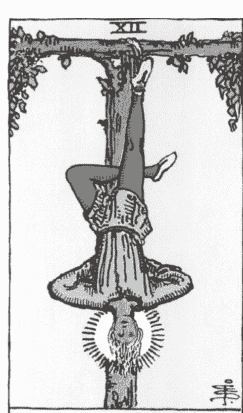

有时，最细微的疗愈
往往最深刻且有力。

## |关键字|

感觉受困、处于悬而未决的状态、探索灰色地带、悬浮在未知中、观察、新视角、不确定性、失去方向、暂停、进化、质疑
**元素：** 水

## |意义|

吊人牌就是我们不时会陷入的模糊灰色地带。这张牌提醒我们，在尚未确定下一步该如何行动时，允许自己先暂停下来。乍看之下，牌中那位倒挂的人物角色似乎正努力摆脱目前的困境。但实际上，这股能量更为中性，并不是一个危急的情况。相反，他看起来非常放松！头顶甚至闪耀着明亮的光环，象征他正接受神圣的启发。这表明，尽管他的身体受到限制，但他的心灵仍然是敞开的。

当这张牌在占卜中出现时，它提醒我们睁大眼睛，留意那些可能被忽视的细微之处，鼓励我们获得崭新的视角，然后在真正准备好之际，再进一步探索或成长。这张牌的能量与之前大阿尔克那中那些活跃、阳刚的能量形成对比。吊人利用这段时间进行自我转化，找到符合内心真实的平衡能量。当他转换了视角（也就是字面上的倒挂之意），获得全新的观点，他就能够从不同的角度审视眼前的事物。

这张牌有一个有趣细节，吊挂的人物用双腿形成了一个类似数字「四」的形状。在塔罗的数字命理学，数字四代表暂停、反思和减速。身为占卜师，这张牌对某些人来说令人十分不安，可能会引发不适的感受。受困的感觉往往让人感到焦虑，但要记住，这种停滞是暂时的。在这段等待的时间里，为何不专注于深化你的灵性修行呢？

#### 吊人牌的肯定语

> 「我欢迎任何静止之态，这样我才能察觉生命历程中的细微之处。」

### 连结你的生命历程

用纸笔写下你曾经陷入「灰色地带」的经历，以及摆脱困境后所发生的一切。

## ★ 我的故事—死神 ★

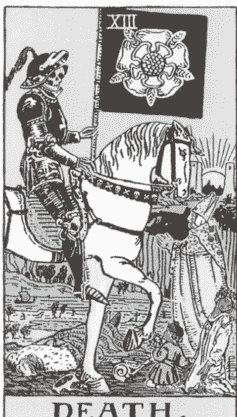

假装自己
毫无感觉
直到最终接受那些标签，我才
重新找回真正的自己。

*此处原文为：
(P)retending not
(T)o feel it all until finally
(S)urrendering to the label so I could
(D)iscover myself again.
每行开头字母组成 PTSD（创伤后压力症候群）。

## |关键字|

毁灭、为新事物腾出空间、转化、重生、放下、疗愈、结局、圆满收尾、灵魂整合、摆脱旧有框架

**元素：** 水

## |意义|

当死神牌出现时，我们知道一场深刻且必要的转化正在进行中。一个看似结束的阶段，同时也是一个全新的起点。正如塔罗牌中的许多循环周期一样，死亡牌强调阴影面与光明面的平衡。当我们选择放下某些已不再适合的事物时，便迎来了拓展的新机会。死神牌象征放下那些已无益于我们成长的事物——可能是某段关系、某个职场环境，或某部分生活习惯。这些事物已不再与我们当下的需求和目标相匹配。说再见很困难，因此即使释放是必要的，你仍然有权允许自己为此哀悼。

我很喜欢提醒学生，其实我们通常有很多的时间来思考这个结局。死神牌所展现的是身体的转移和生理层面的释放，在此之前，正义牌的理性思考和吊人的耐心等待早已在心灵层面为此做好了准备。

死神之所以让人感到困难，是因为它象征终结。当你抽到这张牌时，提醒自己保持爱与慈悲。虽然死亡常被视为最坏的结局，但在灵性上，如果不愿经历结束所带来的各种不适，就无法看见这张牌的真正重点在于转化与重生的机会。这可能代表自我的死亡，也暗示身为占卜者的你有机会重新定义并发掘自己新的部分，同时减少过去对你的束缚与影响。我特别欣赏莱德．伟特．史密斯牌中对死神的描绘——一位骑在马上的骷髅人物，与小阿尔克那的骑士相似。由于骑士作为塔罗中的行动者与推进者，这个形象进一步强调：事情已经发生了，是时候离开并向前迈进，追寻更适合你灵魂成长的经验与机会。

#### 死神牌的肯定语

> 「我愿意放下不属于我的任何一切。」

### 连结你的生命历程

写下你在生命中曾经在身体和心灵上准备好放下某人或某事的经历。

## ★ 我的故事—节制 ★

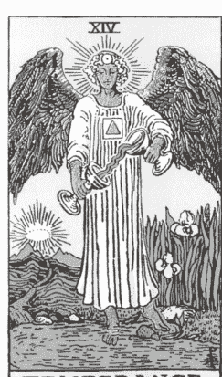

那些差点让你沉没的事物，
可能成为他人的支撑之锚。

## |关键字|

平衡、疗愈、节制、脆弱、柔软、耐心、平静、当下
**元素：** 火

## |意义|

经历了死神牌能量所带来的释放与转化后，你的神经系统可能正渴望重新校准并安定下来，而节制牌正是提供我们所需的那股舒缓能量。这张牌象征着平衡、节制，以及回归内在的平静。尽管我们可能因为在死神牌中与某些人事物告别而感到脆弱和软弱，但节制牌提醒我们，要用温柔与关爱来照顾自己，重建一种有节制的生活方式，从而在面对生活中的高低起伏时保持稳定。

节制牌对我而言一直有很深的共鸣。平衡并不是我的强项（有谁也一样吗？）因为它要求我们放下掌控、选择臣服。如果你也常常倾向于追求更多、做更多、添加更多，或者不停寻找更多外在的事物来填补内心，那么这张牌就像是一个邀请，邀请你对自身能量带来真正能长久维持的改变。节制牌鼓励我们珍视内心已经拥有的资源，它提醒我们：自我照顾的资源，其实就在我们手中。我们早已拥有疗愈自己的力量。

在传统的图像中，一位天使站在水边，一只脚踏入水中，另一只脚踩在地上。他将水在两个圣杯之间来回倾倒，象征调节能量，平复情绪。我特别喜欢这个画面，因为它展现了如何透过水的疗愈能力和大地的接地力量来温柔地照顾自己，这正是节制牌所传递的平衡之道。如果这张牌在占卜中选择了你，花些时间停顿一下，思考有哪些部分与你最真实的本质不协调或偏离了你内在的平衡。要怎么做才能简化你的疗愈之路？

#### 节制牌的肯定语

> 「平衡比混乱更能推动我前进。平静是我与生俱来的权利。」

### 连结你的生命历程

写下你生命中曾经优先照顾自己的时刻，并思考这对你的关系、灵性以及内心平静产生了什么影响。

## ★ 我的故事—恶魔 ★

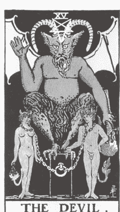

你真是不可思议
令人着迷、
陶醉。

你也令人困惑、
可怜、
挫败。

感谢你也反映出最极端的那个我。

## |关键字|

依赖、成瘾、限制、缺乏自由、不健康的依附关系、自己的阴影面、有毒的循环
**元素：** 土

## |意义|

我不喜欢美化恶魔牌，它从未是一张简单、轻盈的牌卡。这张牌自带低频率，并带出困难的主题，例如：依赖、上瘾以及毁灭性、不健康模式。我们所有人都有一些无益于我们的特质及倾向，阻碍我们疗愈或激发自己的天赋。这些恶魔般的习惯包含过度放纵、死命地滑手机或者讨好他人。有时候，这张牌也指出我们未察觉的暴力或上瘾行为，甚至根深蒂固的羞愧循环模式。

恶魔牌让我们看见人性的黑暗处和丑陋面。这张牌会紧抓着我们不放，让无力感笼罩我们，以为一切都失去控制，但事实上我们只是没有意识到自己手上握有更多的自由及自主权，无论是垃圾食物或者廉价的刺激，当内心的贪婪尝到甜头后，就会想要索取更多，即便这一切对我们没有任何益处。

这张牌的画面通常会模仿恋人牌，只是牌面两位独立的个体是由较不美丽、不光明的力量连结在一起，因为少了大天使在他们的上头的眷顾，使他们合而为一。反之，恶魔用锁链将两人捆绑相连起，而这个枷锁也使你依附于某人、某物或自己的阴暗面。

恶魔牌表示，好的事物也有过多的时候，这股能量贪婪无厌、自私、饥渴、过度性化，且不断地追求刺激。恶魔牌最终是要我们承认，在追求掌控及权力的过程中，我们早已失去了控制及权力。如果恶魔牌一直出现，请深深地吸一口气；你面前有一个有意识的选择。是时候反思一下，生活中有什么能够让你发光发亮，又有什么会让你受到局限、恐惧或将自己陷入不利之中。如果现在有任何关系使你感到虚弱、渺小，或者让自己沉溺于不良习惯，像是爱讲八卦或者对药物、酒精上瘾，你现在愿意疗愈自己，不让自己继续沉沦下去吗？这张牌正好是愚者最艰困且最具解放性的课题之一。朋友，你会找到自由的。

#### 恶魔牌的肯定语

> 「当我放松紧握的控制权时，我就能重新掌握自己的人生。」

### 连结你的生命历程

写下你生命中曾被贪婪或权力主导的时刻，没有爱、没有关怀。这如何影响你与其他人以及自己的关系？

## ★ 我的故事—高塔 ★

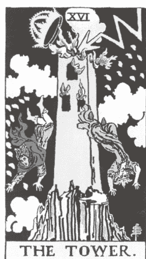

她感到脚下的世界崩塌，与大地失去了连结。

这场危机迫使她站起来作出回应。

起初是为了生存，而后是为了找到内心的优雅。

怀着敬畏超越灰烬，并心存感激曾经摧毁她的一切。

脚下的大地如今稳固不可撼动，
无法再被动摇或摧毁。

## |关键字|

突如其来的变动、动荡、顿悟、毁灭、混乱、不舒服的转化、重建基础、心灵觉醒、灾难、失去

**元素：** 火

## |意义|

高塔牌的出现，在占卜中往往带来一些充满戏剧张力的事件，奠定了它作为塔罗牌中最令人畏惧的牌之一。高塔牌往往带来焦虑与恐惧，因为本质上来讲，这是一张毁灭和顿悟的牌。这种动荡使我们感到不适，因为我们被抛弃在灰烬之中，迫使我们重新调整方向，并在计划之外的情况下重建生活。

在传统的图像中，我们会看到一座高耸入云但仓促建造的人造建筑，建造者一味地追求高度与自豪，俯视着曾经承载他们的大地，而忽略了稳固的地基。当高塔被闪电击中时，它轰然倒塌。

如果你正经历生活的剧变和重建生活的过程，我能体会你的辛苦。高塔所带来的能量是强烈而突如其来的，但请记住，你内在的韧性与坚毅也同样强大。前一张恶魔牌或许已经暗示了这种转变的迹象，揭示了某些模式正接近临界点，以及你生活中必须改变的领域。有时，高塔牌也象征内心的顿悟或觉醒，那种「啊！」的瞬间，让我们果断做出改变，迅速打包行李搬迁到另一个城市、辞去一份工作，或结束一段已经拖延许久的长期关系。

我不想让这一切听起来像个烦人的乐观主义者，但我想让你知道，这种揭示与摧毁自我建构能量的过程，虽然会撼动你，却也能让你更接近内在的平衡。当一切尘埃落定，你或许会发现：这其实是最好的结果。

如果我们接受并允许这股高塔能量发挥作用，它会展现出强大的转变力量。我们面临着一个选择：是要抗拒并否认这种改变的发生，还是选择穿越烈焰，兴奋地探索那些我们可以在内心燃烧和摧毁的部分，最终在灰烬的另一端找到重生的自己。

好消息是，高塔的能量虽然猛烈，但通常转瞬即逝，持续时间不长。当高塔在占卜中咆哮时，请带着同理心，对自己和他人多一份宽容与理解。高塔要求我们学会臣服，将我们推向艰难的课题，并明白有时候改变需要一点信念，而非是恐惧。

#### 高塔牌的肯定语

> 「我选择臣服，因为灵性已为我清除了道路上不该存在的障碍。」

### 连结你的生命历程

反思并写下你生命中曾经历的一段时期，那时一切完全瓦解，但最终得以重新整合。

## ★ 我的故事—星星 ★

### 星星牌

吐气。
当我不逃避挑战或悲伤时，
这是一个机会，
让我重新想像一切可能性。
深吸一口气，让我平静下来，
而不是削弱内心深处的魔法。
这是让生命与爱充盈全身的一刻，
一份纯粹而简单的爱。
现在是时候
运用我的主权力量与内在深知，
来引导并支持自己前行。
终于，宁静取代了雷霆，世界归于和平。
吐气，然后吸入满满的爱。
吐气，接着迎来疗愈的气息。

**关键字：** 重燃希望、重建信仰、寻求目标、脆弱、灵性、梦想实现

**元素：** 风

### 意义

星星牌如同一口新鲜的空气。然而，在深入探讨它的意义之前，让我们回想旅程的起点——那时的你是谁？作为愚者（象征的你），你曾纯真无邪，不受任何事物影响，乐观且渴望成长学习。从那之后，你已经经历了许多课题。坦白说，你刚在前几张大阿尔克那牌中「受尽波折」，面对了牌组中一些最丑恶的能量。然而，星星牌如今在你头顶光芒四射，带来希望、信仰，感觉像是灵性世界送来意料之外的慰藉。星星散发出真挚的能量，为我们提供喘息的机会。在刚刚克服一系列的挑战后，我们现在有机会反思自己的历程并与之和解。

在莱德．伟特．史密斯的牌组中，一位人物跪在水边休息。如同节制牌一样，这位角色利用这段时间恢复活力。他们的赤裸代表着被暴露出来的脆弱，但无论如何，他们仍选择寻找平静与安慰。星星牌也常被称为「梦想成真牌」，因为它象征着命中注定的梦想最终成真的可能性。它是一张充满疗愈与安慰的牌，每次在占卜中见到它，都值得庆祝一番。

此外，星星还帮助我们了解自身的独特性，正如清澈的夜空中每颗星星各具光芒一样。作为一种灵性原型，「星星」非常适合在你想唤醒或深化灵性连结、开发直觉时。抽到星星牌时，允许自己停下片刻，深深吸一两口气，怀着感恩之心享受这美好的空间。相信你的信仰支撑着你，并知道你的指导灵正在为你照顾好其他的一切。

#### 星星牌的肯定语

> 「我的努力造就了我，我将怀着爱、目标与信念勇敢前行。」

### 连结你的生命历程

在你的日记中写下并反思那些让你感觉与星星牌价值一致的时刻。当你感到被宇宙支持时，那是什么样的感受？

## 月亮牌

即使是最坚强的人也曾经历那种
仿佛只有在夜晚才会悄然浮现的
情绪涌动。

太阳似乎也明白，
当我们选择臣服时，
并不希望被他人看见。

**关键字：** 秘密、假象错觉、阴影、恐惧、焦虑、潜意识连结、直觉

**元素：** 水

### 意义

月亮是一张充满神秘的牌，就像所有未知的事物一样，它可能让我们感到被困于黑暗之中。它的能量深邃而令人敬畏，仿佛我们会被它的浩瀚完全吞噬。但我要提醒你，只有在探索黑暗时，我们才能在内心的世界里发现深度与意义。

当月亮牌出现时，我们的情绪可能会异常强烈。正如海洋受到月相的牵引，我们也同样受到影响。与女祭司的能量相似，月亮散发着柔和的月光，邀请我们深入心灵深处，以全新且更加亲密的方式探索潜意识。它揭开内在的面纱，帮助我们更接近直觉的力量。月亮似乎在说：「欣赏我吧，不要抗拒或害怕强烈的感受，或者每个阶段的不完美。」

这张牌充满情感、直觉和疗愈的力量，鼓励我们看得更深入，突破那些掩盖真实自我的表面假象。月亮让我们以不同以往的方式使用自己的直觉力，去倾听宇宙的暗示，而不是急于对它或对自己下结论。我常开玩笑说，这张牌可能暗示你的第三只眼开得太大了！当我们的直觉开始密集运作时，可能会让我们的心灵感官处于超速状态。因此，在探索潜意识深处的过程中，要记得平衡这些强大的女性能量，让身体多接地气，这样你才能保持与身体的连结。黎明终会来临，光明将再次照耀。但既然我们已身处黑暗，为何不在阴影中探索并与它共舞呢？

### 月亮牌的肯定语

> 「当我闭上双眼时所体验到的黑暗，也如同阳光般温暖，滋养着我。」

### 连结你的生命历程

写下某次你的直觉准确到让你不知所措的经历。

## 太阳牌

源源不绝的光芒照耀着我，
几乎让我目眩神迷。

**关键字：** 正向、乐趣、成功、乐观、活力、诚挚、温暖、喜悦

**元素：** 火

### 意义

太阳牌邀请我们沐浴在神圣的光辉中片刻（当然，若能更久更好）。这张牌充满了自信、乐观和童趣，它可能是塔罗牌中振动频率最高的能量之一。它往往象征成功、胜利，以及那些带来无比快乐的经历。当它出现在占卜中时，就像是最终的确认。我常告诉我的学生，把这张牌视为一个肯定的标记。这是塔罗对我们提问或寻求澄清的问题发出响亮的「是的！」太阳牌支持并聚焦于你所做的一切，同时鼓励你继续保持这份真诚。

这张牌提醒我们活在当下，享受生命旅程的乐趣。透过太阳的光芒与乐观，我们感受到自己闪闪发光、被看见、被欣赏。我建议你抓住这些美好的时光，尽情享受。说到生命旅程，太阳牌的图像也传达了这样的寓意。一个孩子开心地坐在马背上，一路前行。令人欣慰的是，这张牌暗示愚者重新找回了他那份纯真的、玩乐的本质。随着我们逐渐接近大阿尔克那循环的完结，看到愚者回到光明与欢笑中，体验生命中纯粹的快乐，是一件温暖而美好的事。

就在我们经历过种种艰难的季节后，此时此刻，我们学会了用感恩的心来欣赏这些美好的时光。所以，尽情享受吧！如果这张牌在占卜中出现，我希望你可以抬起头来看看生活中的美好，因为这恰好是你内心温暖的展现。

### 太阳牌的肯定语

> 「当喜悦引领着我的生命时，圆满无所不在。」

### 连结你的生命历程

先回想那些让你感到真正快乐与充满活力的记忆，静静感受它，并写下这些时刻。

## 审判牌

我听见我的指导灵说：
「你已经尽力了。」
当我纠结于细节无数个月后，
宽恕终于取代了我的内疚。

**关键字：** 重生、宽恕、批判、释放罪恶感、宣言、内省

**元素：** 火

### 意义

审判牌赋予我们重新书写人生的机会，帮助我们放下沉重的负担，并学会接纳和原谅自己的不完美（这并非易事）。它代表顿悟与觉醒，引导我们看见人生的目的，或推动我们扩展灵性。在大阿尔克那的循环中，你不仅深入了解了自己，也更加清楚你与灵性世界之间的关系与互动。你来到地球是有原因的，而要理解宇宙对你的期望，可能需要经历多个生命周期，因为在每一个周期中，你都会发现新的自我面向。

如果你对这张牌的复杂性感到有些不知所措，我完全理解。如果要我挑出一张让我反复纠结的牌，我绝对会选这张。我鼓励你先跳出来，将塔罗视为一个整体。愚者的旅程象征着一个生命周期，抽到这张牌时，我们可能还没达到完全的宽恕或听见灵魂的召唤，但这没关系。与其对自己过去的选择和行动下定论、贴标签，不如将你的失败与遗憾视为神圣的讯息：它们是帮助你重新连结并与高我整合的重要指引。

值得注意的是，审判牌有时不知是从哪里冒出来的，没有任何明显的混乱或困难的征兆。在它之前，我们经历了太阳牌的光芒时刻，感觉无比自信和无所不能，而现在，我们被引导去面对一种更深刻、更复杂的能量状态。审判牌要我们选择进行自我反省与深层的内在工作。

### 审判牌的肯定语

> 「我原谅并臣服于内在的呼唤。」

### 连结你的生命历程

写下一段你为了感到更自由而选择宽恕的时刻。

## 世界牌

我说：
「谢谢你从未放弃过我。」

我回答：
「不客气。」

**关键字：** 圆满、完整、成就、结束、期望的结果、全面的幸福、启蒙、看见大局

**元素：** 土

### 意义

世界牌代表心满意足与目标的实现，它象征着合而为一，当我们感到真正满足并与自己最丰盛、最勇敢的自我整合在一起时，就能激发这股能量。如果你感受到了这种深刻的自我连结，那么请明白，这种完整的状态来自于你对自己悉心的关爱与照顾！

虽然世界牌与太阳牌的成功与庆祝感觉有些相似，但我觉得世界牌的满足感更加全面。它通常代表生命中各领域全方位的平衡与和谐：健康稳固的人际关系、清晰且扎实的目标，以及充实、滋养的生活模式。这是一种遍布所有层面的幸福与圆满，是大阿尔克那旅程的压轴篇章，你的灵魂也对你所取得的成就由衷喝彩。你已倾听并回应了高我的召唤。

如同塔罗牌中的所有结局一样，我们的经历并非画下句点，因为终点始终会开启另一扇大门，允许我们再次重新定义自己。我最欣赏帕梅拉．科尔曼．史密斯在这张牌上所设计的巨大花环，完整包覆着人物。花环是庆祝的象征（如同权杖六上的花冠），而这个花环巨大无比，以完美的椭圆形围绕人物。当我们意识到它形成了愚者的数字——零（0）时，这个细节便有了全新的意义。只要你愿意，就有机会无限循环，无所畏惧地重新开始整个循环。

这张牌有时也被解读为旅行、探索新的土地或成长机会，暗示你可能带着你的自信与完整性走向全新的环境、文化或体验，进一步扩展你的视野，分享自己的体验，也探索世界为你提供的丰富可能性。

如果你此刻抽到这张牌，但感觉尚未达到这种和谐或满足的状态，请保持耐心并坚持你的愿景。肯定自己，并相信那些微小且稳步的进展正在构筑一个你将为之自豪的世界。世界牌是一个完美的提醒：优先考虑自己，最终会带来深层的满足与成功，并且内心的努力绝对值得。

### 世界牌的肯定语

> 「我是完整的，我一直都是如此。」

### 连结你的生命历程

写下你生命中那些充满感恩的时刻。然后，停下来感受此刻，留意这些珍贵的礼物是否依然围绕在你身边。

## 结语

在撰写这本书的过程中，我在约书亚树国家公园（Joshua Tree）中为十二位与我关系最为亲密的客户举办了一场静修营。当时，我距离第一版手稿的截止日期仅剩一个月，因此在这个时候投入精力为他人建立疗愈的环境，我曾怀疑自己这样做是不是有些不明智。

我本该继续写作，但我最终还是听从了直觉，选择主持这次静修营，而我非常感激自己做出了这个决定。事实证明，这次静修营正是我所需要的：它推动了我的创造力，让我完成这本书。那个周末成了我身为塔罗占卜师最珍贵的回忆之一。这段经历与我的写作同步进行，这种交织让人难以置信，因为我清楚自己正在努力创作一本能影响远超过这十二位参与者的书。在静修期间，我甚至向她们朗读了书中的片段，分享了一些「幕后」故事，因为她们在许多方面与我共同创作了这本书。我经常形容塔罗牌如同一面镜子，反映出我们的潜能，而这些女性也是我的镜子。

这些参与静修营的女性数年来一直与我合作，透过线上课程和培训与我一起学习塔罗牌，并在她们的疗愈旅程中向我寻求个人解读，因此我对她们的生命历程了若指掌，就如同了解自己的故事一样。我很荣幸能够与她们建立这种亲密的连结，更不用说能够目睹她们的成长，坐在「前排」为她们喝彩，是一件令人感动的事。她们深深地启发了我，也启发了这本《内在疗愈塔罗》。

在我们共度的那个漫长周末里，我时常会环顾我们所共享的家，看着她们净化牌组或讨论牌面上的符号。我会看着一位小组成员为另一位成员占卜，或者无意间听到一些最美丽、最真实的对话。那一刻，我能感受到一种强烈而深刻的感恩，让我全身起了鸡皮疙瘩。有时，我会轻声笑出来，因为我注意到我的牌卡描述对她们产生了影响，她们会引用我多次提到的词汇和比喻来讲解牌面的意思。我保证，当你读完这本书时，你也会熟悉这些用字与片语。

在静修期间，我们进行了大量的塔罗练习，但也有一些夜晚，我们围着火堆笑到流泪。在那里，没有人需要隐藏或为自己的情绪道歉。我们分享秘密、自我觉察，并鼓励彼此挑战自己的内在疗愈练习。有时我们手中握着塔罗牌，有时则只凭一颗真挚的心。在那次旅程中，我们活出了我们的塔罗。

当你持续练习塔罗占卜或直觉解读时，试着想像自己置身于温暖的同温层中。没错，我们每个人都在个人转变的旅程中，但我们从来不是真正孤独一人。虽然我无法保证为每位读者举办一次像这样的静修营（但想想那该有多棒！）但我向你保证，这本书的创作初衷与当时聚会的原始目的是相同的。

我希望你也能活出你的塔罗旅程，并让这种练习成为你独一无二的体验。我希望你抛开「应该怎么做」的束缚，勇敢地向自己和值得信任的人揭示你最美丽的秘密。我鼓励你质疑、挑战，甚至忽略那些嘲笑这种做法的人。在爱与包容中，与你的天赋、直觉、牌卡以及无限的内在魔力建立连结。安心地探索这种模式，并自信地与他人分享你的经历。当你坐下来进行神圣的占卜时，我希望你能感受到一个广大的社群，在你的背后支持你、鼓励你。

透过每一次洗牌与臣服于讯息，我们共同拥抱并展现了愚者的精神，在不断尝试与修正中，逐步建构出一个我们自豪且安心的世界牌。

虽然我无法亲耳听见你对牌卡的解读，或阅读你的灵性写作，但请相信，我深深看到、欣赏并尊重你在分享中所疗愈的那部分自己。现在，让我们一起为那些走在我们前面的人、与我们同行的人，以及我们尚未遇见的灵魂，包括旅途中不同阶段的自己，进行疗愈。

谢谢你，亲爱的读者，你们现在也是我的朋友了。

## 致谢

在创作这本书的过程中，我深深地感受到来自许多灵魂的巨大支持，这让我的内心充满感恩。我由衷地感谢那些帮助我构思、引导并完成这本书的人们。

致我的塔罗学生们和忠实的社群朋友：我无法用言语表达对你们的感激之情。感谢你们参与牌卡探索的过程，我感到无比幸福。你们的故事与我的经历交织在这些页面中，我们的牌卡研究引导了整个创作过程，最终完成了这本书。我希望我能让你们每一位都感到骄傲。

致我的老师们和导师们：你们当中有些人亲身见证并影响了我的成长，有些则从远处启发并指导我的工作和直觉探索。你们的存在对我而言都无比珍贵且神圣。

致凯莉．伯格（Kelly Bergh）：感谢你与我共同完成一份让我们俩都足以自豪的提案，呈现给出版社和我的经纪人。我们的情分始于塔罗占卜，这是我事业上做过最棒的投资，并发展成一段我十分珍视的友谊。为我们共同经历的许多旅行、瑜伽时光和午后写作交流欢呼。

致我的文学经纪人利．艾森曼（Leigh Eisenman）：你总是以令人安心的答案安抚了我的紧张情绪，同时也让我的出版之旅和新手作家体验充满了温暖与振奋。谢谢你成为我的队友。

致 Sounds True 的编辑黛安娜．文堤米格利亚（Diana Ventimiglia）和莉瑞克．多森（Lyric Dodson）：你们对我作品的热情和信任，让我深信这本书交付到了最合适的人手中。非常感谢你们这么信任与支持我的想法和计划。

致莉兹．穆迪（Liz Moody）和琳赛．格里姆斯（Lindsay Grimes）：莉兹，谢谢你接住我想写作的心，并不断鼓励我开始写作。谢谢琳赛介绍经纪人给我，就如同天助一般。你们两位是我敬佩的作家同行及朋友，你们时常温柔地（也是必要地）鼓舞我，让我能更接近我的梦想。如果没有你们的慷慨分享，这趟旅程将会截然不同。

致亚历克莎．沙维尔（Alexa Sharwell）：在我撰写本书时，你就是我的朋友兼战友，因为你用与我同样的爱和关怀来经营我的事业。谢谢你在我一边处理这个专案、一边忙于其他事情的时候，成为我可以依靠与信任的对象。

致劳伦．奥康奈尔（Lauren O’Connell）和安杰莉卡．雷伊（Angelica Ray）：我的朋友们，你们两位真的是惊为天人的直觉占卜师。你们对这次出版旅程的预测准确到令我震惊。在我人生中最令人振奋、也是如旋风般的出版历程中，你们的陪伴与引导，让我得以做好准备。

致蜜雪儿．阿兹（Michelle Azzi）：你是一位才华洋溢、创意十足的设计师。感谢你在初期阶段对书封设计的支持。你的魔法帮助我实现了我的梦想。

致我的母亲：我们以无数方式一起疗愈，而且我相信，这是一段跨越好几辈子的过程。我珍惜我们的亲密关系，从不认为这是理所当然的。谢谢你鼓励我的创造力、女性特质和力量，并帮助我创造出我梦想的生活。我是你的乔．马奇（Jo March），你是我的马奇妈咪（Marmee）。¹

致我的父亲：无论是我最黑暗的时刻，还是我最闪耀的成功时，你总是为我感到骄傲。我希望你知道，我有看见你用惊叹的眼神看着我。谢谢你从未放弃我的疗愈，并成为我最大的粉丝。

致我的奶奶、外婆、曾祖母及外曾祖母：妳们是我的血脉、我的故事、我女性力量的一部分。我之所以成为我，是因为妳们每个人。妳们都是充满魔法的存在。

致我的祖父：你为我的生命带来很多欢笑。笑声可以治愈伤痛，我希望你知道，我最喜欢的一些搞笑时刻都是和你一起度过的。

致我已故的朋友泰迪（Teddy）：我总能感受到你的灵魂。谢谢你成为我最早的其中一位向导。你提醒我，我的道路自始至终都是注定的，从而证实了我原本无法相信的天赋。

致我最亲密的朋友们和闺蜜们：虽然我们可能没有血缘关系，但我每天时时刻刻都感受到你们的支持和慷慨。友谊是一份珍贵的礼物。我很幸运能够与世界上一些最坚强的女性一起去爱、见证和成长。你们绝对都是我的家人。

致我挚爱的伴侣卡梅隆（Kameron）：谢谢你成为我生命中最善良、最有爱心、最理解我的人。你是我的安全空间，也是我每天早上最喜欢一起坐在咖啡店里的灵魂。我们曾经是天真、年轻的愚者，但我们的命运与课题让我们回到彼此身边，你就是我相信命运真实存在的证明。我们的爱真诚且无止尽，在成为作家的旅程中，你对生活的态度在许多方面启发了我。谢谢你成为我的校对员、摄影师和啦啦队。你是我的圣杯二到圣杯十，我很荣幸我们的爱情故事将永远存在于这本书里。

> 1 编按：出自《小妇人》中的角色，象征母女之间深厚的情谊。

## 作者简介

凯特·范·霍恩（Kate Van Horn）是一位塔罗占卜师、灵媒以及灵性导师。同时拥有 RYT500 认证的瑜伽指导师资格，也是经过认证的直觉疗愈师。她创办了（in）疗愈空间，一个致力于内在疗愈与直觉探索的线上社群与会员平台。她为全球客户提供一对一的塔罗咨询，并开设线上课程，教授塔罗牌解读与灵性书写。

身为心理健康倡导者和创伤幸存者，凯特深信她的直觉天赋和灵媒能力，源自于人生经历与种种创伤。她真诚地分享自己生命中的创伤，以及她的疗愈之路，鼓励更多人勇敢拥抱自己的人生故事、身体与天赋。她坚信塔罗牌是强大的自我转化工具，也是整体疗愈的重要辅助。目前，凯特与伴侣居住在美国加州赫莫萨海滩。本书是她的第一本著作。

网站：katevanhorn.com
Instagram：@kate.van.horn

## 索引

### 一、大阿尔克那 (Major Arcana)

- 0 愚者
- I 魔术师
- II 女祭司
- III 皇后
- IV 皇帝
- V 教皇
- VI 恋人
- VII 战车
- VIII 力量
- IX 隐者
- X 命运之轮
- XI 正义
- XII 吊人
- XIII 死神
- XIV 节制
- XV 恶魔
- XVI 高塔
- XVII 星星
- XVIII 月亮
- XIX 太阳
- XX 审判
- XXI 世界

### 二、小阿尔克那（Minor Arcana）

#### 金币牌组

- 王牌
- 二
- 三
- 四
- 五
- 六
- 七
- 八
- 九
- 十
- 侍者
- 骑士
- 皇后
- 国王

#### 圣杯牌组

- 王牌
- 二
- 三
- 四
- 五
- 六
- 七
- 八
- 九
- 十
- 侍者
- 骑士
- 皇后
- 国王

#### 宝剑牌组

- 王牌
- 二
- 三
- 四
- 五
- 六
- 七
- 八
- 九
- 十
- 侍者
- 骑士
- 皇后
- 国王

#### 权杖牌组

- 王牌
- 二
- 三
- 四
- 五
- 六
- 七
- 八
- 九
- 十
- 侍者
- 骑士
- 皇后
- 国王

### 三、主题索引

- 破解迷思
- 大阿尔克那的组成
- 小阿尔克那的组成
- 宫廷牌的组成
- 塔罗数字学
- 能量保护仪式
- 抽牌方法
- 保养牌卡 & 补充能量
- 建立仪式并与牌卡连结
- 塔罗的「该做」与「不该做」
- 每日一抽
- 建议牌阵
- 逆位解读法

