## SPIRIT OF SPIRIT
Magick Ritual & Spell

## 大阿尔卡那牌
镜龙司大师

## 高速解读凯尔特十字牌阵

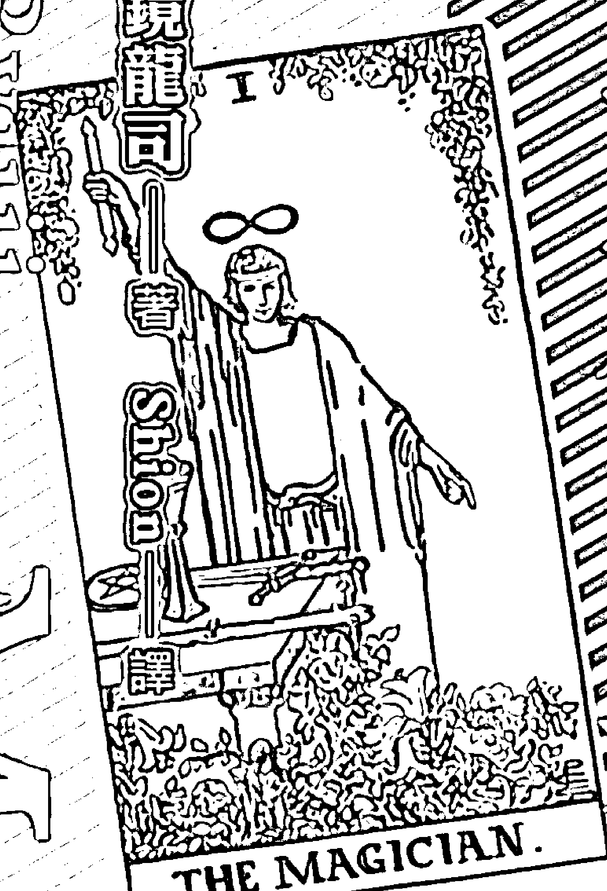

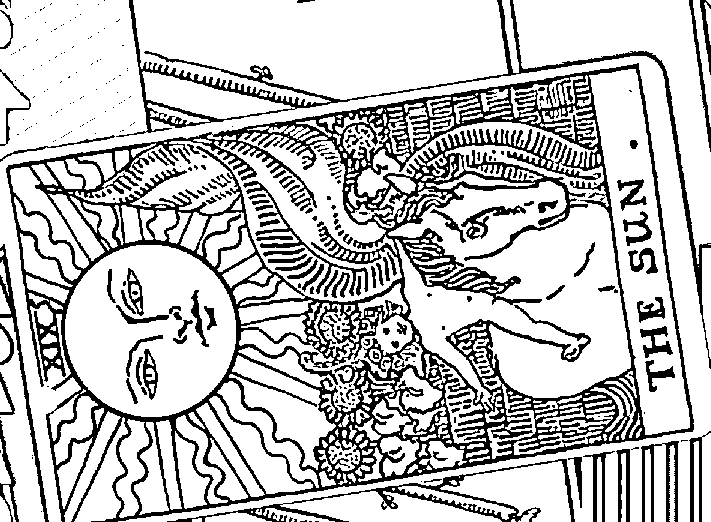

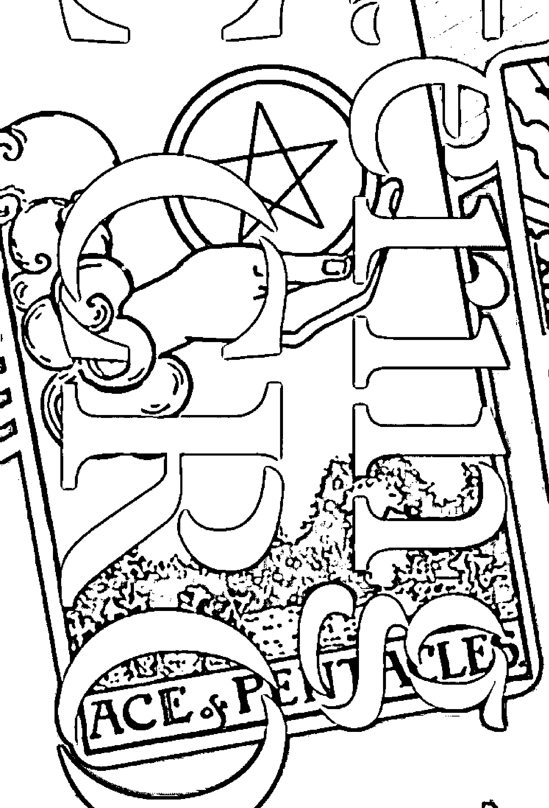

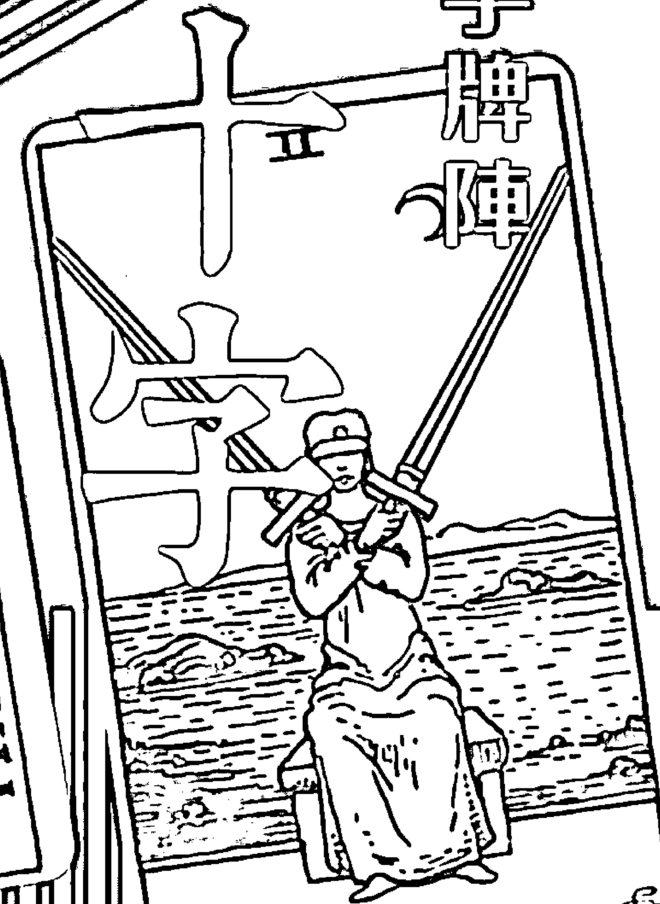

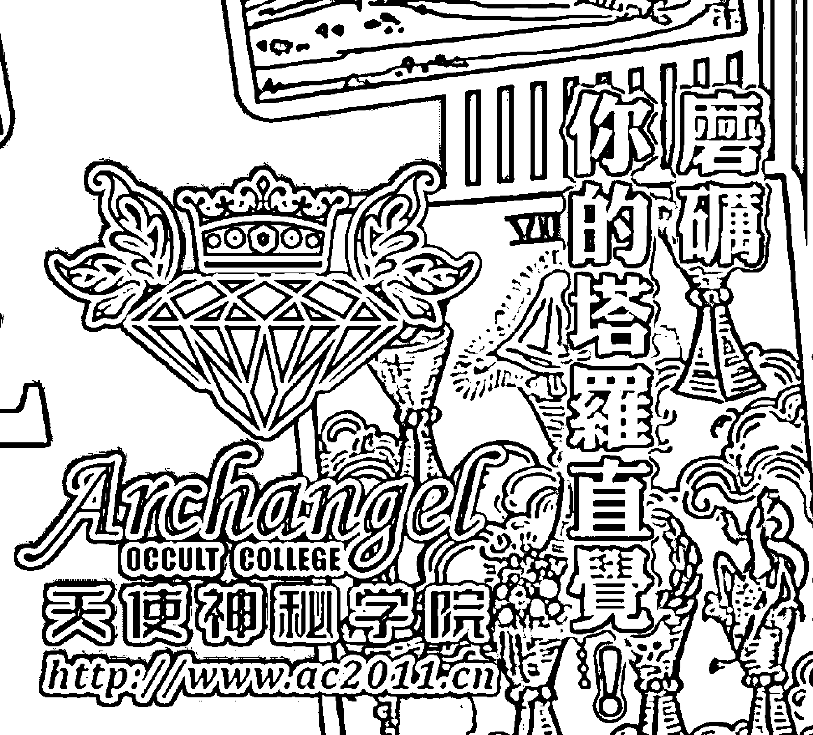

## 日本塔罗大师
镜龙司全面详解
10 个位置涵义
78张卡牌面涵义
7810种排列组合
你的塔罗直觉
磨砺
III VII

Archangel Occult College
天使神秘学院
http://www.ac2011.cn

## SPIRIT

## 高速解读凯尔特十字牌阵

## 凯尔特十字

## 大辞典

## 枫树林

## CONTENTS

## 前言 004

最为著名的牌阵：凯尔特十字法塔罗牌占卜为“牌面涵义”与“位置涵义”的组合凯尔特十字法的历史“凯尔特十字”的原始意义 COLUMN 追根究底，为什么是“凯尔特”？

## 017 PART 1 凯尔特十字法大辞典

- 在使用凯尔特十字法占卜前…… 018
- 塔罗牌解析 基本步骤 020
- 凯尔特十字法的10个位置 022
- 无须平均解读全部的10张牌 027

- POSITION 1: 现况 029

- POSITION 2: 考验 055

- POSITION 3: 目标 081

- POSITION 4: 原因 107

- POSITION 5: 过去 133

- POSITION 6: 未来 159

- POSITION 7: 真心话 185

- POSITION 8: 周遭 211

- POSITION 9: 对未来的想法 237

- POSITION 10: 结果 263

## 054 ① 关于塔罗牌的种类

## 080 ② 当答案难以理解时……

## 106 ③ 如何解读『逆位』？

## 132 ④ 觉得凯尔特十字法有难度时……

## 158 ⑤ 塔罗牌并没有绝对的规则

## 184 ⑥ 该如何询问塔罗牌？

## 210 ⑦ 小阿尔克那的『花色』象征着什么？

## 236 ⑧ 解读宫廷牌时的重点

## 262 ⑨ 提升解析能力的诀窍为何？

## 288 ⑩ 选择塔罗牌的方式、基础保养及管理方式

## PART 2 实践凯尔特十字法解析

透过实际解析，获得解读提示

答案不在牌面，而在你的心中

- CASE 1 工作 293

- CASE 2 恋爱 300

- CASE 3 住宅 307

- CASE 4 晚年 314

# CARDS INDEX

## 结语

## # 前言

## ## 镜龙司

## ## 最为著名的牌阵：凯尔特十字法

自从塔罗牌蔚为风潮，已经过了相当长一段时间。说起“卡牌占卜”，在我孩提时代仍以扑克牌占卜为主流，如今则以塔罗牌或神谕卡为大宗了吧。而且不仅是塔罗牌的存在本身，就连具体的占卜方式，似乎都已经深入大众之间了。我曾遇过当说出塔罗牌一词时，看似无法与占卜联想在一起的商业人士竟说出：“哦，那非常准确，但相当难懂吧？”意义会因为翻出的牌面朝上或朝下而改变”，令我大吃一惊。没错，想必各位也曾听闻塔罗牌占卜的技法“逆位”一词吧（尽管我几乎不使用逆位，参照“COLUMN ③”）！除了逆位之外，还有一项因为过于“理所当然”而难以意识到，却很重要的塔

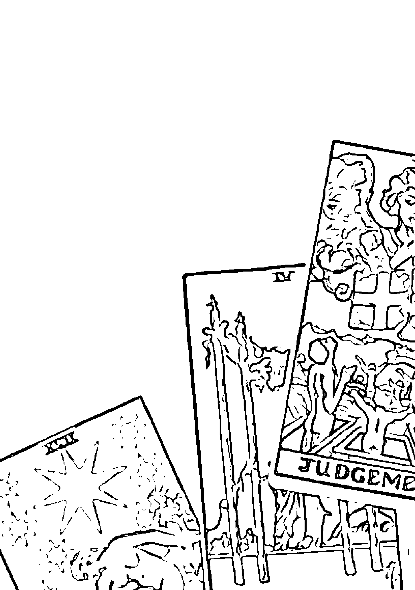

## 塔罗牌占卜方法学

那就是『牌阵』（展开法），也就是洗牌及排列！而其中最为有名的牌阵，就是『凯尔特十字法』，几乎所有塔罗牌占卜入门书都会介绍其使用方式，似乎也大受职业占卜师的欢迎。实际上，只要熟练其使用方式，没有比这更方便的牌阵了。另一方面，由于使用的塔罗牌张数为十张，相对较多，而容易令初学者留下“困难”的印象，这也是事实。

因此，才会有这本书的诞生。我试着网罗使用凯尔特十字法时的牌面涵义，写成一部类似辞典的书籍，只要将这本书放在手边，应该能成为掌握凯尔特十字法的捷径。

## 塔罗牌占卜为“牌面涵义”与“位置涵义”的组合

或许不需再次强调，现代塔罗牌占卜的解释，基本上是从两大要素推导出来。

首先是每一张塔罗牌具备的“涵义”。比如说，如果是“死神”牌，就意味着“事物的结束与再生”；若是“愚者”牌则意谓着“无限可能性，但尚未成形”。

塔罗牌十五世纪于意大利发明的，一开始并非用于占卜，而是游戏用卡牌，每一张牌并不具备占卜上的意义。然而，用于其王牌的寓意画，则选用了自希腊、罗马以来，历史传统悠久的图像，刺激众人的想象力。于十八世纪末之后，塔罗牌开始与神秘学、魔术结社相关形象强烈结合，甚至被密教、魔术结社相关人士赋予神秘学相关涵义，因此奠定了二十世纪后半之后，“现代”塔罗牌占卜涵义的基础。（※1）

而另一个要素则是“牌阵”中的“位置”。塔罗牌洗牌完成后，会按照一定的步骤将牌以面朝下的状态排列在桌上，接著再翻至正面。这时的“排列方式”就是“牌阵”。从最为简单的只抽单张牌，到历经复数阶段工程，极为复杂的作法为止，种类繁多。此外，由于各个塔罗牌解读者还有属于自己的原创牌阵，种类堪称不胜数。（※2）

不过，在排列塔罗牌时，事先决定好“这张牌代表商量者的现况”、“代表对方的状态”等“位置”涵义，这点是牌阵的常规。

比如说，即使同样是“死神”牌，如果落在“商量者的现况”，“某种事物结束或开始”代表的就是商量者本身的现况；而如果落在显示“对方的状况”的位置，

## 凯尔特十字法的历史

没错，追根究底，塔罗牌占卜其实正是将牌阵的“位置涵义”及“牌面涵义”组合并解读的行为。更大胆一点说，塔罗牌占卜“牌阵”。照理来说，解读牌阵需要拓展意象并检视整体，但当你还是初学者时，应该会仔细地组合“位置涵义”及“牌面涵义”排列组合方式的辞典形式。而本书所使用的牌阵，正是塔罗牌的方法中最为有名且流行的“凯尔特十字法”。该命运的状况则成了对方的状态。几乎所有的塔罗牌占卜入门书中，都会收录“凯尔特十字法”牌阵，使用者众多，实际上，我也十分喜欢使用。

## 〈凯尔特十字法牌阵〉

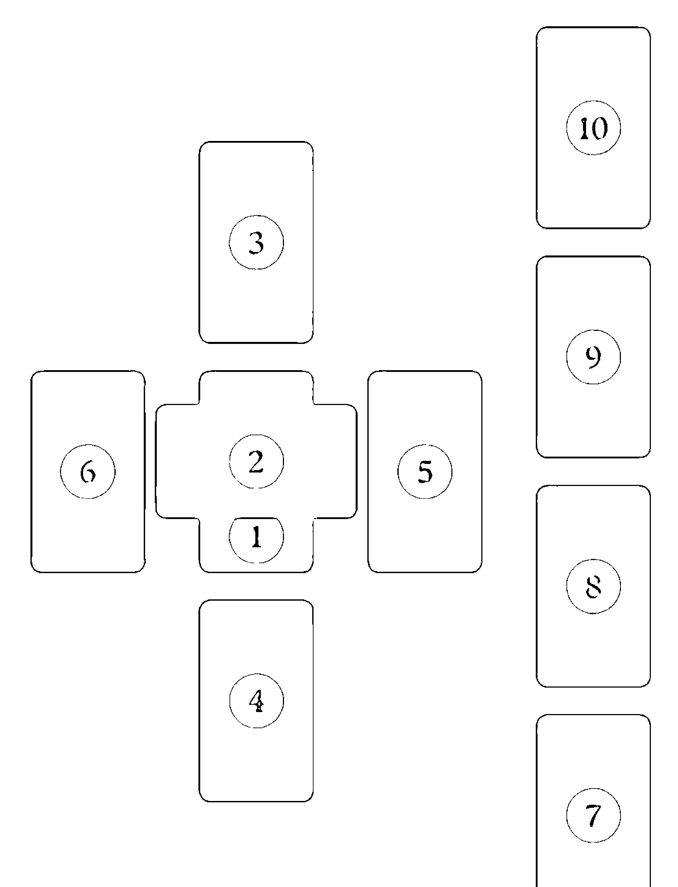

只要尝试使用过，就能明白这是个设计得很好的占卜法。

根据过去的书籍或网络文章，凯尔特十字法是“许久以前就开始使用”的牌阵，也有不少说法认为是“古代凯尔特民族（欧洲原住民族）使用过的牌阵”。

但这是错误的，实际上，根据推测，凯尔特十字法有可能是距今约一百年前于英国发明的牌阵。

这个牌阵一开始是于亚瑟·爱德华·伟特（Arthur Edward Waite）的著作中问世的。伟特在一九〇九～一九一〇年间出版的《The Key to the Tarot》（即为日后改订而成的《The Pictorial Key to the Tarot》）中，刊载了这个牌阵。这本书正是将现在全世界最受欢迎且广受喜爱的“莱德·伟特史密斯塔罗”推广出去的功臣。

根据此书介绍，此牌阵“适用于回答特定问题”，且是“英格兰、苏格兰、爱尔兰曾经使用”的牌阵。

接着，请仔细看看在此书冠上的名称。

书中写的是“an Ancient Celtic Method of Divination”（古代凯尔特的占卜法）。
看懂了吗？这里写的是“Ancient Celtic Method”，而不是“Ancient Celtic Cross Method”！

这个牌阵最初问世时，名称并不是“凯尔特十字法”，仅是常于“英格兰、苏格兰、爱尔兰”使用的凯尔特风格牌阵。换言之，并没有“十字”！

而在英语圈内大幅推广塔罗牌的伊登·格雷（Eden Gray），其著作《The Complete Guide to the Tarot》（1970）中又是如何说明的呢？

这本书有日语翻译版，然而在翻译版中则成了“古代凯尔特十字法”。

不过，在原作中……写的则是“The Ancient Celtic Method”。换言之，翻译版或

许是受到十分流行的“凯尔特十字法”这种先入为主的观念影响，才会在名称中放

入“十字”也说不定。

那么伟特是这个占卜法的发明人吗？

可能性虽然并不是零，但恐怕并不是他。藉由英国的塔罗大师库斯·卡茨

（Marcus Katz）竭尽全力搜寻，发现了一名为F·L·加德纳（Gardner）的人物，在这本笔记上

记载着名为“吉普赛占断法”的占卜法，与现今的凯尔特十字法几乎相同。（※3）

这个占卜法是将塔罗牌排成十字形，旁边再排列四张牌的形式，与现今的“凯

尔特十字法”极为相似，唯一的相异之处，是纵向排列的牌并非摆在十字牌右侧，

而是左侧。究竟哪一种占卜法较为古老，还有待今后调查。此外，另一项需要关注的点在于，笔记中记载的名称并非“凯尔特”，而是“吉普赛占断法”。名称既不是“十字”，亦不是“凯尔特”！
魔法结社“黄金黎明协会”的“官方”牌阵为“解鎖法”（Opening the Key）。这是一种极为复杂的占卜法，（※4）若要正确使用此牌阵占卜，需花上好几个小时，实在不适合“平时使用”。
因此，或许是这位加德纳或是其他会员，设计出这款更为简便的牌阵，在协会中使用。而伟特极有可能是趁着当时“凯尔特复兴”的机运，替这个牌阵取名为“凯尔特”，并写进书里的。
因此，凯尔特十字法的历史完全没必要追溯到“古代”。
此外，凯尔特十字法的排列顺序及位置涵义因人而异，但没有正确答案。这本书采用了最为标准的版本之一，但只要习惯了使用方式，各位或许也能自行下工夫，构思专属于自己的位置涵义或排列顺序。

## “凯尔特十字”的原始意义

虽然剥下了凯尔特十字法具备的神秘形象，但这个牌阵“设计精良”且能“派上用场”是毋庸置疑的。既然受到众多塔罗大师喜爱，就代表着它有着相应的实用性。我认为秘密就藏在这一看“似圆形的十字”与“纵向直线”的图形上。十字（以圆形包围的十字）在荣格心理学中称作“曼陀罗原型”。这被视为内心试图恢复平衡时，自然表现出来的象征。从表现现况的十字部分，可以俯瞰过去、现在、未来、自身根基等“现在”，并冷静下来检视其中显示的各种状况。然而，单靠如此的曼陀罗结构，缺乏为了活力充沛地活在三次元的当下所需的“流势”。在我看来，首先是透过这十字部分检视自己（商量者），接着再透过纵向排列于右侧的塔罗牌，检视从十字放射而出，构筑起今后发展的能量流势。

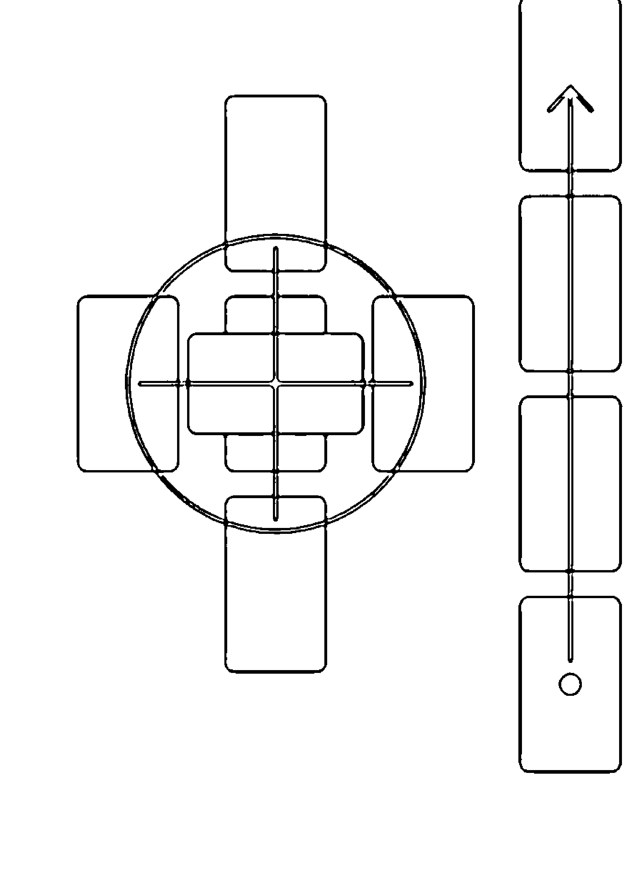

倘若我说凯尔特十字法中蕴含着现在（构筑起现在）的能量模式，与从中放射、流泄而出的能量流势对比，是否比较容易理解呢？这么一来，你也能成为职业级占卜师！

- ※ 1 关于塔罗牌的历史，请参照镜龙司《塔罗牌的秘密》（讲谈社）。
※ 2 关于塔罗牌的各种牌阵，请参照镜龙司《塔罗占卜超上手图解攻略》（ＰＯＵＳＥＲ电脑人文化）、伊泉龙一《完全精通塔罗牌占卜术大全》（说话社）等。
※ 3 请参照镜龙司担任责任编辑的《Ｅｕｒｅｋａ》临时增刊号《塔罗牌的世界》（青土社）中收录的，马库斯·卡茨作，松田和也译《厘清凯尔特十字牌阵》（暂译）。
※ 4 关于解鎖法，请参照伊斯瑞·瑞格德作《黄金黎明魔法全书》（暂译）（国书刊行会）。

## 追根究底，为什么是“凯尔特”？

这个被称作“凯尔特十字法”、“古代凯尔特法”的牌阵，最早似乎称作“吉普赛占断法”。至少在从十九世纪末期至二十世纪初期的英国魔法结社“黄金黎明协会”中，留有并用“吉普赛”这个名称的痕迹。

那么，为什么会以“凯尔特”这个名称取而代之呢？这点可推测是受到自十九世纪末期起的凯尔特复兴运动影响。

凯尔特人被视为欧洲原住民族。据山内淳先生所言，“印欧语系的其中一支——凯尔特人于西元前十世纪前后出现在欧洲大陆中央附近，并于西元前八世纪后开始使用铁器，繁荣兴盛”，其看法与现在考古学界一致（※5）。然而，原本盛极一时的凯尔特人，后来却因罗马帝国的压倒性力量及日耳曼人的入侵，而从历史舞台上消失了踪影。

而且，由于凯尔特人没有文字，难以得知其实况。关于凯尔特人的古记录，是由“敌方”罗马人所撰写，因此自然存在严重偏见。古代凯尔特人的形象，

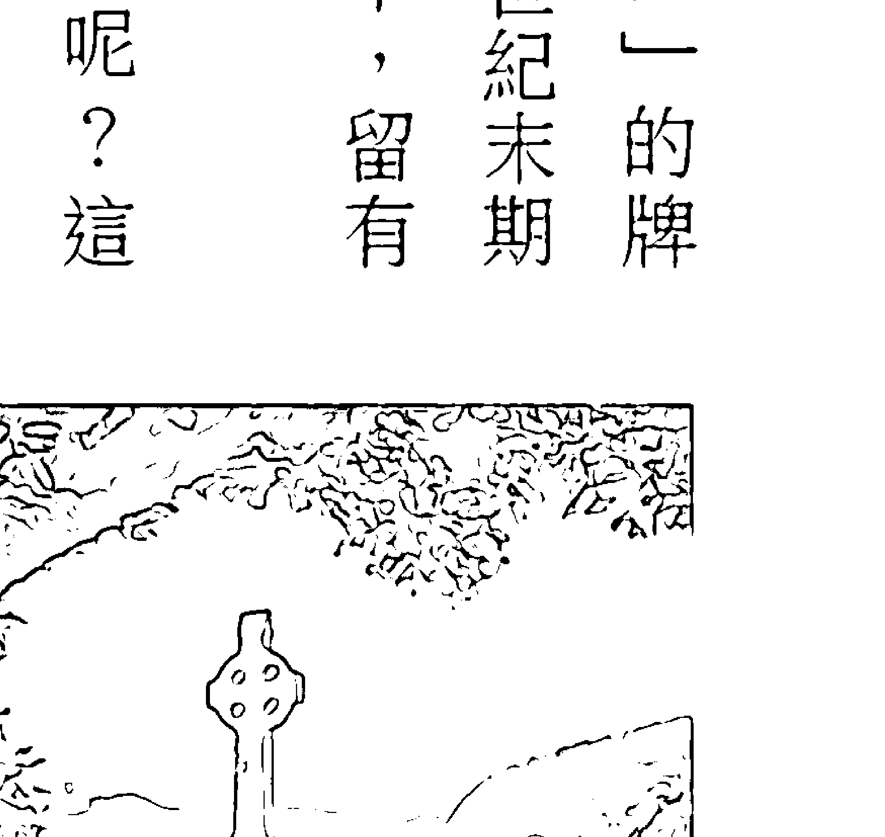

总之就是既野蛮而粗暴，还会将人类作为活祭品。

然而随着进入近代，人们投射在“凯尔特人”身上的形象有了重大的改变。尤其是在进入十九世纪后，为了再次确立自身的根源，而利用了罗马之前的凯尔特形象。凯尔特人从粗暴野蛮人的形象，摇身一变成了勇敢且高雅的战士，并进一步确立了其形象：“具备对幽玄世界之细腻感性的高贵民族”。“黄金黎明协会”的高阶会员W·B·叶慈（Yeats），也是凯尔特复兴运动的核心人物之一。

研究叶慈的英文文学家尾岛太郎博士，曾如此描述凯尔特人：

> “他们是由着朦胧月光，拥有精灵般内心的种族，对于妖精所栖息的阴影深海心怀幻想般热情的人。”

此外，他还引用了法兰西斯·格里尔森（Francis Grierson）的话语如此描述：

> “凯尔特人以某种神秘性观念面对自然。当凯尔特人的内心完全处于创造性状态时，就会变得与自然完全一致。仅具备日常意识的普通人虽然能明白自然之美，却鲜少受到自然事物的灵魂深处所吸引。……然而凯尔特人在每一天、每个月、每个季节，除了能感受到每个时刻肉眼可见的氛围，亦能察觉其灵魂深处。”

由于十九世纪末～二十世纪初期，出现了如此“灵性”的凯尔特人观点，也影

響了二十世纪后半的爱尔兰歌手恩雅（Enya）的音乐等。以恩雅为代表的幻想风格“凯尔特音乐”，其灵感就源自于此。如此神秘的凯尔特人形象，对于酝酿出塔罗牌占卜的氛围带来很大的贡献。而“凯尔特十字”这个名称也因此作为牌阵名称固定了下来。我认为还有另一个名为“凯尔特十字”的特殊十字也发挥了重要的作用。凯尔特十字具备“作为古代异教与中世纪之后，将基督教之灵性加以整合的象征”这样的形象。身为欧洲原住民族的凯尔特人，自然生活在基督教之前的“异教”文化之中，然而随着强大的罗马将基督教定为国教，使得基督教于整个欧洲普及。基督教作为“文明”的象征，而古老异教则成为“野蛮”的代名词。在这之中，爱尔兰是残留了强烈凯尔特文化色彩的土地之一。当圣派翠克（S. Patrick）将基督教带到爱尔兰后，此一罗马教义在爱尔兰与凯尔特文化之间产生了不可思议的融合——名为凯尔特基督教，具独特美感的修道院文化一直延续到九世纪左右。《凯尔斯书》等充满“凯尔特”螺旋纹的精美福音书抄本，正是其象征性的存在。（※6）在爱尔兰的各处，如今仍伫立着石制的圆环十字架——没错，正是凯尔特十

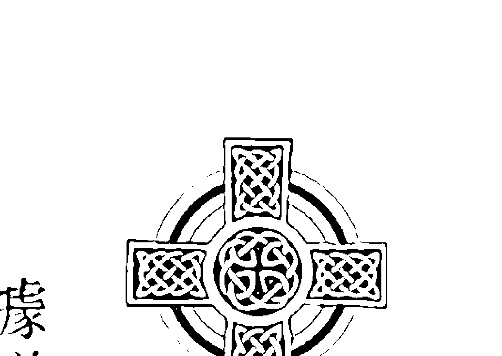

字。关于这将圆环与基督教十字架相结合的象征，一说是单纯藉此补强十字架，也有一说是象征太阳。无论如何，这独特的“凯尔特十字”，就像是异教与基督教相结合的象征。

据说亚瑟王或圣杯均为异教与基督教融合而成所产生的结果，而我认为“凯尔特十字”这种象征性的存在，或许也掳获了支持塔罗牌占卜至今，追求着古老而崭新灵性之人的心。

- ※5 请参照小辻梅子、山内淳《两种凯尔特》（暂译）（世界思想社）。
- ※6 请参照�冈真弓、松村一男《图说凯尔特历史》（暂译）（河出书房新社）。

## PART 1

## 凯尔特十字法大辞典

## 在使用凯尔特十字法占卜前……

接下来，就从实践角度来检视凯尔特十字法牌阵。在此会先简单地向初学者说明如何使用塔罗牌占卜。

首先，你得准备一副塔罗牌才能开始。塔罗牌由二十一张大阿尔克那牌及五十六张小阿尔克那牌所组成。

大阿尔克那牌分别拥有“愚者”、“恋人”、“恶魔”、“月亮”等名称，以及从0到21（亦有从1到22的情况）的编号，每一张牌都含有各自的象征性涵义。

而小阿尔克那牌则分成“权杖”、“圣杯”、“宝剑”、“钱币”四种花色，每个牌组并各自拥有一到十的十张数字牌，以及侍者、骑士、王后、国王这四张人物牌，共共计十四张牌。

一想到“必须记住七十八张牌全部的牌义”，或许会令人感到不安。不过请放心，只要将这本书放在身旁，就能马上获得答案。在查询一张张抽出的牌的过程中，应该就会自然而然地记住牌义。

在实际占卜时，会有以下三个步骤：

- ① 洗牌（使塔罗牌随机混合）
- ② 切牌（将塔罗牌分开叠好）
- ③ 牌阵（排列塔罗牌展开阵型）

下一段会介绍占卜前的①洗牌、②切牌与③牌阵的具体作法。话虽如此，这些步骤都没有严格的规则，请试着想出专属于你自己的作法，或最能协助你专注的方法。

至于③牌阵，也就是塔罗牌的排列方式，除了本书介绍的“凯尔特十字法”，还有排列三张牌的“时间之流”、排成六芒星形状的“六芒星”等各种种类。最近也有许多人设计出原创牌阵，变化版本也大幅增加。

所谓的牌阵，大多是整体模仿了某种象征性的形状，但排列其中的每一张牌的位置，也都被赋予了相应的涵义。

## 塔罗牌解析 基本步骤

追溯历史，塔罗牌原本是一种游戏。
作为占卜工具的历史其实时日尚浅，并没有“非得这么做不可”的绝对性规则。
最为理想的情况，是发展出专属于自己的风格。
但如果还是初学者，则先按照已经形成既定流程的方式比较好。

以下是将塔罗牌展开成牌阵为止的步骤：

## 在占卜之前……

首先，在桌上准备好足以展开塔罗牌的空间。
可事先将桌面擦拭干净，避免弄脏塔罗牌。
若是依个人喜好铺上桌巾，或许能提升专注力或想象力。
接着，将塔罗牌以正面朝下的状态摆上。

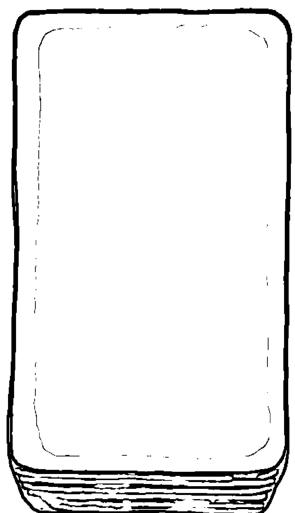

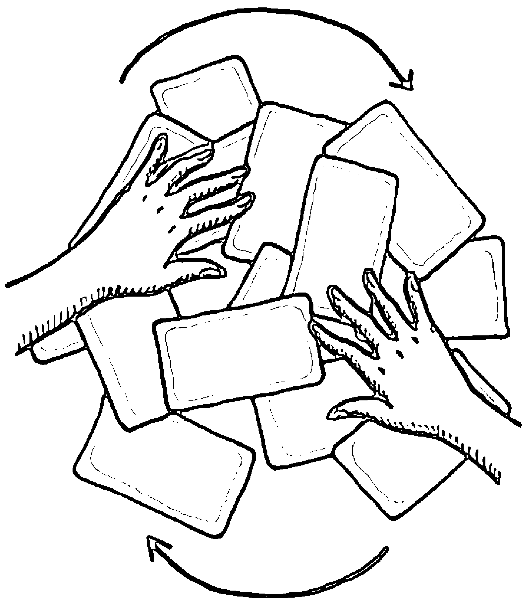

## 1。洗牌

所谓的“洗牌”，是将整叠塔罗牌推开来以双手搅动。
将所有塔罗牌正面朝下，在桌面上推开来并缓缓搅动吧！
同时，请在心里想着想要占卜的内容。

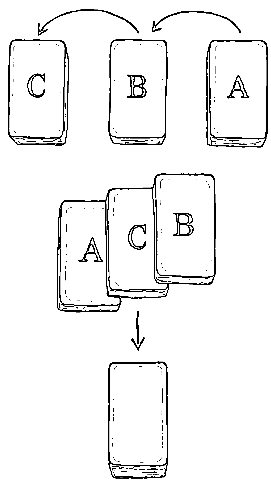

## 2。切牌

将塔罗牌搅动到觉得“这样就行了”之后，将牌整理成一整叠。这时依然维持正面朝下的状态。像这样整理成一叠的牌，便称作“牌堆”。

以目测方式，将牌堆分成三份。
如果是独自占卜，当然会由自己进行，若有占卜对象在，则可以请对方协助这个步骤。
这个步骤称作“切牌”。

接着，请再将塔罗牌以跟一开始不同的顺序重新整理成一叠。

## 3。牌阵

请从整理成一叠的牌堆取出塔罗牌排列。
所谓的“牌阵”，是以特定方式排列塔罗牌。

在本书中，会将十张牌以“凯尔特十字法牌阵”的形式展开。排列塔罗牌时，基本上会从牌堆上方依序取牌，不过你也可以依照喜好，从牌堆中随机抽出牌来。

将塔罗牌展开成牌阵时，可以一开始就将所有牌翻开（正面朝上），也能先维持原本正面朝下的状态，再一張张翻开依序解读。

不过，最重要的还是最后得检视牌阵所有的牌，掌握从整个牌阵感受到的印象。

## 凱爾特十字法的10個位置

以凱爾特十字法來說，會排列十張牌，並依位置不同代表各自的涵義。根據書籍及塔羅占卜師的不同，有著各式各樣的方式，因此並沒有何者對錯的問題。本書刊載的是基本的模式，你也可以依自己的風格調整。以下是凱爾特十字法的排列方式。由於必須一口氣排列許多張牌，初學者或許會心想「我記不住這麼多張牌」、「該從哪裡開始解讀？」而感到不知所措。這時候，就將十張牌分成幾個部分，並依序解讀吧！首先是形成中央十字的兩張牌。這是象徵了凱爾特十字法「十字」的兩張牌。一開始別想著要一口氣解讀十張牌，建議先將重點放在〈①現況〉及〈②考驗〉這兩張牌上來解讀。換言之，只要能冷靜地掌握「①自己現在處於何種狀況」、「②問題為何？」，應該就能找出大多數問題的解決方案。而剩下的八張牌，則可以作為輔助參考著解讀。

## ② 考驗

代表目前阻礙你的事物，或接下來必須跨越的障礙。

## ① 現況

代表你目前處於何種情況或遭遇的問題本質。

如果想進一步深入檢視，接下來的兩張牌就是〈③目標〉與〈④原因〉。「③希望如此的願景」，以及與之相對的「④引發該問題的原因」，是上下成對的兩張牌。

## ③ 目標

代表你藏於內心角落的夢想或目標、原本應該前進的道路、若是不受限制則想實現的事物。

## ④ 原因

代表為何會處於①的狀況下，問題的原因。如果在〈③目標〉出現涵義不太好的牌，卻在〈④原因〉出現印象不錯的牌，或許會覺得難以解讀，這時請務必參考本書的解說。此試著兩兩一組檢視，或許能有所發現。由於⑤過去的牌常與④原因有關聯；⑥未來的牌常與③目標有關聯，因

## ⑤過去

代表不久前發生，作為問題關鍵的事件。

## ⑥未來

代表根據至今為止的結果，在不久後的將來可能發生的事。此外也可作為該如何應對的提示。

再來是排列在兩側的兩張牌。時間序列的牌，就很容易想像了吧！只要想成是象徵⑤過去、①現況、⑥未來這樣

## ⑨對未來的想法

代表你對未來懷抱的希望或恐懼，或是根據目前為止的牌面，自己對於即將造訪的未來所懷抱的感受。

## ⑩結果

代表整合一切，針對問題的最後結論。

然後，接著是凱爾特十字右側的縱向牌組。如果說目前為止的牌面，是用以從各種角度掌握現況，那麼⑦～⑩的縱向牌組則可以視為『那麼應該怎麼做？』，代表實際採取的行動或建言。

## ⑧周遭

代表周遭的情況，或周遭的人對你的想法。

## ⑦真心話

代表連你本身都沒察覺的真心話或潛意識。

<⑦>真心話代表的是連自己都沒察覺的內心想法。即使嘴上表示期望，內心卻正好相反，也是常有的事。替別人占卜時自然不用說，在替自己占卜時也必須仔細解讀這張牌。

<⑧>周遭代表的是針對這個問題，商量者的周遭有著怎樣的情況。當這裡出現繪製人物的牌時，經常會將與那張牌形象相近的實際人物解讀成關鍵人物。

<⑨>對未來的想法則與<③>目標或<⑥>未來不同，解讀時請試著將重點放在自己對今後未來的感受或心理層面的事物上。

<⑩>結果與<⑥>未來的差異或許很難分辨，不過可以試著將⑥視為事物的發展，⑩則解讀成這個問題對於商量者而言，最後有何意義。

## 無須平均解讀全部的10張牌

像這樣在眼前排出十張牌後，首先就如先前所說的，一邊確認「位置」涵義與「牌面」涵義的組合，一邊解讀吧！

即使同樣是「愚者」牌，分別出現在「現況」與「周遭」的位置時，涵義也會有所改變。如果出現在<①現況>，就表示是「你本身如愚者般徘徊不定的狀況」；出現在<⑧周遭，也可解讀成「周遭全是如愚者般不可靠的人」。

不過，在能隨心所欲地發揮想像力之前，必須累積相當程度的練習。即使是職業占卜師，能夠徹底融會貫通的人也不多。

因此本書就是作為輔助的工具。書中將會分別根據十個位置及七十八張牌的情況，解說「如果在這裡出現這張牌，就能這樣解釋」，其排列組合共有多達七百八十種變化！在將本書作為塔羅牌辭典反覆翻閱的過程中，一定能逐漸掌握導出「位置」與「牌面」兩種涵義組合成詞彙的感覺。

# POSITION

1. 現況
2. 考驗
3. 目標
4. 原因
5. 過去
6. 未來
7. 真心話
8. 周遭
9. 對未來的想法
10. 結果

> > Hint 1

### 自己（商量者）的現況

在〈①現況〉的位置，可確認你目前處於何種狀況。凱爾特十字法牌陣全部共有十個位置十張牌，可根據想占卜的主題深入探究，而其中〈①現況〉是最基礎的位置。將目前的自己置於軸心，浮現出來的過去或未來就會更為具體，且更具深層意義。

> > Hint 2

### 檢視自己的另一種角度

〈①現況〉所顯示的牌面，可能會有與商量者或自身感覺到的狀況並不吻合的情形。這時候並非自暴自棄地說「占卜不準確」，而是請仔細思考這張牌究竟想告訴自己什麼。塔羅牌正在傳達什麼樣的訊息呢？如果放下「自己就是這樣」的成見，或許就能從意料之外的角度重新檢視當前處境的涵義。

> > Hint 3

### 解讀現況的訣竅

為了更深入檢視現況，建議比對出現在〈②考驗〉位置的牌來解讀。〈①現況〉是作為檢視所有其他位置時的軸心，但與〈②考驗〉的關聯格外強烈。比如說，如果單看〈①現況〉沒有頭緒時，只要藉由比對〈②考驗〉，輪廓就能清晰浮現。

# 現況
出現的是…

自己目前處於何種狀況，那出乎意料地連自己本身都不明白。首先明確地掌握目前的位置，就能成為找到通往幸福道路的契機。首先請客觀地重新審視自己目前所處的位置。

# MAJOR ARCANA

### 0 愚者

以自由為目標，重設現況

你目前懷有「想變得自由」的強烈想法，似乎潛藏著想重設現況，從零開始重新來過的衝動。但這終究是衝動而毫無計畫性。不過，這種單純的想法中蘊含無限的可能性，別讓成人的常識摘除了這份可能性。

### 1 魔術師

一邊思索，同時擬定最佳計策

你正處於一邊反覆試驗嘗試，一邊前進的狀況。儘管煩惱，也相信「前方仍有希望」而並未放棄。你具有堅強的意志，或許正在思索是否還有其他最佳計策。內心某處似乎懷有藉著嘗試不同角度，就能突破現狀的想法。

# 2 女祭司

將秘密藏於心中，分析現況

你目前正極為安靜地觀察狀況。雖然似乎有許多思緒，卻將秘密藏於心中，同時冷靜地面對眼前發生的事情。你並非往外發洩，也並非悶在心裡，而是深入理解現實狀況，並試著沉穩地分析。

# 3 女皇

環境完善，令人滿意的狀況

你目前在精神上、肉體上，或是財務或物質上處於令人滿意的狀況，也能善加發揮自己的魅力。就此而言，你沒有任何不滿，而有著獲得充分事物的幸福感。另一方面，潛意識中也可能懷有不想失去當前恩惠的不安感。

# 4 皇帝

以堅強的意志，一心一意地向前衝

儘管有些困難，你仍展現出毫不退縮試圖向前衝的姿態。你具備理想，並靠自己的力量設法處理，強烈意志，並實際採取行動。在不接納悲觀意見或軟弱見解，正確地說是想加以否定的時期，則容易與周遭產生意見上的衝突。

# 5 教皇

自己應當前進道路的提示

你有時會想停下腳步，詢問「自己這樣真的好嗎？」。這時將會出現提示你解決方案的人物，或是在碰巧閱讀的書中或欣賞的電影中，隱藏著指引你發現應當前進道路的提示。請保持頭腦清晰，以察覺提示。

### 6 戀人

在享受的同時進步

你目前似乎熱衷於某些事物上，某些光想就令人感到開心的事物。因此儘管滿你的內心，也會湧現力量設法克服。由於你享受著這份過程本身，因此能愈來愈進步。此外，也代表作選擇時的暗示。

### 7 戰車

朝著實現積極採取行動

你正果敢地著手處理某件事。由於並非處於被動狀態，而是依靠自身判斷積極前進，現在的你會自然而然地脫穎而出。在你內心深處似乎存在著無可撼動的理由與目的，促使你為了加以實現而積極採取行動。

# 8 力量

與強大力量達成妥協

你會感覺到影響自己的強大力量。儘管認為難以對抗，仍展現出不為此焦慮，試圖沉穩接納的態度。目前自身周遭的環境絕對不差，因此你似乎正打算與之妥協，和平相處。

### 9 隱士

檢視自己本身，好好面對

任誰都會有想要獨處的時候，你現在的心境正是如此。你正想著暫時關閉心門，好好面對自己。目前似乎是將重心擺在內在而非外在，靜靜地回顧過往，同時調整身心的時期。

### 10 命運之輪

突如其來的事件，將要改變未來。重大的轉捩點即將到來。接下來很有可能會發生足以改變你未來的重要大事，或是已經正在發生了。這絕非壞事，反倒是值得高興的事。不過，因為過於突然，或許會令人感到不知所措。

### 11 正義

關於目前面臨的問題，你正要作出一個決定。是否正盡可能地不受情感左右，試圖以客觀角度加以抉擇呢？如果有搖擺至今、尚未得出結論的事，現在或許是作個了斷的時候。

## 12 吊人

你似乎遇上難以進展，無法隨心所欲行動的事。但這並非你的責任，而是有不得不如此的原因，所以你或許並不那麼焦慮。另一方面，看待事物的常識。你的情況是何者呢？

## 13 死神

你目前為止所面對的事物即將告一段落。你努力至今的事，或煩惱至今的狀況似乎正逐漸穩定下來。是不是重設一直以來累積的事物，迎向全新發展的時候了？自己的價值觀或許會產生一百八十度的大轉變。

### 14 節制

你並未面臨重大問題，事物正順暢進展。即使處於各式各樣的意見或條件中，也能在該讓步時適時讓步，順利維持平衡向前邁進。由於是平穩且缺乏刺激的狀況，你或許會覺得有些無趣，不過內在似乎正緩緩產生變化。

### 15 惡魔

你的內心存在空隙，容易受到對你而言其實並不重要的人事物吸引，因而可能表現出與「原本應當如此」的自身姿態截然不同的一面。處於意識深層「想打破常規」、「想盡情放縱」的願望似乎會浮現出來，現在是容易受到誘惑的時期。

## 16 高塔

這張牌暗示著你即將碰上足以破壞自身認知的震撼事件，或是在心境上經歷到同等級的沮喪失望。由於那並非可以預測的事物，因此你似乎格外大受衝擊；也能視為轉變方向的時刻到來的訊號。

## 17 星星

你心懷著宛如天邊第一顆星那般閃耀的希望。那或許與從客觀角度所見的當前狀況無關，只是存在於內心深處的期待罷了。即使如此，那仍是毫不迷惘的純粹心情。你筆直向前衝的態度，也會帶給周遭正面影響。

## 18 月亮

看不見真心，心不在焉地活著

你似乎不清楚自己真正想做的事為何，或是不懂他人的心情而造成麻煩。你可能會因此難以作出決定，心不在焉地過著每一天。雖然想像力豐富，卻可能會顯得喜怒無常或多疑。

### 19 太陽

以天真無邪的內心，積極採取行動

你會展現出如孩童一般的心境，面帶天真爛漫的笑容積極向前邁進。能為了實現想做的事抬頭挺胸地採取行動，而周遭似乎也會產生加以回應的氛圍。之前進展並不順利的事，如今也已具備成功的狀態。

### 20 審判

突破僵局，迎接全新發展

已有徵兆顯示，將有令你意想不到的全新發展造訪。原本幾乎要放棄的事似乎會重新展開，或是以截然不同的方式突破僵局。那並非無中生有的事，而是你累積至今的結果。可說是期盼已久的機會。

## 21 世界

理想與現實一致，獲得滿足

你長久以來在內心描繪的想像完美地符合現實——獲得如此滿足感的時刻將近。似乎會有理想的邂逅，或事物如你所願地進展等好運降臨。你將能與周遭人們維持良好平衡，同時讓事物圓滿進展。

## MINOR ARCANA | WANDS |

### 权杖一

#### 以全新觀點邁出步伐

你似乎會考慮到「這麼做能促使未來有好結果」，而想選擇大膽的行動。是否正試圖以不同於以往的觀點，邁出新的一步？由於你對未知事物很感興趣且興致勃勃，也可能會做出令周遭大吃一驚的挑戰。

### 权杖二

#### 慎重考慮是否應當採取行動

你似乎遲遲無法作出決定。容易一邊觀望周遭情況，或詢問「如果OO的話，你怎麼認為？」，一邊慎重考慮究竟該不該實際採取行動。其實也抱持著「狀況能否在自己不主動採取行動的情況下，自然而然好轉」的期待。

### 权杖三

#### 將希望付諸未來並採取行動

你心懷「接下來的行動會如何讓未來變得更好」的希望，並對支持著自己的周遭人們心懷感謝之意。目前的狀況絕對不糟，不過若是輕忽大意，就有失敗的風險，需要小心。

### 权杖四

#### 至今為止的努力開花結果之時

當你與周遭溝通交流的同時，會產生希望一切順利進行的強烈想法。似乎也會有與他人共享喜悅的情況。或許會有關於將來的事需要擔憂，不過不需悲觀，已有徵兆顯示，你努力至今的事即將開花結果，可以鬆一口氣。

### 權杖五

因惱導致低潮

你的情緒容易陷入混亂，導致事情無法稱心如意地進展，或因意見分歧而吵架。儘管努力，卻可能因為狀況不佳而備感壓力，導致遷怒他人。只要注意這一點，問題或許會意想不到地迎刃而解，無須太過焦慮。

### 權杖六

評價上升而獲得自信

似乎會發生一些令你有卓越提升的事，比如說達成設定較高的目標，或是被提拔到內心期望的位置等。這也暗示著你會獲得立場在自己之上的人認可，或評價上升而增加自信。請別忘記支持著你的人存在。

### 權杖七

正面迎戰，拼命奮鬥中

一言以蔽之，就是正在努力著。可以窺見你正在目前的環境中設法奮鬥的模樣。儘管需要跨越極大的障礙，你是否也不加逃避，而是想要正面迎戰呢？在你內心深處似乎擁有想保護自己重要事物到底的強烈心意。

### 權杖八

迎接轉折點，慌張忙碌的每一天

或許會發生意料之外的事，導致你必須立即採取行動。由於變化突然，似乎沒有時間從容不迫地煩惱。你即將面對的，是必須立即決定該怎麼做的重大轉折點。由於有太多事情該處理，似乎會因此靜不下心。

### 權杖九

下定決心著手去做

你至今為止雖猶豫不決，但似乎已經得出一定程度的結論。即使沒有自覺，在內心深處也已經預測了今後的發展。儘管會出現問題，但你似乎已經下定決心，認為只能做了。到時候，你將會在內心發誓絕不重蹈覆轍。

### 權杖十

目的遙遠而感到精疲力盡

你雖然擁有正在努力的目標，卻因為事情無法順心如意地進展，而在中途就處於精疲力盡的狀態。或許會感受到沉重的龐大壓力。即使如此，你那試圖前進而努力的認真態度，將會幫助自己突破僵局，但請別孤軍奮戰，尋求幫助也是努力的一環。

### 權杖侍者

興奮心情是採取行動的契機

你正處於似乎會有令人興奮的邂逅的時期。已有徵兆顯示，將有某種引導你走上全新道路的事物出現。那將會在你的內心點燃火焰，賦予你採取行動的能量。受到滿溢的熱情刺激，似乎會發生某些事，令你察覺自己至今為止從未意識到的全新一面。

### 權杖騎士

渴望採取魯莽行動

你愈來愈渴望能照自己的意思採取行動。正處於勇於挑戰的狀態，甚至難以考慮失敗的情況。即使遭到周遭反對，仍不會感到畏懼。你那試圖從各種逆境中學習的貪婪態度，似乎會引起周遭的關注。

### 权杖王后

进入成熟期，得以发挥魅力
培育至今的经验或人际关系等，似乎已经到了充足的水准，现在是你能尽情发挥魅力的成熟期。你也或许常想试着豁出去做些什么。当你在工作等方面竭尽全力地投入时，或许会出现对这样的你产生好感的人。

### 权杖国王

心怀高度挑战欲望及勇敢意志
你的内心涌现出“虽然不知道会如何，但我想要挑战看看”的勇敢意志。尽管面临障碍、存在竞争对手，但也有着勇于接受挑战的强大意志。由于你提升了自信，而能朝着目标笔直前进。似乎存在某些只有你才办得到的事。

# MINOR ARCANA | CUPS

### 圣杯一

## 激发爱情的邂逅造访

在你面前似乎出现了你单纯感兴趣，或产生爱意的对象。或许是令你有好感的人近在身边，也可能是找到能全心全意投入的事物；也值得期待能与今后发展相结合的邂逅。你将能坦率地面对自己的内心，并发挥同情心。

### 圣杯二

## 以体贴之心 构筑人际关系

你有着高度认同、体贴对方的心意。已有征兆显示，你与特定的人是堪称心灵相通的“搭档”，但偶尔还是会意见对立，需要努力接纳与自己不同的价值观。与其孤军奋战，不如找人商量以突破僵局。

### 圣杯三

## 胶着状态缓和，迈向下一阶段

你尽管面临问题，也能顺利沟通而作出了断。彼此的想法一致，使得原本触礁的事似乎能顺利谈妥。显示出能与他人和解，建立和谐关系。对方能理解你的想法，接下来将迈向下一阶段，状况绝佳。

### 圣杯四

## 燃烧殆尽而提不起劲

身心似乎都展现疲态。即使有该做的事也显得提不起劲。并未想出新点子或试图作出改变，而是倾向于以惯性持续下去。或许是因为拼尽全力把某事做到最后一刻，而导致了类似职业过劳的状态。

### 圣杯五

## 内心负伤的负面心境

你似乎容易感到悲观，并以负面消极的态度看待事物。内心曾受到的某些创伤会浮出檯面。你正感到有些不太满足，即使有想实现的事，也会认为自己没有资格、不可能顺利进行而感到畏缩气馁。

### 圣杯六

## 沉溺于幻想而逃避现实的倾向

你正幻想着以目前状况不可能发生的事，或是想念着不在这里的人事物，以致于脑中的想像愈发膨胀。另一方面，却也有容易逃避现实的倾向，迟迟提不起劲去做非做不可的事。你似乎畏惧着什么而无法专注。

### 圣杯七

## 优柔寡断而无法作任何决定

你无法缩限自己负责的事物或相关人物范围。就连必须作决定的事，似乎也持续延宕而未能得出结论。明明是关于自己的事，却会心想“如果有人能替自己决定就好了”。你似乎正试图巧妙地闪避某些必须负起责任的状况。

### 圣杯八

## 告一段落并放手的时机

就某方面而言，是告一段落之时。现在是你放下长年以来执着或持续事物的时机。这与执着的强度无关，也可能是由丧信任的人物身边毕业。为了摆脱束缚自己的障碍，你需要有克服寂寞的勇气。

### 圣杯九

## 心愿实现，满心喜悦

已有征兆显示你的愿望将会实现，或是此刻已经实现，正感到满心喜悦。状况绝佳，周遭也愿意协助，使得事物都能按照计划顺利进行。身心都充满活力，可以窥见平凡的日常生活也过得十分充实。

### 圣杯十

## 情感满溢的美满状况

你处于美满的状况，会感觉到沈稳而温暖的情感正从内心涌现而出。即使在现实中有必须克服的问题，也能心怀相信他人的积极情绪。你将能珍惜日常生活中的微小幸福，并与众人分享喜悦。

### 圣杯侍者

## 青涩情感的复苏

你正在取回酸酸甜甜的青涩情感。或许正为了热衷的事物而或喜或忧。但是不是正因为想法单纯，因此容易受到伤害？能够坦率地展现这样的内在，似乎也可说是感受性丰富的表现。

### 圣杯骑士

## 心绪不定，爱作梦的倾向

你显得有些心绪不定，有爱作梦的倾向。会由于过度沉浸于幻想中，而做出仿佛处于异世界的行径。由于你的感受性高，而容易接收到灵感或受到刺激。似乎也可能会有一场触动心弦的邂逅。

### 圣杯国王

## 后退一步静观状况

你目前并非积极向前，而是处于后退一步观望状况的心境，并试图原原本本地接纳眼前所发生的事。或许会比平时更善于倾听。比起正面硬碰硬，你似乎更想在不显眼之处真诚以对。顺从自己的直觉即可。

### 圣杯王后

## 左右未来的重要存在登场

出现足以左右你未来，有着强大影响力的存在。你现在或许正被对方的威严所震慑，或可能是你本身此时得以心怀极大的热爱之情与人接触。表现出对他人的理解或同理心，能提升周遭对你的评价。

### 宝剑一

## 事物一口气启动，发展令人眼花撩乱
似乎会发生逼你不得不采取行动的事，而这件事可能会衍生出全新的发展。你应该能以客观的角度，冷静应对这令人眼花撩乱的情况。只要不轻忽大意且保持坚定，你就能光明正大地获得属于自己的正当权利。

### 宝剑二

## 内心深处的深沉黑暗出现二元性时
你正处于事情难以顺利解决，略显乌云笼罩的状况，是否会在作出某些判断时犹豫不决？在这种情况下，你的感情可能会复杂地扭曲，而展现不同于平时的一面。另一方面，这也可能是引导你深刻自省的时候。

### 宝剑三

## 精神上的孤立带来莫大成长
你似乎正感到孤独，或许是与周遭人们的意见相左，或是起了争执而感到受伤。现在可以说是需要面对并接纳这种不安的时刻。反之，如果你逃往轻松排解的方向，反而会因为空虚而苦恼。请培养敢于正面应对事物的强悍。

### 宝剑四

## 迎向未来调整步调
藉由在忙乱之中片刻歇息的时光，可以令你的情绪冷静下来。你目前正在试图朝着未来调整状态，似乎处于不愿东想西想的心境。如果能暂时待在远离目前住处的地方休养身心，或许就能察觉你真正的想法。

### 宝剑五

## 情绪混乱而看不见周遭
你似乎正受到自己的情感左右，而看不见他人的心情。背后存在着“不想认输”、“自己更为优秀”的好胜心，容易因焦躁或固执而采取行动，可能会导致错误解读状况或时机。因此首要重点在于冷静下来观察状况。

### 宝剑六

## 怀抱着不安迈向新世界
你想摆脱烦心事物的心情高涨，如果你正在寻求新天地，即使内心惴惴不安，也需要迈出下一步的勇气。这并不仅限于精神上的意义，或许也是指一趟实际的旅行。你可从中获得不同于以往的观点。

### 宝剑七

## 朝向达成目标发挥潜力
你似乎有着并未向周遭展现的一面，且努力的成果程度或许会让人得知，或许会大吃一惊。在你心中存在远大野心，并试图为了实现而采取行动，也可能因此感到焦虑。速度感固然重要，但还是需要衡量其利弊得失。

### 宝剑八

## 超越极限成为崭新的自己
你似乎正感到闭塞，即使主张自己的想法，声音却无法传达给周遭，令你感到进退维谷。或许还会感到愤慨，“为什么只有自己得尝到这种感觉”。而当你努力试图跨越这类极限的过程中，能够引出你全新的一面。

### 宝剑九

## 担心过度 是缺乏自信的表现
你是否对过去的事件或自身的失败很敏感呢？这导致你对各方面感到懊悔、悲伤，而无法积极正向地思考。即使想做些什么，也常以缺乏自信作为借口，而不实际采取行动。“反正我就是做不到”是否成为你的口头禅了呢？

### 宝剑十

## 莫大失望为转变的契机
你的内心深处正感到失望，过去发生了对你而言十分重大的事情。此刻，你正要从这份失望迈向重大的转捩点。或许心情上无法感到愉快，但藉由改变思考方式、态度或行动，就能让你迈向全新的阶段。

### 宝剑侍者

## 以略微冷漠的视线 俯瞰现状
对于目前发生的问题或加以干涉的人，你或许正在内心某处想着“这种事根本就无关紧要”。你会优先做自己想做的事或感到愉快的事，不受陈旧观念或一般常识的束缚，试图以全新的价值观推展事物。

## 宝剑骑士

## 充满行动力，慌张忙乱的每一天
你正值行动力高张的时期，比起拟订计划，更想付诸实行。为了实现自己想做的事，你会四处搜集资讯、倾听周遭人们的意见。比起谨慎行事，此刻你更重视速度感，有些事物也会在一边思考并行动的过程中看清。

## 宝剑王后

## 冷静观察 并作出决定之时
即使面临令你不知所措的事，内心深处仍十分沉稳，试图看清现况并冷静作出决定。你似乎会根据以往的经验，避免受到情感左右。这份精神上的强韧，能引导你作出最佳选择。

## 宝剑国王

## 以坚定不移的意志 朝着目标冲刺
你已在内心作出决定，并对于自身选择充满信心；抑或是拥有无论如何都想实现的目标，不是吗？你的意志坚定不移，正试图朝着单一目标笔直向前冲刺。另一方面，也有听不进他人意见的倾向。

# MINOR ARCANA | PENTACLES

## 钱币一

## 充满气势地 面对理想的未来
此刻正是你朝着未来 拟订计划，迈出第一步 的时刻。你是否正目不 转睛看着自己设想的未 来，感到雀跃不已？不 愿让想法以白日梦告终 而充满干劲，想着一接 下来才是胜负关键；身 体状况十分良好，稍微 勉强也还撑得住。

## 钱币二

## 互动频繁， 过着充实的每一天
此刻处于人事物频繁 活动的状态。你似乎正 过着充满干劲地采取 行动，充实的每一天。 与他人的互动也会变得 频繁。由于行程满档， 使得你能冷静自省的时 间减少了，但相对地， 来自外界的资讯或刺激 增加了。

## 钱币三

## 努力获得评价， 提升积极进取的想法
你播下种子并勤加浇 水的努力，此刻正要开 花结果。目标并未完全 达成，或许还有该做的 事，不过来自周遭的评 价会令你感到幸福，并 促使你产生更上一层楼 的积极进取想法。

## 钱币四

## 畏惧失去而倾向守势
尽管在物质上并无匮 乏，你似乎仍著有“不 想失去”、“不想放手” 的强烈想法，或许认为 即使维持现状也无妨。 此外，对于着手进行全 新的事物持谨慎态度， 而会展现守势。不过光 靠防守是难以进一步成 长的。

# 钱币五

## 无法满足，自我肯定感低落
你是否正怀抱着失落感，仿佛曾支撑自己内心的事物已经消失？自我肯定感显得低落，之所以会认为“要是能更加○○就好了”，或许只是因为你无法相信自己。察觉自身已经拥有的事物是很重要的。

# 钱币六

## 光明正大地走在发挥才华的道路上
你此刻正萌生不惜运用自身具备的能力或知识，以达成某项目的的想法。由于你相信支持某人的同时，自己也能获得救赎，因此能光明正大地行事，而不受独占欲或占有欲束缚。你看得见如何在社会上发挥才华的道路。

# 钱币七

## 突然停下脚步自问自答
你对于至今为止自己做得很愉快的事感到厌烦，或对于自己驾轻就熟的事物产生疑问。并非深入烦恼，而是“咦？”这般突然察觉到什么而停下脚步的状态，怔怔地思考的时间增加了。这可以说是迈向下一个的必要过程。

# 钱币八

## 以高处为目标，干劲提升
你产生了想以更高处为目标的想法，为了测试自身的可能性，干劲也会自然而然地涌现。此外似乎还会有场邂逅进一步推动你的想法，且能藉由脚踏实地的努力，严以律己地锻炼实力。请相信自己的作法并向前迈进。

## 钱币九

## 游刃有余的平静生活
你并没有烦恼，但似乎正过着稳定而平静的生活。享受独处时光的同时，也能游刃有余地与亲近之人相处。没有经济上或物质上的问题，也有能将钱用在提升自我的乐趣上，展现出舒适惬意的一面。

## 钱币十

## 珍惜羁绊，承担责任
你与家人或伙伴间似乎有着强烈的整体感，有些事会让你体会到即使命运彼此没有血缘关系，却也与重要的羁绊无可取代的羁绊。这虽然是好事，却也伴随着某种“责任”，为了维持幸福，也需要一定程度的规则或架构。

## 钱币侍者

## 左右今后的莫大可能性
你似乎正察觉到某种令你感受到莫大可能性的事物。虽然觉得极为重要，却也同时对其感到恐惧。你目前正在思考究竟该不该竭尽全力赌在这项可能性上。而你如何面对这点，似乎会使今后拥有截然不同的发展。

## 钱币骑士

## 朝着目的踏实前进
你正在将被交付的职责，或应当针对目的着手处理的事物一项项地完成，忠于自身信念的姿态令人印象深刻。尽管会花费一些时间，仍不惜努力以达成目标。虽然不该勉强，但你的诚恳值得肯定。

## 钱币国王

## 确实地积蓄以备未来
你似乎对生活方面的事物倍感关心，强烈地想要提升衣食住方面的品质，或是构筑一个温暖的家庭，并为此而努力作着准备。似乎正在累积储蓄。由于精神上十分稳定，你并不是出于不安，而是积极地考虑“以备未来”而行动。

## 钱币王后

## 渴望脚踏实地的成功
你对于在社会上及经济上获得成功有着强烈的兴趣或渴望，且正打算靠着自己实现，或是试图与已经获得成功的人取得联系。由于你会以现实的观点看待事物，而有着比起梦想，更重视收入等条件的倾向。

# 关于塔罗牌的种类

虽然本书使用的是莱德·伟特·史密斯塔罗，但你可以使用任何一款塔罗牌。说起来，塔罗牌的种类繁多。比如在塔罗牌发展初期，诞生于十五世纪米兰的**威斯康提塔罗**。这时候的塔罗牌是以添加金箔或青金石的颜料手绘而成，是昂贵的礼品。

十六世纪时，塔罗牌从豪华的手绘卡牌转变为廉价的木雕版画，其中最为标准的版本是**马赛塔罗牌**，也是现代塔罗牌的原型。到了二十世纪初，英国的魔法结社“黄金黎明协会”团员亚瑟·伟特委托画家帕梅拉·科尔曼·史密斯（Pamela Colman Smith）绘制的塔罗牌，正是现在最普及的**莱德·伟特·史密斯塔罗**；同样隶属于“黄金黎明协会”的阿莱斯特·克劳利（Aleister Crowley）委托画家弗里达·哈里斯夫人（Lady Frieda Harris）绘制的**托特塔罗牌**，也同样受到塔罗牌迷的热烈喜爱。

莱德·伟特·史密斯塔罗之所以成为划时代的作品，是因为它将至今为止仅如扑克牌般以符号呈现的小阿尔克那，全部绘制了图画。即便是初学者也很容易联想小阿尔克那的牌义，因而受到全世界人们的喜爱。

此外，在马赛塔罗牌与莱德·伟特·史密斯塔罗当中，大阿尔克那的“正义”与“力量”牌顺序相反，这是因为“黄金黎明协会”在构筑教义体系之际，认为按照旧有顺序会产生不自然之处，才会加以对调。因此在当时已经相当普及的马赛塔罗牌中，8为“正义”、11为“力量”；而在源自“黄金黎明协会”的莱德·伟特·史密斯塔罗中，8为“力量”、11为“正义”。如果要购买原创塔罗牌等商品时，建议先确认那是根据哪种版本绘制而成。

# POSITION

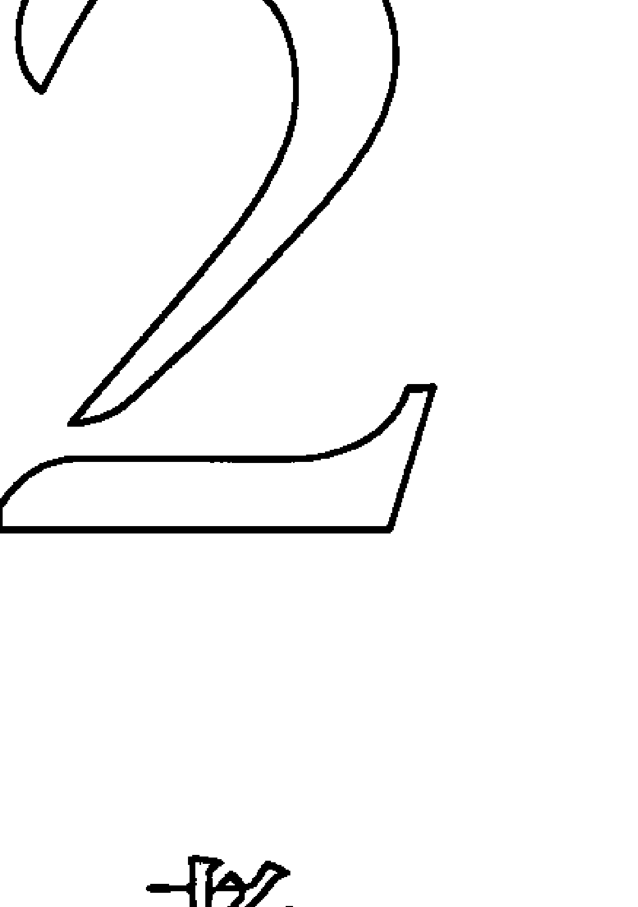

## 考驗的位置代表的内容

- ① 現況
- ② 考驗
- ③ 目標
- ④ 原因
- ⑤ 過去
- ⑥ 未來
- ⑦ 真心話
- ⑧ 問題
- ⑨ 對未來的想法
- ⑩ 結果

### Hint 1：阻礙著你的事物為何？

在〈②考驗〉的位置呈現的，是與占卜主題相關的障礙，或是令存在的問題愈發困難的事情等。藉由解讀出現在這裡的牌，可以檢視妨礙你行動的因素。雖然那也可能是存在於你內心的一堵高牆，不過首先可直接視為妨礙者或狀況等外在因素。

### Hint 2：或許是應當跨越的主題

受到這個位置的「考驗」、「障礙」、「高牆」等關鍵字影響，你或許會認為盡是些討厭的事物。然而，「安逸」、「過於美好」等乍看良好的狀況，也可能會反過來形成阻礙。這張牌呈現的是你正在面對的重要課題，因此請務必積極著手處理，想必能發揮出意想不到的力量。

### Hint 3：解讀考驗的訣竅

將出現在〈②考驗〉的牌與〈①現況〉的牌擺在一起研究，就能解讀出更為具體的內容。在原本認為「自己的現況是如此」的背後，或許還隱藏了些什麼也說不定。表面上對你而言看似有利的事物，其實卻成了阻礙……也有這樣的可能性。請試著以找出身特點的感覺來解讀看看。

## -②- 考驗

出現的是：

所謂你應當跨越的考驗或障礙，究竟是何種事物呢？在看不見應當面對的事物姿態的此刻，可能會覺得那是非常令人恐懼的存在。然而，那會令你的人生變得意義非凡。既為重要的課題，亦是應當面對的現實。請試著確實審視。

# — MAJOR ARCANA —

### 0 愚者

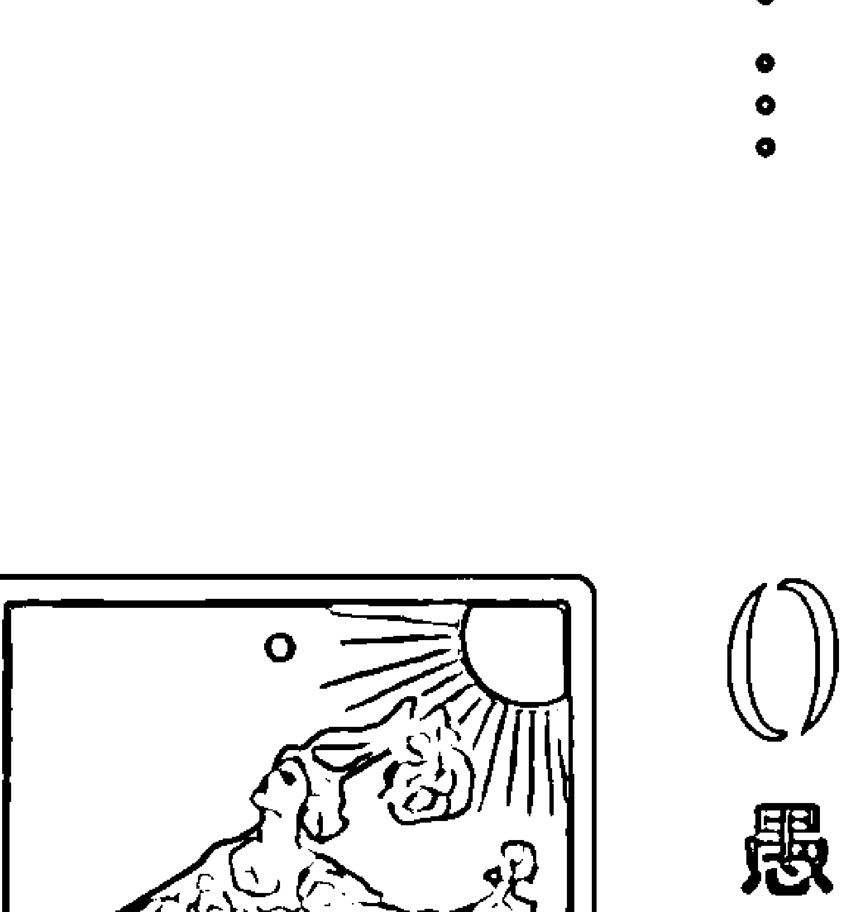

為時過早，準備不足，十分危險。你處於一切都還沒決定的狀況，可能性雖為無窮無盡，但光是如為而倉促行事則十分危險。目前仍為白紙狀態的這件事本身，或許也可能是你現在最大的課題。或許必須等到狀況稍微具體一些，或點子更具實際方向後再說。

### 1 魔術師

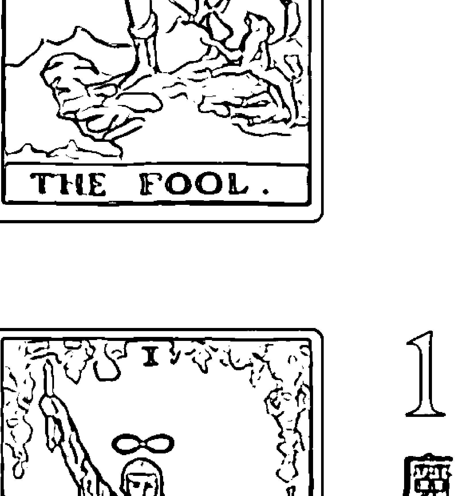

畏懼變化會妨礙成長。你的腦中會湧現各式各樣的點子或計畫，且似乎具備出色的才華或技能。不過，是否會因過於自信呢？並非沉溺於計策中……但光說不練，反而會遭人攻擊。請注意別讓聰穎淪為小聰明。

# 2 女祭司

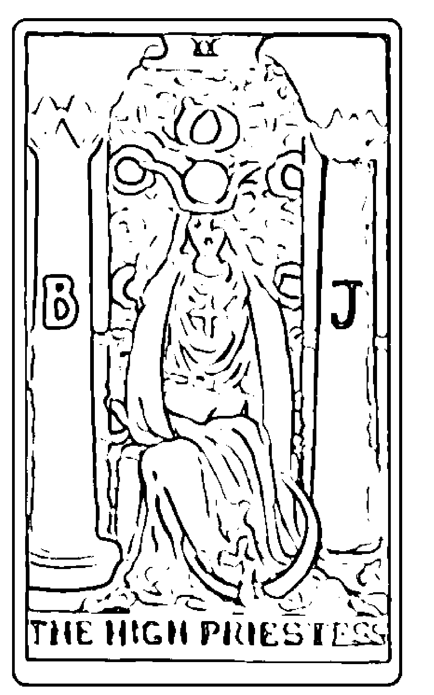

無法化為言語，尚未發酵的想法。在你的心裡有著強烈想法，然而你本身或許還沒辦法用言語表達出這份想法。那仍在你心裡發酵當中，處於曖昧模糊的狀態。請確實審視你自己的內心或目前所處的狀況，試著將真正所想的事物具體呈現，也需要蒐集情報。

# 3 女皇

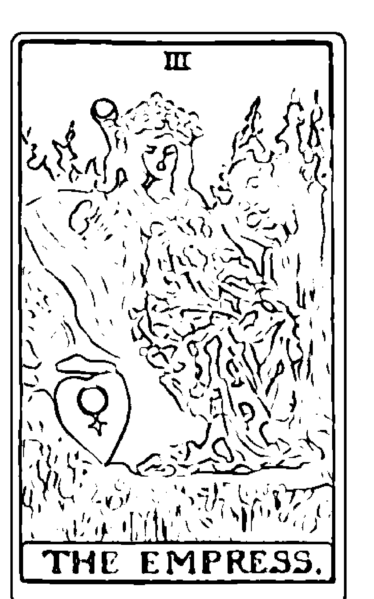

多管閒事或過度保護令人厭煩。代表母性的塔羅牌出現在考驗的位置：出於好意的心意可能會造成反效果。來自某人的好意或許會令你覺得多管閒事，愛情則會令你感到拘束也說不定。此外，也可視為與親密對象之間產生的「依賴」，反而妨礙了你前進。

# 4 皇帝

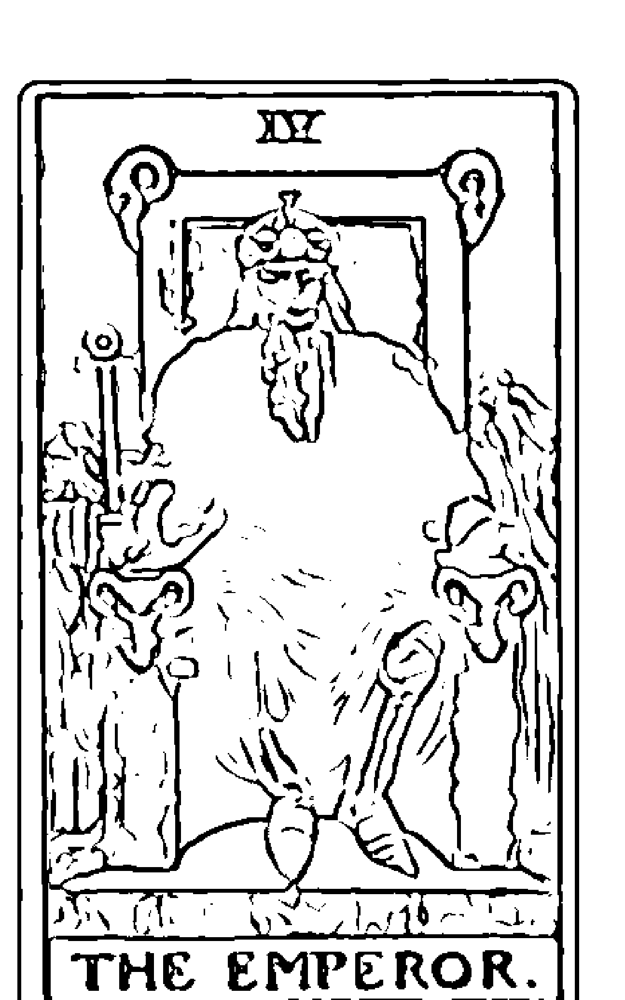

無法超越具備力量的存在。具壓倒性的力量、在各方面均會下達決策的存在正強烈地影響著你。由於無法超越那股力量，又可能導致問題無法解決，因此令你感到無力。而且對方或許會在你要執行某些事情時，究竟能多認真負責一事抱持疑問。

# 5 教皇

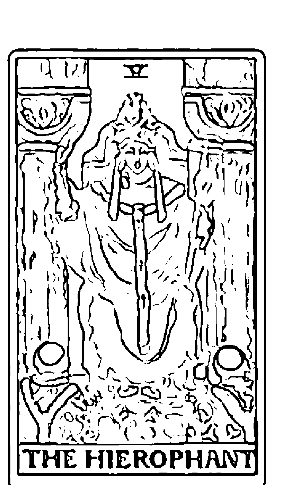

讓自己擺脫洗腦，具備更開闊的眼界。強大的成見似乎正控制著你。你至今為止所受的教育、學習到的事物、認為正確的內容，或是源於你所尊敬之人的教誨……這類事物皆可能使你的眼界變得狹隘。試著讓自己擺脫洗腦吧！

### 6 戀人

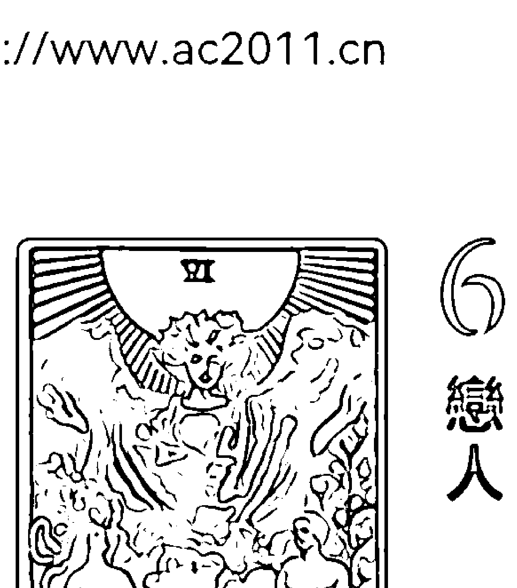

你想將喜歡的事物全部得到手的態度，會被解讀成自私，而可能導致周遭人們的反感。為了替這類爭執作個了結，你必須整理原本曖昧模糊之事，將範圍濃縮為一項。這麼一來就能過著沒有糾紛的愉快日子。

### 7 戰車

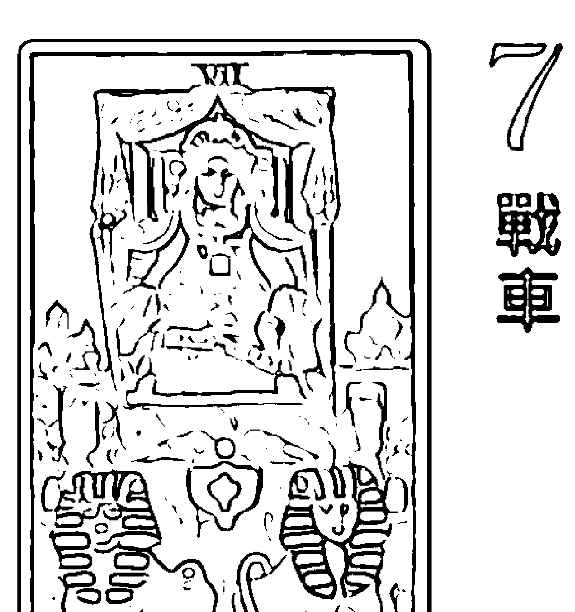

由於事物更迭迅速，導致你感到混亂。或許會出現某些人情緒化地對你說三道四。此外，你本身也可能會難以冷靜看待事物而失控。無法專心面對許多事，導致沒能按照計畫進行，似乎對你造成了壓力。

# 8 力量

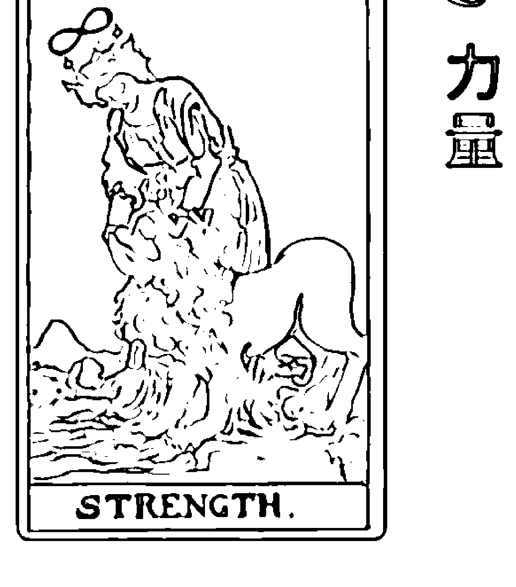

不按牌理出牌且難以掌控的存在，令你感到心煩。你或許對無視於你的忠告或勸導而向前猛衝的人感到棘手。另一方面，你本身的意志也會變得薄弱，即使有想堅持到底的事情，也會覺得「算了」而輕易放棄。內心顯得無法游刃有餘。

### 9 隱士

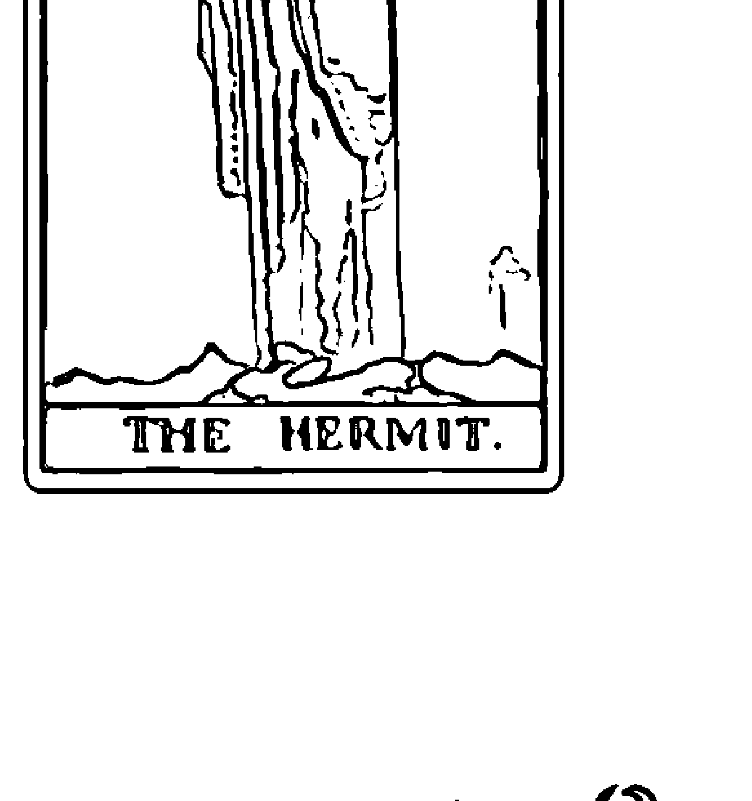

你會執著於理想，而有關於在自己的世界裡的傾向。因此容易對他人態度冷淡疏遠，或顯得固執。由於缺乏溝通，難以與周遭人們妥協，這樣的狀況倘若持續下去，就會產生「自己得孤軍奮戰」的強烈孤立感。

### 10 命運之輪

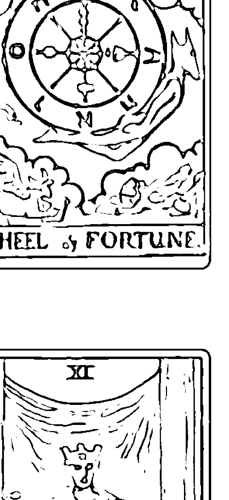

糟糕的時機和無能為力、不可抗力的意外等，凸顯出時機的糟糕。由於儘管急著將事情處理好，卻無法如你所願，而常會感到焦躁。時機似乎尚未成熟。你本身的直觀或也許產生了動搖。

### 11 正義

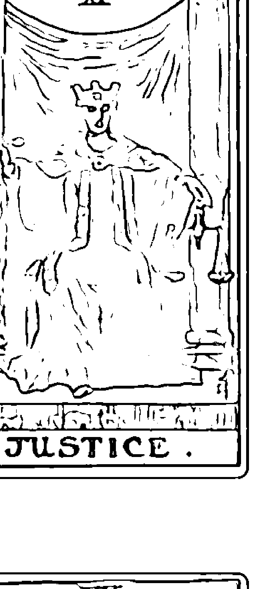

略顯八面玲瓏的態度令人難以信任。你很容易受到他人的意見擾亂。在應當下決意時變得優柔寡斷、敷衍了事或八面玲瓏，展現出令人難以信任的態度，可能會因此招致混亂。此外，你或許會心懷偏見地看待事物，導致周遭人們感到不滿。

## 12 吊人

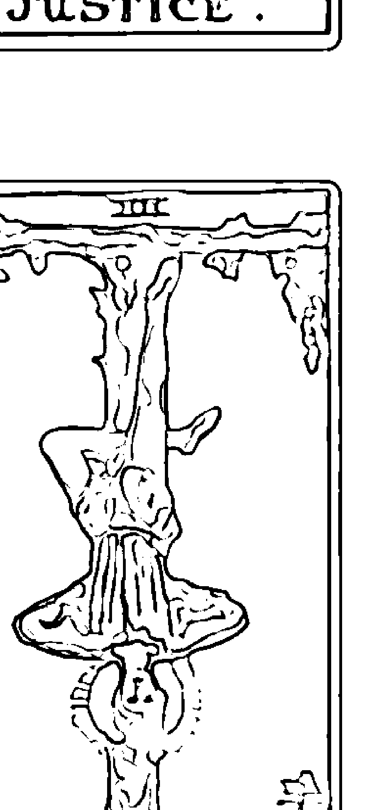

無法隨心所欲地行動，過著苦惱的日子。你似乎受到時間或距離的規定或限制，因而陷入瓶頸。你是否雖有心想跨越這些障礙，卻實在動彈不得而感到著急難耐呢？事物無法隨心所欲且如意地進展，似乎令你內心累積起痛苦難受的情緒。

## 13 死神

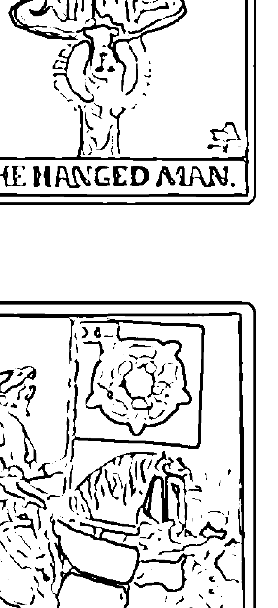

無法忘懷過去，沒能完全結束。你似乎仍無法忘懷早已完結的事，感到難以放棄而一再嘗試，無法切換心情。即使你只客觀審視就顯而易見的事，你或許仍無法接受，長期懷抱著同樣的煩惱；也可能是還執著於一樁該放手的孽緣。

### 14 節制

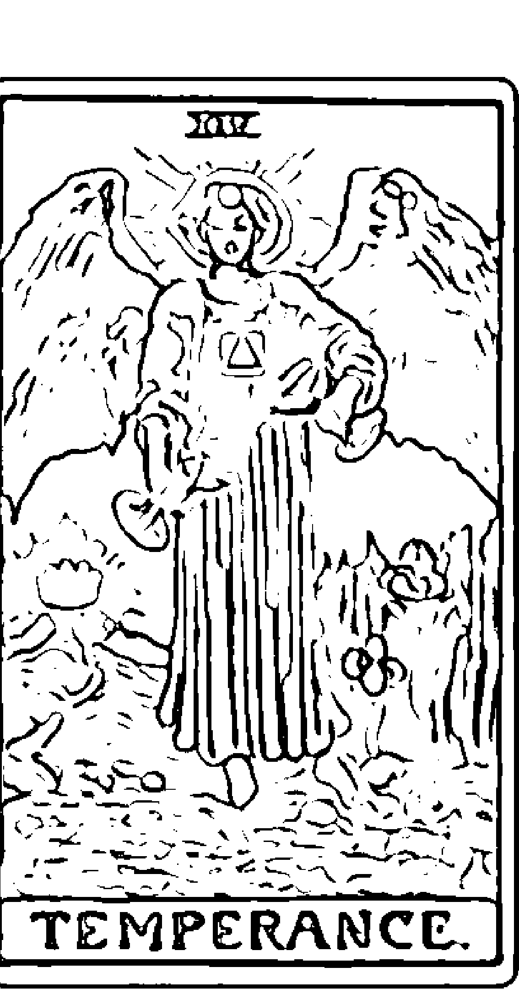

理應是一樁美德的「節制」成了障礙。你可能有無法打破自己設下的框架，凡事都只求「適可而止」安全下莊，導致無法朝下一個階段前進等情況。有時候也需要有刻意極端地掙脫一切的心情，不是嗎？

### 15 惡魔

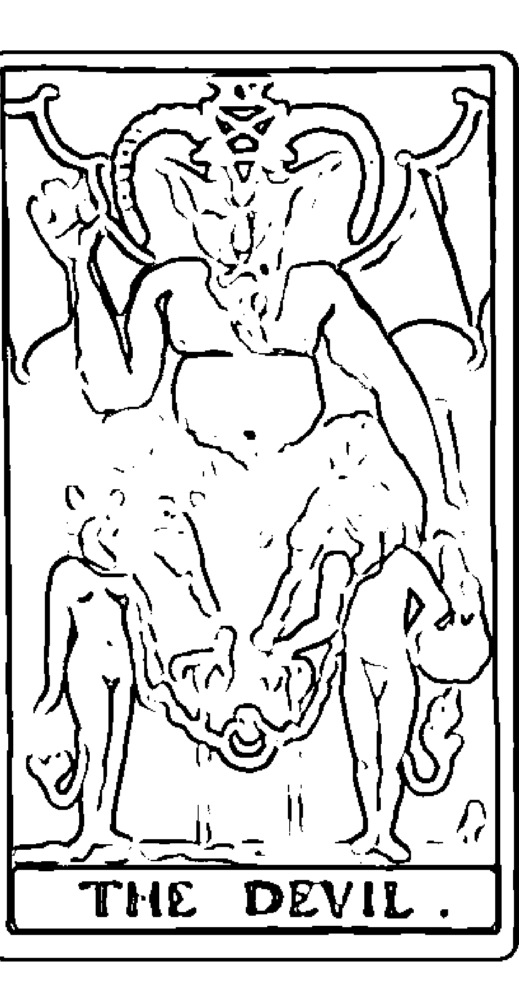

你的意志似乎變得薄弱。或許有些事儘管覺得不妥，卻仍拖拖拉拉地持續著。你是否會對自己說些藉口，比如「因為其他作法太麻煩了」、「只要我想，隨時都能停下來」？可以窺見你正一邊感受著禁忌，一邊享受當下。

## 16 高塔

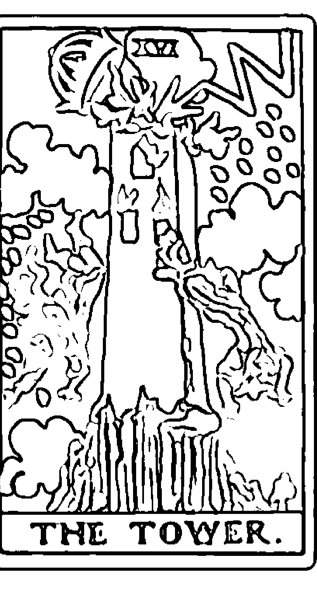

你似乎正要面臨一場考驗，足以令你累積至今的情緒或壓抑已久的欲望一口氣傾洩而出。這也暗示著低估的事物將帶來意料之外的報應，或原以為隱藏好的事物曝了光；或許會以完全沒有預期的形式爆發麻煩。

## 17 星星

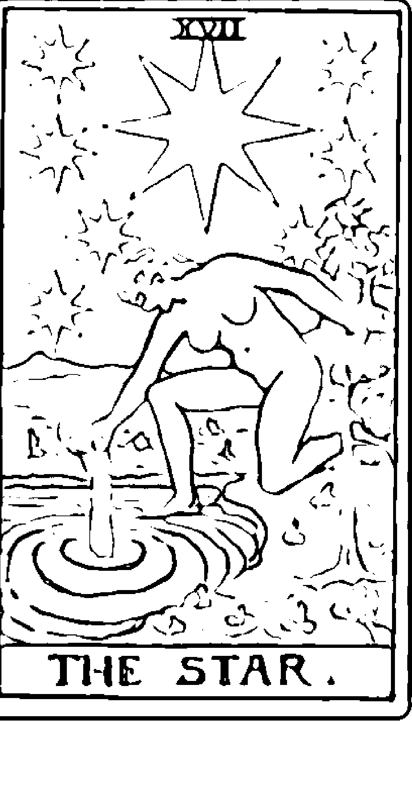

你似乎迷失了原本作為目標的事物。原先憧憬的存在從舞臺前消失，或是你本身的熱情突然冷卻下來，因而不知道該以什麼作為原動力。可能會因為重要活動的延期或中止，而導致自己的想法變得模糊，問題變得嚴重。

## 18 月亮

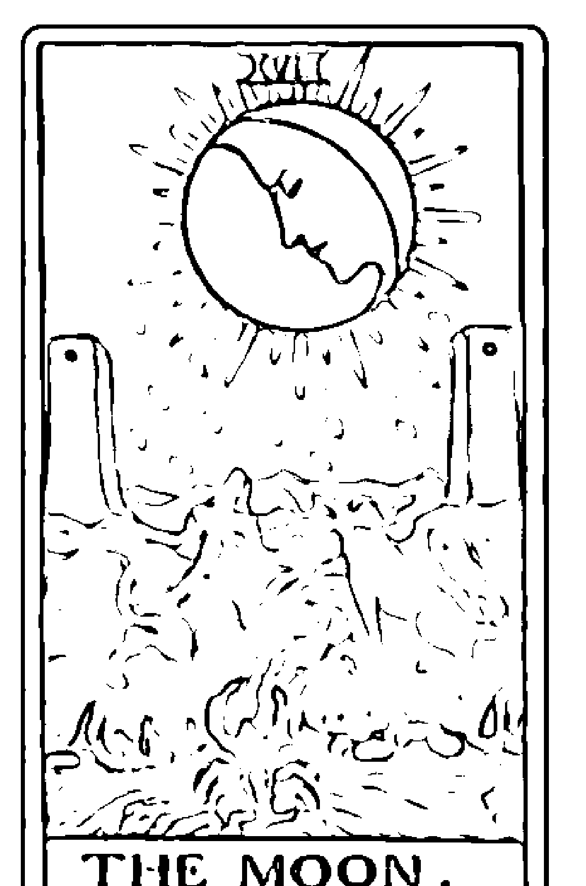

難以置信而躲進幻想世界中。你似乎正為了逃避現實，而反覆作著白日夢。不但不認真處理該盡快得出結論的事，還頻繁地躲進自己的世界裡。與周遭的關係也可能會因為缺乏溝通而變得不穩定，並對於相信至今的事情產生懷疑。

### 19 太陽

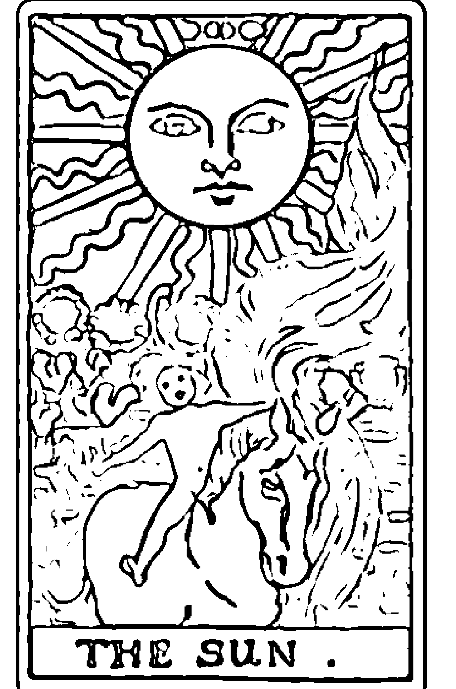

過於引人注目而飛來橫禍。你非常努力投入想做的事，導致自己過於引人注目，或許因此引來缺乏正當性的嫉妒或攻擊。當你單純地強調自己做得很好的事或自己的成功，也會被誤解為「驕傲自大」。因此需思考自己的言行舉止對周遭的影響。

### 20 審判

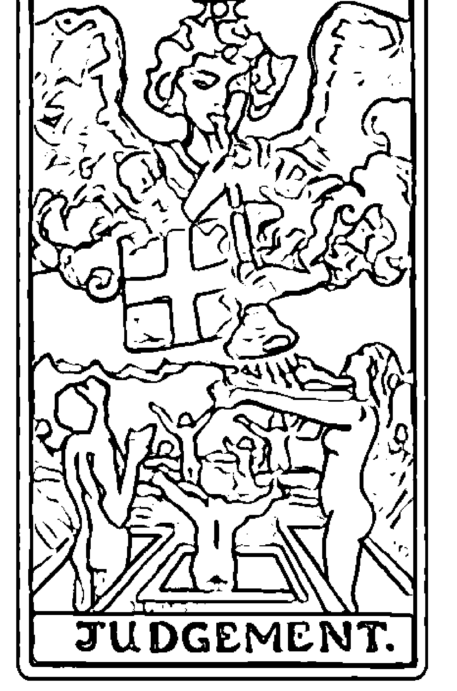

儘管期待事態好轉，想法卻很消極。你由於惦記著過去的失敗或後悔，因而妨礙到事物的進展。如果能主動斬斷這點，就能開拓道路，但對你而言似乎相當困難。你顯得想依賴外力，想著「如果沒有能夠改變的契機，自己就無法改變」，將自己封閉在殼中。

## 21 世界

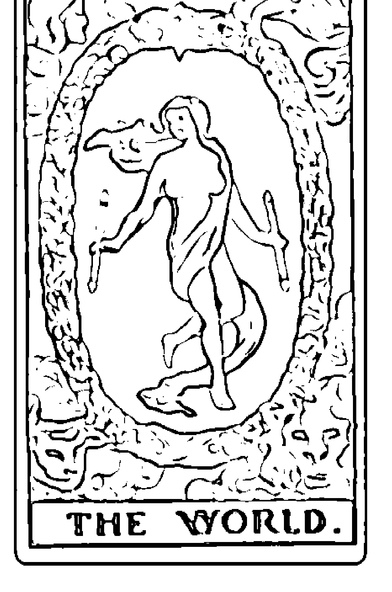

追求理想而導致強人所難。你儘管追求完美，卻似乎總是少了些什麼。這種匱乏感正存在於你所面臨問題的根源。你或許會為了獲得短暫的滿足，而做出不停遊走各地的行動。也可能因過度追求理想，而陷入強人所難的情況。

# MINOR ARCANA

## WANDS

### 權杖一：因期望與現實之間的差距而意志消沉

儘管你有想實現的事，心情上卻並未振奮到足以採取行動，或處於某些原因而無法開始著手。最後可能會淪為紙上談兵。你所期望的方向與現實中的進展狀況有很大的差距，這或許是缺乏動力的原因。

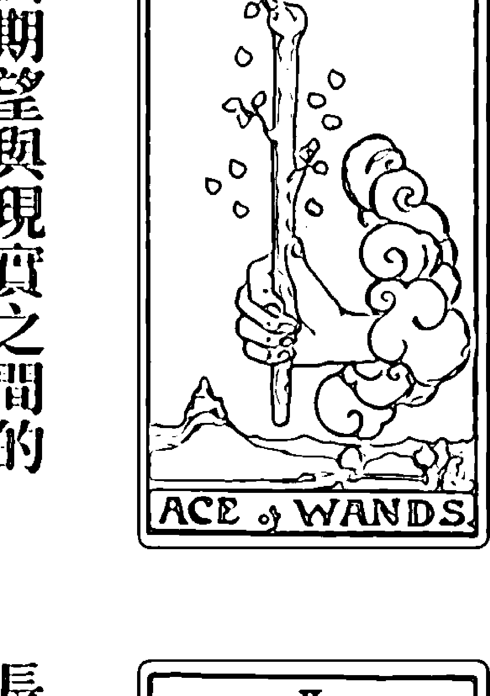

### 權杖二：長時間深思熟慮而毫無進展

處於長時間反覆討論卻得不出結論的狀態，就如一堵高牆阻擋在你的面前。你或許一直在思考著該選擇複數條道路之中的哪一條前進。倘若狀況就這樣毫無進展，捨棄一切讓狀況回歸原點，也是值得考慮的選項之一。

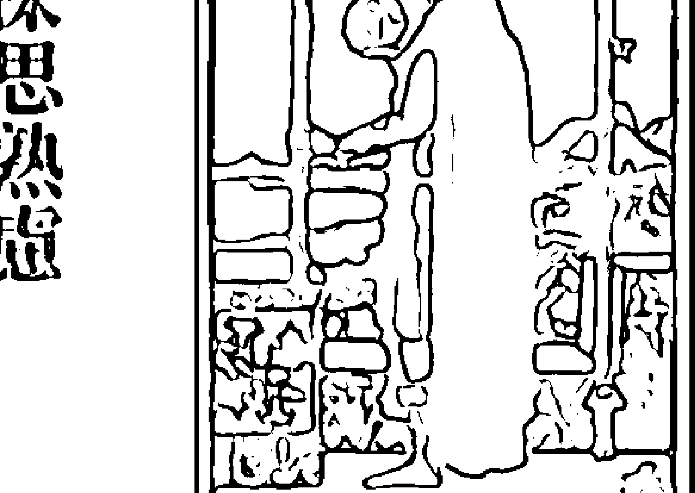

### 權杖三：無法獲得針對想法或計畫的協助

並非此時此刻，而是在今後想前進的方向上，你似乎無法獲得周遭的協助。你首先必須好好地說服眾人，然而儘管誠心誠意地仔細說明，或許還是會遭到反對。在這種時候，你會感覺到遲遲無法朝下一個階段邁進的急躁感。

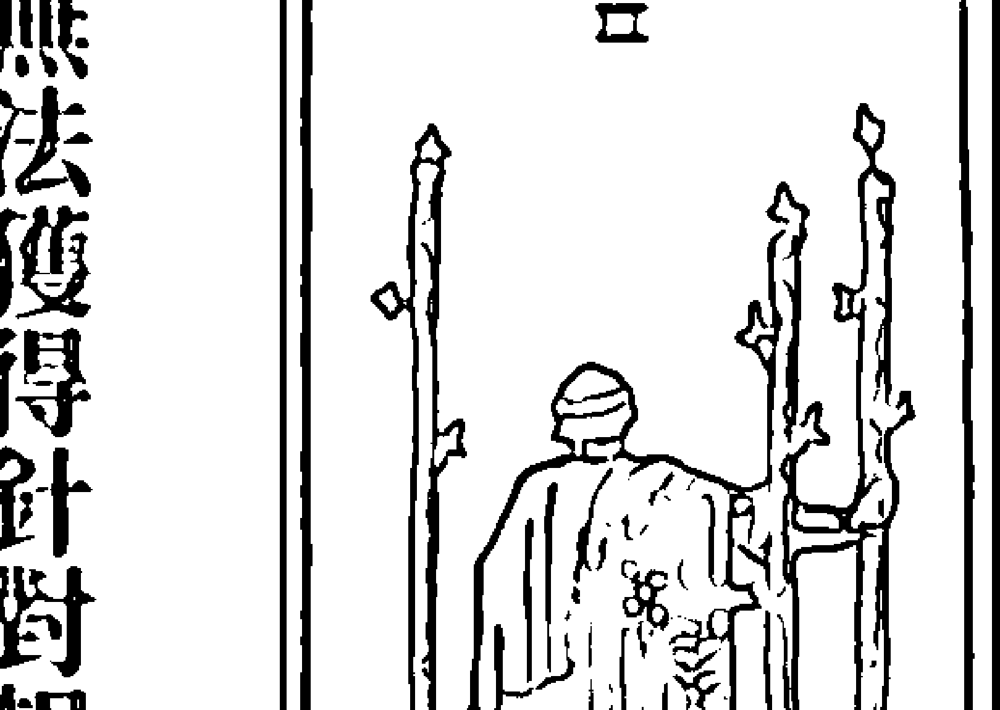

### 權杖四：避免冒險帶來的風險

你畏懼失去穩定。即使對現況感到不滿，也並未想做出重大改變，頂多只想在維持現狀的情況下，稍微做出不同的事情。雖然知道為了更上一層樓，有時也必須冒險，你卻不想肩負這個風險，這份怯懦會導致停滯。

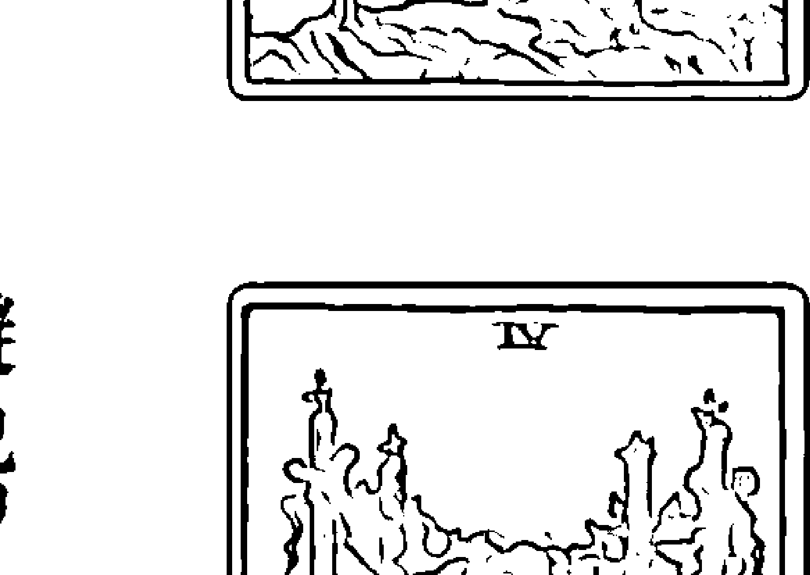

### 權杖五：來回兜著圈子而無法統整

你正感覺到混亂，與周遭談著想說的事，結果變得難以收拾。之所以會如此兜圈子，是因為沒能提出得以統整話題的好主意。你必須事先作好對策，避免想談具建設性的話題時，卻被情緒牽著鼻子走而起爭執。

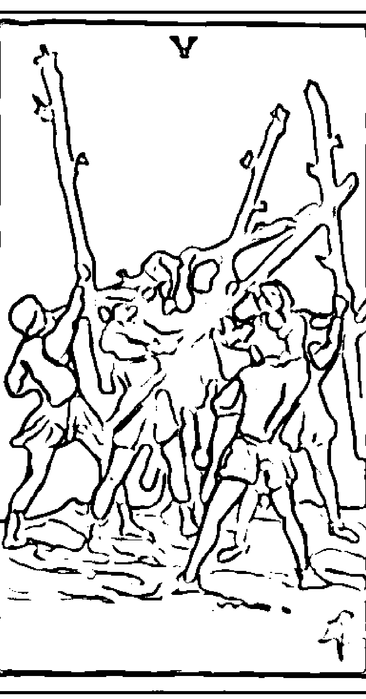

### 權杖六：顧慮周遭而迷失本質

你顧慮周遭觀感的事似乎引起了問題。渴望受到他人羨慕，或不希望失去這種狀態的想法，正妨礙著你從根本上解決問題。你顯得缺乏自信，儘管為了取勝而展現逞強的一面，卻似乎無法長久持續。

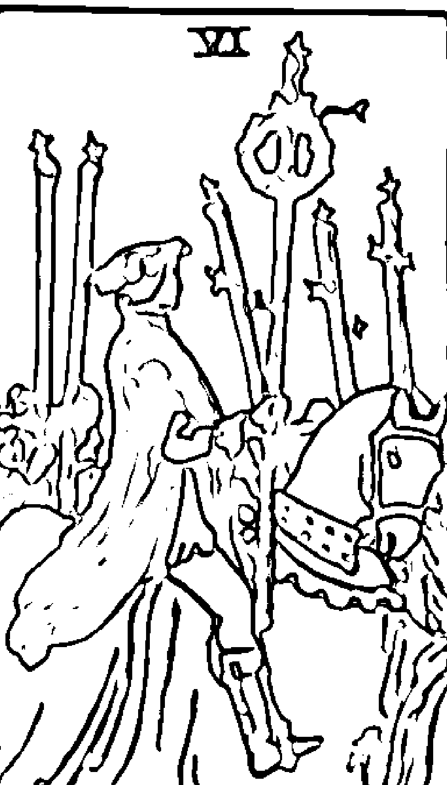

### 權杖七：與對立人物光明正大地戰鬥

似乎存在著與你的想法完全相反，或正試圖阻止你的對象。你若是想實現想法，勢必難以避開那些人，這將成為重大考驗。但你不能放棄，別想著依賴他人，必須光明正大地面對對方，傳達自己的想法。

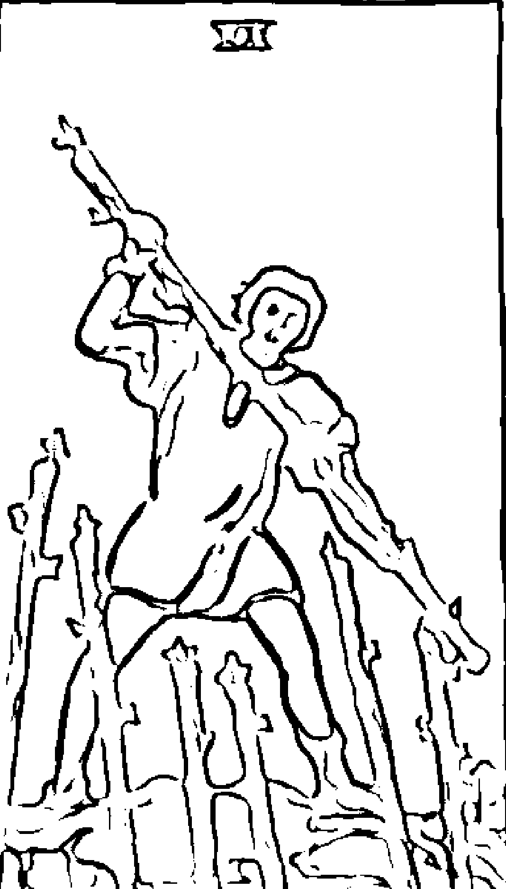

### 權杖八：迅速應對，不要拖延

有發生應當迅速應對事態的跡象。你如若察覺此刻正面臨的問題，出現了可設法解決的發展，請別拖延，應一口氣處理。如果悠哉以對，事態恐怕會在一眨眼間產生變化。緊抓住微小的機會並活用是很重要的。

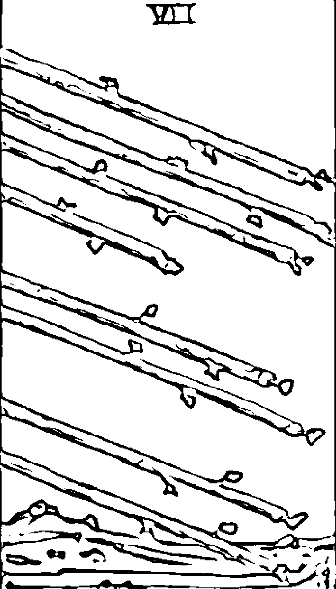

### 權杖九：下定決心是重點

你的決心不足，使問題變得嚴重，千萬不能拖延或敷衍過去。你是否真正明確地付諸實行，將大幅改變發展。前方將有非常簡單的解決方案在等著你。

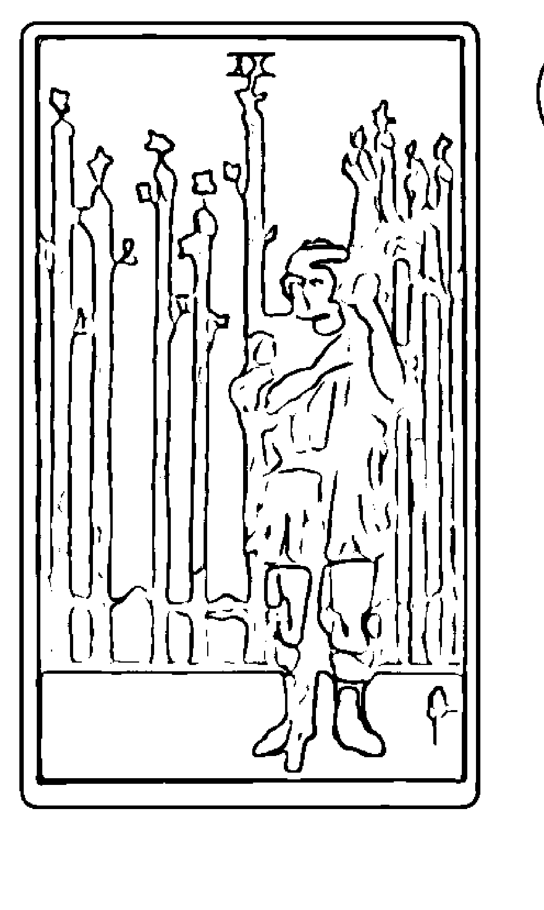

### 權杖十：情況超出了負荷

你有許多事情必須處理，情況超出了負荷。儘管想處理完畢，卻似乎無法再承受更大的負擔了。若想從根本上解決問題，必須藉由減少手上的事情、排定優先順序等方式加以調整。卸下肩上的負擔吧！

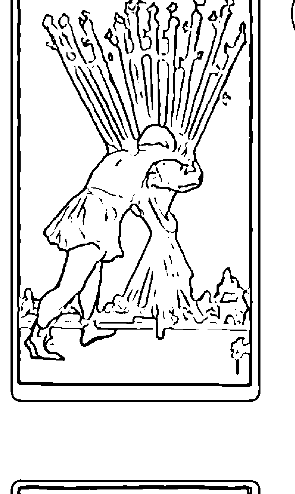

### 權杖侍者：意想不到的發展或嶄新的邂逅

你似乎會面臨意想不到的發展或嶄新的邂逅，因此可能疲於處理目前對峙的問題。即使為了實現目標而努力至如今，此刻的熱情或許已不復以往。心意改變可能會使你繞了遠路。

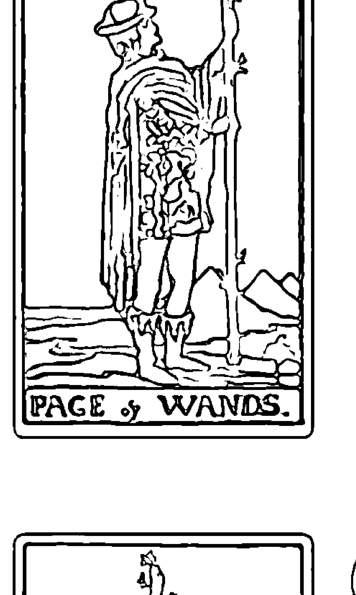

### 權杖騎士：一時興起而採取的行動

你因為一時興起而採取的行動，似乎會導致無法回頭的結果。如果在你身邊有領導能力強的人物，可能會有被對方耍得團團轉、不得不遵從的狀況。你本身明明不希望忙得團團轉，卻會陷入難以抗拒的流勢中。

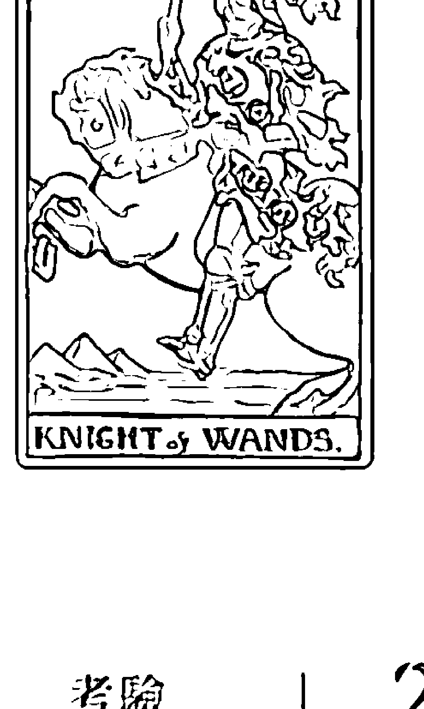

### 權杖騎士的另一面：固執形成高牆

你似乎非常不希望自己努力或忍耐至今的事情白費工夫，而這份驕傲或自尊，其實真正形成一堵高牆。正因為重視至今而不願退讓、認真面對而不願妥協，但這份固執意志反而限縮了在你面前拓展開來的可能性。

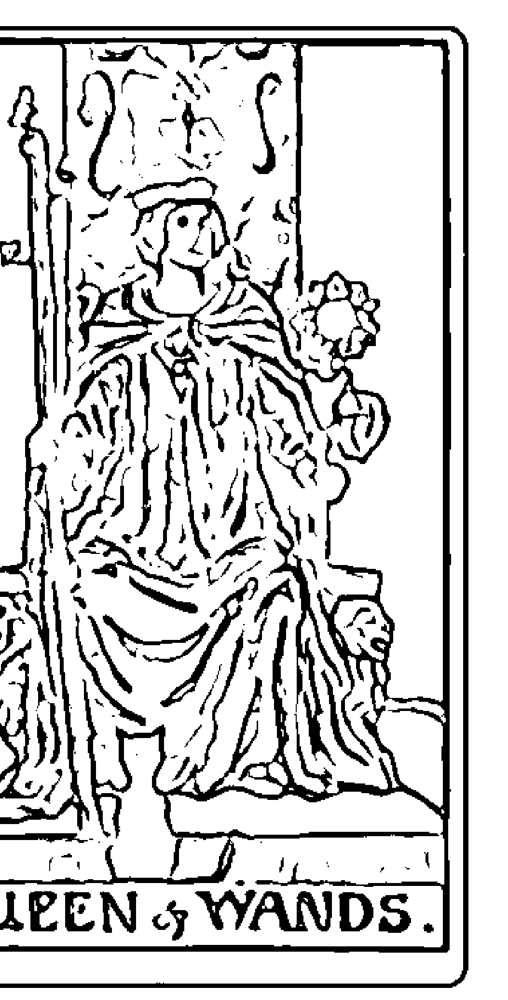

### 權杖騎士的困境：被無法抗拒的存在奪走自由

你正被無法抗拒的存在奪走了自由，受到強勢的意見左右、被對方的步調牽著鼻子走，使得自己無法取得主導權，而成為壓力的根源。可以窺見這是源於你對對方的畏懼，而使得內心萎縮起來。

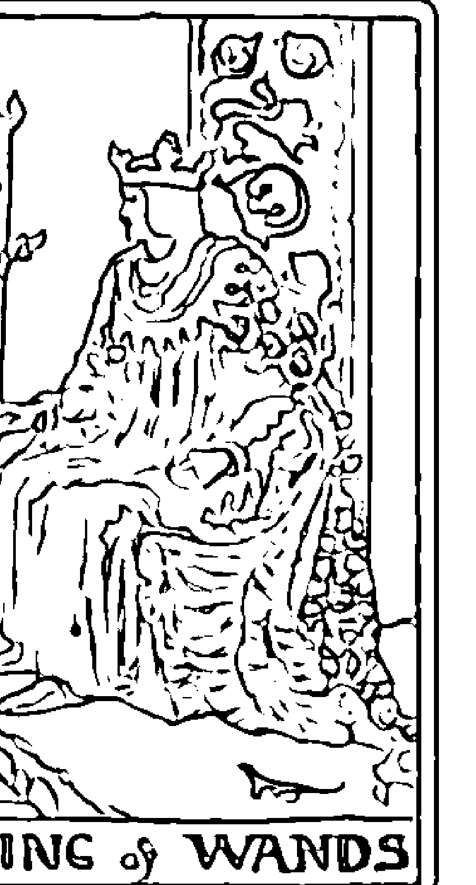

## MINOR ARCANA — CUPS

### 聖杯一：想法單純卻適得其反

你明明正朝著理想努力，發展卻似乎不如預期，而導致你十分焦躁。你出於好意的想法可能會適得其反，導致問題變得嚴重。自己單純的想法無法受到周遭接納，似乎對你造成龐大的壓力。


### 聖杯一：親近的人物成為意想不到的障礙

與你構築起良好關係的對象，可能會成為障礙。會因為遲遲等不到需要的聯絡、意見不合等溝通過程不順暢，而陷入瓶頸。至今為止對等的平衡正開始崩潰，存在其中的或許是競爭意識。

### 聖杯二：步調不一致而沒有進展

由於無法順利調整，使得你不得不維持著現狀。即使想與周遭步調一致，也會因為每個人都各有不同而難有進展。即使你自認是想出力協助，也會被認為是想將意見強加於人，或是陷入「三難困境」一般的膠著狀態中。


### 聖杯三：消極處理事態的氛圍

你內在的聲音似乎正在踩著煞車，勸你與其採取行動，不如維持現狀。你察覺到自己的活力幹勁變得低落，似乎也相當疲態。展現出「儘管對現況感到不滿，卻遲遲無法改變現況」的慣性的一面。


### 聖杯四


### 聖杯五：意識容易傾向負面消極

引起你目前面臨問題的主因，在於過度在意令自己感到不滿的事，而難以對事物抱持好感。你或許會顯得有些自暴自棄，下意識地否定了改善現況的優點或積極正向的想法。


### 聖杯六：封閉於空想的世界裡

你懷著矛盾的想法，認為談論夢想雖然有趣，卻畏懼加以實現。不過，如果不如越這份糾葛，可能就只是心裡期望著，卻永遠不會實現。若不希望夢想以白日夢告終，就得採取某些行動，只要踏出一步，狀況會大幅改變。


### 聖杯七：見異思遷而分散精力

你的注意力散漫，無法將要做的事聚焦在一件上。由於想珍惜自己所想到的一切，導致精力分散，結果一事無成。此外，你也有下意識地不想承擔責任，而將重點託付給別人的傾向。你現在需要的是整理思緒及內心。


### 聖杯八：見異思遷導致成功離你遠去

你現在面臨的問題，根源在於容易見異思遷。若是在最後一刻放棄，就需要很長的時間重建失去的信譽。然而，如果是在經過深思熟慮後才決定放手，那就是正確的選擇。你需要有意識地作出抉擇。


聖杯九

你現在的煩惱或許並非達成目的的問題，反而是達成之後的不安。你有著想實現願望、想隨心所欲地生活的強烈欲望，而看不見實現之後的生活會如何。出於虛榮心或好勝心的欲望，無法導向真正的幸福。

聖杯十

你稍微有些輕浮過頭的傾向。如果你正在挑戰考試或面臨競爭相關的事，切莫輕忽大意。在達成目的之前，你需要保持嚴以律己的心情，並稍微逼迫自己努力。倘若流於依賴周遭的溫柔，就結果而言會感到後悔。

聖杯侍者

你此時正被前所未有的酸甜悸動所吸引，那種輕飄飄的感覺彷彿初戀一般。這或許會導致你無法以現實的角度面對夢想或目標，而莽撞地作出決定。即使如此，你也會膽小得在關鍵時刻裹足不前。

聖杯騎士

你有著容易受浪漫話題或令內心悸動的計畫吸引的徵兆。然而，如果不具體，還是別過於深入比較明智。請在正視現實的情況下思考，否則反而會繞多餘的遠路。即使是看似具吸引力的資訊，也必須仔細查證。

聖杯王后

評價過高而導致嚴重疏漏

你容易對自己所感興趣的事物有過高的評價，或許會因此導致在問題變嚴重時也察覺不到；也可能是視而不見，助長了狀況惡化。不過，只有溫柔並無法稱作愛情，有時表達嚴厲的意見也很重要。

聖杯國王

切莫盲目相信，應自行調查

你似乎在精神上仰賴著自己由衷信任的對象，如果強烈受到那個人的言論等方面影響，毫不懷疑地照單全收，總有一天會後悔。請養成仔細調查、驗證正確與否的習慣，不能隨便糟蹋自己。

MINOR ARCANA | SWORDS |

寶劍一

無法作出決定而維持現狀

明明到了只需作出決定的階段，但你卻遲遲不作或無法作決定。儘管冷靜，但被迫下決定的壓力令你感到強烈不安。或者是還有令你難以接受的部分？然而即使維持模糊不清的現況，仍無法避免痛苦。

寶劍二

外在態度與真正想法有所齟齬

你的腦中有著許多想法，可以看得出已經失衡。如果能專注於一件事上，就有指望迅速發展，然而你儘管看似有幹勁，實際上卻並未完全作好心理準備。由於你不會將真正的想法表現出來，似乎很難獲得協助。

寶劍三

難以忘懷悲傷而避免冒險

由於你無法從過去的重大悲傷或心理創傷中重新振作，導致目前的問題變得更加困難。無法切換想法，也有避免冒險的傾向。你會屢屢將現況與過去的模式重疊，由於不想重蹈覆轍而變得膽怯。

寶劍四

時機糟糕而無法面對

你似乎在情感上有著複雜的情況，而無法正視問題，稍微需要一段時間。即使是必須當面商議的情況，也會莫名地想要逃跑；也可單純地說是時機糟糕。你似乎試著躲進自己的內心以確保可以待在安全的場所。

自我主張 並未朝好的方向發展

你確實表達自己的心情或採取行動，這點本身並不壞，然而似乎因此造成了某些弊病。好不容易鼓起勇氣提出自我主張，卻也可能造成負面影響。這或許是由於你的傲慢所導致。

在全新流勢中引起風波

流勢與至今為止有所改變的情況，似乎引發了問題。你新引進的價值觀，或許會被周遭的人認為不合常理。此外，也可能會因為不適應環境或狀況的變化，而對你造成極大的壓力，似乎令你產生了想逃避現實的心情。

| 位置 |
| :--- |
| 1 |
| 2 |
| 3 |
| 4 |
| 5 |
| 6 |
| 7 |
| 8 |
| 9 |
| 10 |

需要注意 表裡不一的人物

在你身邊似乎存在善於區分表裡兩種面貌的人物。對方並非壞人，但由於發言表裡不一，不要照單全收才是聰明的作法。對方可能會以溫柔的話語令你放心，並將事情導向對自己有利的方向，如果稱了對方的想法，就會對你造成損失。

想太多是負面主因

你有著過於嚴肅看待事物的傾向。在你身邊似乎存在著會小題大作的人物，儘管是原本能輕易解決的問題，也會大吵大鬧、誇大其詞。你會不可避免地受到影響而想太多，導致事態變得複雜，請保持自己的頭腦清晰。

寶劍九

自我憐憫 而導致狀況惡化

請注意自己的思考，你或許將並沒那麼糟糕的現實想得極為嚴重。只要以「事情能順利進展」為前提，眼前所見的景色就會有所改變。即使沉浸於悲劇女主角的情緒中也毫無意義，你應該是很堅強的。

寶劍十

品嚐震撼的考驗時刻

在你身上可能會發生令人難以振作的衝擊性事件，請別將此事視為「終結」，而是當作「考驗」。即使是看似窮途末路的危機，你應該也有能力加以克服。而來自周遭的否定話語，事後或許也能理解箇中意義。現在正是蛻變重生的機會。

寶劍侍者

被小惡魔般的存在所玩弄

你似乎處於被腦子動得很快且伶牙俐齒的人物擾亂的情況。由於可能獲得許多刺激，只是稍微打交道倒還無妨，但切忌深入往來。此外，你也可能對具吸引力的事物傾心，而白白浪費時間，頃刻間的愉悅請適可而止。

寶劍騎士

即使忙碌，蒐集群報 也很重要

你愈是朝著目標而努力，似乎就會變得愈忙碌。一旦稍微不注意或偷工減料，就可能導致情況一百八十度地改變，需要小心注意。此外，如果疏於蒐集群報，就會無法作出適當的判斷，請從各個方面蒐集群報。

接受真相 以從根本解決問題

你身邊的人會對你說些不中聽的話，如果情緒化地加以反駁，就會錯失成長的機會。因為對方應該會提供具現實性的建言，請你努力接納其話語中的真相。逃避並不能從根本上解決問題。

| 位置 |
| :--- |
| 1 |
| 2 |
| 3 |
| 4 |
| 5 |
| 6 |
| 7 |
| 8 |
| 9 |
| 10 |

對無法抗拒的常識 感到無力

你似乎快被正確言論擊垮，或是被社會上的常識所吞噬也說不定。你的意見等事不被接納，似乎令你失去了自信。這是為了實現你的願望所需面臨的考驗，但根據接納方式而定，或許會對你造成嚴重的心理創傷。

MINOR ARCANA | PENTACLES

錢幣一

經濟方面的不安使你滋生執著

你的行動，你會因為討厭手頭上的錢減少而加以忍耐。或許也會對事物有強烈執著，即使是該放下的事物也放不了手。可以看得出你並不信任自己的賺錢能力，也因此無法爽快地給予周遭某些事物。

錢幣二

無法兩立而失去平衡

工作或興趣、戀情、家務事等，儘管希望有這些事能兩立，卻無法順心如意。你目前雖然設法讓事態處於勉強能應付的狀態，卻因為過於忙碌而無法調整行程，導致心情容易陷入低潮，身心狀態因此逐漸失衡。

錢幣三

渴望獲得評價，以滿足受認可的慾望

儘管你希望自身存在確實獲得認同，卻無法實現，似乎因此累積了挫折感。是否也因為無法獲得渴望的地位或期望的收入而感到不滿？你或許正擔心自己明明竭盡全力在行動，收穫卻相對地少。

錢幣四

逃避全新挑戰，使世界範圍縮小

你有著想避免風險的強烈想法，似乎認為沒有必要冒著失去既有的事物的風險，投入全新的挑戰。認為「維持目前狀態更有趣，沒有比這更好的了」這樣的想法，會令你的世界範圍愈縮愈小。

無法具體實現 而考慮仰賴外力

你在精神及物質上都處於心裡沒底的狀態，可以說是尚未作好可實現願望的準備。因此你心懷天真的想法，希望能獲得他人的援助，或成為自己的心靈支柱。你過於低估自己，並未發現自己原本擁有的力量，這點，正在剝奪你的生存意志。

更能發揮才華的道路

你試圖注意到各式各樣的事，並平等對待。乍看之下似乎是很棒的態度，然而卻會因此無法專心投入在特定事物上，而導致分心散漫的狀況。這麼做或許會受人喜歡，你的才華卻也因此無法充分發揮。其實你應該可以做得更好才是。

沒有回饋感而累積壓力

你雖然存在著目標，但是當你置身於現實當中，似乎就會覺得失去目標意識；也會因為人們對你的意見或主張置若罔聞、沒有回饋感而覺得焦躁。沒人認真聽你說話或沒有共鳴的狀況，會成為你的累贅。

除了該做的事， 對其他事提不起勁

這張牌可以看出你對某些事充滿熱情地投入，卻無心面對其他事。自己在做的事處於明確掌握且滴水不漏的狀態。然而儘管在解決問題上需要從許多角度去思考，你卻難以掌握新的觀點。即使獲得好的建議，或許也不會銘記在心。

從目前所在之處 起飛的勇氣

對你而言，目前所在之處或許是非常舒適的環境。然而，其實你已經開始感到無趣了不是嗎？儘管在經濟上或精神上都感到滿足，留在這裡卻未必能有所成長，反而可能因為毫無變化而導致心生不滿。

被重要對象干涉 而感到煩惱

你的家人或親戚可能會干涉你的選擇。或是你在工作上無法違抗上司，導致自己逐漸失去積極熱情。自己想做的事被重要的人反對，想必很難受。畢竟當中存在著羈絆，這份關係無法輕易割捨。

想法純粹卻有高風險

這張牌暗示著你雖然不知道未來會發生什麼，卻想全力以赴地投入到充滿可能性的事物上。你的想法純粹且綻放著光芒，卻可能會因為無法擬定腳踏實地的具體計畫，而導致中途受挫。空有熱情或誠實不足以彌補，有時也會徒勞無功。

掌握機會的時機 相當重要

你試圖穩扎穩打行事的想法會適得其反，導致妨礙發展的速度。儘管機會到來，卻有錯失良機的可能。作法謹慎仔細確實能獲得成功，然而目標如果近在眼前，某種程度的速度感也是很重要的。

錢幣王后

某人從經濟方面上加以干涉

這張牌暗示著會出現從經濟觀點干涉你的存在。雖然對方提供了「應當儲蓄」、「應當停止浪費」等建言，但對你而言是多管閒事，因你也很清楚金錢的重要性。而對方之所以說出如此理所當然的話，足以顯見對方的不安。

錢幣國王

思考能力被剝奪，尋找可靠對象

你似乎會因為肩負重大責任而感到內心鬱悶，這股壓力剝奪了你的思考能力。因此你對目前面臨的問題完全想不出任何解決方法，只想尋找某些可靠的對象。但你永遠不會忘記這些協助過自己的人的恩情。

當答案難以理解時……

儘管使用凱爾特十字牌陣確實地占卜了，或許仍會對於自己的解釋方式是否符合缺乏自信，或是產生新的疑問。這種時候，你也可以試著再加抽一張牌作為提示。

在抽出十張牌展開牌陣後，再一邊想著「請給我提示」，同時從牌堆中加抽一張牌。仔細凝視著自己抽出的牌，在這過程中就會浮現足以掌握整體涵義的提示。

不過，當在十張牌中有一兩張無論如何都捉摸不著涵義時，也可以運用這個方法。比如說，當你對於出現在〈⑧周遭〉位置上的牌面涵義摸不著頭緒時，就可以試著在這張牌旁邊放一張加抽的牌。就將這種牌取名為「額外牌」吧，加上這張牌，應該就能弄清當下的牌面涵義了。

但是，千萬不能濫用這種名為額外牌的技巧，如果你只是稍微思考一下，就覺得「我搞不懂，再抽一張好了」，只會加深自己的混亂罷了。這項技巧終究只能在你經過審慎思考，卻仍難以從牌面意象掌握涵義時，才適合使用。

此外還有一種作法，是在凱爾特十字牌陣中縱向排列的四張牌（從〈⑦真心話〉到〈⑩結果〉）旁，全部再加抽一張額外牌。尤其在出現了兩種行動為選項時，就可試著以兩排縱向牌分別代表行動A的情況、行動B的情況，要不要試試看？

POSITION

目標

3
目標的位置
代表的內容

Hint 1
顯示出夢想或理想

在〈③目標〉的位置呈現的，是你希望今後在占卜主題上發展成什麼樣子，或是理想的形象。那或許是你平時認為「這種事我辦不到」，而兀自踩下煞車的事物。此外，對於平時總是受限於「自己該要這樣」的框架裡的人來說，看到出現在這個位置的牌時，或許會有摸不著頭緒的情況。請試著研究各種可能性。

Hint 2
你原本應當前進的道路

當你看了出現在這個位置的牌卻難以接受時，請試著以「如果毫無限制的話，想要實現什麼事」的觀點來檢視。你目前視為目標的事物，或許並不是你真正的願望。卸除了社會上的立場、常識或周遭的視線後，浮現出來的事物很有可能才是你原本想要前進的道路。

Hint 3
解讀目標的訣竅

如果想更明確地了解，解讀時建議可以對照〈④原因〉的牌。你心懷的糾葛或挫折，或許會令你難以看清自己真正想實現的夢想或目標。如果在這裡出現了帶有負面涵義的牌，就可以解釋成你害怕演變成這樣、想改善這樣的情況。

目標

出現的是：：：

這個位置所顯示的是你正在抬頭仰望的事物，想在遠處發現的事物。先不討論能否實現，關於當前的問題，你所描繪想像的事物，以及推動著你向前邁進的動力源泉，都會在此展現。

MAJOR ARCANA

0 愚者

尚未作出任何決定，而想保持自由不受拘束。你希望自己能夠不受任何事物拘束，保持著自由，這就是你的理想。一旦被排定了未來的日程，你是不是就會覺得心情鬱悶呢？在人際關係上，你也認為必須履行某些義務或達成某些約定是一種負擔，而想盡可能地保留未來的可能性。

1 魔術師

人生整體而言非常積極。你積極進取，想讓自己的人生提升到全新階段。正在描繪著「今後」的未來，比如說想與重要的某人關係更進一步，或是提升自己的技能等。似乎也希望自己能成為某些方面的權威，在只有自己辦得到的事情上開疆闢土。

2 女祭司

你很重視冷靜傾聽自己內心的聲音，無論何時都不會受到周遭的意見所迷惑。即使有些事並非出於本意，你也會希望藉此了解真正的自己，以期在精神上有所成長。比起對外表明，你似乎更想讓真正的想法在內心慢慢成熟。

3 女皇

你正在期待著累積至今的努力得以化為肉眼可見的成果。想藉由實現願望，與重要的人分享活著的喜悅與樂趣。此外，你也強烈地想滿足內心的母性。

4 皇帝

你的目標是成長為領袖者，並確實作好了心理準備，要肩負隨之而來的責任，試圖遵守秩序及規則開闢道路。或許也想誇耀自己的力量。同時，你也期待著比自己更能發揮強大領導能力的人物出現。

5 教皇

你似乎暗自期望著能在自己現在所做的事、持續至今的事情上了解人生的意義。想要加深精神性、鍛鍊思考能力，以提升自身價值……這樣的想法十分強烈。此外，你也希望有某個人給予自己明確的建言。

### 6 戀人

邂逅令你傾注愛情的 某種事物
你正期望能邂逅自己耗費一生也無妨、能令自己心懷熱情地投入其中的某些事物。並期待著自己能在目前行走的道路前方，發現能令自己燃燒靈魂的人生主題或長處。這當然也暗示著對於戀愛或浪漫的憧憬。

## 7 戦車

想要朝著目標繼續挑戰
你有著想竭盡全力達成宿願的強烈念頭，相當貪婪地想要實現願望。因此你總是要持續成長、繼續積極行動。儘管目前的實力不足，仍然充滿幹勁，不放棄地繼續挑戰。

# 8 力量

為了接近理想中的自身形象而努力
你希望自己無論處於何種狀況下，都能掌控理性與感性。努力地避免受偏見或臆測束縛，柔軟沉穩且有毅力地應對問題。在你心目中的自身形象十分明確，並且似乎以「總是受到周遭信賴」作為目標。

# 9 隐士

找回自我的獨處時光
你希望能遠離喧鬧的空間，擁有獨處的時光。步調很快的日常生活或令你感到疲憊。你想找回自己內心逐漸迷失想法，是冷靜的表現。你正殷切期盼著傾聽自己真正想做的事，並珍惜自己的世界。

### 10 命運之輪

追求變化而加以挑戰
你正在追求著巨大的變化。儘管不知將會如何變化，你仍期待著會令事態一百八十度轉變的人生轉機。也可能會為了尋找突破現狀的契機，而挑戰各式各樣的事物。你正虎視眈眈地盯著幸運機會不放。

### 11 正義

為了前進而作出公平的判斷
你希望能公平地判斷任何事，或是被人如此判斷。認為毫無偏頗而圓滑的狀態才是理想的。為此，你或許需要不流於感性地對原本曖昧不清的事物作出了斷，或面臨割捨某些事物的艱困抉擇。

## 12 吊人

忍耐的經驗會令人成長
你相信只要接受現況、靜靜忍耐，未來就會為你敞開。面臨難以抉擇的狀況時不會勉強，沒有贏面時也不會流於情緒化，並具備認輸的勇氣。儘管或許會看不見前進的道路而動彈不得，但你相信痛苦的前方會有光明。

## 13 死神

打破窠臼，成為全新的自己
你想要破壞一切，從零開始。正試圖藉由捨棄執著或徒勞以打破自己的窠臼，一改至今為止的做事方式。你似乎希望清算過去，重生為全新的自己，為此也做好了面對巨大變化的心理準備。

### 14 節制

希望緩慢地產生變化
正因為仔細考慮了自己的目標，你期待能緩慢但確實地產生變化。在與對立人物的互動下，或是被迫接納嚴峻的事態當中，你仍然希望、能一點一點地朝著自己期望的方向前進。比起速度感，你更重視仔細確實。

### 15 惡魔

追求刺激，解放欲望
你渴望著擺脫理性，順應自身欲望，過得更快活。儘管不知未來有著什麼、會發生什麼事，仍想擺脫社會上的規則或嘗試，品嚐更多緊張刺激；也會因為追求刺激，而作出擺脫社會倫理觀念的行為。

## 16 高塔

灰心或震驚是為了轉變方向
為了突破自己無能為力的狀況，你暗中期待著意料之外的事件發生。你有著儘管會因此大為灰心或震驚，仍希望能轉變方向的事物；也可能會因此強行採用新的事物。

## 17 星星

希望能設法實現的純粹願望
你擁有崇高的理想或目標，儘管得花費多年追求，也不會因此妥協。「想相信可能性、設法獲得美好結果」的純粹而殷切的想法，令你幹勁十足。儘管未來看似光明，也會心懷焦慮地認為「要是自己更有才華或力量就好了」。

## 18 月亮

接納不安或動搖的強悍
雖然提出了目標，但在你的內心某處，似乎期望事態進展能維持曖昧不清的狀態。你並不希望真心話曝光，且重視直覺或內心下意識的想法。儘管也會覺得心裡沒個底或不安，卻也同時擁有能接受這樣的自己的強悍。

### 19 太陽

希望自己更受認同
你似乎強烈地希望周遭能接納原原本本的自己，並加以稱讚。對你而言，達成目標是促成你如孩童般天真無邪地期待著肉眼可見的明確成果或榮響，而非曖昧不清的結果。面對課題，你打算堂堂正正地正面迎戰。

### 20 審判

從過去學習，並應用到現在
你期許自己能打破墨守成規、捨棄過時的思維或價值觀，革新至今為止的作法。因此，會增加回顧過往失敗的情況，並希望有機會再次挑戰。你應該已經明白如何不再重蹈覆轍了。

## 21 世界

目標就該完美
你的理想崇高，並夢想著獲得一切、最為美好的幸福結局。为了避免以往的努力或持續至今的事物白費，你打算以完美且滿意的狀態告終，且期許將來能同時擁有比目前更穩定的狀態及全新的人生。

## MINOR ARCANA | WANDS |

### 权杖一

对全新的开始充满热情
你正打算不再忍耐，毅然决然地开始行动。你充满著热情，想要尝试全新方法、积极处理事物。此时你的好奇心多於恐惧，备齐了展开行动的条件，作好万全准备掌握机会。

### 权杖二

謹慎看清，採正面進攻的方式前進
面对问题，你似乎想要冷静而专心地思考，而不是急躁地得出答案。你在某种程度上，似乎想要避免异想天开的行动，而是依循正轨或理论正面进攻。由于想配合状况应对，你强烈地希望周遭的仍能够先一步采取行动。

### 权杖三

伴随著满足感 迈向更高处
你期望能从以往的努力或研究中，获得某种结果或成功的证明，即使微小也无妨。似乎也期待周遭能帮助自己。你确实地感觉到准备期已经结束，虽然暂时心满意足，但差不多该是迈向全新阶段的时候了。

### 权杖四

在展开行动前短暂歇息
你似乎渴望著无论如何都会支持自己的夥伴，同时也寻求著能够让自己放松的场所。由於你至今为止都在全力奔驰，目前需要短暂歇息。若能与真心信任的人共享乐趣，应该就能充满干劲，朝下一个目标迈出步伐。

### 權杖五

你知道為了推動事態進展，必須引起風波。並認為即使為此與周遭意見相左，某種程度上也是不得已的，也作好了心理準備。你並未敗給恐懼，儘管有該著手處理的課題擺在眼前，你仍會視為全新挑戰積極面對。

### 權杖六

你強烈渴望獲得周遭的認可，而想藉由達成重大目標來引人注目。你將獲勝、成功、獲得某些事物視為第一優先，並相信喜悅會在未來等著自己。但是否會因為自尊心獲得滿足而靜下心來就很難說了。

### 權杖七

儘管有應當達成的目標，卻想要維持現狀，心情十分矛盾。可以看得出你很畏懼狀況急遽變化或發生意外，同時也很捨不得目前習慣的環境或作法。採取守勢比採取攻勢更能令你感到放心，且能維持動力。

### 權杖八

你正期待著事態能迅速有所發展。為了達成目標還有許多事情該做，並沒有時間悠閒度日。此外也會面臨必須立刻作出結論的場面，為了迎接重大的轉捩點，你應該已經作好了心理準備，接下來就只剩下採取行動。

## 為內心的自信拓展道路

你期許自己擁有堅定不移的內心。做好應做之事，做好準備後，接下來就只剩下決心。你很想好好面對自己恐懼失敗的心情，並重拾自信心。請鼓起勇氣，達成心中目標的道路，將在你眼前拓展開來。

## 在迎接喜悅之前 肩負重擔

你似乎正朝著令人感覺到壓力的重大目標而努力著。此刻雖然的確應該堅持，但或許會被硬塞些令你難以承受的重擔，抑或是被迫待在不合適的位置而孤軍奮戰。你將會在這樣的狀態下鍛鍊才幹，而得以迎接龐大的喜悅。

## 充滿幹勁，投注熱情

你期許能以嶄新的心情面對目標，並投注熱情。儘管還不成熟，卻充滿幹勁及青春洋溢的活力。在這樣的情況下，可能會有段令你內心悸動的邂逅。由於你坦率的態度令人很有好感，似乎也會有許多願意出手相助。

## 精力充沛地向前衝的強悍

你期許自己具備朝著目標或願望勇往直前的強悍，認為唯有不畏懼周遭的眼光或變化，精力充沛地四處行動，才是真正的自己也說不定。你似乎希望自己充滿行動力，好讓他人認識為「我想追隨這個人」。

### 权杖王后

以你的作风散发光芒
你正在摸索着能让自己更为自由、取回自己作风的步调。你以自身言行為傲，并期许自己能灵活柔软地应对各种状况。这已经在你身上逐渐成长，你这个充满爱的存在，将会散发明光照亮四方。

### 权杖国王

从更高的观点发挥自身力量
与其被情势牵着鼻子走，你懂得以自身意志面对，站在前方率领周遭众人。你会站在更高的观点发挥领导能力，希望对人们有所帮助。你想为了朝目标前进而发挥自身的力量。

| 位置 |
| :--- |
| 1 |
| 2 |
| 3 |
| 4 |
| 5 |
| 6 |
| 7 |
| 8 |
| 9 |
| 10 |

## 想要找到重要的事物

你似乎殷切地期望擁有純潔無暇的愛情，你所投注愛情的對象，或許是重要的某個人，抑或是令你心動的某些事物。想強烈追求羈絆或生存價值的想法，會令你的人生變得更為豐富、更有意義且溫暖。

## 不過度熟穩，而是互相認同

你強烈希望與他人保持對等關係且公平，期待著能彼此截長補短的夥伴關係。最好是能認同彼此實力的競爭關係，這份絕不會過度熟稔的緊張感，將會成為很好的刺激。

## 追求全新和諧，跨越糾葛

你正在追求自己與周遭眾人，或是與你本身的「意見一致」、「協調」。你正朝著能夠符合自我的境界前進，希望能改善現況的矛盾或糾葛，或是無須區分真心話或客套話。跨越對立或糾葛正是你當前的目標。

## 順其自然以療癒疲勞

比起變化或刺激，你更希望的是缺乏樂趣卻較為穩定的作法。似乎沒有精力積極採取行動。你強烈渴望能順其自然，暫時放鬆一會兒。這或許很無趣，但對你而言可說是必要且具有意義的過程。

| 位置 |
| :--- |
| M |
| 1 |
| 2 |
| 3 |
| 4 |
| 5 |
| 6 |
| 7 |
| 8 |
| 9 |
| 10 |

### 聖杯五

面對負面情緒的必要性
你似乎感覺到必須面對背叛、悲傷、後悔等負面情緒。是在朝著自己的目標前進的過程中，產生了這樣的心境變化吧？為此，你絕不會駐足停滯不前。這是你為了進化、成長的重要階段。

### 聖杯六

充滿心意而看不見現實
你想將愛情毫不吝惜地投注在最喜愛的人事務、偶像或興趣等對自己而言重要的存在上。這與你面對各種事情的動機息息相關。雖然能成為活下去的原動力，但若是過了頭，可能會導致看不見現實，請注意這點。

### 聖杯七

放不下無法實現的理想
雖然或許不會實現，但你期許自己能永遠心懷夢想，持續追尋著理想。儘管現實艱困，只要心懷所描繪的未來，就能繼續前進，並在當中有所成長。不過，你也有不願正視現實的傾向，眼下的狀態顯得不太穩定。

### 聖杯八

放下執著，獲得自由
你希望能擺脫過去的障礙。為了摸索全新的道路，你感覺到了放下執著、捨棄陳舊事物、脫離舒適圈的必要性。至今為止所累積的經驗，反而令你感到礙手礙腳。

## 聖杯九

下定決心實現理想
你感覺到有想實現心願或期望的強烈意志，針對占卜主題，有著無論如何都想達成的熱切心情，比如獲得想要的事物、事情按照計畫進行等。為此，你也作好了犧性某些事物或加以忍耐的心理準備。

## 聖杯十

圓滿的人際關係使得精神上很穩定
你想要獲得安詳而平靜的時光。似乎能藉由構築與溫暖家庭或情人之間充滿慈愛的愛情、與夥伴之間的強烈羈絆、與好友之間推心置腹……等圓滿的人際關係並加以拓展，享受令人心滿意足的幸福。而精神上的穩定，也能提升你的生活品質。

## 聖杯侍者

坦率地享受豐盛的世界
新鮮的感受性與純粹的驚奇感正是你原本所期望的事物。你想藉由喚起童心，以嶄新感性來感受事物，藉此獲得感動。即使年齡增長，應該還是能以繽紛豐富的方式看待世界。若能抱持這種態度，就永遠不會感到無聊。

## 聖杯騎士

足以改變人生方向的感動
你正在尋求著會動搖情感、令人衝擊的某種邂逅。可以期待的是，那將會是足以改變人生方向的戲劇化發展。或會令你珍惜至今的價值觀產生一百八十度的轉變，令世界看起來與以往截然不同，而由衷受到感動。

### 聖杯王后

以毫無矯飾的自己，大大地包覆
你想要展現原原本本的自己，希望他人能接納毫無矯飾的內心。為此，你本身也必須成為一個心胸寬闊、器量大的人。成為一名優秀的傾聽者吧，你若能發揮包容力，就能鼓舞他人，並構築起舒適的環境才是。

### 聖杯國王

以更高處為目標，鍛鍊人性
你正在尋求著會給予自身價值觀重大影響的某種邂逅。也渴望能從尊敬對象或可信任的長輩那裡獲得建言，並藉此朝向比目前更高處邁進。或者不僅考慮自身利益，也試圖對他人展現溫柔。

# 寶劍一

想要獲得客觀的角度
你期許自己能盡快斬斷迷惘，希望能擺脫長期模糊不清的狀況，辨明是非。你似乎正以客觀的角度看待事物，並摸索著脫離的道路。即使會伴隨疼痛，也從不考慮逃跑，似乎作好了一切的心理準備。

## 寶劍二

內心尚未作好準備，暫緩作判斷
你正考慮著不倉促下結論、暫緩作出判斷。這是因為你不想讓任何人知道自己的真正想法，也尚未作好認真面對的心理準備。你似乎想對麻煩事視而不見，讓事情自然結束。躲在自己的世界裡，令你感到舒適自在。

## 寶劍三

跨越悲傷或痛楚而成長
你在內心某處已經下定決心，為了朝著目標向前衝，遲早得經歷與某種事物別離的體驗。似乎也會擔心遭遇孤立、背叛、產生爭執而感到不安，甚至想經歷這樣的悲傷或痛楚，好讓自己能乾脆地向前邁進。

## 寶劍四

停止思考，充分休息
你的身心都在哀號著，希望能在某個悠閒的地方好好放鬆、充分休息。若能置身於安靜平穩的空間，讓自己從疲勞中恢復，應該就能再度湧現面對現實的精力。有些內心的聲音，只有在停止思考時才聽得見。

### 宝剑五


为了实现心愿，你不能只是当个「乖孩子」，有时也必须采取强硬手段或拟定策略。你似乎正以能做到这种事的自己为目标。你为此专心一意地观察人类，不过也必须避免遭受他人怨恨。

### 宝剑六


你似乎抱持着迈向下一阶段的期望，并为了朝着全新阶段出发，而开始作准备。你似乎正在重新检视自己现在所处的环境。一边摸索着如何脱离忍耐至今的难受情况，同时明确地看清前方道路。

### 宝剑七


你不太想将自己心怀的目标公诸于世，为了避免被周遭发现或是让人担心，而在暗地里不断努力着。另一方面，为了获得令人满意的结果，你感觉到拟定策略的必要性。你正在暗中踏实地向前迈进。

### 宝剑八


你似乎想摆脱围绕着自己的一切束缚。那不仅是实际受到他人压抑的环境或状况，也代表着想摆脱偏见、成见或特定思考方式等获得自由的想法。你似乎正在摸索着一条不受任何事物束缚的全新道路。

## 過往的失敗並非詛咒

你心懷著「必須跨越自己累積至今的失敗或恐懼」的想法，同時也很清楚那並不是能夠輕易克服的事。儘管你將這些事視為教訓，卻不該將其視為詛咒。沒有必要受到罪惡感束縛而畏縮。


## 歷經衝擊體驗後找到活路

對你而言，歷經將自己徹底擊潰的衝擊事件，是你內心某處所期望的。在墜落谷底後，要做的就只有下定決心往上爬了。重置一切，從零開始挑戰也是一條道路，任何經驗都能作為學習。


## 想要颳起嶄新的風

你想要擺脫利弊得失，創造出前所未有的嶄新而有趣的點子。為此，你必須努力鍛鍊直覺，不拘泥於規則，與不同世代或其他領域的人多加交流互動。藉由保持年輕的心，活動範圍也能隨之擴展。


## 讓資訊成為友軍，臨機應變地行動

你正打算比以往更加致力於蒐集資訊。為了精確掌握瞬息萬變的狀況、輕易克服因變化造成的混亂，有必要掌控資訊。關鍵在於靈敏行動，親自耳聞目睹許多事物。


位置
- 1
- 2
- 3
- 4
- 5
- 6
- 7
- 8
- 9
- 10


## 宝剑王后

### 冷静应对重要场面

你想要不受感情動摇，冷靜地下達判斷。你從過去的經驗中學到了不夾雜私情、以堅決態度面對事物的重要性格。而在受到傷害的同時所跨越的一切，也培養出了你的理性。儘管嚴厲，當中仍然存在著愛情。


## 宝剑国王

### 成为吸引众人的理想自我

你崇拜內心堅強的人物，殷切期許自己能成為迅速下決斷、充滿自信地採取行動的人，並為此培養了邏輯思考的能力。正因為你是這樣的人，才能同時做到嚴以律己卻寬以待人。

## 钱币一


### 迈向自己期望的全新人生

你正打算執行保留至今的計畫，踏出具體的第一步。比如說投資或創立事業、與他人構築全新的關係等，充滿了摸索嶄新生活方式的熱情。只要你期望，累積起與以往截然不同的資歷也並非夢想。

## 钱币二


### 一边享受，同时寻找全新兴趣

你雖然珍惜著已經在進展的事物，但同時尋找著新的興趣。為此，你似乎正在與眾多人物交流互動，且致力於蒐集資訊。你因此十分擅於時間管理，並一邊享受著忙碌的每一天度日。

## 钱币三


### 想受到认可，获得自信

你的目標是獲得周遭眾人認同，希望至今為止的努力能展現成果，好就現階段獲得實力上的評價。藉由像這樣一點一點地讓眾人認識自己的存在，應能幫助你重拾自信，並湧現邁向下一階段的原動力。

## 钱币四


### 执着于稳定成了胆怯的主因

你想要鞏固守勢以維持穩定的生活，並在心理期望著事態永遠不變。面對積極採取行動或變化，你可能顯得有些膽怯。占有慾會變得比平時強烈，而想將錢儲蓄起來。

## 悲观思维是自卑感的表现

對你而言，為了達成目標，付出某些犧牲是必須的，你已經作好心理準備要承受伴隨疼痛的損失。你或許心懷恐懼，擔心今後會失去自信、失去生存價值，而克服這種未來的不安，也是你的目標之一。


## 在互助中找到丰盛

你愈來愈想與周遭分享、共有自己所擁有的事物，或許也想挑戰主動仰賴他人。你正在從互助而活之中找到豐盛，相信這一定意謂著你的人生階段產生了變化。


## 要按照自己的步调进行

你至今為止或許有些衝過頭了，現在正想暫時停下腳步，重新審視以往的作法。你似乎將不受周遭動向所影響，以自身步調行事視為目標。無須立刻得出答案，請在自己心裡仔細思考吧！


## 才华开花结果，更上一层楼

你做著只有自己才能辦到的事，將從現況更上一層樓視為目標。無論是工作還是興趣，你都希望沉浸其中鍛鍊技能。因此你或許需要一名指導者般的存在，相信一定能發現連你本身都沒察覺的才華。


## 在舒适的环境里过着平静的生活

你希望讓自己置身的場所，無論是自家或職場，都能成為舒適的環境，好過著平靜的生活。你似乎也有想在經濟方面獨立、獨自生活等，想要搬家的想法。這也能視為追求自由的想法，同時也呈現了「想實現游刃有餘的生活」的目標。


## 继承传统，传至未来

你有著想從過去到未來，繼承古老而美好事物的意識。那不僅是遺產或財富等肉眼可見的事物，還包括了傳統、家庭羈絆、價值觀或思考方式等。你對於這些事物產生的責任感，或許正變得愈來愈強。


## 想要活用机会发挥力量

你想要在重要場合上活用機會。行動靈敏、面對該做的事全力以赴、關鍵時刻受到周遭仰賴——你的目標似乎是成為這樣的存在。全心全意地投入的模樣，會帶動周遭的人也變得積極進取。


## 稳健地努力，踏实地展现成果

你很清楚腳踏實地且有耐性地持續努力，就會獲得成果。在占卜的主題上，你有著絕對不想失敗、一定要手到擒來的想法。為此，你並非一蹴可幾地追求結果，而是以棋子能踏實地前進作為目標。


## 钱币王后


### 人生得以富足而健全地前进

你正努力展現沉穩而深情的行為。藉由保持內心穩定，可以維持健全的人際關係。這會讓你朝著想達成的目標前進時，更容易獲得協助。雖然不需要凡事思考利弊得失，但為了讓人生順利前進，這仍是
很重要的。

- 1
- 2
- 3
- 4
- 5
- 6
- 7
- 8
- 9
- 10

## 钱币国王


### 随着成功也承担责任

沒有覺悟便無法明確說出「我想要獲得地位及名聲，成為所謂人生勝利者的存在」這番話來。「權力」一詞聽起來或許誇張，但所有力量都會伴隨責任。你應該具備了足夠的氣量，能承擔包含責任在內的幸福，請抱持自信。

# 如何解讀「逆位」？

我經常會聽到塔羅牌初學者表示，很難解讀「逆位」。

從占卜者的角度來看，塔羅牌圖案上下正確呈現的狀態稱為「正位」，圖案上下顛倒呈現的狀態則稱為「逆位」。而有許多塔羅牌占卜書上會提到「牌面涵義會隨著正位與逆位而不同」。

然而，逆位的牌面涵義會與正位完全相反嗎？抑或是，在解讀牌義的方式上必須與正位的斟酌方式不同呢？還是說……有許多人愈是認真思考，就愈容易感到煩惱吧！

基本上，本書並沒有區分正逆位。這是因為我認為塔羅牌本身所引發的靈感比牌面方向更為重要。重點在於仔細傾聽塔羅牌所訴說的聲音，鍛鍊接收其涵義的感覺。所以，如果你認為區分正逆位更容易解讀涵義，當然也無妨。塔羅牌是自由的。

順帶一提，若是追溯塔羅牌的歷史可以得知，塔羅牌之所以會區分正逆位的牌面涵義，應該是因為在塔羅牌張數比現在還少的時代，區分正逆更能從較少的張數中解讀出各式各樣的涵義。也就是在有所限制的情況下，為了拓展想像力及意象，才有了採用逆位的必要。既然如此，生活在現代的我們為了讓自己能夠更正確地解析，是否也可以自由選擇究竟是否要區分正逆位呢？你得以豐富地拓展你的靈感一事，與充實的塔羅牌解析息息相關。

# POSITION 4 原因


# 4 原因的位置 代表的内容

- 1 现况
- 2 等除
- 3 目标
- 4 原因
- 5 过去
- 6 未来
- 7 真心话
- 8 周围
- 9 对未来的看法
- 10 结果

# Hint 1 目前遭遇问题的原因

追根究柢，你為什麼會遭遇這項煩惱……這個位置就是用來解讀其原因的。出現在這裡的塔羅牌所象徵的事件或體驗，或許就是令你遭遇煩惱的契機。出現的是一張負面涵義的牌時還容易解讀，但當出現正面涵義的牌時，有時也可以解釋成適得其反、驕傲自滿。

# Hint 2 亦代表问题深处的思考习惯

儘管你對「我正在煩惱這個問題」一事有所自覺，或許卻搞不清楚自己「為什麼會被這個問題困住」。煩惱的根源很有可能隱藏著更深的問題，比如說長時間形成的思考模式、價值觀或依賴成癮等。只要靠出現在〈④原因〉位置上的牌來闡明，應該就能找到突破現況的關鍵。

# Hint 3 解读原因的诀窍

這個位置與〈③目標〉是成對的。如果說出現在〈③目標〉的塔羅牌顯示的是你今後應該前進的方向，出現在〈④原因〉的牌顯示的則是你至今為止所做過的事或走過的道路。透過這兩張塔羅牌，應該能看出你從哪裡來，又要往何處去。儘管是乍看之下毫無關聯的牌，應該也能察覺到某些事物。

### — ④ — 原因位置 出现的是……

在你遭遇目前煩惱的原因當中，比起表面上意識到的煩惱，或許其實還隱藏了更深的事物，在不知不覺間可能束縛了你，就來釐清看看令你感到煩惱的真正原因為何。

## — 大阿爾克那 — MAJOR ARCANA —

### 0 愚者


没有根据的自信与毫无计划的行动，你似乎抱持着没有根据的自信，相信“事情迟早会有办法解决”。因此，你常会在尚未统整好想法前就采取行动，或是在并未拟定缜密计划之前就仓促行事。可能是因为你对态度的幼稚坚持，导致了目前的状况。

# 1 魔术师


容易做出意料之外的行动，你非常精明，充满点子，过去也曾获得成功。但同样的模式未必永远行得通，你也必须思考该如何将点子应用于现况中。此刻该思考你本身的技能或精明的功过了。

# 2 女祭司


#### 对问题的原因视而不见

你现在应该察觉了哪里有问题，脑中十分理解“就是因为这个缘故”，但你绝不会对外公布此事。因为你明白如果不将它藏在心中，就会伤害自己。因此你从问题本身移开视线，并避免去思考。

# 3 女皇


#### 不想走出舒适圈

目前的状况是虽然有些问题，却处于非常舒适的状态。令你下意识地期望“永远维持现状”而不想走出来。此外还有着十分包容放纵你的环境，这令你尽管想解决问题，也会抗拒有所改变。

# 4 皇帝


#### 想掌握实权决定一切

你非常强烈地想自己掌握实权、处于事物中心决定一切。因此你不愿听取周遭建言，凡事都专断独行。此外，你也有着“自己被允许那么做”、“自己有足以统筹的能力”的自信。

# 5 教皇


#### 对自己的决定感到不安

你此时正试图忠实地遵守他人给予的建言。那项建言是基于过往的前例，未必完全符合你的现况。然而你对毫无前例感到不安，除非有人已经执行过，否则你无法采取行动。

# 6 恋人


#### 在两个答案之间犹豫不决

你似乎获得了两个选择。然而为了实现心愿，或许非得舍弃其中一方不可。但你不想失去任何一方，因此难以抉择，烦恼不已。如果可以，你应该鱼与熊掌都想兼得吧！

# 7 战车


#### 总之希望状况尽快有所进展

你相当重视速度感，总觉得动作如果不快一点，一切都会泡汤，因而感到非常焦躁。总而言之，你很希望目前的状况尽快有所行动、进展，而无法思考除此之外的事，甚至想要踢开任何碍事的人。

# 8 力量


#### 压抑自己的真正想法而勉强自己

你或许正在压抑真正的想法并勉强着自己。似乎无视了自己“其实想这么做”的心情，无可奈何地采取行动。你正处于运用强大意志与理性的力量控制着本能的状态。精神上目前虽然还游刃有余，但不知道何时会爆炸。

# 9 隐士


#### 试图遵循脑中的答案

此刻在你脑中似乎已经准备好了答案。你过度执着于那个答案，以致于不去思考其他可能性。认为自己是个明白事理的人，而不听取周遭的意见。你打算仔细思考，并找出能令自己接受的答案。

- 1
- 2
- 3
- 4
- 5
- 6
- 7
- 8
- 9
- 10

## 10 命运之轮


你似乎打算将这个问题的命运托付给偶然的机会。只要等待，好运就会降临，改变现况——你正期待着这样的发展。然而现实却无法顺心如意，你只是一味地等待好运到来。

## 11 正义


你试图保持一切事物的平衡。比如说对自己而言有益则去做，无益则打住不做。而在可能导致结果不公正的情况下，你则认为不值得采取行动。有时甚至会作出冷静而透彻的判断也说不定。

## 12 吊人


你正处于想脱离现况而挣扎的状态。或许实际上什么也办不到，因为强烈体认到自己的无力；抑或是你觉得自己有所牺牲的想法导致了目前的状况。你是否也有一种“我明明付出了这么多”而闷闷不乐的感觉呢？

## 13 死神


造成目前状况的远因，在于过去“结束”的经验。你是如何走出失去事物的难受经历呢？还是说你并未走出来，而是一直难以忘怀呢？此刻或许是你再审视人生中一大“句点”的时机。

## 14 节制


压抑情感并加以妥协 你正处于尽管是难以接受的事，也被迫要接受的状态。觉得“没有办法”的意识与感到厌恶的情感似乎正在对抗着。对你而言，目前的状况或许是妥协下的结果，现况或许是成立于你所妥协的那绝妙平衡之上。

## 15 恶魔


自我否定与逃避的诱惑 问题的原因在于你如何面对自己的“阴影”面。你是否确实面对了自己不想看的那一面？还是找借口试图推卸责任呢？任何人的心里都存在着“恶魔”，关键在于如何与恶魔为友、能否与之共存。

## 16 高塔


情况恶化得超乎预期 过去应该发生过完全出乎你预期、无视意愿的意外或事件。由于事情发生得太过于突然，令你留下强烈的冲击。或许因此被排除在外，令你至今仍心存动摇，但这也代表着你现在有多大程度的自由。

## 17 星星


追寻专属于你的崇高理想 问题的原因在于崇高而纯粹的理想。尽管妥协或许比较快，但初衷还是很重要的。如何将最初存在于你心里，与这个主题相关的纯粹冀望，与现在及今后的你相连接，会是你最重要的课题。

## 18 月亮


不切实际的妄想占据内心

你在这个问题上，有着很强烈的死心眼倾向。比如试图实现不切实际的愿望，或寻求着不可能获得的事物。每当事情进展得不顺利时，你或许就会一再地感到不安，也有容易受负面妄想占据的一面。

## 19 太阳


充满能量，渴望成功

你过去曾站在聚光灯下，或是希望踏上舞台前的想法，成了烦恼的原因。你想要重拾往日的辉煌，还是追寻未知的舞台呢？课题在于你如何让这份想法具体呈现。此外，孩提时代发生的事也可能是原因。

## 20 审判


呼唤着你的灵感

在你心里曾有过强烈的灵光闪现吗？毫无道理地产生“这就是我”“现在正是该做的事”“这样的直觉”，那声音正引导着现在的你。抑或是经历过好几次重振旗鼓或重生的体验，如今都成了你的心灵支柱。

## 21 世界


感到满足而处于不动的状态

你或许曾有过“已经足够”的想法，经历过好歹得以满足的状况。而你现在是想重新体验一次，抑或是并不想为了前进而打破现状呢？无论如何，坚持而固守现状，似乎与这个问题的根本原因有所关联。

### 权杖一

### 难以压抑热切冲动

你充满干劲，心痒难耐地想挑战某些事物。充沛精力不需多说，也有满腔热情。没人能够阻止这样的你。你难以控制自身涌现的热切冲动呢？存在于内心深处的岩浆正是你的课题。


### 权杖二

### 观望状况判断该如何行动

你小心谨慎地观察周遭的表态，处于正在观望自己该如何行动的状态。你似乎还在犹豫该不该大胆地迈出那一步。到底是就这样等待状况产生变化，还是总之采取行动的犹豫不决，以及希望他人能设法处理的淡淡期待，皆是造成问题的原因。


### 权杖三

### 想要获得重大成功

事情进展得还算顺利，令你有种告一段落的感觉。但你的目光看向了更远的前方，期待着今后的事态能够一口气好转。而你为此所采取的行动、为了获得全新事物的野心，于好于坏都是问题的原因。


### 权杖四

### 在微小幸福中寻求稳定

无论是想采取某些行动、寻求变化，或是尽管处于自己现在必须有所改变的状况下，你其实都希望自己能安于现状。眼前的微小幸福似乎令你颇为满足，而目前的舒适感及其极限，正是造成当前问题的原因之一。


努力却没有展现成果，令你感到气愤。“我明明这么努力了，为什么？”的想法充斥了整个脑海，也会因为愤怒至极而忘我地迁怒周遭。这正是使事态愈发恶化的原因，也导致了你目前的状况。


### 权杖五

你目前正沉浸于满足感中。受到称赞、获得表扬、接触到不可高攀的人物——这是肉眼可见的明确成功。确实获得众人认同的过往经验，或是强烈寻求同样体验的心情，其实反而导致了目前的状况。


### 权杖六

你正为了维持现状而拼命地努力着。你有着无论如何都必须停留在此处的理由。你是否认为为了守护目前的立场或地位，即使与对手展开竞争也在所难免呢？正是这样的态度导致了现在的问题。


### 权杖七

事态正面临急速发展，并逼得你必须立刻作出决定。如果不想让问题久拖下去，反而值得庆幸目前的走势。你虽然想花时间谨慎思考，但状况并不允许，似乎令你陷入痛苦的状态。而另一方面，你也在想早日作个了断。


### 权杖八

### 下定决心，迎接最后阶段


你现在正显得多疑，尽管看得见通往目标的路线，却认为“真的这样就行了吗？”而变得小心谨慎。此外，你应该也已经下定决心，抱好做到最后的觉悟了。目前仍处于紧张状态，这种绷紧的状态都正在对现况造成影响。

### 面临极限的痛苦状况


你的身心似乎正因超乎想像的沉重压力而哀号着。这问题对目前的你而言力有未逮，而你不想承认这点，一再勉强努力，把自己逼入了困境。这份疲劳则成了导致目前面临这项问题的原因之一。

### 对于初次邂逅 抱持着期待


有着新的邂逅、听说最新资讯等令人感到内心悸动的事物，隐藏在问题背后。你或许会觉得“这份变化正是突破现状的契机”。而这份对全新发展的期待感，导致了目前问题的某些情况。那究竟是怎样的悸动呢？

### 难以处理力量 而顺应气势


能量从你体内涌现，令你不由得采取行动。现在的你无所畏惧，让你随心所欲地行动、奋勇前进着。而你如此强而有力的行动，使问题产生了变化。试着以气势解决事情的态度，也直接导致问题的发生。

## ☽ 权杖王后


### 深情地与周遭人们接触

你毫不吝惜地对周遭投注着爱情。然而，关照众人的结果，反而令你延迟了自己的事情。此外，由于高度自尊心而令你难以开口向周遭求助，这样的状况也导致了问题发生。懂得展现原本的自己也是很重要的。

## ☽ 权杖国王


### 尽管面临考验也不认输

你是个充满自信，会正面迎战各种考验的人。倒不如说，状况愈是不利，愈会燃起你的斗志。你会刻意将自己置于困境，以尝试自己的能力。这份强大的能量或许能支撑目前的状况（或是造成问题）。

# MINOR ARCANA | CUPS

### 圣杯一


### 心怀难以压抑的强烈意念

邂逅了你所在意的人或令你心动的存在，并沉迷其中。或许你无论是睡着还是醒着时，满脑子都只有那件事，因此能否解决问题就显得是次要的。此外，你或许会抱着“这次邂逅或许会成为改善状况的契机”这样的期待。

### 圣杯二


### 与伙伴之间关系良好

你似乎与工作或兴趣上的伙伴或男女友之间，建立起了平等的关系。这令你有种彼此心灵相通，只要同心协力，任何困难都能克服的心情。而另一方面，似乎也会感觉到“绝对不能背叛”、“必须回应期待”的压力。

### 圣杯三


### 团结一心，意见一致

你与周遭众人的步调一致，面对问题决定好了前进的方向，也与对象谈妥了意见。建立完善的合作体制，令你很有安全感，认为尽管碰壁也不是孤单一人。相反地，你也许会因为无法依照一己之意作决定而稍嫌不满。

### 圣杯四


### 惯性的每一天，缺乏朝气的状态

你正处于缺乏朝气、对事物不感兴趣的情况。变得靠着惯性处理事物，只是草草处理完事而已。你无论看到何种事物都感受不到魅力，干劲一落千丈，或许已经完全燃烧殆尽了。这点在不知不觉间，成了眼前问题的远因之一。

### 圣杯五


比起失败，更关注持续至今的可能性

针对该问题，你或许曾经深感失望。可能因此沉浸在悲观情绪中，认为无论怎么做都无法顺利。不要只专注于过往的失望、幻灭，那些经验也存在着替你加分的另一面。应该还有挽回的余地才是。

### 圣杯六


不正视现实，只追求梦想

你是否有逃避现实的习惯呢？你或许正追寻着根本无法实现的梦想，而逃避了眼前的问题。此外，你也习惯对已结束之事依恋不舍，总是回首往事。是否因为不由自主沉浸有别于现实的幻想世界里，才导致了目前的问题呢？有必要扪心自问。

### 圣杯七


因选项过多而犹豫不定

虽然看似有复数个选项，事实上每个选项都与现实相去甚远。尽管看似有 A、B、C 计划，但你可能从未正视过任何一项。不致力于现实面一事，似乎导致了目前的问题。

### 圣杯八


从放手的束缚或执着中学习

你放手了重要的缘分或事物，或是你非常不甘愿放手，两者其中之一是造成问题的原因。根据你在思考的是“让大鱼给逃了”，抑或是认为此举是必要的“一行”，会令这项经验的意义有着重大改变。

### 圣杯九


### 获得想要的事物

你现在已实现心愿，获得了想要的事物。事情应该正在按照计划进行，并达成你的目标。只不过，你似乎满足于这样的现状，而失去了进一步成长的想法。因此你才迟迟无法解决目前面临的问题。

### 圣杯十


### 满足而幸福的每一天

你现在正处于好运的浪潮上。基本上，你应该已经获得了所期望的事物吧？精神方面也相当富足，理应没有任何不满。然而，这或许反而令你心想“这份幸福能够持续到何时？”“我是否受骗上当了？”而感到不安。

### 圣杯侍者


### 初体验令人心跳加速

你遇上至今为止从未经历过的事，正因不知该如何处理而迷惘。然而，你并非全然地感到不安，还感受到了前所未有的喜悦。由于是头一次挑战，失败也是理所当然。但你似乎极为畏惧失败，而容易因此受到伤害。

### 圣杯骑士


### 期待着浪漫发展

你会在内心描绘着如同美好小说般的浪漫发展。然而，你总是在作白日梦，却没采取什么具体行动。似乎沉浸于幻想之中，不太会正视现实。此外，认为对方会主动出击的淡淡期待，也对目前的问题造成了影响。

### 圣杯王后


### 成为精神支柱般的人物

在目前问题的背后，有着温柔而充满包容力的女性化人物的影响。受到那个人的温暖环绕，你应该能安心地放松下来。然而也带来了负面影响，会削弱你独自面对全新状况的勇气。

### 圣杯国王


### 充满爱的指导开辟道路

你是否获得了既宽宏大量却也十分严厉之人的帮助？你或许受到了对方的重大影响，而得以重新思考：“我至今为止的做法是正确的吗？”同时，你过于依赖对方也是个问题。

### 面对强大力量，与之交锋的经验


你或许正在面对庞大的力量，几乎屈服或是不得不屈服了。这份对你有重大影响的体验，是否导致了现况？不过，你体内也拥有同样的强大力量。能面对强大力量的人，本身也具备了同样的强悍，要有自信。

### 对真相视而不见


你似乎正处于左右为难，难以决定的状况。或许隐藏起真正的想法，对真相视而不见。表面上看来，你似乎正在努力解决问题。然而，实际情况显然是矛盾的，且可能也是问题的原因之一。

### 难以避免的离别令人感到悲伤


人生中总会发生令人悲伤难受的事件，没有人会因为离别或背叛而感到心碎。对现在的你而言，当时的悲伤以某种形式对现况造成了强烈影响。因此关键在于你要如何面对并接纳这份悲伤。

### 内心的平静带来下一个可能性


你应该有过令忙碌地动个不停的大脑暂时休息，获得内心安详的机会。这或许会令你试着再度取回那份平静，或试着与忙碌保持一点距离。在你心中存在着“内在的平静”，有必要重新审视一遍。

### 宝剑五


### 傲慢会伤害到人

你似乎在不知不觉间变得傲慢起来，且没有意识到自己因此伤害了他人。你错误的骄傲，也是造成他人怨恨或招致恶意的原因。现在要确定自己的胜利还为之过早，你内在的攻击性会对问题造成影响。

### 宝剑六


### 想要逃离痛苦的现况

你现在很想逃离麻烦事，或希望碍事者消失。你并不打算面对自己，而导致问题迟迟无法解决。对你而言，第一个优先或许是消除压力。为此，你甚至可能认为即使抛弃现在的容身之处也无妨。

### 宝剑七


### 想要暗中行动，抢先下手

你在不被发现的情况下巧妙周旋，试图抢先对手一步的结果，导致了目前的状况。说好听点是暗自努力，却因如此让自己无法多找人商量，或许也会因此被周遭的人认为你表里不一。

### 宝剑八


### 上当而遭到孤立

你或许会觉得“周遭全是敌人”。在看不见出口的情况下，你会固执己见而不愿听取他人的意见，并且充满“我上当了”、“我没有错”的想法。请重新审视你是不是在自我欺骗！

### 受到罪恶感与不安感纠缠


你未能摆脱过去的恶梦，成了导致目前状况的原因。你为自己做过的事心怀罪恶感，畏惧这次是否也会失败而不安。而且你似乎也有些同情这样的自己，认为“我真是可怜啊”。

### 切身体会到完全的结束


在你内心深处，有事情不如做个结束的感觉。你现在正因彻底败北，而切身体会到自己目前正处于谷底，并且认为一切都已经结束，干脆地凋零吧！然而若要浴火重生，这份灾厄对你而言是必须的，状况将从这里开始变化。

### 浮现崭新的点子


在你的脑海中正接二连三地浮现全新的点子，那是会打破既有思考模式的崭新内容。因此你可能期待今后的状况能变得对自己有利。而这份期待与自满，导致了目前问题的某些情况。

### 因突发状况而陷入混乱


预料之外的发展令你陷入混乱之中。你应焦急地想尽快应对处理，必须立刻采取行动，且为了掌握目前究竟发生了什么事，不容分说地开始搜集情报。你匆促地转动头脑采取的行动，正是导致目前问题的背后根源。

似乎有个客观到冷静透澈的人物存在。那是你本身吗？抑或是你周遭的某个人？似乎是这个人的言行举止导致了目前的问题。你需要这份冷静来改变状况，别对此抱持罪恶感或怨恨，毕竟总是需要有个人拔出名为无情的剑。

## 宝剑王后


### 克服悲伤成长之时

你现在应该抱着确定“这是正确言论”的想法，因此会对周遭强烈主张自己的意见，而打算不容分说地执行自己的决定。你的意见充满逻辑，毫无破绽，但确定“自己是正确的”那份自信则是问题的根源。

## 宝剑国王


### 确定自己所说的是正确言论

# MINOR ARCANA | PENTACLES

## 钱币一


### 经济或物质或许存在于问题的根源

经济面或物质面上的状况，是目前问题的原因之一。你或许没有充分的资金或资源来实现梦想或计划。状况虽不差，但尚未有肉眼可见的具体成果，因此你无法安心。不过这项计划前途无量，只要不急于求成，稳扎稳打地前进就没有问题。

## 钱币二


### 运作有限的时间与金钱

没有游刃有余的时间或金钱一事，隐藏在问题的背后。正因为事物开始进行且步上轨道，才更需要花费时间与金钱。既然已经开始行动，就再也无法停止。因此你忙于运作时间及金钱，持续着走钢索的状态，这就是问题的原因之一。

## 钱币三


### 虽然展现成果，但问题从此开始

你已经从周遭获得了你所期待的评价，由于至今为止认真努力，让你已经接近了目标。然而，你仅是突破了第一道关卡，也意识到问题依然堆积如山。你为了跨越这项困境，而强烈渴望着力量，这成了问题的主因之一。

## 钱币四


### 不想改动稳定状况

面对目前面临的问题，你正在犹豫是否该深入参与其中。尽管有些许令人不安的要素，但你并不想改动稳定的现状。此外，你也预见若是草率采取攻势，自己反而会吃亏。若想获得成功，总会伴随着一些牺牲，你畏惧冒险的心是问题的根源。

# 暗中抱持著物質方面的匱乏感

你至今為止似乎曾失去些什麼，或是因為沒有金錢或時間而放棄了什麼。這份經驗令目前的狀況蒙上一層陰影。但過去是過去，現在是現在，只要專注於你現在能辦到的事、可能實現的事，著手進行的事，藉由全新的視角協助，就能向前邁進。

# 想為了他人出手相助

你從前接受或賦予過他人的善意，或許正是造成目前問題的根基。你為他人做過的事有可能輾轉回到你身邊來。試著重新思考「恩情」與「愛情」會如何纏繞住你並形成迴路，問題就會成為從另一個角度檢視的提示。

# 逐漸失去上進心

你似乎正面臨低潮，凡事都處於休息片刻的狀態。你正感到猶豫不決，不確定究竟該就此停留，還是繼續前進。此外，也有部分原因是「不論你選擇前進或停留，目前身處的現況都是你滿足的結果」。只要是一如往常的狀況，就沒問題。你的選擇似乎是造成目前停滯期的原因。

# 獲得成就感並想進一步成長

你的才華受到周遭認同，並獲得龐大的成就感。因此正考慮更加努力累積、提升技能。不過也有部分原因是你會心想「這是唯有自己才能辦到的事」而扛了過多的責任。你當然是必要的人物，但不必因此勉強自己。

# 享受獨處的時光

你目前在精神上或物質上似乎都顯得游刃有餘，而且很享受獨處的時光。因此你感覺不到早日解決自己面臨的問題之必要性。你內心的平靜成了當前狀況的根基，且往往導致你感到驕傲自滿，而對問題造成影響。

### 錢幣九

# 繼承某些重要的事物

你從家人或親戚手上繼承了某些重要的事物，那既是共同財產，也是生存至今的證明。你雖然感到高興，但另一方面也感到困惑，不確定該如何處理，或是是否真的適合收下。而這份有形無形的財產，似乎掌握了問題的關鍵。

### 錢幣十

# 接下任務並全力以赴

目前有個重要機會就在你的眼前，由於對方表示「這份任務非你莫屬」，令你下定決心全心全意地投入。然而你也意識到自己的能力或魅力依然不足，因此正謹慎地思考著「我必須小心翼翼地進行」。

### 錢幣侍者

# 極有耐性地等待好機會

你目前面臨需要忍耐的時期。原本以為馬上就能獲得結果，卻耗費了出乎意料的漫長時間。然而也可以說，你擁有足以認真努力的時間。只要一步一步、腳踏實地前進，就能確實地接近終點，話雖如此，千萬不能在體力上過於勉強。

### 錢幣騎士

## 錢幣王后

準備不足是導致停滯的原因。你目前已經無法光靠一時興起而採取的行動或奇特的點子，來突破現狀了。請確實作好準備，準備好必須的儲蓄吧！此外，無論面臨任何問題，首先都得保持自己的健康才能跨越，請注意照顧身體。

## 錢幣國王

立場產生變化，隨之承擔責任。你的立場與以往有所改變，無論是肩負的責任或來自周遭的期待都變重許多。然而，你似乎仍以過往的風格在應對，沒有加以調整。結果導致你以往能解決的事，現在卻無法解決，因而陷入了目前的狀況之中。

# 覺得凱爾特十字法有難度時……

雖然想試著仔細解讀塔羅牌，但要一口氣解析十張牌實在太困難了……如果你會這麼覺得，推薦你先試著挑戰只需使用兩張塔羅牌來占卜的「簡易十字牌陣」。簡易十字牌陣是將凱爾特十字法縮減至極致的精簡版。非常簡單，也因此不會受到多餘的資訊所迷惑，而能明確地導出問題的答案。此外，也是一種正因為塔羅牌張數很少，而非常需要想像力的牌陣。如果覺得一開始就使用凱爾特十字法占卜的門檻過高，先試著用這種牌陣練習看看如何？相信你一定能掌握訣竅。

# 【簡易十字牌陣的展開位置所代表的意義】

- **①現況**
  代表你目前所處的狀況。這個位置暗示了目前發生在你身上的事、心理狀態、問題的狀況等。
- **②考驗**
  代表妨礙你出現在「①現況」的事物，或阻擋了去路的事物。從這個位置可以解讀出阻止你腳步的事物，或是你該跨越的事物為何。

# POSITION 5 - 過去

# 過去的位置 代表的内容

1.  現況
2.  考驗
3.  目標
4.  原因
5.  過去
6.  未來
7.  真心話
8.  問題
9.  對未來的想法
10. 結果

# 不久前發生的事

出現在這個位置的塔羅牌，可解讀成不久前發生、作為問題關鍵的事情。當你在過去做出某些選擇時，或許什麼也沒感覺到。然而那可能會如蝴蝶效應（一件細微小事在歷經幾度流轉後，演變成重大動向）般造成影響。從塔羅牌中解讀問題起點的事件究竟為何吧！

# 可透過重新回想往事得知的內容

以往究竟發生過什麼事？試著從其他角度重新回想你描繪過的故事，讓光芒再次照耀至今為止的歷程，就是你能透過這個位置獲得最重要的洞察。你可能會覺得，已經發生的事還有解讀的必要嗎？不過，過去反而更容易隱藏著你所追求事物的提示。

# 解讀過去的訣竅

出現在〈⑤過去〉的塔羅牌，與出現在〈⑥未來〉的牌息息相關，至少人們會根據過去的經驗來選擇未來。試著尋找出現在過去與未來這兩個位置的塔羅牌有何共同處，或許就能看出自己的行動模式或容易陷入的傾向，請試著仔細觀察看看。此外，這也很容易與〈④原因〉有所關聯，請務必試著尋找聯繫。

# 過去——出现的是：...

**0 愚者**
一切從零開始。現在回想起來，過去的你可說是不知恐懼為何物，無所畏懼，以純白如新的心踏出了第一步。並無計劃也沒有完美的環境，即使如此，你仍體驗了展開某些事物的感覺。你不被任何事物束縛，有無限可能的性在目的地擴展開來。

**1 魔術師**
嘗試不同以往的作法。歷經反復試驗嘗試後，你似乎發現了「只要這麼做就能順利」的法則。總算掌握了訣竅，並因應狀況學會了作法後，你應該採取了行動。而獲得機會或成功的可能性，讓你堅信只要採用不同於以往的作法就行得通。

**2 女祭司**
你應該已經憑直覺發現了隱藏在問題深處的真相，沒人肯告訴你的秘密總算現身。然而，你或許會湧現想要再次掩蓋並隱藏真相的想法，只因為那與你的期望相悖。

**3 女皇**
你過去身處於受到眷顧的環境中，並感到十分滿足。無論是物質上或精神上都十分富足，重要的人也在身邊，令你毫無不滿。此外，你至今為止的努力也順利獲得回報，可以鬆一口氣了。獲得相應的代價，令你感到放心至極。

**4 皇帝**
你似乎已經訴諸實力來達成自己的願望，而且或許在一定程度上獲得理想的結果，因此感到滿足。你一定會感到「幸好我沒有受到周遭聲音的左右」、「沒有改變自己的意見是正確的」。過去似乎有發揮強大領導能力的機會。

**5 教皇**
是否出現了值得信任的人物，令你感到非常放心？你應該會覺得只遵從那個人的建議就不會有問題，而對那個人深感信任。這並不僅限於實際人物，也可能是歷史人物或某部作品中的登場人物，賦予你精神支持的「哲學」存在為何呢？

**6 戀人**
引導著你的「喜歡」的力量。如果僅靠合理的判斷，人生是不會前進的。沒有道理的「喜歡」這份心意（Eros）才是人生的原動力。面對艱難的選擇時，你是否曾以「喜歡」，而非以算計為基準？對人事物的戀愛經驗，似乎造就了現在的你。

**7 戰車**
迅速行動，致使有利的狀況。你是否曾因迅速行動贏得有利的立場呢？若不是拖拖拉拉的，應該只會被場合的氛圍牽著鼻子走。你的身體在開始思考前就先一步動了起來，回過神來已經演變成如此了——就是這樣的狀態。你過去是否有這樣的經驗？這或許也暗示了旅行或移動。

**8 力量**
靜默但確實累積至今的努力。你至今為止一直故作平靜地暗中累積著努力。你有強大的自制力，抑或是曾高明地處理好周遭的麻煩人物或狀況。你至今為止都以比自己所想得還堅強的意志力，在面對現實。

**9 隱士**
深思熟慮，找出屬於自己的正確答案。你應該冷靜下來好好面對問題，並在歷經深思熟慮後，得出能令人接受的答案。你有時或許會顯得與周遭格格不入，或是受到孤立，而你從那段「獨處」的時光中學習到了什麼呢？

**10 命運之輪**
機會到來，身邊發生劇烈變化。機會到來，而你周遭的狀況正以令人眼花撩亂的速度改變著。其中或許也有些你並不期待的變化。儘管如此，現況還是大幅地產生了改變，甚至令人感到幸運。而你是如何接納並應對這份重大變化的呢？

**11 正義**
導正不公平的勇敢行動。你總是不流於情感，冷靜作出判斷，並因此贏得周遭的信任。當你鼓起勇氣向對方表達意見，明確告知「這是有問題的」，你的雙腳或許正在顫抖。不過，事物一如預期地進展，應該令你察覺了貫徹自身正義的重要性。

**12 吊人**
懸在半空中動彈不得的情況。你可能曾陷入某種所謂二律背反的狀況，倘若一方成立，另一方就無法成立。儘管試圖移動，卻也不知道該往哪裡走才好而找不到方向。抑或是你會覺得自己正被迫自我犧牲。你是如何度過這種痛苦難受的情況呢？

**13 死神**
一個循環迎接結束。你似乎迎接了一個循環的結束，比如說工作上獲得一定的成果，或投注熱情至今的事物消失，或許會令你感覺到自己變得有如空殼子。而另一方面，你應該也正在轉念與過去的回憶訣別，邁出全新的一步。

**14 節制**
解除對立，事物變得圓滑。你與曾經對立的人和解，或是將兩種事物統整為一種等，藉此整理整頓了身邊的情況。因此應該能令事物毫無遲滯地進展。此外，你學會了如何控制自己的情緒，因此在任何場合下都能巧妙地周旋。

**15 惡魔**
儘管知道不行，仍無法收手。是否有些情況，令你明知不對仍無論如何都無法收手呢？在你周遭有著眾多誘惑，令你不由得流於輕鬆的方向。然後又突然回過神來而陷入自我厭惡之中。此外，你難以斬斷對人事物的執著。而由衷希望能擺脫這種情況。

**16 高塔**
因為意外，而令立足點崩潰。在你身上發生了突如其來的意外，動搖了你的立足點。被原本信任的人物背叛，或是以為準備萬全的事物崩潰，應該令你大受打擊。在你不自覺中支撐著你到現在的思考模式框架，或許也因此崩潰了。但這其實是從地基開始重建的好機會。

**17 星星**
開始看見全新的希望之星。對你而言，「想這麼做」、「想變成這樣」的願景愈發明確。那一開始或許顯得模糊不清或充滿不確定性，但那仍是一線希望之光。抑或是你至今為止與某人之間的芥蒂消除，令你有種受到「淨化」的感覺也說不定。

**18 月亮**
受到不安感侵襲而產生迷惘。你似乎沉迷於妄想中，而變得難以作出現實性的判斷。因為缺乏自信，使得你滿腦子充斥著負面消極的想法，比如「事情一定無法順利進行」、「一定有人背叛自己」。但實際上，或許根本不會發生那麼嚴重的事情。

**19 太陽**
每一天都感覺到活著的幸福。你應該會實現心願，獲得重大的成功。每個人都會認可你的實力或才華，並對你甘拜下風。你也就是因此產生了自信，並充分感覺到活著的美好或喜悅。抑或是你可能強烈地感覺到某個耀眼人物的存在。

**20 審判**
重新來過與復活的機會到來。將過去的失敗重新來過的機會造訪了你。這也就是成為捨棄舊有自我或想要遺忘的過去，蛻變重生的轉機。這也是令心傷恢復，重新挑戰的機會。此外，這也就意味著你收到強烈的靈感，獲得令你恍然大悟的覺醒體驗。

**21 世界**
實現理想，感到幸福。原本正在進行的事物似乎以理想的形式完成了。你也就是因此感到滿意，不再追求更棒的結果。當時的你就是感到如此幸福。但其中也應該包括了想往上爬的慾望消退，認為自己「已經不用再努力了」，而稍微鬆懈的想法。

# 等待突破現況的機會

你是否正在期盼某些新的事物到來？你或許正在等待一直以來的狀況能有所改變，或是能令進展至今的計劃有所成長的某些事物。就眾多方面而言，是野心勃勃的狀況。

# 動彈不得的等待狀態

你是否對於今後感到期待與不安，因而動彈不得？你是否正打算觀望狀況。儘管有著野心或強烈願望，你卻不知道該如何邁出步伐，或或許厭倦思考了。目前你似乎被迫面臨究竟該大膽進攻，或是防守到底的選擇。

# 對於這個結果無法滿意

原本煩惱的事情解決了，應該令你覺得是好的開始，並心懷期待，相信今後的情況會逐漸好轉。會這麼認為，正是因為你對於這個結果無法感到非常滿意。倒不如說，你或許還湧現了想要獲得更大成功、更進一步活躍的慾望。

# 在面臨重要事物之前短暫休息

至今為止的努力開花結果，是否令你鬆了一口氣？儘管還有下一項該做的事在等著你，但你現在應該會有想要休息、放鬆一下的想法。或許會與能令你感到平靜的對象共享、攜手共度喜悅。這是與家人或親友等共度的短暫平靜時光。

### 權杖五

你之前曾被捲入周遭人們之間的麻煩爭執中，此事對現在的你造成了影響。所謂的爭鬥或許其實是你本身的內心糾葛，或並未整理好的想法的呈現。然而，混亂或衝突同時也是創造全新事物所需，能引起化學反應的熱源。

### 權杖六

你獲得眾人認可的成功，並受到他們的稱讚，應該能獲得超乎預期的成果。你的努力或行動受到眾人的認同，並接納你至今所做的一切，你本身也足以接受這份成果，而這點應該令你暗自產生了自信。

### 權杖七

你為了避免失去因為過去的成功而獲得的事物，一直以來都努力不懈。有時還會跟試圖搶奪的競爭對手爭鬥，拼命地保護。而你也切身體認到為了永續維持成功的狀態，需要付出相當程度的努力。

### 權杖八

原本停滯的狀況突然開始動了起來，而且狀況急速改變，速度快令人喘不過氣來。那或許是接到了突然的通知，或面臨驚人的場面。面臨急速發展的變化速度，你是如何應對的？這份經驗讓你留下了什麼呢？

# 權杖九：踏上最後一道階梯的狀態

你所懷抱的問題似乎終於邁入最後階段。你下定決心，決定正視問題，直到獲得期望的結果為止。由於你已經作好了準備，應該不會有所迷惘。你似乎同時也懷著「絕對不會重蹈覆轍」的強烈想法。

# 權杖十：過度相信力量而被逼上絕境

你獨自一人承擔起沉重的問題，並仍努力至今。同時，也心懷淡淡的期待，認為「搞不好有辦法解決」。然而，這問題超出了你的能力範圍。至今為止勉強著自己，使得你快要因為過勞及壓力而倒下。

# 權杖侍者：接到消息，狀況改變

你收到了新的消息或資訊，暗示著狀況將有所改變。抑或你本身就是信差，擔任著傳遞某些訊息的職責。交錯的詞彙或訊息，對你帶來了怎樣的刺激與變化？你又是如何反應的呢？

# 權杖騎士：實際採取行動並習得知識

你不僅等待著好運造訪，還採取了各種行動累積經驗。因此學到了各式各樣的事物，令思考方式或價值觀產生了變化。此外，你應該還從過去的經驗中獲得了無論陷入何種狀況都不畏懼，相信自己並採取行動的強韌。

### 权杖王后


## 投注了爱与热情的经验

你展现了藉由爱与热情支持着某个人、赋予其勇气的经验。你对他们所涌出的爱是永不止息的。尽管你乍看之下十分沉稳，但内心其实有静静的热情在燃烧。此外，这也暗示了有对你造成强烈影响、赋予你勇气的女性或女性般的存在。

## 以实力克服考验


### 权杖国王

你至今为止似乎曾面临重大的考验。换作他人或许会心想「我不行了」而放弃，但你是否勇敢地挑战了？抑或是可能存在某个实力与热情兼备的人物，对你而言，那名可靠的人物是谁呢？

# MINOR ARCANA | CUPS


## 圣杯一 全新关系改变了环境

你似乎获得了全新的邂逅，大大地动摇了你的心。你心中涌现了爱情，并在这股冲动驱使下采取了行动。而这并非你单方面地付出爱意，应该也获得了对方的某些支持，这令你获得了无可取代的羁绊。


## 圣杯二 传达想法，两情相悦

是否由于你传达了自己的热切想法，使得你与对方的关系有所进展？你们应该能建筑起为彼此着想的平等关系，并获得无论发生任何事，只要跟这个人在一起就没有问题的安全感。好的理解者对你而言，也会是极为可靠的心灵支柱。


## 圣杯三 订定方向，站到起跑线上

你是否终于决定好应当前进的对象，原本乱七八糟的事情也告一段落呢？与周遭众人没有产生意见上的冲突，应该令你松了一口气。你总算迈出了迈向新生活的第一步，在这一刻，你应该体验到了和谐感，并品尝到最初阶段的满足感。


## 圣杯四 漫无目的地随波逐流

你是否陷入无论看到什么都觉得无趣、感受不到魅力，缺乏朝气的状态呢？由于没有热情，即使是被交代的事也只是照着惯性去完成。你空虚且漫无目的地过着无趣的每一天，只是随波逐流地活着罢了。似乎也有许多令你心情郁闷、提不起干劲的事。

### 圣杯五


因为悲伤的事而内心受伤

是否发生过令人幻灭的事情，使你内心破了一个大洞呢？搞不好是你原本认为能够进展顺利，却期待落空的事，你因此感到气馁。对于已经结束的事感到后悔、悲伤的情况下，思考方式也变得愈来愈悲观。不过，你并非已经失去所有的希望。

### 圣杯六


幻想着无法实现的梦想

你似乎执着于已经结束的事，或不可能实现的梦想，导致自己不正视现实。你强烈地希望能永远沉浸在美好的回忆或过去的辉煌之中，不想离开梦境世界。或许你尽管明白必须面对现实，却实在不想这么做。

### 圣杯七


犹豫不决而导致什么也得不到

你是否曾同时追逐着复数对象，导致到头来全都得不到？此外，似乎也曾因为不想负责任而把事情交给别人，导致事情整合不好。任何一种情况都是你优柔寡断所造成的结果。即使如此，你似乎仍难以下定决心。

### 圣杯八


舍弃一切，迈向下一个舞台

你应该曾为了寻找新的道路而与重要的人分离，或是离开至今为止身处的环境。想必也包括难以忘怀的过去回忆。像这样舍弃你所熟悉的事物，对你而言是迈向下一阶段所需的毕业典礼。

## 实现梦想，获得心灵支柱

事情按照你的计划进行，并顺利地达成了目标，不是吗？你的愿望已经漂亮的达成。无论规模大小，依然获得了一定程度的满足。而要停留于此还是继续往上爬，端看你的决定，不过是否还留有一些想做的事情？


## 受到爱所环绕并盈满的生活

你在爱情及物质上都获得了满足，并过着游刃有余的生活。有血缘关系的人或心爱之人、志同道合的伙伴应该都聚集在身边，羁绊愈发深厚，且构筑起圆满的关系。这舒适的生活令你的内心从容不迫，并意识到幸福就存在于理所当然的每一天之中。


## 获得纯粹的心意

当他人以毫无盘算的纯粹好意对待你时，你应该会感到非常高興。你是否很感谢对方付出的爱情，并觉得内心受到净化呢？而那个纯真无邪且似乎有些脆弱的对象，赠送了你头一次感受到的喜悦与少许的吃惊给你。


## 与理想中的对象共度新鲜的体验

你其实是个浪漫主义者且具有情感丰富的一面，你面前应该已经出现了一名理想的对象且对方应该会令你体验到前所未有的崭新悸动。抑或是在你身上可能萌生了全新感受性的天线，才华因此萌芽。


### 圣杯王后


多亏了总是十分温柔体贴的人物，你内心的伤痕终于得以愈合。对方会倾听你的话语，并好好地接下你毫无保留的内心。那个人的包容力及疗愈般的才华，应拯救了你；同时，对对方本身可能也因为你的存在而获得救赎。

### 圣杯国王


或许有个人能理解你的内心深处，就连你刻意避免强调的部分，对方也能确实看在眼里，是个具包容力与理解力的人物，这或许令你想回应对方。抑或是你想饰演过以宽容及爱接纳某个人的角色。

## SWORDS


### 宝剑一
### 诉诸实力 开拓全新可能性

你曾经以自认正确的方法，进行过相当大胆的改革吗？这是为了寻找全新的可能性。虽然伴随着相当程度的痛苦，但当时的你为了获得想要的结果，只能诉诸实力。也因此你才能逃脱波澜，斩断迷惘。


### 宝剑二
### 藉由视而不见形成的绝妙平衡

如同所谓的「视而不见」，将一切事物化为可见并一一罗列出来，未必永远是明智之举。你至今为止是否曾刻意「视而不见」，藉此取得平衡？至于这点今后是否会持续下去，还是产生某些变化，则视其余的塔罗牌配置而定。


### 宝剑三
### 不得不面对难受的现实

你或许历经了心如刀割的离别，或是失去了重要的事物，因此心怀着罪恶感或悲伤。此外，你或许曾遭到信任的人背叛、发生争执、遭到孤立。不过，不和痛苦楚一定会成为今后的重要食粮。


### 宝剑四
### 逃避问题，让身心获得休息

你选择了停止思考，暂时逃避问题。因此你应该得以充分休息，并从疲劳中恢复。静谧的空间与沉稳的时光，令你的内心平静下来。尽管问题并未解决，休息也是必须的。

### 宝剑五
### 重新审视过去的祸根


你可能被某人抢先下手、夺走优势，而品尝到败北的滋味。又或是受到他人利用，发生了事后感到不快的事情。然而，尽管难受，仍必须直视这份经验，为了不使彼此长久留下祸根，也必须重新审视自己。

### 宝剑六
### 逃离问题，获得解放感


随着问题迈向解决，你得以从难受的状况中脱身。障碍消失，你的不安也随之解除。内心终于感到平静，压力也跟着消失。你逃离这个问题是正确的，正因为如此，你才能下定决心面对全新的目标。

### 宝剑七
### 亲眼目睹人类的狡猾


你是否在暗地里运筹帷幄、采取行动，漂亮地抢先了对手？你善加运用着白脸与黑脸，将对手玩弄在股掌之间。抑或是可能有人避开你的耳目，夺走了某些事物。这个社会上的「狡猾」会以某种形式呈现出来。

### 宝剑八
### 看穿束缚自己的事物


你或许感觉到自己无路可逃，处境艰难，束缚着你的事物究竟为何？那是一个具体的条件，抑或是你自己放在心上的常识或价值观，还是与某人之间的关系呢？你首先必须看穿这束缚的真面目。

### 宝剑九
### 如何度过多不安的夜晚？


你或许受到不安及恐惧侵袭，过着内心无法休息的每一天。过去的失败或罪过造成的自信丧失与罪恶感，似乎正折磨着你。你会不会是尽管明白自己想太多、担心过度，仍难以抹去这份不安，导致陷入了负面循环呢？

### 宝剑十
### 无法找藉口的彻底败北


你似乎品尝了难以推托找藉口的彻底败北，因此精神状态或许会一度跌落谷底。但另一方面，应该也有一部分的心情是感到畅快。这是一个藉由干脆地承认落败来下定决心，今后只能一改态度努力成长的好机会。

### 宝剑侍者
### 跟与众不同的点子相处的方式


你的脑中或许浮现了打破常识的崭新点子。或是在你周遭有个会冒出特别点子、行径奔放不羁的人物，将你耍得团团转。尽管或许无法立刻得出现实的成果，但应该能令僵化的状况稍微打开一个破口。

## 宝剑骑士
### 迅速行动的结果导致获得好运


发生了某个意料之外的事件，这个问题令你一时间陷入了混乱状态。尽管光是见招拆招就竭尽了全力，但是是否正因为得以临机应变的应对，使得结果超乎预期的好呢？应该也有些行动，是必须处于混乱状态下才能发挥的。

## 宝剑王后
### 试图独自解决问题


你会站在客观的视角，冷静地判断。不夹杂私情的判断，看在周遭众人眼里或许显得有些无情。然而这证明你已经超越悲伤，变得更加强大了。也或许是你试图不依赖任何人，而单凭自己的力量解决问题。

## 宝剑国王
### 充分发挥领袖特质


你以强硬的态度贯彻自己的主张。公正且客观的言论，应该会被认为是正确言论，因此众人都相信你的话语是正确的。你本身也认为自己的决定是绝对的，因而产生强烈自信，领袖特质也随之提升。

# MINOR ARCANA | PENTACLES

你曾为了自己而花费时间或金钱执行计划，例如创业或为了职涯而投资。开端极佳，可说是赢在起跑点上。尽管没有立刻获得丰厚利润，但你播下的种子也充满了今后蓬勃成长的可能性。

## 为了梦想不惜于投资


## 钱币一
事情开始启动，并步上轨道。你变得需要妥善运用时间或金钱，或或许会过着走钢索般的每一天。但你不能停下脚步，应该也没有那个打算。你会如何驾驭有节奏地循环的资讯、金钱及人际关系的圈子呢？

## 因为进展顺利而忙碌的每一天


## 钱币二
你锻炼实力、认真努力至今的事情获得认可，想必满心喜悦。你身为专家，获得了一定的成果。不过你应该也觉得自己不过才突破了第一道关卡而已。你会如何将这份微小但明确的手感，应用在下一个阶段呢？

## 努力获得认可，产生微小自信


## 钱币三
你目前是否趋于守势，不想改动稳定的状况呢？即使只是手边的一样事物，似乎都会令你感到恐惧。但只要是扛在那里，是不会有所进展的。事物及时间应当由你来掌管，若是反过来遭到支配，就本末倒置了。是时候让自己获得自由了。

## 执着心强烈而趋于守势


## 钱币四
你是否失去了重要的事物，也没了气力及自信呢？似乎也因而在物质及精神上都陷入一筹莫展的状态。你会不会有一种强烈的感觉，无论自己多想要，却还是得不到想要的事物呢？而你认为自己没得到的事物又是什么？

## 并未获得想要的事物


你或许对某人提供了有形无形的援助，或是接受过他人的协助。你或许曾不计利益得失地对某人伸出援手，或是有人对你伸出援手。然而，这个世界是互相扶持的，该如何维持「公平性」，会成为今后的关键。

## 提供援助并守护成长


你是否对变得过度亲密的关系，或是一成不变的成果感到不满？然而，你当下似乎无法决定该停留在原处，还是继续前进。虽然获得一定程度的结果，却还是觉得「要是能再下一番工夫……」，而有种说不上来的倦怠。

## 是否总在敷衍了事？


这或许是一段「训练」、「修行」的期间。为了真正想做的事情，在基础训练上花费时间是很重要的。这份努力将成为日后成功的基石，绝不偷工减料，认真仔细地处理将会成为你的财产。抑或是从认识稳健踏实的人物当中获得些什么。

## 为了想做的事而进行的基础训练


## 钱币九
### 赠送给自己独处的时光


你成功在经济及精神上都自立自强，在不受任何人帮助下过活，而且能随心所欲地享受独处的时光。但你很清楚这份稳定的状况并不会永久持续下去，为了应当到来的那时候，已作好了心理准备。

## 钱币十
### 支持着现在的你的稳定感


象征着物质或金钱的钱币来到「10」这个最高阶段。你或许已足以跟身边的众人分享自己所拥有的事物，抑或是获得某人的保护，而处于稳定的情况。这份安全感会建立你的自信。此外，过去接触过的事物也会提升你的品味。

## 钱币侍者
### 认真仔细地工作而掌握机会


你受到他人仰赖，会为了回应对方的期待而竭尽全力。即使完成度差强人意，这对你而言也是当下尽力而为的结果。抑或是在你身边有个虽不成熟但有诚意的人物，你应当非常重视那个人物。

## 钱币骑士
### 耗费长时间一心一意地努力


你长期以来坚持不懈地努力着，可能超出了「只要这么做就行了」的范畴而努力至今。在历经长时间进行的事物上，你的能力及耐性应能有所发挥。抑或是与某个诚实而稳健的人物邂逅，对现在的你造成强烈的影响。

## 至今仍支持着你的可靠常识


事实上，你或许在不知不觉间支持、援助着某个人。或是有个令你非常信任的人物存在。无论如何，你过去所体验到平稳而稳定的时光，在今后的漫长时光中，将会成为你的理想或方针，当你迷惘时，就会想起此事。

## 有众多可学习之处的生前辈


这位「国王」对你而言是什么人呢？是具有经济实力与权力的某个组织？抑或是如此的组织？搞不好，是在你心中的另一个自己。试着再次想像这样的人物形象，或许能成为你今后应当掌握的经营能力之典范。

| 位置 |
|---|
| 1 |
| 2 |
| 3 |
| 4 |
| 5 |
| 6 |
| 7 |
| 8 |
| 9 |
| 10 |

# 塔罗牌并没有绝对的规则

说到塔罗牌，有的人会认为这是一种神秘的工具，必须遵循严格的规则或仪式、礼仪来占卜，但事实并非如此。你可以根据当下的心情或状况随心所欲地享受。根据历史，塔罗牌其实是从文艺复兴时代贵族所使用的游戏卡牌发展而来。这原本就是游玩用的卡牌，因此不需要死板地认为「非得这么做不行」，请抱着轻松的心情着手看看吧！

而享受塔罗牌的方式也因人而异。比如说，如果你是受到塔罗牌的神秘意象所吸引，深入研究其意象或许会令你兴奋不已。有的人会在一个不受任何人打扰的安静地方，将桌巾等铺在桌上，就着烛光解析……藉由像这样重视氛围，就能顺利进入塔罗牌的世界中，在与日常生活不同的意识下面对想占卜的主题；相反地，在饮酒作乐的宴席上，与伙伴谈笑风生时轻松地占卜，也同样有趣；而平时难以对彼此启齿的烦恼或问题，或许也能藉由塔罗牌这项工具为媒介，令人畅所欲言。

更进一步地，在塔罗牌高手之中，还有人能创造出自己的原创牌阵，并加以解析。在这种情况下，「在何种位置占卜何事」这样的位置涵义，就会变成由自己来决定。换言之，占卜方式也十分自由。

我希望能让大家享受这种自由的塔罗牌世界。如果你是「对塔罗牌感兴趣，却觉得思考难度太高，而对塔罗牌为之却步」的人，首先不妨以游玩的感觉接触看看如何？

# POSITION

# 未来

# 6 未来的位置代表的内容

### Hint 1
在不久的未來會發生什麼？

在不久後的未來會發生什麼事呢？在〈⑥未來〉的位置呈現的就是相關的解讀。話雖如此，這代表的並非無論如何掙扎都無法逃脫的宿命，而是顯示如果維持現況繼續前進時，可能會發生什麼樣的事。因此即使在這裡出現了涵義令你並不期望的牌，也不用悲觀，請先冷靜地理解那代表著「這樣下去會有危險」。

### Hint 2
同時也是掌握期望未來的提示

如果出現的是顯示著光明未來的牌，則代表著「該怎麼做才能讓未來更加堅若磐石」，亦可從其他牌面解讀相關提示。未來尚未註定，而是會因細微小事所改變的。儘管抽出好牌，倘若因此而滿足就太過浪費了。當你想深入解讀究竟該維持現狀就好，還是該有所改變時，這個位置將會成為關鍵。

### Hint 3
解讀未來的訣竅

如果你苦於這個位置的解釋，也請試著注意出現在〈⑤過去〉位置的牌。由於先有過去的累積才會有今後的未來，因此請試著與其連結，像看故事般解釋看看。此外，你也可以試著與〈③目標〉的牌相比較。如果出現在這兩個位置上的塔羅牌涵義相距甚遠，就請參考〈④原因〉或〈⑦真心話〉的牌作為提示。

# -⑥- 未来

出现的是：

在不久后的未来你将会发生怎样的事呢？无论是好是坏都请别因为出现的牌而或喜或忧，而是确实事先作好心理准备。因此也请面对塔罗牌更深入地解读隐藏其中的涵义吧。

### 0 愚者

你似乎不愿听从周遭的建议或忠告，随心所欲地采取行动，使得事情朝意料之外的方向发展。不过究竟会发生什么事是无法预料的，唯一能确定的，是眼前有无限的可能性拓展开来。关键在于珍惜自由的内心，而不受常识或固有观念束缚。

# 1 魔术师

你会基于个人的思考来展开事物，至今所作的踏实准备，此刻正是时候派上用场。凭借你所具备的知识或技术，应该能够适应任何状况。此刻的你正要向不成熟的自己道别，站上迈向全新道路的起点。

# 2 女祭司

### 接受事實，蛻變成長

你應該可藉由敏銳的分析得知「這就是問題的答案」。當闡明的事實與理想之間有所齟齬時，或許令人難以接受，但重要的是重視肉眼所看不見的真正價值。倘若以眼前的利弊得失來看待事物，會無法獲得你所追求的事物。

# 3 女皇

### 在舒適的環境中享受極為幸福的時光

這裡對你而言是最為舒適的環境。無須感到不安或畏懼，只需接受恩惠。此外，由於你毫不吝惜地對周遭付出愛情，你的內心應該十分富足。而你心愛之人也會溫柔溫暖地對待你，令你深感喜悅。

# 4 皇帝

### 實現野心，加深自信

你無論如何都想實現這份心願，甚至會為此排除反對你想法的人或物。你藉此將力量集中在自己身上，應該會漂亮地達成目標，獲得期盼已久的事物。你將能在今後的未來看見自己充滿信心的模樣。

# 5 教皇

### 藉由建言突破現況

有人會對正在煩惱的你伸出援手，在你面前應該會出現可靠的人物，提供你有益的建言。在你謙虛地採納了對方的話語後，情況終將穩定下來。你在那之後似乎會由衷信任那個人物。

### 6 戀人

### 經由選擇得出正確答案

在你面前有兩個選項。雖然你很煩惱該選擇哪一個，但只要憑藉直覺與喜好，就能選出正確答案。克服糾葛後，你應該就能隨心所欲地展開行動，迷惘到時會自然而然地消失，讓你能順利地在自己所相信的道路上勇往直前。

### 7 戰車

### 確定勝利而積極面對

你確定自己有著勝算，而會立刻採取行動，因此應該能在相當短的時間內獲得成功。即使有人加以反對，你也會堅持不懈地說服對方以獲得認同。你獲得了令人滿意的結果，應該會有一段時間都沉浸在勝利的餘韻中。

# 8 力量

### 根據堅定的信念，獲得期望的結果

你心懷堅定的決心努力著，儘管伴隨艱苦，但你仍持續忍耐下去，並在最後獲得期望的事物。在你心裡沒有妥協兩個字，並會展現自己基於「想這樣」、「想成為這樣」的欲望而持續不懈努力的模樣，因此會有這樣的結果是理所當然的。

### 9 隱士

### 短暫休息，並同時思考

接下來會有一段沒有動靜的時期。然而，這段休息時間正是讓你好好面對問題的機會，藉此機會回顧至今為止的過程吧！只要你捫心自問自己真正所求的事物為何，應該會自然而然地明白正確答案。

- 位 M
- 1
- 2
- 3
- 4
- 5
- 6
- 7
- 8
- 9
- 10

## 10 命运之轮

### 掌握意想不到的机会
转机造访，使得状况眨眼间有所改变。变化的速度之快，或许令你光是要跟上就竭尽全力了。即使如此，你还是应该设法应对变化并掌握机会。虽然可能是孤注一掷，但你将会正对这份现实。

## 11 正义

### 脱离不利状况，正确评价对手
面对将你逼入不利状况的人事物，你应该能找出其不合理之处，并且让对方承认错误。你将能藉此站在正确的立场，并能不受感情左右，以冷静且客观的角度评价对方。

## 12 吊人

### 进入停滞期，别失去希望
好不容易有所进展的事物将会停顿，短期之内没有任何动静。你感觉陷入僵局，虽然设法挣扎却无济于事。尽管如此也别失去希望，你只能等待重新开始行动的时机。将这个时期视为重振精神，重新调整自己的期间吧！

## 13 死神

### 与过去诀别，迈出复活的第一步
你会对自己而言毫无价值、无谓的事物斩断缘分，彻底改变状况。应该也会跟为你带来厄运的人物断绝关系，缔结起下一段缘份。与过去诀别的同时，你也会蜕变为全新的自己，这将成为迈向复活的第一步。

### 14 節制

### 雖然緩慢，但能與對立的人物和解
你能與對立的人物和解，讓事物以應有的狀態水到渠成。接下來，平靜祥和的時光應該會造訪。原本悶在你心中的負面情感，也會一點一點地淨化，平靜且令人放鬆的日子終將到來。

### 15 惡魔

### 面對內心的陰影
現在似乎是你要面對內心「陰影」的時刻。雖然可能會感覺到日子過得並不順心，但追根究柢，原因可能出自你本身的執著或軟弱。試著考慮解除原本綁縛住自己的無形枷鎖吧！請你意志堅定，別向誘惑屈服。

## 16 高塔

### 發生令人失望的事，嶄新道路展開
在你身上會發生某些令人失望的事，令你失去希望。一切都令人難以置信，你感到茫然若失。這時或許會出現趁虛而入，試圖將你取而代之的人物，而完全出乎意料的嶄新道路將會展開，令你無法回頭。

## 17 星星

### 閃耀的希望之星引導
閃耀的希望之星在你頭頂上方引導著你。讓你夢想成真的點子將會一一浮現，令你燃起希望。你心懷「一想成為這樣的自己」的熱情，開始朝著你所相信的道路邁進。你應該能遺忘過去，以嶄新的心情面對問題。

## 18 月亮

### 擺脫不安情緒十分重要
你正處於渾濁不清的狀況中。難以名狀的不安如同黑霧般籠罩在你的內心，或許會令你陷入悲觀的想像之中。不過只要記得保持客觀的角度，你所擔心的事幾乎都不會發生。另一方面，藝術或靈性相關的事物為吉兆。

### 19 太陽

### 重大成功帶來滿足
你會展現明確可見的成果，最後獲得成功。令人感到滿意的成功，讓你也難掩喜悅。你會獲得周遭眾人的祝福，而且這份成功任誰來看都無可置喙，請對自己有信心，令人滿足的日子將要展開。同時也可能與「孩子」有緣分。

### 20 審判

### 重新來過的機會，與舊有的自己訣別
你將會面臨重大決定，讓過去的失敗、後悔之事重新來過的機會到來。然而，你必須為此捨棄舊有的自己。別受過去束縛，下定決心蛻變為全新的自己吧，千萬不能再走回頭路。

## 21 世界

### 願望實現，獲得理想
持續至今的事終於抵達終點，至今為止的努力以最棒的形式開花結果，你應該感到非常滿足。接下來將展開沒有不安及不滿的日子。另一方面，由於熱心投入至今的事物已完成，你也或許會覺得有些無聊。

# MINOR ARCANA | WANDS

### 权杖一

### 受到强烈冲动驱使
你充满了“想做这件事”、“想尝试那件事”的热情，因为你认为自己的热情，因为你有能力办到。强劲而剧烈的能量从体内涌出，令你斗志高昂。这份力量十分强大，足以压制周遭众人。

### 权杖二

### 不坐等好运，尝试起身行动
你认为一味的等待毫无意义，因此会尝试采取行动。起初或许会战战兢兢而耗费不少时间，也可能感到纠葛。此外，有收到重要通知的可能性，这份消息将大大改变状况。

### 权杖三

### 好事接连不断，但切莫轻忽大意
有许多微小的幸福会降临到你身上，有时还会受到周遭的协助。为此你会追求更庞大的事物，可能会变得有些贪婪，无法因一定程度的成功而满足。不过，愈是顺心如意的时候，则更忌轻忽大意。

### 权杖四

### 序章告一段落，短暂休息之时
你至今为止的努力开花结果，现在则是休息的时间。但这不过是最初阶段告一段落，并不代表完全摆脱了问题，接下来该做的事正等在后头。即使如此，你还是会与伙伴共度，讴歌休息时光。

在你周遭的狀況中似乎會產生某些糾紛，或許會因為意見對立或利害衝突而造成麻煩。而你本身的內心狀況似乎也有些混亂。請注意避免被捲入風暴中，冷靜地審視究竟發生了什麼事，最好暫時靜觀混亂發展。

## 風暴的前兆，避免捲入糾紛

### 權杖五

### 你能領先一步，游刃有餘
在这个问题上，你似乎能领先一步，让自己重获转圜的余地。或许是因为周遭的混乱或停滞不前，反而使你得以早一步摆脱。只要冷静审视状况，就能得知其实还不糟。正确评价自己所做的事，并让周遭理解是很重要的。

### 權杖六

### 獲得成功，維持狀態
你将能成功，并获得想要的事物。但你应该很快就会明白，为了将其留在手中需要付出努力。不骄傲自满地维持干劲是相当辛苦的，你会需要相信自己办得到的自信与潜力。

### 權杖七

### 情勢驟變，問題也突然解決
由于事态急速进展，你的手边会出现许多非做不可的事，周遭的状况也会剧烈变动。但也多亏如此，原本以为得久拖的问题也迅速解决了。虽然暂时无法稳定下来，但你会在这段时间作出几项决定。

### 權杖八

### 權杖九

### 做好准备彻底完成
你下定了决心，认真面对眼前的问题。这项问题已经进入最后阶段，接着就只是见证结局了。你已经决定好了自己的答案，由于做好了准备，没有必要迷惘，而且你必定会彻底完成。

### 權杖十

### 别扛起过重的负荷
艰难的状况将会持续下去，你是否扛起了超过自身实力的事情？抑或是试图勉强解决问题呢？不过有些事在物理上是不可能办到的。如果处理你扛起的重担，将会是今后的课题。

### 權杖侍者

### 以新鲜的心情度过每一天
你会遇到令人在意的对象、收到令人高兴的消息，以新鲜的心情度过每一天。对未来的期待提升，梦想也随扩展。你应该会发现自己会享受充满活力的每一天。

### 權杖騎士

### 随心所欲地行动并改变状况
你应该会充满活力地展开行动，这是因为你体内充满能量，令你静不下来。而你毫不犹豫他人，随心所欲采取行动的结果，会令你眼前的问题产生好的变化。抑或是出现年轻男性，推动了事态发展。

## 權杖王后

### 靈活柔軟地引領
你不會魯莽地猛衝，而是因應狀況靈活地應對，並一邊關照周遭眾人，將夥伴整合起來，你具備將其化為可能的力量或魅力。而當你善加運用這份潛在的力量時，將會獲得無可取代的夥伴。

### 權杖國王

### 若以必勝之心面對就能達成目標
你會面對未來設立遠大目標，並充滿自信地前進，你具備充分的實力。再加上好運若站在你這一方，就能以必勝之心面對。由於你如此可靠，使得周遭的人都樂於提供協助，無論任何事都能達成。

# MINOR ARCANA — CUPS —

### 聖杯一

### 重要存在成為你的力量
你構築了全新的人際關係，其中也有願意為你犧牲奉獻的人在。多虧了對方的支持，你得以往不猶豫地朝著夢想勇往直前。而那個人的存在本身或許也會成為你的心靈支柱，光是待在一起就能獲得力量。

### 聖杯二

### 成為同樣傾注愛情的關係
你與某人構築起良好的關係，會互相體貼，並時常彼此關心。最後對方也會傾注愛情，成為對等的立場。兩情相悅的彼此將會成為真正的伴侶。這不僅限於人際關係，也暗示著你與所珍惜的事物或對象之間的關聯將會加深。

### 聖杯三

### 朝著期望的未來向前邁進
你能在不與周遭起衝突的情況下統整意見，並擬定解決問題的方向。一切似乎都會有好的結果，你應該鬆了口氣。在每件事都十分和諧的情況下，你想必會感到喜悅。或許也能轉變想法，換個環境重新出發。

### 聖杯四

### 缺乏幹勁令人擔心
你的幹勁漸漸變得低落，對任何事都提不起勁。儘管有非做不可的事，卻仍懶散度日，只是照著慣性維持著與重要之人的關係。你無論看了什麼都不感興趣，也感受不到魅力，甚至會覺得每一天都十分無趣且煩悶。

### 圣杯五
## 长久因失去而感到悲伤

很遗憾地，你的期待似乎落了空。你觉得一切都结束了，并沉浸在悲伤之中。似乎会有段时间因为失去而感到后悔。受到伤害的你总是心怀负面消极的念头，但实际上，你应该没有失去一切，所以别太过悲观。


### 圣杯六
## 无法逃离梦想世界

你持续追着无法实现的梦想，无论如何都无法面对现实。抑或是沉浸于回忆当中而无法向前看。一旦被梦想或过往囚禁，就难以从幻想世界中脱身。若想逃离那里，就必须用某些方式让自己清醒过来。


### 圣杯七
## 彷彿在妄想世界裡迷了路

你的思考似乎脱离了现实，你认为自己的所见或许并非客观事实，只是你擅自想象出来的。为了作出正确的判断，冷静下来是很重要的。关键在于别过度吹嘘，而要集中目标。


### 圣杯八
## 摆脱纠缠的障碍

离开现在所处环境的时刻到来，你会脱离旧有的人际关系，抛弃不需要的事物。你摆脱了原本执著的事物，应该会认清现在正是踏上旅程的时机，下定决心迈向下一个阶段，同时寻找自己应当前进的全新道路。


### 圣杯九
## 显示愿望成真的牌

「圣杯九」又以「愿望牌」的别称闻名，代表愿望成真。事情应该会一帆风顺地进展，无论是爱情、钱财或成功，你所想要的事物都能如愿获得。另一方面，如何维持这份幸福、能否成功升往下一段也是很重要的。


### 圣杯十
## 身心均处于满足状态

无论是爱情或物质层面都获得了满足，幸福的日子就此到来。你的人际关系和睦，与家人或志同道合的伙伴之间也有着强韧的羁绊。由于生活上游刃有余，你得以对周遭更为温柔，处于一切都十分满足的状态。请心怀感激地接受这份幸福。


### 圣杯侍者
## 以天真无邪的心情面对事物

前所未有的喜悦将降临，你因此得以用新鲜的心情面对许多事物。抑或是比自己年轻的人物，会以前所未有的崭新点子帮助你，你也会与对方产生特殊的羁绊。


### 圣杯骑士
## 英雄现身，摆脱危机

你心目中的人物将会英姿焕发地现身，漂亮地将你从困境中拯救出来。对方应该会邀你前往各式各样的世界。此外，即使你一开始打算「靠自己设法做些什么」，也会不由得依赖对方的可靠。

### 聖杯王后
## 以豐富的包容力 包覆周遭


希望你聽自己說話、希望療癒內心的人們會聚集到你身邊來。而你將會藉由接納並療癒那些人的不安或煩惱，找出自己的存在意義。也有可能是將會出現能包容你的人物，並治療你的內心傷痛。

### 聖杯國王
## 與精神領袖加深關聯


似乎會出現能深深影響你內心的人物，對方是如老師般的類型，溫柔與嚴厲兼備，認為解決對方的煩惱並加以引導是自己的使命。隨著與那個人之間的關聯加深，你們似乎會產生強烈的共鳴。


# 寶劍一
## 伴隨痛苦的正義之戰

你藉由運用強大的力量，得以斬斷迷惘，擺脫混亂狀況。視情況而定，或許還能靠法律解決。這對你來說雖然會伴隨相應的痛苦，但為了獲得應有的權利，這將會揮動正義與智慧的刀刃。


## 寶劍二
## 沒有什麼是完美的

你似乎陷入了「左右為難」的狀況，倘若一方成立，另一方就無法成立；顯得高不成低不就的狀態。現在需要的是冷靜思考該如何跨越這矛盾的狀況。想要魚與熊掌兼得是很困難的，因為沒有任何事物是「完美」的。


## 寶劍三
## 如同劍扎在心上的悲傷

前方等著你的是失戀或離別一類的事件。你或許會深感悲傷，並產生罪惡感或孤獨感，但你必須正面面對。雖然無法逃避，但心頭上的傷痕總有一天會化為你的個人特質，成為無可取代的一部分。


## 寶劍四
## 暴風雨前的短暫寧靜

你會迎接寧靜而沉穩的時光，得以什麼也不想地充分休息，並恢復疲憊的身心。然而，這不過是劇烈暴風雨造訪前的短暫寧靜。問題仍未解決，遲早必須對峙，而現在則是累積力量的時期。

## 超越能力，不相称的骄傲

你会过于相信自己的能力而产生不相称的骄傲心态。甚至并未察觉某些事情早已超过极限，而贸然认定自己已经获胜。若是利用他人，需要小心引发敌意。关键在于如何明确认清自己的能力范围。


## 藉由逃跑而获得解脱

某些事物开始动了起来，你所搭乘的虽然是一艘小船，却能确实地脱离停滞不前的状况。作出逃跑的决定也是可行的，尽管无法全数掌握，至少也能保护得了你该保护的事物。请认清真正重要的事物，不要畏惧变化。


## 游玩名为「社会」的游戏

你今后或许会在暗地里运筹帷幄，这种「作弊」也是一种智慧，并非坏事。另一方面，你周遭的某人可能也正想做出奸诈狡猾的事，彻底清查资讯并严加提防，千万别松懈警戒。请你当作是在熟练游玩着名为「社会」的游戏。


## 产生臆测而陷入孤立

你心中产生了某种臆测，「自己明明没有错，为什么没人愿意帮助我？」你似乎被这样的想法控制，无法冷静地判断。你的受害者意识是否太过强烈？或是被其他妄想所缠身。请冷静地看清楚，别被本身的悲观臆测所束缚。


### 宝剑九
## 受到害怕失败的不安与罪恶感折磨

你正面临某件绝对不想失败，却又觉得没有自信成功的事件，并因此感到不安或恐惧。此外，或许还会受到某些罪恶感折磨。别试图消除负面消极的情绪，坦然接纳才是加以克服的捷径。


### 宝剑十
## 接纳败北，浴火重生

你似乎不得不承认自己彻底落败，一切都已结束。不过藉由接纳失败，你将在精神面上有所成长，并爬出深渊，只差浮出水面。你将会下定这样的决心，并浴火重生，蜕变成全新的自己。


### 宝剑侍者
## 想靠崭新的点子突破现况

你会为了设法达成目标而提出各式各样的点子。不过这些点子或许跳脱了常识的框架，显得不太有建设性。还会被态度保守的人讽刺，认为这种方案行不通。然而，你无庸置疑地为环境注入了一股崭新的活力。


## 宝剑骑士
## 趁着混乱获得胜利

意料之外的事件引发了混乱，使得你必须四处奔走。这时候，应该也会接到意外的资讯。你将能藉由这份资讯先行动，并获得期盼已久的事物。似乎也会面临好几次在无法作好任何准备的情况下，必须当场下决定的场合。


## 宝剑王后
## 变得坚强，跨越悲伤


你试图单靠自己的力量解决问题，而不仰赖任何人。你不受情绪左右、不夹杂私情的冷静判断，看在周遭众人眼里或许显得有些无情。但你所作的判断全是正确的，你将会在精神上变得更强，也能跨越悲伤。


## 宝剑国王
## 众人听从你的话语

在公平性及客观性背书下，你的话语开始拥有绝对的力量，让所有人都相信你是正确的。因此你或许会偶尔以强硬的态度贯彻自己的要求。周遭众人会逐渐跟上起这样的你，并坦率地听从你的话语。

# MINOR ARCANA | PENTACLES |


## 錢幣一
## 期待物質面上的成長

可以積極期待在你現在所占卜的主題上，有物質面的發展。不僅是精神上的滿足，還會展現出肉眼可見的成果。一開始或許微小，但延續至未來將會結實纍纍。腳踏實地地繼續努力吧！


## 錢幣二
## 度過忙碌而慌張的日子

你的計畫步上軌道，變得十分忙碌，而且新的機會也會造訪。狀況應該會瞬息萬變，令人眼花撩亂。在如此繁忙的日子裡，你將需要周轉運用有限的時間或金錢。不過由於你已經開始動起來了，事到如今計畫也無法喊停。


### 錢幣三
## 實力獲得肯定並取得成果

雖然還在第一階段，但這是你正要迎接收穫某些事物的時期。你的努力與技術應該能獲得周遭肯定，並得到高度評價。在通過最初階段後，你將開始邁向下一個階段，並會獲得雖然微小但明確的手感。


### 錢幣四
## 增加所有物並保住一切

你的執著心愈發強烈，而且什麼都不想放手。會變得畏懼改變現狀，並避免積極與問題有所牽扯。就在你動也不動的期間，雖會累積能量，但也會因為所有物增加而變得動彈不得。有時也必須適時拋棄以保留空間。

## 失去的悲傷佔據內心

你似乎無法獲得所需或想要的事物，甚至還得放棄一切原本擁有的事物也說不定。失去事物所感到的深深悲傷，或許扎痛了你的內心。但那份空虛感日後將會成為你的糧食，並造就具有深度的人格。


## 根據公平的想法投資他人

你下定決心要支援某個人，這是因為你認為對方具有值得投資的才華或魅力。因此你願意不遺餘力地資助，並相信總有一天能獲得回報。你們總有一天會成為彼此的心靈支柱。


## 持續著熱戀的關係

你似乎陷入了低潮，儘管十分努力卻沒有任何變化、沒有任何進步，令你對現況感到不滿。你應該會面臨要停滯於現況或繼續前進的抉擇。現在沒有必要倉促決定，試著謹慎考慮你手中目前擁有的事物，以及今後的事吧！


## 踏實努力開花結果，發揮獨特才華

全新的事物即將展開，你應該能在此發揮歷經踏實努力而鍛鍊出來的獨特才華。而且將能提出成果，獲得周遭眾人的高度評價。這樣的结果會令你感覺到努力付出有價值，而變得更有熱情。長年來的研究也會開花結果。


## 得以獨立並自由地生活

你似乎能不仰賴他人而獨自做到任何事。在你獨立後，會找到舒適的場所並過著平靜而有餘裕的生活。由於心情上顯得從容，也能善待周遭的人。這樣的你似乎會成為周遭眾人羨慕的對象。


## 獲得財產，成為其中一員

你將與有血緣的人分享財產，這份財產可說是囊括了你至今為止的人生。既然收下，你就成了其中一員，並必須履行責任。繼承有形無形的事物並傳承給下一代，應該會令你感到十分充實。


## 被委託重要的事物

你正在踏實穩健地向前邁進，儘管一開始認為自己十分笨拙，常會意外失敗，卻也確實地逐步成長著。尤其是現在，你已經能好好地採取實際的應對方式了。只要心懷責任感地行動，一定能邁向成功。


## 展開耗時的計畫

你將要開始歷經長期的努力，因此應該需要很大的耐心。不僅如此，他人還會希望你能具備足以回應周遭期待的高度實務能力。儘管耗費時間，但只要能一步步穩健地前進，就能加深與重要人物之間的關聯。


## 錢幣王后
## 儲備充足，得以提供他人


你或許在物質與精神上都相當富足，這暗示著你不僅能自給自足，甚至游刃有餘得足以支援他人。你似乎會與他人分享手工製作的餐點或事物，抑或是人脈；也可能會獲得他人如此溫柔地對待自己。

## 錢幣國王
## 藉由權力解決事情


你會藉由具備實際力量的人物來解決問題，尤其應該會獲得經濟觀念進步的人物協助。那個人物搞不好正是你自己，累積實力至今，你已能巧妙地控制問題，同時將事態導向解決問題的方向。

# 該如何詢問塔羅牌？

「占卜」的英文寫作「Divination」。這個單字與「Divine」，亦即「神性的」一詞相關，原本指的是為了自身懷抱的問題而探詢神意。占卜原本的姿態並非停留於準確與否的吉凶判斷（這在英文中寫作「Fortune Telling」），而是向天詢問自己究竟該做些什麼。
考慮到這點，「該如何提問」在占卜中則顯得極為重要。
可以說並非被動地尋求結果，詢問「我希望能夠如此，但我該怎麼做才對？為此我需要些什麼？」才是原本所期望的模樣。
而在本書中詳細介紹的「凱爾特十字法」，則是透過展開十張塔羅牌，從各種角度呈現出你的問題。因此你首先需要做的，是盡可能搞清楚自身的問題所在。
話雖如此，如果你能憑一己之力達成詢問並回答的過程，就不需要「占卜」了。其中想必有些你所無法解決，或是至今仍未發現的事物。
在提問的過程中儘管有些模糊不清的內容也無妨，請相信塔羅牌並開口詢問吧，相信塔羅牌本身一定會告訴你什麼是至今為止都是盲點的關鍵事物。
另一方面，則切忌反覆詢問同樣的問題，或是抱著「試玩看看吧」這種半開玩笑的想法來面對。因為塔羅牌占卜的結果可能會超乎預期地影響你或商量者的內心，反而令人深陷於迷惘或煩惱之中。

# POSITION


# 真心話


# 7 真心話的位置代表的内容

1. 現況
2. 考驗
3. 目標
4. 原因
5. 過去
6. 未來
7. 真心話
8. 周邊
9. 對未來的想法
10. 結果

### Hint 1
# 連你本身都沒察覺到的真心話

這個位置顯示的是連你或商量者本身都沒察覺到的真心話或真正的想法。可能是你下意識所期望的事，也可能是刻意隱藏起來的情況。此外，也會出現乍看之下與占卜內容並無直接關係的牌，儘管目前並不了解其涵義，也請加以關注，視為「該重新思考的主要因素」並試著解讀。

### Hint 2
# 下意識或隱藏起來的想法動向

這個位置顯示的是下意識的事物，可從這裡判斷你對占卜主題的動機、期望、掛念等。比如說，其實也有儘管看似積極解決問題，實則並不希望改變現狀的案例。由於你針對占卜內容其實會下意識這麼想，才會產生〈②考驗〉……也可以透過這樣的思考過程得出答案。

### Hint 3
# 解讀真心話的訣竅

從〈①現況〉依序解讀牌面涵義到這裡時，如果試著先回到一開始，就能推演出更為明確的真正想法。〈⑨對未來的想法〉的牌與此關聯格外深厚。真心話與未來息息相關，而未來的模樣也可能會受到你下意識內心想法的影響。請注意想法的流向並試著比較塔羅牌看看。

## 真心话
## 出现的是……

在你心中应该存着「想要变成这样」的愿望，然而就连这份愿望也会受到周遭的意见或是环境的影响，在不知不觉间与真正的心情变得相距甚远，而如今正是应当阐明你的真正想法的时候了。

### 0 愚者
# 想要不受常识束缚前进


目前的你或许是个注重常识，不会脱轨的人物，应该不会主动衝进危险，也不会做出蠢事。但这是「真正的你」吗？「愚者」似乎是你内心的代言人，说出了你想要不顾一切前进、期望解放的想法。

# 1 魔术师
# 除了才华与知识，也作好万全的心理准备


在你心中早已具备得以解决问题的技术或知识，这点你应该很清楚。不仅如此，你应该也意识到自己拥有才华或崭新的视野。你似乎早已察觉到，自己已经站在起跑线上了。

# 2 女祭司
# 不受理論束縛，相信自己的直覺


你希望珍貴存在於自己內心的事物，而非理論或某人的建言——你是不是這麼想的呢？你是不是潛意識信任著自己出色、難以言喻的直覺。這或許是難以言喻的感覺，不過在你心中確實存在淡淡的願景。

# 3 女皇
# 真正想要的是能填滿內心的某些事物


你現在的真正想法似乎是想要獲得「活著的幸福感」，那可說是各式各樣的欲望，比如想要愛人、想接觸大自然、想置身於充滿創意的環境中、想獲得經濟上的富足。但你最渴求的其實是獲得能豐富心靈的某些事物。

# 4 皇帝
# 湧上心頭的責任感與決心


你希望自己能不流於私情地作出無可撼動的決定，不，是你認為應當如此。「皇帝」似乎鼓舞著你的內心。你應該早已擁有一顆堅強的心，不會受到「這種事太勉強、太艱難」的聲音所干擾，你已經做好扛起責任的心理準備。

# 5 教皇
# 堅決的價值觀存於心中


你心中似乎早已有了「正是如此」的定見。儘管那可能是「只要能先克服這個狀況」、「若是沒有這樣」……的想法。因此你會抗拒隨意聽取周遭的聲音，畢竟堅決的價值觀不能輕易地切換。

# 6 恋人


喜欢或讨厌，答案很简单。对你而言，「察觉他人的心情」、「衡量利弊得失」这类话语或许不过是表面话。想要贯彻「喜欢」的事物的心情、想依个人好恶判断事物、想顺从内心的声音、表达自己的喜好——这才是你的真心话。

# 7 战车


怀有不因障碍而屈服的执行力。你似乎定睛望着前方，坚定地希望尽快付诸行动。你现在充满干劲，同时也具备能迅速展开行动的能力。尽管存在障碍或竞争对手，对你而言也不是什么大不了的问题。

# 8 力量


凡事都不屈不挠的心，超乎预期的强韧。乍看之下，你似乎快被烦恼压垮了，而你本身或许也是这么以为。但「力量」牌告诉你的事，真正的你并非如此。存在于你内心深处的耐性或坚定不移的精神力，绝对不会向任何事屈服。

# 9 隐士


在自己身上找出照亮道路的光芒。老实说，你或许希望将外界的事物全部隔绝在外。你认为藉由关在自己里面休息、反省，就能找到解决问题的线索。珍惜面对自己的时间并仔细思考后，应该能明白当前前进的道路已经敞开。

### 10 命運之輪


> 將靈魂付諸命運，
> 並順從其指引

無可抗拒的事物、作為必然的偶然，「命運之輪」所拓展的就是如此龐大的洪流。這可說是憑藉人類的智慧或伎倆皆無能為力的現象。你的內心正在產生巨大的變化，似乎有某些超越你預期的事物正在被推動著。

### 11 正義


任何事物應當平等。偏袒是不好的，也必須停止帶有偏見的看法——你的內心正在如此吶喊著。儘管內心會因一時的情緒動搖，你似乎也清楚其實應該這麼做。在你心中有著冷靜的第三人稱視角存在。

## 12 吊人


你處於半吊子的狀態，或是無處可去。在這痛苦的狀況下，你或許會這麼想——「現在應當重新設定原本執著的目標」。畢竟維持現況也無能為力，你似乎認為只要換個角度，就有辦法走出低潮。

## 13 死神


事情必須結束。你非常清楚，結束的時刻已經到來。只是你有意地畏懼這點、不願承認。儘管明白清算是好事，卻受不了自身價值觀或構築至今的事物瓦解，並感到畏懼。

### 14 節制


期望平穩而緩慢的變化
不同於以往的某些事物正靜靜地開始動了起來。那是微小到幾乎不會有人察覺的變化。你的真正想法在穿梭於有意識與無意識之間的同時，或許也一點一點地改變了。而你希望這變化是毫無衝突且平穩的。

### 15 惡魔


受到甜言蜜語誘惑，想沉溺於欲望中
你的內心此刻正力不從心地被慾望所吞噬，惡魔在你耳邊如此低語——「其他事物無關緊要」、「依照本能行動吧」。擺脫理智或規則可說是極為甜美而難以抗拒的，你似乎為此感到動搖。

## 16 高塔


藏於內心深處的破壞衝動湧現
「我想破壞一切」、「任何事都無關緊要了」——可以聽見你的靈魂如此吶喊著。在你內心深處或許十分明白，如果想改變什麼或達成什麼，有時也需要大刀闊斧的激烈手段。可以隱約預見原本壓抑住的衝動正猛烈地膨脹，最後將會崩潰。

## 17 星星


存在於心中的點子與純粹的上進心
請試著窺探自己的內心，你應該會看見裡面有著美妙的靈感或點子。或許是被禁閉住了，這些充滿純粹希望的事物因此未能浮出檯面。在你心裡所懷有的是純粹的上進心與理想的型態。

## 18 月亮


內心因恐懼而處於飽和狀態

你現在似乎充滿莫名的恐懼，「月亮」牌代表你的內心正充滿疑神疑鬼的想法。你應當面對這種不合理的內心想像，但對於尤其想務實地解決事情的人而言，這可說是格外難受的精神狀態。

### 19 太陽


以純粹的眼眸祈願眾人的稱讚

你似乎有著希望獲得周遭認同、稱讚的強烈想法。在你內心殷切期盼能藉由自我表現而獲得成功。這並非出於野心，而可說是極為純粹的情感。你的眼眸中沒有一絲陰霾，如同孩童般充滿純潔的光輝。

### 20 審判


殷切期盼著逝去的事物復活

你的真正想法是不是期待著一度結束的事物能夠復活？那似乎是以「已經告終的事物，或長時間懸而未決的事物」為對象。話雖如此，你所期望的並非過去的遺物，而是以「能從自己現在的角度重新構築之事物」這樣的形式復活。

## 21 世界


抵達巔峰，凝望未來

在你內心深處，察覺到自己已經抵達了某個巔峰。比如說雙六的頂點就是終點，到此就結束了，但人生並非如此。你現在似乎強烈地感覺到自己必須從那裡向前邁進，其實你還想繼續前進。

# MINOR ARCANA | WANDS

### 权杖一


你的真正想法是不是「總之想要有個開始」呢？既沒有具體計畫，也沒有沙盤推演，總之現在立刻就想邁出步伐——你似乎是這麼想的。充滿氣勢，「一不做二不休」的想法正湧上你的心頭，你滿懷熱情地想展開行動。

### 权杖二


你現在的真正想法似乎正在兩個選擇之間劇烈搖擺不定。究竟該不該去？若不行動固然安全，但有些事物非得採取行動才能掌握。你對於伴隨危險的道路感到不安或恐懼，但同時也有著完全相反，類似憧憬的情感或希望夾雜其中。

### 权杖三


你正品嚐到頭一次的回饋感，並在內心感到滿意。雖然這不過是在通往目標路途上的微小成功，但對你而言意義重大。努力是值得的，首先從這裡開始——你似乎這麼想著。這是成功的第一步。

### 权杖四


你似乎有著希望能與他人共享自身喜悅的強烈想法。你認為只在心裡下結論並非成功，獲得他人祝福才算成功。若要舉例，你的真心話其實是「獨自創作的作品要讓人欣賞，獲得正面評價才有意義」。

### 權杖五

#### 穩定的場所，抑或是邁向下一階段


你的心裡此刻相當混亂。老實說，你無法滿足於現況。但自己該踏上下一個階段嗎？——這樣的想法似乎正在天人交戰。一直待在儘管穩定但正在發展當中的地方，似乎會令你浮現「維持現狀就夠了嗎？」的疑問。

### 權杖六

#### 想立於他人之上的期望與自負


在你心裡藏著「想成為脫穎而出的存在」這樣的想法。無論是談戀愛或工作上，總之你似乎希望自己能處於出類拔萃的位置。實際上，你或許也自負有著過人之處。不僅充滿幹勁，也自信滿滿。

### 權杖七

#### 打好根基，積極主動地前進


你不能只是一味地看著前方猛衝，或是空煩惱而不採取行動。你似乎認為「若要向前邁進，首先必須打好根基」。不僅確定了目前的定位，還作好了積極主動採取行動的心理準備。先下定決心再前進是正確的判斷。

### 權杖八

#### 難以應對劇烈變化


老實說，你認為自己跟不上劇烈的變化。你似乎認為無論自己如何行動，都難以應對瞬息萬變的狀況。此外，對於無法按照想法進行的發展，似乎也令你感到煩躁，同時不知所措。

- 1
- 2
- 3
- 4
- 5
- 6
- 7
- 8
- 9
- 10

### 權杖九

作好萬全準備，終於到了一決勝負之時。

「較高下的時刻終於到了」、「勝負就在眼前」——你似乎在內心深處這麼想。埋首強化至今的防具已經整備好，鬥志與精神也處於萬全狀態。你感覺到一切都在自己體內，接下來只需一口氣釋放而來。你已經作好了心理準備。


### 權杖十

心懷堅強意志，相信終點。

你似乎肯定並期待著只要越過這座山頭，一切就不會有問題。儘管現況十分艱困，但你由衷相信前方一定有著美妙的終點。只要心懷堅強的意志，永不放棄地繼續前進，一定會有好事發生。從中感覺到你的明確信念。


### 權杖侍者

幹勁與熱情接二連三地湧現。

真正的你似乎充滿氣勢，認為「總之我想採取行動！如果不嘗試就什麼也不會開始！」。接二連三湧現的熱情，令你感到坐立難安。從未考慮作好事前準備或沙盤推演，只想著微不足道的小事。可說充滿了天真無邪的衝勁。


### 權杖騎士

確實具備明確力量的感覺。

你應該明確感覺到自己具備了實力或魅力。在「我這種人……」這種謙虛話語的背後，應該擁有明確的理想，且能感覺到得以付諸執行的力量。此外，也可代表友誼在心底轉變為愛情，或是對對方的心意正穩定地發展當中。


### 權杖女王

自己需要強韌的精神力與決心


你現在應該面對的是不屈服於任何事物，並具備強韌精神力與熱情，毫不分心，朝著目標勇往直前的態度。一種『非我不可』，類似使命感的決心。你似乎由衷認為自己需要擁有能接納任何事物的態度。

### 權杖國王

朝著目標勇往直前


你認為真正的自己會高舉目標的旗幟，向前邁進。躲在陰暗處猶豫不決、想東想西地煩惱，並不是你的天性。你似乎正在考慮朝未知的領域出手，大大拓展自己的活動範圍，其中似乎也蘊含了決心。

- 1
- 2
- 3
- 4
- 5
- 6
- 7
- 8
- 9
- 10

# MINOR ARCANA | CUPS

### 聖杯一

#### 一切的根源是純粹且溫柔善良的心

你現在珍惜的事物是純真的情感。並認為追根究柢，一切都是基於純粹的想法才能成立。你應該覺得在採取行動的動機中，必定蘊含著誠意或純粹的能量，重視溫柔善良的想法則是其根基。

### 聖杯二


#### 儘管受到吸引卻存在著緊張感

儘管你佯裝平靜，卻似乎強烈地受到某些事物吸引。這份情緒流動並不和緩，而是如同繃緊的弦。視情況而定，你或許會拿在意的對象跟自己作比較，不過你似乎壓抑了這份內心的悸動，並裝作沒察覺到。

### 聖杯三

#### 受到眾人肯定十分重要

你很討厭飄忽不定、難以捉摸的狀況或定位，認為應該要構築更明確的關係比較好。你應該會由衷追求周遭眾人的承認或祝福等明確的事物。儘管表面上說得模稜兩可，但其實很珍惜能引以為傲的明確事物。

### 聖杯四


#### 失去熱情，幹勁也停滯不前

說實話，你現在正處於「算了吧」的心境，是否失去幹勁，無法面對投注心血至今的事物呢？抑或是你單純覺得厭煩或疲倦了。身心似乎都顯得懶洋洋的，感覺很不暢快。

### 聖杯五


#### 存在於內心深處的失落感與絕望

在你內心此時似乎被『我已經一無所有了』或『我失去了一切』這類悲傷所籠罩。失落感或絕望重重地打擊了你。儘管他人指出「前方還留有希望喔」，但你似乎聽不進這類話語或建言。你只想沉浸在悲傷之中。

### 聖杯六


#### 珍惜能夠施予的喜悅

藉由施予他人所獲得的喜悅是最為尊貴的。——你似乎由衷這麼認為。而且並非直接餽贈對方想要的禮物這種功利的做法，而是替對方著想地給予肉眼看不見的事物。為了總有一天開花結果的未來，你認為這樣的過程十分重要。

### 聖杯七


#### 難以客觀審視狀況或自身

你的想法目前正傾向理想或幻想，而不太現實。陷入了視野模糊不清，難以正視嚴峻現實的狀態。你其實會覺得「一定沒有那麼糟」、「狀況出乎意料地好」。似乎也難以用客觀的角度審視自己。

### 聖杯八


#### 做到最後一刻的感覺與放下的寂寞

儘管你在嘴上說著「我還能繼續下去」，但其實會覺得「我已經夠努力了」、「現在是收手的時候了」！要與執著至今的情感分開，令你感到有些寂寞。不過那雙腳應該已經轉往其他方向了。也有希望迎接轉機。

## 聖杯九


#### 看似成功卻不感到滿足

人稱「聖杯九」是願望成真的好牌，然而被聖杯圍的人物卻交抱雙臂，看似在抗拒什麼。一般而言相當成功的狀況，對你來說或許仍是不夠滿足的狀態。究竟還缺少的那一樣事物是什麼呢？

## 聖杯十


#### 深深品味由衷的喜悅

你在精神上似乎十分滿足，儘管並非一切都進展順利，但包括這點在內，你十分樂意接納目前自己所擁有的事物。你應該能品嚐到深深的幸福，卻也覺得有些害怕失去。

## 聖杯侍者


#### 感受性豐富，富有同情心

你的心非常純潔且脆弱，就像幼童一般。表面上或許會展現倔強彆扭的思考方式，或尖銳的措辭，但你其實不想傷害任何人。你的感受性豐富，此刻正是同理他人並設身處地為之著想的時候。

## 聖杯騎士


#### 重要的是接觸人的精神面

你應該會認為光是靠物理上的努力還不夠，要突破現況的難度很高。無論是任何事物，加以推動的都是活生生的人，這些人都有著各自的情緒。因此你似乎認為不僅是物質面，從精神面上著手接觸也是很重要的。

### 聖杯女王

#### 你現在想相信自己的直覺


真正的你似乎正在呼籲要相信自己的直覺。不僅是條理分明地導出正確答案，還要掏心自問以抵達真相。你應該認為自己該運用的是右腦而非左腦。此外，也感覺到善解人意或包容的心意是很重要的。

### 聖杯國王

#### 能以寬闊心胸理解他人


老實說，你現在心胸變得非常寬闊。明明是一般而言會令人心煩意亂的事情，但你內心深處卻認為「這算不了什麼」。由於你善於解讀人心，因此能設身處地理解對方的行動。

# MINOR ARCANA | SWORDS

# 寶劍一


#### 以客觀的觀點開始思考

你表面上或許會看似動搖，並顯得倉皇失措，但在內心深處，你卻非常客觀且冷靜。雖然暫時迷失了自我，但你現在似乎已經頭腦清晰地開始思考了。全新的概念與想法正一點一點地產生。

## 寶劍二


#### 現在並非作決定的時候

其實你認為現在的自己沒有判斷能力。儘管嘴上說著必須儘速作出決定，卻認為現在不可能辦到。你似乎認為如果不先弄清楚自己的思考方向再作決定，很快就會窮途末路。你正靜靜地等待著機會。

## 寶劍三


#### 對於分離感到不安或恐懼

你現在似乎對分開或離別感到極為不安。表面上或許一臉若無其事，並認為自己沒有問題，但內心並非如此。此外，也可說是對於長大成人感到恐懼，或有種會受到傷害的預感。

## 寶劍四


#### 身心都想喘口氣

「老實說，我很想休息」——你的內心正在如此說著。你現在或許正虛張聲勢地持續努力著，但你的心此刻似乎發出了哀號。「想要停下來」、「想要獨自靜靜地喘口氣」的內心吶喊，化為塔羅牌具體呈現了出來。

（第203页顶部数字列表，可能是页码或编号，略过不处理）

## 想要拥有获胜的手段

宝剑五

希望只有自己获得成功，想要立于他人之上——你或许会受到这样的想法束缚。如果说这种想法束缚，社会就是如此不平等，自己想要先一步取得胜利的手段，这才是你的真心话。不过另一方面，你似乎也认为一方面，你似乎也认为迅速抽手也很重要。

## 超越自我，迈向全新阶段

宝剑六

你现在想要褪去老茧的窠臼蜕变重生，并认为能够得到。也可能你正在寻求成长，并摸索能够超越现在自我思维。此外，塔罗牌有些时候也可能只是单纯呈现出你想要旅行的愿望。

## 想要迅速吸收资讯或经验

宝剑七

你似乎正在考虑要迅速吸收资讯、技术、经验或知识等事物。并认为能藉此克服目前面临的问题。不过，在你自己内心一隅似乎也抱着疑虑，这么做真的就能完美达成吗？没有不足之处吗？

## 走投无路且感觉四处碰壁

宝剑八

你感觉自己陷入了无能为力的状况中，精神上被逼入困境，并认为自己走投无路，动弹不得。尽管实际上仍能动弹，你也会觉得眼前有着高墙所以办不到，或是对自己而言太勉强等，自认为一旦行动就有危险。

## 湧現的不安佔據心頭

若用一個詞彙來概括，你的真心話就是「不安」。你的氣力耗盡，滿腦子都被瑣事填滿，並被某些事物逼上絕境的感覺所控制。夜不成眠，會因為作惡夢而在半夜驚醒。在黑暗之中，這份不安似乎又進一步湧現，並佔據你的心頭。

## 對理想與現實之間的落差感到失望

你認為自己的出色點子無論如何都無法實現，因此自暴自棄，這份不滿似乎在你心裡根深蒂固。理想與現實之間的鴻溝令你感到失望，對於妙計變得平凡無奇感到沮喪。這令你覺得悽慘、悲傷而憤怒，並處於幹勁被這些情緒剝奪的狀態。

## 前所未有的嶄新點子

在你腦中似乎有些極為嶄新的點子，而你其實很想加以發表。比如說修改陳腐如故的規則、採納與過往截然不同的作法等。「我想這麼做」的熱切想法似乎一天比一天還要強烈。

## 由衷追求資訊的速度及分量

你由衷認為需要的是「更加迅速」、「更多資訊」，搞不好這可以說是所謂「速度就是正義」的感覺。你正在考慮採取一心二用、一心三用的方式同時處理各式各樣的事情，藉此掌握成功。

## 寶劍王后

以客觀的觀點作出冷靜而透徹的判斷

你的真正內心十分冷酷，總是客觀地審視事物，並冷靜分析狀況。而且你似乎認為應該不受私情絆住，得冷靜而透徹地作判斷。你認為選擇根據過去案例或經驗法則中導出的，理論上的最佳策略，是既公平且正確的。

## 寶劍國王

需要的是準確分析狀況與冷靜嚴肅地作判斷

準確地分析狀況，得出合乎邏輯的正確答案是最為重要的，而所需要的是冷靜嚴肅的判斷——你深感如此。至今為止，你或許常出於感性而採取行動，但到了這一步，你認為光靠溫柔是有極限的，這麼做已經行不通了。

# MINOR ARCANA | PENTACLES

## 錢幣一

重視具體且嶄新的道路

單憑情感論是無能為力的，僅靠精神上的事物也無法前進——你似乎是如此認為。如果你說出「心情是很重要的」，這種話或許只是表面話，你的雙眼凝視著的，是具體的全新事況或解決問題的手段。

## 錢幣二

內心渴望的是輕快的互動

你的內心所追求的似乎是更為靈活、輕快且愉悅的交流。那是毫無意義的互動，或優先度較低的輕鬆人際關係。你的拋接球並不是為了提升棒球技巧，而是純粹為了享受。你認為人生而在世，這種事物是非常重要的。

### 錢幣三

仔細玩味微小的成果

你現在似乎稍微感覺到手感，儘管將「還差得遠」、「這算不了什麼」掛在嘴邊，但你其實正心想「我很努力了！」。雖然你自己也不認為這是龐大的成功，但你覺得能夠達成這項目標，將會成為今後的心靈支柱。

### 錢幣四

什麼也不想放手的強烈心情

老實說，你滿腦子都是「這麼做會不會吃虧？」的想法。你當然明白若是不在地上播種，就無法收穫果實的道理，只是相較於此，你現在更討厭放掉某些事物。你會忍不住留在手邊，而不會有「總之先投資」的想法。

（第207页顶部数字列表，可能是页码或编号，略过不处理）

## 渴望与境遇相似的人互相支持

由于强烈希望不再受到伤害，你渴望能与境遇相似的人待在一起、互相支持，这是你的真正想法。会看着网络上的烦恼咨询话题，心有共鸣且感到放心。你所想要的似乎是能够沉浸于相似的悲伤中，能够肯定自己的一切并加以疗愈的存在。

## 富有之人应当慷慨分享

在你内心深处似乎存在着「富有的「一方」必须与穷困的「一方」分享」的教训。你似乎认为慷慨且深富同情心是很重要的。相反地，如果自己是穷困的那一方，你可能会认为应当向富有的一方低头。

## 无论结果如何，在此先告一段落

在你的心里正想着「首先在此告一段落」。无论你现在是否对手中的结果感到满足，都认为应该在此先告一段落。你似乎认为「只要回顾以往的过程，并活用于未来即可」。

## 努力与坚持不懈十分重要

到头来还是脚踏实地才正确，坚持不懈的人就会获胜——你似乎真心如此认为。你可能从事着不起眼的事情，尽管技术还赶不上，尽管如此，在你身上仍有着「只能有耐心地继续前进」的想法，而得以累积努力。

### 錢幣九

在你的內心似乎無煩惱，儘管表面上可能會顯得焦慮或猶豫不決，但你其實並沒有那麼困惑。你有著優秀的自制力，精神狀態穩定。儘管並未當真，似乎也能游刃有餘地試著煩惱看看。

### 錢幣十

說實話，你現在似乎很滿意自己的立場。你是否擁有穩定的地位或財富，正切身體會著明確的幸福感呢？不過若想維持現在的幸福，你需要的是紀律或耐性。你無法否認這令自己覺得有些麻煩。

### 錢幣侍者

老實說，你現在似乎稍微感覺到手感，如果是工作上，你現在是頭一次領到報酬的狀態；若是在愛情上，則是你的體貼獲得了小小的禮物作為回報。收到這份報酬後，你正在思考如何做出目前自己所能辦到的最大回應。

### 錢幣騎士

到頭來，成功沒有捷徑，僅能腳踏實地努力——這是你的真正想法。另一方面，在你累積努力至今後，應該即將體會開花結果的感覺。你由衷認為一個一個跨越微小的障礙是很重要的。

## 錢幣王后

反覆腳踏實地的努力很重要

雖然你有時會被天才型的靈感，或能一蹴可幾完成事情的才華所吸引，但到頭來，你似乎還是認為每天反覆腳踏實力才是最重要的。此外，你也可能也會把喜獲麟兒、累積個人財產等實際的「結果」放在第一優先，是顯得略微保守的狀態。

## 錢幣國王

追求社會性的成功

你現在正壓抑著內心想獲得社會性成功的強烈欲望。想要穩固的地位、想要獲得經濟上的富裕、出人頭地——這樣的欲望往往令人感覺庸俗，而你本身似乎也無意識到這股衝動。

# 小阿爾克那的「花色」象徵著什麼？

小阿爾克那是以四種花色（符號）、從一到十的數字以及宮廷牌（人物牌）所構成的塔羅牌。大阿爾克那很容易從牌的名稱或牌面圖案聯想其涵義，但一開始想從小阿爾克那來發揮想像力，或許相當困難。因此，我就在這裡告訴各位如何解讀花色吧！

### 【權杖】（棍棒）

「權杖」帶有指揮用工具的意象，意謂著基於明確意志而散發的能量。此外，由於點火後就能成為火把，因此在四大元素中，也與代表熱情或力量的「火」相對應。

### 【聖杯】（杯子）

在西方傳統中，杯子意謂著領受耶穌寶血的「聖杯」。與容納血液的容器心臟（Heart）相結合，而成為代表愛情或情感的象徵。由於杯子是盛裝液體的容器，加上情感是如液體般流動的事物，因此與四大元素中的「水」相對應。

### 【寶劍】（劍）

為了正確地揮舞「寶劍」，需要擁有冷靜及判斷能力。因此在四大元素中，也與代表智慧或思考的「風」相對應。此外，揮舞寶劍的風也暗示著與「風」之間的關聯，同時也可強調分裂事物、冷酷、無情的意義。

### 【錢幣】（金幣）

「金幣」代表物質上的豐盛、享受現實的代價。因此在四大元素中，這與代表了現實、五感（享受現實的感覺）等的「地」相對應。既是在現實中腳踏實地活下去所需的象徵，也代表著與這類事物之間的關聯。

此外，在現代魔法塔羅牌中，錢幣也可解釋成魔法道具「五芒星」（Pentacle）。

# POSITION

（图片占位符）

周遗

（图片占位符）

（第212页数字列表，可能是页码或编号，略过不处理）

# 8 周遊的位置 代表的内容

- 1. 現況
- 2. 考驗
- 3. 目標
- 4. 原因
- 5. 過去
- 6. 未來
- 7. 真心話
- 8. 周邊
- 9. 對未來的想法
- 10. 結果

### Hint 1：周遭的狀況、眾人的心情

這張塔羅牌顯示的是周遭的外在狀況，比如周遭狀況或是你身邊眾人的心情等；同時也代表著周遭對你的看法；而反映在你內心的周遭狀況，以及你如何應對的方式也會在此呈現。請依你當下的靈感來決定要採用何種判斷。

### Hint 2：外在主因對你造成的影響

請注意這張塔羅牌的圖案，比如說女性或小孩等，與牌面上人物形象相似的人物，往往會與你有著深厚關聯。此外也可判斷成「置身於塔羅牌所象徵的環境中」。比如說，如果出現的是「惡魔」牌，代表可能受到誘惑；「戀人」牌則代表受到熱情且愉快的人們環繞——也可以如此解讀。

### Hint 3：解讀周遭的訣竅

與〈⑧周遭〉關係最密切的塔羅牌為〈①現況〉，你目前所處的狀況或立場，與代表你周遭狀況的牌息息相關。此外，在〈①現況〉中可看出你本質上所懷抱的問題，其原因也會影響〈⑧周遭〉。請別只是將其視為反映周遭眾人的事物，而是回到原點重新思考牌面涵義。

## 周遭

一個人只要活著就不可能不受到人際關係或環境等周遭事物的影響，這與你的人生或未來都有著重要關聯。正因為如此，才必須詳細理解自己置身的環境，究竟處於何種狀態。

### 出現的是…… MAJOR ARCANA

（图片占位符）

### 從嶄新狀況開始的全新動向

在你身邊或許有人會做出令周遭眾人擔憂不已的言行舉止，抑或是周遭人們的危機意識較低，使你並未深入思考事物。無知或沒有成見的周遭狀況，似乎會大地左右你的未來。

（图片占位符）

### 具創造性、獨一無二且獨立心旺盛的存在

具創造性、才華或技能洋溢且充滿魅力的人事物，似乎會對這個問題造成影響。這個關鍵人物可能是想要展開全新事物的人，或是最近剛獨立的人。此外，也可能是周遭對你的評價是「可以多相信自己的能力一點……」。

# 2 女祭司

周遭眾人似乎比你所想的更為深思熟慮，而且連你並未察覺的事情也考慮了進去。別只以表面上的言行舉止判斷，也試著傾聽周遭的狀況或聲音。在你身邊的某個神秘人物，其實掌握了問題的關鍵。

# 3 女皇

你會覺得周遭是充滿愛情的環境，存在著總能溫柔接納自己的安心感。然而另一方面，似乎也會產生「無論做任何事都會獲得原諒」的想法，請意識到存在於你心中那份「對母性撒嬌」的心理。

# 4 皇帝

在你周遭似乎存在具有能力及強大領導力的人物。你能夠遵從那股「力量」嗎？抑或是試圖對抗那股力量？關鍵在於如何令自己意識到，刺激你隱藏的競爭心理的人物或狀況。

# 5 教皇

「教皇」是受到許多人仰賴且尊敬的人物。聽到這樣的形容時，你第一個聯想到的人是誰呢？這不僅限於熟人，也可能是雖然不常互動卻值得信任的人、能讓你放心敞開心房的人。有時候可能是你帶給周遭眾人的形象。

### 6 戀人

有人以友善的視線看著你

在你周遭似乎有人希望與你成為夥伴，可能是指戀愛上的情況，也可以是純粹的朋友或隊友。無庸置疑的是，對方對你友善的好感。視情況而定，也可能是原本起爭執的對象對你伸出友誼的手。

### 7 戰車

你是掌握劇烈狀況糾纏的人

周遭的狀況似乎超乎你預期的態勢，氣勢驚人地發展著，是否要順勢而為，就看你自己而定。由於周遭似乎展開氣勢驚人的動向，儘管與其同步，你仍會堅守自己的步調。若能拿捏好其中的平衡，似乎是件好事。

# 8 力量

能接納你這個人的存在

在你周遭似乎存在著能善加應對你粗暴情緒的人物。請將你的真心話和盤托出，對方一定會令你冷靜下來，並巧妙地釐清你難以言喻的思緒。若想接受來自周遭的恩惠，你本身也必須敞開心房，不宜固執己見。

### 9 隱士

遭到隔絕的狀況與其中的規則

你目前置身的環境，搞不好是與其他社會或世界保持了距離的特殊共同體。請珍惜這個社會獨有的色彩或文化，努力花費時間去理解你置身的那個世界的價值觀；也可能是出現了具影響力的長輩。

## 10 命运之轮

状况一百八十度改变，命运开始转动
一切的事物现象似乎都正在大大地动起来，你周遭的人物或状况将会一百八十度地改变。你或许会有命运般的邂逅，或受到意料之外的人物支援。另一方面，也可能会遭到意想不到的人物背叛，或在没料到的情况下遭到暗算。

## 11 正义

出现平等看待事物的第三者
似乎会有能公平看待一切的第三者介入。可以预见那个人物将以广阔的观点审视事物，并成为引导你解决问题的关键人物。只不过，这份判断对你而言未必有好处，终究只是公平。如果你本身也能以客观的态度评价，状况似乎会好转。

## 12 吊人

在动弹不得的状况下自我牺牲
周遭的动向似乎停了下来，或许连针对你的问题回答YES或NO都有难度。不过，可能会有人即使使得牺牲自我，也要对你作出承诺。若出现了不计利弊与你联系的人物，那就会是最棒的合作对象。

## 13 死神

旧世界为了新世界而终结
状况一百八十度改变，在你周遭环境中的某种事物，以超越个人能力的形式「告终」了，接着新的事物也会展开。至今为止的作法变得行不通，条件也大幅改变，因此必须作好应对变化的心理准备。抑或是你身边的人物心境或态度产生了改变。

### 14 節制

寬容且節制的平穩形象

尽管看似什麼事也沒發生，周遭眾人仍能互相溝通，然而，狀況正緩慢而積極地產生變化。處於其中的你也自然而然地接納並適應。只不過，看似平穩，其實也正在發生細膩的變化，請將內心的天線對好那微小的動向。

### 15 惡魔

忠於欲望，具有危險魅力

你正處於充滿誘惑的狀況中，身邊是否存在具危險吸引力的人物？抑或是道德倫理觀薄弱的人物？對方甜蜜誘惑的聲音，或許能輕易地與你心裡的「惡魔」產生共鳴。雖然不需要百分之百毫無汙點，但請意識到你心裡的「邪惡一面」。

## 16 高塔

當所有關係重置之時

周遭的狀況似乎面臨了重置的時刻。受到原本信任的人物背叛、遭遇沒有預期的意外……或許會發生許多令人震驚的事件，但另一方面，這也暗示著已腐敗、僵化的狀況即將遭到突破。

## 17 星星

在黑暗中看見嶄新的希望之光

你正處於充滿希望的狀況中，周遭眾人似乎把你或全新的狀況視為「希望」。儘管處於窮途末路的情況下，也會逐漸產生下一個目標或理想。關鍵在於全新的朋友或網絡、擺脫因循苟且的社會「立場」、重獲自由的人際關係；或指積極使用社群軟體。

## 18 月亮

周圍的情況顯得很不透明，或許有的人無法信任你。至今仍存在某些肉眼看不見的不安因素，請提防無法明確回答問題的人物。另一方面，藝術或占卜等與直覺有有深厚關聯的事情會有吉兆，現在正是想像力運作的時機。

## 19 太阳

你正處於前途光明的狀態。你可以光明正大地說出自己的真心話，並與周遭構築起健全的關係。此外，至今為止所看不見的事物會因為「攤在陽光下」而揭曉。周遭眾人似乎會肯定你並公開表示支持。此外，這也暗示著與孩童相關的狀況。

## 20 审判

一段過去的關係死灰復燃，這指的可能是一度認為已經結束的友誼、在沒有明確分手的情況下逐漸淡去的交往關係，此時又被挖了出來。而且不僅是復活，甚至還為了邁向下一步而重新出發。

## 21 世界

可以預見當你想更上一層樓時，你所需的人物將會現身，對方應該會引導你邁向前方的世界。此外，周遭會認為在你手中已具備所有的牌，無論你本身是否有自覺，但你已經為了抵達終點而作好完美的準備。

- 位 1
- 2
- 3
- 4
- 5
- 6
- 7
- 8
- 9
- 10

# MINOR ARCANA — WANDS —

### 权杖一

### 虽然担忧失败，却对热情感到钦佩

某些事儘管有準備不足的傾向，卻氣勢驚人地即將啟動，比如說展開新專案企書等，令周遭熱情洋溢。你也在那項行動之中嗎？抑或是「某些」與你方向相異的事物正要展開？

### 权杖二

### 尽管想采取行动，想法却正好相反

你正處於充滿矛盾的狀況中。雖然即將展開某些事物，另一方面卻又有人感到畏懼。叫你「前進」的人物與叫你「停下」的人物或許會同時出現；抑或是一個人，卻說出了意指「YES」的「NO」，或意指「NO」的「YES」。

### 权杖三

### 努力开花结果并获得称赞

在你周遭似乎有人願意相信你的努力。對方目前或許不覺得你能獲得巨大的成功，不過似乎認為你是個積極行動、能累積微小成果的人。當你的努力開花結果時，對方也替你高興並加以稱讚。

### 权杖四

### 自己的成功获得祝福

似乎有些人會把你的成功當成是自己的事一樣高興，並給予祝福。你並不會獨占自己的成功，而是認為這是與所有相關人士一同獲得的事物。這一點確實地傳達了出去，因此你處於能夠與他人共享喜悅的幸福狀況。

### 权杖五

你与周遭人之间，似乎发生了某些麻烦。这或许是因为出现了无法满足于现状的人物，导致内部状况因此分裂。可以看出对方指责「应该破坏目前的稳定」的态度，并可窥见这些麻烦其实是由琐碎的错误所引起。

### 权杖六

在你身边似乎存在某个具有领导能力，或处于优势地位的人物。那个人充满自信，身上散发着无可撼动的胜利气息。然而，似乎有些人因为对方的存在而沦为陪衬，虽然没有表现出来，却因此感到不满。

### 权杖七

你或许正处於需要与周遭讨价还价的状况，也可能会以微妙的形式争夺起优势地位。不过，由于对手掌握地利、门路等，导致他们高出一筹。不过，只要不放弃地交涉或参与，或许就能扭转局面。

### 权杖八

你处於周遭正以惊人气势行动的状况中。既给人不稳定的感觉，你本身也被迫采取行动。看似被逼著接二连三地应对急速的变化。不过这并非全是坏事，接受全新的刺激，会给人生气勃勃的印象。

### 權杖九

### 充滿力量，擅長防禦的人

在你附近似乎有個防禦力高強的人物。對方並非在手無寸鐵的情況下無奈地防禦，而是作好了萬全準備並鞏固周遭的優秀人物。自身能量強悍，蘊含的力量彷彿隨時會迸發。然而，也可能會被人認為是不願傾聽他人意見。

### 權杖十

### 看似難受，其實是接近成功的人物

看在周遭眾人的眼裡，你顯得十分痛苦，非常難受。不過你朝著終點努力的身姿，令人認為你肯定能獲得重大的成功。此外，也可能是在你身邊有個具備強韌意志、面對困難也不感挫折的人物，並對你造成了影響。

### 權杖侍者

### 熱情充足，問題是經驗尚淺

在你身邊有著充滿幹勁及熱情的人物。儘管對於自己該做之事充滿驚人的期待與熱度，反之卻也存在著因無知而造成麻煩、經驗尚淺而造成問題等情況；也有可能是周遭認為你是這樣的人。此外，也暗示著將會收到某些訊息或新聞。

### 權杖騎士

### 朝著目標筆直前進

似乎會有個直率而強大的人物，成為你的關鍵人物。無所事事地度日、毫無目標地做活的情況，絕對不會發生在這個人身上。事態將會以驚人的氣勢發展，請以駕馭烈馬的心情，推動你的計畫。

## 思考積極進取，且具備靈活能力

你擁有的並非逼人臣服的絕對力量，而是靈活且溫柔的力量、積極進取的思考及領袖特質。現在的你可說是正是散發此種魅力，吸引著周遭眾人。抑或是暗示你身邊將會出現具備靈活而強韌的力量，且態度沉穩的女性。

## 充滿自信且具有威嚴的領導者

請試著環顧周遭，在你身邊是否擁有非常可靠的人物？對吧？充滿威嚴、自信且具上進心，會在你迷惘時給予強力支援，或如領導者般提拔你往上，也可能是一位魁梧的男性長輩。

- 位 1
- 2
- 3
- 4
- 5
- 6
- 7
- 8
- 9
- 10

# MINOR ARCANA | CUPS

### 溫柔、有誠意且純真的人物

這張牌代表愛的開始，暗示著周遭正溫柔地呵護著你，並會以你為中心逐漸發展全新的人際關係、愛情、溫柔及內心羈絆。請坦率地敞開心房，回應這份心意，沒有必要多疑，珍惜這份純真的心吧！

### 懷著好感的競爭關係

在你面前似乎會出現被彼此強烈吸引的人物，然而這份關係並不是穩定，而是如略微嗆辣的辛香料一般。你與那號人物之間，瀰漫的並非甜蜜氣息，而是適度的緊張感。雖然懷有好感，卻又互相競爭著。

### 受到周遭祝福，擁有微小幸福

周遭的人認為你雖然無法獲得巨大成功，卻是能確實掌握微小幸福的人物。此外，似乎有許多人會祝福你所珍惜的微小喜悅，這正是來自周遭眾人的愛情。

### 流勢停滯，沒有動靜的印象

你正處於沒有動向或鮮明的靈感，僅是停滯於原地的狀態。給人滿滿的水無法流向任何地方的印象。這不同於完成或結束，而是停滯於半路上的狀態，或許是苦於故步自封的緣故。

### 聖杯五

眼裡所見 只有失去的事物 周遭眾人對你的印象 是「有什麼好垂頭喪氣 的？」，對於你眼裡只 有失去的事物，眾人應 該會覺得「你明明就沒 有失去一切」。此外， 或許會有人對你指出你 手邊還留有什麼事物。

### 聖杯六

別被純潔、不成熟 或鄉愁所控制 你看似開朗愉快，但 或許正沉浸於過去的鄉 愁之中。正處於無法正 視社會變化或自己等人 的狀況，而兀自停止成 長的狀態。雖然這是個 沒有惡意的和平環境， 但若想活在現實中，還 是需要改變。必須有人 承擔起那份責任才行。

### 聖杯七

如同置身夢境 而看不見現實的狀況 若想實現你的理想， 目前的環境或許並不完 善。一旦遭到埋沒，連 你本身的可能性也會如 同海市蜃樓般告終。周 遭的人具備符合那項夢 想或目標的能力嗎？會 不惜一切地努力嗎？請 嚴格審視這點。

### 聖杯八

一切結束，放下執著的 時候 目前的環境對你而 言，或許顯得框架過 窄。無論待得多麼舒 適，若想將名為「你」 的花朵培育得更好，還 是需要移植到更大的花 盆裡。你周遭的人或許 也擔心著這點，認為不 能永遠挽留你，讓你待 在這老舊的環境中。

### 物質上萬事具備

周遭的環境幾乎是满分。有願意支持你的人，實現願望所需的條件也幾乎齊備，資金方面及物質面上都萬事俱備。不過，若要說起精神上是否同樣滿足，那就要另當別論了。如果你的想獲得真正的富足，似乎還需要認真尋找另一片拼圖。

### 物質與精神上都十分滿意的狀況

這張牌顯示著十分滿意、充滿幸福的狀況。如果這樣還要抱怨，或或許會遭到天譴。如果無法定這麼認為，請試著尋找目前情況的加分面，這麼一來，你應該會明白現況出乎意料地不差。此外，即使調查扣分面，似乎也能想出具體的解決方案。

### 擁有純粹內心，容易受傷的人

個性既細膩又體貼，並常保一顆純粹的心——在你周遭應該有著如此溫柔細心的人物。不過，對方的內心顯得極為容易受傷，因此似乎會過於在意周遭眾人的眼光而感到心力交瘁；也有可能是別人認為你是這樣的人。

### 感受性豐富的藝術家

在你周遭有著具藝術性的人物，而你與對方的感性在深處產生了共鳴。無論情況有多痛苦，這份感受性的交流將會為你帶來光明。也暗示著很棒的戀愛對象，單身的人可以好好期待。

### 敦厚且有力量的人 拯救了自己

有人對你伸出了援手，那是一名沉穩善良的女性，或是具有女性特質面向的人物。對方雖然溫和敦厚，但十分堅韌，應該能溫柔地包容你受傷的内心。此外，這張牌還提醒了一件事——關心周遭是很重要的。

### 嚴厲與溫柔兼備的存在

在你身邊似乎存在顧問、老師，或形象相符的人物。對方雖然嚴厲，卻也溫柔而富有愛心。對方應該會接納你的情感，靜靜陪伴在你身邊。抑或是周遭有人認為你是這樣的人。

- 1.
- 2.
- 3.
- 4.
- 5.
- 6.
- 7.
- 8.
- 9.
- 10.

# MINOR ARCANA | SWORDS |

# 寶劍一

### 應以明晰意識站上的舞臺

你吃驚地看著各種事物變得明確，並產生全新的可能性。清楚描繪出的狀況，也令你的意識變得明晰。其實你能很明確地區分自己能夠活躍的舞臺，以及不該插手的領域。

## 寶劍二

### 隱瞞真心話，愈發感到迷惘

看到你猶豫不決的模樣，有的人會說「快點作出決定就行了」，也有人會說「現在不動才是正確的」。局外人的矛盾言詞，或許會令你感到更加迷惘。若是隱藏自己的真正想法，只會更容易被人多管閒事。

## 寶劍三

### 成長所需的別離可能性

在周遭的影響下，你或許會面臨某些別離，可能會有具體的人物成為契機。你悲傷哀嘆的模樣慘痛地映入眾人的眼簾，但一部分人會認為「痛苦是必要的」、「每個人都經歷過」。

## 寶劍四

### 向過去學習，成為成熟的自己

發生爭執、有人被孤立……周遭的狀況是否令你感到胸口疼痛？搞不好你正以自身過去的經驗作對比，以公平的立場參與其中。你在精神上已長大成人，請以自己為榮。

### 寶劍五

### 了解自己，作出最好的選擇

某個不知妥協為何物、自我中心的存在，正在奪走你的判斷力。或許還有反遭怨恨的不安，令你不知道該如何應對才好。在這種時候，最重要的是了解自己。捨棄多餘的自尊心逃跑，有時也是上策。

### 寶劍六

### 由於思考方式的變化而加深關聯性

似乎會有並不理解彼此的人物突然接近你，至今為止似乎都無法順利溝通，但此時你終於理解對方了。這或許是你深知針對他人的思考方式後，學會從多方面觀點來審視的結果。

### 寶劍七

### 如何周旋於慌張匆忙的現代

對於周遭重視效率的進展，你是感到疑惑還是接納呢……無論如何，你總覺得每一個人似乎都活得十分忙碌，並思索著自己該如何周旋其中。在這個階段，妥善運用表裡兩種面向也是一個方法。

### 寶劍八

### 在漫長人生之中，處於孤立的時期

儘管在你不得不承認自己極限的狀況下，也一定能從中學習到某些事物。儘管會遭到周遭孤立，你應該也會察覺唯有在如此痛苦的情況下才得以發揮的力量。搞不好你現在所需的是只專注在自己身上，在漫長人生之中，也會有這樣的時期。

## 寶劍九

### 真的有必要如此恐懼嗎？

周遭環境觸動了你的不安，或許會令你夜不成眠。抑或是罪惡感或自卑感遭到刺激，令你很想就此消失。但是當你冷靜下來後，你應該會發現情況並不是那麼糟。是你本身的恐懼令未來變得漆黑一片，請你察覺這一點。

## 寶劍十

### 儘管不可能實現，也是有意義的學習

在你周遭似乎會有某些事物邁向終點，但也有全新開始的事物取而代之。這個點子雖然出色，但可能會因為太理想化，導致最後無法具體成形。不過對於正在觀看這一連串過程的你而言，這會是很好的學習機會。

## 寶劍侍者

### 斬斷老舊障礙的勇氣

在你附近或許存在某個抱持稍微惡意的想法，擾亂你內心的人或事物。抑或是周遭全都拼命地提出嶄新而劃時代的點子，而你可能受到影響，顯得慌了手腳。儘管如此，試圖斬斷老舊障礙並不是壞事。

## 寶劍騎士

### 享受緊張感並應對麻煩

你能享受眾多事物同時進行，發展令人眼花撩亂的狀況嗎？當大量資訊湧入時，你必須全速處理。應對意料之外的麻煩並不容易，但這份緊張感會成為很好的刺激。

- 位 1
- 2
- 3
- 4
- 5
- 6
- 7
- 8
- 9
- 10

## 宝剑王后 (QUEEN of SWORDS)

不流於情感，作出適當的判斷。在你周遭，根據某人的經驗或過去的資料得出的答案，可信度可說非常高。總是作出適當的判斷雖然困難，但重要的是不受感情左右的客觀觀點。而成為榜樣的那個人，將會告訴你何謂精神上的強悍。

## 宝剑国王 (KING of SWORDS)

對於周遭的嚴厲看法，會令你也逼自己忍耐。雖然感到不滿，但只要理解在這世上存有著各式各樣的人並看開後，你的心胸應該也能開闊許多。只是盡說些正確言論，事情也不會有進展。一定會出現能肯定你智慧與果斷決心的人物。

# MINOR ARCANA | PENTACLES

你周遭的物質及經濟狀況似乎會有所改變，那大致上是好的方向。你似乎會開始與全新的現實有所關聯，以此為契機展開新的工作或興趣。儘管是微小的變化，今後也會長期受到影響，就結果而言，為你的人生帶來了巨大的改變。

### 生活本身開始起變化

你會進行公平的互惠交易，不僅是在收到禮物時回贈這種物質上的交易，同時也會在接受對方善意後，當對方有困難時出手相助這種精神上的交易。你似乎也在這個互惠圈裡享受著恩惠。

### 交換某些事物，建立互助關係

你身邊似乎存在腳踏實地累積努力後獲得成功的人物。而當你看見對方成功掌握夢想的欣喜模樣，幹勁也隨之提升。「我也要加油！」你會這樣重新下定決心。此外，實際上在你周遭也已經鋪整好了土壤，只要努力就會開花結果。

### 看著成功的人，自己也重新下定決心

你與周遭眾人都滿足於現況，而且進入了防守體制，認為與其失去手邊所擁有的事物，不如不採取任何行動。因此你的周遭正陷入了無論在物質上或精神上都難以進步的狀態。

### 不肩負風險的防守體制

## 匱乏感與應當如何面對


這是代表「匱乏」的牌。或許是沒有足夠的資金或資源來解決問題，抑或是周遭如此判斷。支援著你的人也不會再繼續分神投入，你現在的課題中日益萎縮的物質條件，又應該如何面對？別讓內心也跟著貧瘠了。

## 「贈與」是使這社會運轉的愛之繫絆


由物質上及精神上都受到眷顧的人，給予有困難的人某些事物的「贈與」牌。你現在是贈與的一方，還是接受贈與的一方？你無須感到內疚，相反地也不必施恩圖報。這個社會就是如此互相幫助的。同時也會產生所謂「經濟學原理」之外的心靈交流。

## 在過度熟稔的環境裡會減緩成長


你成功累積了一定程度的實際成績。但沒有人嚴厲地盯著你，你因此處於敷衍了事的狀態。或許沒有半個人能對你說出「這樣下去是不行的吧」、「還缺少了什麼事物」這類話語。那麼，是誰要替貓繫上鈴鐺？應該還有你能做的事情才對。

## 磨練專屬於自身技能的狀況


你會被交付值得挑戰的工作，獲得以察覺自己擁有的才華加以磨練的完善環境。此外，將這份工作分配給你的人，對你的能力有高度評價。在對方的提拔下，你將會獲得各式各樣的機會。


## 钱币九

在稳定的环境中 舒适度过

你目前處於對自己而言非常舒適的狀況中。在經濟上及精神上都遊刃有餘，你似乎也能確實掌控好。儘管並不到堪稱完美的狀態，但你能夠在接近自身理想的環境中，好好地面對問題。


## 钱币十

一切齊備的豐富環境

這裡雖然毫無變化、一切滿足的環境，但反過來，也是個毫無刺激的無趣環境。由於缺乏變化，使得你必須煞費苦心才能找出解決問題的頭緒。亦可解釋成打好經濟上的根基，終於備好用以認真面對問題的環境。


## 钱币侍者

將未來託付給蘊含可能性的人物

掌握問題關鍵的，是一名擁有璞玉般明確才華的人物。如果果斷地交給對方掌舵，就能突破僵局。抑或是你本身被周遭的人評價為蘊含可能性的人物。在這種情況下，你需要認真仔細地工作以贏得信任。


## 钱币骑士

強調腳踏實地 累積至今的力量

環境終於準備完成，你得以實現很有耐心準備至今的事物。如果是確實具備實力的你，想必能善用這狀況充分發揮自己的能力，並掌握期望已久的事物。但你可能會在不知不覺間超過自己能夠承受的極限，需要注意過勞。

- 位M
- 1
- 2
- 3
- 4
- 5
- 6
- 7
- 8
- 9
- 10

狀況已經齊備，你得以放心面對問題。並非期待不知是否會降臨的機會，而是能夠抱持著腳踏實地且實際的思考方式，並會出現能給你相關建議的人物。長期從事的工作或儲蓄也有緩解不安。

## 在成熟的環境中面對現實 錢幣王后


你的領導能力受到眾所期待的情況增加，不僅是思考自身的利弊得失，還必須確實注意夥伴的情況。儘管扛起超過以往的責任，只要你不仰賴直覺，深思熟慮地採取行動，你的力量就能獲得周遭認可。

## 周遭所求的是身為領袖的你 錢幣國王


# 解讀宮廷牌時的重點

在小阿爾克那牌中，侍者、騎士、王后、國王四種人物牌稱作宮廷牌。由於是強調人物圖案的塔羅牌，很容易在占卜主題中找出其代表的人物形象，或是與自己的關聯等涵義。除此之外，也能視為狀況或訊息等資訊來解讀。

以下雖為簡化後的意象，但請將其視為基礎的人物形象。

- **【侍者】** 雖然不成熟但新鮮，蘊含無限可能性的年輕人。
- **【騎士】** 堅強且具行動力，能勇敢地聰明周旋的男性。
- **【王后】** 沉穩而堅韌，充滿包容力的女性。
- **【國王】** 身心富足、充滿自信地引導周遭的成熟男性。

在實際的塔羅牌解析中，會將這些人物形象搭配權杖(直覺／火)、聖杯(情感／水)、寶劍(思考／風)、錢幣(感覺／地)等花色，來解讀宮廷牌的涵義。

此外，我雖然為了容易聯想而使用了「年輕人」、「男性」、「女性」這些詞彙，但請注意別受肉體上的年齡或性別所束縛，而因此侷限了解析的幅度。在現實中，同樣也有如國王般具有威嚴的女性，亦有如王后般溫柔體貼的男性。請在掌握基本意象的同時，跨越年齡或性別的框架，靈活地解讀宮廷牌，想必就能更進一步地深入解讀。

# POSITION

## 對未來的想法

# 9 對未來的想法的位置代表的內容

- 1. 現況
- 2. 考驗
- 3. 目標
- 4. 原因
- 5. 過去
- 6. 未來
- 7. 真心話
- 8. 問題
- 9. 對未來的想法
- 10. 結果

### Hint 1
對未來抱持的期待或恐懼

這個位置並非單純地具體呈現未來的姿態，請解讀成你對未來所抱持的期待、希望或是恐懼心情。此外，也會浮現出你針對自身未來的形象，描繪了怎樣的意象。如果與其他牌之間存在落差，可能也代表著意料之外的想法變化。

### Hint 2
兩種未來所導出的姿態

〈⑥未來〉為不久後的未來，〈⑨對未來的想法〉可與之相對，解釋成遙遠的未來。〈⑨對未來的想法〉是根據從〈①現況〉到〈⑧周遭〉出現的牌而闡明的未來，同時也暗示著你會為其中描繪的姿態感到喜悅或畏懼……視情況而定，還能解讀成你對於他人未來的想法，抑或是你本身的狀況。

### Hint 3
解讀對未來的想法的訣竅

請你搭配〈⑦真心話〉這張牌一併確認。你目前的心情或深層心理，有很高的可能會影響你未來的姿態或心情。由於兩者都能顯示出你的情感流動，因此或許也可以將這兩張牌視為一連串的流勢。此外，根據至今為止的牌面流勢，還能找出針對你未來的方向或決定的提示。

## 對未來的想法
出現的是……

對於未來的「興奮感」與「不安感」
看似不同卻實則相同
差異在於你看不見的事物
抱持的是期待
抑或是悲觀看待
既然殊途同歸
何不試著想像
光明的未來呢

# MAJOR ARCANA

### 0 愚者


### 以天真無邪的心情向前邁進

當你看到「愚者」牌時會怎麼想呢？明知危險卻仍露出開朗而天真的浪漫的表情，是否有哪裡打動了你？有時候什麼也不想，相信可能地向前衝也沒什麼不好。你的內心對未來似乎也是如此期盼著的。此意，也代表坦率的態度可獲得成果。

### 1 魔術師


### 想學習在這條道路上前進所需的技術

你想學習得以克服困難的技能，想破壞高牆繼續沿著這條道路前進。儘管沒有先人開路，也要著手某些事物。這份挑戰精神似乎正滾滾湧出。儘管目前仍難以預料，但你所期望的是才華開花結果，或是湧現踏入未知世界的勇氣。

# 2 女祭司


希望无须言语 也能获得理解

接下来应该会发生的事充满谜团。非常纤细，或许难以轻易描写，你不需要勉强自己将其化为言语。不过，将发生的事情藏于内心很重要，此外，亦指获得灵性洞察力。「秘密」也是关键字之一。

# 3 女皇


享用满溢的母性 包覆其中

你本身内心有所成长，变得或许能够接纳、养育某人。抑或是邂逅能令你心满意足的存在。这是一张代表让人能够交托一切的伟大母性与结实累累的牌，亦指享受物质上的丰盛。

# 4 皇帝


想站在绝对性的立场上 解决事物

你想成为领袖，以绝对性的力量来解决事务——这么思考的时刻似乎到来了。对于认为错误的事，你能明确地说出NO，憧憬如绝对君王般的人物或立场，并想成为那样。但就在你渴望强悍的同时，也感到肩负责任的压力。

# 5 教皇


希望成为精神上的支柱

你似乎产生了想被依赖、想受尊敬的强烈想法。那并非想立于众人之上的野心，而是想被某人所需要，想成为精神上的支柱。不过，你同时也感觉到了，凭一句话就能左右他人命运的恐怖。

### 6 戀人


內心想要吶喊喜歡的心情

未來的你似乎想要不計利弊得失，坦率面對內心的悸動。然而缺乏自信、缺少技術或經驗、與他人相比——你期盼能基於以上種種原因，而猶豫說不出口的「喜歡」，在不在意他人視線的情況下大聲喊出來。

### 7 戰車


未來需要堅強的意志與動力

光靠堅強的意志是不夠的，如果沒有動力就無法進步。可以說讓你開始如此思考的，是遙遠未來的事情。若想要妥善控制自己的衝動並前行，似乎還需要花些時間。同時，你也會因為力量不足而產生不安的情緒。

# 8 力量


想要善加駕馭名為本能的野獸

今後糾纏著你的，或許是擔心自己能否成功保留本能的不安；但另一方面，你也強烈希望自己能善加駕馭。並非壓抑，而是希望如「力量」牌一樣，馴服自己的慾望，這將會成為你的強項。

### 9 隱士


刻意創造獨處的時光

你在未來似乎想要擁有內省的時光。想在避免與外界接觸的情況下思考，同時又擔心或許只有自己會被留下，而心懷強烈恐懼感。現在的世界上充斥著過多資訊，有時也必須關閉新聞或社群軟體的通知。

### 10 命運之輪


你今後將會強烈地感覺到「自己存在於轉動的輪子裡，無論時期是好是壞，都會循環流轉」。一旦想到至今為止折騰著你的煩惱，也不過是在不斷旋轉的輪子裡發生的事，肩膀應該就會突然放鬆下來。未來似乎會有這樣的心境變化。

### 11 正義


你似乎萌生了想冷靜判斷事物的想法。並非單純就好惡或利弊得失，而是想貫徹更高次元的正義。你期許自己成為重視這點的人，並心懷類似這種決心的願望。你會深受公平、平等的思想吸引並採取行動。

## 12 吊人


你今後似乎會悲觀地認為自己目前無論做些什麼，都是半吊子且不上不下。此外，也有畏懼修正目標軌道的心思。你似乎也會得出「只要以相反的觀點思考，即可以『轉換價值觀』的想法，並接納這樣的變化。

## 13 死神


你今後最為畏懼的似乎是面臨事物的結束。執著至今的事物、花費時間培育的事物、無論如何都不想放手的事物……儘管對全新的未來或希望而言，劃上句點是必須的，但你還是會害怕這些事物結束。

- 位η
- 1
- 2
- 3
- 4
- 5
- 6
- 7
- 8
- 9
- 10

### 14 節制


期望著游刃有餘的互動

别再繼續逞強了——你在未來似乎會這麼想。你擺脫了原本執著的某些事物，可以聽見緊閉的心門緩緩開啟的聲音。這份自由並非奔放不羈，而是有所節制的。你不會受到操弄，而是期望能與他人平穩地互動。

### 15 惡魔


避黑暗情感控制的恐懼

你描繪出變得很忠於欲望的自己，並感到畏懼。這樣的未來或許會造訪。受到甜美的誘惑吸引、遭到黑暗的情感控制——儘管設法抗拒，不希望自己變成如此，卻不由得傾聽了惡魔的聲音。你似乎認為那種任誰都會感受到的動搖情緒非常恐怖。

## 16 高塔


對於崩潰的恐懼與期望

你似乎非常擔心在今後的未來，會看見自己精心構築的事物崩潰。這對你而言是能想像到的最糟劇本。另一方面，你也期待著能趁此機會破壞一切並重新來過，這也是事實。在迎接轉機時，也會強烈地感到不安。

## 17 星星


耀眼的希望之光點亮了胸口

雖然還是許久以後的事，但你心懷如空中閃耀的星星般耀眼的希望。你產生了前所未有的嶄新心情或純粹的上進心，這將成為引導你的光芒。湧出幹勁，擁抱有夢想或理想，讓你感覺到不同於現況，內心變得積極進取。

- 位 M
- 1
- 2
- 3
- 4
- 5
- 6
- 7
- 8
- 9
- 10

## 18 月亮


### 強烈不安佔據心頭

你今後似乎會被無可奈何的不安所糾纏。如果遭到背叛該怎麼辦？自己是不是受騙了？這些險惡的想法充斥內心，幾乎要壓碎胸口。儘管認為只要能理解人心，另一方面卻連自己的真心都快迷失了。

### 19 太陽


### 想要充滿活力且大為活躍

你「想要獲得活著的喜悅」的心情即將到來。你希望自己能成為純真、開朗而熱情、迸發生生命力的人。為了掌握耀眼的成功，你會萌生想精力充沛活動的信念，並照亮周遭眾人。

### 20 審判


### 想要恢復翻新的過去

你似乎期許自己能擺脫千篇一律的狀態。並考慮重拾從以前就珍惜至今的事物。但正確地說，是把過去那件事物加上你現在的智慧，加以翻新為前提。你似乎也產生了想換個看法審視全新事物的心情。

## 21 世界


### 抵達目標，邁向新世界

在不久的未來，你似乎會想到「自己是否已經抵達完美的幸福？」這樣的事。那是一種神清氣爽的感覺，彷彿原本沉澱在內心的厚重空氣徹底換新。接著你想像了在那之後的新世界，並強烈期許自己能夠在光輝燦爛的未來活下去。

# MINOR ARCANA | WANDS

### 權杖一


你未來或許會思考許多事情而感到疲乏，而你所希望的，似乎是不顧一切地向前衝。將伎倆或揣度留待之後，總之先採取行動。你認為各種令人心煩的事情，等開始後再說就行了。

### 想要不顧一切地展開行動

### 權杖二


該選擇穩定還是選擇變化？為了活下去，你似乎會在這兩個選項之間猶豫不決。相反的願望產生，並與「想這麼做」的想法能量相抗衝。若想制止如火焰般強烈的想法，應該需要相當程度的熱量。目前兩者正在互相對立著。

### 前進的心情與制止的力量

### 權杖三


你似乎正為了這份微小的成功感到歡欣鼓舞。對於認為現在必須獲得偉大成果，抑或是認為「除非解決問題，否則難以成功」的人而言，這或許是難以想像的。這是獲得了微小而明確光芒的心境。

### 在最初的成功裡找出喜悅

### 權杖四


你在不久後的未來，似乎能感覺到內心的平靜。您能夠與親密之人或心靈相通的對象共度平靜的時光，並且放鬆身心。該怎麼做才能打造這種專屬於自己的「聖域」？而且你將會靠自己守護這無人能夠打擾的和平園地。

### 能夠感覺到和平與幸福

### 權杖五


### 不希望自己的容身之處遭到威脅

未來，敵人可能會出現在你面前，話雖如此，對方未必心懷惡意。而你似乎心懷畏懼，擔憂自己「想過得穩定、想維持現狀」的狀態遭到推翻，或是這個正在發展中的舒適場所遭人擾亂。

### 權杖六


### 成功與其背後的不安心理

未來，你的成功會排擠掉其他人，這項事實或許令你心煩意亂。在你充滿自信地貫徹事物的結果，是造就脫穎而出的自己，以及不得不移動到較低位置的其他人。只要你記得謙虛對待那些人，內心就能獲得平靜。

### 權杖七


### 下定決心推動事物

倘若放鬆警戒，就會輕易地從現在的位置跌落；儘管處於優勢，也會立刻被反轉——這樣的恐懼似乎湧上了心頭。因此你應該會鍛鍊出堅強的內心，想要下定決心著手進行、小心謹慎而精力充沛地推動事物。你似乎能獲得全新的力量。

### 權杖八


### 為了再生而希望重新來過

你希望儘速改變狀況，懷著藉由重新來過而促使再生的願望。你周遭的狀況正要以驚人流勢將你吞噬，該以更高處為目標，還是尋找著陸點？無論如何，你似乎感覺到自己不能維持現狀，而需要重大的變化。

### 權杖九

想要累積力量後凝聚並釋放

你在未來似乎會因準備不足而感到不安，心煩意亂。決戰時刻明明逼近了，自己卻什麼也沒有準備好，只能拼命防守。為了避免如此，你希望在自己身上凝聚、儲蓄各式各樣的力量，並等時候到來，一口氣加以釋放。

### 權杖十

巨大的艱苦之後是重大的成功

你在未來所期望的，是在艱辛考驗後獲得重大成功。就像是在解決難題後獲得的龐大報酬或爽快感。你應該不會被輕鬆解謎後能獲得的微小利益所吸引，而是認為只有歷經辛勞才能獲得成功。

### 權杖侍者

有新的訊息送達

你似乎會接到新的訊息，也可能是獲得意想不到的好消息。抑或是你本身擔任著信差的職務。保持步伐輕快、敏捷行動，似乎是開啟好運的關鍵。

### 權杖騎士

想要前往未知世界闖蕩

你似乎滿心期望未來可能踏入未知的世界，想要隨心所欲地朝著目標前進。你打算在克服不安或恐懼後，繼續往前邁進。這也可能表現出可能想前往國外或完全未知的世界闖蕩的想法。

### 強韌與湧現的熱情

如同「以柔剋剛」字面上的意義，你感覺到自己今後需要的是強韌。凡事都要積極進取。你似乎期望能面對內心的理想，充滿熱情地推進事物。應該也會湧現想站在眾人前方引導他們的熱切想法。

### 堅強的意志和領導能力

你認為未來所需要的是強大的領導能力。你心懷熱切想法與相信自己的心情，朝著目標筆直前進，不在意他人視線，毫無畏懼地勇往直前的堅強意志——你嚮往著這種模樣，並希望自己能成為如此堅毅的人。

# MINOR ARCANA | CUPS

### 聖杯一

儘管不知所措而又受到某些事物吸引。

你在未來可能會受到現在的你難以想像的某些事物吸引。那並未伴隨著「好，上吧！」之類的激烈氣勢或決心。你儘管感到不知所措，卻又一點一點地被打動。顯示出步調純粹、可愛而沉穩的形象。

### 聖杯二

未來所期望的是全新羈絆

今後在你身上似乎會形成全新的重要羈絆。例如從至今為止的人際關係中，或是與全新邂逅的人物之間，產生強烈連結感或深受信任的感覺。你應該能找到欠缺至今的那片拼圖，並切身體會到拼圖「喀嚓」一聲吻合的感覺。

### 聖杯三

與周遭眾人和諧共處的時光

在你內心深處十分明白，獨自一人的幸福並非真正的幸福，唯有與他人共享，才能體會到真正的幸福。將他人的喜悅當成自己的喜悅，反之亦然。你似乎會在內心強烈追求這種幸福的形式。

### 聖杯四

畏懼落入千篇一律或失速

你似乎畏懼事物在進行途中受挫，雖然也存在感到厭倦的內部主因，但也可能是飽和狀態造成的失速。無論如何，自己經手的事情以半吊子的形式停頓，或是落入千篇一律的情況，似乎都會成為不安的種子。

### 聖杯五

你似乎會變得由衷畏懼失去。「聖杯五」所顯示的，是欠缺已獲得事物所產生的心痛。失去三個杯子裡的物品，聚光燈照在受傷的心上。這時你會非常難意識到剩下二個杯子裡的物品，注意力全都集中在失去的那一方上。

### 聖杯六

不久後，你會感覺到儘管自己吃了虧，還是想給予他人的想法。在你身上或許會發生某件事，令你切身體會到比起自己有所得的喜悅，給予他人的喜悅更為龐大。什麼事會令你感到幸福？這份信念或價值觀將會有極大變化。

### 聖杯七

你日後會感到畏懼的，是自己會創造出對自己有益的幻想。並未面對現實問題，而是沉浸於自己所描繪的想像世界中。想像出不同於現實的故事，並被這想法囚禁。你似乎認為這件事會隨著時間而發生非常可怕的變化。

### 聖杯八

你將會強烈期許自己擁有放手的勇氣，能放下執著至今的事物。你未來所處的狀況，可能是一發不可收拾，必須立刻抽手的程度，抑或是已經面臨結束的情況。愈是拼命努力至今的人，就會愈難切換到全新事物上。

## 聖杯九

你儘管已獲得成功，似乎卻心懷畏懼地認為「這會不會是徒具形式？」、「我真的掌握到能心滿意足的幸福了嗎？」。即使獲勝，或許也會認為這不過是表面的結果而封閉自己的內心。你還會尋找如何在實際上與精神上的成功之間取得平衡。

## 聖杯十

你似乎會產生想單純地為成功而喜悅，並與眾人分享這份幸福的心境。你對於只有自己被財富圍繞或一人獨贏等事不感興趣，認為這種事並不存在著幸福。你所追求的是如「聖杯十一」的牌面圖案那樣的幸福，大家都心滿意足的姿態。

## 聖杯侍者

你未來似乎希望以純真無邪的心來推動事物的進展。或許是因為以往曾擬定策略或擾亂人心，心生罪惡感才會有這樣的想法。此外，或許也會表現出「想取回早已失去的新鮮感」的想法。

## 聖杯騎士

你似乎強烈渴望著年輕鮮嫩的感性或藝術美感。相反地，你同時也畏懼自己一頭栽進那個世界並為之沉迷。此外，似乎也察覺到了打動人心的言行舉止、撼動他人情感的表演有多重要。

### 聖杯王后

犧牲奉獻或為他人著想十分重要

你今後似乎會意識到如何體貼周遭眾人才是重要的。你認為若能傾聽對方的話語、接納對方的想法、不自私自利、心懷博愛精神採取行動，就能藉此順應社會潮流。也會變得更能設身處地替人著想。

| 位置 |
|------|
| 0    |
| 1    |
| 2    |
| 3    |
| 4    |
| 5    |
| 6    |
| 7    |
| 8    |
| 9    |
| 10   |

### 聖杯國王

追求嚴厲與溫暖的心

你似乎想成為擁有寬闊心胸及人望的人物。雖然嚴厲但能敏感察覺人的情感，會以溫柔體貼的心意理解他人的想法——這種如理想父親般的人物是你的憧憬。相反地，也可能會擔心自己背叛他人信任、變得粗暴蠻橫。

# MINOR ARCANA | SWORDS

# 寶劍一

與依賴訣別，獲得冷靜的判斷。你似乎會產生與以往截然不同的思考方式。試圖藉由切換原本屬於內在的觀點，改設定於外在來獲得客觀性。這或許是基於冷靜地下判斷，或不想依賴他人而萌生的想法所導致。

## 寶劍二

這張牌意謂的是面對需強而有力地切分事物的沉重壓力。你對於今後得以名為智慧的寶劍來劈開事物感到猶豫。你似乎會產生「延後作決定應該比較明智」、「現在不想作判斷」這類想逃跑的心情，雙腿發軟。

## 寶劍三

你似乎對於離別心懷未曾體驗的不安。與家人分開、與親密之人道別、與心愛的人或環境別離——心懷恐懼的因素因人而異。雖然離別或失去十分悲傷，幾乎令人心碎，但請將其視為人生之中無可避免的考驗。

## 寶劍四

由衷期盼著如冥想般的休息。你似乎湧上想要與外界隔絕、在寂靜之中深思熟慮的願望，並認為疲憊至極的身心需要如冥想般的休息。愈是一直以來都激勵著自己不能停下腳步的人，在今後的過程中就愈會渴望這種狀態。

### 寶劍五

一無所知地向前衝的恐懼

你似乎畏懼變得看不見周遭，畏懼著過於沉醉其中而看不見其他事物的狀態。你似乎擔心自己會變得儘管無法認清敵我周遭的狀況，甚或連自己的情況都搞不清楚，卻還是不知退卻地向前猛衝。

### 寶劍六

想要更新思考方式或價值觀

你今後似乎期望往全新階段更上一層樓。想要捨棄以往的思考方式，並取得截然不同的思考方式，更新自己的思考迴路，這是你所希望的。你似乎也認為，為此必須捨棄目前所在的地方，出發旅行。

### 寶劍七

考慮火速推進的代價

由於必須在短時間設法完成而產生的剩餘事項或問題；認為只要現在過得去就行而敷衍了事的作法，日後似乎會有反撲的危險。如果你記得自己曾做過這類擔心日後會造成麻煩的事情，這份不安感會變得更加強烈。

### 寶劍八

想要超越極限的想法

未來的你即使被逼上絕境，也會考慮重新審視極限，更嚴格要求自己。你似乎會湧現充滿幹勁的想法，想培養自己的獨立心、想發現自己全新的一面，並放眼於確實完成事務，以及更遠的未來。

## 寶劍九

你今後似乎會被名為不安的怪物所糾纏，這怪物在你心理變得愈加巨大，無法輕易驅趕，令你極為畏懼自己會被吞噬。但與此同時，你也會追求不願敗給不安的強烈心情。

## 寶劍十

你似乎會湧現「這項醞釀至今的龐大計畫能否順利實現？」的恐懼。你既希望長時間在心中孕育的「理想」之卵能順利孵化，又對於能否實現感到不安。在你的想像中，破殼而出的青鳥會變成灰色而墮落，令你心懷恐懼。

## 寶劍侍者

你似乎會有「儘管遭到保守派反對，自己也想當個革命男兒」的心境變化。搞不好你至今為止，一直在避免自己脫離規則或老舊習慣的框架。而今後的你則希望成為脫離框架、改變流勢的人物。

## 寶劍騎士

速度不夠快、過於謹慎——這就是未來的你對自己的看法。你似乎認為欠缺速度感是邁向成功的累贅，凡事都應著重於迅速行動上來行事。你應該得出了沒有時間猶豫的結論。

## 寶劍王后

判斷時排除私情的必要性

可以預見你的思考方式會有所變化，你認為下判斷時，有時必須不受情感左右。你至今總是設身處地地替別人著想，但現在或許有必要下達難以想像的判決。而你似乎會從明確的判斷根據中，排除情感得出答案。

## 寶劍國王

不受情感束縛，嚴肅地適用規則

你希望自己能成為依循過往案例，嚴肅地使用規則的冷酷領導者。或許發生過慘痛的教訓，令你明白不受情感束縛、明確說出自己想法的必要性。相反地，你也會畏懼自己不再聽取他人意見的變化。

# MINOR ARCANA | PENTACLES

## 錢幣一

期望物理上的全新關係

你似乎想獲得與肉眼看見的事物，比如自己的身體、金錢等的全新聯繫方式。比如說活動身體、享用美食、購買喜歡的物品。吸引你的似乎並非曖昧模糊的情感，而是具體的事物。你想追求不同於以往，嶄新且充實的生活方式。

## 錢幣二

交易本身擁有意義

你似乎在思考未來要採取不同於現在，更靈活而輕鬆的互動。並非細緻交換具有深厚意義的話語，而是從輕快的言談互動中找出極大的樂趣。你並非交易有價值的事物，而是追求交易這件事本身的價值。

### 錢幣三

今後追求的是收穫的喜悅

你會想要珍惜微小的果實。並非一口氣瞄準全部，而是先有一再有二，有二再有三，藉由這樣漸漸累積，在過程中享受自己的收穫。你似乎想將這種獲得微小喜悅或充實感的感覺，作為下次努力的食糧。

### 錢幣四

害怕失去原本擁有的成功

你今後會認為「如果維持現狀什麼也不做，就不會失去任何事物」，因為你已經獲得了一定程度的成功。比起從未擁有的人，擁有當然的人會變得膽小是理所當然的。若是踏實努力所獲得的事物被奪，想必會悔恨不已。關鍵在於如何面對這份情緒。

### 錢幣五

對於墮落鬆散感到不安

這是象徵匱乏或不足的牌。你可能在金錢或體力上感到不安，也可能將這份不安投射到其他人身上，看見比自己匱乏的人就感到安心，因而下意識地歧視他人的危險。重點在於你必須認清什麼是自己所擁有的、什麼是真正需要的。

### 錢幣六

內心期望能平等均分

你似乎開始認為，差不多輪到自己來分配事物給別人了。你希望將累積至今的事物，盡可能平等地分給所有人——似乎有著這樣的心境變化。抑或是你再次認為自己該以謙虛的態度，感謝給予自己事物的人。

### 錢幣七

得出一定程度的結果，邁向全新階段

你未來似乎有著想邁向下一個階段的願望。你投注心血努力至今的事物，將會獲得一定的成果。無論你是否滿意結果，到時候的你似乎都已經找到新的願景，並深受吸引了。

### 錢幣八

想要穩健地挑戰，朝未來邁進

你在未來或許會切身體認到腳踏實地累積努力的重要性。對於自己能否辦到的不安，以及期望如此的願望交雜在一起。這似乎是一種「嚴以律己」，類似決心的強烈期許。

### 錢幣九

渴望身心的穩定或自由

你將會產生『希望身心穩定』、『想獲得安全感』、『想擁有舒適的場所』這樣的願望。你似乎強烈渴望著物質面上的穩定，以及內心的餘裕或自由。此外，即使沒有物質上或精神上的束縛，也可能是與你親近的對象如此期望。

### 錢幣十

期望擁有並維持幸福的環境

你殷切期盼獲得凡事滿足的穩定生活。似乎想要待在完美的世界裡，任誰看來都知道你很幸福。抑或是，未來的你在獲得這樣的環境後，會為了永遠維持這份幸福而採取行動。

### 錢幣侍者

現在所能辦到的最佳表現

你在未來會強烈希望自己不用做任何骯髒的伎倆或敷衍，就能達成自己現在所能辦到的最佳表現。你心懷熱情與直率的心情，腳踏實地地逐漸累積。現在似乎是時候再次切身體認拋棄成見、回歸初衷的重要性了。

### 錢幣騎士

長期計畫邁向成功

你似乎認為不該沒頭沒腦地挑戰重大問題，而是從小問題著手，一點一點地解決。擬定長遠的計畫，將小關卡一一突破，最後抵達遠大的終點。你開始覺得只要能腳踏實地、穩健地進行就會更加順利。

## 錢幣王后

尋求無可撼動的生活或常識

你是個重視肉眼可見的明確性及常識的現實主義者。比起在夢想世界裡輕飄飄地生活，更想獲得無可撼動的穩定生活。到頭來，你認為這點將會通往自己所追求的成功。此外，這張牌對女性而言，也可以解釋成懷孕的徵兆。

## 錢幣國王

擁有地位與財產的可靠人物

你想在名為社會的框架之中，穩住自己的地位並守住財產，這份願望似乎變得愈強烈。其根源或許是「想被人依靠」的心情。此外，你也會重視起先深思熟慮後再踏實採取行動的順序。

# COLUMN 9

### 提升解析能力的訣竅為何？

苦想提升解析能力，你必須不要過分拘泥於每一張塔羅牌。當然，由於一開始需要記住牌面涵義，而會一一解讀，這件事本身並非壞事，但所謂的解析同時也是從中編織故事，亦即應注重故事經過，其中很重要的是擁有兩種視角，

若要比喻，就是「老鷹&螞蟻」。重點在於如何妥善運用這兩種視角一如老鷹般從高處俯瞰牌陣整體，以及如螞蟻般從低處仔細提升解析度來解讀一張張的牌面涵義。然後記得再將兩者融合起來，藉此確認牌面涵義。

理想的狀態是並非只對照官方解釋、如同查閱辭典般拘泥於牌面涵義，而是將整體的涵義輕柔地串連起來。如果只是一張張解讀，可能會在中途產生矛盾，這種時候，你可以藉由確認整體牌面，靈活地創作故事。出現在牌陣中的牌，沒有一張是獨自存在的個體，每一張牌之間幾乎都會互相關聯，且彼此影響。

而最為重要的，就是反覆解析。看著塔羅牌會聯想到什麼、代表怎樣的情況、商量者或自己想占卜的事情為何？藉由反覆進行各式各樣的聯想遊戲，就能鍛鍊出創作故事的感覺。

# 结果的位置

## 结果

结果的位置代表的内容

- 1. 现况
- 2. 若有所思
- 3. 目标
- 4. 原因
- 5. 过去
- 6. 未来
- 7. 真心话
- 8. 问题
- 9. 对未来的想法
- 10. 结果

### Hint 1

## 针对占卜问题的最后结论

这个位置代表的，是你询问塔罗牌的问题的最后结果。可以解释为这个问题对商量者的意义，抑或是如果维持现状、毫无改善地继续前进，将会面临这张牌所显示的结果。当出现一张不期望的牌时，或许会令你大受打击，但需要注意的是，别过于拘泥出现在这个位置的牌面印象。

### Hint 2

## 从这个问题中学到什么？

这个位置还可以解读成“你可以从这个问题中学到什么，又该如何成长”。当一个人在碰壁时，会反复试验尝试以跨越克服，而在过程中应该能体会到许多事物。尽管现在可能很煎熬，但这份经验一定会成为你人生中的重要粮食。出现在这里的牌，也可说代表着成长后的你。

### Hint 3

## 解读结果的诀窍

如果光用这张牌来判断这个问题会面临的结果，那就失去了解读前九张牌的意义了。请别受这个位置所束缚，应该要重视至今为止的过程。此外，既然现在所有的牌都凑齐了，趁这时机俯瞰整体状态也很不错。有些之前觉得“咦？”的问题，或许能藉着出现在这个位置的牌得出答案喔！

## 结果

你藉由碰上这个问题
而学到了什么
又有何成长呢
你目前或许还无法
感受到自己的变化
但当一切都结束时
你应该会认为
“幸好有面对这个问题”
那么，请诚心诚意地
面对最后这张牌吧

## 出现的是：：

# MAJOR ARCANA — 0愚者


## 再一次返回原点

你将会发生各种事情，并从中学习到许多事物。但你也应该能够再次返回原点，藉由回归初衷，以全新的角度审视你的未来。你应该能够在绕了一圈后，迈向新的开始。

# 1魔术师


## 以坚强的意志实现愿望

你现在面临的问题将能透过自己的能力及技术来解决。拥有坚强的意志是最重要的。你会确立目标，藉由清晰的想法合理地解决课题。这也会引导你获得新的点子或提示。

# 2 女祭司


碰触隐藏起来的真相

你会接触到隐藏至今的问题本质。藉此导出解决方案，使未来变得愈发光明。此外，这也暗示着事情会因为你的灵感而朝着好的方向发展。这时就相信自己的第六感，试着前进吧！

# 3 女皇


努力的种子开花结果

至今为止的努力获得回报的时刻到来。你会得到对应的报酬，或迎来你所期望的结果。藉由获得理想的未来，你的生活或内心都将变得更从容，过着充实的每一天；而且还有可能出现愿意包容你的女性。

# 4 皇帝


掌握实权并下达判断之时

你将掌握左右这个问题的决定权，要下达何种判断取决于你。不过，你一旦忘记考虑到伙伴及弱势者，众人对你的信任会立刻一落千丈。当你行使权力时，也必须留意随之而来的责任及伦理道德。

# 5 教皇


建言是解决问题的线索

以某人的建议为契机，情况会逐渐好转。但你若是不愿诚挚地接纳对方所说的话，无论经过多久，现况都不会改变。你如果想尽快解决问题，请试着主动寻求建议。将建议与你自己的想法相互对照，并当作判断根据吧！

# 6 恋人

## 喜爱的事物将会拯救你


你所面临的问题，最后会因为你的决定而往好的方向发展。你会将注意力放在让你感受到热情或爱的事物上，能够真正让你心动的事才是正确答案。不断妥协或许会使结果朝负面方向前进。

# 7 战车

## 朝着梦想向前奔驰


你拥有坚强的意志，不会再被别人的意见左右，也不会在意周遭的目光。你能够毫不动摇地朝着自己决定的目标冲刺。这么一来，你不仅能够解决问题，甚至还会找到想做的事，应该可以度过充实的每一天。

# 8 力量

## 可以抑制并掌控自己


你将学会如何控制自己的情绪，当你不再因愤怒或悲伤而失去冷静，心态就会变得从容，问题也能迎刃而解。此外，跨越这次的障碍将使你信心倍增，能够积极地挑战任何事物。

# 9 隐士

## 面对自己，倾听心声


倾听隐藏在自己内心深处的心声，这么一来，你就会看清现在的自己最渴望的事物为何。此外，藉由让身心充分休息，应该会活力充沛，而更有干劲去正面面对问题。请珍惜独处的时光。

## 10 命运之轮


情况改变，好运降临。机会将不断地来到你身边。你目前面对的问题将成为转机，使你的生活开始朝更好的方向发展。只不过，要是错失这个时机，也有可能陷入僵局。“现在正是好机会！”如果你有这种感觉，果断行动的勇气将成为关键。

## 11 正义


根据自己的正义下判断。针对目前面对的问题，你将会下达公平的判断，让事情得以进展顺利，朝实现理想更近一步。此外，你心中判断正义及邪恶的基准也有明确的定义。这会使你在需要下决定时得以保持原则而不动摇。

## 12 吊人


在动弹不得的当下体悟到的事物为何？情况变得混乱至极，你会陷入动弹不得的状况。看来若想逃离开这个迷宫，似乎还需要一点时间。但这并不代表迷失的期间就毫无进展，在反复试验以及尝试的过程中，你的精神会在不知不觉间成长。

## 13 死神


斩断缘分，迎来新的开始。你会选择割舍与这个问题相关的所有事物，但这并不代表你失败了。藉由清理身边的杂物，你的目标会变得更明确，可以怀着焕然一新的心情迈向下一阶段；或趁此机会斩断困扰着你的恶缘。

## 14 节制


与周遭交流互动是好运的关键。你与家人、朋友及同事等关系密切的对象之间会更频繁地互动。这将使你们能合作处理问题，并发现解决的头绪。不过，为了快速解决问题，重要的是宽容的心胸，愿意包容对你来说稍有不便的事。

## 15 恶魔


关键在于面对自己的弱点。你会面对自己不擅长的事物或自卑感。或许会感到痛苦，但藉此面对自己，将能获得掌握好运的提示。不要打肿脸充胖子，成为坦率的人吧！此外，也注意别被“反正就是办不到”的负面想法所控制。

## 16 高塔


冲击性的发展正等待着你。令人震惊的事件将成为突破现况的契机。你或许会在事件发生的瞬间觉得自己陷入了困境，但只要改变看法，就有可能成为最好的机会。为了摆脱危机，重要的是不拘泥于构筑至今的地位及刻板印象，灵活应对问题。

## 17 星星


希望之光照耀着你。烦恼及不安会消失，并发现新的梦想或目标。当你找到应当前进的道路后，就能够以焕然一新的心情去处理眼前的事物。而且你的灵感也会变得更丰富，脑中接二连三地涌现好点子。以此为基础，努力扩大活跃领域吧！

## 18 月亮

## 不安的真面目或许是钻牛角尖

你的心情反复无常，或许会对自己的判断失去信心。即使如此，能否相信自己的直觉并采取行动，将成为突破现况的关键。当你无论如何都感到不安时，请试着探寻原因。你一定会发现那只是无谓的忧虑。

## 19 太阳

## 宣传能力，拓展世界

你会克服目前面对的问题，掌握成功。还会沐浴在周遭众人的称赞下，迈出光荣的一步。你能够大显身手的地方也会增加，可以尽情地宣传自己的魅力和才华。只要你展现堂堂正正的态度，说不定还会出现替你加油的粉丝。

## 20 审判

## 以过去为鉴，开拓未来

你从这次经验中学到的东西，会比你所想的更为丰富。而且当你再次遭遇类似的处境时，将能参考这次经验加以克服。你的思考方式或价值观将不同以往，眼界会变得更辽阔，并能更灵活思考，使世界变得更宽广。

## 21 世界

## 你将以接近完美的状态迈向下个目标

你会获得接近理想状态的人际关系、工作及私生活。要找出不满意的地方或许还比较困难。不过，要是你满足于现状，就会在短时间内堕落沉沦。找到下一个目标并继续前进，是追求充实生活不可或缺的条件。

# MINOR ARCANA — WANDS —

### 权杖一


机会来临，正面思考。你充满干劲，想法积极乐观，会去挑战全新事物或寻找新的邂逅，拓展行动范围。此外，还会获得无论如何都不会气馁的毅力。也很有可能有别于至今的发展方式，对全新事物产生热情。

### 权杖二


能否拿出勇气，将左右未来。情势会出现巨大变动，但你或许无法顺应变化，不敢大胆采取行动。能否激励自己踏出第一步，将左右未来的情势。此外，若与拥有同样不安的人通力合作，将可以掌握解决问题的线索。

### 权杖三


事情告一段落，迈向下个阶段。目前困扰你的问题将暂时告一段落，而且会以此为契机，有微小的好运接二连三地降临到你身上。接着，你将会迈向下个目标。你至今获得的事物将成为你接下来努力的资本。

### 权杖四


与伙伴共同举杯庆祝。问题似乎会以你期望的方式暂告一段落。看到你松一口气，家人或朋友等亲密的人也会为你感到高兴。这也是为了朝下个目标迈进的准备期。现在就让身心好好休息，以备新的冒险吧！

### 权杖五


事态更加扑朔迷离，将局势化为良机。你将会面临更大的考验，就算努力也看不到成果，反而被逼入困境。此外，或许还会出现意想不到的竞争对手。但这种情况才是展现你真正实力的关键。当你打破这堵高墙时，心中将会充满超乎想像的成就感。

### 权杖六


在周遭的注目下，重拾自信。周遭的人会给予你的努力及才华高度评价。这样一来，你的自尊心就会得到满足，对自己产生信心。其结果将使你能积极地面对任何事物。不过，请别忘了这次的成功是建立于家族及朋友等许多人的支持之上。

### 权杖七


为了维持现状，作好心理准备。如果你不想失去任何事物，就必须作好守护的心理准备。认清自己目前置身的情况，试着冷静分析吧！如此一来，应该就会出现前往下一阶段的提示。即使遭遇危机，也请保持“我一定会克服困难”的干劲。

### 权杖八


情况急速发展，谨记当机立断。你即将迎接重大的转折点。增加许多需要紧急处理的事，过着令人眼花撩乱的每一天。虽然忙碌，但问题也会等比例地迅速解决，超乎你的想像。如果你犹豫不决，事情进展就会停滞不前，所以要作好心理准备，以便迅速作出判断。

### 权杖九


作好心理准备，面对最后的考验。解决问题的时刻已迫在眉睫，接下来就只有等你作好心理准备。若你下定决心正视问题，未来就会如你所愿地发展。换言之，这将是最后的考验，所以要确实作好准备，然后请你试着全力面对，不要留下遗憾。

### 权杖十


学会掌握自己的力量。你将能正确理解自己的极限在哪里。这会减少你努力过度的情况，不会勉强自己，而能从容地应对眼前的事情。此外，你至今为止的努力也不会白费。你付出愈多苦心，最后得到的成果应该也会愈让你满意。

## 权杖侍从


以新鲜的心情着手面对。全新的邂逅或发现将成为刺激，使你充满干劲，并带着热情处理眼前的事物。但由于经验不足，也可能因疏忽引发错误。若有长辈或经验丰富的人愿意协助你，就能够放心前进。

### 权杖骑士


充满力量，朝目标冲刺。你不会再迷惘，变得很有行动力，甚至能战胜恐惧或不安，大胆地在你相信的道路上勇往直前。不过，现在充满力量的你也很有可能影响周遭的人，给他们造成麻烦。为避免失去信誉，请别忘了顾虑周遭的情况。

### 权杖王后


你会实际感受到自己在精神上的成长。因此能够以积极正面的态度去面对任何事。此外，还有可能发挥领导能力，大展身手。你会成为一个充满热情，却也不吝惜在伙伴身上投注爱情的温柔领袖。

### 权杖国王


你会点燃沉睡于心中的竞争意识，并积极地采取行动。因为展现出充满自信的态度，周遭的人也会信任并跟随你。在获得许多伙伴后，你会设定比现在更远大的目标，气势如虹地勇往直前。

# MINOR ARCANA — CUPS —

### 圣杯一


情势会随着心境变化，自然变动。你的问题或是对周遭众人的感觉将产生巨大变化。因为能以不同以往的方式看待事物，你的大脑会如雾散般焕然一新。此外，你也会逐渐构筑起新的人际关系，所以像是达成目标等实现愿望的机会也更容易出现。

### 圣杯二


周遭的支持是解决的关键。你最后将会获得你正在寻求的情况或关系。与其独自东想西想地策划，不如与周遭的人合作，使事物更迅速地进展。如果你在与任何对象交流互动时都谨记体贴的重要性，也有可能获得意想不到的协助或后援。

### 圣杯三


由各式各样的意见，决定方向。你正在烦恼的问题将会迎刃而解。你不会独自奋战，而是可以找到各式各样的人商量，听取他们的建议并得出结论。你不会迷失方向，事情将能顺利进展。请记得尽量与更多人交流互动。

### 圣杯四

感到无聊，缺乏朝气。你将会厌倦自己所置身的状况。虽然周遭的人认为你受到眷顾，但对你而言或许会觉得有些无聊。即使没有明显的不满，还是难免会失去干劲，心情忧郁。正视自己的情绪，让内心休息一下吧！

### 圣杯五


目标难以达成，但有新的领悟。你很难得到你所期望的结果。你原本相信的事物会崩解，过去的心理创伤复苏，整个人似乎变得有些悲观。也可能在实现目标的途中感到挫折。但你可以在过程中获得新的领悟，所以请别放弃，一点一点地继续前进吧！

### 圣杯六


暂时停下来审视现况。你会被理想与现实之间的落差击垮。你或许会因为事情没有照你想像的发展而烦躁不耐，忍不住拿过去的辉煌成绩来比较，内心十分焦急。你会因为无法接受现况而逃避现实。空有理想使你一意孤行，还是指认真地正视自己的处境吧！

### 圣杯七


优柔寡断的态度会导致迷失方向的结果。你将会陷入难以独自下判断的情况中。各式各样的想法闪过你脑海，使你对自己的意见失去信心。而且还很容易被周遭的意见或诱惑所影响，似乎会绕一大圈才达成目标。不过，要记得千万别因自己无法决定，就交给别人来定夺。

### 圣杯八


不要害怕改变，保持积极心态。你至今所处的环境会产生巨大变化。你将会脱离原本所属的社群，或是摆脱人际关系的束缚。藉由与往来多年的人事物分道扬镳而转变想法。为了得到真正想要的东西，你或许也需要决心和勇气放弃某些东西，或是离开你现在所待的地方。

## 聖杯九

只要筆直前進，就能實現理想願望

你努力至今的事終於要開花結果了。你會獲得你在心中暗自嚮往的理想情境。在願望實現後，你的幹勁也會更加提升。事情往往會按照計畫進行，所以若是你不斷擬定新的挑戰目標，你的成長也將永無止境。

## 聖杯十

在日常生活中充滿幸福

目前的問題或障礙都會輕易解決，不會節外生枝，任何事都圓滿順利地進行。相對地，也不太容易發生刺激的事件。你的日常生活會變得平靜而穩定，可感受到平凡的幸福。心態也會變得從容，可構築出令人滿意的生活。

## 聖杯侍者

以新鮮的心情累積許多經驗

你從未經歷過的未知世界將擴展開來。映入眼簾的盡是新鮮事物，讓你由衷感到雀躍。你應該會覺得自己能做的事愈來愈多，同時發現更多新的樂趣或興趣。你將會獲得能夠純粹地為眼前事物感到喜悅並享受的自由。

## 聖杯騎士

動搖情感的新世界序幕

你將感受到從未經歷過的喜悅。如果把自己的真實感受告訴對方，心意就會開花結果。若你沒有三心二意，專注於一件事上，毫不吝惜地投注熱情，應該就能成功。請記得要認真面對自己的心意，並積極採取行動。

### 圣杯王后

向周遭的人分享满溢的爱情

你对周遭的人造成的影响将更加强烈。由于累积至今的经验使你在精神上成长许多，将能靠自己的力量克服眼前的困难，也能帮助自己以外的人。如果你试着体贴周遭的人并倾听他们的话语，对方的心情也会较为放松。

### 圣杯国王

与能够信任的人走向自己相信的道路

你会加深与值得尊敬的人之间的羁绊。为了达成目标，跟能由衷信任的对象一起展开行动。藉由与志趣相投的人分享感受，上进心会变得强烈。你也会切身体认到问题正一个个解决，所以不会在中途觉得厌倦，可以积极地处理事务。

# 寶劍一

斬斷猶豫，果斷採取行動

只要擁有堅強意志，具體地計畫並採取行動，就能達成目標。你目前的煩惱和不安都會一口氣解決，所以試著放膽作出決定吧！藉由仔細確認自己想前進的方向，試著挑戰各種事情，可以使你追求更高的境界。

## 寶劍二

維持平衡狀態，難以改變

表面上看起來好像沒什麼問題，但想徹底解決似乎相當困難。為了不製造風波，你會壓抑自己的情緒，導致內心深處的陰鬱情緒難以輕易消失。若想改善這種情況，你似乎需要勇氣，從目前的狀態踏出第一步。

## 寶劍三

意想不到的事件使人心痛

或許會發生無法避免的悲傷事件。你會出乎意料地受到某人傷害，或是反而傷害到別人人際關係上遇到麻煩。這件事可能會導致你被周遭的人孤立。不過固執己見，主動妥協的話就能解決問題。

## 寶劍四

暫時休息以備重新出發

事情將很難按照計畫進行。不過，情況最終還是會逐漸改善。當你停滯不前時，請想成是該休息的時機。現在是準備重新開始的充電期。請優先讓身心穩定下來，試著暫時停止面對問題吧！

## 傲慢與攻擊性
將引爆衝突

存在生意想不到的麻煩與風險，小小火花也有可能發展成出乎意料的嚴重爭端。當你察覺時，說不定已經深陷無法挽回的情況中。為了避免胡亂攻擊，請多注意妥協時的態度。當你無法冷靜下來時，就先保持距離吧！

## 煩惱根源消失，
重新開始

你周遭的環境可能會有一百八十度的大轉變。這是一個戲劇性的變化，足以改變你至今的生活步調。但是藉由改變環境，你目前的煩惱根源將一口氣消失。問題乾脆地解決，並展開神清氣爽的日子。轉換心情，積極前進吧！

## 透過巧妙周旋達成野心

你最後會獲得豐碩的成果。若你不僅使用正攻法，還研究了各種手法，就能夠達成目的。為了讓事情順利進行，最好訂定一套專屬於自己的策略，並依照計畫行動，例如在周遭沒有察覺的情況下暗中安排好一切。

## 在受壓抑的情況下
感到侷促不安

你將陷入感覺比現在更不自由的情況中。內心的強烈執著和臆測，最終有可能會害你自取滅亡。好好思考什麼事對自己是最重要的，仔細認清你想達成的目的，並記得視時機及情況靈活應對。

## 寶劍九

過去的失敗重蹈覆轍

由於過去經歷的失敗或心理創傷，使你難以繼續前進。你可能會在採取行動前顧慮過度，導致錯失良機的危險。你對自己沒有信心，會忍不住過於擔心。只要停下來釐清狀況，就能夠擺脫惡性循環。

## 寶劍十

令人震驚的事件是脫胎換骨的好機會

可能會發生令人震驚的事件，足以瓦解你的信念。你會變得再也無法相信任何人，或迷失自己前進的方向，情緒跌至谷底。但你也會反過來因此下定決心，迎接逆勢向上的機會。

## 寶劍侍者

善加運用源源不絕的靈感

許多理想會在你心中不斷湧現而出。你會接二連三地浮現「我想做那個」、「我想做那個」的點子，卻總是無法付諸實行。不要兀自宣告結束，也試著把這些想法積極地傳達給周遭的人吧！你應該會獲得意想不到之人的協助，成功地開闢道路。

## 寶劍騎士

拋開迷惘，踏上自己選擇的道路

你會順利地戰勝迷惘或誘惑，朝成功的道路前進。由於會接收到大量資訊，從中取捨選擇吧！在你覺得「就是這個」時速戰速決，是成功的關鍵。心懷自信地在自己決定的道路上前進吧，這樣就能抵達符合理想的未來。

## 寶劍王后

冷靜的判斷將能開闢通往成功的道路。你會竭盡所能活用從過去經驗學到的事物，而不會重蹈覆轍。目前的問題也會順利地解決。你會強大到可以獨自克服任何困難，成為深受周遭眾人欽佩的存在。

## 寶劍國王

你可以選擇正確的道路，充滿力量地勇往直前，並發揮出優秀的判斷力及決策能力。你還會幸運地擁有可靠的夥伴，在遭遇困難時能彼此分享智慧或建議。達成目的的環境已準備妥當，只要你本身意志堅定，事情就會進展得十分順利。

## 目前位於眼前的事物及其他可能性

這是一張代表吉兆的牌。由於是象徵物質或肉眼可見之世界的花色『一』（Ace），因此會引導你獲得具體成果。不過，這也是全新的開始。你可能會在有別於你至今發展的領域嶄露頭角。只要你同時注意一下其他事物，好運就找上門。

## 出現新的邂逅，擴展活動領域

原本停滯不前的事情開始有所進展。你目前正在處理的事項或是煩惱多年的問題，都會出現解決的徵兆。只要事情開始步上正軌，你的日常生活就會變得比之前更忙碌。你與他人之間的互動也會增加，並且會有許多新的邂逅，所以以精力充沛地參與活動是件好事。

## 微小的契機是巨大進展的關鍵

你至今為止的努力或功績會獲得周遭眾人的肯定。你一句不經意的話將會打動對方的心，或是因為一些微不足道的行動提升別人對你的評價。原本半途放棄的事物也會出現意想不到的進展。只要不擺爛，認真面對每件事，就会得到令人滿意的結果。

## 迴避風險，過著穩定生活

藉由穩健的行動與謹慎的判斷，能使你過著穩定的生活。因為你是一邊小心翼翼地加強防禦，同時一點一點地前進，所以變化是循序漸進的。如果過於追求安穩，執著於特定人物或堅持維持現況，反而會花費很多時間才有進展，必須多加注意。

## 因喪失自信而看不見出口

當你知道自己描繪的理想無法實現時，將會十分沮喪。這個失敗可能會使你大受挫折，讓你對自己失望。請拋棄你至今的堅持、執著及不必要的事物。再次審視自己，重新出發吧！

## 成功人士的指引是前進的動力

你會獲得意料之外的人物協助，大幅躍進，並會從已經領先於你的成功人士或受人尊敬的長輩那裡獲得有益的建議，或是直接的協助。他們也可能會看中你的才華或野心，所以請記得積極地與周遭眾人交流互動。

## 迷惘與糾葛將導致暫時中止狀態

你會對自己該前進的道路有所迷惘。現在正是重新思考自己做過的事，或今後該往何處發展的時期。要注意不可在一時的衝動下作出重大決定。別被周遭的意見或當下的氣氛牽著鼻子走，請以自己的步調仔細看清應當前進的道路。

## 努力開花結果之時，勿忘初衷

腳踏實地地努力會帶令人高興的評價。乍看之下是繞遠路的行動，將會成為巨大成功的根基。你一直以來以自己的方式默默努力，不只會獲得周遭的人稱讚，也會提升自己的技能。當你找到只屬於自己的「唯一」時，事情就會一口氣大幅進展。

## 為了將來備齊良好環境

你可以靠自己的力量構築起全新環境。不需要接受別人的支援，而能按照自己的想法在自己相信的路上前進。經濟基礎也十分完善，可過著舒適的日子。因為在精神上的自立也有所進展，你會對自己產生信心，逐漸找出活路。

## 身心都很滿足的充實幸福

你將繼承某個人已經構築好的事物，或者有可能接下重大的任務。你累積至今的事物將開花結果，明確成形，因此也必須具備身為成年人的自覺。無論在物質或精神上都獲得滿足，你將過著比現在更穩定且游刃有餘的生活。

## 朝著夢想前進，最棒的機會

你朝著憧憬已久的夢想高飛的機會到來。會收到對你而言求之不得的邀約，在邂逅運及良緣方面也備受眷顧。但千萬不要輕忽大意。若你能注意不要得意忘形，保持細心及真誠的態度，成功的道路就會在你眼前拓展開來。

## 腳踏實地做好眼前的事

只要你一心一意地往前走，最後會得到令你滿意的結果。因為是踏實的努力開花結果，所以並非劇烈的變化，成長的速度雖然十分緩慢，但可以在沒有風險的情況下掌握成功。最快的捷徑是繼續勤奮踏實地做自己現在能做的事，不要在中途放棄。

## 精神面上的成熟與令人放心的環境

你將藉由累積至今的經驗使精神面發展成熟。無論面對任何困難或問題，都可以沉著應對。你會選擇最佳道路，毫不費力地加以克服。人際關係很圓滿，愛情方面也備受眷顧，並累積了充分財富，你似乎能讓自己處於由衷放心的環境中。

## 錢幣王后

出現能改變局勢的協助者

你獲得飛躍性成功的機會到來。你會遇見堪稱「人生導師」的人物，並受到對方的強烈影響。可靠的協助者出現後，你的未來將一口氣拓展出許多可能性。你也會獲得更多挑戰全新事物的機會，過著充滿刺激的每一天。

## 錢幣國王

# 選擇塔羅牌的方式、基礎保養及管理方式

塔羅牌的種類相當繁多，一開始挑選時，你可能會很猶豫該購買哪一種。在店裡實際拿取，挑選自己喜愛的塔羅牌當然也不錯，但如果要正式接觸，正規作法應該是掌握基礎的萊德·偉特·史密斯塔羅及馬賽塔羅牌，再以此為基礎來慢慢添購喜歡的類型。

此外，也推薦參考附有塔羅牌的解說書籍。雖是自吹自擂，但拙著作及拙譯作《靈魂塔羅牌全書》（暫譯）（說話社）、《完全版命運塔羅牌》（暫譯）（二見書房）、《神諭塔羅牌》（暫譯）（原書房）、《第一次的塔羅牌》（暫譯）（ホーメ社）都很推薦各位參考。

另一方面，構成方式不同於一般塔羅牌的伊忒拉（艾特拉）塔羅牌，則不建議初學者使用。不過這是十分美麗且具有歷史價值的牌組，所以也可以買來欣賞或收藏。

再來是關於保養及管理方式。關於這點有著各式各樣的意見。有些塔羅占卜師認為必須以特殊方法來「淨化」或「聖化」塔羅牌，但我個人則認為不需要特別拘泥於這件事。當然，如果你想這麼做也沒有問題。

只不過，還是要呼籲大家遵守一些基本原則—不以骯髒的手觸摸、注意濕度、占卜時保持桌面整潔，並避免陽光直射。

雖然也有人認為不能讓他人碰觸，但這點我本身也沒那麼講究。當然還是要盡量避免讓孩童碰觸、凹折或把塔羅牌塞進嘴裡喔！

# PART 2

# 實踐凱爾特十字法解析

# 透過實際解析，獲得解讀提示

至此，我已經解說了七十八張牌分別出現在十個位置，共七百八十種模式的涵義。「那麼，只要將這些組合起來，就能作出專業占卜師般的解析嗎？」你或許會這麼想。

塔羅牌的深奧之處，就在於未必如此。事實上，光是串起牌面涵義並不能稱作「解析」。倒不如說，目前為止僅是蒐集材料的階段，接下來才要開始進入正題。

我接下來將以實況轉播的形式，介紹我在解析實際煩惱時的模樣作為範例。請試著從我們的交談內容中，感受解析的樂趣及自由度。其中想必也會出現一些與至今為止所解說的涵義有所齟齬的部分，雖然抱歉，但這也是沒有辦法的。

前一章所刊載的解釋終究只是範例。有的人正因戀愛所惱，也有的人是煩惱工作或擔憂自己的個性，因此即使抽到同一張「魔術師」牌，塔羅牌呈現的表情也會隨之產生變化。有多少疑問就會產生多少解釋，這是理所當然的，因此請試著配合拋出的問題，拓展專屬於自己的意象。

# 答案不在牌面，而在你的心中

使用塔罗牌占卜时，希望你务必记住，抽出的牌或出现在牌阵上的位置虽然重要，但那并非答案本身所在。
换言之，我希望你关注的是透过「此时」「在此位置」抽出的「此张牌」这项事实，从而引出的「你的内心想法」。
无论抽出再好的牌，也可能会令人感到不安。因为即使是好牌，也可能会令人产生「好得过头」「不太对劲」的感受；而即使抽出了「死神」，或许也会有认为「果然如此」，而不可思议地松了口气的情况。
答案不在牌面，而在你的心中。请务必注意自己在看见牌面的瞬间涌上心头的想法、直觉、身心上的细微反应，当中往往潜藏著意料之外的真相。
尽管一开始会遵照塔罗牌或位置涵义等「形式」，但之后终究会逐渐脱离「形式」，而能以自己的风格随心所欲地解析，这样是最理想的。不久后，你也可能会体验到「准确命中」得令人战慄的经历，相信十张塔罗牌应该会为你编织出意想不到的故事。

塔羅牌占卜並不是「只要靜靜坐在那兒就會準確命中」的事物，關鍵在於「對話」。這裡所謂的對話，指的是你與塔羅牌之間的對話，以及你與商量者或你自己本身之間的對話。

因為牌面涵義是「意象」，內容在大多數情況下都曖昧不清。
而以此結合實際情況作對照、相互比對，思索著這對於現在的自己，或是商量者而言究竟有何意義……的過程中，應該就能感覺到「喀嚓」地吻合的情況。

將原本曖昧不清的意象「結晶化」後化為實體——英國占星術權威傑佛瑞·柯內流斯（Geoffrey Cornelius）等人稱之為「Real-ization」，意指「理解」，同時也是「化為現實」。

屆時，不僅是單張牌，與其他牌之間的相關涵義也會同時浮現。
在你與商量者或是與你本身的對話當中，幾乎是無限多種的牌義將會以「是不是這樣？」、「不對，「是這個！」的形式化為結晶，而這正是所謂的以塔羅牌占卜的樂趣。

# CASE: 1【工作】

## 實踐解析

## 占卜主題

「我在學生時代曾以報社記者或電視臺採訪記者為目標，但現在則在出版相關公司任職。曾參與書籍的編務工作，也會接觸販售相關的工作。目前進入公司第二年，從事書籍相關工作雖然非常愉快，但另一方面，我也在煩惱著究竟是該繼續待下去，還是應該朝著原本想從事的記者工作努力看看。」（A・25歲）

## 【牌陣】

考驗⇒權杖十

結果⇒寶劍十

目標⇒錢幣五

對未來的想法⇒太陽

未來⇒錢幣九

現況⇒教皇

過去⇒節制

周遭⇒權杖侍者

原因⇒戀人

真心話⇒權杖一當大阿爾克那十分醒目時，也暗示著轉機

占卜主題

牌陣解說

現在的工作當然很愉快，但我也很想朝著原本的目標繼續努力⋯⋯畢竟我原本就想作些社會問題、家庭貧困或教育城鄉差距等題材的相關報導。

原來如此，您相當迷惘呢！首先，在〈①現況〉出現了「教皇」這張與教育或出版緣分深厚的牌。教皇具有強烈的道德倫理觀念，是「想引導眾人」、「想推廣好事」這種行為的象徵，因此您會有著「想將重要的事確實傳達給眾人知道」的強烈意識；

沒錯，這個人拄著拐杖，看起來非常難受。這或許描繪出了您所關心的社會貧富差距或貧困問題，看來您關註著這點的意識果然非常強大。

也可以認為是您身邊有著適合引導您的前輩在。由於您說想作些能曝光社會實際情況的報導，這份意識似乎也

在〈③目標〉以「錢幣五」這張牌呈現。您覺得這張牌看起來如何？

是這樣啊，我覺得這幅畫真是駭人。

此外，回到我一開始提到的「教皇」，教皇是宗教領袖，會思考眾人內心的理想狀態或生活方式，這點或許強烈地表現在您對社會問題的關心，或是想法傳達給人的意識上。也因此，您應該曾經針對目標，以自己的方式作出了艱難的抉擇。在〈④原因〉出現了「戀人」，視情況而定，您或許是基於內心的某種衝動，而進入現在的公司，但其中也有「被迫決定」的強烈感覺。

我的決定，我的未來出路時，我也以「能否從事最接近自己理想的工作」來排定先後順序並作出選擇的。

至於針對您目前的煩惱，最大的障礙究竟為何，則是出現在〈②考驗〉的「權杖十」。意思是您很忙碌……總是沒有時間嗎？

啊——確實是這樣沒錯。

事物正以驚人的速度發展，您雖然覺得自己一直以來做的是正確的，卻也面臨稍微停下腳步的時機。由於在現況、過去、對未來的想法上都出現了大阿爾克那這樣強勁的牌（※1），也許是時候根據至今為止的情勢來思考「何謂自己真正的風格」了。

而由於「節制」出現在〈⑤過去〉的位置，代表您在回顧過往時，或許發現曾有「自己其實想要這麼做，卻被強勁的流勢給拖著走」的情況。在這兩個杯子之間流動的水給人這種感覺。

換言之，我目前正值感到迷惘的時期嗎？

可以這麼認為。相對於過去，現在的您正好要迎接能夠切身體驗「能活得符合自己風格」的時期。自從決定選擇目前的工作後，您既感覺到充實，另一方面也有「被拖著走」的感覺，可以說對於人生一連串的流勢有著強烈的實際感受。而由於在〈⑥未來〉出現了「錢幣九」，您如果維持現狀，似乎就能夠以積極且有成就感的幸福狀態繼續前進。

太好了，也就是說，我首先就繼續這樣努力下去比較好吧！

不過，因為在〈⑦真心話〉出現了「權杖一」，代表也許會誕生與至今為止的流勢有所不同的熱情？由於所謂的「一」（Ace）正是顯示「起始」的牌，這代表「我真的這樣就好了嗎？」的覺察或回歸初衷的心情正在提升。

哦，所以這或許就是我為什麼會想回歸剛進公司時的動機，好好思考自己今後發展的原因。

您本人正在思考許多事，但從「權杖侍者」出現在〈8〉周遭〉的位置來看，您周遭的人們似乎仍把您當成「菜鳥」看待。這張牌是僕人、見習生、信差的圖案。

我覺得正是如此。

我認為正因為如此，周遭才會多方體諒，並給予您全新挑戰的機會。因為在〈9對未來的想法〉出現了一「太陽」，您今後應該能有很好的自我表現。而問題在於出現在〈10結果〉的，是七十八張塔羅牌中最強烈的牌之一「寶劍十一」。

從圖案看來，這是張令人擔心結果會不會不太好的牌……

不不不，這張牌當然並非代表「真的已經不行了」，而可以說是「窮極」某種事物的狀態（※2）。寶劍對應撲克牌中的黑桃，而十則顯示最高的位置。所謂的寶劍是代表智慧的事物。

換言之，您今後或許會感覺到自己智慧的天花板，也就是所謂的極限。不過等著您的是足以動搖自身價值觀的發展，絕對不是一件壞事。

意思是我的世界會以此為契機擴展開來嗎？

沒錯。倒不如說，您今後或許能從全新的視角看待重大的選擇。就這類意義而言，挨了罵、在採訪時獲得意料之外的經驗等等，都可說是「用劍刺傷老舊的自己也無妨」。也就是「自我破壞」的感覺呢，如同這張塔羅牌的圖案。是的，關鍵在於不要過於畏懼迎接極限而有所改變的事實。

我稍微放心了。您目前或許會對於該如何選擇工作而感到迷惘，不過今後應該能自然而然地獲得重大機會，因此先別太焦急比較好。

謝謝，我會靜待那個轉機造訪的！其實，這次的結果完全沒有出現聖杯呢（※3）！雖然可以解釋成因為是工作方面的諮詢……但您或許有意識壓抑了自己的情緒、感情或情感上變化的可能。比如說試圖對某些事物視而不見……建議您最好將這點放在心上。

**※1**

牌陣中若是出現大阿爾克那，則具有衝擊性。由於象徵堅強意志、無法抗拒的流勢、印象深刻的事件，請特別注意並試著解讀吧！

**※2**

別只是注意塔羅牌的圖案或關鍵字，也請試著注意數字。這麼一來，就能解讀出「十＝極致」，因此「寶劍十」未必全是負面解釋。若是對數字有感，就試著從那裡拓展意象吧！

**※3**

不僅是出現牌陣中的牌，就連「並未出現的牌」也可以解讀為提示，這就是一個例子。並非如同問一答般一張張解讀，而是試著俯瞰、眺望牌陣整體，或許就能察覺意想不到的提示。

CASE : 2 【戀愛】

實踐解析 | 占卜主題

> 「我現在 27 歲，總有一天能夠結婚嗎？我現在沒有對象，只是滿足於追著喜愛的偶像，卻又對自己的未來感到擔心。」
(B・27歲)

**【牌陣】**


占卜主題
牌陣解說

從靈感拓展解釋

您現在獨自一人也不會感到寂寞嗎？
我有個喜歡的偶像，追星時其實相當忙碌，不太會感覺到寂寞。
原來如此。也就是過得相當充實。
但一想到結婚的事，還是很擔心……。
我明白了。那麼，就用凱爾特十字法牌陣來檢視看看。
「魔術師」出現在〈①現況〉的位置，這張牌的涵義是「開始」或「起點」喔！會不會代表著如您剛才所說，您才剛開始獨自生活沒有多久（※1）呢，您目前是否處於才剛剛展開全新生活，還覺得一切都十分愉快的感覺呢？
是啊！（笑）
而出現在〈②考驗〉位置的是「權杖王后」，這張牌代表的是充裕的女性。此外，代表舒適地獨自生活的「錢幣九」也出現在〈④原因〉的位置，可見得您現在真的過得很愉快。
正因為如此，您才會擔心自己不會產生「想採取行動改變現況」的念頭，而一直維持現況下去，導致遲早想要結婚的願望無法實現吧！
啊——對對對，沒錯。
在這樣充實的日子中，「權杖二」出現在〈3目標〉的位置。這意謂著雖然正在尋找能令自己更加滿足的事物，卻尚未找到具體的事物。換言之，這表示您雖然有想找到兩情相悅的伴侶的念頭，但現實中卻尚未邂逅吸引您的對象。
是啊……我總是在想，自己為什麼都沒有好的邂逅。
關於這點，我想關注的是位於〈5過去〉位置的「皇帝」，這張牌的意象為「強悍的父親」、「具有領導能力的男性」。或許可以解讀成令尊或是以前的對象曾壓抑過您，做出奪取您自由或獨創性的事情來。對方雖然充滿魅力或可靠，但是是否反而會令您產生反抗心態，認為「我不想被控管到那種程度」、「我明明就想隨心所欲地做自己愛做的事」呢？
真厲害，我心裡有底！
根據這點來看〈6未來〉，出現的是「寶劍二」，是一名朦著雙眼的女性姿態。我認為這指的是您應該珍惜能沉浸在自己世界裡的時光。並非以令尊的女兒或某人的女友身分，而是需要回歸B小姐您作為一個人的本質，而且您也已經具備了能幫助自己做到這點的環境。而出現在〈⑦真心話〉這個位置的牌同樣也是王后，是「寶劍王后」。如剛才所看到的，位於〈②考驗〉的「權杖王后」也是如此，兩者都是強悍的女性形象。B小姐，您是否有著很堅定的意志呢？
經常有人說我「很好勝」。
我認為您正在邁入某一個階段，並非只是掌握自身這份強悍的表面部分，而是要使其從更深處充分地熟成，因此您目前似乎自然而然地將內心的能量用在這個地方上了。而「聖杯侍者」則出現在您〈⑧周遭〉的位置上，這是一張可愛的塔羅牌，但以您的情況來說，可以解讀成兩種涵義（※2）。第一種是原本隱藏在您心裡某種惹人憐愛的部分，將能夠展現給周遭看見。
這是真的嗎!?我雖然很高興，但有點難為情耶！
而另一種涵義則是您現在正在瘋迷的偶像，對現在的您而言是非常重要的存在。能感覺到純真、開朗而充滿喜悅的氛圍。
我認為這個解釋更符合我自己（笑）。
而與這種閃閃發光的「聖杯侍者」呈現對比的，是代表〈9〉對未來的想法〉的「寶劍九」，這張牌通常容易被解讀為陰暗的印象。牌面圖案看起來像是在悲傷哀嘆吧？不過，根據目前為止的解析過程，這張牌對您而言或許含有積極正面的涵義。搞不好再過一陣子，您就會感覺到有些寂寞囉！
這算是……好事嗎？
您現在雖然靠著自身能量，盡情享受活著的充實感，不過一旦結束，到時候就會突然驚覺，「咦？一個人感覺好寂寞啊！」到那時候，您應該就會認真開始思考關於戀愛或結婚的事，並付諸行動了，不是嗎？
搞不好我現在並不是真心這麼想……？
B小姐，您自己怎麼覺得？
嗯……我是真的很煩惱，不過……
「再稍微享受一下獨自生活的時光或自己的興趣」這樣的念頭或許的確比較強烈（笑）。
您只要維持現狀就好，沒有必要逞強。如同我剛才所說的，只要在意識到「一個人感覺好寂寞」的時候，再開始行動就行了。而前方可以看見的，是位於〈10結果〉的「聖杯二」，這是一張很有可能邂逅某個令人深受吸引的人物，並一口氣墜入愛河的牌。而且也意味著體貼對方、關係進展，所以不需要太過擔心。只不過，當您真的面臨那種狀況時，請注意別替自己踩下煞車。您或許會回想起位於〈⑤過去〉的「皇帝」所象徵的受壓抑經驗，而擔心起「這個人或許也會想控制我」，不過以嶄新的心情正視對方是很重要的。試著提醒自己主動敞開心房怎麼樣呢？
我明白了，謝謝！

這次出現了多達三張的「二」，是個很有意思的暗示（※３）呢！所謂的人，如果獨自存在就是孤獨的生物，得在有兩個人時，才會產生關聯性。這是否代表著您現在正要展開構築起自己與其他人之間，成熟大人關係的第一步呢？

- 用不著多說，「魔術師」是大阿爾克那中代表起始的牌。所謂的第幾號牌正是個簡單明瞭的提示，這就是一個例子。除此之外，還能簡單地分成奇數牌為主動、偶數牌為被動兩種。
- 可從塔羅牌導出的答案未必僅限於一種，尤其是在替他人占卜時，像這樣提供兩種可能性的暗示也是可行的。
- 出現如此有趣的一致情形，正是解析牌陣的醍醐味。一個人在成長並建立自我的過程稱作「啟蒙」，而帶入這位商量者的情況，或許可以解釋為逐漸意識到在這世界上並不只有自己，還存在了他人（對象）的「第二啟蒙期」。這也是從塔羅牌的「二」這個數字上獲得靈感的呈現方式。

CASE : 3 【住宅】

實踐解析 | 占卜主題

> 「我去年結了婚，現在與伴侶租了間公寓生活。雖然認為差不多該買房子了，但考量到社會局勢及我們的生活方式，究竟該選擇公寓大廈還是獨棟樓房比較適合？」
（C，33歲）

**【牌陣】**


注意同樣花色或數字，作為故事的提示

占卜主題
牌陣解說

其實我在去年結了婚……正在煩惱將來該住獨棟樓房好，還是該買公寓大廈才好。由於在家度過的時間增加，我雖然很講究居住環境，但我及伴侶都沒有很強烈的「一定要住公寓大廈」或是「我想要住獨棟樓房！」之類的想法。
原來如此。那麼就立刻來展開牌陣吧……咦？沒有半張大阿爾克那耶，感覺是個欠缺衝擊性的發展。此外，由於是跟財務相關的問題，我原本以為會出現更多錢幣牌（※1），但出乎意料地只有三張；另一方面，聖杯牌甚至只有一張。
「寶劍騎士」出現在〈①現況〉的位置，可以看出是各式各樣的事件急速動起來，導致了目前的狀態。作為根基的則是出現在〈④原因〉的「權杖五」，想必是各式各樣的事撞在一起，導致狀況一團混亂吧！發生了好幾起作為主因的事件，而果斷作出決定的結果，就是兩人結了婚展開共同生活——也就是發展成目前的環境，是這樣嗎？
正是如此！從決定結婚到邁入目前生活簡直快得迅雷不及掩耳，連我自己也感到吃驚。

此外，錢幣牌出現的位置是《⑤過去》及《③目標》。（※2）這裡也很有意思，位於《③目標》的是「錢幣一」，而位於《⑤過去》的則是「錢幣十」。在小阿爾克那中，一是最小，十是最大的數字，代表到了極致後，又回歸起點。也就是說，您一定相當滿意出生成長至今的家庭或環境，是否想要重建令自己感到滿意的環境呢？儘管沒有自覺，但您應該曾經感受過某些事物，而且想要加以重建。
經你這麼一說，我在孩提時代似乎沒有那麼不滿⋯⋯如果問我是否想重現父母構築起的家庭，或許的確有這個念頭。
另一方面，在《⑥未來》及《⑦真心話》的位置則接連出現了寶劍九與「寶劍十一」，由於這個位置象徵的是今後的未來與本人，因此這代表即使放手，等待著您的⋯⋯或許也並非喜悅而光明的未來。從這裡看不出來這指的究竟是您目前煩惱的住宅問題，抑或是社會局勢或周遭環境，但在您心中似乎有所掛念。
確實如此。我們在結婚前曾稍微起過爭執，我總覺得還有些不安。
原來如此。所以才會感覺不安（如牌面圖案般）依然扎在身上嗎？此外，結婚一事是否與您想像的有些差異？
比如說「雖然結了婚，但大部分時間依然是獨自度過」？您是否也感到有些失望地認為「原以為結婚後就能有嶄新的開始，結果卻是這樣」呢？
這可能也與對未來感到不安一事有所關聯。
而下一張牌是〈⑧周遭〉的「錢幣騎士」，與出現在〈①現況〉位置的「寶劍騎士」相比，周遭的事物或許進展得不像之前那麼迅速了，不過，儘管步調緩慢，但隨著您思考著許多事，事情應該還是會一步一步地穩健發展的。
太好了！由於寶劍牌的圖案或涵義有些險惡，令我原本有點擔心。
而成為最後關鍵的，是出現在〈⑩結果〉的「寶劍七」，這張牌象徵的是小偷、作弊或強搶。
不過這張牌所代表的絕對不是只有「提防失竊」這種涵義，這時候試著回憶商量內容，由於您的目的是想要「買房」，代表搞不好需要作點弊，正確地說是採用有些狡詐的技巧。
嗯——這是什麼意思？
這指的是或許需要考慮正攻法以外的做法（※3）。如果只是跟周遭眾人一樣，按照規則上網預約排隊等候……應該很難找到符合您心目中條件的房屋。因此別這麼做，而是比如說運用家人或親戚的門路；不侷限於新成屋，也同時在中古屋尋找符合期望的房屋；或是試著議價等等。儘管會令人覺得作法有些狡猾，但您沒必要因此感到內疚。
原、原來如此！
接著，再次審視牌陣中的牌面整體，會發現十張牌中有多達四張的寶劍牌，這比其他花色來得多且引人注目，看起來重不重要呢？
的確，感覺都出現在關鍵位置上。
寶劍牌常被人認為偏凶兆，不過這次則能解釋成代表智慧或資訊。無論是選擇獨棟樓房還是公寓大廈，不僅是使用既定作法，多方蒐集資訊並採取各種手段也是相當重要的。
真驚人！抽出的牌與現況不可思議地吻合啊……我的確打算先不考慮公寓大廈或獨棟樓房，總之先廣泛蒐集資訊，以找到令人滿意的房屋。
還有，出現在〈②考驗〉位置的是「權杖六」，這張牌顯示的是您正處於優勢。這張牌出現在這個位置，或許代表的是您至今為止都處於比伴侶更高的地位，或是有更多的經驗值等較為有利的立場上。而這點今後或許會反過來也說不定。
我目前處於有利的立場上嗎……我會銘記在心的！

※ 1 根據問題內容可能會出現怎樣的牌，有時可以一定程度地預測到。若是如同預測，解讀起來就會比較容易，但解析的有趣之處就在於總會出乎意料之外。這時候也可以根據「並未出現預測的牌」這點，來拓展解析的幅度。

※ 2 分別解讀各個位置雖然重要，但如果出現令人在意的點，比如說連續出現相同花色或數字，也請注意這點。這麼一來，各自的涵義有時就會自然而然地串連起來，並導出全新的答案。就這層意義上來說，開始解讀之前，可以試著觀察出現的塔羅牌中，占最多花色及數字的分別是哪些。

**※3**

即使是只考慮牌面涵義會難以解讀的情況，只要試著根據商量內容思考，就能產生新的解釋，這就是一個例子。而在此案例中，則是將凶兆強烈的「寶劍七」與「想要買房」的煩惱搭配，將牌面涵義解釋成購屋時採取的手段。就像這樣，各位明白了儘管在《10結果》的位置出現印象不佳的牌，也未必會導向負面結局。在解讀每一張牌時，重點在於必須隨時將問題內容放在心上。

CASE : 4 【晚年】

> 「我很擔憂自己的晚年，雖然至今為止都在做自己喜歡的事，但最近卻開始思考『退休後會變成怎樣呢？』畢竟欣賞戲劇或音樂會等興趣還是得花錢，我雖然認為這樣下去不行，卻實在難以想像。」（D · 56歲）

**【牌陣】**


占卜主題
牌陣解說

不受牌面圖案的意象束縛，隨心所欲地想像

D 由於我每天都很愉快，至今從未在意過自己的晚年，話雖如此卻也覺得不能這樣下去……。

鏡 原來如此。由於「戀人」在〈①現況〉的位置，可以看得出您十分「享受當下」。儘管您表示開始擔心自己的晚年，但就現況而言似乎仍過著由衷感到愉快的每一天。不過，因為「錢幣二」出現在〈②考驗〉的位置，代表您的障礙是過於忙碌，雖然忙碌卻又有許多活動，是處於活動頻繁的……

D 我的確或許因為有許多預定行程而相當忙碌。

鏡 在過去、現在與未來這一連串流勢中出現了三張大阿爾克那，可說是非常具有暗示性。儘管在現況中出現代表日常生活中的快樂，但展望未來則出現了令人震驚的牌（※1），因此可能目睹周遭的人晚年痛苦的模樣，或不時產生未來迫在眉睫的感覺等等。

镜 D

有些令人感觉害怕的牌呢！
看起来或许是如此。如果试着看较近的〈⑤过去〉，由于“审判”代表的是苏醒或觉察，目前的状况或年纪等现实问题或许会蜂拥而至。而位于〈④原因〉的“宝剑四”乍看之下是过于忙碌，因此也显示出您想稍作休息，或是停下脚步的时机。
嗯，在开始考虑起晚年这点上，或许确实如此……
再加上位于〈③目标〉的“权杖八”，代表的是自己本身的世界动个不停，令人强烈地感觉到“啊，时间真是稍纵即逝”，这点存在于您的内心隅，作为目标……应当前进的道路。
而关于〈⑥未来〉，出现的是代表顾问或建言者的“教皇”，因此可能会出现能对您的未来提供有益建言的人或事物，或是藉由兴趣获得的人生经验值能对今後有所助益；也可以认为是您接触至今的艺术内化为智慧，从您身上涌现而出。此外，或许能从透过兴趣认识的人物口中获得有益的建言。
原来如此，也就是说我也会从至今为止欣赏过的舞台剧本身，或有共同兴趣的朋友身上获得许多吧！
转机会以此为契机造访，这或许就是出现在〈⑦真心话〉的“高塔”牌所代表的动摇。您无法继续维持现有生活方式的那一天，日後迟早会到来。到时侯当然无法感觉一切都很愉快，也可能会感到失落，然而，这并不会仅以负面结局作收。“权杖三”出现在<⑨对未来的想法>的位置，显示出崭新情况或下一个出发点，因此您将会掌握其他事物。比如说，在您将工作步调放得比现在还慢时，可能就会腾出一些时间，并开始做起其他事情喔！这么说来，曾有人对我说过：“要不要考虑当个占卜师？”实际上：……我也曾经在朋友找我商量时替对方占卜，并收到点心作为回馈。这搞不好能成为我第二人生的形式？卜师，很不错啊！其实在出现<⑧周遭>位置的“圣杯王后”，确实是张显示这种意象，令人印象深刻的宫廷牌，也就是人物牌（※2），同时也是仅有一张的圣杯牌。这张牌代表的是女性本身，比如说朋友、熟人或是女性原则。我目前工作的职场组成的确是以女性为主，而且我至今为止在工作上合作过的对象也多是女性。与这些女性之间的人际网络，今後或许会成为您的助力。而即使是置身环境或价值截然不同的对象，在想法面上应该还是会有所相通的。就算不找太多人也无妨，若能试着与这样的伙伴谈论未来，或许能成为解决您烦恼的契机。

没错。实际上，您似乎曾帮朋友占卜过，而回馈很有可能会从点心、商品礼券发展到金钱，也就是能带来收入。而不限于占卜，您似乎很擅长与人有所联系、关联的事物。是这样啊。不过，接下来有一张牌令我有些在意……。

是<10结果>的牌吧？不过，若是根据前面的内容解读起来，对于出现在这里的“宝剑九”，这名哭泣的女性就会有些不同的看法（※3）喔！坐在床上独自悲伤的模样，或许会令人联想到不好的结局，但这里显示的未必完全是您自己的事，也可以判断是在您周遭有人正在求助。

原来如此！比如说来找我商量烦恼的人吧！这看起来就像是您本身与商量者所共享的“悲伤”。顺着往下看，位于<9对未来的想法>的“权杖三”所绘制的港口，看起来像不像在等候那些人们呢？看来您能从事的其中一条路线，已经呈现在牌面图案上了。太好了，由于最后出现的是哭泣女性的牌，我原本还担心你若是告诉我“这是暗示着会有孤独的晚年”，不知道该怎么办呢！尽管看起来是状况糟糕的牌面，也不代表就一定是负面意义喔！不过，您还是需要稍作准备。若要在最后补充一点该即时着手进行的事，那么仍然还是应该储蓄资金比较好。由于位于〈②考验〉的“钱币二”，绘制的是循环流通的金钱，因此或许会在社会上过度运用资金。

既然是循环流通，不是代表“钱还是会回到手边，所以没问题”吗？嗯……或许会循环得太多了，试着将循环稍微减少，并为了往後着想，先留一点在自己手边或许比较好。这么一来，应该也能消除您对于未来的不安感。

※ 1 不拘泥于一张牌，首先审视整体、拓展想象力也是很重要的。尽管是乍看之下带有负面涵义的牌，藉此解读后，也能拓展解释幅度。

※ 2 出现在牌阵中的唯一一种牌，多会带有特殊涵义。在此案例中指的是“圣杯王后”，这会成为理解“有怎样的人物对其造成重大影响、与怎样的人物有所关联”的重点。

※ 3 关于牌面图案，在得出所有答案后再次试着关注，应该会有新的解读方式。不要仅仅如同查阅辞典般萃取牌面涵义，而要像玩联想游戏般，将商量者的情况与社会局势串连起来。

# CARDS INDEX

此为二十二张大阿尔克那与五十六张小阿尔克那的基础关键字集锦。请以此涵义为主轴，并搭配想占卜的主题来拓展想像力吧！

# MAJOR ARCANA

## ① 愚者
THE FOOL

- ① 具可能性
- ② 天真/愚蠢
- ③ 事物起始

## ③ 女皇
THE EMPRESS

- ① 创造力
- ② 丰饶/快乐
- ③ 女性

## ② 女祭司
THE HIGH PRIESTESS

- ① 看不见的领域
- ② 深度理解
- ③ 清秀

## ① 魔术师
THE MAGICIAN

- ① 技术
- ② 积极主动
- ③ 改变看法

## ⑥ 恋人
THE LOVERS

- 1. 恋爱
- 2. 结合
- 3. 成对的事物

## ⑤ 教皇
THE HIEROPHANT

- 1. 建言
- 2. 智慧
- 3. 传统／权威

## ④ 皇帝
THE EMPEROR

- 1. 领导者
- 2. 权力导向／责任
- 3. 严格

## ⑨ 隐士
THE HERMIT

- 1. 孤独
- 2. 分离
- 3. 老练／年长者

## ⑧ 力量
STRENGTH

- 1. 强烈意志
- 2. 自信／游刃有余
- 3. 掌控

## ⑦ 战车
THE CHARIOT

- 1. 胜利／成功
- 2. 主导权
- 3. 目的／移动

## 12 吊人
THE HANGED MAN

- ① 动弹不得
- ② 忍耐
- ③ 摸索／抑郁

## 11 正义
JUSTICE

- ① 正义
- ② 审判／公平
- ③ 合理性

## 10 命运之轮
WHEEL OF FORTUNE

- ① 机会
- ② 转机／转变
- ③ 孤注一掷

## 15 恶魔
THE DEVIL

- ① 诱惑
- ② 欲望／执着
- ③ 阴暗情感

## 14 节制
TEMPERANCE

- ① 调整
- ② 交流
- ③ 包容力

## 13 死神
DEATH

- ① 临终
- ② 再生／复活
- ③ 放弃／清算

## 18 月亮
THE MOON

- 1. 幻想
- 2. 不稳定／优柔寡断
- 3. 被动的／隐藏的敌人

## 17 星星
THE STAR

- 1. 希望／愿景
- 2. 纯粹
- 3. 未来／才华

## 16 高塔
THE TOWER

- 1. 意外
- 2. 失望／气馁
- 3. 转换

## 21 世界
THE WORLD

- 1. 达到／完成
- 2. 顶点／缓慢下坡
- 3. 稳定

## 20 审判
JUDGEMENT

- 1. 觉醒
- 2. 复活／恢复
- 3. 突破／转变想法

## 19 太阳
THE SUN

- 1. 生命力
- 2. 成果／名誉
- 3. 自我表现

# MINOR ARCANA
## WANDS

### 权杖二
WANDS II

- ① 野心／畏惧
- ② 对他人的期待
- ③ 交涉

### 权杖一
ACE of WANDS

- ① 热情
- ② 积极正向的思考
- ③ 精力

### 权杖五
WANDS V

- ① 混乱
- ② 争斗
- ③ 纷纠／口角

### 权杖四
WANDS IV

- ① 休息／放松
- ② 采取行动前
- ③ 根基

### 权杖三
WANDS III

- ① 等待好运
- ② 长远眼光
- ③ 微小的满足

### 权杖八
WANDS VIII

- ① 急速发展
- ② 迅速判断
- ③ 不平静的情况

### 权杖七
WANDS VII

- ① 维持现状
- ② 持续努力
- ③ 潜力

### 权杖六
WANDS VI

- ① 胜利
- ② 获得认同
- ③ 公布成果

### 权杖侍者
PAGE of WANDS

- ① 好奇心
- ② 新消息
- ③ 耀眼能量

### 权杖十
WANDS X

- ① 做过头
- ② 沉重责任
- ③ 压力

### 权杖九
WANDS IX

- ① 完工
- ② 最后阶段
- ③ 防御力

### 权杖国王
KING of WANDS

- 1. 远大目标
- 2. 率领众人
- 3. 领导力

### 权杖王后
QUEEN of WANDS

- 1. 高傲
- 2. 持续的爱情
- 3. 心

### 权杖骑士
KNIGHT of WANDS

- 1. 行动力十足
- 2. 无所畏惧
- 3. 年轻人

## CUPS

### 圣杯二
CUPS II

- 1. 伙伴关系
- 2. 两情相悦
- 3. 关系进展

### 圣杯一
ACE of CUPS

- 1. 深厚爱情
- 2. 获得支持
- 3. 产生羁绊

### 圣杯小阿尔卡那
MINOR ARCANA CUPS


### 圣杯五
CUPS V

- 1. 深沉空虚感
- 2. 不安无助
- 3. 后悔

### 圣杯四
CUPS IV

- 1. 没精神
- 2. 随波逐流的日子
- 3. 燃烧殆尽

### 圣杯三
CUPS III

- 1. 共识
- 2. 决定方向
- 3. 互相理解

### 圣杯八
CUPS VIII

- 1. 摆脱
- 2. 解放对方
- 3. 离巢独立

### 圣杯七
CUPS VII

- 1. 难以决定
- 2. 没有一致性
- 3. 爱作梦

### 圣杯六
CUPS VI

- 1. 怀念过往
- 2. 逃避
- 3. 无法独立

### 圣杯侍者
PAGE of CUPS

- 1. 丰富的感受性
- 2. 毫无私心的善意
- 3. 纯粹／脆弱

### 圣杯十
CUPS X

- 1. 精神上的满足
- 2. 生活上的余裕
- 3. 物质与精神上的富足

### 圣杯九
CUPS IX

- 1. 愿望实现
- 2. 获得
- 3. 物质上的成功

### 圣杯国王
KING of CUPS

- 1. 导师
- 2. 宽大
- 3. 援助

### 圣杯王后
QUEEN of CUPS

- 1. 关心／照料
- 2. 胸襟宽阔
- 3. 包容力强

### 圣杯骑士
KNIGHT of CUPS

- 1. 理想的邂逅
- 2. 全新体验
- 3. 感伤

## SWORDS

### 宝剑二
SWORDS II

- 1. 危险平衡
- 2. 左右为难
- 3. 意见分歧

### 宝剑一
ACE of SWORDS

- 1. 强大力量
- 2. 使用武力
- 3. 全新可能性

### 宝剑五
SWORDS V

- 1. 暴力行为
- 2. 傲慢
- 3. 自我中心

### 宝剑四
SWORDS IV

- 1. 暴风雨前的宁静
- 2. 停止思考
- 3. 安静的空间

### 宝剑三
SWORDS III

- 1. 内心痛楚
- 2. 罪恶感
- 3. 争吵／中伤

### 宝剑八
SWORDS VIII

- 1. 四面楚歌
- 2. 孤立
- 3. 作茧自缚

### 宝剑七
SWORDS VII

- 1. 秘密行动
- 2. 策略
- 3. 前后矛盾／表里

### 宝剑六
SWORDS VI

- 1. 问题解决
- 2. 事态发展
- 3. 摆脱痛苦

### 宝剑侍者
PAGE of SWORDS

- 1. 预见未来的眼光
- 2. 创意优先
- 3. 讽刺

### 宝剑十
SWORDS X

- 1. 触底
- 2. 认输
- 3. 穷途末路

### 宝剑九
SWORDS IX

- 1. 畏惧失败
- 2. 过去的恶梦
- 3. 担心过度

## 寶劍國王
## KING of SWORDS

- ① 領袖特質
- ② 公平／正確言論
- ③ 決定力

## 寶劍王后
## QUEEN of SWORDS

- ① 鋭利的觀點
- ② 客觀思考
- ③ 克服悲傷

## 寶劍騎士
## KNIGHT of SWORDS

- ① 意料之外的事
- ② 變化與混亂
- ③ 當機立斷

## 錢幣二
## PENTACLES II

- ① 上軌道
- ② 交流／機會
- ③ 有節奏的動作

## 錢幣一
## ACE of PENTACLES

- ① 實行計畫
- ② 設立事業
- ③ 開始投資

## MINOR ARCANA PENTACLES

## 錢幣五 PENTACLES V

- 1. 損失／慾望
- 2. 失去自信
- 3. 缺乏

## 錢幣四 PENTACLES IV

- 1. 守護／保守
- 2. 累積儲存
- 3. 執著心

## 錢幣三 PENTACLES III

- 1. 獲得最初的成果
- 2. 取得平衡
- 3. 鍛鍊技能

## 錢幣八 PENTACLES VIII

- 1. 上進心／成就感
- 2. 提升技能
- 3. 發揮才華

## 錢幣七 PENTACLES VII

- 1. 片刻休息
- 2. 未獲滿足
- 3. 不景氣

## 錢幣六 PENTACLES VI

- 1. 捐贈／支援
- 2. 共享
- 3. 公平行為

## 钱币侍者 PAGE of PENTACLES

- 1. 未经修饰的才华
- 2. 令人高兴的订单
- 3. 仔细作业

## 钱币十 PENTACLES X

- 1. 继承
- 2. 家族羁绊
- 3. 情人的家族

## 钱币九 PENTACLES IX

- 1. 舒适的环境
- 2. 经济基础
- 3. 自我认同

## 钱币国王 KING of PENTACLES

- 1. 稳健的力量
- 2. 不动产
- 3. 游刃有余的力量

## 钱币王后 QUEEN of PENTACLES

- 1. 储蓄能力
- 2. 丰盛／恩惠
- 3. 慈爱／包容力

## 钱币骑士 KNIGHT of PENTACLES

- 1. 循序渐进
- 2. 长期努力
- 3. 文书工作

## 結語

雖然至今為止已經出版過好幾本塔羅牌書籍，但是在我的塔羅牌書籍當中，本書可說是最為「全面」且「實用」的。因為你只需針對抽出的塔羅牌，像是查閱辭典般閱讀相對應的涵義內容即可。

老實說，我以往一直都在避免以這種形式撰寫書籍，因為這麼做存在風險，可能會一不小心侷限住占卜所需的自由想像力。我由衷相信如前作《塔羅占卜超上手圖解攻略》那樣，以說故事般的形式拓展塔羅牌意象的作法，其實才是進步的捷徑。

然而，為了讓凱爾特十字法這麼正統的牌陣更加平易近人，還是需要這類具實用性的書籍，這也是事實。就這層意義上而言，本書與《塔羅占卜超上手圖解攻略》可說是相輔相成，誠心希望各位能夠將兩本書搭配使用。

此外，或許會有人覺得難以達到本書中介紹的，實作案例解讀的水準。這些案例內容呈現出了實際解牌時的狀況，並納入考量花色的元素平衡或當下的直覺等「活生生」的實例，但只是為了讓各位明白「也有如此自由無拘束的解讀方式」，請作為參考即可。

為了精進解讀方式，也推薦各位參考安東尼·路易斯的《塔羅牌義完全解讀手冊》（遠足文化）。

就請各位運用本書，盡情使用凱爾特十字法吧！

鏡龍司

鏡龍司 Ryuji Kagami
占星術研究家、翻譯家。1968年生於京都府；國際基督大學畢業，該大學比較文化研究所碩士課程修滿。英國占星術協會會員、日本超個人心理學會理事。平京都文教大學客座教授、安女學院大學客座教授。著作有《塔羅占卜超上手圖解攻略》（PCUSER電脑文化）、《塔羅牌的秘密（暫譯）》（講談社）、《占卜為何準確（暫譯）》（說話社）、《第一次的塔羅牌（暫譯）》（木曜社）、《鏡龍司的占星術教科書（暫譯）》（原書房）、《神論塔羅牌（暫譯）》（青土社）、《塔羅牌真正的意義（朝日新聞出版）》等眾多作品；此外亦擔任《Eureka：塔羅牌的研究》、《塔羅牌研究所2：牌面研究》、《塔羅牌研究所3：四週實戰課》、《塔羅牌研究》的責任編輯。

KAGAMIRYUJI NO JISSEN TAROT TECHNIQUE KERUTO JUUJIHOU DAIJITEN
Copyright © Ryuji Kagami
All rights reserved.
Originally published in Japan by Asahi Shimbun Publications Inc.
Chinese (in traditional character only) translation rights arranged with Asahi Shimbun Publications Inc. through CREEK & RIVER Co., Ltd.

## 凱爾特十字大辭典

- 出版／楓樹林出版事業有限公司
- 地址／新北市板橋區信義路163巷3號10樓
- 郵政劃撥／19907596 楓書坊文化出版社
- 網址／www.maplebook.com.tw
- 電話／02-2957-6096
- 傳真／02-2957-6435
- 作者／鏡龍司
- 翻譯／Shion
- 企劃編輯／陳依萱
- 校對／周季瑩
- 港澳經銷／泛華發行代理有限公司
- 定價／480元
- 出版日期／2024年1月
- ISBN／9786267394120

- 裝訂 宮崎繪美子(製作所)
- 構成 山田奈緒子・菊地一江・浅島尚美・加藤裕香・渡邊知寿美・中垣香織（株式会社說話社）
- 協力 小笹加奈子・えいとえふ・吹上恵美子・宮崎彩子・船水時子
- 插畫 阿部 結
- 卡牌提供 夢然堂