# 动物塔罗

## 比中国12生肖更灵验的78种动物！

## 哪种动物是你生命中的塔罗属相？

动物是我们了解大自然神秘魔力的最好媒介。这个世界是否有神灵存在，我们是否能抵达精神的彼岸，谁来充当我们预知未来的精神导师。本书精选出的78种动物给了我们最好的回答。在漫长的人类文明史上，一刻都没离开过动物的身影，包括宗教和信仰，都记载着很多动物神奇的故事。同时，人类发挥自己的想象力创造了很多人类动物结合的神灵和图腾，这在中西方文化中比比皆是。本书根据欧美著名自然灵学大师、动物智慧研究专家及塔罗占卜大师的众多专著，并结合中国文化的传统和读者习惯，由楚天文化塔罗专业团队，历经数年磨砺，博采众家改编绘制而成。

动物是通灵之物，它们离自然最近，能听懂自然的语言和呼吸。我们人类虽然也来自大自然，但在创造文明的漫长历史中，却越来越远离自然，更远离大自然的神秘智慧。本书的出版正是重拾和唤醒我们人类丢失的古老灵性。它既能帮助你寻找灵魂中的动物图腾，又能加强你辨识自己生命中的塔罗属相。中国的12生肖只有12种动物，《动物塔罗》却有78种动物，它们更能细致入微帮你定位自己的灵性和精神。该书把动物与塔罗有机融合，既是自然智慧的学习游戏，也是识人识己的灵验工具。

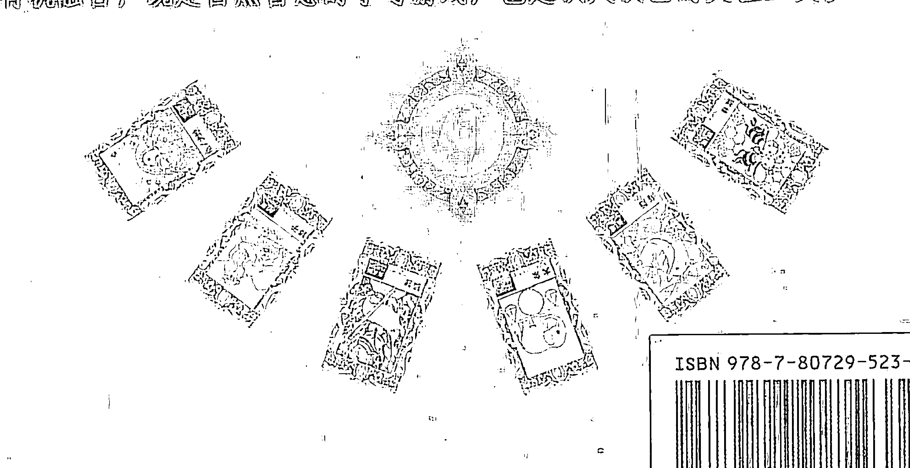

## 第一章 动物们神秘的智慧

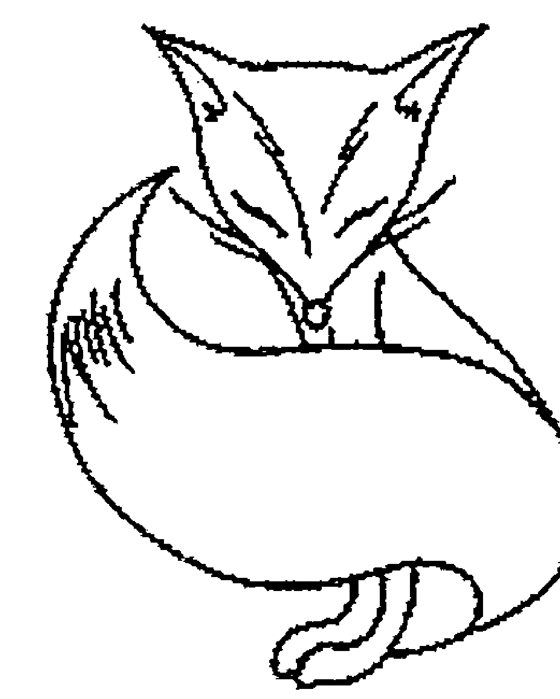

在自然中心的一个笼子里养着一条长达9英尺（1英尺约等于0.3米）的缅甸蟒蛇，名字叫做莫蒂。就跟每天所做的一样，管理员把它的笼子打开，让它可以外出游荡以及稍稍移动一些。在笼子里面他看不到它，当他打开笼子的时候，它掉出来了。它斜对着门躺着，睡着了。

管理员蹲下来，接近它卷成一团的身体，把它由远及近推动着。当管理员接近的时候，它的身体卷成一圈，出击，狠狠地在他的手背上咬了一口！他把手抽回来，莫蒂依旧粘在上面，管理员的眼睛吃惊地睁大了。

当管理员推开它的时候，莫蒂放开了他的手，鲜血从伤口流出滴落到地面上。他简直不敢相信！莫蒂确确实实咬中他了！他从来没有意料到会这样，经过了若干天，他也不能明白为何如此。不过事实慢慢变得清晰了……

在现代社会，人们已经把自己和自然分隔开来。许多人认为“自然”就是一种异世界的事物。另一些人却把它们作为研究对象，贪婪地利用它们。可能我们没有意识到：不管我们在文明之中隐藏得多深，我们还是自然的一部分。在我们身上发生的每一件事情都会反射到自然，而在自然发生的一切事情也会反射到我们。

> > 无论我们在文明之中隐藏得多深，我们都是自然的一部分。

因此，学习自然的语言就成为一种必要的尝试，只有这样我们才能通过新的形式和自然建立联系。我们很惊喜地发现，在动物领域里我们能够找到这把打开新关系的钥匙，每个宗教社团都教导说，神通过自然对人类传话（不论你是怎样定义这个世界中神的力量）。而人类了解神对他们的传话的唯一途径就是通过自然——尤其是动物。

> 每个宗教社团都教导说，神对人类传话的唯一途径是通过自然。

在每一个传说和宗教社团里，关于动物智慧的学说比比皆是。像动物教学、动物指引、动物图腾、强力动物，以及灵力动物等等术语都是和动物神秘学说有关的。当我们发现一条线索贯穿在每一个传说的学说中的时候——那会令所有的钟声消失。它说：有一些事物想要继续，那是一些具有普遍性的事物。一些我们应该真正投以注意力的事物。

我们生活在这样一个时代：人们在寻找能够了解生命以及开放精神的神秘的途径。人们在寻求指引。也是在同样的时代，我们总是有意无意地把自己隐藏在文明的外衣下，以致于我们切断了对我们来说，最可能的、最有益处的指引和神启的来源。

我们已经忘记了怎样从自然中学习。我们已经忘记了：自然时刻在对我们诉说着。但我们人为地把自然分割开来，并把它们作为学习材料和试验研究的对象，过分地使用甚至滥用。我们已经忘记了我们自己也是自然的一部分。最初我们的精神是联结某些特定动物的纽带，正如这是和家庭成员之间的纽带一样。这就是为什么几乎大多数人在生活中各个方面，都和某种特定的动物有亲密联系的原因。就好像自然在定期地提醒我们关于我们和自然的联系一样。

所有的传说都教导说：自然的每一个侧面都自有含义。在生活及环绕于我们周围的动物方面（不管是在走路或者是睡梦的状态），这个论断尤其真实。动物就是我们的兄弟姐妹。它们经常为我们生命中最最感到迷惑的问题提供答案。我应该做什么？我应该怎样表演？有什么将在我面前展露出来？我可以期许什么？事件将向何处发展？这些答案经常同动物们一起出现。

但是我们怎样开始？我们如何能领悟动物向我们传达的特别启示呢？这通常并不容易，也不会明显。学习任何新的事物都需要花费时间、努力，以及耐心。同自然发展一种新的关系对我们的要求并不少于这些。

我们从认识到并接受这个观点开始：也许是动物给我们传达了某种特殊的信息引起了我们的注意——或许是它的外表提供了解决一个问题的暗示；或者它的出现提供了一个行动的方向；或许这个动物拥有一种我们此时需要在生活中建立的特质；或许动物的到来就是提醒我们对奇迹要保持一定的敏感度。或许它意味着以上这些甚至更多。

通过了解动物的语言，以及同自然发展一种新的关系，我们有了这样一种想法：万事皆有意味。也许这种意味并不像水晶那样清澈透明，而对我们的生活也存在不同程度的影响。不过我们经历的每一件事情都对我们具有重要性以及意义。

当大蟒咬到那个管理员的时候，他感到十分震惊。他对此毫无预料。当他花时间去思索它的启示，他开始在许多层面上对这次经验有所了解。莫蒂最近刚刚经历了一次蜕皮，正处于精神紧张的状态。管理员打开笼子已经惊吓到它。当他试图把它抱离笼子的时候移动得太快，而且忽略了它给他的身体信号。

那时，在管理员的生活中有太大的压力，睡眠也很糟糕。他忽略了自己身体不平衡的信号，并没有花费必要的时间去医治以及休息自己的身体。

接下来的一周，那条蛇对管理员还是心存敌意，不过管理员已经放慢了生活节奏，他把更多的时间留给自己。在被咬之后的第二周，那条蛇平静了许多，不再具有攻击性，而管理员也恢复到了从前的健康状态。这一事件是一个很大的提醒：我们必须像蛇蜕皮一样，把过去有规律地剥离掉。我们需要花费时间用来休息和修养。

另一本相关书籍《动物说》（Animal-Speak）出版之后，很多人已经分享了他们与动物之间的个人经历。关于此主题的讨论会和学术论文通常附加大量实例，所有这些都证明我们生活中动物的重要性。当我们开始以个人关系的视角研究自然的时候，我们会发现自己拥有了动物智慧。

难点在于，了解动物带来的是何信息以及我们与动物的经历有何含义，明了动物是怎样被运用于我们的生活的。

自然母亲是很具有智慧的，为我们提供了很多信号。而我们却经常忽视这些信号，甚至拒绝去理解它们。我们太过于理性；太过于文明，以致不能相信这样一种可能性。但是在我们的内心深处，仍有一部分是不仅仅“希望”而且“知道”这是真的。自然的确在同我们说话。我们错误地假想或者说服我们自己，因为信息并不总是清晰以及容易辨认的，这并不是事实。

所有的传说都教导说：如果一个动物出现在我们生命中，我们有责任学习它。

如果我们学习阅读自然的信号，如果我们对自然更亲近一些，我们会发现我们的生活进展得更加顺畅了。不能进行的变得可以进行；停滞的变得流动起来；使我们困惑的变得清晰起来。动物王国最有可能帮我们建立起这些亲近的关系。

所有的传说都教导说：如果一个动物出现在我们生命中，我们有责任学习它。通过对动物的特质、习性、颜色或者其他特征仔细观察，我们就可以了解以及应用它们的特质来应对我们自己的情况。仅仅通过观察动物同特定的问题、事件以及生活中的特定领域的关系，我们就可以找到问题的答案。

## 第二章 关于动物塔罗

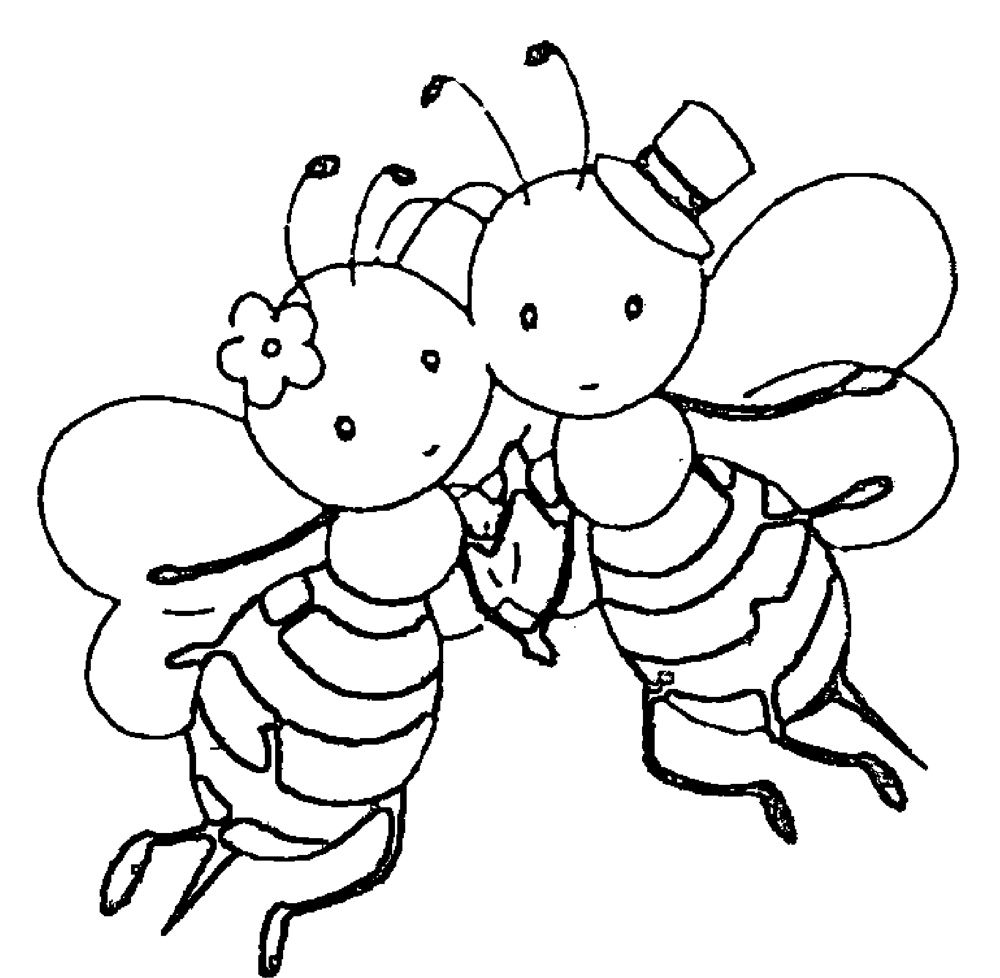

如果我们研究我们周边的动物，就会让我们的生活变得更加快乐。那些出现在我们面前的动物告诉我们在特定的情况下，采取什么样的行为和节拍最为有效。另一本相关的书《动物说》，就是为了了解动物和自然的普遍的语言和学说而写的。

动物塔罗（The Animal Tarot）的设计初衷是为了更好地利用动物的智慧。这套动物塔罗的设计，可以加强我们同自然和动物沟通的能力，很好地辨认出它们所发出的信号。它可以单独地作为一个语言的工具，或者当它在其他书中使用的时候，它就成了一扇通向自然的精神的门。这副纸牌的设计，能帮助我们提高洞察能力、自我认知能力，甚至可用来推测，为我们打开一扇通向动物的语言和智慧的窗户。

> 这套动物塔罗的设计，可以加强我们同自然和动物沟通的能力，很好地辨认出它们所发出的信号。

每张塔罗牌（包括大阿卡那和小阿卡那）上的动物都是特别选择的，因为它们是最强烈也是最接近地反映了那张塔罗的特定意义。这些卡片并不仅仅是迷信的或者抽象的象征，对应着特定的塔罗牌，它们的内涵更多。

大量的学习研究，包括学者们亲自参与的自然界和动物试验的经历，创造出了这个精神上有效并具有令人吃惊的正确性的塔罗。它之所以超越之前的惯例，是因为自然是没有界限的。

这个神秘的工具是特别设计的，不仅适合塔罗初学者使用，也适合具有一定经验的塔罗热心者。它既可以应用于推测时使用的特定塔罗技法，同样也可用于世界各地的医学和巫术的研究。

这套纸牌，同时具备教育工具和推测工具的双重特性。实践者可以通过使用它学习到更多的关于动物的神秘力量。长期使用纸牌可以帮助我们唤醒直觉，以及加强我们天生的和自然的联系。不论是否取得对生活的洞察力、是否具有对未来的推测能力、是否发现了我们的心灵动物或者保护者，这套动物塔罗都将在自然世界和人类世界之间建起新的桥梁。

我们经常忽视自然界所具有的神秘智慧，但是这种智慧从根本上是不能被否认的。我们生活在这样一个时代：我们变得埋头于日常生活，经常失去对生活中奇迹的感觉。我们忘记了这一点：我们可能由于奇迹缺失而饥饿，正如我们会因为食物缺乏而饥饿一样。自然，尤其是动物王国，使我们的惊奇长存。动物提醒我们自身的能力。通过这套动物塔罗，我们将再一次发现惊奇的感觉，并将再一次地去相信。我们将发现在我们生命中的自然的推测能力。

这套塔罗的设计，可以加强我们认出那些信号、和自然交流以及懂得动物的语言的能力。

> 每个人都有一个关于动物的故事。
> 每个人都有一些关于它们的独特经历。
> 有时是关于家养的动物，有时是野生的。
> 有时故事是伤痛的，有时是惊奇的。
> 每个人都以某种方式和动物接触，或者是在生活中或者是在梦中。但是始终，问题的难点在于确定它究竟有何意义。

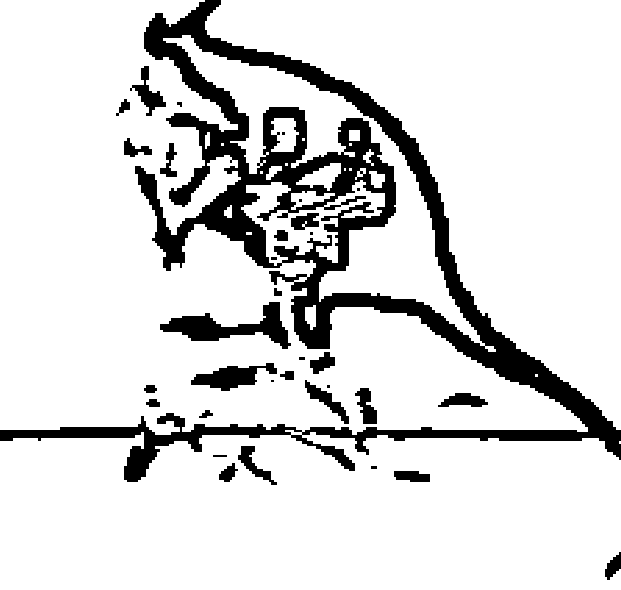

## [ANIMAL TAROT]
## 动物塔罗

动物塔罗具有教育工具和推测工具的双重特性。

动物塔罗可以帮助我们唤醒直觉，可以在自然世界和人类世界之间建起新的桥梁。

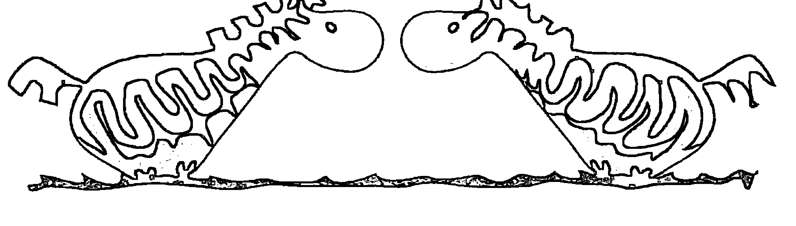

## 第三章 如何使用动物塔罗

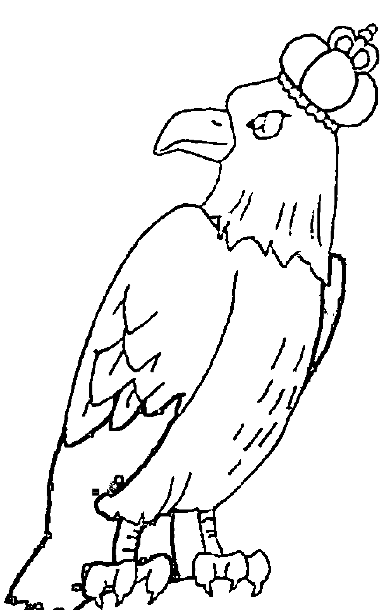

心灵性工具一般都有很多的玩法，塔罗牌当然也不例外。这个特别的工具具有多种使用用途。它可以用于推测、医疗、精神研究、同自然的协调、寻找精神动物和图腾等，在其他塔罗体系中的各种用途也同样适用。最重要的是，它提供了一种最根本的语言用来了解动物。

我们可以用这种办法了解世界。花时间去审视全部的纸牌。每张纸牌，都具有确定的、普遍性的东西。每张纸牌都具有一张契合生活实际的动物的照片。我们的精神发展是和世俗世界紧密联系在一起的，所以我采用的所有动物图片都是和某种生活实际相契合的，而不是艺术化或抽象的动物形象。动物教会我们有关心智训练的具体操作方法。每张纸牌都有一个关键注释，是一个简短的短语或者几个词语，描述这种动物基本的训诫和意义，并说明它在塔罗上的含义。这些内容被很好地简化，从一开始，就能帮助我们很好地理解这张纸牌。

> 每张纸牌都有一个关键注释，描述这个动物基本的训诫和意义，并说明它在塔罗上的含义。

ANIMAL TAROT
动物塔罗

这使得纸牌更加友好，不那么可怕，并更加具有实用性。想要知道关于这张纸牌的更多信息，可以参照这些手册。
大阿卡那（the major arcana）：每张牌在顶部有一个编号以及特定的塔罗关联。对于那些想要更多了解纸牌的奥妙的人来说，这个数字可以和数字命理学（根据出生日期等数字来解释人的性格或推测祸福）一同使用以揭示更大的含义。举例来说，蜘蛛（spider）关联着数字命理学的“2”，以及塔罗体系里的女教主（The High Priestess）。
小阿卡那（the minor arcana）：每张牌顶部有与传统塔罗牌相对应的各个元素（气、火、土和水），并且牌的设计很独特。换而言之，普通塔罗牌里的圣杯首牌在这副牌里是变形者首牌，它的顶部和圣杯、元素水相关联。
依次观察每一张牌，研究上面的图案和主旨。仔细观察上面的动物，动物的姿势、动作和牌的意义相关；不要忽视动物的颜色和表情，这些方面也有特殊的意义。当你仔细研究每一张牌的时候，图案上的原始信息将再度苏醒，虽然相隔了久远的时间，那些本质将带来共鸣。

### 冥想塔罗

思索冥想可以帮助我们与自然本质相协调。这并不是一个复杂的过程，而且有很多方式。从某些角度来讲，最重要的是思考并联系每一张牌。用这种方法，我们需要平衡四种元素，保持均衡性，这样就可以开启塔罗本质的精神意义了。

- 1. 拿一套牌（或者一张），畅想它的本质意义。找一个安静的地方坐下来，把牌放在膝盖上，联想到你能想到的关于动物的一切。
- 2. 畅想牌的本质意义，并享受其中的乐趣。最后，看看是不是有一种本质格外突出，是一只鸟？还是一种气味？哪种动物能引起你格外的注意？

即使这种动物不是牌上的，也可以查出它和哪种元素、类别相关联。是一种哺乳动物，还是爬行动物、鸟类或者昆虫？

> 仔细研究每一张牌上的图案和主旨，图案上的原始信息将被唤醒，带来本质上的共鸣。

> 畅想牌的本质意义，加强我们和本质各方面的联系。

每种类别都有独一无二的特质，为我们提供思维的入口。当我们触及本质的一个方面时，我们就加强了和本质所有方面的联系。

3. 找一个不会受到打扰的安静的地方，周期性地从整套牌里抽出某张牌，把图案想象成一道门，想象你自己走进那个场景，那个动物就在你的眼前，让它和你交谈，告诉你它的特性。
在对话结束的时候，让那个动物融入你成为你的一部分。在每一秒钟的呼吸中，你都默默感受这些场景，你对动物们的本质精神将有更深的体会。

对于那些修炼过幻术的人来说，他们很容易就能投入到这种原始幻术的奇异世界中。

富有创意的幻术方法将有助于你加强同本质精神的接触，并得到更多的信息。幻术开始不久，你就可以清晰地看到动物，那些在你的梦里或者生活中的其他角落里出现的动物。当你使用塔罗牌的时候，那些动物会有异常的表现，这是接触加强的表现，可以证明你更加了解了动物的语言。

当你这样研究塔罗的时候，你对于动物精神和图腾的认识也会大大加强。大多数人都有一个甚至多个动物图腾（我们通常有不止一个图腾，因为每种动物都不会独立地存在世界上）。不同的动物对我们有不同的帮助。后文中我们将向你展示怎样使用塔罗来找出在你生活中各个方面所表现出的动物精神和图腾。

### 使用动物塔罗

尽管看起来和其他塔罗牌差不多，动物塔罗的设计是为了帮助我们认识每天生活中的真正精神本质和力量。

对于任何心灵的工具来说，推测者最重要的态度就是尊敬。我们必须尊敬卜卦的过程，以及我们在这个过程中所扮演的重要角色。当我们刚接触到一种神奇的工具时，我们必须主动让它强大而深入地渗透到我们的生活中。当我们使用它的时候，我们已融入日常生活的微妙真实的心灵感知将会更强大。

思索、冥想，会让我们对动物精神和图腾的认识大大加强。

这就是为什么使用牌——任何一种塔罗或者别的推测工具——的时候，需要抱着一种神圣的态度的原因。把它看做自己固有的神圣力量来尊敬，那么它将在我们的生活中显示更强大的力量。我们必须尊敬塔罗。我们越尊敬它们，我们得到的力量就越多。

把塔罗视为神圣和神秘的吧！它们不是简单的玩具和消遣品。一旦把它们作为玩具和娱乐，结果将毫无意义。老商人经常这样警告大家：“别伤害和篡改自然母亲。”对于任何神圣的事情都是这样的。只有把塔罗看成发展我们精神力量的动力源泉时，推测过程才是真正具有神圣意义的。这个过程需要永远被尊敬和崇拜。

> 必须尊敬卜卦的过程，把塔罗看成发展我们精神力量的动力源泉。

- 一些有用的方法可以保护塔罗和神圣的相互关系：
- 规律地操作
- 别让牌出现意外的颤动
- 怀着非常虔诚的心态

#### 规律地操作

塔罗牌每张都得仔细看，以便熟悉每张牌以及上面的图案。不仅可以看附录的相关文件，也可以在图书馆或者别的一些描述动物的资料。

塔罗牌是不能随便给人玩的，因为它们是神圣的工具。必须和它们发展成独一无二的关系并紧密联系在一起。一旦我们发现了这个秘密，它们将与我们共鸣。

在另一本书《怎样开发和使用心灵触觉》里，谈到了物质是怎样控制和印记能量的。那些塔罗牌必须成为我们的，印记着我们的能量。我们需要随身带着它们，和它们一起睡觉，每天挨个触摸它们。在买回来之后，需要每天像上面说的那样接触一个月，它们才真正成为我们自己的。我们必须把我们的能量坚固地印记在牌上。

#### 别让牌出现意外的颤动

把丝绸包在塔罗牌的外边可以有效地保护塔罗，可以阻止牌和外界接触，比如别人带着自己的情感和态度把它拿起来。丝绸可以促进塔罗牌和我们能量的融合。丝绸的颜色最好和我们相近，如果不能确定，黑色是首选。很多人在丝绸包装里面还用一个木头盒子，避免那些好奇的人接触我们这神圣的工具，从而造成伤害。木头包装还有另外的好处：木头来自大自然，能够帮助我们通过塔罗读懂自然本质的语言。有些人发现了一件有益的事，就是雕刻、喷绘或者烧制塔罗中某种动物的外观和图案，供在盒子上以示尊敬，通过这种方式可以增强与动物世界的联系。

> 动物塔罗让我们认识到了自然神圣而神秘的本质。

#### 怀着非常虔诚的心态

动物塔罗让我们认识到了自然神圣而神秘的本质。这个本质是在任何社会都应该被尊敬的。动物塔罗是一种能够帮助我们开发和发展自身优秀特质的推测工具。如果有一天你在使用塔罗时，发现自己在布局和演绎时更加得心应手，并且能非常自然地使用并从中得到答案，那就表示你手里的牌和它们的力量已经在你手中复活，而你与自然的接触也得到了进一步的升华。

每天我们都会接触大量信息并运用微妙的感知，其中大多数都依然是未知和模糊的。通过使用动物塔罗，我们提升自己的感知意识，认识并应用奇妙的感知能力。我们用心和头脑畅游在推测的世界，这是大自然与我们的对话。

## 第四章 动物塔罗的组成部分

典型的塔罗牌组分成两个部分：大阿卡那和小阿卡那。22张牌组成了大阿卡那，56张牌构成了小阿卡那。这套牌中，大阿卡那将更多地反射我们精神上的历程和生活，而小阿卡那将更多地反射我们世俗的生活和历程。在塔罗两部分之间的动物推测是一种人为的推测，但是其中之一对于推测的目的是十分有效以及准确的。

> 大阿卡那更多地反射精神上的历程和生活，小阿卡那更多地反射世俗的生活和历程。

许多人认为，在塔罗牌中，大阿卡那是更加具有强力的一种，这种看法并不一定正确，尤其是在动物塔罗中。在自然界中，并没有一种动物比其他动物更加具有灵力或者强力，每种动物都有自己独一无二的能力。动物是宇宙中力量的象征，表现出和推测者的沟通，反射出自然和人类对话的道路。

甚至当审视掠食动物和被掠食动物时，没有一种动物比其他动物更加具有精神上的能力或者力量。

当对自己的心灵道路以及精神指引抱有疑问的时候，可以参照大阿卡那牌。

当对我们生活中的教训，以及活跃在生活中的能量抱有疑问的时候，可以参照小阿卡那牌。

大多数动物既是掠食者又是被掠食者。人类附加给了某些动物强大的精神能力和力量，通常是基于自我而并不是事实。所有精神上的能力必须能在精神世界上表达它们自己。

塔罗划分为大阿卡那和小阿卡那两种，最简单的区别方式是：通过它们的应用。大阿卡那反射心灵上的教训、模式、能力，以及日常生活中的时间背后的行为——通常人们并没有意识到。大阿卡那里的动物洞察我们独一无二的灵魂之路。如果我们对自己心灵上的行为、生活或者道路存有疑问，就可以特别地参照大阿卡那牌。大阿卡那可以透视我们精神世界以及在生命中的精神历程。为大阿卡那牌选择的动物，不管是令我们鼓舞，还是令我们羞辱，都显得异常清晰或者具有智慧。

小阿卡那牌中选择的动物，反射出世俗的力量、教训、模式，以及在我们生活中起作用、更多地被应用于外面和发生在日常生活环境下的事件上的能量。小阿卡那是在世俗生活环境背后的精神力量。当牌阵中揭示出小阿卡那牌的动物时，它们通常反映出隐藏在世俗生活背后的微妙的精神力量和教训。这些隐秘的力量同时对世俗生活有很大的影响。

### 第一节 大阿卡那

#### 0. 愚人 (THE FOOL)
草原狼(coyote)智慧和愚蠢

草原狼是一种非常具有天分的动物，聪明、爱好嬉戏、具有适应力，而且忠诚。它的领地一旦展开，它就对此具有了一种类似既是魔术师又是创建者的见识眼光。它通常作为教师以及魔法的看管者出现，使我们想起自己还有很多的可能性。

草原狼教导我们关于智慧和愚蠢的平衡，以及怎样让它使人前进。那些最成功的人，是在自己的工作中拥有乐趣的人。这些成功的人继续坚信一个事实：万事皆有秩序，即使这些计划并不十分明晰。他们相信依靠自己的能力，不论遭遇到什么事情都可以解决。当草原狼出现在你的领域之中的时候，就是该寻找关于工作和休闲的平衡的时候了。

草原狼通常使用合作狩猎的技术，以更好地发挥它们的力量和时间。它们采用一个良好组织的体系用于捕获稍小些的猎物，通常使用轮班制 —— 一只草原狼去追逐，而另外的一只草原狼去休息。草原狼使我们知道：合作的效果通常是最有效、最成功的，尤其是在目前。

草原狼生命力极强，但它也是一种充满矛盾的动物。就主要来说，它的信息是平衡智慧和愚蠢，使得目的可以真正实现。它使我们意识到：我们有力量去控制自己的生活，比我们自己意识到的更多。要灵活，去笑，始终相信自己是最棒的。

当草原狼出现在你的面前，你要记得：你现在是处在十字路口，你现在做出的决定是十分重要的。你相信什么对你来说是正确的。身处混沌，你要有孩童般的心态。保持幽默感，跟随内心的渴望，相信自己孩童般敏锐的直觉。不管情况如何转变，你要相信自己的内心和智慧，哪怕是已经做出了错误的决定，你也能很快地意识到它们，并依照本能更正它们。当草原狼漫步至我们生活的时候，通常会有隐藏的智慧。

###### 倒放含义

草原狼是一种特别具有适应性的种类。如果倒放，我们需要审视自身顽固的部分，以及我们周围不协作的部分。可能，我们把自己的工作或者我们自己看得太过严重了。

一个倒放的草原狼也可能显示：围绕我们的行为或者我们自身，有比智慧更多的愚蠢。

要问的问题：是我们使得事情变得太过复杂？我们是否需要简单化？在我们的行为中，我们比自身更加聪明吗？我们是否已经忘记了：休闲是保证身体健康的基本要素。我们是否已经太过顽固？我们是否把生活中本来简单的事情弄复杂了？如果答案是肯定的，那么倒放的草原狼的位置，将为我们指出在哪里会有一些不可预料的情况发生；在哪里我们可以找到一些新的观点和幽默。

#### 1. 魔术师 (THE MAGICIAN)
狐狸(fox)祝福以及魔法准备中

狐狸是这个世界魔法的象征。狐狸在已经发现的各种宗教中都是魔法和疗愈的象征，有时以倒放的形象出现。它是魔法以及疗伤的看护者，它的天赋是变形和隐藏。

狐狸一般在夜间活动。但是它们最清晰可见的时候是黄昏和破晓；它们一般在神秘的边境地带和森林边缘居住。这些“中间的时间和地点”以这样的方式让人恐惧：它们是连接魔法世界和人类世界的天然的界门。狐狸是进入新的魔法世界的引导者和保护者，它意味着新的魔法以及新的领域正向你接近。

狐狸具有令人惊奇的掩藏自己的能力。在野外，它可能距你仅仅3英尺远，但是你根本不会知道。狐狸教会我们怎样伪装自己的行为。这是一种隐藏和变形的技术。狐狸提示我们要隐藏自己，否则的话我们可能会错失很多东西。记住你所学到的，为你所用。知识就是力量，在你进行平静的伪装之时得到的知识总有一天会有用途——即使不是现在。

这种平静的隐藏也会增加我们因努力而得到的成功。如果别人不知道我们奋斗的目标，就可以避免很多人为的障碍。我们付出较少的努力就能完成任务。静默之中蕴含着巨大的力量。

> 狐狸提示我们要隐藏自己，否则的话我们可能会错失很多东西。

狐狸有着灵敏的嗅觉和听觉。在你生活中存在的狐狸，反映出你的感官能力的提升，尤其是精神上。狐狸向我们展示怎样运用我们的判断力去获取我们想要的奖赏；狐狸教导我们，只要行为适当，一切皆有可能。相信什么闻起来是对的，而什么不是。如果你并不是完全确定，就不要贸然行动。保持安静并等待；很快你将意识到你的机会。

当狐狸出现，表明有好多隐藏在生活表层下面的状况——好的和坏的。狐狸提醒我们要信任自己的本能，要花费精力关注：可能隐藏着的事情、可能没有说出来的事情和可能经过伪装的事情。当我们这样做了，我们就会发现机会更加完整地出现了，而麻烦和困难也已经避免了，我们的生活变得令人着迷。狐狸向我们展示通过我们的愿望和勇气而出现的新机会。

狐狸向我们展示怎样寻找以及得到祝福。通过狐狸的能力，我们知道我们有能力把生活转变到我们想要的任何一条道路上来。这样转变的机会很快就会出现。当狐狸出现，我们正打算经历一场魔法以及心灵的冒险，留给我们被祝福的、永远的改变。

###### 倒放含义

狐狸联结着性别——包括生理以及心理上——的力量。它们是实行一夫一妻制的动物。一年之中，要独自生活5个月左右，狐狸们通常都是孤独的，但是它们很坦然并享受这样的生活。如果狐狸倒放，我们要检查一下自己是怎样引导自身的创造性和性别的能量的。这也可能是一个提醒：我们要给自己保留更多的时间。我们是不是要多找些时间给自己，而不要把时间聚焦在怎样取悦周边的人。

要问的问题：关于我们的计划，我们是否暴露得太多？我们是否洋洋得意于向他人展示我们的魔力？我们是不是忘记了静默之中蕴含着能量？狐狸提醒我们不要让其他人知道我们的目的所指，直到我们完成自己想要做的事情。直到那时，我们的魔力才取得了强力。

狐狸向我们展示怎样寻找以及得到祝福。

#### 2. 女教主 (THE HIGH PRIESTESS)
蜘蛛(spider)直觉、命运的编织

在这个行星上，蜘蛛是富有学识以及荒诞的一种动物。它们是熟练的编织工，编织幻想、生命的跨度、字母表以及预言，甚至魔法。它们表明我们自身创造之力正在觉醒。蜘蛛在这样的时候出现：当我们需要在过去和未来、身体和心灵、雄性和雌性、醒着和睡着之间寻找平衡并工作的时候。蜘蛛向我们展现：怎样在今天编织我们想要在明天实现的美梦。蜘蛛教导我们富有创造力的魔力，以及怎样去编织和创造我们未来的命运。蜘蛛的出现，预示着创造的机会出现在我们的生活中，有三种魔力在活动。

- 第一种魔力是创造，这反映在蜘蛛织丝的能力上。它提示我们：此时，我们自己的能力能够纺出新的创造。
- 第二种魔力是声明。这向我们表明：只有通过声明和表达，我们才能够使用自身的创造能力。
- 第三种魔力是过去和未来、死亡和重生、月圆和月亏的联系——所有这些都反映在网的盘旋之中。这里，蜘蛛帮助我们意识到：存在一个创造的节奏，可能我们并没有认出它，但是它带来平衡和颠覆的极端。

蜘蛛是古老的、最让人惊叹的动物种类之一。它们虽然有8只眼睛，但视力并不好。它们腿上的细小的纤毛十分敏感，哪怕是最细微的移动。如果蜘蛛出现，不要相信你所看到的，请相信你所感觉到的。

> 蜘蛛的出现表明自身的创造力正在觉醒。

> 如果蜘蛛出现，不要相信你所看到的，请相信你所感觉到的。

虽然所有的蜘蛛都编丝，但是并不是所有蜘蛛都织网。蜘蛛丝是这个行星上最为坚韧的物质之一。在北半球，能遇到的大部分蜘蛛都是织网高手。它们并不会被自己的网抓住，因为它们的腿部会分泌一种油，而只有在网的四周的丝上才有黏性物质。

蜘蛛会在晚上不为人知的情况下，默默地努力做大量的编织工作。这使我们知道表达我们自己的创造能量的最佳方式。不要害怕把这些能量使用在看起来似乎难以达到的地方。在黑暗之中编织你的创造之丝吧，这样当阳光照耀到它们，就会闪耀着复杂的美丽。

蜘蛛教导我们，要相信我们所经历的细微的感觉；蜘蛛向我们展示，在表层之下，有更多的深度和更多的行动。蜘蛛激励我们去使用自己创造的机会，通过这样做，我们就可以用自己的双手把握命运。

> 要相信我们所经历的细微感觉，使用我们自己的创造性机会。

###### 倒放含义

蜘蛛是伟大的经济学家。它们努力编织自己的网；努力做好自己的工作。所有的工作完成之后，就安心坐下来，等待食物送上门来。蜘蛛向我们展示怎样编织自己的能量，这样，通过我们的努力得到的回报就会自动来到我们身边。所谓功到自然成。在倒放的位置，蜘蛛提醒我们要有耐心，要把我们的报酬推出去。推出去时，我们既浪费了自己的努力，也会让益处在最好的时机与我们失之交臂。

要问的问题：你是否还在犹豫，要不要把自己的梦想编织成现实？你是否利用创造性的机会？你是否感觉陷入困境或者是失去平衡？现在是否是合适的时间，让你开始写作、绘画，或者创造？比起集中在一个目标，你是否更想要得到各种各样的方向？你是否变成了热衷于自己想法的人？你是不是注意别人的成就而不是自己的？你是不是并没有完全遵守“直接”的原则？

#### 3. 皇后 (THE EMPRESS)
海豚(dolphin)创造力、母性、新的允诺

有三种古老而强大的创造力，通常为水、声音，以及呼吸。这三种力量集中体现在了海豚身上。当海豚出现，通常在人口上、生活中的创造上会有动态的增加。

海豚是海洋中为数不多的哺乳动物之一。这一点，对于诸多远古的神秘传说是十分重要的，那些传说是关于生命是怎样从原始的水中起源的。水是创造、人口以及新生命的一种原始象征。

海豚是一种强有力的沟通者，包括通过声音以及身体语言。它们运用声纳（回声定位系统）的强大能力，发射出一种机器一样的滴答声，然后像回声一样，得到同样的回应。海豚向我们展示怎样使用声音和语言去创建和证明，教导我们要听到声音之下潜在的动向。

声音需要呼吸，如果我们知道怎样把声音（通过语言、祈祷、歌曲等）和呼吸更好地结合，我们就可以改造我们生命之中的水。海豚向我们展示：怎样把水引入生活，以及通过使用声音和呼吸的技术，从我们最需要、最想要的水中获得向前的力量。

海豚的出现也证明，我们的语言具有了不起的力量和强度。事情说起来比较可爱，就会变得很可爱；事情说起来比较伤痛，伤害就会更深。我们声音之中的创造力正在提升之中。

> 海豚提醒我们注意自己的创造以及孕育的能力。

在古老的希腊神话中，海豚是女神阿芙洛狄忒（Aphrodite）的信使，阿芙洛狄忒是主管爱、激情、欲望以及生育的女神。当海豚进入到你的生命中的时候，这些品质都会得到提升。我们会经历更多的爱、激情、欲望以及生育——通常在同一时间发生在我们生活中的不同方面。

阿芙洛狄忒是一个为大家所熟知的会帮助其他人的女神。因此，出现在我们生活中的海豚的形象，可以反映出其他人对我们的无私的帮助。

生命之海孕育着可能性。海豚提醒我们要把精力聚焦到这些可能性上，注意我们自己的创造以及孕育的能力。这是个充满孕育的时机，保持了新生的承诺，以及我们对事物实行的需要。

###### 倒放含义

如果牌倒放，海豚可能反映出：在我们的生活中缺失无拘无束的感受。这可能对我们的创造力造成阻碍。这可能是一个邀约，教会我们重新组织排列自己的身体、头脑和精神。这需要我们学习新的呼吸技能，来减轻压力。这可能是一种新的生活节奏，但这是必要的。不要再用同样的办法去做同样的事情。

倒放的海豚意味着：我们可能把自己的经历和努力浪费在没有创造性或者没有生产性的方式上，可能反映出我们的语言以怎样的方式阻碍我们自身的进程或者其他。要记住，语言可以创造出自我实现的预言，从好的方面或者坏的方面。走出去吧，做一些不同的事情，游戏、探索，以及呼吸！

要问的问题：面对我们自己，我们怎样描述自身？为你而设的语言和想法是什么？你是否陷在紧张感之中？你周围有其他人吗？

> 如果牌倒放，海豚可能反映出：在我们的生活中缺失无拘无束的感受。

#### 4. 皇帝 (THE EMPEROR)
雕 (eagle) 视力、力量、疗伤的能力

作为最大的掠食性鸟类之一，雕通常被作为权力的——世俗上的以及精神上的——神圣象征。雕有四大类，在世俗社会里有一长串的关于平衡和权力的象征。雕象征着：英雄般的高贵、视力，以及听力，远见卓识中充满了神秘。

雕的视力要比人好8~10倍，因此雕的出现通常反映着新视点。事物在清晰之前看起来并不令人舒服。这种新视点可以帮助我们达到看清过去以及未来的深刻程度。

在很多传统中，雕描绘着太阳的灵魂。它也象征着内心产物的再次发现。一个古老的神话里讲述到，当一只将近老年的雕失去视力的时候，它会义无反顾地飞向太阳，把自己烧焦。然后找到一个纯净的水源，把自己蘸三次——再一次回复青春和健康。

雕的出现表明：有必要从新的视点审视事物；要想追求健康和生活，就必须采取不同的行动方式。想要跟随这种视点的愿望，甚至有烧焦的可能性，但是如果是为了新的听力和生活崭露出来时就是有必要的。

雕的脚上有爪子，适合抓捕和狩猎，再次体现出“我们要把握出出现在面前的机会”的重要性。

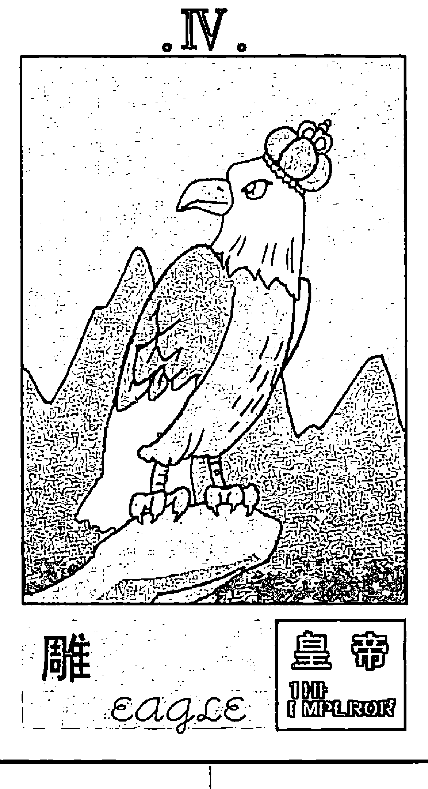

雕象征着英雄般的高贵、视力，以及听力，远见卓识中充满神秘。

> 雕的出现表明：要从新的视角审视事物，采取不同的行动方式，把握自己的机会。

性。这是一个提醒：视点是创造性进程的一部分。和雕一起出现的这些事物，教导我们要学会把握自己的机会，在机会出现的时候抓住它们。

雕在狩猎的时候是动物的保护者，它们等待，有耐心地依靠自己的视力确认何时可以俯冲下去，然后抓住猎物。

雕像其他的食肉动物一样，维护着世界的平衡，抓住病者和弱者，通过阻止疾病的蔓延来保持世界的健康。这种具有治疗净化能力的雕的形象在很多作者的画作里都可以看到。目前，关于整体治疗技术的探索和学习的机会将出现，并具有巨大的益处。

雕教导我们即使是在地面也要注意查看。它教导我们在高飞之前最好有一个固定的根本。

###### 倒放含义

即使口头示弱，雕的下颚也是强壮有力的——用来咬断、撕裂、粉碎。因此，当雕出现的时候，有必要知道什么时候说话，说到什么程度，说的时候采取怎样的强度。除非讲话受到控制，否则就有可能会导致某人不经意中被伤害——也包括你自己。

未成熟的雕通常会被用来称呼这样的人：机会主义者、讨厌的、恼人的。倒放的雕可能表明：我们自己缺乏耐心或者行为过分机会主义；或者在哪里，我们浪费了大量的本来对于我们的健康以及生活极为有益的能量。雕也可能暗示不情愿的停留或者联系。

要问的问题：
- 我们是否变得太过浮躁？
- 我们能不能接受自己的职责？
- 我们是否尚未真正地发展自己的能力，就太过匆忙地尝试了许多事情？
- 是不是缺乏控制，或者缺乏自我约束？

#### 5. 教皇 (THE HIEROPHANT)
白鹤 (white crane) 长寿、信仰、精神正义

“令人尊敬的鹤王”是精神上正义和长寿的古老象征。它同时是光的象征和死亡的使者。这种对比具有重要意义，鹤教导我们：生和死，作为同一过程的不同方面，都是十分需要的。通常，鹤也表达着旧方式的终结，新的表达会在它们之中产生。

作为一种涉禽，鹤可以在水面、陆地及天空中自由行动。而鹤在不同的世界、不同的领域、不同的时间之间的移动，也教会我们：如何利用自己内心的水、直觉的本能，为新生命在陈旧之中焕发青春。在更加古老的时候，圣职者——教士和其他神职人员带着暗示，排队去往其他的世界。白鹤表明过去对未来有深刻的影响。它们表明死亡只是一种转变，而并不是结束。它们在不同的世界、领域、时间以及传统之中打开互通的门，刺激新的、切实的灵魂的经历。

白鹤经常唤醒我们远古的东西——灵魂类的存在物，以及各种各样的心灵领域——包括仙境（The Faerie）。现在，是时候利用远古的传说，然后重新在现代社会和自身现在的生活中表达出它们新的含义了。

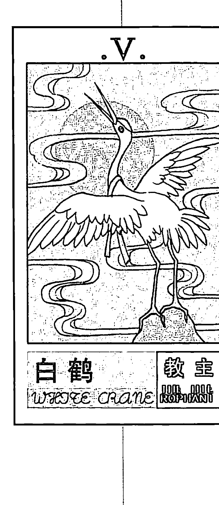

> 白鹤表明过去对未来有深刻的影响，死亡并不是结束，而是一种转变。

白鹤教导我们：要让我们创造性的资源保持生命力，通过适当的注意力集中，让我们给予生命的新个体得到长久受人尊敬的生活。

且过去对现在也有非同寻常的影响。它传达了一种新的理解，关于生命事物；关于婚姻让我们作出的这样和那样的牺牲；关于我们生命当中灵魂法则的运作状况。白鹤常会在野外生两个蛋，但是通常只会养育其中的一个。

白鹤夫妇对自己的下一代倍加呵护，它们十分秘密地养育着孩子。这就反映出：我们要对安全保护更加敏感，有必要在我们的生活中产生新生命的时候更加秘密。通过这种方式，这个生产和继后的生命会变得长久且多产。

白鹤提醒我们要为自己创造性的资源而感到高兴，让它们保持生命力；教导我们：通过适当的注意力集中，那个我们给予生命的新个体，将得到长久受人尊敬的生活。

###### 倒放含义

如果是倒放的位置，白鹤可能反映出：我们并没有集中足够的注意力；或者我们在发散自己的能量；或者对于我们正在生育的个体，并未采取足够的安全措施。出现在女人眼前的白鹤，标志着：女人和孩子待在家里是最好的选择。而不是把她们的精力分派在家和工作上——至少要这样做一段时间。如果我们不能这样做的话，白鹤会教会我们怎样才是完成两种任务的最好方式。倒放的白鹤，反映出男人和女人都需要花更多的注意力和时间在自己的孩子——字面意义或者比喻意义的——身上。

倒放的白鹤也可以反映出：我们太过于固守自己的信条和传统。轻松地面对它们，可以不知道原因，或者不去考虑那样做之后会得到怎样的好处，这样做比抱着“通常都是这样做的”这样的思考好多了。倒放的白鹤提醒我们：遵循过去的传统只有在我们赋予它们新的意义和表达时才是对我们有好处的。精神上的正义会以它自己的方式在世俗世界中活动，并不取决于我们是否相信它。事物会崭露出来——时间、习惯，意味着这就是最好的。

#### 6. 情侣 (THE LOVERS)
所有的蜂本质上都是蜜蜂。辛勤的蜜蜂通过把花蜜和花粉收集到一起，从而站在孕育过程的边界。如果没有它们，大部分的花朵以及许多水果，可能都不会开花结种。因此，蜜蜂反映出孕育，以及对我们所孕育事物的选择。蜜蜂的出现通常反映出使我们变得更加多产的新的选择和新的机会，生产出更多我们渴望的蜜糖。蜜蜂，关联着巨大的性别象征，因此当这张牌出现的时候，它反映出“情侣”的意义——孕育过程需要雄性和雌性的通力合作。刺激物是男性生殖器，而花朵就是充满神圣花粉的女性生殖器。因此，蜜蜂通常反映出新的恋情，以及性能量在活动。

蜜蜂提醒我们要提炼生活中的蜜糖，在阳光照耀、机会到来的时候，使我们的生活变得更加富饶。蜜蜂提醒我们：不管梦想有多大，都有可能实现。如果我们追赶自己的梦想，不管这个梦想看起来是多么不可能实现，它也会为我们实现。蜜蜂反射出不可能完成任务的能力。从空气动力学上来说，它们并不可能飞翔，但是事实上它们做得很好。

蜜蜂群体有着良好的社会结构，每一个成员都有明晰的任务和责任。因此，蜜蜂通常反映

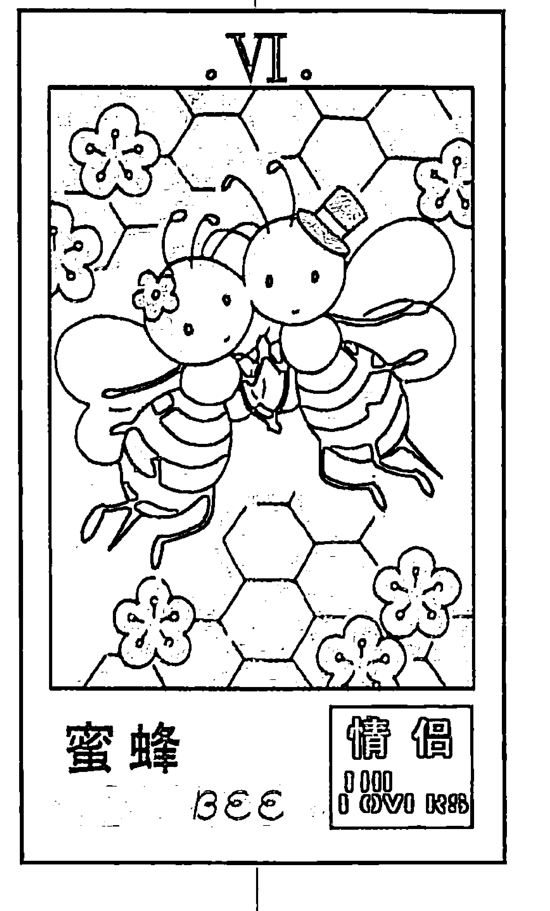

> > 蜜蜂反映出孕育，以及对我们所孕育事物的选择。

出多种选择——所有的选择看起来都伴随着责任和承诺。当这样的机会出现的时候，最重要的是区分它们的优先次序。蜜蜂接连出现，反映出有必要诚实地做出选择。如果是和其他人合作，有必要明晰大家在工作中的角色。

蜜蜂是了不起的交流者，它们通过“蜜蜂舞蹈”来向其他蜜蜂表明蜜源的方向和距离。如果有多种选择，它们可以清晰地表明：在当时，哪一个是更加优先、更加受偏爱的。如果不确定怎样选择，可以不做出改变，或者跟随心灵中最想要的那个选择。

###### 倒放含义

选择通常都是好事，但是太多的选择会造成困扰；但因为害怕失去机会而不做选择，又会造成停滞。倒放的蜜蜂可能预示着：我们有太多的选择，以及拒绝按优先权排列并做出决定。选择一个，不选择另外一个，并不代表我们失去了没有选择的那一个，机会还会降临到我们身边。

倒放的蜜蜂指出：我们可能分散了自己的精力，或者，当好的机会出现时，我们没有作出应有的努力。在当时的情况下，比较起选择了不正确的方向，优柔寡断可能是更大的问题。想要“在当时的情况下，世界上最好的东西”的想法将带来不稳定性。蜜蜂总是提醒我们：各种活动以及努力，在我们花费时间去享受它们乐趣的时候，会更加多产以及甜蜜；这样做比过度扩充我们自己更加恰当。

倒放的蜜蜂指出：我们可能分散了精力，或者是好的机会出现时，没有作出应有的努力。

要问的问题：
- 你是否做了所有你能做到的事情去让你的生活变得更加富饶？
- 你是否足够忙碌？
- 你是否太过繁忙？
- 你是否变成了一个工作狂，以致没有时间去品尝通过之前的努力所得到的蜜糖？
- 你是否尝试去做的太多了？
- 我们身边的他人或者是自己，是不是并没有共同协力？

#### 7. 战车 (THE CHARIOT)
马 (horse) 移动和平衡

马，可能是对最初文明扩张时作出最主要贡献的动物。在马被驯服之前，不同的人群社会之间的距离是十分巨大的，彼此之间很少交流。马，在旅行、农业、战争，以及生活中的其他各种各样的领域里为人类服务，通过马的帮助，人们可以去旅行，可以从自我交流中解放出来。

由于马富有知识和神性，它在魔法、推测、占星术中都被赋予了重要意义，但最特别的是，马成为移动和旅行的最好象征。只要马出现就会有变动出现。我们可以通过自我约束（包括身体和心理）来完成这种变动。

马还象征着渴望，尤其是性的渴望。公马尤其是古老的性的象征。公马的出现表明着我们在性能量上、生理上或者心理上都得到了的改变，要注意管理即将失控的、或者处于危险境地的情感。

马提示我们：在努力的过程中，需要自我约束。自我约束可以帮助我们成长为情绪稳定、善于控制自己的人。马提醒我们要沿着努力继续向前。如果我们善于约束自己的行动以及自身，我们就会发现我们对于能力的感觉被再次更新了。

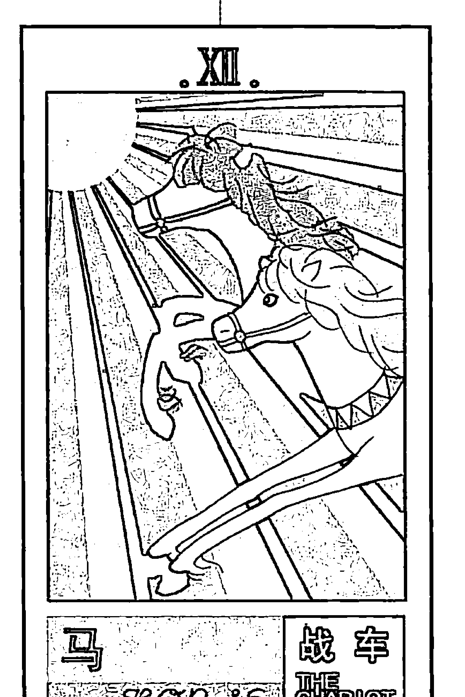

只要马出现就会有变动出现。

马的四条腿反映出：在努力的过程中，需要平衡。我们生活中的马，如镜子般真实地反映出这样的实例：平衡的发展才是最好的、顺利的发展，而不是通过其他极端的方式。

马携带着新的旅程和新的平衡，建议我们：是时候去进行旅行，发现生活的多样性并取得其中的力量了。

马会教导我们，怎样向新的方向直奔而去，去寻找属于我们自己的自由和力量。

###### 倒放含义

如果处于倒放的位置，马可以有三方面的含义：缺乏自我约束；感情失去控制；缺乏活动。

一个倒放的马可能意味着：是该做自我检查的时候了。在我们生活中、我们自己身上、我们周边缺乏自我约束的情况，这会成为我们前进的障碍，阻碍我们的发展。是时候改变方向，并放弃无用的努力了。

倒放的马也可能反映出我们的感情失去控制。我们是否对极端的情感有所期待？我们的决定和选择是否会受到其他人情感的影响？我们是否根本没有很好地利用我们的创造性和支配我们的性能量？

当我们在生活中缺少活动，或者在某个位置遇到阻碍之时，通常就会出现倒放的位置。或者，倒放也可能表明我们在某些方面徒劳地浪费了我们的能量和努力。有可能这是我们该反省自己做了哪些不太成功的改变和检查自己的自由的时候了。

要问的问题：
- 我们是否感到被压缩？
- 我们是否需要移动，或者是否允许我们周边的其他人移动？
- 我们是否在新的生活领域里，拒绝声明自己的自由和力量？
- 我们是否拒绝称赞迄今为止的各种变动？

#### 8. 力量 (STRENGTH)
狮子 (lion) 野外的力量，内心的太阳

作为猫科家族第二大的成员，狮子在自然中的家位于非洲大草原。狮子一贯被看做是太阳、金子的象征。它的出现反映出：需要温和的力量以及耐心，以取得我们的目标之金。

狮子并不常常处于猫科家族群居的成员之中，因此，在所有的团体以及社交活动中，需要耐心、协作，以及温文尔雅。暴力并不会有效果。

狮子虽然经常扮演笨拙的、孤独的狩猎者这一角色，但它们也经常协同工作，探索集体捕猎的技巧。这再一次巩固了这个事实：在此时，协作比强力能更好地完成任务。

在野外，狮子几乎没有什么敌人，因此，狮子不会因为战斗的好处而去战斗，取而代之的是秘密的狩猎。狮子会尽量避免和猎物面对面的情况。但是在必要时，它们也会毫不犹豫猛烈地防卫。这些品质证明：当我们作出新的努力的时候，强烈的愿望、秘密行动，以及合作会取得最好的效果。

家庭中，雌性的狮子是最好、最主要的捕猎者，它们承担着整个家庭的生活重担，也是年少者的看护者。狮子的出现通常指示出：需要重视我们内心的太阳，以及在我们身上女性的品质。

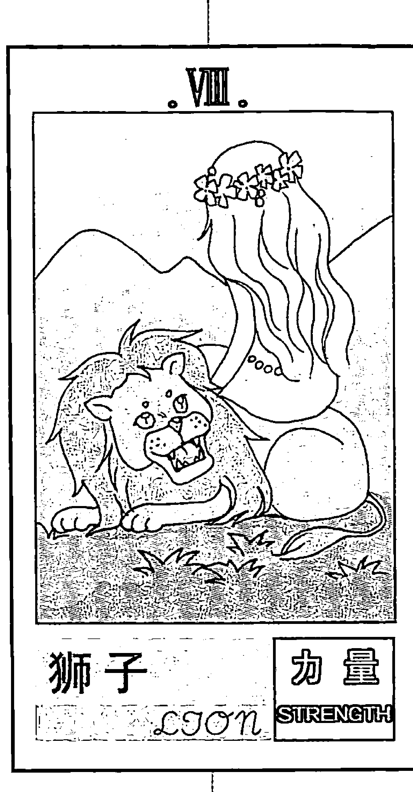

> 狮子的出现反映出：为了达到目标，我们需要温和的力量以及耐心。

狮子还提醒我们需要重视内心的太阳，以及在我们身上女性的品质。

这些女性的品质是：耐心、文雅，以及爱的力量，最好是通过温柔的爱的力量。

太阳并不总是象征男性。它孕育着每个新日子的到来，温暖并且养育我们。因此，我们生活中出现的狮子，最有可能性的情况是反映出：判断我们女性化的能量是极其重要的，这会带来新生命和力量。

当狮子出现时，通常会有附加的机会，以唤醒新的阳光；或者有关于我们自身力量的新的表达。信任我们身上女性化的部分——创造力、直觉，以及富有创造性的想象力，这就是目前力量的栖身之处。不要对抗任何东西；不如使用愿望、组织、创造性的想象力的力量，你的力量会得到增长。

###### 倒放含义

倒放的狮子通常反映出我们在对抗一些事物，而且这种对抗行为最终以失败而告终。过于严格、过于顽固、过于任性，以及过于作威作福，这些不良的情绪因素除了把我们的生活状况以及围绕我们身边的事物变得复杂之外，不会产生任何效果。这个时候，这样的做法并不能达到目的。

倒放的狮子需要主张和耐心之间的平衡。这表明此时我们应该对已经运行的事情保持信心，绝不能放弃。保持坚定和耐心。当你感到危险的时候，不妨大声地吼出来。

要问的问题：
- 在你生活中的一些团体中，你达到怎样的有用程度呢？
- 你是否需要做的更多，比你目前所做的更多？
- 是否尝试事事亲历亲为？
- 你是否需要对你自己、你的项目、你周边的事物增加更多的保护？
- 为了完成任务，你是否需要更多的协作？
- 你是否已经决定这就是你的生活道路，或者根本不是？

## 9. 隐士（THE HERMIT）
猫头鹰 (owl) 沉默的智慧，视力，以及指引

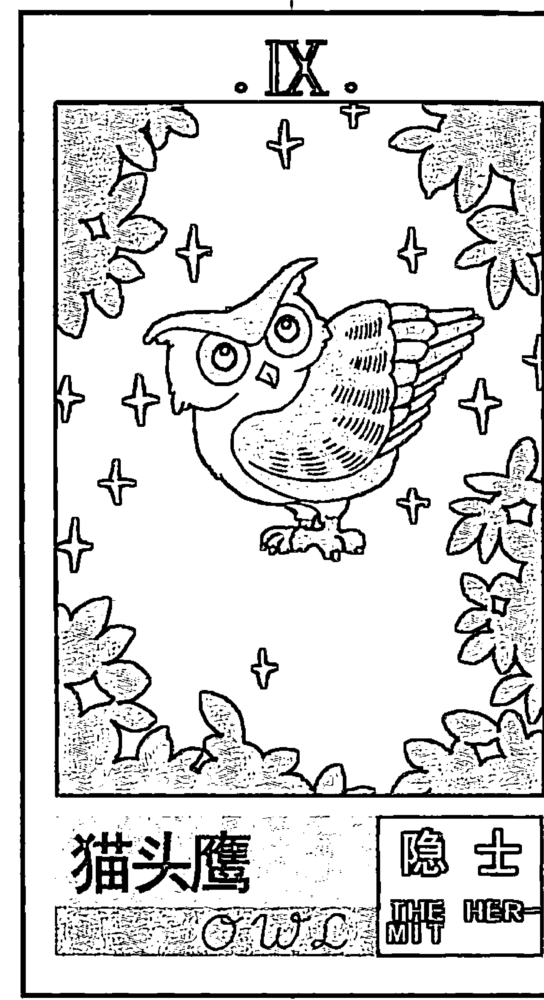

遍及世界，猫头鹰曾经被人崇拜，也被人们讨厌；猫头鹰通常是阴谋的化身，让人神魂颠倒，是神秘、魔法、视力以及指引的象征。

在自然界，猫头鹰并不是最聪明的，但它依然是一种强势的动物，凡事依循自己的本能。它可以教导我们很多。猫头鹰有极好的视觉和听觉，因此，猫头鹰的出现通常表明我们自身感觉能力的提升——尤其是直觉。

猫头鹰是沉默的指引，教导我们要信任自己的本能以及沉默的印象。猫头鹰通过提升我们的感觉为我们提供指引。它的出现通常预示着：指引和帮助已经为我们准备好，但是，是否依照它们行事，依旧取决于我们自己。

猫头鹰是一种夜行动物，而黑夜预示着拥有巨大的秘密和财富。黑夜是既让我们向往又让我们害怕的地方。当猫头鹰出现的时候，做梦的活动会变得强烈，给白日的活动带来透视和清晰的看法。当猫头鹰出现时，对梦以及其中隐藏的智慧进行研究是具有益处的。

> 猫头鹰的出现通常表明我们自身感觉能力的提升。

猫头鹰即使是在光线极暗的情况下仍然能够看清楚最细微的移动。因此，你将会看到之前可能没有意识到的细微之处。相信这些印象，猫头鹰的视力无论在白天还是黑夜都十分好。

> > 当猫头鹰出现，就是在静谧中进行自己的努力的时候。

猫头鹰的听觉像它的视力一样敏锐。因此，当猫头鹰出现的时候，我们可以听到在其他人声音之中的潜流。相信你从你周围的谈话中所听到的以及没有听到的内容。不管你认为这个印象是多么奇怪。

当我们学会信任这些本能的时候，就可以看到我们自己的智慧增加了。

猫头鹰总是无声无息地飞翔，它们的翅膀边缘可以分散飞行发出的声音，从而产生静音效果，推动它们在静谧之中的狩猎。当猫头鹰出现，就是在静谧中进行自己的努力的时候。一个古老的格言说明：静谧之中蕴含着力量。这一点，在猫头鹰出现时，比在其他任何时候都显得重要。当机会出现的时候，要有进取心地、沉默地跟随它。

###### 倒放含义

猫头鹰是极具侵略性的空中猎手，有极强的生活本能。猫头鹰是沉默的杀手，而我们追赶目标也可用这个方式。每一种猫头鹰都具有自己独一无二的特质，在我们的生活中，有必要对它们每一个不同种类进行清晰的研究。这具有十分重要的意义。虽然，不管种类的话，猫头鹰出现在倒放的位置，是我们把注意力集中在内心感知上的大好机会。也许我们忽略了别人明智的劝告或者自己盲目的反抗。这不论是出自我们的直觉，还是周围人的意见，在我们采取不适当的行动之前，我们需要后退，聆听，观看。

要问的问题：
- 我们是否忽略了自己的印象？
- 我们是否假装对显而易见的东西视而不见？
- 我们是否没有足够仔细地聆听我们周围的人在说什么，以及有什么将要发生了？
- 我们是否太快地让其他人知道了我们的目的和行动？
- 我们是否留意了自己的梦，以及是否留意了它们所提供的洞察？
- 是否帮助和指引已经可行但是被忽略了的状态？

#### 10. 命运之轮 (WHEEL OF FORTUNE)
熊 (bear) 留意内心的声音，循环

熊告诉我们要聆听内心的声音，跟随一个新的、更加自然的节奏。这是个万物都会遵循的节奏。当我们也列于这个节奏的时候，我们将更少地挫败，更多地成功。

在深秋、初冬，熊从外面撤回。它们进入自己的洞穴里，进入长长的睡眠，靠身体储存的脂肪活着。在整个冬季，妈妈生育新的一代，通常是2只，有的时候是3只幼兽。春天到了，这些幼兽来到外面。在独立生活之前，它们会和自己的母亲共同生活两年的时间。

如果熊来到我们的生命中，我们需要集中注意力到新的节奏上。当深秋和初冬逼近，放慢我们在户外的活动。在整个冬季里，把注意力集中在2个或者是3个项目上。当春天来到，把这些项目带出来公开，但是要寻找那些至少需要两年时间才能成熟的项目，自己亲自跟进。

熊象征着：要经常地留意自己内心的声音和想法，感觉自己内心的节奏。不要总是模仿别人的做事方式和思维模式，去尝试或者进行某些事项，信任你自身的节奏，听从熊的指引。

熊教导我们（通过在冬日的洞穴中孕育生命的方式）：要自己向前走，唤醒可能在那里沉

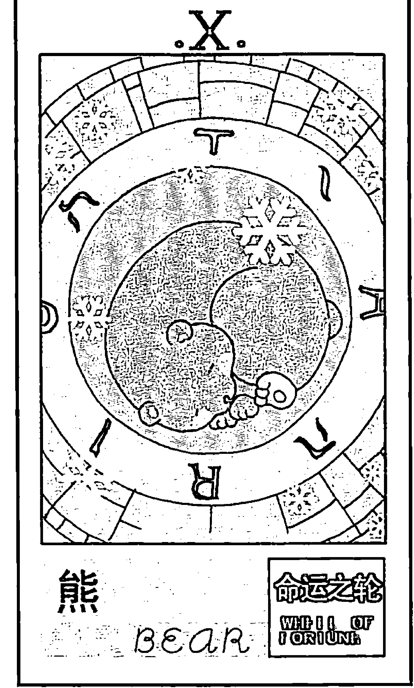

> 熊的到来提示我们，需要集中注意力到新的节奏上。

所有的熊都会储藏蜂蜜，而蜂蜜象征着生活中的甜蜜。

睡的东西。熊提醒我们：把我们唤醒的东西带到外面的世界来。熊教导我们：一个新的循环正在我们的生活中运行。为了取得最大的成功，我们必须要适应这个新的循环。命运之轮已经为我们重新运转，这是改变自己之前模式的好时机。所有的熊都会储藏蜂蜜，而蜂蜜象征着生活中的甜蜜。当熊漫步到我们的生活中的时候，这是一个提醒：我们天生的可能性已经被唤醒，但是，能利用它们，品尝到生活的蜜糖的唯一方式，是把它们带出来，用一种新的节奏表达它们。

###### 倒放含义

如果处于倒放的位置，可能指出：隐藏的倾向——尝试经年的“冬眠”。倒放的含义是，是时候从洞穴中走出来了，然后去生育幼兽。倒放的熊提醒我们：我们最近可能比较急躁易怒，这是因为没有跟随我们内心的节奏，并不信任它们的缘故。有时候这样做可能很困难，但是，凭借着勇气和洞察力，我们可以再次评估，并做出适当的反应。倒放的熊常常反映出对内心声音的疏忽，通常指出，我们允许外界的力量而不是我们的本能，来影响我们的节奏和行为。在长长的冬眠之中，黑熊会停止它的肾功能。肾主要协助排泄和过滤血浆，它是判断力的象征。要记住，熊提醒我们：要更深刻地了解自己，这样我们就可以从力量之源处做出决定和选择。

要问的问题：
- 你丧失判断力了吗？
- 你是否尚未留意自己的天性？
- 你是否还未发觉哪些事物是生命中有益的——享受生活的乐趣？
- 你是否太过苛责，或者你身边的人是否如此？

#### 11. 正义 (JUSTICE)

##### 大象(elephant)正义的古老力量

大象提醒我们，关于正义的灵魂法则在我们生活中运作，但是我们并不能很容易地认出这些灵魂法则来。大象帮助我们回想起：正义会在我们周围的某些情况中出现，那就是公平，作为一个提示提醒我们要信任过去的经历中的教训，这样我们就不会在现在或者将来再一次地重复它们。它的出现确认了：正确的决定已经做出。

大象象征着王权和孕育，它是陆地上最庞大的动物。大象唤醒了敬畏和惊奇；而当我们看到真正的心灵正义在生活中的运作时，也会得到同样的感觉。

大象群体之间是非常善于友好协作和互相帮助的。它们证明了巨大的力量、沟通，对垂死者表示哀悼。它们感情的广度，可以同人类相比，而它们总是更平易、更自然的。

大象最显著的特征就是它的象鼻，尽管它的视力很差，但是它的确具有很灵敏的嗅觉。大象灵敏的嗅觉使得它能够呼吸到各种气味。它通过嗅觉感知和洞察周围的世界。大象出现在面前，人们通过这种方式会做得很好：信任自己的嗅觉，而不是自己所看到的——尤其是要做出重要决定的地方。

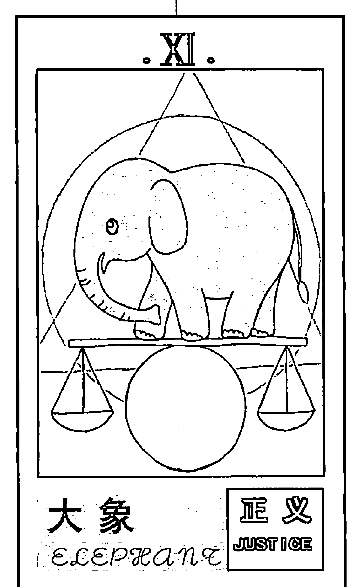

> > 大象是陆地上最大的动物，不但是权力的象征，也是公正与平衡的化身。

大象证明了巨大的王权，以及彼此之间的互相影响。

大象通过年龄、性别，以及其他细微的特征，划分了自己的社会结构。所有的母兽和小兽组成雌性为主的群体，由年长并富有智慧和经验的母兽做首领。这反映出远古社会女性力量的重要性，以及女性力量的三种表达——孩童、母亲，以及充满智慧的老婆婆。雄兽组成单身汉群体。不同的群体存在着为交流更有效而设的性别角色。

大象证明了巨大的王权，以及彼此之间的互相影响。大象群体里遵循着尊老爱幼的优良传统，年长一些的照顾年纪小的兄弟姐妹。长大成人的大象帮助那些生病者和受伤者。大象的社会才是理想中真正的社会。当大象出现，正义也会到来，同时，也有机会把家庭重新恢复到具有强力的状态，社会也会再一次变得完美。

###### 倒放含义

处在倒放的位置，大象通常预示着一种失去正义的情形正在到来，或者是旁人或自己在强大的感官上的损失。人生在世，通常充满很多变数和我们不能控制的事物。我们无法左右和改变别人的做法。大象是一个提示，并不是正义没有发生，而是正义需要在最好的时间、方式下以及所涉及的其他方面活动。如果我们已经尽我们所能，做了所有能做到的事情，那么现在是时候停止担心，把精力转移到其他方面上去了。

要问的问题：在大象的社会中，每一只都有明确的角色分工，你是否忘记了在社会中自己的角色？作为一个个体，我们是不是尝试得太多？我们是否忘记了那些让我们取得现有成就的优良传统？我们是否忽略或者忘记了我们的理想、我们的家庭、我们的社会？

对于一些我们经常遇到的情形，我们的反应是否在重复过去的错误？我们是不是并不信任自己的直觉，而根据表象判断各种事物？我们是否需要更多的分辨力？当某些事情嗅起来不对的时候，我们是否未做回应？

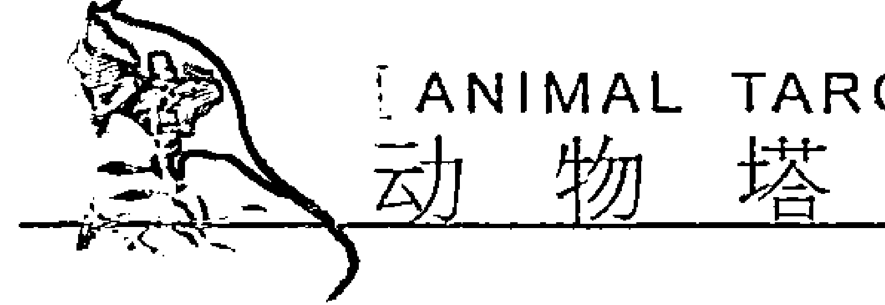

#### 12. 吊人 (THE HANGED MAN)

##### 蝙蝠(bat)新的事实和理解

蝙蝠是能够飞翔的哺乳动物，所有的飞行都意味着升到上面，这种暗示隐藏在混乱的改变力之中。蝙蝠的出现预示着：在改变力之中，新的感知和努力在飞翔。一切屏障都会被粉碎，新的事实将会显露出来。

在传说中，蝙蝠意味着重生、黑暗的到来。它预示着修行者即将死亡，他们打开了新的视野。所有的改变都是为了将来实现最好的目的，虽然，其中的益处可能并不能马上看出。

变化和转变将为我们打开新的前景和前途。之前并不明了的事物会变得清晰，之前难以看清楚的事情也会清晰可见，而且会大大激发我们的创造性和新思维。这可以帮助我们看到之前并不能看到的事物中的真实。

蝙蝠的睡觉姿势很特别，它们头冲下，就如同塔罗牌中“吊人”惯例的姿势一样。这反映出新的前景、新的事实的觉醒。它的信息是：关于新视野的承诺，以及出乎意料的观点将要得到证实。

在自然界中，蝙蝠能够有效地控制害虫，并能帮助授粉。蝙蝠的粪便也是很好的肥料。这反映出：任何情况下，事情都会向好的方向发展，不要让恐惧和担忧干扰我们的生活。

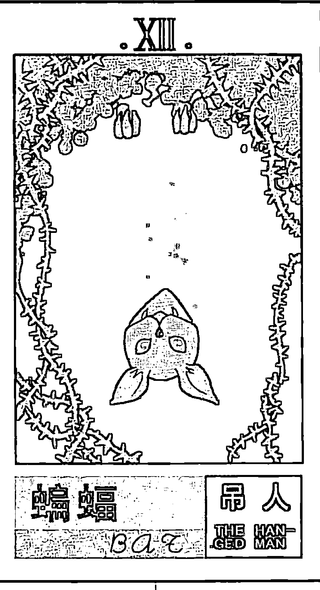

> 蝙蝠意味着重生、黑暗的到来。

蝙蝠有一种声纳，带给它们完美的航行能力。它们能表演出令人吃惊的飞行技艺，并能察觉到细微的障碍物。

当蝙蝠到来的时候，我们理解别人信息和暗示的能力会得到大大提升，能够听出更多潜台词的意思。信任你的直觉。蝙蝠通常预示着开始，预示着新的事实的出现，在变化之后会有更高的感知。

###### 倒放含义

蝙蝠是夜行者，夜晚通常是恐惧集中之地。如果处于倒放的位置，蝙蝠通常指出：在我们的生活中，向上的发展受到了某种限制，我们要彻底忘却困扰我们的过去，为了新生，我们需要释放以及改变生活中的一些方面。我们必须记住：留恋那些没有任何益处的过去只能搅乱我们的发展进程。

蝙蝠提醒我们：我们要勇于面对恐惧，不管它看起来是多么肮脏。倒放的蝙蝠可能在向我们展示：在何处，我们会抵抗可能给我们带来益处的改变。蝙蝠激励我们放开过去，创立新生。我们可能被一些物质包围起来，使我们不能看到具有更大前景的物质。

要问的问题：我们是否试图避免去面对一些必然的事物？我们是否拒绝看到某些情形中的真实？我们是否抱有这样的态度：“明枪易躲，暗箭难防”？我们是否允许自己的恐惧控制我们？我们的想象力，是否正走向枯竭？我们是否并没有看到真实的事物？

#### 13. 死神 (DEATH)

##### 蛇(snake)脱离过去，复苏

蛇是古老的宇宙征兆之一，象征着疗伤、生命、死亡，以及重生。它是变革的一种暗示，虽然通常是被看做是死亡的象征，但是我们忘记了死亡是包括重生在内的巨大循环中的一部分。

当塔罗牌中的死神被描述为蛇的形象时，并不意味着任何方式上的、形状上的、形态上的灵魂死亡。它证明了一种转变，蜕皮一样脱离过去，然后新的事物可以产生，反映出在我们生命中，有一种复苏在起作用。

蛇的一生都在成长，它们是令人吃惊的爬行动物。这就是它们需要蜕皮的原因：它们太大了，旧的蛇皮已经不适合了。蛇的蜕皮提醒我们：我们必须定期告别那些不适合我们、和我们不匹配的事物。在蜕皮中反映出来的死亡和重生的循环，通常以一种名为“ouroborus”的巨蟒作为象征，这种巨蟒会吞食自己的尾巴，象征着永恒的循环。

在蛇蜕皮的时候，它们的眼睛会闭上，好像睡着一样。对于古代的萨满教的人来说，这预兆着蛇具有在生存和死亡的不同领域之间移动的能力。当蛇出现在我们生活中时，通常反映出：新领域的展开，以及心灵联系的唤醒。像蛇一样，那些新出现的领域和新唤醒的心灵之间的联系，会在梦中第一次崭露头角。

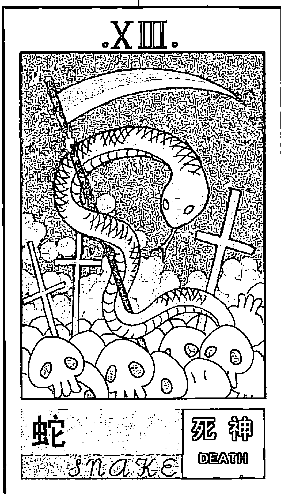

> 蛇蜕皮表明脱离过去，然后新的事物可以产生。

蛇同时象征着变化和疗伤。

蛇的视力很弱，它们依靠灵敏的触觉和嗅觉。不要相信你看到的，要信任你所感觉到的。你会在真正意识到变化之前就感觉到它们。

蛇同时象征着变化和疗伤。它们极具速度感和敏捷性。因此当蛇进入我们生活中时，那些变化和转变会很快发生，并且被很快地意识到。放松恐惧感，不要抵抗改变，因为伴随着改变，会带来新的有创造性的前景、智慧以及力量。当蛇出现的时候，我们会找到一些机会，可以脱离我们的过去，并修复生活中的某些方面。

###### 倒放含义

不论蛇什么时候出现，蛇的出现，让我们预料到生活中发生在某些领域的死亡和重生，而且预示着健康状况正在向好的方向转变。寻找你周围情况的改变，把握通往新生活的机会。

蛇灵活地转动它们的下颚，以便能整个吞下自己的猎物。如果处于倒放的位置，则表明我们在处理身边的事情时遇到了困难，很难被解决。我们可能否认它们或者并不这么做。它也可能预示着我们一次吞咽过多。转变最好慢慢地完成。

蛇在攻击和防卫的时候都速度极快，我们是否快速打击他人？我们是否主动出击？不去行动最终会导致监禁。

要问的问题：我们是否有必要做出一些改变，但这些改变并不是为了某些原因？我们是否尝试推动改变迅速发生？我们是否依赖于以及并不放松那些对我们已经没有益处的事物？我们是否忽略了可以修复我们生活的机会？

#### 14. 节制 (TEMPERANCE)

##### 天鹅(swan)新的梦想，新的领域

天鹅是一种古老而具强力的图腾。甚至，它的名字也是英语语言中最古老的诸多单词之一，从盎格鲁-撒克逊人（Anglo-Saxon）的时代不变地延续下来。天鹅是美丽的水禽，它拥有优雅的身姿。天鹅拥有长长的、优美的脖子，而其中的大多数种类，拥有吸引人们注意力的洁白的羽毛。脖子是处在高处和低处之间的桥梁，当天鹅出现的时候，通常意味着新的梦想、新的领域将要展现出来。

天鹅食用柔软的水生植物，以至生活得像一个水下的饲养员。这反映出：关于新领域的敏感度在增加，而与之伴随的能量将要苏醒。而一种对于自己和他人的更具有灵敏度的感觉将会建立。

天鹅喜欢寒冷，冬天是它体能最好的时候。要注意冬季中新的领域，以及对新事物的敏锐程度。如果天鹅在冬季出现，它提醒我们要集中注意力到新的领域，并且要在冬天过去之前实现这些新的梦想。

天鹅提醒我们：在保持目前所取得的成绩的情况下，可以适当地尝试新鲜事物。鼓励我们要脚踏实地地努力；但是，切忌盲目，不要放弃我们已经拥有的事物。天鹅教导我们平衡。正如“丑小鸭”的故事所说，天鹅的美丽需要花费时间才能成熟，因为新的领域的出现并不意味着我们就可以急促地冲进这个领域。耐心和平衡是必需的。那些门会一直开着，因此我们没有必要匆忙和慌张。

天鹅是孩童、神秘、诗人以及梦想者的图腾，而梦想者正是知道我们可能性的那部分。

天鹅提醒我们：当我们准备好的时候，那些通向梦想和新的领域的大门将向我们打开。时间正在逼近，但是在通过那些门的时候我们需要保持平衡。如果我们这样做了，梦想和新领域将以新的方式在我们面前展现，使得我们以后的每一天都变成美丽的、有承诺的一天。

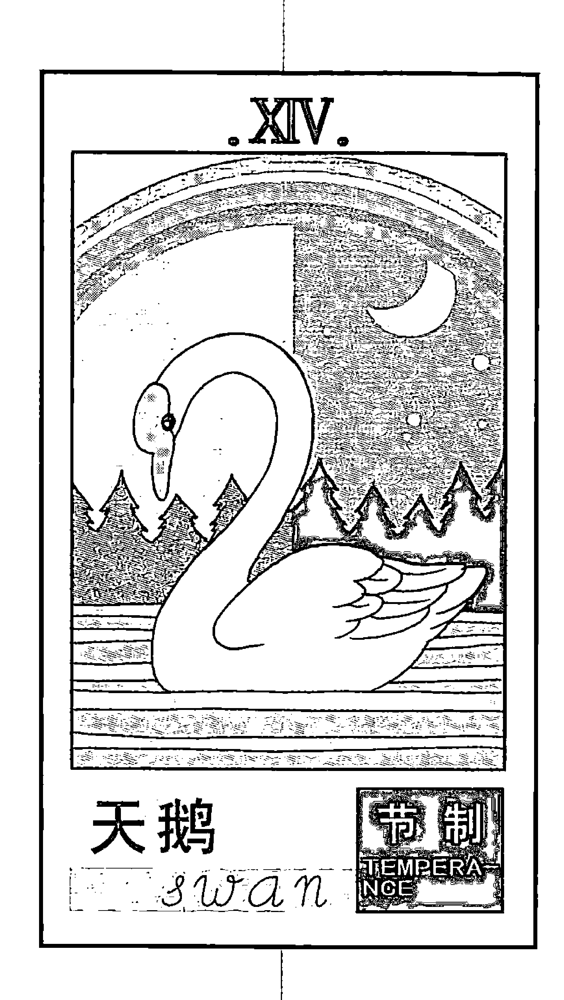

> 天鹅出现时，通常意味新的梦想、新的领域将要展现出来。

###### 倒放含义

天鹅不但强壮而且对待感情专一。它们结成配偶就会终其一生。如果处于倒放的位置，它可能暗示着：我们自身或者我们周边的某人，行事过于迅速和强烈。倒放的天鹅通常预示着：那些最初的感知，那些所谓的永久关系，并非我们所想。要记住，那些最初具有吸引力的事物，并不预示着持久的关系。

倒放的天鹅提醒我们：适当后退，给自己更多的时间。天鹅提醒我们：美丽和长寿都是可以实现的，但必须按照自己的规律来完成；任何人为的强制都是不对的。对于目前的情况，我们不能准确地判断它的是非。事物将会在冬季结束的时候自己变得明晰。是时候放慢脚步，停下来，严肃地审视一下事物是怎样进行的了。

要问的问题：我们是否想要过快地变成天鹅——不允许我们生命中的美丽和努力按照它们自己的时间和展露？我们是否试着太快地做太多的事情？我们是否在跳跃之前没有仔细查看？我们是否在尝试推进或者强迫着成长或者行动？

> 天鹅提醒我们：当我们准备好的时候，那些通向梦想和新的领域的大门将向我们打开。

[ANIMAL TAROT]
动物塔罗

#### 15. 魔鬼 (THE DEVIL)

##### 大乌鸦(raven) 黑暗之光，变形

大乌鸦如同魔鬼，拥有庞杂的学识。它曾经是关于出生和死亡、魔法、神秘的鸟类。
关于大乌鸦，有一个古老的传说。从前的大乌鸦都是白色的。一天，一个巨大的黑色水池吞下了太阳之光。大乌鸦为了拯救太阳，潜入水池，把阳光再一次带到外面。虽然大乌鸦凭借自己的努力成功了，但是它们被水池永远地染黑了。大乌鸦教导我们：为了完成我们所追寻的事物，牺牲是必须作出的。大乌鸦拯救阳光的行为好比苹果带给亚当和夏娃知识。两件事情都带来了好坏参半的结果。

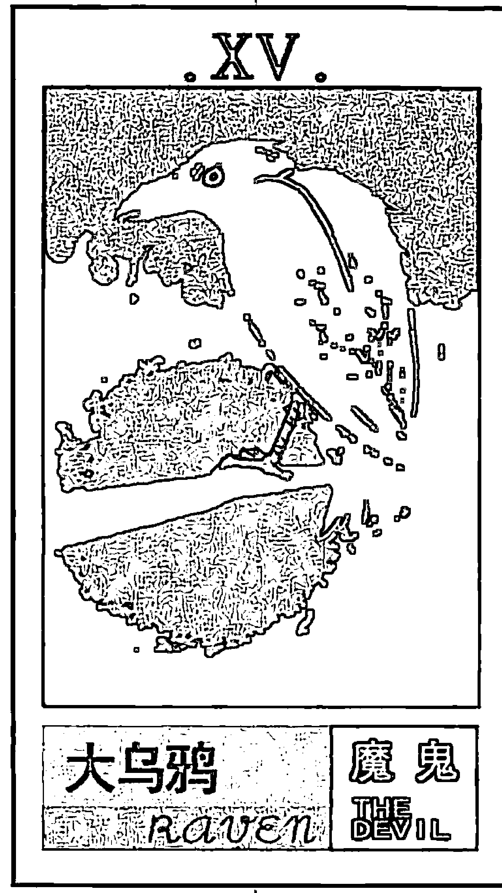

大乌鸦出现意味着光明照亮了黑暗，不管这种黑暗存在于我们生活中任何地方。不同世界之间的大门已经敞开，我们周围的事物已经变形，并不是它们表面所表现出来的那样。这预示着我们将忙于各种场合，或者陷入不重要的事情的泥沼之中。我们并未采取我们必要的行动，或者，我们在期待其他人这样做。
大乌鸦聪慧活泼，善使工具。它们会使用石头，或者其他合适的东西，帮助它们把坚果砸开，这提醒我们：我们要为我们完成的东西负责。我们必须付出努力，使工具适合我们当时的需要。大乌鸦的出现指导我们：能够变换我们生活的真正的魔法，依赖于我们自身的努力。
我们必须成为自己的黑暗之光。
大乌鸦讲明成为魔术师或者女巫的机会，它向我们指出：如果事情有变，关键取决于我们自身。大乌鸦提醒我们：一旦我们唤醒了自己的魔力，就必须保持平衡。大乌鸦教导我们怎样使生活变形，也教导我们，变形的结果可能并不是精确地符合我们的想象。尽管如此，我们必须对这些变化负责。

大乌鸦具备很高的发声技巧，擅长混合以及模仿其他动物的喊叫声。它们可以教会我们怎样和其他人——包括动物——交流。我们并不能如自己所愿的那样大胆地说出来？我们在自己的讲话中并不顾及他人？现在，是时候进入黑暗之中，面对恐惧，只有这样做才有光亮。

> 大乌鸦出现预示我们周周的事物已经变形，并不是表面所表现的样貌。

###### 倒放含义

如果处于倒放的位置，大乌鸦告诉我们，有比身陷困境更可怕的事情出现。相应地，此时可以进行移动，做出决定。但是，比起不做任何决定，或者根本不采取任何举动，在此时，行动失败会带来更大的问题。

要问的问题：我们是否并不采取行动而是等待其他人做出改变？我们是否害怕向前行进？我们是否失去了心灵的视力？我们是否对环绕周边的信号不做反应？我们是否允许心灵或者身体上的某些东西，为我们做出决定？

> 大乌鸦提醒我们，如果事情有变，关键取决于我们自身的努力。

> 大乌鸦教导我们，怎样使生活变形，让我们必须对变化负责。

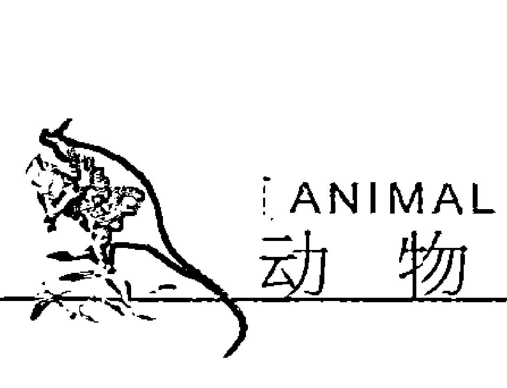

#### 16. 高塔 (THE TOWER)

##### 秃鹰(vulture)生命、死亡、重生、新视点

秃鹰总被误解。之前提到的《动物说》中主持专题讨论会时，很少有人选择秃鹰作为自己的图腾。是的，秃鹰总是很让人讨厌。因为它是环境中的垃圾收集者，把死亡的生物打扫干净，但是，它也是关于重生和疗伤的动物中比较强有力的、温和的几种之一。

秃鹰告诉我们生死循环的规律。帮助我们看到在我们生命中运行的那些程序；它的出现通常是要信任这些程序的信号。不论事件和情形怎样出现，秃鹰提醒我们：它们最终会体现在我们的健康和益处上，帮助我们更加清晰地看到事件最可能怎样显露出来。

秃鹰帮助我们相信关于生命、成长的承诺以及履行。它的出现预示着：变化将要发生，而且很可能会很快发生，请准备好。秃鹰振翅高飞，使用它们高度发达的视力以及灵敏的嗅觉，探测到食物。它们相信生命的循环，知道自己最终会有一些食物可吃，因为万物都有死亡，而死亡的万物又会重生。

秃鹰视力灵敏，嗅觉发达。它教导我们：相信我们对周围的感知，相信我们在周围感受到的。当循环来到我们身边时，秃鹰帮助我们看到循环，或者至少感觉到它，以便我们能协同循环工作。

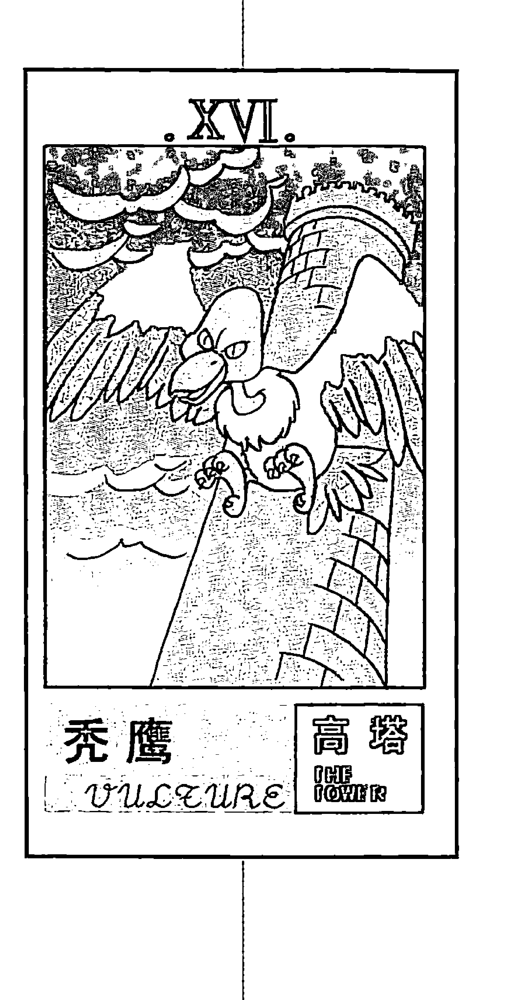

> > 秃鹰的出现预示着变化将要发生，而且很可能会很快发生。

秃鹰是疗伤以及净化的象征，反映出协调已经处于恢复的进程之中。

秃鹰提醒我们：改变是不可避免的。拆卸旧物，以便产生新的事物。当我们认出循环并且和它协同工作，我们就会使用较少的能量和努力。

秃鹰是疗伤以及净化的象征，反映出协调已经处于恢复的进程之中。

秃鹰的工作是驱散负面事物，这向我们展示了：不管生活如何之苦，重生必将到来。其结果，就是我们将看到生活全新的前景。

###### 倒放含义

如果处于倒放的位置，秃鹰通常预兆着：改变的进程已经在运作。停止进程或改变它的方向，都会导致混乱。秃鹰具有超强的消化系统。对于波特淋菌中毒（botulism），它们具有比人类强40000倍的抵抗力。考虑到它们的食物，这种特质是十分重要的。处于倒放的位置，秃鹰反映出：有必要改变我们的消化习惯，不论我们在尝试消化什么——食物或者想法。之前不成为问题的食物可能会变得麻烦。我们要善于从某些想法中跳出来，在当前情况下，这些想法可能变得不再对我们有益；从它们之中跳出，稍事休息也是允许的。

要问的问题：我们是否在坚持不再具有益处的事物？在你生活的某些领域，是否有一些疗伤类的事务可以进行？你是否对在你周围看到的、闻到的，并未集中注意力？我们是否拒绝排除我们生活中有必要排除的东西？对于事件表露的方式，我们是否感到不耐烦？我们是否在反抗改变？

## 17. 星辰（THE STAR）

##### 萤火虫(firefly)精神上的灵感，希望

萤火虫（firefly、lightning bugs 是萤火虫的两种叫法）是具有魔法的关于灵感、希望的象征。它们是通过希望和努力，事物能够完成的承诺，提醒我们：我们已经打下了合适的根基，通过它，我们将获得大量的酬劳。

萤火虫是一种会发光的小甲虫，通常是通过它们的尾部发光。它们在飞行时，或者在植物上休息时会发出光亮。这些光的闪烁会持续很短的时间，而每一个种类也有截然不同的节奏。

大多数情况下，萤火虫通过有节奏的闪光吸引配偶。这是求偶仪式的一部分，而求偶仪式会扩大这个种族。对于那些生活中出现了萤火虫的人，这时候应相信自己的节奏——不论是身体还是心理上。我们对于灵感的力量将会上升，希望开始展现在我们面前。萤火虫提醒我们：存在着会回应我们的人，他们喜欢我们。他们以类似的频率闪烁。他们的出现将很快地被知晓，而使我们的生活变得更加有创造性、更加健康。

萤火虫发出的是冷光源。其中的化学和生理过程依旧使科学家感到困惑。它微小的光芒反映出：看起来不可能的事物变得可能，令人鼓舞的奇迹将在我们周围闪烁和出现。

这是一个极好的时期，记下我们脑中闪现的创造性灵感。我们并不需要考虑现在就依照它们去做什么事情，因为仅仅把它们从头脑中拿出来，就可以把它们创造性的力量带到我们生活中，而它们提供的灵感将在未来一段较长的时期影响我们。

萤火虫在白天看起来很寻常，但是在晚上它们就会发光、闪烁，就如星星一样闪耀。它们承诺我们的目标将会实现。心灵上的礼物已经被唤醒。我们已经站在正确的道路上，而那里也有强大的精神能力环绕着我们。

萤火虫出现的时候，人们开始重新评价过去的看法和观点。我们开始闪耀和发光。能够完成梦想、激发奇迹，以及唤醒巨大希望的机会，将在我们生活中强烈地闪耀。

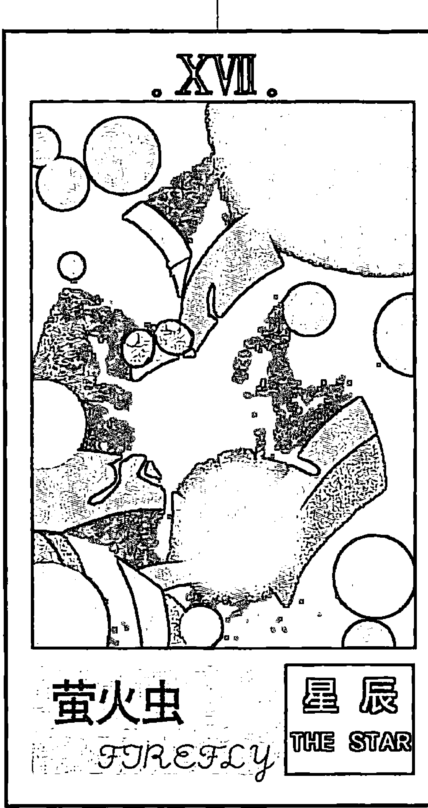

> 萤火虫提醒我们已经打下了适合的根基，通过它将获得大量的酬劳。

###### 倒放含义

倒放的萤火虫可以预示着多种的错误判断。也许我们将走向错误的道路，或者我们在和错误的人一起工作、社交。我们可能让其他人（通过他们消极的观点）阻挡我们因创造性的努力而取得的成功。

倒放的萤火虫警示我们要注意自己的饮食，这关乎我们的健康。成年的萤火虫，在学会了为了自己的目的从周边产生和提取能量之后，就吃得很少。这样做将会是明智之举：检查我们在吃什么，检查我们吃多少，因为这些会影响我们的健康状况和精神的创造性。

要问的问题：我们是否太过悲观？我们是否坚持一种绝望的、失去全部的感觉？我们是否迫使行动的方向改变到错误的道路上？我们是否并没有依照我们具有建设性的想法行动——或者，甚至不承认它们？我们是否并没有在心灵上的礼物合适我们之时，就利用它们？是否有其他人错误地引导我们，给我们错误的希望或者错误的灵感？要记住，萤火虫提醒我们：积极的希望，对于完成和履行来说，是一种临界成分。

萤火虫出现的时候，人们开始重新评价过去的看法和观点。

#### 18. 月亮 (THE MOON)

##### 狼(wolf)直觉的指引,保护

狼身上有很多积极的特质，是野外的精神的缩影，因此，人们把它神化也没什么可奇怪的。狼出现提醒我们聆听自己的直觉。狼通常能警觉到自己周围环境的微小变化，它教导我们意识到在我们周边发生的同样的事情。狼教我们信任自己直觉的指引，通过这样做，它就会变成我们的引导者和守护者。

狼有一个复杂的交流系统，由肢体语言和发声法组成。它教导我们：通过使用适合的肢体语言，增加我们口头的交流。当狼出现的时候，我们的交流能力会得到加强，而和其他人的交流也变得清晰。我们会认出那些轻声细语和肢体语言，其反映的可能并不是我们所听到的意思。信任你此时的印象，因为这是狼出现所带给我们的教导的一部分。

狼的知觉极其灵敏。依据评估，它们的嗅觉要比人类的灵敏100倍。它们的听力更加出色。它们具有仅仅凭借嗅觉和听力就能够狩猎的能力。这是一个提醒：我们的感觉正在变成一个骗子，我们要相信自己内心的想法。我们的直觉和身体的能力在迅速提升。

现在，是时候更多地依赖我们自己内心的见识，而不是其他人的。变化正在发生，即使它并未在物理世界中展现。其中的一些变化，以及我们对它们的最初认知，会通过梦境传达。

狼是社会化的动物，狼所建立的一些仪式、规矩使得狼群如此强壮。即使是在完成自己的个体角色时，它们也在彼此监视。

狼教导我们去倾听内心的声音，它引导我们走出不适当的行为。当狼出现的时候，正是信任我们内心的指引的大好时机，以找到我们新的道路，控制生活。狼告诉我们：当我们踏上新的旅程时，那里也有指引和保护。

> 狼 是 狂野 的象征，狼教导我们信任自己直觉的指引。

> 狼教导我们去倾听内心的声音，它引导我们走出不适当的行为。

## ⟂倒放含义

狼极其聪明，它们走自己的路，避免麻烦和危险。狼处于倒放的位置，说明我们的判断力下降，使我们不能看到事物的真实面貌，此时不适合让我们的想象力失去控制。通过保持控制力，更加慎重地进行观察和移动，我们可以避免麻烦。

处于倒放的位置，狼告诉我们：此时不宜采取冒险的举动，因为在这个时间，我们更容易误解或者曲解我们内心的指引，我们可能不能信任我们直觉的指引。狼对于家庭的感知和忠诚是强烈的。处于倒放的位置，我们要仔细检查自己以及我们周边其他人的忠诚性。

- 在我们的社交中，我们是否变得更加清晰？
- 其他人呢？
- 是否有这样的情况：虽然交流和直觉并不明晰，我们依然做出了回应？
- 我们现在是否太过于敏感？
- 我们是否允许自己的恐惧阻挡我们进入新的方向？

#### 19. 太阳 (THE SUN)

## 蜂鸟(humming-bird)喜悦,梦想,成就

蜂鸟虽小，却具有令人吃惊的本领。它让每个遇到它的人吃惊。蜂鸟拥有长长的鸟嘴和舌头，它们可以轻而易举地把花蜜从花朵里吸取出来。事实上，蜂鸟经常完成对许多花的授粉工作。因此，蜂鸟出现的信号就是：我们生活中将有新的甘露时期。新的喜悦将在我们周边出现，我们的梦想将更接近完成，我们将进入一个卓有成就的时期。

蜂鸟是高超的飞行家，可以用各种姿势进行飞翔，甚至倒着向后飞行。它这样的技巧表明它并不惧怕任何其他的鸟类。没有其他的鸟类可以向后飞翔，这反映出：过去的梦想和机会将会重新浮出水面。这一次，要彻底地利用它们。

不论是现在的环境或者是刚刚逝去的过去，蜂鸟的出现通常预告着喜悦和成就。我们将看到我们到达梦想地。在我们周围，机会已经出现，我们要热忱地得到它。蜂鸟是一个充满祝福和新的阳光时期的信号；允诺我们：通向成功的新的冒险以及恢复的健康。

蜂鸟是独立自由的天使。它们也是十分努力的工作者，并酷爱嬉戏。这提示我们：要把事物放到我们独一无二的道路中，并享受其中的乐趣。

> 蜂鸟的出现意味着将有新的喜悦出现在我们周围。

蜂鸟提示我们，过去的梦想和机会将会重新浮出水面，新的甘露时期即将到来，我们的梦想将更接近完成。

红喉北蜂鸟 (Ruby-throated humming-bird) 是一个迁徙中的奇迹，它们旅行几千英里，而期间需要的食物和能量都储存在它们小小的身体内。

科学家们始终没有弄明白，蜂鸟是怎样把能量储存在小小的身体里来维持漫长的旅途。正因为如此，蜂鸟成为看起来完全不可能完成的事物的象征。蜂鸟帮助我们找到这个奇迹——充满乐趣的生活。

## ↓ 倒放含义

当处于倒放的位置，蜂鸟通常反映出：我们要现实一点。不要做太多的白日梦。用玫瑰色的眼镜看待事情，但事实上并没有你想象的那么好。倒放的蜂鸟也可能预示着：我们也许可能要事与愿违，我们付出的努力也许得不到应有的回报。

蜂鸟虽小，却很能吃。每天要进食50～60次。它们的食物主要是花蜜，也吃少量的昆虫。如果倒放的蜂鸟出现，表明我们需要吃很多食物。从一种健康的观点看，我们可能需要调节通常的饮食习惯。因为活动的增加，更加频繁的进食可能会更加有益。我们自身的糖分水平可能会失去平衡。

要问的问题：我们的饮食中，是否进食了太多或者太少的糖分？是否存在这样的情况：我们并未从生活中摄取到足够的甜蜜？我们并没有尽情享受到我们拥有的甜蜜事物？是否我们并不享受我们的工作？我们是否感到独立？我们是否受到其他人的蒙蔽？

#### 20. 审判 (JUDGEMENT)

##### 鲸(whale)创造的新的深度

作为世界上最大的哺乳动物，鲸在这方面是独一无二的：它是少数几种能够适合在海洋（创造的古老原型）中生活的哺乳动物之一。鲸类动物有90种之多，其中包括海豚等。它强烈标志着：创造的新的深度，甚至，我们生活的复苏。

有牙齿的鲸通常以鱼和乌贼还有其他海产动物为食物。鲸通常成群结队。它们证明了推理能力，甚至是创造性的思维。鲸的出现通常预示着我们创造力的提升。它提醒我们：此时，要摒弃惯性思维，我们创造力的力量已经到来。

须鲸（baleen whale）是最大的，而其中的座头鲸（humbback）是通过它的鸣叫被辨别出来的。每个繁殖季节，雄性都会发出美丽的声音。相互呼应的鸣叫声争相交错。当鲸出现时，是通过声音（嗓音或者歌曲）进行创造的良好时机。我们的言语中将具有更大的力量。而过去的努力带来的回响，已经打开通向未来的大门。

鲸提醒我们：必须灵活运用我们的言语、歌曲，与时间和地点相协调。它们从来都不是生搬硬套。鲸具有一种声纳或者说是回声定位法，进一步加强我们通过努力所唤醒的声音的力量，并增强我们的视力。现在，可以相信我们的感知，因为我们看得更加清晰。新的视力把祝福带给我们生活中所有的领域。

作为生命的最初来源，海洋是大量神话和宗教的源泉。对于因纽特人（Inuit）来说，鲸是大魔神（Great Spirit）[1]带来的礼物，使他们能够生存。鲸的出现通常预示着：巨大的深刻的创造能量已经为我们准备好。

我们应该利用这些能量，为我们想要的生活中的任何一个领域，制造改变。

可是，以得到更多创造为目的的创造，并不在鲸的指导范围之内。鲸承诺更多的创造灵感，但必须具备可行性表达。只有这样，那些创造才能把我们的生活变得更加令人惊奇。

## ↓倒放含义

鲸偶尔会让臀部完全离开水面。倒放的鲸提醒我们：我们是否在创造的思维中迷失了方向？我们是否应该适当地从中走出来？我们是否并没有在外面的生活中携带它，使用它？我们是否把自己的创造紧闭于内，害怕把它拿出来？如果是这样，就是稍稍离开的时候了。这时适合为我们的创造寻找可行性的表达和应用。

倒放的鲸可能意味着：我们在自己的情感和头脑世界中迷了路，把所有的东西都记在内心不让它们出来。或者，它预示着我们和真实的世界存在某种程度的割裂。可能有一种倾向：宁愿生活在想象世界之中，而不愿生活在想象外的真实世界里，这最终会导致我们搁浅在沙滩上。

要问的问题：我们是否并未找到一种方式，能可行性地表达出我们的创造？我们是否很简单地模仿别人的做法，而不是通过新的、动态的方法自己建造？我们是否把自己创造性的直觉应用于陈旧的进程和生活方式？我们是否害怕说出自己具有创造性的想法？踌躇不前只能使事情变得更加糟糕。

[1]居住在北极圈周围的因纽特人相信生命在轮回，世上任何东西都有灵魂，他们认为 Great Spirit 是世界和一切生命的源头，处处存在，公正不阿。Great Spirit 的意义有别于西方宗教信仰中的上帝，而更接近于中国人信奉的“青天”。

#### 21. 世界 (THE WORLD)
龟/大地 (turtle/mother land) 新的机会

作为一个种群，龟比其他脊椎动物更加古老。海龟和龟不同，海龟生活在水里，龟生活在陆地上。为了我们的目的，在最后一张大阿卡那牌中，使用的是二者的结合。

在很多社会中，龟是大地的象征，而它背上的龟壳，象征着世界。龟的出现通常预示着：新的世界已经打开，新的机会也会随之而来。

龟通常预示着：一个月之内，新的机会将会出现。龟与月亮的周期相联结。大部分龟都拥有类似的龟壳花纹，在边缘区域分成28个部分，而中心区域通常包括13个部分。任何一个月亮月份中，通常有28天；而一年有13次新月或者满月。这使龟、我们，和月亮的周期联结起来。

龟的生存技能令人惊叹，而且听力极佳。它们能感受到周围大地或者水的振动。它们可以辨别几种颜色，它们拥有嗅觉。龟预示着：我们身体和精神的很多基本感觉正在觉醒。龟提醒我们：利用我们察觉到的机会——那是真正的机会，并非我们想象的产物。

当龟出现的时候，我们被提示：是到了和我们的基本感知建立联系的时候了。我们必须从壳里走出来。想法已经准备好，需要表达。龟向我们承诺：如果在外部世界表达这些想法和感知，并照行动，我们将会获得成功。龟告诉我们：那些振动，是有利于变化的。龟把世界背在它的背上，因此，它提醒我们：我们要相信大地，这样我们才能得到任何我们需要的东西。它将会照看我们、祝福我们、保护我们，并养育我们。为了将要发生的事情，我们必须放缓脚步，使用我们已经增强了的感知能力。我们必须记住：正如同龟不能和它的壳分开一样，我们也不能把我们自己和我们正在大地上所做的事情分隔开。

> 龟通常预示着：新的世界已经打开，新的机会将会出现。

> 龟的出现是一个非常积极的信号，预示我们认识到了内心的渴望。

> 龟提醒我们要利用察觉到的机会把握世界，不能把我们自己和我们正在大地上做的事情分隔开来。

## ↓倒放含义

倒放的龟提醒我们：在世界中，我们期望的事情不会很快地、立即地到来。重要的是，需要时间，让自然的节奏和流程进行运作。我们不能人为压缩这段时间。过快或者过多都会扰乱平衡。我们需要检查一下，为了改变我们的生活，我们还有哪些事务并未做到。

龟的新陈代谢十分缓慢，当龟出现在倒放的位置时，可能是一个强烈的提醒：我们的生活节奏也许太快了。需要适当地放慢脚步。

要问的问题：对于我们的机会，我们是否行动过慢？我们是否害怕改变，因此并不会因为机会而继续前进或者采取行动？我们是否害怕刺探自己的想法，或者进行新的探索？我们是否并不了解自己的观点，因此发现自己处于无聊中？我们是否并未看到自己应该成为的样子？我们是否并未集中注意力，因此错失了机会？我们是否躲藏在自己的壳中，害怕走出来？

### 第二节 小阿卡那

- 权杖 WANDS
远古居民 ancients
爬虫类和两栖动物

- 圣杯 CUPS
变形者 shapeshifters
昆虫和蜘蛛类动物

- 宝剑 SWORDS
有翅类 winged ones
鸟类

- 星币 PENTACLES
四足类 four-leggeds
哺乳动物

小阿卡那由56张牌组成，分成四套牌组，每组14张牌。在传统塔罗牌组中，这四个牌组是权杖（wands）、圣杯（cups）、宝剑（swords）、星币（pentacles）。

在动物塔罗中，这四种传统上的牌组，关联了四个领域，并由自然界中的四类动物重新表现。权杖牌组是远古居民（ancients），由爬虫类和两栖动物组成；圣杯牌组是变形者（shapeshifters），由昆虫和蜘蛛类动物组成；宝剑牌组是有翅类（winged ones），由鸟类组成；星币牌组是四足类（four-leggeds），由哺乳动物组成。

想要把某特定牌组用某一类动物全部排列是十分困难的，因为通常会有例外，而并非所有种类的动物都可以作为牌组中的一员，这样重复出现的情况也太多了。世界上各种不同的传统都想要把动物依照不同的领域进行分类，但是很少能够达成共识，因为有太多的变种和例外。

对于关联特定牌组的动物的选择，看起来可能是武断的，事实并非如此。

我们之所以这样分类选择，是根据对动物和塔罗的研究工作而做出的。分类的原因和牌组的选择、指定，都将会在每套牌组独立的一部分中详细阐述，但是，基本上，它们和两个细节有关。

首先，最重要的是，所选定的动物的种群的数量，最为接近牌组中卡片的含义。第二，和种群中的关系有关，参照的是牌组指示的领域内，一些特定的品质。

举例来说，把四足类分配到星币这套牌组，和以下原因有关：有更多的哺乳动物符合这套牌组以及单张塔罗牌所要求的品性和特质，比其他类的动物更加符合。此外，我把四足类、星币、土元素联系在一起也有部分原因是：大部分哺乳动物都有四条腿。

“四”是意味着创立和根基的数字。它是和土地建立联系的象征。是的，我可以把四足类用在权杖牌组，其元素是火，因为所有的哺乳动物都是温血的，但是，我们不能仅仅通过表面现象来进行联系。

#### 牌组和它们的含义

传统塔罗把牌组和生活中不同的领域关联起来，在不同牌组以及它们所应用的生活具体领域方面，形成清晰的分别。通常，权杖关联着事业、工作；圣杯联系着爱情和情感；宝剑关系到头脑的部分和奋斗；星币联系到金钱以及物质部分。

笔者认为这可能限制了关联性。

尤其是当把这样的分类应用到这套动物牌组的时候。当我们与动物、自然一起合作的时候，一般而言，这样的分类并非清晰可辨认，因为有大量交叠的情况。任何一种动物或者生物，都能帮助我们洞察自己的事业、爱情、生意等等。

举例来说，在传统塔罗中，圣杯牌组通常关联着爱情、关系、有关内心的东西、情感，但是，在这套牌组中关于爱情和情感的问题的答案，在动物塔罗中，四套牌组的任何动物都可能给出。通过这种方式，我们被提醒：自然一直在向我们诉说，通过种种方式。任何种类的动物都可能是生活中某个领域问题的信使。

分享同一个牌组或者同一种元素的动物具有某些共性，会更加明确地告诉我们：怎样才能更加有效地处理我们面临的情况。举例来说，爬行动物和两栖动物对它们所处的环境很敏感，因为它们是冷血动物。因为以上的原因，当爬行类出现在牌阵中，我们务必要关心周围的环境以及它对我们的影响（包括好的方面和坏的方面），不论这个环境是情侣或者是生意。它教导我们对待我们所遭遇的环境要更加有创造性。

是的，每套牌组之间都具有某种普遍的联系，但是，这套塔罗中，比现实的牌组更加重要的是，牌组和单独的塔罗牌中所关联的自然元素。

## 北美印地安人、萨满教的元素联想

每一套牌组都关联着自然中的一种元素：气、土、火、水。每一种传统的元素都具有其独一无二的特质。

## 北美印地安人关于元素和动物的传统

##### 塞内卡族 (Seneca) 传统
| 方向/元素 | 特质/属性 | 颜色 |
| :--- | :--- | :--- |
| 东 | 头脑 | 黄色 |
| 气 | 创造力 | |
| 南 | 心灵 | 红色 |
| 火 | 净化 | |
| 西 | 情感 | 蓝色 |
| 水 | 直觉 | |
| 北 | 身体 | 绿色 |
| 土 | 繁荣 | |

##### 苏族 (Sioux) 传统
| 方向/元素 | 动物 | 颜色 |
| :--- | :--- | :--- |
| 东 | 狼 | 红色 |
| 气 | 红鹰 | |
| 南 | 美洲野牛 | 黄色 |
| 火 | 熊 | |
| 西 | 雷鸟[1] | 黑色 |
| 水 | 黑马 | |
| 北 | 鹰 | 白色 |
| 土 | 雪枭 | |

##### 齐佩瓦族 (Chippewa) 传统
| 方向/元素 | 季节/动物 | 颜色 |
| :--- | :--- | :--- |
| 东 | 春季 | 红色、金色 |
| 气 | 鹰 | |
| 南 | 夏季 | 绿色、黄色 |
| 火 | 草原狼 | |
| 西 | 秋季 | 深蓝、黑色 |
| 水 | 灰熊 | |
| 北 | 冬季 | 白色 |
| 土 | 白色野牛 | |

[1]北美印第安人神话中的一种能呼唤雷电的巨鸟。

在萨满教的传统中，明了这些元素被评价为可以明了自然的语言。元素是强化传统塔罗的重点。

不同国家的人民有对应元素和动物的相配的适应物。它们被用来建成医疗的壁垒。如果你的祖先和某个特定的部落有某种关系，你会发现：研究这些元素的适应物会对你有益。如果你在利用某特定的传统，也请研究它们。要记住，你认出的元素和动物信号越多，其中的信息就会越发强烈和完整。

#### 元素和它们的含义

在生活中，元素的力量显而易见。它们通常被划分为土、火、水、气几种，每一种都拥有无法替代的特质和品格，对生活的进程施加影响。我们并不会被它们的力量所限制，但是我们知道：它们帮助我们理解个体的生命进程，以及怎样有效地和它们协同工作。

岁月流逝，大部分事物都被依照这些元素进行了分类。这包括，但不限于：占星学符号、元音字母、动物，以及气温。在这副塔罗中，动物依照元素进行了分类。我们很容易就会和其中一类动物发生联系，我们和这些动物有强烈的共鸣。但是，我们如何证明这一点呢？

嗯，其中两类事物对于证明这个是最重要的，它们是我们个人和自然力的结合，也是打开通向自然之门的钥匙。

它们是：我们的占星图，及我们的名字。它们是含有巨大能量的信号，为我们的可能性、亲和力，以及其他特性和品质提供大量的信息。

#### 我们的名字

观察一下你的出生标记以及相关的元素。你的出生标记是什么元素？与这个元素相关的动物是什么？在你的占星图上，通过风信号、火信号、水信号，以及土信号，你是否拥有更多的行星？这可能预示着，有对于元素和与其相关的动物种群的更大的亲和力。同时预示着和这些元素相关的生活教训。

#### 我们的占星图

我们要和元素的力量协同合作，而每一种动物可以提供给我们更切实的含义、更切实的做法，这比尝试直接和元素之力合作要更加具体。通过和相关的动物合作，我们的潜力将得到更好地开发。

#### 元音字母

观察一下你名字中的元音字母。字母表是神秘的工具。字母因为它们的形状、颜色、占星学甚至是音乐上的对应而具有意义。元音字母被认为是最具影响力的字母。

在多数早些的字母表（我们现在的字母表依此进化而来）中，元音字母通常是被省去的。它们被认为是给予生命者，并且具有元素上的想象。在我们的名字（first name）或者受洗时所取的名字（Christian name）中的元音字母最值得被评价，因为它们反映出我们最具创造性、个体性的一部分。

这些元音字母可以洞悉在我们生活中对我们最为有益的一类或者几类动物。

例如，在泰得（Ted）这个名字中，e关联着气元素，因此关联着有翅类的动物，是最有影响力的元音字母。

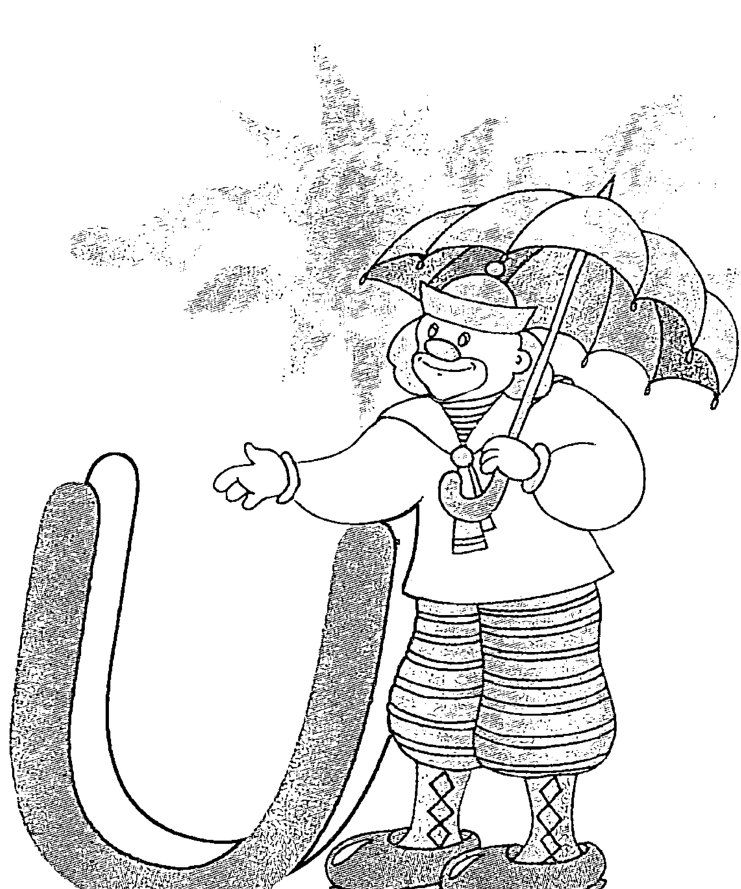

##### 注释1：

> 想要知道更多关于你名字的字母中，尤其是元音字母中所隐藏的意义，请参照：《你名字中蕴含的神圣力量》（The Sacred Power In Your Name）。

> 元音字母a并不关联四元素中的任何一个。它关联着“以太（Aether）”，所有的元音字母都从这种物质中产生。它渗透到所有的创造、所有的符号，以及自然中所有的元素之中。被这个字母所影响的人，必须学会和所有的元素、所有种类的动物合作。它也加强其他元素力量和动物的工作成效。

下表反映出我可能需要和元素进行更多的合作，而比较起其他的动物，和鸟类的合作可能会带给我更多的亲和力。

对我们的星座以及相关联的动物，我们可以展开联想。它为我们提供了一个新的开始，指出：我们可以用更个人化的方式理解动物的语言，并与它们合作，以此开始工作。

通常，关联着我们的星座、名字的元素会提供我们生活最需要的能量。占星和名字反映出相应的元素和相关联的动物种类，它们是最能和我们相处融洽、最能给我们带来益处的。当然，其他元素也很重要，我们确实需要所有的元素。关联的动物为我们提供了与元素合作的更加切实的方式。

因此，当你的生活中出现某种特定的动物，并且你对于某种动物具有特定的吸引力时，观看一下这个动物所属的种类，以及其关联的元素。这些关联，能为你的能量、潜力，以及目前出现的问题，提供某些独特的洞察。

#### 四元素

| 通常纸牌 | 梅花 (clubs) | 红桃 (hearts) | 黑桃 (spades) | 方块 (diamonds) |
| :--- | :--- | :--- | :--- | :--- |
| 塔罗牌组 | 权杖 (wands) | 圣杯 (cups) | 宝剑 (swords) | 星币 (pentacles) |
| 动物塔罗 | 远古居民 (ancients) | 变形者 (shapeshifters) | 有翅类 (winged ones) | 四足类 (four-leggeds) |
| 动物种群 | 爬虫类和两栖类 | 昆虫和蜘蛛类 | 鸟类 | 哺乳类 |
| 元素 | 火 | 水 | 气 | 土 |
| 元音字母 | I | O | E | U |
| 黄道十二宫 | 白羊座 (Aries) 天蝎座 (Scorpio) 宝瓶座 (Aquarius) | 狮子座 (Leo) 双鱼座 (Pisces) 金牛座 (Taurus) | 人马座 (Sagittarius) 双子座 (Gemini) 摩羯座 (Capricorn) | 巨蟹座 (Cancer) 天秤座 (Libra) 处女座 (Virgo) |
| 关键词 | 灵性、创造力、勇气、梦想家、纵容的、狂热的、有帮助的、超越的、破坏性的、工作和事业、净化 | 感情上的、直觉、理解、精神上的、浪漫、爱情、夸大的、色情的、感觉、艺术的、保留的 | 智力的、智慧、善于创造的、智力、警戒、协作、憎恨、冷淡的、精神敏感、肤浅的、诗化的 | 身体的、灵感、时间选择的判断力、粗糙、提供必需品、金钱和物质 |
| 最初含义 | 形成之前的最初能量 | 能量浮现，进入形成过程 | 形成的稳定性 | 形成的能量完成 |

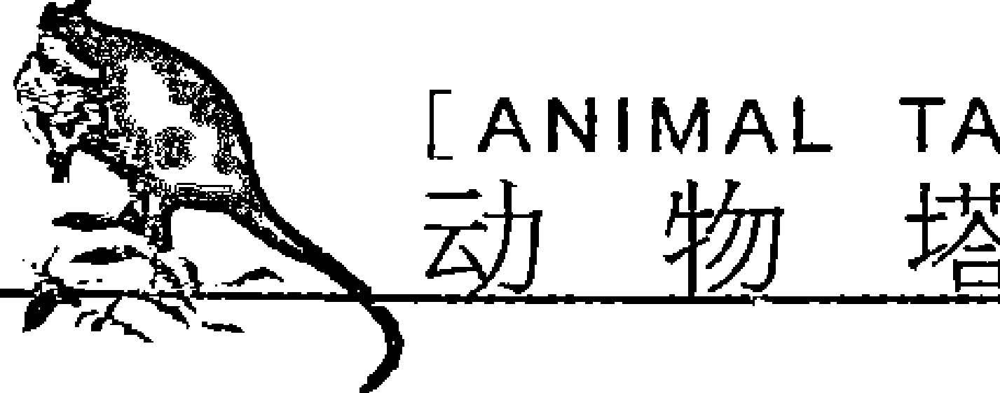

##### 土元素

土地上的任何事物都意味着：形成、形状、重量，以及物质。而土元素的开始，就是要学习：怎样才能把我们从与这些事物打交道的局限性中解放出来。这意味着：尽我们所能地学习，怎样控制我们物理的身体和物质的生活。其中包括：学习怎样创造性地和此类事物合作。

土元素有很多表达。关于土元素的教训是：要明白，所有能量都要通过物理进行表达。土元素教导我们：要认出内部蕴含的力量和能量。

通过土元素，我们学到了：认出天生的力量，然后把它们向外面的世界进行表达。

人的天赋还有能力、潜力都能在生活中找到表达。这个元素的动物帮助我们认出自己的潜力，向我们展示怎样才能最好地在日常生活中表达它们。

哺乳动物和土元素联系十分紧密。它们都是在陆地上生活的四足动物。每一种都具有自己独特的力量。而此时土元素的开始是：学习认出它们的力量——它们的特质——在我们身上同样的特质，并且在外面的世界成功地应用它们。

当这个元素和与其关联的动物出现时，将挑战这个世界中有刺激性的能量。心灵向导的问题、遭遇物质的责任，以及保持平衡，都会出现这样的情况。四足类塔罗牌是加强和土元素联系的最好办法之一。通过它们，我们将找到生活中物质的平衡。甚至，双脚踩着大地，或者花时间停留在植物和树木周围，都是有效的加强我们生活中土元素的方式。

##### 水元素

水是生命之源，许多神话都在讲述生命是怎样由精神之海奔涌而出的故事。水同样具有破坏性，因此它是一种反映“生命”和“死亡”的元素。水在净化之中，它具有自己的节奏和模式。它描绘着时间和改变。

水适应环境，它会在物体周围和上面流动，水的流动适应环境，而在这个过程中，水改变着自身的形状。

水中的任何一件事物，都意味着：流动性、情感、改变。水是天然的变形者，会采用盛水的容器的形状。因此，和这一元素相关联的动物是昆虫和蜘蛛类。

所有的昆虫都经历变形，变成和周围环境相适应的形状和构造。它们是天然的变形者，在生活中的各个阶段都在变化。通过水元素的动物，我们学到了：要适应我们生活的流向，要采取最适合我们所在的形式。

水，是流动的生命。与生俱来地，水元素之内包含着关于生命中情感部分的教训。通过水元素，我们学习到：要创造性地使用我们的身体和精神。我们学到：要以独一无二的方式使用我们的身体和创造能力，赋予它们对我们最有力的表达。

那些在水元素及其相关动物方面具有优势的人，在生活中渴求强烈的感情。他们需要水来平衡他们的生活。它能补充能量，也能疗伤。到海滩去能够恢复和强化能力。通过我们有创造性的直觉和想象力，它唤醒了我们生活中的变形能力。

##### 气元素

空气是和水一样重要的元素。它是活跃的、具有创造性的元素，是思考、记忆甚至自由的象征，因此，它象征着更高的智力和精神。

空气凭借知识和灵感，在身体意识和精神意识之间建立连接。

通过空气，我们吸收力量。我们的呼吸过程反映出生命的回旋和演变。空气连接着头脑和生活中智力的力量。其中包括：理解力，和头脑的力量合作。它展现出智慧的一种新的表达。运作的空气——运作的头脑——是我们必须学会使用的力量。我们的思考中蕴含着力量。

> 一句古老的格言说：“知识就是力量。”

气元素（实用的知识）教会我们在生活的不同领域之间建造桥梁。知识帮助我们赢得竞争，让我们学会创造。空气的根本是在得胜之中发现力量。

鸟类是这一元素的代表。在天地之间，在不同领域之间自由地移动。鸟类战胜了地心引力。它们教导我们怎样提升自己，怎样在竞争中复活。通过它们，我们学到怎样把我们的愿望变为现实，学习怎样使我们的想法成为可能。

在我们的生活中，如果具有气元素或者其相关动物方面的优势，意味着我们需要更多的精神激励。它们出现，向我们展示：怎样建立通向新水平的桥梁，或者利用智慧参与竞争。鸟类可能反映出：关于智力和自由的事物，以及，有必要到山中去，以对我们自己进行补充——有必要增强我们和气元素之间的联系。

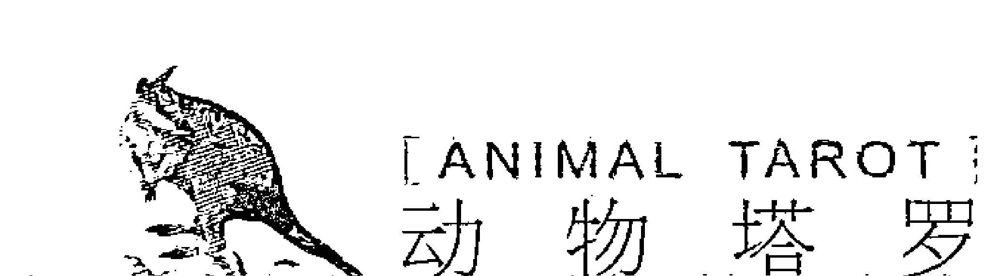

##### 火元素

火通常被认为是一种神秘的事物。
烟升腾的样子被认为是具有魔力的。火是激情、精神上的、色情的，以及转变的古老象征——正如这组中的大部分动物一样。

和水一样，火也兼具创造性和破坏性，体现在生活的各个方面。许多社会都有特别的与火相关的仪式。其本质或者“火的洗礼”包括力量和平衡的历练。通过历练，我们学会看明白有哪些必须被烧掉，哪些不再具有益处，这样，新事物将出生。这是一次发现之旅：发现我们和其他人的关系，以及他们对我们的教导。这些关系将产生改变和混乱，不过这些是经验之火。

生死循环是火元素的一部分。这是一个通过自身内部的平衡做出的具有创造性的进程，十分古老，有时会被误解。这一循环通常以一种名为“ouroborus”的巨蟒的形象来反映，这种巨蟒会吞食自己的尾巴。这一元素的动物都会在某些方式上教导我们怎样和这个周期合作。

火元素的灵魂，传统上认为是火蜥蜴，这并不是因为它们很相像，而是因为，当火蜥蜴处于火中时，它们的身体会逐渐变细，就像怪兽的尾巴一样。

像火这样古老且被误解的元素，爬行动物和火蜥蜴被选做它的代表。就像火会适应环境一样，爬行动物是冷血的。它们的所在环境直接影响它们身体的温度。通过这些动物，我们学到：要保持我们的创造之火旺盛，在任何环境中，都应给它们新的生命和新的表达。

## （一）四足类

哺乳动物和其他种类动物的区别在于：哺乳动物用母亲身体内产生的奶喂养它们的下一代。它们都是温血动物；除了极少数的鲸类之外，所有的哺乳动物都有一定量的皮毛或者表皮。它们都是通过肺部进行呼吸；除了鸭嘴兽（duckbilled platypus）、针鼹（spiny anteater）之外，它们全部都会产下活的个体。几乎所有的哺乳动物都有四条腿，生活在陆地上，鲸和海豚是例外，虽然如此，它们也是哺乳动物。

在所有动物中，哺乳动物是我们的近亲。全世界范围内，粗略地说，约有4 300种哺乳动物。它们在任何环境中都能被发现，每一种都具有自己独特的品质。

四足类——哺乳动物——生活在陆地上，因此它们与土元素相关联。这些生物帮助我们站在地上，通常，它们是完成我们日常目标的关键所在。就像哺乳动物给小动物喂奶一样，土地为我们提供我们需要的营养品。

很多哺乳动物四处游荡，到处寻找食物；但不像鸟类那样迁徙。这通常是一个提醒：我们需要四处寻找我们的生计，以引导一种成功的生活。哺乳动物会向我们展示怎样才能最好地完成它。

想要了解哺乳动物或者其他动物，我们必须学会翻译它们的语言。这包括：明了它们对颜色的感知、它们的行为、它们的发声方法，以及它们的适应性。只有这样，我们才能更加完整地理解它们带给我们的信息。

许多人发现：从研究动物最具有意义的特征开始，会比较容易。它是否拥有爪子，或者有很大的力气？它是怎样运用这个特征的？通常，这种动物最击中你心灵的，就是那些需要聚焦其上的特征。本套塔罗将提供一些出发点，你可以从此开始理解自然的信息，并发展出理解自然信息的语言。

通过四足类，我们把自己投入到大地母亲的奇迹之中。我们学习在土地上的旅程，以及怎样通过双脚踏在大地上，来表达我们的潜力。

##### 四足类首牌
(ACE of FOUR-LEGGEDS)
美洲野牛(bison)新的繁荣、充裕

美洲野牛实际上是非洲野牛。对于平原印第安人来说，它们是神圣生活、富足充裕的象征。在苏族（Lakota）[1]“布法罗的白色妇人（white buffalo calf woman）”传说中，本土人们学习到：把正确的努力和祈祷相结合，将能得到充足富裕的结果。美洲野牛提醒我们：当我们把神性和世俗相结合，我们会获得成功。

美洲野牛十分巨大，体重可达1.5吨；巨大的头颅、耸起的双肩，以及毛发粗浓杂乱的表皮，带给它十分夸张的外表。它的头颅是更高的本能的古老象征。野牛是一个提示：对于把我们想要的东西变为现实，头脑是必要的。

通过使用强有力的双肩，以及宽大的头颅，美洲野牛可以把雪铲走，这样它就可以得到食物。这种特质暗示我们：为了完成我们的目标，我们必须付出努力。如果我们这样做了，就会得到酬劳。

驼峰是能够打开的水库的古老象征。当野牛出现时，意味着：这一次，给我们的充足富裕已经准备好。这些富裕并不是直接给我们的，但是通过努力，我们可以得到它。

美洲野牛在旅行时会选择最简单的道路，

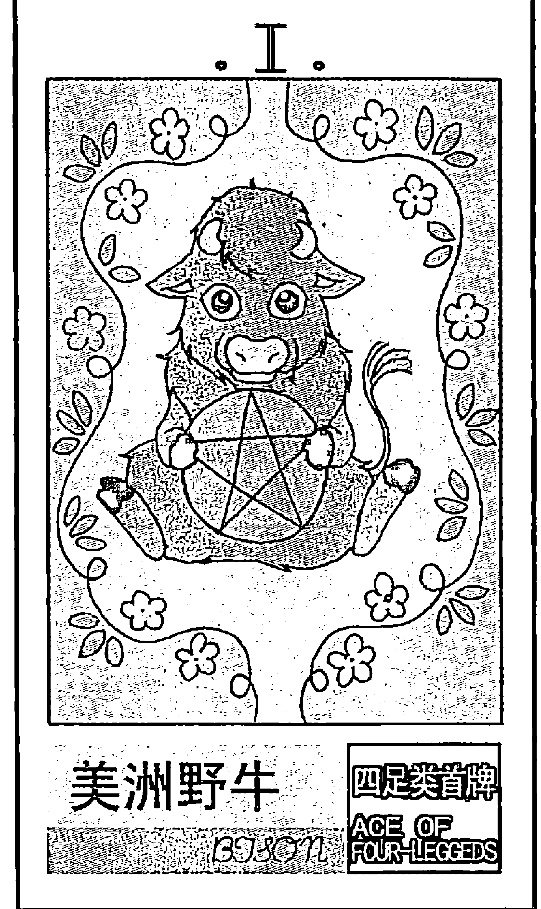

[1]苏族是北美殖民战争时生活在北美大平原之上的一支印第安势力。苏族人主要靠狩猎维持生计，美洲野牛是他们最喜欢的猎物之一。拉科他族（Lakota）是苏族的一支。

这帮助我们回想起：如果我们在心灵和世俗两方面同时努力，把正确的努力和正确的祈祷相结合，我们的道路会变得更加容易。如果美洲野牛牌出现，我们将有智慧跟随最简单的道路，获取我们努力的成果。

美洲野牛是一个提醒：我们付出的努力将得到回报。当美洲野牛出现时，我们将进入一个繁荣的时期，我们的冒险会成功。

我们的基础已经建立，它将带来很好的结果。

> 美洲野牛是一个提醒：我们付出的努力将得到回报。

###### 倒放含义

如果处于倒放的位置，美洲野牛可能暗示：我们试图用武力夺取繁荣。请在头脑中回忆在我们生活中起作用的同步性的法则——事物会在对我们最有益的时间和方式中展现，如果我们允许这些发生。美洲野牛提醒我们，不要用武力来促成目的完成，否则我们会发现我们自己变得气馁、沮丧、所做没有结果。如果处于倒放的位置，美洲野牛提醒我们：我们可能处于节奏之外——处于流程之外。

倒放的美洲野牛可能预示：我们可能存在错误的安全感，或者，对于扩张自我，我们要保持谨慎。此时，其他人的需要可能比我们自己的更具有优先权。

要记住：放缓富裕流入我们生活中的最快方式，并不是赞赏已经向我们走来的事物，而是把我们的努力，放入到进程之中去。

**要问的问题：** 我们是否对我们所追寻的事物怀有敬意，并记住，神是产生所有物质世界中的事物的本质因素？我们是否作出了必要的努力，或者让其他人为我们工作？我们是否向我们已经拥有的事物，表达了感谢的心情？

##### 四足类之二
(TWO of FOUR-LEGGEDS)
豪猪(porcupine)平衡工作和娱乐

豪猪是啮齿动物中的一员，虽然有时候被提到长得像刺猬，但是，实际上二者并没有关系。我还从来没有见过一个人，在看到豪猪的时候不感到惊奇的。

豪猪虽然看起来很笨拙，但攀爬起来却十分敏捷，它们具有一种独特的能力，可以决定四肢的强度，判断是否需要提供支持。在爬树枝的时候，它们具有极好的平衡感，甚至看起来似乎不可能。

豪猪大约有30 000根的刚毛，遍布全身，只有脸部、腹部以及尾巴的下面例外。它们可以控制刚毛突出部分的肌肉，这样，当被打扰或者受到攻击时，刚毛就可以直直地立起来。

豪猪很好奇，这种好奇心被本能良好地部署，它会在所有它能找到的东西上寻找乐趣，如此打发它的一天。无论是在嬉戏、外出寻找食物甚至是睡觉中，它们教会我们怎样平衡工作和嬉戏。当豪猪出现，它提醒我们：要拥有乐趣，去探索我们所好奇的事物吧。

豪猪也会向我们展示：如何抵御暗藏凶险的诱惑，怎样享受生活中、困扰中、工作中，以及所遭遇的不同情形中的乐趣。它会向我们展示，怎样在能够完成任务的情况下，通过维持工作和娱乐的平衡，保持天生的、孩童般的顽强。

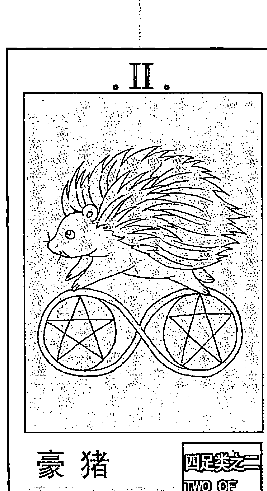

> 豪猪教会我们怎样平衡工作和嬉戏。

当豪猪出现，我们的平衡会比预期更加强大，从而得到比预期更多的能力——至少会持续一个短的时期。现在，应该聚焦到保持协调上来，并在我们周围的骚动之中，保持一种良好的态度。

> 豪猪提醒我们要拥有乐趣，去探索好奇的事物。在能够完成任务的情况下，通过维持工作和娱乐的平衡，在周围的骚动中保持良好的态度。

###### 倒放含义

如果处于倒放的位置，豪猪通常反映出不平衡——通常，是工作和娱乐之间。也许我们尝试太多，或者一次采取过多行动，或者在保持平衡上遇到困难。它通常反映出：要进行更好地组织。也许有更多的困难在前面等着我们，但这并不意味着我们要放弃行动，而是预示：更多的平衡和组织是更加重要的。

豪猪很容易得病，比如鼻涕症(snuffles)，这是一种传染病，通常在缺乏营养时发生。我们可能太投入工作了，以致于不能合理膳食。压力也榨取我们生命中的营养。豪猪一般靠食植物为生。它们对盐分也具有很大的渴望。当豪猪出现在倒放的位置时，有必要在检查其他饮食习惯的同时，注意控制盐分的摄取量。

要问的问题：我们是否允许其他人的意见来劝阻我们探索某些事物，而在这些事情上，我们可能会发现乐趣？我们是否花费时间进行娱乐？我们是否平衡着工作和娱乐？我们是否合理膳食？我们是否对其他人扔过来的倒刺过分敏感？我们是否不恰当地造成了我们现在的倒刺？我们是否允许过去的倒刺阻挡我们现在的巨大欢乐？

##### 四足类之三
(THREE of FOUR-LEGGEDS)
水獭(otter)创造力和技巧

水獭能够唤起人们的想象力，勾起人们的好奇心。它能让人们神魂颠倒，不管是淡水水獭还是海水水獭。它提醒我们：只要观点正确，事情都会充满乐趣。当水獭出现，那是一个信号：在我们生活中，新的创造力以及技巧已经被唤醒。

水獭属于鼬鼠科，它喜欢住在水边。水是关于生活中女性化的部分——创造力、想象力、喜悦、对于住所和家庭的爱——的若干古老象征之一。水獭的家庭领域范围很大。这预示着：我们可以在周围较大的领域内激发我们的创造力、想象力、喜悦，以及爱。

通常情况下，一胎有 2~4 只小水獭出生，不过它们必须被教会游泳。它们被教得很好，学习飞快。当水獭出现，意味着几个新的学习经历或者机会将会很快出现；甚至即使我们并没有感觉到，我们也具有足够的技能可以掌握它们，我们将很快学会。水獭的出现意味着将会有新的学习机会出现在我们面前，它将会为我们的生活带来喜悦和技能。

水獭的出现通常预报着一个充满创造性及其表达的时期，在这过程中我们的技巧和能力将受到广泛赞誉。目前，我们具有创造性和想象力的努力将取得回报，而我们也能在其中学到知识，享受乐趣。

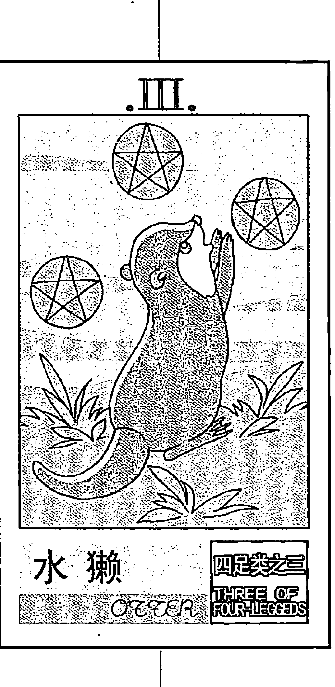

> 水獭的出现预示着生活中新的创造力和技巧已被唤醒。

水獭的出现预示着将会有新的学习机会出现，将会为我们的生活带来喜悦和技能，我们具有创造性和想像力的努力将得到回报。

###### 倒放含义

水獭妈妈用培养和充满技巧的方式教导小水獭们学习游泳。

如果处于倒放的位置，水獭可能预示着：对于我们的生活目标，我们要更具有责任感和母性。这可能意味着：我们没有足够的经验在目前的情况下完成任务；或者我们要学习更多的知识和办法，否则可能会导致挫败。

倒放的水獭反映出：我们有好的想法，但没有做好充分准备。暗示这并不是一个适合更高期望的时期。需要我们做更多的工作，因此，可能会出现延迟的情况。

如果以上并不符合你的情况，倒放的水獭可能仅仅指出：在你这方面，你没有足够努力。或者你推动得太过辛苦，关注工作太多，却没有在工作中找到快乐。我们可能需要评估我们的工作和娱乐的时间，在某些特别事物上信任我们自己，因为水獭提醒我们在工作中也要拥有乐趣。

要问的问题：我们是否工作得太过辛苦？或者并不足够？我们是否花时间去探索其中创造性的活动，在其中得到乐趣，我们是否擅长此道？我们是否太过严肃？我们是否并未集中注意力？

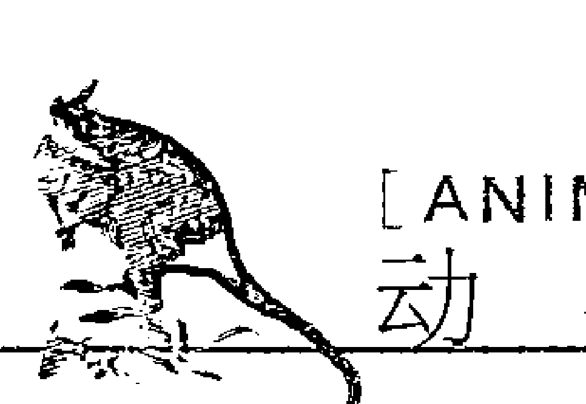

[ANIMAL TAROT] 动物塔罗## 四足类之四
(FOUR of FOUR-LEGGEDS)

獾 (badger) 依靠自己，可行性的追击

獾是鼬科中第二大的成员。它的挖掘技术一流，甚至可以超过囊地鼠（gopher）和鼹鼠（mole）。因为这项技能，这种动物预示着通过依靠自己取得成功，并能得到持续性的发展。

獾提醒我们：无论是在精神追求上还是在世俗活动上，我们都有很好的时机。獾的出现通常预示着：一个理想化的，适宜可行性追击和物质取得的时期已经到来。现在，是时候依靠我们自己和我们的想法——尤其是关于商业事务方面，对这些活动进行深入挖掘了。如果我们在跟进过程中努力工作，我们将会得到成功，并为日后的项目存下一份基金。

獾的挖掘行为说明它具有丰富的关于土地方面的知识。这使得獾的力量中极其具有治疗作用，虽然有的时候在治疗进程中太过具有侵略性，它的治疗还是有效的。如果存在健康的问题，獾提醒我们：处理它们的时候要表现得具有侵略性和整体感。

獾肥胖但却强壮。十分具有技巧。最外层的表皮是松散的，因此别的动物的撕咬就不容易伤害到它。这一特征，以及獾是孤独的动物这一事实，指出：凡事靠自己。信任我们自身的努力，不管其他人的中伤和看法。我们也要为我们的行动和计划保密，以取得最大的成功。

春天出生的獾宝宝，通常在秋天离开。它们已经学会独自生活所需要掌握的知识。它们的出现提醒我们：对于依靠自己生活，我们已经知道得足够多了，我们只需坚持自己的能力。

如果我们如此强硬地做了，我们将在5到6个月的时间内看到自己的努力得到报酬。

###### 倒放含义

獾是一种不合群的动物，不能很好地和他人合作。因为这个特质，獾通常预示着社交上的难题。处于倒放的位置，这个问题就更加具有可能性，会导致障碍，以及因为我们的错误传达，导致努力的延迟，暗示着：继续发展的事物之中隐藏着某些东西。

倒放的獾暗示着：设立新计划，改变旧计划。因为旧计划有障碍。障碍源于他人，他们的位置可能会对我们造成耽搁。现在，是发展自我表达和自我依赖的良好时机。倒放的獾也可能是一个建议：对待金钱和投资，我们务必要谨慎。

倒放的獾也可以暗示着：目前为止，我们独立做事无经验，尚无足够的技能和经验。我们可能需要学习更多——大约5到6个月的时间。要记住，春天出生的獾宝宝，在秋天之前是不会独自外出的。

###### 要问的问题：

对于付出的努力，我们是否太过激进？是否我们周围有其他人，十分具有侵略性地阻止我们获得成功？我们是否挖得足够深？我们是否太多地依赖别人而不是自己的努力？是否存在着障碍，现在是看到表面以下的好时机吗？

##### 四足类之五
(FIVE of FOUR-LEGGEDS)

老鼠 (mouse) 审查生活的教训

老鼠令人吃惊，聪明、挑剔、具有很高的理解力。虽是夜行动物，白天视力也很好。它们眼睛突出，提醒我们要注意细节。老鼠出现说明是审查生活中的教训的时候，尤其是在此时已经持续的事项，从另外的观点审视我们生活中正在发生的事情，以及我们想要的东西。

大部分的老鼠，对于保持自身和居室的清洁都是十分挑剔的。老鼠十分注重细节。此时，对于所有事情（所有的文书工作，法律的或者其他，都必须仔细检查），更加小心是必要的。

老鼠喜欢储存食物，常年在外寻找食物来源。当老鼠出现时，我们要做好准备工作，吸取过去的教训，阻止错误在未来发生；通过注意生活中细小的事物，我们将会为未来艰苦的日子做好准备。

老鼠经常被其他的动物猎食，所以老鼠的生育能力很强。老鼠一年产3到4窝，因此它们的种族得以生存。当老鼠牌出现时，我们要集中注意力，吞咽尽可能多的种子。即使其中的一些并未起作用，其他的也会有效果，我们将确保自己的成功。现在，是时候多做准备，有备无患。

老鼠理解能力很强而且十分具有组织性。它提醒我们：无论任务如何艰巨，只要付出注意力，完成稍小些的任务，更大的问题就可以解决，更大的目标就可以实现，所有的都将在极短时间内发生。

###### 倒放含义

如果处于倒放的位置，不论我们把注意力集中在细节或是迹象上，都不可能看到事物的全貌。对于细节，我们可能过于吹毛求疵，而丧失了对于整体的感知力。

生活的难题和阻碍教会我们更具有创造性。老鼠帮助我们用更接近的理解看到事物行进的方向。处理最迫切的事物，然后继续前进。如果你自己有故障，改正它；如果其他人有，原谅他们然后继续前进。如果我们不这么做，就会被捕捉到。

倒放的老鼠提醒我们：如果不善于吸取教训，错误将会重演。即使对于我们并不了解的事物，也要更加仔细地审视。有时，由于我们过于重视某些重大问题，而忽略了什么才是最重要的。倒放的老鼠预示着：我们忽略了某些事物或者某些人。

> **要问的问题：** 我们是否忽略了生活中琐碎的、乏味的但是必要的部分？是否有一些显著的事物被我们错失？我们是否迷惑于巨大的梦想而忽略了生活中其他事物？我们是否过于把精力集中在一个或者两个活动上，以致忽略了其他的机会？我们是否没有看到我们面前正确的事物？我们是否分散了自己的精力？

##### 四足类之六
(SIX of FOUR-LEGGEDS)

美洲虎 (jaguar) 回收力量，劳动的果实

美洲虎也被认为是一种豹子，和大型猫科动物中的美洲豹家族有亲缘关系。美洲虎甚至更加强健。美洲虎是具有神秘性和重要意义的动物，它的外表反映出：这是我们可以回收自己的能量的时期。不管我们的力量是如何丢失的，在这个时间都能被找回并再次使用。如果我们之前并未失去力量，新回收的力量也将更加强大和稳固。现在，我们可以品尝通过辛勤劳动得到的胜利果实了。

美洲虎捕捉猎物时很有耐心，等待猎物靠近，然后给予强有力的一击。当美洲虎出现，我们的耐心会得到报答，但是我们必须在机会来临的时候抓住它。

美洲虎具有强大的杀伤力，它会直接咬到猎物的颚叶。它的爪子可以轻易地割断猎物的头颅。因此，当美洲虎出现时，我们应该相信自己的本能（并非其他人的）以便了解怎样作出最好的进攻。因为，当这个动物出现时，为我们的计划保密很重要。不然，就可能错过捕获猎物的机会。

美洲虎被赋予了很强的魔力和能力。美洲虎十分灵活，攀爬、奔跑、游泳无所不能。它适应能力很强，所以它就成为一种象征：掌握着其他动物并不能在其中生活的维度。它的出现预示着：来自各种不同的方向，都会出现好机会。我们的努力和耐心，将会以大大超过我们预期的方式，得到报答。

这是一个恢复我们能力的时期——重拾遗失的东西，重树我们走向更远、超越梦想的能力。

如果我们善于使用自己的机会，我们将得到来自英雄的祝福，以及这样的允诺：我们将回到英雄的道路上，这条道路将在我们的生活中出现。

###### 倒放含义

阿拉瓦人 (Arawak) 说每一个事物中都存在着美洲虎——没有一件事物可以缺少它而存在。传说中存在着大量的通过使用美洲虎的力量而进行的复仇、诱拐，甚至是了不起的治愈。当美洲虎出现在倒放的位置时，我们要谨防力量被他人盗走。如果我们泄露了自己的计划和目的，我们的力量和机会就可能会失去。要记住：美洲虎安静地狩猎。能够和其他人讨论我们的计划或者机会的时机，是在我们取得它们带来的奖赏之后。

倒放的美洲虎可能暗示：我们周围的情况并不是像它表现出来的那样；或者，我们的努力换来的仅仅是失望。来自其他人或者我们自己的猜疑，将会破坏我们的努力。当机会出现时，我们对要采取的行动的不安全感和胆怯，可能会阻碍我们成功。

要问的问题：在事业上，我们是否表现得太过具有侵略性？我们的回应是否太过强烈？我们是否要调节反应，以避免无心地伤害到其他人？我们是否把我们的力量——以及因此得到的回报——给予了其他人？我们是否允许过去阻止我们对现在的完成？对于达到目的，我们是否太过不耐烦？

[1] 南美洲的一支印第安人。

##### 四足类之七
(SEVEN of FOUR-LEGGEDS)

**兔子 (rabbit) 对周期和节奏的恰当运用**

兔子和月亮周期有关系。从它们出生开始算起，到它们能够依靠自己独立生活止，需要28天的时间。当兔子出现，在没弄清楚我们的努力和行动之前，不要在上边投入太多的精力。

兔子是多种象征的混合体，其中，最普遍的关于它们的联想是恐惧。这是因为：当掠食者出现在周围或者受到惊吓时，兔子会一动不动。这并不是因恐惧而起的反应，而是适应性的行动。大多数掠食者是通过移动来判断潜在的猎物。一直停在树上的鹰，并不是在想："啊，我昨天吃了一只兔子，今天要等待一只松鼠。"是移动惊醒了掠食者。兔子能够冻结的能力是一种适应性的行为，可以保护自己不被发现。

如果兔子在我们生活中出现，但是我们并不确定要做什么，冻结，不做行动。不超过28天，我们就会知道我们要做什么，或者我们要去哪里。兔子做事，从来不会因循"一步一步"的方式，甚至当它们必须从旧的地方撤离，它们也会通过它们长长的、快速的跳跃作出弥补。即使我们需要后退，我们也可以弥补失去的领土。

兔子生儿育女的能力广为人知。当兔子出现，它预示着：在我们生活中，一个生育的周期将要到来。这个周期具有很大的可能性，但是我们必须有耐心，等待自然的节奏发挥作用。这段时间不可以通过外力改变。兔子教导我们：怎样认出生育的信号；协调月亮的周期，这样我们就可以为了自身的益处而使用它。轮流进行，就会使我们生活中的每一个方面都变得富饶。一月之内，我们将看到成长和改变的出现。

###### 倒放含义

如果兔子处于倒放的位置，表明我们要做少量的防御。兔子一般有很多藏身之洞，前后都可逃脱。处于倒放的位置，是时候做出更多的计划了。为所有可能性制订意外事故计划，或者再次审查已经处于运行中的计划，都是不错的主意。这个周期中，固守一角并不会有益。兔子擅长往返跑，做出快速的转弯。如果处于倒放的位置，我们有必要作出一些改变或者回返的努力，以避免可能出现的问题或者复杂因素，减少我们的焦虑情绪。倒放的兔子提醒我们：我们已经脱离了我们生活中富饶在起作用的那个周期。

> **要问的问题：** 我们是否因为草率行事而暴露了计划？我们是否因为没有看到清晰的“一步一步”的运动而感到急躁？急躁会破坏已经处于运行中的计划。我们是否完整考虑每一件事情？我们已经运行的东西，是否就是我们真正想要的？我们是否需要更多的跳跃？

##### 四足类之八
(EIGHT of FOUR-LEGGEDS)

松鼠 (squirrel) 为未来做准备

松鼠是啮齿动物中的一员，白天在外面到处寻找食物。挖洞用来贮存和掩藏食物，以便下一次食用。它们的日常生活提醒我们：是时候为未来做准备了。

虽然，松鼠并不是能获得大量金钱或富裕的信号，但是，这一次它的出现是很强的提示：我们的基础很坚实，道路很正确。为将来的成功做了很好的准备。松鼠提醒我们：要献身于自己的目标。如果我们坚持，我们就会成功。

有两大种类的松鼠，都属于群居动物。它们都不喜欢陌生人闯入自己的领地。红松鼠，作为哨兵，会唠叨不休并大声斥责。这种“有异种侵入领地”的信号不仅在给其他松鼠报警，也同样在给其他动物报警。因为这种习惯，松鼠提醒我们：要保持警觉，要坚持，不要允许我们自己心烦意乱。

灰松鼠是最常见、最热情的一种。它们并不冬眠，但是会建一个巢（通常是球形）用来存储食物，以及在里面舒服地度过冬季。再一次，松鼠提醒我们：要为未来的可能做好准备。

所有的松鼠都很热爱交谈，不论是嬉戏或者发布警告时，都会大声地唠叨不休。它们也具有一种微妙的身体语言，使用尾巴也能进行很好的交流。当松鼠出现，这是一个提示：加强我们的沟通技能，这对我们将来的发展很重要。

###### 倒放含义

松鼠教导我们：通过“取”“舍”保持周期中的平衡。当我们对于其中的一个或者另外一个，倾注过多精力时，倒放的松鼠就会出现，向我们提示这一问题。松鼠掌握着准备，但是它也是群居动物，它在一天之内很好地处理休闲和工作。如果处于倒放的位置，松鼠通常是一个提醒：在我们所请求的目的中，应该分配时间用于社交活动和休闲。休闲和工作必须“手牵手”地进行，不然，工作会产生问题，变得更加难于完成或者没有成果。

倒放的松鼠也可能暗示：我们所做的事情也许正向错误的方向发展。我们可能需要一些指引。我们可能急于求成。或者事物的基础并不真正安全。这并不是一个适合“捷径”和“短视”的时机。我们要看到长期的目标。

要问的问题：我们是否在寻找通向成功的捷径，或者说“速食”？我们是否在寻找快捷的、简单的办法？我们是否并未做好合适的准备？我们是否太过活跃、太过繁忙，出现了工作至上的精神？我们是否并未真正为未来做出计划？在我们的行为中，是否太过不稳定，没有确定的路线，跑前跑后但是实际上并未完成任何东西？这一次，我们是否需要拯救？

##### 四足类之九
(NINE of FOUR-LEGGEDS)

海狸 (beaver) 为我们的梦想而工作

海狸体形巨大，属于啮齿动物。它们生活在水中。它们是了不起的建造房屋的工程师，具有砍伐和移动树木的能力，能建造堤坝，在它们的屋子内外建设错综复杂的小道。它们不停地工作，保证它们的房屋和堤坝得到持续的修补。

因此，海狸教导我们：怎样构建我们的梦想，并为之努力工作。虽然，那些无望成功者可能会以为海狸是能够完成他们目标的图腾，但是，海狸的出现通常预示着：有更多的工作尚待完成。

海狸的出现预示着：我们需要掌握哪些技能、怎样获取着手做事的广泛知识。海狸提醒我们去完成我们的任务，一点一点地，我们的梦想会越发伟大。

虽然，有些人把海狸当做宠物看待，但它的努力产生了灌木丛，其他动物可以赖此为生；而当堤坝被破坏，水渐渐枯竭之后，海狸从池塘里收集来的淤泥将形成大量肥沃的土壤。

长久以来，水联系着情感和梦想，而大多数人最普遍的梦想是拥有房屋和家庭。海狸使这个梦想具体化。因此，当海狸出现时，我们想要家庭和房屋的梦想将会显现。我们将会为之工作。海狸的出现提醒我们在接下来的12个月中，我们要为构建我们的梦想而努力，并将看到结果。

海狸在野外生活的时间并不足12个月。因此，海狸一直提醒我们：我们必须为自己的梦想行动了。总是幻想是不够的。为了它们的出现，我们必须付出身体力行的努力。

海狸的出现是一个提醒：接下来的12个月中，我们要为构建我们的梦想，付出身体上的努力。

###### 倒放含义

海狸拥有大大的门牙，在海狸活着的时候，它的门牙会一直生长，这就是为什么海狸要不停咀嚼来损耗它们。不然，门牙会长得太过巨大，以致海狸不能进食。如果海狸失去它的一只门牙，它通常将会死去。对一些人来说，如果海狸出现在倒放的位置，可能有必要注意牙齿的卫生和保健。

倒放的海狸也可能预示：在为梦想而进行的工作中，缺乏努力。错过了一些身体上的行动。我们可以设想一些我们需要的事物，但是除非这种设想伴随以正确的行动，否则不会实现。倒放的海狸提醒我们：把手从水里拿出来，做必要的工作。我们可能需要重新分析我们的计划，因为可能存在一些由不必要的纠缠而引起的挫折和损失。

要问的问题：我们是否忽略了我们最根本的梦想？我们的梦想是否需要一些修补？我们，或者我们周围的其他人，是否迷失在梦想之中？我们是否并未采取必要的行动，或者完成必要的工作，以得到回报？我们的家庭或者家庭生活是否需要修补？

##### 四足类之十
(TEN of FOUR-LEGGEDS)

驼鹿 (moose) 家庭、出生、最初的母亲

驼鹿属于鹿科，体形巨大。在北美居民中，它是最古老的最强有力的图腾之一。这种动物充满矛盾，它十分奇怪却又庄严，看似笨拙但移动的样子又很优美。它能在各种环境中飞快地、轻易地、通常也是无声无息地奔跑。

它的出现通常预示着：关于安全、成就的新感觉。我们的生活将会变得繁荣，不管环境如何。驼鹿是家庭、出生、母性，以及最初的孕育能量的强烈象征，因为和水密切相关，它最频繁地和世界的母性、孕育的力量联系在一起。它经常被看到在沼泽地里，或者站在湖中。驼鹿是创造、直觉和照明的象征。

驼鹿善于照顾幼崽。很少有生物会挑战一头驼鹿和它的幼兽。驼鹿的出现是一个信号：在我们创造性的、母性的能量中，巨大的力量已经苏醒，强力保护我们年轻一代的时期已经到来。如果这个强烈的预兆出现，表明是我们生活中的一个大好时期。这种孤独的动物反映出：此时，我们的力量、持久力、创造能力将会在个人事务上获得更大的成功，胜于在合作项目和团体情形上。

###### 倒放含义

小驼鹿刚出生时，眼睛是睁着的，这反映出它们具有超常的知觉水平。当驼鹿出现在倒放的位置时，我们回避眼前的事物。我们并不信任自己的本能、我们天然的直觉。这样去做的时候，我们会被很多的问题困扰，我们会发现自己和我们的努力都陷入困境。

如果一只驼鹿小兽可以活过第一个月，那么它有极大的可能存活至成年。倒放的驼鹿预示着：我们早期的努力可能比较困难。在早期的发展进程中，对于我们的项目要施加更多的保护。它也可能指出：有可能存在某些健康不平衡。

驼鹿是一种食草动物，尽管如此，这并不意味着我们也要变成素食者，它可以指出：我们的饮食在影响我们的头脑和身体能量水平，堵塞我们的知觉和我们的判断力。

要问的问题：我们是否漫无目的地四处漫步？我们是否因缺乏计划而陷入困境？我们是否忽略了或者并不尊重我们自己的知觉？什么东西听起来或者闻起来是正确的，什么不是？我们是否对我们给予生命的事物并未给予恰当的保护？我们是否太早地让过多的人介入到我们创造性的项目中？

##### 四足类之侍从
(FOUR-LEGGEDS)
鹿(deer)通向新的学习和追求的诱惑

鹿，适应力很强，具有自己独一无二的特质，但是这个物种通常被认为是最重要的狩猎动物。猎人带着人们由文明社会进入野外。神话因这样的传说变得成熟：英雄被雕刻的鹿引诱到了新的、转化了的冒险之中。

鹿的出现，象征着新的学习目标出现在我们的眼前。虽然这些学习看起来很难，但是它们事实上并不如想象中那样困难。跟着发生的变化将朝着好的方向发展。这是一个充满了新的消息、新的学习的好时期。因为这是一张宫廷卡，让某人把好消息和好机会带给我们。某人可能会受到鼓舞，邀请我们参与学习和追求。这个追求将会成为可实践的，但是这个过程中，我们生活中的诸多事物将被改变。

鹿长出来的鹿角是天线的象征——更高知觉的工具，预示着此时信任的重要性，信任我们的本能和判断。在白尾鹿（white-tailed deer）类中，鹿角会每年持续长大，这样的过程会持续5年，直至长到最大的尺寸。考察那些新的学习和追求，它们可能需要5年的时间才能使其效果完全在生活中体现。

鹿带领我们返回古老的智慧，返回我们可遗忘或者忽略的那部分自己。鹿是一个提醒者：现在，是时候去连接我们内部中的那个孩童了。

鹿是具有知觉和诱惑性的温柔生物。当鹿出现时，是时候温柔地对待我们自己和我们的追求了。被温柔的诱惑带入新的冒险，新的清白和新鲜将在我们生命中被唤醒。

> 鹿提醒我们
信任自己的本能
和判断。

###### 倒放含义

如果鹿处于倒放的位置，它可能预示着：我们会迷失方向，我们的新学习将出现困难。此时，我们为了某个特定目的而设定的计划将可能不会出现。这并不意味着永远不出现，而是现在的状况下可能不是最佳选择。

作为一种温柔的生物，鹿提醒我们：此时，不要强迫或者推动我们的努力、追求，否则将会导致困难。倒放的鹿可能指出：推动我们的视野或者意见可能并不合适，也并不被接受。现在，是返回的好时机，因为我们的直觉可能稍稍缺失。

小鹿出生时，具有一种伪装色。在最初的几天，它们很少移动，它们的母亲通常停留在附近，照顾它们。如果鹿出现在倒放的位置，说明要保护我们内心孩童的情感。我们应该小心，不要过多地暴露自己。小鹿要听从母鹿的教诲。鹿提醒我们：现在，最好的方针是跟随传统，至少要一年的时间，那时我们自身的高度感觉和能力将会成熟。

要问的问题：我们是否有违事物的原意？我们是否允许他人违背我们的意愿？我们是否对自己太过严厉？其他人呢？我们是否追求某些并不具有实际上的益处的事物？

##### 四足类之骑士
(FOUR-LEGGEDS)
美洲狮(cougar)进入我们自己的力量

美洲狮是西半球第二大的猫科动物。作为最强有力的、最快的猫科动物之一，它强壮有力，可以通过咬或者爪子杀死猎物。它的出现通常预示着：我们的本能进入十分值得信赖的时期。由于良好的自我动机，我们将捕获生活中的成功和领导能力。

我们必须学会测试自己的能力和使用自己的能力。我们要学会表达它们。美洲狮是秘密的捕猎者，也是快速的学习者。如果美洲狮出现，此时适合了解我们的能力并信任它们。大部分年幼的美洲狮通过错误和实验它们天生的技能，加强和琢磨这些能力。当美洲狮出现时，大部分实验的部分都已经经历，现在，是时候更加坚定地、更具攻击性地宣扬我们的能力了。

美洲狮的出现提醒我们要伸展自己。我们应该悄悄移向目标，然后具有攻击性地跳跃。美洲狮的出现暗示：选择放置在我们面前——继续我们所拥有的，或者把我们推向下一个层次，但是在机会出现时我们必须快速并强有力地做出反应。

美洲狮的出现预示着一个完成的时期，我们必须果断地使用我们的力量。当美洲狮攻击时，它并不会犹豫。当受到威胁时，它会快速做出反应，攻击最可能是弱点的地方——这提醒我们，我们已经为我们的力量作出了努力，现在，是时候更加有力地表达它了。在美洲狮出现时，是时候用力量填满我们的内心了。明了时间和环境，就能正确地、更加有效地掌控我们的生活。

> > 美洲狮出现时，应适时了解我们的能力并信任它们。

美洲狮出现时，表示是时候用力量来填满我们的内心了，在机会面前，我们应做出快速而强有力的反应。

###### 倒放含义

鹿是美洲狮最喜欢的猎物，而鹿所包含的特性之一就是温柔。如果美洲狮出现在倒放的位置，我们可能太具侵略性。我们必须善于用温柔控制力量。温柔之中蕴含着力量和强大，但是，时间会更加强有力地表明我们自己，时间会用更加温柔的方式这样做的。现在，是需要温柔之力的时期。

处于倒放位置的美洲狮可能暗示：在使用或者表达我们的力量时，在获取目标时，我们可能太过急躁，因此，目标们躲开我们。倒放的美洲狮是一个提醒：要耐心。

人们有这样的倾向：不喜欢这样的情况——其他人得到力量并获得成功，而自己并没有。倒放的美洲狮可能反映出：这种情况会在我们生活中出现。其他人可能会试图让我们固守原地，我们可能会受到更多的攻击，来自于那些现状安逸的人。

要问的问题：我们是否忽略了出现的机会，并没有奔向它们？在找寻我们的心愿时，我们是否太过急躁？我们是否不满意我们的进程？我们是否太过强迫自己去追求？我们是否允许被其他人掌控？我们是否遗忘了自我激发和主动的重要性？

##### 四足类之王后
(QUEEN of FOUR-LEGGEDS)
山猫(lynx)隐藏的知识和创造

和美洲野猫 (bobcat) 类似，山猫也是一种北部的哺乳动物，有着长长的、强健的双腿，以及覆盖着毛皮的脚掌，使得它能在雪覆盖地面的时候行走。山猫有一个贵族化的外表。当它们成年后，就成为天才的动物，可以在生存中充分使用它们的能力。虽然稍稍有些孤独和遁世，山猫的出现通常暗示着：隐藏的知识和创造的觉醒；机会将出现，帮助家人和有需要的人。

希腊人认为山猫能够透视，因此，以动物名命名一个神话人物林叩斯 (Lynceus)[1]，他具有一种X射线的视力。岁月流逝，山猫得到了“超视力”的名声。这可归因于它具有看到错误、虚假、秘密，以及一切隐藏起来的事物的能力。

如果山猫出现，此时，你应该信任自己的本能。不论其他人可能说什么；不论它的出现会预示什么；不论我们的印象或者想象可能有多么奇怪，很有可能我们是对的。

小山猫出生时眼睛是蓝色的，在两个月大的时候变为黄色。这种由蓝色到黄色的转变提示出：如果需要时，知识将从天空降下。夏天到秋天，母兽教导小兽狩猎。到深冬，这个家庭分裂开来，小兽要走自己的道路——寻找它们自己的生活和知识。对于那些生活中出现山猫的人来说，在冬季，适合寻找隐藏的知识，并建立更强的感知。

> [1]传说中的林叩斯拥有世间最敏锐的视力，可以像 X 射线一样穿透一切，看到阴间之物。

> 山猫帮助我们看到在我们周围隐藏的发展方向，提醒我们要保持观察力的警觉。

山猫帮助我们看到在我们周围隐藏的发展方向，提醒我们要保持观察力的警觉。我们所发现的事物对我们具有益处，如果不是现在，那么就是将来的某个时间。如果我们拥有展现在我们面前的事物，那么我们就可以更有效地为了家人、自己，以及周边的人使用它。

###### 倒放含义

当山猫出现，我们会开始看到其他人可能隐藏起来的东西——被他们自己或者旁人隐藏，无论恐惧、行动，甚至他们自己内部的力量。当山猫出现在倒放的位置，我们必须小心，不要轻举妄动以及打破自信。暴露出来的东西，在被公开或者被扭曲时具有更大的能力，所以要闭紧嘴巴，小心说话。当山猫出现在倒放的位置时，静默之中的力量是必要的。

当山猫倒放时，和信任相关的事物也会浮上水面。有可能，过于相信别人而不是自己。跌倒的恐惧会上升，因为我们并不信任我们所看到的。倒放的山猫是一个提醒：有责任分享信任，以及揭露所隐藏的。现在要格外小心。而我们的自信和我们所分享的任何事物也存在着巨大的被展示或者公开的可能性。

在我们周围的人将感到不舒服。因为他们担心我们会看穿他们的想法。人们或许能和我们分享我们并不希望了解的秘密和信任，不过我们必须保守他们的秘密，否则引起的回应将会给每个人带来困难。

要问的问题：我们是否变得不负责任？我们是否忽略了我们的洞察力和知觉？我们是否太快地展示了太多的东西？

##### 四足类之国王
(FOUR-LEGGEDS)
大猩猩(gorilla)强壮、高贵、慷慨

强健有力的大猩猩是猿类中体形最大的一种，有着宽阔的胸膛，肌肉强健的脖子以及强有力的四肢。虽然经常被描述为残忍的怪兽，大猩猩其实是高贵的、和平的、温柔的生物，而高贵通常通过它们交流中对待彼此的行为来体现。虽然，黑猩猩通常被认为是猿类中最具有智慧的一种，大猩猩至少和它同样聪明。当大猩猩出现时，它预示着：一个更加古老的力量被唤醒了，还有我们内心的高贵。

大猩猩提醒：活着的高贵才真正通向我们最高的能力。它们以一种叫做“troops”的组群生活，表现出像人类一样广阔的情感。它们表现出影响、哀悼，以及互相照顾。人类并不常常具有的高贵品质通常也会表达出来。

大猩猩的出现证实了：我们的产业——我们的努力——是坚固和稳定的。它们用四条腿走路，成年大猩猩很少爬树，这暗示了：最具精神力的行为，是站在地面上，承担我们的责任。

大猩猩也可以预示出某人（通常是个男人）的出现，这个人卑微但是具有天赋，将来可以在我们自己的努力中帮助我们。这个人通常已经达到了一定的身份和地位，但是终其一生，他都不会超越这个位置。

> 大猩猩是与人类最为接近的灵长类动物，所以它有万物之灵的高贵与智慧。
>
> 大猩猩身形巨大，力量惊人。虽然外表粗鲁，却是非常平和的素食者。

大猩猩的出现是一个提醒：我们自己的强壮——内心的强壮和高贵——将得到承认。“好人最后总是输给蠢人”的看法在这里并不正确。大猩猩提醒我们——整个家庭恰当的生活方式之中蕴含着高贵，我们将要被承认并因此受到尊敬。

###### 倒放含义

在野外，大猩猩并不具有自然力量。美洲虎可能会叼走年幼的大猩猩，但是大猩猩彼此之间会照顾别人的孩子。如果大猩猩倒放，这可能是一个信号：我们缺乏照顾，而且并没有尽最大可能仔细注意我们的行动。

大猩猩的领地通常互相交迭，当几群大猩猩遇到一起时，也很少发生争吵。如果大猩猩处于倒放的位置，说明我们自己或者周围的人太过于斤斤计较了，在没有危机的地方察觉到危险。其结果是带来麻烦和抱怨。

在大猩猩族群中，通常由一只年老的大猩猩充当首领。如果大猩猩处于倒放的位置，说明我们周围的领导关系出现了问题，可能是和我们自己或者是他人的领导能力有关。或者是并不符合条件的人正试图掌控权力，或者是某人在滥用权威。

要问的问题：我们是否好斗过了头？我们是否试图得到我们并不具有的威信？其他人呢？我们是否完成了我们在社团或者家庭中的责任？我们是否仅仅为了自己的需要在留神观看？我们是否变得自私、欺凌他人？

大猩猩代表的是一种尊贵、领导力、保护、社区和在逆境中保持尊严的能力。它提醒我们，真正的力量源于内心和对集体的贡献。

## (二)有翅类

鸟类通常被认为是人类的近亲，因为它们用两只脚走路。它们是神的信使。它们在天地之间翱翔。虽然现在大部分人很少关心鸟类的存在，在过去的社会中，一个接一个的时期人们都被教导，所有的鸟都是携带着象征意义的想象的信使。

鸟类受本能的控制，它们具有独特的能力：机械、快速地反抗所有由它们自己提供的数据。在我们的社会中，这种对激励快速、机械地做出反应的能力也是同样必要的，这是每只鸟都可以带给我们的教导的一部分。个别的种类会让我们知道特定的反应是怎样的，以及是如何做出的。

世界上有几千种鸟类，但是它们之中的大部分具有一些共同的特质。大部分鸟类身体轻盈，它们拥有中空的骨头，这是飞翔的基本。实际上，只有很少种类的鸟类不会飞翔。鸟类区别于其他动物的是：它们的羽毛，不仅能推动它们的飞翔，还有隔离和保护的作用。实际上，羽毛是专门的表皮铠甲，正如其他种类动物的毛皮、鳞片一样，服务于同样的目的。

所有的鸟类都视觉灵敏，具有判断距离的能力。迁移在鸟类中也是很普遍的。哺乳动物穿越广阔的区域寻找食物，而鸟类迁移到一个完全不同的地区。鸟类教会我们：如何看见前方，以及怎样才能做出我们生活中必需的迁移和行进。

为了适应飞行，鸟类快速地进行新陈代谢，这可以指导我们怎样才能加快我们新陈代谢的频率——主要通过呼吸技法。这就是鸟类关联着塔罗牌中气元素和宝剑牌组的主要原因。

对于那些生活中出现鸟类的人来说，与气元素合作是最重要的事情。为了我们自己好，我们必须经常呼吸新鲜空气。其要点是：经常外出，练习呼吸技法。呼吸和空气是生命的要素，而鸟类掌握着二者的秘密。鸟类向我们展示：怎样通过呼吸在不同的领域间移动，提升我们的前景，开阔我们的见识；以及怎样才能通过我们的努力达到新的高度。它也会向我们展示怎样才能降落到地面上，即使我们已经能接触到星星。

鸟类是携带着象征意义的想象的神的信使。

鸟类教会我们：如何看见前方，以及怎样迁移和行进。

> 当鸟类出现时——不论是牌组中或者现实生活中——我们都必须进行认真检查。

当鸟类出现时——不论是牌组中或者现实生活中——我们都必须进行认真检查。要记住，其身上的每一个特质都具有象征意义，而本书这里提供的仅仅是一些骨架上的，是一个起跑点。它是什么颜色的，而这些颜色又具有怎样的象征意义？它是什么尺寸的？它进行了怎样的行为？它是否迁徙？它是夜行动物还是日行的？你是否是在最自然的环境下找到它的？

##### 有翅类首牌
(WINGED ONES)
###### 啄木鸟(woodpecker)
关于成功的独特、全新的节奏

啄木鸟有时直接啄食树洞里的虫子。而有的时候，它们啄洞，让树的汁液流到树皮外面来，以此设下陷阱，捕捉将要到这里吃汁液的昆虫。这种在树上“笃笃”的敲击，使啄木鸟和地球的心跳联系起来。这种“笃笃”的敲击有很多想象，从新生活的节奏，到我们目前生活中变形的节奏。许多僧人都学习到把这种“笃笃”的敲击带到其他维度去。

啄木鸟的出现，表明有新的节奏在我们生活中运行。它可以消除我们的担忧，并让成功向我们走来。这是某些全新事物的开始，因此我们将会聚焦到新的计划和努力上。啄木鸟暗示着：新的维度已经为我们打开。

啄木鸟强有力的爪子可以牢牢抓住树木；在它们啄洞以及“笃笃”地敲打时，尾部的羽毛会协助支撑，并帮助保持平衡。和其他会飞的鸟类不同，啄木鸟是独一无二的。这就强调：跟随我们独特的节奏和飞翔的重要性正在增加。现在，是跟随新鼓手的节奏行进的时候了，这个节奏让我们感觉更加舒服。现在，适宜使用最有利于我们的方式处理一切事务。

> 啄木鸟的出现，表明有新的维度已经为我们打开。

啄木鸟暗示着，某些全新事物的开始，有新的节奏在我们生活中运行，要我们以独一无二的方式对未来做出计划并进行建设。

如果啄木鸟出现，而我们已经打好基础，此时，适合跟随我们独特的节奏在其上进行建设，以我们独一无二的方式付出努力。采用我们之前处理这一类事情的方式并不会有效果；采用其他人处理这一类事情的方式也不会有效果。现在，是时候采用对我们最为有利的方式对未来做出计划，并进行建设了。

现在，对于我们周围的高速进步，瞬息万变的时代，我们可以获得一个新的节奏，一个新的能力，以及一个新的机会。

###### 倒放含义

啄木鸟嘴部尖锐，舌头长有倒钩，可以帮助它吸出昆虫。啄木鸟的头骨比其他鸟类更重一些，有利于它们进行敲击。啄木鸟啄洞，“笃笃”地敲击，使用它们尖锐的喙和有倒钩的舌头进行探查的行为，都具有重大意义，反映出有必要增强分析，并对事物进行辨别。

因此，倒放的啄木鸟可能暗示：我们的行为缺乏分辨性。对于我们应该理性对待的事物，我们做出了过于感情化的回应。我们需要对周围事物的发展保持更加清晰的注视。

这也可能是一个警告：此时，要更加小心和温柔。对于我们已经在进行的事务，不要用外力强加上去。在更进一步之前，要两倍或者三倍地检查所有事物。任何缺乏计划的行为都会导致阻碍和延迟。

要问的问题：我们是否变得失去理性？我们，或者其他人，是否变得失去分辨力？我们是否并未准备好就进行了跳跃？我们是否在被迫进行新的开始？我们是否进行了过多的分析？我们是否在尝试依照通常的方法处理事物？

##### 有翅类之二
(WINGED ONES)
蓝色冠鸟(blue jay)
恰当的选择,力量的使用

蓝色冠鸟勇敢而足智多谋，是乌鸦类的亲戚。它们十分适应周边环境。蓝色冠鸟的出现通常预示着：有可能发展我们的天生潜能，使我们的能力达到新的高度。其结果是，我们将学会怎样做出恰当的选择，以及承担和我们力量相关联的责任。当蓝色冠鸟出现在我们生活中，我们必须小心，不要滥用我们现在所拥有的事物。

蓝色冠鸟身上，伴随着蓝色、黑色和白色的斑纹，反映出蓝色冠鸟可以帮助我们达到最深层次的水平，通向最高层次的知识。其困难之处在于：怎样恰当地使用新得到的知识。跳进最深的层次，最可能的是把我们的许多情感连根拔起，做出困难的选择，但是我们一定不要让自己的急躁或者情感参与选择。

> > 蓝色冠鸟的出现通常预示着：有可能发展我们的天生潜能，使我们的能力达到新的高度。

做出恰当抉择的关键，在于筛选，因此在过程中就不用伤害或者利用某人。如果选择是通过这种方式做出的，那么新的大门就将打开。我们将更清晰地看到前面的道路，对于将要采取的步骤，也有了更好的想法。如果我们不恰当地做出了选择，每一件事情都会陷入困境，更加复杂。我们需要以更多的正直和个人责任感做出决定。

蓝色鲣鸟承诺着：深层的神秘和能力将会展现；它也是巨大才能已经被唤醒的信号，但是这种才能必须适当地发展。如果我们寻找捷径，我们的缺点将会显露。蓝色鲣鸟给我们提供机会，可以发展我们真实的、天生的王权；或者成为妄求王座者。这些选择是我们自己的。

蓝色鲣鸟身上蓝色的狭条是一个提醒：想要以真正的主人身份戴上王冠，需要奉献和责任；我们必须同时发展我们的身体和精神。

> 我们必须同时发展我们的身体和精神。

###### 倒放含义

如果处于倒放的位置，蓝色鲣鸟提醒我们：跟随已经在进行中的事物，要好过留下某些空悬的东西，这些东西可能会返回来常悬于我们脑中。倒放的蓝色鲣鸟是一个信号：有必要做出选择。只要我们做出选择，不管是正确的还是错误的，都将会出现增长和变动。对于这些变动，我们必须做出移动。

蓝色鲣鸟，和许多鸟类一样，帮助我们在天地间遨游，可以打开新的领域以及关于我们力量和能力的新的表达。问题在于，我们将仅仅是涉足而不是掌管我们的能力。如果处于倒放的位置，蓝色鲣鸟在警告：能量和行动已经被分散。我们必须集中使用我们的能量。处于伸展的位置将会帮助我们：确定是否有人在涉足他/她并不应该参与的事物。这可能是我们自己，或者我们周围的某人。如果是其他人，我们就必须小心。

要问的问题：
- 我们是否惧怕做出选择？
- 我们是否滥用自己的能力？
- 是否我们周围有其他人在滥用自身的能力？
- 我们是否仅仅涉足，并未探索到足够深的程度？
- 我们是否不加思考就做出行动？

## 有翅类之三
### (THREE of WINGED ONES)
###### 玫瑰胸白斑翅雀(rose-breasted grosbeak) 为心灵疗伤

玫瑰胸白斑翅雀是一种高尚的鸟类，具有巨大的特质，它的所有特质都关联到某种形式或者方式上的疗伤。在它的前胸，有一块玫瑰色的三角形覆盖在心上。当玫瑰胸白斑翅雀出现，我们将有机会治疗旧的伤口、旧的心痛——尤其是和家庭有关的部分。

疗伤可能是困难的，通常，我们有一种忽略这些刺的倾向，因为拔出它们太过疼痛。当玫瑰胸白斑翅雀出现，正是拔出这些刺的好时机。虽然，这可能会包括：处理一些不舒服的事情，以及直接的疼痛；但是长久看来，这是为我们好。如果我们不拔出这些刺，不去直面我们遭遇的伤害，我们的伤口就会溃烂，我们的生活将会处于越发严重的中毒情况中。

玫瑰胸白斑翅雀同时也是一个提醒：我们的痛苦总会过去，甚至包括预期中的痛楚。并不如我们想象中的那样疼痛。通过音乐和声音的治疗，我们现在所经历的痛楚将可以减轻。玫瑰胸白斑翅雀拥有一种令人愉快的、音调优美的嗓音，它的出现提醒我们：怎样使用这种强有力的疗伤形式。

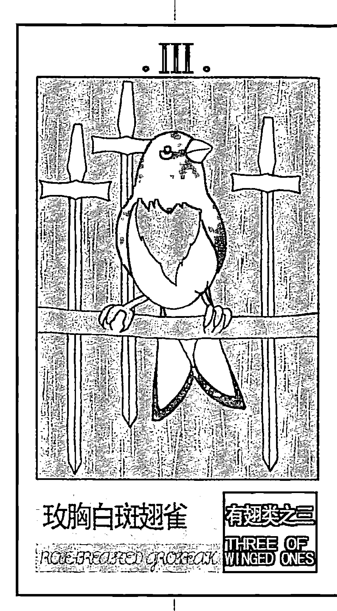

白色能够唤起净化、纯洁、和谐的感情回应。

玫胸白斑翅雀是一个提醒：现在，我们有机会医治任何关于家庭的创伤。

玫胸白斑翅雀十分顾家，雄鸟也参与抚育幼鸟的工作。玫胸白斑翅雀是一个提醒：现在，我们有机会医治任何关于家庭的创伤，从此以后，开始新的、健康的同家人、父母以及我们所爱的人的关系。

现在，是治疗过去创伤的时候了。我们的确有必要揭开旧的伤口，不过玫胸白斑翅雀提醒我们：这些伤口可以被治愈，内心会变得舒畅，它鼓励我们把握一切机会这样做。

通过这种方式，我们打破了模式，结束了因果报应，治愈了伤口，打开了为爱的心扉。

###### 倒放含义

有时，鸟类的起源和迁移的居所为过去的生命及其相关事物提供了线索。玫胸白斑翅雀是一种候鸟，通常在美国中部和南部过冬。当它出现时，世界上已有的关于古生命的研究，会帮助我们更好地了解现在所经历的模式和苦楚。

如果处于倒放的位置，玫胸白斑翅雀通常暗示着：目前，我们所经历的创伤，只是巨大模式的一部分，而这个模式，能够追溯到早年的童年生活，甚至是逝去的生命。这是一个警告：我们不要再持续那些我们从过去的生活中所学到的关于伤害和心痛的模式了。

倒放的玫胸白斑翅雀预示着：可能的无秩序状态、争吵、扰乱，以及关于内心事物的一些问题。这通常是一个提醒：对于困扰，我们要在调停下付出更多的努力，即使现在并不能解决，这一次，在调停和疗伤上做出的任何尝试都将为稍后的决议打开大门，也将帮助我们打破固有模式。

要问的问题：
- 我们是否在不必要地依赖着过去的伤害？
- 我们是否忽视了家庭？
- 我们是否变得不可饶恕？
- 我们，或者我们周围的某人，是否一直唱着同一首老歌，不肯前进？
- 我们是否不经思考就做出了行动和回应？

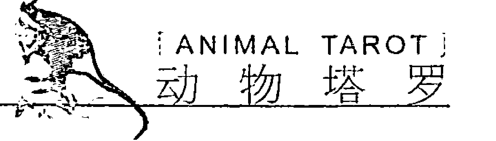

## 有翅类之四
### (FOUR of WINGED ONES)
###### 山雀(chickadee) 寻找内心的真实

山雀是鸟纲雀形目山雀科中的成员，一类个体小、颜色阴暗的鸟类的总称。这种活跃的鸟类和它的歌声，是春天的预示，而春天象征着寻找内心的真实，在我们的内心寻找答案。我们不能仅从外部表现判断出我们活动的结果；我们还必须走入内部，在我们的内心寻找事实，并紧紧握住它，而不管外部环境为何。

山雀的出现通常伴随着被割裂、不能碰触的感觉，提醒我们：我们需要单独的时间，对我们的计划进行再次评估、再次组织和重新思考。山雀带来新的努力会成功的承诺，如果我们自己首先在内部准备好的话。

因为山雀是春天的象征，因此它也是一个信号：我们会越变越好，我们的梦想会像春天的花朵一样开放。但是它们需要按照自己的节奏进行。现在，我们需要保持耐心，收回我们的能量，跟随我们自己的脚步，以及放松。我们可以给自己一些时间，因为事情正在越变越好。这是来自春天和山雀的承诺。

山雀头上的黑帽子提醒我们：我们要经常思考。当山雀出现时，我们可以期待更多的理解、事实，以及对目前我们所经历的阴影的透视。在即将到来的改变中，我们的梦想、沉思，以及祈祷都将大大提升我们的洞察力和自信心。

对于这样小的一只鸟，它同样是勇敢的，无畏于毋庸置疑的大型鸟类带来的威胁。

这提醒我们：任何威胁和阴影都会过去。表现出无畏。我们将进入一个新的时期，得到休养。如果我们正在经历恐惧，此时，适宜沉思、祈祷，并记住内心的真实：我们意味着成功！

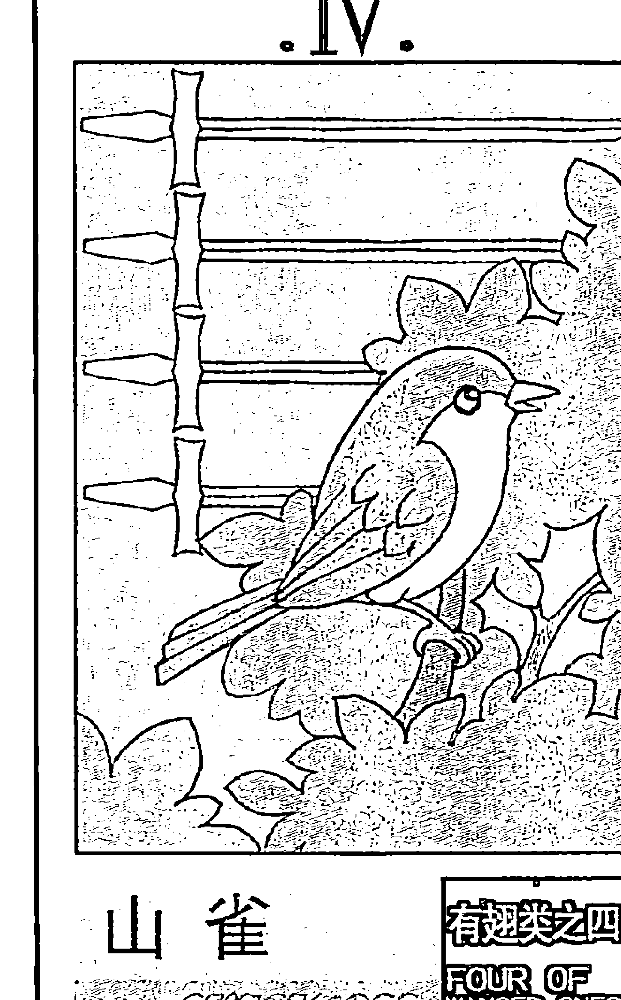

山雀是春天的象征，提醒我们回归内心，寻找真实。

### ⬇ 倒放含义

存在着7种山雀，而编号7的那种，通常被古老的神秘所环绕。7，象征着正方形上的三角形，在生命物质平面上的个体的提升。有7个身体，7个脉轮 (chakras)，意识的7个层次以及更多。当山雀出现在倒放的位置，在这个时机，某些事物并不会提示。这是一个信号：在我们生活中，我们想得多而做得少。而机会出现的时候，我们并未做出回应。我们的思考甚至可能会有一点倾斜。

当我们处于平衡时，在我们生活中，会有事实的巨大实现。我们也可以更加愉悦地把我们内心的事实表达出来。倒放的山雀预示：我们可能并不恰当地表达我们内心的真实，或者并未做出任何表达。我们可能仅仅知晓部分的真实，并依照不利于我们的方式进行。我们周边的那些人可能会说：“真实会带来伤害。”但是我们必须努力表达真实，虽然其中可能存在一些不直接的，甚至和我们新的努力相反的部分。

要问的问题：
- 我们是否只是思考却并不行动？
- 我们是否在思考之前就采取行动？
- 对其他人，我们是否诚实？其他人对我们，是否也是如此？
- 我们是否会做出我们并不能实现或者不会信守的承诺？其他人对我们，是否也做出如此的承诺？
- 真实是否被忽略了？

[^1]：或称灵轮、能量中心，是印度文化、气功等方面的一个重要概念。

## 有翅类之五
### (FIVE of WINGED ONES)
###### 雁(wild goose) 留意探寻的呼唤

雁是生活在水边的鸟类，和天鹅、鸭子是亲属。比起鸭子，雁在陆地待的时间更长一些。在北美，共有8个种类的雁，数字8看起来很像无限的象征，它反映出运动。而当雁出现时，探寻的呼唤已经发出，现在，是时候留意这个呼唤了。

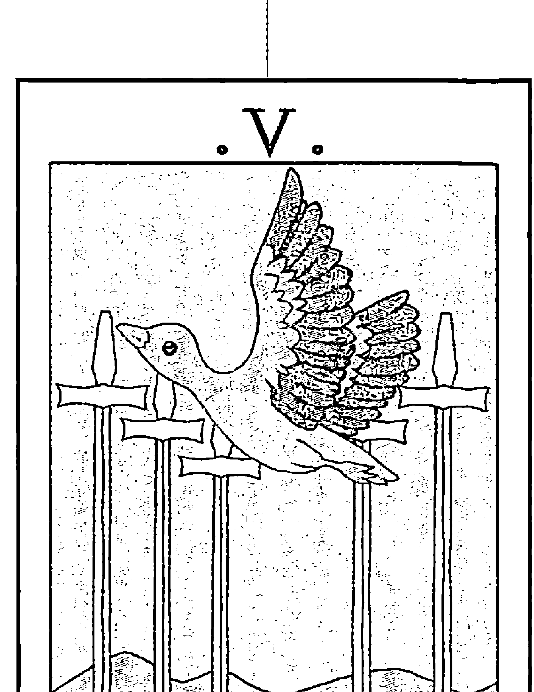

雁是候鸟，在春秋两季迁徙。它们激发出我们探寻新世界的灵感。它们的叫声是一种邀请：在这个伟大的精神探寻的旅程中，跟随它们；这个旅程暗示着信守承诺和实现梦想，它们被伟大的探求所携带。

这个神圣的探寻，是寻找灵魂本质的旅程，所有的探寻都将带来转变，使我们摆脱抑制，进入我们新的力量之中。当雁出现时，我们可以认为是新想法、新旅程、新维度的开始，无论是在我们的身体还是头脑之中。雁视觉敏锐，当雁出现时，我们的视力将得到改善，包括我们身体的视力和我们精神的视力。我们的预见性将得到大大提升。

当雁来到我们的生活中，我们就被邀请经历新的奇迹和新的可能性。如果成长和成熟真正需要，通向巨大冒险和富饶的机会将会运作。雁揭示了迁移的神秘性。它们持续的变化模式，为身后的雁打下了草图，更加有利于它们飞翔。这提醒我们：那些着手去探求的人为其他人做了榜样和开启了方便之门。

雁是鸟的一种，是神与人之间的信使，曾寻得了超自然的能力。——《变形塔罗》

雁的出现是种提醒，激发我们探寻新世界，我们被邀请经历新的奇迹和新的可能性。

###### 倒放含义

两只大雁前后飞行都是错开来的。每一只雁的视线都是不受阻碍的。如果雁出现在倒放的位置，说明我们将无法辨别事物的真相。我们可能被自己所戴的有色眼镜所困扰。前面的旅程并不如它所表现出来的那样容易。

大雁的婚姻可以维持一生。夫妻双方共同抚养幼鸟。小雁在它们生命中的第一部分十分安静，不过它们必须学会“打破”。当雁出现在倒放的位置，说明我们要打破我们儿童般的模式。有可能，过去的情感在阻碍我们的成长、我们精神上的探寻。虽然，现在的这个事情，可能看上去并不公平，它终究会过去。我们的自尊和自负会阻碍我们的进程。

继续前进的机会将会出现，但是这样做可能需要“其他人喜欢我们”作为辅助，如果我们想要超越旧的环境的话。要记住，大雁总是成群地迁徙，前途要互相帮助。

要问的问题：
- 我们是否总是离不开过去那些陈旧的模式？
- 我们是否惧怕作出移动？
- 我们是否并未看清哪些事物是需要完成的？
- 我们是否拒绝行动？

## 有翅类之六
### (SIX of WINGED ONES)
###### 鸽子(dove) 在不同周期和世界之间移动

作为信鸽[^1]的亲戚，鸽子提醒我们：要保持和大地母亲、以及生活的创造的可能性之间的联系。在很多文化中，从古希腊到印第安人村庄 (Pueblo Indian)，鸽子周围充满了大量的知识。当鸽子歌唱时，我们可以期待生活被安排好。我们可以从一个困难的周期移动到平和顺畅的状态。鸽子的出现预示着：一个包含新循环、新的世界的时期将要展现。

鸽子的歌声很有特色。白天听起来，它们的歌声更加清晰地表现出拂晓和黄昏——“中间时刻”。这些是一天之中的某时，正在思考精神和身体、过去和未来之间的交融；提醒着生命的循环。当一个结束，另一个就会开始，暗示着：所有的世界都同我们的世界相交。

当鸽子出现，我们可以期待内心新的和谐安宁。我们所经历的任何不快或者挫败，都将很快过去。更光明的东西已经在路上。

鸽子通常会产下2枚卵，2是一个关于生育和创造能量的传统数字。它用一种看起来很像母乳的牛奶状物质喂养幼鸟，因此鸽子象征着新生和新的营养，暗示任何人都可以使用创造和新生。鸽子提醒我们：不论我们现在的或者刚过去的生活环境如何，新的水和新的生活已经存在。当鸽子出现，新的周期已经产生，打开了新的世界和新的可能性。

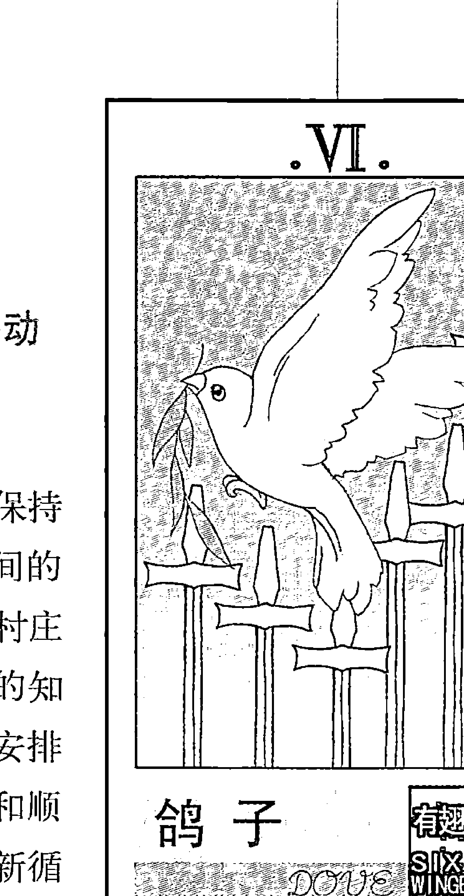

[^1]：pigeon、dove都是鸽子，前者多指实际上的各种鸽子，信鸽和鸽肉都用它；后者更多是象征性的，比如和平鸽。品种上有这样的说法：pigeon体形大，尾圆；dove体形较小，尾长而细。

鸽子的出现预示着：一个包含新循环、新世界的周期将要展现，不快或挫折很快会过去，光明就在眼前。

我们可以放弃过去，唤醒未来。鸽子是具有预言能力的鸟，我们将会很快看到我们的生活中有什么事物新生出来。

###### 倒放含义

鸽子悲哀的音调动摇我们的情绪、我们内心的水域。它的歌声中具有一种甜蜜的忧伤，是一首下着雨的歌曲。在它的音调之外，包含着新的生命之水。如果鸽子出现在倒放的位置，这就是指出：我们没有舍弃那些已经对我们毫无益处的陈腐之物。我们必须放弃已经逝去的，而不是困在不停重复的情绪的循环之中。根据它的困难度，我们必须更加理性地检查我们的状况。此时，情绪的强烈展现并不会完成任何事情。现在，再一次认真思考每一件事情变得更加重要。

倒放的鸽子可能暗示：我们的计划可能并未落实，现在的情况下，很可能会被推迟。最后，这将对我们产生益处，不过一些灵活的再次思考还是必要的。

要问的问题：
- 我们是否已经考虑了所有的可能性？
- 我们是否允许我们的情绪控制我们的行动？
- 此时，我们是否变得急躁，并尝试用外力迫使改变？
- 我们是否照料过去的伤口，而不再继续前进？
- 我们是否忘记了：创造和新生要求行动和思考？
- 我们是否并未看到已经对我们不再具有益处的事物？
- 我们是否惧怕寻找精神的指引？

## 有翅类之七
### (SEVEN of WINGED ONES)
###### 喜鹊(magpie) 秘密知识的恰当运用

喜鹊，和乌鸦类相关，有着闪光的黑色头颅，通常被认为是乌鸦类中最聪明的一种。它们适应能力极强，有很好的社会组织。伴随着能偷走所有它们能得到的东西的名声，喜鹊掌握这样的诀窍——可以使用任何它们找到的东西。

当喜鹊出现时，它预示着：暗中增长的知识正向我们走来。它可能也意味着：我们可能拾起心理上隐藏的信息。喜鹊提醒我们：小心地使用那些走向我们的知识，不论它是多么的不完全。那些知识和信息可能并不能做到如我们以为的那样多，因此，如果我们不够小心，事物将不会如预期的那样运转。

我们必须小心我们得到的秘密信息，可能的话，制订些可供选择的计划来使用它。信息可能比我们能抓住的要多，但是喜鹊提醒我们：我们可以仅仅凭一点秘密知识就完成我们生活中的事务。

喜鹊和魔力有神秘而古老的关系，它们通常被认为是女巫和巫师的密友。这源于喜鹊敏锐的智力。喜鹊经常指出：为了得到迅速的效果，我们可以使用秘密知识。其问题在于，对于我们理想中想要得到的事物，我们可能缺乏某种知识或技能。当喜鹊出现时，我们可以通过我们掌握的知识得到自己想要的东西。但是这些知识可能通过一种奇怪的方式到来，伴随着我们并没有考虑到的某些回响。我们可以期待新的魔力、知识，以及心理知觉。

但是在使用新的信息时，我们必须小心。喜鹊可以向我们展示，怎样以负责的、有效的方式使用秘密知识。

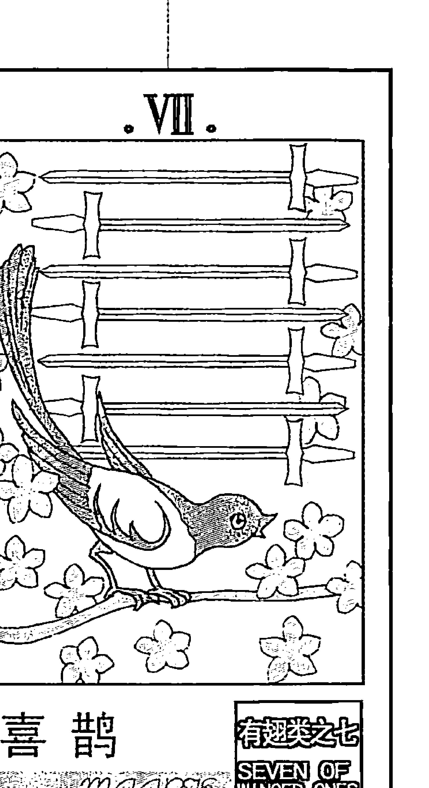

喜鹊有敏锐的智力，是与人类关系很近的鸟。

###### 倒放含义

喜鹊是清道夫和机会主义者，可以教会我们怎样使用自己所拥有的。如果倒放，喜鹊可能在警告：我们插手了一些不适合参与的事情或领域。如果这是真的，在得到切实的、坚定的建议之前，我们要小心行动和回应；不然将会使事情变得更加复杂。我们不应该让错误的自尊影响我们听取建议。这些建议是关于怎样最好地使用得到的信息和知识。

喜鹊的窝很乱，它们通常从侧面进入。如果处于倒放的位置，喜鹊可能在指示：目前，我们对某些精神领域的不正确涉足并不能获取预期的效果。因此我们要倍加小心。倒放的喜鹊也可能反映出：我们自己或者我们身边的人误用了心理能力。将会有一些心理侦察发生。

要问的问题：
- 我们是否具有一些适合自己使用的知识，但是我们并未使用它们？
- 我们是否使用自己确实拥有的技能去获取最需要的东西？
- 我们，或者我们周围的其他人，是否误用了知识和技能——尤其是心理学上的？
- 我们是否变得慎重、有责任心？
- 我们是否恰当地使用了我们的心理能力和知觉的眼光？

## 有翅类之八
### (EIGHT of WINGED ONES)
###### 白头翁(grackle) 解放情感和焦虑之时

作为草地鹨 (meadowlark)、金莺 (oriole)的亲戚，白头翁是一种黑色的大型的鸟类，长着闪光的羽毛和长长的尾巴。在不同的光线下，羽毛的色彩也会不断地变化。当白头翁出现时，它预示着：我们周围的情感正在发生变化和得到强化。那些出现了白头翁的个人，通常会发现自己和亲近的朋友，在表达情感方面，变得更加流畅和更具创造性。

白头翁的色彩是一个提醒：换个角度看我们身边正在发生的事情。那里可能包含了太多的感情，而我们并未看到正确的事物。在其中运行的情感强度可能会困扰每一件事物。因为焦虑和担心，我们的幻想受到了阻碍。现在，需要来自外部的帮助和建议。

白头翁喜欢住在松树林中，这种树木十分有利于我们的情感状况。松树的花是万能药，而松树的芳香可以帮助缓和、平静我们的情绪状况，尤其是感到内疚时。现在，白头翁的出现是一个信号：了解我们的情绪，在事情变复杂之前合理地引导它们。

白头翁是一个提醒：情感蕴含着巨大的力量，而目前，正处于驱散因不恰当情绪带来的生活压力的过程之中。如果我们不缓解这份情感支出，那么我们生活中的事物将变得更加拥挤，而我们的移动也将全部停止。白头翁提醒我们：现在，是时候在我们所经历、表达的事物中变得有创造性了，而如果我们想从过去中解放出来，就必须抓住感情。虽然，处理感情或者人们加重感情可能是困难的。

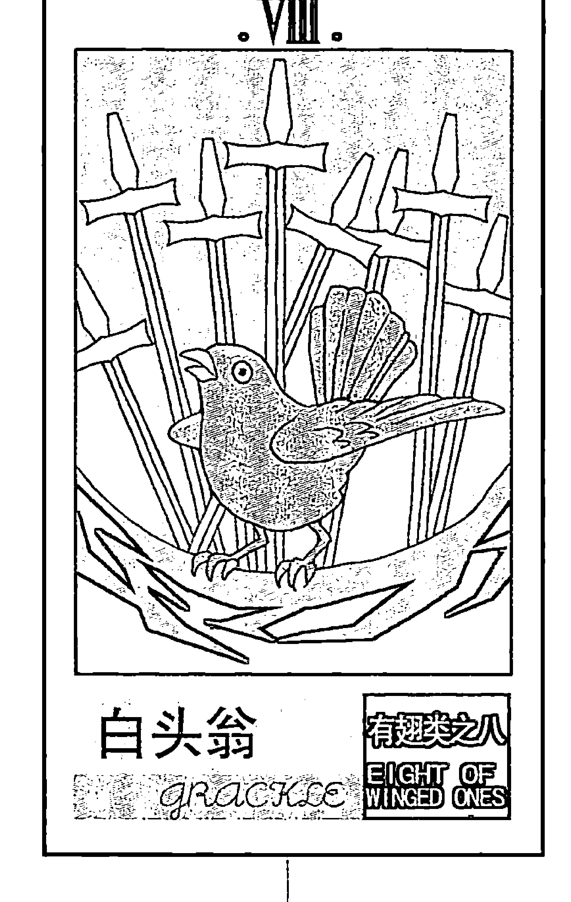

白头翁预示着我们的情感表达更加流畅和更具有创造性。

白头翁向我们承诺：如果我们这样去做，就将经历一些新的空气和变动。

###### 倒放含义

白头翁喜欢群居。当它出现在倒放的位置时，我们可能正在不正确地表达我们的情感。或者，关于情感，我们谈论得过多；或者，有什么关于它的事情并没有做。倒放的白头翁承诺：如果我们完成了必要的工作并能创造性地控制我们的情感，压力下的放松和一些变动将会很快出现在我们生活中。此时，适宜采取更多直接的行动。

倒放的白头翁承诺减轻拥塞，不论这种拥塞是关于个人努力或者健康。机会将会出现，但是我们并不能讨论或者因它们感到焦虑，因为，现在是解决我们的情感的时间。

在求爱过程中，雄性白头翁把它的尾巴折叠到一个宝石状的槽中。宝石是行动的古老象征。倒放的白头翁提醒我们：切实的行动可使我们的紧张很快得到释放。它指示出：如果我们不能抓住过去的情感，很快，事物就将转向。

要问的问题：
- 我们在情感中，是否太过被动？
- 对于情感，我们是否简单地旧调重弹，并不做出任何改正？
- 我们是否曾经抑制过去的情感，然后重复同样的模式？
- 我们是否能够眼光远大地处理问题和事物？

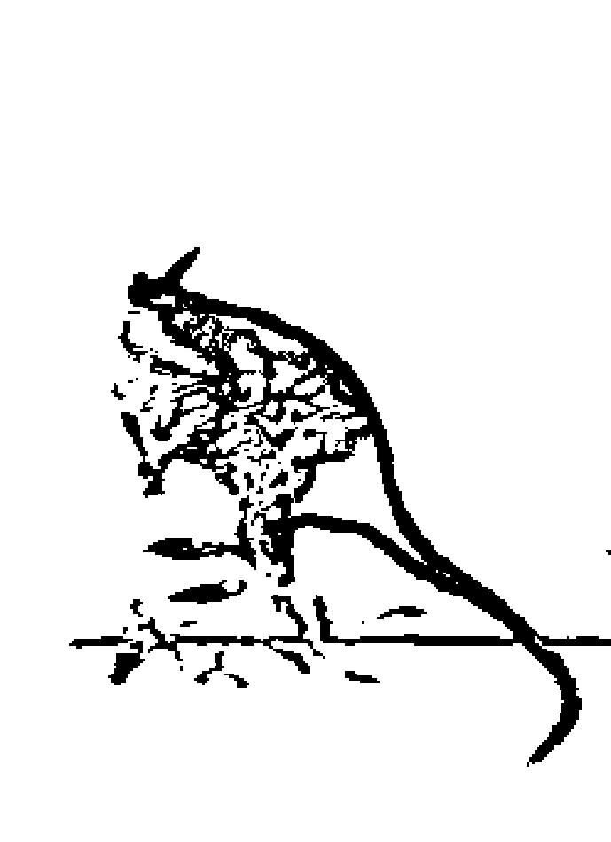

## 有翅类之九
### (NINE of WINGED ONES)
###### 潜鸟(loon) 答案，梦中的希望

潜鸟是独一无二的潜水家，尽管它在陆地上十分笨拙。比较起包括企鹅在内的其他鸟类，潜鸟可以潜水更深，游得更快。当潜鸟出现，它提醒我们：关注自己的梦。因为它们会变得更加多姿多彩，以及更加清晰——具有更多的重要性，提供答案和鼓舞人心的希望。

时机已经成熟，我们的洞察力使我们通过梦的领域了解我们的问题和焦虑。当潜鸟出现时，对于清晰的梦，上面的行为是很容易做到的。在清晰的梦中，我们意识到我们正处于梦中。梦可能唤醒旧的伤痛，但是只有这样做，它们才能被净化。这样的梦提醒我们：如果我们面对并解决过去的不幸，机会就将到来。虽然这个过程中可能会有悲伤，存在某些痛楚，潜鸟提醒我们：任何一个失去的东西，对我们来说，都不再健康；它们将被一些更有利的东西取代。

潜鸟的叫声令人记忆深刻，能在最初时到撼动我们。当潜鸟出现时，它在呼唤我们不仅更多地注意晚上的梦境，也在提醒我们，注意那些藏在我们潜意识里即将再次展现的所有希望与梦。潜鸟的出现告诉我们不要对这些进行折衷，否则我们会发现自己受尽折磨。

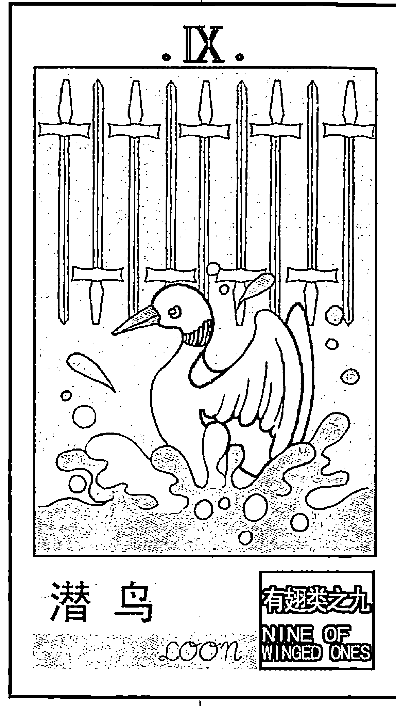

潜鸟既擅长潜水又具有飞翔能力，还拥有奇妙的体色。

潜鸟游泳的能力、彩虹般的颜色、令人难忘的叫声，象征着机会已经降临。潜鸟唤醒想象，向我们保证：我们必将收获一个能够实现的美丽的梦。唯一会分散潜鸟能力的事情是妥协。

潜鸟的出现告诉我们：当我们处理那些折磨自己的过去时，我们打开了能实现未来的梦想和想象的大门。

### ⬇ 倒放含义

对于那些生活中出现潜鸟的人来说，此时做梦和想象的能力会变得强大。想象和幻想会变得非常逼真。如果潜鸟出现在倒放的位置，可能暗示着：我们并没有把真实从不真实的事物中辨别出来；或者，我们要更加信任幻想和梦，可以通过它们带着我们前进，而不是使用其他举动平衡幻想。

处于倒放的位置，潜鸟通常反映出：我们不能忘记过去，总被过去的事件所折磨，我们阻碍了自己现在的成长。我们可能会顾影自怜。现在是醒过来，采取直接的行动的时候了。如果我们这样做了，生活中新的阳光将眷顾我们。我们要坚定信念，不论它看起来是多么困难或者绝望。

要问的问题：
- 我们是否透过玫瑰色的眼镜看待生活？
- 我们是否沉迷于过去的麻烦和失望之中？
- 我们是否携带想象力一同前进？
- 我们是否并未参照展现在我们面前的梦境行动？
- 我们是否对其他人或者自己感到急躁？
- 我们是否放弃了希望，并未恪守其他人的，或者自己的诺言？
- 我们是否忽略了梦境中的信息？
- 我们是否把它们处理为不切实际的？

##### 有翅类之十 (TEN of WINGED ONES)

###### 孔雀(peacock)关于死亡和复苏的新的循环

孔雀羽毛美丽、声音嘶哑，是强有力的鸟类。它的颜色、花纹，甚至它的神话，都关联着自然中生命和死亡的节奏。当孔雀出现，我们可以真正地期待：一个关于生死复苏的强有力的循环周期将在我们周围发生。

如果我们并不了解生死总是相互追随，我们将经历大量的不幸甚至沮丧。孔雀的出现是一个强烈的提醒：旧的不去新的不来。这个进程中的困难在于：我们并不总能知道为什么事情变得困难，甚至失败、成为泡影，直到这个进程全部结束。此时，我们通常会有“啊哈”这样的反应——“这就是它为什么不能彻底做出来的原因！”

孔雀的叫声虽然嘈杂但充满乐观。这是教我们笑对人生，即使身处困境。如果我们学会保持幽默感，我们行事所遇到的很多挫折和困难都会迎刃而解。

孔雀被认为是神圣的，因为在埃及，它能杀死毒蛇。它羽毛上的花纹，给予它一种“有很多眼睛”的外表形象。当孔雀出现时，我们被提醒：事物并非看起来的那样。我们的眼睛要去寻找：任何未能在外观上体现的事物；任何被错过、可能一定意义上对我们有毒的事物。

在所有鸟类中，孔雀最类似古代在烈火中重生的凤凰。孔雀承诺重生和复苏，不管我们生活中发生了什么事情。我们可能并不知道它会怎样发生，但是它确实是会发生的！

> 英语中的 'peacock' 专指雄孔雀，雄孔雀的体羽非常华美。
> 在所有鸟类中，孔雀最类似古代在烈火中重生的凤凰。

###### 倒放含义

在全世界范围内，孔雀毛被广泛使用在仪式和典礼当中。雄性孔雀的蓝绿闪光的彩虹色羽毛象征着王权。羽毛给孔雀这样的外表：它的尾部把眼睛全部覆盖，因此孔雀通常关联着警觉性。当孔雀出现在倒放的位置时，我们也许对周边的事情缺少正确的认识；我们可能并未看到应该看见的某些事物；我们可能比它呈现出来时看到的更多。

倒放的孔雀反映出：我们没有察觉悬在头顶的阴影。虽然它可能并不明显，阴影是死亡在新生命的循环舞台中的一部分。复苏和新生将很快到来。但只是在我们放手无益之事时才会发生。现在，是面对新事物的时候了。

孔雀的大脚具有象征意义，因为脚是我们的支持体系。当孔雀出现在倒放的位置时，这是一个信号：那个看起来我们将要得到的支持，并不如我们想象中的那样坚固。现在，我们并不能真正地依靠他人。

要问的问题：我们是否并未看到创造我们生活的机会？我们是否拒绝遵照我们的机会行事？我们是否失去了关于生活的幽默感？现在是否是这样的时机：放弃某些东西，或者让某些东西死亡以便我们可以继续前进？我们是否需要一些精神上的忠告？

##### 有翅类侍从 (PAGE of WINGED ONES)

### 乌鸦(crow[1])出乎意料的魔力和能量

具有一身显著的黑色，乌鸦是大乌鸦的近亲，是鸟纲乌鸦类中的一部分。黑色是夜晚的肤色，也是创造的子宫的颜色，一种母性的颜色。在夜晚的黑暗之外，新生出生了。黑夜诞生了新的一天。

虽然在白天活动，乌鸦提醒我们：出乎意料的魔力和能量是活动的，它们在大声呼唤着我们。在中世纪炼金术中，乌鸦是一种普遍的象征，描绘出“黑化（negido）”——物质的最初形态，尚未成形但是充满了可能性。

乌鸦在树顶筑巢。而一群之中，通常有一只担任警戒，密切注视，在其他乌鸦吃东西的时候进行提醒和预警。当乌鸦出现时，请注意那个观察者，它预示着一个新的时期。时刻关注新机会和新魔力，当机会来临的时候不要放松警戒。

乌鸦的语言复杂，声音容易辨识。它们发出各式各样的叫声，每一系列都具有它的意义。乌鸦的叫声提醒我们：每一天，我们都能面对魔力和创造的呼叫。帮助我们发展自己的嗓音和语言，以便得到我们想要的、需要的东西。

乌鸦通过一种叫做“mobbing”的聚集在一起的方式，来对抗鹰等猛禽，尤其是猫头鹰。举例来说，如果猫头鹰发现了乌鸦夜晚的栖息地，这个地区将恢复黑暗，乌鸦可以做它们想做的任何事情。乌鸦的出现提醒我们：魔力已经准备好，但是它也建议：要集体行动，而不是个人行事。这样会更容易取得成功。

乌鸦走到哪里就把魔法带到哪里。作为创造和强大魔力的象征，乌鸦提醒我们：创造的机会大量存在于每一天之中。它带给我们关于新的创造机会的信息，向我们保证：魔法正处于活跃之中。

> [1] crow和raven(大阿卡那15魔鬼)都是乌鸦，后者又称大乌鸦。有一个作家以体形来区分这两种动物：raven有较大的身躯，大概有22至27英寸(1英寸约等于2.5厘米)长，46至56英寸宽。crow大概有17至21英寸宽，它们的尾部都有共同的特征，就是有点类似正方形。当我们在市区里，也可以很容易地发现并分辨它们：它们的声音也有些不同，crow的声音有点类似"caw,caw"，而raven的声音则为"croak"，而且也比较低沉。如果我们有机会可以遇见它们的话，首先应该区别它们的声音，然后再找出它们的方位，进而观察它们的身躯，就可以很清楚地辨别它们。创造的机会大量存在于每一天之中。

### ⬇ 倒放含义

乌鸦聪慧且适应能力极强。还有它们善于和同类进行良好的沟通，并为了同一个普遍的目标同它们合作。它们的适应性、警觉性，以及聪慧带给它们偷窃的名声。它们将利用机会介绍它们自己。如果乌鸦出现在倒放的位置，我们要小心利用他人以及被其他人利用。

有时，倒放的乌鸦可能预示：我们努力追求的魔力和创造目前将不会出现，或者以奇怪的方式出现。乌鸦出现在倒放的位置也可能暗示：我们没有足够仔细地观察周围。可能错失了一些微妙的信号——某些事物可能并不十分正确。

当乌鸦倒放时，我们也许遇到了沟通障碍。我们所说的话可能被误解，而我们也可能误解其他人。我们要对闲谈、对我们或者其她在无意间所说的，保持机警。

要问的问题：我们是否试图自己去做每一件事情？对于事物的趋势，我们是否并未足够仔细地观看？是否有其他人利用我们？我们是否利用了其他人？我们是否在准备好之前就采取了行动？

## 有翅类骑士 (KNIGHT OF WINGED ONES)

### 鹰(hawk[1])守卫风险

鹰是最令人惊奇的猛禽之一，在宇宙之中，它是守护者和信使的化身。鹰有许多种类，人们有时候并不能认出特定的种类，通常他们只会认出这是一只鹰。

老鹰（buteo）长着宽阔有力的翅膀，善于在高空翱翔；而雀鹰（accipiter）翅膀狭窄，飞得不高，但飞行速度很快。所有的鹰都有超级出众的视力。实际上，如果鹰识字的话，在足球场的一边举起一张报纸，它站在球场的另外一边，就可以阅读标题。因为它们的视力很好，所有的鹰都是守护者。

鹰一天中大部分时间都栖息在某处，仔细观察周围寻找猎物。因为这种习性，鹰的出现预示新风险以及新麻烦可能出现。鹰的出现告诉我们：在我们的冒险之中隐藏着某种保护之力。而我们本身的知觉也会在这个过程中得到加强。我们必须学会信任这些知觉。

鹰拥有强有力的爪子和喙。依靠这种强有力的能力，鹰可以毫无恐惧地抓住任何猎物，这鼓励我们：当机会出现时，要抓住它。鹰长着鳞片的腿可以有效保护它们在打击猎物的时候不被咬伤，这向我们保证：在我们努力的事物中，有保护存在。

鹰的出现通常预示着一个充满力量和见识的时期，对我们现在的努力有着非常大的帮助。在我们的旅程和努力中，将拥有保护。现在，是时候勇敢地跟随它们向前去了。

> [1]hawk和eagle (大阿卡那4 皇帝) 都是“鹰”的意思，hawk更偏向统称，而eagle更多指凶猛的鹰，比如“鹰派”中用的就是这个意思，所以前面的牌中，叫做“雕”。鹰分成许多种类，大的叫eagle，飞得高的叫buteo，也就是中国常见的老鹰……这些也是统称，下面还有更详细的分类。
> 鹰身形敏捷，目光敏锐，充满力量，是不同世界间的信使。——《变形塔罗》

### ↓倒放含义

鹰的存活率很低，3/4 的小鹰会在它们出生一年之内死去。而活下来的鹰将成长为强悍的成年鹰。当鹰出现在倒放的位置时，可能预示着：此时，在我们的努力中可能存在很多困难和复杂的因素。这是一个警示：我们着手的第一年可能是最困难的，因此，我们要尝试着计划未来，预计并阻止尽可能多的问题。

倒放的鹰可以是一个警告：事物可能并不像我们想象的那样安全可靠。我们也许会遭到强烈的反对。在我们的事业中，急躁会导致很多问题的出现。

红尾鹰 (red-tailed hawk) 通常被辨认为草鸡鹰 (chicken hawk)，因为它们老被冤枉杀死小鸡。其他种类的鹰和猎鹰，更可能是真正的凶手。但红尾鹰被看见在附近飞翔，所以通常是它们被责备。当鹰出现在倒放的位置，我们可能发现自己被诬告了。而其他人应该为此负责。如果以上的事情发生，保持耐心，等待，观察。事实最终会出现。

要问的问题：我们是否并未对可能出现的问题进行预测？我们是否并未恰当地保护自己？我们是否在自己的努力之中变得急躁？目前，打击是否过于强烈？

##### 有翅类王后 (QUEEN of WINGED ONES)

###### 绯红金刚鹦鹉(scarlet macaw) 敏锐的视觉和精神知觉

绯红金刚鹦鹉是鹦鹉的一种，生活在中美洲、南美洲以及墨西哥的雨林中。它们十分聪明、有理解力、勇敢、警觉，它们通常以冷静的姿态出现，对周围产生极大的迷惑。

在亚马逊河（Amazon）流域，以“Jaguar People”为人们所知的土著居民有关于绯红金刚鹦鹉的神秘的传说。他们认为自己来自星星。当他们要回天堂的时候，神派绯红金刚鹦鹉来引领他们。偶尔，有些人会掉队，神就放逐绯红金刚鹦鹉来到地面，带领这些人返回他们的星星家园。

当绯红金刚鹦鹉出现时，我们精神的感知力和洞察力会得到加强，变得更加敏锐和精确。我们要相信这种能力，不管它看起来有多奇怪。我们可能找到更有创造性的方式来表达我们的知觉、公布我们的忠告。

绯红金刚鹦鹉的寿命很长，能活 75 到 90 年。它们的出现通常预示着：一个充满创造性的、更高知觉的较长时期的开始。它们模仿人类说话，它们拥有一套复杂的身体语言及多种发声法，反映出它们具有更高的能力，可以进行更清晰的交流。

绯红金刚鹦鹉预示着我们的精神、感知力和洞察力的加强，我们的视力、创造力和沟通会更加敏锐和精确。行更加多彩的、有效的沟通。人们会集中注意力，以从未有过的方式倾听。当绯红金刚鹦鹉出现，我们的视力、我们的创造力、我们的沟通，将会照亮我们在做的每一件事情。

绯红金刚鹦鹉也叫五彩金刚鹦鹉或者红黄金刚鹦鹉，好奇心重，敏锐警觉。

###### 倒放含义

绯红金刚鹦鹉智商很高，但比较情绪化。它们具有相当于2岁或者3岁幼童的情感能力。它们会创造性地对周围的情感进行回应。当绯红金刚鹦鹉出现在倒放的位置，我们自身的情感可能会粉饰我们的视力和知觉。我们仅仅会察觉那些我们想要去做的事情。

当绯红金刚鹦鹉出现，应检查我们的健康状况。也许我们的健康正受到情绪的困扰。我们知道，情感影响身体机能。此时，平衡情绪也会对身体上的不平衡产生益处。学习掌控情绪也是十分重要的。

倒放的绯红金刚鹦鹉也可能反映出：我们需要多彩的人生。用颜色治疗是有益处的。在野外，绯红金刚鹦鹉经常食取悬崖边上的泥土。这些泥土中有它们身体必需的营养。此时，对我们自身物质摄入的检查，也可能是重要的。

要问的问题：我们是否正确地看待事物，或者是透过玫瑰色的眼镜？我们是否不被理解？我们的情感是否并不平衡？我们的知觉是否被用于闲谈？为了何种目的，我们使用自身精神上和身体上的知觉？

##### 有翅类国王 (KING of WINGED ONES)

###### 大蓝鹭(great blue heron) 过分自信的权威，忠告

大蓝鹭包括苍鹭、麻鸦、白鹭，属于涉禽的一种，经常活动在沼泽和浅水中。它们涉水取食，因此，大蓝鹭通常被认为是沼泽地之王。大蓝鹭的出现是一个信号：说出我们的权威和忠告，不要迟疑。大蓝鹭预示着一个时期，此时我们的权威和忠告最为正确，并将被良好地接收。

像所有涉禽类一样，大蓝鹭显著的特征是它们纤细的双腿。大蓝鹭可以很轻松地单腿站立。双腿使它们可以站立以及移动。大蓝鹭修长、纤细的双腿提醒我们：我们不需要借助其他物体来保持我们的平衡，我们完全可以依靠自己的力量站起来。大蓝鹭的出现表明这个时刻已经到来：帮助成就我们的权威和责任。

大蓝鹭标志着这样一个时期：我们可能被他人认为更加可靠和忠诚。我们不应该急躁，这是行动的好时机。其他人会改变对我们的固有成见，意识到他们曾经是错误的。大蓝鹭姿态优美，捕猎迅猛果断。所有这些特质提醒我们：现在，相信自己，是探索新领域的时候了。现在，是以具有侵略性的方式向我们的机会移动的时候了。

大蓝鹭的出现提醒我们：应明白自己最需要什么，相信自己而不是他人的提示。

大蓝鹭被认为是沼泽地之王，它的出现预示着我们的权威和责任将获得成就。

### ⬇ 倒放含义

大蓝鹭无所不能，在陆地上、天空中、水中都生活得悠闲自得。因为它在所有环境中都表现出色，大蓝鹭提醒我们：要跟随自我的生活道路。如果处于倒放的位置，大蓝鹭暗示我们太过自信，涉及了太多领域，从而把我们的精力分散太多。

倒放的大蓝鹭可能反映出：我们的权威和建议有点多了。我们对于他人和自己太严厉了。这样容易导致欺凌弱小。可能，我们自己或者周围的某人，自信过了头，从而威吓到了别人。或者，也许人们会在特定的环境做出不公平的决定。

大蓝鹭喜欢孤独，它们悠闲自得，到了繁殖期就会成群结队。当倒放的大蓝鹭出现时，我们也许想回归正常生活，但可能不会有好的效果。或者，我们在对生活的方法上太过拘泥于“二中选一”。

要问的问题：我们是否试图与其他人攀比（keep up with Jone's）[1]？我们是否太过严格？我们是否太过缺乏社会性？我们是否太过缺乏自信，或者我们过于相信自己？

[1] keep up with Jone's（与邻居琼斯家保持一致）是一种攀比心理，是经济理论中的一个相对效应假说。意思是说人们的幸福感主要取决于与自己相同阶层的其他人生活状况的比较，而不是与不同层次其他人生活状况的比较。

## （三）变形者

当前存活的动物3/4都是昆虫，它们的总数大概是人类的20万倍。虽然很多人都觉得昆虫是很讨厌的害虫，但是昆虫的确是很神奇很迷人的生物。

昆虫存活于地球的各种环境和各个角落。尽管它们体积很小，它们却是地球上最古老的生物之一。昆虫种类繁多，它们知道怎样使自己的种族繁荣昌盛，因此培养了超强的适应能力。

昆虫的基本特征是都有两个触角和四个翅膀，感觉器官一般在两眼之间。它们用成千上万种方法来找到每个可能的食物和栖息地，所以昆虫家族形态千差万别。

很多人都认为变形者只是昆虫王国的一部分，但是事实不是这样的。变形者还可以是节肢动物门中的（蜘蛛、蝎子、蜈蚣等），以及蠕虫类。从本质来讲，它们都是使人毛骨悚然的爬行动物。

变形者的特征就是变形。生活的本质就是变化，变形者教会我们如何改变自己来适应生活。就像水一样，可以适应各种各样的容器。昆虫教我们怎样适应环境、怎样改变自己来赢得生存和发展。改变可以帮助我们成长，可以促进推陈出新。如果拒绝改变，生活将僵化，就像不流动的水一样。

大多数昆虫都有以下几个成长阶段。第一个阶段是卵阶段，对应我们的是开始一种新的理念、项目或者新的品质。卵阶段之后是幼虫阶段，这个阶段昆虫会努力成长并建立一个坚固的基础，对应我们的则是计划的成形和发展阶段。第三个阶段是茧和蛹的阶段。虽然茧和蛹是有区别的，但是对于我们来说，它们都可以表示重新组织的阶段。它们细胞的变化告诉我们在这个阶段要做我们必须做的和我们能做的，然后顺应具有创造性的项目的本质发展。破茧和破蛹而出的是新的生命和新的形式。在昆虫王国里，新生命通常都是有翅膀的。

如同水一般，变形者是创造的始祖。这些动物帮助我们理解并适应生活。蜘蛛、蜈蚣等这些变形者们教会我们在任何事情上的创造性和适应性。

昆虫是地球上最古老的生物之一。昆虫发育时形态会变化，这一特质贴合变形者的本质特征。
破茧和破蛹而出的是新的生命和新的形式。

##### 变形者首牌 (ACE of SHAPESHIFTERS)

###### 蝴蝶 (butterfly)

###### 全新的爱情、欢乐和健康

蝴蝶，这个神奇的变形者，是大家公认的蜕变的象征。蝴蝶一生的成长充满了变化，从卵到幼虫到蛹，蝴蝶在变化中获得新生。蝴蝶的诞生是一个新的开端，这个新的阶段对于我们来说则是全新的健康、欢乐或是爱。

蝴蝶和蛾子的嘴像长长的管子，长成这样是为了吸食花蜜。蝴蝶总是象征着我们的生活出现了花蜜一样美好的事物，预示着新的开始以及随后的快乐生活。当蝴蝶出现的时候，就是新阶段开始的时候，机会总在这时出现。

刚刚破茧的蝴蝶翅膀太软，因而不能飞起来，所以它们选择在晴朗的天气里破茧，这样，翅膀很快就干了。蝴蝶预示着时机和契机的出现，提醒我们抓住机遇大展鸿图，蝴蝶所象征的变化一般都是有益的。

和所有别的昆虫一样，蝴蝶也有触角。一般有触角的动物都象征着精神和心灵感知的提升。蝴蝶出现的时候，应该多注意这些感知，尤其是关于爱和异性的。雌雄蝴蝶是通过气味和视觉来定位的，所以蝴蝶的出现也象征着这些方面感知的提升。

蝴蝶是长着彩色翅膀的精灵。在中国文化中他（她）是梁山伯与祝英台的化身。

之后我们感觉浑身充满活力，继而是人际关系和爱情的转机。蝴蝶的出现表明我们要积极参加舞会，这能为我们带来欢乐和喜悦。

> 我呼唤优良的灵魂！我呼唤神奇的力量！我呼唤野性的力量！让生活顺畅，带来爱情！——《塔罗神咒》

###### 倒放含义

蝴蝶倒放，提醒好的变化正等待着我们。我们要发挥主观能动性，努力破茧而出。现在世界上的蝴蝶大概有20 000种，每一种都有迷人的色彩和神奇的特性。蝴蝶倒放，一般都是关于成长中的问题或者是缺乏成长，反映了我们没有改变或者还可以改变得更快。

幼虫因为孵出来时太小，所以不能展翅飞翔。但是它们生长得很快，几乎每两三天就换一次皮，两周后就能长到刚孵出时的2 000倍那么大了。之后它们的皮就化成了茧，再破茧成蝶。蝴蝶倒放，表示如果不按照自然的阶段发展，我们的努力将不会带来成功。那时就会出现新的目标了，新的平衡关系会指向新的目标。

要问的问题：你需要改变了吗？当机遇出现的时候，你会拒绝改变吗？你是否忽略了自己的感知并错过机遇？你是否情绪低落？你的生活是否需要创造新的色彩和欢乐？你是否不够积极乐观？是否急功近利？

## 第四章 动物塔罗的组成部分

##### 变形者之二
(TWO of SHAPESHIFTERS)
长腿王(daddy longlegs)深入的人际关系

有一种蜘蛛的绰号叫长腿王，因为它们的腿细长细长的。虽然这通常是用来形容鹤的，但用来形容这种蜘蛛也很合适。

长腿王们吐丝结网。这表明我们的人际关系要得到改善，主要表现在和自己喜欢的关系上；我们身边的关系也将更加和睦平衡。出现一只长腿王蜘蛛的时候，一般有另一只在附近，那将表示团队协作将很快使努力化为成功。

长腿王除了运动外还有很多功能和作用。昆虫和蜘蛛类节肢动物的腿有很多作用，它们感觉灵敏，能迅速抓住食物。长腿王的出现表明我们对新的关系、对自己或对生意的感知是有利的，需要抓住时机把握机遇，现在就是最佳开端。

昆虫拥有复眼，有的甚至达到1000多只。复眼能使昆虫们眼观六路。长腿王的出现总是提醒我们，在同时发生的很多事情中，有一件应该引起特别关注。长腿王显示我们对环境的感知增强了。

当长腿王出现时，我们可以期待惊喜出现，一些新的理解、创意和思想，尤其是关于人际关系的。这就是发展进一步关系的最好时机，可以创造更好的和谐，并达到目标。

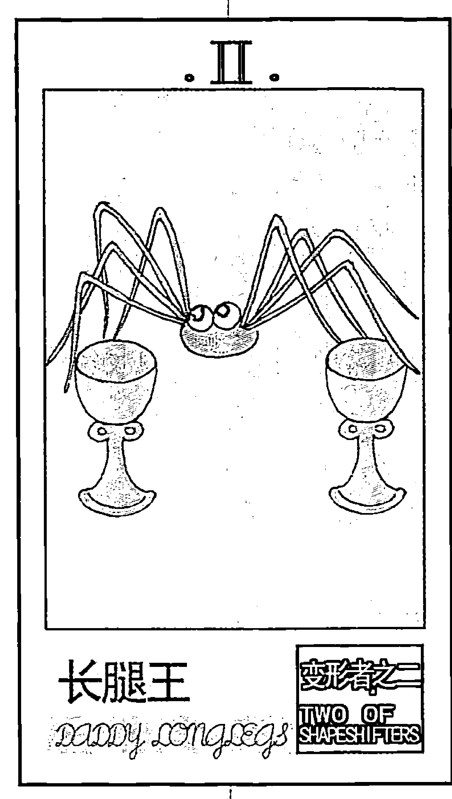

长腿王吐丝结网，高度敏感，是人际关系得到改善的象征。

如果长腿王被倒放，则需要平衡轻柔与力量。

所有蜘蛛都高度敏感，尽管我们很害怕蜘蛛，但大部分蜘蛛都是无毒的。所以它们没有我们想象的那样令人讨厌。无论什么时候，长腿王都提醒我们要更加有效地控制好恐惧。

###### 倒放含义

长腿王是很灵敏的，轻柔与力量的结合使它们易于生存。如果长腿王被倒放，则需要平衡轻柔与力量，我们一定是过于胆怯或过于激烈了，尤其是在重要的关系上。

倒放中的长腿王经常表示我们的关系将失去平衡，暗示我们身边的人容易走极端，或者追求完美，或者破罐破摔。倒放中，长腿王暗示不能达成一致并不重要，过分关注此事，才会带来不必要的麻烦。这是某个人开始解决问题的时候了，之后问题会很快解决好，然后可以躲开麻烦去实现目标。

要问的问题：你是否被自己的骄傲困扰？是否能正确认识身边的人际关系？是否把简单问题复杂化了？

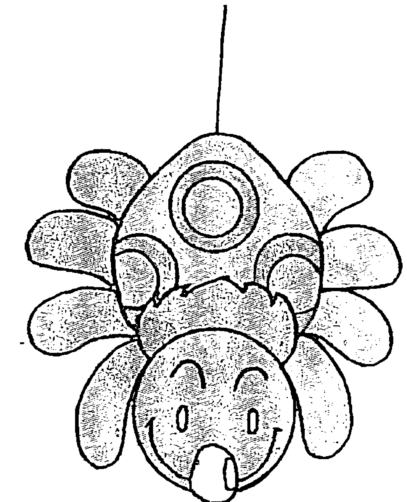

##### 变形者之三
(THREE of SHAPESHIFTERS)
天蚕蛾(days silk moth)
增强生产力, 成功, 实施

蛾子和蝴蝶很相似，它们都有丰富的变化本领，并组成巨大的昆虫类别。和蝴蝶一样，蛾子也是变形最古老的象征。它们二者只有微小的差别。大多数蝴蝶的触角为棒状。大多数蛾子都形成的是茧而不是蛹，蛾子还有一个小系带(frenulum)，在飞翔时把两个翅膀连在一起。

天蚕蛾象征多产和成功。它们负责宣布庆典的时间。巨型的天蚕蛾和普罗米修斯蛾(Promethea)、月形蛾(Luna moth)一样都是最迷人最漂亮的蛾子。天蚕蛾在幼虫时期被丝绸一样的茧包裹着，它们的茧丝很长，大概有900米长。这是一种神奇而迷人的技艺。丝是一种很轻又绝缘的材料。天蚕蛾的出现说明我们付出的努力都是有保障的，暗示有朝一日新生活将从一个高起点开始。

蛾子和蝴蝶总是象征着变化。蛾子破茧而出，是最后的一跃，从此新生命诞生。对于我们来说，则是内在的智慧、天赋、祈祷都得到实现。天蚕蛾的出现预示着我们在感情、经济、精神及艺术等方面的成功将会实现。完美的大结局将会出现。

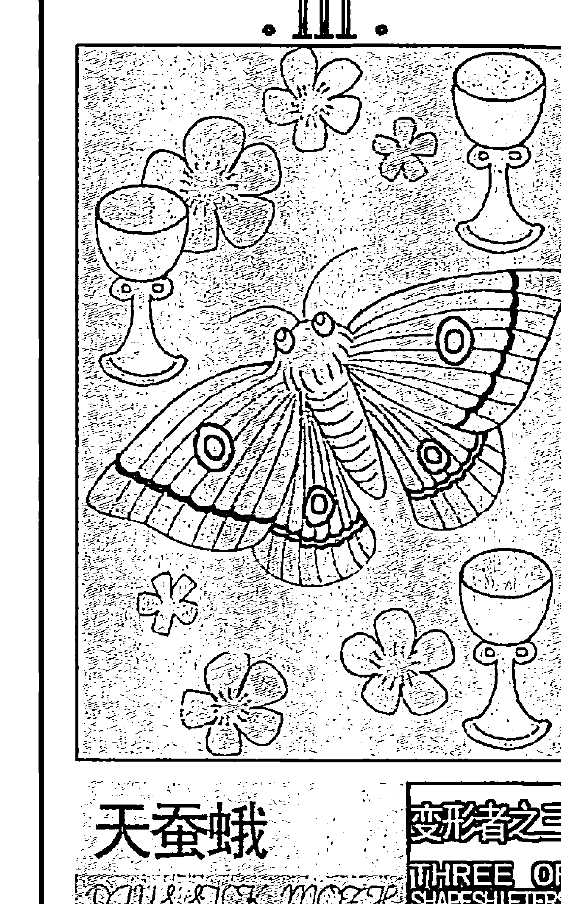

天蚕蛾象征多产和成功，它的出现预示着完美的结局。

天蚕蛾倒放表明我们反抗改变，拒绝尝试新的领域和方向。

###### 倒放含义

天蚕蛾经过人类的驯养已经失去了野性，不能飞翔。当天蚕蛾倒放时，预示我们要顺应环境的变化，停止现有的生活，开始新的人生方向，并再次学会飞翔。

所有的蛾子和蝴蝶都反映变化，变化是持续成长的关键。天蚕蛾倒放表明我们对改变的反抗，暗示我们不在创新进取而是开始吃老本，拒绝尝试新的领域和方向。

天蚕蛾的倒放还反映了我们的生产力，表示我们的内向促进了生产发展能力。需要铭记创新的过程充满了欢乐、希望、感激和不断的努力。

要问的问题：你是否还用陈旧的方法来尝试新事物？你是否忽略了自己的创新机遇？你是否利用机遇改进发展了？是否为过去所得而心存感激？是否为拒绝尝试新事物而感到遗憾？

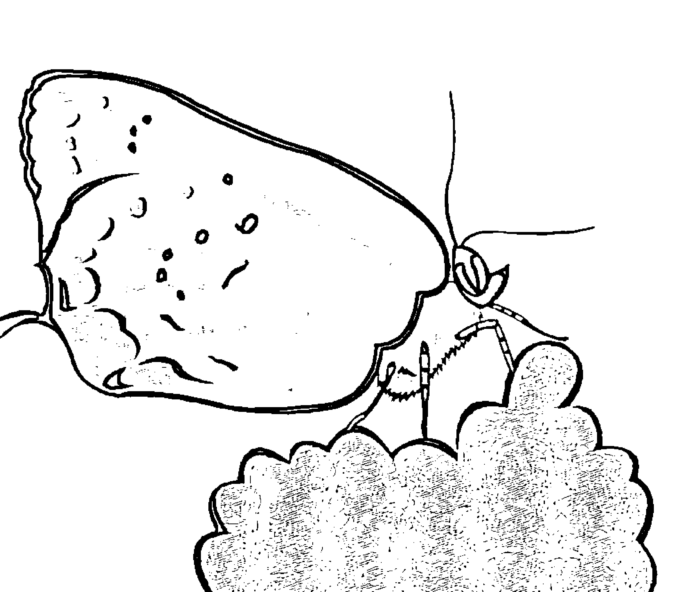

##### 变形者之四
(FOUR of SHAPESHIFTERS)
竹节虫(stick bug)表面现象之下的行为

竹节虫被称为会走路的棍子，这形象地描绘出它们的形状。竹节虫大概有2000种，有些已经是世界上最古老的昆虫之一，长达14英寸。竹节虫身体细长，隐藏起来时很不容易被发现。因为竹节虫很善于伪装，竹节虫的出现通常暗示在平静的表面下有些我们可能感觉到、也可能感觉不到的事情要发生。如果我们静止观察，会发现事情的变化。

记住要耐心保持原状，从容伪装自己。竹节虫会在有结果时告诉我们，我们应该耐心等待。只有这样，才能通过它们找到最佳时机。

竹节虫告诉我们要把注意力放在自己身上，默祷和沉思会给我们带来好结果。我们要辨别事物的关键，这些都要在静止和沉思中完成，甚至是在梦中。

竹节虫是伪装的专家，它们可以在大型动物或者人身上一动不动，很难被发现。这告诉我们，要想成功就要学会隐藏自己的意图和目的。竹节虫进食一般都在夜里，通过黑暗来掩藏自己，制造出什么也没有发生的假象。当它们出现在别人的视野时都是静止不动的，如果能做到这些，我们也能得到最终的成功。

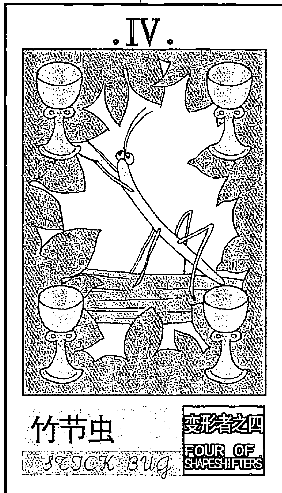

竹节虫行动缓慢，是著名的伪装大师，也象征着为了最佳时机耐心等待。

###### 倒放含义

竹节虫一般都趴在灌木和树上，夜里吃东西。它们的食量很大，如果超过一定的数量，就会引起灌木或者树落叶，尤以橡树最为明显。当橡树意外落叶的时候，人们就会发现竹节虫。介于它们的食欲，竹节虫在倒放中出现时，表示我们的胃口太大了，我们的奋斗目标泄露给了不应该知道的人。我们对他人过于轻信。古老的格言是通过沉默来表达力量的。还没到透露计划的时候呢，否则，别人可能会破坏或者偷走我们的计划。

有时竹节虫的倒放则可能表示另一个极端，我们过于保守秘密了，以致我们对所有人都不信任，反而阻碍我们计划的成功。对某个人需要透露一部分，并得到中肯的建议。

要问的问题：你是否对得到的一切都不满意？是否让别人知道并使用了你的计划？是否没有耐心等待最佳时机来赢取成功？是否对自己不信任，而依赖别人的意见？

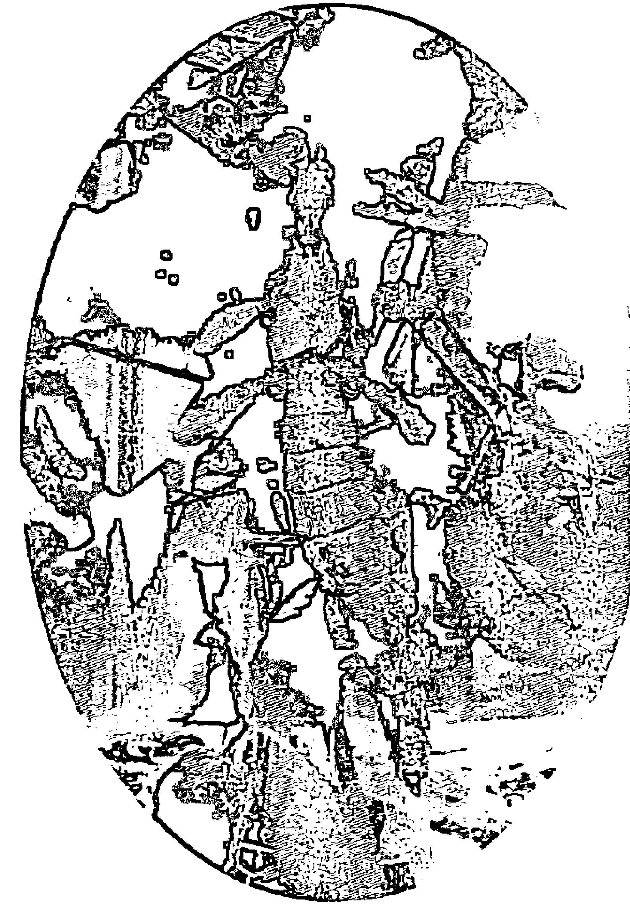

> 竹节虫倒放，表明我们把奋斗目标泄露给不合适的人或者是过于保守秘密。

##### 变形者之五
(FIVE of SHAPESHIFTERS)
蚯蚓(earthworm)重视过去的经验

蚯蚓的身体是一节一节的，圆柱形的身体没有腿。它不属于昆虫类，但属于人们想象中的虫子。人们通常也习惯叫它爬行动物。当蚯蚓出现的时候，一般表示过去的努力开始有卓越的表现，比如有了好的成绩或者现在的情形有所好转。

蚯蚓的身体是由肌肉组成的，一节一节的，血液系统、消化系统和神经系统都在每一节中。蚯蚓在土里生活，它们吞食土壤和排泄物的时候都不停地搅拌翻起土壤。每英亩（1英亩约等于4000平方米）蚯蚓的数量在13000到7000000条之间。蚯蚓可以疏松土壤，对作物生长和土地氧化都有很大的作用。

当蚯蚓出现时，说明应该把以前的经历重新整合，分清什么应该被丢弃，什么应该被吸取。给生活注入新鲜的空气和养分来保证成长。

我们应该在混乱中保持冷静，并再次对事情进行分析和评价，做出坚定有益的决定，不再反复轮回。蚯蚓可以帮助我们整合过去的资源。

蚯蚓提醒我们做事情不要草率，要慎重思考。生活中的任何悲伤和脆弱都会影响到未来。

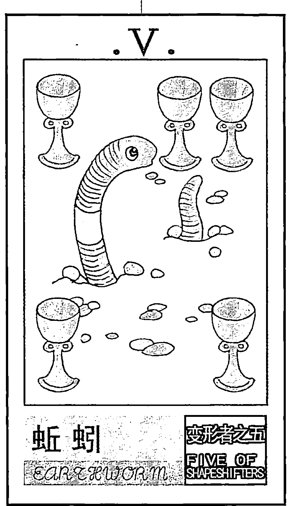

> 蚯蚓能帮助我们整合过去的资源。

> 过去有些痛苦的回忆正在浮现出来。除了试图去寻找某种有益的东西，不要过多地去后悔你所犯的错误。继续向前开始你的新生活。
—— 《变形塔罗》

的生活和成长。蚯蚓提醒我们，即使当前的形势十分混乱艰难，也要勇敢面对，并通过这些来找出新生活的道路。

###### 倒放含义

蚯蚓的刚毛帮助它们在土壤里自由穿行。这些刚毛必须抓住有摩擦力的东西才能保证移动，就像蚯蚓在玻璃上无法行走一样。蚯蚓暗示我们的未来正在受到过去生活的影响。如果我们不能读懂过去，那么我们将重复错误。倒放的蚯蚓表示我们没有掌握过去的错误。

蚯蚓告诉我们要有勇气面对现实，不管有多难。这样才能洞察事实真相，只有这样才能有新的成长和新的希望。

要问的问题：你是否忽视了过去以及过去对现在的影响？你是否谨慎认真并贯穿整个工作？你是否能接受现实？是否需要新鲜空气？生活是否忽然艰辛并无法恢复？是否害怕新的尝试？是否因为较大的任务而影响其他？

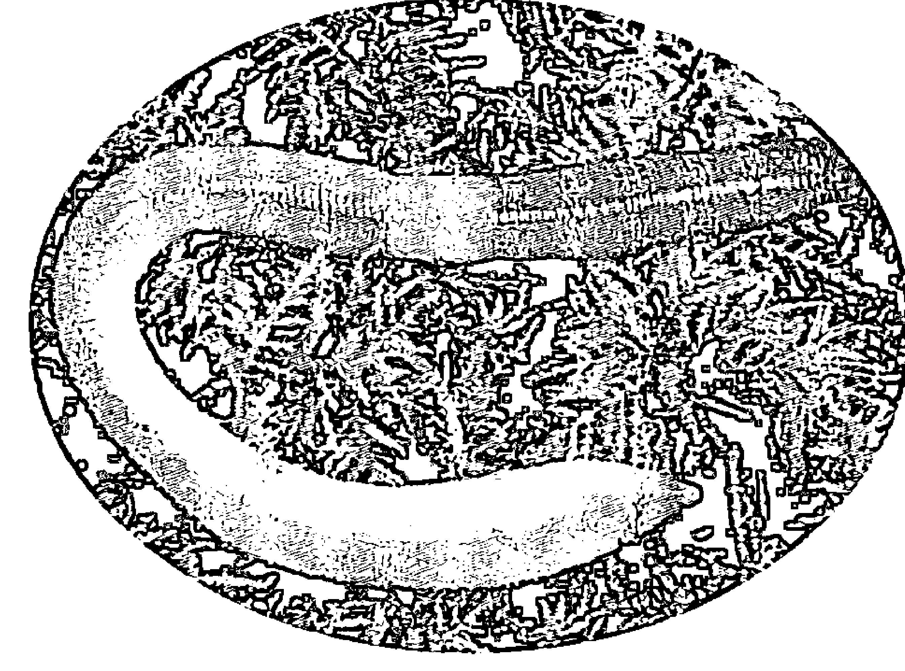

##### 变形者之六
(SIX of SHAPESHIFTERS)
蝉(cicada)除旧迎新的快乐

蝉的个头比较大，靠吸食树的液体生存，属于靠在树上吸食树液存活的昆虫。它们长长的嘴可以轻易刺入细枝，吸到里面的树液。

蝉在土里产卵，卵变成幼虫后靠吸各种树根里的营养为生，它们会这样在地下过几年（美国蝉会在地下生活17年）。只有蜕掉蛹的外皮转变为成年的蝉，它们才从土里出来。基于此，蝉的出现总是反映生活中除旧迎新的快乐。

蝉的出现预示着告别往事那种孩童般的欢乐。蝉出现表示将收到礼物、面对机遇或者得到什么，总之都是可以使我们心情愉悦有意外惊喜之事。

我们用眼睛很难发现树上蝉的踪迹。但雄蝉发出的叫声却很容易地暴露了自己。它们振动双翅，发出尖厉的声响，用这种高频的声音来吸引雌性。

蝉出现时，我们的能量发生了变化。我们会发现自己更加吸引异性，同时也更被异性所吸引。虽然不太容易被发现和感受到，蝉的出现经常能带来一些邀请、好的提议或是建议（关于两性和其他方面的），并且都是意料之外的。

这个时候，我们应该整理过往的经验，审视周围的人际关系、过去的形势及其带来的积极影响，以及我们的存在带来的成效。蝉预报了全新的快乐生活。

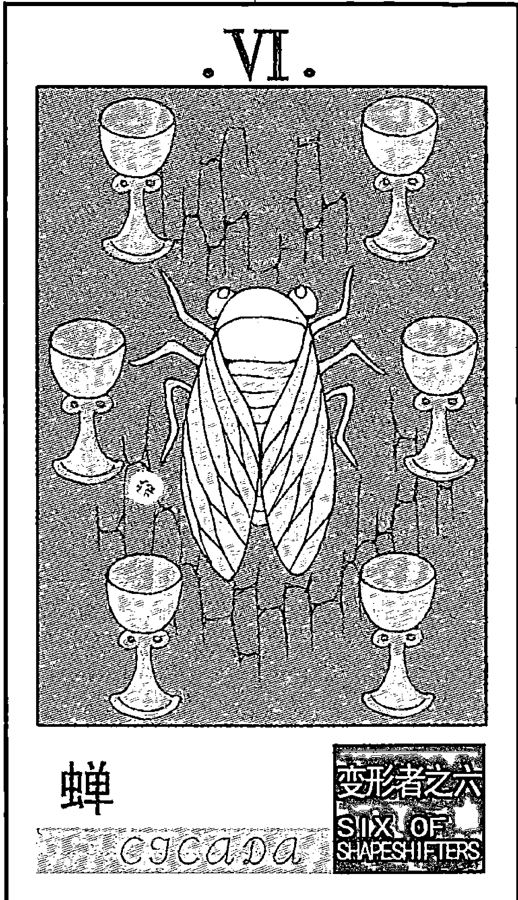

蝉 俗称知了，具有古老昆虫种群的原始特征。

蝉预报了全新的快乐生活。

###### 倒放含义

蝉的卵孵成幼虫生活在土里的时候，它们一直在土里等待成年。最后它们用强有力的前肢刨开土钻出土地变成蝉，开始交配并延续生存的循环。蝉倒放时，表明我们正在极力策划的事情需要延迟，当然这并不表示会失败，只是时间上的推后。

事情的延迟考验我们的力量和耐心，提醒我们不要反应过度不要着急，当前需要做的就是安静下来耐心等待。想想一些蝉回到地面之前要在黑暗的土里生活17年之久，蝉的事例告诉我们只要不放弃，我们一定能争取到最终的胜利！

蝉和所有其他昆虫都教会我们变化的重要性。有时倒放中的蝉表示过去正折磨着我们，回忆已使我们窒息；表示我们不能从过去的人和事中挣脱面对现在，而在过去中不断徘徊流连。如果不能放下过去，我们的现在永远都不会改变。比如关系，某种关系可能适合过去的某个时候，但它不会适合永远。

要问的问题：你是否在快速成长？是否被之前的风格束缚？是否愿意除旧布新开始新生活？

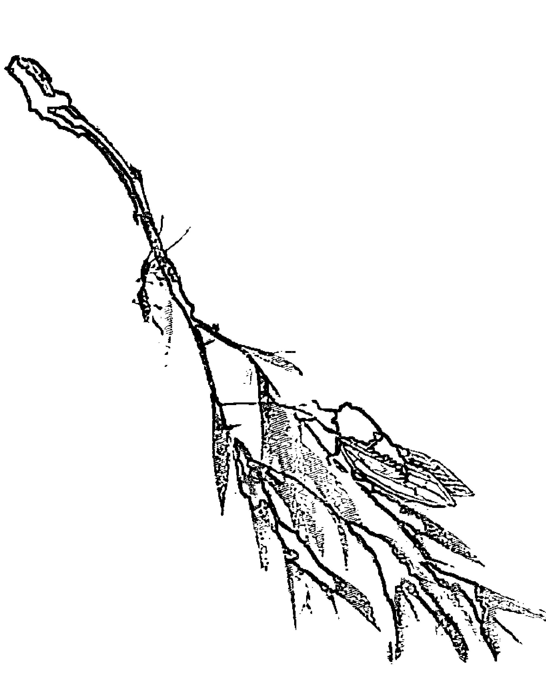

##### 变形者之七
(SEVEN of SHAPESHIFTERS)
甲虫(beetle)为达成目标做的重要决定

甲虫是世界上种类最多的昆虫之一，大约有280000种。虽然瓢虫被分到了圣杯9(愿望牌),甲虫牌仍然可以代表所有的甲虫类，包括我们生活中经常见到的各式各样的甲虫。甲虫的出现说明已经到了为成功下重要决定的时候。

甲虫表示我们的方向是正确的，我们需要做的是继续努力，来赢得成功。这时我们不必为决定是否正确而苦恼。甲虫出现的时候，说明我们的决定将很快奏效（时间不会比两周长太多），那时就可以看出所做的决定是否正确了。

一旦发现我们做出了错误的决定，接下来将出现弥补的机会。

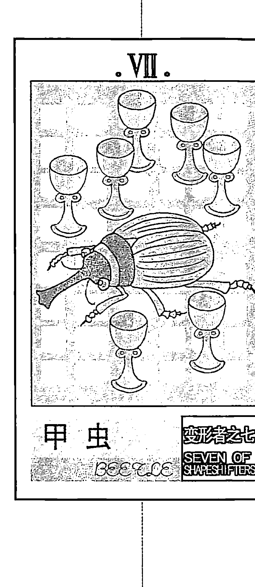

作为神圣的甲虫，圣甲虫在古埃及被认为是复兴的象征。甲虫的出现提醒我们要认清现实，如果想复兴生活就要向目标冲击。圣甲虫通常在牛粪里产卵，一个月后，牛粪滚落水中，这时幼虫就孵出来了。所以甲虫的出现告诉我们，如果想达成目标就要做好那些必需做的工作。那些工作可能又脏又累，但那是必须的，而结果将是神奇的奇迹。那些工作将明显使生活变得更加美好。

> 在古埃及，法老去世时，会将其心脏取出来，换成布满圣甲虫的石头。

为了保护柔软的下腹，甲虫的前腿越变越粗。所以甲虫的出现预示我们进入了一个确保我们的努力和决定不受影响的阶段。我们应该学会制造和使用神盾（sacred shield），在追寻目标的过程中来进行保护、治愈和祈祷。

> > 甲虫的出现预示我们进入了一个确保我们的努力和决定不受影响的阶段。

###### 倒放含义

甲虫的种类非常多，所以在面对多样性选择无法下决定时，遇到这张牌很正常。甲虫的倒放提醒我们做决定的时候，应该从实际考虑。当前应先排出事情的重要程度和优先次序，再把精力聚焦在重要的事情上做出分析。既要坚持追求目标，又要坚持实事求是。

海龟遇到危险时会藏身于龟壳，甲虫也靠坚硬的翅膀来保护自己不受伤害。而且它的腿很有劲，能够牢牢地抓住树枝。反转的甲虫告诉我们要增强保护意识。把自己的成就保护起来，不轻举妄动，直到出现转机。

所有的甲虫都会变形，所以倒放的甲虫教我们为了离目标更近一步，应学会处理身边的变化。

> > 要问的问题：你的途径和步骤需要变化吗？是否需要加强对目标的保护，并在追求目标的过程中保护自己？是否是复兴生活某些方面的时候了？是否应该把某个目标推后，以关注更重要的目标？

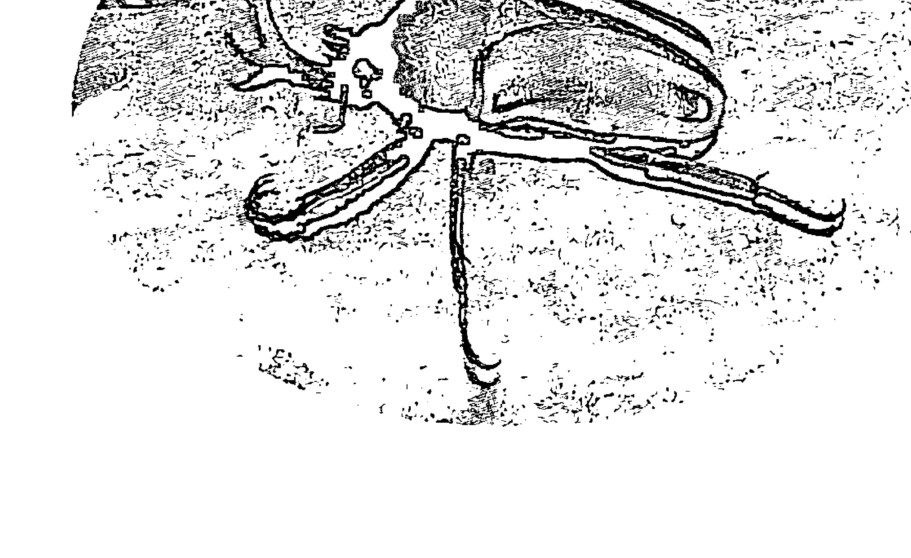

##### 变形者之八
(EIGHT of SHAPESHIFTERS)
蚂蚁(ant)没有最好，只有更好

蚂蚁总是工业和职业的强力象征，蚂蚁喜欢群居，极少数独居。它们活动的基本内容就是寻找食物和生长。蚂蚁出现时，表明我们要更加努力工作和追求卓越，不管是为了团队还是自己。

蚂蚁的出现暗示了我们生活的平凡方面有不完美的地方，告诉我们生活还能更加美好。我们所做的工作在精神领域也有很好的作用。我们应该想办法把它们找出来。

蚂蚁分工明确，纪律性很强；蚂蚁能够搬起比自身重很多的东西。蚂蚁的出现说明我们应该寻找自己生活中精神层次的角色，并学会在这个平凡的世界完美演绎。

当蚂蚁出现的时候，它告诉我们旧的生活方式已经不适应我们的生活了，它们已经不能跟上时代的步伐。我们要过更具精神意义的生活，即使这只是揭示了我们日常工作的精神需求。

蚂蚁教会我们要善于认清自己的能量。它鼓舞我们要努力拼搏，从而实现自己的理想。当我们对工作有了更高要求的时候，那就是我们的生活将要改变的那一天，也就是我们将重新构建人生的那一天。蚂蚁暗示我们没有必要留恋目前的生活，我们要积极上进，也必然能得到生活的回报。蚂蚁代表寻找出路开始新生活的阶段，并将最终通过努力获得成功。

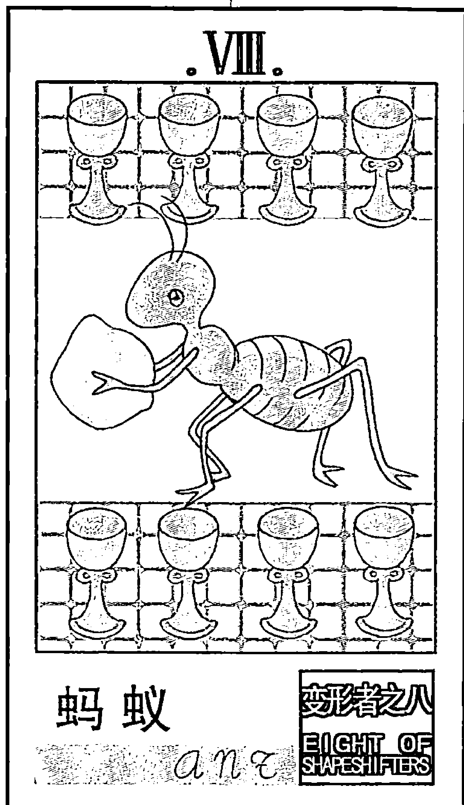

蚂蚁是地球上最常见的平凡生物，小而精悍，能经受各种考验。

蚂蚁出现，表明我们要更加努力工作和追求卓越，将最终通过努力获得成功。

### ⬇ 倒放含义

蚂蚁角色分工明确，女王负责寻找殖民地，有专门的建筑工程师，有翼的雄性是动物饲养员，不育的雌性照看婴儿以及做劳力。蚂蚁倒放说明我们不再想做单一的工作。同时它警告我们在做出决策前应该考虑清楚。如果存在犹豫的状况，就千万别轻举妄动。

倒放的蚂蚁反映了我们不安于过平凡的生活，这可能暗示我们或者我们周围的人没有尽到职责，这件事比其他任何事都要重要得多。

要问的问题：你是否遵守纪律？你是否寻求快速简单的解决问题方式？是否忽视自己重要的职责？是否为团队作出重要贡献？是否经常感到不耐烦？是否把简单问题复杂化？当前是否在做超过自己能力的工作？

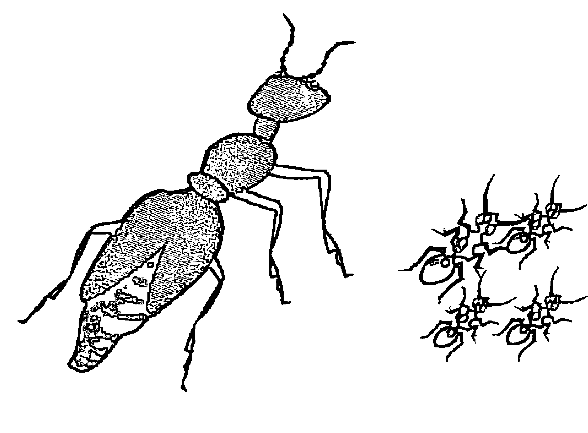

##### 变形者之九
(NINE of SHAPESHIFTERS)
###### 瓢虫(ladybug)期盼结局

瓢虫是甲虫里的小个子，大部分对它们都很有好感。而且还有很多有趣的传说。据说见到瓢虫表示幸运，而杀死瓢虫则会给我们带来不幸。还有个很有意思的习俗：把瓢虫握在手中，然后摊开手掌，如果瓢虫飞走了，表明我们的愿望会实现，并飞到爱人的身边。瓢虫的出现暗示着幸运，并表示愿望开始实现。

瓢虫可以帮助授粉，它们杀死对植物有害的蚜虫，每只瓢虫一天可以吃50~100个蚜虫。瓢虫的出现表明我们要消除事物的隐患，并防止因自身原因带来的麻烦。

成年瓢虫冬天冬眠，春天产卵。它们的存活时间是九个月到一年半，预示了生活中运气的时间是大致相同的。平均每只雌瓢虫能产800个卵，这表示瓢虫将带来旺盛的运气，并使我们生活中有益的成分显现出来。它还暗示这些应该发生在春天或秋天。

瓢虫预示的快乐一般都和物质方面有很大关联。随后的一个月里很可能产生全新的感知，并能轻易达到更高的目标和更好的水平，担忧将随之烟消云散。

雌瓢虫背上通常有7颗星，不过不管雌雄，它们背上的星星都可以很容易地被说出来。这个数字显示我们所收到的礼物和愿望实现的数量。塔罗牌里，圣杯9是愿望牌，瓢虫是最能体现这张牌的特质的。瓢虫的出现暗示我们的愿望将会实现，只要抓住机遇，我们将得到爱情、工作等，总之我们可以实现梦想。

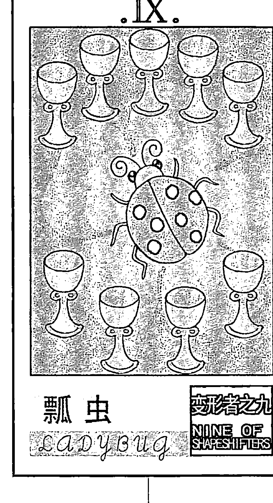

> > 体色鲜艳的瓢虫暗示着我们的愿望开始实现。

> > 圣杯 9 是一张预示机会成长、好运、物质兴旺和快乐的牌。——《变形塔罗》

###### 倒放含义

瓢虫身上的红黑颜色警告那些肉食动物:离我远点；一旦它被袭击，就会从膝部喷射出一种化学物质，使那些想吃它的动物们避之唯恐不及。倒放中的瓢虫暗示当前某人或者某事正在妨碍愿望的实现，需要提出强烈而明确的警告。

瓢虫种类繁多，有一种翅膀振动的速度比蜂鸟还快。倒放中的瓢虫警告我们在实现愿望和梦想的时候，也许太机械呆板，或操之过急。我们应该继续努力，更应该让别人看到自己的努力和进取，这是当前最有利的方式。

- 要问的问题：
- 你是否没有保护自己的努力和梦想？
- 是否能在追求梦想的过程中听进别人的劝阻？
- 是否在做超过自己能力的事情？
- 是否限制了自己的愿望和梦想？
- 是否在强制执行，而没有采取更好更有利的礼貌方式？

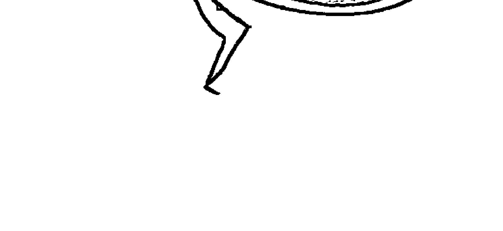

## 变形者之十 (TEN OF SHAPESHIFTERS) 蚱蜢(grasshopper)跳跃式增进的快乐

蚱蜢有非常多的象征意义，它既可以象征惩罚也可以象征祝福，还可以象征愉悦和复兴。蚱蜢有很多种，但是它们都是通过跳跃来行进的。蚱蜢的出现暗示我们将经历跳跃式的欢乐，可能是关于实现自己的个人期望和梦想，尤其是那些有关家庭的。

蚱蜢是跳远冠军，它们拥有强壮的腿，可以跳出自己身体20到30倍那么远。蚱蜢的出现提醒我们，要想实现梦想，必须抓住机会，虽然这有点难，但是蚱蜢的出现确保了成功，即使我们没有认识到成功的方法。蚱蜢预示着成功，并且经常是突然成功。

寻找阳光的直觉和本能，使得蚱蜢始终处于温暖和明亮中。现在我们就在做这件事，相信我们内心的声音，相信直觉可以找到对我们来说正确的方向。蚱蜢教会我们坚信并听从内心的声音，这是跃进成功的神秘方法。

在亚洲，人们相信死去的亲人会变成蚱蜢回到自己的身边。所以它们的出现总是象征着欢乐、幸运和新的精神纽带，这些力量可以鼓舞我们不断努力和前进。

蚱蜢始终向前，从不后退。它们提醒我们要勇往直前，生活必将美好。蚱蜢表示只要我们不断努力，我们的希望和梦想就会实现。

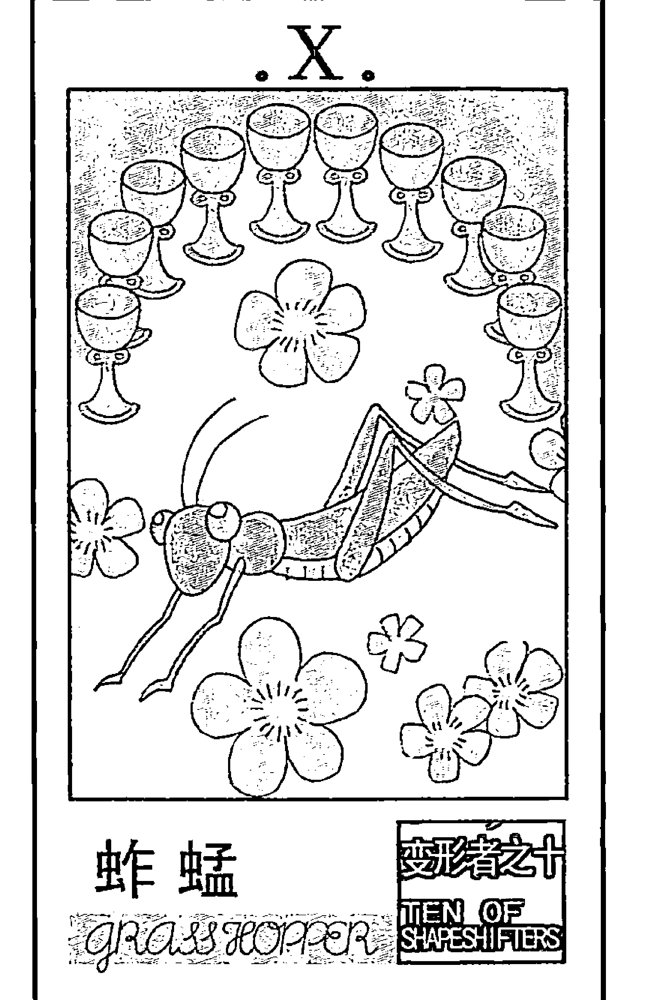

> 蚱蜢教会我们坚信并听从内心的声音，这是跃进成功的神秘方法。

###### 倒放含义

蚱蜢的后腿和前腿区别很大，后腿更加粗壮强大。而蚱蜢的运动方式也十分有特点。当蚱蜢出现在倒放状态时，我们应该避免和其他人做雷同的事情，否则将遭受挫败。蚱蜢从不一步一步地走，而是跳跃式前进。

倒放中的蚱蜢暗示着我们的现状，也许别人已经获得了长足的发展，但我们还停滞不前，因为遭受挫折。这些问题甚至可能影响我们的健康。我们必须学会忍耐这种痛苦，承受别人的嘲笑。千万别一时冲动，前功尽弃。记住蚱蜢和别的昆虫极为不同的运动方式。如果我们耐心等待，将等来跳跃式的前进，并可能超过生活中的其他人。

要问的问题：你是否不经过思考就行动？是否看到别人的进步就忘记自己应该有的节奏而盲目跟随？是否忽视内心的声音？是否没准备好就开始行动？是否过多重复过去，而忽略了面向未来的创新？

当蚱蜢出现在倒放状态时，我们应该避免和其他人做雷同的事情。

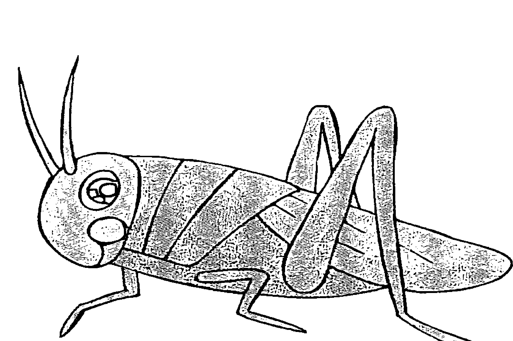

##### 变形者侍从 (PAGE of SHAPESHIFTERS)

###### 毛毛虫（caterpillar）好运和新生

昆虫的变形过程意味着生命的重新诠释。毛毛虫代表了新生、新的阶段、新的基础，同时它也是在巨大努力前提下的好运的象征。

毛毛虫用它们的脚来试探植物是不是能够食用。同样的道理，我们应当学习毛毛虫，在跳下水之前先尝试水有多深。毛毛虫还是非常挑食的动物，往往它们的一生只以一种植物或者一类相类似的植物作为食物。同样的道理，我们应当学习毛毛虫，为了在一个阶段达到一个伟大的目标，切忌分散自己的注意力。

毛毛虫往往代表着温和的、平缓的、不疾不徐的行为，以完成某一种活动或作出某一种努力。我们会得到上帝给我们的意外的恩惠。如果善于利用这一种恩惠，那么对我们的将来是非常有益的。我们要在生活中善于发现好消息、好的起点和富有创造性的灵感。现在是时候为一个新的项目做好准备并作出努力了。

毛毛虫每个种类的形态和颜色都不尽相同。这意味着在一生当中不同的可能性和预测性。不同的形态和颜色是保护毛毛虫不受捕食者攻击的重要因素。毛毛虫的某些形态看起来很恶心，这一点使捕食者们望而却步。同时，毛毛虫的某些颜色使它们看上去不是那么美味可口。毛毛虫的这些表现提醒我们，在开始作出努力时要小心谨慎地注意以下因素：尽可能学会伪装自己以达到保护自己的目的。如果我们能做到这一点，那么我们就能经历非常迅速的成长，我们也会经历一个新阶段的诞生。

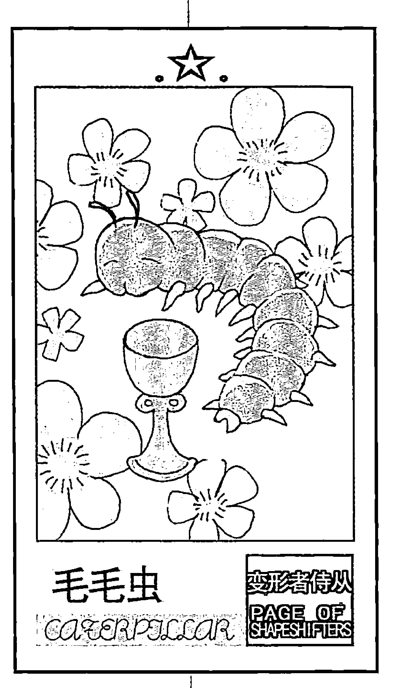

> 色彩艳丽的毛毛虫代表了新生，是好运的象征。

毛毛虫提醒我们，要尽可能学会伪装自己，我们会经历快速的成长和新阶段的诞生。

###### 倒放含义

卵刚刚变成毛毛虫之时，看起来非常弱小，但它们成长得也非常迅速，以至于它不得不通过蜕皮来适应自身的成长。

大部分种类的毛毛虫在这一阶段会蜕皮4次，也有一些种类的毛毛虫隔几天就蜕皮一次，以适应一个新的更大的身体。毛毛虫塔罗牌的倒放提醒我们，如果没有痛苦地抛弃过去的经历，我们就不能成长。也许在蜕皮的过程当中我们会感到困惑，但是如果不这么做，过去就会阻碍我们通往新的努力的道路。

毛毛虫塔罗牌的倒放也预示着：在前进道路上将遇到一个人或者一些人的阻碍，我们要时刻冷静观察周围的人和事。如果不这么做，可能会减缓我们前进的速度。

要问的问题：
- 我们是否应当做的更多？
- 我们是不是过多地分散了我们的注意力，在同一阶段同时进行着多个目标？
- 我们是否坚持了我们的努力？
- 我们是否因为偷懒而减慢了向目标方向的前进？
- 我们是否在努力过程中跳跃了某些阶段，或者说我们在找捷径？
- 我们是否拒绝了帮助？
- 我们是否缺乏自律以至于其他人使我们偏离了目标的方向？

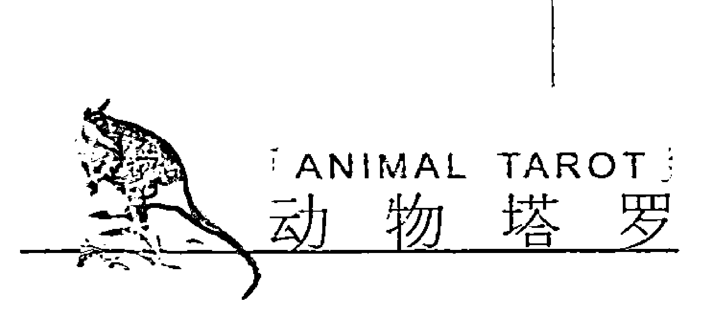

##### 变形者骑士 (KNIGHT of SHAPESHIFTERS)

###### 捕食性螳螂(predatory mantis) 通过静止来获得观察力和保护

对于大部分中国人和非洲喀拉哈里沙漠的居民来说，捕食性螳螂充满了神秘性。这种螳螂在蔬菜地里静静地伪装自己，等候它的食物主动送上门来。捕食时，它把前爪聚拢放在头部前方，既能保护自己又能随时发动进攻。当猎物靠近的时候，螳螂的前爪迅速地瞄准猎物，将其捕获。捕食性螳螂的出现，意味着此时应当静止思考和静止身体，以便发挥和集中新的洞察力。

鸟类是捕食性螳螂最大的天敌。不过，它们能够保持静止和伪装的能力，使得它们免受鸟类的攻击。除此之外，捕食性螳螂还能发出令鸟类恐惧的“嘘”声，从而吓退它们。捕食性螳螂大大的复眼可以使它们觉察细微的动静。它们灵活地转动头部来面对猎物和捕食者。捕食性螳螂的外表提醒我们，要善于使用静止状态和伪装来保护我们自己，不过它也预示着我们对危险和机会需要有更大的警惕和观察力。

捕食性螳螂的交配极其惨烈，往往交配完之后，母螳螂就会把公螳螂吃掉。捕食性螳螂的出现，表明我们生命中即将出现亲密的伴侣，甚至可以发展到结婚的程度。也就是说，我们可能要结束单身生活，取而代之的是一段新的、更深的、更紧密的感情。

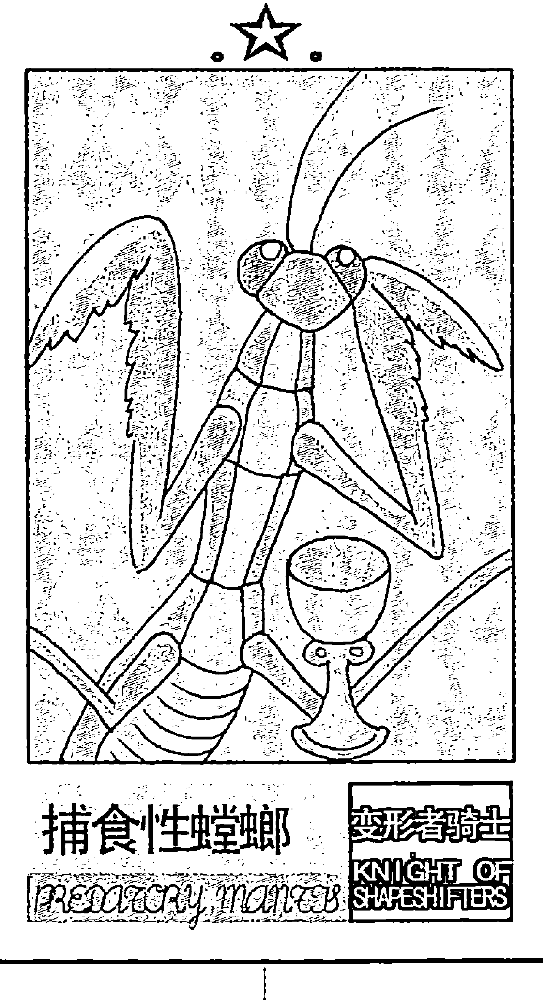

> > 一段获得新生和生活发生重大变化的时期已经来临。如果你留心倾听直觉的声音并有足够的勇气，这些变化能使你步入一种更新更好的生活轨道上。
> ——《变形塔罗》

捕食性螳螂告诉我们静止的力量是很强大的，可以使我们获得巨大的能力。这种静止可以通过苦思冥想、简单的沉思甚至是梦的形式出现。捕食性螳螂的出现，使得梦中的行为成为现实的可能性大大增加。通过学习思想的静止，我们可以增加我们的创造力和治愈能力。我们更加容易地唤醒、辨认出和显示出我们的直觉和自我保护的能力。

> 捕食性螳螂告诉我们静止的力量是很强大的。

###### 倒放含义

捕食性螳螂和普通螳螂的区别很大，它们捕杀其他的昆虫，尤其是害虫，包括蝗虫、蛾和苍蝇等。捕食性螳螂出现在倒放位置上时，我们需要注意观察身边的哪些人在做着帮助我们完成任务的工作。为了完成目标而被雇佣，但是可能会有很多阻力。

雌性捕食性螳螂比雄性捕食性螳螂身体要大，如果公螳螂的交配速度不够快，很可能就会被雌螳螂吃掉。捕食性螳螂出现在倒放位置上时，我们的行为可能会导致其他人或者自己受到伤害，如果我们不够警惕或者行动不够秘密，无论是个人关系的处理还是公事关系的处理。

捕食性螳螂的倒放警告我们要秘密行动，同时警惕周围人的欺骗行为。在我们要跳跃式前进时，要审时度势。因为我们可能对整体情况不够了解。这个时候，不要太过自信，小心和谨慎是必要的。其他人的本意固然是好的，但是这个时候他们可能不够可靠。他们可能成为我们潜在的危险和问题。

要问的问题：在我们实行计划之前，是否有人已经提前知道了？我们是否不够谨慎？其他人呢？我们是否不够有耐心？我们是否需要平静我们的心情和行动？我们是否行动太快，导致失去了机会？事情是否被夸张了？

##### 变形者王后 (QUEEN of SHAPESHIFTERS)

###### 蟋蟀(cricket) 敏感的直觉和信任的力量

世界上有成千上万种蟋蟀。样子有点像蝗虫，但它们所象征的意义是完全不同的。很多人喜欢饲养蟋蟀，因为它们经常被认为是亲人的重生。它们有时代表着正面的事物，有时代表着反面的事物。蟋蟀的叫声，被欧洲国家的某些人认为是要交好运的。如果对蟋蟀做了不好的事情，例如伤害，可能会带来坏运气；而对蟋蟀如果有恩惠的行为，则会带来好运气。

尽管某些蟋蟀是在白天鸣叫，但一些在夜晚鸣叫的蟋蟀种类则包含着深刻的含义。蟋蟀的出现，预示着我们的感觉更加灵敏了，甚至能在黑暗中发现光明。大概主要是因为它们在夜间活动的特性和黑色的外表。蟋蟀拥有在黑暗中辨别方向的能力，以及善于使用所有对它们有利的光线。蟋蟀的出现提示我们，直觉很重要，有时比我们所认为的事实还准确。蟋蟀的出现会使得梦境更加清晰，我们也益发能够相信我们在梦境中见到的那些场景和做出的判断。

蟋蟀随着种类的不同，会呈现出不同的外表颜色和形态大小。蟋蟀和蝗虫在外貌上的区别是；蟋蟀长着长长的触角。这提醒我们要增加感觉的灵敏度，并且一定要相信自己的直觉，相信我们的判断和观点。信任我们自己一直信任的东西。

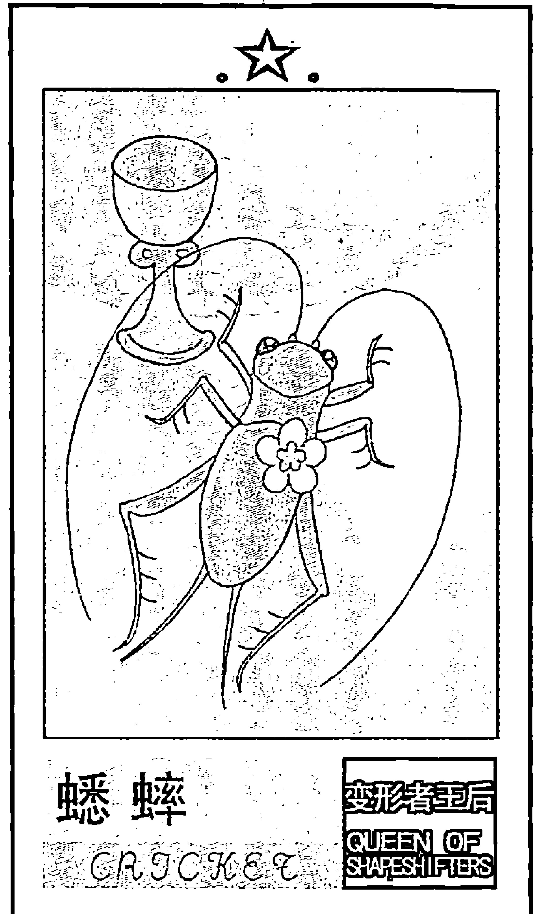

> 蟋蟀的鸣声悦耳动听，是好运和智慧的象征。

> 相信我们的判断和观点。信任我们自己一直信任的东西。

雄蟋蟀是靠摩擦翅膀来发出声响的，这种声音很尖锐，通常被视为是求偶的信号。蟋蟀的叫声如同激昂的音乐。蟋蟀的出现，鼓励我们相信自己关于其他人和生活的判断和观点。当蟋蟀鸣叫时，正是欢乐的时机。我们的信仰将得到回报，前方有成功和欢乐正等待着我们。

###### 倒放含义

蟋蟀通常生活在地表，少量的蟋蟀能够飞翔，但大多数蟋蟀没有翅膀。蟋蟀倒放时，说明我们的位置不够稳定不够平衡。涉及到我们的直觉和精神能力时，我们的信仰系统可能有一定程度的扭曲。在精神或者变态精神的研究领域，如果在意识上不进行努力，发现蟋蟀出现在倒放位置上是非常普遍的情况。

大部分的蟋蟀在生命中都要经历一次蜕皮。当蟋蟀倒放时，它提示我们，过去的信仰可能已经不再适合，我们要摆脱过去的信仰。我们的精神状态也许正遭受较大的刺激。我们此时的观点也许是错误和浅薄的。其他人可能正在努力让我们相信一些不完全的信息或者不完全正确的信息。

要问的问题：我们是否对事物的认识不够正确？我们是否在拒绝自己的信仰？我们是否已经忘记了去相信什么？现在是否是获得新的信仰的机会？我们是否夸大了我们所观察到的东西？我们是否没有能够认真聆听我们身边人的真正心声？我们是否需要去更多地听，而不是更多地看？我们是否开始怀疑自己的信仰？其他人呢？

##### 变形者国王 (KING of SHAPESHIFTERS)

###### 蜻蜓(dragonfly)信任光明的力量

蜻蜓是一种很奇妙的动物。蜻蜓的诞生由来已久，在全世界各地都有着惊人相似的象征意义。日本人认为它们是快乐和光明的象征。在很多古老的传说中，蜻蜓是古代的龙发展到近现代的产物。当蜻蜓出现的时候，它意味着是时候相信光明的力量了。

蜻蜓有发达的复眼系统。有些蜻蜓的种类有多达30 000个像透镜般的小眼睛，这可以使它们明察秋毫。当蜻蜓出现的时候，我们会发现在自身生活中的微小变化。它们提醒我们，随着光线的移动，我们的注意力也应当随之转移，现在生活中的变化已经非常明显了。

蜻蜓通常生活在水和空气中。蜻蜓将卵产在水中，这些卵将花上一年或者更久的时间在水域中孵化。卵完全成熟之后，卵的外壳会自动裂开，暴露出蜻蜓的成体。当蜻蜓出现的时候，是我们从不成熟到成熟转变的时候了，该显现出我们真正的形态了。我们的意识非常强烈，我们要从过去几年的生活形态中摆脱出来。已经是正确的时间了。我们可以依靠我们的观念或者自身的光明的力量来获得成功。我们的努力已经非常成熟，就等着它开始发光发亮了。

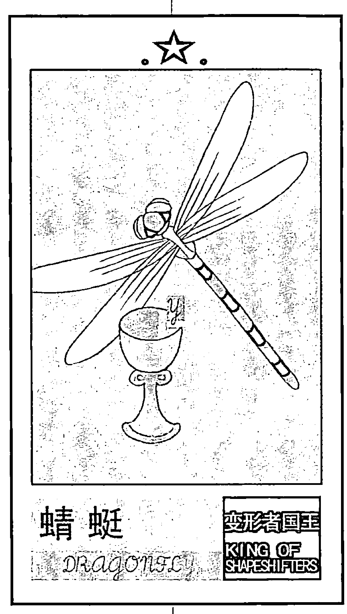

> > 蜻蜓的动作灵活，视野广阔，可达到360度，是光明的象征。

蜻蜓告诉我们，我们是光明的化身，我们能够按照自己的方式发挥自身的力量。我们要充分发挥自身的创造力和想象力。我们要善于发现生活的本质。但是蜻蜓会帮助我们看穿那些幻想，因此我们可以完完全全地发挥自己的努力。这就是变形和成熟。

我们要相信那些五颜六色的新视觉，我们会反射出炙热的、变化的、创造性的和带有忠告的太阳光，我们的努力和工作成果会得到周围人的认可。

###### 倒放含义

蜻蜓为了保证它们的眼睛清洁，会利用它们前腿的密齿梳和口水来完成清洁工作。蜻蜓倒放时，表明我们对现状认识得不够清楚。我们要适时地清除视野中的污点，这就不会妨碍我们观察事物和生活。这有可能是有旁人在误导我们所致的。事情并不是我们看到的那样，因此需要我们更仔细地观察。

蜻蜓出生之后，由水中的环境转移到了空气中的环境，这是很重要的转变。水和情感紧密相连。从水中脱离意味着我们的感情已经成熟。蜻蜓倒放，说明我们要平衡我们的情感。我们的感情需要新鲜的空气，以促进情感上的成熟。

要问的问题：我们是否不够重视我们的情感?我们是否需要一个新的视角? 我们是否过于理性而忽略了情感的表达? 我们是否没有做出应该的变化和变形? 我们是否在抵抗应当做出的变化? 我们是否足够信任我们自己的直觉和创造性? 我们是否将所有的创造力都贡献给了别人? 我们是否拒绝接受周围的信号，尤其是其他人发出的? 我们是否没有独立寻找问题的解答方案?

### (四)远古居民

爬行动物种类繁多，而且非常古老，其中尤以蛇和蜥蜴数量最多。鳄鱼、美洲鳄鱼、龟和海龟，也是爬行动物王国的重要成员。在一些情况下，它们和曾经统治地球的恐龙有直接关系。虽然，在3亿年前，大多数恐龙从属于两栖动物类。

爬行动物属于冷血动物，这使得它们的身体温度随着环境的变化而变化。这就意味着：爬行动物为了避免被冻死，就要经常待在温暖的地方。我们经常能看到蛇还有其他的爬行动物在晒太阳，就是这个原因。这也是爬行动物联系着火元素的原因。爬行动物也具有鳞片，可以保护它们；大多数爬行动物都有不少于一个的肺。

两栖动物也属于远古居民。两栖动物包括青蛙、蟾蜍、火蜥蜴等。它们具有和爬行动物类似的适应性，但是，两栖动物实际上是在过双重生活。它们的时间被地面和水下分割。

两栖动物大多数都要变形。青蛙由蝌蚪变成青蛙，实现了由鳃呼吸到肺呼吸的转变。特别的是火蜥蜴，其中一些种类甚至转变为通过皮肤呼吸。两栖动物没有皮毛、羽毛和鳞片。在某些发展阶段，它们通常长有脚趾，但是并没有爪子。

爬行动物和两栖动物大多数产卵，少数蛇和蜥蜴胎生。只有很少种类的爬行动物会照顾它们的孩子。对于大多数爬行动物和两栖动物来说，只要卵已经孵化，年幼的一代就必须依靠它们自己生存。因为这种习性，爬行动物和两栖动物教导我们：进取心、生存、自我满足，以及自我信任。

爬行动物和两栖动物都是冷血的，这十分具有象征意义。

> > 权杖这一组，代表创造、行动和运动。它们与热情、探求、冒险和自信等品质相关，这一组相当于中国哲学里的“阳”或者是男性特征，关联元素为火。一堆跳动的火焰是权杖之力量的完美象征。这种能量向外发散，使人热情地参与事务。
> ——《经典塔罗》

##### 爬行动物和两栖动物教导我们：要选择自己想要的环境。

两栖动物和各种各样的爬行动物在成长中都要蜕皮。蜕皮有象征意味。这关联到火元素。火是转化、复兴、重生的古老象征，是除旧布新。作为一个种群，它们象征着我们生活中的改变和转变，并为在我们周围发生的死亡和重生进程提供洞察，以及观察这个过程是怎样的生动、热情、多产，并且具有创造性。

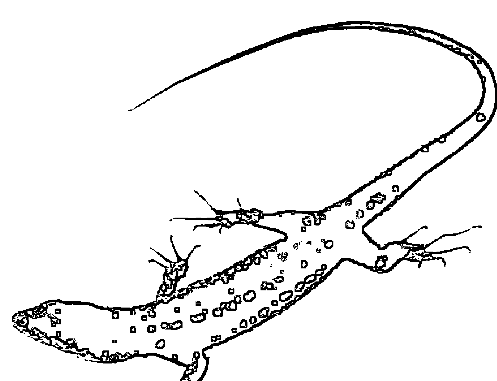

##### 远古居民首牌 (ACE of ANCIENTS)

###### 青蛙(frog)丰育、新的开始

青蛙有很多故事。它联系到幻想之境，以及埃及的神仙和仙女——赫瑞忒(Herit)、魔法女神伊西丝(Isis)、欧西里斯(Osiris)[1]。对于亚马逊地区的一些人来说，青蛙可以呼唤雨水，并对气候产生影响。在欧洲，青蛙通常和疗伤关联起来。不论青蛙何时出现，我们都将进入一个充满新开始的时期，我们的创造能量已经被唤醒，此时适宜新的生命和新的开始。

青蛙是两栖动物，它们的生命被水和陆地各占去一半。除了南极以外，青蛙可以在世界上任何一个角落找到。所有的青蛙都会经历变形，而它们的出现反映出：对我们来说，也是一个变形的时期。从卵变成蝌蚪，从蝌蚪变成青蛙。它们从用腮呼吸，生活在水中（蝌蚪的形态），变化到用肺呼吸，在水中和陆地上两栖生活（青蛙的形态）。因为蝌蚪类似雄性的精子，所以，在任何层面上，青蛙都预示着富裕、多产。它们的出现是一个信号：表明可能会有新生命出生，或者我们临近的某人怀孕。

青蛙预示着一个理想的时期，可以开始新的起点，或者探索、寻找新的工作、职业和生活方式。青蛙的出现反映出：从蝌蚪形态的成熟和转变。这是一个有益的时期，可以跳到新的领域、接受邀请或得到工作机会。

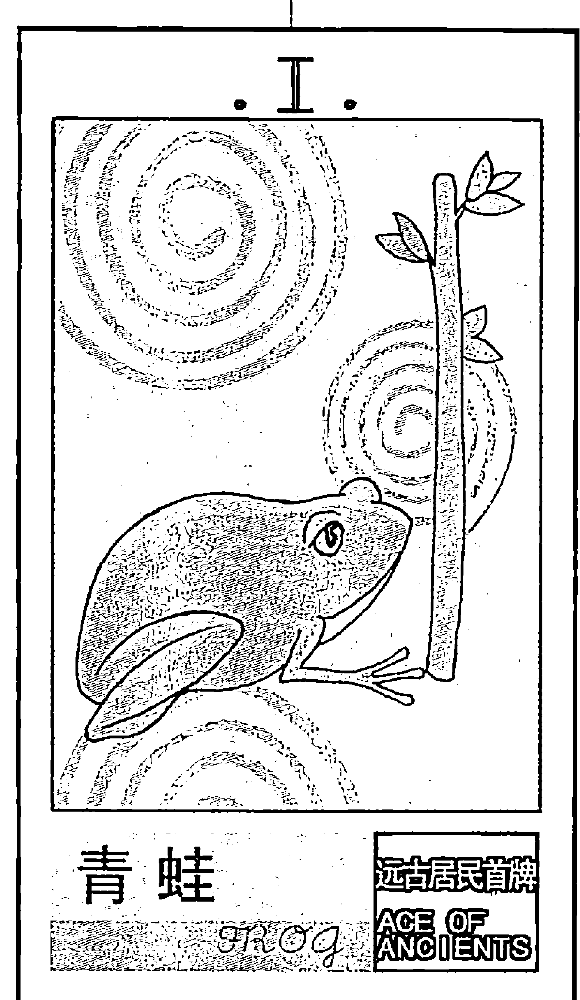

> [1]埃及神话中，九柱神之一的冥王欧西里斯是太阳神拉的后裔，他的哥哥塞特因嫉妒他继承拉的统治地位而多次设计将他害死，欧西里斯的妻子伊西丝凭借魔法几次将欧西里斯救活。欧西里斯成为一位反复重生的神。女神赫瑞忒是帮助伊西丝为欧西里斯举行复活仪式的，青蛙就是女神赫瑞忒的象征。

> 这张牌代表了新的事业、发明、创造，也可能是精神上的警醒与自我发现。
——《变形塔罗》

因为青蛙拥有十分灵敏的鼓膜，所以它们对于声音十分协调，而它们一半居住的环境——水——也是一个巨大的声音振动导体。蛙鸣是吸引伴侣的意思。

青蛙已经出现，我们应该倾听新的机会，而知道具有某种能力也是十分正确的事情，这种能力能带动他人投入到我们新的、有益的努力中来。青蛙的出现预示着我们声音力量的觉醒，这种力量特别而具有创造力。

###### 倒放含义

在繁殖季之外，青蛙是孤独的。作为成年动物，它们一直保持着“半水性”，生活在沼泽地、池塘等环境中。当青蛙倒放，我们之前生活和工作的旧的环境（水）可能会变得静止和肮脏。现在，是清洁它们的时候了。关于我们正在开始的事情，或者和我们有联系的某人，可能存在一些黑暗的事情。

倒放的青蛙可能指出：我们在开始新事物、新计划之前，要三思而后行。这并不意味着放弃机会或者新的开始，而是我们在更进一步之前，有必要做出更加深入的计划。比起现在就开始，深思熟虑后再努力是最好的办法。我们可能需要再次检查他人所给的录用通知；或者，目前的情况下，个人的努力可能要比合作或者团体协作更加多产。

**要问的问题：**
- 我们是否忽略了新的机会？
- 我们是否陷入了日复一日的生活泥泞之中？
- 我们是否需要跃入一些新鲜水之中？
- 我们是否因情感的因素陷入停顿，并未尝试去转化它们？
- 我们是否太过世俗？
- 我们是否在重复旧的模式和错误，而不是为了新的事物继续前进？
- 我们是否反抗改变，在使用自己有创造力的力量时犹豫不决？

##### 远古居民之二
(TWO of ANCIENTS)
海龟(sea turtle)对完成的坚持

海龟在地球上至少生存了2亿年之久。它们种类繁多，每一种都具有自己独特的品质。海龟比其他种类的龟要大些。在海龟种族中，有5个比较大的种类，棱皮龟和红海龟是其中两种比较常见、体型较大的种类。当海龟出现，我们可以期待：如果我们坚持，就会得到成功和成就。

比较起其他种类的龟，海龟的进化程度很高，它们的四肢已经很像鳍了。这些特质使得它们可以更加平滑地在水中游动。当海龟出现时，我们关于创造的进程会变得平滑，在努力过程中遭遇的阻力也会大大减少。目标将会达到。

怀孕的母海龟会在沙滩上产下它们的卵。当这些卵孵化，海龟宝宝要自己游回大海。它们被螃蟹、海鸥，以及其他食肉动物所支配，大部分并不能存活下来。当海龟出现，它暗示：我们的坚持将得到回报。最坏的时候已经过去，只要我们保持勇气和坚持，我们不久就将成功。海龟发出强烈的信号：未来看起来十分不错，在所有方面，尤其是商业。

所有的岸边和海滩，都是连接人类世界和精神世界的门。特定的海龟是不同领域之间的守门者，它的出现预示着新的时期：如果我们保持勇气，新的奇迹和报酬就将到来。新的维度已经为我们敞开。

海龟的生存技能和策略是十分令人惊奇的。它们具有灵敏的听觉，可以通过它们的皮肤和龟壳，感觉到水中轻微的振动。海龟的出现反映出我们直觉的提升，提醒我们须信任自己的直觉。如果我们这样做了，就会得到奖赏。

###### 倒放含义

海龟在水中姿态优美，到了陆地则变得笨拙不堪。如果海龟出现在倒放的位置，说明我们对自己定位不准。也许，我们试图在一个不适合自己的环境中完成任务。我们有必要寻找更适合我们去追寻的环境。

海龟产卵对我们是个提醒：我们需要为我们创造力的表达寻找最好、最可行的方式。我们需要寻找“可行性”和“创造性”之间的平衡，而如果我们想要产生成果，两方面都要考虑到。

海龟一次产下大量的卵，这样，在很高几率的掠夺行为之下，仍然会有一些存活。倒放的海龟警告我们：我们可能太过强烈地依赖一个或者两个可能性了。我们必须更加仔细地做出计划，保持耐心，并且我们有必要拓宽和增加我们的生产力。

要问的问题：我们是否并没有坚持努力？我们是否让小的挫折阻碍了进一步的努力？我们是否需要表现出更多的勇气？我们是否听到或者感觉到和我们的努力相关的事物？我们是否拥有的太多？或者不足？我们是否试图一次完成太多？我们是否太过容易放弃？我们是否害怕“上岸”，为我们想要的事物赋予生命？

##### 远古居民之三
(THREE of ANCIENTS)
火蜥蜴(salamander)
独一无二的灵感和协助

火蜥蜴有着长长的身体和尾巴，这是人们会把它们误认为是蜥蜴的原因。大部分火蜥蜴在水中产卵，卵会变成长腮的幼虫，幼虫最后会转变为用肺呼吸空气的成年火蜥蜴——有些种类甚至通过皮肤呼吸。这种不同的呼吸方式反映出：我们将会经历独一无二的灵感和协助。

当火蜥蜴出现时，表明我们的转变将会得到外界力量的帮助；不论这种力量来自某个出乎意料的人物，或者来自我们环境中某个特定的来源，都将激发出一条有创造性的、成功的途径。

火蜥蜴十分敏感于它们的环境及其变化。如果火蜥蜴出现，告诉我们要很好地和环境相协调。协调的合作是我们成功的关键。答案和解决办法将在我们的环境中找到——通常是通过出乎意料的方式。

雄性火蜥蜴通过特别的表演向雌性求爱，然后为雌性放出精子。当火蜥蜴出现时，我们将获得他人为我们提供的知识和支持，使得我们变得更加多产。其中可能有很多的协作、很多的追求，我们的播种将会有很好的收获。

火蜥蜴能耐高温，会喷出火花，是火元素的典型代表。火蜥蜴出现，表明我们的转变将得到外界力量的帮助，改善成功的机会。

火蜥蜴是夜行动物，避开直接的日光。因此，它给予我们的帮助，将可能不会来自显而易见的、容易的来源，可能会来自那些通常不会被认出的人或者事物。这些将会激发创造力，并增加成功的机会。

###### 倒放含义

火蜥蜴喜欢在潮湿的地方居住，虽然一部分火蜥蜴完全生活在水中。潮湿是它们呼吸能力的重要因素，当火蜥蜴出现时，我们要在具有创造性的环境中和具有创造性的人工作、生活在一起。这都将为我们的健康和生活带来益处。如果火蜥蜴处于倒放的位置，一个新的方向是必要且正当的。我们目前的环境、生意或者个人，可能会压迫我们，让我们窒息，影响我们整体的健康和生产力。

火蜥蜴极大地依赖香味和视力来寻找食物。那些在地面上居住的种类只捕食移动的猎物，例如蠕虫或者蛞蝓（鼻涕虫）。如果处于倒放的位置，我们的感觉可能发生倾斜，我们并没有得到我们想要的灵感和营养，在和他人或者事物继续发生关联之前，我们必须仔细地进行检查。

要问的问题：我们是否感到窒息？在工作或者生活中，我们是否感到不能呼吸？我们是否需要一些新鲜的空气、新鲜的灵感？我们是否在为已经浪费掉的改变而努力？我们是否过于相信我们的创造能力，而忽略了其他人的？我们是否使用了所有适用于我们的事物？对于我们的环境、生意，或者个人，我们是否期待太多？我们是否并未足够贴近地观看，以看到那些可以对我们有益的事物？我们是否只看到了表面？我们是否忽略了那些适用于我们的资源？

##### 远古居民之四
(FOUR of ANCIENTS)
###### 绿树蜥(green anole)和睦、和平

绿树蜥经常被误认为是变色龙。绿树蜥是蜥蜴类中的普通一员，和大蜥蜴（iguana）之间有特殊的联系，具有随着温度、湿度甚至是情感变换自己身体颜色的能力。它们主要的颜色改变是从绿色变到棕色。在世界各地，绿树蜥曾经被作为宠物，或者作为礼物饲养，象征着家庭和睦、和平。它们表现出关系、个人、生意中的根本。

绿树蜥善于攀爬跳跃。它们可以直上直下地奔跑和攀爬，甚至是侧边也可以。它们可以教导我们：怎样从必要的方向移动，以达到我们必须完成的目标，尤其是在建立或者复原家庭的和睦方面。它们提醒我们：有些事情是我们可以做到的。

绿树蜥的脚趾是扁平的，在底部有小小的脊。而这些脊又被小小的刺所覆盖，这些刺使得它们可以挂在看起来不可能的表面，并在上面移动。绿树蜥反映出进入某些领域的能力——在其他人看来，这些领域并不可能到达，也并不安全。

绿树蜥的出现预示着：我们的任务已经被很好地完成，这是一个充满了和睦和个人满足的时期。现在是收获的时间，是享受我们劳动果实的时候了。在我们周围，一个新的关于和平的基础已经建立。

在它们头的顶部，绿树蜥拥有一只松果状的眼睛，一只并未发育完全的第三只眼。通过这只眼睛，它们感受到光亮和黑暗，建立起自己的生物钟。

为了伟大的和睦与和平，我们应该信任自己内心的节奏，以及高度发展了的知觉。现在，和睦通过信任我们自己的直觉（而不是别人的）而到来。

###### 倒放含义

绿树蜥在喉咙部位有个扇形的可以发光的软组织。这个组织，通常呈明亮的橘黄色或者红色，使强壮的雄性可以提出和本地领域内的雌性进行配偶的要求。如果处于倒放的位置，绿树蜥反映出：某人正被介绍进入我们的领域，但是，不管他/她的动机看起来有多么良好，我们都要小心。现在，对于那些可能会夺走我们家庭和工作中的和睦、和平，以及自我满足的人或者行为，都要多加小心。

所有绿树蜥都具有某种程度上的领土性，当绿树蜥出现在倒放的位置时，一个通向新领域的改变正在开始。在我们目前的位置上，我们也许正在浪费我们的才能和技巧，在此时此地，我们可能并不能建造出我们想要的城堡。我们不要过度自信，我们要寻找选择的余地。要记住，如果有必要，绿树蜥可以向任何方向移动。

要问的问题：是不是我们并没有很好地适应环境？我们是否需要改变自己的颜色或者方向？我们是否过度自信？我们是否并未能表达自己的感激？我们是否并不信任自己的印象？我们是否允许其他人破坏我们的和睦，抢走为我们准备的东西？我们是否并未小心进行判断？

##### 远古居民之五
(FIVE of ANCIENTS)
壁虎(gecko)在挣扎中做你应该做的

壁虎这种蜥蜴是令人吃惊并具有吸引力的。它们没有眼睑，是唯一一种有自己的咆哮或者叫声的蜥蜴。它们的声音可以被清晰地听到。壁虎通常比较温顺，当受到挑衅时，也会毫不犹豫地咬下去。壁虎教导我们：在挣扎中，做你应该做的。这并不是一个表现温顺的时候。

当壁虎出现时，表明在我们的生活中有反对的声音和力量。它的出现向我们发出信号：不要被动。我们周围的情况要求我们清晰地表明：我们一定要清楚，面对反对和阻力，我们要做出坚定的回应。如果我们这样做了，我们的努力将得到回报，而我们也将不太有可能再一次经历反对和争吵。

壁虎白天藏在缝隙中，晚上靠吃昆虫生活。当壁虎出现时，要关注我们的梦境，这会帮助我们分析、洞察现实生活中的冲突和争吵。冲突存在于梦中，而梦中的人物会向我们展现：白日的冲突是谁制造出来的。现在，梦境很有可能反映出我们必须面对的挣扎。

壁虎是关于昆虫有害物的了不起的检验者，在世界的一些地方，因为这个原因，人们把壁虎养在家里。当壁虎出现时，是时候做我们应该做的了——解决家庭里的有害物，在家庭中复原秩序，带来威信，并以此作为结束。如果我们的态度是清晰且坚定的，我们就可以解决这个问题。壁虎教导我们“正直的愤怒”的重要性，以及有必要对导致愤怒的原因做出恰当的回应。

壁虎提醒我们：只有不采取任何行动，压力和冲突才会越变越糟。

###### 倒放含义

大部分壁虎遇到危险时，通过折断自己的尾巴来保护自己。这是一种它们进化的适应性行为，以对抗掠夺。当尾巴折断时，壁虎可以爬向安全的地方，然后会很快地长出一条新的尾巴。当壁虎倒放的时候，说明我们不能很好地解决遇到的冲突和争斗。现在，可能最好的方式是把“人员”和“情况”分离开，即使是很短一段时间。有时，为了保护我们自己，或者为了其他人，有必要和其他人分离开。我们可能需要接受这一点：这一次，事情可能不会有任何好转或者解决，但这种分离至少会帮助我们拥有一个和睦的生活。

要问的问题：
- 我们是否太过沉溺于看清我们周围事物是怎样进行的？
- 我们是否需要一些情感上的反对意见？
- 我们是否需要把自己和过去的事物分离开，以拥有现在的和睦生活？
- 我们是否太过具有防御性？
- 我们是否不愿采取恰当的行动？
- 我们是否并没有强有力地协助我们自己？
- 我们是否太过有侵略性地协助自己？
- 我们是否变得太过敏感？

##### 远古居民之六
(SIX of ANCIENTS)
###### 锦龟(painted turtle)信念、努力的回报

锦龟是一种十分常见的龟类。我们能在很多水域发现它们。它们通常以水生植物、昆虫，以及其他小型动物为食。它们适应力极强。锦龟的出现预示着：我们的努力将要得到回报。如果我们继续进行已经在做的事务，那么我们将获得胜利。它的出现是一个信号：通过信念和努力，好的消息将携带力量到来。

锦龟的龟壳宽大扁平，色彩鲜艳。它的头部皮肤和四肢也是如此。好像是谁把染料洒在它们身上，或者是谁真的在它们身上作画一样。锦龟可以教导我们关于颜色的意义和重要性，反映出新的颜色正在进入到我们的生活中。关系将会变得更好，我们的努力将得到回报，康复将会发生，而新的机会很快就会到达。

锦龟通常聚到一起在石头或木头上晒太阳。如果我们置身于某个集体的努力和项目中，将为这个团体带来卓越的成功。如果我们继续这种努力，好的消息就会到来，其中的益处将会持续很长时间，并且分布广泛。锦龟也同样反映出：这个团体将会进行很好的协作。

雄性锦龟体形要小于雌性，前肢上有长长的指甲。雌性会在每个它们用后肢挖出来的洞中产下6至12枚龟蛋，龟蛋需要经过2至3个月的孵化，但是直到下一个春天，某些小龟才会出现。当锦龟出现，我们可以期待：如果我们继续努力，我们的努力和信念将在2到3个月的时间内得到回报。

我们必须坚持不懈。锦龟十分努力，它提醒我们：如果我们坚持不懈并拥有信念，我们将很快获得成功。

###### 倒放含义

在北方的冬天，锦龟会在土地或者沙地上挖一个洞，自己藏到里面进行冬眠。作为冷血动物，对于外界的温度和影响十分敏感，但是锦龟非常努力。如果锦龟倒放，说明我们过早地放弃了某事。事情可能将不会按照我们预期的那样解决，不过延迟都是临时的，我们需要重建自己的信念。

倒放的锦龟提醒我们：此时，不要勉强去做任何事情。也许我们的团队并不和谐，我们不能够把努力聚拢到一起，因此，压力和工作在增加。我们需要作适当的撤退来休整一下自己。在另外一个时间再尝试一次。

要问的问题：我们是否太快地尝试支持我们的颜色？我们是否试图太快地完成过多的事物？我们是否并未付出足够的努力？是否有某人试图拿走我们的颜色？我们是否让小小的事情压迫我们，而并不信任我们内心的努力的力量？我们是否对我们的工作和自己失去了信心？

##### 远古居民之七
(SEVEN of ANCIENTS)
###### 蟾蜍(toad)内心的强大和源泉

两栖动物比爬行动物古老很多。它们大多数时间生活在水中。只有成年蟾蜍是例外，可以很好地适应陆地的环境。虽然有“会导致疣的产生”这样的诽谤，蟾蜍仍很令人吃惊。它们和青蛙非常不同。青蛙把它们的时间分割为水中和陆地，而蟾蜍生活的环境却十分干燥；青蛙皮肤光滑，蟾蜍的皮肤粗糙，稍稍有一点肿瘤；蟾蜍的身体不像青蛙那样具有流线型；蟾蜍后腿较短，这限制了它们的跳跃，或者说，宁可走路而不是跳跃。蟾蜍的出现预示着一个使用我们内心的力量的时期。

有很多与蟾蜍相关的故事和寓言。当你散步时，看到一只蟾蜍出现在你的面前，或者正在你行走的道路上，这是好兆头，提前告诉你好运和金钱的信息。蟾蜍的出现预示着一个能够更清晰地看到人和事物的时期；提醒我们相信自身的力量和内心的源泉；我们已经被祝福，可以解决问题，得到内心的强大。

真正的蟾蜍非常善于保护自己，它们善于利用自己的一切技能和能量。它们会采用多种办法以抵御狩猎者，比如掘穴、假死、在身体里灌入空气使得它更具有恐吓效果，甚至会从皮肤分泌出有毒物质。它们拥有很多适用于它们的源泉和能力。当蟾蜍出现，我们被提醒：要使用我们所有的技能。我们拥有所有必要的源泉，用以完成我们目前的任务，但是我们必须把这些源泉拿出来并使用它们。蟾蜍让我们知道：我们的技能和能力，使得我们处于一个比其他人能意识到的更加有利的位置上。

蟾蜍预示着一个在努力和冲突中得到个人进步的时期。它们具体表达了这些承诺：成功、成就，以及对我们自身能力的承认。

###### 倒放含义

蟾蜍一般躲在石头和壕沟里冬眠。春天时，它们返回偏爱的池塘，那里有大量蟾蜍聚集。这种移栖在晚上发生。如果蟾蜍倒放时，预示我们可能离开了我们的根、我们的力量，不知道我们为何身处目前的处境。我们可能会承认：是我们发展出的技能使得自己成功——现在并不是遗忘过去的时候。

青蛙和蟾蜍的舌头十分厉害。可以飞快地刺出，将昆虫捕获。如果出现在倒放的位置，表明我们可能错失良机。当机会出现时，我们可能踌躇于行动，踌躇于使用我们的能力。我们可能让恐惧阻碍了我们。

要问的问题：我们是否变得优柔寡断？当机会为我们出现时，我们是否还在犹豫？我们是否让恐惧阻碍了我们的行动？我们是否忽略了过去，遗忘了带着我们走到现在的那些技能？我们是否变得急躁，试图比目前能力所及之处跳得更远？我们是否需要更多的保护？我们是否并不信任自己的能量或者我们自己？

##### 远古居民之八
(EIGHT of ANCIENTS)
###### 锦蛇(rat snake)加速、移动

锦蛇分布在世界各地。它们适应能力强，活泼好动，瘦长敏捷。白天、夜晚都有它们活动的身影。它们具有蛇类的典型特征：巨大的眼睛位于头部的两侧，鼻孔位于鼻部的旁边。它们积极地外出寻找猎物，而一旦发现，它们会准确地进行打击。当锦蛇出现，我们的所有事务和活动，都会加速，发生移动。我们可以期待移动能够持续一段时间。

锦蛇捕猎迅速，是能够缠死猎物的大蛇。一旦发现猎物，它们就会果断快速出击，给对方以致命打击。当锦蛇出现时，我们也适合这样做，此时适合加快我们的移动，当我们能做到时，迅速打击。作为强有力的大蛇，它们提醒我们：应紧紧控制住被我们捕获的猎物。锦蛇长有鳞片，稍微有些翻转或者隆起，这使得它们可以更加容易地在平滑的表面上，甚至是树木上攀爬。锦蛇的出现预示着：我们处在一个移动和进攻的时期，不论我们当时处于怎样的场所。我们的目标触手可及，我们可以移动到更加接近它们的地方，甚至很快得到它们。只要我们协助并推进我们的努力，进攻也得到了保证。

所有的蛇类都具有高度发达的感觉。大部分蛇类具有红外线感应的能力。部分蛇类的视力相当好，但是它们通常并不依赖视力。它们协调通过身体感受到的轻微振动和通过舌头感觉到的气味。在口部的上面，它们拥有一个叫做“雅克布逊器官（Jacobson’s organ）”的器官。舌头弹出去，获取空气粒子，并把它带回口部的上面。它们可以感觉出这里是否有食物或者危险。当锦蛇出现时，最好不要信任我们直觉所看到的，而是要信任我们出击前所感觉到的、闻到的，这样，我们将更加成功，并且看到我们生活中的快速进展。

###### 倒放含义

许多蛇类是季节性繁殖者，通常可以在它们出生后的第二个夏天进行繁殖——虽然直到3岁或者4岁，它们才能真正地成熟。雌蛇可以把精子储存在身体内部，延迟生育，直到一个比较合适的时间。如果锦蛇倒放，可能说明我们的进程有某些延迟。我们切忌急躁和草率。我们必须保持控制，等待一个合适出击的时期。不适当的强迫会中断我们的计划。锦蛇通常把猎物整个吞掉，活动它的下颚以适应更大型的动物。倒放的锦蛇可能指出：我们试图摄取的东西过多了，超过了我们咀嚼和吞咽的能力。这提示我们应适当调整我们的目标。

要问的问题：当机会出现时，我们是否仍犹豫于行动？我们是否攻击得不够尖锐？我们是否并未牢牢抓住我们所拥有的？我们是否撕咬得太多，超过我们所能咀嚼的？对于我们的胃来说，我们的食欲是不是太大了？在攻击新的目标之前，我们是否需要稍稍放慢脚步，剥离某些过去？在我们的努力中，我们是否太过急躁，是否太快地产下很多的卵？

（注：原文中的脚注[1]已融入正文对应位置。）

## 远古居民之九

### (NINE of ANCIENTS)

###### 希拉毒蜥(Gila monster)保持控制和信仰

希拉毒蜥生活在美国亚利桑那州的希拉地区，是世界上仅有的两种有毒蜥蜴之一。它们可以长到2英尺长，有一个结实的身体，一个大而生硬的头部，以及一个粗大的尾巴。通常，它们的尾巴主体是黑色的，上面有粉色及黄色的斑点。希拉毒蜥行动迟缓，多半居住在沙子和岩石底下。它们大半是以啮齿动物、蛋，以及年幼的鸟类为食。如果食物缺乏，它们自身的脂肪会产生营养来支撑它们。据目前所知，它们可以坚持2到3年不进食。因为这种能力，希拉毒蜥是一个信号：要坚持我们的信仰，也许在关键的时候能帮助我们。

希拉毒蜥的出现预示着我们要谨慎使用自己的能量，尤其是对于未来的努力。这是一个保护我们自身事务的时期，不要轻举妄动。我们要固守目前所拥有的，保留所有通向新事物的趋向，直到一个更为合适的时间；否则，我们将使自己处于匮乏之中。我们已经拥有任何我们需要的东西，用以保持目前的地位，但是任何过分的尝试，都会打开我们的储藏并可能导致匮乏。

希拉毒蜥确实拥有毒腺，位置在它们稍低一些的下颚。这种毒液并非通过注射进入受害者体内，而是通过撕咬的伤口，主要用于防御。虽然，希拉毒蜥通常都是缓慢而笨拙的，但它们可以扭曲头部，迅速撕咬，并紧紧抓住。这并不是显示软弱的时候，如果有必要，我们也可以用力地、迅速地攻击。

通过这样做，我们保护了属于我们自己的东西。希拉毒蜥提醒我们：要珍视我们的信仰，如同保护我们的所有物一样，保护它们；但是我们要有判断力地做这些事情。只有实际上受到了攻击我们才能防御——此时，要尽我们所能地猛烈，坚定不移地保护自己的事务和所有物。

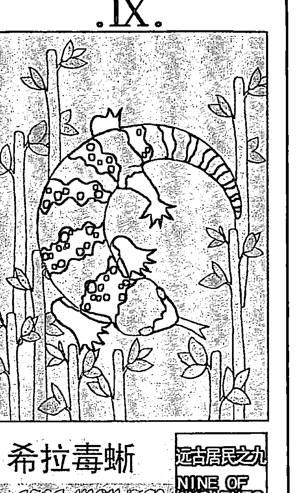

> > 希拉毒蜥行动缓慢，但可以进行有力、迅速的攻击。

###### 倒放含义

希拉毒蜥无法忍受沙漠的高温，因此，为了降低体温，白天它们通常躲在岩石下避难，或者把自己埋在沙子下，等到温度降下来之后，才出来活动和觅食。这种适应性的行为有重大意义。

如果希拉毒蜥倒放，表明我们的生活节奏不对，对我们不利。我们可能在运用某些不健康、不适合的东西，我们可能会在这个过程中燃成灰烬。这并不是一个适合以不恰当的方式暴露我们自己的时期。

合理的撤退比主动更容易获得成功。有可能我们并没有为将要到来的任务做好准备。希拉毒蜥处于倒放的位置，提醒我们：撤退，并尝试支撑我们自己。任何软弱的表现都是有害的。此时，适合自我保存。

**要问的问题：** 我们是否并没有保持对环境的控制？我们是否变得急躁，过早地暴露了我们自己？我们，或者周围的人，现在是否容易受到攻击？我们是否并未对已经拥有的表现出感激之情？我们是否屈服于逆境，拒绝反击，拒绝保护我们所拥有的？我们是否并未适当地做好准备？我们是否过分扩张了我们的事务以及我们自己？

## 远古居民之十

### (TEN of ANCIENTS) 陆地龟(tortoise)在压力下移动

陆地龟四肢呈棒状，和海龟蹼状的四肢十分不同。虽然它们常生活在水边，但还是属于陆地种类。陆地龟看起来依然十分类似于它们古老年代的先祖，那时恐龙还很年幼。虽然行走沉重、缓慢，陆地龟预示着：移动，甚至是在目前我们所面临的所有压力下。

当陆地龟出现时，我们将经历很多变化。虽然可能目前并不能看见，它的出现预示着：黎明即将来临。陆地龟提醒我们要坚持，通过努力，坚定地向事物移动，努力面对。陆地龟已经存在很长时间了，它提醒我们：虽然责任重大，但我们还是会及时获得成功。

陆地龟有着高高的龟壳，足趾有力，以便于挖掘。它们大多以植物的嫩芽为食，并在阳光下温暖自己。陆地龟虽然动作迟缓，但如果需要时，它们可以达到普通人步行的速度。陆地龟提醒我们：朝着目标，坚持不懈，不管是多么呆滞和缓慢。这是慢速的生活，当我们周围的生活变得兴奋和无法抵抗时，跟随这个模式。陆地龟提醒我们：放慢脚步，把精神聚焦到本质上。

陆地龟是一种古老的生物，它象征着：一个和最初的节奏、感觉建立联系并信任它们的时期；立即、快速地认出那些没有必要得到的富足和成长。如果我们愿意，自然的节奏将以最好的时间、最好的节奏为我们工作。

如果我们信任这些，我们就会明白曾经经历的教训和压力背后的原因。我们将结合所了解的更大前景、起作用的更大模式，克服它们。要记住，我们并不会遭遇自己不能处理的事物。

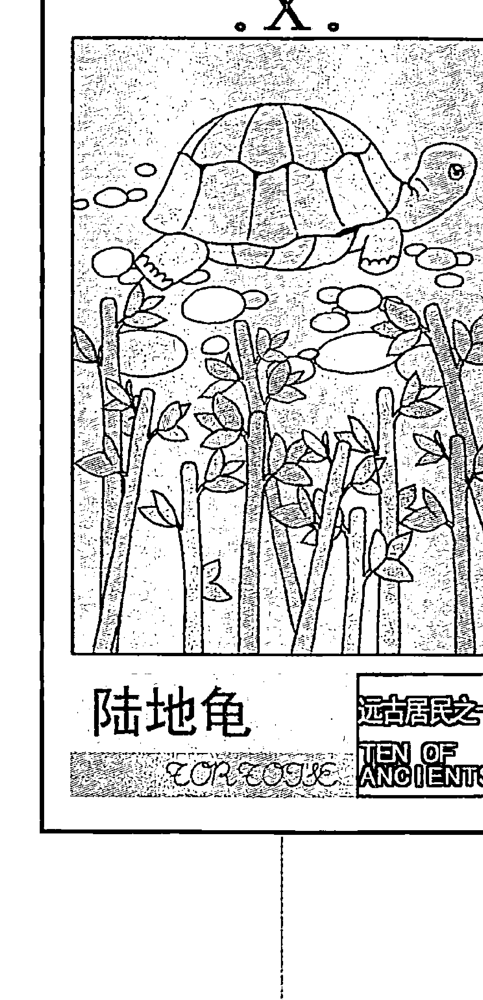

> > 陆地龟有高高的龟壳，行走沉重，动作迟缓。它提醒我们：虽责任重大，但持之以恒，也能成功。

###### 倒放含义

陆地龟新陈代谢很慢。它的出现可能表明：有某种压力正压在我们身上。陆地龟倒放时，说明我们的脚步过快了。我们的生活有些过于热情了。

陆地龟是世界上寿命最长的动物种群。当陆地龟倒放时，我们可能试图加快生活的节奏。陆地龟提醒我们要放慢脚步，戒骄戒躁，切勿急于求成。陆地龟教导我们：不要担心时间的问题。要一步一步来。我们必须返回到根本上，并以正确的方式使用我们的技能。

> 没有磨难可以阻止我前进的步伐，在我内在力量的温暖和光照下，恐惧与困难如雪般融化了。——《塔罗神咒》

**要问的问题：** 对于我们自己或者其他人，我们是否太过急躁？生活是否变得太过热情？我们是否尝试在很短的时间内做到太多东西？我们是否需要稍稍放慢节奏，把精神聚焦到本质的生活？我们是否需要再次审查自己的目标？我们是否担负起其他人的问题而忽略了自己的进程？我们是否让其他人的负担放慢了自己的移动？我们是否负担太多，超过了我们能处理的？我们是否忽略了我们的责任和义务？

## 第四章

### 动物塔罗的组成部分

### 远古居民侍卫

### (PAGE of ANCIENTS)

###### 变色龙(chameleon)环境改变的消息

真正的变色龙是很迷人的，它们属于蜥蜴类。雄性变色龙的脸部有三个刚硬的角。雄性和雌性都有抓握力很强的尾巴和强健有力的脚趾。变色龙可根据外部环境改变自己的颜色。这种变化一部分是伪装，一部分是交流的模式。变色龙的出现预示着环境改变的消息——消息和改变都会是好的方面。

变色龙的眼睛可以灵活转动，并且每只眼睛都能独立转动，这使得它们能够快速发现猎物。当变色龙出现时，我们的精神视力会变得更加独立、更加活泼、对我们更加有益。我们可以更加清晰地看到来自不同方向的事物，可以信赖我们的知觉。

当变色龙发现猎物时，会飞速地弹出比自己身体还长的舌头粘住猎物。昆虫被有黏度的舌尖抓住，送回变色龙的口中，这个过程只需一秒钟。它提醒我们：当机会出现时，我们必须立即、快速地采取行动。变色龙的出现向我们警示将要到来的机会，这样当它们出现时，我们就可以参与、共享。

有些变色龙产卵，而有些生出幼体。不论它们是以怎样的方式出生的，在一天之内，这些小的变色龙就会捕捉猎物了。当变色龙出现时，出现的机会和猎物应该在一天之内攫取并采取行动，否则机会就将失去。

虽然行动缓慢，变色龙对于出现的猎物会立即而快速地做出回应。变色龙的出现警示我们：要遵从它们的榜样。

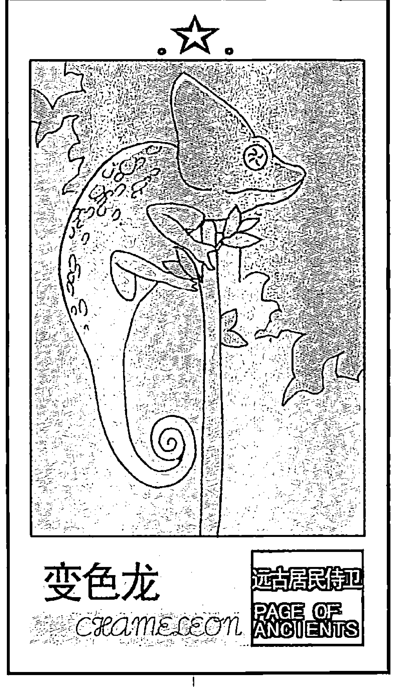

> 变色龙善于随环境的变化，改变自己的体色，从而有利于伪装，捕捉猎物。

###### 倒放含义

变色龙移动极为缓慢。当变色龙倒放的时候，我们可能行动过于迅速，走到了我们自身之前。我们需要走慢些。确认在采取行动或者做出回应之前，我们已经牢固安置。我们应该学会等待，知道关于我们行动的机会已经提供，不要匆忙地做任何事情。

变色龙的颜色会依照情绪而改变，这通常是给其他变色龙的信号。当变色龙生气时，它们的身体会变成全黑色。当变色龙倒放时，说明我们或者身边人的情绪将有戏剧性的改变。因此在看清楚情绪变化之前，不要轻易付出我们自己。尤其是在涉及新的努力时。情绪的变化最可能产生一种并不舒服的关系。

> 变色龙预示着环境的改变，我们可以信赖知觉，当机会出现时，我们要迅速做出回应。

**要问的问题：** 我们是否变得对环境过于敏感？我们是否会看到或者读到并不存在于那里的东西？我们是否太过轻率地采取行动？在我们进行新的追求时，是否并没有脚踏实地，或者保持平衡？面对机会，我们是否在行动前犹豫？我们是否会忽略信号？

### 远古居民骑士

### (KNIGHT of ANCIENTS) 科莫多龙 (Komodo dragon) 强大的生存本能和冲动

生活在印度尼西亚北部的科莫多龙是现存最大的蜥蜴。雄性有8英尺长，重达200磅(1磅约等于0.5千克)或者更多；雌性科莫多龙可以长到7英尺长，重约150磅。虽然世界上还有5000余只科莫多龙，但能够生育的雌性大概只有350只左右。因为这个原因，它们被认为是濒危动物。它们是孤独的、强有力的动物，可以短距离内快速移动。如果科莫多龙出现，此时，应信任我们自身强大的生存本能，并以此向前移动。现在，是做出快速决定、改变、采取快速行动的时期了。

关于龙的知识是：龙是一种能够控制我们生活中气候的生物。当科莫多龙出现时，火龙的力量也被唤醒。这是我们改变我们生活中气候的时候了。这是一种强大的有创造力的能量。冲动已经具备，时间适合行动。科莫多龙的出现，预示着：关于我们身心的全新的冒险和旅程能帮助我们控制和指引我们未来将得到的有创造性的力量。

科莫多龙可以存活长达100年，现在它的出现反映出：我们所做出的改变将会持续很久，而想要得到它们的效果，还需要一段时间。如果我们现在采取行动，益处将会持续很长时间；如果我们舍弃行动，这个机会也需要很久之后才会再次到来。

科莫多龙一次产下20至40只卵，而孵卵的时间需要将近8个月。当科莫多龙出现时，我们通常会得到将近8个月的时间，在这段时间里，我们的冲动和本能将在生活中发挥强大的作用。

我们可以利用这些刺激开始改变，或者完成我们需要结束的东西。不管哪种方式，我们都必须在我们能做的时候采取行动，而其结果是，我们将发现存于自身的最初的力量。

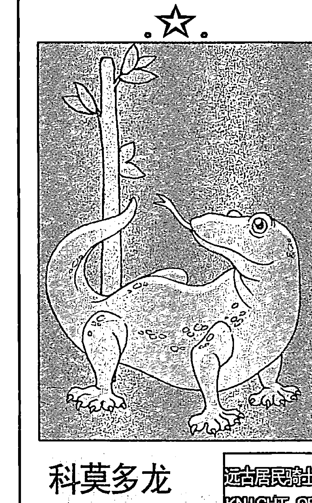

科莫多龙 Komodo dragon 远古居民骑士 KNIGHT OF ANCIENTS

科莫多龙是强有力的最大的蜥蜴，可以短距离内快速移动。它是创造力的象征。

> > 此时此刻你应从一些意想不到的东西中接受指引。寻求伟大的灵性并让它注入到你的生命中去，以迎接即将发生的变化。
> ——《变形塔罗》

###### 倒放含义

科莫多龙是强悍的动物，它们常常利用偷袭来杀死猎物。一咬即死。即使没有咬死猎物，它们唾液中的毒素也可能杀死猎物。当科莫多龙出现时，我们做的任何事情都会呈现出更大的力量。

科莫多龙倒放时，表明我们要小心使用我们声音的力量，也要谨防别人用同样的方式对待我们。温柔的话语将会打动人心，而刻薄的语言可能对别人造成很大的伤害。任何一件事物都将呈现出更大的力量。我们必须小心说话，不要以不合适或者太过恶毒的方式讲话。如果我们猜疑其他人用这样的方式对待我们，我们可以信任我们的猜想，但是只有在正确的时间才能回应。

科莫多龙的尾巴强而有力，很适合防御。它们非常快速地摇动尾巴，粉碎下面的事物。科莫多龙倒放时，说明我们对外界做出了过于强烈的反应。我们要提防我们周围这样的人：虽然面对着我们，他们仍试图通过出其不意的攻击来粉碎我们的努力或者我们自身。我们要发现其他人试图破坏我们的行为，或者阻碍我们努力的意图。

**要问的问题：** 我们是否让争论阻碍了我们？我们是否果断采取了行动？是否存在着对我们的妒忌？我们是否并未对机会和情况做出有创造性的回应？我们是否犹豫得太久？我们是否以不恰当的方式谈论其他人，或者以不恰当的方式和他们说话？

## 远古居民王后

### (QUEEN of ANCIENTS) 鳄鱼(crocodile)最初的强大和创造

鳄鱼类是居住在热带的大型爬行动物。关于它们有很多古老的、混合的象征和神话，涉及破坏和出生——贪婪的人和母亲。鳄鱼部分关联着“伟大母亲 (Great Mother)”。鳄鱼极具母爱，在爬行动物中非常稀有。当鳄鱼出现时，通常暗示着：最初的强大和创造——母性的力量的出现。

鳄鱼虽然是冷血动物，但它们更喜欢把自己的身体保持在恒温状态。在日出时，它们爬到岸上在阳光下晒太阳；而当太热的时候，它们就返回水中降温。它们在水中浅浅地漂浮。当鳄鱼出现时，它预示着：我们的生活将保持平衡。这种平衡可能出乎意料，但是它是我们努力、力量，以及创造力的结果。此时，在将要做的事情上，应该信任我们的直觉。

尼罗鳄 (Nile crocodile) 在5到10岁的时候生育，而雄性会为了生育的领地而互相争斗。雌性会挖一个巨大的深坑，产下多至90枚卵。4个月后，这些卵孵化，鳄鱼妈妈会用嘴把新孵化出来的小鳄鱼叼到水里，保护它们免受狩猎者的侵害。当鳄鱼出现时，我们需要照顾并保护那些我们给予生命的东西，持续至少4个月的时间。我们可能得到其他人的协助，或者我们会同样协助其他人的新生儿。

对于我们可以信任谁或者什么，我们的直觉十分准确和强烈。现在，我们的创造能量十分充裕，并伴随着实际性的应用。此时，适宜信任对我们、我们的家庭、我们的孩子，以及我们的努力有益的事物。

现在，我们有机会旋开我们最初的创造能量。新生和直觉就在附近，必要的强大也将放入它们之中。

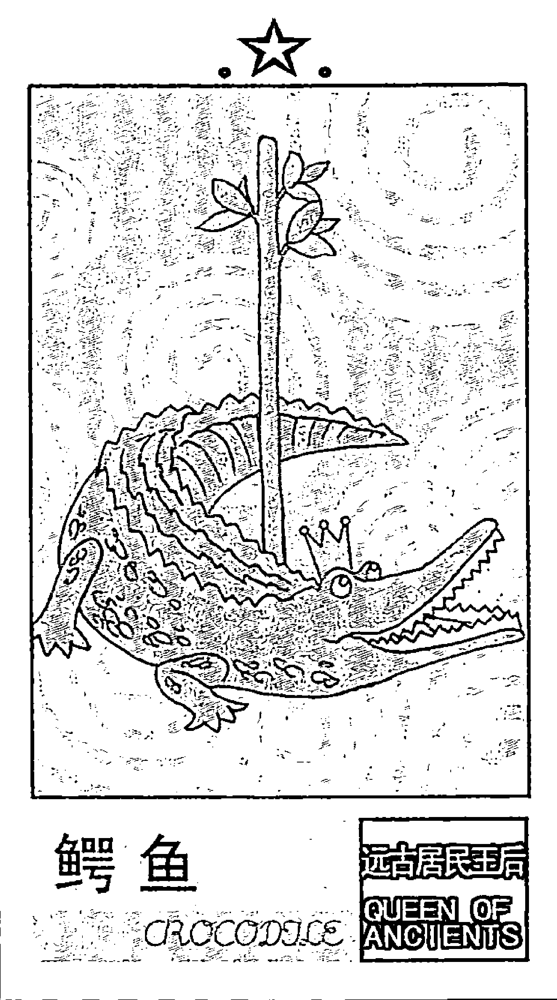

鳄鱼体形巨大，力量惊人，被称为“爬虫类之王”。它是平衡与努力的象征。

###### 倒放含义

小鳄鱼在卵中发育时会发出尖叫。母亲听到这些声音，会帮助它们孵化。然后，母亲教会小鳄鱼在水中生存。如果鳄鱼倒放，我们也许忽视了最初的本能，或者错过了创造性机会的呼唤。

成年鳄鱼经常等候在有动物活动痕迹的地方。一旦猎物出现，它们用极快的速度跳出水面，咬住猎物，把它们拖回水中。鳄鱼通过剧烈晃动身体，试图把猎物淹死或者破坏掉。它们甚至会用爪子抓紧猎物，在水面之下把它们滚来滚去，使之分裂。倒放的鳄鱼指出：我们在利用机会和冲动时要谨防隐藏的、出乎意料的危险事物。这种危险通常潜伏在滋养我们的环境之中。

> > 你最好将精力集中在精神的成长上，
> 增强自身的感知力，
> 洞察力。你心中充满
> 灵感，这种灵感将有
> 用武之地。
> ——《变形塔罗》

**要问的问题：** 我们是否忽略了我们的本能、我们的直觉？我们是否错过了具有创造性的机会？对于我们创造的，我们是否太过情绪化？我们是否信任了不应该相信的东西？我们是否太过极权？我们是否处于不平衡之中，太过开放？

## 远古居民国王

### (KING of ANCIENTS) 印度眼镜蛇(cobra) 敏捷、意外的决定和行动

在印度和斯里兰卡，眼镜蛇兼有“龙”和“蛇”的名声。以动物的眼光看，眼镜蛇十分像毒蜥，喷出令人致命的毒液。甚至它们的目光都能置人于死地。通过它们，人们可以学会：关照我们的内心灵魂。当印度眼镜蛇出现时，我们可以期待：我们的直觉能力有大幅度提升。这帮助我们做出敏捷的决定和快速的行动，以得到巨大的益处。现在，并不是犹豫的时机。

当印度眼镜蛇受到惊扰之时，它们会跳起，高高竖起头部，在这种情况下，任何接近眼镜蛇的生物都有可能被咬伤。当印度眼镜蛇出现时，我们应该保持警觉。能够插手生意的机会已经非常接近，我们要做好准备。

印度眼镜蛇的出现，反映出：可能会出现出乎意料的机会。在其他人看来，利用这些机会可能是冲动的，但是我们应该信任自己的本能。此时，对于其他人来说可能是愚蠢的冲动，对于我们来说却是成功的冲动。其更进一步的表现在于：印度眼镜蛇通常会小心看守它们的蛋。这是一个提醒：我们必须小心照看自己的努力，直到准备好行动，然后敏捷地开始行动。

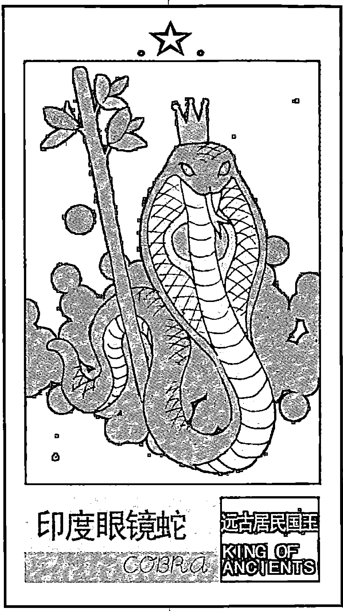

印度眼镜蛇具有极强的行动力。它直觉超强，身手敏捷。

印度的蛇魔术师试图让人们相信，是他们长笛的歌声让眼镜蛇翩翩起舞，而事实上，眼镜蛇只是跟随着长笛的移动，并非它所发出的音乐。当印度眼镜蛇出现时，我们要对细微的移动和信号保持警觉。我们不应该被其他人所说的话搅得心烦意乱。现在，应该相信我们所感知的，而不管其外表如何。如果我们这样做了，我们将处于一个强有力的位置，可以用对我们最有益的方式做出回应。

> > 力量增强得如此迅速，行动之后是更为敏捷的行动，一次成功带来更多成功……

###### 倒放含义

印度眼镜蛇的毒液中包含着神经毒素。在短短15分钟的时间内，遭受其毒液攻击的人就会死亡。它们的毒液还能让人失明。倒放的印度眼镜蛇通常预示着一个时期，这时我们将可能对周围正在发生的事物和机会缺乏判断力。我们可能会让恐惧和怀疑阻止自己采取恰当的行动。

倒放的印度眼镜蛇建议：现在是撤退的最佳时机，不要冲动行事。遇到攻击时，眼镜蛇有时会装死。如果我们不确定怎样反抗，可以不作任何反抗。我们必须确保：我们一直拥有所有的事实，可以使我们在行动之前，清楚地看到每一件事情。

- 当机会出现时，我们是否并未采取行动？
- 我们是否太过草率地行动，没有经过任何思考？
- 我们是否并无组织，不能看到所有的事实？
- 我们是否感到心神不安？
- 我们现在是否太过敏感，采取了不恰当的冒犯方式？
- 我们是否变得太过轻信？
- 太过不相信？
- 我们是否需要更近地保护我们的努力？
- 我们周围是否存在隐藏的毒药——情感上的，头脑上的，或者精神上的？

> > 我调动了我潜藏的力量，并和强大的宇宙之能联结，来为我的选择做出决断。——《塔罗神咒》

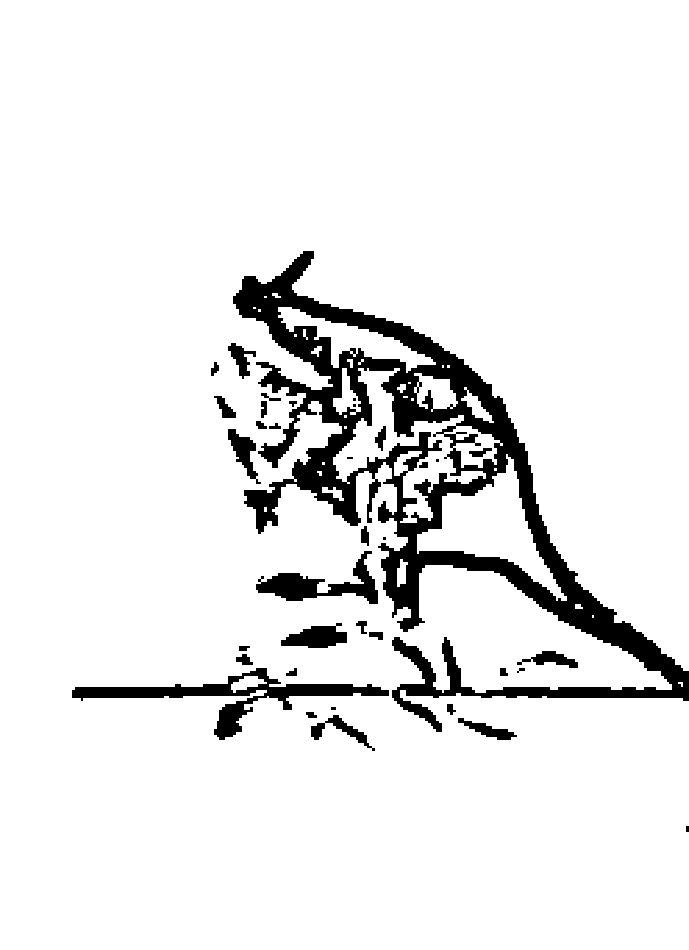

## 第五章

### 动物塔罗牌的占卜仪式及构成元素

使用具有抽象设计的纸牌，能帮助我们学会和象征符号合作；而使用“动物塔罗”，观察动物们反映出的特定种类的能量，能帮助我们理解塔罗牌的真实含义。

谈及来源于自然中的信号，每个社会都会教导：为人的首要责任，是要真诚地向自然学习。不论是自然的哪个方面，只要它最吸引你的注意力——不论它是一个动物，或者不是。只有通过学习和考察自然独一无二的特质，我们才能明了其中的重大意义。这些道理同样适用于这副塔罗牌。我已经提供了基于真实生活中的特质，以及动物在野外的真实行为的基本介绍，通过对这些动物的认真学习，我们能获得更高的洞察力和知觉。

想要阐明自然界中的动物是困难的。出现的每一种动物，都有可能是关于“我们在生活中做什么，不做什么”的询问。只有通过学习这些动物，我们才能在目前的生活状况中，取得新的知觉。这意味着我们要关注动物的所有方面。

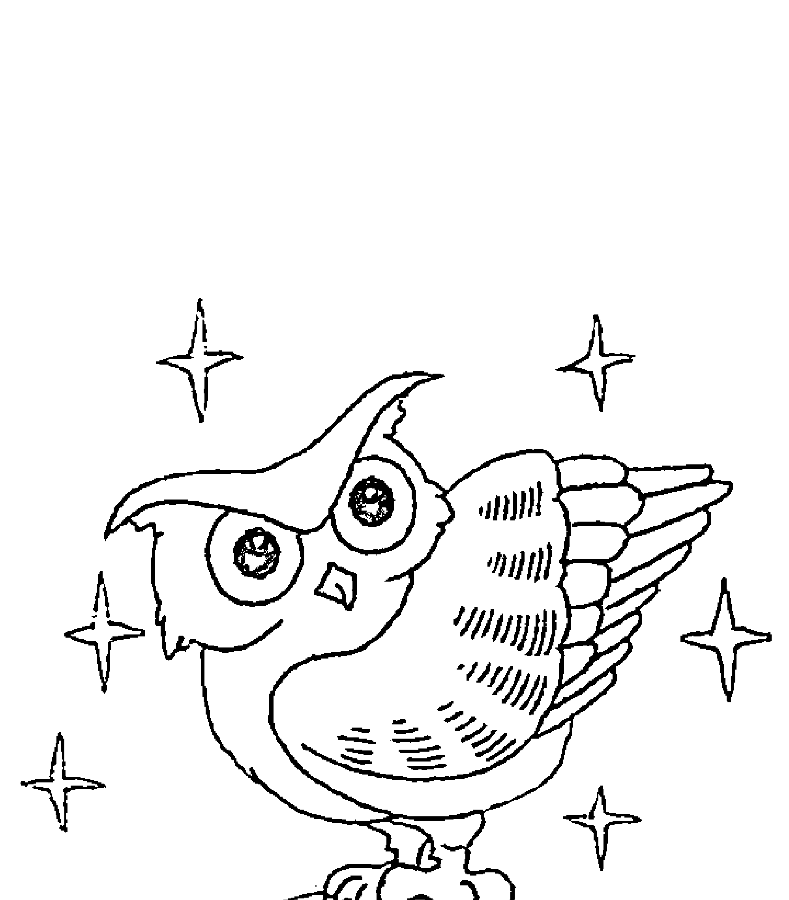

在塔罗牌的阐述中，人们认为正放的位置通常是更加积极的回答。我们必须小心地跳向这个结论。在动物塔罗中，正放通常意味着：这些动物最基本的品质，能够准确地描述和表达出我们的生活状态。举例来说，如果蝗虫出现，现在，是该进行一些较大跳跃的时候了。如果喜鹊出现，在我们周围可能存在着某些对于知识的误用——不论是我们，还是其他人。

### 指示牌和被推测者

指示牌是代表询问问题、寻求知识或者解释的人的那张牌。而这个人也被叫做“问卜者”或者“发问者”。这张纸牌并不是每一个推测牌阵必用的。通常，它被用于“凯尔特人十字（Celtic Cross）”牌阵中。

我们可以用多种方式决定哪张牌是代表问卜者的牌。在动物塔罗中，我们推荐使用宫廷牌或者动物图腾。

#### 宫廷牌

在传统牌组中，宫廷牌通常是四套牌组中的侍从（page）、骑士（knight）、国王（king）和王后（queen）。宫廷牌通常这样表现：它们出现在解读（reading）或者牌阵中，或者，它们重现了我们周围人们的行动。但是，宫廷牌也可以用来表现提问者或者得到一个知识（指示牌或问卜者）。

在传统塔罗牌组中，不同的牌组以及它们的颜色关联着四元素之一。它们的颜色通常关联着个人的肤色、发色，以及诸如此类：

| 权杖 WANDS | 宝剑 SWORDS | 圣杯 CUPS | 星币 PENTACLES |
|------------|-------------|-----------|----------------|
| 金黄色头发 | 棕色/黑色头发 | 中度褐色头发 | 白色/黑色头发 |
| 白皙皮肤   | 橄榄色皮肤   | 中肤色     | 深色皮肤       |

在这套动物塔罗中，这一点并未被有力地执行。可是，我们可以使用关联着牌组的四元素来帮助我们。为了做到这一点，我们必须知道个人的出生星座和与其关联的元素。

| 权杖 WANDS | 宝剑 SWORDS | 圣杯 CUPS | 星币 PENTACLES |
|------------|-------------|-----------|----------------|
| 爬虫类和两栖动物 | 鸟类 | 昆虫和蜘蛛类动物 | 哺乳动物 |
| 火 | 气 | 水 | 土 |
| 白羊座（Aries） | 双子座（Gemini） | 巨蟹座（Cancer） | 金牛座（Taurus） |
| 狮子座（Leo） | 天秤座（Libra） | 天蝎座（Scorpio） | 摩羯座（Capricorn） |
| 人马座（Sagittarius） | 宝瓶座（Aquarius） | 双鱼座（Pisces） | 处女座（Virgo） |

在宫廷牌中，个人的年龄、性别通常会提示出指示牌是宫廷牌中的哪一张——骑士、侍从、王后，或者国王。

- 侍从：男孩、女孩，或者任何性别的儿童——青春期或者更小。
- 骑士：年轻男人或者女人，通常单身。
- 王后：成熟女人，通常已婚；妻子，母亲——中年或者稍老一些。
- 国王：成熟男人，通常已婚；丈夫，父亲——中年或者稍老一些。

这样，一个10岁的儿童，出生在双子座，将可以通过“乌鸦（crow），有翅类（宝剑）侍从”这张牌来表现。而一个出生在巨蟹座的母亲，可以通过“蟋蟀（cricket），变形者（圣杯）王后”这张牌来表现。

#### 动物图腾

通过了解个人的动物精神和动物图腾可以确定指示牌。很多人知道他们的能量动物以及生命图腾是什么。如果个人知道这些，那么这种动物就成为他/她的指示牌。要记住：这并不需要绝对精确。这种动物是怀有问题的个人的代表和象征。

《动物说》中，提供了各种各样的可以确定这种动物的方法。磁带《发现你的精神动物》（Discover Your Spirit Animal），也会在这方面为你提供帮助。不要关心你是否知道你的图腾或者能量动物。这并不会影响你从塔罗牌中获得答案的能力。

如果你没法确定你的精神动物或者图腾，那就在牌组中选择最能吸引你的那张牌。直觉和本能会帮助我们。所有种类的塔罗都会带给我们的训诫中，有一部分就是：发现并相信我们本能的力量和能力。你所选择的动物将会有效地工作，直到你确定地知道自己的图腾。如果你对此并不满意，使用基于你星座的选择宫廷牌的办法。

### 进行动物塔罗推测

解读并不像人们想象的那样复杂。有一些特定的准备和考虑事项：

1.  做好必要的准备；
2.  为实际推测做好准备；
3.  被推测者为推测做好准备；
4.  让被推测者准备好塔罗牌；
5.  进行推测；
6.  以正面的注解结束推测。

#### 做好必要的准备

在推测的时候，我们应该学会一些建议的技巧。如果你在考虑为他人进行推测或者解读，请注意本书最后一章内容中的信息。我们也建议你阅读另一本著作《精神的保护》（Psychic Protection）。通过这种方式，我们可以为自己、为他人，准备大量的问题。这意味着准备好我们自己和周围的环境，使得我们在其中可以恰当地进行推测。保持我们的镇定是非常必要的。在插手之前进行冥想更是一种有效的方式。为了使我们的推测活动更顺利进行，必须要营造一种安静平和的环境，避免被环境中的其他人所打扰。为了达到更好的效果，也可以使用轻音乐和熏香。但是要记住，使用太多的熏香也不太好。也不要造成太过黑暗的氛围。世人对于解读和推测仍旧有一些误解和恐惧。如果我们已经发展好，可以给其他人做解读，我们一定要尝试不要吓到他们。另一方面，其他人也可能对特定香味很灵敏或者过敏。在我们使用这一类东西之前，我们应该先问问自己为什么要这样做。

#### 为实际推测做好准备

在桌子上进行推测活动是比较合适的。有人还专门为之配备了特别的桌子花色。那将会使头脑清晰和使精神集中。有些人建议问卜者（如果你在为其他人解读）和解读人最好按照与指南针方向相关的位置就坐。这并非必要，而在应该使用磁性的北极或者地理的北极上也存在着混乱。当推测仪式开始时，让推测对象坐在我们对面。小心翼翼地从牌盒中取出塔罗牌，不过仍旧要预先用丝绸包装好，放在桌子的中间。

#### 被推测者为推测做好准备

先向被推测者介绍塔罗牌使用的基本程序。稍稍解释一下塔罗牌以及它们是怎样工作的。与此同时，询问被推测者的动物图腾是什么，尝试确定他/她的指示牌。再将纸和笔预备好，以备被推测者使用。还要要求被推测者把他/她的姓名、生日写在一张纸上，连同任何问题一起——特殊的或者普通的问题。让被推测者把它合起来，放在桌子的中央。提醒被推测者要尽可能清晰地把问题用语言描述出来。其措辞将会影响答案的清晰程度。此时，轻轻揭开包着塔罗牌的丝绸。翻动它，为被推测者找到指示牌。

#### 让被推测者准备好塔罗牌

摊开塔罗牌，向被推测者介绍洗牌的具体方法。然后把它们彻底混合，同时把精神集中到问题和关心的事物上。在进行这个过程时要保持沉默。告知被推测者：塔罗牌被彻底混合之后，将被分为三大堆。

通常，推测师或心理专家会坚持塔罗牌被分成三大堆，并要遵循从右到左的顺序，并且只能使用左手。在这个过程中，会存在一些合理的、较为复杂的象征意义。对于大部分很好的心理学家来说，或者当你发展了自己的能力时，这将不是什么大问题。要记住，纸牌能够唤醒我们内心的力量。我们不应该因为可能混淆的细节而精神不安。

有一些心理学家会让被推测者把三大堆纸牌放回到一堆。有时候心理学家也会自己这样做。其中的一种做法并不会比另外一种更好（两者的效力相当）。要相信：那些纸牌，以及其中为你准备的，它们之间联系着的洞察力，将会到来。

当我们更加协调并理解了这个过程，我们将可以为进行这个推测举行我们自己的象征性的仪式了。

最开始，当我们第一次开始学习，可能会出现一些问题。不要担心纸牌堆被如何分割，又是怎样放回到一起的。不要担心纸牌递给那人的方式是否正确。要学会相信：有更强的力量在运转。要记住：自然和推测随时都在秘密地接近我们。塔罗牌是帮助我们了解这些沟通的工具。

#### 进行推测

选择最恰当的牌阵。稍后，在本章将详细介绍推测的展开形式。每一种都有它的用途和益处。你将及时了解：每一种情况都有相对应的一种牌阵，以及对于每一种情况哪一种牌阵比较合适。向被推测者解释牌阵的目的。花费你的时间摆牌阵。一定不要匆忙，否则会干扰塔罗牌。

把塔罗牌在桌子上摆好后，由上至下观看全部展开的牌，获得一个整体的感觉，获得一个总的看法。要记住：虽然它们是单独的牌，但是它们彼此联系，关联着被推测者的问题以及他/她所关心的事物。一个好的解读可以提供有价值的信息，但是正如对于所有事情一样，发现推测中所有的微妙之处要花费大量的时间。

检查牌阵展开的时候，要有效地求助图书，不要依靠每张牌上粗略的信息。这能够获得更多的洞察，要让每张牌和被推测者的问题之间建立有效的联系。如果你是第一次操作它们，尝试着不要向被推测者询问任何特定问题。要相信你所感觉到的、你所看到的都是正确的。要相信，关于被推测者，纸牌已经和你进行了恰当的沟通。

#### 以正面的注解结束推测

要记住，很容易曲解牌阵的含义，尤其是在开始时。要小心地跳向结论。一个好的解读通常会使被推测者感到充满希望，不管提示了怎样的情况和前景展望。

在解读的最后，确保被推测者的所有问题，你都给予了比较完满的回答。如果存在任何困难，确保你已经提供了某些可能性。

然后，把塔罗牌从桌面上拿起来，亲自洗牌，以便抹去来自这次占心术中的力量的痕迹。这也会增强你在自己的塔罗牌中留下的印记。然后再用布包将牌包起来，放进你的塔罗盒子里，直到下一次使用。要记住，通过每一次的使用，对你来说，塔罗变成了一个强有力的、神圣的工具。

因为塔罗牌能让我们更好地感知自然的节奏和能量，所以如果有可能，进行一次散步。向自然做一次祈祷，表达一下我们对自然的感激之情。我们对自然的崇敬、和自然的合作将带来很多报答和祝福，并且，会加强我们和动物之间的联系。

惠特曼（Walt Whitman）曾经写道：

> 有个天天向前走的孩子，
> 他只要观看某一个东西，他就变成了那个东西，
> 某个时候那个对象就成为他的一部分，
> 在当天，
> 或者继续许多年或一个个世纪连绵不已。

通常，我们会忘记自然每天都在和我们讲话。自然中每天都存在着令人惊奇的如同仪式般的提示，使我们更加完全地和自然交流，帮助我们更加贴近地感知。

#### 每日指引

通过塔罗牌，我们能更敏锐地感知动物的信息，并很好地学习自然的语言。每天早上第一件事，花费5分钟进行这个仪式：和动物塔罗一起坐在外面，把塔罗放在你的大腿上。不要祈祷，也不要冥想。需要做的仅仅是深呼吸、放松，在一日兴奋的活动开始之前，享受几分钟的新鲜空气。

5分钟之后，开始你静静的祈祷，祈祷这是美丽的一天，通过这样，要求得到某些信息。集中精神这样做的同时，你开始洗牌。之后从整套牌中为今天抽出一张单独的牌。这张牌就叫做“每日指引”。

仔细阅读你所抽出来的这张牌上的动物，它是倒放出来或者正放出来都没有关系。通常，这个过程中，读出两方面的意义十分重要。要记住，我们的生活通常充满了上上下下，高高低低。这张牌将帮助我们决定：什么才是最好的方式，来进行一天中最重要的活动和情况。

一天将要结束时，回顾一天的事件，你将对你早上抽出来的动物了解更多。甚至更大的清晰将会展现。审查一下，动物是怎样反映出你一天之中的经历的。我们并不会花费多于2至3周的时间，就可以看到清晰的模式。

某些人有这样一种倾向：迷信于这个程序，而当每一次他们走出门的时候都会抽一张牌。其实仅仅需要这样做一次，早晨的第一件事。要记住，其关键是，开始建立以了解动物和自然的语言为目的的词汇表。

## 第六章 几种常见的动物塔罗占卜牌阵

### 是或者不是

1.  过去的情况；
2.  现在的情况；
3.  将来的情况。

事物都有两面性，我们拥有自由意志，而其中存在着更大的可能性。和自然协作，对于见识方面的有益之处是：我们得到的通常比我们要求的多。我们看到了可能性，但是我们也透视和澄清了即将到来的事物。

这种洞察能力的展开，通常会比我们的预期引起更多效果，为行动提供洞察和指引方向。在传统塔罗中，这是一种典型的三牌牌阵，以得到“是或者否”的回答。如果两张或者更多露面，那么可能性就是“是”；反之则是“不是”。如果你已经十分熟悉它，就使用它。要记住，这套塔罗牌可以依照任何传统塔罗牌的使用方式使用。

你可以依照多种方式进行下面的这个牌阵。方式之一是：洗牌，把它们分成三个大堆。每一堆的第一张牌翻面向上。另外一种方式是：洗牌，选择整套牌顶端最前面的三张牌，然后按照出现的顺序在你面前摆放它们。

这个牌阵成功的关键在于，聚焦到情况和问题上。在洗牌时集中在这上面。花些时间这样做，不要太着急。通过洗牌，它们在将要发生的事物的能量上留下越多的印记，答案就会越发地清晰和准确。

通过符合情况的方式强调问题，是一个很好的办法。举例来说，如果你需要一个直接的“是”或者“不是”的反应，在洗牌时，思考“我是否将要……”。或者，如果你仅仅是寻求某种情况的指引，强调类似这样的句子：“关于……我应该做什么？”

#### 第一张牌：关于过去

第一张牌会提供情况的背景。它通常反映出：是什么确定了基调；在现场背后，又曾经发生了什么。它是情况过去的形态，反映出：关于这个情况，我们之前做过什么。

#### 第二张牌：关于现在

第二张牌反映出情况现在的状况。这可能是一个象征，象征所涉及到的其他人，或者情况从开始时经历过怎样的发展。它反映出：关于这个情况，目前将会产生怎样的发展；也可能会提供一些洞察：在目前的情况下，怎样才是最好的行动。

#### 第三张牌：关于未来

第三张牌反映出结果，将要显露出来的情况。要记住，虽然它并没有写在石头上——尤其是包含有他人自由意志的时候。单独看，它反映出可能的未来。

出现在三张塔罗牌中的动物将反映出我们采取的最好行动。这些动物和谐吗？这可能是一个好的信号。所有塔罗牌或者大部分塔罗是倒放的吗？这可能意味着：我们必须更加努力工作，以实现我们在某个情况中的愿望。

这些塔罗牌将不仅仅反映出可能的未来，也告诉我们通过学习这些动物，我们可以学到哪些事物，得到哪些洞察，可以得知为了得到最好的结果，我们应该采取什么行动或者不要采取什么行动。这个牌阵将提供给我们在个人事务上的见识，以及关于恰当行动的指引。

### 方向牌阵

正如我们稍早些在本书中提到的，不同的方向描绘出不同种类的力量在世界中的运行轨迹，以及力量在我们生活、我们之中的相互作用。这个牌阵可以在三个方面提供强有力的见识：

1.  个人信息。它将帮助我们学习我们自身此时的潜力和能力。要记住，若我们改变，动物就反映出我们的能量。
2.  生活环境信息。这个牌阵可以用于得到见识，这种见识可以洞察到这个世界上那些出现在我们面前或者进入我们生活的，在我们周围运行的能量；反映出那些我们并没有察觉到的，但是在我们生活环境中运行的力量——这是一件令人惊奇的事情。
3.  团体和事业信息。在取得关于活动和成就——尤其是那些包含一个团体的——见识方面，这也是一个强有力的牌阵。

像通常一样，一边集中精力在问题事物上，一边在手中洗牌。当你感觉到卡片已经全部沾染了这种事物的力量，像通常一样切牌、重新堆叠。然后如图所示那样摆放塔罗牌。表示方向的牌必须牌面向上。“结果”牌可以牌面向下摆放，在其他牌之后阅读。通过这样的方式，我们对其他牌的解释将不会被扭曲。

“东方”牌反映出关于我们疗伤能力、头脑力量以及行动的信息。它是我们创造活动和精神冒险的源泉。“东方”牌包括了事情开始的信息，反映出何物才是努力的核心。它预示着：现在，开始了我们精神道路的进程。

“南方”牌反映出我们内心中那个需要喂养、需要赞誉的小孩。这是保护、转变，以及可能性的所在之处，反映出什么才是我们通常需要信任的。在这里，我们再次记起，在成长和工作中，怎样才能享受儿童般的乐趣。在这个方向，我们发现什么东西是我们依然需要去做的，而怎样才能把它最有效地完成。

“西方”牌反映出我们生活中直觉和爱的部分、我们情感的和内在的挑战。它揭示出我们所持有的神圣之物。在这里，我们学习到为自己服务，以及向他人服务。“西方”牌指点我们奔向更高层次的目标，向我们指明能达到目标的最佳道路。这是我们学会最佳转变的地方。在这里，我们找到理由；我们发现了“为什么”。

“北方”牌指示出怎样才能在现实世界中，最好地应用我们的能力。这是一个关于精神的物质化表达的方向。这是富饶之地，或者是匮乏之所，或者它揭示出我们或其他人的直觉。“北方”牌向我们展示可能的益处和报酬。这是精神在世俗世界中得到表达的地方，是我们学习展现的地方。它向我们展示：现在，怎样才能最好地走入智慧之中。

“结果”牌带给我们一种关于目前情形以及运行中能量的完整的总体看法，帮助把其他的系在一起。通常，在这里出现的动物是一个重要的图腾——通常是我们的力量动物之一。它可以指示出：对于我们、我们的努力，其他人会采取何种回应；事物会朝向哪里。它向我们展现我们目前的情况，反映出我们的物质和精神生活是怎样地混合，以及，目前被我们怎样地表达。

### 凯尔特人十字

凯尔特人十字是使用最广泛的塔罗展开形式之一，也是更加古老的牌阵之一。大量的信息被安排在其中。它可以应对于某个特定问题或者事物的概要前景及细节信息。

把指示牌（代表推测对象的那张牌）放在桌子的中间。如果存在特定的问题或者情况，它们应该被写在一张纸上，然后折叠这张纸，把它放在指示牌下面。洗牌，然后如图所示摆放，第一张牌要放在指示牌上面。

1.  **这是你的现状。** 这张卡片，提供对特定人物的洞察，这个人物关联到此次的情况。它显示出环绕这个情况的能量。
2.  **这是你周围的影响因素——好的方面、坏的方面。** 这张卡片，提供对情况的总体看法。动物的特质可能对情况提供帮助，或者阻碍它。
3.  **这是情况的基础。** 这种动物指示出：被推测者真正的真实。它通常表明关于情况的隐藏信息，或者情况之后的真实情感。
4.  **这是你的过去。** 这种动物指出正在逝去的能量或者紧接着的背景。它反映出：必须解决的事物或者有必要驱散或者清理的事物。
5.  **这是你的理想。** 这种动物反映出：某种事物目前并未成为现实，但是具有非常大的可能性，和它一起，会带来或者阻止最佳的行动。
6.  **这是你的未来。** 这种动物和第十张牌的动物是互相联系的。第六张牌会导致第十张牌的情况，两张牌一起，它们指出大部分将要开展的情况。这种动物反映出：成形的能量。
7.  **这是你的消极情绪。** 这种动物指出：个人在插手和处理即将遇到的情况时，会遇到困难。对于怎样才能克服这些消极的情绪，它将提供见识并指明方向。
8.  **这是你周围其他人的情绪。** 这种动物和它的特质指示出：对于此时的情况以及发问的个人，其他人抱有什么样的感觉。它通常表现他们现在的感觉，尤其是和一个特别的情况相关联时。
9.  **这是你的积极情绪。** 这种动物描述了：对于即将发生的状况，个人的真实感觉。它将提供帮助，向个人指示：具有最大可能性的反应或者行动。

## 第六章 几种常见的动物塔罗占卜牌阵

这种动物指示出结果，或者情况可能怎样展开。它将提供洞察：怎样以采取最好的行动在这个情况中获得最多，甚至，控制它。

### 年度预测

这是一个强有力的牌阵，可以得到关于下一个年份的逐月的洞察力。要特别注意卡片上的数字，因为，有时它们可以预示在这个月份内的特别的日期，在这一天，动物反映出来的能量可能更加强大。在我使用它进行个人咨询时，我通常以此作为结束。我发现它是一个强有力的、精确的预测，可以提供特别的、重要的日期和时间构成。如果在其人生日附近的时间进行预测，它会更加强大。

像通常一样洗牌、准备塔罗牌，注意力聚焦到即将到来的一年。然后，牌面向上，如图所示摆放塔罗牌。序号1的塔罗牌，是表示当月份的纸牌，即使这个月只剩很少几天了。以逆时针的方向摆放其他的月份。最后一张卡片，“对一年的整体印象”，放在指示牌上。我喜欢牌面向下，但是事实上这无关紧要。它把单独的月份系在一起，并为12个月的时期提供整体印象。

每月的动物反映出：在这个月中，最有可能在生活中活跃的能量。它的行为和品质将为个人行为提供见识，而在这段时间，我们将发现这些行为或多或少获得了成功。每个月份都具有它独一无二的能量，这是一个动态的牌阵，决定不同时间最有可能遭遇哪种模式。它将为“我们可以做什么”提供巨大的洞察力，以帮助被推测者或者我们自己，去阻止问题和困难时期的到来，或者减轻问题和困难时期的难度。

## 第七章 让动物塔罗成为你的精神顾问

想要具备积极的精神洞察，我们就一定要学会控制自身的感觉，包括我们的直觉，要有依照意愿把它们打开和闭合的能力。动物塔罗帮助我们发展这些能力，同时，它也适合我们或者其他人的成长。

通过长期的精神修炼，我们可以把这股精神力量有效用到塔罗推测中。治疗和做梦最容易推动个人成长，而且具有最少的不平衡的可能性。在我们学习为其他人疗伤的同时，我们也平衡和治疗着我们自己。

我们的读心术——我们的推测——应当经常强调“光”和“爱”。当我们增长了知晓的能力，我们将学会有意识地在正确的时间，采用正确的方式，以正确的比例，为正确的人使用我们精神的能量。有时，这十分困难。这就是为什么我们要十分小心，不要太快地就在公众面前进行工作，因为，这将会驱散为其他人读心。

> > 我呼唤广泛的能量！我呼唤所有善良友好精灵的指导！现在，帮我开启精神中心之门吧！帮我学习敞开自己，迎接我所追寻的知识与指导！
>
> —— 《塔罗神咒》

我们的精神能量，使它以其他方式被使用，把我们的能量变成持久振动的灵体。我们只有具备了发达的精神和心灵调解能力，才能很好地为他人读心。不论我们是否和精神合作，我们一定要知道和我们建立联系的物质的源泉、信息的种类，以及，它意指何人。对于那些不正确的东西，我们可以自由拒绝。我们在头脑和直觉上发展得越多，我们就可以对不相关的干扰进行更多控制。

为其他人进行读心的程序之前做良好的调节是必要的，我们将学会如何更好地传达有用信息。随着时间推移，我们将学习所有信息的来源，并将可以把它们放到和个人相关的前景中去。在提出建议的技巧方面，接受某些正式的培训。

成熟的精神调解者，可以单独地检查和校验信息的来源，因为，在哲学（过去和现在）、心灵发展的各个阶段，他们都受到了良好的教育。好的精神顾问具有强烈的意愿，并能够控制他们身体的、情感的、头脑的、直觉的以及精神的能量。

我们可能可以从精神上得到一些直觉印象和信息，但是我们也必须知道，怎样才能把这些信息用问卜者可以理解并使用的方式表达出来。人们在寻找精神顾问做推测的时候，其中75%是因为遇到了真正的问题，没有满足精神输入的必要需求。提出忠告和精神上的工作要手拉手地进行。如果我们能够有效地使用提出意见的技巧，那么对于所有关心的问题，都会具有好处。如果对此并不确定，可以在本地大学或者夜校中参加一些相关的课程。

术语“三明治（sandwich）”是用来描述一个简单的技巧的。以正面的态度开始。在会议的中间处理一些消极的或者麻烦的部分。显示出可能的选项和解决办法。要诚实，但是要确信这个讨论能够推动被推测者的希望，增加被推测者对于问题和情况的个人控制。通常以更为积极的态度结束会议。

不要太过频繁地使用精神。和非物质世界的联系，依靠我们对周围世界的焦点和注意力，这让我们对精神产生了依赖心理。但是，我们必须学会过我们的生活，精神是来帮助我们的，但绝对不能取代我们的生活。

在生活中保持活跃，在“精神的”活动之外，也要参与日常活动、发展爱好和兴趣。我们不能频繁地为他人读心，否则占卜人就会过分依赖我们。在这里，我们是指引和帮助，帮助他们在自己的生活中变得更加活跃，更加具有创造力。对于大多数人来说，生活中很少有太多的变化，不要超过每年一次，或者可能每年两次地使用读心术。

当为别人读心时，解释和治疗已经足够了，不要指明方向！当有精神联系存在时，我们在提出建议时所说的话，会产生更大的重要性。被推测者处于一个接纳和被动的位置，因此更容易感受到我们的影响。我们要保持分离和避免——尽可能多的——偏爱、喜好、不喜欢。我们工作的时候要多一些专业精神。没有其他人而只有你和被推测者，有权利知道在会议之中都说了什么、发生了什么。但是有其他人在场的时候，我们讨论被推测者的信息就要得到对方的允许。这是关于信任的事情。不幸的是，我见过许多“专业人士”把在会议中获得的信息拿出来讨论，或者盛盘用于闲聊。

通常，大多数精神预言给被推测者提供的是一个大概的、趋向性的结果。因为很少有人会改变他们行事的方式，预言准确需要相当高的水平。请一直记得：被推测者具有自由意志，而个人精神推测的部分责任，就是帮助被推测者看到具有创造性的机会，即使它受到在被推测者生活中已经发生了的事物的限制。不断地学习和探索，充实自己的精神世界，你就会更好地教导和帮助其他人。参加正式的或者非正式的工厂课程、夜校课程。学习和实验新的技术。创造更多可以用于工作的工具。努力奋斗，在你的生活和工作中添加新的维度——精神上的或者其他——智慧。设定一个年度计划，在你的生活中开始新的活动。这些将帮助你保持多产并有创造力，同时也会让你脚踏实地并保持重要性。

塔罗推测师经常被人们请教如何能更具精神性。以个人水平阅读塔罗牌，和教导他人关于精神和灵魂的培养，是两件完全不同的事情，每一种都需要一套独特的技巧。某些人发现他们更喜欢教导其他人关于灵魂的事物，而另外一些人偏爱一对一的精神指导。

- 不要太过频繁地为其他人读心。
- 不要告诉其他人要做的是什么。
- 总是以秘密的方式对被推测者表示尊敬。
- 让被推测者知道通常存在自由意志。
- 一直增加你的知识基础。
- 成为灵魂导师。

我们在教导他人之前先要审视自己的生活，我们是如何和自身精神的见识协作的。一个诚实的自我评估和被推测者给我们的直接反馈同样有益。被推测者可以向我们反馈信息，例如，哪些我们做的是正确的，在哪些方面我们需要在技术上更进一步？如果我们有教导别人的资格，说明我们的责任更加重大，因为我们能影响更多的人。如果可能，和其他的灵魂教育者交谈，了解是什么激发他们开始灵魂教导工作的。询问他们遇到了怎样的挑战，而他们是怎样解决在学习过程中产生的问题的。寻找可以作为行为榜样的教师。

一个真正的精神工作者，具有各种各样的特质。首先，他/她有吸引人们聚拢到自己周围的能力。他或者她，具有不断扩大的影响和服务领域。同时，一个真正的灵魂导师从来不表示他/她知晓每一件事情，但是可以向我们指出正确的图书，或者甚至是另外一位导师。一个真正的精神工作者，具有各种各样的特质。

### 假冒的精神工作的特征：
- 承诺解决所有问题。
- 承诺真爱。
- 承诺通过符咒和魔法，改变你的财富。
- 过度收费。
- 并不提供参考书目和培训背景。
- 仅仅含糊地说明一般性问题。
- 强度聚焦于死亡和厄运。
- 发起太过频繁的会面。
- 要求你做出大部分解释。
- 除了让你自信、骄傲之外，几乎没有做其他事情。
- 需要并且期待机械的赞同。
- 过着一种不健康的、混乱的生活方式。

一个真正的灵魂导师具备谦卑、无害、诚挚、朴素的美德。他或者她，会拥有关于结合的强烈感觉，并为最高标准的演讲和行动而努力奋斗。那些和真正的灵魂印象一起工作的人，他们的头脑、心灵和直觉都超乎寻常。在很多领域，他们是有创造性的多产者，并且为其他人服务了很长的岁月。

真正的灵魂导师是精神力量的发电站，鼓励、治疗、带领并保护其他人。他们能自由控制自身的欲望。而能力的推动使他们进入更高层次的表达领域，既不会做出自我要求，也不会强迫别人满足自我的需要。

> > 真正的灵魂导师是精神力量的发电站，鼓励、治疗、带领并保护其他人。

真正的灵魂导师洞悉宇宙中秘密的法则。这样的个体可能会知道我们何时会出现在他们面前，但是导师通常不会向我们透露宇宙中秘密的法则。这就是他们并不干涉其他人的因果的原因。当真正的精神表达的力量展露出来，它对其他人的影响也会发生，从好的方面或者坏的方面。精神导师可能并未试图为我们疗伤，但是当他们到场时，疗伤的力量已经触摸了我们。灵魂导师并不会直接向我们示范，但是无形中，他们已经激发了我们更高一层的本性，使我们具备更高的能力，开始看到之前从未看到的东西，明了之前从来不知道的事物。同灵魂导师的连接是我们的幸事。它会加强我们的意愿，启蒙我们的头脑，这样我们就可以竭尽全力地发挥自己，达到我们的目标。我们也体验到，一个伟大的力量也触摸了我们生活中的其他人。真正的灵魂导师通过示范在关系中的责任和牺牲行为，为生活注入伟大的意义。他们这样做，是一种有意识的、直觉的行为，因为他们知晓因果，想要和它的法则协调，不论是为他们自己，还是他们碰触到的人们。

## 附录 动物塔罗快速检索

### 大阿卡那(THE MAJOR ARCANA)

| 塔罗牌序号 | 塔罗牌 | 塔罗牌动物 | 关键注释 |
| :--- | :--- | :--- | :--- |
| 0 | 愚人 THE FOOL | 草原狼 coyote | 智慧和愚蠢 |
| 1 | 魔术师 THE MAGICIAN | 狐狸 fox | 祝福以及魔法准备中 |
| 2 | 女教主 THE HIGH PRIESTESS | 蜘蛛 spider | 直觉、命运的编织 |
| 3 | 皇后 THE EMPRESS | 海豚 dolphin | 创造力、母性、新的允诺 |
| 4 | 皇帝 THE EMPEROR | 雕 eagle | 视力、力量、疗伤的能力 |
| 5 | 教主 THE HIEROPHANT | 白鹤 white crane | 长寿、信仰、精神正义 |
| 6 | 情侣 THE LOVERS | 蜜蜂 bee | 孕育以及信仰选择 |
| 7 | 战车 THE CHARIOT | 马 horse | 移动和平衡 |
| 8 | 力量 STRENGTH | 狮子 lion | 野外的力量，内心的太阳 |
| 9 | 隐士 THE HERMIT | 猫头鹰 owl | 沉默的智慧，视力，以及指引 |
| 10 | 命运之轮 WHEEL OF FORTUNE | 熊 bear | 留意内心的声音，循环 |
| 11 | 正义 JUSTICE | 大象 elephant | 正义的古老力量 |
| 12 | 吊人 THE HANGED MAN | 蝙蝠 bat | 新的事实和理解 |
| 13 | 死神 DEATH | 蛇 snake | 脱落过去，复苏 |
| 14 | 节制 TEMPERANCE | 天鹅 swan | 新的梦想，新的领域 |
| 15 | 魔鬼 THE DEVIL | 大乌鸦 raven | 黑暗之光，变形 |
| 16 | 高塔 THE TOWER | 秃鹰 vulture | 生命、死亡、重生、新视点 |
| 17 | 星辰 THE STAR | 萤火虫 firefly | 精神上的灵感，希望 |
| 18 | 月亮 THE MOON | 狼 wolf | 直觉的指引，保护 |
| 19 | 太阳 THE SUN | 蜂鸟 humming-bird | 喜悦，梦想，成就 |
| 20 | 审判 JUDGEMENT | 鲸 whale | 创造的新的深度 |
| 21 | 世界 THE WORLD | 龟/大地 turtle/mother land | 新的机会 |

### 四足类 (four-leggeds) 哺乳动物 星币 (PENTACLES)

| 塔罗牌序号 | 塔罗牌动物 | 关键注释 |
| --- | --- | --- |
| 首牌 | 美洲野牛 bison | 新的繁荣、充裕 |
| 2 | 豪猪 porcupine | 平衡工作和娱乐 |
| 3 | 水獭 otter | 创造力和技巧 |
| 4 | 獾 badger | 依靠自己，可行性的追击 |
| 5 | 老鼠 mouse | 审查生活的教训 |
| 6 | 美洲虎 jaguar | 回收力量，劳动的果实 |
| 7 | 兔子 rabbit | 对周期和节奏的恰当运用 |
| 8 | 松鼠 squirrel | 为未来做准备 |
| 9 | 海狸 beaver | 为我们的梦想而工作 |
| 10 | 驼鹿 moose | 家庭、出生、最初的母亲 |
| 侍从 | 鹿 deer | 通向新的学习和追求的诱惑 |
| 骑士 | 美洲狮 cougar | 进入我们自己的力量 |
| 王后 | 山猫 lynx | 隐藏的知识和创造 |
| 国王 | 大猩猩 gorilla | 强壮、高贵、慷慨 |

### 有翅类(winged ones) 鸟类 宝剑(SWORDS)

| 塔罗牌序号 | 塔罗牌动物 | 关键注释 |
| :--- | :--- | :--- |
| 首牌 | 啄木鸟 woodpecker | 关于成功的独特、全新的节奏 |
| 2 | 蓝色鲣鸟 blue jay | 恰当的选择，力量的使用 |
| 3 | 玫胸白斑翅雀 rose-breasted grosbeak | 为心灵疗伤 |
| 4 | 山雀 chickadee | 寻找内心的真实 |
| 5 | 雁 wild goose | 留意探寻的呼唤 |
| 6 | 鸽子 dove | 在不同周期和世界之间移动 |
| 7 | 喜鹊 magpie | 秘密知识的恰当运用 |
| 8 | 白头翁 grackle | 解放情感和焦虑之时 |
| 9 | 潜鸟 loon | 答案，梦中的希望 |
| 10 | 孔雀 peacock | 关于死亡和复苏的新的循环 |
| 侍从 | 乌鸦 crow | 出乎意料的魔力和能量 |
| 骑士 | 鹰 hawk | 守卫风险 |
| 王后 | 绯红金刚鹦鹉 scarlet macaw | 敏锐的视觉和精神知觉 |
| 国王 | 大蓝鹭 great blue heron | 过分自信的权威，忠告 |

### 变形者(shapeshifters) 昆虫和蜘蛛类动物 圣杯(CUPS)

| 塔罗牌序号 | 塔罗牌动物 | 关键注释 |
| :--- | :--- | :--- |
| 首牌 | 蝴蝶 butterfly | 全新的爱情、欢乐和健康 |
| 2 | 长腿王 daddy longlegs | 深入的人际关系 |
| 3 | 天蚕蛾 days silk moth | 增强生产力，成功，实施 |
| 4 | 竹节虫 stick bug | 表面现象之下的行为 |
| 5 | 蚯蚓 earthworm | 重视过去的经验 |
| 6 | 蝉 cicada | 除旧迎新的快乐 |
| 7 | 甲虫 beetle | 为达成目标做的重要决定 |
| 8 | 蚂蚁 ant | 没有最好，只有更好 |
| 9 | 瓢虫 ladybug | 期盼结局 |
| 10 | 蚱蜢 grasshopper | 跳跃式增进的快乐 |
| 侍从 | 毛毛虫 caterpillar | 好运和新生 |
| 骑士 | 捕食性螳螂 predatory mantis | 通过静止来获得观察力和保护 |
| 王后 | 蟋蟀 cricket | 敏感的直觉和信任的力量 |
| 国王 | 蜻蜓 dragonfly | 信任光明的力量 |

### 远古居民(ancients) 爬虫类和两栖动物 权杖(WANDS)

| 塔罗牌序号 | 塔罗牌动物 | 关键注释 |
| :--- | :--- | :--- |
| 首牌 | 青蛙 frog | 丰育、新的开始 |
| 2 | 海龟 sea turtle | 对完成的坚持 |
| 3 | 火蜥蜴 salamander | 独一无二的灵感和协助 |
| 4 | 绿树蜥 green anole | 和睦、和平 |
| 5 | 壁虎 gecko | 在挣扎中做你应该做的 |
| 6 | 锦龟 painted turtle | 信念、努力的回报 |
| 7 | 蟾蜍 toad | 内心的强大和源泉 |
| 8 | 锦蛇 rat snake | 加速、移动 |
| 9 | 希拉毒蜥 Gila monster | 保持控制和信仰 |
| 10 | 陆地龟 tortoise | 在压力下移动 |
| 侍卫 | 变色龙 chameleon | 环境改变的消息 |
| 骑士 | 科莫多龙 Komodo dragon | 强大的生存本能和冲动 |
| 王后 | 鳄鱼 crocodile | 最初的强大和创造 |
| 国王 | 印度眼镜蛇 cobra | 敏捷、意外的决定和行动 |## 一、生日与塔罗

根据你的出生年、月、日，可以找出代表你自己生命对应的塔罗牌和动物属性。生命的塔罗牌可以分为两种：一种是代表个性象征的动物塔罗牌，另一种则是代表灵魂象征的动物塔罗牌。

代表个性象征的动物塔罗牌，显示你表现于外在世界的智慧、才能、气质、风度、脾气等，也就是别人如何看你的一切。代表灵魂象征的动物塔罗牌，显示内心深处的你，你内在的渴望、精力的来源、精神的感受、追求和向往的理想人生，它代表不为人知的真正的你。

推算出这唯一的牌后，你就能深刻地认知自己，你既有这张塔罗牌的属性，也有对应这种动物的一切智慧与灵性。

当你降生于人间，你的生命就和这个世界开始了接触，你的个性和灵魂也伴随生命而来。因此，找出属于自己生命的塔罗牌（应从二十二张大阿卡那牌中找），可以让你更深入地了解自己是谁，别人又如何看待你。发现你生命中隐藏的个性和力量，可以帮助你认识自己，发挥潜能和特长，更可以看清未来，开拓美好的前途。

推算方式如下：

- 1. 把你出生的公历年、月、日三个数字相加，得到一个总数；再把总数的各个数字相加，会得到一个二位数；然后把二位数的两个数字相加，会得到一个个位数。此二位数代表个性象征的塔罗牌，个位数则代表灵魂象征的塔罗牌。

    例：比如你的生日是1999年6月4日，它的计算方法如下：

    | 项目 | 计算 |
    | :--- | :--- |
    | 年 | 1999 |
    | 月 | + 6 |
    | 日 | + 4 |
    | 总和 | 2009 |
    | 二位数 | 11 (2+0+0+9) |
    | 个位数 | 2 (1+1) |

    “11”为“正义大象”，即为代表你个性象征的动物塔罗牌。
    “2”为“女教主蜘蛛”，即为代表你灵魂象征的动物塔罗牌。

- 2. 如果总数的各个数字相加，和为个数，则此数字同时代表个性和灵魂两种象征。个性和灵魂属于同一个象征的人，通常都是专业人才。

    例：比如你的生日是1989年1月15日，它的计算方法如下：

    | 项目 | 计算 |
    | :--- | :--- |
    | 年 | 1989 |
    | 月 | + 1 |
    | 日 | + 15 |
    | 总和 | 2005 |
    | 个位数 | 7 (2+0+0+5) |

    “7”为“战车马”，即为同时代表你个性和灵魂象征的动物塔罗牌。

- 3. 如果总数的各个数字相加，和为19，那么，1和9相加等于10，1和0再相加等于1，这是唯一有三个数字的组合。这三个数字，第一个代表个性，第三个代表灵魂，而多出来的第二个则代表创造力。拥有创造力象征的人是绝佳的创意人才。

    例：比如你的生日是1979年10月1日，它的计算方法如下：

    | 项目 | 计算 |
    | :--- | :--- |
    | 年 | 1979 |
    | 月 | + 10 |
    | 日 | + 1 |
    | 总和 | 1990 |
    | 第一个数字 | 19 (1+9+9+0) |
    | 第二个数字 | 10 (1+9) |
    | 第三个数字 | 1 (1+0) |

    “19”为“太阳蜂鸟”，即为代表你个性象征的动物塔罗牌。
    “1”为“魔术师狐狸”，即为代表你灵魂象征的动物塔罗牌。
    “10”为“命运之轮熊”，即为代表你创造力象征的动物塔罗牌。

- 4. 如果总数的各个数字相加，和为22，22减去22等于0。因为传统塔罗牌为22张，数字由0排至21，因此数字22等于数字0，这数字代表个性；22的2加2等于4，这数字代表灵魂。

    例：比如你的生日是1986年4月3日，它的计算方法如下：

    | 项目 | 计算 |
    | :--- | :--- |
    | 年 | 1986 |
    | 月 | + 4 |
    | 日 | + 3 |
    | 总和 | 1993 |
    | 个性数字 | 22 (1+9+9+3) → 0 |
    | 灵魂数字 | 4 (2+2) |

    “22”即“0”为“愚人草原狼”，即为代表你个性象征的动物塔罗牌。
    “4”为“皇帝雕”，即为代表你灵魂象征的动物塔罗牌。

- 5. 如果总数的各个数字相加，和大于22，则把和减去22，所得余数代表个性，和的两个数字相加，求得的个数代表灵魂。

    例：比如你的生日是1980年11月8日，它的计算方法如下：

    | 项目 | 计算 |
    | :--- | :--- |
    | 年 | 1980 |
    | 月 | + 11 |
    | 日 | + 8 |
    | 总和 | 1999 |
    | 余数 | 28 (1+9+9+9) → 28-22=6 |
    | 灵魂数字 | 10 (2+8) |

    “6”为“情侣蜜蜂”，即为代表你个性象征的动物塔罗牌。
    “10”为“命运之轮熊”，即为代表你灵魂象征的动物塔罗牌。

## 二、动物塔罗牌数字对应的人生型态

- 1. 如果你推算出来的个性象征和灵魂数字相同，代表你人生的发展是单一的；如果个性象征和灵魂象征的数字不同，代表你人生的发展是双重的。
- 2. 如果你的数字是0，代表你追求的是多姿多彩、变化多端的人生。
- 3. 如果你的数字是1 ～ 6，代表你追求的是和谐的人生。
- 4. 如果你的数字是7 ～ 12，代表你追求的是充满冒险和挑战的人生。
- 5. 如果你的数字是13 ～ 18，代表你追求的是不断开创和改变的人生。
- 6. 如果你的数字是19 ～ 21，代表你追求的是自我实现和成就的人生。