# 咨商塔罗

# 作者序

## 回家的道路，就在你面前展开

塔罗与数字，是我踏进神秘学领域的第一个系统，带领我进入另一个浩瀚的自我探索旅程。连接上塔罗系统，简直就是一个天启。后来，我跟丹尼尔老师学习「卡巴拉 & 生命树」，发现这个系统蕴含着博大精深之灵性世界的奥秘知识，才真正明白，塔罗 (Tarot) 为何会让我如此着迷，因为这是上帝给犹太人一条「回家的道路」呀！

带着自己回家，是的！让我重新忆起、记得怎么回家、带自己回家。

同时，心里想的是，这么美丽的系统，怎能只有我知道。独乐乐不如众乐乐，我也想要分享给更多人，让每个人一起回家，连结灵性世界的天启！

接触塔罗与数字那一年，我正在逢甲大学担任咨询心理师，也在通识教育中心教课，已是一位专业的咨询心理师。因着塔罗，发展出了另一个管道，跨接「心理咨询」与「塔罗数字」，觉得新鲜有趣、好玩无比，于是我开始在通识课程中带领学生认识自己。

「盈君老师在课程中教塔罗牌耶！」不得了！消息传到各个学院系所，我的课竟然成了在预选时就被秒杀的通识课。排课的助教注意到这件事，于是邀请我直接开成一系列独立的沙龙课程（名额一样是秒杀）！不只学生来报名、全校的教职员也抢着报名，甚至有旁听生说：「没有名额没关系，可以让我进去吗？我站着听课都愿意！」接着，接连好多年，各个公部门、各层级的学校、社会服务机构、保险业务公司、企业内训等等，都会特别邀请我去教「塔罗牌与生命灵数」，帮助了许多人找到问题症结点，简单易懂、直指核心！

如果你懂塔罗与数字系统，你就会是全校最红的老师、全公司人缘最好的人！因为大家对自己充满好奇、想问各种问题，希望能在塔罗与数字中找到参考线索。

当时，我在人格分类系统中找寻「塔罗」的定位，以「符号图像直觉、生日数字组成结构、人格特质分析」的三大基础，加上咨询问话方式及开放引导（非论断与封闭），整合出独创的咨询塔罗的架构。帮助了好多学生、家长、一般大众，解决了爱情问题、人际关系、亲子困扰、生涯选择障碍等，一一破除，神准到惊人，给予每个有缘人生命提点与清晰指示！

世界上最神秘的生命就是我们自己，强烈渴望走上探索生命的旅程，在旅程中，我们认识自己是谁、有着什么样的性格、带有什么样的天赋、在生活中需要注意些什么以更好地活出自己。

透过提问与抽牌，厘清自己的盲点、解答了生活中的各种疑问，找到与灵性连结的管道与方式，就是塔罗系统给予我们的礼物。

几年前，我便将多年来的个案咨询心得、教学课程中的重点精华，一一整理成文字后存在计算机里，等待时机与缘分成熟时间世。谢谢阿尼担任这本书的主编，谢谢亚南让《咨询塔罗》在漫游者事业群出版，让更多人可以因此受益。

塔罗与数字，是我的最爱，始终如一，愿你们也深深爱上塔罗世界的乐趣。

准备好、深呼吸，敞开自己、接收生命给予的灵性启示与领悟！

# 第一章

## 訪談架構與事前準備

### 一、什么是咨询塔罗？与传统塔罗的差异为何。

#### 不置逆位：中性解读

我希望大家能用中性的诠释观点来理解每张牌，每张牌都有正向与负向的含意，即使看到牌面的第一印象或许是可怕，或许是幸福，都会先有一个直观的感受跳出来。但也可以尝试做逆向的练习。在负面的牌义中，我们能找到正向的意义；在正向的牌义中，我们也能看见提醒的讯息。

因此，在本书的学习内容以及教学系统中，不使用逆位。如果你以前的塔罗学习经验中包含逆位的话，希望暂时放下从前的记忆，把所有抽到的牌都转成正位来看。讲解并带出正反两面的讯息，是咨询塔罗系统的一大特色。这样一来，不仅能去掉二元吉凶的论断，并且在解读时更加全面，把所有需要知道的讯息传达给抽卡者，让他做出最后的选择与决定。

我试图让每张牌的讯息都能回归到「合一」且「中性」的观点来理解，中性的特质直接反映了「正与反」，反映了「光明跟阴影」。我直接用「牌义vs.课题」来取代牌的「正位vs.逆位」。希望在解读、引导的时候，可以全面性地传达牌义的讯息。

### 用词定义：解读（Reading）

承接上述的整合观点，论断的角度在本书不适用，因此「占卜、算牌」这样的用词也在本书中稍作调整，改用「解读」（Reading）来协助抽牌者了解自己此时此刻的状态。

### 二、咨询塔罗的优点以及对生命的助益

咨询塔罗以「个案咨询取向」的引导问话为出发，以了解「抽牌者现在的心境反映」为首要，不以论断结果为前提。把每一次抽牌都当作潜意识要给予我们的讯息，在内在丰盛且全知的数据库中，提取我们想要得知的灵感与指引。

同时，我们也能够带领抽牌者理解「Know How」的概念，了解「为何生命中发生了这件事」。例如询问感情时，可以把问题带得更深一点：「为何还没有感情的对象出现？」；想知道身体健康的问题，可以问「为何我会生病？为何这种疾病会发生在我身上？要让我学习什么？」等，引导大家透过塔罗咨询的过程，破解问题背后的真相。

每一张牌都有「要学习的功课」，功课的讯息往往和牌义不一样，甚至刚好相反。「牌义」是牌面上的情境与描述呈现，学习的「功课」与练习的方向则是另一回事。每张牌都有牌义和功课，同时也带出了隐藏其中的「信念」，78张牌就有78个不同的信念。信念的句型是，我相信「……是好的、是对的」。信念不只是单纯的想法，而是由整套想法及价值观所构成的人生架构，我们的生命就是倚靠着这些信念而活。信念往往带给我们的不是喜悦，而是痛苦与限制，因此在学习塔罗的过程中，我们有机会重新检视自己的信念，活出轻松愉快的人生。

学习咨询塔罗，透过每一张牌的学习，连结到个人的生命经验。不需要死记牌义，自然融合在自己身上、内化成自己的一部分，自然会找到生命的智慧解答。

塔罗牌就象是一面镜子，象是很懂我们的老朋友，不是要寻求安慰，而是看见自己真实的心理状态，犀利地给予自己真实的切入点，看见心中的盲点，进而获得支持与指引。

本书非常适合「学过牌义但仍不会解牌的人」。从咨询的角度切入，加上主牌人格原型及生命灵数的系统整合，带领大家找出「问题、人、牌」这金三角的关联。透过本书的指引，带领大家走上自己的英雄探索旅程。你可以不用成为塔罗师，但是你不能不探索自己！

### 解读案例

Q：无论什么事，只要抽到太阳就是好的吗？

A：揭开真相的过程可能是痛苦的。因为必须要把真相显露出来，才能重建光明。所以可能现阶段是隐藏的。太阳是诚实，也是看清真相。有时候真相并不是在自己这边的，也可能正在处理一个很混沌的状态。抽到这张牌，我认为接下来会有重建光明的可能性。

我觉得塔罗很有趣的一点在于，当牌面都朝下的时候，其实是在潜意识的层次，一旦抽出牌，其实就台面化了。塔罗牌将内在隐藏的东西具体化，随即浮上台面。特别是22张主牌大阿尔克那，和人生必经的大主题都有关，也代表了我们生命中22个原型。

对我来说，塔罗是工具，因此我不会武断地判断状况。询问者想要从我身上获得二元答案，我会将他抽出来的牌面完整解释，并引导他思考这与他当下状态的关联，请他做出最适合自己的决定。

> **Q**：问外遇状况，抽到太阳牌，除了「真相大白，没办法隐藏」的解释外，还有其他解释吗？

**A**：我认为解牌要顺着脉络梳理。他在现场抽到牌的脉络是，他觉得这件事已经到讲清楚的时刻，但心里仍有许多担忧。

曾经有个案例，在咨询的过程中，他谈到自己外遇爱上了另一个女人，其实他很痛苦。我同理他，我相信他在这个角色里一定很不好受，因为两边都是他重视的人，因为他的本意不是要伤害对方。谈到这里，我请他抽牌，抽到太阳牌，我就说看起来这件事真的无法再隐藏了。

我其实是顺着脉络解读，比较象是鼓励，我觉得这件事情并不会如他想象中的这么糟糕，因为有个太阳的力量，真诚很重要，开诚布公地和太太好好谈谈，他和太太的关系或许会朝一个很重要且好的方向去发展。象是回到他目前的婚姻关系来处理这件事。我个人也认为，如果没有处理好原本的关系，就进入下一个关系，其实要付出更多的能量去处理收尾，以及面对没有处理且相同的课题又会卷土重来的功课，直到好好处理完为止！我也会希望，无论做出何种选择，对他来说处理清楚都是好的。和太太是否离婚，或和外遇对象分手，甚至其他选择都可以，因为这些都只是表象问题，不是重点所在。因此，我还是用这张牌引导他回到自己，揭开自己不想去面对的布幕，让真相显现。我认为这才是我可以帮上忙的部分。

### 牌卡的主要基调与同频共振

每一套塔罗牌都会与使用的人形成独特的连结，不同特质的使用者会激荡出不同频率的塔罗能量。因此，每套塔罗都有其主要基调，反映出塔罗本身最重要的服务特质，你的塔罗牌具有这样的频率和特质时，就会特别吸引这样的客户与抽牌者、或寻求这类的问题或困扰的人来到你面前。而你就能刚刚好地给予服务，解决抽卡者希望得到回应的议题。

### 日常练习

如果你想写塔罗日记，可以选一个时段，比如固定早上起床的时候抽，或是早上比较匆忙，晚上比较能静下心，也可以选择晚上抽。这两个时段抽牌会不太一样，早上抽牌比较象是打开新的一天，给自己一个鼓励、指引与建议的讯息。晚上抽比较象是回顾，比如今天发生的状况、人事物的互动，从中找寻是否有和这张牌对应的地方。两种方式都不错。我有个塔罗学生很有趣，早上抽牌但不看，直接压在枕头下就出门。因为他觉得自己很容易受影响，万一抽到宝剑10，难免会对号入座，整日都不安宁，这样有点痛苦。所以他想出这个方法，抽了但盖起来不看，晚上回家再看看塔罗牌和今天的连结，替自己做总整理。

### 例 抽到圣杯5

牌面显示情感的分离或合作关系的结束。牌面上有人背对着准备离开，他正在受苦。

我们要提醒自己，今天或是现在，这张牌要给予我们什么样的鼓励，直接从切换焦点的方向去想：切换不同感受与看待的方式。先记下来，因为有可能中午或下午，你就会遇到什么事。

如果没有太多的感觉，可以当作是指引的鼓励，鼓励你今天多注意一点，这样就可以了。

### 三、咨询塔罗的架构：主副牌、火风水土。

塔罗牌共有78张，分为两部分：

第一部分为主牌共22张，称为大阿尔克那（Major Arcana），其意为「大秘仪」，每一张牌均有独特的名称与完整的意义（如魔术师、女祭司）。

第二部分为副牌共56张，称为小阿尔克那（Minor Arcana）其意为「小秘仪」，牌分四组：权杖 / 火、宝剑 / 风、圣杯 / 水、五角星 / 钱币 / 土，每一组牌包含10张数字牌（1到10）与4张宫廷牌（侍卫/风、骑士/火、皇后/水、国王/土），用以辅助大阿尔克那，深入细节。

78张塔罗牌都有其数字，也与卡巴拉系统[1]互相呼应。

78张牌如果是一本书，每张牌都代表不同的内容。想象一下，整本书的架构与目录就象是主牌，22张牌就是目录，共有22章，还有56个生活的细节与主题，56篇生活的小故事。我很喜欢用一本生命书的概念来理解塔罗，22章就像22个大架构，里面有56篇小故事。生活的故事就包含火风水土四大元素。

抽到主牌或副牌皆有可能。主牌阐述的是大方向、生命阶段的功课，副牌则是生活当中的事件，就是单一情境、单一画面或状态。所以会透过火风水土四大元素，说明生活事件的某些感受、物质、选择、价值观、想法。副牌会从生活的各个小面向当中来呈现，主牌则象是一本书的章节，总共有22个章节。用22个主架构与56篇小文章去描述生活中的点点滴滴。

### 四、塔罗的数个系统与原理

-   一、最原始的是马赛塔罗（Marseille），图案非常好认，尤其是副牌的数字牌简单明了，保留数字的原型象征力量。例如权杖A的牌面就是一支权杖，权杖2就是两支权杖。马赛系列的8号牌是正义，11号牌是力量，与伟特牌刚好相反。
-   二、莱德伟特（Rider Waite）塔罗，由伟特先生和史密斯小姐共同创造。潘密拉·科尔曼·史密斯（Pamela Colman Smith）小姐绘制塔罗牌，于1909年与黄金黎明协会[2]的成员亚瑟·伟特（Arthur E. Waite）先生一起创作完成。目前坊间最大宗的塔罗牌都属伟特系统。而许多画家也有自己独特主题的绘制创作，都是伟特系统的延伸发展，例如动物系列、花草系列、世界名画系列、天使系列等。
-   三、托特（Thoth）塔罗，由黄金黎明全成员克劳利（Aleister Crowley）创作，托特塔罗比较适合拥有塔罗与神秘学的基础后再来学习，因为多了星座与行星能量的符号，加上颜色与卡巴拉，较为复杂，也适合用在冥想与提升自我的练习上。

我建议初学者可以从伟特系统开始，容易上手又好掌握。本书特别选用左西塔罗，以莱德伟特系统为发想，重新绘制，加上指引的讯息，让大家都能轻松使用。

### 五、关于主牌大阿尔克那

主牌呈现了生命中人生必经的阶段。每个人都必经的22个阶段，每个阶段都有各自的生命功课，而必经的生命课题会出现在主牌的讯息里。主牌有22张，从0号愚者到21号世界，主牌最大的数字就是21号世界牌。主牌22张更代表了22个人格的原型，也是每个人内在的基本样貌，人类集体潜意识的基本原型。

在本书的架构中结合了数字学，也就是大家耳熟能详的生命灵数。生命灵数和一个人的生日与其个别数字加总算出来后的数字有关。著名数学家毕达哥拉斯（Pythagoras，公元前580-495年）相信，所有数字之间都具有灵性力量与基本频率，因此，本书也将结合个人的生命灵数，一起来探索属于我们的主牌与副牌。

### 六、关于副牌小阿尔克那。

副牌有56张，以四大元素「火、风、水、土」将副牌区分成四个不同组合，也就是四个小牌组：权杖、宝剑、圣杯、钱币。

#### 火元素：权杖

掌握权力、有行动力、有力量的，就像火焰燃烧一般。因此火元素的权杖牌组代表了行动层面。

#### 风元素：宝剑

宝剑代表风的元素，可以想象挥舞宝剑的咻咻声，就像风的声音。风的特性也带起了变动感，代表想法的变化性。因此风元素的宝剑牌组代表了想法与信念层面。

#### 水元素：圣杯

圣杯代表水的元素，杯子是个装水的容器，也带有承接的概念，而水象征情绪与感受。因此水元素的圣杯牌组特别容易连结想象，代表了内在情绪感受的流动。

#### 土元素：钱币

钱币就是金钱与物质，土元素的力量。人常说「有土斯有财」，从土地长出来的都可以换成钱。因此，土元素的钱币牌组代表了物质、实际、务实的层面。

### 七、关于火风水土的架构

#### 扑克牌

扑克牌二黑二红的花色，也可以用火风水土四元素来区分。红色是红心与方块，黑色是黑桃与梅花。如果刚好手边没有塔罗牌，拿扑克牌照样可以使用。红心是圣杯，方块（Diamond）是钱币，有一个尖端的黑桃是宝剑，像树木长出花朵的梅花是权杖。

#### 阴与阳

接下来，还可区分出阴与阳。其实从符号形状就能看出端倪，两个长得比较像的就归类成同一组。

阳：权杖和宝剑，都有一端是尖的，这是阳性。阳性的力量是比较有力量的，甚至具有攻击性。

阴：圣杯跟钱币都是阴性，杯子是个装水的容器，圆形的钱币像个盘子或碟子。因此阴性的力量都属于承接的、接纳的、大地的。

在扑克牌系统中，红色牌是阴性，黑色牌是阳性。

#### 副牌架构

塔罗有56张副牌，分成四组，一组有14张。扑克牌里面一组13张的组成是Ace、2至10、JQK，JQK分别是侍者、皇后、国王，称作宫廷牌。而塔罗一组有14张，数字牌10张A、2至10，宫廷牌侍卫、骑士、皇后、国王共4张。（侍卫和骑士常容易搞混，只要记住：有骑马的是骑士，侍卫不会骑马，因为侍卫是站在国王身边的保镖。）

塔罗每组副牌包括A、2至10、4张宫廷牌。唸法是元素加上牌的名称。例如圣杯A、圣杯2、圣杯皇后、圣杯侍卫、宝剑A、宝剑2、宝剑骑士、宝剑国王等以此类推。

### 八、引导对话与核心概念

在咨询塔罗的系统里，焦点并不是牌，我建议将整本书的架构当作连结与咨询技巧的学习过程。牌卡只是一种工具、一个媒介，鼓励大家用这种方式来运用你的所有工具，才不会被工具绑架。

就算背下很多书的内容，自认了解牌义，但面对当事人，要是没办法连结到他生活困境，一直把焦点放在牌上，就容易当机。大部分人会卡在这里，解不出牌。或是学了塔罗，却不会解牌，无法引导当事人思考自己的生活，也无法带给对方新的洞见，这样相当可惜。我遇过很多这样的学生，一开始就照着书解牌、背牌义，特别容易在解牌过程中卡住。我会希望把重点回归到当事人、抽牌者，「人」才是真正的主角。

#### 对话金三角

接下来是连我自己也受用无穷的「金三角对话练习」，能够增加内在的觉察与探索练习，不只对于「咨询式塔罗」的咨询引导互动历程很有帮助，对于自我对话也有很大的助益。

提问者：负责提问的角色，通常是引导者、咨询师、牌卡解读者。

回应者：负责回答内心的感受、想法与任何冒出来的讯息，通常是个案、当事人、抽牌者。

观察者：负责三个面向的观察，「提问者」如何提问、「回应者」如何回应、「观察者」的自我观察，通常是由提问者自己的观察者眼光来担任这个角色。

我们的内在，同时并存着这三个角色，自己对自己提问并回答，也能抽离出来观察自己的对话与感受。自己抽牌时也是同时在这三个角色中来回切换。

在训练助人者的咨询现场，这三个角色可以是三个不同的人，也就是三人小组演练：咨询师、个案、观察员。在实际的一对一牌卡引导解读时，只会有「咨询师与个案」。

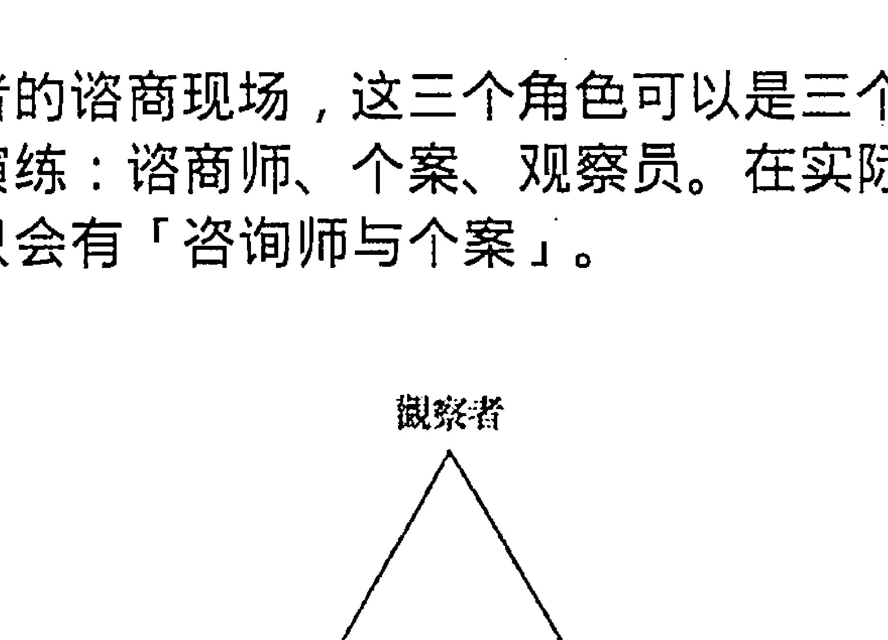

#### 核心概念：厘清问题中的各种假设

#### 提问者出场

在牌卡咨询，或生活日常的互动中，请注意观察自己提问的问句。

观察自己在提问时带着什么样的预设、意图，也就是所谓的立场，或自身的看法与见解。带着某种的立场或看法来提问，表示你心中已经有某种预设了。这个提问可以是开放式问句，也可以是封闭式问句，比如某人今天穿了毛衣、羽绒外套，外加一条围巾，走进屋子里，你问他：「你不热吗？」请问这是什么样的提问？你心中的预设是「现在天气很热，你怎么穿这么多？！」或者看到别人穿得很奇怪的预设是：「我觉得你穿这样怪怪的！」

#### 观察者出场

我们要去观察自己的预设是什么，这其实没有对错好坏之分。先把评价放在旁边，你要观察的是：当你问出这个问题的时候，心中的预设是什么？所以才会问出这个问题。当我们能够这样思考自己的时候，就有更多的觉知，这将会是个有很多机会去突破自己的过程。

#### 带着好奇心，不急着分析，直接现场观察，理解假设背后的意义

#### 提问与观察一起合作

「为什么要问这个问题，我在想什么？我的意图是什么？我的预设是什么？」这是非常有效的自我操练法，也是一种心法，在咨询、咨询、引导别人的过程当中，你会开始觉知自己的起心动念，这样的练习更能应用在生活里，你会带着觉知，清醒地过生活。带着好奇心来提问，而非带着成见来提问。

#### 回应着出场

现在，我们要练习回到此时此刻。

所以先问自己，现在有什么感觉？只回应此时此刻的状态，比如「我感觉......肚子鼓鼓的，我现在感觉肩膀有点紧，有点感觉......想要动一下脖子，同时很想吐气。」

你会发现这段回应，虽然都是当下的反应，但因为我们太习惯分析了，一说到现在有什么样的反应和状态时，会很习惯再加上分析。例如「我觉得左边有点痠痛，左边是阴性的能量，这应该是因为和我妈之间的关系......」。不要让这么多东西跑出来，后面的先停住，只观察此时此刻的自己，先不论是和父母的关系还是童年经验的创伤，先停在此时此刻，因为我们的头脑，或说小我，会用很多方法来阻碍我们，离开此时此刻。「头脑分析」就是一个隔绝我们接触当下自我的阻碍。

#### 回到当下，让问题一个一个自动问出来

#### 金三角并存

我们常容易落入分析之中，忘记也忽略了最重要的是，此时此刻对自己的身体做出观察。身体，是很多人忽略的地方。除了观察身体，进一步会觉察到自身的感觉、感受。接着会开始发现，「嗯，好像有一个念头或想法跑出来」，这是连带的，所以不要忘记此时此刻。当你觉得被一些念头、杂念拉走的时候，只要深呼吸就可以了。那个呼吸会带你回到当下。因此观察者就变得很重要，内在有一个身为观察者的自己，看自己此时此刻发生了什么，看好奇的提问者会怎么提问。观察者会观察两个角色在你的内在对话。

如果观察者发现，心里有一个问题却没有问出来，他的功用就是去看见并指出：「为什么你没有问出来？被什么卡住了？是什么阻止了你的流动？是什么让你觉得不好意思，觉得问这个很笨……」觉察自己内心的阻碍，看看发生了什么。

#### 只观察，不评判

有人会问，在金三角的练习中，会不会有「评判者」的角色？

在练习过程中，不仅「不要邀请评判者参与」，更要练习将脑子里惯性出现的「评判者」角色去除，因为评判会落入好坏二元区分，而我们的头脑已经很习惯去评论和论断。中立的角色主要是观察者，就是在一旁看着，没有价值好坏判断。虽然很难不去评价，但还是要尝试练习，练习久了就会发现自己清明多了。

对于所有的经验来说，经验单纯就是经验而已，都是中性的，只有人的脑袋会去分辨这是好是坏，在做决定的时候，一定会有比较出现。我鼓励大家运用这样的经验，回到单纯、中性和观察的状态，就是纯粹在一旁观看自己的各种经验。这会带来极大的好处，让你不会遗漏许多宝贵的讯息。因为在当事人叙述完状况后，咨询师要是先下判断，可能就会依照咨询师的判断前进，而不会对当事人的经验感到好奇。

这样一来，就会很容易落入快速归类的陷阱，或是放在自己的某个价值判断中。所以无论当事人说了什么，身为解读者、咨询者，要带着中性的立场。我们中性的反应，会反映出我们观察到的，只将我们看到的回应给对方。虽然有一点难，还是可以保持觉知，持续练习。

如果有人这么问：「老师，换作是你，要选哪一个？」我常常被这样问。从前我怎么样都不会说出自己的选择，在谘商专业中，我很坚守不能给予立场的判断这个原则。可是我发现，有些当事人依旧会锲而不舍地不断追问，这时就要换种方法，我会说：「你听看看，如果是我可能会做A选择，因为我觉得A选择比较适合我现在的状态，可是你不是我呀！你可能会做B选择，因为你可能需要稳定工作，但我的情况和你不同。」如果对方非要我说出一个答案让他参考，我会这样分享，但是最后一定让他做出自己的抉择！

#### 自我督导，给出中性反应

中性的反应会在咨商、咨询的过程中，提供观察者的视角，看着你与个案之间的互动，有时候也称作「自我督导视角」。在没有另外一个老师或同学帮忙观察和督导的时候，我们就要训练自己做自我督导，留有一丝清明的目光，会更能觉察在这个过程中发生了什么、个案叙述中的脉络、你给予的反应，以及如何给予回应。

你会懂得观察并思考，在这个过程中，你是否带着中性反应和单纯的回应，还是带入你个人立场的投射。比如，你曾经被劈腿，非常痛恨第三者，遇上个案说他不小心介入别人的感情，成为别人的第三者，你可能会突然暴怒，甚至开始骂个案。这时候要记得启动你的观察者，好好发挥功能：「亲爱的，安静下来，回来！他是你的个案，不是介入你感情的第三者。」并不是说你不能有判断，你有你的个人生活经验，但是在这个情境里面，这么做就不能客观帮上忙了。遇到这种情况，请先终止你们的关系或转介给其他老师。

#### 案例分享

我曾经遇过一个个案，约一个半小时的咨询，一直到最后15分钟准备要收尾了，才说出真正要问的问题。她有一段婚姻，却爱上了另一个也在婚姻中的人，令她很痛苦。她一开始的陈述是：「老师，我想了解我的情感关系。」我问是婚姻吗？因为我知道她结婚有小孩。「老师，我很想了解一下事业、工作，因为工作很不快乐。」之后就开始哭，哭了很久，又谈到老公，一直骂老公，「他都不疼我，都不买房子给我，跪他求他终于买了房子，可是他很气我。」大概过了一个小时，才开始慢慢吐出心底真正想问的问题，「老师，其实我还想了解另外两个男人......」，我回答：「还有另外两个男人？谁？快，我们快要没有时间了，把握时间，妳还想问什么，还有几个男人，统统说出来，我再判断要从哪一个开始！」

她说：「有一个男人让我很想抽牌……」，于是我引导她厘清问题后就抽牌，她一直说牌很准，但我觉得她其实还在观察。

我们一直聊到连老公和另外两个男人都聊完了，最后15分钟她才说：「老师，其实我真正想问的是这个人！」我答道：「你要离婚吗？要跟他在一起吗？他要跟你在一起吗？你们彼此相爱吗？心动了吗？」她才回答：「是！」我告诉她，现在只剩下5分钟，下一次再谈。

有时候，这是一个过程，因为当事人会不断测试你的底线，你可以接受到哪里，可不可以接受他是第三者。

我最后问她，「既然你知道自己一开始就想问这个人，为什么没有这么做？」她说：「我觉得这是很不道德的事，觉得这样的自己很不对。」她和老公相敬如冰，也没发生什么要到离婚程度的事件，我反问，这样还不算要到离婚的程度，那要发生什么事才算要到离婚的程度？

她就非常担心被别人批判，我从她抛出的各种不同的讯息中看到这个状态，我建议她一定要停止自我谴责，无论她最后的决定是什么，但一定要处理内在自己跟自己过不去这一关。接着给她一些鼓励，结束当天的咨询。

回到中性的反应之后，让她自己做决定。

### 九、直觉

什么是直觉？能否用直觉来解读塔罗？你信任自己的直觉吗？

「直、觉」这两个字在字面上：就是「最直接的感觉，直观的感觉感受」。直觉是人类与生俱来的能力，每个人具有直觉，每个人都有和潜意识讯息连结的能力，透过有意识地加以开发、练习并唤醒直觉后，就能顺畅地应用在生活中。

接着要带领大家进入直觉的解牌历程，先介绍另一个金三角架构，这是关于个案本身的金三角。

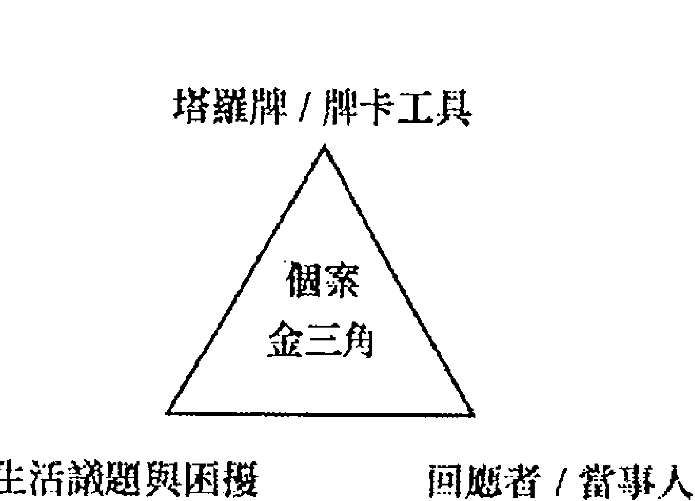

#### 信任直觉，给出串联的解牌

在解读塔罗时，要把个案金三角的三个点再次整合起来，「牌面、他带来的问题、这个人的心情状态」，串联出我们看到的当事人状态。

串联时，相信自己的直觉相当重要。一定要非常信任自己的直觉，有时感觉、感受、画面、念头或想法会不明所以地突然降临，信任这些直觉讯息，以直觉提出问题、提出你的好奇，再进行回应与确认。

这也是许多人在解牌时容易卡住的地方，是攸关解牌功力落在「解得出神入化或只照本宣科看着书唸答案」的重要差异。

在这个过程中，如果能放下「一定要讲对和不敢讲错的自我控制」，就能体验到这股直觉信任之流，带领你前进。

- 当事人抽到的塔罗牌面的讯息、牌义与功课。
- 当事人的生活事件与困境，需要被回应的困扰与议题。
- 当事人本身内在情绪感受等。

我们的角色就是要串联这三者。而解牌顺畅、被客户誉为超神准的咨询师，他的直觉力与串接能力肯定比较流畅。

#### 要怎么分辨是头脑的讯息或直觉？

很多学生喜欢问：我怎么知道冒出来的讯息是不是直觉？

#### 你的经验会告诉你，这是不是正确的直觉。

不用分辨究竟是头脑还是直觉！因为这样就落入头脑的分析了。比较好的方式是回头观察你所得到的经验，看着这个经验发生了什么。

结合牌面上的牌义，加上信任自己的直觉、提出回应，例如面对抽到「权杖国王」的当事人，顺着直觉问：「我刚刚冒出一个感觉，当我听着你说不想要改变……虽然你说面对改变有许多担心和恐惧，觉得稳定就好，但我也直觉感受到，其实你早就想要改变了，你好像已经准备好要起身而行了！」

再举个例，某天你开车的时候，突然很想要右转，那就跟随直觉右转。虽然你家直走就到了，但是右转发现，找很久的店原来就在这条巷子里。这个意外的发现是一个很好的反馈，我认为这就是宇宙给你的回应。跟随直觉采取行动，带来最好的回应，这也是理性头脑无法解释的。

当然，如果你等待的讯息和重大决定有关，就要用直觉搭配理性分析，取得一个最适当的决定。

#### 直觉可以训练吗？

直觉绝对是可以训练的，而且我相信，每个人都有专属于自己的绝佳方式，用来接收与观察直觉讯息。因为每个人接收的方式不一样。有人是会出现画面的视觉型，有人是听觉型。我自己比较偏向身体感觉型，会对身体的反应做出回应，这些都是需要透过经验累积和观察的。去观察，才会找到属于自己的系统，专属于自己的方法。因此，直觉是可以训练的，可以透过自由书写来开启直觉力，这是个训练直觉的绝佳方法。

#### 直觉是潜意识吗？

有些直觉讯息会从潜意识的资料中提取出来，象是灵感、神来一笔，或说出自己也赞叹的金句。

某些在潜意识层面运作的讯息，比如说梦境，就不是直觉，这是潜意识讯息。潜意识讯息，会透过梦境、抽牌卡、催眠、画曼陀罗、无意识的画等传达出来。在催眠状态中，主角会无意识地讲出一个句子，清醒后反而为刚刚说的话惊呼连连，太有智慧平常根本说不出这样的话。或者在催眠状态中，突然愤怒或报复，可能是平常过度压抑。可以透过各种不同的状态观察自己的梦。这些都是可以训练和开发直觉的方法。

#### 直觉有助于解牌

在解读和使用牌卡的过程中，直觉占了最重要的元素。无论牌义背得多好，重点还是信任你的直觉，我一直鼓励学生多尝试解牌，信任自己一定可以，宇宙会让你在最适合的时候说出最需要的话。就算你忘记牌义或是觉得解释不太到位，其实都没有关系，不用那么担心，要先放下担心和恐惧。

我有个学习塔罗的学生，练习帮别人解牌，却发现自己有些牌记不清楚，帮朋友解牌时，感觉怪怪的，可是他只记得我说过的，「一定要信任直觉」。于是，他就看着朋友，凭着自己的直觉解牌，把问题和朋友的心情状态串联起来，最后朋友点头如捣蒜，直呼好准！没想到，回去看讲义和笔记，才发现他弄错了，说成另一张的牌义……他回来继续上课时，就提出这个问题：「老师，遇到这种状况要怎么办？我讲错牌义，可是对方一直觉得好准。」

我常常举这个例子让大家增加信心，这是很好的例子，说错牌义完全不影响你和他之间的互动。因为你信任你的直觉。所以现场的流动已经疗愈了这位朋友的心，安抚了他的心情，塔罗牌变得不是重点，因为你愿意信任自己的心，产生很棒的直觉，才会和这个人心对心产生交流。所以，我常常鼓励学生可以这样练习，你会发现一旦这样做，你对塔罗的解读会愈来愈好。因为你不再执着于牌义的答案，而能更专注在面前的这个人。

### 十、准备与使用工具

#### 准备好自己

首先，在每一次开始解读前，都要先将自己准备好，静心片刻，让自己的身心状态、能量与频率都稳定下来，同时也在静心时清理令自己烦乱的琐事，以提供当事人稳定的引导，在解读塔罗时能有清明的洞见。

第二，信任直觉、带着好奇心，陪伴当事人一同探索这趟解牌的旅程。放下先入为主的投射与成见，愿意跟随着彼此的流动，观察当场的发生，关注人这个主角。

第三，给予肯定，「潜意识会在你需要的时候，给你最需要看见的讯息。」因此，发生有其必然，信任会发生的必有其存在的意义。

#### 准备塔罗专用道具

- 一、牌卡专用布，可以选择自己喜欢的颜色或图案。若选择有图案的布，图案也要尽可能单纯，不要太花稍，否则牌展开时，牌面图案会被弱化，无法凸显牌面和主题。我推荐使用生命之花图案的桌布，生命之花代表万物的起源，是非常有力量的图腾。
- 二、牌卡束口袋或盒子，用来收纳并保存牌卡。我们常会选用塔罗布袋当成牌卡的家，轻巧好携带，把牌卡放入袋中也可以避免与随身物品互相碰撞磨损。在自己的工作室中，可以把不需要随身携带的牌卡，选用美丽的盒子来存放与收藏。

#### 蜡烛

在桌上放一个烛火就好，用美丽的烛杯装饰，避免不小心碰触或被风吹熄。摆放的位置，可以选择放在左手边或右手边，这是从解读者的方向来看。以「左进、右出」的原则，如果个案极度困扰或有身心疾病，你不希望被干扰或被负能量缠身，这时烛火就要放在左手边。当他在叙述困扰的时候，从左边进入会经过火的净化，所以讯息经过了第一层的清理。而放右边是因为「给予」，我希望给予的讯息是充满光明、被净化过的讯息。左边是接收，右边是给予，我通常会将烛火放在右手边。蜡烛是自然光，这是最好的，火焰与光明都很有力量，可以净化一切。

#### 水晶球

桌上放上水晶球，是为了在解读过程中连结水晶的智慧。水晶球比水晶柱适合，因为球代表圆满，我们希望给予的讯息和能量都是圆满的。球体是没有方向的，是所有方向的扩展，我们也希望给予的讯息是不受限的。

水晶球挑自己喜欢的就好。要人缘好、增加爱的质量，可以用粉水晶球；要纯净、净化的质量，就挑白水晶球，白色也是七彩的总和，相当万用；要给予智慧、充满觉知的，就可以挑紫水晶球；要招财，增加丰盛能量，可以选用黄水晶球。

#### 保护灵气，空间喷雾

我最常用Aura-Soma系列来做自身净化、带个案净化，以及空间净化。

个案咨询时，给出新的空间，也给出彼此的界线予空间，就用绿色。

当个案谈的是情感困扰，和爱的能量有关，希望能带给他更多爱的支持与滋养，就用粉红色。

如果需要更有力量、更落地，就用红色。发现当事人一直卡在想法，没有行动力的落实与突破，也可以用红色，会协助他扎根，更有行动力，与目前的生活更紧密连结。

如果需要更多自信、信心、力量，可以用黄色或金黄色，这也是招财的颜色。当一个人对自己更有信心、更坚定，有了勇气，自然财运就会好。

如果你单纯希望自己的解读可以更顺畅、有创意，可以用蓝绿色。我也偏好蓝绿色，因为这连结了亚特兰提斯的能量。在地球文明中，亚特兰提斯是非常喜欢使用牌卡和水晶的文明，也是高度开放的文明。在脉轮系统中，蓝绿色就位在第四和第五脉轮的中间，这是一个跟着心来表达的讯息，也是我偏爱蓝绿色的原因。

保护灵气是作用在人，空间喷雾是作用在空间。如果你有需要开启服务的空间，可以使用空间喷雾。

#### 敲钵

敲钵的声音也可以净化空间，顺着逆时针在四个方位各敲一下。如果遇到不适合点香的地方，可以使用钵或空间喷雾。净化是逆时针，但如果要打开一个空间，就用顺时针。可以先逆后顺。如果能使用精油，水氧机也很好。

#### 圣木与线香

如果需要用火净化，可以烧圣木，味道非常好又不会产生太大量的烟。

Aura-Soma的线香也是很好的选择，可以依照需要的质量来选择线香。

如果点了线香还需要更大的净化，很多人会选择烧白色鼠尾草，点燃的时候并不会一整把地烧，而是让它缓缓燃烧，净化自己、个案和空间。鼠尾草会慢慢熄掉，或当你觉得差不多了，直接压熄也可以。

记得开窗、开门，让烟雾带着被净化的能量流出去。

#### 四安生活的能量炉与盘香

我常使用四安生活的浴粉，用来拖地、净化任何空间与教室的地板，也可泡脚或泡澡，让全身的秽气经由脚底的涌泉穴排出。

### 十一、开牌仪式

拿到一套全新牌卡时，打开包装后的第一个动作，就是先清点卡片张数。

通常包装说明都会写清楚这一套卡内共有几张牌，看着牌面依序一张一张清点，就像在盖手印一样，向每一张牌打招呼。欣赏每张牌的牌面，也欣赏一下牌背。

塔罗牌基本上都是78张，但依据系统不同，有的是79张或80张。仔细确认这78张是否包括22张主牌和56张副牌，确认每一张牌都是正确的。如果牌卡缺少或损坏，一定要和购买的店家更换。确认牌卡张数正确后就可以进行开牌。

#### 开牌

在使用一副塔罗牌之前，可以替自己抽一张牌，代表了这套牌「最能够在哪些议题中帮助自己，及来到面前的抽卡者」，无论对你或别人，抽出来的这张牌，最有帮助的部分是什么？

进行开牌的仪式，是希望透过这张牌可以了解，这套工具最能在哪个层面帮上我或他人的忙。在什么主题、状况和议题上，这副牌最能够帮上忙。

##### 开牌示范

点上一个蜡烛，深呼吸几次，保持平静。

如果有水晶可以放在旁边，帮助增加清晰与智慧的能量。

开牌问句：这套塔罗牌的基本个性是什么，最能够对什么主题或情境产生助益？

###### 示范：宝剑2

这张牌的牌义是去除外在的干扰，主角在海边练剑，象征去除外界的干扰，回到内心，厘清内在真正的想法，所以特别能在不太清楚自己要什么的时候带来帮助。这副塔罗可以协助我厘清内在真正想要的选择和想法，对于来到你面前的人，也可以透过塔罗牌来协助对方，去除外界的影响和干扰，不为所动，回到自己的内心，做出真正属于自己的选择或决定。

###### 示范：审判牌

你可能会常常吸引到那种面临最后关头的人，象是紧急出任务的救火队。来找你的人比较倾向面临关键时刻型的，而你可以在最后关头帮他一把，甚至给他一个做决定的动力。

###### 示范：力量牌

想要自我突破的人会来找你，可以协助他如何借力使力，活出优雅。在轻松不费力的状态下，寻找资源，设定目标并投入。

###### 示范：星星牌

想要寻求指引的人会来找你，透过塔罗的解读和咨询的过程中，可以更厘清自己想要的目标和方向。

###### 示范：节制牌

这副牌可以协助当事人放下小心翼翼和过度紧张的焦虑。经由咨询塔罗的过程，可以让他重新展翅高飞、重新展现天使的力量。这副牌擅长调和情绪，牌面上的水会调节感受，让情绪不致失控。

###### 示范：恋人牌

这副牌能帮助对方找回对自己的爱，在爱的课题中找回自己的力量。他要学习的课题是爱自己，所以你协助对方看见这个讯息，或许他在关系中失去很多的自我，或许是过于关注他人，藉由这副牌，特别能协助他回头看见自己的需要，多照顾自己。

###### 示范：月亮牌

可以帮助对于未来、未知恐惧的人，让他们更有力量，接纳恐惧，勇往直前。

###### 示范：太阳牌

这副牌特别能揭露真相，有些隐藏的事会显现出来。你就是这颗太阳，在你面前就象是在太阳面前，会被清楚看见。所以你也是一个可以直接照见真相的人。

###### 示范：教皇

透过你的引导，可以协助他人整合自己，让内外的矛盾更趋近一致。这个代表你非常具有说服力，所以你的塔罗牌一发声，就象是教皇在发话，会让对方心甘情愿信服。

##### 示范：战车

7号牌偏向研究方面，因为数字7象征研究，并且信任自己生命直觉的选择，因此也鼓励对方可以采取行动，不必想太多，透过行动的过程，会更清楚自己要的是什么。7号牌的功课就是信任，回到信任里，透过你的引导与塔罗牌的讯息，可以带来很多幸运和好事，这正是7号牌的力量。

##### 示范：正义牌

协助对方看见自己，正在衡量、考量的点是什么、在乎的是什么，对方觉得这样足够平衡、公平吗？这张牌是法官，特别带出的重要信念是：我相信什么，我就用那样的标准来判断。所以这张牌也和「活出你所相信的」有关。如果他用某个标准要求别人，自己却没有做到，就会变成内外不一致的法官。所以法官这张牌很重视你内心的信念是什么，你要展现并实践的信念是什么，这样进行裁决才会有力量。天秤上放的砝码是他内心的标准，若能落实，会让他更能平衡，落实生命中、生活里的平衡。

在这一章中，我们把自己、道具、空间，全都妥善准备好了！

接下来，跟着我的指引，一起进入塔罗美丽的世吧！

1. 十九世纪的神秘学家埃利法·勒维（Eliphas Levi）将塔罗牌与古犹太密教卡巴拉（cabala）联系在一起。他找出希伯来文22个字母与塔罗牌的对应，以及卡巴拉教义中的「生命之树」（Life of Tree）中22条途径与塔罗牌的对应。

## 黄金黎明协会

黄金黎明协会（Hermetic Order of the Golden Dawn），又称赫密斯派黄金黎明协会、金色曙光协会，是1888年在伦敦由一群神秘主义人士所建立的秘密组织。他们将塔罗牌、占星术、卡巴拉密宗结合在一起，在西方神秘学中占有着重要地位。

# 第三章 生命需要燃烧

大阿尔克那0-9

## Numerology 生命灵数

### 今生的灵魂功课与人生方向

生命灵数（Numerology）源自古希腊哲学家、音乐家、数学家、勾股定理的创始人毕达哥拉斯（Pythagoras，580~500-BC），他相信每个数字从1到9都有形而上的特殊意义：「数字具有精神上的意义，可以揭露万事万物背后的真理。」毕氏相信人生就是学习，而轮回也是存在的，如果人清楚了解他在这一世努力的方向，那么藉由每世不同的数字，我们便学习了人所该学到的所有课程。

你可以运用数字的能量来认识自己与他人、面对爱情、教育孩子，把数字的能量运用在日常生活里，帮助自己活得更健康，认识自我，并发挥潜能。人生的目的无他，就是「学习」，让你看见自己的独特，调整自己的弱点，这个追求成长的学习过程将会启发你用全新的眼光看待人生，掌握未来。「未来」不是一齣无法更改的戏码，只要我们知道是哪些力量在发生作用，人生就能过得更好！

利用简单的生日计算，就能找出一个人的性格特质、天赋才华，以及学习的课题。

### 计算生命灵数

计算诞生在公元1976年5月8日的生命灵数。

-   步骤一：把阳历生日「公元年月日」共八位数字列出来。
    例：公元1976年5月8日生日的就是「19760508」。
-   步骤二：一个一个数字「个别相加」得到一个总数。
    例：1+9+7+6+0+5+0+8=36。
    在此步骤加总后若是「个位数」，就完成了。
    在此步骤加总后若是「双位数」，就继续往步骤三前进。
-   步骤三：加总后的两位数字继续「个别相加」，加到剩下「个位数」为止。
    例：3+6=9。
-   步骤四：在步骤二或三算出的个位数，就是你的生命数字，在塔罗主牌的部分可以找到相对应的主牌。
    例：9号人就查找隐者牌。
    承上，完整的数字列呈现方式是：19760508 = 36/9

### 数字列的意义

最后一个数字，就是我们的「主要人格」，也是生命学习中最重要的课题，完成这一生毕业任务的指标。

在最后一个数字之前「所有出现的数字」都是我们的「次要人格」，包含两部分：

-   一、生日八位数字，代表了天生带来的配备，也就是先天数。
-   二、在等号后方的数字，象征了后天学习与锻炼的部分，也就是后天数。

### 数字九宫格

列出上列计算中「每一个步骤出现过的所有数字」，包含0。以画正字的方式写在下方表格中，以「19760508=36=9」示范。

| 1 (一) | 2 | 3 (一) |
|--------|---|--------|
| 4 | 5 (一) | 6 (丅) |
| 7 (一) | 8 (一) | 9 (丅) |
| 0 (丅) | | |

### 九宫格观看小技巧：

-   一、只要是出现在格子中的数字，都与你有关。这些数字牌的能量你都拥有。
-   二、红色是先天数，蓝色是后天数，绿色是生命数字。
-   三、有出现的数字是你要学习的功课；没有出现的数字，是你不容易遭到困扰的课题。出现的数字多寡并无好坏之分，因为这是每个独特灵魂的选择，选择不同的数字配备来进行这一生的修炼。

### 空白表格可以填入自己的生命数字

| 1 | 2 | 3 |
|---|---|---|
| 4 | 5 | 6 |
| 7 | 8 | 9 |
| 0 |   |   |

### 流年应用

「流年」生命数字显示了当事人在该年度的成长、契机、扩展和面临的挑战。知道自己在这一整年当中的最佳优势能量，探索每一年的生命本质与挑战，好让我们对接踵而来的课题做出最适当的回应。

现在的流年数字，从生日当天开始算，为接下来的一整年定调。

步骤：把年份加上生日的日期八位数字列出来，并直接加总计算。

以5月8日出生的人为示范：

-   20190508 = 25/7
-   20200508 = 17/8
-   20210508 = 18/9
-   20220508 = 19/10/1

从2019年5月8日开始，就走7号数字流年，也就是战车牌的一年，学习战车牌的生命功课。一直到2020年5月8日开始，切换新的生日流年数字，变成数字8，就是力量牌的一年，以此类推，8号力量牌走完的隔年就是走9号隐者牌，再隔年就是数字1魔术师，全新的开始。

## The Fool 愚者 0

你心中渴望朝某个方向发展吗？不必担心，勇往直前！毋须担忧旁人的眼光及声音，跟随着自己单纯的初衷，轻松大步向前，给自己一趟新旅程吧！

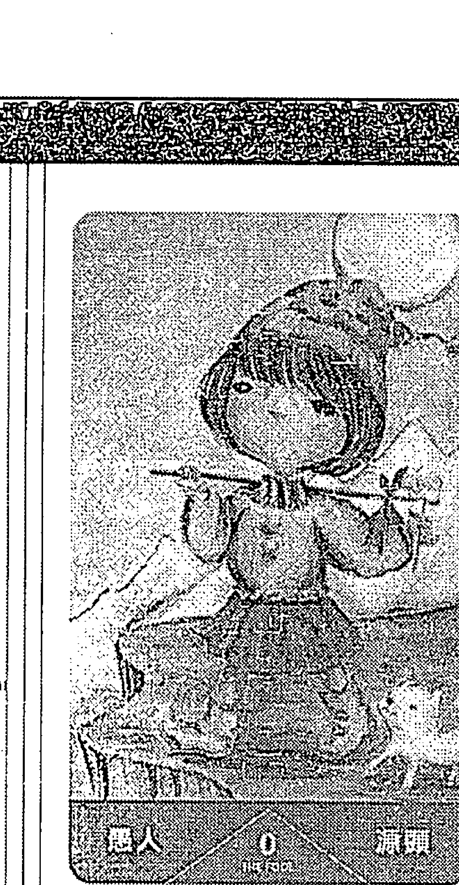

从0号牌开始，我们跟著愚者一起旅行、流浪，寻找方向，趟上全新探索的旅程，一个新的开始。

请看着愚者这张牌，如果你是他，会有什么样的感觉？你在牌面上看到了什么？有点自我陶醉、悠哉悠哉、想干嘛就干嘛。他走在悬崖边，有点危险，而旁边的狗好像在提醒他。狗看起来象是陪伴者、提醒者。手上的白玫瑰象征了单纯，是种很纯净的、最原始的浪漫。

0这个数字很有趣，是一切的开头，象是草创阶段。但0不是1，又还没真正开始，所以我们称这张牌为：源头、起源的力量。就是最原初的状态。

他手上带着行李，这个行李、包包看起来很轻。为什么从这张牌开始呢？塔罗的主牌是生命当中必经的课题、人生当中必经的课题。如果说78张塔罗是一个生命故事的开展，我们就是要跟着愚者一起去旅行。这是一趟轻装旅行，带着浪漫的心、浪漫的情怀，回到最单纯的、最初衷的状态。

抽到这张牌，同时也在提醒我们，有些事是不是忘了初衷？也可以去观察自己，原本想做这件事情最单纯的心意，现在却有一点模糊了，再次提醒自己回到本心，回到最原初的状态。就算别人都笑我们傻、笑我们笨得可以，我们还是想要这样做。因为这张牌真的是傻瓜—愚者。

或许会有人跟你说：「你知不知道这样很危险呀！？」「你知不知道事情要多想？」「更谨慎点，你都不知道自己站在悬崖上吗？」对于愚者来说，他是清楚知道自己在做什么，才做出选择的。他不是真的笨，这个叫大智若愚。

再回到生命灵数，当中有0的人，会带有一股傻劲，好像少一根筋似的。0愈多，就愈容易带有傻呼呼的特质，性格也愈单纯。如果没有0，会比较正经一点。在0号的数字里面，因为是愚者，也代表在他的生命经验里，有时候会让身旁的人捏一把冷汗，所以牌中的狗象征了身旁的人。不是父母就是老师，通常都是提醒他们的人，可以说是阻碍，也可能是贵人。

就像2000年后出生的小孩就带有很多0。你会发现他们天不怕地不怕，而且好像对他们来说，没什么是困难的，甚至会让你觉得，就好像天公疼憨人，很多事情愈不担心，就愈容易成功。

如果生命灵数是落在20/2、30/3、40/4、50/5这种组合的人，都多了一个0的特质，0的特质就是把事情单纯化、并且放大前面数字的元素能量。比如说40/4，就是在所有的4号人里面最典型的4号人，0的能量会放大4的特性，并且更纯粹。40/4会比22/4、13/4或31/4的人，更像典型的4号人。（1号人一定是10/1，所以1号人没有谁比较典型的分别。）

### 0的流年

因为数字加总后不会出现0，因此流年没有0。

### 0的课题

关键字：傻人有傻福、不必担心旁人的眼光、不用太急着出发。

留意过程中可能会有的挑战，同时也会有贵人相助，化险为夷。

愚者是不畏惧的，面对阳光、充满希望，初衷很单纯，随时都可以出发上路。因此，这也是想太多的现代人必须要学习的课题。抽到这张牌，带有非常大提醒的意味，提醒自己回到初衷，把很多复杂的事物、沉重的包袱、制约的框架等都慢慢放掉。

### 引导提问

在这个状况里，会不会是你担心过多？或许是包袱太重，太在乎旁人眼光？

身边的亲友给予的提醒，究竟是贵人还是阻碍？

如果你回归初心、放手一搏、勇敢前进，会怎么样呢？

### 示范引导

> **当事人**：我正在考虑要不要去做某事……如果真的采取行动，不知道会怎么样？

**引导者**：你抽到的是0号愚者牌，看一下牌面，你看到了什么？如果你是他，会有什么感觉？

**当事人**：我觉得很开心、满足、轻松，但是快要走到悬崖边了！……啊！狗狗好像是来提醒我的！

**引导者**：所以会有人帮你踩刹车。你想要这样做，可以踏上旅程去探险，中间可能会遇到贵人。或是你现在看见了，自己可以来做自己内心善良的狗，提醒自己何时要知道适可而止！给自己一个旅程，放心出发去吧！

## The Magician 魔术师 1

你拥有轻松创造一切的能力！你只需要回到自己的心中，相信自己就是人生的创造者，神奇之道就会开展。

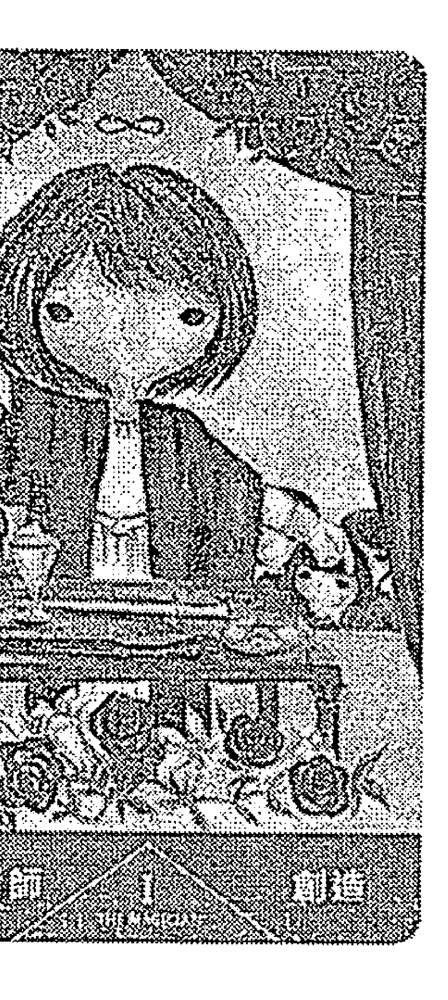

我们生命中第一个要学习的课题，就是「以光创造」，带着光，在生活中创造！

数字1就象是创世第一天，「要有光！」光就出现了！因此，1号牌魔术师代表了光、代表阳性力量的开展，从牌面上可以看到他手里拿着魔法棒，一手指天、一手指地。你可以把手举起来试试，不管现在手上拿什么，这个动作让你有什么感觉？感觉一下，现在是否想要讲什么，或许是一句口号？

魔术师是个将万能的力量统统汇聚在身上的重要人物。他的头顶上有一个无限大的符号，代表了所有的力量都是从这里开始，并且是无穷无尽的。可以看到在他的桌上，钱币、圣杯、权杖、宝剑等所有法宝一应俱全[1]，四大元素地水火风，统统都有。象征着掌握了资源与权力，这些全都可以任他使用，他想玩什么样的花招、变换不同的把戏都可以。他身穿红袍，也代表着一种力量，天时地利人和都具备。因为他连结到的就是1，1这个数字本身就是从无到有，从0到1的过程。所以1号人很有创造力，也具备开创的力量。

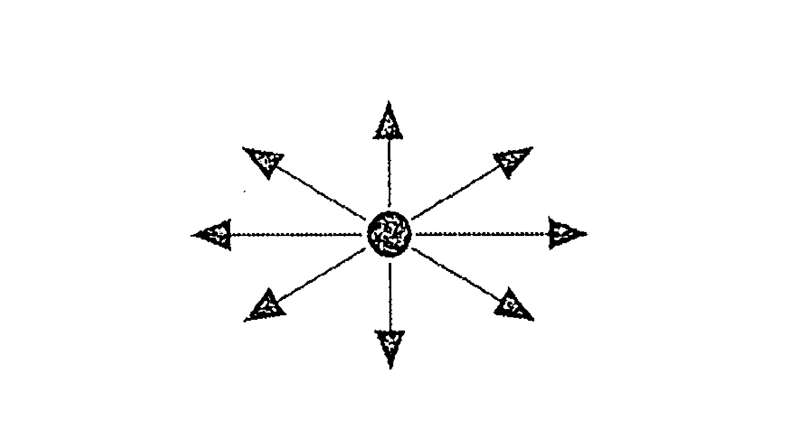

牌面上的天与地周围都有鲜花环绕，表示这是魔术师的舞台，所以他不会躲在幕后变魔术，绝对会站在舞台前表演给别人看。这象征了魔术师或是1号人，或是九宫格中数字1很多、1特质很强[2]的人，很需要拥有可以展现自己的舞台，但不见得是按照字面上说的要登台作秀，而是在专业发展或领域中，可以尽情创造或创作。可以想象一张空白的白纸，中间点了一个点，会成为吸引所有目光的焦点、汇聚中心。这个聚焦点，不带任何方向性，散发着无穷无尽的力量，呼应了无限符号的来由。

如果所有能量都能维持住，那就会很好，如果过与不及、太多或太少，都会失衡。如果1号人的力量太过会如何？整片空白只有他这一点，这点如果太大会如何？他会很自我。优点是很有创造力、很独立、能够开创一些新的事物。他很需要舞台。缺点是旁人可能会觉得他很自我中心，目中无人，掌控欲很强，因为他觉得整个世界、整个舞台只能有他，一切都该在他的掌握之中。

站在舞台上的魔术师，或是1号人，需要些什么呢？他需要掌声，他需要观众，他需要舞台，他需要别人拍手叫好。但没得到这些，1号人会很失落。所以面对1号人的最佳策略，就是赞美他！

### 1的流年

走到1号流年的时候，要好好把握这一年的创造力，也代表一个非常好的开始。想象一下，走到1号年，表示你才刚走完一个旧的循环，前一个九年才刚过。这代表一个全新周期黄金九年正要开始。每九年我们就会经历一个循环，所以很多人会在1号年特别想要做些什么。感受到自己想要动起来，在过去一直都可以忍受的事情，进入1号年的时候，会突然变得不能忍受，很想起身改变，象是搬家、换工作、事业的创新等。建议可以在1号年来临前的9号年事先好好规划与酝酿一番，到了1号年就能有个全新的调整。

我曾参与一个录像节目，在化妆间准备时，认识一个自己创业的美容美发设计师，他跟朋友一起开了个小工作室。他在9号流年的时候创业，生意并不太好，但一过生日之后，也就是走到1号流年，生意就开始有起色，客户一直找他、邀约也愈来愈多，因此当我跟他聊到这个话题时，他才恍然大悟、一直说我教的这个数字系统真的很准！

我们的生日流年能量会和内在的频率互相呼应。这位设计师在创业初期，曾经怀疑、困惑，不晓得自己是否做错决定，可是过了生日，进入1号年后，所有的事情都有新的开展。所以在9号隐者年，我建议暂且不要做出太重大的决定跟改变，可以酝酿与规划，等到1号年再付诸行动，新的工作与人脉都会倾巢而出。

### 1的课题

关键字：主动创造、关注他人

1号人是领袖人物，他的课题，除了要发挥创造力、找到可以发挥的舞台之外，再来要就是，多观察与关心自己所在的环境以及身边人的感受和需要，多分点目光给别人。

我发现不少1号人的伴侣都很苦恼，因为1号人太独立了。分享一个案例，有位1号太太非常独立，照顾小孩打点家里大小事都一把罩，她先生虽然觉得很轻松，似乎只要专心工作就好，但心里也会有股失落感，觉得自己不被需要，有时候会希望太太什么都不会，软弱一点也无所谓。1号人很独立，但独立是一种能力，其实要不要表现这么独立的一面，是可以切换频道的。她自己爬高换灯泡，一点都不困难，但也可以选择请先生帮忙换；这种做法其实较能在关系中找到平衡之道。

在深层的信念系统层次，1号人常常觉得有伴侣是比较麻烦的，许多1号人都觉得自由自在的生活太好过了，根本不需要找一个人来绑住自己，不要进入关系也无所谓。这样的1号信念频率，会容易让自己孤寡，即便进入关系中，也感觉象是独行侠。

### 引导提问

-   你想要创造什么？想要掌握什么？
-   你的舞台在哪里？你最想发挥的舞台在哪个领域？你的观众在哪里？
-   如果这是新的开始，你会有什么感觉、什么想法？

### 示范引导

**当事人**：我想要进行一个计划，想问一下有什么要提醒的吗？

**引导者**：魔术师这张牌，表示这个状况天时地利人和，代表你的内心已经准备好了，非常适合去做这件事。你刚刚这样问，是不是有什么担心呢？

**当事人**：是的，就是不知道是否会做得好、是否顺利、是否会依照自己所想的进展？

**引导者**：确实一开始可能会比较焦虑，毕竟没有做过，这也是你抽到1号牌的原因。我相信，找到你可以运用的资源，好好发挥这些你拿到的元素，就能创造无限大的可能性！

-   1. 这同时也是小阿尔克那的四项组成要素，分别对应地水火风四大元素。
-   2. 你的数字特质倾向，要视自己某个数字的多寡而定，看自己的格子里面的各个数字，不需跟他人相比。但要是某个数字有四或五个，就算是多的，因为出生年月日总共就八个数字，如果再加上后面几个，而当中有四、五个数字都是同样的，对你来说，那个数字一定是比较强的！象是1号人，如果又带着五个1，其实他就带有非常强烈的创造性特质。

## The High Priestess 女祭司 2

生命中的一切，不必然都要以对错好坏区分，而你的痛苦正是诞生自这二元区别中。现在，试着放下理性的批判，多些弹性及接纳灰色地带，允许更多可能性流入！

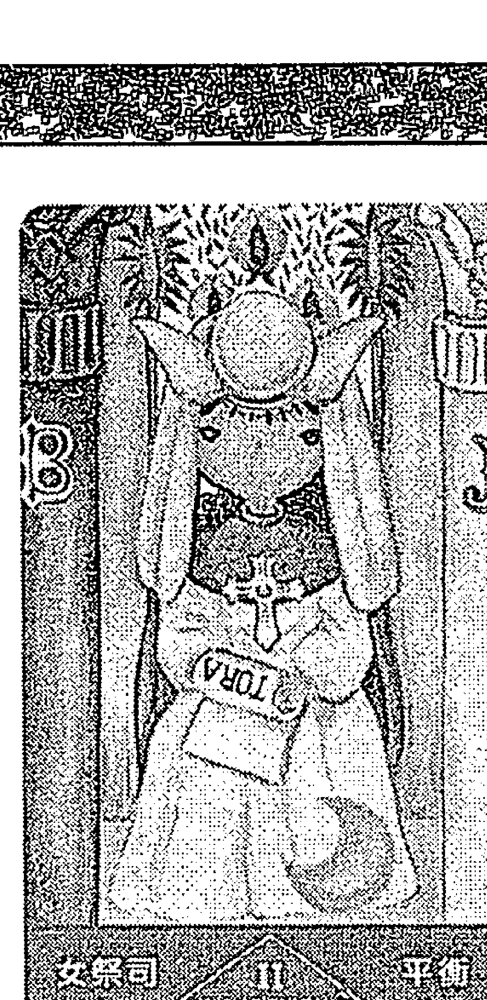

我们生命中第二个要学习的课题，就是平衡，在连结之中能够放掉对立、放下二元，进而放过自己。

如果画面中有一个点，是数字1创造了一切，现在一点变成两点，那就到了数字2。本来是空白，变成一点是无中生有与创造，如果你是公司的主管或老板，要开展一家新店，可以找1号人帮你拓展新点、担任店长，拓展业绩。现在出现了两个点，这就是2号，开始出现左右、黑白、是非、对错，二元的现象出现了。看到两个点，我们会想要拉成一条线，把它们连起来。2号人具有做连结、沟通与协调者的能力。协调事物，达到更好的沟通运作与连结，这是数字2很重要的特点。但这个两个点，会产生前面提到的二元对立，看看2号女祭司这张牌，黑白的两根柱子，代表了卡巴拉的严厉之柱（黑）及慈悲之柱（白），神殿前的女祭司，左右的黑白代表是非对错。后面的布景是石榴，代表女性丰收的特质，比如石榴石就是对女性的特质非常好的一种水晶。因为石榴代表了丰盛，也是让女性贺尔蒙、子宫卵巢的生殖系统丰盛的代表。

2号这张牌是女祭司，英文名中还加了高（high），完整来说应该是高等女祭司。高等女祭司的权位相当高，在某些权力集中的国家，她协助君王何时该祭祀、看天象观星相、解读目前的异状，何时适合出征等，类似国师的角色。而且她是个非常灵性的角色，掌管与神灵的沟通，以月亮做为代表。

可以说数字2统合了阴阳，具备了中性的特质。我见过的2号男性都有些女性化，在我的经验还没见过很阳刚的2号男。他们或许会对灵性和内在的成长有兴趣，女祭司本身就是在做阴性和能量工作的人。如果是2号女性，你会发现她内在有一种阳刚。

女祭司手上拿的是卷轴，上有「TORA」字样，意为「神圣律法」。她掌握智慧之书，将观察到的现象记录下来呈给国王。因此对女祭司来说，记录、文字工作是种天赋，这对她来说是重要的。如果是不擅长文字工作的2号人，可以多鼓励他往这个方向去，让天赋发挥。也可以说这是他的本能，我碰过满多2号人，都对于写文章、经营部落格等很在行。

女祭司也可以连结到月亮女神，在牌面上可以看到好几个月亮符号，脚边有一个弯月，头顶上有一个满月，双脚也是两个月亮组成的。月亮代表了阴性能量跟内心情绪层面。你会发现整张牌充满了阴性的特质和水元素。

### 阴阳两股力量

从愚者的0号混沌能量开始，出现1号魔术师的阳性力量、2号女祭司的阴性力量。从牌面上你会发现两张牌的颜色背景迥异魔术师要站在舞台上、是领导者、主动创造的，是要公开的，被肯定被赞赏的；2号比较象是幕后的角色，是幕僚、军师，协调者。

前面讲到月亮，月亮主管的是情绪，所以2号人的情绪非常敏感，相当细腻敏锐。我有个塔罗学生，她一直觉得老公不好，整个课程都在疗愈她和老公的关系，后来发现她老公是2号人，她觉得老公超木讷、超理性，都没有感觉，我就说不可能，2号人一定有很多感觉。后来，她老公来谘商，她坐在旁边听她老公第一句话就掉眼泪了。后来我告诉这位学生，2号人就是这样，不可以再用自己的眼光看待他了，他感受丰富，只是没有说出来。2号男生很细腻，他不是没有感觉，只是没有表现出来而已。

2号女祭司特质中的黑白是非对错，2号人做决定的时候，容易选择困难，需要思考很久。二元的对立，让他产生一种孰是孰非，以及「想要分辨清楚」的执着，想要打破砂锅问到底，究竟哪个才是对的。非问出一个所以然不可。坦白说，2号人的批判性满强的，关于对错，他的观点强烈，无论是批判自己或别人，在二元对立的过程中，他会很想找到一个答案。两个点会让他很想选一边站，所以千万不要跟2号人讨论宗教和政治话题，没完没了，特别是你立场不同时，真的很难有交集；如果你和他同一个鼻孔出气，你们会超麻他会觉得找到知音。有时候你若发现自己和2号人站在不同边的话，就不要一直争论，因为2号人很清楚自己的是非黑白对错。

### 2的课题

关键字：有弹性、接受模糊不确定

2号人的黑白二元鲜明，在错误发生时，会表现出强烈的批判，批判自己与批判他人一点都不客气。首先，要学习的就是停止自我批判、不要再骂自己了！别让自己只是停留在懊悔与遗憾的愧疚感中。

他必须要学习的就是在黑白当中找到模糊和不确定性，要能接受和面对不确定感、模糊、灰色地带。但这也是最困难的地方，他就是没有办法忍受灰色地带，所以才要学习有弹性。偷偷告诉你，对2号人来说，最后的答案你有没有骗他，可能不是那么重要，他只是要知道一个答案而已。2和7不一样，虽然他们是同一组的，7号人就一定要知道真实的答案。我和2号人相处的经验是，你只要说得出，他就能接受那个答案。比如说他问你昨天晚上到底去哪里，你只要说得出答案他就会接受，因为他会觉得你骗你是你的事。因为他只是在两点当中，需要人告诉他到底左还是右，男还是女。不过如果是生命灵数2和7都很强的人，就骗不了他，他会既敏感又需要真相。对这样的人来说，生命只有一种状态就是：需要知道是真相，所以会花很多时间在研究上。

1号人无法忍受没有舞台和掌声，没有被看见。那2号人最没办法忍受的是没有答案、模糊不确定，如果2号人要帮你买午餐，别说「随便、都可以」。他就是无法做决定，才要问别人，随便都可以这种答案会令他发疯，他真的会疯掉。他只是要一个简单的答案。2号人其实是很简单的，只要告诉他黑或白就好了！

### 2的流年

如果走到2号流年，其实会有一些决定要做喔！因为就会有相对应的考验事件来让你真正要做出选择。很多人在2号那一年面临抉择，特别是二择一的选择，包含了选边站、自己选择要怎么想这件事。

### 引导提问

- 你想要做什么决定吗？你心中的考量是什么？有弹性区间吗？还是只能有一个答案？
- 在这件事情中，你信任内在的灵感吗？你觉得内在智慧带来什么引导？
- 如果这件事有需要沟通协调的部分，那会是什么？

### 示范引导

当事人：我与合作伙伴的关系让我很生气，我想知道是否还要继续合作？

引导者：抽到女祭司这张牌，代表了你想要在内在找到一个答案，答案不在外面，而是在你的心，你要先搞定自己怎么想，就能找到一个感觉平衡的位置去理解这件事。你想和对方继续合作吗？

当事人：其实是想继续合作的，所以我只要去想，怎么想这件事可以让自己觉得平衡？

引导者：是的，继续合作，需要更好的沟通协调，这是你要学习的课题。找到可以继续合作的理由，就能够在彼此的关系中更靠近。祝福你。给自己一个旅程，放心出发去吧！

## The Empress
皇后
3

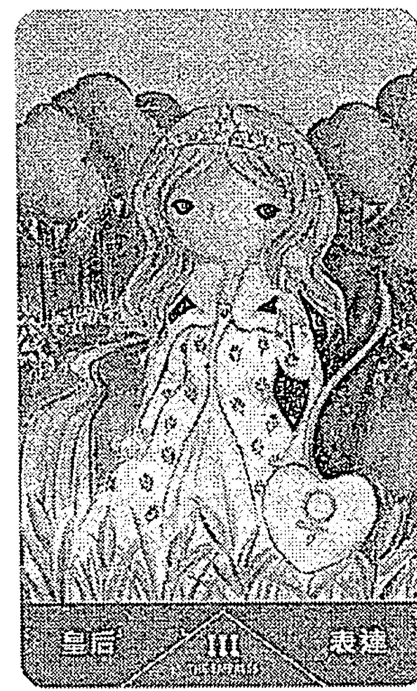

生命中有太多事情要符合别人的期待，深怕自己表现不如他人心意。因此我们会惯性地委屈自己，也不愿表达，只因为在乎别人的眼光。现在，试着让生命中的决定与行动以让自己舒服为标准，开始调整改变吧！

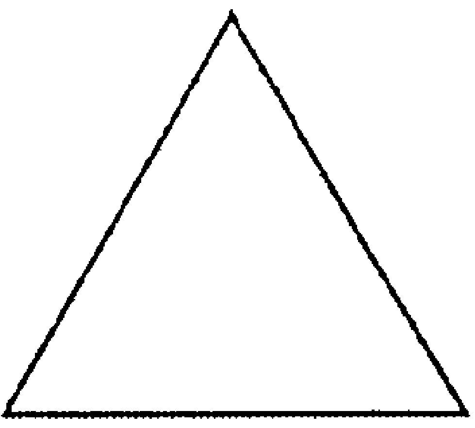

我们生命中第三个要学习的课题，就是表达自我，改变的新力量。

3号皇后、女皇，也是大地母亲的代表、母亲的原型，也是照顾者、孕育者的能量，这张牌的关键字就是舒服、表达、丰收、丰盛。从数字2变成3，一条线连结第三个点，会变成什么？你会发现无论这个点出现在哪里，都可以连成三角形，形成任意的三角形。三角形有很多变化，代表了创新和变动。所以我们跟着愚者出发展开轻装旅行，1是新的开始，开创了新事物后，走到2要做出选择，做选择了之后就有所调整，而走到3，就有创新的改变。

在3号的皇后牌面上，你会看到享受、舒服。3号牌的象征是金星，就是维纳斯，代表了爱与美的女神特质。这张牌的原型特质是母亲，也是大地之母的原型，而牌面上有稻穗，象征整个大地丰饶、欣欣向荣，代表孕育万物的力量。皇后令人感到舒服、美丽、雍容华贵，这些都是3的特质。整体来说，就是种很舒服的状态，因此3号人最无法忍受的就是不舒服。78张牌里只有3号皇后的椅子上有抱枕，她就是要舒舒服服的，这种舒服包括在别人眼中，都是很美的。

### 3的课题

关键字：表达、无法忍受不舒服

为什么3号人要让别人觉得他的状态很好、很舒服呢？其实他非常在意别人的眼光，很在意别人怎么看他，因此会尽量让展现出自己最好的状态。他会把心藏在椅子下面，有些他觉得不太对劲的事会藏起来，就是所谓的报喜不报忧。让他不舒服、痛苦或难过的事，不见得会说出口。做得很好的地方会宣之于口，做错的地方则想深深埋藏。所以3号主牌、3号的流年、3号数字都一样，要带给我们学习的课题是多表达自己。他可能不知道怎么开口，因为不习惯。有时候和3号人多聊一点天，多让他说说感觉和感受，他比较能说得出来。

数字3代表了调整跟变化，所以随时随地都要让自己很舒服，无论如何都要调整到最舒服的状态。椅子不好坐的话就找个抱枕、换个姿势；觉得这个工作做起来怪怪的，就要调整，换工作；柜子放这里怪怪的，就要搬到另一个地方去。因此3号人在家里会不停把东西变换位置。3的特质就是变！因为他要找到最好、最舒服的状态。他会一直调整自己的三角形。多表达自己，多把自己的感觉说出来，并且要学习不在意别人的眼光。

做自己觉得最舒服的决定就好。有时候3号人会配合别人的意见做出决定，扪心自问，这样做是因为你觉得好，还是因为对方觉得好，让你把别人的条件套在自己身上。有时候3号人会搞不清楚这点，因为想得到别人的认同与赞美，而无意识同意了别人的观点。

如果你有3的特质，又觉得自己太爱变化，更要开始自我接纳。因为变化是3的本质。如果你觉得自己一下东一下西，虎头蛇尾，千万不要怪自己，这源自本质。因为3就是透过变化让自己变得愈来愈丰富，尽情去经验吧！皇后本就会变换不同的礼服、珠宝饰品等，要美丽的形象，要变化多端！允许自己变，因为会愈变愈丰盛。

金星维纳斯的能量，让3号天生带有美感，也是帅哥美女的数字，随时都要保持在舒服的状态，也满爱漂亮的。3号的舒服有很多种，我也认识穿蓝白拖、海滩裤觉得很舒服的人。有个学生分享，家里三个小孩都是3号人，老公也是3号人，每次回到家，四个3号人都躺在客厅沙发和地板上。因为3号人不会好好坐着，可以坐就不会站，可以躺就不会坐。普遍都有脊椎侧弯或久坐富贵病的现象。

### 3的流年

流年来到3号，要给自己的鼓励是：不要太在乎别人的眼光、多表达、多把内在感受说出口、不用担忧、放松就可以了。做任何事情都要以自己舒服为原则，才来考量与调整。3号这一年会有些变动与需要调整的地方，要有信心调整过后一定会愈来愈舒服。如果想要做什么变动，一定要往自己舒服的方向去做出决定，发挥创新的力量。

3这个数字，带着丰收的能量，也是孕育的能量。我碰到许多3号人的工作都和老师、保母、教育工作、培训新人有关。他们具有照顾人的特质，因为3号代表大地之母，带有母性的力量。

### 引导提问

- 你有多在乎别人的眼光？当你表现得不好时，会怎么看待自己？
- 对你而言，做让自己舒服的决定，这个「舒服」需要哪些条件？
- 你会如何把自己照顾好？你可以在既有的状态中做什么新尝试与改变？

### 示范引导

当事人：我想了解我和妈妈的关系，有办法可以化解我们之间的冲突吗？

引导者：你很在乎她的眼光，很在意她怎么看你，是吗？

当事人：是的，我最在意的人就是她，真的很想获得她的肯定和认同，所以从小到大，我都是做符合她期待的选择，但是我现在觉得自己不快乐，很常和她吵架！

引导者：抽到皇后牌，意味着你要放下她的看法。妈妈的认同很重要，但这张牌在提醒你，更重要的是，外面的资源如此丰富，你的生命如此丰盛，让自己过得好的关键在于回到你自己的舒服状态。如果你愿意就表达你的感受！用你舒服的方式和妈妈说，你想要自己做人生的选择。

## The Emperor
国王

你的心中常会有担忧，想要透过确认而获得安全感吗？对于生命中各种面向，包括情感、金钱、人际等缺乏安全感，而让自己惯性地抓着这些东西不放。现在试着告诉自己：「我是安全的，一切都会很好！」请放心自在并在生活中找到稳定的规则。

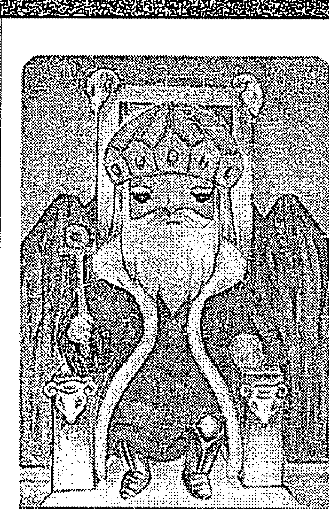

我们生命中第四个要学习的课题，就是在内心建立足够稳定的安全感，在物质世界中建立自己的领域。

4号牌是国王，也是皇帝。代表数字4的是四角形，象征了稳定与结构，所以身为一国之主的国王就是最稳定，他要守护牌面后方的江山、打造城堡与事业版图。他同时代表了责任的确认、基础的建立、形式的确立。

我们从1的创造、2的选边站、3的调整到最舒服的状态，到4就会有确定下来的平稳，是一种这样做就会成功的稳定感。会开始形成规矩与规则，感到确定。所以4号人，是可以让事情稳定下来的人。

4号国王是一国之主，是父亲角色的原型，他装备着盔甲，随时准备要作战。他的心中带有不安全感，他的眼神瞄向别的地方，而后面是他的江山。他左手拿着的是水晶球，右手握着权杖，确实有股权威和王者风范。座椅上有羊角，那是牡羊座的象征，是12星座的第一个星座，代表是领头的，因为他要去开疆辟土。春分点开始的牡羊座很有冲劲，所有植物快速成长发芽，也代表事业蓬勃发展的企图心，因为国王的天职就是要不断扩展版图。他生命本能就需要这样做，但往前冲之前要先有安全感，他要先确定并观察局势现在的状况。做好准备之后，再全力以赴，这是4号的特质。

在牌面上他穿好盔甲坐在那边，其实是在观望。有时候观察4号人，会发现他比较慢熟，因为还在试水温，还在感觉。可是4号其实是个很稳定的人，当他一旦投入、认同，就很难改变，就会全力以赴。如果你有家人、伴侣或朋友是4号人，其实是非常幸福，因为他会对你很好，他会认同你是他的朋友、家人，他会很照顾你，就像国王一样。国王的天职就要保护自己的子民，他会捍卫你、保护你。所以有人说4号人很顾家，爱很稳定，情感忠诚度很高。

### 4的课题

关键字：安全感、企图心、扩展版图的行动

如果公司的老板或开创者是4号人，会不断在稳定中求发展，非常牢靠。身为国王的4号，看起来会有一股不安，所以必须学习的课题就是在内心寻找真正的安全感。既然是国王，他一定很有事业心、企图心，很想扩展版图，很想开疆辟土。在4号人的生命历程早期，会很想赚钱、买房、买车，搞定所有的物质需求，因为他相信只有真实看到的东西才能带来安全感。可是有一天他会发现，拥有了一切还是有点空虚和不安，他就会开始往内找，才会明白，原来要在内心才能找到真正的安全感。

### 4的流年

走到4号流年的时候，你可能会一直为了和物质有关的事情忙碌，很想求发展。但也提醒走到4号流年的人，要多注意自己内在安定的感觉。心里那种安心、安定的感觉，不是靠物质可以满足的。不过也有一些比较年轻的4号人没办法体会这点，因为他还在忙着打造物质安全感。

4号人走到4号流年时会特别有感觉，他会觉得自己已经拥有一切，现在要回到内在了。

回到牌面，国王坐在王位上，但他眼睛却在瞄别的地方：“这一座城池我也要打下来，那个江山、那个国家我也要攻占。”会有这样的心境。

走到自己数字流年时，有一个好处是，你完全知道能量可以怎么运用，也可以运用数字的优势能量。如果你顺着流年运作，会知道如何好好地完整发挥能量。如果这个变成缺点就会沦为宿命论跟命定论，或是可能有同样你这种版本的人，会完全被命运安排，却不是他自己想要的。他会觉得自己过得很苦，怎么都被命运死死束缚，难道没有一点自己创造和改变的机会吗？这种版本的人生，完全是另外一种扭曲的样子。

### 引导提问

- 对你而言，什么才是「有安全感」？什么人事物让你有安全感？
- 你在生活中的哪些领域里，是界线分明的？你对哪些事特别「有界线」？
- 你想要打造什么样的人生版图？

### 示范引导

当事人：我想要询问目前生涯规划与工作，自己创业、谈更多合作等。

引导者：国王牌，对于创业者来说，是非常受到祝福的象征呀！恭喜你！目前还在打基础的阶段，对吗？

当事人：是的，公司刚起步，也在和很多朋友商讨进一步的合作，因为这些朋友都满心想做些事情的，觉得好像要搞得大一点。

引导者：感觉你就是这位国王，有责任心且照顾身边的人，这个企业国王的版图扩张，祝福你们朝着稳定中求发展的方向迈进！

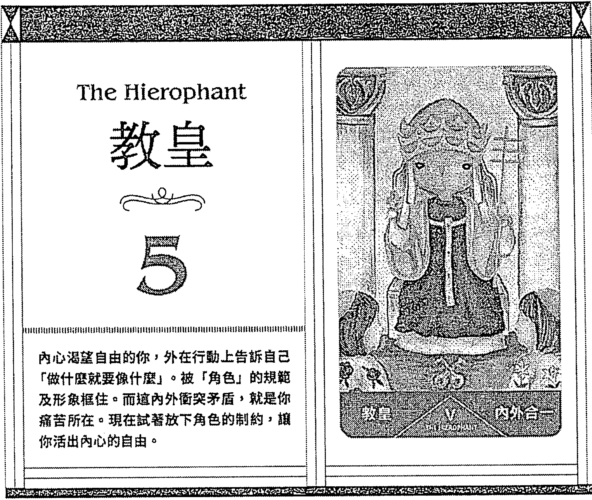

## The Hierophant
教皇
5

内心渴望自由的你，外在行动上告诉自己「做什么就要像什么」。被「角色」的规范及形象框住。而这内外冲突矛盾，就是你痛苦所在。现在试着放下角色的制约，让你活出内心的自由。

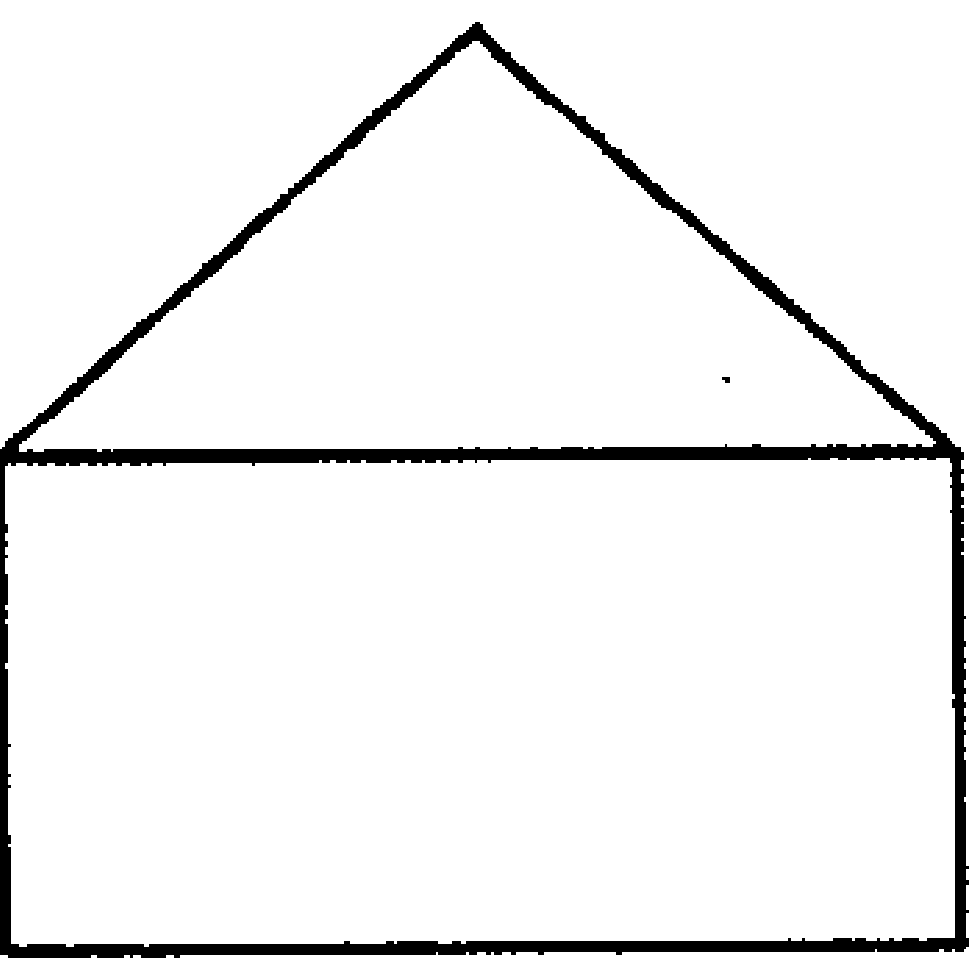

我们生命中第五个要学习的课题，就是让心自由、去除制约、展现自我魅力。

先看看5号图形是几号图形的组合，前面提过3号的三角形代表改变，4号的四方代表稳定、有规则的、有框架的，在四方形上面加一点，就变成5的图形。又要改变又要稳定，又要变化但是又守规则，所以，5这个数字代表矛盾、有些冲突的力量。自己常常会搞不定自己，在制约中想要改变，在框架中又想活出自由，又要变动又希望有规则可循，要很稳定同时也要很自由。

观察这个图形，上下代表不同5号人的不同面向。上面代表他的内心，很喜欢座右铭，因为他是教皇，经典名句最多。他心里有很多口号，或他很喜欢在家里写标语。身为教皇，天生是靠嘴巴说话的工作，这是他的优点，能言善道。虽然5号人不见得认同这点，他可能会觉得自己口才不好。但这里讲的不是口才，而是说服力，例如他告诉别人这个东西很好很棒，别人就很容易信任他，因为他是天生的传道者，所以喜欢讲经典名句、说道理。不过如果他没有善用自己的能量而是有点过度的话，就会变成爱碎碎念、老生常谈、爱说教。

教皇的座位前方有两把钥匙，两把钥匙交叉是教会的符号。教皇在教会里是协助人们开启人生智慧的钥匙，厘清生命的困惑，因此教皇也象征着教育、专业领域的知识，有开启智慧的含义。

前面是他的信徒，就是修道士。教皇的位阶是非常高的，一人之下，万人之上，在教廷的权位最高，甚至连国王都需要教皇来加冕。他在那么高的权位上，会碰到矛盾与冲突，当全世界都以他为楷模时，猜猜教皇坐在这里的心情如何？似乎要把自己的角色做得很好，而他的内心里很想要改变，很想要自由。我们会说5号是自由数，就是因为这样。在教皇这个位置上并不自由，必须一直被观察，世人会用外在的框架和角色的标准来限制他。他心里面想要自由，但只能很正经、传道，做些很神圣的事。不过这只是个象征，并不是每个5号人都得从事神圣性的工作，但是对于他的象征来说，他的内心是渴望自由的，所以内在的座右铭是不自由毋宁死。人生一定要自由，要打从心底活出自己，不想被别人管。身为最高位阶的教皇，不能被别人论断，不能被管。坦白说，5号人的内在追求自由，很不喜欢被念叨、不喜欢被评断、不喜欢被教训，特别是在公开的场合。

5号教皇心里会认为：「我是这么严以律己，别人就不要再念叨。」他对自己的标准已经很高了。但内在渴望自由、想做自己，希望别人不要再用框架限制他，不要再批判他，或不要再对他过度期望。

下面的四方形是他的外在，座右铭是：我身为教皇，就要有教皇的样子。要做什么像什么。他会找到一种稳定的角色规范，甚至会建立自己的规则。身为教皇，所有的教条、规定都是他建立起来的。所以5号人会自己建立规则，自己找到做事的方法，不喜欢别人下指导棋。也可以说他满有创意的，他可以创新，找到自己做事的方式。内心是「不自由毋宁死」，外在表现却是做什么要像什么。所以他又要自由，但面对外在角色框架的时候，又会去符合框架。

因为是教皇，5号人会带有宗教情怀，古代的宗教人士也身兼专业咨询师，引领人走向正确的道路。就像教皇的手印，代表了天国的钥匙，带领人回到神的国度。因此5号人对慈善与宗教都很有兴趣。如果5号人想走上修行的道路，例如接触佛教，传扬佛法等，讲一些佛教的道理，他是可以胜任的。

### 5的课题

关键字：活出自由、打破制约与限制、叛逆的灵魂

我认识很多5号人，从小清一色都是乖宝宝，都是大人赞誉有加的模范生，做什么像什么。好学生、好女儿、好媳妇、好太太、好老公、好妈妈、好爸爸……前面都冠上了一个好。那5号人的课题又是什么？很多5号人会让情绪往自己内在去，仿佛内在有个处理系统，形成一个循环。5号人有时候会有内分泌失调的问题，包括皮肤过敏。他必须学习在生活中找一个出口。如果你是5号人的好朋友，一定要让他有机会可以说出口、骂骂人。以前我有个同事是5号人，他的成绩优秀到拿匾额奖牌，可是每天中午我们都要一起吃饭，因为要一起骂人。工作这么不爽干嘛不离职，他会说：「我没有要离职喔。」他把这个角色做得很好，可是不能让他很郁闷，他得要抒发，要能找到一个可以畅所欲言的管道，去平衡矛盾与冲突。

第二个要学习的就是，让内在的真正自由多展现一点在外在的行动上，也就是内外合一。他内在渴望展现出来的自由，可以落实到外在的行动上。如果他做得到的话，或许会开始调整角色刻板的定义。其实他是可以调整角色的，或许他会认为孝顺的乖儿子应该要怎么样，但那只是其中一种版本。他可以活出自己真正想要的自由，还是个孝顺儿子，却不必像传统那样。当他重新定义这个角色的概念之后，就会愈来愈自由，因为他可以回到自己内在真正相信的。不能说他是双面人，不过5号人有时候想的和做的不太一样，他心里觉得这样是对的，可是回到外在环境中，又很难跳脱框架。

我觉得5号能量比较正确时会是，真正认同自己所想，并说出来，这是很有力量的。如果内外认同不一致，他依然可以讲得头头是道，但内心会觉得有点空虚。这可以从他生活过得开心与否和身体状况来判断。只要5号人的内外冲突，会表现在内分泌冲突和失调上，像是荷尔蒙、皮肤、骨头等。前面提到的同事就会长一些奇怪的瘤，比较像是内分泌系统问题。

5号有时候满爱碎念，爱管东管西，因为教皇这个原型的特质。因此，最中肯的建议是，去除角色制约，放下才是真自由。

### 5的流年

流年走到5号，要学习的是内外整合。你要鼓励自己表达内在的自由与想做的决定，并且展现在外在具体的行动上。把内在真正的自由，落实到外在真实的行动上面。这会极大帮助5这个数字内外合一，并展现魅力。

最适合给5号人的作业是，要练习一定要是自己觉得好的、符合内心的自由与决定，才去做。不要自我欺骗，不要因为符合那个角色的要求和条件而做出选择，这样会很痛苦。

要内心认同才开口说、才去做。不要做内心不认同的事，说内心不认同的话，这可以减少很多内外矛盾与拉扯的能量消耗。

如果有个业务卖东西，讲得天花乱坠，但他可能从来没用过，这就是5号人做得到的事。他可以把黑的讲成白的，把死的说成活的。5号人是天生的演说家，演讲和说话都非常有说服力。他要是想塑造一个角色，完全能够做什么像什么，可说是非常有魅力的人物。

我也曾听过一个妈妈讲起自己的5号小孩，小孩在学校非常受欢迎，老师都称赞有加。但妈妈却很困惑：「奇怪，老师形容的真的是我的小孩吗？他在家里怎么都不是这样！我觉得小孩很难搞，为什么老师称赞成这样？哈哈」。这就是5号小孩的家长会有的心情。

### 引導提問

- 對你來說，什麼是自由？目前的生活中，你的心是自由的嗎？

- 如果有一個需要內外整合的議題，你覺得是什麼？

- 你有哪些想法被限制？你想要打破什麼樣的制約？

### 示範引導

**當事人**：我是兩個孩子的媽，覺得照顧家裡好累，而且煮飯也不好吃，我也不想整理家務……

**引導者**：抽到教皇牌，代表你對自己的角色有所限制。我問你，在家很會煮飯、很會整理家務才是好媽媽嗎？

**當事人**：對呀！我媽媽和婆婆都說，不會煮飯就要學著煮，家務事多練習就很會做了！但是我光聽到這些就很煩，可以不要嗎？！

**引導者**：換一個角度想，如果一個媽媽很會買便當、很會叫外賣、會買好吃的料理回來擺盤或加熱，這樣可以嗎？我希望你可以感受一下，重新定義你對好媽媽角色的概念。打破傳統的框架，尊重自己內心的想法，活出你渴望的自由！

## The Lover 戀人 6

你一直體貼付出，但常忘了照顧自己。請記住，多將注意力焦點放在自己身上，不以討好的模式來維持關係的和諧。唯有先愛自己，才能在關係中獲得真正的平衡。

我們生命中第六個要學習的課題，就是愛與關懷，善待自己。

6號是戀人牌，這張牌和1到9的其他主牌有兩點特色差異。

一、這是數字1到9號中，唯一出現「兩個人」的牌。所以數字6特別重視關係，尤其特別重視關係的和諧、平等和平衡。因此也很重視同伴、夥伴或同儕對自己的影響力。

二、這張牌中有「天使」出現，大天使拉斐爾是天使界的醫生，因此6號人就像天使一樣熱心助人，和天使能量連結，也和醫療與生活照顧有關。

數字6是一個重情感、重關係的數字，親情、友情、愛情各個層面的人際關係，都是6號戀人在乎的課題。因為重視關係及和諧，自然就害怕衝突。6號不喜歡和別人吵架，可以和平處理的就不要有衝突，為什麼呢？答案在牌面上。這張牌的場景是伊甸園，當中的兩個人是亞當與夏娃。亞當和夏娃赤身裸體是因為生活在天堂裡，赤裸也象徵他們是全然地敞開、真誠地對待別人。這也是6號戀人的哲學觀：「我有很多愛，敞開胸膛，對人充滿信任。我覺得生活就像在天堂一樣，人性本善，我相信每個人都是很好的，我對你好、你對我好，大家互相幫忙，是愛的互助合作。」這也是6號戀人的生活態度。

但接下來，亞當與夏娃落入凡間，亞當後面是所謂的生命之樹，夏娃後面是知識之樹，樹上有知識善惡果，是分辨善惡的果實，一條蛇引誘夏娃吃了禁果。亞當後面的火是代表慾望之火，象徵內在對權力、金錢、權力慾望、名聲的嚮往。在塔羅中，只要出現果實、蘋果、葡萄等，都象徵著物質的豐饒。所以在陰性的層面中，我們會被物質的力量引誘，想要過好生活，用好的吃好的穿好的，我們內在的阳性能量，會被權力、慾望、名聲等引誘。 當他們落入凡間，發現原來自己有羞恥心與罪惡感，原來生活的真相並非總是平等回應，並不是我對你好、你就會對我一樣好。當你全心信任與幫忙他人時，還是會被詐騙集團盯上。

因此，6號戀人會開始困惑。這個世界怎麼和我想的不一樣，他心中常常在運轉的是：「我對你那麼好，你怎么可以這樣對我！」失落可能來自於被騙、被欺負、被別人說很傻很單純，怎麼可能相信人性本善！6號戀人開始學到一些經驗：生活常常在期待，卻也期望中失落，同時又還是很想懷抱希望（因為6是天使能量）。6號戀人的本質是「人性本善，世界大同」，這是他們從伊甸園帶來的對人性的信任，所以他依然相信人性本善，很快就會忘記曾經被欺騙，甚至認為別人一定有苦衷才會騙人，一定有不得已才會背叛別人。

### 6的課題

關鍵字：先愛自己、療癒自己、不向他人索愛

> > 「我對人完全敞開胸膛，要無條件付出，要對別人好，我相信唯有如此，別人才會對我很好、才會愛我、才會喜歡我，我害怕自己不被喜歡，所以我要先對別人好，喜歡別人、照顧別人、愛別人。」

6號人一直會經歷付出、期望、失落、期望、付出、失落的過程，最後了解生命真正的課題是「先愛自己」，才能活出真正的平衡。6號人在一個群體裡，會非常樂於服務大家，而且會在很細節、瑣碎的地方照顧大家。

為他人付出的6號人，把很多能量和精力都放在關係裡。對待家人、朋友，他都會招呼周到，張羅得很好。因為他心裡有一種期待，期待關係一定要均衡、平等，但他常常因為這種期待而痛苦，這是6號人的課題，也是讓他痛苦之處。他最無法忍受的就是，不被喜愛，一被他人厭惡，世界好像就崩毀了，而他也就從伊甸園落入凡間。

他的痛苦源自心裡對他人的期待，並不是說有期待是不對的，有期待很正常，但他看得太重了。當他付出一百分，對方的回應只有十分的時候，他會無法理解，甚至對方不那麼友善的時候，他會感到受傷。於是6號人心中常會埋怨：「我對你們這麼好，你們怎麼可以這樣對我。我為你付出這麼多，你怎麼不趕快好起來。」如果6號人幫助身邊的好友，在失戀或痛苦的時候給予安慰，而對方卻沒有趕快好起來，他會感到生氣：「拜託！我已經跟你講兩個小時的電話了，你怎麼沒有轉念，你應該要好起來，快點振作、恢復活力，我都可以很快就好起來，你一定也可以的！加油好嗎？」這就是一個經典案例。

雖然6號人善良又很熱心，想要關心你的一切，但並不是每個人都能夠完全回應這些善意。有時候6號人會對家人對朋友過度關心到失去了界線，而這樣的付出與對待，不一定是對方能接受的。他會忘記自己，甚至看不到自己。

如果是問你與某個人之間的關係，抽到了6號戀人牌，表示你們的關係不錯，因為戀人代表了愛的互助合作關係，也是在天堂中受到天使與神祇眷顧的畫面，這樣子的關係是受到祝福的。同時，也可以問問自己在這個關係裡，有時候是否會忘了自己，想想6號的課題。

如果你的家人或朋友是6號人，其實很幸福，他的愛很滋養。

6號人真的抱持著許多善意。和6號人相處的訣竅，就是你要讓他知道，你明白他對你的好，這對他來說很重要。你要告訴他：「真的很謝謝你，我知道你真的對我很好。」或是他買了什麼放在你桌上，你不能默默收下。他會一直提醒你，你有沒有看到桌上多了一個東西。

他需要平等的回饋，這是他最在乎的事。他如果覺得付出石沉大海，會很難過。他的表現在外的不是生氣或憤怒衝突，而是傷心沮喪。

### 6的流年

走到6號流年，可能會有一些與課題相對應的事件，或是必須處理的關係議題。受到戀人牌影響，許多人會在6號年結婚，不過無論是離婚、分手、在一起、或與家人關係的修復與療癒等，在這一年都會受到天使眷顧。

6號流年的課題是關係，帶來的考驗是，就是要回到內在去愛自己、聚焦在自己身上療癒自己，取回放在別人身上的能量和力氣。因此，6號人可以向1號人學習，如何把焦點放在自己身上，而不是一味地放在他人身上，以照顧大家為己任。1和6的能量是互補的。到這個流年，也要提醒你，必須更關注自己的感受，你的課題是愛自己、滋養自己、自我療癒。別把太多力氣和能量都放在他人身上，結果自己的期待落空又失望，筋疲力竭又失衡。這一整年，就是回到內在，多做一些自己覺得療癒的事，回到自己和自己的內在關係課題來修煉，療癒了「自己與自己的關係」，就能更好地療癒「自己與他人的關係」。

### 引導提問

- 你有哪些自我療癒的方法？
- 對不太想接受的事，你能勇敢說「不」嗎？
- 在照顧他人的同時，先把自己照顧好了嗎？

### 示範引導

> > 當事人：我覺得自己象是個濫好人，別人說什麼我都說好，即使不太想去，我還是會說好，勉強答應，感覺有點委屈。

> 引導者：嗯，你抽到的是戀人牌，你就像天使一樣，總覺得別人需要自己。這是一種「被需要」的感覺，這個需求被滿足的時候，你就會覺得自己很有價值，是嗎？

> 當事人：是呀！別人需要我，我可以幫上忙，也可以滿足對方的需要，我就覺得很棒！看到別人開心，我也覺得好開心。

> 引導者：戀人牌要提醒你的課題，正好就是這個，要先把自己照顧好，先滿足自己身心的需要，包括好好休息、給自己空檔，當你有足夠的力氣時才能更好地協助他人唷！

## The Chariot

## 戰車

## 7

面對生活中各種難以抉擇的事，你擔心會做錯決定，因而質疑每個來到面前的選擇，不斷思考、評估。現在的你，幸運之神與貴人就在身邊，請信任你的直覺與決定，相信生命的安排，所有事情將會迎刃而解。

我們生命中第七個要學習的課題，就是信任的考驗，相信恩典與幸運之神常在我們常說Lucky Seven，7號是個非常幸運的數字，充滿貴人好運的幸運。而戰車只能有一個方向，戰士的意志力也要集中在一處，戰車無法分裂往兩處前進。因此選定方向後，就能勇往直行。7號人，彷彿是生命的勇士，架著戰車，富有聰明智慧。面對抉擇點，戰士會研究哪個才是符合生命真理的方向，他會思考著哪個方向才是真正該走的生命道路。

7號戰車常會思考關於人生的問題，在生活中冒出了這些關於生命、哲學、宇宙的問題，會讓他想潛心研究。比如說身心靈到底是什麼、塔羅牌是什麼等。接著會開始提出質疑，象是我為什麼會在這裡？人為什麼會活得這麼痛苦？人要怎麼樣才會快樂？我要怎麼樣讓自己更好？怎麼才能找到關於生命的真正答案？諸如這類的問題。再來他會研究、探討這些問題的答案到底是什麼。

如果有個人說：「學塔羅牌是最好的。」7號人可能會質疑，這真的是最好的嗎？沒有別的了嗎？另一個人說：「那你不要學塔羅好了，學OH卡，OH卡最適合你了！」7號人仍舊會質疑，為什麼這最適合？優缺點各是什麼？如果又有個人說：「學靈氣是最好的。」7號人還是不會輕易相信，靈氣真的是最好的嗎？憑什麼靈氣是最好的？請證明給我看。7號人的研究精神就展現在這裡。他和2號人有很大的差異，2是黑白對錯的二元對立，但7是綜觀許多選項去做分析。他需要一個真實的答案，所以會不斷研究。至於為什麼他需要真實的答案，因為他相信一定存在一個最真實與最完美的答案。

不過，這也會為7號人帶來痛苦。在他不斷研究、考慮、分析的過程中，會落入了無法選擇的痛苦。因為當他每碰到一個選項，就會思考這真的是最好的嗎？再研究一下、觀察一下，繼續搜尋資料。每種選項他都要分析，比如辦活動就要考慮各種可能性，象是雨天備案、人數不足等，他會盡可能找出所有的選項，每個都要考慮進來。所以在戰車牌面上，戰車是靜止不動的，因為戰士還在思考現在到底要怎麼做。

在牌面上還有一個玄妙之處：戰車是沒有韁繩的，所以戰士只能靠自己的意志力來決定方向。所以他得要回到自己的內在去思考清楚，搞清楚一切，戰車才能繼續往前走。因此所有狀態都是一體兩面的，因為他停在這裡思考太久，戰士和戰車的力量都無法發揮出來。這也是7號人最常碰到的問題：考慮太多，而無法做出選擇，於是錯過很多機會。因為他都只是在想，缺乏行動力。

### 7的課題

- 關鍵字：選擇、信任、真實

對於7號人來說，他的生命課題就是學會如何信任自己的選擇。

戰車牌面上的人面獅身，一黑一白，朝向兩個不同的方向（對比牌面：2號女祭司，女祭司的黑白兩根柱子代表是非二元），這一黑一白代表了神性與獸性的考驗，是關於信任的考驗。什麼是信任的考驗？請你想像這個畫面，戰車面前有許多條路，而它停在選擇的交錯口，戰士的心裡在想：我到底要去哪裡？我該往哪個方向去？哪個方向才是最好的？

帶著信任來抉擇，是我們生活中很常出現的必修課題。

在生命中，不用理性分析來做決定，透過直覺、透過自己生命經驗去研究出來的選擇，信任那個選擇並做出決定，這就是最好的。

否則7號人會出現一種狀況是，做了選擇又繼續觀望，最後懷疑自己的選擇。因為7號太善於質疑，做了決定A，卻又觀望 B，如果別人 說B、 C都很好，他更是猶豫不決。這是7號人必須學習的課題，要 信任自己內心的決定，順從直覺地選擇。

不會做決定，或是不知道怎麼做決定，好像也沒什麼關係，因為7 號人在生活中總是會遇到大大小小的貴人，這些人會告訴他該往哪 裡去，如果7號人具備足夠的信任感，就會順著指引前進。可以說他 的優勢和最大的天賦是很喜歡思考，徹底分析，但如果這樣的能量 太過頭，就會變成想太多，沒有行動力、質疑太多、缺乏信任感， 這其實是一體的兩面。

7號人非常重視真實。奉勸大家不要欺騙7號人，或許6號人會輕易 上當，付出信任後也不會埋怨，但7號人一旦受騙，這輩子可能都不 會再相信你。我碰到很多案例是，7號人如果在情感上曾被欺騙或背 叛，而產生了不信任，就無法和這個人再繼續關係。因此，最好的 方式就是直接告訴對方真相，直截了當地說清楚，7號人會由衷感激 你的據實以告。7號人最不能忍受的就是不誠實和欺騙，我覺得是因 為他無法忍受假象。這影響了為什麼他要考慮這麼久，他會害怕做 出不對、不好的選擇。他最害怕的就是錯誤和不真實，因此無論被 欺騙或是做錯選擇，都會讓他相當痛苦。就算他在感情上是被劈 腿、被欺騙、被隱瞞的一方，他也會因為自己選錯人、沒有看清楚 而痛苦，也造成他下一個決定要想得更徹底，深怕再犯錯！

7號人對什麼是虛假的、欺騙的，或錯誤的，有天賦的直覺。7號 人若能慢慢練習找到做決定的模式，就會發現做決定會愈來愈快， 能把更多力量和力氣花在行動上，而不是一直思考。他能夠邊行動 邊研究，從行動中能夠更了解什麼最適合自己，具體的行動和實際 的狀況能帶給他更多回饋。我很常鼓勵7號人，有時候真的不用想太 多，再怎麼想，都不可能周全完善，一定會有考慮不到的地方，所 以也不用再想了，只要信任自己，就去試試看吧！當你一邊試一邊 實踐，就會從實踐的過程中發現你適合什麼。因為根本沒有一個最好的選擇，只有適不適合，而沒有所謂的好不好。

這樣7號人會愈走愈順，因為他會在路途中碰到新的貴人幫忙，讓他的每個決定都可以順利過關。我覺得這是7號人最奇妙的地方，充滿貴人的命格，因為7這個數字本身就是幸運的。

有人說6號是學不會情感的經驗，7號是學不會做決定的經驗。我的數字九宮格中有兩個7，我買東西就是看店員推薦什麼，就買他推薦的，信任他的眼光。我發現這個練習帶來的是：不必花那麼多時間思考，反而能省下更多力氣去做別的事情，那樣帶來的樂趣更大，因為很多行動會告訴你什麼才是適合你的。

7是個有趣的數字，喜歡思考、研究、學習。特別是在學習性的課程中，很容易見到7號人。7號人的樂趣來自研究，在探索的過程中，發掘出喜歡與不喜歡。這是種探索與了解自己的需求，會不會持續深化下去倒也不一定。

7是偏思考與理性的數字，會耗費很多能量在做決定上，所以我建議可以透過行動來取得平衡。有時候實際做和想的完全不一樣，做了再回頭調整，會比較平衡，才不會有很多能量卡在抉擇點，不僅能量無法發揮，更會錯失良機。

### 7的流年

7號流年是貴人運非常旺的一年，7本身就是幸運數字，這也是充滿幸運力的一年。牌面上有許多星星在頂上的布幕中，其實7號有一個非常重要的元素是「信任自己的靈感」。

走到7號流年，就要開始做研究。這裡指的並非學術的研究，而是為你的生命做研究，研究什麼才適合你，什麼是你生命真正的道路。有人說7是個比較理性，或偏精神性、較不物質的數字。你會發現5號之後的數字能量帶來的感受，和前面幾個數字不太一樣。

7號人喜歡研究、思考，所以會有許多靈光乍現的時刻。如果說7號人最重要的課題是信任，就是信任自己的靈感做出的決定，而不是用理性抉擇。用理性去分析，是因為從小所受的教育、體制的訓練。特別在7號流年，我會鼓勵不要一直用理性分析或思考太多，這當中有很多都是來自焦慮造成的擔憂或恐懼，因此及早規劃或是思慮太多，在這一年並不是好事，我傾向信任貴人帶來的靈感、指引，或自己突如其來的直覺。順著信任前行，比較符合7號的能量。

在許多案例中，我發現7號人的恐懼來自想像，預先擔心自己做出錯誤的選擇，但務實地帶領他們檢視生命經驗後，才發現並沒有真正發生過。他以為自己做錯了選擇，其實也沒有那麼嚴重，不過是多走了些彎路。這樣才能修正7號人對於做決定的恐懼。我有幾個學生就是這樣，害怕做錯決定，導致自己無法做決定，只好讓別人代勞，或讓環境來選擇。但落入被動選擇的時候，又會埋怨：「這又不是我選的，我是被迫的，沒得選只好選這個。」這種時候我會逼他們主動地儘快選擇，別再想了。我遇過幾個誇張的案例，有人沒辦法吃西餐排餐，主餐十二選一、甜點湯四選一，太多選擇反而無法抉擇。有人沒辦法吃自助餐，手上拿著空盤四處繞，繞了兩圈等朋友都結帳了，他的盤子還是空的。7號可以找出一個做選擇的模式，比如一進早餐店就說：「老闆，一樣。」這樣最簡單。重新選擇對他們來說很麻煩，在同事聚餐時，直接點跟隔壁的一樣。他如果覺得這種選擇的習慣是最容易的，其實就不用再傷腦筋了，可以把更多的力氣花在別的地方。

### 引導提問

- 站在十字路口，你在猶豫什麼？是什麼讓你難以下決定？如果這是一個信心的考驗，你認為是在考驗什麼？
- 你生命中的戰士能量，都聚焦在哪些事情上？為了哪些事會特別有戰鬥力？
- 生活中充滿幸運與恩典，你最想感謝的人與事是什麼？

### 示範引導

當事人：我想知道如果我下定決心去做這件事，有什麼提醒或盲點要注意的？
引導者：你抽到戰車，這是一個關於信心的考驗，看看你有多相信生命、有多信任自己的決定。
當事人：所以信任自己就沒問題了嗎？
引導者：當你先放下對自我的質疑，行動本身能替你破除恐懼。貴人無所不在，幸運力會在你願意看見的時刻出現！去行動吧！

## 我們生命中第八個要學習的課題，就是自我超越、發揮力量。

8號是力量牌，倒著的8是一個無限大的符號，在1號魔術師的牌面上也出現過，但展現的方式和1號不太一樣，1號是以自己為創造的中心，從無到有、開創無限的力量，而數字8走過前面七個數字課題的修煉，跟著愚者一起出發的生命旅程，經歷過一些人生的課題才走到8號這個階段，所以8號的無限大是指在既有的基礎與穩定上，內在力量無窮無盡。同時，無限大的符號象徵著生生不息的循環，無論從哪裡開頭，都會回到原點，代表了我們內在的思想，決定了生命實相如何顯化的關鍵。從什麼意念開始，就會看到什麼外境回到你面前。

因此，無限大的力量會讓8號人不斷精益求精，不斷成長突破，追尋更好的生命質量。

8是個忙碌的數字。8的發音近似「發」，很旺的意思。當能量很旺的時候，就不會是悠閒或閒閒沒事的狀態，會是同時多線進行的運作，所以8號人生活會比較忙碌，同時發展很多項目，又可以掌握得很好、很優雅。

在牌面上也能找到答案。女人和獅子的組合，女人代表了陰性溫柔的力量，獅子代表了野心獸性、陽剛的力量，而這個畫面叫做以柔克剛，堅定的溫柔力量超越了野性。女人一手摸著獅子的鼻子，一手摸著下巴，獅子身體有些彎曲，代表了獅子願意臣服於她，力量可以為她所用。也可以說女人是馴獸師，或是獅子的主人。這是一種溫柔的力量，只有溫柔的力量才能和陽剛的力量平衡，產生和諧的力與美，而非硬碰硬。牌面呈現出和諧的力與美，女人並非用蠻力和獅子對抗，而是用溫柔的力量，因為女人知道獅子的獸性力量有多強大，不可能用蠻力取勝，而是要善用柔軟的力量，才能讓獅子的力量為己所用，她更可以借力使力，把獅子的力量完全發揮出來。善用資源、整合並連結資源，讓自己發揮得更好，這就是聰明8號人的天賦！

這個牌面還帶出8號人的一項特質，人是萬物之靈，獅子是萬獸之王，他們在各自領域中都是佼佼者，因此8號人的重要特質之一，就是無法忍受「笨人、慢人」。一個人動作慢，會給人感覺笨；一個人做事的方法笨，會給人感覺慢。8號人喜歡和聰明、有能力的人交往。

朋友，认为要同等级的人才足以相交。不能说8号人势利眼，因为他觉得这种程度的人才配得上我，才能和我互相匹敌。

如果你要好的朋友或伴侣是8号人，要非常开心，因为你在8号人的眼里是个优秀的人，你有让他欣赏的优点，才能成为他的伴侣或很好的朋友。有人会误以为8号人喜欢竞争，但8号人并非竞争型的性格，他的竞争对手是自己。他在生命阶段中会想要不断成长，自我超越、自我突破。正因为如此，会有点不安于现状。他会想要再超越、再突破，看看自己是否能做更多不一样的事情。

因此他和强者为伴也是为了激励自己，我觉得这是8号人的优点，他能欣赏自己觉得很不错的人，惺惺相惜，英雄惜英雄。

8号的能量是优雅与和谐，力与美的平衡，虽然忙碌，同时进行多个项目，但是他绝对不会让自己乱得灰头土脸，他会在这个过程中找到让自己平衡的次序，循序渐进，逐一完成。

### 8的课题

关键字：目标、放松、忙得优雅

8号人要学习的课题是放轻松。对他来讲，除了无法忍受笨和慢，还会不断鞭策自己要超越突破，自我要求较高，加上停不下来的忙碌。但他的焦虑是内在的，表面上往往看不出来，你会觉得他表面上看起来很优雅，内在却一直在数着节拍前进，想着「我接下来还可以做些什么」。所以我认为8号人必须学习放松，生命可以多点轻松感，不然真的会过劳死。

除了无法忍受笨和慢，8号人也无法忍受没有意义的生活。因此8号人的另一个课题就是学习做些无意义的事。

在结合静心画图的曼陀罗课程中，有个学员是8号人。她说：「现在为什么要闭眼睛？老师，闭眼睛要做什么？有什么功用、有什么好处、有什么效益？」我故意这样回答：「没有意义，完全没有意义，就是坐在那里，然后放空。」她很焦躁，到了中场休息，大家都躺着午睡，她却要看报纸，吸收新知，研究时事，她认为睡觉是浪费时间。第二天，我发现她快要坐不住了，开始愤怒，拿到图就乱着色一通，「好了，画完了，现在呢？赶快下一张，老师总共还有几张？全部统统都给我，我一次做完。」我说：「同学，这件事情不是这样的。来，让我说给你听……」，三天下来她已经快崩溃了，最后我告诉她：「你生命中有一个重要的课题叫做：学会什么叫做无所事事，什么叫做放空，什么事都不做，就是空白！」她答道：「老师，我的字典里没有空白。怎么可以空白，因为空白就没有意义！」。我说：「这就是你来到这里的意义。」

8号人的状态就像是，还在爬这座山，就已经看向下一次要攻顶的那座山。一个计划中还在执行，就已经规划好下一个计划了。如果他坐在马桶上，就摺好卫生纸，开始想他等等走出去厕所后要做什么。永远有下一个计划在等待，永远有下一件事情要去完成。所以在某个时刻，他的确需要安静下来，无所事事。不过坦白讲，这对8号人来说，是不太可能的。所以比较中肯的建议是，到沙滩和无人岛度假的时候，可以带着计算机去处理一些事，坐在沙滩上处理公事，对他来说比较合理，不然他可能会闲得发疯。如果他很清楚自己的目标，会非常投入。回到前面说的，一个计划还在执行，他就已经在思考下一个计划，因此对8号人来说，目标、计划跟攻顶非常重要。只能要清楚告诉他目标是什么，到目的地可以做什么，什么时候攻顶，攻顶后会多美好，让他能想象那个愿景，就可以全力以赴。假使告诉他，禁语十天禅修营会让人生发生完全不同的拓展，他就能认真投入，并且得到许多收获与体会，因为找到可以投入的目标。

### 8的流年

走到8号流年，是拓展生命的一年，因为这一年充满力量，很忙碌也会很发、很旺。你能拓展生命的能量，也有很多机会在等着你，会更多的自我超越、自我突破，可以尝试很多没试过的事情。无限大会开始发挥作用，而无穷无尽的可能性就从这里蹦出来。

在这一年里，或许你会感觉想要控制，想要掌控一切。你想要抓住一切，掌控整个局面，这样的状态有时候会给你身边的人带来压迫感，太过强势让人觉得不舒服。因此，要提高自己的意识与觉察，放下过多的焦虑，这一年的丰盛与力量才够真正的展现。

可以做一些没有尝试过，并且对生命有效益的事，会让你变得很具目标性，也很有成就感。8号流年适合设立目标，全力以赴，要超越、要攻顶，一座接一座山去插旗子，拉红布条，拍照。8号数字很奇妙，显化力超强，只要设定目标，全力以赴，很难不成功。8号人如果有什么事情没做到，那是因为他不想做。只要他想做的事，就会全心投入，全力以赴，并且成功达成。所以8号小孩其实不太需要大人担心，他完全知道自己在做什么，就让他好好发挥，做自己想做的事。经历过7号流年的研究阶段，明白自己要走的道路、要投入的方向，在8号年设定好目标全力以赴，积极扩展，而接下来9号流年就会回归内心智慧。

### 引导提问

- 你目前生活的目标是什么？你的目标可以带领你进行哪些自我超越？
- 如何帮助自己善用资源、整合资源？让自己更优雅地借力使力，达成目标？
- 是否能觉察内心的意念，创造出真正想要的结果？

### 示范引导

> 当事人：想知道目前的专业工作，怎么做可以更进一步？
引导者：你抽到力量牌，我好奇的是，你目前有工作目标吗？
当事人：有几个想要进行的目标，但觉得如果要全部做到有点难，不知道可以怎么做？
引导者：力量牌给你的提醒是要「借力使力」，让他人的资源和力量帮你完成目标，你要做的是授权给别人执行，你做统筹与连结。

## The Hermit
隱者
9

「說出口」的表達課題！或許你認為：「說了你也不懂！」總是在群體或關係裡，把自己抽離出來，置身事外。現在，該是多表達的時刻了！讓你與他人的感覺流動，讓自己藉由分享，允許更多的智慧傳遞出來。

生命中第九个要学习的课题，带着内心的指引，独滑自己的道路，走向灵性世界修炼，并再次把大爱带给众人。

当年的愚者，走到最后一个境界，踏上灵性追寻的道路，就是9号隐者。

9号是隐者，也是所谓的智慧老人，智者。在牌面上，周遭一片黑暗，他披着袍子，提着灯，看着地上，甚至有时他是把眼睛闭起来的。9号的特质中包含了低调，会让人觉得他并不华丽。9这个数字比较倾向灵性世界，往内心迈进，和内在的能量在一起，也比较低调内敛。回到自己的内心深处，而非张扬外显。

这位智慧老人走过了0到8，清楚知道一路上都发生了些什么，这些都是累积生命经验的过程。就像个带着最多生命智慧的老灵魂，提着油灯，光明象征他的心，心中的指引替自己指出智慧方向，为自己照亮前路，同时也在提醒和指引别人，替他人引路。

他很低调，也很享受独处，不太喜欢别人的注目，不喜欢成为聚光灯下的焦点人物，因为他是隐者，离群居所，他只想自己修炼就好了。但是，充满困惑的人、需要寻找人生方向的人，大老远就能看见隐者，黑暗中就属他的光芒最闪耀。有个人提着灯，散发着智慧光芒，「他应该是知道路的，我们去问他，他可以给我们指引。」

许多9号人的生命历程很奇妙，在很小的时候就会遇到很多人来问问题。他也不懂为什么，但大家就是觉得这个人可能有答案，或许他从来也没经历过，跟这些人聊聊、说说话，可能也没什么特别的建议，就能让人觉得获益良多。这是9号与生俱来的特质、天赋的力量。

这样有智慧的人，不能只让他低调地与自己的内心独处。众人需要服务时，就很需要他来贡献智慧。累积内在的生命经验，适合和他人分享，因此9号人最后常会走上灵性服务的道路。9号隐者适合从事灵性服务工作，给人生命的引导或方向，分享生命的经验与智慧。如果一开始还是想要低调，不习惯和太多人分享，可以练习从一对一的引导，或小群体的分享开始。

9号隐者的老灵魂经历了许多人生经验，所以在某些事会变得比较淡泊，也比较没有感觉。前面的数字，比如喜欢变化的3号，就喜欢好玩、新鲜的事物。但对9人号来讲，很多事情都经历过了，都走过了，引不起他太大兴趣，只想好好待在自己的世界里享受安静。有人会觉得9号人的哲学观比较消极，或比较悲观，他可能会觉得「讲也应该没什么用，算了。」性格比较淡泊，让人觉得容易放弃。比如说会出现这样的想法：「我们也不用和别人争，既然不是我们的缘份那就算了，不用太计较。」他知道自己只要内心平静就足够，带着一种与世无争的感觉。这些独到的看法或态度，都能给予朋友指引或建议，他也会乐于分享经验。

澄清一个迷思，虽说9号比较低调、沉潜，却不代表他不爱分享。我认识许多活泼的9号人，也很健谈。他不会人来疯，他是隐者，隐者不太会站在舞台上带大课程或大团体，他比较适合私底下互动，或是几个朋友相坐谈天，他就能聊很多。隐者的能量不属于开班授课型的群众能量，而是喝咖啡谈天、泡茶嗑瓜子，分享各自体会的人生哲理的类型。

### 9的课题

关键字：分享、大爱、服务

低调的隐者在生命中要学习的课题是，用自己觉得舒服自在的方式与他人分享，因为他的天命是服务他人。他得要从自己的深山里走出来，走入人群，入世服务，在这个过程中他要练习适应人群，分享与服务就是9号的课题。

9号人有时候会觉得「我自己知道就好」，也可以说他比较「独善其身」。他不太想多管闲事，比较出世，也比较抽离，是个观察的角色。他也会有点淡泊，不好争，容易落入消极的状态。我觉得9号其实可以好好发挥智慧能量，也鼓励拥有智慧光芒的9号隐者，可以为人服务，与人分享。

9号不太喜欢群体活动，也不喜欢人太多的地方。常会说自己孤僻，做事不太会敲锣打鼓，不会昭告天下，通常做完了才会说出口。恋爱关系也不喜欢一直放闪，非常低调，我以前有个同事是9号人，我知道她结婚的消息时帖子已经印好了，在这之前都不知道她交了男朋友，保密到家！这就是经典的9号隐者。

### 9的流年

在8号流年的丰盛忙碌结束之后，9号流年就是休养生息的一年，可以稍微喘口气，安静下来，回到内在。这一年可以好好回顾前面这些年都在忙什么，整理自己的生命经验。

多给自己些独处的时光，也很适合闭关灵修，沉淀下来，回顾过去九年中发生的种种，调整并展望未来的新方向，可以先酝酿、准备下一个九年想要做的事。

九年的循环走到最后，9号流年可以说是结束的一年，也适合好好地向一些事情告别，画上句点，不适合做重大的变动。如果要变动，1号流年比较适合全新的开始。例如想要搬家，在9号流年可以先收集资料、看房子、找房子，询问他人经验，或处理旧房子等，到1号流年才搬进新家。或是新的行动，比如创业、开幕，在1号魔术师这一年比较适合，会比较顺应流年能量，因为数字1代表新的开展。

流年走到7、8、9这三年，都非常适合学习、进修、考试、专业深造。

### 引导提问

- 如果有些关系与事情要结束，那会是什么？
- 在你的人生经验中，最想要跟他人分享的部分是什么？
- 你有哪些事情想要沉潜下来，想要低调行事呢？

### 示范引导

当事人：我现在的生活混乱，找不到方向，想要寻求一些指引。

引导者：你抽到隐者牌，他是智慧老人，象征着你内心的指引，鼓励你回到内心，猜猜看这个智者如果有一句话要告诉你，他会说什么？

当事人：我看到他拿着灯，好像在照亮我的道路，如果他是我的内心，我觉得他是想要跟我说，保持光明与希望，寻着那道光，带领我踏上人生道路。

引导者：抽到这张牌，属于比较灵性世界的层面，也代表了心中的指引，会带领你走向精神世界的探索，你可以朝着这个方向进行一些学习并分享，就会逐渐获得启发。

## 数字之间的互动关系

生命从宇宙的混沌中诞生，跟著愿者上路，初生之犊不畏虎，带著人生的梦想傻傻向前冲，开始我们人生的旅程，一路走到隐者获得内心智慧的指引，完成了一个阶段的循环。了解这些数字的基本架构后，再来稍作延伸，进一步学习数字之间的关联性，了解彼此的美妙关系。

## 世代差异

不难发现，不同世代的人有着不同的文化脉络及性格差异，这些所谓的「世代差异」，用数字能量来观看就变得很有趣。出生于二十世纪，也就是1900至1999年的人，在本质上比较冲突，想要展现自己，渴望舞台与掌声，像一道闪耀的光芒（1号魔术师），可是心中又觉得光芒不要外露，要低调，要修炼自己，要整理好自己再出发（9号隐者），会感受到这样的矛盾冲突。而2000年后出生的人，本质上带有2号女祭司的灵性质量，黑白二元的立场比较清楚，这两个世代的配备本身就非常不同。

### 数字的对比

| 组合 | 类型 | 特点 |
|------|------|------|
| **1 和 6** | 互补型 | 1代表开创、创意的力量，6则代表重视人际关系，爱的互助合作帮忙。1和6要互相学习。 |
| **2 和 7** | 相似型 | 有共通的选择议题。2是两点当中的选择，在是非对错中选择；7则是在许多选择中择一。2是女祭司，象征内在、灵性，情绪敏锐、是幕僚、智囊团；7是研究、信任自己的灵感直觉，信任一切来到我面前的都是幸运的，带有贵人的好运安排。 |
| **3 和 8** | 相似型 | 同样都具备了优雅，或创意，也象征丰富。3希望生命丰富多彩，充满变化；8也是，他追求不断地学习成长突破，让生命精益求精。3和8都具备优雅的能量，而内在却带有丰盛、想要更多元的特质。 |
| **4 和 9** | 对比型 | 一个是开疆辟土的国王，一个是隐居的智者，他们都带着稳定。9的稳定表现在内心世界，是内在的独处与灵性追寻。 |
| **5 和 0** | 学习型 | 在5和0的关系中，5要向0多学习。5的死穴就是很多的角色包袱，但0却没有包袱，是轻松的。如果5号人的九宫格里有0是好的，0可以平衡掉一些框架的束缚，5要学习0的乐天特质，放下过度的焦虑和担忧，做事的时候，能够放下，往前走。5向往自由，0可以让他不必想太多，回归初心，找到最初的渴望与源头的心动力，重点就是忠于内心，臣服于心的自由而行动。 |

## 每个数字无法忍受的地雷

其实每个数字的人都有最无法忍受的事，也就是「在什么情况下，很容易踩到他的雷」！

- 1号魔术师，无法忍受没有舞台、没有掌声、没有被看见、无法掌控。
- 2号女祭司，无法忍受模糊、不确定、没有答案。
- 3号皇后，无法忍受不舒服、丑，很在意他人眼光。
- 4号国王，无法忍受人不安全、不稳定、界线不清楚、自己人被欺负。
- 5号教皇，无法忍受不自由、被唠叨、被规定。
- 6号恋人，无法忍受不被爱、不被喜欢、没有平等回应。
- 7号战车，无法忍受虚假、欺骗，难以做决定。
- 8号力量，无法忍受没有目标、无意义、无长进、慢和笨。
- 9号隐者，无法忍受群众聚集的场合、没有灵性。

## 同一个生命灵数，也有不同的数字组合

练习把自己的生命灵数做组合数的能量练习，能够找到属于自己的力量！这里举两个例子，拆解数字组合来做分析：

### 例1
6号恋人

双倍的3号母爱，成为6号天使：33/6。

我有个朋友是6号人，而且是33/6的组合。一起出去吃饭的时候，其他人就只要坐着等就好了，她会张罗好所有事。一到餐厅，她就去点餐捞鱼抓虾。菜上桌之后，她又马上站起来去拿碗筷分菜，鱼上桌了，她也照样分鱼，只差没有替大家剥虾子。我们出去玩，她车上一定会准备多的备品，象是雨伞、雨衣之类的，身上好像随时都带着医药箱。她的6号特质特别强化了妈妈照顾者的这个部分，很会照顾大家。她忙完一轮，请她赶快坐下来，不要再忙了，吃点东西，她会说：「其实我早上吃得很饱，现在不饿。」有时候她的反应会让我们觉得太辛苦了。她也把家里张罗得很好，照顾先生、婆婆、小孩，一切都是她在忙。她是很经典的33/6，我常常提醒她：你要多照顾自己，多爱自己。

### 例2
9号隐者

- **27/9**类型的隐者，象是温暖的哲学家，因为2和7都是思考型的数字，2号女祭司是心灵内在的能量，7号战车是寻求真理和思考研究型的。
- **36/9**类型的隐者，象是大爱的服务家，会想要多一点人与人之间的互动，因为有3的亲和力与照顾者特质，也有6的天使特质，会加强人际亲和方面的特质，喜欢与人互动相处，照顾与服务他人。
- **45/9**类型的隐者，象是慈悲的企业家，多了些企图心，有4号皇帝的稳定沉着，也有5号教皇的宗教情怀、稳健的魅力与说服力。
- **18/9**类型的隐者，是能量满满的灵性创造者，有1号魔术师的舞台展现与创造力，也有8号力量的丰盛与优雅平衡，追求什么目标就能做到什么。

# 第三章
大阿闍那
10-21

0到9让我们学会了最重要的数字基础，从10号牌开始进入两位数，一样也可以用前面已经学习过的「生命灵数」概念来理解。

把两位数加起来后可以得到个位数，就等同该数字力量。

10号牌，1+0=1，再次回到数字1的力量，可以对照1号魔术师的意义来理解，是10到18这个阶段的新循环，是一个新的开始。依此类推，11号牌，1+1=2，回到数字2女祭司的二元力量。

准备好了吗？跟着愚者第二阶段的生命旅程，让我们一起进入主牌10到21的探险吧！

10号是命运之轮，中央有个大轮子，象征着转动、生活的改变与前进，四大神兽镇守住四个角落，稳定守护四方，代表四个固定星座（稳定世界的四条轴线），看书与阅读代表学习与智慧，整体象征着即将到来的改变有四大神兽的智慧守护，改变的历程更是一种学习的锻鍊。

这牌最重要的关键字是「改变」。每天的生活不断面临各种改变，生命一直往前推进，生生不息。这项改变可以从牌面左边看到象征物蛇，蛇会脱皮，脱皮本身代表蜕变的力量，蛇会经由脱皮不断成长、汰旧换新。

轮子下方有另外一只神兽支撑着，这位背负着命运之轮向上攀升的神兽，就是胡狼头神阿努比斯（Anubis），代表支撑和承载的力量。因此，在改变的过程中，是一个支持、有力、「接住自己」的象征。这也代表了成长的机会，把握住这个机会，就能向上提升，翻身一搏。

轮子上方是人面狮身，拿着剑代表了维持平衡、象征黑白二元的力量。就像太极的阴与阳，白中有黑、黑中有白，在变动的过程中提供阴阳共存的稳定平衡，让轮子不至于失去方向，或失控乱转。

整体而言，抽到这张牌是面临改变的情境。蛇带来了蜕变的力量，下方的阿努比斯支持与承载着轮子，可能会有一些改变，透过蜕变可能会带来的不断前进，同时又得到支持的状态；上方的人面狮身，提供了稳定平衡。

回到数字来看，解读塔罗牌有个诀窍：搭配牌面和数字来思考，数字代表它提供了数字能量或地水火风，无论数字或四元素，都有一个元素的力量。除了这个元素，还要搭配牌面。命运之轮的数字代表了1，象征这个改变其实是「一个新的开始」。这个改变的方向呢？引导者可以适当鼓励一下：从牌面看起来，四大神兽在四方守护着你，所以这个改变会朝着更有智慧的方向前进。

10这个数字很特别，每到一个循环的最后就是10的力量。比如说从1开始到10，接着11到19，20又是以10的力量结尾。所以10的力量是数字阶段的最后一个，但又代表下一个阶段的开始。所以10通常都有「改变、换阶段、往下一个阶段」的象征。如果当事人最近的生活很倒霉，并抽到这张牌，你要恭喜他：「恭喜你，要出运了！这是一张出运牌，你不会永远都这么衰，风水轮流转，你的命运之轮已经开始转动，会有一番新气象。」除了改变之外，更是一个新开始的力量。

如果当事人的生活已经过得不错，也可以告诉他：「你的生活会有一些持续的变动，这些都是朝向智慧方向前进，所以你只要顺着变动前进，就会过得很好了！契机来到你面前，可以好好把握，更是一个向上跃进的机会！」许多人会对命运之轮这张牌感到惧怕，害怕改变会带来混乱与不可控制的局面。透过引导者的引导与解释，就像是阿努比斯与人面狮身，支撑住当事人的慌张，稳住他的心。

风水轮流转，把握对的契机去行动，在混乱中等待顺流且稳住自己。

等待好时机与贵人相遇，撑住自己、稳住自己，带领我们蜕变与提升，他人扮演我们生命中的转变力量，我们也会是他人生命改变的推手。互相成为彼此的支持，迎向创造新生活的关键！

### 引导提问

- 你最近的生活中是否出现什么改变？或即将到来的改变可能会是什么？会造成什么样的生活变化？
- 你是否做好准备去迎接这样的改变？你想要把握这个改变的时机吗？有什么样的感受？会不会害怕？是否觉得不安？
- 你直觉认为这是一个什么样的契机？将带领生命走向什么样的智慧之境？这会给你什么样的学习与提醒？

### 示范引导

> **当事人：** 面对即将来临的旅行，有什么要注意的吗？
>
> **引导者：** 看起来这趟旅行其实是提醒你自己要顺流。可能在旅行的过程中，会发生一些变动的事件，比如说突然车子班机延迟，或是气候问题导致航班取消。有很多不可控的状况提醒我们要顺流，我们哪里也不能去，只能坐着等待飞机起飞。这是一个臣服课题的学习。所有力量都是有支撑的，被宇宙的力量、无形的力量承载着，无论是天使或四方神兽的守护，我相信这个改变最后是会美好的。当我们这样想的时候，会觉得安心，因为这个力量并不是要让你产生更大的混乱。

◎提醒—

在解读上，可能会碰到你认为不好的状况牌，但我更想鼓励大家的是，「先放下二元对错的解释方式」，从咨商塔罗的角度去理解并带出重要的关键跟精神，思考并询问：「这张牌带来的提醒是什么？要我们学习什么？抽牌的用意不是要吓自己，而是提早看见这些状况，有机会提醒自己，如果我真的碰到那件事，就要想到这张牌给予自己的练习与提醒是什么。

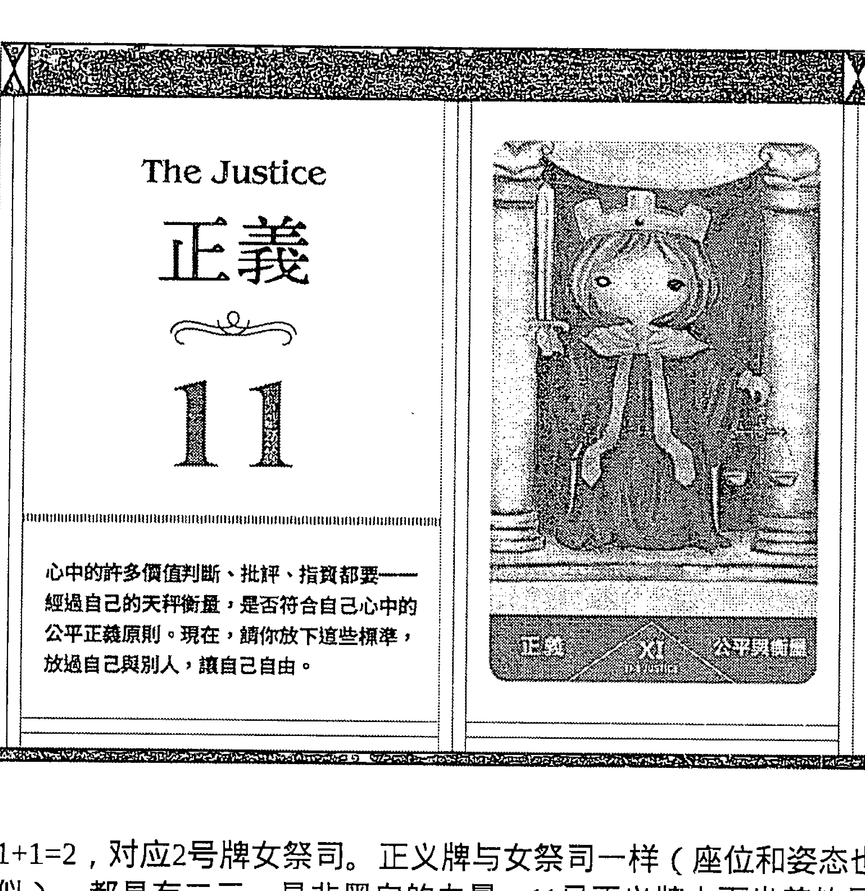

## The Justice
### 正义
11

心中的許多價值判斷、批評、指責都要……經過自己的天秤衡量，是否符合自己心中的公平正義原則。現在，請你放下這些標準，放過自己與別人，讓自己自由。

1+1=2，对应2号牌女祭司。正义牌与女祭司一样（座位和姿态也相似），都具有二元、是非黑白的力量。11号正义牌上面坐着的是法官，因此这张牌也带有专业协助、法律事件的议题。法官与2号女祭司的冷静观察互相呼应。法官拿着秤，秤代表对于某件事的衡量和判断，代表了内心的道德标准。秤的一边放着砝码，一边放着要衡量的事，砝码代表了他心中认为「公平正义的标准」。当他认为符合公平正义的原则的时候，就没有问题；但如果不符合，他就用右手的剑，「做出裁决」。

这张牌带出了询问者「如何理解这件事」的想法和情绪，还有他所做出的裁决与行动。引导的重点是引发他探索自己对于公平正义的观点。这是一个「看清自己内心所想」的机会，说出来、看见、理解了自己，他就会发现心里的转折，而逐渐改变心情。因为他能清楚明白自己遭受不公平对待，就可以调整。他能够知道自己在乎什么，进而做出新决定与新理解，才有机会沟通、协调，找到二元对错当中的平衡点。接着，法官就能有一点弹性。如此一来，就可以回到数字2的原则，在这里会有更多对自己的认识、知道自己真正在乎什么，搞清楚之后自然就不会有纠结与挣扎。因此，这是一张明白自己内心需求、让自己获得平衡的牌。

数字11就像一道让我们进入改变的大门，在人际互动与合作关系中，找到平衡的对待之道，让想要释放的执念可以放下，让自己与他人都能互相公平对待。

### 引导提问

- 关于你刚刚说的这件事，我很好奇，你觉得在这个议题或事件里，什么叫公平公正？
- 说看看你心里面的那把尺，是用来衡量什么的，衡量的标准是什么？那个砝码象征什么？
- 如果真的无法求得公平，要如何平衡你自己的心情，怎么想才能让自己平衡？

### 示范引导

老师，我最近做报告觉得好烦喔！就是我们在系上有个专题要分组……（抽到正义牌）。

你觉得做专题报告分组讨论要团队合作对你来说，怎么样叫做公平？你心里那把尺的标准在哪里，别人做到什么地步、你才会觉得公平。

不公平呀！因为都是我在做！其他人都没有贡献，我觉得很生气。

你觉得这样的状况不公平，那你想要做些什么吗？

## The Hanged Man
### 吊人
12

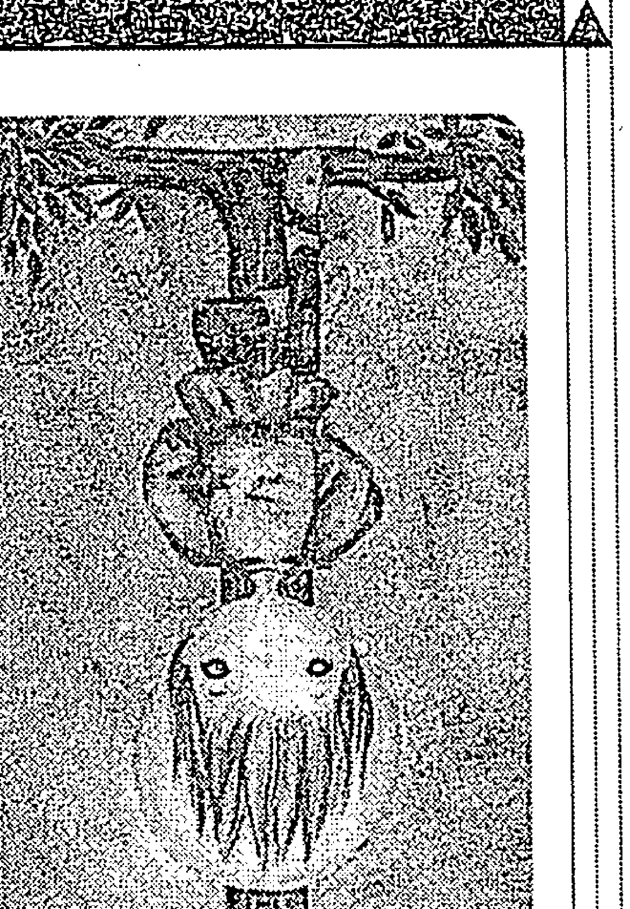

試著做些不一樣的事情與行動，在生活中允許更多突破的改變與嘗試。反問自己：「只有這個方法嗎？只能這樣想嗎？」你將會在不同的思維中看到更多亮點。

1+2=3，对应3号牌皇后，数字3就是带来变化，变化是为了让自己更舒服、更好或更完美，所以变化是带来调整的动力。这张牌是吊人，或称倒吊人，这张牌的原型是耶稣基督，他是心甘情愿受刑的。为什么吊人愿意用这样的方式来呈现自己？因为他觉得头上脚下的角度，得不到自己想要的，于是选择用另一种角度来看这个世界。他的头部发光，象征灵光乍现。一般的角度与眼光看不到自己想要的答案与启发，所以宁愿倒挂，用不同的角度来看世界，逆向思考，这也呼应了3号数字的改变与创新思维。

通常抽到这张牌的人，个性上都有一点叛逆，想要特立独行，做一些不一样的事情。

举个例子，如果找不到某样东西，抽卡询问「失物」，抽到吊人牌，意味着你要换一个地方来找。要是手机不见了，可以从猫猫狗狗的角度来找，或许会出现在你意想不到的地方，所以找一些不太可能的地方，愈不可能就愈有可能。你或许找了衣服口袋，但可能就在你坐沙发的时候掉出来，藏在沙发下面。

再举一个例子，如果问感情关系的问题，抽到吊人，可以去观察对方的不同面向。你或许能看到这个人带来的不同感觉，或是你们可以做一些新鲜的事情。想要有所不同，就用不同的思考点来看待这个人。

塔罗牌常常可以指出我们没有注意到的部分，可以说是我们没有观察到的自己。

### 引导提问

- 你觉得这件事情有没有别的可能性？有没有可能用别的方式来想？
- 有没有别条路可走？如果有其他的选择，会是什么？
- 你要用什么来交换你想得到的东西？你愿意奉献自己吗？

### 示范引导

当事人：为什么我一直单身，一直没有男朋友？

引导者：你抽到吊人牌，代表了你期待一段关系的样貌要是特别的，你很想要有所不同，你不想要一般的恋爱关系。

当事人：哇！太准了吧！我觉得宁缺勿烂，觉得普通的关系并不是我想要的。

引导者：是的，因为你现在遇到可能的对象，其实都没有办法让你有特别的感觉。

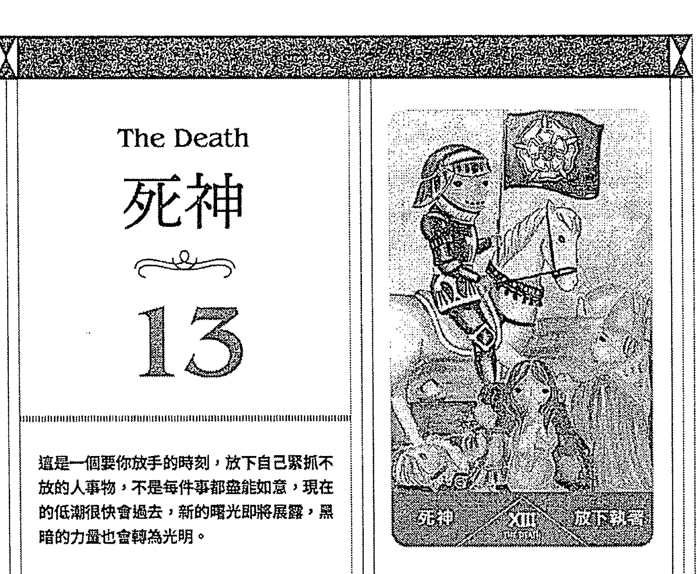

13号是死神牌，因为「13号黑色星期五」，让人对13这个数字有些恐惧。13是死神，1+3=4，4是一个框框，有种固定或固执，或疆界的感觉。

死神是骑着白马的骷髅、死气沉沉，死神所到之处，都变成一片荒芜。白马也杀红了眼，凡见者必死无疑。牌面背景处是冥府之河，河的对岸有一道石柱门，迎接死后重生的新生命，而象征希望的太阳即将升起！

死神下方的人物都在主牌里出现过。躺着的是4号国王，5号教皇合十庄严迎接死神到来，尊重且神圣面对死亡的过程；撇过头的是8号力量牌中的女人，她面对死亡的时候是视而不见的、否认的、仿佛不想看见死神的来临；一位是19号太阳牌中的小孩，天真单纯，好像什么都不怕，他拿着花、好奇地看着死神。这四个人，代表了四种面对死亡的不同态度。

为什么这张牌跟数字4的固执与执着有关？在死亡面前一律平等。无论是戴着皇冠的国王，或小孩、教皇、平民百姓、女人，当死神来临时，只能放手，每个人都只有一条命！就算家财万贯也没有用，不想放手也得放手。

这张牌要我们学习面对紧抓在手上不想放掉的各种执着，死神这张牌是很重要的象征。并不是说抽到这张牌，就等于死定了，并非如此。

我们或多或少都想过：如果生命只剩下最后一天，要做什么？还会继续做着现在正在做的事吗？在时间有限或没得选择的时候，你的优先级马上就会出现，清楚看见最重要的是什么。

做了某个决定，就要放下原本固执的想象。因为后面的太阳就快要升起！石柱门之前代表旧的阶段，门的后面代表新的阶段，而石柱门就是一道门槛，是新跟旧的交替。前面死寂一片，但太阳即将现身。咨询时，许多人在状态不好的时候都会抽到这张牌，我会告诉他：「这就是最不好的状态，其实最糟糕就是现在这样而已，你还活得好好的，放心！有新的希望即将到来！」

当死亡在你面前发生，凡事都不能再「将就」！逼得你要做出最核心的选择。

### 引导提问

- 有什么执着是需要放下的？有哪些固执的观点和想法需要放手？
- 死亡带来重生的力量，太阳升起之后，你希望生活会变成怎样？
- 在死神面前的这四个人，你被哪一个吸引？（可能也代表了抽牌者面对这件事的态度。）

### 示范引导

当事人：食之无味、弃之可惜的工作到底要不要离职？

引导者：如果你现在被宣判即将死亡，那你要离职吗？

当事人：当然！二话不说马上离职！

引导者：那就很清楚了！我并不是真的要你离职，抽到死神牌，是给你一个思考。如果真的身体健康出了问题，你要不要离职，马上答案就出来了。更重要的是，你要思考什么是你执着放不下的？

1. 其实13这个数字，在13月亮历当中是一个「宇宙」的数字，我个人非常喜欢13这个数字。

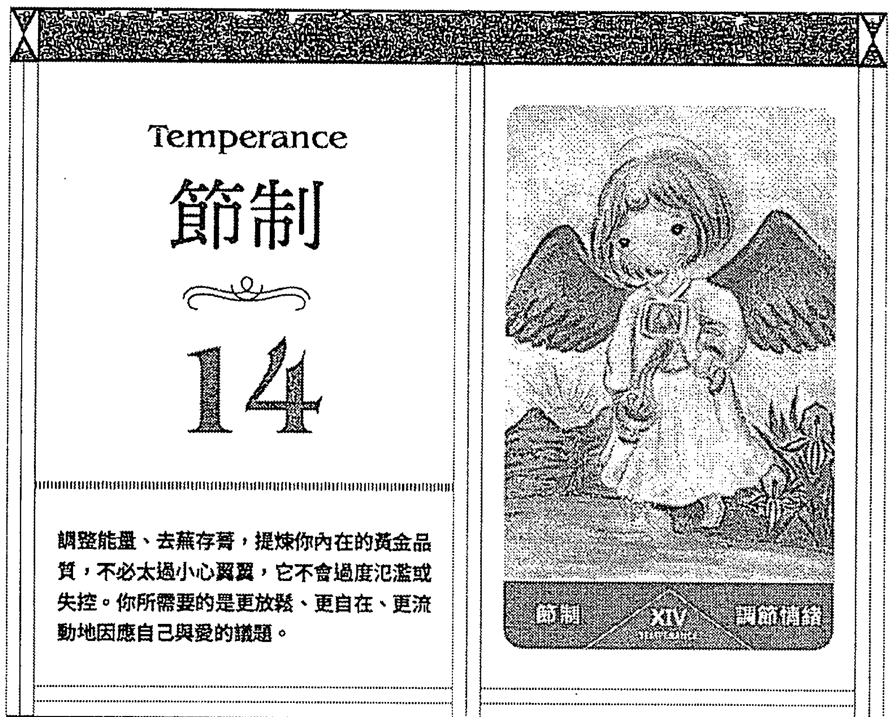

1+4=5，14号节制牌与5号的内外合一有关。请想象有一个人告诉你：「要节制呀！你要节制一点」，会是什么样的感受。他的想法是什么，或是他担心什么？什么样的状况需要节制？正如牌面显示，要将一杯水倒进另外一个水杯的时候，要专注小心才不会洒出来。所以你要小心翼翼地控制掌握水流的速度与方向，水的元素在塔罗四元素中代表了情感，也就是感受、感觉。针对情感的调节与沟通，透过这两个水杯，必须要十分小心控制，牌面很好地呈现了节制的主题与象征。这里的大天使，必须要小心翼翼地调整自己，好好处理情感、感觉、感受的任何细节，必须控制得宜，以免失控。

节制牌对应数字5号的图形，三角和四方，出现在心轮的位置，三角形代表了渴望的自由与改变，四方形代表了规则与外在的框架。心里面渴望的自由和改变，被自己的框框限制住了。框框代表了「你应该要控制好」、「你应该要小心谨慎」。心渴望自由、内外合一，就像拥有宽阔翅膀的大天使，要如何才能够展翅高飞。同时，三角形符号的天使象征了火天使米迦勒，真金不怕火炼，炼金的过程更能让自己去除杂质、提升自我。

牌面中环境优美，水仙花摇曳生姿，就算水滴出来，不过是再次回到池塘里被大地接收。天使一脚踩在水里（精神层面），一脚踏在土地上（物质层面），其实是代表很好的衔接，连接不同的元素，达到平衡，对他来说没什么需要过度担心。14回归到数字5，是个内外整合的数字。外面的环境与资源相当丰富，因此可以放心去做自己想做的事。抽到这张牌时，你是有天使守护的，好好去掉外在的制约，让内在珍贵的纯金能量显现吧！

### 引导提问

- 你的心渴望什么？在什么事上想要展翅高飞、放手一搏？
- 最近有哪些内在状态需要重新整理？有哪些情绪需要好好去芜存菁？
- 内心世界与物质生活需要哪些平衡？生活条件和环境中，有哪些资源可以支持自己？

### 示范引导

当事人：我想要去告白不知道现在时机是否合适？

引导者：同学应该都满鼓励你去的吧。不过你是不是不太敢告白？想很多？

当事人：老师你怎么知道！？

引导者：你抽到这张牌，动作上绑手绑脚，但你看周围的水仙花、太阳都欣欣向荣。你很小心翼翼，拿捏要怎么做比较好：「真的要去吗？好紧张呀！如果讲了被打枪、被发好人卡，这样又做不成朋友。」先调整一下自己的心情，就放手一搏吧！像天使一样展翅高飞吧！水洒出来并不会怎么样，对吧！

## The Devil
### 惡魔
15

别抱怨生活中的不如意是别人造成、是无法改变、是迫于无奈的。因为这些都是你自己的选择！都是你心甘情愿，为了满足自己心中渴望与需要所做的决定。现在你可以正视它、接纳它，因为你可以随时离开这个枷锁。

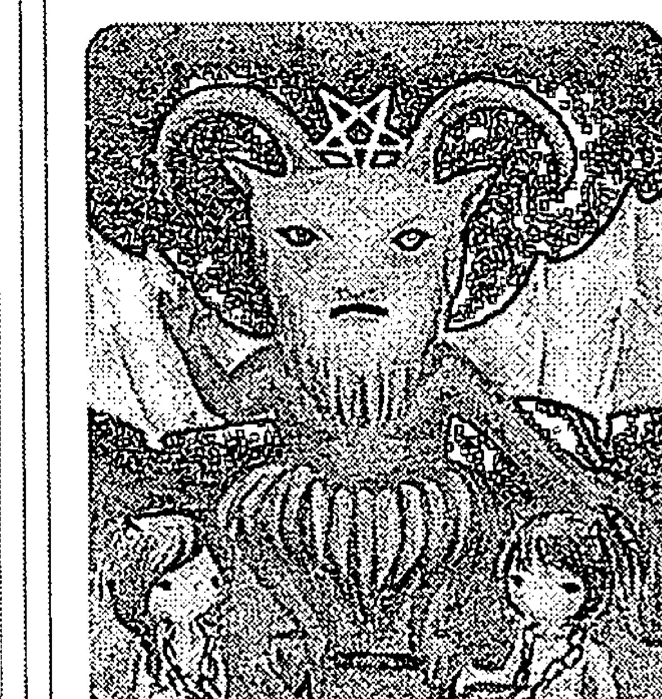

15号恶魔牌，1+5=6，对应6号恋人牌，这两张牌面很相似，都有亚当夏娃，呈现了不同的对照。6号牌的恋人身处伊甸园、天堂，而在15号恶魔牌面上，他们却变成撒旦的奴隶。这是撒旦恶魔的象征，头顶上的五芒星象征着物质，五芒星在四元素里代表了土元素，即物质。

恶魔代表了人们的物质欲望，对金钱、权力、物质或名声的欲望。撒旦最了解我们想要什么，用火把来引诱我们内心的恶魔，当心中欲望太强大时就会变成魔鬼，我们被欲望套牢，渴望变成了贪婪，于是甘愿成为奴隶，交换欲望所需。

亚当和夏娃两个人头上都长出了角，变成了撒旦的奴隶，脖子上套着铁链。铁鍊其实比亚当夏娃的脖子还大很多，如果他们真的想要离开，随时都可以拿掉铁链。而且，恶魔也没有抓着他们。这些都象征了「他们自己心甘情愿到这里，套上铁链，心甘情愿被物质的渴望套牢。」

这张恶魔牌是内心的试炼，协助我们「看清楚」之后，明白自己为什么做出这个选择、或究竟被什么欲望困住，或为了满足什么样的需要而宁愿承受压力却不离开。

### 引导提问

- 你为什么心甘情愿留在这里？是什么在吸引你？有一个满足你需要注意的渴望，那是什么？
- 诚实面对内心的欲望，这些欲望带来什么样的感受？会有压力吗？
- 做出某个选择的决定，内心的魔鬼／心中的黑暗在述说些什么？

### 示范引导

当当事人：工作压力很大，想要问「去或留」。

引导者：抽到这张牌，代表这个工作能满足了你某一项物质需求，你觉得是什么？

当事人：薪水很高！所以我不想离开，但是又觉得好痛苦！压力好大！

引导者：你抽到恶魔牌，压力是一定有的，但薪水也是很重要的，你为了这份薪水继续留下来，即便压力很大还是没有离开，因为你明白这份工作可以满足物质生活的需求，这份明白是很重要的！那我也好奇，如果你有一天离开这份工作，压力解除了，你猜可能是因为什么？是物质需求被其他事情取代，或是薪水的收入被满足了？

1. 这里的恶魔手势是邪恶的手势，而教皇的手势是祝福的手势。

## The Tower
### 高塔
16

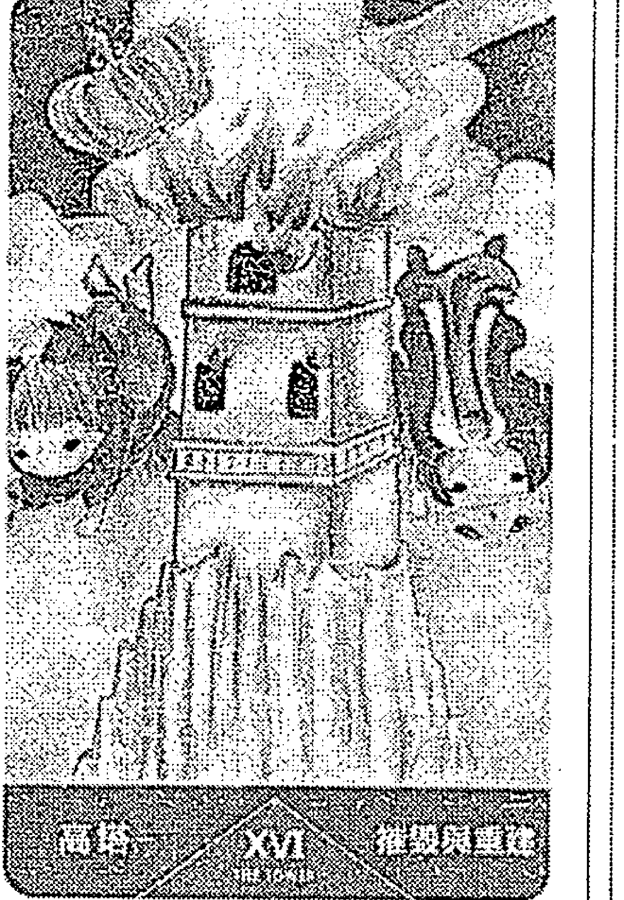

過去的世俗成就，是經歷某些痛苦而堆積起來的灰色高塔，住在塔頂的你並不是真正的開心。現在的你想要突破現狀，吸引某些改變的事件來到你身邊，迫使你打破這道高牆。將光環榮耀摧毀，丟掉過去包袱，都是為了成就更美好的將來。

16号高塔，1+6=7，对应的是7号战车牌，学习的是信任课题，7代表了幸运，所以这张高塔牌同样也隐藏着幸运的意思。许多人觉得高塔是灾难，一看到这张牌就会心生恐惧，「天哪！我要跳塔了，要被火烧死了！」

高塔的牌面带着毁坏、爆炸、烧毁、意外、被警告，摧毁再重新来过的含意。这座塔建筑在陡峭的山上，是经过时间累积慢慢筑高的塔。周围一片漆黑，山下冰天雪地，有点像《冰雪奇缘》里的场景，主角躲在山上，用冰雪城堡封闭自己，最好永远不被世人找到。这座塔建筑在冰天雪地的灰暗处，灰暗代表了痛苦、不舒服、不愉快。

要是住在这座里头一片灰暗的塔里，大概会像住在监狱里一般。要筑成这么高的塔，是需要一番功夫累积的，而这座灰色的塔正是痛苦累积的过程。想象塔顶的大皇冠原本是好好戴着的，表示在世俗的眼光里，这些痛苦累积起来的功成名就，是受到肯定的。皇冠代表了荣耀、受到赞许。

或许做了某件事让你痛苦，可是大家却觉得「很棒，这样做对了！」当然，生命的脚本无法这样继续，因为住在塔里的人已经快疯了，而他想要改变自己的这一股意念，引发了突如其来的事件。牌面上的闪电象征突然、快速、意料之外的。闪电突然劈在塔顶，轰掉了皇冠。美好的一切即将崩毁，而且也不会拖得太久。突如其来的事件会迫使改变发生，塔开始起火了，而住在里面的人只能逃命。他跳出来时头顶上还戴着皇冠，代表他依然戴着某种荣耀，不过什么包袱都来不及收，过去累积的所有家当都化成灰烬！不过，他也是幸运7的象征，所以跳出来之后，还留着一条命（留得青山在，不怕没材烧）。这样的改变不仅让自己突破困境，更为了接下来的新发展与更美好的愿景。虽然这个过程可能是痛苦、不舒服的，但必须要经历彻底的毁坏，才能抵达幸福恩典的时刻。就像「塞翁失马、焉知非福」，虽然现在看起来不好，但后面会有美好在等着你，这让你学会信任，并重新打造真正的自己。

### 引导提问

- 你最近（问的这件事）发生一些出乎意料的变化，是什么？要你从中学习什么？
- 画面中的人是你吗？你从什么样的塔中跳出来？感觉如何？
- 高塔的崩毁是为了找寻真正的自己，你想重建什么样的生活？

### 示范引导

当事人：我想考研究所，想改念自己喜欢的科系，但是父母和老师都反对，我最痛苦的是，我原本的成绩不错，更没有办法离开，他们都说我不继续念很可惜，叫我千万不能放弃！要我念书考试可以，但我真的没有兴趣！

引导者：你抽到高塔牌，看起来打掉重练的时候到了！而且由不得你爸妈要不要，这个环境有点险恶，这也是一个翻身的机会，看起来你过去所有的累积必须在这里抛下。

当事人：所以我可以做自己，去读我想念的研究所了吗？

引导者：我看你不去念也不行了，准备跳塔吧！你应该感觉快被烧死了。回去好好跟父母沟通吧！你做好心理准备了吗？

## The Star
### 星星
17

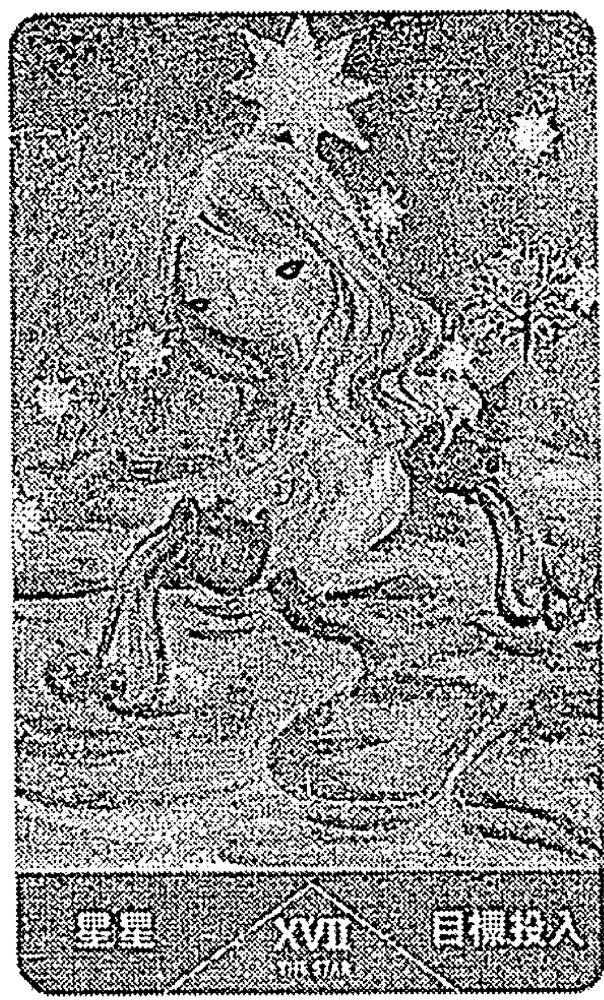

在瞎忙的生活與工作中，你是否已經迷失方向？是否覺得自己都在做白工呢？請你暫停一下，抬起頭來看看你的目標、你人生的初衷、方向在哪裡，為自己設定好目標後，重新投入。

在高塔崩毁后，我们最需要的就是光明与希望，接下来要介绍来自天空中的三道光：星星、月亮、太阳。

17号星星牌，1+7=8，对应的是8号力量牌，只要一想到数字8，就会直接联想到忙碌且优雅的能量，星星牌面上的女人显然很忙，一只手倒水不够用，还要另外一只手也一起倒水。接着，8号力量有个很重要的关键就是「目标」。目标清楚明确、全力以赴，通常都能做到，而且是轻松达标。仔细看牌面会发现她头顶上的目标象征，这颗主星象征着生命道路中的北极星，从北斗七星的杓子延伸出来就可以找到北极星。北极星就像黑暗的夜空中一颗闪亮的星，象征希望的指引，引导人生的方向和目标，当我们在瞎忙、迷失人生方向与目标的时候，记得抬起头确认一下自己生活的方向与目标。

星星牌。女人象征着真诚和全然投入，找到目标之后知道这是自己想要的人生方向，就能够全然投入。在牌面中，树枝上有只小鸟，正在提醒：「主人！抬头看看，星星能替你带来目标的指引，生活是有解的，请怀抱希望！」

对应数字8的频率，要把力气花在刀口上，这张星星牌更有聚焦的意味，要有意义、有方法、有效率、借力使力。因此星星牌也是，对应到同样的频率，是优雅且聚焦的。

在忙碌的人生里，我们偶尔会迷失方向，星星就像是一股启发的力量，可能是贵人、更可能是自己内在的觉醒，内心总有一颗明亮的星星带来指引与希望。找到希望与指引后，旁边的北斗七星象征着灵光乍现，许多被启发的灵感、生命的资源，许多自己愿意去看的恩典，就会同步照亮星空。找到属于自己生命中最独一无二的那颗星，带着自己独特的存在方式，带来疗愈与希望，闪耀吧！

### 引导提问
- 你有什么目标吗？你知道自己的方向在哪吗？
- 你知道自己平常都在忙些什么吗？你的时间跟力气都花在哪里？
- 你会如何放松自己？你会如何整合资源请求协助？

### 示范引导
> 当事人：想要了解自己与伴侣目前的关系。

> 引导者：你们两个有共同的目标吗？

> 当事人：我们比较少聊到未来的目标耶……

> 引导者：你抽到星星牌，看起来是有希望的、有方向的。你们可以聊一聊彼此共同的愿景。可能会找出共同的一致性，例如我们的感情要走到哪里，或是有没有共同的价值观、共同努力的方向，如果你要出国读书，那两个人是否有共识？可以一起为了目标而努力吗？

18号是月亮牌，1+8=9对应9号隐者牌，所以月亮牌和隐者会有类似的隐藏能量。隐者有股象是观察者的出世感，偶尔观点会比较消极或负面，是生命历程中的灰暗地带。而月亮牌正巧反应了这些心里对于未知的将来所产生的恐惧不安，以及自己没有觉察到的隐忧。

月亮掌管内在的情绪，月相的变化与移动非常快速，因此内在情绪的改变也很快。有时候情绪真的不容易观察到，如果没有觉察到，或没有反应出来，就会在内在不断影响我们。月亮直接影响的就是潮汐的起伏，包括女性贺尔蒙影响的生理期与心情，这些都和月亮有关。

如果让你顺着牌面上这条道路往前走，路旁的野狼、野狗和蟹多少会令人感到担忧。不晓得他们是敌是友，会友善相助或会奋起攻击。其实我们对未知会很多不安，这张牌代表我们对未知的恐惧，未来随时随地都在变化，这也是月亮的一个特征：阴晴圆缺，变化多端。未知充满了不确定性，而这种不确定感会让人感到害怕。

月亮牌象征了内在那种不确定的感觉。关于「不知道会发生什么」的未来，我们充满担忧，而情绪就会随着这些状态不断起伏。

每一张牌都有相应的困境，但也一定可以从困境中找到解决的方法。明亮的月光洒落，照在这条路上，一直到尽头。仔细想想，虽然乍看情绪毫无规律，但月亮周期却提供了一个有迹可寻的观察。未来虽然不断在改变，我们也不知道会如何到来，但这种焦虑和不断变动的状况其实是有周期的。到满月之日，你会知道，经过循环，新月又将到来。这象征着焦虑不会永远存在，未来也不见得是完全不可预知的，而我们依然有机会和力量去创造自己想要的。

月亮牌带起我们内在的积极性，正因为未知，所以我们才得以创造，而且还带有9号隐者的智慧。月亮牌同时也教导我们，内在沉着稳定、带着智慧，很多恐惧其实都是自己吓自己，变化也是在考验我们接纳不确定的弹性有多大。狗吠月亮，并不会对月亮造成任何影响，月亮依旧顺着阴晴圆缺不断循环！观察大自然的现象，焦虑与平静、新月与满月，春夏秋冬的演变，都是不断循环的过程。这样当你发现自己焦虑的时候，会觉得自己好像可以接纳某些焦虑，焦虑也是一种自然的过程。在焦虑时，就观察自己的焦虑吧！无法做出判断的时候，也不要强逼自己做出决定。

### 引导提问
- 你在焦虑什么呢？你会如何安定自己？
- 面对未知不明的状况，先不急着做出决定，那你会做些什么？
- 看着月亮，或晒晒月亮，内心会有什么感受？

### 示范引导
当事人：我想要离开家里去其他城市工作。

引导者：你抽到月亮牌，你对于即将去到那个城市有些不安、不知道会发生什么、未来充满不确定，是吗？

当事人：是的。我没有在那边生活过，不知道会发生什么，其实会害怕。

引导者：在内心不平静的时候，先不要做决定。让自己安静下来，观察这些焦虑，等内在不安的云雾散去时，再看看会出现什么指引。

在面对月亮牌的未知恐惧跟内在情绪之后，接下来就能重见光明啦！

19号太阳牌！1+9=10，1+0=1，象征新生儿。新生儿、向日葵、太阳这几个象征都代表了希望、新的开始、正向的力量。也带有数字10命运之轮的力量，所以太阳牌也代表了改变的力量，代表会朝着希望和光明的面向改变，而这个改变会带来新的开始。

牌面中的马代表行动力，拿着胜利旗帜的孩子象征全面性的成功与开展的机会，而围墙象征着遮蔽。

想象在太阳还没有出来之前，布旗盖住了牌面的上半部。太阳一出来，揭开布幕，向日葵显现出来，一片光明。这个象征我们称为「真相大白」，真相被揭开，事实摊在阳光下，一览无遗，象征着终于不必再掩藏、曝光。

曾经有位提问者在问关于自己外遇出轨的问题，抽到这张牌，我建议他：「最好赶快回去向老婆坦承，因为这件事已经是纸包不住火了。所有的事情都将摊在阳光下，一清二楚。主动讲清楚会对你们的关系比较好，因为这是太阳牌，你愈想隐藏其实愈不利，布幕已经揭开了，这时候要说清楚讲明白。把握这个可以摊牌的机会吧！」

太阳是无比闪耀的一张牌，带有对生命的热情与好奇心，也是塔罗78张牌当中最光明闪耀的一张。抽到这张牌的人，个性就像是晴天娃娃，稳定且散发着温暖，会为生活带来光明、满足、希望与成功的机会。即便遇到不太愉快的事情，太阳牌依然提醒我们要从光明乐观的地方去想象与创造。

### 引导提问
- 真相被显露出来，你的感觉是什么，会担心吗？
- 如果揭开表相，能带来光明，这也是最好的发展状况，你可以接受真相吗？
- 这是一个成功的大好机会，你准备好了吗？

### 示范引导
当事人：关于同事之间的冲突，人际关系的问题。

引导者：你抽到太阳牌，代表这个冲突有个光明正向的理由，猜猜看，如果发生这件事是要带你往好的地方去，你觉得是什么？

当事人：可能我早就不太想跟这个人来往了吧！所以刚好趁这个机会认清他的为人。

引导者：所以也不需要烦恼了，布幕揭开后，一切都真相大白！

## The Judgement
# 审判
## 20
你正在思考、酝酿的事情，将面临最后的抉择！已经没有太多时间踌躇。现在，必须要决定！请在心中选定一个抉择，并坚持住。你的心智与意识也准备好要觉醒了！别再沉睡。

20号审判牌，2+0=2，又要选择做，可是这和2号女祭司的选择相当不同，2号牌的选择是才刚开始，而审判牌已经走过人生一轮，到最后的阶段，所以这张牌象征生命最后一个阶段，也就是审判，这也代表圣经故事里的末日审判。末日审判来临时，就是生命即将结束的时候，评判你的这一生。牌面上的天使是加百列，吹着号角呼唤大家来到神的面前，所有人都要被审判。

抽到这张牌的提问者，他想问的通常不是刚刚发生的事，应该是有一段时间了，否则他不会抽到审判，因为这是人生走完最后一个阶段，已经要做最后的决定了。所以这张牌也代表事情已经到最后关头，要算总帐了，或是大限已至，没有时间了，有种火烧眉毛的感觉。

我在学校当心理师时，最常碰到的研究生抽到这张牌。论文、专题火烧眉毛，来不及了！或是谘商完就要去谈分手的学生，我会说：「同学，你现在才来！这些事情想很久了对不对？」这张牌就是请他做出最后的决定。有时候也不是真的要一个决定，这比较象是心里面的决定。例如和某个人的关系很不好，考虑要不要继续合作，或要不要跟这个人继续来往，这有时候是种心里面的决定，在心里画下界线，就像是审判，清楚明瞭，做好事就上天堂，不义之人就下地狱。写论文，要不就现在马上赶工，今晚不睡也要弄完，明天交给教授，要不就延到下一次才口试，慢一点毕业，你必须要做出选择。

做出决定时，会有种解脱、得到救赎的感觉。牌面中的十字正代表救赎。大天使吹号角也是种唤醒人类心灵觉醒的象征，提醒人们不要再沉睡，快为自己做出决定吧！有的人抽到这张牌，做出内在的决定后会有股清醒的感觉。这张牌为他带来觉醒，当他做出决定，感觉就像醒过来一般。

### 引导提问
- 这件事情你已经思考或困扰一段时间了吗？
- 你要从什么样的状态清醒过来？觉醒后的你会是什么样子？
- 现在的果，都是你过去种下的因。你想要替自己的往后种些什么意念种子呢？

### 示范引导
当事人：问感情是否该分手。

引导者：这张是审判牌，你没有时间了！我好奇，这件事情你想多久了？是不是想要分手已经拖一阵子了？这张牌提醒你要清醒过来！

当事人：是呀！我觉得应该要做出了决定！没错，我觉得我不应该继续浑浑噩噩跟这个人鬼混下去了。我应该要好好振作，重新正视我自己的人生！

引导者：做出决定，清醒过来，你想做些什么呢？

## The World
# 世界
## 21
你必須給自己一些空間與時間，每天花些時間獨處，讓自己靜默，這就是你生命的舞台。在個人的內在空間中沉澱，讓生活中各個面向回到各自所在的位置。因你能做你自己，他人也更能做他自己！

终于来到最后的世界牌，宛若天堂！

21号世界牌，2+1=3，对应3号皇后的舒适、丰盛、舒服地表达自己。牌面中央人物的姿势非常轻松自在又舒服，拥有自己的舞台，拿着魔法棒，仿佛可以创造出人生另一种新的可能性。

命运之轮的四大神兽又出现了，在各个不同的领域中守护着，牌面上也看到叶桂冠围成一个很大的圆，不仅象征圆满，也表示画上句点的圆形，是完成的意思。

在这个圆满完成的象征里面，有自己的舞台跟界线，在当中自在的舞动。因此，让我们思考，什么是圆满？世界牌让我们学习到，真正的圆满是在走过人生的一切后，会发现其实生活中无论是权力、人际关系、金钱、物质、家庭等各个不同的角色，都有其不同的发挥，因此信任每个人会有恰如其分的展现，在每个位置和角色中都能发挥自己。正中央的主角，也只需要把自己的舞台发挥得好，界线清楚，这就是真正的圆满。

通常抽到这张牌的人都满开心的，因为这象征着圆满的完成。如果是问人与人之间的关系，我会建议：「你们要给彼此空间，要有彼此的角色分野，可以允许对方成为他自己，不要过度干涉，或是要能充分尊重。」

这张牌的感觉是舒服又没什么负担的。主角拿着魔法师的棒子，表示创造性很高的。如果是妈妈来问要怎么样引导孩子，抽到这张牌，我会建议：「不要管太多，给小孩充分的空间，他就会长得非常好。他需要一个够大的舞台去发挥。妈妈你就管好自己的事情，孩子也会管好自己的事，不用担忧。」

### 引导提问
- 回顾一下你最近的状态，你完成了些什么？
- 你会如何给予自己与他人发挥的舞台？你的舞台是什么？
- 顺利进展到下一个阶段？你想要做些什么？

### 示范引导
当事人：我想问工作，还会有不会有进一步的发展？怎么才能更好？

引导者：这是一个圆满与每个角色都各自到位的状态。你会得到你想要的舞台，以及你想要的地位，你可以发挥你想要发挥的能力。

当事人：那有什么建议吗？

引导者：在这个过程当中，要展现充分的信任，以及充分的授权。如果你在主管的位置，对于属下、团队在做的事情，也不能过度干涉。要允许每个人成为他自己，给他们一些空间，这样力量和能量才能够回到他自己。别人才能尊重他，允许他活出自己人生的舞台。如此一来，你将会有更大的能量去做你想要做的事。

# 第四章
## 小阿德克那
## 小阿尔克那总论
副牌小阿尔克那共有56张，运用四大元素「火、风、水、土」区分成四个组合，也就是四个小牌组：权杖、宝剑、圣杯、钱币，在本书中会依照红、白、蓝、黄来区分。

### 火元素：权杖（Wands，红色牌组）
权杖代表火元素，掌握权力、有行动力、有力量的，掌管了行动层面。

### 风元素：宝剑（Swords，白色牌组）
宝剑代表风元素，思想与变化性，掌管了想法与信念层面。

### 水元素：圣杯（ Cups，蓝色牌组）
圣杯代表水元素，掌管了我们的内在情绪感受的流动。

### 土元素：钱币（ Pentacles，黄色牌组）
钱币代表土元素，掌管了金钱物质、实际的、务实的层面。

### 四元素人像图形解读
- 風元素 | 寶劍：想法、信念、二元對錯、自我限制、批判、價值觀、煩惱
- 水元素 | 聖杯：情緒、感受、愛、關係、感覺、熱情
- 土元素 | 錢幣：功成名就、學業、事業、房子車子、投資、生涯規劃、健康身體
- 火元素 | 權杖：行動、行為、做事方法、執行力、實踐力

现在，我们从心理状态四大面向来区分人的整体能量，进行四元素的讨论。

#### 水
对应心理主题分类来看，通常最好分辨的是水元素。

第一个直觉，水可能会让你想到「眼泪」。

接着，流眼泪或是哭代表什么？这些反应，从哪里来？

水元素对应人体「心」的位置，从心的层面感受。有感动会哭。有难受也会哭。

圣杯代表了水的元素，包括了情感、关系（亲情、爱情、友情）人际互动、感受、感觉、情绪（喜怒哀乐）。情绪包括了所有的感觉。

#### 风
宝剑，代表风的元素，代表了想法，对应人体「头」的位置。

和风元素有关的包括信念、判断、觉察、理智、分析、烦恼、价值观、是非对错二元、批判。

#### 火
权杖，火元素，对应人体的四肢、手脚，包括行动力。讲到权杖就会想到行动力，以及热情（水元素）伴随的采取行动上。火元素也代表改变，要做出不一样的行动时，就带来了改变，改变带来了突破的力量。

如果想太多（风元素卡住）而没有行动，就会容易裹足不前，行动太多就是做到过劳，行动太少就是停滞不前。因此，火元素有前进的力量，行动、移动、执行力、完成度，也就是所谓的落实，落实在行动。表示这个人比较能「实践、落地」，因为他不只是想、不只是有感觉，还实际去做。

权杖牌组代表火的元素，相关议题包括：行动力、执行力、实践落实、做与不做之间，裹足不前，或是劳累感与责任感很重而导致做太多。

#### 土
钱币。人说钱乃身外之物，风、火、水三个元素都可以从内在找到，但是钱币不行。钱币并非存于内在，而是代表了皮肤、肉身等。土元素包括身体，让人直接联想到健康、物质欲望，物质包括车子、房子、工作等，对小朋友来说则代表学业。学业、工作都和名有关，有好的名声，就有好工作、好收入，接着能投资赚大钱，也会带来安全感。所以可以增加安全感的都可以含括在钱币内，统称为功成名就。选工作、选学校、都是为了让自己成长、提升，所以学业、金钱、投资都算在物质的牌组里。

其实这四大元素是不可分的，在学习时，先把这四组牌卡先用四个不同的主题区分出来。但回归到人的问题时，宝剑这组牌是所有问题的根源，而所有的想法信念，包括烦恼也是从这里来的。所以在物质或工作上有困扰，要先回到宝剑来讨论，其实都是环环相扣的。

如果当事人询问「无法怀孕的问题」，抽到的牌都是土元素，没有水元素，表示都是钱币牌，却没有圣杯牌，这显示她的问题和困扰都是与物质或身体健康相关的。而少了圣杯牌也代表在这个问题中，关系互动与爱的滋养并非问题的主因。

如果是询问何时谈恋爱，却抽出一堆钱币牌，没有任何圣杯牌，表示他现在重视赚钱胜过谈感情，目前重视工作而非感情。如果是询问工作问题，却抽到一堆圣杯牌，可分几种状况，一是办公室恋情，再者是热爱这个工作，是对于工作有很多情绪需要排解。我曾经碰过这样的情况，当事人很热爱这个工作，当然也因为和爱人在同一个办公室，才会一直无法下班。这些相关的议题都可以一起观察探讨。

一组牌阵里，出现的四元素比例，可以作为重要参考：
- 火多，要特别关注行动、工作量、能量、挑战与压力。
- 土多，要特别关注物质、金钱、身体健康、实际面的考量。
- 风多，要特别关注想法、信念、执着、自我矛盾与限制。
- 水多，要特别关注情绪、感受、需要与渴望、滋养与满足。

四元素偏重某一个，太多或太少，都会造成不平衡，这也是解读时的重要观察。用整体观看四元素的方式来做个案概念化的处理，藉由心理谘商的角度，就能从情绪、想法、行为三大面向来切入，刚好塔罗系统多了一个「物质面」可以补强，我觉得很完整。这样一来，生活中的所有问题都能在56张牌里获得解答，藉由这个概念地图，能完整地将所有层面容纳进来！

在56张副牌当中，数字牌带出了生活事件的隐喻面以及这些事件要我们调整或注意的事；宫廷牌则象征了一个过程，留意角色呈现的心境与心理状态，其中的人物多半是自己，或者他询问事件中的关系人，在这个主题里面，事件的发展状态呈现的样貌是什么。

### 宫廷牌的四元素
宫廷牌中的侍卫、骑士、皇后、国王这四个角色也会分为火、土、风、水这四个元素。

从最直觉且最容易记忆的方式进行角色联想：这四个人都在皇宫里做些什么？

- 最具女性特质的是皇后，水就是阴性特质跟柔软。
- 最有冲劲的是火，具行动力，冲锋陷阵、奋勇杀敌的感觉，以骑士为代表。
- 最机伶、擅长见机行事、保护主人的是风，以侍卫为代表。
- 最稳定的是土，也是钱币，像守护土地的土地公一样，稳稳当当。守护江山的土元素就是国王。

### 宫廷牌元素互相搭配
以水元素的圣杯牌组来举例。

如果「水圣杯」碰上「风侍卫」就是水中之风，叫做「圣杯侍卫」。水元素代表情感的流动、感受的、变动的，所以水碰上风就叫「感觉感受的变动」。如果问感情抽到圣杯侍卫，表示这段感情刚开始，还在初始阶段，其实还有些变动跟变化的可能性。「圣杯骑士」就是「水中之火」，表示这段感情正打得火热，很有行动力，或很想追求对方。「水中之水」，78张牌里面最多水的就是「圣杯皇后」，他的杯子跟一般圣杯不同，是豪华版的特大杯。最后是「水中之土」的「圣杯国王」，表示这段感情很稳定，没有太多情绪波动，也可能是压抑自己的情绪。

### 宫廷牌的详细说明宫廷牌是角色呈现的心境与心理状态，其中的人物多半是自己，或者他询问事件中的关系人，在这个主题里面，事件的发展状态呈现的样貌是什么。

以人生发展阶段来看，就是一个状态的从初始到成熟的过程。「侍卫是小孩，骑士是青少年，皇后是成人，国王是老人。」比喻为生命的发展阶段，或是事件的发展阶段，也可以是心理成熟度或是事件的成熟度。

抽到象征小孩阶段的侍卫牌（风，变动、机伶），代表这个事情才刚开始，是初始阶段。抽到骑士牌（火，行动力、冲动），青少年血气方刚！正在如火如荼地展开，拥有奔腾的行动力。抽到成人阶段的皇后牌（水，情感丰沛），会有种稳定跟成熟的爱与投入，但又不至于到老人阶段。抽到国王牌（土，稳定、物质）就是不动如山。也可以说是比较稳定、固定，没有太多弹性与改变，也可能是遭遇卡住或一成不变的情境。

## Wands

权杖牌组

权杖牌组（火元素）相关议题：行动力、执行力、实践落实、做与不做之间，裹足不前，或是做太多。

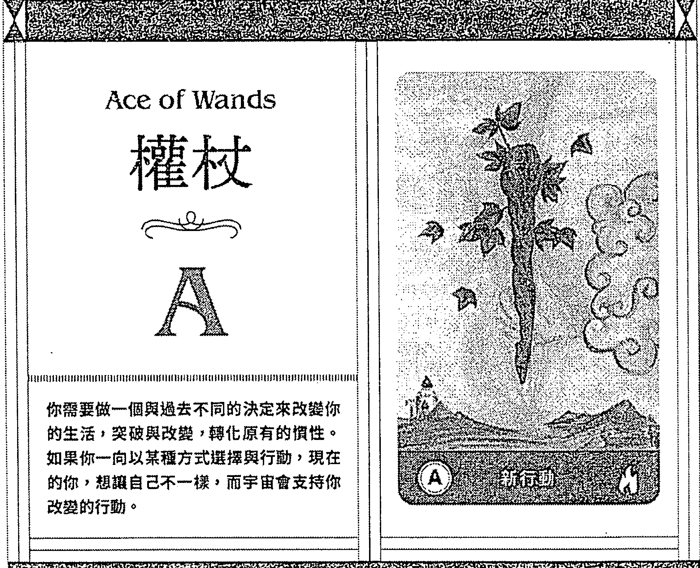

这是一个新的开始，对于新行动来说，代表了突破与改变，做一个与你之前不一样的行动，权杖上的手拇指往上，好像在说：

「赞！做好！」

对应数字1的创造力量。在权杖A的牌面中，权杖上长出很多绿色的嫩叶，有一些新的叶子，有些开花结果，有一些冒出芽来。这正代表了一个新的行动，有别于以往的不同之处。如果你问了一个问题，抽到这张牌，要去思考牌给你的建议，你现在做这个选择、这个行动或决定有没有什么是和过去不一样的。比如说你一直是个凡事都说好的滥好人，那现在这个状态要怎么处理？出现了这张牌，其实是在告诉你要有所突破。所谓的突破就是不一样的改变，所以你可能在这件事情上要说不！突破自己原有的惯性。

### 引导提问

- 你想要做些什么呢？有把握吗？
- 你要替自己做些什么改变？你想采取什么不一样的行动策略？
- 把握这个改变的机会，猜猜看，改变之后的自己会是什么样的状态？

### 示范引导

当案人：朋友约我参与一个计划，但是我不知道要不要答应。

引导者：你跟他合作过吗？你想要答应他吗？

当事人：他之前的邀约我都会答应参与，其实是惯性地点头说好，不过这个计划我犹豫了，并不太多想答应他。

引导者：你抽到权杖A，如果在这件事上面你做出和过去不一样的行动，那会是什么？

当事人：哇！那我就会直接拒绝了。我好像懂了！其实我内心根本就不想答应。

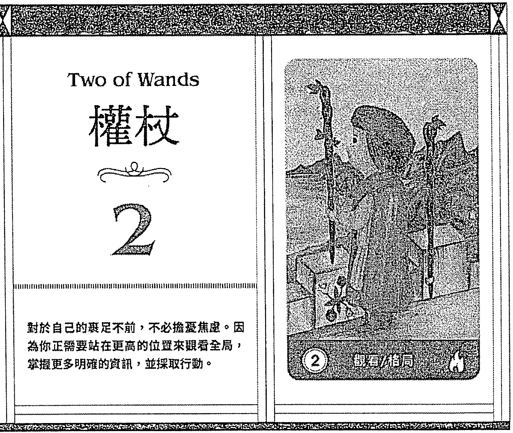

牌面的场景是在城墙旁眺望远方，主角站的位置看起来比较高一些，他右手拿一个地球仪代表关于未来的愿景与蓝图。对应2号女祭司，这张牌也有祭司的特质，类似宰相、军师的角色，有谋略，需要有宏观的计划。

牌面中的两根权杖摆放在不同的位置。他的左手握着一根权杖，而右手边的权杖则拴在城墙上，拴住的权杖可以说是我们还没有做出的行动，所以现在可以采取的行动只有一半，所以主角一手拿着地球，一手握着权杖。站在城墙上面观望这个局面，表示他的视野并不是狭窄的，而且地球代表了宏观的缩影，可以看到整个全世界的局势跟他发展。所以他正在静观局势，现在还没有做出所有行动的决定。他是个冷静沉着的军师，必须要用冷静的智慧，来综观一切。

### 引导提问

- 拉高格局与视角后，你会怎么看这件事？
- 还没行动的原因是什么？你在犹豫什么？有什么考量吗？
- 哪些行动是你已经掌握的，哪些又是还在观望中的？

### 示范引导

当事人：想问现在要不要离职，想自己创业。

引导者：你有点裹足不前，还在观望，还没有到要创业的时机。

当事人：那我现在可以做些什么呢？

引导者：鼓励你要从更高的格局来观看，宏观地用更高的视野来看这件事。你评估过自己的各个层面吗？不只是资金，还有观察市场整体的需求，会得到更丰富的信息，站在更高的位置来看会更不一样。不只是抱着有兴趣、很想创业的热情，不必急着做决定，现在要冷静地观察，这样做对你来说是最有利的。

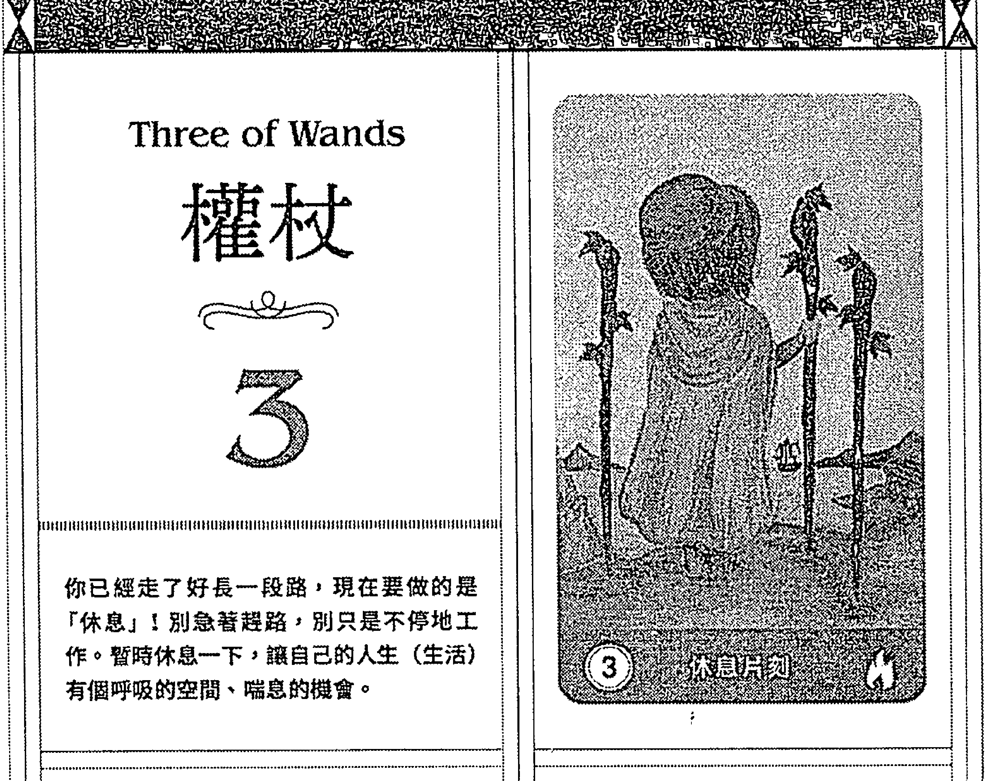

当你做出选择、决定之后，牌面上的主角就要出发了。权杖3的主角是一个外出的旅人，也有人说他是做生意的人，出门经商、跑业务。看看他站的位置，前面有海，在遥远前方的小山丘有点高。他不是突如其来跳到这里的，应该经过一段时间的跋涉，经历了一些事件，从山脚下走上来的。后面有个凉亭，里头有张椅子让他能稍作休息，正呼应3号皇后牌的轻松与舒服。所以他现在停在这里，喘一口气，休息片刻，要中场休息一下。

「休息，是为了走更长远的路」就是这个意思。不要只是一味不停赶路，不停往前走。休息一下，观看来时路，观察一下走过的路途；看着远方的船只，代表看着已经初步完成的计划启航，感到欣慰与满足。同时也看看自己已经走了多远、多久。就像爬山一样，埋头走在山路上，不觉得自己爬得多高，可是到某个地方，会突然吓一跳，原来自己是从远方那栋小房子出发的。这张牌就给人这种感觉。观察一下自己走过哪些地方，带着过去累积的经验，休息充电之后继续往前走。这张牌也有助外出和旅行的运势。

### 引导提问

- 这位旅人会往哪里走？往牌面中的哪个地方去？往前还是往后？
- 最近要进行什么新计划吗？
- 忙碌之余有个小空档，想安排休息或旅行的计划吗？

### 示范引导

当事人：想知道最近的生活建议。

引导者：抽到这张牌，意味着你需要休息一下。工作忙碌太久没休息了吗？

当事人：是呀，已经好几个月没有好好休假了！呜呜！

引导者：可以来个小旅行，让自己放个假，好好休息充电让自己更有能量。

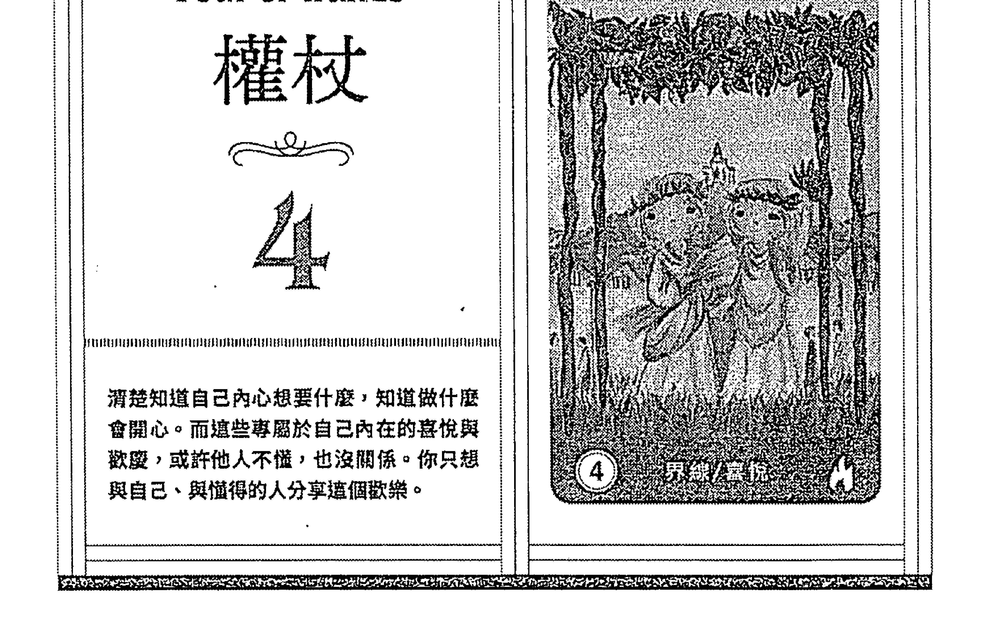

4号数字带有「界线」的议题，村庄里在庆祝农作的大丰收。村民们一起把丰收的果实与葡萄挂在入口处，用四支权杖支撑的门象征稳定，门里是属于村民的村庄。因此，由权杖筑起的「欢迎门」形成了一个内与外的界线。村庄内的人开心庆祝丰收，村庄外的人不知道他们在做些什么，在开心庆祝些什么。有时候我会笑称这张牌是「暗爽牌」，就是做了一些事让自己开心喜悦，但别人可能不觉得这有什么好开心的。例如你拼好一个模型或解出工数的考题带来很大的喜悦与成就感，别人可能根本无法理解。

这张牌代表了内与外的界线，界线的划分可以是一个群体、社团，里头大家有共同的语言，有彼此的默契，甚至一样的「笑点」，是同个学校组织的人才知道的独特文化或经典笑话。自己内心明白的喜悦与满足，有时候不见得要得到外人的认同。

问你与某个人之间的关系时，这张牌代表两个人关起门来畅快跳舞，可是外面的人都不知道他们在做什么。

### 引导提问

- 你是站在门内的那个人吗？你在庆祝些什么？你为了什么而开心？
- 你在这件事情上，有界线的议题吗？觉得谁是自己人、谁又是外面的人？
- 如何能在自己的小天地里自得其乐？

### 示范引导

当事人：我想问我与某人的关系。

引导者：出现这张牌，你觉得你们是住在同一个星球上的人，是吗？

当事人：对呀！我和她有很多时候不用说太多话，就觉得很了解彼此的想法。

引导者：有时候别人不太懂你们两个到底在笑什么，可是你们可能有自己的默契，就是你们都知道讲到什么会哄然大笑，因为这可能来自你们共同的生命经验，可是身旁的人会不明白你们两个在做什么。但你觉得我自己懂就好，别人不需要懂。

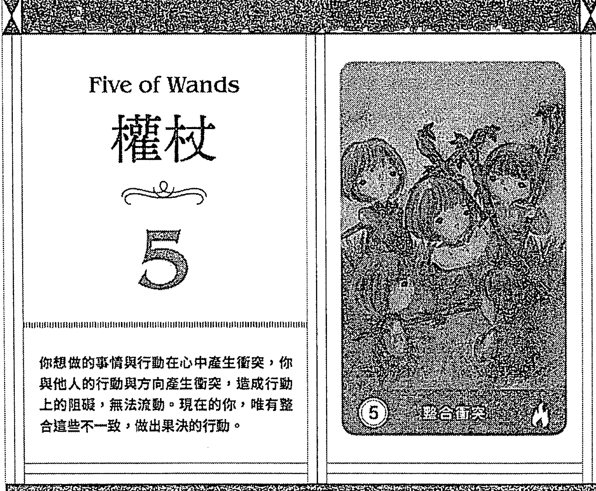

权杖5牌面是个「打架」的场景，每根棍子都朝向不同的方向，五根权杖代表了不同的行动，这反应了两个层面：第一种状况，意味着你与他人之间的行动冲突，你们的方向不同，甚至互相矛盾，这也呼应了数字5的整合议题，是要让我们看见并修正的课题。很多人直觉看到这张牌会觉得「不妙！可能会有很多冲突争吵」，因为你和别人的方向是完全不一样的。例如你想开一家「专卖店」，别人却想开多元的「百货店」，这就是方向不一致，彼此都会很混乱，在开店筹备期就很有可能产生争吵与冲突。

第二种状况是你自己的内在冲突，你有几件想要做的事，但行动方向却互相矛盾。例如你想好好准备考试，闭关认真读书到考试前都不能去玩，但你却成天坐在书桌前上网滑手机，边想着等一下要去逛夜市、晚上要去哪里吃大餐或浏览旅游网站。你有很多行动上的矛盾，又想做这个、又想做那个，行动方向无法一致。这张牌最重要的是，看见冲突并整合这个冲突。

再举个例子，问家庭旅游的安排出现了这张牌，就一定得取舍。全家只有一周的假期，不可能又去日本又去花莲台东。开个家庭会议整合大家意见，花莲或日本只能择其一。如果未来还有一起出游的机会，当然可以用优先次序来安排，但一定要有共识。当整合想法后，行动才能一致，就可以顺利出发了！

### 引导提问

- 你想要做的事情象是多头马车，方向各自不同吗？你内心在打架吗？
- 列出来，行动的方向有哪些？好好疏理一下。
- 整合一下这些行动方向，如果有一个一致性的方向可以前进，那会是什么？

### 示范引导

当事人：问和某个人的合作。跟这个人合伙可以吗？

引导者：之前有和这个人合作的经验吗？这次你们讨论过合作的方向吗？看一下牌面，你有什么感觉？

当事人：有稍微聊一下彼此想做的事，还没有细谈。这张牌的感觉好像很混乱……

引导者：抽到这张牌，有两点要注意。第一，一定要和这个人合作吗？第二，如果现在一定要和他合作，请你们两个人好好整合行动方向，化解两人的冲突与不一致。

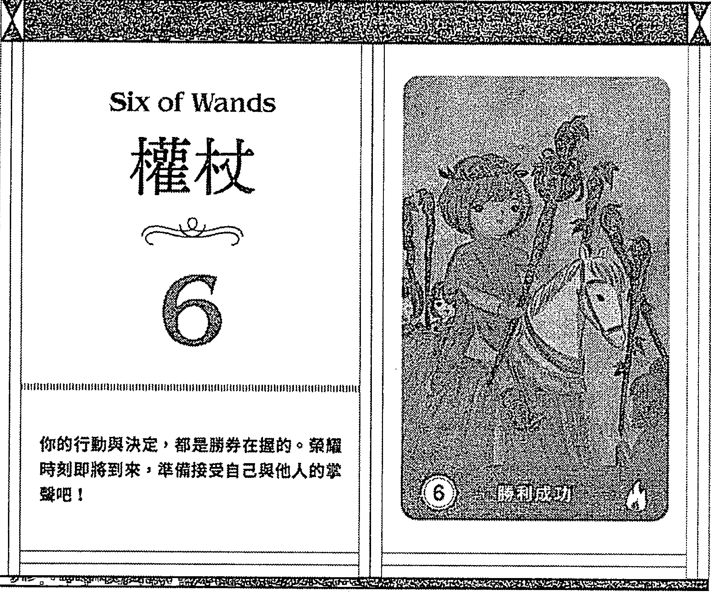

权杖6代表胜利，出征顺利。权杖挂上了叶桂冠，骑士也光荣地凯旋归来，马匹披上彩衣，群众夹道欢迎，包括和他一起打拼的人，也都非常开心荣耀地回来。通常抽到这张牌的人都满开心的，就是胜利、成功、赢了！问关于目标、工作事业的问题时，这张牌往往象征了行动的成功，是非常幸运的牌。也带有数字6的天使守护、像在天堂般美好的意味。

对应数字6的能量，在人际关系上有一种在乎和谐、美好与成功，抽牌者就像画面中的主角，骑在马背上，接受大家的荣耀与赞美，带有「你真的做得很棒！」或「你是赢家」的意味。因此，询问人际冲突时抽到这张牌，很多人会觉得难解，明明牌面上是这么美好，怎么会有冲突呢？抽到这张牌，可以这样回应：「看起来你在关系里都很想赢！」这张牌叫做「占上风」，在关系里你不允许自己输，也不喜欢输的感觉，自己要是胜利的一方，甚至要把别人压下去，战胜这局面。这是一体两面的，想要占上风、赢得胜利，势必有一方是「输家」，当样样都要赢的时候，会形成另一种对他人的压迫与伤害。

### 引导提问

- 说说你过去的成功经验，有什么感受？什么让你成功？
- 对你来说，什么是成功、什么是输了？输了会如何？
- 在这件事情上，是不是有种不服输、好胜、输人不输阵的感觉？

### 示范引导

当事人：我跟老公吵架冷战，看他什么时候要来低头道歉！

引导者：你抽到这张牌，你觉得自己是坐在马匹上的那个人吗？

当事人：是呀！我就是，我觉得我是对的！我老公做错事又不来道歉，我就继续等！我才不会先去和他说话，先开口就输了！

引导者：我觉得这张牌反倒有另一个提醒要你去思考。你觉得在夫妻关系中，什么样的状态才是美好胜利成功的关系？真正的胜利者会带着王者风范，会抽到权杖6，也象征了你非常重视关系和谐，你觉得关系和谐与面子上的输赢，哪个比较重要？

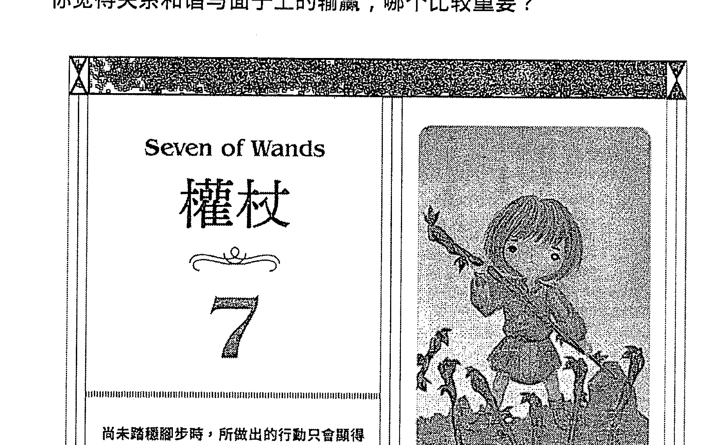

权杖7是张很有趣的牌，看看牌面，主角皱着眉头，慌慌张张，鞋子还穿错了。左右脚鞋子不一样，表示他匆匆出门，来不及穿对的鞋子，随便抓了一只鞋就穿。因此权杖7有自乱阵脚的意味。同时，他脚踩的土地泥泞不平，也象征环境的不稳定。他插了六根棍子，代表已经做出了六个行动。但前面六根权杖东倒西歪，象征他原先的行动都还不稳固，就又急着去做第七个行动，导致太慌乱。他都无法把自己照顾好，因而开始慌乱，不得其门而入、找不到着力点，不知道手上这根棍子要放在哪里。

这带出一个重要的课题是「先回到自己，安顿好自己」，先站稳脚步。第一步，可以先换上正确且适合的鞋！穿错鞋与换鞋都是比喻，穿错鞋象征心不在焉、迷糊。他可能一直焦虑地在想待会要怎么办，根本没注意脚上的鞋子，所以回家换鞋，调整好自己，先把自己的心安顿好，同时站稳脚步，把前面六根棍子整理好。当不知道该怎么办的时候，我会建议先不要急着采取下一个行动，也不必急着做决定。呼应数字7，面对选择时先停下来，才能沉着稳定地做出决定。

### 引导提问

- 前面已经完成的事项如何先稳定好？
- 如何回到自己、稳定自己的脚步、换好鞋子？
- 猜猜看，地整平了、鞋子穿对了、眉头不再深锁，便可以继续行动，是因为发生了什么？

### 示范引导

当当事人：我想问和同事之间的冲突，我在考虑要不要主动道歉？不知道要怎么处理才好。

引导者：抽到这张牌。你真的想道歉吗？现在似乎不是道歉的时候。

当事人：我其实不太想道歉，而且之前试着想要和对方说话，但是他都不理会！

引导者：是的，权杖7就是有点不得其门而入，你在想要怎么道歉对方才会接受，可是感觉对方不太想搭理你，也不太想接受你的道歉。这好像也不是道歉可以解决的事情，看起来你要先把棍子（想道歉的行动）放下，先照顾好自己。问自己为什么会发生冲突？为什么会觉得很不舒服？先搞定自己。

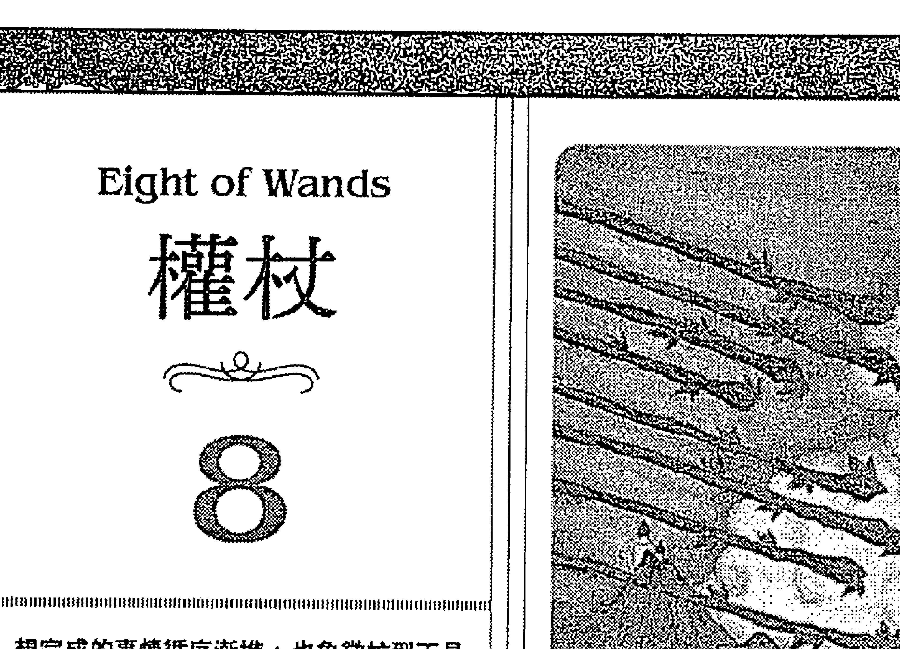

权杖8牌面中的八根棍子一根接一根排列整齐，呼应数字8的特质，不混乱，总能循序渐进，有效率并快速地逐一完成。方向与目标都清楚一致。从上排列下来，愈靠近地面就表示愈接近完成阶段。也代表忙碌的状态，象征同时有八件事情在进行，许多工作项目同时展开，却能忙中有序，事事安排妥当。

牌面中有一根权杖比较短，仿佛出现了一个空缺。这张牌和其他牌有个很大的不同，就是牌面中「没有人」，因为牌面都被权杖占满了，也可以说是事情太多，「忙得不见人影」。

因此，牌面中的空缺，就象征太过忙碌而忽略了什么。通常最容易被忽略的就是「人」，无论自己或家人朋友，包括自己的健康都是。这个空白处，可以说是忽略，也可以说一个喘息的空间，这个空白可以留给你自己，喘口气，也可以留给家人，抽空回去陪陪家人朋友。

对于数字8号来说，最好是一边处理事情，一边约朋友喝咖啡。可以多照顾到人际间的情谊，同时又可以照顾到自己正在忙碌的事。因为对于这个能量的人来说，就是要双赢，两边都可以很有效率地照顾好，很符合8的特质。

### 引导提问

- 你很忙碌，同时发展很多事，感觉也井然有序，但我好奇的是，好像有一个地方你比较忽略，象是有个洞。这个空洞让你有什么感觉？
- 你觉得什么是你比较没有注意到的，因为忙碌而忽略了什么？
- 你如何做到忙中有序，按部就班完成想做的事情？

### 示范引导

当事人：我想要执行一个计划，不知道是否会顺利？

引导者：抽到权杖8，你应该不只这个计划在进行，是吗？

当事人：是的，这是其中一项计划。我又加了其他计划，好像闲不下来。

引导者：你应该会迅速完成这些计划，而且有些计划已经接近完成状态了，对吧？我觉得一定没问题的，这张牌提醒你的是，做事不难，只要记得多休息，把自己的身体照顾好！

## Nine of Wands 权杖 9

事前已经做了很多准备，接下来的这个行动还在持续观察中。运用心灵力量，沉得住气，等待最好的时机采取行动（不会在做事之前就大张旗鼓），跨越困难。

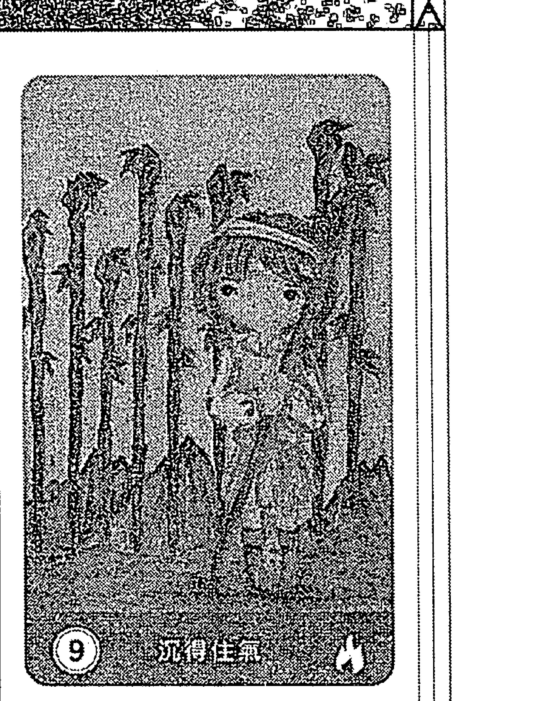

在权杖8的八根棍子一一落地后，就到了权杖9。木棍一根根摆正，依序立起，为此做了很多努力、准备与行动。现在主角握着第9根权杖，对应9号隐者，小心翼翼、低调行事、谨慎观察，同时蓄积能量、做好自我保护，运用心灵的力量，沉着跨越困难。

牌面象征一个受伤的士兵，面对敌军的攻击，他要谨慎小心地保护好自己。那九根权杖象是把自己包围起来的竹篱笆，低调稳定地采取下一步。回到人生，我们往往会受到过往经验的影响，曾经的创伤或恐惧，让我们变得谨慎低调或小心翼翼，而这些生命经验都是我们前进成长的养分，在咨询引导过程中可以带抽牌者去谈谈这些经验带来的正向力量。

下一步该怎么做，他可能在等待最好的时机，所以这张牌反应出9号在行动时，不会大张旗鼓，他的表情小心谨慎，并不是毫无准备。他并非没有行动，卷起来的袖子表示他已经忙过一轮。他面对已经经营到某个程度的行动，会小心保护，谨慎而不鲁莽。

### 引导提问

- 曾经有类似受挫或受伤的经验吗？
- 如果将这些受挫经验视为养分，带给你什么样的学习与正向力量？
- 如何让自己能沉着面对？运用心灵的力量保护好自己，稳定自己。

### 示范引导

当事人：我要参加一个比赛，想知道这个比赛的致胜关键是什么。

引导者：你抽到权杖9，这是要谨慎出招的牌，不到最后一刻、绝不轻言放弃。端看你的心灵稳定力量有多强大。

当事人：所以只要我内在愈稳定，愈有机会赢，是吗？

引导者：是的，别人可能会出怪招想要赢得比赛，你则要更多的观察和观望，做好准备。可以观想最后赢得比赛的画面，观察找出最好的时机，再把最后这一根权杖放上去。这张牌的智慧要让你学习：自己可以沉得住气的。

## Ten of Wands 权杖 10

所有的事都得自己完成，承担所有的责任和压力，事情都往自己身上揽，要学习轻松走到终点！把不该属于自己的责任丢回到他人身上，让每个人替自己负起责任。

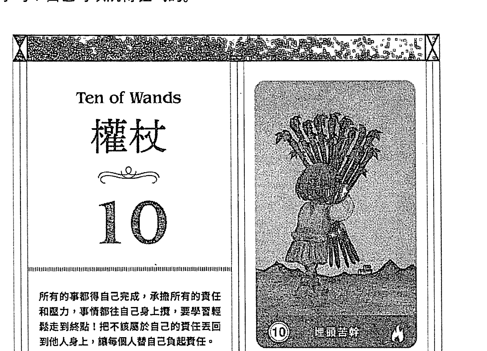

权杖10牌面上的人感觉疲惫吗？前方的房子是他的目标。抽到这张牌的人，往往责任感很重，许多事情都是事必躬亲，一定要亲力亲为，但就是因为太负责任了，所有的事情都往自己身上揽，就容易导致太辛苦、太劳累，有种埋头苦干的意味（把头整个埋进权杖堆中）！

无论是问人际关系或工作状态，或其他问题，抽到这张牌表示他对询问的这件事情付出很多，并承担了绝大部分的责任。可以花一些时间与抽牌者讨论他的心情，可以问他：累不累？虽然责任感很重，却有可以肯定与同理的部分。如果他真的觉得累，可以反问：会不会其实有几根棍子不该是你的责任，却被你揽下来了，你会觉得这些都是你的事情。想帮别人承担，把别人该做该学的全都做完了。

数字10本身就是一个阶段的结束，所以他会想要完成某些责任与任务，最后也确实会完成。抽到这张牌的人，会用自己的方法走到终点。但如何让自己用喜欢的方式走到达标，这是可以好好思考并学习的。

这样的人要注意自己的情绪，做得太多可能会开始抱怨「怎么都是我在做」，旁人也会觉得「你都自己做了，我们做什么呢？」要信任别人，也要充分授权。他也要允许别人有机会去学习担负自己该有的责任。

### 引导提问

- 你的目标是什么？要把这些权杖带到哪里去？
- 一步一步走向目的地，最终会抵达终点，你想用什么样的心情走这段路？
- 如果并非所有的事情都只能由你来完成，你会把哪些部分授权给他人帮忙？想象这条路上还有其他伙伴可以一起走向目的地，你觉得会是谁？他们可以帮上什么忙？

### 示范引导

当事人：问亲子关系，想知道怎么和孩子相处。

引导者：抽到这张牌，你应该替孩子做了很多，是不是大部分的事情都被你做完了？

当事人：小孩都不做呀！不能自己承担责任，只好我来做！

引导者：你知道吗？妈妈太有功能，小孩就会失功能。你说自己的孩子什么都不会，没有竞争力，其实是你帮他做太多了。什么事情你都要一把抓，太照顾小孩，太有责任感，可是也失去了孩子在成长学习的过程中，自然而然的经历。他会从跌倒中学会尝试、错误，这是一个必经的探索过程，或许你太害怕小孩受伤，将他保护得太好。但我们不可能帮他扛着一切走到终点。说看看你自己的生活，你有什么想做的事吗？要扛就要扛自己的事，小孩的留给他自己去扛吧！

## Page of Wands
### 權杖侍衛

把焦點專注在自己所投入的行動上，專注的看著這個行動的變化與發展。

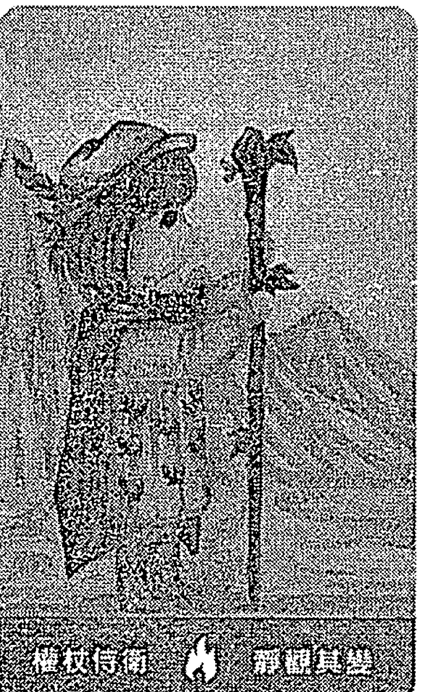

权杖侍卫：火中之风，两个元素的组成，形成了行动上的变动。

权杖是火元素，象征行动；侍卫是风元素，代表变动、赤子之心、好奇心、探索、机伶。所以这个行动处于探索与好奇的阶段，还会有些变化。

牌面中的侍卫看着权杖顶端长出的嫩叶，他专注而好奇的目光，像孩子一般。这个行动事件的成熟发展阶段，如果以生命历程来看，侍卫的象征是「孩童」阶段，才刚开始。行动正在开始，一切也还在变化，他专注地看着自己做的这件事，看着行动会有什么发展。我定义为静观其变。当这个行动慢慢成熟，到青少年阶段，就会变成火中之火。

### 引导提问

- 你在观看什么？对于你想要做的事情有什么感觉？
- 目前是这件事情刚开始的阶段吗？心情如何？
- 起始阶段是冒险的开始，你想要探索什么？又期待能获得什么？

### 示范引导

当事人：我想知道关于今天在工作上或生活的提醒与建议。

引导者：你对于工作还保持热情吗？怀抱着好奇心投入你想要做的事。

当事人：是提醒我要热情与专注吗？

引导者：是的，专注且带着好奇，保持热情的心，把事情完成。

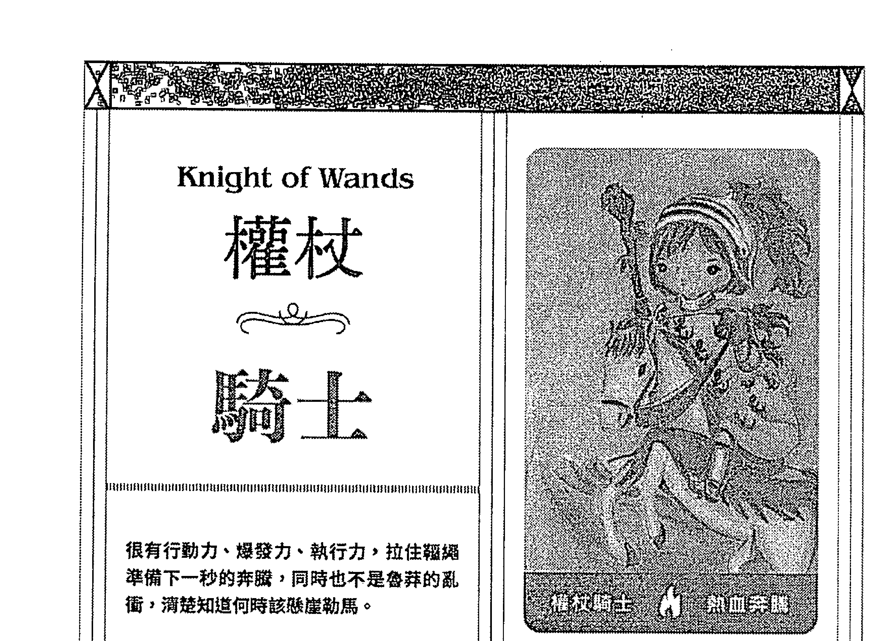

## Knight of Wands
### 權杖騎士

> 很有行動力、爆發力、執行力，拉住韁繩準備下一秒的奔馳，同時也不是魯莽的亂衝，清楚知道何時該懸崖勒馬。

权杖骑士：火中之火，由两个元素组成，形成了行动上的积极冲劲展现。

权杖是火元素象征行动，骑士又是火元素，两道火的能量加乘，是78张牌中最有行动力的一张牌。

具行动力、冲劲十足，精力充沛、热情如火、热血奔腾。包括持续进行多项行动，快速行动也快速完成，再进行下一个行动。

行动力是充满能量，但牌面上的马止住的姿势，象是跑到一半被拉住的暂停姿势，虽然很有冲劲，但骑士勒马，象征「适可而止」的提醒。满怀冲劲，但也要知道适可而止，何时该喊停。这不是鲁莽、血气方刚的横冲直撞，虽然有行动力、爆发力、也有冲劲，但发生任何状况，他都可以及时悬崖勒马。其实这个暂停的画面可以让这张牌感觉比较平衡，有时候这张火中之火牌，的确会怕火势蔓延太快，失去控制，所以在很有冲劲的过程当中，这张牌也提供了觉知和关照，知道什么时候是可以暂停的。

关于投资，抽到这张牌，可以讨论一下停损点或停利点，而不是永无止尽地丢钱进去。问股票，或许这支股票有爆发力，但可能是偏短期，而不是放长线，像冲到一半见好就收。因为火元素是迅速、有行动力，带爆发力的。如果要放长期的稳定投资，就要出现钱币，钱币会比较稳。

### 引导提问

- 你要骑马往哪里冲呢？
- 目前你生活中的热情和行动都在哪些事情上呢？
- 你知道何时该适可而止吗？

### 示范引导

当事人：想问关于接下来这一年的指引？

引导者：你接下来会是很有能量、冲劲十足的状态。骑着马，走过很多地方，完成很多事情！你有什么计划吗？

当事人：有的！就是有很多事情想去做。

引导者：哇！你可以跟我分享你的计划吗？有哪些事情想做？……这是能量充沛又非常有行动力的一年！祝福你！

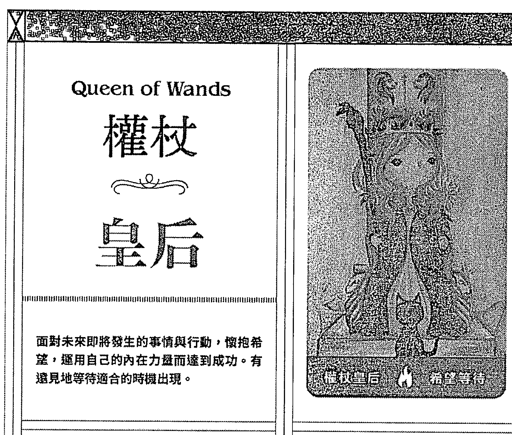

## Queen of Wands
### 權杖皇后

面對未來即將發生的事情與行動，懷抱希望，運用自己的內在力量而達到成功。有遠見地等待適合的時機出現。

权杖皇后：火中之水，由两个元素组成，形成了行动上的温柔、温暖、希望展现。

权杖是火元素，象征行动，皇后是水元素，表示光明的女性能量。在行动加上水的元素，水元素象征希望，看向远方，还抱着一种乐观、正向，有希望的行为展现。

皇后牌掌管了水元素，通常是宫廷牌组四位人物中感受力比较强的角色。权杖皇后的牌面上，象征带着希望的行动力是向日葵。她拿着向日葵，看向远方，表示行动过后，带着希望等待，等待开花结果。她是怀抱希望的皇后，对于自己所做的事情有个正向的力量，并用正向的力量与希望去灌注她正在做的行动。前方还有一只黑猫，代表陪伴者和守护者。

### 引导提问

- 向日葵给你什么感觉？又象征了什么？
- 坐在这里的这个人是你吗？还是你生活中的哪个女性角色？
- 针对你问的这件事，如果带着更多的乐观与希望，事情会有什么不同？看向远方的未来，你看到些什么？

### 示范引导

当事人：投了一个工作履历，想要面试机会，不知道结果会如何？

引导者：你对自己有信心吗？你觉得希望有多大？

当事人：我觉得一半一半吧，不知道自己的专业能力是否符合这家公司的需求。

引导者：你抽到权杖皇后，象征这件事情会依照你的希望方向前进，你愈有信心，这件事愈容易成功；如果你愈觉得没希望，那该公司就不可能通知你面试了。

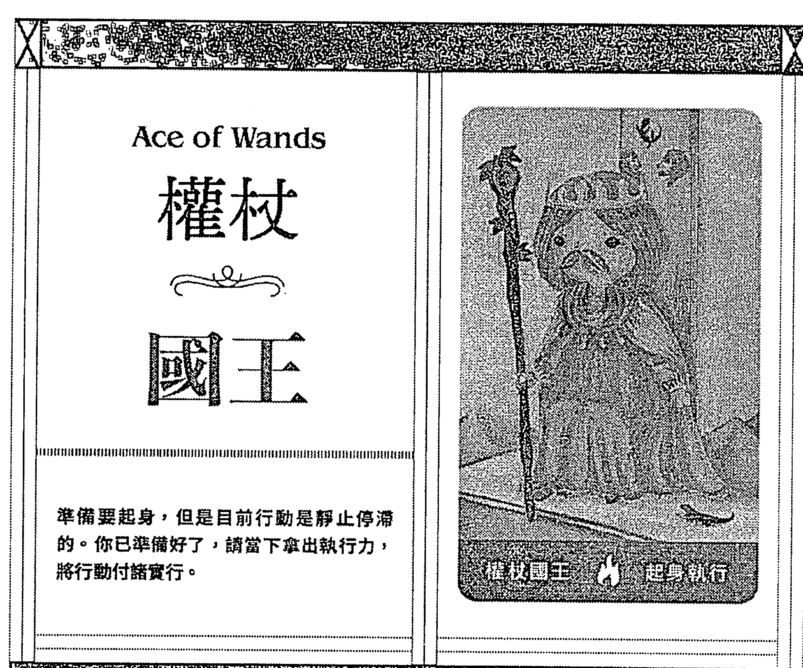

权杖国王：火中之土，由两个元素组成，形成了行动上的稳定、成熟或静止不动。

权杖是火元素象征行动；国王是土元素，落实、稳定、圆满、成熟的男性能量。

国王牌掌管了土元素，是最稳定的力量，谋定而后动，是一个领导者、上司或父亲的角色。

在行动姿态上，权杖国王是火中之土，所以行动是稳定的，土元素是「不变动」的能量。行动如果不动就代表「没有真的行动」，国王把袍子拉开，将权杖往下放这个姿势，表示他想要站起来吗？拉开袍子，将权杖往下放，通常下一个动作就是「站起来」！但是国王并没有真的站起来（通常国王都是一直坐着不动），所以他在「做假动作」。国王看起来要起身，但没有真的起身，有种「虚张声势」的意味。

### 引导提问

- 你想做什么？想执行什么？你真的想站起来吗？
- 有什么是让你想要做，却无法起身执行？当中有什么考量吗？
- 谋定而后动，你思考好了吗？内在做好决定了，何时可以动了呢？

### 示范引导

当事人：我想要离婚，来问婚姻的问题，我该不该离开他？

引导者：抽到这张牌，你真的要起身走人吗？这是真的吗？还是你只是说说而已？

当事人：我在家里常常被揍，过后会和老公说：「你再这样继续下去我就要跟你离婚。」他就会收手，但是过了一阵子，他还是依旧故我，我不想再相信他了。

引导者：感觉你做好准备了，你的袍子已经打开了，权杖已经放下去了，可是好像就少了「站起来」这个动作！这张是权杖牌，以行动为主，「有做才算数」！采取行动吧！别变成「放羊的小孩」！

## Swords
### 宝剑牌组

代表风的元素，所掌管的部分是头脑，议题包括：信念、想法、价值观、理智分析、思考判断。而这一组牌也是所有问题的源头，是「人会有困扰」的核心信念。

从心理学的角度来理解，一个人会有情绪与行动的困境，都是源自「他怎么想」。往正向的方向思考，情绪才会舒服，并带起有力量的行动，反之亦然。

身怀困扰抽到宝剑组牌，往往就是：想得太多、太负面、自我恐吓、内心小剧场演不停……

## Ace of Swords
### 寶劍

有很棒的創意、新的想法、新的觀點與覺察，這樣想很好。我很喜歡自己這麼看待。

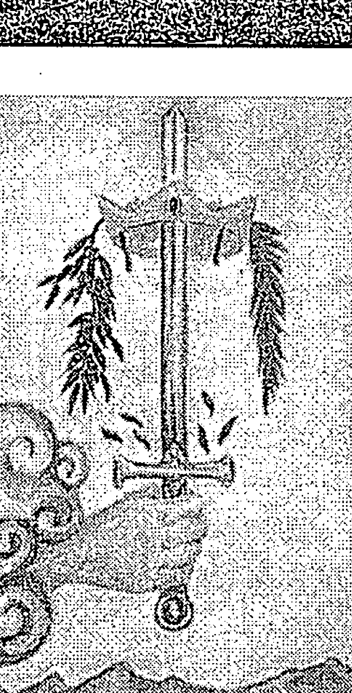

副牌中的四张A牌面都出现类似的画面，从云里面冒出神之手，就是创造的手，因为1就是从无到有的创造力量。宝剑A象征新想法，新点子、新观点。新想法看起来很不错，剑上有皇冠，代表受到赞许，并有一定的地位。（这不是高塔，所以皇冠不是建立在痛苦的灰黑高塔上。）皇冠立在新想法上，所以这张牌的意思是：我有一个新想法或新的点子，我觉得这个点子很棒！会带着一种赞许，我很喜欢这个新观点，会对这个人有种新的理解。我在生活中有些新的觉察、发现、领悟，并且我很喜欢这样的想法。

你有一个新想法，并抽到这张牌，就象是一种肯定，你会觉得哪来的好主意。可能是突发奇想，或新灵感，或是从来没想过的新观点。

### 引导提问

- 有什么好点子冒出来了？
- 你喜欢自己怎么看待这件事？
- 如果用一种新的思考方式来想这件事，你会怎么想？

### 示范引导

当事人：有一件事情让我很痛苦，我想要寻求指引。事情是这样的……

引导者：你觉得怎么去想这件事会比较好？要怎么思考这件事情？用新的理解来看待这件事。能够这么想的时候，你会觉得自己很棒，似乎这种想法也是一种新突破。

当事人：我觉得这件事是要给人生一个新的开始，如果没那么痛苦，我就不会去逼自己走出舒适区。我还满喜欢自己可以这样理解的，说出来之后觉得比较放松，可以重新看待让我痛苦的这个人。当我能这么想的时候，感觉很不错。

引导者：对事情有新的理解，感觉让自己放松舒服许多，不只头脑松了，心也松了，身体也松了，同时也放过自己了！（深呼吸）真好！

## Two of Swords
### 寶劍 2

去除外界干擾、回到內在，靜心冥想，在內在找到最真實的答案，內心的答案最能提供解答。

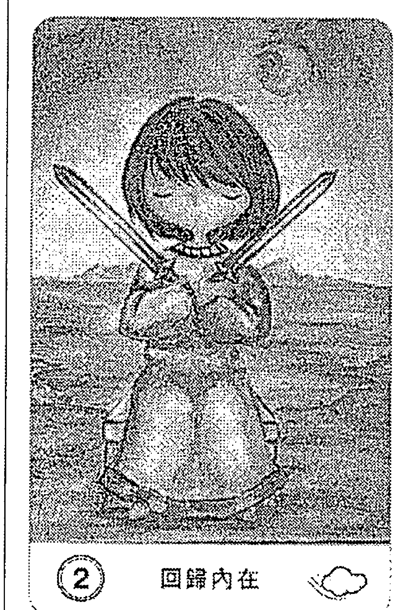

牌面整体的画面是明月当空，练剑人在宁静的海岸边坐着静思冥想。他想要冷静思考好做出选择。对应到数字2，象征选择，究竟该怎么看待这件事，必须要找出一个答案。选择想法的过程，需要透过厘清，这个画面很平静，同时也让我们去思考，什么是真正的平静。整体平静的画面表示了宁静的感受。宁静的海边无波无浪，代表宁静的心没有受到动摇。

闭起眼睛，是让自己回到宁静的第一步，试着冥想练习。我们在生活中容易被影响，想法会被人事物牵动，导致无法平静，无法清晰看见内心真正的答案。所以这张牌中，练剑人在海边阖上双眼不去看外面发生的事，不受到外界的影响。2号对应女祭司，就像女祭司的内在清晰稳定，知道一切都源自内心，只要先搞定自己心里的一切，就能够搞定外在的一切。厘清自己内在的想法，往内心寻求答案，而并非受外界影响所选出来的答案。

### 引导提问

- 你正在思考什么？
- 如果不受到外界的影响，单纯回归内心的真实决定，你会怎么做？
- 你的状态放松吗？心中觉得平静或宁静吗？

### 示范引导

当事人：我到底要选A还是B，每一个选择都有利弊得失。

引导者：试想一下，如果没有其他人事物要考虑，只考虑你自己的内心，或者现在全世界只剩下你，那你会怎么选择。

当事人：这还用想嘛！当然是选A！（可是……）

引导者：这就对了！这就是为什么你抽到这张牌。你其实很想知道外面是怎么想的。可能你需要的不只是闭眼，还要把整个眼睛蒙起来，因为我知道你可能随时会打开眼睛偷看外面的状况。

## Three of Swords
### 寶劍 3

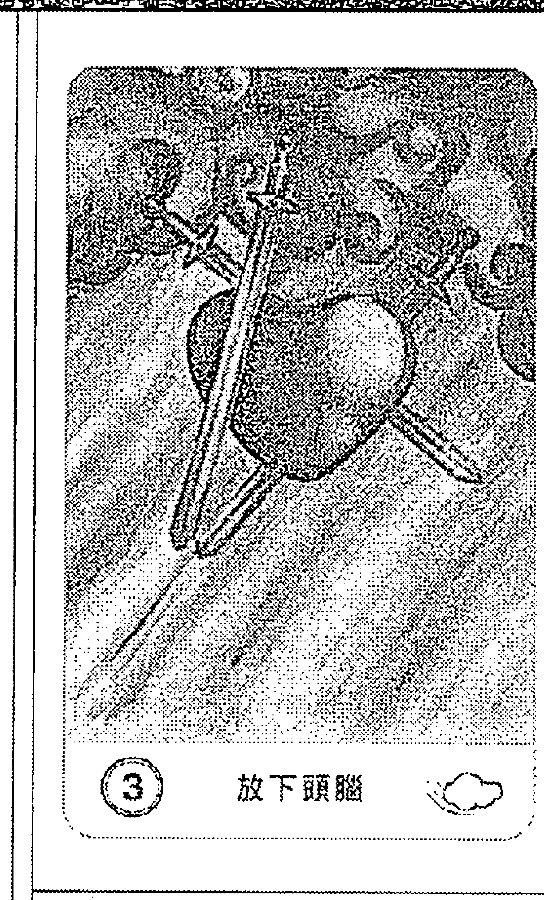

理性頭腦的分析控制了感受，無法順隨心所嚮往。釋放他人價值觀給自己的期待與控制。

这张牌直觉给人的感觉就是痛，心痛！宝剑3要让我们学习的功课是：不要在意别人的眼光，不用符合别人期待中的样貌！宝剑代表了想法、价值观、思考、头脑。心代表感受、感动、热情，而宝剑架在心上，会让你感觉如何？问问自己的感受，通常抽到这张牌的心理状态都会不太舒服。这些伤心的感受，是因为想法与价值观压住你的内心与感受。

这张牌的功课，就是要去觉察，当想法凌驾、控制你的心，就像拿着锐利的刀刃架住自己，而且还是三把，你会觉得伤心、恐惧，心里有乌云在下雨。想法想要控制感觉，就是你的头脑想要主导你的心，但心的感觉却非常直接。对应数字3的功课「舒服是很重要的」，而这张牌却让人这么不舒服。象是拿他人的眼光、价值观，插在自己身上，其实这都是自己插上去的！这时，不禁认真思考，许多外在的价值观，其实可以不必理会，也不必当成依循的标准。回到这张牌，让我们去觉察自己，你把外界的眼光和评价套在自己身上，内化了这些标准，来自我要求，让自己不舒服。

### 引导提问

- 是什么架住你的心？你想要移除这些剑吗？怎么移除？移除后要如何照顾这颗心？
- 在这件事情上，你的想法是什么？你的感受又是什么？
- 有哪些想法让你觉得不舒服，却又在无意间认同了这些的想法？非这样想不可吗？为什么一定要这么做才可以？如果不这么做，又会怎么样？

### 示范引导

> 当事人：我想去做一件事，但又觉得自己不可以！想要寻求一些指引……
> 引导者：宝剑3的疗愈之道，就是进入松绑的过程，给自己新高度来看这件事，是否有其他的可能性。
> 当事人：原来过去我一直在用这样的想法对待自己，让自己的脑袋和心对峙。
> 引导者：是的，我们一起来想想，怎么做会让你感觉比较舒服。让你的想法与心得以合一，是种相当舒服的感受。

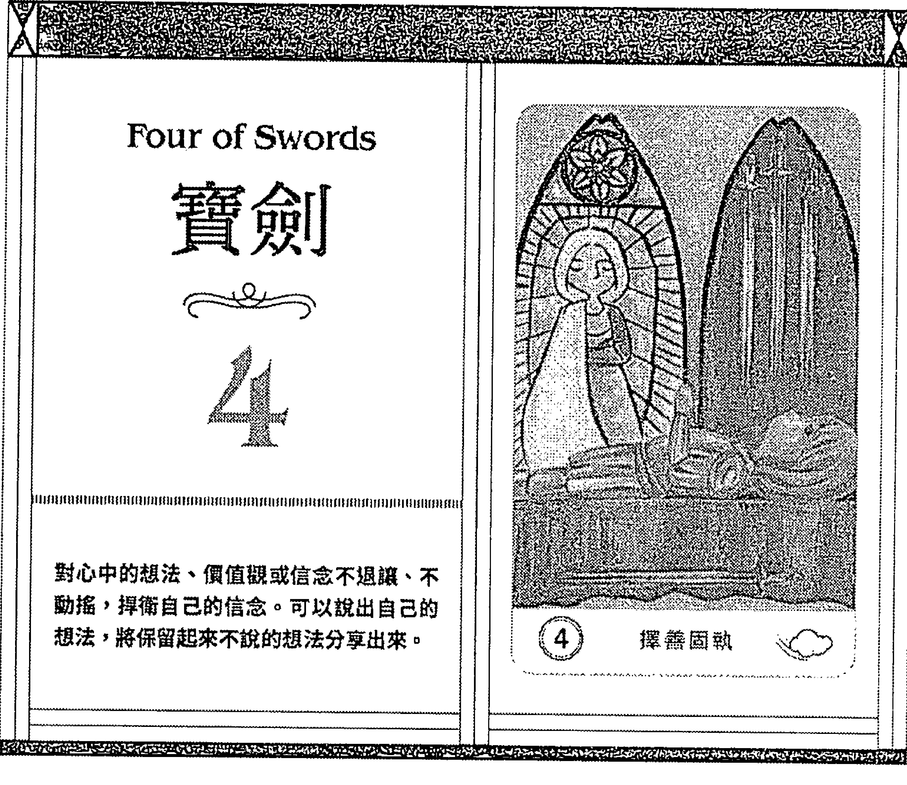

宝剑4的牌面上有一个人在躺着休息，而彩绘玻璃的场景代表教堂。可以分成两个方向思考。第一，他只是暂时休息，并非在家中的床铺上睡一整晚，因此这张牌象征暂时休息片刻，沉静自己；第二，停放在教堂中的通常都是圣者的棺木，里头是受封爵位的皇室成员，在教堂的棺木上方会有一个相对应的人形雕塑，放在教堂里面作为展示或纪念。

对应数字4，通常会出现的关键词是固执、不变，所以当固执、不变动、框架或界线，套在宝剑、想法上，这张牌就叫做固执，想法很固执，同时4号国王牌也有一种保护家庭成员的意味。我称为择善固执，也象征「固执到死都不变的程度」。三把剑在上方，一把在床的侧面，代表「就算到死，也要带着的想法价值观」。上方的三把宝剑代表「这是我愿意开放的想法」，有四分之三的想法是可以讨论的，是有沟通、协调、调整的可能性的，也是愿意说出口的。而下方的一把宝剑则是与主人同在，意思是「无论如何，我都要捍卫这个想法，这个价值观多么重要，我死都不放手」。

如果是问建议牌，抽到这张牌的人往往没有办法坚持，所以这张牌的牌面反而可以鼓励他应该要有所坚持，别人踩了底线、破坏疆界，就要勇敢捍卫、坚守立场！

### 引导提问

- 你真正想要保护捍卫的是什么？
- 你对这件事的底线、想法与价值观是什么？
- 哪些事你有所保留，没说出来？你在哪些事情上比较有弹性？

### 示范引导

当事人：想去谈一件事情，想知道谈这件事情的状况如何？

引导者：抽到宝剑4，看来你有四分之三是可以弹性讨论、可以沟通的。另外四分之一是你的底线，是你怎么样都会坚持的，让你捍卫到底、不退让也不动摇的。所以你想要坚持的是什么？可以调整的又是什么？

当事人：其实有很多事我都不想说出来，想先看对方的态度怎么样，感觉说了也没用，对方应该要懂我就是这样的。

引导者：比较鼓励你向对方表达更多想法并沟通，至少要把最重要的原则讲出来。抽到这张牌，也反应出你还是有所保留与隐藏，他也只讲出某一个部分而已，因为你没讲出来，对方真的不会知道！

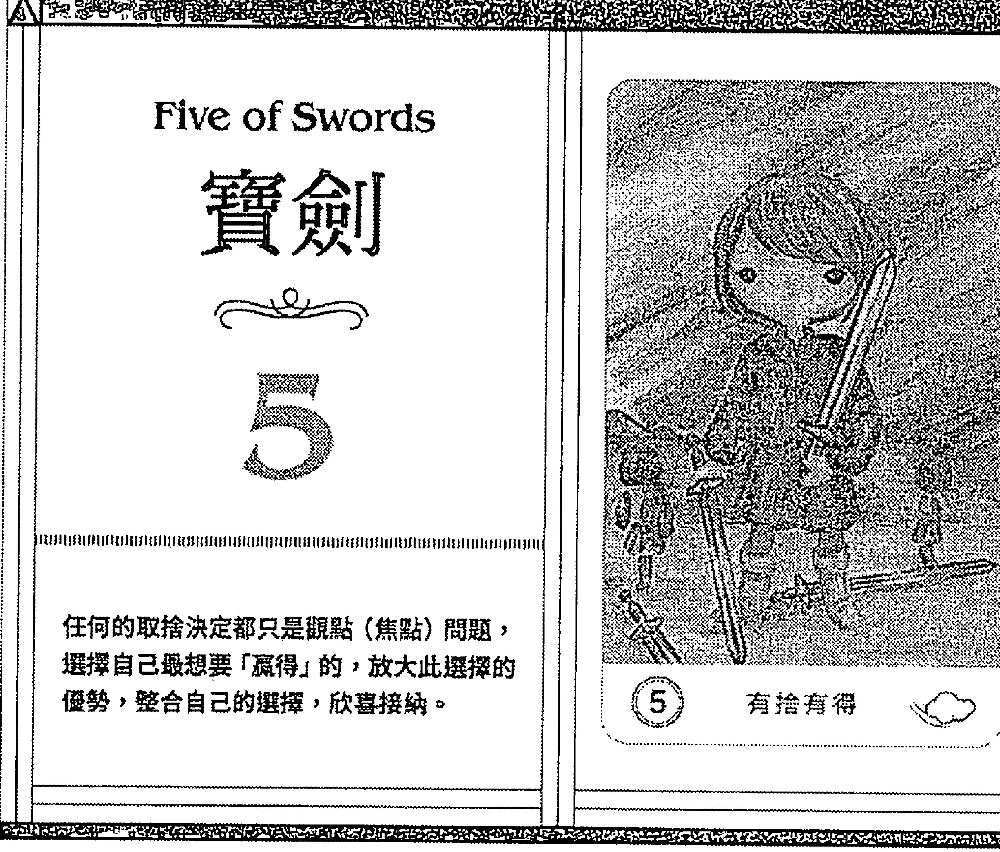

宝剑5的场景是海边决斗，身着绿衣的人感觉很得意，赢得胜利，拿到宝剑，而靠海边的两个人输了，弃械投降，放下宝剑，有个人还拿起外套准备离开。这张牌在谈的是「取舍」，有舍有得。在海边以剑来决胜负，赢的人可以获得宝剑，输的人要把剑让出来。身着绿衣的人，从五把宝剑中选择了其中的三把宝剑代表三个想法，另外两个想法比较不适用，那两把宝剑就舍弃不拿。做任何决定的时候，有舍有得，不可能全部都要。拿了想要的，你也会很清楚有些得要舍弃与放下。这张牌也隐含伤害的意思，战争总会导致一些伤害，例如直接的身体受伤，或友谊受损。因此，可以进一步思考，在这样的争斗中究竟有什么在所不惜一定要拿下的？清楚知道自己要什么，也必须承担相对的失去，这就是有舍有得。厘清心中的取舍，才不会容易后悔，更可以放大选择的优势，做出最重要的优先选择。

这张牌还有一个衍生的牌义，在选择的过程中，还不知道自己真正要什么的时候，其实也是鼓励他去多询问不同的人，捡别人的剑象征着「参考别人的想法，整合成为自己的」，这种决定过程可以更确定自己想要的是什么。吸取他人的智慧和经验并讨论，可以取认同的部分与自己的想法整合。

### 引导提问

- 想要赢得什么？你想得到什么？
- 可以放下或舍弃的是什么？
- 有可以询问相关经验的对象吗？或许能提供你不同的思维！

### 示范引导

当事人：我想找工作，有几个选择在考虑。其中一个薪水很好，但是工作量很大，不轻松。

引导者：这是挑战价值观的一张牌，如果想要薪水高，你也得做出取舍，要有相对的付出与放弃！

当事人：另一个工作不用加班，可是薪水没有那么高……

引导者：你愿意放下什么？你想要把「高薪」放下，还是要把「不加班、轻松、离家近」放下呢？

## Six of Swords
### 宝剑 6

> 尊重他人不同的選擇，不要在行動前就先以理性說服他人，甚至自己，要先過自己這一關，打從心裡支持、肯定自己。與他人的互動，也要有同舟共濟的感受（一起渡河）。

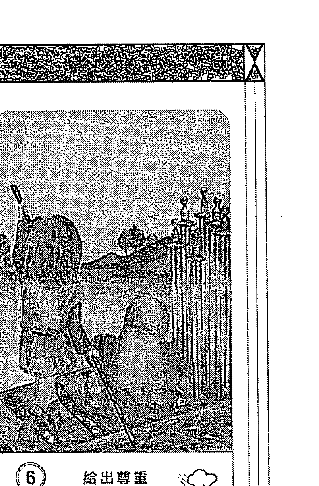

宝剑6牌面上是船只在渡河的景象。有六把剑插在船上，船上有船伕、妇人与小孩。对应数字6是爱的疗愈、付出与协助。船伕象征协助者，帮助妇人与小孩离开此岸前往彼岸，象征离开某个伤心地，默默疗伤，以及在渡河，后期许有一番新景象。运送宝剑渡河，象征船伕透过六把代表善意想法的宝剑，来帮忙母子度过难关、脱离困境、协助疗愈。而宝剑六的渡河比喻，对应到事件上则称为「说服」。因此，这张牌和「说服他人、说服自己」有关，或者会形容这是「洗脑、催眠」。

船伕载着这对母子，想要说服他们，但母子的姿势很有意思，不仅背对这个船夫，看起来也不太想接受说服；同时，河面上的波浪，一边平静如镜，一边波涛起伏，象征两造的观点有差异，船伕代表非常热心的6号人：「我告诉你这样做最好，听我的准没错！」，边划桨翻起波浪，然而这对母子却不为所动，默默坐在船上听他说教，面对左边平静无波的湖面。

这张牌让我们思考，沟通是建立在「尊重」原则的「接受」，而非「说服」。给我们的学习是：休想说服任何人，并不会有人因此被你说服，真正的疗愈与帮忙是给予尊重，尊重彼此有不同的想法与价值观，尊重自己与尊重他人。

### 引导提问

- 你认为在这件事情上，有谁想要说服你什么吗？你觉得自己被尊重吗？
- 你认为在这件事情上，你想要说服别人什么？你尊重他人吗？
- 这件事情里面，你要说服自己什么？为何要说服自己呢？

### 示范引导

**当事人：** 我是否要继续这份工作？

**引导者：** 这么问的时候，就代表其实你想离开，感觉你是在说服自己留下来，是吗？有谁说服你一定要留下吗？

**当事人：** 我觉得，内心好像过不了这一关，因为我答应同事要一起同进退，但是我现在却想离开。

**引导者：** 你好像很想说服自己可以留下来，很想找个理由给自己，让留下来的决定变得合理，是吗？你可能不那么喜欢、满意这个决定，但是你已经做出决定，所以很努力地想要说服自己，其实这样也不错，任何事情都有最好的安排，会这样发生一定是最好的。话说回来，换个想法来思考，如果是「给予自己尊重」的选择，你的决定会不同吗？

宝剑7牌面上有名蹑手蹑脚的士兵，从营帐中鬼鬼祟祟地把剑偷走，他一边带着五把剑往前走，一边回头看，瞻前顾后，看后方有没有人追来。他关注的焦点是，还有两把剑放在地上没来得及拿，他在想，「没拿完的剑，等一下回来拿。」

「拿了许多剑，还要继续拿」象征这位士兵步步为营，渴望面面俱到，一切都要准备好，意味着抽牌者希望能考虑到所有想法，毫无遗漏，想要把所有的可能性都考虑周详，希望能照顾到每个人和每个状态。然而，在思虑的过程中，他没有注意到自己已经不堪负荷，因为他手中的刀锋锐利，所以某种程度也可以说，他「想要周全的想法」已经形成了伤害，对自己造成了痛苦与威胁。

回到数字7，要看清楚「真相」是什么，并且学习「信任」。这张牌的真相是继续把剩下的剑带走，还是先保护自己的手避免受伤？但就算再拿后面那两把剑，可能会发现还有一堆剑没拿，容易边拿边掉，容易割到手，走路也得蹑手蹑脚，心也不安。你的身体要往前进，但注意力却还在左顾右盼。最佳策略是，事实上你考虑不完的，看看现在可以负担的，在能力范围内可以设想到什么层面，先想到这里就好。再次回到7的信任，让自己可以舒服自然地「正着走」，继续向前。

### 引导提问

- 你考虑事情的层面有哪些？是否会担心还有哪些未考虑到的部分？
- 是否真的需要考量到每一个细节？如果没有考虑周到会如何？会发生什么吗？
- 这件事情的真相是什么？最需要真实面对的重点是什么呢？

### 示范引导

**当事人：** 我觉得很烦，每年的年夜饭都要我张罗，我是苦命的媳妇……

**引导者：** 抽到宝剑7，你考虑的层面很多吧，准备年夜饭让你最烦的事情是什么？

**当事人：** 每个人喜欢吃的东西都不一样、口味也不一样，有的要吃这个，有的不吃那个……我快被烦死了！每年都用心准备，却还是被挑剔！

**引导者：** 其实考虑不完的，对吧，要准备这么多东西，还要顾虑到每个人的喜好，要事事周全、面面俱到，但最后累死自己，可能也还是无法让大家满意！我想，这就是宝剑7要给你的提醒。既然这样，今年就先照你爱的菜色去张罗吧！先把焦点带回来自己身上，别让自己累死比较重要！

## 宝剑8

有限制性的信念，认为自己做不到，想法让自己绑手绑脚，因有盲点而看不清真实。其实天无绝人之路，看清真相，这只是想法困住自己，必有出路可寻。

宝剑8的牌面场景象征了画地自限的，用信念和价值观框住自己，会有种被捆绑的感觉，而缠绕在身上的绳子，就是造成限制的信念所带来的自我约束，把自己层层束缚。如果是你站在这里，会有什么感觉？脚下的地面满是泥泞，剑一一插在身旁，有陷入僵局、旁人想要援救却难以靠近的感觉。

这张牌协助我们检查「自我限制」，看看有哪些想法与信念限制住了自己。比如说被「自己不行、没有能力、做不到、不可能」的想法捆绑，彻底忘了可以使用数字8的无限力量。

传统的莱德伟特宝剑8牌面中，眼睛是被蒙住的被造成限制的想法与信念蒙蔽了双眼，看不见真实。在左西塔罗的画面中，我给予这张牌更多数字8号的力量，当自己愿意相信，愿意看见希望时，眼睛就是雪亮的！当他看清楚真实的状况，会发现其实那些剑根本困不住他！而且，脚也没有被绑着，还可以走动，所以他可以继续往前走。穿越这些限制，他可以看清楚更多真相，就会发现其实都是自己给自己的限制，根本没有人阻挡在前方的路上，限制自己的都只是自己的想法而已。

### 引导提问

- 面对这件事，你觉得有哪些限制？这些限制是真的吗？还是只是你的想法？
- 是什么让你觉得自己做不到、不行？让你觉得这件事情不可能？
- 如果你认为的限制不再是限制，那是因为发生了什么呢？怎么做才可以让自己自由走动，从限制中走出来？进而看见可以怎么善用环境中的资源。

### 示范引导

**当事人：** 想要进行一项计划，不知道是否会成功？有点担心自己做不到。

**引导者：** 抽到这张宝剑8，恭喜你，成功的关键在于你能否跨越那些自我限制。你觉得自己有哪些限制呢？

**当事人：** 觉得自己限制很多，但愈担心愈没有信心，是否就愈不容易成功？

**引导者：** 最重要的是，看见那些自我限制，搞清楚都是自己在阻挡自己的路，没有人挡住你。

如果无法越过宝剑8自我设限的困境，就会进入宝剑9，这是经典的「半夜三点钟牌」，睡到一半做恶梦被吓醒的场景。坐在床上，半夜恶梦惊醒，惊魂未定地掩着面。这张牌也和健康有关，忧虑太多而无法好好睡觉，烦恼太多，容易脑神经衰弱。不过牌面只是象征，不一定会真的失眠。牌面要讲的是，这个人思考太多，烦恼很多，一直想一直想，心上太多忧虑，让自己不轻松。抽到这张牌，表示把很多事情放在心里，象是牵挂、懊悔、遗憾等。可能思绪较多，停不太下来。

特别是在睡前想这些，甚至是边想边烦恼，想法比较负面，就会开始做梦，也容易梦到一些混乱的画面。因此，脑袋中的想法、思绪是比较不清明的。可能会太多杂念，每件事都要烦恼，即便是不该烦恼的事。许多人都喜欢替别人烦恼，或是替社会烦恼，杞人忧天。

拜伦·凯蒂（Byron Katie）在《一念之转：四句话改变你的人生》中提到，世界上的事只会分成三种事：「你的事、他的事、老天爷的事」。如果这件事情是你的事，你再去烦恼。把老天爷的事还给老天爷，把别人的事还给别人，你只要关注自己的事就好。许多人的烦恼都来自于喜欢替别人烦恼，包括小孩的事、家里的事、长辈的事、家族的事等。当你仔细分辨，这些很少是自己的事！

对应数字9，隐者的个性比较消极一些，然而隐者的「抽离」在此刻也是可运用的资源，协助自己面对烦恼时可以稍微抽离，乐天安在，活在当下，才能睡得好，健康没烦恼。

### 引导提问

- 心中挂念着哪些事？是不是在担忧些什么？
- 最近是不是常常对很多事感到忧虑，会影响到睡眠状况吗？健康状况如何？
- 如果这些烦恼都不再是烦恼，你可以做些什么，你的心与头脑都会感觉轻松一些？

### 示范引导

**当事人：** 我想要问合作关系，我跟同事正在进行一项新的计划，不知道接下来会如何？

**引导者：** 这个计划让你心烦，是吗？你看这张牌，连做梦都在想，还半夜惊醒……

**当事人：** 工作上的事很多又很烦，回到家都还在想，我本来就是很容易烦恼的人，现在这计划让我更烦了！

**引导者：** 这张牌给你的建议是，你要好好释放这些焦虑和恐惧，回家后就别再想工作的事，尤其是睡觉前不要把烦恼延伸思考。你觉得自己可以做些什么事情来调整吗？

## 宝剑10

你尚未经历之前，就已经被自己的想法杀死几百回。黑夜的状态，就是白天行动之前的考量，起伏反覆揣想，不会比现在这样更糟的了。当太阳出现，你就会知道，所有的恐惧都将过去。

如果在宝剑9不断烦恼并深陷痛苦之中，宝剑10很快就出现了。这张牌就是「死在沙滩上」，象征着「被自己的想法吓死、被自己的想法害死」。

牌面上是海边的决斗场景，这位战士深夜要去海边决斗，但还没有抵达，心里就在想：「完蛋了，死定了，我一定会输！」所以决斗还没开始，敌人还没出现，就让自己插满了剑。这个状态会称作「未战先败」，就是自己先投降、放弃，先自我了结，结束这个痛苦！

10号的数字牌，都象征着「结束」，以及该元素「最多、最大」的意义。因此，宝剑10让我们看见：自己是自己最大的敌人！当痛苦焦虑到了极点，连自己都过不了自己这一关，因为太恐惧了。

战士被自己的剑插死后，太阳渐渐升起，又是新的一天，一切好像都过去了。因为他是被自己的想法吓死的，所以并没有真正死去。他的手指比「耶」，表示太阳出来了，光明正向：「我一定会赢！今天晚上的决斗一定没问题，我有信心，」到了晚上，黑夜升起，「完了，我一定会输」。想法起起伏伏，好的时候很有信心，不好的时候觉得自己死定了。

抽到这张牌的人，表示痛苦要结束了，将否极泰来！不要轻言放弃，这是一个转机，有机会扭转原本的想象。可以给予多一点的鼓励，不要被自己吓死，这些其实都是你心里的想法，还没开始就在心中预演悲剧情结，根本不是这样的，别让恐惧淹没了一切！

### 引导提问

- 你常常被自己的想法吓死吗？瞬间从天堂掉到地狱？
- 痛苦就要结束了，你想要终结什么样的痛苦？
- 太阳就要出来了，想象一下太阳出来后、充满希望的状态，事情会有什么不一样的发展？

### 示范引导

**当事人：** 我想知道这次考试的状况……

**引导者：** 你的想法起起伏伏，有时候觉得自己很有信心，可是有时候又觉得没有希望。你是不是想要直接放弃算了？

**当事人：** 你怎么知道我想放弃？也太准了吧！

**引导者：** 你真的想要继续读书吗？还没有打仗就认输了，不是这张牌要你去的方向！这张牌在说，你熬夜读书考试的痛苦就快要结束了，这是一个转机，你还有机会扭转！不要被自己吓死了，你看，太阳都要出来了！就快考试了！加油好吗！

### 综合比较

宝剑8、9、10这三张牌，让我们看见自己的想法会如何让自己痛苦，而且程度随着数字增加攀升，愈来愈极致！从宝剑8「困住自己」、宝剑9「吓醒自己」、到宝剑10「吓死自己」，都有种「自己给自己找麻烦」的意味。

如果是问关于未来的事，这三张牌常常会吓到抽牌者，不禁想「是不是不好、不能去、不要做比较好？」我想强调，这些牌都是宝剑，都只是想法，并非真的如此！透过抽牌可以看清并发现，困住自己、阻碍自己、限制自己的，其实都是自己的「想法」。从这三张牌中学习转念的功夫，调整想法，即使面对生活中真实的惨事，也能放下烦恼、放过自己，就算天塌下来也要好好吃饭好好睡觉，重获真实轻松的人生！

宝剑侍卫：风中之风，由双倍的风元素组成，形成了思想上的变动，也是讯息传递的角色。

宝剑是风元素象征思想；侍卫是风元素，就是变动、变化、赤子之心、好奇心、探索、机伶、反应快的感觉。所以这个想法处于好奇的变动阶段，就象是脑力激荡一般，任由想法来去自如，天马行空地蹦出各种灵感，像小孩一样无边无际地发散思考。讯息快速传递，还未未经证实，也容易形成小道消息或流言满天飞。

在78张牌里面，宝剑侍卫是最变动的一张牌，从牌面上可以感受到这样的变动有种可爱的姿态，主角似乎在拍照摆姿势，感受得到他也从中得到乐趣。他享受自己想法的变动，创意灵感层出不穷。

依照发展阶段来看，还在小孩的阶段，这些想法与创意是新诞生的想法，不断脑力激荡出新鲜的点子，创造力源源不绝。在这个阶段，其实想法还没有完全安定下来，是个脑力激荡与天马行空的创意过程，想法都还在聚焦成形。

### 引导提问

- 这件事情，你有什么灵感或想法吗？
- 你听到的这件事，会不会是一个未经证实的假消息、假新闻？
- 让自己天马行空，创意任意涌现，看看会冒出什么好玩的想法？

### 示范引导

**当事人：** 关于工作上带领团队的建议。

**引导者：** 这张牌是思考天马行空、创意纷飞的意思，你的团队成员有机会各自表达出自己的想法吗？

**当事人：** 平常他们比较没有这样的机会，多半都是交办事项，让成员照着去做。

**引导者：** 这张牌给你一个很好的建议，可以开始脑力激荡的活动，在团队聚会时间中分享各自的创意与想法，我相信会是很好的！

宝剑骑士：风中之火，由两个元素组成，形成了思想上的行动力与落实。

宝剑是风元素象征想法；骑士是火元素，将想法落实、让内在信念与核心价值得以落实，是这张牌最重要的概念。

想法中带有行动的力量，行动会带出这个想法可以落实并执行的部分。

在牌面上，马匹的眼睛是往后看的，牠在偷瞄主人，并想：「主人，你下令要冲，现在要往哪冲呢？」骑士代表风的想法，马代表火的行动，行动要搭配想法的目标，才能有更好的合作。所以，也可以说这张牌是「找目标」的牌，将想法与点子具体落实执行。如果有个想法或点子，那就试着把想法具体化，可以怎么做、可以做出什么样的产品或设计、可以如何让头脑里面的东西具体成真。

抽到这张牌的人，会有点像无头苍蝇，抓到一个东西可以做就开始乱冲，象是散弹打鸟一样，没有一个规划或方向，具有满满的行动力，就是不知道要做什么才好，想清楚自己究竟要往哪里去。

### 引导提问

- 目前这件事会让你有无头苍蝇的感觉吗？
- 想法如果可以落实在具体可见的行动上，可能会是什么？
- 如果有一个方向或目标，可以让你的马往前冲，你觉得会是什么？

### 示范引导

**当事人：** 我目前没有固定工作，想看看做什么比较适合。

**引导者：** 你之前选择工作的时候，都是以什么为考量？以这张牌来看，你没有方向对吗？

**当事人：** 之前都是朋友介绍，有机会可以赚钱的，我就去尝试看看，但是很快就没做了……

**引导者：** 你要有一个方向和目标，我们一起来讨论，在你工作生涯的选择上，什么是最重要的。

宝剑皇后：风中之水，由两个元素组成，形成了想法上的温柔，语言沟通上的温暖与接纳。

宝剑是风元素象征沟通想法；皇后是水元素，代表温柔倾听与接纳的女性能量。

水的元素代表情感，这个想法上的沟通是带着情感的，有一股温柔的力量。宝剑皇后一手拿着宝剑，一手向前张开，「来，说看看，我愿意听」象征着迎接。试看看做出同样的动作。当你和别人沟通时，对方的手摆出这样的姿势，你会觉得这是愿意接纳、倾听或包容，而这就是皇后的温柔力量。会感受到自己的想法是有人支持、接纳的，有人倾听自己的心声。

虽然宝剑牌组是满「硬」的一组牌，但是加上水元素后就变得温柔了，有一种刚中带柔的坚定力量，象是心理分析师的角色。这样的想法与价值观有理性坚定作为基础，从发展阶段来看，已经到达成人的阶段，表示想法够成熟了。宝剑皇后象是在说：「我带着爱和你沟通，我带着情感交流与你说话，我带着支持、倾听和包容与你讨论想法，沟通这信念与价值观。」

### 引导提问

- 你愿意倾听自己的心声吗？
- 你想要听看看对方有什么不同的意见吗？
- 面对各种不同的意见与价值观，你愿意接纳这些多元价值并存吗？

### 示范引导

**当事人：** 我想要去一个国家旅行，可以给我什么讯息或建议吗？

**引导者：** 抽到宝剑皇后，她是一个坚定有力量的女子，你对这趟旅行有信心吗？

**当事人：** 已经想好何时要出发了，就剩下订机票了！

**引导者：** 感觉你已经下定决心，也愿意倾听自己的心声，这趟旅程「你说了算」，这份温柔坚定的力量会伴随你前进，祝福你！

## 宝剑国王

专注，信念坚定，有稳定的能量。想法不为所动、坚定的信念不变动。

宝剑国王：风中之土，由两个元素组成，形成了思想上的稳定、成熟、或静止不动。

宝剑是风元素象征思想；国王是土元素，落实、稳定、圆满、成熟的男性能量。而想法不动如山，也有缺乏弹性、不知变通的意味。

抽到宝剑国王这张牌，有时候内在并没有太多信心，无法坚定、贯彻决心。这张牌给予鼓励的力量是，要在这件事情上更坚持，或是要在这件事情上更站稳立场。

宝剑国王传递出来的讯息，就象是国王发布的命令，没得商量。就像专业人士所说的话语，无庸置疑。律师口中的法律条文，一是一二是二，没有商量的余地！宝剑皇后还有商量空间，但是宝剑国王的圣旨就只能贯彻下去，所以这张国王的表情比皇后牌严厉，也是象征了这一点。

任何人都无法改变国王的圣旨，当他下令，你也只能遵从。回到生活中，当宝剑国王出现的时候，就是要坚定想法的时刻来临，要带着非常坚定的信念，这个信念是无论如何都不为所动的落实力量。带着破釜沉舟的决心，坚定想法、贯彻实行，「对！我就是要这样做！」

### 引导提问

- 在这件事情上，你有点信心动摇吗？
- 你想要贯彻决心吗？你可以如何贯彻决心？
- 如果在这件事情上你可以带着坚定不移的信心去执行，会有什么不同？

### 示范引导

**当事人：** 我遇到一个冲突，不知道该如何处理比较好？

**引导者：** 你抽到宝剑国王，意味着这件事情需要用非常理性的态度来面对。

**当事人：** 不可以讲人情，或者用私底下处理的方式，对吗？

**引导者：** 是的，感觉就是没得商量，你要坚持自己的立场，该如何处理就如何处理，贯彻你的想法就对了！

## 圣杯牌组

代表水元素，议题包括：情绪、感受、心情、关系、爱、感觉、热情、人际关系。感受中的喜怒哀乐、负面与正面情绪，都是由圣杯掌管。

从心理学的角度来理解，有困扰的人抽到圣杯牌组，往往反映了内在的情绪议题，有情绪等待处理、有内在感受等待回应、有要被照顾到的心理层面等待看见，这些心情感受需要被接住、被安抚。太多的圣杯牌，象征着目前的情绪太多太满，可能是太多感动开心，或是太多伤心生气。

## Ace of Cups
### 聖杯

豐盛情感的流動、湧現、順暢。被祝福的愛、新的關係與感受的開啟。學習用新的感受來感受現有的狀態。

水的元素最重要的特質就是流動，聖杯A牌面上源源不絕的泉源流動，水流從聖杯中湧現，往下灌溉粉紅色的蓮花。水象徵情感，情感如果卡住，就會處於當機；如果水停滯不前，無法流動，就象是感受卡住了，無法表達，會很難受。聖杯這個牌組掌管的是情感關係、感受、情緒，所有的感覺包括熱情、熱愛、怦然心動，而水元素加上數字1的特質，象徵新開始、創造的開始。因此，聖杯A代表新的感覺、新的感受、新的情緒，甚至是新戀情、新的關係。但有人問和男朋友的關係，抽到這張，並非有新戀情介入，正確引導是：「可以在原有的關係裡創造一些新的感覺。」這樣的感覺和感受是受到祝福的，上方有隻和平鴿，象徵帶著祝福的力量。杯子裡面的水就像泉水一樣，當我們敞開雙手去給予愛，也能夠接受愛，在給予和接受之間，不停地流動，就是聖泉般豐沛美好的感受。

### 引導提问

- 你內心的什麼感覺需要流動？表達順暢嗎？還是卡住了？
- 你的生活中有股內心的熱情與愛需要滋養，你想到了什麼嗎？
- 如果對這件事可以有新的感覺，那你想要灌注什麼？

### 示範引导

| 当事人 | 引导者 |
| :--- | :--- |
| 我想問關於目前工作的建議，覺得疲憊，想找方法調整。 | 你抽到聖杯A，表示要在工作中注入新的感覺、新的感受，可能你原本覺得這件事情很無聊，但我鼓勵你在這件事上要找到一個新的感覺，或投入新的熱情。 |
| 我覺得這是個很好的提醒，一直都以為自己做得不夠多、不夠好，沒有想過要從感覺、感受層面去調整。 | 是呀！灌注新的感覺，以新心情來做這件事，會得到不同的成效！ |

對應數字2的關鍵字「選擇、做決定」，因此這張牌象徵了關係的決定與選擇，包括戀愛、交往、合作、交心，是否要接受這個關係，是否要交流愛情。聖杯2的牌面上有兩個杯子在中間，象是新郎與新娘喝交杯酒的婚禮場景。上方有天使見證，所以聖杯2本身就是一種情感交流的契約，而且比較偏向「心裡的契約、心的承諾」。而有時這樣的承諾是自己與自己的關係，自己對自己的承諾。

數字2也有關溝通與協調的合作特質。象徵合作關係，象是伴侶和夥伴關係。杯子互換象徵著交心，我把情感交給你，你把情感交給我，在這個人際關係裡，我們互相交流，願意付出信任與坦誠相對。在這個交流的過程當中，互動的平衡也是很重要的，不是單向的付出或接收，在這個關係當中找到平衡點，也是聖杯2要學習的課題。

### 引導提问

- 你詢問的這個人，你與他是交心的關係嗎？彼此能談一些心內話嗎？
- 這件事，有夥伴和你一起投入進行嗎？感覺是合作的關係。
- 這個目標，是你給自己的承諾嗎？你答應自己要做到，是嗎？

### 示範引导

| 当事人 | 引導者 |
| :--- | :--- |
| 我想要出國打工度假，我想了解是否該採取行動？ | 你抽到聖杯2這張牌，這個打工度假的計劃，你想多久了？ |
| 我從念大學開始就想要這樣做，算是畢業後的第一個目標，也收集了很多資料…… | 這是你對自己的一個承諾，你答應自己要出國去看看這個世界，是嗎？去吧！完成你和自己的約定吧！祝福你。 |

聖杯3牌面是慶祝豐收的場景，大地之母豐盛的慶典，舒服又開心，舉杯慶祝，地上滿滿的豐收果實。這張牌象徵慶祝美好的事情到來。

三位美女拿著杯子舉杯歡慶，對應到數字3的特質，希望自己的表現是最美好的，這張牌有種爭奇鬥豔的意味。把杯子舉高，展現出自己最美的一面，把最豐盛的果實拿在手上，整體呈現出歡欣的場景。然而，在歡樂慶祝之餘，她們也在互相較勁，比較誰是最美的、誰是最好的。問關係時抽到這張牌，在情感裡面爭誰是最好的，就叫「爭寵」，和誰爭寵？在這段關係裡，你是不是覺得有時候被忽略，或是有種輸給某個人、輸給什麼的感覺，心裡會覺得自己好像不是最重要的，所以才會力求表現，想把杯子舉得最高，展現出最開心最美好的一面。

聖杯3要我們學習，自在、優雅展現自己的美好，即便過程中還是會有些焦慮，不知道自己能不能表現好，只要盡心去做，就可以舒服享受這豐收甜美的時刻！為自己乾杯吧！

### 引導提问

- 你在慶祝什麼？有什麼值得開心的事情？
- 如果這是個未來慶祝豐收的場景，你能感受到這是什麼樣的畫面嗎？
- 你想把自己的哪個部分表現出來，想在生命中展現哪個最美好的部分？

### 示範引导

| 当事人 | 引導者 |
| :--- | :--- |
| 我即將要論文口試了，好緊張呀！想抽牌看看會如何？ | 聖杯3這張牌是歡樂慶祝豐收的場景，這是你期待的畫面與感受嗎？ |
| 哇！如果真的是這樣，那就太棒了！ | 請你想象一下，當天口試現場的畫面。打扮大方得體，舒服自在優雅地呈現論文內容，最後圓滿開心完成，大豐收！還有和夥伴互相舉杯，開心慶祝論文完成的慶功宴！ |

數字4本身就帶有穩定、不變與執著的意義，所以聖杯4這張牌象徵了：我清楚知道我心裡的選擇，不為所動，我堅定自己的信心，旁邊從雲霧裡冒出來的是要考驗我的決心，我不去想那些不可能的事，我只會考慮心裡最想要的選擇。

抽到聖杯4的人其實比較多慮，或成天都在想那些不可能的事。牌面上這個人坐在樹下，眼睛看著前方的三個杯子，還在感受自己究竟要不要接受第四個杯子。學習堅定內在的信心，很清楚知道心裡面的偏好與選擇，對什麼有熱情、有感覺，做好決定之後，無論誰說什麼，都難以動搖。

常常抽到這張牌的人，內心是不太堅定的，所以這張牌可以給予鼓勵支持。帶領對方去探索：其实在這件事情上，可能有些情感或人際關係因素的考量，反而成為你選擇時的壓力或困擾，影響自己的心情，感覺有點無奈。

### 引導提问

- 你坐在樹下，都在想些什麼？感覺如何？
- 面對這件事，你是否能夠不為所動？或是很多雜念一直在影響你？
- 有什麼因素會影響你的決定，哪些人事物會影響你的心情？

### 示範引导

| 当事人 | 引導者 |
| :--- | :--- |
| 我想要換一個地方工作，準備調職，不知道會如何？ | 為什麼想要換地方？你抽到聖杯4，有什麼情感因素的考量嗎？調到新的地方，你覺得會比較開心，是嗎？ |
| 因為我男朋友在那裡！所以一方面是考慮到我男朋友的狀況，一方面他也方便每天接送我上下班。 | 他在那裡工作，所以你要調到同一個地方，情感的因素的確是你的重要考量，看來你已經下定決心，聽你描述感覺充滿幸福，祝福你們。 |

聖杯5的經典牌義是傷心、沮喪、失望、掩面哭泣。傷心來自前面的三個杯子倒了，這象徵失去感情、感情破裂、覆水難收。可能是碰到一件令人非常傷心的事，或分手、親人的離開等，和感覺感受、痛苦傷心是有關係的。他可能會默默地傷心哭泣，而一直無法把頭轉過來。

這張牌帶來的功課就是焦點轉移，可以請當事人注意牌面上兩個「立著的聖杯」，立著的聖杯在身後，帶著支持的感覺，所以他其實擁有一些支持的力量，只是現在還沒看見，但這兩股力量一直都在。協助他找到這個資源，焦點從放在「失去、倒下的聖杯」，轉移到放在「擁有的、立著的聖杯」，是這張牌必須學習的課題。

牌面裡的遠方有條河，當你願意轉身看見後面立著的聖杯，請拿這兩個杯子去裝水，走過橋、到達對岸，象徵新的生活場景。因此，可以找另一種新方式重新創造，或是彌補安慰自己，可以做一些有助於調整心情的事。在失去當中，還要看已經擁有的部分。

### 引導提问

- 倒下來的杯子，如果是代表了失去、離開，讓你想到什麼？
- 立著的杯子，如果代表了你的資源與擁有的，又讓你想到什麼？
- 焦點轉移後，讓我們走過這座橋，到達對岸，有著美麗的房子，那又象徵什麼？

### 示範引导

| 当事人 | 引導者 |
| :--- | :--- |
| 跟老公吵架，氣死我了！準備跟他離婚！ | 抽到聖杯5，你真的很傷心，一直去想他有多壞、讓你多心痛，頭都不想轉過來了！ |
| 對呀！根本不想轉過來！我這幾天一直在想，愈想愈生氣！ | 回到你們的關係中，你覺得結婚那麼多年，他有哪些優點？如果他真的這麼可惡，為何還在一起那麼久？他一定有什麼優點的，說兩個來聽聽。 |

談到數字6，就會想到付出的議題，以及對人的關懷與愛，而聖杯本來就帶有這個特質，所以聖杯6的杯子裡裝滿了百合花，是這張牌比較特別的地方。帶著紅帽子的男孩，把花送給小女孩，這代表了單純的幫忙，愛的互助合作。在互動的關係當中，我願意幫助你，未來也會有人這樣幫助我。所以這張牌有「貴人相助」的含意。

數字6除了善良與幫忙，也有天使的含義。牌面上的場景是戶外，也象徵了出外打拼，會碰到天使般的好人相助，或在外地生活，會遇到有人可以互相照應，可能是室友或同學，擁有在外生活的貴人運。他們都是你的天使，會實時伸出援手，有時候伸出援手的天使是你，你的熱心會幫助其他人，助人一臂之力！呼應了6號戀人牌天堂的良善之心。

牌面中兩位主角都是小孩，也象徵著童年事件與感受，會影響現在的心情與反應。在塔羅諮詢過程，可以協助對方去覺察，現在的情緒是否受到童年經驗的影響，以及如何療癒過往的情緒，當自己生命中的天使，送上百合花給小時候的自己或內在小孩。

### 引導提问

- 你比較像這兩個人物中的哪一個？比較高的？還是比較矮的？通常是別人幫忙你，還是你幫助別人？
- 在你生活經驗中，有哪些得到別人幫忙的經驗？誰是你的貴人？
- 童年經驗的感受，如何影響現在這件事？現在可以如何幫忙你的過去、如何創造未來？

### 示範引导

| 当事人 | 引導者 |
| :--- | :--- |
| 我即將要到新的公司上任，不知道接下來的狀況會如何？ | 抽到這張牌，象徵互助合作。你會遇到不錯的同事或主管，都會願意幫忙照顧你，這是一張照顧新人的牌。 |
| 太棒了！正在擔心無法適應新工作，這樣聽起來更有信心了！ | 是的，在工作場域就是互相幫忙，因為這些前輩也曾經是職場新人，當你表達善意，別人也會很樂意協助你！你以後也會成為前輩，就有機會反饋公司、幫忙新人，成為別人的天使貴人！ |

聖杯7代表了渴望有多樣性的選擇。牌面上的聖杯都在雲霧中，象徵這些事情和選項都還在半空中，還在規劃、想像的過程，甚至是白日夢的幻想。而數字7具有思考分析的特質，會去研究並判斷，面對自己熱愛事物的時候也是如此，會考慮很多。

牌面最上方有個人頭，象徵想擁有人際關係；有一條蛇，象徵想學習蛻變的智慧；有一座城堡，象徵想買房子；金銀珠寶，象徵想滿足物質慾望；月桂冠，象徵想功成名就，得到榮耀；還有一隻龍獸，以及頭蓋白紗的不明之物，這引發了7號的好奇心與學習慾，想接觸新鮮的事物，並投入做研究。對於他沒有接觸過的，都會非常有興趣。例如，興趣太多元，想要學畫畫、學跳舞、學瑜伽、學塔羅等，熱愛的事物太多，所以這張牌有個很重要的功課就是，要先排出「優先次序」，一個一個來。請當事人排出優先次序之後，可以減少焦慮，他就不會覺得好像選了一個，其他的都得放棄。從第一個下手。把想像中的事情逐一完成，把想學習的項目排出來，一個階段完成一個學習，不要急。

### 引導提问

- 杯子裡的東西代表了你生活中的哪些選項呢？蓋起來的那個，你直覺認為那是什麼？
- 這些渴望的選擇，都在你的想像中，你想讓哪一個具體落實在生活中？
- 如何能夠實際分析自己的優先次序，並排出最需要開始的那一个？

### 示範引导

| 当事人 | 引導者 |
| :--- | :--- |
| 老師，我想要排一下大學的社團選項，到底要參加什麼社團才好？ | 抽到聖杯7，代表你興趣種類很多。你想參加幾個社團？你有興趣的都列出來，再排出優先次序，我們來好好討論一下。 |
| 我自己很想選的有三個，但是我不知道怎麼安排。 | 可以一年換一個社團，你可以玩不同的東西，學習不同的技能，各種你熱愛的事物，都可以去體驗、探索。一個一個紮實地體驗。 |

聖杯8的牌面是跋山涉水的場景，8號牌會帶有這種為了目標而努力投入的象徵。天上的月亮太陽同體，表示日以繼夜，夜以繼日，不停地跋山涉水，為了自己的目標與美好生活、美好感受，往前邁進。

數字8是非常紮實的無限大力量，這張牌也呈現了8的這個部分，內在有些穩固基礎，並且往前繼續追求更好的，持續自我突破與超越自己，對於內在質量的要求很高。例如，在物質生活豐盛之餘，還是得面對內心的不滿足，因此繼續往靈性成長的道路追尋。

正在做某件事的時候，他會覺得停在原地是不夠的，即便原本的狀態已經很好了，還是要繼續往前追求下一個更高的目標，甚至會先放棄本來擁有的，繼續去尋找更好的事物、更好的質量，更精緻的生活、更能夠提升自我心靈的部分。

問和某人情感關係、戀愛關係或婚姻關係，抽到這張牌，並不代表關係不好，或是把對方晾在家裡，我的感受傾向是，抽到這張牌的人是願意付出比較多感情的那個人。他會去思考，怎麼做才能增加情感的質量、生活的樂趣，可能會著手規劃去哪裡出遊、吃美食、看表演展覽等。讓情感和生活變得多彩多姿，這是因為他不滿足於原本的狀態，希望「好還要更好」。這就呼應了數字8的特質，不斷自我超越，目標感十足，每座山都要攻頂插旗。

### 引導提问

- 你對自己哪部分不滿意，想要好好面對？
- 你想追求更好的生命質量，這是什麼樣的畫面、什麼狀態？
- 你想做哪些努力好達到心靈成長？

### 示範引导

| 当事人 | 引導者 |
| :--- | :--- |
| 我有一段穩定的感情，但內心似乎覺得有更想去做的事…… | 你想離開他，去追尋自己的夢想嗎？ |
| 是的，我想去做自己更想做的事，我覺得我們好像無法擁有相同的價值觀，他希望我們結婚，走入家庭生活，但我一直想去完成自己的夢想！ | 你抽到聖杯8這張牌，確實呼應了你的心境，想先放下這些已經建立的基礎，勇敢追求你的夢想目標！因為你知道，人生不該只是這樣，對吧！ |

## Nine of Cups
### 聖杯 9

感情好，喜悅、開心、得意，但有一些不想表達或尚未表達的感受。保留私領域、空間給自己。多分享感覺與感受。

走過了聖杯8，終於找到他追求的第九個聖杯。到聖杯9這個階段，快樂與財富都已滿足，經歷千山萬水終於回來了，有種終於穩坐泰山，把九個杯子亮出來排排站，洋洋得意、滿足喜悅的能量。鋪上桌巾，象是要宴請客人的享樂場景。

對應數字9的特質，低調，不喜歡張揚，即便滿足喜悅，還是有一些要隱藏起來，就用布蓋住，讓大家看不到下方隱藏的東西，只呈現出台面上的九個聖杯。可以讓人見到的，就是九個聖杯。但布的下方還有更多聖杯，不想要也不需要讓大家看到，象徵著更大的喜悅滿足，包括享樂的感受等，都是在私底下的。

詢問關係時，聖杯9代表了感情生活的滿足。感情再好，在外人面前頂多勾勾手，但在家裡關起門來怎麼做是自己的事。面對感覺的表達，也是類似的方向，「有些感覺可以外放，有些感受可以說出口，但有些部分不想說得太明白，我的情感或憤怒，無論正面或負面，其實並不會全盤脫出」，這就是聖杯9的特質。會用較為低調、冷處理的方式來處理感覺和感受，與當事人溝通時也會保留一些情緒，將9號智慧老人的智慧話語應用在溝通上。這也讓我們學習到要完整地表達情緒與感受，自然地把內心的感動與感激表達出來，不再隱藏。

### 引導提问

- 在台面上的聖杯象徵什麼？
- 什麼讓你感到開心滿足？如何慶祝你的喜悅？
- 有什麼是你不想表達出來的？

### 示範引导

| 当事人 | 引導者 |
| :--- | :--- |
| 我目前這段戀愛關係需要一些提醒或建議。 | 你這段關係感情看起來很不錯，你比較低調，是嗎？ |
| 我其實非常小心翼翼在保護這段情感，也不太想讓伴侶曝光。所以同事都不知道我們在交往，畢竟在同一個環境，不希望她遭受別人異樣的眼光。 | 感覺你們的關係很好也很穩定，在溝通上，盡可能完整表達彼此的感覺與情緒，會對你們的關係進展更加分！ |

數字10是數字牌最後一張，也是一個「完成」的數字，更是下個新階段的起始數字，所以帶著完成的圓滿感覺，彩虹環繞，幸福美滿。聖杯10是合家歡，這個場景象徵了真、善、美，彩虹代表了美夢成真，把聖杯都排在彩虹上，象徵圓滿幸福，一切都非常美好。不只生活富足、健康平安、父母事業順利、小孩開心快樂，每個面向都有非常好的發展，關係也非常圓滿和樂。

在牌面上，小孩手拉手，自在玩樂，享受遊戲樂趣；父母彼此相依偎，手迎向天空，象徵著感謝這一切的恩典。他們維持彼此的界線，不黏膩也不糾結，這呼應了家族治療中的清楚界線，親代與子代的關係各自獨立，家庭角色在各自正確的序位上，互相尊重。

孩子的議題回到孩子身上，父母不要過度干涉，而父母的婚姻問題也回到夫妻關係中處理，不要抓住孩子變成情緒轉移的對象。許多父母想把小孩和自己綁在一起，覺得緊密相連才是好，而這張牌剛好可以給予他們提醒。

這張牌也與21號世界牌不謀而合，在圓滿的關係裡有適當的界線。而聖杯10這張牌更強調情感關係的美好，感受幸福和樂。

### 引導提问

- 目前的生活中，最值得感恩的是什麼？
- 眺望遠方，你最想要看見什麼？
- 目前家庭的關係如何？親子之間的界線是否清楚？

### 示範引导

| 当事人 | 引導者 |
| :--- | :--- |
| 如果換一家新公司去工作，會如何？ | 我覺得聖杯10是不錯的象徵，感覺有一股開心的能量。 |
| 那會不會賺大錢呢？ | 一定會有錢賺，你開心了，財運也會比較好。會擁有很好的人際互動，感受也良好。所以還是要知道你最在乎的是什麼？如果你要賺大錢，可能在新公司不會讓你賺大錢，但你應該會滿開心的，也有可能新公司較能讓你實現夢想，你看牌面上又有彩虹，又有十個聖杯，還是先釐清一下你的需求是什麼。 |

聖杯侍衛：水中之風，由兩個元素組成，形成了情感上的呵護。

聖杯是水元素象徵感受；侍衛是風元素，就是變動、變化、赤子之心、好奇心、探索、機伶的感覺。所以這種感受與感情是在探索與好奇的階段，還會有些變化。

風元素就是小孩，青春有活力，帶有變動性，更是一種自在瀟灑，像孩子般純真的特質。牌面上的人看著杯子裡面的魚，好像在和魚兒對話，這種感覺是：「我找你找了好久，終於見到你了。茫茫人海中，你終於出現了。」有種守護真愛的意味。

聖杯代表情感，聖杯侍衛的發展階段呈現的就是，這份情感還處於剛開始的階段，就像小孩，有一種新鮮、青澀害羞的感覺，戀愛的初始階段是非常有趣的。

這也是一個關注的畫面，關注這種感受，關注熱情所在，關注這份情感、感覺。這樣解釋侍衛牌就更直覺、更容易，如果是錢幣侍衛，就是關注投資、學業、房子等方面。以此類推，解釋方式類似。

### 引導提问

- 你在專心注視著什麼？這條魚代表了什麼？
- 目前還處於剛開始的階段嗎？是一段感情的發展嗎？心情如何？
- 起始階段是一段冒險的開始，你想要探索什麼？期待能獲得什麼？

### 示范引导

当事人：我想了解夫妻关系的状况。

引导者：这张牌呈现出一股象是默默守护的力量。你觉得自己是这条鱼，还是侍卫？谁守护着谁？

当事人：我觉得我比较像这条鱼，我老公象是侍卫守护着我。他平常不会说太多话，但他很关心我，其实我都知道。不过我还是希望他主动一点……

引导者：会有期待，会希望对方照着自己的希望表现是正常的，但这张牌的出现是要你去觉察，你可以接受他就是个默默守护你的侍卫吗？别忘了，侍卫通常就是待在身边守护着他想守护的人！

## Knight of Cups（圣杯骑士）

骑士带着全然的爱与热情要出发，但马匹裹足不前、疲累，不敢跨河。心有余而力不足的表現。多休息，多照顧自己的感觉，确认自己是否真的准备好要前进。

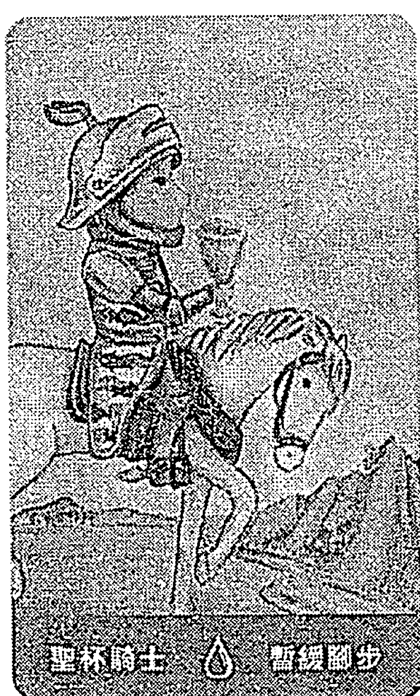

圣杯骑士：水中之火，水中的火元素很难点燃，形成了感受上的行动议题。

圣杯是水元素象征感受；骑士是火元素象征行动层面，表示感受和行动搭不上。

圣杯骑士这张牌有种火点不起来的感觉，有点提不起劲。在牌面上，骑士雄纠纠气昂昂，全副武装带着圣杯出征，骑士心里想好好采取行动，但马却低头踌躇，似乎无法渡河。这张牌的牌义，带着心有余而力不足的象征。例如面对感情，结束一段感情后以为可以卷土重来，迎接下一段感情，却没有动力，可能有些累了，想要先休息一下。因此，抽牌者就像是马很累的骑士。

透过塔罗咨询引导，可以协助对方去觉察身体语言，我们的行动常常会更清楚自己要什么，因为我们可能觉得心里准备好了，却不知道其实身体很累。马象征了他的行动没有动力。就像火里面的水，即使努力想要点燃，但就是点不着。所以我会建议「尊重自己，先暂缓。」许多人在生活中过度操劳，例如投入一个项目，连续整个礼拜都没有睡觉。所以抽到这张牌是非常可以理解的，就算再怎么热爱，身体也绝对受不了这种折磨。就算骑士的意志力与心情再强也支撑不了，身体就是无法继续前进。

### 引导提问

- 你现在想要过河，但先停下来、暂缓脚步，好吗？
- 浪漫的白马骑士，带着杯子要前往哪里？
- 杯子象征着什么？会给自己时间允许自己准备好再出发吗？

### 示范引导

当事人：我想谈恋爱，一直参加联谊，为什么遇不到合适的人？

引导者：你抽到这张牌，是不是过去在情感上觉得很累？你心里觉得自己准备好了，但其实还没有想要往前走……

当事人：对，我发现都是身边的人一直催我说年纪到了，不能再等了！他们一直介绍我参加各种约会……我真的觉得好累！坦白说，心里真正想的是：不要再逼问我了，可以放过我吗？

引导者：如果你发现根本就不想去某个约会，就不必勉强自己。可能你一直觉得想谈恋爱，自己应该已经准备好了，前一段恋情结束后也不可能伤心这么久。但不想去参加约会，就不要勉强。这张牌可以说是很诚实地呈现你内心的写照。

### 补充：想要VS.需要

很多事情想做但是提不起劲，是真的「想要」做吗？还是因为「需要」去做？

提不起劲的事情通常就是不太想做的，想要做的事往往会迫不及待想去做。有时候我们自己做的事情并不是真的想做的，而是要做，但是其实你不想，只是因为需要去完成，可能是一种责任，也可能是环境压力导致。

## Queen of Cups（圣杯皇后）

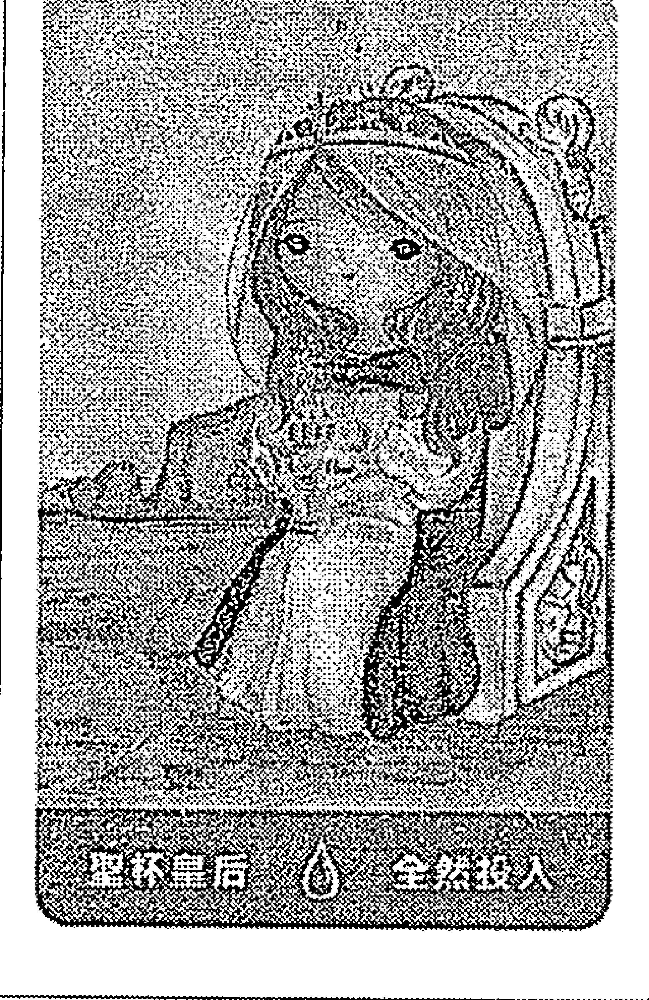

不顾一切地投入热爱的事物中，不管外界环境如何，只全然对焦在投入的事物里。看不到环境的变化与发生什么事情。

圣杯皇后：水中之水，双倍的水元素，形成了感受上更加温柔、温暖、希望展现。

圣杯是水元素象征感受；皇后是水元素，情感丰沛的女性能量。

水中水，双倍水的力量加成，有种情感泛滥的感觉。牌面上的圣杯，看起来是个超级重量杯，非常华丽！这是圣杯皇后专属的圣杯，她非常专注地看着自己握着的圣杯，全然投入，投入到水已经淹上她的脚和裙子了。这张牌有种废寝忘食的感觉，全然投入的时候，注意力的焦点完全投注在这个状态里面。如果问谈恋爱的状况，抽到这张，这个人是可以谈恋爱谈到不用吃饭的！或是可以全然投入完成模型，废寝忘食，而且他还觉得时间过得很快，也不会累。

不顾一切的投入，要让我们学习什么，给我们什么提醒？这张牌有两个建议，第一，抽到牌的人目前状态是不太投入的，你可以鼓励他找到自己真正热爱的事物，投入其中。第二，就是他可能对某件事废寝忘食，已经影响到他的健康，或干扰到身边的人了，太执着的时候，要提醒他看看身旁的环境里发生了什么事情。

### 引导提问

- 有什么事情能让你废寝忘食？
- 你喜欢自己全然投入的状态吗？
- 最近的情绪如何？是否会情感泛滥、太多眼泪？

### 示范引导

当事人：我想要参加一个课程，不知道是否适合我？有没有什么建议？

引导者：你喜欢这个课程吗？看起来你对这个课很有感觉，是吗？

当事人：我满喜欢的，所以想学习这个系统，也想往这个方向前进。

引导者：这张牌给你的建议，全然投入，你可以放心享受这个过程！

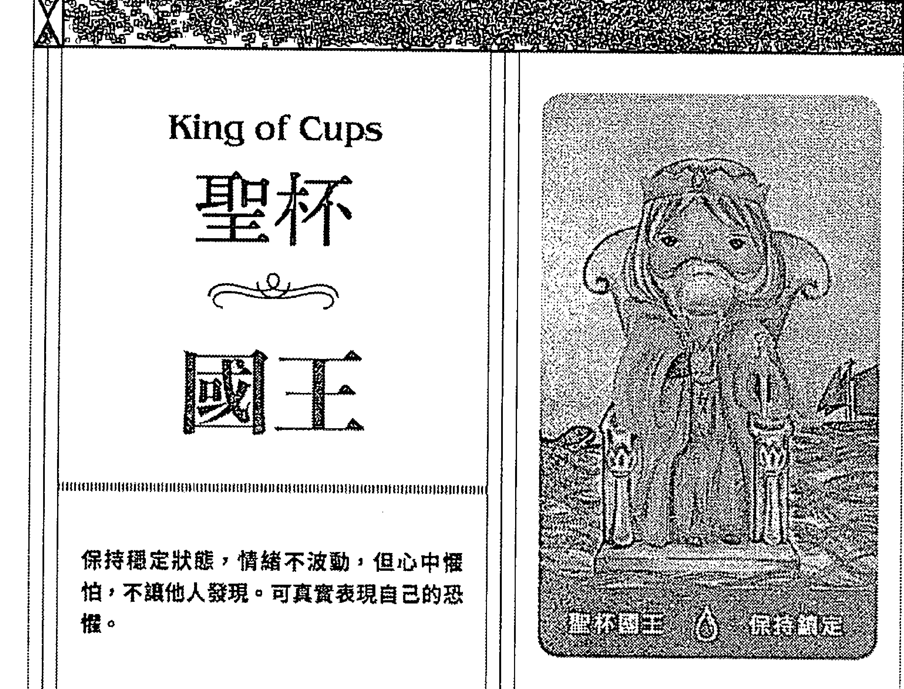

圣杯国王：水中之土，由两个元素组成，形成了感受与感情上的稳定、成熟或静止不动。

圣杯是水元素象征感受；国王是土元素，落实、稳定、圆满、成熟的男性能量。

圣杯国王，象征情绪的稳定。在牌面上，海面波涛汹涌，象征情绪起伏波动大，但因为他是一国之主，要展现出稳定如山的态度。海面上起了风浪，即便是国王在内心也会担忧焦虑，但他要保持镇定，情绪不为所动，才能稳住军心。

这张牌要我们学习内外合一，真的害怕就说害怕，如果真的开心欢喜，就可以表达出喜欢。情绪和情感的不动如山，其实是因为外在角色的需要，或环境因素而忍住不把情绪表现出来，刻意忽略波动的感受。抽到这张牌的人，可能平常就是这样处理自己的感受，比较忽略情绪。

### 引导提问

- 国王坐在这里的感觉如何？心情如何？他在想什么？
- 面对海水的波涛起伏，如何让自己稳定下来？
- 如果可以有更舒服的调整，你想怎么做？

### 示范引导

当事人：好烦喔，有人向我告白，我不知道要不要答应他。

引导者：抽到圣杯国王，你是在保持镇定吗？其实心中波涛汹涌，是吗？

当事人：好吧！……超害羞的，好像是……

引导者：你心里已经小鹿乱撞了，脸上还说着其实我对他没什么感觉，你抽到的牌大概就是这个意思。很难掩盖住心中的澎湃！

## Pentacles（钱币牌组）

代表土元素，土地的能量。「有土斯有财」，因此土元素以钱币、五角星符号为象征。

掌管的议题包括金钱、学业、事业、投资理财、房子、车子、功成名就、名声头衔、身体与健康等具体看得到的层面。只要是情绪、想法与行动这三个层面以外的，都是物质层面的钱币管辖范围。

而在物质世界中运作的「心因外果」灵性法则，钱币所呈现的状态（结果），也是「情绪、想法、行动」这三者（原因）的影响所致，这些内在的发生（因）显化成外在具体的真实现象（果）。

## Ace of Pentacles（钱币A）

这是个创新的契机、新的投资、新的工作机会、新的房子或车子，是一个崭新的物质开展，充满稳定与把握的力量。

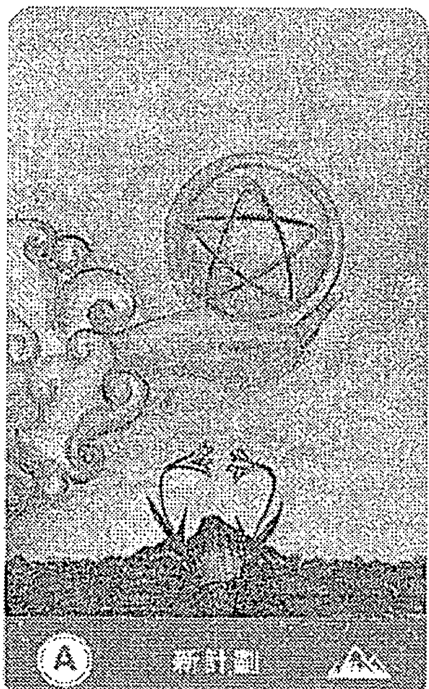

把这个钱币想象成金元宝，而钱币A就是手上捧着一个金元宝的感受。请伸出左手并握拳，用右手掌包握住左拳，就象是握着金元宝的画面，这是什么感觉？是否有种踏实、扎实的「安全感」，当你拥有物质金钱的时候，就是这样的安全感。

这种拥有感受，也会大大增加我们的「确定感」，这是一种新的开始、物质生活的开始，例如象征新的生命阶段，进入新学校、新工作等。钱币这组牌是物质生活的力量表现，也可以说是关于生涯规划、财务规划、理财规划、物质生活配置的一组牌。

买新房子、新车子、进行一项新投资等，代表稳定的物质力量，并且对于这个事件是有把握、有安全感的。询问建议，并抽到这张牌，代表当事人需要一个新计划、新的创作、新的工作项目等，是关于物质层面的新开始。

### 引导提问

- 最近有什么新的机会出现？如果有，你想把握住这个机会吗？
- 如果要开始一个新计划，你觉得是什么？健身、工作，还是买房？
- 对你来说，这项新计划能够替生活带来什么样的稳定力量？

### 示范引导

当事人：想要买房子，看上了一个物件，觉得不错，但价格有点高……

引导者：抽到钱币A，感觉买房子这件事可以给你稳定的力量与安全感，是吗？

当事人：是呀，我一直在计划买房，不知道这一个我能否负担得来？

引导者：这张牌在鼓励你，可以发展这项新的计划，也需要稳健地做好财务规划，让自己在有把握、有安全感的状态中持续前进，并且梦想成真！

## Two of Pentacles（钱币二）

在变动的环境中，依然能够对所选择的事物掌握自如，就像无限大的创造能量，能创造无限的可能性。

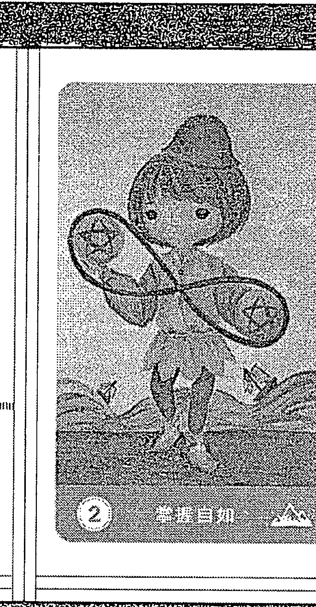

钱币2的牌面是个从容自在、掌握平衡的场景。主角手上握有两个钱币，形成了一个无限大的符号，好像在和钱币对话，而且一脚还踮着，象征着轻松自如，同时可以发挥无限大的可能性。主角身后的海浪波澜起伏，船只随之起舞。后面的海浪象征环境的不稳定，对于投资理财来说，现在时机不好，整体的景气不佳、或是由于全球金融政治等因素，导致影响工作与财务状态都不是那么好。

对于抽到这张牌的人来说，即使目前大环境不稳定，依然可以在既有的环境中，掌握自己力所能及的，维持物质生活的平衡，更能创造出无穷的可能性。对于自己的物质、规划、投资，他都能掌握。就算是2008年金融海啸、雷曼兄弟事件爆发当时，大家都在惨赔，但会赚钱的人依旧稳赚，稳定发展的事业依然蓬勃发展，看到百货公司周年庆的当月业绩，会觉得时机其实好得不得了！

问投资理财，抽到这张牌，投入的资源要维持在自己可以掌握的程度，重点是可以掌握这个平衡最重要，因为只要在可以掌控的范围内，就能创造可能性。抽到这张牌，也象征这项投资是在自己的掌控范围内的投资项目，并且要开始做好平衡的财务规划。

### 引导提问

- 检视自己目前的能力与条件，做这件事，可否取得平衡？还是会很吃力？
- 当你决定做这件事，有哪些资源是可以掌握与运用的？
- 你想要继续创造哪些可能性？

### 示范引导

当事人：我要去参加这项考试，有点担心，想要寻求一些指引。

引导者：看起来考试竞争得很激烈，整体来说可能有些困难，但感觉你可以掌握自如，在担心些什么呢？

当事人：我害怕自己没有足够时间准备，因为临时才报名……

引导者：这张牌鼓励你，抓住你最能掌握的部分，例如你某几个项目最拿手，就专攻这几个，多花时间准备，这些强项可以替你获取不错的平衡分数！

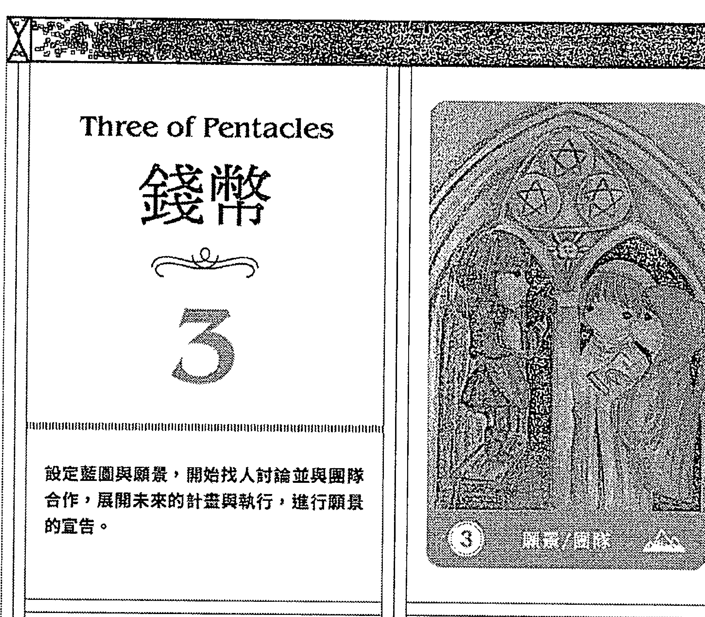

钱币3的三个钱币镶在墙壁上，成为建筑的一部分。这个场景在教堂，修士手上拿着教堂的设计图，建筑师拿着工具站在板凳上面象征专业，他正和两个修士解说设计图，说明教堂要怎么盖，一边听修士的想法，同步进行修正。

钱币3里有三个人，象征着团队合作的力量，数字3常常象征合作、一起创造愿景并实现愿景。当修道士产生盖教堂的愿景和蓝图时，他们把专业工作交给建筑师规划，画下了愿景蓝图，也就是设计图，接着开始找人讨论，找伙伴进行团队合作。

这张牌，对应到数字3的「表达」。想要做一件事情的时候，我们要找人讨论、分工合作、把专业的部分交给专业，让专业人员执行各自的拿手项目。这个表达过程就是一种宣告，告诉他人我的愿景与想做的决心，还有想要怎么做，接着经过讨论，会更确立自己的目标，更清楚知道自己的愿景该如何调整，并随时修正。

### 引导提问

- 这座教堂对你来说象征了哪项愿景？你有什么想开拓的目标？
- 想到哪个适合的人可以加入计划中？如果会有另外两个人，你觉得是谁？
- 这个计划可以如何分工，各自负责擅长的领域？

### 示范引导

当事人：我要考研究所，目前正在补习班补习准备考试，有什么建议或提醒？

引导者：你抽到钱币3这张牌，可以找读书会伙伴一起准备考试，加上你一共三个人就好，你有哪些人选可以一起加入吗？

当事人：嗯！我有几个比较熟的补习班同学，看看哪两个人可以和我一起。

引导者：读书会三人小组，刚好一个人负责一个专业科目，选自己比较拿手的科目，非常完美！想象一下考试顺利成功的样子，会是什么的画面？

## Four of Pentacles（钱币四）

谨慎地守护着自己拥有的物质，紧紧地把握住而不分享出去，因执着于安全感而失去丰盛感。可以多聚焦在自己已拥有的部分，增强「我是丰盛的」感受。

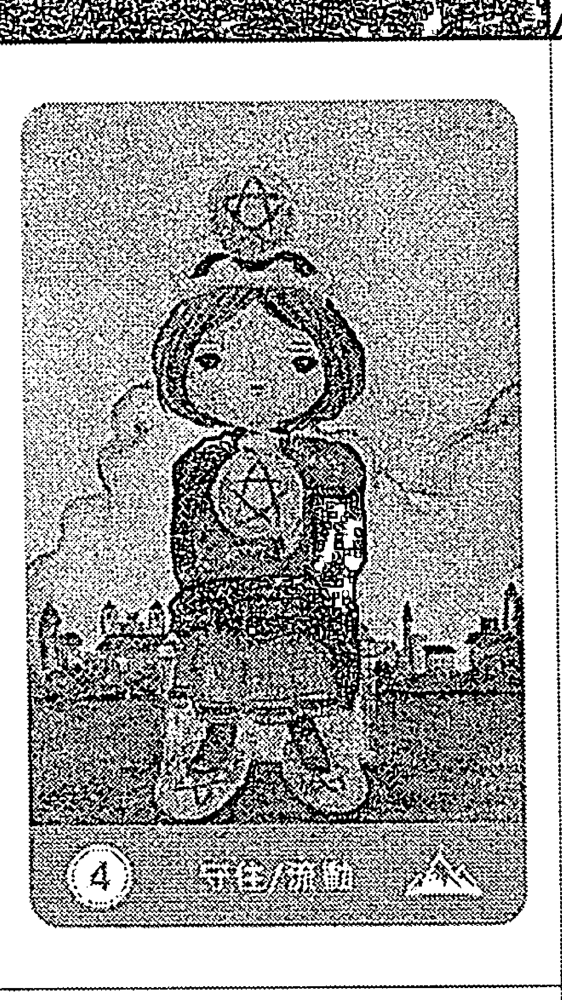

钱币4是守财奴的象征，对应到数字4的安全感议题。物质的安全感来自抓住财富、守住金钱，才会觉得生活是安全的。牌面上的人物是国王，头戴皇冠，身后是他的领土，有权有势，但他手上抱着钱、双脚踩着钱、头上也顶着钱，让人感觉要从他身边拿走钱币是不可能的，因为他守得很紧，有股小气吝啬的意味。

守财奴是有钱的乞丐，他不是没钱，也不是真的乞丐，他是「有钱得很贫穷」。这张牌有时候会让我们看到，这个人对物质的掌握和要求是非常谨慎的，可能会花很多时间存钱、守财、放定存，理财概念比较保守。他很需要安全感，他相信这样做比较安全。可能也会选择相对安全的投资法，象是稳健型的投资、长期定存，甚至存一辈子都没有取出来用，因为他希望安全稳定。相对于火元素，权杖骑士的策略是走短线操作或赚快钱。

回到这张牌要学习的课题上，可能会一直累积物质的安全感，但渐渐会发现还是要回到自己的内在，就算拥有这些物质，心里却缺少丰盛感，所以他要透过这些累积，去累积自己的丰盛感。

### 引导提问

- 当你拥有这么多，把这些物质都守在身边，真的快乐吗？
- 你觉得自己是丰盛的吗？还是你只看到匮乏之处？是否已经拥有很多，但依然觉得自己很穷困？
- 如何回到自己的内心，寻找内心真正的安定？

### 示范引导

当事人：我想知道，找工作的类型要往哪个方向比较好？

引导者：你抽到钱币4，可以往有安全感为主的类型去找，你觉得做什么事情或工作条件，会让你有安全感？

当事人：我希望是稳定的，不要有太多变动，也不要出差什么的，稳稳的就好。

引导者：可以往公家机关，或保障良好、制度健全的公司这些方向去考量，会让你比较有安全感。避免草创期或需要和老板一起打拼的公司类型。

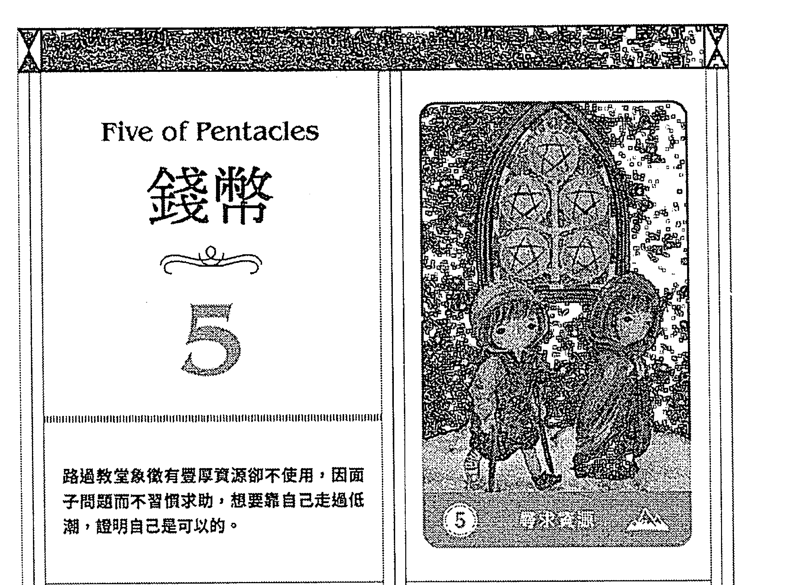

在钱币5的牌面上，五个钱币镶在象征教堂的彩绘玻璃上方。教堂在这张牌中有个非常重要的意义，象征提供资源协助的场所，不是提供长期居住或长期支援，而是提供暂时帮助的避难所，提供我们当下的物质支持、生活上的照顾和温暖，同时让我们躲避黑暗、冰天雪地、受伤跛脚的窘境。两个行人看起来有点像乞丐，走在前面的人没有穿鞋子，后面的人脚包纱布、拄着拐杖，在黑夜的雪地中前行，但他们的脸都没有面向教堂。

这张是钱币的5号牌，所以和数字5的面子有关，个性不求人，所以自己会想办法解决。就算处境辛苦，但有时还是会婉拒别人提供的资源，他想要透过自己的力量来试试，靠自己度过这个难关。

在辛苦或穷困的艰难处境中，幸好他不是独自一人奋斗，他还有伙伴同行。同时，再艰苦的处境，他还是想透过自己的力量来度过这一切，但这并不表示他做不到，他做得到，甚至会做得不错，他只是想证明自己是可以的！这样的人可能会为了面子或争一口气而苦了自己，如果你是他身边的人，不妨叫他走进教堂，求助也是一种选择，不用每件事都得证明靠自己就可以完成。

### 引导提问

- 你是牌面上的哪个人？你旁边的人是谁？在这件事情上，你想靠自己去完成吗？
- 这个场景让你想到什么？你最近遭遇了什么困境吗？需要帮忙吗？
- 你看到旁边的教堂了吗？教堂象征提供协助的避难所，在生活中就有资源可以协助你，你愿意开口求救吗？

### 示范引导

当事人：老师，我现在大二，一天打三个工，早上卖早餐，中午帮人包便当，晚上帮忙煮关东煮，手都烫到了。

引导者：你这么缺钱吗？看你抽到这张牌，确实有点惨！有人和你一起吗？

当事人：真糟糕！不过，我其实不太缺钱，家里的经济状况还不错，可是不知道什么时候向家里撂了一句狠话，可能是和父母吵架的时候吧，说我上大学的一切开销都靠自己，不会拿他们的钱。有同学和我一样是三份工读。

引导者：这是你必须经历的功课，你的父母应该也满心疼你的，所以有时候不要太逞强，知道吗？有需要就要告诉他们。坦白说，你现在还是学生，自己的本分没有顾好，一直忙着打工，把自己身体搞成这样，手也受伤。本分还是要顾，因为这张牌是5号的角色，本分是很重要的！要适时开口求救，寻求支援与协助。

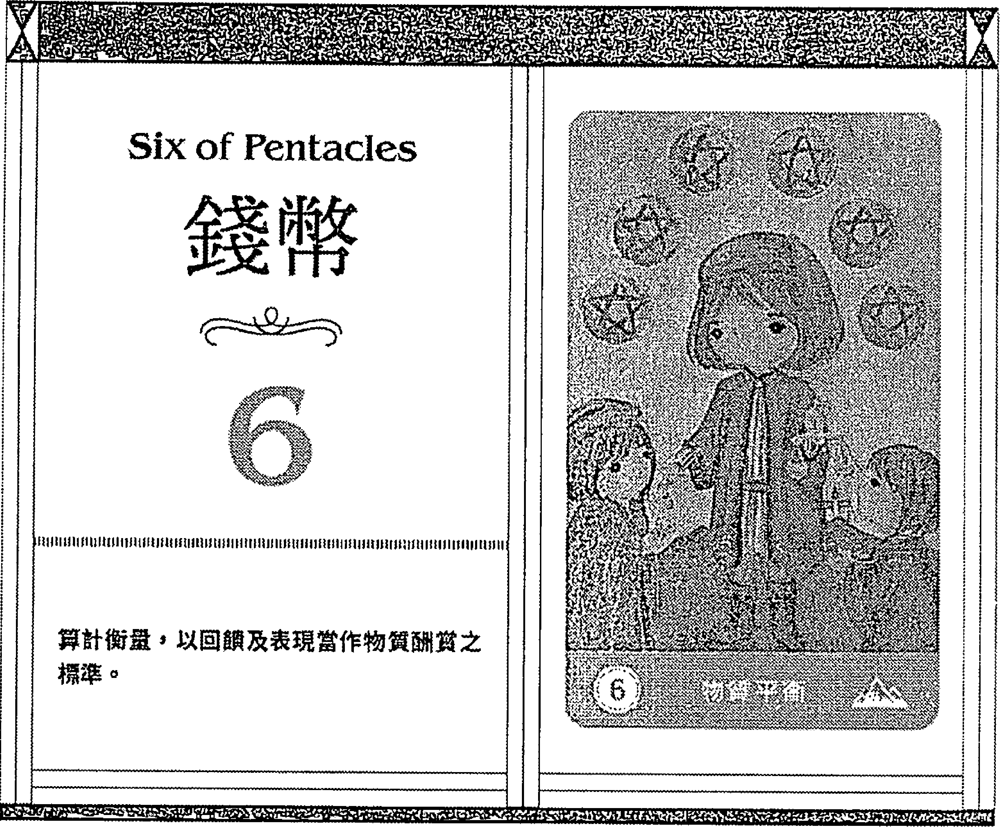

## Six of Pentacles（钱币六）

算计衡量，以回馈及表现当作物质酬赏之标准。

钱币6这张牌对应数字6，主角是个很有爱、慷慨分享的富翁，当我们物质生活富裕起来之后，就开始懂得给予，帮忙需要的人。同时，富翁手上拿着秤，一边付出给予，一边也在衡量物质的平衡，不会过度给予爱，也不会过度给予物质，寻求一种爱与物质平衡的美感。

有些时候，我们愿意在物质生活上照顾对方，那是因为我们理解这个辛苦过程的不容易，也因为爱这个人，所以我们愿意付出。愈爱对方，我们愈愿意慷慨付出；相反地，对方与我们的关系不好，我们也就不太想在对方身上付出太多金钱。这就是钱币6的衡量标准。你对我多好，我就会给你多少钱。考量的比倾向「关系」，人与人之间的情感关系。

在牌面上，跪在下方的两个人，是接受物质照顾的角色，身着橘衣的拿到了钱，着蓝衣的没拿到钱，从这里可以看出两人与富翁的关系，其实是很不一样的。象是「看我有多爱你，我就给你多少。」「我把你的生活物质层面照顾得这么好，是因为我对你有很多的爱。」或「你想得到我的遗产，那我也要看你有多孝顺。」

### 引导提问

- 你觉得自己比较像牌面中的哪一个？这个场景会让你想到什么？
- 你是物质上照顾对方比较多的人？还是被照顾的那个人？
- 当你考虑是否要做这个决定时，是如何考量这个付出是否平衡？

### 示范引导

当事人：我想要问和暧昧对象的关系。

引导者：你抽到钱币6，你觉得他是牌面中的哪一个？如果他是站着的这位，他在生活中满照顾你的，是吗？

当事人：是呀！大部分都是他付钱，他在生活中也很照顾我，很常买东西送我。

引导者：通常抽到这张牌，伴侣都蛮大方的，可能是蛮会赚钱，人也慷慨不小气。

钱币7的牌面上，主角面对地上一堆钱币，难以抉择，一脸困惑，不知道该怎么办，等待一个结果出现。这是他种出来的农作物，结实累累代表了收成和收获，满地钱币丰收，有点伤脑筋，不知道这些农作物要分送给谁。这个画面就是他杵在那里，不知所措。

这是个带有象征意涵的情境，这七个钱币，可以是七个工作机会，假设投履历，七个工作都通知你录取上了；或是考研究所，七间学校都上；家中有七台车，不知道今天要开哪一台出门。在这种时候，选择少反倒是好事，因为钱币7的烦恼就是「选择太多」。数字7的特质绝对不是没有选择的选择，而是选择太多带来的痛苦，面对太多选择，不知道该怎么办才好。

选择太多的困扰，是要我们再次回到以信任来做「直觉选择」。或许你忽略了而没看到某个选项，这可能是最接近你需要的选项，但你一直在看着别的地方；也或许你早已经做出决定，只是你一直在质疑「这真的是最好的吗？」回到信任的课题，信任自己的直觉，放下过度思考。

抽到这张牌，也不用急着逼当事人做决定，因为他现在的状态就是需要等待，先停在这里。可以鼓励他信任自己的直觉，如果他还是无法做决定，就允许自己暂停一下，或许转身先做别的事，转换心情后自然答案就出现了。

### 引导提问

- 满地的钱币代表什么？选项太多让你难以决定吗？
- 停在这里，你在想些什么？心情如何？你在等待什么？
- 你想选哪个钱币？看见脚边的钱币了吗？它代表哪一个选项？

### 示范引导

当事人：我想要询问家庭关系。

引导者：这张牌是钱币7，家里现在需要做什么决定吗？太丰盛，所以有点困扰是吗？

当事人：其实是房子太多不知道该怎么办。有一间是买给小孩读书住的，先生和我住在另外一间房子里，有时候觉得很痛苦，有时来陪小孩住，又要找人打扫，觉得好烦……

引导者：真的是太经典了！是否需要简化一下，让自己不用花这么多时间来做出选择。

钱币8阐述的是数字8的努力和成就感，专注投入、努力打造钱币，获取功成名就。如果问某件事情进展如何，抽到这张牌，表示这件事应该做得还不错，例如学业成绩或工作表现。设定目标投入，全力以赴，把做好的钱币一个个挂起来。牌面主角是雕刻钱币的工匠，他很努力认真打造钱币，一个又一个接连完成，造好的钱币象征目标完成，悬挂起来的画面象征着得奖的奖状或奖杯，得到了认同与肯定。达标之后，还有一个在旁边等，事情一件一件完成，物质目标一个一个达到，非常符合数字8的性格。

问考试或学业的情况下，这张牌是个很好的象征。我有个学生曾经问考研究所并抽到这张牌，我一听就说：「你一定会考上。」（但是那时候我不知道他已经考上了。）我接着问他去考试了吗？他才回答已经考过试，也考上了。我最后才知道其实他正在念研究所，他才坦承这是他去年抽的牌，觉得很准！

抽到这张牌的人，功成名就就在眼前。他会按部就班设定目标，循序渐进，把物质面想要的事一一完成，他的人生就是照自己的规划前进，一个个完成，旁边还有新的目标和愿景在等待他完成。

### 引导提问

- 挂起来的钱币代表了什么？有哪些是你已经做得不错的？
- 你正在专注的事情是什么？
- 还有一个等着你去完成的，那又会是什么？

### 示范引导

当事人：想进行一项工作计划，我要如何准备，请给我一些建议。

引导者：你抽到钱币8，代表你在这份工作上的基础功夫已经做得不错了，你看这些高挂的钱币，都是你努力过后获得的成果。

当事人：确实我一直都很认真，也做得还不错，我很幸运，大家都蛮肯定我的！

引导者：你可以专注投入这个项目，把大项目区分成比较容易完成的小项目，一个个达标，这样会更有成就感，而且会做得很好！

## Nine of Pentacles
### 錢幣 9

豐盛、優雅，獨自享受生活的豐足，具有品味，低調不張揚。

钱币9是贵妇牌，在牌面上会看到许多象征丰盛的元素，葡萄园的丰收富足、满花园的钱币、穿着华丽衣裳的贵妇人正优雅自在地享受美好的物质生活。这个场景是贵妇人的后花园，后花园象征外人难以看见的地方，对应数字9，有隐私低调的感受，这是只有她自己知道的私领域，也象征了独处、享受一个人的时光、僻静的悠闲。

想象从外面的竹篱笆矮墙往里看，其实看不见这些钱币、葡萄，只看得到贵妇人的上半身，路人从外面窥探的视角无法得知这家人过着怎样的生活，也看不到隐藏在葡萄园里的许多钱币。这张牌代表了物质生活丰盛，但又很低调。低调到连贵妇人养的鹦鹉都要用头套罩起来，就像在告诉鹦鹉「你要低调，不可以到处宣传家里很有钱」。因为鹦鹉会去散布家中富裕、主人富有的事，贵妇人不愿让鹦鹉到处多嘴，才用头套罩住鹦鹉。

这也象征了外在的层面只显示了一部分，内在层面还有一些隐藏起来的地方是外在看不到的，而且是低调、不可外传、不能告诉别人的。暗指有些金钱或物质的秘密，例如做了一些投资不让别人知道、存私房钱、偷偷购物不让别人知道。

### 引导提问

- 那只鹦鹉有什么不可说的秘密？
- 后花园象征了什么？你的哪些事情不想被别人知道？
- 低调又丰盛的生活，给你什么样的提醒？

### 示范引导

当事人：我想要询问下一年度工作的状态与提醒。

引导者：哇！你抽到钱币9，感觉接下来的一年可以当贵妇人，可以很享受自己的丰盛生活。

当事人：真是太感谢了，辛苦打拼终于可以好好享受了。

引导者：但同时也提醒你，这是低调享受丰盛生活的状态，而不是到处宣扬自己有多丰盛！或许会有属于自己一人的旅行，或者独处的贵妇人生活时光，这些都是很美好的体验。

钱币10这张牌带有情感与物质并存的元素。牌面上满满的十个钱币，排列成卡巴拉生命树的形状，这是三代同堂的景象，一位富有的老人坐在前方，家里盖得和城堡一样，一家人住在豪华的别墅里。

老人住在别墅里面，外人看着称羡，但他却觉得不那么快乐，因为有钱却没人理他，只有狗陪他玩耍。三代同堂，老人把财产与物质丰盛的条件传给下一代，而这对夫妻接管了家族的事业、金钱与丰盛能量。这张牌的主角是老人，象征了「有钱的孤单老人，孤单的有钱家庭」。

抽到这张牌的人常常会觉得：这个家里面，好像老是在谈物质的种种，好像大家都在各忙各的。牌面上的夫妻，一个进来一个出去，他们擦身而过，没办法好好停下脚步关心彼此，随时都处于忙碌的状态。孩子也有点不知所措，觉得自己被忽略，只好拉着妈妈的衣角寻求关注。老人与狗玩耍，有陪伴的感觉。

这张牌表示较为缺乏家人之间的互动，提醒我们要多关注人。抽到这张牌的人，心里会有点孤单、空虚，多半会提起家庭中的交流大多围绕在工作、学业上的互相较劲，缺少情感交流。

### 引导提问

- 你是牌面上的哪个角色？老人、夫妻、小孩，还是狗？
- 这样的互动给你什么样的感觉？感觉孤单吗？这是你家庭的写照吗？
- 如果可以，你希望这场景会有什么不同？

### 示范引导

当事人：我想问与家人的关系。

引导者：看钱币10这张牌，你直觉认为自己是哪一个人物？有什么感受？

当事人：我觉得我是这个小孩，这其实蛮像我家的样子，我爸妈都在忙公司的事，很少管我。每次吃饭时间都是在谈股票投资，或者问我读书怎样，又拿表哥表姊来和我比较……

引导者：听起来有点无奈，是吗？我也听出来，你希望他们真正关心的是你这个人，而不是只会谈工作、股票和你的学业。

1. 生命之树，是一种在犹太教使用的神秘符号，属于犹太教哲学传统卡巴拉的一部分思想。生命之树用来描述通往上帝的路径，以及上帝从无中创造世界的方式。生命之树由十颗圆球及二十二条路径（对应塔罗22张主牌）所组成，而其中十颗圆球就是钱币10所看见的十个钱币的排列图形。

## Page of Pentacles
### 錢幣侍衛

專注在物質層面，焦點集中在自己所投入的事業、學業與健康。

钱币侍卫：土中之风，由两个元素组成，形成了物质议题上的初始阶段。

钱币是土元素象征物质稳定；侍卫是风元素，就是变动、变化、赤子之心、好奇心、探索、机伶的感觉。所以是在探索与好奇的阶段，还会有些变化。

对应询问的事情，或工作、学业、学习等议题，都在起步阶段，还在进行新人培训与学习；这项投资还处于变动中；刚开始的创业阶段还在发展；新的门市正开始营运，还在调整的阶段。

侍卫看着钱币，用心观察，带有珍惜、专注、落实、稳定、优雅自在的特质。因为这张牌象征才刚开始发展的状况，需要耐心等待，不要急，慢慢看着将会如何进展。

### 引导提问

- 你在观看什么？对于你想做的事情有什么感受？
- 目前是这件事情刚开始的阶段吗？你的心情如何？
- 起始阶段，是一个新的开始，你想要学习探索什么？期待能获得什么？

### 示范引导

当事人：我接了一个新工作，想知道怎样可以做好？

引导者：你抽到钱币侍卫，这是一个很稳定、很务实的状态，刚起步，每一步都自在优雅地向前进。

当事人：保持稳定，这确实给我很好的提醒，因为新的任务最近让我有些紧张。

引导者：专注投入，用心去做，保持赤子之心与好奇心，我相信就能轻松完成任务！

钱币骑士：土中之火，由两个元素组成，形成了物质目标上的行动展现。

钱币是土元素象征金钱物质；骑士是火元素，象是黑马般的行动力。

对比四张骑士牌，钱币骑士的马匹是唯一处于静止状态的，象征着看向远方的物质目标，现在是准备好、有打算、有计划地朝向未来，稳定地迈进。

骑士代表了行动，黑马象征了爆发力，一开始可能不被看好，但是会后来居上。黑马头的方向与骑士一致，看向同一个未来的目标。骑士全副武装，带着钱币要往前走。过去所做的努力和准备，都是为了迎向目标的一种蓄势待发状态，准备好了就可以启程，带着钱币往前走，带着行动的力量去迎向未来。

### 引导提问

- 过去曾经做过些什么样的努力来奠定现在的基础？
- 如果你是黑马的主人，你期待迎向什么样的未来？
- 为了完成目标，你做了些什么样的准备？如何把自己准备好？

### 示范引导

当事人：这个月底要去参加比赛，不知道会如何？

引导者：抽到这张钱币骑士，感觉你是黑马，有爆发力，你对自己有信心吗？

当事人：我就是觉得蛮紧张的……

引导者：你可以做什么准备？上场前，不断做练习题、模拟测试、做各种预演准备，这些可以让你内外在都准备充足，蓄积能量，好在正式上场时全力展现！

钱币皇后：土中之水，由两个元素组成，形成了物质目标上的温柔、温暖、灌注情感。

钱币是土元素象征务实的力量；皇后是水元素，一股爱的力量。钱币皇后是务实又温柔的力量，兼顾了物质层面，也充满情感面的力量。

土中之水，象征松散干枯的土，加上水元素的滋养与灌溉。让人觉得土不再干涸，这张牌带有滋养、灌溉的意思。看到植物盆栽的土壤干枯的时候，会直觉想替植物浇水，带着一种滋养的爱，因此植物在你的照顾下会更加成长茁壮。

钱币牌到了皇后阶段会带有一种更稳定的成熟感，在这个阶段，你要用更多的爱和热情来持续行动、正在做的目标，才能让物质目标这棵大树继续强壮。

这个皇后拥有许多爱、关心、关爱，她面带微笑，照顾着钱币，旁边还有只小兔子。（皇后的宠物通常都是比较可爱的，像是猫、兔子。国王就会搭配蜥蜴。）用爱来灌溉，让物质目标长得更好，让你投入的事情可以更加茁壮、更丰盛，而这个钱币就更加稳固。

### 引导提问

- 皇后坐在这里，你觉得她在想什么？她的心情如何？
- 你最近有什么物质目标吗？你做的这件事，需要灌注些什么情感层面的关爱？
- 旁边这只小兔子象征什么？让你想到谁？

### 示范引导

当事人：我想问身体健康，为了健康去运动感觉好累，但又好像应该要去运动才对……

引导者：抽到钱币皇后，她是一位物质与情感兼顾的皇后。你认为如果要向这位皇后学习，你会学到什么？

当事人：或许是找回热情吧！我好像太看重运动表现和运动量的数据，忽略身体健康更需要情感层面。

引导者：这张牌在提醒你，找到可以投入热情的点，让你可以用爱去灌溉健身的过程，找到健身的乐趣，用爱去滋养身体，这样运动起来会更开心又健康！

## King of Pentacles
### 錢幣國王

> 毫無變化、太過穩定、呆板、平靜無波。

钱币国王：土中之土，由两个土元素组成，形成了物质上的稳定、规律、务实、或没有变化。

钱币是土元素象征物质金钱目标；国王是土元素，落实、稳定、圆满、成熟的男性能量。

当土元素遇上国王，就是双倍的土元素，稳定中的稳定，物质纹风不动。牌面上的国王好像快睡着了，葡萄藤蔓已经爬满全身，藤蔓好像是从很远的地方爬过来的，中间经历了漫长的时间，他似乎在这里坐了好久好久，一动都不动。

累积了很多的财富，很有钱、很丰盛、很稳定、很规律而且一成不变。

问夫妻关系，抽到这张牌，就代表老夫老妻，没有任何变化、变动。问工作，抽到这张牌，表示这间公司很稳定，职务内容很规律！你可以日复一日、年复一年，在这里工作三十年都没问题。

### 引导提问

- 国王坐在这里坐多久了，会不会想要站起来活动筋骨？
- 如何规律地完成目标？如何让自己做到稳定的持续累积？
- 当你拥有且达到足够丰盛的生活时，你想做些什么？

### 示范引导

当事人：我想找指导教授，现在有一个人选，想了解如果找他指导的话会如何？

引导者：抽到钱币国王，感觉是个很稳定、规矩的教授，应该可以让你顺利毕业。

当事人：稳定、规矩，所以没有创新吗？

引导者：这张牌没什么创新的感觉，因为是两个土元素的结合，他应该会认真讨论你的论文，让你很有纪律地把论文完成，或许你会觉得有点无趣，但就看你想不想要这样的关系。选他可以让你稳健地完成论文，但如果你喜欢创新有趣或突破性比较大的论文指导风格，这位钱币国王或许就不是适合的人选。

# 第五章
# 解讀心法與牌陣介紹

学习完牌义后，这一章要进入实际的牌阵解读。

在第一章谈到了「信任直觉、中性解读、发挥想象力与创造力」，第二、三章的22张主牌以及第四章的56张副牌，阐述了每个数字的含意、元素象征，及每一张牌的提问关键，这些都是基本功夫。最后在第五章，将介绍几种最重要的解读心法，以及超好用牌阵，让大家可以轻松上手、运用自如。

## 自我应验预言

> 「事情的发展，真的依照解读者描述的方向发生了……究竟是他说的很准，还是你的自我暗示太强大？」

当我们开始思考这个问题并且清楚分辨「什么才是关键」时，代表能够正确使用塔罗牌带给你的讯息，善用这个力量，才能不被塔罗牌绑架，才不会落入迷信、执着与负面情绪之中。

未来发生的可能性，是对每一个当下的回应。如果你问「我这样做会如何？」抽到让你觉得恐惧的牌，就会被恐惧惊吓，并且带着恐惧继续前进，过程中每个当下的恐惧积累，会造成未来的大恐惧与负面结局，当然这结果必定是符合恐惧担忧的自我暗示。

相反地，如果透过这张让你心生恐惧的牌，能够问自己「这要给我什么讯息，为何我现在会抽到这张牌，它要告诉我什么，要我往什么方向去，它是否指出我当下的害怕与盲点。」让自己觉察并调整观看高度，例如「这是一个转念的时刻，要释放恐惧，不要自己吓自己，我现在要先给自己肯定的信心。」于是会发现事情开展时的正向力量变得格外重要，当我们带着好的开始向前推展，对于过程中的心情与状态都会有正向帮助，正因为记住了这张牌带来的鼓励与提醒，而非只是记住恐惧，接下来成功的机率就会很高。

我们相信，内心被暗示什么，未来就有可能成真。无论是自我暗示，或是相信他人的暗示，这就是心理学上著名的「自我应验预言」，又称「自我实现预言」，也就是「比马龙效应」。当事人的痛苦心情，有机会透过牌卡咨询的历程，经过厘清和讨论，进而释放恐惧，看见提醒与鼓励，带着正向的信念，往更美好的方向前进！

## 如何问对问题

在获得正确答案之前，要先「问对问题」。因此，不必急着在当事人一坐下来就开始洗牌，我们要先确认好问题之后再往下走。带着一个好的问题去洗牌及抽牌，询问方向与意图才会正确，塔罗牌也才能够精准回应及厘清困惑，同时也能做出正确的决定。

以下步骤对于自己抽牌解读，或替他人咨询解牌过程都适用。自己抽牌时，把问句中的「你」换成「我」就可以了。

### 请用开放式问句

许多当事人很想从解牌过程中获得一个「答案」，因此常常会问封闭式的问句，即是或否的问题，这时候请「转化这个问句」，尽量用开放式问句来进行塔罗咨询。

例一：「关于这件事，我想知道我老公在想什么？」转化成「我们来探索你和你老公的关系，在这件事情上，看看潜意识有什么讯息想诉说？」（What）

例二：「我做这件事会不会成功？」转化成「如果我做了这件事，会如何？」（How）

### 谁是主角？只问自己的问题

对于很想「揣测对方心意」及很关心「别人在想什么」的当事人，需要做一些引导以及转化问题。因为我们面前的「当事人」是主角，鼓励他只问与自己有关的问题。如果他真的很想知道别人是怎么想的，那就请那位「别人」自己来抽牌，如果当事人还是执意要抽，也要让他知道，他抽出来的牌也只能代表「他的揣测」，并非对方真的如此想！

既然当事人已经来到面前，要怎么进行这段咨询？举例来说，当事人问：「我想知道我男友在想什么，我想知道那个女生喜不喜欢我，我想知道他是否会原谅我，我想知道我爸爸生病会不会好起来，我想知道我儿子未来适合做什么」。这类的人际关系问题，我都称为「表面问题」。首先，要知道他会提出这样的问题，背后的心理需求是什么？再来，当事人他们的互动关系又是如何？令人好奇的是，他真正想知道这件事的背后原因是什么，知道了又会如何。

因此，当事人在探问别人的想法时，可以先让他抽张牌，「先看看你们之间的关系如何」，看到关系互动中呈现出来的状态，就能进一步解答他的需求与困惑。这么一来，表面问题可能不再是问题，因为他的需求在咨询解读过程中已经被满足了。

### 先花时间来厘清及聚焦问题

#### 步骤一：大主题方向

- 「你今天来想问什么？你想了解什么？你最关心的是什么？」
- 「你有什么期待吗？你希望我帮你什么？」
- 「工作、感情、家庭、人际关系，想问的是哪个主题？」

#### 步骤二：聚焦出具体问题

##### 感情篇：「想聊感情的主题，那你想了解感情的什么呢？」

「想问和特定对象的关系？还是没有对象？」

「想做什么决定吗？分手或是在一起？」

##### 工作篇

「想聊工作的主题，目前工作的状况如何？遇到瓶颈了吗？」

「在职中，想要换工作？还是待业中，想要知道工作方向？」

「你说面试上几个工作，所以想知道哪个比较好，是吗？」

「自己创业，事业方向想要有所调整，所以想寻求建议，是吗？」

##### 亲友篇

「你说孩子让你很烦恼，那我们先来看看你和孩子的关系状况……」

「我们来看看，你可以怎么和孩子相处，对彼此才是最适合的。」

「在你和母亲之间的互动关系上，看看是否能提供一些建议给你。」

#### 步骤三：提出核心问题

有时候，在步骤二就能完成问题的整理，直接进入洗牌阶段。

但往往在协助对方整理问题时，你感受到他的问题似乎只是「表面议题」，这时候就需要步骤三，来帮助他澄清当下问题的核心，以及当下比较需要先处理的议题，例如：

**当事人**：我想要谈恋爱，想交男朋友，我想问何时会有对象出现呢？

**引导者**：你上一段感情是什么时候？

**当事人**：我其实不算谈过恋爱，都是单恋，我喜欢对方，但对方都不知道……

**引导者**：你尝试过向暗恋的人告白吗？如果把喜欢表达出来，是不是就有机会交往？

**当事人**：我就是怕对方不喜欢我、拒绝我，最后搞得连朋友都当不成。我默默喜欢就好，因为我对自己很没有自信，觉得那些男生都很受欢迎，一定不会看上我……

引导者：那我们先来探索你和自己的关系，看看透过塔罗牌，能否给你一些感情上的建议、如何提升自信的建议，好吗？这样你有自信了、能够展现更多笑容、更开朗，我相信这样会更有吸引力。

当事人：好呀！我觉得可以先讨论没有自信这个问题，也是我一直以来的问题，我的没自信搞得我在工作上、人际关系上都很自闭……

引导者：来吧！你来洗牌，看看内在要给你什么讯息与鼓励。

#### 步骤四：进行洗牌

确认好问题之后，稍微梳理当事人的问题，简单摘要，接着把牌交给他，请他想着这个问题洗牌。可以这样引导：

「请你洗牌，用自己的方式洗，洗牌的时候一边想着今天的主题：（参考步骤三的案例）如何提升自信的建议……」

「请牌给你一些讯息，让你在这个主题上需要了解的讯息，都能真实地反映出来。」

「洗到你觉得可以的时候就停下来，再把牌交给我。」

引导者把洗好的牌接过来，把牌展开成扇形。

##### 要把牌交给当事人洗牌吗？

把牌交给当事人洗牌，重点是让他投入连结中。这是一个仪式，他可以透过亲自洗牌的过程，让自己做好准备。碰到远距个案或在线抽牌时，只要当事人授权你抽牌，就代表允许和同意，对方也投入这个意愿，一起参与其中。

在心理层面，则是需要布置一些让个案可以投入的仪式，某些个案也会觉得「自己亲手洗牌才甘愿臣服」。

如果在你的系统中或其他任何考量下，只由解读师洗牌，个案负责抽牌，也是可以的。

#### 步骤五：选择适合的牌阵

在整理问题的过程中，引导者可以思考。哪个牌阵最适合当事人此刻的提问。因此，当事人在洗牌后，引导者就可以决定好「张数」，要使用几张牌的牌阵来进行塔罗咨询，请当事人抽出对应的牌卡数量。

全部抽完之后再一起翻牌，不要一边抽一边翻，才不会让牌面影响到后面抽牌的心情。

假设这次选用的是「四张牌」的四元素牌阵，就可以直接请当事人随机抽出四张牌，依照抽出来的顺序把牌放好。

##### 补充步骤：切牌

在抽牌前，可以进行切牌，把整叠还未展开的牌，请当事人随机抓取一叠，一切为二。被切起来那一叠「最下方那张牌」就是切牌的讯息，提供给引导者参考使用。

切牌代表的意义，可以了解当事人此刻的心境，以及当事人面对这个问题的心理状态，也就是当事人询问这个问题时的当下写照。

是否需要切牌，引导者依照当时状况，信任直觉来决定即可。很多时候，我也不会使用切牌，因为牌阵中的张数若是足够，讯息也足够让当事人了解，对他的问题已经有所回应与帮助，其实不要切牌也可以。

在几次个案咨询过程中，我选择了请对方切牌，这张切牌的讯息提供了更多当事人没有说出口的部分，也将当事人的盲点看得更清楚，当事人自己也觉得十分神准！

如果要使用切牌，就要在抽牌前，把切牌当作「前导牌」来理解。而这张切牌，通常不会进行解释，只是提供了引导者参考。因此，引导者看完这张切牌是什么之后，只要记住就好，这张牌可以直接放回牌堆中。

## 牌阵介绍

### 。单抽一张 。

适用时机：

- 一、每日提醒：给予我今天的生活提醒与指引。
- 二、反应现况：关于我现在此刻的状态，给我最需要知道的讯息。
- 三、给予建议：关于这件事情，要给我什么建议？要让我学习什么？
- 四、快速抽牌法：没有时间进行大牌阵的解读时，就可以单抽一张牌来探索。

### 。时间序列牌阵 。

适用时机：

可以依照你想要探索的时间节奏来抽牌，可以是一周、一个月、一年，了解这个趋势的发展，可以对照你安排好的计划与行程，看见优势、焦虑及需要注意之处，记住这张牌给予的鼓励与提醒，奠定好心理准备，更好地迎向未来。

解牌重点：看见牌义的提醒，朝着建议、学习功课去解读。

### 一周牌阵指引（抽七张）

可以固定一天当作起始的第一天，为自己面对即将到来的一周加油打气！例如星期日晚上就可以抽出七张，第一张代表星期一的指引，第二张代表星期二，依此类推。到了星期日晚上，结束这一周时，可以回顾一下这周过得如何，是否呼应了塔罗给自己的提醒。

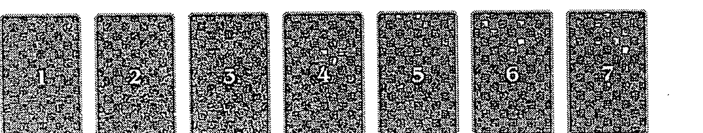

### 一年牌阵指引（抽十二个月）

每年年底，都可以进行新年的「年度运势抽牌」，抽十二张，依照时钟的排列方式，顺时钟方向排列，抽出来的第一张代表一月份的能量指引，放在一点钟位置；抽出来第二张代表了二月份，放在两点钟的位置；以此类推。

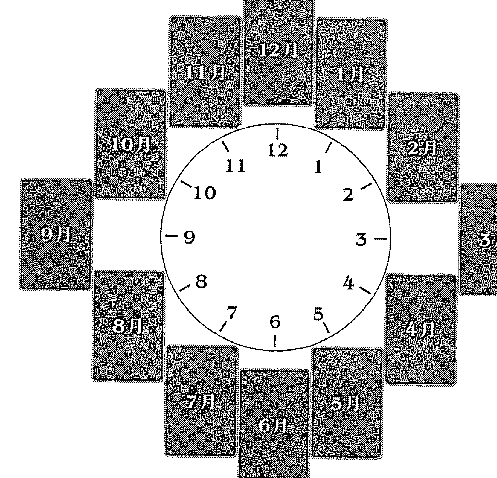

### ．三张牌阵．

这里提供两个三张牌阵，都是万用的牌阵，任何主题都适用。

#### 过去、现在、未来

适用时机：

想要知道时间发展的影响，不只是看到现在，更是了解到过去如何影响现在、现在可以如何创造未来，三者息息相关，彼此关联。

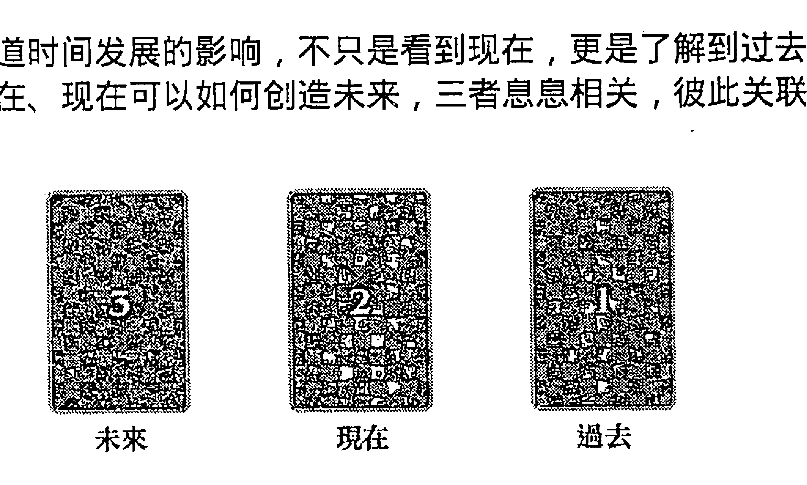

- 抽出来的第一张牌，放在数字1的位置，代表过去的状态，你所认为的过去。
- 抽出来的第二张牌，放在数字2的位置，代表现在，当下此刻的状态，以及需要学习的课题与指引。
- 抽出来的第三张牌，放在数字3的位置，代表未来的状态，这是你想象的未来，以及带给你的提醒。

#### 身心灵

适用时机：

想要了解三个不同意识层面的讯息，也非常适合针对某一个主题或事件来抽「身心灵的建议牌」，获得三个面向的指引。也可以直接抽「生活状况」，能显示出目前生活的身心灵整体了解。

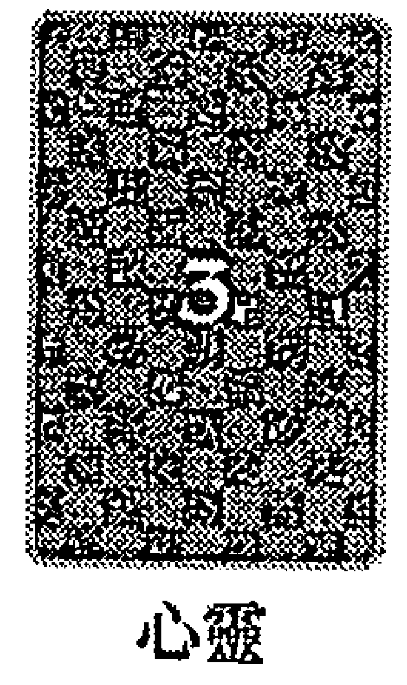

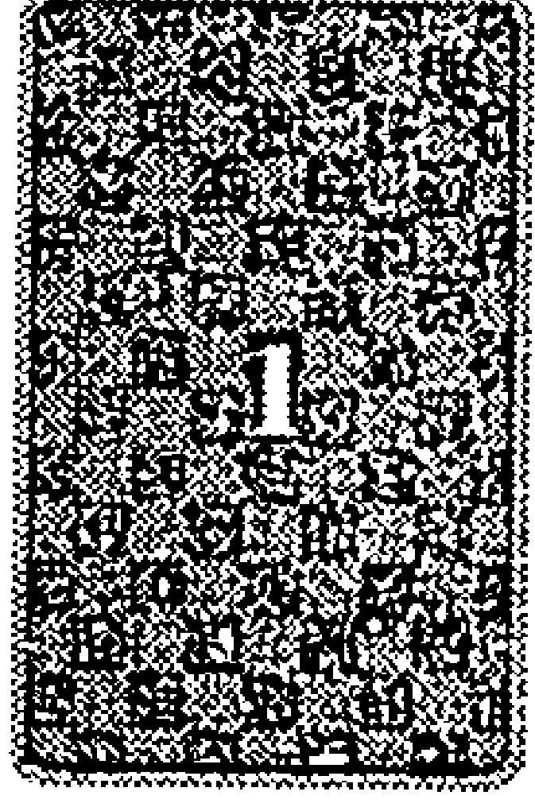

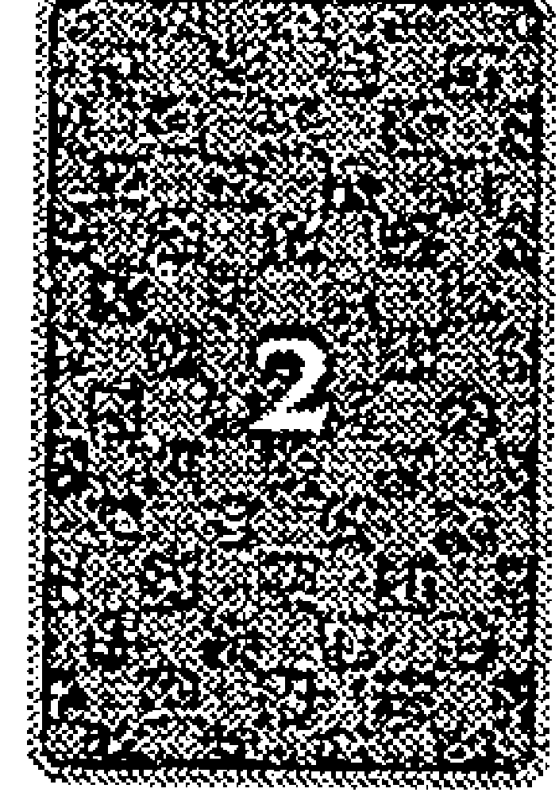

抽出来的第一张牌，放在数字1的位置，代表意识层面已知的部分。

抽出来的第二张牌，放在数字2的位置，代表内在潜意识冰山下的隐藏真实状态。

抽出来的第三张牌，放在数字3的位置，代表灵性层面的指引讯息与建议。

#### 多择一牌阵

适用时机：

当事人描述自己有两个或两个以上的选项时，可以协助他厘清对这些选项的内心偏好。

- 一、抽牌前，可以先聊一聊他的想法，心中有没有什么偏好考量。
- 二、抽牌时，询问他抽牌的顺序：你想先抽哪一个选项？
- 三、询问他翻牌的顺序：你想先翻哪一个？你想先听哪一边？

##### 二择一

二择一牌阵，象是延伸出了两条路径，可以做两条路径的感受比较。

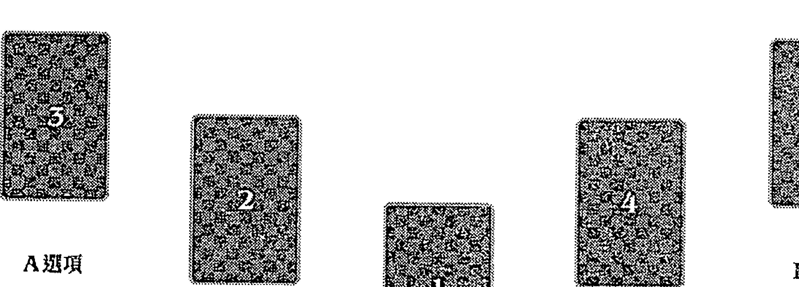

1的位置，代表你的现状。

2的位置，代表A选项的状态，选择A会如何。

3的位置，代表选择A的可能未来及结果发展。

4的位置，代表B选项的状态，选择B会如何。

5的位置，代表选择B的可能未来及结果发展。

##### 多择一

选项有两个以上时，可以使用这个牌阵。这是由「身心灵牌阵」演化发展出来的，有几种选项，就抽几组身心灵牌阵。如果有A、B、C三个选项，就抽出三组身心灵牌阵来比较选择。（如果选项只有两个，要二择一，抽两组身心灵牌阵来比较就可以。）

案例：想安排旅行计划，目标地点有三个，A、B、C哪个地点最适合今年的跨年度假？

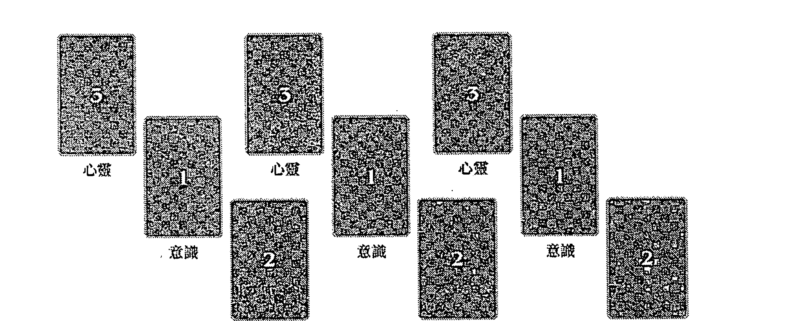

### 。四元素牌阵

适用时机：

四元素牌阵是非常适合分析各种面向的牌阵。在一个主题上，可以从土、水、火、风四大元素去了解，让四大方向的观点能同时呈现出来。此牌阵可以完整分析问题目前的概况，算是一个全观视角，任何问题均适用，是万用牌阵。（问现况或建议皆可。）也可以直接抽「生活状况」，能显示出目前生活的四元素概况。

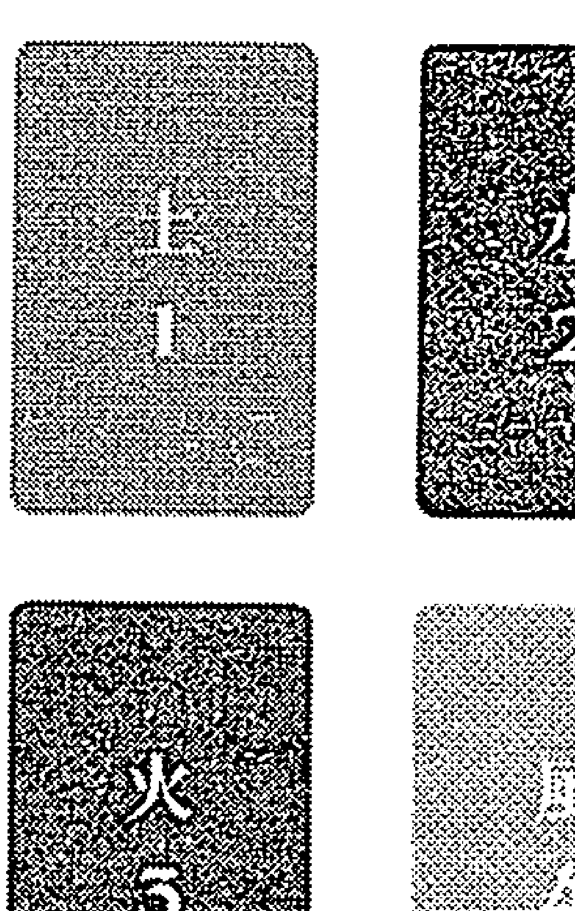

1的位置，土元素：工作、学业、金钱物质、健康。

2的位置，水元素：感情、情绪、人际关系。

3的位置，火元素：目标、行动。

4的位置，风元素：思考、伤害、限制。

由于四元素牌阵没有时间线，所以牌阵呈现的结果是问题「当下」的状况，或带出「提醒」的功课。当情况改变，就可以再抽一次。重点是如何从中找出症结所在，进而寻求解决之道。

这个四元素在引导过程中，可以用下列的切入方式去提问（而「答案」就是翻开的牌面）。

#### 示范引导一：想了解我与老公之间的夫妻关系。

- 1.  土元素：反映了你和他的夫妻互动关系中，金钱与物质的能量状态。
- 2.  水元素：反映了你和他的夫妻互动关系中，情感交流与情绪感受的状态。
- 3.  火元素：反映了你和他的夫妻互动关系中，行动的方向与做事的风格。
- 4.  风元素：反映了你和他的夫妻互动关系中，想法、思考与价值观。

#### 示范引导二：我要做某个决定，想要知道四大元素各给我什么支持、建议或提醒。

- 1.  土元素：反映了这件事，金钱或物质层面给你的支持与学习。
- 2.  水元素：反映了这件事，在自己内心感受、人际关系里的支持与学习。
- 3.  火元素：反映了这件事，行动的方向与采取行动时的支持与提醒。
- 4.  风元素：反映了这件事，你自己内在想法与思考是否受限，审视思考的惯性。

### 钻石型牌阵

#### 适用时机：

想对问题有更清晰的了解，可以了解内在与外在的影响，以及在这个问题上的需求，并能获得答案。

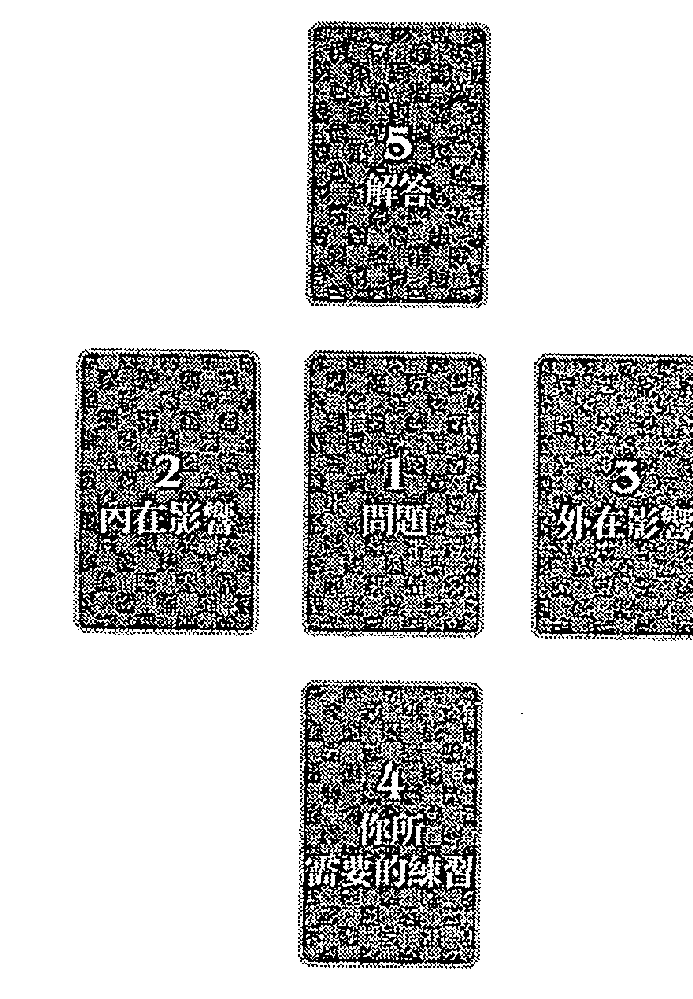

1的位置，代表问题或事件本身，反映出此刻的状态。

2的位置，代表这件事的内在影响，或表现于内在层面的影响因素。

3的位置，代表这件事的外在影响，或表现于外在层面的影响因素。

4的位置，代表要解决这件事，你所需要的练习、课题或挑战。

5的位置，代表这件事会朝向什么样的方向发展，提供了一个解答。

### 七张牌阵

适用时机：

- 想知道自己对于某个主题（事件、关系）的发展状况时。（过去、现在、未来三张牌阵的进阶版。）
- 想知道某个问题的「优劣分析」时。
- 想了解过去的影响及未来可能会经历什么样的功课时。

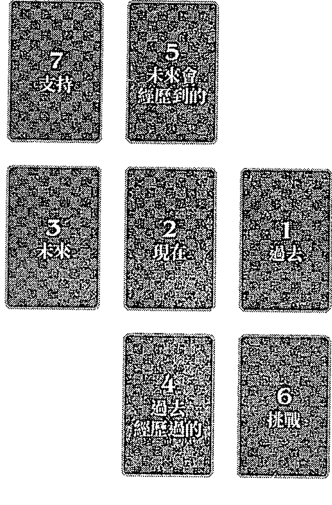

1的位置，代表过去的状态，你所认为的过去。

2的位置，代表现在，当下此刻的状态，以及需要学习的课题与指引。

3的位置，代表未来的状态，这是你想象的未来，以及带给你的提醒。

4的位置，代表在过去的生活经验里，这件事带给你哪些学习与成长、曾经历过什么。

5的位置，代表在未来的生活旅程中，这件事将会带来哪些学习与成长、将会经历到什么。

6的位置，代表这件事情比较弱势的部分，你所需要的练习、挑战或考验，将带来跨越的力量。

7的位置，代表这件事情比较优势的部分，你会获得的支持力量。

### 赛尔特十字牌阵

#### 适用时机：

想知道自己对于某个主题（事情、关系）的想法、感受、发展状况。

想知道此状态的环境影响分析时。

任何问题都能使用这个牌阵，是个万用牌阵，所需要的解读时间较久。可以直接抽「生活状况」，能显示出目前生活的整体状况。

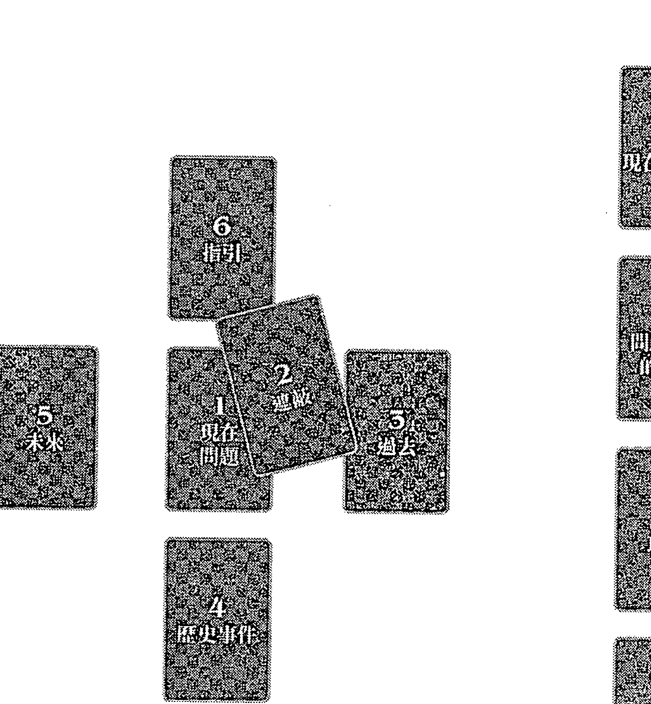

1的位置，代表现在的问题情境。

2的位置，代表阻碍你看清楚问题的遮蔽因素。

3的位置，代表过去的状态，你所认为的过去。

4的位置，代表在过去的经验里曾发生什么样的事件与状态，成为了现在的基础。

5的位置，代表未来的状态，这是你想象的未来，以及带给你的提醒。

6的位置，代表最佳的状态与结果指引。

7的位置，代表自己目前真正的内心感受与态度。

8的位置，代表环境因素的影响（干扰或支持）。

9的位置，代表自己心中的期待或担忧，或是问这个问题时的困扰。

10的位置，代表现在综观整体后的结果。

### ．补充．

除了塔罗牌之外，更可以多种牌卡一起使用，增加丰富性，让讯息更完整。

提供几种最常用的牌卡，可以互相搭配，分别有不同的功用与切入面向。

「塔罗」的面向：带出生命课题的提醒，一针见血的深度，提供面对困难的心灵智慧。

「天使卡」的面向：带出核心主轴，以及更高层的灵性讯息。

「情绪疗愈卡」心理投射卡的面向：生活议题的呈现，带出广度的探索，面对真实的情绪状态。

「心灵原型卡」「角色 / 天赋特质卡」的面向：人格角色的呈现，有哪些人格特质冒出来给予支持，现在的特质、要放下的特质、渴望的特质。

「珍爱卡」的面向：面对生活的主题，真实看见生活状态的反应，需要学习些什么。

「爱的功课卡」的面向：指出关系中的本质与面貌。

### 。如何增强解牌功力。

我准备了几个增加解牌功力的方法，希望大家多多练习，让解牌功力与日俱增。

- 1.  多练习与不同人对话：不仅能丰富自己对于每张牌的理解，更能听到不同人的故事，对应不同的生命经验，同一张牌有着不同主题的诠释。
- 2.  多收集比较牌卡：坊间塔罗牌的种类非常多，可以收集自己喜欢的牌，能看到不同画家对于同一张牌的不同呈现，例如每套牌的「愚者」长得都不太相同。当我们去观察这些细节时，可以练习并提升敏锐度。
- 3.  试...彩绘你的塔罗牌：意大利圣甲虫公司出版了一套22张主牌的「COLOR YOUR TAROT」，是具着色功能的塔罗牌，使用者可以涂上自己喜欢的颜色，替自己的塔罗牌进行彩绘，不仅独一无二，又能拥有个人对于颜色的诠释风格，非常推荐。
- 4.  与朋友快问快答：练习牌义时，可以与朋友一起玩这个游戏，随意翻牌，直觉说出对这张牌的想法。不仅可以练习直觉，更可以练习流畅度。
- 5.  增加观察：在生活中总会有机会观察到一些象征符号，例如旅游或散步时，到教堂、庙宇、建筑物、杂志等，都有机会看见一些讯息与符号，可以将和塔罗牌中的牌面相似的记录下来，培养与提升观察力。
- 6.  保持开放的心，去除二元判断：任何一张牌都没有绝对的好与坏，都是两面共存的力量。阴与阳共存、好与坏共存、喜悦与焦虑常常也是共存的。当事人很喜欢问，「那这样是好的吗？」「这样是不是不好？」我们也要练习回应，「怎么样都是有意义的，我们来看看这是要给你什么讯息……」，而不是用「好或坏」去回应对...。
- 7.  不直接给建议：任何决定都一定要回归到当事人身上，让他自己做出决定。我们可以透过塔罗牌解析牌卡呈现的现象，藉由咨询引导的过程让他看见新的可能性，对他的决定有所助益。
- 8.  练习倾听、让对方多说一些：在塔罗解读过程时，有时我们会一直顾着说，忘记稍微停下来问问对方的感受、问问对方有没有想
- 9.  观察对方的神情与非语言讯息：

塔罗解读的过程，不要忘记了最重要的主角是我们面前的「当事人」，而不是塔罗牌。是这个人带着问题来到我们面前，人这个主体是最需要被关注的，当我们专注于解牌时，千万记得要回头看着当事人，观察对方的神情，象是皱眉头、撇嘴、眼睛发亮、冒出笑容等都是重要的关键。

### 咨商案例剖析：为什么圣杯国王不敢求救？

我们在生活中有许多「情绪应对」的经验和因应情绪的方式，都是从小教育养成的，父母常会说：「怕什么，这有什么好怕的！」会让小孩退缩，或被吓到。孩子因此会觉得：「我不该表达这样的情绪，我要装得一副很有办法的样子」。或是他一哭就被责备：「有什么好哭的。」

我的观察是，有些情绪经验是在训练如何表达情绪的过程中受到制约，而展现出来的。其实很多道理我们都明白，可是要做到还真有点困难，因为在我们的学习数据库里没有这种经验。搜寻不到正向的情绪表达经验，又怎么能够期望自己表现出这样的行为。

在塔罗咨询的过程中，可以重新带入这样的「新练习」，让当事人练习，用别的方式表达自己的感受，其实是安全的。你们可以先进行讨论。有的人不会表达感受和情绪，也有比较负面的情绪经验，是因为他没有正向的经验。没有也没关系，我们可以帮他重新建立经验。我会告诉他，他过去学会硬撑、保持镇定的方式，也是学习来的，我们现在只是用新的模式取代这个经验。

在咨询过程当中，会有机会聊得更深入，比如说：「你爸爸就是这个样子吗？或教你这样表达的是妈妈？你是从哪里学到这件事的？」

也可以问：「不知道你有没有遇过这样的人，很自然就可以说出我现在很紧张，或我很害怕。你觉得这样的人给你什么感觉？你想变成这样的人吗？」

这是一个重要的关键，他可能会批判这样的状态，他可能不允许自己变成这样。比如他抽到圣杯国王这张牌，你可以协助他去探索，当他探索完之后，当然可以做一个新的决定：「你喜欢自己这样硬撑的样子吗？」如果他现在觉得很好并不想改变，那也尊重他。

「如果你觉得现在这样很好，也没有特别的困扰，你觉得这样做最安全，就持续这样做。如果，哪一天你想试试看用另一种方式来过自己想要的人生，你可以记住我说过的，你还有其他的选择，你可以表达出自己。」

重要的是，我们埋下了一个种子，一个「原来我也有另一种可能性来表达自己」的种子！当他情绪慌张、焦虑、恐惧的时候，心里就会冒出两种声音，「我要说出来？还是继续忍耐？」从前他只有一种选择，只有这个数据库可以提取，可是现在他多了一种选择，那么他就可以更自由。他不会再说，自己没有选择，只好忍耐。

有很多个案都告诉我，「我就是没得选择，我就只能这样。」这样的情境会让他落入更深的无助，因为他会很沮丧，觉得自己无路可走，只这么做，没有选择。

因此，这张牌让我想到，很多事情都是透过觉察，可以去感觉「我到底在怕什么」，所以当个案抽到这张牌，你可以问：「你会觉得害怕吗？你看，海面上波涛汹涌，代表了你内在的情绪，可是你的样子却面无表情，你不觉得这样怪怪的吗？」

透过问句引导，以及金三角的练习，让我们可以串联「牌义、发生的事件情境与故事、当事人」这三者。这样运用塔罗牌时，就不再会觉得牌是牌、人是人、问题是问题。

### 引导解牌示范：圣杯侍卫，我要继续等下去吗？

当事人：面对这段感情，我是否该继续追求？

引导者：你问这个问题是想继续追求，还是想放弃？因为你刚刚问的是「是或否」的问题，我要先厘清，你为什么要问这个问题，是不是还有些什么想法？如果有，可能抽牌的就不是这个问题了。

当事人：对方其实是有对象的，我觉得我和他的这段关系好像随时都会结束，我一直处于一种默默守护的角色。

引导者：所以圣杯侍卫这张牌其实是你的现状，你默默地守护这一段感情。当然就回到你自身啦！因为这没有「该不该」继续，只有「要不要」而已。你可能心甘情愿地默默守护了十年、二十年。你们这样吵吵闹闹也二十年了，为什么还没有分开呢？对有些人来说会选择分开，因为真的很难受。我也很好奇，为什么你还继续在这个关系里？是不是这段感情还有些你很珍惜、想要守护、呵护的部分。我觉得其实你是愿意守候的，但那个愿意是什么？你还是会继续专注在这段关系上。你还是没有想要走开吧。

> 当事人：我觉得很奇怪，为什么牌面上的鱼会在杯子里？鱼应该在水里，这样的话不就会无法呼吸，缺水而死？为什么侍卫这么自私，为什么要把鱼捞起来？

> 引导者：你会不会觉得你描述的这些听起来有点熟悉？

> 当事人：对！我就是那条鱼，我觉得很不自由。

当事人其实会开始将自己投射到牌面上，塔罗象征的符号极为丰富，所以每一张牌都可以当作投射的题材。如果你可以保持开放的态度运用塔罗牌，当作是一种工具，会带来许多意想不到的惊喜，你会惊叹：「没想到这张牌可以说出这种故事。」而且当事人竟然可以说出这么多关于自己的投射，也很令人讶异。即使当事人没学过塔罗，但他边说、边听着自己说出来的话，也会获得领悟，甚至说着说着就找到答案了。

### 辅助工具介绍延伸学习

成英姝，《神之手：认识你内在的二十二种神秘人格》（心灵工坊出版）。以荣格原型讲述22个原型，也就是22张主牌。

蓝宁仕，《新生命密码：9个数字的能量，认识自己，开发潜能，找到幸运与成长》。介绍生命灵数。

