# 塔罗之书解牌字典

# 作 者 序

终于完成了这本《塔罗解牌字典》！首先要感谢如芳和昌瑜的耐心包容，让这本书能在一再拖稿和修正之后还能顺利出版；也要谢谢所有读者的鞭策和支持，没有你们的鼓励就不可能有这本书的诞生，最后要感谢亲爱的 Jenny，谢谢你牺牲无数的假日陪我赶稿。

《塔罗解牌字典》是一本方便的工具书，包括了七十八张塔罗牌（区分正逆位）在各个主题当中的各种解释，当然这并不是解释塔罗牌唯一的标准答案，而是提示一些解读或联想的方向，所以并不建议任何读者从头到尾“读完”这本书，比较鼓励大家使用的方法，是拿来参考或查询；例如有人在占卜感情问题的时候，遇到了“圣杯三正位”出现在“未来”的位置，但是本身又不大会解释，这个时候就可以翻到“圣杯三正位”的“事件类型”，找到“爱情”这个主题当中“感情本身的状况”这个条目，就会得到“这是一个充满欢乐气氛的关系，两个人可能常常会一起出去玩乐、用餐等等，也让双方都感觉到十分丰富和美好。”可以把这个解释用在占卜当中。

《塔罗解牌字典》的写作是以标准的韦特牌为蓝本，若是你用的塔罗牌是与韦特牌兼容的版本，你也许就可以把本书的内容直接套用在占卜当中，若是你所使用的塔罗牌是其他版本，也许就要通过自己再延伸解释之后，才能使用在占卜当中。本写作的内容主要是以丹尼尔自己占卜的经验为主，再配合黄金黎明创始者之一马瑟斯 (S.L. Mathers) 的原著《The Tarot》、莱德-伟特塔罗牌设计者伟特 (A.E. Waite) 的原著《The Pictorial Key to the Tarot》,以及黄金黎明的标准讲义《The Book “T”》（收录于法兰西斯·以色列·雷加地 (Francis Israel Regardie) 编著的《The Golden Dawn》当中）。有兴趣的读者也可以把这些书找来参考看看。

也许有些读者会想要更进一步认识牌义的原理，就目前的中文书籍当中，比较推荐向日葵所著的《塔罗葵花宝典》，以及作者的《学会塔罗的16堂课》，另外作者也正加紧编写《塔罗牌逆位精解》（书名暂订），希望能带给读者更全面的塔罗视野。

丹尼尔

# 塔罗牌占卜与牌义的学习

## 1. 占卜、牌阵、牌义的关系

塔罗牌的其中一种使用方法是占卜，要开始占卜的第一步就是要有问题；若是没有问题，塔罗牌就无法给你任何答案，当有问题出现，首先就要判断这个问题是否适合用塔罗牌来处理。一般来说塔罗牌占卜比较适用于具体的单一问题，所以在时间、空间、对象上没有界限的事情，就比较不适合用塔罗牌占卜来处理。

当我们判断这个问题适合使用塔罗牌来处理，接下来就要选用适合的牌阵。牌阵是一套呈现问题的方式，也是分析问题所使用的框架，如果能够依照问题的性质选用适合的牌阵，就能非常清楚地呈现出问题的状况，针对问题进行深入而准确的分析，当然在占卜时就能事半功倍。

在选择了适合的牌阵之后，接下来就是要选出塔罗牌来呈现问题的内容。每张塔罗牌都有其不同的特殊意义，一般我们称之为牌义。不同张塔罗牌在牌阵当中不同的位置，都会以其独特的方式呈现出事情的状况，也是占卜当中信息的主要来源，所以在学习塔罗牌时，牌义是不可或缺的一部分。

## 2. 塔罗牌义的基本性质

一副完整的塔罗牌有七十八张，以一种基本的结构存在；二十二张大牌表现出二十二种抽象的理念，十六张宫廷牌表示十六种不同的人物特质，四十张数字牌分为四个牌组，分别代表四个类别事件的十种不同表现。基本上塔罗牌就是以这七十八张牌来描述所有的事情。（针对塔罗牌的结构更深入的分析，请参考《学会塔罗的16堂课》第三课）

因此七十八张塔罗牌其实是一个分类系统，理论上可以把所有的概念、人物和事件通通包含进去，所以每张牌的含义就会非常丰富，有很多人习惯把牌义简化成“关键词”系统来学习，这是一种方便的法门，但缺点是让人以为这张牌的牌义“只有这些”，其他东西都不包含在这张牌指涉的范围内，这是一种画地自限的做法。

若是把塔罗牌的牌义视为一种“类别”的概念，则会更加清楚地认识牌义的延展性；除了书籍或网站上提到这张牌的“定义”之外，在实际占卜时它也可能会代表不同的含义，甚至每个人也可以发展出自己的使用方法，将这个分类系统的功能发挥到极致，那么在占卜上也能够更加精准。

## 3. 牌义的来源

一般来说在理解牌义时可以分成三种不同的层级。

最基本的层级是属于牌面图案的意义及象征。包括这张牌面上呈现的构图、使用的色彩、出现的场景、人物的角色、装饰的物品及符号等等，都可能表现出某种意义，也都可以当成象征来解释，进而使用在占卜上。

第二级是属于相关理论的意义及象征。包括人物或角色背后的故事和神话，与占星、数字、卡巴拉、炼金术等等神秘学理论的联结，都会增加你理解或联想牌义的深度和广度，进一步了解牌义的内涵，当然这些象征的解读也可以使用在占卜上。

第三级是属于个人体会的意义及象征。不论在平时的占卜经验，或是每天塔罗日记的练习，你对于牌义都会开始有异于他人的独特体会，甚至在自己的推理和思考之后，也常常会认识到牌义的另一个面向，这些具有经验基础的个人体会，当然也可以使用在占卜当中。

## 4. 学习牌义的方法

对大多数人来说学习牌义都是由大量阅读开始。不论是由牌面图案解释的象征，或是相关理论的分析，都可以帮你打下良好的基础。当你看到不同的说法也不用太过惊讶，因为每张牌的牌义是一个类别，也许每位作者对于分类的概念和想法并不完全相同，所以你可能会倾向于同意某一种的说法，对于其他说法就先存而不论。

接下来就是要勤加练习。平时的占卜练习是最直接的方法，可以让你了解牌义在不同状况下的实际变化，塔罗日记则是很重要的辅助工具，可以让你在持续不断的接触当中体会到牌义的不同说法。这个时候记录是你可以努力的方向，可以把自己的各种经验记录下来，作为日后学习研究的参考。

最后就是要思考、反省以及整理。每一个学习塔罗牌的人，到最后都会有自己一套对于牌义的看法，这是以之前的阅读及练习作为基础，再经过自己的思考、反省之后，整理出来的东西。当牌义经过自己的整理之后，就可以说是你“个人化”的牌义，也许会有一些与别人的说法相同，但也会多出很多个人的特色。

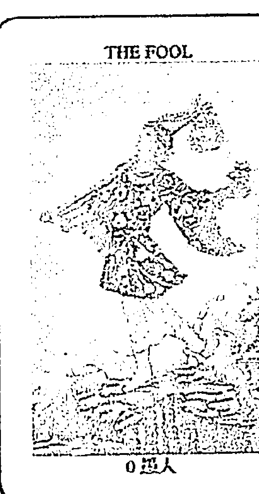

## 愚人正位

### 心灵与精神层面的提示

你想要放下一切去体会新的经验，未知对你很有吸引力，但还是要注意自身的安全，不要因为一时冲动而犯下大错。

### ※ 人物

你正在面对很危险的状况，这时候最重要的是考虑如何明哲保身，其他的一切都不是那么重要，千万不要玩火自焚。

#### 当事人的个性

做事没有任何逻辑而接近疯狂的状态，有时甚至会有暴力倾向，常常搞不清楚自己在做什么，也不能为自己负责。

#### 如何解决工作的困境

这个时候最重要的是冷静下来，把真实的状况搞清楚，不要再被当成呆子耍，再执迷不悟的话可能就会万劫不复。

#### 当事人的工作观

工作上常常无视于规则做出一些损人不利己的事情，也容易被激怒而犯下严重的错误，之后又会装作没事的样子。

#### 工作中的人际关系

你的做法过于特立独行，以至于没有人想要靠近你，你也不可能在工作上交到好朋友，要找别人合作也不太可能。

#### 当事人的感情观

容易突然疯狂地爱上对方，但也可能马上又变心，并不把承诺当作一回事，也很难在感情上找到一个稳定的对象。

#### 与上司相处的方法

这种像是疯子的上司最好不要当面顶撞他，表面上打哈哈就好，私底下还是要用自己的方法做事，不要走得太近。

#### 当事人的金钱观

并不努力赚钱而且又会拼命花钱，对于金钱没有长远的打算，也没有任何财务规划的概念，通常负债会大于资产。

#### 工作的发展性

这是一个极为错误的选择，你不应该一错再错，能有机会换工作就快点找机会走人，留下来对你一点帮助也没有。

#### 与当事人的应对方法

会提出很多新鲜有趣的概念，但常常又会被他气得半死，最好是不要把他说的话太当真，平时也最好能保持距离。

#### 找工作/换工作的状况

现在是你应该要休息的时候，也不会出现什么好工作，要先把自己调养到最佳状态，之后再重新开始找新的工作。

#### 人物代表

疯子、喝醉的人、放纵的人、狂人、搬运工人、登山者。

### ※ 爱情

### ※ 工作

#### 感情本身的状况

你们两个人之间还不太了解，虽然还有一些发展的潜力，但也可能在更了解之后选择分开，

### 工作本身的状况## 愚人逆位

### 心灵与精神层面的提示
除了物质之外还是有灵性层面的存在，当你放下外在的规则与限制，就可以体会到生命本身的活力进而更爱自己。

### ※ 人物

- **当事人的个性**：不喜欢与别人接触，总是活在自己的世界当中，对于四周的事情漠不关心，常会自己一个人没有目标地到处闲逛。
- **当事人的工作观**：在工作上没有特别的才能，也不会主动去解决问题，会经常换工作而无法累积工作经验，也不愿意为工作负责任。
- **当事人的感情观**：无法控制自己的情绪，也很难在感情上得到满足，如果有人对他很真心地付出，他反而会找各种的借口想要逃避。
- **当事人的金钱观**：可能会觉得拥有金钱是一件罪恶的事，因此就无法储蓄，通常是赚多少钱就花多少钱，但也不喜欢背任何的负债。
- **与当事人的应对方法**：由于他不喜欢与别人有太深的交集，所以也不用强迫他把自己当成好朋友，维持淡淡的关系对彼此都没有伤害。
- **人物代表**：古怪的人、智能不足者、逃避的人、冷漠的人、观光客。

### ※ 工作

- **工作本身的状况**：现在工作上面碰到极大的不确定性，几乎没有什么是你能掌握得住的，除了随波逐流之外，也许该考虑另谋高就。
- **如何解决工作的困境**：现在事情已经完全超出你的能力之外，除了举白旗投降之外就是装死，如果硬要去解决问题反而会跌得粉身碎骨。
- **工作中的人际关系**：在这个工作当中并没有人际关系的问题，大家彼此之间也没什么交集，只要做好自己的事情就好，不要去管别人。
- **与上司相处的方法**：上司对你来说就像空气一样，完全感觉不到他的存在，你就当作你没有任何上司，只要专心地把自己的事情做好。
- **工作的发展性**：这个工作的未来很不稳定，也不是你一个人可以控制的，留下来就像是在赌博一样，离开也许会有更多的好机会。
- **找工作/换工作的状况**：现在并不存在好的工作机会，即使用心去找也只是白费力气而已，不如在这个时候放松一下，别给自己太大压力。

### ※ 爱情

- **感情本身的状况**：两个人即使还没到形同陌路的程度，关系也已经降到冰点了，彼此之间已经没有谈恋爱的感觉，也无法分享心情。
- **新恋情的可能性**：现在并没有什么新的对象会出现，你自己也还不想被绑住，所以还是趁单身好好享受一下一个人自由自在的日子。
- **对这段感情的看法**：现在两个人之间已经没什么感情，也不用心在经营这段关系，感觉十分无力，其实两个人的关系已经名存实亡了。
- **性的吸引力**：这段感情当中并没有什么吸引力，就更别提性的吸引力了，即使两个人之间有性生活，也不会有任何加分的效果。
- **如何化解争吵**：忽略问题是你的第一反应，但事情并不会因为你假装看不到就会自己解决，如果不面对问题就会出现相同的争吵。
- **分手的方法**：其实两个人之间已经没有什么感情了，所以只要一阵子不联络的话很自然就会渐渐分开，很多事情也不必要强求。
- **复合的可能性**：两个人的关系在此归零，想要恢复到从前的状况已经是不可能的事情，想要在一起的话就要当成新恋情重新开始。

### ※ 友情

- **人际关系状况**：基本上你并没有很认真地在经营自己的人际关系，也很讨厌一群人在一起时的喧闹，一个人单独行动也比较自在。
- **如何化解与朋友的误会**：其实你们之间并没有什么误会，只是彼此不太对盘罢了，只要能够保持一定的距离，所有的问题都会随风而逝。

### ※ 亲情

- **家庭的状况**：现在大家都离开去追求自己的生活，所以彼此之间联络也比较少，即使逢年过节等重大的日子也不一定会见到面。
- **与长辈的关系**：你的长辈对你并不太关心，也没有对你特别照顾，所以你会想要一个人独立生活，甚至为了脱离他们而离家出走。
- **与平辈的关系**：大家彼此相处的关系还算不错，但是因为相处的时间不多，所以并没有很深厚的感情，平时也很少有机会互相关心。
- **与晚辈的关系**：你对于晚辈是完全自由放任的态度，但也不会提供给他太多支持，有一点让他自生自灭的味道，彼此也会比较疏远。

### ※ 学业

- **学业本身的状况**：你目前可以说还没学到什么东西，一切都要从头开始打基础，你已经落后别人很多了，应该要开始努力，急起直追。
- **学习的方法**：你应该多花一点时间在课业上而不是每天在那里闲晃，不要以为临时抱佛脚就可以考得好，平时的努力也很重要。
- **与老师相处的关系**：基本上不是很关心学生的老师，发生什么事情也不会帮你解决，所以不用太期待他，只要管好自己的事情就好了。
- **与同学相处的关系**：同学对于你的学习没什么帮助，你也不太喜欢现在这些同学，所以大部分时间都是自己一个人，这样也比较自由。

### ※ 财务

- **目前的财务状况**：你太忽视你自己的财务状况，以至于等到问题十分严重了才发现，你应该以更务实的态度重新评估你的财务状态。
- **投资的状况**：现在不应该进行任何的投资，能躲多远躲多远，如果之前已经有的投资也要全数结束，否则很可能就会化为乌有。
- **采购的策略**：这个时候最好不要做任何采购，因为大部分都不是现在需要的东西，可以把钱先存起来，等到要用的时候再来买。

## 魔术师正位

### 心灵与精神层面的提示
你渴望学习新的事物，在吸收新观念上很有效率，可以利用这个时间多多接触不同的东西，再把它们整合在一起。

### ※ 人物

- **当事人的个性**：十分聪明又有主见的人，通常想法灵活、口才又好，常常能在人群之中脱颖而出，对于新鲜的事物有着强烈的好奇心。
- **当事人的工作观**：工作上有强大的能量，可以主动去处理很多事情，对于不同性质的东西都有基本的了解，也能把事情控制得很好。
- **当事人的感情观**：重视与别人沟通的部分，在感情关系当中愿意学习与尝试，遇到问题时会主动提出来解决，但也会比较主观一些。
- **当事人的金钱观**：运用金钱有其独特的看法，虽然不一定是最有效率的，但是可以达到本身想要的效果，常常会有出人意料的表现。
- **与当事人的应对方法**：与这种人相处时应该要保持灵活的思考，以理性的方式沟通，最好别引起他辩论的兴趣，否则会陷入无尽的争论之中。
- **人物代表**：专业医师、教师、主持人、演讲者、通灵的人、占卜者。

### ※ 工作

- **工作本身的状况**：你面对一个新的工作状况，因为所有条件都十分充足，所以只要你能把握机会主动去做，就会得到你想要的东西。
- **如何解决工作的困境**：你需要使用新的观念和方法去处理问题，把握新的机会才能突破困境，有时候也可以考虑任用新人来负责这件事情。
- **工作中的人际关系**：在工作当中最重要的是与别人的沟通，这会帮助你开展人际关系、刺激新的创意，也有助于事情的推展更加顺利。
- **与上司相处的方法**：面对这位多才多艺的上司，最好不要耍什么意外的把戏，依照他的指示把自己的工作完成，其他的就不要多想。
- **工作的发展性**：这个工作的未来还有很大的发展性，但还有很多东西还没有成形，你可以在这个工作当中创造出更多的自我价值。
- **找工作/换工作的状况**：现在有新的工作机会出现，你自己去找会有不错的机会，但也可能是有人介绍新工作给你，这是值得把握的好时机。

### ※ 爱情

- **感情本身的状况**：在感情当中充满热情，也有主动表达与沟通的能力，再加上在动机上十分单纯，应该会是一段美好的关系，一段富有创造性的时期。
- **新恋情的可能性**：其实新恋情的对象已经出现，只是你没有注意到而已，若是细心观察自己所处的环境，主动出击必然会有成果。
- **对这段感情的看法**：这是一段很有发展性的感情，但现在仍然在刚起步的阶段，在这段感情中应该要主动付出，未来才会有好的收获。
- **性的吸引力**：虽然有很强的吸引力，但是并不单纯是对于肉体的迷恋或是只从外表来判断，其中还有不少真心诚意，有性也有爱。
- **如何化解争吵**：这时候需要加强沟通，若是有什么事情没有沟通清楚，就应该要摊开来讲，有些事无法隐瞒，还不如公开来得好。
- **分手的方法**：你需要和对方坐下来好好谈谈，用理性的方法处理两个人的问题，即使觉得花费很多心力，但必然能谈出结果来。
- **复合的可能性**：这段感情完全没有复合的可能性，也许是已经有了新欢，或是即将出现更好的对象，不要在旧情人身上浪费时间。

### ※ 友情

- **人际关系状况**：你面对新的人际关系结构，但当中还有很多空间是你可以去参与和创造的，所以要把握机会和新朋友处理好关系。
- **如何化解与朋友的误会**：要主动沟通来化解误会，很多事情只要谈开来，其实也不是什么严重的问题，别让一时的误会影响到彼此的关系。

### ※ 亲情

- **家庭的状况**：家庭可能面临到一个新的局面，不论是搬家或是有新的成员加入，都应该用正面的角度去看待，没什么好害怕的。
- **与长辈的关系**：你很能了解长辈的意思，但是在长辈的眼中是一个长不大的小孩，有时候也可以利用这种印象得到长辈们的原谅。
- **与平辈的关系**：你在平辈当中算是领导者，也很能得到别人的喜爱，如果能表现出更积极的态度，就可以让大家都同意你的做法。
- **与晚辈的关系**：你很能掌握到对方的心态，因此在发生问题时总能很快地化解，但有时还是需要多一点创意，才更能发挥影响力。

### ※ 学业

- **学业本身的状况**：现在所学的东西对你十分重要，应该要多花一点时间把这些东西学好，除了实用性之外也是一种新鲜有趣的尝试。
- **学习的方法**：除了掌握课堂或书本当中的知识之外，也要有自己的创意和想法，有时间再找一些补充的数据，有助于融会贯通。
- **与老师相处的关系**：是一位能够因材施教的老师，你应该能适应这种教学方法，若是遇到不懂的地方，也可以主动提出自己的疑问。
- **与同学相处的关系**：应该多拓展人际关系，因为这个时候新认识的朋友对你都会有很大的帮助，若是能好好把握就可以有很多新朋友。

### ※ 财务

- **目前的财务状况**：一切还在起步的阶段，但是仍然有许多发展的空间，这时需要按部就班地把事情完成，才能得到自己应该得到的。
- **投资的状况**：你需要新的投资标的，所以最好能放下之前种种的包袱，一切重新开始，朝新方向努力的成果一定会比以前更好。
- **采购的策略**：考虑问题时必须符合各种不同的需要，但是由于自己还是有很大的主导权，所以仍然会存在一些自主创意的空间。

### 延伸应用

| 类别 | 内容 |
| :--- | :--- |
| **时间** | 相对时间：一小时、一天、一周、一个月、一年。 标示时间：星期三、水星时。 |
| **地点** | 区域：演讲会、说明会、社交的场合、医院、私人花园。 方位：上方。 |
| **物品** | 电话、信件、手机、报刊杂志、新闻性节目、交通工具。 |
| **身体部位** | 呼吸系统、神经系统。 |

## 魔术师逆位

### 心灵与精神层面的提示
你要放掉之前旧的观念，才有可能吸收进新的知识，这个时候应该好好反省自己的想法，与深层的内在重新联结。

### ※ 人物

- **当事人的个性**：意志力薄弱而无法坚持自己的意见，但又常常会找各种的借口帮自己辩解，有时候会给人狡猾而不可信任的感觉。
- **当事人的工作观**：对于事情有部分的了解，但是仍然不够全面或深入，在发表意见时都说得头头是道，遇到实际执行时却是一团糟。
- **当事人的感情观**：希望与别人有良好的沟通，但是常常无法把自己的意见表达清楚，有时候会因为过于被动而失去发展新恋情的机会。
- **当事人的金钱观**：有自以为是的小聪明，但是常常省了小钱却花了大钱。有时候会因为过于冲动，没有想清楚就买了不必要的东西。
- **与当事人的应对方法**：与这种人相处时要有自己坚定的看法，不要被对方的口才所迷惑，同时要非常小心地应对，免得误入对方的陷阱。
- **人物代表**：精神病患、学生、阅听人、电话营销服务人员、问卜者。

### ※ 工作

- **工作本身的状况**：你面对一个新的工作状况，但是很多条件并不充足，所以最好先确定自己所能做到的程度，把分内的事完成就好。
- **如何解决工作的困境**：你应该专注于自己的工作，并且把遇到的问题和困难据实以报，若是领导无法提供支持，就只好自己想办法解决。
- **工作中的人际关系**：在工作当中可能会发生沟通不良的状况，所以在说话的时候更要小心，别陷入派系斗争当中，要保持中立以求自保。
- **与上司相处的方法**：上司常常只给你一个原则或是大方向，其他的东西都要你自己去想办法，所以千万别依赖上司给你的帮助或支持。
- **工作的发展性**：这个工作的未来还有不错的发展空间，但是中间还必须经过很多的改革和波折，若是能坚持下来应该就会有所成就。
- **找工作/换工作的状况**：现在有不少新的工作机会出现，但其中只有一个是真正适合你的，其他的大概都是错误的陷阱，要自己小心地评估。

### ※ 爱情

- **感情本身的状况**：在感情当中充满热情，但有时显得过于冲动，这时若是遇到沟通不良的状况，可能就会引发隐瞒或是欺骗的行为。
- **新恋情的可能性**：这时十分有可能发生新恋情，但是因为条件还不是很成熟，所以还需要等待一阵子，这时候细心观察比行动重要。
- **对这段感情的看法**：这段感情现在陷入沟通不良的状况当中，有些话若不说出口，可能就会因此发生误会，必须花很大力气才能化解。
- **性的吸引力**：两个人之间有很强的吸引力，会直接感觉到彼此的热情，有时候会过度地付出来赢得对方的好感，关系也会很紧密。
- **如何化解争吵**：这个时候双方应该要先冷静下来，好好思考两人关系的下一步，不要为了一些小争执，就把全部的计划都推翻了。
- **分手的方法**：如果不能和对方平心静气地坐下来谈，就用算总账的方式把两个人的问题通通吵开来，这样就能把退路通通封死。
- **复合的可能性**：这段感情没有任何复合的可能性，即使回头也无法得到一段完整的爱情，千万不要在旧情人身上再浪费任何时间。

### ※ 友情

- **人际关系状况**：你面对新的人际关系结构，以往的一切都不再可靠，所以要把握机会和新朋友处理好关系，这对你只有好处没有坏处。
- **如何化解与朋友的误会**：这时候你需要更有技巧的沟通，以免自己的意思被对方误会，如果能倾听对方的想法，会帮助你判断现实的状况。

### ※ 亲情

- **家庭的状况**：家庭的成员可能都要面对新的状况，因此有一些人心浮动的感觉，这时候各自努力比较重要，不要想依靠其他人。
- **与长辈的关系**：在长辈的眼中你是一个聪明的人，但是有点自以为是，有时候长辈会很依赖你的能力，也可以利用这点赢得信任。
- **与平辈的关系**：你在平辈当中算是特立独行的一个人，虽然不一定能得到大家的理解或认同，但是与别人和平相处还是没有问题的。
- **与晚辈的关系**：你常常希望能用自己的方法去影响晚辈，但是这么做不一定有实质的效果，有时可以多听听晚辈们对你的建议。

### ※ 学业

- **学业本身的状况**：现在是学东西的好时机，不过由于自己并不专心，所以常会把原本很容易的事情搞砸了，是应该收收心的时候了。
- **学习的方法**：不要想一次掌握太多的东西，应该从基础的东西学起，一步一个脚印地把基础打好，才可能有更进一步发展的机会。
- **与老师相处的关系**：常常会因为不了解老师表达的意思而发生误会，最好是能再和同学确定你所听到的，或是当面请老师再说明一次。
- **与同学相处的关系**：人际关系会是你这个时候的重点，最好能和同学们处理好关系，但是也可能因为人际关系的状况影响到学业的表现。

### ※ 财务

#### 目前的财务状况
面对刚起步的阶段，要很小心各种陷阱和欺骗，不要自以为是地做太多财务上的决定，这时候应该以保守为宜。

#### 投资的状况
这时候不宜做任何新的投资，最好能把之前的各种投资都做一个了结，等到时机适当再重新开始，不要操之过急。

#### 采购的策略
很可能遇到诈骗或是不良产品，所以要格外的小心谨慎，特别是在验收时要严格把关，以免发生一些不必要的纠纷。

## 女教主正位

> 心灵与精神层面的提示
你希望自己有直观的智慧，但是要平衡二元对立并不是那么容易，要有耐性慢慢地朝向目标前进，不要操之过急。

### ※ 人物

+   □ 当事人的个性
受过良好的教育并拥有丰富的知识，但会有些孤僻而不太爱说话，对于事物有自己的意见，给人比较冷漠的感觉。

+   □ 当事人的工作观
长于观察和学习，若事不关己则完全不会涉入，通常会把自己分内的事情如期完成，也可以保守工作当中的秘密。

+   □ 当事人的感情观
属于比较被动的一方，即使有喜欢的对象也不会主动表达，习惯于逃避自己在感情上的需要，因此常会错过机会。

+   □ 当事人的金钱观
具有保守又理性的金钱观，有很强的自我克制能力，会把金钱的效用发挥到极点，但是又不会让人觉得一毛不拔。

+   □ 与当事人的应对方法
这种人不会把自己涉入到别人的事情当中，保持距离是比较轻松的选择，也可以利用他对知识的兴趣来打开话题。

+   □ 人物代表
从事研究的人、木讷的人、旁观者、记录者、历史学家。

### ※ 工作

+   □ 工作本身的状况
工作状况十分稳定，也不会有什么变化，这个时候不宜太过积极，只要把事情依照原来的方式按部就班地完成即可。

+   □ 如何解决工作的困境
问题还没完全显露出来，这时候应该要耐心的等待，或是先查阅各种的文件和规定，为解决问题做好万全的准备。

+   □ 工作中的人际关系
人际关系在这个工作当中并不是很重要，所以与别人的互动也不必太多，要注意不可以任意谈论工作当中的机密。

+   □ 与上司相处的方法
其实一切都是只照章办事而已，最好把人的因素降到最低，只要注意不要与上司太过亲近，其他一切都没问题。

+   □ 工作的发展性
这个工作的未来发展还不明朗，但是维持现状的可能性比较高，不要对这个工作有太大的期待，要比较保守地看待。

+   □ 找工作/换工作的状况
现在并没有新的工作机会出现，应该有耐性地等待机会出现，在此之前应该要多充实自己，而不只是在原地空等。

### ※ 爱情

+   □ 感情本身的状况
感情进入到稳定的阶段，两个人都不积极地处理感情事情，虽然表面看起来是冰冷的，实际上还是有很深的感情在。

#### □ 新恋情的可能性

现在并没有新恋情出现的可能，是一段适合你休息的时间，与其把心思花在新对象上，不如利用时间多充实自己。

#### □ 对这段感情的看法

在内心有很深的联结，即使两个人有很多的不同点，但是都可以努力达到平衡与和谐，这是很有意义的学习过程。

#### □ 性的吸引力

在这段关系当中性的吸引力并不占有重要的位置，反而是知性和观念的契合方面更加重要，性关系会随着与时俱进。

#### □ 如何化解争吵

最重要的是保持冷静，从对方的立场来想事情，找到两个人差异的平衡点，等过一阵子之后再把事情慢慢谈开来。

#### □ 分手的方法

相应不理是最好的方法，等到对方无法忍受就会主动向你提出分手，若是你主动提出分手的话反而无法完全切断。

#### □ 复合的可能性

这段感情并没有任何复合的可能，维持一段距离才是最好的方法，你需要更多的时间来反省这段感情对你的意义。

### ※ 友情

#### □ 人际关系状况

你并不积极参与各种社交活动，所以可以保持比较完整的自我空间，人际关系上保持现状对你来说是最好的选择。

#### □ 如何化解与朋友的误会

当两个人有不同意见时，可以寻求公正的第三方来仲裁，如果两个人自己吵来吵去，反而会使彼此的误会更加深。

### ※ 亲情

#### □ 家庭的状况

现在家庭的状况十分稳固，但是在家庭成员之间彼此并没有很多的机会沟通，所以整个家庭的气氛是比较安静的。

#### □ 与长辈的关系

你对长辈有很多的尊敬和景仰，同时长辈也很乐意教导你，家中的长辈会与你比较亲近，也可以得到长辈的宠爱。

#### □ 与平辈的关系

在平辈当中你算是比较与世无争，即使有任何冲突也不会发生在你身上，不过你也因为如此和大家的感情比较淡。

#### □ 与晚辈的关系

你会想要好好教育晚辈，但是实际上大部分时间你都是保持距离在旁边观察，你对他们会有影响力但是不太亲近。

### ※ 学业

#### □ 学业本身的状况

这是应该要静下来好好学习的时候，如果能够专心地把这些东西学好，你将会有很大的收获，也会有不错的表现。

#### □ 学习的方法

你应该要深入研究你想要学习的东西，用整段的时间专心地把东西学好，同时进行太多不同的东西反而无法学好。

#### □ 与老师相处的关系

学问非常好的老师，会与所有的同学刻意保持一定的距离，所以只要上课时专心听讲即可，并不需要刻意讨好他。

#### □ 与同学相处的关系

其实并没有太多时间与同学互动，还是把自己该学的东西学好最重要，若是能遇到比较知心的朋友就要好好把握。

### ※ 财务

+   - 目前的财务状况
  现在处于稳定的状态，不需要太担心钱的问题，但是也没有什么发展空间，把自己分内该完成的事情做完就好了。
- 投资的状况
  现在应该要保守一点，不要做太大的变动，对于所有新的投资机会不要太冲动，而是应该要理性地评估其可行性。
- 采购的策略
  是否符合标准及产品的安全性会是考虑的两大重点，采购之前应该要详阅规格及使用说明书，以保障自己的权益。

### 延伸应用

+   - 时间
  相对时间：两小时、两天、两周、两个月、两年。
  标示时间：星期一、月亮时。
- 地点
  区域：藏经阁、书店、研究所、神庙宫殿、自己的房间。
  方位：下方。
- 物品
  经卷、宗教书刊、研究论文、十字架、宗教仪式的用品。
- 身体部位
  消化系统、女性生殖器。

## 女教主逆位

□ 心灵与精神层面的提示
如何在落实的过程找回自我，不偏不倚地朝目标前进，除了靠自己的直觉引导之外，也要依循一定的方法和指引。

### ※ 人物

+   □ 当事人的个性
受过良好教育但并没有相应的实力，常有自以为的固执，虽然表面上看起来平静，但是实际上有很大的情绪起伏。

+   □ 当事人的工作观
对于工作有很多的理想和抱负，但是由于实力不足，所以会给人有点眼高手低的感觉，有时也会因此而常换工作。

+   □ 当事人的感情观
在感情上有很多的热情，但是又不敢表现出来，由于看待事情过于主观，所以常常会指责对方，因此而造成冲突。

+   □ 当事人的金钱观
对于金钱的看法偏向保守，但是又不知该如何有效利用金钱，所以可能做出错误的决定而发生收支不平衡的状况。

+   □ 与当事人的应对方法
面对这个有些表里不一的人，不能太相信他单方面的说辞，要多方面地打听和印证，才不会被表现的假象所蒙骗。

+   □ 人物代表
躁郁症者、高学历失业者、批评家、收藏家、肤浅的人。

### ※ 工作

+   □ 工作本身的状况
虽然工作看似已经很长一段时间都保持稳定，但是在台面下却是暗潮汹涌，一个不小心可能就会死无葬身之地。

+   □ 如何解决工作的困境
重要的是要把不同意见整合在一起，或是在不同立场之间取得平衡，如果倒向任何一方孤注一掷可能就会血本无归。

+   □ 工作中的人际关系
不论是对你好或是不好的人，对你的工作都没有太大的帮助，甚至有时候刻意逢迎你的人，反而是想要害你的人。

+   □ 与上司相处的方法
你无法从上司那里得到太多帮助，所以最好还是要靠自己，若是太刻意想要去讨好上司，有时候反而会有反效果。

+   □ 工作的发展性
这个工作未来还会有很多变化，从现在开始已经慢慢可以观察到了，若是想在这里待下去，就要做好应变的准备。

+   □ 找工作 / 换工作的状况
现在不太可能主动去找新的工作，但是仍然有可能被别人给找上，应该理性评估新工作的状况，不要太过乐观。

### ※ 爱情

+   □ 感情本身的状况
两个人的感情整体来看还算是稳定，但是仍然有很多分歧见还没化解，如果无法好好沟通，也有变成冷战的可能性。

+   - 新恋情的可能性
现在也许有新恋情出现的可能，但是其实并不合适，如果只是一时冲动开始一段感情，反而可能会造成更多问题。
- 对这段感情的看法
两个人仍然有一些问题需要解决，但是总能保持热情去处理各种冲突，只要能够好好调整应该可以达到新的平衡。
- 性的吸引力
在这段关系当中充满了性的吸引力，但是仍无助于解决两个人之间的问题，也许对方会采取比较主动的追求攻势。
- 如何化解争吵
保持解决问题的热情和动力，站在对方的立场来考虑事情，如果能够发现问题的源头，应该实时提出解决的方案。
- 分手的方法
由对方主动提出分手是比较好的方法，否则你只好避而不见，完全不要让他找到你，等双方的感觉渐渐归于平淡。
- 复合的可能性
这段感情仍然有一丝复合的可能，但是若无法克服两个人之间的问题，再在一起只是更痛苦而已，并不值得鼓励。

### ※ 友情

+   - 人际关系状况
喜欢你的朋友很爱你，但是讨厌你的人则恨你入骨，整体来说是比较有争议性的人物，应该好好把握欣赏你的朋友。
- 如何化解与朋友的误会
寻找两个人误会发生的原因，以此为基础好好去讨论，也许在经过沟通之后，会发现引发冲突的只是一个小误会。

### ※ 亲情

+   - 家庭的状况
由于对于彼此的期待过高，所以整个家里的气氛有点紧张，当压力大到超过临界点，也有可能会因此而发生冲突。
- 与长辈的关系
在长辈的眼中你是一个聪明又有主见的人，但是因为常常和长辈们的观念不一样，所以也是一个令他们头疼的人。
- 与平辈的关系
在平辈当中你比较孤立，所以很多事情都只好自己去做，甚至有时候自己不想去做，还会借故让其他人去帮你做。
- 与晚辈的关系
你会喜欢教育晚辈，但是实际上会有一点力不从心，如果能由别人分担一些责任，与别人分工让你更得心应手。

### ※ 学业

+   - 学业本身的状况
在学习上你遇到不同的变化，需要静下心来好好思考如何应对，如果之前的方法无效，应该要有新的观念和方法。
- 学习的方法
你应该放下自己太过主观的偏见，去看清楚现实的状况到底是什么，有些时候自己灵机一动反而会帮你解决问题。
- 与老师相处的关系
由于与老师的关系会有很多次不同的变化，所以同一套方法并不能永远适用，重要的是要当一个守规矩的好学生。
- 与同学相处的关系
同学对你的学业并没有太大的帮助，还是自己努力会比较重要，这时候还是应该好好念书，其他的东西别想太多。

### ※ 财务

+   - **目前的财务状况**

现在已经出现财务上的破绽，如果不能及时处理的话，小问题可能会发展成大问题，所以要诚实面对以防微杜渐。

+   - **投资的状况**

现在并不宜冲动投资，如果有赚钱的投资也要快点获利了结，如果放在原地不去处理，也许就会发生很大的变化。

+   - **采购的策略**

即使现在有些犹豫不决，但是最重要的还是要听从自己内心的声音，如果自己觉得应该要买的东西，就要勇敢地买下来。

## 皇后正位

### 心灵与精神层面的提示

你可能希望可以给别人温暖的照顾，或是被别人细心地呵护，在当中去感受爱与美的能量，主动积极是不可少的。

### 人物

现在工作正要进入丰收的阶段，之前付出的努力已经开始看到不错的回收，只要继续努力就可以达成预定的目标。

#### 当事人的个性

重视生活享受、喜爱美的事物，在人际关系上很有天分，在主动与别人交往时并不会带来压力，反而更受人喜爱。

#### 如何解决工作的困境

在事前要有周详的计划，然后在适当时机主动积极地去处理相关的问题，对于超出计划之外的事要特别小心地处理。

#### 当事人的工作观

在工作上有很大的潜力，只要愿意主动去做事情大部分都会成功，对于工作有自己的计划，不会去抢别人的风头。

#### 工作中的人际关系

你在这个工作当中的人际关系很好，也会对你的工作本身有极大的帮助，所以只要维持好人际关系一切都没问题。

#### 当事人的感情观

属于比较主动的一方，在遇到喜欢的对象时就会主动去接近对方，散发出来的亲和力及魅力是一般人很难拒绝的。

#### 与上司相处的方法

上司重视工作的实绩，但也很重视同事间的人际和谐，不要为了自己的利益而与人发生严重冲突，否则反而会被盯上。

#### 当事人的金钱观

有计划地使用金钱，在生活享受方面的费用会比较高，愿意花钱过好一点的生活，可以把金钱的功能发挥到极致。

#### 工作的发展性

这个工作的未来有很不错的发展性，所以最好能一步一脚印地把所有事情好好完成，这样在机会来时才不会错过。

#### 与当事人的应对方法

与这种人十分好相处，只要你是以真心诚意与他交往，大部分时间他都是一个好人，也不会有出人意料的表现。

#### 找工作／换工作的状况

现在主动去找工作一定是有的，但也可能有朋友介绍工作给你，重要的是你自己的决心和行动力，并没有其他问题。

#### 人物代表

母亲、保姆、农人、爱打扮自己的人、会享受生活的人。

### 工作

### 爱情

#### 工作本身的状况

#### 感情本身的状况

这是一段重视享乐的关系，两个人都十分重视生活的享受，会从对方身上得到很多快乐，也可以保持和谐的关系。

#### 新恋情的可能性

现在很可能会发生新恋情，而且对象可能不只一个，若是主动出击一定会成功，但如何选择也是一件烦恼的事情。

#### 对这段感情的看法

这是一段很有建设性的感情，现在已经很美满了，但仍然有很多可以期待的地方，未来发展的潜力是无可限量的。

#### 性的吸引力

这段感情当中充满了爱的感觉，而性关系在当中则可以加深彼此的感情，也可以带来更多快乐，彼此很有吸引力。

#### 如何化解争吵

以更多的爱去包容对方，不要急着解决问题，因为很多事情可能到头来发现只是一场误会，也许根本就是一场误会。

#### 分手的方法

主动提出分手是一个好方法，但是切记要心平气和地处理问题，生气反而会引发更多问题，有很大的机会和平分手。

#### 复合的可能性

这段感情还是有情分在，但是能不能复合还要看你主观的看法，如果你主动提出来要复合，还是有成功的可能性。

### ※ 友情

#### 人际关系状况

现在你正处于人际关系的高峰，受到其他人的欢迎，也可以随心所欲地达成自己的目的，与人为善是你最好的策略。

#### 如何化解与朋友的误会

解决问题并没有太大困难，但是你能不能主动去了解问题的原因却是关键，其实事情还是在你的掌握之中。

### ※ 亲情

#### 家庭的状况

现在家中应该是十分和乐的状况，大家也因此可以有很和谐的关系，有可能正在计划要一起出游或是庆祝某件事。

#### 与长辈的关系

你是很受长辈宠爱的一个人，最好的东西或是机会都会降临到你的头上，应该要好好把握这种优势，自己好好努力。

#### 与平辈的关系

你在平辈当中是属于人缘还不错的那一类，大家也都会喜欢和你来往，但是有的时候人际关系也会成为你的负担。

#### 与晚辈的关系

你会很照顾家中的晚辈，是属于包容与教育的慈母型角色，晚辈常会因此而喜欢与你接近，但也会有点没大没小。

### ※ 学业

#### 学业本身的状况

学习对你来说并不是困难的事情，之前的努到这里力也可以有所收获，只要你努力付出一定会累积更多的成就。

#### 学习的方法

在现在良好的基础上，更要积极主动地追求新知，对于自己未知的东西保持开放的态度，将有助于你学会新东西。

#### 与老师相处的关系

对大家都很照顾的老师，很重视同学之间的人际关系，如果要得到他的喜爱，就要先和同学都保持良好的关系。

#### 与同学相处的关系

增加与同学的互动机会，你会发现其实你是很受欢迎的，虽然人际关系对学业没什么帮助，但本身就很有乐趣。

### ※ 财务

+   - 目前的财务状况

现在算是财务比较宽裕的时间，但是花费也会比较多一点，如果可以平衡得过来，还是应该要让自己过得好一点。

+   - 投资的状况

现在正是可以获利的时间点，可以投入新的投资，但是要小心评估状况，相信自己的判断，未来会有更好的收获。

+   - 采购的策略

这时候应该注意到质与量的平衡，如果不得已则要用质量作为考虑的重点，即使多花一点钱也要得到最好的质量。

### 延伸应用

+   - 时间

相对时间 三小时、三天、三周、三个月、三年。
标示时间 :星期五、金星时。

+   - 地点

区域 :瀑布区、大自然、度假景点、大卖场、百货公司。
方位 :东方

+   - 物品

谷物、沙发、名牌奢侈品、化妆品、艺术品、生活用品。

+   - 身体部位

平衡系统、泌尿系统。

## 皇后逆位

> 心灵与精神层面的提示
重新去接近土地，感受大地的能量，你会发现灵性其实可以落实在任何地方，将这样的理解和智慧带入生活当中。

### ※ 人物

□ 当事人的个性
过于重视别人的看法，有时会因此而变得犹豫不决；重视物质生活的享受，但又经常缺乏主动追求的意志和决心。

□ 当事人的工作观
在工作上很有能力，但有时候会被其他事情分心，有时因为想要偷懒或节省时间，也会找到最有效率的方式来执行。

□ 当事人的感情观
遇到有人追求就很难拒绝，但常常不是真心喜欢对方的状况，有时会因此被认为很花心，其实内心是非常空虚的。

□ 当事人的金钱观
会为了生活的享受而愿意多花钱，有时候甚至会有些奢侈浪费；在赚钱的方面很有天分，但赚钱快花钱也会很快。

□ 与当事人的应对方法
这种人对其他人并没有伤害性，但是本身的犹豫不决是他最大的弱点，当他不知该怎么做的时候应该要提出建议。

□ 人物代表
未婚妈妈、娼妓、整形美人、大小姐、婚外情的第三者。

### ※ 工作

□ 工作本身的状况
工作上开始有不错的成果，但是本身对于工作并没有足够的冲劲，也可能因为自己的怠惰而使工作陷入停滞状态。

□ 如何解决工作的困境
工作的解答隐藏在人际的网络当中，必然会有人知道事情该如何处理，只是你要透过人际关系找到这个关键人物。

□ 工作中的人际关系
在工作中的人际关系不错，但是也不要太依赖人际关系，若是不小心陷入派系的斗争中，人际关系就会变成你最大的危机。

□ 与上司相处的方法
很重视工作实绩的上司，除非能达到他设定的目标，否则一切的关系都是免谈，千万不要挑战他任性固执的个性。

□ 工作的发展性
这个工作未来的发展还不是很明确，但是对你来说是一个可以学到东西的地方，不妨把这里当成充实自己的跳板。

□ 找工作/换工作的状况
现在开始有一些新的工作机会，但是并不算是非常适合你，如果去试的结果不如预期，要做好随时走人的准备。

### ※ 爱情

□ 感情本身的状况
这是一段热情的关系，两个人都深爱着对方，但是也因此而变得盲目，常常会忽略了客观的限。

## 皇帝正位

现在一定有新恋情的机会，但是主动出击成功的可能性并不高，应该要等待好的对象，接受别人主动追求的感情。

这段感情带来很多快乐，是一个使人迷恋的关系，为了这段感情可以付出一切，即使所有人反对也要坚持到底。

性关系在这段关系当中有重要的地位，彼此的吸引力可以说是两个人在一起的主因，但是要小心预期之外的怀孕。

由于两个人的任性而发生争吵，并不是以理性来解决问题，如果能先退让一步的话，也许会使对方先平静下来。

现在提出分手实在不容易成功，即使真的说出口了也会是藕断丝连，除非两个人从此不再联络，让时间冲淡一切。

这段感情要复合的可能性很高，但是不要操之过急，如果是对方主动提出复合，你只要接受对方的提议就好了。

### 友情

你的人际关系不错，也可以好好享受与大家的欢乐时光，但是因为太过讨好其他人，所以有一点失去自我的中心。

与朋友之间其实并没有太大的问题，但是误会还是要靠你的朋友帮忙，直接和对方沟通并不一定会有最好的效果。

### 亲情

家中现在应该正在办喜事或有某些事情在庆祝，也可以利用这个时间把一些误会解开，这对大家都会是很有帮助的。

其实你是很受长辈喜爱的一个人，但是同时也要负起照顾他们的责任，尽量以平常心去对待，才不会有失落感。

与平辈的关系算是不错，是可以娱乐大家的开心果，不过有时候也会比较任性，这时候反而会与其他人发生冲突。

你对于家中的晚辈有一份特别的感情，也会想要特别照顾他们，但是你常常只是在心里面想，实际上并没有行动。

### 学业

现在学业的状况还不错，只要努力就会有成果，不过有时候会因为自己不专心而发生错误，一定要自己小心注意。

现在已经到了该收尾的时候，对于自己拿手的科目应该要好好把握，但是还不了解的东西则已经来不急补救了。

算是一个怕麻烦又爱面子的老师，所以很多东西都要自己努力，如果想要靠老师对你的照顾，那无异是缘木求鱼。

与同学的互动机会还不错，也没有什么重大问题，但是为了人际关系而影响到学业本身，反而就是本末倒置了。

### 财务

#### 目前的财务状况

现在的财务状况算是还不错，但是即将会出现大笔的花费状况，如果现在不多存一点，到时候可能就会措手不及。

#### 投资的状况

现在是投资应该结束的时候，如果有赚当然是最好，即使赔钱也应该认赔杀出，再等下去只是卡住大笔资金而已。

#### 采购的策略

在采购上应该要保守一点，能省则省不要乱花钱，如果不得已一定要买，也该考虑价钱和耐久性，不要冲动消费。

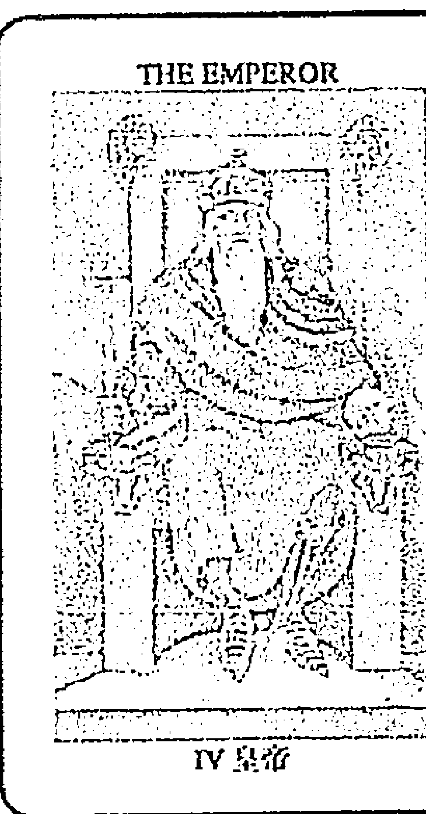

## 皇帝正位

### 人物

当事人的个性
比较理性而偏向务实的人，对事情有自己的看法，能够尽量把自己的理想实现，但是有时候会热衷于权利的追求。

当事人的工作观
在工作上很有能力，面对挑战时会努力地突破困境，但是在追求功成名就的同时，就很难顾及到人际关系的层面。

当事人的感情观
虽然比较严肃和内向，在遇到喜欢的对象时也很难主动表达，但是在内心还是渴望感情，并且会保护和照顾情人。

当事人的金钱观
对金钱有极强的控制欲，如果能够不花钱就会尽量把钱省下来，并不懂得如何花钱享受，会给人一毛不拔的感觉。

与当事人的应对方法
在理性的层面比较容易应对，但是整体来说要防范他的野心，在交往时只要不涉及利益的冲突，他会是很好的一个人。

人物代表
父亲、行政人员、高级长官、警官、严肃的人、执行者。

### 工作

工作本身的状况
工作当中有许多困难，但是当中也有许多晋升的机会，虽然受到很多规则的限制，但是仍然可以完成自己设定的目标。

心灵与精神层面的提示
你希望有强大的意志力去面对现在的困境，或是内心极度渴望拥有权力，这个时候你需要更务实地面对自己。

如何解决工作的困境
这时候长官的态度是最重要的，如果能得到高层充分的授权，就应该去贯彻执行，但是小心不要有越权的举动。

工作中的人际关系
这个工作只看成绩的特性，使得大家的竞争十分激烈，即使在私底下有点交情，遇到工作的事情也只能公事公办。

与上司相处的方法
面对十分严肃又控制欲强的上司，最好就是顺着他的意思做，千万不要去挑战他的权威，提出太多意见反而不好。

工作的发展性
这个工作的性质虽然困难，但是未来仍然有不错的发展性，可以把某个上司当成标杆，努力地朝向这个目标迈进。

找工作/换工作的状况
现在会出现一些还不错的工作机会，但是每一个都有一定的困难，重要的要符合自己的兴趣，才能够做得长久。

### 爱情

感情本身的状况
在感情关系当中存在控制与被控制的关系，也算是一个稳定发展的感情，只是当中好像缺乏了热情及浪漫的感觉。

#### 新恋情的可能性

现在出现的感情并不浪漫，而是基于双方的理性判断决定要在一起，如果能用心经营的话也会是一个稳定的关系。

#### 对这段感情的看法

这段感情可以帮助双方去实现理想，但是并不是属于热情的关系，在这个关系当中双方都可以感觉到安全和稳定。

#### 性的吸引力

这段感情当中性的吸引力并不重要，也可以说并没有太多的吸引力，但若作为义务的一部分，也不会缺乏性生活。

#### 如何化解争吵

是非曲直总会有个道理可循，应该坐下来好好谈谈，用理性的方式来解决问题，最好不要涉入太多的情绪反应。

#### 分手的方法

只要你下定决心提出分手，对方几乎是没有什么挽回的余地，方法就随你高兴就好，但是很难避免伤害到对方。

#### 复合的可能性

这段感情很少有感情的成分在，因此不太有复合的可能性，即使复合还是会落入互相控制的状况当中，没有意义。

### 友情

#### 人际关系状况

由于你待人太过于严肃，而且太过重视利害关系，因此很难交到知心朋友，建议你应该要放松心情去与别人交往。

#### 如何化解与朋友的误会

你与朋友的关系其实还算是稳固，所以只要主动提出说明，给对方一个合理的说法，要化解误会其实并不是难事。

### 亲情

#### 家庭的状况

现在大家有一个明确的共同目标，而且朝向这个目标前进当中，一致对外使得大家能和平相处，也会有共同话题。

#### 与长辈的关系

你与长辈的关系并不好，因为你是不服管教的那一个，有时候太会找理由，反而变成让长辈头疼的人物。

#### 与平辈的关系

在平辈当中你是属于比较孤立的一个，常常自己去做自己想做的事情，并不理会别人的眼光，也很少主动沟通。

#### 与晚辈的关系

你对家中的晚辈特别照顾，而且几乎到了大小事都管的地步，比较属于严父的角色，对于是非对错也会赏罚分明。

### 学业

#### 学业本身的状况

现在学习的状况十分稳定，但是仍然有不少的挑战需要去克服，这时应该坚持自己的立场，把该学好的东西完成。

#### 学习的方法

理性与务实是你最好的武器，只要你能诚实地去面对自己该做的事情，以你的能力来说都不会出现无法解决的问题。

#### 与老师相处的关系

面对这种赏罚分明又主观性强的老师，服从是最好的方法，如果胆敢犯到他的禁忌，一定会遭受到最严厉的处罚。

#### 与同学相处的关系

你会想要在同学之间担任领导者，不过也很可能因此而与别人起冲突，要比较软性一点才能得到更多同学的支持。

### 财务

#### 目前的财务状况

以现实的角度来衡量，你的财务状况还不算坏，但是未来仍然有很大的成长空间，在自己的事业上应该要更努力。

#### 投资的状况

现在可以开始保守的投资，但是并不会立即为你带来实质的好处，对于长期投资来说，这会是一个进场的好时机。

#### 采购的策略

不但要考虑采购标的，同时在采购过程中的成本也要考虑进去，以实用为判断的基准，即使不是名牌也无所谓。

### 延伸应用

- 时间
相对时间：四小时、四天、四周、四个月、四年。
标示时间：白羊座（约每年 3/21-4/20）。

- 地点
区域：政府机关、办公室、警察局、岩山、矿山、沙漠。
方位：东北方。

- 物品
公告、公文、识别证、身份证、水晶球、盔甲、太师椅。

- 身体部位
头部、脸部。

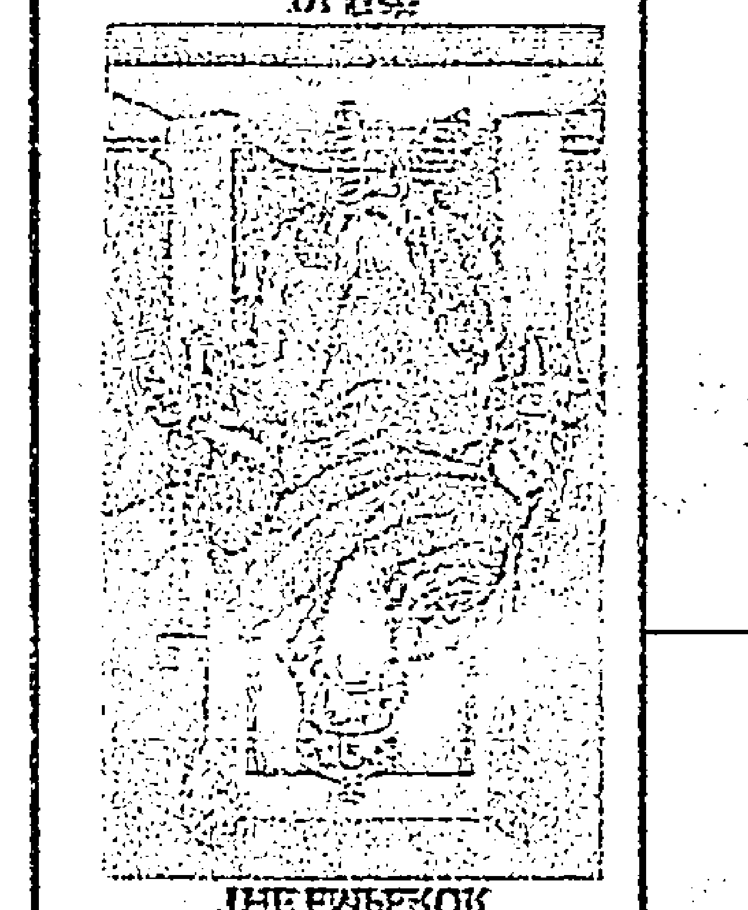

## 皇帝逆位

自信其实取决于个人的意志力，并且要看自己是不是有把理想实现的能力，想要控制一切反而会使事情失去控制。

### 人物

- 当事人的个性
对于事情有自己的看法，但是其实并不成熟，常常因为任性的决定而遇到严重的问题，同时也有伟大的理想抱负。

- 当事人的工作观
有强烈的企图心，但是在能力上稍显不足，也没有足够的意志力去克服困难，反而常会把自己的问题推卸给别人。

- 当事人的感情观
不敢表达自己的感情，其实内心十分渴望感情，如果是单身则会表现出讨厌异性的样子，反而变得很难接近异性。

- 当事人的金钱观
自己很想要掌控金钱，但是又对财务没有计划，有可能会把所有的钱都存下来，或者是突然把所有的钱通通花光。

- 与当事人的应对方法
面对这种比较任性又自以为是的人，只要不当面违逆他的意思就不会发生严重的冲突，给他一些尊重就很好说话。

- 人物代表
单亲爸爸、失意政客、中年失业者、中年未婚者、战俘。

### 工作

- 工作本身的状况
工作上遇到不好相处的主管，不仅对你没有帮助，反而常害你累个半死，事情往往超出你的预料，还要努力收尾。

- 如何解决工作的困境
这个时候应该要想办法自己解决问题，好好计划做好准备，如果在此没有全力一拼，接下来的状况更是无法收拾。

- 工作中的人际关系
这个工作当中的人际关系似乎不是重点，太好的人际关系反而对你是有害的，这个时候还是独善其身比较安全一点。

- 与上司相处的方法
对于事情要有自己的主见，不要完全被上司牵着鼻子走，这样反而更能得到他的信任，也可以把事情处理得更好。

- 工作的发展性
这个工作未来的发展还不明朗，但可以确定的是仍然会很辛苦，如果不喜欢挑战极限的人，还是找个机会换个位置。

- 找工作 / 换工作的状况
现在出现的工作并不是很适合你，也许还要等一阵子才会有适当的机会出现，这段时间你就让自己彻底休息一下。

### 爱情

- 感情本身的状况
感觉是被对方所控制的感情关系，虽然对方也提供了很多的照顾和保护，不过总觉得缺乏某些自由和平等的感觉。

#### 新恋情的可能性

出现新恋情的可能并不高，重要的是你也还没准备好要接受一段新的感情，应该先想清楚自己在感情中需要什么。

#### 对这段感情的看法

在感情中充满了障碍和冲突，并不是一种和谐稳定的关系，还有很多事情不确定，所以也没有明确的目标和方向。

#### 性的吸引力

这段感情当中并没有太多性的吸引力，双方对于性与爱的看法也还不成熟，不知道怎么带给彼此更多性爱的欢愉。

#### 如何化解争吵

不要太坚持己见，先听听对方怎么说再做决定，如果两个人之间无法解决问题，可能就要等待其中一方先软化态度。

#### 分手的方法

现在已经爆发出分手的危机，你只要顺水推舟就好，但是要小心别太刺激对方的情绪，否则可能会发生暴力事件。

#### 复合的可能性

这段感情复合的可能性很低，主要是因为两个人心中已经没有情分在了，即使想要勉强在一起，也无法得到满足。

### 友情

#### 人际关系状况

你对人际关系的想法太过单纯，往往落入别人的陷阱当中而不自知，应该要小心防范身边的小人，不要再被骗了。

#### 如何化解与朋友的误会

你该给自己和对方更大的空间，不要被一大堆的原则和固执的个性绑住，有弹性地处理这件事将会解决你的问题。

### 亲情

#### 家庭的状况

现在家中面对着重大的变局，但是并没有明确的方向及目标，也没人能出来主持大局，这是造成危机的主要原因。

#### 与长辈的关系

长辈会特别照顾你，但是对你的限制也会特别多，如果你能表现得更成熟独立些，那么你与长辈的关系就会改善。

#### 与平辈的关系

在平辈当中你算是比较霸道的一个，有时候已经伤害到别人了仍然不自知，你需要更虚心地接受别人给你的建议。

#### 与晚辈的关系

你对家中的晚辈特别照顾，但是也常常会被他们提出来的要求弄得昏头转向，你对他们的态度应该更强硬些。

### 学业

#### 学业本身的状况

你在学习上现在遇到一些问题，但还不到无法解决的地步，重要的是你能不能及时补救之前的错误，再迎头赶上。

#### 学习的方法

这时候千万不要放弃，努力就会有成果，即使结果并不如你主观所预期的，但是累积的过程还是必定要经历的。

#### 与老师相处的关系

老师主观的好恶很强，所以要先观察一阵子再说，能够投其所好当然是最有利的，但是只要不犯错也就能安全过关。

#### 与同学相处的关系

你在同学之间并不是很受欢迎，主要是因为你让人觉得过度自我防卫，适度地放松自己才能展现出更好的亲和力。

### 财务

#### 目前的财务状况

现在你的财务状况并不太好，资产的配置也有很大的问题，若是有债务则会雪上加霜，重要的是要如何保住老本。

#### 投资的状况

现在并不适合任何投资，把现金留在手上才是最好的策略，如果现在的投资已经赔了很多钱，就先放着不要理它。

#### 采购的策略

整个采购的计划还不完整，要先检查是不是有任何缺漏的东西，再看看计划的可行性，太过冲动绝对会吃到苦头。

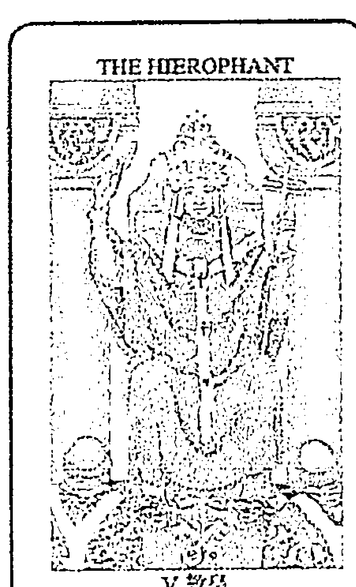

## 教皇正位

> 心灵与精神层面的提示
> 面对到与宗教信仰有关的问题，你可以多请教别人有关于教义或灵性成长的事情，或许会帮助你早点把问题想通。

### 人物

- **当事人的个性**
比较重视灵性成长的人，通常有虔诚的宗教信仰或是心灵上的依归，因此而培养出慈悲心，也有乐于助人的习惯。

- **当事人的工作观**
重视工作的意义重于实质的金钱收入，具有强烈的责任感，也可以充分融入组织文化，很重视同事间的人际关系。

- **当事人的感情观**
会很重视对方的感觉，并且主动提供协助及保护，常常会是以婚姻为前提和对方交往，面对感情既认真又保守。

- **当事人的金钱观**
对金钱采取比较随缘的态度，不会不择手段地赚钱，也不会随便地乱花钱，如果能够用金钱帮助其他人也会努力捐助。

- **与当事人的应对方法**
这种人在道德层面的要求较高，如果不能赞同他的价值观，就不要谈论到信仰或道德的问题，否则可能会起冲突。

- **人物代表**
僧侣、牧师神父、庙祝、社工师、仁慈的人、灵性导师。

### 工作

- **工作本身的状况**
在工作当中有很多贵人在帮助你，所以即使自己仍然有不足的地方，也会得到很多支持，是你可以发挥的地方。

- **如何解决工作的困境**
遇到自己解决不了的问题，应该寻找更高层的人来决定，或是依循着既有的秩序和规则来处理，保守一点不会错。

- **工作中的人际关系**
其实工作当中的伦理十分重要，凡事都有先来后到、长幼有序，只要能符合这样的规则，人际关系自然就会很好。

- **与上司相处的方法**
其实是很愿意帮助你的上司，遇到不懂的事情就请教他教你该怎么做，能从他身上多学到一些东西对你就是福利。

- **工作的发展性**
这个工作的未来很有发展性，而且是一个有很多人帮助你的地方，应该先把人混熟了，其实待下去对你是有利的。

- **找工作/换工作的状况**
可能会有长辈帮你介绍工作，这个时候自己去找工作反而不太容易，可以把自己需要工作的消息对大家广为宣传。

### 爱情

- **感情本身的状况**
宗教或灵性的因素对这段关系有很大的影响力，有时候也表示两个人已经结婚，或是这段关系正向着婚姻方向发展。

- **新恋情的可能性**
现在会有新的感情对象出现，最可能是透过相亲或是长辈的介绍，所以这段时间不妨多参加未婚男女的联谊活动。

- **对这段感情的看法**
以结婚为前提在考虑这段感情，绝对是十分认真的，同时也会希望得到大家的祝福，算是比较保守而稳定的看法。

- **性的吸引力**
这段感情当中很自然地有性的吸引力，但是并不占有最重要的位置，甚至两个人有一点把性当成禁忌而避免谈论。

- **如何化解争吵**
如果两个人还是僵持不下，不妨寻找两个人共同的长辈来做和事佬，但是这个人必须同时得到两个人的信任才行。

- **分手的方法**
除了当面和对方提出分手之外，重要的是要公告周知，让大家都知道你们都分手了，那么就可以断得干干净净。

- **复合的可能性**
这段感情如果能够复合，那么一定是有好朋友在当中穿针引线撮合，否则以两个人的情分要复合恐怕没那么容易。

### 友情

- **人际关系状况**
现在你的人际关系算是稳定，也许会因为宗教信仰或是心灵成长的兴趣交到不少知心的好朋友，应该要好好把握。

- **如何化解与朋友的误会**
你应该对朋友有更多的宽容，由内心去原谅对方，如果对方不愿意原谅你，则应该找可以信任的朋友来当和事佬。

### 亲情

- **家庭的状况**
家中有共同的家学渊源或相同的宗教信仰，所以能够维持良好的秩序与和谐关系，是很重视伦理道德的模范家庭。

- **与长辈的关系**
长辈对你特别照顾，常常会帮你出面解决各种问题，但有时你会太滥用长辈对你的宠爱，反而会造成他们的困扰。

- **与平辈的关系**
你与其他人常常会有联络，而且也可以互相帮忙，因此感情就会特别好，你在当中似乎占有特别重要的核心地位。

- **与晚辈的关系**
你对晚辈很照顾，不过也不会因此而疏于管教，你特别重视他们的道德教育，有时候也会给他们比较严肃的感觉。

### 学业

- **学业本身的状况**
现在学习的东西对你来说十分重要，应该要好好花时间学习，不论同学或老师都会很帮忙你，但是自己也要努力。

- **学习的方法**
你应该有耐性地学习，找到自己的问题所在，再去请教同学或老师，相信持之以恒到最后一定可以突破困难。

- **与老师相处的关系**
老师可以帮你解决很多问题，但也不应该太依赖老师，只要遵守规则不捣蛋，当个乖学生自然会得到老师的喜爱。

- **与同学相处的关系**
与同学的人际关系会影响到你的学习，能有更多的好朋友对你的学习也会很有帮助，所以要和大家维持良好关系。

### 财务

#### 目前的财务状况
现在因为有其他的支持在，所以你的财务状况看起来还不错，但是并不算是很独立而健全，还有努力成长的空间。

#### 投资的状况
如果是认识的朋友找你帮忙的话，多少可以投资一点，但是其他的标的物就要慎重考虑，这时候只能小额长期投资。

#### 采购的策略
最好选择连锁或是有信誉的大供货商，即使比较贵至少会比较有保障，记得要把购买的凭证和单据保存下来。

### 延伸应用
#### 时间
相对时间：五小时、五天、五周、五个月、五年。
标示时间：金牛座（约每年 4/21-5/20）。

#### 地点
区域：教堂或庙宇、修道院、灵修道场、社会福利机构。
方位：东南方。

#### 物品
钥匙、通行证、结婚证书、冠冕、贺卡、心灵成长书刊。

#### 身体部位
颈部、肩膀。

## 教皇逆位

心灵与精神层面的提示
与其盲目地跟随大师，不如自己思考会更有帮助，有时候与朋友分享谈论这些问题，反而会对你有更多的启发。

### 人物

- 当事人的个性
特别心软的人，习惯于不顾一切地帮助别人，而没有考虑到自己的状况，也常常因为意志不坚定而被别人所陷害。

- 当事人的工作观
在工作上没有太积极的想法，只是依照规定去做应该做的事情，虽然不会主动创新和解决问题，但是服从性很高。

- 当事人的感情观
对于感情的态度比较保守，甚至可能保持着不婚的打算，在感情中常自认为是受害者，无法把自己的意见表达出来。

- 当事人的金钱观
不是很重视金钱，有时候可能因此而突然花了很多钱，常会把金钱捐给慈善机构，或是想要用金钱帮助亲朋好友。

- 与当事人的应对方法
基本上这个人是吃软不吃硬，只要你能摆出楚楚可怜的态度，低声下气苦苦地哀求，大部分的问题都可以被原谅。

- 人物代表
滥好人、慷慨的人、信徒、迷失方向的人、耳根软的人。

工作中充满各种繁复的规则，还有一些是没有明文规定的，一不小心就会犯到禁忌，要花很多时间才能进入状况。

- 如何解决工作的困境
工作当中的问题很难由自己解决，所以应该是由同事之间共同合作来处理，利用大家不同的经验和能力集思广益。

- 工作中的人际关系
这份工作当中人际关系的影响很大，如果不能和大家相处良好而受到严重的排挤，这样可能连工作都会做不下去。

- 与上司相处的方法
上司的耳根子很软，所以容易受到各种传言的影响，不同的人对他都会有影响力，要小心不利于自己的各种流言。

- 工作的发展性
这个工作的发展性还不错，但是要小心人际关系的影响，特别是同事对你的影响更大，应该尽量与大家和平相处。

- 找工作/换工作的状况
现在不太容易找到新的工作，算是一段可以好好休息的时间，等到自己状况转好之后，再来找工作就会更容易了。

### 工作

- 工作本身的状况

### 爱情

- 感情本身的状况
是有一方付出比较多的状况，两个人的关系并不平等，如果能够心甘情愿地付出，也算是一段稳定发展中的关系。

- 新恋情的可能性
现在会有一些新恋情发生的可能性，但是都是借由同侪之间的介绍而认识的，所以应该多多参加朋友的社交活动。

- 对这段感情的看法
觉得自己付出很多，但是所得的回报少了许多，也许会有一些不平衡的情绪，同时又会很想要保护和照顾对方。

- 性的吸引力
两个人对于性关系都有一点害怕，所以即使有很强的吸引力，也无法对这段关系有正面的影响，算是有色无胆吧。

- 如何化解争吵
如果两个人还在僵持的状况当中，应该寻求同侪朋友们的帮助，让大家来当和事佬，将会有助于快速地化解争吵。

- 分手的方法
正式地和对方提出分手，表示这段关系已经完全结束了，甚至可以先把你的想法写成文字，整理一下自己的思绪。

- 复合的可能性
这段感情其实并没有复合的可能性，最好不要往这个方面去想，先让自己休息一下，等待更好的机会再重新出发。

### 友情

- 人际关系状况
你的人缘还不错，但是太容易受到别人的影响，反而失去自己的主体性，有时也会因为要帮助朋友反而自己受害。

- 如何化解与朋友的误会
把自己的立场说明清楚，不要让朋友觉得无论如何你都应该让着他，只要你能说得有理就可以重新赢得朋友的信任。

### 亲情

- 家庭的状况
家中的成员之间都有不错的感情，也能够热心地互相帮助，但是也可能为了帮助家中的成员因而付出重大的代价。

- 与长辈的关系
你是家中长辈的好帮手，常常可以帮助他们解决各式各样的问题，因此长辈们会特别重视你的意见，听从你的建议。

- 与平辈的关系
你与平辈之间的感情特别好，但是因此也会互相包庇错误、文过饰非，有时候反而失去了互相监督和砥砺的功能。

- 与晚辈的关系
你对于晚辈太过纵容，常常因此而惹出一堆子麻烦，如果不能改变这种态度，到头来还是自己要收拾烂摊子。

### 学业

- 学业本身的状况
现在学习进入到关键阶段，如果能过关接下来就会很轻松，但是若卡在这个地方未来就要花很多倍的力气来突破。

- 学习的方法
只要核心的概念清楚之后，接下来大部分的东西都可以触类旁通，所以重要的是找到学习的诀窍，采取重点突破。

- 与老师相处的关系
老师很重视规矩，大部分的时候也都是依照规则来处理问题，所以只要用心观察他的作为，就可以掌握行为分寸。

- 与同学相处的关系
有时候与同学的关系太好，反而很多事情都会推到你头上来，所以除了维持良好的关系之外，也要有自己的坚持。

### 财务

- 目前的财务状况
如果在金钱上不够务实，财务状况就很难好起来，要记得物质世界的规则是很现实的，要付出努力才会有成果。

- 投资的状况
这个时候并不是很适合投资，尤其是听信一些小道消息的投资特别危险，最好是保守务实一点，维持现状就好了。

- 采购的策略
现在不宜有重大的采购，花大钱对你绝对是不智之举，如果必须要进行采购，这时候应该以耐久以及质量作为考虑。

## 情侣正位

心灵与精神层面的提示
上天的祝福对所有的人都是开放的，但是只有回到纯真的状态去面对现在的人生，才能找到属于自己的生命答案。

### 人物

#### 当事人的个性
比较单纯的人，喜欢用最简单直接的方法来处理事情，大都可以顺利完成，是受到上天眷顾和保佑的幸运儿。

#### 当事人的工作观
对于工作并不热衷，也没有什么事业野心，只会把本分当中的事情好好完成，反而很重视与同事之间的人际关系。

#### 当事人的感情观
很重视自己的感情生活，虽然十分认真但是在想法上却又很单纯，进入恋爱状态就会完全投入而忽略了其他事情。

#### 当事人的金钱观
不太重视金钱，但是也不会缺钱用，只要按部就班工作就会很容易累积不少金钱，是属于简单生活知足常乐的人。

#### 与当事人的应对方法
与这种人只要坦诚相交，对方也很容易和你交心，不要想用诡计或是复杂的方式占他便宜，有时反而会自作自受。

#### 人物代表
- 媒人、中介、见证者、恋爱的人、纯真的人、合作伙伴。

### 工作

#### 工作本身的状况
基本上是一个单纯顺利的工作，本身并不困难，也没有什么大问题，只是要小心避免当中的陷阱以及不当的诱惑。

#### 如何解决工作的困境
用最简单的方法去处理，别把问题想得太复杂，只要顺着应该进行的方向持续前进，一定可以及时顺利地通过考验。

#### 工作中的人际关系
这里大部分的人都很好相处，因此大家都维持着愉快的关系，但要记得君子之交淡如水，太过亲密反而会有问题。

#### 与上司相处的方法
是一个很能照顾大家的上司，所以只要你把自己分内的事情做好，应该就不会有太大的问题，也不必刻意讨好他。

#### 工作的发展性
这个工作未来即将面对比较大的变动或是挑战，虽然你应该可以顺利地通过考验，但这还是有赖于你事前的准备。

#### 找工作 / 换工作的状况
现在可能有两个以上的工作机会让你选择，因此让你觉得有点犹豫不决，这时候应该要选择性质比较单纯的那个。

### 爱情

#### 感情本身的状况
两个人是很情投意合的热恋状态，彼此也有很强的吸引力，不论任何的理由或是阻碍，都很难把这段关系拆散。

- 新恋情的可能性
在很短的时间之内必定会出现新恋情，如果对自己仍然有不够满意的地方，应该趁这个时机把自己的缺点改过来。

- 对这段感情的看法
两个人的感情已经十分稳定，希望会朝着结婚的方向发展，其实是很疯狂地迷恋上对方，同时也接受对方的一切。

- 性的吸引力
这段感情当中有很强烈的性吸引力，而且会很自然地互相表达出来，性关系也会是感情生活当中非常重要的一环。

- 如何化解争吵
其实两个人并没有太大的问题，小小的误会只要沟通清楚就好，不要把事情想得太过复杂，更没有必要自寻烦恼。

- 分手的方法
除非感情当中出现了第三者，否则要分开不是那么容易，即使谎称你已经有其他喜欢的对象，也不见得就会有效。

- 复合的可能性
其实两个人对彼此还有很深的感情，所以存在着复合的可能性，只要有一方主动提出，复合并不是很困难的事情。

### 友情

- 人际关系状况
你的知心好朋友不多，但是对你都是有重要意义的好朋友，所以要好好把握这些好朋友，其他的事就不必太在意了。

- 如何化解与朋友的误会
只要你以诚心向对方解释事情的来龙去脉，对方一定会原谅你，千万不要为了任何原因说谎，否则反而会使事情恶化。

### 亲情

- 家庭的状况
家中的人各自扮演好自己的角色，分工的状况也很适当，即使遇到任何的考验或是挑战，应该都可以顺利地克服。

- 与长辈的关系
长辈虽然把你当成小孩子，但是也会因此而特别照顾你，只要你能保持原来的表现，一定会持续得到他们的喜爱。

- 与平辈的关系
大家都很坦诚相待，所以可以彼此信任、没有什么芥蒂，如果合作一起去完成某件事情，将会得到很满意的结果。

- 与晚辈的关系
晚辈对你十分信任，不过你有时候会给他们一些挑战或是试炼，希望能够帮助他们独立成长，通常关系都还不错。

### 学业

- 学业本身的状况
现在正在学习的起步阶段，每一步对你来说都是重要的基础，如果现在能够有一个好的开始，接下来就会很顺利。

- 学习的方法
你需要不断地接受挑战和考验，如果没有考试也应该自己练习，只有你自己经历过的事情，才能够完整地学会。

- 与老师相处的关系
老师对大家都是一视同仁，所以也不用特别想要讨好他，但若是你特别捣蛋或是不认真，也一定立刻就会被发现。

- 与同学相处的关系
你与同学的关系还不错，但是并不会对你的学习有多大的帮助，大家都能和平相处也会带给你比较好的学习情绪。

### 财务

#### 目前的财务状况
现在财务的状况还算不错，但是未来仍然有更大的发展潜力，所以应该从现在开始努力，为自己争取最多的利益。

#### 投资的状况
开始可以重新调整投资配置的比重，但是不宜一下子增加太多新的投资，只要作适当的调整就能在投资当中获利。

#### 采购的策略
面对不同的选择时，最好还是寻找长期合作的可靠伙伴，为了一点点价钱而改变采购的对象并不会得到多少利益。

### 延伸应用
#### 时间
相对时间 六小时、六天、六周、六个月、六年。
标示时间 : 双子座 ( 约每年 5/21-6/21 )。

#### 地点
区域 : 公园、植物园、果园、圣山、天体营、原始部落。
方位 : 东方的上方。

#### 物品
订情信物、长在树上的水果、树叶、衣服、蛇、爬虫类。

#### 身体部位
手臂、手肘、手腕、手掌、手指。

## 情侣逆位

心灵与精神层面的提示
不要害怕为自己的人生负责，能够承担的人才能得到应有的报偿，重要的是在选择之前是不是曾务实地想过后果。

### 人物

- 当事人的个性
容易受到别人影响而改变心意的人，遇到挑战时往往会犹豫不决，即使自己已经决定也不愿意为自己的决定负责。

- 当事人的工作观
在工作当中时常犯错，但是又不知道该怎么解决问题，并没有很强的企图心，只想着把自己分内的事情做好就行。

- 当事人的感情观
很需要感情的依靠，但是又不愿意为自己的选择负责，常常在不同的对象之间摇摆，或是在感情当中觉得不满足。

- 当事人的金钱观
无法处理金钱方面的事情，常常做得很辛苦但是只得到很少的实际利益，如果不能更务实一些也可能会穷困潦倒。

- 与当事人的应对方法
这种人常常改变心意，所以在完全确定状况之前不要太相信他说的话，不要为他做任何决定，以免事后被他怪罪。

- 人物代表
嫌疑犯、有前科的人、被放逐的人、暴露狂、外遇的人。

工作当中出现很多的困难以及不当的诱惑和陷阱，一不小心就会犯下严重的错误，再想要回头就已经来不及了。

- 如何解决工作的困境
先找出各种可能的组合，重新思考这些方案的可行性，以原来的方式去进行会有很大的问题，一定要做一些改变。

- 工作中的人际关系
工作当中大家都把责任推来推去，所以通常都是各自负责自己的事情，而无法进行深度的合作，人际关系比较疏离。

- 与上司相处的方法
上司不会帮你扛责任，不挖洞给你跳就不错了，对于事情的决策常常改来改去，所以接到他的命令要三思而后行。

- 工作的发展性
这个工作接下来的感觉并不妙，也许目前还没看到变动，但是接下来的状况很难处理，最好要有离开的心理准备。

- 找工作 / 换工作的状况
现在出现的工作机会都不太适合你，特别若是别人介绍给你的就会更惨，所以要多看多听，有耐性地慢慢过滤信息。

### 爱情

- 感情本身的状况
两个人对彼此的感情都很深，但是也觉得有很多的不满和抱怨，如果把问题强压下来不说，反而会累积成为大问题。

### 友情

- 新恋情的可能性
这段时间很可能会出现新恋情，但千万别不小心成为别人的第三者，小心考虑每个人的优缺点，不要太快做决定。

- 对这段感情的看法
觉得自己在感情当中付出很多，但是有时候也会觉得挫折，仍然很疯狂地迷恋对方，所以会有迷失了自我的感觉。

- 性的吸引力
在这段感情关系当中，性的吸引力是最重要的一环，双方都会强烈地表达对于彼此的需要，但也要小心房事过度。

- 如何化解争吵
重要的是把事情的责任厘清，不要再打迷糊仗，只有双方当面把问题拿出来谈清楚，才能彻底解决这个难解的结。

- 分手的方法
其实当面沟通是最好的方法，把自己的不满和挫折真实地表现出来，不要让对方存有任何幻想，也许就能分手成功。

- 复合的可能性
这段关系也许还有复合的可能性，但是也许是因为欲望而重新结合，所以基础并不是很稳固，相处时要更加小心。

- 人际关系状况
基本上你的人际关系还不错，但是大家都是比较表面的交往，想要找到比较好的知心朋友，在这段时间比较困难。

- 如何化解与朋友的误会
不要被朋友牵着鼻子走，对于事情要有自己的看法，如果能严正拒绝不当的建议，反而会让你与朋友的关系改善。

### 亲情

- 家庭的状况
现在家中正遇到一些变化，如果不小心处理可能就会留下严重的后遗症，这时候应该不分彼此地共同努力合作处理。

- 与长辈的关系
在长辈眼中你是一个长不大的小孩，如果不能表现得更加成熟，就无法得到他们的信任，也很难得到他们的宠爱。

- 与平辈的关系
在平辈之间你常常有点不知所措，也不知道应该相信谁的说法，如果无法自己清楚地判断，还是保持距离比较好。

- 与晚辈的关系
你与晚辈的关系还不错，但是彼此并不是很亲近，虽然有一些距离的感觉，但是主动付出的关心还是会被感觉到。

### 学业

- 学业本身的状况
现在学习的东西并不是你拿手的项目，所以只能走一步算一步，减少错误就是加分，太积极努力反而会觉得挫折。

- 学习的方法
虽然有时候会觉得有一些挫折，但是这时候你还是最适合尝试错误法，在实践的过程当中你可以慢慢地把东西学会。

- 与老师相处的关系
老师在情绪上的反应比较大，所以尽量不要去刺激他的情绪比较好，尽量维持平凡，不要被注意到是最佳的策略。

- 与同学相处的关系
你与同学的人际关系对你的学习并没有什么影响，但是有时候和同学吵架会影响你的学习情绪，所以还是要和平相处。

### 财务

#### 目前的财务状况
你现在面对财务上重大的决定，但其中可能有不少的陷阱，如果自己无法想清楚，应该要相信专家给你的建议。

#### 投资的状况
不要相信太高收益的投资，因为当中的风险也许不是你所能承担的，做决定的时候要保守一点，才不会血本无归。

#### 采购的策略
这是不适合采购的时机，想要贪便宜反而容易买到瑕疵品，如果不能当面确定东西的质量，还是再等一阵子再说。

## 战车正位

### 心灵与精神层面的提示
你现在具备成功所需要的强烈意志力，不论付出何种代价也要得到你想要的东西，但是要切记欲速则不达的道理。

### 人物

- 当事人的个性
有理想抱负的人，凡事都想要追求成功与卓越，为了达成自己的目标不择手段，即使与别人发生冲突也在所不惜。

- 当事人的工作观
工作上的企图心很强烈，认为升迁比加薪更重要，常在工作当中把握表现的机会，想要把别人打倒好让自己晋升。

- 当事人的感情观
非常珍视自己的感情，同时也有强烈的占有欲；对于自己所爱的人极尽所能地付出及保护，绝不容许别人来挑战。

- 当事人的金钱观
了解金钱的价值，也可以有效地运用金钱，通常比较喜欢先把钱存起来，等到有一笔积蓄之后再来做财务的规划。

- 与当事人的应对方法
与这种人千万不要起正面冲突，也不要阻碍到他达成目标，否则被他认为是敌人的话，就会受到冷酷无情的攻击。

- 人物代表
征服者、野心家、军人、努力成功的人、司机、赛车手。

### 工作

- 工作本身的状况
工作上正遇到一些困难和挑战，但是对你来说都是力所能及的事情，只要你再打败竞争者，最后的胜利者一定是你。

- 如何解决工作的困境
这时候你应该要采取强制的手段，绝对不可以因为一时心软而坏了大事，即使引发正面冲突也要不计代价地撑下去。

- 工作中的人际关系
你与其他人处于高度的竞争当中，每个人都想要把别人比下去，因此不太可能交到真心的朋友，要自己解决问题。

- 与上司相处的方法
面对很强势的上司，应该要配合他的政策，确实执行他交付的事情，这不但对他本身有利，也是你学习的好机会。

- 工作的发展性
这个工作未来有很大的发展空间，但是主要还是你自己拼出来的，只要你足够努力，就会有美好的未来在等着你。

- 找工作／换工作的状况
现在可能出现两个以上的工作机会，最好是以未来的发展性为考虑，若是找到你有兴趣的工作将会带来更多利益。

### 爱情

- 感情本身的状况
现在感情当中不可避免地会遇到某种冲突或竞争，有赖于你主动积极地处理和改进，千万不要在这个时候放弃希望。

• 新恋情的可能性
现在应该会出现新的感情对象，但是也许会有不少的情敌和你竞争，你应该评估自己的心意和能力再决定怎么做。

• 对这段感情的看法
这是辛苦努力过而得到的感情，当然也会特别珍惜，会尽一切的努力来维持这段感情，不会被任何的事情所影响。

• 性的吸引力
这段关系当中并没有很强的性吸引力，反而会有点把性关系工具化，把性当成征服对方的工具，带有强烈的目的性。

• 如何化解争吵
这个时候斗力不如斗智，要花心思、想办法来表现自己的诚意，有时候越是强硬的态度，反而会引发更大的冲突。

• 分手的方法
大吵一架是最好的方法，只要你强硬地提出分手的要求，对方就没有什么挽回的余地，应该用快刀斩乱麻的方法来解决问题。

• 复合的可能性
两个人之间已经没有什么情分了，所以并不存在任何复合的可能性，再加上竞争者的实力很强，再妄想也没有用。

### 友情

• 人际关系状况
你在人际关系当中充满了竞争性，常常对别人有防卫性，反而无法放开心胸交到好朋友，有时也觉得高处不胜寒。

• 如何化解与朋友的误会
不要太过自以为是，也该要听听朋友方面的说法，在综合双方的意见之后，也许可以找到另一种更好的解决方案。

### 亲情

• 家庭的状况
现在家庭面对到重大的挑战，如果彼此之间不能好好合作，可能会使家庭陷入空前的危机，应该以家庭为重来考虑问题。

• 与长辈的关系
你是令长辈觉得难以管教的头疼分子，只执着于自己想要做的事情，完全不听别人的劝告，你也常常会顶撞他们。

• 与平辈的关系
你在平辈当中是比较强势的一个，虽然大家会觉得你比较自以为是一点，不过遇到事情还是会想要听听你的意见。

• 与晚辈的关系
你对晚辈十分照顾，不过管理上也十分严格，如果有任何人想要挑战你的权威，你就会让他彻底知道什么是服从。

### 学业

• 学业本身的状况
你在学业上面对强大的挑战和竞争，不过因为你的基础还不错所以应该能够顺利通过，参加比赛很可能会得奖。

• 学习的方法
立定了明确的目标之后，就要努力去做，这时候就要专心把自己的事情完成，不要被任何外力所干扰。

• 与老师相处的关系
千万不要想挑战这种老师，他是会彻底执行各种规定的人，即使你再有什么方法钻漏洞，也一定会被抓出来处罚。

• 与同学相处的关系
你在同学之间算是领导型的人物，大家都会重视你的意见，因为在课业上也有比较好的表现，应该要多帮助别人。

### 财务

• **目前的财务状况**
目前在财务上是一个很有收获的时候，所以更要努力为自己争取最大的利益，不论任何事情都无法阻止你的攻势。
• **投资的状况**
在投资上虽然有美好的前景，但是仍然要理性务实地投资，只要你能把握到好的机会，就必定能在投资中获利。
• **采购的策略**
对事情要做很细致的评估，不要被外表的现象所欺骗，在经过计算和比较之后，应该就可以得到最佳的采购条件。

### 延展应用

• 时间
相对时间：七小时、七天、七周、七个月、七年。
标示时间：巨蟹座（约每年6/22-7/22）。
• 地点
区域：战场、占领区、竞赛场地、考场、平原区、道路。
方位：东方的下方。
• 物品
攻击性武器、机车、敞篷车、问卜的道具、窗帘、轮椅。
• 身体部位
胸部、乳房。

## 战车逆位

### 心灵与精神层面的提示

在二元对立之上，必定还有更高的原理存在，如何去整合不同的观点是你最重要的任务，记得要在内心保持希望。

### 人物

#### 当事人的个性

心中不时充斥悲愤的情绪，觉得都是别人对不起自己，但是很少检讨自己，常因为意志力不足而无法坚持到最后。

#### 当事人的工作观

在工作上十分努力，但会因为无法掌握到诀窍和方向，以至于白费力气，在遇到重大的案件时常常会不敢做决定。

#### 当事人的感情观

在感情当中情绪的起伏很大，同时也会因为别人的闲言碎语而受到影响，也有可能会在不同的对象之间摇摆不定。

#### 当事人的金钱观

很喜欢积累金钱，但是常常无法做有效的运用，有时候也会因此而陷入一些金钱的纠纷当中，最后没有任何好处。

#### 与当事人的应对方法

这种人太会保护自己，所以没有必要的话不必去涉入他私人的领域，也不要去八卦有关他的事情，否则可能会被报复。

#### 人物代表

被征服者、背叛者、退伍军人、车祸肇事的人、问卜者。

### 工作

#### 工作本身的状况

工作现在遇到一些困难和挑战，同时也会造成一些人际关系的问题，如果不够小心应付可能会变成无辜的牺牲品。

#### 如何解决工作的困境

这个问题已经不是你自己就可以解决的，多去问问不同的人，把大家的意见综合之后，也许就会找到更好的方法。

#### 工作中的人际关系

这是一个竞争性很强的环境，最好还是靠自己比较安全，尽量不要介入同事的纷争当中，以免变成了自己的麻烦。

#### 与上司相处的方法

上司的想法常会摇摆不定，所以常常要习惯这种政策转弯的状况，事情即使因此而不顺利，也不要觉得太过挫折。

#### 工作的发展性

这个工作的发展性还不错，但是现在仍然有很多问题需要去解决，如果能撑过现在的危机，未来的远景才有意义。

#### 找工作/换工作的状况

现在找工作其实并不顺利，即使进入到最后一关也很难被录取，应该先想清楚自己的优势，调整之后再重新出发。

### 爱情

#### 感情本身的状况

现在的感情当中面对着很大的危机，这时候应该以家庭或家人的意见作为考虑的基准，否则到头来可能是一场空。

• 新恋情的可能性
现在出现的对象都比你强势，也可能会主动来追你，因为主动出击的成功率不高，所以还是在原地守株待兔。

• 对这段感情的看法
觉得在这段感情当中受到很多委屈，也没有被对方真正了解，即使内心很想要放弃，仍然觉得有很多的不甘心。

• 性的吸引力
在这段关系当中性并不是那么重要，对于彼此来说也没有那么大的吸引力，算是比较缺乏性生活的那种类型。

• 如何化解争吵
这时候问题变成非黑即白的是非题，你只能选择拒绝或是接受，想要两面讨好的话反而会让自己陷入更大的危机。

• 分手的方法
只要任何一方正面开战，这段关系就会结束，所以如果你已经想清楚要结束这段关系，就不要再犹豫，把它解决吧。

• 复合的可能性
两个人要复合已经是不可能的事情了，即使对方还有意思希望复合，也绝对不会是一个好关系，反而会吵得更凶。

### 友情

• 人际关系状况
你在朋友之间感觉上比较弱势，常常无法主张自己的意见，反而会被朋友的意思所支配，是属于被动交朋友的人。

• 如何化解与朋友的误会
这时候必须先退让才会有和解的空间，所以可以先和对方道歉或是认错，也许接下来的状况就会是你能够处理的。

### 亲情

• 家庭的状况
家庭当中面对着分裂的危机，分裂成两个阵营彼此对立，如果不能团结去处理问题，对家庭将会造成重大的伤害。

• 与长辈的关系
长辈其实不太关心你，所以你就要做一些反叛的事情引起他们的注意，其实只要你的表现好也会得到他们的宠爱。

• 与平辈的关系
在平辈当中你是比较任性的一个，对人或事情都比较情绪化，看事情比较主观，如果对你的态度不好你就会生气。

• 与晚辈的关系
你常觉得对晚辈不够好，但是实质上你已经很照顾他们了，不要对自己的行为有罪恶感，应该要对他们严格一点。

### 学业

• 学业本身的状况
你现在面对学习的关键时刻，如果能够坚持下去的话，你将会得到很多的收获，否则之前所有的力气都白费了。

• 学习的方法
要考虑不同的事情之间应该如何去做整合式的理解，如果不能了解也可以多问问其他人，不要自己一直钻牛角尖。

• 与老师相处的关系
老师对大家都比较松，所以只要不做得太夸张，应该都可以安全过关，但是若犯到他的大忌可就吃不了兜着走。

• 与同学相处的关系
因为有些时候学习上要靠同学间的互相帮助，所以如果无法和同学有良好的互动，将会对你的学业有重大的影响。

### 财务

• **目前的财务状况**
现在的财务状况并不是很好，已经没有余力去进行任何新的计划，所有的事情都应该量力而为，不要太勉强自己。
• **投资的状况**
如果现在投资已经有获利，那么就应该立即获利了结，而且短期内不要再进行新的投资，否则很可能会血本无归。
• **采购的策略**
现在不宜从事大量采购，应该以少量而且必需的东西为准，切忌不可进行大量囤积，否则可能会造成重大的损失。

## 力量正位

### 心灵与精神层面的提示

你现在有足够的智慧和能量可以处理眼前的困难，不过如果没有实际的行动，一切都没有意义，要小心理性评估。

### 人物

• 当事人的个性
具有英雄特质的人，有勇气去面对任何挑战，即使有时候会比较冒险一点，仍然愿意负责任把事情从头到尾完成。

• 当事人的工作观
在工作当中很有行动力，但是有时候会有一点英雄主义，想要自己一个人把事情完成，工作时就很有活力及自信。

• 当事人的感情观
外表坚强但是内心的感情仍然十分丰富，会和对方互相配合，共同找到合适的相处模式，也有能力处理各种问题。

• 当事人的金钱观
并不把金钱放在最重要的位置，但是很会利用金钱来达成自己的目标，对其他人非常慷慨，有大哥级的海派作风。

• 与当事人的应对方法
这种人会比较好面子一些，所以千万不要当着大家的面让他难堪，有事情在私底下协调的话，就会比较容易解决。

• 人物代表
驯兽师、宠物的主人、英雄主义者、运动员、女性上司。

### 工作

• 工作本身的状况
工作的状况其实还算顺利，也有不少可以表现的机会，你应该把握不断出现的机会，才可以在工作上更上一层楼。

• 如何解决工作的困境
有些事情需要和别人相互配合，有时候也要考虑到对方的立场，找到双方都可以接受的方法才能顺利地进行下去。

• 工作中的人际关系
每个人都有一定的实力及傲气，所以应该有宽大的心胸接受别人比你强的部分，真心地欣赏对方才能英雄惜英雄。

• 与上司相处的方法
很多时候强硬的手段不一定是最有效的，你应该利用方法投其所好，打出柔性诉求反而能够得到意想不到的效果。

• 工作的发展性
这个工作未来的发展性不错，但是也会有不少的竞争者，你只有比现在更加努力，才能保持现在建立起来的优势。

• 找工作/换工作的状况
现在应该会出现还不错的工作机会，也许并不是十分令你满意，但应该要把握现在的机会，进去之后会更值得。

### 爱情

• 感情本身的状况
现在的感情状况还算稳定，应该要主动付出更多的爱，才能让人感觉到这段关系的成长，为彼此带来更多的欢乐。

• 新恋情的可能性
应该很快就会出现新的感情对象，只是你自己主观接不接受而已，这会是一段值得付出的关系，可以试着去接受。

• 对这段感情的看法
这是一个互补的组合，两个人虽然有很多的不同但是可以互相配合，有时候自己要扮演驯兽师的角色去教导对方。

• 性的吸引力
这段关系当中有很强的性吸引力，两个人在性关系方面配合良好，因此性生活也会成为增进双方感情的良性过程。

• 如何化解争吵
要有技巧和智慧地去处理问题，更重要的是切记柔能克刚的道理，这时用直接冲突的方式处理问题反而会一身伤。

• 分手的方法
只是自己片面宣布分手并没有什么用，还是要两个人坐下来才能谈出一个结果，其实两个人的关系仍然是很紧密。

• 复合的可能性
其实两个人之间还是存在复合的可能性，也有很多你可以努力的地方，别急着放弃希望，也许对方也想和你复合。

### 友情

• 人际关系状况
因为你对别人都还不错，所以在人际关系上并没有什么大问题，为别人的付出越多，你就会得到更多朋友的帮助。

• 如何化解与朋友的误会
试着站在对方的立场想事情，也许就可以找到两全其美的方法，若是你主动提出和解的请求，很快就会化解僵局。

### 亲情

• 家庭的状况
家中现在是十分和乐而成功的状况，彼此可以分享荣誉和利益，如果大家互相配合分工，还会有更大的成功出现。

• 与长辈的关系
你和长辈的感情很好，你很会对他们撒娇，因此你会得到很多的关心和照顾，同时他们也会很愿意对你提供援助。

• 与平辈的关系
在平辈当中你比较像是领导者，会给大家出主意，也可以帮其他人解决问题，所以只要你所到之处都会受到欢迎。

• 与晚辈的关系
家中的晚辈都很喜欢对你撒娇，因为你是他们心目中的救星，不论遇到什么样的问题，往往你都可以帮他们解决。

### 学业

• 学业本身的状况
现在在学习上的状况十分顺利，也可以把该学会的东西确实学起来，如果能继续进行下去，将会得到很多的收获。

• 学习的方法
如果能与同学分工合作，在学习上将会更有效率，所以赶快放下自以为是的骄傲，开始试着与别人相互配合吧。

• 与老师相处的关系
是属于吃软不吃硬的老师，千万不要正面去挑战他的权威，如果犯了错误先认错再苦苦哀求，他一定会原谅你的。

• 与同学相处的关系
你在同学之间是比较出风头的人物，但是要避免因此而伤害到别人的自尊心，在行动之前要多考虑别人的立场。

### 财务

• 目前的财务状况
现在正是你财务状况特别好的时候，所以应该要在这个时候为自己多存一点本钱，千万不要那么快就把钱花光了。
• 投资的状况
现在是你适合进行投资的时候，但是遇到大额的状况还是要小心，如果能寻求到专家的建议，会对你有更大帮助。
• 采购的策略
这时候采购必定经过谈判议价的过程才会得到对你最有利的条件，即使在第一时间就决定，还是要试着杀价看看。

### 延伸应用

• 时间
相对时间：八小时、八天、八周、八个月、八年。
标示时间：狮子座（约每年7/23-8/22）。
• 地点
区域：牧场、宠物店、动物园、舞台、公开表演的场地。
方位：北方的上方。
• 物品
项圈、猫、狮子、驯养的宠物、宠物用品、电源。
• 身体部位
上背部、脊柱。

## 力量逆位

### 心灵与精神层面的提示

如何适当地使用自己的权力，而不对其他人造成威胁或伤害，这一切都取决于你对于自己的肯定以及对爱的付出。

### 人物

• 当事人的个性
考虑事情常常以自我为中心，也算是自负的人，在做决定的时候不太会考虑到别人的立场，容易滥用自己的权力。

• 当事人的工作观
在工作上很有执行力，不过常常在没有想清楚之前就自作主张，太过寻求个人的表现机会，也许就会和同事起冲突。

• 当事人的感情观
外表看起来坚强，其实在内心又十分脆弱，在感情上觉得付出没有回报，有时候会搞不清楚自己对于感情的需要。

• 当事人的金钱观
并不很热衷于赚钱的事，反而喜欢把钱用在奢侈品上，也许全身上下会有很多品牌精品，却无法把金钱累积下来。

• 与当事人的应对方法
可能因为内心的自卑而表现出自大的样子，所以遇到与面子有关的事情就会特别在意，要温和有耐心地与他沟通。

• 人物代表
执行者、表演者、专横的人、滥权的人、怕老婆的男人。

### 工作

• 工作本身的状况
现在工作当中遇到比较专横的上司，每天光是要应付他就很累了，虽然也会有不少表现的机会，但都是听命行事。

• 如何解决工作的困境
要鼓起勇气坚持自己的立场，不要因为别人的闲言碎语而退缩，能够继续以自己的方法进行就会得到最好的结果。

• 工作中的人际关系
工作上的人际关系十分紧张，因此更要小心处理与别人有关的事情，如果得罪别人的话可能会引来不必要的流言。

• 与上司相处的方法
面对专制独裁的上司，即使再努力也是白费力气，还不如做一个乖乖牌，完全照他的意思去做才会得到他的欣赏。

• 工作的发展性
这个工作未来并不太稳定，但是如果你能突破挑战还是会有不错的发展性，这就要看你是不是足够用心在工作上。

• 找工作/换工作的状况
现在是一个转换的好时机，慎选工作机会，如果自己不能判断的话，建议选择独立执行的事情，避免团队合作。

### 爱情

• 感情本身的状况
现在的感情状况好像有点失控了，虽然两个人都想要让这段关系更和谐，但是因为某些事情无法配合而陷入僵局。

• 新恋情的可能性
现在很可能会出现新的感情对象，但是并不在你自己的控制之下，所以等待别人主动追求，会遇到更适合的对象。

• 对这段感情的看法
感觉上对方很强势，但是自己也不愿意服输，所以还有很多地方需要做调整，有时候还被迫要很刻意地讨好对方。

• 性的吸引力
在这段关系当中性关系是很重要的一部分，如何在当中去体会彼此的爱意，是能不能维持两个人感情的重要关键。

• 如何化解争吵
如果冲突已经是不可避免了，那么就应该让问题直接爆发出来，知道对方真正不满的地方，才有可能彻底解决问题。

• 分手的方法
现在想要分手的话，最好是把对方所有的问题通通拿出来数落一顿，即使你不主动提出分手，对方也会无法忍受。

• 复合的可能性
两个人有本质性的不合，所以即使复合也没有什么好处，你应该要严正地拒绝对方，不要让他再有机会伤害到你。

### 友情

• 人际关系状况
在人际关系方面你要小心注意，可能会有人想要利用你去达成他的目的，即使对你不一定有害，你也会觉得不舒服。

• 如何化解与朋友的误会
要注意流言对你产生的伤害，当面找对方把问题讲清楚，不要透过第三方传话，否则事情可能会因此而越描越黑。

### 亲情

• 家庭的状况
现在家中可能为了某件事情的状况彼此争吵，这时候应该要以更包容的态度来面对彼此，各让一步会有不错的效果。

• 与长辈的关系
在长辈的眼中你是很难教育的人，不论何种建议你都很少听从他们，你们对于很多事情的看法相差十万八千里。

• 与平辈的关系
你与平辈的人比较少有互动的机会，大多都是自己处理自己的问题，即使有彼此合作的机会，大部分也不会成功。

• 与晚辈的关系
你对家中的晚辈特别好，不过也会造成他们恃宠而骄的心理，反而会让你难以控制，教育的时候应该更严厉一点。

### 学业

• 学业本身的状况
现在学习上遇到一些困难，你很难用理性的方法去解决问题，所以会变得有些情绪化，应该找同学帮你解决问题。

• 学习的方法
不要让自己太累，若是觉得自己已经没有力气了，就应该让自己休息一下，等到自己恢复之后学习效率就会提高。

• 与老师相处的关系
对老师特别讨好也是没有用的，你应该要加强自己在学业上的实力，能够有突出的表现，一定可以得到他的肯定。

• 与同学相处的关系
在同学之间流传对你不利的流言，要找到谣言的源头加以澄清，虽然这对你的学习没有什么影响，但会影响情绪。

### 财务

- **目前的财务状况**
  现在的财务状况还不错，但是其实并不如你主观想象的那么好，应该要理性一点去评估，才不会一下子花钱太凶。

- **投资的状况**
  现在投资的获利还不错，不过重要的是见好就收，太执着于现在的投资反而会对你造成伤害，也不宜有新的投资。

- **采购的策略**
  这时候的采购要特别小心，如果无法决定，应该以品牌和质量为准，若是贪小便宜的话，有时候反而会得不偿失。

## 隐士正位

### 心灵与精神层面的提示

你也许想要某种形式的闭关修炼，或是想要切断与凡尘俗世之间的关系，这样才能让你认清自己内心真正的想法。

### 人物

- **□ 当事人的个性**
  十分小心谨慎的人，对于事情有自己独到的看法，通常习惯独自一个人做事情，也不喜欢参加团体的聚会或活动。

- **□ 当事人的工作观**
  在工作上表现出成熟的态度，但是不太习惯与别人合作，在处理事情时特别深思熟虑，也会把事情做完美的解决。

- **□ 当事人的感情观**
  保持着独身主义，甚至给人在逃避感情的感觉，其实本人在感情上已经很成熟，只是还没准备好要接受感情。

- **□ 当事人的金钱观**
  认为金钱乃是身外之物，并不会特别去累积金钱，但是维持自己的生活倒不成问题，对于投资及理财有特殊天分。

- **□ 与当事人的应对方法**
  这种人比较喜欢自己一个人，没什么事就不要去烦他；基本上并没有什么伤害性，要交朋友的话则要靠机缘巧合。

- **□ 人物代表**
  模范生、智慧的长者、老师、独居的人、经验丰富的人。

你已经达到工作的顶峰，但是高处不胜寒，你也会觉得有一点寂寞，应该开始思考如何把工作经验传承下去。

- **□ 如何解决工作的困境**
  这时候应该看看前人怎么解决问题，谨慎地进行处理，即使有点停滞也不要害怕，这件事情一定可以独立完成。

- **□ 工作中的人际关系**
  这个工作当中彼此往来的互动性不高，大多都是自己做自己的事情，所以不用特别经营人际关系，顾好自己就好。

- **□ 与上司相处的方法**
  属于细心负责的上司，做事情往往一丝不苟，所以若是做事情不够仔细地符合标准，一定会被挑出来重新做一次。

- **□ 工作的发展性**
  这个工作已经达到发展的极限了，未来也不会有更好的前景，如果要等退休养老的话，这里会是一个不错的地方。

- **□ 找工作 / 换工作的状况**
  现在应该很难主动找到工作，有的话也是别人来找你，所以把你需要工作的消息放出去，然后就等着看状况如何。

### 工作

- **□ 工作本身的状况**

### 爱情

- **□ 感情本身的状况**
  现在感情的发展到达一个瓶颈，即使两个人在一起仍然会觉得寂寞，也许是该好好重新思考这段感情的时候了。

- **□ 新恋情的可能性**
  现在并没有发生新恋情的机会，即使你再积极主动也不会有什么结果，倒还不如趁机好好享受自己一个人的生活。

- **□ 对这段感情的看法**
  对于这段感情感到熟悉和习惯，但是已经缺乏新鲜的刺激感，如果不小心地去维持这段关系，恐怕它会很快崩溃掉。

- **□ 性的吸引力**
  这段关系当中并没有什么性的吸引力，甚至有些在逃避性关系的感觉，若是有一方太渴望性生活反而会无法满足。

- **□ 如何化解争吵**
  这个时候要先反省自己，而不是急着指责别人，如果自己无法想通该怎么办，也可以请教在感情上经验丰富的人。

- **□ 分手的方法**
  避不见面是分手最好的方法，只要你躲起来让对方找不到你，很自然就会分手成功，其他的事情都不算是必要的。

- **□ 复合的可能性**
  两个人之间其实已经没有什么情分，要复合是完全不可能的事情，应该快点习惯一个人的生活，才能让你更快乐。

### 友情

- **□ 人际关系状况**
  你是属于有一点孤僻的人，所以并不会树立什么敌人，朋友也不是很多，但是别人遇到问题又常会想要找你帮忙。

- **□ 如何化解与朋友的误会**
  试着用包容的心情去看待发生的事情，你会发现这并不是什么严重的事情，等着他自己来找你把事情讲清楚就好。

### 亲情

- **□ 家庭的状况**
  现在家中的状况还不错，只是大家都在做自己的事情，所以彼此的交流比较少，应该每隔一段时间大家就来聚一聚。

- **□ 与长辈的关系**
  其实长辈对你很照顾，只是你有时候会不太了解他们对你好的方法，当你年纪渐长的时候，就会慢慢地越来越了解。

- **□ 与平辈的关系**
  你与平辈的人来往比较少，但是常会被他们当成模范，你的一举一动都会成为注目的对象，即使想逃避也没有办法。

- **□ 与晚辈的关系**
  你是晚辈们心目中的大师，不论遇到什么问题你都可以帮他们解答，但是要记得身教重于言教，要当他们的好模范。

### 学业

- **□ 学业本身的状况**
  学习上没有什么问题，也许是名列前茅的好学生，也很受到老师的喜爱，但有时候会觉得比较不被其他同学了解。

- **□ 学习的方法**
  你很自然可以看清事情的核心及原理，试着用自己的方式重新去理解，而不一定要靠师长的帮助，也许会更有效。

- **□ 与老师相处的关系**
  基本上他是很有料的老师，所以可以在知识上多和他学习，不过他对学生也有比较高的要求，达不到标准的一定会被训斥。

- **□ 与同学相处的关系**
  你和同学的关系比较淡，是属于比较独来独往的人，这样对你的学习是有帮助的，所以只要结交少数好朋友就行。

### 财务

- **□ 目前的财务状况**
  财务状况并不是你现在关心的事情，但是还算是十分的稳定，应该开始做比较长远的打算，不要只看到眼前。

- **□ 投资的状况**
  长期的投资若是有获利，到这个时候应该要获利了结了，现在已经到了顶峰，再继续下去获利反而会渐渐地减少。

- **□ 采购的策略**
  这个时候并不是很适合采购的时候，能等的话就先等一等，采购的时候要注意东西的质量，小心检查你购买的货品。

### 延伸应用

- **□ 身体部位**
  腹部。

- **□ 时间**
  相对时间：九小时、九天、九周、九个月、九年。
  标示时间：处女座（约每年 8/23-9/22 ）。

- **□ 地点**
  区域：山顶、无人的旷野、老人小区、灯塔、避难场所。

- **□ 物品**
  拐杖、灯笼、斗篷、雪衣、照明设备、路标。

## 隐士逆位

### 心灵与精神层面的提示

真理与道路都在你自己的心中，只是看你如何超越凡俗的限制在灵性上更进一步，追寻的道路是必须忍受孤独的。

### 人物

- **当事人的个性**
  过于小心谨慎的人，甚至会让人觉得有一些胆小，习惯于隐藏自己，对某些事情有强烈的研究精神，会追根究底。
- **当事人的工作观**
  工作上仍然在学习当中，能依照上司的指示把事情做好，但不敢对自己的建议负责，常常会陷入自己的思考当中。
- **当事人的感情观**
  在感情上过于胆小，以至于无法表达自己的感情，即使已经出现好对象也仍然保持被动，有很多保守过时的观念。
- **当事人的金钱观**
  对于金钱并不了解，所以只会拼命地把钱存下来，有时候又会因为缺乏考虑而乱花钱，常搞不清楚自己有多少钱。
- **与当事人的应对方法**
  在交朋友方面比较被动，所以若是想要和他交往就要主动出击，但是他本身又很胆小，太大的动作可能会吓到他。
- **人物代表**
  苦行僧、修士、修女、保守主义者、胆小鬼、自卑的人。

### 工作

- **工作本身的状况**
  是自己要努力学习的状况，也还在摸索当中，没有什么人可以教导你该怎么去做，常会觉得是在孤军奋战。
- **如何解决工作的困境**
  这时候应该要自己深入研究问题的状况，找到问题发生的原因，才有可能把问题解决掉，想靠别人是不会成功的。
- **工作中的人际关系**
  这个工作当中人际关系并不是重要的事情，只要小心别得罪人就好，其他的事情不要花太多心思，免得影响工作。
- **与上司相处的方法**
  由于上司也不能负起责任，所以常会找下面的人来当代罪羔羊，要小心谨慎地与他相处，状况不对也要见风使舵。
- **工作的发展性**
  这个工作未来还有一些发展的空间，但是仍然会是很辛苦的状况，如果不能心甘情愿的话，留下来反而会更痛苦。
- **找工作/换工作的状况**
  现在是可以找到新工作，不过状况并不会有太大的变化。如果觉得想要换环境的话，也可以到新的环境去试试看。

### 爱情

- **感情本身的状况**
  感情的状况有点不明，现在究竟是何种关系也还不是很确定，如果不找个机会谈清楚，也许两个人就会渐行渐远。

- **新恋情的可能性**
  现在并没有任何新的感情对象会出现，即使你有新的对象也比较属于单恋的状况，应该要渐渐习惯一个人的生活。

- **对这段感情的看法**
  十分小心地维持这段关系，但是对于自己的付出又感觉没有价值，认为对方的表现不太成熟，所以很难维持下去。

- **性的吸引力**
  在这段感情当中，性的吸引力并不存在，甚至有其中一方或双方有严重的处女情结，为这段感情设下更多的限制。

- **如何化解争吵**
  争吵绝不如表面上看起来那么简单，在背后还有更深刻的原因，如果不能找到问题真正的核心，就很难化解这个矛盾。

- **分手的方法**
  两个人已经没有什么感情了，只要任何一方提出分手都可以很自然地分开，也可以告诉对方你想要一个人的生活。

- **复合的可能性**
  这段感情没有任何复合的可能性，即使两个人都是保持单身也是如此，可以多利用时间去做一些更有意义的事情。

### 友情

- **人际关系状况**
  你在人际关系当中比较被动，所以并不会有很多朋友，如果想改善你的人际关系，就要改掉自己过于胆小的习惯。

- **如何化解与朋友的误会**
  其实你和朋友之间没有什么误会，有很多部分是你自己想象出来的，只要你看清楚事情的真相，就知道你们之间没有问题。

### 亲情

- **家庭的状况**
  目前家中还缺乏某个稳定的关键要素，因此大家都有一点人心惶惶，应该要尽快找到这个东西把大家稳定下来。

- **与长辈的关系**
  你很能了解长辈们的观点和想法，但是并不能完全地认同他们，如果能够有良好的沟通，关系应该就会慢慢改善。

- **与平辈的关系**
  在平辈之间你是比较孤僻的人，也不喜欢成为大家注目的对象，大家容易忽视你的意见，不过你自己也喜欢这样。

- **与晚辈的关系**
  你对于晚辈常常太过挑剔，因此他们对你都会保持一定的戒心，如果要改善与他们的关系，就要对他们多宽容一点。

### 学业

- **学业本身的状况**
  你对于学习的方向还不是那么清楚，也许需要花更多时间来思考这个问题，如果能想清楚的话应该就会十分顺利。

- **学习的方法**
  这个时候你应该要深入地研究，而不只是了解表面的知识，试着使用更多数据来佐证你的看法，应该会很有收获。

- **与老师相处的关系**
  是一个公事公办的老师，只要符合标准和规则就会被他喜爱，若你想要偷工减料，那么他一定会把问题挑出来。

- **与同学相处的关系**
  与同学的关系对于学习并没有什么帮助，大部分的时候还是要靠自己学习，即使让别人觉得你有点孤僻也没关系。

### 财务

- **目前的财务状况**
  现在的财务状况并不是很好，要特别小心处理，一个不小心就可能会面临破产危机，应该要谨慎保守地处理问题。

- **投资的状况**
  接下来投资必然面对着重大的损失，所以应该当机立断解决问题。如果还再加入新的投资，这个部分会血本无归。

- **采购的策略**
  这个时候只适合量小质精的采购，一切都应该以质量为先，要小心检查你购买的货品，以免遇到质量不良的瑕疵品。

## 命运之轮正位

### 心灵与精神层面的提示

你正在体会世事无常的变化，只要臣服在宇宙神圣的秩序当中，不论在心智上或是情绪上都将有突破性的成长。

### 人物

- **□ 当事人的个性**
  一个心胸宽大的人，相信很多事情上天自有安排，采取顺其自然不强求的生活态度，反而感觉上比其他人更幸运。

- **□ 当事人的工作观**
  在工作上十分认真学习，也能不断吸收新的知识和观念，对于事情有敏锐的判断力，遇到问题往往能逢凶化吉。

- **□ 当事人的感情观**
  在感情上抱持着开放容忍的态度，不会特别去限制或强迫对方，但是自己也需要一些空间，无法忍受被对方绑住。

- **□ 当事人的金钱观**
  在金钱态度上十分乐观，认为自己不会遇到大问题，没有特别努力存钱，但是会有不少积蓄，算是有偏财运的人。

- **□ 与当事人的应对方法**
  与这种人相处不用太紧张，只要让事情顺其自然发生就好，很多事情都是有机缘存在，该怎么发展就会怎么发展。

- **□ 人物代表**
  出考题的人、门口的守卫、预言家、外交人员、哲学家。

### 工作

- **□ 工作本身的状况**
  在工作上处于一段还满幸运的时期，即使自己不是非常努力，但在工作上的表现也还不错，是很得心应手的事情。

- **□ 如何解决工作的困境**
  很多事情应该顺势而为，不要和时代潮流作对。面对问题要保持镇定，只要掌握到正确的方向事情就会自然解决。

- **□ 工作中的人际关系**
  你在这个工作当中的人际关系不错，也可以因此而认识很多新朋友，应该要把握这个机会，好好建立起自己的人脉。

- **□ 与上司相处的方法**
  上司比较喜欢使用无为而治的方式，很多事情的改变也不是他可以控制的，所以只要努力把自己分内的事情完成就好。

- **□ 工作的发展性**
  这个工作应该还有不错的发展性，除了乐观应对之外还是要努力工作，否则可能会错过一些升迁或调动的好机会。

- **□ 找工作 / 换工作的状况**
  现在应该会出现很好的工作机会，重要的是你能不能主动去掌握，也许往离家远的地方找，会比较快地找到好工作。

### 爱情

- **□ 感情本身的状况**
  现在感情的发展即将进入到下一个阶段，应该放下不需要的顾虑和担心，与对方共同去面对接下来要发生的事情。

- **□ 新恋情的可能性**
  也许会有一见钟情的可能性，如果想要谈恋爱的话，可以每天把自己打扮得美美的，才会给对方良好的第一印象。

- **□ 对这段感情的看法**
  这是命中注定的一段感情，不论如何都要和对方在一起，即使经历过各种的风风雨雨，仍然很珍惜两个人的感情。

- **□ 性的吸引力**
  两个人之间有很强的吸引力，第一次见面时就有似曾相识的感觉，更会觉得相见恨晚，当然性的吸引力也是很强。

- **□ 如何化解争吵**
  时间将会为你证明一切，其实这根本是一场误会，但是如果强加解释什么，反而可能会让对方有越描越黑的感觉。

- **□ 分手的方法**
  除非发生重大的变故，否则两个人要分手并没有那么容易，但如果长时间不见面的话，也许可以冲淡一点感情。

- **□ 复合的可能性**
  两个人的复合其实是意料中事，即使当时已经撕破脸了，仍然有很大的机会可以复合，一切好像冥冥之中早已注定。

### 友情

- **□ 人际关系状况**
  你是属于朋友很多的人，而且每换一次环境又会有新的朋友出现，久而久之就会累积很多朋友，成为你的贵人。

- **□ 如何化解与朋友的误会**
  其实很多事情是机缘巧合，如果真的觉得两个人的缘分尽了，那么也一定不要强求，反正信者恒信不信者恒不信。

### 亲情

- **□ 家庭的状况**
  家中目前面对一个不错的新状况，只要把握到这个机会，应该会带给大家很多提升的力量，也会改善大家的处境。

- **□ 与长辈的关系**
  你常常很得长辈的人缘，即使你犯了什么错误，大家也都会帮你找借口，大部分时候你都会从长辈那里得到很多帮助。

- **□ 与平辈的关系**
  你和平辈之间常常都有互动往来，很自然地感情也会很好，大家常常会成为互补互助的团体，对彼此都会有帮助。

- **□ 与晚辈的关系**
  晚辈常常无法了解你的想法，因此总是觉得你高深莫测，其实你常常在背后帮助他们，只是又不愿意明白地说破。

### 学业

- **□ 学业本身的状况**
  现在正是该努力念书的时候，如果在大家都很努力的时候自己松懈下来，那么在学业上就很有可能被其他人追上。

- **□ 学习的方法**
  这个时候最好是能多多研读数据，如果觉得课本不够，最好也能找一些课外的材料做参考，专业的书籍绝对是必要的。

- **□ 与老师相处的关系**
  是一个很会教书的老师，但是常常放任学生在其他方面自由发展，所以只要把书念好就可以，其他就自由发挥了。

- **□ 与同学相处的关系**
  你们是一群可以彼此砥砺进步的同学，大家的关系都还不错，只要在当中不要太想出风头，那么就可以彼此和平相处。

### 财务

- **□ 目前的财务状况**
  现在你的财务状况很不错，也会有一些偏财运，也可以赚到不少钱，应该把握这个时间做好长期发展的打算。

- **□ 投资的状况**
  现在正是你投资可以获利的时候，如果之前没有投资，这个时候可以开始试试看，但也要注意投资开始变化的时机。

- **□ 采购的策略**
  现在适合进行大笔的采购，也容易买到物超所值的东西，所以要多看多比较，看到适合的东西千万不要再犹豫了。

### 延伸应用

- **□ 时间**
  相对时间 :十小时、十天、十周、十个月、十年。
  标示时间 :星期四、木星时。

- **□ 地点**
  区域 :灾后重建区、疫区、博物馆、图书馆、便利商店。
  方位 :西方。

- **□ 物品**
  专业书籍、神话故事书、出生命盘、月历日历、木乃伊。

- **□ 身体部位**
  排毒系统、肝。

## 命运之轮逆位

### 心灵与精神层面的提示

你的心有多大，世界就有多大！放开心胸去接受大自然的洗礼，你会发现更多的空间和智慧，帮助你突破难关。

### 人物

- **当事人的个性**
  一个心胸狭窄的人，对于很多事情都怨天尤人，但是自己并不积极去处理问题，总觉得自己的命运比别人更坎坷。
- **当事人的工作观**
  对于工作容易心生不满，也许就会常常换工作，或是落入重复的错误当中，有时候也会因为自己认识不清而犯错。
- **当事人的感情观**
  面对感情往往三心二意，因此就很难稳定下来，很可能在之前受过严重的感情伤害，所以也常在感情上停滞不前。
- **当事人的金钱观**
  由于过于乐观与浮夸，所以财务状况并不太稳定，运气好的时候也会有很多收入，但是往往无法为自己累积财富。
- **与当事人的应对方法**
  其实对方不是什么坏人，但是仍然要保持距离以保安全，对于他的提议请再三评估，千万不要盲目地相信他的话。
- **人物代表**
  罪犯、一错再错的人、盲目乐观的人、带衰气的人、读者。

### 工作

- **工作本身的状况**
  目前在工作上遇到了重大的变化，这也不是你自己可以控制的事情，这时候应该处变不惊地面对，千万不要慌乱。
- **如何解决工作的困境**
  面对必然发生重大变化的状况，千万不要只是在原地不动，如果能够跟上变革的脚步，也许就可以化危机为转机。
- **工作中的人际关系**
  这个工作当中人际关系相当重要，即使彼此不合作也会互相影响，如果得罪人的话，可能就会被人在背后攻击。
- **与上司相处的方法**
  变化莫测的上司，无论你怎么努力还是无法讨他的欢心，面对摇摆不定的政策，你也只好乖乖地一步一步跟上。
- **工作的发展性**
  这个工作接下来还有很大的变化，到时候也许会有很大的麻烦出现，你可能要先想好是要选择接招或是准备逃走。
- **找工作/换工作的状况**
  现在应该会出现不少工作机会，但是要小心选择，不要落入求职的陷阱当中，也不要太相信别人介绍给你的新工作。

### 爱情

- **感情本身的状况**
  在感情上面对很大的变化，你觉得在当中两面不是人，也很难做出选择，这时候的决定对未来的影响很大，应该要特别谨慎。

## 正义正位

- 心灵与精神层面的提示
虽然你想追求正义与公道，但是要切记自己认为的正义有时并不一定是真正的正义，千万不要被表面的假象所迷惑。

### 人物

- 当事人的个性
有很强的正义感，对事情讲究公平及平衡，很重视自己的原则，但是同时也能兼顾到别人的反应并以理性来判断。
现在工作正在一个稳定的时期，大部分的事情都有明确的规则可循，也是自己可以胜任的状况，没有什么大问题。

- 当事人的工作观
在工作上重视条文及规则，完全以正式的规则为依归，处理事情比较没有弹性，但同时也会重视职场的人际关系。

- 如何解决工作的困境
应该依照成文的法规来处理，否则也要找到正式的公文或是命令作为依据，真的遇到问题可以采取法律途径解决。

- 当事人的感情观
在感情上可以兼顾双方的需要，以同理心去考虑事情，但是若有违反公平原则的状况，他也会为了自己力争到底。

- 工作中的人际关系
由于大家都有共同的利益，因此彼此之间会建立起一种良性的互动规范，大家都会尽力去维持良好的人际关系。

- 当事人的金钱观
在处理金钱上比较保守，但是会有自己的储蓄和投资组合，虽然并不会因此赚到大钱，保住老本是绝对没有问题。

- 与上司相处的方法
很有原则的上司，要用任何方式讨好他都不容易，但是你只要把分内的事情完成，不犯什么大错，彼此的关系就会很好。

- 与当事人的应对方法
这种人比较偏向理性和严肃，所以只要能符合一定的行为规范，就会被视为同类型的人，相处起来也会比较愉快。

- 工作的发展性
这个工作的发展性要看公司的制度，除了制度的保障之外就很少有可以帮到你的地方，要学会正确理解公司的制度。

- 人物代表
法官、检察官、公务员、正义感强的人、洞察力强的人。

- 找工作/换工作的状况
现在可以找到不错的新工作，但是对你来说改变是一个重大的决定，应该要考虑到各方面的因素再做最后的决定。

### 工作

- 工作本身的状况

### 爱情

- 感情本身的状况
两个人之间正在寻找一个平衡点，也有很多地方要相互配合，如何在不同的观点和需要中平衡要靠双方的共同努力。

- 新恋情的可能性
现在出现新恋情的可能性并不高，主要是你太理性地考虑这件事情，自己又想得太多，即使出现对象也无法把握。

- 对这段感情的看法
在这个关系当中双方都有付出，也都得到很多东西，彼此的感情也因此更为坚固，但也许仍然有一些事还没决定。

- 性的吸引力
两个人之间并没有很强的吸引力，但是仍然会有一定的性生活，只是会变得比较像是例行公事而有点缺乏热情。

- 如何化解争吵
现在需要的是一个平衡的结果，若是偏向任何一方就会有更大的反作用力，或者也可以找公正的第三方从中协调。

- 分手的方法
如果能透过理性的方法谈判，就可以得到伤害性最小的结果，分手的过程可能会冗长而辛苦，但其结果会是好的。

- 复合的可能性
其实两个人并不可能复合，最多只是留下一些旧账还没清而已，所以若是真谈清楚了，两个人其实没有任何关系了。

### 友情

- 人际关系状况
你的人际关系很好，但有时候会为了一些小事与朋友争论，只要你能改掉这个坏习惯，应该会交到更多的好朋友。

- 如何化解与朋友的误会
事情的是非对错是不能被颠倒的，相信公道自在人心，如果是自己对的事情应该就要坚持到底，否则就应该道歉。

### 亲情

- 家庭的状况
现在家里的状况还算和谐，但是彼此的关系上也许会有一点严肃，这个时候如果能多一点联谊活动应该会有帮助。

- 与长辈的关系
在长辈的眼中你是非常懂事的一个人，有什么事情也会和你分享或是询问你的意见，因此你也会得到很多的信任。

- 与平辈的关系
在平辈之间你常会成为大家的和事佬，发生冲突的时候大家都会想找你评评理，但是你和其他人的关系有点疏远。

- 与晚辈的关系
你对于晚辈常常有很多的关心和帮助，但因为态度比较严肃一点，所以他们常常会因为怕你而照着你的话去做。

### 学业

- 学业本身的状况
现在在学习上应该要力求平衡，对各个科目都不可以偏废，如果能循序渐进地跟上进度，整体的收获也就会最多。

- 学习的方法
依照顺序由浅入深，不要因为自己的喜好而任意改变学习的顺序，一步一步把基础打好，接下来的状况才会顺利。

- 与老师相处的关系
很重视规则和原则的老师，也会很注意同学之间的人际关系和谐，所以你只要做一个中庸的乖乖牌就完全没有问题。

- 与同学相处的关系
也许在同学中出现了不同的小团体，彼此之间有一些竞争关系，你要试着在当中寻求平衡，不要太偏向任何一边。

### 财务

- 目前的财务状况
目前你的财务状况稳健而平衡，是一个很好的状况，但是也不会有太多的意外之财，应该把握好自己目前的主业。

- 投资的状况
原先的投资还算不错，但不太适合有新的投资，这个时候可以先观望一下，等过一阵子情势明朗再做最后的决定。

- 采购的策略
现在采购上要衡量不同的需要，也可能会有深远的影响，这个时候不要太快做决定，应该去寻求专业人士的建议。

### 应用

| 类别 | 内容 |
| :--- | :--- |
| **时间** | 相对时间：十一小时、十一天、十一周、十一个月、十一年。 标示时间：天秤座（约每年 9/23-10/23）。 |
| **地点** | 区域：各级法院、调解委员会、律师事务所、法律学院。 方位：西北方。 |
| **物品** | 六法全书、判决书、执行命令、秤子、尺、量杯、王冠。 |
| **身体部位** | 腰部。 |

## 正义逆位

- 心灵与精神层面的提示
有时候思考并不见得能得到问题真正的答案，很多解答还是在你自己的心中，有时候应该放下理性来相信你的直觉。

### 人物

- 当事人的个性
自己觉得正义感很强的人，但是有时对别人过于苛刻，或者是流于主观的判断，常会不顾别人的想法而一意孤行。
工作当中可能遇到与法律或规则有关的问题，并不是自己可以解决的，其实法律问题应该要用法律途径解决才对。

- 当事人的工作观
在工作上十分认真负责，但是很难在工作与生活之间找到平衡点，有时候会变成工作狂，有时则是完全不想工作。

- 如何解决工作的困境
面对不公平的待遇，应该要通过正式的途径来解决，私底下以私人关系来处理，不但无法解决反而会有更多问题。

- 当事人的感情观
在感情上想得很多，常常会过度自我批判，或是因为一点小事情而指责别人，时常会坚持自己的看法而没有弹性。

- 工作中的人际关系
工作当中分成不同的派系，大家都有不同的利益要维护，这个时候应该理性思考，若不做出选择你的处境会更加艰难。

- 当事人的金钱观
理性但不太务实地处理金钱，虽然也会存钱和投资，不过很少会因此而获利，也可能因为拒绝承认错误而越陷越深。

- 与上司相处的方法
由于决定常常没有任何理由地改变，会让你觉得无所适从，其实就只要照章办事就好，无理的要求则是看状况处理。

- 与当事人的应对方法
面对这种主观又苛刻的人，最好不要与他有正面的冲突或是利益上的牵扯，即使无法躲开也要保持距离以策安全。

- 工作的发展性
这个工作的制度本身对你不利，所以无论你怎么努力，就是比别人慢了半拍或是矮了半截，可以考虑换其他工作。

- 人物代表
律师、好辩的人、政治评论家、检验员、诬告别人的人。

- 找工作 / 换工作的状况
即使现在有新的工作出现，也不表示你现在适合一个新的环境，你可以先考虑一下各方面的意见，最后再自己下决定。

### 工作

- 工作本身的状况

### 爱情

- 感情本身的状况
两个人之间出现不平衡的状况，可能有一方觉得自己付出太多，又得到太少的回报，因此而产生一些问题和冲突。

- 新恋情的可能性
现在有新恋情发生的可能性，但是需要你主动去找才行，与其每天去想很多可能性，还不如主动去争取喜欢的对象。

- 对这段感情的看法
觉得还有很多东西没想清楚，因此很难做出重要的决定，也许在更多实际相处的经验之后，才能解开心中的疑惑。

- 性的吸引力
两个人之间没什么性的吸引力，反而是在理性的交流上居多，有时候反而因为性生活不顺利引发更多的冲突。

- 如何化解争吵
现在双方需要的是一段冷静的时间，先不要急着下决定，这时候越是努力沟通反而会吵得越凶，还是不要白费力气。

- 分手的方法
两个人经过谈判的过程必然可以得到分手的结果，只是这个过程当中可能会觉得很痛苦，得去面对一些伤心的回忆。

- 复合的可能性
两个完全没有复合的可能性，只是仍然觉得有很多的不甘心，还是早点把前账还一还，免得分手后还继续纠缠不清。

### 友情

- 人际关系状况
由于你对人比较严苛，所以只有极少数好朋友可以容忍你，大部分的人对你是敬而远之，人际关系并不是很好。

- 如何化解与朋友的误会
这个问题并不是你自己可以解决的，因为解铃还需系铃人，只有找到涉及问题的当事人，才有可能把问题彻底解决。

### 亲情

- 家庭的状况
现在家中可能遇到成员之间彼此不和的状况，但是因为清官难断家务事，家里的问题还是要大家共同来处理才行。

- 与长辈的关系
长辈们对你的期望非常大，当然有时候也会比较严格一点，其实你和他们的感情不错，要花更多时间与他们相处。

- 与平辈的关系
你在平辈之间其实是很有影响力的，大家都会重视你的意见，不过有时候你的看法太过主观，也会引起大家的反弹。

- 与晚辈的关系
基本上你对晚辈有一点过于严苛，应该可以用更轻松的态度和方法与他们相处，不要怕这样教育的效果会打折扣。

### 学业

- 学业本身的状况
你在学习上给自己太大的压力，其实大部分的表现都在可以接受的范围之内，但是这个时候并不太适合参加比赛。

- 学习的方法
很多事情需要适可而止，不要一下子冲得太快，有时候反而因此更快就感觉到疲劳，要有恒心地一步一步慢慢来。

- 与老师相处的关系
是一个很容易偏心的老师，由于好恶太过于明显以至于无法公平地判断事情，这个时候再怎么争取也不会有结果。

- 与同学相处的关系
你应当注意你的人际关系，虽然这对于课业并没有直接的影响，但是如果被大家排挤，在情绪上也许会无法安心学习。

### 财务

- 目前的财务状况
你的财务目前处于恐怖平衡当中，任何一个环节处理不好都有可能造成全面的崩溃，记得不要给自己太大的压力。

- 投资的状况
投资不是你该去做的事情，不要抱持着不切实际的期待，如果有人找你合伙千万不要答应，很可能会有法律纠纷。

- 采购的策略
要注意采购过程及物品本身的合法性，不要为了贪小便宜而买了来路不明的东西，有时会为你惹上不必要的麻烦。

## 吊人正位

- 心灵与精神层面的提示
你会想要追求强烈的洞见和直觉，即使不能在实际的事物上有所作为，也可以学着去接受现实当中的残酷和美好。

### 人物

- 当事人的个性
能从不同的观点来看事情，因此具有远见及卓越的看法，遇到问题时有绝佳的耐力，也可以适应各种不同的状况。
现在工作上面对一个重大的挑战，也许并不是你一个人可以解决的，如果时机还不成熟，应该要先等待再做决定。

- 当事人的工作观
在工作上并不积极，但会把自己分内的事情好好完成，对于事情有直观的判断力，也会很谨慎地去处理各种问题。

- 如何解决工作的困境
你需要一些新观点的刺激，规则已经无法解决你的问题了，有的时候并不见得是革命性的做法，只是转个弯而已。

- 当事人的感情观
在感情上比较被动，常常只有想象但是并不行动，会安于自己在感情当中的角色和状况，也不想做任何改变。

- 工作中的人际关系
在这个工作当中人际关系并不重要，大家都是以自己的事情为主，彼此之间没有太多的互动，只要独善其身就好了。

- 当事人的金钱观
对于金钱的处理并不拿手，所以常常采取以不变应万变的策略，在花钱的时候特别谨慎，算是在财务上比较保守的人。

- 与上司相处的方法
你常会感到无法抓住上司的想法，其实可能是你的思想太僵化了，偶尔发挥一下想象力，你会发现事情很好解决。

- 与当事人的应对方法
因为常常与别人的看法不一样，也许有时候会被视为异类，不要对他特殊的行为感到太惊讶，容忍会让你们和平相处。

- 工作的发展性
这个工作适合你休息和充电，但是未来发展性还不清楚，所以不要抱持太大的期待，先解决眼前遇到的问题再说。

- 人物代表
有远见的人、卫冕者、自愿失业者、闭关沉思者、船员。

- 找工作／换工作的状况
现在很难主动找到新工作，但是仍然可能有人来找你，试着用一种不同的新眼光去评估，就会遇到最适合的工作。

### 工作

- 工作本身的状况

### 爱情

- 感情本身的状况
在感情当中两个人的观点似乎不同，但是仍然有交集的地方，不要被表面的差异所蒙蔽，其...

- 新恋情的可能性
现在适合观察，但是不宜有所行动，你应该先思考自己在感情上的需要，等想清楚了之后自然就知道该怎么做了。

- 对这段感情的看法
现在感情虽然十分稳定，但是也让人觉得有一些停滞，如果付出的一切感觉没有回报，也许就该考虑结束关系了。

- 性的吸引力
两个人之间有很强的性吸引力，但是有很大的一部分是自己想象出来的，如果不能把想象实现出来可能会更失望。

- 如何化解争吵
你们需要的是一个全新的观点，因为想法改变状况也就改变了，至于实际生活上的调整，反而不是最重要的事情。

- 分手的方法
现在立刻提出分手并不能解决问题，应该还会再拖一阵子，所以不如等状况改变之后再提出分手，也许能一次解决问题。

- 复合的可能性
现在其实感觉上也不像分开的样子，但是要复合也没有那么容易，也许会在现状上卡一阵子，即使主动也没有用。

### 友情

- 人际关系状况
在人际关系上你比较退缩，并不太会主动与别人交往，因此朋友就会比较少一点，但是大部分都是很知心的朋友。

- 如何化解与朋友的误会
也许你要先退一步想，不能去要求对方立刻改变或相信你，即使事情的错不在你，也要有耐心地等待事情的转变。

### 亲情

- 家庭的状况
现在家中的状况十分平静，但是仍然有一些长久以来的问题没有解决，如果换一个角度来看也许根本就不是问题。

- 与长辈的关系
你与长辈的关系很好，你总是很关心他们的状况，而他们也都会帮助你很多事情，这是一个良性互动的行为模式。

- 与平辈的关系
你和平辈之间的交集不多，几乎都是一个人做自己的事情，但你是当中表现得比较好的一个，有时会遭到大家忌妒。

- 与晚辈的关系
你对晚辈采取放任的态度，但是其实在背地里你又会很关心他们，也会帮助他们成长，因此相处的关系会很和谐。

### 学业

- 学业本身的状况
学习正在一个重要的关键时期，任何科目都不能放弃，如果能突破现在遇到的问题，接下来的时间就会轻松多了。

- 学习的方法
在学习上要有耐性，不要因为一时的不顺而放弃，还是要依照自己原定的计划一步一步地完成，结果才会令人满意。

- 与老师相处的关系
老师似乎常会采取放任的策略，因此只要把自己应该要完成的责任做好，其他的都不用担心，安心做自己的事情。

- 与同学相处的关系
你的人际关系对于学业上没有多大的影响，最主要还是要靠你自己的努力，所以和同学保持平平淡淡的关系就好。

### ※ 财务

- 目前的财务状况
现在在财务上遇到重大的挑战，虽然还不到穷困潦倒的程度，但是确实对你的影响会很大，要小心处理这个问题。

- 投资的状况
投资到此并没有太大的收获，同时也不会有太大的变化，所以若不急着用钱就先放着，换成现金也是不错的选择。

- 采购的策略
现在还不到可以进行采购的时机，也许你真正需要的东西还没出现，你应该再等等看，也许会有更好的机会。

### 延缓反应

祭拜用的牲礼或鲜花蔬果、海水、海盐、干燥花、标本。

- 时间
相对时间：十二小时、十二天、十二周、十二个月、十二年。

- 地点
区域：树荫下、刑场、看守所、古迹、大海当中、水中。
方位：由东方到西方。

- 身体部位
身体的下半部。

- 物品

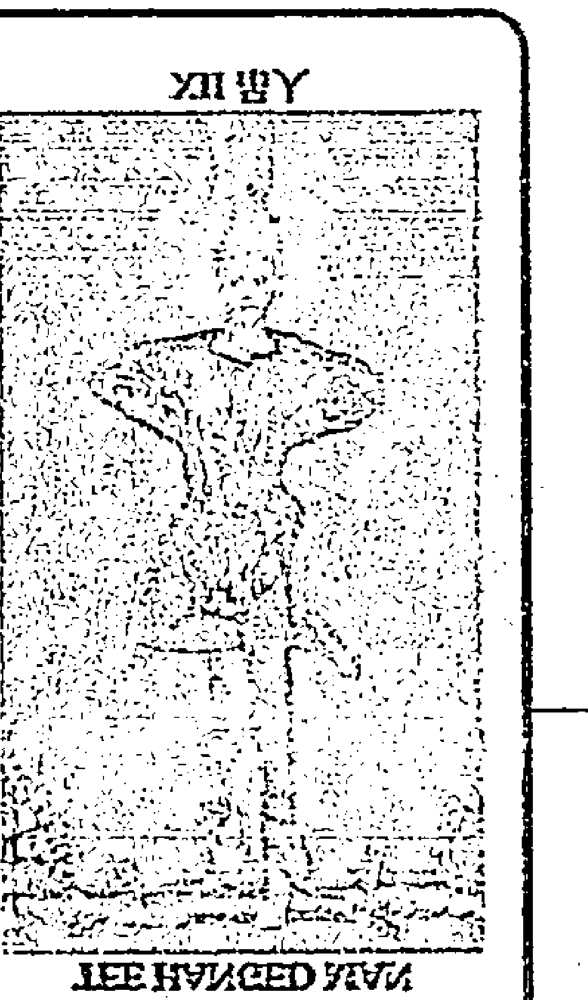

## 吊人逆位

- **心灵与精神层面的提示**
放掉你的混乱和恐惧，在暂停的这一刻回到真实的自我当中，你会发现更多的平静和安详，在当中可以找回智慧。

### ※ 人物

- **当事人的个性**
属于比较随和的人，遇到问题也能逆来顺受，有很大的包容性，但是有时候会过于忍耐而造成自己不必要的损失。

- **当事人的工作观**
在工作上比较胆小怕事，不敢做重要的决定，也不愿意对事情负责，有时候也会因为粗心大意而犯下严重的错误。

- **当事人的感情观**
在感情上会主动付出，并且常常为了对方而牺牲自己，但是又会自己觉得有点委屈，在感情当中常无法达到平衡。

- **当事人的金钱观**
在处理金钱上考虑很多，但比较倾向于自私的想法，遇到财务出状况的时候，可能会牺牲别人的利益来成就自己。

- **与当事人的应对方法**
平时感觉很好相处，但是要注意他情绪化的突然反应，只要平时保持良好的关系，到关键时刻他也会主动帮助你。

- **人物代表**
逆来顺受的人、牺牲者、殉教者、身心障碍者、潜水员。

### ※ 工作

- **工作本身的状况**
工作上有事情悬而未决，也许会需要你的付出和牺牲，如果不能妥善处理的话，可能会演变成无法收拾的大事情。

- **如何解决工作的困境**
也许你需要为这件事情做一些必要的让步和牺牲，以顾全更大的集体利益，但是也要仔细地评估其中的利弊得失。

- **工作中的人际关系**
基本上每个人都是自私的，所以在不涉及利益的时候大家都是好朋友，但是若涉及实际利益时就会斗得你死我活。

- **与上司相处的方法**
现在你的上司没什么空可以理你，你还是要自立自强比较重要，平时就保持一般的关系就好，没必要特别讨好他。

- **工作的发展性**
这个工作未来的发展性并不好，但是保持平稳倒是没什么问题，所以若是想要有所表现，可能就必须要换工作了。

- **找工作/换工作的状况**
现在并没有任何新工作会出现，所以还是在目前的位置待着就好，即使再努力想要换工作，到最后也是白费心机。

### ※ 爱情

- **感情本身的状况**
感情上正面临重大的挑战，如果不能有正确的认识和行动，可能会使感情陷入破裂的危机之中，反而会更痛苦。

#### □ 新恋情的可能性

现在不会有新的恋爱对象出现，所以自己不用想太多，倒不如在这个时候好好休息，对你来说反而更轻松愉快。

#### □ 对这段感情的看法

觉得为了这段感情牺牲了很多，应该在这个基础上更进一步地努力，就算没有回报也表示自己在这当中已经尽力了。

#### □ 性的吸引力

其实你在性关系上很吸引对方，只是对方不知该如何响应和表达，如果两个人就卡在这里，就浪费了一段好姻缘。

#### □ 如何化解争吵

在这件事情上你必须要先道歉，甚至是做出某些重大让步，否则对方若是不和你善了，这件事情可能就变成无解。

#### □ 分手的方法

除非远走他乡避不见面，否则无论如何是无法成功分手的，与其花那么大的力气没有成果，还不如先等一等再说。

#### □ 复合的可能性

这段感情的结束对你来说其实是一种解脱，实在没必要再回头去想那个人，你应该往未来去看，而不是被这个人卡住。

### ※ 友情

#### □ 人际关系状况

你是比较容易被别人欺负或者是被占便宜的人，虽然朋友们都会想要对你有所要求，但是你仍然要有自己的原则。

#### □ 如何化解与朋友的误会

如果两个人的状况卡住，那还不如把问题诉诸于其他的朋友，让大家来为你们评评理，也可以善用同侪间的压力。

### ※ 亲情

#### □ 家庭的状况

遇到家中面对到困局，如果不向外求援的话根本无法解决问题，所以这时候应该不要再管面子问题了，直接去找人帮忙。

#### □ 与长辈的关系

你是长辈眼中的头疼人物，因为不论他们怎么说，你都不会听他们的劝告，而且即使遇到问题也不要他们帮忙你。

#### □ 与平辈的关系

在平辈当中大家都是各过各的，彼此之间没什么感情，也没有办法合作做任何事情，遇到重要事情大家再联络一下。

#### □ 与晚辈的关系

你对晚辈有很深的感情，但是他们也许并不是太爱理你，你可以帮助他们很多地方，其实教育他们也是你的职责。

### ※ 学业

#### □ 学业本身的状况

现在卡在一个不利的位置，因此无法随心所欲地做自己想做的事情，除非你愿意用其他的条件来换取更多的自由。

#### □ 学习的方法

休息是为了走更长远的路，这个时候一直拼下去也不一定会有结果，先让自己好好放松一下，再开始表现会更好。

#### □ 与老师相处的关系

不要被老师注意到是最佳的策略，所以一切保持平凡、不好不坏，然后专心做自己的事情，其他的事都不要去管。

#### □ 与同学相处的关系

在同学当中你是很受欢迎的一个人，不过这也是因为你为大家都付出了很多，但不应该为了人际关系而忽略了课业。

### ※ 财务

#### □ 目前的财务状况

目前的财务状况并不是你可以完全控制的，而且当中还有很多的限制和危机，这个时候应该要有壮士断腕的决心。

#### □ 投资的状况

这个时候的投资需要格外谨慎，因为一个不小心可能就会满盘皆输，如果没有必要的话尽量不要从事新的投资。

#### □ 采购的策略

现在其实并不宜进行采购，不得已的话应该要采用最保守的策略，以最少的金钱买最少量的东西，不要操之过急。

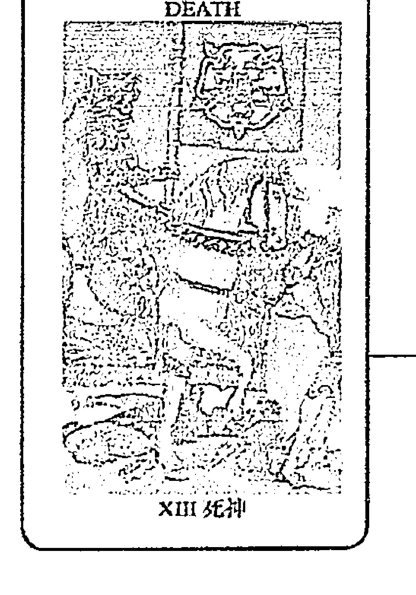

## 死神正位

### 心灵与精神层面的提示

你很想要除旧布新，从先前痛苦的状况中解脱出来，关键在于你只有把过去彻底放掉，才有可能开创全新的未来。

### 人物

- **当事人的个性**
曾经经历过重大的变故，已经能很平静地面对各种状况，外表看起来十分冷酷，其实是以坚强的意志力在控制情绪。

- **当事人的工作观**
对于事情有自己主观的看法，而且会以各种方法贯彻完成自己的想法，不论谁用任何方法，都无法改变他的决定。

- **当事人的感情观**
在感情上经历过分分合合，已经不抱持任何的期望，也不相信自己会得到幸福，常常会以行为或言语去试探对方。

- **当事人的金钱观**
对于投资和理财都很有天分，即使赚的钱不多仍然可以把金钱的功能发挥到极致，处理金钱上有与众不同的看法。

- **与当事人的应对方法**
无法与别人分享自己的心情，也很重视自己的隐私，只要不涉及到私人的事都可以谈，但千万别想刺探他的生活。

- **人物代表**
刽子手、屠夫、税务人员、军警人员、征信业者、医生。

### 工作

- **工作本身的状况**
工作上遇到重大的转变，而且你没得选择就必须要接受，甚至面临到被迫离职的状况，这个时候要做最坏的打算。

- **如何解决工作的困境**
除了放下之外你别无所选择，与其坚持原来的方法和原则，不如试着把自己放空，可以自由地选择各种不同的方案。

- **工作中的人际关系**
这个工作当中并没有太多的人际互动，每个人都专注于自己的事情，大家的兴趣和性格也都不同，没有必要深交。

- **与上司相处的方法**
一个高深莫测的上司，无论如何你都不能猜透他的想法，所以最好还是听了命令乖乖去办事，这才是最安全的方法。

- **工作的发展性**
这个工作其实与你的缘分已尽，再拖下去也没什么意思，如果不能转换工作内容或是职位，还是快点准备离职吧。

- **找工作/换工作的状况**
现在很可能找到新工作，但是你可能要下定决心转变才行，因为新工作很可能出现在你完全陌生的职业或地方。

### 爱情

- **感情本身的状况**
现在该是要放手的时候了，如果不能放掉不适合的人，怎么会有可能找到自己的幸福呢？应该放开心胸接受改变。

#### □ 新恋情的可能性
现在并没有新恋情出现的机会，除非你把旧情人完全放下，如果在中间还是纠缠不清，就一定会维持单身的状况。

#### □ 对这段感情的看法
现在的感情必须要做重大的改变，否则就很难维持下去，或许结束也是其中的一个选择，但是现在还没有做最后决定。

#### □ 性的吸引力
这段关系当中有极强的吸引力，彼此也无法放下性与爱的需求，可能因为性关系而把两个人的感情带入新的阶段。

#### □ 如何化解争吵
这个时候两个人需要一些空间，让彼此先冷静下来，如果急着逼迫对方做决定，那么可能会让冲突一发不可收拾。

#### □ 分手的方法
只要任何一方提出分手，这段关系应该就结束了，因为两个人的关系已经无法维持下去，还是分开会比较好一点。

#### □ 复合的可能性
这段关系已经完全不可能复合，两个人也许会从此不再见面，而且也不会再有任何关系，还是早点死了这条心吧！

### ※ 友情

#### □ 人际关系状况
在人际关系上你属于比较孤立的一个人，也许会让人家觉得你有点自傲，你的敌我意识很强，不是朋友就是敌人。

#### □ 如何化解与朋友的误会
其实问题已经这么严重了，这个误会也很难立刻化解，也许要考虑这段友谊的意义，也许到了应该要放弃的时候。

### ※ 亲情

#### □ 家庭的状况
家中可能有亲人去世，但是面对到重大的变故，这个时候应该要先稳定心情，把必须做的事情一步一步确实完成。

#### □ 与长辈的关系
你与家中的长辈并不亲近，甚至已经没有任何往来，一直以来你都是比较独立处理事情，也不会想去要依靠他们。

#### □ 与平辈的关系
在平辈当中你是比较内向的一个人，几乎不与大家有任何往来，你总是能把自己的事情搞定，也不会去帮助别人。

#### □ 与晚辈的关系
你与晚辈聚少离多，没有太多时间和心力去照顾他们，也许因此使得你们的关系会有一点疏离，彼此之间感情比较淡。

### ※ 学业

#### □ 学业本身的状况
学习上面临一个重大的挫折，如果你不能改过自新重新振作努力，那么这个状况会更严重，到时就来不及补救了。

#### □ 学习的方法
之前你的学习方法全错，必须要完全从头来过，如果自己无法下定决心改变，也可以向师长们请教比较好的方法。

#### □ 与老师相处的关系
十分严格又赏罚分明的老师，完全不会留任何情面给同学，只有你的表现才决定了分数，其他一切求情都没有用。

#### □ 与同学相处的关系
与同学之间的交集越少越好，这是应该要自己一个人努力的时间，若是人际关系花去你太多时间反而对课业不利。

### ※ 财务

#### 目前的财务状况
现在是在财务上遇到重大变化的关键时期，如果处理不好可能会让你穷困潦倒，如果发现有错误的决定也应该及时放下。

#### 投资的状况
现在投资应该要通通结束，不要留下任何尾巴，否则后患无穷，即使别人对你再怎么花言巧语也绝对不可以相信。

#### 采购的策略
所有的一切从头来过，不要被你之前的经验和习惯所影响，如果不能理性地评估这个状况，也许就不应该去采购。

### 死亡对应表

- 时间
相对时间：十三小时、十三天、十三周、十三个月、十三年。标示时间：天蝎座（约每年10/24-11/22）。

- 地点
区域：急诊室、停尸间、殡仪馆、告别式、坟场、桥梁。方位：西南方。

- 物品
棺材、骷髅、退学通知、离职通知、白旗、丧服、黑衣。

- 身体部位
下腹部、生殖器官。

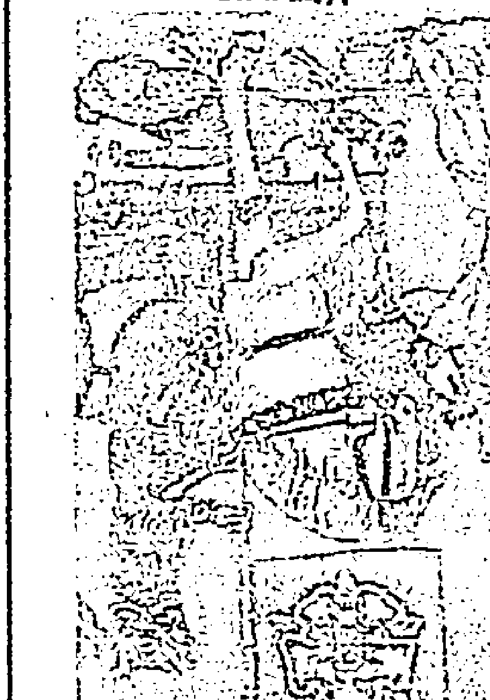

## 死神逆位

### 心灵与精神层面的提示
不要害怕改变，因为一件事情的结束往往也会是一个新的开始，只有勇敢面对转化过程的人才能得到进步和提升。

### ※ 人物

- **当事人的个性**
缺乏意志力的人，面对各种困难的状况常会觉得自己无能为力，即使事情发生到不可收拾的状况仍然不想做处理。

- **当事人的工作观**
在工作上有一点迟钝，处理事情总是慢半拍，给人一种不是很专心的感觉，对工作没有强烈的期待或长远的计划。

- **当事人的感情观**
还在失恋的情绪当中没有完全恢复过来，因此无法对另一个人诚心诚意地付出，对于感情仍然有一点害怕的感觉。

- **当事人的金钱观**
在处理金钱上并不拿手，是属于比较消极的人，有时候会莫名其妙地把钱花掉，事后检讨起来也不知道花到了哪里。

- **与当事人的应对方法**
这种人常常有一点晃神，交待事情给他一定要再三叮嘱，并且在事后要去盯进度，但是他对于交朋友方面并不积极。

- **人物代表**
死者家属、孤儿、殡葬业者、绝症患者、离家的年轻人。

### ※ 工作

- **工作本身的状况**
可能面对被迫离职或是工作上极大的变化，这个时候离开对你来说反而是一种解脱，既然这么辛苦就不要再撑了。

- **如何解决工作的困境**
这个时候你应该选择收尾或是结束，投入更多的人力物力也是无法解决问题，很多时候问题应该置之死地而后生。

- **工作中的人际关系**
大家同在一条船上但是互相没有合作，各自为政的结果反而是被各个击破，如果大家都信奉本位主义就很难合作。

- **与上司相处的方法**
本身很消极的上司，大部分的事情只能靠你自己，不要太去烦他有关工作的事情，最后他还是会叫你自己想办法。

- **工作的发展性**
这个工作当中最坏的状况你现在已经经历到了，伤害也已经造成，离开对你是比较好的选择，留下来状况就是这么坏。

- **找工作/换工作的状况**
现在还不是找新工作的好时机，也许你应该要先等到你的状况恢复之后再找工作，才会有适合你未来发展的工作。

### ※ 爱情

- **感情本身的状况**
也许你自己还不是很清楚，但是两个人真的是不适合，继续下去只会对你造成更多伤害，应该当机立断做出改变。

#### □ 新恋情的可能性
即使现在已经有新的对象出现，你自己也无法发现，你必须把自己彻底地改造，才有能力判断出谁是适合你的新对象。

#### □ 对这段感情的看法
这段感情当中仍然有很多问题没有解决，但是大部分并不在于你，要看对方如何响应，才知道到底能不能解决。

#### □ 性的吸引力
这段关系当中没有很强的性吸引力，或者是双方对于性爱都是一知半解，因此性关系不会成为感情中的重要部分。

#### □ 如何化解争吵
有些事情就是要装傻，表现得太聪明反而会让彼此的关系卡住，只要你能放下这件事情，争吵自然就会完全化解。

#### □ 分手的方法
这个时候主动提出分手的一方会伤得比较重，所以还是由对方来提出分手比较适合，你还是被动消极一点比较好。

#### □ 复合的可能性
这段感情已经转化成另一种关系，再也不可能回到感情关系当中，即使双方可以成为朋友，还是无法再成为情人。

### ※ 友情

#### □ 人际关系状况
其实你并不太努力经营人际关系，如果有好朋友也就是那几个，大部分的人都跟你生疏，也不知道你发生了什么事。

#### □ 如何化解与朋友的误会
有些时候努力处理不如就把它放着，也许过一阵子问题就会自然地转变，这个时候再去强求什么也不一定有意义。

### ※ 亲情

#### □ 家庭的状况
家中遭遇到无法避免的变局，大家应该发挥向心力合作共渡难关，如果只是想要维持现状必然会遇到更大的失败。

#### □ 与长辈的关系
在长辈的眼中你是很特立独行的人，即使你努力说明他们仍然无法了解你，不过他们也会给你足够的空间去发挥。

#### □ 与平辈的关系
你在平辈当中没有太特殊的表现，常常会被大家所忽略，你并不喜欢与大家的社交活动，反而会去做自己的事情。

#### □ 与晚辈的关系
你不太会管晚辈的事情，大部分时间都是让他们自由发展，但是若他们遇到什么问题，你也会尽力帮助他们处理。

### ※ 学业

#### □ 学业本身的状况
学习陷入停滞的状况，其实你也搞不太清楚现在的状况进行到哪里，所以最好能找一个比较清醒的同学来解救你。

#### □ 学习的方法
现在学习上的负担已经超过你的能力，如果不能适时放弃一些东西，想要把所有的东西全包揽下来，反而通通都学不好。

#### □ 与老师相处的关系
与你本身并不太对盘的老师，最好是敬而远之，尽量减少互动的机会，当他越了解你之后，反而会越看你不顺眼。

#### □ 与同学相处的关系
你与同学常常会有一些争吵，但是并不会造成多大的伤害，也许会遇到有同学转学离开，或是有新的同学转学来。

### ※ 财务

- **目前的财务状况**
你现在的财务状况很糟，应该要请教专家重新整理一下，如果紧抓住现在的状况不放，最后可能会变得一无所有。

- **投资的状况**
现在应该要把所有的投资结束，等到适当的时机再重新开始，如果有合伙的状况更要快点退出，否则就会血本无归。

- **采购的策略**
应该重新评估你的采购计划，不要糊里糊涂就把东西买下来，也许你事后检查会发现这些东西根本一点用都没有。

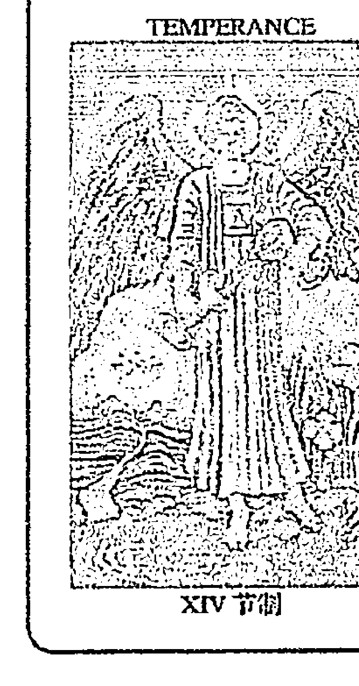

## 节制正位

### 心灵与精神层面的提示
你想要朝向更高的目标前进，在这里就要放掉不必要的包袱，才能帮助你提升到更高的层次找到奥秘的神圣智慧。

你需要用更有效率的方法去管理和调控，若是能够节省更多的成本和资源，在减少花费方面也算是另一种的获利。

### ※ 人物

- **当事人的个性**
有良好的生活习惯同时对人温和有礼，可以容纳不同的意见整合成自己的看法，并且能严守不偏不倚的中庸之道。

- **当事人的工作观**
乐于与别人合作，并且有良好的统合能力，通常会使用温和的手段来完成任务，也很稳定地朝向自己的目标前进。

- **当事人的感情观**
对感情的态度会偏向保守，也是比较专情而不花心的类型，很重视两个人之间的沟通，并且能够接纳对方的意见。

- **当事人的金钱观**
在金钱上偏向节省，但是该花的钱也不会省，在投资理财上很有天分，也会把自己的资金做最有效率的配置。

- **与当事人的应对方法**
是一个相处起来很舒服的人，但是最好不要在他的面前表现出奢侈浪费的样子，也不要约在消费太高的地方见面。

- **人物代表**
化学家、芳疗师、调酒师、药剂师、调解委员、和事佬。

### ※ 工作

- **工作本身的状况**

- **如何解决工作的困境**
手段上需要更缓和一点，不要强迫别人接受你的想法，而是要加强沟通来达到共识，最后再由大家一起合作完成。

- **工作中的人际关系**
在工作当中有需要与别人相互合作的地方，这个时候就要发挥你的统合能力，让大家的意见整合在一起得到共识。

- **与上司相处的方法**
可以尽量提出你的意见，因为他也喜欢和你讨论事情的感觉，如果能从当中激发出更多的灵感，他就会更重用你。

- **工作的发展性**
这个工作的未来还有不错的发展性，也与你长远的目标相符合，所以应该在这个工作当中多尽一份心力好好表现。

- **找工作/换工作的状况**
现在可以自己找到新工作，但是由朋友介绍的可能性也很高，只是在变换工作的过程中要比较低调，尽量减少伤害性。

### ※ 爱情

- **感情本身的状况**
两个人之间的关系已经很紧密了，彼此的沟通也很好，该到了可以开始讨论下一步的时候，## 节制逆位

心灵与精神层面的提示
彼此合作比相互竞争更有力量，但是要在之前评估自己的状况，一步一步地朝向目标前进，才能得到最后的成功。

### ※ 人物

□ 当事人的个性
容易受到别人的影响而失去自己立场，遇到无法解决的问题时容易有情绪化的反应，或者会以主观的直觉作判断。

□ 当事人的工作观
在工作上很难与人合作，大多会以破裂收场，对于事情的看法过于乐观，以至于实际执行时常常会遇到意外的困难。

□ 当事人的感情观
在感情上不切实际，会为了爱而付出一切，但是也常常遇到不合适的人，当感情当中出现状况时常常会逃避问题。

□ 当事人的金钱观
有时候会过于节省，但是有时候又过于浪费，对于自己的资产常常没有务实的规划，甚至搞不清楚自己有多少钱。

□ 与当事人的应对方法
一个不太有主见的人，但是千万不要试图去影响他，若是出错他可能就会怪罪于你，也最好不要与他合作。

□ 人物代表
月光族、卡爆族、新进人员、转学生、混血儿、新移民。

### ※ 工作

□ 工作本身的状况
你的工作当中涉及到不同方面的利益冲突，你在当中比较像是夹心饼干，不论偏向哪一边都会带来一些新的问题。

□ 如何解决工作的困境
把自己的部分确实完成就好，不要去管别人负责的事情，必要的时候还要与对方划清界线，以免被对方所拖累。

□ 工作中的人际关系
工作当中有很复杂的人际互动，与大家的关系都很重要，虽然你是大家争取的对象，但仍然要小心背后被捅一刀。

□ 与上司相处的方法
属于比较保守的上司，所以可以适度地提出建言，不过也不要有太亲近的关系，以免因为人情反而衍生出更多问题。

□ 工作的发展性
这个工作未来的发展性平平，大概不会有太大的变化，但是要小心人际关系的发展，也许会有不同的派系斗争。

□ 找工作/换工作的状况
现在找工作的状况不是很顺，或者也可以去尝试新的领域，把自己之前所学的东西，以另一种方式重新表现出来。

### ※ 爱情

□ 感情本身的状况
感情上现在面对沟通不良的状况，很多事情无法了解彼此的想法，也开始有一些争执，也有很多事情还没想清楚。

**新恋情的可能性**
现在并没有新恋情发生的可能性，反而是你应该好好反省的时刻，也要重新思考自己对于感情的需求到底是什么。

**对这段感情的看法**
也许因为这段感情在还没想清楚的状况下就开始了，所以现在出现一些严重的问题，正在考虑是不是要继续下去。

**性的吸引力**
两个人之间有性吸引力，这也是两个人会在一起的重要原因，不过因为属于情绪性的结合，也可能带来一些问题。

**如何化解争吵**
这个时候应该将处理事情的速度放慢，有耐性地和对方讨论下去，把对方从情绪化的状况中拉出来才能解决问题。

**分手的方法**
只要有任何一方提出分手，两个人的关系就算是结束了，最好是利用电话或是信件提出，不要面对面谈这件事情。

**复合的可能性**
这段关系并不太可能复合，感情已经完全破裂了，离开这个人对你来说是一个正确的决定，没有必要再为难自己。

### ※ 友情

**人际关系状况**
你常觉得无法与别人合作，也很难融入人群之中，也许是因为对环境还不习惯的关系，你与别人都保持一些距离。

**如何化解与朋友的误会**
先放下你的情绪，自己反省一下到底自己是哪里不对了，等想清楚之后再和对方沟通，记得要保持理性才能成功。

### ※ 亲情

**家庭的状况**
现在家中面对分裂的危机，因为大家对一件事情有不同的看法而造成了彼此间紧张的气氛，一时之间也无法化解。

**与长辈的关系**
你很喜欢和长辈聊天，或者是听他们讨论事情，但是他们并不是很喜欢你这样做，有时候也会因为聊天而起冲突。

**与平辈的关系**
在平辈之间大家最好各自做各自的事情，如果有合作的事情就常会发生一些争执，最好是不要有金钱方面的牵扯。

**与晚辈的关系**
你对晚辈的事情都很关心，也很热心教育他们，但是他们常会觉得你太爱管闲事，有一些事情也不太愿意和你讲。

### ※ 学业

**学业本身的状况**
现在学习对你特别重要，有很多东西要同时进行，如果太过强求的话，反而通通都学不好，所以应该要量力而行。

**学习的方法**
一方面需要抽象的思考，但同时也不能忽略了实践，除了念书之外需要很多时间练习和实习，才能学得又快又好。

**与老师相处的关系**
也许因为和老师不太对盘，所以常常会有沟通上误解的问题，如果第一时间无法了解的话，应该要提出疑问来确定。

**与同学相处的关系**
可能会因为与同学的人际关系而影响到你的学习情绪，其实交朋友是需要一些时间慢慢适应的，不要急着有结果。

### ※ 财务

#### □ 目前的财务状况
目前的财务结构并不健全，所以应该更务实地重新调整，切忌与别人合伙或把钱借别人，以免发生很大的纠纷。

#### □ 投资的状况
现在并不是很适合投资，如果有合伙的状况也应该尽快结束，要把所有的资产都计算清楚，等到适合的时候再出发。

#### □ 采购的策略
现在不是很适合进行采购，可以先把钱省下来。如果必须进行采购，也要很小心地计划和评估，否则很可能被骗。

## 魔鬼正位

□ 心灵与精神层面的提示
你现在过分重视物质层面，而忽略了精神与灵性的成长，因此可能会感到空虚和迷惘，也缺乏人生的方向和目标。

### ※ 人物

□ 当事人的个性
个性比较激烈，常会因为一时激动而犯错，遇到不顺利的状况可能会有暴力倾向，为了达成目的往往不择手段。

□ 当事人的工作观
在工作上渴望成功，不惜使用各种不正当的方法，很会陷害或是利用别人，如果自己得不到的别人也别想得到。

□ 当事人的感情观
对于感情并不信任，常常把感情当成手段而非目的，即使在恋爱关系当中也很难感受到爱，但是又不能缺乏感情。

□ 当事人的金钱观
非常重视金钱，也会愿意为了金钱而牺牲其他的事情，会努力把钱存下来，但是无法把自己的资金做适当的配置。

□ 与当事人的应对方法
对这种人最好敬而远之，如果得罪了他一定会让你吃不了兜着走，如果和这种人走得太近，反而会被利用或者陷害。

□ 人物代表
暴力犯、纵火犯、施行邪术的人、毒贩、自私自利的人。

### ※ 工作

□ 工作本身的状况
现在工作遇到了严重的破坏，大部分的状况都超出你的控制之外，事前无法防范，甚至可能为了这件事丢了工作。

□ 如何解决工作的困境
这件事情即使无法解决，也决不要用不正当的手段来处理，也许一时之间似乎得到好处，但会引来严重的副作用。

□ 工作中的人际关系
在这个工作当中每个人都在钩心斗角，大家即使一起工作也无法信任，要小心别被陷害了，也不要想交到好朋友。

□ 与上司相处的方法
一个自私自利的可怕上司，最多也只能在合法的范围内尽量满足他的要求，如果能够选择的话最好离开他的控制。

□ 工作的发展性
这个工作的未来一片黑暗，也不会有什么好的发展，应该及早离开这个地方，千万不要对这个地方抱持任何幻想。

□ 找工作/换工作的状况
现在正在你自己运势的低潮，找什么工作都只是从一个地狱逃到另一个地狱，能够休息的话就不要出来找工作了。

### ※ 爱情

□ 感情本身的状况
两个人的关系已经走到尽头，再撑下去也没有什么意义，还不如早一点分手，免得继续下去对大家都再造成伤害。

**新恋情的可能性**
现在并不存在任何新恋情出现的可能性，即使有人表示喜欢你，也必然是心怀不轨，别在这个时候去自找麻烦了。

**对这段感情的看法**
这段关系带来的痛苦多于快乐，有时候会想要控制对方，但是又觉得不能得到满足，有时候会转变成愤怒的情绪。

**性的吸引力**
这段关系当中只剩下性的吸引力，也是两个人发泄欲望和情绪的管道，但这种关系已经没办法让人感觉到温暖了。

**如何化解争吵**
问题已经不是两个人可以解决的了，这时候再勉强沟通也是吵得更凶而已，最好是不要见面，以免发生暴力事件。

**分手的方法**
其实两个人已经算是分开了，谈或不谈只是一个形式而已，所以找到好时机就把这件事谈一谈，总是该要解决的。

**复合的可能性**
这段关系完全没有复合的可能性，想再和他在一起只是自己找罪受而已，要赶快离开这个人才能让你看清楚真相。

### ※ 友情

**人际关系状况**
人际关系的状况并不好，别人都不想和你交往，如果你不改变自己的脾气及怪罪别人的习惯，这种状况会继续下去。

**如何化解与朋友的误会**
这个误会是因为双方都坚持己见而引起的，即使你主动道歉也不见得会被接受，所以可能会维持很长的一段时间。

### ※ 亲情

**家庭的状况**
可能是发生家庭暴力的状况，或是遇到很重大的威胁，家人彼此之间不能相互信任，也许大家都在逃避这个问题。

**与长辈的关系**
在长辈的眼中你是很不听话的小孩，你也不太喜欢长辈管理你的方法，双方常常会发生冲突，因此感情也不太好。

**与平辈的关系**
在平辈当中彼此都在算计对方，除了利益的交换之外彼此没有太多感情，遇到事情也必然是以自己的利益为优先。

**与晚辈的关系**
你常想利用晚辈帮你去做事情，或是把他们作为满足你欲望和虚荣心的工具，他们也会觉得自己总是被你所控制。

### ※ 学业

**学业本身的状况**
现在你的学习状况并不好，主要是因为你又想要偷懒走捷径，另一方面又想在各方面都表现得很好，这是不可能的。

**学习的方法**
你必须要按部就班慢慢来，一次解决一个问题，不要那么贪心，也许在一段时间之后，你的课业也会慢慢走上正轨。

**与老师相处的关系**
面对凶恶又不可理喻的老师，你很难脱离他的掌握，你只能把自己该做的事情好好完成，其他的就不要太在意。

**与同学相处的关系**
你与同学的感情并不是很好，一方面也是因为你的脾气不太好，因此让人觉得难以接近，在功课上他们也不会帮助你。

### ※ 财务

□ 目前的财务状况
现在的状况表面上看起来还好，其实当中藏有很多的问题，也不是短期内可以解决的，要很小心地应对处理。

□ 投资的状况
现在的投资如果有赚钱的应该快点把它们通通换成现金，因为这只是表面上昙花一现的成功，不要再投入新的资金。

□ 采购的策略
这个时候要注意对方的诚信问题，千万不要被花言巧语所欺骗，如果不小心买到假货或赃货，反而会带来更多问题。

### 延伸应用

-   □ 时间
相对时间：十五小时、十五天、十五周、十五个月、十五年。
标示时间：摩羯座（约每年12/22-1/19）。

-   □ 地点
区域：赌场、酒店、狂欢派对、电玩游乐场、声色场所。
方位：西方的下方。

-   □ 物品
毒品、迷幻药、符咒、色情暴力书刊、盗版光盘、伪钞。

-   □ 身体部位
膝盖。

## 魔鬼逆位

□ 心灵与精神层面的提示
只有物质的享受无法填满你内心的空虚，只有超越物质的诱惑才能得到真实的洞见，找到自我内在的疗愈和力量。

### ※ 人物

□ 当事人的个性
意志不坚定的人，容易受到其他人、事、物的诱惑而改变了自己的想法，甚至也可能执迷于酒、色或是毒品当中。
你被利欲熏心，而忽略了正当的手段和道德的界线，即使在短期能有一些利益，长期看来反而会造成不利的影响。

□ 当事人的工作观
重视自己的利益大于一切，为了赚钱或升迁不计毁誉，结党营私的可能性很高，有时候做了决定又不愿意负责任。

□ 如何解决工作的困境
你必须拒绝不正当的诱惑，才不会把自己的后路卡死，一切都依照正常程序处理，就能在关键时刻保护你的安全。

□ 当事人的感情观
容易受到外貌或是对方的家世财产所吸引，但是并不是真正地喜欢对方，遇到更有钱的对象可能就会见异思迁。

□ 工作中的人际关系
工作当中结成各种不同的利益联盟，派系之间的斗争也很激烈，这个时候即使想保持中立，也会被卷入斗争当中。

□ 当事人的金钱观
重视金钱之外更重视物质生活的享受，会花很多钱去买各种的名牌精品，甚至不惜为了赚钱去做违法犯纪的事情。

□ 与上司相处的方法
现在被这个上司完全控制住，因为不可能脱离他的控制，就只好乖乖地服从他的命令，最好不要有与他不同的意见。

□ 与当事人的应对方法
这种人容易受到利益的诱惑，更容易因为自己的利益出卖其他人，所以最好不要太信任他，平时就应该做好防备。

□ 工作的发展性
这个工作是金玉其外败絮其中，即使看起来再光鲜亮丽，也绝对不会有什么好的发展，最好能快点离开这个地方。

□ 人物代表
迷信的人、嫖客、妓女或牛郎、上瘾者、赌客、黑社会。

□ 找工作/换工作的状况
千万不要因为被钱逼急了就随便找一个工作，如果没有好的工作机会就应该再等等，小心不要被就业陷阱所骗了。

### ※ 工作

□ 工作本身的状况
两个人之间有太多的错综复杂的情感纠葛，也历经了欺骗和激烈的争吵，也许两个人是为了利益结合而没有感情。

### ※ 爱情

□ 感情本身的状况

**新恋情的可能性**
现在会出现感情的诱惑，但是并不是会真心与你相爱的人，或许他会想要利用你或控制你，所以应该要小心提防。

**对这段感情的看法**
这段关系带来很多的束缚和限制，为了对方而失去自我，想要逃开又没办法放得下，因此会变成一段痛苦的关系。

**性的吸引力**
这段关系当中有很强的性吸引力，也是两个人仍然在一起的主因，但是性的吸引力反而让两个人觉得是一种束缚。

**如何化解争吵**
两个人都无法看清真相，再谈也是没有用的，应该回到两个人相爱的原点，重新去考虑两个人的关系到底是什么。

**分手的方法**
现在要分手也无法立刻达成目的，也许应该要先冷静一阵子，等两个人的情绪都过去之后，再找机会谈这件事情。

**复合的可能性**
如果两个人只想互相控制而没有真心，即使复合也不会幸福，看清两个人真正的关系，你就不会每天想要复合了。

### ※ 友情

**人际关系状况**
你常常会想控制别人，但是你越是如此别人就越会躲你，想办法放开自己的心胸，自由自在的交往友情才会长久。

**如何化解与朋友的误会**
有时候误会是由其他的人所造成的，如果能够找到这个关键性的第三方，也许就可以解开这个长久以来的老问题。

### ※ 亲情

**家庭的状况**
家人之间为了钱而发生不愉快的状况，甚至因此而陷入严重的纠纷当中，如果还是这么重视利益，亲情就无法维持。

**与长辈的关系**
长辈非常想要控制你，但是你随时都想要脱离他们的控制，如果只是看到冲突面，那么关系就会陷入无解的僵局。

**与平辈的关系**
基本上平辈之间有一些利益上的结合，但是也会因此想要彼此控制，当发生利益冲突的时候就很容易翻脸不认人。

**与晚辈的关系**
你常常会想要满足晚辈的各种需求，但是他们似乎常常得寸进尺让你疲于应付，因此也会花费很多的时间和金钱。

### ※ 学业

**学业本身的状况**
你现在被学习以外的事情所迷住，以至于没有花太多心力在学习上，你应该专心念书，不要每天想着玩乐或恋爱。

**学习的方法**
很多东西是没办法勉强的，遇到无解的问题就先放着，把自己能做的事情先做好，等到完成了之后再回头来解决。

**与老师相处的关系**
不应该对这个老师有过度的想象或期待，如果不好好表现就一定会受到处罚，千万不要想去挑战老师忍耐的极限。

**与同学相处的关系**
很多只会带着你玩乐的损友，与他们交往反而会对你的成绩有不利的影响，应该离开他们以免被他们把成绩拖垮。

### ※ 财务

- **目前的财务状况**
  现在的状况面临到很大的危机，一个不小心就会让你一无所有，记得要用正当的手段才能彻底解决你的问题。

- **投资的状况**
  你被美丽的说辞所骗，自己陷入了投资的陷阱当中，越快脱离就越能减少你的损失，如果晚了可能会血本无归。

- **采购的策略**
  这个时候并不宜进行采购，以免因为一时冲动买了你不需要的东西，更要注意衡量自己的财务状况以免超支太多。

## 高塔正位

> 心灵与精神层面的提示
你执着于错误想法，反而会离真正的理想和智慧越来越远，若没人当头棒喝点醒你，恐怕就会走向错误的不归路。

### ※ 人物

- □ 当事人的个性
  自视甚高的人，也会为了面子而坚持自己的做法，即使明知道自己是错误的仍然不愿意改过，因此常常遇到困难。

- □ 当事人的工作观
  在工作上不知应变，往往以过时的方法来处理事情，遇到危机的时候常会有不理性的情绪反应，也因此很难成功。

- □ 当事人的感情观
  在感情上总认为只有自己才是对的，因此会忽略对方的观点和做法，遇到困难时常以分手来威胁但又不解决问题。

- □ 当事人的金钱观
  无法适当地处理自己的金钱，因此常会让自己陷入穷困的境界，有时候不预期的临时支出反而会占到很重的比例。

- □ 与当事人的应对方法
  最好不要与这种人深交，可以用激将法让他去做某些事情，但是若事情并不顺利，也要小心他会有情绪性的反弹。

- □ 人物代表
  破产的人、被囚禁的人、不悔改的人、佞臣、自大的人。

  工作上遇到了突发的重大意外，这并不是你可以控制的状况，但是又要由你来负责任，让你觉得很无辜又很倒霉。

- □ 如何解决工作的困境
  没有非常的破坏就没有非常的建设，要做好一切从头来过的准备，如果不能解决问题就选择放弃，不用再坚持了。

- □ 工作中的人际关系
  这些人只能共享乐而不能共患难，状况好的时候可以当酒肉朋友，遇到问题的时候绝不可能帮你，还是要靠自己。

- □ 与上司相处的方法
  一个喜怒无常的上司，你无法知道他到底在想什么，甚至完全照他的要求去做还会被盯，最好保持距离以策安全。

- □ 工作的发展性
  这个工作未来没有任何好的发展，只可能有更悲惨的状况在等着你，如果可以选择的话就应该快点离开这个地方。

- □ 找工作 / 换工作的状况
  现在找工作只是自找麻烦而已，并不能解决任何问题，如果不愿意在这个时候休息，就会找到有很多麻烦的工作。

### ※ 工作

- □ 工作本身的状况

### ※ 爱情

- □ 感情本身的状况
  感情上遇到重大的挫折，但这并不是你们可以控制的，也许会面临重大的反对压力，使得这段感情无法继续下去。

- □ 新恋情的可能性
  这时候不会出现任何新的感情对象，别再执迷不悟了，还是把自己该做的事情好好完成，感情的事情就不用想了。

- □ 对这段感情的看法
  这是一段没有希望的感情，即使两个人真心想要在一起也注定要分开，现在付出越多只是在未来分开时更痛苦。

- □ 性的吸引力
  这段关系当中并不存在性吸引力，甚至可能有一方或双方有性功能障碍，不良的性生活也会成为这段关系的阻碍。

- □ 如何化解争吵
  现在任何争吵都可能造成毁灭性的后果，想要挽回这段关系变得十分困难，也许分开一阵是两个人唯一的选择。

- □ 分手的方法
  只要任何一方不再坚持，这段关系就已经算是结束了，再撑下去也没有任何意义，所以只要写个信告诉他就好了。

- □ 复合的可能性
  分手已经是这段关系注定的结果，任何想要复合的努力都只是白费力气而已，两个人的感情是不可能继续下去的。

### ※ 友情

- □ 人际关系状况
  你在人际关系上遇到重大的困难，这都是因为你坚持错误的做法导致受到大家的排斥，应该快点调整自己的做法。

- □ 如何化解与朋友的误会
  这段友谊很可能会到此为止，也不是你做什么可以挽回的，既然这个误会无法解决，那么就只好去寻找新的朋友。

### ※ 亲情

- □ 家庭的状况
  家中遇到了很大的意外变故，这个时候应该要先稳定人心，从悲伤或害怕的情绪当中走出来，才有可能解决问题。

- □ 与长辈的关系
  长辈对你有很多的不满，甚至可能常会对你打骂，你对这样的状况时常做出反击，双方的关系也因此而剑拔弩张。

- □ 与平辈的关系
  平辈们彼此之间有很多的不满和冲突，彼此之间也很难有交流或是合作，每个人都只是站在自己的立场来看事情。

- □ 与晚辈的关系
  你对晚辈有很多的不满，也会以各种强制的手段去控制他们，若是他们不受你的控制，你反而会因此而大发雷霆。

### ※ 学业

- □ 学业本身的状况
  你现在的学习状况奇差无比，几乎没有任何科目是及格的，如果继续保持这样的表现，很可能就会被退学或留级。

- □ 学习的方法
  你必须要先承认自己的失败，才能从失败当中重新站起来，才会舍弃自己原先无效的方法，去学习别人更有效的方法。

- □ 与老师相处的关系
  遇到以处罚为主要手段的老师，只能尽量做到不要犯错，如果自己做不好的话，即使真的被处罚也无话可说。

- □ 与同学相处的关系
  同学之间大多状况都是吵吵闹闹，虽然不太会影响你的心情，但是对你的学习也没什么帮助，一切还是要靠自己。

### ※ 财务

- 目前的财务状况
  你现在处于破产的状况或是面临破产的危机，已经没有能力解决自己财务上的困境，必要时应该向专家请教。

- 投资的状况
  现在进行投资必然血本无归，甚至会让你赔到倾家荡产，如何当机立断减少损失，就要看你自己的判断和决心了。

- 采购的策略
  这个时候采购必然面对很大的问题，所以最好是不要在这个时候进行任何采购，否则很可能会花钱当冤大头。

### 延伸应用

- 时间
  - 相对时间：十六小时、十六天、十六周、十六个月、十六年。
  - 标示时间：星期二、火星时。

- 地点
  - 区域：高楼、灾难现场、电线杆、建筑工地、废墟遗迹。
  - 方位：北方。

- 物品
  - 电击棒、毁灭性武器、逃生救难用品、消防栓、避雷针。

- 身体部位
  - 肌肉系统、男性生殖器。

## 高塔逆位

### 心灵与精神层面的提示

害怕会使你停滞不前，也无法看清楚事情的真相，唯有皈依臣服于更大的智慧中，才能启发你潜在的智慧和勇气。

### ※ 人物

有可能是突然被解雇，或是因为莫名其妙的原因被处罚。与其每天过着提心吊胆的日子，还不如快点把工作辞了。

- 当事人的个性
  比较胆小害怕的人，常常觉得自己过着悲惨、痛苦的日子，也会因此而自怨自艾，还不时地会有杞人忧天的担心。

- 当事人的工作观
  害怕在工作当中负责任，因此也不敢下任何决定，遇到事情就会躲得远远的，也很难与别人合作去处理一件事情。

- 当事人的感情观
  可能曾经在感情上受过严重的伤害，老是觉得自己不够好，也很会自我批判，当发生争吵时总会觉得配不上对方。

- 当事人的金钱观
  常常感觉到有财务上的压力，但是即使有赚钱的机会也无法把握，会认为自己一定不可能有钱，因而放过好机会。

- 与当事人的应对方法
  有时候会因为极度的自卑而表现出自大的样子，但是又没有勇气去面对问题，所以最好不要替他决定任何事情。

- 人物代表
  慌乱的人、失败者、难民、消防人员、救难人员、伞兵。

- 如何解决工作的困境
  首先要克服自己的心理障碍，如果自己都觉得不可能做到，那事情怎么可能解决？就勇敢地照原定的计划去做吧！

- 工作中的人际关系
  工作当中缺乏人际互动，但是又彼此处于勾心斗角的状况，一切都要靠自己的努力，同时也要小心被同事们陷害。

- 与上司相处的方法
  非常自以为是的上司，觉得全世界只有他一个人是天才，其他的人都是笨蛋，遇到这种人最好不要提出反对意见。

- 工作的发展性
  这个工作已经到了最坏的状况，但是未来也没有什么改善的空间，如果无法忍受这种悲惨的生活，就快点离开吧。

- 找工作 / 换工作的状况
  现在找的工作并不好，不如趁这个时候多休息，把自己的身心状况调整好，等到自己恢复得差不多了再重新出发。

### ※ 工作

- 工作本身的状况

### ※ 爱情

- 感情本身的状况
  这段感情已经无法继续下去了，即使再怎么努力也无法使关系改善，应该快点选择离开这段令双方都痛苦的关系。

- 新恋情的可能性
  现在并不会出现好的感情对象，应该是先让自己走出感情的伤害再说，想要以一段新感情来疗伤是不可能的事。

- 对这段感情的看法
  这段感情带来许多的担心和痛苦，并且看不到未来的希望，如果能快速地结束这段感情，对两个人都是一种解脱。

- 性的吸引力
  这段关系当中性生活并不重要，两个人之间也没有太多性的吸引力，即使有性生活也不会对这段感情有任何影响。

- 如何化解争吵
  现在争吵已经流于意气之争，两个人只是争一口气，而没有是非对错的问题，因此只要有一方先低头就会有转机。

- 分手的方法
  这段关系本来就在危险边缘，只要提分手关系就会结束，但最好不要当面提出，以免对方因羞愤而发生暴力事件。

- 复合的可能性
  这段关系已经被彻底破坏，也不存在任何感情的基础，所以即使想复合也只是空想而已，彼此不可能继续在一起。

### 友情

- 人际关系状况
  你在人际关系方面过于保守，又无法适应环境调整自己的做法，以至于无法交到新的好朋友，而旧朋友又离你而去。

- 如何化解与朋友的误会
  这段友谊很难复原，最多只能减少对彼此的伤害性而已，最好是两个人能分开一阵子不要联络，可能会比较冷静。

### 亲情

- 家庭的状况
  家中遇到意外变故，大家都还在震惊和伤害当中，这时候应该要先把大家的情绪稳定下来，再来讨论如何解决。

- 与长辈的关系
  你对长辈的做法十分不满，也会当面顶撞他们，他们也会因此而对你有很多意见，双方的关系也会因此发生冲突。

- 与平辈的关系
  平辈其实是只能顾好自己的事情，也没有什么情感的交流，有时候也会因为你自己的固执而招致同辈们的不满。

- 与晚辈的关系
  你常觉得晚辈不了解你的心情和苦衷，不过又不愿意表现出你对他们的关心，有时反而会无法感觉到彼此的心意。

### 学业

- 学业本身的状况
  你现在的学习状况很差，很多科目几乎到了无法补救的地步，如果还不觉悟开始努力的话，就会留下不好的记录。

- 学习的方法
  你必须要先克服自己的恐惧，不要认为这个科目有那么可怕，从基础重新开始学习，虽然比较慢但是仍然会有救。

- 与老师相处的关系
  遇到脾气不好的老师，最好还是少招惹他为妙，千万不要因为顽皮而故意去挑衅他，你一定会受到最严厉的处罚。

- 与同学相处的关系
  你现在处于被同学们孤立的状况，也没有人可以帮忙你，因为一切只能靠自己的关系，也会让你学会更独立。

### ※ 财务

- 目前的财务状况
  你现在面临破产的危机，每一步的处理都要格外小心，甚至会有意外的状况来打击你，让你觉得自己真的很倒霉。

- 投资的状况
  现在并不适合进行任何种类的投资，可能因为一个意外事件就让你的心血化为乌有，合伙的事业面对拆伙的危机。

- 采购的策略
  这个时候并不适合进行采购，即使原本计划当中的采购也可能发生变故，不要执着于自己的想法，要有弹性应变。

## 星辰正位

### 心灵与精神层面的提示

你十分渴望得到上天的启示，但是你需要先将自己放空才能让上天的旨意进入你的生命，才能得到真正的平静和智慧。

### ※ 人物

- □ 当事人的个性
  对人生充满希望的人，能够信任他人并与他人分享自己的想法，十分爱好自由自在的生活，也带有高度的理想性。

- □ 当事人的工作观
  对于工作有自己的看法，也会设定属于自己的目标并努力去达成，很会利用人际关系来完成任务，是个值得信任的人。

- □ 当事人的感情观
  在感情上有理性面的考虑，但又不失感性面的表现，能够为对方无怨无悔地付出，非常渴望建立长久稳定的关系。

- □ 当事人的金钱观
  并不把自己的金钱放在第一位，反而会去想其他人是否过得好，很习惯地以金钱帮助朋友，甚至其他不认识的人。

- □ 与当事人的应对方法
  一个可以真心交往的朋友，谈到社会公义或世界大同的话题特别会引起他的兴趣，对他付出将会得到更大的回报。

- □ 人物代表
  占星学家、渔夫、水手、水电工、义工、参观的解说员。

  现在工作上有一个明确的目标，你应该要紧抓住与这个目标有关的所有机会，不要让其他的事情分散了你的心力。

- □ 如何解决工作的困境
  你应该尽量发挥你的创意，以最自由不受拘束的方式来思考，这样会想到最好的方法，问题自然就可以顺利地解决。

- □ 工作中的人际关系
  工作当中的同事都很好相处，即使没有业务的往来还是可以互相帮忙，只要你愿意付出，绝对能和他们成为朋友。

- □ 与上司相处的方法
  上司常常只会做原则上的提示，接下来就要你自己想办法了，只要你能顺利地完成任务，他并不会太干涉你的做法。

- □ 工作的发展性
  这个工作未来有不错的发展，但是先要认清你自己的想法和目标，有了明确的方向才不会走一些不必要的冤枉路。

- □ 找工作／换工作的状况
  只要你有一个明确的目标，其实工作就在不远的前方，你要对自己的能力有信心，这样才能更快地找到更好的工作。

### ※ 工作

- □ 工作本身的状况

### ※ 爱情

- □ 感情本身的状况
  感情上进入平稳的阶段，也开始在计划长远的未来，两个人的关系不只是情人也像是朋友，常常会彼此分享心情。

- □ 新恋情的可能性
  现在有可能会出现新恋情的机会，但是能不能把握就要看你自己有没有主动，只要你锁定目标努力一定会有成果。

- □ 对这段感情的看法
  这是一段令人充满期待的真感情，两个人对未来都有很多的理想和计划，也会希望能和对方一起去实现这些梦想。

- □ 性的吸引力
  这段关系当中并没有很强的性吸引力，但是会有不错的性生活，两个人会重视生活情趣，性生活只是其中一部分。

- □ 如何化解争吵
  其实只要把话说清楚了，没有什么事情是不能解决的，问题在于谁先开口而已，应该要提出自己的想法并和对方讨论。

- □ 分手的方法
  若要两个人完全不联络也不太可能，所以如果要提出分手，也必然是以恢复朋友关系为前题，这样谈才可能成功。

- □ 复合的可能性
  这段关系能不能复合，取决于之前是怎么谈分手的，如果之前是和平谈判分手的，现在要和平谈判复合就很容易。

### ※ 友情

- □ 人际关系状况
  你的朋友很多，彼此之间也能够互相帮助，不过有时候因为你的付出太过没有保留，反而会被朋友的问题所拖累。

- □ 如何化解与朋友的误会
  其实你与朋友的误会只是小问题，只要两个人找机会谈一谈就没事了，千万不要因为一时的赌气而使误会更严重。

### ※ 亲情

- □ 家庭的状况
  现在家庭当中的气氛十分平静，家人彼此之间的感情也很好，能够分享彼此的心情和想法，算是很和乐的一家人。

- □ 与长辈的关系
  家中的长辈可以说是你的偶像，有很值得你崇拜和学习的地方，你如果能和他们保持良好关系会对你有很大帮助。

- □ 与平辈的关系
  平辈彼此之间能够分享很多东西，如果有一个共同目标也可以相互合作，因为彼此充分信任也可以很坦诚地相处。

- □ 与晚辈的关系
  你对晚辈特别照顾，希望他们能得到所有最好的东西，不只是在有形的物质层面，在情感层面上也有很好的照顾。

### ※ 学业

- □ 学业本身的状况
  现在你学习的状况还算不错，但是仍然要持续努力才能达到自己的目标，千万不要因为一时的成功就自满而停滞不前。

- □ 学习的方法
  与同学相互讨论是比较有效率的学习方法，千万不要一个人闭门造车，也许在你付出的同时会从别人身上学到更多。

- □ 与老师相处的关系
  很会鼓舞学生的好老师，但是会采取比较放任的策略，也可以试着和老师成为好朋友，其实他是很平易近人的。

- □ 与同学相处的关系
  同学是你学习最大的动力，你应该要和同学保持良好的关系，并且在学习上与他们互动讨论，这对你会有很大帮助。

### ※ 财务

- 目前的财务状况
  你目前的财务状况还不错，不但自给有余还可以帮助别人。记得分享与拥有一样重要，有些时候施比受更为有福。

- 投资的状况
  现在投资的运势还不错，但比较适合做长期的投资，不要想在短期之内就有很多获利，还是要有耐心慢慢地等待回收。

- 采购的策略
  这是一个适合进行采购的时间，可以多打听听多比较，不要在第一时间就冲动决定，因为可能会买了不需要的东西。

### 延伸应用

- 时间
  - 相对时间：十七小时、十七天、十七周、十七个月、十七年。
  - 标示时间：水瓶座（约每年 1/20-2/18）

- 地点
  - 区域：天文台、水池边、鱼缸或鱼塘、网际网络、太空。
  - 方位：南方的上方。

- 物品
  - 花瓶、水壶、无线电话、八角星、八卦、鸟类、观赏鱼。

- 身体部位
  - 小腿、脚踝。

## 星辰逆位

### 心灵与精神层面的提示

直觉与灵感看似遥不可及，其实就在你每日的生活经验当中，能够渐渐接受不完美的自己，就能发现天启的真理。

### ※ 人物

- 当事人的个性
  属于天真浪漫的人，但有一些不切实际，以过度美化的角度来看事情，以至于无法发现事情的真相，也容易受骗。

- 当事人的工作观
  对于工作有高度的热忱，但是并不能够脚踏实地努力工作，所以有时会无法达成任务，在工作当中常常过于理想化。

- 当事人的感情观
  在感情方面愿意付出，同时也要求回报，在恋爱当中会全心投入，这时候感性会超越了理性，也变得比较情绪化。

- 当事人的金钱观
  对于金钱没有太多的想法，只要有得花就好，并不在乎是否会有更多积蓄，有时也搞不清楚自己到底有多少钱。

- 与当事人的应对方法
  对于他的高谈阔论的一些看法只要附和就好，不必把他的看法太认真看待，只要保持平衡的付出，会是很好相处的人。

- 人物代表
  青春美丽的人、理想主义者、空想的人、特异功能的人。

### ※ 工作

- 工作本身的状况
  工作上遇到目标不明确的状况，应该要谋定而后动，搞清楚上面的想法是什么，不要任意解读随自己的意思乱搞。

- 如何解决工作的困境
  这时候应该要开放心胸，努力去吸收大家的看法，汇总之后就可以得到最好的方法，更重要的是要脚踏实地去做。

- 工作中的人际关系
  在这个工作当中，同事之间的互助很重要，即使你的能力再强，若是缺少了同事的支持，就绝对不可能完成任务。

- 与上司相处的方法
  你很难当面就了解他的想法，只能在实践当中慢慢去猜，由于他平时不太参加社交活动，所以也很难刻意讨好他。

- 工作的发展性
  这个工作未来的发展还不错，但是还有一些未知的变量存在，不要一厢情愿地以为事情一定会照着自己的想法发生。

- 找工作/换工作的状况
  现在可能会出现两个以上的机会，但是其中只有一个是适合你的，应该衡量自己的兴趣与能力再做一个务实的选择。

### ※ 爱情

- 感情本身的状况
  两个人对于这段感情的看法过于理想化，而且彼此之间的认识还不够深，如果想更进一步的...## 月亮正位

心灵与精神层面的提示：如果要突破模糊的现状，找到确定的坚实基础，你可以运用直觉或是参考梦境中的指引，帮助你更快地找到答案。

### 人物

- **当事人的个性**：十分善变的人，有些时候连自己也搞不清楚自己的想法到底是怎么样，常常兴之所至随自己当下的直觉做决定。
- **当事人的工作观**：容易对工作心生不满而会想换工作，反而很难把一个工作从头到尾完成，但会在表面上装作自信和不在乎的样子。
- **当事人的感情观**：不知道自己在感情上真正的需要是什么，也不务实地经营感情，会幻想一个完美的爱情，但是也常在感情上被骗。
- **当事人的金钱观**：无法好好面对自己的金钱问题，因此会在财务上犯下重大的错误，但是又不知道如何改进，在财务上常会不稳定。
- **与当事人的应对方法**：也许前一分钟说的话到下一分钟就不算数了，所以除非有白纸黑字的契约存在，否则不要太相信他答应的任何事。
- **人物代表**：咨商师、化妆师、老妇人、双面人、善变的人、大骗子。

你面对很大的风险和不确定性，到处充满了陷阱和骗局，这时你应该要防止被自己的幻想误导而做出错误的决定。

### 工作

- **工作本身的状况**：现在并不是做决定的好时机，最好是等你精神体力好转之后再来解决，在这个状况当中僵持下去也没有什么意思。
- **工作中的人际关系**：同事彼此之间尔虞我诈，完全无法信任其他人，如果不小心说了什么不该说的话，不到一天就会被所有的人知道。
- **与上司相处的方法**：面对这种说话不算话的上司，最好所有的指示都要留下证据，这样他后来翻脸的时候，你可以有方法保护你自己。
- **工作的发展性**：这个工作未来的不确定性仍然很大，除非你很想要赌赌看，否则这并不是一个好的选择，离开也不会有什么损失。
- **找工作 / 换工作的状况**：现在其实充满了求职的陷阱，也不容易找到好的工作，如果能够先休息一阵的话，就不要那么急着出来找工作。

### 爱情

- **感情本身的状况**：感情仍然在变化当中，也还有很多未知的影响因素，这个时候应该保持开放的想法，而不要急着做任何大的决定。
- **新恋情的可能性**：现在容易出现爱情的骗子，很少会出现真心相爱的对象，所以应该睁大眼睛小心分辨，才不会成为无辜的受害者。
- **对这段感情的看法**：在这段感情当中觉得很不稳定，也不知道两个人的未来会是怎么样，因为看不清楚状况，所以就会有很多的情绪。
- **性的吸引力**：这段感情当中的性吸引力很强，而且是出于本能的反应，也许有很频繁的性生活，但是与感情的状况有一点分开。
- **如何化解争吵**：记得不要用情绪性的字眼批评对方，应该先耐心地让对方把话说完，你会发现有很多事情其实是自己想象出来的。
- **分手的方法**：为了避免涉入太多的情绪反应，最好选择速战速决的分手方式，如果当面谈得越久，反而可能引发更多新的问题。
- **复合的可能性**：这段感情即使有可能复合也不会是一个稳定的关系，还是会落入重复的分分合合当中，还不如下定决心快点分开。

### 友情

- **人际关系状况**：你常常遇到会欺骗你的人，因此在友情方面就不太愿意付出，要小心不实的谣言对你产生伤害以及暗箭伤人的小人。
- **如何化解与朋友的误会**：其实都是谣言惹的祸，只要你能诚心地向对方澄清，把事情讲清楚说明白，过一阵子之后问题就会慢慢地平息了。

### 亲情

- **家庭的状况**：由于家族当中发生一些意外的状况，以至于影响到你的家庭气氛，只要能够小心处理，应该不会发生太大的问题。
- **与长辈的关系**：长辈对于整个家庭可以说是最重要的稳定力量，因此你们的关系也变得格外重要，最好能尽量避免情绪性的反应。
- **与平辈的关系**：平辈之间虽然没有明显的冲突，但是私底下也常会相互比较和较劲，有时甚至会发生互相欺骗或是隐瞒的状况。
- **与晚辈的关系**：你很希望能够照顾晚辈，不过因为各种因素使你无法达到原本的期望，同时也要小心不要被晚辈所隐瞒或者欺骗。

### 学业

- **学业本身的状况**：在学习方面可能会觉得状况不是很好，这是因为你缺乏清楚的方向，只要你想清楚自己要的是什么状况就会改善。
- **学习的方法**：这个时候需要边做边学，试着改变自己以往不良的学习惯性，以更新更有效率的方法去学习，成绩就会明显改善。
- **与老师相处的关系**：老师似乎特别关心你，但是也会对你产生较大的压力，这个时候应该保持平常心，不要因此而影响到你的学习情绪。
- **与同学相处的关系**：在现在的交友圈当中损友居多，所以不但对你的学业没什么帮助，反而还可能把你带坏，应该要快点离开这些人。

### 财务

- **目前的财务状况**：你无法务实地评估自己的财务状况，以至于自己已经没钱了还不知道，这种错误的认知可能会带给你不好的影响。
- **投资的状况**：千万不要在这个时候掉入投资的陷阱当中，任何的投资都不适合，不论别人说得如何天花乱坠，最好都不要相信。
- **采购的策略**：这时候不宜进行任何采购，因为你无法看清物品真正的价值，很可能会买贵了当冤大头，甚至买到假货或瑕疵品。

### 延伸应用

| 类别 | 内容 |
| :--- | :--- |
| **时间** | 相对时间：十八小时、十八天、十八周、十八个月、十八年。 标示时间：双鱼座 (约每年2/19-3/20)。 |
| **地点** | 区域：海岸、潮间带、天然的洞穴、地下室、荒野小道。 方位：南方的下方。 |
| **物品** | 鱼类、虾、螃蟹、水生植物、狼、青蛙、野狗、银饰品。 |
| **身体部位** | 脚。 |

## 月亮逆位

心灵与精神层面的提示：认清与接受真实的自己是最困难的，如果一直陷于自我欺骗的状态当中，问题永远无法解决，也没人能救得了你。

### 人物

- **当事人的个性**：很容易紧张的人，常觉得风声鹤唳草木皆兵，不容易信任别人，也很少与人谈起自己的状况，但内心有很多情绪。
- **当事人的工作观**：在工作上并不稳定，当发觉状况不对的时候可能会以逃避甚至换工作来处理，让人无法安心地把重要的事交给他。
- **如何解决工作的困境**：俗话说，“穷则变、变则通”，只是遵守规则是无效的，应该因时因地制宜地采取不同的方法来处理，改变才有希望。
- **当事人的感情观**：在感情上十分缺乏安全感，因此也不太敢表现出真正的自己，即使很真心对待别人，也会让人有言不由衷的感觉。
- **工作中的人际关系**：也许在表面上大家都是和平相处，但是其实私底下是暗潮汹涌，所以不论何时为人处世都要特别小心，以免树立敌人。
- **当事人的金钱观**：总是觉得自己缺钱，但是又不知道如何改进自己的财务状况，常常会莫名其妙地把钱花掉，而无法把金钱存下来。
- **与上司相处的方法**：对这种情绪化又没担当的上司，最好还是靠自己比较稳当，但是在表面上还是要装作服从的样子。
- **与当事人的应对方法**：尽量不要以言语去刺激他，也许对你来说是一句玩笑话，他可能会放在心里好几天，甚至觉得受到了严重的伤害。
- **工作的发展性**：现在也许到了该换工作的时间，你可以开始找其他的工作机会，至于现在的工作就不用太在意了，别太放在心上。
- **人物代表**：爱幻想的人、艺术家、胆小鬼、容易紧张的人、夜猫子。
- **找工作 / 换工作的状况**：现在找工作的状况并不是很顺利，即使找到新工作也不是那么稳定，所以最好不要太快就决定要投入一个新工作。

### 工作

- **工作本身的状况**：你常在工作上犯一些小错误，虽然不见得会造成什么实质上的伤害，但是对你的形象有很大的影响，要小心一点。

### 爱情

- **感情本身的状况**：彼此可能有一些事情互相隐瞒，虽然不是有意欺骗但也不知如何开口，有时候也会因此而引发比较情绪化的争吵。
- **新恋情的可能性**：现在并没有什么好的新对象会出现，即使努力寻找也只是白费心力，最好是先休息一阵子，等运势转好之后再说。
- **对这段感情的看法**：这段感情引发了很多的情绪，彼此之间也有很多的意气之争，常会觉得看不到两个人的未来，感到有一些失望。
- **性的吸引力**：这段感情当中性的吸引力是很重要的一部分，但是常常无法真的满足对方，有时候也会因为性生活不协调而争吵。
- **如何化解争吵**：这个时候最好什么都不要解释，以沉默来冷静双方的情绪反应，等过一阵之后再来处理，其实就会很顺利地解决。
- **分手的方法**：避不见面是逼不得已，但是其实可能是伤害性最小的处理方式，在双方没有联络的状况下，感情就可以渐渐变淡。
- **复合的可能性**：两个人之间其实已经没有感情，还不如快点分开的好，再纠缠下去只是浪费生命，也不可能在分手之后成为朋友。

### 友情

- **人际关系状况**：你虽然有不少好朋友，但是其中也有很多虚情假意的人，是为了不单纯的目的和你交往，要小心分辨两者的差别。
- **如何化解与朋友的误会**：现在解释什么都是多余的，时间会为你证明一切，即使自己有错道歉也是以后的事情，应该要先让事情冷却下来。

### 亲情

- **家庭的状况**：家中最近需要做一些小的调整，其实不必要太过担心，只要能利用这个机会完成更新，未来应该会有更好的发展。
- **与长辈的关系**：长辈对你的要求很多，甚至有一些是不合理的要求，不过因为你早就习惯于逆来顺受，所以大多数情况下都会接受。
- **与平辈的关系**：与平辈之间的感觉常常在变化，关系也不是那么的稳定，所以最好不要合作做事情，以免因此而影响到彼此的感情。
- **与晚辈的关系**：最好不要对晚辈做太多承诺，因为那不见得是你心甘情愿的决定，你也不一定有能力做到，保守一点总是比较安全。

### 学业

- **学业本身的状况**：你很害怕自己在学业上的表现不够好，其实你的表现并没有你想象的那样差，所以应该重新检视自己的学习效果。
- **学习的方法**：要相信自己的直觉，找到自己真正不足的地方，只要能够补上之前学习的缺口，接下来的学习状况也会有所进步。
- **与老师相处的关系**：你对于老师有很多的不满，但是当中情绪性的反应居多，你可以换一个角度来看待，你会发现很多事情都是误解。
- **与同学相处的关系**：你与同学之间的关系并不稳定，也会常常在不同的小团体之间游走，如果让这种状况继续下去就会有不利的影响。

### 财务

- **目前的财务状况**：你对于自己的财务状况过于担心，可能因此会犯下一些小的错误，只要能排除情绪的影响，就可以做出正确判断。
- **投资的状况**：现在不适合进行投资，也不要把状况想得太美，如果现在有获利的话应该快点了结，把钱拿到手上才是最真实的。
- **采购的策略**：这时候不太适合进行采购，可能遇到很厉害的业务员来找你推销，但它并不是你真正需要的东西，只是多花钱而已。

## 太阳正位

心灵与精神层面的提示：你需要更多的理性之光帮助你建立自信，也需要更多的活力与热情来面对现在的状况，以乐观的态度朝向光明面。

### 人物

- **当事人的个性**：乐观而有自信的人，常常会从光明面去观察和思考事情，对人总是会表现出热情的一面，也可以做出理性的决定。
- **当事人的工作观**：在工作中充满活力，会努力完成自己的事情，如有余力也会去帮助其他人，因此常常能得到上司或是客户的赏识。
- **当事人的感情观**：在感情上会不断地付出，表现出热情和活力，也很懂得生活的情趣，会很努力去经营一个幸福而满足的感情关系。
- **当事人的金钱观**：在财务上有理性而全面的规划，在该花钱的时候并不吝啬，也愿意花钱享受，但是可以节省大部分不必要的开支。
- **与当事人的应对方法**：是一个很喜欢交朋友的人，每个人都只是他的朋友之一，不可能占有他全部的时间，也是一个可以放心交往的人。
- **人物代表**：热情的人、理性主义者、乐观主义者、自信的人、老板。

### 工作

- **工作本身的状况**：你在工作上的表现如日中天，也带给你很大的满足感，但要注意是否自己表现得太耀眼，反而刺伤或干扰到别人。
- **如何解决工作的困境**：你要对所有的人、事、物一视同仁，不可以随着个人的好恶而有所偏私，也不要破坏规则，这样才能达到最好的效果。
- **工作中的人际关系**：同事彼此之间具有激励性的关系，可以在彼此的竞争当中带来学习和成长，大家都会为了达成共同的目标而努力。
- **与上司相处的方法**：一个大公无私的上司，只要你的表现好，一定会得到相对应的奖赏，但是若犯了错误也必然无法逃过他的处罚。
- **工作的发展性**：这个工作未来的前途一片光明，有你可以充分发挥的空间，只要你能好好坚持努力，一定会达到你理想中的目标。
- **找工作 / 换工作的状况**：现在已经出现很好的工作机会，不但符合你的兴趣，在待遇上也可以谈到你满意的程度，应该快点去找新工作。

### 爱情

- **感情本身的状况**：两个人的感情处于十分令人满意的状况，恨不得分分秒秒都和对方在一起，只要看到彼此就会觉得是最大的幸福。
- **新恋情的可能性**：即将出现令你觉得满意的恋爱对象，这个时候应该要把自己调整到最好的状态，睁大眼睛才不会错过这个好机会。
- **对这段感情的看法**：两个人在一起的感觉十分温暖，也算是非常稳定的关系，会希望这段关系继续下去，也会开始做长久经营的打算。
- **性的吸引力**：这段感情的当中有很强的吸引力，性的吸引力只是其中一个部分，两个人都很享受性生活的快乐，也能得到满足。
- **如何化解争吵**：其实两个人只是有一点小小的误会，只要讲开了就没有什么问题，其实双方都没有错，所以应该勇敢去面对问题。
- **分手的方法**：即使两个人想要分手也不见得能分开，或许使用理性谈判的方法会有最快的进展，但结果可能是使彼此感情更好。
- **复合的可能性**：这段感情其实根本不算是分开，所以只要有一方先提出复合，应该很快就会重新坠入爱河，不要再为了面子而死撑。

### 友情

- **人际关系状况**：你在朋友之间很受欢迎，你也喜欢与朋友相处的时光，由于你与朋友真心相待，所以也会交到许多知心的好朋友。
- **如何化解与朋友的误会**：只要你出面澄清，所有的问题会都不攻自破，也可以询问其他朋友帮你作证，其实所有的事情，都只是一场误会。

### 亲情

- **家庭的状况**：家中现在充满了和乐的气氛，也许是正好遇到喜事，成员之间彼此的感情也都很好，有良好的沟通可以分享心情。
- **与长辈的关系**：长辈对大家都是一视同仁，所以对你并没有特别的照顾，不过如果你的表现特别突出，也可能得到比较多的称赞。
- **与平辈的关系**：你与平辈之间的相处很愉快，彼此也可以合作一些事情，如果能够为同一件事情付出心力，将会很快就看到效果。
- **与晚辈的关系**：你对晚辈是没有保留地付出，也不会去限制他们的行动，大家都会受到你的照顾，因此也会对你尊敬及心存感激。

### 学业

- **学业本身的状况**：现在正处于学习的高峰，所有的科目对你来说都是得心应手，你可以轻松应付所有的问题，算是游刃有余的状况。
- **学习的方法**：只要以平常心依照原来的方法去学习就好，重要的是对自己有信心，即使遇到任何问题，也只是短期不利的影响。
- **与老师相处的关系**：老师对所有的学生都很照顾，也会站在一个公正无私的立场处理事情，如果能够适应他的教学方法成绩就会进步。
- **与同学相处的关系**：是一群可以与你成为好朋友的同学，相处起来很自然又很快乐，即使在学习上不一定有帮助，也是很值得交往的。

### 财务

- **目前的财务状况**：你现在的财务状况良好，所有的资源也做了最有效的配置，好好经营你目前的资产，未来将会有极为可观的获利。
- **投资的状况**：现在是很适合投资的时候，要把握时机理性地评估，看准目标之后就不要迟疑，要有信心稳健地向你的目标前进。
- **采购的策略**：这是适合大量采购的好时机，只要你看上的东西都可以买下来，即使平常觉得有点贵的东西，也有希望杀价成功。

### 延伸应用

| 类别 | 内容 |
| :--- | :--- |
| **时间** | 相对时间：十九小时、十九天、十九周、十九个月、十九年。 标示时间：星期日、太阳时。 |
| **地点** | 区域：围墙边、马场、烈日下、司令台、温泉、电影院。 方位：南方。 |
| **物品** | 旗帜、马匹、阳光、向日葵、防晒乳、太阳眼镜、日晷。 |
| **身体部位** | 心脏、循环系统。 |

## 太阳逆位

### 心灵与精神层面的提示

身体健康是一切的根本，当你的身体充满了活力，就会帮助你建立自知和自信，也才能去追求精神与灵性的成长。

### ※ 人物

- **当事人的个性**
十分聪明而理性的人，但有时候会表现得比较自我中心一点，自视甚高而且有一点骄傲，对人还算是亲切和热情。

- **当事人的工作观**
在工作上全力以赴，即使再困难的任务也有信心可以完成，喜欢在工作上担任领导者，也具备指挥和领导的才能。

- **当事人的感情观**
在感情上比较热情而冲动，在付出的同时也会企图控制和要求回报，如果对方忽略自己的意见常会觉得伤心落寞。

- **当事人的金钱观**
在财务上很刻意地经营和规划，希望把每一分钱都用在刀刃上，即使面对必要的开支也能用最有效率的方式达成。

- **与当事人的应对方法**
是一个豪爽但又爱面子的人，只要不当面让他难看，重视他的建议和看法，其他的都很好相处，可以寻求他的帮助。

- **人物代表**
婴儿、骑师、指挥官、掌旗者、土木工人、得胜的一方。

### ※ 工作

- **工作本身的状况**
现在在工作上的表现十分亮眼，自己也觉得满意，虽然有一点遇到瓶颈的感觉，但是其实都还是可以克服的状况。

- **如何解决工作的困境**
领导统御需要恩威并施，即使面对客户也要适时地展现权力，只要展现实力全力以赴，再困难的事情也可以完成。

- **工作中的人际关系**
你在同事中具有指标性的意义，所以你的一举一动都要特别小心，即使只是犯了小错误也会成为大家注目的焦点。

- **与上司相处的方法**
是一个很有能力的上司，也可以在他的身上学到很多东西，但是他很重视领导的权威，一定要完全服从他的命令。

- **工作的发展性**
这个工作未来的发展很不错，但是仍然有不少的挑战等着你去克服，如果能好好努力把任务达成将会有更多收获。

- **找工作 / 换工作的状况**
即将出现一个很不错的机会，只要你主动去找一定可以找到令你满意的工作，应该要自信地坚持自己想要的条件。

### ※ 爱情

- **感情本身的状况**
两个人感情的发展很顺利，并没有遇到什么困难或是障碍，即使当中有时会遇到一些小误会，通常也会很快就被解决。

- **新恋情的可能性**
现在会出现不错的感情对象，但是也许不够明显，你应该小心注意四周出现的异性，并且多多去参加社交的活动。

- **对这段感情的看法**
两个人配合得很好，在感情上也渐入佳境，正在朝向光明的方向发展当中，对这段关系的未来也有很乐观的预估。

- **性的吸引力**
这段感情当中有性的吸引力，两个人也都非常重视性生活，这对彼此的关系有加分的作用，也能建立起稳定的基础。

- **如何化解争吵**
两个人应该理性地去面对问题，先把内心的情绪反应放下，其实并没有什么大的问题，只要把问题谈开来就好了。

- **分手的方法**
现在要分手其实并不容易，因为两个人还有很强的感情在，即使把不合适的种种理由提出来，还是无法就此分开。

- **复合的可能性**
这段感情若是想要复合就要有一方先提出来，而且是越直接越好，对方应该也会欣然接受，要主动才能解决问题。

### ※ 友情

- **人际关系状况**
你现在处于人际关系的高峰，可以交到不少的新朋友，即使与朋友发生什么误会，也会有其他的好朋友帮你澄清。

- **如何化解与朋友的误会**
其实你是站在主导的地位，应该主动和朋友说明，不要为了面子而不想与他和解，毕竟与人为善还是最重要的事。

### ※ 亲情

- **家庭的状况**
现在家中成员彼此之间的感情很好，而且十分重视你的意见，你可以提出很多有益的看法，也能制造欢乐的气氛。

- **与长辈的关系**
你常常能提出令长辈眼睛为之一亮的看法，也是在长辈眼中最宠爱的一个，你大部分的要求都会得到正面的响应。

- **与平辈的关系**
在平辈当中你具有主导的地位，也是当中表现比较好的一个人，但千万不要因为这样就目中无人，否则反而会引起恶感。

- **与晚辈的关系**
你的生活常常是以晚辈为中心，不论他们提出什么要求你大多都会努力去达成，与晚辈的相处也带给你很多快乐。

### ※ 学业

- **学业本身的状况**
你现在的学习状况良好，也可以应付课业上的各种要求，不过也不要因此就掉以轻心，以免因为粗心大意而失败。

- **学习的方法**
现在需要更努力地去学习，把之前的成果继续延续下去，如果在这个时候中断学习，反而会使之前的努力都白费了。

- **与老师相处的关系**
你会受到老师特别的关注和照顾，更要尽全力地去表现和争取好成绩，基本上与老师的互动会很多，因此有更多收获。

- **与同学相处的关系**
是一群带给你很多欢乐的好同学，虽然在学习上不见得有很大的帮助，不过因为彼此之间感情很好，也常出去玩。

### ※ 财务

- **目前的财务状况**
你现在的财务状况还不错，手上也有一些闲钱，如果能好好考虑进行一些投资，可预见未来将会有不错的收获。

- **投资的状况**
现在是可以考虑投资的时机，但应该要对投资的目标有清楚的认识和深入的研究，不要投入自己所不熟悉的领域。

- **采购的策略**
这是你可以好好选购东西的机会，在你的精打细算之下，可以用最少的钱买到最多的东西，也可以充分地利用金钱。

## 审判正位

### 心灵与精神层面的提示

面对你想要觉醒或重生的强烈欲望，这时候应该要倾听自己内心真实的声音，才能引导你发现上天的启示和旨意。

### ※ 人物

- **当事人的个性**
对于事情有主见而且果决的人，内心具有高度的理想性，也善于对别人传达自己的理念，经常路见不平拔刀相助。

- **当事人的工作观**
很会适时地宣扬自己在工作当中的表现，遇到不合理的事情也会据理力争进行改革，因此容易变得比较有争议性。

- **当事人的感情观**
在感情当中很喜欢教育对方，也会借机向对方灌输自己的理念，通常是以结婚为前提与异性交往，也很重视承诺。

- **当事人的金钱观**
会很努力地赚钱，但是并没有财务规划的概念；会愿意花大钱追求自己的理想和兴趣，甚至可能会因此而散尽家产。

- **与当事人的应对方法**
主观而且会坚持自己的看法，如果不能和他有相同的理念或兴趣，就不可能成为好朋友，最好不要太密切地联络。

- **人物代表**
音乐家、传教士、宣传人员、发言人、救生员、改革者。

### ※ 工作

- **工作本身的状况**
现在遇到一个重要的判断，决定会有极大的影响，所以一定要保持头脑清楚，千万不要因为时间的压力而随便决定。

- **如何解决工作的困境**
遇到无法解决的问题，就应该要大刀阔斧地改革，把不适合的人员或制度彻底改变之后，才有可能好好地处理事情。

- **工作中的人际关系**
有一种众人皆醉我独醒的感觉，在很多事情上你可以帮助到同事，但也会觉得背负很多责任，会因此交到很多朋友。

- **与上司相处的方法**
遇到主观性很强的上司，最好是依照他的意见和要求去做，有些事情若是自作主张的话，反而会使你们渐行渐远。

- **工作的发展性**
这个工作未来还会有很大的变动，如果你努力很可能会有三级跳升迁的机会，但是若表现不好也可能会被迫离职。

- **找工作/换工作的状况**
现在应该可以找到不错的工作，而且是与你先前的工作或就读的科系有关，若是通过别人介绍会更快找到新工作。

### ※ 爱情

- **感情本身的状况**
在感情上遇到了重大的决定，这件事情的处理状况将会对两个人都造成很大的影响，两个人必须齐心协力地面对。

- **新恋情的可能性**
现在会出现新的恋爱对象，而且是你从来没有想过的状况，你应该慎重考虑这个决定，对你来说是非常大的突破。

- **对这段感情的看法**
现在是该做最后决定的时候了，如果对方不能有一个明确承诺也许就会走向分手，已经做好面对改变的心理准备了。

- **性的吸引力**
这段感情的当中并没有很强的性吸引力，性生活也不会成为两个人关系的重要因素，反而是精神上的吸引力比较强。

- **如何化解争吵**
俗话说一个巴掌拍不响，只要你不一直提出挑剔的反对意见，两个人也没什么好吵的，这时候要低调小心地应对。

- **分手的方法**
其实这个时候可以和对方摊牌，把所有与对方的问题通通拿出来检讨，对方如果无法解决的话很自然就会分手了。

- **复合的可能性**
这是一个复合的好机会，但是需要有其中一方主动，只要你能主动提出复合的想法，对方应该会给你正面的响应。

### ※ 友情

- **人际关系状况**
你在朋友之间很有影响力，但也因为你好恶分明，以至于喜欢你的人和讨厌你的人会很极端，彼此之间很少交集。

- **如何化解与朋友的误会**
不要放弃这个好朋友，要尽力为自己的做法澄清，如果遇到自己有不对的地方也可以主动道歉，事情就会有转机。

### ※ 亲情

- **家庭的状况**
这个时候家庭面对着很重大的决定，应该要小心地评估各种不同的方案，务必要取得一致的共识之后再采取行动。

- **与长辈的关系**
你一直都很听长辈的话，因此长辈也会对你特别地关心和照顾，你从长辈那里得到很多东西，也学到很多的观念。

- **与平辈的关系**
你与平辈之间的关系还不错，但算是主观性比较强的人，由于不容易与别人合作，所以还是自己一个人做事比较快。

- **与晚辈的关系**
你对晚辈有很大的影响力，此时不只是身教重要，也要重视观念的启迪，在教育的过程当中会得到很大的成就感。

### ※ 学业

- **学业本身的状况**
现在已经是迫在眉睫的时候，再临时抱佛脚效果也是有限，倒不如把握你原本基础良好的部分，尽量争取好的表现。

- **学习的方法**
专心听讲远比自己苦读更有效，如果有不懂的地方也可以向其他同学请教，因为很多事情不是自己就可以想通的。

- **与老师相处的关系**
老师对于所有的事情都规定得清清楚楚，所以只要依照规定去做就不会出现什么问题，是一位公事公办的老师。

- **与同学相处的关系**
一群物以类聚的同学，彼此之间也可以教学相长，切忌太过主观地判断其他人，毕竟对你来说朋友是多多益善的。

### ※ 财务

- **目前的财务状况**
你现在的财务状况出现了重要的转机，你应该把握机会好好努力，如果运用得宜的话，也有可能因此而咸鱼翻身。

- **投资的状况**
由于即将有重大的消息要宣布，这个时候还是保守回应为宜，要有耐性地等待翻身的机会出现，还不要大快放弃。

- **采购的策略**
应该重新检讨自己的采购计划，以免因为重复采购而产生浪费，如果旧的东西还可以维修再用，就不要买新的。

### 延伸应用

| 分类 | 具体项目 | 说明 |
| :--- | :--- | :--- |
| **时间** | 相对时间 | 二十小时、十二天、二十周、二十个月、二十年。 |
| | 标示时间 | 白天、清醒的时候。 |
| **地点** | 区域 | 墓园、加护病房、记者会、产品发表会、音乐会。 |
| | 方位 | 由北方到南方。 |
| **物品** | | 榜单、成绩单、交通罚单、闹钟、救护车、吹奏的乐器。 |
| **身体部位** | | 身体的上半部。 |

## 审判逆位

### 心灵与精神层面的提示
所有的人都有开悟的可能，所以不要在灵性上感觉骄傲或是有优越感，而是要把灵性的修持落实在日常生活当中。

### ※ 人物

- **当事人的个性**
有点优柔寡断的人，也容易受到别人的影响，受到别人鼓动的时候也许会做出不理性的反应，有时也比较情绪化。

- **当事人的工作观**
在工作上能够听令行事，但没有太多自己的意见，很难自己完成任务，若是在一群人当中合作共事就会更有效率。

- **当事人的感情观**
在感情上缺乏判断力，常会犯下相同的错误而无法改变，即使已经有固定的感情对象，仍然无法确定自己的心意。

- **当事人的金钱观**
对于金钱有不切实际的幻想，无法做务实的财务规划，常常只是期待自己一夜致富，但是并没有任何实际的作为。

- **与当事人的应对方法**
保持距离是一个不错的处理方法，太过接近的话可能会被他情绪化的表现吓到，也不要随便对他的事情提出意见。

- **人物代表**
群众、狂热崇拜的人、从事传销的人、有濒死经验的人。

### ※ 工作

- **工作本身的状况**
事情即将出现重大的转机，原本已经被放弃的计划也会起死回生，你应该抓住这个东山再起的机会更努力地奋斗。

- **如何解决工作的困境**
这个时候应该要把相关的制度搞清楚，别再浑浑噩噩地过日子了，只有清醒过来才能看清真相，也才能解决问题。

- **工作中的人际关系**
与同事的人际关系对你特别重要，因为有很多事情都需要大家互相配合与帮忙，得罪人就不可能把事情好好完成。

- **与上司相处的方法**
常常会犹豫不决的上司有时候甚至自己对很多事情也不了解，这个时候还是要靠自己解决问题，别太依赖上司。

- **工作的发展性**
这个工作的发展性并不是很好，大部分的时间都在做重复的事情，也不会因此有什么成长，但还算是稳定的地方。

- **找工作／换工作的状况**
也许过一阵子再找工作会比较适合，这个时候并不容易出现好的工作机会，即使出现机会也容易被别人捷足先登。

### ※ 爱情

- **感情本身的状况**
在感情上即将出现大的变化，很多以前的事情都将在这个时候重新浮现出来，如果处理得好的话将会有重大进展。

- **新恋情的可能性**
现在不会出现好的对象，即使出现追求者也只是昙花一现，最好是先休息一阵，等到运势改变之后再来努力。

- **对这段感情的看法**
对方似乎很被动，只有在要求的时候会改进，但是不提醒的话就会故态复萌，常常犯同样的错误，因此会有无力感。

- **性的吸引力**
两个人之间并没有很强的性吸引力，但是性关系会成为这个关系当中重要的关卡，也是一个要很小心处理的议题。

- **如何化解争吵**
你应该更细心地倾听对方的意见，而不要只是自己一直讲，如果无法了解对方的心意，就不可能化解现在的问题。

- **分手的方法**
这段感情到此已经累积了太多的问题，虽然现在谈分手不会有立即的成果，但是已经慢慢地朝着分手的方向发展。

- **复合的可能性**
这段关系已经没有太多的感情存在，但是仍然有复合的机会，只是这样的努力似乎没有必要，只是让彼此更痛苦。

### ※ 友情

- **人际关系状况**
你其实并不擅长于人际关系的经营，好朋友就是那几个，也很难扩展生活圈，应该好好珍惜你与知心好友的感情。

- **如何化解与朋友的误会**
现在再做任何努力已经来不及了，这时候要看对方的心态和想法，如果对方觉得你不对，再怎么辩解也无济于事。

### ※ 亲情

- **家庭的状况**
家中有一件重大的事情亟待解决，由于影响很大所以要小心地处理，但是应该当机立断，拖得越久可能会越不利。

- **与长辈的关系**
基本上长辈很重视你的意见，在地重要的决定之前都会向你征询，由于长辈的信任，也常会激发出你很大的潜力。

- **与平辈的关系**
你不喜欢平辈间的社交活动，也不太涉入彼此的生活，如果彼此之间有生意或金钱上的往来，很容易会发生纠纷。

- **与晚辈的关系**
你很重视晚辈的教育，而且会觉得比自己的任何事情还要更重要，由于你花费很多的心力，在教育上也会很成功。

### ※ 学业

- **学业本身的状况**
学习的进度严重落后，要追上恐怕要花费好几倍的力气，应该从这件事情上学到教训，养成今日事今日毕的习惯。

- **学习的方法**
与其每天空想还不如花一点时间好好努力，如果无法理解的话应该不厌其烦地再来一次，慢慢地应该就可以走上正轨。

- **与老师相处的关系**
是一位重视事情的过程甚于结果的老师，所以应该要努力地表现自己，只要让他觉得你已经尽力了其他的都好商量。

- **与同学相处的关系**
喜欢你的同学不少，他们也都会对你的学习有很大的帮助，所以应该好好把握这些好朋友，对你来说是正面影响。

### ※ 财务

- **目前的财务状况**
你现在的财务状况面对着重大的变化，应该先把自己的资产做一个完整的清理和计算，搞清楚自己到底有多少钱。

- **投资的状况**
现在其实木已成舟，要翻身已经不太可能，甚至还可能涉及到法律方面的问题，能够全身而退就已经很不容易了。

- **采购的策略**
这个时候并不宜进行大笔的采购，还是要再三考虑谋定而后动，应该要多多打听或是参考别人的意见才不会犯错。

## 世界正位

### 心灵与精神层面的提示
只要了解世界自然的法则，就不会有过度的妄念和幻想，能为自己每一步的行为负起责任，达到可以完成的目标。

### 人物

- **当事人的个性**
想法十分单纯，面对任何事情只会顺势而为，因此能够避开失败的危险把握成功的机会，同时在内心充满了喜乐。

- **当事人的工作观**
做事情有始有终，即使再困难也会努力达成任务，同时具有开阔的视野和前瞻的想法，常常可以掌握发展趋势。

- **当事人的感情观**
在感情上从一而终，重视家庭的责任和承诺的义务，能带给对方稳定的感觉，同时在爱情当中也会无条件地付出。

- **当事人的金钱观**
对于金钱有务实的看法，也会有具体的财务规划，在用钱的时候会经过精密计算，把每一分钱的效用发挥到极至。

- **与当事人的应对方法**
只要能以平常心看待，你会发现他算是很单纯的人，和他讲话的时候不用拐弯抹角，直接简单的沟通是最有效的。

- **人物代表**
空服员、舞者、快乐的人、心地善良的人、受祝福的人。

### 工作

- **工作本身的状况**
你在工作上十分成功，大部分的事情也都可以如期完成，这是一份很适合你的工作，你也会从当中得到很大的成就。

- **如何解决工作的困境**
你需要去统合所有的意见，找到大家都可以接受的解决方案，这件事情虽然辛苦，但最后应该会有很不错的成果。

- **工作中的人际关系**
你是工作当中的关键人物，很多人都因为你的关系而能开始合作，因为你乐于助人，到需要时也会有很多人帮你。

- **与上司相处的方法**
一个很有能力的上司，跟着他可以学到很多东西，也会有不错的发展，如果遇到什么不懂的地方可以尽量问他。

- **工作的发展性**
这是一个很值得做下去的工作，未来也会有很好的发展性，如果能在这里好好表现，升迁和加薪都绝对没有问题。

- **找工作/换工作的状况**
现在应该会很快找到工作，若是有与之前工作经验有关的工作会更适合你，应该在相关的工作当中持续累积经验。

### 爱情

- **感情本身的状况**
只要依照原本的状况继续交往下去，这段关系应该是十分稳定而不会有什么变化，应该也是正在朝向婚姻的方向。

- **新恋情的可能性**
现在会出现一个不错的恋爱对象，但不一定是新认识的人，他会符合你大部分想要的条件，应该要好好把握机会。

- **对这段感情的看法**
感觉上两个人已经在一起很久了，也期待这段关系能够天长地久，能感觉到彼此的诚意，也会用实际的行动回报。

- **性的吸引力**
两个人之间并没有很强的性吸引力，但由于互相吸引的关系才会试着去探索这个部分，也会有令人满意的性生活。

- **如何化解争吵**
真心真意地付出，对方一定会感受到你的诚意，很多事情只是一时的情绪，等时间过去问题很自然就会化解开来。

- **分手的方法**
两个人在这个时候要分开并不容易，因为彼此之间的感情已经太深，也有太多错综复杂的关系，应该再慎重考虑。

- **复合的可能性**
这段关系很有可能会复合，只要两个人都能放弃过去错误的模式，其实两个人还是蛮适合的，但要两个人共同努力。

### 友情

- **人际关系状况**
你周围的好朋友很多，也都是真心在和你交往，由于长久以来累积的各种革命情感，都会使你们的友情更加坚定。

- **如何化解与朋友的误会**
其实你与朋友之间是小误会，只要在大家面前讲清楚就没问题了，不要把这种小事情也放在心上，要有风度一点。

### 亲情

- **家庭的状况**
家庭的状况非常的美满和乐，大家都能尽自己的一份心力，彼此紧密地联结在一起，因此也能展现出团结的力量。

- **与长辈的关系**
长辈对你的影响很大也特别照顾你，所以你们的关系非常亲近，若是遇到什么无法解决的事情，也可以请他帮忙。

- **与平辈的关系**
虽然大家的志趣不同，但是彼此之间的感情不错，也可以分工合作事情，也许你有机会成为促成团结的核心人物。

- **与晚辈的关系**
你很重视对晚辈的教育，希望他能得到最好的照顾，不用担心烦恼任何事情，因为你的全心付出也会使他特别成熟。

### 学业

- **学业本身的状况**
你已经完成了你该完成的事情，也将会得到很丰富的收获，在学习的进度当中即将接近尾声，应该努力坚持到底。

- **学习的方法**
现在应该把之前所学的东西开始做总复习，而不是再去读新的进度，只要把观念整合起来，就可以有最好的表现。

- **与老师相处的关系**
在教学上十分认真的老师，也会认真处理学生的问题，重视班级的经营，所以都是以整个班级的气氛为主要考虑因素。

- **与同学相处的关系**
同学之间可以互相帮助，在学习上也会彼此交流，是一群值得交的好朋友，应该好好珍惜与他们相处的所有时光。

### ※ 财务

- □ 目前的财务状况  
你目前的财务状况已经进入收获期，之前的投入开始有了实质的回报，你应该保持现在的状况，减少不必要的变动。

- □ 投资的状况  
你的投资获得了成功，应该是可以获利了结的时候，但暂时还不适合找新的投资目标，先享受你的投资成果再说。

- □ 采购的策略  
以最简单的方式就可以得到最好的效果，不要想太多，如果到了该采购的时候就要采购，一点点小钱就不用省了。

### 延展應用

- □ 时间  
相对时间 二十一小时、二十一天、二十一周、二十一个月、二十一年。  
标示时间 : 星期六、土星时。

- □ 地点  
区域 : 天空、机场 : 飞机上、休息室、赡养中心、舞池。  
方位 : 正中央。

- □ 物品  
各种矿物、水晶、宝石、化石、铅笔、行李箱、飞机票。

- □ 身体部位  
骨骼系统、皮肤。

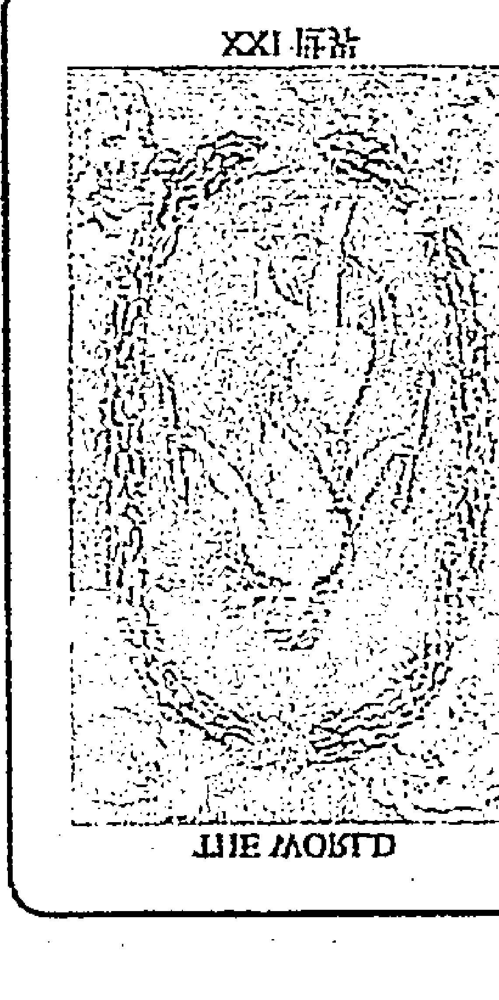

## 世界逆位

### 心灵与精神层面的提示

你敬畏大自然的法则，也想更进一步了解，但是真理往往有许多不同的层面，并不是你认识的道理就是唯一的法则。

### ※ 人物

- □ 当事人的个性  
比较不知变通的人，对于事情就只有一种观点、一种做法，即使环境变化仍然以同样的方法应对，完全没有弹性。

- □ 当事人的工作观  
非常重视工作的稳定，即使没有进步和挑战也没关系，希望自己的工作可以做到退休，缺乏工作的热情及企图心。

- □ 当事人的感情观  
属于比较传统价值的人，觉得感情会带来很重的责任和压力，不轻易付出自己的感情，但只要承诺就一定会做到。

- □ 当事人的金钱观  
不太善于处理自己的金钱，虽然有储蓄的习惯但是并没有财务规划的概念，常常都是死抱着现金而不愿意去投资。

- □ 与当事人的应对方法  
只要你的价值观和他相同，你们就可以相处得非常愉快，不要在他面前有太多标新立异的做法，会让他看不下去。

- □ 人物代表  
科学家、公务员、资深员工，守旧的人、不知变通的人。  
一直都是在做相同的事情，没有任何变化也无法得到成长，感觉自己有点被困住了，虽然不满意但仍然可以接受。

- □ 如何解决工作的困境  
最好的方式就是维持现状，事情原来该怎么办就怎么办，自己擅自去改变的结果，反而可能使你惹上更多的麻烦。

- □ 工作中的人际关系  
其实这个工作当中的人事非常稳定，大家都是老同事了，对于彼此的脾气也都很清楚，自然就会找到相处的模式。

- □ 与上司相处的方法  
属于守旧派的上司，尽量照着规则和制度行事，太多自己的想法反而会被讨厌，最好也不要太过关心他的私生活。

- □ 工作的发展性  
你现在看到的样子就是未来的状况，工作除了依年资增加之外也不会有什么改变，是一个可以等退休养老的地方。

- □ 找工作／换工作的状况  
现在很难找到好工作，除非你能换个环境，去尝试不同种类的新工作，太坚持现状只会让你困死在自己的小框框里。

### ※ 工作

- □ 工作本身的状况

### ※ 爱情

- □ 感情本身的状况  
现在感情进入稳定的阶段，但是也让人觉得有一点无聊，两个人之间的责任多于感情，平淡的相处也使热情消失。

- □ 新恋情的可能性  
现在不会出现任何新的恋爱对象，应该要快点习惯一个人的生活，因为这样单身的状况可能会维持很长一段时间。

- □ 对这段感情的看法  
两个人已经习惯彼此的存在，但也没有什么新奇的东西可以激起两个人的热情，也许这样的关系会无力地拖下去。

- □ 性的吸引力  
两个人之间没有性的吸引力，性生活也落入相同的模式当中，无法为这段关系加分，有时候感觉只是尽一份义务。

- □ 如何化解争吵  
争吵的东西都是老问题了，再吵也没有可能去改变，如果还是无法学会去接受，以后相同的问题还会不断发生。

- □ 分手的方法  
由于两个人已经习惯了彼此，所以除非有新的对象出现，否则要分开是非常困难的事情，不论谁提出都不太可能。

- □ 复合的可能性  
这段关系完全不可能复合，也不用再去想复合的事情，如果只是看到旧的对象，反而会因此而错过其他的新机会。

### ※ 友情

- □ 人际关系状况  
你的朋友其实还蛮固定的，而且都是很久的老朋友，你不太喜欢去接触新朋友，有时候甚至也会觉得一个人更好。

- □ 如何化解与朋友的误会  
你无法改变朋友对你的看法，所以也不用多做解释了，反正讨厌你的人也不会听你的解释，再说也只是白费力气。

### ※ 亲情

- □ 家庭的状况  
家中的状况已经有很长一段时间没有变化，呈现出苍白无力的现象，也许需要一些新的刺激才能让气氛活泼起来。

- □ 与长辈的关系  
长辈对你的期待很高，也会给你很大的压力，你常会觉得想要逃离这种压力，但是又无法离开或是做任何的反驳。

- □ 与平辈的关系  
你和其他人的关系并不深，彼此之间也没有什么交流或联络，只有在逢年过节的时候，大家才会有例行性的会面。

- □ 与晚辈的关系  
你常常搞不清楚晚辈在做些什么，但是又很担心他们的状况，因此有时候会想要控制，又不知道如何与他们应对。

### ※ 学业

- □ 学业本身的状况  
你的学习进度已经停滞了很长一段时间，是该开始重拾书本的时候了，如果现在还不开始努力，未来就很难补救了。

- □ 学习的方法  
应该把握自己已经熟悉的东西，对于来不及读的部分就不要去理会，在目前的基础上发挥实力，就是最佳的策略。

- □ 与老师相处的关系  
属于传统派的老师，在教学上也会比较呆板一点，应该自己找一些课外的读物来补充，以免观念因此而受到限制。

- □ 与同学相处的关系  
你与同学的相处对于你的学习没有什么帮助，也只有与固定几个老同学关系良好，其他人就不会与你有什么交集。

### 财务

- □ 目前的财务状况  
你的财务状况一直以来都没有什么变化，你也没有花很多心力思考与金钱有关的事情，所以是不好不坏的状况。

- □ 投资的状况  
这个时候并不宜进行新的投资，不过长期投资如果已经有获利，这个时候就应该要果断结束，再放下去也没有用。

- □ 采购的策略  
要在你熟悉的地方进行采购，最好也是你原本就熟悉的商品为主，这样比较不会被骗，也可以帮你省下不少的钱。

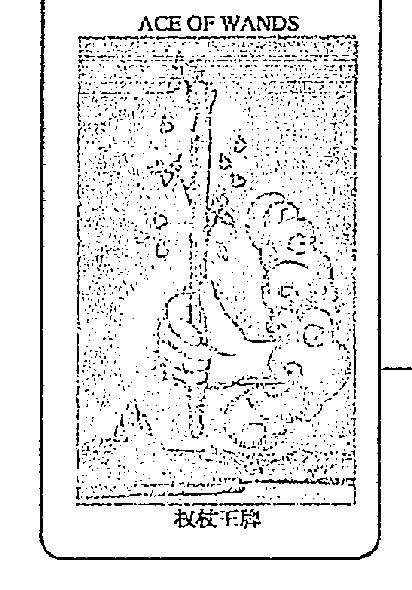

## 权杖王牌正位

### 心灵与精神层面的提示

很多的事情会自然发生，我们只是在发生时把握住我们应得的机会，主动把握住灵感将会让你充满自信以及能量。

### 工作

- **工作本身的状况**  
你面对新的工作状况，或是工作当中出现了新的挑战，这是一个还在发生中的状况，所有事情也都还没有定论。

- **如何解决工作的困境**  
你需要主动把握任何出现的机会，掌握主动权的人才可能解决问题，要对自己保持充足的信心，努力朝着目标前进。

- **工作中的人际关系**  
如果能掌握最有影响力的人，其他的人很自然地就可以维持良好的关系，用心经营少数关键人物就可以达到目的。

- **与上司相处的方法**  
越是能够表现自己，与上司的关系自然就会越好，所以只要专注在工作的内容当中，其他的东西都不必太过担心。

- **工作的发展性**  
这个工作的未来十分有发展性，现在看到的只是其中的一小部分，有些位置算是先占先赢，要把握机会好好表现。

- **找工作/换工作的状况**  
现在已经有新工作在等着你，但还是要你自己主动去找才能得到这份工作，也可以尝试和之前不同性质的新工作。

### 爱情

- **感情本身的状况**  
现在很可能有新恋情发生，或是原本的恋情有了新的变化，你应该要好好把握现在的机会，快点把感情稳定下来。

- **新恋情的可能性**  
现在发生新恋情的可能性很高，而且常常是伴随着新工作或是搬新家的机会而来，对你而言这是一个全新的经验。

- **对这段感情的看法**  
会觉得这段感情充满了活力以及未来的发展性，是一段可以好好经营的感情，同时也觉得这段感情是自然发生的。

- **性的吸引力**  
性的吸引力可以说是这段感情当中很重要的一部分，双方在性关系上的和谐，对两个人感情的稳定也是很重要的。

- **如何化解争吵**  
应该要主动以行动证明自己的真心，而不是被动地等着对方质问，在问题刚发生的时候就应该积极处理化解。

- **分手的方法**  
如果你觉得这是一段痛苦的关系，那么自己主动提出分手是最好的方法，通常亲自见面把话讲清楚会是最有效的。

- **复合的可能性**  
这段关系还是有复合的可能性，但是这会是一个全新的关系，要把过去所有的回忆都抛弃掉，彻彻底底重新开始。

### ※ 友情

- □ 人际关系状况  
这是刚开始经营人际关系的阶段，要主动对别人伸出友谊的双手，多一点主动去关心别人，才会建立起新的关系。

- □ 如何化解与朋友的误会  
其实有些误会只是小问题，主动道歉并不是什么丢脸的事情，如果连这一小步都不愿意退让，人际关系怎么会好。

### ※ 亲情

- □ 家庭的状况  
因为新成员加入的关系，使得家中有与以前不同的气氛，应该要快点适应这个新的结构，不要再怀念以前的状况。

- □ 与长辈的关系  
你与长辈的关系十分亲密，也是大家所疼爱的那个人，即使出现其他人与你竞争，也不用担心你的地位会不稳固。

- □ 与平辈的关系  
在平辈当中你的作风比较强势，但并不会让人感觉到威胁，你很容易自然而然地成为领导者，可以对别人发号施令。

- □ 与晚辈的关系  
你对于晚辈特别照顾，但是其中也同时具有想要控制的想法，望子成龙的期待当然可以有，不过也要小心避免一头热。

### ※ 学业

- □ 学业本身的状况  
你面对新的学习状况，对于没接触过的东西充满好奇心，但是也因为不熟悉而觉得没有安全感，要对自己有信心。

- □ 学习的方法  
很多东西是需要循序渐进慢慢学习的，在一开始应该要掌握到核心的观念才是重点，细微末节的东西不用太在意。

- □ 与老师相处的关系  
老师会重在观念的启发，而不是在细节上的教导，只要在上课时能够专心听讲，其他的一切都顺其自然就可以了。

- □ 与同学相处的关系  
这是应该要好好读书的时候，与同学的关系反而不是那么重要的一件事，只要顾好几位知心的好朋友就很足够了。

### ※ 财务

- □ 目前的财务状况  
现在还是刚开始起步的时候，应该要顺其自然，有多少钱就做多少事，有时候也可以在错误当中学习到不少东西。

- □ 投资的状况  
这是开始投资的好时机，但是别急着想要有大笔收入，现在只是把种子放到土里而已，真正要开花结果还得耐心等待。

- □ 采购的策略  
很多事情都还没有定论，所以在采购方面也别急着做决定，最好是由最必需的东西少量开始，之后再慢慢来增加。

| 延伸应用 | □ 时间 相对时间 :一周。 标示时间 :夏季。 |
|----------|------------------------------------------------|

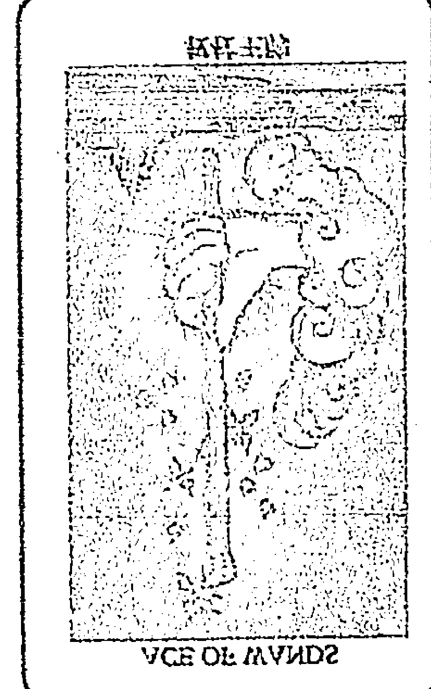

## 权杖王牌逆位

### 心灵与精神层面的提示

保持精神上的清晰和活泼，不要被特定的观念所限制住，你将会得到更多新的想法，同时会充满了积极的行动力。

### ※ 工作

- 工作本身的状况  
你面对到新的工作状况，但是在工作当中处处都充满了挑战，这是适合向下扎根学习的时刻，没有太多的表现机会。

- 如何解决工作的困境  
你需要主动掌握事情的核心，找到真正的问题点，才有可能解决问题，但是同时也要做问题可能无解的心理准备。

- 工作中的人际关系  
你被工作当中的人际关系所困扰，以至于无法专心工作，应当把力量集中在工作本身，把人的影响因素降到最低。

- 与上司相处的方法  
会把很多的事情交给你做，然后就急着要看到成果，所以所有的事情动作都要快，若是拖得太久就会被上司盯上。

- 工作的发展性  
这个工作的未来是在朝着结束的方向发展，对你来说这只是一个短期间的工作，随时都要做好再重新找工作的准备。

- 找工作 / 换工作的状况  
现在已经可以开始计划找新工作了，新工作即使不是立刻在眼前出现，也必定是在不远处，努力寻找就会得到好的机会。

### ※ 爱情

- 感情本身的状况  
感情很自然地处在发展当中，或是有新的恋情出现，但是并不完全在你的掌握当中，两个人之间还是有很强的吸引力。

- 新恋情的可能性  
现在是有新恋情的可能性，但是并不在你所预期的地方出现，你要小心地注意四周的变化，才能掌握到新的机会。

- 对这段感情的看法  
会是一段很有发展性的感情，但是现在仍然在开始的阶段，要等更多的事情更确定之后，才会对这段感情下定论。

- 性的吸引力  
对方对你很有吸引力，但你常不知道该怎么响应，反而会显得有点不知所措，其实应该勇敢一点表达自己的欲望。

- 如何化解争吵  
现在问题看似刚刚开始，实际上在当中已经有很深的误会，要努力挖掘事情的真相才有可能找到彻底解决的方法。

- 分手的方法  
若是要由自己主动提出分手，那么就要准备好所有的火药，以大吵一架作为结束，否则很可能会和对方藕断丝连。

- 复合的可能性  
这段关系应该没有任何复合的可能性，已经算是彻彻底底结束的状况，与其活在回忆当中，不如去寻找新的对象。

### ※ 友情

- □ 人际关系状况  
现在开始面临到人际关系的一点波动，虽然不太顺利但是还可以过得去，可以利用这个时间多多去认识新的朋友。

- □ 如何化解与朋友的误会  
误会刚开始的时候比较容易解决，若是能掌握主动权送出善意的礼物，相信所有的问题都会随着时间而过去的。

### ※ 亲情

- □ 家庭的状况  
家中面对着新的挑战，因此可能有不同的变化和调整，在这个状况之下还是保持现状比较好，等待事情慢慢发生。

- □ 与长辈的关系  
长辈把你当成很重要的人，但是你并不是很喜欢这种感觉，你需要更多自由的空间，应该要让他们知道你的想法。

- □ 与平辈的关系  
在平辈当中你有比较大的主导权，但是若强行要去控制别人，也很容易与别人起冲突，要小心保持和平的关系。

- □ 与晚辈的关系  
你对于晚辈十分照顾，而大家也都会十分重视你的意见，但是别太强求大家都照你的意思去做，有时候彼此也会失望。

### ※ 学业

- □ 学业本身的状况  
你在学习上遇到新的困难，但是其实问题是根源在于过去的基础并不稳固，所以还是要努力把过去所不足的补起来。

- □ 学习的方法  
在学习上要循序渐进，并且要了解事情发展的原理和源头，由概念和原理开始推论，放开胸接受所有可能性。

- □ 与老师相处的关系  
十分坚持自己立场的老师，辩论并不能够改变任何事情，与其积极地争取自己的权益，还不如保持距离以策安全。

- □ 与同学相处的关系  
你与同学的相处并不是很顺畅，人际关系也不是一朝一夕可以改善的，建议你把该做的事情按部就班地完成就好。

### ※ 财务

- □ 目前的财务状况  
现在财务的状况其实并不算好，但仍然存在许多扭转劣势的空间，应该要务实地发挥自己的长处争取更多的金钱。

- □ 投资的状况  
现在应该开始考虑把投资结束，还没开始投资的人则不要急着投入，先把目前的获利落袋为安，等待机会再开始新的投资。

- □ 采购的策略  
先要搞清楚采购的目的性，不要盲目地依循先前的经验，重新检视所有的可能性之后，再一项一项慢慢地加上去。

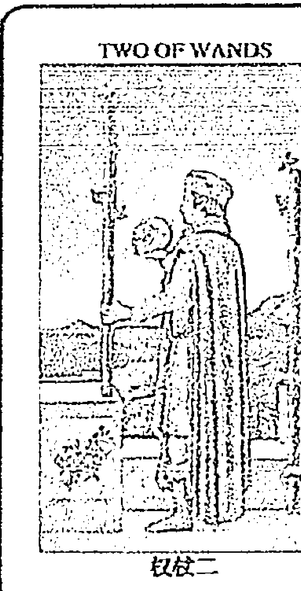

## 权杖二 正位

### 心灵与精神层面的提示

好的领导者不只是以理服人，还要能提出方向和愿景，如果不能专心于自己的本业，再多的幻想都不可能达成。

### ※ 工作

- 工作本身的状况  
你在工作当中面临重要的选择，你不知道该更进一步地发展，还是守住现在已经有的成果，因而陷入两难的局面。

- 如何解决工作的困境  
现在并不是做最后决定的时候，你需要花更多的时间把问题彻底研究一番，做好各种的方案和准备，等待时机再行动。

- 工作中的人际关系  
你在工作当中其实与同事之间没有什么交集，彼此之间也没什么感情，所以你也就不用多花时间去经营人际关系。

- 与上司相处的方法  
本身是一个犹豫不决的上司，很多的事情就只能依照现有的规则和惯例去做，所以最好你也不要自己创什么新招。

- 工作的发展性  
这个工作也许会有很好的发展性，但是更多东西是你看得到吃不到的，到头来很可能只是一场误会，自己白忙了。

- 找工作 / 换工作的状况  
你现在很难找到很好的新工作，也许过一阵之后会有更好的机会出现，所以现在不用急着下决定，可以先观望再说。

### ※ 爱情

- 感情本身的状况  
你对于感情的状况并不满意，但是又不想要放弃，所以只能卡在这个不上不下的阶段，也有很多事情是你不能控制的。

- 新恋情的可能性  
现在并不太可能会发生新的恋情，即使出现了你喜欢的人，也不可能会喜欢上你，所以还是看看就好别太认真了。

- 对这段感情的看法  
这段感情已经有点成为习惯了，很多的问题也开始浮现出来，是很不甘心就此放弃，但是也没有动力去解决问题。

- 性的吸引力  
这段感情中有很强的性吸引力，但是也只是让两个人的性生活比较频繁而已，并不会对两个人的感情有加分作用。

- 如何化解争吵  
这个时候只能把问题解决一部分，但是无法碰触到问题的核心，所以只能以拖待变，看以后能不能再找机会解决。

- 分手的方法  
其实现在两个人要分手也不太可能，因为两个人都无法做出明确的选择，即使出现第三者也很难使这段关系结束。

- 复合的可能性  
这段感情完全没有复合的可能性，因为一旦做了决定了就是最后的结果，即使现在双方想要反悔也已经来不及了。

### ※ 友情

- □ 人际关系状况  
你并不是很在意自己的人际关系，也没有很用心地经营，所以常常会觉得自己没有什么朋友，是一个很孤独的人。

- □ 如何化解与朋友的误会  
这个时候你可以试着与朋友和解，找一个只有两个人的私下场合先沟通一下，你也许会发现你之前想的都是错的。

### ※ 亲情

- □ 家庭的状况  
现在家中面临重要的抉择，处理得不好可能就会有天壤之别，但是现在并不是适当的时机，应该等一阵再决定。

- □ 与长辈的关系  
长辈对你有很多的管制，也会给你很多的帮助，即使如此你仍然对他们有很多的不满，所以有时还是会发生冲突。

- □ 与平辈的关系  
平辈之间彼此没有什么交集，互相也没有很多交情，但是遇到困难的时候还是会互相帮忙，但是成效总是很有限。

- □ 与晚辈的关系  
你对晚辈常常会过度地保护，反而使他们觉得受到太多管制，其实你对他们的教育十分用心，也是真心为他们好。

### ※ 学业

- □ 学业本身的状况  
你在学业上的表现还不错，但是你自己对于这个状况并不满足，仍然想要有更好的表现，只是现在没有好的方法。

- □ 学习的方法  
你应该对自己学习的计划重新思考，对时间做出最有效率的利用，这样在重新开始的时候，才能达到最好的效果。

- □ 与老师相处的关系  
是主控性非常强的老师，对于很多事情都有自己主观的看法，如果有人不服他的管教，他会用最严厉的方法处罚。

- □ 与同学相处的关系  
你与同学之间就像是平行线，彼此之间没有交集，所有的学习都应该要靠自己，与人际关系好坏没有太大的关系。

### ※ 财务

- □ 目前的财务状况  
你目前的财务状况很好，但是财务规划反而造成你的困扰，这时候应该请专业人士来处理，自己想破头也没有用。

- □ 投资的状况  
现在不宜进行任何新的投资，最好还是要保守一点操作，留得青山在不怕没柴烧，还是先把自有的资金储存下来。

- □ 采购的策略  
这不是你花钱的好时机，应该小心谨慎地评估各种采购计划，但是不要在这个时候执行，要等待对你更有利的时机。

延伸应用  
□ 时间  
相对时间：二周。  
标示时间：白羊座第一旬（约每年 3/21-3/30）。

## 权杖三正位

### 心灵与精神层面的提示
行动力是成功的不二法门，任何事情没有实际去做都只是空谈，下定决心之后就应该要把理念落实到实际生活中。

很多事情是彼此互惠的，不要只想占人家便宜而又不愿意付出，只有同时照顾自己及别人的需要，成功才能长久。

### 工作

- **工作本身的状况**
现在工作上出现了意料之外的发展，你必须在这个时候做出选择，即使无法掌握住所有的因素，还是要勇于负责。在工作当中已经建立起初步的成果，未来还会有更好的发展，这时候应该把握各种表现机会，趁胜追击更上层楼。

- **如何解决工作的困境**
这个时候可以发挥你个人的魅力，用个人化的方式去解决问题，也许会有意想不到的效果。目前看起来合作是事情进行最好的方法，同时应该要有一个共同的领导者，大家在他的指挥之下一起把事情完成。

- **工作中的人际关系**
你在工作当中的人际关系并不是很好，也没有什么人可以帮助到你，这个时候你就更应该自立自强追求好的表现。工作当中很需要大家彼此合作，所以也会养成大家相互支持的习惯，维持良好的人际关系对你的工作会很有帮助。

- **与上司相处的方法**
是一个不太实际的上司，对于很多事情只看到好处而忽略了问题，所以当发生意外状况的时候可能就要帮他收尾。很有领导能力的上司，大家只要能团结在他的领导之下，自然能有很好的表现，如果不能合作的人就会被他铲除。

- **工作的发展性**
这个工作接下来还会有很多变化，虽然可能是一个翻身的好机会，但也可能会变得很惨，最好先观望一阵再说。这个工作未来还会有很好的发展性，只要现在的表现良好，也累积了足够的工作实力，将来就会有更光明的前景。

- **找工作／换工作的状况**
现在可能会从天上掉下来一个意外的工作机会，但是并不一定那么适合你，应该要仔细考虑之后再做最后的决定。现在应该很快就可以找到新的工作，甚至有可能会到外地去工作，也许刚开始会觉得有一点冒险，但前景是很好的。

### 爱情

- **感情本身的状况**
感情当中还有很多的问题需要去突破，现在已经开始踏出第一步，其实两个人都不知道这段关系究竟会如何发展。两个人的关系已经确立，也已经建立起很好的感情基础，接下来的发展将会是很正面的，彼此也会有很好的分工。这段关系已经进入到一个比较稳定的阶段，彼此都了解对方的想法和需要，接下来就会一起朝着共同的目标努力。

- **新恋情的可能性**
现在有可能在没有预期的状况之下发生新恋情，但是由于事出突然你也没有充分地考虑，所以也可能是短暂的关系。现在你的心思都集中在工作上，并不太可能会有时间去谈感情，但是也许会有在工作场合认识的人开始喜欢上你。

- **对这段感情的看法**
这段感情现在已经有一点失控了，不知道事情到底会如何发展，也充满了各种的惊喜，其实算是一种全新的经验。这段感情对于双方来说都是有利的，也是一段很稳定的关系，只要有一个人提出意见，另一个人就会配合去执行。

- **性的吸引力**
两个人之间有很强的性吸引力，但也只是一种比较短暂的作用，对于两个人长期关系的发展并没有太大的影响。在这段感情当中并没有很强的性吸引力，但是性生活上的配合非常良好，所以并不会因此而影响到两个人的感情。

- **如何化解争吵**
这个时候也许只能以战止战，拿出另外一个问题来转移焦点，虽然没有办法真的解决问题，至少可以先喘一口气。这个时候应该考虑对方的立场，其实它是与自己的想法互补的，在异中求同的讨论当中很自然就可以找到交集。

- **分手的方法**
如果是想要有计划地分手，这段时间可能会很困难，但是却可能突然出现一个意外事件，两个人就决定要分手了。两个人要分手的可能性并不高，除非两个人是相隔两地的状况，可能会忙于自己的事务，因此会渐渐忽略了对方。

- **复合的可能性**
这段感情没有复合的可能性，两个人也不可能再成为朋友，之后就是完全不相干的两个人，还是不要再去想它了。这段关系的性质已经完全确定，所以并不可能会复合，两个人还是分开比较好，说不定还有机会可以成为好朋友。

### 友情

- **人际关系状况**
你平常算是一个很受到大家注目的人，但是其实你并不是很喜欢如此，你总是会和朋友之间保持一个适当的距离。你目前的人际关系很不错，但并不完全取决于感情，有时候也是因为有共同的利益存在，这种关系反而会更稳固。

- **如何化解与朋友的误会**
现在你很难得到朋友的原谅，也很难去原谅对方，所以应该让双方都先冷静一下，等到适当的时间再来解决争议。这个时候应该要考虑到集体的利益，而不是站在本位主义闹脾气，其实双方都是很讲理的人，是可以好好沟通的。

- **与老师相处的关系**
一个不按常理出牌的老师，不要想去揣测他的想法，或是预测他的做法，只要把自己该做的事情确实完成就好了。

- **与同学相处的关系**
你在同学当中比较出风头，但是也因此会引来别人的闲言闲语，这个时候应该要坚持自己的做法，对自己有信心。

### 亲情

- **家庭的状况**
现在家中遇到了意外的事件，重要的是保持镇静不要慌乱，这个时候应该要有一个人出来领导大家做重要的决定。现在家中的状况十分稳定，也有很好的发展机会，这个时候应该要有一个人出来领导大家，共同合作才会有益处。

- **与长辈的关系**
你和长辈之间其实常常发生冲突，但是你并不会因此而讨厌他们，反而因此使你学到更多东西，越吵感情会越好。长辈常常给你很好的发展空间，也会提供给你充足的资源，基于对他们的感激，你也应该要有更多实质的回馈行动。

- **与平辈的关系**
你在平辈当中属于比较大胆的一个，所以很自然就成为领导者，但是好事常常轮不到你，坏事才会找你出来顶罪。你常在平辈当中担任领导人的角色，大家也都相处得不错，如果有机会合作任何事情，大部分都会有很好的成果。

- **与晚辈的关系**
你给晚辈很大的空间发展，但是同时也很注意他们的安全，你会培养他们独立的能力，也特别强调勇气的重要性。你对晚辈有很务实的训练，因此他们大部分都会很独立，由于你是他们坚实的后盾，你们彼此之间的感情也会很好。

### 财务

- **目前的财务状况**
你的财务状况可能会遇到不预期的变化，这个时候要沉着地应付，切忌主观冲动地决定事情，会造成更多的损失。你目前的财务状况已经打下良好的基础，也很具有未来的前瞻性，但是要注意到风险的管理，要随着实际状况灵活调整。

- **投资的状况**
现在投资的不确定性很高，也不知道下一步会怎么发展，所以还是把所有的投资先换回现金，等时机适当再行动。现在的投资状况不错，也有进一步获利的可能性，但是相对而言风险也在提高当中，保守的人可以先行获利了解。

- **采购的策略**
这个时候可能会有意外的惊喜出现，所以可以多多注意各种采购的讯息，说不定就会突然出现你正需要用的东西。这个时候是非常好的采购时机，也利于你谈判或是杀价，你应该利用这个好机会，把近期需要的采购通通完成。

| 延伸应用 | 相对时间：三周。 标示时间：白羊座第二句（约每年3/31-4/10）。 |

## 权杖三逆位

### 心灵与精神层面的提示
不论遇到外在世界如何变化，最重要的是记得你自己是谁，你的核心价值是什么，这才是你东山再起的真实资本。

### 工作

- **工作本身的状况**
现在工作上的麻烦已经被解决，各种状况也渐渐回到轨道当中，应该好好把握这个机会，不要那么快就放弃希望。

- **如何解决工作的困境**
有些事情是需要冒一些风险的，没有大胆的策略就不可能突破现在的困境，应该放下心里的恐惧努力把事情完成。

- **工作中的人际关系**
工作当中的同事彼此之间互相各自为政，需要有上面的人来把大家统一起来，除了工作之外大家其实没什么交集。

- **与上司相处的方法**
上司很有解决问题的能力，但是也因此有一些骄傲和自大，你应该学会看他的脸色，最好表现出绝对服从的样子。

- **工作的发展性**
这个工作现在正在起步，未来还有很多的可能性，但是也有不小的风险，如果留下来就要当作是磨练自己的机会。

- **找工作/换工作的状况**
现在很快就会找到新的工作，但也是一个充满挑战性的机会，你如果能够放手去做，也许会达到前所未有的成就。

### 爱情

- **感情本身的状况**
两个人终于克服了障碍，重新确立彼此的感情，虽然好像看到了一线曙光，其实两个人的状况也还不是很稳定。

- **新恋情的可能性**
现在并没有发生新恋情的可能性，即使出现了你喜欢的对象，也不是适合表白的时候，还需要一段时间调整自己。

- **对这段感情的看法**
之前的风风雨雨对于双方来说都造成了很大的伤害，即使现在都已经过去了，但是仍然无法对这段关系完全信任。

- **性的吸引力**
在这段感情当中并没有很强的性吸引力，性生活也不会是当中重要的部分，甚至可能因为忙碌而完全没有性生活。

- **如何化解争吵**
这个时候应该向前看，而不是一直翻旧账，如果能把问题的前因后果搞清楚，就会知道其实这些争吵是很无聊的。

- **分手的方法**
现在两个人并不太可能选择分手，即使发生了严重的冲突仍然无法使两个人分开，除非在感情当中出现了第三者。

- **复合的可能性**
两个人之间其实已经没有什么感情，所以并不可能会复合，即使有一方提出想要复合，客观环境也不利于感情的发展。

### 友情

- **人际关系状况**
你目前的人际关系还不错，但有时候会因为自己傲慢无礼的表现而使朋友不高兴，这个时候应该要亲自向他道歉。

- **如何化解与朋友的误会**
其实你与朋友发生的都是小误会，不能完全解决是因为面子问题，如果你能放下身段去说明，对方也算是明理的人。

### 亲情

- **家庭的状况**
家里刚刚渡过一个难关，大家也都还在恢复元气当中，所以不宜做什么大的变化，让大家休养生息才是最重要的。

- **与长辈的关系**
长辈对你是照顾有加，也会教你很多事情，你如果能把握机会好好学习，对你未来的人生发展将会有很大的帮助。

- **与平辈的关系**
平辈彼此之间没有太多感情，不过大家也可以一起合作做些事情，但是最好不要担任领导者，对你来说是太大的负担。

- **与晚辈的关系**
你的晚辈常常喜欢冒险，所以你要想办法给他们一个安全的环境，让他们不致于伤得太重，但是也要给他们一些教训。

### 学业

- **学业本身的状况**
在学业上你算是苦尽甘来，已经开始看到一些好的成果出现，你应该在这个基础上持续努力，不要放弃任何希望。

- **学习的方法**
这个时候你可以多找各种的参考数据，不要只限于课本的内容，否则不但会限制了你的视野，学习效果也不够好。

- **与老师相处的关系**
是一个非常顽固的老师，不要想挑战他的做法，否则不但会给你长篇大论的理由，其他同学也会受到连带的影响。

- **与同学相处的关系**
你与同学之间其实没有太多交集，但是同学之间会分成很多小集团，你应该独立于各个集团之外去做自己的事情。

### 财务

- **目前的财务状况**
你的财务状况已经由谷底翻身，但是之前的经历让你余悸犹存，所以一切都要保守操作，不要再度落入陷阱当中。

- **投资的状况**
现在的投资风险相当高，除非你在安全的本钱外还有很多闲钱，否则并不建议你进行投资，还是将钱存起来比较实在。

- **采购的策略**
这个时候可以进行少量的采购，作为以后采购的准备，如果一下子就进行大量的采购，可能必须负担过高的风险。

## 权杖四正位

### 心灵与精神层面的提示
把自己该做的事情完成之后，就应该放下烦恼好好休息，尽情享受自己应得的成果，由内心当中找到真正的平静。

### 工作

- **工作本身的状况**
现在工作的努力已经有了成果，也是应该好好享受自己成果的时候，这个时候应该要放松心情，在稳定中求发展。

- **如何解决工作的困境**
首先一定要人和才能够政通，推行事情一定要先把人员彼此团结起来，在人事和谐的状况之下事情自然就会解决。

- **工作中的人际关系**
工作当中大家都是好朋友，也常常有公开或是私人的聚会来联络感情，会因为事情推展顺利而使大家的感情更好。

- **与上司相处的方法**
非常重视内部团结和谐的上司，所以对于人际关系就要特别努力经营，在同事之间能有好口碑的人才会受到重用。

- **工作的发展性**
这个工作的发展非常稳定，会在目前的基础上持续成长，已经可以看到未来的光明前景，是很值得干下去的工作。

- **找工作/换工作的状况**
现在可以找到一个稳定的工作，进去之后也会有不错的表现，应该利用这个时间认真找工作，不要放掉这个机会。

### 爱情

- **感情本身的状况**
两个人的感情十分稳定，也已经找出相处的最佳模式，每天在一起的时光都非常愉快，算是令人安心的和谐关系。

- **新恋情的可能性**
现在不太可能出现新的感情对象，但是也许在认识很久的人当中会有你欣赏的人，不过在这个时候一动不如一静。

- **对这段感情的看法**
这是一段非常愉快的感情，彼此的付出也觉得非常值得，两个人可以一起经营很多快乐的时光，分享彼此的心情。

- **性的吸引力**
在这段感情中两个人之间有很强的性吸引力，也可以经营出非常令人满意的性生活，在性关系的配合上也非常完美。

- **如何化解争吵**
其实一些小争吵只能算是生活的情趣，并不算是很严重的冲突，只要你能诚心地向对方说明，就不会有什么问题。

- **分手的方法**
这时候感情的关系十分稳定，要分手并不是那么容易的事情，即使遇到再大的环境阻力，也很难迫使两个人分开。

- **复合的可能性**
这段关系也还不算完全结束，所以再次在一起也不太算是复合，只能说是吵架之后再和好，关系还是会十分稳定。

### 友情

- **人际关系状况**
你的人际关系很好，也很努力在经营自己的人际关系，你可以多多参加朋友们的聚会，甚至会常常遇到庆祝活动。

- **如何化解与朋友的误会**
这个时候应该要先探询大家的意见，看看对方到底是为什么对你不满，也许在朋友的聚会当中比较容易解开心结。

### 亲情

- **家庭的状况**
现在家中充满了欢乐的气氛，也许是正在庆祝某些事情，大家都可以在安全的环境之下，自由地分享自己的心情。

- **与长辈的关系**
你受到长辈很好的保护，也从他们那里得到不少好处，你常会有实质的行动来回馈他们，所以彼此的感情非常好。

- **与平辈的关系**
平辈彼此之间都能和平相处，也可以团结一致共同合作，在这个状况之下即使没有人领导，也有很好的互动关系。

- **与晚辈的关系**
你对于晚辈常常会过于保护，以至于他们会有一些长不大，不过也因为你的用心照顾，使他们的日子过得很愉快。

### 学业

- **学业本身的状况**
你在学业上的努力已经看到实质的成果，现在正是成果显现出来的时候，这是一个可以好好庆祝以及享受的时刻。

- **学习的方法**
这个时候应该以不变应万变，在自己原有的基础上用自己原来的方法学习，经过一段时间的努力一定会看到成果。

- **与老师相处的关系**
基本上是一切按照规定来的老师，所以只要在自己的本分之内把事情好好完成，也就可以得到老师的肯定和称赞。

- **与同学相处的关系**
同学之间的相处都是很快乐的，彼此之间十分和谐而少有争吵，这种快乐的环境，对你的学习会很有帮助。

### 财务

- **目前的财务状况**
你之前的努力已经有良好的成果，财务也已经有很适当的配置，现在应该好好休息一下，不要再为了财务而烦恼。

- **投资的状况**
现在进行当中的投资将会有很好的获利，所以可以继续保留目前所有的投资，但是这个时候并不宜进行新的投资。

- **采购的策略**
这个时候很适合进行采购，但最好是和你熟悉的管道采购，才会得到最有利的价格，可以充分运用老主顾的优势。

延伸应用
相对时间：四周。
标示时间：白羊座第三旬（约每年4/11-4/20）。

## 权杖四逆位

### 心灵与精神层面的提示
传统与习惯有其不可动摇的稳定力量，但是如果能有创意地去运用它，将会赋予全新的意义，创造出更多的价值。

### 工作

- **工作本身的状况**
现在工作的状况很顺利，也是在稳定当中持续发展，因为自己很喜欢这份工作，所以除了薪水之外也有很多收获。

- **如何解决工作的困境**
现在应该要保守行事，一切以安全为最高的指导原则，如果有之前的惯例可以依循，就不要自己另出创新的招数。

- **工作中的人际关系**
你在工作当中的人际关系相当不错，和大家相处也很愉快，大家也会因为利益关系发展出彼此相互合作的模式。

- **与上司相处的方法**
是一个很要求完美的上司，对于事情都会采取高标准来评判，所以一定要尽力表现自己，至少不要比其他人更差。

- **工作的发展性**
这个工作的状况非常稳定，对你来说也是一个愉快的环境，如果不想有太大的变动，这是一个可以待着的地方。

- **找工作/换工作的状况**
现在应该很快就可以找到工作，也会是一个很稳定的地方，即使别人并不了解你在做什么，但是你会觉得很快乐。

### 爱情

- **感情本身的状况**
这段感情对彼此来说都是快乐的，也是非常稳定的一段关系，现在保持现状不要做任何改变，是最好的相处模式。

- **新恋情的可能性**
现在不容易发生新的恋情，因为你对于自己的现状十分满意，也没有太大的动力去追求新的感情对象。

- **对这段感情的看法**
这段感情非常稳定，也带给彼此很多的成长，在这个关系当中两个人都感觉到幸福，也算是一段非常快乐的时光。

- **性的吸引力**
这段感情当中两个人有很强的性吸引力，由于性关系带给彼此很多的乐趣，所以在感情当中将会发挥稳定的力量。

- **如何化解争吵**
有时候争吵只是反映出缺乏信心的部分，这个时候应该要给对方更多的付出，让他觉得在这段感情当中是安全的。

- **分手的方法**
现在两个人的感情十分稳固，不是任何外力可以破坏的，除非在两个人当中发生出轨或是欺骗，否则就很难分开。

- **复合的可能性**
这段关系其实还有可能复合，这要看你付出多少的努力，如果能恢复到当初相处的模式，也可以有很快乐的生活。

## 权杖五正位

### 心灵与精神层面的提示
很多事情都必定要经过自己实际的努力，才能得到真实正确的理解，在确实去做一件事情之前不要对它妄下断语。

### 工作

- 工作本身的状况
这个工作当中充满了冲突和斗争，每天必须很努力地工作还不一定有成果，所以工作不但很累也很难会有好心情。

- 如何解决工作的困境
这个时候你需要更努力地工作，坚持自己的做法，才有机会突破困境，如果无法打败敌人就一定会被敌人所打败。

- 工作中的人际关系
在工作当中大家彼此斗得很凶，不但难以互相合作，还会想办法扯别人的后腿，随时都得小心同事私底下搞破坏。

- 与上司相处的方法
你如何对待上司，上司就会如何对待你，所以如果你努力和上司争取各种的权益，他也一定会尽量压榨你的权益。

- 工作的发展性
这个工作未来只会越来越艰苦，但是如果你能撑下去也会得到更多的成长，你应该评估自己是不是适合这样的环境。

- 找工作 / 换工作的状况
现在应该很快可以找到新工作，但必然是很辛苦又竞争的工作，如果不够努力的话，恐怕很快又要开始找新工作。

### 爱情

- 感情本身的状况
两个人之间的争吵不断，甚至可能会上演全武行，打到头破血流的地步，两个人的冲突已经是举世皆知的事情了。

- 新恋情的可能性
现在不可能出现新的感情对象，你生活当中的麻烦已经够多了，不必要再找自己的麻烦，先解决自己的问题再说。

- 对这段感情的看法
两个人都很重视这段感情，也付出了很多的努力，但是有一些事情就是无法克服的，也很难化解彼此之间的争吵。

- 性的吸引力
在这段感情中两个人都很想要胜过对方，性关系只是控制对方的手段之一，两个人之间并没有性的吸引力。

- 如何化解争吵
现在争吵已经成为一种常态，如果有一天不吵还会让人觉得不太习惯，除非你们能放下想要控制对方的强烈欲望。

- 分手的方法
两个人的关系已经快要到极限了，只要有一方完全不理会对方，也许就算是分手的状况，也不用正式地提出分手。

- 复合的可能性
这段关系完全没有任何复合的可能性，彼此之间也已经撕破脸，如果不小心再见到对方也还会想要和他大吵一架。

### 友情

- 人际关系状况
你的朋友很多，在朋友当中也很受到欢迎，有空可以多参加朋友间的聚会或是庆祝活动，可以带动欢乐的气氛。

- 如何化解与朋友的误会
应该运用同侪之间的压力，让大家在聚会或欢乐的气氛当中打开心防，再来解释或说明也许就会比较容易被接受。就能让自己更有信心。

- 与老师相处的关系
老师很会营造班上欢乐的气氛，所以破坏和谐的人必定会被他盯上，平时要注意和同学之间保持良好的人际关系。

- 与同学相处的关系
你和同学之间的关系都很稳定，也有很多可以教学相长的学习同伴，应该把握这些好同学，未来也可成为好朋友。

### 亲情

- 家庭的状况
现在家庭的生活对你来说十分幸福，你也很享受这样的气氛，你应该好好把握这个机会，花更多时间和家人相处。

### 财务

- 目前的财务状况
现在在财务上已经有很好的累积，但是也许还不是很稳定，这个时候应该要保守地操作，不要去想快速的获利。

- 与长辈的关系
你与长辈的关系十分稳定，你常常会带给他们很多的欢笑，对他们也有很多实质的回馈，所以彼此的感情非常好。

- 投资的状况
现在的投资已经有很好的获利，应该到了可以获利了结的满足点，即使再继续和它拗下去，也不会有多大的进展。

- 与平辈的关系
平辈彼此之间的感情都非常好，虽然都是各自做自己的事情，但是遇到困难还是可以彼此讨论，找到解决的方法。

- 采购的策略
这个时候适合进行经常性的采购，只要依照原本的习惯去进行采购，就可以买到最适合自己的东西，也会最省钱。

- 与晚辈的关系
你很希望带给晚辈欢乐的生活，常常会提供各种他们想要的东西，由于得到充分的满足，你们的感情也会很紧密。

### 学业

- 学业本身的状况
你在学业上的表现很稳定，也少有遇到什么问题，所以只要保持原本该有的实力，就不用特别担心学业方面的问题。

- 学习的方法
很多事情应该要先预习，这样在上课的时候才能吸收得更好，也许花一点点的时间来做预习。

## 权杖五逆位

### 心灵与精神层面的提示
内心的批判常常会耗损自己的心智，也无法对事情得到正确的理解，这时应该设法放下自己想要争强斗狠的心态。

### 工作

- 工作本身的状况
这个工作当中充满了内部的矛盾，对于同一件事情存在很多不同的说法，常常会让你觉得混淆甚至有点无所适从。

- 如何解决工作的困境
这个时候可能需要先安内再攘外，把内部的规定和说法统一之后，才有可能去解决问题，否则会先被自己人打败。

- 工作中的人际关系
在工作当中大家彼此尔虞我诈，即使在表面上维持和平的关系，在私底下就有很多小动作，也会提供错误的讯息。

- 与上司相处的方法
一个很会对内及对外斗争的上司，也会不惜为了自己而牺牲其他人，所以每天都要很努力贡献，以免被他卖掉了。

- 工作的发展性
这个工作的未来其实没有太好的发展性，反而会有更多的冲突和斗争浮上台面，所以能离开的话还是不要留下来。

- 找工作/换工作的状况
由于你的工作方针还没有确定，所以也没有很适合你的新工作会出现，重要的是先确定自己的下一步想要怎么走。

### 爱情

- 感情本身的状况
两个人之间常常有意见不合，彼此也有很多观念上的矛盾，这些差异并不是很快就可以化解，需要两个人共同努力。

- 新恋情的可能性
现在很难会出现新的感情对象，因为你对于感情的各种要求自相矛盾，也不会有任何一个人会符合你的奇怪条件。

- 对这段感情的看法
这段感情当中存在许多问题，也出现了当初没有料想到的困难，也许两个人开始决定要在一起的时候有点冲动。

- 性的吸引力
这段感情当中其实没有很强的性吸引力，但是可能有其中一方或双方有暴力倾向，以至于双方很排斥发生性关系。

- 如何化解争吵
其实很多争吵的事情已经发生太多次了，能不能改变彼此相处的方式是最重要的，否则这次解决了一定会再发生。

- 分手的方法
其实两个人已经没什么感情了，只是表面上还不愿意说破，只要有一方说出来要分手，两个人都会同意就此分手。

- 复合的可能性
这段关系完全没有任何复合的可能性，因为彼此之间的心结已经很深，心中也有很多怒气未平，不想再见到对方。

### 友情

- 人际关系状况
你在朋友当中常常与人起争执，而且他们也很爱和你吵，大家真的是不打不相识，但是你也没有什么真心的朋友。

- 如何化解与朋友的误会
首先要检讨是不是自己做了什么对不起大家的事情，如果真的做错事情只要你先道歉，对方很自然就会原谅你了。

### 亲情

- 家庭的状况
现在家里发生了严重的冲突，由于大家都还在气头上，所以没有办法理性地讨论事情，因此问题也很难获得解决。

- 与长辈的关系
你从长辈那里得到不少的好处，但是并不因此就特别听话，还是常常有叛逆的表现，但是彼此之间的感情还不错。

- 与平辈的关系
平辈彼此之间的意见无法一致，因此常常会互相争吵，即使有任何人想要先停下来，可能也会受到其他人的围剿。

- 与晚辈的关系
晚辈常常会模仿你的言语或行为，所以不论身教或言传都很重要，如果你常打骂晚辈，他也会把这些通通学起来。

### 学业

- 学业本身的状况
你在学业上十分努力，但是目前还看不到明显的成果，所以你应该要检讨自己的方法，是否有应该要修正的地方。

- 学习的方法
这个时候应该要向学业有成的同学看齐，好好观察他们是用什么方式成功的，再模仿他们的做法也许会有效果。

- 与老师相处的关系
只要你在过程当中十分努力，基本上就会得到老师的肯定，所以不论事情的结果如何，过程中还是一定要尽力的。

- 与同学相处的关系
你和同学之间经常争吵，连带影响到你的学习情绪，如果你真的无法控制自己不吵架，那么最好是离他们远一点。

### 财务

- 目前的财务状况
你非常努力地赚钱，在财务上也小有累积，但是分配状况完全是一团混乱，你应该找一个时间好好清理你的财产。

- 投资的状况
如果你对于投资非常有研究，你将可以利用这个机会大赚一笔，但是对于自己没有研究的投资则一定会血本无归。

- 采购的策略
这个时候不论进行任何的采购都常会引起争议，所以最好不要去进行不必要的采购，否则你就是在找自己的麻烦。

| 延伸应用 | 时间相对时间：五周。标示时间：狮子座第一旬（约每年7/23-8/1）。 |
|----------|-----------------------------------------------------------------------|

## 权杖六正位

### 心灵与精神层面的提示
经过自己诚实努力得来的胜利，才是真正值得荣耀的事，任何想要走快捷方式或是偷懒的做法，成功都必然无法长久。

### 工作

- 工作本身的状况
你目前的工作进行得相当顺利，也已经得到很不错的成果，如果能朝着这个方向继续努力，将会得到更多人的肯定。

- 如何解决工作的困境
这个时候应该要发挥自己的领导才能，让大家和你一起解决问题，而不是一个人埋头苦干，否则效果是很有限的。

- 工作中的人际关系
你得到其他同事的支持，也算是同事当中表现比较好的人，如果能够放开心胸去帮助其他人，将会有更多的回报。

- 与上司相处的方法
一个具有光环与能力的上司，本身的前途也十分看好，这个时候应该全力支持他，到他成功的时候一定会报答你。

- 工作的发展性
这个工作的未来仍然有很好的发展性，现在就应该努力去发挥自己的长处，持续的累积将会把你带向更大的成功。

- 找工作/换工作的状况
现在应该可以找到很好的工作，而且也能发挥自己的专长，所以一定要对自己有信心，把握所有主动出击的机会。

### 爱情

- 感情本身的状况
现在感情的状况十分顺利，这是长久以来努力累积的成果，两个人的配合相当良好，相处的时光也感觉非常快乐。

- 新恋情的可能性
现在可能会出现新的感情对象，需要你主动地去追求，如果能表现出自己的风格勇敢前进，对方很可能就会接受。

- 对这段感情的看法
经过了很多的付出和努力终于得到这段感情，现在是应该稳定下来的时候了，同时也对两个人长远的未来有所期待。

- 性的吸引力
两个人之间有很强的吸引力，性吸引力只是其中的一部分，两个人在性生活方面配合良好，也是情趣的重要来源。

- 如何化解争吵
这个时候应该对彼此有信心，不要因为一点点小事情就闹翻了，理性地慢慢来处理问题，将会有一个完美的解决。

- 分手的方法
这个时候两个人实在很难分开，除非对方主动提出分手才有可能，但是你也很难用任何方法让对方主动提出分手。

- 复合的可能性
这段关系并没有任何复合的可能性，因为彼此之间已经没有太多感情，而且也觉得到此为止是对双方最好的选择。

### 友情

- 人际关系状况
你在朋友当中很受到欢迎，也是朋友之间自然的领袖，你有很高明的社交手腕，很多朋友也会因此受到你的影响。

- 如何化解与朋友的误会
这时候应该发挥你的影响力，让其他的朋友帮你说好话，在适当的时候再亲自予以说明，相信对方一定会接受的。

### 亲情

- 家庭的状况
现在家里的状况很好，长久以来的问题终于被解决，让人有一种扬眉吐气的感觉，家中的成员也会觉得与有荣焉。

- 与长辈的关系
你对于长辈的各种做法都很支持，并得到长辈们的喜爱，你常因此学到很多东西，彼此的感情也会特别好。

- 与平辈的关系
平辈彼此之间十分团结，也可以同心协力去完成很多事情，在这当中你常担任领导的职务，也会帮大家解决问题。

- 与晚辈的关系
你是晚辈心目中的英雄，因此你的身教与言传都很重要，只要你能多花心思去教育他们，你们的关系也会很紧密。

### 学业

- 学业本身的状况
你目前在学业上的表现非常优秀，之前的付出在这个时候也都看到了成果，也很有可能在各种比赛当中赢得胜利。

- 学习的方法
这个时候应该对自己有信心，用自己的方法好好努力，即使一时之间没有什么成果，到最后也会证明自己的价值。

- 与老师相处的关系
一个很好面子的老师，对于表现好的学生会特别地照顾，所以如果要得到老师的喜爱，就要在成绩上有过人之处。

- 与同学相处的关系
你是同学当中表现比较好的一个，这时候更要谦虚地帮助别人，当你得到其他同学肯定的时候就会表现得更好。

### 财务

- 目前的财务状况
你目前在财务上获得很好的成果，别忘记了曾经帮助过你的人，除了回馈别人之外，也应该要好好享受你的成果。

- 投资的状况
在投资方面已经得到很好的成果，这个时候更应该要乘胜追击，把握充分获利的机会，但不要被别人的建议影响。

- 采购的策略
这个时候适合进行任何种类的采购，但是记得要量力而为，千万不要被一时的情绪给冲昏头，而一下子支出太多。

| 延伸应用 | 时间相对时间：六周。标示时间：狮子座第三旬（约每年8/2-8/11）。 |
|----------|------------------------------------------------------------------|

## 权杖六逆位

### 心灵与精神层面的提示
外在的敌人并不可怕，只要你能放下自己内心的恐惧，就会发现真正的智能和价值，完全不需要靠虚张声势来壮胆。

### 工作

- 工作本身的状况
你十分担心自己工作的状况，因为问题已经大到不是你自己可以解决的了，也可能是有其他人在背后拖你的后腿。

- 如何解决工作的困境
这个时候应该要谦虚地向其他人请教，而不是自己一个人闭门造车，这样才能避免因为傲慢和主观所造成的错误。

- 工作中的人际关系
在工作当中大家彼此无法信任，也很难真心诚意地合作，平时除了自己要努力之外，还要防止其他的人来搞破坏。

- 与上司相处的方法
可能是过于傲慢的上司，对于他说的话最好只相信一半，因为很多都是华而不实的表面文章，其实根本无法实行。

- 工作的发展性
这个工作未来将会每况愈下，也没有什么好期待的，如果有可能的话就快点想办法跳槽，不要有不切实际的幻想。

- 找工作/换工作的状况
现在找工作会遇到很大的困难，短时间之内也不会有结果，所以最好是能先休息一下，等到运势转好再来找工作。

### 爱情

- 感情本身的状况
在这段感情当中可能会出现强有力的竞争者，对于两个人的关系造成不小的影响，也开始感觉到不太对劲的气氛。

- 新恋情的可能性
现在可能会出现吸引你的对象，但是对方可能已经有心上人了，或是对方根本就不喜欢你，所以你的成功率很低。

- 对这段感情的看法
这段感情好像并不稳固，而且都会出现一些外来的竞争者，让人觉得饱受威胁，甚至担心情人会被竞争者给夺走。

- 性的吸引力
两个人之间有并没有很强的性吸引力，反倒是会担心自己在性生活方面表现得不够好，对这段关系造成负面影响。

- 如何化解争吵
这个时候应该放下自己太过主观的看法，不要老是高高在上的态度，要真正了解对方的看法，才有可能化解误会。

- 分手的方法
这个时候感情当中可能会出现强劲的竞争者，这也许会是一个令两个人分开的机会，但是很难不对彼此造成伤害。

- 复合的可能性
两个人之间完全没有复合的可能，因为彼此已经撕破脸了，也没有任何转回的余地，也许对方很快就会有新对象。

### 友情

- 人际关系状况
你的人际关系状况并不好，因为你太过高傲看不起其他人，而别人也受不了你歧视的眼光，彼此之间就没有交集。

- 如何化解与朋友的误会
除非你能确实检讨自己高傲的态度，否则被别人误会的状况会一再发生，这绝对不是个案，不要再继续欺骗自己。

### 亲情

- 家庭的状况
现在家中出现令人担心的状况，问题也不是那么容易解决的，这个时候应该要大家团结起来，共同渡过这个难关。

- 与长辈的关系
其实长辈对你特别照顾，但是你反而常常令他们失望，即使在期望不断落空的状况下，他们还是不会轻易放弃你的。

- 与平辈的关系
平辈彼此之间总是群龙无首，因此无法团结在一起，更常发生的是彼此猜忌，这也会在无形中抵消了彼此的力量。

- 与晚辈的关系
你对于晚辈的期望特别高，但是过高的期望反而造成更多失望的情绪，有时候你会觉得自己的心思全部都白费了。

### 学业

- 学业本身的状况
你害怕面对学业上的挑战，因此就很难有优秀的表现，首先要克服自己的心理障碍，才有可能表现出真正的实力。

- 学习的方法
在这个时候你需要更多的鼓励，如果能得到同学的支持或是家人的肯定，你将可以得到奋斗的动力和上进的决心。

- 与老师相处的关系
一个很会教训学生的老师，千万不要被他盯上，否则每天的日子就难过了，这时最好是不要犯错让自己隐形起来。

- 与同学相处的关系
你常常无法确定同学是不是可以信任，也很难与同学真心地交往，因为同学当中总是有人很喜欢向老师打小报告。

### 财务

- 目前的财务状况
你目前的财务是外强中干，其实整个的财务结构已经很危险了，如果不能在这个时候控制支出可能就会造成崩溃。

- 投资的状况
现在不宜进行任何的投资，因为竞争者比你有更多的资源，也能掌握到更好的机会，你的投资几乎没有任何胜算。

- 采购的策略
这个时候不宜进行任何采购，若是买了在事后一定会后悔，千万不要太相信自己的判断，因为这个时候常会犯错。

## 权杖七正位

心灵与精神层面的提示
真正的勇气是一种来自于内心的坚定，而不是冲动地与别人发生冲突，只有真正地了解自己才能坚守自己的立场。

### 工作

#### 工作本身的状况
现在工作上遇到很多挑战，但是大部分都在你可以处理的范围之内，只要你能坚持下去，就可以得到最后的成功。

#### 如何解决工作的困境
这个时候应该要进行谈判，而不是硬碰硬地引起冲突，若是能找到各方都可以接受的方案，事情就可以圆满解决。

#### 工作中的人际关系
你面对很多同事的竞争，应该勇敢地面对各种障碍，由于你站在有利的位置上，他们的挑战并不会对你造成什么影响。

#### 与上司相处的方法
一个具有雄才大略的上司，跟着他你可以学会很多东西，也可能因此而步步高升，这个时候服从是最主要的方针。

#### 工作的发展性
这个工作未来仍然有很好的发展前景，你已经有一个很好的开始，更应该从现在起努力工作，争取各种表现机会。

#### 找工作/换工作的状况
现在面临不同的工作选择，应该以自己的想法为主，不要听太多别人的意见，否则反而会混淆了你自己清晰的想法。

### 爱情

现在感情上可能会出现竞争者，或是有许多外来的压力和挑战，这时应该把问题摊开来谈，两个人共同解决问题。

#### 新恋情的可能性
现在可能会出现新的感情对象，但是也会有其他的事情产生干扰，你应该坚持自己的方向，不要被外物所影响了。

#### 对这段感情的看法
这段感情历经了千辛万苦才有现在的成果，不论接下来遇到什么困难，都应该要努力坚持下去，决不向命运低头。

#### 性的吸引力
这段感情当中性的吸引力并不是最重要的，但是也是不可或缺的一个部分，两个人都会尽力去维持性生活的美满。

#### 如何化解争吵
这个时候不要想把所有的事情一次解决，应该把问题分开来一个一个处理好，这样就能很顺利地解决所有的问题。

#### 分手的方法
这个时候可能有其他竞争者的介入，而使感情发生一些问题，如果以此为借口提出分手，也算是可行的方法之一。

#### 复合的可能性
这段关系其实有可能会复合，但是要看你是不是主动，以及你到底付出了多少，若是在原地等待是不会有结果的。

感情本身的状况

### 友情

- 人际关系状况
你在朋友当中是属于比较有优势的一个，因此大家常常会以你的意见为主，但是你也要为朋友们出比较多的主意。

- 如何化解与朋友的误会
你应该对朋友有更多的包容，而不是立刻指出他们的错误，如果你能择善而从之，相信到最后朋友都会赞同你的。

### 亲情

- 家庭的状况
现在家中遇到一个挑战，应该同心协力共渡难关，如果你是站在领导者的角色，也要勇敢地把事情的真相说出来。

- 与长辈的关系
你的长辈在做法上非常强势，也会把他的观念直接灌输给你，有时候你会想要反抗，但是通常到最后也只好接受。

- 与平辈的关系
你在平辈当中是表现得比较好的一个，因此会得到比较多的关心和宠爱，通常你也会是平辈当中自然的意见领袖。

- 与晚辈的关系
你常会觉得晚辈会提出很多要求，但是你都可以坚持原则不随便答应，也因此你与晚辈的关系都能保持长幼有序。

### 学业

你在学业上的表现不错，即使有很多的困难也都可以一一克服，之前已经打下了良好的基础，应该继续努力下去。

- 学习的方法
在这个时候可以多和朋友或同学讨论课业，在这个过程中可以理清很多的观念，也可以藉此增进同学之间的感情。

- 与老师相处的关系
他是一个赏罚分明的老师，对于自己的意见也很坚持，只要你能找到机会好好表现，就可以得到老师的奖赏和信任。

- 与同学相处的关系
你在同学当中常常表现出比较强势的样子，也会让很多人觉得有些忌妒，有时候会在不知不觉当中就得罪了别人。

### 财务

- 目前的财务状况
你目前在财务上有很不错的基础，若是依照自己的步调去发展，不要被其他的因素干扰，未来将会有很好的收益。

- 投资的状况
现在在投资上已经得到初步的成果，应该要坚持下去才能得到进一步的收获，但是此时并不宜开始进行新的投资。

- 采购的策略
这个时候应该要坚持自己的意见，不要被外在的其他诱惑所影响，你就可以用最少的钱买到最符合自己需要的东西。

| 延伸应用 | □ 时间 相对时间：七周。 标示时间：狮子座第三旬 (约每年 8/12-8/22)。 |

## 权杖七逆位

### 心灵与精神层面的提示
人生在遇到逆境的时候更应该要保持冷静，与自己真实的内在重新联结，同时要避免做出不理性或不务实的决定。

### 工作

- 工作本身有状况
你在工作上遇到很多问题，往往让你十分为难不知如何决定，常常会陷入左右为难的状况，最后变得里外不是人。

- 如何解决工作的困境
这个时候千万不要陷入争吵当中，给自己多一点空间，好好思考下一步应该怎么做，想好方案之前不要贸然出手。

- 工作中的人际关系
你在工作上可能遭受同事们的竞争，因此而处于弱势的位置，这个时候应该要加强自己的人际关系才能反败为胜。

- 与上司相处的方法
本身十分犹豫不决的上司，因为耳根子软常常会被别人影响决策，最好不要与他保持太密切的关系以免因此受害。

- 工作的发展性
这个工作的未来并不乐观，也还存在很多的困难险阻，如果不想过这么辛苦的日子，还不如早点找其他机会离开。

- 找工作 / 换工作的状况
现在可能缺乏明确的目标和方向，因此会更加焦虑不安，这个时候应该先确立自己的志向，才能找到自己的出路。

### 爱情

- 感情本身的状况
现在感情遇到很多外在因素干扰，甚至出现众多的挑战者，如果不能坚定自己的意志，这段感情也可能就此结束。

- 新恋情的可能性
现在也许会有不少可能的感情对象出现，但是你并不知道该怎么做选择，由于自己缺乏主动也很难有实质的进展。

- 对这段感情的看法
自己一直对这段关系感到怀疑，但是又没有勇气把它结束，也许到有一天真的无法忍受的时候才会爆发出来。

- 性的吸引力
在这段感情当中并没有很强的性吸引力，即使有性生活也不会成为两个人生活的重要部分，更没有加分作用。

- 如何化解争吵
这个时候最忌讳人多口杂，太多外人出主意反而无法看到问题的核心，两个人还是单独找个时间坐下来好好谈吧。

- 分手的方法
这段关系其实已经问题丛生，即使不分手两个人也是很痛苦，如果有一个人先提出分手，双方都会有解放的感觉。

- 复合的可能性
这段关系已经没有复合的可能性，两个人的感情应该是到此为止了，如果再有什么感情的牵扯也只是带来更多痛苦。

### 友情

- 人际关系状况
你在朋友当中是属于比较弱势的一个，常常会受到大家的意见影响，但也是常会在不同朋友的意见之间左右为难。

- 如何化解与朋友的误会
这个时候不应该坚持自己的意见，如果自己有错也应该立刻向对方道歉以表示诚意，这样才能把伤害降到最低。

### 亲情

- 家庭的状况
家中现在遇到一个重要的选择，应该要仔细冷静地分析评估，才能做出一个对大家都有利的决定，千万不要冲动。

- 与长辈的关系
长辈常会对你提出很多要求，让你觉得十分为难，因此也会采取逃避的方法应对，使得双方的感情变得有点疏远。

- 与平辈的关系
平辈彼此之间有很多不同的意见，也很难一起合作做事情，最好是把自己的事情管好就好，不要太爱管别人的闲事。

- 与晚辈的关系
你会把自己的想法强加在晚辈身上，并且会很严格地执行，这给晚辈造成很大的压力，因此他们也会变得有一些怕你。

### 学业

- 学业本身的状况
你在学业上陷入慌乱当中，有太多的事情该做，但是不知从何下手，现在是应该开始好好重新安排自己的生活了。

- 学习的方法
这个时候应该要用积少成多的方法，注重将每一步的学习累积起来，经过一段时间的努力，就可以看到明显的进步。

- 与老师相处的关系
老师不会给你很明确的答案，因为很多事情你需要自己去思考，所以学习还是要自己努力，不要完全依靠老师。

- 与同学相处的关系
你与同学的相处并不是很和谐，因为你太想要去讨好其他人，反而得罪了另一些人，这对你的学习完全没有帮助。

### 财务

- 目前的财务状况
你的财务状况陷入困境，而且也没有别人能帮得了你，你只能一个人面对这些问题，一件一件试着把它们解决掉。

- 投资的状况
现在投资上已经出现败象，如果不能当机立断地结束，将会造成更大的损失，不要因为自己一时的犹豫而造成遗憾。

- 采购的策略
这时候在采购上可能会遇到难以判断的状况，最好不要在这个时候做重大的决定，否则可能会做出错误的判断。

## 权杖八正位

### 心灵与精神层面的提示
只有三分钟热度是无法学好任何东西的，只有耐心持续地努力练习，才能让自己完全精通一门学说或是一种技艺。

### 工作

#### 工作本身的状况
现在工作上非常忙碌，而且也很要求速度，如果自己不够努力的话，很快就会被别人追赶过去，所以常需要拼命。

#### 如何解决工作的困境
这时你需要的是一个明确的方向和目标，只要大家能够有集体的共识出来，通常在执行上都是非常快速而顺利的。

#### 工作中的人际关系
工作当中的同事彼此之间处于竞争的状态，但是仍然可以为了共同的利益合作，但是彼此之间并没有太多的感情。

#### 与上司相处的方法
他是一个对属下比较放任自由的上司，只要你把事情搞定，通常并不会管制太多，你也可以充分发挥自己的潜力。

#### 工作的发展性
这个工作未来还有很好的发展性，而且发展的速度可能会超出你的预料之外，应该在这个时候把握机会好好表现。

### 爱情

#### 感情本身的状况
感情上的发展十分快速，两个人也是真心相爱，但是若欠缺长久经营的各种配合计划，也有可能只是短暂的火花。

#### 新恋情的可能性
现在应该很快会有新的恋情发生，应该要先锁定一个目标，然后集中全力抢攻，但如果缺乏目标的话就没戏唱了。

#### 对这段感情的看法
这段感情发展得很快，连自己都不敢相信这是真的，但是双方已经投入大量感情无法自拔，也希望最后会有结果。

#### 性的吸引力
两个人之间有很强的性吸引力，因此也会发展得非常快速，性生活将成为这个关系当中不可或缺的一个重要领域。

#### 如何化解争吵
两个人的关系需要一些空间，让彼此有更多的自由去做自己想要做的事情，处理好之后自然可以心平气和地沟通。

#### 分手的方法
双方可能会因为长远的规划不同而有所争吵，但仍然不至于到立刻分手的地步，但若热情过后可能就会自然分手。

#### 复合的可能性
两个人之间并没有复合的可能性，重新回到自己一个人的自由生活就不想要再被绑住，甚至短期内也不想谈恋爱。

### 友情

- 人际关系状况
你在这段期间的朋友很多；但大多都只是你生命中的过客，彼此之间会有很好的感情，但是大家都有不同的理想。

- 如何化解与朋友的误会
你需要立刻去解决问题，时间拖久了就更难解决了，所以若是你能主动找对方来谈谈，将会对事情有很大的帮助。

### 亲情

- 家庭的状况
现在家中的成员有一个共同的目标，大家都能齐心协力地朝向这个目标去努力，也都希望这件事情能尽快地达成。

- 与长辈的关系
其实你的长辈并不太管你，也给你很多自由发展的空间，因此也会养成你比较独立的习惯，彼此关系仍然很密切。

- 与平辈的关系
平辈彼此之间是各自独立的个体，大家都在做自己的事情，但若遇到家中发生了事情，也可以团结起来一致对外。

- 与晚辈的关系
你对晚辈付出很多，但是有时候会觉得无法达到心中理想的目标，这个时候你应该放慢脚步，小心不要揠苗助长。

### 学业

- 学业本身的状况
你现在的玩心很重，根本不想念书，每天只想往外跑，若是不能快点定下心来学习，状况将会越来越难以补救。

- 学习的方法
学习上要有一个明确的目标，然后就制定计划去念书，千万不要只是三分钟热度，很可能什么都没学好就放弃了。

- 与老师相处的关系
是一个很急性子的老师，对于他交待的事情一定要在期限之前完成，否则将会留下不好的印象，那就很难翻身了。

- 与同学相处的关系
你与同学之间的关系很好，但是都是在想玩乐的事情，对于你的课业完全没有帮助，有时候也该收收心好好念书。

### 财务

- 目前的财务状况
你现在的财务状况有一点扩张太快，如果没有适当的保本措施，荣景也可能只是昙花一现，应该更小心谨慎地处理。

- 投资的状况
现在有利于短期的投资，但是也只有短期获利的可能，应该懂得见好就收，以免时间拖长了到最后变成血本无归。

- 采购的策略
有了采购的明确目标，就要快点去付诸行动，否则很可能就无法买到自己最想要的东西，只好退而求其次了。

| 延伸应用 | □ 时间 相对时间：八周。 标示时间：射手座第一旬（约每年 11/23-12/2）。 |

心灵与精神层面的提示
速度并不就是决胜的关键，还是要有务实的计划做后盾才容易成功，完全以自己的好恶做决定只会引来更多冲突。

### 工作

- 工作本身的状况
现在工作当中发生了严重的争吵，大家的意见不合已经抵消了彼此的力量，即使想要进行改革或和解也无能为力。

- 如何解决工作的困境
这时应该要先安内再攘外，在得到内部的共识之后大家才能一致对外，一直把炮口朝向自己人是无法解决问题的。

- 工作中的人际关系
工作当中的同事彼此不和，各自有各自的想法和做法，还会彼此攻击，你无法信任其他人，也很难找到人来帮你。

- 与上司相处的方法
你想要出人头地就要在他的面前力求表现，这个时候已经顾不得同事的情谊了，越会抢功的人就越会变成大红人。

- 工作的发展性
这个工作的未来还有很多的变量，如果不能克服内部的矛盾，也许将会因为内部的派系斗争不得不离开这个工作。

- 找工作 / 换工作的状况
现在很快就可以找到新工作，但将会是忙碌而辛苦的事，也可能不会待太久，应该把它当成一个临时过渡的工作。

### 爱情

- 感情本身的状况
两个人彼此有严重的不和，也常常会为了各种的事情发生争吵，有时候争吵反而成为两个人之间沟通的主要途径。

- 新恋情的可能性
现在不太可能会有新的恋情发生，主要是因为你内心当中缺乏明确的目标，对于感情方面也没有很清楚的方向感。

- 对这段感情的看法
这段关系当中充满了争吵与不和，带来的痛苦其实是大于快乐的，虽然不见得想立刻分手，但已经渐渐无法忍受。

- 性的吸引力
两个人之间有很强的性吸引力，但是性生活并不协调，两个人可能会因此引发一些争吵，甚至可能导致双方分手。

- 如何化解争吵
有很多问题是因为双方不够务实而产生，只要回归到实质的层面来讨论，甚至提出相关的数据之后自然就可以解决。

- 分手的方法
两个人的关系已经有太多的纠缠，要一下子分开除非快刀斩乱麻，决定分手之后就不要再见见面，否则并不太可能成功分手。

- 复合的可能性
两个人之间仍然存在复合可能，但是即使真的决定要复合，还是会一天到晚吵个没完，倒不如就分开来比较干脆。

### 友情

- 人际关系状况
你的人际关系遇到很多问题，常常会和朋友们吵个没完，其实你现在的状况并不好，还是要自己去做自己的事情。

- 如何化解与朋友的误会
大家已经吵成一团了，也不是你一个人就能解决的问题，最好是大家能先冷静下来，过一阵再来讨论这件事情。

### 亲情

- 家庭的状况
现在家庭成员彼此之间发生争吵，甚至引起激烈的对立而不愿意妥协，这个时候最需要的是互相沟通和彼此理解。

- 与长辈的关系
你和长辈有很多的意见不和，但是平时也都可以相安无事，尽量避免在言语上的挑衅，就能保持相当和谐的关系。

- 与平辈的关系
平辈彼此之间相处并不和谐，常常会因为大小事情而吵架，若是有合作任何事情，很可能最后还是会以破裂收场。

- 与晚辈的关系
你对于晚辈的做法有很多意见，但是常常隐忍在心中没有讲出来，不过若一次爆发出来的话，可能就会把晚辈吓到。

### 学业

- 学业本身的状况
你并没有足够地用心在课业上，因此学习的效果也不好，这个时候应该快点收心好好学习，不要再浑水摸鱼了。

- 学习的方法
这个时候不论你用的是什么方法，只要是确实在认真念书，就一定会看到成果，最怕的是你完全没有念书的斗志。

- 与老师相处的关系
你应该要表现得更稳重一点，对自己承诺的事情一定要说到做到，更不可以耍赖不认账，否则就会留下不好的印象。

- 与同学相处的关系
最近你与同学常常吵架，对你的学习也完全没有帮助，这个时候应该想办法脱离他们的影响，定下心来好好念书。

### 财务

- 目前的财务状况
你现在在财务上遇到一些困难，应该更保守务实一点，不要只看到未来可能的收益，现在就自不量力地一直投入。

- 投资的状况
现在不适合做任何投资，现在已经开始投资的东西也应该要尽快结束，如果不能当机立断的话可能就会血本无归。

- 采购的策略
这个时候不应该进行大笔的采购，凡事要三思而后行，以免因为一时的冲动而犯下错误，反而会带来更多的后遗症。

## 权杖九正位

### 心灵与精神层面的提示
当你拥有强大的力量时更应该要小心谨慎地使用，不要引起无谓的竞争和冲突，否则将会使你的力量由内部崩溃。

### 工作

#### 工作本身的状况
你在工作上遇到了发展的瓶颈，已经变成在原地踏步的状况，这个时候即使再怎么努力，也看不到任何实质进展。

#### 如何解决工作的困境
这个时候应该要采取拖延战术，把事情延后决定，因为现在立刻处理对你不见得有利，所以要争取时间造成改变。

#### 工作中的人际关系
工作当中的人事并不和谐，因此你必须要采取防守的策略，没有其他可以信任的人，也无法找到其他人来帮忙你。

#### 与上司相处的方法
对于上司要常常保持警觉，因为他可能随时出难题给你，如果你没有处理好，反而会对你们的关系产生负面影响。

#### 工作的发展性
这个工作还算是稳定，不过也不会多少的发展性，是一个可以暂时待着休息的地方，但是并不利于长期的发展。

#### 找工作 / 换工作的状况
现在你并不需要向外去找新的工作，但是要做好准备，一旦有其他人找上门来，才可以快速地反应抓住机会。

现在感情上变成僵持的状况，两个人都不愿意让步，因此也无法解决问题，这个过程当中已经伤害了彼此的感情。

#### 新恋情的可能性
由于你在之前的感情当中受过伤害，所以对于感情常常采取过度防御的态度和做法，因此就很难再发生新的恋情。

#### 对这段感情的看法
你觉得在这段感情当中受到某些伤害，但是仍然会给对方改过自新的机会，并不会因此对这段感情完全失望。

#### 性的吸引力
两个人之间没有很强的性吸引力，性关系也会变成两个人都在逃避的一个领域，甚至可能很长一段时间都没有性生活。

#### 如何化解争吵
这个时候应该先给彼此一些空间，不要急着去处理问题，等双方都冷静下来再说，否则可能会引发更严重的冲突。

#### 分手的方法
其实是双方僵持的状况，只要提出分手另一方就会进行激烈地反击，如果想提出分手就要有受伤惨重的心理准备。

#### 复合的可能性
其实两个人之间已经没有什么感情了，所以要复合的可能性几乎不存在，即使复合之后两个人的关系也无法改善。

### ※ 友情

#### 人际关系状况
你对于大多数人都采取过度防守的态度，所以很难交到知心的朋友，你应该放下自己的心结和其他人好好交朋友。

#### 如何化解与朋友的误会
这个时候立刻去谈也解决不了问题，还不如先让状况冷却下来，等到对方主动找你的时候，你再提出解释也不迟。

### ※ 亲情

#### 家庭的状况
现在家中遇到了很大的挑战，因此也造成了家人彼此之间的猜忌，如果不能齐心协力处理，问题就很难彻底解决。

#### 与长辈的关系
其实长辈很想要关心你，但是因为你对他们的善意并不领情，所以彼此的关系有点疏远，但也不会发生什么冲突。

#### 与平辈的关系
在平辈当中你是比较孤僻的一个人，并不是很喜欢和大家集体行动，而是想要做自己的事情，也爱和大家唱反调。

#### 与晚辈的关系
你常觉得晚辈对你有所求，所以常会有过度的防备和戒心，其实你和晚辈的关系很紧密，彼此之间的依赖也很深。

### ※ 学业

#### 学业本身的状况
你现在要学的东西太多，因此不知道该如何下手，其实你只要依照事情的重要性排出顺序，就可以安排出时间来。

#### 学习的方法
这个时候应该要看考试和测验的时间，依照这样的进度去念书，只要能跟上大家的程度，基本上就能立于不败之地。

#### 与老师相处的关系
不要想去挑战老师的权威，因为这是没有意义的事情，只要把老师交待你的事情好好完成，自己专心念书就对了。

#### 与同学相处的关系
你现在与同学的关系并不好，其实你也不要太在意他们的看法，只要把自己该做的事做好，其他的就一切随缘了。

### ※ 财务

#### 目前的财务状况
现在你的财务状况并不是很健全，应该快点把漏洞补起来，这时候不宜做过度的扩张或投资，一切应该保守行事。

#### 投资的状况
现在投资已经遇到重大的瓶颈，很多投资应该见好就收，而不要想得到超额的报酬，先保住老本才是务实的做法。

#### 采购的策略
这个时候不宜做太多的采购，尤其是要严拒推销员或业务员的攻势，只买自己真正需要的东西，不要花太多钱。

| 延伸应用 | 时间 |
| :--- | :--- |
|  | 相对时间：九周。 标示时间：射手座第二旬（约每年11/3-12/12）。 |

## 权杖九逆位

心灵与精神层面的提示
内心的反省将会帮助你找到真正的力量，只有真正了解自己的人才能找到适当的定位，与环境和谐地相处。

### ※ 工作

#### 工作本身的状况
你在工作上遇到了一些障碍，但现在并不是硬拼的时候，在心境上你可以让自己暂时休息一下，之后再重新出发。

#### 如何解决工作的困境
现在应该要先安内再攘外，不要急着对外处理问题，等到自己有充分的准备之后，解决问题应该就可以无往而不利。

#### 工作中的人际关系
你可能遭到同事的排挤或是抵制，这个时候应该要自立自强，把自己的事情做好，自然可以化解外面的各种流言。

#### 与上司相处的方法
一个很强势的上司，千万不要抢过他的风头，只要你能如期地把所有的事情完成，就可以和他保持良好的关系。

#### 工作的发展性
这个工作的发展算是每况愈下，即使现在的状况还不错，接下来也不会有进一步的进展，所以可以开始找工作了。

#### 找工作／换工作的状况
现在找到的工作并不是很好，甚至还可能比现在的状况更差，这个时候应该要先休息一阵，等运势改变了再找。

### ※ 爱情

#### 感情本身的状况
这段感情本身遇到很多的障碍，而且也不是轻易可以解决的问题，如果不小心处理的话这段关系也可能因此而破裂。

#### 新恋情的可能性
现在并不存在发生新恋情的可能性，即使有追求者也会带来更多的问题，所以这段时间应该要习惯一个人的生活。

#### 对这段感情的看法
这段感情当中存在太多的障碍，几乎看不到解决的可能性，常常会担心这段关系突然破裂，也只好走一步算一步。

#### 性的吸引力
这段关系当中性的吸引力并不重要，甚至也会成为双方不愿意去碰触的话题，因为可能其中有性功能障碍。

#### 如何化解争吵
现在不是处理纷争的好时间，越急着去处理问题反而会造成更多的问题，应该要先反省一下自己到底是错在哪里。

#### 分手的方法
现在要分手其实并不太容易，双方都不甘心在这个状况下分手，即使引发严重的冲突也只是使双方更痛苦而已。

#### 复合的可能性
这段关系完全没有任何复合可能，两个人都很想要快点逃出这段痛苦的关系，甚至可能会因此而不想要再谈恋爱。

### ※ 友情

#### 人际关系状况
你在人际关系上遇到很多的障碍，主要是因为你自己之前树敌太多，以至于现在即使想要改善也很难交到新朋友。

#### 如何化解与朋友的误会
这个时候已经不是两个人之间的问题，很多人的意见使得这个状况更为复杂，甚至原来的问题都已经被模糊掉了。

### ※ 亲情

#### 家庭的状况
现在家庭成员彼此之间有一些心结，彼此之间的沟通也出现了问题，这个时候应该要增加大家相处和沟通的时间。

#### 与长辈的关系
你和长辈之前可能有一些误会，因此造成彼此之间无法信任对方，即使你想要改善关系也已经很难修补彼此的感情。

#### 与平辈的关系
你与平辈相处的经验并不是很愉快，因此也不是很喜欢和大家交往，通常你都是自己一个人去做自己想要做的事情。

#### 与晚辈的关系
你和晚辈之间的关系并不是很亲密，可能是因为你太忙了而没有空照顾他们，你应该花更多的心力去关心他们。

### ※ 学业

#### 学业本身的状况
你现在在学习上遇到重大的障碍，而且常觉得怎么样都无法学会新东西，其实是因为你的脑中已经挤了太多东西。

#### 学习的方法
这个时候应该要适度地调整自己的学习进度，不要给自己太大的压力，如果在某个科目无法突破不妨就换个目标。

#### 与老师相处的关系
你永远无法抓住老师的好恶及想法，所以就不要想太多，把该做的事情确实完成就好，其他的就一切随缘了。

#### 与同学相处的关系
你与同学相处得并不好，因为你太在意别人的看法，但又无法做到让每个人都满意，其实自己的想法才是最重要的。

### ※ 财务

#### 目前的财务状况
这个时候你在财务上应该要小心评估，试着开始累积资本，而不要做不切实际的投资，以免因为意外状况而受害。

#### 投资的状况
现在并不宜进行投资，如果已经有获利的投资就应该要结束，也不要去进行新的投资，一切都是以保守操作为宜。

#### 采购的策略
这个时候不宜做任何的采购，把钱省下来总是会有用的，如果不小心买到不好的黑心商品，自己反而会深受其害。

### 心灵与精神层面的提示
如果只是想自私地把所有的东西都抓在手上，不但会产生无法负担的压力，也很可能因此而造成无法避免的失败。

### ※ 工作

#### 工作本身的状况
你现在的工作非常忙，工作的压力也很大，可能会有过劳的倾向，太多的工作已经让你无法看清楚事情的真相了。

#### 如何解决工作的困境
你可能要试着重新检讨自己工作，把一些事情分工出去，再一件一件来处理，把所有东西都抓在手上就无法解决。

#### 工作中的人际关系
你被工作当中的事情压到喘不过气来，根本没有余力去经营人际关系，因此即使有许多相处时间也没有什么交情。

#### 与上司相处的方法
你可以主动提出要分担上司的工作，虽然会对自己造成一些压力，但是也会因此学到很多东西，得到上司的信任。

#### 工作的发展性
这个工作已经到达极限，未来的发展十分有限，如果你继续待下去还会有过劳的危险，应该小心评估自己的健康。

#### 找工作/换工作的状况
现在很轻易就可以找到新的工作，但是必然是很累又压力大的工作，你应该考虑自己的状况，不要轻易地就答应。

### ※ 爱情

#### 感情本身的状况
你有很多事情在忙，同时谈感情也带给你很大的压力，在内外交迫的状况之下，无法花很多时间去经营感情生活。

#### 新恋情的可能性
现在完全不可能发生新的恋情，因为现在遇到的其他事情已经让你忙得焦头烂额了，这时再谈感情只是自找麻烦。

#### 对这段感情的看法
这段感情带来的压力多于快乐，即使表面上看起来还好，其实内部是问题丛生，现在你也没有心力去处理这些问题。

#### 性的吸引力
两个人之间没有很强的吸引力，平时也为了生活忙碌，性生活反而是双方压力的来源，变成一种不得不做的责任。

#### 如何化解争吵
不要给彼此太大的压力，最好先冷静下来再说，等到彼此有充分时间沟通的时候再来处理，会有比较圆满的结果。

#### 分手的方法
两个人的关系其实已经到了极限，只要再增加一点点压力可能就会崩溃，这时候就要看谁愿意把分手先说出口。

#### 复合的可能性
这段关系完全没有可能复合，不要再去想这个人了，当你真的放下这段感情之后，你会感觉到前所未有的解放。

### ※ 友情

#### 人际关系状况
因为你每天忙于自己的事情，反而常常都会忽略了朋友，如果再不重视人际关系的经营，你的朋友将会越来越少。

#### 如何化解与朋友的误会
你与朋友的梁子结大了，不是那么容易解决的问题，这时候应该先从其他人那里疏通，最后再找机会和本人谈。

### ※ 亲情

#### 家庭的状况
家中的成员大都忙于自己的事情，以至于没有时间分享彼此的心情，在没有情感交流的状况之下自然会比较疏远。

#### 与长辈的关系
长辈很想要掌控你，因此你也觉得有很大的压力，即使如此彼此的关系仍然很紧密，你也无法逃离他们的影响力。

#### 与平辈的关系
平辈彼此之间没有太多感情，也不会有什么争吵，但若是彼此之间有合作或是合伙关系，事情就很难顺利地进行。

#### 与晚辈的关系
你觉得晚辈对你来说是一种负担，也觉得对他们的教养给你造成很大的压力，但是你们彼此之间的关系又很紧密。

### ※ 学业

#### 学业本身的状况
你现在要学习的东西很多，学业上的压力也很大，使你完全没有休息的时间，应该找个时间让自己稍微放松一下。

#### 学习的方法
一次想要掌握所有的东西反而什么都学不会，所以应该分门别类、循序渐进慢慢累积，才能达到最好的学习效果。

#### 与老师相处的关系
老师会给你很重的压力，若是往好的方面想，这也是激励你的力量，千万不要因为觉得压力太大就决定要放弃了。

#### 与同学相处的关系
与同学的相处带给你很大的压力，因此反而会影响到你的学业表现，应该要把自己的心先静下来，收心好好念书。

### ※ 财务

#### 目前的财务状况
现在你财务上的压力很大，可能已经被各种账单压得喘不过气来，你应该重新检讨你的财务状况，尽量减少支出。

#### 投资的状况
你的投资已经超出你的能力范围，反而影响到你正常的财务运作，这时候应该适时地把一些无法获利的投资结束。

#### 采购的策略
你同时要处理太多的事情，同时进行采购很可能会顾此失彼，把事情分开来处理，等你有空的时候再好好来采购。

| 延伸应用 | 时间 |
| :--- | :--- |
|  | 相对时间：十一周。 标示时间：射手座（约每年 11/23-12/21）。 |

## 权杖十逆位

### 心灵与精神层面的提示
把自己分内的事情做好，就是最负责任的表现，权责区分不但能为自己创造更多的空间，也能帮助自己建立自信。

### ※ 工作

#### 工作本身的状况
你现在负责的工作非常多，而且因为没有人可以帮你，所以只好全部自己来，你的表现可能会引起其他人的忌妒。

#### 如何解决工作的困境
这时候你应该要负起责任，让所有事情回到你的控制当中，如果没有整体的视野，在细节上再怎么努力都没有用。

#### 工作中的人际关系
其实大家并不喜欢你，但是因为你掌握重要权力，大家只好与你维持表面关系，你在工作当中并没有知心的朋友。

#### 与上司相处的方法
对所有事情一把抓的上司，只要听他的命令依照他的方法把自己的事情做好就行，千万不要自以为是地帮他决定事情。

#### 工作的发展性
工作上将会有很大的变化，也可能会对你产生更大的压力，千万不要被表面的现象所迷惑，而对这个工作过于乐观。

#### 找工作/换工作的状况
现在可能会出现一些求职陷阱，可能忙了半天还拿不到钱，甚至还要花钱消灾，最好还是等一阵再开始找工作。

### ※ 爱情

#### 感情本身的状况
你在感情方面遇到很多的困难，每件事情都要你花很多时间去解决，即使如此你仍然坚持下去，不愿意就此分手。

#### 新恋情的可能性
有可能会出现新的感情对象，但是如果现在开始一段新的感情，反而会引发更多的问题，所以最好能先等一阵。

#### 对这段感情的看法
这段感情经营起来很花力气，也已经付出了很多的时间和精神在上面，仍然觉得不是很稳固，还会继续努力付出。

#### 性的吸引力
在这段感情当中性的吸引力并不是重要的因素，彼此之间的占有欲反而是更重要事情，性生活只是占有的一部分。

#### 如何化解争吵
你应该要对这个问题负起责任，仔细地分析到底问题出在哪里，再一步一步地解决，千万不要冲动地和对方对骂。

#### 分手的方法
其实两个人还是无法放下对方，要分手也不是那么容易的事情，除非出现了重大的欺骗或谎言，才可能会无法忍受。

#### 复合的可能性
这段关系其实还没有完全结束，但是分开会是比较好的结局，如果真的不幸复合的话反而会比从前吵得更凶。

### ※ 友情

#### 人际关系状况
你对别人的控制性太强，反而会使得大家很害怕被你利用，如果不能改变自己的做法，你会发现朋友都离你而去。

#### 如何化解与朋友的误会
其实你很可能是被流言所伤了，这个时候应该快点出面澄清，总是躲着不出面的话，还会被对方以为你是在逃避。

### ※ 亲情

#### 家庭的状况
现在家中有很多的事情要处理，也不是短时间之内可以解决的，应该要多留一些时间给家人，才能把问题处理好。

#### 与长辈的关系
由于长辈平时非常忙碌，因此没有什么时间可以理你，你常常觉得被他们忽略，彼此之间的关系也会有一些疏远。

#### 与平辈的关系
在平辈当中存在很多的矛盾，彼此之间也无法合作事情，因此都是各自过各自的生活，常常觉得没有太多的感情。

#### 与晚辈的关系
你对晚辈有很大的期待，也会对他们比较严格，因此给他们形成了很大的心理压力，他们常常希望能脱离你的影响力。

### ※ 学业

#### 学业本身的状况
你在学业上遇到很大的困难，对你自己形成很大的心理压力，这时候应该衡量自己的实力，才能订出合理的目标。

#### 学习的方法
这个时候应该注重基础的部分，把基础打好后面的发展就容易了，因此对于前面有不了解的部分要先彻底搞懂。

#### 与老师相处的关系
你觉得老师给你很大的压力，其实这是你自己给自己的压力，只要你能保持平常心就会发现其实老师也很好相处。

#### 与同学相处的关系
你常常太忙于同学之间的各种事情，反而没有时间好好念书，你可以多留一点时间给自己，对于课业才是有益的。

### ※ 财务

#### 目前的财务状况
你在财务上遇到很多困难，必须一件一件分开去解决，如果想要把所有的事情一次解决，到最后什么都解决不了。

#### 投资的状况
如果现在的投资已经有获利，应该快点把它们变成现金落袋为安，这时不应该再进行新的投资，而是要好好观察。

#### 采购的策略
这个时候应该进行分批的采购，而不要想在同一时间把所有的东西买齐，这样才不会顾此失彼，以致买错了东西。

## 权杖侍从正位

### 心灵与精神层面的提示
人生当中必然面对新的变局和状况，只有你亲身经历才能了解到最深刻的东西，这就是你最真实、最可贵的资产。

### ※ 人物

#### 当事人的个性
属于天真纯洁的人，通常是以最简单直接的方式思考，并且能常保赤子之心，也喜欢去尝试各种新鲜有趣的事情。

#### 当事人的工作观
喜欢工作并且对自己的工作感到满意，常常想要去探索未知的领域，也愿意做不同的新尝试，因此会有很多成长。

#### 当事人的感情观
感情的经验不多，也会以开放的态度去面对感情，接受各种不同的可能性，虽然忠诚但是在表达上仍然有些幼稚。

#### 当事人的金钱观
对于金钱没有什么概念，也不把花钱或负债当作一回事，有时也许会有入不敷出的状况，但都在可以解决的范围。

#### 与当事人的应对方法
他的想法很单纯，你也不要想得太复杂，大家就简简单单地交往，自然可以体会到当中的乐趣，属于好相处的人。

#### 人物代表
邮差、大楼管理员、泊车小弟、水电工、爱恶作剧的人。

### ※ 工作

#### 工作本身的状况
工作还在刚开始的起步阶段，也还有很多东西可以去探索和学习，整体来说是愉快的经验，应该把握机会多看看。

#### 如何解决工作的困境
你可以使用尝试错误法，在伤害性较小的前提下去实验你的做法，如果不行再改进也不迟，至少算是学到一个经验。

#### 工作中的人际关系
最近在人事上有新的变动，而且应该是朝向对你有利的方向发展，所以也不用太过紧张，以平常心去面对就可以。

#### 与上司相处的方法
并不太爱管制你的上司，你应该在自己可以尝试的范围之内多多学习，只要你把事情搞定，他就不会来找你麻烦。

#### 工作的发展性
这个工作未来还会有不错的发展，也还有很大的学习空间，你应该留下来好好磨练，这样才能增进自己的竞争力。

#### 找工作 / 换工作的状况
在这时候应该很快就可以找到不错的工作，或者去试试看某个不一样的领域，对你来说也会是一个愉快的新体验。

### ※ 爱情

#### 感情本身的状况
感情还不是非常稳定，而是有一点在互相探索和熟悉的阶段，这个经验对你来说很新鲜有趣，关系也会渐渐成熟。

#### 新恋情的可能性
现在可能会与某人有暧昧的感觉，但是不一定会发展成感情关系，因为这时你还有其他事情在忙，心情也还不定。

#### 对这段感情的看法
这段感情是一个新的经验，在当中有很多的学习和成长，也觉得自己仍然有很多不足的地方，需要更努力地付出。

#### 性的吸引力
两个人可能没有什么性经验，但是都对性感到好奇，因为不熟悉而更有性的吸引力，也可能在关系中经历第一次。

#### 如何化解争吵
其实问题才刚刚开始而已，只要你们把问题谈开来，应该就没有什么大问题，也可以去尝试一些不同的解决方法。

#### 分手的方法
其实两个人都还没有用情很深，所以只要有一方提出要分手，也可以很快全身而退，通常是两个人讲定就可以了。

#### 复合的可能性
这段关系仍然有再开始的可能性，但必然也是不一样的全新关系，不要急着在现在复合，应该等两个人更成熟一点。

### ※ 友情

#### 人际关系状况
你刚进入一个新的环境，也会认识不少的新朋友，这时应该放开心胸去接受各种不一样的人，才能扩展你的人脉。

#### 如何化解与朋友的误会
与朋友的误会都只是小事情，也不用太严肃地正式处理，说不定他也没有放在心上，只要平常心地聊聊就可以了。

### ※ 亲情

#### 家庭的状况
家中遇到新的变化，对大家来说都还算是全新的经历，这个时候只能走一步算一步，别因此而破坏了家庭的和谐。

#### 与长辈的关系
你是长辈特别疼爱的一个，也会受到更多的照顾，得到更多的好处，你应该珍惜这样的缘分，也应该要感恩回报。

#### 与平辈的关系
你在平辈当中并不突出，但也是很受到大家喜爱的一个人，即使你犯了错误大家也都会帮你，让你有发挥的空间。

#### 与晚辈的关系
你从来不认为自己是长辈，而与晚辈以平辈的方式来相处，你常从晚辈的身上学到很多东西，彼此的感情也很好。

### ※ 学业

#### 学业本身的状况
现在正是要起步打基础的阶段，因此也会有不错的表现，你应该要保持学习上积极的心态，持续努力就会有进步。

#### 学习的方法
这个时候应该多方面地尝试，不要怕自己犯错，才能在这个过程当中不断地修正自己，最后反而会是你学到最多。

#### 与老师相处的关系
越直接的方法越能发挥良好的效果，有什么就说什么，老师才不会和你计较这种小事情，重要的是充分表现自己。

#### 与同学相处的关系
你与同学都是每天玩在一起，反而对于学习没有什么帮助，基本上和同学的相处都是愉快的，所以也不用太担心。

### ※ 财务

- 目前的财务状况
你的财产虽然还没有累积很多，但是基本上财务规划的方向是正确的，在这个基础上继续努力，就会有好的发展。
- 投资的状况
现在可以开始试着做一点小投资，但对于自己所不了解的东西更要小心谨慎，慢慢地你就会抓到投资理财的诀窍。
- 采购的策略
这个时候应该多方地尝试，对于没有用过的东西也要进行少量的试用，要相信自己的经验而不要相信书本上的东西。

延伸应用

- 时间
相对时间：十一周。
标示时间：射手座（约每年 11/23-12/21）。

## 权杖侍从逆位

### 心灵与精神层面的提示

能够面对自己内心的恐惧，才能处理外在世界的变化，对于各种不好的传闻或消息，都要用最冷静的态度去应对。

### 人物

#### 当事人的个性

个性善变而不稳定的人，喜欢去尝试各种事物，但是常常只有三分钟热度，处理事情往往不够成熟或是流于肤浅。

#### 当事人的工作观

不清楚自己的方向，因此在工作上不认真学习或常换工作，只是羡慕别人而不努力工作，会给人眼高手低的感觉。

#### 当事人的感情观

在感情当中没有安全感，因此可能随时会见异思迁，喜欢和对方撒娇或是赌气，情绪上喜怒无常会让人无所适从。

#### 当事人的金钱观

没有财务规划的概念，因此常常赚多少就花多少，甚至会冲动地消费以至于产生很多的负债，也不会想要去解决。

#### 与当事人的应对方法

单纯但有些幼稚的人，不要把他的话太当真，因为他常常也只是说说而已，只能当作酒肉朋友而无法深入地谈心。

#### 人物代表

- 临时人员、服务生、工读生、贪玩的人、常换工作的人。

### 工作

#### 工作本身的状况

工作上出现了一些不好的消息，但也可能只是谣言，这个时候应该要沉着，在正式发布结果前最好不要轻举妄动。

#### 如何解决工作的困境

这不是下最后决定的时候，应该还要再观察一阵子，可以多方打听别人的经验作为参考，因为状况还有可能再变。

#### 工作中的人际关系

最近在公司当中传出不少八卦消息，但是都不要太过相信，对于没有证实的事情保留弹性，以防止自己过早表态。

#### 与上司相处的方法

常会以各种方式试探你的上司，所以自己应该时时保持警觉，但是本身的能力不是很好，也无法提供给你什么帮助。

#### 工作的发展性

这个工作的状况未来会越来越不稳定，所以要做好改变的各种准备，当遇到变化的时候才能有充分的能力来面对。

#### 找工作/换工作的状况

现在会出现一些新的工作机会，但是都不是最好的机会，可以试着从当中挑一个先试试看，不过也很难做得长久。

### 爱情

#### 感情本身的状况

两个人之间常常为了很小的事情争吵，也会把争吵当成主要的沟通方式之一，随时都觉得感情有可能会结束。

### ※ 亲情

#### 新恋情的可能性

现在没有发生新恋情的机会，因为你自己的状况还不稳定，也无法吸引真心的对象出现，而出现的对象你都不满意。

#### 家庭的状况

现在有突发的状况要处理，在这个不稳定的时候更要沉着冷静，千万不要在这个时候生气和陷入彼此的争吵当中。

#### 对这段感情的看法

这段感情并不愉快，每天都在担心害怕中度过，但是又无法甘心地放下，因此使得自己陷入极大的情绪起伏当中。

#### 与长辈的关系

你在长辈眼中是永远长不大的小孩，因此也会对你有更多的管制，不要因此而有情绪上的反弹，以免影响彼此的感情。

#### 性的吸引力

这段关系当中并没有很强的性吸引力，所以对性生活采取观望的态度，即使有性关系发生也不会为这段关系加分。

#### 与平辈的关系

你在平辈当中是比较骄纵的一个，也常会让别人觉得你在耍赖，有时候也应该收敛一点，以免把大家都得罪光了。

#### 如何化解争吵

不要被外在的各种消息给误导，你应该更相信自己的判断，等到确定了事情的性质之后再开始与对方沟通也不迟。

#### 与晚辈的关系

你其实不太愿意去管理晚辈，也觉得自己没有能力好好地管他们，有时候也会因为太过放任，使晚辈出现一些偏差。

#### 分手的方法

两个人的关系已经很不稳定了，所以分手并不是难事，但是最好不要当面提出分手，以避免对方激烈的情绪反应。

### ※ 学业

#### 复合的可能性

这段关系并没有复合的可能，两个人的关系也已经完全结束了，不要想再和对方成为朋友，应该完全不要再联系。

#### 学业本身的状况

在学习的过程中你并不快乐，因为有很多部分你无法搞清楚，但是又没有人可以问，在你心中充满了疑问和挫折感。

### ※ 友情

#### 学习的方法

这个时候可以试着向别人询问，再来参考别人读书的方法，要深入研究正在学习的东西，才能突破现在的困境。

#### 人际关系状况

你要避免给别人不好的第一印象，否则你就要花很多时间才能去改变大家对你的看法，记得在朋友之间言多必失。

#### 与老师相处的关系

很容易心情不好或是发脾气的老师，其实他比较像小孩子，若是能适度忽略他情绪性的发言，自己会比较快乐。

#### 如何化解与朋友的误会

这个时候你应该先放下自己的担心和害怕，即使自己真的有错也不会有多严重，只要找个时间和对方解释就好了。

#### 与同学相处的关系

你与同学常常都会发生争执，因此也影响了你学习的情绪，你应该快点从这种状况当中走出来，一个人好好念书。

### ※ 财务

- 目前的财务状况
即使你很想要存钱，但是仍然会莫名其妙地就没钱了，这个时候最好是能开始记账，试着去了解自己的支出状况。

- 投资的状况
现在不宜进行任何形式的投资，也无法带来任何实质的收益，这个时候应该把所有的投资都换成现金比较安全。

- 采购的策略
这个时候不宜进行大额的采购，对于买了之后要使用很久的物品也最好不要在这个时候决定，先等过一阵子再说。

## 权杖骑士正位

心灵与精神层面的提示
不要害怕面对生命带给你的各种挑战，变化也将是不可避免的事情，当你克服了内心的恐惧，自然可以顺利出发。

### ※ 人物

- **当事人的个性**
对于事情非常主动积极，而且对生命充满了热情，虽然有时候比较容易冲动，但是会很用心于自己想要做的事情。

- **当事人的工作观**
在工作上十分有冲劲，不论如何都会保持最佳的体力和精神状态，即使工作的内容再困难，他也毫无惧色地面对。

- **当事人的感情观**
在感情上通常都是采取主动，即使在单恋当中还是十分用心地付出，很快就会向对方告白，充满了热情洋溢的感觉。

- **当事人的金钱观**
会很努力赚钱，同时也认为钱就是应该拿来花的，所以并不会有很多的储蓄，会把很多钱花在自己的兴趣追求上。

- **与当事人的应对方法**
只要有不断的挑战目标出现，就可以引起他的兴趣和热情，在真心诚意的交往当中，你也会和他成为很好的朋友。

- **人物代表**
货车司机、大客车司机、搬运工、导游、容易冲动的人。

### ※ 工作

在工作上有很多的挑战，但同时也是你可以磨练进步的机会，应该勇敢地冲破这些困难，你将会得到更多的回报。

- **如何解决工作的困境**
这个时候行动力决定一切，只要开始动了就能解决问题，如果只是在原地一直等待答案，放再久还是不会有进度。

- **工作中的人际关系**
彼此联合又竞争的关系，每个人都想要求最好的表现，但是又可以彼此互助，有时候也不免为了公事而发生冲突。

- **与上司相处的方法**
如果让他发现你闲得没事，你就永世不得翻身了，所以即使不太忙也要找事情来做，不然就会被指定更多新工作。

- **工作的发展性**
这个工作将会遇到很多新的挑战，但是也会变成你有用的经历，可以先待下来增加经验，不要每天都想着要异动。

- **找工作／换工作的状况**
现在主动出击一定可以找到不错的工作，但是也许工作时间会比较长，工作当中也要劳心劳力，因此先做好心理准备。

### ※ 爱情

- **感情本身的状况**
现在感情上遇到某些挑战，也有可能是相隔两地或是聚少离多的状态，如果想要保持这段感情，就要更主动地付出。

- 新恋情的可能性
现在你有很多事情在忙，根本没有时间谈恋爱，即使出现了适合的对象，你也很难注意到，所以还是不要想太多。

- 对这段感情的看法
这段感情是一个很大的挑战，在交往的过程中出现了很多的难题需要克服，但是也因此使得两个人的感情更稳固。

- 性的吸引力
两个人之间有很强的性吸引力，也许会因为一时的热情和冲动而发生性关系，之后两个人反而不太重视这个部分。

- 如何化解争吵
这个时候如果把问题吵开来，反而会是解决问题最快的方法，只是想避免争吵而把问题掩盖下来反而会像滚雪球一样越滚越大。

- 分手的方法
这个时候可以选择分开一阵子不见面，等大家的情绪慢慢平复之后再来谈分手，也许两个人还有成为朋友的可能。

- 复合的可能性
其实两个人完全不可能复合，即使勉强再在一起也只是每天吵个没完，更何况两个人早就已经没有什么感情了。

### ※ 友情

- 人际关系状况
你与朋友的关系都还不错，也常常会认识新的朋友，你与大家都能保持良好的关系，也喜欢和朋友们一起出去玩。

- 如何化解与朋友的误会
这时候应该主动积极地找朋友讨论这件事情，单刀直入地讲清楚说明白就可以彻底解决问题，以后也不会有问题。

### ※ 亲情

- 家庭的状况
可能面对搬家或移民的状况，大家都还在变动之中，这个时候大家应该齐心协力地合作，才可以快点稳定下来。

- 与长辈的关系
你很喜欢挑战长辈的做法和规则，因此成为长辈眼中的头疼人物，但是也会让你们的关系更亲近，带来很多成长。

- 与平辈的关系
你在平辈之间是比较直接的一个人，因此也会容易把自己的好恶表现出来，可能因为小事情就与其他人发生冲突。

- 与晚辈的关系
你其实忙于自己的事情，以至于没有太多时间去管教晚辈，你通常只能做原则规范，然后以重罚来防止他们犯错。

### ※ 学业

- 学业本身的状况
现在学习的进度很多，也都需要你花很多心力去研读，这对你来说是很关键的时期，只能靠自己的用心和努力。

- 学习的方法
这个时候应该主动学习，遇到不会的东西要主动发问，或是自己找其他的课外数据来参考，否则是无法真正学会的。

- 与老师相处的关系
一个很豪爽的老师，会很重视大方向但是不拘小节，你只要尽量发挥自己的长处，就会在他心中留下好的印象。

- 与同学相处的关系
你与同学的关系变化得很快，有些时候很亲近但有时又会变得疏远，也可以交到不错的对你的学业有帮助的朋友。

### ※ 财务

- **目前的财务状况**
你的财务状况并不算很稳定，其中大笔或无法预期的支出占了过高的比例，应该要多存一些本钱以应付不时之需。

- **投资的状况**
现在进行投资的话必定是大起大落，要小心衡量自己承担风险的能力，不要因为一时冲动就决定投入大笔的资金。

- **采购的策略**
这个时候最重要的是先确立自己采购的目标，直接开始进行比价和订购的流程，不要被其他不相干的东西所干扰。

### 延伸应用

- **时间**
相对时间：十二周。
标示时间：射手座（约每年 11/23-12/21）。

## 权杖骑士逆位

心灵与精神层面的提示
除了精神面的胜利和成长之外，也要把这种能量回头用在实际生活当中，这样你在处理事情的时候才能无往而不利。

### 人物

- 当事人的个性
由于心直口快的性格，容易与别人起冲突，也很难与别人合作，对于自己的理想非常狂热，会不顾一切地去完成。

- 当事人的工作观
在工作上非常拼命，会选择困难而有挑战性的工作去尝试，对于工作上所遇到的障碍，会不留情面地完全扫除掉。

- 当事人的感情观
习惯以激烈的方式来表达自己的爱意，因此常会与所爱的人吵架，而且不愿意妥协，通常认为工作比感情更重要。

- 当事人的金钱观
是属于冲动型消费的人，在还没有想清楚之前就买了东西，因此常会入不敷出，甚至被债务追着跑，但很难改过。

- 与当事人的应对方法
避免与他正面冲突，更不可以在言语上刺激他，否则他一定和你没完没了，保持和平的表面关系不然就躲远一点。

- 人物代表
农夫、矿工、建筑工人、各种重度体力劳动者、运动员。

### 工作

- 工作本身的状况
工作上的状况已经不是你可以掌握的了，太多外在的因素打乱了你原有的计划，即使勉强可以支持也是十分辛苦。

- 如何解决工作的困境
不要害怕谈判破裂，有时候冲突才能带来新的开始，就先努力地向前冲吧，有时候考虑太多反而会使你动弹不得。

- 工作中的人际关系
同事之间常常发生争吵，彼此之间也很难合作事情，所以通常都是各自为政的状况，甚至可能有枪口向内的斗争。

- 与上司相处的方法
常常决策草率又执迷不悟的上司，做任何事情一定要先为自己留后路，千万不要太过软弱，以免被当成替罪羔羊。

- 工作的发展性
这个工作未来还有很多变化，冲突的状况只会增加不会减少，如果对自己的能力没有那么大的信心还是早点走吧。

- 找工作/换工作的状况
现在不容易找到好工作，即使有工作也是很吃力不讨好的，如果不是急着用钱的话，还是先等一阵子之后再来找。

### 爱情

- 感情本身的状况
在感情当中常常发生争吵，但是仍然非常爱对方，也无法下定决心分手，所以只能在这个不满意的状况中撑下去。

- 新恋情的可能性
现在不会出现新的感情对象，面对自己一团糟的生活状况，还是等自己各方面先稳定下来之后，再来考虑谈感情。

- 对这段感情的看法
其实每天吵架是很累的一件事，但是又很难控制自己的脾气，现在还有其他重要的事情要忙，所以也不急着解决。

- 性的吸引力
两个人之间有一些性吸引力，但是无法成为对这段关系有利的因素，有时候反而会因为性生活不协调而发生争吵。

- 如何化解争吵
如果争吵已经不可避免，倒不如把问题通通谈开来，反而会是一个解决问题的转机，但也不要太坚持自己的意见。

- 分手的方法
现在两个人已经吵得很凶了，就约个时间出来决斗吧！当所有的问题都摊开来之后，就会发现其实彼此并不适合。

- 复合的可能性
两个人不可能会复合，也不存在任何有利于复合的因素，千万不要再这样折磨彼此了，还是想办法躲得远远的吧。

### ※ 友情

- 人际关系状况
你会与朋友因为理念不合而发生冲突，因此如何找到志同道合的朋友才是最重要的，其他不合的人就不用理会了。

- 如何化解与朋友的误会
有的时候遇到不讲道理的人实在是没办法，如果真的无法沟通就只好放弃，最基本的还是应该要坚持自己的立场。

### ※ 亲情

- 家庭的状况
家中遇到比较大的变化，可能会因此而分裂或发生冲突，这个时候不宜做重大的决定，还是等大家冷静下来再说。

- 与长辈的关系
长辈常会出难题给你，让你觉得疲于奔命，但是又不能不理他们，有时候也会因为失去耐性反而和他们大吵一架。

- 与平辈的关系
在平辈之间大家是井水不犯河水，并没有太多的联络或交集，如果合作事情还会发生冲突，所以最好是保持距离。

- 与晚辈的关系
你对于晚辈的要求太多，所以常会引起他们的反对，彼此之间的关系也不是很愉快，最好能适度减轻他们的压力。

### ※ 学业

- 学业本身的状况
现在学习受到很多外在因素的干扰，自己也会因此而分心，如果不能在这个时候收心努力，接下来就很难补救了。

- 学习的方法
这个时候应该挑选少数几个科目，尽全力开始抢攻，而不是漫无目的盲目努力，只有集中力量努力才能看到成果。

- 与老师相处的关系
一个很主观的老师，不容许学生挑战自己的权威，所以最好是保持低调不要发表意见，这样比较不会被他盯上。

- 与同学相处的关系
你的同学大多都会干扰你的学习进度，而没有什么实质的帮忙，甚至会因为与同学争吵而影响到你的学习情绪。

### ※ 财务

#### 目前的财务状况

现在你的财务状况已经很危急了，再不注意的话可能会面临到重大的危机，应该要彻底地清楚计算自己的资产。

#### 投资的状况

现在不宜做任何的投资，尤其是朋友介绍或是合伙的事业特别不利，如果之前已经有获利的投资也应该获利了结。

#### 采购的策略

这时候不太适合进行重要的采购，特别容易引发不必要的争议，如果不得不采购，最好的状况是能一手交钱一手交货。

## 权杖王后正位

> 心灵与精神层面的提示
接受生命带给你的各种经验，朝向光明面去看待事情，你会发现生活的丰富和趣味，也会带给你新的想法和讯息。

### ※ 人物

- 当事人的个性
待人十分直接而亲切，带有光明而愉快的特质，所到之处都会充满欢乐的气氛，常常会不经过思考依照直觉做事。

- 当事人的工作观
热爱自己的工作，也以自己的工作为荣，会努力把自己分内的事情完成，很重视工作当中的气氛和人际关系。

- 当事人的感情观
在感情上十分直接，也是一个爱憎分明的人，遇到自己喜欢的对象会主动去追求，但是也会比较想要去控制对方。

- 当事人的金钱观
非常重视金钱，除了工作的所得之外，也会以借贷生息或者互助会等传统方式来获利，花钱的时候也是精打细算。

- 与当事人的应对方法
只要你也保持光明正面的心态，给予充分的尊重并诚实以对，那么两个人应该可以成为好朋友，也会过得很快乐。

- 人物代表
农村妇女、生产作业员、清洁工、阳光女孩、节俭的人。

在工作上有很不错的发挥空间，也掌握了特定的权力，只要你能按部就班好好工作，将会得到金钱上的实质回报。

- 如何解决工作的困境
这时候你应该相信自己的直觉，而不要用太多的头脑去思考，有时候想破头也不会有答案，决定了就勇敢去做吧。

- 工作中的人际关系
在工作当中你十分努力地经营人际关系，因此也会受到大家的欢迎，你自然散发出的领导气质让大家重视你的意见。

- 与上司相处的方法
是一个很重视员工关系的上司，希望大家能和谐相处，即使你很有能力但人际关系不佳，仍然无法得到他的重用。

- 工作的发展性
这个工作有很不错的发展性，不只在职务上有升迁的机会，未来薪水的增加也会很可观，应该要继续坚持做下去。

- 找工作/换工作的状况
现在你应该可以找到还不错的工作，千万要对自己有信心，只要依照直觉的指引去做，就会发现最好的发展方向。

### ※ 爱情

- 感情本身的状况
这段感情是很朴实而真诚的，虽然没有太多的热情，也进入了十分稳定的状态，彼此之间的相处也觉得十分快乐。

## 权杖王后逆位

> □ 心灵与精神层面的提示
与别人表面地交往只会限制了自己的发展，唯有诚心地分享才能让你扩展全新真实的经验，看见生命的另一种可能。

### ※ 人物

□ 当事人的个性
对别人经常都用比较严格的标准去评量，因此会容易羡慕甚至忌妒别人，也会把自己主观的想法强加在别人身上。

工作上有很多的规则限制，自己可以发挥的地方并不多，但只要把例行性的工作做好，也还算是一个不错的地方。

□ 当事人的工作观
在工作上喜欢掌握主导权，会比较强势地坚持自己的意见，即使自己有错也不愿认错，反而会用指责别人来转移注意力。

□ 如何解决工作的困境
很多事情并不是你自己就可以解决，这个时候应该设法和同事相互支持合作，太过坚持自己的意见只会导致失败。

□ 当事人的感情观
在感情上比较随性而不会想太多，喜欢别人主动热情地追求但是又很少付出，遇到更好的对象也有可能见异思迁。

□ 工作中的人际关系
你在工作当中的人际关系并不是很好，主要是因为你常常太主观地去否定别人的意见，因此也很难与大家共同合作。

□ 当事人的金钱观
平时的生活可以很节省，但是会花很多钱去买名牌精品或是百万名车，只是为了塑造让人觉得很气派的外在印象。

□ 与上司相处的方法
一个主观性很强的上司，只要意见与他不同就会被否决，所以要懂得察言观色，等待他心情好再和他讨论事情。

□ 与当事人的应对方法
只要你把面子给他，平时多称赞他两句，他也可以对你很好，但别奢求他会对你主动付出，期待越大失望越大。

□ 工作的发展性
这个工作的发展性还不错，但是会遇到很多的挑战，在升迁或加薪的速度上并不如预期，也需要付出更多的努力。

□ 人物代表
裁缝师、美容师、模特儿、虚荣浮华的人、爱忌妒的人。

□ 找工作 / 换工作的状况
现在你可以找到新的工作，但是与你设定的目标有一点差距，如果不能先屈就一下可能就会陷入长期失业的状况。

### ※ 工作

□ 工作本身的状况

### ※ 爱情

□ 感情本身的状况
这段感情外表看起来十分美满，但是其实当中有很多的冲突和问题，只是两个人都因为面子问题不愿意公开出来。

+   □ 新恋情的可能性
现在不太可能会发生新恋情，即使有喜欢的对象也会遇到很多的障碍，现在应该把心力用在其他更有意义的地方。

+   □ 对这段感情的看法
在感情当中觉得不够满足，和别人比起来总觉得缺了什么，有时候对方会太强烈地主导，也让自己觉得有志难伸。

+   □ 性的吸引力
这段关系当中并没有很强的性吸引力，但是会很想要去控制对方，也许性关系会变成双方争夺主导权的工具之一。

+   □ 如何化解争吵
何必为了面子一争高下，先低头的也不见得就是输的一方，如果能够放低姿态来处理这个问题，双方就不会僵在那里。

+   □ 分手的方法
或许在某一次剧烈的争吵之后，两个人就自然不再联络了，也没有必要正式宣布分手，或是进行任何形式的谈判。

+   □ 复合的可能性
两个人不联络是最好的处理方式，复合也完全不可能，这个时候再花心力在这个人的身上，只是浪费自己的时间。

### ※ 友情

+   □ 人际关系状况
你与大家只能维持表面的关系，很难建立深厚的友谊，你对于别人的付出太过计较，别人也很难对你全心付出。

+   □ 如何化解与朋友的误会
如果你认为这是面子问题那么就完全无解，只有把情绪和是非对错分开来处理，才能找到两全其美的解决方法。

### ※ 亲情

+   □ 家庭的状况
家中成员之间的感情很平淡，但表面上看起来还算和乐，如果没有特别的婚丧喜庆，彼此之间也不会常联络。

+   □ 与长辈的关系
你常会觉得长辈对你不公，其实很多时候是自己想多了，如果你能对他们多一点关心，必然会感受到更多的回报。

+   □ 与平辈的关系
你在平辈当中属于比较会争取自己权益的人，大家彼此之间也都是直来直往，有时候一不小心就会发生一些冲突。

+   □ 与晚辈的关系
你把晚辈当成实现自己愿望的工具，希望他们能够光宗耀祖，因此会对他们进行严格的训练，达不到标准还会生气。

### ※ 学业

+   □ 学业本身的状况
学业上没有太多的变化，但是对于自己的表现并不满意，这个时候应该要更努力地念书，而不只是消极地羡慕别人。

+   □ 学习的方法
这个时候需要排除一切外在的干扰，让自己专心于课业，若还是每天都想着玩，那么用什么方法都没办法进步。

+   □ 与老师相处的关系
一个脾气比较不好的老师，遇到不乖的学生立刻就会纠正和处罚，最好不要轻易违规，否则就是在找自己的麻烦。

+   □ 与同学相处的关系
现在的同学对你学习上没有什么帮助，有时候你也会觉得他们很烦，最好是保持一个人的状态才能真正把书念好。

### ※ 财务

+   - 目前的财务状况
你目前在财务上遇到一点小麻烦，但是并不会因此影响到你整体上的财富，这个时候对你来说节流比开源重要得多。

+   - 投资的状况
这个时候不宜进行投资，所有的钱应该都由工作而来才是最稳当的方式，千万不要因为别人说钱有多好赚就贸然投资。

+   - 采购的策略
这个时候应该多多参考别人的经验，而不要自己创新招，否则有时候反而会造成你自己的损失，建议考虑清楚之后再采购。

### 延迟应用

时间
相对时间：十三周。
标示时间：狮子座（约每年7/22-8/22）。

## 权杖国王正位

> □ 心灵与精神层面的提示
反省自己生活当中的各种经验，寻找属于自己的核心价值，这会帮助你找回自信，激发你的新的灵感和新的方向。

### ※ 人物

+   □ 当事人的个性
诚实而友善的人，看待人、事、物有自己的主见，并且会谋定而后动，对于自己有强烈的信心，同时也很有创造力。

+   □ 当事人的工作观
在工作上经验丰富，但仍然严肃地面对工作，把自己的工作当成和生命一样重要，不论如何都愿意苦干实干完成。

+   □ 当事人的感情观
在感情上十分忠诚，但并不太会表达自己的情感，遇到自己喜欢的对象也会努力把握，属于直率而不冲动的类型。

+   □ 当事人的金钱观
在金钱上不太计较，会以自己的努力换取自己应得的报偿，通常都会为自己存一点钱，算是诚恳务实理财的类型。

+   □ 与当事人的应对方法
这种人通常自视甚高，所以不要在他自认专长的部分挑战他，一开始先顺着他的意，再慢慢一步一步地引导他改变。

+   □ 人物代表
乡绅、老农夫、老师傅、工头或领班、白手起家的老板。

### ※ 工作

+   □ 工作本身的状况
工作的状况十分稳定，也是你所熟悉的一个领域，正是你可以好好发挥的时候，要把握这个机会争取最好的成绩。

+   □ 如何解决工作的困境
你需要发挥创意，用新的方法来解决现在的困境，如果自己没有办法处理这个问题，也可以去请教有经验的人员。

+   □ 工作中的人际关系
你在工作当中的人际关系还不错，大家也都会重视你的意见，不过有时你太过固执己见，也是会让大家头疼的。

+   □ 与上司相处的方法
尽量在工作上向他学习，但是不要太涉入他的情绪或是私生活，最好能够做到公私分明，才是一个最适当的距离。

+   □ 工作的发展性
如果能在工作当中累积经验，渐渐得到自己的心得，那么这个工作应该是很有发展性，而且未来必定能独当一面。

+   □ 找工作 / 换工作的状况
最好是找与自己的学业经历有关的工作，才能表现出你的竞争优势，如果现在的工作可以待下去，并不太建议换工作。

### ※ 爱情

+   □ 感情本身的状况
经过各种的大风大浪考验之后，这段感情已经十分稳定了，若是没有其他重大的阻碍，也会建议朝向结婚去计划。

□ 新恋情的可能性
主动去追求新恋情的可能性不高，不过倒是有机会被暗恋你很久的人告白，要不要接受就看你自己的一念之间了。

□ 对这段感情的看法
这段感情已经走到成熟的阶段，当然不可以轻易放弃，也很希望能有更进一步的发展，同时带有认真负责的态度。

□ 性的吸引力
这段关系对两个人都很有吸引力，但是对人格特质的欣赏会多过于男女情爱的力量，因此也比较稳定而有持续力。

□ 如何化解争吵
诚实是最佳的策略，一五一十地把事情的原委讲清楚，相信再难的问题都是有机会解决的，要充分展现你的诚意。

□ 分手的方法
面临这种事情事前一定要有计划，再把对方当面约出来谈，详细列出所有想要和对方分开的理由，坚定自己的立场。

□ 复合的可能性
不论是谁提出分手，这段感情复合的机会都不高，因为双方都没有因此做出任何改变，再在一起只是又陷入僵局。

### ※ 友情

□ 人际关系状况
你在朋友之间的口碑还不错，大家也都很重视你的意见，若是能用心经营人际关系，也很容易成为大家的意见领袖。

□ 如何化解与朋友的误会
你很难正面向朋友低头，所以常常是等对方主动来找你和解，坚持自己觉得对的事情，但是有错也该向对方认错。

### ※ 亲情

□ 家庭的状况
家庭当中有一位朴实的长者提供稳定和发展的力量，大家都能没有心结地彼此相处，在平顺当中又有创新的感觉。

□ 与长辈的关系
你在长辈的心目中占有重要的地位，他们也会重视你的意见，当然你对长辈也多了一份照顾的义务，需要多付出一些。

□ 与平辈的关系
在平辈当中你是属于比较强势的一个，常常爱对别人发号施令，不过若是太坚持己见可能就会受到其他人的排斥。

□ 与晚辈的关系
你对晚辈都很好，不过若是他们的表现不合你的意，你也会施出强力的手腕来整治他们，你要特别重视培养他们的荣誉感。

### ※ 学业

□ 学业本身的状况
现在所学的东西对你来说是驾轻就熟，但是由于已经到了进步的瓶颈，所以若是要有所突破，就要有新的创意。

□ 学习的方法
你现在最需要的是保持原本就有的优势，所以对于自己比较拿手的科目应该要多多复习与练习，才会得到最多的成果。

□ 与老师相处的关系
掌握住老师的脾气，尽量不要去刺激他的情绪，除了有时候比较激动之外，整体而言他是很用心教学又和善的老师。

□ 与同学相处的关系
你会喜欢出风头，但是因为功课方面并没有突出的表现，所以若是想要得到大家的肯定，就必须在才艺上多努力。

### ※ 财务

□ 目前的财务状况
你在财务上应该是属于稳定中求发展的状况，一切都不宜操之过急，好好把握现在工作当中出现的机会才是正途。

□ 投资的状况
对于你所熟悉的投资标的应该有不错的获利，但是还是保守从事为宜，最好不要进行新的投资或是有太大的动作。

□ 采购的策略
以实用性高的东西为主，凡是有使用过的品牌或是商品都应该优先考虑，只要目标确定在执行的过程就会很顺利。

### 延伸应用

□ 时间
相对时间：十四周。
标示时间：白羊座（约每年是3/21-4/19）。

## 权杖国王逆位

> □ 心灵与精神层面的提示
目前有太多的经验形成先入为主的观念，以至于你无法看见事情的真相，随着你放下的越多，反而能够看得更远。

### ※ 人物

#### □ 当事人的个性

天生善良但是对他人比较严厉，常常表现出严肃不可侵犯的样子，对事情的看法十分固执，像是顽固的老人一样。

#### □ 当事人的工作观

对于工作有自己的看法和坚持，而且很难接受其他人的意见，常给人很难沟通的感觉，会以职务高低来衡量他人。

#### □ 当事人的感情观

并不把感情放在最优先的位置，但是遇到与感情有关的事情会深思熟虑之后再做决定，有时脾气会比较暴躁一点。

#### □ 当事人的金钱观

在金钱方面不太会规划，但是若努力工作会有不错的收入，一般来说并不缺钱用，要小心一时冲动会花掉太多钱。

#### □ 与当事人的应对方法

情绪稳定的时候其实都很好说话，但是要小心他突然爆发出来的怒气，可能会波及无辜的人，这时就要躲远一点。

#### □ 人物代表

土财主、大地主、届龄退休者、中年失业者、顽固老人。

### ※ 工作

#### □ 工作本身的状况

工作当中常遇到不确定的变化，但是大致上是你能够掌握的状况，这个时候应该在稳定中求发展，不要操之过急。

#### □ 如何解决工作的困境

你应该要从过去的经验当中学到教训，不要再固执己见了，向现在的长官或是前辈求助，会帮助你快速解决问题。

#### □ 工作中的人际关系

在工作当中的你属于比较孤立的一个人，即使与别人有交集也不会深交，自己在公与私之间画下一道明显的界线。

#### □ 与上司相处的方法

不要挑战他的权威性，即使出现了不合理的命令，最好也是照他的方式去做，否则出了错误你可就吃不了兜着走。

#### □ 工作的发展性

这个工作已经走到了极限，若是你满意于现在看到的状况，这是一个很值得待下去的地方，不必担心有太多变化。

#### □ 找工作／换工作的状况

现在并没有太好的机会出现，即使找到新的工作也会与原先的状况差不多，或者也可以考虑做暂时性的计时人员。

### ※ 爱情

#### □ 感情本身的状况

感情上趋向稳定，但也有可能开始觉得无聊，即使不满于现状也无力去改变，若是提出新的要求反而会造成争吵。

+   - **新恋情的可能性**
并没有任何发生新恋情的可能性，即使有旧情人回来找你也是短暂的状况，所以还是把心力放在其他的事情上面。

+   - **对这段感情的看法**
这段感情总是由对方在控制，自己在当中常常身不由己，但是又觉得自己仍然喜欢对方，所以会陷入矛盾的情绪。

+   - **性的吸引力**
这段关系对双方都有吸引力，双方也可以用行动响应对方的热情，虽然有时会因为其他事情而影响性生活的频率。

+   - **如何化解争吵**
这时先退一步应该是最佳的策略，避免在第一时间起正面冲突，等到对方气消了之后再提出要求，才有可能实现。

+   - **分手的方法**
被动也许是比较好的方式，但若对方坚持不提出分手，也应该翔实地告诉对方你无法忍受的理由，让他了解状况。

+   - **复合的可能性**
既然已经分手，就不再有复合的可能性，在短时间之内不要去想有关感情生活的事，旧情人就让他随风而逝了吧！

### ※ 友情

+   - **人际关系状况**
你总是以别人为中心来看待事情，若是朋友间的关系很好，你也会因此而受益，但是若交了损友也会被害得很惨。

+   - **如何化解与朋友的误会**
放下自己的主观心态需要对事不对人的精神，若是对方有错当然要坚持对方认错，但若自己有错也该向对方认错。

### ※ 亲情

+   - **家庭的状况**
家中不常有争吵，但是实际上大家并不亲近，只是因为有一些情分而没有爆发冲突，每个人都为了自己的事忙碌。

+   - **与长辈的关系**
在长辈的心目中你算是很受重视的一个，但是又会想要把他们的期待放在你的身上，有时会有被他们控制的感觉。

+   - **与平辈的关系**
你在平辈当中的表现比较突出，但并不一定会得到认同，有时候会比较我行我素一点，以此突显自己的特立独行。

+   - **与晚辈的关系**
你对于晚辈常常有过度的宠爱，即使犯了一些错误你也不太在意，但是有时候突然凶起来的时候他们也是很怕你。

### ※ 学业

+   - **学业本身的状况**
学业方面现在面对着很大的压力，虽然都是你所熟悉的东西，但还是觉得自己做得不够好，别给自己太大的压力。

+   - **学习的方法**
在学习当中应该要定下心来思考，而不是东一点、西一点地打游击战，如果能有系统地学习将会得到很大的成果。

+   - **与老师相处的关系**
对学生带有比较重的主观想法，若是无法取得他的信任和喜爱，就要有被盯上的准备，要很小心千万别激怒了他。

+   - **与同学相处的关系**
在同学当中你比较特立独行，即使喜欢很多同学热闹的场合，大多也是一个人默默旁观，很难真的打开人际关系。

### ※ 财务

+   - **目前的财务状况**
你在财务上应该是属于稳定中求发展的状况，一切都不宜操之过急，好好把握现在工作当中出现的机会才是正途。

+   - **投资的状况**
对于你所熟悉的投资标的应该有不错的获利，但是还是保守从事为宜，最好不要进行新的投资或是有太大的动作。

+   - **采购的策略**
以实用性高的东西为主，凡是有使用过的品牌或是商品都应该优先考虑，只要目标确定在执行的过程就会很顺利。

### ※ 财务

#### 目前的财务状况

你在财务上还不算是很稳定，但只要用钱的方面得到控制，也不用太过担心会穷困潦倒，应该是可以守成的时期。

#### 投资的状况

现在不宜有新的投资，面对旧的投资还是要小心观察，不要因为以前的获利就掉以轻心，状况随时都有可能变化。

#### 采购的策略

这时候不宜大量采购，以少量质精的东西为主，最好是找有信誉的老字号合作，在质量的稳定性上会比较有保障。

## 圣杯首牌正位

> - 心灵与精神层面的提示
> 把自己的小我放空，就可以接受到来自于大我的爱，上天的旨意将藉由你的身上展现，去帮助更多需要帮助的人。

### ※ 工作

#### 工作本身的状况

你对于现在的工作状况十分满足，而且也觉得是一种享受，不但可以有很多表现的机会，也可以激发出新的灵感。

#### 如何解决工作的困境

这件事情不会很难解决，但是真心诚意是最重要的，其实强求也没有用，等到适当时机自然就会有好的方法解决。

#### 工作中的人际关系

你在工作中的人际关系非常好，能够与大家和平相处，由于你常常主动帮助别人，所以在同事之间的口碑也很好。

#### 与上司相处的方法

是一个很有能力又愿意分享的上司，在他的手下做事十分愉快，只要你愿意多付出一些，就会从他身上学到更多。

#### 工作的发展性

这份工作未来还有很大的发展性，现在只是刚开始而已，如果能好好在这里待下去，不论是升迁或加薪都有机会。

#### 找工作/换工作的状况

现在很适合找到新的工作，而且会在很顺利的状况之下找到，你应该要保持机敏，才能把握住所有出现的好机会。

### ※ 爱情

#### 感情本身的状况

这是一段完美的感情，不但彼此之间的相处状况很好，也会受到大家的祝福，也许已经开始准备两个人共同生活。

#### 新恋情的可能性

现在很快就会发生新恋情，而且是对方主动追求你的，你可以保持警觉注意四周的人，也许就会出现你要的对象。

#### 对这段感情的看法

这段感情受到上天的祝福，一切的过程都是那么美好，两个人总是保持在最佳的状态，希望能有一个幸福的家。

#### 性的吸引力

这段感情当中有很强的吸引力，性的吸引力只是其中的一部分，当两个人感情到了某个阶段，自然而然就会发生。

#### 如何化解争吵

这个时候应该用更多的爱去包容，试着去了解事情的真相，也许问题并不是很严重，很多的部分只是一些小误会。

#### 分手的方法

现在要两个人分开并不太可能，因为两个人是真心诚意相爱，也发展出很紧密的关系，强迫分开会造成很多痛苦。

#### 复合的可能性

基本上这两个人可能会有新的开始，但是必然是与之前不同的新关系，要以一种全新的观念和想法去和对方相处。

### ※ 友情

#### 人际关系状况

你与朋友之间的感情都很好，也能与大家建立起真心的关系，你对于朋友都能主动地付出，因此大家也会信任你。

#### 如何化解与朋友的误会

这个时候你应该再多付出一些，就可以化解朋友对你的误会，其实你并没有做错什么，所以根本不用和对方道歉。

### ※ 亲情

#### 家庭的状况

现在家中是很完美的状况，家庭成员之间很真心地相处，过着幸福快乐的日子，感觉上是很无忧无虑的家庭生活。

#### 与长辈的关系

长辈对你的付出非常多，因此你也会很照顾他们，在彼此之间有很强烈的感情，也可以创造出很和谐的相处关系。

#### 与平辈的关系

你常常主动帮助平辈，同时大家也可以互相帮忙和支持，由于彼此之间有很深厚的感情，即使有误会也容易化解。

#### 与晚辈的关系

你对于晚辈无私地付出，同时也会培养他们在情感能上的能力，所以他们常常给你很多正面响应，让你觉得很满意。

### ※ 学业

#### 学业本身的状况

你在学业上的表现很好，也满足于自己现在的表现，你常会和同学分享你的心得，也会在适当时机帮助其他同学。

#### 学习的方法

这是你吸收最快的时候，应该把握时间多看书，或是找其他的补充数据，现在学会的东西将会对你有很大的帮助。

#### 与老师相处的关系

一个很真诚关心学生的老师，所以遇到什么问题就可以去找他，他一定会想办法帮你解决，也会让你觉得很温暖。

#### 与同学相处的关系

你可能会认识不少新同学，或是和他们成为好朋友，你可以好好享受这样的关系，对你的课业也会有很大的帮助。

### ※ 财务

#### 目前的财务状况

你现在的财务状况很不错，是可以好好休息享受的时间，这也许只是一个好的开始，未来还会有更多更好的收获。

#### 投资的状况

现在是适合开始投资的时间，可以针对你已经了解的目标做投资，或是寻找新的投资标的，都可以有不错的获利。

#### 采购的策略

这个时候应该要对自己好一点，可以多采购一些东西来犒赏自己，或是与心爱的人一起去采购两个人共享的东西。

延伸应用 | □ 时间
相对时间：一天。
标示时间：秋季。

## 圣杯一逆位

### 心灵与精神层面的提示

相信自己的直觉与灵感，不要被外在的既有观念所限制住，你会发现自己真心想要的，以及实现自己理想的方法。

### ※ 工作

#### 工作本身的状况
你现在的工作即将发生很大的改变，也不是任何人可以预料到的，你只能摸着石头过河，不要有任何的预设立场。

#### 如何解决工作的困境
不要急着想抓住任何东西，有很多事情是强求不来的，这个时候应该等待适当的时机，才可能找到好的解决方案。

#### 工作中的人际关系
也许在工作上即将会有一些人事的变化，你也应该试着和新同事好好相处，主动释出善意而不要有太强的防卫性。

#### 与上司相处的方法
你需要主动去掌握上司的想法，提供给他各种的信息和意见，但是一切还是要以他的意见为主，千万不要自作主张。

#### 工作的发展性
这份工作未来还有很大的不确定性，也不能说一定是好或坏，你可以留下来再看看，也可以开始准备找新的工作。

#### 找工作 / 换工作的状况
现在可以找到还不错的新工作，但是不一定能做得久，要懂得看风向的变化，如果状况不对也要准备好立刻走人。

### ※ 爱情

#### 感情本身的状况
这段感情渐渐发生了质变，也许是两个人准备要结婚，或是转变为像是朋友的关系，这都需要两个人共同去面对。

#### 新恋情的可能性
现在可能会出现新的对象，但是不一定适合发展成感情关系，你应该细心观察对方的状况，不要被第一印象迷惑。

#### 对这段感情的看法
在这段感情当中付出很多，但是觉得没有得到应有的回报，有些时候会因此而引发出一些情绪，也曾觉得不太稳定。

#### 性的吸引力
两个人之间有很强的性吸引力，也会让彼此去追求更多的性生活，但若没有好的感情基础，也只是感官上的刺激。

#### 如何化解争吵
不要带着成见去看对方，这个时候应该就事论事，如果能够把事情的真相和性质看清楚，就可以免去情绪的困扰。

#### 分手的方法
过度的情绪反应会让两个人陷入紧张的关系，若是有一方提出要分手，有可能就在这种意气之争当中决定要分手。

#### 复合的可能性
两个人的关系仍然在变化当中，所以也有可能会复合，不过这比较像是一段新的关系，而不是过去关系的重建。

### ※ 友情

#### 人际关系状况
最近你可能因为换环境的关系而认识了很多新的朋友，你可以慢慢开始适应这个状况，也许会建立起良好的友谊。

#### 如何化解与朋友的误会
可能你对待朋友的方式太过主观，所以就容易发生一些误会，这是性格的问题，也许并不是短时间可以改过来的。

### ※ 亲情

#### 家庭的状况
现在家中发生一些新的变化，大家都还在适应当中，这个时候重要的是无私的付出，而不是让大家彼此斤斤计较。

#### 与长辈的关系
基本上长辈对你的付出很多，但是你常常无法回报他们，甚至会有很多反叛的行动，让彼此之间的关系有点紧张。

#### 与平辈的关系
你常常会想要主导平辈们的行动或是想法，但是其实大家并不是以你为中心来运作，有时候你会觉得有一些失落。

#### 与晚辈的关系
你的晚辈非常有创造力，但是你常常会过于限制他们，其实你只要给他们足够的空间，他们就会自己发展得很好。

### ※ 学业

#### 学业本身的状况
你面对新的学习环境，到现在还没有很适应，你可以多花一些时间在人际关系上，会对你的课业有间接的帮助。

#### 学习的方法
这个时候要相信自己的直觉和灵感，而不是完全接受别人给你的观念，当你有自己的想法出现，接近成功就不远了。

#### 与老师相处的关系
老师很容易受到学生的影响，有时候也会被谣言所迷惑，你除了好好为自己澄清之外，也要和同学保持良好关系。

#### 与同学相处的关系
你和同学的关系正在改变当中，你应该慢慢适应这种新的关系，当然也可以把握这个机会重新建立良好的新关系。

### ※ 财务

#### 目前的财务状况
你的财务状况面对到新的变化，这个时候应该顺应时势重新做规划，如果能掌握到正确方向，也会有很好的发展。

#### 投资的状况
现在不太适合进行新的投资，也该把过去的投资进行总检讨，若是已经不合时宜的投资，也应该快点把它们结束。

#### 采购的策略
这个时候适合进行一些与过去不同的采购，也可以尝试那些比较新颖的东西，不要被自己既有的刻板印象所限制。

## 圣杯二正位

### 心灵与精神层面的提示
当你的内心充满了爱，就应该把它表达出来，与别人分享心中的喜悦可以让喜悦加倍，也可以取得别人的信任。

### ※ 工作

#### 工作本身的状况
你很喜欢现在的工作，也会为这个工作主动付出很多，由于在工作当中常常需要与别人合作，所以沟通也很重要。

#### 如何解决工作的困境
这个时候要先找对方好好沟通，了解对方的想法到底是什么，化解彼此的歧见，甚至有可能找到双赢的解决方案。

#### 工作中的人际关系
你在工作当中与别人的关系都很好，大家也都可以互相帮忙，若是找到互补的伙伴，在处理事情上就能事半功倍。

#### 与上司相处的方法
上司常常能放下身段和大家站在平等的立场上谈事情，所以有任何的想法都可以尽量提出来，也有机会被他采用。

#### 工作的发展性
这份工作有不错的发展性，基本上也会非常平顺，不过是按部就班地升迁发展，不太可能有一步登天的机会。

#### 找工作/换工作的状况
这个时候有机会找到新工作，而且很有可能是通过朋友介绍来的，你应该要好好表现，以免辜负了朋友一番好意。

### ※ 爱情

#### 感情本身的状况
这段感情仍然在热恋的状态，两个人之间有很强烈的热情和吸引力，彼此之间相处也很和谐，是一个平等的关系。

#### 新恋情的可能性
现在很有可能发生新恋情，而且算是一见钟情的类型，所以应该从现在起把自己准备好，随时会有新的对象出现。

#### 对这段感情的看法
这是一段完美的恋情，不只两个人的沟通良好，而且能达到互补的效果，每天都过得十分快乐，想要永远在一起。

#### 性的吸引力
两个人之间有极强烈的性吸引力，而且结合了双方真诚的感情，因此会有频繁的性生活，也能享受到其中的乐趣。

#### 如何化解争吵
这个时候应该要加强沟通，看看事情是不是有发生误会的地方，一般来说问题并不大，所以很快就可以顺利解决。

#### 分手的方法
其实两个人的感情正打得火热，要彼此选择分开并不容易，即使全天下人都反对的状况，也无法强迫两个人分手。

#### 复合的可能性
这段感情仍然有机会复合，只是要由哪一方主动提出是最大的问题，基本上只要有一个人提出，应该就可以顺利复合。

### ※ 友情

#### 人际关系状况
你在人际关系方面的表现非常好，也能与别人建立起坚固的友谊，你常常会照顾自己的朋友，和他们相处也会很愉快。

#### 如何化解与朋友的误会
你应该主动地找朋友谈谈，看看到底是发生了什么误会，因为其实并不是什么大事情，只要你诚心一定能够解决。

### ※ 亲情

#### 家庭的状况
现在家中是很和谐的状况，家庭成员之间有良好的沟通，也可以共同去合作事情，大家的相处充满了欢笑和喜悦。

#### 与长辈的关系
你与长辈基本上像是平辈的关系，彼此之间也有很多话可以聊，由于你对他们特别了解，所以也会受到更多照顾。

#### 与平辈的关系
你和平辈之间常常都是互补的关系，大家可以互相帮忙和支持，一起合作事情也很容易成功，是非常有利的关系。

#### 与晚辈的关系
你对于晚辈们的教育特别重视，而且会和他们平等地沟通，只要你能主动地教导他们，一定会得到非常好的响应。

### ※ 学业

#### 学业本身的状况
你在学业上的表现还不错，在学习时的反应也很快，常常能举一反三，如果能主动学习的话，进步会比别人快速。

#### 学习的方法
这个时候可以多与同学或老师讨论，通过交互式的学习让你的观念更正确，同时也可以帮助同学进步，一举两得。

#### 与老师相处的关系
老师非常重视与学生的双向沟通，所以要勇于表达自己的意见，有问题也要勇敢地提出来，这样就会学到最多东西。

#### 与同学相处的关系
你和同学的相处都很愉快，也可以建立起长久的友谊，你若是能多和同学教学相长，在课业上也会进步神速。

### ※ 财务

#### 目前的财务状况
你现在的财务状况还不错，应该多多收集相关的信息，做一些调整和规划，在不久的将来也许就能看到好的成果。

#### 投资的状况
现在可以试着开始小额投资，最好是由朋友或亲人合伙的会比较容易成功，而且要时时刻刻注意自己的投资状况。

#### 采购的策略
这个时候适合进行采购，可以看看现在自己缺了什么，以这些东西为主去补充，但是不适合把旧的东西做更新。

延伸应用 | □ 时间 相对时间：两天。 标示时间：巨蟹座第一旬（约每年6/22-7/1）。

## 圣杯二逆位

> 心灵与精神层面的提示
> 由内心当中去反省爱，重新检讨自己对爱的看法及表达方式，你会找到新的方向和喜悦，处理事情也会更加圆融。

### ※ 工作

#### 工作本身的状况
这个工作会要求你付出很多，但是有时候并没有给你相对等的报偿，你需要主动去要求改善，不要傻傻地被压榨。

#### 如何解决工作的困境
这个时候应该要站在对方的立场考虑问题，看看这件事情到底可能卡在哪里，如果太主观地评估，是找不到问题的核心的。

#### 工作中的人际关系
在工作当中大家的关系都还不错，但是有时候会缺乏沟通，让事情发生一些延迟或误会，这就要自己小心地去处理。

#### 与上司相处的方法
上司常常会有一些新的想法，但是并不一定会和大家充分沟通，你要主动地去了解他的想法，以免不小心说错话。

#### 工作的发展性
这份工作算是平顺，但是并没有太大的发展空间，可见的未来并不会有太多的升迁机会，但是继续做下去没问题。

#### 找工作 / 换工作的状况
这时候找工作的状况不太好，也许是自己还没有想到该怎么找工作，应该先理清心中的想法，等待时机重新出发。

### ※ 爱情

#### 感情本身的状况
两个人彼此都是真心交往，但是也会为了一些小事情而争吵，这个时候应该加强沟通，以免误会累积就更加难解。

#### 新恋情的可能性
现在有可能发生新的恋情，但是也许并不受到大家的祝福，甚至会有人激烈反对，这个时候要想清楚自己的需求。

#### 对这段感情的看法
这是一段平等的感情，双方都很真心地付出，也希望能发展成长久的关系，只是在很多地方仍然需要再做调整。

#### 性的吸引力
这段感情当中有很强的吸引力，性的吸引力只是其中的一部分，有时候性生活也会有助于化解两个人之间的争吵。

#### 如何化解争吵
要先看看问题到底是出在哪里，而不是急急忙忙就要找对方理论，只要找到问题的核心所在，应该就可以顺利解决。

#### 分手的方法
若是由你主动提出分手，必定无法达到分手的目的，所以要想办法做一些对方无法忍受的事，让他主动提出分手。

#### 复合的可能性
这段感情仍然有一些机会复合，只是复合并不会解决两个人之间的任何问题，也可以说复合才是问题的重新开始。

### ※ 友情

#### 人际关系状况
你的人际关系还不错，也常常会和朋友们出去玩，但是有时候太过在意朋友的看法反而会使你失去自己的立场。

#### 如何化解与朋友的误会
你可以先反省一下自己到底是犯了什么错，有错的话就一定要道歉，主动找个机会和对方说明，问题就能够解决。

### ※ 亲情

#### 家庭的状况
现在家中保持在和谐的状况，但是有一些观念上的问题仍然无法沟通，这个时候需要有人出来当和事佬解决歧见。

#### 与长辈的关系
长辈对你的付出很多，但是你也会因此感觉到一些压力，你也会对他们努力付出，只是似乎无法达到平衡的状态。

#### 与平辈的关系
你和平辈之间的感情还不错，也可以合作一些事情，但是若发生了沟通不良的状况，也很容易就发生误会而争吵。

#### 与晚辈的关系
基本上很多事情你都是以晚辈们为主，也会与他们充分沟通，你对于他们的想法很了解，但是不一定能说服他们。

### ※ 财务

#### 目前的财务状况
你目前在财务上的状况还不错，但是由于近来有支出增加的现象，应该要自己节制一点，以免在将来变成不平衡。

#### 投资的状况
现在不太适合做投资，特别是由朋友或亲人介绍的，若是了解不清楚反而容易发生纠纷，要相信自己的分析判断。

#### 采购的策略
这个时候可以进行一些采购，但是要自己有所节制，不要一下子就花了太多钱，否则等到事后再反悔就来不及了。

### ※ 学业

#### 学业本身的状况
你在学习上遇到一些困难，对于吸收新的观念比较有障碍，这时候应该试着放下自己的成见，才能学到新的东西。

#### 学习的方法
你可以在上课之后多多复习，让新观念慢慢进入到你的脑中，也可以反复进行课后练习，对你将会有很大的帮助。

## 圣杯三正位

### 心灵与精神层面的提示
能真心诚意接受后果的人，才能在过程中享受到快乐，事情的成功绝对不可能是偶然的，而是要持续不断地努力。

### ※ 工作

#### 工作本身的状况
你对于现在的工作十分满意，每天都能高高兴兴地去上班，你在工作当中学到很多东西，也可以得到丰硕的成果。

#### 如何解决工作的困境
这个时候应该要和同事相互合作，如果大家不互相帮忙事情就别想要解决，只要能共同努力一定会有完美的结局。

#### 工作中的人际关系
在工作当中非常需要别人的配合，所以与同事的关系就会变得非常重要，如果保持良好的人际关系必定事半功倍。

#### 与上司相处的方法
是一个很容易与大家打成一片的上司，但是千万不要忘记他是上司，也要给予适当的尊重，这样子才能事事顺利。

#### 工作的发展性
这份工作未来的发展性还是很好，所以应该乘胜追击不要轻易地离开，对你来说是非常好的地方，也会很有成就。

#### 找工作 / 换工作的状况
这个时候很适合找新工作，而且通常都会很快就找到不错的好工作，你这时候应该要主动地去找，好好把握机会。

### ※ 爱情

#### 感情本身的状况
这是一个充满欢乐气氛的关系，两个人可能常常会一起出去玩乐、用餐等等，也让双方都感觉到十分丰富和美好。

#### 新恋情的可能性
现在若是想要有新恋情，应该要多多参加朋友之间的聚会，或是各种出游活动，也许很快就会认识新的感情对象。

#### 对这段感情的看法
这是一段令人愉快的感情，而且常常充满了欢乐的气氛，会觉得在这当中有非常多的收获，也是彼此真心地付出。

#### 性的吸引力
两个人之间有很强烈的性吸引力，也会带给彼此很多感官上的快乐，性生活是两个人交往当中不可或缺的一部分。

#### 如何化解争吵
这个时候应该要搞清楚事情的前因后果，如果有任何误会也应该要主动去解释，一般来说事情可以很完美地解决。

#### 分手的方法
这个时候要两个人分手并不容易，但是若有一方发生欺骗或隐瞒的状况，在这个时候也可能会爆发出来造成分手。

#### 复合的可能性
这一段感情仍然有机会复合，但是一定要先把之前导致分手的问题解决掉，否则即使复合了还是会再发生同样的问题。

### ※ 友情

- □ 人际关系状况

你的人际关系很好，也会和朋友们互相帮忙，你觉得由朋友身上得到很多的快乐，有时候甚至会让友情超过爱情。

- □ 如何化解与朋友的误会

其实与朋友发生的都只是小问题，只要你能亲自去说明，大部分的误会都可以化解，但是最好是你能主动去解决。

### ※ 亲情

- □ 家庭的状况

现在家中充满了欢乐的气氛，因为发生了一件值得大家高兴和庆祝的事情，这时候应该要和大家分享你们的喜悦。

- □ 与长辈的关系

长辈本身非常的成功，也很愿意全力帮助你，如果你能和他们保持良好的关系，所有的事情都可以进行得很顺利。

- □ 与平辈的关系

你和平辈之间的关系都很好，大家也常常会一起出去玩，或是进行其他的联谊活动，应该要好好把握这样的关系。

- □ 与晚辈的关系

你对晚辈就像平辈一样，把他们当成朋友来看待，也会常常带他们出去玩，在可能的范围尽量去满足他们的需要。

### ※ 学业

- □ 学业本身的状况

你在学业上的表现很好，也会在成绩上反映出来，你常常会因为自己学习的表现得奖，或是因此得到别人的肯定。

- □ 学习的方法

这个时候应该博览群书，多多充实自己的见识，也许在一时之间看不到成果，但是长远来看会对你有很大的帮助。

- □ 与老师相处的关系

老师非常重视学生之间的人际关系，也会去营造一个良好的学习环境，只要能依照老师的规划，就会学到最多东西。

- □ 与同学相处的关系

你和同学的关系很好，也都会互相帮忙，你常常会因此而乐在其中，如果能在学习上相互砥砺，就会有更好的表现。

### ※ 财务

- □ 目前的财务状况

你在财务的计划里已经进入了收获期，之前的努力也已经看到了初步的成果，这时候可以放松心情好好庆祝一下。

- □ 投资的状况

现在是投资状况最好的时候，也会有不错的获利和成就，如果能在这个时候见好就收，是保障你获利的最好方法。

- □ 采购的策略

这个时候适合各种的采购，但是特别有利于各种娱乐用品的购买，所有与生活享受有关的事情，都容易得到满足。

| 延伸应用 | 时间 |
|----------|------|
| | □ 相对时间：每天。 标示时间：巨蟹座第二旬（约每年7/2-7/11）。 |

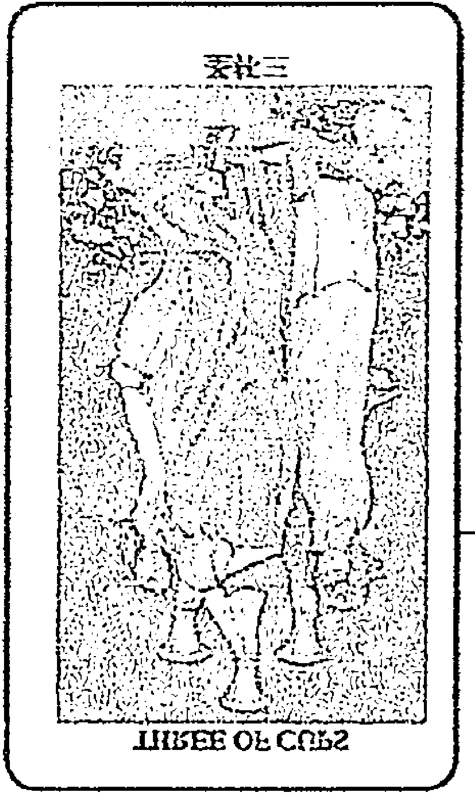

## 圣杯三逆位

### 心灵与精神层面的提示

确定了目标之后才有可能到达，没有行动的目的哪里也去不了，清除心中的杂念可以帮助你重新找到人生的方向。

### ※ 工作

- **工作本身的状况**

现在的工作已经到了结算成果的时候，之前的努力在这里会得到应有的报偿，但是表现不好在这里也会受到惩罚。

- **如何解决工作的困境**

这个时候应该要寻求外在的帮忙，甚至向公司外的体系求援，如果只靠自己的力量，是无法解决现在的问题的。

- **工作中的人际关系**

你在工作当中的人际关系如何，完全取决于你如何对待同事，如果你对同事们很好，他们必然也很乐意帮助你。

- **与上司相处的方法**

上司最重视的是绩效，对于你如何建成目标并不会干涉，所以你可以用自己的方法去解决，只要能完成任务即可。

- **工作的发展性**

这份工作也许还会有一些变化，甚至可能会调动到其他的单位，所以即使你想要继续在这里待下去，也会有点困难。

- **找工作/换工作的状况**

现在是找工作的好时机，也会很快就找到工作，不过最好是与你之前学业经历有关的事情，可以谈到比较好的薪水。

### ※ 爱情

- **感情本身的状况**

两个人该摊牌的时候到了，之前所种下的各种前因，在此都会出现其后果，同时也暗示了会有翻旧账的情况发生。

- **新恋情的可能性**

现在不太可能出现新的恋情，但是如果已经追求一个对象很久了，这个时候则可能出现正面的响应，可以多努力。

- **对这段感情的看法**

这是一段很好的感情，但是有些时候太重视感官的享受，反而让人觉得有一点不真实，也不知道是否能维持下去。

- **性的吸引力**

这段感情当中有很强的性吸引力，也是两个人选择在一起的主要原因之一，同时也会带给彼此很强烈的感官刺激。

- **如何化解争吵**

这个时候应该要为自己的所作所为负起责任，该道歉的就要道歉，该解释的就要解释清楚，把旧账都一起解决掉。

- **分手的方法**

这段感情还没走到最后，但如果两个人已经吵到不可开交了，这时候也有可能会分手，要看双方争吵的主题而定。

- **复合的可能性**

这段感情已经不可能会再复合了，两个人也已经没什么感情了，与其去想两个人的关系，还不如快点寻找新对象。

### ※ 友情

- **人际关系状况**

你的人际关系开始亮起了红灯，但是状况还不是很糟，只要你从现在开始补救，还是可以和大家维持良好的关系。

- **如何化解与朋友的误会**

有些误会如果解不开，那也是两个人的缘分尽了，不要强求对方一定要了解你，只要把自己该做的事情做好就好。

- **学习的方法**

如果这个时候可以和同学多多分享合作，也许在学习效率上可以提升，应该要一步一个脚印地把自己的基础打好。

- **与老师相处的关系**

老师通常都很关心学生，也会顺应学生的需要因材施教，如果你更用心地学习，就会从老师那里学到更多的东西。

- **与同学相处的关系**

你在同学当中比较被动，但是都能与同学维持不错的关系，只要你能对同学更好一点，就会得到更多的回报。

### ※ 亲情

- **家庭的状况**

现在家里的状况还不错，之前的努力也在此得到应有的回报，事情能够有一个好的结局，大家也可以松一口气了。

- **与长辈的关系**

你平时就对长辈不错，所以他也会很照顾你，即使发生了比较大的问题，他也会尽全力帮助你，让你无后顾之忧。

- **与平辈的关系**

平辈之间大家都在忙各自的事情，平时也没有什么交集，但若是有机会一起合作事情，通常也会比较容易成功。

- **与晚辈的关系**

你对晚辈非常照顾，也会尽可能地满足他们的需要，最好是能建立起赏罚分明的制度，才能达到最好的教育效果。

### ※ 学业

- **学业本身的状况**

现在到了学习上验收成果的时候，如果之前有足够的努力，也会有很好的成果，这时候再临时抱佛脚已经没用了。

- **学习的方法**

如果这个时候可以和同学多多分享合作，也许在学习效率上可以提升，应该要一步一个脚印地把自己的基础打好。

### ※ 财务

- **目前的财务状况**

你现在的财务状况还不错，但是仍然有一点不够踏实，你应该要努力地寻找新的方向，重新开始累积自己的实力。

- **投资的状况**

这时候应该把所有短期的投资结束，好好总结一下自己的得失，准备下一个阶段再开始，很多事情不必急于一时。

- **采购的策略**

这个时候需要什么就采购什么，不必预购太多东西来囤积，如果能精确掌握自己的预算，就可以达到最大的效果。

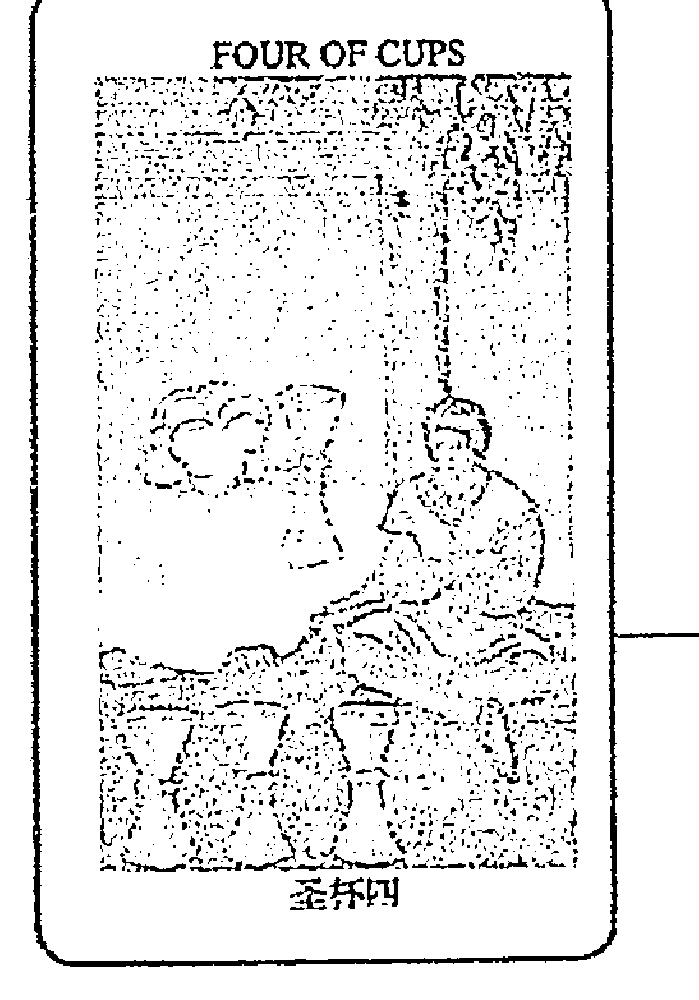

## 圣杯四正位

### 心灵与精神层面的提示

有时候沉思与反省是一个人进步的原动力，帮助你联结到内在更深的智慧，重新发现自己原来就有的天分和能力。

### 工作

- **工作本身的状况**：你对现在的工作感到疲倦，很想要停下来休息一下，你的内心对于现状十分不满，但是却有一种无能为力的感觉。

- **如何解决工作的困境**：这个时候你需要有一段完整的时间来沉淀和思考，不宜有任何冒进的举动，反而要有耐性地等待更好的机会出现。

- **工作中的人际关系**：你在工作当中的人缘还不错，但是你并不以此为满足，反而常常想得太多，有时候会因此造成自己或别人的困扰。

- **与上司相处的方法**：是一个想法很多的上司，但是很多事情并没有实际的做法，你应该请他指示正确的方法，不要自己乱猜就着手进行。

- **工作的发展性**：这是一份稳定的工作，但是未来的发展性并不是很好，可以把它当作一个学习的机会和跳板，有好的机会再离开。

- **找工作/换工作的状况**：这个时候并不适合找新工作，因为你对于工作的要求还没有确定，也可能因为眼高手低而错过一些还不错的工作。

### 爱情

- **感情本身的状况**：基本上这是一段还不错的感情，但是你仍然不是很满意，也许你应该好好把握现在的快乐，最好不要自己想太多。

- **新恋情的可能性**：现在不太可能发生新恋情，因为你对于感情的要求太高，是没人能达到的境界，这种梦幻的感情不可能成真。

- **对这段感情的看法**：你对于这段关系并不是很满意，也觉得仍然有改进的空间，其实有些东西是你标准太高，并不是真的有什么不好。

- **性的吸引力**：这段感情当中并没有太多的性的吸引力，但仍然会有还不错的性生活，两个人若是有心也可以改善彼此的生活情趣。

- **如何化解争吵**：现在应该要先反省自己，而不是立刻就去指责对方的错误，有些时候若能客观一点看待，就会发现问题并不严重。

- **分手的方法**：两个人其实还没走到非分手不可的地步，但是若是有很长一段时间没有联络，感情也会因为空的阻隔而渐渐变淡。

- **复合的可能性**：两个人都没有很强的动力想要复合，因此并不会有什么实际的行动，也许就让这段关系慢慢淡掉，这对于彼此都好。

### ※ 友情

- **人际关系状况**

目前你有一些亲近的朋友，这个状况并不让你觉得满足，你常会想要去交其他的新朋友，但是又缺乏实际的行动。

- **如何化解与朋友的误会**

基本上很多问题都是你自己想象出来的，所以也不必为这些事情烦恼，只要你能真心去对待他问题一定会化解的。

### ※ 亲情

- **家庭的状况**

其实现在家中的状况还蛮稳定的，只是成员彼此之间有一些不满的情绪出现，如果能主动把问题化解就会更和谐。

- **与长辈的关系**

由于你十分主观地处理很多事情，所以常常会和长辈有不同的意见，通常彼此的关系还不错，但有时也会有冲突。

- **与平辈的关系**

在平辈之间没有什么交集，但是也许彼此之间有一点意气之争，所以无法互相合作，有时候还会因此而互相攻击。

- **与晚辈的关系**

你对于晚辈的表现不太满意，这也会引起双方很多的情绪，如果你能更务实地评估，会发现他们的表现还算不错。

### ※ 学业

- **学业本身的状况**

你在学业当中的表现算是中等，不过你对于自己的期望不只于此，所以会对自己的表现感到不满，甚至有一点生气。

- **学习的方法**

这个时候不要把自己逼得太紧，给自己多一点休息和思考的时间，也许你就会找到更好的方法增加自己的效率。

- **与老师相处的关系**

是一个对学生有很高要求的老师，所以无论如何很难让他觉得满意，你只要把自己的责任完成，其他的就不用管了。

- **与同学相处的关系**

你可以好好把握那些和你关系比较好的同学，不要被那些讨厌你的同学影响，也许就能够在课业上有更好的表现。

### ※ 财务

- **目前的财务状况**

你在财务上已经建立起不错的基础，但是还没有达到你理想的状况，这个时候应该重新检讨自己的计划是否适当。

- **投资的状况**

你目前的投资在短期之内也许会有一点获利，但是就长期来看很不稳固，如果已经有小赚就应该快点获利了结。

- **采购的策略**

现在还不是你适合采购的时间，也许应该要再等一等，当好的机会出现的时候也许就可以找到更适合你的东西。

| 延伸应用 | 时间 |
|----------|------|
| | 相对时间：四天。 标示时间：巨蟹座第三旬（约每年7/12-7/21）。 |

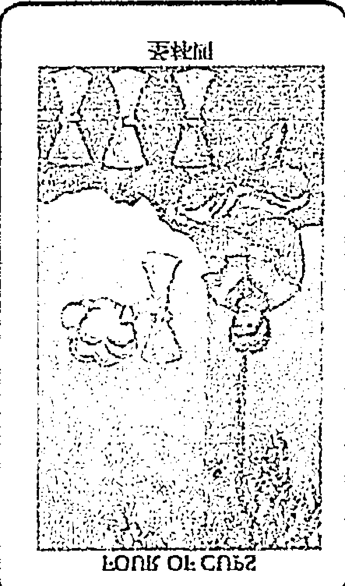

## 圣杯四逆位

### 心灵与精神层面的提示

把自己理智的想法放空，就可以发现更多内在的智慧，不要受到既有的概念限制，要相信自己的直觉和内心的想法。

### 工作

- **工作本身的状况**

即将发生重大的变化，也会有新的机会出现，你可以好好把握住这个机会，就可以脱离你所不满意的状况。

- **如何解决工作的困境**

这个时候你需要有新思维和新做法，按着自己的直觉去做，会比一成不变的制式方法更好，也可以真的解决问题。

- **工作中的人际关系**

即将有新人会加入到工作当中，你要为这个关系预作准备，但是也不要有太强的预设立场，要看实际的状况如何。

- **与上司相处的方法**

本身很有能力的上司，但是并不会主动指导或帮助你，如果你有需要应该主动去请教他，也许就会学到很多东西。

- **工作的发展性**

这个工作未来会有不错的发展性，但是现在还看不太出来，你可以试着继续做下去，也许就会发现新的工作方向。

- **找工作/换工作的状况**

这个时候有机会找到不错的新工作，但是也可能是经由新的朋友介绍的，这个时候不要放过任何建立人脉的机会。

### 爱情

- **感情本身的状况**

这段关系即将进入到新的发展，双方其实都有能力改善彼此的相处模式，除了愿景之外应该要提出更具体的做法。

- **新恋情的可能性**

现在有可能会发生新恋情，而且是一个新认识的人，由于事情有点出乎你的意料之外，所以开始时还会不太习惯。

- **对这段感情的看法**

这段感情由于对方太过被动，所以很多事情似乎不是那么完美，若是对方也愿意主动一点，感情必定会有所不同。

- **性的吸引力**

两个人之前并没有太多性的吸引力，但是会随着感情的发展而渐渐增强，性生活的开展也会让关系进入新的境界。

- **如何化解争吵**

这个时候应该要提出新的想法和做法，不要用老旧的方法去处理问题，有的时候创意会对两个人的关系很有帮助。

- **分手的方法**

两个人的关系还好，但是若出现了第三者，或是发生其他可能伤害这段关系的状况，也有可能很快就分手了。

- **复合的可能性**

其实这段关系完全不可能会复合，对于彼此来说再在一起也没有什么好处，不如去追求一段新的关系比较实在。

### ※ 友情

- □ 人际关系状况

你目前的人际关系还不错，但是最近还会认识不少新的朋友，如果你可以好好与他们交往，也会带给你很多快乐。

- □ 如何化解与朋友的误会

你大概知道为什么朋友会误会你，但是很多事情只是猜的也没有证据，你可以直接去求证和说明，会比较有帮助。

### ※ 亲情

- □ 家庭的状况

现在是重新开始的新契机，可以利用这个时间让大家更团结，应该多花一些时间和家人相处，大家好好培养感情。

- □ 与长辈的关系

你正试图建立与长辈之间的新关系，以一种更和谐的方式来相处，但是这通常需要耐性，要花一些时间才能完成。

- □ 与平辈的关系

你并不太了解平辈们在做些什么，彼此之间也没有什么交集，不过因此也有很多进步的空间，可以慢慢培养感情。

- □ 与晚辈的关系

由于缺乏经验的关系，在处理与晚辈关系时总是边做边学，有些时候会觉得新奇有趣，但是有时也会对自己生气。

### ※ 学业

- □ 学业本身的状况

你对于学新的东西比较快，但是对于以前学过的东西则不太在行，你可以多花一些时间复习，也会对你很有帮助。

- □ 学习的方法

在上课之前可以找个时间先预习一下，让自己对于将要学习的东西有基本的概念，等到听课的时候就可以很快地吸收。

- □ 与老师相处的关系

老师对大家都非常好，但是也会给大家不小的压力，你可以放松心情与他相处，不要有太强烈的预设立场和偏见。

- □ 与同学相处的关系

你和同学的相处关系都不错，也会在当中认识一些新朋友，好好把握和他们相处的关系，可以得到很多快乐。

### ※ 财务

- □ 目前的财务状况

你的财务状况还算不错，但是基础并不是很稳固，这个时候应该有新的想法和做法，才能帮助你未来更大的发展。

- □ 投资的状况

你现在可以开始考虑新的投资方向，如果之前已经有研究的话也到了动手的时机，至于旧的投资也许就该结束了。

- □ 采购的策略

你现在很适合采购，可以去尝试一些你没到过的店家，或是看了很久没走进去的店，也许就会找到你想要的东西。

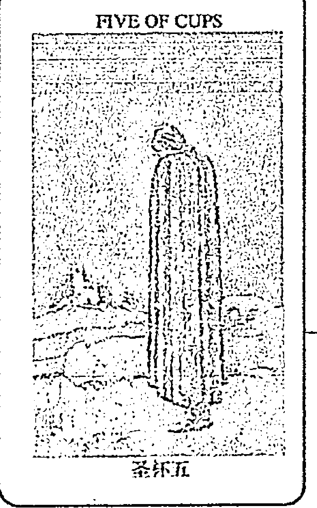

### 心灵与精神层面的提示

不要总是念念不忘自己的缺点，而忽略了自己的优点，能够把握自己优点好好发挥的人，才能发现对自己的爱。

### ※ 工作

- **工作本身的状况**

你在工作当中有很强烈的失落感，也可能是有同事不和的状况发生，你失去了工作的动力，只是看到不好的一面。

- **如何解决工作的困境**

这时候你应该收拾失落的情绪，接受资源不足的现状，看看如何利用自己仍然有的优势，去扭转外界的不良印象。

- **工作中的人际关系**

工作中的人际关系令你沮丧难过，大家的相处常常发生不愉快，甚至到视而不见的程度，也已经无法化解冲突了。

- **与上司相处的方法**

对于属下十分会究责批评的上司，即使表现好也无法得到他的奖赏，因此不要对他期望太高，否则反而失望越大。

- **工作的发展性**

这份工作已经没有什么好期待的了，混一口饭吃还可以，要有什么发展性就很不容易，还是找机会早早离开比较好。

- **找工作/换工作的状况**

你现在找工作的方向不对，因此就很难找到适合你的好工作，这个时候不妨换换别的方向，试一试也许会有帮助。

### ※ 爱情

- **感情本身的状况**

这段感情让你十分难过，原先的快乐现在已经完全被痛苦所淹没，你很容易看到对方的缺点而无法欣赏他的优点。

- **新恋情的可能性**

现在不可能发生新的恋情，因为你还在过去受伤的感情经验当中无法自拔，如果你无法忘了过去就无法创造未来。

- **对这段感情的看法**

这是一段令人痛苦的感情，有些问题即使十分努力也无法解决，让人觉得失望难过，也会开始想要结束这段关系。

- **性的吸引力**

这段关系当中已经没有什么性的吸引力，甚至性生活的不协调也会带给彼此很多的痛苦，即使有需求也无法满足。

- **如何化解争吵**

如果只是看到对方的缺点，那么不论大小事情都可以拿出来吵，但是若能改变自己的观点，也许事情就会有转机。

- **分手的方法**

两个人现在已经没有什么感情，也觉得在这个关系当中十分痛苦，所以若是能主动提出分手，反而会是一种解脱。

- **复合的可能性**

两个人之间已经完全没有任何机会复合，伤害造成之后也不可能那么快就平复，离开对彼此来说才是最好的选择。

### ※ 友情

- □ 人际关系状况

你最近可能失去了好朋友，因此在朋友关系当中让你觉得悲伤和失落，但是实际上你还是有一些很好的知心朋友。

- □ 如何化解与朋友的误会

有些伤害已经造成，不可能立即就结束，可能要评估一下这段友情是否有继续下去的必要，放弃也是一种方法。

### ※ 亲情

- □ 家庭的状况

最近可能因为家中发生不顺利的事情，甚至是亲人的离逝，所以感觉气氛十分哀伤，大家的脸上都失去了欢笑。

- □ 与长辈的关系

长辈对你十分严厉，也会强迫你去做你不想做的事情，你常常会因此而反抗他们，彼此之间的关系也会比较紧张。

- □ 与平辈的关系

你原先对于平辈有一些期待，但是状况却不如预期，甚至彼此之间发生了背叛或是欺骗的状况，让你感到很失望。

- □ 与晚辈的关系

你对于晚辈的表现十分不满意，也常常会想要把自己的意志强加在他们身上，这样的做法反而会引起更多的反弹。

### ※ 学业

- □ 学业本身的状况

你最近在学业上的表现并不好，或是在重要的考试或比赛当中失利，以至于你感觉到伤心难过，也没有心情读书。

- □ 学习的方法

这个时候你应该把握自己表现还不错的部分，而不只是专注于自己表现不好的部分，否则就会影响到自己的心情。

- □ 与老师相处的关系

是一个带有强烈偏见的老师，常常无法公平地处理事情，所以不要对他有太大的期待，否则反而会让你更加难过。

- □ 与同学相处的关系

也许最近你和同学发生了一些不愉快的事情，以至于影响到你的学习情绪，如果不能够重新振作就会影响到成绩。

### ※ 财务

- □ 目前的财务状况

你在财务上发生了严重的问题，有一种由天堂跌入地狱的感觉，这时不要让你的情绪影响你的判断，否则还会更惨。

- □ 投资的状况

你在投资当中失利，而且已经很难挽救了，这个时候应该要当机立断认赔杀出，保留实力以等待下一次的重新开始。

- □ 采购的策略

这个时候你的情绪起伏太大，并不太适合进行任何的采购，以免因此做出错误的判断，更不要以采购来发泄情绪。

| 延伸应用 | 时间 |
|----------|------|
| | □ 相对时间：五天。 标示时间：天蝎座第一旬（约每年 10/24-11/2）。 |

## 圣杯五逆位

心灵与精神层面的提示
要能够接受失去才能珍惜自己的所有，其实在得与失之间只是观念的不同，不必要为了自己无法掌握的东西担心。

### 工作

- 工作本身的状况
在工作当中一直发生各种问题，而且还不断地有新的问题接踵而来，之前的计划完全失去作用，通通都是坏消息。

- 如何解决工作的困境
这个时候要有壮士断腕的决心，放弃所有不利的因素重新开始，不要有任何预设立场，才会找到正确的解决方案。

- 工作中的人际关系
你对于工作当中的人际关系已经完全失望了，而且也不可能交到任何朋友，每天都要防备其他同事的陷害和背叛。

- 与上司相处的方法
这是一个本身没有足够能力的上司，所以也无法教导你任何事情，或是帮你解决任何问题，一切只能够靠你自己。

- 工作的发展性
这份工作还是早点离开为妙，留下来继续工作只是让你更伤心难过而已，而且未来还有很多不确定的变化会发生。

- 找工作 / 换工作的状况
你现在不要出来找工作，最好是先休息一阵再说，即使现在你有机会找到新工作，也必然是吃力不讨好的工作。

### 爱情

这段感情已经慢慢由爱生恨，所有的不满也已经爆发出来，两个人之间的冲突不断，觉得很痛苦但是又无法分开。

- 感情本身的状况

- 新恋情的可能性
现在完全不可能会出现新的恋爱对象，即使有出现喜欢的人也无法发展成感情，所以还是快点习惯一个人的生活。

- 对这段感情的看法
这段感情带来很多的伤害，即使仍然很深爱着对方，但是也渐渐无法忍受下去，常常会很想要尽快结束这段关系。

- 性的吸引力
这段感情当中有很强的性吸引力，也是两个人在一起的主要原因，这是一种很强烈的欲望，使得两个人无法分开。

- 如何化解争吵
现在正在激烈的争吵当中，双方都还在气头上，应该等过一阵子大家都比较冷静之后，再来解释也许会比较有效。

- 分手的方法
现在这段感情已经走到破裂的边缘，随时随地都有可能结束，所以若是在争吵当中提出分手，也许就真的会分开。

- 复合的可能性
基本上两个人的关系已经由爱生恨，也不可能再有任何愉快的相处经验，所以对两个人来说还是分开会比较快乐。

### 友情

#### 人际关系状况
其实你并没有什么好朋友，也已经习惯了一个人独来独往，不要对友情有太大的期待，以免反而带来更大的失望。

#### 如何化解与朋友的误会
同样的问题一直重复出现，你应该自己检讨一下到底是哪里出了问题，否则在同样的模式当中问题永远无法解决。

### 亲情

#### 家庭的状况
家中可能因为生意失败或是其他的意外，以至于家道中落，感觉上还有很多问题没有解决，也不知道该怎么解决。

#### 与长辈的关系
你从长辈那里得到很多的东西，但是同时也承受了不少的压力，你和他们的关系非常紧密，所以也没有办法逃避。

#### 与平辈的关系
在平辈之间大家彼此没有交集，你也不喜欢参加社交的活动，如果彼此之间有什么合作计划，大部分也都会失败。

#### 与晚辈的关系
你对晚辈有很大的期待，但是常常会因此感到失望，你应该给他们更多自由的空间，让他们自己去外面闯一闯。

### 学业

#### 学业本身的状况
你在学习上的状况很惨，也无法达到自己的目标，应该要重新检讨制订出新的计划，若以现在的方法还是无法成功。

#### 学习的方法
这个时候可以试试新的方法，不要老是抓着自己原本的方法不放，试着改良其他人的方法，或许会有更好的效果。

#### 与老师相处的关系
相当自以为是的老师，完全不容纳出现任何反对的意见，也很会记恨别人，所以最好是乖乖地不要让他注意到你。

#### 与同学相处的关系
你常会希望能与同学打成一片，但是实际上却无法和大家保持和谐的关系，这个时候应该花更多的时间在课业上。

### 财务

#### 目前的财务状况
目前你的财务状况出现了无法补救的问题，这个时候应该要认清事实不要再逃避了，大不了就是全部再重新开始。

#### 投资的状况
你在投资当中发生了重大的损失，所有的心血都已经化为乌有，即使想要补救也已经太晚，只能试着去接受事实。

#### 采购的策略
由于你的采购计划并不完备，所以最好是重新检讨之后再进行采购，以免因为一时的失误反而为你带来更多麻烦。

## 圣杯六正位

心灵与精神层面的提示
如果只是一直付出而不要回报，到最后必然造成失衡的关系，在爱中不只是要学习爱人，被爱也是需要学习的事。

### 工作

#### 工作本身的状况
你现在的工作算是稳定，但是当中也充满了一成不变的内容，让你觉得很无聊，在这里你有很多愉快的过往经验。

#### 如何解决工作的困境
这时候你应该要从经验当中寻找答案，看看是不是有什么方法可以解决，同时过去的人脉也有助于你解决问题。

#### 工作中的人际关系
工作中的人事非常稳定，人际关系也没有什么变化，大家都已经互相很了解，也不会有什么令人惊奇的状况发生。

#### 与上司相处的方法
基本上是很重视忠诚度的上司，只要你能忠心耿耿地帮他做事，他也会全力维护你，即使你犯错也会帮你解决。

#### 工作的发展性
这个工作不会有什么新的发展，也已经走到你能达到的极限，如果想要留下来等退休养老，就是一个不错的地方。

#### 找工作/换工作的状况
现在找的工作必然要与之前的学业经历有关，否则就很难找到好的工作，你的履历和经验越丰富，就会对你越有利。

### 爱情

#### 感情本身的状况
这是一段不平等的关系，可能是其中一方保护另外一方，而另一方又过分依赖的状况，两个人的关系会很紧密。

#### 新恋情的可能性
现在如果会有新恋情，必然是在一个已经认识很久的人身上发生，你们也许会有一些共同的回忆来促成这段感情。

#### 对这段感情的看法
其实两个人都在这段关系当中用了很深的感情，也是很真诚地去面对彼此，两个人都想要对彼此做出深度的承诺。

#### 性的吸引力
这段感情当中并没有很强的性吸引力，但是由于两个人都很用心于这段关系，所以也会努力经营出快乐的性生活。

#### 如何化解争吵
要以长期经营关系的观点来处理，而不是治标不治本地走短线，若是能给对方更深度的承诺，就会消除对方的不安。

#### 分手的方法
现在两个人要分手并不容易，因为彼此需要和依赖的关系还很深，即使两个人完全不联络，关系也很难就此结束。

#### 复合的可能性
两个人之间的感情已经成为回忆，完全不可能会复合，即使任何一方有心想要努力，也绝对不会被另外一方接受。

### 友情

- 人际关系状况
你的老朋友比较多，但是很难交到新朋友，其实你只要好好珍惜每个和你有缘的朋友就可以了，有很多事情是强求不来的。

- 如何化解与朋友的误会
你也许要买个礼物去和对方道歉，这样才能表现出你的诚意，如果对方能感受到你的诚意，再大的问题也可以解决。

### 亲情

- 家庭的状况
你处在一个温馨和谐的家庭环境当中，长辈对于大家都有很好的照顾和保护，从以前到现在相处方式都没什么变化。

- 与长辈的关系
你的长辈对你特别照顾，也会提供给你非常安全的成长环境，有时候你会觉得受到限制，但也能享受到很多的好处。

- 与平辈的关系
你现在与平辈之间已经没有太多交集，但是以前相处的关系还不错，所以如果遇到什么问题大家都可以互相帮忙。

- 与晚辈的关系
你与晚辈的关系很紧密，也会给他们很好的教育及生活享受，有时候会造成晚辈对你的依赖，但是你总是乐在其中。

### 学业

- 学业本身的状况
你对于现在学业上的表现并不满意，而想要追求过去的光荣，其实现在与过去的状况已经不同，比较也没有意义。

- 学习的方法
你应该从过去失败的经验当中学到教训，不要再犯相同的错误，只要你能改过自新振作起来，很快就会看到成果。

- 与老师相处的关系
是一个非常照顾学生的老师，所以遇到什么问题可以尽量去找他，大部分状况他都会帮你解决，所以就不用担心。

- 与同学相处的关系
你和少部分同学的关系还不错，但也只限于这个小圈圈，其实比较小的生活圈会让你比较有安全感，要好好把握。

### 财务

- 目前的财务状况
你目前的财务状况算是很稳定，也累积了很不错的实力，只要你在这个基础上继续努力，未来将会有很好的收获。

- 投资的状况
你应该集中自己的力量在已经有实质获利的投资项目上，千万不要进入你不熟悉的领域，新投资必定血本无归。

- 采购的策略
这个时候应该把每一个单项采购分开来进行，而不要一次进行太多项目的采购，并且最好是寻找自己熟悉的店家。

延伸应用
- 时间
相对时间：六天。
标示时间：天蝎座第二旬（约每年11/3-11/12）。

## 圣杯六逆位

心灵与精神层面的提示
真正的快乐来自于对于自我的充分了解，以及真心地接受自我的状态，与其向外界去求取快乐不如倾听自己的内心。

### 工作

- 工作本身的状况
工作上会有一些新的变化，之前稳固的状况也会被打破，你需要花一些力气去适应这个状况，这对你来说是新的经验。

- 如何解决工作的困境
有问题就应该不耻下问，不要觉得找人帮忙是丢脸的事情，只要你能找到有能力的人来处理，问题总是能事半功倍。

- 工作中的人际关系
工作当中的人事会有新的改变，但也不需要去预期或算计什么，只要你诚心地对待别人，也可以得到真心的回报。

- 与上司相处的方法
你要花很多力气去搞定你的上司，因为他对于事情有很主观的看法，即使你的方法比较好，他还是会很难以接受。

- 工作的发展性
这个工作会有不错的发展性，但是等于是一切重新开始，之前的努力都不算数，对你来说也许有不太公平的地方。

- 找工作 / 换工作的状况
现在应该可以找到不错的新工作，只要你愿意去尝试不同的新挑战，也会学到很多新东西让你的工作经验更丰富。

### 爱情

- 感情本身的状况
虽然这段关系已经很稳定了，但是仍然可能出现一些不同的刺激，因此两个人的感情即将进入一个不同的新阶段。

- 新恋情的可能性
现在有可能会出现新的感情对象，而且应该要等到你创造出新的生活圈之后，才可能有机会认识这个全新的对象。

- 对这段感情的看法
觉得在这段感情当中一直在付出，但是并没有感觉到真实的回报，当有一些争吵的时候，就会怀疑自己的付出是否值得。

- 性的吸引力
这段感情当中也许会有很多的欢乐，但是由于并没有很强的性吸引力，所以性生活并不会成为最重要的那个部分。

- 如何化解争吵
这个时候要提出不同的观点和做法，若是老套就不可能会被接受，要很小心处理这个问题，以免制造未来的祸根。

- 分手的方法
两个人其实是有可能协议分手，只是在过程当中会给彼此留下很深的心理伤害，表面上平静其实在内心会很难过。

- 复合的可能性
两个人要再遇到一起也不是没机会，但是也许复合要等很长一段时间，甚至要到双方都经历了另外一段感情之后。

### 友情

- 人际关系状况
除了老朋友之外，也许你现在会比较需要新朋友，所以有机会你可以打开出新的生活圈，找到各种不同的新朋友。

- 如何化解与朋友的误会
其实在两个人误会还没有很深之前，应该要及时去解决这些问题，否则等到形成刻板印象之后再说什么都没用了。

- 与老师相处的关系
老师会很重视学生的反应，因此不论大小事都逃不过他的眼睛，这个时候千万不要想骗他，到最后一定会被拆穿。

- 与同学相处的关系
你在同学当中会交到不少的新朋友，或是朋友的关系会有所改变，这个时候你的人缘会很不错，应该要好好把握。

### 亲情

- 家庭的状况
家中即将发生重大的变化，也许会有预期之外的正面力量，让人觉得家里可以重新振作起来，也会有很好的发展。

- 与长辈的关系
你对长辈常常会特别照顾，但是你觉得他们不太领情，反而像是在白做工，有时候也表示他们对你过度的依赖。

- 与平辈的关系
最近与平辈之间的关系开始越来越好，也有很多好的互动经验，如果好好经营这些关系，未来有互相帮忙的机会。

- 与晚辈的关系
晚辈常常对你有很多要求，但是你并不是每次都可以满足他们，你应该着眼于长远的发展需要，而不是短视近利。

### 学业

- 学业本身的状况
你在学业上的表现还不错，若是想要未来仍然有好的表现，就要保持过去努力的方法，应该很快就会看到成果了。

- 学习的方法
现在只能应付最紧急的状况，其他的东西就顾不了那么多了，为了达到快速有效的结果，临时抱佛脚是有必要的。

### 财务

- 目前的财务状况
你现在的财务状况还算不错，但是因为已经打下良好的基础，所以未来发展是很可观的，应该保持下去并继续努力。

- 投资的状况
你的投资即将进入到收获期，应该要开始寻找新的投资标的，当原有投资获利达到顶点，就要准备开始转换投资目标。

- 采购的策略
这个时候应该考虑到实用性和未来性，如果真的不错也可以考虑二手的东西，千万不要在这个时候一下花太多钱。

## 圣杯七正位

心灵与精神层面的提示
不考虑自己的需求而想要拥有任何的东西，都只是贪心和虚幻的想法，真正的成功必然是根植于自己心中的理念。

### 工作

#### 工作本身的状况
也许你觉得自己的工作非常成功，但那只是虚幻的假象，你对工作会有很多理想和抱负，只是绝大部分并不可行。

#### 如何解决工作的困境
这个时候你应该要确定目标，而不要被事物的表象所欺骗，只有找到真正的问题所在，才有可能找到解决的方法。

#### 工作中的人际关系
你常会参加很多交际的活动，但是其实大家并没有深交，即使表面上看起来大家感情很好，对你也没有什么帮助。

#### 与上司相处的方法
一个很会提出愿景的上司，但是对于实际执行没有什么好方法，所以只要方向一致，其他的就照自己的方法去做。

#### 工作的发展性
在这个工作中只有一时的成功，但是长远来看是不会有什么发展的，这个时候应该开始寻找其他可能的工作机会。

#### 找工作/换工作的状况
现在要先认清自己的方向，再依照自己的需要找工作，有些工作表面上看起来很不错，但不一定符合你的需要。

### 爱情

#### 感情本身的状况
这段感情当中很多部分都是你自己想象出来的，实际上并不是那么一回事，你只是和自己虚构出来的对象谈恋爱。

#### 新恋情的可能性
你现在还搞不清楚自己在感情上的标准，也不知道自己在感情当中需要什么，想清楚答案之前是不会有新对象的。

#### 对这段感情的看法
在这段关系当中有很深的无力感，和一开始的想象完全不一样，但是又无法去改变这段关系，因此会有很多情绪。

#### 性的吸引力
这段感情当中有很强的性吸引力，但这只是其中的一小部分，对于两个人来说，更大的吸引力来自于各自的想象。

#### 如何化解争吵
你对于对方有太多不切实际的期待，那根本是不可能达到的，只要你认清楚了这一点，就不会与他有太多的计较。

#### 分手的方法
其实两个人的感情是架构在虚幻的基础上，只要两个人能看清楚真相，这段关系必然会结束，想分手就实话实说。

#### 复合的可能性
两个人之间虽然有可能会复合，但是复合并不会解决任何问题，反而是一连串问题的开始，最好还是保持距离。

### 友情

- 人际关系状况
其实你的朋友很多，但是大部分只是泛泛之交，不要轻易地把别人当成知心朋友，否则很可能会被他们给出卖了。

- 如何化解与朋友的误会
问题在于你有没有说到做到，如果是自己对不起人家就一定要出来道歉，千万不要再执迷不悟下去以免一错再错。

### 亲情

- 家庭的状况
家中成员相处的时间很少，因此彼此之间的感情也比较疏远，如果能够加强关心常常联络，对大家都会很有帮助。

- 与长辈的关系
你与长辈的关系还不错，他们也会因此想要给你很多的帮助，不过别太相信他们说的话，因为他们常常无法说到做到。

- 与平辈的关系
你与平辈之间并没有太多感情，相处的机会也不是很多，对你来说有或没有都一样，也不会对他们有太大的期望。

- 与晚辈的关系
你对于晚辈比较自由放任，也会给他们很多的选择，只是有些时候过于放任的结果，可能反而会使他们无所适从。

### 学业

- 学业本身的状况
你在学业上的表现好像还不错，不过实力方面远远不如表面上的强，因此你应该要针对自己的实力再努力加强。

- 学习的方法
这个时候应该更发挥你的想象力，去尝试各种不同的可能性，如果找到最适合自己的方法，在学习上就能突飞猛进。

- 与老师相处的关系
基本上老师对大家的要求都很多，所以不可能符合他所有的要求，这个时候应该就自己可以完成的部分去努力。

- 与同学相处的关系
大部分同学和你都不是真心交往，而且也常常会大家混在一起，对于学业来说一点帮助都没有，还是要自己努力。

### 财务

- 目前的财务状况
你的财务状况表面上是不错，但是实际上并不如表面上那么成功，你应该更实际地规划评估，而不是什么都想要。

- 投资的状况
你的投资项目太多以至于你的力量过度分散，不可能有什么实际的利益，这时候应该要结束一些没有获利的投资。

- 采购的策略
这个时候不适合进行各种采购，因为大部分你想要买的东西都不是你真正需要的，应该重新检讨自己的采购项目。

延伸应用
- 时间
相对时间：七天。
标示时间：天蝎座第三旬（约每年11/13-11/22）。

## 圣杯七逆位

心灵与精神层面的提示
想要重新开始就必定要先放掉过去，由现在开始重新评估和计划，只有放空的双手才有可能抓到随时出现的机会。

### 工作

- 工作本身的状况
你的工作非常用脑，也需要做很多的计划以及解决各种的问题，所以虽然不用在外面跑，也还是很累人的工作。

- 如何解决工作的困境
这时候应该把自己放空，不要带有任何预设立场去看事情，也许很快就可以找到解决的方法，其实并不是大问题。

- 工作中的人际关系
你在工作当中并没有很多的朋友，也许你并不需要与大家有太多社交，大部分的事情还是要你自己去想办法解决。

- 与上司相处的方法
对于大部分的事情都要预作准备，因为上司并不会给你太多时间去思考如何解答，也许在最短的时间内他就要看到成果。

- 工作的发展性
这个工作未来还有很多的发展空间，但是要靠自己的努力去抓住机会，外表看起来的危机对你来说也许就是转机。

- 找工作 / 换工作的状况
现在只要有明确的方向和事前的计划，那么事情就会照你所想的方向发展，应该很快就可以找到适合自己的工作。

### 爱情

- 感情本身的状况
经过一段不太稳定的期间，现在感情已经慢慢步入正轨，也算是一种新的开始，很多状况都要重新去计划和适应。

- 新恋情的可能性
只要你能放下之前的感情，以及各种混乱不清的想法，在确立了自己的需要之后，适合你的新对象自然就会出现。

- 对这段感情的看法
因为这段感情使得自己有很大的改变，也开始可以释放掉一些旧有的错误模式，但这些都是很努力才得到的成果。

- 性的吸引力
在这段关系当中并没有很强的吸引力，两个人在知性方面的吸引力反而更强，性生活只是感情当中自然发生的事。

- 如何化解争吵
双方都要放下自己的预计立场，用比较客观的标准去看事情，其实只要两个人都各退一步，问题很自然就会解决。

- 分手的方法
现在两个人的关系正在转变当中，如果想要分手也不是很难的事情，只要有其中一个人正式提出，也许就会分手。

- 复合的可能性
两个人很有可能会复合，但是必然是另一种新关系的开始，若是怀念过往的各种模式，是完全不可能再恢复了。

## 圣杯八正位

### 心灵与精神层面的提示
能够把自己独特的想法付诸实现，才算是真正的创造力，如果只有空想而没有行动，到最后必然会被现实所打败。

### 友情
- 人际关系状况
其实你的朋友并不多，所以大多数状况你都是单独行动；但是由于你待人真诚，因此大部分的朋友都会真心相待。
- 如何化解与朋友的误会
你应该要找个时间单独和他谈谈，在这个时候人多嘴杂，反而没办法看到事情的真相，沟通之后也许就可以解决。

### 亲情
- 家庭的状况
也许家中面对着不同选择而无法决定，其实很多事情都需要从长计议，这时候只适合计划不适合行动。
- 与长辈的关系
长辈常常会给你很多的建议，但是你都是不理会他们的意见而我行我素，有时候会因此让他们觉得你很难以管教。
- 与平辈的关系
你与平辈之间没有太多交集，大家也都各奔东西各自发展，即使逢年过节时有多一些时间相处，也没有太多感情。
- 与晚辈的关系
你会为晚辈做很多的计划，但是不见得都是可行的，要先判断哪些是自己不切实际的幻想，不要将自己的意志强加在他们身上。

### 学业
- 学业本身的状况
你现在面对着新的状况，应该在学业上重新评估，试着做更务实的计划，也许可以先从设定目标的部分开始做起。
- 学习的方法
这时候你可以重新开始，不要回头去看过去的状况，只要从现在开始把东西学好，就可以在学业上有很好的表现。
- 与老师相处的关系
对于老师不要有不切实际的期望，因为大部分时间老师都只是尽到最基本的教学义务，不可能会给你更多的东西。
- 与同学相处的关系
你会希望和同学保持良好的关系，但是现在一切都还在未定之时，即使真的要去强求什么，也不一定可以得到。

### 财务
- 目前的财务状况
你目前的财务状况并不稳固，但是也没有太坏的状况会发生，也许是可以重新开始的时间，需要好好地重新规划。
- 投资的状况
你现在应该把所有的投资结束，换回现金以便接下来重新开始，如果还去计较现在的得失，反而会因此失去更多。
- 采购的策略
这个时候只要有完整的计划配合，就适合进行任何的采购，但若只是因为一时的冲动而采购，必定不符合你的需要。

### 工作
- 工作本身的状况
你对于自己现在的工作并不满意，因此常会想要做一番改革或是干脆离职算了，再多的金钱也填不满内心的空虚。
你对这段感情的状况并不满意，也常常会想做些什么来改变，也许两个人之间已经没有刚开始在一起的那种感觉。
- 如何解决工作的困境
这个时候最重要的是行动力，如果留在原来的状况下就必死无疑，只有改变才是唯一的生路，快点改变你的做法。
- 新恋情的可能性
现在只要你能主动出击，很快就会有新恋情，这段感情必然是与之前的感情不同，对你来说也会是很愉快的经验。
- 工作中的人际关系
你在工作中是属于比较特立独行的人，也很少参加同事的聚会，因此与大家的关系都不深，遇到问题也没人帮你。
- 对这段感情的看法
这段感情已经走到了尽头，如果再不改变就必定要结束，这个时候会对两个人的关系做各种假设，也不排除分手。
- 与上司相处的方法
是一个很善变的上司，无法忍受一成不变的状况，所以最好能够常常提出一些新的想法，即使做不到他也会高兴。
- 性的吸引力
这段感情开始的时候也许有很强的性吸引力，但是吸引力会随着时间渐渐地减少，到后来可能会完全没有性生活。
- 工作的发展性
在这个工作中绝对无法达到你的理想，所以若是有适当的时机应该快点走人，留下来只是在浪费你的时间而已。
- 如何化解争吵
这时候需要有实质的行动来打破僵局，也许两个人应该一起出去走走，一个不熟悉的新环境会有助于解决问题。
- 找工作 / 换工作的状况
现在是非常适合换工作的时间，也可以找到不错的工作，如果现在起你能主动出击，应该很快就会找到新的工作。
- 分手的方法
现在两个人已经没什么感情了，甚至还会有外遇的状况发生！只要两个人从此不再联络，这段关系就必然会结束。

### 爱情
- 感情本身的状况
- 复合的可能性
两个人之间完全不可能会复合，一方面是双方都对彼此有很多的不满还没解决，另一方面距离也会造成一定的阻隔和困难。

### 友情
- 人际关系状况
虽然你的朋友还不少，但是其实你常常想要一个人就好，你应该勇敢地去做自己想做的事情，不要太被朋友牵绊。
- 如何化解与朋友的误会
你应该主动去找朋友谈谈，其实两个人之间真的只是小误会，但若是你什么都不做，问题自然也不会被解决掉。

### 亲情
- 家庭的状况
现在家中可能有人会离家发展或是远行，大家应该要尽量地关心和帮助他，同时也要自立自强，让他没有后顾之忧。
- 与长辈的关系
你在长辈的心目中是很有主见的人，但是也比较难管教，你则会认为他们并不太理你，所以双方的感情并不很深。
- 与平辈的关系
在平辈当中你常常都是自己一个人，而且并不太想理会别人，你讨厌参加集体的行动，也很少要求别人帮忙你。
- 与晚辈的关系
可能因为距离的关系，而使你和晚辈之间的关系不是那么亲近，也许你应该多花一些时间和心力去关心他们。

### 学业
- 学业本身的状况
你最近并没有花很多心思在课业上，所以成绩表现有一些退步，但是只要你重新振作努力，还是会有不错的表现。
- 学习的方法
这个时候应该针对自己最弱的部分去补救，不论是请教别人还是自己努力都好，只要是在认真学就能看得到进步。
- 与老师相处的关系
老师对大家都是采取放任自由的方式，对你也不例外，所以除了上课时间之外也不用去找他，有事情就自己解决。
- 与同学相处的关系
你并不是很重视与同学的交往，但是都会和大家保持还不错的关系，你可以多花一点时间念书，去做自己的事情。

### 财务
- 目前的财务状况
你目前的财务状况还不错，但是也已经到了改变的时候了，如果能够重新检讨改进，就能在未来获得更大的成功。
- 投资的状况
你现在并不适合进行高风险的投资，应该是以储蓄的概念为主，把钱确实存下来，等到有更好的机会再准备投入。
- 采购的策略
这个时候不适合进行耐久产品的采购，买来的东西也只能短期有用，能买便宜的就不要太花钱，以免到时候后悔。

| 延伸应用 | 时间 |
| --- | --- |
| 相对时间：八天。 | 标示时间：双鱼座第一旬（约每年2/19-2/28）。 |

## 圣杯八逆位

### 心灵与精神层面的提示
华而不实的言词只是空洞的美丽宫殿，只有发自内心的沟通才能感动大多数人，要努力寻找自己心中真正的创意。

### 工作
- 工作本身的状况
你现在的工作费力而且不稳定，但是在工作当中还蛮愉快的，因此有时候会自己想要离开，同时又会感觉舍不得。
- 如何解决工作的困境
你应该在过去的经验当中寻找解决方案，也许是一个曾经被放弃的计划或是没有被采纳的建议，都可能是有效的。
- 工作中的人际关系
工作中的同事会一起出去玩，你也常常参加同事的聚会，虽然都保持很好的关系，但是在工作上并没有什么帮助。
- 与上司相处的方法
是一个主观性很强的上司，不太会采纳别人的意见，你可以尽量对他提出建言，但是即使被驳回也不要失落感。
- 工作的发展性
这个工作还有不错的发展性，但必然是吃力不讨好的状况，如果觉得自己不是刻苦耐劳的人，还是不要太坚持。
- 找工作 / 换工作的状况
现在是适合找工作的时间，但也许不会很快就去上班，可以边找工作边休息，等到找到满意的工作之后再做决定。
这段感情已经走到了重要的转折点，即将进入到下一个阶段，如果两个人没有准备要结婚，很可能就会走向分手。
- 新恋情的可能性
现在可能很快就会有新恋情，但是也许会是比较短暂的关系，你可以在当中享受到恋爱的愉快感觉，只是不长久。
- 对这段感情的看法
这是一段很愉快的感情，但是已经走到了瓶颈，也许必须做一些改变才能维持下去，这需要两个人共同努力才行。
- 性的吸引力
两个人在感情当中有很强的性吸引力，但也是比较短暂的感觉，等到互相更熟悉之后，这种吸引力就会渐渐变淡。
- 如何化解争吵
其实两个人遇到的只是小问题，应该快点走出争执的情绪，只要不变成一种意气之争，最后也是可以喜剧收场的。
- 分手的方法
现在两个人的关系正在转变当中，若是不小心变成有外遇的状况，很可能就会因此而分手，也会带来很大的伤害。
- 复合的可能性
其实两个人还有一些感情，但是这段关系已经不太可能复合了，因为分开是比较好的结局，就不要再想要复合了。

### 爱情
- 感情本身的状况

### 友情
- 人际关系状况
你在朋友之间还蛮受欢迎的，也会在人际关系当中得到很多快乐，只是你常常觉得这种关系并不是太深入和稳固。
- 如何化解与朋友的误会
你和朋友之间只是小误会，其实对双方来说都不是很重要，所以一段时间之后就自然会解决，不必刻意去做什么。

### 亲情
- 家庭的状况
现在家中遇到一些令人高兴的事情，但是也许并不是很稳固，要看到事情背后的真相，不可以太盲目地相信别人。
- 与长辈的关系
你的长辈常常很忙，也没有空理你，所以彼此见面的时间并不是很多，但是你们的相处关系也会非常愉快。
- 与平辈的关系
其实平辈彼此大多都是单独行动，并没有什么集体的活动，大家都只忙于自己的事情，遇到问题也不会互相帮忙。
- 与晚辈的关系
其实你并不太了解晚辈们在想什么，彼此之间也没有什么沟通，你应该多去了解他们的想法，才能好好培养感情。

### 学业
- 学业本身的状况
你目前被课业的问题所困扰，但是其实你也搞不太清楚是什么状况，这个时候应该要先理清问题，才有办法解决。
- 学习的方法
这个时候应该要发挥你的创意，不要被既有的规则和观念限制，用自己的方式和进度去学习才是最适合你的方法。
- 与老师相处的关系
老师非常重视班上的气氛，对于破坏大家和谐的人他一定不会宽待，所以最好是乖乖地和班上的同学打好关系。
- 与同学相处的关系
你与同学的关系还不错，彼此的相处也很愉快，但是这样对于你的学业没有任何帮助，不要花太多时间和大家玩。

### 财务
- 目前的财务状况
你目前的财务状况看起来还不错，但是实际上已经出现漏洞了，你应该要小心检讨自己的财务，才能够及时补救。
- 投资的状况
你现在很想要追求金钱，但是投资运势并不是很好，应该见好就收，如果现在投入更多的金钱会有很高的风险。
- 采购的策略
这个时候适合进行一些采购，也可以把一些东西汰旧换新，但是也要小心进行比较，以免发生买到瑕疵品的状况。

## 圣杯九正位

### 心灵与精神层面的提示
懂得享受生活的人才算真正拥有智慧，若是把物质享受视为堕落则会限制自己的心智，反而无法得到真正的快乐。

### 工作
#### 工作本身的状况
你对于自己的工作相当满意，你本身在工作当中的表现也非常好，你常常会以自己的工作为傲，并且向别人炫耀。
#### 如何解决工作的困境
这个时候应该要相信自己的能力，以自己的方法去解决才会得到最好的结果，你一定要坚持到底以争取最大的利益。
#### 工作中的人际关系
你在工作当中的表现比较突出，因此常常会是同事们咨询的对象，如果你能适时地帮助别人，人际关系将会更好。
#### 与上司相处的方法
这是一个重视绩效又自以为是的上司，所以若是想要得到他的欢心，就一定要有突出的表现，否则其他一切免谈。
#### 工作的发展性
这个工作未来仍然有很好的发展性，特别是有很不错的加薪机会，如果能够保持好的表现，在升迁上也少不了你。
#### 找工作 / 换工作的状况
现在应该可以找到很好的工作，而且很有可能是有人来找你跳槽，应该要好好评估到底哪一个环境最适合你发展。

### 爱情
双方对于这段感情都觉得很满意，彼此之间也保持着良好的关系，两个人之间的和谐相处常常会带来更多的欢乐。
#### 新恋情的可能性
现在应该很有可能出现新的感情对象，但是要看你是不是能主动出击，若只是等对方主动可能就会错失一些机会。
#### 对这段感情的看法
这段感情已经很接近完美了，自己也觉得非常满意，由于两个人的相处过程十分愉快，因此也会很珍惜这段关系。
#### 性的吸引力
这段关系当中性的吸引力非常重要，也是两个人在一起的主要原因之一，同时性生活常常能带给彼此很大的乐趣。
#### 如何化解争吵
其实两个人的争吵并不严重，只要两个人可以一起来面对问题，一定可以有一个完美的解决，不要自己太过担心。
#### 分手的方法
其实感情是两个人的事情，只要有一方坚持要分手，另一方也没有什么话好说，只要你坚定立场就能顺利地分开。
#### 复合的可能性
两个人其实还是有感情在，但是不一定能够复合，主要是因为双方都太重视面子，谁也不愿意先低头向对方认错。

### 友情
- 人际关系状况
你的人际关系还不错，但是有时候会太过于主观和自负，常常就在不知不觉当中得罪人，也许可以稍微修饰一下。
- 如何化解与朋友的误会
如果自己没有错那就一定要坚持自己的立场，不要因为别人的话就动摇了信心，对方总有一天会发现是自己的错。

### 亲情
- 家庭的状况
现在家中充满了快乐的气氛，也有很令人满意的生活，大家都在自己的岗位上表现得很好，也会常常彼此称赞。
- 与长辈的关系
长辈常常会对你提起他当年的事迹，你也因此对他们有更多的了解，只要你能适度地附和或称赞他们就会很高兴。
- 与平辈的关系
你在平辈当中是属于表现比较突出的，所以通常大家都会很重视你的意见，但是最好注意不要太过以自我为中心。
- 与晚辈的关系
你对晚辈有很多的期待，也会培养他们的各种能力，但若常常无法达到你的标准，你就会觉得自己是在白费力气。

### 学业
- 学业本身的状况
你在学业上的表现非常好，这个时候若是参加竞赛或考试，都会有很不错的表现，你对自己的表现也是十分满意。
- 学习的方法
这个时候应该针对自己比较有优势的项目去发挥，而不要只是看到自己还不足的地方，应该要对自己更有信心一点。
- 与老师相处的关系
是一个很有能力的老师，但是也会很重视面子问题，如果能在竞赛上有好的表现，也许就会得到老师特别的照顾。
- 与同学相处的关系
你在课业上的表现非常好，但是有一点过于自满，以至于在人际关系上会有一点问题，对同学应该要更谦虚一点。

### 财务
- 目前的财务状况
你在财务上十分成功，也能把所有的钱做最适当的规划，你能享受金钱带来的各种快乐，在生活享受上愿意花钱。
- 投资的状况
你现在适合进行投资，虽然不算是长期的利益，但是就短期来说已经非常好了，你应该要见好就收不要长期作战。
- 采购的策略
这个时候很适合进行各种采购，在采购的过程中你也可以享受到花钱的快乐，但是要注意自己的预算不要超支了。

| 延伸应用 | 时间 |
| --- | --- |
| □ 时间 相对时间：九天。 标示时间：双鱼座第二旬（约每年3/1-3/10）。 |  |

## 圣杯九逆位

### 心灵与精神层面的提示
能与别人分享的人才算真正地拥有，只想要自己独占快乐的人，不但无法持续成功，最后也必然会落入失败的境地。

### 工作
- 工作本身的状况
你在工作上非常追求完美，但是总是很难达到自己的理想，有时候也因为对自己太有信心，以致犯了严重的错误。
- 如何解决工作的困境
有时候分享和拥有是一样重要，如果你能把自己的心得和别人讨论分享，也许会激发你更多的灵感，把问题解决。
- 工作中的人际关系
你在工作当中的人际关系并不太好，因为你太以自我为中心，而且常常有自大自满的言论，大家当然就不肯帮你。
- 与上司相处的方法
在工作上追求完美的上司，如果有一点小错误就会被他责骂，所以除了自己小心之外，也要懂得看他的脸色说话。
- 工作的发展性
这个工作已经接近发展的极限了，如果能见好就收快点离开也许能维持不错的形象，否则未来会对你越来越不利。
- 找工作 / 换工作的状况
现在也许很快可以找到工作，但是都不是非常满意，如果不能降低自己的标准，也许就要再等一阵子才会有机​​会。

### 爱情
- 感情本身的状况
两个人在感情当中都各执己见，又不愿意彼此体谅，因此常常会发生不愉快的状况，但是又不知道该如何才能解决。
- 新恋情的可能性
现在也许会有机会出现新恋情，但是并不是你原本喜欢的类型，如果你不能改变自己的想法，也许就不会适合你。
- 对这段感情的看法
在这段感情中其实自己的付出很多，但是觉得对方都不太珍惜，也没有太多的回馈，有时候会觉得挫折或是不值得。
- 性的吸引力
两个人之间其实没有太多的吸引力，生活的部分也不是很愉快，反而变成了一种义务，对于感情没有太大帮助。
- 如何化解争吵
两个人可能都是固执己见而不肯妥协，因此就无法解决问题，这个时候应该加强分享和沟通，以同理心来看事情。
- 分手的方法
如果真的想要分手，就要断绝一切沟通的途径，除了不说话之外，也不要有什么讯息，让对方无法知道你的想法。
- 复合的可能性
这段关系已经不可能恢复了，因为两个人都无法接受对方的行为模式，即使真的复合也不可能是一个快乐的关系。

### 友情
- 人际关系状况
你最近在人际关系上很挫折，常常会觉得受到欺负，也许你应该打听一下自己到底是哪里做错了，以免受到排挤。
- 如何化解与朋友的误会
你应该要以同理心来看事情，千万不要太过主观，如果是自己的错就要道歉，以免更多人因为这件事情看不起你。

### 亲情
- 家庭的状况
现在家中遇到一些挫败，实在是该要好好研究找到解决方案的时候，最好能多参考别人的意见，别再闭门造车了。
- 与长辈的关系
在家中你是固执己见的人，以至于当与长辈们意见不合的时候就无法妥协，他们对于你的行为也常常会无法接受。
- 与平辈的关系
在平辈当中大家都只是管自己的事情，所以彼此之间并不亲近，你与平辈之间的关系也不是很好，凡事要靠自己。
- 与晚辈的关系
你对晚辈要求完美，但是也因为这样会给他们太大的压力，你无法忍受他们犯错，所以彼此之间的关系会很紧张。

### 学业
- 学业本身的状况
你在学业上遇到了重大的挫折，可能是因为粗心大意而犯了错误，只要你能改进这个缺点，下次的表现可以更好。
- 学习的方法
这个时候应该多和同学分享，并且从同学的身上学到更多东西，如果只是一个人努力，必然还会遇到同样的问题。
- 与老师相处的关系
是很重视规则和理性能力的老师，必然是以学生的表现来评量，对于过程不是那么重视，所以只要重视结果就好。
- 与同学相处的关系
你在同学当中有点被孤立，你自己也不知道是怎么回事，也许是有一群讨厌你的同学在排挤你，应该要虚心检讨。

### 财务
- 目前的财务状况
你太过自以为是，以至于在财务上犯下严重的错误，如果这个时候还不能及时刹车，接下来也许会有更大的问题。
- 投资的状况
现在非常不适合进行投资，如果现在投资上有获利当然要见好就收，如果继续下去获利可能减少，甚至血本无归。
- 采购的策略
这个时候采购要非常小心，以免买到瑕疵品或是冒牌货，在付钱之前要很仔细地检查，否则最好先观望一阵再说。

## 圣杯十正位

### 心灵与精神层面的提示

完美的成功来自于内心的平静，很多理想看似离我们很远其实只在咫尺之间，只要你愿意诚心去感受真实的快乐。

### 工作
- **工作本身的状况**：是一个很完美的工作，不但工作环境的气氛很好，也能够同时兼顾家庭生活，你本身在工作当中的表现也非常好。
- **如何解决工作的困境**：应该要去考虑到大家的需要，而不只想要解决自己的问题，如果能从集体的观点出发，个体也会得到最大的利益。
- **工作中的人际关系**：这是一个温馨和谐的环境，同事都像是家人一样地相处，而且也可以彼此互助配合，因此会保持很好的工作情绪。
- **与上司相处的方法**：你可以把上司当成家中的长辈，有事情就要真诚地沟通，遇到问题也是互相分担，才能培养出命运共同体的感觉。
- **工作的发展性**：这个工作现在十分稳定，未来也有不错的发展，只要你能立定志向朝着明确的目标去努力，一定会机会成功。
- **找工作/换工作的状况**：现在可以找到很不错的工作，也许由家人介绍会比较快，决定之前最好也能参考家人的意见，这对你有很大的帮助。

### 爱情
- **感情本身的状况**：现在两个人的相处十分和谐，就像是家人一样的感觉，只要大家能真心地对待，未来仍然会保持很好的感情状况。
- **新恋情的可能性**：现在有发生新恋情的可能性，而且很有可能是经由亲戚朋友的介绍而认识，因此也可以多多参加亲友聚会的活动。
- **对这段感情的看法**：这是一段很完美的感情，对于两个人来说都是很美好的一件事情，会很想要共同去经营一个家庭，感情非常亲密。
- **性的吸引力**：两个人之间有很强的吸引力，性的吸引力也是其中的一部分，性生活对彼此来说是很自然的事，也没有什么压力。
- **如何化解争吵**：其实争吵的只是一件小事情，把事情谈开来就好，最怕的就是闷在心里不讲出来，反而会累积成未来更大的问题。
- **分手的方法**：现在两个人要分手很不容易，除非双方的家长都提出强烈的反对意见，而且又没有缓和的余地，才有可能会分开。
- **复合的可能性**：其实两个人的关系还是很像家人，但是不一定要走在爱情的道路上，如果决定了要复合可能就是打算和对方结婚。

### 友情
- 人际关系状况
你和大家的关系都已经很稳定了，也建立起固定的人际网络，你对朋友就像家人一样，朋友们常可以一起出去玩。
- 如何化解与朋友的误会
你可以在朋友的聚会当中对他提出说明，再加上其他朋友也来当和事佬，一定可以解决问题，你要有诚意去解释。

### 亲情
- 家庭的状况
现在家中的状况十分和谐，家庭成员彼此之间的感情很好，大家对这个状况十分满意，也是人人称羡的模范家庭。
- 与长辈的关系
你与长辈的感情非常好，由于你对于长辈们十分尊敬，他们也会对你提供援助，你应该努力不要辜负他们的期望。
- 与平辈的关系
平辈之间大家的感情很好，也常会一起出去玩，感觉上大家都很平等，也可以互相尊重，所以相处状况都很快乐。
- 与晚辈的关系
你和晚辈的相处十分愉快，遇到什么问题也都会帮他们解决，你会希望他们能以你为荣，所以自己也会谨言慎行。

### 学业
- 学业本身的状况
你在学习上的表现很好，也已经达到自己满意的状态，如果能继续以现在的方式努力，应该可以保持长久的成功。
- 学习的方法
要用自己熟悉的方法学习，才是最稳固的成功方法，也许有些时候会觉得效果不如预期，但是仍然应该坚持下去。
- 与老师相处的关系
是一个非常关心大家的老师，会希望大家都能和谐相处，所以只要能和同学保持良好关系，就会得到老师的喜爱。
- 与同学相处的关系
你与同学的感情十分紧密，遇到困难的时候大家会互相帮助，在课业上又可以教学相长，是一群值得交往的同学。

### 财务
- 目前的财务状况
你对自己的财务状况感到满意，也能维持在稳定小康的状况，也许用在家庭方面的支出比较多，但收支算是平衡。
- 投资的状况
现在可以进行购物或是长期的储蓄，而不太适合进行短期间有高风险的投资，对你来说越长期的投资就会越有利。
- 采购的策略
这时候非常适合进行生活用品的采购，或者以满足家庭需求为主，其实并不需要花太多钱就可以买到满意的东西。

| 延伸应用 | 时间 相对时间：十天。 标示时间：双鱼座第三旬（约每年 3/11-3/20）。 |
| --- | --- |

## 圣杯十逆位

### 心灵与精神层面的提示

如果能放下自己内心的情绪，自然就可以接收到来自上天的讯息，得到各种解决问题的智慧以及内心真正的平静。

### 工作
- 工作本身的状况
你很喜欢你的工作，但却不太被家人所理解和接受，你希望能在两者之间取得平衡，但是常会影响到工作情绪。
- 如何解决工作的困境
你应该从长远的角度去考虑这个问题，而不要放弃任何解决的希望，有时候冲突被表面化反而有助于问题的解决。
- 工作中的人际关系
在这个工作当中，大家都可以保持表面上的和谐，但是在内心其实没有什么感情，遇到问题大家也很难互相帮助。
- 与上司相处的方法
一个重视家庭甚于工作的上司，所以常会因为工作以外的事情影响到工作的进度，如果不能自立自强就会被拖累。
- 工作的发展性
这个工作看似非常稳定，其实在当中还有很多隐藏的危机，如果不能及早防范，也有可能会成为斗争中的牺牲品。
- 找工作/换工作的状况
现在不太可能找到很好的工作，除非选择在家里面帮忙，不过这对你长期的发展没有帮助，甚至可能会造成冲突。

### 爱情
- 感情本身的状况
这段感情开始时太过于理想化，以至于忽略了很多实际上的困难和问题，到现在即使想要回头，也已经来不及了。
- 新恋情的可能性
现在有可能会发生新的恋情，但是不太可能是美好的恋情，如果只是很短暂的一段感情，事后反而会觉得更痛苦。
- 对这段感情的看法
两个人的感情表面上很和谐，其实内心当中有很多的冲突，即使能够控制自己的情绪保持平静，也无法真心相对。
- 性的吸引力
两个人之间有很强的性吸引力，但同时也有一种冲突的张力，对于双方来说性生活是两个人之间的重要缓冲机制。
- 如何化解争吵
这个时候如果把争执表面化，反而会是解决问题的开端，不要怕发生冲突，只要把情绪发泄出来之后就好解决了。
- 分手的方法
现在两个人即使提出分手也不容易分开，因为双方都还有很强烈的情绪，无法真心地放手，同时会引起更多冲突。
- 复合的可能性
这段感情已经走到尾声，即使复合还是难逃再度分手的命运，如果有其他更好的对象，就不要再一直纠缠不清了。

### 友情
- 人际关系状况
你对大家都还不错，但是在人际关系中却不太受欢迎，主要是因为你常常表错情，让别人觉得你不是很真心在付出。
- 如何化解与朋友的误会
你应该坚持自己的立场，把自己的理由讲清楚，其他的事情也就随缘了，很多事情不要强求，反而比较容易解决。

### 亲情
- 家庭的状况
现在家中充满了欢乐的气氛，但是却没有人发现潜在的问题，也许在表面的和谐之下，其实是存在着很多的危机。
- 与长辈的关系
你很想为长辈做些什么，但是又缺乏实质的行动力，双方常常会有一些不同意见，所以有时也会比较难以分享心事。
- 与平辈的关系
在平辈当中你是属于比较疏离的一个，虽然表面上和大家的感情都保持不错，但是平时并不会主动去关心其他人。
- 与晚辈的关系
由于之前你对于晚辈过于放纵，因此很可能会养成他们无法无天的习惯，即使你花费很大的力量也很难约束他们。

### 学业
- 学业本身的状况
你在学习上常常过于理想化，觉得自己应该很快就可以学会，但是又不够务实地去努力，所以反而会无法跟上进度。
- 学习的方法
这个时候应该靠集体的力量，以大家共同合作的方式去学习，如果不能团结一致，靠每个人自己的力量都是不够的。
- 与老师相处的关系
其实老师并不太想要管你，所以一切就只能自求多福，即使遇到什么问题他也不会帮你解决，但是也不会约束你。
- 与同学相处的关系
你与同学的关系并不紧密，但是其实有很多事情是要大家互相合作的，如果你无法与人合作，将会被大家所排斥。

### 财务
- 目前的财务状况
你对自己的财务有过于乐观的预期，而缺少务实细心的评量，如果仍然不节制花费，将会让自己陷入财务的危机。
- 投资的状况
你现在不适合进行任何的投资，即使是再好的亲朋好友建议你也不行，有时候一时的糊涂会让你付出很大的代价。
- 采购的策略
这个时候只适合小型的采购，对于长期或是大额的采购，最好都能再三思考评估之后再进行，以免因此发生纠纷。

## 圣杯侍从正位

### 心灵与精神层面的提示

常常进行自我反省的思考，会帮助你更了解自己，只有在了解真实的自我之后，行动时才会充满坚强的内在力量。

### 人物
- 当事人的个性
待人诚恳而有礼貌，对于新鲜的事物有强烈的好奇心，不只认真好学，而且能独立思考，同时具有丰富的想象力。
- 当事人的工作观
在工作上保持着学习的心态，遇到不懂的事情常常会去请教别人，会认真地把自己的事情完成，也很有反省能力。
- 当事人的感情观
在感情上真诚且谨慎，会全力实践诺言但绝不承诺自己做不到的事；了解自己在感情上的不足，也会努力去学习。
- 当事人的金钱观
还不太了解金钱的作用，但是会把大部分的金钱储蓄起来；对于投资理财很好奇，也会去学习和充实相关的知识。
- 与当事人的应对方法
在交往的过程当中会很愉快，也可以互相交流很多的讯息，常会提出很多有创造性的想法，也许会对你所有帮助。
- 人物代表
学生、总机、客服员、行政人员、储备干部、好奇的人。

### 工作
- 工作本身的状况
你对于本身的工作还不是很熟悉，应该要快点学习让自己进入状况，整体来说会是愉快的，也可以学到很多东西。
- 如何解决工作的困境
遇到自己无法解决的问题，应该和对方真诚地讨论，试着找到双方都可以接受的方案，或者去问其他有经验的人。
- 工作中的人际关系
你在工作上的人际关系很不错，也会认识不少新的朋友，大家都对你十分友善，你也可以从别人的身上学到很多。
- 与上司相处的方法
是一个很有创造力的上司，但是有一些方案并不一定能实行，你应该以他的方向为准，再自己想办法慢慢去完成。
- 工作的发展性
现在工作还在学习的阶段，但也是进步最快的一段时间，应该把握所有自我充实的机会，遇到不懂的事情就要问。
- 找工作/换工作的状况
这个时候可以找到不错的工作，应该各个方面多多尝试，不要只限于与自己学业经历有关的，否则可能会错过好机会。

### 爱情
- 感情本身的状况
现在感情还在刚开始的阶段，对双方来说都需要一段时间去适应，未来的发展还有很大的潜力，也有各种可能性。
- 新恋情的可能性
现在应该很快就有新的感情对象出现，但是就看你是不是能主动去把握，也许会是经由朋友介绍而认识的新朋友。
- 对这段感情的看法
这段感情算是一个全新的经验，在当中也有很多地方要学习，虽然觉得还有很多的不确定，但是会很想维持下去。
- 性的吸引力
在这段感情当中没有太多的性吸引力，好奇反而是占了大部分，双方也许是因为对彼此的好奇而开始了性生活。
- 如何化解争吵
这个时候应该诚心地和对方沟通，努力找到问题发生的真正原因，如果自己有错就和对方道歉，没什么好为难的。
- 分手的方法
其实两个人的感情还不算很深，如果真的需要分手，理性谈判还是最好的方法，以后大家也还可以成为好朋友。
- 复合的可能性
这段感情有可能会复合，但是必然是与之前的性质不太相同，还要重新适应，已经不可能回到以前相处的状况。

### 亲情
- 家庭的状况
最近有许多与家中有关的讯息发布，家里面也觉得气象一新，这个时候应该提出一些新的做法，来顺应新的情势。
- 与长辈的关系
你与长辈的关系很亲近，长辈也很喜欢跟你说他以前发生的事情，因此你会对长辈特别了解，也会学到很多东西。
- 与平辈的关系
你是平辈当中比较受到疼爱的，但是也可以和大家都维持良好的关系，你也常常扮演平辈和长辈之间沟通的桥梁。
- 与晚辈的关系
你常常把晚辈当成大人来看，也会对他们的事情特别关心，因为常常和他们聊天的缘故，彼此之间的感情特别好。

### 学业
- 学业本身的状况
你在学习上非常认真，而且也很爱自由思考，所以不仅学习效果很好，也因为了解得很深入而可以灵活运用。
- 学习的方法
这个时候要发挥你的好奇心，多多阅读资料，再加上深入的思考，遇到不懂的再问其他人，一定可以充分了解的。
- 与老师相处的关系
很重视学习态度的老师，所以无论如何都要认真上课，如果能在课堂上多发问，就会在老师心中留下很好的印象。
- 与同学相处的关系
你和同学的相处很愉快，也可以交到很好的朋友，和同学的互动对你的学业有帮助，大家都是你的良师益友。

### 友情
- 人际关系状况
你的人际关系还不错，和大家都能保持良好的互动关系，也可以与大家打成一片，你常在聊天当中学到很多东西。
- 如何化解与朋友的误会
其实只是双方发生了一点小误会，因此只要你先向他道歉就会没事了。如果对方有错，他也一定会主动向你道歉。

### 财务
- 目前的财务状况
由于你现在还没有什么财务基础，所以应该要做好未来的规划，如果能有一个好的开始，未来就会有很好的发展。
- 投资的状况
现在对你来说是适合开始投资的好时机，可以针对自己了解的东西多投资一点，就长期而言应该会有不错的回报。
- 采购的策略
这时候适合进行采购，但是都不要一次投入太大的金额，只要能够多多打听、货比三家，一定会找到最划算的价格。
- 时间
相对时间：十一天。标示时间：双鱼座（约每年2/19-3/20）。

## 圣杯侍从逆位

在美丽词藻包装的背后，常常都是缺乏自信或是内涵的状况；朴实无华的言语当中，往往包含了真诚坚定的信念。

### 人物
- 当事人的个性
喜欢幻想而不切实际，因此对于事情常常没有正确的认知，缺乏明晰的判断力，也会比较没有实际去做的行动力。
- 当事人的工作观
在工作上很会见风使舵，没有坚定的立场和看法；在工作当中并不积极，甚至有时候会没来由地就请假不去上班。
- 当事人的感情观
在感情上只考虑到自己，从不会为别人着想，常常陷入自己的幻想当中无法认清现实，所以常会在感情上受伤害。
- 当事人的金钱观
不想在财务上独立而希望能依靠别人，花钱的时候没有节制，常会在不知不觉当中把钱花完又提不出具体的明细。
- 与当事人的应对方法
过度沉溺于自己的幻想当中，因此他说的话大概只有一半可以相信，容易与人有财务上的纠纷因此最好不要介入。
- 人物代表
助理、秘书、翻译人员、临时演员、代课老师、看护员。

### 工作
- 如何解决工作的困境
这个时候你应该试着去了解问题，而不是想要立刻解决问题，也许你会发现问题根本不在你，也不是你能解决的。
- 工作中的人际关系
你在工作当中的人际关系还不错，但是因为你常常想要依赖别人帮你，所以也会引起别人的不耐烦，甚至会躲开你。
- 与上司相处的方法
上司常常连自己的问题都搞不定，就不要指望他可以帮你解决任何问题，也许该越过一级或是找其他主管想办法。
- 工作的发展性
这个工作未来的发展前景不明，因为还会发生很大的变化，留下来就像是在赌博，但绝对不会是一个稳定的工作。
- 找工作 / 换工作的状况
这个时候可以找一些临时的工作，但是要找长久稳定的工作就不太可能，最好要先去充实自己在专业方面的能力。

### 爱情
- 感情本身的状况
现在感情还算是在暧昧期，双方也没有真的认定对方就是唯一的情人，可能还有其他备胎人选，没有下最后决定。
- 新恋情的可能性
现在很可能会出现新的感情对象，但是也许与你之前的预期有极大的差异性，对你来说并不满意也不一定要接受。
- 对这段感情的看法
这段感情是一个自我的突破和尝试，但是心中仍然没有很确定，也常常会想试试其他的对象，心情并不是很稳定。
- 性的吸引力
两个人之间并没有太多的性吸引力，也不想去碰触有关性生活的部分，因此也无法对这段感情有什么正面的帮助。
- 如何化解争吵
这个时候多多和对方撒娇算是还不错的方式，要让对方觉得你真的很委屈，等到气消了之后，自然就会原谅你了。
- 分手的方法
这个时候两个人都还可以选择，所以直接提出分手就可以分开，但是要断得清清楚楚，最好也不要再和对方联络。
- 复合的可能性
这段感情不太可能会复合，因为彼此已经认清是不适合的类型，也没有太深厚的感情，分开是彼此最好的选择。

### 亲情
- 家庭的状况
家中成员最近彼此联络比较少，所以在感情上有一点疏离，这个时候应该把大家找回来，一起吃饭或是联谊一下。
- 与长辈的关系
你特别会对长辈撒娇，也会得到长辈特别的照顾，即使如此你还是不太满足，常常会向长辈提很多不合理的要求。
- 与平辈的关系
你在平辈当中是属于比较自私的人，不爱与大家分享东西，但是因为你的嘴巴比较甜，大家也不会和你一般见识。
- 与晚辈的关系
你在与晚辈相处的时候常常会觉得不耐烦，因此也懒得和他们说说话，对他们的教育会采取比较放任自由的做法。

### 学业
- 学业本身的状况
你在学习上并不是很认真，每天还是很想要玩，而且只学习自己有兴趣的东西，所以在学习上就会无法平衡发展。
- 学习的方法
这个时候想再多都没有用，最重要的是你要确实去念书，要花时间努力用功，除了念书之外绝对没有其他的快捷方式。
- 与老师相处的关系
属于耳根子比较软的老师，只要你多说一点好听的话，他就会对你留下很好的印象，很多事情会对你比较好一些。
- 与同学相处的关系
你和同学每天只是在言不及意，完全没有教学相长的正面功效。如果还是每天鬼混不念书，成绩表现就不会进步。

### 友情
- 人际关系状况
你在人际关系方面的状况还不错，由于你很擅长讨好和巴结别人，所以即使不喜欢你的人也不会和你正面冲突。
- 如何化解与朋友的误会
这个时候要多多称赞对方，多多说对方的好话，让他觉得有飘飘欲仙的感觉，那么不论有什么问题通通可以解决。

### ※ 财务

- 目前的财务状况
现在的财务状况还好，但是已经有一些不好的习惯出现，你应该正视自己的财务结构，重新建立起好的理财习惯。

- 投资的状况
现在对你来说并不适合投资，特别要避免只听到别人的一面之词就贸然投资自己不熟悉的领域，必然血本无归。

- 采购的策略
这时候不太适合进行采购，可能会遇到很会推销的商家，其实并不是你需要的东西，如果买了也是用不到，只是浪费钱。

## 圣杯骑士·正位

### 心灵与精神层面的提示
当自己有新的体会，应该通过与别人的分享来重新检视，不但可能帮助到别人，也可以在这一过程中发现自己的不足。

### ※ 人物

- 当事人的个性
在思考上敏锐而富有理想性的人，喜欢对别人宣扬自己的理念，也有很好的口才，但是在执行力方面就比较不足。

- 当事人的工作观
比较重视工作的理念和发展性，常常可以提出新的想法和做法来解决问题，也很有能力去说服别人接受他的建议。

- 当事人的感情观
在感情上浪漫而热情，而且会主动去追求自己喜欢的对象；除了追求感情上的满足之外，也会很重视理念的交流。

- 当事人的金钱观
虽然不是那么重视金钱，但是会把金钱做最有效率的运用；通常不太喜欢储蓄，而会把金钱花费在自己的兴趣上。

- 与当事人的应对方法
这些人非常喜欢聊天，你可以和他天南地北无所不谈，只要不涉及到价值观的问题，通常都会让你觉得获益良多。

- 人物代表
作家、演说家、营销企划、公关宣传、传教士、好丈夫。

### ※ 工作

- 工作本身的状况
现在工作的状况很有挑战性，要花很多脑筋去想办法解决问题，还要努力去说服别人，上下班时间没有明显界线。

- 如何解决工作的困境
这件事情其实只是欠缺一个合理的说法，你必须把前因后果想清楚，然后提出完整的说明和解决方案去说服大家。

- 工作中的人际关系
你在工作当中的人际关系很好，因为你总是能与大家保持良好沟通，不会发生误会的状况，也能和大家打成一片。

- 与上司相处的方法
是一个聪明绝顶的上司，常常喜欢发表自己的高见。千万不要当面去反驳他的意见，否则他可能会和你辩论个没完。

- 工作的发展性
这个工作未来有很好的发展性，不但可以开阔你的视野，也有机会可以实现你的理想，即使辛苦也应该要做下去。

- 找工作/换工作的状况
现在可以找到不错的工作，也有可能是由朋友介绍而开始新的工作，这个工作当中人际关系很重要，要好好经营。

### ※ 爱情

- 感情本身的状况
其实两个人都很享受这段感情，也在这个关系当中开发很多感情方面的能力，整体来说是一段不错的感情。是一段浪漫而热情的关系。

- 新恋情的可能性
现在很可能会出现你所喜欢的对象，对方也算是比较主动的类型，如果你能鼓励他前进，也许很快就会在一起。

- 对这段感情的看法
这是一段很浪漫的感情，在这个感情当中双方都全力地投入，把两个人紧紧地绑在一起，真是一段很理想的感情。

- 性的吸引力
在这段感情当中有很强的性吸引力，而且双方都能自然地表现出浪漫和热情，常常都能够享受到很愉快的性生活。

- 如何化解争吵
这个时候就要用到你的口才，努力地用甜言蜜语去说服对方，和对方道歉，甚至是求对方要原谅你，这都不太难。

- 分手的方法
这段期间两个人要分手实在不太容易，因为彼此之间的感情还很深，也许要先分开一阵子不联络，之后再来谈判。

- 复合的可能性
这段感情其实并不算完全结束，所以复合也可以很自然地发生，如果你主动提出要复合，应该就可以重新在一起。

### ※ 友情

- 人际关系状况
你在人际关系上的表现很不错，不但各式各样的朋友很多，也可以与大家保持不错的关系，你很喜欢和朋友聊天。

- 如何化解与朋友的误会
这时候你可以办一个朋友间的聚会，然后向他当面道歉，即使他还觉得不爽，但是因为同侪的压力也就原谅你了。

### ※ 亲情

- 家庭的状况
最近家中常常有亲友来访，所以充满了放松和享乐的气氛，这个时候应该去规划未来的事情，提出新的愿景。

- 与长辈的关系
长辈常会找你聊天，也会顺便教你很多事情，你和他相处的时间非常愉快，因此彼此之间也会建立起深厚的感情。

- 与平辈的关系
在平辈当中你常常担任跑腿的角色，但是也因此串起大家的感情；你常会提供给大家一些建议，和大家感情都很好。

- 与晚辈的关系
你常会对晚辈说教，也很重视对他们的教育，但如果能用比较温和的态度，教育的效果会比较好，也能增进感情。

### ※ 学业

- 学业本身的状况
你花很多时间在学习上，因此也会有不错的成果，如果你可以和同学们多交流，那么会很快地增进你的学习效率。

- 学习的方法
这个时候除了专心念书之外，也要找机会和同学多交流，在讨论的过程中会使观念更清楚，也帮助你消除知识的死角。

- 与老师相处的关系
是一个口才很好的老师，对于大部分的问题都可以解释得很清晰，也会希望多和学生交流，所以要多提出问题。

- 与同学相处的关系
你和同学是属于教学相长的关系，与同学的互动越多越会增进你学业上的表现，所以应该要和同学们保持良好关系。

### ※ 财务

- 目前的财务状况
现在你的财务状况还在打基础当中，所以一切要以稳定为原则，不要太好高骛远，以免出现自己无法承担的风险。

- 投资的状况
现在可以开始尝试一点投资，但是还不到你大显身手的时候，这个时候应该是抱持着学习的心，而不是想要赚钱。

- 采购的策略
这个时候采购以个人兴趣有关的东西为主，也许会发现自己梦寐以求的好东西，但是这都要你主动出击去找找看。

### 延伸应用

时间
相对时间：十二天。
标示时间：双鱼座（约每年2/19-3/20）。

## 圣杯骑士逆位

### 心灵与精神层面的提示
谎言或诡计只能在一时掩盖自己的错误，但是被发现之后反而要付出更大的代价，因此要勇于承担所有自己说过的话。

### ※ 人物

这个工作可能本身就是一个骗局，或者是用不正当的方法赚钱的工作，如果能够早点离开的话或许可以全身而退。

- 当事人的个性
口才很好但是没有真材实料，因此常常让人觉得流于诡辩，表面上看起来谈吐温文有礼，其实常常都是口蜜腹剑。

- 如何解决工作的困境
这个事情其实根本就没办法解决，只能尽量想办法去掩盖，不要被其他人发现，否则爆发出来会是很严重的后果。

- 当事人的工作观
其实不是很喜欢工作，也不太实际去努力，只是在做表面功夫，用一些小动作去讨好上司及客户，也会挑拨离间。

- 工作中的人际关系
在工作当中大家都是尔虞我诈，也找不到可以信任的同事，这个时候只能靠自己，同时要注意保守工作中的秘密。

- 当事人的感情观
在感情上浪漫而多情，常常会在不同的对象之间游走，也很难只有一个固定的情人，非常会用花言巧语讨人欢心。

- 与上司相处的方法
一个很会画大饼吹牛的上司，但是都无法说到做到，所以不要把他的话太当真，也绝对不要当面把他的牛皮戳破。

- 当事人的金钱观
会把大部分的金钱用在生活享受上，也不太想努力工作，常常梦想自己一夜致富，或是用不正当的手段牟取暴利。

- 工作的发展性
这个工作未来不会有什么发展，即使你付出很多努力，也只是白费力气，还不如早点离开，可以节省你很多时间。

- 与当事人的应对方法
与这些人交往的时候要小心他背后的动机，也不要谈到太多与私人有关的事情，以免让他有机可乘，反而身受其害。

- 找工作／换工作的状况
现在很难找到适当的工作，你应该要重新务实地评估自己的能力和方向，不要再自欺欺人，才有可能重新出发。

- 人物代表
补习班名师、广告人、演员、摄影师、骗子、花花公子。

### ※ 工作

- 工作本身的状况

### ※ 爱情

- 感情本身的状况
其实在这段感情当中充满了虚伪的谎言，双方都不是真心在和对方交往，甚至两个人都已经有私底下出轨的状况。

- 新恋情的可能性
现在不太可能出现真心的对象，但是也许有与不同的人发生一夜情的机会，只会有感官上的刺激但不会有真感情。

- 对这段感情的看法
其实这段感情根本不应该开始，但是现在已经来不及回头，只好走一步算一步，也是随时在想该怎么结束比较好。

- 性的吸引力
两个人之间有很强的性吸引力，而且双方都是很快就被对方吸引住，但是性的吸引力只会带来很短暂的肉体关系。

- 如何化解争吵
这个时候只能用甜言蜜语去哄他，希望他快一点气消，但是实际上问题还是无法解决，最多只能把问题延后而已。

- 分手的方法
这段感情表面上看起来还不错，其实内部已经问题丛生了，只要把真相揭开，这段关系就算想维持也不可能。

- 复合的可能性
这段感情已经完全不可能复合了，而且两个人已经有很多解不开的误会，甚至还会怨恨对方，怎么可能再在一起？

### ※ 友情

- 人际关系状况
你在人际关系上的评价很两极化，喜欢你的人觉得你很好，但是讨厌你的人则是恨你入骨，其实你常觉得很孤独。

- 如何化解与朋友的误会
这个问题并不是你可以解决的，也许该考虑放弃这段友谊，即使说明了很多，到最后还是无法把心结完全解开。

### ※ 亲情

- 家庭的状况
由于家庭某一个成员的隐瞒，使得家中遇到了重大的危机，即使仍然有人认为问题不严重，还是应该立刻处理。

- 与长辈的关系
长辈常会和你谈一些理想或梦想，但是其实很多东西是不可信的，你应该要有自己的判断能力，小心去分辨真假。

- 与平辈的关系
平辈彼此之间常会互相算计，但是表面上又表现出感情很好的样子，在口是心非的状况之下其实暗藏着许多的危机。

- 与晚辈的关系
你对晚辈采取比较放任的态度，即使他们犯了什么错误也不太想去管，其实你应该要严格一点对他们才会比较好。

### ※ 学业

- 学业本身的状况
你在学习上常常不踏实，遇到测验又会用作弊的方法来自欺欺人，即使成绩看起来还好，其实能力已经完全不行。

- 学习的方法
这个时候应该要谦虚地面对，对于不了解的东西应该要从头开始打基础，如果不务实处理，未来会越来越难补救。

- 与老师相处的关系
其实老师很擅长教学，但是对于学生的问题却不太关心，在课业上可以向他多学习，其他的部分就只能靠自己了。

- 与同学相处的关系
你和同学基本上是互相拖累的损友关系，应该要自己多多努力，如果每天只是打混而不读书，就不可能会有起色。

### ※ 财务

- 目前的财务状况
你现在的财务状况是金玉其外、败絮其中，千万不要再打肿脸充胖子，这时候减少开支把债务处理一下才是正途。

- 投资的状况
现在不宜进行任何投资，特别是自己不太熟悉的领域很可能会遇到投资陷阱，即使是自己熟悉的也可能血本无归。

- 采购的策略
这个时候应该把钱省起来，不要再进行采购了，即使遇到你很着迷的东西，也应该要保持理性，千万不要冲动消费。

## 圣杯王后正位

### 心灵与精神层面的提示
站在务实的角度去运用直觉，才能平衡意识与潜意识的部分，除了专注于自己的事情，也要照顾到其他人的需要。

### ※ 人物

- 当事人的个性
对于人及情绪非常敏锐，也能够以同理心去看待事情，重视心理分析和情绪管理，在心灵及神秘学方面很有天分。

- 当事人的工作观
在工作上十分专注，也具有独立作业的能力；做一件事情之前能考虑到其他人的反应和后果，因此也很容易成功。

- 当事人的感情观
在感情上十分温柔浪漫，可以充分体谅对方的难处，同时也会体贴对方的需要，在面对新恋情的时候会比较被动。

- 当事人的金钱观
并不认为金钱是最重要的，反而会想要利用金钱去帮助别人；在财务上不太务实，有时候会选择爱情而不顾面包。

- 与当事人的应对方法
可以充分放开心胸和他交往，但是最好不要谈太俗气的话题，心灵成长的相关话题会帮助你们搭起友谊的桥梁。

- 人物代表
研究员、人事主管、修女、班导师、家庭主妇、好情人。

### ※ 工作

- 工作本身的状况
现在工作的状况十分稳定，你可以全心全意地专注于工作，任何问题都很难令你分心，你也会在工作当中学到很多。

- 如何解决工作的困境
这时候你要以同理心去面对其他人，设身处地为别人着想，找到大家都可以接受的方案，最后才会有完美的解决。

- 工作中的人际关系
你在工作当中的人际关系非常好，因为你常常能站在对方的立场上思考事情，处理事情除了正式规定之外也通人情。

- 与上司相处的方法
非常重视人际互动的上司，但是本身的想法高深莫测，你只能与同事维持良好的关系，完全没有办法直接讨好他。

- 工作的发展性
这个工作未来还有不错的发展性，也会在工作当中学到很多东西，如果能够专心地经营，一定有更上层楼的机会。

- 找工作/换工作的状况
现在应该锁定自己想要的目标，尽全力做好找工作的准备，如果漫无目的地随便找，就很难在这个时候与人竞争。

### ※ 爱情

- 感情本身的状况
现在两个人感情十分稳定，彼此之间相处的时间也非常快乐，在这段感情当中双方都学习到如何去经营一段感情。

- 新恋情的可能性
现在很有可能会发生新的恋情，将出现一个你认为十分理想的对象，如果你能主动出击去追求，很可能就会成功。

- 对这段感情的看法
对方真的是一个完美情人，让自己觉得有一点不太真实；两个人的感情十分稳定，希望这段感情可以永远那么甜蜜。

- 性的吸引力
在这段感情当中两个人之间有很强的性吸引力，性生活对彼此来说都很重要，愉快的性生活也使得彼此关系特别紧密。

- 如何化解争吵
这时候诚实是最好的策略，对方提出任何问题要有问必答，把事情说清楚就不会有误会，两个人的感情也会更好。

- 分手的方法
两个人对于彼此的感情还很深，在这个时候要两个人分开实在不太可能，除非在这段感情当中突然出现了第三者。

- 复合的可能性
两个人现在其实还有很深的感情，也有可能立刻就复合，但是千万不要自己急着提出复合，最好等对方先主动再说。

### ※ 友情

- 人际关系状况
现在你的人际关系不错，与朋友的相处也都很快乐，你常常能帮助朋友处理很多事情，因此他们也会努力回报你。

- 如何化解与朋友的误会
这个时候你可以晓之以理动之以情，除了详细说明之外还要发动人情攻势，记得柔性处理比强硬的手段更有效。

### ※ 亲情

- 家庭的状况
家中成员彼此之间的向心力很强，也会为彼此着想，因此若是合作事情就很容易成功，也会因为合作而有所成长。

- 与长辈的关系
长辈常常会称赞你，让你觉得很有成就感；你也会尽力去完成他们交待你的事情，所以你与长辈的感情很好。

- 与平辈的关系
在平辈当中你是比较温和的一个，虽然并不是很出风头，但是常常能协调大家的意见，反而可能成为幕后的领导者。

- 与晚辈的关系
你对晚辈常会过分溺爱，即使他们犯了什么错误也会一再原谅他们，有时候应该强硬一点会有比较好的教育效果。

### ※ 学业

- 学业本身的状况
你在学习上十分认真，并且也有深入研究的精神，对于很多东西有敏锐的灵感，所以在学习上会比别人更有效率。

- 学习的方法
这个时候应该要专心地研究，慢慢地整理，把问题解决掉。如果书本当中没有标准答案时，应该要相信自己的直觉。

- 与老师相处的关系
是一个很会照顾人的老师，所以有什么心事可以尽量和他讲，他对于学生的问题大多都有问必答，脾气也很温和。

- 与同学相处的关系
你和同学的相处很愉快，常常都可以帮他们出主意来解决问题。由于你待人诚恳实在，别人对你也会有更多回报。

### ※ 财务

- 目前的财务状况
现在你的财务状况算是很稳定，但也没有什么多余的资金，这个时候应该开始设定目标，有计划地把钱累积下来。

- 投资的状况
现在可以开始研究该如何投资，但是还不到动手的时候，应该大部分是以储蓄的功能为主，不要想要有太多获利。

- 采购的策略
这个时候可以去采购一些个人的用品，也许要先从自己了解的东西下手，说不定会意外地遇到很适合自己的东西。

### 延伸应用

时间
相对时间：十三天。
标示时间：天蝎座（约每年 10/24-11/22）。

## 圣杯王后逆位

### 心灵与精神层面的提示
应该要把真实的世界和自己的想象分清楚，这样才能在想象的世界当中自在地翱翔，又不会影响到自己的日常生活。

### ※ 人物

- 当事人的个性
想象力很丰富但也比较情绪化，常常会陷入自己的幻想当中无法自拔，有时候不经思考就会随着自己的感觉说话。

- 当事人的工作观
其实不太爱工作，但是在工作当中比较自以为是，无法接受别人的建议，对于自己的工作也会有不切实际的幻想。

- 当事人的感情观
感情上比较随性且很难稳定下来，在感情当中十分投入但是也很容易见异思迁，因此常会有错综复杂的感情关系。

- 当事人的金钱观
对于金钱没什么概念，喜欢花钱享受但是并不想努力赚钱，通常没有什么积蓄，有时甚至需要靠别人的金钱援助。

- 与当事人的应对方法
对于他无心说的话不要太在意，否则就会常常被他气得半死；最好不要和他吵架，因为他骂人都会十分尖酸苛薄。

- 人物代表
诗人、画家、贵妇人、爱幻想的人、女演员、风尘女子。

这个工作可能本身就是一个骗局，或者是用不正当的方法赚钱的工作，如果能够早点离开的话或许可以全身而退。

现在工作的状况其实很不稳定，甚至不知道明天会不会有工作，即使偶尔有不错的表现，也常会引来更多的麻烦。

- 如何解决工作的困境
这时候应该要把自己抽离出来，不要陷于情绪的旋涡当中，只要你能务实地评估状况，大概就可以把骗局拆穿。

- 工作中的人际关系
你在工作当中的表现不错，但是不能得到同事的认同，反而可能会被其他人孤立，在这个工作当中你找不到朋友。

- 与上司相处的方法
一个完全没有原则的上司，只要对他有利什么事情都做得出来，他说的事情不可以完全相信，最好是自己想办法来验证。

- 工作的发展性
在这个工作当中很难看到未来性，也只能做一天算一天，如果想要在工作上有所发展，应该快点离开才会有希望。

- 找工作 / 换工作的状况
现在很难找到适合的工作，即使真的找到也很不稳定，如果可以先休息是比较好的选择，不然就当自己是在打工。

### ※ 工作

- 工作本身的状况

### ※ 爱情

- 感情本身的状况
这段感情缺少实际相处的经验，很多事情都是自己想象出来的，其实两个人都是在和自己想象出来的对象谈恋爱。

#### 新恋情的可能性

现在不太可能出现好的恋爱对象，但是也有可能会出现极为短暂的感情接触，彼此只是在追求感官上的刺激而已。

#### 对这段感情的看法

这段感情就像是一场梦，一切都很虚幻而不真实，也许在开始的时候会觉得是一场美梦，但是后来却变成恶梦。

#### 性的吸引力

这段感情当中有很强的性吸引力，而且可能就是因为这种吸引力使两个人在一起，性生活会带来很强的感官刺激。

#### 如何化解争吵

这个时候就算开始谈也谈不出结果，所以最好是先把问题放着，等大家都清醒一点再来谈，否则只是会越吵越凶。

#### 分手的方法

其实这段关系当中存在太多的幻想和谎言，只要两个人把谎言拆穿，把所有真相说出来，这段感情就会立刻结束。

#### 复合的可能性

这段关系完全不可能复合，虽然彼此还有一些感情，但是其实两个人并不适合，即使真的复合了也只是每天吵架。

### ※ 友情

#### 人际关系状况

你在人际关系上是属于比较喜欢独处的类型，同时因为你常常会说话得罪其他人，所以也很少会有知心的好朋友。

#### 如何化解与朋友的误会

这个时候真的会越描越黑，所以还是什么都不要说，也许可以先写个信或发个简讯和他道歉，等他气消了之后再来说明。

### ※ 亲情

#### 家庭的状况

家中现在可能发生成员彼此严重争吵的状况，也因此引发了连锁的情绪反应，全家都笼罩在无法信任的气氛当中。

#### 与长辈的关系

你常常会对长辈们闹脾气，虽然你原本的想法是要撒娇，但是有时候也会弄巧成拙，把彼此之间的气氛弄得很僵。

#### 与平辈的关系

在平辈当中你算是比较骄纵自私的，因此大家都会很怕你，如果有发生争吵的状况，你一定是大获全胜的那一个。

#### 与晚辈的关系

你很关心晚辈的状况，其实很有心想要好好教育但是缺乏方法，你可以多找一些相关的书籍来看，也许会有帮助。

### ※ 学业

#### 学业本身的状况

你在学习的时候常常不能专心，只是每天自己在幻想自己的事情，没有付出努力好好学习，当然不可能会有成果。

#### 学习的方法

这个时候应该要收心好好地读书，同时辅助地做很多的练习，一方面可以检验自己的成果，也可以强迫自己专心。

#### 与老师相处的关系

有时老师说话会很情绪化，所以如果有什么事情要说，一定要先学会看老师的脸色，否则可能不小心扫到台风尾。

#### 与同学相处的关系

其实你和同学没有什么交集，也很少和同学说话，有些时候会和同学发生口角冲突，反而会影响你的学习情绪。

### ※ 财务

- **目前的财务状况**
你现在的财务状况十分不稳定，甚至已经负债严重了还不自知，如果不能务实地面对自己的问题，很可能会破产。

- **投资的状况**
现在不宜进行任何的投资，也不去想象有多少的获利空间，只要能把钱安全地存下来，就是你现在最好的选择了。

- **采购的策略**
这个时候并不太适合进行金额太大的采购，因为你可能会在还没想清楚之前就付了钱，事后要反悔已经来不及了。

## 圣杯国王正位

### 心灵与精神层面的提示
帮助别人是一个令自己快乐的过程，也许在短期间看起来你付出了许多，但是内心的满足感渐渐会滋润你的心田。

### ※ 人物

- **当事人的个性**
慈悲宽容的一个人，通常都很乐于助人，在经验和学识上很丰富，对于婚姻及家庭等传统价值也十分坚持和重视。

- **当事人的工作观**
在工作上见过各种大风大浪，因此不论遇到什么状况都能沉着应对，处变不惊，也会想出很好的方法来解决问题。

- **当事人的感情观**
在感情上十分成熟而睿智，也能做到包容和原谅。以婚姻作为发展感情的前提，也会勇敢负起感情和家庭的责任。

- **当事人的金钱观**
在处理金钱上比较保守，会以生活上的必要支出为主，常会拿出一部分金钱去帮助别人，同时也很重视风险管理。

- **与当事人的应对方法**
是一个可以信任和依靠的人，遇到无法解决的问题也可以去询问他的看法，也许就会提供给你一个不错的解决方案。

- **人物代表**
校长、班主任、老教授、宗教领袖、大师、尽职的家长。

### ※ 工作

- **工作本身的状况**
工作上虽然遇到很多的变化，但是你都可以安全度过，若是遇到无法解决的问题，也都会有人对你及时伸出援手。

- **如何解决工作的困境**
这个时候你一定要冷静下来，处变不惊地处理问题，在过去的经验当中寻找灵感，或是通过书籍和网络找到解答。

- **工作中的人际关系**
你在工作中的人际关系相当不错，也是大家喜欢咨询的对象，由于你常帮助别人，所以遇到问题也有人会帮你。

- **与上司相处的方法**
一个很有解决问题能力的上司，遇到不懂的事情可以尽量地向他询问；他平时也会常常关心你，让你觉得十分暖心。

- **工作的发展性**
这个工作未来还会有很多的变化，但是也会学到很多东西，由于可以同时兼顾家庭生活，是适合长期经营的工作。

- **找工作 / 换工作的状况**
这个时候最好是找与自己学历有关的工作，越高的学历对你越有利，如果觉得自己的学历不够也可以考虑先进修。

### ※ 爱情

- **感情本身的状况**
现在两个人之间感情的状况非常稳定，有可能是正在计划结婚，彼此的相处像家人一样，也会受到大家的祝福。

#### 新恋情的可能性

现在有可能出现新的恋情，同时对方的态度十分认真，是以结婚为前提要和你交往，所以千万不要只想玩玩就好。

#### 对这段感情的看法

这段感情经历了各种风风雨雨，现在终于走出一条自己的路，即使未来遇到任何的艰难险阻，也绝对不轻言放弃。

#### 性的吸引力

这段感情当中有很强的吸引力，虽然对于学识谈吐的欣赏会多过于男女情爱，性生活对彼此来说也是很重要的事。

#### 如何化解争吵

这个时候应该要以更包容的心去看待这件事，即使对方有什么不对也不应该苛责对方，要设身处地去为对方着想。

#### 分手的方法

这段关系实在很难在这个时候结束，即使遇到再大的困难也不能把两个人分开，除非双方家属都站在反对的立场。

#### 复合的可能性

两个人现在的关系很像家人，也有可能再度复合，但是也许复合之后就要开始安排结婚计划，应该要三思而后行。

### ※ 友情

#### 人际关系状况

你的人际关系很好，大家都很喜欢来找你帮忙，在能力范围之内你也都热心地帮助他们，所以会很受朋友们敬重。

#### 如何化解与朋友的误会

这个时候你应该主动向朋友说明，把事情从头到尾通通讲清楚说明白，也许朋友就会理解你也是有不得已的苦衷。

### ※ 亲情

#### 家庭的状况

现在家中有一位慈祥的长者作为核心，使得大家都能和平地相处，由于互动频繁的关系，彼此之间的感情也很好。

#### 与长辈的关系

长辈非常重视你的意见，遇到事情也常会找你帮忙，对你来说照顾长辈是出于本能反应，自然而然感情就会很好。

#### 与平辈的关系

对于平辈的人来说你像是长辈，常常会找你帮忙出主意，由于你都能解决大家的问题，所以也是团结大家的核心。

#### 与晚辈的关系

你对晚辈都很照顾，也会很有耐性地对他们谆谆教诲，由于你太容易原谅他们，所以有时也会造成他们一错再错。

### ※ 学业

#### 学业本身的状况

你在学习上常常能触类旁通，对于自己不懂的东西也会自动自发地去研究，所以学业上的表现常常令人刮目相看。

#### 学习的方法

这个时候多研读数据是最好的方法，除了增加深度之外也要注意到广度的面向，打好基础之后才会有自己的想法。

#### 与老师相处的关系

老师通常都能不厌其烦地一再教你，所以遇到不懂的东西就可以提出问题，在做人处世方面也可以多向老师学习。

#### 与同学相处的关系

你在同学当中常常扮演小老师，同学有课业上的问题也习惯来问你，如果你能多多帮助别人自己反而会学到更多。

### ※ 财务

- **目前的财务状况**
你目前的财务状况算是很稳定，一般性的支出也没有什么问题，若是能维持现在的方针，未来的发展也会很不错。

- **投资的状况**
现在投资方面的风险特别大，因此应该选择你了解又属于保本的工具，对于自己不了解的东西最好还是少碰为妙。

- **采购的策略**
这时候应该以日常生活用品为主，对于商品的标示和包装要特别注意，对于比较好的东西即使贵一点也没有关系。

### 延伸应用

|  |  |
|---|---|
| 时间 | 相对时间：十四天。 标示时间：巨蟹座（约每年6/22-7/22）。 |

## 圣杯国王逆位

### 心灵与精神层面的提示
把知识能力用在正当的事情上，不但能充分发挥自己的才能，也可以对别人产生贡献，别被一时的利益所引诱了。

### ※ 人物

- **当事人的个性**
空有伟大梦想但是本身并没有去实现的能力，常常会觉得自己怀才不遇，有时满口仁义道德实际上却是个伪君子。

- **当事人的工作观**
对于工作有远大的理想，但是有一些眼高手低，当无法解决眼前的问题时，也可能采取欺骗或其他不诚实的手段。

- **当事人的感情观**
对于感情的需求很大，但是因为缺乏安全感的关系，常常会有过度情绪化的反应，面对感情问题时往往会先退缩。

- **当事人的金钱观**
会想要努力储蓄金钱，但是又会把钱花在非必要的事物上；常常贪心想要更多钱，所以可能会败在高风险的投资上。

- **与当事人的应对方法**
不要被他所谈的理想和抱负迷惑，重要的是他有没有提出实践的方案，最好不要和他有金钱上的往来以免有去无回。

- **人物代表**
导演、制作人、企管顾问、艺术评论家、艺品商、神棍。

### ※ 工作

- **工作本身的状况**
工作上的起伏让你感觉窒息，各种压力也几乎超过你的负荷，表面上看起来光鲜亮丽，其实是金玉其外败絮其中。

- **如何解决工作的困境**
现在的状况当中充满了欺骗和诡计，如果不能看清楚事情的真相，不只无法解决问题，还可能会因此而身败名裂。

- **工作中的人际关系**
你在同事之间的口碑不是很好，但是即使如此大家还是和你保持表面上的关系，千万不要轻易相信其他人的说法。

- **与上司相处的方法**
是一个表里不一的上司，可能表面上做是一套，其实心里想的是另一套，平时就要小心防范不要被他给出卖了。

- **工作的发展性**
这个工作即使表面上看起来还好，其实已经问题丛生快撑不下去了，最好是趁各种危机还没有爆发之前快点离开。

- **找工作/换工作的状况**
现在去找工作很可能会遇到挂羊头卖狗肉的状况，应征的项目和实际的工作完全不同，所以一定要格外小心谨慎。

### ※ 爱情

- **感情本身的状况**
现在这段感情当中是波涛汹涌，充满了各种情绪性的冲突，彼此之间的关系也岌岌可危，随时都有破裂的可能性。

- **新恋情的可能性**
现在不太可能出现真心的恋爱对象，想要接近你的人大部分都是有不正当的企图，所以这时候最好不要去谈感情。

- **对这段感情的看法**
这段感情已经造成了严重的伤害，也不是一时之间可以平复的，觉得自己受到欺骗和不公平的待遇，也很不值得。

- **性的吸引力**
两个人之间有很强的性吸引力，其中更夹杂了迷恋的强烈情绪，也许彼此之间只有性生活，但是并没有真心相爱。

- **如何化解争吵**
这个时候应该不计一切代价去揭开谎言，把事情的真相摊在阳光下，这样子才有可能把事情做彻底而完整的解决。

- **分手的方法**
其实两个人的关系已经名存实亡了，只是看谁要先把分手说出口，也许双方需要一个台阶下，然后就再也不相干。

- **复合的可能性**
其实两个人也已经没有什么感情，要复合是完全不可能的事，与其仍然期待对方回头，还不如去找一个新的对象。

### ※ 友情

- **人际关系状况**
你的人际关系状况很不好，大家都不能信任你。你应该要改过自新，想办法重新做人，慢慢重建朋友对你的信心。

- **如何化解与朋友的误会**
现在情绪已经把你们通通淹没，所以现在去解释也无法讲得清楚，还不如先让彼此冷静下来，等适当的时机再说。

### ※ 亲情

- **家庭的状况**
家中的成员彼此之间缺乏信任，也无法齐心协力合作，即使大家仍然保持表面的关系，私底下还是经常互相算计。

- **与长辈的关系**
长辈对你有很多的要求，你常常觉得不合理或无法做到，因此彼此之间就容易发生冲突，甚至常会觉得有点疏离。

- **与平辈的关系**
平辈当中大家都各怀鬼胎，想要利用别人又不想要付出，如果你表现得太过和善，反而是给其他人占便宜的机会。

- **与晚辈的关系**
你常常觉得晚辈不成器，但是又不知道该怎么教育他们，所以当遇到他们犯错的时候，你常常会有情绪性的反应。

### ※ 学业

- **学业本身的状况**
你在学习上不够脚踏实地，好像会了很多东西，其实都没有打好基础，等到要测验的时候再来补救已经来不及了。

- **学习的方法**
现在应该要克服心中的恐惧，从头开始把基础重新打好，不要觉得东西太多念不完，只要认真终会有完成的一天。

- **与老师相处的关系**
非常细心而敏锐的老师，你在变什么把戏都逃不过他的眼睛，所以这时诚实才是上策，千万不要认为可以欺瞒他。

- **与同学相处的关系**
你现在的同学大多都是损友，对于你的学业没有什么正面的帮助，最好是离他们远一点，还是要花时间专心念书。

### ※ 财务

- **目前的财务状况**
你目前的财务状况已经快不行了，应该尽快诚实面对自己的问题，千万不要拆东墙补西墙，这样反而越补洞越大。

- **投资的状况**
现在不宜进行任何新的投资，否则可能会陷入你不了解的投资陷阱，不但从此血本无归，甚至惹上不必要的麻烦。

- **采购的策略**
这时候不宜进行大笔的采购，对于商品的来源和质量要特别注意，记得太便宜的东西没好货，千万不要贪小便宜。

## 宝剑王牌正位

### 心灵与精神层面的提示
强大的力量就像一把双面刃，可以助人但也可能害人，掌握住不偏不倚的中庸之道，才能将力量用在正确的地方。

### ※ 工作

- **工作本身的状况**
你现在的工作面对着全新的挑战，对你来说也是很好的表现机会，不论到最后的结果是什么，都值得你全力一拼。

- **如何解决工作的困境**
现在你应该要主动出击，找到问题就集中全力去解决，千万不要再考虑其他人的意见，否则很可能会延误了时机。

- **工作中的人际关系**
在这个工作当中你很受到欢迎，但这也许只是表面的现象，同事大多都是想要利用你，所以并不存在真正的友谊。

- **与上司相处的方法**
是一个重视绩效的上司，对于属下有绝对的生杀大权，你只有加倍努力地工作追求表现，才不会被其他人所取代。

- **工作的发展性**
这个工作的发展性还不错，但这势必是一场硬仗，你也许需要投入所有的时间和精力，才有可能在未来看到成果。

- **找工作/换工作的状况**
现在你应该很快就会找到新工作，但是记得不要冲太快，否则也有可能反而受挫，要先衡量自己的条件再开条件。

### ※ 爱情

- **感情本身的状况**
这段感情进入了一个新的阶段，也面对与之前不同的挑战，两个人要小心处理这个状况，以免因此发生新的争吵。

- **新恋情的可能性**
现在很有可能会发生新的恋情，但是对你来说也是很大的挑战，这个时候你必须主动出击，才能引起对方的注意。

- **对这段感情的看法**
两个人都为这段感情付出了很多，也为了这段关系牺牲了很多，好不容易才争取到这段感情，所以绝对不会轻言放弃。

- **性的吸引力**
两个人之间有很强的性吸引力，但是这种强烈的吸引力也是致命的，常会让你们沉迷于性生活而忽略了其他事情。

- **如何化解争吵**
现在问题才刚刚开始，应该可以由你去主动化解，但是切忌不要采取过度激烈的手段，否则反而可能会有反效果。

- **分手的方法**
现在两个人还可以和平地分手，只要彼此能理性地谈清楚，很多条件都不是大的问题，事情也可以完美地解决。

- **复合的可能性**
这段感情没有任何机会复合，因为感情对彼此来说已经是过去式，甚至还可能由爱生恨，现在想挽回已经太晚了。

### ※ 友情

- **人际关系状况**
你在朋友之中很受重视，也可能成为大家的领导者，但是记得要用同理心与大家相处，太过主观只会帮你树立敌人。

- **如何化解与朋友的误会**
你应该要主动释放出善意，让对方觉得你很有诚意，接下来事情就很好谈了，但是要注意别在不经意之间刺伤对方。

### ※ 亲情

- **家庭的状况**
现在家中面对新的状况和挑战，需要非常理性地去分析和面对，掌握到主导权的一方，一定会是最后的胜利者。

- **与长辈的关系**
你常常会挑战长辈的权威，也很有自己独立的意见和看法，所以可能让他们觉得头疼，在彼此之间有很多的互动。

- **与平辈的关系**
平辈之间常常会有互相比较的心态，但是彼此之间的感情还不错，也许会建立起良性竞争的关系，刺激大家进步。

- **与晚辈的关系**
你对于晚辈的爱十分强烈，因此也会有很高的期待，你对他们付出很多的心力，但是彼此的关系不一定会很紧密。

### ※ 学业

- **学业本身的状况**
目前你在学业上的表现非常突出，你对自己也很有信心，但是切忌因此而掉以轻心，否则可能反而会大意失荆州。

- **学习的方法**
这时候应该要主动学习，对于自己不了解的地方要提出问题寻找答案，只是被动地等待别人教你是不可能学好的。

- **与老师相处的关系**
这个老师对学生的期待很高，也会很严格地要求学生，若是不能达到他设定的标准，可能就会受到不合理的处罚。

- **与同学相处的关系**
其实在同学中你的朋友不是很多，因为你常常太过主观而刺伤了别人，所以改变自己的做法对人际关系才有帮助。

### ※ 财务

- **目前的财务状况**
你目前的财务状况还不错，对于未来的规划也很健全，但是切忌好大喜功的心态，可能会在无意间增加你的支出。

- **投资的状况**
你现在的投资状况很成功，但是也可能在短时间之内就崩溃，所以这个时候不要冲得太快，以免到后来血本无归。

- **采购的策略**
这个时候可以做有限度的采购，但是千万不要错估形势而一次买了太多东西，到最后反而可能变成不必要的浪费。

### 延伸应用

|  |  |
|---|---|
| 时间 | 相对时间：一个月。 标示时间：冬季。 |

## 宝剑王牌逆位

### 心灵与精神层面的提示
所有强迫得来的东西不会长久，唯有依正道而行的事情才能心安理得，不要让外在的诱惑蒙蔽了内在明晰的智慧。

### ※ 工作

这段感情遇到了极大的问题，也可能因为外力的介入使得这段关系变质，你觉得无法承受这样的压力而几乎崩溃。

- **工作本身的状况**
你现在的工作面临到很大的困难，处理得不好还可能会造成无法弥补的损失，严重的话甚至会让你丢了这份工作。

- **新恋情的可能性**
现在不可能发生好的新恋情，即使出现了令你动心的对象也必然是伤害性的关系，在这个时候最好不要冲动行事。

- **如何解决工作的困境**
现在工作上的问题已经大到快无法收拾，而且也没有任何人能够帮助你，你除了用尽全力拼命之外别无他法。

- **对这段感情的看法**
你在这段感情当中受了很多的委屈和伤害，但是又觉得自己根本无法放下，也许这会是一段不可能有结果的恋情。

- **工作中的人际关系**
在这个工作当中你受到集体的抵制，而且其中的原因不明，无论你如何释放出善意也没有用，所以一切只能靠自己。

- **性的吸引力**
两个人之间没有什么性的吸引力，但是性生活会成为彼此发泄的重要途径，同时也可能会造成两个人更多的冲突。

- **与上司相处的方法**
非常会压榨部属的上司，会用尽一切力量来逼迫你再付出，如果你无法承受这种压力，也许就只能选择自己离开。

- **如何化解争吵**
你在这件事情当中落居下风，也不是你主动可以化解的，你只有等待对方主动出招，再来看当时的状况如何应对。

- **工作的发展性**
这个工作只会越来越累，不只要投入所有的时间和精力，甚至会赔上自己的感情和健康，到最后也许会一无所有。

- **分手的方法**
现在分手对你会造成很大的伤害，但是如果你执意要提出分手，对方也可以接受，但两个人的关系会因此而完全破裂。

- **找工作/换工作的状况**
现在你很快就能找到新工作，但是绝对不会是一个人性化的地方，除了劳心劳力之外，也许还要做出很大的牺牲。

- **复合的可能性**
两个人之间完全不可能复合，也不是你主动努力就可以有成果的，还不如早点把这个人忘了，这样才会有其他的新机会。

### ※ 爱情

- **感情本身的状况**## ※ 友情

#### 人际关系状况
你在朋友之间常常受到排挤，也很难交到新的朋友，你应该要找和你比较接近的人当朋友，而不是想要攀权附贵。

#### 如何化解与朋友的误会
其实误会不是因你而起，所以不论你怎么解释都不会有用，你要把自己的事情做好，不要太在意别人对你的看法。

### ※ 亲情

#### 家庭的状况
现在家中面对着很大的困难甚至灾难，需要大家齐心协力去解决，如果这时候不能保持冷静，甚至可能会家破人亡。

#### 与长辈的关系
你的长辈对你有过度的要求，很多要求你都觉得不合理，但是自己又无力反抗所以时时刻刻都生活在痛苦当中。

#### 与平辈的关系
平辈之间常常会发生冲突，甚至故意拖对方的后腿，让大家的感情变得很差，即使你有心修好也不太可能有效果。

#### 与晚辈的关系
你不知如何对晚辈的付出是适当的，因此常常会进退失据，让晚辈觉得无所适从，有些时候反而会引起他的反抗。

### ※ 学业

#### 学业本身的状况
你在学业上的表现不好，也许是因为有很大的外力使你无法专心念书，但是现在起你如果能收心念书还是来得及。

#### 学习的方法
这时候应该要先找到学习的障碍到底在那里，再针对这个问题专心去解决，漫无目的地学习再努力也无法解决问题。

#### 与老师相处的关系
是一个容易生气并且喜欢处罚学生的老师，如果不小心犯到他的禁忌就会受到不合理的处罚，所以最好是乖一点。

#### 与同学相处的关系
你在同学当中并不快乐，甚至觉得自己的存在是多余的，你应该暂时把人际关系放在一边，多花一些时间念书。

### ※ 财务

#### 目前的财务状况
你的财务状况遇到了很大的危机，如果处理不好甚至可能会倾家荡产，你应该用理性的判断尽量让损失降到最低。

#### 投资的状况
你现在的投资状况很不好，应该要快点结束所有的投资以减少损失；也不宜进行新的投资，否则会让你失血更多。

#### 采购的策略
这时候最好不要做任何采购，否则不但无法达到原本设定的功能，甚至可能买到有害的东西，还是过一阵再说。

## 宝剑二正位

> 心灵与精神层面的提示
要在争吵或苦难中保持平衡，逃避绝不是解决问题的方法，当你放下内心无谓的坚持，自然可以看到前方的道路。

### ※ 工作

- 工作本身的状况
你现在的工作陷入僵局，或是与别人发生对峙的状况，表面上看起来似乎没有什么问题，但是其实问题很难解决。

- 如何解决工作的困境
现在你自己并无法单独解决这个困境，可能需要找其他人进行协助或调停，若是能适度地放下武装才有可能妥协。

- 工作中的人际关系
这个工作当中的人自我防卫性都很重，彼此之间也很难合作，所以你在这里不要想交朋友，把自己的事做好就好。

- 与上司相处的方法
是一个防卫性很强的上司，常常觉得属下在挑战他，所以做事情最好不要太积极，以免被他认为有很强的威胁性。

- 工作的发展性
这个工作的未来没有什么发展性，现在的状况也只是维持暂时的平静，以后还会出现很大的变化，有很大的风险。

- 找工作/换工作的状况
现在并不是你找工作的好时机，即使出现适当的机会你也无法看见或把握，最好能先思考一下再调整自己的方向。

### ※ 爱情

- 感情本身的状况
现在这段感情陷入冷战当中，两个人都各自坚持自己的立场不肯妥协，同时也关闭了协调的大门，无法看见真相。

- 新恋情的可能性
现在很难发生新恋情，因为你的防卫心太强，无法接受新的对象进入到你的生活当中，自然就很难发展出新关系。

- 对这段感情的看法
这段感情已经名存实亡，两个人的相处也无法感受到愉快的气氛，反而充满了防卫和不信任，觉得无力解决问题。

- 性的吸引力
两个人之间没有什么性的吸引力，反而会为了性生活方面的意见不合而出现争执，因此就很难维持正常的性生活。

- 如何化解争吵
现在的问题并不是任何一方有能力解决的，最好是能找到可以信任的第三方进行调停，也许可以比较快地打开僵局。

- 分手的方法
现在两个人要分开并不容易，即使你主动提出分手也不会被接受，这个时候最好是完全不理会对方，当他不存在。

- 复合的可能性
这段感情完全不可能复合，因为双方还有很多误会没有解开，也无法放下争胜的心态，所以没有人会先提出复合。

### ※ 友情

- 人际关系状况
你很重视与朋友的人际关系，但是陷在两派朋友之间不知如何选择，所以只好采取逃避的策略以免得罪任何一方。

- 如何化解与朋友的误会
现在双方都还在气头上，没办法很快地解决问题，也许可以试着找彼此都可以信任的朋友，出面调停可能会有效。

### ※ 亲情

- 家庭的状况
现在家庭内部产生了严重的对立，双方都各执己见无法妥协，这时候应该要看清状况调整，而不是陷入意气之争。

- 与长辈的关系
你常常与长辈的意见不同，但是又不愿意接受长辈的建议，所以会让他们觉得很头疼，彼此之间的关系也不太好。

- 与平辈的关系
在平辈之间有很强的防卫性，也很难信任彼此，所以很难建立起良好的互动关系，即使合作事情通常也无法成功。

- 与晚辈的关系
你对于晚辈并不了解，也很少花心力去照顾他们，以至于彼此之间有一点疏离，你也许要用更多时间去关心他们。

### ※ 学业

你在学业上的表现平平，但是其实你自己并不满意，你常会想要改善自己的学习状况，只是自己没有什么行动力。

- 学习的方法
这时候应该要看清楚自己不足的地方，然后找一个部分尽全力去完成，如果把力量分散了，反而可能会一事无成。

- 与老师相处的关系
老师习惯和学生保持一定的距离，同时也不会太关心学生，所以在学习上最好是靠自己，也不要对他的期待太高。

- 与同学相处的关系
你和同学的关系比较疏离，甚至会有一点逃避与别人建立人际关系，你应该打开自己的心房，和大家真心做朋友。

### ※ 财务

- 目前的财务状况
你对于自己的财务状况并不完全了解，还有一些潜在的问题被掩盖住，你应该利用这个喘息的机会来搞清楚问题。

- 投资的状况
现在的投资策略应该要保守，不要被别人的意见所影响，更不要去和别人合伙做任何事情，这样才有机会保住本钱。

- 采购的策略
这个时候并不太适合做任何采购，保持现状是最好的策略，如果必须要进行采购，最好是能用与之前相同的方法。

| 延伸应用 | 时间 相对时间：二个月。 标示时间：天秤座第一句（约每年9/23-10/2）。 |

## 宝剑二逆位

### 心灵与精神层面的提示
不论现在对立的状况有多严重，终究会有恢复和平的一天，只有让事情的真相浮现出来，才能找到最佳的平衡点。

### 工作

- 工作本身的状况
现在你的工作状况陷入两难，也很怕被别人给出卖，所以无法相信任何人，但是自己又没有能力单独去解决问题。

- 如何解决工作的困境
你完全无法解决这个问题，所以最多只能维持表面上的和谐或荣景，至于实质内在的东西已经不是你能负责的了。

- 工作中的人际关系
在这个工作当中你曾经吃过别人的亏，所以就很难信任别人，你要对其他人多多防范，以免之前的惨剧再度发生。

- 与上司相处的方法
表面上对大家都很好的上司，其实常常都是口是心非两面手法，所以最好不要对他太过信任，以免有一天被他出卖。

- 工作的发展性
你在这个工作未来的处境会越来越艰难，现在只是一种表面的平静而已，应该快点找其他的机会离开对你比较好。

- 找工作/换工作的状况
现在你找工作常会被拒绝，反而会打击到你的自信心，这个时候休息是比较好的策略，以免遇到一些求职的陷阱。

### 爱情

- 感情本身的状况
你可能在感情上遇到两个不同的选择，不论选择谁都不能让你完全满足，但是你自己又不愿意陷入三角关系当中。

- 新恋情的可能性
现在不会发生好的新恋情，即使出现了适合你的对象，你也很难发现到他的存在，反而会被不适合的对象所吸引。

- 对这段感情的看法
你觉得在这段关系当中受到伤害，甚至觉得被对方严重背叛，你完全不想再见到对方，也不接受对方任何的解释。

- 性的吸引力
在这段关系当中并没有什么性的吸引力，所以彼此也很难激起对方的热情，因此也有可能完全没有任何的性生活。

- 如何化解争吵
现在的问题并不在你，所以你也很难主动做什么样的解决，等到对方提出解决的方案之后，你再以善意回应即可。

- 分手的方法
现在由你主动提出分手并不会被对方接受，所以若是想要分手就要由对方主动提出，或许你可以用激将法试试看。

- 复合的可能性
现在两个人完全不可能复合，因为双方其实都没有真心想要复合，若是还期待对方回头反而会对你造成严重伤害。

### ※ 友情

- 人际关系状况
你目前很少参加朋友们的聚会，也很少主动去交新朋友，你可能因为之前受过朋友的伤害，所以常不自觉地防御。

- 如何化解与朋友的误会
如果有必要应该要拆穿朋友的谎言，让事情的真相水落石出，也许这会造成一时的僵局，但是确实可以解决问题。

### ※ 亲情

- 家庭的状况
现在家中还能保持表面平静，但是事实上内部有严重的歧见，甚至会发生互相欺骗的状况，因此你很难看清真相。

- 与长辈的关系
长辈常给你出各种难题，但是又不告诉你怎么解决，所以会让你觉得很困扰，所以彼此之间只能保持表面的关系。

- 与平辈的关系
平辈之间有很多不愉快的经验，甚至是互相欺瞒的状况，有时候你会很想要选择离开，但是基于亲情又无法放下。

- 与晚辈的关系
你与晚辈之间互相不了解，即使不发生冲突也没有什么感情，你应该更用心经营彼此的关系，才能培养好的感情。

### ※ 学业

- 学业本身的状况
你在学业上的表现不太好，而且你觉得自己没有什么能力改善，其实你只要看清楚自己的状况，还是有机会解决。

- 学习的方法
这个时候不要再自欺欺人了，现在起要确实检讨自己不足的地方，只要你先承认错误，就有可能出现补救的机会。

- 与老师相处的关系
其实老师非常注意学生，但是常常会用挑剔的方法来表达自己的关心，只要你能达到他的标准就不怕被他找麻烦。

- 与同学相处的关系
你和同学的关系并不好，同学之间也常会有尔虞我诈的状况发生，你应该先求自保，然后多花一些时间好好读书。

### ※ 财务

- 目前的财务状况
你现在的财务状况并不好，不要再自欺欺人了，只有把现在真正的问题搞清楚，你才有改善自己财务结构的机会。

- 投资的状况
你现在的投资陷入两难，所以造成你有一点想要逃避，这个时候应该请教相关专业人士，才能看清楚事情的真相。

- 采购的策略
你现在不宜进行任何采购，否则很可能会遇到欺骗的状况，所以最好是等一阵子之后再来采购，比较不会有问题。

## 宝剑三正位

> 心灵与精神层面的提示
悲伤与泪水都是生命当中必经的过程，但真正重要的是在当中体会到净化与成长，在严重的打击之后重新站起来。

### ※ 工作

- 工作本身的状况
这个工作本身让你伤心难过，当中充满了对你不利的各种因素，不只让你有志难伸，还会伤害你的人格和自信心。

- 如何解决工作的困境
现在还缺乏一个关键的因素，使得事情无法顺利进行，这个时候最重要的是把这个漏洞找到，并且实时进行补救。

- 工作中的人际关系
你对这个工作的人际关系感到失望，可能有你觉得很好的人被迫离职，或是受到不公平的待遇，觉得小人当道。

- 与上司相处的方法
对于属下完全不留情面的上司，如果犯了错误就会当面让你难看，而且又不会教你，最好完全照他的方法做就好。

- 工作的发展性
这个工作的未来前途黯淡，不只是升迁加薪无望，甚至还有可能被迫离职，如果可以快找机会走人就不要留下来。

- 找工作/换工作的状况
现在找工作的话短期之内都不会有结果，为避免被连续失败的经验所打倒，还不如先休息一下，才不会浪费力气。

### ※ 爱情

- 感情本身的状况
你对于自己在这段感情当中的状况感到悲伤，也许是对方做了让你伤心的事情，或者是自己真心的付出不被接受。

- 新恋情的可能性
现在完全不可能发生新恋情，因为你的内心当中充满了悲伤和不信任的情绪，即使出现了合适的对象也无法把握。

- 对这段感情的看法
这是一段令人难过的感情，虽然现在还在一起，但是恨不得能快点离开，再怎么努力也已经无法恢复快乐的日子。

- 性的吸引力
这段感情当中没有什么性的吸引力，甚至可能因此而完全没有性生活，两个人会常常为此发生争吵或是感到难过。

- 如何化解争吵
现在对方的行为已经太让你伤心了，如果对方不道歉就是他没诚意，再说什么也没用了，还不如快点和对方分手。

- 分手的方法
现在提出分手让两个人都很受伤，但是只要你能坚持立场，对方对你也无可奈何，重点在于你不要心软而又无法离开。

- 复合的可能性
两个人之间已经完全不可能再复合，因为你在这个关系当中已经被伤得太深，如果不幸再度复合还会让你更痛苦。

### ※ 友情

- 人际关系状况
现在你没有什么朋友，也有可能被朋友所出卖或欺骗，因此就很难再信任其他人，你还在伤心的气氛中走不出来。

- 如何化解与朋友的误会
现在你的情绪太过强烈，最好是等一阵子之后再来处理这个问题，因为如果无法理性面对问题，反而会弄得更糟。

### ※ 亲情

- 家庭的状况
现在家里发生了令人伤心难过的事情，也许是有亲人过世或是离婚，在这种抑郁的气氛下，应该先把自己照顾好。

- 与长辈的关系
你的长辈常给你很多的批评，所以让你觉得很没自信，也有可能因此而养成悲观的个性，与他们的关系比较疏离。

- 与平辈的关系
你与平辈之间聚少离多，但是见了面却不免发生冲突，所以彼此之间没有什么感情，不如不见面，还可能比较愉快。

- 与晚辈的关系
你常因为自己的种种原因而对晚辈疏于照顾，以至于彼此之间没有什么感情，你应该克服万难挪出时间与他相处。

### ※ 学业

- 学业本身的状况
可能因为考试失利或是其他原因，使你对学业上的表现感到伤心难过，你应该要痛定思痛，反省之后再重新出发。

- 学习的方法
这时候应该要针对自己的弱点加强，而不是再花力气在你原本就拿手的部分，不要被自己的情绪影响了学习效率。

- 与老师相处的关系
老师在情绪反应上会比较激烈，所以最好不要超过他所设定的界线，乖乖地把自己的事情做好，不要被他注意到。

- 与同学相处的关系
你与同学相处的关系很不好，所以常会自己一个人生闷气，由于同学之间的各种纷争，也会影响到你的学习情绪。

### ※ 财务

- 目前的财务状况
你现在的财务状况很不好，随时都有可能崩溃甚至破产，你应该要小心应对现在的状况，把问题找出来确实解决。

- 投资的状况
你现在不宜进行任何投资，不论长期或是短期的都不可能赚钱，要特别避免与别人合伙任何事情，否则一定会血本无归。

- 采购的策略
在采购之前一定要先列好需求的清单，否则一定会丢三落四，如果现在需要的东西买不到，也要先想好替代方案。

| 延伸应用 | □ 时间 相对时间：三个月。 标示时间：天秤座第二旬（约每年 10/3-10/12）。 |

## 宝剑三逆位

- 心灵与精神层面的提示
生命当中的风风雨雨都只是一时的，但绝不要因此而陷入混乱的情绪当中，由真心出发的想法才不会误用了智慧。

### ※ 工作

- 工作本身的状况
你现在工作的状况十分混乱，也常常会发生各种错误，让你觉得自己快要精神错乱，甚至会造成无可弥补的损失。

- 如何解决工作的困境
现在如果无法快速地把问题解决，就应该要先把事情压后，等到适当时机再处理，最好要预留转回的时间和空间。

- 工作中的人际关系
这个工作的人事变动很快，组织架构也很混乱，往往在你搞清楚状况之前又有改变，所以大家不太可能培养感情。

- 与上司相处的方法
上司在做事情的时候完全没有条理，所以你就只能东做一块西补一块，也许要由自己安排进度才能掌握主控权。

- 工作的发展性
这个工作的未来没有什么发展性，反而会感觉到越来越混乱，所以如果你想要有更好的发展，最好是能快点走人。

- 找工作/换工作的状况
现在并不太适合你找工作，即使找到新工作也不能让你满意，可能很快就会走人，所以倒不如先让自己彻底休息。

### ※ 爱情

- 感情本身的状况
现在这段感情已经变得混乱失控，也常发生一些误会让彼此伤心，在这个状况下你很想离开，但是又怕对方难过。

- 新恋情的可能性
现在不可能发生新的感情，因为你的心情还不稳定，也许还在混乱的情绪当中，常常会说出伤害其他人的话。

- 对这段感情的看法
这段感情的状况一直不明朗，即使现在已经关系很差了，仍然还在苟延残喘，如果现在提出分手势在必会伤害到对方。

- 性的吸引力
两个人之间没有什么吸引力，当然也就不会有太强的性吸引力，在性生活的部分缺乏经营，所以双方都不会满意。

- 如何化解争吵
这时候要化解争吵已经不太可能，最好先停下来想一想，觉得有受伤或委屈的部分也要说出来，看对方怎么响应。

- 分手的方法
现在不太可能立刻就分手，两个人的关系也许还会拖一阵子，但是你应该把所有的事情讲清楚，不要怕对方伤心。

- 复合的可能性
这段感情已经对彼此造成很大的伤害，所以完全不可能复合，彼此之间最好不要再见面，以免又勾起伤心的回忆。

### ※ 友情

- 人际关系状况
你现在的人际关系很差，常常在不知不觉当中说话得罪人，事后也不知道如何补救化解，因此朋友就会越来越少。

- 如何化解与朋友的误会
你应该先搞清楚问题到底出在哪里，如果自己有错一定要登门道歉，若是一直浑浑噩噩搞不清楚状况就无法解决。

### ※ 亲情

- 家庭的状况
现在家里陷入了混乱不清的新局面，这个时候你应该要扮演稳定的力量，把问题的来龙去脉搞清楚才有可能解决。

- 与长辈的关系
你常会批评长辈们的种种做法让他们觉得难过，因此关系就不会很好，你应该以同理心去了解他们为什么这么做。

- 与平辈的关系
在平辈之间常会发生各种的争论或冲突，见面常常闹得不欢而散，你应该检讨一下自己的做法是否有失当的地方。

- 与晚辈的关系
你常常觉得晚辈的行为让你伤心，但是又不知道怎么解决这个问题，其实你只要多花一些时间去了解他就可以了。

### ※ 学业

- 学业本身的状况
目前你在学业上遇到了混乱不清的局面，你对学习也感到焦躁不安，这个时候应该先定下心来，把问题先搞清楚。

- 学习的方法
现在可以重新安排自己学习的方法和进度，避免把力气用在没有意义的地方，这样就有机会增进自己学习的效率。

- 与老师相处的关系
你常常做出太多反叛的事情来刺激老师，所以也会被老师所盯上，你应该要自我克制一点，以避免陷入恶性循环。

- 与同学相处的关系
你在同学当中并不受欢迎，因为你常在不知不觉当中伤害别人，甚至有同学联合起来抵制你，让你的心情很低落。

### ※ 财务

- 目前的财务状况
现在你的财务状况十分混乱，甚至连你自己都搞不清楚自己到底有多少钱，也许在不知不觉当中已经负债累累了。

- 投资的状况
你现在的投资策略是错误的，接下来的状况必然很难符合你的预期，也许要等到很长期之后事情才会慢慢有起色。

- 采购的策略
现在不宜进行任何采购，否则可能会引起无谓的消费纠纷，或是因为这时候的采购伤害到其他人，要三思而后行。

## 宝剑四正位

### 心灵与精神层面的提示

给自己一段休息的时间，才更能看清楚自己的状况，重要的是利用这个时候思考与反省，会带领你到更高的境界。

### ※ 工作

- **工作本身的状况**
  目前在这份工作当中暂时取得了喘息的机会，可以稍微放松自己一下，但是未来仍然有很多的挑战等着你去解决。
- **如何解决工作的困境**
  现在应该先由冲突或忙碌的风暴当中退出来，好好思考一下到底事情应该怎么办，但这并不是采取行动的好时机。
- **工作中的人际关系**
  在这个工作当中大家彼此都是独立作业，平时也没有多少交集，虽然会因此而感到孤独，但至少都是无害的同事。
- **与上司相处的方法**
  基本上你的上司很怕被打扰，所以没有重要的事最好不要去麻烦他，能自己搞定的就自己完成，他就会很喜欢你。
- **工作的发展性**
  这个工作的未来仍然有很多的挑战，不过这段期间可以先休息一下，是不是要再出去冲锋陷阵就看接下来的发展。
- **找工作/换工作的状况**
  现在是一动不如一静，最好是能先让自己充分休息，等到身体恢复状况之后再找工作，也许就能找到更好的工作。

### ※ 爱情

- **感情本身的状况**
  两个人在争吵之后已经恢复平静，但也可能只是暴风雨前的宁静，现在应该好好思考这段感情的下一步该怎么走。
- **新恋情的可能性**
  现在应该不会发生新恋情，而是一段你与自己相处和休息的时间，等到你休息够了之后，自然就会找到新的对象。
- **对这段感情的看法**
  在这段感情当中想了很多事，也常常在思考两个人的未来，只是现在仍然没有答案，暂时也不会有什么重大决定。
- **性的吸引力**
  这段感情当中并没有很强的性吸引力，大概也会因此而缺乏性生活，性生活也可能成为两人关系中被忽略的部分。
- **如何化解争吵**
  现在是争吵暂时停止的状况，但是问题也不是那么容易解决的，最好是能再思考一段时间之后，再找机会来解决。
- **分手的方法**
  如果现在两个人想分手，最好的方法就是避不见面，只要能让对方无法找到你，那么你们的关系就会自然结束。
- **复合的可能性**
  两个人之间还有一部分复合的可能性，但绝对不会是现在，也许要让彼此再思考一阵，才可能会有最后的答案。

### ※ 友情

- **人际关系状况**
  基本上你的朋友很少，即使是很好的朋友也不太常联络，你早已经习惯一个人独来独往，也不觉得这有什么不好。
- **如何化解与朋友的误会**
  现在双方最好先隔离开来，各自冷静地思考一下，如果现在急于想要解决问题，那么反而可能会把关系弄得更糟。

### ※ 亲情

- **家庭的状况**
  家里已经从混乱的局面当中脱离出来，现在是应该要休养生息的时间，这个时候不宜有大动作，让大家好好恢复。
- **与长辈的关系**
  有时候长辈会习惯给你压力，但是你也可以过得很逍遥自在，有时候会觉得彼此的关系有点疏离，但也不会冲突。
- **与平辈的关系**
  基本上平辈都是各自做各自的事情，彼此之间也不关心对方的事，若是有人想要找你帮忙，你可能还会故意躲起来。
- **与晚辈的关系**
  你对晚辈采取放任自由的态度，有时候甚至到了让他自生自灭的程度，即使发生了严重的事情你也不会特别紧张。

### ※ 学业

- **学业本身的状况**
  你在学习上的表现平平，但是本身没有什么斗志，也不是太努力学习，也许你需要多一点休息，才能再恢复过来。
- **学习的方法**
  这个时候你应该要把重点放在反省和思考上，不要再塞太多新东西进来，否则你可能会消化不良，反而发生不良的影响。
- **与老师相处的关系**
  基本上老师不太会管你们，所以就更需要自动自发，如果有什么问题想要去问他，通常也不会得到很满意的答案。
- **与同学相处的关系**
  你最近不太喜欢和同学出去，反而比较常一个人独来独往，你可以利用这段时间好好思考，或是加强自己的不足。

### ※ 财务

- **目前的财务状况**
  你的财务状况已经进入了稳定的状况，但是仍然需要做一些细部的调整，这个时候你可以好好思考接下来的策略。
- **投资的状况**
  你现在不宜进行任何投资，若是现在进行中的投资最好也先结束，结算清楚到底有多少钱之后，过一阵子再出发。
- **采购的策略**
  这个时候不宜进行大部分的采购，真正最需要的是休息，所以只有与健康有关的商品或休闲度假是可以考虑的。

| 延伸应用 | □ 时间 相对时间：四个月。 标示时间：天秤座第三旬（约每年 10/13-10/22）。 |

## 宝剑四逆位

### 心灵与精神层面的提示

不要被环境的混乱或困难所影响，还是要保持自己内在的平静，在放松的状态之下才能做出正确的判断和解决问题。

### 工作

- **工作本身的状况**
  这个工作当中有很多潜在的危机，应该要小心预防各种可能的问题发生，即使外表看起来很悠闲其实是外弛内张。
  两个人之间的关系很平静，但是也可能有一点冷漠，现在双方都不想引发任何冲突，所以会想尽办法去预防争吵。
- **如何解决工作的困境**
  这个时候应该要小心谨慎地处理，更重要的是预防措施要做好，以免再度发生相同的问题，才能全面地解决问题。
- **工作中的人际关系**
  这个工作当中大家都依循着一定的规划作业，所以也不太需要彼此支持，因此同事之间就很难培养出深厚的友谊。
- **与上司相处的方法**
  是一个很谨慎小心的上司，对于属下也很会规划和照顾，表面上看起来是无为而治，其实一切都在他的掌握之中。
- **工作的发展性**
  这个工作未来的发展性还不太明确，也许还会有新的调动，所以这个时候一动不如一静，等到情势明朗之后再说。
- **找工作/换工作的状况**
  现在找工作要很小心，行事也最好低调以免引起不必要的困扰，同时要先假设会遇到的各种状况，想好应对方法。

### 爱情

- **感情本身的状况**
  两个人之间的关系很平静，但是也可能有一点冷漠，现在双方都不想引发任何冲突，所以会想尽办法去预防争吵。
- **新恋情的可能性**
  现在不太可能发生新恋情，即使有人主动追求你，你也看不上眼，还是要等你主动追求，才有可能找到新的对象。
- **对这段感情的看法**
  这段感情现在正处于平稳地发展当中，各种问题都得到了有效的控制，虽然两个人没有浓情蜜意，但也不会剑拔弩张。
- **性的吸引力**
  这段感情当中并没有很强的性吸引力，但仍然可能会有规律的性生活，所以双方也许并不满意，但是还可以接受。
- **如何化解争吵**
  现在问题已经浮现出来，所以应该在冲突扩大之前及时处理，以防止因此引发出严重的争吵，否则就会很难解决。
- **分手的方法**
  现在是提出分手的好时机，也许可以告诉对方彼此都需要休息一下，想暂时分开一阵，那么关系就等于结束了。
- **复合的可能性**
  两个人已经不可能再复合，但是也许还有一些话还没有说出来，只要把事情都交待清楚，这段关系就会完全结束。

### ※ 友情

- **人际关系状况**
  其实你的朋友并不多，但是每个都是精挑细选的知心好友，即使已经很长一段时间没联络，彼此的感情也不会变。
- **如何化解与朋友的误会**
  其实对方并不想挑起战端，反而是你常不自觉地刺激对方，要更注意自己的言行举止，不要把问题怪到对方头上。

### ※ 亲情

- **家庭的状况**
  可能有年老或病重的家人需要别人照顾，所以大家应该要分担责任轮流负责，交由其中一个人去处理会把他累死。
- **与长辈的关系**
  你常会对长辈提出各式各样的要求，但是他总有方法可以应付你，基本上他给你的照顾很好，所以感情也还不错。
- **与平辈的关系**
  在平辈当中大家并没有太多交集，但是有很清楚明显的分工，因为大家都能各司其职，所以也不会发生什么冲突。
- **与晚辈的关系**
  基本上你对晚辈的事情都很小心，也会努力给他们一个和平安全的成长环境，但是有时候可能会对他们过份保护。

### ※ 学业

- **学业本身的状况**
  你在学习中会想要休息一阵，但是又不可能达成，目前在学业上的表现差强人意，仍然没有发挥你全部的实力。
- **学习的方法**
  这个时候除了把目前的状况应付好之外，更重要的是上课前要找时间预习，但是首先要克服的就是你自己的懒惰。
- **与老师相处的关系**
  算是一个很会管理学生的老师，很重视班级内的经营，但是不喜欢班级之间的比较，所以在班上的表现比较重要。
- **与同学相处的关系**
  你比较喜欢静态的活动，因此也会和比较文静的人成为好朋友，这对你的学习会有一点帮助，但是也会比较沉闷。

### ※ 财务

- **目前的财务状况**
  你的财务状况还有很多地方要处理，所以接下来是把自己的计划付诸实行的时候，你在支出上应该要更节省一点。
- **投资的状况**
  现在可以把投资的状况重新做调整，但是仍然不宜进行新投资，如果觉得没有那么多心力，先放着不管也没关系。
- **采购的策略**
  这个时候最好不要进行采购，把钱省下来还是比较正确的选择，也许经过一阵的考虑之后会做出更明智的决定。

## 宝剑五正位

**心灵与精神层面的提示**
搞清楚自己的状况和立场，而不只是一味地怪罪别人，与别人的争吵对你没有任何好处，只会显示出自己的缺点。

### ※ 工作

- **工作本身的状况**
  这是一份痛苦的工作，当中充满激烈的斗争，无时无刻都要武装自己，如果你不打倒别人，就会有别人来打倒你。
- **如何解决工作的困境**
  这个时候即使想要保持表面的和平也没有办法，那么就采取极端的手段冲吧，虽然最后的结果很可能是两败俱伤。
- **工作中的人际关系**
  这个工作中的同事大家都忙于斗争，完全不可能在私底下成为朋友，即使好心想要帮助别人，都很可能被反咬一口。
- **与上司相处的方法**
  上司常常会挑起同事之间的斗争，以争取他自己最大的利益，你应该学会不被他利用，而不是随着他的歌声起舞。
- **工作的发展性**
  这个工作的未来没有什么发展性，即使你用尽心力仍然无法达到理想的目标，反而可能在这个过程当中遍体鳞伤。
- **找工作/换工作的状况**
  你自己太过骄傲，所以很难开出适当的条件找到好工作，如果不能在这个时候调整自己，这种状况还会继续下去。

### ※ 爱情

- **感情本身的状况**
  现在两个人陷入了激烈的争吵当中，而且是完全没有建设性的意气之争，即使表面上吵赢了也不会得到任何好处。
- **新恋情的可能性**
  现在不太可能发生新恋情，除非你能改变自己像是斗鸡的个性，与别人和平相处，否则很难找到可以忍受你的人。
- **对这段感情的看法**
  总觉得两个人常常陷入无意义的争吵当中，但是又咽不下那口气，即使自己真的吵赢了，仍然会觉得空虚或失落。
- **性的吸引力**
  在两个人之间并没有太强的性吸引力，不和谐的性生活反而会成为两个人争吵的重要来源，为这段关系火上浇油。
- **如何化解争吵**
  两个人之间真的只是意气之争，完全没有任何实质的内容，所以不要想用理性的方法来解决，只有放低姿态装可怜。
- **分手的方法**
  现在立刻大吵一架会是分手最快的方法，虽然这样可能会留下不好的印象和名声，但是想要和平分手是不可能的。
- **复合的可能性**
  两个人之间已经完全撕破脸了，要复合是不可能的事情，所以还是离远一点比较安全，以免见面之后还要再吵架。

### ※ 友情

- **人际关系状况**
  你有时候会在朋友之间挑拨离间，造成大家都不能互相信任，你不但无法得到任何好处，还会留下一些负面印象。
- **如何化解与朋友的误会**
  这个时候不要太自以为是，而是要考虑到对方的状况和立场，如果只是主观地看问题，就很容易得罪人而不自知。

### ※ 亲情

- **家庭的状况**
  家中现在可能为了很不重要的事情吵成一团，甚至还会有暴力相向的状况，这个时候大家应该各退一步冷静一下。
- **与长辈的关系**
  你的长辈常常过于强势，导致你们发生一些不必要的冲突，若是你忍不住和他对抗冲突，可能就会变成很紧张的关系。
- **与平辈的关系**
  平辈之间常常吵架，即使有人吵赢了也得不到任何好处，因此彼此之间没有什么感情，也无法共同合作任何事情。
- **与晚辈的关系**
  你对晚辈的脾气很坏，有不合你意的事情你就会狠狠地教训他，因此他特别怕你，彼此之间的感情也会比较疏远。

### ※ 学业

- **学业本身的状况**
  你对于自己在学业上的表现十分得意，去参加比赛也很容易得奖，但是这都只是一时的好处，其实基础并不稳固。
- **学习的方法**
  现在学习的状况只能靠自己苦读，没有任何人能帮得上你，只要先快速地把重点读完，其他的以后再来处理。
- **与老师相处的关系**
  是一个既主观又严厉的老师，对学生常常会乱发脾气，所以最好不要去犯到他的禁忌，否则保准你吃不了兜着走。
- **与同学相处的关系**
  你和同学的关系并不好，而且又有一些人会偷偷向老师打小报告，所以同学都不能互相信任，学习上也无法互助。

### ※ 财务

- **目前的财务状况**
  你在财务上发生了严重的问题，甚至可能破产或是留下不好的信用记录，你应该要细心地去处理而不是放着不管。
- **投资的状况**
  目前投资上发生重大的损失，即使再怎么努力也不会有起色，这时不宜进行任何新投资，特别要避免与别人合伙。
- **采购的策略**
  这个时候不宜进行采购，否则会发生严重的消费纠纷，虽然可以得到一些赔偿，但是花的时间精力还是得不偿失。

| 延伸应用 | □ 时间 相对时间：五个月。 标示时间：水瓶座第一旬（约每年 1/20-1/29）。 |

## 宝剑五逆位

### □ 心灵与精神层面的提示

不要被激烈的冲突冲昏头，也不要以为冲突是唯一的方法，保持平静和理性的态度，你就会发现和平的解决方案。

### ※ 工作

- **□ 工作本身的状况**
  你在工作当中遭遇到严重的挫败，甚至可能弄到自己声名狼藉快要待不下去，即使你再怎么努力也很难挽回劣势。
- **□ 如何解决工作的困境**
  你应该要先冷静下来好好评估，而不要意气用事，因为一时争胜对你并没有任何好处，反而可能要付出更多代价。
- **□ 工作中的人际关系**
  你在这个工作当中找不到朋友，反而一直被其他同事压抑，即使你想要好好努力，其他人也常会故意不与你配合。
- **□ 与上司相处的方法**
  是一个自大又过度自信的上司，出了问题还会拿下面的人开刀，完全牺牲部属的利益，最好能快点离开他的管辖。
- **□ 工作的发展性**
  这个工作未来的发展对你非常不利，因为你在这个地方已经留给大家不好的印象，即使再怎么努力也很难再翻身。
- **□ 找工作 / 换工作的状况**
  这个时候非常不利于你找工作，也不太可能找到好工作，如果不小心找到一个工作，也会是吃力不讨好的苦差事。

### ※ 爱情

- **□ 感情本身的状况**
  你在这段感情当中居于劣势，一切都只能让对方予取予求，你完全没有反击的能力，因此自己也会变得虚弱无力。
- **□ 新恋情的可能性**
  现在完全不可能发生新恋情，即使遇到了自己喜欢的对象也必定会被拒绝，所以还是不要在这个时候找自己的麻烦。
- **□ 对这段感情的看法**
  你在这段关系当中觉得很挫折，好像不论如何都是自己不对，也没有办法反驳对方，会想要结束但是又无能为力。
- **□ 性的吸引力**
  这段感情当中没有什么性的吸引力，性生活反而成为两个人的斗争工具，因此两个人之间很难经营满意的性生活。
- **□ 如何化解争吵**
  除了投降之外就真的没有办法，再吵下去也不会有任何结果，你完全不可能说服对方，所以也不用再浪费力气了。
- **□ 分手的方法**
  如果你已经无心于这段感情，只要放手不管这段关系就自然会结束！不用想找对方谈判或吵架，那只是白费力气。
- **□ 复合的可能性**
  这段感情已经完全失败，没有任何一点可取之处，若是复合对你来说是天大的灾难，绝对不可以让这种事情发生。

### ※ 友情

- **人际关系状况**
  你在人际关系当中很怕与别人发生冲突，也缺乏自己的主见，因此常常会被别人欺负，但是又不知道该如何反击。
- **如何化解与朋友的误会**
  如果自己有错就要道歉，千万别不知趣地找对方理论，也许在当时自己会会觉得很爽，但是事后反而会有更多问题。

### ※ 亲情

- **家庭的状况**
  现在家中发生了重大的危机，不是任何一个人可以单独应付的，这个时候应该先收拾震惊的心情，理性冷静面对。
- **与长辈的关系**
  基本上长辈掌控你的一切，对你产生重大的影响，你完全没有反抗的意志和能力，你对他的要求也只能照单全收。
- **与平辈的关系**
  在平辈当中你是比较没有声音的人，也常常会被其他人欺负，有时候你会怀恨在心，但是也没有什么实际的办法。
- **与晚辈的关系**
  你觉得花了很多时间在管教晚辈，但总是无法达到你想要的标准，甚至他常常和你唱反调，你也完全拿他没办法。

### ※ 学业

- **学业本身的状况**
  你现在学业上的表现非常差，或是在考试上遭遇到重大的挫败，你应该收拾自己的情绪重新开始，不要被击倒了。
- **学习的方法**
  不要被失败主义的情绪所打倒，要相信自己一定可以学得会，只要能从头开始慢慢努力，成绩必定会渐渐有进步。
- **与老师相处的关系**
  现在老师似乎是特别盯上你，所以最近还是老实一点比较好，即使没有特别好的表现，至少也不要成为最后一名。
- **与同学相处的关系**
  其实你并不太喜欢参加同学的交际，因为常常会觉得受到委屈，你应该多花一点时间念书而不要太在意人际关系。

### ※ 财务

- **目前的财务状况**
  你的财务状况非常糟，问题已经不是你一个人可以处理得好的，在万不得已的状况之下宣布破产也是其中一条路。
- **投资的状况**
  你现在的投资已经完全失败，甚至可能会血本无归，现在能拿回来多少都算是捡到的，就不用妄想还会再赚回来。
- **采购的策略**
  这个时候对你的采购非常不利，花了很多力气仍然不会有什么好成果，还不如先休息一下，过一阵再重新考虑。

## 宝剑六正位

**心灵与精神层面的提示**
不论内心有何种的情绪或伤痛，总是会有办法治疗和平复，重要的是认清楚自己的软弱，采取实际的行动去解决。

### ※ 工作

- **工作本身的状况**
  你的工作还要再过一阵子才会看到成果，这段时间应该要低调以对埋头苦干，等到时机成熟之后自然就会达到成功。
- **如何解决工作的困境**
  如果工作上确实需要别人的帮忙，那么就不要害羞而是主动地开口，但是这一切最好是秘密进行，不要让太多人知道。
- **工作中的人际关系**
  在这个工作当中大家都是鸭子划水低调得很，但是遇到问题仍然会互相帮忙，不过在这个工作当中很难交到朋友。
- **与上司相处的方法**
  上司常常给你一些压力，不过也会适度地帮助你，你应该要把握机会多多学习，快一点达到能够独当一面的程度。
- **工作的发展性**
  这个工作未来实在有不错的发展性，但是还需要一段时间经历各种的风浪和麻烦，才有可能达到令人满意的状况。
- **找工作/换工作的状况**
  现在开始找工作还要一段时间之后才会看到成果，如果有人帮你忙也只能有限度地加速，应该要有耐心地慢慢寻找。

### ※ 爱情

- **感情本身的状况**
  两个人之间存在很多问题，但是因为双方都在努力去解决，所以状况就会渐渐改善，应该会朝向有利的状况发展。
- **新恋情的可能性**
  现在不太可能发生新恋情，因为你还在疗伤止痛当中，只有当你真正放下之前的那个人，才有可能出现新的对象。
- **对这段感情的看法**
  这段感情应该要保持低调，不要引起太多人的注意，如果被大家知道了很可能会见光死，所有的用心就都白费了。
- **性的吸引力**
  两个人之间并没有太强的性吸引力，但是也可能因为相隔两地或是观念保守而缺乏性生活，因此造成双方的不满。
- **如何化解争吵**
  这个时候应该先冷静下来，先判断清楚状况之后再行动，处理手段上也尽量低调，以免因为争吵引发更大的误会。
- **分手的方法**
  如果两个人是相隔两地，或是有一阵子没有联络，很可能就会渐行渐远，也没有必要正式提出分手，自然就会分开。
- **复合的可能性**
  现在两个人之间已经完全不可能复合，你应该要以实际的行动来疗伤止痛，等到自己复原之后就会找到新的对象。

### 友情
#### □ 人际关系状况
你不是很重视社交的人，但是仍然会有几个不错的死党可以聊天，大家也许是因为有共同的兴趣爱好而聚在一起。

#### □ 如何化解与朋友的误会
这个时候不要急，先由外围的人开始调查，看看问题到底是出在哪里，做一些台面下的协调之后，再把事情谈开。

### 亲情
#### □ 家庭的状况
之前家中可能遇到不好的状况，但是现在已经渐渐恢复正常，你应该扮演稳定者的角色，快点把过去的伤痛抚平。

#### □ 与长辈的关系
你的长辈常常会帮助你，所以你们的关系就变得特别紧密，有些时候你会太过依赖，因而缺乏自己的历练和意见。

#### □ 与平辈的关系
你在平辈当中常扮演帮助大家的角色，即使自己的状况不是很好，仍然会想办法帮忙别人，所以大家都很佩服你。

#### □ 与晚辈的关系
你常觉得晚辈的脾气很坏，但是又不知道该怎么处理，其实只要你对他相应不理，他一个人的情绪很快就会消退。

### 学业
#### □ 学业本身的状况
你在学业上的表现并不太好，但是只要从现在开始努力，都还来得及补救，进步的过程需要耐性，千万不要放弃。

#### □ 学习的方法
如果过去有基础不够稳固的地方，现在就要先从这些部分开始补救，相信在一段时间之后你就会看到进步的成果。

#### □ 与老师相处的关系
基本上老师对于学生都十分包容，所以只要不是太离谱的行为，大概都可以得到原谅，也是对你很有帮助的老师。

#### □ 与同学相处的关系
你与同学之间有一些争执，但是你常常都把苦水往肚子里咽，没有把自己的委屈说出来，所以大家都不能真正了解你。

### 财务
#### □ 目前的财务状况
由于之前财务上发生一些状况，目前还在处理当中，只要你有心努力去解决问题，事情终究会有一个完美的结局。

#### □ 投资的状况
你之前的投资状况不太好，但是已经慢慢开始在改善当中，如果能够有耐心地等待，一段时间之后就会看到起色。

#### □ 采购的策略
这时候你自己进行采购容易发生问题，反而为了这个事情还要花更多时间去处理，所以最好是能够委托别人去做。

| 延伸应用 | □ 时间 相对时间：六个月。 标示时间：水瓶座第二旬（约每年 1/30-2/8）。 |
| --- | --- |

## 宝剑六逆位
> **心灵与精神层面的提示**
> 创意的思考会让你发现世界的另外一面，但是自己的进步仍然需要时间，对自己好一点，不要有太多的自我批判。

### 工作
- **工作本身的状况**
  现在工作当中发生了重大的风波，你若是不想被卷入其中就要低调以对，只要把自己的事情做好其他的都不要说。
- **如何解决工作的困境**
  现在应该要集中力量一致对外，然而有些事情还是得要在台面下运作，若是被对方发现你们的企图就前功尽弃了。
- **工作中的人际关系**
  在这个工作当中的同事上班时都非常努力，但是到了下班之后大家也没交情，所以也不要去过问太多私人的事情。
- **与上司相处的方法**
  一个主导性很强的上司，一切都要在他的控制之中，如果你能与他齐心协力完成事情，他也一定会想办法帮助你。
- **工作的发展性**
  这个工作将会发生重大的变化，说不定还会面临重整或改组，留下来当然是共患难，但是离开大家也不会说什么。
- **找工作/换工作的状况**
  现在也许要开始往远一点的地方找工作，说不定还能找到国外的工作，如果自己可以鼓起勇气的话就出去闯闯吧。

### 爱情
- **感情本身的状况**
  两个人在这段关系当中共同克服了很多问题，也算是患难夫妻或苦命鸳鸯，在这种状况之下累积了深厚的感情。
- **新恋情的可能性**
  现在可能很难发生新的恋情，因为你还有很多其他的事情要处理，没有空全心来谈感情，也很难注意到好的对象。
- **对这段感情的看法**
  虽然现在遇到一些问题，但是因为两个人共同经历了很多事情，也是众所周知的一段关系，无论如何都不能放弃。
- **性的吸引力**
  这段关系当中没有什么性的吸引力，但是因为两个人感觉十分亲密，所以经常都会有性生活，对关系有一点帮助。
- **如何化解争吵**
  这个时候的争吵都是小事情，只是因为双方都坚持一些不必要的原则，所以事情就不好解决，应该要各自退一步。
- **分手的方法**
  这个时候若是想要分手，就要先下手为强，告诉大家说你们已经分开了，对方即使想要挽回，大概就很难成功了。
- **复合的可能性**
  这段关系已经完全结束，也没有任何复合的可能性，不要因为害怕刺伤对方而心软，还是早点分开，长痛不如短痛。

### 友情
- ▫ 人际关系状况
  你的朋友很多都是可以共患难的朋友，但是这些人很难共享乐，即使共同经历一些苦日子，后来还是可能会翻脸。
- ▫ 如何化解与朋友的误会
  这个时候应该先把自己的立场说清楚，不要让对方模糊焦点，但若是与对方的协调失败，这件事情也可能会破裂。

### 亲情
- ▫ 家庭的状况
  现在家中面对着比较大的变化，这时候应该要自立自强一致对外，采取实际的行动，不要想会有别人来帮忙你们。
- ▫ 与长辈的关系
  你常常在不知不觉中做了一些让长辈伤心难过的事情，但是因为他们都不说出来，所以你还是不断犯同样的错误。
- ▫ 与平辈的关系
  由于你与平辈有共患难的情谊，即使平常很少联络，遇到问题的时候仍然会互相帮忙，可以得到大家真诚的关心。
- ▫ 与晚辈的关系
  其实晚辈是你情绪的重要支柱，只是有时候你无法表达自己对他的爱，你应该要用更多的实际行动来表现你的爱。

### 学业
- ▫ 学业本身的状况
  你最近在学业上的表现不太好，也许应该要开始重新检讨自己的学习方式，再准备重新开始，不要被情绪所干扰。
- ▫ 学习的方法
  现在应该努力吸收各种知识，而不是固守于原本的观念，只要你向外踏出一步，就会发现更多对你有帮助的东西。
- ▫ 与老师相处的关系
  其实老师对学生都很好，但是你常常犯错而让老师心烦，你应该好好改善自己的行为，这样才对得起老师的爱心。
- ▫ 与同学相处的关系
  你在同学当中的朋友并不多，你也不喜欢与大家一起出去玩，你应该多花一些时间学习，而不是为人际关系心烦。

### 财务
- ▫ 目前的财务状况
  你在财务的处理上有一些失误，所以现在的状况有一点不妙，如果由现在开始努力去补救，也许还有翻身的机会。
- ▫ 投资的状况
  你现在的投资状况起伏很大，如果你不追求高风险的获利，那么最好不要继续下去，等状况比较平稳时再重新开始。
- ▫ 采购的策略
  这时候可以进行一些采购，但是最好要在事前做好计划，而不要临时起意就买了东西，大部分都是你不需要的东西。

## 宝剑七正位
> **心灵与精神层面的提示**
> 过度的信心会让你看不见事情的真相，唯有谦卑地反省才能得到内在的智慧，看清自己之后就能掌握正确的方向。

### 工作
- **工作本身的状况**
  你目前正在进行一个不可能的任务，事情的困难程度早已经超出你的能力范围，但是你仍然对这个工作充满信心。
- **如何解决工作的困境**
  现在你疏于防备太过松懈，以致让敌人有可乘之机，所以加强警觉和防备是有必要的，因此也可以解决不少问题。
- **工作中的人际关系**
  这个工作的同事都不能信任，因为他们可能时时刻刻都在算计你，如果贸然对人推心置腹，可能立刻就会被出卖。
- **与上司相处的方法**
  现在看似十分成功的上司，其实在背后已经出了很多问题，要避免被当成替罪羔羊，若是出了问题自己百口莫辩。
- **工作的发展性**
  这个工作只在短期之内对你有利，长期而言还算是一个吃力不讨好的地方，所以应该利用表现好的时候快点跳槽。
- **找工作/换工作的状况**
  现在找工作可能会遇到求职的陷阱，即使你很小心仍然很难防范，或是可以寻找短期打工的机会，不要太过认真。

### 爱情
- **感情本身的状况**
  两个人之间存在欺骗或隐瞒的状况，有时只是对方有些事情没有对你讲，但是严重的也有可能会出现外遇的情况。
- **新恋情的可能性**
  现在不太可能发生好的恋情，不过有可能会突然发生新恋情，但是两个人都没有很真心交往，所以时间也很短暂。
- **对这段感情的看法**
  这段感情看起来还不错，但是其实当中无法克服的困难还很多，也许在一时之间算是成功的，但是很难维持下去。
- **性的吸引力**
  这段感情当中性的吸引力并不重要，但也许在一开始会有比较满意的性生活，然后随着时间过去性生活越来越少。
- **如何化解争吵**
  这个时候双方都要把话说清楚，如果有欺骗或隐瞒的状况也要仔细说明，否则这个误解很可能会因此而越滚越大。
- **分手的方法**
  这并不是分手很适当的时机，但是可以开始做分手的规划，如果现在贸然就提出分手，反而会让对方把你抓得更紧。
- **复合的可能性**
  其实两个人之间已经没有什么感情，所以也完全没有可能复合，也许试着去找其他的对象，会让你觉得比较愉快。

### 友情
- **人际关系状况**
  你的人际关系表面上看起来还不错，但是其实常与朋友发生争执，你会太主观地发表自己的意见而引起别人不满。
- **如何化解与朋友的误会**
  这时候要先理清到底是谁的问题，但是也不要太主观判断，反而会让你看不清真相，把状况搞清楚才有机会解决。

### 亲情
- **家庭的状况**
  现在家中可能正在进行一个庞大的计划，但是实际上却是超出本身的能力之外，这个时候应该思考如何安全收尾。
- **与长辈的关系**
  有时你会对长辈有所隐瞒或欺骗，即使不是故意的也会对彼此的关系造成伤害，应该在事后找机会和他们说清楚。
- **与平辈的关系**
  在平辈当中常分成不同派别互相吵架，虽然你吵赢的机会比较大，仍然觉得这样的关系不好，希望大家能和平相处。
- **与晚辈的关系**
  你对晚辈常有许多不合理的要求，有些连你自己都做不到，但是又很希望他可以完成，因此对他形成很大的压力。

### 学业
- **学业本身的状况**
  你在学业上可能利用作弊或其他不正当的手段得到了好成绩，但是这并不是长久之计，还是应该踏实累积实力。
- **学习的方法**
  不要想把所有的东西都全包，最好还是量力而为，把握住自己很拿手的科目多努力，过度的信心反而会使你挫败。
- **与老师相处的关系**
  对于自己超有信心但又不够务实的老师，听他吹吹牛也许可以，但是从他身上学不到什么东西，一切还是靠自己。
- **与同学相处的关系**
  你与同学之间经常会发生一些小争吵，但是累积起来可能会成为一种不好的口碑，也许你应该对别人更谦虚一点。

### 财务
- **目前的财务状况**
  你目前的财务状况并不稳固，也许过度的信心会使你犯下无法弥补的错误，所以应该要更小心谨慎地计划再行动。
- **投资的状况**
  你现在的投资状况太过复杂，很有可能顾此失彼，应该试着用更简单省力的方法来经营，同时不要有太大的野心。
- **采购的策略**
  这个时候采购应该要小心谨慎，切忌各种仿冒或盗版品，以免为你带来不必要的麻烦，或者也可以等一阵子再说。

| 延伸应用 | **时间** 相对时间：七个月。 标示时间：水瓶座第三旬（约每年 2/9-2/18）。 |
| --- | --- |

## 宝剑七逆位
> **心灵与精神层面的提示**
> 如果没有打下坚实的基础，即使成功也只是昙花一现，无法通过时间的考验，唯有务实努力才能维持长远的成功。

### 工作
- □ 工作本身的状况
  现在你的工作处于非常时期，也许需要发挥你的创意，用比较特别的方法才能突破困境，墨守成规只会坐困愁城。
- □ 如何解决工作的困境
  非常时期就要用非常手段，突破常规的方法本来就比较会有争议，但这是不得已的状况，只好游走在规则边缘。
- □ 工作中的人际关系
  这个工作中的同事常常需要互相竞争，因此就很难和同事保持良好的关系，说不定还需要踩在别人的身上往上爬。
- □ 与上司相处的方法
  你也许可以提供一些建议给上司，但是切忌不要太过直接尖锐，否则不但无法得到奖赏，还可能使对方怀恨在心。
- □ 工作的发展性
  这是一份很有挑战性的工作，随时随地都要集中精神全力以赴，若是做不好还要承担很大的压力，并不是份闲差事。
- □ 找工作 / 换工作的状况
  现在找工作应该要主动一点，但是仍然不会有太好的职位，若是觉得有一点怀疑的状况，就不要去那个地方上班。

### 爱情
- □ 感情本身的状况
  你在感情当中似乎有难言之隐，无法向对方完全坦白，应该快一点把不好的状况结束掉，这段关系才能维持下去。
- □ 新恋情的可能性
  现在很难出现好的新恋情，但是有可能不小心涉入别人的感情当中，你要先把对方的状况调查清楚，不要被骗了。
- □ 对这段感情的看法
  在这段感情当中爆发了不少的问题，但是也解决了很多过去无法解决的事情，接下来仍然有很多挑战在前面等着。
- □ 性的吸引力
  其实在两个人之间并没有很强的性吸引力，而且也不是很重视性生活，所以就不太可能经营出令人满意的性生活。
- □ 如何化解争吵
  这个时候你应该试着提出一些解决方案，看看对方的反应怎么样，但是不要自作聪明，反而做了令对方生气的事。
- □ 分手的方法
  现在应该是可以成功分手的时机，可以开始依照计划提出分手的建议，即使可能发生争执也都会在你的掌握当中。
- □ 复合的可能性
  复合对两个人来说都是不愉快的事，而彼此之间也没有太多感情，所以最好还是离远一点的好，近期不要谈感情。

### 友情
- **人际关系状况**
  你在朋友当中属于比较聪明机灵的人，但是聪明反被聪明误，反而会常和朋友吵架，有时候装胡涂一点会比较好。
- **如何化解与朋友的误会**
  这个时候就不要到处乱放话，一切最好是低调处理，但是仍然要小心有其他人从中破坏，可能造成进一步的冲突。
- **与老师相处的关系**
  由于老师给你的建议常常没有用，所以一切只好靠自己，但是表面上仍然要装作服从的样子，才不会自己找麻烦。
- **与同学相处的关系**
  你与同学之间的关系并不是很好，也许因为你的小聪明常常会在不自觉当中刺伤其他人，所以最好是自己少说话。

### 亲情
- **家庭的状况**
  现在家中可能遭遇小偷或是遗失了什么东西，会造成一些不便和影响，这个时候最好能先及时补救，再回头找东西。
- **与长辈的关系**
  你常常会对长辈们提出各种的意见和挑战，但是只有少数会被他们接受，他们可能觉得和你相处会有很大的压力。
- **与平辈的关系**
  在平辈当中你有很大的影响力，大家也都会听你的建议，但是实际上你只是比较会表达，并不一定方法就比较好。
- **与晚辈的关系**
  你的晚辈对自己有太大的信心，其实有很多东西是他做不到的，这时候应该先给他一些建议，以免失败时会痛苦。

### 学业
- **学业本身的状况**
  你在学业上的表现还不错，但是有更多的想法无法被其他人理解，你有独树一格的学习方式，也是别人学不来的。
- **学习的方法**
  这个时候不要太标新立异，依照大家的方法和标准对你比较有利，对自己不要有太多要求，以免造成太大的压力。

### 财务
- **目前的财务状况**
  你在财务上应该要更谨慎，而不要被一时的成功冲昏头，把自己的财务状况确实搞清楚，才能做出正确的决策。
- **投资的状况**
  你也许在短期的投资上会获利，但也只是很短的一段时间，你应该要快一点了结获利，以免到时候赔得血本无归。
- **采购的策略**
  你这时候应该要多打听各种的采购讯息，但是仍然不要冲动下决定，等到一切的状况都明朗之后再来采购也不迟。

## 宝剑八正位
> **心灵与精神层面的提示**
> 在暂时的困顿中你会找到更好的方式与这个世界相处，不要觉得这个世界对你充满敌意，其实敌意是在你的心中。

### 工作
- **工作本身的状况**
  你在这份工作当中受到很大的限制，以至于无法发挥出你原有的实力，这个时候每一步都要很小心以防自己犯错。
- **如何解决工作的困境**
  这时候你应该先看清楚事情的真相，而不是糊里糊涂地贸然行动，有时候问题根本不在你身上，也不用急着解决。
- **工作中的人际关系**
  这个工作当中的同事对你充满敌意，你的一举一动都会变成大家注目的焦点，还有许多对你不利的流言。
- **与上司相处的方法**
  上司的权力很可能已经被架空，所以应该注意权力结构的变化，如果遇到难以抉择的状况，还是要问更高层的人。
- **工作的发展性**
  这个工作的环境对你十分不利，也不是一个可以好好发挥的地方，如果可以找到机会离开的话，就不要撑在这里。
- **找工作/换工作的状况**
  你现在去找工作的状况都不会很好，也不太可能有什么正面的响应，这时候就不用浪费力气，先休息一阵子再说。

### 爱情
- **感情本身的状况**
  这段感情被四周亲朋好友们反对，对你们造成非常大的压力，各种不利的消息不断出现，渐渐消磨了你们的信心。
- **新恋情的可能性**
  现在你的四周并没有好的对象，反而是各种的流言八卦不断，所以最好是不要谈感情，以免因此受到更大的伤害。
- **对这段感情的看法**
  这是一段不被祝福的感情，常常会怀疑自己的决定是不是正确，但是又觉得自己被对方绑住，没有办法选择离开。
- **性的吸引力**
  在两个人之间没有什么性的吸引力，而且性生活反而会成为一个禁忌的话题，双方都无法得到满足但又避而不谈。
- **如何化解争吵**
  两个人都没有看清事情的真相，所以不明就理地吵个不停，只要指出这件事情根本就不值得争吵，事情就会解决。
- **分手的方法**
  由于各种客观环境的不配合，只要两个人过一阵子没有联络，感情就会渐渐变淡，感觉其实和分手没有什么差别。
- **复合的可能性**
  这段关系不太可能复合，因为两个人都不想被绑住，那么就无法再建立起稳定的关系，分开就是顺理成章的事情。

### 友情
- **人际关系状况**
  你在朋友当中并不受欢迎，甚至还可能会受到排斥，你常常因此而感到不满，但是也没有办法去解决这样的问题。
- **如何化解与朋友的误会**
  这时候不只是一个人对你误会，而是大家都对你有不好的印象，这个时候应该要快点说明清楚，不要让谣言扩大。

### 学业
- **学业本身的状况**
  你目前在学习上缺乏方向，因此即使想要努力也无能为力，你应该认清现在的目标，这样付出才会有相应的回报。
- **学习的方法**
  这时候应该要集中心力学习，而不要被其他不重要的东西分心了，即使一时之间无法表现出来，也不要放弃努力。

#### 与老师相处的关系
基本上算是自以为是又不愿意认错的老师，所以如果他说错了什么千万不要当面指出来，否则他可能会怀恨在心。

#### 与同学相处的关系
因为你与同学相处的关系不好，导致你不太想要去上学，这个时候应该要多花一点时间学习，不要被情绪所影响。

### 亲情
- **家庭的状况**
  现在家中面对着很大的外在压力，而且也不是短时间之内可以解决的，所以这时候大家应该要团结一致共同对外。
- **与长辈的关系**
  你的长辈对你有很多的要求，不过你常常把这些话当成耳边风，有时会让他们觉得十分生气，但是又拿你没办法。
- **与平辈的关系**
  你在平辈当中常常都是一个人，甚至可能受到其他人的排斥，你可能要反省一下自己，为什么会被大家共同抵制。
- **与晚辈的关系**
  你常看不见晚辈真正的需要，因而使用了错误的教育方法，你应该有自己的看法，不要被其他的人的意见所影响。

### 财务
- **目前的财务状况**
  你的财务状况出现很大的危机，如果不小心处理甚至可能倾家荡产，所以你应该要先看清问题，再集中全力解决。
- **投资的状况**
  你现在的投资十分不利，也不太可能会赚到钱，千万不要听到一些小道消息就贸然决定投资，很可能会血本无归。
- **采购的策略**
  这时候你并不适合进行采购，也许等一阵子之后会有更好的机会，或是委托别人帮你采购，还可能比较安全一点。

### 延伸应用
- 时间
  - 相对时间：八个月。
  - 标示时间：双子座第一旬（约每年5/21-5/31）。

## 宝剑八逆位

- □ 心灵与精神层面的提示
放掉过去旧有的模式，你会发现其实并没有那么多的限制，只要能够专心做自己，就可以走出一条属于自己的路。

### ※ 工作

- □ 工作本身的状况
你在这个工作当中遇到很多的困难，但是有很多是你没有办法去处理的，也常常为了处理意外状况花费很多时间。

- □ 如何解决工作的困境
找到隐藏在背后的原因或敌人，这才是你真正要去解决和处理的事情，千万不要被自己的经验或主观印象所蒙蔽。

- □ 工作中的人际关系
这个工作的同事无法支持你，反而可能会在背后拖你后腿，这个时候除了靠自己之外，还要小心同事带来的麻烦。

- □ 与上司相处的方法
本身就四面楚歌的上司，很难有心力帮你处理什么事情，还要小心不要被他给拖累了，所以最好还是自求多福吧。

- □ 工作的发展性
这个工作未来还会有很多挑战，而且你还需要去处理很多突发状况和问题，在这个位置也无法发挥你真正的实力。

- □ 找工作 / 换工作的状况
现在不太可能找到很好的工作，也许是你的方向或心态不对，应该先把自己的状况想清楚，再找工作会比较顺利。

### ※ 爱情

- □ 感情本身的状况
这段感情当中存在着许多的问题，两个人也常为了这些无解的问题而不断争吵，可以说是进入了一段混乱的时期。

- □ 新恋情的可能性
这个时候不太可能发生好的恋情，反而会出现具有危险性的对象，这个人可能会对你始乱终弃，还不如不要开始。

- □ 对这段感情的看法
这段感情带来许多尖锐对立，而且没有转回的余地，双方常常太过坚持自己的观点，以至于没有办法找到平衡点。

- □ 性的吸引力
这段感情当中没有太强的吸引力，但也会努力经营性生活，若是在这个过程当中没有得到满足，反而会造成冲突。

- □ 如何化解争吵
这个时候双方也许都会翻旧账，若是能把问题一次讲清楚也算是不错的沟通方式，最重要的是找到事情的平衡点。

- □ 分手的方法
也许在对方还没有心理准备的状况之下，突然提出分手会比较容易成功，千万不要给对方太多说明或挽回的机会。

- □ 复合的可能性
这段关系完全不可能复合，因为彼此的敌意仍然很深，也无法真心原谅对方，即使再度见面仍然可能会恶言相向。

### ※ 友情

#### 人际关系状况
你在朋友当中常常觉得不安，但是也许并没有什么具体的事情发生，你应该放开胸襟，不要为了小事情就闹脾气。

#### 如何化解与朋友的误会
你本身对于这件事情很难施力，应该要通过其他的朋友代为传达，如果短时间内没有正面的响应也不要觉得难过。

### ※ 亲情

#### 家庭的状况
现在家中可能有人遇到了意外的事故，或是发生了重大的变故，这时候应该要冷静以对，而不是一味地逃避问题。

#### 与长辈的关系
你对于长辈的看法常常提出各种的反对意见，彼此之间的观念也有很大的差异，因此就可能发生沟通不良的状况。

#### 与平辈的关系
平辈彼此之间都是相互独立，谁也不能信任谁，也因此很难合作任何事情，但是在立场上大家都是枪口一致对外。

#### 与晚辈的关系
你对于晚辈的教育常常太注意细节，反而忽略了更多重要的大事情，应该要做适当的调整，才会达到更好的效果。

### ※ 学业

#### 学业本身的状况
你在学习上很有耐心，但是又常常粗心大意，即使拿手的科目也可能在考试中失利，应该要训练自己学会集中注意力。

#### 学习的方法
这个时候应该放弃旧有的模式，慢慢去尝试出一条新的道路，固守于原来的方法，也许就无法应付各种新的变化。

#### 与老师相处的关系
基本上老师无法提供给你什么积极正面的力量，所以学习上一切都要靠自己，也要小心同学间的留言对你造成伤害。

#### 与同学相处的关系
同学彼此之间常会有冲突发生，有时候会影响到你的学习情绪，这个时候应该要专心念书，不要管别人发生的事。

### ※ 财务

#### 目前的财务状况
你在财务状况上可能会出现意外的大笔支出，所以应该要为这件事情预做准备，以免到时候措手不及而发生错误。

#### 投资的状况
你现在的投资状况并不好，甚至还有再下跌的可能，应该要及时停手以保存实力，最好是不要再投入新的投资了。

#### 采购的策略
这时候只适合进行小型或小量的采购，对于金额太大或是牵涉太广的事情都应该从长计议，冲动消费绝对是灾难。

## 宝剑九正位

心灵与精神层面的提示
在不利的状态下保持清醒，才有机会找到正确的解决方案，如果只是逃避问题，那么就永远无法看到事情的真相。

### ※ 工作

- 工作本身的状况
现在的工作让你觉得沮丧和绝望，不但看不到任何的希望，自己也完全无能为力，在这个时候也许只能任人宰割。

- 如何解决工作的困境
这个时候你只能尽量拖延时间，不让问题太快爆发出来，看看有没有办法掩盖过去，其实你根本没有能力解决。

- 工作中的人际关系
这个工作当中的人际关系让你十分头疼，也不知道到底谁是可以信任的，觉得在这个尔虞我诈的地方过得很痛苦。

- 与上司相处的方法
这个上司对所有的人都很残酷无情，对于同事之间的斗争他只是冷眼旁观，所以也不用想什么方式来特别讨好他。

- 工作的发展性
这个工作继续下去只会让你更加失望，情况也完全没有好转的可能，所以最好是找个机会快点离开会对你比较好。

- 找工作/换工作的状况
现在你找工作的运势仍然很差，即使真的换工作也只是由一个地狱跳到另一个地狱，还不如放下心来轻松点做事。

### ※ 爱情

- 感情本身的状况
这是一段没有未来的感情，而且对彼此都造成很大的心理压力，当中有太多的问题存在，大部分都是无法克服的。

- 新恋情的可能性
对你来说现在不可能发生新的恋情，因为你对于感情本身就已经完全绝望了，自然不可能会有适合的新对象出现。

- 对这段感情的看法
这段感情对你来说就像是一场恶梦，时时刻刻都要担心害怕，甚至觉得自己随时可能发疯，承受很大的精神压力。

- 性的吸引力
两个人之间完全没有性的吸引力，反而会对性生活感到恐惧，如果不能突破心中的障碍，这永远都会是个问题。

- 如何化解争吵
这个时候问题已经不是两个人努力就可以解决的，也看不到任何改善的希望，也许对你们来说等待是唯一的方法。

- 分手的方法
现在两个人的关系完全卡住，想要立刻分开也没有办法，这个时候唯有先避不见面，然后等到适当的时机再来谈。

- 复合的可能性
这段关系完全不可能复合，甚至你已经被这段感情吓到了，对于任何人都无法信任，反而阻碍了你未来的新感情。

### ※ 友情

- 人际关系状况
由于之前被朋友伤害的经验，使你对于友情完全绝望，也完全无法再相信任何人，因此也很难交到新的知心朋友。

- 如何化解与朋友的误会
这个误会并不是你一个人就可以解开的，也要对方同样愿意化解才行，这个时候只能慢慢等待转变，急也没有用。

### ※ 亲情

- 家庭的状况
现在家中发生了重大的问题，而且看起来完全没有好转的迹象，这个时候你应该要耐心等待，千万不要慌了手脚。

- 与长辈的关系
长辈们对你有很多期待，反而让你觉得承受了太大的心理压力，你常觉得无法达到他们的标准，因此而感到沮丧。

- 与平辈的关系
你在平辈当中没有朋友，总是一个人独来独往，即使想要找别人帮忙也不可能，甚至不会把他们当成自己的亲人。

- 与晚辈的关系
你对于晚辈的状况十分头疼，即使自己很用心仍然觉得无法教会，也不知道问题到底是出在哪里，完全无能为力。

### ※ 学业

- 学业本身的状况
学业的问题造成你非常大的心理压力，但是又找不到方法可以解决，这个时候如果找辅导老师谈谈应该会有帮助。

- 学习的方法
这个时候你应该要调整学习的心态，不要一直否定自己的努力，如果你还是无法面对现实，学习就很难看到成果。

- 与老师相处的关系
基本上你很害怕这个老师，所以最好就是按时去完成他交待的事情，只要你能小心不犯错，就不用那么害怕。

- 与同学相处的关系
你对于自己在课业上的表现没有信心，连带影响到你交朋友的心情，其实每个人都有自己的特质，不必那么担心。

### ※ 财务

- 目前的财务状况
你的财务状况很差，也没有想办法去解决，所以就雪上加霜，让你的财务状况急剧恶化，甚至是故意在逃避问题。

- 投资的状况
你现在的投资状况很不好，短期之内也看不到任何翻身的机会，如果还有闲钱也许可以放着，不然就认赔杀出吧。

- 采购的策略
这个时候如果进行采购可能会遇到骗子，所以要把所有的细节都问清楚，不然就是等一阵之后再考虑这项采购。

| 延伸应用 | 时间 |
| :--- | :--- |
| 相对时间：九个月。 | 标示时间：双子座第二旬（约每年 6/1-6/10）。 |

## 宝剑九逆位

### 心灵与精神层面的提示
很多的烦恼都是自己想出来的，其实问题并没有那么严重，保持理性才能分清到底是真的有问题或者只是情绪。

### 工作

#### 工作本身的状况
这个工作每天都在担心害怕中度过，出状况的时候也只能够走一步算一步，即使再怎么努力也无法把问题完全解决。

#### 如何解决工作的困境
这个时候应该要放下所有的揣测，回归到问题本身去解决，如果陷入自己的恐惧当中，就会错失解决问题的机会。

#### 工作中的人际关系
在工作当中没有任何可以信任的人，也不应该相信任何人，如果自己不够小心谨慎，也许会为自己惹来很多麻烦。

#### 与上司相处的方法
是一个非常多疑的上司，对于属下完全不信任，你除了要确实汇报所有的工作进度之外，就少说话以免惹祸上身。

#### 工作的发展性
这个工作的未来并没有进一步发展的机会，反而会被冷冻起来完全无法发挥，但是又被迫去负担不成比例的责任。

#### 找工作/换工作的状况
这个时候你对工作还有恐惧症，并不适合去找新的工作，也许等到你心情平静一点之后再找才可能有好的机会。

### 爱情

#### 感情本身的状况
两个人在感情当中彼此猜忌，但是又不愿意面对现实，常会为了不存在的问题争吵，因此也算是完全无解的状态。

#### 新恋情的可能性
现在完全没有可能发生新恋情，因为你对感情还有恐惧症，也无法客观地看待对方，自然就无法找到适合的对象。

#### 对这段感情的看法
想要快点结束这段关系，但是又因为种种因素不得不拖着，如果继续维持这段关系，对彼此都会造成很大的伤害。

#### 性的吸引力
在这段关系当中没有什么性的吸引力，因此也会造成彼此的性生活不协调，甚至会去怀疑对方是不是有外遇发生。

#### 如何化解争吵
这个时候应该勇敢地提出自己的看法，而不是被对方牵着鼻子走，如果你足够坚持的话，也许就有可能解决问题。

#### 分手的方法
这个时候可以主动提出分手，但是不一定会立刻得到响应，你应该持续地追踪和努力，直到对方答应分手为止。

#### 复合的可能性
这段关系不可能复合，即使任何一方有心努力也不会有任何效果，这个时候放弃是最好的选择，不要想再回头了。

### ※ 友情

- □ 人际关系状况
你对于交朋友这件事情有点害怕，也会有很强的心理障碍，筑起很重的心防，常常宁愿一个人也不愿意和朋友出去。

- □ 如何化解与朋友的误会
这个时候要先看清楚问题到底在哪里，不要害怕和对方发生冲突，有时对或错没有绝对的标准，要看你如何解释。

### ※ 亲情

- □ 家庭的状况
现在家中陷入了一个困境，大部分的人也因此而担心害怕，这时你应该要先冷静下来，找到问题发生的真正原因。

- □ 与长辈的关系
由于你过去的表现，使得长辈无法对你信任，你应该洗心革面努力重新做人，也许到某一天关系就会开始改善。

- □ 与平辈的关系
你在与平辈的关系当中有很强的防卫性，常常无法相信他人，在这个状况之下，自然就很难培养出紧密的感情。

- □ 与晚辈的关系
晚辈常会是你烦恼的来源，可能因为学习或是健康方面的问题让你疲于奔命，但是努力付出之后又不一定有效果。

### ※ 学业

- □ 学业本身的状况
你常常会不想去上学，可能也对学习有很深的恐惧，这时应该要勇敢面对这些事情，努力突破自己心理的障碍。

- □ 学习的方法
这个时候你应该要放松心情，不要让情绪影响到你的学习状况，只要你能保持理性用心学习，很快就会看到成果。

- □ 与老师相处的关系
你对于老师多年来常不信任，也很难从他身上学到东西，如果不能转学离开他的视线，保持距离也许是比较好的方法。

- □ 与同学相处的关系
你在同学之间非常害羞，也很少主动与别人交往，所以就比较难以交到新朋友，但是这并不会影响到你的学习状况。

### ※ 财务

- □ 目前的财务状况
你的财务状况让你十分烦恼，但是又苦于没有出路，这时候应该要重新评估，看清自己的财务状况才能找到解决方案。

- □ 投资的状况
现在最好不要做任何新的投资，把钱存起来还是比较实在，如果现在已经有赔钱的投资，也不用抱持太大的期待。

- □ 采购的策略
这时候的采购要特别小心，不要在还没搞清楚状况之前就付钱，一定要把所有细节都问清楚之后才可以进行交易。

## 宝剑十正位

心灵与精神层面的提示
有时候爱也是需要牺牲和奉献的，因此不用害怕付出没有回报，能够放下的人才能够得到，不要紧抓住现在不放。

### 工作

- 工作本身的状况
对你来说这是一份十分痛苦又折磨人的工作，你在当中的表现很差，也觉得不快乐，甚至会影响到你的身体健康。

- 如何解决工作的困境
这件事情已经没救了，或者只能置之死地而后生，试试看有没有什么转机，但是同时要做好随时结束的心理准备。

- 工作中的人际关系
你在这个工作中感到孤独，没有任何人可以帮助你，也无人可以分担你的痛苦，所有的事情你只能一个人默默承受。

- 与上司相处的方法
是一个非常狠心的上司，完全不给你任何训练就叫你去冲锋陷阵，遇到问题也不给你任何支持，一切只能靠自己。

- 工作的发展性
这个工作即将发生重大的变化，甚至公司本身还可能会倒闭或是易主，在这里待下去就必须同时去承担这些风险。

- 找工作/换工作的状况
现在很难找到好的新工作，这个时候你应该要好好调养身体，等到自己的身体状况改善之后，再找机会重新出发。

### 爱情

- 感情本身的状况
现在两个人的相处只剩下痛苦，对你来说是一种很可怕的折磨，你恨不得快一点离开这段关系，但是又无能为力。

- 新恋情的可能性
现在完全不可能发生新恋情，即使出现了让你心动的对象，也只会是痛苦的单恋，这个时候最好还是不要谈感情。

- 对这段感情的看法
这段感情已经走到最痛苦的阶段，随时都可能会崩溃，即使两个人在一起时也完全感觉不到温暖，还不如一个人。

- 性的吸引力
两个人之间没有什么性的吸引力，在性生活当中则是充满了愤怒，不但没有快乐的感觉，反而带来更多伤心难过。

- 如何化解争吵
两个人的关系已经走到最低点，只要有一方释放出善意，双方的争吵就有可能改善，不可能有比现在更坏的状况。

- 分手的方法
如果觉得真的很难撑下去，那么就直接提出分手吧，这时候一定要坚定自己的立场，不要给对方任何辩解的机会。

- 复合的可能性
已经发生了那么大的伤害，基本上是绝对不可能复合了，千万不要再走回那么可怕的关系当中，否则对你绝对不公平。

### ※ 友情

- □ 人际关系状况
现在的你其实没有什么朋友，总是孤单一人的时间比较多，你常觉得朋友造成很重的负担，有时甚至会带来伤害。

- □ 如何化解与朋友的误会
这个时候牺牲和忍让是唯一的方法，公平与正义是不可能达到的，如果你做不到的话，这段关系可能就会破裂了。

### ※ 亲情

- □ 家庭的状况
现在家中发生了令人伤心难过的事情，也许并不是你一个人可以处理的状况，这时候关心和陪伴会胜过千言万语。

- □ 与长辈的关系
你觉得在与长辈的关系当中完全无力，因为他们做了太多伤害你的事情，也让你感到伤心难过，但是你又无能为力。

- □ 与平辈的关系
你与平辈之间的关系降到冰点，彼此之间完全没有感情，也不想与对方联络，总觉得还不如没有这个人好。

- □ 与晚辈的关系
你常常没有时间与晚辈相处，也不了解他们在想什么，对于晚辈的教养你觉得使不上力，彼此之间也没什么感情。

### ※ 学业

- □ 学业本身的状况
你在学业上的表现只能以完全失败来形容，几乎没有任何部分算是还可以的，如果你完全不努力当然不会有成果。

- □ 学习的方法
你在学习上应该要完全放弃过去的方法，检讨之后再重新开始，如果没有破釜沉舟的决心去努力是不可能成功的。

- □ 与老师相处的关系
老师给你的压力已经让你喘不过气来，而且会让你想要放弃，如果不能转学的话，也要试着通过家长去和他沟通。

- □ 与同学相处的关系
在同学之间你是属于比较孤独的人，也不喜欢和别人交际应酬，如果你能够放开心胸，也可能交到很好的新朋友。

### ※ 财务

- □ 目前的财务状况
你的财务状况已经千疮百孔，随时都有崩溃的可能，现在只是拖延时间而已，选择宣布破产也是可能的选项之一。

- □ 投资的状况
现在你的投资运势极差无比，选择任何投资都不可能会获利，之前的投资也会跌得很惨，再下去就赔光了。

- □ 采购的策略
这个时候不适合进行任何采购，还是把钱存下来比较实在，如果非不得已一定要进行采购，也要小心消费的纠纷。

| 延伸应用 | 时间 |
| :--- | :--- |
| 相对时间：十个月。 | 标示时间：双子座第三旬（约每年 6/11-6/21）。 |

## 宝剑十逆位

心灵与精神层面的提示
肉体的病痛绝对不只是身体层面的问题，常常还伴随着心理与灵魂的不平衡状态，追求身心灵平衡才是健康之道。

### ※ 工作

- 工作本身的状况
这份工作对你来说没有什么发挥的空间，即使现在看起来有点起色也只是回光返照，短暂得利并不是真正的成功。

- 如何解决工作的困境
这件事情即将出现重大的转变，这个时候投降太过可惜，如果能够抓住机会化危机为转机，也有可能全身而退。

- 工作中的人际关系
你在这个工作当中不太可能交到什么好朋友，而且大家都对你唯恐避之不及，你应该要习惯自己一个人默默工作。

- 与上司相处的方法
这个上司的地位可能面临重大的挑战，甚至随时都有可能被斗倒，所以你只要把自己的事情做好，避免被他给拖累。

- 工作的发展性
这个工作没有什么发展性，即使短期内看起来还不错，也不会是长久有利的状况，应该快点找机会离开这个地方。

- 找工作/换工作的状况
现在找到的工作必定是和之前的工作有很大的差别，甚至是你完全不熟悉的工作，所以要花很多时间来慢慢适应新的状况。

### ※ 爱情

- 感情本身的状况
你在这段感情当中并不快乐，也觉得无法满足于现状，但你若主动去做很大的改变，反而会带给彼此更大的痛苦。

- 新恋情的可能性
现在不会出现好的新对象，即使外表看起来不错也不可能，你应该耐心地等待更好的机会出现，不要急着现在动手。

- 对这段感情的看法
这段感情带来的伤害多于快乐，对方似乎也已经有心无力，与其还保持着名分的关系，还不如快点结束减少伤害。

- 性的吸引力
这段关系当中没有什么性的吸引力，在彼此不断尝试性生活的过程常常充满了挫折感，没有什么愉快的感觉。

- 如何化解争吵
其实两个人的争吵大多都是由你所引起，只要你改变非黑即白的极端想法，两个人的关系也许就能慢慢走向和解。

- 分手的方法
现在分手一定会造成伤害，但是长痛不如短痛，这时候只能由你主动提出分手，虽然残忍却也是最好的解决方案。

- 复合的可能性
这段关系也许还有可能复合，但是却会造成更大的伤害，如果是真心为了双方着想，最好还是分开来比较快乐。

### 友情

#### 人际关系状况
你常在人际关系当中刺伤别人，所以没有什么人想和你做朋友，如果你不改变自己的做法，这种状况会持续下去。

#### 如何化解与朋友的误会
这个时候再解释什么也没有用了，就让事情自然地发生吧，你应该有耐心地等下去，也许就快出现一线曙光了。

#### 与老师相处的关系
由于你的表现总是让老师失望，所以老师几乎已经想放弃你了，如果你还不努力振作，接下来就只能自生自灭。

#### 与同学相处的关系
你与同学之间相处的关系极差，而且常会有意无意地伤害到别人，如果你不改变自己的做法，朋友就会越来越少。

### 亲情

#### 家庭的状况
现在家中出现了重大的转变，这个时候自保是最重要的，如果能把自己的状况先稳住，才有能力去帮助其他的人。

#### 与长辈的关系
你常常做很多事情让长辈们伤心，甚至对他们造成了重大的伤害，如果你无法确实下决心改过，关系就无法修补。

#### 与平辈的关系
在平辈当中你是比较强势的一个，但是反而因此造成别人的反感，有些时候好像是占了别人便宜，其实还是吃亏的。

#### 与晚辈的关系
你常觉得对晚辈的教育是失败的，自己累个半死仍然无法把他教好，他反而常会做出一些反叛的事，让你疲于应付。

### 学业

#### 学业本身的状况
你在学业上的表现无法令大家满意，虽然你自己觉得问题并不怎么严重，其实落后的程度已经远超出自己的想象。

#### 学习的方法
你这时候应该要全心全意努力学习，不要被自己短期的成功所冲昏头，其实还有更大的挑战。

### 财务

#### 目前的财务状况
你的财务状况是外强中干，其实已经非常危险了，一不小心还会拖累其他人，这时候应该要快点认清自己的状况。

#### 投资的状况
你在投资上的状况不佳，即使表面上看起来有起色，也不会达到获利的目标，所以应该在还可以的时候快点结束。

#### 采购的策略
这个时候你不适合做任何采购，甚至可能会涉入到麻烦的消费纠纷当中，所以最好是不要乱花钱才会比较安全。

## 宝剑侍从正位

> **心灵与精神层面的提示**
> 不断反省自己的状况，会对自己有全新的认识，可以去尝试各种不同的新经验，但是绝对不要忘了时时觉察自己。

### 人物

- **当事人的个性**
  十分细心和敏锐，能够收集与区别各种不同的信息，对于新奇的事物有强烈的好奇心，但是有时比较缺乏行动力。

- **当事人的工作观**
  对于工作中的各种细节十分重视，对于状况也有很清楚的掌握，常常能在问题发生之前防微杜渐，避免错误发生。

- **当事人的感情观**
  在感情上属于理论派，常常可以说出满口的道理，但是实际上不一定能够做到，有时候会想要在关系中控制对方。

- **当事人的金钱观**
  对于金钱没有什么概念，在财务上也不太稳定，但是会很清楚自己现在到底有哪些资产，只是无法做有效的运用。

- **与当事人的应对方法**
  可以和他讨论交流观念，但是不必期待他可以为你做什么。由于他常会行踪不定，所以有些时候就比较难以找到他。

- **人物代表**
  新闻记者、检验人员、稽核人员、医疗技术人员、敏锐的人。

### 工作

- **工作本身的状况**
  这份工作当中有很多不确定性的变化因素，因此并不是一个很稳定的状况，随时都要保持警觉去处理突发的问题。

- **如何解决工作的困境**
  这个时候应该要进行细节的分析，并且去综合判断各种信息，再将整个过程摊在阳光下，才能够找到好的方法。

- **工作中的人际关系**
  在这个工作当中彼此的交集并不多，而且同事的流动性也大，所以很难建立起互助的关系，问题还是要自己搞定。

- **与上司相处的方法**
  随时都对属下非常注意的上司，你的一举一动都在他的监视之下，所以千万不要浑水摸鱼，否则一定会被他发现。

- **工作的发展性**
  这个工作未来的发展性很有限，但是却会是其他工作的良好跳板，应该在这个工作当中好好学习，以有利于未来跳槽。

- **找工作/换工作的状况**
  现在找到的大概都是短期的工作，也不太可能做得太久，你可以边看边试，也许过一阵子才会找到你想要的工作。

### 爱情

- **感情本身的状况**
  在感情关系当中两个人都很在意对方，随时都会想要掌握彼此的行踪，感觉上这段关系仍然还在不太稳定的阶段。

- **新恋情的可能性**
  现在不太可能发生新恋情，但是有可能出现对你有兴趣的人，现在对方还在试探当中，不要太主动以免把他吓到。

- **对这段感情的看法**
  这段感情似乎还不太稳定，因此也不敢付出太多，以免未来伤心难过，你对于这段关系会不会继续下去也没有信心。

- **性的吸引力**
  两个人之间的好奇心其实强过性的吸引力，所以在之前彼此都会对性生活充满期待，但是试过之后就会兴趣索然。

- **如何化解争吵**
  这个时候沟通是最重要的，不要被二手传播的各种流言误导，而且说话时要特别注意，否则一不小心就会伤害到对方。

- **分手的方法**
  其实两个人的关系还不是很稳固，所以只要发生比较大的冲突就有可能会感到灰心，也可以顺势理性地谈判分手。

- **复合的可能性**
  这段感情完全不可能复合，因为两个人可以说是因为误解而结合，因为了解而分开，怎么可能分开之后还再复合呢？

### 友情

#### 人际关系状况
你的朋友很多，但是大部分都是点头之交，大家也许聊天吃饭还可以，无法到谈心的程度，更难提供实质的帮忙。

#### 如何化解与朋友的误会
这时候要想办法找到误会发生的原因，想清楚之后再来处理，如果自己有错也要道歉，以免因此给对方留下不好的印象。

### 亲情

#### 家庭的状况
现在家中处于一个不稳定的状况，还有很多不确定的因素存在，所以这个时候只能静观其变，不要急着有什么行动。

#### 与长辈的关系
你常常会用各种小聪明去讨好长辈，所以大部分长辈都很喜欢你，但是你很难因为这种关系而得到实质的好处。

#### 与平辈的关系
其实平辈之间彼此并不熟，平时也没有什么交集，如果能多花一些时间去关心他们，你会发现其实大家都很相似。

#### 与晚辈的关系
你非常注意晚辈的一举一动，所以也会对他们特别了解，如果他们有什么不好的行为出现，你立刻就会出面制止。

### 学业

#### 学业本身的状况
你很在意自己在学业上的表现，但是并没有特别努力去学习，你应该要花更多时间在学习上，才可能有好的表现。

#### 学习的方法
这个时候你应该收集各种的讯息，而不是只固守自己现在有的东西，当你见多识广之后，学习的效率就会倍增。

#### 与老师相处的关系
由于老师对于细节会特别重视，所以不要在小事情上浑水摸鱼，要把自己的事情做到最完美，否则宁可不要做。

#### 与同学相处的关系
你与同学之间的关系还不错，但是这对你学习上并没有什么帮助，你还是应该多花一些时间念书，不要受到他人的影响。

### 财务

- **目前的财务状况**
  你对于自己目前的财务状况还算了解，不过并没有能力去做最好的规划，这个时候应该先收集信息，谋定而后动。

- **投资的状况**
  现在投资还有很大的不确定性，所以最好不要进行高风险的投资，跑跑短线也许还可以，但绝不要做长期的投资。

- **采购的策略**
  这个时候要多注意各种采购的信息，而不要一时冲动就买了东西，记得货比三家不吃亏，不要在信息不足的情况下交易。

### 延伸应用

- **时间**
  - 相对时间：十一个月。
  - 标示时间：双子座（约每年 5/21-6/20）。

## 宝剑骑士正位

> **心灵与精神层面的提示**
> 找到自己想要的方向，自然就会出现可以发挥的空间，切记欲速则不达的道理，在每一步踏实地累积才会有成果。

### 人物

- **当事人的个性**
  具有英雄气质，为人豪爽又讲义气，判断事情明快果决，但是也比较急躁一点，同时会对自己的能力很有信心。

- **当事人的工作观**
  工作效率很好，常常能在期限之前就把事情完成，具有很强的斗志和决心，即使遇到再大的困难也会勇往直前。

- **当事人的感情观**
  常会为了其他事情而忽略感情，但是基本上是忠心不贰的，如果在感情上遇到竞争者，就会更努力地去追求对方。

- **当事人的金钱观**
  并不会花很多时间学习如何投资理财，最多就是把钱存起来，遇到喜欢的东西会疯狂地收集，也会因此花很多钱。

- **与当事人的应对方法**
  如果你曾经帮助过他，他未来必定涌泉相报，所以只要你能真心与他成为好朋友，不论遇到什么困难他都会帮你。

- **人物代表**
  住院医师、专业技术人员、计算机工程师、英勇果决的人。

### 工作

- **工作本身的状况**
  在这份工作当中十分匆忙，工作量也会很大，但是若一不小心也会发生严重的错误，所以一定要维持精神专注于工作。

- **如何解决工作的困境**
  这个时候速度决定一切，必要时还要采取强制的手段以确保事情可以顺利推动，要全力去扫除遇到的所有障碍。

- **工作中的人际关系**
  工作当中每个人都是各自为政，而且彼此之间有很强烈的竞争意识，互相比较的意味浓厚，所以很难交到好朋友。

- **与上司相处的方法**
  本身能力十分突出的上司，对于速度与绩效的要求异于常人，要达到他的标准要十分拼命，但其实很不符合人性。

- **工作的发展性**
  这个工作未来还有很多发展的可能性，但是也是一个竞争非常激烈的环境，除了拼命努力之外，跳槽也是升迁的方法。

- **找工作/换工作的状况**
  现在应该很快就可以找到不错的工作，但必定是很忙碌和竞争很激烈的工作事情，如果还没有准备好要拼命，其实可以再等等。

### 爱情

- **感情本身的状况**
  在感情当中两个人都十分直接，有什么不高兴就会直接表达出来，甚至以吵架作为沟通方式，其实都很重视对方。

- **新恋情的可能性**
  现在不太可能发生新的恋情，因为你还有很多其他的事情要忙，也没有什么时间谈感情，所以最好还是别想太多。

- **对这段感情的看法**
  其实在这段感情当中两个人在比赛，彼此也是对方进步的原动力，虽然感觉上没有很深的感情，但还有不错的关系。

- **性的吸引力**
  两个人之间的性吸引力很强，彼此也很需要对方，但是由于内外因素的影响，很难去经营令双方都满意的性生活。

- **如何化解争吵**
  这个时候把问题摊开来谈是最好的方法，即使发生争吵也没有关系，双方只要能把真心话讲出来，应该就能解决。

- **分手的方法**
  各种外在环境的影响，可能会使两个人之间的感情变淡，而且两个人常吵架也会消磨彼此的耐性，因而选择提出分手。

- **复合的可能性**
  这段感情没有任何复合的可能性，并不是两个人不喜欢对方，而是各种的条件不能配合，还是快一点放弃比较好。

### 友情

- **人际关系状况**
  你对大部分的朋友都很好，所以大家也都能投桃报李，虽然其中的酒肉朋友不少，但是也会交到不少的知心好友。

- **如何化解与朋友的误会**
  找到对方直接对质是化解误会的最好方法，如果还是迂回地想要避免发生冲突，也许这误会很久以后仍然无法解开。

### 亲情

- **家庭的状况**
  现在家中面对着很快速的变化，大家都还没有回神过来，这个时候没有悲观的权利，应该要快点正面积极地去处理。

- **与长辈的关系**
  你常常对长辈太冲了，以至于彼此之间常常会发生一些争吵的状况，所以你只好凡事靠自己，不可能从长辈那得到什么帮助。

- **与平辈的关系**
  你对平辈都很好，如果大家有什么问题想要找你帮忙，你就很难拒绝，但是有时候也会因为脾气不太好而得罪别人。

- **与晚辈的关系**
  你对晚辈的要求很高，对他们也没什么耐性，如果他们不听话你就很容易发脾气，所以晚辈们都会对你心生畏惧。

### 学业

- **学业本身的状况**
  你在学业上的表现还不错，但也是一个有竞争的环境，你如果有机会代表大家出去比赛，通常都可以得奖回来。

- **学习的方法**
  这个时候要用方法，而不是自己拼了命来死读书，如果可以找到人指导你一些学习的诀窍，就可以让你事半功倍。

- **与老师相处的关系**
  基本上是个勤教严管的老师，遇到表现不好或是捣乱的人，绝对会拿出铁腕来处理，所以千万不要挑战他的权威。

- **与同学相处的关系**
  你在同学之中的表现比较突出，所以通常都会受到同学们的崇拜，但是有的时候会因为同学而影响到学习的时间。

### 财务

- **目前的财务状况**
  你在财务的计划上太急了，要记得欲速则不达的道理，还是要小心评估脚踏实地，千万不要因为一时贪心而犯错。

- **投资的状况**
  现在只适合短线的投资，对于长期的东西最好不要太有信心，只要在短期当中有获利的投资，就差不多可以结束。

- **采购的策略**
  这个时候采购一定要经过谈判议价的过程，才能拿到对你最有利的条件，即使价钱不太优惠也会得到其他的东西。

### 延伸应用

- **时间**
  - 相对时间：十二个月。
  - 标示时间：双子座（约每年 5/21-6/20）。

## 宝剑骑士逆位

> **心灵与精神层面的提示**
> 对于外在事物的愤怒，其实是自己内心的投射，要与全世界保持和谐的关系，就要先打开心胸去接受自己的想法。

### 人物

- **当事人的个性**
  十分急躁而冲动的人，常因为一言不合而与别人起冲突，在盛怒之下就很可能会使用强制手段，甚至会有暴力行为。

- **当事人的工作观**
  在工作上并没有坚强的实力，但是又很骄傲自满，做事情快速而不确实，也很有可能因为一时的冲动而坏了大事。

- **当事人的感情观**
  在感情上非常直接，也不管对方的感受就会依照自己的方法去做，因此常常会和对方发生冲突，但是又不肯认错。

- **当事人的金钱观**
  常常会因为一时冲动而花了很多钱，但是又没有财务规划的概念，所以即使赚了很多钱，大概也都会通通花光。

- **与当事人的应对方法**
  对于这种有暴力倾向的人，最好还是保持距离以策安全，千万不要与他发生正面冲突，否则吃亏的一定是你自己。

- **人物代表**
  职业军人、警察、保安人员、杀手、地方蛇头、通缉犯。

### 工作

- **工作本身的状况**
  这是一份吃力不讨好的工作，每天忙个半死但是又没有实质的报偿，若是发生错误还要被处罚，实在没什么意思。

- **如何解决工作的困境**
  在非常时期就要用非常的手段去处理，这个时候若不能当机立断反而会害了自己，要勇敢地使用一切可能的方法。

- **工作中的人际关系**
  这个工作的人事变动非常快，同事在处理事情上也都有强烈的个人风格，要合作的可能性很低，甚至会常发生冲突。

- **与上司相处的方法**
  其实自己能力并不好的上司，但是又会很拼命地要求属下，但是若你的表现得太好又会打压你，所以不用为他太拼命。

- **工作的发展性**
  这个工作当中充满了各种的冲突和难题，除非你是很喜欢挑战的人，否则还是快点离开比较好，用不着赔上自己。

- **找工作/换工作的状况**
  现在对你找工作很不利，即使勉强找到工作，也必定是吃力不讨好的工作，最好先停下来休息一下，不用太着急。

### 爱情

- **感情本身的状况**
  两个人常常因为一时的冲动而发生严重的口角冲突，但是在事后又不愿意认错，所以累积了许多的不满，终究会爆发出来。

很多不满及愤怒的情绪。

#### 新恋情的可能性

现在不可能发生新的恋情，由于你还紧抓住主观的偏见，所以很难吸引到适合的对象，应该要先从改变自己开始。

#### 对这段感情的看法

这段感情当中不断发生冲突，已经渐渐损害了两个人的感情基础，有时候也会开始考虑这段关系结束的可能性。

#### 性的吸引力

两个人之间没有很强的性吸引力，甚至可能一方有性功能障碍，所以这会成为冲突的原因，不会有满意的性生活。

#### 如何化解争吵

这个时候冲突已经白热化，再谈下去反而会引发更严重的问题，不如双方先分开来冷静一下，等气消了之后再说。

#### 分手的方法

这个时候两个人已经吵得不可开交了，随时都可能会擦枪走火提出分手，但也许还要再纠缠一阵才会真的分开。

#### 复合的可能性

其实两个人之间已经没有什么感情了，所以这段感情没有可能会复合，再见到这个人也是很痛苦，最好离远一点。

### 友情

#### 人际关系状况

由于你对朋友的脾气都很大，所以很难交到好朋友，你应该要改改自己冲动的习惯，这对你的人际关系会很有帮助。

#### 如何化解与朋友的误会

你对于这个状况其实无能为力，只能等待事情自然的转变，如果你急着想要改变这个状况，反而会引发更严重的冲突。

### 亲情

#### 家庭的状况

这个时候家中充满了冲突的气氛，由于彼此看对方不顺眼而常常发生争吵，即使有人出来调停也很难有什么作用。

#### 与长辈的关系

你觉得长辈给你太大的压力，所以常常会想要逃避，但是实际上你又无处可逃，导致你一直都在压抑自己的情绪。

#### 与平辈的关系

在平辈当中彼此存在着严重的冲突，即使有一方想要修好也很难突破这样的刻板印象，所以大家也没有什么感觉。

#### 与晚辈的关系

你常常因为太过冲动而有比较激动的行为，往往伤害到了晚辈还不自知，你应该要试着开始改变，重新修补与晚辈的关系。

### 学业

#### 学业本身的状况

你在学业上的表现不好，只好以破坏性的方式来吸引别人的注意，你若是不务正业地瞎混，就无法在课业上有进步。

#### 学习的方法

这个时候要先确定目标，不要被枝枝节节的东西所迷惑，只要掌握住大方向，应该就会在学习上有不一样的成果。

#### 与老师相处的关系

因为老师对所有人都很凶，所以其实大家都还蛮怕他的，最好是乖乖地听他的话，以免一不小心就被台风尾给扫到。

#### 与同学相处的关系

你常常会和同学发生冲突，同时也会影响到你的学习情绪，如果你不能与同学和平相处，就很难有心情好好学习。

### 财务

#### 目前的财务状况

你目前的财务计划太不踏实了，如果再这么下去一定会出大问题，这个时候应该快点停下来，重新检讨改进再出发。

#### 投资的状况

现在并不太适合做投资，即使现在的投资有一些获利，也可能只是昙花一现，最好能快点结束，全部都换回现金。

#### 采购的策略

这个时候不太适合采购，更不能接受别人的强迫推销，对你来说此时省钱是最重要的，不要被业务员的花言巧语迷惑。

## 宝剑王后正位

### 心灵与精神层面的提示

当你封闭了心就无法体会到爱，而爱的第一步就是要完全地接受自己，不论在什么样的状态都要保持对自己的爱。

### 人物

- 当事人的个性：可能因为亲友离逝或其他的感情伤害而变得自我封闭，内心充满悲伤的情绪但又不表现出来，以理性来武装自己。
- 当事人的工作观：有很强的独立作业能力，但是不太习惯与别人共同合作，在处理公务上完全公事公办，不会受到人际关系的影响。
- 当事人的感情观：在感情上比较封闭，也很少表达出自己心中真正的想法和情绪，可能受过严重的感情伤害，所以对爱情并不信任。
- 当事人的金钱观：在财务上能维持平衡，也会很理性地去思考，但不喜欢与别人互相讨论这方面的事，有时会坚持自己所谓的原则。
- 与当事人的应对方法：在表面上看来十分理性的人，其实在内心充满了各种的情绪，最好维持表面的交往关系，不要去探究他的私生活。
- 人物代表：护理人员、药剂师、营养师、心理咨询师、守丧中的人。

### 工作

- 工作本身的状况：这是非常需要集中精神独立去完成的工作，也不允许你带有任何私人的情绪，只要犯了一次错误可能就无法翻身。
- 如何解决工作的困境：这个时候应该要放下情绪和个人的好恶，纯粹就工作的内容仔细去分析，必要时应该把问题分割成小块来处理。
- 工作中的人际关系：工作当中每个人都只能独立作业，彼此之间也无法合作，大家只是保持表面上的和谐，其实在内心完全没有感情。
- 与上司相处的方法：由于上司对于事情有自己独特的看法，所以不可以用一般的常识去判断任何事情，最好能问过他的看法之后再做。
- 工作的发展性：这个工作的发展已经很固定了，也会偏向严肃和无趣，如果个人生涯没有其他的规划，算是一个可以待着的地方。
- 找工作/换工作的状况：现在找的工作必然是属于独立作业的性质，也许会需要一些专业的能力，朝着这个方向很快就可以找到新工作。

### 爱情

- 感情本身的状况：两个人都过于理性地面对这段关系，有时候会觉得缺乏真正的感情，太过于计较或者精打细算反而会对感情有害。
- 新恋情的可能性：由于你比较封闭和冷酷的态度，现在要发生新恋情的可能性近似于零，除非你能打开心防，真心地接受新的关系。
- 对这段感情的看法：两个人之间的关系并不紧密，有些时候反而会相互比较和计较，虽然也会为对方着想，但是常常没有具体的行动。
- 性的吸引力：在两个人之间并没有很强的性吸引力，甚至可能因为聚少离多而缺乏性生活，因此很难经营出让彼此满足的关系。
- 如何化解争吵：这个时候应该要先把争论点在哪里搞清楚，而不是顺着自己的情绪胡闹，只要能找到问题的核心，事情就算解决了。
- 分手的方法：其实两个人已经没有太多感情了，所以只要两个人分开一阵，感情就会渐渐淡掉，也不用特意和对方提出分手。
- 复合的可能性：这段感情不太可能会复合，因为两个人已经在彼此的心中留下难以磨灭的伤痕，所以都不愿意回到感情关系当中。

### 友情

- 人际关系状况：你对于其他人无法信任，所以只能和大家保持表面的关系，很难交到知心朋友，因此生活圈也可能会不断地缩小。
- 如何化解与朋友的误会：你和朋友之间看起来有很多误会，但是其中大部分都是你自己忽略而造成的，如果有不小心伤害到对方就要道歉。

### 亲情

- 家庭的状况：最近家中可能遇到有人重病、过世或是发生意外事件，以至于充满了悲伤的气氛，这个时候应该要收拾情绪面对。
- 与长辈的关系：你对长辈较为冷漠，或者也可能是因为聚少离多，以至于彼此之间的感情比较疏远，但是也不会发生争吵的状况。
- 与平辈的关系：你和平辈之间没什么感情，甚至还会彼此敌视，通常大家都没有什么联络，即使见面大家也是维持礼貌性的交往。
- 与晚辈的关系：你对晚辈并不太了解，也没有空陪他们，有时候你会对他们有过度的期待，以至于对他们产生了太大的压力。

### 学业

- 学业本身的状况：最近可能因为情绪问题影响到你的学习效果，所以如果希望在课业上能够表现得好，就要先处理自己的情绪问题。
- 学习的方法：把学习的内容拆解成各个小部分来处理，才不会因为一下子学太多东西而无法吸收，最后再把各部分重新整合起来。
- 与老师相处的关系：是一个非常严肃的老师，对于事情都用很认真的态度去看，所以如果你对他嬉皮笑脸地开玩笑，很可能就会被骂。
- 与同学相处的关系：你和大部分同学都保持距离，也没有什么知心的好朋友，如果你已经习惯一个人独来独往，其实也没有什么关系。

### 财务

- 目前的财务状况：你目前的财务已经出现了小问题，应该在问题还没有扩大之前快点处理，否则再拖下去可能就会发生更大的危机。
- 投资的状况：现在的你不利于投资，最好把所有的投资先结束，再重新思考下一步该怎么办，特别要避免有人找你合伙的状况。
- 采购的策略：这个时候采购一定要杀价，否则一定会买到太贵的价钱；同时也不要太相信特价品，因为可能会买到没用的东西。

### 延伸应用

- 时间：相对时间：十三个月。标示时间：水瓶座（约每年 1/20-2/18）。

## 宝剑王后逆位

### 心灵与精神层面的提示

真正的爱是没有条件的，与其每天只是在思考爱是什么，还不如全心全意地去爱一个人，体会生活在爱中的感觉。

### 人物

- 当事人的个性：无法面对自己内心真正的想法，只好以虚伪的表现来自欺欺人，常自己一个人生闷气，但是又不告诉别人为什么。
- 当事人的工作观：在工作上很会做表面文章，但是并没有坚强的实力，常常是以同事作为假想敌，也会在背后说人坏话或挑拨离间。
- 当事人的感情观：在感情上不相信任何人，而且会表现出冷漠的态度，所以很缺乏异性缘，常会无法控制自己而对所爱的人发脾气。
- 当事人的金钱观：全凭自己的喜好来处理金钱，常常会担心自己财务上的状况，心情不好的时候会花钱来发泄，但是在事后又会后悔。
- 与当事人的应对方法：对人会表现出和善的一面，其实常常是言不由衷，所以不要太相信他说的话，最好也不要与他交心以免反受其害。
- 人物代表：女杀手、暗杀者、维修工程师、丧偶者、有精神病的人。

### 工作

- 工作本身的状况：这个工作表面上看起来还不错，但是其实当中充满了内斗的危机，如果不小心发生错误，可能就会成为替罪羔羊。
- 如何解决工作的困境：这个时候应该要分析清楚问题的真假，有些东西其实并不存在，只是你会被不相干的事情混淆，反而会失去重心。
- 工作中的人际关系：在这个工作当中内斗非常严重，而且大家也把很多力气花在互相攻击上，若对于同事太过信任就很有可能会被出卖。
- 与上司相处的方法：是很容易牺牲属下来成就自己的上司，所以千万不要傻傻地被他卖掉还帮他数钞票，对于违法的状况要有警觉性。
- 工作的发展性：这个工作接下来仍然是纷乱不休，除非你是很热爱斗争，而且觉得自己是一定会胜利的人，否则还是快一点离开吧。
- 找工作/换工作的状况：这个时候不太适合找工作，即使找到了也不太可能待得久，要小心新的工作可能会给你带来更多的麻烦甚至诉讼。

### 爱情

- 感情本身的状况：两个人对彼此的心机都很重，千方百计地想要占对方便宜，虽然表面上看起来很和谐，其实两个人常在勾心斗角。
- 新恋情的可能性：现在不太可能发生新恋情，即使你能和异性维持良好的关系，也没有人会看上你，除非你能改变自己的坏脾气。
- 对这段感情的看法：对这段关系的发展本身并不看好，甚至会有一点太过悲观，时常觉得受到很多的委屈，但是自己又不愿意讲出来。
- 性的吸引力：在这段关系当中没有性的吸引力，因此不满足的性生活反而会成为彼此冲突的原因之一，也可能变得逃避性生活。
- 如何化解争吵：这时候可能需要做最坏的打算，再慢慢思考各种的解决方案，这次争吵可能会持续很长一段时间，要有心理准备。
- 分手的方法：只要有其中一方提出分手，这段关系很自然就会结束，但是对彼此的伤害已经造成，即使对方道歉也无法抚平。
- 复合的可能性：两个人不可能会复合，即使两个人还可以维持朋友的关系，也不会再有爱情的感觉，还是离这个人远一点比较好。

### 友情

- 人际关系状况：你对大家太过于冷漠，本身的脾气又不是很好，所以很少有人可以和你成为好朋友，你常常就只能一个人独来独往。
- 如何化解与朋友的误会：这时候应该要把你的委屈说出来，如果不说的话又有谁可以了解呢？找个时间两个人好好谈谈，也许就可以化解误会。

### 亲情

- 家庭的状况：家里表面上很平静，但是其实彼此之间是很冷漠的，有时候真的很想要关心对方，只是不太知道如何去表达感情。
- 与长辈的关系：你觉得长辈对你不公平，因此在内心当中充满了叛逆的想法，但是由于你自己比较压抑，有时候也不会表现出来。
- 与平辈的关系：在平辈之间大家都没什么交集，但是彼此之间带有刻板印象的偏见，即使想合作什么事情，最后也无法顺利成功。
- 与晚辈的关系：你对晚辈十分重视，但是实际上并不是很了解他们，你常会用错误的方法来教育他们，所以往往都没有什么效果。

### 学业

- 学业本身的状况：表面上你学业上的表现还可以，但是其实有一些是靠作弊得来的，这些欺骗的手段只能骗得了一时但不能长久。
- 学习的方法：这个时候只能努力抓住重点，要重新累积实力已经来不及了，如果能集中力量拼一下，也许还会有一点点的效果。
- 与老师相处的关系：基本上老师并不会很关心学生，在教学上也比较敷衍一点，所以你去和他说什么都没有用，最好还是要自求多福。
- 与同学相处的关系：你和同学之间大概是没什么感情，也没什么好朋友，如果能够因此而避免被同学们带坏，对你来说反而算是好事。

### 财务

- 目前的财务状况：你现在的财务状况还可以，但是可能会发生一些财务上的纠纷，这件事情如果不小心处理，会给你带来很多麻烦。
- 投资的状况：现在的投资可能会带来很多纠纷，所以尽量避免在这个时候开始新的投资，如果有与人合伙的状况也要特别小心。
- 采购的策略：这个时候适合做计划，但是不适合实际去进行采购，如果要买东西也要货比三家，要特别小心去检查包装和质量。

## 宝剑国王正位

- 心灵与精神层面的提示：重视理性思辨的力量，也是灵性修持的重要面向，个人的体会需要经过再次的反省和思考，才能变成有益的知识。

### 人物

- 当事人的个性：判断力很敏锐的人，对事情会先以理性去分析，而不会被感情所左右，重视公平与正义的价值，常与人保持距离。
- 当事人的工作观：有很强的领导统御能力，也知道自己的角色和定位，能把自己的重要性表现到极致，通常都有很不错的专业能力。
- 当事人的感情观：极端以理性去控制自己的感情，甚至在恋爱当中仍然让人觉得不带有感情，很重视两个人的付出是否公平或平衡。
- 当事人的金钱观：在处理金钱上十分谨慎，也会去充实相关的知识，或是求助于相关的专家，在财务上做出十分长远又专业的规划。
- 与当事人的应对方法：是一个完全以理性生活的人，所以一切的作为也都是合理的，但是不要想接近他的私生活，这是他非公开的部分。
- 人物代表：主治医师、律师、会计师、建筑师、主厨、很理性的人。

### 工作

- 工作本身的状况：现在的工作常需要多年的专业能力，如果在专业上不足很有可能就会被淘汰，随时都要保持专注以便做出理性的判断。
- 如何解决工作的困境：这个时候一切都要遵守专业的规范，或是寻找相关的专家协助，也许会比你自己想的办法更好，也能更快地解决。
- 工作中的人际关系：在工作当中每个人都保持一定的距离，也无法互相信任，所以自己的事情就只能靠自己完成，不可能会有人帮你。
- 与上司相处的方法：十分专业又公事公办的上司，在公事上的主观性很强，最好是照着他的意思去做，千万不要随便去关心他的私事。
- 工作的发展性：这个工作未来的发展还不错，但是由于竞争十分激烈，所以要不断地进修以提升自己的实力，也会花很多的时间。
- 找工作 / 换工作的状况：现在适合寻找专业性的工作，如果自己没有一技之长，也可以考虑去参加职业训练，也许就可以找到适合的工作。

### 爱情

- 感情本身的状况：两个人都很理性地面对这段感情，也很重视彼此的付出是否平衡，如果发生不公平的状况，会很正式地谈判解决。
- 新恋情的可能性：现在不太可能会发生新的恋情，因为你的态度太过理性，又不可能出现完全符合你条件的对象，所以是难上加难。
- 对这段感情的看法：这是一段很理性的感情，两个人在这段关系当中各取所需，但是其实并没有放太多的感情，也算是一种互相利用。
- 性的吸引力：这段感情当中并没有很强的性吸引力，性生活对彼此来说是一种应尽的义务，或是有些时候也会以此来控制对方。
- 如何化解争吵：这个时候双方的争点在于是否公平，首先要厘清双方使用的标准是什么，如果能在标准上取得共识问题就解决了。
- 分手的方法：这时候两个人可以谈判分手，理性地分析各种利弊得失，如果发现结果并不是两个人所要的，应该就会决定分手。
- 复合的可能性：这个关系不太可能会复合，除非两个人对于人生规划重新获得共识，否则不论是否还有感情，还是没有办法复合。

### 友情

- 人际关系状况：你与大家都保持一定的关系，所以也没有特别亲近的好朋友，如果能不那么理性地看事情，也许就会交到好朋友。
- 如何化解与朋友的误会：这个时候你应该找客观的第三方来评评理，看看双方的是非曲直，如果自己有错就要道歉，不要流于意气之争。

### 亲情

- 家庭的状况：现在家中成员的分工井然有序，大家也都能尽忠职守地扮演好自己的角色，但是在彼此之间并没有太深厚的感情。
- 与长辈的关系：你常常是长辈咨询的对象，你的意见也会得到长辈的重视，你会对长辈有相应的回报，但是彼此并没有太多感情。
- 与平辈的关系：你有意成为平辈当中的领导者，也会努力帮大家解决问题，因为你的用心付出，所以大家也都会很重视你的意见。
- 与晚辈的关系：你对于晚辈十分严厉，会制定出公平而严格的行为规范，如果表现得好当然有赏，但是表现不好就一定会受到处罚。

### 学业

- 学业本身的状况：你在学习上很有系统和方法，也能把握好自己已经会的东西，所以在学业上的表现会很好，也是大家模仿的对象。
- 学习的方法：这个时候应该要理性地分析，对于不同的科目使用不同的方法学习，而且要有系统地由基础的部分重新开始搞懂。
- 与老师相处的关系：是一个非常严格的老师，绝对不会有法外施恩的例外出现，因此所有的规则都要确实去遵守，否则就一定会受罚。
- 与同学相处的关系：你在同学当中算是表现不错的，但是人际关系并不是很好，如果你一直保持高高在上的态势，就很难交到知心的好朋友。

### 财务

- 目前的财务状况：你目前的财务还算不错，也可以保持收支的平衡，你应该参考这方面专家的意见，对自己的资产做更有效的配置。
- 投资的状况：现在你不要自己进行投资，而是应该交由投资专家来处理，如果你太相信自己的判断，也许就会付出严重的代价。
- 采购的策略：在采购上应该注意到产品的标示和认证，以免买到不符合需要的东西，在采购上应该要多多参考相关专家的意见。

### 延伸应用

- 时间：相对时间：十四个月。标示时间：天秤座（约每年9/23-10/23）。

## 宝剑国王逆位

### 心灵与精神层面的提示

如果没有正确的意图，那么再多的努力都可能会白费，当你走在正确的道路上，你会享受到无所不在的真正喜悦。

### 人物

- **当事人的个性**：对自己及别人都十分严格，不容许发生任何错误，只相信自己而不能信任其他人，同时会为了达到目的不择手段。
- **当事人的工作观**：对于事情会很谨慎地评估，但是通常都很固执己见，如果自己得不到的东西，宁愿把它毁灭也不愿意被别人得到。
- **当事人的感情观**：在感情当中十分霸道，常常会强迫对方接受自己的想法和价值观，如果对方不能完全听命行事，就会和对方分手。
- **当事人的金钱观**：在财务上自以为是，常常把钱花在请客或奢侈品上，即使赚了很多钱也会通通花光，完全不理会别人的建议劝告。
- **与当事人的应对方法**：与这种人只要保持表面上的关系就好，不值得深入交往，也不要和他谈太多属于私人的事情，以免被他给利用了。
- **人物代表**：黑道大哥、国会议员、高级主管、高官、自以为是的人。

### 工作

#### 工作本身的状况

现在的工作环境十分严苛，不但工作时间长，也没有什么好的福利，常常无法正常休假，可能会影响到身体健康。

- **如何解决工作的困境**：这个时候要坚持自己的立场，摆出不惜一切代价的姿态，也许对方就会因此而让步，至少可以争取到最好的条件。
- **工作中的人际关系**：在工作当中充满了不信任的气氛，同事之间的竞争也常会以欺骗和背叛作为斗争手段，所以凡事都只能够靠自己。
- **与上司相处的方法**：会以自己的想法不顾一切蛮干的上司，除了满足他的要求之外，最好还要为自己留退路，以免被他陷害或者牺牲。
- **工作的发展性**：这个工作不适合久待，接下来还会有很大的变化出现，你可能会成为派系斗争的牺牲品，还是应该早点找好退路。
- **找工作 / 换工作的状况**：现在也许可以找到新的工作，但会是很吃力不讨好的苦差事，如果不得已也可以去上班，不过最好还是再等一等。

### 爱情

#### 感情本身的状况

对方在感情上过于强势，让你觉得每天都生活在很大的压力下，如果无法符合对方的要求，两个人又会吵个没完。

- **新恋情的可能性**
  现在不可能出现适合你的好对象，即使遇到你中意的人也不太可能喜欢上你，在这个时候还是别为感情白费力气。

- **对这段感情的看法**
  在这段感情当中面对到很大的压力，每天都在不安和惊恐当中度过，即使自己想要改变这个状况，也是无能为力。

- **性的吸引力**
  这段感情当中并没有什么性的吸引力，也没有让双方感到满足的性生活，有时候反而会成为彼此发泄情绪的方法。

- **如何化解争吵**
  这个时候双方陷入无止尽的冷战当中，不是任何一方想要化解就可以突破的，也许要等一段时间之后再来解决了。

- **分手的方法**
  这时候两个人可以试着谈判分手，但是很可能会遇到对方强烈的情绪反应，也许先分开一阵是比较可行的方法。

- **复合的可能性**
  两个人完全不可能会复合，在彼此都受伤惨重的状况之下是不可能重新开始的，分开才是两个人应该要走的路。

### 友情

- **人际关系状况**
  你对大家太过强势了，所以常常让朋友感觉到很大的压力，知心朋友也会少一点，应该试着用同理心去交新朋友。

- **如何化解与朋友的误会**
  这个时候双方都在气头上，讲什么大概都没什么用，也许应该再等一阵之后再来处理，就可能会有比较好的效果。

### 亲情

- **家庭的状况**
  现在家里充满了萧飒之气，感觉上是一种风雨前的宁静，随时都可能发生冲突，那种紧迫的张力让人喘不过气来。

- **与长辈的关系**
  你的长辈对你太过严厉，以至于你常会想要逃离他们的掌握，你们彼此之间没有太多感情，甚至可能会仇视对方。

- **与平辈的关系**
  你在平辈当中常常会成为领导人，因为你都会很有心机地注意大家的行为和喜好，再想办法让大家乖乖地听你的话。

- **与晚辈的关系**
  你对于晚辈有许多不合理的要求，所以常常会被他们反弹，当他们出现不服从的现象时，你可能会生气地强力压制。

### 学业

- **学业本身的状况**
  你在学习方面的表现还不错，但是常要为课业的事情担心，由于成绩的表现不太稳定，应该要多花一些时间念书。

- **学习的方法**
  这时候应该虚心接受别人的建议，不要用错误的方法一意孤行，不但无法把东西学好，以后还要花更多时间补救。

- **与老师相处的关系**
  是一个顽固而严厉的老师，千万不要去挑战他的规定，所以有的事情也要照他的方法去做，否则日子一定不好过。

- **与同学相处的关系**
  你在同学当中还算是蛮受欢迎的，但是讨厌你的人也不少，你的做法因为比较有争议性，所以也会树立很多敌人。

### 财务

- **目前的财务状况**
  你的财务状况起伏很大，应该要多为自己存一点老本，同时最好能多买一些人寿或是健康保险，以备不时之需。

- **投资的状况**
  你的投资风险太大，这个时候应该小心谨慎处理，如果不能承受巨大的损失，也许有赚到钱就应该快一点退出来。

- **采购的策略**
  这个时候不太适合进行采购，因为有可能买到不良品或是劣质品，在选择商家时也要特别注意，以免发生消费纠纷。

## 星币王牌正位

### 心灵与精神层面的提示
物质是生命存在的必要条件，健康的生活则是灵性修持的重要基础，无论精神的修持如何精进都不应该忽略现实。

### 工作

#### 工作本身的状况
现在的工作让你觉得满足，同时也带来丰富的收入，你现在已经掌握到一些具体的成果，未来还有无限的可能性。

#### 如何解决工作的困境
现在的预算其实非常充足，你应该善用目前的资源来解决问题，只要你能确实付出努力很快就会看到具体的成果。

#### 工作中的人际关系
这个工作当中的同事都是好人，彼此也都可以和平相处，有时候还会举办一些联谊活动，让大家可以一起出去玩。

#### 与上司相处的方法
很务实又有远见的上司，在做事情的时候会先设定目标和步骤，再让大家按部就班地完成，跟着他一定会很有前途。

#### 工作的发展性
这个工作的未来还有无限的发展空间，目前的工作状况也非常明确，只要你在这里待下去一定会有加薪的机会。

#### 找工作 / 换工作的状况
现在应该很快就会找到新工作，而且不论是薪水或是工作内容都会让你满意，所以最好要把握这个时间快点去找。

### 爱情

#### 感情本身的状况
这是一段很愉快的感情，但是在这个关系当中可能比较重视物质层面的享乐，而且常只看到现在而没有规划未来。

#### 新恋情的可能性
现在很有可能发生新恋情，而且会是让你感觉到愉快而享受的关系，两个人都懂得及时行乐，让彼此都觉得满足。

#### 对这段感情的看法
这是一段令人满足的关系，虽然有时候比较偏向物质或感官的享受，但是这样的关系最能让你们彼此感觉到快乐。

#### 性的吸引力
在两个人之间有很强的性吸引力，这也是两个人会在一起的重要原因之一，彼此会有很快乐且感到满意的性生活。

#### 如何化解争吵
其实两个人的争吵只是小事，只要两个人私下找机会沟通，事情很快就会得以解决，不应该把不满的情绪藏在心里。

#### 分手的方法
两个人很难决定要分手，即使你先提出来对方也不会答应，你应该好好享受现在的生活，不要自己一个人想太多。

#### 复合的可能性
这段感情还存在有复合的可能性，只要有一方先提出来，也许就可以重新在一起，两个人也可以回到以前的感觉。

### 友情

- **人际关系状况**
  你的人际关系还不错，也会有很多可以一起吃喝玩乐的朋友，你在朋友关系当中觉得很快乐，是令人满足的关系。

- **如何化解与朋友的误会**
  你与朋友之间只是小问题，只要你能先说明清楚，对方也一定会明理地响应，通常一起吃一顿饭问题就可以解决。

### 亲情

- **家庭的状况**
  现在家中的状况十分幸福而美满，也有良好的财务基础去支持物质生活的享受，你应该尽情享受这段美好的时光。

- **与长辈的关系**
  你的长辈对你非常好，也会给你很多实质的支持，你会用实际的行动和表现报答他们，所以彼此之间的感情很好。

- **与平辈的关系**
  平辈彼此之间没有太多感情，但是遇到问题都能互相帮忙，如果大家能够一起合作，会为彼此创造出更大的财富。

- **与晚辈的关系**
  你会给晚辈非常好的物质生活，也会给他们受很好的教育，你努力给他们过快乐的好日子，彼此的感情也会很好。

### 学业

- **学业本身的状况**
  你在学业上的表现还不错，但是你并没有花很多力气就得到这个成果，算是有一点幸运，应该要更用功地累积实力。

- **学习的方法**
  在现有的基础上，先订出务实可行的目标，然后一步一步把自己的进度确实完成，就应该会慢慢接近你的理想。

- **与老师相处的关系**
  是一个很务实的老师，对于同学都会因材施教，也很会控制教学的进度，学生通常都很喜欢他，他也是有问必答。

- **与同学相处的关系**
  你在同学之间很受大家欢迎，也常会和朋友们一起出去玩，你很享受这样的过程，也会在当中交到不少的好朋友。

### 财务

- **目前的财务状况**
  你目前的财务状况良好，你应该要好好规划自己的财务，为自己做好长远的打算。

- **投资的状况**
  你现在的投资很成功，大部分也都可以获利，你应该要设定明确的获利目标，达成目标之后就可以把钱拿来用。

- **采购的策略**
  现在适合各种采购，也可以在采购的过程当中享受到乐趣，但是仍然要货比三家，以免后来发现自己成了冤大头。

| 延伸应用 | 时间 相对时间：一年。 标示时间：春季。 |
| --- | --- |

## 星币二正位

### 心灵与精神层面的提示
改变当中充满了无限的机会，危机处理得当也会变成转机，重要的是看清自己的核心价值，在当中重新取得平衡。

### 工作

#### 工作本身的状况
现在的工作有很大的起伏，也会发生重大的变动，你在这个过程当中可能有得有失，就看你如何把握最好的机会。

#### 如何解决工作的困境
这个时候应该先评估风险，看看是不是自己所能承担的，再衡量自己到底有多少筹码，最后再来决定行动的方针。

#### 工作中的人际关系
你在这个工作中的人际关系并不稳定，也常常是时好时坏的状况，也许你应该要自立自强，千万不要依靠别人。

#### 与上司相处的方法
一个很犹豫不决的上司，常会在不同的选择之间不知如何是好，也许他本身的地位也不稳固，所以还是自求多福。

#### 工作的发展性
这个工作一直无法稳定下来，所以未来的发展也还有很多的变化，可能会有一阵非常好，但是过一阵又很差。

#### 找工作/换工作的状况
现在你可能面对到两个以上的选择，不知道自己应该选择哪一个工作才好，这个时候应该要以收入作为主要考虑要素。

### 爱情

#### 感情本身的状况
现在两个人的相处变得很情绪化，这是因为两个人都想得很多，但是又没有沟通解决问题，所以不满会爆发出来。

#### 新恋情的可能性
现在很有机会发生新恋情，但是也可能出现两个以上的对象让你不知如何选择，其实这是一件有很高风险的事情。

#### 对这段感情的看法
这段感情一直不太稳定，两个人彼此也有很多情绪化的反应，在过程当中有很多变动和挑战，让两个人疲于应付。

#### 性的吸引力
两个人之间有很强的性吸引力，所以有时候会有非常频繁的性生活，但是有时候又会因为争吵而完全没有性生活。

#### 如何化解争吵
这个时候发生的是重大的转变，需要重新找到两个人之间的新平衡点，应该拿出诚意来和对方好好沟通。

#### 分手的方法
现在可能很难决定是否要提出分手，因为即使提出来仍然会是分分合合的局面，没办法彻底解决问题，还会产生更多痛苦。

#### 复合的可能性
两个人之间还有可能会复合，但是也许就会变成分分合合的局面，即使两个人重新在一起，仍然是无法稳定下来。

### 友情

- **人际关系状况**
  你和朋友的关系时好时坏，即使你很想要维持稳定的朋友关系，也很难找到知心朋友，有时候是自己的付出不够。

- **如何化解与朋友的误会**
  这个时候先要确定是非对错的判断标准，这样才有可能解决问题，也许去找对方当面沟通会比较快地找到正确答案。

### 亲情

- **家庭的状况**
  现在家中发生了意见不合的状况，也许是为了投资或是做生意等等，大家无法好好理性沟通，反而会变得情绪化。

- **与长辈的关系**
  你的表现时好时坏，常常会让长辈们担心，由于某些事情的价值观不同可能导致彼此的冲突，感情也会受到影响。

- **与平辈的关系**
  你在平辈之间是变动性比较大的一个，可能常会迁移或换工作，也很少参加大家的联谊活动，所以比较没有感情。

- **与晚辈的关系**
  你很担心晚辈的状况，但是又不知道如何教养他们，其实你需要先把自己的状况稳定下来，才有心力去照顾他们。

### 学业

- **学业本身的状况**
  你在学业上的表现起伏很大，成绩也非常不稳定，常常会随着你的心情而变化，所以也不是自己不认真所造成的。

- **学习的方法**
  你应该要先让自己的情绪稳定下来，把心思多用在学习上，只要能够定下心来专心念书，学业成绩就可以慢慢进步。

- **与老师相处的关系**
  是一个情绪起伏很大的老师，有些时候会对你非常好，但是有时候又会有很多不合理的要求，和他相处要看脸色。

- **与同学相处的关系**
  你和同学的关系有点不稳定，也无法建立起良好的友谊，如果同学的事让你心情不好，还不如多花一点时间来念书。

### 财务

- **目前的财务状况**
  你目前的财务状况有很大起伏，你应该要有部分保本的计划，才能维持稳定的生活。

- **投资的状况**
  现在的投资进出金额都很大，其中当然会有赚有赔，你应该注意到自己投资的周期性表现，也许会对你有所帮助。

- **采购的策略**
  现在可以进行一些采购，但是一定要考虑到成本和投资的效益，避免自己买到无用的东西，到后来反而造成浪费。

| 延伸应用 | 时间 相对时间：两年。 标示时间：摩羯座第一旬（约每年 12/22-12/29）。 |
| --- | --- |

## 星币二逆位

### 心灵与精神层面的提示
突破表象的迷雾看见真相，才知道如何去面对环境的变动，在真实生活中体会的智慧，正是清晰思考的重要基础。

### 工作

#### 工作本身的状况
现在的工作环境上发生了很大的变动，你只能被动地去应付出现的状况，但是又有很多的规章让你觉得碍手碍脚。

#### 如何解决工作的困境
这个时候应该先判断信息的正确性，看看哪些是真的，哪些是假的，然后再依照现有的法令规章去做适当的处理。

#### 工作中的人际关系
这个工作中的人事变化非常快，即使出现了与你互动良好的同事，也许过一阵又会换人，所以最好公事公办。

#### 与上司相处的方法
你的上司对你时好时坏，甚至可能会常常换人，所以你最好就是安分地完成自己的事情，也不用经营与他的关系。

#### 工作的发展性
这个工作未来没有什么发展性，同时你的地位也不太稳固，如果想要有好的发展空间，最好还是快点换一个地方。

#### 找工作/换工作的状况
现在你面对到很大的变动，必须先让自己稳定下来才可能找到好工作，这个时候要有耐心面对，再怎么急也没有用。

### 爱情

#### 感情本身的状况
这段感情当中出现了很大的起伏，甚至可能出现了第三者，两人关系因此发生了重大的改变，也会引发很多情绪。

#### 新恋情的可能性
现在不太可能发生新恋情，因为你并不想要新的感情，即使出现了追求者你也不会心动，对方最后只好选择放弃。

#### 对这段感情的看法
这段感情遇到了很多困难和挑战，两个人的关系也一直不稳定，有时候会感觉很快乐甜蜜，但是也常会感到疲累。

#### 性的吸引力
在这段感情当中有很多性的吸引力，同时也都是有一方主动一方被动的状况，通常在性生活当中都能感觉到快乐。

#### 如何化解争吵
现在应该把重点拉回到两个人的关系本身，而不要被其他的事情所影响或干扰，也许可以通过写信把事情说清楚。

#### 分手的方法
现在如果要决定分手，必定是因为环境不允许的关系，即使两个人再怎么努力，也很难突破现在的问题继续下去。

#### 复合的可能性
两个人彼此之间还有感情，但是即使复合了也不会快乐，反而可能落入分分合合的循环当中。

## 星币三正位

### 心灵与精神层面的提示
专业就是要不断地自我超越和努力，才能得到其他人的肯定和尊敬，但是专业信念的建立远比技术的精进更重要。

### 工作

- **工作本身的状况**
现在的工作很需要专业的技能，但同时也要能和别的团队合作，如果能有好的表现，也会得到应有的报酬和荣誉。

- **如何解决工作的困境**
现在应该要兼顾各方面不同的需要，最好能找到各方面的专业人士来共同讨论，最后出来的共识才会是最可行的。

- **工作中的人际关系**
在这个工作当中非常重视团队合作，所以和别人保持良好关系是成功的不二法门，同时应该尽量尊重别人的专业。

- **与上司相处的方法**
非常务实而有远见的上司，也会很尊重属下的专业意见，如果你提出任何的需求，在可能范围内他都会尽量满足。

- **工作的发展性**
这个工作的发展是稳定的，也许在短期之内不会看到太大的成长，但是长期来看会学到很多东西，也会有很多钱。

- **找工作 / 换工作的状况**
现在你应该朝着专业技能方面的工作着手，重要的是强调自己能够合群地与人和平相处，才有机会争取到最好的工作。

### 爱情

- **感情本身的状况**
这段感情现在相当稳定，也已经建立起长久发展的基础，两个人在这段关系当中有着良好的分工，未来也十分看好。

- **新恋情的可能性**
你目前不太可能发生新恋情，因为你太重视你的工作而没有心思花在感情上面，即使出现适合的对象也无法把握。

- **对这段感情的看法**
这段感情是一种分工关系，两个人各自付出而有互补的作用，也许在互动上并不热情，但是彼此都无法缺少对方。

- **性的吸引力**
两个人之间并没有太多性吸引力，但是仍然会有正常频率的性生活，性生活也会变成两个人感情交流的重要途径。

- **如何化解争吵**
其实两个人的争吵只是小事情，若是以长远的眼光来看还真的是微不足道，所以能够让步的地方就不要再坚持了。

- **分手的方法**
这个时候两个人也可以谈判分手，但是这个过程当中双方都会很痛苦，而且到最后还是会发生很多情绪性的争吵。

- **复合的可能性**
两个人的关系完全不可能会复合，因为两个人在分手时已经考虑得非常清楚，即使彼此之间还有感情也很难复合。

### 友情

- **人际关系状况**
你的朋友都是和你程度或地位相当的人，也会形成很有向心力的小团体，但是除了这些人之外你也没有其他朋友。

- **如何化解与朋友的误会**
如果这件事情没有得到大家的共识，问题就会很难解决，所以这个时候应该要加强沟通，以平衡各方不同的需求。

### 亲情

- **家庭的状况**
现在家中的状况十分稳定和谐，大家也都可以分工合作发挥所长，家族的传统和名声也可能会带给你很大的帮助。

- **与长辈的关系**
你很少让长辈担心，也可以把自己的事情好好完成，反而会有很多机会帮助长辈，所以彼此之间的感情也很紧密。

- **与平辈的关系**
在平辈之间大家都可以互相合作，遇到问题也都可以讨论解决，即使彼此之间相处的时间不多，感情仍然会很好。

- **与晚辈的关系**
你对晚辈的要求很多，也会希望他们努力精进达到你的目标，你教育的时候应该把眼光放远，小心不要揠苗助长。

### 学业

- **学业本身的状况**
你在学业上的成绩不错，也会有一部分科目表现得特别突出，你应该把握自己的优势，抓住机会和同学教学相长。

- **学习的方法**
你应该把握机会和同学多多讨论，听听各种不同的想法和做法，这有助于拓展你学习的广度，也可以得到新的观念。

- **与老师相处的关系**
一个非常专业的老师，只要是在专业范围内的问题就可以给你非常满意的回答，但是在平时不太会主动关心学生。

- **与同学相处的关系**
你与同学的人际关系相当不错，也可以与大家有很好的合作关系，你可以和这些人共同讨论，对彼此都会有好处。

### 财务

- **目前的财务状况**
你的财务基础十分稳固，也可以照顾到各种不同的需要，你应该以长远的眼光来配置资产。

- **投资的状况**
现在应该要以长久保值的投资为主，其中特别适合房地产，当你建立起良好的财务基础，这将会帮助你更上层楼。

- **采购的策略**
现在适合进行耐久性的采购，也会是买房子的好时机，即使总价会比较高一点，但是如果能用得久也并不算很贵。

| 延伸应用 | □ 时间
相对时间：三年。
标示时间：摩羯座第二旬（约每年 12/31-1/9）。 |

## 星币三逆位

### 心灵与精神层面的提示
经验是一个人成长的原动力，但是只有从经验中吸取教训的人才能够真的成长，从当中找到新的智慧去超越经验。

### 工作

- **工作本身的状况**
现在的工作还在起步的阶段，也有很多东西需要学习，这个时候你的实力仍然不足，还要向上司或前辈多多学习。

- **如何解决工作的困境**
这个时候只要把相关的人找来讨论，就可以找出一个可行的方案，千万不要给自己太大的压力，想要做到多完美。

- **工作中的人际关系**
这个工作当中的人际关系非常重要，你应该在一开始和大家打好关系，否则等到大家都混熟了之后就来不及了。

- **与上司相处的方法**
能力平平的上司，但是本身很会处理人际关系，你在做事上可能需要自求多福，但是做人方面就可以向他多学习。

- **工作的发展性**
这个工作的发展平平，也不会出现太大的起伏，也许可以当作暂时的避风港，但是长期来看并不会对你特别有利。

- **找工作 / 换工作的状况**
现在找工作应该由基层做起，而不要想一步登天，只有先在工作上打好基础，未来才会可能有你好好表现的机会。

### 爱情

- **感情本身的状况**
这段感情才刚刚开始，是互相试探和打基础的时间，你应该在这个时候多多观察和学习，才能知道两个人是否适合。

- **新恋情的可能性**
现在不太可能发生新恋情，因为你自己在感情上还不成熟，也没有特别突出吸引人的地方，所以很难找到好对象。

- **对这段感情的看法**
在这段感情当中两个人都不成熟，也犯了很多可笑的错误，有时候彼此之间会很计较，或是存在一些固执的偏见。

- **性的吸引力**
两个人之间没有什么性的吸引力，但是两个人对于性生活都很重视，也觉得应该要努力去经营令人满意的性生活。

- **如何化解争吵**
这个时候你应该要表现出大人大量，而不是和对方计较一些小事情，只要双方都能各退一步，问题就海阔天空了。

- **分手的方法**
这个时候两个人很适合和平谈判分手，也可以把很多事情划分清楚，但是也可能为了一点点小事而争得面红耳赤。

- **复合的可能性**
这两个人已经完全不可能复合了，因为彼此都不再想要回到过去的状况当中，也很清楚其实两个人根本就不适合。

### 友情

- **人际关系状况**
其实你的朋友不是很多，但是也有一些可以谈心的好朋友，你与比你年纪小的人容易成为朋友，也很会照顾他们。

- **如何化解与朋友的误会**
这个时候误会刚刚发生，正是适合你好好解释的时候，找个机会和对方当面沟通，不愉快的事应该很快就会过去。

### 亲情

- **家庭的状况**
现在家中的状况还算稳定，但是也许大家会为了一点小事斤斤计较，甚至发生一些争吵，其实是很幼稚又无聊。

- **与长辈的关系**
你的长辈对你有很多期待，但是实际上你没有能力去完成他们的目标，有时候会让他们觉得失望，感情也不亲密。

- **与平辈的关系**
你在平辈当中是属于平庸的人，都可以与大家和平相处，你比较不会去麻烦到其他人，但是也没能力去帮助大家。

- **与晚辈的关系**
你在晚辈的身上花费了很多心力，但是总觉得看不到成效，其实很多东西是长期才能看到效果，你再急也没有用。

### 学业

- **学业本身的状况**
你在学业上的表现平平，也没有什么特别突出的表现，你应该把自己的实力好好累积，而不是好高骛远地想要出头。

- **学习的方法**
开始的时候就要努力打好基础，未来才有进步的空间，如果现在发现了一些瓶颈，就要从头加强基础不稳的地方。

- **与老师相处的关系**
是一个很平庸的老师，在教学上大概可以满足你的需求，但是无法进一步满足你的好奇心，学东西还是要靠自己。

- **与同学相处的关系**
你与同学的人际关系还可以，但是有些时候会太过于计较，让大家觉得不太好相处，你应该更放开心胸地和大家交往。

### 财务

- **目前的财务状况**
你在财务上的状况四平八稳，但是也没有特别突出之处，你可以多听听理财专家的意见。

- **投资的状况**
现在是你开始累积资产的时候，把钱存起来是最务实的做法，否则也应该选择比较稳定的工具，不要小孩玩大车。

- **采购的策略**
现在很适合一般性的采购，只要货比三家通常都会买到还不错的东西，但如果是太大额的支出就要特别小心谨慎。

## 星币四正位

### 心灵与精神层面的提示
珍惜自己所有的一切，才更能体会真实的价值和意义，该是你的就应该好好把握，并且安心地去享受丰收的成果。

### 工作

- **工作本身的状况**
现在的工作有丰足的收入，也会有一定的支配权力，你已经得到了很好的成就，同时努力固守成果不被别人夺走。

- **如何解决工作的困境**
除了正式的法律规章之外，最重要的是考虑预算问题，能够用最少金钱达成目标的方法，应该就是最优先的方案。

- **工作中的人际关系**
你在工作当中没有什么朋友，因为你总是以自己的利益为优先，也不听别人的劝告，所以遇到问题也没人想帮你。

- **与上司相处的方法**
是一个控制欲望超强的上司，同时会在金钱上斤斤计较，对他的权威应该有绝对的尊重，最好不要叫他出钱请客。

- **工作的发展性**
这个工作的发展性还算可以，但是一定会有加薪的机会，如果你很重视金钱上收益，这里会是你很值得付出的地方。

- **找工作/换工作的状况**
现在你应该很快就会找到新工作，而且是收入令人满意的工作，你应该把握这段好的时间，快点找到工作去上班。

### 爱情

- **感情本身的状况**
在这段感情当中两个人都会想要控制对方，也会利用对方来完成自己的目的，其实两个人都对这段关系感到满意。

- **新恋情的可能性**
现在不太可能发生新恋情，因为你太缺乏安全感，也太过于自我保护，即使对方有心想要接近你，也很难被你接受。

- **对这段感情的看法**
这段感情建立在良好的物质基础上，但是会有一点缺乏安全感，因此有时候会想办法控制对方以免被其他人夺走。

- **性的吸引力**
两个人之间没有太多性的吸引力，但是性生活是两个人互相占有的重要方式，也是感情稳定和安全感的主要来源。

- **如何化解争吵**
现在两个人都固执己见，如果你不能先放下身段让着对方一点，也许就很难化解争吵，送礼物赔罪会是不错的做法。

- **分手的方法**
这个时候要分手其实并不容易，因为两个人都想要紧紧抓住对方，即使你现在提出分手，也很难被对方立刻接受。

- **复合的可能性**
这段关系还有一点复合的可能性，但是总需要有一个人先提出来，如果两个人都害怕被拒绝，那么就可能错过时机。

### 友情

- **人际关系状况**
由于你太过固执己见，所以并没有太多好朋友，你应该要珍惜仅有的少数知心朋友，这些人才是真正关心你的人。

- **如何化解与朋友的误会**
你对这件事情的看法太过主观，所以很难和朋友达成和解，如果能够做出有限的让步，问题就有可能完美地解决。

### 亲情

- **家庭的状况**
现在家中的状况很稳定，也有足够的财力让大家过好日子，或是因为继承了遗产，使得家中的状况突然有了改善。

- **与长辈的关系**
你太过于固执己见，长辈们常常拿你没办法，但是由于你都能把自己的事情做得很好，所以也会让他们无话可说。

- **与平辈的关系**
在平辈之间大家都是各过各的，彼此之间也不太有往来，但是也许因为要处理继承的问题，大家还是得聚在一起。

- **与晚辈的关系**
你对晚辈有很强的控制欲，也会对他们有很多管制，所以晚辈们都不太敢有自己的意见，以免与你当面发生冲突。

### 学业

- **学业本身的状况**
你在学习上的状况还不错，也可以把握到学习重点，由于你能持续在课业上努力，所以成绩上的表现也会很稳定。

- **学习的方法**
这时候应该先拟定可行的计划，再按部就班地执行自己的学习计划，即使与别人的进度不同仍然会有很好的效果。

- **与老师相处的关系**
是一个很食古不化的老师，如果大家不能照他的方式做或符合他的标准，他就会非常生气。

- **与同学相处的关系**
你在同学当中的人际关系并不太好，只有少数志同道合的好朋友，你应该和这些人一起念书，不用理会其他人。

### 财务

- **目前的财务状况**
你现在的财务状况很好，甚至可能因为继承遗产或奖金而大发一笔，你要把这些钱好好累积运用，绝对可以增值。

- **投资的状况**
你现在的投资已经开始获利，而且长期来看也会有不错的表现，这些都是你累积资本的重要过程，要小心谨慎。

- **采购的策略**
现在可以进行任何采购，但是应该把重点放在特价或拍卖的商品上，不但可以买到便宜的东西，也会带给你很多乐趣。

| 延伸应用 | □ 时间
相对时间：四年。
标示时间：摩羯座第三旬（约每年 1/10-1/19）。 |

## 星币四逆位

### 心灵与精神层面的提示
有些东西并不是紧抓不放就能拥有，物质世界有其一定的规律和秩序，在该放手的时候放手才能掌握更多的机会。

### 工作

- **工作本身的状况**
现在的工作已经脱离了你的控制，甚至出现了你无法处理的阻碍，你只能发挥微弱的影响力，希望事情渐渐好转。

- **如何解决工作的困境**
在没钱的时候有没钱的做法，事情也可能会因此而延迟，现在应该先做好万全的应变计划，防止问题的伤害扩大。

- **工作中的人际关系**
这个工作当中的同事彼此对立，也不能接受别人的意见，这个时候你也只能够照章办事，没办法顾到人情世故了。

- **与上司相处的方法**
本身非常会算计的上司，但是很多想法又会藏在心中不讲出来，和他相处要非常注意，以免一不小心被他出卖了。

- **工作的发展性**
这个工作的发展性不太好，也缺乏明确的升迁机会，只算是一个可以暂时待着的地方，并不适合你长期的发展。

- **找工作/换工作的状况**
现在找工作可能会遇到一些阻碍，所以找到工作去上班的时间也会比较晚一些，你应该有耐性地撑过这一段时间。

### 爱情

- **感情本身的状况**
现在两个人都不愿意付出，所以也造成彼此之间的障碍，如果太过固执己见而造成对立，对彼此都没有任何好处。

- **新恋情的可能性**
现在其实很难发生新恋情，因为你自己也搞不清楚自己在感情当中需要什么，也不愿意打开心接受别人对你的好。

- **对这段感情的看法**
这段感情现在陷入停滞当中，甚至可能出现一点点对立的感觉，也许两个人在价值观方面真的有无法兼容的地方。

- **性的吸引力**
这段感情当中没有什么性吸引力，性生活也不是彼此觉得重要的部分，也许会变成只是为了传宗接代的工具而已。

- **如何化解争吵**
这个时候你很难主动做些什么，只能先想好所有的应变方案，等到对方先出招之后，你再用适当的方法来解决问题。

- **分手的方法**
这个时候想分手就要先有缜密的计划，一时冲动地提出分手也不会被对方接受，所以应该先想清楚状况之后再行动。

- **复合的可能性**
这段关系其实已经不太可能复合，两个人也都没有什么感情，即使真的想要复合，也可能会遇到许多外在的阻碍。

### 友情

- **人际关系状况**
你的人际关系其实不太好，因为你常常都想要利用朋友，但是又不愿意付出，是不可能有人愿意一直被你利用的。

- **如何化解与朋友的误会**
这时候误会无法很快解决，所以你应该要有长期抗战的打算，如果你能撑得够久，也许会朝着对你有利的方向发展。

### 亲情

- **家庭的状况**
现在家中遇到了一些财务的问题，或是因为继承的问题使得大家闹得不愉快，这个时候太过计较反而会失去更多。

- **与长辈的关系**
你的长辈常常会想要影响你，但是你常会和他们采取对立的态度，所以彼此的感情不会很好，甚至没有什么沟通。

- **与平辈的关系**
你在平辈当中比较独立自主，但是生活也会比较辛苦，由于彼此之间没什么感情，所以遇到问题也找不到人帮忙。

- **与晚辈的关系**
你对晚辈吝于付出，因此彼此之间的感情也不会很亲密，你应该要多花一些时间关心他们，才可以慢慢地了解他们。

### 学业

- **学业本身的状况**
你在学习上遇到了瓶颈，你应该要清除外在的各种引诱和阻碍，专心念书才可能有好成绩。

- **学习的方法**
这个时候应该要把握住重点，提升自己的学习效率，把多一点时间放在你拿手的科目，就可以有稳定成绩的表现。

- **与老师相处的关系**
老师本身很有学问，但是你不见得能照他的方式学会东西，你应该要挑你能接受的部分，其他的就要自己努力。

- **与同学相处的关系**
你和同学的相处关系不太好，甚至常常可能会和同学吵架，不如多花一点时间在念书上，才不会到最后可能会两头落空。

### 财务

- **目前的财务状况**
现在你的财务状况出现了一点小问题，应该要在这个时候实时解决一下，如果状况一直拖延下去，恐怕会越来越严重。

- **投资的状况**
你的投资现在已经开始走下坡路，应该到了该全盘检讨的时候，对于表现好的可以继续保留，其他的就要快点放弃。

- **采购的策略**
现在适合进行采购，但是应该要先有完整的采购计划和清单，等待适当的时机再出手，才有可能达到最高的效益。

## 星币五正位

> 心灵与精神层面的提示
物质的空虚反而可能带来心灵的丰盛，但是只有精神的修持却无法及时改善物质的问题，所以仍然要务实地面对现实。

### 工作

- 工作本身的状况
你在这个工作当中可能被架空或是削减了权力，使你有心想要振作也很难改变现状，也可能是工作的薪水非常少。

- 如何解决工作的困境
现在所有的问题都是出在钱上，只要能有足够的预算所有的问题都好解决，如果无法投入金钱就注定无法成功。

- 工作中的人际关系
你在工作当中有一些能够共患难的伙伴，但是这些人无法与你共享乐，当状况有所改善的时候反而容易发生争吵。

- 与上司相处的方法
本身没有什么能力的上司，也无法提供给你足够的资源和支持，所有的一切都只能靠自己，也不用去理会他的意见。

- 工作的发展性
这个工作完全没有发展性，不只是无法发挥你的才能，也没有什么加薪的机会，在这里待下去只是虐待自己而已。

- 找工作／换工作的状况
你现在很难找到好的新工作，即使找到工作也必然是非常低薪的工作，最好等到你的运势转好之后再来找工作。

### 爱情

- 感情本身的状况
现在这段感情陷入了危机，两个人没有足够的物质基础去支撑共同的生活，即使仍然在一起也会是贫苦的日子。

- 新恋情的可能性
现在不太可能发生新恋情，因为你现在陷入了财务危机当中，完全没有金钱及心力去谈感情，所以也不必想太多。

- 对这段感情的看法
感觉在这段感情当中吃了不少苦，也受到很多伤害，虽然还会期待以后有所改善，但是目前为止仍然在受苦当中。

- 性的吸引力
两个人之间没有性的吸引力，也可能完全没有性生活，两个人在一起的生活并不快乐，也很难找到任何方法改善。

- 如何化解争吵
如果问题是出在钱上，最后也只能靠金钱来解决，尽量找到两个人处理事情的平衡点，不要变成价值观的战争。

- 分手的方法
其实哀莫大于心死，当两个人都不愿意再努力的时候，这段关系可能就得结束了，但是总要有一方先提出分手。

- 复合的可能性
这段关系完全不可能复合，因为两个人早已无心于这段感情，也完全不会考虑复合，所以也不必想太多。

### 友情

- 人际关系状况
其实你的朋友很少，只有几个好朋友可以谈心，你无力去处理太复杂的人际关系，所以也很难扩展自己的生活圈。

- 如何化解与朋友的误会
对于这件事情你完全无能为力，只能等待事情自然的转变，这个时候即使努力去解释什么，也很难被对方所接受。

### 亲情

- 家庭的状况
现在家中遇到了严重的财务危机，甚至可能因此而家破人亡，现在你只能先求自保，否则可能会连自己也赔进去。

- 与长辈的关系
你的长辈无法对你提供什么援助，所以彼此之间的相处也很冷淡，这时候只能各过各的，不要有不切实际的期待。

- 与平辈的关系
你在平辈当中比较孤立，所以无法得到其他人的帮助，虽然彼此之间没有什么感情，但是也不会有机会发生争吵。

- 与晚辈的关系
你无法给晚辈好的物质生活，也很少有时间关心他们，所以彼此的感情有一点生疏，遇到问题也不知道怎么沟通。

### 学业

- 学业本身的状况
你在学业上的表现不佳，而且因为基础太差，即使现在开始努力也很难看到成果，但是若不努力未来就会更凄惨。

- 学习的方法
现在一切只能从头开始，在失败的经验中吸取教训，勤能补拙是你最好的写照，如果想偷懒可能就永无翻身之日。

- 与老师相处的关系
本身在教学上也不太在行的老师，能学多少东西只能靠自己努力，如果还期待老师能教你什么，无异于缘木求鱼。

- 与同学相处的关系
你并不太在意同学之间的人际关系，也没有能力打入同学团体，你应该多花一些时间认真念书，才不会两头落空。

### 财务

- 目前的财务状况
你的财务状况极差无比，可能同时背负了过多的债务，要在短期之内清偿恐怕不太容易。

- 投资的状况
现在你的投资状况非常差，也已经没有翻身的机会，你不要对这些再抱持不切实际的期待，绝不要增加新的投资。

- 采购的策略
现在你不宜进行任何采购，应该要把钱省下来，除了维生的基本必需品之外，所有的花费对你来说都算非常奢侈的。

| 延伸应用 | 时间 相对时间：五年。 标示时间：金牛座第一旬（约每年 4/20-4/30）。 |
| --- | --- |

## 星币五逆位

> 心灵与精神层面的提示
不论遇到多么混乱黑暗的状况，有耐性地找到秩序是应对的最好的方法，当你有了明确的方向就能走出幽谷。

### 工作

- 工作本身的状况
现在的工作表面上看起来也许光鲜亮丽，其实是金玉其外败絮其中，整个公司内部一片混乱，已经完全失控了。

- 如何解决工作的困境
现在应该要务实地处理金钱的问题，并且把人力和预算配置在最有效率的地方，如果不得已裁员也是必要的手段。

- 工作中的人际关系
这个工作当中的人际关系十分混乱，也充满了各种的冲突和斗争，如果处理得不好的话还可能会因此而身败名裂。

- 与上司相处的方法
其实现在公司的人事变动得很快，不论是你或者上司都不一定会待多久，现在只能自求多福，也管不了别人如何。

- 工作的发展性
这个工作没有什么发展性，接下来的状况还会越来越混乱，也许要有一段时间才能稳定，如果能离开就快点逃走吧。

- 找工作 / 换工作的状况
你现在的状况很难找到任何工作，即使自己再努力也是枉然，还不如先休息一阵，等运势好转之后再去找工作。

### 爱情

- 感情本身的状况
这段感情常常因为金钱或财务的问题而陷入争吵，两个人的价值观也有很大的差异，其实在一起对彼此都很痛苦。

- 新恋情的可能性
现在完全不可能有新恋情，因为你自己也搞不清楚自己的感情状况，也没有明确的想法和目标，还是不要想太多。

- 对这段感情的看法
这段感情真的是一团混乱，两个人之间也缺乏了解和信任，所以整个过程感觉上是一场误会，希望能快一点结束。

- 性的吸引力
两个人之间没有任何的性吸引力，因此也可能完全没有性生活，或是为了这个问题而争吵，使这段关系走向毁灭。

- 如何化解争吵
现在争吵的问题千头万绪，也不是一时半刻就可以解决的，这个时候应该要有耐心地等待，否则也只好选择释放情绪。

- 分手的方法
其实两个人的争吵已经走向极端，彼此都有意要结束这段关系，只要你先提出分手，对方也会有解脱的感觉。

- 复合的可能性
这段关系完全没有任何可能复合，而且彼此应该躲得越远越好，即使有机会再见面，也不要谈起任何与感情有关的事。

### 友情

- 人际关系状况
你的人际关系状况很糟，也很少有好朋友可以谈心，你应该快点把自己的生活稳定下来，才会有机会交新的朋友。

- 如何化解与朋友的误会
这个时候争吵已经不可避免，误会也不太可能化解，除了选择放弃这段友谊之外，就是等待时间慢慢去冲淡一切。

### 亲情

- 家庭的状况
现在家中可能为了金钱的问题发生严重的争吵，或是遇到了严重的财务危机，如果想要解决问题就要先看清问题。

- 与长辈的关系
你的长辈对你很失望，即使表面上仍然和平相处，其实内心当中已经没有什么感情，所有的事情都要靠你自己去搞定。

- 与平辈的关系
你与平辈之间常常发生争吵，最好不要有任何财务往来，否则很可能会发生严重的财务纠纷。

- 与晚辈的关系
你常常为了价值观的问题与晚辈争吵，但是又为他们的未来担心，即使你用尽了心力仍然很难改变他们的观念。

### 学业

- 学业本身的状况
你现在学习状况很不好，主要是因为你不努力，学习也不用好的方法，所以反映在成绩上就会惨不忍睹一团混乱。

- 学习的方法
现在应该要下定决心，每天找到固定的时间来学习，当你建立起学习的秩序和惯性，在学业上就能慢慢地走上正轨。

- 与老师相处的关系
老师其实无心教学，在教学上很没有系统，你能吸收的东西有限，所以还不如自立自强，自己想办法进修加强。

- 与同学相处的关系
你在同学当中的人际关系不太好，常会和同学发生严重的争吵，要记得道不同不相为谋，不要在意他们的想法。

### 财务

- 目前的财务状况
你的财务十分混乱，恐怕连你也搞不清楚到底有多糟，你应该快点把实际状况搞清楚，才可能开始解决问题。

- 投资的状况
现在你的投资状况赔得很惨，最好不要再花心力在这上面，如果能够及时结束所有的投资，也许还可以减少损失。

- 采购的策略
现在不宜进行任何采购，如果贸然行动反而会引来更多后续的问题，这个时候一动不如一静，先观望一阵再说。

## 星币六正位

> 心灵与精神层面的提示
越是在成功的时候越是要懂得谦卑，付出的同时我们也会获得更多，在帮助别人的当下，也要反省自己的行为是否恰当。

### 工作

- 工作本身的状况
你的工作状况很好，也有很不错的收入，但要分享才能造就更大的利益，所以在成功之余也不要忽略了帮助别人。

- 如何解决工作的困境
这时候你应该要仔细衡量考虑，把所有的利害得失都计算清楚，在有完整的计划之后，再开始进行下一步的行动。

- 工作中的人际关系
由于你在工作当中常常能够帮助别人，所以大家也都和你保持很好的关系，当你需要的时候也有很多人能够帮助你。

- 与上司相处的方法
是一个本身非常成功的上司，也会乐于分享自己的经验，只要你能够主动发问多多向他学习，一定会有很多成长。

- 工作的发展性
这个工作的发展性还不错，也有很大的加薪机会，这个时候应该在这个地方好好坚持下去，而不要再三心二意了。

- 找工作/换工作的状况
现在很快就可以找到工作，而且也是你觉得满意的职位和薪水，当机会出现就要快点把握，不要错过了再来后悔。

### 爱情

- 感情本身的状况
现在这段感情非常甜蜜，两个人对这段关系都感到满足，但是在当中可能会不太平等，或是想要以金钱控制对方。

- 新恋情的可能性
现在有可能发生新的恋情，但是需要你主动付出努力去追求，如果你只是在原地等待，那么就可能错过很多机会。

- 对这段感情的看法
这是一段成功的感情，在当中也感觉到付出的快乐，虽然有些时候会在小地方计较，但是整体而言还是很美好的。

- 性的吸引力
两个人之间有一些性的吸引力，在性生活当中也会努力付出取悦对方，所以性生活也会是两个人情趣的重要来源。

- 如何化解争吵
这个时候应该要主动付出，用同理心去体会对方的难处，有时候买个礼物去和对方赔罪可能会有意想不到的效果。

- 分手的方法
你若是想要在这个时候分手，一定要先思量事情的得失，制定出缜密的应变计划之后，主动提出分手才可能有机会成功。

- 复合的可能性
这段关系已经不太可能复合了，因为两个人分手是经过很仔细的思考，即使现在想要努力付出也不可能被接受。

### 友情

- 人际关系状况
你的人际关系很不错，因为你常常会帮助别人，也能接受别人给你的建议，你也会很努力地维持人际关系的和谐。

- 如何化解与朋友的误会
你与朋友的误会是小事情，只要你能主动和对方讲清楚，那么误会应该很快就会解开。

### 亲情

- 家庭的状况
现在家中的财务状况很好，也有钱去完成很多理想，应该要做好财务的规划，同时把握这个机会清偿债务。

- 与长辈的关系
你对于长辈常能用同理心看待，所以彼此之间的感情也比较好，只要你能对长辈多一点付出，就会得到更多回报。

- 与平辈的关系
你在平辈当中算是表现比较突出的一个，也常常有各种机会可以帮助别人，因此你能与大家都保持很良好的关系。

- 与晚辈的关系
你对于晚辈一向很认真的付出，但是也会想要控制他们，只要你能用对方法，也有机会把他们训练得乖巧又听话。

### 学业

- 学业本身的状况
你在学业上的表现很不错，在同学当中也算很突出，你可以利用自己的专长多多帮助别人，自己会因此学到更多。

- 学习的方法
现在应该多多和同学交流，利用机会教学相长，不但会让你多了很多复习的机会，也可以有更深入的反省和思考。

- 与老师相处的关系
对学生很有同理心的老师，常常会帮助学生解决各种问题，所以只要你有任何问题，都可以尽量去请他帮忙处理。

- 与同学相处的关系
你是同学当中的风云人物，如果你能多多帮助同学，那么就会更受欢迎，同时要小心保持课业与课外活动的平衡。

### 财务

- 目前的财务状况
你现在处于不平衡的财务状况中，可能你需要去照顾援助别人，或是在财务上依赖对方，当中也会存在控制关系。

- 投资的状况
现在是非常适合你进行投资的时候，但是仍然要小心衡量每一步的做法，在正常状况下你都可以有很不错的获利。

- 采购的策略
现在适合进行一些采购，只要你能在事前有详细的计划，就可以用最少的钱买到最多需要的东西，也会得到满足。

| 延伸应用 | 时间 相对时间：六年。 标示时间：金牛座第二旬（约每年 5/1-5/10）。 |
| --- | --- |

## 星币六逆位

> 心灵与精神层面的提示
要先认清自己的状况，才能与别人发展出适当的互动模式，该付出的时候努力付出，该接受的时候也要勇于接受。

### 工作

- 工作本身的状况
你的工作虽然有很好的收入，但是总觉得被别人控制，你有非常大的欲望和野心，不过也许太过遥远而不切实际。

- 如何解决工作的困境
这个时候应该要先接受现状，掌握了现实的状况之后，才来想要怎么解决问题，也许要开始试着接受别人的帮助。

- 工作中的人际关系
你常常会在工作当中羡慕别人，但是自己又不够努力向上，你可以多和同事交流，也许可以借机学到不少东西。

- 与上司相处的方法
是一个主控性很强的上司，同时也可能对你有很多不合理的要求，你应该要先衡量自己的实力，不要一味地答应。

- 工作的发展性
这个工作现在看起来有不错的发展性，但是同时也要评估自己的实力和野心是否能配合，才不会到头来是一场空。

- 找工作 / 换工作的状况
现在如果是经由别人的介绍很快就可以找到工作，但是也要在这个地方好好表现，否则会让介绍你的人很难做人。

### 爱情

- 感情本身的状况
两个人在这段关系上都要求很多，但是也许并没有那么努力地付出，因此可能会造成彼此欲求不满，或是其他争执。

- 新恋情的可能性
现在有可能发生新恋情，但是并不是你主动就会有用，你可以试着接受别人对你的追求，也许这才是更好的机会。

- 对这段感情的看法
你对这段感情有很多的期待，但是常常觉得对方无法满足你，你多少会有一点失望，或是去羡慕别人的感情关系。

- 性的吸引力
在这段关系当中会有很强的性吸引力，两个人在性生活方面也会需求非常多，但是其实不一定能得到完全的满足。

- 如何化解争吵
这个时候应该要接受对方的道歉，而不是坚持自己的立场毫不退让，只要两个人好好沟通问题也有机会可以解决。

- 分手的方法
现在主动提出分手一定不会被对方接受，还是要等对方主动提出才有可能成功，所以在这个时候是一动不如一静。

- 复合的可能性
如果两个人无法真心地相处和付出，那么即使复合也不会有任何意义，还不如早点认清两个人根本不适合的事实。

### 友情

- 人际关系状况
你在人际关系上的表现还不错，但是因为常常都是接受其他人的帮助，偶尔也要回礼一下，否则可能会被别人排斥。

- 如何化解与朋友的误会
你要先搞清楚事情到底是怎么发生的，不要只是接受其他人给你的信息，必要的时候应该和对方当面把话说清楚。

### 亲情

- 家庭的状况
现在家中可能被之前的成功冲昏了头，反而会开始有很多不切实际的期待，这个时候应该要快点认清事情的真相。

- 与长辈的关系
你常接受长辈们的帮助，但是也觉得受到很多的限制，有些时候你也要考虑到他们的立场，或是对他们回报得更多些。

- 与平辈的关系
你在平辈当中常常接受别人的帮助，有些时候还会忌妒别人，你应该要向他们看齐急起直追，而不只是羡慕而已。

- 与晚辈的关系
你常常觉得晚辈的要求太多，让你觉得有一点疲于应付，但是因为彼此的感情很亲密，所以你也会尽量去满足他们。

### 学业

- 学业本身的状况
你在学业上的表现普通，但是总想着要有更好的表现，你应该向成绩好的同学多多学习，而不是忌妒别人的表现。

- 学习的方法
这个时候你应该去接受别人的建议，不要只是坚持自己的想法，否则可能会进步很慢。

- 与老师相处的关系
老师很会要求学生，并且很喜欢和别人的表现进行比较，所以如果你的表现达不到他的标准，就会承受到很大的压力。

- 与同学相处的关系
你在同学当中人缘还不错，所以有问题的时候大家都会很乐意帮助你，你在学习上也要努力，不能太过依赖别人。

### 财务

- 目前的财务状况
你现在处于财务上的弱势，常需要靠别人的照顾，也许在这段期间你可以接受别人的帮忙，但是也要想办法振作。

- 投资的状况
你现在的投资野心太大，根本不是一个可行的投资计划，如果你不能及时修正自己的做法，结果必然是血本无归。

- 采购的策略
你现在适合进行一些采购，但是要以省钱省时为主，不要在采购上花太多时间，否则可能会买到很多不需要的东西。

## 星币七正位

> 心灵与精神层面的提示
创意并非是天马行空的想象，而是基于现实的需要走出一条与别人不同的路，或是以不同的观点解答前人的问题。

### 工作

- 工作本身的状况
现在工作已经看到初步成效，但是还不到功成名就的时候，这时候你应该考虑下一步的做法，以获取最大的利益。

- 如何解决工作的困境
这个时候你应该把握时机，与相关的人或单位进行交易，不要保守地坚持现状，创意才是你打破僵局的最好方法。

- 工作中的人际关系
这个工作当中人际关系并不被重视，同事彼此之间也没什么交流，其实大家如果可以相互合作，工作上会更顺利。

- 与上司相处的方法
你的上司常常会想很多，但是实际上的执行力不足，通常你只能够自己埋头努力，不要想靠他帮你搞定任何事情。

- 工作的发展性
这个工作的发展性看起来还不错，可是很多的好处还不一定会实现，若是有更好的机会出现，也可以考虑换个工作环境。

- 找工作／换工作的状况
现在找工作应该要考虑到未来性，而不是仅以眼前的职位或薪水为主要标准，很多东西还是要经过努力才会实现的。

### 爱情

- 感情本身的状况
现在双方的感情算是蛮稳定的，但是仍然会去思考下一步该怎么办，也许是遇到了瓶颈而希望有一些不同的做法。

- 新恋情的可能性
现在不太可能发生新恋情，因为你考虑的东西太多，也给自己太大的压力，对你来说感情并不是一件急迫的事情。

- 对这段感情的看法
这段感情到目前为止都还算不错，但是不知道下一步会怎么走，也许双方都对未来感到茫然，也还在努力思考中。

- 性的吸引力
在两个人之间没有什么性吸引力，甚至也还没有任何的性生活，对于彼此来说都会觉得这件事情还需要从长计议。

- 如何化解争吵
这个时候老套已经没有用了，所以应该要想一些不同的方法来取悦对方，相同的方法可能会让你们陷入恶性循环。

- 分手的方法
这不是提出分手的好时机，即使主动提出分手也不会被对方接受，也许应该先想好分手的理由，等待时机成熟再提出。

- 复合的可能性
这段关系仍然有一点复合的可能性，但是因为双方都很犹豫，所以不会很快有结果，你也不## 星币七逆位

### 心灵与精神层面的提示
只有放下担心的人才能承担更多的责任，以平常心去完成更多的事情，担心与焦虑只会减损你的判断力和行动力。

### 工作
- **工作本身的状况**
  你对于现在的工作有一些焦虑，可能会担心自己的努力得不到应有的成果，但是又无法下定决心去做重大的改变。
- **如何解决工作的困境**
  这时候应该要考虑到预算，以及如何花费最少的时间精力完成任务，在这个问题上纠缠下去并不会得到什么好处。
- **工作中的人际关系**
  这个工作当中的人际关系并不重要，你也无法从同事的身上得到什么帮助，还不如自己一个人专心地把事情做好。
- **与上司相处的方法**
  是一个唯利是图的上司，并且常常会担心属下超过他，你千万不要和他争任何功劳，不然很可能会被他整得很惨。
- **工作的发展性**
  这个工作的发展性不是很好，也有很多的不确定性存在，如果只是维持在原地不动，未来的发展前途也不会很好。
- **找工作/换工作的状况**
  现在找工作最重要的是考虑薪资，有足够的收入才能让你稳定下来，如果短期内找不到理想的工作也不要太灰心。

### 爱情
- **感情本身的状况**
  目前双方的感情遇到了瓶颈，因此两个人常常会感到担心或焦虑，你应该提出可行的计划，把对方的情绪稳定下来。
- **新恋情的可能性**
  现在不太可能发生新的恋情，你并没有急着想要谈感情，也有很多其他的事情让你烦心，因此很难发现新的对象。
- **对这段感情的看法**
  其实目前对这段感情有一点灰心，相处的时候也觉得有一点忧郁，很多的事情都无法依照自己原本的计划进行。
- **性的吸引力**
  在这段感情当中没有什么性吸引力，两个人也不觉得需要太多的性生活，所以性生活并不会成为一件重要的事情。
- **如何化解争吵**
  事情的考虑应该要基于现状，而不是天马行空地幻想，最好能先想出一个可行的解决方法，再慢慢地按部就班地解决。
- **分手的方法**
  其实两个人对这段关系已经感觉到失望，只要有一方提出分手，另一方也很可能接受，只是仍然会有一些不甘心。
- **复合的可能性**
  这段关系已经完全不可能复合了，再考虑这件事情只是自寻烦恼，这个时候应该快点认清事实，才可以重新开始。

### 友情
- **人际关系状况**
  你在人际关系上受过一些伤害，因此很难再信任别人，其实你还是靠自己会比较好，不要对朋友们有太大的期望。
- **如何化解与朋友的误会**
  与朋友之间重要的是说到做到，如果有什么事情辜负了朋友的期望，一定要把理由说清楚，否则问题就很难解决。

### 亲情
- **家庭的状况**
  现在家中可能出现了资金缺口或是发生了财务危机，这个时候应该要务实地考虑如何渡过难关，而不是置之不理。
- **与长辈的关系**
  你常会担心长辈的各种状况，但是他们似乎并不领情，即使彼此的感情还不错，也很难从他们那里得到什么好处。
- **与平辈的关系**
  其实你与平辈之间的感情还不错，但是彼此之间没有什么交集，最好能保持单纯的关系，不要有什么财务的往来。
- **与晚辈的关系**
  你很关心晚辈们的状况，但是可能对他们的状况过度担心，你应该保持平常心来看待，而不要有不切实际的期待。

### 学业
- **学业本身的状况**
  你在学习上遇到了瓶颈，你对于这种状况也感觉到焦虑，你应该仔细思考问题到底出在哪里，而不只是坐困愁城。
- **学习的方法**
  你现在最重要的是解除你的担心，不要害怕自己的努力会白费，能先做好心理建设，就会在学习上有很大的进步。
- **与老师相处的关系**
  一个过度关心学生的老师，会对你造成比较大的压力，你常会担心无法达到他的标准，其实根本就不需要担心。
- **与同学相处的关系**
  其实你与同学的关系还好，但是你常觉得自己孤立无援，你应该要放开心与同学交往，才会交到真心的好朋友。

### 财务
- **目前的财务状况**
  你现在的财务状况不太好，但是仍然在可以控制的范围之内，你不必太担心自己的状况，只要务实地想办法解决就好。
- **投资的状况**
  你的投资状况并不好，也无法达到预期的获利，你应该快点改变做法，否则一定会血本无归。
- **采购的策略**
  这时采购要特别小心，最好不要预购或是邮购，否则很可能付了钱又拿不到东西，只有一手交钱一手交货才最安全。

| 延伸应用 | 时间 相对时间：七年。 标示时间：金牛座第三旬（约每年 5/11-5/20）。 |

## 星币八正位

> 心灵与精神层面的提示
小心谨慎与持续努力是成功的不二法门，想要一步登天的幻想绝不可能达成，在物质世界或是灵性修持都是如此。

### 工作
- **工作本身的状况**
  这是一份高度技术性的工作，同时你需要十分专心才能把工作完成，如果你越努力工作的话，就会得到越多报酬。
- **如何解决工作的困境**
  你需要专心一致地处理这个问题，而且需要发挥你专业的才能和技术，如果你不是专业人员就要向专业人员求助。
- **工作中的人际关系**
  你不太重视工作中的人际关系，每个同事也只是专注于自己的事情埋头苦干，平时也缺乏和同事交流联谊的机会。
- **与上司相处的方法**
  是一个很努力工作的上司，也希望属下和他一样认真；通常他都会身先士卒带头冲，你也只好硬着头皮努力跟上。
- **工作的发展性**
  这个工作的发展性不错，也会得到金钱的报偿，但是在工作上非常需要专业能力，平时就要加强专业能力的充实。
- **找工作／换工作的状况**
  现在找工作应该是以专业性或技术性的工作为主，如果过去有良好学业经历就更为有利，应该把握好这个好机会。

### 爱情
- **感情本身的状况**
  现在两个人都在工作上打拼，比较少有单独相处的时间，但是也绝不可能发生外遇，所以未来还是有努力的空间。
- **新恋情的可能性**
  现在完全不可能发生新的感情，因为你把所有的心力都投注在了工作上，即使真的出现适合的对象你也是视而不见。
- **对这段感情的看法**
  这段感情现在还算稳定，但是仍然有很多进步的空间，两个人应该要为这段关系再继续努力，而不是满足于现状。
- **性的吸引力**
  两个人之间没有很强的性吸引力，也可能为了工作而忽略了性生活，但是两个人都不会把这件事当成重大的问题。
- **如何化解争吵**
  这个时候应该要重视大方向，而不只是看到小问题，如果是小地方干脆就让着对方，在这种小事情上纠缠真是无聊。
- **分手的方法**
  两个人可能因为相处的时间太少而走向分手，这时候提出分手对彼此也不会有什么伤害，只是看谁先提出来而已。
- **复合的可能性**
  这段关系现在不可能复合，因为两个人都专注于自己的事情，根本无心于考虑感情关系，还是先把自己管好以后再说。

### 友情
- **人际关系状况**
  其实你并不太重视人际关系的经营，若是有一些朋友也都是因为实际的功能，很少有可以真诚分享心事的好朋友。
- **如何化解与朋友的误会**
  在这个时候只要先把话说清楚，误会自然就会化解，不要花太多时间去思考这个问题。

### 亲情
- **家庭的状况**
  现在家里每个人都忙于自己的工作，很少有时间可以聚在一起，你常以自己的家人为荣，大家都有很好的收入。
- **与长辈的关系**
  你的长辈对你十分放心，你也会尽量努力光宗耀祖，你虽然与长辈之间相处的时间不多，但是彼此的感情还不错。
- **与平辈的关系**
  其实平辈通常都是各忙各的，即使逢年过节大家也很少聚在一起，由于大家相处的时间不多，所以也没什么感情。
- **与晚辈的关系**
  你常常太忙于工作而忽略了对晚辈的教养，有时候你会用金钱来给他们补偿，但是也可能会因此而缺乏真实的感情。

### 学业
- **学业本身的状况**
  你在学业上的表现很好，这是因为你每天都花很多时间在学习，而且也很有方法和技巧，所以打下了很好的基础。
- **学习的方法**
  这是你持续努力学习的时候，最重要的是保持专注，只要在现在的基础之上乘胜追击，一定可以拿到很好的成绩。
- **与老师相处的关系**
  非常勤教严管的老师，常会带给学生很大的压力，因为很会塑造大家共同努力的风气，如果你不努力就会跟不上。
- **与同学相处的关系**
  基本上你都是一个人努力读书，平时也不太和同学交往，你很喜欢这样的感觉，所以也不觉得需要做什么改变。

### 财务
- **目前的财务状况**
  你目前的财务状况稳定良好，而且大部分的收入都来自于工作，只要你能把工作所得好好存下来，就会有很多钱。
- **投资的状况**
  你应该要小心谨慎地进行投资，这段时间也不太容易赚到钱，你应该把心力放在自己的本业上，不要本末倒置了。
- **采购的策略**
  这个时候不太适合进行采购，但是与本职学能有关的东西则不在此限，若是工作或学业方面的必需品就绝对不能省。

| 延伸应用 | 时间 相对时间：八年。 标示时间：处女座第一旬（约每年 8/23-9/2）。 |

### 心灵与精神层面的提示
太注意事情的细节，可能会让你见树不见林，放开自己的视野看看外面的世界，你会发现自己真正的价值和美好。

### 工作
- **工作本身的状况**
  这是一份高度专业的工作，但是也需要经过很长时间的磨练和学习，如果想走偏门快捷方式的话，反而容易导致失败。
- **如何解决工作的困境**
  这个时候除了专业的考虑之外，也要考虑到其他的影响因素，甚至可能有其他人从中破坏，最好要小心和及时防范。
- **工作中的人际关系**
  在这个工作当中大家都是保持表面的关系，其实私底下还有很多的暗盘和交易，可能一不小心就会被别人所出卖。
- **与上司相处的方法**
  是一个非常认真进取的上司，但是为了达成目的也会不择手段，如果你不能配合他的做法，很可能就会被他牺牲。
- **工作的发展性**
  这个工作未来只会越来越辛苦，但是实际上并没有什么发展性，所以还不如认清自己的实力，找其他的机会发展。
- **找工作 / 换工作的状况**
  现在找工作不会很快就有结果，如果你的期待很大反而会失望更大，这时候应该好好充实自己，等待更好的机会。

### 爱情
- **感情本身的状况**
  其实两个人之间早已经没有什么感情，但还是会为了面子问题维持着表面的关系，其实这段关系已经岌岌可危了。
- **新恋情的可能性**
  现在不太可能发生新恋情，因为你对于感情对象太过挑剔，设定太多不必要的条件，所以反而无法发现真心的人。
- **对这段感情的看法**
  这段关系已经貌合神离，现在只是勉强维持住一个名分，但是两个人都在忙自己的事情，所以也没空处理这段关系。
- **性的吸引力**
  在两个人之间其实没有什么性的吸引力，所以也不会想要去用心经营性生活，甚至还可能因此而完全没有性生活。
- **如何化解争吵**
  两个人表面上装作没事，其实问题已经十分严重，如果你不能察觉到问题的严重性认真处理，可能就会走向分手。
- **分手的方法**
  其实现在对方无心处理这段关系，所以只要你先提出分手，然后从此就避不见面，应该算是你们分手的最快方法。
- **复合的可能性**
  这段关系完全不可能复合，因为两个人之间已经没有了感情，在一起也只是一种表象，还不如放手各自去寻找幸福。如诚实一点面对自己。

### 友情
- **人际关系状况**
  其实你的人际关系还不错，但是大部分都不是真心的朋友，甚至有些人就是为了想要利用你，对这些人不可不防。
- **如何化解与朋友的误会**
  这个时候不能太固执己见，如果不小心把小误会变成是一种面子问题，以后可能就会更难处理。

### 亲情
- **家庭的状况**
  现在家中的状况还算稳定，但是要避免不切实际的高远计划，可能会使家中付出惨重代价，一定要小心地理性考虑。
- **与长辈的关系**
  你的长辈对你还不错，但是你常常会辜负他们的期望，甚至使他们的心血毁于一旦，所以彼此之间的感情不太好。
- **与平辈的关系**
  你在平辈当中是比较会钻营的，常会利用其他人来完成自己的事情，但是若做得太过也可能受到其他人的抵制。
- **与晚辈的关系**
  你很注意晚辈的状况，也想要用心教养他们，只是你常会希望由他们来完成你的心愿，反而容易引起他们的反对。

### 学业
- **学业本身的状况**
  你在学业上的表现还可以，但是你本身其实不够用功，常常只是靠自己的小聪明，甚至使用一些不正当的小动作。
- **学习的方法**
  现在你应该专心于学习方面的事情，同时应该要注意各方面的细节，愿意花时间累积实力，才有可能拿到好成绩。
- **与老师相处的关系**
  是一个非常细心又保守的老师，同时也无法容忍学生犯错，如果你常常发生相同的错误，一定会成为他的眼中钉。
- **与同学相处的关系**
  你和同学的人际关系还不错，但也不是诚心和同学交往，你常常会利用同学达到自己的目标，把同学当成工具。

### 财务
- **目前的财务状况**
  你目前的财务状况还可以，但是千万不要与别人发生借贷的关系，同时也要注意自己目前的负债状况和贷款利息。
- **投资的状况**
  现在投资的获利最多只是蝇头小利，不可能在这个时候赚到大钱，即使再怎么努力研究，到头来也可能是一场空。
- **采购的策略**
  这时候不适合进行大量的采购，以免一不小心就买了很多不必要的东西，一方面可能白花钱，另一方面也是浪费物力。

## 星币九正位

### 心灵与精神层面的提示
真正懂得生活享受的人，不会只满足于物质感官的刺激，只有在生命的过程中心安理得，才能享受到平静的喜悦。

### 工作
- **工作本身的状况**
  现在工作的状况一切进行顺利，你对于现在的职位与工作内容也驾轻就熟，但是仍然要小心谨慎以防止发生错误。
- **如何解决工作的困境**
  这个时候是在考验你的洞察力，只要你能够找到问题的核心，其实事情并不难解决，困难的地方在于如何正确判断。
- **工作中的人际关系**
  处理与同事的关系时要小心谨慎，对于很多事情也要考虑周到，如果能维持良好的互动，在工作上就会非常方便。
- **与上司相处的方法**
  是一个务实又细心的上司，同时也能有敏锐的洞察力和高远的理想，只要你能够好好跟着他做事，未来的前途可期。
- **工作的发展性**
  这个工作的发展性很好，也会有更进一步的机会，只要你能够小心地经营，未来在金钱上的收获绝对是非常可观的。
- **找工作 / 换工作的状况**
  你现在很容易就找得到好工作，但是一定要你主动出击才会有效，如果你只是在原地等待，再久都不可能有机会。

### 爱情
- **感情本身的状况**
  这段感情带给彼此很多的快乐，也可以共同去体验很多感官方面的享受，两个人都愿意为这段关系投入很多时间和金钱。
- **新恋情的可能性**
  现在有可能发生新恋情，但是机会往往一闪即逝，你要非常细心地去注意所有可能的对象，才会发现感情的新机会。
- **对这段感情的看法**
  这是一段充满欢乐的感情，两个人相处的时光完全不够用，希望能时时刻刻黏在一起，也会很用心地经营这段关系。
- **性的吸引力**
  两个人之间有很强的吸引力，性吸引力只是其中的一部分，性生活对彼此来说是最快乐的时光，也会觉得很满足。
- **如何化解争吵**
  这个时候争吵的只是小问题，但是要很小心地处理，也许背后的原因才是大麻烦，不可以看到表面现象就掉以轻心。
- **分手的方法**
  现在两个人不太可能分手，但是仍然可以理性地谈一谈，也许到最后两个人还是会选择在一起，或者也有可能分开。
- **复合的可能性**
  这段关系不太可能复合，因为分手必然是非常理性考虑的结果，即使两个人之间仍然有感情，也很难选择在一起。

### 友情
- **人际关系状况**
  你在朋友当中很受欢迎，你也喜欢和朋友们相处的感觉，但是因为你本身的标准比较高，所以好朋友不是很多。
- **如何化解与朋友的误会**
  这个时候应该要小心谨慎地处理问题，把两个人的误会讲清楚，事情就会自然化解。

### 亲情
- **家庭的状况**
  现在家中的状况很好，大家都过着悠闲享乐的生活，彼此之间的相处也很愉快，应该要小心地经营保有这种成果。
- **与长辈的关系**
  你的长辈对你还不错，你也会因此得到不少实质的好处，你们之间相处的时间虽然不多，但是感觉上都非常愉快。
- **与平辈的关系**
  你与平辈的交集并不是很多，平时也不是很关心对方，但是彼此之间的感情还不错，相处的时间也会感觉很愉快。
- **与晚辈的关系**
  你与晚辈相处的时光很快乐，会让你忘了一切的烦恼，你也会给他们过很好的物质生活，彼此之间的感情很紧密。

### 学业
- **学业本身的状况**
  你在学业上的表现还不错，但是你并没有花很多时间在学习上，反而对课外的东西比较有兴趣，要小心保持平衡。
- **学习的方法**
  这个时候不要给自己太大的压力，应该要轻松地去面对，只要能持续不断地接触和学习，一定会达成学习的目标。
- **与老师相处的关系**
  平时不太会给学生压力的老师，所以一定要自动自发学习，否则可能会因为太不用功导致自己的成绩一落千丈。
- **与同学相处的关系**
  你在同学当中的人缘还蛮好的，你也很喜欢和同学混在一起，你应该要适当地自我节制，才不会没有时间读书。

### 财务
- **目前的财务状况**
  你目前的财务状况良好，基本上不愁吃穿，也可以有不错的物质生活，你应该谨慎理财才能保有现在的生活水平。
- **投资的状况**
  现在是你投资的好时机，适合开始进行新的投资。过去的投资也能获得很大利益，只是要小心谨慎地注意各种变化。
- **采购的策略**
  这个时候适合进行各种采购，只要是你喜欢的东西几乎都可以买得到，但是要控制一下支出总额，不要过度超支。

| 延伸应用 | 时间 相对时间：九年。 标示时间：处女座第二旬（约每年9/3-9/12）。 |

## 星币九逆位

### 心灵与精神层面的提示

小心坚持自己的理想，不要被过程当中的表象所迷惑，能够保有理性思考坚持到底的人，才能享受到成功的喜悦。

### 工作

- 工作本身的状况
现在的工作十分烦琐，但是实际上并不一定有意义，甚至很多是不必要的步骤，即使了解了仍然需要按照规定去做。

- 如何解决工作的困境
现在应该小心谨慎地分析问题，把事情按部就班完成，并且保持清楚的理智和方向感，才不会被眼前的情势迷惑。

- 工作中的人际关系
在这个工作当中的同事都是各自为政，而且也很自以为是，彼此之间常会私底下较劲，所以也很难互相信任对方。

- 与上司相处的方法
是一个比较散漫的上司，做事情的时候常常没有清楚的目标和计划，只是会吹牛画大饼，其实很多都是不可行的。

- 工作的发展性
这个工作看起来有不错的发展性，其实这一切只是一场美梦，如果是无法达到的高速理想，饼画得再大也是没有用的。

- 找工作／换工作的状况
现在找工作要很细心，不要被高薪或奖金诱惑就失去理性，还是应该务实地评估事情的合理性，再做最后的决定。

### 爱情

- 感情本身的状况
在这段感情当中两个人都过得很优渥，但是也许这只是表面现象，不要陷入自己的想象当中，否则就会被物质金钱所迷惑。

- 新恋情的可能性
现在有可能发生新恋情，但是不太可能是好的感情关系，也许整个过程只是你个人的想象，其实这是一场骗局。

- 对这段感情的看法
这是一段快乐的感情，但是总觉得并不是那么真实，也许两个人只是在贪图财物和享乐，彼此之间并没有真感情。

- 性的吸引力
这段感情当中有一些性的吸引力，双方也很贪图性生活的享受，即使如此仍然无法弥补两个人在一起时的空虚感。

- 如何化解争吵
这时候要去追查事情的真相，不要被表象所混淆，如果有发生欺骗的状况一定要对对方坦诚，否则以后就很难信任。

- 分手的方法
现在用什么理由分手都只是借口，其实两个人之间已经没有感情，与其如此还不如说清楚，比较可能和平分手。

- 复合的可能性
这段关系完全不可能复合，因为两个人之间已经没有什么感情，复合只是一个不切实际的幻想，不可能会实现。

### 友情

#### 人际关系状况
你在朋友当中常常都是独来独往，专心于自己有兴趣的事情，也不会主动去关心别人，所以很难找到朋友谈心。

#### 如何化解与朋友的误会
这个时候就让事情拖着，千万不要急着去做什么处理，通常只会让问题和冲突越来越深。

### 亲情

#### 家庭的状况
表面上看起来家庭的状况还不错，但是其实大家各怀鬼胎，也一直在算计着其他人，彼此之间相处的关系并不真诚。

#### 与长辈的关系
你的长辈可能对你有很多的照顾，但是你可能缺乏回馈的行动，使得对方觉得有些失望，彼此的关系就不会很好。

#### 与平辈的关系
你与平辈之间没什么交集，大部分的时间也是各做各的事，也许会为了金钱的事情起冲突，而使用不正当的手段。

#### 与晚辈的关系
你对晚辈有很多的提防和不信任，总觉得他们太重视生活享受，又不愿意脚踏实地做事，彼此的感情也不会太好。

### 学业

#### 学业本身的状况
你在学业上的表现不是很好，主要是因为你没有把心思放在学习上，在念书的时候又偷工减料，成绩自然就会退步。

#### 学习的方法
这个时候应该要重视执行时的细节，脚踏实地努力学习，不要幻想自己突然就能学会了，这是完全不可能的空想。

#### 与老师相处的关系
基本上是一个不太关心学生的老师，也不会给学生任何引导和压力，学习上要靠自己努力，才能争取最好的成绩。

#### 与同学相处的关系
基本上你并不太喜欢和同学互动，很多时候也是自己念书，若是你太常和同学出去玩，反而会让你的成绩退步。

### 财务

#### 目前的财务状况
你目前的财务状况还可以，但是财务计划则是不切实际，你应该要更细心地去规划评估，才能保持住现在的状况。

#### 投资的状况
现在投资状况还算平稳，但是切忌追高杀低，如果太过贪心想要大赚一笔，到头来可能什么都没有，要特别小心。

#### 采购的策略
这个时候最好不要进行采购，原来有的东西能用则用，能修则修，新的东西不一定好用，反而增加不必要的支出。

## 星币十正位

### 心灵与精神层面的提示

在该付出的时候付出，在该享受的时候享受，当你付出努力把事情实践和完成，自然就可以享受到你应得的成果。

### 工作

- 工作本身的状况
你可能在家里工作，或是在很大的企业中工作，现在工作已经在很稳定的状态，很多事情只要照规定去完成就好。

- 如何解决工作的困境
现在应该要考虑执行预算的问题，有些事情必定要用钱才能解决，但是其他地方则是能省就省，要把钱花在刀口上。

- 工作中的人际关系
在这个工作当中每个人都有自己的角色和定位，因而有不同的想法和做法，大家的共识不多，也不会有什么感情。

- 与上司相处的方法
上司是以集体的利益为主要考虑点，也可能因此而牺牲当中的个人，你应该要尽量发挥个人的贡献以免被淘汰。

- 工作的发展性
这个工作长期的发展性还不错，也会从这当中赚到很多钱，如果希望有一个稳定的工作，就应该在这里好好待下去。

- 找工作/换工作的状况
现在找到的工作应该会有不错的收入，但是也许会要求有很多的工作经验，你应该凭借自己曾学过的相关专业开始找相关的工作。

### 爱情

- 感情本身的状况
这段感情的状况十分稳定，但是因为太过稳定也会有点无趣，两个人都想先建立良好的物质基础，再进一步发展。

- 新恋情的可能性
现在不太可能发生新的恋情，因为你把大部分心力都放在物质上，对于感情反而会不够敏锐，也可能错过好对象。

- 对这段感情的看法
这段感情有坚强的物质基础，但真情并不是金钱可以买到的，也许两个人的心还有一点距离，因此不能完全肯定这段感情。

- 性的吸引力
两个人之间性的吸引力不是很强，但是会有和谐的性生活，对于彼此来说性生活是感情的象征，也是不可或缺的。

- 如何化解争吵
为了身外之物争吵实在是没有什么意思，如果是金钱方面的问题不妨就让着对方一些，保持和谐的感情才是最真实的。

- 分手的方法
如果现在两个人想要分手，就要直接坐下来谈清楚，如果提出来的理由彼此都可以接受，那么也就有机会和平分手。

- 复合的可能性
这段关系仍然有复合的可能性，但是也许会变成以金钱或家庭的因素为主，两个人之间的感情反而不是那么重要。

### 友情

- 人际关系状况
你有形形色色各种不同的朋友，但是其中比较多是酒肉朋友，并不是真心和你交往，所以也可能缺乏谈心的对象。

- 如何化解与朋友的误会
这个时候你应该要对彼此的友情有信心，如果对方无法体会到你的用心，那也没有办法。

### 亲情

- 家庭的状况
现在家中的财务状况很富有，也有可能是新居落成。大家应该把自己分内的事情做好，一起享受这个愉快的时刻。

- 与长辈的关系
长辈对你非常照顾，也会给你很多金钱上的支持，虽然你经常对他们心存感激，但是实际上感觉彼此并不亲密。

- 与平辈的关系
你与平辈之间是一种分工关系，虽然大家都忙于自己的事情，但是也有可以互相帮忙的地方，彼此之间唇齿相依。

- 与晚辈的关系
你对晚辈有很高的期待，也会给他受最好的教育，但是若不小心给他太多的金钱，可能会养成他奢侈浪费的坏习惯。

### 学业

- 学业本身的状况
你学习的状况很平均，在成绩上其实并不突出，但你若是持之以恒地努力，终究还是可以后来居上获得最大的成果。

- 学习的方法
这个时候学习应该要广博，而不是在很精细的地方钻牛角尖，在多方面的尝试之后，才会找到最适合自己的方法。

- 与老师相处的关系
这个老师非常重视学生成绩的表现，所以表现不好的人就会被他特别盯上，你至少应该让自己的排名保持在中间。

- 与同学相处的关系
其实你在同学当中还相当受到欢迎，但是你并不太喜欢和他们出去鬼混，反而会比较喜欢回家或花多一点时间读书。

### 财务

- 目前的财务状况
你目前的财务状况很好，也会得到不少的财富，你应该把握现在的良好基础，为自己的未来做更务实的长远规划。

- 投资的状况
现在是你投资收益的高峰，但是接下来状况也不可能会更好，所以应该在这个时候获利了结，才能保有最大利益。

- 采购的策略
这个时候适合进行大金额的采购，对于买新房子或对房屋进行装修会特别有利，但是也要仔细评估之后再做决定。

| 延伸应用 | 时间 相对时间：十年。 标示时间：处女座第三旬（约每年9/13-9/22）。 |
| --- | --- |

## 星币十逆位

### 心灵与精神层面的提示
扮演好自己在生命当中的各种角色，才有机会把心中的理想付诸实现，不要把失败或不顺利都归咎于命运的捉弄。

### 工作

- 工作本身的状况
你在工作当中可能会经手大笔的金钱，只要一个不小心就一辈子赔不完了，但若是把握机会也可以有很好的发展。

- 如何解决工作的困境
现在应该要注意金钱的使用状况，是不是有浪费的现象，只要能控制住金钱的实质损失，就有机会再重新站起来。

- 工作中的人际关系
在这个工作当中大家都为了资源的分配而斤斤计较，彼此之间常常因此相持不下，同时也缺乏良性的互动关系。

- 与上司相处的方法
上司的眼中只看到钱，完全不会考虑到个人的感觉，如果你现在对公司的贡献不够，可能就会被他压榨得更惨。

- 工作的发展性
这个工作未来的状况仍然稳定，也不会有什么新的发展，不过如果是为了高额的退休金，就很值得在这里待下去。

- 找工作/换工作的状况
现在找工作感觉上像是赌博，有可能找到很好的工作，但也可能遇到求职陷阱，不要看到钱就不顾一切地往前冲。

### 爱情

- 感情本身的状况
两个人是因为看上对方的金钱而在一起，但是也会因为金钱的事情而争吵，其实彼此之间并没有坚实的感情基础。

- 新恋情的可能性
现在不太可能发生新恋情，因为你不相信纯粹的感情，以为金钱就可以帮你买到爱情，其实这是完全错误的方向。

- 对这段感情的看法
现在两个人还在一起完全是看在钱的分上，其实彼此之间已经没有什么感情，但是在交往过程当中也花费了很多钱。

- 性的吸引力
两个人之间没有什么性的吸引力，所以也不太可能经营出让双方都满意的性生活，也许对彼此来说性生活只是偶而为之。

- 如何化解争吵
如果金钱可以解决的事情就用金钱解决，就算是花钱消灾吧，如果觉得不想要花这个钱，也许就要承受更多情绪。

- 分手的方法
现在两个人已经没什么感情，但是要分手就很可能在钱的问题上卡住，只要这个部分可以交待清楚，就可以和平分手。

- 复合的可能性
这段关系不太可能会复合，除非是两个人又为了共同的利益而结合，但是这种利益取向的关系当中并没有真感情。

### 友情

- 人际关系状况
现在你的身边有很多的坏朋友，很可能会带坏你，或让你花很多不必要的钱，其实你应该快点脱离这些人的影响。

- 如何化解与朋友的误会
你和朋友的误会其实并不严重，但是若涉及到利益的冲突就比较难解决，这个时候金钱和友情可能没有办法兼顾。

### 亲情

- 家庭的状况
现在家中的财务状况开始走下坡，应该要节省一点减少浪费，至少要留下基本的生活费，才不会到最后流落街头。

- 与长辈的关系
长辈常常没有空关心你，反而会用金钱来作为补偿，所以虽然你有很富裕的经济生活，但是彼此的感情并不亲密。

- 与平辈的关系
在平辈之间彼此没有什么感情，反而可能会为了自己的利益而针锋相对，若是因此发生冲突，则会完全不顾亲情。

- 与晚辈的关系
你对晚辈没有太多照顾，只是尽到基本的抚养义务，你常觉得晚辈是你沉重的负担，所以彼此之间也没什么感情。

### 学业

- 学业本身的状况
你在学习上的反应比较慢一些，所以需要加倍努力才能跟上其他同学，你应该持续努力学习，千万不要选择放弃。

- 学习的方法
勤能补拙是你最佳的写照，只要在事前多花时间预习，在课后再加紧努力复习，即使再难的科目你都可以克服。

- 与老师相处的关系
其实本身并无心教学的老师，对于所有学生的表现都不太关心，你只要不惹出太大的问题，就可以和他相安无事。

- 与同学相处的关系
你与同学的相处关系还不错，但是大部分都是一些损友，你最好少和他们出去鬼混，花多一点时间读书比较实在。

### 财务

- 目前的财务状况
你目前的财务已经开始出现漏洞，但是若迟迟不处理可能会越来越严重，你至少应该要先保留维持基本生活的开销。

- 投资的状况
现在你的投资已经过了最好的时机，接下来应该要保守应对，千万不要再进行新的投资。

- 采购的策略
这个时候不太适合进行采购，因为这段时间你处理金钱会比较迟钝，可能会在当中出现错误，应该先等等再决定。

## 星币侍从正位

### 心灵与精神层面的提示
没有深入的思考及研究，就不可能有真实的发现和体会，谦卑地学习前人所留下的智慧，是修行不可或缺的基础。

### 人物

- 当事人的个性
对于任何事情都务实并且细心观察学习的人，做任何事情之前一定会经过深思熟虑，而且会专心一致小心谨慎地完成。

- 当事人的工作观
能利用工作的机会尽量学习，并且能把学到的东西现学现卖，可以很快进入状态，同时做事情井井有条又有效率。

- 当事人的感情观
面对感情十分小心谨慎，同时常常主动付出，在感情当中会不断地学习精进，也会尽量改进自己，不犯同样的错误。

- 当事人的金钱观
善于运用金钱及管理自己的资产，即使有时候会让人觉得过度节省，也会为了达成自己的理想而努力赚钱和存钱。

- 与当事人的应对方法
是很知恩图报的人，只要你有机会能教导或帮助他，他一定会找机会回报给你更多，可以尽量开放自己和他分享。

- 人物代表
摊贩、学徒、菜鸟业务员、银行办事员、认真学习的人。

### 工作

- 工作本身的状况
你在工作当中还有很多东西需要学习，同时你也充满活力想要把事情好好完成，这段期间需要你努力付出和投入。

- 如何解决工作的困境
这个时候应该要先务实地观察，不要急着要抢占先机，等到状况明朗一点之后，自然就会找出最适当的应对方法。

- 工作中的人际关系
你在工作中的人际关系还不错，因为你很认真地学习，大家也会很热心地教你，良好的同事关系对你有很大帮助。

- 与上司相处的方法
工作很专注的上司，所以当他在忙的时候千万不要去打扰他。只要能配合他的做法，就会从他身上学到很多东西。

- 工作的发展性
你在这个工作当中还有很大的成长空间，也有很多东西可以学会，所以应该把握所有的学习机会，好好充实自己。

- 找工作/换工作的状况
现在找工作应该考虑的是学习的机会，而不是计较薪水或是职位，只要愿意从基层做起，就不怕找不到好的工作。

### 爱情

- 感情本身的状况
也许双方在感情上的经验都不是很多，但是彼此都可以在这段关系中学到很多，也是可以互相主动付出并体贴对方的。

### 友情

- 人际关系状况
你的人际关系状况还不错，别人对你好你也会真心地回报，所以可以交到不少的知心朋友，也能得到朋友的帮助。

- 如何化解与朋友的误会
你应该好好检讨自己的问题，如果有错要主动和对方道歉。要把这件事情当成一个教训，以后不要再犯同样的错误。

### 亲情

- 家庭的状况
现在家里的状况在稳定发展当中，大家应该分工把自己的事情做好，不要造成别人的负担，遇到事情再互相帮忙。

- 与长辈的关系
你是长辈的眼中的乖小孩，聪明好学又有责任感，他们常常喜欢教你很多东西，因此你也会从他们身上学到很多。

- 与平辈的关系
平辈彼此的交集并不是很多，但是遇到事情大家也会互相帮忙，因此彼此之间的感情不错，也会了解彼此的状况。

- 与晚辈的关系
你对晚辈非常勤教严管，也很重视他们健康的状况，你常常在互动的过程当中学到很多，所以彼此的感情很亲密。

### 学业

- 学业本身的状况
你在学业上的表现持续进步中，这也是你吸收理解很好的一段时间，你在这段时间应该为未来打下了良好的基础。

- 学习的方法
这个时候应该要注重练习，才能确实把学习的东西消化吸收，多花一份心力深入研究，就会多一分进步的原动力。

- 与老师相处的关系
是一个本身学问很好的老师，也会不断吸收各种的新知，不论你问他什么问题，他都可以帮你找到很满意的答复。

- 与同学相处的关系
你与同学相处的关系还不错，但是只限于少数的好朋友，你把大部分时间都投入学习当中，所以生活圈就很有限。

### 财务

- 目前的财务状况
你对于自己的财务状况十分了解，也可以做出适当的配置和规划，这时候应该要投资自己，多花一点钱去学东西。

- 投资的状况
这时候适合进行投资方面的研究或实验，但是不宜把所有心血都投进去，要利用机会累积经验，而不是只想要赚钱。

- 采购的策略
这时候很适合采购，而且也能买到便宜又有效益的东西。去采购之前要先做功课，才能争取到最好的规格和价钱。

### 应用

相对时间：十三年。
标示时间：处女座（约每年8/23-9/22）。

## 星币侍从逆位

### 心灵与精神层面的提示
空有理想无法成就任何事，还是应该回归事理应该有的规律，务实地为自己的生命负责，完成自己该完成的事情。

### 人物

- 当事人的个性
做事情常漫不经心没有节制，任性而不理会别人的意见，因此会粗心大意做错事情，或者是不负责任地半途而废。

- 当事人的工作观
对于工作有自己的见解，但也会倾向于用自己的方法做事情，因为做事情缺乏组织而没有效率，也常会把事情搞砸。

- 当事人的感情观
在感情上爱好自由，不喜欢被别人限制，因此比较难以稳定下来，即使有固定的情人，仍然可能会好奇地四处游荡。

- 当事人的金钱观
不太会做金钱的管理及规划，而且可能会花钱如流水，所以常常会造成收支不平衡，也不会想办法去处理或补救。

- 与当事人的应对方法
是比较任性又不喜欢别人管的人，所以最好是不要给他太多的建议或限制，更重要的是绝对不要与他有金钱往来。

- 人物代表
催收人员、电话营销人员、乱花钱的人、负债累累的人。

### 工作

- 工作本身的状况
现在工作的状况有点混乱，事情千头万绪又没有规则可言，完全要自己从头开始摸索，也算是吃力不讨好的工作。

- 如何解决工作的困境
这个时候应该要小心谨慎，找到事情的原理和规则，先把问题的状况界定清楚之后，再慢慢地思考问题该怎么处理。

- 工作中的人际关系
你在工作当中很喜欢交朋友，但是反而会有一点不务正业，即使与同事的关系都非常好，也还是应该要把事情做好。

- 与上司相处的方法
是一个自主性很强的上司，千万不要去干涉他的做法，甚至也不要提出任何的意见，否则可能会被他视为眼中钉。

- 工作的发展性
这个工作未来还有发展的空间，但是状况也会非常混乱，你必须要先撑过各种大风大浪，才有机会享受到成果。

- 找工作/换工作的状况
现在并不是你找工作的好时机，也许会找到你本身不喜欢的工作，很快又会从那个工作离开，不如先休息一阵子。

### 爱情

- 感情本身的状况
这段感情一直没有确定下来，两个人都不喜欢对方管制自己，也没有给彼此什么承诺，所以一切都还在观察当中。

#### 新恋情的可能性

现在不太可能发生新恋情，因为你还是习惯过一个人自由自在的日子，也不太喜欢有人管你，所以就很难谈恋爱。

#### 对这段感情的看法

这段感情一直不太稳定，也无法给彼此什么承诺，因此还是会考虑其他人的可能性，并不把它就当成现在的唯一。

#### 性的吸引力

这段感情当中有一些性的吸引力，性生活对两个人的关系十分重要，如果没有性生活的话就会感觉到彼此的疏离。

#### 如何化解争吵

这个时候不要想太多，只要你不要去管制他，自然就没有什么问题，也把自己的心情放松，去做自己想做的事情。

#### 分手的方法

这时候两个人可能都想分手，所以只要有一方先提出，彼此都会有解脱的感觉，也不用害怕对方可能会纠缠不清。

#### 复合的可能性

这段感情完全不可能复合，分手之后最好也不要再联络，保持距离以策安全，还是要把心力放在其他有意义的事情上。

### 友情

#### 人际关系状况

你现在人际关系的状况还不错，但是大部分都是属于酒肉朋友，真心的朋友反而不多，也很少能得到朋友的帮助。

#### 如何化解与朋友的误会

这个时候你应该先了解事情的原委，如果是对方的错也没必要为他想，反正也不差他一个朋友，把自己顾好就好。

### 亲情

#### 家庭的状况

现在家中可能出现了财务危机，大家应该要节省一点共度时艰，或者是努力赚钱帮忙分担，共同解决现在的问题。

#### 与长辈的关系

你与长辈的关系不太好，因为你常会我行我素不听他们的管教，花钱又没有节制，还会出一些状况让他们伤脑筋。

#### 与平辈的关系

你在平辈当中比较不合群，经常一个人去做自己的事情，又不会与大家分享，所以与大家的感情就会比较疏远些。

#### 与晚辈的关系

你不太喜欢去管制晚辈，所以常常采取放任的态度和策略，这可能会使得他们比较没有责任心，你也很难去改变。

### 学业

#### 学业本身的状况

你学业上的表现处在退步当中，因为你现在太混了不用功，之前的基础又没有很好，所以就会在成绩上反映出来。

#### 学习的方法

这时候应该要照自己的方法去做，不要受到别人的影响，如果你能坚持按自己的进度努力，到最后一定会看到成果。

#### 与老师相处的关系

其实本身也很混的老师，当然就不太会教育或管制学生，你在学习上应该要自立自强，想靠老师到头来是一场空。

#### 与同学相处的关系

你与同学的人际关系还不错，但是这对于你的学业并没有什么帮助，反而会让你分心，没办法集中精神在学习上。

### 财务

#### 目前的财务状况

你现在的财务状况已经很糟了，用钱应该要省一点不要再浪费，否则到时候状况越来越严重，想补救也来不及了。

#### 投资的状况

这个时候进行投资不但无法获利，反而可能会血本无归，如果已经赔钱应该要当机立断地结束，就当作是交了学费。

#### 采购的策略

这个时候最好不要进行采购，切忌在冲动之下去买太贵的东西，否则到后来会发现只是浪费钱，而且已经不能退货了。

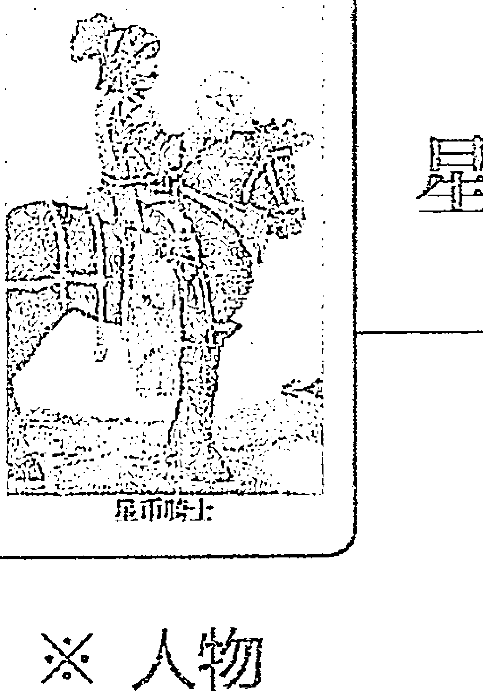

## 星币骑士正位

### 心灵与精神层面的提示

天生我材必有用，每个人都有自己最能发挥的定位，当你找到值得自己全心投入的事，你就找到了自己生命的意义。

### 人物

#### 当事人的个性

是一个比较严肃的人，有非常远大的志向，同时又能够理性而务实地按部就班达成，做任何事情都很有责任感。

#### 当事人的工作观

重视自己的工作甚于一切，是个十足的工作狂，常常会超时工作而不知道要休息，即使下班后仍然想着工作的事。

#### 当事人的感情观

感情上不解风情而且没有情调，常常把理想或工作放在第一位，如果发生工作与感情抵触的状况一定是以工作优先。

#### 当事人的金钱观

非常重视金钱的价值和实用性，把自己的资产做最有利的规划，先设定出个人的财务目标，然后很实际地去执行。

#### 与当事人的应对方法

和这种人没办法天马行空地聊天，必须要设定清楚的主题和目的，但最后还是三句话不离本行，言语比较无趣一点。

#### 人物代表

金融营业员、专业经理人、超级业务员、努力赚钱的人。

### 工作

#### 工作本身的状况

你目前的工作量很大，负的责任也重，常常需要加班超时工作，但是如果能得到相对应的报酬，你也会心甘情愿。

#### 如何解决工作的困境

这个时候应该要以实际面来考虑，把资源做最有效率的配置，在获利上不好的事情应该要当机立断地结束或改革。

#### 工作中的人际关系

由于你不太在意人际关系，所以在工作当中的人际关系平平，但是因为工作主动认真，会是同事之中的风云人物。

#### 与上司相处的方法

本身在工作上超级努力付出的上司，也会以相同的标准来衡量部属，如果你无法配合他的要求，就会被盯得很惨。

#### 工作的发展性

这个工作的发展性算是很不错，但也是需要你全心全意努力投入的地方，如果能够撑得够久，一定会有很多收获。

#### 找工作/换工作的状况

现在应该先务实地评量自己的资历和实力，再去寻找适当的工作职位，应该很快就会找到工作，而且可以发挥你的专长。

### 爱情

#### 感情本身的状况

双方在感情上十分忠诚，对彼此也有忠诚和责任感，但是两个人的考虑都非常务实，较偏向体贴而不浪漫的关系。

#### 新恋情的可能性

现在不太可能发生新恋情，因为你已经把所有的时间和心力投入在工作当中，即使出现好的对象你也不会注意到。

#### 对这段感情的看法

这段感情很稳定，但是同时也很无趣，所有的事情都要求实用的功能性，而没有任何浪漫的感觉，好像在工作。

#### 性的吸引力

这段感情当中没有什么性的吸引力，性生活对彼此来说是功能性的，也许只是为了传宗接代，完全没有热情浪漫。

#### 如何化解争吵

这个时候应该回归到实用和利益的层面来考虑，而不要情绪化地意气用事，两个人把事情讲清楚之后就没问题了。

#### 分手的方法

如果这个时候两个人要选择分手，那必然是与彼此的工作或目标出现抵触，这个时候坐下来谈谈也许可以和平分手。

#### 复合的可能性

两个人之间很难复合，除非是基于实际利益的结合，但是这样的关系并不带有感情，只是两个人互相利用的关系。

#### 人际关系状况

你的人际关系只集中于工作上相关的人而缺少真心的朋友，你如果不能对其他人多付出关心，就很难交到朋友。

#### 如何化解与朋友的误会

这个时候应该理性务实地评估状况，看看是不是要花力气去解决这个问题，如果必须处理也要用最有效率的方法。

### 亲情

#### 家庭的状况

现在家里的状况很稳定，但是彼此之间没有太多感情，只是大家都很有责任感，会共同把这个家庭的经济撑起来。

#### 与长辈的关系

你在长辈的眼中是很可靠又有责任感的人，常常会把一些重要的事情交给你处理，因此也会和他们有多一点交集。

#### 与平辈的关系

你在平辈当中的表现很突出，如果大家在事业上有合作，就可能培养出一些感情，否则大家都会忙于自己的工作。

#### 与晚辈的关系

你平常忙于自己的工作或事业，没有太多时间关心晚辈，也会养成他们比较独立自主的个性，彼此的感情并不亲密。

### 学业

#### 学业本身的状况

你在学业上的表现很突出，这是你长时间努力得来的成果，你已经为未来打下了良好的基础，是一个可喜的现象。

#### 学习的方法

这个时候应该要注重方法，而不只是苦读，要学会区分关键和重点，把时间心力用在最重要的部分。

#### 与老师相处的关系

是一个很实事求是的老师，也会很细心地教导学生，不论你遇到什么不好的状况，大部分他都会很有耐心地处理。

#### 与同学相处的关系

你并不太重视同学之间的人际关系，而是把比较多的时间花在读书和学习上，所以自然在同学当中就很难交到好朋友。

### 财务

#### 目前的财务状况

你现在应该是好好努力赚钱的时候，财务的规划反而不是当务之急，只要能把钱确实存下来，对你来说就是最好的状况。

#### 投资的状况

如果你在投资前做了很多功课，那么这个时候应该是你能大幅获利的时机，要把握住这个千载难逢的机会大赚一笔。

#### 采购的策略

这个时候采购应该要重视实用性，即使贵一点也没有关系，只要是能常常用到的有效率的东西，成本摊平就不算贵。

### 延伸应用

#### 时间

- 相对时间：十二年。
- 标示时间：处女座（约每年 8/23-9/22）。

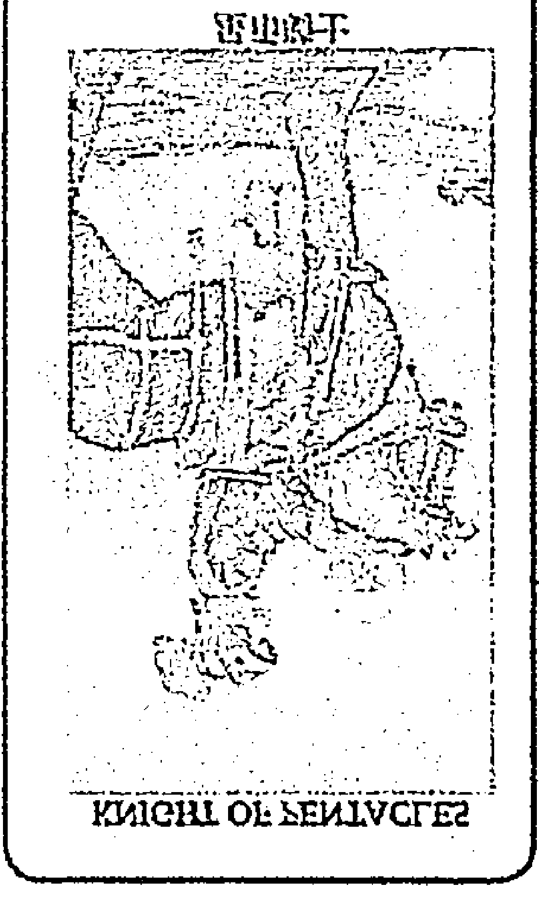

## 星币骑士逆位

### 心灵与精神层面的提示

再小的细节都可能造成决定性的影响，不要忽略任何事情的蛛丝马迹，唯有深入观察才能看清楚整体的意义和真相。

### 人物

#### 当事人的个性

对于很多事情只是冷眼旁观，都不会努力去争取，认为多一事不如少一事，常给人一种没有生气和活力的停滞感。

#### 当事人的工作观

在工作上很被动，通常只会给一个口令做一个动作，也不会去思考工作方面的问题，有时候会因为不专心而疏忽犯错。

#### 当事人的感情观

并不常思考与感情有关的问题，对感情的态度比较被动，即使在恋爱当中仍然很少主动付出，缺乏热情和幽默感。

#### 当事人的金钱观

很想要紧抓住金钱不放，但是并不积极努力地赚钱，也很少理性务实地去规划自己的财务，到最后可能坐吃山空。

#### 与当事人的应对方法

任何的事情都很难激起他的热情和兴趣，所以就让他当陪衬的配角，保证不会抢了你的风头，但是也会有点无趣。

#### 人物代表

坐领工薪者、留职停薪者、辞职进修者、自愿失业的人。

### 工作

#### 工作本身的状况

你现在的工作状况出现停滞，做的事情也都是例行公务，不只是你自己觉得无聊不想做，随时也有被裁员的可能。

#### 如何解决工作的困境

这个时候你应该要保持警觉，不要放过任何的细节，也许问题的源头只是一个小地方，但是可以造成很大的影响。

#### 工作中的人际关系

你无心于工作当中人际关系的经营，所以也不会交到什么新朋友，你在工作当中的表现平平，也不太想帮助别人。

#### 与上司相处的方法

看起来就无心于工作的上司，要他帮你什么忙是比登天还难，只要一切保持正常不出错，基本上就可以相安无事。

#### 工作的发展性

这个工作没有什么发展性，即使是想在这里混口饭吃等退休，也还有会被解雇的可能性，最好是找另一个地方逃生。

#### 找工作／换工作的状况

现在并不太适合你找工作，你可以先休息一阵子，或是考虑出去进修一下，调整好自己的心情，充实之后再出发。

### 爱情

#### 感情本身的状况

这段感情当中只剩下例行事物，没有新鲜热情的刺激，也缺乏体贴浪漫的用心，所以算是进入了停滞无聊的时期。

#### 新恋情的可能性

现在不可能发生新恋情，因为你现在并无心于感情，也不会去注意是否出现了好对象，没有动力之下什么都免谈。

#### 对这段感情的看法

现在你对这段关系感到失望，两个人之间已经没有什么感觉了，但是又没有人提出分手，总觉得两个人都在空转。

#### 性的吸引力

其实两个人之间没有什么性吸引力，两个人也不会想要有性生活，即使有性生活也像是例行公事，而不带有感情。

#### 如何化解争吵

这个时候两个人应该先冷静下来思考一下，甚至不见面也是不错的方法，等到风暴期过了之后，再看看如何化解。

#### 分手的方法

其实两个人对于分手都已经有了心理准备，所以只要有一方先提出来，另一方也会很快地放手，完全不会拖泥带水。

#### 复合的可能性

两个人之间已经没有什么感情了，硬要在一起也没什么意思，这个时候你应该好好休息，而不是想要去挽回对方。

### 友情

#### 人际关系状况

你的人际关系并不很好，因为你完全无心于人际关系的经营，只想要一个人静一静，其实一个人也比较适合你。

#### 如何化解与朋友的误会

其实两个人之间也没有什么大的误会，要看你是不是愿意主动去说明，如果把这个问题放着，关系就会慢慢淡掉。

### 亲情

#### 家庭的状况

现在家中陷入了一种停滞的气氛，大家都懒懒的什么都不想做，但是对于一些应该要做的事，你还是要好好地完成。

#### 与长辈的关系

长辈们常常觉得叫不动你，你也不太想理会他们，所以你们对彼此都没有过高的期待，也很难培养出亲密的感情。

#### 与平辈的关系

你与平辈的关系比较疏离，所以彼此之间也没有什么感情，其实你们像是故意保持距离，也不想对彼此造成干扰。

#### 与晚辈的关系

你对晚辈的状况不太关心，甚至很少想到他们的存在，由于缺乏频繁的互动和照顾，所以彼此之间没有什么感情。

### 学业

#### 学业本身的状况

你在学业上的表现不佳，因为你最近都不太想念书，在考试的时候又粗心大意，所以成绩退步也是很正常的现象。

#### 学习的方法

这个时候应该要先充分休息再开始拼命，否则只是埋头苦读也不会有任何作用，等到精神体力恢复了再来好好学。

#### 与老师相处的关系

是一个在教学上不认真的老师，所以在学习上最好能自立自强，即使有什么事情去问他，也不会得到满意的答案。

#### 与同学相处的关系

你与同学的互动并不密切，因为你常常觉得懒得和他们鬼混，你只在意自己的事情，所以只会有很少的知心好友。

### 财务

#### 目前的财务状况

你现在的财务状况算是平稳，但是也没有什么进展，这个时候一动不如一静，所以最好能节省一点，保持现状就好。

#### 投资的状况

目前你的投资不上不下，没什么赚钱也没有赔钱，如果急着用钱当然要快点变现，不然放着对你也没什么坏处。

#### 采购的策略

这个时候不适合进行新的采购，如果是例行性的采购则没有什么关系。如果现在不想买东西，把钱存起来也不错。

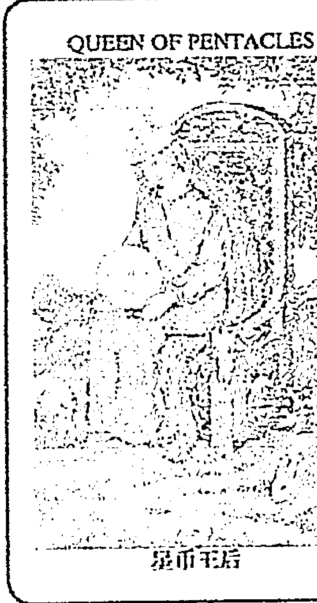

## 星币王后正位

### 心灵与精神层面的提示

以实际行动帮助或照顾别人，也是自我心灵成长的动力，在付出与奉献当中发现生命的美好，体会施与受的循环。

### 人物

#### 当事人的个性

十分善良又很会照顾别人，会很理性务实地去考虑事情，待人亲切又体贴入微，同时很会经营自己的人脉关系。

#### 当事人的工作观

在工作当中十分务实，会很精打细算地考虑及评估，但是同时也很乐意帮助别人，比较会从长远的角度去考虑事情。

#### 当事人的感情观

在感情上十分忠诚而稳定，也很会照顾对方及付出，虽然面对新恋情时会比较被动，但是投入之后就会全心全意。

#### 当事人的金钱观

非常善于使用金钱达成自己的目标，也常参加慈善活动或捐款去帮助别人，对于自己会有保守而务实的财务计划。

#### 与当事人的应对方法

也许在初见时会让人觉得有点严肃，但其实是非常和善好相处的人，和他不能只谈利益，更重要的是人际互动的感觉。

#### 人物代表

老板娘、自营商、店面销售人员、房屋中介、慷慨的人。

### 工作

#### 工作本身的状况

你现在的工作状况非常稳定，是可以专心经营努力的时候，你在当中可以充分发挥自己的才能，同时又乐在其中。

#### 如何解决工作的困境

这个时候应该要以长期作为计划的基础，不要为了短视近利而付出不必要的代价，同时也要考虑以后长远的影响。

#### 工作中的人际关系

你在工作当中很受到欢迎，因为你常常会主动帮助别人，也会和大家都保持着良好的关系，所以在工作上无往不利。

#### 与上司相处的方法

你的上司很会照顾属下，所以有什么问题可以尽量和他商量，不过你也要拿出实绩来，否则也可能会被盯得很惨。

#### 工作的发展性

这个工作的发展性很不错，是你可以稳定发展的地方，如果能在这个地方好好待下去，未来一定会有更多的收获。

#### 找工作/换工作的状况

现在是你找工作的好时机，甚至会有人主动找你去帮忙，你应该把握这个时候快点找工作，才不会错过好的机会。

### 爱情

#### 感情本身的状况

这段感情现在已经很稳定，两个人彼此付出了很多，也能感受到对方的真心，而且双方都有长久交往下去的打算。

#### 新恋情的可能性

现在有可能发生新恋情，不过也要等对方主动比较容易成功，如果由你主动去追求对方，很可能会把对方吓跑。

#### 对这段感情的看法

这段感情很稳定而务实，而且双方都有长久经营这段关系的计划，其实彼此已经认定了对方，也觉得会走向婚姻。

#### 性的吸引力

这段感情当中算是有一些性的吸引力，但是随着两个人的感情越来越稳定，也会发展出越来越水乳交融的性生活。

#### 如何化解争吵

这个时候应该要替对方多考虑一点，而不是站在自己的立场得理不饶人，以两个人长远的交往来看这只是小问题。

#### 分手的方法

其实这个时候两个人很难分开，即使你执意要分开对方也不会答应，最多你只能选择逃避的策略，拖一天算一天。

#### 复合的可能性

其实两个人之间还有一点感情，但是要复合并不容易，除非你能承诺给对方一个美好的未来，否则双方就很难复合。

### 友情

#### 人际关系状况

你的人际关系很好，因为你常常能主动关心和照顾大家，所以也会得到大家的帮助，你有很多长期交往的好朋友。

#### 如何化解与朋友的误会

这时候应该要考虑两个人的交情，而不是只强硬地和对方理论，如果能采取软硬兼施的策略，问题很快就会解决。

### 亲情

#### 家庭的状况

现在家中的状况非常稳定而和谐，家中的长辈对大家也都很照顾，大家应该要以真心相待，有问题可以互相帮助。

#### 与长辈的关系

你常常对长辈们特别关心和照顾，所以长辈也会特别倚重你。你和长辈们都有很好的关系，彼此之间也会很信任。

#### 与平辈的关系

在平辈之间其实没有什么交集，但是遇到问题大家还是会互相帮忙，可以一起解决问题，所以彼此的感情也很好。

#### 与晚辈的关系

也许你与晚辈相处的时间不多，但是彼此的关系非常亲密，因为你对他们很细心地照顾，也会全心全意地关心他们。

### 学业

#### 学业本身的状况

你在学业上的表现很稳定，同时也在持续进步当中，你会用很有效率的方法学习，对于课程内容的了解也很透彻。

#### 学习的方法

这个时候应该要深入地研究和思考，决定主题和范围之后就全力以赴，把一个进度完全了解之后再进入下一个部分。

#### 与老师相处的关系

是很照顾学生的老师，同时也会很重视学生的学习进度，只要你有什么问题去问他，大部分都会得到满意的答案。

#### 与同学相处的关系

你在同学当中是属于照顾别人的角色，因此也会有一群好朋友常常因为你聚在一起，你和大家都能保持良好的关系。

### 财务

#### 目前的财务状况

你目前的财务状况良好，行有余力也可以去帮助别人。你应该将资产做最好的配置，以长期的收益作为主要考虑。

#### 投资的状况

你投资的状况都还不错，也是可以开始获利的时候。你应该以长期投资为主，不要让短期的起伏影响自己的情绪。

#### 采购的策略

适合做任何种类的采购，而且可能会买到物超所值的东西。应该找诚实有信誉的商家，不要贪小便宜而因小失大。

### 延伸应用

#### 时间

- 相对时间：十三年。
- 标示时间：金牛座（约每年4/21-5/20）。

## 星币王后逆位

### 心灵与精神层面的提示

想要克服自己的怀疑和恐惧，就要先了解自己确实的状况，认清了自己的处境之后，就可以找到适当的解决方法。

### ※ 人物

#### □ 当事人的个性

天性多疑因此很难信任别人，对于很多细节都斤斤计较，具有实事求是的科学精神，但也常会让人觉得不近人情。

#### □ 当事人的工作观

在工作中精于算计，很会利用别人完成自己的任务，但是在事后又翻脸不认人，因此很难建立起长久的合作关系。

#### □ 当事人的感情观

在感情上缺乏安全感，也很难建立起稳定的感情关系。在感情当中会以各种借口质疑对方，或是担心对方会出轨。

#### □ 当事人的金钱观

在处理金钱上偏向保守，但是又无法把钱存下来，常常会担心自己的钱不够用，有时候会给别人唯利是图的感觉。

#### □ 与当事人的应对方法

你只能选择把话说清楚，但是无法阻止他怀疑你，只要把自己该做的事情好好完成，就不用理会他不理性的质疑。

#### □ 人物代表

- 直销商
- 会计人员
- 财税人员
- 仿冒盗版商
- 多疑的人。

你的工作需要非常专注，细心检查所有的步骤是否正确，当中可能存在很多错误的陷阱，一不小心就会粉身碎骨。

### ※ 工作

#### □ 工作本身的状况

#### □ 如何解决工作的困境

这个时候不应该相信任何人，绝对是以自己的眼见为凭，由自己亲身体会的经验出发，才能找到真正的问题所在。

#### □ 工作中的人际关系

在工作当中大家都无法信任彼此，反而会因为猜忌而抵消内部的力量，即使你想要改变这种风气，大概也是无能为力。

#### □ 与上司相处的方法

是一个很多疑的上司，随时都觉得自己的位置可能不保，所以不要太积极以免被他认为在抢功，把自己的本职完成就好。

#### □ 工作的发展性

这个工作的未来没有什么发展性，即使有加薪升迁也没你的分，如果想要好好发挥自己的才能，就必须另谋高就。

#### □ 找工作 / 换工作的状况

现在并不是找工作的好时机，也许你应该先确定自己的目标，不要再犹豫不决，集中自己的力量才可能有好机会。

### ※ 爱情

#### □ 感情本身的状况

在这段感情当中彼此不太能信任，所以会有很多的试探和争吵，其实怀疑的心态才是两个人交往受挫的原因。

- **新恋情的可能性**
现在不太可能发生新的感情，即使出现了适合的对象你也不容易信任，反而可能会百般刁难对方，把对方吓跑了。

- **对这段感情的看法**
其实你在这段感情当中很缺乏安全感，随时担心对方会出轨，或是两个人的关系无法继续下去，但是又无法证实。

- **性的吸引力**
在这段感情当中性的吸引力并不强，但是性生活却是维系这段关系的重要指标，如果缺乏性生活两个人就会吵架。

- **如何化解争吵**
这个时候应该打开天窗说亮话，自己主动澄清所有可能被怀疑的地方，如果能够证明自己的清白，争吵自然会平息。

- **分手的方法**
这个时候如果要选择分开，最好的方法就是避不见面，只要两个人一阵子没有联络，这段关系自然就会慢慢淡掉。

- **复合的可能性**
这段关系只剩下猜忌和不满，无论如何不可能复合，所以还不如快点去找其他对象，不要在这个人身上浪费时间。

### ※ 友情

- **人际关系状况**
由于你无法信任朋友，所以你的人际关系状况并不好，你应该多花一点时间和朋友相处，才有机会真正了解他们。

- **如何化解与朋友的误会**
你和朋友之间也许根本就没有什么误会，一切只是你自己想得太多，你也许应该和对方好好沟通，才有机会了解真相。

### ※ 亲情

- **家庭的状况**
现在家中的成员彼此之间无法信任，也许是因为之前的事情造成一些误会，大家应该要坐下来一起把事情谈清楚。

- **与长辈的关系**
你常常对长辈心存怀疑，有时候会对他们疏于照顾，所以彼此之间的关系有些疏远，你也不知道该如何表达感情。

- **与平辈的关系**
在平辈之间大家没有什么交集，也很难一起合作事情，在彼此之间很难建立起真正的信任，所以也没有什么感情。

- **与晚辈的关系**
也许因为你对晚辈疏于关心和照顾，所以彼此的关系有些疏离，你应该花更多时间和他们相处，才能更了解他们。

### ※ 学业

- **学业本身的状况**
你在学业上的表现不太稳定，对于自己的实力也没有信心，你应该先认清自己学习上的弱点，才能够适时地补救。

- **学习的方法**
你应该善用理智把问题分析清楚，而不是被自己的情绪所影响，只要能确实花时间去努力，就会看到学习的成果。

- **与老师相处的关系**
理智而近于严苛的老师，对于所有的学生都是一视同仁，所以重要的是把自己的本分做好，其他的就不用太在意。

- **与同学相处的关系**
你在同学当中的朋友并不多，你要对同学多一点付出，才能让别人发现你的真心，愿意和你建立起良好的友谊。

### ※ 财务

#### □ 目前的财务状况
你目前的财务状况还算可以，但是可能会在一些小地方开始出现危机，你应该在问题扩大之前及时采取防范措施。

#### □ 投资的状况
你现在的投资状况很不稳定，每天都要为此而担心受怕，害怕自己的心血化为乌有，还不如快点结束还比较安心。

#### □ 采购的策略
这个时候不太适合进行大金额的采购，最好能先等一阵之后再说，特别是遇到太过便宜的东西，其中一定有诈。

## 星币国王正位

### 心灵与精神层面的提示

不论精神的修持如何精进，还是要脚踏实地才能运用在现实的人生当中，如何适当地掌握物质规律也是很重要的课题。

### ※ 人物

- **□ 当事人的个性**
拥有丰富的常识和商业的天分，同时也很重视生活的享受，行事上十分稳重务实，会用最有效率的方式达成目的。

- **□ 当事人的工作观**
在工作当中全力以赴，但是在工作之余的时间会非常重视自己的休闲生活，在事业发展和私人生活之间取得平衡。

- **□ 当事人的感情观**
通常会先建立起稳定的物质基础之后再来谈感情，在感情当中十分稳定，能给对方充分的安全感，也不吝于付出。

- **□ 当事人的金钱观**
非常了解金钱的特性及价值，所以在处理金钱上会务实而有效率，通常会有不错的财务基础，也会愿意花钱享受。

- **□ 与当事人的应对方法**
非常务实而聪明的人，在其言谈当中常常透露出很多值得学习的地方，可以多向他请教有关金钱或财务上的见解。

- **□ 人物代表**
大老板、企业家、银行家、大股东、重视生活享受的人。

### ※ 工作

- **□ 工作本身的状况**
你现在的工作状况非常好，也算是得到空前的成功，你开始可以享受之前工作的成果，进入一段稳定发展的时期。

- **□ 如何解决工作的困境**
这时候应该要有效率地运用金钱，而不是投入新的资源，整体的预算其实还算足够，只是现在运用还不到优化。

- **□ 工作中的人际关系**
你在工作当中站在有利的位置，同时能力也会受到大家的肯定，因此算是同事中的风云人物，大家都会想找你帮忙。

- **□ 与上司相处的方法**
是一个务实成熟的上司，偏向重视事理而不顾人情，所以最好是能拿出好的方案去说服他，才能得到他的提拔。

- **□ 工作的发展性**
这个工作未来的发展非常好，有机会可以做到顶尖的位置，同时又能够兼顾私人生活，是值得留下来努力的地方。

- **□ 找工作 / 换工作的状况**
现在找工作的重点在于发挥专长，或是利用自己的工作经验，只要务实地评估自己的能力，就能找到适合的工作。

### ※ 爱情

- **□ 感情本身的状况**
现在这段感情十分稳定，也已经打下深厚的感情基础，两个人都很重视生活质量，而且有不错的经济基础来享受。

- **□ 新恋情的可能性**
你必须有良好的财务基础之后，才会有适合你的感情来临，那时如果出现令你心动的新对象，就尽情地去追求吧。

- **□ 对这段感情的看法**
应该要很务实地评估这段感情，不能只顾爱情而没有面包，只要拥有足够的经济基础，就有时间和空间好好享受。

- **□ 性的吸引力**
这段感情当中并没有很强的性吸引力，但是双方都很重视性生活的情趣，也会努力去经营让彼此都满意的性生活。

- **□ 如何化解争吵**
这个时候应该回归到务实的标准，而不是情绪化的反应，即使双方都有一点固执，只要有耐心问题仍然可以解决。

- **□ 分手的方法**
这个时候两个人若是要分手，一定是彼此的人生规划出现了重要的分歧，只要两个人能谈清楚，也可以和平分手。

- **□ 复合的可能性**
这段关系仍然有复合的可能性，但是必定也是基于利益的结合，如果两个人没有共同的愿景还是不可能会复合。

### ※ 友情

- **□ 人际关系状况**
你在朋友当中很受到欢迎，也是大家喜欢询问或是求助的对象，如果你能多多地帮助别人，就可以交到真心的朋友。

- **□ 如何化解与朋友的误会**
这时候应该是讲道理的时间，动之以情的策略常常都会失败，只要自己站在有理的一方，就不要怕对方无理取闹。

### ※ 亲情

- **□ 家庭的状况**
现在家里的财务状况很好，是应该好好享受的时候，但是也应该有务实前瞻的规划，好让这个状况可以继续下去。

- **□ 与长辈的关系**
你是长辈们求助的首要对象，通常也能不负众望地完成任务。你和长辈都保持良好的关系，也会得到最多的好处。

- **□ 与平辈的关系**
在平辈当中你常常担任领导者，帮助或带领大家一起去解决问题，你理性务实的态度，也会对大家产生影响。

- **□ 与晚辈的关系**
你对晚辈都非常照顾，也会让他们接受最好的教育，但是你希望他们都能独立自主，所以有时候会和他们保持距离。

### ※ 学业

- **□ 学业本身的状况**
你在学业上的表现很好，也得到老师及同学们的肯定，你会用最快速有效的办法学习，所以也不用花费太多时间。

- **□ 学习的方法**
除了重视理性分析之外，也要用常识去判断是否合理，广泛地进行各种类型的阅读，会有助于你把观念整合起来。

- **□ 与老师相处的关系**
是一个非常务实的老师，但是同时也会非常固执，所以不要想去说服他任何事情，只要照他规定的方法去做就好。

- **□ 与同学相处的关系**
你在同学当中的表现很突出，也会受到大家的欢迎。如果你能在课业上多多地帮助同学，自己也会得到更多的收获。

### ※ 财务

- **目前的财务状况**
你目前的财务基础十分稳固，规划上也非常务实而成功，只要你能维持现在的方法继续下去，未来也会持续获利。

- **投资的状况**
你的投资得到了空前的成功，也是你可以好好享受的时候，若是考虑投资组合的效益，还可以做更有效率的配置。

- **采购的策略**
现在可以做任何种类的采购，特别是大额分期的产品特别适合在这个时候下手，但是应该要考虑到物品的实用性。

### 延伸应用

- **时间**
  相对时间：十四年。
  标示时间：摩羯座（约每年 12/22-1/19）。

## 星币国王逆位

### 心灵与精神层面的提示

了解自己真正的需要，不去贪求自己不必要的东西，你将会发现自己与物质世界的新关系，也会过得更自由自在。

### ※ 人物

- **□ 当事人的个性**
重视自己的利益甚于一切，非常工于心计且精于算计，为了达到目的会不惜牺牲别人，甚至还趁人之危借机打劫。

- **□ 当事人的工作观**
在工作上极有野心，但是常常不走正途而想走快捷方式；很喜欢夸耀自己的功劳，也有可能会利用职务之便营私舞弊。

- **□ 当事人的感情观**
把感情当成实现自己野心的工具，而不愿意付出真感情，在感情当中非常缺乏安全感，因此会想尽办法控制对方。

- **□ 当事人的金钱观**
对于金钱有极强的控制欲，也会为了赚钱而不择手段，但是另一方面又可能会纵情酒色，在声色场所中挥霍无度。

- **□ 与当事人的应对方法**
若是想要牟取利益而结合，很可能反而会被他倒打一耙，最好是保持距离以策安全，不要被他漂亮的说辞所迷惑。

- **□ 人物代表**
投资专家、高利贷、奸商、守财奴、赚钱不择手段的人。

### ※ 工作

- **□ 工作本身的状况**
你的工作出现了很大的漏洞，之前的问题也慢慢地浮现出来，也许必须要投入更多的资源，才能安全渡过这个危机。

- **□ 如何解决工作的困境**
整体计划不够务实可行，只针对部分补救已经很难有效，这个时候需要做全盘检讨，必要时甚至要归零重新开始。

- **□ 工作中的人际关系**
这个工作当中大家都在互相算计，并不存在真心的人际关系，如果你不小心疏忽了，很可能就会被其他人给出卖。

- **□ 与上司相处的方法**
把自己的利益放在第一位的上司，但是又胆小怕事不敢负责，这个时候只好全部靠自己，同时防止被他半路抢功。

- **□ 工作的发展性**
这个工作未来的发展并不好，也许现在已经走到了极限，而且接下来问题才会陆续浮现，最好是快点找机会走人。

- **□ 找工作/换工作的状况**
现在找工作应该要务实一点，千万不要被美丽的求职陷阱所骗了，当对方开出过分好的条件时，通常背后都有阴谋。

### ※ 爱情

- **□ 感情本身的状况**
现在这段关系本身就索然无味，两个人只是在利用对方，并没有任何感情的成分在，甚至对方只是在贪图你的财产。

### ※ 友情

- **□ 人际关系状况**
其实你并不是很在意人际关系，所以你的朋友并不多，你应该要放下心中的利害和算计，才可能交到真心的好朋友。

- **□ 如何化解与朋友的误会**
这时候应该和朋友分析利害关系，其实你也有自己的不得已，适时地提出对朋友的补偿，可以修补一部分的关系。

### ※ 亲情

- **□ 家庭的状况**
现在家里陷入了僵局，可能是为了处理与金钱有关的事情而相持不下，这个时候大家都各怀鬼胎，所以很难妥协。

- **□ 与长辈的关系**
你常常感觉到长辈对你的不信任，他们的很多决定也都会对你有所隐瞒，所以你会觉得自己没有得到适当的尊重。

- **□ 与平辈的关系**
在平辈当中唯有你另辟蹊径，走出一条与大家完全不同的路，有些人也许很羡慕你，但是其他人则会对你多加防范。

- **□ 与晚辈的关系**
你对于晚辈的管教进退失据，他们的反抗常常会带来你更激烈的情绪反应，彼此之间反而变得好像没有什么感情。

### ※ 学业

- **□ 学业本身的状况**
你在学业上的表现还不错，但是其实基础并不怎么稳固，如果你只是满足于现状而不努力，接下来一定会出大问题。

- **□ 学习的方法**
这个时候的问题在于你不够努力，而不是有没有天分，脚踏实地努力才能帮助你，不要一天到晚想走捷径。

- **□ 与老师相处的关系**
其实老师并不是很关心学生，所以不论你反应什么事情，都不太可能得到满意的回应，在学习上一切都要靠自己。

- **□ 与同学相处的关系**
你太在意和同学的人际关系，有时候反而交不到知心的朋友，你应该要保持自然不做作，才会交到真心的新朋友。

### ※ 财务

- **目前的财务状况**
你目前的财务结构已经出现了重大的问题，是应该做全面检讨的时候了，要找到以前的积弊再针对它确实改进。

- **投资的状况**
你的投资状况并不好，应该开始做结构性的调整，以长期稳定的发展为主，最好能够抛弃短期致富的错误观念。

- **采购的策略**
现在的采购有很大的风险，特别是大金额的采购更要小心谨慎，不要因为一时兴起而买东西，否则可能会花钱当冤大头。

# 附录

## 关于行星时 ( Planetary Hours )

行星时是一种西方神秘学衡量时间性质的方法，其起源非常早，在苏美人律定一周七天制与一天二十四小时制时就已经被广泛运用。其原理是依照天阶体系的顺序（土星时 > 木星时 > 火星时 > 太阳时 > 金星时 > 水星时 > 月亮时），让传统的七个行星各依序轮值一个小时，由于每七天会循环一次，也有人说它是一周七天制的起源。最精确使用行星时的方式还涉及到日出、日落时间及季节的变化，但若取其大概可以简化成下表来使用。

### 一周行星时轮值表

| 时间 | 星期日 | 星期一 | 星期二 | 星期三 | 星期四 | 星期五 | 星期六 |
| :--- | :--- | :--- | :--- | :--- | :--- | :--- | :--- |
| 00:00-01:00 | 金星时 | 土星时 | 太阳时 | 月亮时 | 火星时 | 水星时 | 木星时 |
| 01:00-02:00 | 水星时 | 木星时 | 金星时 | 土星时 | 太阳时 | 月亮时 | 火星时 |
| 02:00-03:00 | 月亮时 | 火星时 | 水星时 | 木星时 | 金星时 | 土星时 | 太阳时 |
| 03:00-04:00 | 土星时 | 太阳时 | 月亮时 | 火星时 | 水星时 | 木星时 | 金星时 |
| 04:00-05:00 | 木星时 | 金星时 | 土星时 | 太阳时 | 月亮时 | 火星时 | 水星时 |
| 05:00-06:00 | 火星时 | 水星时 | 木星时 | 金星时 | 土星时 | 太阳时 | 月亮时 |
| 06:00-07:00 | 太阳时 | 月亮时 | 火星时 | 水星时 | 木星时 | 金星时 | 土星时 |
| 07:00-08:00 | 金星时 | 土星时 | 太阳时 | 月亮时 | 火星时 | 水星时 | 木星时 |
| 08:00-09:00 | 水星时 | 木星时 | 金星时 | 土星时 | 太阳时 | 月亮时 | 火星时 |
| 09:00-10:00 | 月亮时 | 火星时 | 水星时 | 木星时 | 金星时 | 土星时 | 太阳时 |
| 10:00-11:00 | 土星时 | 太阳时 | 月亮时 | 火星时 | 水星时 | 木星时 | 金星时 |
| 11:00-12:00 | 木星时 | 金星时 | 土星时 | 太阳时 | 月亮时 | 火星时 | 水星时 |
| 12:00-13:00 | 火星时 | 水星时 | 木星时 | 金星时 | 土星时 | 太阳时 | 月亮时 |
| 13:00-14:00 | 太阳时 | 月亮时 | 火星时 | 水星时 | 木星时 | 金星时 | 土星时 |
| 14:00-15:00 | 金星时 | 土星时 | 太阳时 | 月亮时 | 火星时 | 水星时 | 木星时 |
| 15:00-16:00 | 水星时 | 木星时 | 金星时 | 土星时 | 太阳时 | 月亮时 | 火星时 |
| 16:00-17:00 | 月亮时 | 火星时 | 水星时 | 木星时 | 金星时 | 土星时 | 太阳时 |
| 17:00-18:00 | 土星时 | 太阳时 | 月亮时 | 火星时 | 水星时 | 木星时 | 金星时 |
| 18:00-19:00 | 木星时 | 金星时 | 土星时 | 太阳时 | 月亮时 | 火星时 | 水星时 |
| 19:00-20:00 | 火星时 | 水星时 | 木星时 | 金星时 | 土星时 | 太阳时 | 月亮时 |
| 20:00-21:00 | 太阳时 | 月亮时 | 火星时 | 水星时 | 木星时 | 金星时 | 土星时 |
| 21:00-22:00 | 金星时 | 土星时 | 太阳时 | 月亮时 | 火星时 | 水星时 | 木星时 |
| 22:00-23:00 | 水星时 | 木星时 | 金星时 | 土星时 | 太阳时 | 月亮时 | 火星时 |
| 23:00-24:00 | 月亮时 | 火星时 | 水星时 | 木星时 | 金星时 | 土星时 | 太阳时 |