# 塔罗入门

### 序言

欢迎进入《塔罗入门》——我所编写、关于如何解读塔罗牌的课程。塔罗是一副七十八张图片组成的纸牌，几个世纪以来，它被用来揭露隐藏的真相。在过去数年间，人们对塔罗的兴趣急速增长，越来越多的人在寻求调和内外在实象的方法，好让自己活得更有创造性。他们发现，对于个人成长和洞察力，塔罗是一种强而有力的工具。

我设计这套课程的主要目的，是要告诉你如何自己运用塔罗牌。塔罗能够帮助你更加了解自己，并且教你如何更有信心地汲取内在的资源。你不需要具有「通灵的能力」才能成功地运用塔罗牌，你所需要的，仅仅是尊重并且开发你与生俱来的直觉力的意愿。

我是在一九八九年开始撰写这套课程的，当时我已经研究塔罗好几年了，我发现，我对于塔罗牌以及它们能如何被用来做为内在指引的工具发展出了一些想法。一九九五年十月，我创立了「塔罗入门」(Learning the Tarot)网站，与人们分享想法。从那个时候起，来自全球各地成千上万的人们造访过我的网站，许多人透过电子邮件跟我分享经验。人们常常告诉我，他们一向对塔罗牌很好奇，却不知该如何着手。得知我的课程如何给了他们正在寻找的起点，是非常令人兴奋的。

《塔罗入门》一书分为五个单元：

单元一包含组成这套课程的十九堂课，从最基本的元素开始，循序渐进地探讨到塔罗较细微的面向。你要用什么样的步调研读这些课程都可以，它们主要是为初学者设计的，但有经验的塔罗使用者也会发现一些有用的概念和技巧。

单元二包含了习题和练习活动，以强化每一课所呈现的概念。这些练习完全是选读性的。

单元三是部分习题的回应范例。这些范例并不是一般意义中的答案，只是我的一些建议，让你对可能的解牌形态有个概念。

单元四包含对每一张塔罗牌的解析。当你研习上一个单元的课程时，将会参考这个单元，但是当你稍后自行占算塔罗时，也会发现它们很有用。

单元五则是关于「塞尔特十字牌阵」(Celtic Cross Spread) 的资讯——这是一种很常用的排牌模式。在整个课程中，我会不断提到这种牌阵。此外，单元五还包含一些使用塞尔特十字的占卜范例。

要研习这套课程，你实际上唯一需要的是一副塔罗牌。本书的插图系使用以风行的「莱德－伟特牌」(Rider-Waite) 为基础的「普及版伟特塔罗」(Universal Waite Tarot)，这两副牌都很适合初学者，因为每张牌上都有画面，这在学习的阶段是有帮助的。不过，如果你已经有其他的牌，只要是七十八张的，都可以用来搭配这套课程。无论用哪副牌，塔罗占卜的基本原则都相差无几。

目前你在许多地方都买得到塔罗牌。很多书店有卖，许多网站也有出售各式各样的塔罗牌。如果你那儿不容易买到塔罗牌，可以向我订购。请上我的网站了解更多的资讯。

有人担心使用塔罗会让他们涉入神秘学的仪式，或是与其宗教信仰冲突。我面对塔罗的态度是简单而自然的，我试图让大家了解塔罗牌既不黑暗、也不神秘，而是自我发现的绝佳工具。事实上，我觉得使用塔罗能以许多正面的方式拓展你的灵性觉知。

另外，或许有人认为塔罗是不科学的——充其量不过是种玩玩的东西，但有识之士是绝对不会拿它当真的。我只要求你放任自己的好奇心，用开放的心态探索塔罗。毕竟，这就是科学研究的真正精神呀！

我希望引燃了你足够的兴趣来试试这套课程。如果你仍然不太确定，请先阅读第一课。它更为详尽地解释了为什么使用塔罗并非荒诞无稽。我想，你至少会发现这本书很有趣，或许，你还会发现它是你一直在寻找的、开发你未实现潜能的工具。

#### ❧ 中文版序 ❧

我年轻时曾在一间书店工作，负责为当地的大学订购教科书。有一天，某一本书捕捉了我的目光，那是英译版的《易经》，是一门东方哲学课程的推用书。我买了一本，很快就被这部中国古代占卜经典的美与智慧给深深吸引住。

《易经》让我初次接触到占卜的艺术与实践，也令我跨出踏上此领域的第一步——这条道路最终将我引导到塔罗占卜。现在，我觉得这条道路已经绕行整个圆周，回到了原点。我很高兴或许有机会藉着此一译本，与你们分享我从这种西方占卜所学到的东西。

塔罗是七十八张图卡构成的，每一张牌都代表某种普遍性的特质或能量。塔罗的占卜过程包含「洗牌」、「切牌」，然后将之排出、检视。你选出的牌会为你反映当刻事态的真相。藉着解读这些牌，你将对于在你生活中起着作用的能量模式获致更深的了解。

在《塔罗入门》一书中，我将焦点放在告诉你如何为自己解读这些牌。专业的塔罗占卜者可能帮得了你，但若是你能向自己寻求洞见，岂不是好得多？占算塔罗并不需要拥有特殊的通灵能力或是学习神秘的技巧，它是一种自然的象征语言，来自任何文化与传统的人都能理解。

塔罗起源于文艺复兴时期前后的意大利，本书中的纸牌图像是采自「普及版伟特牌」，其中的风景和人物都具有该时期的特色。不过，你可以想像这些人物是存在于一个不受时间限制的无限空间中，他们代表著生命的普遍面向，每个人内心深层对它们都很熟悉。当你迎接这些人物进入你的世界，也就开放自己接受他们所带来的讯息了。

可惜的是，有些人惧怕使用这些牌。他们害怕看见自己陷于某种难以逃避的恐怖命运中。这种恐惧是基于对塔罗牌运作方式的错误认知。塔罗占卜并不会预测某种固定的未来，而只是基于此刻能量暗示事态发展的可能方向，但结果永远不会是无可转圜的。

想像你看著一张图，图上头画着一个人举着弓箭，箭已在弦上，瞄准若几呎之外的某个目标。你或许会猜想，片刻之后，那个人就会射出箭矢，射向箭靶。这张图暗示此一行动非常可能发生，但事实上，未来可能有各种发展。这个人也许会转往另一个方向，或是放下武器；又或许，会有某个人前来干预，或是分散他的注意。

你可以把塔罗占卜想成一种类似这样的「画面」。即使纸牌似乎指出前方有某条道路，但是否要走上这条道路，永远取决于你自己。事实上，事先知道它，将能让你做出更清醒而有力的决定。

这是塔罗真正的效用。当你运用塔罗牌，你将逐渐学会如何接通自己内在的觉知。你将对你某个深层部分发展出信任，那儿了解生命提供你的一切选项，好让你从而做出睿智的选择。我诚挚地希望，当你探索这些迷人的牌时，能有许多令人兴奋的新发现。在这趟冒险中，但愿这本书能对你有所助益！

琼・邦宁
二〇〇五年一月二十八日
bunning@learntarot.com

# # 致謝詞

我要感谢我丈夫史蒂夫对我的爱与信心，以及他超凡的电脑功力。若没有它，我的网站恐怕老早就自行毁灭了！

很多很多的爱要给我的儿子大卫和强纳生，他们让我的日子充满了神奇的经验。

我要对我的母亲表达感激，因为她永远在那儿守护着我；我还要谢谢我的父亲和兄弟姊妹，为我们所分享的一切；还有我的朋友和我家族所有的人，你们每个人对我都弥足珍贵。

此外，我还要感谢这些年来所有对我的塔罗理解有所助益的人士，特别是Eileen Connolly、Mary Greer、Shoshanna Hathaway、Rachel Pollack，以及在「tarot-1 discussion list」讨论社群中所有知识渊博的朋友们。

我要向以下几位颔首致谢：Ragu Pasupulati直觉的洞见，Paul Caskey扫描的塔罗图像，Kent Stork创新的塔罗程式，以及David Cook慷慨提供他的网路ISP服务。

我还要给长期支持我的网友大大的拥抱，感谢他们的支持以及对塔罗精辟的见地：Rhys Chatham、Linda Cortellesi、Elizabeth Delisi、Asher Green、Hairani Hardjoe、Joe Holtslag、Roger Mewis、Patty Pidlypchak、Gary Pinsky、Brett Shand、Ray Simon、Phyllis Stevens、Hazel Stitt、Lou Violette、Curtis White，还有Judy Lenzin，为她给我的温暖和灵感。

我也要感谢「吉儿」和其他容许我透过塔罗牌涉入他们生活的所有朋友。你们的故事丰富了我的书和我的人生。

我要对Robin Robertson致上特别的谢意，他看出我课程的潜力，并且付诸行动。

最后，我要感谢所有曾经写信给我、分享他们的塔罗知识与经验的人。我从你们每个人身上都学到了东西，而你们的鼓励对我更是意义深重。

#### 給史蒂夫
電腦魔法師
與
錢幣國王

## 單元一

# 課程
Lessons.

#### 【第一課】塔羅介紹

许多年前，当我告诉我弟弟我正在研究塔罗牌，他的头一句评论是：「一副纸牌怎么可能告诉妳关于任何事情的一切？」我不禁失笑，因为我想，他的回答十分妥贴地总结了一般人对塔罗的看法。我自己也曾对塔罗存疑，但是我却发现，这些图卡真的能改变你对生活中的挑战之看法和应对方式。在这段引言中，我将会说明理由。

塔罗牌的起源是个谜。我们确切地知道，在十五世纪的义大利，塔罗是一种风行的纸牌游戏。富有的赞助者委任艺术家设计美丽的牌组，其中有些留存至今。在一四五〇年或稍晚绘制的「威斯康提－斯佛扎」（Visconti-Sforza）是最早且最完整的牌组之一（注一）。

到了十八、十九世纪，一些颇具影响力的神秘学学者发现了这些牌。这些绅士们对塔罗牌深感着迷，认为牌上的图案具有强大的力量，并非只是简单的游戏。他们将这些纸牌与古埃及神秘仪式、赫密特（Hermetic）哲学、喀巴拉（Kabbalah）神秘教义、炼金术以及其他神秘系统连结，揭露（或是创造！）出塔罗牌「真正」的历史。这些工作一直持续到二十世纪初，当时塔罗已被几个秘密会社吸纳采用，包括「金色黎明会」（the Order of the Golden Dawn）（注二）。

虽然塔罗源起于神秘传统，但近几十年来，人们对它的兴趣已拓展涵盖了许多不同的角度。为了反映这些兴趣取向，许多新的牌组于焉诞生，包括以美洲印地安人、药草、神话，以及日本为主题的牌组等（注三）。

塔罗牌最常被视为一种占卜工具，传统的塔罗占卜会有一个问卜者（想为个人问题寻求解答的人），还有一位解牌者（知道如何诠释牌意的人）。当问卜者洗牌、切牌后，解牌者就会将选出来的牌排成一个「牌阵」。牌阵中的每个位置都有其意义，每张牌也各有意涵。解牌者整合这两层意义，为问卜者指点迷津。

这是个简单的程序，却鲜少以简单的方式呈现。在电影中，占算塔罗的场景总是破旧的客厅或后堂的暗室。一个老妇人坐在阴影中，为紧张的年轻女孩占牌。老太婆抬起满是皱纹的手指，不祥地落在「死神」牌上。女孩倒抽一口气，为这即将到来之厄运的徵兆惊恐不已。

这种黑暗的氛围始终围绕着塔罗牌，即使是现在。有些宗教避之如洪水猛兽，而科学机构则谴责它为非理性的象徵、是过去蒙昧时代的余孽。让我们暂时放下这些幽暗的印象，就塔罗本身——一組绘有图形的纸牌——来思考它。现在问题变成——我们能用它来做什么？

答案着落在「无意识」上——那存在于我们每个人内心、却又远超乎我们日常经验的深层记忆与觉知。尽管我们大部分的时间都忽略了无意识的活动，但它却深深影响着我们所做的每一件事。佛洛伊德在其著作中强调了无意识非理性、原始的层面，认为这里容纳着我们最不被接受的欲望和冲动。与他同时代的荣格，则强调无意识积极而富创造性的一面；他试图表述，无意识具有某种集体性的成分，触碰着人类普遍的特质。

我们也许永远不会知道无意识完整的范畴和力量，但要探索其风景却有方法。为了这个目的，人类已发展出许多技巧，像是心理治疗、梦的解析、观想，以及静坐。塔罗则是另一项工具。

思考一下塔罗中一张典型的牌——宝剑五。这张牌上画着一个人拿着三柄剑、望着远方的两个人，另外两柄剑掉在地上。当我看着这张牌，我开始绕着这个图像编织故事。我看见一个人似乎因为赢了某次战斗而志得意满。他看沾沾自喜，為自己擁有所有的劍而高興，另外兩個人則像鬥敗的公雞般垂頭喪氣。

我在這兒所做的，是在一張開放性的圖像上投射一個故事。對我而言，我對這圖的看法是顯而易見的——也是對這副景象唯一可能的解讀。但事實上，不同的人可能會想像出完全不同的故事。也許這個人正要把劍撿起來，他正在呼喊其他人來幫他，但他們卻拒絕了。或者，也許另外兩個人先前在打鬥，是他說服了他們放下武器。

重點是，在所有可能的故事當中，我選擇了某一個。為什麼？因為「將無意識的素材投射在週遭事物上」是人類的天性。我們總是透過自己內在狀態所構築的透鏡來看待現實。心理治療師早就注意到這種傾向，並創造出輔助的工具。著名的羅沙哈（Rorschach）墨水點測驗就是奠基於此種投射上。〔註四〕。

「投射作用」便是塔羅牌饒富價值的原因之一。塔羅牌上引人入勝的圖案能夠有效地「接通」無意識；這是塔羅牌的個人層面，但這些牌也連通著「集體的意識」。做為人類，我們都有著某些共通的需求和經驗，塔羅牌上的圖像捕捉了這些人性共通的時刻，穩定地將它們萃取出來。人們往往會對這些牌產生類似的反應，因為它們代表著「原型」（archetypes）。許多世紀以來，塔羅牌已經演化成人類最基本思想和情緒模式的集合。

就拿「皇后」牌來說吧。她代表母性原則——生命的種種豐富。注意她的形象是如何引發繁茂豐富的感受。她坐在柔軟華麗的椅墊上，衣袍層層疊疊，裹著全身。在「皇后」牌中，我們感受到自然的慷慨和感官的豐足。

塔羅牌的力量來自於這種個人意識與集體意識的結合。你可以用自己的方式看待每一張牌，但同時，其他人感到有意義的解釋也支持著你。塔羅是一面鏡子，向你反映出你的獨特覺知中所隱藏的面向。

> 〔註四〕赫曼·羅沙哈（Hermann Rorschach），《羅沙哈測驗》（The Rorschach (R) Test），（瑞士：Hans Huber, 1927）。

解讀塔羅時，我們透過洗牌、切牌和發牌選出某些牌來。這個過程雖然看似隨機，但我們仍然假定我們選出的牌是特別的。畢竟，這是占算塔羅牌的目的所在——選出合該讓我們看見的牌。常識告訴我們，隨機選出的牌不可能具備任何特殊的意義——但搞不好它們可能具備？

要回答這個問題，且讓我們更仔細地看看「隨機」這件事。通常，當一件事看來是機械力交互作用的偶然結果時，我們說它是「隨機」的。一組可能結果——其發生機率全都相同——當中的一種發生了，但並沒有特別的原因。

這個定義涵蓋了關於隨機事件的兩個基本假設：它們是機械力的結果，而且是沒有意義的。首先，沒有任何塔羅占卜純粹是機械力的產物，它是一長串有意識行動的結果。我們決定要研究塔羅，我們買了一副牌，學習如何使用它，我們在一個特定的時點以特定的方式洗牌、切牌。最後，我們用自身的感受去解讀它。

在每個步驟中，我們都積極地參與。為什麼我們傾向於說占牌是「機械力交互作用的偶然結果」？因為我們無法解釋自己的意識是如何涉入其中的。我們知道我們對牌的選擇並非刻意，於是我們稱它們是隨機的。事實上，有沒有可能有一層更深的機轉在運作……一種與我們無意識的力量相連結的機轉？有沒有可能我們的內在狀況以一種我們尚未完全理解的方式與外在事件相聯繫？我向你提出這種可能性。

隨機事件的另一個特性是，它不具任何內在意義。我擲骰子擲出了六點，但這個結果並沒有目的。我同樣可能擲出個么點，其意義也一樣……是這樣嗎？我們是否真的知道這兩種結果是一樣的？也許每個事件都有其意義和目的——無論大小——只是我們未必總能辨識出來。

多年前的一個派對上，我突然有股衝動想拿起地板上的一個骰子。我非常確定我將用這個骰子依次擲出一到六點。當我開始，派對中的笑鬧聲消失了，每當我擲出不同的點數時，我感到越來越興奮。在成功地擲出最後一次骰子後，我才回復了平日的覺知。我坐回來，納悶到底發生了什麼事。

在某個層面上，這六次擲骰子是互無關聯的隨機事件，但在另一個層面上，它們卻饒富意義。我的內在經驗告訴我是如此，雖然旁觀者可能並不同意。它的意義是什麼？在當時，它是演示心物之間奇妙互動的一課，而今天，我知道它有另一個目的——讓我在大約二十五年後的現在，有一件事可以做為本課的例證！

「意義」是一種非常神秘的特質，在內、外在現實的交會之處發生。萬事萬物皆有其訊息——樹木、歌曲，甚至垃圾……但只有在我們開放心懷時才能感知它們。由於其圖像及指涉的豐富，塔羅牌傳遞許許多多的訊息。更重要的是，塔羅占卜之所以能傳達意義，是因為我們注入了誠摯的願望，想發現生活中更深層的實相。藉由這種方式尋求意義，我們尊重了意義的存在，並給它機會顯現。

如果塔羅占卜有其意義，它是從何而來的？我相信它來自於我們自身，覺知意義之神性源頭的那部分。那是無意識的一個面向，但它又遠不止於此。它是對我們所知甚深的睿智指導者，它知道我們需要什麼，並導引我們走上該走的方向。有些人管這個指導者叫「靈魂」、「超意識」，或是「更高的自我」（the Higher Self）。我管它叫「內在指引」（the Inner Guide），因為這是它在解讀塔羅時所扮演的角色。

每個人都有個「內在指引」，是為我們提供意義的源頭。你的「內在指引」永遠與你同在，因為它是你的一部分。你無法摧毀這種連結，但你可以忽視它。當你拿起你的塔羅牌，你就對你的「內在指引」發出信號，你對它的智慧開放了。這種表達信念的簡單行動，就能讓你覺知到那始終與你同在的指引。

我們生來就該會依靠「內在指引」的智慧，但不知怎麼的，我們忘了如何接通它，轉而信賴有意識的心智，忘了往更深處探尋。我們有意識的心智是很聰敏，可惜的是，它並不具備我們在每個日子做出恰當選擇所需的完整覺知。

當我們隨有意識的心智層面運作時，往往覺得事件彷彿隨機地降臨。生命似乎沒什麼目的，而我們因為不瞭解自己是誰、不了解自己想要什麼而受苦受罪。當我們知道如何接通「內在指引」，就會對人生有了不同的體驗。將有意識的意志和內在目的相結合後，我們便會感到篤定和平靜。我們的道途變得更加喜悅，並能更清楚地看見我們是如何將生活中零散的元素整合起來，成就自己的天命。

我使用塔羅牌，是因為它是我所能找到的最佳工具之一；它讓我得以有意識地察知「內在指引」的呢喃。占牌時，我心中湧現的想法、影像和感覺，是來自我「內在指引」的訊息。我怎麼知道那是個訊息，而非只是我的想像呢？說實在的，我並不知道。我只能信賴自己的經驗，然後看看會發生什麼事。

你並非真的需要塔羅牌才能接通「內在指引」。這些牌的功能就像是小飛象（Dumbo）的魔法羽毛。在這部迪士尼的電影中，小飛象其實自己就能飛，但他並不相信自己能飛。他把所有的信心都擺在他象鼻上捲著的一根特殊的羽毛上，以為是這根羽毛給了他飛行的能力，但是當這根羽毛被吹走後，他發現事實並非如此，而他被迫要仰賴自己的本事。

塔羅牌或許能夠助你飛行，直到你能自己觸及你的「內在指引」。現在你不必擔心這會如何發生，只要運用你的牌，逐一研習這些課程和練習，看看是否會體驗些許驚喜。

# 第一部

## 塔羅的元素

#### 《第二课》 大阿卡纳牌

一副标准的塔罗牌共有七十八张，分为大阿卡纳（major arcanas）及小阿卡纳（minor arcanas）两组。「arcana」这个字是「arcanum」的复数形，意思是「奥秘」。对中世纪的炼金术士而言，「阿卡纳」是指自然的秘密。因此塔罗牌可以说是许多「秘密」的集合，构成并且诠释我们的宇宙。

大阿卡纳的二十二张牌是塔罗的核心。其中每张牌都象征人类经验中某个普遍的面向。它们代表着「原型」——某种一贯的导引模式，是人性中固有的一部分。

大阿卡纳的每一张牌都有名称和号码。有些名称直接传达出该牌的意义，像是「力量」、「正义」和「节制」。另外有些是人物，象征某种特定的人生取向，像是「魔法师」和「隐士」。还有几张牌是以天体为名，像是「星星」、「太阳」和「月亮」，它们代表着与这些天体相关联的幽微力量。

大阿卡纳牌之所以特殊，是因为它们会引发深刻而复杂的反应。「伟特牌」（注）的图像引人遐想是因为，它们将密教的象征符号与可辨识的人物及情境相结合。这些象征符号十分幽微，却深刻有力。

> 【注】莱德-伟特牌是 A. E. 伟特（A. E. Waite）所设计、潘蜜拉·柯尔曼（Pamela Coleman）女士所绘制的。此牌最初是由「莱德公司」（Rider and Company）在英格兰出版，因此被称为「莱德-伟特」牌。本书的图例采用「普及版伟特塔罗牌」（the Universal Waite deck），是「莱德-伟特」的一种新版本，其色彩与原版较为近似。这两种版本均由「U. S. Games Inc.」出版发行。

解牌时，大阿卡纳牌总会赋予额外的份量。当一张大阿卡纳牌出现，你便知道，此时攸关的议题并非世俗或暂时的。它们代表着你最基本的关怀——你最主要的感情和动机。在此后的课程中，我会更详细地告诉你，在解牌时，可以如何辨识并诠释大阿卡纳的意旨。

大阿卡纳牌常被视为一个整体。人们已经发展出数种不同的体系，说明这些牌如何形成各种模式来阐释人类的处境。灵数学、占星学，以及其他的密教学问往往在这些体系中扮演某种角色。

许多诠释者认为，大阿卡纳牌显示了个人内在成长的不同阶段——有些人管它叫「愚人的旅程」（见习题2.2，第108页）。在这些体系中，每张牌都代表某种特质或经验，我们必须将之吸纳整合，才能实现完整的自我。

我们全都走在这条自我实现的道路上，虽然旅途中往往常要绕道、后退，甚或重新出发，而非一路平顺地前进！我们个别的道路是独特的，但我们的里程碑却是共通的。这二十二张大阿卡纳牌就是内在发展路途上的标记，从最早的觉知（○号牌），一直通往整合与实现（第二十一号牌）。

「愚人的旅程」看似从一层经验中平顺地走向下一层，但我们的学习冒险通常并非如此井然有序。我们会犯错，会跳过功课，或是未能实现自身潜力。有时候我们缺乏勇气和洞察力去发掘自身最深的层面。有些人从未感受到「隐士」的召唤去进行内省，或者从未体验过「塔」的危机，那也许能将他们从自我防卫中释放出来。

· 许多次，我们试图克服自己的难题，却一再失败。「吊人」的教训——放手并臣服于经验——是特别困难的功课，也许需要再三地面对，才能够完全吸收，功德圆满。

我们的学习往往是不按顺序来的。有人可能因为有个困顿的童年，很早就吸取了「力量」牌的特质，但到后来才发展出「战车」牌的掌控能力。有人也许藉由遗世独立的生活克服了「恶魔」的物质诱惑，但在往后的人生中，却需要对人际和两性关系再加学习——即「恋人」所代表的功课。

大阿卡纳牌包含了许多经验层面和模型，这些牌涵盖了人的所有成长模式，无论它们是发生在生命的某个阶段，或是贯穿整个人生。我们甚至可以说，在我们灵魂发展的宏大诗篇中，整个人生其实只是一个成长的片段。

无论我们自我发现的模式为何，大阿卡纳牌都告诉我们，「完整」和「实现」是我们的天命。如果我们将这个许诺奉为引路的星辰，我们最后终将实现真性，并且获得「全世界」。

#### 《第三課》小阿卡納牌

大阿卡納牌表現了宇宙共通的主題，而小阿卡納則將這些主題帶到現實的場域，顯現它們是如何在日常事件中運作。小阿卡納牌代表了構成我們日常生活情節的關懷、活動，以及情緒。

小阿卡納共有五十六張牌，分為四組：權杖、聖杯、寶劍，以及錢幣〔註〕。每一組牌都代表著某種特殊的生活取向。

##### 權杖

權杖是一組代表創造力、行動和動作的牌。它們與熱忱、冒險及自信等特質相聯繫，呼應中國哲學中的「陽性原則」，屬於西方玄學中的「火」元素。一把搖曳的火燄是權杖力量的最佳象徵，這能量向外流動，激發熱情的投入。

##### 聖杯

聖杯是代表情緒與靈性經驗的牌組。它們描述內在的狀態、感情，以及人際關係的模式。這個牌組的能量向內流動，呼應中國哲學中的「陰性原則」，屬於「水」元素。水能夠流動、能填滿空間，並能反映變動的情緒，因此成為聖杯牌組的最佳象徵。

##### 寶劍

寶劍是象徵心智、思想和理性的牌組，它們關係著公正、事實和道德原則。寶劍牌對應「風」元素，一片萬里無雲的晴空，開闊而充滿光明，是心智清明的象徵，也是寶劍牌組的理想。這個牌組也與導致不和與不快的狀態有關。

> 〔註〕許多塔羅牌使用其他的名稱來稱呼這四個牌組。設計者所選擇的名稱，往往反映了該牌的旨趣。

##### 錢幣

錢幣象徵實際、安全，以及物質的考量。它們屬於「土」元素，關係著運用物質的具體需求。在錢幣牌中，我們頌揚自然之美、我們與動植物的互動，以及我們的肉身經驗。錢幣也代表繁盛以及各種財富。有時，它們也是物質世界中交換財貨與服務的當然象徵。

每張小阿卡納牌都有清楚的特質。我們每天的經驗都是這四種取向的混和，解讀塔羅牌將讓你看見不同牌組的能量是如何在任何特定時刻中衝擊你的生活。（見〈附錄B〉的牌組特質表。）

這些牌組的結構很像我們平常玩的撲克牌，其中有十張數字牌（王牌到十），以及四張宮廷牌（國王、王后、騎士和侍衛）。每張牌都扮演著一個角色，示現其能量如何被表現在生活中。

##### 王牌

王牌宣示該牌組的主題。聖杯王牌代表了愛、情緒、直覺，以及親密——也就是聖杯牌組中其他的牌所探討的概念。王牌總是代表正面的力量，它是此一牌組所能推出的最佳掌旗手。

##### 中間牌

每張編有號碼的中間牌都代表該牌組一個不同的面向。例如：權杖牌就是探討諸如「個人力量」（二號）、「領導力」（三號）、「興奮」（四號），以及「競爭」（五號）等之類主題，而一張牌可能從好幾個角度來切入某個觀念，像「錢幣五」就展現了「匱乏」的許多層面——艱困的時刻（物質的匱乏）、健康不佳（肉體的匱乏），以及遭到拒絕（情感的匱乏）。

##### 十號牌

「十號牌」於邏輯上將王牌所引出的主題帶到結論。如果你將聖杯王牌的愛、親密與情感帶到極致，就能得到「聖杯十」的喜悅、平安以及親情。

##### 宮廷牌

宮廷牌是人物牌，牌面人物的性格反映該牌組及其階級的特質。宮廷牌顯示特定的處世方式，讓我們得以在適當的時候運用（或是避免！）這些作風。

「國王」是成熟而陽剛的。他是個「作為者」，焦點向外，專注於生活事務上。他在與其牌組相關的領域上，展現權威、控制，以及掌控。國王的風格是強悍、直接而獨斷的。他關心結果以及實際面、操作面的事務。

「王后」是成熟而陰柔的，她是所在牌組特質的化身，而非將之付諸行動。她的焦點向內，作風舒緩而自然。王后較不關注結果，只是享受單純地存在世上的樂趣。她與情感、關係及自我表達息息相關。

「騎士」是個不成熟的青少年，他無法均衡地表達自我。當他試圖與世界打交道時，往往猛烈地從一個極端擺盪到另一個極端。他容易操之過激，但同時也是熱心而真誠的。在我們眼中，這些特質成為他的救贖。我們欽佩他的氣概與能量。

「侍衛」是個好玩的孩子，他快樂而任性地表現其牌組的特質。他的作風也許並不深刻，卻是自在、輕鬆而隨興的。他象徵著「冒險」與「可能性」。

現在，你對塔羅牌中每一張牌的角色已有基本的認識，你知道它們如何組合起來、構成一個整體。在接下來的課程中，你將學到更多，並學會如何在占牌時解讀它們。

#### 《第四課》 牌陣

「牌陣」是種預先設定的牌型，在排出塔羅牌時，「牌陣」限定該使用多少張牌、每張牌放在哪兒、又各代表何種意義。「牌陣」是一種版型，導引著紙牌的排列位置，好讓它們能為特定的主題指點明路。在此種架構中，紙牌的意義才能美妙地組合起來。

牌陣最重要的特色是，每個位置都有其獨特意義，能夠影響落在此位置任何一張牌的意義。舉例來說，「錢幣四」代表佔有、控制，以及阻絕的改變，如果這張牌落在塞爾特十字牌陣的位置四（「過去」位），你看到的是上述特質正如如何從你的生活中離去；反之，若是落在位置六（「未來」位），你則將看見它們正進入你的生活——這是兩種相當不同的解讀。

塔羅牌陣可大可小，而且可以採取任何型態。「瑞多之輪」(Rahdue’s Wheel)將七十八張牌全用上了，描繪出一個人一生的宏大場景〔註一〕。牌陣甚至可以只包含一張牌。在第五課，我將說明如何用單張牌陣來做「每日一牌」的功課。

大部分的牌陣包含六至十五張牌，因為這樣的範圍夠小，易於掌控，卻又大到足以稍有深度地探討一個主題。牌陣的形態往往採取能反映其主題的設計，例如星座牌陣(Horoscope Spread)就如同傳統占星命盤般形成一個圓圈〔註二〕，牌陣中的十二張牌，呼應著占星術中的十二個宮位。

當不同的牌在牌陣中彼此連結後，便創造出一層全新的意義。組合出現了，故事脈絡開展了，而且人物、情節、主題俱全。根據牌陣中的牌編織故事，是塔羅占卜中最令人興奮且最具創造性的一環。這是一種藝術，但是有許多準則可以依循。這些，我將在後面的課程中討論，並為編織故事的程序提供範例。

> 〔註一〕艾琳·康諾利 (Eileen Connolly)，《Tarot: A Handbook for the Journeyman》，(North Hollywood, CA: Newcastle, 1987)，pp. 128-157。
> 〔註二〕桑鐸·康拉德 (Sandor Konraad)，《Classic Tarot Spreads》，(Atglen, PA: Whitford Press, 1985)，pp. 96-97。

在課程中，我都只談塞爾特十字牌陣。我想如果你們一開始只用一種牌陣，將更能專注地發展直覺。一旦你們熟悉了每一張牌，並覺得能夠輕鬆地解讀它們，就可以探索其他牌陣，開展你們塔羅占卜的範疇。在繼續課程之前，請先熟悉一下塞爾特十字牌陣（見習題4.1，第112頁）。我們在整個課程中都將使用這種牌陣。

#### 《第五课》每日一牌

現在你準備好開始實際運用你的塔羅知識了。第五課將要介紹「每日一牌」的練習方法。這種占卜的方式是，你每天選出一張牌做為當天的主題，目的是在這一天的二十四小時內，強化你對某張牌所代表的人生取向的覺知；此種練習能夠幫助你既不枯燥也不費力地學習塔羅。在這一天，你將時時留意這張牌的特殊能量所透出的徵象。

譬如說，某天你抽到了「聖杯二」。這張牌的關鍵詞是「連結」、「休戰」和「吸引」。上午，你注意到一位素來對你頗有敵意的同事跑來你的辦公室跟你說話，你感覺到休戰講和的味道，也就順水推舟地達成和解。下午，當你處理一樁問題時，你尋求兩種做法之間的關聯，找出了瞭解之道。之後，在一場派對中，你遇到某個吸引你的人，與他攀談起來。在每一種狀況中，你都察覺到「聖杯二」的能量，並讓它引導你做決定。起初，你可以刻意挑選一張牌做為你的每日一牌，以避免重複，好更快地學完整副牌（見習題5.1，第114頁）。當然，你也可以隨機挑選你的牌（見習題5.2，第114頁）。方法如下：

- 洗牌一、兩次。
- 牌面朝下，用一隻手握住整副牌，另一隻手蓋住它。
- 靜默一會兒，讓自己專注寧定下來。
- 請求你的「內在指引」給你當日所需的引導。
- 將牌面朝下，放在你的面前。
- 向左切牌，再重新疊好。
- 翻開最上面的一張牌，做為你今天的牌。
- 將牌放回去，再洗牌一、兩次。

這個程序做來十分容易，它提供一個機會，讓你有規律地和你的「內在指引」取得聯繫。選擇最合適你的時間。早晨很好，因為你可以將選牌納入起床的例行公事中。你也可以在晚間選牌，這樣，隔天醒來便可以開始運用。由於每天的行程可能會改變，所以未必要固定時間進行，主要目的只在讓「每日一牌」成為你每天生活的一部分，好讓你的塔羅學習日起有功。

將所選的牌用日誌記錄下來，日後也許你會發現你所選的牌有著有趣的模式。我開始認真研習塔羅時，每天主要的工作是照料兩個小兒子——當時他們都未滿五歲。有一天，我計算了一下我每天抽到的牌的分布情形，發現結果如下：

- 權杖——二十四張
- 聖杯——四十四張
- 寶劍——四十一張
- 錢幣——五十七張
- 大阿卡納牌——五十六張

這真是再清楚不過地描述了我當時的生活——現實世界（錢幣）和基本驅力（大阿卡納）的比重很高，而個人創造力（權杖）占的份量則沒有那麼重。

在你的筆記中，將當天最重要的事件記在每天的項目旁邊，這會幫助你把牌意與你的情緒及活動聯繫起來，但記得要簡明扼要，否則你很快就會厭倦這差事。

我用五種不同顏色的筆來撰寫我的筆記——每種顏色專屬一個類目：

- 權杖——紅色（火，熱情）
- 聖杯——藍色（水，情緒／情感）
- 寶劍——黃色（風，心智）
- 錢幣——綠色（土，成長／植物／自然／金錢）
- 大阿卡納——紫色（靈性，更高的目的）

用顏色分門別類，將能幫助你一眼看出數周和數月當中不時變動的塔羅模式。

或許你會詫異地發現自己不斷重複抽到某些牌。在我早先記下的五十七張錢幣牌當中，我抽到王牌和王后各十一次！當我待在家中照料幼子，我有這麼多的日子都反映著這兩張牌的主題。錢幣王后是育兒母親的終極象徵，而錢幣王牌則提供享受物質層面生活的機會——沒有什麼事情比換尿布更「物質」的了！

我抽到這兩張牌的次數實在太頻繁了，讓我不禁起了疑心。有一天我仔細檢查了這兩張牌，看看它們是不是哪兒受損，我才會老是抽到它們。它們看來和其他的牌沒有兩樣，我會老是抽到它們，純粹是因為它們表達出我當時的情況。你時常選到的牌，也將會透露你所關心的事。

學習塔羅最重要的步驟，就是要經常將紙牌從盒子裡取出。「每日一牌」是十分理想的做法。如果你每天都選出一張牌，你將能快速而不費力地吸收每一張牌的特質。

#### 第六课 占牌环境

占卜塔罗的环境包括外在场所以及你的内在状态。以下是五种有利于占牌的内在质地：

- **开放** 开放是指善于接纳、敏于感受。这是一种「容许」的态度——愿意接受你被给予的一切，而不去否认或拒绝。藉着保持开放，你给了自己机会，去接收你需要知道的讯息。
- **平静** 心绪混乱时，是很难听见「内在指引」的低语的。塔罗的讯息往往以温和的线索和暗示的形式降临，很容易被躁动的心所淹没。当你平静时，你就像一片宁静海，能感知到每一个觉察的微波。
- **专注** 进行塔罗占卜时，专注是极为重要的。我发现，每当我强烈地感受某个问题时，就会接收到直接而有力的讯息。而当我散乱迷惑时，所占得的牌往往也是如此。你最具洞察力的占卜，将会在你拥有强烈渴望时出现。
- **警醒** 当你保持警醒，你所有的官能都会是活泼而清醒的。当猫儿盯着老鼠或虫子时，它会是最警觉的。当然，你不必朝着牌扑过去，但是你会发现，当你疲倦或厌烦时，解牌是很困难的。
- **虔敬** 怀抱虔敬之心意指你应该像对待任何珍视的工具那样对待你的牌。你承认它们帮助你更加了解自己的角色，你尊重自己决定学习塔罗的选择，并且以同样的敬重对待你的牌。

这五项特质虽说重要，但并非必须。没有它们，你同样可以做出有意义的占卜，但可能会比较困难。要决定某个时刻是否适合占牌，最好的方法是向内省视。如果你觉得有些不对劲，就晚点再试。但如果你内在的感觉要你尽管进行，那就没问题。

除了心境之外，还要考虑外在的环境。理想的环境是能够引发宁静、安详，甚至虔敬之感的场所。你可以在拥挤的机场占牌，但噪音和种种令人分心的事物可能会让内在调频十分困难。由于你的占卜可能多半会在家中进行，接着我们看看要怎么样在家营造合宜的环境。

在家中留出一块地方进行占牌。藉着一次又一次使用同一个地点，你会在那儿积聚一种能量，增强你的占卜。如果你从事静坐或祈祷，也可以在这儿进行，因为这些活动在精神上及目的上都与塔罗相合。

试着为这块地方创造「隔离」之感。占算塔罗时，你会希望从日常世界中抽离，转入一个超越时间和俗事的空间。独立的房间最为理想，不过用屏风、帘幕、靠垫或其他东西隔出一个角落也可以。

同时，试着创造一种优美而有意义的氛围。在附近放置一些对你而言很特别的东西。大自然的物件，像是贝壳、石头、水晶和植物也很合适。护身符、雕像或宗教的图像，可以帮助你将注意力从俗世抽离出来，进入心灵之境。也可以考虑图画和艺术品，尤其是自己创作的。此外，还可以用鲜花、焚香、蜡烛、织物和有助冥想的音乐，舒缓你的感官。

这些巧思都不错，但你真正需要的，只是一块足够让你摆出牌阵的空间。你可以用桌子或地板。用地板会有种接触大地的感觉，但如果席地而坐会让你不用桌子，最好选择天然材质的桌子，像是木桌或石桌。

如果你喜欢，可以用一块布盖住桌子或地板，创造一块调性统一的区域。布料最好是天然的，像是丝质、棉质、毛料或麻料。慎选布料的颜色，因为颜色有其独特的能量。黑色、深蓝和紫色是很好的选择，布料上最好不要有图案，这样牌上的图像才能从背景中突显出来。

将你的牌存放在容器中，以保护它并涵容其能量。天然材质的容器都可以，像是木头、石头、贝壳，或是天然布料。我认识的一位女士就用丝料缝制了一个束口袋，上头还绣了星星、月亮和其他图案。你也可以考虑先用丝料包裹你的牌，再将它置入容器中。丝料有种豪华的感觉，会提醒你你赋予这副牌的价值。

塔罗牌会沾染使用者的能量和特质，因此，如果可能，留一副牌专供你使用。这副牌将成为你个人与自我「内在指引」的沟通工具，你会希望与它们紧密地连结。

在某个专属于你的地方占算塔罗，可以是种相当强烈的经验。但额外的准备永远不是绝对必要的，你唯一必须做的，是使用你的牌。这才是重要的部分。

#### 第七课 撰写问题

通常，你会想求教于塔罗牌，多半是因为面临了问题或挑战。有事情困扰着你，而你想瞭解它为何发生、而你又能做些什么。对于这样的情况，最好的占牌方式是「问题占卜」。你针对你的状况写下一个问题，透过解读牌意，你接收到答案。这个问题将能帮助你以一种有意义的方式，将你接收到的指引与你的状况连结起来。在本课，我将描述如何在为自己占牌时拟定一个妥适的问题。

第一步是彻底检视自身的状况。考虑所有相关的人，无论直接或间接相关。思考你面临的选项，让心绪自由地流动。审视问题时，不要去评判或压抑任何部分。写下你心中浮现的想法，但试着不要太有条不紊——要用你的直觉，而非逻辑的分析。

一旦完成检视，你就可以写下问题。底下是一些建议：

##### 接受责任

你的问题应该显示「你接受自己所处情境的责任」。看看这两个问题：

1. 我该把父亲送到疗养院，还是在自己家里照料他？
2. 我该知道些什么，好决定怎么做才是对我父亲最佳的生活安排？

在第一个问题中，当事人放弃了做决定的责任。他要纸牌告诉他该怎么做。而在第二个问题，他只是请求塔罗牌给他更多的讯息。他知道决定取决于自己。

我们往往倾向写下第一种问题。我们都希望确定自己做了好的抉择，但塔罗牌不能替我们做决定。要避免写下规避责任的问题，像是：

1. 回答「是」或「否」的问题
   我会得到广告公司的那份工作吗？
   我这个月能够节食成功吗？
   我准备好要退休了吗？
2. 用「是否该……」起头的问题
   我是否该让女儿住在家里？
   我是否该跟乔出去？
   我是否该申请不只一所大学？
3. 纯粹只询问时间的问题
   乔治什么时候会向我求婚？
   我要多久才能找到新车？
   我什么时候才会升官？

反之，请用下面的字句来撰写问题：

- 你能给我关于……的指引吗？
- 关于……我需要了解些什么？
- ……的意义何在？
- ……的教训或目的是什么？
- ……之下的潜在情势为何？
- 我怎么样才能增进我……的机会？
- 我该怎么样才能……？

##### 对选项保持开放

你应该对各种选项保持开放的态度。看看以下例子：

1. 我该怎么样鼓动我的丈母娘搬出去？
2. 我该知道些什么，好让我跟丈母娘相处融洽？

在第一个问题中，当事人并没有对选项保持开放。他已经决定了一个解决办法——请丈母娘搬走。第二个问题就比较开放。只要你不至于事先决定答案，将问题范围缩小一些是可以的。以下两个都是开放性的问题，但第二个较明确：

1. 若转行从事业务工作，对我的事业生涯有何冲击？
2. 假如我转行到国泰人寿从事业务工作，将对我的事业生涯有何冲击？

##### 找出最适切的详细程度

找出措辞太过含糊与过于详细之间那条精微的分界线。以下是三个关于相同主题的问题：

1. 我该怎样改善我的工作状况？
2. 我该怎样整理办公桌，好让汤姆找得到我的档案？
3. 我该怎样改进汤姆与我之间的工作流程？

第一个问题缺乏焦点，它并没有点出要讨论的工作领域。第二个问题则太过于琐碎了，它只着眼于问题的一个次要面向。第三个问题最好，因为它在两者之间找到了平衡。只需涵盖必要的细节，清楚点明你想要知道些什么。

##### 聚焦在自己身上

当你为自己占牌时，「你」永远是核心角色。你的问题应该聚焦在自己身上。有时候，可以问关于别人的问题（见第九课），只要你不是只专注于自己关心的事情的话。

有时候你也许并没有意识到自己绕着别人的问题打转。看看这几个例子：

1. 亚瑟的酗酒问题背后的原因是什么？
2. 我怎么样才能帮助亚瑟克服酗酒的问题？
3. 我在亚瑟的酗酒问题中，扮演着什么样的角色？

第一个问题完全聚焦在亚瑟和他的问题上。第二个问题中，撰写问题的人包括了进来，但他的注意力仍然在亚瑟身上。第三个问题问得最好，因为它坚实地植基于当事人自身的经验上。

##### 保持中立

撰写问题时，应尽可能保持中立。刚开始占牌时，你很容易确信自己的立场是不偏不倚的，但如果你真的想得到指引，就必须对其他观点保持开放度。看看下面这几组问题：

1. 为什么杂务都是我一个人在做？
2. 我该怎么样培养合作的精神，让大伙儿分担杂务？

1. 我要怎么做才能让人们聆听我说话？
2. 当我试图沟通时，总觉得别人并没有在听，这是怎么回事？

1. 我要怎么样才能让老板不再叫我加班？
2. 我近来为何必须经常加班？

在上述各组问题的第一个问题中，当事人觉得自己的立场是正确的——别人都很不上道！第二个问题就比较中立而没有预设立场。

##### 保持正面

撰写问题时，请保持正面的心态。看看下面这些例子：

1. 为什么我的研究总是无法发表？
2. 怎么样才能找到理想的媒介发表我的研究？

1. 为何我总是无法克服对公众讲话的恐惧？
2. 我要怎么做才能有效地增进对群众说话的能力？

1. 你能帮助我瞭解为何我总在最后一局输掉比赛吗？
2. 你能帮助我找到方法，在比赛中得到最后的胜利吗？

上面三组问题的第一个问题，都有种挫败的味道，第二个问题则较有自信。当事人知道如果得到了有用的建议，他将会赢得成功。

---

你也许会纳闷，我为什么要这样不厌其烦地讨论「如何撰写问题」。这个程序是种聚焦的练习，能让你为接下来的解牌做好准备。撰写一个问题通常不用花上三、四分钟的时间，但是，这样少少的时间投资却能让你大有收获，你会更加瞭解自身处境，解牌时也会有更强的洞察力。

#### 第八课 问题占卜

在本课中，你终于要学习如何为自己做完整的塔罗占牌了。我将描述简单的步骤，让你用以探讨个人的问题。在占卜塔罗时，有个可依循的程序是很重要的。当你一次又一次地遵循同样的步骤，它们会帮助你让自己专注在当下。这些步骤的细节没有那么重要，事实上，你可以照自己的意思更改其中的任何部分。我们的目的是保持心念的集中。以怀着关爱的专注去占牌，将会使你的塔罗占卜十分强而有力。

以下是「问题占卜」的程序（参见〈附录F〉的步骤概要）：

##### 调整心境

第一个步骤是，创造有利于占牌的情绪。第六课提供了一些关于建立宜人环境的建议。你喜欢的话，不妨试试这些点子。尽量让自己感到自在和安全。

准备好的时候，在地板上或桌前坐下，在身前留出一些空间。你该准备好你的塔罗牌，并且将你的问题写在纸上（关于如何撰写问题，请参见第七课）。起初，一次完整的占卜可能至少要花上三十到四十分钟。试着预先安排好你的事情，好让自己不受打扰。有了一些经验之后，如果你愿意的话，可以缩短时间，但是不感到窘迫总是比较好的。

开始放松，宁定心神，暂时放下一切烦忧（待会儿你总能把它们找回来！）。让自己完全安顿在当下这一刻。深吸几口气，放松所有的肌肉，从外在的世界抽离出来，感到安静宁定。花多少时间都没关系，不慌不忙地完成这个安静下来的程序。

##### 询问问题

当你感到心神集中了，便将你的牌从容器中取出来。将牌握在一只手中，用另一只手覆盖在上面。闭上眼睛，将牌带进你能量圈中。

现在，如果你想要的话，可以做个开场的宣告。以下是一些可能的做法：

- 祈祷
- 一段宣言
- 描述你现在的感觉
- 简单地跟你的「内在指引」打个招呼

你可以写好一段字句每次说出它，也可以即兴地讲话。重要的是，应该打从内心说出来，而不是像唸一段空洞的公式。大声说出你的宣言，因为声音能够增添能量和信念。

接下来，提出你的问题，不论是根据记忆或照着唸，都好。务必要确切按照你写下的句子将问题说出来。无意识神秘的地方之一，在于它是非常文字化的。你选出的牌，往往会反映你问题中确切的用字。

##### 洗牌

张开眼睛开始洗牌。洗牌非常重要，因为你就是藉由这种方式，在一种微妙的层面上，从所有可能的形式当中理出你即将接收的牌。

洗牌的方式有好几种，每种都有其优缺点。选择一种自己用起来最舒服的方式。有些洗牌方式会让一些牌是正向的（正位）、另一些则是倒立的（逆位）。如果这是你第一次占牌，不要去烦恼倒立的牌。我会在第十七课中加以解说。

洗牌时，要专注在你的问题上。将焦点摆在整体的意向，而非细节上。不要刻意固着于这个意念，但要尽可能将问题放在心上。

##### 切牌

1. 从牌堆上抓起一些牌。
2. 把这些牌放到左边。
3. 再从这第二堆牌上抓起一部分，放到更左边。
4. 将这三落牌以任何方式重新叠成一堆。

在重新堆牌时，动作最好快速而一气呵成。不要试图想着哪堆牌该落到哪儿，就让你的手任意移动。切牌是重要的收尾步骤，它结束了整理牌序的阶段。一旦你重新堆好了牌，牌阵的模式就固定了，剩下的只是把牌摊开来看看它们显示了些什么。

##### 摆开牌阵

依据下列步骤摆开你所选择的牌阵。如果这是你第一次占牌，请使用「塞尔特十字」牌阵（在真正摆开纸牌之前，请先阅读下一个步骤：〈对牌做反应〉）。

1. 拿起整副牌，用一只手握住，牌的短边对着自己。
2. 用另一只手翻开第一张牌，就像翻开书页那样。
3. 将这张牌放在“位置一”上。
   （位置的序号和落牌的次序是相同的。）
4. 翻开第二张牌，放在“位置二”上。
5. 用同样的方式继续下去，直到摆好所有的牌。
6. 如果你不用逆位的牌，就将它们翻转成正位。（不解读逆位）

##### 对牌做反应

每当你摊开一张牌，留意自己对它有何反应。起先，你会不知道或不记得某张牌的一般意义，你的念头和感觉主要会来自牌上的图像。经过练习，你的反应会比较有根据，但也同时比较可预期。试着尽可能保持最初的开放心态，并特别留意任何看似不寻常或不协调的反应。

当所有的牌都排开后，花点时间对它们整体做反应。你得到一个通盘的印象了吗？你起了任何新的反应吗？如果你愿意，把你的一些念头速记下来。如果你无法全部记住，也不必担心。就像梦境一样，你会记得最重要的部分。试着不要太过于投入于记笔记，因为这可能会打断占牌的流畅。你只消快速地捕捉一些意念。

##### 分析牌意

一开始，你可借助本书中解析个别牌意的章节。稍后，你可以自行思考牌意，但也许会发现这个章节仍然很有用。（我自己就不时参考它！）

从“位置一”开始分析牌的意义，然后依照位置的顺序看下去。以下是建议的步骤：

1. 在单元四查询这张牌的意义。
2. 读过所有的关键词和「行为表现」。
3. 寻找那个会让你说「是了，这张牌真是贴切！」的牌意。当我看见这样一张牌时，会感到一种「认出」的震颤。不要避过那些似乎令人不那么愉快的牌意，相信自己的反应，在看完所有的牌之前，暂时不做评判。留意任何偶然的念头，或是浮现心中的那些「不相干」的感觉。

思考过每一张牌之后，寻找它们之间的关联。运用第十一课到第十八课中的解牌原则。

你可能会思量一副牌长达好几个小时，而仍然灵感泉涌，但是，当然，这并不实际，也不是我们要追求的。不过，还是请试着花上些许时间，你的回报将与努力成正比。

##### 编织故事

到了某个时刻，你就必须把所有的东西整合起来，我称它为「编织故事」（见第十八课）。你的故事将有助你瞭解自身处境，并为你指引未来——这就是你所寻求的。

我建议你自发随性地编织故事。一旦将牌检视完毕，就要抛开分析的态度。那已经不再合用了。如果你的故事是自由地从内心涌出，它会更加真实。当你感觉准备好了，就直接开始讲述你的故事，把心中涌现的一切都说出来。你可以借助你所记下的笔记，但不要太过于专注在那上头。

我鼓励你出声讲出你的故事。用写的太慢了，若只是用想的，又太过模糊。当你讲述出你的故事，它将会积聚强度和力量。如果你的思绪开始散乱，或是失去连贯性，也不用在意。只要暂停下来，整理好思绪，再重新开始。经过练习，你将越来越能掌握这种说故事的方式。你可以把故事录音下来，当你回头播放时，将会对你听到的惊异不已。你真的会觉得，你就是自己最佳的塔罗占卜师。

##### 写下总结的摘要

当你的语句逐渐变慢，自然而然停下来时，你的故事便完成了。你的下一步工作是归纳出故事的主旨。这些指引的要点何在？询问自己下面的问题：

- 这里的问题或冲突是什么？
- 我的角色是什么？
- 我的「内在指引」想要我瞭解什么？
- 预计的结果会是什么？
- 你对此感觉如何？
- 你感觉到任何行动的建议吗？

你正在做的事是为你的问题建构答案。在占牌之前，你提出了一个对你有意义的问题，而你的「内在指引」做了回应，现在，你要捕捉这份智慧，让它成为你记得住的形式。试着用一、两个句子归纳故事，专注于纸牌的讯息上，而非你解牌的技术程序。

##### 收尾

主要的程序已经结束，但是，就像任何仪式一样，我们要完成几个最后的步骤，以结束此次占牌，让你的牌为下一次占卜做好准备。

如果你还没有这么做，记下你选出的牌和它们的位置，否则很容易就忘记。然后，清理你的牌，以除去这次占牌的能量模式之所有痕迹。我清理牌的方式，是轻轻地把牌混匀，这让我想起用手快速地一扫，好抹去沙地上的字迹。

你或許也會喜歡這種方法，但是其他洗牌方式也可以（見〈附錄E〉）。現在，花點時間清理你的牌，確定每張牌牌面朝下。當你覺得洗牌洗得夠久了，就停下來，把牌收好。你的牌現在已經準備好做下一次的占卜了。

收起塔羅牌之前，再將它們握上一會兒。將你的牌放在一隻手上，用另一隻手覆蓋著，然後閉上眼睛。說出你覺得你從這次占牌學到了什麼，表達你對「內在指引」的感謝，謝謝它透過塔羅牌給你幫助。感謝是種很棒的情緒，它提供了一個理想的心境讓你結束你的占卜。

當你開始時，你啟動了一個循環。你藉由占牌創造了意義，而現在，你則藉著讓紙牌回復到休息的狀態，完成了這個循環。

#### 應用你所學到的

占卜已經結束，但是內在的工作才剛要開始。你的目標是，以某種方式把你所學到的整合到生活中。如果不這麼做，你的塔羅占卜充其量不過是一種美麗的消遣，而不具備幫助你的力量。

決定一個或幾個你能付諸實行的行動，讓你得到的指引產生作用。你可以加強你現在已經在做的事，或是做些改變——無論是激進的或溫和的。特定的行動通常會比模糊的計畫來得有用。

如果你有在記日誌，就寫下你打算做的事。只投入那些你知道自己真的會去執行的事項。我知道「擺出幾張牌、看它們幾眼、然後再也不去想這次占卜」是多麼的容易。特別是你的反應不那麼正面時！

隨著日子過去，回想你的占卜，想想它是如何與你的生活嚙合在一起。問問自己以下的問題：

- 我的故事有意義嗎？
- 我得到的指引適用度如何？
- 我遺漏了什麼線索嗎？
- 我做出了行動嗎？如果是，發生了什麼事？
- 有什麼意料之外的事發生嗎？
- 我的「每日一牌」能夠添加些什麼嗎？

你也許會有股衝動想重新占算一次，但或許你最好等到情況有了重要的變化再這麼做。要假定你的第一次占卜涵蓋了所有你需要知道的訊息。如果你對某些元素感到不解，就再深入探討你第一次的占卜，去尋找更多的指引。藉著深入挖掘，你將能更加接近事情的核心。

運用你在占卜中學到的事或許是最重要的一步——也是最困難的。這不僅是玩玩紙牌而已。當你真的致力將從塔羅得到的洞見整合到生活中，便會從塔羅牌獲得真正而持久的助益。

這是我理想中的塔羅占卜程序，但是，說實話，我也不是每次都照辦。有時候我會在這些步驟上花上好一會兒，有時候又會忽略其中好幾項。我鼓勵你採用符合你興趣和需要的程序，如果你不能享受占牌，它們就只會在架子上吃灰塵。細節並沒有那麼重要，重要的是「意圖」！

#### 第九课 占卜他人之事

你可以對與自身無甚關係的人或主題進行塔羅占卜，我稱之為「占卜他人之事」。只要你對與你沒有直接關聯的某個人或某件事感到好奇，都可以進行此種占卜。「占卜他人之事」是占卜關於他人之事，而非替他占牌。當你替某個人占牌時，應該要請這個人寫下問題，你只是幫他解讀牌意而已。

「占卜他人之事」是很有趣的，而且能提供許多訊息。同時，它也是學習塔羅的好方法。當你為自己占牌時，只會處理到一組有限的問題——你自己的！占卜他人之事則能讓你探討更大的領域。

除了選擇主題，占卜他人之事的程序基本上跟第八課中所描述的大同小異，只有幾個不同點在此註明（參見〈附錄G〉中的〈步驟概要〉）：

1. 第一個步驟是決定占牌的主題。你幾乎可以選擇任何事物——某個人、動物、地點、問題，或是新聞事件——只要你能在占牌之前就選定。通常它會是某個情境中的核心主角，但這並非必然。

你的主題也可以是一個群體，像是一段婚姻、一個家庭、一組團隊，或是一個社區。你可以將地球或是某個國家設為主題，但是，對於這樣廣泛的對象，你只能獲得籠統的資訊。

你或許會想要為某個與你十分親近的人占牌——像是親人、朋友，或是同事。在第七課，我曾談到在占卜與你有關的主題時，專注於自己身上的重要性。這裡有個簡單的測驗，讓你決定你是否該採取「占卜他人之事」的形式。問問自己以下三個問題：

當我想到這情境中的這個人時，是否感受到強烈情緒？

我是否在此情境中有既得利益？

我是否希望這個情境會有某種特定的結果？

如果你對以上任何一個問題的回答是肯定的，或許就該針對自己做占卜，而非以他人為中心。

現在你需要寫下一個問題。依循第七課中的建議來設計問題，不過是要關於你的占卜對象的。專注在你對你的對象感興趣的層面上，如果對方是一個正在競選總統的政界人士，你的問題可以是：「有哪些因素會影響某某候選人當選下一屆總統的機會？」

2. 當你在調整心境時，可以將占卜對象的照片放在旁邊，幫助你占牌時專注在他身上。放個能讓你想起這對象的物件也行。
3. 當你詢問問題時，描述一下你占牌的對象，或是陳述你為何要做此次占牌。請求對所有相關之人都最有助益的指引，並提及你對你的對象心懷善意。（如果你無法真心這樣說，請考慮為自己占卜，而非他人！）
4. 當你對紙牌做反應時，記住，它們指涉的是另一個人，而不是你。不過，當你看見這些牌與你自己的生活有某些有趣的關聯時，請不要詫異。
5. 在「占卜他人之事」的過程中，分析牌意時，你是從自己的觀點出發，看待此一情況。你在牌中見到的，可能與你的對象真正的體驗有所關聯，但也可能沒有。
6. 雖說「占卜他人之事」是以另一個人為焦點，但牌還是會給「你」一些啟示。試著辨識出這些訊息，好運用在自己的生活中。

#### 第十課 開放式占卜

「開放式占卜」是為非特定問題尋求指引。你毋須寫下問題，而只是給「內在指引」一個機會，告訴你某個特定時刻你最需要知道的訊息。

在大半的情況下，問題占卜是最佳的占牌形式，因為它聚焦於對你最為重要的議題。提出問題——就像相機安裝了望遠鏡頭——可以讓你更為聚焦在某個主題上，但同時也使你無法看見更大範圍的圖像。「開放式占卜」則擁有更大的視界，它涵蓋了你的長期成長和發展。它提供更高層次的指引，涵容了塑造你日常經驗的更廣大模式。

「開放式占卜」可以是十分強而有力的。我盡量謹慎地使用它，好保存它不尋常的特質。你可以在特殊的日子使用它，像是：生日、週年紀念、節慶、春分或秋分，以及事件發生的首日（例如新工作、約會、旅行等）。

當你站在一個新階段的門檻時，「開放式占卜」是很有用的，像是嬰兒誕生，或是搬到新居。「開放式占卜」能夠幫助你提前適應新的或不可預期的情境。每當有一片未知的領域橫在你面前，就是進行開放式占卜的最佳時機。

開放式占卜的步驟基本上與第八課相同，幾點差異之處在下面說明（參見〈附錄 H〉中的步驟概要）：

1. 在為「開放式占卜」做準備時，你應該避免在撰寫問題時進行分析，而儘管將心放空，釋放所有的憂慮和擔心。除了和緩地把心安靜下來，毋須去做或安排任何事。

2. 不同於明確詢問問題，現在你要做番較為概括性的意圖陳述，像是：我歡迎智慧的訊息，並敞開我自己，接收我此刻最需要的指引。你可以稍稍集中焦點，只要避開特定的人或事件就行了。如果你關心的是自己的健康，你可以加上一些字词：我欢迎关于我的健康的智慧讯息，并敞开我自己，接收我此刻最需要的指引。

3. 洗牌时，要保持自由而开放的心境。如果有念头飘来，就任它轻轻过去，而不要固着其上。理想上，你应该感觉自己像一间所有窗户都对每一阵微风敞开的空房子。

4. 一般说来，在解析牌意时，你应该与生活中的细节保持一点距离，让牌对你示现更广大的议题。专注在牌阵所显现的模式上，用更宽广的架构看待每件事。开放式占卜并不是用来探讨日常琐事的。

5. 你不一定采取特定的行动，而只需吸收所得讯息的精神，容许它以一种概略的方式指引你。

## 第二部

## 解牌的原则

#### 引言

現在，你坐在你要解讀的第一副牌陣前面。你已經洗牌、切牌，並用十張牌擺出了「塞爾特十字」牌陣。你的第一個念頭也許是：「現在該怎麼辦？」

我開始學習塔羅時，四處尋找這個問題的答案——課堂、對話、書籍，以及他人的做法。我想找出一個「正確」的解牌法門。當然，我從來沒有找到這樣一個體系，因為它並不存在。解讀塔羅是種藝術，而非科學，並沒有一套任何時候都適用的既定規則，因為每個人都是獨特的。一個公式化的系統怎麼能提供尊重此種獨特性的指引呢？

話說回來，還是有一些法門屢屢被證明是很有價值的。它們之所以有用，是因為它們能為直覺反應賦予形式和焦點。它們提供了一個架構，你可以圍繞此一架構建構出每次解牌的特殊訊息。

在接下來的九課當中，我將提供我所發現的一些解牌原則。我提出這些概念做為指導方針，幫助你發展對占牌的感覺，並感受占牌能夠告訴你些什麼。摘取其中對你管用的部分，運用它們去創造你自己獨特的塔羅占卜法門。

#### 第十一课 解读单张牌

解读一副牌时，我会反复思考整副牌和单张牌的个别意义，此二者相辅相成。在本课中，我们将探讨该如何解读一副牌当中的单张牌。牌义的来源有四：

1. 首先是基于个人背景、性格以及心境，而对该牌所产生的独特反应。这个元素使得此牌能有鲜明而且个人化的意义。
2. 其次，是经年累月以来围绕着此牌所建构的一整套意涵。不同的塔罗作者和教师会有不同的诠释。而我对每张牌义的建议，详列在本书的单元四〈牌意解析〉中。
3. 牌义的第三个来源是该牌在牌阵中的位置。每个位置的涵义同样奠基于传统和普遍的经验。在单元五〈塞尔特十字牌阵〉中，我列出了对此种牌阵各个位置代表意涵的建议。
4. 第四是你的问题或生活情境。此元素为你的反应提供了基本架构。它设下疆界，帮助你将某张牌与你生活的某个领域做联繫。

要解读一张牌，必须结合上述四种意义来源，使之成为某种对你有意义的综合体。这是个流动的过程，而这些领域看似不相干，但在实际解牌时，它们会交融在一起，而你的反应就自然而然地产生了。

起初，你或许会比较仰赖牌和牌阵位置的意义来引导你，尔后，你个人的反应将会更形重要。你的反应也许是被牌上的图像所引发，纸牌上的景物可能会非常直接地呼應着你的处境。例如，假使你正在建造房屋，“钱币三”上的文件，或許會讓你聯想起一組設計藍圖。

假設你抽到一張正位的「聖杯七」，落在位置五，而你的問題是：

「我該如何增加今年獲得分紅的機會？」

當你開始檢視這張牌，你首先會察覺自己的反應。你的目光也許會落在那個裝滿珠寶的杯子上。前景中的那個人似乎正直視著這個杯子。他伸手要去拿珠寶，你對他感到認同。這切合了你的問題：你正伸手想拿取紅利。

接下來，你審視「聖杯七」的關鍵字。它們是：

- 如意算盤
- 眾多選擇
- 放縱耽溺

當你閱讀這張牌的「行為表現」時，會留意到以下幾項：

- 任自己昧於事實
- 守株待兔
- 缺乏焦點與投入

這些字句暗示著某個被動而不切實際、缺乏能量與欲望去獲致成功的人。它們強化了「打如意算盤」的意涵。

在檢視「位置五」的涵義時，你感覺思緒被拉向：

- 你的錯覺或妄想
- 你所執迷的事物
- 你打定主意想要的

這張牌的意義開始為你成形。它似乎在暗示，你太忙著做白日夢了，以致無法採取建設性的行動。現在，你覺得牌中的這個人似乎對懸吊在面前的杯子感到畏怯。你判定，對你而言，此時這張牌代表著不切實際的希望及徒勞無功的夢想。這是你對這張牌所傳達訊息的初始感覺，當你稍後檢視其他牌時，也許會有所修正。

顯然還有許多其他的可能性。你也許會對漂浮在那陰暗人影面前的一堆好東西印象深刻，他似乎有許許多多的選項，這是「聖杯七」的另一個意涵。

解讀塔羅從來不會只有一個正確答案！以上這兩種詮釋都說得通。你也許會納悶，既然有這麼多可能性，該如何選出最好的一種呢？你必須信賴你的直覺。你的「內在指引」會給你暗示，引導你走向對你最重要的意念。某個想法可能會一而再、再而三地跳進你的腦海，你也許會繞著某個意念打轉——思考它，離開它，最後又回到它上頭。當某個意義特別強烈地衝擊你，你就會知道自己是在正確的軌道上。這是種「啊哈，就是它了！」的反應。也許不是每張牌都會引發這種反應，但是當它發生時，你會知道它很重要。這就是內在覺知示現的方式。

#### 第十二课 大小阿卡纳牌

塔罗中的某些牌会自然而然形成群组。这些牌各有其独特意义，但它们同时与同一组的其他牌有着共同的特质。最大的两个次群组便是「大阿卡纳」和「小阿卡纳」，而「大」「小」二字则是在反映这两个群组相对的份量。

大阿卡纳牌所代表的能量是深刻、强大、长期而具决定性的；当一张大阿卡纳牌在占牌时出现，是指你在生活的某个领域接通了某种强大的能量。小阿卡纳牌并没有承载相同的份量，但它们仍然很重要；它们反映日常生活的起起伏伏，并记录情感和思想的变化。这些小戏剧发生时很扣人心弦，但一旦新的事情取而代之，它们便随着时间过去了。

让我们来比较两张有着相似意义、但份量不同的牌——「隐士」（大阿卡纳）和「圣杯八」（小阿卡纳）。「隐士」牌是追求真理和深层意义之人的原型象征，他代表弃绝肤浅的享乐去寻求内在了悟的冲动。占牌时，「隐士」可能暗示你感到一股寻求答案的强烈冲动，即使那意味着放弃你目前生活的某些部分。這並不是一時的奇想，而是可能持續一段時間的強大欲望。

對於「聖杯八」，你的詮釋或許大同小異，但是做為一張小阿卡納牌，這張牌暗示你的追尋不具有同等的強度。也許你只是對工作有些厭煩，有時候你想拋開一切，到海灘上編草帽，但你並不是認真的。你是在追尋，但那股衝動還不是發自深心的願望。

舉例來說，你過了多年幸福的婚姻生活，但突然間發現自己受到一位認識的人吸引。你求教於塔羅，在「位置一」得到了一張「聖杯二」。

這張牌的意義之一是「吸引」——被某個令人喜愛的人、地點，或想法所吸引。做為一張小阿卡納牌，聖杯二告訴你這份吸引也許是基於表面的因素，像是共同的興趣或性的慾望。這份感覺或許很強烈，但它主要來自於日常活動的互動——是暫時性的。

反之，若你拿到的是「戀人」牌，你就必須對這份吸引投注更多的考量。做為大阿卡納牌，「戀人」暗示這份關係並不簡單。這份吸引來自更深刻的層面，而不僅僅是隨興而不經意的。它需要你進行更深入的了解。

你也許會在一次占牌時抽到小阿卡納牌，後來在針對相同主題再次占卜時卻抽到大阿卡納。原先是次要的事件，在經過一段時間後變得較為重要了。同樣地，一樁重大的事件，也可能隨著你生命的變遷而失去急迫性。你可以假想，一張大阿卡納牌為它所代表的領域帶來了更大的能量，請對此領域投注額外的考量，並善加運用積聚在此的力量。

#### 第十三课 王牌

每张王牌都代表该牌组特质最纯粹的形式。王牌总会为牌阵增添某些特殊意味，它卓然突出于其他牌之外，仿佛自身散发着光环似的。王牌上的图形都很相似：一只强壮的手从云中伸出来，握着该牌组的标记，发出能量的光辉。王牌「递给你」一个来自藏在云间某个未知源头的礼物。该牌组的标记，即象征着那份礼物的性质。

##### ◇权杖王牌

权杖是强劲、阳刚之物，蕴含着强大的力量。杖上生出绿叶，象征新生命的萌发。权杖令人联想起用来创造奇迹和施展魔法的魔杖，而权杖王牌的礼物是创造力、热忱、勇气和信心。

##### ◇圣杯王牌

杯子是开放、阴柔之物——是设计来装盛滋养液体的容器。图上的水从杯中流溢而出，显示一股永不枯竭的清新活水流人世界。圣杯王牌的礼物是情感、直觉、亲密和爱。

##### ◇宝剑王牌

宝剑是种武器——是种精心打造的工具，用来斩断一切障碍或混乱。宝剑延伸持剑者的力星去作战并致胜。它可以施展残酷的力量，但也可以是干净而锐利的。宝剑王牌的礼物是澄明的心智、真理、正义，以及坚忍。

##### ◇钱币王牌

钱币是象征自然界及日常世界之奥秘的魔法符号。它被铭刻在硬币上，是物质交换的凭证。有了金钱和原料，我们便有了得以让梦想实现的资财。钱币王牌的礼物是繁荣、实际、安全感和显化的能力。

王牌是大小阿卡纳两个领域之间的门户。它们容许强大但非个人的力量进入你的生活。当王牌出现在占卜中，是显示它的特质正变得能够为你所用。如果你善加运用这些特质，将能成就更大的快乐和成功。王牌总是被解读为有利、正面，并能增益生活的。

王牌可能暗示一种新的冒险正在展开。某次我为一位朋友占卜她的新恋情，看见圣杯王牌出现在「位置一」。对于爱情和亲密关系的开展，还有什么牌是更佳的信号呢？（嗯……或许「愚人」牌吧，但那又是另外一回事了！）

王牌也可能代表一扇机会之窗正在开启，这王牌告诉你要留神注意，以免让它溜走了。把王牌想像成一颗可能性的种子，如果你给它关心和照顾，它就会萌芽成长。

一位亲戚曾经在「位置一」上抽到钱币王牌，又在「位置二」上抽到权杖王牌——这是个强而有力的组合，它告诉你要「为你的能量寻找创造性的真实出口，它将为你带来更大的成功。」几个月后她告诉我，受到这个征象的激励，她去争取了一个更具挑战性的职位，现在不仅收入增加，个人的满足感也大大提升。

当你看见王牌，便要在各个情况中寻找可能性。无论遇上什么，看看你能如何运用它，因为你将有机会为生命做出真实而重大的改变。

#### 第十四课 宫廷牌

你或许已经注意到人有许多类型，某些特质会以熟悉的方式群集在一起。我们有时会替这些特质群组起名字，像是「独行侠」、「梦想家」，或是「派对动物」等。心理学家设计了繁复的系统来将人分类，著名的麦布氏（Myers-Briggs）人格类型理论就是其中之一。

塔罗也有其人格分类系统，以十六张宫廷牌来代表——也就是每个牌组中的国王、王后、骑士以及侍卫。在第三课，你已经学过了四个牌组，以及宫廷牌的各个阶级。这是了解宫廷牌的关键，因为每种人格类型就是其牌组与阶级的组合。

##### ◇国王
「权杖国王」是富有创造力、激励人心、坚强有力、充满魅力且勇敢无畏的。这些是权杖牌组典型的正面特质。这些特质是权杖充满活力之火象能量的基本典范，但它们同时也反映了国王的性格。国王活跃而外向，想要藉着自身的人格力量来对世界造成冲击。

##### ◇王后
「权杖王后」是富有吸引力、真挚诚恳、精力充沛、活泼愉快且自信满满的。这些也是权杖的特质。这位王后是欢快而生气蓬勃的，但她并不会将自身性格做为一种向外的力量去挥洒。王后是从内在表达该牌组的特质，设定一个基调，但却不强力施加它。

## ◇騎士：

騎士是極端份子，他們將其牌組的特質表現到極致。這樣極端的感情和行為可以是正面的，也可以是負面的，端視情況而定。

例如，「錢幣騎士」極其小心謹慎——這是穩定、保守的錢幣性格之典型特質。這位騎士對每件事情喜歡檢查再檢查，在全心投入前，他總會緩慢小心地行進——你會希望這種人來幫你摺疊降落傘，或是帶領你穿越地雷區。

另一方面，你可能會覺得「錢幣騎士」缺乏冒險精神。他永遠不會進行一項冒險的投資，在兩個月內賺一倍的錢，或是突發奇想，提議到巴黎旅行。這樣大膽的行動並非他的本性，你得去找權杖騎士才行！

騎士牌的關鍵詞會是正反兩面的詞組（小心謹慎／缺乏冒險精神）。在解牌時，你必須將這兩面都考慮進去。至於他所代表的態度是有益還是有害的？牌陣中其他的因素（還有你自己的誠實）將會幫你做決定。

##### ◇侍衛

每張侍衛牌上都畫著一個快樂的孩子，拿著他牌組的標記。他對這個玩具感到著迷。侍衛牌激勵我們一起去享受他們的興趣，寶劍侍衛可能代表智識發現的興奮，或是其他心智挑戰。侍衛牌同時也鼓勵我們「勇往直前」！當孩子們想要什麼東西時，他們從不猶豫，直接伸手抓取。如果你想要侍衛牌所提供的東西，不用害怕，把握時機！

如果你今天抽到了「聖杯侍衛」，而有一位同學對你微笑，把握這個締結友誼的機會吧。上前與他交談，或是提議下了課一起去喝咖啡。這位侍衛鼓勵你將愛與分享帶入生活中。

許多塔羅系統會用宮廷牌代表某年齡層和某類型的人。例如，「寶劍王后」往往是指一位離婚的女子。對我而言，用這種方式看待宮廷牌有些狹隘。人格特質並不侷限於某些族群，國王的行事取向或許較陽剛，但是女性也可能擁有這樣的風格。孩子確實比較愛玩耍，但這不表示侍衛一定代表某個孩子。

占卜時若是出現宮廷牌，顯示某種生活取向正在（或是可能）衝擊你所處的情境，它有幾種可能：

首先，宮廷牌顯示你正在表現或是尋求表現的一面，它也許是你所珍視的一面，也或許是你所忽略的。它也許是你認可的某種態度，又或許是你所否定的。你要怎麼看待它，必須視你的問題、其他的牌，以及你身處的局面而定。

舉例來說，你正試圖決定是否要與人合夥做生意，如果你抽到了「寶劍國王」，你可以將其詮釋為在這種情況下的行事態度——要公平且合乎倫理，要仔細檢視每一件事，並明確說出你的需求。如果你已經採取了這種立場，那麼這張寶劍國王便是在肯定你的做法；但是，如果你並不誠實或是隱瞞了某些事，這張牌便是告訴你要三思。

宮廷牌也可能代表另一個人。如果你看見一張宮廷牌，立刻對自己說：「我知道他是誰！」那麽它或許正是代表這個人。它也可能意指某個你還不知道的人。

例如，你遇見了某個非常浪漫的人，你們長時間相處，並且在很深的層面感到契合。在占牌時，「聖杯騎士」可能代表這位新戀人，但是，由於是張騎士牌，你必須更加仔細地審視這段關係。

你希望與這位戀人經歷些什麼？你也許很享受這段浪漫的戀情，但你是否同時在尋找依靠與承諾？「聖杯騎士」是種信號，告訴你這段關係可能是不平衡的——有著大量的親密分享，但其他層面卻有所欠缺。

最後，宮廷牌還可能反映一種整體氛圍。有時候，外在環境似乎具有某種性格——符合某張宮廷牌的類型。

例如，你剛剛搬入分租公寓，想要探詢這裡的狀況而諮詢塔羅牌，結果抽到了一張「錢幣王后」。你想知道跟未來的室友是否處得來。這張牌可能是在告訴你，整體氣氛是很滋養的。你的室友會是個溫暖而慷慨的人，處理問題的態度也很合情理。

另一方面，你可能會在這裡遇見某個類似「錢幣王后」的人，或者你自己會扮演這樣的角色。這就是塔羅微妙的運作！

宮廷牌所具有的人性面向是其他牌所沒有的，因此可以給你清晰的訊息——關於你是誰、以及你想要什麼。訣竅是要了解你自己和你所處的情境，這麼一來，當訊息來到時，你才能接收到它們。

#### 《第十五課》相對的牌

有一種娛樂叫做「迷宮」(Labyrinth)，它是個正方形的盒子，裡頭有個平台。平台上有很多迂迴的小路，上頭鎖了許多小洞。遊戲的目標是將一顆小球從迷宮的一頭滾到另一頭，而不讓它掉進洞裡。盒外兩側裝有旋鈕，讓你可以使平台往任何方向傾斜，藉以操控這顆球。

這是個簡單的遊戲，玩起來卻很困難！操控稍一不慎，球就會掉進洞裡。如果你讓平台太往某個方向傾斜，就會失去控制。如果你試圖彌補過來，就會往反方向失控。唯一管用的策略就是耐心地引導小球通過小路，同時維持各個方向的動作與力量之間的平衡。

我在「迷宮」中看見它隱喻著我們航行過人生道路。在我們從生到死的旅程中，都不斷藉著平衡自身做法來避過那些「坑洞」。我們在生活上做了無數的調整，藉以維持穩定的進程——先是往這兒，然後是那兒。在一種有時愉快、有時卻也挑戰性十足的舞蹈中，我們的行動彼此抵消著。

關鍵永遠在於「平衡」。要達成平衡，就必須知道如何表達所有可資運用的能量。個人的平衡永遠不會是靜態的。它來自在任何特定的時刻動態地選擇恰當選項的能力。

塔羅占卜是張地圖，顯示於某個時點可能在你生命中運作的所有互相平衡的傾向。要解讀這張地圖，必須了解「相對律」(Law of Opposition)——亦即任何特質一旦被辨識出來，就暗示著它的反面。這是物質宇宙的一項基本原則。「愚人」在旅程一開始遇見「魔法師」和「女祭司」時，就發現了這項原則。此二者向他揭示：沒有任何東西可以只被當做互相平衡的兩極中的一端、被單獨定義。

在最深的層面，「對立」並不存在，只有「合一」。但是，在物質生活中，我們感知到的「合一」已經拆解成無數不同的能量，這些也就是我們在尋求平衡的過程中需要駕馭的能量。

發現你的平衡問題的方式之一，是在占卜時尋找兩張彼此相對的牌。例如，「寶劍八」的涵義之一是「限制」——被困在某種壓迫性或侷限性的情境中。如果你對此一意義沉思片刻，就會瞭解到，單單藉著承認這個「限制」的概念，你就暗示了相反的概念「自由」——打破束縛和侷限。這個特質則是為「權杖四」所代表。

在占牌時，這兩張牌可能是在對你示現「限制／自由」議題在你生活中的重要性。它們定義著某種經驗之流的兩個極端，而你要從其間為自己選擇最佳平衡點。塔羅有三種類型的牌對：

- ◇固定的牌對
  某些牌形成清楚而明顯的永久性牌對。「寶劍八」和「權杖四」就是這種類型，「魔法師」與「女祭司」則是另一個例子。「魔法師」代表行動和有意識的覺知，而「女祭司」則代表無為和無意識的覺知。

- ◇宮廷牌對與王牌牌對
  你可以在任兩張宮廷牌或王牌間創造出一組牌對。你對照這兩張牌所屬的牌組或階級時所浮現的平衡模式，即是此一牌對所反映的議題。
  試比較「錢幣國王」和「聖杯王后」，以下是這兩張牌的關鍵詞：

錢幣國王

- 有進取心的
- 熟練的
- 可靠的
- 支持的
- 穩定的

聖杯王后

- 充滿愛意的
- 心地柔軟的
- 有直覺力的
- 超自然、通靈的
- 心靈、精神的

「錢幣國王」基於對物質世界（錢幣）的關注，以一種進取而嫻熟的方式朝外行動（國王）；而「聖杯王后」則基於她對情感的關注，懷有感性而直覺（聖杯）的內在焦點（王后）。

在占牌時，這個牌對可能代表兩個人之間的衝突——一個進取型的人想把事情做好，而一位夢幻型的人卻要先看看大家的感覺如何。這組牌對也可能代表你內心的某種雙重態度——也許是「必須專注於世俗考量的需求」對抗著「希望聚焦於精神層面的欲望」。這裡有許多種可能性，全都以這兩種作風之間的動力為基礎。〈附錄C〉和〈附錄D〉描述了牌組與階級之間的互動關係。

##### ◇偶然的牌對

你可以將任兩張牌視為牌對來解讀，即使它們的意義並非清楚地對立。每張牌都有如此豐富的涵義，幾乎永遠可以做出有意義的比較。「偶然的牌對」是偶爾形成的，它們的關係只在該個案例中成立。

「聖杯四」顯示一個孤獨的人坐在樹下，而「聖杯十」則描繪一個快樂的家庭歡聚一堂。如果這個概念對你有意義，你或許會將這兩張牌視為「獨自一人」和「與他人相聚」的對比。這樣的領悟也許會是天外飛來的一般，你就突然想到這種可能性。

##### ◇彼此強化的牌對

要形成牌對，兩張牌（的涵意）未必要彼此對立，也可以是彼此加強、呼應的。例如「皇后」和「聖杯九」都暗示享樂、感官和肉體的享受。彼此強化的牌對顯示某種能量正在發揮或可能具有特別重大的影響力。有時為了達到目標，我們必須暫時以不平衡的方式面對環境。

平衡的議題無所不在。塔羅占卜能夠幫助你透過牌對的動態表現將它們辨識出來。在下一課中，我們將看看這些牌對如何在「塞爾特十字」牌陣中運作。

#### 第十六课 塞尔特十字牌阵中的相对位置

「塞尔特十字」是一种强而有力的牌阵，因为它包含许多自然形成的牌对。某些位置彼此呼应、互为补充，因此落在这儿的牌便以一种饶富意义的方式彼此连结。

##### 位置一与位置二：核心的情境

位置一／二的牌对是塞尔特十字的正中心，这两张牌构成一组明显的对子，因为牌二是旋转九十度，重叠在牌一之上！此「一／二牌对」象征某个情况的核心，它显示两个因素凑在一块，可能是互相冲突（例一），抑或是互相支持（例二）。有时，牌一显示核心议题，而牌二则透露你必须如何因应（例三）。

◇例一：两种冲突的力量

莎朗（注）在与男友复合后不久来请我替她占牌。他们在数周前分手，原因是她想结婚生小孩，但他却不太情愿。而现在他们订婚了，她在位置一拿到「圣杯十」，位置二拿到「钱币六」。「圣杯十」显示爱情与家庭的喜悦，这是对这对情侣未来的许诺；牌二则暗示其中仍有著「取与予」的议题需要处理。「钱币六」象征著支配／服从之间的微妙（或者不那么微妙！）舞蹈，是此处的一项影响因素。

> 〔注〕本课中所有例子所使用的人名，均非常当事人的真名姓名。

◇例二：两种互相支持的力量

茱莉亚在辞掉工作后做了一次开放式占卜，她觉得自己正站在生命中一个新篇章的门槛上。她在位置一拿到了「权杖国王」，位置二则拿到了「皇后」。这个令人瞩目的牌对结合了两种不同但却强大的力量。茱莉亚认为这两张牌意味她的未来将会包含权杖国王激发灵感的创造性，以及皇后丰富、滋养的能量。

◇例三：真实状况与其隐含的意义

南茜在位置一抽到「宝剑侍卫」，在位置二抽到「钱币九」。原来她所挂心的是她八岁的孙女萝丝。萝丝是个相当难搞的女孩，她来作客时经常很不听话，完全无法管教——这可真是一项挑战（宝剑侍卫）。「钱币九」则告诉南茜，如果她想要帮助萝丝改善行为，就必须对她施加许多纪律。

##### 位置三与位置五：意识的层面

牌三和牌五代表两种觉知的层面。藉著比较最内在的觉知和有意识的态度，你将能对某个情境获得许多了解。你可以发现：

|          | 牌 三                 | 牌 五                 |
| -------- | --------------------- | --------------------- |
| （例一） | 真正的感觉            | 期待的感觉            |
| （例二） | 深层的真相            | 表面的样貌            |
| （例三） | 更高自我的智慧        | 自我的信念            |

◇例一：真正的感觉——期待的感觉

妮可做了一次占卜，想知道该如何回应她的朋友安。安要求妮可对她（安）的前夫说谎，不要吐露她和孩子们的行踪。妮可在位置三抽到一张「权杖十」，在位置五抽到「圣杯十」。妮可觉得她应该给予安关爱和支持，并试著帮助他们维持家庭的和谐（圣杯十）。但在较深的层面，她却烦恼是否该答应安的请求。她觉得这个请求带来的责任是种负担，她也气愤自己被卷入这个混乱的状况中（权杖十）。

◇例二：深层的真相——表面的样貌

你刚经历了非你所愿的痛苦离婚。你做了一次占卜，试图从这次打击中恢复。你在位置三抽到了「愚人」，在位置五抽到了「圣杯五」。表面上，你对自己的损失感到悲伤、挫败，事实上，这个改变代表著一个新机会。「愚人」暗示你或许来到了一个门槛，即将进入生命中令人兴奋的新时期。内心深处，你对自己的信心是坚强的。尽管经历了表象上的挫败，你的未来看来却很光明。

◇例三：更高自我的智慧——自我的信念

我曾做过一次占卜，询问我该如何对自己的大我更加开放。我在位置三抽到了「命运之轮」，在位置五抽到了「宝剑二」。

在精神层面，「命运之轮」暗示隐藏在日常生活背后的奥秘，它指出一个准备好要开展个人视野的心灵。这张牌显示更广大的觉知正在我内心盘旋流动，但我却在阻绝它。

「宝剑二」则告诉我，或许是出于自我的恐惧，我选择不去接受自己的内在知识。

##### 位置四与位置六：时间

牌四和牌六互为「镜像」(mirror image)。「时间」是这两张牌的主题，牌四代表「过去」，牌六则是「不久的将来」。这两张牌是共同构成时间之环的两个半圆，围绕著「现在」(牌一)。这两张牌可以显示某样事物：

|          | 牌 四         | 牌 六         |
| -------- | ------------- | ------------- |
| (例一)   | 正在远去      | 正要来临      |
| (例二)   | 将被释放      | 将被迎接      |
| (例三)   | 已经经历过    | 将要经历的    |

◇例一：正在远去——正要来临
苏菲亚正考虑是否要生第三个孩子，她在位置四抽到了「圣杯骑士」，位置六则是「圣杯侍卫」。这两张牌确切显示了如果她决定怀孕，在时间上会发生什么状况。她投注在较大的孩子（骑士）身上的感情（圣杯）将会稍稍减退，而将注意力转向新生婴儿（侍卫）。由于他们各自代表的年龄，骑士和侍卫在这里有了特殊的意义。

◇例二：将被释放——将被迎接

在为一次可能的事业转换做占卜时，我在位置四抽到了「钱币七」，而在位置六抽到了「权杖八」。「钱币七」是张象征「评估」的牌——在采取行动前事先评估状况的必要。在这个位置上，它暗示这样的质疑应该终止了，而即将到来的是「权杖八」所显现的快速行动和决定的时刻。这个牌对似乎是在说：「好了，你考虑得够久了，只管付诸行动便是，不论什么行动都好。」

◇例三：已经经历过——将要经历的

杰夫辞掉了工作，目前在打工，同时在找新工作。他在位置四抽到了「权杖五」，他立刻看出这张牌象征著他原先公司中氾滥的琐碎争斗。这种充满敌意的气氛正是他离职的原因之一。但杰夫还有一道关卡要面对。牌六的「圣杯四」暗示他在找到合意的工作之前，可能得经历一段隐退而不满足的时期。

##### 位置七与位置八：自我与他人

我们或许会觉得自己与外在世界是分离的，但我们却藉著因果、情绪和念头的无数丝缕与外在的环境相连接。「七／八牌对」可以为我们示现这些关联。牌七代表你自己，而牌八则是他人。牌八可能代表另一个人（例一）、一个群体（例二），或是整体的环境（例三）。

◇例一：你和另一个人

馨西亚原本不肯透露她要问什么事，直到她看见位置七的「正义」牌。当我告诉她这张牌可能意味著必须接受过去行为的结果，她自动吐露她在担心自己怀孕了，而这对她和她的男友都不是恰当的时机。不过，当她看见位置八的「恋人」牌，便感到宽慰了许多。这张牌暗示，另一个人——或许是她的男友——将会给予关爱和支持，而这张「恋人」牌同时也呼应著此事的背景与「性」有关。

◇例二：你和一个群体
我曾在某个疗程中被劝说使用一种药物，但我对这种药物有所疑虑。我在位置七抽到「钱币五」，而位置八则抽到「教皇」。我将这张教皇牌解读为对药物治疗抱持强烈信心的正统医疗体系，而「钱币五」则显示即使冒著生病的危险也不肯全盘接受治疗的我感觉多么的孤立。

◇例三：你和整体的环境
你热中储蓄，喜欢银行里随时有现金可用的安全感，但现在有个生意机会上门了，你不知是否该投入。你在位置七抽到了「钱币四」，位置八则是「钱币王牌」。那张「钱币四」显示了你储蓄的倾向，但那张王牌却暗示这次的冒险可能带给你获得更大财务报偿的机会。

##### 位置五與位置十：可能的未來

有三張牌都和未來有關：牌六（不久的將來）、牌十（長遠的未來），以及牌五（另一種可能的未來）。「五／十牌對」讓你比較你以為將會發生的事（位置五），以及——若一切能量照原樣繼續發展——推斷中真正會發生的事（位置十）。有以下幾種可能性：

| 标识 | 牌五 | 关系 | 牌十 |
|------|------|------|------|
| (例一) | 正面的願景 | 不符合 | 負面的結果 |
| (例二) | 負面的願景 | 不符合 | 正面的結果 |
| (例三) | 願景 | 符合／加強 | 預測的結果 |

如果牌五呼應、強化牌十，表示你的信念與事件的驅力是一致的。若你對這兩張牌都有正面的反應，就可以繼續留在原來的軌道上。倘若你的反應是負面的，你可以改變信念，從而改變結果。

###### 位置五：權杖六

###### 位置十：寶劍九

###### ◇例一：願景（正面的）——預測的結果（負面的）

你正在攻讀博士學位，口試的日期已經訂好，你做了一次占卜想看自己的勝算如何。你在位置五抽到「權杖六」，在位置十抽到「寶劍九」。

這給了你一記當頭棒喝。你腦子想的是勝利遊行的畫面，但預測的結果卻相反——是個焦慮不安的經驗。你必須採取行動確保結果與你的目標較為一致。

###### 位置五：惡魔

###### 位置十：權杖三

###### ◇例二：願景（負面的）——預測的結果（正面的）

你一直想辭掉工作，追求音樂事業，但這樣做的現實面卻又讓你害怕。你納悶自己究竟是否有膽量嘗試。你在位置五抽到了「惡魔」，而在位置十抽到了「權杖三」。「惡魔」顯示雖然你感到受困於現狀，卻害怕去改變。你覺得成功遙不可及，擔憂可能會失去一切。而「權杖三」卻暗示如果你願意把安全的考量拋在腦後，奮力一搏，或許會發現一個全新的世界。

位置五：寶劍七

位置十：塔

###### ◇例三：願景與預測的結果相符

你注意到你處於青春期的女兒艾莉森最近變得疏離古怪又神秘兮兮。你想知道究竟發生了什麼事，你在位置五抽到了一張「寶劍七」，而在位置十抽到了「塔」。「寶劍七」顯示你在擔心你女兒正隱瞞著什麼事，而「塔」牌則暗示如果你不趕緊跟艾莉森溝通，結果將會是讓每個人都煩惱的危機或憤怒的場面。

##### 位置九：變化牌

傳統上，牌九代表你的「希望與恐懼」，但它也可以是一張指引牌。當你為自己占卜時，你需要一張牌為你將所有元素整合起來。藉著顯示以下的訊息，牌九可以解釋或整合其他的牌：

- （例一）可採取的做法或進行的方式
- （例二）關鍵人物、問題或障礙
- （例三）意外的成份

###### ◇例：對你的指引——進行的方式

在為雷夫所做的一次占卜中，牌陣中出現了兩張騎士牌：位置一的「聖杯騎士」，以及位置十的「錢幣騎士」。我感覺到這個人正被撕扯著，亟需表現兩種不同面向的自我：藝術的和實際的。位置九的「聖杯二」提供了此次解牌的關鍵，它告訴我雷夫需要整合他的兩種衝動——結合互相衝突的內在面向。

###### ◇例二：問題或障礙

多年下來，我已經了解到「寶劍五」對我是個特殊的象徵。這張牌幾乎總是暗示我將自己的利益擺在別人前面，而此時這麼做卻是不明智的。當我為關於這個課程的一項合約占卜時，這張牌在位置九出現了。我立刻知道，如果我想讓協議順利進行，就必須留意自己的態度。假以時日，你或許會發現某幾張塔羅牌也會變成你個人的象徵。

###### ◇例三：意外

有一天我接到我兒子的老師來信，她想跟我談談班上發生的一件事。我在位置九抽到了「權杖五」，我原以為這張牌意味我兒子跟他週遭的環境有些格格不入。稍後，我獲悉了實情：我兒子不斷用鉛筆去戳另一個孩子。這真是出乎我的意料！因為他過去從沒做過這樣的事。事實上，「權杖五」上的圖像正對我示現了問題——一個年輕人拿著一根長長的木棒（就像是根鉛筆！），一再地把它當成武器攻擊人（五個人）。

牌陣中的牌未必總會形成對子，找出牌對只是許多解牌技巧中的一種。本課中列出的配對方式只是一些建議。記得讓你的直覺引導你去發現那些對你有意義的組合。

#### 《第十七課》 逆位的牌

洗牌时，最后牌往往会朝着不同的方向。到目前为止，我都建议大家不要去管逆位的牌，只要把它们翻转过来就行了。现在，该是我们学习逆位牌意义的时候了。

一切生命都是能量——是无数力量的流，交融成我们生命的模式。每张塔罗牌都象征一种特定的能量，而一组塔罗牌则显示合成某种情境的集体能量。解牌时，你的行动和意图将当时的能量与塔罗牌连结起来，形成一个画面。在你洗牌和切牌时，这些牌捕捉了你身上和周围的能量流。

在任何特定时刻，这些能量的强度和层次会有所不同。有些强大而有力，有些则没那么强。有些只是刚进入你的生命，而有些则正在淡出。你是如何运用这些能量，则视与你处境相关的所有因素而定。

当牌是正位时，它的能量可以自由展现，它的特质是活泼而可用的。当牌逆位时，它的能量并没有充分发展。这能量也许是处于初期，或是正失去力量。它可能是不完全的，或是无法利用的。这张牌的特质是存在的，至少是潜藏的，但无法完整地表现。

你可以想像太阳的能量——开阔而启迪人心。正位的太阳牌显示这种生命力的能量开放且可及。你感到自信而成功。现在是你发光的机会。逆位的太阳牌则显示同样的能量是存在的，但处于较低的层次。这份生命力在某些方面被降低或限制住了。你的劲头或热忱可能较低，或许你有成就的欲望，但受到了挫折。你想要成功，但有些东西拖住了你。

有一次我为一位男士占牌，他想问他和妻子会不会有孩子。牌阵中出现了逆位的皇后。我猜想他们尝试生孩子已经有一段时间了，这张牌显示，生养孩子的能量是存在的，但在某方面被壓抑了，以致孕事受阻。我告訴這位男士，一旦去除了這個阻礙，他們很有機會生小孩。後來一定發生了什麼事讓這能量得以擺脫束縛，因為他們現在已經生了個漂亮的小女娃！

人們傾向把逆位的牌視為不吉。上述男士想要小孩，所以當他看見逆位的皇后時有些沮喪。另一個人可能會對同樣的牌有不同的看法。逆位牌本身並不代表負面，一切端視你希望達成什麼。

「寶劍三」代表心碎與背叛的能量。如果這張牌是正向的，受傷的感覺是當下情境的特質之一；如果是逆位，這種能量同樣存在，但較輕微，也許某個傷心事件的強度已在消退，或者你感到寂寞，但只有一點點。逆位的「寶劍三」比正位要好些，但它仍是個警訊。只要是令人不快的牌出現，就意味其能量以某種方式存在著。

有時候，即使你強烈地經驗到某種能量，逆位牌也會出現。在這種情況下，牌的逆向暗示如果你有意識地努力降低這種能量，將能改善處境。

譬如，你被迫去做不想做的事，你對此占卜，抽到了一張逆位的「權杖七」。這張牌代表的是「抗拒」。由於你被迫違反自己的意願，你也許會對此情況心懷抗拒。逆位的「權杖七」建議你試著壓制自己強烈的情緒，降低自己抗拒的感覺，尋求不同的方式處理這個問題。（當然，這能量之所以低落，可能是因為你的抗拒受到了打壓！只有你自己才能判斷哪種詮釋最為恰當。）

逆位牌的意義有時候來自於慣常牌意的扭轉。如此，逆位的「皇帝」可能意味一個強有力的權威人物遭到推翻；而逆位的「權杖十」也許是提醒你該擺脫一些繁重的責任。這樣的意義出現之頻繁令人詫異，但你勉強不了它們。它們往往是在需要時才會出現。

逆位的牌也可以構成牌對，以下是一個例子：

> 「太陽」和「月亮」在心思清明與否的意義上是相對的——「太陽」代表啟蒙，而「月亮」則是迷惑。占牌時，倒立的太陽／正位的月亮可能顯示確定性較低（太陽），而確定性較高（月亮）；或者你現在很迷惑（月亮），但獲致清明（太陽）卻是可能的。

解牌時，衡量正位和逆位牌的比例會有所助益。當許多牌是正位時，你所有的能量都自由而有力地表現著。整個情況都順利地發展，你的目的也很明朗。如果有很多逆位的牌，你的能量是低落的，所處情況則混沌不明。你或許缺乏方向，或是感到受阻、氣餒，或是受限。你也許處於一種顛倒、混亂的狀態中，隨時可能發生變化。由於這些能量並未完整發展，它們很容易就會發展為新的方向。

我鼓勵你使用逆位的牌。當你感覺準備好時，開口說出你使用逆位牌的意圖。你可以說：「我決定在我的塔羅占卜中解讀逆位牌。」以這種方式確定地宣告出你的決定。一段時間後，如果你決定此後都要使用逆位牌，就將它們永久加入你的牌占中。倘若不然，就隨它們去。最好決定其中一個方式，改來改去可能會造成混淆。

生命是連續不斷的能量流——是靈性所導引的神奇之舞。當你了解這種能量流，並有創意地隨著它流動，一切事情都是可能的。我們可以有意識地引導能量，或者只是由它任意牽引我們。無論如何，逆位的牌都為牌占增添了其他的向度，幫助你理解自己生命中能量的流動起伏。

#### 《第十八課》 編織故事

在這一課，你將學習如何把占卜的各項元素整合在一起——創造出一個塔羅故事。這個程序不容易描述，因為說故事是種藝術，即使別人能告訴你一些技巧，最後，你仍必須發展出自己做為一位塔羅藝術家的獨特風格。這也是塔羅占卜的挑戰（和樂趣！）所在。

首先，我要你把至今所學的一切擺在一邊！沒錯，只管把所有花俏的原則拋諸腦後。在之前的十七課當中，你已經接觸到數十頁關於塔羅牌的訊息，而我只是點到一些可能性而已！其他塔羅書涵蓋了一種又一種的體系，將紙牌彼此聯繫起來。這些是很令人著迷，但它真正的目的何在呢？是在於找到一種方法，透過紙牌去釋放你內在的覺知。

到目前為止，你學到的技巧是奠基於「你必須搞清楚這些牌在說些什麼」這個概念上，但事實並非如此。如果你認為塔羅占卜是個可以解剖的物件，你將很難掌握它完整的精義。塔羅的故事並非來自外界，而是來自內心。你的故事來自你內心一個想要尋求表達及有意識的理解的部分。

當然，我並不是真的要你丟棄你所學到的塔羅原則。它們是有價值的，但它們並不握有解牌的鑰匙。它們只是幫助你辨識出你原本就知道的事。它們將你引入，讓你建構得以釋放你的故事的情境。

創造塔羅故事的秘訣在於將智識上的了解轉化為覺知，將零星的掌握整合為統一的洞察。要做到這些，你必須學習辨識並尊重自身的感覺。在此處，「感覺」不是指心情或情緒，它們是你「內在指引」的語言，是一種比思想更深層之覺知的外在表現。這種覺知的主要特徵是一種「這就對了」的感覺。當你對自己的理解感到完整且滿意，你就知道它們是正確的。

我發現，釋放內在覺知最好的方法是透過「意識流的述說」（stream-of-consciousness talking）——念頭產生時就將它說出來，不要控制也不要壓抑。你不必試圖去組織或整理你所說的一切，就讓字句自然湧出。

這種技巧之所以有效，是因為它跳過了批判的自我，容許你「內在指引」的智慧自發無礙地流溢出來。你會感覺像是內在的什麼東西被釋放了。頭幾次的嘗試或許會有點笨拙，但經過練習，你的故事將會進步。你將發展出「導引字句自然流出、而不將自身意志加諸其上」的能力。有時候會有完全出乎你意料的洞見浮現！

你不必心急，也毋需不斷地講話。你可以隨時停下來，但此時請避免用頭腦思考。只要耐心地等待，直到你感覺想要繼續往下說。有時候將牌的名稱重複唸誦幾次會有幫助。聖杯王后……聖杯王后……聖杯王后。在每次重複後，等著看看是否有任何東西以念頭或圖像的形式進入心中。

有些時候你的故事會自然流洩，你將毫無困難地將所有的東西整合起來。其他時候則會出現缺口或空白，某幾張牌始終晦澀難明。或許此時並不是你能完全理解這些牌的時候，又或許故事的所有片段還沒有全部到位。

如果你並不總能編織出一段美麗的敘事，也毋需掛心。有時覺知是片片斷斷地來臨，只有當你覺得繼續下去會有收穫時才繼續努力吧，部分的領悟或許就是你所需要的。

有一回我在位置九拿到了一張逆位的錢幣王牌，我立刻知道這張牌是在告訴我不要把焦點擺在金錢或物質考量上。我看見這張牌就有了這樣的領悟，我所需要知道的一切已經涵蓋在這張王牌裡了，所以解讀其他的牌也就不是那麼必要了。

一種好的塔羅牌陣可以使編織牌意模式的過程變得簡單。藉著依循該牌陣的內在結構，你的故事便可自然地開展。每一種牌陣基於其歷史、形式以及目的，擁有它獨具的特色。我會在單元五〈塞爾特十字牌陣〉中，討論此種牌陣的一些特點。

當你的敘述開始收尾，然後停下來時，你的塔羅故事便結束了。一些零散的念頭或許還會浮現，但是主要的骨幹已經建構好了。你會知道哪些訊息是此次占牌的要旨。

「意識流的述說」對我而言是種很有效的方法，但你或許並不喜歡。你也許比較喜歡安靜地坐著，吸收紙牌的涵義。有些人喜歡把自己的反應寫下來，或是製作圖表、以有系統的方式交叉比對牌意。我們每個人人都不相同，我們解讀塔羅的方式也各異其趣。

關於編織塔羅故事，我想給你一句最後的叮嚀。完全信賴你自己和你的直覺，立刻揚棄任何要求自己一定得正確解牌的掛慮。你真的不可能犯錯。在某個特定的時地，你對塔羅的解讀對你而言永遠是正確的。它們會有意義，是因為它們來自於你。要知道你和萬事萬物其實是相連結的，你能夠汲取遠超過你日常覺知的智慧。相信它就是這樣。

#### 《第十九課》占卜的正確態度

我家人熱愛賽馬，他們鑽研各種相關統計資料，看看能否在每場比賽中挑出贏家。有時我會帶一位從未看過賽馬的朋友跟他們一起去，結果總是，我家人憑經驗挑中優勝的馬兒，我的朋友則靠著新手的運氣猜對。坐在中間的我老是選不中贏家，因為我半調子的知識剛好完全起不了作用！

如果現在你對塔羅也有同樣的感覺，不要氣餒。在現階段，你對塔羅牌已經有了穩固的知識基礎，它們將在日後支持著你。如果你繼續練習，會發現這些技巧將日漸化為無形，而由你的直覺取而代之。最後，你將來到一個境地，可以始終如一地依賴自己的塔羅能力。除非你想要占卜，否則你不再需要那麼密集地練習占牌。這些日子，我只有在遇到難解的問題或情境、而我知道占牌能夠幫助我時，才會求助於塔羅。塔羅是我能夠仰賴的一項工具。

我相信你已經發現，你對自己占牌的態度並非中立持平的。無論占算何事，當你擺出牌陣時，你會希望看見正面的、令人鼓舞的牌。這很自然。在我的經驗中，人們都想立刻知道自己的處境是吉是凶。他們看見令人愉悅的牌就很開心，但險惡的牌出現時，他們就失望畏縮。的確，看見像「塔」這樣的牌還能平靜地接受是很困難的。我們不要可怕的事情發生，我們只要好事降臨！

事實上，生活中吉凶禍福總是相倚而至，這些語詞最終會失去其意義。如果你在意外中失去一條腿，卻在復原過程中鍛鍊出強大的內在力量，你真的能說這意外全然是壞的嗎？倘若你被老闆炒魷魚，卻振作起來找到更好的工作，這件事又到底是福還是禍呢？塔羅的每一張牌本身並無好壞之別，它們只是在描述某種能量或影響力。要如何運用這些訊息去對生活做出有意識的抉擇，則操之在你。雖然「塔」牌可能暗示某種粉碎性的崩解，或是某種覆滅，你卻未必得將它看成負面的。有時候，情緒的爆發或戲劇性的劇變能夠提供適時的解放，清除陳腐的空氣，讓新的能量得以釋放。

是你對於某個局面的清明洞見，給了你力量去影響事件依循你選擇的路線發展。這份澄明來自你「內在指引」的智慧，再加上你對自己無畏的信心。塔羅占卜並不是把你當做被動的受害者，給你遞送消息，而是將你視為強大的媒介，能夠創造性地運用這些訊息。它給了你在你之內及週遭的能量模式的圖像，好讓你能以你認為合宜的方式運用它們。

永遠記住，一次占卜所呈現的結果，是山當時所有的影響因素投射出來的圖像。如果你能辨識出這些力量，就能依你的意願去改變或加強它們。未來永遠不是固定不變的，你故事的結果是個可能性，不是必然。只要你有欲望和勇氣去採取必要的行動，你永遠可以接受或改變方向。在最深的層面，你早已知道自身情境的一切涵義，你的塔羅故事只是讓你辨認出你已知道的一切，好讓你能有意識地行動。

或許你會擔心自己解牌時不夠客觀。你懷疑自己只看見想看見的，而非真相。事實上，這就是重點！塔羅牌幫助你找出你真正相信的，好讓你能承認它。你意識到了你的無意識。你不可能解錯牌，但有可能視而不見。塔羅是一面鏡子，將你自己的意識反映回去給你。當你不斷學習，這面鏡子會變得越來越清晰，而你便能感知到越來越深的層面。

塔羅占卜是奠基於一個前提：來自某種源頭的智慧將會透過紙牌傳遞給你。起先，你或許必須靠著信念來接受這一點，但是一段時口後，你將從你在生活中經驗到的結果找到你所需要的「證據」。如果你能以信任對待塔羅，你的占卜將會突飛猛進。祝你好運！

## 單元二

## 各課習題

#### 習題介紹

這些習題給了你機會演練課程中所呈現的概念。只要做那些吸引你的習題就好，用你自己的步調去進行。不需要做完習題才繼續後面的課程，它們完全是選修性質的。不過，較後面的練習的確是以較早的課程為基礎，所以最好不要跳過先做。

對於某些練習，我對可能的回應提供了範例，你可以在單元三〈習題建議〉中找到。我的建議並非答案，只是一些例子，告訴你能從塔羅牌中獲得什麼樣的洞見。就塔羅而言，無論你的直覺告訴你什麼，都是成立的。每個人都通過不同的透鏡看這個世界，你的目標就是知曉你自身獨特的透鏡是如何運作的。

#### 第一課習題 塔羅引言

##### 習題 1.1 我相信什麼？

思考第一課中提出的概念，簡短寫下現階段你對於塔羅相信或不相信什麼。用以下標準評估你信念的百分比：

- 0% = 「除了好玩，我全盤質疑塔羅有什麼用處。」
- 100% = 「我絕對確信塔羅能給予我特殊的個人指引。」

##### 習題 1.2 熟悉單張牌

洗好塔羅牌後選出一張，審視牌上的圖像一段時間，然後詢問自己以下問題：

- 1. 我在這張圖上看到了什麼故事？
- 2. 我感覺到何種情緒？
- 3. 圖片中的細節是如何加強這些想法的？
- 4. 整體的基調是什麼？
- 5. 我認為這張牌可能意味著什麼？

回答以上問題之後，翻到單元四討論這張牌的地方，閱讀「行為表現」的部分，將你的印象與之做比較。如果你的想法跟我的不相符，也不必擔心。你的直覺正在運作，而且已經給了你一些獨特的洞見！你可以重複這個練習，想練習多少張牌都行。

##### 習題 1.3 我在「隨機」事件中參與了什麼？

從你的過去選出一個讓你覺得自己是某種不可抗力之受害者的事件，然後列出你確實促成此一事件的因素。曾有竊賊侵入我的公寓，偷走了我的照相機和打字機。我並沒有給竊賊地圖，但我的確：

- 1. 承租了容易侵入的公寓一樓；
- 2. 沒有把我的東西收好；
- 3. 花錢買了昂貴的物品；
- 4. 沒有花錢裝置防盜系統；
- 5. 當我覺得聽見有人時，並沒有前去查看。

這張表包括了我所做出和未能做出的抉擇。其中某些跟竊案有關，某些則關係到更大的議題。這些選擇都不算錯，但它們所產生的影響，都間接造就了所謂的「隨機」事件。

##### 習題 1.4 天外飛來的答案

當你在圖書館或書店時，可以嘗試這個練習。想著一個你關心的問題，閉上眼睛，默默向你的「內在指引」尋求指點，請求它幫助你找到你需要知道的訊息。

現在，在通道間隨意行走，盡量避免注意你所在的位置，只要信任你內心的敦促來引導你。當你感覺準備好時，挑選一本書翻到某一頁。閱讀整頁的文字，試著將它與你的問題連結起來。你也許會驚異地發現這正是你所需要的訊息。如果書上的訊息看來並不相干，便假想這訊息被寫成了密碼，而你必須去破解它。去尋找微妙的意義。意義無所不在——但你必須去把它找出來。

##### 習題 1.5 有求將有所應

在上床睡覺前，手中握著一張百元紙鈔，閉上眼睛，請求你在第二天能獲得指引，得知該如何使用這張鈔票來對自己或這個世界產生最大的效益。（百元鈔票是種實用的象徵，代表我們能夠用以實現自我生命目標的工具。）

將這張鈔票放在枕頭下，到了早晨，再度重複你的請求，然後將鈔票隨身帶著。在這一天當中，時時留心教你如何使用這筆錢的訊號。保持專注，以免忽略掉最細微的線索。當你感到一種小小的震顫時，就會辨識出這個時刻。如果頭一天沒有任何事物打動你，就繼續一個星期。給世界充份的機會做回應。盡量不要忘記晨起和夜晚的請求，你的意願與承諾的力量是非常重要的。

稍後，思考這種做法對於這個世界的蘊意。只要你請求並且信任，生命將帶給你你所尋求的，但答案或許不是以你預期的形式出現！

#### 第二課習題 大阿卡納牌

##### 習題 2.1 研習大阿卡納牌

花上幾分鐘翻閱單元四〈牌意解析〉，好瞭解如何使用它。以我在課程中使用它們的方式，熟悉「關鍵詞」和「行為表現」的語彙。不必費神記憶任何東西，現階段的目標只是讓你熟悉這些資訊。

現在，選出一張大阿卡納牌，翻到解說該牌的那一頁。留意關鍵詞是如何彼此補強，共同創造出某種能量或焦點。同時留意「行為表現」中的片語是如何為關鍵詞增添血肉。閱讀關於該牌的描述，但「意義相對」和「意義加強」的部分只要約略讀過就好，關於這些你將會在第十五課學到更多。你可以隨意重複練習，練習多少張大阿卡納牌都無妨。

##### 習題 2.2 愚人的旅程

「愚人的旅程」是一段關於大阿卡納牌如何象徵內在成長各個階段的闡釋。現在請閱讀〈附錄A〉的敘述，它或許會加深你對大阿卡納牌的瞭解，並幫助你認識它們做為人類情境之原型的力量。當你繼續研習後面的課程，記住這二十二張牌是如何以一整個單位共同運作的。你或許會對這些牌及其涵義發展出自己的想法，對這些可能性保持開放。

#### 第三課習題 小阿卡納牌

##### 習題 3.1 這些敘述是哪個牌組的特質？

審視〈附錄B〉的牌組特質表，它們描述了每個牌組某些正面及負面的表現。不用試圖去記憶這些表，它們只是為了讓你對每種牌組的能量有初步的感覺而設計的。當你準備好時，請閱讀下面的詞組，然後為每組詞彙標明你認為它們最適合的牌組，以及它們是正面或負面的表現。對於「可靠而謹慎」，你可能會寫下「錢幣—正面」。請參照我在第145頁的建議。當你的選擇與我不同時，試著想想為什麼。藉由這種方式，你會開始淬煉出自己對每個牌組的了解。你也可以請一位朋友從特質表中選出新的雙詞組合來測驗你。

- 1. 惱怒不快而懶惰
- 2. 呆板拘謹而缺乏幽默感
- 3. 機智風趣而消息靈通
- 4. 好批判而愛操控
- 5. 快活而大膽
- 6. 徹底周密而講求實際
- 7. 鎮定沉著而富同情心
- 8. 講求邏輯而直言不諱
- 9. 不負責任而傲慢
- 10. 忠實而腳踏實地
- 11. 好批評而傲慢自負
- 12. 全心投入而熱情
- 13. 陰晴不定而愛生悶氣
- 14. 敏感而深情
- 15. 有勇無謀而行事魯莽
- 16. 喜怒無常而意志薄弱
- 17. 頑固倔強而陰沉憂鬱
- 18. 誠實而客觀
- 19. 堅持不懈而穩定堅決
- 20. 冷漠疏離而盛氣凌人
- 21. 注重精神而富直覺力
- 22. 倉促草率而欠缺準備
- 23. 富創造力而具冒險精神
- 24. 過度謹慎而嚴苛死板

##### 習題 3.2 牌組特質：明確的例子

日常生活的許多面向係反映某個特定牌組的能量。對於以下的每項活動，標明你認為該活動最適合的牌組，以及是正面或負面的表現，並指出幾項特質來支持你的選擇。從事特技跳傘或許是種「權杖－正面」的活動，因為你必須是「勇敢、精力充沛而自信」的。（或者是種「權杖－負面」的活動，因為它是「魯莽而不顧後果」的！）請參見我在第145頁的建議。

- 1. 總是要每件事情非怎麼樣不可
- 2. 在重要考試前夕喝醉
- 3. 言出必行，毫無例外
- 4. 破解一道數學難題
- 5. 使用塔羅牌
- 6. 鼓舞你的隊伍贏得勝利
- 7. 聆聽友人訴說其煩惱
- 8. 說出殘酷而譏諷的評論
- 9. 犯錯時拒絕道歉
- 10. 以輕蔑的態度對待那些「不如」你的人
- 11. 對一項計畫貫徹始終
- 12. 察覺他人的藐視而憂悶不已
- 13. 自願參與一項危險但重要的任務
- 14. 一怒之下辭掉工作
- 15. 仲裁爭端
- 16. 覺得骯髒的工作很討厭

##### 習題 3.3 牌組特質：混雜的例子

在多數事件中，四種牌組的特質是混雜在一塊兒的。針對下列各項活動，就每個牌組舉出兩種能讓事情成功的正面特質，以及會招致失敗的兩種負面特質。例如：

- 1. 讓戀情持續……
    - 權杖——熱情而熱烈，但不要缺乏耐心、性情急躁
    - 聖杯——浪漫而深情，但不要常常悶悶不樂、暴躁易怒
    - 寶劍——誠實而正直，但不要冷漠而好批判
    - 錢幣——忠實而可靠，但不要平淡乏味而欠缺彈性
- 2. 統籌一項計畫……
- 3. 創作一件藝術作品……
- 4. 撫養小孩……
- 5. 讓銷售案成交……

##### 習題 3.4 在你自身中的牌組特質

不同的牌組特質在每個人身上彼此結合，創造了此人獨特的人格。以這四類特質檢視自己，問問自己以下問題：

- 1. 有某種牌組特質特別強勢嗎？
- 2. 有某種牌組特質較不熟悉嗎？
- 3. 我各是在何種情況下會呈現某種特質？
- 4. 我反應的是正面還是負面的特質？
- 5. 我會吸引與我同類型的人，還是不同類型的？

你可以以另一個人為對象，重複這項練習。

#### 第四課習題 牌陣

##### 習題 4.1 塞爾特十字牌陣

花幾分鐘閱讀單元五〈塞爾特十字牌陣〉，好了解它的排列方式。不必費神記憶任何東西，現階段的目標只是讓你熟悉這些資訊。

現在，用這種牌陣將你選出的十張牌排列出來，逐一閱讀關於牌陣中每個位置的說明，思索每張牌由於落在某個位置上會呈現何種意義。關於這些，你將會在稍後學到更多，但現在請先思考看看。

##### 習題 4.2 設計牌陣

你可以依據自己的需要自行設計牌陣。現在請依照下列步驟，為自己創造一個由三張牌組成的塔羅牌陣：

- 1. 畫一張圖顯示牌陣的具體排列方式——每張牌應該落在哪裡。
- 2. 為每個位置編號，以顯示排列的順序。
- 3. 寫下一、兩個簡短的語句，描述每個位置的涵義。

以下是一個由三張牌組成的基本牌陣，可探討跨越一段時間的事件：

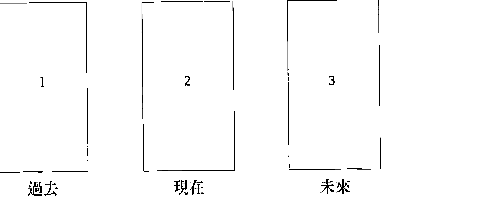

以下這個牌陣，當你屬於某個由三人組成的團隊，而你想知道每個成員（包括你自己）的期望時，便可以使用：

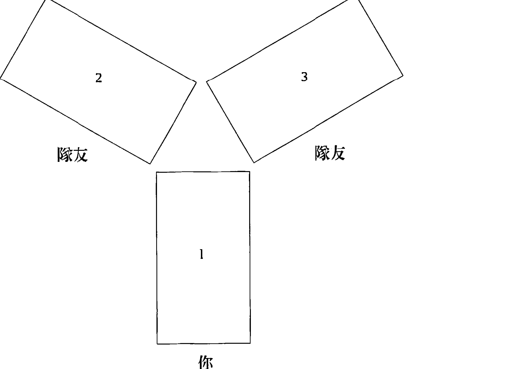

這三張牌形成一個「Y」字，牌的上端都朝內。這種形態暗示一種心靈的交會。設計你自己的佈局方式，使其能反映各個位置的意義。你可以使用四張、五張，或是更多的牌來延伸這項練習。

#### 第五課習題 每日一牌

##### 習題 5.1 逐一研習每張牌

藉著每天專注在一張不同的牌上，你可以變得更為熟悉每張塔羅牌。這項練習至少要花費七十八天，因此得投注相當的心力。但是，如果你堅持下去，當你完成時，你將對整副牌相當熟悉。

現在請決定在這個學習階段中你將如何選擇你的「每日一牌」。你可以有系統地進行（先是權杖，然後是聖杯，以此類推），或是隨興地選擇。你可以挑選吸引你目光的那張牌，或是似乎比較合乎當天事件的牌。每張牌研習一天就已足夠，但你也可以花上更長的時間，操之在你。

當你選好一張牌後，閱讀〈牌意解析〉關於該牌的部分至少一遍。寫下關鍵詞，並試著記住它們。它們將能幫助你快速記住一張牌的涵義。同時，請審視牌上圖像的各個細節。你可以把描述牌意的頁面複印下來，在這天當中隨時參照。但是我不建議你帶著牌到處跑，因為可能會搞丟或損壞。如果你願意，就開始記錄日誌。

##### 習題 5.2 建立每日一牌的習慣

當你將所有的牌至少研習過一遍，請開始不經意識考慮地抽取塔羅牌。依循第五課中所列舉的步驟，如果你有記日誌的習慣，請持續為每天的牌做記錄。一、兩個月後，請計算牌組的分布和大阿卡納牌的數量。你是否注意到其中有著反映你處境的模式？是否有某些牌頻繁地出現？問問自己原因。這個習慣能讓你與自己的直覺保持密切的接觸，並對當前的能量保持敏銳。

因可能是什麼。

#### 第六課習題 占牌環境

##### 習題 6.1 創造一個占牌的場所

花些時間思考你將在何處進行塔羅占卜。你可以考慮第六課提的一些建議，或是採用你自己的想法。不要覺得你必須創造一個像展示間的場所，只要看看你能夠做些什麼，好創造一個宜人而舒適的場地。

##### 習題 6.2 尋求一個象徵

在這項練習中，你將要宣告你的意圖，去找到或創造一個將做為你塔羅占卜之個人象徵的物品。你可以購買、覓得，或是自行製作這項物品。一旦你找到了它，請將它放置在你占算塔羅的地點，做為你占卜的靈感來源。

閱讀關於「愚人」牌的說明。這張牌往往代表源自開始一項新冒險的喜悅與自由之感。你將要以這樣的精神去尋找你的物件。這項追尋象徵你正藉由學習塔羅追求更深層的了悟。

握住「愚人」牌，然後閉上眼睛。宣告你想要找到或創造一個塔羅象徵的渴望。全心投入這項追尋，直到找到為止。你賦予這項追尋的價值，將會提升你更大的追尋之價值。一旦你申明了你的意圖，就將它釋放出去。你將會找到你所尋求的。

這項練習將會加強你的信心與承諾，並給你一項對應著你目標的有形象徵。它同時也將幫助你學習到：在看似愚益的行為中，隱藏著生命做為一項冒險的經驗。

#### 第七課習題 撰寫問題

##### 習題 7.1 撰寫塔羅問題

你將為你第一次的塔羅占卜撰寫問題。想一想你的生活，選出一個你有些困擾的領域。（放心，我們全都找得到！）避免一般性的掛慮，像是找到生命伴侶等。挑選特定一項目前正在家庭或職場中困擾著你的日常問題。選擇某件直接牽涉到你、而你個人也很在意的事。依照第七課的建議，撰寫一個有效的問題。撰寫問題時請記筆記，我們將在下一課用到這些筆記和你的問題。

##### 習題 7.2 習題撰寫問題

生命將會提供你許多機會練習撰寫問題。不管什麼時候，當你面對一項難題，就花上片刻去創造一個關於它的塔羅問題。你可以在進行例行活動——像是乘車或做家事——時，一邊做這件事。

撰寫練習性的問題將能幫助你學會快速分析一項個人的問題，並認清你在各種情況中要的是什麼。同時，如果你決定針對這項難題做占卜，手邊就有現成的問題了。

#### 第八課習題 問題占卜

##### 習題 8.1 做一次問題占卜

請你依照第八課中概述的程序（亦請參照〈附錄F〉中的步驟概要），用塞爾特十字牌陣從頭到尾進行一次問題占卜。你將會需要一個等待被回答的問題，你可以用你在〈練習7.1〉中所寫的問題，或是重新寫一個。運用你的直覺，以及〈牌意解析〉和〈塞爾特十字〉單元中的資訊，盡你所能地解讀這些牌。

頭一次解牌你可能會感到有些茫無頭緒——不確定自己是否每個地方都做對了。記住，所謂「正確的解讀」並不存在，你在牌中見到什麼，對你而言絕對是正確的。而且，無論如何，你都會獲得一些有價值的東西。在之後的課程中，你將會學到一些解牌的原則，它們將幫助你感覺更有信心。到那個時候，我們將會重新審視這次的占卜，看看你還能從中學到些什麼。

#### 第九課習題 占卜他人之事

##### 習題 9.1 對新聞事件占卜

閱讀今天的報紙，選擇一個你感興趣的主題——找個令人好奇且有些爭議性的。短期的媒體事件是很好的選擇，因為你很快就能知道事情的後續發展。閱讀你能找到的相關訊息，然後寫下一個涵蓋該情境中某個面向的問題。依循第九課所提的程序做一次「占卜他人之事」，記下你的解讀以及你所預測的結果。

稍後，當此一情況稍微明朗後，審視你的解讀，並以之對照實際發生的狀況。如果你的解讀似乎不太符合實情，請再度審視你占得的牌，看看是否能在其中發現一些新東西。

##### 習題 9.2 我是否涉入其中？

思索一個困擾若某個親密友人、親戚或同事的問題，選擇一個其問題對你而言很重要的人。以做「占卜他人之事」的方式，寫下一個關於這個狀況的問題。請刻意不要讓自己涉入其中。寫完之後，問問自己以下三個問題：

- 1. 當我想到在此情境中的這個人時，是否感受到強烈的情緒？
- 2. 我是否在此情境中有既得利益？
- 3. 我是否希望這個情境有某種特定的結果？

若你對以上任何一個問題的回答是肯定的，請改寫原來的問題，讓它聚焦在你自己身上。這個練習是幫助你學會判斷什麼樣的問題直接牽涉到你、而什麼樣的問題則否。

##### 習題 9.3 虛擬的情境

你可以為一個虛擬的人物設想一個麻煩的情境，針對它做一次「占卜他人之事」。你也可以從報章雜誌的讀者求助專欄借用一個情境——這裡是各種麻煩問題的好來源。

#### 第十課習題 開放式占卜

##### 習題 10.1 做一次開放式占卜

在接下來的幾個星期，找個機會嘗試「開放式占卜」。建議你找個十分寧靜的日子，當你對生活感到平和，並能融入當下的時刻。它應該是這樣的一天：當你有時間也有意願稍稍退後，審視當時正影響著你的較大局勢。如果有生日、週年紀念，或是其他特別的日子落在這段期間，利用它做為你這次占卜的基礎。請參照第十課所描述的程序。

#### 第十一課習題 解讀單張牌

##### 習題 11.1 你對一張牌的個人反應

從整副牌中選出任何一張，仔細審視它，然後寫下你的反應。如果你對這張牌已經很熟悉，並且知道它的意義，也不要緊。不論腦海中出現什麼，都將之視為你的個人反應。以下是幾項考慮的元素：

- 牌上的景象給我什麼感覺？
- 當我看見這張牌時，我自身起了何種感覺？〔註〕
- 我對這張牌感到受吸引、排斥它，或是中性的？
- 看見這張牌時，我生活中的哪個方面進入了我的腦海？
- 這張牌會讓我想起什麼人嗎？
- 這張牌上的哪些細節似乎是重要的？為什麼？

你或許對這張牌沒有任何反應，又或許只有輕微的感覺。試著留意任何快速掠過腦海的想法、感覺或是圖像，無論它們多麼微小。

##### 習題 11.2 綜合意義的來源

在這項練習中，你將要練習結合牌意和位置的涵義。從整副牌中選出一張來，讀過它的關鍵詞和行為表現。試著對這張牌的基本意義獲得一種感覺。

想像這張牌是落在「塞爾特十字」牌陣的位置一上。落在這兒將如何調整該牌的意義？牌意和位置的意義是如何共同運作，創造出一個綜合體？

寫下一個句子，總結你的詮釋。不要試圖找出正確答案，因為正確答案並不存在。選出一個吸引你並且有意義的可能性。你的句子不一定非得跟自身生活扯上關係，因為這題目只是用來練習。舉例來說，「皇帝」牌代表：

父性 架構
權威 規則

這張牌落在位置一的意義，以下是一些可能的選擇：

- 1. 現在，問題的核心（位置一）是我的生活中有著太多的架構（皇帝）了。
- 2. 我當前的環境（位置一）相當受到規範和控制（皇帝）。
- 3. 現在成為父親（皇帝）的議題是我生活中的首要因素（位置一）。

這些句子各不相同，但它們都結合了皇帝和位置一的涵義。在真正占牌時，當你考量其他的因素，對你最適合的詮釋方式將會變得清晰。

接下來，用同一張牌為其他九個位置各寫下一個句子。如果你想多做些練習，可以為每個位置多寫幾個句子，或是選擇另一張牌重複這項練習。

##### 習題 11.3 解讀塞爾特十字牌陣中的單張牌

利用你正在進行的塞爾特十字占卜，練習結合以下四種意義來源：

- 1. 個人的反應
- 2. 牌的意義
- 3. 位置的意義
- 4. 問題或情境

一開始請有系統地考量這四個領域的每一個，好讓它們成為你的第二天性。試著依照〈習題11.2〉描述的方式為每張牌寫下一個句子。當然，你不需要一直這麼做下去。稍後你可以放輕鬆些，只是單純地去反應，而不需要思考你的反應是從哪兒來的。

#### 第十二課習題 大小阿卡納牌

##### 習題 12.1 塞爾特十字中的阿卡納牌

在下面的牌陣配置中，只提供了大小阿卡納牌的分布狀況。單就牌的位置和大小阿卡納的因素，針對每種牌陣寫下一、兩個句子，描述你對它的感覺。如果你願意，可以核對我的建議。

如果你有實物可看，這個練習會比較容易做。拿兩副背面顏色不同的一般撲克牌，一副代表大阿卡納，另一副代表小阿卡納（如果沒有撲克牌，可以使用方形的色紙）。將適當顏色的牌牌面向下擺放在指定的位置，擺出你正在研究的牌陣。在「牌陣一」中，如果藍色的牌代表小阿卡納、而紅色代表大阿卡納，除了位置十是紅色之外，其餘所有的牌都是藍色的。

| 位置編號 | 1 | 2 | 3 | 4 | 5 | 6 | 7 | 8 | 9 | 10 |
|---|---|---|---|---|---|---|---|---|---|---|
| 牌陣一 | 小 | 小 | 小 | 小 | 小 | 小 | 小 | 小 | 小 | 大 |
| 牌陣二 | 小 | 小 | 小 | 大 | 小 | 小 | 小 | 小 | 小 | 小 |
| 牌陣三 | 小 | 小 | 小 | 小 | 小 | 小 | 小 | 大 | 小 | 小 |
| 牌陣四 | 小 | 小 | 大 | 小 | 小 | 小 | 小 | 小 | 小 | 小 |
| 牌陣五 | 大 | 大 | 小 | 小 | 小 | 小 | 小 | 小 | 小 | 小 |
| 牌陣六 | 小 | 小 | 小 | 小 | 大 | 小 | 大 | 小 | 小 | 小 |

顯示大小阿卡納牌分布的塞爾特十字佈局## 习题 12.2 比较大小阿卡纳牌

从整副牌中挑出所有的大阿卡纳牌，叠成一堆。为每张大阿卡纳牌选出一张具有类似意义的小阿卡纳牌。你可以自己选择，或者若你愿意，可以查对我的建议。将你选出的小阿卡纳牌另外叠成一堆。

洗好那堆大阿卡纳牌，切好牌后以塞尔特十字排出十张牌。找出对应的十张小阿卡纳牌，然后在第一个牌阵旁边排出第二个塞尔特十字。比较你对这两组牌阵的印象，询问自己以下问题：

- 1. 各个牌阵传递出的整体感觉为何？
- 2. 两种牌阵的感觉一不一样？
- 3. 其中一种牌阵，看来会比另一种容易了解吗？
- 4. 其中一种看来会比另一种容易入手吗？
- 5. 其中一种看来会比另一种扣人心弦吗？

如果你愿意，可以用另一组牌重复这项练习。

## 习题 12.3 只用大阿卡纳牌占卜

在接下来的一个星期左右，试着只用大阿卡纳牌做一次占卜。我建议你做“开放式占卜”，因为大阿卡纳牌提供了适合这类占卜的广泛性指引。你也许会发现对你而言这种技巧运作得很好。有些人偏好始终只使用大阿卡纳牌，大阿卡纳占卜能够澄清在你生活中运作、具决定性的重要主题。

#### 第十三课习题 王牌

##### 习题 13.1 王牌的能量

王牌具有未受环境因素稀释的纯净能量，这个练习将帮助你体验此种能量。首先，从你的塔罗牌中取出四张王牌，以下列方式在面前排成一列：

用一张纸写下各王牌的四个关键词，然后将之置于该牌底下。现在，逐一专注在各张王牌上，直到你觉得对它们十分熟悉。试着达到这样的程度：当你看见某张王牌时，立刻就能感受到它强有力的存在。（每张王牌的头一个关键词都包含“力量”这个词！）审视牌面图像的细节，尤其是牌组的象征符号。留意每种符号是如何捕捉该王牌的特质。

### 习题 13.1 用王牌做想象习题

王牌是用来做想象（visualization）练习的绝佳图像。当你想要感受某张王牌的特质时，就用你内心的眼睛想像它的图像。你可以简化它的画面，只要想像一只手握着该牌组的标志就行了。感觉自己正在召唤这张王牌的力量，彷佛避雷针般将暴风雨的能量引下来。你可以汲取的能量包括：

权杖王牌：勇气，信心，创造力，热情
圣杯王牌：爱，宽恕，洞察力，信仰
宝剑王牌：智识，坚毅，诚实，澄明
钱币王牌：安全感，繁荣兴旺，信赖，胜任的能力

当你学习到更多王牌的事之后，你将知道在任一情况下哪种王牌是最合适的，并且将拥有随时接通其能量的技巧。

#### 第十四课习题 宫廷牌

##### 习题 14.1 审视宫廷牌

将十六张宫廷牌全部取出来，以下面的列方式排列成四乘四的方阵：

| 侍卫权杖 | 骑士权杖 | 王后权杖 | 国王权杖 |
|----------|----------|----------|----------|
| 侍卫圣杯 | 骑士圣杯 | 王后圣杯 | 国王圣杯 |
| 侍卫宝剑 | 骑士宝剑 | 王后宝剑 | 国王宝剑 |
| 侍卫钱币 | 骑士钱币 | 王后钱币 | 国王钱币 |

花上片刻审视这些齐聚一堂的皇室人物，他们都是独特的个人，却也和属于同一牌组（横列）及阶级（纵列）的其他牌拥有某些共通之处。复习〈附录B〉中的牌组特质表以及每张牌的牌意描述，寻找这些牌之间的共通模式。

##### 习题 14.2 国王牌

就底下每一种状况，决定一种你可能采取的行动，以反映某特定国王的性格。你可参考我在第148页的建议。以下是一个例子：

> > 权杖国王：你被指控在考试中作弊，但你知道自己是清白的。
> 可能的行动：我会勇敢地对抗指控我的人，并要他提出证据。

- 1. 圣杯国王：你的配偶抱怨你周末总是不在家。
- 2. 钱币国王：一个乞丐向你乞讨三十块钱。
- 3. 宝剑国王：你在女儿的大衣口袋里发现了大麻。
- 4. 权杖国王：你室友一直“不告而借”你的车。
- 5. 钱币国王：你朋友要你抛下工作跟他一起去钓鱼。
- 6. 宝剑国王：你获邀在一次会议中发表演说。
- 7. 圣杯国王：一位侍者连续两次弄错你点的东西。
- 8. 权杖国王：你因为你的团队表现很差而感到泄气。

##### 习题 14.3 王后牌

就底下每一种状况，决定一种能反映特定王后之性格的感受或想法。你可参考第148页的建议。以下是一个例子：

> > 权杖王后：你被指控在考试中作弊，但你知道自己是清白的。
> 可能的感受／想法：我有信心能证明自己的清白。

- 1. 圣杯王后：你发现你的表亲得了癌症。
- 2. 钱币王后：你把钥匙锁在车里了。
- 3. 宝剑王后：公司要求你接手一项岌岌可危的计划。
- 4. 权杖王后：你展开第一天的节食计划。
- 5. 钱币王后：你最好的朋友对你坦承他有不伦恋情。
- 6. 宝剑王后：你与一位很有潜力的新雇员面谈。
- 7. 圣杯王后：你决定在午餐后做一次长途的散步。
- 8. 权杖王后：你参加一场你只认识女主人的派对。

##### 习题 14.4 骑士牌

就以下每种场景，决定哪种骑士最能反映此一情境，然后写下几个句子描述对该骑士的譬喻。你可参考第149页的建议。以下是一个例子：

> 你这半年来每天都工作十二个小时，这样负荷太重了。
钱币骑士：你工作太辛苦了，你把自己逼得太紧了，你从不玩乐。

- 1. 你总是感到沮丧，想要哭泣。似乎没有人在乎你的感受。
- 2. 你吹噓自己认识许多要人，但其实并没有。
- 3. 股市一直在上涨，而你所有的钱都存在毫无风险的储蓄帐户中。
- 4. 你总是对孩子们吼叫。他们不断的打闹快把你逼疯了。
- 5. 你告诉你的新助理他的工作表现无可救药地草率且不彻底。
- 6. 你觉得你的伴侣总是不断跟别人打情骂俏，对此你非常不高兴。
- 7. 你儿子不听你的话，你无法容忍这点！你的话就是家中的律法。
- 8. 你拒绝考虑退休，即使你的配偶想要讨论这件事。

##### 习题 14.5 侍卫牌

取出四张侍卫牌，将它们牌面向下放在你面前。将它们洗一洗，然后翻开其中一张。假设这张侍卫牌代表出现在你面前的机会，一个反映该牌组魔力的机会，你想它可能会是什么？这个可能性令你兴奋吗？是否有甚么因素让你踌躇不前？如果你脑海中没有浮现任何事物，请在接下来的几天留意是否有灵感出现。

##### 习题 14.6 宫廷牌反映现实生活人物

你越是了解你的人类伙伴，就越能了解宫廷牌。接下来的数星期，观察你的亲戚、朋友、同事，和其他相识之人，并思考明星名流、历史人物，以及书籍、电视和电影中的人物，问问自己：

- 1. 这个人拥有哪些特质？又欠缺哪些特质？
- 2. 哪些特质对此人有所助益？哪些则并无助益？
- 3. 这个人与哪张宫廷牌最为相似？又与哪张最不相似？
- 4. 这个人怎么个独特？完全不像任何类型吗？
- 5. 在我的生活中，哪些宫廷牌的类型最为常见？哪些最不常见？

##### 习题 14.7 宫廷牌家族

> > “世界即舞台，男男女女不过是演员。”

莎士比亚早已认识到，我们每个人都是扮演着许多角色的演员。我们的角色并不是自己本然的样貌——这是个深奥的谜。它们只是我们在参与一齣叫做“人生”的大戏时，所呈现的变化万千的人格。

运用宫廷牌的人格特质，创造出分属四个家族——权杖、圣杯、宝剑，以及钱币——的角色。每个家庭中都有父亲（国王）、母亲（王后）、男性或女性的青少年（骑士），和较小的孩子（侍卫）。

描述这四个家庭，显现它们独特的风格。每个家庭的成员都拥有共同的生活取向（牌组特质），但他们在家庭中有着不同的位置（阶级）。钱币家庭会选择什么样的职业？权杖骑士会开别克还是野马跑车？这里有一些提示可以让你为角色添加血肉：

- 1. 身体的特征——体型，发色／发型，五官相貌
- 2. 住宅——地段，屋型，家具
- 3. 教育及职业
- 4. 所有物——衣服，汽车，玩具
- 5. 休闲——假期，嗜好，运动
- 6. 偏好——食物，电影，歌曲，书籍，颜色
- 7. 习惯——长处，弱点，癖性

##### 习题 14.8 宫廷牌之行为表现

针对以下各个场景，为指定的第一张宫廷牌写出一、两种诠释。考虑该牌的意义、位置，以及当时的情境。若要做额外的演练，则以第二张宫廷牌重复此项练习。不要一起考虑这两张宫廷牌，想像你是在两次独立的占卜中分别抽到它们。你可以参考第150页的建议。

- 1. 三个月后你就要结婚了，但你未来的岳父对婚礼的安排多所挑剔，试图加以掣肘。
   - 宝剑骑士——位置五
   - 权杖国王——位置九
- 2. 你打算买新车，但很怕碰上紧迫钉人的销售员纠缠不休。
   - 圣杯王后——位置六
   - 宝剑国王——位置七
- 3. 你朋友请求你周末替她看小孩，你想帮忙，但又觉得她的孩子很难缠。
   - 钱币王后——位置一
   - 圣杯侍卫——位置二
- 4. 你遇见一位有魅力的人，但他四个月前才刚离婚，你担心会卷入麻烦中。
   - 权杖王后——位置四
   - 圣杯骑士——位置八
- 5. 你胸口疼痛了好几个星期，而且越来越严重，但你却不想去看医生。
   - 钱币骑士——位置十
   - 宝剑侍卫——位置三
- 6. 你有个改进工作的主意，可能会带来很大的获利，但你疑心你的上司会设法占去这份功劳。
   - 权杖骑士——位置二
   - 钱币国王——位置九
- 7. 过去一年，你感到焦躁不安而不满足。过去觉得有意义的活动，现在似乎都变得很无聊。
   - 宝剑王后——位置三
   - 权杖侍卫——位置七
- 8. 六个月前，一位朋友因为急用向你借了六千块钱。现在他又要再借三千块。
   - 钱币侍卫——位置八
   - 圣杯国王——位置一

#### 第十五课习题 相对的牌

##### 习题 15.1 大阿卡纳间的固定牌对

下面是两组打散了的大阿卡纳牌，请在〈表二〉中为〈表一〉中的每一张牌找出一张你觉得与之形成固定牌对的牌。简短注明各张牌的意义，以显示彼此间的平衡关系。做这项练习时，试着先不要翻看〈牌意解析〉的章节。你可以参考我在第152页中的建议。举个例子：
魔法师（行动）——女祭司（不作为）

打散的大阿卡纳固定牌对表
| 表一 | 表二 |
|---|---|
| 恶魔 | 死神 |
| 太阳 | 恋人 |
| 战车 | 星星 |
| 皇后 | 世界 |
| 愚人 | 吊人 |
| 隐士 | 月亮 |
| 教皇 | 皇帝 |

##### 习题 15.2 其他固定牌对

针对以下每张小阿卡纳牌：

- 1. 选出该牌的一种意义。
- 2. 想出一种相反的意义。
- 3. 找出另一张具备其相反意义的牌（大小阿卡纳皆可）。
- 4. 可翻阅关键词摘要表及每张牌的“意义相对的牌”部分，寻找灵感。

- 权杖二
- 宝剑五
- 钱币十
- 钱币八
- 宝剑七
- 权杖八
- 圣杯二
- 圣杯九
- 权杖五

##### 习题 15.3 宫廷牌对

因为彼此的不同，人们既能互相帮助、又会惹恼对方。下面是十二组宫廷牌对，针对每组牌对：

- 1. 为〈甲〉选出一种该宫廷牌典型的人格特质。
- 2. 描述〈甲〉由于此种特质可能帮助〈乙〉的一种方式。
- 3. 描述〈甲〉由于此种特质可能惹恼〈乙〉的一种方式。

你可参考我在第152页中的建议，以及〈附录C〉和〈附录D〉的图表。以下是一个例子：

## 宝剑骑士

特质：直接的／莽撞的
帮助钱币王后学会说“不”。
当他粗鲁对待陌生人时，会惹恼钱币王后。

### 宫廷牌对

|      | 甲        | 乙        |
|------|-----------|-----------|
| 牌对一 | 圣杯骑士   | 权杖王后   |
| 牌对二 | 权杖国王   | 圣杯王后   |
| 牌对三 | 钱币国王   | 圣杯骑士   |
| 牌对四 | 钱币王后   | 权杖国王   |
| 牌对五 | 宝剑国王   | 钱币国王   |
| 牌对六 | 圣杯国王   | 宝剑国王   |
| 牌对七 | 圣杯王后   | 宝剑王后   |
| 牌对八 | 权杖骑士   | 钱币王后   |
| 牌对九 | 权杖王后   | 宝剑骑士   |
| 牌对十 | 钱币骑士   | 圣杯国王   |
| 牌对十一 | 宝剑王后   | 权杖骑士   |
| 牌对十二 | 宝剑骑士   | 钱币骑士   |

##### 习题 15.4 意义加强的牌对

就以下每一张牌：

- 1. 选出该牌的一种意义。
- 2. 找出一张具有相似意义的牌（大小阿卡纳皆可）。
- 3. 可翻阅关键词摘要表及每张牌的“意义加强的牌”部分，寻找灵感。

- 权杖三    权杖八
- 钱币四    钱币九
- 节制      正义
- 宝剑三    圣杯六
- 圣杯五

##### 习题 15.5 偶然的牌对

找出下表中的每组牌对，将这两张牌并排在面前，轻松地凝视一会儿。找出某种方式诠释这两张牌，让它们的意义彼此相对或彼此补强。你可以参考我在第154页的建议。以下是“皇后”和“圣杯三”之间的两种可能性：

- 皇后——一个专注在自己身上的独处女子。
- 圣杯三——一群专注在彼此身上的女人。
- 皇后——一位坐着的女人，她相当严肃，且不太活动。
- 圣杯三——一群跳舞的女子，生气勃勃且无忧无虑。

若要做额外的练习，可自行随机选择两张牌。

偶然的牌对
| 牌对 | 牌一 | 牌二 |
|------|------|------|
| 牌对一 | 隐士 | 正义 |
| 牌对二 | 宝剑九 | 宝剑四 |
| 牌对三 | 钱币二 | 吊人 |
| 牌对四 | 战车 | 死神 |
| 牌对五 | 钱币四 | 权杖六 |
| 牌对六 | 恋人 | 宝剑六 |
| 牌对七 | 教皇 | 恶魔 |
| 牌对八 | 权杖九 | 钱币七 |
| 牌对九 | 太阳 | 宝剑十 |

##### 习题 15.6 你的平衡议题

辨识出此时此刻对你具有意义的平衡议题。以下是一些可能性：

- 1. 掌控——放手
- 2. 自由——受限
- 3. 感到喜悦——感到悲伤
- 4. 缔造和平——制造冲突
- 5. 工作——玩乐
- 6. 稳扎稳打——冒险
- 7. 缓慢地动作——快速地行动
- 8. 行动——等待
- 9. 聚集起来——分拆开来
- 10. 感到胜利——感到挫败

找出两张代表你的议题相对两端的牌，在接下来的数星期间，不时想想这两张牌。你比较接近其中一张牌吗？或者是介于两者中间？留意这些牌是否会在你的占卜中出现。

#### 第十六课习题 塞尔特十字牌阵中的相对位置

##### 习题 16.1 塞尔特十字中传统的相对位置

用一副塔罗牌中的任何十张牌，牌面朝下排出一个塞尔特十字牌阵。针对下面的六种情境进行以下步骤：

- 1. 想象你正在进行一次塞尔特十字占卜，而你抽到了列在（A）项下的两张牌。
- 2. 找出这两张牌，将它们牌面朝上摆放在指定的位置。
  (取走原本在那儿的牌)
- 3. 就这两张牌所组成的牌对写下简短诠释，用第十六课中的例子做为范例。
- 4. 将这两张牌翻过来，使牌面向下。
- 5. 若要做更多练习，请用（B）项中的第一组牌重复上述步骤一到四。

你可参见我在第155页中的建议。

- 1. 你八岁的孩子眼泪汪汪地从学校回来。老师将他的家庭作业撕了，因为他没有遵照指示，而且字迹太过潦草。
   - (A) 圣杯侍卫（位置一）和钱币骑士（位置二）
   - (B) 钱币二（位置一）和审判（位置二）
- 2. 你担心伴侣有外遇，你想要相信这不是真的，但又忍不住怀疑。
   - (A) 圣杯六（位置三）和月亮（位置五）
   - (B) 圣杯七（位置三）和宝剑国王（位置五）
- 3. 你工作团队中的一位成员没有尽力投入，过去你睁一只眼闭一只眼，但是现在他的怠惰已经对团队造成了伤害。
   - (A) 宝剑二（位置四）和权杖三（位置六）
   - (B) 权杖十（位置四）和力量（位置六）
- 4. 过去七年，你和一位合伙人共同拥有并经营一家店铺。现在，她想要退股离开，你将必须卖掉这家店以买下她的股份。
   - (A) 钱币十（位置七）和死神（位置八）
   - (B) 圣杯王后（位置七）和钱币王后（位置八）
- 5. 你爱上一位你父母不会接受的人，到目前为止，你都秘密进行着这段恋情，但你不能永远隐瞒下去。
   - (A) 宝剑三（位置五）和世界（位置十）
   - (B) 命运之轮（位置五）和愚人（位置十）
- 6. 你为一位公众人物做了一次占卜（占卜他人之事），此人因财务上的不当行为而受到调查。（请注意，这两组牌中第二张牌的位置有所不同）
   - (A) 权杖二（位置九）和宝剑七（位置四）
   - (B) 权杖八（位置九）和皇帝（位置八）

##### 习题 16.2 塞尔特十字中其他的相对位置

以下是塞尔特十字中一些新的位置配对，请针对每一种组合，简短描述你能从此一牌组中了解到什么。可参考我在第157页中的建议。例如：位置一——位置四＝过去所发生的某件事情（四）是如何影响着现在（一）。

| 位置一——位置六 | 位置三——位置十 |
| 位置一——位置七 | 位置四——位置八 |
| 位置二——位置五 | 位置五——位置七 |
| 位置二——位置八 | 位置六——位置十 |
| 位置三——位置四 | |

##### 习题 16.3 重新检视你的塞尔特十字占卜中的牌对

根据你对塞尔特十字中牌对的新了解，重新检视你在〈习题8.1〉占得的牌阵。你能发现任何新洞见吗？检视那些明显的对应位置，但同时也寻找其他牌对。你或许会惊异于自己所发现的讯息……或者你也可能完全找不到任何新东西。若要做额外的演练，可用此方式检视其他牌阵。

#### 第十七课习题 逆位的牌

##### 习题 17.1 一张牌的能量

以混杂正位和逆位的方式洗好牌，然后牌面朝下、用一只手握住整副牌。翻开第一张牌，将它放在面前，然后回答下面的问题：

- 1. 此时此刻，对我而言，这张牌的能量是什么？聆听跳进你脑海的字词或语句，不要试图记起书上提的标准意义，就只是等待某个念头进入你的意识。让该牌的能量自行对你展现。
- 2. 这张牌的朝向，呈现出什么样的能量层次？正位的牌代表高能量，逆位的牌代表低能量。
- 3. 我是如何在这个层次上体验此种能量？再次提醒，请让念头自行进入你的脑海。

以下是两个例子：

权杖九——正位

- 1. 坚毅
- 2. 高层次
- 3. 我决定在学校得到好成绩。

宝剑王后——逆位

- 1. 坐在审判的位置上（根据牌上的图像）
- 2. 低层次
- 3. 我试图不要对我妹妹有太多批判。

逐一翻开新的牌，继续这项练习。你应该轻松愉快地进行，有任何疲累或焦躁的感觉时便停下来。没有所谓的正确答案，因此你尽管接受脑中浮现的任何想法。

##### 习题 17.2 解读逆位牌

就以下各场景，想像你抽到了一张特定的逆位牌。写下简短的诠释，显示这张牌惯常的能量是如何处于低层次，或是应该要降低强度。你可以参阅我在第158页的建议。以下是两个例子，其中牌的意义是以粗体字表示，而逆位的效果则用斜体标明：

情境：我在一场车祸中伤到了背部，十分疼痛。
牌：权杖王后——逆位
解读：这场车祸使我原本*强健的体魄*受损不少。

情境：即使我整晚熬夜，也不可能准时完成这项工作。
牌：钱币九——逆位
解读：我应该*停止试图每件事都亲力亲为*。

- 1. 我纳闷我的感情生活为何停滞了这么久。
  权杖三——逆位
- 2. 我终于获得了升迁，但家人却不想（为此）搬家。
  战车——逆位
- 3. 我的朋友要我加入她对于用垃圾填地的抗议行动。
  宝剑王牌——逆位

##### 習題 17.3 逆位的意義

就下列每一張牌，簡短寫下一段在某方面與該牌慣常涵義相反的詮釋。使用基於扭曲、翻轉、改變、拒斥以及否定等而得出的概念。這段詮釋不一定要與你的生活相關，任何可能的狀況都可以。當你尋找靈感時，請看著那張逆位的牌。你可以參閱我在第159頁的建議。以下是幾個例子，其中相反的意義以斜體標示：

###### 世界——逆位

-   1. 我的整個世界都天翻地覆了。
-   2. 她拒絕了外面的世界，想要在自己的圈子裡遺世獨居。（參見「世界牌」圖像）

###### 聖杯國王——逆位

-   1. 我不信任她。我總覺得她不是那麼可靠。
-   2. 我厭倦了總是這麼圓滑得體！我要說出心裡的話。

-   1. 正義——逆位
-   2. 寶劍侍衛——逆位
-   3. 吊人——逆位
-   4. 權杖四——逆位
-   5. 錢幣王牌——逆位

-   6. 聖杯騎士——逆位
-   7. 寶劍六——逆位
-   8. 教皇——逆位
-   9. 錢幣三——逆位

## 〔第十八課習題〕 織故事

## 習題 18.1  意識流的述說

你可以在任何你覺得能夠自在地將想法大聲說出來的時刻（對多數人來說，這意味著獨處的時刻！）練習「意識流的述說」。當每個想法出現時，就把它如實說出來。這種做法的概念是去「聆聽」內在的想法，然後將它說出。說完一個念頭後，就接著聆聽下一個。

在接下來的數星期，試著盡量找機會做這個練習。努力做到能夠自然而無急迫感地述說。試著別讓思索這個程序的想法過度干擾你。要達到這種境地並不容易，但你的努力將會很有價值。

##### 習題 18.2 塔羅即興創作

在劇場的即興演出中，觀眾會喊出幾種物品的名稱，演員就得根據這些元素編織出一齣小戲劇。在這項練習中，紙牌就是那些元素，而你則是必須將它們即興串連起來的演員。

用一般的方式洗牌切牌，將牌面向下握在一隻手裡。翻開最上面的三張牌，將它們排成一列。現在，就若這幾張牌創造出一個故事。不必試圖想出巧妙的情節，只要讓故事自然開展。在伊塔羅·卡爾維諾（Italo Calvino）的著作《命運交織的城堡》（The Castle of Crossed Destinies）〔註〕中，書中人物就是單憑塔羅牌的圖像對彼此講述故事的。

完成上述步驟後，將這頭三張牌放在一邊，再翻出三張來編織一個新故事。或者，你也可以留下這頭三張牌，翻出第四張，然後將這張牌整合到原來的故事中。藉著一次翻出一張新的牌，將故事持續發展下去。這項練習的精神在於隨興的遊戲，如果你感到任何壓力或緊張，就可以停下來。

##### 習題 18.3 塞爾特十字的架構

以一般的塞爾特十字格式排出任何十張牌，閱讀單元五〈塞爾特十字牌陣〉關於此種牌陣解牌程序的描述，依照這些步驟創造一個故事。這種方法對你來說好用嗎？你會想要做哪些變更？

接下來，排出新的一組十張牌，用它們來實驗不同的故事架構。試著從「結果牌」（十號牌）開始，往前倒敘，或是圍繞著一組引人注目的牌對來建構故事。用幾組不同的牌來探索新的方法。你或許會在一種最喜歡的占卜方式上定下來，但是知道一些其他的可能性好在需要時可以使用，也是很有助益的。

> 〔註〕伊塔羅·卡爾維諾，《命運交織的城堡》，（New York: Harcourt Brace Jovanovich，1969）。

## { 第十九課習題 } 占卜的正確態度

##### 習題 19.1 再次思考「我相信什麼」？

在〈習題1.1〉中，我曾請你簡短寫下你對塔羅相信和不相信什麼，並用下面的標準評估你信念的百分比：

-   0% = 「除了好玩之外，我全盤懷疑塔羅有什麼用處。」
-   100% = 「我絕對確信塔羅能給予我特殊的個人指引。」

現在先不要看你之前寫下的東西，將這個練習再做一次。完成之後，回頭看看你原先的回答。停下來思考你開始研習這套課程後所學到和經歷的一切。

## 單元三

## 習題建議

Suggestions for Exercises

## 第三課

##### 習題 3.1 這些敘述是哪個牌組的特質？

| 序號 | 牌組 | 特質 |
| :--- | :--- | :--- |
| 1. | 聖杯 | 負面 |
| 2. | 錢幣 | 負面 |
| 3. | 寶劍 | 正面 |
| 4. | 寶劍 | 負面 |
| 5. | 權杖 | 正面 |
| 6. | 錢幣 | 正面 |
| 7. | 聖杯 | 正面 |
| 8. | 寶劍 | 正面 |
| 9. | 權杖 | 負面 |
| 10. | 錢幣 | 正面 |
| 11. | 寶劍 | 負面 |
| 12. | 權杖 | 正面 |
| 13. | 聖杯 | 負面 |
| 14. | 聖杯 | 正面 |
| 15. | 權杖 | 負面 |
| 16. | 聖杯 | 負面 |
| 17. | 錢幣 | 負面 |
| 18. | 寶劍 | 正面 |
| 19. | 錢幣 | 正面 |
| 20. | 寶劍 | 負面 |
| 21. | 聖杯 | 正面 |
| 22. | 權杖 | 負面 |
| 23. | 權杖 | 正面 |
| 24. | 錢幣 | 負面 |

##### 習題 3.2 牌組特質：明確的例子

-   1. 錢幣——負面
    強迫的，過度有條不紊的，嚴苛死板的
-   2. 權杖——負面
    輕率不謹慎的，不負責任的，準備不周的
-   3. 錢幣——正面
    可靠的，可信賴的，負責任的
-   4. 寶劍——正面
    講求邏輯的，控用心智的，善於分析的
-   5. 聖杯——正面
    直覺的，注重精神的，安靜的
-   6. 權杖——正面
    熱烈的，生氣勃勃的，全心全意的
-   7. 聖杯——正面
    有愛心的，親切和諧的，有同情心的，關懷的
-   8. 寶劍——負面
-   9. 錢幣——負面
    頑固倔強的，固執頑強的，絕不讓步的
-   10. 寶劍——負面
    傲慢自負的，屈尊降貴的，高壓跋扈的，擺出高高在上的態度的
-   11. 錢幣——正面
    頑強固執的，頑強堅持的，徹底周密的
-   12. 聖杯——負面
    過度敏感的，愛生悶氣的，陰晴不定的，敏感易怒的
-   13. 權杖——正面
    英勇的，有英雄氣概的，自信的，勇敢的
-   14. 權杖——負面
    倉促草率的，草率行事的，性急易怒的，衝動行事的
-   15. 寶劍——正面
    客觀的，公正的，不偏不倚的，正直公平的，具洞察力的
-   16. 聖杯——負面
    過度嬌貴的，意志薄弱的，脆弱的，懶惰的

## 第十二課

##### 習題 12.1 塞爾特十字中的阿卡納牌

牌陣一：除了結果（位置十）之外，所有的牌都是小阿卡納。此一情境是個暫時性的個人戲劇，但其衝擊在某方面卻將是強大而有意義的。

牌陣二：唯一的大阿卡納牌是落在「過去」位（位置四），此刻的情境是過去某個重要事件的結果，或者某個曾經很重要的因素正在消褪中。

牌陣三：位置八——環境——是唯一的大阿卡納牌。該情況或許是更大事件架構的一部分，又或許外在的影響特別的強。

牌陣四：由於位置三是唯一的大阿卡納牌，在這兒，隱而不顯的潛在能量十分強大。表面上的事物可能是次要的，但在底下支撐它們的力量卻很強。

牌陣五：兩張大阿卡納牌位於牌陣的中心（位置一和位置二），不論是好是壞，兩股強大的力量會交會。其他圍繞在周圍的次要因素，則是這種核心動力的衍生分枝。

牌陣六：某人認為（位置五）他的角色（位置七）在此情境中十分重要，但真實的環境並不支持這種想法。

##### 習題 12.2 比較大小阿卡納牌

-   * 愚人——權杖三（進入未經探索的領域）
-   * 魔法師——權杖二（擁有人的力量）
-   * 女祭司——寶劍四（安靜地休息）
-   * 皇后——錢幣十（富裕，奢華）
-   * 皇帝——錢幣四（掌控）
-   * 教皇——錢幣八（學習，研究）
-   * 戀人——聖杯九（性的樂趣）
-   * 戰車——錢幣九（自制，紀律）
-   * 力量——權杖九（毅力，忍耐力，精神）
-   * 隱士——寶劍七（獨自一人）
-   * 命運之輪——權杖八（快速的步調，迅速的發展）
-   * 正義——權杖十（接受責任）
-   * 吊人——寶劍十（殉難，犧牲）
-   * 死神——聖杯五（損失，離別）
-   * 節制——錢幣二（平衡）
-   * 惡魔——寶劍九（絕望，缺乏歡樂）
-   * 塔——錢幣五（艱困時刻）
-   * 星星——聖杯六（善意，分享）
-   * 月亮——寶劍二（自我欺騙）
-   * 太陽——權杖六（喝采，卓越）
-   * 審判——錢幣七（決定之點）
-   * 世界——聖杯十（快樂，滿足）

## 《習題建議》第十四課

##### 習題 14.2 國王牌

-   聖杯國王：我會跟配偶坐下來討論他／她的煩惱。（關懷的）
-   錢幣國王：我會給他一百塊。他或許比我更需要這些錢。（支持的）
-   寶劍國王：我會在做任何判斷之前，先聽聽我女兒的說法。（公正的）
-   權杖國王：我會在車上設下機關，如果我室友發動它，警報就會響起。（有創意的）
-   錢幣國王：我會對我的朋友說：「抱歉，我的工作需要我。」（可靠的）
-   寶劍國王：我會接受這邀請，因為我是個很棒的演說者。（辯才無礙的）
-   聖杯國王：我會微笑並耐心地第三次告訴他我點了什麼。（有耐心的）
-   權杖國王：我會召喚大夥兒聚攏，激勵所有的人重燃鬥志。（激勵人心的）

##### 習題 14.3 王后牌

-   聖杯王后：我的表親將需要更多的愛與支持。（充滿愛意的）
-   錢幣王后：只要我用心去想，就能找出拿到鑰匙的方法。（機智的）
-   法。（富於機智的）
-   寶劍王后：我被交付這項無望計畫的真正原因是什麼？（精明機敏的）
-   權杖王后：減重後，我將會擁有更高的能量。（精力充沛的）
-   錢幣王后：既然我的朋友信賴我，我要保守這個秘密。（值得信賴的）
-   寶劍王后：我將開誠佈公地進行這次面談，好讓雙方不致產生誤解。（誠實的）
-   聖杯王后：我可以利用這段時間沉思冥想，讓自己再度集中於焦點。（注重精神的）
-   權杖王后：我知道我能很容易地交上新朋友。（有自信的）

##### 習題 14.4 騎士牌

-   聖杯騎士：你太愛生悶氣了，又過於敏感。你的情緒正宰制著你。
-   權杖騎士：你在吹牛。吹噓並不能給人好印象。你太專注於表象了。
-   錢幣騎士：你太過謹慎了。你安於比你應得的要少的東西。你害怕冒險。
-   權杖騎士：你不經思考就行動。你太生氣了。你對爭端火上加油。
-   寶劍騎士：你太直率、太愛批評了。人們是有感覺的。
-   聖杯騎士：你太愛吃醋、太過情緒化了。你在胡思亂想、無中生有。
-   寶劍騎士：你太跋扈、太不顧慮別人的感覺了。你的兒子不是你的奴隸。
-   錢幣騎士：你太頑固、太不肯妥協了。你害怕改變。

##### 習題 14.8 宮廷牌之行為表現

這裡為每張牌提出兩種可能的詮釋，以粗體字標明的字句是該牌的意義，而斜體字則是位置的意義。

-   1. 寶劍騎士——位置五
    a. 我的岳父太過吹毛求疵、太專橫了。他佔據了我所有的心神，讓我完全沒辦法想別的事。
    b. 我的意願是告訴岳丈我對其干預的真實想法……徹底跟他攤牌！

    權杖國王——位置九
    a. 處理此事的關鍵是認清我的岳丈習慣身為注意力的焦點。
    b. 對我而言，進行此事的最佳方式是自然地展現我自己的權威。

-   2. 聖杯王后——位置六
    a. 在不久的將來一位有耐心而體貼的銷售員將會出現。
    b. 如果我讓直覺引導我，這樁交易將來可能會進行得更為順利。

    寶劍國王——位置七
    a. 如果我仿效寶劍國王的典範就可能成功——研究相關資料，這樣我便知道自己在說些什麼。
    b. 如果我採取坦誠的態度，賣方也將會如此對待我。

-   3. 錢幣王后——位置一
    a. 此一局面係以錢幣王后的才能為軸心——給予孩子愛和關懷。
    b. 此事的核心是，我必須表現得忠誠且值得信賴。

    聖杯侍衛——位置二
    a. 其次要的因索是，此一情境是我對朋友表達關心和體貼的機會。
    b. 這些孩子（侍衛）或許會出乎我意料的甜美可愛。

-   4. 權杖王后——位置四
    a. 我遇見一位性感而有吸引力的人，但我現在必須停止專注在這件事情上。
    b. 這個局面是有些冒險，但是在過去，我一向能夠處理幾乎所有的狀況。

    聖杯騎士——位置八
    a. 我必須小心謹慎，因為我陷入了一種浪漫的氛圍中，可能會蒙蔽了我的判斷力。
    b. 這個人在情感上剛剛經歷了分離，將會特別需要關注且容易受傷。

-   5. 錢幣騎士——位置十
    a. 我的身體在告訴我，我將必須格外謹慎小心。
    b. 即使我現在逃避問題，我終究還是得面對現實。

    寶劍侍衛——位置三
    a. 問題的根源是，我必須面對關於我健康的真相。
    b. 根本上，此一情境是我必須以堅毅和決心來面對的挑戰。

-   6. 權杖騎士——位置二
    a. 我必須留心我那位厚顏魯莽的上司，他可能會在此局面中與我對抗。
    b. 我必須以額外的信心來鞏固自己。

    錢幣國王——位置九
    a. 我的願望是自己的想法能夠產生效益，為公司賺錢。
    b. 我需要找到一個我能夠仰賴的人，好提供我可靠的資訊，讓我有能力處理這個局面。

-   7. 寶劍王后——位置三
    a. 我或許有某種未被承認的需求，我必須去面對應該要面對的，即使那並不愉快。
    b. 我感到不滿足的深層原因是，我開始看穿自己舊有生活方式的虛假期待。

###### 權杖侍衛——位置七

-   a. 我已經失去冒險的感覺了；我想要再度對生活感到熱情。
-   b. 我那活力高昂、富創造力的性格面向，或許已不再能滿足我了。

### 8. 錢幣侍衛——位置八

-   a. 我的朋友期待我當他永遠可以仰仗的人。
-   b. 此一情境的背景是樁與金錢有關的實際事務。

###### 聖杯國王——位置一

-   a. 首要的考量是幫助一位有需要的朋友。
-   b. 我做出明智的抉擇決定怎麼做，是至關重要的。

## {習題建議} 第十五課

##### 習題 15.1 大阿卡納間的固定牌對

-   - 惡魔（絕望）——星星（希望）
-   - 太陽（啟蒙）——月亮（迷惑）
-   - 戰車（強硬的掌控）——吊人（放手）
-   - 皇后（母性）——皇帝（父性）
-   - 愚人（開始）——死神（結束）
-   - 隱士（抽離）——世界（投入）
-   - 教皇（群體信仰）——戀人（個人信仰）

##### 習題 15.3 宮廷牌對

-   1. 聖杯騎士
    特質：內省的／內向的
    幫助權杖王后更加關注其內在生活
    由於過度執著於自身的感覺而惹惱了權杖王后

-   2. **權杖國王**
    -   特質：強而有力的
    -   幫助聖杯王后更有決斷力
    -   由於他認定聖杯王后應該跟隨他，因而惹她惱怒

-   3. **錢幣國王**
    -   特質：穩定的
    -   幫助聖杯騎士在壓力下能夠保持冷靜
    -   由於他如此的一成不變，因而惹惱了聖杯騎士

-   4. **錢幣王后**
    -   特質：實際的
    -   幫助權杖國王享受生活中的簡單事物
    -   當她拒斥任何浮誇的事物時，便會惹惱權杖國王

-   5. **寶劍國王**
    -   特質：知性的
    -   藉著妥善地解說問題來幫助錢幣國王
    -   當他太過偏重理論時，便會惹惱錢幣國王

-   6. **聖杯國王**
    -   特質：寬容的
    -   幫助寶劍國王以慈悲調和正義
    -   當他原諒不義的行為時，便會惹惱寶劍國王

-   7. **聖杯王后**
    -   特質：有愛心的
    -   幫助寶劍王后變得較為敏感
    -   由於她不夠剛強而惹惱寶劍王后

-   8. **權杖騎士**
    -   特質：愛冒險的／靜不下來的
    -   幫助錢幣王后偶爾做點瘋狂的事
    -   由於他老是躁動不安，因而惹惱了錢幣王后

-   9. 權杖王后
    特質：快活的
    幫助寶劍騎士變得較為溫暖而外向
    當她不因不稱職的表現而煩擾時，便會惹惱寶劍騎士

-   10. 錢幣騎士
    特質：努力工作的／刻苦操勞的
    幫助聖杯國王不僅關心他人，也專注於工作上
    當他驅策人們太過時，便會惹惱聖杯國王

-   11. 寶劍王后
    特質：誠實的
    幫助權杖騎士開誠佈公地對待每一個人
    由於不為權杖騎士的魅力所惑，而惹惱了權杖騎士

-   12. 寶劍騎士
    特質：敏銳的／銳利的
    幫助錢幣騎士直接命中要點
    由於拒絕討論細節而惹惱了錢幣騎士

##### 習題 15.5 偶然的牌對

-   1. 隱士：某個逃避法網、藏匿起來的人
    正義：一位律法的使者

-   2. 寶劍九：無法休息
    寶劍四：能夠平靜地休息

-   3. 錢幣二／吊人：這兩個個的腿部都彎曲著……或許膝蓋有問題？

-   4. 戰車／死神：這兩張牌都顯現一個強而有力的人物，準備碾碎路上遇到的一切事物。

-   5. 錢幣四：某個孤獨而愛錢的人
    權杖六：某個熱愛人群且被人們包圍的人

-   6. 戀人：享受天堂的喜樂
    -   寶劍六：被逐出天堂，去受苦受罪
-   7. 教皇：善
    -   惡魔：惡
-   8. 權杖九／錢幣七：兩位停下工作稍事休息的工人
-   9. 太陽：日昇
    -   寶劍十：日落

## 《習題建議》第十六課

### 習題 16.1  塞爾特十字中傳統的相對位置

粗體字代表牌的意義，斜體字則表示位置的意義。

-   1. 位置一——位置二
    A. 聖杯侍衛——錢幣騎士
       我的兒子是個甜美可人而敏感的孩子，什麼事情都悶在心裡。他的老師太過嚴厲而欠缺彈性了，她堅持一種不合理的完美標準，逼迫我的兒子太甚了。
    B. 錢幣二——審判
       此事核心的衝突在於，學校應該是有趣而令人快樂的，而不是一個給人嚴厲公開審判的地方。我可以幫助我兒子學習在學校調適得更好、更有彈性同時我必須確定自己的判斷是公平的。

-   2. 位置三——位置五
    A. 聖杯六——月亮
       表面上，我被恐懼和疑惑所困擾，或許我是在欺騙自己。更深的真相可能是這其中是存著善意的。我的伴侶很可能是無辜的。
    B. 聖杯七——寶劍國王
       問題的根源是，我讓自己的想像力泛濫成災了。我無法分辨事實與幻想。我必須找出真相，並且要公平而誠實，拒絕讓情緒蒙蔽理智。從另一方面來看，我是否在关切真相之餘，忘了要心懷愛意呢？

-   3. 位置四——位置六
    A. 寶劍二——權杖三
       過去我忽略了警訊，規避了問題，因為處理它會不太愉快。今後我將必須展現領導力，我的團隊仰仗我掌管全局、指引方向。
    B. 權杖十——力量
       過去我一直罩著這名員工，其他每個人都得分擔他的工作，十分辛苦。但是如果我有耐心，或許可以將他變成未來的資產。我必須格外的堅毅果決。

-   4. 位置七——位置八
    A. 錢幣十——死神
       我想要維持現狀。這家店很成功，且根基穩固，它讓我覺得安穩而快樂。但是我的合夥人想要結束我們的合作，轉而去做別的事情。
    B. 聖杯王后——錢幣王后
       對我而言，這間店不只是份工作而已。我已經投入了我的心，而我對我的合夥人也懷有同樣的感情。但她的觀點較為實際，對她而言，生意就是生意，轉換跑道並不是什麼涉及感情的大事。

-   5. 位置五——位置十
    A. 寶劍三——世界我擔心將會出現可怕的場面，導致我們分手。事實上，我的擔憂或許是沒有根據的。我們最後也許能夠相處融洽，而我也能達成我的心願。

###### B. 命運之輪——愚人

這兩張牌都暗示著這段愛情有某種神秘的成份，是我必須尊重的。我想，這段感情是個重要的轉捩點，是註定要發生的。如果我對自己的選擇有信心，並且相信自己的心，一切都將會順順當當的。這對我將是一個新的開始。

###### 6. 位置九——位置四以及位置九——位置八

####### A. 權杖二——寶劍七

這位政客過去曾涉及某些可疑的事務，可能有某些隱藏的不名譽之事。事情的關鍵似乎在於他對個人權力與影響力的渴望。這位政客在追求想要的東西時，十分大膽而直接。

####### B. 權杖八——皇帝

一旦新的資訊被揭露，調查行動可能會加速進行。這位政客將要面對司法體系的力量和權威。

##### 習題 16.2 塞爾特十字中其他的相對位置

- 位置一——位置六
  目前的情況（一）如何正將人或事引到你身上（六）
  現況（一）在不久的將來（六）會如何進展

- 位置一——位置七
  你的某個方面（七）是如何影響著目前的狀況（一）
  你某個理想中的面向（七）可能如何改變當前環境（一）

- 位置二——位置五
  某個變化的因素（二）正如何影響你的觀點（五）
  某個相反的力量（二）可能如何導致另一種結果（五）

- 位置二——位置八
  外在環境（八）中關於某個相對因素（二）之兩種訊息來源
  他人的觀點（八）可能如何做為支持的元素（二）

- 位置三——位置四
  來自過去的某件事物（四）是如何做為該情境的根本原因（三）
  某件需要被揚棄的事物（四）如何仍是未經承認的目的（三）

- 位置三——位置十
  某種無意識的影響力（三）是如何衝擊著預期的結果（十）
  某種潛藏的企圖（三）是如何導引著預期的結果（十）

- 位置四——位置八
  某個來自過去的人（四）如何依舊是週遭環境（八）的一部分
  其他人（八）是如何依舊期待你和過去（四）一樣

- 位置五——位置七
  你的自我形象（七）是如何影響著你的態度（五）
  你派給自己的角色（七）是如何塑造著你對未來（五）的期待

- 位置六——位置十
  短期（六）和長期的未來（十）將發生些什麼
  如果你擁抱某種生存方式（六），最後（十）終將發生什麼

## （習題建議）第十七課

##### 習題 17.2 解讀逆位牌

粗體字代表牌的意義，斜體字則表示逆位的效果。

- **權杖三——逆位**  
  我的生活老是一成不變，鮮少打破日常的例行公事，嘗試新的體驗。

- **戰車——逆位**  
  我想按自己意願行事的渴望受到了*阻礙*，但若是我的家人不快樂，我在職場的成功也沒有多大的意義。

- **寶劍王牌——逆位**  
  我不想太過投入這項主張。

- **塔——逆位**  
  我的好運氣突然結束的機會很小。

- **寶劍騎士——逆位**  
  我的表兄能言善道，但他這個領域技術層面的知識不夠充分。

- **聖杯四——逆位**  
  我開始對這段感情失去興趣。我感到一股微弱但卻日漸增長的衝動想要退出。

- **錢幣六——逆位**  
  我不確定是否有足夠的物質及情緒上的資源支持我女兒在我家度過這個危機。

- **聖杯侍衛——逆位**  
  我對寶寶的愛與溫柔，就快被我對睡眠的需求給淹沒了！

- **節制——逆位**  
  我現在耐性非常有限，很想採取*激烈*的行動。

- **死神——逆位**  
  一項重要的內在變化正掙扎著要發生，但我的恐懼卻在阻擋它。

##### 習題 17.3 逆位的意義

逆位的作用以斜體字表示。

- **正義——逆位**  
  這項判決太瘋狂了！是非黑白根本完全顛倒了。  
  這項決定讓天秤傾斜了，對我很不利。（參見「正義牌」圖像）

- **寶劍侍衛——逆位**  
  這孩子太叛逆了，她處處反抗我。  
  這些結果太不合邏輯了——完全跟我們的預期相反。

- **吊人——逆位**  
  我不知道自己的處境是上是下，每件事情都和表象不同。  
  我犧牲了一切，但現在瞧瞧我！我又腳踏實地、恢復元氣了。（參見「吊人牌」圖像）

- **權杖四——逆位**  
  這場慶祝會遠遠不如我的預期，令人掃興極了。  
  我不可以太過興奮，必須沉住氣。

- **錢幣王牌——逆位**  
  我似乎無法抓住我的錢，它就是會從我的指縫溜走。（參見「錢幣王牌」圖像）  
  我覺得立足不穩，地面不斷在我腳下晃動。

- **聖杯騎士——逆位**  
  今天我意氣昂揚，第二天卻消沉低落，這種情緒的擺盪真是難熬。  
  我假裝沒有強烈的情感，其實不然。

- **寶劍六——逆位**  
  這艘「船」即將翻覆了。（參見「寶劍六」圖像）  
  我拒絕繼續消沉，我要去找些樂子。

- **教皇——逆位**  
  我要退學了。  
  我不再以同樣的眼光看待我的信仰了。

- **錢幣三——逆位**  
  這隊伍變換方向了。  
  我不想事先計劃，只想隨興而為。

## 單元四

##### 牌意解析

## Descriptors

#### 引言

在接下來介紹牌意的篇章中，你會看見下列的欄目：

##### ※名稱及圖像※

該牌的名稱，以及採自「普及版偉特塔羅牌」的縮小圖像。

##### ※關鍵詞※

關鍵詞是捕捉該牌主要意旨的三到五個詞組，列於頁面的最上端。本單元並附有三個關鍵詞一覽表，以供參照。

##### ※行為表現※

「行為表現」是描述每個關鍵詞的能量是如何展現的詞組。例如，「女祭司」牌的兩種行為表現是「尋求明顯表象背後之事物」，以及「感知秘密和隱匿之物」。這些都是體驗神秘事物的方式。此處採用動作的形式，以強調該牌是如何表現動態的能量。

##### ※意義相對的牌※

一組意義相對的牌包含兩張可能具有相反涵義的牌。這裡列出幾張在某些情況下可能會與某張牌意義相對的牌。這些只是一些可能的例子。關於意義相對的牌組，第十五課及〈附錄 C〉和〈附錄 D〉中有更詳盡的說明。

##### ※意義加強的牌※

一組意義加強的牌包含兩張可能具有相似涵義的牌。這裡列出幾張在某些情況下可能會與某張牌意義呼應的牌。這些只是一些可能的例子。關於意義加強的牌組，第十五課中有更詳盡的說明。

##### 成對的宮廷牌

由於其獨特的人物，宮廷牌彼此之間很自然地形成牌對。比較兩張牌的階級與所在的牌組，以了解其間的互動。關於宮廷牌對，第十五課及〈附錄C〉和〈附錄D〉中有更詳盡的說明。

##### 成對的王牌

王牌牌對顯現的並非對抗，而是一種獨特的機會，往「同時接通兩種牌組之能量」的新方向成長。

##### 牌意解析

「牌意解析」包含了幾個段落，提供關於該牌的額外資訊，以及它在占卜時暗示的意義。大阿卡納牌的解析比較概括而富哲學性，而對小阿卡納牌的描述則較為具體且貼近日常生活。

#### 逆位的牌？

書中並沒有對逆位的牌另作解釋。逆位牌的涵義取決於該牌正位時的意義。逆位牌顯示該牌的能量是存在的，但強度較低。因為某種緣故，此種能量不能自由地、正常地或完整地表達。它或許：

- 尚處於初期階段
- 力量和強度正在消退
- 被阻隔或限制
- 不完整
- 不適當
- 被否認
- 只存在於表象

關於逆位的牌，第十七課中有更詳盡的討論。

## 第一部

## 大阿卡納

#### ☆大阿卡納牌關鍵詞☆

| 愚人 (0) | 魔法師 (1) | 女祭司 (2) | 皇后 (3) |
| :--- | :--- | :--- | :--- |
| 開始 隨性自在的 信心 表面的愚昧 | 積極行動 有意識的覺知 專注、聚焦 力量 | 無為 無意識的覺知 潛能 神秘事物 | 母性 豐足 感官 自然 |
| 皇帝 (4) | 教皇 (5) | 戀人 (6) | 戰車 (7) |
| :--- | :--- | :--- | :--- |
| 父性 架構 權威 規則 | 教育 遵奉體制 信仰體系 群體認同 | 關係 個人的信念 性愛 價值觀 | 勝利、凱旋 意志 自我伸張 強硬的掌控 |
| 力量 (8) | 隱士 (9) | 命運之輪 (10) | 正義 (11) |
| :--- | :--- | :--- | :--- |
| 力量 忍耐 同情 柔性的掌控 | 內省 追尋 指引 孤獨 | 命運 轉捩點 變遷 個人的願景 | 正義 責任 決定 因果 |
| 吊人 (12) | 死神 (13) | 節制 (14) | 惡魔 (15) |
| :--- | :--- | :--- | :--- |
| 釋放 逆轉 暫停 犧牲 | 終結 過渡、變遷 消除 無可抵擋的力量 | 節制 平衡 健康 結合 | 束縛 唯物主義 無知 絕望 |
| 塔 (16) | 星星 (17) | 月亮 (18) | 太陽 (19) |
| :--- | :--- | :--- | :--- |
| 突然的變化 釋放 墜落、垮台 啟示、了悟 | 希望 靈感 慷慨 寧靜 | 恐懼 幻覺 想像 迷惑 | 啟蒙 偉大 活力 篤定 |
| | 審判 (20) | 世界 (21) | |
| :--- | :--- | :--- | :--- |
| | 審判 重生 內在的召喚 赦免 | 整合 成就 投入 實現、滿足 | |

#### （0號牌）愚人（The Fool）

- 開始
- 隨性自在的
- 信心
- 表面的愚昧

##### 行為表現

- 開始
  進入新階段
  踏上新的路途
  開拓新天地
  展開新的事物
  展開冒險
  踏上旅程
  投入未知

- 懷有信心
  信任天意
  保持開放
  釋放憂慮和恐懼
  感到被愛、被保護
  活在喜悅中
  重拾純真
  相信

- 隨興而為
  活在當下
  不抱預期
  做出意料之外的事
  依一時的衝動行事
  感到不受羈絆
  令某人驚訝
  感到無憂無慮

- 擁抱愚味
  接受你的選擇
  選擇「愚蠢」的途徑
  追逐某個白日夢
  忠於自己
  下一次「瘋狂」的賭注:
  信任你內心的渴望

##### 意義相對的牌（一些可能）

- 教皇——遵循常規，例行公事
- 死神——結束，告終
- 惡魔——憤世嫉俗，缺乏信心
- 寶劍二——隔絕經驗，感到緊張，退縮
- 錢幣四——秩序和規律

##### 意義加強的牌（一些可能）

- 吊人——懷有信心，順隨天命
- 星星——純真，信心，信賴
- 審判——重生，新的開始
- 權杖三——開拓新天地，進入未經探索的領域

##### 牌意解析

做為○號牌，「愚人」是大阿卡納的起始，但也在某程度上與其他的牌有所區隔。在中世紀的宮廷，宮廷小丑（court juster）可以不必遵循其他人依循的規則，他可以冷眼旁觀，然後冷不防地冒出一句玩笑話。這使得「愚人」難以預測、充滿驚奇。他提醒我們蘊藏在每個時刻中無可限量的潛力和自發性。這張牌有種「凡事皆可能」的意味——沒有什麼是確定的或規律的。「愚人」為一個特定情境加入了新的和不熟悉的元素。

「愚人」同時也代表全然的信心，相信生命是善的、值得信賴的。也許有人會覺得愚人太過天真，但他的天真支持著他，並為他帶來喜悅。解牌時，「愚人」可能暗示一個新的開始，或是方向的轉變——這將引領你走上充滿冒險、驚異和個人成長機會的道路。他同時也提醒你要保持信心，相信自己自然的反應。如果你正面臨決定或疑惑的時刻，「愚人」牌告訴你，無論你的念頭看來是多麼瘋狂或愚蠢，都要相信自己、追隨自己的內心。

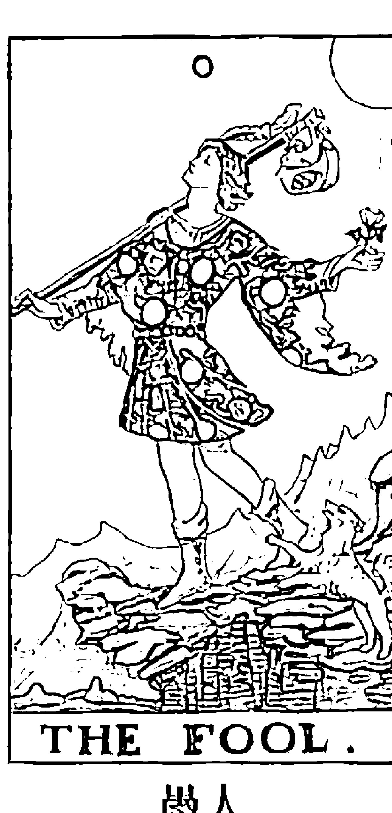

#### （1號牌）魔法師 (The Magician)

##### 行為表現

- 積極行動
  採取行動
  做必須做的事
  實現你的潛力
  將可能性化為現實
  身體力行你所宣揚的
  實行計畫
  創造神奇的結果
  運用你的天賦

- 有意識的覺知
  有意識地行動
  知道自己在做什麼並且知道自己為何這麼做
  承認你的動機
  了解你的意圖
  檢驗已知的情況

- 專注、聚焦
  專注
  目標單純專一
  百分之百地投入
  運用你的意志力
  感到心神集中
  排除令人分心之事物
  專注在一個目標上

- 力量
  體驗力量
  造成強烈的衝擊
  具有活力
  創造奇蹟
  變得能量充沛
  感到精力旺盛
  創造力十足

##### 意義相對的牌 (一些可能)

- 女祭司——無為，直覺，接通無意識
- 吊人——暫停行動，不作為
- 聖杯七——缺乏焦點和投入
- 寶劍四——安靜地休息，貯存精力
- 寶劍八——迷惑而不確定，無力

##### 意義加強的牌（一些可能）

- 戰車——聚焦，專注，強而有力
- 權杖二——個人的力量，行使強大的力量
- 權杖八——快速的行動，起而力行
- 錢幣八——專注而集中

##### 牌意解析

「魔法師」是積極、陽性原則的原型——是終極的成就者。他象徵汲取宇宙力量的能力，並運用這力量達成創造性的目的。注意他在圖中的姿勢——就像支避雷針——一手舉向天空，汲取天賜的靈啟；另一手指向地面，落實這強大的能量〔註〕。他的能力有時顯得十分神奇，因為他的意志能夠幫助他成就看似奇蹟的事物。

是什麼使得魔法師具備這樣的力量呢？首先，他不畏懼行動。他相信自己，並願意將這信念付諸檢驗。他同時也知道自己想做什麼、又為了什麼要做。他不會猶豫，因為他確切地了解自己的處境。魔法師能夠以毫無旁鶩的決心專注投入，只要他記得自己力量的神性源頭，就始終會是造就奇蹟的完美導體。

解牌時，「魔法師」牌暗示，只要你能夠認清自己的力量，並帶著覺知和專注去行動，這種原始的創造力就屬於你。這張牌是個行動的訊號，而且現在就要行動，只要你確切了解自己要的是什麼、並下定決心要得到它。

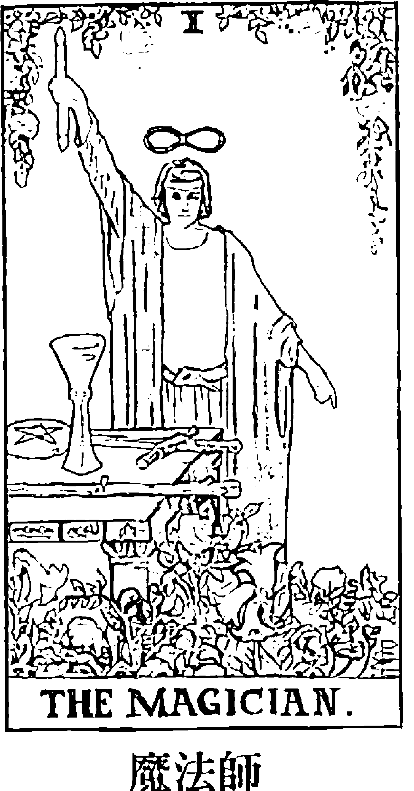

> 〔註〕瑞秋·波拉克（Rachel Pollack），《七十八度的智慧，第一部，大阿卡納牌》（Seventy-Eight Degrees of Wisdom: A Book of Tarot, Part I: The Major Arcana），（London: Aquarian, 1980）。

#### （2號牌）女祭司（The High Priestess）

- 無為
- 無意識的覺知
- 潛能
- 神秘事物

##### 行為表現

- 保持無為
  抽離而不涉入
  容許事件發展而不加干預
  對各種影響保持接受度
  平靜下來
  保持被動
  耐心地等待

- 接通無意識
  運用你的直覺
  從內在尋求指引
  信任你內在的聲音
  對夢境與想像保持開放
  覺知更廣闊的實相

- 看見潛能
  了解可能性
  對可能的事物保持開放
  看見你潛藏的才能
  順隨發展
  讓既存之事物綻放

- 感知神秘
  看見明顯表象以外的事物
  探測封閉的領域
  對未知開放
  記起某件重要的事物
  感知秘密和潛藏之物
  尋找隱藏的事物
  承認陰暗面

##### 意義相對的牌（一些可能）

- 魔法師——有意識地行動，思考，已知及顯而易見的
- 權杖二——勇敢地行動
- 權杖七——進取的，好鬥的
- 權杖八——將計畫付諸實行

##### 意義加強的牌（一些可能）

- 隱士——往內在看，抽離，尋求指引
- 吊人——暫停活動，等待
- 寶劍四——安靜地休息，沉思默想

##### 牌意解析

女祭司是「無意識」的守護者。她坐在無意識的薄紗之前，而將我們與自己內在的風景隔離開來的，就僅只是這層薄紗。她自身懷藏著如何接通這些領域的秘密，並對我們發出無聲的邀請：「靜默下來，明白我即是神。」

女祭司代表陰性的原則，平衡著魔法師的陽剛力量。塔羅中的陰性原型被分割成女祭司和皇后兩張牌。女祭司是經常為女性所象徵的神秘未知，特別是在重視「有形」和「已知」的文化中；而皇后則代表女性做為生命孕育者的角色。

占卜時，「女祭司」牌提出一個挑戰，要你走向更深之處——超越顯而易見的表象，探尋那隱匿而晦澀的層面。她同時要求你喚起自身巨大的潛能，記起藏於內在的無限可能性。

女祭司牌可能代表一段等待與順任的時光。要達成目標，並不一定要行動。有時它們可以透過靜默無為而實現，此種靜止給了欲望一個機會，讓它在時間的完滿中開花綻放。

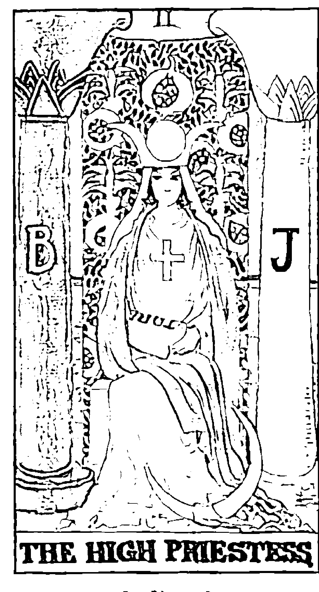

#### （3 號牌）皇后（The Empress）

- 母性
- 感官
- 豐足
- 自然

##### 行為表現

- 母性
  生育
  滋養生命
  培育並照顧他人
  珍愛世界
  表達溫情
  與小孩相處

- 體驗感官
  給予或接受樂趣
  聚焦在身體上
  欣賞美
  感到健康有活力
  質樸的
  從事身體活動

- 歡迎豐足
  享受豐饒
  得到慷慨的報償
  盡情享受
  擁有的超過所需
  感到富足

- 與自然互動
  與動植物產生聯繫
  擁抱自然的事物
  感到與大地連結
  走到戶外
  與自然韻律和諧一致

##### 意義相對的牌（一些可能）

- 皇帝——父性，秩序與紀律，規律
- 死神——死亡原則
- 錢幣四——吝嗇的佔有
- 錢幣九——優雅，世故

##### 意義加強的牌（一些可能）

- 戀人——性的滿足，享樂
- 星星——慷慨，自由流溢的愛
- 聖杯九——享受感官
- 錢幣七——物質的報償
- 錢幣十——富裕，奢華，肉體的安逸

##### 牌意解析

在大阿卡納中，「皇后」和「女祭司」是女性原型的兩面。「皇后」代表賦予生命的多產母親，統治著自然的豐饒和大地的節奏。從她而來的，是一切感官的樂趣，以及各種各樣豐富的新生命。「皇后」牌鼓勵你加強與自然世界的聯繫，那是我們存在的根基。虛假的矯飾和享樂常常令我們遠離了自己的根。讓「皇后」牌提醒你，把雙腳牢牢紮穩在土地之中。

占牌時，「皇后」牌可指涉「母性」的所有層面。她可以代表一個真的母親，但是做為一張大阿卡納牌，她超越了「母性」的表象，而進入它的本質——透過充滿愛意的照顧與關懷，去創造並支持生命。

「皇后」牌也可以代表一切形式的慷慨豐富。她給予我們一只希臘神話中的神奇羊角，裡頭裝滿令人愉悅的事物，尤其是感官的愉悅——食物、享樂，以及美。她可能暗示物質的報償，但必然也帶來領會：豐饒是與慷慨而開闊的精神同在的。「皇后」牌要求你擁抱生命的原則，並享受它豐富的美善。

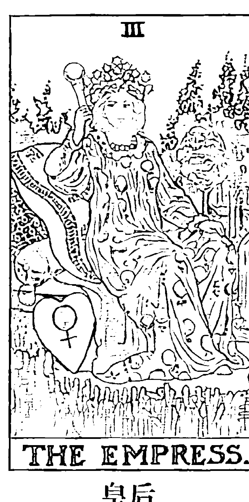

#### （4號牌）皇帝（The Emperor）

- 父性
- 架構
- 權威
- 規則

##### 行為表現

- 父性
  - 建立家系
  - 設定方向和基調
  - 保護防衛
  - 導引成長
  - 帶來安全與舒適
  - 提供解釋
- 行使權威
  - 擔任領導的角色
  - 發號施令
  - 施加掌控
  - 代表體制
  - 居於有力的位置
  - 與官方接觸
  - 設定方向
- 強調架構
  - 從混亂中創造秩序
  - 分門別類
  - 有系統、有條理
  - 提供形體和形式
  - 有組織的
  - 運用理性
  - 協調整合
  - 貫徹計畫
- 規則
  - 建立律法和秩序
  - 從穩固的原則上運作
  - 施行規則或方針
  - 在法律體系內運作
  - 制定行為標準
  - 遵循一套規則

##### 意義相對的牌（一些可能）

- 皇后——母性，自由流溢的豐饒
- 聖杯七——散亂，缺乏秩序
- 寶劍五——篡改規則，破壞律法

##### 意義加強的牌（一些可能）

- 教皇——遵循規則
- 正義——關心公正與合法性
- 權杖二——擁有權威
- 權杖三——擔任領導
- 錢幣四——掌控，架構，秩序

##### 牌意解析

「皇帝」的形象透露了這張牌的許多特質。我們看見一個威風凜凜的嚴峻人物坐在石雕的王座上。他的背脊挺直，直視著我們。他對自己完全的統治權威深具信心。

「皇帝」牌代表結構、秩序，以及規則——也就是「皇后」牌盡情流溢的慷慨豐富之平衡力量。他擁護方正刻板的世界，那兒的火車永遠準時，比賽都按照規則來，而發號施令的官員也都受到敬重。在混亂的情境中，「皇帝」牌可能在指出條理的必要。鬆脫的線頭應該打上結，難測不馴的元素也要受到掌控。而在已經過度控制的情況中，「皇帝」則暗示這些約束所帶來的侷限。

「皇帝」牌可能代表與權威打交道，或是取得權力與主導權。做為一個約制者，「皇帝」往往會跟任何形式的法律事務、懲戒行為，以及官場活動扯上關係，他也可能代表個別的父親，或是父親的原型——也就是他做為導師、保護者，以及供給者的角色。

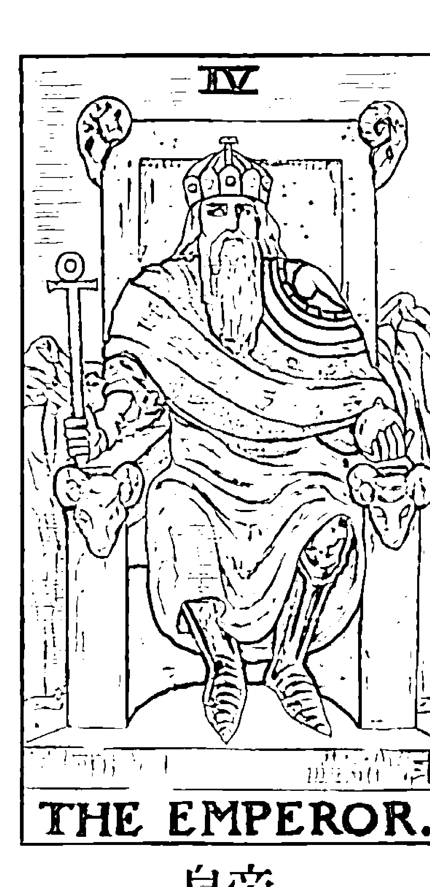

#### （5號牌）教皇（The Hierophant）

- 教育
- 遵奉體制
- 信仰體系
- 群體認同

##### 行為表現

- 接受教育
  - 追求知識
  - 通曉訊息
  - 增加理解
  - 研究、學習
  - 探尋更深的意義
  - 發掘更多
- 擁有信念體系
  - 分享某種文化遺產
  - 學習某種宗教傳統
  - 尊崇儀式和典禮
  - 認同某種世界觀
  - 遵循某種紀律
  - 知道該信仰什麼
- 遵奉體制
  - 依循規則
  - 採取正統的方法
  - 待在習俗的框架中
  - 適應某個體系
  - 融入
  - 遵照程序進行
  - 做預期中的事
  - 成為體制的一部分
- 認同某個群體
  - 投入某個目標
  - 將能量奉獻給群體
  - 加入某個組織
  - 做為團隊的一份子
  - 對他人忠誠
  - 處於體制化的環境下

##### 意義相對的牌（一些可能）

- 愚人——身為「瘋子」或異端
- 戀人——個人的信念
- 權杖二——偏離群眾，做為先驅
- 寶劍七——獨行俠
- 錢幣二——有彈性，因時制宜

##### 意義加強的牌（一些可能）

- 皇帝——遵循規則
- 聖杯三——以群體為中心
- 錢幣三——團隊合作
- 錢幣八——學習，研究
- 錢幣十——順從，遵循規則，保守

##### 牌意解析

除了極少數的情況外，每個人都是在文化體系下成長發展的。我們藉著與他人共同生活而學習。「教皇」牌代表這種體制內——特別是在群體之中——的學習。教皇是闡釋秘密知識的人，在這第五號牌上，我們看見正式教堂背景中的一位宗教人物。他穿著代表其神職的繁複法袍，任務是把兩位入門者引進教會，好讓他們能擔負起被指派的角色。

除了教會，我們還有學校、社團、團隊、公司，以及社會。這些全都是由「教皇」所代表，因為具有規則及被分派角色的結構性團體都是他司掌的領域。這樣的環境都強調信念體系——事實、規則、程序，以及儀式。遵守規範的成員將受到獎賞，他們發展出一種群體的認同。塔羅當中有三張牌是強調群體的，「教皇」便是其中之一。（另外兩張是「聖杯三」和「錢幣三」。）

占牌時，「教皇」往往代表跟隨專家或博學的師長學習。這張牌同時也代表體制及其價值。「教皇」象徵順從規則或固定情境的必要，當他在占牌中出現時，往往顯示你正在與一股非創新、不自由，或是非個人的力量抗爭。群體可以豐富你或是窒息你，端視情況而定。有時我們必須遵從規約或是擁抱傳統，但其他時候，我們則必須信賴自己。

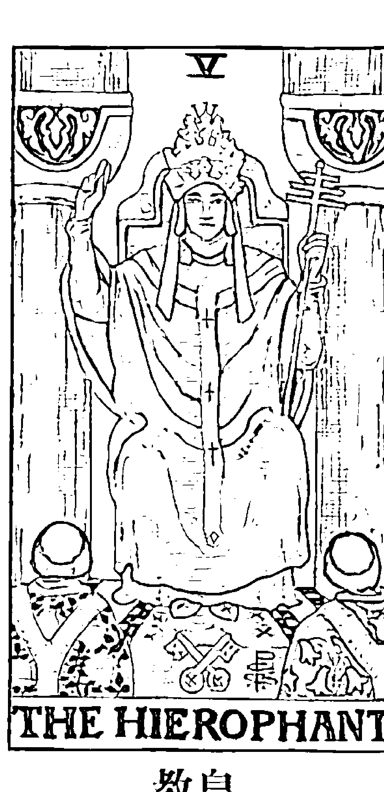

#### （6號牌）戀人（The Lovers）

- 關係
- 個人的信念
- 性愛
- 價值觀

##### 行為表現

- 與他人產生關係
  - 建立聯繫
  - 感覺愛意
  - 結合或結婚
  - 承認親屬關係
  - 與他人產生共鳴
  - 接近
  - 創造連結
  - 彼此親密
- 性愛
  - 尋求結合
  - 體驗慾望
  - 做愛
  - 對另一個人開放
  - 以熱情回應
  - 感到肉體的吸引
  - 汲取內在的能量
- 建立個人的信念
  - 質疑接收的觀念
  - 了解自己的立足點
  - 對自己保持忠實
  - 建立自己的哲學
  - 遵循自己的標準
  - 自己做出決定
- 決定價值觀
  - 與誘惑抗爭
  - 在對與錯之間選擇
  - 面對倫理或道德的抉擇
  - 拒絕讓目的將手段合理化
  - 找出你關心什麼

##### 意義相對的牌 (一些可能)

- 教皇——已確立的信念
- 隱士——獨自一人，不與人發生關係，節慾
- 聖杯五——關係中的失落
- 寶劍三——拒絕，分離

##### 意義加強的牌（一些可能）

- 皇后——性的滿足，樂趣
- 聖杯二——結合，婚姻，連結
- 聖杯九——性的樂趣
- 聖杯十——家庭關係，聯繫
- 錢幣十——永久的結合，家庭關係

##### 牌意解析

「戀人」是張容易記住的牌。愛與性是極具吸引力的主題，而正如你所預期的，這張牌兩者都代表。結合的欲望十分強大，而在其最高的形式中，它將帶領我們超脫自我。這就是為什麼牌中會有位天使祝福那男人與女人的結合。

解牌時，這第六號牌往往指涉奠基於深愛的關係——這是最最強烈的一種驅力。這關係或許不是性方面的，雖然它往往會是。更概括地說，「戀人」牌可以代表將任何兩個實體——無論是人、想法、事件、運動，或是群體——拉在一塊兒的吸引力量。

這張牌也可能代表困難的價值抉擇及隨之而來的疑問。有些塔羅牌（註）的「戀人」牌上畫著一個男人被兩個女子——一位處女和一名蕩婦——包夾、拉扯著。這個相當老調的三角關係，象徵我們遭遇對與錯的試探時所面臨的困境。

「戀人」牌也可能意指道德或倫理的十字路口——一個當你必須在崇高或卑下的道路間抉擇的決定之點。這張牌也可以代表你的個人信念，因為要做出這樣的決定，你必須知道自己的立足點。依循自己的道途，可能意味要抗拒那些慫恿你走上錯誤方向的人。

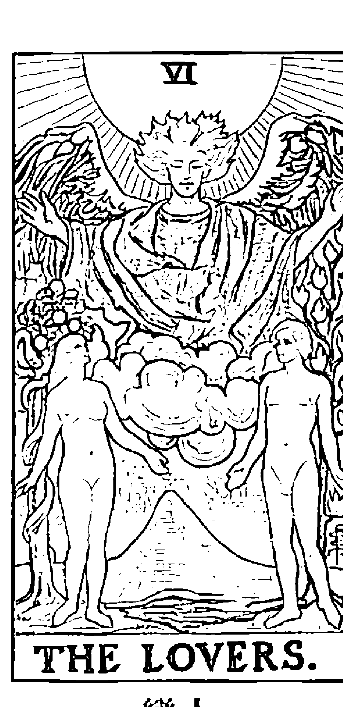

> 〔註〕例如「馬賽塔羅」 (Tarot of Marseilles) ，(Turnhout ，比利時：Carta Mundi, 1996)。U. S. Games 發行。

#### （7號牌）戰車（The Chariot）

- 勝利、凱旋
- 意志
- 自我伸張
- 強硬的掌控

##### 行為表現

- 獲致勝利
- 達成目標
- 贏
- 成功
- 宰制
- 勝出
- 擊敗競爭對手
- 伸張自我
- 專注於自我
- 建立身份
- 知道你是誰
- 感到自信
- 對自己已有信心
- 爭取自身的權益
- 運用你的意志
- 决心要成功
- 集中你的意圖
- 超越誘惑
- 不讓任何事物分心
- 貫徹努力
- 聚集能量
- 專注於一個目標
- 獲致強硬的掌控
- 掌控情緒
- 抑止衝動
- 維持紀律
- 壓抑憤怒
- 遂行所願
- 掌握權力
- 展現權威

##### 意義相對的牌（一些可能）

- 力量——柔性的掌控
- 吊人——接受神的意志，讓他人優先
- 塔——潰敗，受挫的經驗
- 寶劍八——困惑，自我懷疑
- 寶劍十——無力，處於困境，人先已後

##### 意義加強的牌（一些可能）

- 魔法師——運用你的意志，專注
- 權杖二——握有權威，支配
- 權杖六——勝利，自信
- 錢幣四——控制
- 錢幣九——自我掌控，紀律

##### 牌意解析

想像凱撒大帝乘著戰車，凱旋進入羅馬城。他擊敗了敵人，征服了廣闊的新領土。這就是「戰車」牌的精神。這第七號牌代表透過意志與自我掌控所能獲致的勝利。軍事性的圖像對「戰車」牌而言是妥貼的，因為這張牌代表的是與戰鬥相關的力量——紀律、膽識、決斷與魄力。

「戰車」牌代表「自我」的積極面向。一個健康的自我是堅強而自信的，它知道自己想要什麼、又該如何去得到它。當某個人的自我太過健康時，也許會令我們不快，但到了艱困的時刻，我們往往會指望這人帶領我們度過難關。我們知道他不會優柔寡斷。

在占牌時，「戰車」牌往往會出現在強硬的掌控明顯可見之處。在最佳狀況下，強硬的掌控並不是粗魯的，而是堅定而直接的。它的背後是堅強的意志，和強大的信心。「戰車」牌可能意味自我控制，或是對環境的掌控。這張牌同時也代表勝利。「贏」有很多種類型，戰車牌是那種有勝有負的。你的成功是來自打敗競爭對手，成為第一。在適當的情境中，這樣的時刻是十分榮耀的。

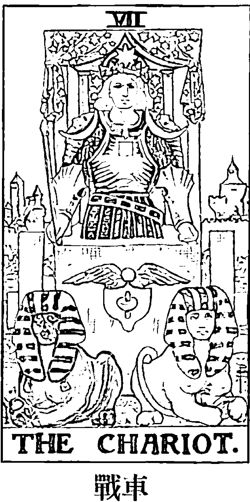

#### （8號牌）力量（Strength）

- 力量
- 忍耐
- 同情
- 柔性的掌控

##### 行為表現

- 展現力量
  - 知道你能夠忍耐
  - 具有俠義精神
  - 懷有不可動搖的決心
  - 不因挫折而喪失勇氣
  - 堅忍不拔
  - 堅若磐石
- 具同情心
  - 給他人許多空間
  - 容忍
  - 了解他人的感受
  - 接納
  - 原諒不完美
  - 和藹仁慈
- 堅忍
  - 平靜地面對挫折
  - 接受他人
  - 從容行事
  - 保持鎮定
  - 拒絕發怒
  - 展現自制
- 獲致柔性的掌控
  - 勸服
  - 合作
  - 間接地引導
  - 能夠去影響
  - 以仁慈調和力量
  - 示現愛的力量

##### 意義相對的牌（一些可能）

- 戰車——強硬的掌控
- 聖杯八——困乏，缺乏力量
- 寶劍六——無精打采，泄氣失志
- 錢幣五——健康不佳，虛弱

##### 意義加強的牌（一些可能）

- 吊人——從容不迫，耐心
- 權杖九——堅毅，忍耐的力量

##### 牌意解析

通常我們會把力量想成具體的東西——堅實的臂膀、強壯的雙腿——但，另外還有內在的力量。內在的力量來自「心」肌的運作，它是堅忍、勇氣、決心，與沉著——這些幫助我們度過艱困時刻的特質。在過去，人們會說一個擁有內在力量的人是「有品格的」；在最黑暗的時候，人們可以企望於他。這第八號牌代表這種沉靜決心的能量。「力量」並不是一張耀眼的牌，但卻是堅實而可靠的。

這張牌同時代表耐心和同情。當事情不如人意時，發怒是很容易的，但要平靜地面對挫折卻需要很大的力量。接受他人和原諒錯誤也是。我們需要力量去柔軟地揉塑所處的局面。「戰車」牌是透過優勢和權威來掌控，而八號牌則比較微妙，甚至是懷著愛意的。注意圖中的獅子（牠本身就是個力量的象徵）是如何被那女子柔軟的雙手引導、馴服。

在占牌時，第八號牌會在我們需要其特質時出現。它可能是在提醒我們不要絕望或放棄。你具有內在的力量，能夠忍耐並且勝出。如果你操之過急，便需要暫時抽離，耐心以對。如果其他的人或外在環境快把你逼瘋了，記得愛與忍耐的力量。它將帶領你度過最艱難的時刻。

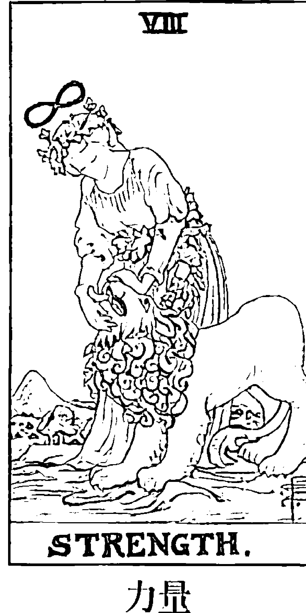

#### （9號牌）隱士（The Hermit）

- 內省
- 指引
- 追尋
- 孤獨

##### 行為表現

###### 內省的
- 仔細思索
- 專注於內心
- 對感官較不注意
- 讓自己沉靜下來
- 從內在尋求答案
- 需要了解

###### 接受／給予指引
- 求教於／擔任導師
- 接受／提供睿智的忠告
- 從學於／擔任上師
- 求助於／擔任受信賴的老師
- 接受幫助／提供援助

###### 追尋
- 尋求更深的了解
- 追尋某樣東西
- 不計代價追求真相
- 展開個人的追尋
- 需要更多
- 渴望新的方向

###### 尋求孤獨
- 需要獨處
- 渴望寂靜
- 從俗世抽離
- 體驗與世隔絕的生活
- 放棄令人分心之事物
- 退隱到私密的世界

##### 意義相對的牌（一些可能）

- 戀人——處於一段關係中，性愛
- 世界——與世界產生關聯
- 聖杯二——締造連結，合夥關係
- 聖杯三——在群體中，與他人共處
- 聖杯九——感官的享樂

##### 意義加強的牌（一些可能）

- 女祭司——向內省視，抽離
- 聖杯四——抽離，內向
- 聖杯八——尋求更深的意義
- 寶劍四——冥思，保持安靜
- 寶劍七——獨自一人，與他人保持距離

##### 牌意解析

傳統上，隱士的形象是個留著長髮的孤僻人物，他過著遺世獨立的刻苦生活。第九號牌符合這種印象。「隱士」牌代表逃離社會俗務的渴望，轉而專注於內在世界。他往內心尋求答案，並知道這些解答只能透過寂靜和孤獨尋得。

當生命走到某個點，我們會開始質疑表象的一切。我們感覺有某種更深的真實，並開始尋找它。這多半是種孤獨的追尋，因為答案並不在外在世界中，而在我們自身之內。第九號牌上的隱士讓我們聯想到希臘的苦修者戴奧吉尼斯（Diogenes），據說他曾在大白天提著燈籠，要尋找一個誠實的人。戴奧吉尼斯是尋求真理的象徵，這也是「隱士」希望藉著剝除所有令人分心之事物而揭露的真理。

解牌時，隱士牌往往暗示獨處時間——將令人分心之事減到最低的一段沉思期——的必要。在充滿行動的高能量時期，他則代表靜止不動的中心，這中心必須被創造出來以維持平衡。他也可能暗示此時抽離或退出是明智之舉。此外，「隱士」牌可代表各種追尋，特別是尋求更深的了解或某個情境的真相。「尋求，你就會找到。」經典這樣告訴我們。因此「隱士」牌也代表指引。我們能夠從睿智的導師那兒得到幫助，然後，當我們進步後，也就能夠幫助別人。

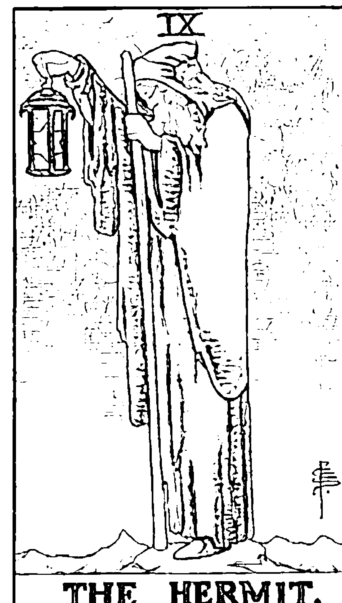

#### （10號牌）命運之輪（Wheel of Fortune）

- 命運
- 轉捩點
- 變遷
- 個人的願景

##### 行為表現

- 命定之感
  - 運用機緣所提供的
  - 看見生命的脈絡交織在一起
  - 在意外事件中發現機會
  - 對機運開放
  - 感到命運的運作
  - 見證奇蹟
- 處於轉捩點
  - 逆轉
  - 朝不同的方向移動
  - 扭轉事物
  - 經歷命運的變化
  - 變更目前的路線
  - 詫異於事情的演變
- 感受變遷
  - 歷經變化
  - 生命的節奏加速
  - 被捲入新的發展
  - 重新加入活動的世界
  - 涉入
- 擁有個人的願景
  - 看見萬物如何連結
  - 變得更具覺知
  - 發現模式和循環
  - 擴展你的視野
  - 獲得更廣闊的角度
  - 發現你的角色和目的

##### 意義相對的牌（一些可能）

- 寶劍二——受困，陷於僵局
- 寶劍四——休息，安靜，緩慢的步調
- 錢幣四——受阻的改變，停滯不動
- 錢幣七——在改變方向之前先做評估

##### 意義加強的牌（一些可能）

- 權杖八——快速的步伐，迅速的發展

##### 牌意解析

希臘神話中有三位命運女神，她們負責在每個人出生時為他編織命運。命運女神會是紡紗的織女並不令人訝異，因為對於凡人命運難以捉摸的變幻，紡紗的轉輪的確是個適切的意象。這就是第十號牌的主題。

「命運之輪」是大阿卡納中少數不是以人類形象為焦點的牌。這是因為它的中心是凌駕於人的領域之上的——是在更高的層面（雲間）。在這兒，所有人的命運都交織在一起，成為生命的織錦。塔羅承認每個人的人生道路都是自己設定的，但同時受制於涵蓋著他的更大循環。我們會遭遇隨機事件，它們看來像意外，但其實是上天計畫的一部分。

在占牌時，「命運之輪」可能意指一種當頭棒喝式的了悟或啟示。如果你一直在跟某個問題或棘手的狀況纏鬥，這張牌可能暗示，若是你退後一步，從較為宏大的觀點來看每件事情，你就會找到答案。

「命運之輪」同時也代表出乎意料的相遇，或是命運的扭轉。你無法預測驚奇，只能在它迴捲著你的時候覺知到它。的確，第十號牌暗示輪轉般的行動——方向的改變、重複的循環，以及快速的運行。當「命運之輪」的能量到來，你將感到生命加快了速度。你被龍捲風捲了起來，它可能會把你丟到任何地方。「她不停地轉呀轉呀，會停在哪兒？沒人知道。」

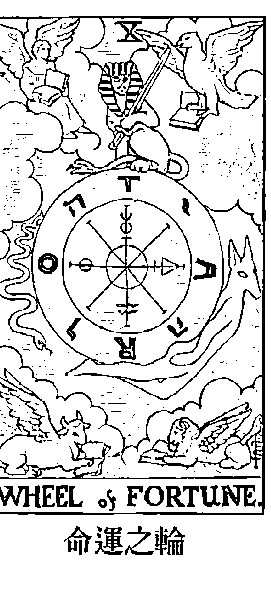

#### （11號牌）正義（Justice）

- 正義
- 責任
- 決定
- 因果

##### 行為表現

- 崇尚正義
  - 堅持公平
  - 依道德準則行事
  - 涉入法律事務
  - 正直誠實
  - 追求平等
  - 不偏不倚
  - 試圖做正確的事
- 為某個決定做準備
  - 權衡各個方面
  - 為未來設定方向
  - 平衡所有的因素
  - 決定正確的行動
  - 以充分的覺知做選擇
- 承擔責任
  - 償還舊債
  - 負責任的
  - 承認事實
  - 坦承涉入
  - 處理某個情況
  - 做必須做的事
- 明瞭因果
  - 接受你所造成的結果
  - 看清你是如何選擇你的處境
  - 承認業力的作用
  - 知道事出有因
  - 找出事件之間的關聯

##### 意義相對的牌（一些可能）

- 寶劍二——規避真理，拒絕接受你的角色
- 寶劍五——不正直，不做正確的事
- 寶劍七——逃避責任

##### 意義加強的牌（一些可能）

- 皇帝——正義，規則，法律議題
- 審判——決定，接受過去的行為／錯誤
- 權杖十——接受責任，負責任的
- 寶劍九——對過去感到內疚，承認錯誤
- 錢幣七——評估自己的處境，決定未來的道路

##### 牌意解析

在第十一號牌上，我們看見象徵正義的熟悉形象。她一隻手握著代表平等與公正裁決的天平，另一隻手則握著決斷的寶劍。在塔羅中，「正義」牌代表一種了悟：生命終究是公平公正的。雖然每天變幻無常的世事往往令我們懷疑這個事實，「正義」牌提醒我們神性的平衡仍然存在。注意「皇帝」與「正義」牌之間的相似性。這兩張牌都代表普遍性的秩序；「皇帝」牌在於基礎的架構，而「正義」牌則在於業力的作用——因和果。

這張牌給人一種嚴肅之感——一種法庭的氣氛。這張牌指涉各種法律事務，但並不侷限於此。法庭是做出審判、執行裁決的地方，司法體系是我們探討「正義」原則——公平、公正、追求真相——的官方場域。

占卜時，「正義」牌常會在你關切自己所作所為是否正確、或者是否得到應得回報時出現。這張牌也可能在你感受到過去錯誤或善行的衝擊時出現。你在某個時點種下的因，現在回到你身上結果了。

有時「正義」牌是種訊號，告訴你去做必須做的事。到了某個時候，你必須接受責任、結清帳目。如果你不承認錯誤並做出補償，過去將會持續糾纏著你。你將必須審慎權衡事態，或許還得對未來做出重大的決定。

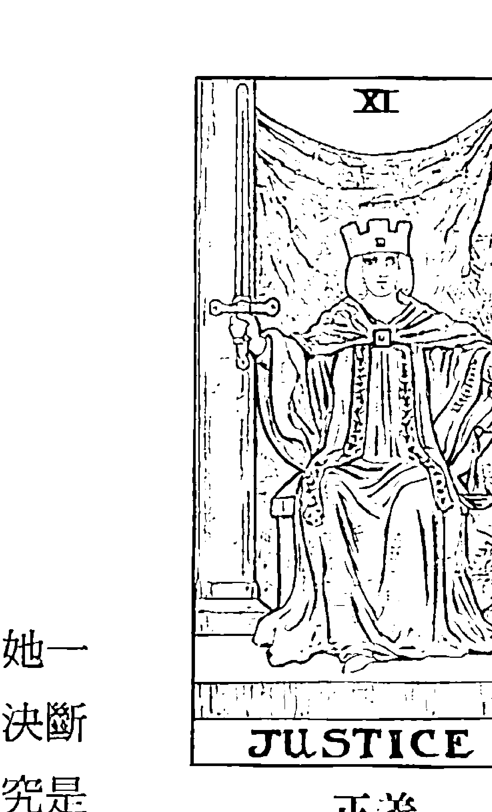

## {12號牌} 吊人（The Hanged Man）

- 釋放
- 暫停
- 逆轉
- 犧牲

##### 行為表現

- 釋放
  - 情緒的釋放
  - 接受現狀
  - 臣服於經驗
  - 終止抗爭
  - 保持柔軟開放
  - 放棄掌控
  - 接受上帝的意志
- 暫緩行動
  - 暫停下來思考
  - 感覺超脫時間
  - 只是單純地存在
  - 不再急迫
  - 活在當下
  - 等待最佳的機會
- 逆轉
  - 扭轉世界
  - 改變心意
  - 推翻舊有的優先順序
  - 從新的角度來看
  - 顛覆舊有的秩序
  - 一百八十度的轉變
- 犧牲
  - 做個殉道者
  - 放棄權利
  - 將自身利益擺在一旁
  - 以退為進
  - 為了更高的目的而讓步
  - 讓他人優先

##### 意義相對的牌（一些可能）

- 魔法師——行動，作為
- 戰車——自我主張
- 權杖七——反抗，抗爭
- 權杖十——抗爭
- 錢幣四——堅持，掌控

##### 意義加強的牌（一些可能）

- 愚人——信任，順隨波流
- 女祭司——暫停活動，等待
- 力量——耐心，給予時間
- 寶劍四——休息，暫緩活動
- 寶劍十——犧牲，殉道

##### 牌意解析

「吊人」是塔羅當中最神秘的牌之一。它很簡單，卻也十分複雜；它很引人，卻也令人不安。它在無數層面上都自相矛盾。「吊人」之所以教人不安，是因為它象徵著我們生命中的弔詭。所謂「弔詭」，是某種看來自相抵觸、但卻又十分真實的東西。「吊人」向我們呈現某些真相，但這些真相是藏在反面的事物中的。

「吊人」主要的功課是：我們藉著放手來「掌控」——藉著認輸來「贏」。這張牌上的人物做了終極的臣服——痛苦地死在十字架上，但他卻同時散發出神性了悟的榮光。他犧牲了自己，卻以勝利者的姿態出現。「吊人」也告訴我們，我們可以藉由駐足不動而「前進」。藉著暫停，我們可以擁有全世界所有的時間。

占牌時，「吊人」提醒我們，處理問題的最佳方式不一定是那個最明顯的做法。當我們亟欲將自己的意志強加在別人身上時，就是我們該放手的時候；當我們最想要遂行自己的意願時，就是我們該犧牲的時候；當我們最想要行動的時候，就是我們該等待的時候。弔詭的地方就在於，藉著這些看似矛盾的行動，我們就能尋得所求。

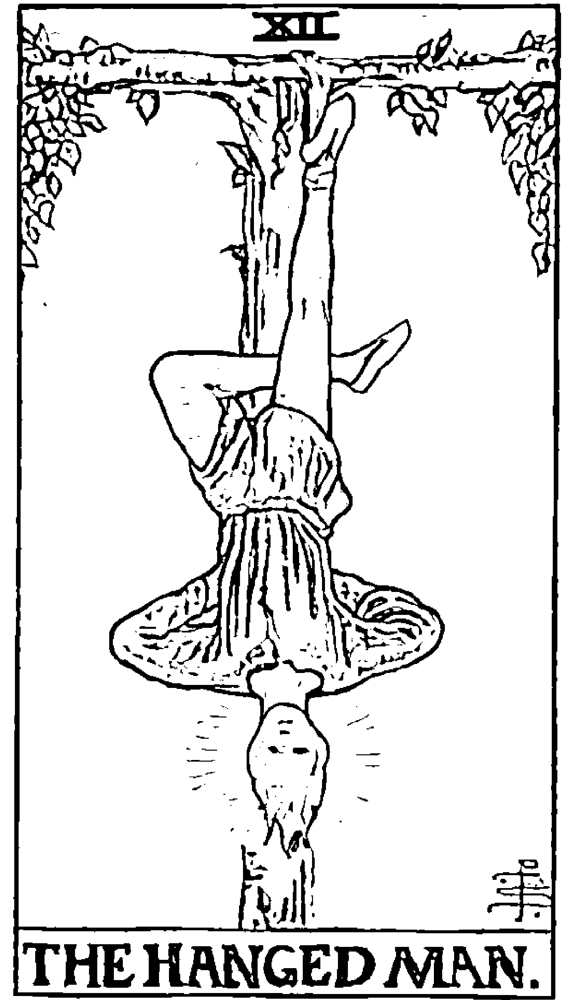

## {13號牌} 死神 (Death)

- 終結
- 過渡、變遷
- 消除
- 無可抵擋的力量

##### 行為表現

- 終結
  - 關上一扇門，開啟另一扇
  - 結束某件事
  - 完成一個篇章
  - 結束未了之事
  - 將過去拋在身後
  - 到了抉擇之點、分道揚鑣
- 去除多餘的
  - 刪去非必要的
  - 揚棄固有的態度
  - 只留下精髓
  - 專注在要素上
  - 回歸基本
- 經歷無法抗拒的力量
  - 捲入勢不可擋的變化中
  - 被無可逃避的事物攫獲
  - 經歷無法避免的過程
  - 成為強大變動的一部分
  - 順隨命運
  - 接受不可避免的
- 經歷變遷
  - 改變狀態
  - 從已知走向未知
  - 被拋進漂泊的狀態
  - 在過渡的狀態中等待
  - 在中途

##### 意義相對的牌（一些可能）

- 愚人——開始
- 皇后——誕生
- 審判——重生，嶄新的開始

##### 意義加強的牌（一些可能）

- 塔——勢不可擋的衝擊，強大的力量
- 權杖八——結束，終結
- 聖杯五——失落，離別
- 聖杯八——繼續向前，終結

##### 牌意解析

死亡！這是種多麼強大的能量！看見第十三號牌上那個黝黑的骷髏形體，誰能不感到幾分發毛？在這兒，我們看見自己最深恐懼的面貌——我們最大的未知。我們恐懼死亡，因為我們認為它是毀滅。但在塔羅中（我想在生命中也是），死亡並非永遠的終結，而是到達一種新狀態的過渡階段。生命的本體是永恆的，雖然它的形體不是。要成長，要前進，要繼續活——我們必須讓老舊的「死去」，好讓新的出生。

的確，在塔羅占卜中，這第十三號牌鮮少和肉身的死亡扯上關係，一位負責的占牌者絕不會如此解讀這一張牌，因為這種觀點太過狹隘了。「死亡」並不是在我們身上只發生一次的事件，它在許多層面上不斷地發生，而不單單是在肉體上。對「現在」而言，我們無時無刻不在死去，好讓「未來」展開。

占牌時，「死神」牌往往代表一個將開啟巨大變化的的重要結束。它暗示一段時期的終結，或是一扇門將要關上。這樣的時刻可能伴隨著悲傷和不情願，但同時會帶來釋放和完成之感。「死神」牌也暗示著回歸基本。瀕臨死亡會讓你專注於重要的事情上，這張牌提醒你該摒除一切不必要的。「死神」牌也可能意味你將經歷不可抗拒的力量。死亡是無可避免的，有時某些事件也是逃不過的。當這樣的時刻來臨，最好的因應之道是順隨命運，看它將把你帶往何處。

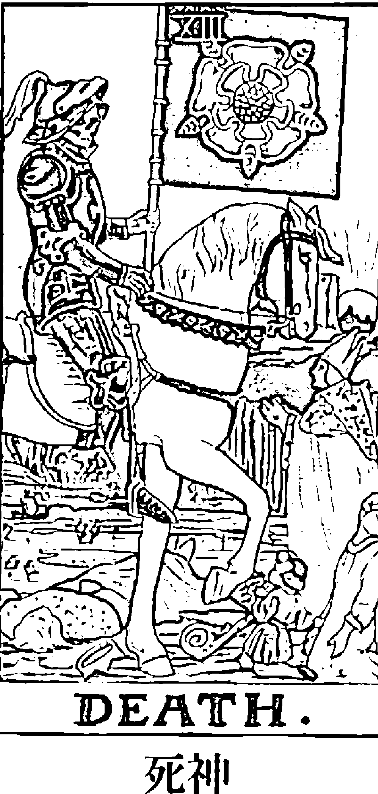

## {14號牌} 節制（Temperance）

- 節制
- 平衡
- 健康
- 結合

##### 行為表現

- 行事有節制
- 找出中間立場
- 表現節度
- 避免過度
- 緩和嚴峻的態勢
- 尋求中庸之道
- 達成妥協
- 抵消極端
- 體驗健康
- 恢復能量與活力
- 療癒
- 享受安泰
- 痊癒、復元
- 興旺繁茂
- 維持平衡
- 體驗和諧
- 達成均衡
- 調解對立
- 承認各方
- 促進合作
- 感覺專注而寧定
- 結合力量
- 聚合所需之物
- 加入他人
- 合併、鞏固
- 找到正確的組合
- 創造綜合體
- 結合全體

##### 意義相對的牌（一些可能）

- 塔——極端，崩解
- 權杖五——不和，競爭，失衡
- 聖杯七——過度，耽溺
- 寶劍五——爭吵，缺乏和諧
- 錢幣五——健康不佳

##### 意義加強的牌（一些可能）

- 世界——整合，綜合，結合
- 聖杯二——連結，共同合作
- 聖杯三——群策群力，共同合作
- 錢幣二——平衡，找到正確的組合
- 錢幣三——團隊合作，結合力量

##### 牌意解析

有些人會散發某種寧靜沉著的氣質。他們或許不多話，而以一種平靜從容的神態處理事務。他們的存在令人安心，因為他們是這麼的專注而寧定。在我看來，這就是「節制」的能量。

「節制」就是展現節度和自制。在一個充滿誘人耽溺之事物的世界中，找到「中道」常常是必要的。聽起來很明智，或許；但同時也有些乏味？節制的能量在表面上看來似乎很無趣，但它卻是颶風眼中的寧靜。四面八方都是迴捲的狂風，但在中央仍然有一個點，將一切帶入平衡。

占牌時，「節制」可能代表節度的必要，尤其是當有涵義極端的牌（例如「騎士」）伴隨出現時。這張牌也可能顯示平衡的必要。在衝突的情境中，「節制」牌暗示妥協與合作是至關重要的。尋求調停各方對抗勢力的任何機會。事實上，「節制」可以意指藉由加入新的元素去調節現況。藉著整合再整合，我們終將找到理想的組合或解決之道。「節制」同時也是象徵健康的牌，各方面的健康——身體的，心理的，以及情緒的。當你憂心疾病或不適時，「節制」牌給了你健康與活力的承諾。

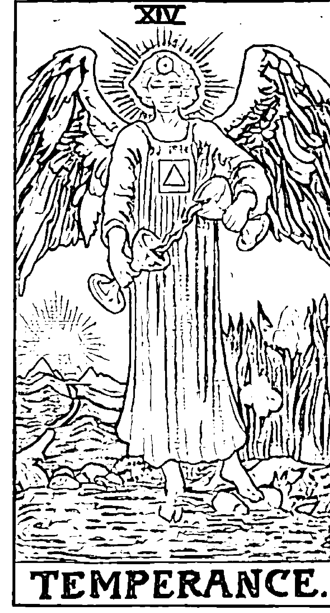

## {15號牌} 惡魔（The Devil）

- 束縛
- 唯物主義
- 無知
- 絕望

##### 行為表現

- 感到被束縛
  - 接受並不想要的狀況
  - 執迷
  - 感到違背自己意志、受到束縛
  - 失去獨立性
  - 容許自己被控制
  - 耽溺，被奴役
  - 屈從於他人
- 專注於物質上
  - 被外表所惑
  - 只相信物質層面
  - 忘記精神層面
  - 取得與花用
  - 過度耽溺於感官
- 保持無知
  - 不知不覺
  - 在狹隘的疇內運作
  - 感受限制
  - 選擇留在黑暗中
  - 懼怕未知
  - 受到表象的誘惑
- 感到絕望
  - 相信最糟的可能
  - 絕望
  - 缺乏信心
  - 看見冷酷的世界
  - 負面思考
  - 預見黯淡的未來
  - 懷疑

##### 意義相對的牌（一些可能）

- 愚人——懷有信心，相信
- 星星——希望，信心，樂觀
- 權杖四——自由，釋放
- 聖杯六——善意，天真，單純的喜悅
- 聖杯十——喜悅，平和，賜福

##### 意義加強的牌（一些可能）

- 聖杯七——過度耽溺，放縱
- 寶劍六——輕度的沮喪，無望
- 寶劍八——混亂，限制
- 寶劍九——絕望，欠缺喜樂

##### 牌意解析

路西法（Lucifer）、曼菲斯特（Mephistopheles）、撒旦（Satan）、黑暗王子（The Prince of Darkness）。無論我們怎麼稱呼他，惡魔都是一切壞的、討厭的事物的象徵。我們將世界看成光明與黑暗的爭鬥。我們想要消滅惡的，好讓善的勝出。事實上，善與惡無法分離，正如我們無法將陰影與其來源切割。黑暗只是欠缺光明，而它是由掩蔽真理的錯誤所造成的。第十五號牌對我們示現了這些錯誤。

首先是「無知」——不知曉真理，也不明白自己不知曉。其次是「唯物主義」——相信除了物質就什麼也沒有了。做為屬靈的存在，我們渴望神性，但我們若是只信賴自己的感官，就會與這真理的源頭失去了接觸。此外還有「絕望」，它剝奪了我們的喜樂，阻止我們邁向光明。

傳統上，「惡魔」牌代表邪惡，但解牌時它並沒有這種可怕的意義。這牌讓你知道你陷入了不健康、沒有生產力的情境。你可能對某事一無所知——不知實情和它的蘊意。你可能明知（又或許不知）對你有害卻仍執迷於某個人、想法、物質或模式。有時這張牌反映出一種消極性，讓你懷疑自己和你的未來。我們很容易犯下許多錯誤，第十五號牌讓我們知道，這些錯誤已經嚴重到需要加以注意。當你看見「惡魔」牌，仔細檢視你的預設，確定你不是從對自己或所處情境的錯誤認知出發。堅持你對自己的最高願景。

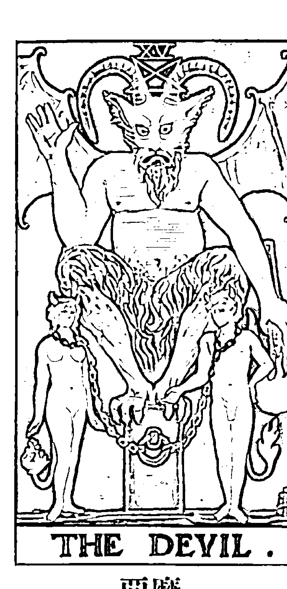

## {16號牌} 塔（The Tower）

- 突然的變化
- 釋放
- 墜落，垮台
- 啟示，了悟

##### 行為表現

- 經歷突然的變化
  - 遭逢劇變
  - 計畫中斷
  - 感到詫異
  - 經歷危機
  - 慣例遭到動搖
  - 處於混亂中
- 墜落
  - 銳氣受挫
  - 失敗垮台
  - 從高處塌倒
  - 運氣轉衰
  - 自我遭受打擊
- 釋放
  - 爆炸
  - 情緒上的爆發
  - 怒氣迸發
  - 自我防衛引起的衝撞
  - 打破矯飾
  - 放任一切
- 得到啟發
  - 突然間了解真相
  - 揭露隱藏之事物
  - 突然洞悉
  - 看穿假象
  - 獲得答案
  - 電光石火間看清一切

##### 意義相對的牌（一些可能）

- 戰車——勝利，掌控
- 節制——中間立場，妥協調合，泰然從容
- 星星——安詳，寧靜
- 權杖六——喝采，驕傲
- 聖杯十——平和，平靜

##### 意義加強的牌（一些可能）

- 死神——壓倒性的衝擊，強大的力量
- 太陽——啟蒙，示現
- 錢幣五——艱困時刻

##### 牌意解析

「塔」是張令人不安的牌。火焰、閃電、墜落在巉岩上——看來準是有麻煩！對於不喜歡變化的人，這第十六號牌是不受到歡迎的。它代表一種突然的、戲劇性的激變，或是命運的逆轉。變化通常是漸進的，給我們時間去適應。但它有時也會是快速而具爆炸性的。這就是「塔」的效果。

在電影中，主角有時會猛甩醉酒或胡言亂語的人一個巴掌。在試過所有其他方法後，他只得訴諸猛烈的刺激，好把對方打醒。突發的危機是生命把你打醒的方式。某些事情不對了，而你卻毫無反應。你太過驕傲了嗎？等著自尊遭受打擊吧！你壓抑自己的憤怒嗎？期待水壩潰堤吧！你太墨守成規了嗎？等著意料之外的事發生吧！

「塔」牌所帶來的變化會有多難受，完全取決於你的回應。要認清這種變動之所以發生，是因為它必須發生。要你擁抱改變或許是強人所難，但請試著發掘它的光明面。事實上，當你最終被迫走上新方向，你也許會感到極大的釋放。你或許會突然洞悉所處情境，對它有更新一層的理解。

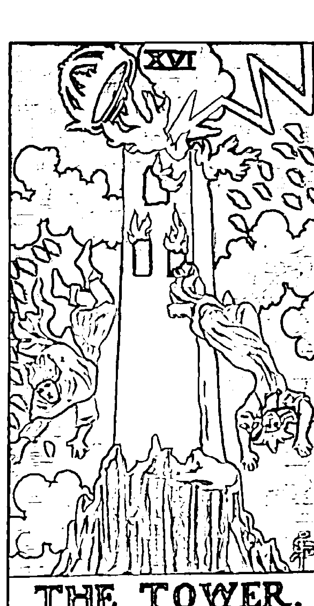

## {17号牌} 星星（The Star）

- 希望
- 灵感
- 慷慨
- 宁静

##### 行为表现

- 重获希望
  - 对未来怀抱信心
  - 正面思考
  - 相信
  - 细数你的幸福
  - 看见隧道末端的光明
  - 怀有远大的期盼
  - 期待成功
- 胸怀慷慨
  - 想要给予或分享
  - 施予财富
  - 敞开心胸
  - 将你得到的给出去
  - 让爱自由流动
  - 毫不藏私地给予
  - 毫无保留
- 获得灵感
  - 重拾动力
  - 实现内在的力量
  - 清楚看见道路
  - 受到激励更上一层楼
  - 创造
  - 得到答案
- 感到宁静
  - 体验心灵的平静
  - 放松
  - 找到你如如不动的中心
  - 保持不受干扰
  - 体尝全然的平静
  - 在烦扰中保持平静
  - 享受和谐

##### 意义相对的牌（一些可能）

- 恶魔——无望，缺乏信心，悲观
- 塔——动乱，混乱
- 月亮——不安，烦乱，焦虑
- 寶劍二——情感流動阻窒
- 寶劍九——苦惱，罪惡感

##### 意义加强的牌（一些可能）

- 愚人——天真，信心，信賴
- 皇后——慷慨，自由流溢的愛
- 聖杯六——善意，分享
- 聖杯十——喜悅，正面的感情，賜福

##### 牌意解析

人們一向仰望星星做為靈感與希望的泉源。閃爍的星光有種力量，能讓我們從自我抽離，進入一個更高的層面。當我們將目光投向天空，我們不再感到塵世的憂苦。「星星」牌讓我們想起女高音清澈高邈的歌聲。其中有種超塵絕俗的東西。日常生活的一切粗糙濃重被昇華了，只剩下最純粹的本質。經過「星星」的洗禮，我們感到被提升、被祝福。

就解牌而言，當我們為悲傷和絕望淹沒的時候，見到「星星」是最好不過了。在最黑暗的時刻，我們需要知道希望仍然存在……隧道的末端仍有光明。「星星」是「惡魔」的反面，後者剝奪了我們對未來的信心，這第十七號牌則給了我們承諾，承諾我們終能找到心靈的平靜。「星星」同時也提醒我們敞開心懷、釋放恐懼與疑惑。如果你在任何方面有所退縮、保留，現在是慷慨付出的時候了。

不過我們得記住，「星星」給人靈感和激勵，卻不是一張代表實際解決之道或最後答案的牌。的確，沒有希望，我們什麼也無法完成，但希望只是個開端。當我們見到第十七號牌，要明白你是走在正確的軌道上。你的目標和夢想是受到祝福的，但要實現它們，必須採取積極的行動。在努力的過程中，讓星星的光芒指引你吧！

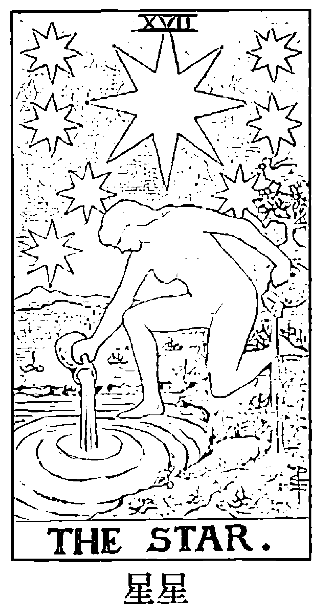

## {18號牌} 月亮（The Moon）

- 恐懼
- 幻覺
- 想像
- 迷惑

##### 行為表現

- 感到恐懼
  - 釋放內在的妖魔
  - 感到莫名的憂慮
  - 苦於恐懼症
  - 臣服於自我的陰暗面
  - 缺乏勇氣
  - 被焦慮擊倒
- 相信幻覺
  - 接受虛妄的圖像
  - 欺騙自己
  - 懷有不切實際的念頭
  - 誤解事實
  - 感受扭曲失真
  - 追逐幻想
- 刺激想像
  - 有著生動的夢境或幻覺
  - 對幻想開敞
  - 探索無意識
  - 懷有特異的想法
  - 光怪陸離
- 感到迷惑
  - 失去方向或目的
  - 難以清晰地思考
  - 變得困惑
  - 容易分心
  - 感到迷失方向
  - 漫無目的地遊蕩

##### 意義相對的牌（一些可能）

- 星星——安詳，寧靜，平和
- 太陽——鎮定，清明，啟蒙

##### 意義加強的牌（一些可能）

- 聖杯七——幻影，不切實際的念頭，空想
- 寶劍二——自欺，看不見真相
- 寶劍八——迷惑，缺乏洞見

##### 牌意解析

如果你現在環顧屋內，你（也許！）會看見熟悉的人與物，令你感到安適欣慰。每樣東西都和你預期的一模一樣。你知道如果你閉上雙眼然後再睜開，這屋子還會和原來一樣。但是……你是否曾經失去這份熟悉，在原先的地方發現一個你甚至無法理解的奇異世界？這就是「月亮」牌的經驗。

多半時候，我們都住在一個「正常」小口袋裡，它像安全毯般包裹著我們。我們對外頭等待我們的神秘宇宙視而不見。三不五時，我們或許會透過想像偷窺一眼，或是藉著幻想或延展的覺知向外探險。我們也可能會毫無準備地被藥物、瘋狂或是戰爭這類極端的經驗推進那奇詭的世界。

月亮是那個境域的光——那屬於陰影與夜晚的世界。此處雖然令人敬畏，但並不一定就會教人害怕。在恰當的情況下，月亮能夠予人靈感、令人著迷。它提出承諾，你所想像的都可以是屬於你的。月亮引領你走向未知領域，如此，你便能容許不尋常的事物進入生活。

悲哀的是，我們往往懼怕月亮。解牌時，這張牌時常代表恐懼與焦慮——來自最黑暗夜晚的恐懼。這第十八號牌同時代表幻覺。在月光下，我們很容易迷失方向。小心別讓欺妄和謬誤的想法引你入了歧途。有時月亮是種信號，告訴你迷路了、正漫無目的地遊蕩。你必須回到你的道路，並找回清晰的目標。

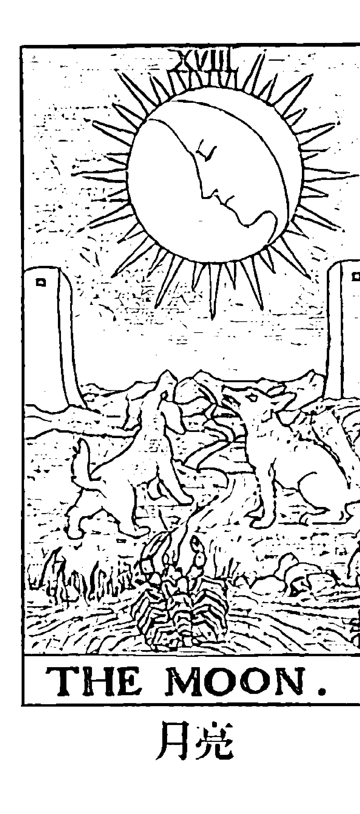

## {19 號牌} 太陽（The Sun）

- 啟蒙
- 偉大
- 活力
- 篤定

##### 行為表現

- 得到啟蒙
  - 了解
  - 找到混亂背後的意義
  - 獲得新層面的洞見
  - 在智識上獲得突破
  - 直指事物的核心
  - 了解真相
- 感受活力
  - 變得精力充沛
  - 洋溢熱情
  - 體驗喜悅
  - 感到生氣勃勃
  - 獲得充電
  - 享受極佳的健康
- 體驗偉大
  - 成就卓越
  - 獲得矚目
  - 擁有個人的光榮時刻
  - 樹立傑出的典範
  - 燦爛地發光
  - 展現非凡特質
  - 成為注意力的焦點
- 篤定
  - 感到自由而奔放
  - 尊重你真正的自我
  - 知道你能成功
  - 懷有信心
  - 相信你的價值
  - 信賴你的能力
  - 原諒自己

##### 意義相對的牌（一些可能）

- 月亮——迷惑，迷失方向，幻覺
- 聖杯八——困乏消沉
- 寶劍六——沮喪，無精打采
- 錢幣五——困乏，疲憊

##### 意義加強的牌（一些可能）

- 塔——啟蒙，揭示
- 世界——造詣，偉大的成就
- 權杖二——個人的力量，活力，才智
- 權杖六——喝采，卓越

##### 牌意解析

光輝，燦爛，耀眼。我們有這麼多詞彙「反映」（又是一個！）著光的力量和輝煌。打開房間的燈時，我們就照亮了屋子，所有陰暗的角落都能看見了。而當我們打開自己心中的燈，就得到了啟發。我們能夠看清並了解真相。無論是內在或外在，光的能量都擴展了我們的極限，並且讓我們也得以發光。

自古以來，人們都尊崇太陽為光與溫暖的源頭。在許多文化的神話中，太陽神都是顯赫卓越的神祇——充滿了精力和勇氣。他是生氣勃勃的能量中心，有了他，地球上才可能有生命。在塔羅中，太陽也象徵著活力和光輝。「太陽」牌絕不是一張柔順而謙退的牌。

解牌時，如果你把自己想像成太陽神，你就會了解這第十九號牌。你會如何思考、如何感覺？你對自己有全然的信心，你不趾高氣揚，卻深信自己的力量。你擁有無限的能量，健康煥發。你優秀而卓越，在人群中耀眼而突出。此外，你能夠看見並了解在自己領域內發生的所有事。當你看見這張牌，就明白你所從事的一切都將成功。現在該是讓自己發光的時候了。

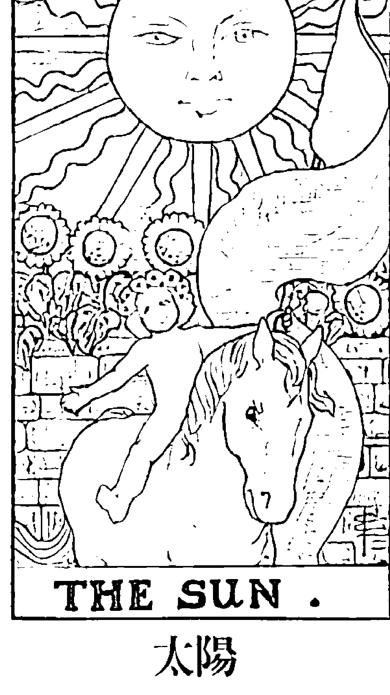## {20 號牌} 審判 (Judgement)

- 審判
- 重生
- 內在的召喚
- 赦免

##### 行為表現

- 做出審判

  面對清算之日
  分清精華與糟粕
  做出誠實的評價
  選定立場而不再觀望
  運用批判的能力
  採取立場
  做出困難的決定

- 聽見召喚

  辨識出你真正的使命
  感到內在的信念
  感到行動的衝動
  決定要有所作為
  感覺被吸引到新的方向
  知道你必須做什麼
  回應需求

- 感到重生

  對可能性覺醒
  轉化
  享受新生的希望
  重新開始
  用新的眼光看待一切
  發現喜樂

- 得到赦免

  感到被淨化、更新
  釋放罪惡及悲傷
  原諒自己和他人
  彌補過去的錯誤
  卸除自己的負擔
  感到罪過被清洗

##### 意義相對的牌（一些可能）

- 死神——死亡，結束
- 聖杯五——悔恨，錯誤
- 寶劍九——罪過，責難，感到有罪

##### 意義加強的牌（一些可能）

- 愚人——重生，新的開始
- 正義——決定，接受過去的錯誤／行為
- 錢幣七——決定之點

##### 牌意解析

在第二十號牌中，我們看見人們應天使的召喚而起。這是審判之日，信實的人將被帶上天堂，但那些不能得救的人又如何呢？他們是不是受到了審判，而被認為不夠資格？因為他們的罪過，他們將被拒於上帝的門外嗎？這是審判令人不安的一面。審判該如何與寬恕取得折衷呢？

事實上，審判會以兩種形式出現。嚴苛的那種說：「你的所作所為是錯誤的，因為做了這些事，所以你是壞人、是沒有價值的人。」這類審判用的是二分法，沒有留下贖罪的餘地。但是不帶譴責的審判是可能的。我們評估事態，衡量所有的面向，試著看清真相。我們承認選擇的必要，並希望有勇氣明智地抉擇——但卻不加責難。

占牌時，第二十號牌可能是在提醒我們審判的必要。有時你必須做決定。在這樣的時刻，最好仔細地考慮整件事，然後不加非難地表明態度。如果受到審判的是你，要從這過程中學習。汲取其中有價值的，改正需要改正的，但是永遠不要否定自己的價值。

這張牌也代表隨救贖而來的感覺。當天使召喚時，我們便獲得了重生——洗清了一切罪惡與重擔。「過去」和當時的錯誤都已在身後，你準備重新開始。你甚至會感應到某種召喚——對於你個人天命的一種信念。若你處於低潮，需要希望與赦免，「審判」牌可能是在告訴你，新生就在眼前。

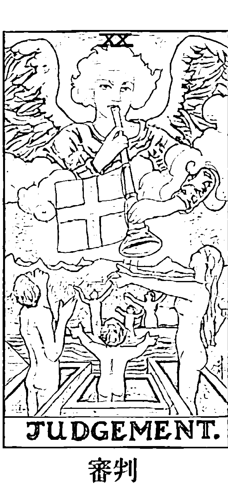

## {21 號牌} 世界（The World）

- 整合
- 成就
- 投入
- 實現、滿足

##### 行為表現

- 體驗完整
  - 將部分組合起來
  - 達到動態平衡
  - 結合
  - 創造綜合體
  - 連結起來
  - 協同工作

- 貢獻心力
  - 療癒
  - 提供服務
  - 運用天賦或才能
  - 分享你所擁有的
  - 給出自己
  - 感到投入
  - 積極活躍

- 實現目標
  - 成功、昌盛
  - 完成心中所欲
  - 見到夢想成真
  - 繁榮興旺
  - 找到完美的解決之道

- 體嚐當下
  - 享受生命的樂趣
  - 享有內心的平靜
  - 獲得滿足
  - 知足滿意
  - 細數你的幸福

##### 意義相對的牌（一些可能）

- 隱士——遺世獨立
- 聖杯四——欠缺投入，漠不關心，退縮抽離
- 權杖五——離心離德，缺乏整合

##### 意義加強的牌（一些可能）

- 節制——整合，綜合，結合
- 太陽——功勳，成就
- 聖杯九——達成心中所欲
- 聖杯十——快樂，情感的滿足
- 錢幣十——富裕，物質的滿足

##### 牌意解析

時值感恩節。你剛享用完一頓美味的晚餐，手中捧著一杯熱騰騰的咖啡。親友們正在談論時事，小寶寶從桌子對面向你咿呀兒語，而你的腳正摩蹭著愛犬的肚皮。你很快樂、滿足，打從心底覺得感恩。（至少在必須洗碗之前！）此時此刻，這個世界和世上的一切都是你的。

我們全都認得這種感覺，它可能在任何時地出現，而且總是受人歡迎。無論我們是在院中耙枯葉，還是在世界舞台上接受諾貝爾獎，都有可能感受到它。它可能看來安靜而簡單，也可能是狂喜而榮耀的。這種感覺是什麼？又是打哪兒來的呢？這第二十一號牌將會幫助我們找到答案。

快樂的一個主要元素是「完整」——感到所有事物都一起和諧地運作著。它並非處於靜止的狀態，而是處於一種動態的平衡中。「投入」也很重要。要能快樂，我們必須感到與週遭事物相連結。還有「成就」——知道我們懷有目標，並成功地向它們邁進。當這些元素都結合在一起，我們就會感到滿足而幸福。

「世界」牌正代表這些時刻及它們所有的元素。解牌時，這是非常正面的信號，暗示你正準備實現內心的願望。這對你會是什麼，乃視情況而定，但總會是種很棒的感覺。不過要記得，這張牌是積極貢獻和服務的象徵，要將世界握在手中，必須把自己付出給世界。這是真正幸福的源頭。

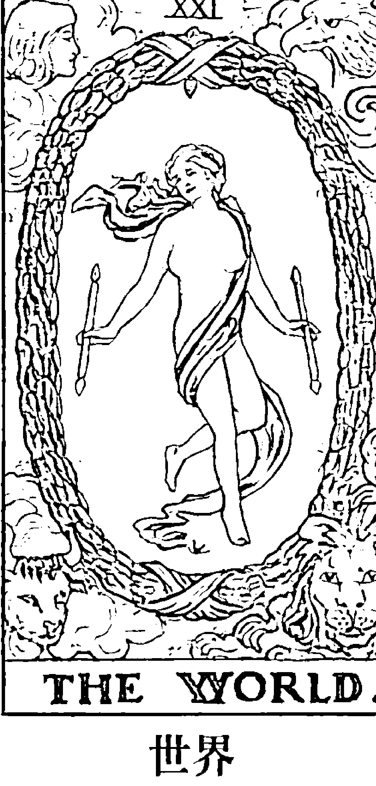

世界

## 第二部

## 小阿卡納

#### 小阿卡納牌關鍵詞（王牌～十）

| 序數 | 權杖 | 聖杯 | 寶劍 | 錢幣 |
| :--- | :--- | :--- | :--- | :--- |
| 王牌 | 創造力 熱情、熱忱 信心 勇氣 | 情感的力量 直覺 親密 愛 | 心智的力量 真理 正義 堅毅 | 物質力量 繁盛興旺 實際 信賴 |
| 二 | 個人的力量 勇敢 原創性 | 連結 休戰 吸引 | 受阻絕的情感 迴避 困境 | 要雜耍 彈性、適應性 樂趣 |
| 三 | 探索 遠見 領導力 | 興高采烈 友誼 社群 | 心碎 寂寞 背叛 | 團隊合作 計劃 勝任 |
| 四 | 慶祝 自由 興奮 | 專注於自我 漠不關心 走向內心 | 休息 沉思 安靜的準備 | 佔有 掌控 改變受阻 |
| 五 | 意見不和 競爭 爭執、煩擾 | 失落 傷悼 悔恨 | 自利 不和 公開的不名譽 | 艱困時刻 健康不佳 拒絕 |
| 六 | 勝利 喝采 驕傲 | 善意 天真 童年 | 憂鬱 復原 旅行 | 有／無：資源 知識 力量 |
| 七 | 攻擊性 抗拒 信念 | 如意算盤 眾多選擇 放縱耽溺 | 逃跑、開溜 獨行俠的風格 隱藏的不名譽 | 評估 報償 改變方向 |
| 八 | 迅速的行動 完成 消息 | 更深的意義 離開、向前走 疲乏 | 限制 迷惑 無力感 | 勤奮 知識 細節 |
| 九 | 防衛 堅忍 毅力 | 願望實現 滿足 感官的享樂 | 憂慮 罪惡感 苦惱 | 紀律 自足 優雅 |
| 十 | 過度操勞 負擔 掙扎 | 喜悅 平安 家庭 | 谷底翻升 受害者心態 殉難 | 豐足 永恆 常規 |

#### 小阿卡納牌關鍵詞（宮廷牌）

| 角色 | 權杖 | 聖杯 | 寶劍 | 錢幣 |
| :--- | :--- | :--- | :--- | :--- |
| 侍衛 | 富創造力的 熱心的 自信的 勇敢的 | 感性的 直覺的 親密的 充滿愛意的 | 運用心智 堅忍剛毅 公平公正 誠信無欺 | 產生作用 務實的 興旺的 信賴／ 值得信賴 |
| 騎士（正面特質） | 有魅力的 自信的 勇敢的 受冒險的 熱情的 | 浪漫的 富想像力的 敏感的 優雅的 內省的 | 直率的 權威的 敏銳的 知識淵博 重邏輯 | 堅定不移的 小心謹慎的 仔細徹底 實際的 認真工作 |
| 騎士（負面特質） | 肩淺的 傲慢的 有勇無謀的 靜不下來的 急躁的 | 過度情緒化的 好幻想的 喜怒無常的 過度矯揉的 內向的 | 莽撞的 逞威風的 銳利的 固執己見 冷酷麻木 | 頑固的 缺乏冒險精神 過分執著 悲觀的 刻苦操勞 |
| 王后 | 富吸引力的 真摯熱忱的 精力充沛的 興高采烈的 自信十足的 | 充滿愛意的 心地柔軟的 有直覺力的 超自然的 通靈的 心靈、精神的 | 誠實的 敏銳的 直率的 機智風趣的 經驗老到的 | 培育、滋養 慷慨寬大的 腳踏實地的 善於機變的 值得信賴的 |
| 國王 | 具創造力的 激勵人心的 強而有力的 魅力十足的 英勇無畏的 | 睿智的 冷靜的 有外交手腕的 關懷的 寬容的 | 知性的 分析的 善於表達的 公正的 講求倫理的 | 善於經營的 熟練的 可靠的 支持的 穩定的 |

#### 權杖王牌 (Ace of Wands)

- 創造力
- 熱情、熱忱
- 信心
- 勇氣

##### 行為表現

- 運用創造力
  發明更好的方式
  開展你的潛能
  對更大的可能性開放
  懷有夢想
  表達自我
  刺激你的想像
  容許天份開展
  找出解決之道

- 懷有信心
  相信自己
  確信自己的能力
  確定會成功
  自視甚高
  對自己的道途有信心
  知道事情將有好結果

- 懷著勇氣前進
  對付具挑戰性的任務
  超越自我的極限
  堅守自己的信念
  敢於採取立場
  面對恐懼
  放手去做

- 表現熱忱
  感覺熱切而受到鼓舞
  創造興奮的氛圍
  準備好面對世界
  激勵他人
  保持樂觀
  全力以赴

##### 成對的王牌

成對的王牌顯示某種新的精神正在進入你的生活。它汲取了「權杖王牌」的能量——創造力、興奮、冒險、勇氣、個人的力量，再加上以下之一：

- 聖杯王牌——深刻的感情，親密，協調，同情，愛
- 寶劍王牌——聰明，理性，公正，真實，清明，堅忍
- 錢幣王牌——繁盛，豐足，信賴，安全，穩固

##### 牌意解析

「權杖王牌」象徵在創造力、刺激、冒險、勇氣、個人力量等領域的可能性。占牌時，它顯示一顆大膽熱忱的種子已植入了你的生活，雖然你可能還沒辨識出來。當這顆種子發芽，它幾乎可能以任何形式呈現。它也許是個創造性的想法，一股樂觀的情緒，或是大膽行動的需要。在外在層面，它可能是一項提議、禮物、機會、遇合，或是同步的事件。

當你看見這張王牌，請檢視你的生活，看看它自信有力的能量能如何為你所用。要大膽，要勇敢。有時候你必須冒險，去得到你要的東西。尋找會讓你興奮、能推你超越極限的途徑。爭取主動，讓你的熱忱帶你到新的高度。

「權杖」是象徵個人力量與成就的牌組，這張王牌告訴你，一段熱情的時光正要開始。你將能夠展現最好的一面，讓所有的人都看見。

「權杖王牌」也代表創造力。在它的影響之下，你將能成為靈感與創新的傳導者。忘掉陳腐而過時的解答，你將有機會展現原創力。信賴你創造的潛能，你所能成就的將沒有止境。

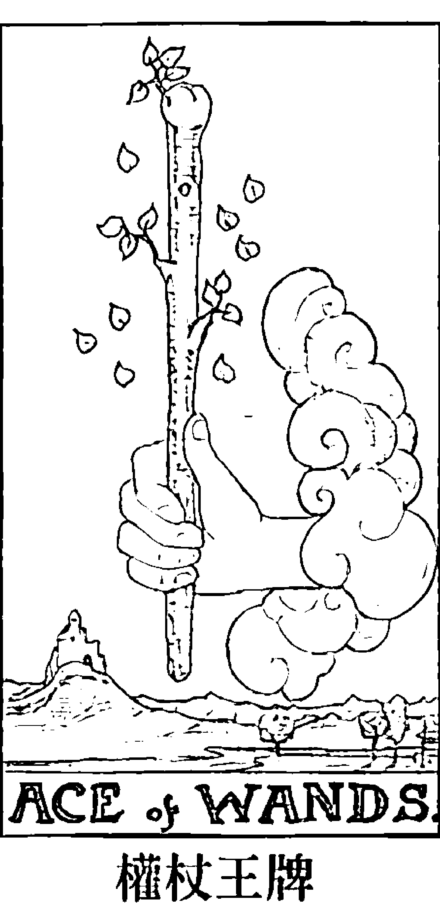

#### 權杖二 (Two of Wands)

- 個人的力量
- 勇敢
- 原創性

##### 行為表現

- 擁有個人的力量
  引人注目與尊敬
  指揮週遭的人
  將世界掌握在手中
  發揮影響力
  發號施令
  具有權威
  影響他人接受你的立場
  能夠達成目標

- 勇敢無畏
  敢於做想做的事
  冒險
  打賭事情會照你的方式
  演變

- 直接面對情況
  採取主動
  直言無諱
  直接面對恐懼
  正面迎擊對手
  把握時光

- 展現原創性
  做別人沒做過的事
  創造自我的風格
  擔任先驅
  採取不同的做法
  發明某種新事物
  不從眾跟風
  走不同流俗的道路

##### 意義相對的牌 (一些可能)

- 女祭司——被動，待在幕後
- 教皇——遵循成規，順隨群眾
- 寶劍八——無力感，害怕行動
- 寶劍十——被害者心態，無力感
- 錢幣十——順隨規則，遵循傳統

##### 意義加強的牌（一些可能）

- 魔法師——個人的力量，行使強大的力量
- 皇帝——權威
- 戰車——個人的力量，指揮權
- 太陽——活力，光輝，偉大

##### 牌意解析

「權杖二」牌崇揚個人的勇氣與崇高。這張牌所汲取的能量與「魔法師」相同，但有個重要的差異。「魔法師」代表力量的原型——「創造」與「力量」的非個人能量。而「權杖二」則代表這種力量被落實到生活中，變得個人化了。個人力量是種鼓舞人心的動力，它會將你充滿，給你勇氣成就偉大功績。一個有力量的人就像磁石，會吸引一定範圍內的所有人。

真正的力量永遠來自上天，它通過我們流入這個世界。如果我們了解這種關係，我們就是有福的，因為這種流動將帶來無比的擴展與滿足之感。我們覺得自己彷彿能完成任何事情。但是當我們忘記自己並非力量的源頭、而僅是它的導體時，問題就產生了。我們必須小心，別讓這種伴隨力量而來的醉人感覺沖昏了頭，盲昧於自己真正的欲望和意圖。

占牌時，「權杖二」指出「力量」是當前情境中的主要議題。你或另外某個人擁有它，或是想要它。當你看見這張牌，仔細審視你的目標和行動，確定自己正明智地運用力量。別為了力量本身而支持力量，而要在力量為你有價值的目標效勞時享受它。接受這份禮物，正面地用它塑造環境。

「權杖二」也可以代表超乎尋常的膽識和創造力。當你看見這張牌，便要相信，現在正是採取令人耳目一新的大膽創意行動之適當時機。忘掉迂迴的手腕和老舊陳腐的做法，放手去做，你將對結果感到驚異。

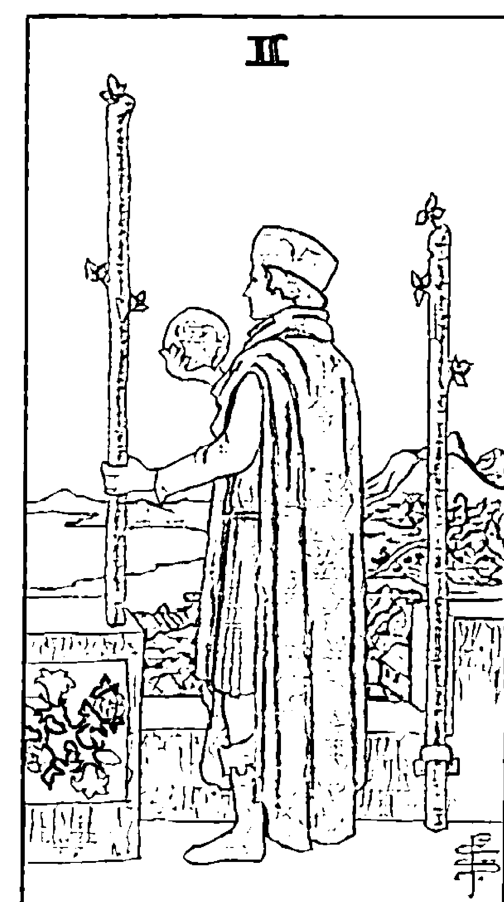

#### 權杖三（Three of Wands）

- 探索
- 遠見
- 領導力

##### 行為表現

- 探索未知
  尋找未知的領域
  追求新的冒險
  拓展視野
  放棄安穩的現狀
  嘗試不同的事物

- 擁有遠見
  具有遠見卓識
  尋找更大的可能性
  預先計畫
  知道該期待什麼
  預見徵兆
  預期到障礙
  將眼光放遠

- 展現領導力
  為他人指引途徑
  擔任主要角色
  提供所需的指導
  鼓舞跟隨你的群眾
  接下擔負責任的位置
  樹立楷模
  出任代表

##### 意義相對的牌（一些可能）

- 寶劍二——抗拒事實，陷於困境
- 錢幣十——保守，注重安全感

##### 意義加強的牌（一些可能）

- 愚人——拓展視野，走入未知的領域
- 皇帝——領導，提供指引
- 聖杯八——上路，展開旅程
- 錢幣三——計畫，為未來做準備

##### 牌意解析

在「權杖三」牌上，我們看見一個人站在懸崖邊，遙望大海彼端的山嶺。從這個高度，他可以看見前方的一切。這是一張代表卓越遠見的牌。若欲望遠，必得登高。藉著攀上高處，我們擴大了視野，將自己從切身的情境中挪移出來。我們抽離，以獲得洞察的能力。

占牌時，「權杖三」可能是在告訴我們眼光要看得長遠，不要隨一時的熱潮起舞，而要退後一步，反覆思考，看看當前的情境在更大局面中的位置。這張牌要求你放遠眼光——超越眼前的限制去夢想。它也可能是指某種預兆，或是其他關於未來的直覺。

將眼光放遠是「領導力」的一個面向——這是「權杖三」的另一層意義。當我們看得更遠時，便有了知識，可引導他人走向最好的未來。知道路的人可以為跟隨者指引路途，當你看見「權杖三」，便要知道現在是接受你的願景的時候，並且要有信心，你可以帶領其他人朝它邁進。

一個領導者不僅看得遠，還願意在必要的時候身先士卒。「權杖三」同時也意味著探險。將這個人與同樣站在懸崖邊緣的「愚人」做個比較，「愚人」天真地踏出步伐，完全不知道將會有那命定的一墜；而「權杖三」中的探索者同樣願意邁出步伐，但他完全清楚自己在做什麼。他的勇氣或許不那麼渾然天成，卻是有憑有據的。「權杖三」鼓勵你勇敢無畏地邁向新領域，讓地平線上的船，載著你遠航進未知的海域。

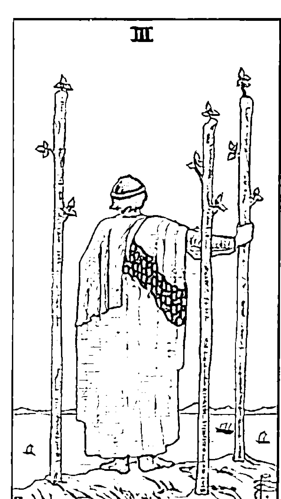

權杖三

#### 權杖四 (Four of Wands)

- 慶祝
- 自由
- 興奮

##### 行為表現

- 慶祝
  歡慶喜慶事件
  慶賀成功
  慶祝紀念日、里程碑，或是特別的時刻
  慶賀工作圓滿完成
  思量成就
  享受應得的報酬
  參加慶典或儀式
  對新的可能性開放
  逃離令人不快的環境
  主張自決
  擺脫限制

- 感到興奮
  洋溢喜悅
  極為興奮激動
  興奮地期待著
  激動忘我，沖昏了頭
  雀躍歡騰
  品味當下時刻
  感到驚喜

- 尋求自由
  脫離壓迫的情境
  掙脫束縛
  解脫

##### 意義相對的牌（一些可能）

- 惡魔——束縛，缺乏自由
- 權杖十——負擔，處於受壓迫的情境
- 聖杯四——漠不關心，毫不興奮，冷淡麻木
- 寶劍六——輕微的沮喪，沒有可慶祝之事
- 寶劍八——限制，不自由

##### 意義加強的牌（一些可能）

- 聖杯三——興奮，歡樂，慶祝
- 錢幣二——樂趣，興奮，歡聚

##### 牌意解析

你是否記得當你還是個孩子時，看見生日蛋糕上燃著蠟燭的興奮之情？或是等待坐上雲霄飛車的時刻？還是跟初戀情人跳第一支慢舞？這種心裡像是冒著泡泡、飛得像風箏一般高的興奮感覺，就是「權杖四」的核心。我兒子還在學步時，他會用他的「快樂之舞」表達這種心情，他在原地越跑越快，幾乎無法控制自己的興奮。當然，做為成熟的（！）成人，我們控制著這種情緒，但它始終不曾完全離去。我們每個人內在仍然有個興奮的孩子，等著掙脫束縛而出。

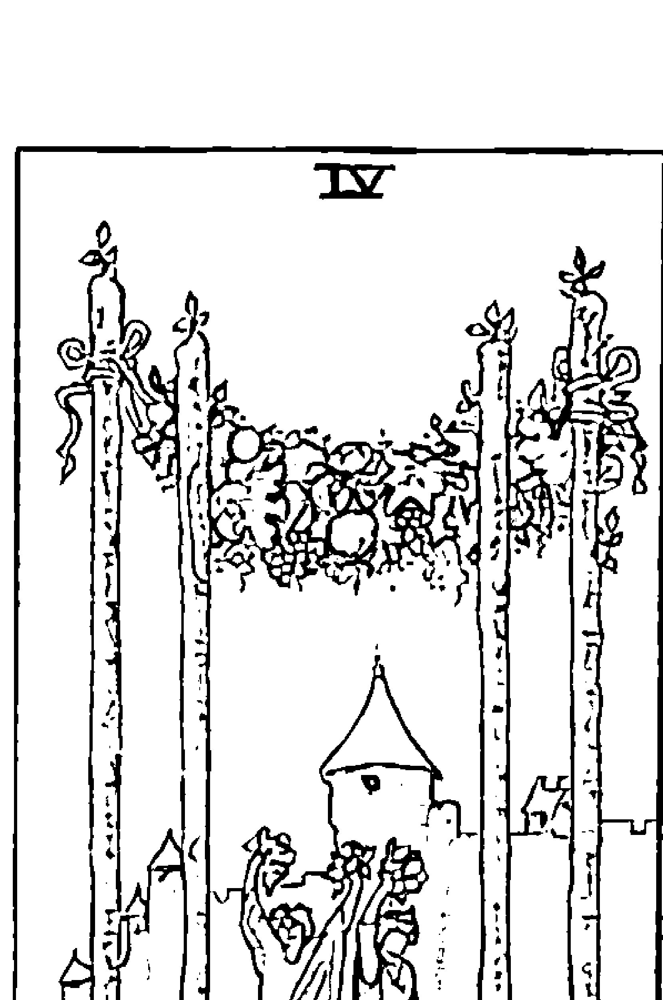

占牌時，「權杖四」往往代表造成興奮的事件或經驗。這些事件因人而異，但那種騷動的感覺並無二致。有時這樣的時刻會出乎意料地來臨，「權杖四」可能暗示一個驚喜，或是突如其來的興奮。在其他時刻，這張牌則代表經過計畫的慶祝，像是婚禮、週年紀念，以及勝利的派對。這些事件有其莊嚴的一面，但同時也是感受生之喜悅的機會。

「權杖四」往往也意味著自由。自由有許多形式，但它總會帶來欣喜振奮之感。當我們打破束縛我們的桎梏——無論是身體、心理或情緒的——我們都會感到歡欣鼓舞，並能進入一個成長與歡樂的新時期。如果你正感到受限或陷入困境，運用「權杖四」的能量讓自己邁向自由。不要害怕擁抱開闊的遠景，那原本就是屬於你的。

#### 權杖五 (Five of Wands)

- 意見不和
- 爭執、煩擾
- 競爭

##### 行為表現

- 意見不和
  - 感覺眾人離心離德
  - 意見不和造成分歧
  - 吵架，爭辯
  - 捲入爭論
  - 與他人有歧見
  - 對細節吹毛求疵

- 遭遇競爭
  - 感到競賽的興奮
  - 迎戰對手
  - 迎接挑戰
  - 投入競賽或運動

- 爭執、煩擾
  - 對要求感到惱怒
  - 遭遇不很嚴重的挫折
  - 必須關照細節
  - 遇到惱人之事
  - 為瑣碎之事煩擾

- 嘗試超越自己
- 爭逐獎賞
- 挑釁
- 棋逢敵手
- 遭到後起之人的挑戰

##### 意義相對的牌（一些可能）

- 節制——均衡，一致，共同合作
- 世界——整合，合作
- 聖杯二——停戰，協議，交集
- 錢幣二——工作順利進行，結合眾人
- 錢幣三——團隊合作，同心協力

##### 意義加強的牌（一些可能）

- 權杖七——對抗，戰鬥
- 權杖十——爭鬥，煩擾，遭逢抗爭
- 寶劍五——不和，眾人不同心

##### 牌意解析

當你起床要去洗手間時踢到了腳趾，你淋浴時發現肥皂用光了，吃早餐時你把果汁濺得滿襯衫都是，當你進了車裡卻發現電瓶沒電了。這將是一個可怕、恐怖、一無是處、極度糟糕的一天（註）。你被一堆瑣碎的麻煩圍攻——正因為這些小麻煩是如此的瑣碎，更是叫人生氣惱怒。

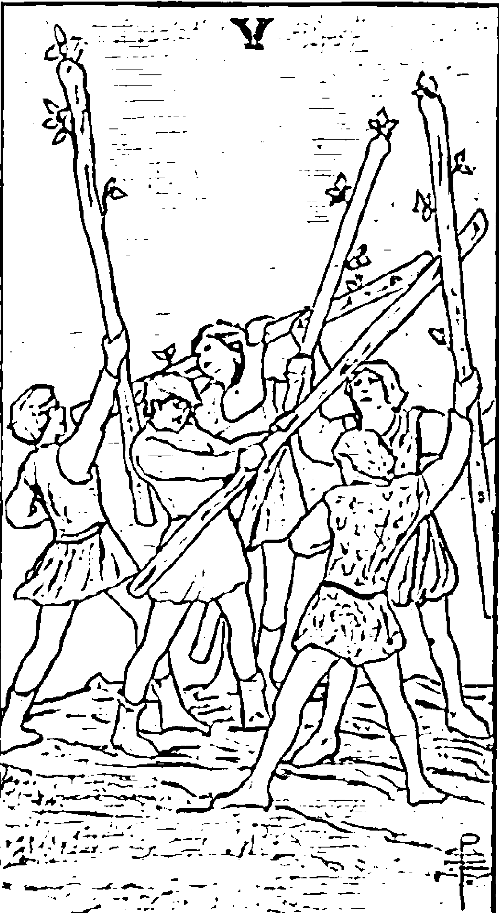

「權杖五」就是代表這樣的時刻，你四周的環境似乎都在跟你作對。沒有任何事情順利進行，每個人各行其是。這張牌上的人物全在互相攻擊，沒有協同的努力或共識。當這張牌出現時，準備面對一段顛簸的路途吧！你將特別需要耐心和堅忍，才可能完成一些事情。「權杖五」所代表的不是重大的障礙，而是許許多多令人惱怒的小麻煩。

這張牌同時也代表競爭。在適當的情況下，競爭是有益的。它激勵人們投注更多的努力，並帶來興奮刺激，激發最佳的表現。當「權杖五」在牌陣中出現時，檢視帶有競爭意味的元素。你可能將涉入某種比試、競賽，或者賽局。你可能會發現，有對手在反對你或質疑你的立場。你可能身處某種狗咬狗的情境中，而感到灰心沮喪（或是鬥志昂揚！）。究其核心，競爭是會造成分裂的，請務必確定它能幫助你和其他人達到真正的目標，否則，就努力促成合作吧！

> 〔註〕字句摘自茱蒂絲·維奧斯特 (Judith Viorst)，《Alexander and the Terrible, Horrible, No Good, Very Bad Day》，(New York: Atheneum, 1972)。

#### 權杖六 (Six of Wands)

- 勝利
- 喝采
- 驕傲

##### 行為表現

- 勝利凱旋
- 春風得意
- 獲得肯定
- 抱走獎賞
- 戰勝所有的對手
- 拔得頭籌
- 獲致成功

- 贏得掌聲
- 獲得賞識

- 感到驕傲
- 享有健康的自尊
- 炫耀你所擁有的
- 高視闊步
- 自覺值得受注目
- 自視甚高
- 自覺高人一等
- 傲慢自大
- 屈尊降貴
- 妄自尊大

- 接受喝采
- 得到認可
- 受到讚賞
- 得獎或受褒揚
- 得到讚美或恭維

##### 意義相對的牌 (一些可能)

- 塔——謙卑，失去喝采
- 聖杯五——失落，挫敗
- 寶劍十——自貶，處於谷底
- 錢幣五——拒絕，缺乏認可

##### 意義加強的牌 (一些可能)

- 戰車——凱旋，自信
- 太陽——喝采，卓越
- 聖杯九——自滿，達成你想要的

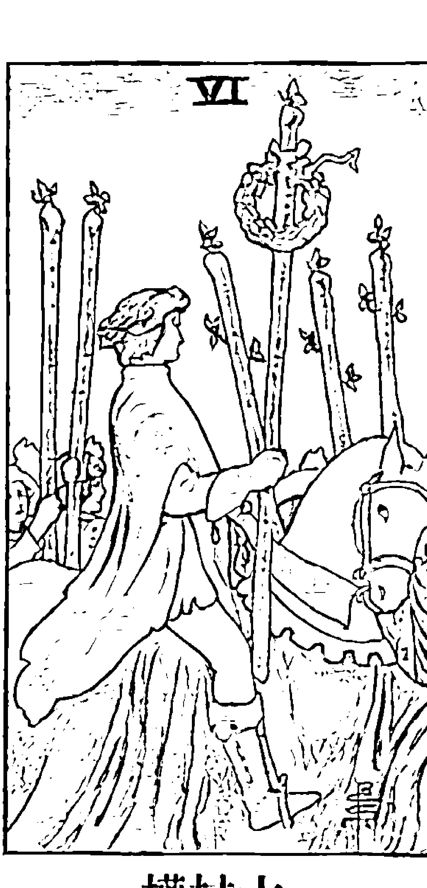

## 權杖六

##### 牌意解析

「權杖六」是小阿卡納中與「戰車」對應的牌。這兩張牌都代表勝利和凱旋的時刻。你可以在運動員、政治家或是其他優勝者步上受獎台時，在他們臉上看見這種夢想。一切都是值得的，我是最棒的，我贏了！占牌時，「權杖六」會在我們朝某個目標努力、而成功終於在望時出現。你尋求許久的認可終於是你了。現在你可以接受喝采、榮耀，和你應得的獎賞。如果你現在並不覺得勝利就在眼前，便要知道，如果你能盡力而為，它終將到來。這張牌所代表的勝利並不一定是打敗別人，你可以戰勝自己、戰勝環境，或是戰勝種種橫逆。

「權杖六」同時代表一種健康的自尊。對自己的成就感到滿意是成功重要的一環，但太多的驕傲可能會導致傲慢和自我膨脹。當你看見這張牌，要檢討是否自覺高人一等。個人的成就不是來自個人；我們的才能來自上天，因為別人的愛與支持而得以發展，只是最後是透過我們來表現罷了。我們怎能沉溺在過度的驕傲中呢？

> 在但丁《神曲》的〈煉獄篇〉中〔註〕，他認為驕傲是第一樁、也是最大的罪過，靈魂必須克服它才能登上天堂。當「權杖六」出現，享受你的勝利，但也要記得但丁的話：
> 噢，有天賦的人們呀，因為拔得頭等而洋洋得意
> 桂冠維持青翠的時間是多麼短暫呀
> .......................
> 虛名就只是一陣風
> 吹拂在地面上：一下吹到這兒，一下又到那兒
> 當它改變方向時，名字也就換人了

〔註〕但丁（Dante Alighieri），《神曲：煉獄篇》（The Purgatorio），譯者：John Ciardi。（紐約：新美國圖書館，1957），P.123。

#### 權杖七（Seven of Wands）

- 攻擊性
- 信念
- 抗拒

##### 行為表現

- 具攻擊性、侵略性
- 追求想要的東西
- 主張自我意志
- 發動攻勢
- 開啟戰端
- 戰鬥
- 強力表明自己的立場
- 抓住優勢
- 抗拒
- 在壓力下支撐不屈
- 護衛自己的立場
- 對抗所有的挑戰者

- 反擊批評
- 拒絕屈服
- 說「不！」
- 反抗權威
- 展現信念
- 確信
- 抱持堅定的立場
- 展現堅強的性格
- 為信仰的事物挺身而出
- 知道自己是對的
- 堅決地行動
- 堅定不移

##### 意義相對的牌（一些可能）

- 女祭司——被動，退讓
- 吊人——等待，放手
- 錢幣三——團隊合作

##### 意義加強的牌（一些可能）

- 權杖五——反抗，戰鬥
- 權杖九——捍衛自己的立場，拒絕屈服

## 寶劍五——衝突，「我與他們對抗」的心態

##### 牌意解析

「權杖七」的重點在於採取立場。採取立場是種強有力的行動，不論是好是壞，它改變了世界的能量流動。多半的時間，我們就像在河上漂流般隨著人生流動，事件和感覺牽引著我們前進，不費什麼力氣。但是，有些時候，我們並不滿足於隨波逐流。我們想要抗拒這股波流，甚或全盤改變它的方向！

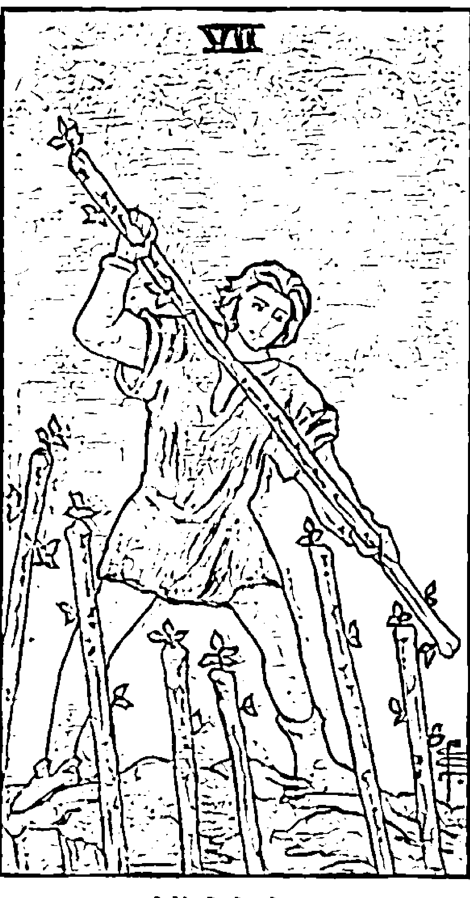

「權杖七」中的人物看來像處於一場戰鬥中。他不是在攻擊別人就是受到攻擊，或許兩者皆是。當我們決定採取某種立場時，就啟動了一種抗拒的能量。當我們採取堅決的姿態時，別人也會這麼做。「權杖七」同時代表攻擊和防衛，因為它們是一體兩面。你攻擊，你的對手防衛；他再回擊，然後輪到你防衛。

有些仗是值得打的，但有些只會製造麻煩。如果你被捲入一場衝突，問問自己這場爭鬥是否值得。它重要嗎？有價值嗎？其結果能否造福你或他人？如果可以，就英勇地作戰吧！捍衛自己的立場，拒絕屈服！倘若不然，何妨考慮止息這場紛爭。在此事上要對自己誠實。你會很想堅持自己的立場，尤其當你已經投入許多時間和精力。除非這場戰爭值得打，否則不要輕易開啟戰端。

「權杖七」也可以代表強烈的信念。要採取堅定的態度，你必須相信你自己和你的立場。你將需要人格的強度去堅持到底。如果你的目標是正常的，便運用「權杖七」的能量去造成影響吧！

#### 權杖八（Eight of Wands）

- 迅速的行動
- 完成
- 消息

##### 行為表現

- 採取迅速的行動
- 展開行動
- 趁熱打鐵
- 公開宣告你的意圖
- 將計畫付諸實行
- 衝進新的領域
- 轉換成高速檔
- 捲入變動中

- 終止一項活動
- 經歷大結局
- 找到成功的解決方式
- 完成未完之事

- 接獲消息
- 獲得重要的訊息
- 得到需要的資訊
- 找到缺漏的拼圖
- 發現真相
- 進行一番有意義的交談
- 獲悉更多

- 來到完成階段
- 完成一項工作
- 將所有元素集結起來

##### 意義相對的牌（一些可能）

- 女祭司——等待，暫緩
- 寶劍四——不匆促地投入，預備
- 錢幣七——評估，在行動前先衡量情勢

##### 意義加強的牌（一些可能）

- 魔法師——採取行動，執行計畫
- 命運之輪——迅速的步伐，快速的發展
- 死神——終結，結束

## 聖杯八——結束，終結一個篇章

##### 牌意解析

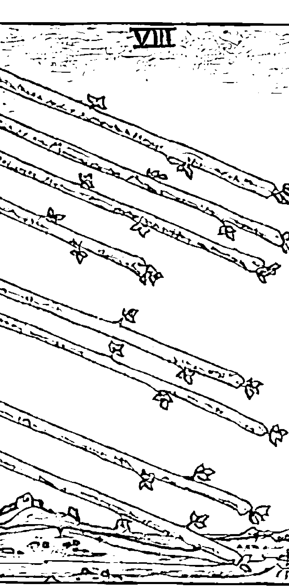

在電影《十誡》（The Ten Commandments）中，摩西用他的手杖碰觸水源，引發了一場瘟疫。他的手杖是力量的媒介，讓事件開始發生。摩西的手杖讓我聯想到這張牌上的木棒，它們象徵行動的展開及其結果。在行動之前，我們會思索、想像、推測、談論，以及夢想。這是大氣的領域——天空。然後，我們終於決定採取行動了，我們將想法落實，將它們付諸行動。

占牌時，「權杖八」往往是個信號，告訴你現在該是宣告自己意圖的時候了。所有的元素皆已具足，只要你不猶豫不前，它們都將為你效勞。鐵已經燒熱了——那就快打吧！如果事件已在進行中，它們將會快速地進展。你可能會有種被捲進旋風的感覺，但塵埃很快便將落定，你就會看見你的計畫進展得如何。

「權杖八」同時代表消息或資訊的到來，你可能會看見或聽見某些重要的事情。這消息可能會以偽裝的面貌出現，所以你要保持警覺。在這段期間，對來到你身邊的每一件事物都要多加留意。

這張牌也可能意味著終結。或遲或早，所有行動都會走完全程。這張牌上的八根木棒不僅僅象徵事件的啟動，也象徵它們的完結。它們看起來也很像就要終結飛行，落到地面上。如果你在占牌時看見「權杖八」，也許現在就是你終結手邊事務的時候了。頌揚過去，但是同時也要準備迎向新的事物。

#### 權杖九（Nine of Wands）

- 防衛
- 堅忍
- 毅力

##### 行為表現

- 自我防衛
  - 假定他人有敵意
  - 期待最壞的可能
  - 格外謹慎小心
  - 偏執狂
  - 戒慎提防
  - 保護他人
  - 記得過去的攻擊

- 將某事實徹到底
  - 被擊倒後重新站起來
  - 保持決心
  - 不斷地嘗試

- 展現毅力
  - 雖然疲憊仍然繼續
  - 牢牢堅守
  - 汲取隱藏的儲備能量
  - 透過意志力挺住
  - 展現肉體的力量
  - 趕上步伐

- 堅忍
  - 不畏挫敗，堅持到底
  - 拒絕得到否定的答案

##### 意義相對的牌（一些可能）

- 聖杯三——友誼，信賴某人
- 聖杯六——天真，相信最好的一面
- 聖杯八——疲憊，疲勞

##### 意義加強的牌（一些可能）

- 力量——堅忍，決心，意志
- 權杖七——捍衛某種立場，堅持
- 寶劍二——防禦自衛，封閉自我

## 錢幣八——堅持

##### 牌意解析

「權杖九」牌上的人物顯然經歷過一段艱困的時光。他的頭上和手臂上都繃了繃帶，倚靠在「拐杖」上。這位戰士身經多場戰役，但仍然挺立著！他受了傷，但沒有倒下。遭遇不好的經驗時，我們會感到疲憊、遍體鱗傷。即使我們身體上並沒有受傷，心靈卻有了創傷。我們的開放、天真和信任消失了，取而代之的，是小心戒慎的防衛心。

占牌時，「權杖九」可能是在提醒你要小心地前進。要保持警戒，因為你有可能受到傷害。如果你已有過受傷的經驗，就會知道這個人的感覺。生命的功課有時是艱難的，特別是當希望破滅時。在這樣的時刻，生起防衛心是很自然的，但請試著不要變得憤世嫉俗。你的經驗傷害了你，但它同時也讓你堅強起來。

「堅強」是「權杖九」的另一個面向。這位戰士非常強悍！儘管經歷種種挫敗，還是擁有肉體的力量和內在的驅力堅持下去。在電影《魔鬼終結者》(The Terminator)中，阿諾·史瓦辛格(Arnold Schwarzenegger)扮演一位來自未來的機械人，他不達目的絕不放棄，在電影最後，他只剩下一個金屬框架，上頭有對閃閃發亮的眼珠，但他還是不斷撲來——在地上拖著自己的殘骸向目標逼近。這就是「權杖九」的精神。這張牌告訴你，無論如何都要不斷向前，即使現在每個人和每件事似乎都在和你作對，但是不要放棄。你所需要的致勝力量，就蘊藏在你的體內。

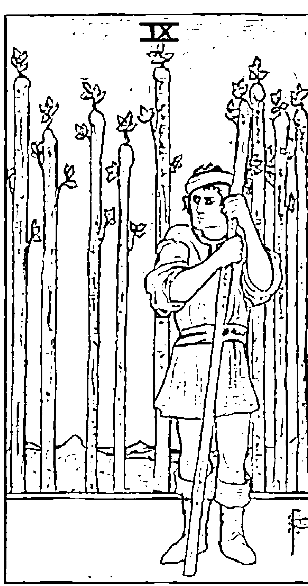

#### 權杖十 (Ten of Wands)

- 過度操勞
- 負擔
- 掙扎

##### 行為表現

- 過度操勞
  - 試圖做得太多
  - 拒絕說「不」
  - 擔起所有責難
  - 擔負他人的債務
  - 做超多份量的工作
  - 必須超時工作
  - 肩負起所有的工作
  - 挑起額外的擔子

- 承擔責任
  - 被寄予厚望
  - 執行不愉快的責任
  - 收拾爛攤子
  - 被留下來背黑鍋

- 負擔
  - 從沒有時間放鬆
  - 覺得被綁在石磨上
  - 被壓榨到極限

- 掙扎
  - 費力地抗爭
  - 以艱難的方式做每件事
  - 遭遇對抗
  - 逆流而行
  - 每有所獲都須辛苦爭取
  - 發現沒有東西來得容易
  - 辛勤勞苦

##### 意義相對的牌（一些可能）

- 愚人——無憂無慮，活在當下
- 吊人——順隨，放手
- 權杖四——沒有負擔，逃離壓迫
- 寶劍四——放鬆，休息
- 寶劍七——規避責任

##### 意義加強的牌（一些可能）

- 正義——接受責任，可堪依賴
- 權杖五——爭鬥，口角，抗拒
- 寶劍六——勉強過活，費力度日
- 寶劍九——憂慮
- 錢幣五——掙扎，艱困時刻

##### 牌意解析

在「權杖十」牌上，我們看見一個彎腰駝背的人試圖搬動十根沉重的木棒。這些木棒緊密地堆在他面前，以至於他連去向都無法看清。對這個人來說，除了他的責任和重擔，什麼都不存在。這對今天許多人來說是多麼真實呀！我們承擔了這麼多，試圖去做每件必須做的事。我們心想，只要能撐到週末（或是放假，或是學期結束）就可以輕鬆了。週末到了，工作超載的情況仍然持續著。

占牌時，「權杖十」可能是種徵象。告訴你，你把自己逼得太緊了。如果你的日子是永無止境的責任和工作，為了你的健康和幸福，你必須放鬆。減少工作量，多從事那些會帶給你樂趣的活動。如果你熱愛工作，但它卻耗盡了你的精力，或許你是太過狹隘地專注在一個領域了。用其他興趣平衡你的生活吧！

「權杖十」也可能代表你必須承擔超大份量之責任的時刻。你也許會遭到責難，或被留下來背黑鍋。另一方面，你也可能必須挺身而出掌控大局，因為你是唯一有此能力的人。且不問是否合理，總之收拾殘局的工作是落到你身上了。

「權杖十」顯示，在一段時間內，你的生活將會比平日辛苦許多。想要稍有收穫，你都必須費勁地爭取。每一步都像是在掙扎。當你看見這張牌，對自己好一點，儘可能減輕自己的負擔，讓別人幫助你。你不必親自處理每件事的。

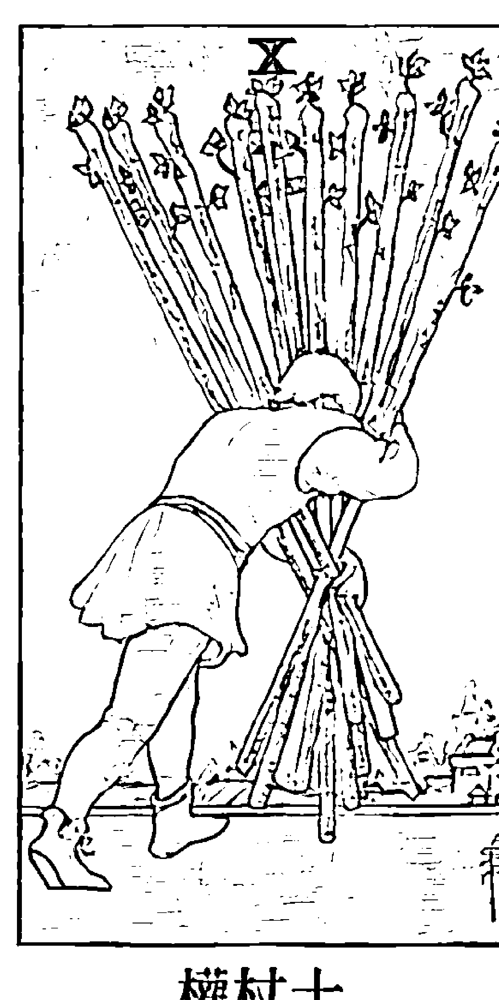

權杖十

#### 權杖侍衛（Page of Wands）

- 富創造力的
- 熱心的
- 自信的
- 勇敢的

##### 行為表現

- 富創造力的
  - 採取新穎的做法
  - 富原創性
  - 發明，創造
  - 找到一種自我表達的新領域
  - 運用你的技能
  - 想出解決之道
  - 走上新的方向

- 自信的
  - 迎接挑戰
  - 說「是的，我可以」
  - 相信自己
  - 拓展你的範疇
  - 克服疑慮，只管行動
  - 專注在成功上
  - 知道有志者事竟成

- 熱心的
  - 全心全意地投入
  - 興奮起來
  - 表露樂觀
  - 率先自願參與
  - 熱情的
  - 讓自己熱血奔流

- 勇敢的
  - 冒險
  - 大膽英勇
  - 從事冒險
  - 避免做沒有風險的事
  - 採取決斷的行動
  - 擔任領袖
  - 克服恐懼

##### 成對的宮廷牌

「權杖侍衛」可與任何其他宮廷牌形成牌對。比較這兩張牌的階級與牌組，來判斷這樣的對子可能代表什麼意義。

##### 牌意解析

「權杖侍衛」是個帶給你機會發揮熱情的使者。他帶來真正的機遇，讓你體驗創造力、勇氣、魅力，以及靈感——也就是權杖牌組的奇蹟。占牌時，這位侍衛暗示一個時機或許正在展開，它將令你興奮、得以發揮才能，或是激勵你攀向高峰。當你看見這樣的機會，只管把握住吧！

「權杖侍衛」也可能代表一個小孩，或是心態年輕的成人。他與你的互動涉及了獨立、高昂的能量、冒險的行為，或是共同的熱情。

有時「權杖侍衛」暗示你所處的情境充滿了興奮與冒險的精神。在這樣的時刻，不妨盡情自在地展現你的獨特和力量吧！

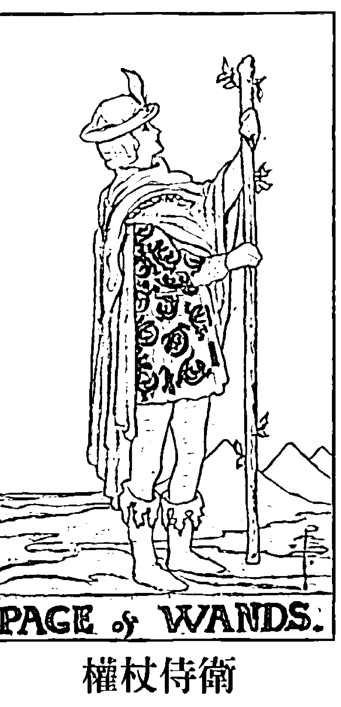

#### 權杖騎士（Knight of Wands）

- 有魅力的／膚淺的
- 自信的／傲慢的
- 勇敢的／有勇無謀的
- 愛冒險的／靜不下來的
- 熱情的／急躁的

##### 行為表現

- 有魅力的／膚淺的
  - 外在具吸引力的／專注於外表與時尚
  - 能一笑化解對抗／有時感覺遲鈍或欠缺考慮
  - 性感而有誘惑力／追求性的征服
  - 引起魅惑和興奮／迴避深刻或嚴肅的事物
  - 說話動聽的／可能做出從私利出發的言行
  - 不為小事所煩擾／有時冒昧而放肆

- 勇敢的／有勇無謀的
  - 毫不畏懼地冒險／魯莽而輕率
  - 為人所不敢為／讓自己和別人涉險
  - 遇到危險一馬當先／對危險不懷敬畏
  - 喜歡當英雄／魯莽衝動
  - 勇敢前往沒人去過的地方／蠻勇不怕死

- 自信的／傲慢的
  - 完全欠缺自我懷疑／高估自己的能力
  - 具有進取的態度／可能會誇口或吹牛
  - 完全相信自己的才能／誇張自己的成就
  - 總是自信篤定／無禮而急躁的

- 愛冒險的／靜不下來的
  - 喜愛旅遊和新經驗／不甘寂寞，靜不下來
  - 追求新奇與變化／無法紮根或締結深厚關係
  - 讓事情發生／缺乏內在的平和寧靜

- 熱情的／急躁的
  - 容易被激起行動／輕易發怒
  - 極度忠誠／太過容易投入戰鬥
  - 對一切事物感受強烈／一受挑釁便暴跳如雷
  - 立場鮮明且直言不諱／時常不經思考地行動
  - 全力投入／隨時可能與人起衝突

##### 成對的宮廷牌

「權杖騎士」可與任何其他宮廷牌形成牌對。比較這兩張牌的階級與牌組，來判斷這樣的對子可能代表什麼意義。

##### 牌意解析

就正面而言，「權杖騎士」充滿能量與生命力，從不害怕嘗試新事物，並以高昂的興致追求所好。他很性感，令人難以抗拒，永遠是個萬人迷。就負面而言，他有點自負過頭，往往有些膚淺，行事也欠考慮，別指望他會給你什麼深刻的承諾。他同時是魯莽而不負責的，屢屢因暴躁的脾氣而捲入麻煩。占牌時，顯示該情境涉及他這種自信而熱情的風格，做為你、他人，或是整體氛圍的一個面向。你必須自問：「這位騎士的能量是有幫助的，還是有害的？」

倘若他的風格很明顯，那麼平衡是必要的。你的自信事實上會不會是傲慢？你是否老是發脾氣或不耐煩？你是否毫無準備地投入某項冒險的計畫？也許是改變的時候了。

若這位騎士的能量付之闕如，一點熱情和勇敢或許是需要的。你是否墨守成規？試試新事物吧。你總巨細靡遺地計畫？下回放手做做看。你工作過度？去找點樂子吧。讓「權杖騎士」引領你進入他充滿冒險、刺激與興奮的世界！

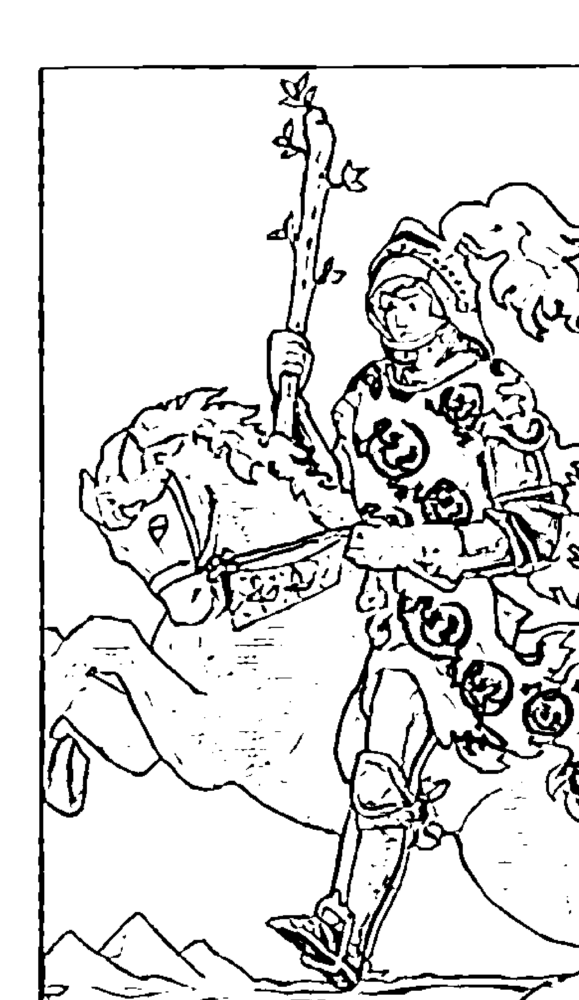

#### 权杖王后 (Queen of Wands)

- 富吸引力的
- 真挚热忱的
- 精力充沛的
- 兴高采烈的
- 自信十足的

##### 行为表现

- **富吸引力的**
    - 有魅力而受欢迎
    - 创造强有力的第一印象
    - 很容易跟人交上朋友
    - 具有强烈的性吸引力
    - 温暖而直率
    - 具有发自内在的活力
    - 是个天生的运动好手

- **真挚热忱的**
    - 充满热情
    - 做事全心投入
    - 任何情况下都全力以赴
    - 开放而真挚
    - 毫不保留

- **兴高采烈的**
    - 乐观而欢快的
    - 对每个人都能说出激励的话
    - 令所到之处满室生辉
    - 具有温暖而阳光的性格
    - 能够轻易甩开忧虑

- **精力充沛的**
    - 过着忙碌而活跃的生活
    - 强健而有活力
    - 散发健康活力的光采

- **自信十足的**
    - 安静地表露自信
    - 泰然沉着地处理局面
    - 不会被轻易扰乱或激怒
    - 失败时能优雅以对
    - 对自己的能力怀有信心

##### 成对的宫廷牌

“权杖王后”可与任何其他宫廷牌形成牌对。比较这两张牌的阶级与牌组，来判断这样的对子可能代表什么意义。

##### 牌意解析

“权杖王后”的性格综合了权杖牌组正面的火象能量与王后专注于内在的取向。她是被班上选为最受欢迎人物的那个女孩，总是富有吸引力，以古典的标准来看通常算很漂亮的。她温暖的微笑和平易近人的态度，为她带来许多朋友和崇拜者。她的活力深具感染性，而她的热情则是毫无保留。无论被交付什么任务，她总是戮力以赴，全心全意地投入。没有任何事情会让她沮丧，她总是乐观而欢快，乐意找出事情的光明面。她的生活充实而忙碌，而她也宁愿这样。她喜欢活动，由于她全身散发健康与活力，因而能够维持这样的步调。她往往是个很好的运动员，天生强健而协调。虽然“权杖王后”从不傲慢，她对自己的能力却深具信心。她安静的自信来自于：她知道，只要下定决心，任何事情她都能做到。

占牌时，“权杖王后”要求你依照她的方式去思考与感觉。例如，你是否自觉有吸引力？是否相信自己？是否充满活力？是否能够甩开忧虑？是否对生活充满热情？

这张牌也可能代表一位与她相像的男性或女性，或是一种乐观、自信而热情的氛围。占卜时，她告诉你，此时此刻她的特殊能量对你具有某种意义。无论这张王后牌是以什么样的形式出现在你的生活中，让自己从她身上得到激励吧！

#### 权杖国王 (King of Wands)

- 具创造力的
- 激励人心的
- 强而有力的
- 魅力十足的
- 英勇无畏的

##### 行为表现

- **具创造力的**
    - 发展创新的计划和想法
    - 开展新的经验领域
    - 具有天生的艺术才能
    - 为有益的目的表达自我
    - 主导、筹划新的策略
    - 原创而善于创造发明
    - 必要时能独断行事
    - 赢得敬爱和顺服
    - 自然地流露权威感

- **激励人心的**
    - 传达热忱
    - 创造兴奋的氛围
    - 立下他人想仿效的典范
    - 灌输信心
    - 是强有力的天生领导者

- **坚强有力的**
    - 似乎掌控着整个局面
    - 具有令人慑服的威仪

- **魅力十足的**
    - 往往很爱现而戏剧化
    - 善于运用手势、动作
    - 自然而然成为注目焦点
    - 像磁石般吸引他人
    - 为人注意、模仿及谈论

- **英勇无畏的**
    - 无畏而坚毅
    - 愿意在高赌注下冒险
    - 直接面对挑战
    - 敢于与众不同
    - 不在乎别人的想法
    - 有勇气捍卫自己的信念

##### 成对的宫廷牌

“权杖国王”可与任何其他宫廷牌形成牌对。比较这两张牌的阶级与牌组，来判断这样的对子可能代表什么意义。

##### 牌意解析

“权杖国王”的性格综合了权杖牌组积极的火象能量与国王活跃外向的态度。他充满了创造力，永远不会安于老旧陈腐的做法。他相信自己的原创性，并容许自己的灵感成形实现。他满怀热忱，每当机会出现，就会挺身而出，领导群众。当他信心满满地指出道路，人们就会跟随他。他坚强有力地追求目标，绝不会当个安静被动的观察者，除非这样的做法符合他的目的。他遇事总是一跃而起，主动创造结果。他充满戏剧性，令人兴奋。这位国王从来不会当个孤芳自赏的“壁花”，而常常是注意力的焦点。他大胆而无畏，总是避开安全容易的路径，因为他拥有冒险并胜出的能量与信心。“权杖国王”有着贯彻信念的勇气，并总是相信自己。

占牌时，“权杖国王”要求你采取他可能会采取的行动。例如：创造杰作、引领道路、从事冒险，或是引起骚动。

这张国王牌也可能代表一位拥有此种行事风格的男性或女性，或是一种兴奋、大胆，而且戏剧化的氛围。占卜时，他告诉你此时此刻他的特殊能量对你具有某种意义。无论这张国王牌是以什么样的形式出现在你的生活中，让自己从他身上得到激励吧！

#### 圣杯王牌 (Ace of Cups)

- 情感的力量
- 直觉
- 亲密
- 爱

##### 行为表现

- 运用情感的力量
- 与你的情感取得联系
- 让你的心领路
- 与他人感同身受
- 表达深刻的情感
- 发自内心地回应
- 感到吸引力在增长
- 堕入爱河
- 与他人建立连结
- 发展出一段关系
- 与某人亲近
- 进展到更深的层次
- 发展直觉
- 信赖你内在的声音
- 回应来自内在的信息
- 体验直接的了悟
- 增强心灵的觉知
- 与自我协调频率
- 依直觉反应行事
- 怀抱爱意行动
- 表达情感
- 对他人敞开自己
- 以同理心回应
- 让你的爱发光
- 对需要的人施予
- 去除负面
- 原谅并忘记
- 体验亲密

##### 成对的王牌

成对的王牌显示某种新的精神正进入你的生活。它汲取了“圣杯王牌”的能量——深刻的情感、亲密、协调、同情、爱，再加上以下之一：

- 权杖王牌——创造力，兴奋，冒险，勇气，个人的力量
- 宝剑王牌——聪明，理性，公正，真实，清明，坚忍
- 钱币王牌——繁盛，丰足，信赖，安全，稳固

##### 牌意解析

“圣杯王牌”象征深刻的情感、亲密、协调、同情与爱等领域的可能性。占牌时，它显示有一颗情感觉知的种子已植入你的生活，虽然你可能还没辨识出来。当这颗种子发芽，它几乎可能以任何形式呈现。它或许是一股吸引力，或是某种强烈的情感、直觉的了悟，或是感同身受的反应。在外在层面，它可能会是一项提议、礼物、机会、遇合，或是同步的事件。

当你看见这张王牌，请检视你的生活，看看它充满爱意的能量能如何为你所用。这张牌往往意味“爱”是当下情境的核心。它或许是浪漫之爱，或许不是，寻找你能与他人开启连结的方式。你是否该去原谅某个人？或者是你想要寻求宽恕？你能否抛开愤怒，寻得和平？你是否愿意放弃矜持，让情感流露？“圣杯王牌”告诉你，这样时候到了。

“圣杯王牌”也暗示内在的协调与灵性。“圣杯”是象征心灵的牌组，这张王牌代表来自内心的直觉了悟。信赖你的情感所告诉你的一切。寻求探索自身意识的方式，并致力与“高灵”产生连结。容许你情绪的力量引导你走上新的方向。拥抱“圣杯王牌”所代表的爱。

#### 圣杯二 (Two of Cups)

- 连结
- 休战
- 吸引

##### 行为表现

- 缔造连结
- 与他人联合
- 庆祝婚礼或结合
- 巩固友谊
- 建立合伙关系
- 一同工作
- 分享
- 助人和接受帮助
- 看见共通之处
- 调解对立
- 过去的就让它过去
- 达成令人满意的协议
- 宣告和平
- 原谅并遗忘
- 承认吸引
- 承认一段发展中的关系
- 接受你的偏好
- 让自己受到吸引
- 投向……
- 感受正面的回应
- 要求休战
- 修复有裂痕的关系

##### 意义相对的牌 (一些可能)

- 隐士——独处的需要，孤独
- 权杖五——不合，保持分离，没有和平
- 圣杯四——专注于自身，单独一人
- 圣杯五——破裂的关系

##### 意义加强的牌 (一些可能)

- 恋人——结合，婚姻，连结
- 节制——联系，合作

## 圣杯十——亲属关系，家族联系，连结

##### 牌意解析

要了解“圣杯二”牌，只消看看牌上的图像。一男一女彼此凝望，正准备分享他们的杯子（情感）。这正是刻划浪漫之爱与两性吸引的画面，这两人之间的能量几乎跃然纸上。“圣杯二”展现当两个人结合时所创造的力与美。这是恋人们希望见到的牌，而事实上，在许多层面，“圣杯二”便是小阿卡纳中与“恋人”对应的牌。

“圣杯二”还有更深一层的涵义。只要当两股力量被吸引到一块儿，就会产生连结的潜力。这张牌可以代表任两个实体的结合——人、团体、想法，或是才能。占牌时，“圣杯二”告诉你去寻找生活中的连结，特别是那一对一的连系。现在不是隔离或保持分离的时候，而是与他人结合、缔造合伙关系的时刻。如果你正处于冲突中，去寻求和解，以及宽恕或被宽恕的机会。如果你正在两个选择或自己的两种意向间挣扎，想办法调解它们。

通常，“圣杯二”在占牌时是受人欢迎的，但它也可能带来某种警告。“二”的能量可以是非常慑人的，如果你曾站在两个恋爱人身旁，就会知道我在说什么。他们在彼此间创造了一个属于自己的世界，外边的人可能会感觉受到排挤。“两人为伴，三人成众”。小心别让结伴的倾向为你的处境制造不和。

#### 圣杯三 (Three of Cups)

- 兴高采烈
- 友谊
- 社群

##### 行为表现

- **感到兴高采烈**
    - 洋溢着能量
    - 融入大环境的脉动
    - 庆祝
    - 欣鼓舞
    - 觉得身处世界顶端
    - 载歌载舞
    - 尽情开放自己
- **找到同伴**
    - 信赖他人
    - 依靠外在的助力
- **重视社群**
    - 加入支援团体
    - 发展团队精神
    - 一同工作
    - 与他人结合
    - 形成团体的联结
    - 彼此相助
    - 发现共同的目标
    - 敦亲睦邻
- **享受友谊**
    - 跟喜爱的人相聚
    - 体验同志之情谊
    - 施予/接受殷勤款待
    - 分享

##### 意义相对的牌 (一些可能)

- 隐士——独处，从群体抽离
- 权杖九——缺乏信任，警戒
- 宝剑三——孤独，孤立，伤痛
- 宝剑六——悲哀，沮丧
- 宝剑九——痛苦，毫无欢乐

##### 意义加强的牌 (一些可能)

- 教皇——专注在群体上
- 节制——结合力量，共同合作
- 权杖四——兴奋，庆祝，兴高采烈
- 钱币三——群体合作

##### 牌意解析

塔罗中有三张强调群体的牌——各自从不同的观点出发。“教皇”牌是合乎仪轨的做法；“钱币三”是团队合作；“圣杯三”，则是“情感”。跟其他人结合是什么感觉？友谊和社群是什么？这些是“圣杯三”所回答的问题。

在这张牌上，我们看见三位女子围成一圈跳舞。她们的手臂朝彼此伸出，以连结自身的情感（圣杯）。在许多场合，都是由女人来创造并培养社交的黏胶，把人们维系在一起。这些跳舞的女子便是在爱中相聚的象征。（当然，这种情感并非仅限于女性。）

占牌时，“圣杯三”可能意指一位友人，或是与友谊相关的情感。这张牌也可能代表社群——我们与他人互动时所创造的支援网络。它可以是其中成员感到彼此连结的任何团体。当你看见“圣杯三”时，从情感的观点检视你生活中对群体的依附。考虑放开心怀，去施予或接受援助。这张牌代表任何形式的支持，包括正规的援助，像是谘商或其他社会服务。

“圣杯三”中的女子同时也表达喜悦和欢欣。这样的感觉不限于群体，但在群体中可能格外强烈。当人们觉得彼此连结、被爱而感到安全时，便自然而然地欢欣鼓舞起来。“圣杯三”可能代表一种让你想要高歌起舞的情绪或经验。

#### 圣杯四 (Four of Cups)

- 专注于自我
- 漠不关心
- 走向内心

##### 行为表现

- **专注于自我**
    - 专注于自己的感觉
    - 为自己而索求
    - 未意识到他人的存在
    - 付出很少
    - 抑制情感
    - 只看见自己的观点
    - 忽视赠礼和福气
- **感到漠不关心**
    - 被动地接受
    - 失去兴趣
    - 觉得疏离
    - 付出很少的努力
    - 觉得生活乏味无聊
    - 缺乏动机
    - 不觉得有什么欲望
- **走向内心**
    - 内省的
    - 沉思冥想
    - 做白日梦
    - 冥思
    - 停下来思考
    - 沉迷在幻想中
    - 抽离而不介入
    - 失去对外在事物的觉知

##### 意义相对的牌 (一些可能)

- 世界——投入，关心，参与
- 权杖四——兴奋，高昂的能量，乐观
- 圣杯二——连结，与他人分享
- 钱币八——努力，辛勤工作

##### 意义加强的牌 (一些可能)

- 隐士——抽离，内向
- 宝剑四——沉思，独处
- 宝剑六——无精打采，沮丧

##### 牌意解析

喜爱泛舟或是其他溪流运动的人都知道，河流中有些区域的水流会打转，十分危险。这些水流不往前流，反而会向后倒退。同样的，有时候人也会陷入情绪的漩涡。“圣杯四”就是代表这种自我耽溺的时刻。

如果你把心思专注于自身，你会倾向把所有事情归结到自己身上——你的兴趣和你的欲望。在这张牌上，我们看见一个人对别人给他的杯子浑然不觉。因为他沉溺在内心世界中，所以错过了这份礼物。占牌时，圣杯四可能意指你此刻正封闭在自我的世界中。

在某些情况下，你必须专注在自己身上。生活压力太大时，你必须投注时间、精神关照自己，否则你将会感到疲于奔命。“圣杯四”可以代表一段自我反省与更新的正面时期，藉着花些时间走进内心世界，去梦想、沉思，以及反省，你将能恢复情绪的平衡。

“圣杯四”有时也代表冷淡、冷漠。你对任何事情都不怎么关心，你的生活似乎变得陈腐呆板，因为你对过去能为你带来乐趣的活动都失去了兴趣。你没什么动机要在任何方向做出努力。在这样的时刻，“圣杯四”可能显示你情绪上陷溺了。你需要有东西让你聚焦，让你投注全副心力，令你沿河而下的道路重新变得清楚。对周遭的环境敞开自己，你将很快又能上路了。

#### 圣杯五 (Five of Cups)

- 失落
- 伤悼
- 悔恨

##### 行为表现

- **承受失落**
    - 放弃某个希望
    - 放弃胜利
    - 遭遇挫败
    - 被打败
    - 拥有之物被拿走
    - 道别
    - 感到伤悼
    - 结束一段关系
    - 感觉被剥夺了爱
    - 渴望重聚
- **哀悼**
    - 感到悲伤
    - 感到悔恨
    - 对事情感到失望
    - 为覆水难收之事哭泣
    - 想要令时光倒转
    - 希冀可能发生、但却没有发生的事
    - 相信自己做了错误选择
    - 承认错误

##### 意义相对的牌 (一些可能)

- 恋人——建立关系
- 审判——赦免自己，释放悔恨
- 权杖六——凯旋，胜利
- 圣杯二——关系
- 圣杯九——满意，知足

##### 意义加强的牌 (一些可能)

- 死神——失落，告别
- 宝剑三——分离，失去爱，心碎
- 宝剑六——悲伤
- 钱币五——拒绝，缺乏支持，失去认可

##### 牌意解析

“圣杯五”是一张关于失落的牌。在这张牌上，我们看见一个披着黑袍的人沉浸在悲伤中。他占据了这整张牌，使我们很难看见他以外的东西。有时候失落的痛苦相当的剧烈，而“圣杯五”就代表那样的时刻。牌上这人只看见身前翻覆的杯子，此时此刻，他无法认知到还有两个杯子是没倒的。之后，当他的悲伤稍微减轻，他将能看见残存的东西。

占牌时，“圣杯五”可能在提醒你失败的可能，以及连带而来的情绪——悲伤、悔恨，以及否认。这样的失落可大可小，它可能是有形的（金钱、财产、关系、工作）或无形的（梦想、机会、前途、声誉）。你可能已经知道这张牌代表什么，但如果你不知道，就将它视为一种警告，它帮助你避开危险，或者至少降低损失。

你也许会因这张牌感到泄气，但它也有光明的一面。每个损失都会开启新的成长契机，因为每个失落都会启动变化。失落会令人痛苦，是因为我们情绪上抗拒改变。无论我们理智上多么能接受自己必须顺随生命的波流，但如果这波流令我们与所爱的事物分离，我们的情感就会说“不！”

《禅肉，禅骨》（Zen Flesh, Zen Bones）(注) 这本书中有个故事记载，白隐禅师被人冤枉生了个孩子，令他在村里的声望毁于一旦，但他接受了这损失，并悉心照顾这孩子一天。孩子真正的父亲出现了，而白隐同样欣然地将孩子交还给他，再度接受了一次损失。我们并非禅学大师，也许无法如此安然地顺随事件发展，但我们可以从这个故事学习。我们越是挣扎着想抓住失去的东西，就会更加受苦。

> {注} 保罗·瑞普斯（Paul Reps）编著，《禅肉，禅骨》（Zen Flesh, Zen Bones: A Collection of Zen and Pre-Zen Writings），（东京：Tuttle出版，1957），pp.7-8

#### 圣杯六 (Six of Cups)

- 善意
- 天真
- 童年

##### 行为表现

- **体验善意**
    - 待人亲切或慷慨
    - 行善助人
    - 分享你拥有的
    - 拥有高贵的情操
    - 接受一份礼物
    - 感觉受到祝福
    - 心怀良善的意图
- **享受天真**
    - 感到单纯的满足
    - 让自己被善行、善意所围绕
    - 幸福地处于无知状态
    - 拥有清白的良心
    - 避免堕落腐化
    - 被宣告无罪
    - 享受单纯的喜悦
- **孩提时代**
    - 与小孩或年轻人相处
    - 感到无忧无虑
    - 受到照顾
    - 心怀乡愁
    - 沉浸于玩乐中
    - 享受年轻有朝气的活动
    - 生小孩

##### 意义相对的牌 (一些可能)

- 恶魔——负面，腐化，贪图
- 权杖九——失去纯真，相信最坏的可能
- 宝剑五——愤世嫉俗，怀有敌意，自私
- 宝剑七——欺骗，操弄
- 宝剑九——罪恶感

##### 意义加强的牌 (一些可能)

- 星星——善意，分享
- 圣杯十——感到受祝福，快乐，喜悦

##### 牌意解析

在电影《温馨家族》(Parenthood)中，有幕场景描述一个大家族的所有成员齐聚一堂，迎接宝宝出生。当镜头从一个人移到另一个人身上，我们仿佛头一次注意到每个人的独特点。人们又说又笑，但是突然之间，他们的行动似乎变得那么的不寻常。空气中弥漫着一股甜美气息，而且越来越浓，直到我们看见它的具体化身——那个新生宝宝。这就是“圣杯六”的精神。

不消说，这世界的确有着暴力、愤怒和卑鄙。但是，世上也有许多善意和关怀。母亲把饮料递给孩子，朋友把车借给你度周末，同事在你生病时替你代班。这些小小的举动几乎不曾被留意，但却是如此重要。“圣杯六”是张代表单纯善意的牌，它鼓励你要仁慈、慷慨，和宽容。

“圣杯六”也代表天真无辜——这个词有许多层涵义。可以是法律层面严格来讲的“无罪”，可以是“不知晓事实”——不知道某些秘密；可以是“不欺诈、不腐化”——不存在别具用心的动机；最后，还可以指“正直或贞洁的”。这所有可能性都适用“圣杯六”，端视情况而定。

请注意，“圣杯六”牌上的两个人看来都是孩子。这张牌常常代表某个婴儿或小孩。在更广泛的意义上，它涵盖全部的孩提时期，以及我们与“青春”（理想上！）联想在一起的所有感觉——无忧无虑、戏耍玩乐、安全，以及受到关爱。孩子是我们的珍宝，而“圣杯六”的甜美也是令人珍视的特质。

## 聖杯七（七）

| 左列 | 右列 |
| --- | --- |
| ·如意算盤 | ·放縱耽溺 |
| ·眾多選擇 | |

##### 行為表現

| 左側 | 右側 |
| --- | --- |
| ·打如意算盤 | 相信無限的可能性 |
| 編織夢想 | 馳望廣闊的田野 |
| 做白日夢 | 有機會選擇 |
| 陷入假象 | |
| 任想像失去約束 | ·陷於耽溺 |
| 讓自己昧於事實 | 過度沉迷 |
| 構築空中樓閣 | 放任一切 |
| 守株待兔 | 變得散亂而無組織 |
| 缺乏焦點與投入 | 過度吃喝玩樂 |
| 規避將想法付諸檢驗 | 忽略你的健康 |
| | 進入成癮的模式 |
| ·擁有眾多選擇 | 傾向於懶散 |
| 獲得許多選擇 | 怠惰 |
| 面對眾多的選項 | 拖延 |

##### 意義相對的牌（一些可能）
+ 魔法師——聚焦與投入
- 皇帝——紀律，結構
- 節制——平衡，中庸
- 錢幣四——秩序，控制
- 錢幣八——勤奮工作，專心致志
- 錢幣九——紀律，克制，優雅

##### 意義加強的牌（一些可能）
+ 惡魔——放縱，耽溺
- 月亮——幻覺，不切實際的想法，空想
- 聖杯九——感官的放縱

##### 牌意解析
當我這會兒環顧室內，將那不經意的凌亂收進眼底，我知道「聖杯七」正在對我說話。它說：「沒錯，秩序和努力工作是很好，但是……放任一切不是更有趣嗎？」放任一切正是「聖杯七」的旨趣。

崇拜整潔效率之神是很容易的。我們都喜歡整齊的草坪、按照字母順序排列的檔案系統，以及時間管理——這是「皇帝」牌的世界。我們崇拜各種形式的秩序，希望每件事情恰到好處。「聖杯七」提供了平衡。這張牌代表著草率、不實際，以及鬆散的一切。

當占牌出現「聖杯七」時，你必須仔細檢視所處的環境有多混亂。是否每件事都太過規律、控制有加？也許你需要稍稍讓事情鬆散些。當一個僵固的系統崩解，可能會釋放出強大的創造力。「聖杯七」圖中的那個人，便對眼前的許多選項驚異不已。

話說回來，如果你身處一個混亂的環境，一番打理或許是必要的。在一個瘋狂的環境中，沒有人會是快樂而有生產力的。規律能為生活帶來結構。若是走上極端，「聖杯七」的鬆散可能會導致頹廢、放縱與耽溺等有害模式。

有時候，這懶散也適用於你的念頭和夢想。期盼某樣東西是容易的，但讓夢想成真卻沒那麼簡單。當你看見這張牌，要確定你正在用工作和努力支持自己的計畫。整頓你的生活，致力去做達成目標所必須做到的事……即使那意味你得（唉……）清理屋子。

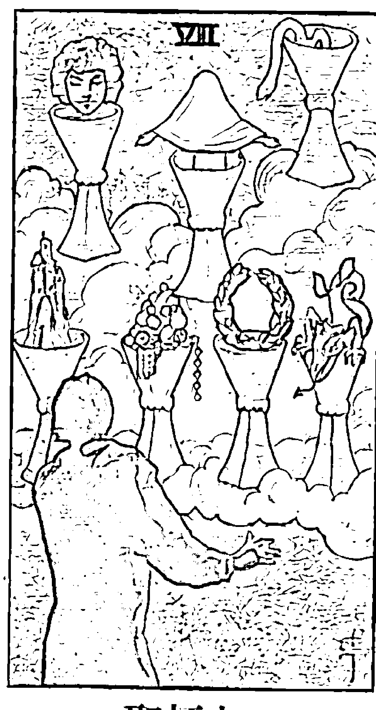

## 聖杯八（八）

+ * 更深的意義
* 離開，向前走
+ * 疲乏

##### 行為表現
+ * 尋找更深的意義
專注於個人的真理
脫離俗世的競逐
尋求解答
專注於重要的事
展開發現之旅
找出事實
投注更多時間在性靈上

+ 展開一場不知為期多長的旅程
釋放，放手
結束並離開

+ * 變得疲乏
精疲力竭，疲於奔命
勉力度日
感到疲倦而無精打采
缺乏能量
失去希望
被憂慮壓垮
失去熱情

+ * 離開，向前走
了解目前的循環已結束
放棄某個無望的情境
讓自己解脫而出

##### 意義相對的牌（一些可能）
+ 力量——忍耐，力量
太陽——活力，高昂的能量
權杖九——堅持，堅忍

##### 意義加強的牌（一些可能）
+ 隱士——尋找更深的意義
死神——向前行，離開
+ - 權杖三——展開旅程，邁進新領域
- 權杖八——終結，結束一個篇章
- 寶劍六——向前，展開旅程

##### 牌意解析
一位心理學家友人曾告訴我，當一個團體快解散時，其成員會先釋放出微妙的訊號。他們會顯現出某種焦躁不安，會在聚會時遲到，溝通比較少，而且似乎心不在焉。在某種層面上，這些參與者知道拆夥的時候快到了，但他們需要一段時間醞釀那最後的一步。

這種過程在許多即將結束的情境中都會發生。生命中沒有什麼是恆久不變的，或遲或早，每件事物都將悄悄溜走……或者我們會從它溜開。「聖杯八」正代表著「我們徹底了解過去已經成為過去」的時刻。過去真實的，現在已不再真實，改變的徵象寫在我們的臉上，我們必須接受它。向前走的時候到了。

向前走可以意味實質上的改變，像是離開一份工作、場所，或是關係。它也可能意味內在的變化——釋放舊有的模式，尤其是那些曾經牽制我們思想和情緒的。在「聖杯八」牌上，我們看見一個人踏上旅途，他把舊日的情感（杯子／河水）拋在腦後，步上新的道路。有時向前行也可能意味著尋找更深的真相或現實。有一天我們醒來，會發現自己一直沉睡在生活中——活在一場不再令人滿足的夢境裡。

有些改變會讓人疲憊。結束並不總是那麼簡單，準備離開的訊號之一便是「缺乏能量」。當你感到疲倦洩氣，你就知道有些事情已經不對勁，該是變更方向的時候了。重新檢視你的生活和（對事物的）取捨順序，你將發現自己生活中需要重新出發的地方。

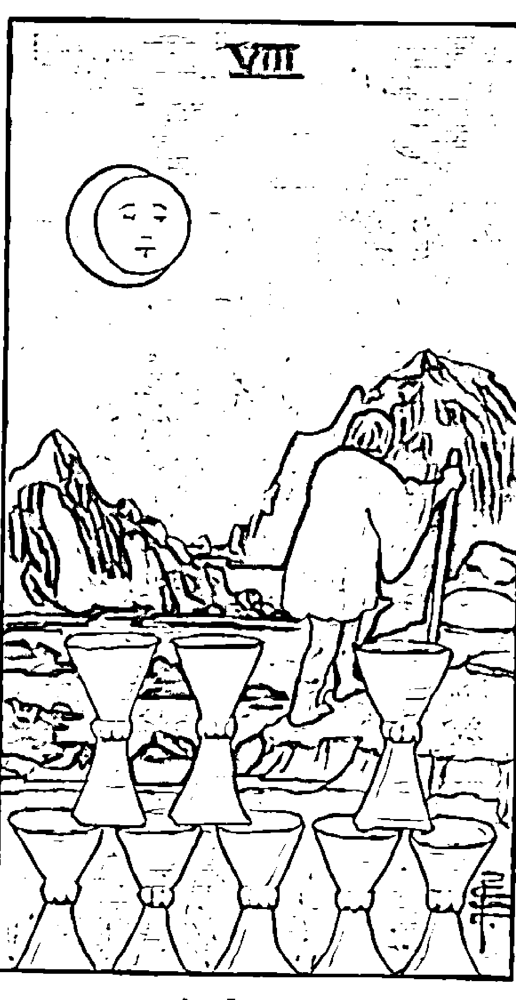

## 聖杯九（九）

+ · 願望實現
· 滿足
+ · 感官的享樂

##### 行為表現
+ · 願望實現
成就你所渴求的
達成你的目標
得到你認為你想要的東西
夢想成真
感到一切順心如意
知足滿意

+ · 享受感官的樂趣
體驗奢華
品嚐美味佳餚
欣賞藝術品
做愛
放鬆
體驗美感
享受身體的運用

+ · 感到滿足
沉浸於些許沾沾自喜中
享受現況
洋洋自得
得到你所希望的結果

##### 意義相對的牌（一些可能）
+ 隱土——不太注重感官
聖杯五——懊惱，悔恨

##### 意義加強的牌（一些可能）
+ 皇后——享受感官
戀人——性愛的快樂
世界——成就你所渴望的
權杖六——自傲，成就你所想要的

## 聖杯七——感官的放縱

##### 牌意解析
「聖杯九」上這個人讓我想起「吃掉金絲雀的貓」。因為，金絲雀是種寵物，絕對不是飢餓的貓兒可以染指的。任何有辦法抓到金絲雀的貓兒都會對此感到沾沾自喜。這就是「聖杯九」的感覺——純粹的耽溺和自滿。

在肉體層面，「聖杯九」代表一切感官的享樂。聲，色，味道，感覺。這張牌鼓勵你追求享樂，在各個方面享受你的身體。你也可以跟自然的世界——「大地母親」的身體——融而為一。她同樣樂於分享她的豐饒。

在個人的層面上，「聖杯九」表示對於現況的滿足。注意圖中這個人是如何自信地坐著，雙手交抱胸前，臉上掛著微笑。他有了一切想要的一切，而且再滿意不過了。「瞧瞧我這些杯子！」他像是在說：「它們是不是很棒？」

有時候，放鬆歇息並且陶醉於「世上一切都盡如人意」的認知中是很美妙的，但是我要告誡你：你也許會受到誘惑，犧牲他人去縱溺自己的享樂（就像我們那隻調皮的貓兒！）。當時你也許會覺得很棒，但是或遲或早，你嘴邊的羽毛會被人發現，懊悔也就隨之而來。不顧後果地追求享樂，長遠而言是絕對無法帶來滿足的。

在許多塔羅傳統中，「聖杯九」被稱為「願望牌」（Wish Card）。它顯示你的願望將會實現。這是個很棒的預期，但請記得童話故事的教訓：你必須確定你知道自己到底要什麼，並接受伴隨願望而來的責任。如果是這樣，就好好享受你的好運氣吧！

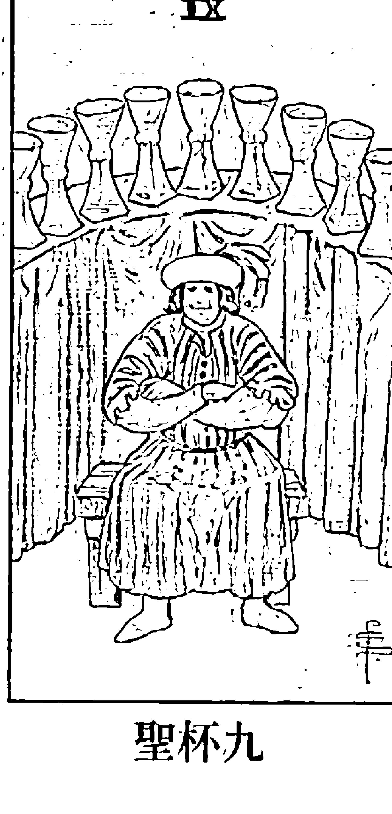

## 聖杯十（十）

+ - 喜悅
- 平安
- 家庭

##### 行為表現
+ - 感到喜悅
擁抱快樂
擁有幸福感
散發愛
因好運而欣喜
珍惜你的福氣
表達喜樂
- 享受平安
體驗寧靜祥和
化解敵意
恢復和睦
- 降低緊張和壓力
感到自在與滿足
要求談和
放鬆
- 重視家庭
為家庭的和諧而努力
進行家庭事務
重申家庭承諾
支援需要幫助的親屬
與家庭成員連結
原諒家族中的某個人

##### 意義相對的牌（一些可能）
+ 惡魔——缺乏喜悅或平安
塔——劇變，混亂
寶劍三——心碎，孤寂
寶劍九——痛苦，憂傷，絕望
寶劍十——跌落谷底，受害者心態

##### 意義加強的牌（一些可能）
+ 戀人——家庭關係，結合
+ 星星——喜悦，正面的感覺，賜福
世界——快樂，情緒的滿足
聖杯六——感到受祝福，快樂，喜悅

##### 牌意解析
在「聖杯十」牌上，我們看見一對深情的夫妻，以及他們無憂無慮的孩子。背景是他們的家，被綠樹和流水所圍繞。一道由聖杯構成的彩虹高掛天空，祝福著這幅景象。憤世嫉俗的人可能會嘲笑這浪漫的畫面，但我認為它是我們情感生活最佳狀態的象徵。這幅圖畫所代表的情感，是我們每個人都可能企及的理想。

首先，這裡頭有喜悅。喜悅超越了快樂、滿足，以及享受，它是我們在最深的層面知道自己與萬事萬物合而為一時會萌生的美好感覺。可惜的是，這種感覺並不常有！我們太常因生活的試煉而盲目，被生活中的種種挑戰所淹沒。儘管如此，喜悅的確存在，而且是我們與生俱來的權利。

「聖杯十」的另一個面向是「平安」——那種當所有元素都處於和諧狀態時的寧靜安詳。平安有內在的和外在的，兩者是彼此的鏡子。當你與自己和諧相處，就會在外在環境中體驗到和諧。當你看見「聖杯十」，就知道結束敵對是可能的。如果你身邊有某種爭鬥，它可能會止息；如果你正在跟自己搏鬥，你也許能找到平靜。

在占牌時，這張牌往往預告一段極為幸福的時光。它告訴你，你將能獲得你應得的滿足。尋找創造喜悅與寧靜的方法。你也許會在家庭中找到開啟快樂的鑰匙。你的家庭是你情感上依附的一群人——不論是好是壞！若你的家庭有了麻煩，努力去恢復和諧。現在該是讓家人更加親密的時候了。

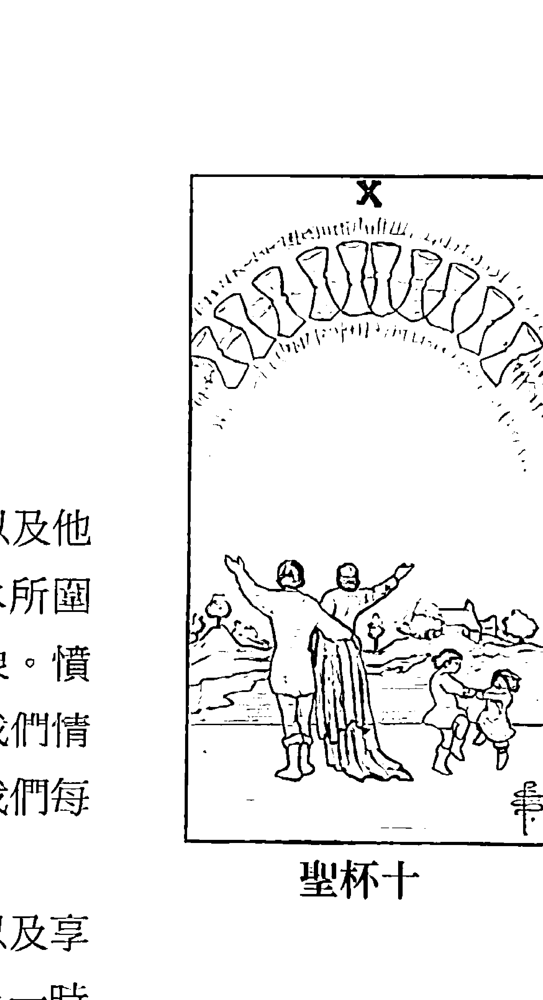

## 聖杯侍衛

##### 特質
+ - 感性的
- 直覺的
- 親密的
- 充滿愛意的

##### 行為表現
+ ### 感性的
  - 被感動或觸動
  - 讓你的情感展現出來
  - 對美起反應
  - 多情善感或羅曼蒂克
  - 卸下疏離的外衣
  - 讓你的心引路

+ ### 直覺的
  - 接受來自內心的指引
  - 依直覺行動
  - 記得你的夢想
  - 擁有超自然的經驗
  - 體驗直接的感知
  - 信賴你的直覺反應

+ ### 親密的
  - 開始或重新展開戀情
  - 遇見某個吸引你的人
  - 與某人更加親近
  - 超越拘謹的形式
  - 擁有特別的契合時刻
  - 鞏固一段友誼
  - 分享私密之事

+ ### 充滿愛意的
  - 做出體貼的舉動
  - 表達同情與了解
  - 原諒你自己
  - 寬恕曾經傷害你的人
  - 向你曾傷害的某人致歉
  - 伸出雙手與某人接近
  - 修補受損的關係
  - 令某人過得開心
  - 用關懷取代憤怒
  - 拒絕去批判或譴責

##### 成對的宮廷牌
「聖杯侍衛」可與任何其他宮廷牌形成牌對。比較這兩張牌的階級與牌組，來判斷這樣的對子可能代表什麼意義。

##### 牌意解析
「聖杯侍衛」是為你帶來愛的機會的邱比特。他帶來真正的機遇，讓你體驗浪漫、深刻的情感，以及內心的世界——也就是聖杯牌組的奇蹟。在占牌時，這位侍衛暗示一個時機或許正在展開，它將攪動你的情緒，挑動你的心弦，或是帶給你極大的喜悅。當你看見這樣的機會，只管去把握吧！

「聖杯侍衛」也可能代表一個小孩，或是心態年輕的成人。他與你的互動涉及了情緒的需求、喜怒的變化、愛、親密，或是靈性的事物。

有時「聖杯侍衛」暗示你所處的情境充滿了愛與情感的精神。在這樣的時刻，不妨以輕鬆放縱的心情，盡情表達並享受你的情感吧。

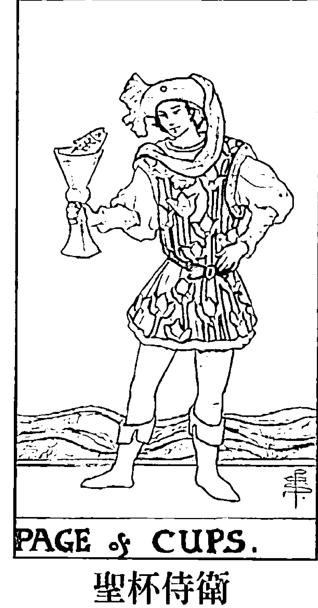

## 聖杯騎士

##### 特質
+ - 浪漫的／過度情緒化的
- 富想像力的／好幻想的
- 敏感的／喜怒無常的
+ - 優雅的／過度矯揉的
- 內省的／內向的

##### 行為表現
+ - 浪漫的／過度情緒化的
將情愛理想化／缺乏自制
重視感情／容易嫉妒
專注於生活的詩情／情感太過洋溢且戲劇化
記得特殊的時刻／感情起起伏伏
優美地表達情感／帶了鮮花，卻忘記給車子加油

- 富有想像力的／好幻想的
能接通無意識的沃土／沉溺於無益的白日夢
目光能超越表象／有宏大的想法卻毫無結果
從不走世俗的道路／行事不切實際
編織神奇的故事／想像力過於活躍
富想像力、夢幻的／可能蒙昧於真相

+ - 敏感的／喜怒無常的
能覺察情緒和感情／情緒容易起伏
幫助他人敞開心胸／有時候任性、愛鬧彆扭
對生命深刻回應／陷溺於憂鬱、沮喪
了解他人的痛苦／過度憂慮
圓滑而說話得體／容易感到被冒犯

- 優雅的／過度矯揉的
欣賞各種形式的美／將骯髒的工作留給別人
追尋最精緻的／無法面對不愉快的事物
創造令人愉快的環境／身體不夠強健
了解微妙之處／文勝於質
溫文而優雅／易被壓力擊倒
+ - 內省的／內向的
- 重視內在生活／過度專注於內心
- 試著了解原因／可能會避免積極的參與
- 看見表面之下的事物／與人共處時無法放鬆
- 探究動機／強迫性地自我檢驗
- 尋求自我改善／誇大個人的缺點

##### 成對的宮廷牌
「聖杯騎士」可與任何其他宮廷牌形成牌對。比較這兩張牌的階級與牌組，來判斷這樣的對子可能代表什麼意義。

##### 牌意解析
就正面而言，「聖杯騎士」是個敏感的靈魂。他是詩人，熱愛所有浪漫精緻的事物；能以不可思議的方式運用想像力，且能感受最深層的情緒。他知道如何創造美，並與他人分享。就負面而言，他時常有奇想與幻覺，情緒變化像煽情劇般，時常會讓情緒左右一切。他太喜怒無常，且容易受到冒犯。他無法忍受不愉快的局面，總是讓別人去應付。

在占牌時，「聖杯騎士」顯示該情境涉及他這種敏感的風格，做為你、他人，或是整體氛圍的一個面向。你必須自問：「這位騎士的能量是有益的，或是有害的？」

倘若他的風格很明顯，那麼平衡是必要的。你的感情是適度的，或是過頭了些？你的白日夢是否不切實際？某人的情緒化是否讓你抓狂？你的家庭生活是受到情緒的宰制，還是依循理智？也許是改變的時候了。

若這騎士的能量付之闕如，一點詩意或許是需要的。你是否太過壓抑？表達你的感情吧。你總做出最實際的選擇？試著放縱一點吧。你是否逃避內省？花些時間思考一下生活吧。讓「聖杯騎士」引領你進入他充滿浪漫與美的世界！

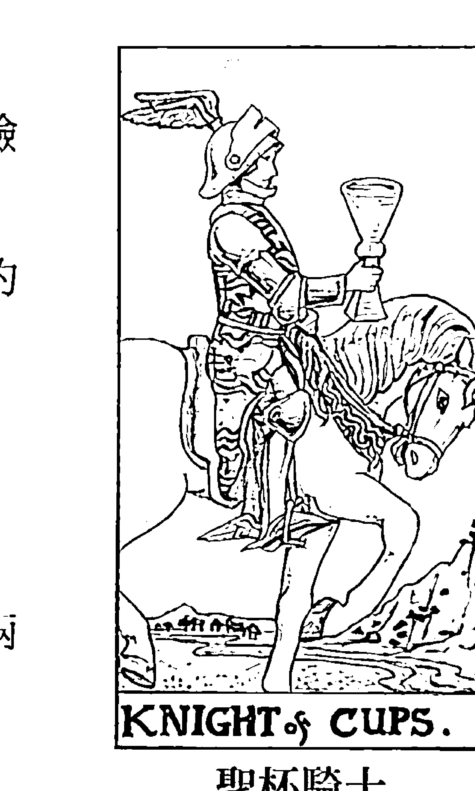

## 聖杯王后

##### 特質
+ - 充滿愛意的
- 心地柔軟的
- 有直覺力的
+ - 超自然、通靈的
- 心靈、精神的

##### 行為表現
+ - 充滿愛意的
  - 以關愛化解憤怒
  - 無條件地接受
  - 對他人的感覺很敏感
  - 驅散憤怒與仇恨
  - 有著無盡的耐心
- 心地柔軟的
  - 容易被他人的痛苦觸動
  - 以敏感和同情回應
  - 對所有生靈都仁慈和善
  - 無法拒絕需要幫助的人
  - 對別人的感覺感同身受
- 有直覺力的
  - 總是能接收情緒的暗流
  - 感受某種情境中的氛圍
+ - 被心靈所引導
  - 信賴內在的真偽判斷
  - 毋需詢問就能了解
- 超自然、通靈的
  - 對無意識開放
  - 具有良好的第六感
  - 與他人有心電感應
  - 擁有精細的覺察力
  - 是個天生的靈媒
- 心靈、精神的
  - 感到與神和宇宙合一
  - 對一切生命心懷崇敬
  - 在天人合一中找到喜悅
  - 了解生命更深層的意義
  - 將世界視為神聖的所在

##### 成對的宮廷牌
「聖杯王后」可與任何其他宮廷牌形成牌對。比較這兩張牌的階級與牌組，來判斷這樣的對子可能代表什麼意義。

##### 牌意解析
「聖杯王后」的性格綜合了聖杯牌組正面的水象能量與王后專注於內在的取向。由於「聖杯王后」具有甜美、慈愛，以及敏感的天性，對每個人都會訴說溫柔的話語，從不以惱怒或不耐來回應。她身上有種溫柔的氣質，讓人感到安心而平靜。「同情」是她的格言，而她的情感導引著她對世界的一切反應。對於所有事情，她都讓自己的心來領路。她能感覺到情緒的波流，毋需開口詢問就能知道別人的感受。她從不喜怒無常，卻非常了解情緒及其影響力。她信賴自身的直覺，因此對未知的事物以及來自內的知識較為開放。

「聖杯王后」常常被美的事物和生命的悲劇所感動，她的感受深刻，並且崇敬神所創造之一切層面。她的愛涵蓋並擁抱所有的人，以及萬物。

在占牌時，「聖杯王后」要求你依照她的方式去思考與感覺。例如，你是否能察覺情感的氛圍？是否充滿愛意？是否信賴自己的心？是否能接收直覺的訊息？在他人遭受痛苦時，你能否感同身受？

這張王后牌也可能代表一位與她相像的男性或女性，或是一種慈愛、接納並尊重情感的氛圍。在占卜時，她告訴你，此時此刻她的特殊能量對你具有某種意義。無論這張王后牌是以什麼樣的形式出現在你的生活中，讓自己從她身上得到激勵吧！

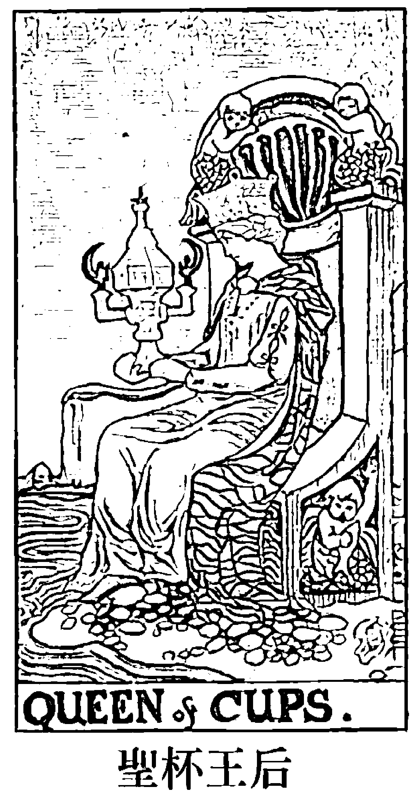

## 聖杯國王

##### 特質
+ - 睿智的
- 冷靜的
- 有外交手腕的
- 關懷的
- 寬容的

##### 行為表現
+ ### 睿智的
- 給予好的忠告
- 對人性有深刻的掌握
- 透過溫情的關注來教導
- 知道他人成長的需要
- 直接看見問題的核心
- 了解許多層面的經驗
- 藉由微妙的影響力達成目標
- 在正確的時候說正確的話

+ ### 冷靜的
- 保持沉著鎮定
- 擁有令人平靜的影響力
- 情緒平穩而安定
- 在危機中保持冷靜
- 似乎從來不會緊張焦慮

+ ### 具有外交手腕的
- 能夠平衡許多人的需求
- 讓每個人都愉快地合作
- 能夠化解緊張的局面

+ ### 關懷的
- 回應情緒的需求
- 是個天生的治療者
- 採取行動幫助困苦的人
- 對不幸的人感到同情
- 從事志願或慈善工作

+ ### 寬容的
- 擁有開放且寬大的心胸
- 接受他人的侷限
- 與各種人都能自在相處
- 給予他人自由
- 在艱困環境中保持耐心

##### 成對的宮廷牌
「聖杯國王」可與任何其他宮廷牌形成牌對。比較這兩張牌的階級與牌組，來判斷這樣的對子可能代表什麼意義。

##### 牌意解析
「聖杯國王」的性格綜合了聖杯牌組積極的水象能量與國王活躍外向的態度。他睿智而富同理心，對這個世界有著出自內心的深刻理解。他是位導師與領路者，用深情的關愛導引他的學生。他由衷地關心他人，並總是以同情回應他們的需求。他用溫柔的觸碰和平靜的話語治療創傷。在各種情況下，他始終保持沉著與悠閒，似乎直覺地知道在任何時刻需要的是什麼。人們向他尋求指點，因為他們知道他將會專注地傾聽。他身邊似乎總圍繞著某種寧靜平和，令他人有所感應。他對所有觀點都能容忍，在最艱困的情境中也保有耐心。他給予他人成長的自由，讓他們以自己的方式發展，而不求任何回報。

在占牌時，「聖杯國王」要求你采取他可能會采取的行動。例如：在危機時冷靜應對，運用外交手段而非蠻力，對人伸出援手，或是接受不同的觀點。

這張國王牌也可能代表一位擁有此種行事風格的男性或女性，或是一種關愛、寬容，以及理解的氛圍。在占卜時，他告訴你，此時此刻他的特殊能量對你具有某種意義。無論這張國王牌是以什麼樣的形式出現在你的生活中，讓自己從他身上得到激勵吧！

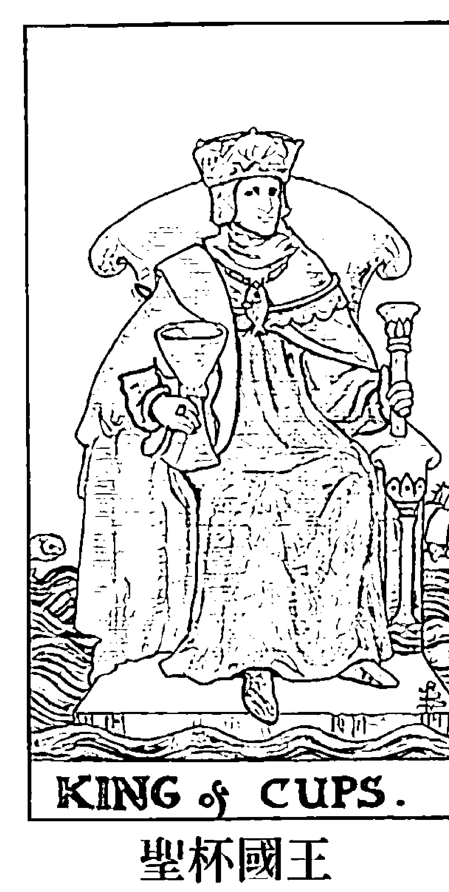## 寶劍王牌（Ace of Swords）

- 心智的力量
- 堅毅
- 正義
- 真理

##### 行為表現

- 運用心智的力量
- 保持客觀
- 想出方法
- 找出事實
- 分析局勢
- 運用思維能力
- 運用邏輯和理性
- 堅毅
- 克服橫逆
- 面對問題
- 解決某個狀況
- 找到致勝的力量
- 超越障礙
- 不因挫折而氣餒
- 追求正義
- 矯正錯誤
- 擁護一項目標
- 為所當為
- 確立真相
- 接受責任
- 爭取公平
- 依真理行事
- 排除疑慮
- 克服疑惑
- 看穿假象
- 有著清楚的了解
- 誠實無欺
- 發現實相

##### 成對的王牌

成對的王牌顯示某種新的精神正在進入你的生活。它汲取了「寶劍王牌」的能量——聰明、理性、公正、真實、清明、堅忍，再加上以下之一：

- 權杖王牌——創造力，興奮，冒險，勇氣，個人的力量
- 聖杯王牌——深刻的情感，親密，協調，同情，愛
- 錢幣王牌——繁盛，豐足，信賴，安全，穩固

##### 牌意解析

「寶劍王牌」象徵在智能、理性、公正、真實、清明、堅忍等領域的可能性。在占牌時，它顯示有一顆清明了解的種子已植入了你的生活，雖然你可能還沒辨識出來。當這顆種子發芽，它幾乎可能以任何形式呈現。它或許是一個吸引人的想法、追求真相的欲望、正義的召喚，或是誠實無欺的必要。在外在層面，它可能是一項提議、禮物、機會、遇合，或是同步的事件。

有時，這張王牌代表一項挑戰，它將會以某種方式測試你。生命從來不會平順太久，或遲或早，障礙就會出現，而「寶劍王牌」可能預告它的來臨。這張牌也提醒你，無論挑戰是什麼，你都要以勇氣、誠實和堅定的決心面對它。在每個挑戰中，都蘊藏著機會。

當你看見這張「寶劍王牌」，請檢視你的生活，看看它清淨明快的能量能如何為你所用。客觀地思考你的問題，找出不公或令人迷惑的狀況，下決心矯正它們。最重要的是，一定要堅持誠實和道德。這張牌告訴你，你確實擁有克服障礙並找出真相的能力。這就是「寶劍王牌」的承諾。

#### 寶劍二（Two of Swords）

- 受阻絕的情感
- 迴避
- 困境

##### 行為表現

- 阻絕情感
  - 否認真實的感覺
  - 遏止自然的反應
  - 與他人保持距離
  - 隱藏苦惱
  - 視而不見
  - 採取防衛
  - 保持冷淡
- 迴避事實
  - 拒絕看清事實
  - 假裝每件事都沒問題
  - 忽視警告的訊號
  - 對發生中的事閉上雙眼
  - 避免不愉快的事物
  - 選擇不要知道
- 陷入困境
  - 害怕採取行動
  - 遇到僵局
  - 被困住而無法動彈
  - 拒絕做決定
  - 不願攪擾現狀
  - 保持中立

##### 意義相對的牌（一些可能）

- 愚人——敞開，不受約束
- 命運之輪——前進，讓事情進行
- 正義——接受真相，接受責任
- 星星——正面情感的自然流露
- 權杖三——向前行，正視事實

##### 意義加強的牌（一些可能）

- 月亮——自欺，看不見事實
- 權杖九——防衛，封閉自己
- 寶劍七——逃離真相
- 錢幣四——僵局，封鎖

##### 牌意解析

在「寶劍二」上，我們看見一名年輕女子橫劍當胸，屏障著自己。她僵硬的姿態告訴我們，她正努力控制自己的感情。她要擋開外界的所有東西。她似乎在說：「什麼都別進來，什麼都別出去。」

「寶劍二」是關於我們在自己與他人之間、以及自我內心當中所創造的屏障。就內在而言，我們封鎖住自己的情感，拒絕感受它們。我們迴避正視真相，假裝一切都沒問題。我們想著這樣，卻又覺得那樣。在無數層面，我們把自己的各個部分分割開來，並試圖維持這狀況，即使我們知道必須去協調它們。

占牌時，「寶劍二」往往會在你不願接受關於自己或所處情境中的某些真相時出現。你真正的感受是什麼？你是否在抗拒溫柔的情感，只因為害怕受傷？你是否嘴角帶笑，心中卻憤怒不已？你拒絕看見的是什麼？注意這女子是朦著眼的，她不能看見真相，甚至無法承認有了麻煩。

最常見的屏障是一顆封閉的心。當我們在情感上將自己割離時，我們就割裂了讓我們的愛向前流動的管道。有時這樣做是必要的，但它總會伴隨著很大的代價。每次我們封閉自己的心，想要再次打開就更難了。

人與人之間的另一種屏障是僵持不下的局面。當兩造人馬各就各位——與對方隔絕開來——僵局就形成了。要打破僵局，「對手」們必須從各自的利劍後面走出來，聆聽彼此說話。「寶劍二」的功課是：屏障並非答案。如果我們想要找到和平與完整，就必須保持開放。

#### 寶劍三（Three of Swords）

- 心碎
- 寂寞
- 背叛

##### 行為表現

- 感到心碎
  - 令人心碎
  - 承受情感的痛苦
  - 內心受傷
  - 傷心失望
  - 接獲令人煩亂的消息
  - 感情受到傷害
  - 傷害他人的情感
  - 得不到安慰
- 感到寂寞
  - 分離，被拆散
  - 離家遠遊
  - 遭到摒棄或拒絕
  - 感到與所愛的人隔離
  - 在需要的時刻遭受離棄
  - 感到失落
- 遭遇背叛
  - 發現令人痛苦的真相
  - 發現自己信錯了人
  - 對人感到失望
  - 令他人失望
  - 被人在背後捅刀子
  - 反對某人
  - 違背承諾
  - 對抗

##### 意義相對的牌（一些可能）

- 戀人——親密，感到愛
- 聖杯二——伴侶關係，信賴
- 聖杯十——喜悅，愛，平安，和諧一體

##### 意義加強的牌（一些可能）

- 聖杯五——分離，失去愛，心痛
- 寶劍九——苦惱，心碎
- 錢幣五——拒絕，分離，缺乏支持

##### 牌意解析

某天你推開門，發現愛人躺在別人懷中；你無意中聽見你最好的朋友在背後嘲笑你；你發現你的事業夥伴欺騙了你好幾年。突然之間你的世界天旋地轉，你震驚萬分，不敢相信，最後是感到心碎。

「寶劍三」牌上的圖像清楚地描繪這種突如其來的心痛。你真真實實地覺得像是有人拿了把刀子捅進你的心窩。即使像一句粗率的評語這樣的小事，都可能讓你有這種感覺。注意整個畫面只包含了一顆心和三把劍，當你的心破碎時，你覺得整個人就只剩下這個——一個裂開的傷口。

占牌時，「寶劍三」往往代表生命中有時會擲給你的險惡變化球。背叛、拋棄、拒絕、分離，還有命運的逆轉。這些傷痛之所以難以忍受，是因為它們是在你最沒有防備的時候擊中你。如果你抽到了這張牌，你或許知道它指的是什麼，但如果你不知道，「寶劍三」便是個寶貴的警告。你的生活可能有些事情出差錯了，但是你尚未察覺，或是不願承認。當我們看著別的方向時，變化球就會擊中我們。仔細檢視你所處的情境，與你生命中重要的人交談。不要把任何事情視為當然，聆聽你內在的聲音，它將幫助你找到問題。

也有可能是你在盤算要傷害別人。看見這張牌，記住我們每個人都能做出殘酷的事是很重要的。我們都是凡人，都會犯錯，有時還是嚴重的錯。到最後，我們所能做的就只有信賴生命的良善，並試著朝此理想邁進。當你犯錯時，原諒你自己，並也試著原諒別人。但是，更好的是，在麻煩來臨前就先將它攔截下來。

#### 寶劍四（Four of Swords）

- 休息
- 沉思
- 安靜的準備

##### 行為表現

- 休息
  - 暫停
  - 給身體時間去療癒
  - 避免過度操勞
  - 尋找平安與寧靜
  - 放鬆身體和心靈
  - 輕鬆面對生活
- 從現況中抽離出來
  - 檢視你的動機
  - 評估你的處境
- 安靜的準備
  - 統合內在的資源
  - 確定你的基礎是穩固的
  - 對未來做好準備
  - 與現況達成和解
  - 綁好鬆脫的線頭
  - 穩定下來
- 沉思
  - 獲得更佳的觀點
  - 聆聽內在的聲音
  - 花時間獨處思考

##### 意義相對的牌（一些可能）

- 魔法師——活躍，聚焦於外在
- 命運之輪——快速的步伐，許許多多的動作
- 權杖八——採取行動，急進
- 權杖十——過度操勞，承擔太多
- 錢幣二——享受樂趣，在許多活動中取得平衡

##### 意義加強的牌（一些可能）

- 女祭司——安靜地休息，冥思
- 隱士——沉思冥想，保持安靜
- 吊人——休息，暫停活動
- 聖杯四——冥思，花時間獨處
- 寶劍六——休息，恢復
- 錢幣七——停下來思考，評估

##### 牌意解析

寶劍牌全都代表某種考驗，但「寶劍四」卻帶來平和與靜止的感覺。為什麼這張牌不一樣呢？因為它代表的是「安靜下來」的挑戰！有時候，休息和無為是最終極的挑戰。「活動」可以是一種很難打破的習慣，總是有那麼多事要做，而現代社會又以許多吸引人和令人分心的事物誘騙著我們。結果是，我們忘記要停下來、安靜不動。

占牌時，「寶劍四」往往是個信號，要你放慢腳步，稍事休息。如果你正在從病中恢復，給自己一些安靜的時間去療癒。即使你覺得自己完全健康，如果不稍事休息，便是在冒著罹病的風險。

「寶劍四」也代表不慌不忙地花些時間把事情想清楚。退後一步以獲得更佳觀點是很重要的。你面對考驗或重大事件時尤其如此。你需要安靜準備的時間，以積累氣力、集中能量。想像一位奧運跳水選手站在高台上，她不會爬上階梯然後就匆匆往下跳。她會先停下來，靜止不動，讓自己做好奮力一躍的準備。這是我們做出最佳表現的唯一法門。

有時候「寶劍四」是在暗示你正在或可能會把焦點從外在轉移到內在。當我們安靜時，要走入內心會比較容易。圖中的騎士看來像是在祈禱，或是在沉思。事實上，他看起來像是死了！對那些對活動上癮的人而言，休息和安靜可能就像死亡一般，但事實當然並非如此。寂靜自有其報償，但我們必須認出這些報償，並且去尋求它。

#### 寶劍五（Five of Swords）

- 自利
- 不和
- 公開的不名譽

##### 行為表現

- 以自利為出發點
  - 把他人的利害擺在一邊
  - 設法得到自己的利益
  - 只想到自己的需求
  - 知道須專注在自己身上
  - 遭遇自私的行徑
  - 耽溺於權力遊戲
  - 幸災樂禍
  - 追求你輸我贏的結果
- 選擇開戰
  - 懷有人我對立的心態
  - 認出惡意
  - 經歷衝突
  - 見證公開的恥辱
  - 失去了道德的準則
  - 放任目的的合理化手段
  - 犧牲正直
  - 看不清是非曲直
  - 獲致可疑的勝利
  - 知悉犯罪活動
- 經歷不和
  - 處於有敵意的環境
  - 感到人們彼此抵制

##### 意義相對的牌（一些可能）

- 皇帝——遵循規則，遵守律法
- 正義——正直誠實，為所當為
- 節制——與人合作，和諧，協力
- 聖杯六——天真，善意，親切

##### 意義加強的牌（一些可能）

- 權杖五——不和，人們彼此衝突
- 權杖七——「人我對立」的心態，衝突
- 寶劍七——不名譽，與他人隔離

##### 牌意解析

「寶劍五」是一張關於「自利」的牌。社會告訴我們要為他人設想，但我們卻會抗拒。我們怎能忽略自身的利害而仍能生存呢？這種困境來自於我們對「自我」的定義。如果我們將「自我」看成自身的人格與身體，我們的利益就變成那些與這個「自我」相關的東西。

我們也許會把關心的範圍擴及所愛的人，但是，我們怎能止於此處？長遠而言，我們跟每個人彼此連結。事實上，我們的「自我」就是這個世界。我們對這個世界做了什麼，就是作為在自己身上。這種理解相當的基本，但卻令人惱怒的容易日復一日地遺忘。

在占牌時，「寶劍五」可能意味你或另外某個人忘了這種「大我」的觀點。你把自身的利益界定得太過狹窄了。如果你試圖在孤立中前進，你的行為遲早會回過頭來糾纏你，不管是用何種方式。

有些時候，這張牌暗示你必須把自己的利益放在前面。如果你遭到剝削或利用，就必須掙脫開來。如果你被眾多要求搞得心力交瘁，就得照顧自己。輪到你出頭時，就站上前來，要求你所應得的。只是要留意，如果你在過程中傷害到他人，你的勝利將會有所缺憾。

「寶劍五」有時也代表敵意——小自言詞齟齬，大至戰爭。連結我們的繫帶斷裂時，我們就經歷到「失和」。這張牌也可能意指相當公開的不名譽。作弊、謊言、詭計、欺騙，甚至犯罪。你可能是接受的一方，也可能是作惡者。不管是哪種情況，記得抱持「大我」的觀點，找出對每個人——包括你自己——都最好的解決之道。

#### 寶劍六（Six of Swords）

- 憂鬱
- 復原
- 旅行

##### 行為表現

| 左列 | 右列 |
|------|------|
| • 感到憂鬱 體驗輕度的悲傷 勉強過得去 勉力度日 感覺有點沮喪 心情不太壞也不太好 感到百無聊賴 只是混日子 | • 開始調適 開始回復健康 邁向更光明的地方 重新燃起希望 |
| • 復原 處理創傷的後遺症 度過艱困時刻 收拾殘局，重新振作 | • 旅行 改變位置 從一地遷往另一地 展開旅程 體驗場景的改變 離開家園 上路旅行 進入一種新的心境 |

##### 意義相對的牌（一些可能）

- 力量——滿懷勇氣，不可撼動的决心
- 太陽——活力，熱忱
- 權杖四——興奮，慶祝
- 聖杯三——歡欣鼓舞，生氣蓬勃
- 錢幣二——樂趣

##### 意義加強的牌（一些可能）

- 權杖十——得過且過，勉力度日
- 聖杯四——感到無精打采，沮喪，漠不關心
- 聖杯五——悲傷
- 聖杯八——前進，展開旅程
- 寶劍四——休息，恢復
- 寶劍九——沮喪，悲哀

##### 牌意解析

小說《天路歷程》中，主人翁「基督徒」（他也在進行一場愚人的旅程）陷入「絕望沼澤」。他掙扎了好一會兒，終於被「幫助」拖了出來。「幫助」告訴他：「……許多恐懼、疑惑，以及令人喪志的憂慮……都沈積在這個地方」(註)。

對「寶劍六」而言，「絕望沼澤」是個適切的名字。有時候這張牌代表一種遲鈍而百無聊賴的狀態，沒有多大的不對勁，但也不是真的很好。在圖片中，船上的人物顯得悲傷而疏離。在我們沮喪憂鬱時，人生實在不怎麼有趣。

從較正面的角度看，「寶劍六」可以暗示復原，特別是當你剛經歷一段艱困時光或心理衝擊時。在危機中，你會感到麻木而與世隔絕，什麼都無關緊要了。現在你將開始復原，慢慢重拾起生活。船中的旅人至少是在往前行，他們正航向新的地方，即使他們尚未準備好熱情地擁抱那片海岸。

事實上，「寶劍六」可以代表任何種類的旅程或移動。它可以意味真實的場景變換、位置改變或旅行，但並非必定如此。當我們從一種心境轉換到另一種心境，「旅程」也可以發生在內在的層面上。雖然「寶劍六」並不允諾巨大的喜悅，但它也避開了絕望的深淵。「沼澤」並非無底深坑，只是一種空洞或落陷。當你看見這張牌，要知道儘管情況並不理想，但你正朝著更光明的地方行進。

> 〔註〕約翰·班揚（John Bunyan），《天路歷程》（The Pilgrim’s Progress）。摘自《諾頓英國文學選集：第一冊，第三版》（The Norton Anthology of English Literature: vol. 1, 3rd ed.）。 (New York: W. W. Norton, 1974)。 p. 1780。

#### 寶劍七 (Seven of Swords)

- 逃跑，開溜
- 隱藏的不名譽
- 獨行俠的風格

##### 行為表現

- 逃跑
  - 逃避責任
  - 開溜、離開
  - 規避義務
  - 害怕面對現實
  - 採取簡便的脫身之道
  - 逃避真相
  - 因循拖延
- 做個獨行俠
  - 覺得你不需要任何人
  - 想要獨立
  - 決定不伸出援手
  - 不讓別人知道某事
  - 寧可孤獨
  - 保持疏離
  - 想要獨自行動
  - 與他人保持距離
- 隱藏的不名譽
  - 欺騙或被欺騙
  - 隱匿行藏
  - 在幕後操弄
  - 表裡不一
  - 讓他人受到指責
  - 暗地操控
  - 規避可恥的秘密
  - 說謊或偷盜

##### 意義相對的牌（一些可能）

- 教皇——在群體中工作
- 正義——接受責任，公正無欺
- 權杖十——接受義務，負責任的
- 聖杯六——純真，親切，開放，高貴

##### 意義加強的牌（一些可能）

- 隱士——單獨，離群索居
- 寶劍二——逃避真相
- 寶劍五——不名譽，與他人隔離
- 錢幣九——依賴自己，獨力運作

##### 牌意解析

「寶劍七」與「寶劍五」都跟與他人隔離有關。在「寶劍七」上，一名男子躡手躡腳地從社會中溜走，他手中抱著幾把寶劍，看來像是對自己成功的劫掠很得意似的。他給人的印象像是懷有某種獨自進行的秘密計劃。

這張牌有時代表「獨行俠」風格——想單獨行事、自由自在的欲望。電影中，獨行俠型的主角總是獨來獨往，只依靠自己的機智和應變能力發掘、調查，並解決每個問題。他相信他所以成功，是因為排除了普通人笨拙努力的干擾。

占牌時，「寶劍七」可以是種訊號，顯示你或另外某個人想當獨行客。你覺得，如果只靠自己，你會更加自在且更有效率。當你想避開沒有效率的團體或伸張你的獨立性時，這種做法是有用的，但它也可能帶來麻煩。若是對他人完全沒有付託，我們是不可能長久快樂並有生產力的。如果你想獨自行動，得先確定這種獨立真的對你助益。

有時「寶劍七」意指你正逃避某事物——承諾、責任、辛苦的工作、愛。你也許正在因循拖延，放任問題惡化，因為你不想處理。有時候你就是得面對必須面對的。當你可能因逃跑而讓事情變得更糟時，「寶劍七」會讓你知道。

「寶劍七」也可能意味隱藏的不名譽——你或其他人所做的不符最高公義的某種選擇。人都會犯自己想隱匿的錯誤，當它發生時你內在的聲音會告訴你。看見「寶劍七」時，好好檢視作為，因為隱藏的恥辱將侵蝕你的快樂和自尊。

#### 寶劍八（Eight of Swords）

- 限制
- 迷惑
- 無力感

##### 行為表現

- 感到受限制
  - 被障礙所圍困
  - 待在一個受限的情境中
  - 感到為環境所困
  - 選擇很少
  - 對自由視而不見
  - 感到受迫害
- 感到迷惑
  - 不確定要轉往哪個方向
  - 感到迷失
  - 缺乏方向
- 感到不知所措
  - 艱困地掙扎
  - 需要指引與澄清
  - 不知道發生什麼事
- 感到無力
  - 等待外援
  - 懷疑做任何事都沒用
  - 規避責任
  - 尋找救星
  - 感到受迫害
  - 接受無為的狀態

##### 意義相對的牌（一些可能）

- 魔法師——感到有力量，明瞭情勢
- 戰車——自信，專注
- 權杖二——力量，勇敢
- 權杖四——自由，缺乏限制
- 錢幣三——勝任，知道做法，計劃

##### 意義加強的牌（一些可能）

- 惡魔——混亂，限制## 月亮——混乱，欠缺明晰

## 宝剑十——受害者心态，无力感

##### 牌意解析

「宝剑八」上的女子既孤独又失落。她看不见，因为她被蒙住了双眼；她无法伸手，因为她被绑了起来；她不能自由移动，因为她被关在利剑筑成的牢笼里；她似乎远离了家园——那远处山上的安全所在。她要怎么样才能回去？她甚至不知道要往哪边走。「宝剑八」代表那些你感到迷失、混乱和无力的时刻。救援与解脱似乎都遥不可及。

有时我们觉得受到环境的限制。某天醒来，我们发现自己身处无法忍受的情境中。没有前途的工作，糟糕的关系，堆积如山的债务。这些是怎么发生的？我们也不知道。即使是小问题也可以让我们感觉身陷泥淖，似乎就是没有出路。有时生活好像还不错——表面看来。「我有了想要的一切，我应该很快乐，那么问题出在哪儿呢？」我们就是不知道。我们既迷惑又慌乱。

占牌时，「宝剑八」往往暗示你正在走向（或是已经处于）一种让你觉得缺乏自由或选择的情境。这种情况十分棘手，因为你越是陷入其中，就越是感到被束缚。每踏一步，你的选择似乎就变得更窄，直到你完全动弹不得。

当你看见这张牌，记得你还是可以选择，你仍然有力量。无论感到多么受限，你还是可以找到出路，只要你相信这是可能的。图中的年轻女孩可以释放自己。她可以扭脱绳索，拉掉眼罩，踢倒那些利剑。解决之道不是总那么容易，但它们的确存在。找回你清明的思路和清楚的目标（宝剑的理想），运用它们踏出回家的第一步。

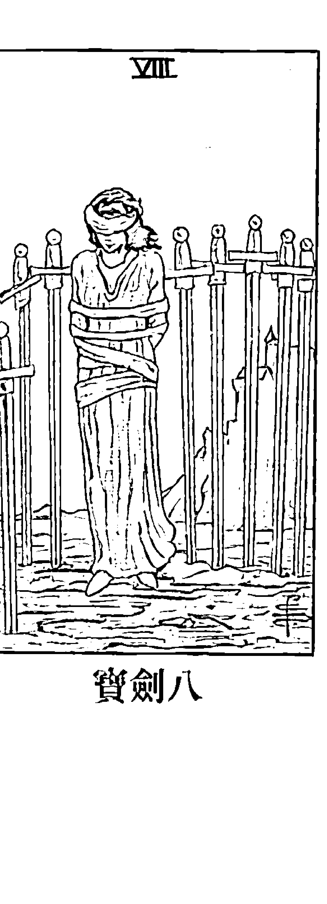

#### 宝剑九（Nine of Swords）

-   忧虑
- 罪恶感
- 苦恼

##### 行为表现

-   忧虑
  怀疑一切是否会顺利
  忧闷地沉思
  用烦恼折磨自己
  不断担忧某件事情
  感到焦虑而紧张
  烦扰激动
- 怀有罪恶感
  懊恼某次过错
  拒绝原谅自己
  想要倒转时光
  专注在你的「罪过」上

-   对自己严酷
  否认自己已尽力而为
  被懊悔淹没
- 感到苦恼
  绝望
  觉得自己已达到极限
  辗转难眠
  感到沮丧
  经历灵魂的暗夜
  忘记欢乐
  想要哭泣

##### 意义相对的牌（一些可能）

-   星星——安详，心灵的平静
- 审判——无疚，赦免
- 圣杯三——在世界的顶端，顺随波流
- 圣杯六——无辜，天真
- 圣杯十——欢乐，平安，欣喜

##### 意义加强的牌（一些可能）

-   恶魔——绝望，欠缺欢乐
- 权杖十——担忧
- 宝剑三——苦恼，心碎
- 宝剑六——沮丧，悲伤

##### 牌意解析

「宝剑九」上的人物是坐在床上，这很有意思，因为在夜晚，我们的悲伤和懊恼会最强烈地袭上心头。安静的黑夜会剥去白昼的喧嚣，留下我们独自一人与我们的思想共处。谁没有过凌晨躺在床上、心中满怀挥之不去的忧虑的经验？「宝剑九」代表的就是这种痛苦，它会在任何时刻袭来。

不像「宝剑三」似乎是来自外界的痛苦，「宝剑九」代表的是发自内心的苦恼。那是当我们被恐惧与疑惑淹没时，自己逼自己承受的折磨。其中最普遍的，或许就是忧虑了。我做得足够了吗？每件事情是不是都会顺利呢？我该做些什么？这些念头转呀转的——始终萦绕不去。

罪恶感是另一种痛苦来源。当我们做了某些自觉错误或伤人的事——或是未去做某些该做的事——那苦恼可以是非常真实的。若我们怎么样都无法释怀那难受的感觉或将它赶开，那就更令人难受了。最后，就只剩下纯然的痛苦。有时生命的痛苦是如此全面，我们唯一想做的就是掩面痛哭。

「宝剑九」虽不是最令人愉快的牌，但它也不总是代表重大的苦恼。它往往只是个信号，指出某种不快或麻烦的元素——你生命中的一个罩门。这张牌常常是来自你「内在指引」的警告，暗示你正在走的或许不是条容易的路。若你用这种心态看待「宝剑九」——视之为一种警告标志——你将能建设性地运用它。仔细检验处境，确定你在做最好的选择。即使是一个小小的改变，都能带来大大的不同。

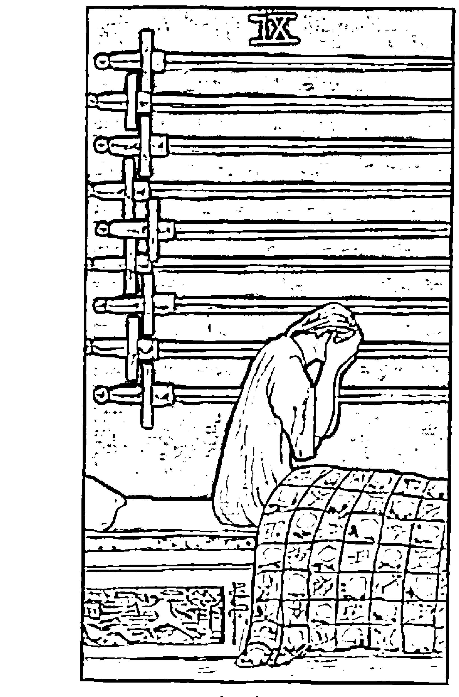

#### 宝剑十（Ten of Swords）

-   谷底翻升
* 受害者心态

-   殉难

##### 行为表现

-   谷底翻升
事情没有坏下去的余地
明白黎明前是最黑暗的
处于最低点
觉得事情不可能更糟了
准备向上翻扬
到达坑底
* 觉得像是受害者
悲叹你的命运
感到无力
觉得生命很不友善

-   遭到攻击
纳闷「为什么是我？」
感到自怜
身为被动接受的一方
* 成为殉难者
将自己的利益摆在最后
自我贬抑
感到任人践踏
宁居后座，抑己从人
让他人优先
牺牲

##### 意义相对的牌（一些可能）

-   战车——自我伸张，力量，胜利
* 权杖二——力量，自信
* 权杖六——自我提升，处于世界的顶端
* 圣杯九——满足，对现状感到快乐

##### 意义加强的牌（一些可能）

-   吊人——牺牲，殉难
* 宝剑八——受害者心态，无力感

##### 牌意解析

「宝剑十」看来像是张暗示可怕不幸的牌，但令人诧异的是，它所代表的麻烦往往带点闹剧意味，而非真正的灾难。牌上这个人背上插了好多剑，一把不就够了吗？十把是不是有点过头？也许这位男子所受的苦难——虽然真实——是有点儿夸张了。

「宝剑十」的涵义之一是跌落谷底。当灾难接踵而至，我们先是觉得心力交瘁，但最后我们会挥起双手，笑了起来。这太糟糕了，简直到了滑稽的程度！看见「宝剑十」，你就可以期待事情自此好转。

这张牌也可能指出你怀有受害者心态。你确信这整个世界挑上了你，要让你日子不好过。我想像图中这人抬起头来，说道：「你觉得你很倒楣……割破了手指头。我的背上有十把剑耶……你数数——十把耶！」然后他叹了口气，脑袋垂落回去。当我们怀抱受害者心态时，我们觉得每件事情都很糟糕、无望，而且不公平得离谱。

充当殉难者也是「宝剑十」最爱的活动之一。在这种时候，图上这人会虚弱地挥挥手，说道：「不……你们走吧，好好去玩，不用管我。我会待在这儿，跟我背上这些剑一起……但是我要你们过得快活。」在这种意义下，当殉难者不同于义无反顾地为他人牺牲。上述两种情况「宝剑十」都可能涵括，但毫无牵系地行善助人，却是更能令人满足的。

我并非企图把不幸轻轻带过，毕竟世上有许多真实的悲剧。有时「宝剑十」意指一个悲哀事件，若是这情况，你会知道的，你心中将没有半点嘻笑。但多半的时候，「宝剑十」有其轻松的一面，彷佛你的「内在指引」正轻轻取笑你怎么处理个人的悲伤故事。当你看见「宝剑十」，检视你的态度，并明瞭你已经来到一个点上，事情自此必将否极泰来。

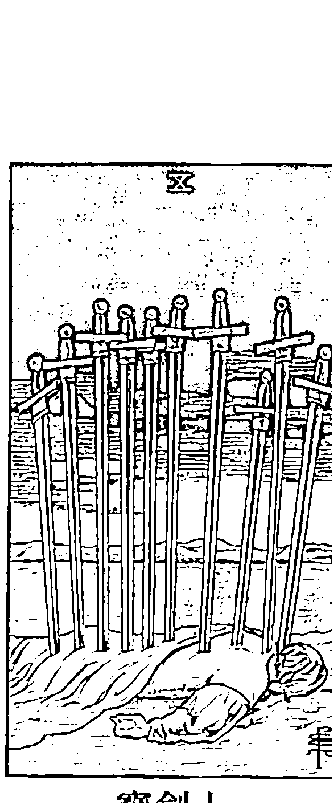

宝剑十

#### 宝剑侍卫（Page of Swords）

-   运用心智
* 坚忍刚毅

-   公平公正
* 诚信无欺

##### 行为表现

-   运用心智
  分析问题
  逻辑与理性
  重新检验信念
  发展想法或计划
  研究或探讨事实
  学习或教学
  周详考虑每一件事

-   诚信无欺
  诚实行事
  面对事实
  停止欺骗
  厘清任何混淆之处
  揭露隐藏的事物
  直言无讳

-   坚忍刚毅
  直接面对问题
  拒绝受到打击而气馁
  用新生的能量迎战横逆
  保持坚定的决心
  摆脱沮丧
  保持昂扬的意志
  不断尝试

-   公平公正
  矫正错误
  行事合乎道德
  平等对待他人
  拥护一项目标
  尽力做到公平
  做自己知道是对的事
  接受责任
  承认其他的观点

##### 成对的宫廷牌

宝剑侍卫可以与任何其他宫廷牌形成牌对。比较这两张牌的阶级与牌组，来判断这样的对子可能代表什么意义。

##### 牌意解析

宝剑侍卫是为你带来挑战的使者。他暗示将有一个成长的机会，可能伪装成问题或困境出现。你可能并不喜欢这些挑战，事实上，你也想要说：「谢谢……不过，谢了。」

宝剑侍卫要求你拥抱这些艰困的情境。将它们想成考验你毅力的试炼吧！如果你接受且克服了挑战，将会变得更坚强、更有韧性。遭遇这些挑战时，你应该善加运用宝剑牌组的工具——诚实、理智、正直和坚毅。

宝剑侍卫也可能代表一个小孩，或是心态年轻的成人。他与你的互动涉及了真诚、合乎伦理的行为、鼓励，或是关乎心智的事物。呼应宝剑牌组的挑战，这段关系可能会是困难或麻烦的。

有时宝剑侍卫暗示你所处的情境充满了学习、发现，以及各种心智活动的精神。在这样的时刻，请运用你的头脑，去享受智识的愉悦吧！

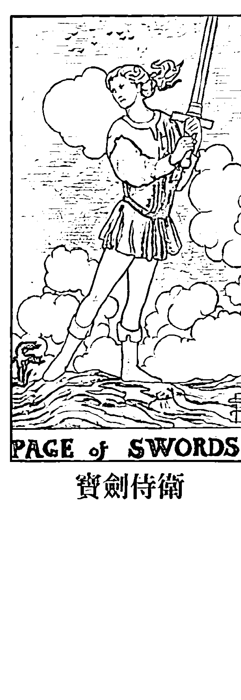

#### 宝剑骑士（Knight of Swords）

-   直率的／莽撞的
- 权威的／逞威风的
- 敏锐的／锐利的

-   知识渊博／固执己见
- 重逻辑／冷酷麻木

##### 行为表现

-   直率的／莽撞的
  直言无讳／粗率而不圆滑
  一针见血／态度唐突
  说话不经修饰／不顾虑他人的感受
  让他人知道自身处境／管不住自己的舌头
  给予诚实的回答／言行不够谨慎周到

-   敏锐的／锐利的
  拥有敏锐的心智／爱做尖刻的讥讽
  直指核心／不够敏感
  简洁地表达想法／有时太爱批评
  敏锐机警／带刺的机智
  善于辩论／嘲弄愚昧

-   权威的／逞威风的
  说话笃定／盛气凌人
  博得众人注意／强加观点于他人身上
  完全笃定地行事／期待立即的顺从
  自然地发号施令／不欢迎异议
  拥有强大的影响力／以高压的态度行事

-   知识渊博／固执己见
  知道自己在说什么／相信自己永远是对的
  任何主题都能侃侃而谈／对不同观点缺乏容忍度
  被当成专家来咨询／好为事情做结论
  持有说理良好的立场／傲慢自负
  拥有高度聪明才智／武断而固执己见

-   重逻辑／冷酷麻木
- 清晰地思考／轻忽直觉
- 善于分析资讯／把人当人头对待
- 关注何者是正确的／讲理不讲情
- 能够排除感情因素／隔绝感情
- 在混乱中理出头绪／冷漠而疏离

##### 成对的宫廷牌

宝剑骑士可以与任何其他宫廷牌形成牌对。比较这两张牌的阶级与牌组，来判断这样的对子可能代表什么意义。

##### 牌意解析

就正面而言，宝剑骑士是逻辑与理智的高手，拥有敏锐的智力，能掌握任何主题的精要；说话清晰、直接，且永远带着权威；判断笃定且不夹杂情绪。他人总仰赖他对问题与解决之道的透彻分析。就负面而言，他不擅交际，甚至完全欠缺圆滑到了粗率无礼的程度。他相信自己的优越，对愚蠢的容忍度极低。他期望他人遵从其看法，对他而言，情感是不合逻辑且无关紧要的。

占牌时，宝剑骑士显示该情境涉及他这种敏锐洞察的风格，做为你、他人，或是整体氛围的一个面向。你必须自问：「这位骑士的能量是有益的，或是有害的？」

若他的风格很明显，那么平衡是必要的。你是否总将自身观点强加在他人身上？是否常因想到什么就说什么而惹上麻烦？你的同事是不是喜欢批评而不愿给予支持？也许该改变了。若其能量付之阙如，一点清晰的明见或许是需要的。你是否过于情绪化？下回让头脑引领你。你是否太重视别人的看法？信赖自己的判断吧。你是否害怕得罪人？说出你内心的话吧。让宝剑骑士引领你进入他理性而自信的世界！

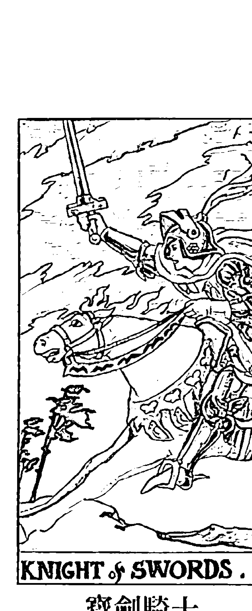

#### 宝剑王后（Queen of Swords）

-   诚实的
- 敏锐的
- 直率的

-   机智风趣的
- 经验老到的

##### 行为表现

-   诚实的
  面对事实，即便不愉快
  坦诚面对每一个人
  喜欢所有事情开诚布公
  遵循规则行事
  避免谎言和欺骗

-   敏锐的
  迅速评估情势
  了解隐藏的动机和欲望
  不容易被欺骗或愚弄
  理解未曾明说的规则和目的
  迅速理解、领悟

-   直率的
  待人接物直接而开放
  直达问题的核心

-   机智风趣的
  拥有令人愉快的幽默感
  用风趣的言辞化解尴尬
  从不过度严肃看待事情
  对每件事情幽默以对，包括自己

-   经验老到的
  见多识广，经历丰富
  经历生命的打击而变得坚强
  不做自以为是的评断
  怀着合乎实际的期待

##### 成对的宫廷牌

宝剑王后可以与任何其他宫廷牌形成牌对。比较这两张牌的阶级与牌组，来判断这样的对子可能代表什么意义。

##### 牌意解析

宝剑王后的性格综合了宝剑牌组正面的风象能量与王后专注于内在的取向。你永远可以指望她告诉你事情的真相。她崇尚诚实胜过任何事物，而她也循自己对真实的信念生活。她对谎言、诡诈和狡计毫无兴趣，但她也不会轻易被愚弄。她对世情经验老到，无论好的或坏的。宝剑王后能够迅速地评估情势，她了解人性的愚昧，却不加以譴责。当人们耍奸使坏时，她会一眼看穿，但只会找个巧妙的方法躲开。她喜欢直捷了当，直来直往；她的意见公正坦率，但绝不伤人。事实上，这位王后有着令人愉快的幽默感，她喜欢尽情欢笑，并总能妙语如珠，机智地应答如流。宝剑王后知道生命不需要太过严肃地看待，她的直率不虚矫，着实令人耳目一新。

占牌时，宝剑王后要求你依照她的方式去思考与感觉。例如，你是否完全诚实？（先检查这一项！）你能在身处的情况中看出幽默吗？你是否能够正中问题的核心？你是否能搞清楚事情究竟是怎么回事？你会容许自己被愚弄吗？

这张王后牌也可能代表一位与她相像的男性或女性，或是一种诚实并能直接沟通的氛围。在占卜时，她告诉你，此时此刻她的特殊能量对你具有某种意义。无论这张王后牌是以什么样的形式出现在你的生活中，让自己从她身上得到激励吧！

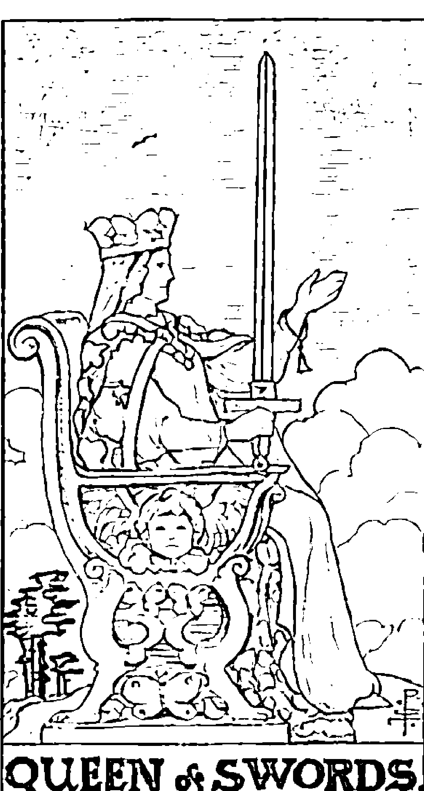

#### 宝剑国王（King of Swords）

-   知性的
- 分析的
- 善于表达的

-   公正的
- 讲求伦理的

##### 行为表现

-   知性的
  - 在心智的世界悠游自在
  - 创造性地运用思想
  - 快速且完整地掌握资讯
  - 透过想法来激励并挑战
  - 出色地执行研究
  - 博学多闻

-   善于分析的
  - 克服混乱与心智的蒙昧
  - 运用理性和逻辑
  - 对游戏和其他心智挑战有天份
  - 轻易地分解复杂的主题
  - 善于讨论和辩论
  - 能够很快的了解问题

-   善于表达的
  - 精熟于语言和说话技巧
  - 能够成功地沟通想法

-   公正的
  - 做出诚实而具洞察力的判断
  - 了解并尊重事情的各个面向
  - 关心真相和公平
  - 以不带情绪的眼光看待事情
  - 客观而不偏不倚

-   讲求伦理的
  - 是位道德／伦理领袖
  - 崇尚高标准
  - 反对腐化和不诚实
  - 待人接物始终光明磊落
  - 用最高的原则为人处世

##### 成对的宫廷牌

宝剑国王可以与任何其他宫廷牌形成牌对。比较这两张牌的阶级与牌组，来判断这样的对子可能代表什么意义。

##### 牌意解析

宝剑国王的性格综合了宝剑牌组积极的风象能量与国王活跃外向的态度。他是位才智非凡的人，能够吸收并运用各种资讯。他富理性且长于逻辑，能够轻易分析任何问题。他能够快速找出解决办法，并清楚明晰地向其他人解说。在杂乱无章的局面中，他能够斩断混乱，提供向前迈进所需的澄明。人们请求他代为喉舌，因为他口才流畅，且能洞察内情。他永远信任他人，人们也能够信赖他会公平诚信地处理所有情况。当人们需要裁决时，他能够做出不偏不倚的公正决定。他无法收买，并以最高的道德标准待人处世。他鼓励身边的人也这么做，而他们往往不负他的期望。
占牌时，宝剑国王要求你采取他可能会采取的行动。例如：实话实说，想出解决之道，善加沟通，或是公平地裁决。这张国王牌也可能代表一位拥有此种行事风格的男性或女性，或是一种理性、诚实，并崇尚高标准的氛围。在占卜时，他告诉你，此时此刻他的特殊能量对你具有某种意义。无论这张国王牌是以什么样的形式出现在你的生活中，让自己从他身上得到激励吧！

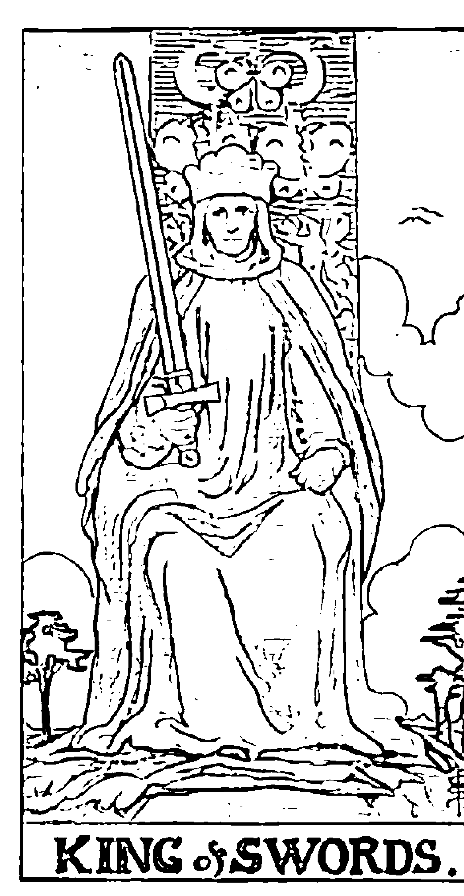

#### 钱币王牌（Ace of Pentacles）

-   物质力量
- 繁盛兴旺

-   实际
- 信赖

##### 行为表现

-   运用物质力量
  - 专注于具体结果
  - 造成实质的冲击
  - 与物质层面配合
  - 获致有形的成果
  - 增进身体健康
  - 与自然打交道

-   行事实际
  - 运用常识
  - 脚踏实地
  - 善用有效的方式
  - 注重实际
  - 植根于真实世界
  - 接受手边的工具

-   繁盛兴旺
  - 拥有达到目标的方法、工具
  - 享受丰足
  - 吸引你所需要的
  - 繁荣兴旺
  - 看见努力获得报偿
  - 增加资产
  - 体验成长

-   抱着信赖进行
  - 相信别人的善意
  - 感到安全、受保护
  - 知道自己绝对安全
  - 于已知的位置运作
  - 拥有支援系统
  - 知道状况稳定
  - 巩固坚实的基础

##### 成对的王牌

成对的王牌显示某种新的精神正进入你的生活。它汲取了「钱币王牌」的能量——繁盛、丰足、信赖、安全、稳固，再加上以下之一：

-   权杖王牌——创造力，兴奋，冒险，勇气，个人的力量
- 圣杯王牌——深刻的感情，亲密，协调，同情，爱
- 宝剑王牌——聪明，理性，公正，真实，清明，坚忍

##### 牌意解析

「钱币王牌」象征在繁盛、丰足、信赖、安全及稳固等范畴的可能性。在占牌时，「钱币王牌」显示有一颗丰饶的种子已植入了你的生活，虽然你可能还没辨识出来。当这颗种子发芽，它几乎可能以任何形式呈现。在内在层面，它可能会是一种安定的感觉、想获得成果的渴望，或是专注于实际事务的需要。在外在层面，它可能会是一项提议、礼物、机会、遇合，或是同步的事件。

当你看见「钱币王牌」，请检视你的生活，看看它坚实的能量能如何为你所用。现在不是空想、追求戏剧性或是冒险的时候，而是该实际并且专注的时刻。找出令你感到自在可靠的经验，让你感到安全。无论内在或外在，在你的生活中建造一个信赖的基础。你的常识将会告诉你该做些什么。同时，你应当亲近自然，以帮助自己保持稳定。享受你的身体，以及物质世界的一切喜悦。

「钱币王牌」同时还是你将实现梦想的徵兆。你的想法已经成熟，就要成为有形的东西了。找出能够让它成真的方法，你现在能够吸引到所需的一切资财来启动你的计划。汲取「钱币王牌」的物质力量，你将会成功兴旺，而你所从事的一切都将蓬勃昌盛。

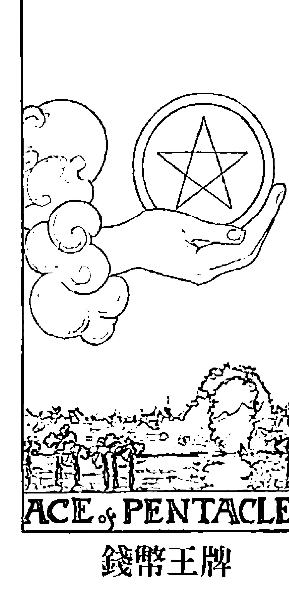## 錢幣二（Two of Pentacles）

耍雜耍、變戲法
彈性、適應性
樂趣

##### 行為表現

耍雜耍
讓所有事物保持平衡
應付各種需求
讓人們一起工作
確定每個領域都關照到
同時進行很多工作
平穩地向前行進
給各個方面同樣的重視

有彈性
快速適應
自由嘗試新的做法
順隨波流
拒絕讓變化驚擾你

對發展保持開放
看見可能性
應付挑戰
能輕易變換方向

享受樂趣
做你喜愛的事
從生活中得到樂趣
撥出時間玩樂
感覺興高采烈
工作的時候吹口哨
看見情境中幽默的一面
放鬆下來

##### 意義相對的牌（一些可能）

教皇——遵循既定程序，依循傳統慣例
權杖五——懷有歧異的目的，做法不成功
寶劍四——休息，安靜，活動度低
寶劍六——憂鬱，無精打采

##### 意義加強的牌（一些可能）

節制——平和，找到正確的組合
權杖四——樂趣，興奮，派對

##### 牌意解析

在電影《第一武士》（First Knight）中，藍斯洛（Lancelot）接受了一項挑戰——從面前一排此起彼落的利刃間穿過。他成功了，因為他機警、敏捷，而且有耐心。他知道什麼時候該前進、什麼時候又該停住不動。他優雅地在危險中行進，享受這致命障礙賽的每個瞬間。藍斯洛已經掌握到「錢幣二」的能量。

保持優雅而有效率是一種獨特的感覺。在「錢幣二」牌上，我們看到一位年輕人一邊打理著俗世雜務、一邊還跳著舞。環繞著兩個錢幣的「無限大」符號，暗示他可以處理無限多的問題。在背景中，我們看見兩隻帆船輕鬆地乘風破浪——在生活的起起伏伏中自在航行。

解牌時，「錢幣二」讓你知道，你可以應付落在身上的種種要求。事實上你將享受越過每個障礙的興奮、刺激。如果你現在並沒有感覺到這種程度的自信，這張牌要求你相信自己。你已具足達成每個目標所需的一切。擁抱挑戰吧！

此外，「錢幣二」還提醒你要有彈性。如果你想克服挑戰，一定得要敏捷靈活，不要強渡關山。現在不是一成不變的時候，要知道，有時往旁邊跨一步，甚至往後退一步，才是最穩當的前進方式。

「錢幣二」同時是樂趣、歡笑，以及快樂時光的象徵。它肯定是張高能量的牌，當你感到疲憊或沮喪，這張牌可能是個訊號：你將擁有較多的活力。如果你已經感覺自己處於高速檔，「錢幣二」可能在警告你過度消耗了。確定自己得到充足的休息，如此，你才能享受這張牌的高亢能量。

#### 錢幣三（Three of Pentacles）

團隊合作
計劃
勝任

##### 行為表現

團隊合作
與他人協調
找到所有必要的元素
以一個單元運作
共同完成工作
對群體作出貢獻
合作
群策群力

計劃
整合資源
遵循計畫表
在充分了解下運作
敲定細節

能夠勝任
完成工作
妥善執行任務
達成你的目標
證明你的能力
成績超出預期
知道該做什麼、如何做
投入工作

##### 意義相對的牌（一些可能）

權杖五——缺乏團隊精神，欠缺合作
權杖七——對立，抗爭
寶劍八——不想投入工作，缺乏方向
錢幣九——獨力工作，不專注於團隊合作

##### 意義加強的牌（一些可能）

教皇——以團隊或群體方式工作
節制——結合力量
權杖三——計劃，為未來做準備
聖杯三——在團隊中工作

##### 牌意解析

在電影《不可能的任務》（Mission Impossible）一開場，一群頂尖高手正在進行一項危險的任務。團隊成員排定策略，整合資源，並運用每個人的技術和智謀來完成這項任務。這就是「錢幣三」在起作用：團隊合作、計劃，以及足以勝任的能力。

「錢幣三」是塔羅牌中焦點擺在群體的牌之一（其他還有「聖杯三」和「教皇」牌）。由於錢幣牌是腳踏實地而實際的，這張牌代表一群任務導向的人們，正朝一個共同目標努力合作。很少工作是可以獨自完成的，我們需要他人的幫助以達成目標。有時「錢幣三」是個訊號，如果你跟其他人合作，將更有生產力。你不需要獨力做這件事。

這張牌也可能顯示計劃和準備的必要。現在不是莽撞行事、或是只有一點模糊的概念就展開行動的時候。你必須把每件事情徹底想過，考慮所有的可能性，確定一切細節都安排好了。做好你的功課，你所從事的工作就會成功。

「錢幣三」另一個特質是「勝任」——能夠完成工作的能力。這在今天是何其稀有呀！這張牌告訴你，你擁有所需的技能和知識。你能吸引有能力的人才，並創造成功的環境。明白情況都在（或者「將會在」）妥善的掌控中，但務必專注於追求工作的卓越。對你的工作及做事的方法感到驕傲，然後就能完成你那「不可能的」任務。

#### 錢幣四 (Four of Pentacles)

佔有
改變受阻

##### 行為表現

想要佔有
保住你所有的
得到你的一份
取得物質財貨
抓緊某人
貪婪
錙銖必較
宣告所有權
儲蓄

改變受阻
維持現狀
想要一切維持不變
拒絕考慮新的做法
淤塞沉滯
阻礙新的發展
固守現狀
抗拒潮流

##### 意義相對的牌（一些可能）

愚人——隨心所欲，衝動行事
皇后——心胸開闊，慷慨施與
命運之輪——移動，快速的變化
吊人——釋放，不試圖控制

##### 意義加強的牌（一些可能）

皇帝——控制，結構，秩序
戰車——掌控
寶劍二——僵局，封鎖
錢幣十——喜愛現狀，保存

##### 牌意解析

與兩歲的幼兒相處，你很快就會聽見「錢幣四」的聲音：「不！」和「我的！」這些是「自我」（ego）的呼喊，而這正在幼兒身上發展著。「自我」藉著伸張其意志來試圖掌握權力，而掌控的欲望，正是「錢幣四」的正字標記。

某些掌控是很有價值的。在混亂的局面中，我們需要一隻鐵腕提供架構和組織。然而，掌控的欲望常常會過了頭，窒礙了創造力與個人的表達。在解牌時，這張牌要你仔細權衡所處情境中的掌控程度。

「錢幣四」也可能代表「擁有」的議題。或許你涉入了獲得、保有金錢或其他財貨的狀況，或許你有著佔有或妒忌方面的問題。運用這張牌的能量去維護和防衛，但不要去佔有。人們需要自由，好決定自己的人生。

「錢幣四」同時也暗示變化受到阻礙，彷彿牌上那個頑固的小人兒正阻撓你的每一個行動。反抗或許來自那些想維持現狀的人，也可能來自你自己。你是不是在抗拒一些確實有必要的改變？我們常會固守著熟悉的事物，即使我們知道那並不是最有益的。

「錢幣四」的教訓是，掌控是不可能的。我們在這世界上，就像是身處汪洋大海，誰能駕馭或擁有如此的力量？不被滅頂的唯一方式就是順隨波流。只要我們隨著水流泅泳，海洋就會支撐著我們。

#### 錢幣五（Five of Pentacles）

艱困時刻
健康不佳
拒絕

##### 行為表現

歷經艱困時刻
物質上的煩惱
失去工作或收入
沒有安全感
挺過一段困頓的時期
缺乏所需
捉襟見肘

苦於健康不佳
感到疲憊困乏
拒絕照顧自己
忽略身體的需要
感到精疲力竭
接受醫療
濫用自己的身體

遭到拒絕
缺乏支援
吃閉門羹
接受不受歡迎的職位
遭到放逐
感到被排斥
子然孤立
遭受非難

##### 意義相對的牌（一些可能）

力量——力量，精力
節制——健康良好
太陽——活力，強健體魄
權杖六——喝采，認可
錢幣七——物質的報償

##### 意義加強的牌（一些可能）

塔——艱困時刻
權杖十——勉力平衡收支，困苦時刻
聖杯五——拒絕，缺乏支持，失去認可
寶劍三——拒絕，分離，缺乏支持

##### 牌意解析

「錢幣五」牌上的兩個人看起來貧病交迫，疲乏不堪。他們讓我們看見一無所有——缺乏生命中的基本要素——是什麼感覺。這鬼魅糾纏著無數的人——是極為切身的現實。也許有人沒體驗過這樣極端的狀況，但我們還是識得苦難。當我們得不到需求之物時，就會感到痛苦。

占牌時，「錢幣五」可以代表好幾種匱乏。首先是欠缺健康，這時，要應付生命的挑戰是很困難的。這張牌可能是個訊號，告訴你忽略了身體的需要。你可能正逐漸遠離完全健康的狀態，所以必須採取行動發現並矯治問題。

這張牌也可能是物質或經濟挫敗的信號。當我們沒有錢或是像樣的工作時，日子無疑難過得多。當我們掙扎著要讓收支相抵，所有其他問題都會被放大。即使我們境況寬裕，還是可能有不安全感，害怕厄運會把辛苦所得的一切奪走。

「錢幣五」也可能代表拒絕或不被接受。我們是社會性的動物，當我們被群體排斥時，便會感到痛苦。我們希望被接納，不僅只為了情緒上的安樂，也是為了相互的支援。遭到拒絕也可能意味著物質上的困乏。

「錢幣五」與物質的匱乏有關，但它也有精神性的成份。從圖上的彩色玻璃窗，我們可以猜出這兩個人正在一座教堂外頭。安適近在咫尺，但他們卻未能得見。教堂象徵我們的心靈，它在各方面都是完美而圓滿的。我們本該在生活的每個領域都享受豐足，但有時我們會忘記這是我們與生俱來的權利。每當你經歷艱難困苦，記住它只是暫時的。尋找那將會接納你、給你庇護的精神中心吧！

#### 錢幣六（Six of Pentacles）

有／無：
資源
知識
力量

##### 行為表現

擁有／缺乏：資源 / 提供／接受忠告
施／受 / 傳授／學習經驗或竅門
照顧／被照顧 / 知道／不知道某個秘密
贊助／被贊助 / 支持／被支持 / 擁有／缺乏：力量
給予／接受禮物或報酬 / 領導／跟隨
得到／沒得到所需要的 / 宰制／順服 / 行使權威／遵從
擁有／缺乏：知識 / 主張／否定你的願望
教／學 / 強迫／被迫
給予／接受資訊 / 有發言權／只有聽的份
成為／找到導師 /

##### 意義相對和加強的牌（一些可能）

就「錢幣六」而言，意義相對與加強的牌運作方式和一般不同，因為這張牌可以代表同一議題的正、反面意義——有或沒有。同一牌陣中的其他牌可以幫助你決定在你的情況中它是代表哪一面的意義。以下這些牌也是探討此一議題：

皇后——豐富，物質的安適
世界——富裕，物質的滿足
權杖十——勉強糊口，艱困時刻
錢幣五——匱乏，欠缺
錢幣七——物質報酬，擁有
錢幣十——富裕，擁有

##### 牌意解析

「錢幣六」是張難以描述的牌，因為它落在「錢幣五」的匱乏與「錢幣十」的豐裕之間的幽暗地帶。這兩張牌代表「有」和「沒有」兩個極端，而「錢幣六」則涵蓋廣大的中間地帶，在這兒，誰究竟擁有什麼並不清楚。

在這張牌上，一位富裕的紳士正扔給乞丐幾個銅板，還有一個乞討者等在一旁。施予者手持正義的天平，彷彿宣告有權決定誰值得賜福，而誰卻不配。在這圖中，我們看見一體的兩面：施與受，支配與屈從，高高在上與低低在下。誰有、誰沒有似乎很清楚，但真是這樣嗎？生命沒有那麼簡單，而時運的輪轉又何其的快。

解牌時，「錢幣六」要你非常深入地探究這整個議題：「擁有」到底意味著什麼，無論是在物質（資源）或非物質（知識、權力、愛）上。你也許看見自己處於這一端、或是另一端，但這張牌要你重新思考。想想那些一夜之間宣告破產的成功企業家、透過自己的衰弱宰制他人的殘病者、從學生身上學到東西的老師，還有藉著給錢來控制孩子的家長！

「錢幣六」的關鍵詞中，每個意義都涵蓋了「有」和「沒有」兩面。有時候這張牌很清楚地代表了這面或那面的意義。你將會得到禮物、給予忠告，或是聽從他人。不過，在所有狀況中，你都應該質疑顯而易見的表象，探究更深的層面。你為何會處於這樣的情境，而它又將如何演變？誰真正在當家做主？事情究竟是怎麼回事？

#### 錢幣七（Seven of Pentacles）

評估
報償
改變方向

##### 行為表現

評估
估量現狀
思考目前的進展
評量完成了什麼
暫停以檢驗結果
確定自己是在軌道上
搞清楚自己的位置
評估狀況

獲得報償
終於看見一些成果
享受第一批果實
投資獲利
獲得酬勞
得以稍事放鬆
到達某個里程碑

改變方向
考慮改變方向
衡量不同的做法
思考替代的選擇
考慮改變
對新的策略開放
質疑自己的選擇
站在十字路口

##### 意義相對的牌（一些可能）

命運之輪——移動，行動，改變方向
權杖八——快速的行動
錢幣五——缺乏報償，難困

##### 意義加強的牌（一些可能）

皇后——物質的報償
正義——評估處境，決定未來的道路
審判——決定之點
寶劍四——休息，審慎考量

##### 牌意解析

在「錢幣七」牌上，我們看見一個在園中辛勤工作了很長時間的人。花開了，葉茂了——他的辛苦似乎得到了報償。現在他正稍事休息，欣賞自己工作的成績。看見這麼棒的結果多麼令人滿足啊！甜美的成功是多麼教人欣慰！

「錢幣七」是一張「暫時叫停」的牌。它代表我們在忙碌的活動之後停下來喘口氣審視週遭的時刻。圖中那人暫停下來，思忖著自己辛勞的果實，但他也可能會摘取那果實。解牌時，「錢幣七」可能暗示報償即將來臨，特別是以你努力的成果之姿出現。接受並享受它吧！

這張牌同時也是種召喚，要你去做些評估。忙碌的時候，我們未必總有時間思考自己所做的事情、思考自己為什麼這麼做。我們仍在正確的道路上嗎？我們會得到想要的結果嗎？如果你未能在關鍵時刻評估狀況，便可能產生嚴重的問題。在占牌時，這張牌建議你花些時間確定自己正在朝目標邁進。

「錢幣牌」也可能意指十字路口。在生活中，我們傾向於持續熟悉的慣例。走上新的方向並不容易，「錢幣七」可能是在告訴你，該去想想是否需要修正道路，甚至徹頭徹尾地改變。你還沒有確定方向，但也許很快就會。改變仍然是可能的。

「錢幣七」並非代表結局或是最後決定的牌。賽局尚未結束，只是暫停一下。一旦你緩過氣來，檢視了你的策略，就要準備好重新投入，甚至比先前更加賣力。

#### 錢幣八 (Eight of Pentacles)

勤奮
知識
細節

##### 行為表現

展現勤奮
努力
勤勉工作
全力投入
專注於某項計畫中
全心投入某個任務
埋頭苦幹（苦讀）
產出穩定的成果

追求更深刻的理解
研究
找出事實
精進專技

注意細節
辛勤仔細的
格外謹慎小心
有條理地進行某項工作
認真處理問題的核心
處理未了的零星問題
檢查再檢查
注意小細節

##### 意義相對的牌（一些可能）

聖杯四——缺乏興趣，漠不關心，冷淡
聖杯七——懶惰，缺乏動力

##### 意義加強的牌（一些可能）

魔法師——集中和專注
教皇——學習，研究
權杖九——固守，堅持

##### 牌意解析

在「錢幣八」牌上，我們看見一位年輕人正鎚打著錢幣。他已經完成了六枚錢幣，還剩下一枚要做。他顯然正在進行一項工作，投注了他全副的注意力。他將自己與其他人（背景中的城鎮）隔絕，好讓自己專心致志。在這副景象中，我們看見了「錢幣八」的基本要素：努力工作和專注於細節。

這張牌往往意味著一段高度勤奮、專注的時光。它建議你全力處理當下的事務，無論是工作計畫、家庭問題、個人目標，或是煩人的責任。有些時候，幸福會從天而降，但其他時候，我們必須投入巨大的努力以獲得它。「錢幣八」代表你必須付出百分之一百一十的時刻。全力以赴便是。幸運的是，這樣的工作令人振奮，而且會獲致非凡的成果。「錢幣八」的辛勞是令人深深滿足且富有生產力的。

「錢幣八」也象徵學習的衝動——用個老套的詞來說，就是「去開拓你的視野」。有時我們需要發展新技能，我們會去研究、去挖掘事實，或是尋求專門的知識或技術。「隱士」尋求的是內在的知識，而「錢幣八」中的人則是尋求外在知識——物質世界的運作規則和原理。

這張牌也可能顯示注意繁瑣細節的必要。一絲不苟、苦幹實幹的人往往會被認為瑣碎、拘泥，但他們額外的努力確保了每件事情恰如其分。這是種謹慎的做法——花時間檢查細節。現在不是散漫或隨便的時候。找出錯誤，綁好鬆脫的線頭。成功的關鍵是超乎尋常的努力，無論你的任務是什麼，「錢幣八」都告訴你，各個方面都要全力以赴。

#### 錢幣九（Nine of Pentacles）

紀律
優雅
自足

##### 行為表現

有紀律的
發揮自我控制
展現節制
駕馭衝動
為達成目標而犧牲
堅守計畫
採取按部就班的做法

依靠自己
獨立處理狀況
獨自行動
一切靠自己
獨力完成
想要獨自一人
確定自己採取的方式是最好的

追求優雅
達到舒適的生活方式
避免粗糙、不體面的
圓滑而具外交手腕
追求高尚的活動
享受生活中美好的事物
記得要親切優雅
享受悠閒

##### 意義相對的牌（一些可能）

皇后——世俗的感官享受
聖杯七——無紀律的，自我耽溺的
錢幣三——團隊工作，與他人合作

##### 意義加強的牌（一些可能）

戰車——自我控制，紀律
寶劍七——仰賴自己，獨自行動

##### 牌意解析

在「錢幣九」牌中，一位婦人正在她的莊園中悠閒地漫步。她顯然是位優雅而有教養的貴婦，所以她左手上的那隻鷹看來有些不搭調——那是被訓練來捕殺獵物的猛禽。馴鷹對一位貴婦而言，是種不尋常的嗜好，但它卻是這張牌牌意特質的關鍵。

從一方面來說，「錢幣九」代表著最優雅、高尚、文明的一切。藝術、音樂，以及其他形式的美，是我們物質世界（錢幣）非常重要的一環。這張牌上頭有許多錢幣，但它們的位置是靠近地面的。生活的俗務很重要，但我們不必永遠專注在實際的層面上，還可以享受生活中較為美好的事物。解牌時，「錢幣九」可能暗示在這些領域的興趣。它也可能是種信號，示意你也許必須摒棄粗糙或令人不悅之事物，轉而追求最高的層次。

「錢幣九」也可能是紀律和自制的訊號。這位婦人之所以能享受優雅的生活，是因為她已經降服了較為卑下的本能。她的衝動能為她所用，因為它們宰制不了她。那頭獵鷹象徵著人性中所有的陰暗不馴；我們的陰暗面也能為我們服務——但只在它受到導引之時。有時候，「錢幣九」暗示，如果你想獲致最大的成果，就必須展現節制和自我掌控的能力。你也許必須暫時有所「犧牲」，但結果會是值得的。

這張牌也是自我依靠的標記。有時你必須信賴自己的能力去處理某個狀況。抗拒他人代勞的誘惑。你必須將事情交在自己手中。我們這位優雅的貴婦就是這樣，她信任自己的勇氣與決心，現在她得以享受生命所給予的最好的一切。

#### 錢幣十（Ten of Pentacles）

- 豐足
- 永恆
- 常規

##### 行為表現

- 享受豐饒
  - 享有物質的豐足
  - 免於金錢的煩惱
  - 享受事業成功
  - 在財務上感到安穩
  - 看見事業蓬勃發展
  - 交上好運
- 追求恆久
  - 尋求可持續的解決之道
  - 創造持久的基礎
  - 對現狀感到安全
  - 關心長遠之計
- 享有井然有序的家庭生活
- 脫離權宜的安排
- 敲定計畫
- 依循傳統成規
  - 安於既定的指導方針
  - 依照規則行事
  - 參與傳統
  - 成為體制的一份子
  - 保守
  - 信賴經過驗證的真理
  - 持續已知的模式

##### 意義相對的牌（一些可能）

權杖二——具原創性，避免墨守成規
權杖三——探索，走向未知的領域
錢幣五——艱困時刻，物質上的匱乏

##### 意義加強的牌（一些可能）

皇后——豐饒，奢華，肉體上的舒適
教皇——遵從，依循規則，保守
戀人——永久的結合，家庭關係
世界——豐富，物質的滿足
錢幣四——享受現狀，固守

##### 牌意解析

在許多牌上，我們都看見遠方有一簇房舍，而在「錢幣十」牌，我們終於來到了村落中——在市集的中央。我們看見一家人正在進行日常生活的事務，一位長者穿著華麗的袍子，正一邊撫拍著獵犬、一邊看著年輕的一輩。一男一女正在交談，他們的孩子則在腳邊嬉戲。空中還掛滿了錢幣（金錢）。

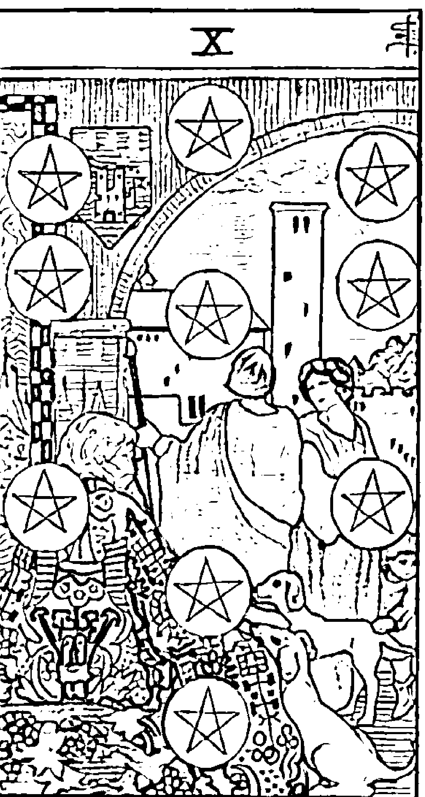

「錢幣十」代表世俗及物質成就的極致。有時我戲稱它為「肥貓」牌，因為它會讓我想起圍繞著富裕商賈的興旺氛圍。如果你想知道你最新的事業將如何發展，你會希望看見這樣一張牌。財富和豐足是屬於你的。

當我們獲致了物質的成功，自然希望它持續下去。這就是「錢幣十」保守、重視體制的一面。如果生活已經很好了，為什麼要去搖晃船隻呢？在解牌時，這張牌往往代表常規——遵循已確立的方針，並維持現狀。有錢的肥貓鮮少會是激進份子，他們熱愛傳統以及久經試煉的真理。有時信賴已知的模式是重要的，但只限於改變並非明智的時候。

「錢幣十」也與「恆久」有關。「變化」是生命不可避免的一部分，但不斷的改變卻令人不舒適。我們需要穩定，需要為生活建構穩固基礎的機會。占牌時，這牌也許是在告訴你該專注於長遠之計。努力尋求持久的解決之道。現在也許是安頓下來、為長遠的未來做安排的時候了。

#### 錢幣侍衛（Page of Pentacles）

- 產生作用
- 務實的
- 興旺的
- 信賴／值得信賴

##### 行為表現

- **產生作用**
  - 實現你的計畫
  - 塑造物質的世界
  - 運用你的身體
  - 體驗大自然
  - 達成有形的結果
  - 依照夢想行動
  - 讓事情動起來
- **興旺昌盛的**
  - 吸引你所需要的
  - 增加你的資財
  - 成長與擴張
  - 豐富自己
  - 迎向成功
  - 尋求豐足
  - 變得有安全感
- **務實的**
  - 採取實際可行的方法
  - 運用手邊的工具
  - 找出有效的解決之道
  - 運用常識
  - 停止做白日夢
  - 運用你所擁有的
  - 專注於有效的事物
- **信賴／值得信賴**
  - 接受掌控中的解決之道
  - 信任他人
  - 包容不確定性
  - 接受他人的說法
  - 信守承諾
  - 證明你是可靠的
  - 堅守承諾
  - 建立信用

##### 成對的宮廷牌

「錢幣侍衛」可與任何其他宮廷牌形成牌對。比較這兩張牌的階級與牌組，來判斷這樣的對子可能代表什麼意義。

##### 牌意解析

「錢幣侍衛」是為你帶來繁榮與旺機會的使者。他帶來真正的機遇，讓你體驗財富、豐足、安全感，以及具體的成就——也就是錢幣牌組的奇蹟。在占牌時，這位侍衛暗示一個時機或許正在展開，它允諾了富足、安適、信賴，或是實現夢想的機會。當你看見這樣的機會，只管去把握吧！

「錢幣侍衛」也可能代表一個小孩，或是心態年輕的成人。他與你的互動涉及了穩定、信賴、承諾、安全感，以及物質的需求。

有時「錢幣侍衛」暗示你所處的整個情境充滿了物質享樂的精神。在這樣的時刻，不妨以輕鬆的心情，盡情享受你的身體、技能，以及財物所帶來的樂趣，於此刻沉浸在塵世的歡樂中吧！

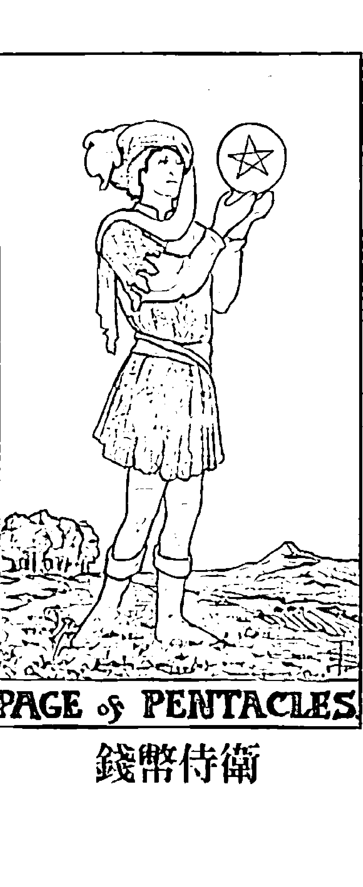

#### 錢幣騎士 (Knight of Pentacles)

- 堅定不移的／頑固的
- 小心謹慎／缺乏冒險精神
- 仔細徹底／過分執著
- 實際的／悲觀的
- 認真工作／刻苦操勞

##### 行為表現

- 謹小慎微／害怕冒險
- 堅定不移的／頑固的
  - 頑強追逐目標／頑固不知變通
  - 永不放棄／死守立場
  - 遭遇對抗堅定不移／一定要照自己意思行事
  - 固守選定的道路／拒絕聽從理智
  - 忠於個人的信念／抗拒妥協
- 小心謹慎／缺乏冒險精神
  - 反覆檢查／過於保守
  - 事先考量每個角度／因等待而錯失機會
  - 緩慢而小心地進行／不願嘗試新事物
  - 偏愛安全已知的道路／滿足於安穩微小的收穫
- 仔細徹底／過分執著
  - 關照每一個細節／不知何時該停止
  - 一絲不苟／吹毛求疵
  - 綁好所有的線頭／要求凡事一定得怎麼樣
  - 工作從不半途而廢／缺乏彈性且強制的
  - 不辭辛勞／堅持完美
  - 完成起頭的每一件事／非盡善盡美不肯罷休
- 實際的／悲觀的
  - 願意審視事實／專注在出錯的地方
  - 面對真相／覺得別人都在做白日夢
  - 不為虛假希望所惑／覺得杯子半空而非半滿
  - 誠實地評估情勢／抱持悲觀的看法
  - 事先預料到問題／從一開始就看衰某個計畫
- 認真工作／刻苦操勞
  - 全力投入一項任務／太狹隘地專注在工作上
  - 勤奮不懈／可能不幽默而且嚴厲
  - 一人可抵兩人用／將休閒視為浪費
  - 積極處理瑣碎惱人的差事／過分驅策他人
  - 孜孜不倦，不屈不撓／忘記生活應該要有趣

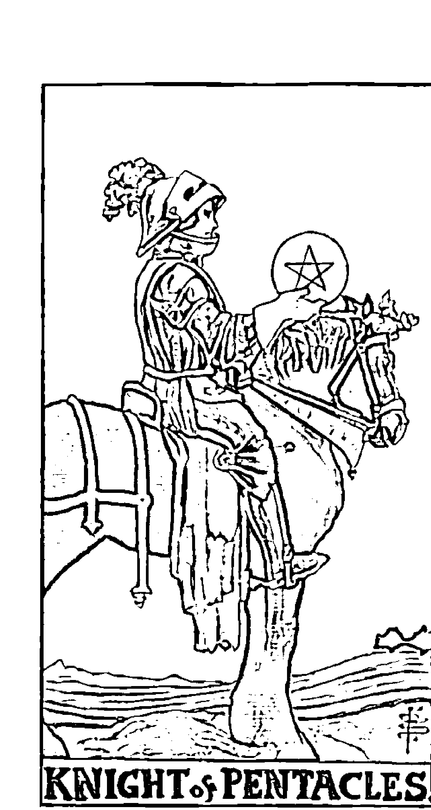

##### 成對的宮廷牌

「錢幣騎士」可與任何其他宮廷牌形成牌對。比較這兩張牌的階級與牌組，來判斷這樣的對子可能代表什麼意義。

##### 牌意解析

就正面而言，「錢幣騎士」堅毅過人、全力以赴，總是把每件工作做到最後的細節。他謹慎小心，從不浪費，且能明辨事實，對虛假承諾完全免疫。就負面而言，他太過乏味無趣了，永遠把工作擺第一。他往往缺乏彈性，對細節太執著，且過分頑固，即使犯錯也不願讓步，而這點他打死不肯承認。他不喜歡改變或冒險，而且總抱持最悲觀的看法。

占牌時，「錢幣騎士」顯示該情境涉及他這種謹慎小心的風格，做為你、他人，或是整體氛圍的一個面向。你必須自問：「這位騎士的能量是有助益的，或是有害的？」

倘若他的風格很明顯，那麼平衡是必要的。你是否工作過度？你生活中是否有個完美主義者？你週遭氛圍是否陰鬱沉悶？也許是改變的時候了。若其能量付之闕如，一點審慎持重或許是需要的。你是否花費過度？或許該省儉點了。你工作是否常粗疏草率、遲交，或不夠完整？下定決心做好它吧。讓「錢幣騎士」引領你進入他審慎而堅毅的世界！

#### 錢幣王后（Queen of Pentacles）

- 培育、滋養
- 慷慨寬大的
- 腳踏實地的
- 善於機變的
- 值得信賴的

##### 行為表現

- 培育、滋養
  - 給予愛和支持
  - 創造溫暖、安全的環境
  - 讓人舒服愉快些
  - 與自然世界互動
  - 精於園藝
  - 對小孩和動物很有一套
- 沒有矯飾或虛偽
- 採取簡單合理的做法
- 欣賞所有的感官樂趣
- 善於應變的
  - 能為手邊所有東西找到用處
  - 靈巧而多才多藝
  - 能讓少許的資源發揮大大的功效
  - 避開所有的障礙
  - 提供需要的事物
- 慷慨寬大的
  - 願意為他人做任何服務
  - 很好說話
  - 總是帶著歡迎的微笑敞開大門
  - 大量而慷慨地給予
  - 溫暖、慷慨而不自私
- 值得信賴的
  - 能夠保守秘密
  - 忠誠而堅定不移
  - 在緊要關頭化險為夷
  - 對他人信守承諾
  - 說話算話，說一不二。
- 腳踏實地的
  - 實事求是地處理問題
  - 容許別人做自己

##### 成對的宮廷牌

「錢幣王后」可與任何其他宮廷牌形成牌對。比較這兩張牌的階級與牌組，來判斷這樣的對子可能代表什麼意義。

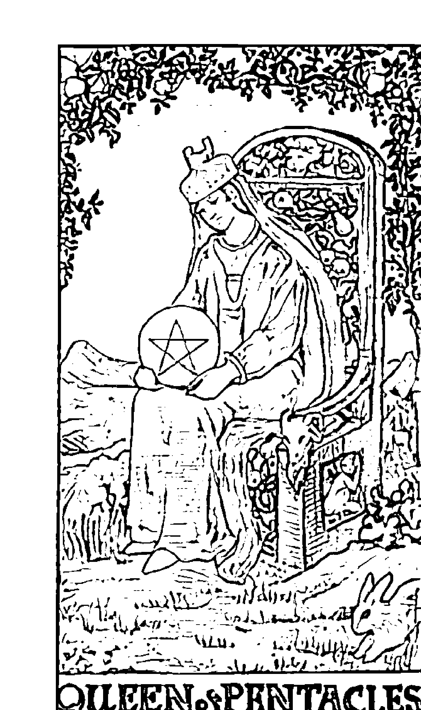

##### 牌意解析

「錢幣王后」的性格綜合了錢幣牌組正面的土象能量與王后專注於內在的取向。如果你去拜訪錢幣王后，她看見你的頭一句話會是：「進來，快進來。見到你真是太好了，先喝碗湯吧！」沒有人比她更好客、更關懷人了。她最大的樂趣就是照顧別人——確定大夥兒都很快樂、很安全。她家裡永遠滿是小孩、寵物、植物，以及不拘形跡的訪客。她對每個人都溫暖而慷慨，處理日常事務時，總是明理而實際。她沒許多時間做精細的計畫和其他瘋狂事兒，如果有什麼事情需要做，她就只管去做，不會小題大作、勞師動眾。必要的時候，她能用少少的資源搞定一切，並總能安然度過緊急的時刻。她腳踏實地、實事求是，總是那麽忠誠而穩定。由於她生性信任別人，別人也全然信賴她。當你傷痛或需要幫助時，「錢幣王后」將會撫平你的恐懼、分擔你的煩憂。

占牌時，「錢幣王后」要求你依照她的方式去思考與感覺。例如，你是否滿懷溫情、關照他人？你的言行是否合情合理？是否信守諾言？是否慷慨大方？在艱困的時候，你是否能夠依靠？

這張王后牌也可能代表一位與她相像的男性或女性，或是一種溫暖、信賴而安全的氛圍。占卜時，她告訴你，此時此刻她的特殊能量對你具有某種意義。無論這張王后牌是以什麼樣的形式出現在你的生活中，讓自己從她身上得到激勵吧！

#### 錢幣國王 (King of Pentacles)

- 善於經營的
- 熟練的
- 可靠的
- 支持的
- 穩定的

##### 行為表現

- 善於經營的
  - 讓任何事業都能成功
  - 在每個地方都發現機會
  - 吸引財富
  - 採用一個構想並且讓它收效
  - 天生的管理者和生意人
  - 能夠點石成金
- 熟練的
  - 通曉實際的事務
  - 具有廣泛的天賦與才能
  - 具有快速的反應能力
  - 雙手靈巧熟練
  - 有能力處理任何局面
- 可靠的
  - 做到所有的保證與承諾
  - 承擔責任
  - 可靠而從不令人失望
  - 處於危機時能被仰賴
  - 做眾人倚靠的中流砥柱
- 支持的
  - 鼓勵他人獲致成就
  - 隨時準備伸出援手
  - 是個慈善家
  - 慷慨地付出時間和關注
  - 贊助值得做的計畫
- 穩定的
  - 以堅定的決心邁向目標
  - 避免情緒與行為的起伏
  - 保持規律的習慣與活動
  - 維持冷靜、平穩的態度
  - 發揮影響力以帶來穩定

##### 成對的宮廷牌

「錢幣國王」可與任何其他宮廷牌形成牌對。比較這兩張牌的階級與牌組，來判斷這樣的對子可能代表什麼意義。

##### 牌意解析

「錢幣國王」的性格綜合了錢幣牌組積極的土象能量與國王活躍外向的態度。我們不妨稱他為財神爺國王，因為他能夠點石成金（各種各樣的財富）。他在每個地方都能發現機會，一旦決定要做什麼，便一定能夠成功。他富有進取心且熟於世事，無論從事何種工作，都能運用他廣泛的技能和實用的知識，勝任愉快地處理它。每個行業他都涉獵，且都能精通。他永遠負責可靠，人們全心地仰賴他，因為他從不讓他們失望。他總是慷慨地給予時間和資源，因為他知道，施予越多，回報也越多。他鼓勵人追求成就，並總在需要的地方給予支援。他擁有穩定而平和的性情，能為任何局面添加安定的元素。當他為自己訂下目標，便會以堅定的決心去追求它，直到成功。占牌時，「錢幣國王」要求你採取他可能會採取的行動。例如：信守承諾、修復裂痕、賺錢，或是贊助一項新事業。這張國王牌也可能代表一位擁有此種行事風格的男性或女性，或是一種穩定、可靠而稱職勝任的氛圍。占卜時，他告訴你，此時此刻他的特殊能量對你具有某種意義。無論這張國王牌是以什麼樣的形式出現在你的生活中，讓自己從他身上得到激勵吧！

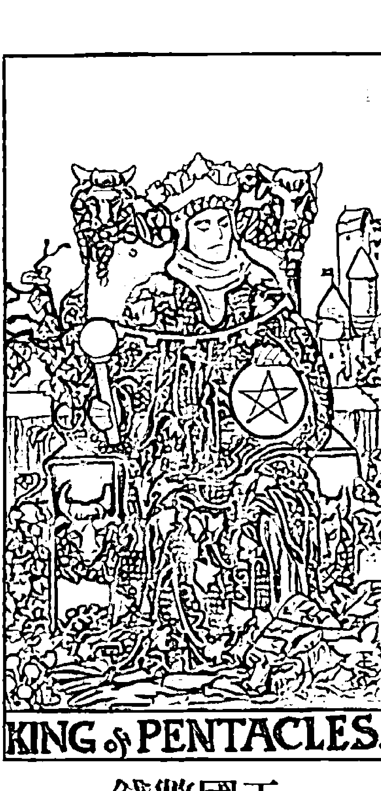

## 單元五

# 塞爾特十字牌陣
The Celtic Cross Spread

#### 介紹

「塞爾特十字」或許是最古老且最為流行的塔羅占卜牌陣。它之所以流傳了這麼久，是因為牌陣的配置很簡單，卻極具威力。由於多年來許多人使用過它，這個牌陣周圍已積聚了強大的能量。

你可以把「塞爾特十字」想成是由兩個部分組成：左邊的「圓圈／十字」（六張牌），以及右邊的「柱杖」（四張牌）。

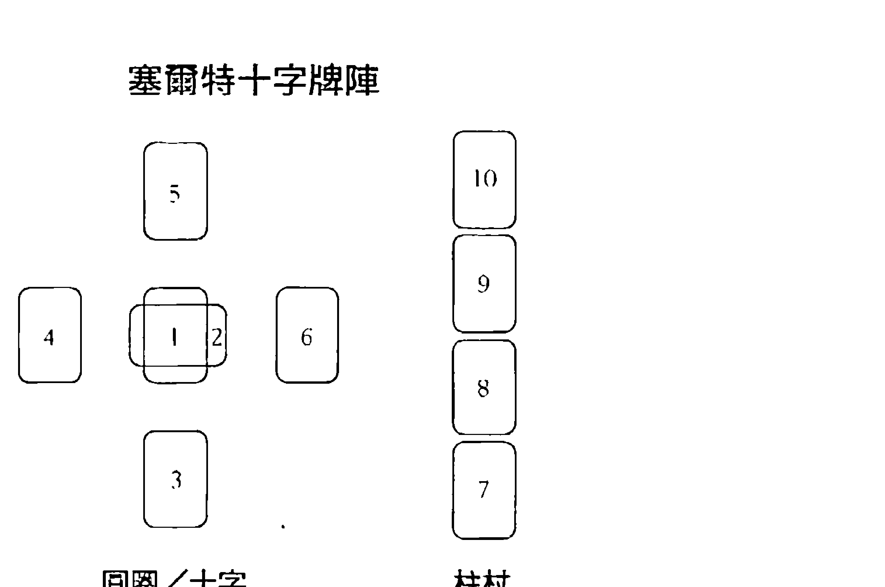

左邊的圓圈／十字是模擬遍佈於愛爾蘭的塞爾特十字架（Celtic cross）。這種十字架上有個圓圈，連結四根成直角的幅條。這圓圈和十字象徵精神與物質的結合，以及所有事件在時間中的合一。

環形區塊的陰性能量與柱杖區塊的陽性能量共同運作，這塞爾特十字的兩個部分反映出實相界的二元本質——人類心靈中無處不在的兩極性。

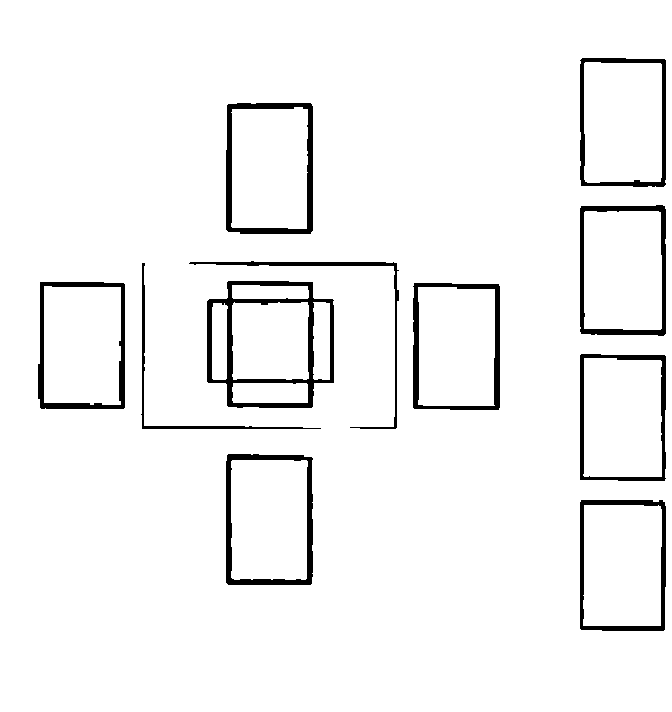

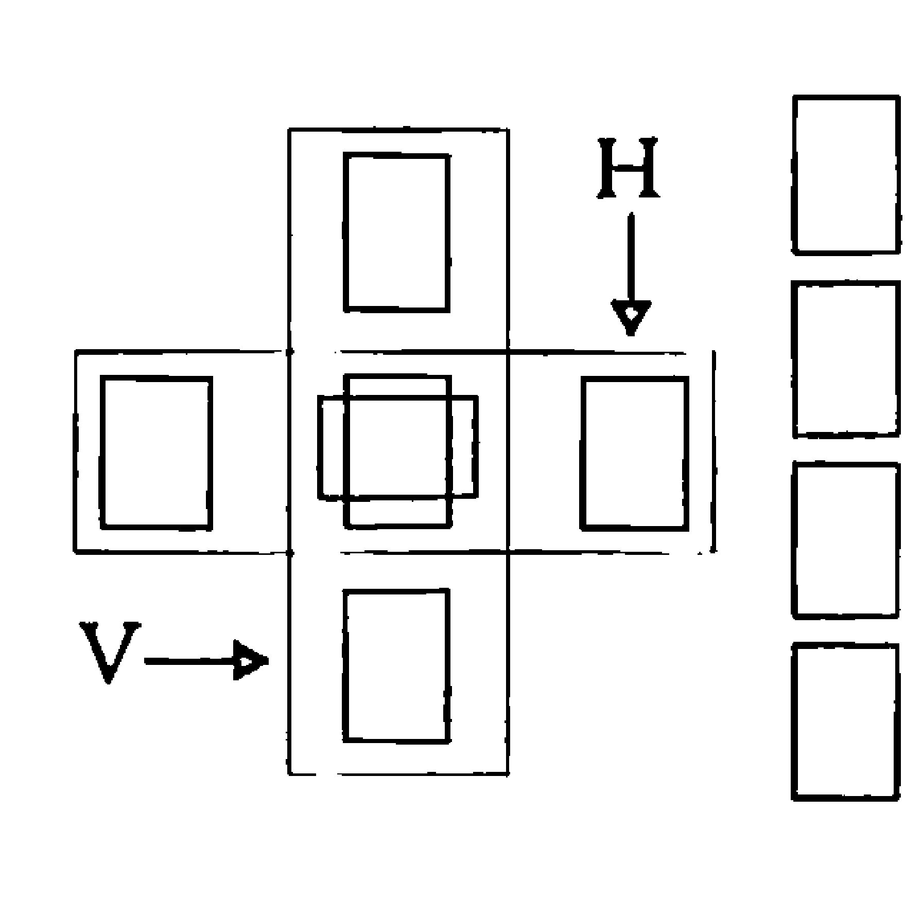

圓圈／十字部分是由兩個十字所組成——一個較大的十字（六張牌）中央又藏著一個小十字（兩張牌）。這個小十字代表事件的核心——占卜當時對你最為重要的因素。它是你的生命之輪繞以旋轉的轂軸。

較大的那個十字包含兩條軸線，環抱著較小的十字。水平的軸線顯示時間的推移，從左邊的「過去」進入右邊的「未來」；垂直的軸線則代表你的意識，從下方的「無意識」，推移到最頂上的「明意識」。這六張牌合在一起，提供了你占卜當時內外在環境的一張快照。

柱杖區域的四張牌超然於你切身的情境之外，為你的生活下了評註。在這兒，你的「內在指引」幫助你了解圓圈／十字區域所顯現的訊息。你接收到關於自己、他人、你生活中的功課以及未來方向的指引。

塞爾特十字有好幾種版本，差異之處通常是在三、四、五、六號牌。我用的是環形的配置，以強調「無意識」和「過去」（三號牌及四號牌）是如何通往「明意識」和「未來」（五號牌及六號牌）。此外我也為九號牌添加了一些意義。在傳統上，這個位置意味著「希望與恐懼」，但我也將它用作代表「功課」或「指引」的牌。只要你在占牌前就決定好要做哪些改變，你永遠可以調整牌陣以適應自身的特殊需要。

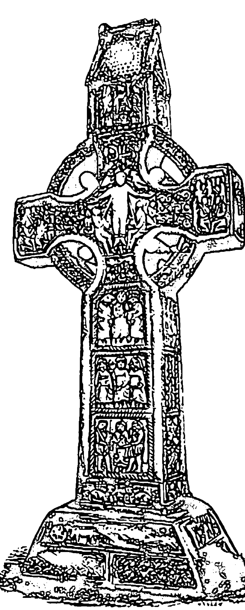

這是穆爾達克（Muredach）的塞爾特十字架。（摘自Derek Bryce所著《塞爾特十字架的象徵意義》（Symbolism of the Celtic Cross）一書。York Beach， ME： Samuel Weiser， 1995， p.113）

#### 解讀塞爾特十字

以下是解讀塞爾特十字的一個方法：

1.  檢視「圓圈／十字」區域的六張牌。它們顯示占牌當時你生命中發生了什麼狀況。
2.  兩兩一組地檢視紙牌，或可依以下順序進行：
    a. 檢視一號和二號牌，找出核心的動力。
    b. 檢視三號和五號牌，找出你不同意識層面的狀況。
    c. 檢視四號和六號牌，看看人物與事件是如何穿流於你的生活。
    根據這六張牌，創造出你目前處境的描述。
3.  檢視「柱杖」區域的四張牌，或許可以依照下面的順序進行：
    a. 檢視七號牌和八號牌，發掘出更多你與環境之關係的訊息。
    b. 檢視十號牌——「預測的結果」。你對它有什麼感覺？它在對你說些什麼？
4.  回顧這些牌，找出導致這項結果的因素。看看是否有一張牌特別突出，成為全局之關鍵。同時：
    a. 比較「預測的結果」（十號牌）與「另一種可能的結果」（五號牌）。
    b. 思考「近期的未來」（六號牌）是如何導致「預測的結果」（十號牌）。
    c. 看看第九號牌是否告訴你一些你需要知道的事情。你是否懷有與此相關的希望或恐懼？

#### ✧✧ 塞爾特十字牌陣各位置關鍵詞 ✧✧

| 位置一 | 位置二 | 位置三 |
| :--- | :--- | :--- |
| 問題的核心 當前的環境（外在） 當前的環境（內在） 首要的因素 | 抗衡的因素 變化的因素 次要的因素 強化的因素 | 根本原因 無意識的影響 深層的意義 未知的因素 |
| 位置四 | 位置五 | 位置六 |
| 過去 消退中的影響 已解決的因素 將要釋放的特質 | 態度與信念 明意識的影響 目標或目的 另一種可能的未來 | 未來 趨近中的影響 未解決的因素 將要擁抱的特質 |
| 位置七 | 位置八 | 位置九 |
| 目前的你 可能的你 你所展現的你 你眼中的自己 | 外在環境 他人的觀點 他人的期待 他人所見的你 | 指引 關鍵的因素 希望與恐懼 被忽略的因素 |
|  | 位置十 |  |
|  | 結果（整體） 結果（內在狀態） 結果（行動） 結果（效果） |  |

#### 塞爾特十字・位置一

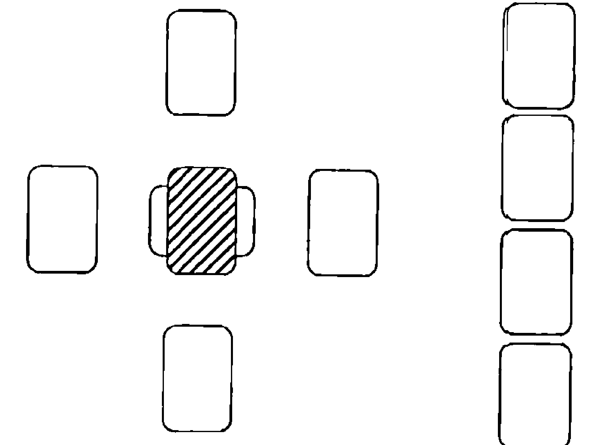

- 問題的核心
- 當前的環境（外在）
- 當前的環境（內在）
- 首要的因素

##### 關鍵詞

- 問題的核心
  - 核心的議題
  - 主要的考量
  - 基本的憂慮或煩惱
  - 首要的重點
  - 焦點
  - 根本的問題
- 當前的環境（內在）
  - 內在因素
  - 你如何感受某個情境
  - 關鍵的個人特質
  - 基本心態
  - 情緒狀態
  - 你內在發生的事
- 當前的環境（外在）
  - 「包圍著你的一切」——傳統用法
  - 週遭的環境
  - 手邊的問題
  - 你身邊發生的事
  - 你正在處理的事
  - 外在因素
- 首要的因素
  - 主要的影響
  - 具支配性的特質
  - 特別突顯的特徵
  - 最重要的元素
  - 最顯著的特質## 塞爾特十字·位置二[^1]

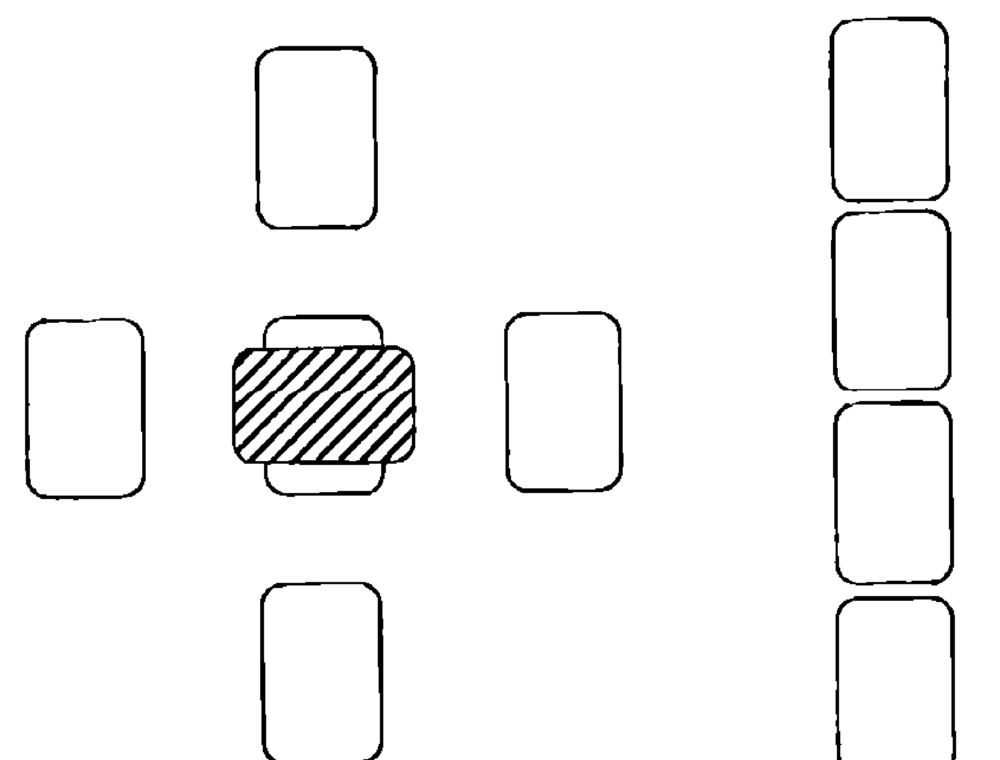

- 抗衡的因素
  - 與你交會的一切
  - ——傳統用法
  - 對立的元素
  - 抗拒的來源
  - 相平衡的趨勢
  - 調和的影響力
  - 對手或顛覆份子

- 變化的因素
  - 局外的事物
  - 不可預期的因素
  - 新的考量
  - 破壞平衡的力量
  - 驚喜
  - 擾亂現狀之事物

- 次要的因素
  - 稍有相關的考量
  - 其他的消息來源
  - 與正題無關的議題
  - 從屬的問題
  - 較不重要的因素

- 強化的因素
  - 支持性的特質
  - 附加的強調
  - 協力的人物
  - 額外的吸引物
  - 擴大的力量
  - 相關的議題

> [註] 牌的擺法：
> 第二號牌的正確擺法，是把牌順時鐘旋轉九十度，放置在一號牌上。如果牌的圖像上端是朝著左邊，這張牌便是逆位的。

#### 塞爾特十字・位置三

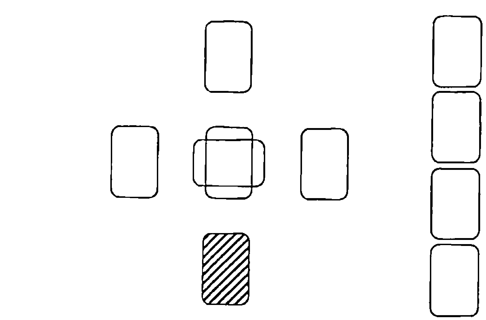

- 根本原因
  - 問題的根源
  - 某個局面的基礎
  - 事情之所以如此的原因
  - 童年或過去生（業力）的影響
  - 事件背後的原因
  - 起點

- 無意識的影響
  - 「在你底下的」
  - ——傳統用法
  - 未被認出的動機
  - 未曾承認的目標
  - 最基本的衝動
  - 驅動的需求或慾望
  - 被否認或拒絕的自我面向

- 深層的意義
  - 較大的圖像
  - 基本的模式
  - 涵蓋一切的觀點
  - 靈魂（精神本質）的目的
  - 底層的前因後果
  - 真實發生的狀況

- 未知的因素
  - 潛藏的影響力
  - 未獲承認的貢獻
  - 未被發現的參與者
  - 隱藏的目的
  - 幕後的運作

## 塞爾特十字·位置四

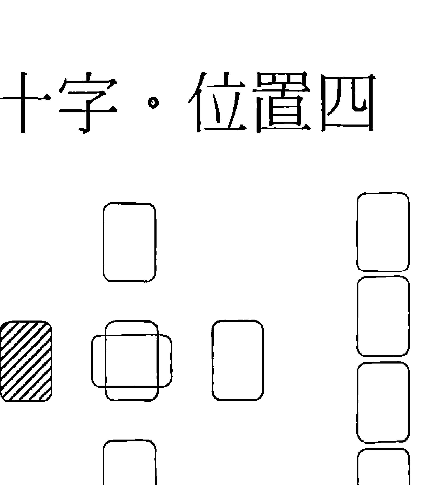

- 過去
  - 消退中的影響
  - 與過去相關的
    - 特質
    - 人物
    - 信念
    - 事件
    - 機會
    - 取向
    - 關懷
    - 希望
    - 恐懼

- 消退中的影響
  - 逐漸喪失重要性的特質
  - 消退中的考量
  - 先前的焦點
  - 正在離去的某人／某事
  - 殞落中的星星

- 已解決的因素
  - 將要釋放的特質
  - 已經完全實現的特質
  - 已完成的任務
  - 已收工的事物
  - 可以撇開不論的因素
  - 已經受到關照的事物

- 將要釋放的特質
  - 過時的做法
  - 不再有用的東西
  - 不必要的包袱
  - 不再需要的某人／某物
  - 將被摒除的因素

#### 塞爾特十字・位置五

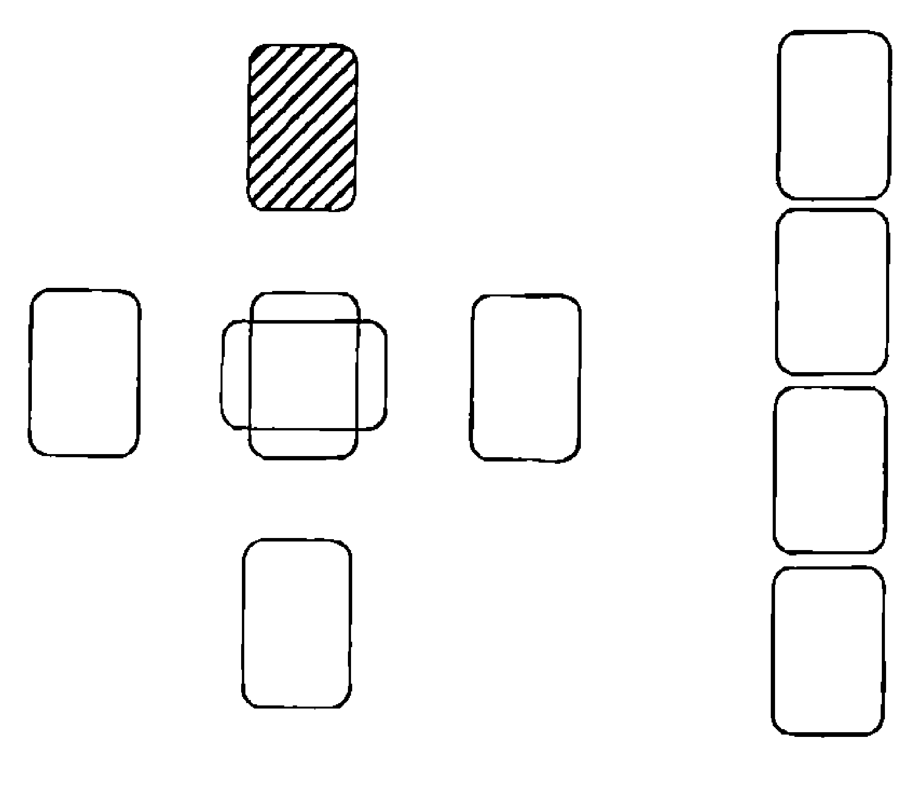

##### 態度與信念
- 態度與信念
- 明意識的影響

##### 態度與信念
- 你接受為真的事物
- 假設
- 信念
- 你如何看待發生中的一切事情
- 錯覺或假象
- 你賦予信任的所在

#### 明意識的影響
- 你心中所想的
- 你所專注的
- 你所擔憂的
- 你所執迷的
- 你所承認的
- 已知的

##### 目標或目的
- 目標或目的
- 另一種可能的未來

##### 目標或目的
- 志向，抱負
- 你企圖成就的
- 對未來的期望
- 你打定主意想要的
- 偏好
- 希冀的結果

##### 另一種可能的未來
- 「可能發生的」
- 傳統用法
- 可能的發展
- 不同的可能性
- 另一種選項
- 你認為將會發生的
- 你有意識地預期的未來

#### 塞爾特十字・位置六

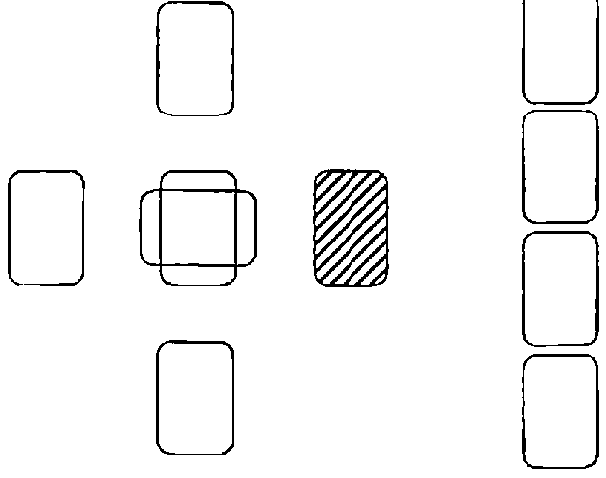

- 未来
  - 趋近中的影响

- 未解决的因素
  - 将要拥抱的特质

- 与未来相关的特质
  - 人物
  - 信念
  - 事件
  - 机会
  - 取向
  - 关怀
  - 希望
  - 恐惧

- 未解决的因素
  - 尚未实现的特质
  - 尚未完成的任务
  - 悬而未决的事物
  - 必须列入考量的因素
  - 需要被关照的事物

- 将要拥抱的特质
  - 有效的做法
  - 将会有的东西
  - 令人希望的特质
  - 被需要的某人/某物
  - 将受到欢迎的因素

- 趋近中的影响
  - 重要性逐渐增加的特质
  - 发展中的考量
  - 将来的焦点
  - 正在来临的某人/某事
  - 明日之星

#### 塞爾特十字・位置七

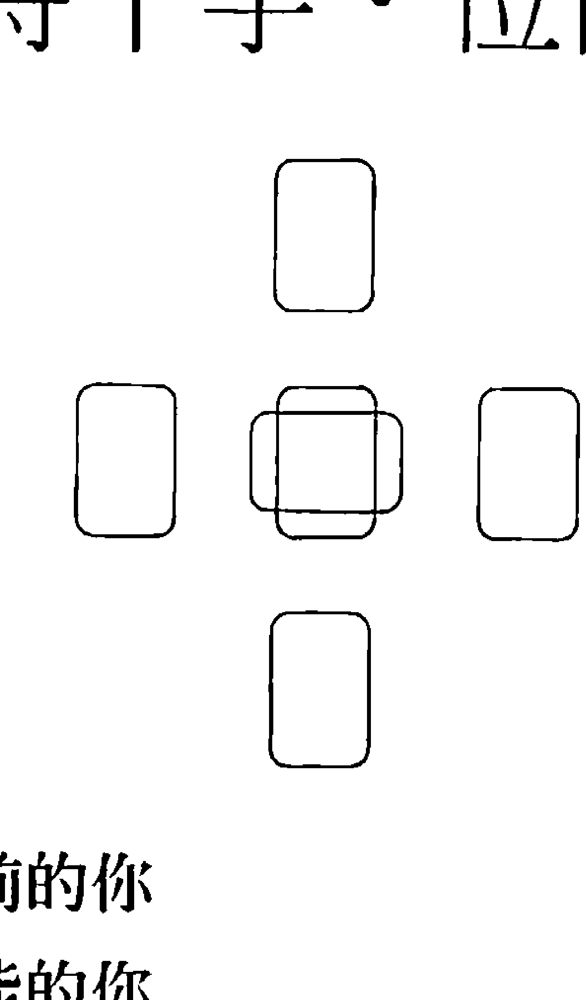

- 目前的你
  - 可能的你

- 你所展現的你
  - 你眼中的自己

- 目前的你
  - 個人的風格
  - 你的性格或性情
  - 你面對問題的做法
  - 你獨特的取向、態度
  - 你的觀點
  - 你的生存方式
  - 你的立場或態度

- 可能的你
  - 可供汲取的內在資源
  - 你能運用的天份或能力
  - 你所能做到的
  - 希望企及的理想
  - 可能的做法
  - 你想要成為的
  - 你對自己設定的目標

- 你所展現的你
  - 你的公眾形象
  - 你認為自己該是如何
  - 你對世界展現的面具
  - 你為維持表象所做的事
  - 你所接受的角色
  - 自己加諸的責任
  - 你的「假我」

- 你眼中的自己（傳統用法）
  - 你的自我形象
  - 你對自己的信念
  - 你對自身處境的感覺
  - 你對自我的恐懼
  - 你對自我的假設
  - 你如何限制自己
  - 你如何拓展自己

#### 塞爾特十字・位置八

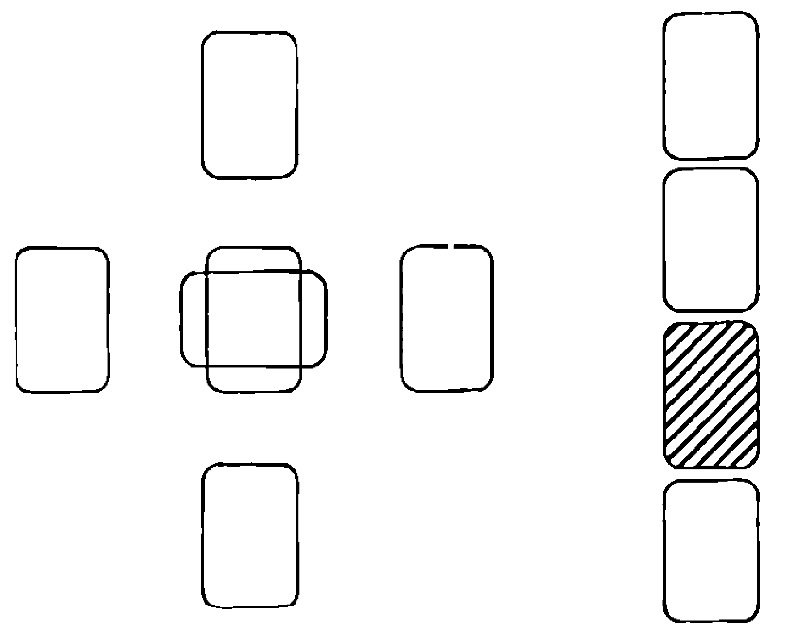

- 外在環境
  - 他人的觀點

- 他人的期待
  - 他人所見的你

- 外在環境
  - 「圍繞你的一切」
  - ——傳統用法
  - 氣氛
  - 情緒的氛圍
  - 物質與社會的環境
  - 某種情境的背景
  - 競爭場域
  - 你須於其中運作的框架

- 他人的期待
  - 他人期待於你的
  - 加諸於你的要求
  - 他人覺得你應該做的
  - 他人對你主張的權利
  - 加諸於你的外在限制
  - 你被分派的角色

- 他人的觀點
  - 他人如何看待該情境
  - 他人的立場
  - 問題的另一個觀點
  - 不同的看法
  - 客觀的意見

- 他人所見的你
  - 「他人如何看你」
  - ——傳統用法
  - 你給人的印象
  - 你是如何被評估的
  - 公眾對你的看法
  - 你所創造的印象
  - 你對他人的影響

## 塞爾特十字·位置九

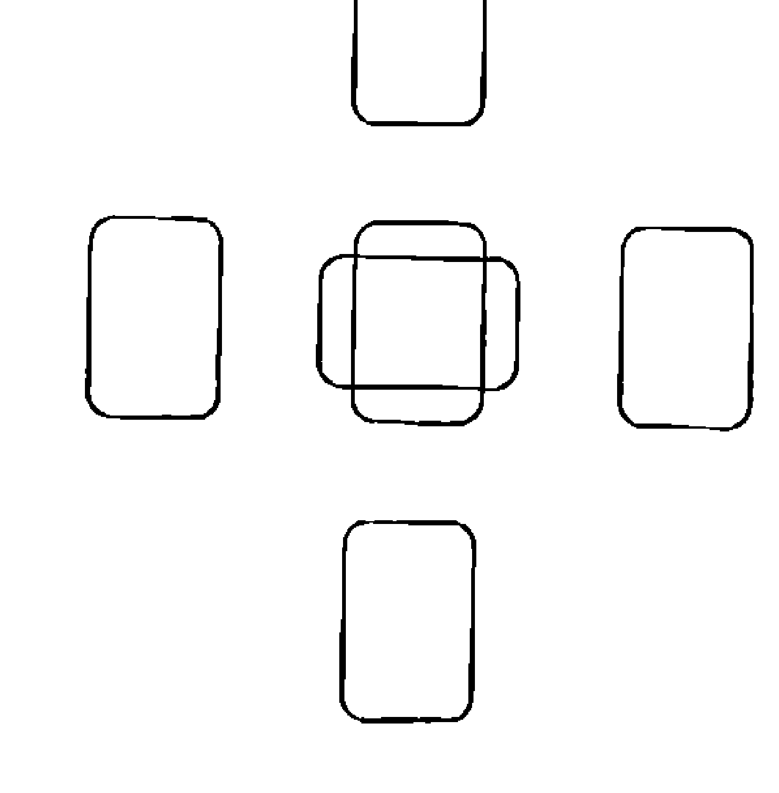

- 指引
  - 你可以做些什麼
  - 最佳的進行方式
  - 你可以如何改變
  - 警語
  - 事態的真相
  - 不同的做法
  - 有助益的建議
  - 誠實的評估

- 關鍵的因素
  - 根本的面向
  - 需要學習的教訓
  - 解釋一切的原因
  - 目前發生之事的線索
  - 你需要知道的
  - 連接的環節

- 希望與恐懼
  - 希望與恐懼 (傳統用法)
  - 你所害怕的
  - 你所懷疑的
  - 你所規避的
  - 個人的心魔
  - 你所渴望的
  - 你的夢想
  - 你的理念
  - 你的秘密願望

- 被忽略的因素
  - 你未曾考慮到的事物
  - 拼圖中缺漏的一塊
  - 起作用的另一個人
  - 需要考慮的另一件事
  - 意外的元素
  - 受到低估的影響因素

#### 塞爾特十字・位置十

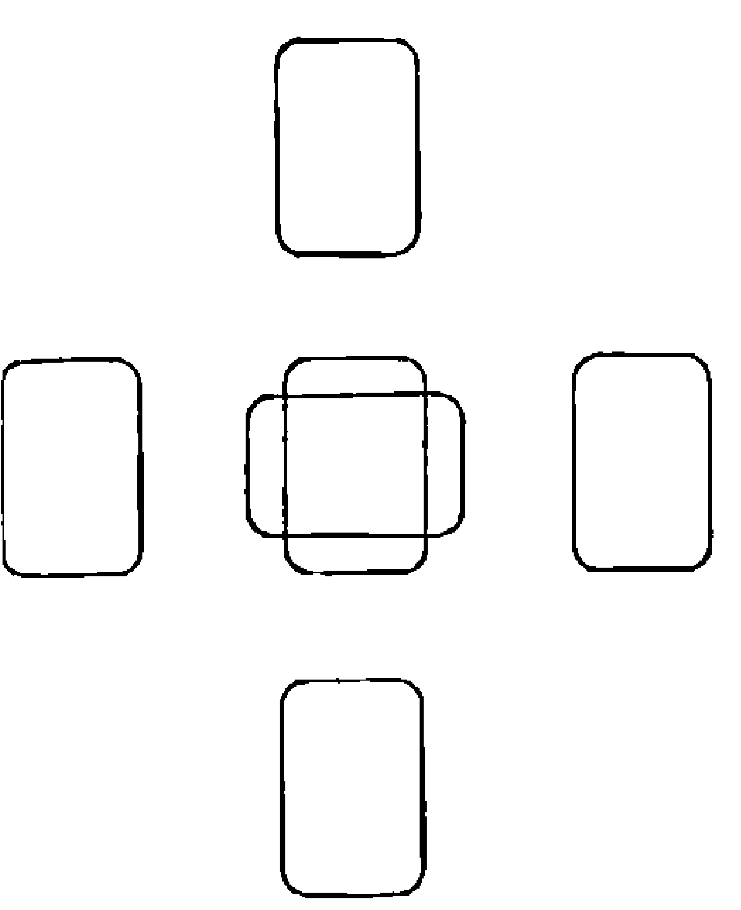

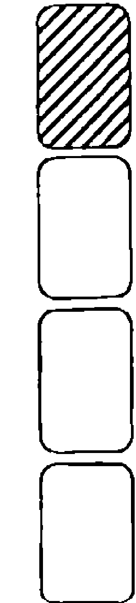

##### 結果（整體）
- 最有可能的結果
- 可能會發生的
- 該局面可能的解決方式
- 一切事情的導向
- 可能的解決之道

##### 結果（行動）
- 你可能必須去做的事
- 你可能怎麼成功／失敗
- 你可能必須採取的行動
- 必須遵循的行為
- 你可能成就的
- 你可能必須採取的做法

##### 結果（內在狀態）
- 你最終將如何感覺
- 你的心情將會是如何
- 你將獲得的了悟
- 你將吸取的教訓
- 你將採取的態度
- 你將實現的特質或能力

##### 結果（效果）
- 別人將如何受到影響
- 環境將如何變化
- 他人將會怎麼做
- 可能遭遇的反制或衝撞
- 可能的利益或報償
- 將會獲致的改善
- 情況的變化

#### 吉兒的故事

※※引言※※
這個故事是我為一位朋友在一年的時間當中所做的三次一系列占卜。這幾次占卜顯示了塔羅是如何隨著時間的推移反映事件的發展。每次占牌都是一個特定時刻的「快照」，隨著事件的進展，這快照的圖像也會改變，但其中卻有共同的脈絡貫串著。在這一系列的占卜中，你會看見新的元素如何與持續存在的元素互動著。（不使用逆位的牌。）

在以下的解牌文字中，取自單元四〈牌意解析〉的字句會以粗體字標明，取自〈塞爾特十字牌陣各位置關鍵詞〉列表的字句則以斜體字標出。建議你把牌陣中用到的牌排出來，如此，你也可以體驗占卜的過程。

##### ※第一次占牌※

第一次占牌是在一九九〇年一月，我為吉兒做了一次「開放式占卜」。吉兒在十一個月大時就被人收養，她想盡可能地探知她生命頭一年的狀況。好幾個月來，她嘗試得到生母和生父的消息，雖然對於後者她沒那麼急切。
吉兒試圖與辦理她收養事宜的仲介交涉，卻發現大部分的資訊都不對她開放。占牌的時候，她已經決定採取法律行動以取得她要的資料。右圖是她占得的牌：
這些牌排出來後，我們兩人都立刻被那張「寶劍三」所吸引——事情的根本原因。這張牌完美地象徵了做為嬰兒的吉兒在突然與生父母和寄養家庭分離時必定會感受到的心碎和孤寂。留意那三把劍——吉兒和她的雙親——刺穿了他們共同的心。
背叛的意義也很重要。在某種層面上，吉兒覺得被許多

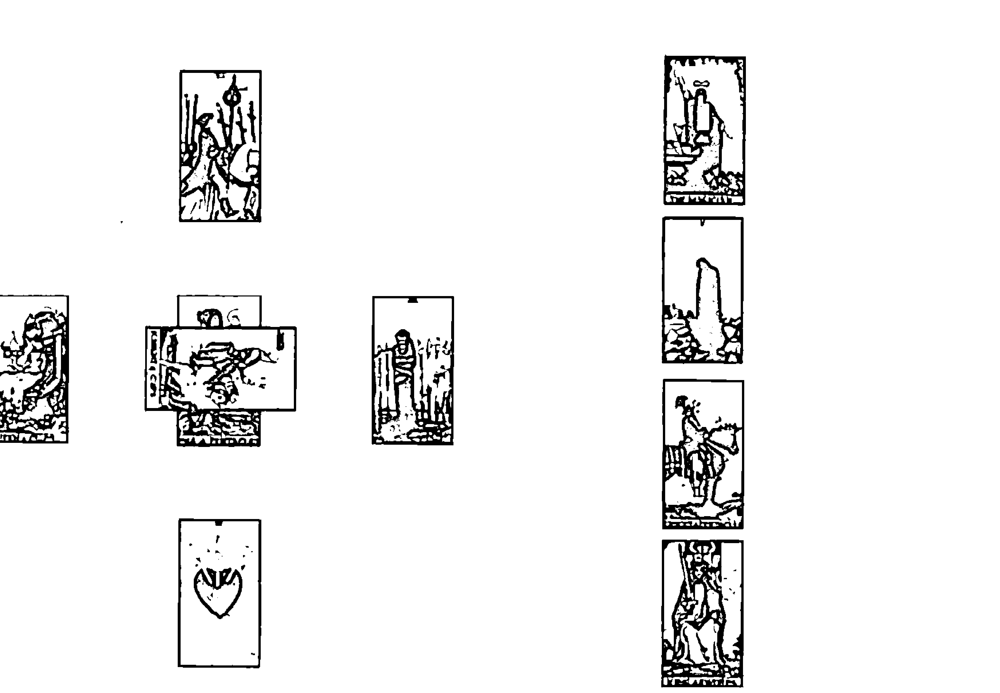

###### 第一次為吉兒占卜所得出的塞爾特十字牌陣

人背叛：不讓她追尋身世的養父母，百般阻撓的仲介，以及吉兒或許因為受拋棄而在無意識中怨恨著的生父母。

牌陣中的這許多張宮廷牌暗示著平衡的必要。首先是中央的錢幣／聖杯牌對（牌一和牌二），它們象徵吉兒幻想未來的願望（聖杯）以及注重實際的必要（錢幣）之間的衝突。結果，這個主題將成為吉兒在接下來幾個月中首要的焦點。

「錢幣侍衛」顯示吉兒為了贏得訴訟、繼而獲悉身世，必須專注在實際的事務上。「聖杯騎士」則顯示她反面的傾向——不切實際地夢想著找到生母會是何種景況。他暗示吉兒在情感上欠缺節制。這張騎士牌顯示她的期望過於浪漫了。

位置四的「聖杯王后」強化了這個概念。看見這張牌時，「母親」這字眼跳進了我的腦海。我突然覺得這張「聖杯王后」在這案例中有著特殊的意義。她是吉兒希望找到的夢幻母親，一個滿心愛意與柔情的慈母。這個來自過去的渴望驅使吉兒來到目前的情境。

另一個重要的牌對是位置七的「寶劍國王」和位置八的「錢幣騎士」。這裡的「寶劍國王」暗示在此情境中吉兒自認為是誠實與正義的使者，她認為獲知她生命中頭一年的真相是她的權利。同時，在這次占卜的前一週，吉兒已經準備好了呈送法庭的立場聲明書。她運用了「寶劍國王」的天賦——敏銳的分析能力、思維能力，以及寫作技巧。

「錢幣騎士」暗示其他人或許會認為吉兒太過嚴肅和執著。由於他們不欣賞她強烈的態度，便判定她太過執迷而難以妥協。無論這種看法是否有理，這都是個寶貴的訊息。如果吉兒不見容於仲介及司法體系，她成功的機會便降低了。「錢幣騎士」暗示吉兒應該採溫和而理性的做法，緩和任何缺乏彈性的表象。

位置九的「聖杯五」是整個情境的關鍵。它代表失去，這始於吉兒最初失去親生父母。現在，吉兒必須願意放棄她的夢幻母親，好讓她能與真實的母親建立真正的關係，無論她是誰。同時，她也害怕會輸掉這場官司。

「寶劍八」暗示前頭會有一些令人迷惑的時刻。當吉兒試圖平衡矛盾的感情時，會不時感到無力。同時，外界的力量或許會暫時限制住她的追尋。

另一方面，沒有什麼比位置五的「權杖六」和位置十的「魔法師」更正面的了。「權杖六」顯示吉兒明意識信念的力量，相信自己有能力克服法律上的障礙，贏得成功。她知道自己能夠獲致「魔法師」牌所預示的勝利。牌陣中唯一的大阿卡納牌「魔法師」顯示，當吉兒認知到她的目標時，會有非凡的力量等待著她。如果她能整合內在的力量，有意識地接受她的損失，將會獲得極大的成功。

##### ※第二次占牌※

一九九〇年六月，我為吉兒和她的狀況做了一次「為他人占卜」。我所獲悉的事件發展戲劇化得令我很想看看塔羅牌會怎麼說。

在三月，吉兒與一位法官會面，對方確認她尋找親生父母的正當性，於是裁定收養檔案應該解密。歷盡艱辛後，吉兒在三個星期內找到了親生父母，她的生父起初不太想跟她談話，但當她和生母在一個遙遠的城市會面後，母親即溫暖地歡迎她。

我真的覺得吉兒實現了第一次占牌所預測的正面結果。她相信自己的能力，並在很短的時間內達成了所有的目標。然而，這時劇情卻有了出乎意料的轉折。

吉兒與生母很快地建立起親密的關係，而當她住在母親那兒時，她的生父又與她們恢復了聯繫。她的父母在分離三十多年之後頭一次交談，也很快地舊情復燃了！就是在這個時候，我決定做一次占卜，我想了解環繞著此一情境的高張能量。我寫下的問題是：「吉兒與她生父、生母間彼此交纏的生命戲劇，其本質及原因為何？」下頁所示是我遇到的牌：

我們再次看見位置一出現了一張「侍衛」牌。吉兒當前的處境仍是一個行動的機會，但這回她面對的是一項挑戰。吉兒必須對自己誠實，並以堅毅和清明的頭腦（寶劍）面對此一情境。

位置二的「寶劍四」告訴她該如何支持自己度過這段時期。她必須小心謹慎地檢視自己的行為和動機，同時在心中培養出穩定而寧靜的中心，好讓自己能夠乘坐這種情緒的雲霄飛車。

在牌三和牌五我們看見了這次占卜與第一次占卜之間的關聯。在位置五，我們再次看見「夢幻母親」——聖杯王

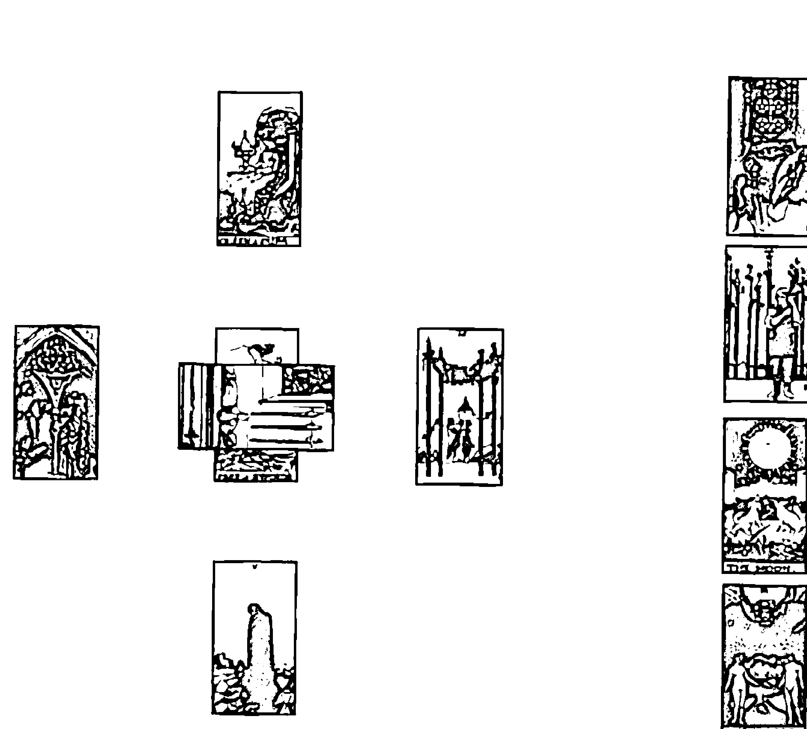

###### 第二次為吉兒占卜所得出的塞爾特十字牌陣

后。吉兒似乎還沒有放棄這個理想，還把它牢牢放在明意識的心中。大多數的時間裡，她都在想著、感覺著她的生母。

在第一次占卜中，「聖杯五」顯示變調的情感失落是吉兒在這齣戲劇中的關鍵功課。現在，這張牌移到了位置三。吉兒對自己身世的憾恨變得深植在無意識中。在內心深處，她悲悼著失去親人以及原本可能的夢想。她這身世的重演也激起她對於再度失去雙親的恐懼。

位置四的「錢幣三」暗示吉兒與雙親先前享有的團隊關係已經成為過去。這張牌上的人物位置透露了很多訊息。其中兩個人站在一起，另一個人則獨自站著。那落單的人半轉身子，彷彿無法決定自己是否跟另外兩個人是一夥的。在研究這張牌時，我頭一次注意到那落單的人右手中倒轉的杯子。它是多麼清楚地呼應著「聖杯五」中翻倒的杯子、以及它們所象徵的失落！

位置六的「權杖四」是慶祝的理由。無論吉兒的情況將如何演變，不久的將來似乎都會是很令人興奮的。

牌七和牌八帶有額外的份量，因為它們是大阿卡納牌。這兩張牌指出吉兒與其環境之間的重要矛盾。吉兒的觀點是「戀人」，她想締造原本被剝奪的愛與親密關係的連結，同時，她也在接受她的雙親真的成為戀人的事實。

可惜，吉兒的環境充滿了恐懼和幻覺。「月亮」象徵著當事情不若表面上看來那樣、或是人們言不由衷時所帶來的不確定。這個案例中並沒有刻意的欺騙，只是欠缺明晰。沒有人心懷惡意，但每個人都不確定自己真正的需求。

吉兒似乎正在走向「錢幣五」（牌十）所描繪的某種拒絕。整個牌陣所顯現的欠缺整合，暗示她可能會發現自己就像圖中流落街頭的可憐人般遭人迴避，被遺棄在冷風中。

吉兒的力量在於真誠。「寶劍侍衛」（牌一）提醒她清明與誠實是核心要務，但同時，她也必須為最壞的狀況做準備。位置九的「權杖九」告訴她必須自我防衛，並準備運用她潛藏的力量。不遠的將來或許有值得慶祝之事，但當吉兒在新關係的真相中尋求自處之道時，也將會遭遇艱困時刻。

##### ※第三次占牌※

第三次為吉兒占卜是在一九九〇年十一月，她本人也在場。七月時，吉兒的生父前來探訪她的生母，兩人之間剛萌芽的戀情迅速進展。到了八月，吉兒和她生母到他生父居住的遙遠州郡旅行，這趟旅行有其正面之處，但後來卻有令人煩擾的轉變。某天晚上，她父親當著她的面將門摔上，讓她經驗到第二次占卜中所預測的「拒絕」。在他們之間的緊張達到最高點之際，她被趕到了街上。

吉兒的母親從此再也沒有返家。她拋下了現任丈夫和所有財物，搬去跟吉兒的生父同住。從這時候起，吉兒與他們兩人的互動就常常很緊繃，還發生過幾次戲劇性十足、甚至教人害怕的場面，讓吉兒十分煩惱。占牌的時候，她非常想知道這種情況將會怎樣發展。她所寫下的問題是：「我和我生父、生母的關係，未來將會如何發展？」以下是她抽到的牌：

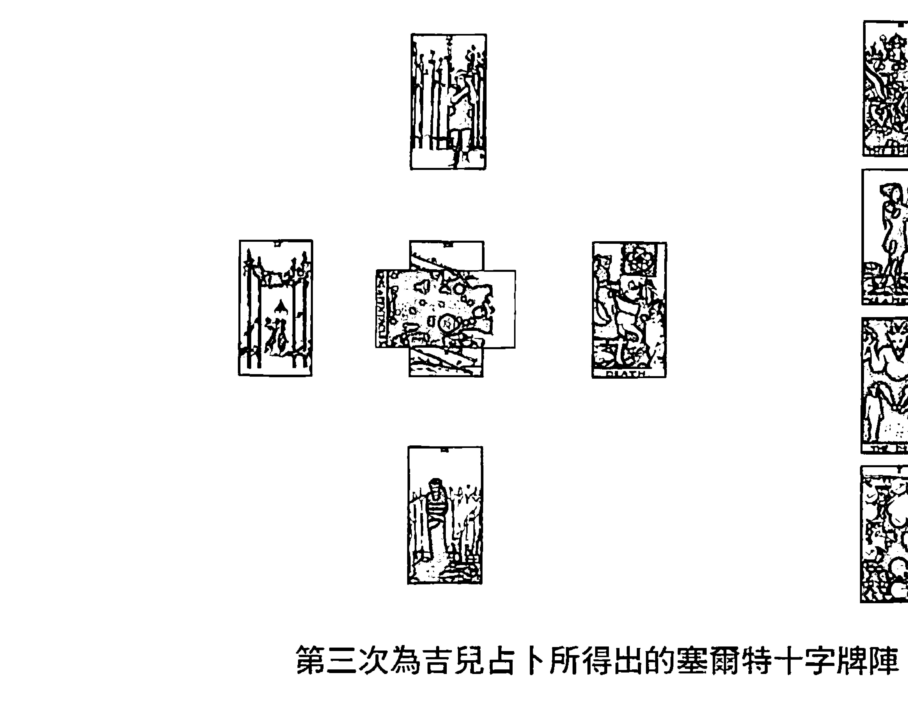

###### 第三次為吉兒占卜所得出的塞爾特十字牌陣

我們可以看見，原本存在於吉兒處境中的能量仍然很明顯。有四張牌是重複的。「寶劍八」從第一次占卜時的位置六移到了位置三。原本在未來的限制現在成了目前情境的基礎。過去一年的感情事件如此的騷亂，以至於吉兒在根本的層面上深感無力。

「權杖九」從第二次占卜時的位置九移到了位置五。這張牌是在警告吉兒要照顧好自己，並為最壞的情況做準備。沒錯，她的確已經開始朝這些方向思考了！由於被刺傷過，她知道自己必須堅強、必須防衛自己。

「權杖四」從第二次占卜時的位置六移到了位置四。親人重聚的歡欣已經在消退中，歡樂時光的興奮已流過吉兒的生命，現在已成為過去了。

牌七和牌八顯示吉兒的期待與她父母的仍然不相符。

吉兒渴望安穩、有秩序的家庭生活（錢幣十），她想要一個能夠持續的結果——不過就是體驗正常家庭平凡生活的機會。

然而，她的父母卻被綁縛在「惡魔」牌所象徵的執迷關係中。吉兒在第二次占牌時看成「戀人」的愛情，其實是兩個靈魂的枷鎖，缺乏足夠的自我了解去創造一種能容得下他們女兒的愛。

吉兒需要一個解答，而有兩張牌都暗示解答即將到來。首先是位置一的「權杖八」，它顯示了結是可能的。如果吉兒採取迅速而決斷的行動，她將能夠完結未了之事。

「死神」牌也顯示在不久的將來結局就要到來。或許這三個人將會分道揚鑣，又或許吉兒將會與她父母過渡到一種新關係中。

「皇后」牌做為結果或解答是正面的訊號，因為它顯示，在此情境中，母親的理想就是吉兒將獲得的領悟。「皇后」是母性的原型——儘管有種種誘惑阻撓，仍能夠去愛、去疼惜撫育的能力。吉兒覺得這張牌也意味著她該重新專注在自己做為母親的角色上。

假如吉兒想獲致此種正面的結果，她該怎麼做呢？關鍵在那兩張錢幣宮廷牌。位置九的「錢幣侍衛」是第四張重複的牌，（第一次占卜時）它原本出現在位置一，現在它再次強調吉兒的功課在於信任，以及依夢想行動的能力。

儘管歷經重重阻礙，吉兒終於找到了親生父母，但她卻發現現實與她的幻想並不相同。她學會信任自己，不依賴他人的支持去度過難關。牌二的「錢幣國王」告訴吉兒不要透過他人去尋求救贖。她必須在自己內心發展出穩定而可靠的成熟（國王）錢幣牌特質。

而那張「侍衛」牌則鼓勵她伸張自己的力量，並找出能奏效的解決之道。她必須斷然釋放她對理想家庭的夢想，如此一來才能夠跟她真實的父母相處，包容他們所有的缺陷與# 局限。

雖然這次占卜是關於愛與血緣關係，但卻沒有出現半張聖杯牌。這些代表愛與感情的牌完全付之闕如。愛的功課不是總那麼容易，對吉兒來說，它們以挑戰的形式出現，激發她內在潛藏的力量，使她成為更堅強、更有智慧的人。

# 附錄 Appendices

#### 附錄A 愚人的旅程

「愚人的旅程」是生命之旅的隱喻，每張大阿卡納牌都代表這旅程中的一個階段——某個個人必須汲取的經驗，藉以實現他的完整。以下這二十二項描述，是以每張大阿卡納牌的關鍵詞為基礎，這些關鍵詞在行文中會以粗體字突顯出來，而牌的號碼則註記在括號中。

##### ★愚人★

我們從「愚人」牌（0）說起——一張代表開始的牌。愚人牌代表剛剛展開人生旅程的每一個人。他之所以是個愚人，是因為只有單純的靈魂會有如此天真的信心，去展開這樣一場充滿危險與痛苦的旅程。

在其旅程的起點，愚人是個新生兒——未經磨練、開放、隨性自在。這零號牌上的人物雙手敞開，頭仰得高高的，準備擁抱任何邂逅的事物，但他也渾然未覺自己即將踏上懸崖邊緣。當他出外闖蕩、學習世界的功課時，他並不知道自己將面對什麼樣的艱險。

「愚人」有點兒獨立於其他大阿卡納牌之外。「零」是個不尋常的數字，它位於數字系統的正中央——就落在正數與負數之間。出生時，愚人身處他個人宇宙的正中央，他既是奇特的空虛（正如「零」一般），但又滿懷著前進學習的欲望。這企圖似乎是種愚昧，但真是如此嗎？

##### ★魔法師與女祭司★

上路後，愚人立刻遇上了「魔法師」（1）和「女祭司」（2）——構成感知世界的偉大平衡力量。物質宇宙的特徵之一就是，只要我們舉出經驗的某個面向，便會自動喚起它相對的一面。「魔法師」是積極的一面。他代表創造性驅力積極、陽剛的力量，同時也是我們有意識的覺知。魔法師是容許我們透過個人意志及力量的聚焦去衝擊世界的力量。「女祭司」則是消極的一面，代表神秘的無意識。她提供肥沃的土壤，讓創造性事物得以發生。女祭司是我們未實現的潛能，等待一個活躍的力量將它表達出來。

積極與消極這兩個詞並不暗示「好」與「壞」。這些是人為的區別，在塔羅上並不適用。在價值和重要性上，魔法師與女祭司絕對是相等的。兩者都是維持平衡所必須。我們也許會把「消極」視為「陰暗面」，但若沒有陰影，我們就無法看見光亮；若沒有潛能的土壤，我們便無法創造。

##### ★皇后★

當「愚人」漸漸成長，他對遇遭環境會有更多的覺知。如同大多數的嬰兒，他最早認得的是他的母親——那個照顧他、哺育他的溫暖慈愛的女性。他同時也會覺知到「大地之母」，那個廣義上撫育他的母親。

「皇后」牌（3）代表自然與感官的世界。小嬰兒樂於探索他所觸碰、嚐到以及聞到的每樣東西，對那些吸引他感官的景物與聲音，他永遠不嫌多。大地母親用她的支持環抱著我們，在這些豐富的滋養中感到喜悅，是最自然不過的了。

##### ★皇帝★

愚人接下來會接觸的人，是「皇帝」（4）牌的父親角色。他是結構與權威的代言人，當小嬰兒離開母親的懷抱，他會知道世界有其模式。事物會以可預期的方式回應他，可以好好探索。從發現秩序的過程，孩子體驗到一種新的樂趣。

「愚人」也會遭遇到規則。他會學到，他的意志並非永遠至高無上，為了自己好，某些行為是必要的。權威人士會將這種指標施加在你身上，這些限制可能令人感到受挫，但是，透過父親耐心的指導，愚人開始了解它們背後的用意。

##### ★教皇★

終有一天，「愚人」會踏出家門，探素更廣闊的世界。他會接觸其所處文化的信仰與傳統，並展開正式的教育。「教皇」（5）代表這種開始圍繞並教導這個成長中的孩子的、有組織的信仰體系。

「教皇」是闡釋神秘知識和奧義的人。在第五號牌上，我們看見一位宗教人物正在祝福兩位侍僧，他或許是在引領他們成為教會成員。雖然牌上的圖像是宗教性的，實際上卻象徵一切形式的啟蒙。

孩子受到他所處社會一切常規的訓練，並成為某個特定文化及世界觀的一部分。他學習認同某個群體，並發現一種歸屬感。他樂於學習社會習俗，並展現他能夠遵奉得多麼好。

##### ★戀人★

最後，「愚人」會面對兩種新的挑戰。他體驗到強烈的衝動，想要與另一個人做性的結合。在此之前，他大致上是自我中心的。現在如「戀人」（6）牌中所描繪的，他感受到與自我中心相抗衡的傾向，想要向外拓展，成為情愛關係的一份子。他渴望親密關係。

同時，「愚人」也必須決定自身的信念。當他學習、成長之時，只要遵守成規就夠了。但到了某個時點，如果他想忠於自我，就必須決定自己的價值觀。他必須開始質疑接收到的意見。

##### ★戰車★

長大成人後，愚人開始有了強烈的身份認同，並對自己有了某種程度的掌控。透過紀律和意志力，他發展出一種內在的控制力，使他得以超越自身的環境。

「戰車」（7）代表這種強而有力的自我，也就是愚人到目前為止最高的成就。在這第七號牌上，我們看見一個驕傲而威風凜凜的人物凱旋地巡行他的世界。顯然，自我和他所俯臨的一切都在他的掌控中。此時此刻，愚人自我伸張的成功是他可能希冀的一切，而他也感到某種程度的自滿。他的信心，是年輕人篤定的自信。

##### ★力量★

隨著時間推移，生命會為愚人帶來新的挑戰，其中有些將導致痛苦與幻滅。很多時候，他會需要汲取「力量」（8）的特質。他將被迫發展勇氣與決心，即使遭遇挫折也能繼續前行。

愚人也會發現耐心和容忍的寧靜屬性。他將了解，「戰車」專斷的掌控，必須以仁慈和溫情的柔性力量加以調和。有時候，就在愚人以為他每件事——包括自己——都受掌控時，強烈的激情卻會洶湧而起。

##### ★隱士★

或遲或早，「愚人」內心會被挑起亙古以來的大哉問：「為什麼？」他會專心致志地追尋答案，而這並非出於無聊的好奇，而是發自內心的需要，要知道人既然要死要受苦、卻又是為何而活。「隱士」（9）牌就是代表這種發現深層真理的需求。

「愚人」開始向內省視，試圖了解自己的感覺和動機。感官世界不再那麼吸引他了，他轉而尋求孤獨的時刻，遠離

##### ★命運之輪★

經過漫長的心靈探索，「愚人」開始看見萬事萬物是如何連結在一起。他窺見世界神妙的設計，它複雜而精微的模式與循環。「命運之輪」（10）即是此一神祕宇宙的象徵，其各個部分和諧地共同運作著。當「愚人」瞥見世界的美麗與秩序，即使只是短暫的一眼，他便找到了所追尋的某些答案。

有時他的經驗像是出於命運的安排，一次偶遇或奇蹟般的事件開啟了變化的進程。在一連串將他引導向此一轉捩點的事件中，愚人或許認出了自己的命運。一向離群索居的他，覺得準備好再次採取行動了。他的視野更廣了，並將自己看成宇宙更宏大計畫的一部分。他的使命感回來了。

##### ★正義★

愚人現在必須決定，這份了悟對他個人有何意義。他回顧自己的人生，追溯將他帶到這個點上的因果。他對過去的行為負起責任，好做出彌補，並確保未來能走上更誠實的道路。「正義」（11）的要求必須予以伸張，好讓他能將功過板擦拭乾淨。

這對愚人而言是個決定的時刻。他正在做重要的抉擇。他將對自己的體悟保持忠實？或是退回早期不知不覺的生存方式，從而阻絕進一步的成長？

##### ★吊人★

勇敢無畏的愚人繼續前行。他決心實現自己的願景，卻發現生命並非如此容易馴服。或遲或早，他會遭逢個人的十字架——某種似乎難以承受的經驗。這個排山倒海的挑戰壓得他喘不過氣來，直到他別無選擇，只得放棄、放手。

起初，「愚人」感到挫敗和失落，他相信自己已經犧牲了一切，但在更深的層面，他知曉了驚人的真相。他發現，當他放棄企圖掌控的努力，每件事情都開始按照應然的方式進行了。藉著變得開敞而脆弱，「愚人」發現「內在自我」神奇的支持力量。他學會臣服於自己的經驗，而不是去對抗它們。他感到一種意外的喜悅，並開始順隨生命的波流。

「愚人」覺得自己暫停於一種超越時間的瞬間，沒有壓力，也沒有迫切之感。事實上，他的世界已經上下逆轉了。「愚人」就是那「吊人」（12），表面上在殉難受苦，實際上卻安詳而平和。

##### ★死神★

現在，「愚人」開始革除舊有的習慣和陳腐的做法。他去除一切不必要的，因為他欣賞生命中基本的東西。他經歷了種種結束，將生命中不再適用的部分拋捨。這個過程看來或許像死亡，因為他所熟悉的自我死去了，好讓一個新我得以成長。有時這種無可抵擋的改變看似要將愚人毀滅了，但他最後終能再起，發現「死亡」（13） 並非一種恆久的狀態。它只是個過渡，藉以達到一種更令人滿足的新生活方式。

##### ★節制★

自從擁抱「隱士」後，「愚人」即在情緒的鐘擺上劇烈地來回擺盪。現在，他瞭解了「節制」（14）維持平衡的穩定力量，找到了真正的寧定與均衡。藉著體驗極端，他終於能夠欣賞節度。「愚人」結合了自我的各個層面，成為一個合一的整體，洋溢著健康與幸福。跟「戰車」牌上威猛但嚴厲的統治者比起來，十四號牌上的天使是多麼優雅柔和？〔註一〕「愚人」走過了漫長的路途，終於實現了和諧的人生。

##### ★惡魔★

「愚人」有了健康、心靈的平靜，以及優雅的從容。他還需要什麼呢？從日常的角度看，並不多，但「愚人」是勇敢的，他繼續追尋自我最深的層面。他很快就與「惡魔」（15）面對面了。

「惡魔」並非存在於我們自身之外的邪惡人物，而是某層面上深植於我們每個人內心的無知與絕望。物質的誘惑如此強力地束縛著我們，我們往往連察覺都沒察覺自己已經被它所奴役。我們活在有限的經驗中，對於生來便擁有的光輝世界渾然不覺。第十五號牌中的那對男女被鎖鍊綁縛著，但他們卻默然順從。他們可以輕易地掙脫開來，但他們卻甚至未曾察覺身上的束縛〔註二〕。他們看來像是一對「戀人」，但卻未察覺他們的愛被侷限在某個狹隘的範圍內。這種無知的代價便是絕望的內在核心。

##### ★塔★

「愚人」該如何掙脫「惡魔」的掌控呢？他能夠根除惡魔的影響力嗎？「愚人」唯有藉著「塔」（16）所代表的遽變，才能獲得釋放。「塔」是我們每個人圍繞著美麗的內在核心建構的自我堡壘。這座灰暗、冰冷、像岩石般堅硬的堡壘看似保護著我們，其實卻是座監獄。有時，唯有巨大的危機才能激發足夠的力量摧毀這座高塔的城牆。在這第十六號牌上，我們看見一道閃電擊中圖中的建築物，裡頭的人彈射出來，看來像是即將墜落身亡。圖中的皇冠顯示他們曾是驕傲的統治者，現在卻得向比他們更強大的力量低頭。

「愚人」若是想解放自我，或許就必須經歷這樣嚴酷的震撼，但隨之而來的了悟卻使這痛苦的經驗值回票價。黑暗的絕望瞬間被粉碎了，真理的光得以自由地灑落。

> 〔註一〕瑞秋·波拉克 (Rachel Pollack)，《七十八度的智慧，第一部》 (Seventy-Eight Degrees of Wisdom，Part I)， (London: Aquarian Press, 1980)，p. 65.
> 〔註二〕瑞秋·波拉克，《七十八度的智慧，第一部》， (London: Aquarian Press, 1980)，p. 102.

##### ★星星★

「愚人」現在沉浸在一片安詳寧靜中，「星星」（17）牌上的美麗圖像見證著這靜謐。第十七號牌中的女子是赤裸的，她的靈魂不再隱於任何偽裝底下。閃耀在無雲天空的燦爛星子，就像是希望與靈感的燈標。

「愚人」得到了信任的賜福；信任完全取代了「惡魔」的負面能量。他對自己和未來又恢復了信心。他心中充滿喜悅，一心想慷慨地與全世界分享。他的心胸開敞，他的愛無拘無束地流溢著。對「愚人」而言，這暴風雨後的寧靜是神奇的一刻。

##### ★月亮★

什麼作用能攪亂這完美的寧靜？還有別的挑戰等著「愚人」嗎？事實上，正是他的喜樂使得他容易陷入「月亮」（18）所象徵的幻覺。「愚人」的喜悅是一種情感狀態。他正面的情緒並未受清明的心智控管。處於空想縹緲的狀態時，「愚人」容易受幻想、扭曲以及對實象的誤解所影響。

「月亮」刺激著創造性的想像，為無意識中奇異而美麗的思緒開路，讓它們冒出表面。但根深蒂固的恐懼和焦慮同時會升起，這些經驗可能會使「愚人」感到失落而迷惑。

##### ★太陽★

是「太陽」（19）的澄澈明晰導引著「愚人」的想像力。陽光照亮了所有陰暗的角落，驅散了迷惑與恐懼的烏雲。它啟蒙了「愚人」，使得他不僅能感受到、且能理解世界的美善。

現在，他享受著生氣蓬勃的能量和熱情。「星星」的開闊結晶成向外拓展的信心。「愚人」成了第十九號牌中赤裸的嬰兒，開心地騎著馬兒，迎接新的一天。「愚人」感受著燦爛的活力，沒有什麼挑戰會令他卻步。他將所需的一切吸引到身邊，投入種種恢宏的事業。他有能力實現自己的偉大。

##### ★審判★

「愚人」重生了。他褪去了虛假的自我，容許明燦的真我展現出來。他發現喜悅——而非恐懼——才是生命的中心。

「愚人」感到被赦免了。他原諒了自己和別人，瞭解自己的真我是純真而良善的。他或許會懊悔過去的錯誤，但他知道那是出於他對自性的無知。他感到被洗滌、被更新，準備好要重新開始。

現在是「愚人」對自己的生命做出更深層「審判」（20）的時候了。他個人的審判之日已經來臨。由於他現在能真實地看待自己，因此能夠對未來做出必要的決定。他能明智地選擇要珍惜哪些價值、又要揚棄何者。

第二十號牌上的天使是「愚人」更高的自我，召喚他實現自己的承諾。他發現自己真正的天命——亦即他進入此生的原因。懷疑和猶豫消失了，他已準備好追隨自己的夢想。

##### ★世界★

「愚人」重行進入「世界」（21），但這回他有了更完整的了解。他整合了自身所有異質的部分，成就了整體。他達到了新一層的快樂和滿足。

「愚人」感受到生命是充實而有意義的。未來充滿了無限的允諾。他依循個人的天命，積極地投入這個世界。藉著分享獨特的天賦與才能，他提供服務，並發現自己所嘗試的一切都能成功興旺。由於他的所作所為都出自內在的篤定，整個世界都聯合起來，讓他的努力得到報償，使他獲致許許多多的成就。

......

所以，「愚人的旅程」終究並非如此愚不可及。透過堅毅與誠實，他重新建立了最初驅策他上路追尋自我的天真勇氣，只不過現在他已充份覺知自己在世界上的位置。這個循環結束了，但「愚人」永遠不會停止成長。很快的，他將準備好展開一場新的旅程，它將引領他達到更深層的了悟。

#### 附錄B 塔羅牌組的特質

塔羅的四個牌組各有其獨特的特質或能量。審視這份附錄上的字詞，你可以對這些能量獲得一些感覺。表上列出的字詞顯現各牌組特質的不同面向。這些詞僅僅是我的建議，如果你的直覺引導你往不同的方向，首先要信賴你自己的想法。

每個牌組都列有「正面」和「負面」兩組詞彙，這種劃分並不理想，因為它暗示著「好」與「壞」。在塔羅中，特質就是特質，沒有好壞之別，是我們人類根據它們對我們的影響來做評判的。我們的語言反映出這種判斷，因此我們對每種特質有正面及負面的敘述。我們對這些特質的看法也會因自己的處境而改變。「進取而富侵略性」究竟是正面還是負面的呢？端視情況而定。

| 權杖—正面 |  |  |
| --- | --- | --- |
| 愛冒險的 | 快活的 | 激烈的 |
| 進取的 | 有信心的 | 強有力的 |
| 熾烈的 | 有勇氣的 | 英雄式的 |
| 有吸引力的 | 有創造力的 | 激勵人心的 |
| 無畏的 | 敢於冒險的 | 堅韌不拔的 |
| 熱切渴望的 | 熱切的 | 善於創造的 |
| 大膽的 | 興高采烈的 | 有魅力的 |
| 英勇的 | 精力旺盛的 | 樂觀的 |
| 活潑的 | 熱烈的 | 原創的 |
| 有魅力的 | 生氣勃勃的 | 直率外向的 |
| 迷人的 | 外向的 | 熱情的 |
|  | 充滿感情的 | 冒險的 |

##### 權杖一頁面

- 篤定的
- 自信的
- 不屈不撓的
- 勇敢的
- 全心全意的
- 富侵略性的
- 性急的
- 驕傲的
- 天不怕地不怕的
- 不顧一切的
- 有勇無謀的
- 倉促草率的
- 剛愎任性的
- 不留心的
- 急躁魯莽的
- 焦躁易怒的
- 沒耐性的
- 魯莽衝動的
- 衝動行事的
- 輕率不謹慎的
- 不小心的
- 不負責任的
- 緊張不安的
- 過度自信的
- 過度熱心的
- 橫衝直撞的
- 放肆專橫的

##### 聖杯一正面

- 審美品味的
- 溫柔親切的
- 愉快宜人的
- 和藹可親的
- 仁慈厚道的
- 鎮定沉著的
- 有愛心的
- 悲憫的
- 關心的
- 體貼的
- 老練而得體的
- 令人心神寧靜的
- 容易感動的
- 有同理心的
- 寬容有耐心的
- 和善的
- 好心腸的
- 殷勤親切的
- 療癒的
- 人道的
- 有想像力的
- 內在的
- 親密的
- 內省的
- 直覺的
- 喜悅的
- 親切和藹的
- 深情的
- 圓熟的
- 慈悲的
- 溫和的
- 美好的
- 平和的
- 有耐心的
- 平靜的
- 敏銳的
- 通靈的
- 靜默的
- 精緻的
- 有回應的
- 浪漫的
- 敏感的
- 柔軟的
- 精神的
- 主觀的
- 甜美的
- 有同情心的
- 有心靈感應力的

##### 聖杯一負面

- 草率行事的
- 不顧後果的
- 焦躁不安的
- 浮動不定的
- 過度專注自身利益
- 膚淺的
- 欠考慮的
- 沒準備好的
- 心腸柔軟的
- 宽容的
- 谅解的
- 有智慧的
- 愁闷的
- 娇贵的
- 悲哀忧愁的
- 逃避现实的
- 好幻想的
- 脆弱易受损的
- 意志薄弱的
- 感情泛滥的
- 爱生气的
- 过度敏感的
- 歇斯底里的
- 易受影响的
- 好逸恶劳的
- 内向自闭的
- 懒惰的
- 感情脆弱的
- 忧郁的
- 沮丧抑郁的
- 喜怒无常的
- 阴郁孤僻的
- 自恋的
- 过度情绪化的
- 过于矫饰的

##### 宝剑一正面

- 善于分析的
- 辩才无碍的
- 精明机敏的
- 有权威的
- 头脑清楚的
- 聪明伶俐的
- 威严高贵的
- 直率的
- 具洞察力的
- 冷静的
- 公正的
- 讲究伦理的
- 公平无偏私的
- 直截了当的
- 坦率的
- 诚实的
- 高尚正直的
- 不偏不倚的
- 敏锐的
- 智力高的
- 正直公平的
- 头脑敏捷的
- 知识渊博的
- 有学问的
- 有文化素养的
- 讲究逻辑的
- 神志清明的
- 有威严的
- 心智的
- 道德的
- 客观的
- 观察力敏锐的
- 直言不讳的
- 洞烛一切的
- 颖悟的
- 机敏的
- 理性的
- 讲道理的
- 精明敏捷的
- 言词有力的
- 诚实无伪的
- 不存偏见的
- 没有成见的
- 消息灵通的
- 机智风趣的

##### 剑一负面

- 深奥难懂的
- 冷漠疏离的
- 傲慢自负的
- 独裁专制的
- 尖刻刺人的
- 直率欠考虑的
- 冷酷不友善的
- 抱持施惠态度的
- 操控的
- 态度冷淡而自行其是的
- 受批评的
- 挖苦伤人的
- 超然疏离的
- 冷淡疏远的
- 固执武断的
- 盛气凌人的
- 高压跋扈的
- 专横傲慢的
- 感觉麻木的
- 偏执不宽容的
- 批判的
- 心怀成见的
- 傲慢逞威风的
- 过度诉诸理智的
- 摆出恩赐态度的
- 孤高疏远的
- 冷漠不亲切的

##### 圣杯一正面

- 粗心欠考虑的
- 感情淡薄的
- 无感觉的
- 感受迟钝的
- 严厉不宽容的

##### 星币一正面

- 能干的
- 熟练的
- 敏捷灵巧的
- 勤勉周到的
- 慷慨宽大的
- 有能力的
- 仔细小心的
- 谨慎细心的
- 胜任称职的
- 具体实在的
- 勤勤恳恳的
- 始终如一的
- 择善固执的
- 有效率的
- 富进取心的
- 可靠的
- 有决心的
- 脚踏实地的
- 实事求是的
- 稳固坚决的
- 慷慨大方的
- 手艺灵巧的
- 工作勤奋的
- 勤劳刻苦的
- 忠实的
- 宽大有雅量的
- 一丝不苟的
- 滋养抚育的
- 有条有理的
- 有组织的
- 不辞辛劳的
- 坚忍不懈的
- 实际的
- 有生产力的
- 精通熟练的
- 审慎小心的
- 注重实际的
- 可信赖的
- 坚定果决的
- 富于机智的
- 承担责任的
- 明智合情理的
- 技巧熟练的
- 牢靠可信赖的
- 稳重坚定的
- 坚决勇敢的
- 坚定可靠的
- 坚实不移的
- 沉着稳定的
- 刚毅坚强的
- 支持的- 顽强坚持的
- 彻底周密的
- 信任人的
- 值得信赖的
- 坚定不动摇的

##### 剑一负面

- 任性顽固的
- 乏味无趣的
- 强迫的
- 依循成规的
- 单调无生气的
- 阴沉忧郁的
- 严厉无情的
- 压榨折磨的
- 冷酷顽固的
- 缺少幽默感的
- 没有弹性的
- 倔强棘手的
- 不肯妥协的
- 物质主义的
- 顽固似骡的
- 顽强冷酷的
- 过分执迷的
- 固执顽强的
- 平凡无奇的
- 过度谨慎的
- 过度有条不紊的
- 平淡沉闷的

- 完美主义的
- 执拗顽固的
- 悲观的
- 倔强执拗的
- 呆板拘谨的
- 平凡无味的
- 严苛死板的
- 一成不变的
- 僵硬刚强的
- 固执不知变通的
- 笨拙的
- 顽固倔强的
- 胆怯怕羞的
- 无冒险精神的
- 绝不让步的
- 不妥协的
- 不令人兴奋的
- 缺乏想像力的
- 从不质疑的
- 不浪漫的
- 不随兴的
- 顽固不让步的

## 《附录C》各牌组所组牌对的意义

- 权杖／圣杯
- 火象／水象
- 外在／内在
- 进取的／被动的
- 外向的／内向的
- 热情的／温柔的
- 情欲之爱／超越之爱
- 强烈的／温和的
- 精力旺盛的／悠闲平静的
- 好战的／爱好和平的
- 个人／群体
- 竞争的／合作的
- 行动／感情
- 外显的／隐藏的
- 直接的／间接的

- 权杖／钱币
- 火象／土象
- 卖弄的／沉稳的
- 新／旧
- 冒险／安全
- 鲁莽冲动的／深思熟虑的
- 灵感／努力
- 爱冒险的／谨慎小心的
- 开明的／保守的
- 原创的／传统的
- 宏观／细节
- 粗略／周密
- 快／慢
- 乐观的／悲观的

- 权杖／宝剑
- 火象／风象
- 热／冷
- 热情的／有所保留的
- 投入的／超然的
- 魅力／权威
- 党派性强的／不偏不倚的
- 灵感／分析
- 艺术家／批评家

- 圣杯／宝剑
- 水象／风象
- 感情／思想
- 右脑／左脑
- 爱／真理
- 情绪／逻辑
- 直觉／理性
- 心／脑
- 连结／分离
- 慈悲／正义
- 主观／客观
- 亲密／距离
- 麦考伊（McCoy）／史波克（Spock）〔注〕

##### 圣杯／钱币

- 水象／土象
- 精神／物质
- 宗教／科学
- 梦幻的／实际的
- 幻想／现实
- 细致的／坚韧的
- 柔韧的／牢固的
- 柔软的／坚硬的
- 浪漫的／实际的
- 多愁善感的／实事求是的
- 游戏／工作

##### 宝剑／钱币

- 风象／土象
- 理论／实务
- 抽象／具体
- 心理的／身体的
- 书本的学识／常识
- 思考／实做
- 概念／施行
- 完美／妥协
- 正确的／管用的
- 理想／现实

> > 〔注〕 影集《星际迷航记》（Star Trek）中的两位人物。麦考伊是一位感情丰富的医生，史波克则是位极度理性的科学官。

## {附录D} 宫廷牌所组牌对的意义

##### 国王／国王

- 成人／成人
- 两个同等的人
- 两个成熟、发展完全，却彼此相异的自我面向
- 阳性／阳性
- “国王”特质的份量加倍
- 对外在事件的关注
- 真实世界中的互动
- 直接／间接
- 强烈／温和
- 个人／关系
- 行动／情感
- 作为／存在
- 逻辑的／直觉的
- 竞争的／合作的
- 坚强的／温柔的
- 攻击／防御

##### 王后／王后

- 成人／成人
- 两个同等的人
- 两个成熟、发展完全，却彼此相异的自我面向
- 阴性／阴性
- “王后”特质的份量加倍
- 对内在状态的关注

##### 国王、王后／骑士

- 成人／青少年～年轻成人
- 有节制的／无节制的
- 保守的／自由的
- 老／年轻
- 传统的／新的
- 体制／挑战者
- 慢／快
- 谨慎的／爱冒险的
- 安全／危险
- 稳定／不稳定

##### 国王／王后

- 男人／女人
- 阳性／阴性
- 外在／内在
- 进取／被动
- 外向／内向

##### 国王、王后／侍卫

- 成人／孩童
- 认真严肃的／轻松愉快的
- 负责任的／无忧无虑的
- 严谨克制的／无拘无束的
- 庄重威严的／不受羁绊的
- 成熟／稚气
- 有计划的／随性的
- 世故的／天真的
- 沉着的／浮夸的
- 蚂蚁／草蜢
- 两个孩子气的人
- “侍卫”特质的份量加倍
- 具两种不同面向的有力机会

##### 骑士／骑士

- 成人／成人
- 青少年／青少年
- 自我中极端而对立的两面
- 固守着不同立场且鲜有共识的两个人／群体
- “骑士”特质的份量加倍

##### 骑士／侍卫

- 成人／青少年／较年长的孩子～较小的孩子
- 激烈的／温和的
- 过分执着的／从容自在的
- 严厉的／快活的
- 悲观的／乐观的
- 复杂的／单纯的
- 质疑／接受

##### 侍卫／侍卫

- 孩童／孩童

## 〈附录E〉洗牌的方法

##### XX扑克洗牌法XX

“扑克洗牌法”时常用在平常玩扑克牌的时候。把牌分成两叠，牌面朝下，双手各握一叠，然后让牌的一端拍到桌面上、一边混合它们。这种技巧可以将纸牌彻底混合，但由于塔罗牌多半比一般扑克牌要大，所以会不太趁手。此外，这种洗牌方式对纸牌也很伤，往往会在牌的中央造成折痕。“扑克洗牌法”是很有效，但在精神上却有些机械化。

##### XX插入法XX

双手各握着半副牌，然后将其中一半稍微撑散，往下插入另一半中。你要握着纸牌的长边或是短边都可以。这个方法快速而有效率，而且手与牌之间会有很多接触。但小心时间久了纸牌的边缘会磨损。

##### XX考威推／放法XX

我是在诺玛・考威（Norma Cowie）〔注〕的一本书里发现这种洗牌方式的。她这种技巧能够在彻底混合纸牌的同时，造成最多手的接触，而且几乎不会损伤纸牌。用你惯用的那只手握住纸牌，牌面向下，用大姆指将最顶上的一些牌推到另一只手中。然后，再推一次，但是这回是放在新的那堆牌底下。继续轮流将牌推到那堆新牌的顶上，然后是底下，直到所有的牌都被移转过去。到这个时候，再将所有的牌放回你惯用的那只手，然后重复一次。这种方式起初或许有点困难，你可能会推得太多，或是弄掉一些，但技术会随着练习而进步。

> 〔注〕诺玛・考威，《Tarot for Successful Living》，（White Rock, British Columbia: NC publishing, 1979），pp. 23-25。经作者同意使用。

##### XX搅和法XX

“搅和法”大概是最基本的洗牌方法了。将所有的牌牌面向下摊在地板或桌面上，然后开始搅和。这种技巧可以把牌混合得很均匀，对牌也不会有什么损伤。主要的缺点是你需要空间。此外，这种洗牌法给人一种不很稳重的感觉，有些人不太喜欢。

##### XX避免逆位的牌XX

一开始就让所有的牌上端朝着同一个方向。每次把牌分开准备洗牌时，都要注意让两堆牌上端朝着同一个方向。

##### XX得到逆位的牌XX

每一次把牌分开准备洗牌时，都把其中一堆旋转一百八十度。

## 《附录F》问题占卜步骤概要

以下是你以一个写好的问题为自己做塔罗占卜的步骤（见第八课）。

一开始，请准备好：
- 你写好的问题
- 你的塔罗牌
- 想好你将要选用的牌阵
- 如果你想要，可以准备牌意与牌阵意义的资料供参考

##### 一、调整心境

依照个人的喜好准备占卜的环境。坐下来，在身前留出一些空间。放松并安定心神。深呼吸几次。

##### 二、询问问题

将纸牌从容器中取出。将牌握在一只手中，用另一只手覆盖其上。闭上眼睛。如果你想要的话，说出一段开场的宣言。大声念出你的问题，或凭记忆确切说出你写的问题。

##### 三、洗牌

洗牌直到你想停下来时。洗牌时，集中心念在你的问题上，但不要刻意勉强。

##### 四、切牌

将牌面朝下放在身前，纸牌的短边靠近自己。以一气呵成而不刻意的动作切牌，如下：

- 从整副牌中抓起一些。
- 将这较小堆的牌放在左边。
- 从这第二堆牌抓起部分，将这第三堆牌放到左边。
- 将所有的牌随意地重新叠成一堆。

##### 五、摆开牌阵

用一只手握住整副牌，纸牌的短边靠近自己。翻开第一张牌，就像翻开书页那样。依照你所选择的牌阵排列纸牌。如果你不使用逆位的牌，便把逆位的牌反转过来。

##### 六、对牌做反应

留意你对每一张牌的个别反应。留意你对牌阵整体格局的反应。

##### 七、分析牌意

分析个别的牌意：
- 翻到《牌意解析》谈论这张牌的那部分。
- 读过关键词及行为表现。
- 找出命中目前情况的行为表现。
- 如果你想要，写下自己的思绪和感觉。
- 考虑牌的方向——是正位还是逆位？
- 分析牌与牌的关系。
- 运用解牌的原则。
- 留意其他的领悟。

##### 八、编织故事

顺其自然地开口说出你的故事。如果你想要的话，将你的故事录音下来。

##### 九、写下总结的摘要

思考你这次占卜的主题或讯息。以写下的摘要陈述（一到两个句子）回答问题。

##### 十、收尾

- 记下占得的牌及其位置。
- 清理你的牌。
- 将牌收整起来。
- 用一只手握住纸牌，另一只手覆于其上。
- 闭上眼睛。
- 说出你从这次占牌学到了什么。
- 表达你对你的“内在指引”的感谢。
- 将纸牌放回容器中。
- 必要的话，将环境恢复原状。

##### 十一、应用你所学到的

根据此次占牌，决定一、两个行动付诸实行。写下你想采取的行动。之后，将情况的发展与此次占卜相印证。

## {附录G} 占卜他人之事步骤概要

以下是你针对一个自身以外的问题做塔罗占卜时的步骤（见第九课）。

首先选择你的占卜对象——人物、夫妻情侣、群体、地点、新闻事件等等。

检验你的涉入程度。如果你对以下任何一个问题的回答是肯定的，请改采“问题占卜”：
- 当你想到此一情境中的这个对象时，是否感受到强烈的情绪？
- 在此情境中我是否有既得利益？
- 我是否希望这个情境会有某种特定的结果？

写下一个问题，焦点摆在你的对象感兴趣之处。

一开始，请准备好：
- 你写好的问题
- 你的塔罗牌
- 想好你将要选择的牌阵
- 如果你想要，可以准备牌意与牌阵意义的资料供参考

##### 一、调整心境

依照个人的喜好准备占卜的环境。如果你想要，将占卜对象的照片或相关物件放在旁边。坐下来，在身前留出一些空间。放松并宁定心神。深呼吸几次。

##### 二、询问问题

将纸牌从容器中取出。将牌握在一只手中，用另一只手覆盖其上。闭上眼睛。如果你想要的话，说出一段开场的宣言。出声念出你的问题，或凭记忆确切说出你写的问题。陈述你为何要对此一对象做塔罗占卜。请求对所有相关之人都最有助益的指引。提及你对占卜的对象心怀善意。

##### 三、洗牌

洗牌直到你想停下来时。洗牌时，集中心念在你的问题上，但不要刻意勉强。

##### 四、切牌

将牌面朝下放在身前，纸牌的短边靠近自己。以一气呵成而不刻意的动作切牌，如下：

- 从整副牌中抓起一些。
- 将这较小堆的牌放在左边。
- 从这第二堆牌抓起部分，将这第三堆牌放到左边。
- 将所有的牌随意地重新叠成一堆。

##### 五、摆开牌阵

用一只手握住整副牌，纸牌的短边靠近自己。翻开第一张牌，就像翻开书页那样。依照你所选择的牌阵摆出纸牌。如果你不使用逆位的牌，便将逆位的牌反转过来。

##### 六、对牌做反应

就每一张牌与你的对象（和你）的关系，留意你对它们的反应。留意你对牌阵整体格局的反应。

##### 七、分析牌意

分析个别的牌意：
- 翻到〈牌意解析〉谈论这张牌的那部分。
- 读过关键词及行为表现。
- 找出命中占牌对象目前状况的行为表现。
- 如果你想要，写下自己的思绪和感觉。
- 考虑牌的方向——是正位还是逆位？
- 分析牌与牌的关系。
- 运用解牌的原则。
- 留意其他的领悟。

##### 八、编织故事

就它与占卜对象的关系，顺其自然地开口述说故事。如果你想要的话，将这个故事录音下来。

##### 九、写下总结的摘要

思考你这次占卜中的主题或讯息。以写下的摘要陈述（一到两个句子）回答问题。

##### 十、收尾

- 记下占得的牌及其位置。
- 清理你的牌。
- 将牌收整起来。
- 用一只手握住纸牌，另一只手覆于其上。
- 闭上眼睛。
- 说出你从这次占牌学到了些什么。
- 表达你对你的“内在指引”的感谢。
- 将纸牌放回容器中。
- 必要的话，将环境恢复原状。

##### 十一、应用你所学到的

- 思考这次占卜所学得的功课与你的生活有何关联。
- 追踪占卜对象的情况，与此次占卜相印证。

## {附录H} 开放式占卜步骤概要

以下是你不限定某个问题而自行做塔罗占卜时的步骤（见第十课）。

- 你的塔罗牌
- 想好你将要选择的牌阵
- 如果你想要，可以准备牌意与牌阵意义的资料供参考

##### 一、调整心境

依照个人的喜好准备占卜的环境。坐下来，在身前留出一些空间。放松并平定心神。深呼吸几次。

##### 二、陈述意图

将纸牌从容器中取出。将牌握在一只手中，用另一只手覆盖其上。闭上眼睛。如果你想要的话，说出一段开场的宣言。概括地陈述意图。

##### 三、洗牌

洗牌直到你想停下来时。洗牌时，保持心念自由而开放。

##### 四、切牌

将牌面朝下放在身前，纸牌的短边靠近自己。以一气呵成而不刻意的动作切牌，如下：

- 从整副牌中抓起一些。
- 将这较小堆的牌放在左边。
- 从这第二堆牌抓起部分，将这第三堆牌放到左边。
- 将所有的牌随意地重新叠成一堆。

##### 五、摆开牌阵

用一只手握住整副牌，纸牌的短边靠近自己。翻开第一张牌，就像翻开书页那样。依照你所选择的牌阵摆出纸牌。如果你不使用逆位的牌，便把逆位的牌反转过来。

##### 六、对牌做反应

留意你对每一张牌的个别反应。留意你对牌阵整体格局的反应。

##### 七、分析牌意

分析个别的牌意：
- 翻到〈牌意解析〉谈论这张牌的那一页。
- 读过关键词及行为表现。
- 找出命中目前情况的行为表现。
- 如果你想要，写下自己的思绪和感觉。
- 考虑牌的方向——是正位还是逆位？
- 分析牌与牌的关系。
- 运用解牌的原则。
- 留意其他的领悟。

##### 八、编织故事

顺其自然地开口说出你的故事。如果你想要的话，将你的故事录音下来。

##### 九、写下总结的摘要

思考你这次占卜中的主题或讯息。写下一、两个句子的总结摘要。

##### 十、收尾

- 记下占得的牌及其位置。
- 清理你的牌。
- 将牌收整起来。
- 用一只手握住纸牌，另一只手覆于其上。
- 闭上眼睛。
- 说出你从这次占牌学到了些什么。
- 表达你对你的“内在指引”的感谢。
- 将纸牌放回容器中。
- 必要的话，将环境恢复原状。

##### 十一、应用你所学到的

大致上让这次占牌所得的讯息引导你。之后，将事情的发展与此次占卜所得的讯息相印证。

#### 附录I 大小阿卡纳牌中英对照

##### 大阿卡纳

- 愚人 The Fool
- 魔法师 The Magician
- 女祭司 The High Priestess
- 皇后 The Empress
- 皇帝 The Emperor
- 教皇 The Hierophant
- 恋人 The Lovers
- 战车 The Chariot
- 力量 Strength
- 隐士 The Hermit
- 命运之轮 Wheel of Fortune
- 正义 Justice
- 吊人 The Hanged Man
- 死神 Death
- 节制 Temperance
- 恶魔 The Devil
- 塔 The Tower
- 星星 The Star
- 月亮 The Moon
- 太阳 The Sun
- 审判 Judgement
- 世界 The World

##### 小阿卡纳

###### 权杖

- 权杖王牌 Ace of Wands
- 权杖二 Two of Wands
- 权杖三 Three of Wands
- 权杖四 Four of Wands
- 权杖五 Five of Wands
- 权杖六 Six of Wands
- 权杖七 Seven of Wands
- 权杖八 Eight of Wands
- 权杖九 Nine of Wands
- 权杖十 Ten of Wands

###### 圣杯

- 圣杯王牌 Ace of Cups
- 圣杯二 Two of Cups
- 圣杯三 Three of Cups
- 圣杯四 Four of Cups
- 圣杯五 Five of Cups
- 圣杯六 Six of Cups
- 圣杯七 Seven of Cups
- 圣杯八 Eight of Cups
- 圣杯九 Nine of Cups
- 圣杯十 Ten of Cups

###### 宝剑

- 宝剑王牌 Ace of Swords
- 宝剑二 Two of Swords
- 宝剑三 Three of Swords
- 宝剑四 Four of Swords
- 宝剑五 Five of Swords
- 宝剑六 Six of Swords
- 宝剑七 Seven of Swords
- 宝剑八 Eight of Swords
- 宝剑九 Nine of Swords
- 宝剑十 Ten of Swords

###### 钱币

- 钱币王牌 Ace of Pentacles
- 钱币二 Two of Pentacles
- 钱币三 Three of Pentacles
- 钱币四 Four of Pentacles
- 钱币五 Five of Pentacles
- 钱币六 Six of Pentacles
- 钱币七 Seven of Pentacles
- 钱币八 Eight of Pentacles
- 钱币九 Nine of Pentacles
- 钱币十 Ten of Pentacles

##### 宫廷牌

###### 权杖宫廷牌

- 权杖侍卫 Page of Wands
- 权杖骑士 Knight of Wands
- 权杖王后 Queen of Wands
- 权杖国王 King of Wands

###### 圣杯宫廷牌

- 圣杯侍卫 Page of Cups
- 圣杯骑士 Knight of Cups
- 圣杯王后 Queen of Cups
- 圣杯国王 King of Cups

###### 宝剑宫廷牌

- 宝剑侍卫 Page of Swords
- 宝剑骑士 Knight of Swords
- 宝剑王后 Queen of Swords
- 宝剑国王 King of Swords

###### 钱币宫廷牌

- 钱币侍卫 Page of Pentacles
- 钱币骑士 Knight of Pentacles
- 钱币王后 Queen of Pentacles
- 钱币国王 King of Pentacles

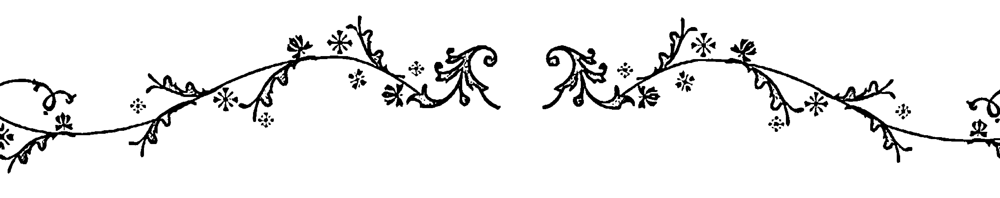

# 東西命理館 004

# 塔羅入門

原著書名／Learning the Tarot: A Tarot Book for Beginners
作 者／瓊·邦寧 (Joan Bunning)
譯 者／孫梅君
責任編輯／何宜珍
特約編輯／林慧雯
封面設計／張士勇
美術設計／林家琪
版權／葉立芳、翁靜如
行銷業務／林彥伶、林詩富
總編輯／何宜珍
總經理／彭之琬
發行人／何飛鵬
法律顧問／台英國際商務法律事務所 羅明通律師
出版／商周出版
臺北市中山區民生東路二段141號9樓
電話：(02) 2500-7008 傳真：(02) 2500-7759
E-mail: bwp.service@cite.com.tw
發行／英屬蓋曼群島商家庭傳媒股份有限公司
城邦分公司
臺北市中山區民生東路二段141號2樓
讀者服務專線：0800-020-299
24小時傳真服務：(02)2500-1990 2500-1991
讀者服務信箱E-mail: cs@cite.com.tw
郵撥帳號／19833503 戶名：英屬蓋曼群島商家庭傳媒股份有限公司城邦分公司
訂購服務／蒼虫股份有限公司
客服專線：(02) 2500-7718；2500-7719
服務時間：週一至週五上午09:30-12:00；下午13:30-17:00
24小時傳真專線：(02) 2500-1990；2500-1991
郵撥帳號：19863813 戶名：蒼虫股份有限公司
E-mail: service@readingclub.com.tw
香港發行所／城邦(香港)出版集團有限公司
香港灣仔駱克道193號東超商業中心1樓
電話：(852) 2508 6231 傳真：(852) 2578 9337
馬新發行所／城邦(馬新)出版集團
Cite(M) Sdn. Bhd. (458372U)
11, Jalan 30D/146, Desa Tasik, Sungai Besi, 57000 Kuala Lumpur, Malaysia.
電話：603-90563833 傳真：603-90562833
行政院新聞局北市業字第913號
排 版／浩瀚電腦排版股份有限公司
印 刷／高典印刷有限公司
總 經 銷／聯合發行股份有限公司
電話：(02)2917-8022；傳真：(02)2915-6275
商周出版部落格／ http://bwp25007008.pixnet.net/blog
行政院新聞局業字第913號
2007年1月初版 定價：450元
2012年12月10日3版19.5刷
著作權所有·翻印必究 ISBN：978-986-124-780-9
Printed in Taiwan
LEARNING THE TAROT by JOAN BUNNING
Copyright 1988 by JOAN BUNNING
This edition arranged with RED WHEEL/WEISER
through Big Apple Tuttle-Mori Agency, Inc.
a division of Cathay Cultural Technology Hyperlinks
Complex Chinese edition copyright:
2006 BUSINESS WEEKLY PUBLICATIONS, A DIVISION OF CITE PUBLISHING LTD.
All Rights Reserved.

Illustrations from the Universal Waite Tarot Deck® reproduced by permission of U.S. Games Systems, Inc., Stamford, CT 06902 USA. Copyright ©1990 by U.S. Games Systems, Inc. Further reproduction prohibited.
The Universal Waite Tarot Deck® is a registered trademark of U.S.Games Systems, Inc.

# 塔羅入門
Learning The Tarot : A Tarot Book for Beginners

廣獲各地讀者公認的塔羅入門指南！
這是對塔羅初學者一項徹底——
但絕不會讓你感到壓迫——的邀請，邀請你學習使用塔羅牌，作為內在指引的工具。作者瓊・邦寧 (Joan Bunning) 傳遞了每張塔羅牌基本的深度與美感，示範這些牌能如何激發心理的投射、提升直覺，並增進你與自身「內在指引」的溝通。

## 這是一本以課程形式撰寫的「指南」書 (“how-to” book)

本書包含十九堂課，從基本原理開始，循序漸進探討到進階的概念，讓你能以自己的步調來學習。

## 簡單易學的單一牌陣

沒有繁複的體系或花俏的牌陣，只使用一種簡單的系統，即「塞爾特十字牌陣」。你可以將你的注意力集中在該集中的地方：紙牌本身！

## 廣泛詳盡的牌意解析

不僅對每張牌做詳實的牌意解析，還有為關鍵詞添加深度的額外片語、記憶輔助，以及對意義相似或相反之牌的討論。

## 著重解牌的過程

描述該如何考慮個別的牌意，如何尋找成對的「牌對」，以及如何為某次占卜組織「故事」。本書結構完整，邏輯分明，具有首尾連貫的整體視野。

## 網站支援

如果遇上問題，還可親訪作者的網站查詢釋疑！

※請搭配風行世界的韋特塔羅牌 (Waite Deck) 使用這本書！（本書採自韋特塔羅牌的78張插圖）
