# 塔罗原来如此

## 作者简介

### 陳小珠 Yvonne Chan

香港人。1998年開始接觸賽斯資料及研究身心靈。2000年自澳洲大學畢業後，便投入企業培訓工作，同時開始學習及研究靈數學。2001年創辦塔羅課程，並於香港工會聯合會業餘進修中心任教。

2002年開辦「香港塔羅中心」。隔年於香港中文大學校外進修學院開辦塔羅課程及靈數學課程，並在台灣的開南工商、新時代協會開辦「塔羅與潛意識及靈數學」課程。2005年於香港經濟日報主筆〈塔羅花園〉專欄及AMY雜誌〈Amy's Numerology〉專欄，廣受好評。

2010年參與網路電台www.pooopup.com節目「由靈開始」，不久後陸續主持網路電視台www.ourtv.hk節目「神神秘秘」、網路電台www.uolive.com節目「研心時間」，均引起廣大迴響。

小珠老師一直努力透過課程，推廣賽斯心法，也深信「每個人都值得擁有精采的生命，都能創造美好的人生」。如今「香港塔羅中心」會員現已超過三萬人，中、港、台馬來西亞學員數更是超過萬人。著有《生命數字不思議》（2006年出版，2012年賽斯文化出版最新修訂本）《塔羅，原來如此》（2004年出版，2013年賽斯文化出版最新修訂本）。

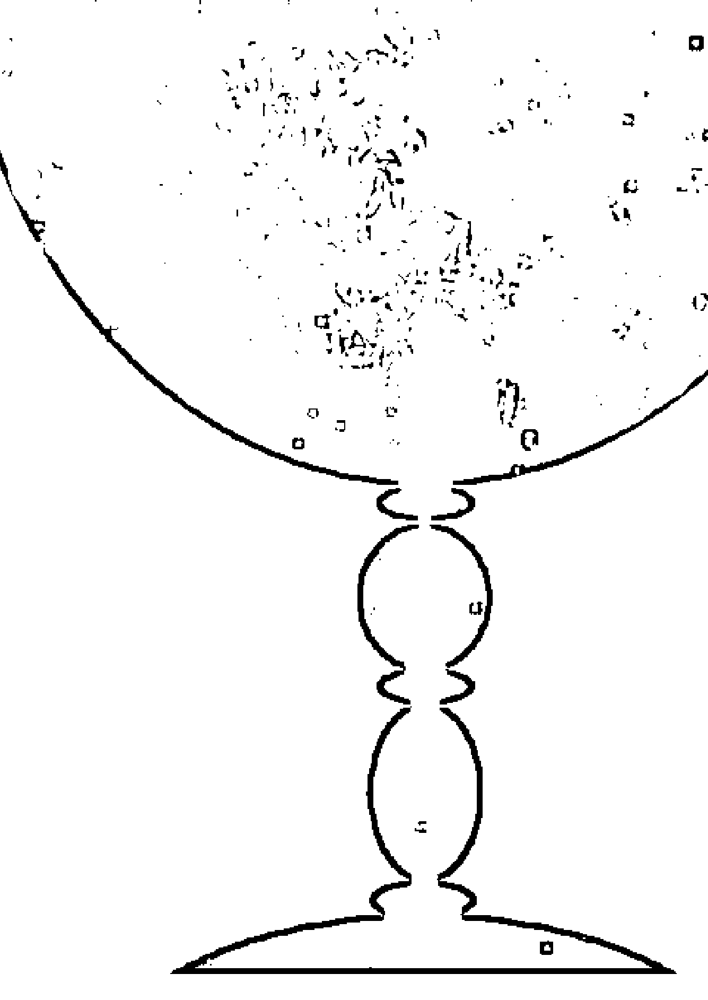

## 關於賽斯文化
發行人 許添盛 醫師

我是個腳踏實地的理想主義者。賽斯文化，是為了推廣身心靈健康理念而成立具公益性質的文化事業，希望透過理性與感性層面，召喚出人類心靈的「愛、智慧、內在感官及創造力」，讓每位接觸我們的讀者，具體感受「每天的生活，都是靈魂的精心創造
—— You create your own reality.」我們計畫出版符合新時代賽斯精神之書籍、有聲書、影音商品及生活用品，並將經營利潤致力於賽斯思想及身心靈健康觀念的推廣，期待與大家攜手共創身心靈健康新文明。

## 〈學員分享〉

## 為自己的人生負責

### 分享一

回憶過往，認識陳小珠老師已有兩年多時間。

二〇二一年春天，我的人生遇到了種種問題。在不知怎麼走下去的情況下，我決定向塔羅師尋求解決方向。起初我只是抱著不妨一試的心態，但在諮詢過後，卻完全被塔羅牌的精準所吸引。

當時我上網尋找相關資料時，網頁上多半是將塔羅牌當作預測工具的塔羅師資料。但小珠老師的看法卻很獨到，她在Youtube《神神秘秘》節目中提到：塔羅牌不僅可以預測未來，也是一種自我學習、自我成長的工具。她認為人生充滿無限的可能性，我們可以從塔羅牌的學習過程中，試著以不同的角度觀察事情，啟發思維，更可了解事件的基本成因、人際關係及個人課題等等。我認為小珠老師的理念和我在神經語言學中學到觀念很相似，所以在兩年前，我開始跟隨小珠老師展開個人的靈性之旅。一轉眼，已經學了很多塔羅牌、通靈及賽斯的知識。在研習塔羅牌的過程中，小珠老師一再強調不要強記牌義，而是要培養感覺。我也因此學會：人生並不是只有黑與白，不同的角度、不同的反應才能構成不同的效果。在經歷的過程中，我們創造了更多的可能性、更多的選擇。塔羅牌無法直接告訴我們未來的主要原因是：我們必須為生命提供的所有可能性做好準備。如果因為知道自己將會成功而鬆懈的話，就永遠不會認真去嘗試什麼了，只是坐等機會來到，可能會錯過找到「真正目標」的機會。

為了要體驗生命為我們預備的事物，我們需要這個「努力的過程」，以持續追求自己的目標。當機會來臨時，則要學習接納與改變。只要順著流走，它就會帶領我們走向更完滿的境地。

小珠老師常常鼓勵我們每天要靜心和內觀自己的信念，她曾告訴我：目前世上只有少數的靈魂擁有寧靜的心靈，以洞悉自己的黑暗，而我正是這少數的靈魂之一。靜心讓我看見：我對他人的不滿、恐懼和不安，原來都是內心的反射，只要我接受和認可自己，便能聆聽與理解他人。

回想我的成長過程，我一直很害怕家人對我的疏離、冷淡和不認同，害怕嚴肅的爸爸對我不滿、害怕他從不表達的憤怒。這種種害怕造成了我性格上的敏感和自卑，總是擔心周圍的人對我不滿，害怕他們為了維持表面的和諧，而不向我表達他們的不滿——包括老師、朋友和同事。

為了消除這種恐懼，我把自己藏了起來，總是躲在角落裡，離眾人遠遠的，用堅強和冷漠武裝自己，不接近別人也不讓人靠近，以為這樣就不會被嘲笑、不會受傷害。而在付出感情時，固執地要求回報，一旦沒有得到回應，就會產生不滿、抱怨、不信任等情緒，造成了我極大的痛苦。

學會內觀後，我發覺所有痛苦的來源，都來自對自己的不滿意、不接受，當我明白每個人都有與生俱來的價值和本質時，我終於安下心來，以新的信念創造了新的實相，也大大改善了我和其他人的關係。

去年年底，我開始幫人解牌，卻一直擔心解得不準，此時小珠老師提醒我：重點不在於準確度，而在於我是否以關愛和慈悲去幫助個案成長及面對人生。當我也開始這麼想時，立刻覺得輕鬆多了，而我的口碑也愈來愈好了！

很高興看到小珠老師又出新書，希望讀者能從她的作品中得到啟發，一如我從她身上學到的一樣。畢竟我們都是勇敢的靈魂，就讓我們一同努力投入這場人生遊戲中吧！

（林鈞禧，三十歲，神經語言學／企業管理培訓師）

### 分享二

一年前，我跟大部分人一樣，認為塔羅牌是一種占卜工具，可以預知未來，甚至認為它帶有超自然的神秘力量。直至二○一二年七月，一直對塔羅牌及神秘事物好奇心的我，突然下定決心要學塔羅牌，之後便透過網絡認識了小珠老師，我的人生也因此起了極大的變化。

記得上第一堂課時，小珠老師就很清楚地告訴我們：塔羅牌並不是我們想像的那種占卜工具，也沒有任何鬼神的存在，而坊間流傳眾多使用塔羅牌的規矩，也只是謠言。

幾堂課過後，我漸漸對塔羅牌有更深入的了解，原來塔羅牌一點都不膚淺，它是一個人類潛意識的工具，如同鏡子般反映人的想法和性格，從而找出問題根源、甚至解決方法。
接觸塔羅牌後，我發覺原來十九年來我從不了解自己。也許我了解自己的性格如何，卻從不知道：這些性格背後原來有一套完整的解釋。

後來小珠老師談到生命數字時，我終於了解我的性格是如何創造了我的生命，也漸漸明白自己性格上的問題，進而學習了不同數字的課題。

所謂性格上的問題，不單單是自己性格的問題，也是身邊各種問題的源頭，在了解自己的性格後，也避免了不少煩惱。

除了更了解自己之外，透過塔羅牌的解讀，我也更了解身邊的人，包括家人或親密的朋友。此外，學會塔羅牌後，我愈來愈喜歡幫助別人，性格也變得開朗樂觀。

塔羅牌可以讓人更了解自己最真實的想法，每次幫他人釐清真實想法、找出問題根源時，都會讓我很快樂。

其中有一次解讀，就是幫一個得了厭食症的朋友找出情緒困擾的源頭，雖然道出癥結點時，她並不同意，但過了兩天，她告訴我她想通了，一星期後她就開始能進食了。

小珠老師還說過，不一定提供解決方法給諮詢者，有時候只是讓他們發現問題的根源，就已經足夠了。而且每一次的解讀，還能從別人的故事中有所學習，提醒自己千萬不要陷入同樣的困局。接觸塔羅牌後的這一年，我對自己、家人和朋友有了更深一層的認識和了解。我的性格也不再像以前那麼負面，每次幫助別人後，我都覺得很快樂、很有成就感，所以我非常享受每一次的解讀。我很慶幸自己當初學了塔羅牌，這場學習讓我成長飛快，也讓我找到了一個明確的人生方向。也許塔羅牌不會成為我的事業，但很肯定的是，我永遠不會放棄塔羅牌。

（Firo，十九歲，大學哲學系學生）

### 分享三

在我年紀還很輕時，就對占卜、預測未來的工具產生了興趣，因為我覺得懂這種東西很酷、很了不起。有一次，我在文具店買了一副占卜牌，照著牌卡附的說明幫自己進行了第一次占卜。此後我開始自學撲克牌占卜，雖然這種占卜方法偶爾會預測成功，但並不是百發百中，結果大不如預期。

我想可能是因為我使用的方法不正統所致，於是向精通六爻占卜的舅舅請教占卜之術。了解了中國術數的博大精深後，才明白要真正學會占卜，起碼要花上三、五十年才能有所成就，這也不是我想要的，所以我又轉學西方占卜。

因為有過之前中國術數的學習經驗，我知道占星學並不是我的首選，於是選擇了看起來比較「容易」的塔羅牌占卜。

我先讀了幾本塔羅牌占卜書，又在網上搜集塔羅課程資料，發現了小珠老師的個人簡介及教授的塔羅課程介紹後，決定報名參加小珠老師的課程，也開始了對塔羅牌的學習與研究。

在上課的過程中，不僅學習到基本牌義、占卜牌陣及練習開牌的技巧，也了解到：原來占卜是「當下」能量的顯現結果，而所有事情其實都是能量的顯現。這對當時的我來說，簡直就是一個全新的理論概念。

此外，我也學習到直覺力的重要，因為在開牌時，不是一味背誦牌陣中的牌義，而是要「感覺」牌中圖像的意義，再結合牌義來做靈活的解讀。

原來塔羅牌占卜並不如我原先認為的「說出個案的未來」，而是協助諮詢者明白到底是自己的什麼信念，創造了現在的實相。

只要諮詢者改變信念，就能以不同的方式解決問題，甚至創造不同的未來。更重要的是：過一個負責任的人生，因為諮詢者並不是該事件的受害者。這是一個非常有趣又有意義的過程。

「事情的發生是一種能量的顯現」，這種理論對當時的我來說，簡直是前所未見、聞所未聞。聽了這樣的理論後，我一直念念不忘，心想如果要讓自己有更專業的能力，就必須透徹了解塔羅牌背後的理論，學習身心靈的關係。這個決定開啟了我的修行之門，並認識了賽斯思想。

我不像大多數的新時代修行者那樣，從小不斷揣想人生源頭或宇宙開端等問題，只是偶然在腦中浮現「我為什麼是現在的我？」「我是如何在這身體內生活的？」、「生命是怎麼一回事？」之類的問題。我出身自一個工程家庭，祖父及父親都是工程人員，這些問題在他們眼中都非常傻氣，所以我從沒跟家人提過。我也不是一個愛看書的人，加上學校的課程從沒探究過這類問題，所以我也從未找到答案。沒想到就在學了塔羅牌、接觸新時代理論及了解賽斯思想後，這些問題的答案開始有了眉目。求道的過程改變了我的人生，修行使我放下許多健康、人際、家庭及感情上的執著，也讓我學會如何過一個負責任的人生，然後逐一解開生命的問題。我想，這正是一種心靈的開悟吧！謝小珠老師的帶領與教導，她正是為我開啟這扇大門的啟蒙鑰匙。能認識塔羅牌，我內心充滿感激，因它是我身心靈修行的起點，更感看著十年前為小珠老師寫的〈學習塔羅牌的成長〉一文，彷彿回顧了長久以來學習塔羅牌和生命數字的人生片段。十年前的尋寶遊戲才剛開始，十年後的今天，遊戲依然持續，也同樣精采！

（Alice，三十歲，工程師）

### 分享四

這些年，我以塔羅牌和生命數字兩把鑰匙，打開了無數陌生人的心，也打開了無數道智慧的大門。當中所有主角、所有故事，都成了我靈魂修行的重要養分。

記得當年跟小珠老師學習生命數字時，有一次我問她：「知道男朋友的生命數字又如何？又沒辦法讓他多愛我一點。」

結果小珠老師問我：「如果他眼睛看不見，你會怎麼跟他溝通？」

我想了想，回答：「哦，那我會去學點字。」

小珠老師又問：「那如果他又聾又啞，你要怎麼辦？」

我堅定地說：「簡單，那我就去學唇語啊！」

結果小珠老師說：「那你就把你男朋友當成又聾又啞的盲人去愛吧！
你現在這麼確定地告訴我，你要怎麼讓他懂你，表示你夠愛他，那就一定有方法可以走進他心裡。他有耳朵卻聽不到，有嘴巴卻不懂表達，有眼睛卻看不懂你，這個時候就需要生命數字的幫忙了。因為生命數字可以幫助我們看到每個人的優缺點，然後真正了解他們，慢慢地培養出同理心來，就會少一點點埋怨，多一點點諒解，這就叫做『愛』。
我記得這段話，甚至每次幫個案解讀生命數字時，都會轉述這段話。愛嘛，當然要進行到底啊！
還有一句小珠老師的話，也是我每次幫人解讀塔羅牌時，一定會分享的：「如果你以為塔羅牌是預測未來，那你只是看到牌角的用途而已。真正的塔羅牌是一種溝通工具，讓我們可以直接與眼前的陌生人產生連繫，把他們的夢想、勇氣、自信全都叫出來，讓他們繼續為自己的人生踏出精彩的下一步！」
我的生命就因為這兩把鑰匙，不停地走進許多人的心裡，並送上最多的愛、關懷、勇氣、可能性與同理心。你準備好成為這樣一個塔羅師了嗎？

（Andy，三十歲，塔羅師）

### 分享五

還記當天只是因為好奇，跟朋友湊熱鬧地到工聯會報名塔羅牌班，就這樣踏上了身心靈修行之路，不知不覺已是第十個年頭了，而我人生一切的改變也源自於此。

若要問我為什麼可以走這麼久，那是因為我發現一路走來，從小到大對生命的疑問、對自己為什麼生而為人、甚至有些連宗教也無法完全解答的問題，都在這條路上逐漸找到答案。

我家有位長輩是出家人，而我從小教會學校，在成長過程中，參加了很多東西宗教的祈願儀式；家人也是遇到事情就去求神拜佛、卜卦算命，學校的老師也教導我們，神是有求必應的……但是，為什麼求了這麼多、這麼久，願望都不見得實現？既然如此，為什麼還要求？是因為對未知感到不安嗎？那我更大的疑問來了：「為什麼我想要的，都掌控在那些虛無縹緲的滿天神佛身上，而不是掌握在自己手中？」祈求與應許之間的等待，豈不是讓人更不安嗎？直到接觸了塔羅牌，聽到最讓我震撼的一句話：「你創造你自己的實相。」才知道原來生命中發生的任何事情都不是偶然，全是自己吸引來的。啊，原來一切都是自找的。之後學習了更多課程，認識了賽斯思想，終於知道命運不是天註定的，一切都是自己的選擇，包括家庭、父母、兄弟、姐妹、朋友、仇人等等……全都是自己挑選的，完全顛覆了我從小固有的信念系統，於是我學會了用更廣闊的角度檢視自己的生命。既然一切都出於自己的選擇，就別再怨天尤人地過日子，且看自己選擇的路，將在此生展現出什麼樣的美景吧！既然實相由自己創造，那麼只要先改變自己就行了，根本不用花太多時間去鑽研占卜技巧。

氣力，外在的實相自然會朝著你想要的方向改變。當然也不用到處求神拜佛，只要與自己的內在連結，想要的外在實相自然就會出現，人生當然可以一直掌握在自己手裡。

塔羅牌的學習，開啟了我對靈性的追求，以及對生命的探索，這是一段讓我從「只會不斷向外求援」到「懂得回歸內在，輕鬆創造豐盛」的充實旅程，希望每個人都有機會體驗這份美好。

(Celia, 三十歲，大學職員)

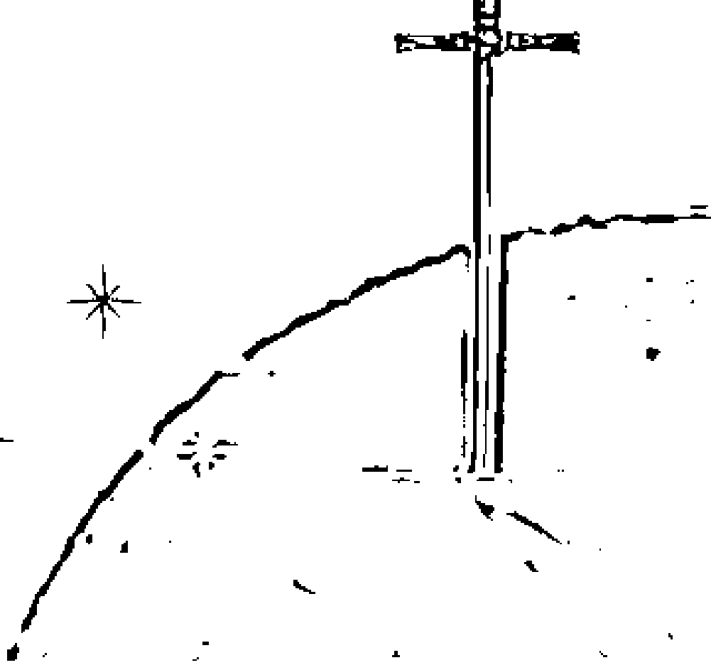

# 第1章 塔羅牌到底是什麼？

大概有十五年的時間，我的課堂、節目、工作、日常生活幾乎都圍繞著「塔羅牌」這個主題，到底塔羅牌是什麼呢？很多人說塔羅牌是西洋的占卜工具，衛道之士則認為塔羅牌不只如此，雖然我有好長一段時間也以為塔羅牌等於占卜，但其實不然。

所謂的「占卜」是指塔羅牌可以推算出一些我們不知的未來之事。數百年來，塔羅牌一直帶著神秘色彩，從十七到十九世紀期間，將近兩百多年的時間，塔羅牌一度被傳為埃及人留下來帶有神秘力量的東西。

神秘詭異的感覺總是令人感到好奇和刺激，因此商人、出版商、媒體為了迎合市場需求，紛紛對「塔羅牌」加以渲染。人云亦云之下，塔羅牌形成了一股特別的風潮，過去二十多年來，塔羅風從西方飆進亞洲，先是在台灣、日本、香港開始流行，近年來更因網路文化的急速發展，這股塔羅風不脛而走，蔓延至新加坡、馬來西亞、中國大陸、韓國和俄羅斯等地。

根據我個人的觀察，塔羅風如此興盛還有一個原因，就是與人類整體意識的拓展有關，當人類的物質層面充分獲得了滿足，卻發現生命沒有預期中的喜悅時，就會轉往心靈層面去尋找出路；而在各種心理學、行為學、人格分析、激勵課程都搔不到人心的癢處時，有些人會開始相信那一宇宙更高的力量」，如此一來，心理上就比較能得到安慰，因為如果冥冥中有股力量主導一切，我們就可以不用對自己的生命負責，反正一切都是命嘛！我從事與人有關的工作已經有三十多年了，其中教授塔羅牌的時間就占去了將近十二年，長久以來，我持續對塔羅牌加以研究及驗證，加上在教導塔羅課程中得到的經驗，證明塔羅牌確實可以揭示某些即將發生的事，它既不詭異，也不神秘，更不是什麼怪力亂神的工具，只是，我並不鼓勵人們用塔羅牌來決定自己的人生。綜合過去十幾年接觸塔羅牌的經驗，我覺得塔羅牌是一種介於心理學及心靈力量的工具，用心理學解釋的話，塔羅牌是圖像，圖像可以反映人的心理意識，所以剛接觸塔羅牌的人，往往很驚訝它的神奇，大有一種「自己的心事全被看光光」的感覺，因此令人產生不少迷思與遐想。儘管塔羅牌可以探索人心，但有誰能真正懂得自己的心？一個人內在的意識海洋，又到底有多深多廣呢？既然塔羅牌是一種讓人與多層意識溝通的工具，那所謂的「意識」又是什麼呢？有關意識的探索，大概可以追溯到六〇年代，而真正找到科學上的解釋，則是最近二、三十年的事。其實，現代的精神科、心理學及超心理學都無法對人類的多層意識做出任何定論，到底潛意識海洋裡包含了什麼、人類的第六感或神通力是否存在等問題，沒有人能完全釐清。無論如何，有一點可以肯定的是：我們的意識海洋裡充滿了各種念頭、思想和信念。而要了解塔羅牌的運作，就必須先了解一個永恆的真理：無論是在有意識或無意識的情況下，我們都是永不止息地把念頭、思想、信念轉成實相的偉大靈魂！

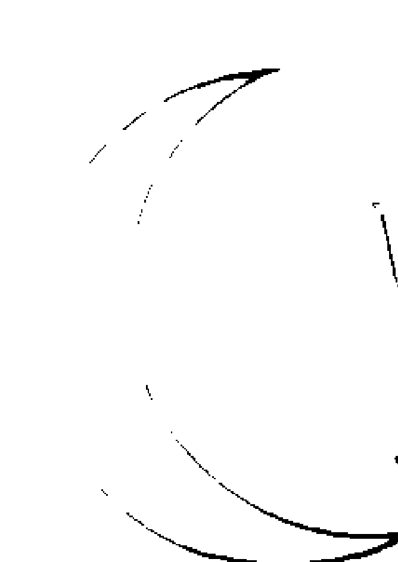

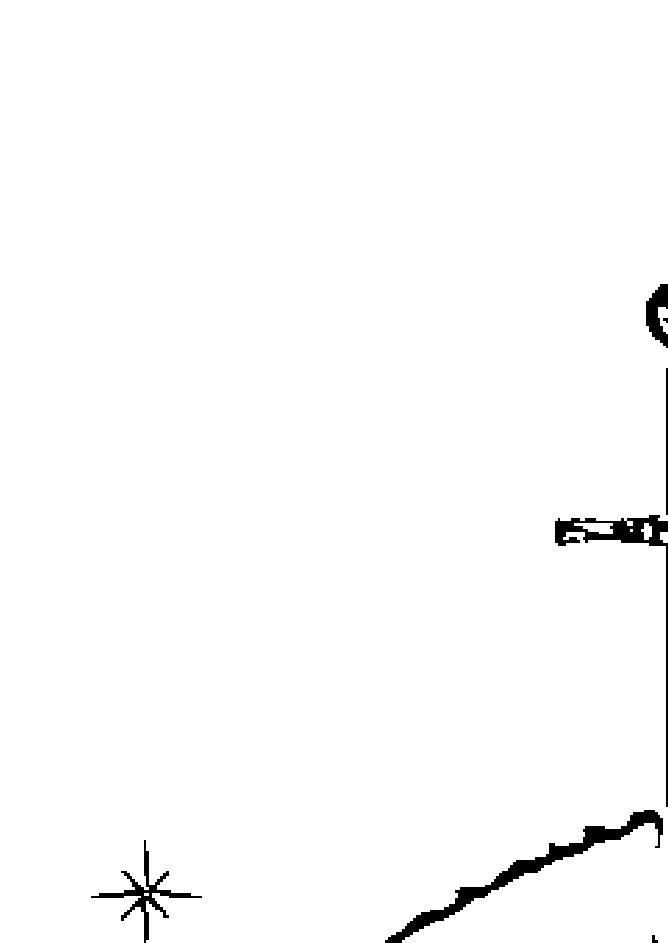

## 塔罗牌真的很準！

塔罗牌之所以给人很「准」的感觉，是因为它反映了我们潜藏在意识层的念头，而我们又会依循自己的想法前进，才会觉得塔罗牌的预测奇准无比。

例如，一个对亲密关系抱持正面态度的人，就会积极正面地发展出他所相信的亲密关系；反之，一个觉得与人亲密有困难的人，就比较难发展出一段美满的亲密关系，因为那样的关系不曾出现在他相信的世界裡。

换句话说，塔罗牌并没有占卜出什么未来或未知之事，它只是真实地反映了我们的内心，什么样的信念就投射出什么样的感觉；什么样的感觉就出现什么样的共振，什么样的共振吸引什么样的人事物、起什么样的化学作用，从而发展出某些人生剧情。

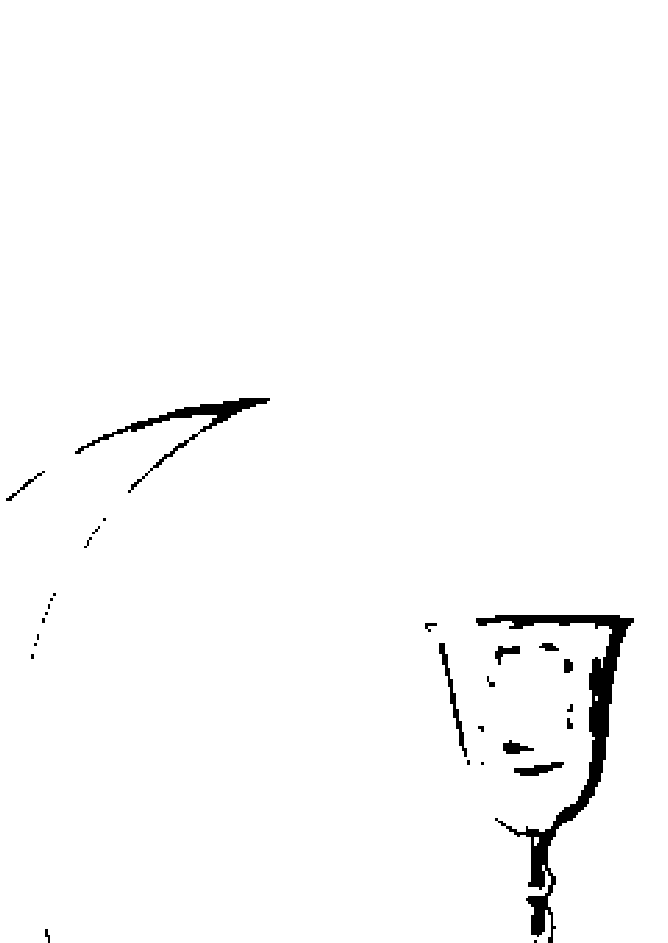

### 塔羅牌與多層意識

所以塔羅牌並不是用來占卜的工具，只要明白它的原理，就知道它其實是一套非常有效的心理探索及諮商工具，因為有時比起語言溝通，圖像傳達反而來得更傳神、更盡在不言中。

塔羅最有價值之處是讓人在面對生命種種狀況時，究竟抱持了什麼想法，以及內在的信念如何影響人的行事與決定，因此透過塔羅牌可以看清自己，並了解很多事情的成因，明白為什麼自己會站在人生的某個位置上，無論喜歡與否，以及今天的結果必然來自於以前的信念。若能更有效地使用塔羅牌，便可看到自己的信念，更清楚如何處理及計劃未來的人生，避免重蹈覆轍。事實上，看得更清楚並不表示會做最正確的選擇，我一直認為，人生並沒有最好或最壞的選擇，我常說：『靈魂的旅程只有一個方向，就是向上及向善。生命是一個創造的過程，人生每個當下都在創造，都充滿了可能性和選擇，而每個選擇都在創造不同的可能性，關鍵在於：我們是帶著知性及觀照在生活，還是迷迷糊糊、半夢半醒地過日子。

塔羅牌就像一面鏡子，赤裸裸地呈現我們的信念，給我們機會去面對、了解、反省、學習及成長，如同一個忠實且隨時待命的朋友。

因此，我教授塔羅牌是本著一個很重要的基礎：命運永遠掌握在自己手上，也永遠由自己創造！

塔羅牌並不是占卜未來、提供答案的工具，在我研習塔羅牌的過程中，我深深體會到：學習塔羅牌對個人的價值及成長上的幫助，遠超過占卜的單一用途。

學習塔羅牌的過程可以讓你探討生命的種種可能性、打開你思想的天空、拓展你的視野、從中自省與覺察，並看到不同人面對不同狀況的反應及態度，進而更了解生命；它也可以幫助你發揮直覺，從而信任及肯定自己；它可以幫助你學會如何與自己的感覺溝通，也可以讓你看到自己對人事物的批判，學習如何在待人處世時放下主觀，甚至可以拉近你與他人之間的距離。

這些年來，我的教學都以推廣身心靈全人發展思想為基礎，其中我認為最值得深思的一句至理名言，就是賽斯思想的精髓：「信念創造實相」。

其實，一個人在玩什麼把戲，只有自己最清楚，重點在於我們是否願意去承擔、去看清自己到底創造了什麼樣的人生，並且不斷在生活點滴中觀照自己的信念，愈是勤於自我觀照，就愈能看清自我。自我覺察能力愈高的人，就愈能有效地看到真相，也就更有能力處理問題，進而創造美好的人生。

塔羅牌正是一個非常有效的內觀工具。

如果你細細審查一下自己有意識的思想，你會發現，這種審查可以告訴你很多關於自己內心深處的心態、意圖和期望，並且還常常導致你去直面自己的挑戰及難題。你的思想，在經過細細的探討之後，會讓你明白你到底走向何處。它們會清清楚楚地點明一個真相，那就是：所有存在於世間的事事物物，原來全都是先存在於思想及感受裡。

——《個人實相的本質》自序第 xxxii 頁

塔羅牌是一種與多層意識溝通的工具，人類意識大致上分為意識、潛意識、無意識、超意識幾個層面，對大部分的人來說，它們是非常複雜抽象、高深莫測又難以理解的東西——即使所有人的生活都被這些意識層面影響著。

深層意識的研究對現今社會貢獻良多，同時也發展出形形色色的學說及學術，包括九型人格（Enneagram）❶ 十六型人格（MBTI）❷ 神經語言程序學（NLP）、專業催眠訓練、個人成長或心理探索等課程，都以深層意識作為基礎。

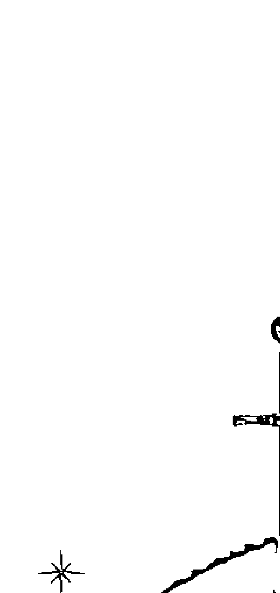

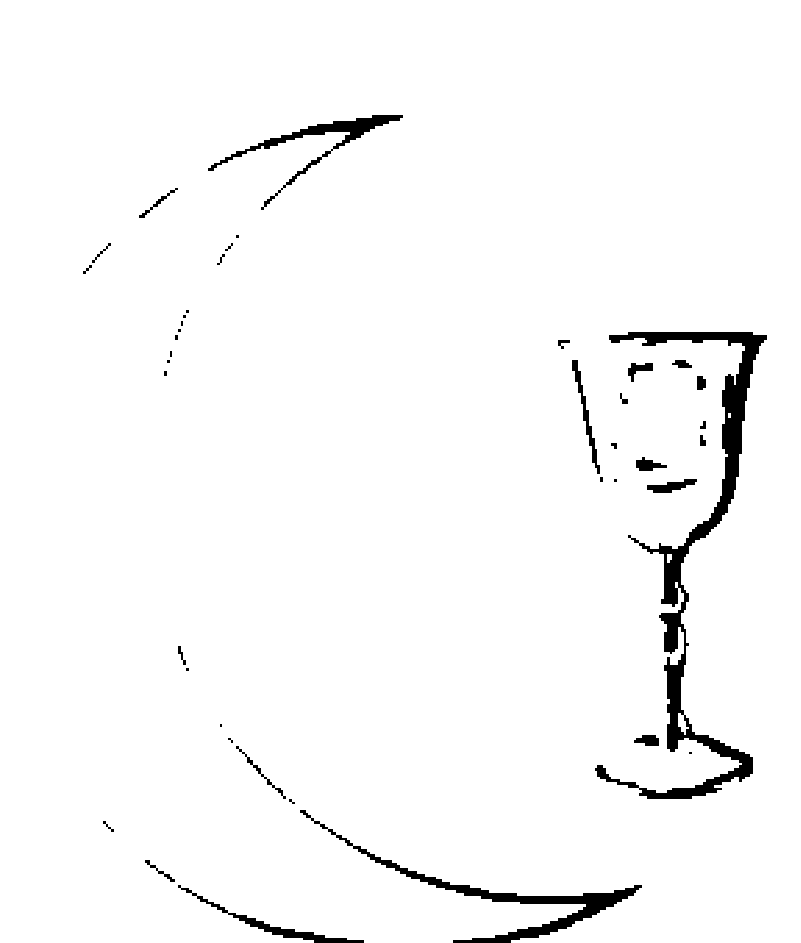

### 意識層的冰山理論

有關人類多重意識的學術分析，學者們多半喜歡用「冰山」來解說各意識層的運作。成語「冰山一角」指的就是：我們看到的冰山，只不過是整座冰山浮在水面上的一角，而水面下有更多深不可測的部分。

水面上的冰山代表人類的表意識。我們清醒時的行事作息，都屬於表意識的運作，包括每天使用的知識技能、理性的心智感知及行為、邏輯分析、籌劃計算等等。換句話說，就是所有我們「知道」的東西、所有頭腦認知的部分。

雖然我們大部分時間在表意識裡作業，但心理學家發現，人類由出生到死亡，表意識大概只占整個思維運作的5%到15%。很多人第一次看到這個數據時，心裡都覺得很不是滋味，怎麼先天潛能加上後天學習，才占了區區十幾個百分點？然而，這個數據也同時指出：我們還有八○%以上的潛能尚未被開發及使用！想想看，人類只用了那麼一點點智慧，就已經創造了今日的偉大文明了，如果用得更多，未來又會如何？新時代的觀點認為，千禧年後人類整體意識會大幅提昇，人類世界仍有無窮無盡的可能性有待發掘。再回頭談談水面下的部分冰山，以前心理學家很籠統地定義它為「潛意識」，早年這個部分還是神秘領域之時，很多人都把解決不了或無法理解的心理現象歸咎為潛意識的問題，潛意識一下子成了罪魁禍首，背負了不少罵名。直到最近幾十年，意識的探索不斷有新的進展及發現，水面下的冰山其實一點都不簡單，而且大有玄機。賽斯書《個人實相的本質》對此有詳盡的描述，意識心接收從外界進來的資訊，潛意識支撐滋養著整個意識的運作，同時把內我源源不絕的訊息輸送給意識心。離水面愈遠的部分，就愈接近內我和本我，這個部分雖然被掩蓋又看不到，但其產生的念頭和訊息，每分每秒都在影響我們的行為與心態，創造我們每天的生活。很多理所當然的信念、不需要思考的行為及反應，以及本能的運作，例如血液循環、心跳、消化系統運作等等，都包含在內。如果我問你：全世界所有人事物中，你是「知道」的多？還是「不知道」的多？你肯定會回答：當然是「不知道」的事比較多。每個人都曉得自己「不知道」的事比「知道」的事多，但那是我們確定自己「不知道」的部分呢！

如果以冰山來做比喻，各意識層面的範圍如下：

- 意識心：水面上的冰山是我知道的部分。
- 潛意識：水面下最靠近水面的冰山，是我知道而別人不知道的部分。
- 無意識：潛意識之下的冰山，是我確定我不知道的部分。
- 超意識（靈通）：無意識之下的冰山，是我不確定我不知道的領域。

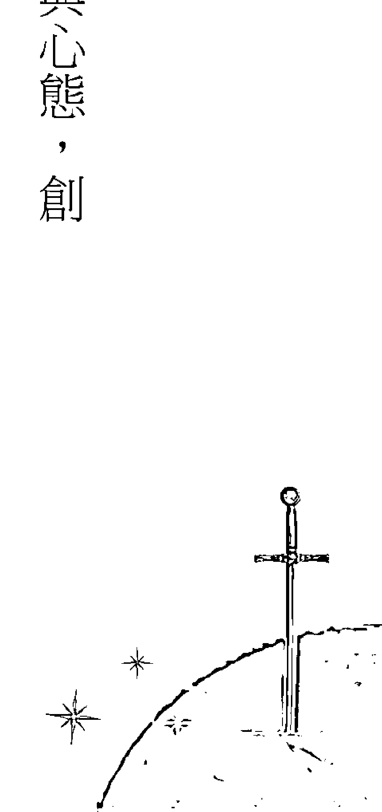

### 塔罗牌到底是什麼？

人類的智慧、知識、科技再發達，浩瀚的宇宙以及心靈的秘密，仍遠超過我們的理解範圍。科學的發展將近千年，但人類擁有數千年的文明，光是中國就有五千年的文化，地球更有數億萬年的歷史！誰能保證從未有一個文明比現代文明更璀璨？用科學解釋一切，其實也並不怎麼文明，怎能用「已知」的去解釋那個浩瀚的「未知」呢？唯有保持開放的心胸去學習，才能真正打開智慧之門。

學習塔羅牌的過程可以探索自己多層意識的領域，透過對自我的認識，接觸心靈深處的本我，並從理解與了悟中避免重蹈覆轍，領會生命的法則與智慧，在生活中做出明確理智的選擇，才是學習塔羅牌最大的收穫。

註釋

❶ 九型人格學（Enneagram），一種性格分類學，基本上將人的性格分成九類，分別是：第一型完美主義者、第二型助人者、第三型成就者、第四型藝術家……

### ② 十六型人格学（MBTI）基本理论

十六型人格学（MBTI）基本理论是以心理分析家荣格（C. G. Jung）于一九二一年出版的《心理类型》（Psychological Types）一书为根据，由美国心理学家凯撒琳·库克·布瑞格（Katherine Cook Briggs）及伊莎贝儿·布瑞格·麦尔斯（Isabel Briggs Myers）开发完成。

经过数十年的发展，已成为全球著名的性格测试之一。广泛应用于教育界、企业征人及培训、领袖训练及个人发展等领域。

主张人类大致可分为四种基本运作与态度类型，不同人有不同取向，因而形成十六种不同性格：心理能力的走向是E或I，

- 即外向型（Extraverted）或内向型（Introverted），
- 认识外在世界的方法是S或N，即辨识型（Sensing）或直觉型（Intuition），
- 做决定的方式是T或F，即理智型（Thinking）或感性型（Feeling），
- 生活方式和处事态度是J或P，即决断型（Judging）或熟思型（Perceiving）。

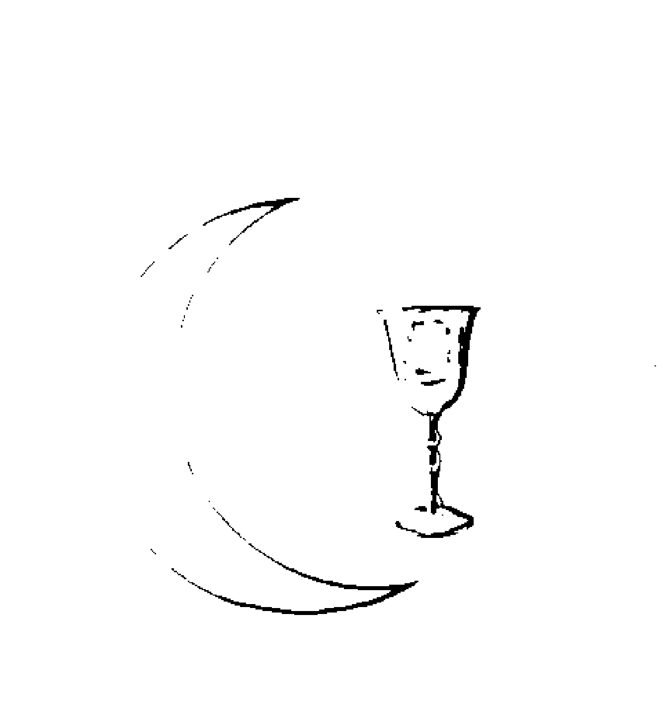

# 第2章 塔羅牌的來源與發展史

## 塔羅牌從何而來？

根據十二世紀以前的文獻記載，歷史學家相信所有的紙牌遊戲均由棋類遊戲演變而來，而棋類遊戲可追溯至古西伯利亞時期，牧童用小石頭玩的遊戲。時至今日，關於塔羅牌的歷史和典故眾說紛紜，真正的來龍去脈早已無從考究。

### 中國

以下是可能的歷史來源總結：

塔羅牌的起源有一說是來自中國，因為早期的塔羅牌曾有類似中國特徵的圖案出現，加上中國是最早發明紙的國家，可能性很大。

唐玄宗時期，有位精通天文曆算的僧人，法號一行（俗名張遂）。大約在西元七七二年，一行禪師發明了一種叫「葉子戲」的紙牌遊戲，每張紙牌大小如葉子般，牌面繪有歷史人物、圖畫、文字與符號等，深受唐玄宗的喜愛，後來便於貴族與民間中流行起來。最早的西方紙牌出現於十三世紀，相傳是元朝時期，在中國居住長達十七年的義大利人馬可·孛羅（Marco Polo）將中國紙牌帶回了歐洲，而後發揚光大，成為塔羅牌的前身。明朝時期，中國出現了一種每副四十張、分為四種花色的紙牌，牌面甚至繪有類似《水滸傳》中的人物畫像。到了現代，在香港也常見老人家玩一種叫「十五糊」的紙牌遊戲。原來這中國的國粹可能就是塔羅牌的『祖先』呢！

十一世紀末，十字軍東征入侵義大利的西西里島時，正值回教徒佔領西西里島和西班牙時期，當時阿拉伯人精通藝術、算術、代數、煉金術、天文學、占星術和神祕哲學等學問，並且用紙牌來占卜或玩遊戲，因此有人相信紙牌是透過十字軍從中東傳入歐洲的。

到了十九世紀，神秘學研究者開始研究起古猶太卡巴拉教（Kabbalah），發現了卡巴拉教原來與塔羅學、占星學及靈數學大有關連，因此也有人認為塔羅牌是阿拉伯人發明的。

附帶一提，卡巴拉教沉寂了兩個世紀之後，最近於美國再度興起，著名的美國女歌手瑪丹娜及小甜甜布蘭妮都是卡巴拉教的教徒。

### 印度

印度是個階級觀念很重的民族，很難相信在二十一世紀的今天，印度的「賤民」仍過著極不人道的生活，二〇〇九年榮獲奧斯卡金像獎最佳影片的電影《貧民百萬富翁》，就反映了印度貧富懸殊的問題。

古代印度原始居民把人分為四個種姓：婆羅門、剎帝利、吠舍和首陀羅，這四個種姓的象徵符號，與塔羅牌上的四大元素標誌五角星、寶劍、聖杯及權杖不謀而合。在印度傳統神話中，濕婆之妻卡利女神有四隻手，各自持有魔杖、杯子、寶劍和圓環（代表金錢）。所以有不少人認為塔羅牌……

### 吉普賽

有不少傳言指出塔羅牌來自吉普賽人，是吉普賽人經過阿拉伯時，將塔羅牌帶回西歐。事實上抵達西歐的吉普賽人並不多，而且吉普賽人是十五世紀才出現在歐洲大陸，當時紙牌業在歐洲已經十分流行了，因此這個說法後來不攻自破。

然而，有鑑於吉普賽人自稱是埃及人的後嗣，而埃及是最多人相信的塔羅牌發源地，因此姑且將此列為其中一種說法。

### 埃及

在埃及文中，Tar 為道（rule）之意，而 Ro 為王（king）之意，所以相傳 Tarot（塔羅）一字代表「王者具備的正確判斷力」，或是「統治者用來決定事情的方法」；埃及神話中，有一位名叫 Thoth 的神，據說此神掌管了一本名為《智慧之書》（Book of Mystery）的書，記載了埃及的醫術、眾神及神秘的智慧，極為珍貴。

埃及王朝慘遭消滅時，埃及人擔心此書會落入異族之手，便把書裡的知識及智慧以圖樣形式繪製在紙牌上，後來由亞歷山大大帝把它們帶回了歐洲。

另外，由於基督教的入侵，埃及人開始將神學與哲學思想，以圖像的方式翻製在牆上及蘆葦紙片上，加上埃及人又習慣把事件記錄在壁畫上，因此保存了千年的文化精髓。

後來在法國巴黎國家教育部圖書館管理員 Pierra 所著的《魔術的歷史》（History of Magic）一書中，提及古埃及的金字塔地下走道牆上有二十二幅圖畫，並證明它是塔羅牌的二十二張主牌（Major Arcana），更加強了塔羅牌是出自於古埃及王朝的說法。

除此之外，也有人認為塔羅與古希伯來神話、命理學、葛諾斯第教派（Gnosticism，基督教中的異端教派）及凱爾特教（Celtic Reigion，古蘇格蘭與愛爾蘭的信仰）都有關連。塔羅牌的由來從東方、歐洲、印度及埃及的古文化裡，均找到了相當的連繫；因此，不少塔羅牌的研究者認為：塔羅牌可能是一套人類文明的「共通符號」，保留了人類歷史中被摧毀或遺忘的上古智慧。

## 歷史年表

### 一三三二年

最早有塔羅牌記錄的年代，西班牙國王阿方索十一世（Alfonso II）制定了一份反對塔羅牌的聲明。

### 一三七七年

修道士約翰（Johann）的記錄中描寫：

> 一些稱為紙牌的遊戲引起了我們的注意，這個遊戲可將世界的狀況展示在我們眼前……

他描述的是……五十二張（甚至更多）、四種顏色的紙牌，後人認為他所描述的紙牌與塔羅牌很接近。

### 一三九七年

十三世紀末，傳說患有精神病的法皇查理六世，接管了勵精圖治的查理五世的王國，卻胡作非為、敗壞朝綱，讓法國陷入一片混亂，人民失去了上進心及追求安逸的意志，更不願繳稅維持皇室糜爛的生活，因而不事生產，後來法國政府宣布：除了假日之外，平民一律禁止玩紙牌遊戲，包括塔羅牌。

### 一四一五年

羅馬天主教會出面公開禁止紙牌遊戲，稱紙牌為「惡魔圖案」以及「惡魔聖經」。雖然被禁止，但仍有少數紙牌保存了下來，如維斯康提塔羅牌（Visconti）就是其中最有名、保存最完整、年代最久遠的塔羅牌（一四一五～一四五〇）。

此牌其實是義大利的維斯康提家族請當時很有名的藝術家班寶（Bon Ifacio Bembo）所繪，用來當做女兒的嫁妝。也有歷史學家認為是維斯康提家族請人將家族成員畫成紙牌，送給女兒，因為當時的女人出嫁後，就沒什麼機會再見到娘家的親人了。

### 一四五〇年

由於法國對塔羅牌的壓制，塔羅牌於是在義大利及歐亞大陸興起。一種叫做塔羅奇（Tarocchi）的紙牌遊戲在義大利皇族中開始流行，塔羅奇意指「王牌」或「勝利」。

當時義大利正值文藝復興時期，許多皇族紛紛委託藝術家繪製自己專屬的精美紙牌，因此不少傳統的塔羅牌圖像都彌漫著濃厚的歐洲中世紀色彩，直到現在，義大利仍保有塔羅奇紙牌遊戲。

### 一四五〇～一四七〇年

教廷終於出面干涉塔羅牌活動，在一個佈道大會中詳細提及塔羅牌。會中一位聖方濟的修士提及「塔羅」之名與內容均來自魔鬼，他譴責使用塔羅牌的人，並視塔羅牌的出現為魔鬼的一次勝利，因為魔鬼可以得到玩牌者的靈魂。

傳統的天主教教條規定：一般人不可以和神接觸，因此人如果犯了罪就要做「告解」，把所犯的罪告訴神父，神父會代人向神求得寬恕，只有神職人員才可以侍奉神，所以與上蒼連結是非常神聖的，絕非一般凡夫俗子可行之事。而塔羅牌活動某程度上是直接從上蒼那兒得到訊息，挑戰了當時教廷的威信，因而被嚴格禁止。

### 一四八〇年

法國政府決定將塔羅牌標準化，在規範製訂之前，紙牌持有者可以提出希望在塔羅牌中放入或更換的內容，當時死神（Death）、惡魔（Devil）及塔（Tower）的概念遭到保守派嚴重的攻擊。

### 一七七〇～一七八〇年

艾列塔（Jean-Baptiste Alliette，又名 Etteilla）是第一位公開用塔羅牌占卜的人，他與法國神學家哥伯林（Antoine Court de Gebelin）相信：塔羅牌的神秘知識被有目的地轉錄成一種象徵性紙牌，因此建立了「塔羅牌是埃及的透特神（Thoth）遺留下來的智慧與魔術」的說法，塔羅牌從此逐漸興起。

### 一八五六年

法國神秘學學者李維（Eliphas Lévi）發現了塔羅牌與卡巴拉之間的關聯，其學說整合了七十八張塔羅牌的系統，同時開啟了塔羅符號學的研究，由秘密社團負責繪製。從商業的角度來看，他們絕對希望塔羅牌能流行於普羅大眾之中，因此成功掀起了一陣塔羅牌風潮，而塔羅牌團體也跟著興起，從此塔羅牌便漸興起。

李維和他的追隨者佩布斯（Papus，原名傑拉德·恩格斯 Gerard Encause）大幅改進塔羅牌的理論與系統，將卡巴拉的教義運用在塔羅牌上。佩布斯的著作《波希米亞塔羅牌》（The Tarot of the Bohemians）是一本完全的塔羅牌專著，其中更加入靈數學、占星學及其他神秘學的內涵，豐富了塔羅牌的內涵。李維和佩布斯也因此成了神秘學理論的先驅。

### 一八八八年

中古神秘學派「玫瑰十字」（Ross Cross）的結社「金色曙光」（The Hermetics Order of the Golden Dawn）在倫敦成立，該社結合了塔羅牌、星象學、靈數學及卡巴拉思想等學說，在他們的研究下，整個塔羅學及神秘學理論從此更加豐富完備。

### 一八九一年

偉特（A.E.Waite）加入「金色曙光」，認識了潘蜜拉·史密斯（Pamela Smith），潘蜜拉是一位詩人兼畫家，也是萊德出版社的社長。兩人花了很多年時間研究塔羅牌，終於在一九一〇年出版了萊德偉特塔羅牌（Rider Waite），帶起了一場塔羅牌的革命，在萊德偉特牌出現之前，坊間的塔羅牌副牌（Minor Arcana）都只有圖案，潘蜜拉是第一位把人物畫進副牌的人，從此普羅大眾均可透過萊德偉特牌了解神秘學。

大多數塔羅牌研究者公認的「國際標準版」入門牌，並有解釋萊德偉特牌的著作《關鍵塔羅牌》（A Pictorial Key to Tarot）。

## 註釋

- ① 卡巴拉與猶太教為西方宗教與神秘學的兩大源頭，而卡巴拉以「生命樹」（Tree of Life）的架構，闡釋人類存有的位置、目的以及人與神（宇宙心識）的關係，生命樹由十個圓圈與二十二條通道所構成，對應太陽系的行星與地、水、火、風四大元素，指示人類如何透過四體的修煉，讓人性意識與宇宙（造物主）心識合一，成就靈性的圓滿，亦即「涅槃」的真諦。
- ② 古代印度人被分為婆羅門、剎帝利、吠舍和首陀羅四個種姓。婆羅門是祭司貴族，主要掌握神權、占卜禍福、壟斷文化和報導農時季節，是社會中地位最高者；剎帝利是軍事貴族，包括國王以下的各級官吏，掌握神權之外的一切國家權力。婆羅門和剎帝利占有社會大部分財富，以剝削為生，是社會中的統治階級。吠舍是普通勞動者，包括農民、手工業者和商人，必須向國家繳納賦稅。首陀羅是失去土地的自由民和被征服的達羅毗荼人，處於奴隸的地位。各個種姓職業世襲，互不通婚，以保持嚴格的界限。同種姓的男女所生的子女則為賤民，不包括在四個種姓之內，最受鄙視，從事洗衣、清掃街道與廁所、在婚喪中擊鼓、搬運垃圾、火化屍體、清理動物的死屍，以及由此衍生而來的製革、製鞋等工作。

# 第3章 塔羅牌的正確使用方法與態度

神經語言學中常提到：人類的大腦大致可分為左腦及右腦，左腦掌管語言、數字、順序、分析、文字、判斷、理解、邏輯思考等功能；右腦掌管想像、情緒、感受、感性、靈性、第六感、直覺等功能。

一般情況下，這兩個功能無法同時有效運作，醫學的解釋是左右腦呈非對稱性存在，其中左腦較大，左腦與右腦是以胼胝體連接，這兩個半球是以完全不同的方式在進行思考，左腦和右腦的運作在速度上也有差距。

## 左腦右腦大不同

由於左腦掌管邏輯思維，會將資訊以辭彙處理，所有訊息必須以語言傳達，比較花時間；而左腦記憶保存空間比較小，想想看，有多少人還記得所有以前念過的書？

右腦因掌管感官，資訊以節奏、韻律、圖案、顏色、大小、形狀、影像、味道等來處理，處理的速度比較快，只要花幾秒的時間，而且能一併處理大量訊息。例如我們會很深刻地記得自己的初戀、初吻、跟愛人擁抱的感覺、以及吃過的美食味道。人在小時候右腦都非常發達，因為小孩都以感官來跟世界打交道，可惜長大後受的教育讓人逐漸忽略自己的感受，因為所有的教育系統都太偏重左腦的發展，日常生活亦以用左腦為主，加上中國文化重視親權，一般父母不太鼓勵孩子表達自己的感受，也就更難用上右腦了，右腦的能力因為而逐漸被遺忘。我們日常思考運作已經習慣以左腦為主，並以自己的經驗或知識來形成自我，以先入為主的觀念作為判斷事物的標準。但解讀塔羅牌是以感覺、感應、感受及直覺為主，因此對邏輯理性很強的朋友來說，會有一定的難度。因此，當年我在構思塔羅課程的時候，決定不用傳統資訊式的方法來教導，而用體驗式的方法。

## 體驗式與傳統的學習

現代的教育模式大部分只著重左腦的培養，這種模式的好處是：孩子們可以有系統地學習，教學單位容易設計課程教綱，也可以讓社會有系統地運作，例如一般企業招聘人才，就是以教育程度來找尋適合的新人；可惜這種學習模式得來的知識，會隨著時間逐漸被淡忘，想想看，你過去在學校念地理歷史、物理化學等科目，現在留在你記憶中的還有多少，就能明白了。

體驗式的學習是指透過自己的經驗以及身體力行來學習，學游泳或騎單車就是一例，一般人都是怎麼學會游泳或騎單車的？會先買一本《如何游泳》或《如何騎單車》的書，熟讀之後參加考試，合格之後就學會了嗎？當然不是，而是親自下水、上車，失敗了、跌倒了，爬起來再繼續，再失敗、再繼續，如此不斷循環，最後才能學成。

在這個過程中，很多人都有過在水中掙扎的經驗，也嘗過從單車上摔下來的滋味，這些體驗會深深烙印在你的右腦和細胞裡，一旦學會之後，便完全屬於你，沒有人可以拿走。即使你已經很久沒游泳或騎單車，一旦有機會下水或騎車，依然可以得心應手、說做就做。

這也是為什麼很多人苦讀塔羅牌的書，或從網路上找塔羅資料死記牌義，卻都不得要領的原因，學習塔羅牌與記憶力好不好一點關係也沒有，不管你看多少本書，每本書都只是作者的不同演繹和個人見解，但每張塔羅牌的意思千變萬化，與其死背書，不如信任自己當下的直覺，解起牌義會更豐富、生動與自由。

因此本書並沒有長篇大論地撰寫很多牌義，就算對七十八張牌有簡單的解說，也只是我個人的主觀見解及經驗分享，僅做參考之用，並非該牌的終極解答，同時也在每張牌後附上與圖像相關的問題，讓讀者有更多思考的空間。

學塔羅牌應該要在課堂上學，唯有如此才能進行體驗式教學。我在上課時很少跟學生講解牌義，因為塔羅牌老師的工作不是「告訴」學生什麼，而是引導、激發、鼓勵學生的思維，所以我經常在課堂上提出很多問題，讓學生去思考，並找出答案。如此一來，學生才能確實體驗及經歷每張牌，真正認識這七十八幅圖，這種方法能有效培養學生信任自己的直覺和感受，而這些直覺和感受就是日後解牌時重要的「起航點」。

所以，千萬別把任何一本塔羅牌書的牌義當做「標準答案」，或拿來當「秘笈」用，那隻會限制你的直覺力發展，更阻礙了探索心靈的大好機會！

# 第4章 解讀塔羅牌的注意事項

能量是一種虛無縹緲、天馬行空的東西，如同幾百年前若告訴一個人世界上有「電」，可能會被關進瘋人院！其實，能量每天都在生活中發生作用，只是我們無法感受它而已。

但如果你現在閉上眼睛，有一個人不動聲色、靜悄悄地坐到你身邊，你真的一點都察覺不到嗎？走在路上，有人偷偷貼近你，你也會警覺到吧？每個人都有自己的能量牆，就連動物也不例外，家裡的小貓小狗，不用人教就知道哪個主人比較疼牠們，這也是牠們從我們散發的能量中，感受到那份愛的能量使然。

解讀塔羅牌的過程中，一共有三股能量交流：解牌者（Reader）的能量、諮詢者（Seeker）的能量、紙牌圖案（Graphic）的能量，整個解牌過程就是這三股能量互動的過程。

## 應該在什麼地方解牌？

坊間有不少人將解牌的地點弄得很「有氣氛」，調暗燈光、點上蠟燭、播放背景音樂等等。如果塔羅師覺得這樣比較舒服，當然就沒問題，但如果覺得不這樣就看不到牌，那就很可議了。我個人認為只要光線充足，能夠和諮詢者舒舒服服地溝通，那就足夠了。除了氣氛之外，磁場也很重要，所謂的磁場包括「外在磁場」及「內在磁場」。

「外在磁場」是指環境，最好避免在人多的公共場合中讀牌，一來太多外界事物會分散讀牌的注意力，二來解牌的內容多半是比較私密性的，太公開的環境對解牌者或諮詢者都可能造成影響，或難以集中精神，甚至倍感壓力。因此，一般的餐廳、酒吧、KTV都不是理想的解牌地點。解牌者要懂得替諮詢者設想，應考慮對方當下的心理感受，並保護當事人的隱私，如果諮詢的場所不在自己的控制範圍內，解牌者可以要求清場或暫時中止諮詢。

「內在磁場」是指解牌者的個人狀況，包括身體與心理兩個層面。解牌者必須在身體很舒適健康的情況下，才能進行諮商，身體或精神不佳時，不宜解讀塔羅牌；心理方面是指心情和情緒，如果解牌者的心情不好，或正處於情緒的困擾中，最好不要進行諮商，因為無論身體或心理出了問題，都會影響解牌者的直覺力。

## 重要的解牌原則

此外，想成為出色的解牌者，自己的心理成長也很重要，應多看心靈成長書籍，多做靜心冥想或自我心性的學習，這對解牌都會很有幫助。以下有幾個解牌的原則要注意：

### 集中精神

讀牌前，最好有五至十分鐘的時間讓雙方靜下來，做個心理準備，有助讀牌的品質。也可以先跟諮詢者閒聊一番，建立彼此的信任及了解後，再開始諮詢，會比較容易進入狀況。

### 保持中立、慈悲及誠實

中立的態度對塔羅牌的解讀十分重要，也是解牌者的一大挑戰，每位學習解讀塔羅牌的人，都要學習「主觀體驗」及「直覺感知」的區別，直覺並不是來自頭腦，而是來自源源不絕的內我，是一種空、定、靜狀態下的感知，在解牌過程中，解牌者的個人人格並不存在，他們只是按照自己對圖畫的感知，說出自己的感覺。

自我太膨脹、或對人對事充滿批判及自以為是的心態，都會對解牌形成很大的障礙。很多解牌者剛開始解牌時，會怕自己做得不好被朋友取笑，而有無形的壓力，又或者沒有感受時不敢說出來。其實，如實說出「不知道」或「看不到」，對解牌者來說是一種勇敢、負責任及誠實的行為。解讀塔羅牌時，千萬不要怕自己下不了台而編造內容，否則不但是欺騙諮詢者，也欺騙了自己。然而，明明看到卻因為害怕而說「不知道」或「看不到」，則是解牌者的另一項考驗。解牌者應該完全表達牌卡的訊息，不應該有所保留，千萬不要小看諮詢者的「承受力」。這也牽涉到解牌者的人生歷練及心理健康，一個人生豐富、有能力坦然面對生命無常的解牌者，無論遇到狀況多糟的諮詢者，都能以正面豁達的方式，引導諮詢者看到更多的可能性。因此，有志成為塔羅師或從事心靈工作者，一定要先充實自己，讓心靈有所成長，才有能力協助別人離苦得樂。千萬不要把諮詢者看成有問題的人，世上沒有一個人是有問題的，有的都只是課題，而所有課題的背後，都是很有價值的學習過程。誠實地解牌其實是需要勇氣的，通常最難說出口的，是某些解牌者認為會讓人不舒服的訊息，每個解牌者都會經歷這樣的「心理關卡」。那麼，究竟要如何表達一個讓人不舒服的訊息呢？請先思考以下的問題：人生中，到底何謂好事，何謂壞事？人生的順逆究竟有什麼意義？所謂不愉快的經歷，到後來是得到的多、還是失去的多？學習成長最多最快的時候，通常是在順境還是逆境？

### 不要負無謂的責任

兩個人可以坐下來就是一種緣分，解牌者也要懂得惜緣，既然坐下來了，能幫的忙就盡量幫，但並不表示解牌者就有責任要幫對方解決困境，每個人都要為自己的人生負責，解牌者可以幫忙諮詢者了解狀況的起因、過程及結果，同時也是一面照出人心的鏡子，帶領我們進入諮詢者的內心。

所有的牌都帶有一個主題，或敘述一個狀況，用來表現人生百態；它更正面。很多人以為塔羅牌有好牌跟壞牌，事實上好與壞的概念並不存在。如果你能以宏觀的角度去看待所有發生的事，塔羅牌的諮詢也會變得更正面。

### 尊重諮詢者的選擇

我曾聽一位塔羅師這樣說過：「我幫那個人看過牌，也給了他意見，結果他沒有照我的話去做，現在出事了，真是活該！」

解牌者的工作是真誠地用直覺解讀訊息，幫助諮詢者明白事件的成因，但諮詢者有絕對的自由做選擇。然而旁觀者清、當局者迷，解牌者如果可以從第三者的角度來分析狀況，那麼他該做的都已經做了。諮詢者之所以執迷不悟，一定有他的原因，有操守的解牌者應該要有包容及慈悲之心，懂得尊重別人的選擇，用分享、支持、了解、體諒、開導、鼓勵及陪同的態度，協助諮詢者面對狀況。

解牌者有機會接觸不同的諮詢者，經歷不同的人生，如果用心對待每一位諮詢者，諮詢者也會帶給解牌者不同程度的感動或影響。所以，解牌者需要學習「中立」，如果太「投入」諮詢者的故事，很容易影響到自己的精神及情緒，一旦無法保持冷靜中立，就無法有效幫助諮詢者了。

### 用心善待塔羅牌

教授塔羅牌至今，我聽過不少奇怪有趣的問題，經常令我哭笑不得：

- 我的塔羅牌是不是不能讓別人碰？
- 把塔羅牌放在枕頭底下，是不是可以增強感應力？
- 塔羅牌是不是要用黑色的布包起來，以保護它的磁場？
- 塔羅牌是不是有什麼魂魄附在它上面？
- 聽說要滴一滴自己的血在牌卡裡與它「結盟」，是真的嗎？

雖然我沒有上述那些怪力亂神的規矩，但我十分尊重自己的牌卡，因為我相信每副牌卡都是作者花了很多心思創作出來的，而且為了環保，我的牌卡都會用很久，每次用完也會慎重地收好。

我見過不少有多年經驗的國際級塔羅牌大師，非常珍惜自己的塔羅牌。

牌，解牌的桌面一定要鋪上名貴的絲布或絨布，還會把自己的牌放在漂亮的盒子裡，用精美的布巾或布袋裹住，即使牌卡已經年代久遠、歷盡滄桑了，但他們仍然重視、愛護及尊重這些牌卡。

如果你想好好保護自己的塔羅牌，可以用天然物料如絲布、絨布、布袋或木盒保存收藏，以保持其能量的「通暢」。就算你不相信能量學，那麽為了環保，也請好好保存自己的牌卡。

要怎樣對待塔羅牌是很個人的決定，有些人覺得塔羅牌是「私人」的東西，於是就像對待自己的牙刷毛巾一樣對待它；有些人很介意別人用自己的牌，有些人則覺得借別人用一下也沒什麼大不了。

每副塔羅牌來到每個人的手上，都是一種緣分，有些解牌者認為在解牌的過程中，已經與自己的塔羅牌建立了默契及信心，所以只喜歡用自己的塔羅牌。因此，如果你要用別人的牌，使用前最好先問一下牌卡的主人。

一旦你有了自己的塔羅牌，就得好好熟悉自己的牌卡，要常翻看，將那些圖案、畫面烙印在你的腦海中，久而久之，你就能與自己的塔羅牌建立親密的感覺，也會用得愈來愈得心應手。

塔羅牌通常都有紙盒包裝，但紙盒終歸是紙品，經常開闔免不了會斷裂，所以我會用不同款式的布袋來安放塔羅牌，遇到特別珍貴的牌卡，我會多用一層布，先裹好牌卡，再放入布袋或盒子，心情好的時候，還會為牌卡換一下新裝呢！

我有不少學生會幫自己的牌卡量身訂製美麗的布袋，而且非常樂在其中。有些朋友會把鋪桌布也放進袋子裡，在解牌時，可以鋪在桌面上看牌，也是一種不錯的保護。

部分塔羅牌出版商會在牌卡上加一層防水保護膜，但時間久了，牌面與桌面互相磨擦，保護膜還是會被磨掉，而損害到圖案，所以加一塊鋪桌布再開牌，是最安全的方法，既可以保持清潔，也可以保護牌面。

香港是個非常潮濕的島嶼，所以我偶爾會用香薰或鼠尾草來薰我的牌卡，清除牌卡的濕氣，熏過的牌卡會特別滑手，用過的朋友都知道，感覺很好喲！

# 第5章 塔羅牌的解读技巧

## 細心感受，大膽表達

我一直認為學習解讀塔羅牌，技巧還在其次，心態最為重要。一個有愛心和善心的人學習解讀塔羅牌，成效往往比只鑽研技巧的人來得好。

許多人都認為解讀塔羅牌最基本的要件是：記住七十八張塔羅牌的圖樣和意義。其實不然，因為沒有人能完全記住七十八張塔羅牌的每一種「可能性」解釋，這些解釋可以千變萬化，就像無常世事一樣變化萬千，這正是塔羅牌吸引人之處，如同人生充滿了無限的可能性。

我多次在課堂上對學生說：「當老師的不是要告訴你們七十八張牌的意思，因為每張牌都沒有絕對的終極答案，每張牌在每個問題、每種排列、每個位置裡，都有不同的解釋，就是這樣，塔羅牌才會這麼好玩！」

我的角色是要讓學生用心記住每張牌的「感覺」，所以針對每張牌，我都不斷地問問題，以刺激學生的思維，讓他們能更深刻「體驗」每張牌，同時開發他們的思考力、領會力、想像力和感應力。如此一來，有一天輪到他們解讀塔羅牌時，即使沒有老師隨伺在側，也可以運用這些能力去探索每張牌。所以請不要為每張牌下定義，或死記什麼牌等於什麼，應從每位諮詢者中理解每張牌所蘊藏的能量，並接受每張牌未知的可能性。解讀塔羅牌要膽大心細，細心感受之後，大膽把感覺說出來，把感覺變成語言正是解讀塔羅牌的第一關。我曾在美國的塔羅大師詹姆斯·萬利斯博士（Dr. James Wanless）博士的上課錄音中聽他說過：「如果你覺得無話可說，就隨便找些東西來說。」因為當你不斷找話題的時候，你的頭腦就正在「創造」之中，而「創造」就是在啟動右腦，也就是啟動直覺；溝通則能讓你與思維、感受保持連繫，然後逐步將你的感覺講出來。

多少人一生也學不會一件事：去感覺自己的感覺，然後再跟自己的感覺溝通。這也是成為塔羅師必須學會的一件事，更是發展直覺很重要的第一步！

## 🌟死記沒有用，感覺最重要

塔羅牌是一種沒有聲音的語言、圖像及符號，是人類社會最早的「文字」，也是在生活上溝通得最快、最有效的媒介，例如「$」是貨幣的符號，這個符號也蘊含一種根深柢固的文化價值觀。

同樣的，一張歡笑的面孔、一個憤怒的表情、開放地垂下雙手、戒備地交手於胸前等身體語言，也是一種圖像、一種符號，代表某些特定的訊息。這些微妙的語言已不知不覺透過日常生活，潛藏進我們的意識、潛意識、無意識及午夜夢迴裡，然後再透過直覺傳遞給我們。

人類是最聰明的靈長類動物，自然有能力詮釋這些微妙的表象。所以在解讀塔羅牌時，要想像牌中的圖像正在與你溝通，或者想像宇宙正透過這些圖像把訊息傳送給你，你隨時能以這些組合圖案跟宇宙連繫。

人類的內我和宇宙本就有所連繫，當宇宙的訊息透過塔羅牌傳遞出來時，就是以「對人有意義」的圖案出現，解牌者根本不需要什麼「特異功能」，就能解讀這些訊息。每當我看到學生不斷尋求增強及提升解讀能力的方法時，都覺得是事倍功半的行為，其實，我們唯一要做的只有：相信自己的直覺。

可惜所有教育體系都在訓練人們要倚賴頭腦多於直覺，事實上，直覺是人類的本能之一，也是非常珍貴的天賦，直覺會讓我們獲得洞見，知道該做哪件事、該去哪裡、該見哪個人。換句話說，直覺乃是人類與生俱來的一種自我保護機制。

解讀塔羅牌有個很重要的秘訣：要對自己的直覺很敏感，並全然地信賴自己的直覺。這又牽涉到解牌者的自我信任及自我肯定度有多高。所以學習塔羅牌牽涉到的課題其實很廣泛，解牌者會透過不斷的練習，熟悉與內我的互動，學會如何客觀看待事物、如何表達自己的感覺，並透過與不同諮詢者的互動，擴大對生命的視野。

通常團體學習塔羅牌，會比個人學習或單靠讀書來得有效，課堂上有不同背景的同學，各自代表著不同的人生經驗與價值觀，每個人都以自己的人生經驗來詮釋牌中圖像及圖案時，出現的可能性及變化就很多了，一趟玩下來，簡直有趣極了！

我剛教塔羅牌時，隨時隨地都有新的頓悟跑出來，這一切都要感謝我的學生們，在課堂上的學習經常令我驚喜讚嘆不已！他們的參與豐富了我的經驗，讓我有了更精采的人生！

初學塔羅牌的人，如果心臟不夠強，往往受不了太強烈的「衝擊」，任何回應或反彈都會讓初學者大感混亂，甚至氣餒沮喪，所以團體學習就更顯重要了，同學之間可以互相鼓勵、練習，讓初學者慢慢建立信心與能力。

## ※得失心、頭腦與直覺

> 人與人之間有著無休止的相互作用，其中充滿了各種念頭的交換，包括了意識上與心電感應上的。
> ——《個人實相的本質》第六十六頁

我們從小被教導：要做對的事、說對的話；錯誤是不好、不應該的。因此「正確」成了大部分人的認知與本能，每個人都希望自己說的話、做的事是對的，而逐漸害怕面對錯誤。這種心態在塔羅牌學習過程中，稱之為「得失心」。

得失心是解讀塔羅牌時很大的障礙，其實在初學的階段，對錯一點都不重要，因為兩者都是很有益、有價值的學習過程。當你解讀跟諮詢者的狀況很符合、很有共鳴時，你更肯定自己的直覺，更懂得如何信任那份直覺；但是當你的解讀與諮詢者的狀況有所出入時，通常有幾種可能：一是你是在背書，而不是在使用直覺；二是你在主觀評估或判斷，而不是在用直覺解牌；三是諮詢者的情況特別複雜。無論是什麼原因，都是解牌者學習的好機會，這時候解牌者應該先放下自己的主觀，仔細聆聽及了解諮詢者的情況，這些都會讓解牌者有更新鮮、更深入的學習。很多人剛學塔羅牌時，對自己的感覺不是很肯定，或不習慣只憑感覺說話，那是因為我們太習慣理性思維模式了，對於「順從感覺」感到無所適從。但是「信任自己的直覺」對解讀塔羅非常重要，所以，請放下頭腦、放下得失心，盡情地與你當下的直覺溝通、交流、互動，別忘了，背書是背以前的書，當你背書時，就不是活在當下了！

每個學習塔羅牌的人都必須處理一種心理狀態：自己的主觀意識與批判。

不用說，每個人一定都是主觀的，因為人人都有自己獨立的文化背景、教育方式、思想信念，都用自己的認知在看待這個世界、接觸所有人事物。但解讀塔羅牌用的是直覺，而理性與直覺分別在左腦和右腦中運作，當我們用左腦的理性來對應事物時，右腦的靈感、直覺能力就自動被忽略了。因此，解牌者要常常觀照自己的主觀是否介入了，如果真的無法保持中立，可以暫停解讀，先休息一下，等到可以中立時再繼續。

「對」是一次感覺的印證，「錯」是一個學習或導正的機會。放下得失心，才能以平常心面對這個花花世界！

以上是一些有關解讀塔羅的方法與技巧，重要卻也一點都不重要，因為即使具備了上述所有技巧，卻缺乏一顆慈悲心，那麼學會再多技巧也是枉然！唯有帶著一顆助人的心，關心、幫忙眼前的諮詢者，才有可能成為出色的塔羅師。

我一再強調，學習及使用塔羅牌的人，一定要心術純正，以善良的心，接受所有已知與未知的可能性，才能得到最多的利益。

千萬不要心高氣傲、自以為是。

其實解牌者與諮詢者之間，究竟是誰啟發誰、誰跟誰學習都未可知。

唯有以感恩的心情，與面前的諮詢者一起探討生命，共同學習成長，解牌的過程方能成為一場美好的相遇！

## 人生由自己創造

你體內的原子不停地來回穿梭，肉身之中不斷有著各種大大小小的活動與騷動。這時候看起來實質得不得了的肉身，原來是由快速移動的粒子——它們通常是彼此相互繞著打轉——所組成，在其中，能量以一種不可思議的方式不停地轉換……任何的情緒都會釋放出荷爾蒙，而這些荷爾蒙會離開你，如同你的呼吸離開你一樣；換句話說，你就是不停地地釋放出這種化學物質到空氣裡去而影響了大氣。

> 要改變你的經驗或其任一部分，都必須先改變你的觀念。既然，你一向以始終不斷根據自己的經驗或其任一部分，都必須先改變你的觀念。既然，你一
> ——《個人實相的本質》第三十六、三十七頁

你務必要對自己的理智心裡面到底包含了什麼東西了了分明，找出其曖昧之處。要知道，不管你心中有何種信念，它們的確都會具體地實現。你的存在這個奇蹟是無法逃避它自己的。你的思想就像花一樣，開成了你生命中的「事件」。

> ——《個人實相的本質》第四十七頁

引用這三段賽斯資料，是為了讓讀者明白：生命是一個不斷創造、更新的過程。賽斯對「未來」的形容是：一個變為的過程（state of becoming），所以世上沒有任何人、任何方法、任何東西可以將未來「拍板定案」。

這也是生命有趣好玩的地方，每個片刻、每個當下都有千萬種可能性。所以不要對塔羅牌有不切實際的寄望與倚賴，而要對自己的人生負起完全的責任。

# 第6章 解读塔罗牌的价值

到底解讀塔羅牌有什麼價值呢？塔羅牌的確是一個與人交際及啟動關係的極佳工具，如果你懂塔羅牌，通常會很受朋友歡迎，讓你在人與人之間，建立起一種微妙的感情，因為你會開始進入別人的內心，知道對方不為人知的事情。因此，當你在使用塔羅牌時，一定要尊重別人的隱私，因為你將得知對方內心深處的感受及情緒。唯有懂得尊重別人，才能贏得他人的尊重。要建立信譽很難，但要摧毀信譽卻很容易！尤其是想發展塔羅牌事業的朋友，更要好好自重。當你在解讀塔羅牌的時候，就是在與某些古老的「語言」聯繫，你所有的意識系統都在與這些傳統而充滿力量的訊息交流，日後你從解牌中培養出來的洞見，也會在日常生活裡產生作用，潛移默化地提昇你生活及情感的心智。在解讀塔羅牌的同時，你會如同進入時光隧道，與古代賢明之士一樣，頓悟宇宙間最偉大的智慧。如果你能好好把握，在解讀塔羅牌的路上，修煉自己的心智，在接觸不同諮詢者的過程中，體驗不同的生命課題與人生劇情，將之融進自己的生活中，就能讓你的人生經驗更加豐富，並從容地面對生命的起伏，把握並創造美好的人生。

塔羅牌也是一種助人的工具，可以幫助他人看清現況、理解自己的處境，同時指引對方正確的方向。然而，提供指引要非常小心，身為解牌者或專業塔羅師，一定要很清楚明確地釐清一件事：你所提供的指引，究竟是來自牌卡的訊息，還是你個人主觀的意見。

要在塔羅牌的解讀中保持中立並不容易，往往需要不斷地練習、覺察和自我提醒。這也是想成為塔羅師的人花最多時間修煉的部分。

## 如何選擇塔羅牌

選擇塔羅牌的確是一個非常「私人」的決定，現在最多人使用的是萊德偉特牌，它是在一九一○年由亞瑟·愛德華·偉特所創作的牌卡，也是進入塔羅世界最聰明的「入門牌」，因為坊間與萊德偉特牌相關的書籍最多，而網站資料也是最豐富的。此外，現在大部分流通的塔羅牌，都是近二、三十年間創作出來的，其中大部分的作者均以萊德偉特牌的「基本元素」為藍本，而現今流行的四千多款塔羅牌中，大約有七成都與萊德偉特牌有很多共通元素。塔羅大師愛琳·克諾利（Eileen Connolly）女士曾說：「其實，買第一副塔羅牌就好像買了一包種子，它不會馬上開花，要經過下種、澆水、栽培及等待。」由於市面上的塔羅牌並沒有任何管制，所以選擇塔羅牌時要格外小心，一副正規的塔羅牌包含的意義非常廣泛。選對了塔羅牌，會使你的塔羅牌體驗更加豐富，解牌時也會事半功倍。以下幾點注意事項，可做為選購塔羅牌的參考：

> 其實，買第一副塔羅牌就好像買了一包種子，它不會馬上開花，要經過下種、澆水、栽培及等待。

- 確定是標準的七十八張牌卡。
- 確定牌卡的圖案及顏色是你所喜歡的，能與你產生共鳴。
- 確定牌中人物和描述的情節能讓你產生感覺。
- 選一張最熟悉的主牌，拿出來仔細端詳和比較。
- 不要選顏色過於晦暗或圖案紛亂不明的牌。
- 不要選主題偏離塔羅牌本意太遠的牌，例如 Hello Kitty 塔羅牌，會讓你很難從中培養對塔羅牌的感應。
- 不要選地方色彩太濃厚的塔羅牌，除非你對該文化有很深厚的認識。

在你打開一副塔羅牌時，當下的第一個直覺非常重要，最好是在沒有干擾的情況下，仔細看過每張牌，也因此有些網站會把不同牌卡的圖案放在網上，供消費者選購。我的課程中心每副牌都有「樣板牌」可供學員挑選，網上的圖案畢竟不如握在手中仔細察看來得真實，看過實物再買會比較保險。

也有人問過我：「如果我買了新的塔羅牌，那舊牌要怎麼辦？」其實，沒人規定喜歡了蘋果，就不能再喜歡水梨，像我自己就有很多副塔羅牌，這種事很正常。學塔羅牌重點在圖案的詮釋，並喚起自己潛在的直覺，這種能力一旦被開發，就沒有人可以拿走它，所以不必拘泥於同一副牌，任何一副讓你有感覺的牌卡，都可以使用。

### 何謂訊息牌？

由於印刷技術日新月異，不少心靈研究者都會將自己的經驗印製成各式各樣的紙牌，訊息牌也因此如雨後春筍般地推出，訊息牌並不完全是塔羅牌，雖然有些訊息牌的作者聲稱自己的牌可以用來排陣解讀。
訊息牌中又以「守護天使」(Guarding Angel) 系列最多，也最受歡迎。

基本上，這類牌卡並不屬於塔羅牌系統，但它們能對你的心靈及生活做有效的提點和啟發，我就很喜歡把自己心愛的訊息牌放在大門旁，每天出門前抽一張牌，看看宇宙今天要給我什麼訊息。

# 第7章 塔羅牌問題面面觀

教了這麼多年的塔羅牌，也聽過不少學生或諮詢者提出的問題，內容可說是無奇不有。在此整理幾個常見的問題，供讀者參考：

## 我可以幫自己解牌嗎？為什麼我每次幫人家解牌時，都神清氣爽心有靈犀，一旦幫自己解牌時，就老是摸不著頭緒？

這是真的！通常幫自己看牌是最困難的，因為牽涉到所謂的「客觀性」。人在出了事、有狀況的時候，才會想跟塔羅牌求救，或是需要、想得到一點提示和指引時，也會向塔羅牌請益。這種時候最難平心靜氣，就連我自己也沒把握可以心如止水，所以真的有狀況時，我也都盡量找朋友幫忙解牌。

## 讀牌時，是否要先訂下相關規定？

這要看自己有沒有這個需要。以我來說，通常在幫第一次見面的朋友解牌之前，一定會先跟對方解釋清楚：「我的塔羅牌解讀並不是一般的占卜，不是用來預測未來，而是讓你清楚自己的狀況，然後協助你做決定，真正做出選擇的人是你自己。」

我不希望諮詢者對解牌者有不當的期望，以導致到頭來產生不必要的失望。我必須清楚地讓對方知道：我並不是給予他們「最高指示」的高人或使者，只是一個支持他們發揮「決定自己未來」能力的朋友。

## 是否應建議諮詢者該怎麼做？

有不少解牌者認為自己有義務給諮詢者一些指引，例如，要不要跟那個人在一起、要不要留在那家公司等等。基本上，每個人都要為自己的命運做決定，我們不應剝奪他人這項權利，否則也等於剝奪了對方體驗生命千萬種可能性的機會。

這是我個人對解讀塔羅牌的立場及意見，讀者可自行選擇是否認同，但我深信：一個有責任感的解牌者，必須為自己說的話負責！

是否要先了解諮詢者的狀況和事件的來龍去脈再開牌？如果是，會不會讓人覺得解牌者是在套話？

以上問題是不少學塔羅牌的人最常遇到、最難解決又最尷尬的「心理障礙」。問對方太多，好像顯得自己沒有本事，可是不問又不知道要從哪裡開始解讀，的確令人左右為難。

首先，解牌者要非常清楚何謂「塔羅牌解讀」，不同的人會有不同的定義，有些人認為塔羅牌解讀是一種占卜，應該不用問什麼問題，就會在牌裡看到某些東西，然後說出來讓對方嚇一跳，以及顯示自己功力有多高等等……這種心態實在令人不敢恭維，當然也不是我醉心塔羅牌的原因。

我眼中的塔羅牌是一種與內心溝通的工具，幫助人們更了解自我，進而覺知地面對種種生命課題。我的諮詢者多半是來尋求幫助，他們希望能找到生命的出口，而如何透過圖像的揭示，探討諮詢者的心理狀態，引導諮詢者看到事件背後更大的價值，讓諮詢者可以更有自信地處理眼前的狀況，才是解讀塔羅牌的最終目的。

一切都從愛出發，在這個大前提之下，根本就不存在套不套話的問題，當然也不會有什麼時候問什麼問題、應不應該問這些問題等煩惱，這些都已經不重要了！

如果諮詢者願意說出自己的狀況，我會選擇和諮詢者坐下來溝通，過程中我會用心聆聽，確實了解諮詢者到底發生了什麼事、對方每句話背後的訊息是什麼、內心深處被什麼事情困擾等等，很多時候就在解牌者和諮詢者談話的過程中，啟動了諮詢者的腦袋去思考問題，最後諮詢者的腦袋就會自問自答，不用開牌就自己找到答案了！

如果諮詢者不想告訴我目前的狀況，我也不會問任何問題，而是先開牌，用牌上的圖案做為引導媒介，去探討諮詢者目前的內心狀況，再從那些浮現出來的訊息深入探索。

當然我也遇過想測試我功力的同行，這個時候我會禮貌地告訴對方，塔羅牌的讀牌並不是猜謎遊戲，如果對方有想深入探討的事情，我很樂意與對方一起研究，如果沒有，就等有機會再說了。

請記住，開不開牌絕對是解牌者的決定，心裡覺得不舒服就不要開牌，否則就算開了牌，也很難平心靜氣去解讀。唯有一切在最適當的狀況下，解牌者才能真正享受解牌的樂趣。通常在解完塔羅牌之後，解牌者與諮詢者的關係會變得更親近，彼此有了一種心靈相通的默契。所以，如果你決定要成為專業的塔羅師，就要承諾自己絕對會尊重他人隱私，絕不透漏諮詢者的任何資訊，才能贏得別人的尊重。

## 如何處理諮詢者的情緒？

處理諮詢者情緒有兩種方式：如果還沒有開始解讀就已經很有情緒的諮詢者，當下不宜進行塔羅牌解讀，因為在諮詢者的精神狀態下，無法冷靜客觀、有邏輯地分析思考。如果是解牌過程中，諮詢者的情緒太過激動，其實是正常的，而且也是很好的出口，更是療癒的一部分。解牌者切勿慌張失措，要平心靜氣地安撫諮詢者，讓諮詢者了解自己會有情緒是正常的，以減輕諮詢者的尷尬，並陪伴諮詢者將情緒發洩出來，這對諮詢者會有莫大的幫助。

但如果諮詢者情緒過度激動或完全失控，最好馬上停下來，先穩定諮詢者情緒，再決定是否繼續，真的不行就要終止解牌。

## 問對問題很重要

開牌前，諮詢者問的問題愈明確，就愈容易從牌中找到明確的指示，牌卡會直接地針對問題顯示出訊息，所以最好每次開牌都只問一件特定的事，通常生活裡的事件與事件之間都有關連，也很複雜，所以要小心別把所有問題都混在一起了。

一般說來，塔羅牌顯示的訊息都能讓諮詢者了解很多人事物背後的原因，通常帶著幾十個「問號」來諮詢的諮詢者，往往開了三到四次牌，就能茅塞頓開，清楚了解問題的癥結。

## 不要重複問同一個問題

先釐清問題再開牌，會是比較聰明有效的解讀方式，盡量不要問答案只有是或否、或假設性的問題。如果只要聽答案，那去求神問卜就好了，塔羅牌幫不上什麼忙；假設性的問題則是已經脫離現實，問了也沒什麼意義。塔羅牌反映的訊息，其實是有莫大的價值及警醒作用。

如果真的找不出具體可問的問題，不如什麼問題都別問，只做綜合性的解讀，這類解讀多少可以反映出一個人的意識層狀態、能量狀態、生活形態以及思想範疇，同時可以讓不同的意識層開始運作，有助於更深入的心靈探索。

## 一開始先幫別人解牌吧！

塔羅牌解讀常出現一個普遍現象，就是諮詢者反覆找塔羅師問同一個問題，沒完沒了。如果諮詢者一直沒有從牌裡得到自己想要的答案，所以一直問下去，就是一種自欺欺人的行為，而且通常只會愈問愈亂，並不值得鼓勵。

有些人是因為不願意負責任，所以希望有人來告訴他怎麼辦，一個人不斷重複做同一件事，卻期望會有不同的結果出現，那簡直是愚痴的行為。

塔羅牌是單純反映潛意識的工具，如果諮詢者希望狀況有所改變，就必須去做跟以往不一樣的事，加入不同的元素，例如換新的角度、新的思考模式、新的態度、新的理念，或採取新的行動、新的處事手法等等，而不是每天去問塔羅牌，因為，沒有人比自己更有義務要為自己的生命負責。

我要再次重申：解牌者不需要死背牌面圖案及牌義，才能做塔羅牌的解讀，只需要對畫面、圖像有足夠的敏感度就行了。因為無論解牌者認不認識牌卡，牌上的圖案都可以啟動解牌者的各個意識層次。

話雖如此，在開始使用塔羅牌以前，先打好基本的塔羅牌架構與系統基礎，也是很重要的，最好從一副正規、簡單的基本牌開始，初學者可選擇萊德偉特及其他偉特系列的牌卡。

初學者應先練習幫別人解牌，一開始要幫自己解牌是比較困難的，因為自己的情緒很難保持中立，腦中紛亂的想法、信念、情緒或感覺，很容易就影響了牌卡的解讀。

## 塔羅牌基本結構、圖案和數字的意義

基本上，大部分的塔羅牌都依循著一套共同的制度，傳統的塔羅牌共七十八張，其中包含主牌「大阿爾克納」（Major Arcana）與副牌「小阿爾克納」（Minor Arcana）。

西方的神秘學與東方的玄學一樣博大精深，塔羅牌乃是西方神秘學的傳承之一。東方的玄學研究有著不同主題，例如：八字、紫微斗數、密宗等，即使是不同的學說，也有某些部分彼此相通。同樣的，塔羅牌也與其他神秘學有互通之處，例如，塔羅牌的架構中有地水火風，同時也包含了占星學及靈數學的部分學問。

我一向不主張背塔羅牌牌義，而且塔羅牌也沒有絕對的解說及牌義，因為二十二張主牌才是比較重要的生命課題。至於偏重描述狀況的五十六張副牌，我會以「相關詞」及「引導性問題」來引導學生感受每張牌的「味道」。解牌者要細心觀察、大膽感受，並且信任自己的感覺，盡量以問題來啟發自己對每張牌的感受。

### 主牌的稱號

主牌順序由0號到二十一號，共二十二張，有一定的系統與稱號，除了其中一、兩張牌的稱號有出入之外，基本上所有傳統的塔羅牌稱號都是一樣的：

- 0 愚者（The Fool）
- 1 魔術師（The Magician）
- 2 女祭司（The High Priestess）
- 3 大地之母／女皇（The Empress）
- 4 皇帝（The Emperor）
- 5 教皇（The Hierophant）
- 6 愛人（The Lovers）
- 7 戰車 (The Chariot)
- 8 力量 (Strength)
- 9 隱士 (The Hermit)
- 10 生命之輪 (The Wheel of Fortune)
- 11 公正 (Justice)
- 12 倒吊人 (The Hanged Man)
- 13 死亡＝過度 (Death = Transition)
- 14 節制 (Temperance)
- 15 惡魔＝物慾 (The Devil = Materialism)
- 16 塔 (The Tower)
- 17 星星 (The Star)
- 18 月亮 (The Moon)
- 19 太陽 (The Sun)
- 20 批判（Judgement）
- 21 世界（The World）

### 副牌的四大元素

副牌共五十六張，一共分為四組，每組十四張，四組牌的名稱分別是五角星（Pentacles）、聖杯（Cups）、權杖（Wands）及寶劍（Swords）。

十四張牌的組合是Ace、2、3、4、5、6、7、8、9、10、皇帝（King）、皇后（Queen）、騎士（Knight）及侍衛（Page）。

在了解七十八張塔羅牌之前，要先弄懂什麼是塔羅牌的四大元素，也就是：地、水、火、風。其實印度教、印第安教、西藏佛教及卡巴拉教都相信：「地水火風」是互古以來，地球就已經存在的元素，也是宇宙最原始的能量，與地球本身及地球上所有生命息息相關。

塔羅牌裡四組牌的符號象徵，正是這四大元素的化身：

- 地元素——五角星
- 水元素——聖杯
- 火元素——權杖
- 風元素——寶劍

很多人和書籍都把這四大元素與某些東西畫上等號，例如，五角星‖錢財、聖杯‖愛情、權杖‖事業、寶劍‖思想。這樣的理解不僅太過狹義，還會大大限制了我們的直覺。所以，不用死背四大元素等於什麼，應該從四大元素的自然特性，來感受牌義。好比說，我們可以從大自然中的災害中，详细了解四大元素的特性：

- 地的災害——地震
- 水的災害——洪水
- 火的災害——火災
- 風的災害——颶風、龍捲風

現將副牌裡的四大符號象徵說明如下：

### 五角星——地的化身

相關詞：物質、質感、堅固、實在、落實、承諾、穩定

最早以前，五角星又稱為圓環，現在很多書籍則稱五角星代表了財富或錢幣。其實五角星是『地水火風』裡的地元素，是最實在、最不易改變狀態的元素，代表落實、實在的能量。而金錢已成了現代最實在、最可靠的象徵，所以地元素才會被認為只與金錢財富有關。

### 聖杯——水的化身

相關詞：感覺、感受、情緒、情感

水可以溫柔平靜，也可以澎湃洶湧，激盪的水需要時間才能恢復平靜；水可以充滿所有空間，不同溫度的水會帶給人不同的感受，所以以水元素與感覺、情感及情緒等能量有關，也因此與人際關係大有關係。

許多人很狹義地看待聖杯牌，認為聖杯牌只與愛情有關，其實人除了愛情，還有很多不同的感情，例如親情、友情、同窗之情、同事之情等。

人的情緒更是複雜萬千，既有喜怒哀樂，也有七情六慾。

### 寶劍——風的化身

相關詞：思想、思考、思緒、想法、想像、念頭、溝通、表達、說話

風元素是四大元素中最看不見、摸不著、捉摸不定的元素，風元素的能量最常出現在大腦裡，與思想、想法、念頭、信念有關。

風的能量也出現在說話中，因為只要一張口說話，就有氣呼出，瞬間啟動了風。風元素也與溝通和表達有關，說出口的話，就像吹出口的一陣風，說了就無法收回，所以做人千萬要「謹言慎行」呀！

### 權杖——火的化身

相關詞：行動、計劃、部署、著手、進行、進度、展開

火必須不斷燃燒才能存在，所以火元素的主要能量是躍動的，充滿力量與動感，一切行動類的能量都與火元素有關。所以很多塔羅牌的書都說此牌與工作或事業相關，原因就是工作或事業都包含了火元素的行動性。

### 傳統塔羅牌之分布架構

- 0 愚者 (The Fool)
- 1 魔術師 (The Magician)
- 2 女祭司 (The High Priestess)
- 3 大地之母／女皇 (The Empress)
- 4 皇帝 (The Emperor)
- 5 教皇 (The Hierophant)
- 6 愛人 (The Lovers)
- 7 戰車 (The Chariot)
- 8 力量 (Strength)
- 9 隱士 (The Hermit)
- 10 生命之輪 (The Wheel of Fortune)
- 11 公正 (Justice)
- 12 倒吊人 (The Hanged Man)
- 13 死亡＝過度 (Death＝Transition)
- 14 節制 (Temperance)
- 15 惡魔＝物慾 (The Devil＝Materialism)
- 16 塔 (The Tower)
- 17 星星 (The Star)
- 18 月亮 (The Moon)
- 19 太陽 (The Sun)
- 20 批判 (Judgement)
- 21 世界 (The World)

- 14張牌 五角星 (Pentacles)
- 14張牌 聖杯 (Cups)
- 14張牌 權杖 (Wands)
- 14張牌 寶劍 (Swords)

14張牌的組合是Ace、2、3、4、5、6、7、8、9、10、皇帝 (King)、皇后 (Queen)、騎士 (Knight) 及侍衛 (Page)

78張牌
├── 22張主牌
└── 56張副牌

# 第9章 塔羅牌與靈數學

根據歷史記載，最早是李維與佩布斯發現了塔羅牌與卡巴拉之間的關係，而後又有人發現塔羅牌與靈數學、占星學及其他神秘學的關係。

靈數學是西元前五八〇年到西元前五二〇年間，由希臘哲人兼數學家之父的畢達哥拉斯（Phercydes）傳授的概念，他認為數字具有精神上的意義，可以揭露萬事萬物背後的真理，並詮釋人生的意義。

其理論是將一個人切身相關的數字加以解釋，如出生年月日，即可明瞭性格的優缺點，以及與生俱來該學習的課題。按照畢達哥拉斯的說法，天生的性格會引導人們學習該學的功課，而美好人生的前提就是：發掘自己的人生的課題為何，並發揮優點、改進缺點。

賽斯的觀點認為，每個靈魂為了各自的目的，選擇了自己一生的生活景況，所以此生的課題都是靈魂的選擇，包括性別、膚色、種族、國籍、原生家庭、家族文化、出生時空等等。

許多人認為星座、靈數、八字、命盤主宰了人的命運，事實上主宰命運的人一直是我們自己。生命數字是我們為自己一生設計好的學習元素，讓靈魂得以從中拓展。出生的年月日也是人來到這個世界的印記，這些數字與我們的存在有關，訴說著我們進入此生的原因。

生命數字的算法是「出生年和＋出生月和＋出生日和」，寫下你的出生年、月、日，分別加總三組數字，再把年月日三組數字的和加起來，然後把總和數字分別相加，直到剩下個位數為止，這個個位數就是你的主命數（Soul Number）。

**假設你生於1944年9月28日**

| 出生年 | 出生月 | 出生日 |
| :--- | :--- | :--- |
| 1944 | 09 | 28 |
| **出生年和** | **出生月和** | **出生日和** |
| 18 | 9 | 10 |
| ⇒ 18 + 9 + 10 = 37 | (出生年和＋出生月和＋出生日和) |  |
| ⇒ 3 + 7 = 10 | (把總和數字一直相加，直到剩下個位數為止) |  |
| ⇒ 1 + 0 = 1 |  |  |
| ⇒ 1 | (最後的個位數就是主命數) |  |

在靈數學裡，每個數字都有個別的能量存在，因此，所有在計算中出現過的數字，都有其意義，你可以先把自己出生日期中的數字及總和數列出來，出現次數愈多的數字，其能量就跟你愈有關係。由於人的出生日期是由一堆數字組成，所以每個人都同時擁有多元性格，都要經歷不同的考驗，也要學習不同的課題。

每個數字皆有正面及負面特質，以下是每個數字的特性：

### 數字 1

正面：頭腦靈活、可獨立解決問題、喜歡自己決定人生的方向、有領導的潛能。

負面：孤芳自賞、自我中心、不考慮別人感受、獨斷獨行、不善於與人合作。

### 數字 2

正面：心思細密、分析能力強、容易配合別人、是極佳的團隊管理者。

負面：太武斷、不客觀、為爭辯而爭辯、過於猶豫不決、優柔寡斷、三心二意。

### 數字 3

正面：思想敏捷、變化力強、溝通能力良好、有美感及藝術品味。

負面：自尊心強、愛面子、太在乎別人的眼光、擅長把愛藏起來。

### 數字 4

正面：謹慎、重承諾、值得信賴、穩重、堅定。

負面：缺乏安全感、防禦心強、不輕易相信別人、明哲保身。

### 數字 5

正面：責任感強、克盡本分、努力配合所有人的要求、辦事能力極強。

負面：不受管束、對自己要求過高、內心充滿矛盾、脾氣一發不可收拾。

### 數字 6

正面：極有愛心、自動地服務他人、有犧牲精神、具同理心和療癒力。

負面：極度的完美主義者、事事期望過高、容易受傷、容易掉入受害者的角色。

### 數字 7

正面：好學、求知慾極強、好勝心強、不輕易言敗、有研究精神、經常能逢凶化吉。

負面：自大、孤獨、多疑、挑剔、常感到挫折、人際關係疏離。

### 數字 8

正面：豐富、有條不紊、組織能力強、做事專心、人脈廣、人緣好。

負面：無情、野心大、喜歡攀附權貴、善於利用人、不擇手段、包容性低、缺乏耐性。

### 數字 9

正面：聰明、有內涵、包容性高、觀察力強、寬容大度、不與人結怨、有慈悲心腸。

負面：獨善其身、自私自利、不願吃虧，或過度讓自己吃虧、過度包容別人的過失。

### 數字 0

沒有正面或負面，0 數愈多，就表示人生起伏愈多，歷練也就愈豐富。

塔羅牌主牌及副牌的號碼，與上述數字的意義有異曲同工之妙，也和數字的原數力量相關，你可以先找出自己的主命數，再從主牌及副牌中找出相關的主命數牌（soul card）。例如，生命數字是1的人，其命運牌就是主牌中的一號牌魔術師，及副牌中所有的Ace牌，此人的性格及人生課題都可以從這些牌中找到端倪。

# 第10章
### 王牌的學習與分析

### 0 愚者

### 相關詞

天真、大膽、活在當下、自由、不計劃

- ◇ 你認為牌中的愚者是個怎樣的人？什麼人會穿這樣的衣服？
- ◇ 他衣服的色彩給你什麼感覺？
- ◇ 他知道自己身在懸崖邊嗎？
- ◇ 如果他不知道自己站在懸崖邊，還一派輕鬆，表示他是什麼樣性格的人？
- ◇ 如果他知道自己站在懸崖邊，卻仍然輕鬆自在，顯示出他哪方面的性格？
- ◇ 走在懸崖邊，仍只願欣賞白花，代表他是個什麼樣性格的人？
- ◇ 他的包袱多不多？什麼樣的人會帶著這麼輕盈的包袱上路？
- ◇ 牌中的小狗在做什麼？小狗的焦點在哪裡？牠在做什麼？
- ◇ 愚者看到小狗了嗎？為什麼？

牌中愚者的精神非常貼近中文成語「大智若愚」。「大智若愚」可用來形容一個人天真無邪、胸無城府、樂天知命、沒有危機感；也可以形容一個看起來笨笨的，但其實很聰明、有大智慧、虛懷若谷、不露鋒芒的人。
這也是愚者的心路歷程，從天真無邪、胸無城府，到虛懷若谷、不露鋒芒，會是怎樣的過程呢？
0本身是一個沒有起點也沒有終點的符號，圓圈上的每一點都可以是起點，也可以是終點，可以是結束，也可以是開始，就像生命的起落一樣。賽斯有句名言：「當下即是威力之點」，當中的含意博大精深，每個當下都擁有無限的可能性，面對無常的生命，我們無法考慮完所有可能性再出發，唯有回到當下、信任生命，繼續往前走。
許多人經常在懊惱過去做過或不曾做過的事，要不就是活在對未來的擔憂或恐懼中，圖中的愚者並沒有決定要往哪個方向出發，他沒有過去的包袱，又興奮地面對無限可能的未來，充滿著希望和幻想。

我們的頭腦知道要信任生命，但在每個當下，我們能否帶著信任踏出每一步呢？圖中的小狗是愚者的忠實同伴，但愚者似乎深深陶醉在自己的世界，不太在意那隻小狗；小狗是一個提醒、告誡、忠誠、等待、期盼的角色，如果沒有小狗，愚者可能已經失足落崖了。

### 1 ◆ 魔術師

### 相關詞

- 創造力、動力、無中生有的能力、主動、被注目、被欣賞、被重視
- ◆ 魔術師的工作是什麼？
- ◆ 魔術師頭上的「∞」標誌，給你什麼樣的感覺？
- ◆ 魔術師高舉權杖，顯示了什麼樣的性格？
- ◆ 魔術師期望別人對他有什麼感覺？
- ◆ 桌面上放著四大元素象徵了什麼？
- ◆ 魔術師穿的紅色長袍給你什麼感覺？

1號的塔羅主牌是魔術師，魔術師一手指天，一手指地，把身體打開，代表魔術師「不喜隱藏」的個性。事實上，不知這算缺點還是優點，無論面對什麼人、什麼場合，他們的喜歡和不喜歡總會如實顯露。
1之前是0，所以1有從無到有、從虛到實、開始、開創、開拓之意，1號的朋友從事創作、開拓的工作，都會幹得很出色，他們的創意無限，經常讓身邊的人嚇一跳，帶來無限驚喜，也總能想出辦法及出路，很容易成為帶頭角色或領導者。
魔術師的工作是變法術，代表宇宙「地水火風」四大元素的象徵物，都已在魔術師面前的桌上了，再加上頭頂的那個「無限」標誌，無論什麼東西，魔術師都有能力變出來。因此1號人的特色便是：只要是決心完成的事，即使在壓力之下，也能設法完成使命，化腐朽為神奇。
魔術師一生周旋於四大元素間，不是煩著要落實某事（地），就是在思考著什麼處理情感上的問題（水），不是忙著採取行動（火），就是在思考著什麼事（風）。所以大部分的1號人、或生命數字很多1的人，生活永遠離不開忙碌，是那種有事忙、無事更忙的人。
魔術師也是表演者，需要觀眾、需要被注視、需要別人肯定他，所以1號人會熱切地要別人看到自己有多出色，而且不肯面對自己的缺點或承認錯誤。
數字1也是單一的元素之意，「唯一」是1號人重要的能量，所以對1號人而言，自己永遠是最重要的，「我」就是宇宙的中心，凡事只在乎自己的觀點和感受，數字1愈多的人就愈自我中心、自以為是。

### 2 女祭司

### 相關詞

冷靜、消極、極端、分析、智慧

- ◇ 你覺得女祭司是個怎樣的人？
- ◇ 你覺得自己可以靠近女祭司嗎？
- ◇ 兩根圓柱一黑一白，給你什麼感覺？
- ◇ 為什麼女祭司要坐在兩根圓柱之間？
- ◇ 為什麼女祭司會將律法拿在手上？這象徵什麼？有什麼意義？
- ◇ 你覺得女祭司本人會有什麼感覺？

女祭司是充滿智慧、品格高貴的象徵，也是最接近神的最高階層女性。2這個數字帶有「二元」的能量，所以女祭司一直來回於是非、黑白、對錯、陰陽、理性與感性的二元思緒中。古代女人若想得到聲望、名譽、地位、才學，成為女祭司便是其中一個方式，所以圖中的女祭司尊貴、高傲、超然地坐在專屬的位子上，給人一種冷靜而不可親近的感覺。表示2號人有聰明、懂事、智慧高、清明純淨、細心謹慎、分析力強的特質。女祭司手中握著律法的卷軸，代表她掌握了宇宙的知識、智慧、標準、原理和法則，所有人事物的答案都已握在手中了。女祭司背後兩根一黑一白的圓柱，各刻有一個英文字母，黑柱的B字是Boaz，白柱的J字是Jakin，傳說它們是耶路撒冷神殿裡的兩根圓柱，代表了陰和陽。女祭司寶座就在兩柱之間，表示她一生都活在二元相對的觀念中。
所以黑白分明、是非對錯對2號人很重要，他們是那種什麼事都要搞得很清楚的人。可惜現實生活中並非所有事情都能黑白分明，如此強求只是自尋煩惱。
受到二元觀念的影響，又面對錯綜複雜的現實世界，2號人寧可自己先下好結論，或確定立場，由於個性黑白分明，沒有灰色地帶，所以無法客觀處事。而另一類2號人則凡事模稜兩可，拿不定主意，總要依賴別人幫他們解決問題，但大多數的2號人都同時具有以上兩種性格。
其實，2是一個很有力量的數字，2號人清晰冷靜、具有超強的分析力，又懂得配合別人，會是工作上很好的夥伴及團隊管理者。

### 3 女皇 大地之母

### 相關詞

母性能量、孕育、滋養、成長、豐盛、展現好的一面、自尊心、自我價值

- ◇ 大地之母的工作是什麼？
- ◇ 她身上的華麗服飾給你什麼感覺？
- ◇ 她頭戴三層皇冠給你什麼感覺？
- ◇ 她高舉手上的權杖給你什麼感覺？
- ◇ 心形石頭是愛神維納斯的標誌，為什麼女皇卻把石頭放在椅子下？
- ◇ 你覺得女皇的心情如何？
- ◇ 你覺得自己可以接近大地之母嗎？為什麼？

Empress 也翻译为大地之母，大地之母的工作是孕育万物，围绕着大地之母的植物无不欣欣向荣，充满了生机与活力。万物在她身边都会有所成长，而成长就是一种变化。她是俗世中地位最高的女性，温柔、优雅、包容、有气质，更代表了富饶与和平，当然还有收获（或怀孕）。她一方面享受这个位置的尊贵，一方面也努力维持这个超然的地位。女皇头戴三层皇冠，身穿艳丽华服，高举权杖，要别人看到她美丽尊贵的一面。所以，3号人会很用心建立美好的形象，而且很爱漂亮、很在意别人的评价、自尊心超强，喜欢凡事过问干预，有时会强词夺理，常有欲盖弥彰之举。所以要指出3号人的不是时，必须婉转一点，否则他以后可能就不理你了。女皇庄严舒适地靠在椅垫上，表示她很懂得享受人生，自有一套享受生活方式，不喜欢别人干预她的生存方式，不能忍受「不舒服」，所以不容易妥协。
數字 3 擺脫了數字 2 的相對觀，從二元的線性中跳脫出來，形成了幾何學上的第一個平面——三角形。三角形的三個點位在不同方向，讓它有了應變的能力，所以應變能力是 3 號人的強項。
當然，跳脫是需要勇氣的，通常 3 號人都很努力擺脫生活的限制及束縛，受不了生命被定在一個點上，他們喜歡變化，例如：品嚐不同美食、到處遊山玩水、改變形象、討論不同話題、改變家中擺設等等。一旦變得太厲害，經常會讓身邊的人困惑不已，大感無所適從。
數字 3 擁有數字 1 的外放及數字 2 的接收性能量，外放＋接收＝溝通，所以 3 號人的溝通能力很強，經常用對方能理解的方式來表達意見，不少從事教職的人都有很強的數字 3 元素。
最後，女皇的椅子下埋藏了愛神維納斯的標誌，代表「把愛藏起來」，由於自尊心的作祟，表達愛是 3 號人很大的挑戰，尤其是愈親近或愈在乎的人，就愈難開口。

### 4 皇帝

### 相關詞

父性能量、保守、堅毅、安穩、秩序、權力、自我保護、安全感、掌握

- ◇ 你覺得皇帝是個什麼樣性格的人？
- ◇ 皇帝的眼神給你什麼感覺？
- ◇ 你會跟皇帝開玩笑嗎？
- ◇ 皇帝如何握著手上東西？那會是什麼感覺？
- ◇ 你覺得自己容易得到皇帝的信任嗎？
- ◇ 皇帝的龍袍底下穿著什麼？
- ◇ 為什麼會把盔甲穿在裡面？
- ◇ 他的皇位坐得安穩嗎？為什麼？

如果大地之母有母親的能量，那麼皇帝牌就帶著父親的能量：嚴肅、權威、支配以及無上的威嚴，父親本來就是肩負著一家重擔的人，所以他願意承擔一切。
皇帝的眼睛是斜視的，表示他做事小心翼翼，事事都要想得很清楚，而且生性保守，凡事都有所保留，善於靜觀其變，不容易接受或相信他人。他龍袍下穿的是盔甲，表示他警覺性很高，缺乏安全感，必須等到他覺得安全舒服了，才會解除所有防範。
皇帝緊緊握住手中的法器，代表4號人非常重視自己擁有的東西，唯有握在手中才算安全。換句話說，他們不能忍受空洞、不踏實的感覺，一旦握住了就不輕易放手，個性比較執著，尤其在感情方面，4號人不容易投入感情，一談戀愛就認定對方是終身伴侶，所以很難放手，我遇過不少在感情上寧可長期糾纏也不肯輕易放手的4號人，令人十分心痛。
「放下」的的確是4號人的一大功課，他們通常對很多事相當認真，而且不輕易相信他人，所以要成為4號人的朋友很不容易，能進入他們內心世界的人更是少之又少。
皇帝坐在自己的石座上，穩如泰山，4號人因為渴望那種安穩落實的感覺，所以一旦固定在一個舒服的點上，就不想動了。因此，如果你是個老闆，有4號人當下屬的話，只要給他們「安全感」，他們絕對會死心塌地地為你賣命。
皇帝在龍袍下還穿了盔甲，表示他強烈地想保護自己。4號人的缺乏安全感，最常表現在對待金錢的態度上了，所以金錢是4號人最重視的東西，而且4號人很會存錢，他們的存款數字絕對不可能是「0」，而且不動產往往多到令人吃驚。

### 5 教皇

### 相關詞

教條、儀式、傳統、唯我獨尊

- ◆ 你覺得教皇是個什麼樣的人？
- ◆ 教皇的工作是什麼？
- ◆ 教皇在當時的社會中扮演什麼樣的角色？
- ◆ 教皇希望別人怎麼看待他？
- ◆ 教皇的權力有多大？
- ◇ 你覺得教皇會聽別人的意見嗎？
- ◆ 教皇如何執行神的教條？
- ◆ 教皇是人還是神？
- ◆ 他在人的世界裡擔任什麼角色？

教皇的工作是執行神的旨意，而神的旨意——也就是教條——是萬萬不能被挑戰及刪改的，所以教皇也代表非常有原則的人。傳統教廷認為人不能直接與神接觸，神的心意必須透過神職人員傳達給人，人如果犯了罪，可以到教堂告解，然後由神職人員代人向神祈求寬恕。
注重自己的尊貴形象，因此也代表那些努力建立及維持品格、道德、操守、能力、責任的人，所以5號人都很有原則，而且很沒有彈性，甚至為了面子，說出口的話絕不收回，於是經常自己硬撐。
5 號人說的話常會讓人覺得很有道理。
教皇雖然是人，但在人的世界裡，教皇幾乎等於神，甚至比許多國家的元首還要受人敬仰。這個半人半神的身分也讓很多 5 號人活得很辛苦，他們認為既然身為神性的使者，應該要慈悲、包容、高尚、有理性，不應隨情緒起舞，所以經常很努力在克制自己的情緒，認為發脾氣是低等動物的行為，但他們卻忘了自己也有七情六慾和人性的軟弱。
因為充滿原則地辛苦過日子，所以5號人對很多事都看不過去，遇到有人可以不負責任地過活時，心理就會很不平衡。
根據我多年的觀察及統計，發現大部分5號人不是有皮膚方面的疾病，就是骨頭出了問題，因為他們過度壓抑自己的情緒。情緒本身是一股能量，只會轉化，不會消失，所以情緒不能也不該被壓抑，長期壓抑的情緒一旦爆發，往往一發不可收拾，後果非常可怕。

### 6 戀人

### 相關詞

平等無私的愛、充滿愛的世界、結合、期望、撮合、開放、坦蕩蕩、完美的世界

- ◇ 你覺得這對戀人的關係如何？
- ◇ 圖中間的天使給你什麼感覺？
- ◇ 你覺得天使與戀人的關係是什麼？
- ◇ 他們身上沒有衣服阻隔，象徵他們的關係如何？
- ◇ 他們各自在期盼什麼？

這張牌描述的兩性關係或兩個人的關係，處於和諧狀態，也代表沉浸在戀愛中或良好的合夥關係。唯有調和男性（理性）與女性（感性）間的狀態，才能擁有完全的自我。
圖的中央有一位天使，他在祝福這對戀人，或在撮合這對戀人，一廂情願地認為兩人應該在一起，也認為只要是為了別人好而做的事，就一定是對的，而別人也應該要心懷感激，所以經常會好心做壞事。
塔羅牌從0到9的九張主牌，正好代表了生命數字0到9的主旨，但6號主牌是唯一一張沒有主角的牌，代表沒有把自己放在生命最重要的位置，以及很需要與人連結的性格。
某種程度來說，當6號人的朋友會很幸運，因為朋友對6號人很重要，6號人對朋友都很友善殷勤，也很努力地與人交際，他們不能忍受孤單。圖中的一男一女赤裸裸地站在兩端，也展現出對人沒有防備的個性，他們很容易與人親近，單純而沒有心機。
此外，戀人牌也在描述伊甸園中亞當與夏娃的故事，伊甸園代表一個充滿了慈悲、愛與神、沒有罪惡的完美世界。很多 6 號人都會以這樣的認識去看世界，常會帶著孩子般純潔的態度去生活。
只是，現實生活往往不如想像中的美好；有期望自然會有失望，當事情不如他們預期的發生時，會有嚴重的失落感和挫敗感，甚者會開始否定自我，從此不再對人或事抱有期望，甚至覺得這個世界很令人絕望。
要擺脫追求完美的性格並不容易， 6 號人不能忍受缺陷，而且很容易就看到不夠好的地方，凡事力求完美。追求完美的人要求最高的往往是自己，對自己有要求是好事，但要求過頭只會給自己增添無謂的壓力，那就失去了意義。

### 7 戰車

### 相關詞

備戰、出征、好勝、掌舵、騎虎難下、確定真相

- ◇ 圖中的戰士給你什麼感覺？
- ◇ 戰士是什麼樣性格的人？
- ◇ 這位戰士在做什麼？
- ◇ 兩頭獅身人面獸有默契嗎？
- ◇ 如果兩頭獅身人面獸各走各的方向，戰車會怎麼樣？
- ◇ 戰士知道他面臨危機嗎？
- ◇ 戰士以什麼樣的態度面對危機？

戰車若要順利前進，兩頭獅身人面獸必須互相協調，否則就會翻車，但圖中兩頭獅身人面獸並非如此，他們各有自己的方向，沒有溝通、沒有默契也沒有共識，兩者一旦向前跑，戰車就會垮下來。
不過戰士已經上了車，在眾目睽睽之下蓄勢待發，好勝的戰士根本不知道下一步會發生什麼事情，他的自尊不容許自己顯露出害怕的模樣，於是裝出一副很有自信的樣子。戰車上是一個武裝好自己的戰士，代表很有戰鬥性格的人，自尊、意志力及戰鬥力極強。
7號人真的要感謝那些曾經看不起他們的人，因為這些人激發了他們的鬥志，因而創造出非凡的成就。戰士樂意接受挑戰，熱愛勝利的感覺，慣於用競爭來推動自己向前，而且懂得全力以赴。
戰士努力地操控戰車，拼命展現出強者的樣子。在戰士的眼中，不是贏就是輸，他非常重視輸贏和面子，凡事只許勝不許敗，一旦落敗，也很難從挫敗中走出來。

戰車前面有一黑一白的獅身人面獸，黑白是相對、兩極的意思，7號人與2號人有一個共同點：凡事都要有「答案」。對戰士而言，找到答案就跟決定人生方向一樣重要，所有事情一定要有個終極的真相，加上他們得失心重，在得不到滿意的真相之前，往往就按兵不動，所以經常疑神疑鬼、心神不寧。因為容易患得患失，所以7號人無法忍受被人欺騙，欺騙他們是萬劫不復的罪行。

許多7號人的人生會大起大落，就是因為太重視輸贏、得失心太重，一旦事情不如7號人的預期，或在嚴謹操控下還出現狀況，對他們的打擊就會很大，彷彿從高處失足墜落般無法承受。

### 8 力量

展示力量、有所成就、靠近權威、變得有力量、互相利用、操控

- 女孩與獅子的關係如何？
- 你覺得女孩和獅子在做什麼？
- 你覺得獅子會傷害女孩嗎？為什麼？
- 女孩的手按在獅子的什麼部位？這代表什麼？
- 獅子雖然垂著尾巴，但爪子卻伸了出來，這代表什麼？
- 你覺得獅子臣服了嗎？
- 在這張牌中，到底是誰操控了誰？

這張牌展現出剛柔並濟的力量。女性安撫獅子代表溫柔取代了暴力，也有一種「自我控制」的含意。小心運用力量，否則很容易就被獅子反咬一口。

此牌中有一個人及一頭獅子，他們的關係很微妙，獅子是萬獸之王，人是萬物之靈，一個擁有原始野獸的力量，一個擁有高度心智及靈性的力量，大家都有能力征服對方。但由於雙方都不是等閒之輩，還可以藉助對方的力量來壯大自己，所以能暫時相安無事。

對應此牌的 8 號人一開始都以溫和友善的態度與人相處，而且樂於助人，事事殷勤。但其實他們是在觀察人，相信人與人的關係乃是互惠互利，所以很懂得建立自己的人脈，也很會找人幫忙。

8 號人喜歡跟有能力的人在一起，這樣的人可以增加他們的力量。他們不能忍受能力比自己差的人，「愚蠢」在 8 號人眼中形同死罪，認為不夠聰明的人不配浪費他們的時間，所以也不能忍受無能的上司或下屬。

有些8號人喜歡攀權附貴，希望從中得到好處。有人會覺得8號人只會利用人，太過勢利，其實8號人只是非常實際，不喜歡把力氣浪費在無聊、沒有意義的事情上，他們每分每秒都在為生活努力，都在照計劃向前。圖中的人和獅子都在等待機會以掌控大局，8號人的野心及企圖心都很旺盛，不能忍受自己是個無名小卒，極需成就感，他們做事需要有很大的自主權，希望能掌控一切，所以在數字學上，數字8又叫「老闆數」。根據我長年的觀察，很多商場上極有成就的人，都是數字8很強的人，即使只是家庭主婦，也是家中的「老佛爺」，或是在背後推動家人有所成就的人，絕不允許家人讓她沒面子。8號人是很需要展示自己力量的人，非要別人看見他們的才華及成就不可，只要是認定的目標，就不能假裝沒看到，也絕不能不住目標前進。

### 9 隱士/智者

### 相關詞

- 低調、保守、孤芳自賞、孤僻、指引、智慧、靜默、靜觀其變、清明心

- ◇ 隱士／智者給你什麼感覺？
- ◇ 隱士／智者這個稱號給你什麼感覺？
- ◇ 隱士／智者會隨便出現在你身邊嗎？在哪裡可以找到他們？
- ◇ 為什麼隱士／智者要在黑暗中提著暗燈，而不拿亮一點的燈？這代表了他性格上的什麼特質？
- ◇ 他希望別人找到他嗎？
- ◇ 他害怕孤獨嗎？
- ◇ 他希望獨處嗎？

隱士獨自走在尋求真理的道路上，手中的「智慧之燈」照亮自己也照亮他人。隱士把燈光調得這麼暗，是因為他作風低調，不希望有人留意到他，更不想讓焦點集中在自己身上，他喜歡躲起來，很少主動找人，總會閃到一個安全的角落。
然而人在黑暗中，總是習慣走向有光的地方，所以無論隱士怎麼躲，都會有人把他們找出來，奉他們為「高人」。他們說的話很有深度，觀點很有見地，永遠可以給人指引。
矛盾的是，隱士心裡其實暗暗希望有人看到他的光，進而欣賞他，他有一種「被人需要」的需要。9號人經常孤芳自賞，明明知道自己聰明過人，卻因懷才不遇而心高氣傲。
微弱的燈光只能照到隱士跟前，帶著獨善其身的心態，9號人只關心自己份內的事，「小圈子」一定沒有他們的份。他們只要做好自己的事，就會自動消失，像是永遠站在角落「觀賽」的人。

9 號人凡事都不會表現得太激烈，總是一副漫不經心的模樣，與周遭環境格格不入，其實是怕跟別人靠得太近會惹來麻煩。他們可以一個人逛街、看電視、看書，也能一個人在屋子裡待很久，人多會令他們厭煩，他們不耐煩與人應酬，完全就是人群中的孤島。暗燈只讓隱士看到眼前的一片地，抬頭則只見一片黑暗，表示隱士只能盯著眼前一步，帶著恐懼或逃避的心態，面對沒有把握的未來。9 號人很怕面對無常人生及徬徨的感覺，也害怕談及未來，不會有長遠的計畫，有些人會縱慾度日，過著今朝有酒今朝醉的日子；有些人則害怕承諾，不敢承擔責任，這也可以解釋 9 號人為什麼總是跟人保持距離，不想跟別人連結太深，他們認為君子之交淡如水最安全。

### 10 命運之輪

### 相關詞

- 轉變、契機、變化多端的人生、從變化中學習

- 你覺得輪盤是轉動還是靜止？
- 如果輪上的獅身人面獸與狼頭人代表人生的順境與逆境，你認為哪個是順境？哪個是逆境？
- 他們附在輪上象徵著什麼？
- 四個角落的圖像手上都拿著書本，代表他們在做什麼？
- 生命在順逆交替時，是什麼感覺？
- 這張牌放在人際關係裡，會是怎樣的狀況？
- 這張牌放在工作裡，會是怎樣的狀況？
- 這張牌放在財務上，會是怎樣的狀況？

在所有主牌裡，命運之輪是唯一沒有人物的牌，圖中最引人注意的是中間的輪盤，輪盤是可以轉動的東西，輪盤上方的獅身人面獸代表人處於順境時充滿自信、得意洋洋的狀態，下方的狼頭人則代表人處於逆境時無可奈何、奮力求上的狀態，他們依附在命運之輪上，隨著命運流轉。四個角落的圖像是占星學裡的四大元素——地水火風，也代表人生四種不同的範疇——情感、思想、行動、落實，這四個象徵物正在努力學習，拚命汲取智慧。綜合以上所有元素，命運之輪其實是張意義深遠的牌。人生際遇就如同轉動的命運之輪，永不止息，這也是生命無常的寫照，命運到底轉向何方，誰也無法預料，沒有人能停止、干預或操控它，無論它轉向何方，我們都只能跟隨順從。輪軸的轉動也象徵人生順境與逆境的交替，透過這個過程，無論是由順轉逆，或由逆轉順，都可以從中學習種種人生課題。一個人不會永遠處於順境，也不會永遠處於逆境，這是生命循環的法則，所以順境或逆境只是一種暫時的狀態，沒有哪個比較好，或哪個比較差。其實，處於順境或逆境並不重要，重要的是有沒有在這些交替過程中學會或領悟新事物，好讓自己進步與提升，同時讓自己更有力量前進，使得這個過程變得有價值，否則也只是白走了一趟人生。

### 11 正義

### 相關詞

- 決定、正義、公義、判斷、立場、對立

- 正義之神一手拿著天秤，一手拿著寶劍，日常生活中哪裡可以看到這類人物？
- 正義之神與香港法院門外的女神像有何不同？
- 你覺得正義之神的性格如何？
- 正義之神處事公平嗎？
- 正義之神用什麼角度去判斷事情？
- 你可以向正義之神求情嗎？
- 尋求「正義」的人生態度會有什麼問題？
- 你的內在有沒有一個「瑪特神」？

有人說正義塔羅牌與古埃及的傳說有關，在古埃及的傳說中，人死後若想得到永生，在世時的行為就必須符合瑪特女神（代表公理、秩序）的規範。所有亡靈都會被帶到瑪特女神面前，死者的心臟會被放在天秤的一邊，瑪特女神的羽毛則放在天秤的另一邊。死者生前如果作惡太多，心臟就會過重，使天秤的一邊下沉，亡靈就會立刻被等在一旁的怪獸吃掉，永世不得超生。

也有人說：正義牌裡的女神就是香港人平常在英聯邦法院裡看到的正義女神，她一手高舉寶劍，一手拿著天秤，象徵人間的公平與正義。根據維基百科的資料，正義女神（Justitia）是古羅馬代表公平正義的女神，也是法律基礎的公正道德象徵。

自文藝復興以來，正義女神通常被描述為一名裸露胸膛的婦女，手持劍與天平，有時也戴著眼罩。而今香港法院裡的正義女神肖像，則是由古希臘及古羅馬代表正義的女神堤喀（Tyche）及福爾圖娜（Fortuna）的形象綜合而成。唯一不同的是，法院裡的女神被蒙著雙眼，代表不以貌取人，只以法律及公義審判事物。而這牌中的女神並沒有蒙眼，代表以自己的雙眼主觀評估及判斷事情。
在二元對立的世界裡，基本上沒有「客觀」的存在，每個人都是主觀的，都從自己的角度來詮釋身邊的人事物，也都有自己處理事物的立場，並從「自認正確」的角度去看待事物，每個觀點背後都有一個可行的理由，加上人人都堅持自己的立場，自然不可能出現最有效益的處事方法。唯有堅定地表達自己的看法，同時以開放的心態了解他人的意見，再綜合所有觀點，以多方了解現況，才可能有效地找到出路。

### 12 倒吊人

### 相關詞

- 犧牲、自以為是、挑戰常規、自得其樂、換個角度、在不舒適的狀態下學習

- ◇ 在你的內在有沒有這樣一個倒吊人？
- ◇ 這樣的人生態度會有什麼問題？
- ◇ 倒轉之後，掙扎還有沒有用？這個時候要學會什麼？
- ◇ 牌卡倒轉後，看到的東西有何不同？
- ◇ 倒吊人頭上的黃色光圈代表什麼？
- ◇ 倒吊人甘心長期處於倒吊的位置嗎？他會不會掙扎想要轉正？為什麼？
- ◇ 與常規對抗的人會有什麼表現？
- ◇ 倒吊的他辛苦嗎？為什麼？
- ◇ 倒吊人是被人吊起來的、還是自己倒吊自己？

據說此牌描述的是掌管智慧與死亡的大神——奧丁，把自己吊在連接天地的世界巨樹上九天九夜，當他往下看時，發現了神秘的文字，意味著一個人如果願意離開自己習慣的領域，改從更寬廣超然的角度看待事物的話，就能得到新的洞見與智慧，並看見新的可能性。

人生往往要有付出才會有收穫，這張牌代表必須付出肉體上的痛苦，並有犧牲的意願，才能在精神上有所領悟，生命也能因此往前跨一大步，因此這張牌有思索及反省內在、並為了成長進步，不惜付出代價之意。

這張牌是一個把自己倒吊的人，倒吊並不是一個正常的位置，倒吊雖然很不舒服，但倒吊人並不在乎，所以這張牌代表一個喜歡打破或挑戰一般常規、習慣、習俗、尺度的人，一個人敢於對抗常規、與眾不同，需要很大的勇氣與自信。

倒吊雖然令人不舒服，但倒吊人並不在乎，代表諮詢者願意對自己的選擇負責，即使過程再辛苦、走再多冤枉路也心甘情願。

當人被倒吊時，看到的世界是倒過來的，事實上世界並沒有改變，變的是人觀看世界的角度，這也是此牌的另一個課題：從不同的觀點看同一件事。倒吊人平靜輕鬆、沒有掙扎地接受了這樣的安排，他深知事實已是如此，再怎麼急躁激進都沒用，只要退一步，就能海闊天空。

倒吊人呈現出來的放手、順服、退讓、接受、以不變應萬變的態度，其實需要很大的胸襟及智慧。

### 13 死亡

### 相關詞

- 面對結束、生與滅、過度、放下執著

- 身穿鐵甲的骷髏武士是個死神，祂給你什麼感覺？
- 死神在西方文化裡是怎樣的角色？象徵什麼？
- 圖中的國王、主教、女人及小孩面對死神的態度有什麼不一樣？
- 你生命裡曾有過「完了」的感覺嗎？那是什麼樣的感覺？
- 我們該用什麼態度去面對「完了」的人事物？
- 死神前方有個初昇的太陽，它的意義為何？
- 這張牌放在關係裡，會是什麼狀況？
- 這張牌放在工作裡，會是什麼狀況？
- 這張牌放在財務上，會是什麼狀況？

二〇〇一年在華盛頓發生的一宗命案，案發地點裡，警察找到一張死神牌，引起了多方揣測，美國塔羅牌協會因此案接受訪問，他們表示不明白留下此牌之人的目的及企圖，唯一確定的是：如果留下這張牌的人，打算以此張牌和受害者的死亡連上關係，那麼這個人應該不太懂塔羅牌。死神牌的牌義通常被認為與死亡有關，在賽斯的觀念裡，死亡絕對不是生命的句號，一般人對死亡的概念，其實有別於死亡真正的意義。死神牌的圖像是死神來了，在西方文化裡，死神來訪表示所有具生命力的東西都會完結，所以死神牌是用來比喻生活絕望、沒有出路、已到盡頭的感覺，而這正是每個人都必須經歷和學習的課題。與死神牌意義十分相近的是：佛學中有關生與滅的課題。說到生與滅，就不禁想到捨與得，生命往往是先捨而後得的，很多時候，我們必須學會容許某些事、某些人的「終結」，如同有時必須「死心」，人生才能繼續向前，所以死神牌更深刻的意義其實是「放下」。下次如果你抽到死神牌，別忘了好好反省一下自己到底在執著些什麼。

死神牌裡的人物代表著不同人面對死神的態度：國王代表放棄自我的人，主教代表放下自尊、卑躬屈膝求饒的人，少女代表假裝不知道、自欺、不願面對的人，小孩代表面對死神坦然無懼的人。
因為小孩沒有過去、每個當下都是由零開始，本來就沒有失敗的觀念，在他們眼裡，凡事都充滿希望及可能性。他們努力堆成的玩具城堡一旦倒下來，可能會大哭大鬧，但是不到五分鐘，馬上又東山再起，而且仍然全心全意地投入遊戲中。小孩是真正能夠活在當下的人，大人其實可以從小孩身上學到很多東西。
死神牌向來都是令人心生畏懼的一張牌，在很多教派裡，死亡其實是一種現象，並不代表永遠的結束，唯有死亡才能帶來生機，也唯有在絕望後，才能看見希望。死神有時只是代表一個事件的結束，並不是死亡本身，同時也代表著重生。

### 14 節制

### 相關詞

- 教育
- 孕育
- 培育
- 提煉
- 醞釀
- 經營
- 耐性
- 調整能力

- ◇ 圖中人手拿著杯子倒酒，讓酒不斷流動，需要什麼樣的技巧？
- ◇ 倒得太急或太慢，會有什麼後果？
- ◇ 酒杯中的酒要釀成美味的醇酒，需要多久時間？
- ◇ 等待的過程會讓人有什麼感受？
- ◇ 生活中有什麼事物需要「時間」來成就？

節制牌裡的人，兩手分別拿著兩隻杯子，讓新酒在兩個杯子中相互流動，在倒酒過程中，酒精會在空中揮發掉，剩下的酒只留酒香而不會刺喉，而且時間愈久，酒香愈醇厚。

節制牌是在展示一個釀酒的過程，凡事只能在提煉過程緩慢地發生，急也急不來，就像人生很多事都需要時間醞釀及成就，都必須耐心等待。

倒酒的動作需要極高的技巧，太快或太慢都可能讓酒灑出來，還要倒得夠準，分量也要拿捏好，剛好可以倒進另一個杯子，不慍不火地完成它，這是既簡單又困難的藝術。

節制牌通常用來比喻培育人才，有學習、教育的意思，讓一個人的素質慢慢提升、用心經營事業或經營一段關係、把事情從一種狀況改善到另一種狀況。

此牌名為「節制」，意指在緩慢的改變之中，一個人如何掌管好自己的心性，是否能在等待的過程中沉得住氣，保持頭腦清醒、沉著冷靜、耐心等待、容許並接受「改變」與「醞釀」的過程，並透過這個過程，讓自己的身心逐漸被淨化、治癒與調和。

### 15 惡魔

### 相關詞

- 誘惑、墮落、束縛、俘虜、欲望、野心

- ◇惡魔代表什麼？給你什麼感覺？

- ◇惡魔會對人用什麼伎倆？

- ◇頭上長角的亞當和夏娃為什麼會被鐵鏈鎖住？

- ◇他們真的被鎖住了嗎？

- ◇從比例看來，你覺得他們可以拉動後面的巨像嗎？

- ◇他們為什麼不掙脫？

- ◇鎖住他們兩人的究竟是什麼？

- ◇如果這張牌用來形容關係，你的感覺是什麼？

- ◇如果這張牌用來形容工作，你的感覺是什麼？

- ◇如果這張牌用來形容金錢，你的感覺是什麼？

- ◇如果這張牌用來形容行動，你的感覺是什麼？

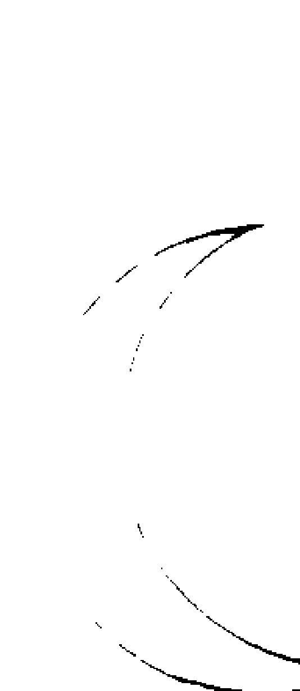

塔羅牌並沒有好壞牌之分，我們應以中立的角度去看每張牌，惡魔牌就是經常被誤解的一張牌。而惡魔牌又叫物慾牌，因為惡魔對人的唯一伎倆就是誘引，勾起人的欲念。

惡魔牌裡除了魔鬼之外，還有亞當和夏娃。魔鬼手持火炬燃燒亞當的尾巴，煽動著亞當的欲望，亞當的尾巴著了火，表示欲望已經開始被燃起了，夏娃手上則拿著伊甸園裡分辨善惡樹上的果實。此時的亞當和夏娃已經犯了罪，頭上長出了角，獸性已取代了他們的人性。

欲念也是一種束縛，鎖鏈既是亞當夏娃的束縛，也是亞當夏娃的欲念，而他們並不願意放下枷鎖。人的欲念是很物質的，當人的欲念升起，往往就會成為物質的奴隸。

乍看之下，好像是兩個無助的人被魔鬼鎖住了，或兩個人落入了魔鬼的圈套，但仔細一看，鎖鍊其實很鬆，隨時可以掙脫下來，是這兩個人不願放下束縛，甘心受困。人心若充滿欲念，就會落入魔鬼的圈套，這張牌代表重視物欲而忽略心靈、盲目地追求物質，甚至甘願受困。

人一旦屈服於自己的欲望，就被自己束縛住了，沒有人能救出被魔鬼鍊上的人，因為這副枷鎖是他們自己套上的，他們心甘情願，而且不願離開，最後就必須為自己的貪念付出代價。

惡魔牌雖然是一張象徵欲念的牌，但欲念是中性的，沒有好或不好，有時適當的欲念是一股動力，可以鞭策我們努力向前，把不可能的事變成可能。然而人類現今對物欲的沈迷，遠超過自己的基本需求，殊不知無欲無求才是最大的自由！

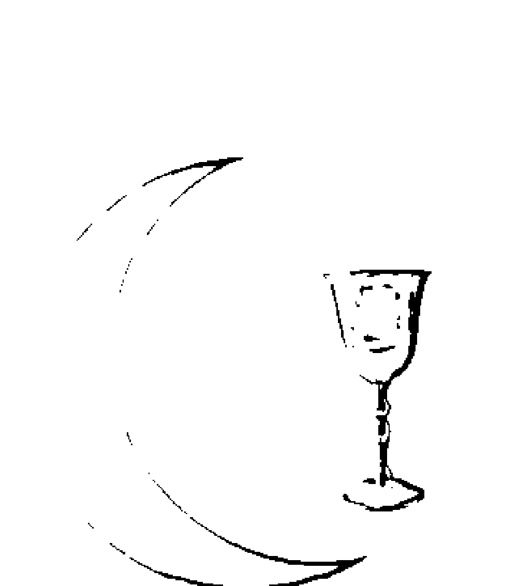

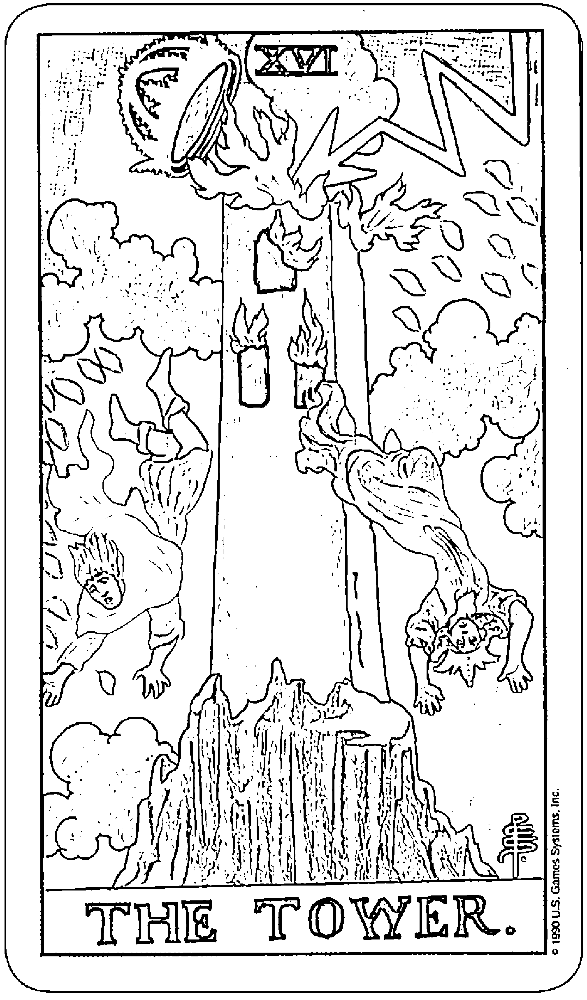

### 16 塔

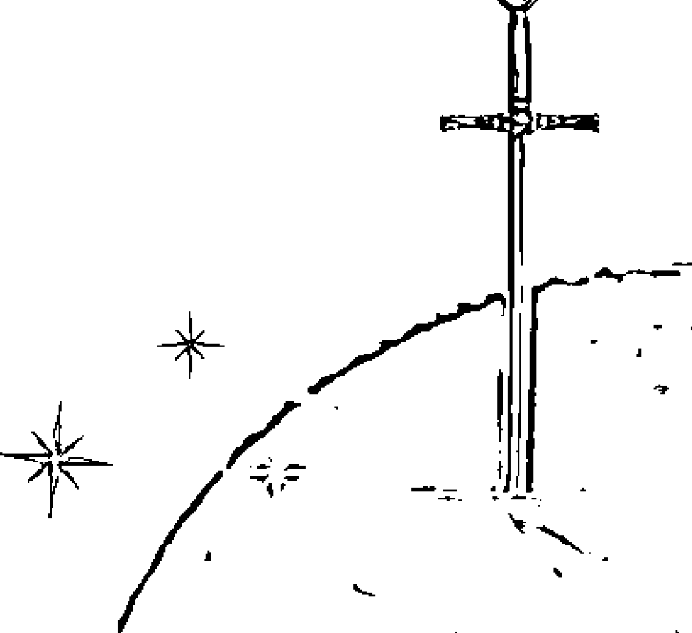

- 黑色背景中處於山崖的高塔給你什麼感覺？

- 高塔的窗給你什麼感覺？

- 雷擊中了高塔給你什麼感覺？

- 雷劈開了塔頂，結果會怎樣？

- 紅色的火焰給你什麼感覺？代表什麼？

- 有兩個人飛出塔外給你什麼感覺？

- 雷電不是人為或可預測的東西，所以雷擊象徵什麼？

- 這張牌放在關係裡，會是怎樣的狀況？

- 這張牌放在工作裡，會是怎樣的狀況？

- 這張牌放在財務上，會是怎樣的狀況？

### 相關詞

- 意外、突發事件、打擊、挫折、崩潰、分手、急病

此牌代表了突如其來的意外或毀滅，充滿驚慌與恐懼，因此塔被賦予惡運的意思。但唯有徹底的破壞，才能帶來徹底的重建。不要只看到眼前的挫折，改變才是更重要的。塔除了代表了架構性的事物（公司、家庭、關係）之外，也代表人類的信念系統。塔羅牌的二十二張主牌裡，最能表達「無常」的牌，要算是這張塔牌了。山上的高塔被雷電擊中毀壞，塔上的人嚇得掉了出來。高塔多半是地標、旅行者或航海者辨認方位的建築物，令人感到安心。塔頂以皇冠取代，象徵物質財富。但突如其來的一擊，讓所有榮華富貴瞬間煙消雲散。建築物愈高就愈容易被雷擊中，那麼，雷擊向高塔究竟是必然還是偶然？月有陰晴圓缺，人有悲歡離合，大自然是最無常、最公平、最沒有階級觀念的。生命本就充滿無常，每一刻都可能有突如其來的變卦，令人措手不及。每個人都希望凡事可以如己所願，但我們也知道這是一種奢求。如果我們夠成熟，那麼當人生的劇情不如預期發展時，就能坦然面對，亦可有效地做出回應。只是一味認為自己倒楣，要別人為自己的不幸負責，那麼人生就會是個悲劇，徒然讓自己成了命運的受害者。

塞翁失馬，焉知非福，你又怎麼知道那些人不是被關在塔中的囚犯，雷擊反而釋放了他們，讓他們重獲自由呢？

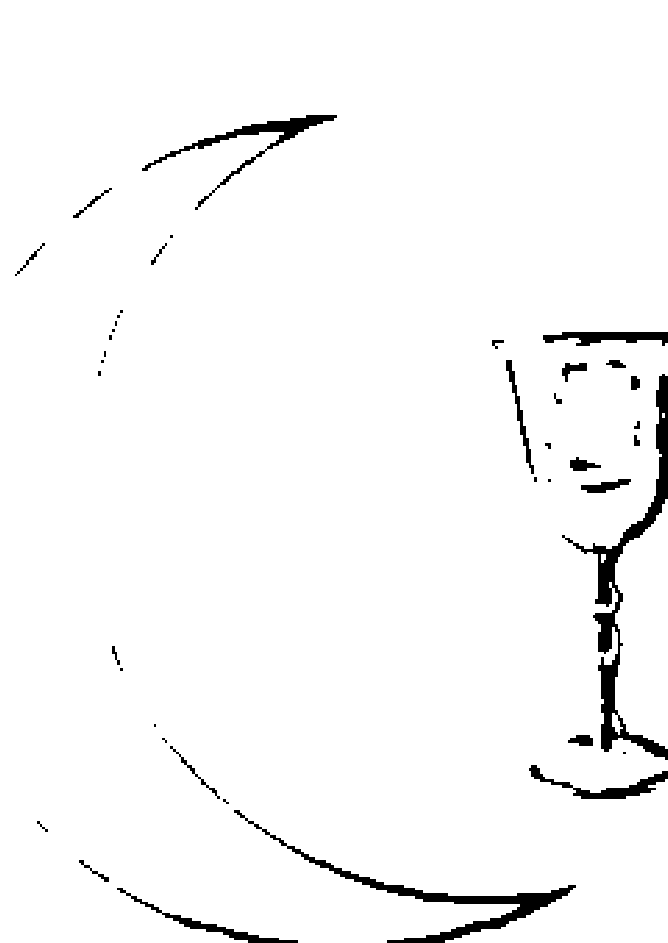

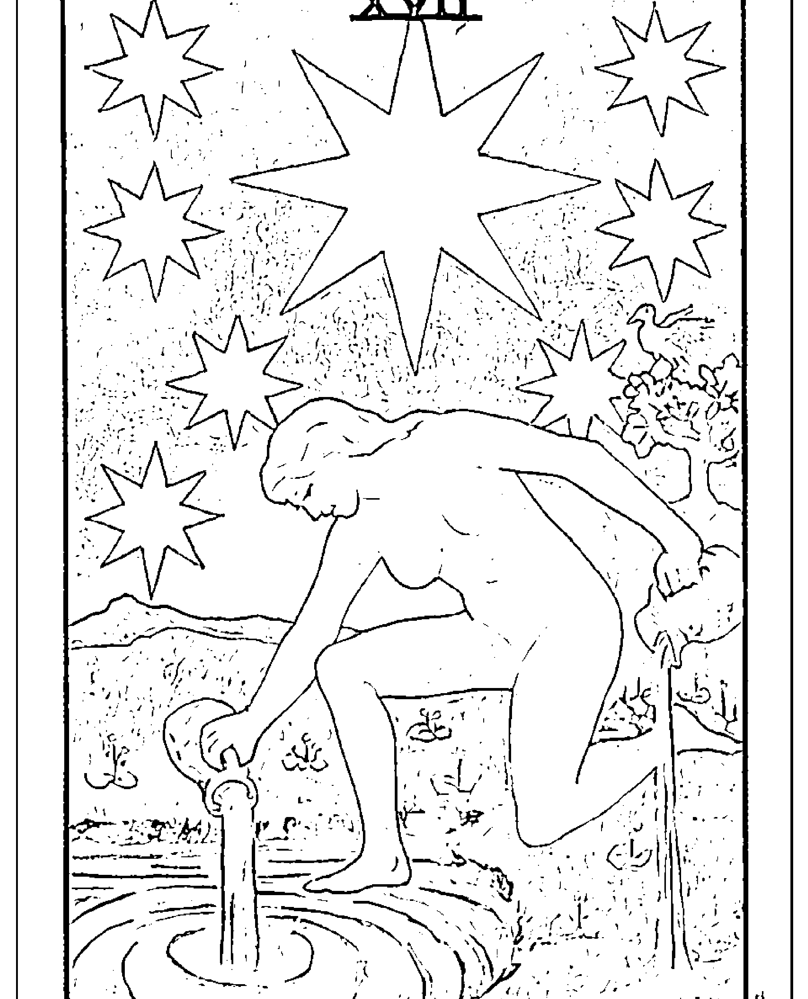

### 17 星星

### 王牌的學習與分析

- ◇ 圖中的女子在做什麼？

- ◇ 把水倒來倒去是什麼意思？

- ◇ 她是被迫的，還是自願的？

- ◇ 什麼樣的人可以在沒有任何束縛時，從事有紀律又重複的事？

- ◇ 在日常生活中，天上最大最亮的星星有什麼功能？

- ◇ 女子清楚知道自己在做什麼嗎？

- ◇ 為目標而努力是什麼感覺？

- ◇ 這張牌放在關係裡，會是怎樣的狀況？

- ◇ 這張牌放在工作裡，會是怎樣的狀況？

- ◇ 這張牌放在財務上，會是怎樣的狀況？

> 相關詞：希望、目標、靈感、往前看、心有所屬、無拘無束

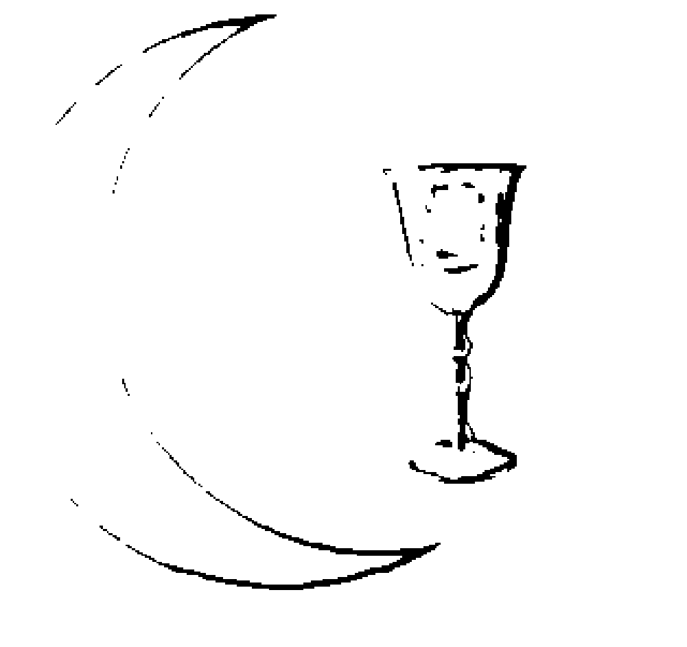

自古以來，北極星一直是夜空中最大最亮的星星，同時因永遠座落在正北方，而成爲最佳指引方向的星座。女子頭上的星星正是北極星，代表女子內心很清明，方向很明確，完全知道自己在做什麼。女子身上沒穿衣服，代表她的生命自由自在，不受束縛，也沒有限制。

女子不斷將池中的水倒在土地上，而土地上的水也不斷流回池中，代表她自行操縱自己的人生，不爲人所控制，同時身邊的資源豐富，可自行灌溉，滋養自己。

星星牌其實是一張讓人反省的牌，女子不斷灌溉自己的土地，而且善用資源；我們每天努力工作到底是在灌溉誰？我們成天忙著工作生活，但我們被滋養了嗎？我們有妥善運用資源嗎？甚至有些人連自己擁有的資源都不清楚。

女子的努力看似徒勞無功，水也依然不停流回池中，但女子內心很清楚明白自己的方向，意志力也很強，因此不斷努力做同樣的事；如果在生活中一直看不到努力的成果，有多少人可以持續相信自己、堅守著不變的執著呢？

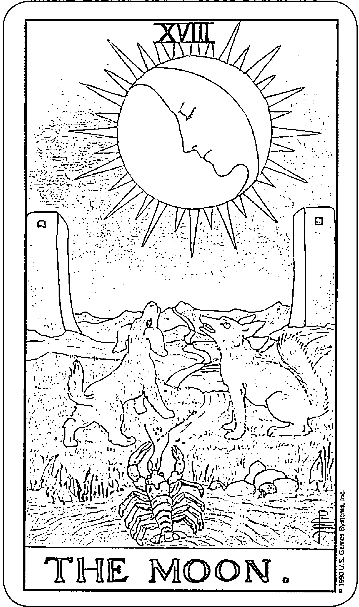

### 18 月亮

### 相關詞

- 憂慮、不安、內心脆弱、恐懼

- ◇ 月亮藏在太陽裡代表什麼？

- ◇ 月亮的表情給你什麼感覺？

- ◇ 路上的狼、狗及蠍子有什麼共通性？

- ◇ 人走在路上會有什麼感覺？

- ◇ 如果把人生比喻成在路上的感覺，你會想到什麼？

- ◇ 恐懼的感覺如何？

- ◇ 這張牌放在關係裡，會是怎樣的狀況？

- ◇ 這張牌放在工作裡，會是怎樣的狀況？

- ◇ 這張牌放在財務上，會是怎樣的狀況？

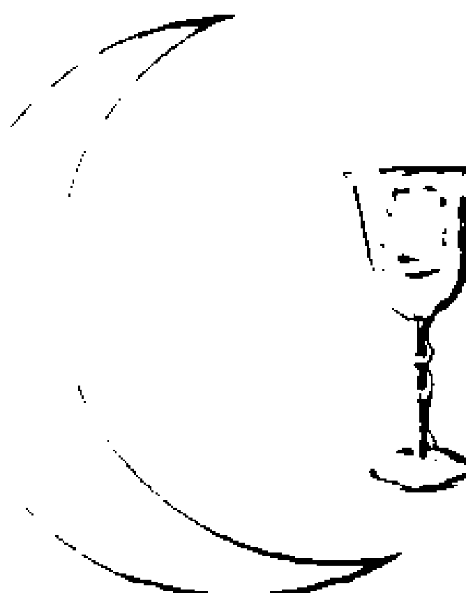

在塔羅牌中，太陽通常象徵人類的意識，月亮象徵人類的潛意識，這張牌中的月亮藏在太陽裡，代表光明的表意識裡藏著潛意識的擔憂，也就是對未知的恐懼。

恐懼與信任是相對的，當一個人心裡覺得不踏實，對未來充滿不信任，就會感到擔憂和恐懼，而且這樣的情緒還會不斷地擴大。

此牌兩根柱子中間有一條路，路上有一條狗、一頭狼和一隻蠍子，這些生物都有某種程度的攻擊性，對人類也有一定程度的威脅性，他們出現在路上，代表一種「害怕會發生什麼事」的恐懼，走在這條路上的人，便不免覺得危機重重，難以心安。

恐懼基本上是每個人都需要經歷的課題，恐懼的背後是無法信任生命，信任的意思就是即使沒有證據，也能單純地相信；恐懼則是加上了頭腦的想像，而這些想像又與個人的經驗、信念及情感強度有關。然而，比恐懼更嚴重的是：信念創造實相，而且信念愈強，實現得愈快。更可怕的是，當現實生活中發生的事件不斷證明我們所相信的想法時，就會一再加深我們的信念，而成了一種惡性循環，也成了我們所謂的「命運」。

如果我們將一切的不幸都歸咎於命運，就等於放棄了生命的自主權，從此不再擁有力量。所以，下次當恐懼又來敲門時，請記得問一問自己：我所恐懼的是某個事實，還是自己一個錯誤的信念？

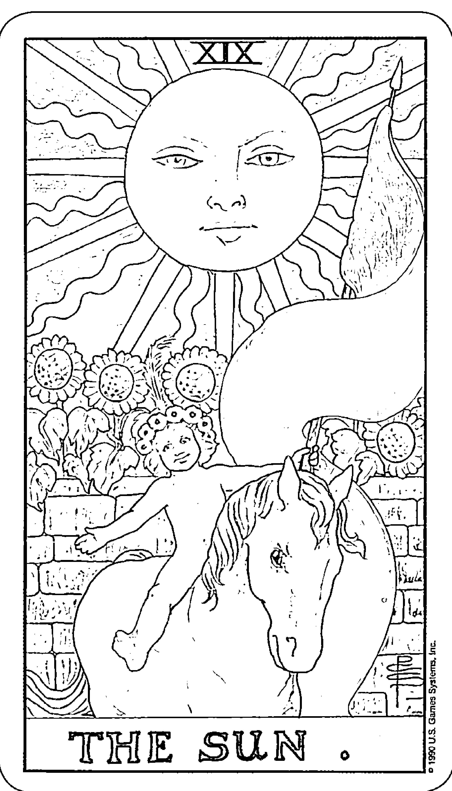

### 19 太陽

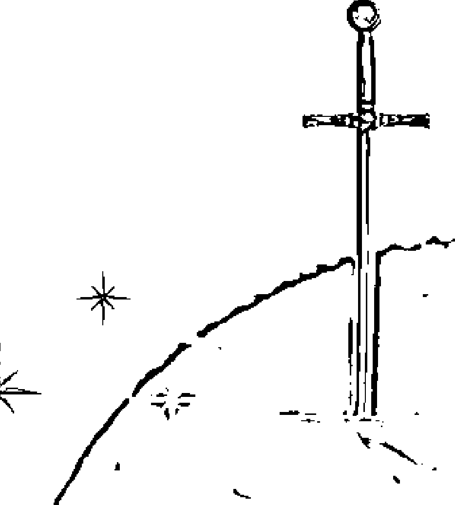

### 相關詞

- ◇ 太陽給你什麼感覺？

- ◇ 太陽花給你什麼感覺？

- ◇ 太陽從牆後昇起，那麼太陽還沒出來時，情況會是如何？

- ◇ 太陽昇起後，帶來了什麼改變？

- ◇ 小孩的姿態給你什麼感覺？你覺得他的性格如何？

- ◇ 圖中的一切都清清楚楚的，你會如此看待自己的人生嗎？

- ◇ 你有勇氣面對自己真實的生命嗎？

- ◇ 真實面對生命是什麼感覺？

- ◇ 這張牌放在關係裡，會是怎樣的狀況？

- ◇ 這張牌放在工作裡，會是怎樣的狀況？

- ◇ 這張牌放在財務上，會是怎樣的狀況？

太陽是一張很容易被誤解的牌卡，大多數的塔羅牌書籍都會過度強調這張牌的正面性：太陽牌代表積極正面、充滿希望歡欣、事事一帆風順、人生成功快樂。但是，當你在沮喪低落時遇到這張牌，不免會感到莫名其妙，甚至一個遇有狀況的人抽到這張牌，會誤以為事情將有轉機，好運就要來到，於是對未來滿懷期盼，最後卻希望落空。

我要再次強調，塔羅牌不是用來占卜未來命運，它只是一個反映潛意識的工具，自然也就沒有好壞牌之分，因為每張牌都可以描述各種狀況。

太陽牌真正要表達的是：黑夜總會過去，太陽也一定會昇起，宛如新生的嬰兒，熱情而燦爛。太陽是地球的生命之源，帶來光明、溫暖與生命力。圖中的太陽高掛天上，使得向日葵盛開怒放，太陽的出現代表黑暗已被驅除，白馬上的小孩快樂地展開裸露的身軀，代表所有事物將被看見、被了解。

在現實生活中，凡事看得清清楚楚，不一定會帶給你快樂，因為，要真實地看清自己，需要勇氣、接納、不排斥、不批判，如此才是真正地「看見自己」。

太陽牌還有一層更深的意義：如是、完全、完整、不加修飾、不加詮釋、真實地展露自己。每個人內心深處都希望得到別人的認同和接納，所以總會有意無意地顯露出自己好的一面，或隱藏不好的面向；若想完全展露自己，首先就要無條件地接納自己所有的面向。

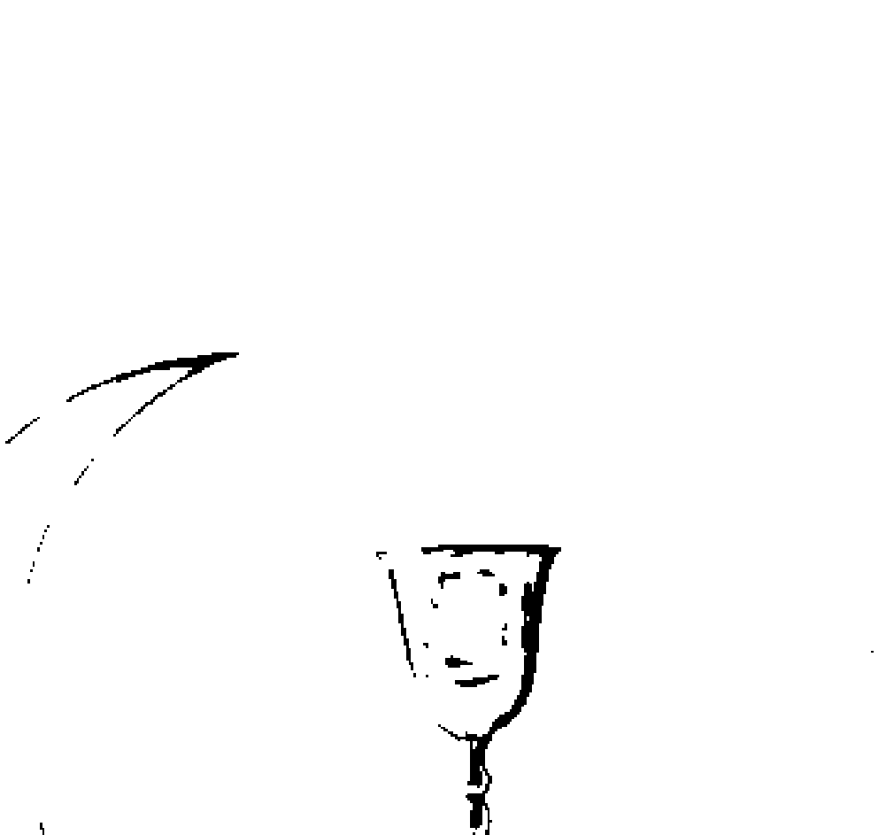

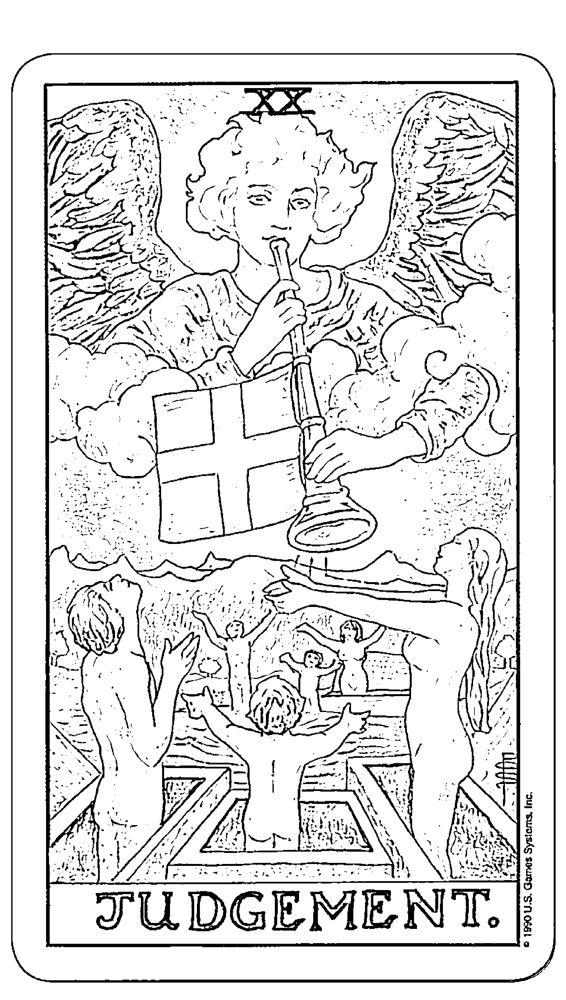

### 20 审判

### 相關詞

- 最後決定、判斷、面對結果

- 聖經中的審判日是個什麼樣的日子？

- 審判日來臨時，會有什麼事發生？

- 天使向所有人吹響號角，是想宣布什麼？

- 號角的聲音給你什麼感覺？

- 人們紛紛被喚醒，從墓穴中站起來表示什麼？

- 限期來到的感覺如何？

- 日常生活中，我們會遇到什麼樣的「限期」？

- 限期漸漸逼近時，會有什麼樣的感覺？

- 這張牌放在關係裡，會是怎樣的狀況？

- 這張牌放在工作裡，會是怎樣的狀況？

- 這張牌放在財務上，會是怎樣的狀況？

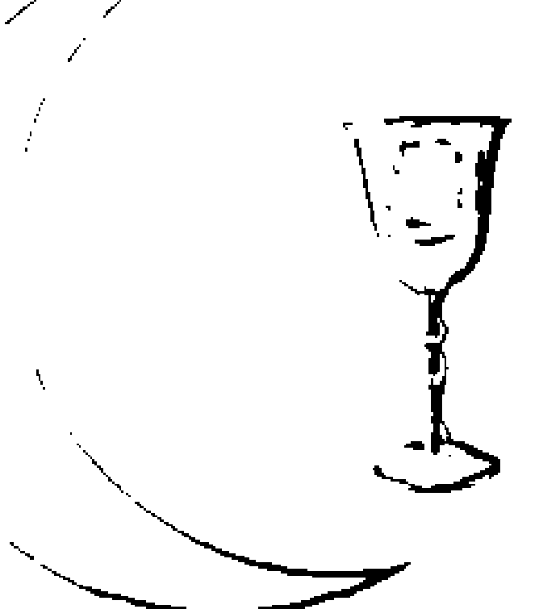

這張牌畫出了聖經中審判日的情況，審判日來臨時，神會親自審判世人，所有的靈魂將被強烈地喚醒，一一接受審判，所以審判日代表期限到來，也就是面對不能逃避的結果、必須承擔後果又一邊倒數計時的複雜心情。

審判牌裡的天使吹起了號角，試圖喚醒沉睡的靈魂，靈魂們也因應號角聲一一甦醒，審判牌代表的正是：該醒過來了、面對的時候到了。此牌與「面對」這個主題很有關連，通常在諮詢者不得不面對關係、帳務、業績、健康等問題時，就會抽到這張牌。

賽斯思想的觀點認為，在靈魂的旅程中，並沒有罪與罰的存在，每一次到訪地球，都是靈魂學習與拓展的過程，因此沒有任何人是受害者，而是偉大的創造者，所有被創造出來的人事物都是寶貴的，無論在理智上被認為是多糟或不堪的東西，背後都有一個愛的理由，都是有價值、值得祝福的。因此，以這樣的角度來看，罪與罰根本不存在，反省為的是開悟、學習、明白及進步，而不是定罪與懲罰。

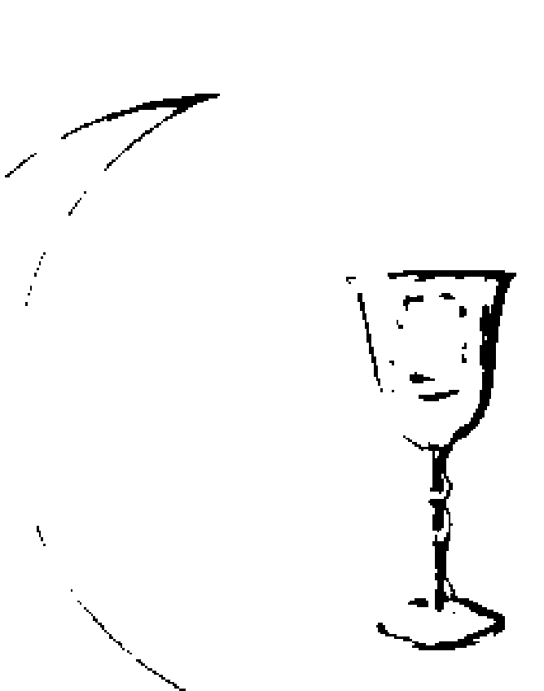

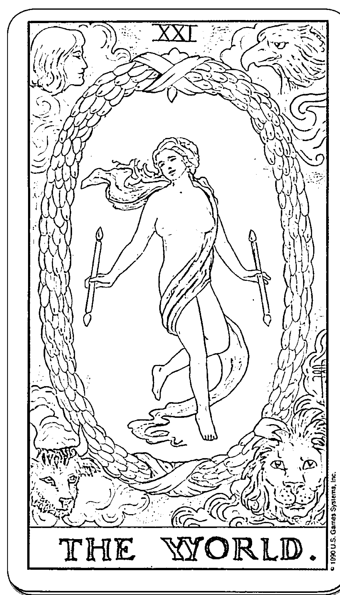

### 21 世界

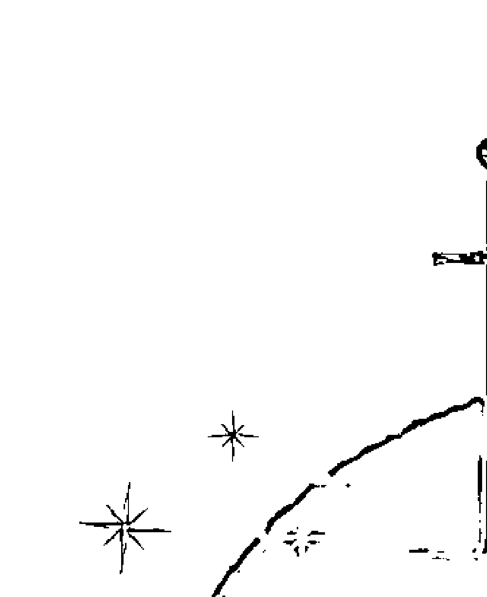

### 相關詞

- 圖中的女士給你什麼感覺？

- 她快樂嗎？滿足嗎？

- 她有什麼打算？

- 她手持兩支杖代表什麼？

- 圍繞著她的絲巾代表什麼？

- 前面的綠色圓環象徵什麼？

- 跨過圓環後會看到什麼？

- 這張牌放在關係裡，會是怎樣的狀況？

- 這張牌放在工作裡，會是怎樣的狀況？

- 這張牌放在財務上，會是怎樣的狀況？

塔羅牌的 1 到 9 號主牌算是一個階段，此階段與生命靈數比較有直接的關係，10 到 21 號則是另一個階段，此階段顯示了人必須經歷與學習的各種生命課題，所以在 21 號的世界牌中，四個角落的象徵物又歸位了。牌中人完成了一個階段，正處於最滿足、自在的狀態，所以世界牌帶有完成、完滿之意。

牌中的花圓環是一道門，代表一個循環、階段或段落的完成，也代表邁向生命下一個階段的啟航之門，生命即將邁進新的領域、新的局面、新的可能性，這張牌同時包含著結束及開展之意。

世界牌常讓我想起賽斯一個很重要的理念：「當下是威力之點」，生命的每個當下都可以成為結束與開始。昨日種種，對當下的你有什麼意義，由你自己決定，如何開啟生命的下一章，也取決於你自己，因為每個當下都擁有千萬種可能性。

我經常跟學生提到「經驗值」一詞，也是我們走完一生唯一可以帶走的寶貴之物，圖中人正處於最滿意自在的狀態，入世而超然，盡情投入此生，又沒有太入戲，或過度認同實相，這正是靈魂在地球上的最佳狀態。

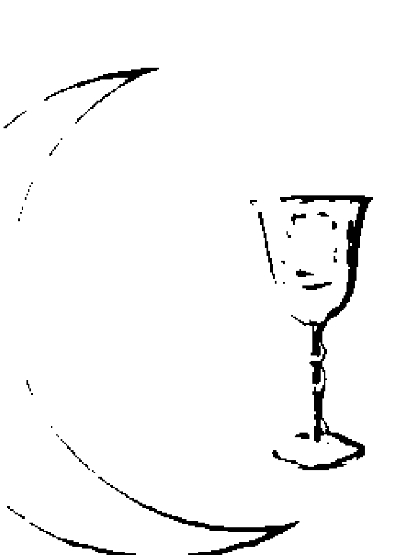

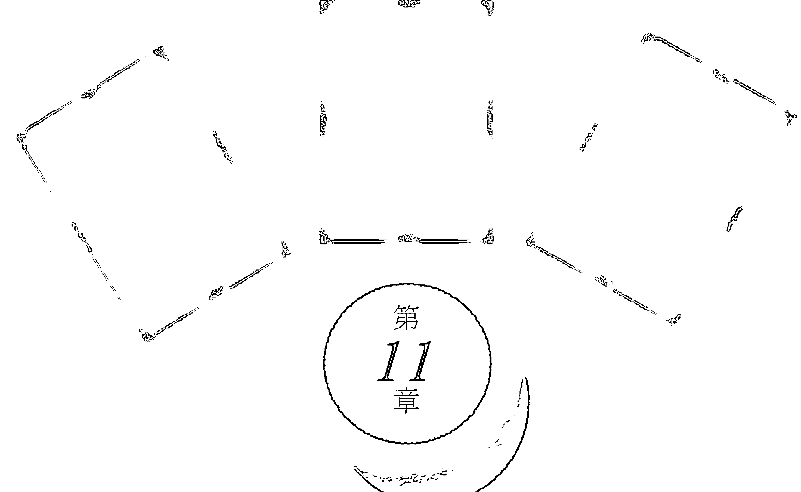

# 第11章

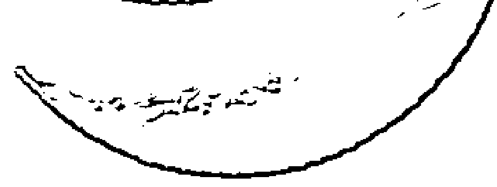

## 副牌的學習與分析

- 手中錢幣的質感如何？實在嗎？

- 現實生活中有什麼東西是實在的？

- 人世間最實際的東西是什麼？

- 生活中有什麼新事物讓你有實在的感覺？

- 實實在在的東西握在手中是什麼感覺？

## 五角星Ace ♦ 財富、享樂、安全、實質

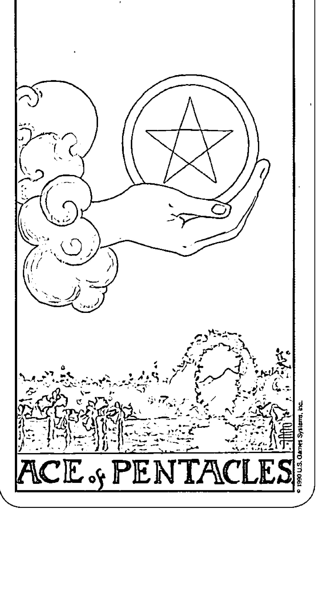

### 五角星 2 —— 選擇、靈活

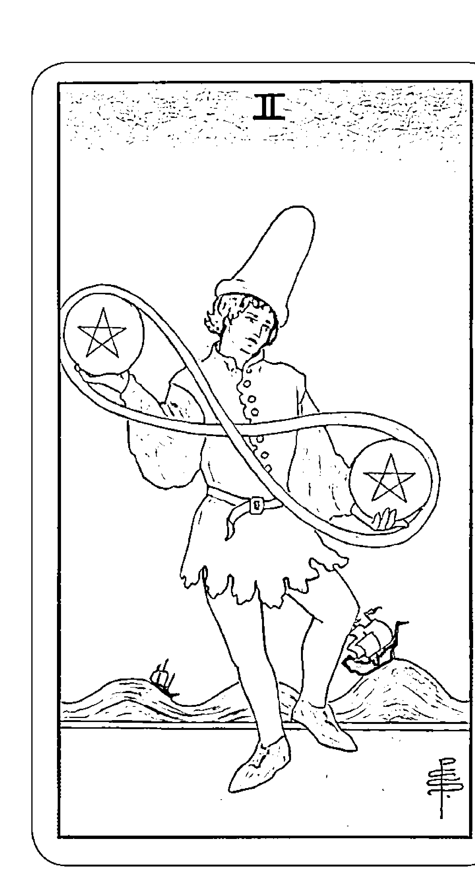

- 圖中的小丑正在做什麼？

- 他是很輕鬆？還是不自在？

- 小丑手中的繩子是阻礙？還是輔助？

- 小丑有能力處理手上的兩顆五角星嗎？

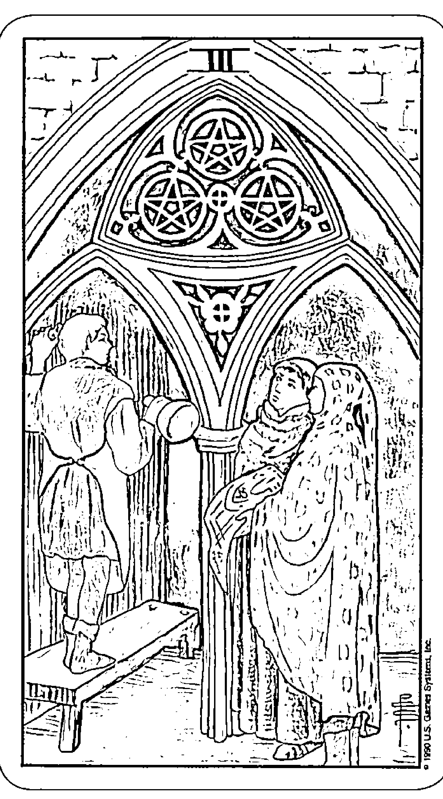

### 五角星3 —— 合作、協調、計劃、被欣賞、才幹

- ◇ 图中几个人是什么关系？（夥伴／上司下属／团队）

- ◇ 他们在做什么？（商討／問路／指導／評鑑）

- ◇ 拿著藍圖在辦事的人，象徵什麼樣的人？

- ◇ 左邊那個人為什麼要站在椅子上？他會有什麼感覺？

- ◇ 他們各自對對方有什麼感覺？

### 五角星4——得到、控制、占有、害怕失去、資產

- ◇圖中這個人如何看待手上的五角星？

- ◇你可以拿走他的五角星嗎？

- ◇這樣抱著、踩著又頂著五角星舒服嗎？

- ◇為什麼他不放手？

- ◇他現在的心情如何？

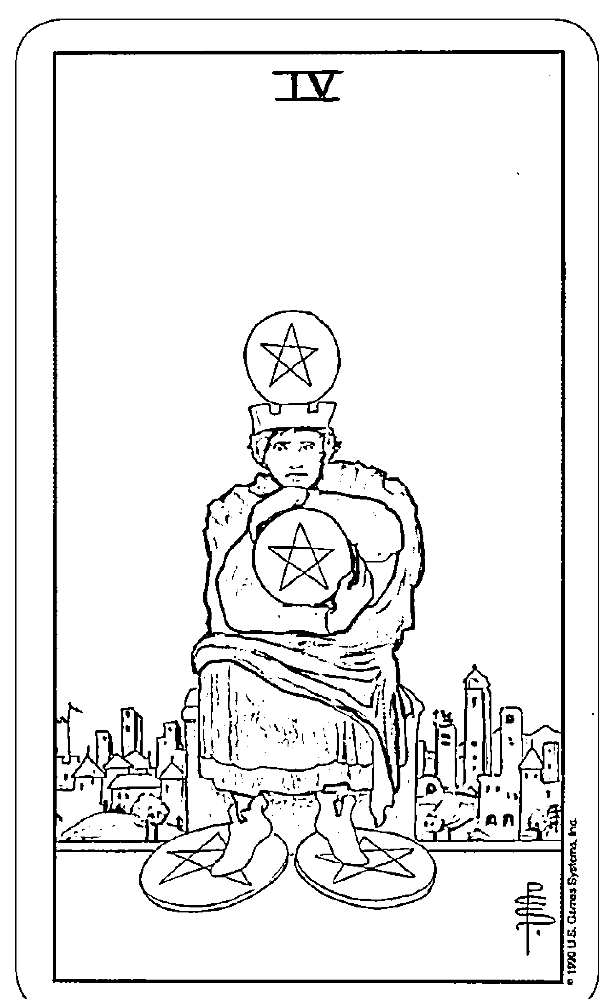

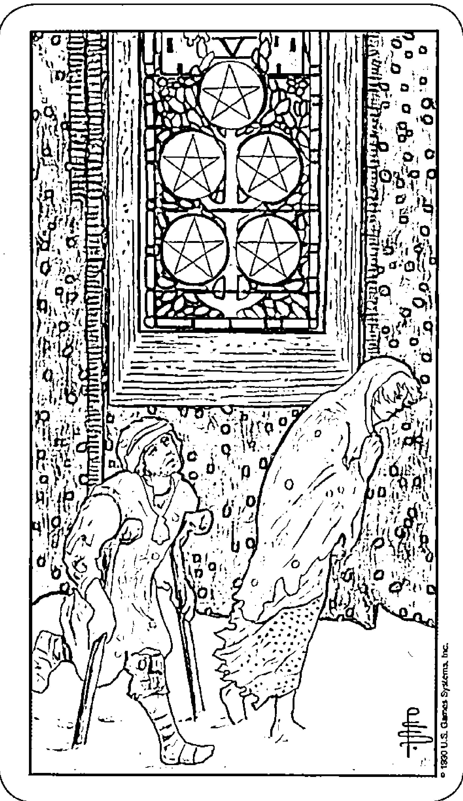

### 五角星5——貧窮、疾病、艱困、憂慮

- ◇ 你覺得圖中這兩個人要去哪兒呢？為何而去？

- ◇ 他們現在的景況如何？旁邊的建築物是什麼地方？

- ◇ 你覺得他們會到教堂求援嗎？為什麼？

- ◇ 圖中這兩個人的關係如何？他們有互相幫助嗎？

- ◇ 跛子胸口掛著一個鈴鐺，是什麼意思？為什麼他要在胸前掛一個鈴鐺？

### 五角星6——慈善、慷慨、理财、施与受

-   ◇ 图中这些人是什么关系？
-   ◇ 中间那人是个好人吗？
-   ◇ 他慷慨吗？公平吗？一视同仁吗？喜欢计较吗？
-   ◇ 富翁用天秤来评估他人，你觉得公平正当吗？
-   ◇ 如果此图是在形容一家公司的情况，会是个什么样的故事？

### 五角星7 ◇ 收成、暂停、思索

-   ◇ 图中这个人勤劳吗？
-   ◇ 他的勤劳有成果吗？
-   ◇ 他对于自己的成果有什么感觉？
-   ◇ 他兴奋吗？满足吗？享受自己的成果吗？为什么？
-   ◇ 为什么一个人会不享受自己的成果？

### 五角星8

技能、勤劳、工作、成就感

-   - 图中这个人勤劳吗？他做的是什么工作？
-   - 他的工作态度如何？
-   - 他把铸成的五角星高高挂起的原因是什么？
-   - 高挂起来的五角星象征什么？
-   - 对他来说，最重要的是什么？

### 五角星9

魅力、满足、远见

-   - ◇ 这位女士过着什么样的生活？
-   - ◇ 她快乐吗？
-   - ◇ 女士手上有一只被蒙着头的白鸽，白鸽的功用是什么？
-   - ◇ 白鸽被蒙住头象征什么？
-   - ◇ 你觉得这位女士会不会留在葡萄园里？

### 五角星10——富裕、事业团体、物质成功

-   - ◇ 这幅图给你什么感觉？老人给你什么感觉？
-   - ◇ 其他人在做什么？
-   - ◇ 如果此图在形容一个家庭的状况，那会是个什么样的故事？
-   - ◇ 家长是个什么样的人？其他人如何对待这位一家之主？
-   - ◇ 如果此图在形容一家公司的状况，那会是个什么样的故事？
-   - ◇ 公司的老板会是个什么样的人？这家公司有小圈子吗？

### 五角星侍卫——专注、学习（侍卫是风元素，五角星是土能量）

-   - ◇ 这位年轻人知道自己要往哪里去吗？
-   - ◇ 他注视着手上的五角星，给你什么感觉？
-   - ◇ 他有没有很认真看待手上的五角星？
-   - ◇ 他是比较轻浮还是比较踏实的？
-   - ◇ 他是自在的还是急躁的？

### 五角星骑士——目标、远见（骑士是火元素，五角星是土能量）

-   - 马上的骑士准备要做什么？
-   - 他以什么样的态度来迎战？他准备好出征了吗？
-   - 骑士和马的关系如何？骑士能否驾驭他的马？人马的方向目标是否一致？
-   - 骑士有把握打胜仗吗？

### 五角星皇后
优雅、温柔、包容（皇后是水元素，五角星是土能量）

-   - 这位皇后给你什么感觉？
-   - 她是比较外放还是比较内敛的？
-   - 她有心事吗？
-   - 她会把心事跟别人说吗？
-   - 椅子旁的小兔子可以如此靠近皇后，代表皇后是个怎样的人？

### 五角星国王——保守、稳定（国王是土元素，五角星是土能量）

-   ◇ 这位国王给你什么感觉？你可能改变国王的想法吗？
-   ◇ 他坐在那儿多久了？怎么看出来的？
-   ◇ 脚踏铁牛这个动作给你什么感觉？
-   ◇ 国王有打算起来吗？
-   ◇ 国王的江山稳固吗？

### 圣杯Ace——新感情、爱、喜悦、丰沛的感情

-   ◆ 图中的水是流动还是静止的？
-   ◆ 如果水是感情，那满溢的水杯是什么样的感情？
-   ◆ 什么时候你会出现新的关系呢？
-   ◆ 新的关系给你什么感觉？

### 圣杯2
恋情、友谊、合作、结合

-   - 如果圣杯象征情感，那图中的两人在做什么？
-   - 把自己的情感交出去是什么感觉？
-   - 什么样的人会别人把自己的感情交出去？
-   - 你觉得图中的「狮子头」在两人中间担任什么角色？
-   - 这张牌放在感情上、关系上或工作上是怎样的情况？

### 圣杯 3 —— 欢庆、结盟、团体、宴会

-   ◇ 图中的人在做什么？玩乐？跳舞？比较？还是庆祝？
-   ◇ 他们是什么样的团队？
-   ◇ 他们对彼此诚实吗？
-   ◇ 中间那个人为什么要单脚立起？

### 圣杯4

耐性、不变、保持距离
封闭、不接受、自我保护

-   ◇ 这个男子坐在树下做什么？
-   ◇ 他的身体语言是开放的？还是封闭的？
-   ◇ 如果圣杯象征情感，他对感情采取怎样的态度？
-   ◇ 现在有一个圣杯放到他面前，你觉得他会接受那个圣杯吗？
-   ◇ 他有没有靠近其他的杯子？你觉得跟他交朋友容易吗？

### 圣杯5

后悔、依恋、无能为力 执着、执迷、接受、现况

-   - ◇如果圣杯象征情感，那翻倒的圣杯象征什么？
-   - ◇你觉得图中人看着翻倒的圣杯，心情如何？
-   - ◇你觉得他此刻的表情如何？
-   - ◇为什么他看不到后面没翻倒的圣杯？

### 圣杯 6

分享、接受、接纳、关怀 真诚、无私、幼稚、旁若无人

-   - 如果圣杯象征情感，那图中两个小孩在做什么？
-   - 分享圣杯的小孩以怎样的心情交出他的圣杯？
-   - 接受圣杯的小孩以怎样的心情接受那个圣杯？
-   - 小孩子代表什么样的人？
-   - 分享给人的圣杯跟其他的圣杯有什么分别？
-   - 什么样的人会把最好的东西分享出去？

### 圣杯 7 ◇ 迷茫、选择、真相、人事问题的困扰

-   ◇ 图中人眼前出现很多选择，你觉得他选定了吗？
-   ◇ 如果圣杯象征关系，图中不同的圣杯象征什么形式的关系？
-   ◇ 什么样的人才是可以交的朋友？
-   ◇ 应该用什么准则、条件来交朋友？

### 圣杯8

—— 离去、上路、中止计划、任务、完成、不顾一切

-   - ◇ 图中人为什么要离开？
-   - ◇ 他要去哪里？他有什么任务？
-   - ◇ 他会放弃自己的目标吗？
-   - ◇ 为了完成目标，他放弃了什么？
-   - ◇ 你觉得他是个什么样的人？

### 圣杯9

自我保护、隐藏、炫耀、虚伪、表面

-   - 如果圣杯象征关系，图中人如何对待他的圣杯？
-   - 你想和他交朋友吗？为什么？
-   - 为什么他要炫耀自己的圣杯呢？
-   - 他用什么姿态去拥有圣杯？
-   - 你认为布幕里藏了什么东西？

### 圣杯 10

家庭、温馨、美满、美好结局
远景、盼望、短暂的美丽

-   - 这幅图给你什么感觉？这是一个怎样的家庭？
-   - 父母的关系如何？小孩快乐吗？
-   - 他们有一致的目标／远景吗？
-   - 彩虹象征什么？彩虹可以维持多久？
-   - 圣杯都在高挂的彩虹里，是什么意思呢？

### 圣杯侍卫——善变、敏感（侍卫是风元素，圣杯是水能量）

-   - ◇你觉得图中的侍卫是踏实型还是轻浮型的人？
-   - ◇圣杯里面的鱼是死的还是活的？
-   - ◇那条鱼会在圣杯里待多久？
-   - ◇手持装着活鱼的圣杯，给你什么感觉？
-   - ◇如果圣杯象征感情，图中的侍卫把感情交出来了，你会接受他吗？

### 圣杯骑士——外刚内柔、付出感情（骑士是火元素，圣杯是水能量）

-   - ◇火表示行动，一个多情又行动派的男人是怎样的？
-   - ◇图中的骑士知道自己要去哪里吗？
-   - ◇如果圣杯象征感情，骑士拿着圣杯前进，表示什么？
-   - ◇你会接受他的圣杯（感情）吗？

### 圣杯皇后
有幽默感、多愁善感（皇后是水元素，圣杯是水能量）
情感丰富、专注

-   ◇ 这位皇后眼中只有什么？
-   ◇ 她专注到大难临头都不知道，到底发生了什么事呢？
-   ◇ 如果圣杯象征感情，那皇后最重视的是什么？

### 圣杯国王——有情有义、假装稳定（国王是土元素，圣杯是水能量）

-   - 国王坐在宝座上，但宝座在什么地方？
-   - 国王的宝座在水中，这个皇位稳固吗？
-   - 为什么国王的表情如此淡定？
-   - 国王的心淡定吗？

### 权杖 Ace
---
新行动、部署、创造力、机会
开展计划、重新起步

-   ◇ 图中的手用力握住权杖给你什么感觉？
-   ◇ 这支权杖强大吗？有力量吗？
-   ◇ 如果权杖象征行动力，Ace牌又是排行第一，综合起来表示什么？
-   ◇ 这张牌放在感情上、关系上或工作上，会是怎样的情况？

### 权杖 2
权力、野心、胆色 计划、决定、远瞻

-   ◇ 图中人站在哪里？为什么要站在那里？
-   ◇ 他手中拿着地球远眺，表示什么？他心里在想什么？
-   ◇ 他用什么姿态拿着权杖？给你什么感觉？
-   ◇ 如果权杖象征行动力，背后锁住的权杖是什么意思？
-   ◇ 你觉得他满足于自己所拥有的吗？

### 权杖 3

选择、远见、下一步

-   ◆ 如果镜头转到图中人前面，你觉得他有一张什么样的脸？他会有什么表情？
-   ◆ 他为什么要站在那儿？他在那儿站多久了？
-   ◆ 他知道自己要去哪里吗？他在等什么？
-   ◆ 他以什么样的心情握住权杖？是否知道背后有其他权杖？
-   ◆ 他还会站多久？

### 权杖 4 —— 欢庆、和谐、繁荣 共享成果、美好的国度

-   - 你觉得他们在做什么？那四根权杖象征什么？
-   - 里面的人过着什么样的生活？
-   - 里面的围墙给你什么感觉？
-   - 你觉得可以进到里面去吗？
-   - 你觉得他们怎么看待外面的人？

### 权杖 5

冲突、竞争、混乱 各持己见、矛盾

-   ◇ 图中的人在做什么？
-   ◇ 如果此图在形容一家公司的状况，那你对这家公司会有什么看法？
-   ◇ 你怎么看待这一群人？
-   ◇ 为什么会出现这样的状况？

### 权杖6——胜利、凯旋而归、自信 好消息、高姿态、粉饰

-   ◇这个图在描述什么样的情况？骑着马的人有什么感觉？
-   ◇你觉得图中每个人都高举权杖，是在做什么？
-   ◇被夹道欢迎的感觉如何？图中主角手上的权杖有什么特别的？
-   ◇主角如何准备自己的马与一身的装束？
-   ◇你觉得主角是个怎样的人？

### 权杖7

防御、挑战、条理、计划
围攻、防御、对抗

-   ◇ 图中的人做事有条理吗？
-   ◇ 看着地上插的权杖跟他穿的鞋子，你对他有什么感觉？
-   ◇ 他现在站的地方舒服吗？他有退路吗？
-   ◇ 你觉得他有什么打算？
-   ◇ 你觉得他会认输吗？为什么？

### 权杖8 一致、有条理、维持能力、挑战

-   - ◇ 图中的权杖给你什么感觉？
-   - ◇ 权杖的方向一致吗？
-   - ◇ 那支较短的权杖若赶上来的话，会怎么样？
-   - ◇ 如果此牌用来形容一个人做事的方式，你觉得会是怎样的方式？
-   - ◇ 如果权杖象征行动力，你有能力一次处理八支权杖吗？

### 权杖9

受过伤害、不能信任、有戒心
小心翼翼、保守

-   - ◇ 图中的人经历过什么？他的眼神给你什么感觉？
-   - ◇ 受过伤的人会怎样处事？
-   - ◇ 他为什么要握着权杖？
-   - ◇ 他相信人吗？为什么？
-   - ◇ 你觉得他的处事作风如何？

### 权杖10 —— 疲累、压力、努力、责任 独力承担、盲目、不顾一切

-   ◇ 你觉得图中的人勤劳吗？
-   ◇ 他能应付手上的权杖吗？
-   ◇ 他看得到自己面前的路吗？
-   ◇ 再这样走下去会有什么结果？
-   ◇ 你的公司有像他这样的人吗？

### 权杖侍卫——专注、集中 焦点、热忱 （侍卫是风元素，权杖是火能量）

-   - 图中的背景是什么地方？
-   - 在沙漠这个不稳定的地方，图中人有被影响吗？
-   - 在他眼中什么事最重要？他的性格如何？
-   - 他会做事会想清楚吗？他知道自己要做什么吗？

### 权杖骑士——激烈、冲动 热情、心急（骑士是火元素，权杖是火能量）

-   - 骑士握住权杖，火的双重能量给你什么感觉？
-   - 火中骑士是个行动派的人吗？
-   - 骑士和马的关系如何？
-   - 如果火代表活力及热情，以他手持权杖的姿态来看，你觉得他做事会亲力亲为吗？他的做事态度如何？

### 权杖皇后
——热心、温暖、开放、独立（皇后是水元素，权杖是火能量）

-   ◇ 图中的皇后给你什么感觉？她的身体语言是封闭的还是开放的？
-   ◇ 太阳花代表积极、乐观及活力，皇后手握太阳花，表示什么？
-   ◇ 你可以欺负这位皇后吗？为什么？
-   ◇ 图中的黑猫给你什么感觉？
-   ◇ 你觉得皇后是个怎样的人？

### 权杖国王——准备就绪、摆好姿势（国王是土元素，权杖是火能量）倾向

-   ◇ 图中的国王在做什么？
-   ◇ 他手握拳头，敞开龙袍，表示国王想做什么？
-   ◇ 他知道自己在做什么吗？
-   ◇ 你觉得国王的行事风格如何？

### 宝剑 Ace

新思想、新思维、新信念
新决定、决心、重整思绪

-   - 宝剑剑尖部分被皇冠围绕着，表示了什么？
-   - 什么人有资格戴上皇冠？
-   - 当一个人被加冕，表示什么？
-   - 橄榄树及棕榈树的树枝象征什么？
-   - 当皇冠、橄榄树枝及棕榈树枝同时出现在新的思想上，代表什么？

### 宝剑 2

逃避、抗拒、僵局、鱼与熊掌 静心、不受干扰

-   ◇ 如果宝剑代表想法，请问哪支宝剑比较好？
-   ◇ 图中人可以做决定吗？有人可以帮她吗？
-   ◇ 你觉得是谁蒙住了她的双眼？
-   ◇ 图中人为什么要蒙上眼睛？

### 宝剑3

受伤、悲伤、打击、冲击
被中伤、坚持

-   - 图中的背景是什么天气？表示什么？
-   - 如果宝剑代表思想和意见，三把剑插进一颗心是什么意思？
-   - 心还完整吗？
-   - 如果宝剑代表信念及原则，现在三把宝剑的「角色」有什么不同？

### 宝剑 4
休息、消极、沉淀
准备、闭关、静思

-   - ◇图中黄色部分是什么东西？棺材里面放了什么？
-   - ◇如果宝剑代表信念及原则，一个人带着宝剑进棺材代表什么？
-   - ◇房间里有没有其他的宝剑？有没有人理会图中主角？
-   - ◇你可以改变图中主角的想法吗？
-   - ◇这其实是什么地方？教堂的功用是什么？图中人为什么要在此静思？

### 寶劍5

輸贏、偷竊、自私、蒐集
爭執、屈辱、人棄我取

◇ 圖中主角的笑容給你什麼感覺？

◇ 後面的人給你什麼感覺？你覺得地上的寶劍是誰的？

◇ 你認為他們發生了什麼事？

◇ 主角怎麼看待自己撿寶劍的行為？

◇ 如果寶劍代表思想，這會是個怎樣的故事？

### 寶劍 6

保護弱小、療傷、離開 旅行、沒有空間、一廂情願

- 圖中三人是什麼關係？他們要去哪裡？划船的人想做什麼？
- 那對婦孺有什麼感覺？船隻航速是快還是慢？為什麼？
- 水面有什麼特別？船槳放在哪一面？代表划船的人想怎樣？
- 這條船的空間寬闊嗎？
- 船航行時會搖晃，空間這麼狹窄，兩旁又插滿寶劍，坐在船上會有什麼感覺？那對婦孺真正害怕的是什麼？

### 寶劍7

熱愛知識、貪婪、危險
得物無所用、執著、樂在其中

- ◇ 圖中人在幹什麼？他可以處理手上的寶劍嗎？
- ◇ 他已經有五支寶劍在手，看到地上那兩支寶劍，他有什麼想法？
- ◇ 他知道自己握著劍尖嗎？劍身放在脖子上給你什麼感覺？
- ◇ 他覺得這樣有問題嗎？
- ◇ 他會被人發現嗎？他怕被人發現嗎？他的心情如何？

### 寶劍 8

### 劃地自限、壞消息、壓迫、迷惑、故步自封

- * 如果寶劍代表思想，圖中人的思想可有條理？
- * 就算她思想清楚，但思想把她困在一個什麼樣的境地？
- * 她以什麼樣的姿態站在泥地上？蒙眼代表什麼？繩綁又代表什麼？
- * 是誰綁住了她？她的腳有沒有被綁住？
- * 為什麼她不離開？她在執著什麼？

### 寶劍 9

絕望、逃避、夢魘、痛苦

- 如果寶劍代表思想，圖中人的思想可有條理？
- 就算他的思想很清楚，但思想把他困在一個什麼樣的境地？
- 為什麼他要用手蒙住自己的眼睛，這表示什麼？
- 為什麼要逃避？他要逃避的是什麼？

### 寶劍 10

慘痛、絕望、沒有機會、結束
黎明前的黑暗、新的一頁

- ◇ 圖中發生了什麼事？
- ◇ 如果寶劍代表思想和意見，圖中人死於什麼？
- ◇ 圖中人還有希望嗎？他還可以翻身嗎？
- ◇ 你覺得圖中的時間是黎明還是黃昏？為什麼？
- ◇ 無論夜裡發生多慘烈的事，隔天太陽還是會昇起，所以你覺得如何？

### 寶劍侍衛——穩定、分心

心不在焉、站不穩

（侍衛是風元素，寶劍是風能量）

- ◇風是不穩定的元素，圖中什麼地方讓你覺得不穩定？
- ◇什麼地方讓你感覺風很大？
- ◇圖中人站穩了嗎？他的寶劍握得穩嗎？
- ◇他的心在嗎？你可以信任這個人嗎？

### 寶劍騎士

——◆——有勇無謀、目標不一

### 質疑、不信任

（騎士是火元素，寶劍是風能量）

- ◇ 騎士知道自己要去哪裡嗎？
- ◇ 這位騎士能否駕馭他的馬？
- ◇ 人和馬的目標是否一致？
- ◇ 馬是否信任牠的主人？
- ◇ 你會怎麼形容他們的合作關係？

### 寶劍皇后——外交能手、宣布、發表

（皇后是水元素，寶劍是風能量）

- 圖中是一位什麼樣性格的皇后？
- 皇后在做什麼？
- 皇后如何握劍？代表什麼？
- 皇后另外一隻手的姿態給你什麼感覺？
- 皇后的溝通能力和說服力強嗎？

### 寶劍國王

> 一把持信念、堅持

（國王是土元素，寶劍是風能量） 掩飾、死撐

- 你對這位國王有什麼感覺？
- 這位國王可以治理好國家嗎？
- 如果寶劍代表信念及原則，國王的寶劍對他有什麼意義？
- 國王的衣著華麗嗎？國王的寶座穩固嗎？
- 國王的江山穩定嗎？國王在想什麼？他用什麼來治理國家？

# 愛的推廣辦法

看完這本書，是否激盪出您內心世界的漣漪？

如果您喜歡我們的出版品，願意贊助給更多朋友們閱讀，下列方式建議給您：

1. 訂購出版品：如果您願意訂購一千本（印刷的最低印量）以上，我們將很樂意以商品「愛的推廣價」（原售價之65折）回饋給您。

2. 贊助行銷推廣費用：如果您認同賽斯文化的理念，願意贊助行銷推廣費用支持我們經營事業，金額達萬元以上者，我們將在下一本新書另闢專頁，標上您的大名以示感謝（每達一萬以一名稱為限）。

請聯絡賽斯文化或財團法人新時代賽斯教育基金會各地分處，我們將盡快為您處理。

# ○愛的聯絡處

如果您認同本書的觀念及內容，想要接受我們的協助；

如果您認同本書的理念，想依循本書的觀念成為一位助人者的角色；

如果您樂見本書理念的推廣，而願意提供精神及實質的協助；

請與財團法人新時代賽斯教育基金會各地分處連繫：

○台中總會
陳嘉珍
電話：04-22364612
E-mail: nateseth337@gmail.com
台中市北區崇德路一段六三一號A棟十樓之二

○董事長新店服務處
林娉如
電話：02-22197211, 0921378642
E-mail: sethxindian@gmail.com
新北市新店區中央四街八○號五樓

○板橋辦事處
邱譯萱
電話：02-82524377, 0915878207
E-mail: seth.banciao@gmail.com
新北市板橋區仁化街四○之二號八樓

○三鶯辦事處
陳志成
電話：02-26791780, 0988105054
E-mail: sanyin80@gmail.com
新北市鶯歌區文化路二二一四號

○嘉義辦事處
邱牡丹
電話：05-2754886
E-mail: new1118@gmail.com
嘉義市民權路九○號二樓

○台南辦事處
關倩芝
電話：06-2134563, 0939295509
E-mail: sethfamily1@gmail.com
台南市中西區開山路二四五號八樓之一

○高雄辦事處
黃久芳
電話：07-5509312, 0921228948
傳真：07-5509313
E-mail: ksethnewage@gmail.com
高雄市左營區明華一路二二二號四樓

○屏東辦事處
羅那
電話：08-7212028
傳真：08-7214703
E-mail：sethpingtong@gmail.com

○宜蘭辦事處
潘仁俊
電話：03-9325322, 0912296686
E-mail：seth.yilan@gmail.com

○賽斯村
陳紫涵
電話：03-8764797
傳真：03-8764317
E-mail：sethvillage@hotmail.com

○香港聯絡處
董潔珊
電話：009-852-2398-9810
E-mail：seth_sda@yahoo.com.hk

○深圳聯絡處
田迈
電話：009-86-138288-18853
E-mail：tlil-job@163.com

○洛杉磯聯絡處
Charles Chen
電話：002-1-714-928-5986
E-mail：newageusai@gmail.com

○紐約聯絡處
謝麗玉
電話：002-1-718-878-5185
E-mail：healingseeds@yahoo.com

○多倫多聯絡處
黃美云
電話：002-1-416-444-4055
E-mail：tsaisun2k@yahoo.ca

○台灣身心靈全人健康醫學會
林娉如
電話：02-22197106
E-mail：TSHM2075@gmail.com
新北市新店區中央四街八○號五樓

# 依尔达家族 ILDA FAMILY

# 你。就。是。依。尔。達

## 依尔达 About

隸屬於九大意識家族中的一支

依尔达是由「交换者」组成，
主要从事概念、产品、社会与政治观念之交换与交流的伟大游戏。
他们是种子的携带者。

他们是旅行家，把他们的想法由一个国家带到另一个。
他们是探险家、商人、士兵、传教士及水手。
他们常常是改革运动的成员。

他们是概念的散播者及同化者，他们在各处出现。
他们是一群活泼、多话、有想像力而通常可亲的人。
他们对事情的外貌、社会的习俗、市场、目前流行的宗教
或政治理念有兴趣，他们将之由一处散播到另外一处。

> ——摘自赛斯书《未知的实相》

# 爱，愈分享愈多；生命，愈分享愈广阔

「依尔达计划」本着回馈和支持者的心，
希望邀请对赛斯思想和身心健康观有高度热忱的朋友，
共同加入推广员的行列，成为「依尔达」计划的一份子。
传递你的感动、分享你心灵成长与生命故事，同时丰富自己的内在与物质生活。
现在，就拿起电话加入依尔达计划：(02)2219-0400 依尔达小组

| 地區 | 機構名稱 | 地址 | 電話 |
| :--- | :--- | :--- | :--- |
| 台北 | 佛化人生 | 台北市羅斯福路3段325號6樓之4 | 02-23632489 |
| 台北 | 政大書城台大店 | 台北市羅斯福路三段301號B1 | 02-33653118 |
| 台北 | 水準書局 | 台北市浦城街1號 | 02-23645726 |
| 中壢 | 墊腳石中壢店 | 桃園縣中壢市中正路89號 | 03-4228851 |
| 台中 | 唯讀書局 | 台中市北區館前路5號 | 04-23282380 |
| 斗六 | 新世紀書局 | 雲林縣斗六市慶生路91號 | 05-5326207 |
| 嘉義 | 鴻圖書店 | 嘉義市中山路370號 | 05-2232080 |
| 台南 | 金典書局 | 台南市前鋒路143號 | 06-2742711 ext13 |
| 高雄 | 明儀圖書 | 高雄市三民區明福街2號 | 07-3435387 |
| 高雄 | 鳳山大書城 | 高雄縣鳳山市中山路138號B1 | 07-7432143 |
| 高雄 | 青年書局 | 高雄市青年一路141號 | 07-3324910 |

| 地區 | 機構名稱 | 地址 | 聯絡方式 |
| :--- | :--- | :--- | :--- |
| 台北 | 賽斯花園5號出口 | 台北捷運南港展覽館站五號出口 | 02-26515521 |
| 桃園 | 大湳鴻安藥局 | 桃園縣八德市介壽路二段368號 | 03-3669908 |
| 桃園 | 向光之徑 | 桃園縣中壢市中山東路三段327號 | 03-4365026 |
| 桃園 | 彭春櫻讀書會 | 桃園縣楊梅市金山街131號7樓 | 0919-191494 |
| 桃園 | 新時代賽斯中壢中心 | 桃園縣中壢市龍昌路7號 | 03-4365026 |
| 台中 | 賽斯興大讀書會 | 台中市永南街81號 | 0932-966251 |
| 台中 | 心能源社區讀書會 | 台中市北屯區九龍街85號 | 0911-662345 |
| 台中 | 愛麗絲花園 | 台中市沙鹿區自由路166-6號 | 04-26365209 |
| 南投 | 馬冠中診所 | 南投市復興路84號 | 049-2202833 |
| 台南 | 賽斯生活花園 | 台南市安南區慈安路205號 | 06-2560226 |
| 台南 | 2075 Efharisto | 台南市北區北成路20巷1弄28號 | 06-2816328 |
| 高雄 | 天然園 | 高雄市林園區林園北路264號 | 07-6450406 |
| 高雄 | 大崗山推廣中心 | 高雄市阿蓮區崗山村1號 | 07-6331187 |
| 高雄 | 新時代賽斯六合推廣中心 | 高雄市苓雅區六合路21-1號2F | 0972-330563 |
| 屏東 | 賽斯花園 | 屏東市廣東路120巷2號 | 08-7213545 |
| 屏東 | 秋子壽司 | 屏東市興豐路68號 | - |
| 花蓮 | 新時代賽斯花蓮中心 | 花蓮市中福路118號 | 03-8311342 |
| 台東 | 欣紝的家 | 台東市廣東路252號 | 0933-626529 |
| 馬來西亞 | Reset/賽斯學苑 | - | resetgarden@gmail.com, 009-60379608588 |
| 馬來西亞 | 馬來西亞心時代協會 | - | inquiry@newage.org.my, 009-60175570800 |
| 馬來西亞 | 賽斯舞台 | - | mayahoe@live.com.my, 009-60137708111 |
| 新加坡 | LALOLN | - | elysia.teo@laloln.com, 009-6591478972 |

# 賽斯管理顧問

我們提供多元化身心靈健康服務
包含全人教育、人才培訓、企業內訓
身心靈課程規劃及諮詢等
將身心靈健康觀帶入一般大眾的生活之中
另也期盼能引領企業，從不同的角度
尋找屬於企業本身的生命視野及發展遠景

**門市** 提供以賽斯心法為主軸的相關課程諮詢及出版品(包含書籍、有聲書、心靈音樂等。)

# 賽斯文化講堂

1. 多元化身心靈成長課程及工作坊——協助人們實現夢想生活、圓滿關係，創造生命的生機、轉機與奇蹟。
2. 人才培訓——培育具新時代思維，應用「賽斯取向」之心理輔導員、全人健康管理師、種子講師等專業人才。
3. 企業內訓——帶給企業一種新時代的思維及運作方式，引領企業永續發展、尋找幸福企業力。

**心靈陪談** 賽斯「心園丁團隊」提供一對一陪談服務，陪伴您面對生命的無助、困境與難關。

> 許添盛醫師 講座時間
>
> 每週一
> PM 7:00-9:00
>
> 癌症團療
> (時間請來電洽詢)

# Seth 賽斯身心靈診所

## ◎院長 許添盛醫師

本院推展身心靈健康的三大定律：

- 一、身體本來就是健康的。
- 二、身體有自我療癒的能力。
- 三、身體是靈魂的一面鏡子。

結合身心科、家庭醫學科醫師和心理師組成的醫療團隊；啟動人們內在心靈的自我康復系統，協助社會大眾活化人際關係，擁有更美好的生命品質。

## 許添盛醫師 看診時間

- 週一 AM 9:00-12:00 PM 1:30-5:00
- 週二 AM 9:00-12:00 PM 1:30-5:00 PM 6:00-9:00（個別預約諮商）
- 週三 AM 9:00-12:00（個別預約諮商）

- ◎門診預約電話：(02)2218-0875、2218-0975
- ◎院址：新北市新店區中央七街26號2樓（非健保特約診所）
- ◎網址：http://www.sethclinic.com

# 心靈的殿堂 賽斯學院

## 需要您慷慨解囊一起播下愛的種子

## 賽斯村——鳳凰山莊

位於花東縱谷風景區，佔地六公頃，2006年12月由賽斯基金會接管。這裡群山環抱，雲層裊繞，景色怡人，是個淨心、靜心的好地方……步行5分鐘即是賽斯家族的後花園——賽斯學院。

來到賽斯村的每一個人，透過與大自然的親近，與宇宙愛的能量及智慧連結，喚起赤子之心，重新回到內在，覺察每一個當下的自己，開啟內在自我療癒的能力及潛能，創造一個健康、喜樂、富足、平安的生命品質。

翠林農莊是由基金會董事 蔡百祐先生所捐贈購買，園區內小木屋提供賽斯家族及癌友申請長期居住使用。賽斯學院即將於2010年落建於此，第一期工程為賽斯大講堂的興建及住宿區A，第二期工程為住宿B、行政大樓的興建預計2-3年完成興建計劃。

第一期工程款預估約三千萬，第二期工程款預估約二仟萬，目前正由賽斯基金會提出興建計劃說明及募款，在此呼籲認同賽斯資料，且願意和我們一起推廣賽斯心法的賽斯家族們，能共襄盛舉，讓更多需要幫助的人，能感受到這光與愛。

## 服務項目

- ◎住宿 ◎露營 ◎簡餐 ◎下午茶 ◎身心靈整體健康講座 ◎心靈成長團體工作坊
- ◎賽斯資料 ◎課程及讀書會 ◎個別心靈輔導 ◎全球視訊課程連線
- ◎企業團體教育訓練及社會服務

> 捐款方式
> 一、匯款至「賽斯學院」募款專戶 戶名：財團法人新時代賽斯教育基金會
> 銀行：兆豐國際商業銀行北台中分行 帳號：037-09-06780-3
> 二、加入「賽斯家族會員」：每位捐贈本會參仟元整或以上，即贈送「賽斯家族會員」會員卡一張，以茲感謝。（凡持賽斯家族卡至基金會，享有課程及書籍費用優惠）

- ◎地址：花蓮縣鳳林鎮鳳凰路300號
- ◎電話：(03)8764-797
- ◎http：//www.sethvillage.org.tw
- ◎Mail：sethvillage@gmail.com

# 回到心靈的故鄉——賽斯村工作坊

## 許醫師工作坊

在賽斯村，每月第三個星期六、日，由許醫師帶領的工作坊及公益講座，所有學員不斷的向內探索自己，找到內在的力量，面對及穿越生命的恐懼、困難與疾病，重新邁向喜悅、幸福、健康的生命旅程。

## 療癒靜心營

賽斯村精心安排的療癒靜心營，主要目的是將賽斯資料落實在生活裡，由痊癒的癌友分享他們療癒的經驗，並藉由心靈探索、團體分享等各種課程，以及不同的生活體驗，來協助每位學員或癌友成長、轉化及療癒。

賽斯村是一個靜心的好地方，尚有其他許多老師的課程可提供大家學習。歡迎大家前來出差、旅遊、學習、考察兼玩耍，一起回到心靈的故鄉。

地址：花蓮縣鳳林鎮鳳凰路300號
電話：03-8764797
所有課程詳見賽斯村網站：www.sethvillage.org.tw## 百萬CD 千萬愛心

## 請加入賽斯文化 百萬CD推廣行列

自2006年10月啟動「百萬CD，千萬愛心」專案至今，CD發行數量已近百萬片。這一系列百萬CD，由許添盛醫師主講，旨在推廣「賽斯身心靈整體健康觀」，所造成的影響極其深遠。來自香港、馬來西亞、美國、加拿大、台灣等地的贊助者，協助印製「百萬CD」，熱情參與的程度，如同蝴蝶效應一般，將賽斯心法送到全世界各個不同角落——隨著百萬CD傳遞出去的愛心與支持力量，豈止千萬？賽斯文化於2008年1月起，加入印製「百萬CD」的行列。若您願意支持賽斯文化印製CD，請加入我們的贊助推廣計畫！

## 百萬CD目錄

（共八輯，更多許醫師精彩演說將陸續發行）

1. 創造健康喜悅的身心靈
2. 化解生命的無力感
3. 身心失調的心靈妙方（台語版）
4. 情緒的真面目
5. 人生大戲，出入自在
6. 啟動男人的心靈成長
7. 許你一個心安
8. 老年也是黃金歲月
9. 用心醫病

## 贊助辦法

在廠商的支持下，百萬CD以優於市場的價格來製作，每片製作成本10元，單次發印量為1000片。若您贊助1000片，可選擇將大名印在CD圓標上，不足1000片者，也能與其他贊助者湊齊1000片後發印。當然，大名亦可共同印在CD圓標上。每1000片贊助費用10000元，沒有上限。

1. 每1000片 贊助費用10000元
2. 每500片 贊助費用5000元
3. 每300片 贊助費用3000元
4. 每200片 贊助費用2000元
5. 小額贊助，同樣感謝。

您的贊助金額，請匯入以下帳戶，並註明「贊助百萬CD」。賽斯文化將為您開立發票。
戶名：賽斯文化事業有限公司
郵局劃撥帳號：50044421
銀行帳號：台北富邦銀行
ATM代碼012 380-1020-88295

- 書籍、CD
- 輕食、新鮮果汁、咖啡、茶飲
- 心靈成長工作坊
- 場地租借
- 藝文展演
- 賽斯系列商品
- 素人作品
- 個別心靈陪談
- 讀書會
- 身心靈課程
- 癌友、精神疾患與家屬等支持團體

◎電話：(02)8219-1160、2219-7211
◎花園信箱：thesethgarden@gmail.com
◎地址：新北市新店區中央五街51號
◎網址：http://www.sethgarden.com.tw
◎新店分處信箱：sethxindian@gmail.com

## SethTV 賽斯公益網路電視台 www.SethTV.org.tw

這是一個24小時無國界的學習與成長，連結科技網路與心靈網路為您祝福!

## 賽斯❤心法媒體推廣計畫 600元 幫助全人類身心靈成長，您願意嗎?!

當許多媒體傳遞帶著恐懼與限制的訊息，你是否問過究竟什麼才真能讓你我及孩子對未來、對生命充滿期待與喜悅，開心地想在地球上活出獨特與精彩?

賽斯教育基金會感謝許添盛醫師及其他心靈輔導師、實習神明分享愛、智慧與慈悲的身心靈演講/課程/紀錄做為「賽斯公益網路電視台」的優質節目；我們規劃製播更多深度感動的內容，讓一篇篇動人的生命故事鼓舞正逢困頓的身心，看見新的轉機與希望「遇見賽斯，改變一生」。

您的每一分贊助，不但能幫助自己持續學習成長，同時也用於推廣賽斯身心靈健康觀，讓更多人受益。感謝您共同參與這份利人利己的服務!

## 免費頻道

播映許添盛醫師、專業心靈輔導師老師的賽斯身心靈健康公益講座，進入網站即可完全免費收看!

## 贊助頻道

只要您捐款贊助「賽斯心法媒體推廣」計畫，並至基金會海內外據點或至SethTV網站填妥申請表，就能成為會員獲贈收看贊助頻道。
後續將以E-mail通知開通服務，約1~7個工作天

贊助頻道播映許添盛醫師、專業心靈輔導師的賽斯書課程、講座；癌友樂活分享、疾病心療法系列、教育心方向系列、金錢心能量系列、親密心關係系列等用心製作的優質節目。
※詳細內容請參考每月節目表；若有異動以SethTV網站公告為準

## SethTV線上申辦

或洽愛的聯絡處申辦♡

SethTV專戶
戶名 財團法人新時代賽斯教育基金會
銀行代號 017
兆豐國際商銀 北台中分行
帳號：037-09-06984-8

任何需要進一步說明，請洽SethTV Email:sethwebtv@gmail.com Tel:02-2219-5940

※長期徵求志工開心參與~網站架設、網頁設計；拍影、剪輯；節目企劃、製作；字幕謄打、多國語文翻譯等

## 財團法人新時代賽斯教育基金會

www.seth.org.tw

基金會以公益社會服務為主，於民國九十七年三月正式成立。本著董事長許添盛醫師多年來推廣身心靈理念：肯定生命、珍惜環境、促進社會邁向心靈普遍開啟與提昇的新時代精神，協助大眾認知心靈力量對於健康的重要性，引導社會大眾提升自癒力，改善生命品質，增益家庭與人際關係，進而創造快樂、有活力的社會。

身心靈的平衡，是創造健康喜悅的關鍵；思想的力量，決定人生的方向。所以基金會推展理念，在健康上強調三大定律，啟發大眾信任身體自我療癒的力量；在教育方面，側重新時代生命教育觀念的建立，激發生命潛力，尊重每個人的獨特性，發現自我價值，創造喜悦健康的人生。更進一步建設賽斯身心靈療癒社區，一個落實人間的心靈故鄉。

身心靈整體健康公益講座、賽斯資料課程及讀書會、全球視訊課程連線及電子媒體公益閱聽、個別心靈對話及心靈專線、心靈成長團體及工作坊、癌友/精神疾患與家屬等支持團體、企業團體教育訓練規劃及社會服務

1. 若您願意提供我們實質的贊助，歡迎捐款至基金會：
   捐款帳號：037-09-06756-6 兆豐國際商業銀行——北台中分行
2. 加入「賽斯家族會員」：凡捐款達三千元或以上，即贈「賽斯家族卡」一張，持卡享有課程及出版品…等優惠，歡迎洽詢總分會。

- 台中總會：台中市北區崇德路一段631號A棟10樓之1 (04)2236-4612
- 板橋辦事處：新北市板橋區仁化街40之2號8樓 (02)8252-4377
- 新店辦事處：新北市新店區中央四街80號5樓 (02)2219-7211
- 三鶯辦事處：新北市鶯歌區文化路214號 (02)2679-1780
- 嘉義辦事處：嘉義市民權路90號2樓 (05)2754-886
- 台南辦事處：台南市中西區開山路245號8樓之1 (06)2134-563
- 高雄辦事處：高雄市左營區明華1路221號4樓 (07)5509-312
- 屏東辦事處：屏東市廣東路120巷2號 (08)7212-028
- 宜蘭辦事處：宜蘭市宜中路120號 (03)9325-322
- 賽斯村：花蓮縣鳳林鎮鳳凰路300號 (03)8764-797

## 台灣身心靈全人健康醫學學會 Taiwan Society Of Holistic Medicine

兼持著推廣身心靈三者合一的新時代賽斯思想健康觀念
培訓具身心靈全人健康思維之醫療人員與全人健康管理師
提升國人身心靈整體醫療照護，創造健康富足的新人們

## 期望您加入TSHM會員給予實質支持

1. 個人會員：年滿二十歲以上贊同本會宗旨之醫事人員或相關學術研究人員。
2. 團體會員：贊同本會宗旨之公私立醫療機構或團體。
3. 贊助會員：贊助本會宗旨之個人或團體。
4. 學生會員：大專以上相關科系所之在學學生。

感謝您的贊助，讓TSHM推廣得更深更遠
本會捐款專戶：
銀行：玉山銀行（北新分行）ATM代號：808
帳號：0901-940-008053
戶名：台灣身心靈全人健康醫學學會

服務電話：(02)2219-7106
上班時間：每週一至週五上午10:00至下午6:00
地址：新北市新店區中央四街80號5樓

## 生命數字不思議

這是第一本以賽斯身心靈健康觀為基礎的生命靈數學，不為實相世界的理性所限，它讓我們清楚得知：無論人生際遇為何，我們其實一直走在自己生命藍圖的神圣秩序中，既不孤獨也不無助，而是充滿豐沛的潛能和創造力，足以改變任何命定，同時開啟我們的心靈視野，帶來更多生命的價值與啟示。

塔羅牌是一種流傳千年的古老智慧，也是一門展現不同文化與風俗民情的藝術，不僅風行於西方世界，就連東方各國也趨之若鶩！華麗炫目的視覺圖像、直指人心的神奇解讀，往往令人嘖嘖不已，大有一種「心事全被看光光」的感覺。

作者陳小珠具有十數年塔羅牌教學與諮商實務經驗，在最新修訂的《塔羅，原來如此》一書中，她以推廣身心靈全人發展為基礎，並融合賽斯思想「信念創造實相」的精髓，重新告訴你塔羅牌背後的真相：原來，塔羅牌不是占卜未知之事的符碼，它只是如實反映了你意識層中的信念。

對外，塔羅牌能為你的生活指點迷津，看清自己到底創造了什麼樣的人生；同時幫助你探討生命的種種可能性、看見自己對人事物的批判、學習放下主觀意識，用更寬廣的角度看待這個世界，無形中拉近你與他人的距離。

對內，塔羅牌則是一套十分有效的內觀工具，幫助你認識自己、了解自己，提升個人深層意識，開發直覺與潛意識，學會如何與自己的感覺溝通，從中自省與覺察，進而信任及肯定自己，增進自己靈性的發展。

塔羅牌不能給你美麗人生的萬用公式，唯有你的自由意志，可以創造自己想要的人生；然而，所有對生命的疑問與好奇、宗教無法完全解答的問題，卻有機會透過本書，在塔羅牌的學習中找到答案。你將認識塔羅牌這個神奇的媒介，生命的答案就在你眼前，何妨跟隨你內在的指引，輕鬆進入這場奇幻的靈性之旅吧！

> 小珠隨我學習賽斯心法已十餘年，在她的著作《塔羅，原來如此》當中，透過塔羅牌這項意識溝通工具，可以一窺「信念創造實相」的底蘊，協助讀者們徹底面對生活中的種種課題，並開發內在的豐富潛能，是一本不可多得的靈性成長好書。
——賽斯身心靈診所院長 許添盛醫師