# 塔罗学习地图册

本作品由炎の幻翼创作，采用知识共享署名-非商业性使用-相同方式共享 3.0 中国大陆许可协议进行许可。感谢 Creative Commons 网站免费提供该许可协议文书。成书于 2013 年初秋。

# 第 0 章 初识塔罗

现在，刚刚打开了这本书的你，对于塔罗牌了解了多少呢？

或许你见过电视节目里，在主持人的授意下，一个塔罗大师拿出一块展板，摆上去几张纸牌，然后夸夸其谈，展板上的第一张牌代表了什么什么，这预示了什么什么，第二张牌又代表了什么什么……

或许你见过电影、电视剧里，主人公找到一个占卜师，被要求抽出一张牌，然后镜头里赫然出现了一张“死神牌！”，抑或“恶魔牌！”，然后气氛立马变得阴森。

或许你见过小说里一个吉卜赛人自称塔罗师，并且暗地里还“老子下面（地狱）有人~”。

塔罗牌是这样的吗？就只是这样的吗？
当然不是！
那么塔罗牌是怎么样的？

一直以来，不止一次地有人问我，我为什么要学塔罗牌。我该怎么回答呢？最初的兴趣可能只是一股冲动吧，记不清了。但是我最终就是被吸引进去了。塔罗牌对我有什么作用？塔罗牌对我而言是什么？这样的问题其实我完全说不清楚，大概是性格原因？喜欢了，那就学吧。

真要说的话，或许也有点“孔子老而好易”的感觉，被塔罗里面包含的文化、传统、智慧所吸引吧。

故，在这里，我只能说“塔罗不是什么”，无法，也不应该，给出一个“塔罗是什么”的定义，我希望在阅读这本书的过程中，你能得到一个属于你自己的答案，找到属于你自己的“塔罗”。还望不要以我为榜样，有点浑浑噩噩呢。

现在，我动笔写下这本书，我这个人学识尚浅，所以我所定位的目标也只是让刚接触的抑或未曾接触过塔罗的人，能一步步成长为尽可能优秀的塔罗学习者。当然我同样希望，对于学习了一定程度的人，它也能起到帮助的作用。

此外，感谢所有我向之学习过的人，因为本书将会包含很多我所学到的他们的知识成果，而阅读这本书的你也将受益于他们的无私奉献。

对于书中所给出的链接，均是我认可的人事物，请放心学习。也感谢他们无私分享他们的知识成果。

现在，打开这扇新世界的大门吧(^_^)。

首先，要认识一个事物，当然是用你的眼睛看一看它啦。想象你走进一家塔罗商店，橱窗里摆满了各种牌，卖家拿出来一些作为样品给你观赏。
直观地看，它们是一副副纸牌，在印刷厂里生产出来的，上面画着奇异的图画。不同的牌画着不同的画面，有些你可能觉得很漂亮，有些你可能觉得阴森悚然，有些你可能觉得不知所以然。
里面是不是有什么神奇的东西呢？是什么造就了它呢？现在你还不知道，也不需要知道，你只是看着橱窗里的画作而已。

店家或许会给你介绍一副享誉全球的经典纸牌——伟特塔罗牌。
看看画面，一个穿着鲜艳服饰的人，抬头仰望，大步流星，却没发现脚下已经是悬崖了，这人是个‘傻瓜’吗！？他会摔死的！
而这张牌的名字就叫做‘愚人’！
哦，难怪呀，真是愚蠢无知，连近在眼前的危机都看不到。
可是为什么他会站在这里？他的服装、他手中的拐杖、玫瑰、包袱都代表着什么？他脚边的狗在干吗，跟他一起跳崖吗？那现实中不可能出现的金黄色天空，还有那雪山、太阳，又寓意什么？
店家或许能告诉你，他拿着的玫瑰象征纯洁，扛着的包袱象征被撂在一边的经验，那只狗在提醒他危险近在眼前，而他却盲目而勇敢地跃下悬崖，似乎天使会在下面接住他。
你意识到了吗？这就是塔罗牌的语言，它们用画面说话。

于是你又看到其他的牌，比如一副名字听起来就很高贵典雅的牌——古英国塔罗牌。
店家或许会介绍说，这副牌模仿了一副名为马赛塔罗的牌，又加入了前面提到的那副伟特牌的一些元素，然后用什么英国中世纪的风格表现出来。你会不会感到虽不明但觉厉？
这张牌跟前一张好像看起来差不多呢。就是衣服不同了；悬崖被隐匿起来，只露出一角；前一张牌里看起来还算友好的狗，在这里却显然是在噬咬牌里的人。
但仔细想想的话，这些不同之处似乎使得它要说的话跟前一张牌不太一样。
比如，前有悬崖后有恶犬，这个愚人的处境还真悲剧。
又比如，对我们观赏者隐藏起来的悬崖，似乎在说，像恶犬这种显而易见的危险只是小菜一碟，小心黄雀在后啊。

接着，你又看到另一副牌了——变形塔罗牌。
店家说这副牌表现了异教和欧洲萨满教的教义，它与众不同地由81张牌构成，而非通常的78张。
听起来就狂拽炫酷屌是不是？
然后你发现，同样是第0号牌，它不叫“愚人”诶！它叫“启蒙”！什么意思？
而且这图画也完全不同了，没有悬崖，没有狗。仔细看看，牌里的这个人似乎从水里生长出来，然后又化身成为一条青龙。他一手拿着苹果，一手拿着发光的权杖，身前还有蝴蝶和蜻蜓在飞，身后则是海鸥。
看名字的话，这张牌描述的应该是异教里对新晋人士执行的被称为“启蒙”或者“入门”的一种仪式，那么这个画面里，这个从水中冒出来的人，是刚刚觉醒的教徒吗？他刚刚踏入这个教会，刚刚获得了解教义里的真知的资格。蝴蝶和蜻蜓通常寓意“转化”，它们在画面里就似乎是说这个人刚刚从毛毛虫（芸芸众生）变成了蝴蝶（教徒）一样。
真是很与众不同的牌呢。

然后又是一副“比较正常”的牌，罗宾伍德塔罗牌，以其创作者为名，用巫卡教的教义诠释塔罗。
这个愚人依然在走向悬崖，但他载歌载舞地走着，甚至掂着脚，就好像要起舞一样，这让他显得更加喜悦欢快。
可能你没听说过巫卡教，他们自称复兴远古衰落的信仰，以男神与女神为崇拜对象，噢他们可不是屌丝哟，其实可以说就是阴和阳的拟人化。舞蹈是巫卡教仪式的一部分，那么这个人物是执行着仪式、与男女双神同在的人？我想从中我们可以探讨一下神性信仰与现界世俗之间的关系，尽管这或许对于你显得有些高深。

还有好多好多的牌，琳琅满目，摆满了商店柜台。
不知道你买了牌没有？希望没有，因为后面的文章我会谈及如何在各种牌中选择。
如果你已经买了，而且跟我后面介绍的选择条件不符？没关系，一个人可以有不止一副牌，比如我现在就有四副牌了。详情就看后文介绍吧。
至于为什么会有这么多种牌，还各不相同，下一章告诉你(^_-)-☆

# 第 I 章 塔罗渊源

西元1772年，一个法国人——安东尼奥·古德·杰柏林(Antoine Court de Gebelin)——出版了一本书，开辟了塔罗牌成为一门神秘学(Occultism)学科的时代，在这之后塔罗牌经历了一次翻天覆地的变革。

杰柏林提出，塔罗牌是起源于埃及，原本是一本埃及神透特所作的书，被转化为图片，而后由吉卜赛人传播到欧洲。他更提出，塔罗这个词(Tarot)来自古埃及语，意为“王者之道”。这个说法，我们称其为“埃及起源论”，现在依然在中国大陆流传，很多中国塔罗学习者甚至坚信不移。

但是回顾历史我们知道一件事：1799年，罗塞塔石碑（一块在埃及托勒密王朝时代制作，用古埃及象形文字圣书体、埃及文字世俗体、以及古希腊文，三种语言重复篆刻了同一份国王诏书的石碑）被发掘出来之后，人类才第一次有机会研究古埃及文字要怎么阅读，在那之前的杰柏林是不可能知道古埃及语怎么读怎么拼写的。

不过杰柏林的贡献就如第一段所说，在于让塔罗进入神秘学家们的视野里。

那么在杰柏林之前，塔罗牌是怎么样的？

西元2世纪，蔡伦改进造纸术，西元7世纪以前中国就已经出现了游戏纸牌叶子戏，不过很显然那不是塔罗牌，它后来演变为马吊牌了。

随着造纸术的传播，在传播路径的沿途也出现了各式各样的游戏纸牌，比如伊斯兰的马姆鲁克纸牌(Mamluk Deck)，它同样不是塔罗牌但它奠定了四组牌组这个结构。

西元14世纪欧洲人开始创作自己的纸牌，种类繁多，毕竟正值封建时代，百国争鸣。其中法国人创作的版本演变成当今的扑克牌（扑克牌的花色【黑桃红心梅花方块】以及JQK的历史人物对应都源于法国），后来传至美国，在纽约一间俱乐部里发明了鬼牌，又传回欧洲及世界各地。

西元15世纪，当今考古发掘到的最古老的能被称为塔罗牌的纸牌问世了，当时它们还被叫做塔罗奇游戏(Tarocchi)，只是宫廷里玩乐的道具而已。

请注意我使用的两个定语：

“能被称为塔罗牌的纸牌”代表着它的牌组结构同当今塔罗牌类似，是五组（如上文所说马姆鲁克纸牌和欧洲纸牌都是四组）。

“当今考古发掘到的最古老的”意味着有真实的文物被发现，比如威斯康提系列共有十几副不完整的牌存留在博物馆中；并且以后会发掘出更古老的牌也说不定。

它们来自于米兰维斯康提宫廷，于是我们称其为维斯康提塔罗牌，它们残缺不全，目前塔罗出版商所发行的维斯康提塔罗牌是由今人修复补完后做成的。除了维斯康提外还有另外几副牌，出自意大利另几个地区，这里不作累述，详见盛亮老师的博客。

值得一提的是，这些古老塔罗牌的构成也并非完全同近现代塔罗牌相似，比如卡里-耶鲁-维斯康提塔罗奇的小牌的每个牌组有6张宫廷牌（近现代塔罗牌的标准结构是4张宫廷牌）；再比如目前所知的15世纪的塔罗牌大牌里都没有恶魔牌的存在。

西元16世纪，塔罗牌传入法国，并且出现了许多略有不同的牌，我们称其为马赛系塔罗牌(Tarot de Marseille)。在这及之后的一段时期里，它们奠定了近现代塔罗牌的标准结构。

之后就是西元18世纪，杰柏林“发现”塔罗了。随之，艾特拉(Etteilla)、伊莱·里维(Eliphas Levi)等神秘学家也掺和进来。

艾特拉原名吉恩-巴普蒂斯特·阿雷特(Jean-Baptiste Allaitte)，给自己改名为原名倒过来写的单词，他是历史已知第一个用塔罗牌占卜的人，发明了“逆位牌”，创作了一副大艾特拉塔罗(Grand Etteilla Tarot)。

西元1888年，著名的神秘学组织黄金黎明(The Hermetic Order of Golden Dawn)成立了，从此，在上面几位与这个组织的努力下，塔罗牌变成占卜道具、神秘学道具、魔法道具……并与卡巴拉、占星学、炼金术等神秘学学科相联系。虽然他们各自编写出的联系方式都各不相同。

由于近现代塔罗牌主要起源于此时，因此可以说卡巴拉等神秘学科与现代塔罗的起源有关，但这是人为掺杂的结果，并非卡巴拉真的衍生出塔罗牌，毕竟早期塔罗跟它们可没关系。

黄金黎明组织留下的塔罗牌里，最为著名的牌有两副：

- ☆莱德-伟特-史密斯塔罗牌(Rider Waite Smith Tarot)，简称莱德伟特塔罗牌(RWS)，由伟特先生(Arthur Edward Waite)设计，史密斯女士(Pamela Colman Smith)绘制，莱德公司出版，它与众不同地调换了大牌的排序，把原本 VIII 号的正义牌改为 XI 号，原本 XI 号的力量牌则反之；
- ☆克劳利-哈里斯-透特塔罗牌(Crowley Harris Thoth Tarot)，简称克劳利透特塔罗牌(Thoth Tarot)，由克劳利先生(Aleister Crowley)设计，哈里斯女士(Frieda Harris)绘制。

之后，进入现代塔罗时期，各种塔罗牌被当代塔罗师们创作出来。

首先是 RWS 被重新上色成为☆普及版伟特塔罗(Universal Waite Tarot)、☆亮彩版伟特塔罗(Radiant Waite Tarot)；

或者 RWS 被稍作修改，基本构图没什么区别，只是人物、细节被修改，如腾讯网在线占卜软件里那副☆企鹅牌；

或者对 RWS 作出较大的修改，只保留牌意的主题，把象征物用不同的种类、不同的风格绘制，如几乎已经烂大街了的☆花影幻影塔罗牌(Shadowscapes Tarot)。

这些牌被称为伟特系塔罗牌、或者伟特衍生牌、或者泛伟特塔罗牌。

自然，透特牌和马赛牌也有各自的一系列衍生牌，它们的数量之多以至于有些人误以为塔罗牌只有这三大派系，注意，这种想法只是“误以为”，当代还有很多牌是分不了派系的。

此外还有各种难以归类的新牌不断出现（本章带星号的牌在下页都有插图）：

- ☆透明塔罗牌(Transparent Tarot)十分简化的伟特系牌面，但牌的序号是传统的，它用幻灯片材质做成，可以叠起来产生新图案以得到占卜结果，因此要使用这副牌需要一定的直觉力。
- ☆和平之母塔罗牌(Motherpeace Tarot)圆形的牌，玛丽·格瑞尔婆婆(Mary K. Greer)十分喜爱。
- ☆阴影之书塔罗牌(Book of Shadow Tarot)这副牌由两副完整的牌构成，一副是非伟特系，另一副是伟特系，里面表现了作者对于现代巫术(Wicca)的理解，是一副十分之“异教徒”的牌。
- ☆炼金术塔罗牌(The Alchemical Tarot)以炼金术为核心，牌面是取材自各种古代炼金术文献里的插图再加以重新创作而成，目前第一二版已绝版，超受欢迎，不过第三版被说质量变差了。
- ☆希腊神话塔罗牌(The Mythic Tarot)以希腊神话的众神为题材绘图，初版已绝版，新版因为改成 CG 风格结果不受好评……百度的免费在线占卜软件用的就是这副牌。

另外值得一提的还有神谕卡和天使卡等脱离了塔罗牌的卡牌，它们已经不属于塔罗牌了，自成一系，它们没有标准结构，使用起来也比塔罗更加随意，主要用于获取精神上的指引：

- ☆女神神谕卡(Goddess Guidance Oracle Cards)由朵琳·芙秋(Doreen Virtue)女士设计，44 张一副，每张牌都是一个女神下面写一句话，使用时抽一张牌然后看看这是个什么女神，她给你什么指引语，就得到了占卜的结果。
- ☆奥修禅卡(Osho Zen Tarot)虽然它叫奥修塔罗但其实不该算是塔罗牌，跟佛教某分支教派有关系，活在当下啊什么的。
- ☆朵琳守护天使卡(Daily Guidance from Your Angels)朵琳女士设计了一系列的天使卡和神谕卡，这也是其中之一。
- ☆梦境启示卡(Dream Inspirational Cards)圣甲虫公司出品，以人的梦境为主题，虽然是 78 张但不按塔罗牌那样分组，可以联系上弗洛伊德的梦与压抑与童年的理论去解读。
- ☆OH 卡(OH Cards)由一位在加拿大攻读人本心理学硕士的德国人 Moritz Egetmeyer 和一位墨西哥裔的艺术家 Ely Raman 共同发明，由 88 张图片卡和 88 张文字卡组成，使用时分别从两种牌里抽出一张，组合起来变成一张带文字的图，由之做出解读。

在西方有三大塔罗牌生产商，分别是美国游戏公司(U.S.Games)，意大利圣甲虫公司(Lo Scarabeo)，美国卢埃林公司（又被称为月亮公司）(Llewellyn)，每年它们都会请人设计出数种新牌，也有很多人设计之后投稿给他们申请出版，比如吧友夜天雅就设计了一副剪影塔罗，挺漂亮的，投稿给 USG 公司了但被拒绝，目前在尝试投稿另几家公司。各种牌的出版出售等信息可在它们官方网站上查询。除此之外还有很多出版公司，比如 AGM，Schiffer Books。此外有些塔罗创作者也会选择自费出版。

总而言之，目前市面上可以说已经是确确实实地有数千种塔罗牌了。

| 马赛塔罗 | 透特塔罗 | 莱德伟特塔罗 | 普及伟特塔罗 | 亮彩伟特塔罗 |
|----------|----------|--------------|--------------|--------------|
| 腾讯塔罗 | 花影塔罗 | 透明塔罗     | 和平之母塔罗 | 影之书塔罗   |
| 炼金术塔罗 | 希腊神话塔罗 | 女神神谕卡   | 奥修禅卡     | 天使卡       |
| 梦境卡   | OH卡     |              |              |              |

# 第Ⅱ章 你的塔罗

看完上一章介绍的那么多种类的牌，是否觉得眼花缭乱了？接下来可要选择一副牌，开始你的塔罗学习之旅了哟。

一个人可以拥有许多副塔罗牌，不管是用于收藏还是用于占卜还是用于什么，只要是一副合格的塔罗牌（而非 10 元一副印着动画截图的纸牌，或者某些印着艺术画的纸牌周边产品）都可以用于学习。

但是，对于一个新人来说，选择一副恰当的牌，能保证你未来学习之旅走得轻松。

上一章介绍过的伟特塔罗牌就是一副恰当的牌，不管是莱德伟特还是普及伟特还是亮彩伟特，它们只是上色的区别，图案没有改变（亮彩伟特有一些小细节在重上色时被错误地覆盖掉了）。

选择它的原因并不是因为它简单或者低级，而是因为几乎所有的塔罗学习资料都会围绕着这副牌讲解，包括这本电子书。

如果你选择了其他种类的塔罗牌，你极容易面临无书可学，必须无师自通的境地。请慎重考虑。

有些书、有些老师会“不负责任地”说别的某某牌也能入门，看到那种言论时请你先思考一下，他说的那副牌跟他有没有利益关系，他说的那副牌是否真的有足够的资料来源能让你学习？

你还可以选择一副你自己喜欢的牌，搭配一副伟特牌和伟特牌的学习资料，然后把从伟特资料里学到的学习方法运用到你喜欢的牌上（是学习方法，不是让你把牌意直接照搬过去哟）——当然这也不是一件轻松的工作，尽管包括这本手册在内很多书都会授人以渔。

在你学有小成之后，我很乐于见到你觅得一副自己中意的牌，当然你同样可以不断钻研伟特塔罗，没有人敢说伟特塔罗不适合进阶的。

每次有人问我多久才能学会一副牌时，我总会回答他“一辈子”的。

如果你想选择自己喜欢的牌用于占卜和学习，请记住以下几点：

- ☆有正规出版商（正规出版商出版的牌的盗版也是可以用的，但还请支持版权所有）；
- ☆不能是艺术牌、收藏用牌、插画牌（即便是正规出版商也会制作一些纯粹收藏用的牌的，比如达芬奇塔罗，要知道达老爷子可没创作过塔罗）；
- ☆不要光看它“好不好看”，更要看你“有没有感觉”，具体一点说就是你看着牌面你要能解读出一些内涵（如果单纯觉得一副牌很唯美，请作为收藏品而不要拿来学习）；有些塔罗的内涵太过独具特色，也不适合学习，因为你不容易学习相关知识，比如一些以巫术、异教教义为核心的牌。

购买塔罗牌的途径有很多，中国亚马逊上有普及伟特（而且是网购最低价哦），淘宝也有各种代购只是需要你自己货比三家，不嫌弃纸质画质也可以买大陆塔罗书籍，它们几乎都会附赠一副牌（要注意看清楚附赠的是什么牌哦，很多书是附赠乱七八糟牌的，在此严厉谴责《塔罗奥义（礼盒版）》！！！该书声称由圣甲虫公司授权出版，严重欺骗误导顾客，售价高昂，内容妖魔化塔罗，而且牌还盗不好，原版的神秘森林塔罗牌是双面设计，该书盗版后的牌只剩下单面，故我等称其为申必林木塔罗(< >ω•)～☆绮罗星）。

下面是，截至目前的，各种入门级、进阶级中文塔罗书籍的清单，主要是台版书，自然内容全部都是围绕着伟特塔罗讲的啦。清单超链了豆瓣读书，请认准书籍信息选购（因为有些书有名称相似甚至相同但质量低劣的兄弟姐妹）：

- 《经典塔罗攻略秘籍》
- 《塔罗葵花宝典》
- 《透视系统塔罗》
- 《塔罗入门》
- 《其实你已经很塔罗了》
- 《你可以再塔罗一点》
- 《78度的智慧》
- 《塔罗全书》
- 《塔罗逆位精解》
- 《塔罗逆位牌》
- 《跟着大师学塔罗》
- 《塔罗解密》
- 《藏在塔罗里的占卜符码》。

这些书除了第一本外全都是台版书，要买正版只能淘宝代购，淘宝也有影印书卖，其中《葵花（部分章节）》《透视》《其实》《再塔》《精解》网上有中文电子书下载，《78度》《逆位牌》《跟大师》有英文电子书下载。但还请有能力的同学支持正版。

大陆国产塔罗书籍除了极少数抄袭了上面几本书的内容外，其他一律是编造、拼凑的，严重影响视听，但如果你真想购买，可咨询《【入门导购】这梅开二度的导购贴......》。

当你拿到一副牌之后，请清点一下，看看是否有缺漏、损坏、重复。

如果你买的是伟特塔罗，它可以分成这些牌：

一副完整的塔罗牌

| 组成部分 | 描述 |
|----------|------|
| 大牌/大阿尔卡纳/大秘仪/Major Arcana | 0 号牌, I~XXI 号牌 |
| 小牌/小阿尔卡纳/小秘仪/Minor Arcana | 权杖 Wands: 数字牌 (王牌/首牌/Ace 牌, 2~10 号牌), 宫廷牌 (侍从 Page, 骑士 Knight, 王后 Queen, 国王 King) 圣杯 Cups: 同权杖组 宝剑 Swords: 同权杖组 星币 Pentacles: 同权杖组 |

22张大牌 + 4组*每组14张小牌 = 共计78张。

绝大部分塔罗都是这个构成，但可能某些名词会有改动，比如小牌四个牌组叫面具、蝴蝶什么的，比如宫廷牌叫萨满、巫师什么的。也可能有些奇特的塔罗牌会是81张（变形塔罗牌Shapeshifter Tarot），会是12张数字牌加2张宫廷牌（棒球塔罗牌Baseball Tarot），等等。

或许你听过牌灵和开牌仪式，我希望你没听过，不过还是在这里专门写一段辟个谣。

牌灵/主牌/领导牌，或者类似的东西，是塔罗传播到东方以后出现的一个新名词，曾经有个海归塔罗师去问塔罗教母玛丽婆婆“你知道这东西吗？”然后她说不知道而且很好奇地问这是啥新品种呀。出现的源头大概是日本的万物有灵思想跟台湾的八卦娱乐精神，大概，只能肯定是大东亚塔罗圈里的产物。

具体设定，有不止一种说法：其一是顾名思义代表你的牌的灵魂、精灵、神灵，它代表这副牌的特性、性格。换言之把一副纸牌拟人化，然后这张牌代表的就是这个拟人的角色设定；其二是代表这副牌擅长的占卜类型，牌灵是某某牌代表这副牌是擅长占卜恋爱问题还是事业问题等，或者这副牌擅长以什么方式给予答案、以什么语气说话；其三是用牌者使用这副牌时要注意的问题，牌灵是某某牌代表自己使用这副牌来进行解牌时要大胆自信、展现才华等；更夸张的是牌灵是某张牌会代表这副牌就能救自己一命，然后在被救以后要把这副牌封印起来……

以上，通通是无理取闹胡说八道！！！！！

-   1、塔罗牌只是一副纸牌，如果要万物有灵，麻烦请78张一起灵，连同扑克、连同笔记本、连同全部家当一起灵。日本传统信仰里就有家具用久了就会修炼成妖，如果一直好好用它们还会报答，你信仰这个吗？
2、占卜的主体是人，占卜者水平高则解读准确有用、水平低则解读困难无用；此外，一个问题是否能够成功占卜还取决于如何提问、用何种思路解读等等。如果一副牌只能占卜一类问题，职业占卜者那不得准备n多副牌？这世界上可以问的问题可有无数类啊。第0章也说了塔罗牌用画面说话，那么一副牌如果真的有“语气”，那难道不应该由这副牌的牌图风格决定吗？如元素塔罗牌就被称为“表现出宝剑牌组最温和和最正面的能量的一副牌”。
3、原来占卜师在用不同的牌的时候是会转换人格的啊，所以用着不同的牌会有不同的注意事项是么……而且只要用着这副牌就一直保持这个水平，不再提高，所以要一直保持这个注意事项是么，还是说隔三差五就重新抽一次牌灵……

救命牌什么的吐槽无力了……

这段写得我都想（｀□´）ゞ了，为毛那么多熊孩子会信这些想一想就明白的东西啊。

跟牌灵挂钩的是开牌仪式，或称消磁仪式，或称圣别仪式，具体内容为，拿到一副牌后，要找个地方摆上四元素代表物，画个魔法阵，念几句咒语，然后就能抽出牌灵。

第一章里也说了神秘学家们确实有用塔罗牌作为魔法道具，但如果魔法是什么人都能做的事情的话，历史上的魔法师们可真是情何以堪了。

并且西方也没有用于“抽取牌灵”的所谓开牌仪式，《跟着大师学塔罗》一书有提及“净化仪式”，内容可以是反复洗牌、用冥想为牌注入光芒、用棉布擦拭牌、把牌按顺序排整齐、点燃干药草烟熏（类似于中国习俗的燃艾叶、柚子叶）等，并且不拘泥时间，在拿到新牌、做过多次占卜之后都可以进行，目的顾名思义是“净化能量”（魔法仪式一类的东西里经常会说到“能量”，是类似于环境里的气场、磁场一类的东西，这里可以理解为与“正能量/负能量”类似的东西）。玛丽婆婆这些属于新纪元运动（New Age movement，借用了占星学上水瓶世纪——即春分点因岁差而移动至恒星黄道带的水瓶座——的概念而展开的社会运动，推崇个人的灵性发展，有时会显得反传统和伪科学）的灵性魔法，别说跟正统的仪式魔法，就是跟自然魔法的仪式相比都显得简单化了。

正统的仪式魔法(Ceremonial Magic)，需要专门准备的场所、专门挑选的时间、专门准备的法器、专门挑选的人员，仪式过程中一切行动甚至咒语的每一个发音都不能出错，并且要十分谨慎以至于召唤来灵体你都需要有足够的知识去“拷问”它直到百分百确定你召唤来的是你需要的东西（一个小趣闻，据说有个魔法师召唤错天使，被错召的天使来了之后跟他说“你找错人啦～拜拜～”，然后就闪人了，天使是不是真的存在这种问题这里就先无视吧-u-）；而自然魔法(Natural Magic)的仪式也会跟与其信仰相关的神祇关联，不会是用来召唤什么牌灵的，一般也有固定的时间，比如新满月、比如巫卡教(Wicca)的一年中的 8 个节日。

此外也说明一下，现实中的魔法并不像小说或游戏里那样，念段咒语手里就能搓颗火球出来，这里引用两段沙若很久远以前的博文里的话：

> 著名的魔法师克劳力曾对魔法下过这样的定义，“魔法是用意志改变现实世界的科学与艺术”……真正的魔法只会以自然的方式呈现，比如说，你用魔法赚 100 元钱，你可能在某天出门的时候捡到 100 元钱，但 100 元钱不可能凭空冒出来。所谓的改变世界，其实就是得到自己想要的东西吧……准确的说，魔法只是给你提供一个机会，你自己还是要努力的，天上是不会掉馅饼滴！

> 以下引用《modern magick》中对于黑魔法的定义：黑魔法是目前还未被传统西方科学承认的，用意志改变世界的一项科学和艺术，有意识或无意识地通过物理或非物理的方式伤害自己或他人。

而如果仅仅看表面，很多时候魔法师就是不厌其烦地重复做着仪式而已，就好像学生时代每天都要做一次的课间操。也可以想象一下咱中华传统的那些宗教的仪式，一群道士设坛作法祈福，诸如此类的。至于有没有效果是不是迷信？这种“世界是唯物的还是唯心的”的问题我才不谈。

至于淘宝上某些卖家拿着几根鸡毛当令箭就说能当开牌仪式道具……

╭∩╮（─▽─）╭∩╮

结案陈词：虽然塔罗牌与魔法以及仪式有一定程度的关联，但开牌仪式不存在。

说了好长一段本不需要说的话……回到前文，拿到一副新牌后，清点一下，觉得喜欢就弄个净化仪式，或者就直接拿起来用就行，然后找个空间大点的地方一张牌一张牌展开，仔细看看每张牌的牌面图案，认识它、熟悉它，除此以外不需要其他多余的程序。

# 第 III 章　初次占卜

现在你可以开始你的第一次占卜了(^_^)，78张牌一起上，踏出勇敢的第一步吧。

洗牌的方式随你心意。有的书会郑重其事地告诉你“怎样洗牌才对”，有的人会郑重其事地询问他的洗牌方式错了没，这其实都不值一提。

大多数人的洗牌方法是洗麻将一样，在桌面上“搅拌”，方向随你心意，这样做需要较大的桌面，所以有时候我也会像洗扑克一样把中间一部分牌抽出来再叠放到最顶端，如果需要洗出逆位的牌，就随机地在某几次叠放之前把牌旋转180度。

洗牌只要达到目的——打乱牌的顺序——就可以了，洗牌方式不影响占卜。

之后有个步骤容易引起混乱和误会，叫切牌，是把前一步洗完的牌分成三叠，再换个顺序叠放成一叠的步骤（这是动词的“切牌”，此外还有另一种名词的“切牌”，以后有机会再说）。

有的书会郑重其事地告诉你“怎样切牌才对”，但这依然不值一提。把牌分成三叠只是对一些特殊的占卜步骤有用而已，大多数占卜中，切牌可以说只是再度洗牌而已。此外你可以切不止一次牌。

之后把牌收拢为一叠，大多数人应该会习惯性地把牌横着收拢，这时有的书会郑重其事地告诉你“应该按顺逆时针哪个方向将牌转动90度成为直立的牌才对”，但这同样不值一提，随你想法去转，让它也成为促使牌变得随机的要素吧。

这次占卜，使用身心灵牌阵，如右图，它是一个三张牌的牌阵，一张牌代表身体(Body)，一张牌代表心理/头脑(Mind)，一张牌代表灵性/精神/理想(Spirit)，从左到右直接摆过去，或者随你心意要如何摆放都可以，只要你记清哪张牌对应哪个含义。

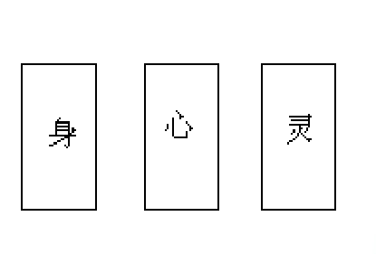

有的书会郑重其事地告诉你“怎样抽牌才对”，但这还是不值一提，可以拿最顶上的牌，可以拿最底下的牌，可以拿从上往下数第7张牌，可以……总之随你。

接下来就可以解读这三张牌了(#^.^#)
你或许正在疑惑你还没学会牌意，如何解牌？

但现在我希望你能够，不管你之前学没学过或是已经学过多少牌意，忘记它们，跟着下面将要给出的步骤一步步来。

作为例子，我给自己抽了三张牌，使用的是亮彩版伟特塔罗。

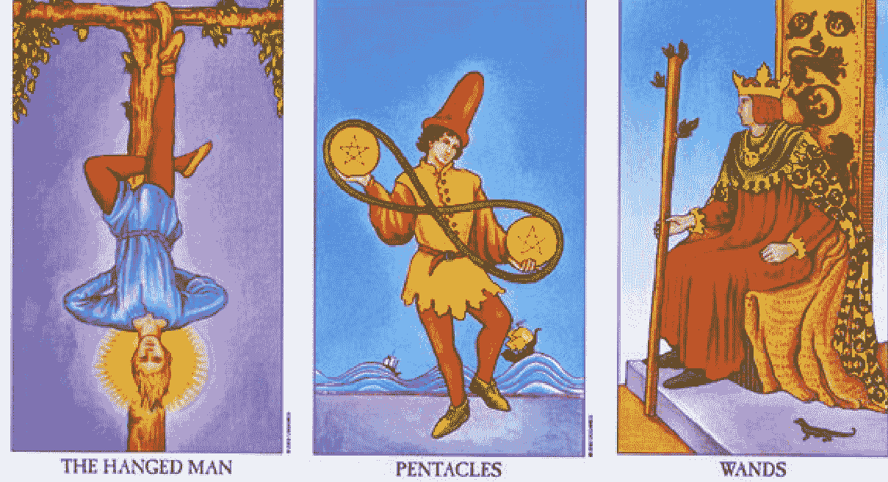

首先把你抽到的牌的名字大声念几遍，就像认识一个人从知道他姓甚名谁开始一样，念出它们的名字：

-   它们分别是倒吊人，星币二，权杖国王。

然后浏览一遍牌，说说你看到了些什么，尽可能客观地用书面化的方式描述出来：

-   在倒吊人牌，我看到一个被头朝下悬吊在树上的人，他的一只脚被绑在树上，另一只脚弯折放在身后，他的后脑勺散发出光环；
-   在星币二牌，我看到一个戴着高帽子的人，两只手一高一低地拿着两个刻有五芒星的大钱币，上面还绕着一圈绳子形成无限大的符号，这个人单脚站着，身后是两艘船在大浪里航行；
-   在权杖国王牌，我看到一个国王坐在宝座上，一只手拿着木棍，另一只手放在腰间，他目视远方。

在上面的描述中加入主观的感觉，加入想象力，描绘出这张牌呈现出什么故事，包括对牌面图案的环境和气氛的感受：

-   在倒吊人牌，有一个被处罚的人，他受尽折磨，却无所畏惧，因为他神情安详平静，周围也呈现着柔和的紫气；他就这么一个人被束缚在这里，没有人愿意接近，孤独，却不会无依；
-   在星币二牌，岸边的这个人戏耍着两个钱币，他全神贯注，跃跃欲试，想要将钱币翻动出更多花样，像个杂耍艺人一样，他希望被人关注；
-   在权杖国王牌，他隐忍着一股冲动，他似乎有些愤怒，想要挥舞手中的权杖，把它投掷出去，命中某个目标。

再把上面的故事修缮一下，放进牌阵中，在这个牌阵里：
“身”代表你的身体、周遭环境、行为习惯、展现给他人的样貌；
“心”代表你的思维、自我意识、理性、脑海中的想法；
“灵”代表你的精神、理想、目标、抱负、更高层次的自我境界、可能性、解决问题的建议、自我实现。

*身：倒吊人，心：星币二，灵：权杖国王*
*在周遭环境上，我处于孤立的状态，被束缚的状态，我的身体我展现给人的样貌是缺乏活力的，但又是安详平静的、享受孤独的；*
*在思维上，我处理着“我手头的”事务，我正在思考着创造一些东西、展现一些东西，并且希望我创造的东西得到关注；*
*在理想上，我跃跃欲试，想要对准某个目标作出攻势，带有点冲动，还带有点因为心急或者别的原因而导致的恼怒。*

最后一步，就是把上面的解读整合，然后联系当下：
这个牌阵表达出我正在酝酿着某个非物质的创造物，比如这本书，我信心满满、精力充沛地创作着，虽然当下这本书还处在少为人知的状态，但我会把它完成并发表的。

这样子，一次解读就基本完成了，感觉如何？你解读出你抽到的牌了吗？

如果更深入一点，还可以尝试“置换解读法”，即把三张牌的位置变换，重新进行一次解读，或者把牌阵更换（当然同样还是要三张牌的牌阵），比如换成圣三角（过去，现在，未来）：
身：权杖国王，心：星币二，灵：倒吊人
过去：倒吊人，现在：星币二，未来：权杖国王
圣三角牌阵用于揭示一件事情在不同时间里的发展状况，三张牌各代表一个互相承前启后的时间段，“过去”代表事件的开端以及基础、正在消退的力量、已经发生（可能还在继续延续着）的，“现在”代表事件的中期发展、正在发生的，“未来”代表事件后续的发展或结局、还未发生的。
在第一个置换里，我解读为，如果我过度地宣传我要做的事，是会导致我灵性上受到阻碍与束缚的；在第二个置换里，我解读为只要低调地忍受过一段时间，再灵活应变度过一段时间，我会看到我最终的成果为我戴上冠冕的。
变换牌的位置，解读看看什么样的境况是你更乐于见到的？再试着解读如果想要达成那种境况，你该怎么做？

此外，你更可以把每一张牌想象为一个富有智慧的师长，试着让他们说话，看着他们，让你的脑海里自然而然地浮现出台词。这些智慧的话语或许能给予你更多启示。

-   倒吊人：我愿意放下个人享受以获得精神上的富足。
-   星币二：我轻松处理各种状况，迅速调整自己。
-   权杖国王：我认可自己的成就，还有自我引导的能力。

再之，让每张牌中的人物互动一下，让他们成为舞台剧上的角色，看看他们曾经/正在/将要做什么？

> 被倒吊在树上的异教徒的口袋里掉出了两枚金币，被一个路人捡起，而国王把这一切看在眼里……

试试也用多个角度解读你抽的牌吧(^_^)

# 第四章   持之以恒

做完第一次占卜之后，是不是觉得塔罗很简单？

你可以运用这种方法，每天为你自己占卜一次，围绕着新的一天可能发生的事情去解读，找个日记本记录下来每一天抽到的牌，如果能用不同颜色的笔写不同牌组的牌就更完美了哈，记录一段时间，时常回头看看，看一下过去的解读有什么没有注意到的？看一下你的生活过得怎么样，会不会一直出现同一个牌组的牌？通过这样做，不久之后你就能慢慢学会这78张牌了。

上一章介绍到的身心灵牌阵以及圣三角牌阵很适合用在每日一抽中，因为它们既不会像一张牌牌阵一样太简单、让新手难以入手，也不会像更多张数的牌阵一样让新手手忙脚乱、顾前不顾后。

你可以用如下面这样的一份表格，记录下牌阵、你对牌阵的理解、事件（不管在当时你觉得这件事跟你所理解的牌意符不符合），以及留给未来某天回过头再看看这记录时可以再作出思考的空白列。

| 日期 | 身 | 心 | 灵 | 解读 | 当日的事件或心境状态等 | 备注 |
|------|----|----|----|------|----------------------|------|
|  |  |  |  |  |  |  |
|  |  |  |  |  |  |  |
|  |  |  |  |  |  |  |

你不一定要每天都一五一十地做一遍，对于一些没耐心的人、或者觉得很难在日常生活中找到“大事件”的人，坚持每天的日记恐怕很快就会产生厌烦情绪，那样不如每周一次、抑或在一些你觉得会有特别的事情发生的日子里（比如第二天要去春游、第二天要去面基……），抑或尝试其他的练习方法，塔罗日记只是学习的方法之一。

观想牌面就是另外一种练习方法。

抽出一张牌，死死地盯着它的牌面，看上一两分钟，让它的牌面在你的脑海里呈现出来。

然后闭上眼睛，继续保持着脑海中的画面，你不需要让每个细节都完美地复刻，只要主要的人物、场景呈现出来就可以。

像你在第一次占卜中做的，这个场景让你感受到什么气氛？触动了你的什么情感？

然后尝试让画面动起来，这个人物在做什么？这个人物接下来会做什么？如果你跟这个人物交流，他会说些什么？不要刻意地想象一个行动让他完成，而是让他自然而然地行动。这个步骤并不容易成功，但也不需要刻意让它成功。

不要观想太久，5分钟左右就可以了。记录好观想过程的感悟，如果你有这份兴致，用一首诗歌或是一篇小散文来记录它。

# 第V章 更进一步的学习

初次占卜中你所使用的这个方法，近似于“直觉式占卜”，不是很直觉系但挺接近的。

所谓直觉系读牌，就是运用直觉、第六感来解读塔罗。直觉是什么呢？我比较认可的是猫叔（[@会占卜的猫](https://example.com)）的定义：直觉是运用右脑的功能，在占卜时得到一种情境性的、非语言性的、非逻辑性的信息。他会说到右脑是因为他借用了右脑开发的概念，不过这有点伪科学...正常人的右脑不会是“未开发”的，左右脑是一直密切合作无间的，但是右脑确实跟一些超自然体验有关（可以参看 TED 演讲《[你脑内的两个世界](https://example.com)》，演讲者的经历就是左脑中风只剩下右脑机能），是否那些超自然体验经过加工就变成直觉了呢，以我目前的学识也解释不了太多。

不过直觉式占卜需要注意“**直觉的局限性**”。

首要的一个是直觉是情境性的，这次占卜产生的直觉，谁也无法确定这个直觉能不能运用在下一次占卜中，即使下一次占卜是同一个来访者且仅仅在五分钟后。有时候有些初学者就喜欢说“我觉得这张牌应该这样理解，我的理解跟别人都不一样但我认为我的才是对的”，这其实就是一种误区，这种特殊的理解可以源自直觉、抑或心理投射、抑或别的什么，但它是当下的、个人的理解，很可能这个初学者出去散个步回来他就不觉得要这样理解了，他可以用这个理解来占卜他即时性的心理状况，但可不能将它作为教条，用在以后的每一次占卜中哟。

第二个是，直觉的产生毕竟关乎心理状态，用在给自己的占卜上自然不会有问题，但给别人占卜时，如果依然让占卜师而非来访者运用直觉，会不会本末倒置了？玛丽婆婆在教授上一章那种解牌步骤时就提及了“当你给别人占卜时，引导他做这些步骤”。不过很多直觉系人士以我的了解是一直都只靠自己去直觉的，在此不予置评。

第三个是，直觉解读得到的想法、理念，很可能跟绘制塔罗的人设想的完全不同。比如日前有人解读一个用花影抽的牌阵，其中出现了女祭司牌，那个人用直觉理解牌面意象，称“女祭司的钥匙被猫头鹰叼走，使她无法开启知识的宝藏”，但花影塔罗的牌意书里则说“女祭司获得了真知后，拜托猫头鹰作为她的秘密的送信人”。这不同的理解很大程度上导致了我和他给出的解读结果完全相反。虽然不能说这样必然是解错了，但这种情况仍然是直觉式读牌人需要注意的。

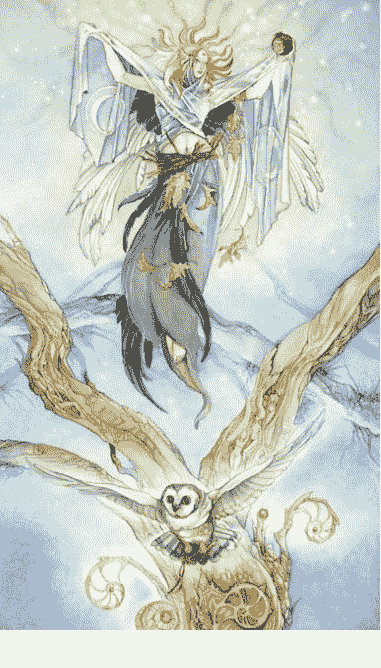

初次占卜中你所学的并非纯粹的直觉系，而是介于直觉解读与传统解读之间，可以由你的喜好或习惯而左右倾的解读方式。因为即便是懂得并且运用正统牌意的解读者，同样可以结合这种方式来进行解读，而纯粹直觉系人士是很喜欢说抛弃传统牌意的。

最为“正统”的解读方式，没有名字（因为它正统又主流所以没必要专门起个名字~别人要跟它区分才需要另立门派），不过直觉系人士会称其为“理论派”之类的，这种方式简单地说就是运用塔罗牌自有的牌意来解读出占卜的结果。

“牌意”是一个挺复杂的东西。塔罗牌诞生的日子有五六个世纪，但现代塔罗学习者占卜用的牌意的产生其实才一两个世纪。艾特拉撰写了第一本塔罗牌意书，里面基本都是些牌意关键词，他之后的很多人都这样，比如[马瑟斯写的书](https://example.com)里就是“女祭司：科学，智慧，知识，教育；逆位：自负，无知，缺乏技巧，浮于表面的知识”，这样的牌意要用于占卜是一件很困难的事。

那么我们现代使用的“牌意”是怎么样的呢？
首先它源于“牌图”，这些个“牌图”发源于马赛时期，在之后被修改、添加入其他神秘学术科的内容、重新创作，然后在现当代又被更多的奇思异想所改造。这些图画反映出当时的历史，它们本身要表达的意义像关键词那样是无法被占卜使用的，但从图画中延伸出来的象征意义就可以。这里需要讲一下“象征”，“象征”是指以一种事物或形象来间接表现其他事物，比如文字就是一种象征，十字架也是一种象征。象征意味着两种事物之间具备联系，不管这种联系是约定俗成的比如非象形文字，还是因个人经历而形成的比如触景伤情，抑或本质具备关联的比如燃烧会发光发热所以火焰被用于象征光明与热情。这个牌图原本要表达的意义是 A，但这个牌图与 B 可以产生联系，而 B 更贴近占卜的问题，由此我们能够衍生出很多塔罗设计者原本没想到的内涵，并能用于占卜中。至于为什么这种联想真的能跟内心世界乃至现实呼应上，这里先不谈。

这种衍生有两个层次，第一个层次衍生出主流牌意，即大团体内公认的牌意，即便你的描述有所不同但他人能够理解并接受的；第二个层次是个人牌意，衍生度更高，它可以源于你的直觉（换言之直觉也是可以借助主流牌意获取，不是必然非主流的），源于你的哲学观/三观、源于你的个人经历，这些牌意有些会得到认可但别人不会使用，有些甚至会被别人驳斥，这类牌意需要慎重使用，并且往往难以用于不是由你抽牌的占卜的解读。

最后还有一个更加学理化的门派，同样没名字，或者可以叫“系统派”吧，特点是运用塔罗所包含或挂钩的体系（所谓体系是指一个具有一定意义的结构系统），比如愚人之旅、灵数学、元素学等。
这些体系本身就是塔罗牌意的重要来源，近现代塔罗牌图的设计都会体现出这些体系的内容，但往往会表现为不同视角下的理解。
而专注于使用体系的解读者却往往会轻视这种不同理解，诉诸体系的共性。一些老师比较保守，依然会区分不同牌的差异；但有一些人却提出了口号“学会一副牌等于学会所有牌”。

▲愚人之旅：以愚人牌为主角，将其余 21 张大牌视为主角的人生历程；有直接从 I 走到 XXI 的，也有分 I～X、XI～XX 两段走的，最常用的是 I～VII、VIII～XIV、XV～XXI 的三阶版本；其特点是将大## 第VI章 成为占卜师

牌依序互相联结，形成一个连续发展的整体，后两个版本同时又可以分割出整体里的阶段性。

- 数字学：自身为独立的神秘学学科，毕达哥拉斯的“万物皆数”可作为其代言，给数字赋予意义然后将现实对应上数字；像“8”就是“发”“4”就是“死”这种可以说是中国民间版的数字学（中国术数也有数字学但不是这种哟，河图洛书八卦之类的正统术数才是）。
- 元素学：将万事万物划分为火水风土四元素去代表，根据元素的性质、比例去做分析；有普通版和卡巴拉版两种，两者最大区别在于元素之间的地位关系。

以我个人来说，属于没门没派，看着牌阵，觉得哪种方法方便就用哪种；又或者说万金油派，哪种都会用，哪种都不精通<（￣3￣）>。不过我个人坚决反对把所有牌当成一副牌来学，因为读牌人与读牌人之间、作者与作者之间，各自的视角和观点的差异，是很有趣的。另外在我看来，直觉系是一种方便法门，新手可以用其快速上手，但过度沉迷于依靠直觉，会变成不是在“用塔罗占卜”而是“用直觉占卜”，这样就不是在学“塔罗”，而是在学“直觉”了，不再是塔罗占卜了。

接下来就简要介绍一下上面提到的三个系统，因为它们十分常用。尤其灵数与元素在小牌中很重要，在伟特塔罗之前，绝大多数塔罗（特例如古文明塔罗 Sola-Busca，它的小牌也有插画，而且部分被伟特牌所参考去了）的小牌都只绘有牌组象征物，而伟特牌的首创就是给小牌绘制了**平易近人的**插画，将牌意以故事的形式表现出来。

对于无插画的小牌，通过图像可以获得的牌意是非常之少的，所以基本上都是使用元素意义+数字意义进行解读，当然这种方式解读出来的牌意很多也被伟特所继承，因此伟特小牌牌意同样具有元素和数字上的意义。

右图就是马赛塔罗与伟特塔罗的权杖三、权杖四的对比。

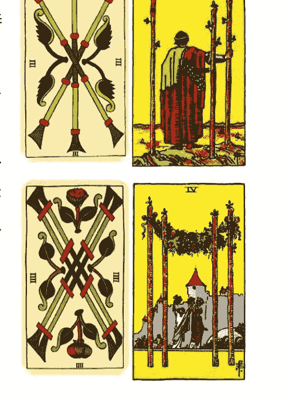

- 四大元素体系源于古希腊。在一帮人分别提出万物由水生、宇宙是团活火等理念后，恩培多克勒(Empedocles)提出了四元素+二力量的理论。根据其说法，万物由【地、水、火、气】四种元素，并【爱、恨】两种力量所构成。“爱”结合不同的元素，“恨”则使之剥离。再之后亚里士多德将四元素又分出四种性质：

第一原质 + 热 + 干 = 火；
第一原质 + 热 + 湿 = 风；
第一原质 + 冷 + 湿 = 水；
第一原质 + 冷 + 干 = 土。

（这突然冒出来的“第一原质”是所谓的原初的太一，是构成宇宙的基础、源头，因为有这共同核心所以万物可以互相转化。“一是全，全为一”这句话不是钢炼原创而是真实的炼金术名言哟。）

怎样运用这四元素呢？四元素本身并非物质存在，而是一种形而上的东西，但我们可以通过现实存在的物质去理解它们，比如用水的性质去理解水元素的性质（左侧图为元素符号）：

- ▲ 火元素——热，光，生命力（生命一般是温暖的），行动力（生命在于运动），破坏力（烧毁），冲动热血缺乏耐心（烧得越快灭得越快），自我中心（烧光他人成就自己）……
- ▼ 水元素——冷，暗，孕育（海洋是生命的摇篮），易变没主见（随容器变化形状），女性化（女人是水做的），情感丰富，感染力（渗透）……
- ▲ 风元素——变幻莫测（空气比水更不定型），应变能力，三心二意，沟通能力（风能吹起并传递东西），冷静理性逻辑（从前者衍生代表文字语言讯息新闻等），社交能力（沟通能力的延伸）……
- ▼ 土元素——物质，顽固难以变通（石头），意志力，财富（出产作物矿物），踏实可靠（脚踏实地），责任感道德感（不容易变动的规则），完成（尘埃落定）……

此外还可以从四性质入手：

- 干性质代表摄取、吸收、自我中心，湿性质代表付出、影响他人，因为干布会吸水而湿布会把东西弄湿；
- 冷性质代表缺乏活力、被动，热性质代表主动、积极。

一般把火、风定为阳性元素，水、土定为阴性元素。

相同元素碰一起会叠加、增强，好的更好，坏的更坏。

火元素与风元素、水元素与土元素，相性较好，都是阳性元素，风助火、水润土。

火元素与土元素、水元素与风元素，相性较差，土无法燃烧，风浪容易造成破坏。

火元素与水元素、风元素与土元素，性质相反，互相冲突、削弱对方，十分合不来。

元素学还有另外一种，对于元素性质的理解与上面大同小异，但是加入了地位等级以及诞生顺序，它来自于卡巴拉（犹太教密宗，Kabbala 意为口述传统，后来被神秘学家拿去改造成基督教卡巴拉，正版犹太教卡巴拉需要是会希伯来文及相关文化的中年已婚男性才能学，普通人别想，就算有机会学也容易走火入魔。），犹太教与广义基督教共同尊奉一个神，英语世界叫耶和华或者雅威（顺带一提中文的上帝古时候指昊天上帝是土生土长的神后来基督教传入为了发展教徒所以用了个容易误会的称呼来糊弄人），但犹太教用的是一个无法发音的词יהוה（从右往左写的），写成英文是 YHVH / YHWH / IHVH，它是四个希伯来字母所以又称四字神名，Yod 对应火元素， 1st Heh 对应水元素， Vau 对应风元素， 2nd Heh 对应土元素。最初只有神圣之火和黑暗之水两种元素，两者混合诞生了风，然后三者一起沉淀形成了土。因此水、火是高级的，而连自己的对应字母都没有并且是其他三者混合形成的土是最低级的。

在此之中，火代表神投下的原初之种，开创与孕育万物，它也代表神的意志；水接受了那个种子，通过限制其发展而给予火一个明确的目标，并安顿其躁动不安；风是将水的成果加以创造，安排如何行动如何计划；而土代表了最终创造出来的世界或宇宙本身，代表目标被完成。

塔罗牌的小牌四个花色被与这四种元素相对应。主流是以权杖对应火、圣杯对应水、宝剑对应风、星币对应土。不过其他的对应也是有的，比如因为宝剑经过锻造才诞生所以对应火，权杖一般以树枝为图案而树木在地里生长所以对应土，诸如此类。

大牌同样有元素对应，根据其对应的星座或行星来判断，此处不列出。另有一说认为大牌对应第五元素/精神/灵性（Spirit）。又有一说大牌每一张都蕴含了四元素全部。

- 数字学既用数字来作象征，它体现的是一种“前进、发展”的观点，同时也体现万物经由数字的互相联系。

愚人之旅从某种角度来说就是数字学的变形，在大牌里从I到XXI，以0号牌愚人为主角，经历21张牌的冒险旅程最终达到圆满。并且，我们也会说后一张牌总会带有“前一张牌的相反”的特征，比如女祭司Ⅱ的“安静的乖乖女”是魔术师Ⅰ的“活跃的小少年”的相反。在占星学上你也能看到类似的说法，“后一个星座补足了前一个星座的缺点”。

更进一步的做法，是将序号进行拆分或加减。

比如恶魔牌是XV，数字15可以拆分为1和5，1+5=6，于是恶魔牌XV与恋人牌VI就具有了联系（伟特牌中我们甚至从牌面图案就能看出这个联系了，恶魔与天使呼应，其下都是亚当夏娃），这个联系在牌意上体现为恶魔牌代表了肉欲之爱、互相束缚紧紧抓取的爱，而恋人牌代表清纯的爱、柏拉图式的爱、促进心灵成长的爱。

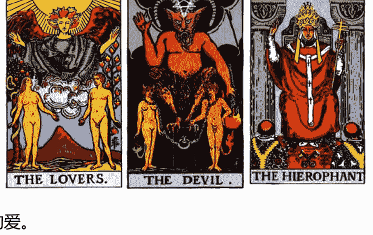

再比如，还是恶魔牌XV，数字15是5+10，是数字5的进阶，所以恶魔牌XV与教皇牌V就具有了联系（同样伟特牌的牌面也显现出这个联系了，恶魔的手势与教皇的手势十分相似，亚当夏娃也呼应两个门徒），这在牌意上体现为恶魔以物质欲望蒙蔽人的双眼，使人堕落在物质世界中，而教皇则以精神信仰启发他人，带给人心灵的提升；或者有人也会说这体现为教皇也会用教条、道德来束缚信众，是精神上的恶魔。

然而值得注意的是，历史上牌序并非固定不变，最突出的自然是正义牌与力量牌。但如果你去阅读盛亮老师的博客你还能看到更奇特的序列，而其中一个与今日序列不同的牌序反而被学者们认为是“更科学”的牌序。这些奇特的序列虽然在历史中被淹没，但它们也提醒我们：“真理不是只有一个”。

举例说明吧。当正义牌在XI时，我们可以说因为“数字11”是两个“1”有均衡的意思，而当正义牌在VIII时我们又可以说“数字8”是2³，一个让人联想到立方体的数字，立方体象征了稳固与不变，而“数字2”跟“数字11”一样代表了两种对立的东西。当力量牌在VIII时我们可以说它在代表成功用强硬手段控制心里欲望的战车牌VII后面，以与之相反的以柔克刚的方式抚慰内心的野性，当力量牌在XI时我们可以说这是“数字1”的进阶，从魔术师牌引导不属于他的自然之力，进化到引导属于自身的内在力量。

很显然数字学是可以因应我们的需要选取不同的解读的，在不同牌序下同一张牌可以作出不完全相同的理解，同一个序号下不同的牌也不得不使用不同的解读。因此，在塔罗体系中，数字学并非万灵药，在某副牌中的数字学解读不一定能用在另一副牌中。

在小牌里，从①到⑩，或者从⑩到①，将牌按序号排列，体现出的是元素所象征的事物旺衰发展的一个个阶段。比如说权杖Ace就像火种、火花，崭新，可以燎原；而权杖10则像烈火已经把可燃物烧光了，呈现出油尽灯枯、将要熄灭的状态。比如圣杯Ace可以代表一份新感情、一个告白、爱的萌芽；圣杯10则是走进婚姻，建立家庭，情感已经圆满。

从①到⑩的发展体现的是由种子发芽生长最终长大成人的过程，而反过来从⑩到①的发展则是由物质世界回归到原初的太一里去，追溯本源的过程。

在小牌中运用数字学，我所看过的书常常暗中以牌意反过来概括出数字意义，不过对于缺乏图像的牌比如马赛塔罗，还是需要更重视数字自身的意义才好。数字本身的意义简单地讲述一下就是：

- 0代表空无、虚无、比最初还要更先在的东西、混沌，
- 1代表开端、唯一、男根、最初的原点，
- 2代表对立的两者、阴阳平衡、连接两点的直线，
- 3代表整合、三角形一般的稳固、和谐的交流、数量上的多，
- 4代表条条框框、四面体的固执、建立建设、四元素齐全的完整，
- 5代表打破框架、四肢加脑袋共五的肉身，
- 6代表完美因为6=1+2+3=1*2*3、数学上看着很素巴拉稀～很perfect、代表两性的合一因为两个三角形正好一个火元素三角一个水元素三角，
- 7代表神圣因为上帝创世用了七天、代表休整再出发因为第七天星期天或者因为“6完美+1新”，
- 8代表更高层次的和谐因为2³正好对应三根有正负极的维度轴于是便形成我们的三维世界了、三个“2”也代表饱含对立和张力，
- 9代表完全、富有、尊贵、强悍、因为它是个位数里最大的，
- 10代表新一轮数字的开端、代表上一轮的完蛋、代表满招损满为患。

并不能说我这里讲述的就是纯粹的数字本意，但是我这里是围绕着数字本身以及一些几何图形等进行数字意义的解读，尽可能地排除了塔罗牌意的干扰。这样一份数字意义清单，如果要拿去解释塔罗牌，则需要读者自行发挥自己的理解、构造能力了，但总比告诉你一份从牌意里概括出来的数字意义然后要你去用其解释牌意要好。自然那些使用概括方式讲解的书，其本意是要帮你理解牌意，并没有错，不过伟特牌概括的数字意义可不适合照搬去别的牌，我只是希望给你一份更泛用的数字解说而已。

最后数字学还有种比较少见的体系，是香港紫秤老师的 3*3 体系，详情请阅读其著作《透视系统塔罗》。这些在这里就不说了。

## 愚人之旅

愚人之旅，就是以愚人牌为主角，拿其他大牌编故事，编织出一段人生旅程。最简单的版本可以看【翻译】愚人之旅，一般称一阶愚人之旅，从头走到尾。除了前面提到有数字学的成分外，愚人之旅其实还呈现了西方的“胜利传统”，即凯旋的军队要游街，队伍要按照从小到大、从低级到高级的顺序排，即传令兵开路、小兵走前排、军官走中间、将军殿后。所以愚人之旅讲述的是一个灵魂不断提升、发展，最后成为圆融的存在的历程。

此外还有二阶以及三阶的愚人之旅，分别将大牌排成两行和三行。它们在愚人之旅的“发展”观念上加入了阶层的观念。

- 比如二阶愚人之旅中第一层代表外在世界，第二层代表内在世界。
- 比如三阶愚人之旅中第一层代表身体，第二层代表心理，第三层代表灵性。
- 又比如三阶愚人之旅中第一层代表显意识，第二层代表潜意识，第三层代表超意识。
- 又比如三阶愚人之旅中第一层代表欲望的灵魂，第二层代表意志的灵魂，第三层代表理性的灵魂。
- ......

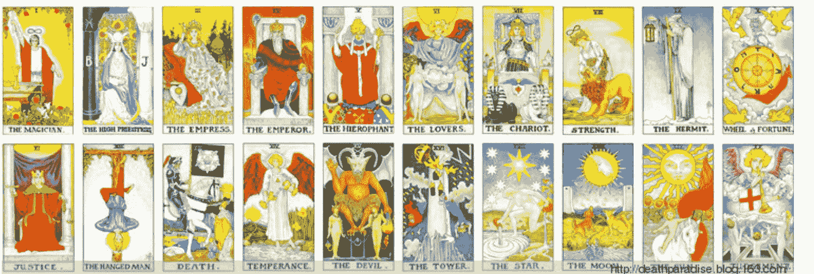

二阶愚人之旅图

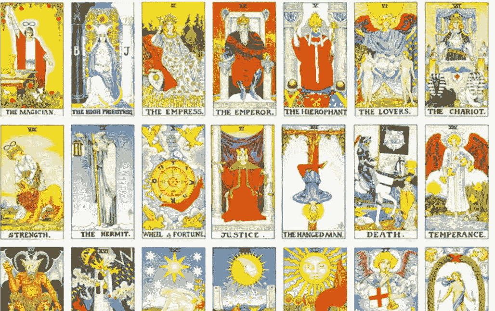

## 三阶愚人之旅图

二阶和三阶愚人之旅的简要解读可以在《塔罗葵花宝典》中看到（因为版权原因《葵花》在网上只有不完整的电子书下载），《78度的智慧》一书则完全是以三阶愚人之旅的结构进行讲解的。如果你留意到了的话，二阶愚人其实就体现了数字学里“11是1的进阶”的观念。

三者之中，其实三阶愚人之旅是最重要的一个，因为 3*7 的结构是最早被提出，并且有证据表明早期塔罗是具有这个结构的一个。详细的解读在盛亮老师的博客里可以找到。

与愚人之旅类似的还有[流变之轮体系](http://deathparadise.blog.163.com/)，它跟愚人之旅有相似处，挺容易混淆的，坊间资料都说这是古塔罗用的，所以在此不解释。

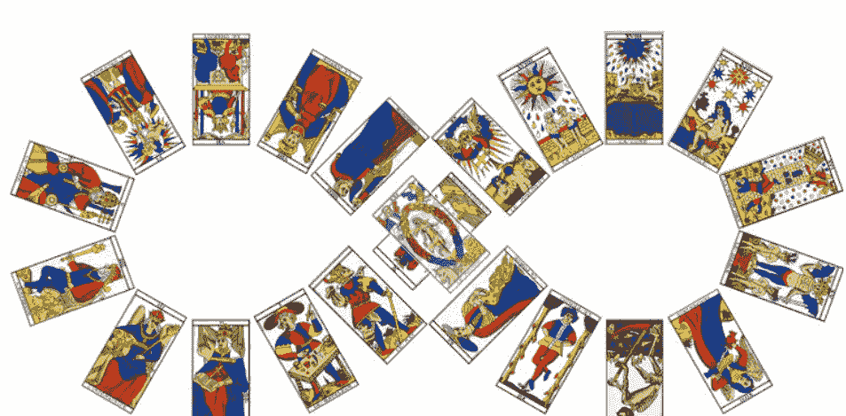

它的观念同样是“发展”，此外还侧重了“循环”（虽然愚人之旅也有循环但相比之下不明显），它同样隐含了数字学在里面。

另外还有盛亮老师博客中讲述的 [3*7 六芒星体系](http://deathparadise.blog.163.com/)。这些比较进阶了，选读科目，在此略过。

# 第VI章 成为占卜师

于是说在上一章你学到了能带你更深入塔罗牌的一些东西，数字、元素什么的，我所介绍给你的只是它们很浅表的一部分，只是带你入门。

牌意的来源基本来自于前面两章的内容，第三章的读图和第五章的体系，更具体地了解牌意将安排在下一章节（这本书的牌意将会讲得很简陋，我会呈现给你的只是一些线索，让你能够知道应该往什么方向学习），现在我先说说怎么进行一次（比第三章中展示的）更为正式的占卜。

所谓正式的占卜，并不是很重视怎么洗牌怎么切牌怎么转牌，也不是用蜡烛和水晶球将场地布置得很神秘，也不是穿上奇幻故事里的魔法师斗篷，更不是向怪力乱神求助。

正式的占卜，只不过是：**三思你要提问的问题，郑重其事地选择用的牌阵，然后有理有据地解读出牌。**

### 占卜提问时，要注意的几个点是：

- 1. 明确性：问题要具体而详细。“他对我有感觉吗”就是一个模糊的问题，“有感觉”是怎样的感觉？交朋友的感觉？上床的感觉？在这一点下还包含了“占卜背景”的问题，占卜师占卜之前必须明确了解问题的背景，比如恋爱问题中，这两个人是刚认识还是刚吵完架、是同性恋还是异性恋、是朋友以上还是闪电恋爱……这些都会影响对牌的解读。
- 2. 能动性：问题要跟求问者有关，并且要有做出行动、应对的欲望。在还未考试之前占卜考试结果就是缺乏能动性的，因为只要还没考试你就有机会继续复习提高成绩，这种情况下不如占卜如何更好地备考。
- 3. 客观性：有些事情个人是无法改变的，比如彩票中不中奖，有些事情个人能改变的程度不大。对于改变不了的事情占卜结果出来就变成听天由命而已，除了提问时要小心避免之外，也需要求问者做好听到坏消息的心理准备。
- 4. 一些能不卜就不卜的问题：占卜师一般不会有职业医师资格，所以健康问题不该占卜。塔罗对于时间、地点、数字的问题是短板，“什么时候”“在哪里”这样的问题也尽量不要接受。

要注意，大多数求问者并不了解“正确的”提问方式，甚至他们自己都不了解自己“真正需要了解的”问题核心，占卜之前花费足够多的时间讨论问题的核心在哪儿，是对求问者的负责。比如一个询问前男/女友跟其现任关系如何的求问者，真正需要知道的应该是自己跟前任之间的纠葛。比如一个询问考试结果如何的学生，真正需要知道的应该是自己该如何应考方面的问题。

如果求问者真的苦恼，如果你有收费或者收取相应的回报，相信求问者不会没耐心的，因为对方也要对自己，或自己的支出，负责任。

### 二、如何选择牌阵

通用的规则是 3 张～10 张牌的牌阵被主流人士认为是适宜的，一张牌太模糊，超过 10 张牌信息量太多太杂影响解读。

剩下的就是根据问题所需来选择，比如恋爱的问题一般选择“灵感对应牌阵”、“维纳斯之爱牌阵（右图）”，因为它们包含了分别对应两个人的位置，而发展性的“这件事未来会变成怎么样”问题则使用带有时间进程的圣三角牌阵，以此类推。

常用牌阵有“三张牌牌阵（包括圣三角、身心灵等）”、“要素展开牌阵”、“恋人三角牌阵”、“二择一牌阵”、“灵感对应牌阵”、“六芒星牌阵”、“维纳斯之爱牌阵”、“凯尔特十字牌阵”等，可以百度查到它们如何摆放。需要注意的一点是，不少牌阵有不止一个版本，比如凯尔特十字牌阵，其左侧十字架的部分的位置含义及摆放顺序就有数种版本，而且各有千秋，没有哪个是最标准的。在与他人交流牌阵时，请务必注明牌阵每个位置对应的意义。

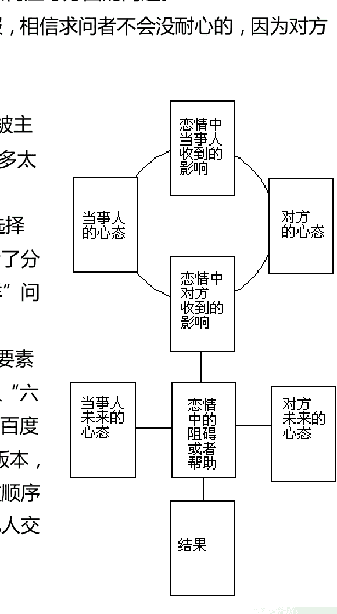

### 三、如何解读牌阵

一个牌阵是一个整体，这是大前提，一个牌阵中的某一张牌会收到前后左右的牌的影响，其牌意会有所调整。比如圣杯骑士牌如果收到代表欺诈的牌的影响，它可以代表一个绝不为感情负责的情场浪子；但如果收到代表正直的牌的影响，它可以代表一个为爱倾注一切的情圣，以此类推，还有更多可能性等待着你在实践中研究学习。

牌阵本身也提示了解读时如何整合各张牌，比如，身心灵牌阵中，“身”和“灵”是互相对立的两张牌，而“心”是整合它们的牌；比如圣三角牌阵中，“过去”奠定一切，尽管它可以代表消退中的事物，它会限制后续的发展，俗话说的好“好的开始是成功的一半”，“未来”是还未出现、有可能被改变的事物，但它代表了一种趋势、一种惯性，它会拉动事件当前的情况往那边发展，不过相比于大多数求问者会好奇的未来，其实代表当下的“现在”才是最重要的，因为它能够被把握住。

另外，一张牌在一次占卜中并非只代表一个意思，一张牌其实可以呈现出主观心理、客观现实、甲方、乙方、双方等多层面，尤其是宫廷牌和大牌。在一次占卜中，一张宫廷牌既可以代表性格也可以代表人也可以代表行为方式，一张大牌可以既代表现实状况也可以同时代表当事人的内心情结，诸如此类。在占卜中发掘不同层面的信息也有助于寻找问题的突破口,帮助当事人得到更全面的资讯。

最后，记得做记录。你现在的每一步，都是未来的一块砖，常常回过头看自己以前的解读，尤其是错误解读，能帮助你很多的。

占卜记录还可以拿出来请教前辈、教导后辈哟～

还有，如有可能，尽可能地要求求问者反馈给你所占卜的事件的后续发展，这样你才知道你的占卜哪里对了哪里错了。

对于上文所说的占卜要点有什么疑问吗？（有的话请到我的博客留言哦。）

没问题的话，接下来要说的就是占卜的“天时地利人和”了。

天时地利自然是说占卜的时机和环境啦。

有些人会神神叨叨地说什么半夜十二点占卜会撞鬼之类的，那是无厘头。然而，深夜时分，人通常是处于不太精神的状态，毕竟夜深了要睡觉了,这种时候脑子容易转不动，会影响读牌,不止深夜，其他精神状态差的时间也一样。所以重点不在于时间而在于精神状态。

这里所说的精神状态不仅是占卜师的，也包括求问者的，毕竟你得从对方那里获得问题的信息，还得把占卜的结果回馈给对方，这都需要对方用心。

环境也是需要注意的，尽可能不要受人干扰、被人围观，你总不希望抽牌抽一半，有个熊孩子跑过来把桌上的牌都天女散花了吧。

占卜的对象是否愿意被其他人看着、是否愿意在他人面前说出自己的难处，也是需要考虑的，所以...以安静祥和的环境氛围对占卜会更有利。不是叫你去个鬼屋、神秘屋什么的哟。

至于人，很多人的占卜对象总是先拿亲朋好友开刀的，往往好友们也会因为兴趣、好奇来找你占卜；但如果你不愿意找朋友、或者找不到适合的朋友，网络在线占卜也是可以的，在百度的塔罗牌吧和塔罗吧，以及中华塔罗论坛等地，都有许多占卜师开解牌楼、占卜楼，以及许多求问者自行发贴求解读的。不少 QQ 群虽然宣传要学术，但最终大多数沦落为解牌群，所以你也可以在 Q 群里为他人占卜。

远程占卜与给面对面占卜没有什么不同，只是，除了 QQ 外，基本都没有办法即时地与对方沟通交流，缺乏语气、情感方面的信息也算是一个缺陷吧，面占时能够察言观色对于新手来说还是很有帮助的。

洗牌、抽牌、摆牌的流程也都一样，前面说了你不需要纠正面面对面时要按照谁的方向抽牌，只有你一个人的时候就更不需要了。

关于远程占卜，你可以去贴吧里参考别人的做法，通常人们会详细地列明对求问者的要求，包括提问、解读、反馈等各方面，这样才不至于被无理取闹。

此外还有人摆路边摊，一张小凳子小桌子，只有天气好就行（小心狂风吹走牌哟），城管来了收摊落跑也不难，就是容易被围观。

不少人在淘宝上面开店占卜，也有些人找得到咖啡馆之类的地方驻点占卜，这些自然是收费的了，新手在没有一定程度的学习积累之前，请不要尝试这些，小心遭遇纠纷。

关于读牌人的道德规范可参阅沙若写的六个原则。沙若是已经开始进行职业占卜尝试的，而且跟其他职业占卜师不同的是他更加规范化，比如以四次咨询为一个阶段，比如对脱落、问卜者权利及义务、违约责任等的明确界定。尽管目前还在试验阶段，相信他能做出不错的成绩的，我们也可以等着他日后写点心得体会什么的=w=。

国外还有电话占卜业务，打个广告出去，然后等着接电话。沙若以前提过一个案例是读牌人给未成年人电话占卜，结果那孩子的家长发现之后怒骂占卜师，因为国外重视对未成年人这方面的保护，担心价值观什么的会因此而出问题。

反观国内，好多未成年人学塔罗啊【望天。

以下这个案例可以作为一个自己的解读记录、或者与他人交流解读、抑或请求他人读牌时的格式范例——

背景：一年一度的交学生网网费时间，一直苦恼于网速的室友思量着要接外网，费用原因自然要拉人入伙有福同享啦，打算周末就出去电信营业厅询问能否办理，不过周五班委已经开始催促收钱了，周一早截止。因为学校可能跟电信那边有打过什么招呼，不一定能接上，虽然有些同学去年早早办好了。要是外网接不成又校园网缴费过期，明年可就变成没网用了。

问题：能否成功办理外网？

使用圣甲虫塔罗牌（Lo Scarabeo Tarot）

圣三角牌阵 **过去**：倒吊人-，**现在**：愚人+，**未来**：圣杯 Ace+

备注：使用正逆位

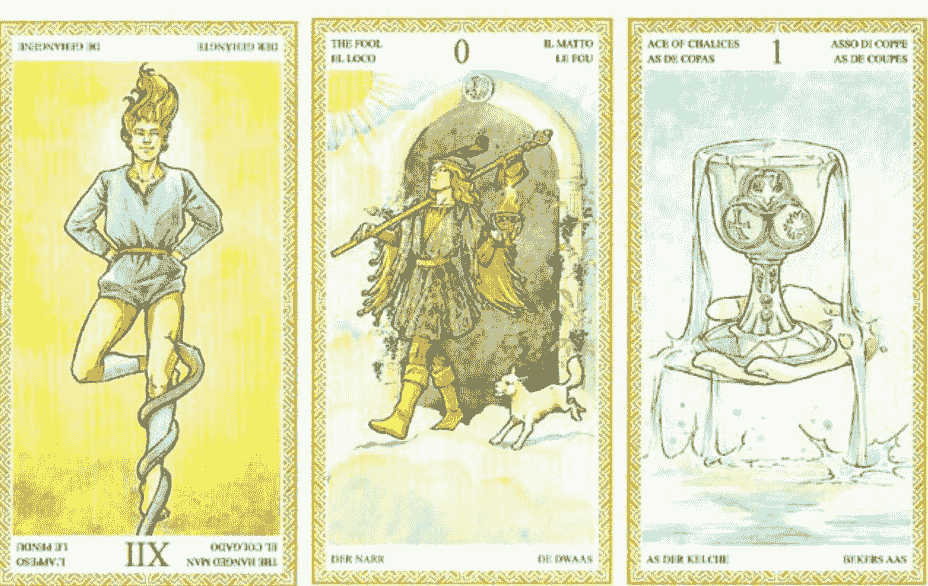

（通常我们会使用“+”代表正位，“-”或者“R”代表逆位，也有人不嫌麻烦地使用文字说明。）

（还记得逆位牌是谁发明的吗？写了目前已知第一本塔罗牌意书的人。逆位牌带给塔罗一些特别的花样，但也有人不喜欢逆位牌，因为传统上逆位牌总是代表噩运，因此有人把所有抽出来的牌都转为正位，尽管这不代表他们占卜时不会解读出噩运，毕竟一副塔罗牌中有很多牌即使正位也可以代表噩运的。）

反馈：最终果然没有办理到外网，电信厅给了个挺像借口的说辞，不过及时交了校园网的网费，于是继续用着校园网吧。

***

既然求问格式写得那么好，就解读一下这个牌阵好了 o(￣▽￣)ｏ

一开始的解读，不管是我还是另一个使用这副牌的塔罗爱好者，都说是能办理上，毕竟愚人和圣杯首牌都有“新”的牌意，似乎预示着用上新网络，结果，唉～马后炮地解读一下吧，过去位置的倒吊人逆代表事件缺乏好的基础，有点“想太多”，因为这张牌代表的是行动的不便而思维活跃，通常情况下这个思维是有益的，但在这里逆位并没有加强行动反而让思维更加浮夸了，这点可以从随后是愚人来加强理解，愚人对应代表思维的风元素，而且这副牌里愚人走在“天上”（有如异想天开这个词字面所说的），想象总是幸福的，而且在现阶段仍然是缺乏实质行动的愚人（愚人通常可以代表“无责任”、“自由自在”、“不落世俗”），可以认为事件进度并不佳，未来的圣杯 A，与倒吊人牌一样对应水元素，有时候水元素可以代表幻觉、欺骗，尤其这副牌中的这张牌，雾气迷蒙，不同于伟特牌中荷花似锦生机勃发（试试拿出你的伟特牌，找出这三张牌，看看如果是用伟特牌抽出这三张牌你会如何解读，尽管这里我用的是很接近于伟特的牌意，但或许你解读出的结论会有所不同哦）。此外从图案的角度，我们也可以看到愚人和圣杯王牌都是方向朝左的，与牌阵的时间流动方向相反，这也可以解读为事件容易出现阻碍。

换个层面进行解读，吊人逆位代表着一种不服输的心态，不愿意臣服于生命所给予的、带着限制性的环境，而愚人承接了这种不与现实妥协的心态，却并没有创造——愚人拿着魔杖却不懂得如何使用它，然而我们也可以猜测当事人室友并没有竭尽全力抓住机会，因为愚人的心态是“不负责任”“走一步算一步”的，而最终圣杯容纳了这一切，作为被动的水元素牌组，它可以代表着一种接受现实的心态。

倒吊人牌的序号是 12，拆分相加就是 1+2=3，数字 3 代表着“整合、三角形一般的稳固、和谐的交流、数量上的多”等等，逆位显现出不稳固、缺乏整合、缺乏交流理解，当时提出这一议题确实只是突发奇想，脑袋上冒出一个灯泡于是就“不如这样吧”；接下来愚人牌是数字 0，什么都没有，空无，虚无，就如三角形崩溃了一样，什么都没剩下；最后是数字 1，可以看到并非无可挽救，最终还有剩下，还有新的开始。

不知道你是否听说过帕西法尔的故事？讲述一个纯洁愚人夺回圣矛，拯救了被永不痊愈的伤痛折磨的守护圣杯的王的故事。而这几张牌很神奇地也可以联系上那一故事，吊人就如那永恒的伤痛，而愚人的出现拯救了他，然后愚人加冕为王，成为下一任圣杯守护者，主持了圣餐仪式。这一联系可以作出怎样的解读，就由读者自行发挥啦~

***

勇敢地抓小白鼠去实践吧（^W^）！

也别忘了让你的付出得到足够的回报，不管是财物、助人的喜悦、还是解读能力的成长。无偿付出、做牛做马，既是对自己不尊重，对塔罗的不尊重，也是对求问者的不尊重。

# 第 VII 章 牌意这东西

在前面的数章里，我展示了通过读图的方式理解牌意的方法，还有通过数字元素等体系的含义理解牌意的方法，不知道你是否对牌意有了大致的感觉了呢？

恐怕你早已经迫不及待地想了解更细致的牌意了吧。或许有人早就发出“这什么破书啊一直不讲牌意让我怎么学啊”的评论了。

那么这里就介绍一下你可以去哪里详细的学习牌意啦：

很久以前沙若哥写了半本不讲牌面的牌意书，然而完全版至今还没写成，已完成的半本的内容在贴吧不少人已经预览过了，好书无误，所以读者请同我一起继续期待着吧。除此以外还有很多资料书籍，可以到我的百度网盘，塔罗牌吧资料分享贴，等寻找。这些再加上下面要提的各种链接，你可能会看得眼花缭乱，所以还是请从第二章我推荐的一些入门书籍开始，一步一步来吧。一些入门书籍的电子版在这两个地方都有，但仅供学习交流，还望支持正版。

语音授课方面，可以去听多贝网上猫六的塔罗公开课，入门级的课程。

清流的塔罗经验谈系列文章也很适宜学习。

暮冰朝雪翻译的塔罗指南也是不错的入门书籍，还有她的心得分享也是好顶赞。

为什么有这么多书？而且这些都是谈论伟特塔罗牌的！？就如最初在选择自己的第一副牌时我跟你说的，伟特牌资料最多，多如繁星浩海；每本书每份资料都从自己的理解去诠释，但它们各自给出的诠释相互之间并没有绝对的矛盾，反而常常是互补的，一张牌的牌意可以拓展再拓展，也因此它才能用来解读世间无尽的问题。你当然无法死记硬背下它们，你的脑子不是这样用的，你要从中获取你自己的理解，寻找牌意的核心。“为什么这本书这样说？”“这本书的诠释和那本书的诠释的共同点在哪儿？”你要去寻找这些东西。

更进阶的牌意，可以阅读盛亮的图意本源系列文章，是从历史、艺术的角度解析的。沙若的理解早期塔罗也是类似的文章。绝大多数牌意被描绘在牌图里了，但有一些牌意是早期塔罗的遗产，有一些是历史的痕迹，了解一张牌怎么演变能帮助你了解这些。

宫廷牌通常被视为理解牌意的一个难点，我翻译了玛丽 K 格瑞尔的著作《学习宫廷牌》的第一章和第二章可供学习，不过这本书以各种练习为主，几乎不讲牌意。

关于逆位牌，同样也是难点之一，可以看看沙若的逆位解读法，下面我再列出玛丽 K 格瑞尔在其著作《塔罗逆位牌》中给出的 12 种逆位解读方法：

- 1) 阻碍或抗拒：当事人对于牌的原始含义的抗拒、恐惧或排斥；当事人在做牌所代表的行动却遭到阻碍。
- 2) 投射：牌的原始含义所代表的行为或心理特质，被当事人视为是他人具有，而自己不具备的；可以是投射负面特质以看低对方，也可以是投射正面特质以理想化对方。
- 3) 延误、困难、得不到：牌代表的事件被延误或难以达成。如果这件事不是什么好事那就让它继续延误下去吧~
- 4) 内在的、无意识的、私密的：牌代表的能量不被当事人的意识所知，或者不愿面对，或者不愿公开，也可以代表需要向内心寻求、面对这张牌代表的课题。
- 5) 新月或黑月：正位代表全然可见的满月，逆位则代表隐匿的新月，然后可以参考占星上对新满月的解读——新月是开端、未可知的，满月是高潮乃至结束。尤其适用于圆形塔罗牌，特别是可以用顺时针的顺序判断牌在月亮周期的哪个能量水平上。
- 6) 突破、颠覆、拒绝、改变方向：牌的原始含义束缚了当事人，此时当事人将要寻找突破点，摆脱束缚。不仅仅当牌意本身具有束缚含义，即便牌意看起来美好，也可以有因“为了迁就世俗、他人而表现出这些美德”而束缚当事人的情况。
- 7) 不是或没有：在牌的原始含义上加上否定词“不”或“非”；还可以是“不要”，不要去做这张牌所代表的那件事、那种人。
- 8) 过度或不足：太多或太少、太幼稚或太老龄化，甚至在两极间跳跃式转换。
- 9) 误用或误导：牌的原始含义被错误地使用、或用在不该用的地方。
- 10) 回顾、退回、重新：再做一次，重新考虑；与占星上行星逆行类似（水星逆行是过去的人际关系又回来了比如遇见旧情人，土星逆行是回顾自己过去需要担负的责任）。
- 11) 矫正、苦口良药：这张牌提醒当事人哪里出了问题，同时也告诉当事人哪里是值得着手矫正的。
- 12) 非传统、萨满、魔法：牌的意思含义借由灵异的、非日常的、有异于传统的方式传达信息给当事人，给予意想不到的帮助。

《塔罗逆位牌》这本书台湾有出版，前面介绍过的，对每张韦特塔罗的逆位牌意都做了详细的说明，我绝对支持你购买哟。

不过前面也提到有人不喜欢使用逆位。像透特塔罗、罗宾伍德塔罗、花影塔罗的作者就明确声明自己的塔罗不使用逆位，也不提供逆位含义，尽管你要用逆位也可以用，自己用上述方法去发掘牌意就行。而如瑞秋·波拉克，西方一位塔罗大师，她连伟特牌这种作者有给出逆位含义的牌都不使用逆位。

《塔罗逆位牌》里玛丽婆婆也说“首要的规则是：要知道每张牌的基本意义，包括从最有利的到最严重的可能性。有几副牌我仍然只用正位牌，像是……，但我把对逆位牌潜在意义的体认也整合进去，成为更全面的意义。”

所以，见仁见智，你只要找到自己适合的方法就行。

关于牌阵，大多数常用牌阵都可以在牌阵大全里找到，我的博客里也有一些牌阵相关的文章，包括我凭个人的理念对牌阵的修改、以及在不同地方看到的奇特的牌阵等。

怎么整合牌阵里的牌？可以看看[暮冰朝雪的案例分享](https://example.com)，雪球在实占领域十分资深，经验丰富哟。另外玛丽婆婆则整理出了足足[十五大项的建议和方法](https://example.com)。

## 关于切牌（名词）、指示牌、底牌：

切牌是抽出来的一张牌，用来代表“占卜者的心态”之类的东西。通常是进行切牌(动词)的过程中，随意拿起的一叠牌的最底下一张，就是切牌(名词)。据说这是旧时占卜师用来确认“求问者是否是来砸场的”的，当然现在没人这样用了。

底牌是洗完牌、把牌整理为一叠时取出的位于最底下的一张牌，用来表示“被隐藏的背景”“被忽略的影响力”之类的东西。

指示牌是洗牌之前，在宫廷牌（有的人会用大牌中的魔术师/女祭司）中抽取或选取的一张牌。选取的话，选择标准是求问者的外貌、性格、职业等，比如热情开朗的人就在权杖宫廷牌里选。与前两者不同它本身的牌意是不需要去解读的，它的作用是“让求问者出现在牌阵中”，详情可以阅读我翻译的《学习宫廷牌》。

这三种牌在占卜中都不是必须的，不同人的定义和使用方法也有所不同，上面说的只是我的个人理解。

如果你还是不清楚怎么用它们，你完全可以无视掉，不使用。它们的作用是对其他牌产生影响，使其他牌的牌意有所变化。

大多数人在使用这三种牌的时候定义都挺模糊的。指示牌因为自古就有所以比较常见，定义也相对比较清晰。

# 后记 更广阔的神秘学世界

在神秘学家的手中，塔罗牌是神秘主义的教科书，他们将占星、卡巴拉、灵数、炼金术、魔法学……各种东西都往这个容器里加，学习塔罗的过程中免不了会接触到一些。现代塔罗设计者通常不会添加太多正统神秘学的东西，但还是会喜欢加入异教信仰、新纪元思想什么的，接触这些牌也免不了接触这些东西。

尽管，如果你只是为了占卜而学习塔罗，那上面所说的这所有东西你都可以无视，只需要学好牌意、学好读牌、积累经验，就可以了。了解那些东西几乎不会给你占卜实战增加多少帮助。而且，一下子学习太多东西，不仅仅精力，连兴趣都容易被分散，接触这么多东西小心把塔罗给落下了哦。

再而且大多数人也不可能了解那么多学科，我也基本全都只是泛泛知道一些而已。

想要拓展眼界的人呢，去关注新浪微博上沙若哥的豆知识吧，每天下午6点发布塔罗的豆知识一则。看得懂繁体字和粤语腔的文章的话还可以看看紫秤的博客，那里有很多时事心语，也有很多神秘学知识，不过很多视频是youtube的需要翻墙。也不要忘了我的新浪微博哦，不定时更新一些感悟啊、小发现啊什么的。中塔论坛也有很多学术讨论，虽然现在衰落了，人气冷清。

你注意到沙若博客里的“订阅塔罗低语”了吗？

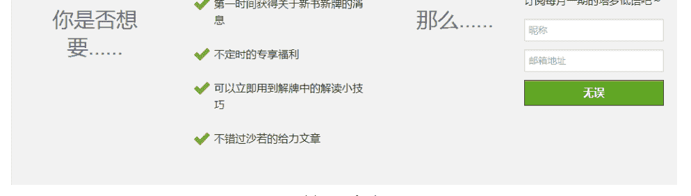

首页中部

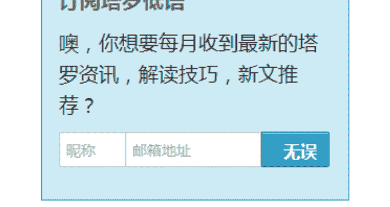

博文页右上角

还没订阅的赶紧订阅了，每月25日发出，截至目前已经出了14期了，各种有趣的资讯，还有其他不定时的福利。

记得设置白名单。如果订阅的当月月底没收到，请看一下垃圾箱，已经好多人反映这个了，尤其是腾讯邮箱。

那么，这本书就到这里了，因为恐怕更远的领域我指不到了。

我这本书，就如其名，是一本地图册，告诉你可以去哪里、怎么去，告诉你哪条路比较短、哪条路比较好风光，但它不能真正带你去到那里，你需要自己走过去。

想要更深地进入神秘学世界，你需要去阅读外国书籍，包括但不限于英语，比如马赛塔罗牌的资料得去法语世界找。

要了解如何购买及购买哪些书籍，可以咨询沙若，估计他看的英文书不比我看的中文书要少呢。我知道他目前在啃英文版的荣格著作全集。他甚至介绍过如何购买玛丽 K 格瑞尔的 DVD 塔罗课程，讲小牌牌图的。

或许你还会需要去加入外国的秘密结社，比如 BOTA、OTO 什么的。哦，那不是什么黑社会地下组织，现代的神秘结社只是一群爱好者、研究者、学者聚在一起而已。当然那也不是什么想进就进想出就出的同好会，加入者通常都要接受考核之类的。至于大陆的各类线上线下组织，看情况吧，很多都是商业化组织，并不是学不到东西，但还是很需要鉴别的，毕竟大陆塔罗界鱼龙混杂，很多组织还孜孜不倦地在宣传错误的塔罗知识。

衷心希望你没有止步在语言这个关卡......

再次感谢所有在这本书里被提到过的人，是他们的研究与分享精神，让我们有如此之多的学习资料，也别忘了感谢那些著写、翻译、出版了优秀书籍的外国、台湾作家译者。

最后，祝一路顺风哟。