# 塔罗小秘牌的故事炼金术

## 推薦序 直白剖析塔羅牌的秘密

鐘穎（愛智者書窩版主）

學習塔羅多年，王乙甯老師的書是持續讓我感到開卷有益的作品，時常在不經意間打開我原本的思路。

小祕儀是塔羅牌裡非常特殊的類別，因為它的名字叫做小（minor），也就是次要的、相對不重要的。但相較於大祕儀對應的原型經驗，小祕儀在解牌上的功能卻直接得多，因為它有場景、有人物、有互動，人物臉上的情緒也比較明顯。

因為有這些表意圖像，塔羅牌開始可以望圖生義，大大增加了占卜與學習的方便性。所以雖為小祕儀，卻是最有煙火氣，出現時最能讓占卜者感到安心的牌卡。畢竟大祕儀雖然勝在深奧，但也敗在深奧。

對許多初學者朋友來說，如果大牌出現的數量太多，反而會因太玄妙而苦惱。

小祕儀中的數字牌畫面是韋特與潘蜜拉兩人對塔羅牌所做出的重要革新。因為在此之前，數字牌的主流是「數字」與「元素」的組合。錢幣4，便是四枚錢幣；聖杯7，就是七盞聖杯。

過去我們以為是潘蜜拉獨立創造出了數字牌的畫面，但現在我們可以確認，她參考過更早之前的索拉布斯卡塔羅牌的構圖。舉例來說，韋特牌的寶劍3與權杖10基本就是索拉布斯卡塔羅的翻版。

即便如此，數量高達四十張的數字牌絕大多數仍是潘蜜拉本人的發想，如果讀者將兩個版本的塔羅牌做比較，就會發現它們的表達方式有很顯著的不同。

如果讀者瞭解黃金黎明會這個神秘學組織對塔羅牌的解釋，那你可能會發現潘蜜拉的構圖其實是有跡可尋的，並不是想當然爾，任意為之，而是根據其理論所做的有意義設計。

我有時會想起潘蜜拉的創作初衷，她將學理轉化為圖像的心理歷程顯然帶著某種將知識普及化的願望，她的努力成功了，讓許多人能跳過文字的學習階段，直接浸淫在圖像中。

在這樣的前提下，乙甯老師進一步告訴我們，在看到這些圖像時，若是忽略了「情境」因素，很容易簡化牌義。這是本書的第一個特點。

同樣是離開，寶劍6是離開，聖杯8也是離開；同樣是家，權杖4跟聖杯10都是家。但加上情境之後，你會有更明確的前因後果。知道這些同義詞的背後有不同的脈絡。

乙甯老師的第二個提醒是「結構」，她在書裡稱為「圖像分析」。

注意一下，圖像中的三角形與四方形是怎麼表達的？這些簡單的形狀可以用來代表事件的安定與不安定。我在解夢時也會特別注意數字的結構問題（比如夢中出現的人數），因為它會指出人內在情緒的穩定狀態，以及無意識內容是否已經成形。

因此，乙甯老師雖然提倡「敘事塔羅」這個取向，但讀者可別看到「敘事」二字就以為老師的解牌方法缺乏結構。正好相反，你會在這本書看到很清晰的解讀方向。

這也是我最欽佩乙甯老師的地方，她好像一位活著的塔羅女神，能把塔羅牌的秘密直白地呈現，也知道該在什麼地方停止，讀來餘韻無窮。

## 推薦序 生活中每個看似微小的事件背後，都隱含著值得細細品味的寓言

楊善淳（玄享，《奧秘其中：托特塔羅學習筆記》作者）

乙宵老師的新作《塔羅小祕牌的故事煉金術》讓我們走進韋特塔羅「小祕儀」（Minor Arcana，本書稱為「小祕牌」）的世界—有如一幅幅親切立體的片刻風景，山巒與流水、草木與田野、船舶與建築，一起搭建了探索意義的場域。

在這片場域裡，不需要生硬地背誦知識，而是與每張牌的畫面直接互動。我們藉此親臨其中，通過自我覺察的反覆練習，聆聽內在的聲音，捕捉那些看似平凡卻意義深遠的瞬間，把屬於自己的獨特故事演繹出來。

韋特（A. E. Waite）在《韋特塔羅圖像解讀祕鑰》（The Pictorial Key to the Tarot），留下了他對塔羅的解說。該書中「大祕儀」（Major Arcana）是作者關注的核心，小祕儀的篇幅則相對簡短。我們可以推測，小祕儀的世界很可能超出了韋特的設計，更多是源於繪者史密斯小姐（Pamela Colman Smith）自身的藝術底蘊，以及細膩的神秘學靈感—她讓抽象的概念長出了生命。

韋特塔羅的小祕儀包含四十張元素牌，以及十六張宮廷牌。其中，四十張元素牌尤為獨特：一改以往的塔羅畫風，從撲克牌般符號化的表達，幻化為有人物主角搭配物件的豐富畫面。這些畫面固然引人入勝，展現貼近生活的親情境境，卻也因為缺乏文字註明，留下許多謎團。

那麼，既然後人無法依靠傳統牌義來徹底理解韋特小祕儀，還有沒有什麼更合適的學習途徑呢？

乙甯老師在本書珍貴的創見，就是從圖像研究的角度重新開啟塔羅之門。她不急於給出答案，而是在書寫中讓象徵慢慢發酵。在老師的引導下，傳統牌義獲得了活潑的詮釋，更能按照每個人的處境「看圖說故事」。

值得注意的是，所謂的看圖說故事，並非憑空臆測。老師從牌中的構圖方式、視線流動、環境景色等方面系統性地考察小祕儀，並統整它們呈現的共通主題。而從元素牌人物的特徵，也可以對應到十六張宮廷牌的角色，使小祕儀化為一連串綿延著想像力的成長旅程。如同欣賞藝術品一般，帶領我們觀察和感受史密斯小姐饒富趣味的創作。

若從榮格心理學的理論來談，這些牌面上的共通主題，可比擬為無意識心靈中的古老結構，能夠喚起不同時代和民族的人類體驗。例如群眾聚集的城鎮，是自我意識和他人交流、獲得成就感的環境；而使人獨處一室的房間則阻斷了外界影響，讓主角潛入內心的幻想世界。

正因如此，即使與那古樸的畫面相隔遙遠時空，當我們抽牌的那一刻，靈魂仍然被深深觸動。

乙甯老師的著作，一直貫徹著賦予塔羅心靈敘事的理念。不像傳統上依靠關鍵字的論斷占卜，而是採取涓涓細流般的故事，溫柔圍繞著圖像流動，讓象徵滋養生活。很幸運地，我們如今迎來這本《塔羅小祕牌的故事煉金術》，重新關照經常被塔羅書籍忽略的小祕儀。

對入門者來說，這本書提供了清晰易懂的指引，有助於大家找到自己的占卜風格。而對專業占卜師而言，這本書更能開闢一條跳脫知識框架的路徑，打開豐沛的直覺與感受力。願本書做為日常對話的夥伴，與我們一同輕鬆穿梭在生命悄然綻放的可能性之間。

## 推薦序 我的故事，我來說：一場自我覺察的塔羅之旅

何佳瑞（輔仁大學品牌與時尚經營管理碩士學位學程、全人教育中心合聘教授）

在當今眾多塔羅師之中，王乙甯老師的塔羅課程可說是獨樹一幟。讀者在閱讀她的書籍時，或許會覺得內容淺顯易懂，但同時也能感受到塔羅解牌所蘊含的深度與複雜性。王乙甯老師是極少數擁有博士學位的塔羅師之一。她對塔羅牌的研究，早已超越傳統的解牌方式，而是將自身深厚的學術涵養與對生命的深刻體悟，融入塔羅解讀的每一個層面之中。

王乙甯老師的解牌特色，一方面保有塔羅牌原有的神秘特性，另一方面又透過圖像的方式，將這種帶有神秘色彩的占卜，以一種可理解且充滿創造力的方式，融入每一位塔羅學習者的日常生活之中。

人的生命和生活是非常複雜的，單向和片面的塔羅牌解讀，只怕無法對接受占卜的人帶來益處，反而可能造成傷害。王乙甯老師透過圖像的解牌方式，向我們指出了生命與生活「情境」的重要性，所有的意義與價值，若脫離情境，便無從判斷好壞、吉凶，更難以指引我們找到面對未來的最佳應對之道。這種超越「牌義」的圖像式解牌，不僅克服了傳統塔羅「鐵口直斷」的局限，更真實地反映出生活的複雜性，以及人與他人、他物之間的互動關係，使塔羅成為真正貼近人們生活的占卜方式。我會說，王乙甯老師的塔羅牌是一種「生活塔羅」。

不僅如此，我還會說，王乙甯老師的塔羅牌是一種「故事塔羅」。王乙甯老師說：「看圖說故事並不需要特殊的天分，只要願意花時間練習，就能熟能生巧。」這樣的觀點，讓塔羅牌成為人人日常生活中的小幫手｜塔羅解牌不再是高深莫測、遙不可及的神秘技能，而是一個人人都能親近、都能學習的領域。每個人都可以成為自己的塔羅師。更重要的是，在所有的圖像成為「自己的故事」的同時，也創造了牌卡與個人生活之間的有意義連結。這樣一種新的意義與價值的開啟，讓我們的生活不再僅僅是平凡的日常，而是在意義之中，找到屬於自己的安身之處。

最後，我會說，王乙甯老師的塔羅牌是一種「成長塔羅」。每一次的塔羅解牌過程，都是一場自我覺察之旅。這個特色反映出王乙甯老師一貫對「人」的深切關懷。這是她第三本以塔羅牌為主題的專書，而她先前出版的兩本書，也都明確指出「自我覺察」與「自我成長」的重要性。王乙甯老師說：「其餘三十四張小秘牌是人物畫，這些圖講的其實是人的故事，而不純粹只是對事情吉凶的判斷。」¹塔羅並非一種用過即棄的占卜工具；唯有將塔羅融入生活、作為自我覺察的媒介，它才能真正發揮協助生命成長的價值。塔羅不應被局限於吉凶禍福的占卜框架之中，在王乙甯老師的詮釋下，塔羅的作用恰恰相反：它不再是替我們的命運下定論的工具，而是引導我們在自我覺察的過程中，成為命運的主人。

我很高興看到王乙甯老師出版了這本專注於小秘牌解讀的專書。我期盼所有讀者，都能透過這本書，學會成為自己的塔羅師，並在生活的每一刻中，活出屬於自己的意義。

## 推薦序 圖像的覺者

蔡怡佳（輔仁大學宗教學系）

自《敘事塔羅》出版以來，乙甯就一直關注塔羅牌「說故事」的潛力，探索如何讓這個潛力盡情發揮的方法，也希望幫助對塔羅牌有興趣的人能夠成為自主與塔羅牌對話的「說故事的人」。對乙甯來說，說故事是為了帶來對日常生活處境以及自我的覺察；對塔羅敘事力的開發，也就意味著從「求卜者」走向「覺察者」的轉換樞紐。在這個探問中，要面對的是塔羅「牌義」已經大致被固定下來的傳統，如何從既有的「牌義」釋放出「說故事」的潛能，是乙甯在本書中帶給讀者的洞見。

新方法的提出要面對「破」與「立」的雙重任務。乙甯的「破」不是正面拆解，而是新焦點的提出。這個新的焦點即是塔羅牌的「圖像」。小祕牌因為沒有文字的標示，更容易在沒有文字意義的暗示中，挖掘與圖像對話的意義。以小祕牌的圖像做為尋找故事的線索，就像是將這些圖像置於牆上，讀者可以用到美術館「朝聖」的心情駐足於圖像前。凝視圖像時，每一幅圖像與佇立在其面前的觀畫者之間，會牽起一條看不見的線，也打開一個由線張開的空間。這是一個安靜的空間、等待的空間，以及聆聽的空間。在這個空間中有知覺、感受與思緒的浮現，或者也會震動心弦，揚起旋律。這些在空間中蕩漾的種種心緒，是故事被說出來的線條、顏色、形狀與觸感。從「求卜者」走向「覺察者」的第一步，意味著將自己安放於圖像可以打開的空間之中。

然而，和文字相比，圖像較為曖昧，甚至抗拒意義的定著。圖像除了打開對話的空間，也可能為觀者帶來焦慮，尤其當人置身於尋找方向的占卜處境時，意義過於開放的圖像會令求卜者難安。從「求卜者」走向「覺察者」的過程，除了放下原來對號入座的框架，也需要一些能與圖像對話的方法。乙甯在書中提供了構圖、人物姿態、視線、場景、建築、比例配置等觀看圖像的方法，讓觀者可以在方法的引導中拉起與圖像連結的那條線。因此，乙甯提供的方法可以說是在塔羅圖像與觀者之間搭起橋樑；有了橋樑，也就有了搭造故事的地基，讓故事得以浮現。

除了提出觀圖的方法，乙甯在書中也用連環畫的讀法為每一組小祕牌說出一個有開始、有發展，有結局的故事。例如，乙甯用大家熟悉的《航海王》與《小王子》做為探照燈，照出權杖系列與聖杯系列的故事軸線。每一幅圖像除了自身的意義，也在系列圖像的新脈絡中展開出另一層意義。這種宛如漩渦的意義波紋也可以比喻為輕舟，將讀者送到一座座故事的島嶼。這是另一種看見故事的方法：在塔羅圖像與經典故事的交織中進行自我與處境的映照。

乙甯在書中透過觀看塔羅圖像的方法為讀者展開每天為自己說故事的旅程。我相信透過閱讀而得以在橋上行走，或是登上輕舟的讀者，也會在做為觀者的自己與塔羅圖像「之間」，找到一個屬於自己的說故事的方法。成為說故事的覺者，也同時成為提出方法的觀者，是乙甯在本書中為塔羅與讀者所開闢的新道路。

## 作者序 讓塔羅成為你的生活寓言

在教學過程中，學員常問起我的學習經驗，問我要如何才能學好塔羅。但我不確定自己是否有「學好」塔羅，塔羅對我來說沒有一定的學習方法，沒有評量標準可以告訴我有沒有學好。當然，這些學員是想知道要學多久才能對占卜解牌上手，其實，我很怕誠實的回答會讓想要學習塔羅的學員打退堂鼓，因為到現在為止，我還是不覺得自己很會「占卜解牌」。

一般人對占卜解牌的理解，就是可以明確、清楚的獲得未來方向與指引，但在人生十字路口，就算抽了很多次塔羅牌，我也會猶豫不決、煩惱與糾結，但我還是會一直抽牌，因為每次的占卜解牌會讓我多理解一點我為何糾結，以及讓我猶豫的是什麼。所以每次占卜解牌，並沒有讓我對未來更清楚，只是對自己的內在狀況，有更清澈的洞察，這些洞察來自每張紙牌上的圖像，只要我願意把發生的事與抽出來的牌放在一起，總是能對自己進行更多的思考與對話。

我會喜歡塔羅，就是因為圖像給了我意義的不確定性，抽牌不只沒有幫助我釐清未來方向，反而會揭露未知的自己。所以雖說在預測未來的占卜解牌上，我無法知道學多久才上手，但在自我探索的運用上，只要願意花心思去看、去想、去解牌，並從這樣的過程，好像對自己的不知道多知道了一些，那你就已經上手了，這種理解不需要向他人證明，也不需要什麼評量表，只要這些圖吸引你，讓你從圖裡認出了自己，並成為回看自己的媒介，你就可以學好「敘事塔羅」，但不是學好塔羅占卜，而是學習自己。

塔羅占卜的實用與功能性，讓每個想要踏入學習行列的人，不自覺的會想到學習成效，但我更想把學習塔羅比喻為閱讀繪本的過程，很多獻給成人的繪本，是用圖展開想像與啟發心靈的象徵媒介，雖然有故事，但圖比故事更有啟發性，超越故事本身。當我們讀繪本時，不會以閱讀成果為目標，而是享受故事與圖像所激發的想像力與感受，期待繪本可以喚起內在創造力。這一點很類似小祕牌，它是敘事圖，圖像展現的故事承載著內在情感，它所述說的不是「牌義」，而是會讓我們感同身受與產生共鳴的生命處境，所以解讀小祕牌，更需要像閱讀繪本，由讀者去完成它的故事。

當你把「學習塔羅」視為閱讀繪本的過程，就能更細膩地觀看每張圖像，並從圖像中打開想像的翅膀，天馬行空地在象徵與意義之間玩遊戲。如果進一步把「塔羅占卜」視為創作繪本的過程，把求問的問題與抽出來的牌放在一起，這時，我們不需預測未來，而需要喚起心靈的豐富想像力，把自己的故事與塔羅連結在一起，完成充滿象徵意象的生命故事。這就是我從塔羅牌所獲得的禮物，幫助我從象徵、神話、意義等觀點去解讀塔羅，並開啟了探索塔羅的二十多年的旅程，直到今日，我的旅程尚未結束，還有太多未知的自己等待我去發現，而塔羅牌是在旅途上不可少的旅伴。期待這本書也能開啟讀者對圖像的好奇與探索，用塔羅小祕牌創造出獨屬於自己的生命繪本。

# Chapter 1 韋特塔羅牌的革新在於四十張元素牌

一九一○年發行的韋特塔羅牌，為何會成為全球使用最普遍的占卜牌卡呢？這跟韋特小祕牌把四十張元素圖像轉變為人物圖有關。韋特塔羅牌之前的占卜術，因為無法看圖說故事，都需要透過占卜師的特殊能力進行未來預測，但韋特塔羅牌發行後，在美國就轉變為自我覺察的身心靈占卜牌卡，讓占卜從密碼對照式的直觀預測，轉變為看圖說故事的詮釋。詮釋是每個觀看圖像的人都可以進行的解釋，解釋沒有正確答案，在於觀看圖像的人如何理解，就會形成因人而異的占卜答案。當塔羅牌的預測轉變為解釋，就不再只是占卜師給予的答案為依據，任何人只要試著去解釋圖像，都有可能完成占卜解牌，所以韋特小祕牌的人物圖，讓塔羅占卜成為人人可解釋的內容，雖然降低了占卜預測的神秘性，卻轉換成說故事，成為覺察自我的媒介。

韋特牌並不是第一副把小祕牌用人物圖像繪製的塔羅牌，早在一四九一年，義大利就有出現過以人物圖像的四十張元素牌，稱為索拉布斯卡（Sola Busca）塔羅牌，一九○八年大英博物館收藏了這套牌卡，並對外展出。當潘蜜拉準備繪製韋特塔羅牌時，有可能參考過這組牌卡的圖像。在韋特之前的塔羅神秘學者，他們只重視二十二張大祕牌，但韋特牌並沒有依循過去傳統，對小祕牌也進行了更動，原因為何？我們不得而知，但在韋特的專書《韋特塔羅圖像解讀秘鑰》中，明確說明神秘學研究限於大祕牌，小祕牌只作為占卜使用，所以他在書裡也沒有花太多篇幅介紹小祕牌。依我的猜測，韋特在發行塔羅牌時還是一同推出更新的小祕牌，可能是商業考量，因為比起神秘學，占卜是更多人感興趣的領域。所以韋特牌發行後獲得市場上的成功，後來還直接影響了美國的精神療癒運動，並成為這時代最重要的占卜牌卡。

大祕牌因為每張牌上的文字主題，使得圖像受制於特定概念的象徵表達，但四十張小祕牌，並沒有文字標題，所以四十張紙牌要成為什麼樣的故事畫，比起大祕牌在創作上有更大的自由度。四十張小祕牌成為展現生活情境的人物圖像，剛好借重了潘蜜拉繪製劇場布景的經驗，生動地運用了背景、人物與配件的搭配等變化，傳達出饒富趣味的生活處境，很像寓言畫。每張小祕牌，不只可以單獨成為一種情境與故事，同樣的元素依數字排序，也成為前後呼應的人物發展歷程，可見潘蜜拉在繪製小祕牌時，把元素與數字意義，轉換為生命發展歷程，展現出同樣的元素人物，會推展出的生活故事。

近年來，塔羅占卜比起傳統的算命占卜，更普遍發展到年輕族群，又迅速線上化，都與韋特塔羅把占卜普及化的影響有關。但越是普及化的現象，越有可能被誤解與誤用，也因為韋特塔羅成為每個人都能讀懂的圖，塔羅牌的占卜功能被擴大，發展出了各種快速、便利的牌義記憶法，韋特塔羅原本的圖像特色，在普及化的過程中被牌義取代。不只是學習塔羅占卜的人不重視塔羅圖像，對研究圖像的人來說，更因為塔羅牌被標註為占卜用牌卡，它的占卜功能，讓大家忽略了塔羅牌的圖像價值。把「占卜」與「牌義」從塔羅牌中剝除後，我們才有可能看到這些圖像，並走入潘蜜拉為我們創造的七十八張各有千秋的圖像世界。

## Chapter 2

## 看圖說故事：超越傳統牌義的詮釋

雖然韋特牌的四十張小祕牌帶來了占卜運用的轉變，但塔羅占卜在韋特牌發行之前就已盛行，當時的塔羅四十張小祕牌如同撲克牌的圖像，只有四種元素符號與數字，所以很需要借重過去留下來的牌義來解牌。當潘蜜拉設計出四十張小祕牌的人物圖像後，還是繼續用過去的牌義。但牌義是文字，並不像圖像有著情境說明，例如有幾張小牌都跟「離開」的牌義有關，過去像撲克牌的小祕牌，在抽出代表「離開」的幾張紙牌時，只能說明會離開，但無法從紙牌中看出是「什麼樣的離開」。這時，有關情境的說明，就需要依賴占卜師長年的占卜經驗來填補。

人的生活無法脫離情境，每件事情的發生，都需要從情境與脈絡去理解，我們才能判斷發生的事是好、是壞、是福、還是禍。所以一段時間沒見的朋友，突然見面就說離職了，我們無法馬上判斷該安慰對方，還是要為對方開心，只能進一步詢問離職的原因，再決定要如何回應對方的話。韋特小祕牌用圖像來表現，所以我們可以從紙牌中直接理解人物會「離開」的不同情境，例如，聖杯8人物離開八個杯子，但這是讓自己更上一層樓的努力；寶劍6的人物也在離開，但問題無法獲得解決，只能先把問題帶著（六把劍）熬過難關；而五角星5的離開是找不到解決方法，只能持續前進的無奈與無助等。有了這些情境的圖像，初學者就算沒有長年的占卜經驗，也能從圖像中說出求問事情的狀況。

韋特牌之前的塔羅占卜，小祕牌的牌義如何與四元素或數字相結合，沒有可理解的說明，只能背誦或由占卜師的特殊能力去預測，這些不知從何而來的牌義，卻一直延用到韋特塔羅牌的占卜解牌。雖然潘蜜拉也有可能引用當時的占卜牌義，但潘蜜拉的神秘學背景，更有可能參考了卡巴拉生命之樹與小祕牌的神祕學解釋，所以很多小祕牌的人物圖，與過去延用的占卜牌義之間意義不太貼合。在《韋特塔羅圖像解讀祕鑰》一書中，小祕牌的解釋也直接借用了當時坊間流傳的占卜牌義，卻出現與圖像不合的狀況，例如五角星7，在韋特的書裡記載了金錢、商業、以物易物、口角、爭論等，但圖像裡只有一個人物低頭站立，從圖像中看不出跟其他人交易的意圖，或者有口角。另外，聖杯8的牌義為某件事走下坡，但圖像裡的人物是往上坡前進。

韋特是神祕學者，他在發行塔羅牌時，只關心大祕牌的神祕學解釋，所以四十張小祕牌，可能是由潘蜜拉全權負責設計，但因為潘蜜拉沒有寫書解釋這些圖像，她所設計的圖像意義被傳統牌義淹沒。但只要細讀四十張人物圖，就會發現比傳統牌義更為豐富、深含生活趣味的意義，所以之後的塔羅占卜教學者，打開了結合占星、煉金術、卡巴拉生命之樹、心理學等的解釋方法，讓塔羅占卜解牌拓展到以圖像為核心的故事與意義領域。當我們看著載著兩個人與六把劍，用力往前划行的船夫，他在當下感受到的責任、看著被劍占據的船頭時的沉重心情、但遠方的水域相對平靜的心安、坐在船上的人的沉默帶來的氣氛等（寶劍6）。在占卜解牌時，這些豐富的圖像意象，會為求問情境建構出更為生動的情境與情節，順著這些圖像說故事，占卜解牌不再聚焦在預測未來，而會成為自我的當下覺察。

韋特塔羅牌的最大優勢就是易懂的圖像，在占卜解牌時，需要把解牌技巧從牌義轉換為看圖說故事。看圖說故事並不需要特殊天分，只要花時間練習，就可以熟能生巧。如果過去用韋特牌占卜解牌時遇到挫折，並不是學習者沒有天分，而是沒有找到適合韋特塔羅牌的解牌方法。本書希望帶領學習者，從圖像分析的觀點重新認識四十張小祕牌，丟掉傳統占卜術用的「牌義」，從每張圖的構圖重新解讀出圖像本身展現的生活情境。在占卜解牌時，就可以從圖像去想像、連結與生活情境有關的意象，透過塔羅牌與塔羅占卜的學習，加強圖像的想像與意義解釋能力，讓塔羅牌除了是覺察自己、解決生活煩惱的占卜工具，也可以讓一成不變的生活，經由塔羅圖像增添各種劇情與情節的生活故事。

## Chapter 3

## 情境建構：小祕牌如何成為日常生活的劇情

如果問你今天過的如何？或者每天日子過的如何？你會怎麼回答？老樣子、就那樣、沒什麼特別的、就是過日子……這些都是我們最常拿來回答每日生活的句子。每天真的沒什麼事嗎？什麼叫老樣子呢？什麼叫過日子？如果仔細斟酌這些回答，就會發現實際的狀況未必如此。每天，從睡夢中睜開眼睛的那一刻開始，每個人身邊都會發生很多事，但大多時候這些事都是一個人已預期會發生的事，所以不會視為特別的事。起床上班、通勤、吃早餐、工作、開會、約會……但有時也會出現一些小狀況，例如塞車遲到、想吃飯的餐廳沒開、感冒早上起不來等，但這些小狀況都還在可預期的範圍內，所以也不會太意外，只是今天有點不順而已。

這種可預期的事，我們就叫做「日常」，當事情變成可預期的，代表那些是重複發生、已成為習慣與規則的事情。只會發生一次的特殊事情，不在我們的預期，就成為意外與異常。能夠預期就能事先做好應對的準備，所以會讓我們安心，相對地，無法預期的事就是未知，常成為焦慮的來源。雖然很多人會抱怨日子過得一成不變，但沒有人喜歡在日常中發生意外，在規律的日常中，人可以鬆懈、安心；但不規律的生活，人就會變得緊張與不安。每個人大部分的人生都會在日常中度過，也代表我們已被培養出有能力管理時間與工作，所以能夠把生活管理得井然有序，雖然他人會帶來一些小狀況，但還不至於造成讓我們失控的局面。

有能力管理時間，代表做事有效率、在社會上被賞識，但有效率的生活並不等於有意義的生活。所以我們會在有效果、時間管理做得很好的生活中，因為找不到意義而茫然。社會生活是群體一起運作的機制，能夠配合他人、讓自己有效率固然重要，但為了有效率，我們只能應對「事」，不能應對「人」，因為人才是讓事情變得沒效率的主要原因。今天如果早餐店的老闆喜歡跟客人聊天、聆聽客人的煩惱，他要如何有效率的做早餐或管理餐點？又或者老闆讓我們在下班前做出報表，這時如果開始跟同事討論做報表的甘苦與必要性等的問題，就不可能在下班前完成，所以不管做報表的心情如何，只能專心先把報表做出來。這就是對應事、不對應人的情況。

都市的工作環境要求效率，所以做事有效率的人，不太有時間跟同事間話家常。以前我念研究所時，因為還有全職的工作，所以只要上完課就會快速離開教室，都沒有留下來跟同學們閒聊，也不參加聚會。雖然時間管理很確實，學習效率很高，但拿到學位後才發現，兩年時間除了學位沒能留下什麼回憶。回憶不只是發生了什麼事，而是事情發生時的情感經歷，在高效生活中，情感是需要被排除的障礙，但想要有意義的美好人生，就需要停下來讓自己有感覺，這兩者能夠平衡當然最重要，但現代人的生活，大多過度偏向效率，而不是情感。

以每個人都曾有過的旅遊經驗來說，旅行時比起一路順風的路程，中間遇到各種意外的小狀況，反而讓人回味無窮，日後談起旅遊經驗時，也都在談出狀況的回憶。一路順風的旅行當然很愉快，但愉快的情緒，不會比驚慌、生氣、害怕等的情感強烈。而且一切順利的旅程，也代表我們不太需要跟人交涉，所以大多會滿足於自我享樂的感受中。但出狀況的行程，需要與人交涉才能解決問題，在這種交涉中，我們開始應對的是人，而不是事，並且與人的應對中，會跟自己不斷產生衝突，也會面對各種抉擇而感到糾結。雖然經歷事情的我是不舒服的，但在這些不舒服中，我的改變正在不著痕跡的發生，最後安全回到家之後，成為增加了見識與見解的經驗談。

如果你在日常中感受到的是無聊、一成不變的生活，那是因為你的專注力放在「事」，而不是「人」，重複的事不會有太多改變，甚至可以規劃SOP，每次都依一樣的流程完成。但人才是最大的變數，當你開始把注意力從「發生的事」，轉移到「事情中的人」，就會發現不存在一成不變，每件事都因為人而無法重複。塔羅小祕牌就是幫助我們開始從「事」看向「人」的生活圖像，當我們要解讀一張小祕牌時，一定會從圖像中的人開始。以人物為中心講出目前所處的狀況，就需要思考人物的心境、意圖與動機。只要從圖像去解讀小祕牌，以人為中心的思考是必然的，因為除了四張王牌、寶劍3與權杖8，其餘三十四張小祕牌都是人物畫，這些圖講的是人的故事，而不純粹只是關於事情的吉凶判斷。

## 每張小祕牌就是一則人生故事

日常生活的對話，容易成為簡易的好壞判斷的回覆，例如問家人今天過得如何，我們常會回答「不錯」、「很好」、「還可以」，這些評價用語是直接從發生的事，進行個人判斷後給予的回答，而對方無法從這些回應知道發生了什麼事。大部分的塔羅占卜解牌，因為會進行未來運勢的預測，所以也會進入吉凶判斷的用語，直接從小祕牌的圖像，給予簡易的「牌義」，牌義是對情節的簡易總結，並不是故事。小祕牌的人物畫在描繪一個人正在經歷的事，所以不是預測吉凶的訊息，而是要說出正在發生的故事。如果今天我過得很忙碌，家人問我今天過得如何，我就會回答很忙，可是如果抽塔羅牌，可能會出現如權杖7的忙碌、也可能出現五角星2的忙碌，這兩張圖像中的人，一個人站定位置，動著雙手；另一個人是雙腳、雙手都在忙，呈現了兩種不同的忙碌狀況。權杖7的忙碌更像是為了穩定現有的計畫，把周邊可能發生的障礙、問題，專注的一一克服；而五角星2的忙碌更像是一心多用，需要切割時間、分心去做多個項目的忙。雖然這兩者都可以用忙碌來總結，但如果想要讓生活變得有故事，比起簡易的總結，更需要述說發生了什麼事，如果我們在使用塔羅占卜時回到圖像，而不是占卜牌義，就有可能讓小祕牌成為豐富我們生活的說故事媒介。

回想昨天、一週前、一個月前的事，常常想不太起來，只覺那個月過得很忙。當我們的過去，只用「很忙」兩個字就可代過，人生會不會變得很無趣？人跟人的對話內容會不會變得很貧乏？那要如何讓生活變得豐富，留下很多回憶呢？我會鼓勵塔羅學習者做每日抽牌與解牌，並且記錄下來，當作寫日記，同時練習塔羅解牌。小祕牌的圖像，直接對應到當日的處境，但每日發生的事，未必與每天抽出來的圖像直接有連結，如果我們把抽牌作為準不準的對應與驗證，沒有可對應的內容時，就視為不準而不需要解牌。但解釋是創造意義的能力，任何不相干的事物並置在一起，只要想要解釋，人總是能夠找到有意義的連結。這就像蒙太奇技法，把幾個沒有關連的圖像並置在一起，觀看者只要認為圖像之間有關連，就有可能解釋出意義。可以把塔羅占卜的隨機抽牌，類比為隨機性的把圖像與當下我想要問的問題並置在一起的蒙太奇解釋，如果想要解好蒙太奇的意義，需要的是絕對相信並置的圖像間是有關連的，所以我們也要相信每次的抽牌都會很準，就不會有解不出來而認定為不準的抽牌結果，只有意義連結明確或模糊的解釋。

以寶劍8的圖像為例，大多數的人只會想到這張牌有著「逃避困難」的牌義，但如果當天沒有上班，一個人過得自在愉快，沒有逃避困難，但當天散步時，因為一時分心結果在不平的路上跌倒了，這就能夠聯想到寶劍8的人物是遮眼站在水坑前，描繪看不到前路的情境。用在實際發生的事情上，可以解釋為沒有專心看路，至於為何沒有專心呢？可能就是想太多。所以寶劍8的處境，不只是對問題視而不見，也有可能是在困難前，沒有睜大眼看清楚而遇到困境。每日抽牌所進行的說故事練習，不只為生活帶來樂趣，也會改變跟他人的溝通，如果有人問起日子過的如何，除了「忙碌」，能夠用各種情境說故事，人跟人的交流自然會變得順暢又有深度。

## 小祕牌獨有的處境覺察

孟母三遷的故事大家都聽過，這則故事強調了環境對成長中的小孩所產生的重要影響，其實不只是小孩，大人的判斷也會被自己所處的處境影響，只是大人比小孩會有更多的自主性，但也因為相信自己的主導力，反而會忽略外在因素，容易把問題怪罪到自己身上，卻沒有評估是什麼樣的處境，讓我們做出了錯誤的判斷或行動。每日生活中的處境，大多是重複的例行公事，所以會被我們視為理所當然，容易誤判情勢。在同一個工作環境久了，就會用過去的理解判斷現在狀況，但公司內的決策者、同事都會變動，只要人變，人跟人的互動模式就會改變環境。這時，如果沒有敏銳的觀察力，就有可能做出失常的應對，當事與願違時，只能怪罪運勢不佳。小祕牌的情境故事，可以成為評估現況的旁觀者的觀點，再加上元素與數字的特定解釋，可以釐清在處境中主導事情的氛圍、動機、意圖、期待等，透過隨機抽牌，可以讓自己站在旁觀者的視野，重新審視自己的生活。

舉例來說，如果一直對新工作感到不適，卻又覺得是自己不夠努力，才會無法適應工作，這時間塔羅：目前的工作狀況，讓我感到不適的原因是什麼？只用四十張小祕牌來抽出一張牌，如果抽出權杖7，代表我正像權杖7的人站在高處，賣力的做出屏障，而且太專注了，沒注意到穿著兩隻不同的鞋子。站在高處的人物，以征服者的姿態做事，但新工作不只要把工作做好，還需要熟悉同事、職場文化、客戶關係等，而且權杖7是要打敗敵人的氣勢，這種氣勢在注重團隊合作的職場環境，可能就不適合。所以權杖7的圖像，可以讓我們看到自己感到不適的原因，並不是自己不夠努力，反而是太想要表現自己的能力所造成的反效果。如果抽出的是逆位的權杖7，可解釋為圖像中的人物，找不到自己的位置，無法施展能力而不安，比起打敗敵人的氣勢，更急於尋找可以讓他站定位的地方。所以在逆位權杖7的情境，會很在意周邊人的眼光，因為無法清楚定位自己在公司中的角色或位置，就會怕說出或做出不符合規定的事，對新環境有點退縮，或過於謹慎，無法專心工作或自在做自己。

除了直接問發生問題的原因來找到適當的應對方法，也可以問如何改善現況。雖然生活中的情境，不全然由我們主導與改變，但我們對現況的應對方法，取決於如何想像與理解我們周遭的處境，所以除了找到原因，也可以抽一張小祕牌來幫助我們重新定位目前的情勢。所以可以問：目前我的工作現況？如果抽出聖杯6，就代表工作環境就像圖像中的景象，有城堡與警衛在守護，很安全，而且身邊也有人願意幫忙，所以在這樣的工作處境，需要的並不是把工作當作戰鬥（權杖7），或者擔心自己搞不清楚狀況（逆位權杖7），反而可以放下心，慢慢地給自己時間適應新環境，也多花點時間與同事相處。聖杯6中的孩子們，不會談論認真的話題，所以跟同事輕鬆的閒話家常也很重要。如果抽到的是逆位的聖杯6，就要把目前所處的公司環境想像為與人保持一些距離，也不要輕易相信或跟隨他人的安排，要帶點警覺心觀察新環境，也因為需要觀察，所以像權杖7一下子過於投入自己手上的工作是不恰當的。

## 用小祕牌化解生活中的矛盾與衝突

一般的占卜解牌，容易用直觀的感覺，把七十八張牌分類為好與不好的牌，在解牌時，出現好牌，就代表一切順利，沒有問題，出現不好的牌，代表有狀況，事情不順。所謂好與不好就是傳統算命中的吉凶，這是對外境（運勢）用普遍的社會價值進行的判斷。但對經歷事情的人來說，什麼樣的狀況是好？還是不好？未必有一致的標準。有人進到了他人嚮往的公司工作，卻因為無法適應而痛苦；有人跟長期追求的對象交往，以為從此過著幸福快樂的生活，但實際上衝突不斷而不幸等。雖然好與不好因人而異，但人無法全然脫離社會價值，所以工作不愉快，也無法輕易丟下他人眼裡的「好工作」；或者結束他人認為的「神仙眷侶」的關係，但個人就會在社會價值與自己想要的結果之間有矛盾與衝突，不管擁有多好的工作、多完美的對象、多美好的條件，都會認為自己的生活不幸與運勢不佳。

敘事塔羅是把塔羅占卜運用為內在成長，所以每一次的占卜解牌，比起預測未來，更想要解讀的是情境中的人是否與外境有矛盾，如果有，就透過圖像分析，嘗試分析與覺察是什麼樣的矛盾。如果透過抽牌解牌，解出來的是我們正在經歷的衝突與矛盾，就無法把牌分類為好牌或不好的牌，而是依情境，每一張牌都有可能成為好牌，也可能是不好的牌。比如權杖7，雖占卜牌義上是積極面對挑戰的好牌的意思，卻也可能成為造成個人困境的主要原因。過去的占卜術，是在預測外在不順的情勢，所以通常都是「有事」才會占卜，但小祕牌的圖像描繪的是日常生活，如果重點放在圖像分析，這些紙牌就可以作為重新經驗生活的圖像媒介，所以不是「有事」才抽牌，而是「沒事」也要抽牌。

把塔羅占卜作為自我覺察的運用，比起直覺，更需要圖像分析技巧以及解釋圖像的學習，才能在解牌時帶給我們覺察與領悟。很多學習者習慣憑直覺解牌，雖然直覺解牌也是一種解牌方法，但所謂直覺，其實也是從個人經驗獲得的結果，在足夠的經驗累積後，不需要按步驟去思考，就能知道答案。所以有經驗的占卜師會給人直覺很強的印象，其實那是長年經驗累積的實力。經驗不足時就用直覺，解出來的內容常常會是自我偏見，無法從解牌獲得覺察與領悟。

本書主要幫助塔羅自學者，培養圖像分析能力，增強小祕牌的圖像分析與解釋，進一步幫助學習者，讓塔羅小祕牌成為覺察生活的好幫手。所以在小祕牌的介紹，都會偏重圖像的分析方法，讓塔羅占卜解牌，成為有方法可練習的技法，而不純粹只是直覺或背牌義。圖像分析與蒙太奇式的意義解釋，只是一種解牌方法，任何學習有了方法，才能精進與熟練，如果是直覺式的學習，就有可能需要特殊才能與潛力，無法形成普遍性的學習方法。但這種學習也會讓讀者產生疑惑，塔羅占卜如果是圖像分析與蒙太奇式的意義解釋，與分析一幅畫或評論一部電影有何不同呢？當我們欣賞畫或電影時，雖然也有可能跟我們的生命狀態有共鳴，但不會直接把畫與電影的內容視為是「跟我有關的故事」。

塔羅占卜不管用什麼方法解牌，都會先提出跟抽牌者有關的問題，之後抽出來的牌，會被視為是「我的故事」進行解釋，這種隨機抽出來的牌與我的故事之間形成的神奇又不可思議的巧合，才是塔羅占卜的魅力所在。但生活中不是只有塔羅占卜很神奇，只要接受科學與理性不是理解世界的全部，我們就會開始在生活中發現各式各樣的不可思議與巧合（預知夢、在夢裡神明給的指引、命中注定的安排等）。但這些神奇的不可思議無法為我們改變任何處境，可以改變自己的只有自己，所以不管塔羅占卜準不準，最終占卜要當作覺察自己的媒介，才能從被命運掌控的無能為力與無助，轉變為創造命運的主動力量。小祕牌的圖像分析法是在塔羅占卜的神奇與不可思議的前提下，把原來用在預測未來的占卜，轉為自我覺察，讓每一次的占卜都像與一位心理諮商師面談，覺察個人的內在矛盾，並找到化解之道。

## Chapter 4

## 敘事煉金術：從構圖、人物、場景透視意義

現今，每人都有智慧型手機，拍照對很多人來說，可能是每日會做的平常事，所以「構圖」一詞對很多人來說並不陌生，或者，有些人在拍照時，已經用上各種構圖技巧，拍出有意境、有故事的照片。所謂構圖是西方繪畫在組合人物與場景的技法，不像拍照，場景大多是已安排好的景觀，在繪畫上，場景也是繪畫者設計與安排的結果，所以一幅畫裡的所有元素，都是繪畫者有意安排的結果，呈現出繪畫者想要的意境與故事。有些繪畫像白話文，一看就能懂繪畫者想要透過話傳達的情感，但有的「畫話」像文言文，不只要看懂人物在做什麼，也要能夠分析人物與場景的配置、色彩的運用等，才能讀懂畫要傳達的意義。韋特的小祕牌，就像文言文，需要一些構圖的基礎分析能力，但它也不是太難懂的古文，雖然不像生活用語那麼直白，但只要懂一點構圖知識，都能解出每張牌裡的劇情，而且各種構圖技法，很多人透過拍照早就用得很熟練。

構圖也是傳達視覺美感的技法，讓照片充满意境與情感，但小祕牌不是藝術畫，而是要傳達生活情境的故事畫，所以透過構圖分析，需要解出畫面想要講的劇情，分析得越仔細，故事的內容會越豐富。一般以人物為主角的照片，就會以人物為視覺中心進行與場景的搭配，這時人物在哪裡（中間、偏左、偏右）、以什麼姿態（坐在地上、椅子上、半蹲、站著、正面、背面、側面）、多大的比例（在遠方、聚焦）出現，這些都會成為在圖像中塑造故事的構圖元素。我們在拍照時，大多是在拍到此一遊照，只要把地景與人物都拍進去，就完成拍照目的，但自從有了各種網路平台，很多人也開始用照片說生活故事，這些想要說故事的照片，就會開始不自覺的使用構圖技法來傳達意義。

四十張小祕牌由潘蜜拉構思與繪製，她是劇場布景繪畫師，對如何透過人物與場景傳達故事的技法非常熟練，而且戲劇是大眾化的娛樂，繪製出來的圖像要能夠直白易懂，才能被大眾閱讀與理解。潘蜜拉在繪製小祕牌時，充分發揮了她的技法，運用簡易的構圖原則，描繪出各類生活場景。雖然構圖技法簡單，但繪出四十種人生場景，需要對生活的細膩觀察與領悟，才能描繪出生動又有共鳴的劇情，在這一點上，韋特小祕牌就算不作為占卜解牌，單純解析這些圖像，都可以為日常生活帶來獨特的見解、體會與趣味。接下來就從人物、場景與比例等分類，介紹小祕牌的構圖技法與解釋方法。

## 視覺中心構圖

一般看圖像時，視覺會無意識的聚焦在中心，但中心未必是畫面的正中央，而是由畫面中的核心物件形成視覺引導，讓觀畫者的視線聚焦在特定的地方。小祕牌大多都由人物作為視覺中心，人物的位置、姿態所構成的畫面，成為視覺上重要的第一印象，為情境賦予直觀的情感連結，之後進一步透過觀看，理解情境所要傳達的意涵。在小祕牌中，大多以人物為中心進行構圖，人物的身形會形成三角形的視覺形象，而三角形的視覺中心是西方古典的宗教繪畫較常使用的構圖方法，在視覺上會給人安定感，傳達出不易變動、可信任的情境氛圍。如果三角形傾斜或有缺角，整體就會散發出不穩定的氣氛，但也會為情境帶來可變動的動態感。

形成三角形構圖的方式有單人或多人構圖。單人的畫面，需注意人物的身體姿態如何形成視覺效果，而多人構圖時注意每個人物的定位，以及這些人物之間的互動如何成為視覺中心。為了能更統一分析小祕牌的圖像特色，接下來視覺中心都以三角形構圖為原則說明，方便讀者可以快速辨別圖像與解釋。

### （一）單人或多人的視覺中心

單人構圖，強調人對應事情的狀況，聚焦在人物、場景、物件之間的配置與安排。例如，五角星2的人物，兩隻手忙碌地在玩五角星，說明情境中的人努力完成多個被賦予的工作與任務，但他傾斜的頭與手臂，形成傾斜三角形的視覺中心，帶出動態感，雖然有點不安穩卻有活力。多人構圖，雖也會有場景與物件的安排，但更強調人與人形成的關係結構，在故事上更突顯出人際關係的互動與交流，事件倒是其次。例如，聖杯2裡的兩個人物在交換手中的杯子，這個動作說明情境中的人，重視跟他人真誠交流、相互成長與學習的關係，而且圖像中的天使與兩個人物形成了三角形構圖，傳達了這段關係會順利、長久發展的氛圍。權杖5裡的人物都拿著權杖在較勁，五個人物的安排視覺上有點混亂，無法形成特定的秩序，這種混亂就是畫面想要傳達的情境氛圍，這是七嘴八舌的情境，但前方的三個人物站立的方式也形成三角形，代表他們穩穩地站在自己的位置上，各自用力表達想法與意見。

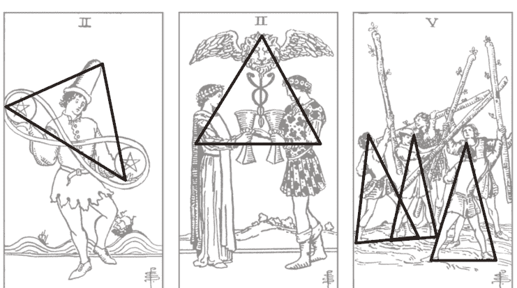

傾斜的三角形，在畫面中形成動感。

三角形構圖帶來安定、恆久不變的氛圍。

多人、無法形成視覺中心的構圖，形成混亂、吵雜的氣氛。

### （二）人物姿態

人物姿態是指人物的身體姿勢，包含手勢、站立與坐姿等。其中最容易區別的是坐姿與站姿，站姿還包含雙腳在行動的人，表現出人物的行動力。但不管是站立、還是坐姿，需配合人物的身體與手勢進行整體判斷，有些人物雖然站立，但身體表現出休息的姿態，短時間未必想行動（五角星7）；但也有人物坐在椅子上，手卻不停工作，展現了不停歇的行動（五角星8）。身體與手勢也會透露人物的情感與想法，在占卜解牌時，可以連結為實際狀況的情感描繪，提供解牌上的重要線索。

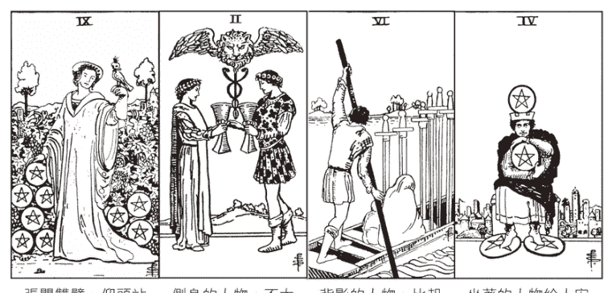

張開雙臂、仰頭站立的人物，展現出自信。

側身的人物，不太強調自己，而是強調向外的連結。

背影的人物，比起人物的情感，更強調前方的風景。

坐著的人物給人安定、穩重的感受。

#### 1. 行動力的展現：站立或坐姿

站立與坐姿分別描繪出一個人的行動力，以靜態站立的人，雖然沒有動，但比起坐著的人，可以更快速的行動或對應事情，所以站立的人物，正處在休息與行動的過渡狀態，隨時準備好應對改變（寶劍5），或者暫時被迫停下來無法行動（五角星7）。但坐著的人，停留在休息的時間會更長，比起想要改變，更可能是思考如何維持現狀（聖杯9），或者在不改變現狀的情形下，改善情勢（五角星8）。另外，雙腳正在行動的人，是表現正在應對事情的行動力，這時情境中人的人物，正在快速回應外在變化（寶劍8）。

#### 2. 內在想法與情感表現：人物的身體姿態與手勢

坐姿與站姿除了展現行動力之外，也有可能是指人物想要受到重視、自信或安定等的情感表現。例如在拍照時，全身正面入鏡，較能展現出一個人的氣勢，還強調了對自己的重視與重要性（五角星9）；但是側身入鏡，有一半的身體被隱藏，人物的重要性降低，尤其在小祕牌，側身的人物大多是多人構圖，更強調了把注意力從自己轉移到他人（聖杯2、五角星3）。如果人物是以背影入鏡，強調的不是人物，而是人物面對的風景（權杖3、寶劍6）。如果是坐著入鏡，比起氣勢，想要展現的是穩重與安定感（五角星4）。但也因為張開雙臂或手勢向內收起，形成不同的情感表現。向外打開的雙臂表現出自信與開放的態度，相對向內收縮的身體，成為封閉的、劃清界線的態度。

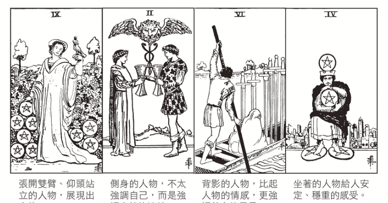

### （三）人物視線

視線是圖中人物的眼睛對焦的地方，有些人物正面站立看向前方，有些人物只露出背影，看向背景中的遠方，有些人物則是視線聚焦在某個特定物件，甚至有些人物遮起了眼睛。眼睛看向哪裡，就是人物目前所關注的事或人，人物視線傳達了情境中人物正在專注的事情。

#### 1. 聚焦在人或物的視線：情境中的第二焦點

有些人物的視線會聚焦在特定的人或物件上，這個人或物就成為情境中的第二焦點，與主人公形成重要的劇情內容。例如，五角星7的人物，視線聚焦在旁邊長滿五角星的樹，雖然他腳前也有五角星，卻只看著樹，說明了他想要樹上長滿的五角星果實。或是聖杯7的人物，視線聚焦在發光並被布蓋住的杯子上，所以不管其他杯子裡有什麼吸引人的物件，圖像裡的人只關心能不能見到中間的杯子有什麼。

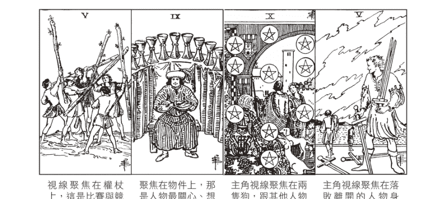

視線聚焦在權杖上，這是比賽與競爭。
聚焦在物件上，那是人物最關心、想要的東西。
主角視線聚焦在兩隻狗，跟其他人物保持適當的距離。
主角視線聚焦在落敗離開的人物身上，主要目的是打敗他人。

五角星10的圖像裡有很多人物，後方站立的男女相互看著彼此，正在對話，但坐在前方的老者並沒有看向他們，而是看著他正在撫摸的狗，代表他對人不太有興趣，喜歡安靜坐在角落裡與狗互動，雖沒有把自己孤立起來，但也不熱衷於社交，喜歡安靜度日。寶劍5站在前景的人物，視線聚焦在遠方的人，代表雖然他贏得了很多劍，那些是他的戰利品，但他不是為了戰利品而奮鬥，而是為了打敗對方、讓對方認輸。而權杖5的人物，比起競爭者，更聚焦在權杖上，說明了這些人物所關心的，是自己能不能從競爭中勝出，而不是打壓競爭對手。

#### 2. 向著前方的視線：強調自己的存在

有些人物的視線，如果沒有明顯的聚焦對象，只是看向前方，我們無法看到這些人物看到的風景，而是與這些人物對望。很像看向鏡頭拍照的人，他們的動作都是為了明確展現自己想要被他人看到的面向，希望被記得與留下回憶。在小祕牌裡，視線看向前方的只有五角星4與聖杯9的人物，希望他們的情境可以長久留存，不只是自己記得，也要讓其他人幫他們證明此刻的重要性與存在。

#### 3. 對焦在遠方的視線：在遠處的目標

人物視線聚焦在遠方，姿態就會以側身或背影來呈現，圖像裡的背景會成為視線聚焦的遠方。遠方象徵了未來想要到達的目標，可以理解為人物正在期待或規劃未來。例如，權杖3的人物站在懸崖，看向一望無際的大海。聖杯8中的人物雖也是背影，但他行走的方向在圖像中有阻礙，所以雖然有前進的方向，但未來需要摸索向前。

側身呈現的人物，視線方向較多元，有人向後看、有人低頭等，比起未來更強調留戀過去或不願面對未來的處境。例如，權杖9的人物側身站在右邊，視線看向左方，他身後八根立起來的權杖像個屏障，所以比起看向未來，更像是回看自己做完的事情。五角星5的人物，一人偏頭看向旁邊，好像在找東西，另一人低頭看路，描繪出看不到前路的情境。

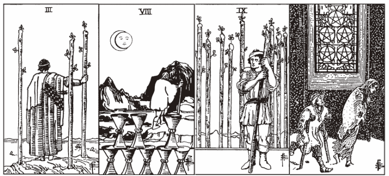

看向遠方的人物，心思在未來想要達成的目標。

視線所及的地方被阻礙，代表前路不明確。

看向來時路的人物，比起未來，更關心過去的作為。

無法看向前方的處境，是看不到前路的失落與無能為力。

#### 4. 遮蔽的視線：阻斷外來的影響

眼睛或者視線被遮蔽的人物，看不到外面的世界，代表跟世界的交流被阻斷，呈現出人的行動力全然被限制的心境。例如，寶劍2遮住眼的人物坐在椅子上，兩手拿著寶劍在胸前交叉，她的手是自由的，所以是自己阻斷了與外界的溝通，以此來降低外界對自己的影響力。但寶劍8的人物是連手都綁起來了，比起寶劍2，表現出更多的限制與不自由。

而權杖10的人物，視線雖被十根杖遮蔽，但這是為了要完成工作，並不是他要遮住眼睛視而不見，所以不是要阻斷外界的影響，而是他一肩扛起的工作，限制了視野，但他還是努力完成任務。寶劍9的人物用雙手遮住雙眼，比起被布遮住，呈現出更大的不安與無能為力，遮眼布也可以是一種逃避或轉移注意力的方法，但寶劍9找不到離開困境的方法。

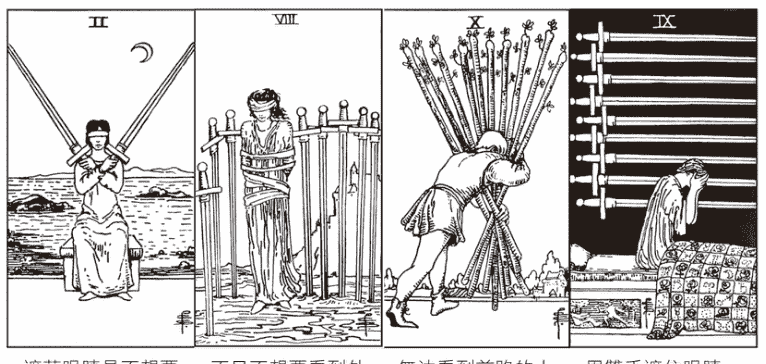

遮蔽眼睛是不想要受到外在影響。不只不想要看到外面的世界，也讓自己成為無法行動的人。無法看到前路的人物，盲目的往前走，希望達成任務。用雙手遮住眼睛，不想承認自己感到無能為力的現實。

## 場景

場景是人物所在的空間配置。所有的事都在空間中發生，空間也會成為影響人物行為的因素，例如在高處就會遠望，在室內有被保護的感受，在平地可以安穩，在坡地會有顛簸等。圖像中的場景不只是背景的陪襯，而是展現了人物經歷事件的重要資訊，這些場景需要以象徵的方式去解析，才能在占卜解牌時，與實際發生的事情產生象徵意象的想像與連結。人物所處的空間，雖然是人物在行動的外在環境，但這些空間與人物的關係，會成為解析人物的心境與行動意圖的象徵。小祕牌的場景主要可分為戶外與室內兩種，其中戶外場景占多數，可以細分為自然景觀、城鎮與建築物。室內場景雖不多，也因為稀少，反而成為解讀上的特色。接下來，就依各種場景做圖像解釋的說明。

### （一）自然景觀

自然景觀包括山、水、平原、高地等，這些自然元素各自強調或相互組合，為圖像提供了豐富的環境資訊。

#### 1. 山景：要跨越的困難

山是人想要征服的對象，代表要跨越的挑戰與困難，例如聖杯8裡的高山，表現了人物接下來要走的路並不平順。權杖2背景的高山，象徵了人物展望未來可能會有的困難。權杖9的高山都被立起來的杖阻擋，象徵了人物努力阻隔各種危險。

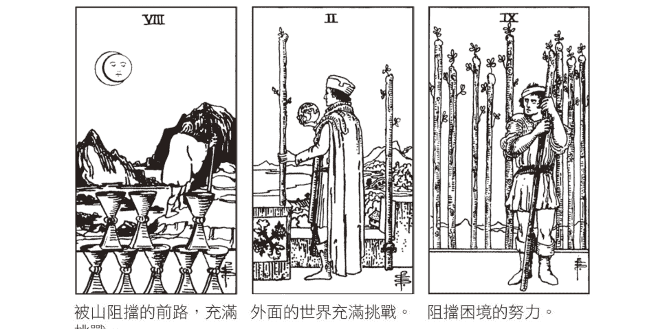

被山阻擋的前路，充滿挑戰。外面的世界充滿挑戰。阻擋困境的努力。

#### 2. 高地：廣闊的視野與更好的成就

高地雖也是突起的地方，但不像山那樣難登頂，所以比起挑戰，更象徵了高處的視野。例如權杖3人物站在懸崖上；聖杯4的人物坐在比杯子高的地方，想要擁有更好的東西；權杖5的人群站在高地上，象徵這些人物的競爭是為了獲得比他人更高的地位。

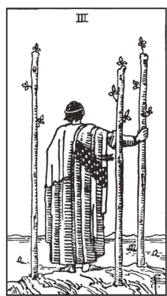

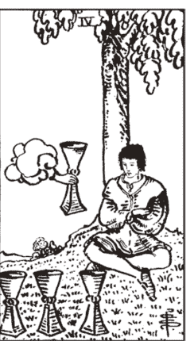

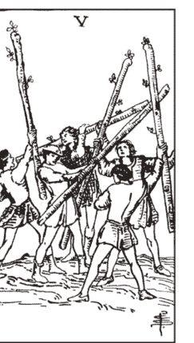

在懸崖上看得遠。

主角在高處，不滿意在低處的事物。

坡地上的競爭，充滿挑戰。

#### 3. 平地：安定與安穩

平地相對代表平穩、安定的狀態，也是小秘牌最多的空間元素。但大部分站在平地上的人物，背景就會出現波動的水流、人群聚集的城鎮、遠處的高山等，所以在解釋這些平原或平地時，需要注意其他配置在背景中的場景元素，如果人物站在平地上，但背景有很多東西阻礙了視線，代表人物為了安穩的生活需要跨越或擁有的條件。

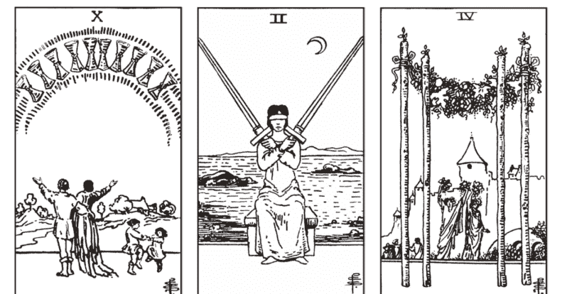

一家人聚在平地上，平安幸福。

坐在平地上想要安穩，但後方的大海給人不安的感受。

前方展現的平地，承諾了穩定的未來。

#### 4. 各種流水：內在情感與情緒狀態

水的自然元素有著流動的特質，也可象徵為人內在的情感流動，所以水的出現，可解釋為人物的情感狀態。例如聖杯5中河流阻隔了人物與另一塊陸地，展現了被孤立的情感。寶劍6的水面有平穩也有波浪，展現了想要努力平靜下來的人物心境。寶劍8腳下的積水，讓想要努力維持理性的人物，陷入情緒當中。

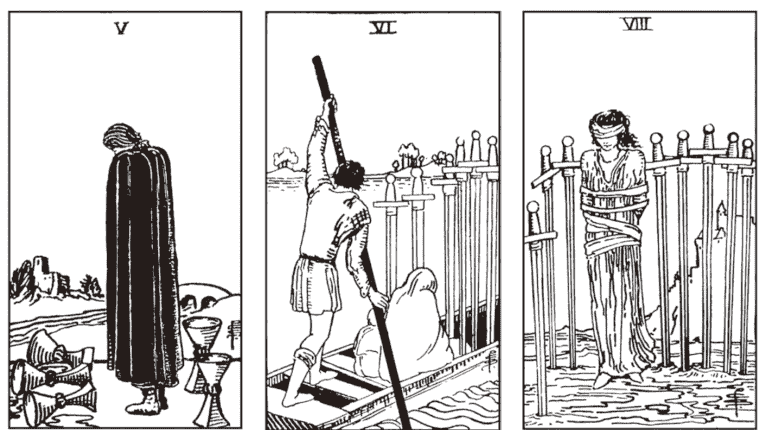

阻隔兩岸的水流。

兩種水流表現了現在與未來的心境。

水坑成為內在情緒不安的表現。

### （二）建築物與室內空間

建築物可分為城鎮、城堡與教堂。城鎮是人群聚集的地方、主要強調了經濟與社會活動。城堡管理城鎮，這是行政機構所在（也是社會上等階層辦公的所在地），所以城堡會成為可以發揮影響力的地方，也令眾人嚮往。另外，教堂則給予人安慰，或是精神力量與支持。最後還有室內空間，人被空間包圍，象徵了與外界隔絕的處境或內在狀態。

#### 1. 城鎮：經濟安定與影響他人的成就

城鎮象徵了人群，以及人的規劃與經營能力。人在城鎮中生活，也需要城鎮的經濟活動，所以在圖像中出現城鎮的背景，代表人物為經濟生活而努力，人物的行為動機與意圖，與如何擁有更富足的生活有關。大部分的城鎮出現在五角星的圖像中，例如五角星4、五角星6、五角星8（這些圖像中城鎮的不同表現方式，會在「配置與比例」進一步說明）。較特別的是權杖10的人物，正向著城鎮前進，展現了權杖元素原有的冒險與想像力，被沉重的經濟活動阻礙。

#### 2. 城堡或教堂：受保護與照顧

有些圖像雖有建築物，但只有出現單一的城堡或教堂，並不是人群居住的建築群。城堡與教堂都有照顧、保護人的意象，所以背景出現這些建築物時，象徵圖像中的人物正受到保護與照顧，成為內在支持力量，讓人可以安定身心。例如，聖杯6、五角星10、權杖2都以城堡來象徵人物處在安全、受保護的環境。較特別的是寶劍8，人物想要遠離城堡，代表這種保護力量是人物想要逃避的對象。寶劍4與五角星3裡的教堂，則成為滋養人身心、朝向未來前進的動力。

#### 3. 室內空間或內在的想像空間：阻隔外在世界

室內空間可以阻擋外在世界的侵擾，所以也有被保護的意象。比起來，城堡與教堂的意象是給予人保護，沒有全然阻隔世界，但室內空間則把人隔離在空間中，更多了阻隔外在干擾的意義。小祕牌中，明顯表現室內空間的圖像不多，只有寶劍4、寶劍9，其中寶劍4呈現的是棺木，寶劍9是遮住雙眼的人，更突顯了去除外在干擾的強烈意圖。另外，還有一種空間是內在的想像世界，當一個人進入想像世界時，也是暫時阻斷跟外界的連結，專注在自己的世界。例如聖杯9的背景雖然無法絕對說是室內，但以常理判斷，有展示台的空間，可以理解為室內空間，但空間表現不明確，所以可以推想是內在的想像空間；或者聖杯7的圖像，雖然像戶外，但人不可能看到雲端上的東西，所以也是在表現內在的想像空間。

## 配置與比例

配置與比例指的是在整體的構圖安排中，觀察人物、背景、物件等之間的高低、大小、前後等的安排。大部分的小祕牌，人物畫得最大，強調人物是視覺中心，也是故事的焦點，但有些圖像的背景會超出人物的高度，或者填滿整張圖，使得人物相對變得微小。用比例強調人物與背景的關係，以及比例所要強調的意義，在解釋時不能忽略。例如聖杯6的城鎮背景，建築物超過人物高度，幾乎把兩個人物包圍起來，代表城堡的保護意象是這張牌最重要的意義。或者寶劍9背景中的九把劍，在構圖比例上比人物更明顯，而且出現在人物的上方，形成把人物往下壓的視覺效果，成為理解人物處境的重要線索。

有些物件或場景配置在高處，高有著尊貴、崇高等意象，但如果比例過小，未必是重要的解釋要件，如果比例很明顯，則在解圖時需注意。在韋特圖像中，以教堂建築的表現最為明顯，都會有高處的意象表現，例如五角星5的窗戶跟人物比例類似，五角星3的三個五角星放置在比人物高的位置。聖杯9與聖杯7的杯子都放在比人物更高的地方，表示這些杯子比圖像中的人物更重要。

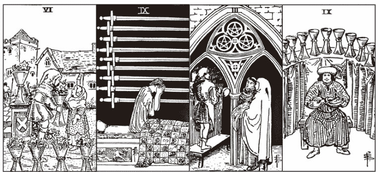

高度超出人物的城堡，強化了保護意義。

從高處向下壓的寶劍成為圖像的視覺焦點。

在高處的三個五角星，是人物的理想與目標。

在高處的聖杯，是人物珍惜的對象。

以上說明是大多數的小祕牌普遍運用的構圖元素與技法。這些構圖元素會在每張牌的圖像中組合出各種差異與特色，也會出現不屬於上述原則的特殊狀況，在後面解析每張圖像的章節中，會有進一步的分析說明。雖然我強調了小祕牌的圖像分析方法，但在分析圖像的同時，不能忽略小祕牌的四元素與數字的象徵，這些象徵同時也要考量，才能讓小祕牌的解讀，展現出自我覺察的身心靈向度。

接下來在小祕牌的單張牌的圖像分析與意義解釋的章節，還是會依照小祕牌的四元素的分類來介紹，但會聚焦在圖像分析。解釋四元素時，也不以傳統占星學或煉金術裡的元素解釋，而是以韋特圖像為分析對象，解釋在小祕牌中強調的元素特色，以及這些元素如何展現為生活情境。

## Chapter 5

## 5

## 權杖：魯夫的夢想啟航與熱血

有些故事，我們會用「熱血」來形容。熱血故事，通常就是主角經歷冒險的成長故事，這些主角都懷抱著遠大的理想與夢想，不管多大的困境都能克服與跨越，任何挫折都沒有讓他們放棄夢想。日本動畫《航海王》就是十幾年來，讓很多讀者熱血沸騰的典型故事。觀察故事裡的角色們，大多心裡都懷著不為人知的夢想，原本只能是空泛的目標，有了夥伴加入後就離開原來的生活，踏上冒險之路。航海王裡角色的夢想就像痴人說夢，一點都不實際，例如要想成為海賊王就要得到ONE PIECE的寶藏，但ONE PIECE具體是什麼，沒有人知道。有人想要找到傳說中聚集所有稀奇的魚的藍海，但藍海在哪裡？是否真的存在？也無法確定；也有人想成為世界第一劍士，但這世界的範圍有多大？到底要打倒哪些人才能叫世界第一？也無法具體羅列。

雖然動畫裡出現的是痴人說夢，但因為夢想很遙遠，反而吸引我們一直追著故事看。夢想成為追不到的未知，那才是讓故事會熱血沸騰的精髓所在，雖然不知如何達到，但深信自己能做到而不放棄、持續追求，才是夢想。故事中的人物也都在原本所在的地方經歷痛苦掙扎，卻不敢改變或離開，等到出現了伸出援手的夥伴後，才能走出自己的世界。這些角色們說出了，生活在熟悉、習慣的環境裡的人想要改變的困難，如果沒有外來的幫助，單憑自己的努力很難達成。而夥伴的加入，原以為只是痴人說夢的夢想，開始有了想要實現的勇氣，雖然自己沒有準備好、能力不足，仍果敢航向了大海。有趣的是，他們的船長魯夫，不但沒有幫助大家直直朝著完成夢想的康莊大道前進，反而以追求冒險之名，一再遠離他們要去的目的地，但不知為何，每條路都帶領他們更接近各自的夢想。

船長魯夫是熱血的代名詞，散發著強烈的權杖元素的特質，他的熱血在於痴人般的樂觀與天真，以及從不退縮的愚昧，任何危險都阻擋不了他的好奇心。當所有夥伴想要找到安全、快速的路到達目的地時，魯夫就會理直氣壯的說：「出海就是為了冒險，當然要走『好玩』的路線，不然怎麼叫冒險呢？」魯夫從來不在乎目的地，只在乎到達目的地的過程有沒有充滿樂趣，如果為了到達目的地趕行程，魯夫會因為無聊失去動力，寧願跳海，也不想過無聊的生活。魯夫像權杖王牌，幫一群朝著冒險前進的夥伴打開了追逐夢想之路。而每位夥伴跟著船長遠望大海，期待有一天能夠航向大海的美夢，猶如權杖2到權杖3的情境，自己渴望的目標越來越清楚。

權杖元素的特質在夥伴加入後才能真正發揮優勢，夥伴的加入，讓彼此在追逐夢想的路上，產生相互競爭卻又相互扶持的情誼，這就展現在權杖4到權杖6的情境。權杖元素的特質，是不輕易認輸，所以夥伴之間的較勁，不由自主的激發與提升個人的潛力，就像在《航海王》中，草帽海賊團的團員有段時間各自分離去修煉，成為更厲害的人後再次集結，權杖7描繪的就是個人奮鬥的過程。到了權杖8就是可以無礙的展現自己能力……《航海王》裡的追逐夢想，放入我們的現實生活，就是所謂的自我實現。當我們踏上了自我實現的道路，就容易進入到權杖情境的日常生活，在別人眼裡平淡無奇的每一天，每一張權杖情境中的人物，都會興高采烈、充滿鬥志的去應對。但現實生活無法像《航海王》的故事，魯夫與夥伴們可以無止盡的在海上冒險，但現實中的我們在冒險過後，仍需回到繳帳單、憂慮柴米油鹽醬醋茶的生活，所以冒險的熱血，最後就會進入到權杖9與權杖10的生活情境。

冒險跟日常生活有什麼不同呢？冒險充滿未知的刺激，在航海路上遇到的事，都是前所未見的新鮮事；但日常生活，是可以掌握與預料的重複。看著熱血的航海王的故事，我們也會羨慕自由自在追逐夢想的人，但如果每天不知道會遇到什麼樣的怪天氣、意外或無法捉摸的老闆，我們未必能夠像魯夫一樣開心與興奮，反而會焦慮的睡不著覺。想想我們可以好好睡覺的生活是什麼樣的日子，大多是知道明天不會有大不了的事，日子很平常、重複的時候，可以安心的睡好覺。所以未知是新鮮、刺激，但也代表焦慮與不安，如果沒有像魯夫一樣強的心臟或痴人的態度，一般人根本不可能適應每天都充滿未知的生活。

讓我們感到安心、舒適的日常，是大部分的事情可以被預知與掌握的生活，就算有變動，也只有少部分不確定。在塔羅四元素當中，權杖是最能接受變動性的元素，所以一直到權杖8，每個情境中的人都在努力追逐夢想，幾乎沒有踩煞車，並在權杖8達到了權杖元素的高點。但從權杖8再持續前進，就會是超出日常的意外，在這意外中，我們不可能像魯夫每次都能死裡逃生、敗部復活，現實中的我們，在超出日常的意外中，會傷痕累累，還有可能失去錢財。所以在面對現實時，需要有適可而止的保險機制，才能長久保護我們的生命與財富。這就是權杖9的情境，讓飛躍在空中的冒險者，能夠在適當的時機點著落，生活可以安定的持續下去。

權杖9與權杖10裡的人物，失去了權杖的鬥志，雖然權杖10的人還在努力，但他不是在實現夢想，更像是認真的完成每日勞動，所以這兩張圖像成為權杖元素最無法發揮優勢的情境，但也是沒耐性的權杖元素，可以耐煩的完成重複性工作與每日生活的重要學習。沒有了權杖9與權杖10，小祕牌的故事無法成為我們的人生劇場，只能是讓我們羨慕魯夫與夥伴們的故事。魯夫是營造熱血情境的靈魂人物，如果我們身邊有一位像魯夫一樣樂觀的人，在他身邊時，我們會不自覺的被感染，並讓自己以權杖的特質去應對事情。但回到現實生活，魯夫也需要學習打卡上班，比起冒險更需煩惱中午要吃什麼、老闆交代的報告等，承擔責任並完成繁瑣的例行工作。

但代表權杖特質的魯夫，就算在日常中，也不會忘記自己是個冒險家。所以「熱血」一詞非常適合描述權杖特質的情境，就像在我們身體裡有著沸騰的血液，火元素的權杖，需要不斷燃燒，才能感受到生命力。因此權杖9或權杖10的情境不會太長久，只要出現一絲像權杖王牌一樣的火光，或者是像權杖4有夥伴加入，任何改變日常生活的機會，處在權杖情境的人都會大膽的行動，並一直向著新鮮事、小小的冒險與未知前進。權杖元素從權杖2與權杖3遠望大海的人展開，他們是夢想家，在沒有進展到權杖4以前，都有可能會被他人認為是在做白日夢，但沒有做夢的能力，我們也無法打開未來的可能性，所以權杖元素除了愛冒險的動力，更重要的是能夠跨越現實的做夢能力。

## 火元素權杖的圖像分析與敘事

權杖圖像裡的人物，大多站在高處、看向遠方、或者專注在行動上，他們的姿態展現了權杖元素朝向未來的野心、企圖心，以及不怕困難與挑戰的情境。例如，權杖2與3的人物都直視著前方，但權杖2的人物站在受保護的城堡內，權杖3的人物站在危險的懸崖邊，象徵了隨著數字的前進，人物也慢慢朝著需要冒險的地方移動。從四號開始，權杖圖像中的人物開始變多，適當的競爭是權杖特質的動力來源，合作關係帶來的激勵與積極行動。例如，權杖4兩個人攜手歡慶，權杖5就出現五個人的較勁圖像，到了權杖6，出現競爭當中的勝出者，勝利者的遊行成為他人羨慕的對象，同時也激勵他人去效仿。

但到了權杖7，圖像又回到了單人構圖，不是看向遠方，而是專注在手上的工作。權杖在六號已成為優於他人的勝利者，之後的路就會成為向自己挑戰的獨行之路。而權杖7的人物是從高處往下插著權杖，象徵了需要維護不敗之地的勝利者面對的挑戰，已經勝利的人物，不再看向遠方，而開始努力守護自己的位置。權杖的積極、永不放棄的特質，終於等到了天時地利的好運，開創出權杖8的榮景，沒有人物的權杖8，需要一些運氣才能搭上順風，讓火元素的權杖旺盛的燃燒。但權杖8的火勢需要壓制，以免造成災害，所以到了權杖9，人物站立在原地，努力制止發展太快而應接不暇的危機狀況。在制止了權杖的前進後，權杖10雖然也賣力工作，但不再是展現野心的狀況，人物不再抬頭看向遠方，而是低著頭認份的一步步向前走。

權杖能夠佔有優勢的處境，是站在高處、看得遠、有競爭對手的困難與挑戰，有了這些條件，權杖情境裡的人物，才能發揮出他們的企圖心與潛力，以及不斷讓自己處在改變與前進的狀態。所以被保護的權杖2、看向過去而不是未來的權杖9，以及看不到前方的權杖10，成為權杖組合中，較無法發揮權杖優勢的三種情境。在占卜解牌時，如果出現逆位的權杖，普遍反映事情中的人想要擁有權杖的優勢、或者進入到如權杖的熱血情境，但不如人所願，可以發揮權杖優勢的條件不足、事情中的人害怕或者抗拒權杖而拒絕接受改變。例如，逆位的權杖3，可能代表事情中的人想站在高處看得遠、對未來進行長遠規劃，但他所處的狀況卻看不到願景，或者無法停下來規劃或思考未來，讓權杖的野心與企圖心受阻礙而感到受困；但也有可能是害怕野心帶來的改變，而不敢追夢。逆位的權杖7，原本是站在高處，在工作上掌握優勢的權杖人物，可能變成在低處要應付超出個人能力的工作而吃力，或者他所處的情境無法專注的完成手邊的工作，一直需要分心去做其他事，而且周邊也一直出現其他人打斷工作，無法專注在自己的工作上。

## 權杖王牌

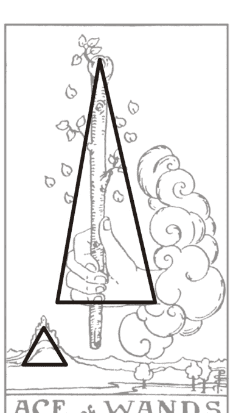

### 圖像分析

圖像中的主角是在雲端伸出來的手，並不是人物，抓著權杖的手形成穩定的三角形構圖，搭配形成視覺焦點的直立權杖，整體以直線的權杖為中心，以三角形給予安定感。背景中的山與城堡的比例只占畫面的五分之一，形成遠景效果，進一步強調了近在眼前的權杖與背景之間的距離，而且山與山頂上的城堡，也以三角形的形狀，與手部有了視覺上的呼應，形成另一個視覺焦點，從手部移向山景與城堡，造成視覺的移動效果，也展現出權杖想要到達的未來目標，那是在遠處、遙遠的未來，但又不會遙不可及。

### 情境敘事

高舉在高山與城堡前的權杖，不只有剛長出的綠葉，還有一些綠葉正向下掉落，象徵權杖王牌茂盛的生命力。從雲端伸出的一隻手，把權杖帶到了這個世界，這是無中生有，為圖像中的世界帶來新氣象與新契機。握住權杖的手，想要征服高山（挑戰）、城堡（傲人的成就）、河流（拓展的領域），有著強大的野心，這些野心就像長在樹枝上的綠葉，到茂盛生長的季節，有了適合的陽光與土，就可以全力向世界展開自己的枝芽，發揮影響力。但沒有人物形象的王牌，比起人的努力，更強調了行動的適當時機，當條件符合行動者的期待時，就有可能帶來快速的決定與事態的轉變。

### 元素與數字在圖像中的意義

數字1象徵開始，如果對應到火元素的權杖，就成為點燃火苗的火花，圖像中無中生有的手，猶如火花從外面來，呈現了原本沒有火，突然出現了燃燒的能量。圖像沒有人物，只有手與權杖，說明火花還未點燃任何人的野心，雖然後面有山、城堡、河流可以征服，但需要有柴火接住火源，火才能開始燃燒。在數字1，火花已備妥，但柴火尚未接上，正等待著看到火花的人，盡快把柴火放置到火花處，一旦遲疑就可能錯失時機，所以這是跟時間賽跑的決定，過了時機，機會轉瞬即逝。

### 解牌敘事（正位）

權杖王牌的情境，可以理解為展開新計畫的機會，而且這機會會以很快的速度到來，常讓人感到一路順風，只要動手去做，感覺就能獲得成功。正位的權杖王牌說明情勢蓄勢待發，權杖的出現，就像帶來好運的運勢，讓身邊的人輕易相信這是走向成功的好兆頭、好的開始。權杖王牌的情境，就像抽到上上籤，雖然對未來無法掌握，情境中的人還是會樂觀的朝著未來邁進。這種好兆頭，在工作中可能會是新的工作提案、職務調動帶來的好機會、新工作的邀請等，吸引你去做出積極行動與改變。在人際關係上，身邊的人都有可能成為推動事情發展的善緣，讓你想要好好運用機會去發揮自己的能力，獲得成果。但也因為機會來的突然、急促，會讓情境中的人感到來不及停下來思考，有種只能先行動再說的急迫感。

### 解牌敘事（逆位）

逆位的權杖王牌的情境，從雲端中伸出來的手與權杖無法相互合作，以為是機會伸出了手，結果是一場空，什麼都沒有抓到。或者看到權杖在眼前，但不確定真實性，所以沒伸出手去拿起來，讓權杖在眼前消失。雖然情境中的人也想要征服高山、城堡與河流，但這些野心，在手與權杖無法配合的情況下，只會停留在野心，反而會讓情境中的人感到志氣難伸、運氣不在自己身邊的沮喪與失望。逆位情境，在工作上可能是沒能得到想要的升職機會、想進行的新提案被否決、想要換工作卻一直找不到適合的職務等，很多新的計畫都無法開展。在人際關係上，想與他人合作也感覺合不來、沒有默契，身邊的舊識讓你失望、關係變得不愉快。在逆位權杖王牌的情境中，就算在你眼前閃過權杖的火花，但會被視為是假象或鬼火，不被你接受與信任。

### 建議敘事（正位）

在建議牌抽到權杖王牌，表示建議你做出展開新計畫的決定與行動，而且新計畫不能只是好玩、有趣，還要有一定的難度，讓你無法預測事情的發展，雖然會讓你有點退卻或害怕，但也會帶來期待與好奇。新計畫的行動未必是影響未來發展的改變，小祕牌的情境是讓你在生活中體驗新鮮感：每天走不一樣的路線、到從未去過的巷弄探險、吃沒嚐過的食物等，一些生活中的小改變，常常會帶來意想不到的火花。

### 建議敘事（逆位）

在建議牌抽到逆位權杖王牌，可以解釋為走出權杖王牌，不要一直期待你所做的事、見面的人都成為改變的契機，讓自己不斷嘗試新鮮事來期待生活有所改變。逆位時，反而是建議你接受現在的生活，不需要改變，也沒有不好，如果從理想的自我期待看待生活，我們只會看向未來，卻忘記所有的未來都是我們要活出來的現在。

## 權杖2

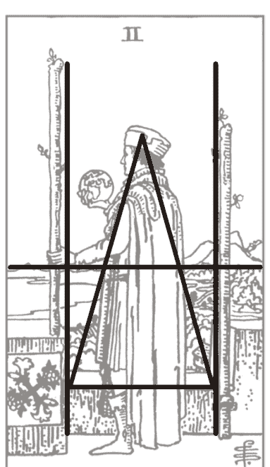

### 圖像分析

圖像聚焦在中間的人，他側身背對著畫面，身形與擋在他前方的城堡形成了穩定的三角形構圖，給予整體畫面的安定感，但也傳達了人物會傾向於停留在原地的心境。在三角形的兩側，直立的兩個權杖形成左右兩邊的框線，圖像視野變得狹窄、受限。背景中的地平線也相對較高，與人物的腰部齊平，在比例上占了一半的畫面，過於複雜的背景形成重量，使整體視覺往下方集中，視野不夠開闊，形成下方過於沉重的氛圍，給人帶有負擔的感受。再加上三角形構圖具有安定性，被城堡限制的人物，都給人不易改變與離開的視覺感受。

### 情境敘事

站在城堡裡的人，他在高處握著圓形的球與權杖，正看向大海，另一個權杖很牢固的被栓在城堡上，確保兩根權杖都被固定在原地。人物看向的遠方，不只有大海，旁邊還有高山與城鎮，景觀非常豐富，象徵多采多姿的世界，比起城堡內安逸且固定的景觀，外面對人物有著更多的吸引力。但人物必須要顧好手上的圓球與權杖，目前無法移動，所以只能對外觀望，還無法走出城堡。在人物腳邊的石牆上，有著十字造型的玫瑰花與百合，象徵了人物正站在人生十字路口，面臨要前進還是維持現狀的抉擇。但對於手上已握有權杖與圓球的人物來說，如果沒有找到可以安置好手中的東西，或者託付給可以信任的人之前，很難讓自己離開城堡。圖像中天空與城堡用了灰色調，色彩繽紛的外在世界，夾在灰色調的中間，整體給人施展不開的鬱悶感。

### 元素與數字在圖像中的意義

二號權杖從王牌的開始階段往前一步，成為可被火花點燃的柴火，但柴火量有限，只能供應最低限度的使用。就像圖像中的人物只拿著一根權杖，另外一個被固定在城牆上，無法隨時拿來快速讓火源燃燒。二號權杖就像被固定的火源，只能在限制的範圍內安全使用，被嚴格的控管。就像我們在廚房使用的火，有其必要性與實用性，但無法讓火元素自由向外延燒。二號的權杖元素，為了防止火的危險性，限制了柴火的量，做了防護措施，只限於取暖、煮食等必要用途，其他多餘的火源被嚴格控管。就像圖像中的人，因為消滅了自己的野心與渴望，所以不會走出城堡，只在城堡內觀望。

### 解牌敘事（正位）

在權杖2的情境，就像站在城堡中的人，雖然期待改變，但城堡內的生活舒服、安全，每天可以輕鬆度過，還沒到要馬上做出行動的程度。如果要走出城堡，就要有勇氣放下手中握有的東西，但放手就無法再擁有這些東西的不安，讓情境中的人無法果敢放手。所以他也在思索可以帶著這些東西一起離開的可能性。情境中的人，因眼光已看向外面的世界，所以要收回野心，只滿足於現狀也很困難，只要找到帶著手中的東西離開城堡的方法，他就會離開。例如，如有人在思考換工作，在權杖2的處境，可能希望未來的工作不要從零開始，要能夠保有原有的優勢，成為持續更上一層樓的機會。如果沒有找到符合的條件，就會先留在原有的工作等待機會。或者在工作之外選擇進修學習的人，只會安排短期、不影響工作與生活的進修項目。在人際交往上，不太會主動去建立或推展新關係，先觀察對方的動向後再決定，在情感關係上，也較以保守的方式應對，會害怕被拒絕或受傷。權杖2處境的人，傾向讓自己處在有優勢的位置，所以不會做出冒險的行動，寧願成為在小水池裡的大魚，也不想游到大海去承擔不必要的危險。

### 解牌敘事（逆位）

在權杖2的逆位情境，人物不再有耐心等待兩全其美的方法，反而開始擔心如果不趕快走出城堡，會失去離開的勇氣，雖然也不想放棄自己擁有的優勢，但害怕失去機會的想法，會做出果敢的行動，直接放掉手上的東西離開。但衝動的決定，會讓情境中的人在離開後，對放棄的東西念念不忘，生活在遺憾中，無法專注在新生活或新計畫。也有可能害怕自己失去城堡內的安逸生活，不再看向遠方，躲在城堡內，告訴自己離開城堡很危險。但有野心的權杖特質，如果情境中的人物決定不改變，並不是接納了現狀，而是害怕危險壓抑了野心，所以也會對自己的退縮感到懊悔與遺憾。在逆位權杖2的情境，不管做出什麼樣的行動，情境中的人都無法信任、接受自己的選擇，一直回頭看。逆位情境，就像人物沒有掌控好火源，一方面太小心控管柴火，擔心讓火熄滅；另一方面可能不小心讓火失控，往不可控的方向燒起來，導致意外發生。

### 建議敘事（正位）

在尋求建議時抽出權杖2，可以解釋為要保守、謹慎的思考未來，不要因為一時衝動做出會後悔的行動。權杖2建議你不管在工作或人際關係的困境，都先暫時留在目前的處境，不做出改變，守護好目前有的優勢與條件，才是應對目前問題的好方法。如果你已經有願意孤注一擲的衝動與想法，權杖2作為建議，可以先讓自己放慢腳步，像權杖人物一樣，停下來在高處遠望，但不要輕易放掉自己擁有的優勢與條件。

### 建議敘事（逆位）

在逆位情境的建議是要走出權杖2的情境，不再三思而後行，而是果敢的放掉手中的東西，離開城堡，去體驗城堡外的世界。我們常會說舒適圈，權杖2所在的地方，就是由長期的安逸形成的舒適圈，如果沒有一時衝動的行動，很難踏出原有的地方。所以逆位的權杖2反而成為心動不如行動、做了再說的狀況。當權杖2逆位成為建議，也代表目前的生活雖然安逸，但不再適合尋找成長與改變的你，雖然未知的未來會讓人焦慮與害怕，也怕自己做出行動後會後悔，但安定的生活會讓我們忘記，人生所有改變自己的選擇，都是在不知未來會如何的情形下做出來的行動，只有未知才會帶領我們跨越自我的限制。

## 權杖3

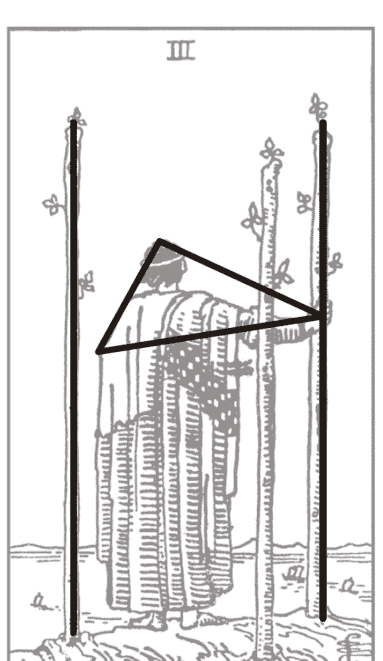

### 圖像分析

站在中間的人物背對著畫面，他伸出的手，形成不對稱的三角形構圖，穩定中帶有些微不安定的氛圍。但直立在左右兩邊的權杖，給予畫面安定，是在變化中有著安定感的視覺中心。人物站在懸崖上，地面凹凸不平，散發著危險的氛圍，但人物只用一隻手維持平衡，心境悠閒安定，懸崖成為他想要站立的地方。地平線在整體畫面四分之一的位置，展現了開闊的視野，天空與大海都用了黃色，充滿活力。雖然中間的山群形成了地平線，但視覺上用色彩整合，整體形成寬敞的格局，比起安定，帶出了更多變動性的可能。

### 情境敘事

站在懸崖邊看向遠處的人物，雖然有兩根權杖沒有被固定在位置上，但他不在乎權杖會倒下來或者被別人拿走，一隻手只抓著一根杖，其他擱置在身後。站在懸崖邊的人，比起權杖2城堡中的人承擔了更多的危險，所以權杖2與3的人物，雖然都站在高處，但懸崖中的人物，相較於安定性更願意承擔風險，選擇有挑戰的路。人物看向的遠方是一望無際的大海，但遠處有高山，船隻在兩邊有陸地圍繞的地方航行，呈現出接近港口的景象。大海以黃色呈現了黎明或夕陽的景觀，在這兩個時段，捕魚或載貨的船隻都會回港，說明情境中的人，不只是看著美好的風景，可能正在展望這些船隻帶來的收穫，象徵了權杖3的情境不是看著大海做白日夢，而是在展望可實踐的計畫與目標，只要計畫擬定完成，行動條件具備，權杖3的人物就會展開行動。

### 元素與數字在圖像中的意義

權杖2的人物原本站在安全的城堡內，三號的人物則站在懸崖邊，象徵了權杖3的野心發展更為明顯，不再滿足於現狀，更大膽的去追逐遠大的目標。站在懸崖邊的人物，就像站在三角形頂端的人，雖然有點不穩，但下面有著穩固的地基，給予人向上發展的動力與意象。圖像中，人物對面有山景，代表這是一處峽灣，也可能接近港口，比起二號人物看著一望無際的海洋，三號人物所觀看的海洋，有著更多的實用性，說明進入到三號的權杖元素，野心與夢想都隨著外面的世界拓展，但也沒有忘記實用性。而且三根權杖沒有被固定住，自由的擱置在一旁，維持火源的柴火可以隨時供應，火勢能持續燃燒，供應熱能。但人物隱藏了一隻手臂，整個身形並不完整，似乎欠缺了某個條件，三號權杖雖然有了可持續燃燒的柴火，但要讓火更快速的燃燒，需要東風助陣。

### 解牌敘事（正位）

權杖3的人物，對未來有著野心與進取心，相信自己的能力可以有更多發揮，也期待自己能夠做出影響他人的成就。權杖3的人物，雖然準備好接受挑戰，知道好的開始要等候時機，所以在機會還沒到來時，先做好萬全準備，讓自己可以隨時出發。如果情境中的人面臨換工作的抉擇，想要為更大的願景而換工作，比起安定、優渥的條件，可能更在乎未來的發展性。雖然沒有馬上要換，但只要出現符合理想的工作，就會快速推展計畫。在人際關係上，也期待與夥伴或情感對象能長遠發展，與人的相處不會只滿足於現在，而是想要明天會更好。在權杖3情境中的人物，眼光永遠看向遠方，不太糾結於現在的困境與問題，在解決問題上，也會以長遠的利益為優先考量，不會急於一時做出對未來不利的決定。

### 解牌敘事（逆位）

在逆位權杖3的處境，人物急著要看到事情的結果與成就，無法等待最佳時機，只針對眼前的成果與利益做出應對，反而會失去長遠的利益。逆位時，情境中的人不再站在懸崖上，在決策上相對變得保守、謹慎，寧願在自己可掌握的狀況下進行，也不願為了更大的獲利而冒險。所以在乎事情不會出錯，無法開創新局面，只能重複舊的模式，跟不上環境與時代的改變，但也會害怕自己跟不上時代而焦慮。也有可能認為自己做了很多事，卻都看不到成果而失望與無力，就像投資了時間與金錢的船主，等不到船入港，覺得過去的努力都是白費力氣或浪費時間，但是沒有好的成果，可能是人物做的決策錯誤或誤判。整體來說，處在逆位情境，做事過於急躁又沒有遠見，會做出對未來不利的決定，但情境中的人，會認為是運氣不好或別人出錯才會失敗，與自己無關。

### 建議敘事（正位）

遇到的困難抽出權杖3作為建議，可解釋為讓自己站在高處，不要聚焦在當下的煩惱，把眼光放遠，看向更遠的未來，重新為自己擬定計畫與目標。如果是有關抉擇的困境，權杖3的建議是要能夠做出有益於長遠發展的選擇，雖然這項選擇有更多的不確定與未知，但要能夠像情境中的人物承擔挑戰與危險，才是應對目前困難的建議。在人際關係上也是建議對未來做長遠的規劃，不要因為一時的不愉快就拒絕對方，與人相處，可以像情境中的人用大方、大氣的度量去應對，不需在小事情上糾結或計較。

### 建議敘事（逆位）

逆位的建議是走出權杖3的情境才能應對困難。當人物從懸崖走下來，就無法看得遠，代表需要聚焦在眼前的事情，目前並不需要進行長遠的規劃。每天忙於例行工作的時候，有種在原地團團轉的感覺，這也是從懸崖走下來之後可能會有的狀況，但為何要讓自己在瑣碎的小事裡忙碌呢？或許目前你面對的問題只要讓自己忙碌就不藥而癒，在你眼裡的問題與煩惱，只是在生活中都有可能經歷的小波折，只要過了特定時刻，問題就會自然解決。或者想要展望未來的自己，可能會用過於理想的未來給自己壓力，所以接受目前的狀況，不需要做出改變，也是走出權杖3情境的建議。

## 權杖4

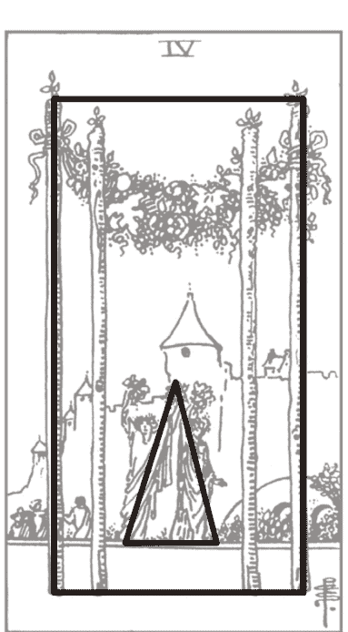

### 圖像分析

站在中間的一男一女為視覺中心，但他們在整體比例上相對小，並且位於前景與後景之間，前景高聳的權杖與後景超出人物的城堡，讓人們變得相對渺小，更強調環境條件。所以這不是以個人力量推動出來的結果，而是需要周邊環境的相互支持與配合，在人物左後方的人群就是協助與支持的元素之一。在人物的右後方有一座石橋，讓前後景有了連結，人物向前進的動力更為順暢。中間的人物限縮在中心的位置，也被前方四根權杖形成的四方形空間框住，高聳的權杖延伸成為兩個人未來要前進的方向，為人物形成了開闊的視野。高舉雙手的兩個人形成微傾斜的三角形，但前方直立的四方形權杖、後方穩固的城堡，都成為穩固人物的視覺屏障。兩位人物雖然在移動，卻被前後景固定，在穩定中帶出朝向未來改變的動感。圖像中有很多物件，不過整體用黃色統一了背景與地面，讓畫面中的所有配置都整合在一起，展現了和諧的氛圍。

### 情境敘事

在封建社會，婚禮是兩個家庭的結盟與合作，所以權杖4的處境，雖然表現了夫妻關係，但比起情感，更強調了婚禮所象徵的結盟與承諾的夥伴關係。而且這是門當戶對的結盟，兩邊都因為合作而帶來更為豐盛的生活，以及更穩定的未來。權杖4的圖中有前、中、後三種景觀，後景有著城堡與歡樂跳舞的人，前景是四根像門一樣立起來的權杖，權杖之間用水果花圈裝飾，豐盛又喜氣。中景則是一對正在舉行婚禮的新人，他們的頭與手上都有花束，舉手歡慶，旁邊有一座石橋，同樣開滿了花。橋梁有著「連結」的意象，象徵了兩人的溝通與交流沒有阻礙，能夠一起開展美好的未來。另一邊有一些人群，可能是參加歡迎的賓客，他們讓情境變得更為熱鬧、歡樂。阻擋在人物前方的地平線，視覺上隔開了人物與前景，象徵了前方的門是兩個人未來要踏上新的領域，權杖立在平地上，保證了兩個人的未來平安順利。圖像中的人物比例偏小，被四周的環境包圍，象徵了這對新人有著足夠的後盾，有很多支持與協助的資源，讓他們沒有後顧之憂，朝向未來邁進。權杖猶如通道，高聳入天給人未來之路寬廣又平坦的意象，象徵新人花團錦簇的前景，未來充滿歡樂與希望。

### 元素與數字在圖像中的意義

四號的權杖元素，用婚禮中的一對新人，描繪了原來一人奮鬥的權杖的野心獲得外來助力，能夠更順暢的向外拓展。對火元素來說，外來助力可能是適當的氣候、可燃燒的材料、風力的助援等，只要獲得任一項的資助，權杖的野心就能如虎添翼，迅速發展。而且兩個人物分別對應左右兩邊的門柱，各自支撐著一邊，象徵了這不是一個人能走的路，一定要兩個人相互合作，才能打開朝向未來的大門。火元素的權杖，通常需要有夥伴的加入，才能把夢想導向可實踐的方向，他人的助力就像東風，讓站在懸崖上的權杖人物，終於可以搭上順風車，讓野心與夢想有機會美夢成真。權杖4與王牌都有開始的意象，但王牌的開始是一閃即逝的火光，而權杖4是實踐夢想的開始，是可以實際展開成果的行動，承諾了可以期待成就的未來與合作關係。

### 解牌敘事（正位）

以權杖元素形成的合作關係，能夠相互激勵彼此的野心，兩人有共同的未來目標，彼此可以成為夥伴及競爭者。在權杖4的情境，會因為有他人的參與，開始展開新計畫。長久想做但一個人沒能進行的事情，因為有人加入會出現突破性的進展。在權杖4情境中展開的新計畫，並不是突如其來的靈感，而是已有一些想法與準備的工作，所以比起權杖王牌的情境，更容易去實踐。在人際關係上，權杖4的情境，因為共同的興趣、狀況而相識與交流，成為可以相互幫忙的關係。在情感關係上，不只兩人相處融洽，也獲得其他人的接納與支持，跟交往的對象，也較像工作夥伴、或興趣相合的朋友，大家可以一起開心做事，一起激勵前進。

### 解牌敘事（逆位）

處在逆位情境的人物，會看不到前方的門，所以找不到未來目標或方向而迷茫。心裡雖然有很多想做的事，但光靠一個人無法展開，想要與人合作，卻一直找不到適當的對象，比起合作的快樂，體會到更多與人相處的失望。進入到權杖4的逆位處境，無法與他人順暢溝通，或者人際關係比起相聚，更容易分離，事情也因此受到阻礙，沒有進展。或者原有的目標改變，合作團隊分散，不再有一起工作的夥伴。在逆位的情境，人物會得不到或找不到向前發展的機會，只能停滯在原處。但找不到前方的門，也有可能是人物並不清楚自己想做什麼，所以也無法事先做準備，只是一廂情願期待他人帶來改變，而不是自己先有目標，再找到志趣相投的人。在情感關係上，逆位情境中的人物，不擅長與他人共事，會拒絕他人的善意，寧願一個人承擔，卻也因為如此，無法為自己開啟新的可能性。

### 建議敘事（正位）

遇到困境抽到權杖4作為建議牌，可以解釋為要走入權杖4的情境。或許你想要一個人應對目前發生的事，但權杖4的建議卻是需要有周邊的人支持，也需要找到可以與你合作的夥伴。所以如何把一個人應對事情的模式，與更多人分享，轉換成同事、朋友、家人或同學可以相互合作的情境，才是權杖4的建議。如果不熟的人自願提出可以幫忙時，在權杖4的建議，也要大方接受他人的意見與想法，就能找到解決困境的方法。在人際關係上，權杖4的建議是要發展公開、不需隱藏的關係，如果要談合作或與人相識，就像圖像中的情境，比起一對一的談話，與多人一起討論可以有更好的成果。或者在情感關係上，也要能開誠布公，獲得家人或朋友的祝福與支持。

### 建議敘事（逆位）

遇到的困境抽到逆位作為建議，可解釋為要走出權杖4的情境。此刻你所遇到的問題，如果想要找人合作或尋求他人的支持，可能只會讓你失望或受挫。或許你認為遇到了可以長期合作或共事的對象，但需要更謹慎的與對方討論，而不能只憑直覺行事。逆位情境作為建議，需要先從展開未來新計畫的想法退出來，先停留在原地，不要看向前方的大門，也不要過度期待他人能夠理解你的處境。當情境不建議我們改變時，代表目前還有需要我們用心的事情沒有被面對與接受，所以逆位權杖4的建議，比起把我們的注意力放在可改變的未來，而是要回到現在的生活，如果沒有先應對好現在就尋求改變，反而會成為一種逃避。

## 權杖5

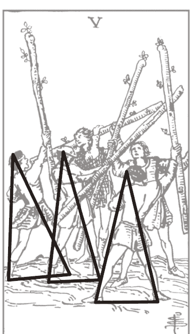

### 圖像分析

畫面裡有五位人物，有點零亂的相互碰撞，但每個人都以三角形的形體站在位置上，看似混亂卻都以穩固的站姿來回應對方，整體畫面在動感中也有安定視覺的安排。背景的藍天沒有雲朵，顯得清澈明朗。人物站在崎嶇不平的高地上，帶來阻礙與危險，雖然每個人物拉開步伐形成穩定的三角形，但大動作揮動權杖的身形，對穩住腳步來說相對困難。劃過天空的紅色權杖，相互碰撞，緊密連結了五個人物的互動關係，跟著人物的視線，就會找到兩兩相對的組合，在混亂中形成秩序。從崎嶇的地面往上看，圖像整體上是動態結構，其實是透過有意的安排，暗示這是有秩序的活動。

### 情境敘事

在地面不平的高地上，有五個人拿著五根權杖在互相比試，雖然表面看起來有點混亂，但圖像中的人似乎很清楚他們要跟誰較勁，有兩組人與對手對望，這時，右邊加入了一個人，他的眼睛看著上方，專注看著拿權杖的手，正在注意權杖的位置。雖然人群揮舞著五根權杖，但沒有揮向對方，而是權杖碰權杖的較勁。權杖在圖像中並不是傷人的武器，更像是比賽用的道具，這是一場比賽或鬥陣，有規則的競賽。背景是沒有雲的藍天，展現了沒有阻礙、坦蕩的視覺氛圍，但崎嶇不平的地面，增加了競賽的難度。這張圖像的背景簡單，讓觀看者的視線聚焦在人物身上，他們各自穿著不同顏色的服裝，象徵了各自鮮明與不同的性格，說明了這五人是聚在一起的群體，因為差異很大，會碰撞出各種鬥智的火花，意見各自不同，非常熱鬧又激勵人心。

### 元素與數字在圖像中的意義

權杖4是一男一女的連結，展現了四號數字兩兩相對的平衡，但到了五號，這種組合被打破，無法成雙成對的組合，卻帶動出更有活力的群體。比起在四號情境與人物形成距離的權杖，在五號情境，權杖都被人物所用，象徵了權杖代表的野心，更具體的成為每個人可具體實踐的工作，人物更清楚知道，要如何努力才能美夢成真。兩個人的互動給人親密的安定感，多人群體雖然看起來混亂，但對愛好競爭與挑戰的權杖元素，反而成為前進的動力。權杖元素不會安於現狀，不斷想要追求進步與成就，但權杖需要學習自制力，才能在與他人競爭的過程，把競爭轉化為優勢，而不是傷害。所以四號權杖先從合作關係學習與人相處，獲得與人合作的愉快經驗後，才能從競爭中激發自己的潛能，有了五號的經驗，權杖元素的優勢會影響他人，並以對世界有所成就的野心來展開。

### 解牌敘事（正位）

權杖5形成的是競爭關係，競爭對權杖情境來說是熱鬧的活動、有趣的挑戰。就像參與運動比賽，努力分出輸贏，但大家也會遵守必要的規則，讓競爭在公平的情境下進行。生活中，我們常處在權杖5的情況，例如考試入學、應徵時的多人競爭、升職評比、多人追求同一位對象等。在權杖5的情境，需要努力爭取，才能達到目標，也因為有他人跟我競爭，會激起想要贏得勝利的鬥志，不會輕易放棄。或者在人際關係中，跟對方容易形成競爭關係，常為某件事爭執，但不會惡意傷害對方，而是會成為腦力激盪或讓關係熱鬧的鬥嘴。在兩人的感情發展上，也會是吵鬧不休的相處模式，或者常有朋友、家人的介入，沒有一天安靜的時刻，幾乎無時無刻都在爭執之中。在權杖5的情境，人物會被帶入各種事端當中，不管是當和事佬，還是一起爭論，總是有大大小小的事找上門，生活很熱鬧。

### 解牌敘事（逆位）

逆位時，人物們會小心翼翼的收起權杖，不再與他人交流，雖然也會想與他人比試，但會在暗地裡進行，有可能用流言、不正當的手段獲得勝利，嫉妒他人，無法接受他人的成功與成就，人際相處變得不融洽，或者彼此有戒心，無法坦誠相對。逆位時，原來站在高地上的人物，不再擁有站在高地的視野，所以會把跟人的互動，變成沒有建設性、遠見的消耗，人群聚在一起也會成為烏合之眾，無法做出有益的行動與決定。在逆位時，五個人無法聚在一起，權杖的火元素無法燃燒得更旺，反而會分成五把火，很快就會因為一點點風雨而熄滅。所以在工作中，跟同事之間可能會相互推卸責任，或者團隊無法合作，或者有人想要成為領導者而引起紛爭等。在人際關係上，逆位的情境會躲避跟人合作或相處的狀況，所以無法有效解決關係中產生的問題，在感情發展上，也會以逃避的方式面對爭吵，讓關係停滯。

### 建議敘事（正位）

遇到困境抽到權杖5作為建議，可解釋為學習正面應對挑戰與紛爭，不需退縮與害怕。跟他人競爭，也代表要把對方視為敵手，這種想法會讓喜歡以和為貴的人感到不舒服，但沒有與他人對撞，我們常常無法真正了解對方，在爭執中，會更清楚聽到跟自己不一樣的意見與想法，而這些不同的聲音，才能讓我們改變。權杖5的建議，不管是在工作還是人際關係上，都需要與自己不同的人合作、溝通，甚至辯論，把不同的聲音視為有建設性的想法與意見，就可以從這些大聲的溝通中，找到應對困境的方法。

### 建議敘事（逆位）

遇到困境抽到逆位作為建議，可解釋為走出權杖5的情境。你有可能過度熱衷跟人爭輸贏，生活中的溝通都變成辯論，雖然你身在其中感到愉快，卻有可能讓他人感到不悅與反感。或者對你來說只是發表自己的意見與想法的行動，卻成為引起紛爭的爭辯，讓事情變得更為糾結。也可能遇到的困難不想逃避，或者想努力為自己爭取立場，但你並非與他人在公平競爭的起跑點上，所以不管如何努力，還是無法為自己爭取機會，或者努力也無法解決問題。有時候，不參與競爭並不代表放棄，能夠退出不適合自己條件的比賽，也是為了讓自己能夠遇見更好的機會。

## 權杖6

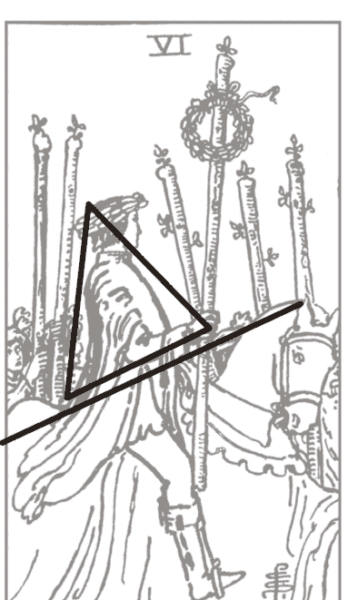

### 圖像分析

圖像中的人物騎在馬上，拿著權杖的手與側身的身體，形成了傾斜的三角形構圖，但下方的馬，以對角線的方式撐起人物，形成穩定而又優美的斜角構圖，也隱約表現出想要持續向上發展的野心。人物與馬成為視覺焦點，占據畫面正中央，並高於背景中的人物。人物以側身入鏡，強調了與背景中人物的交集與互動，雖然高於群眾，但沒有離開群眾的視線，並與群眾同在。雖然在整體比例上，馬比人物占據更多的視覺位置，但牠的頭向後轉，視線朝向騎士的方向，身上披著綠色的布，更突顯了身穿紅衣的騎士。藍色的天空帶動了歡樂、熱鬧的氛圍，主角的視覺位置明確，馬成為襯托主角的勝利、高於他人的重要輔助配角。

### 情境敘事

這是一場為勝利者舉辦的遊行，騎在馬上的人物，高舉在手上的權杖，權杖和人物的頭上都有象徵勝利者的月桂冠，馬背上披著綠色的布，用心裝點了遊行隊伍的氣勢，讓勝利者悠然自得的在群眾前接受歡呼與讚賞，充分感受勝利者的榮耀與驕傲。在背景中的群眾也都拿著權杖，他們可能都是在權杖5中相互競爭的人群，而最後勝出的人得到其他人的掌聲。權杖6是勝利者獲得肯定、榮耀的情境，不只是馬上的人物，在旁邊歡呼的群眾，也因為這場勝利而開心，情境中瀰漫著激昂的情緒，大家都為這次的遊行感到開心與激勵。

### 元素與數字在圖像中的意義

他人是激勵動力的權杖元素，在六號達到最高點，在四號與五號，積極與他人合作與競爭的權杖元素，終於能夠在六號獲得勝利與成就。想要在他人面前發揮影響力的權杖元素，站在比他人高的位置，獲得他人的歡呼是權杖的野心獲得滿足的最佳回報。但權杖元素最不擅長休息或見好就收，已經達到比群體更高成就的權杖人物，接下來沒有競爭對手可以激勵他前進，所以要如何才能更上一層樓成為權杖元素接下來的考驗。所有挑戰中最困難的是自己跟自己的競賽，在六號已證明自己可以成為群體之冠的權杖元素，想要找到更大挑戰的渴望與野心，才是他要克服的最大困境。

### 解牌敘事（正位）

在權杖6的情境，會因為某些成就對自己感到驕傲、有信心，並能肯定自己的價值。而且身邊的人也能與我們同樂，因為他們的掌聲與認可，讓成就更為喜悅。在正位的情境，就像圖像中的人物有了馬，可以看得比他人遠，也可以走得更輕鬆。所以在工作上，可能是獲得主管的賞識，也可能是同事給予讚美與掌聲，也因為努力可能為公司爭取到好機會，或突破過去的阻礙做出實質的貢獻，也因此獲得更上一層樓的機會。在人際關係上，也會成為他人羨慕或仿效的對象，在感情發展上，對方會欣賞你的能力與表現，你也想要在對方面前成為有能力的人，努力做出好的表現。當權杖6的情境出現時，這是歡樂、情緒激昂的時刻，人物會對未來充滿繼續努力的鬥志與野心。

### 解牌敘事（逆位）

在逆位的情境，騎在馬上的人物不再坐在馬背上，可能是掉下來或本來就沒有機會騎在馬上，所以會成為只能看著其他人勝利的旁觀者。但逆位的旁觀，無法分享勝利者的快樂，而是會用嫉妒、不承認對方表現優異的方式，對待他人的成就，並認為比賽不公平。但也有可能因為自己沒能勝利而自責或自卑，把自己想成是失敗者。在工作上，如果進入逆位情境，有可能因為出錯被主管、周圍的人批評，或者很努力想要做好，但他人並不欣賞或肯定你的努力。在人際關係上，常會以逃避的方式避開人群或者避開衝突，害怕自己在他人眼中的表現不夠好，或讓別人失望。因為對自己沒有信心，所以也無法順暢的表達想法與意見。感情發展上，會常貶低自己或對方，也無法接納對方的好意，把幫助理解為對自己的同情，也可能因為自卑，反而貶低對方的成就。

### 建議敘事（正位）

遇到困境抽到權杖6作為建議，可以解釋為要走入為自己的成就感到驕傲，坦然接受他人讚美，給自己信心與鼓勵，相信自己目前達成的成果的情境中，並給自己掌聲。當權杖6作為建議出現時，可能反映了你對結果的不滿意，所以對他人的讚賞感到有負擔與不愉快。如果你覺得自己的成就不足、沒什麼好驕傲的，或許那是因為你用理想的眼光要求自己，或者跟其他人比較的結果，對自己感到不滿意。權杖6的情境是要成為替自己感到驕傲、有信心的人，不管在工作或人際關係上，都要相信自己能夠好好應對，也學習接受他人給予的讚美與肯定。

### 建議敘事（逆位）

遇到困境抽到逆位權杖6作為建議，可解釋為走出想要被他人讚美與肯定的情境，不要認為自己要有所成就才會被他人重視。在逆位情境，不需要跟隨他人的期待，或要求自己不能輸給他人。不管你遇到的是什麼樣的狀況，想要贏過他人的努力才是遇到困境的原因，所以逆位權杖6的建議，就是放下想要成為他人眼中成功者的渴望。想要成為有自信的人不一定需要騎在馬上，所以讓自己從馬上走下來，學習真正的自信與驕傲來自接納自己的現狀，不管我是在群眾中為勝利者歡呼、還是在後方支持伴侶去爭取更多機會，我們都可以在自己的位置上，有所成就、影響他人。

## 權杖7

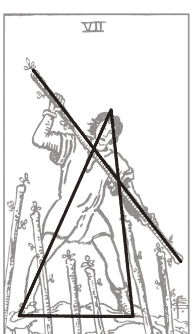

### 圖像分析

畫面中的人物身體向下傾斜、張開雙臂，腳張得很開，代表他正全力移動上半身，需要用下半身保持身體平衡。他的身形除了形成三角形構圖外，手上的權杖橫過三角形，與其他權杖在視覺上形成對立位置。權杖6中也出現過對角線，但那是讓人物的身體向上仰的視覺引導，並與三角形平行。而權杖7的對角線穿過三角形，並向下傾斜，與下方的地面形成對抗的視覺氛圍。人物站在崎嶇的高地，一腳貼近懸崖邊緣有點危險，但前方直立的權杖形成屏障，圍繞在人物身邊，緩和了危險。底下六根權杖在比例上比懸崖高，在視覺上懸崖成為可以被人物控管的危險，背景是沒有雲的藍天，人物的行動在視覺上沒有受到阻礙，雖然很賣力，但能暢通無阻的完成工作。

### 情境敘事

權杖7的背景，類似於權杖5的場景，本來五個人的情境，現在剩下一個人在奮鬥。在權杖6已經獲得勝利的人物，達成了超出身邊人的成就，所以之後的路只能一個人走下去，沒有可以相互激勵的夥伴。另外，在權杖5情境中的人群，他們的權杖是向上擺動，象徵想要更上一層樓的競爭與努力，但到了權杖7，人物是從上往下行動，說明了比起更上一層樓，人物更須努力讓自己維持在高地，這是勝利者的位置，但也是很容易遭到他人爭奪的地方。權杖7人物的誇張姿態，描繪出他的專注與賣力，說明了比起爭取奪冠的挑戰，勝利者要付出更大的努力維持自己的位置。人物穿著兩隻不一樣的鞋子，說明沒有餘力管理工作以外的事，他的專注讓工作可以如期達到目標，也可以克服困難與挑戰，但全神專注在工作中的人物，生活中只會有工作，甚至

### 元素與數字在圖像中的意義

已經在六號獲得成功的權杖，它的野心不會滿足於六號的成就，從列隊歡呼的隊伍中走出來，馬上換上了工作裝，比以前更認真的投入工作，怕自己怠惰就會失去勝利者的榮光。權杖7的人物雖然站在與權杖5類似的高地，但權杖7的人物站在懸崖邊緣，腳邊還有積水，地面有點溼滑，人物站立的地方，潛藏著很多危險，但火元素的權杖在燃盡所有的能量前，不會輕易熄滅，所以七號的權杖元素，持續燃起野心與鬥志，而且已經是勝利者的七號，更容易掌握與運用權杖特質，雖不再有夥伴在身邊激勵，但很清楚奪冠之後的路是跟自己的孤獨奮戰，唯有永不放棄的堅持，才能維持不敗之地。

### 解牌敘事（正位）

權杖7的人物全神貫注在特定目標，像著了魔似的奮戰，不管身邊的人提出哪些疑慮，權杖7都不會停下來聆聽或在乎他人的疑慮。情境中的人物，抱持著再不努力就有可能失敗的危機感，同時也相信任何困難只要努力去面對，都可以一一克服。在工作上，如果處在權杖7的情境，不管工作有多麼困難或常加班，工作者都有十足的信心與動力，遇到困境不只不會退縮，還會越挫越勇。但如果工作性質需要與他人團隊合作，就有可能出現無法與他人同步的狀況，情境中的人太過專注在自己的事情上，會忘記需要與他人溝通與交流。雙腳穿著不一樣鞋子的權杖7，會與周邊的人格格不入，但不知道他人為何會對自己不滿或抱怨，所以在人際關係上，很努力解決關係中的障礙或問題，但有可能忽略了另一方的感受與想法，只顧著用自己的方式努力改善關係。

### 解牌敘事（逆位）

逆位的情境可能是，人物拿起了權杖卻不知要放到哪裡，或者想要做一些事，但不知道自己的權杖在哪裡等。就像失去舞台的人，雖然能力、經驗都充足，卻因為無用武之地而無所事事、不知所措。在工作上，有可能因為職務調動、主管換人等變動下，失去了原來可以發揮能力的位置，或者因為退休，突然不需要再努力工作，但一時間無法習慣，總是想要拿起權杖做點什麼，卻發現那些權杖已經不屬於自己。在人際關係上，逆位人物想持續努力為關係付出，但對方不再需要這些付出，像是小孩都長大了，父母不需要去管教，但也無法適應小孩不需要自己的狀況，一方面覺得可以放鬆了，但另一方面卻會感到失落與不知所措。在情感關係上，也會因為自己成為不太需要的人而感到坐立不安，或者自己的努力都被他人抱怨或嫌棄，而感到失落。

### 建議敘事（正位）

遇到困境抽到權杖7作為建議，可解釋為要讓自己努力不懈的去行動，也要用力去對抗，才能守好自己的位置。權杖7的人物不只認真，也有點執著，無法把眼光從手邊的事移開，所以抽到權杖7為建議時，代表你可能不喜歡衝突與責任，遇到問題時，比起堅持，更傾向用不費力的方法解決問題，或者讓自己放下或離開。但這種方式不適合目前的困境，反而要改變過去的應對方法，要站出來對抗、維護自己的立場，不要退讓或妥協，雖然過程會很辛苦，但要相信自己有能力應對。在人際關係上，權杖7的建議也是要堅守關係，不管你是否處於站在懸崖邊的危機中，到最後一刻都不能鬆懈或輕易放棄。

### 建議敘事（逆位）

遇到困境抽到逆位權杖7作為建議，可解釋為目前你的困境源於過度努力與堅持。只要努力就可以解決問題，如果無法解決，代表努力不夠的想法，可能不允許自己中途放棄，只能堅持走到終點，但你的堅持讓身邊的人都無法跟你溝通，或跟上你的腳步，當你停下來回頭，發現事情已不再為你掌控，不管怎麼努力，也不會有什麼改變，所以走出權杖7的情境，才會成為對你有幫助的建議。如果在退休後，還想要擁有如權杖7的生活，反而會為難身邊的人，跟你一起緊張、有壓力；小孩長大了還想要管東管西，只會帶來關係緊張。在人際與情感關係上，走出權杖7才能聽到對方的想法，這是溝通與合作的關鍵，所以逆位的建議，也是讓自己放慢腳步，穿好鞋子，與他人同步行動，才能改善在關係上遇到的困境。

## 權杖8

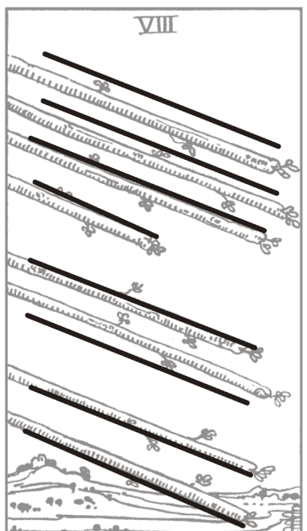

### 圖像分析

天空中飛翔著八根權杖，它們從高處有秩序的向下落，就像準備已久的儀隊，每一個動作都不會出錯，在自己的位置上行動。晴空萬里的藍天，沒有一片雲，只有劃過天空的權杖，像風一樣橫切過天空，成為整個畫面的視覺焦點，讓視覺無法停留，而是跟著權杖不斷移動。下方有著高山、城堡、河流與綠地，但在畫面上佔據的比例很小，成為權杖快速路過的風景，對前進不會帶來影響。整體展現了順暢、無礙的視覺效果，給人輕快、愉悅的感受。

### 情境敘事

圖像中沒有人物的權杖，不需要由人去努力，只要搭上順風，權杖就可以在空中毫無阻礙的飛越。天空沒有一片雲，遠處的山、城堡與河流，類似權杖王牌的背景，在王牌中想要完成的野心，在權杖8終於搭上了天時、地利的順風車，經過長期準備的很多事，不需要人為的努力，都能依事情該前進的方向前進，這時人只需要跟隨事情的發展，不須去掌舵，所以在圖像中，人物是缺席的。能夠達到像權杖8的處境，不只是要有好運氣，也要有權杖元素對未來的信任與不輕易放棄的毅力，才能等到順風，一躍而上。順風是每個人都有可能獲得的條件與機會，如果因為不相信未來而過早放棄，有可能等不到順風就離開了。所以權杖8雖然沒有人物，但如果沒有權杖7，以永不放棄的態度去堅持，不太可能進入到權杖8的順勢狀態。圖像裡有八個權杖都向著目標邁進，但同時有這麼多權杖在行動，也需要看情境中的人是否能夠同時跟上每個權杖到達目的地的時間，一一收成。

### 元素與數字在圖像中的意義

權杖為何會在八號數字發揮元素的最大優勢呢？而且人物還從圖像中退出？火元素需要外來的火花才能被點燃，有了火花後，還需要適當的助力，例如風，才能向外延燒。所以權杖的情境，需要個人的努力，但如果要把權杖的所有優勢發揮出來，也需要等待天時地利的好時機。七分靠努力，最後一分靠運氣，就是權杖8的圖像所描繪的景象。但為何不是一直到九號的努力，再加入一分的運氣後，在十號達到最好的結果呢？過度的人為，有可能壞了大事，想要讓火勢很旺，準備了足夠的柴火，但人認為的足夠，對天氣、或其他燃燒條件來說，可能是過多，反而會造成反效果。所以火元素權杖的最佳優勢，不只是要能夠趨勢而為，也要能夠適可而止，不然會造成火勢燒不旺、或者火勢失控而帶來災難。在獲得六號的勝利之後，為了不被後繼者打敗而努力的七號，成為權杖元素人為努力的最佳情境，之後遇到天時地利的好時機，搭上好運一路順風。沒有人能夠控管最旺的火勢，所以在權杖8中，人物從畫面中消失。

### 解牌敘事（正位）

在權杖8的情境，因為某些原因阻礙、停滯不前的事，突然獲得了緩解，很多事同時都開始快速進展，甚至會讓情境中的人有點應接不暇。權杖8的情境，會讓人感受到好運勢，總覺得不管做什麼都能順利進行，讓情境中的人，更想要一股作氣，趁勢完成更多的事。在工作或人際關係的推展上，都能獲得很好的助力，原以為會有的阻礙，也可以很輕易的解決。就像圖像中在晴空萬里的天空飛躍的權杖，一路順風，到達目的地。在情感關係上，也會與感情對象一起進行很多計畫，例如旅行、搬家、參與各種活動等，也都能心想事成。在權杖8的情境，通常無法悠閒度日，總覺得不管做什麼都會很順利，所以也會更積極的嘗試各種挑戰。

### 解牌敘事（逆位）

在逆位情境，八根權杖沒有遇到順風，所以飛不起來，或者到達不了目的地，就像斷了線的風箏，在亂風中糾纏在一起，事情都很糾結或發生不明原因的停滯。比如想要進行的事情，都因為一些合作方的小狀況卡在某處，什麼都做不了，只能等待，或者花費很多力氣與時間做了很多事，最後卻白忙一場。這種時候就像逆位的權杖8情境，感受到幸運之神似乎不在身邊，不管個人有多努力，事情都很難順利進行，總有小石子在路上阻礙前進。而且這些事已經進行了一段時間，也無法輕易放棄，只能等待可前進的時機。在逆位權杖8的情境，想要征服的山、城堡、還有河流雖在眼前，而且個人也會覺得能力可及，但要行動時，才發現助力不足，目標近在眼前卻無法到達。

### 建議敘事（正位）

遇到困難抽到權杖8作為建議，可以解釋為放下心裡的擔憂，想做的事就放手去做，相信自己已經有足夠的準備，就算遇到困難，也能順利解決。你可能不太能信任自己能夠遇到好運，但權杖8情境中的好運，是相信自己的樂觀帶來的氣勢，所以任何問題只要認為可以解決，總能找到應對方法。在人際關係上，權杖8的建議也是順著關係發展前進，不需過於小心或擔憂，就算現在發生的事太快，你很難接受或適應，有些事的發生超出你的規劃與安排，這時能夠順勢而為也是應對事情的好方法。

### 建議敘事（逆位）

遇到問題抽到逆位作為建議，可以解釋為走出權杖8的情境，代表目前你過度樂觀的相信事情可以被解決，或者只要藉助一點幫忙就可以完成目標，所以很努力的去尋找助力與協助，也不想放棄手上的計畫與安排。但不能太相信好運、好兆頭，逆位時建議你要更務實的評估目前狀況，仔細分析問題，謹慎的找到解決方法。或者承認事情已離開你的掌控，無法藉由努力來改變局勢，如果停滯了，也只能接受，但不必為阻礙感到挫折或氣餒。在人際或情感關係上，你有可能期待與他人溝通順暢，或都能依你的期待行事，但逆位的建議在提醒你，你對關係的期待過於樂觀，失去了判斷力，接受溝通可能遇到困難或誤解，接受在關係中已經遇到了障礙，需要好好去面對。

## 權杖9

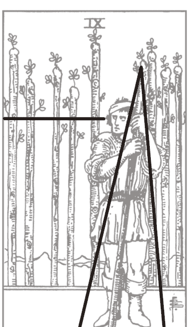

### 圖像分析

人物站在平地上，雙手斜拿著一根權杖，與他的身形組合成往一邊些微傾斜的三角形構圖。後方有八根權杖豎立，都比人物高，但權杖後面的高山則相對低矮，在視覺上權杖成為過高的屏障。人物的視線橫切過五根權杖，與地平線平行，向左邊延伸，聚焦在畫面之外的遙遠之處，他的身形與視線，形成穩住畫面的構圖，但有點歪斜的權杖，成為防禦的縫隙或漏洞，展現出不夠縝密的視覺氛圍。

### 情境敘事

圖像中，人物倚在一根權杖上，頭上歪斜的綁著白色繃帶，頭部似乎有受傷。但他沒有坐下來休息，持續站立，用權杖支撐著身體往左方觀望。人物看過去的方向，立著更多的權杖，代表左邊是人物已完成工作的地方，所以權杖9的人物，並不是朝著未來的方向觀看，而是看向走過來的路。被阻隔的山與看向過去的人物視線，都不是權杖人物展現優勢的構圖。其他權杖圖像，人物會看向未來的前方，或者站在象徵挑戰的高地。但權杖9中的人物，努力遠離代表挑戰的山景，他很努力遠離風險，甚至為了避開風險而受傷。權杖9的人物所受的傷，是因為他做了權杖特質不擅長的事（保護自己、避開風險），才會成為在權杖圖像中人物狀況不好的處境。

### 元素與數字在圖像中的意義

在八號獲得好運勢的權杖，事情推展雖很順利，但很多事同時展開的狀況下，人物在後頭追著事情跑，最後就有可能像九號人物一樣疲憊。獲得助力的火勢，常會一發不可收拾，如果沒有人極力滅火就會造成災難。八號的權杖元素，就像乾燥的天氣裡得到適當風力推波助瀾的野火，很容易失控。所以到了九號，就需要阻斷火力。圖像中的人物，是看向權杖8（過去）的方向，他背後的屏障，是為了阻止火延燒到山上。九號權杖元素，要全力干涉正在燃燒的火勢，雖然也是權杖元素，卻需要發揮抑制火元素的作用，所以他的站姿與背後豎起的權杖，更像是五角星圖像中較常出現的隔離牆，成為安全機制，讓環境得到保護。權杖元素，用火元素的特質，做五角星土元素的工作，無法發揮權杖元素的優勢。

### 解牌敘事（正位）

在權杖9的情境，比起想要冒險、放手一搏的衝動，人物會先從安全、保險的方面思考與行動。所以在權杖9的情境，會從過去中學習教訓，讓自己不再犯同樣的錯誤，在行動前，比起其他權杖，更謹慎小心的判斷與決定。在工作中，如果進入到權杖9的處境，就算接了新計畫，比起創新的作為，會更想從經驗中找到不會失敗的方法，用更保守的方式規劃與執行。如果是在面對更換職務或換工作的選擇，會很在乎換工作帶來的改變與不確定性，所以會選擇變動性較少的選項。人際關係的互動上，不輕易相信他人，比起思考對方可以帶來哪些新的可能性，會花更多時間預防對方帶來的麻煩，所以不太會積極與他人交流或互動。在情感關係上，喜歡維持現狀，只要沒有太多衝突，兩人關係就被認為是不錯，較少做出讓關係改變的積極行動。在權杖9的處境，人物所做出的決定或行動，都會以防止問題發生、讓事情能夠被掌控為優先考量。

### 解牌敘事（逆位）

如果正位的權杖9是以行動的安全為優先考量，逆位的情境，則會太過輕率的認為任何防護都沒有用。在逆位的情境，人物的行動變得過於衝動、不考慮後果，不會耗費時間去防範未然，直接行動，如果遇到問題，就認為是任何人都不可能預防的結果。在工作上，就算其他人出聲提醒，逆位情境中的人物也不會聽取提醒，依自己想做的方式去執行，常常會製造原本可以避開的麻煩，所以會失去他人的信任，也會被認為工作粗心大意、不用心。或在換工作的考量中，逆位情境會太急躁的想要改變，所以會接受自己沒有經驗，或者不擅長做的工作而後悔。在人際互動上，逆位情境對待人的態度輕忽、不用心，難以與他人維持長期、友善的互惠關係。在情感關係上，逆位權杖9的情境，無法應對長期關係的承諾，常在需要承擔責任的關係上，選擇離開或逃避。

### 建議敘事（正位）

遇到困境抽到權杖9作為建議，可以解釋為先暫緩決定與行動，先停下來回顧過去，檢查一下你的安排是否適當，如有不足的地方，先行調整後再繼續進行。權杖9作為建議，是要做事的人不能太急躁或衝動，雖然想快速解決目前的困境，但有些事急躁反而會壞事，原本只要些微等待就可以獲得解決的事，如果以權杖的樂觀與信心不停的去正面迎戰，只會帶來更多棘手的問題。對你來說，走進權杖9的情境，最困難的是不要急於反應或決定，而且不要只想著如何解決問題，而是要把注意力放在過去，好好省思有什麼需要調整或改變的地方。在人際關係上比起發展新關係，更重要的是維護好舊識。如在人際上發生爭執，權杖9的建議是，需要停下來思考如何修復，珍惜過去的關係並好好守護。

### 建議敘事（逆位）

遇到困境抽到逆位作為建議，可以解釋為走出權杖9的情境，代表你在應對問題時過於小心謹慎，也太在乎過去的經驗與教訓，所以不太會大膽嘗試新方法，一直陷入到同樣的困境中找不到解決方法。任何人需要承擔的責任越大，越有可能做出保守的決定，比起進取向前，更容易思考如何不出錯或守好現在。但逆位的建議是需要走出守護的防禦行為，找到新方法去大膽嘗試，才能找到解決問題的契機。在人際或情感關係上，也是建議要走出過去的相處模式或交友圈，要把保護自己的屏障都拿掉，或者離開有屏障的地方，才有機會解決目前遇到的問題。

## 權杖10

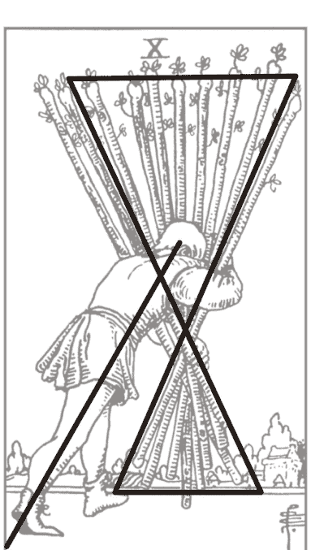

### 圖像分析

人物以弓著身體向前方傾斜，手上拿著十根權杖，形成上寬下窄的倒三角形構圖，而且沒有著地，很不安穩地停留在半空中。人物走在平地上，前進沒有阻礙，遠處有樹木與城鎮，但比例上很小，所有的視覺都集中到像扇子一樣打開、占滿畫面的十根權杖。人物的身形就像一根槓桿，小心的支撐著重物，只要失去一點平衡，槓桿就會倒下，所以槓桿與權杖之間，不能有任何的移位，權杖才能不掉落，視覺上形成維持平衡的張力與壓力。

### 情境敘事

圖像中，人物在平地上前進，但他賣力的拿著十根權杖，身體往前傾，頭也埋在權杖裡看不到前路，只憑著記憶與感覺朝目的地前進。遠方有城堡與綠林，背景是無雲的藍天，象徵了人物雖辛苦的拿著權杖，但前路平坦沒有什麼障礙。正如九號人物，十號權杖也以平地，象徵了人物失去了冒險與挑戰新事物的樂趣。事情雖然順利進行，但對權杖人物來說，順利的情境就是平凡、無趣的生活。但擔起的權杖超過他的負荷，就可以增加任務的難度，就算走在平地上也能激起權杖人物想要挑戰的鬥志。圖像裡出現的城堡建築蓋在低地，從人物的位置看過去，只能看到城堡的屋頂，與權杖王牌蓋在高山上的城堡不同，代表權杖10裡的人物，雖很辛苦的完成任務，但這不是讓他感到困難、提升能力的任務，只是量太大，造成他的負擔。

### 元素與數字在圖像中的意義

十號是小秘牌的最大數，象徵了每個元素的完成階段，但在權杖元素，十號牌裡的人物在持續移動，象徵了權杖元素就算到了十號，火還是需要持續燃燒。不會熄滅的火，都有可能造成環境的損害，所以需要適當控管，才不至於成為災難。所以九號的權杖元素適當的建立起安全機制，有火的能量，卻不再能向外無限制的燃燒，被嚴格控管。到了十號，被控管的權杖元素的野心，轉為維持日常所需、不懈怠的努力。所以權杖10的背景是平凡的城鎮風景，無法抬起頭的人物，是忙於應付例行工作，無力展開新計畫與新目標，每天在大量、卻沒有什麼挑戰的工作中埋頭苦幹，慢慢消耗掉了權杖元素的野心與創新的動力。

### 解牌敘事（正位）

權杖10中的人物駝著身體，明顯被權杖壓著無法直立。這是承擔了過多的工作量，或者擔起的責任過多，無法抬起頭看向遠方，謀劃未來。在工作中，如果走進權杖10的情境，每天都有做不完的工作，雖然工作難度不高，但量多、時間不足的壓力下，讓工作中的人常被工作追趕，一刻都無法鬆懈，但也可能是人物讓自己無法悠閒度日，一直處在忙碌的狀態。在人際關係或情感互動上，權杖10的情境，也會很認命的完成關係經營需要的大部分的責任，用承擔勞力來維持與他人的友好關係，但看不到前方的人物做出來的事，也有可能並不是大家所認同的結果，所以即使付出勞力，卻未必能形成好的溝通與交流，反而有可能招致他人的抱怨。

### 解牌敘事（逆位）

在逆位情境，原來拿在手上的十根權杖不再需要被人物搬運，代表人物原有的工作任務取消，或者在過勞的狀態下，不再能往前進，權杖掉落在地上。在工作中，如果進入逆位的權杖情境，不再需要負責原有的工作，個人承擔的責任變少了，但相對也會讓人物感到不受重視或展現不出自己的重要性而感到失落。但也有可能是害怕承擔責任而推卸工作。或者因為離職，不需要工作一段時間。不管是自願還是被迫，在逆位情境的人物，不再需要搬運權杖，但也因為突然失去了生活重心而有點不知所措，或者變得懶散，不想要做任何事。在人際關係或情感互動上，逆位情境中的人，不再是任勞任怨的承擔者，反而會用多一事不如少一事的方式應對問題，所以也會給人不夠積極、懶散的印象，如果遇到人際衝突，也不想要去扮演解決衝突的當事人。也有可能答應了卻沒有信守承諾，或者逃避任何需要承擔責任的處境。

### 建議敘事（正位）

遇到問題抽到權杖10作為建議，可以解釋為要學習承擔責任，接受被分配的工作，或許對你來說責任過大或工作量過多，但不需害怕自己會出錯或做不好，只要像圖像裡的人物相信自己，就算看不到前方，但可以憑自己的經驗與直覺應對問題，這些事情並不會太困難，在學習接受這些事情的重擔時，有可能是在提升自己的能力與承擔力。在人際或情感關係上，權杖10的建議也需要承擔起讓關係和諧、持續發展的責任，或許你認為自己已經做了很多事，而且對方未必知道你的付出，但權杖10的建議就是默默往前走，以權杖元素的樂觀與對未來的期待，相信你會走到更美好的目的地。

### 建議敘事（逆位）

遇到困境抽到逆位作為建議，可以解釋為要走出權杖10的情境，代表你的困境來自堅持自己扛下責任與負擔的行動，需要放下才能走出壓迫自己的處境。被他人信任或依賴，會覺得自己有價值、被看重，但也是因為想要成為重要的人，就會不自覺的做出太多承諾、扛下過多的責任，卻不自知。現在手邊的事情，對你來說已成為過重的壓力，唯有放下、離開，才能解開對你來說沒有解決之道的困境。在逆位的建議，也是停下來不要往前走，所以不要再對未來有過多的期待，以為只要再辛苦一下就可以達成目標，或許你認為的結束，一直都不會出現，只會是看不到盡頭的重複。在人際或情感關係上，逆位的建議也需要把擔在自己身上的責任放下來，才能改善關係的衝突與不愉快。人跟人的相處，或許是因為好心、為他人而做，但對方真正要什麼、什麼才是為對方好，這並不是可以由你決定的。

## Chapter 6

## 寶劍：邏輯理性帶來的恐懼與自我保護

你喜歡偵探或辦案劇嗎？通常這類劇裡都會有高智商、心思細膩，但不易跟別人相處的人設，相反的，如果劇裡的主角不精明，通常是一部喜劇或搞笑的辦案故事。在所有偵探中，福爾摩斯最具代表性，他被描繪成性格難搞、天才頭腦的怪人，如果沒有華生醫生在身邊，不太可能發展社會關係。雖然這樣的人不適合跟他人建立關係，但他們痛快的解決難題、堅持追求真相、不被情感左右的冷靜，常會成為我們羨慕、欣賞的對象。所以像偵探劇的主角，適合在遠處成為他人尊重、信任的人，但不適合成為生活中的關係人，他們是孤獨的野狼，獨來獨往，過於聰明與誠實的言論與行為，常會不自覺的傷害身邊的人與自己。

偵探劇的主角，通常也是生活白痴，他們會忘記吃飯、不會打理生活、也可能蓬頭垢面。或者在某個領域的專業表現非凡，他對重視的事情有著像強迫症般的堅持，但對其他事物又可能全然忽略或不關心。解謎是需要高度專注的動腦活動，如果解謎的人要顧小孩、做家事、繳帳單，還要應對難搞的老闆，根本不可能進入到解謎情境。這就像很多玩棋的人，都是在能夠專注的時候才玩棋，所以就會到棋院、棋社等場所隔絕他人的干擾。雖然解謎時會非常耗腦力，但比起複雜的情感糾葛，相對清楚、簡單、有邏輯，所以思考型的偵探角色，是對「事」的能手，但對「人」非常笨拙。

很多人認為喜歡邏輯、理性、思考的人，不會喜歡命理或神秘學，這些通常跟直覺與預測有關，不是理性判斷。如果預測沒有可依據的事實材料，沒有預測過程的邏輯，就是特殊的直覺能力，只有個人能理解，無法說明。所以有些預言家說這是神的啟示，除非他們的預言實現，不然常被當作頭腦有問題的狂人或瘋子。依據規則與事實所進行的判斷，就算是針對未來的預測，是透過精算的結果，這時的預測就不是直覺，而是理性判斷與思考。例如古人對氣象預測，沒有任何科學方法驗證，卻是長年對大自然的觀察後獲得的經驗判斷，所以也是有依據的思考，只是古人的判斷材料並不是科學數據，而是經驗值，同樣地，命理與神秘學是經驗科學，不是驗證科學。

透過經驗所做出的判斷，也是邏輯與理性的結果，只是經驗並不以數據累積成具體資料，所以有些達人或老手也會用「直覺」來表達他的判斷，卻無法明說為何會如此。科學家相信可驗證的數據，但我們在生活依據的是經驗的合理性，這兩者表面上相互抵觸，但都是理性的思維，只是給予我們判斷依據的源頭，是不是可驗證的差別。科學追求可掌握與可定量化的結果，但生活無法如此，不管是購物、工作、繳費、談戀愛、處理家務……有太多「人」的變數，讓一切活動變得無法掌握，這時，長年累月所積累的經驗反而成為最為可靠的判斷依據。

寶劍元素通常被理解為理性思考，很多人認為理性思考就是客觀判斷，但所有邏輯的源頭，都需要先對某一狀態與情境做出假設，並相信它。科學也是從假設出發，再一一展開驗證假設的實驗。生活邏輯也是，每個人內在都有什麼是合理、什麼是不合理的判斷標準與依據，但這些標準不像科學家的假設，能夠被個人覺察與認知。生活中的我們，反而對自己的準則不自知，在這種情況下，任何往後展開的理性思考，都不可能是大多數人能接受的合理結果。寶劍元素在理性思考之前，都已經有什麼可信、什麼不可信的信念，在這些信念下進行的理性思考，常常無法客觀，反而成為更為主觀與有刻板印象的判斷結果，所以用客觀來描述與理解寶劍元素，並不全然符合生活情境。

思考成熟的人，不會害怕自己的假設與信念被質疑，反而透過質疑才能防止自己被囚禁在錯誤的信念中。無法接受質疑的人，表面上會以強硬的態度堅信自己沒有錯，但越是強硬，越突顯個人信念的脆弱與偏誤，所以強硬是在害怕中設立的保護牆，他們想要說服的不是外面的人，而是自己，這樣才能讓自己安心。任何建立在害怕上的思維，目的都是保護自己，這時，人想要有可確信的答案，而不是模稜兩可的可能性，所以就會更容易接受簡單的單一答案，而不是客觀、普遍的多樣性，並以排擠或攻擊他人的言行來守護自己的信念。寶劍元素可能經歷的痛苦，並不只是事情找不到解決方法，而是在偏誤的信念中進行理性思考與分析，讓自己陷入害怕與自我保護的言行中。

最容易讓寶劍元素害怕的情境跟人有關，人性的複雜與無可掌握的變數，常常讓經驗變得不可信，失去可供判斷的依據與標準。所以面對人，寶劍元素更容易表現出自我防衛與排擠他人的態度，或者逃避或視而不見，才能遠離造成自己不安與害怕的因素。所以偵探劇的角色們，大多不喜歡與人交往，或像福爾摩斯厭惡女人，男人無法以同性別的情感去理解與掌握女人，所以就把女人評價為不理性與不合邏輯的對象。解謎時的冷靜判斷、不帶情感的專注，可以精準的解讀出行兇的動機、湮滅證據的行為，卻無法與人共處或生活。生活中的很多行為動機，不像殺人是極端處境，所以更為隱晦、變化多端，如果與人相處時，還想用辦案邏輯，雖然說的話聽起來都有理，卻無法說到對方的心坎裡。偵探劇主角的所有特質，都在表現寶劍元素的情境，所以寶劍圖像裡的人物，大多遮住自己的眼睛，才能避開與人的衝突，或者像較為平和的寶劍4、寶劍6與寶劍7，都把劍指向事，而不是人，才能運用寶劍元素的優勢，獲得理想結果。

## 風元素寶劍的圖像分析與敘事

風元素的寶劍，對應到理性思辨的能力，人的思考就像風，看不到、抓不住，但像空氣一直都在那裡。風需要藉由其他物件的搖動，才能體現自己的存在，而思考則透過語言才能被傳達，語言本身就是理性的產物，想不清楚時，人就會胡言亂語，有道理的話語則代表清晰的思考。所以寶劍的利刃，就是劃開無明的理性思辨，能夠判斷對錯、好壞，說出何謂真理，但思考本身要求真理，真理會揭開真相，但真相常會傷害人的情感。所以寶劍情境裡的人物，都在用各種方式避開真相，害怕真相變成銳利的劍傷害他人，帶來不必要的麻煩與衝突。但寶劍是雙面刃，避開跟他人的衝突，並不代表也能好好保護自己。寶劍2雖遮住了眼睛、避開了人群，但這種自我隔離的方式，只能帶來像寶劍3暗自憂傷的結果。這時，人很容易用麻木來平撫心中的傷痛，以不去想、不去做的消極態度，期待一切變得平靜，這就是寶劍4裡的人物，會躺在棺材裡的原因，心死了，才能得到真正的平靜。

但麻木也代表無法好好活著，所以就算會有傷害，寶劍人物也需要學習與人相處，走進人群。從寶劍4走出來嘗試與人相處的寶劍5，無法擺脫對錯、輸贏的思考本質，進入了互相傷害與攻擊的情境，但衝突是一個人成長與學習的過程，所以寶劍5也能發展到像寶劍6與寶劍7的情境，成為不傷害任何人的思考者。寶劍6與寶劍7的人物，找到了不傷害他人與自己的情形下解決問題的方法，寶劍6成為沉默的人，願意承擔起與大家一起同舟共濟的處境，不再一個人躲避。寶劍7則找到了避重就輕、大事化小、小事化無的偏方，他積極尋找緩解衝突的方法，雖然無法全然化解衝突，但也能阻止兩敗俱傷。但好景不長，應對可以解決的「事」可以適當的避重就輕、不傷和氣，但很多人生問題（如生離死別），是無法追究原因、無法解決、沒有答案的難題，所以寶劍8到10，所有人物又遮蔽了視線，對無法解決的事只能視而不見。

寶劍情境中的人物，比起積極解決問題，更傾向於尋找避開衝突的迴避方法，但這種迴避反而造就了寶劍人物的困境。而且人物大多遮蔽了視線，無法像權杖人物，把注意力放在對未來的展望。失去未來視野的寶劍人物，有可能太專注於目前遇到的不愉快，急於避開衝突，卻忽略了看向遠方，不懂得時間也是解決問題的方法之一。在占卜解牌時，如果常抽到寶劍元素的小祕牌，大多在提醒求問者太過糾結於目前的困境，反而失去了看向未來的視野，逆位則說明雖然在困境中的人想要脫離，但解決方法卻是消極逃避問題，並沒有想要正面去面對與解決問題。

## 寶劍王牌

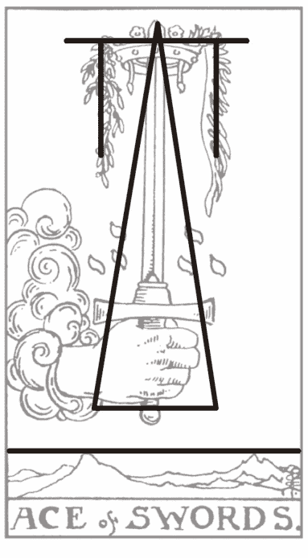

### 圖像分析

在雲端中伸出來的手，雖然形成三角形構圖，但這是騰在空中的三角形，成為視覺中心，沒有著地的穩定與安全感，不過因為下方的高山形成的地平線，支撐住了三角形，在視覺上將寶劍定位，所以在半空中的寶劍，不會因為騰空而有不安感，反而帶來強大的氣勢。這種氣勢也讓下方的高山在視覺上被寶劍壓制，沒有造成威脅或壓迫感。高舉在圖像正中央的寶劍，剛好把畫面從中間切割為左右兩半。寶劍上的皇冠以橄欖枝與棕櫚葉裝飾，樹葉下方則各有三道光芒向著下方墜落，視覺上像天秤，在寶劍上不偏不倚的保持平衡。畫面整體以灰色調整合，散發出平靜、沉澱的氛圍，更突顯了黃色的皇冠與光芒，以顏色加強了寶劍的視覺效果。

### 情境敘事

寶劍上方的皇冠，左邊是橄欖枝、右邊有棕櫚枝，這兩種植物，在基督宗教傳統裡分別象徵了和平、和解、勝利與不朽，這些是寶劍在西方文化普遍擁有的象徵意義。從樹枝落下的光點，是寶劍代表的信念與價值。拿著寶劍的手只以高山為目標，專注又明確，猶如寶劍上的利刃，界線清楚、黑白分明。在空中無中生有的寶劍，想要為世界帶來秩序與法則，讓一切的混亂結束，化解衝突、帶來和平。不以人物表現的王牌，比起人的努力，更強調了超越個人的靈感，靈感就像從空中掉下來的光點，無中生有，並不是人能努力得來的，只能等待與適時捕捉。

### 元素與數字在圖像中的意義

一號數字象徵開始，對應到風元素的寶劍，就成為吹風的起點，但風從哪開始？在哪裡結束？這些都無法掌握，就像人無法捕捉的思緒與想法。在一號數字，風已吹起，但感知風的那一刻就已走了，就像人的作為常無法跟上突如其來的靈感，有些靈感也會一閃即過，有點遲疑，或被其他事干擾，原有的靈感消失在空中。一號的寶劍元素代表，只有在專注、安靜的時候，抓得住寶劍帶來的一陣風，抓到時我們有種「啊哈」的欣喜，但這陣風是否能成為實用的想法，或成為解決問題的關鍵，還是需要個人的努力實踐。

### 解牌敘事（正位）

寶劍王牌的情境，可以理解為展開新計畫的靈感，而且這靈感突然到來，讓之前糾結、不知如何解決的事情，變得豁然開朗。例如原來困難重重，無法展開的計畫，在寶劍王牌的情境，突然有了化解之前難題的點子；或者在不知如何的選擇中，突然想開了，一切豁然開朗。寶劍王牌展現的創意想法，並不代表這件事能夠一路順風、沒有障礙的完成，只是打開了一種可能性，但事事追求策略與判斷正確的寶劍特質，從有靈感到執行，可能需要一段時間的規劃與準備。在人際或情感關係的發展上，寶劍王牌的情境，可能是在他人身上看到了讓你眼睛一亮的聰慧特質，或者在關係上之前糾結的問題，在一念之間獲得解決。寶劍王牌就像黑暗中照進來的一道光，靈感或許開啟了一道門，但門之後展開的風景是什麼？要如何應對？這一切要把靈感實踐為行動後，才會變得更清楚。

### 解牌敘事（逆位）

逆位的寶劍王牌，從雲端中伸出來的手與寶劍無法合作無間，以為是機會來了便伸出手，結果是一場空，什麼都沒有抓到。或者看到寶劍在眼前，但不確定它是真還是假，所以沒有伸出手抓住，讓寶劍在眼前消失。雖然情境中的人也想要征服高山，但手與寶劍無法相互配合的情形下，只會停留在期待與想像，反而會讓情境中的人感到停滯不前、事情阻礙重重難解。在工作上，可能是事很多、職責不清楚、工作沒有明確的方向與未來，或者老問題一直糾纏，卻找不到改變的方向與機會。在人際關係上，因為無法信任他人而不敢合作，感到身邊的人都只想索取，卻無法給你幫助。在逆位寶劍王牌的情境，就算你眼前閃過靈感，但會被當作白日夢或假象，不被你接受與信任。

### 建議敘事（正位）

遇到困境抽到寶劍王牌作為建議，是讓自己擁有可以安靜思考的時間，好好整理想法，就能找到解決方法。寶劍王牌的建議，並不是透過實際行動解決問題，而是要先知道如何解決才行動，所以在沒釐清想法之前，先讓自己靜下來，等待靈感。在工作中你可能困在某些難題中、或者糾結是否要離職或換工作領域的抉擇，寶劍王牌的建議需要讓自己走進這個情境，不能害怕你現在的問題，一旦害怕就無法釐清想法，要像圖像中的寶劍，把高山壓制住，相信自己的分析與判斷，安靜的想清楚再行動。

### 建議敘事（逆位）

遇到問題抽到逆位作為建議，可以解釋為走出寶劍王牌的情境，接受目前的膠著狀況可能會持續一段時間，放下壓制或解決困境的想法，也不要盲目期待，只要時間過去事情就能解決。有些時候我們會把困境的緣由推給環境或他人，例如在工作中，因為主管不合理、同事不合作、工作不穩定，我才會無法樂在工作。認為這些不好的事是因為運氣不好才會遇到，所以期待運氣變好那一天，相信煩惱就會不見。但逆位建議是在提醒你，目前的困境不會因為有好運就可以解決，而是更需要你接受工作中的難題一直都在，這些是工作中普遍都會遇到的困難，所以需要的是學習應對方法，與它們共處的智慧。而且有些難題是人的生離死別，這些本來就無法追究「為什麼」的處境，反而需要逆位建議來面對與接受現實。

## 寶劍2

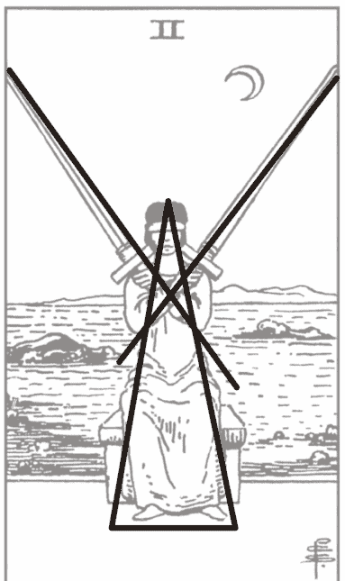

### 圖像分析

人物坐在椅子上，以三角形構圖穩定地立在平地上，她的雙手在胸前交叉，雙手各拿著一把寶劍，寶劍組成的對角線剛好在畫面中間的位置，切割了三角形，成為銳利的視覺中心。遮住眼睛的白布阻隔了人物的視線，阻斷了人物向外看的視角，相對強化了內在世界。背景是藍色的天空與大海，大海中有小島與石頭阻隔了水流，視覺上有障礙、不流暢。人物坐的椅子剛好與地平線齊平，讓人體的身體跟大海之間沒有任何屏障，直接曝露在外，展現不安穩的氛圍。

### 情境敘事

女人的眼睛瞭住坐在石椅上，地板與椅子都是堅固的石頭材質，這是人物想要安心的期待，但背景的大海與月光卻展現出黑暗與流動的不安。高掛在夜空的新月是月亮盈缺的開始，象徵了女人深思的事情，一切只有開頭，所以很難預測事情會如何展開。她坐的椅子沒有靠背，身體跟大海之間沒有隔閡，直接受到大海帶來的影響，更沒有安全感。她卻用白布、交叉胸前的寶劍，努力阻隔前方，她正在拒絕他人的接近，也拒絕看到外面的世界。閉起雙眼的女人，不想受到外面的干擾與影響，想要一個人把事情想清楚，但就像大海裡的石頭與小島阻隔了海浪，女人的思緒並不流暢，有很多想不清楚的地方，而且閉起眼睛的世界，因為孤立，充滿了不確定與不安。雖然背後的海浪平靜，但夜晚的大海漆黑、深不可測，成為讓人害怕的未知。

### 元素與數字在圖像中的意義

寶劍元素的優勢是預測未來發展，並找到應對方法，但這些優勢也需要有足夠的資訊與事態發展才能展開，但二號數字透露，事情只從開頭進展了一步，預測在這個階段都無法進行，無法預測事情發展的寶劍、無法停下來的思緒，只會變成想像出各種可能劇情的內心戲。到了二號的寶劍元素，就像偶爾吹起的一陣風，無從得知它從哪裡來、吹到哪裡去、以及為何會吹起來，無法連結出因果的偶然，最容易讓以因果為判斷原則的寶劍元素感到不安，因為偶然，無法得知何時會再吹風，所以無法想出任何對策。但偶然的一陣風不會造成太大影響，只是想用理性推測出合理性的寶劍元素，執著於知道事情的因果，反而會想太多，無法接受有些事只是偶然。

### 解牌敘事（正位）

寶劍2情境中的人物，想清楚判斷情勢，並做出對的決定，但女人的眼睛被遮住，所以她的判斷與思考都是沒有根據的推論或猜測，因為資訊不足，都是憑空想像，所以越想越擔憂與不安。在工作中，遇到寶劍2的情境，有可能陷入不知怎麼做比較好的猶豫不決，而且也正因為無法下決定而感到不安與焦慮。你有可能正在思考留下來或離職，或者正在規劃方案，無法決定要用A決策或是B決策，或者在人際關係上，想找對方談一些事，為了找尋適當時機而糾結等。寶劍2的猶豫不決或裹足不前，是因為太在乎要做出對的決定，所以一直思考要如何才能不出錯。但寶劍2的情境是無法擁有足夠訊息，所以不管如何努力判斷與思考，都無法釐清方向，所以比起一直想，或許更需要直接行動讓事情推展到下一步，選擇才能變得明朗。

### 解牌敘事（逆位）

在逆位情境，人物可能想要盡快擺脫內心的不安，所以想盡辦法做出行動來脫離焦慮。就像為了準備考試感到焦慮的人，雖知道最好的應對方法是依照科目，一步步複習與準備，卻會東翻翻、西翻翻，想先準備自己最不會（或者最擅長）的科目，但怎麼翻都無法定下心來複習。逆位情境的人物，無法只是坐在椅子上等待，為了消除不安會做出各種行動。但逆位時，人物所做出來的行動，並不是直接去應對問題，會變成轉移注意力或拖延。在工作中，有些專案需要等待同事或上司的進度，在等待時怕來不及，預先做出各種防範措施，但其實事情都來得及，反而是你的急躁讓後續發展變得更複雜。在人際或情感關係上，也會急躁的想要讓對方跟你配合，或過早下判斷而誤解情勢，發生不愉快，或者無法與他人有效溝通或對話，只能以閒話家常或避重就輕的方式來面對問題。

### 建議敘事（正位）

遇到問題抽到寶劍2作為建議，可以解釋為要接受寶劍2的處境，就算無法對事情做出清楚判斷，或者無法快速做決定，也不要過於自責或挫折，現在想不清楚，可能是目前獲得的資訊不多，還沒到可以做出決策的時候。在工作中，可能正在經歷接受新任務、離職、公司內部變動等改變，而你想要做出明快的決定或弄清楚自己的定位，但在寶劍2的處境，由不得你來成為事態發展的主導者，所以建議你先隨著外境，或者如果時間不緊迫就先等待，不要急著馬上就要知道結果。寶劍2的等待，會讓內心很不舒服，所以會想趕快脫離不確定的狀況，但寶劍2也是在提醒你，如果是為了脫離不舒服而做出決定，會成為逃避，為了好好面對每件事，也要能容忍內在的不安。

### 建議敘事（逆位）

遇到困境抽到逆位作為建議，可以解釋為要走出寶劍2的處境，不能再坐在原地，對眼前的事視而不見，如果要解決目前的困境，就要拿掉眼罩、從椅子上站起來，去跟問題衝撞。寶劍2有可能成為你想要避開麻煩的作為，多一事不如少一事，當作沒看到，就可以不干自己的事，在工作中，對公司內部調動、主管想要重新分配業務、團隊有合作困難等，雖然你看在眼裡，但視而不見，怕多說一句話，就會惹麻煩上身。或在人際或情感關係上，你知道對方有不滿或不愉快，卻沒有理會，或知道有些事需要解決，卻說服自己不急。但逆位的建議在提醒你，現在正是解決問題的好時機，不要害怕有衝突或不愉快，比起讓傷口潰爛，早點解決才不會讓問題變得無法收拾。

## 寶劍3

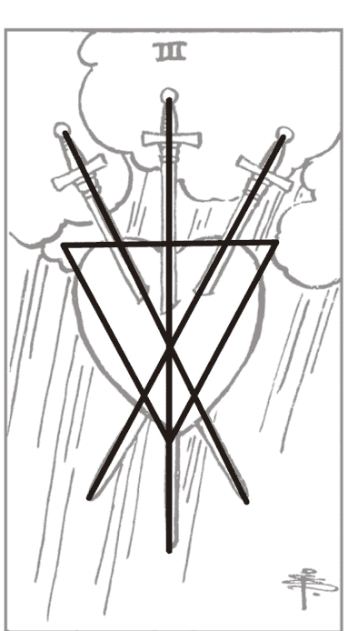

### 圖像分析

畫面中央有一顆愛心，以倒三角形的形式立在半空中，上面有三把劍構成了交叉的三條直線，成為圖像的視覺中心。就像寶劍2的構圖，三角形內形成的交叉線，視覺上給人銳利、被侵入的不舒服感覺。而且在空中倒立的三角形，以失去重心的狀態懸浮在半空中，帶著無法落地的不安氛圍。畫面上方的雲朵，加強了畫面上方的重量，背景中正在下雨，順著寶劍與倒立三角形的方向落下，整體給人頭重腳輕、失衡的不安定氛圍。

### 情境敘事

寶劍3是沒有人物的情境，但插在愛心上的劍，比起人物的憂傷表情，更能真實的表達出傷痛。當人物出現在圖像時，會有視線與相對應的場景安排，所以可以從構圖中說出這個人在什麼樣的地方、是在什麼樣的情境中心痛難過。但沒有人物的構圖，無法述說以人物為中心的故事，雖然知道這是傷痛的情境，但無法清楚知道原因與狀況。沒有人物的圖像更強調了人的普遍經驗，是任何人都會遇到的情境，例如生離死別帶來的悲傷，任何人都無可避免，或者像雨天，心情變得憂鬱，一直想到曾經失去的而難過。

### 元素與數字在圖像中的意義

在二號糾結於各種內心戲的寶劍元素，到三號被自己的想太多打敗。偶爾吹起的一陣風，早就消失得無影無蹤，但二號的寶劍元素，卻想要知道有關風的一切，所以才會自尋煩惱，把自己困住。進一步到了三號，這些本來想抓住風的想法，反過來指向自己，對自己無法從一陣風看透一切的無能感到挫折與無助。寶劍元素的優勢是在龐雜的資訊中理出頭緒，找到解決問題的方法，但二號或三號數字對寶劍來說，事態發展不足，還沒到可以讓寶劍發揮所長的時機，但世界上最無法停下來的是人的思考，在外在事情中，無法獲得寶劍優勢的三號，就會把劍指向自己，認為問題出在自己身上。對自己的省思是成長的開始，但省思或檢討也要有足夠的行動資訊，才能成為改變的動力，但寶劍元素對自己的省思，在沒有行萬里路的歷練與行動之前，都會成為自我指責與批判。

### 解牌敘事（正位）

在寶劍3的情境，內心是說不出來的難受，外面又是陰雨天，一切都變得悲傷與憂鬱。但寶劍3並不純粹是情感上的傷痛，而是寶劍的「想太多」造成的煩惱與不愉快，所以更接近無法解決問題的挫折與無助。在工作或人際關係上，如果進入到寶劍3的處境，在做之前就先下定論認為自己做不到，然後又因為自己的做不到而自憐自艾，或者批評自己的無助或無能。在寶劍3，任何事情都會被想成最壞的結果，就算是需要運氣的事，也會當作不可能有好運，待人處事的態度悲觀，不自覺就讓自己陷入到悲劇人物的情境，唉聲嘆氣，並認為自己的不愉快是無法改變的狀況。寶劍3也有可能把自己的傷心難過當作一種對自己的懲罰，對某些感到遺憾與後悔的事，用自我批評或自責的方式來應對，在自責中走不出來。

### 解牌敘事（逆位）

在逆位情境，想要拔除愛心上的寶劍，但可能沒有找到正確方法，造成二次傷害，或者不敢面對自己身上的劍，以自欺欺人的方式，對劍視而不見。當我們處在不愉快的情緒，想找各種方法走出來，有時候是轉移注意力，讓自己變得繁忙，沒有時間不快樂。也有可能變得麻木，對很多事情失去興趣與好奇，雖然不會傷心，但也無法開心。所以在工作或人際關係上，不管遇到什麼樣的狀況，在逆位寶劍3的處境，表示在用錯的方法應對困境或不愉快。可能主管用不尊重的態度指責你的工作表現，但你會說服自己是因為沒有做好，才讓主管生氣。或者情感對象提出分手，你可能認為這只是一時誤會，只要講清楚事情就能解決等。不管是什麼樣的情境，在逆位時，反而要覺察應對問題的方法是否不適當？是否害怕自己受傷、難過，而不承認發生的事對自己造成的傷害？

### 建議敘事（正位）

遇到問題抽到寶劍3作為建議，可以解釋為接受自己正處在傷痛中，不需要把自己的傷痛視為負面情緒，不敢跟他人分享，或者一直努力想讓自己好起來。人必然會遇到無法跨過的困境，有些是生離死別，有些是個人的條件所造成的挫折，如果不接受失落、傷痛、憂鬱也是必然會有的情感，就會逃避這些不愉快的感受。心理受傷跟身體受傷一樣，需要接受傷口的存在，並進行治療，配合傷口癒合的進度，調整生活作息。但人常忽略心裡的傷口，或者無法耐心等待傷口癒合的時間，只想要讓自己趕快回到正常狀態，很多時候，無法走出憂傷是因為不接受憂傷。不管是工作還是人際關係，如果遇到挫折、不愉快的衝突，寶劍3的建議，都是在提醒你，你要給自己傷痛的時間，接受自己受傷了，好好撫慰自己的心。

### 建議敘事（逆位）

遇到困境抽到逆位作為建議，可以解釋為走出寶劍3的情境，代表你現在感受到的傷害，可能被你誇大，或過度陷入自己的情緒，自憐自艾，這時需要讓自己暫時離開傷心的地方，轉換一下環境、心情，就會發現事情沒有像你想的那麼嚴重。如果在工作中，你的提案被拒絕、被主管指責、被同事批評，這些事情當然會讓人不愉快，但這些都只是工作中，每個人必然會遇到的狀況，雖然會影響心情，但只要經過一段時間，事情又會回到日常，不會造成工作上太大的影響。在人際或感情發展上，有可能過度解釋對方的言行，讓自己變得不愉快，自己在鑽牛角尖，先暫時轉移自己的注意力，原來你認為的問題也不再是問題。

## 寶劍4

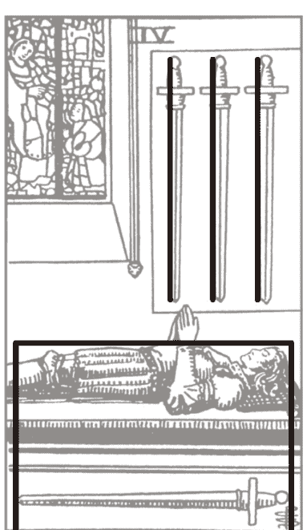

### 圖像分析

圖像中有三個四方形框，分別形成三個視覺中心，其中畫面下方的黃色棺木，在視覺上最為顯著。棺木上有橫躺的人形雕塑，下方還有一把寶劍。圖像中雖有人物形象，但不是在描繪人物，而是描繪死亡。黃色棺木是視覺焦點，但棺木沒有完整呈現，反而讓棺木的形體變得不清楚，無法直接與棺木的意象連結。上方的兩個四方形，上下交錯並置，右邊的四方形裡有三把寶劍，像是掛在牆上的裝飾品，整體排列不像之前的寶劍構圖，插入視覺中心形成對角線。左上方的四方形是繽紛的彩色玻璃，與棺木一樣，在畫面中只有一部分。三個四方形各自以不同的顏色、形式整齊的安排，互不干擾，視覺上給人有秩序的安全感，雖然也有銳利的寶劍，但安置在框架內，整體散發出寧靜的氛圍。

### 情境敘事

在棺木中安息的人象徵死亡，但圖像中的棺木卻以黃色展現出活力，雖然描繪了死亡，但比起死亡的悲傷，更強調了安息。四把寶劍分別出現在棺木與灰牆上，沒有集中放置的寶劍，代表寶劍的力量分散，而且都沒有被人使用，只是像裝飾品般擺放在角落，降低了寶劍的銳利與威脅感，寶劍也跟人一樣進入到了安息狀態。比起灰色的石牆，彩色玻璃變得很搶眼，玻璃描繪了兩位女性，一位像聖母的女人頭上有黃光，正在祝福跪在地上的婦女，女性形象帶出了溫暖的氛圍，寶劍的威力再次被收斂。圖像中的棺木與彩色玻璃都只有描繪一部分，在視覺上被切斷的地方延伸了我們的想像，雖然棺木與死亡有關，但這些延伸的意象給人的感受並不是結束，而是持續生長。這是經由安息而獲得滋養的情境，比起結束，更強調了精神儲備。

### 元素與數字在圖像中的意義

在三號經歷過挫折與無助的寶劍元素，想要阻止自己傷害自己，只好把所有的劍都放下來，讓它們成為裝飾品，不再使用。放下劍的那一刻，四號的寶劍元素體會到風早已停止，認知到原來自己正在追逐的風其實早已不存在，過去都只是捕風捉影。就像想要打敗影子的小孩，以為只要踩到影子，它就會消失，等他知道原來影子是自己的一部分，有關影子的煩惱才會不見。在四號數字，風元素的寶劍終於短暫的體會到風平浪靜的日子，但如果沒有經歷三號的鑽牛角尖，也不可能獲得這種安穩。只有在人暫時放下未來時，風元素才有可能停止，如果不去想未來，很多現在感受到的問題都可以不用去管，或者腦袋可以暫時放空。四號寶劍就以安息來表達了沒有未來，我們所有思緒才有可能在現在停止。

### 解牌敘事（正位）

寶劍4是人的身心想要休息的情境，不想有麻煩事，只想安靜過日子。圖像中的人物是雕像，所以無法體驗生活，而是進入到身心放鬆的狀態。在寶劍4的情境中，對很多事都漠不關心，不想承擔有壓力的任務或責任，所以在工作或人際關係上，也會給人做事不積極、不認真的印象。如果在工作中，主管交代新任務，在寶劍4的情境就會想推拖與拒絕；在人際或情感關係上，對方想要認真的對話或規劃未來，也會覺得這些事很麻煩，會儘量避開過於認真的要求，用拖延戰術來閃躲。在寶劍4處境的人，很想讓自己進入萬事與我無關的休眠狀態，如果在身心疲勞的時候進入到寶劍4的處境，可以讓自己獲得休息與喘息，但如果寶劍4的處境成為常態，就有可能成為對生活失去好奇與熱誠，毫不在乎。

### 解牌敘事（逆位）

在逆位情境，在教堂的棺木中休養的心靈失去安息的地方，離開教會，為生活疲於奔命，雖然很想要有休息時間，但沒得休息。雖然正位時有可能對萬事不關心，但可以強迫過度用腦的寶劍元素停下來休息。到了逆位情境，無法停下來的寶劍，不可能擁有明晰的判斷力去看清楚事態，只會一直被事情追著跑，找不到解決方法。在工作中，逆位情境可能會擔心出錯，所以花很多時間確認、修改，或者在找工作的情況，可能不知道自己的方向，什麼工作都去嘗試，結果經歷很多面試只帶來疲累，沒有什麼成果。在人際或情感關係上，逆位情境時，害怕自己被他人視為不努力或者怠惰，所以就會勤奮的找他人溝通、安排約會，但都只是在消耗時間，無法進行有效的互動。在逆位情境，忙碌可能成為逃避挫折、無助的手段，用忙碌來轉移注意力，卻也會抱怨自己不得休息的痛苦，認為是別人的錯才讓自己那麼辛苦。每天都很努力卻可能只是在原地打轉，沒能做出改善或解決問題，只是不斷累積更多工作。

### 建議敘事（正位）

遇到困境抽到寶劍4作為建議，可以解釋為要讓自己暫時從困境中退一步，把煩惱放一邊，遠離目前的狀況，休息一陣子後再處理。寶劍4的建議在提醒你，目前你感受到的困境，可能是你在鑽牛角尖，或過度憂慮還沒發生的事，無法讓自己安心生活，所以才會需要像寶劍4一樣可以安息的時刻。在工作中你可能對任何變化過度反應或焦慮，或者害怕自己的工作表現不好，而想太多、做太多，大多變成焦慮的防範行為。在人際或情感關係上，可能害怕對方誤會或批評自己，所以任何事情都要說清楚講明白，反而讓自己疲於解釋與說明。或者事先做好所有的防範，以免被對方指責。這些焦慮與害怕，已讓你身心疲憊，請你學習把憂慮放下來，跟著寶劍4的人物安息休養。

### 建議敘事（逆位）

遇到困境抽到逆位作為建議，可以解釋為要走出寶劍4的情境，讓自己休養的時間結束了，是時候醒過來、走出教堂，開始過繁忙的生活。逆位建議在提醒你，現在的生活表面上過得輕鬆自在，但已經成為阻礙你成長或造成困境的原因。在工作中，你可能做著沒什麼樂趣但穩定的工作，或者工作對你來說都像麻煩事，只想推拖。在人際或情感關係上，你無法應對不舒服的關係，所以會減少與人交流的機會，喜歡一個人不受干擾，但變得過於封閉，生活圈越來越小。逆位建議，代表你讓自己停留在寶劍4過久，失去了成長的動力，如果不做出改變，生活一直會在原地打轉。

## 寶劍5

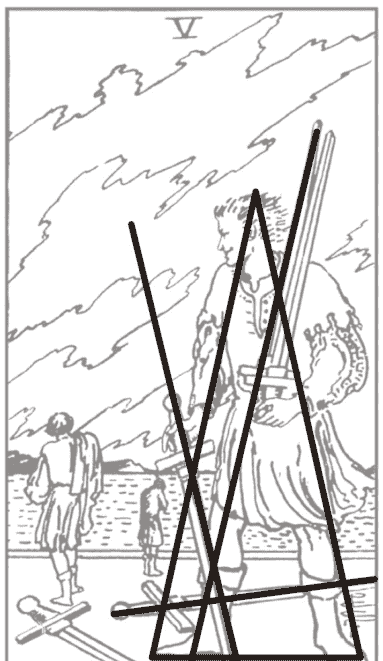

### 圖像分析

畫面中有三個人物，但人物的比例不同，站在前景的人正面朝向畫面，成為視覺中心，他張開雙腳，以三角形的構圖站在右側。人物手上拿的劍，分別在三角形構圖內形成對角交叉的視覺效果，散發被干擾、不舒服的氛圍。跟著他的視線，就會注意到左後方的兩個人物，比例相對小，而且以背影、手臂向內縮、走動的姿態，遠離視覺中心。主要人物站在平地上，但另兩個人物走向地平線外的大海，更展現出兩個人的不安氛圍。天空有條狀的雲朵展現了風吹的方向，雲朵的方向與人物的視線平行，加強了人物銳利、影響他人的氣勢。

### 情境敘事

圖像中只有一個人手上拿著三把劍，地上有兩把，遠處的兩個人卻沒有劍，推測地上的兩把劍是那兩個人被沒收的寶劍。以背影表現的兩個人，人物比例相對小，象徵他們成為卑微的人物，可能輸了比賽，或者被強者奪走了自己的寶劍而羞愧或自責。拿三把劍的人物與各拿一把劍的兩個人比賽，或許這是一開始就是不公平的比試，也沒有規則，只以打敗對方為目的。背景有大海與長條的雲，表現出強力吹拂的風，象徵不平靜的氣氛。圖像中所有的劍都屬於一個人，這是勝利者擁有一切，敗者一無所有的狀況，這種不平等也表現在人物的比例上。而且前方的人物，他只拿起三把劍，另外兩把放在地上，代表他已經擁有很多劍，所以拿走其他人的劍，並不是為了生存，而是要表現出自己比他人厲害的優越感。

### 元素與數字在圖像中的意義

在五號寶劍元素，風的力量變強，危害到人與物，但哪些地方有風吹過、哪些地方沒有，其實沒有道理可言，也無法預測，所以有些人因為風而受災、但也有人幸運躲過。在風災中幸運躲過的人，可能不認為這是幸運，而是自己在安全的地方蓋了好房子才會躲過，而那些受災的人，雖然風是天災，但有可能被指責受災的人也需負責；但受災的人也會怨天尤人，認為老天不公平。這就是寶劍元素在遇到無法追究原因、無法預測的狀況時，又想要找合理的解釋，就會出現怪罪對象、替罪羔羊的狀況。寶劍元素的優勢是有效率的找到解決方法，這種思維在人際互動中，只會看到造成阻礙的他人的缺點，在五號寶劍，風勢造成的麻煩，需要有效率的解決，這時如果有人跟不上進度，有可能被嚴厲的批評。雖然寶劍元素的動機是為了解決問題，但無法與他人共處，可能會讓問題停滯不前。

### 解牌敘事（正位）

在群體中，我們都想要表現自己，也想要贏過他人，在多人的競爭中，有兩種凸顯自己的方法：一種是做出比他人更好的成績，另一種是貶低他人。前者是良性競爭，可以激發出每個人的潛力，雖然有衝突，但會讓群體往更好的方向發展，這是權杖5的情境。後者是惡性競爭，對群體發展沒有幫助，甚至會讓群體相互傷害、解散，這就是寶劍5的情境。貶低他人是在矮化他人的價值與重要性，就像圖像中的人物比例帶出來的差異，所以在工作中或人際關係的互動上，寶劍5的情境是人跟人的互動會相互批評、貶低對方，這是讓人感到不愉快與相互傷害的處境。當我們在貶低他人時，也代表害怕他人會對自己產生威脅，所以當我們進入到寶劍5的處境，代表對自己的表現感到不安與害怕，所以會用更為嚴厲的方式對待他人，武裝自己的不安。或者就像圖像中背對著畫面的人物，對他人的批評沒有任何阻擋能力，讓自己成為委屈、受傷害的人。

### 解牌敘事（逆位）

在逆位處境，人物想要脫離相互批評傷害的狀況，但逆位時，未必能夠找到有效方法去遠離傷害，有可能只是不斷躲避，或以麻痺自己的方式忍受，卻也會不自覺的突然爆發情緒，造成更大的傷害。逆位時，人物不想再忍受，用更強硬的方式抵抗或應對，這卻不是解決問題的方向，只是在發洩積壓已久的情緒，所以人跟人的相處會變得更為爭鋒相對，很難進行對話。但逆位時，也有可能先遠離衝突，再慢慢找到解決衝突的方法，只是情境逆位了，任何問題都無法如寶劍元素的期待，快速獲得解決，反而需要慢慢熬、等待時機，忍受不愉快的處境，所以在逆位處境中的人也會很煎熬。

### 建議敘事（正位）

遇到困境抽到寶劍5作為建議，可以解釋為在不舒服、相互批評情境中，也要勇於面對衝突，不能因為不想受傷而退縮。會產生寶劍5的情境，通常是有人認為自己站在合理的立場，而且不只是對跟錯的爭執，也包含不對等關係造成的壓制。例如客訴時，客人無形中站在要求的位置；主管與下屬則是主管在優勢；夫妻關係也會有不對等的互動等。任何關係在無形中都會有不對等的狀況，在劣勢的人容易放棄或忍讓，在優勢的人可能用氣勢壓人。不管你現在遇到的困境是工作還是人際關係，寶劍5的情境是提醒你也要學習在不對等的關係中挺身而出，如果他人對你人身攻擊或不合理的批評，要說明白講清楚，或者在情感關係上被傷害，也要明白的講出自己的委屈或受傷的心情。人跟人的爭執也是一種溝通的學習，對抗不對等的關係，也是為了讓自己獲得尊重的過程。

### 建議敘事（逆位）

遇到困境抽到逆位作為建議，可以解釋為要走出寶劍5的處境，儘量避開不必要的衝突，也不需要為自己說明、防衛，只需要遠離或躲避。你現在可能不想認輸，也不想讓不合理的事情持續下去，也不想讓自己成為受害者，或看不慣小人得志。但逆位建議是在提醒你，目前的狀況並不是對抗或正面迎戰就可以解決的，目前你的應對方式，反而會兩敗俱傷，或把事情推動到無法收拾的地步。所以逆位建議接受這不是可以由你解決的問題，只能先遠離衝突點，等事態平靜下來。如果是工作上不留情面的批評、被攻擊或成為承擔他人過錯的替罪羔羊，或許離開也是一種選擇，離開並不是因為自己做錯，而是遠離以不對等的互動關係，攻擊他人的不健康的環境。如果是情感關係上相互傷害，給彼此冷靜的時間，暫時不要與對方碰面，分開一下，也是建議的解決方法。

## 寶劍6

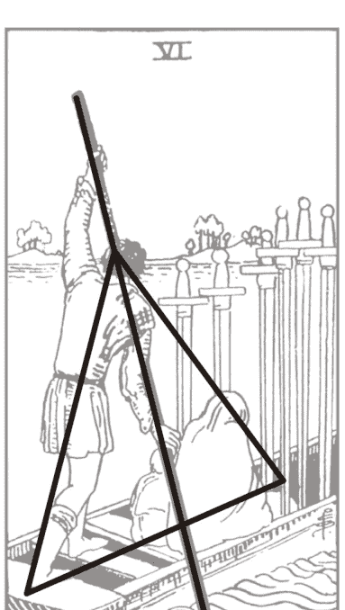

### 圖像分析

圖像中有三位人物坐在船上，背對著畫面，三個人物剛好形成與船隻方向平行的三角形視覺中心。前景的人物站立，他手上拿著的划槳高過身高，剛好穿過三角形進入水面，成為身體與三角形的支撐點，穩住了船帶來晃動的視覺感受。船頭有六把寶劍，船上的空間變得狹小，阻礙了前方的視野，同時增加了船頭的重量，不易划行。站立的人物，可以勉強跨過寶劍看到前方，其他人則看不清前方。右下方的水流有波浪，左邊較大範圍的水域相對平靜，遠方有高地與樹木，也是船未來要到達的地方。

### 情境敘事

圖像裡的船隻頭尾被截斷，就像無法說清楚前因後果的故事，只能釐清當下的狀況。船夫正在划船，站立的他比坐著的人，更能夠看得到前方，但他的手上拿著的細長船槳，正在波動的水面上划動，阻擋的視野、波動的水流，讓船身很難順利向前移動。但前方的水域非常平靜，不遠處有山、有樹，看得到目的地，所以船要行進的方向，並不是一望無際的大海，雖然船身行進緩慢，前方的陸地讓前路變得明確、清楚。三個人物都向著同一個方向，沒有互相對望，沒有對話，只是沉默地載著所有的寶劍，順著流水慢慢前進，期待著到達岸邊的時刻。三人在同一條船上，這是同舟共濟的處境，為了安全到達目的地，大家需要守在自己的位置，不能移動。

### 元素與數字在圖像中的意義

在五號，風吹亂了原有的生活，為了有效的解決問題，指責與怪罪他人的寶劍，到了六號，學會除非與他人一起度過難關，否則無法解決問題。但要求效率的寶劍元素，比起與人溝通，會自己先做快速判斷，直接分配大家的職責與工作，承擔起度過困境的責任。所以在六號寶劍，人物之間沒有互動，每個人都各司其職，在船上的乘客不干涉船夫划船的方向，就算看不到前方，也只是低頭順著船夫的帶領。船夫則專心划著船，努力划向目的地。在六號，寶劍雖收起了向著他人揮舞的利刃，但想要快速脫離困境、解決問題的寶劍，也不會浪費時間聆聽他人的想法，直接先想好方法，再帶著大家一起過河。

### 解牌敘事（正位）

寶劍6是向著某個目的地前進的情境，而且寶劍都立在船上，無法使用，所以這是只能先慢慢熬，除此之外別無他法的狀況。不管是划船的人，還是坐在船上的人，目前都只能放下急躁的心，默默等待。在工作與人際關係上進入寶劍6的處境，代表問題有點棘手或難解，雖然知道要怎麼做才能解決問題，但主導權或決定權不在自己手上，所以只能熬過目前的困境。例如工作部門遇到可能裁撤或調動的危機，或者執行專案遇到不可抗拒的環境影響而需停止。在情感關係上，雖然彼此知道對方遇到的問題，但沒有溝通，只是默默過日子等。但與寶劍5的針鋒相對不同，在寶劍6，大家在同一條船上，現階段只能各司其職，才能讓船平穩地划向目的地，所以先暫時放下爭執，只是默默期待事情趕快變好。

### 解牌敘事（逆位）

### 建議敘事（正位）

遇到困境抽到寶劍6作為建議，可以解釋為需要承擔起解決問題的責任，不能推拖，只有你站出來，事情才能有所好轉。在棘手的問題前，沒有人想要去處理，但寶劍6的建議，可能是在提醒你，目前也只有你可以去應對，雖然你會不甘願的想問：「為什麼是我？」如果你想要盡快脫離不舒服的困境，只能站出來承擔。工作中棘手的專案、客戶或主管，大家都會想躲開，並丟給他人處理，你雖然也可以推拖，但或許你的經驗與資歷比起他人更能應對，所以為了讓整體狀況好轉，大家等你出現行動。或在人際或情感關係上，你不知道要如何回應對方提出來的難題，很想當作不知道、沒看到或者忙碌來逃避，但寶劍6的建議是要你跟對方在同一條船上，不管是什麼問題都要一起度過難關。

### 建議敘事（逆位）

遇到問題抽到逆位作為建議，可以解釋為跳船自救，不要再成為承擔，勇於拒絕才能脫離困境。有時候害怕拒絕主管的要求，協助主管做了違法或傷害公司的事，或者心裡雖知道不應該，但與他人一起做著良心不安的事。逆位建議提醒你，現在與你在同一條船上的人，才是你會遇到困境的原因，趕快跟這些事與人脫離，才能遠離麻煩。如果離開船代表與他人的爭執與不愉快，也要鼓起勇氣說出你的決定。在情感發展上，你也有可能陷入不想傷害對方而一直默默承擔的處境，但逆位建議是請你不要再成為沉默者，需要讓現在的船停下來，拔出船頭的劍，把事講清楚說明白，關係才會有未來。

## 寶劍7

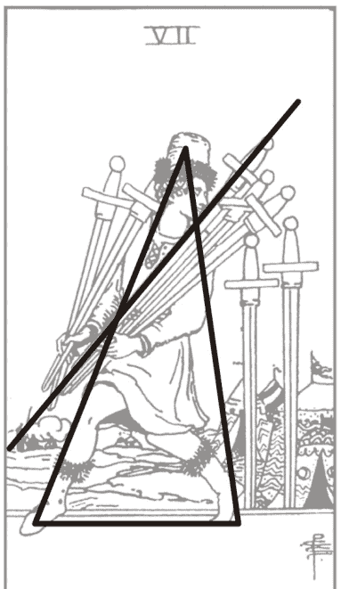

### 圖像分析

人物站在畫面的正中央，輕巧的跨出大步伐，與身體形成了三角形的視覺中心，但他的腳步沒有著地，視線向著與身體不同的後方，整體給人不安穩的氛圍。手上的寶劍以斜角線穿過三角形，但每把寶劍都有秩序的朝向同一個方向，雖然劃過了三角形，卻也沒有形成雜亂的視覺效果。人物站在平地上，但地平線的後方是不平穩的坡地和高山，視覺上被前景的高度壓制，對人物沒有造成威脅。在右後方，有高度比帳篷高的兩把寶劍阻擋著入口，視覺上形成障礙，阻隔了人物與帳篷。

### 情境敘事

在寶劍元素中，寶劍7的背景顏色只有一個黃色，和其他寶劍圖像不同，散發著輕鬆、活潑的氛圍。人物也很俏皮的墊著腳尖小跑，眼睛卻看著後方，似乎在觀望後方的狀況，他手上拿著五把寶劍，正沾沾自喜的往前跑。人物站在比後方高的地方，象徵了人物站在比帳篷區更優勢的位置，他們不是同一陣線。帳篷前方有兩把寶劍，擋住了帳篷的入口，另外五把劍拿在人物手上，很像他從敵營偷走的武器。在左下方的遠處，有黑影在遠處群聚，表示人物趁敵人不注意來行竊，但他沒有偷走所有的劍，很狡猾的把兩把作為阻擋物，插在帳篷入口。這張牌是寶劍元素少有的愉快、淘氣的氣氛，而且偷偷摸摸也不是正直的寶劍元素會喜歡的方法，但因為不堅持寶劍元素的正直與誠實，在寶劍7反而可以簡單的應對問題，輕鬆過關，不需正面應戰。

### 元素與數字在圖像中的意義

在六號數字，寶劍元素學會與他人同舟共濟，不再過度要求他人，只專注在如何解決事情，學會了對事不對人的訣竅。所以到了七號，寶劍元素進一步懂得如何繞過人去解決問題，迅速達成目標。正直的寶劍元素，遇到問題都會直接去面對，但過於直接的方法，一直讓寶劍受挫，所以到了七號，終於繞道而行，學會不與敵人正面衝突的解決方法。偷敵人的寶劍，被視為是不正當或卑鄙的作為，正直的寶劍元素，不可能接受自己欺騙他人，但如果這是對大家有利又最有效的解決方法，就能說服寶劍偷竊行為的善意與正當，就像善意的謊言，但寶劍元素的謊言不是因為憐憫他人，而是為了不讓事情因為個人情感而出錯或難解，所以還是以效率為第一優先。

### 解牌敘事（正位）

寶劍7的偷竊行為，不會讓人產生罪惡感，所以對應到日常生活，比起見不得人的壞事，更像是獲得好運的小確幸，或是不勞而獲的竊喜。而且這種不勞而獲，就像圖像中的人物往前小跑步，會讓一些麻煩不費力就得到解決。但這是敵營的圖像，所以困境一直都在，只是暫時不需要跟他們產生衝突，很幸運的躲過苦戰。在工作中，預算不足而停擺的計畫，可能突然因為別部門的計畫停止而獲得經費；因為沒有發展機會提離職的工作，老闆用加薪或升職挽留；不知如何轉換工作時，客戶的公司剛好有缺等。或者在人際關係上，本以為會引起爭執的事情，對方沒有挑起，很幸運的過關；或者麻煩的事，不知道原因就自行解決等。在寶劍7的處境，事情會比原先的預設更容易得到解決，但只是有了暫緩的空檔，並不是麻煩或真的變得沒有問題。

### 解牌敘事（逆位）

在逆位情境，偷寶劍的行為有可能被人發現，或者不接受用偷寶劍的方式解決問題，跟敵人面對面，雙方僵持不下。正位時是正當的小確幸，到了逆位就成為被他人批評為卑鄙、欺騙的行為，這是寶劍元素最無法接受的狀況。所以在逆位的寶劍7的處境，會因為被他人發現自己的小動作而感到惱怒或羞愧，並遷怒他人，把對方視為敵人來攻擊或防禦。就像有些人做事偷懶、不仔細，被他人抓包後，反而怪罪對方有惡意，故意找麻煩。或者本來以為家人或伴侶不會發現的小秘密被揭露後惱羞成怒等。在逆位時，圖像中的人物也有可能看到敵營勢力龐大，卻束手無策而感到害怕或無助。逆位情境時，寶劍原有的判斷力受影響，不只無法精確的分析問題，也找不到好的解決方法，而且逆位時，就會變得鬼鬼祟祟、偷偷摸摸，找不到讓自己名正言順的名份或立場。

### 建議敘事（正位）

遇到困境抽到寶劍7作為建議，可以解釋為輕鬆看待目前的問題，先用暫時避開麻煩的方式去應對，不必刨根究底。你可能認為目前的狀況很嚴重，需要認真應對，不能不了了之，但寶劍7的建議，反而是提醒你過度認真有可能壞了事，所以先睜一隻眼、閉一隻眼讓它過去。在工作中你有可能認為發生的事情很嚴重，想要徹底解決，所以想著如何跟老闆提議，或者想跟客戶把醜話說清楚。或者是換工作的煩惱，因為太認真看待換工作的嚴重性，結果可能很難下決定。在人際或情感發展上，寶劍7的建議是提醒你，如果對事情發展沒有太大的阻礙，對人的不滿與不愉快，可以大事化小、小事化無，現階段只要做出最緊急的應對，其他問題可以先放過。如果與情感對象有衝突，就算你覺得那是長久以來都沒解決的問題，也不需要急於在這一刻處理，學習像寶劍7一樣，相信一點點好運，就可以放下你所擔憂、害怕的事。

### 建議敘事（逆位）

遇到問題抽到逆位作為建議，可以解釋為走出寶劍7的處境，不能再用取巧的方式應對事情，要認真看待目前的狀況，就算找不到好的解決方法，也不能逃避已經攤開在日光下的問題。沒有人想要自找麻煩，所以只要有方法脫身，我們就會避開，或許是暫時避開了，但也有可能讓問題持續惡化，例如工作上一直出狀況的工作流程、重複的錯誤，可能是一種警訊，如果忽略了，就可能面臨大狀況。人際或情感發展上，有些衝突我們也會因為常發生而沒有放在心上，一點點的累積，卻會成為關係破裂的主因。逆位的建議是要提醒我們看到問題的根本，不能只是表面應付，而要能夠刨根究底，才能預防更嚴重的問題發生。

## 寶劍8

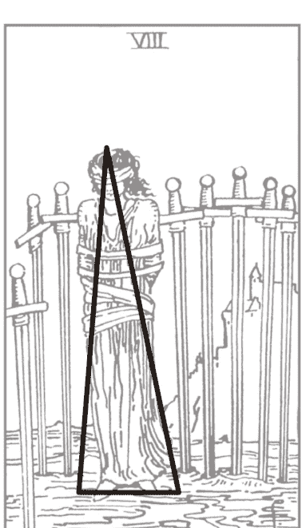

### 圖像分析

圖像中的女人手臂被綁住，站立的姿態受限，不像寶劍7的大跨步，在這裡以人物為中心形成的三角形，面積相對縮小，不夠安定，而且三角形所在的地面有凹槽、有積水，感覺三角形隨時都會倒下來。但後面直立的寶劍，成為三角形的屏障，就算倒了，也把三角形維持在屏障內，保護人物跟後景隔離。後方有石頭建立的城堡，雖被寶劍隔絕了，但它不會消失，一直在那裡。城堡與天空都是灰色調，視覺上被整合，讓城堡的堅實感延伸到天空，與寶劍有空隙、不夠堅實的屏障成為強烈的對比。

### 情境敘事

圖像裡有八把立在地上的寶劍，分隔出了前景與後景，在前景的女人，眼睛與手臂被綁住，但腳可以自由移動。女人站在凹凸不平、還有積水的地面，因為看不到，腳步要移動變得格外危險或不安。女人身上的綁帶，似乎是自己給自己的束縛，讓自己可以視而不見，也不做出行動。後面的寶劍像結界，讓女人不得再往後退，靠近城堡。女人為何站著不離開？而是用寶劍做出保護自己的結界？她看不到、手無法自由移動等狀況，似乎成為她無法離開的理由。她的身體背對城堡，那是她不想看到的地方，是她躲避的地方。雖然她無法面對城堡，但也無法遠離，所以只能在遠處，用各種方式保護自己，或強迫自己停留在原地，期待什麼都不要變動或改變，一直維持現狀，但城堡是永久的建築，寶劍形成的結界是暫時的，城堡卻一直都會在那裡。

### 元素與數字在圖像中的意義

為何在七號可以輕鬆應對問題的寶劍元素，到了八號又變得束手無策？在人生路上，年輕時，大多問題只要自己努力都可以獲得解決，但年紀越大，就發現人生無法解決的問題更多。從八號開始，寶劍元素所面對的問題，大多是無法用努力就可以解決的人生困境，例如，情感關係中的喜不喜歡、工作上有沒有獲得認同或欣賞、人際關係中有沒有緣等。如果遇到不會用人的上司，不管怎麼努力或表現優異，獲得獎賞的卻是無能、不認真工作、只會做表面功夫的同事。這時，正直的寶劍元素，還是會希望問題可以獲得合理的解釋或被公平對待，但一次次的失望後，寶劍元素會發現，有些生命處境無法要求合理與公平，雖然認為這種現象是不對的，但無法改變現實狀況，寶劍元素會開始逃避現實或自我傷害。在八號寶劍元素，一下子吹起了帶來災難的颶風，任何預防與策略都不管用時，寶劍元素會變得害怕、退縮，不再敢嘗試，這是寶劍在八號展現的困境，而且這種困境會一直延續。

### 解牌敘事（正位）

寶劍8的處境是人物處在無能為力或無助的狀況，而且這種無助，還會讓人感到害怕，怕自己會被打敗或無力抵抗，所以會盡力逃避或視而不見。比如父母看到小孩的脫軌行為，因為太害怕背後可能要面對的事實，所以安慰自己這只是每個小孩多多少少都會有的狀況，不需擔憂。或者在工作上，已經看到違法、不正當的行為，有同事在職場霸凌等，但太害怕失去工作視而不見。在情感關係上，已經認知到兩人的關係已無法持續，但會告訴自己，這種感受或許是自己的錯覺，所以不能輕舉妄動等。寶劍元素最害怕的是被欺騙、不合理或不公平的處境，這些狀況如果不解決，寶劍元素就會自欺欺人，告訴自己一切正常，沒有不合理的事，只是自己想太多。在無能為力的情形下，只能用否定自己的方式，讓自己持續維持在原有的狀態，並不斷說服自己，一切都符合常理，不必大驚小怪，但處在寶劍8的情境時，任何決定都是因為害怕，所以只想要自我保護而無法做出明智的抉擇。

### 解牌敘事（逆位）

在逆位情境，圖像中的人物，不再限制自己的行動，也沒有寶劍可以保護自己，城堡聳立在眼前，她無法視而不見。這時，圖像中的人就會面臨抉擇，正面迎向問題？還是繼續努力逃跑？如果決定正面迎向問題，並不代表可以解決，但能一步步去認清自己在害怕什麼，以及所害怕的事，是否真的需要害怕？如果決定繼續逃避，會比正位時更讓人不安與害怕，因為逆位情境沒有寶劍作為結界，隔絕城堡。在情感關係上，或許對方已經有喜歡的人，在寶劍8的情境，就有可能視而不見，但逆位時，就有可能決定面對事實，雖然事實讓人害怕，也未必有簡單的解決方法。寶劍元素的特質就是追求真相，在寶劍8的情境，遮住眼睛的女人，象徵了無法面對真相，但到了逆位情境，已無法遮眼的現實，只好認清真相，但有些人還是選擇逃避，逆位時選擇逃避的人，會感受到更大的威脅與危機，生活不得安寧。

### 建議敘事（正位）

遇到困境抽到寶劍8作為建議，可以解釋為先從衝突與壓力轉移注意力，也保護好自己，不要為目前的狀況承擔過多的情緒。寶劍8的建議，提醒你還沒有足夠的準備或力氣去應對目前的狀況，這時暫時離開，遠離麻煩也是明智的作為。明明知道自己無能為力，還要去應對，未必是勇氣或意志，那只是沒有認清自己的無知。人無法每件事都能應對自如，也不是每一件事都因為堅持就能解決，例如工作上的任務，如果同事、公司的資源、環境都無法支援，想要做好工作的想法，反而會成為對自己的指責。在人際或情感關係上，如果衝突來自於無法改變的個人資質、外貌、家庭條件等，遠離衝突、保護自己才是最好的選擇。寶劍8的建議是承認與接受目前的處境，自己無法有所作為的事實，才不會用抱怨、責怪或貶低自己或他人的方式應對困境。

### 建議敘事（逆位）

遇到困境抽到逆位作為建議，可以解釋為走出寶劍8的處境，不要再認為自己無能為力，或用自欺欺人的方式不面對現實。所以在逆位情境，要轉頭面對城堡，拿掉保護自己的眼罩與寶劍，一步步走向前看清楚城堡的樣子。城堡可以是過去累積的積習或讓你感到害怕的人物或處境，這些都限制了你的行動。所以逆位建議，也是突破自己的慣性思維的提醒，不要再用過去來決定現在，真正看清事情後，再判斷可不可以。例如，很多人在長久的情感關係中，害怕變成一個人，但如果因為害怕一個人而不去面對關係上的衝突與裂痕，就會讓自己生活在欺騙與假象中。或者在工作中也有可能認為自己做不好，所以害怕換工作、向他人提出要求。因為害怕而做不到，是寶劍8的處境，而逆位的建議是突破內在的害怕，看清楚之後再判斷做不做得到。

## 寶劍9

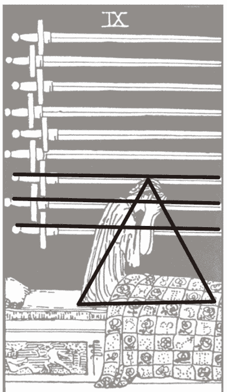

### 圖像分析

畫面分為兩個區域：寶劍與紅色的床，而人物側身坐在這兩個區域之間，雖然頭部與被子裡延伸出去的腿形成三角形視覺中心，但人物的腿被蓋住看不到，三角形被寶劍貫穿，又夾在床與寶劍之間，雖然床與寶劍的線條平行，形成有秩序的排列，但填滿了整個背景的寶劍，在視覺上很有壓迫感，同時深黑的背景給人窒息的氛圍。坐立的人物與橫向的寶劍對立，更突顯了人物在場景中不協調、不舒服的視覺感受。

### 情境敘事

在黑暗中坐在床上的人，半夜睡醒，他為何搗著臉？是否做了惡夢？還是想起了傷心的事而流淚？從整體圖像的氛圍來看，這是充滿壓抑、不安與悲傷情感的牌，雖然不知道圖像中的人發生了什麼事，但黑暗的牆面暗示了漫漫長夜，九把寶劍都立在空中，沒有被人物所用，象徵寶劍帶來的煩惱，並不是圖像中的人可以解決或應付的事，人物只能在暗夜中驚醒或擔憂，卻對這些憂慮無能為力。而蓋在身上色彩繽紛的被子，雖然可以為黑夜帶來色彩，但他雙手搗住眼睛，無法看到這些顏色，反而被黑暗吞沒。光明沒有離開房間，但因為人物沒有放開雙手，光明無法進入他的視野。人物想要忘記寶劍遮蔽了自己的眼睛，反而讓自己陷入到全然的黑暗，這是進退兩難的困境，睜眼就會被寶劍威脅，閉眼就會掉入黑暗中看不到光明。

### 元素與數字在圖像中的意義

在八號用眼罩自我欺騙的寶劍人物，到九號還是遮住了雙眼。但這次是幾乎不見光的黑夜，又在可以被保護的室內，眼睛還是遮蔽的，代表沒有任何地方可以讓寶劍感到安心。寶劍元素想要預測未來、掌控一切，但越想要掌控，越害怕無法預防的意外。在八號經驗過颶風帶來的威脅的寶劍元素，到了九號，沒有因為經歷過而放心，失敗的經驗反而會加強一切會失控的憂慮，有些經歷過地震的人，只要一點點搖動，都會過度驚慌而心跳加速。九號寶劍，會感受到自己無時無刻都在風暴中心，卻不知道原因，也找不到離開的方法，對寶劍元素來說，這就像世界末日，隨時都會被風暴侵襲的想法，無法安心生活。

### 解牌敘事（正位）

在寶劍9的處境，會因為某些事心神不寧，甚至會影響睡眠以及生活品質，但到底是什麼事，未必那麼明確，雖然每件事都有點狀況，但未必是心神不寧的主要原因。在寶劍9，也有可能是為擔憂而擔憂，事情都沒有發生，卻已經認定不好的事會發生而害怕。看到長輩有點身體不適，就擔心他得了重病；在工作上遇到一點小麻煩，就認為自己能力不足或無法解決、甚至認為完蛋了；主管糾正錯誤就認為自己會失去工作等。在寶劍9的情境，看到的世界只有黑暗，所以不管聽到什麼、經歷什麼，都會視為是沒有希望、無法期待的絕境，擔憂已成為習慣，甚至有可能認為不擔憂反而會發生不好的事。在寶劍9的處境，需要覺察自己為何會在黑暗中？這種黑暗，是否是因為用自己的雙手遮住眼睛才發生的？也要試問自己，如果事情無法透過思考、煩惱獲得解決，為何還要事先擔憂或害怕？抽到寶劍9，可以幫助我們覺察自己正在害怕的真相。

### 解牌敘事（逆位）

在逆位情境，在黑暗中的人物，嘗試各種方式離開黑暗，但未必能夠找到解決方法。寶劍9的處境是黑夜，離開黑夜的最好的方法是等待，時間到了，黎明自然來臨，如果因為害怕黑夜，想要盡快脫離，任何方法都只會讓嘗試的人感到絕望，或遇到更大的挫折。在逆位的情境，也有可能不承認自己在黑夜憂慮，會用各種方式安撫自己一切都很好，不需擔心，但只要一點小狀況，就有可能驚慌失措或不安。在寶劍9的處境，我們擔憂的是在生活中長期存在，卻無法解決的一些問題，例如家人的健康、經濟狀況不好、不穩定的工作、不真誠的人際關係等。抽到逆位寶劍9時，需要先覺察自己在逃避或害怕什麼，以及有沒有可能過度積極的想要解決問題，而這些積極都只是轉移自己的注意力，並不是面對或接受內在的害怕？人必然會活在未知的不安，如果否定不安，就會像寶劍9，用雙手搗住眼睛，或者像逆位情境，用盡方法想要脫離。寶劍9的逆位或許在提醒我們，與不安共處是一個人的成長功課，不需要為不安感到害怕。

### 建議敘事（正位）

遇到困境抽到寶劍9作為建議，可以解釋為接受目前在生活中讓你感到不安與焦慮的處境，放下想要解決、讓不安消失的努力。未知與不確定，常會讓我們害怕，這是每個人都會有的常態，只需平常心應對。生活中的不安，有時候就像工作鞋，穿起來未必舒服，但會保護我們的腳；背在身上的背包，雖然沉重，但裝了可以完成任務的裝備。如果要去除所有的不舒服，反而會帶來傷害或危險，所以不安與害怕，一方面是讓人不舒服的壓力，但只要學習調適，就會成為成長的動力。而寶劍9的建議，就是在提醒你，你想要逃避、抗拒的壓力，可以成為讓你成長與改變的機會，先不用過度害怕自己無能為力，雖然寶劍9的處境會讓你不舒服，但在黑夜中，你也有可能看到過去沒能認清的事實或真相。雖然我們都想要擁有平安、快樂的生活，但快樂是能力，需要從各種不舒服的歷練中學習的能力。

### 建議敘事（逆位）

遇到困境抽到逆位作為建議，可以解釋為要走出寶劍9的情境，不要再讓自己一個人在黑夜中擔憂害怕，有什麼心事，就找方法去應對，找人商量、尋求他人的幫助，不管是什麼方法，先從床上走下來，讓自己做出行動，是逆位情境的建議。當你在黑夜中，就算要等待天亮，比起坐在床上，找事情做時間過的比較快。在工作中擔心受怕工作會不保、怕被老闆罵、同事拒絕、搞砸工作，還不如找一些活動去參與，認識一些人，學習增加自己的信心，或者開始規律的運動，都可以消化不必要的不安與害怕。如果你已經知道自己擔心的是什麼，不要再逃避了，直接去面對，你有可能需要找他人對質、說出大家不想聽的真相、做出他人會不喜歡的事，雖然不容易，但你的焦慮已經危害到身心安寧，所以需要先照顧好自己，才能顧到他人。在床上睡不著時，比起遮住眼睛在黑暗中難過，還不如站起來去開燈，讓自己見到光，所以逆位建議也可以是做一些讓自己放鬆、開心的事紓緩壓力。

## 寶劍10

### 圖像分析

畫面中的視覺中心，並不是以人物形成的三角形，而是十把寶劍以直立的樣貌，填滿畫面最中央的位置。人物以一字形躺在地上，與遠方的地平線、天空形成平行的視覺方向，與直立的寶劍對立。背景從最上方的黑色到人物所在的地面，有著多層的風景，而寶劍直接穿過這些景觀，到達人物所在的最底層，把人物牢牢釘住，不得動彈，但黑暗正在遠離人物，雖然人物無法動彈，但背景卻在變化，視覺上人物所在的地方，並沒有很沉重，反而從背景中散發出寧靜的氛圍。

### 情境敘事

圖像裡的人物，臉朝下躺在沙灘上，他身著紅色的披巾，背上驚悚的插滿了十把寶劍，身旁有流出來的鮮血。人物瀕臨死亡或已經死亡，背景有大海，大海上方已有黃色的光，但上方的天空還籠罩在黑暗中，這是黎明時刻，黑暗雖沒有全然退去，但新的一天已經到來。黎明與死亡的意象，在圖像中相互交錯，但在色彩的安排上，除了上方的黑暗，人物與大海都呈現了明亮的顏色，所以圖像的死亡意象，並不只是象徵死亡與失去，同時傳達死亡即將退去，新的一天到來，這個充滿希望的訊息。十把寶劍整齊地順著人物的脊椎排列，緊緊地把人釘在沙灘上，似乎要確認這個人不會離開。寶劍10的場景是開闊的大海，但十把寶劍卻成為一種屏障，阻擋了開闊的視野，那是人物無法帶著十把寶劍到達的地方，但比起用雙手或用白布遮住眼睛的人物，死亡的人無法逃避，只能接受，這是寶劍10的人物與其他寶劍人物最不一樣的地方。

### 元素與數字在圖像中的意義

十已到達頂點，到了極限的風元素，會自然停止，帶來危險的威力消失。所以在十號的寶劍，停留在不再移動的亡者身上，不再具有威脅性。寶劍元素的特質是追求真相，但從八號開始，寶劍在沒有原因、沒有理由與答案的事情上糾結，唯一讓寶劍的思考停下來的方法，不是遮布、也不是黑夜，而是直接到思考的極限，承認這一切已超出理性所能及的範圍，只好投降放棄，接受這只是沒有出路的死胡同。雖然走到死路的寶劍元素會感到挫折、失望或虛無，但也有可能因為放下思考，而能夠看到身邊的風景。已經沒有風、也不再等待風起的時候，寶劍元素才有可能注意到沒有風的寧靜與平安。

### 解牌敘事（正位）

在寶劍10的情境，已是痛苦達到極點的狀況，雖然圖像看起來很驚悚，但在寶劍10的狀況，人物或許已習慣了這樣的狀態，所以比起寶劍9，更能淡然接受。死亡或許會讓人感到害怕，但從象徵的觀點看，死亡是終點，也是結束，所以寶劍10的處境，也代表到達最深的谷底，不可能有比現在更壞的狀況，雖然情境還是不舒服，但已經到達終點的心境，反而有種不需要糾結的放鬆，反正最壞的都撐過去了，還能壞到哪裡去的了然。一旦我們認知到這是最壞的情境後，反而之後發生的每一件事，都會感覺一天比一天好，也比較能夠從發生的事情中看到可能性，開始找到改變的方法。所以在長期的情感紛爭後，到了寶劍10，或許兩人的關係已無路可走，但也為痛苦的折磨畫下句點。努力想要爭取的機會或工作，因為個人經驗限制、公司狀況而不符合條件時，雖然遺憾，但也有種不需再那麼努力的輕鬆。這就是寶劍10可能會有的狀況，就像圖像裡有黎明與死亡，在生活情境中，也會一方面感受到無路可走的失望，但同時也會見到長久沒看到的光明。

### 解牌敘事（逆位）

在逆位情境，十把寶劍沒能殺死人，所以人物還在嘗試尋找解決問題的方法。在逆位時，人物不會承認事情已到了無路可走的地步，也認為自己還可以再努力，但這種看不到盡頭或不承認盡頭的狀況，讓痛苦無法結束，只會一直延續下去，也無法看到黎明的到來。死亡的人不再掙扎、逃避或否定，會接受一切，這也是寶劍10的人物會有的心境，但逆位情境，尚不接受死亡，所以無法接受結束的事實。逆位時，十把寶劍沒有擋住視野，所以人物會認為眼睛所見的地方，都是可以走的路，但在黑暗中，卻不知那是大海，沒有船無法通行。所以在糾結的情感關係上，遇到逆位情境時無法放手，認為緣分尚在，需再努力。或者好幾年都挑戰沒有機會的工作機會或考試，認為只要再努力一下，就可以到達目標，卻不知身心已到達極限，隨時都有可能崩潰或倒下來。在逆位情境時，有可能會用堅持、不能放棄的藉口說服自己，但需要覺察這是否只是無法承認自己失敗的執著。

### 建議敘事（正位）

遇到困境抽到寶劍10作為建議，可以解釋為接受這已經是最好的狀況，不需要為改善現況而努力，試著放下煩惱、糾結的事，讓自己放鬆。很多時候，我們的不舒服與痛苦不是直接來自於發生的事，而是對事情的抗拒，才會產生生氣、氣餒、痛苦等情緒。抗拒來自於不接受事情的合理性，這是寶劍情境最在乎的困境，雖然合理、公平都很重要，但事情已經發生了，先承認事實，雖然對你不合理，並不代表對所有人都不合理。接受才能不被情緒左右，並安定心情找到合理的解決方法。寶劍10的建議是在提醒你，或許目前的狀況，你已經沒辦法進行清晰的判斷，所以需要先讓自己放下糾結的事，把頭轉向別的地方，看看身邊的風景，才能再次找回內心的平靜。

### 建議敘事（逆位）

遇到困境抽到逆位作為建議，可以解釋為走出寶劍10的處境，不要認為已經無路可走，還沒嘗試就被事情打敗。不要一直在同一個地方並說服自己沒辦法，還有路可走，只是暫時沒找到，所以要走出目前的情境，到別處去尋找。逆位建議在提醒你，想要趕快結束痛苦、不想要再應對衝突與不愉快的心境，會變成逃避，雖然讓自己遠離了麻煩，但無法化解罣礙與遺憾。在分手的情境，很多人是在爭執中結束關係，以為這段關係已經沒救了，但問題沒有講清楚的狀況，反而會在分手後更容易留下傷痛。或者在工作中，跟主管的磨擦、工作上的挫折、與同事的衝突，或者長期的加班、沒有新意的工作內容，當你把這些問題視為在這家公司沒救了，就會用離職來遠離麻煩，再去找新的工作，但有可能這些問題需要改變的是你，而不是工作。逆位的建議是要你不要過早放棄，還有很多方法還沒嘗試，給自己一些時間再試試看。

## Chapter 7

## 聖杯：小王子的情感流動與建立關係

讓我選一個最能代表聖杯元素的故事，我會選《小王子》。故事裡的主角小王子，不只是聖杯人物的代表，整個故事的發展與敘事方式，突顯出聖杯元素比起結果、更重視過程，比起成就、更重視人跟人的互動與交流的特質。小王子的故事由一位因為飛機失事滯留在沙漠中的飛行員展開，他把自己描述為失去童心、過於社會化的大人，很像寶劍元素的特質，要求合理與效率。當他孤單害怕的在沙漠中想著如何生存時，小王子出現在他眼前。當時在飛行員眼前的小王子是天真可愛的小不點，他要求初次見面的飛行員，幫他畫一隻羊，這是多麼不合常理與社會禮節的要求？飛行員想要合理化他的處境，向小王子問了幾個合乎常理的問題，但小王子只是非常認真的請求對方畫一隻羊，對小王子來說，當下沒有比畫一隻羊更合乎常理的事。

聖杯的世界以情感為核心，所以聖杯應對事情的優先順序，不是由邏輯安排，而是從自己最有感的事情開始向下排列，最重要的事由心來決定，而不是理性。所以小王子可以突然出現在飛行員身邊，不需要禮貌的先打招呼、自我介紹，也不需要講出理由，就直接請對方為自己畫一隻羊，這隻羊要保護他心愛的玫瑰，世界上沒有比這件更重要的事。當飛行員畫了帽子，小王子馬上看出那是肚子裡裝著蟒蛇的大象，或者當飛行員畫不出小王子滿意的小綿羊時，直接畫了一個箱子，告訴小王子，那是小綿羊睡覺的地方，小王子聽了很開心。小王子看待世界的方式，就像聖杯侍衛看著杯子裡的魚，或許我們不認為那隻魚有什麼特別，但在聖杯侍衛眼裡，那可能是愛上了人類，從龍宮偷跑出來的海王子……聖杯元素有著豐富的想像力，他們看到的世界，超越眼前所見的現實。

飛行員想要很有邏輯的進行對話，從小王子身上獲得有用的資訊，但小王子的答案，不是順著飛行員的邏輯前進，而是依當下小王子所感受到的事情來展開。當我們跟朋友聊天時，空中飄來的香氣，想到了小時候的某個回憶，突然在對話中插了一句：「不知道阿嬤現在過得如何？」這時對話中的朋友會感到困惑、莫名其妙，但我們很清楚這句話不是毫無脈絡，而是來自當下的感官所喚醒的某段回憶。這就是聖杯元素的邏輯，他們的邏輯在內、不在外，外人聽了摸不著頭緒，但只要願意讓聖杯元素繼續講下去，就能聽到跟這句話有關的故事，並且在故事中有我們想要知道的資訊。就像飛行員耐心聽完小王子講述他為何離開B612星球，又如何遇到了其他星球的人的故事，慢慢拼湊出飛行員想知道的答案。

如果寶劍是以效率為重要價值，聖杯則以情感連結為一切，情感連結像漣漪，不是邏輯的直線，而是一圈圈往外擴散，所以需要時間滲透。感性的聖杯元素，通常會以故事來傳達資訊，所以跟人對話時，不會直接切入到重點，而是先以說故事的方式，講述前因。遇到講求效率的寶劍元素，聖杯特質就會被視為講話沒有重點、緩慢、沒有組織力，但聖杯元素的情境，卻會給人溫暖與用心的感動，只是在講求效率的現代社會，聖杯特質常無法發揮優勢。聖杯元素的情境，事情進行緩慢，比起有效率的結果，更注重過程。就像小王子遇到賣藥的商販，販賣一種能夠「抑制口渴」的藥丸，吃了這種藥，一星期就不需要喝水，可以節省五十三分鐘的時間。小王子聽了以後說：「如果我有多出來的五十三分鐘，我會慢慢地走向一口井。」聖杯情境會體驗走向目標的每一個過程，如果過程不美好，達成了結果也沒有意義。

小王子來到地球以前，先到過其他星球，但不管到哪裡，他都會對「人」表現出善意，當陌生人對小王子提出奇怪的要求時，他一開始也不會拒絕，會先去了解對方為何會如此，之後，才去決定是否留下來或離開，從不先入為主的事先拒絕他人或表現出防衛的警戒心。這些都是聖杯情境特有的氛圍，尤其是小王子與狐狸的故事，更強調了聖杯情境如何重視意義。狐狸住在金色的麥田，但他不吃麵包，所以麥田對他沒有意義，但小王子成為他的朋友後，麥田會讓狐狸想起小王子的金黃色頭髮，原來沒有意義的麥田，因為小王子變得有意義。狐狸跟小王子一樣，都懂得生命的價值在於體驗，以及體驗留下的回憶，而世界並不只是由物質組成，這些物質只是容器，當我們看向世界時，我們看到的是物質背後的回憶，所以狐狸告訴小王子：「只有用心才能看得清楚，本質的東西用眼睛是看不見的。」

當然，在小王子的故事中，最重要的是留在B612星球的玫瑰，玫瑰是讓小王子的故事得以發生的前因，如果沒有她，小王子也不會離開星球，也不可能來到地球，遇到飛行員。聖杯情境所追求的成就，並不只是為了自己滿意，通常都是為了他人而去努力，所以聖杯2以兩個人的連結開始，這是所有故事得以發展的意圖與開頭，然後為了保護、關懷在乎的人，聖杯元素就像小王子能夠走出自己的世界，遇見更多人，就會到達聖杯3的處境。但在旅行中遇到很多人的小王子，沒有因為很多相遇而快樂，反而讓他感到更孤單，因為在那些相遇中，沒有能夠建立關係，直到狐狸的出現。聖杯情境就會經歷聖杯4、聖杯5的情感失落後，重新從聖杯6找回關係的關懷與溫暖，重新學習如何與他人連結。

飛行員與小王子相遇後，他學習到賦予世界美麗的是一些隱微不見的東西，像狐狸對麥田的喜愛、小王子看著星星想念著玫瑰花。這就像聖杯7被布遮掩的杯子，比起任何具體的財富更讓人嚮往，成為生活中的意義，所以聖杯8的人物，在八個聖杯中注意到缺少了一個杯子，而在黑暗中持續尋找，就像想要回到玫瑰花身邊的小王子，決定在黑夜，讓蛇幫助他回到B612星球。找到自己心中所愛的聖杯元素，連死亡都不害怕，與心愛的人相聚的美好，讓溫和善良的聖杯特質，也能展現勇氣與毅力，獨自一人踏上黑暗的道路，完成目標，最後走向了聖杯9與聖杯10的圓滿。這就是我看到的十張聖杯牌的故事，在聖杯世界裡，人跟人的相聚成為主角最嚮往的成就，對我沒有意義、與我無關的美景，帶給我的終究只有失落與孤寂。

## 水元素聖杯的圖像分析與敘事

聖杯王牌是四張王牌中，唯一在背景中沒有出現山景，反而用平靜的小池與向下注入的四柱水流，連結了上與下的兩個空間，展現了水元素的流動性與連結物與物的特質。所以在聖杯元素的每一張圖像，人物與聖杯是否連結在一起，說明了圖像裡展現的人物是否滿意或者愉快。聖杯2與聖杯3像細水長流的水流，水在流動時，每一刻都在與物接觸，水接觸物的當下，就會帶來改變與影響。就像圖像中的人物把聖杯拿在手中，與他人交流，自己的世界因為他人變得不一樣，整體散發出愉悅的氣氛。但聖杯4與聖杯5裡的人物，他們的杯子都放在地上，與人物保持一段距離。沒有拿起的杯子，可能代表人物對杯子不滿意，或者不認為那是自己的杯子，失去聖杯的人物，就像不再流動的水流，無法滋養生命，或者乾枯而失去流動力的水，象徵了與人越來越遠離，甚至成為被孤立的一個人，周邊沒有其他人群，人物的視線也因為見不到其他人而失落。

重新幫聖杯4與5的人物找回溫暖與關懷的是聖杯6裡的兩位小朋友，但聖杯6裡的小孩，他們只有一個杯子，但杯子裡裝滿了花，變成了禮物。禮物的贈送就像在乾旱時，天上下起的雨、山上融化的雪，像甘霖一樣拯救大地，像作為禮物贈送的杯子，比起各自拿著杯子交流，多了一層照顧、關懷、安撫的情感，治癒了在聖杯5被孤立的寂寞。而小孩的意象也突顯了純真的情感，讓人安心又溫暖，就像天上落下的甘霖，沒有要求我們的回報，只是適時的落下。到了聖杯7與聖杯8，人物再一次失去與聖杯的連結，可能是雨水積的還不夠多，卻想要灌溉所有的大地，就會像聖杯7的人物，只能用想的，一點都不切實際；或者像聖杯8，不再等待，決定去尋找更多的水源。這兩張圖像裡的人物，都對目前的狀況不滿足，期待更美好的未來，但水元素的聖杯，是水被使用的當下才能發揮優勢，因此聖杯7與8的情境，無法展現聖杯元素的滿意與快樂。

到了聖杯9與聖杯10，人物沒有拿著聖杯，但這兩張牌卻都展現了美好、愉快的情感。聖杯9與10的情感，像湖水或大海，已有足夠的水量不會乾枯，還能滋養他人，那些水一直都會在那裡，所以人物不需要拿著杯子才能獲得水流。聖杯9裡的人，朝著前方努力把自己的杯子展示給他人觀看，而聖杯10，杯子成為彩虹，像天賜的「幸運」，給下面的一家人祝福，人物貼近在一起，展現出聖杯情境最親密的情感關係。水不只可以讓分離的地方相連，也會成為阻礙與隔離，在聖杯特質的處境，如果人物沒有滿足於當下、珍惜現在擁有，想要更上一層樓的企圖，就會讓水的特質變成阻礙與隔離。如果常常抽到逆位的聖杯小祕牌，可能代表求問者對目前狀況不滿，想著如何才能朝更好的方向努力，這種努力反而無法與人真誠的交流與溝通，只會想到要到達的目標，無法關懷與聆聽每個人當下的心情。所以聖杯情境，只要把注意力專注在目前身邊的人與事，體驗當下，就能展現最大的優勢。

## 聖杯王牌

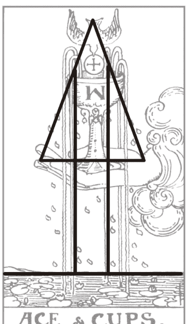

### 圖像分析

從雲端中伸出來的手與杯子形成了三角形的視覺中心，位在畫面正上方，杯子的周圍有向下流動的水流，成為五條直線連結了下方的水池。不像寶劍元素，從外切入的直線，干擾三角形的視覺中心，在這裡的四條直線，來自三角形內，並連結了下面的水池，讓出現在半空中的杯子，透過水流在視覺上形成一體。水池位在畫面的低處，上面開滿了蓮花，整體散發出豐沛、有生命力的氛圍。從天空飛下來的鳥，還有下方向外延伸出去的水池，都把圖像的視覺想像不斷向外延伸，開放地向外拓展。

### 情境敘事

在整體圖像，水以連結的意象，連接了聖杯與下方的水池。金黃色的聖杯上有英文的W或倒過來的M字母，杯子上方有白鴿，咬著標示十字的圓徽飛進杯子。這些象徵都跟宗教意象有關，五道水流可能象徵耶穌受難身上所留的五個傷口；白鴿與十字分別象徵了聖靈與耶穌聖體。韋特並沒有對字母進行說明，但從宗教象徵來解釋，可能是象徵聖母瑪麗亞的字母。但字母為何是倒著的呢？如果要讓字母以正位顯示，杯口就要向下，水就會更流暢的向下流動，但現在的杯子，水先噴向上方，再向下注入到水池，水流並不自然，猶如奇蹟，這是聖母的奇蹟。天主教有稱為「奇蹟聖牌」（MÉDAILLE MIRACULEUSE）的聖物，也稱為「聖母奇蹟獎牌」，據說是聖母顯現在一位修女前，指示她製作這個獎牌，聖母承諾佩戴這個獎牌的人，如果懷著信心祈禱，將會獲得許多恩寵與奇蹟，獎牌上就有標示聖母的M以及十字架的符號。在四張王牌的圖像中，只有聖杯王牌賦予了宗教意象，韋特的塔羅神秘學，追溯到聖杯傳說，聖杯象徵耶穌，所以在韋特塔羅的聖杯牌，特別強調了宗教意象（聖杯皇后手上拿著聖體櫃）。聖杯王牌的奇蹟，實踐在小秘牌的情境上，就像在生活中突然出現的好運，好運不只獲得財富，也給人被宇宙接納、祝福、被愛的感受，這就是聖杯王牌帶給我們的情境，感覺這世界為我們打開了雙臂，讓任何事都變得可能。

### 元素與數字在圖像中的意義

一號數字象徵開始，如果對應到水元素的聖杯，是一切水流的源頭，水也象徵了人的生命、情感與心靈，所以圖像裡的水是先從低處向上再往下，和一般的水特質不同，象徵了水流的神秘性，也就是人類心靈的不可思議。在神話時代，水的源頭都被視為神聖所在，人不得隨意靠近，或那是神明居住的地方，象徵了生命最神聖的本源與本來面目。在一號數字，生命隨著水流來到世界，需與更大的水池交流，才能在世界開花結果，最後流向大海。水如此自然的流動，就像人的情感與心靈，只要開始流動，不管在什麼樣的地勢、環境，還是會找到自己的路，持續流動，如果水流被阻斷，就會成為死水，生命無法生長，人的內在也會乾枯，失去生命力。

### 解牌敘事（正位）

在聖杯王牌的情境，會感受到生命被世界、社群、他人接納的支持力量，同時也有能力為他人付出。所以不論要展開什麼樣的新事物，在聖杯王牌的情境，我們會感受到他人的善意、溫暖與關懷，並且有了展開新機會的勇氣。在工作中，可能接到新任務、來了與自己很契合的新主管或新同事，成為展開很多事情的動力。或者在關係中，認識了一些新朋友、情感對象，彼此一見如故；或者終於放手去做心中嚮往已久的事，雖然是一小步微不足道的開始，卻對自己有著重要的意義。聖杯王牌不只是一段善緣、貴人的關係連結，也是找到讓生命有意義的人生方向。在聖杯王牌的情境，不管我們認識誰、想要完成什麼事，這件事會引發內在強烈情感，帶著一種無法抵抗的吸引力，甚至會忽略理性判斷，雖然知道不會獲得他人認同，但如果沒有做，就無法讓自己好好入睡、好好生活。就像電影《練習曲》裡說：「有些事現在不做，一輩子都不會做了。」處在聖杯王牌的情境，會接受內在情感的引導，隨著「心」做出行動與決定。

### 解牌敘事（逆位）

在逆位的處境，會感受到自己不被他人或群體接受的失落，害怕被他人拒絕而不敢提出任何要求。倒立的杯子，不再有源源不絕的水源，杯子與下方的水池是分離的，象徵了人跟群體的隔離與格格不入。所以就算有雲端伸出來的手，端出了一只杯子，這只是長不出任何東西的空杯，空無一物，反而讓收到的人感受到更大的不足與空虛。在逆位情境，感覺心中有一個填不滿的洞，想要做一些事，卻只看到因為沒人支持、沒有好資源而會失敗的結果，一方面希望他人可以給予機會與幫忙，另一方面又怕會被拒絕，所以在沒有開始前，就已經認為不可能而放棄。如果有人伸出援手，又會認為對方另有所圖，無法信任；或者怕自己過於依賴他人，會失去自主能力而拒絕。在逆位情境，會感覺生活一直在原處打轉，沒有前進，不管在工作中或關係上，陷入在舊的情境中無法看到新的機會或可能性。

### 建議敘事（正位）

遇到問題抽到聖杯王牌作為建議，可以解釋為隨著心去行動，不須太過講求合理的判斷，只要對的人出現了，就去合作共事，或不要退縮去認識對方。現在社會講求效率與合理性，所以很難說服自己隨心所欲，往往有了感覺不錯的對象或心動的事，也會盡可能三思而後行，怕做出愚蠢的決定或過於衝動。但聖杯王牌在提醒你，現在反而是要跟隨你的「心」的時候，如果工作中有新的計畫，雖然你會因為難度或責任不想承擔，但你要是心動了，就可以放手去試看看；又或者認識新朋友，雖然剛認識卻比你想像的還契合，不用猶豫或懷疑，就像水流自然會往低處流，你也只須自然地與對方相處。如果有新的工作提議，在聖杯王牌的建議，比起工作上的成功、地位或名聲，更需要專注在工作對你代表的意義，以及這件事是否有讓你心動不已。

### 建議敘事（逆位）

遇到困境抽到逆位作為建議，可以解釋為走出聖杯王牌的情境，不要過於期待與渴望用展開新生活、新工作、新緣分的方式來解決目前的困境，反而需要留在舊有的狀況與關係中，好好應對問題。雖然工作中的倦怠、沒有火花的關係，可以因為換新工作、找新的對象而有改善，但改變外在條件所帶來的新鮮感，通常都不長久。如果去認清會倦怠與沒有火花的原因，可能需要改變的是自己，而不是環境。逆位建議是在提醒你，心動的行動並不是來自好機會或好的對象，而是當我們學習「用心」時，好機會或好對象才能被我們遇見。如果你對生活感到煩躁，不管做什麼都沒有新意，那是因為你的心一直都在遠處，沒有與你在一起。好好讓心回到現在你正在做的工作、正在吃的食物、與他人的對話，或許你會發現每一天都有新的體驗與感受。

## 聖杯2

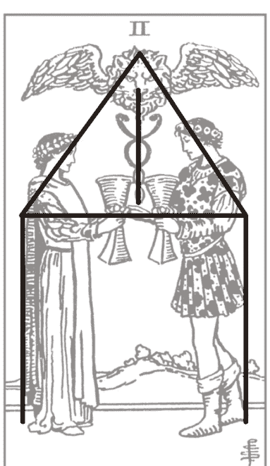

### 圖像分析

上方的天使與兩個人物手拿的聖杯，相互形成了三角形的視覺中心，兩個人的視線相互對望，把焦點聚焦在兩個杯子的中心處，剛好有蛇杖在三角形內形成穩固的支撐力。兩個人物的下半身，也剛好站在三角形的兩邊，讓三角形成為堅固的房屋立在畫面中央。人物站在平地上，遠方有高地與房子，但比起人物的身形，高地沒有形成威脅，反而為平坦、沒有雲單調的風景帶來變化。整體散發出寧靜、溫暖的氛圍，讓人感到安心與美好。

### 情境敘事

兩人以側身的方式相互對望，他們手上都拿著杯子遞向對方，雖然兩個人分開站立，但他們手上的杯子連起了兩個人，強調了兩個不同的人，結合為一的關係。兩個杯子雖沒有接觸，但男人一隻手伸向女人，在兩個杯子之間有一支黑色的杖，有兩隻蛇纏繞在上，在黑杖的上方是紅色獅子形象的天使，祂的翅膀籠罩著兩個人物。一男一女、綠色與紅色的花冠在頭上，分別象徵了二元對立，但他們兩個的杯子卻相同，成為異中求同的意象，而且兩人的聯結延伸出蛇杖與天使。有兩隻蛇與翅膀的杖源自於希臘赫耳墨斯神的杖，象徵了在商業中的溝通、中立與速度，但後來在一些醫療單位的誤用（希臘神話中象徵醫療的是阿斯克勒庇俄斯之杖〔Rod of Asclepius〕，只有一根杖與一隻蛇），也象徵了火速的救援或治癒。獅子形象的天使，除了有天使的守護，還增添了王權與勇氣的象徵，在聖杯2圖像中，兩人的連結引導出來的天使與蛇杖，象徵了這是相互尊重、學習、成長的關係，他們的結合，帶來勇氣與守護的力量。

### 元素與數字在圖像中的意義

在聖杯王牌，圖像強調了源源不絕的生命的流動，到了二號，聖杯展現了兩個人的親密關係。二號通常成為二分與對立的數字，所以也成為分離或分割的象徵，但在聖杯元素，二號強調了不同的兩個人整合為一的關係。就像王牌中象徵聖靈的白鴿，在二號牌，也出現了天使意象，並把兩個杯子結合在一起，象徵了二號數字的分離意象中，可以整合二的力量只有聖杯的特質，其他三個元素（五角星、權杖、寶劍）都只能在二的對立中擇其一。聖杯水元素的優勢在於分離之物的連結，就像王牌中，把上跟下用水流相連，在二的數字中，則是一分為二的對立的整合。而這種整合，並不需要任何一方的退讓或妥協，而是能夠尊重對方為獨立個體，透過兩人的溝通與整合，創造出新的局面，這就是在杯子上方延伸出來的天使意象代表的意義。聖杯所象徵的情感特質，在人跟人能夠親密互動與接觸時，最能感到滿足與發揮元素的優勢，所以比起多人群聚，聖杯特質會更傾向一對一的兩人關係，能夠有深度、真誠的態度對待對方。這也是二號聖杯在所有聖杯圖像中，唯一有天使形象的原因，這是聖杯特質最能展現它的情感優勢的數字。

### 解牌敘事（正位）

在聖杯2的情境，是深深投入情感的兩個人，這種關係會帶給人幸福。但這種情感深度，並不一定只是對人，也有可能對事。有些人對自己喜歡的事非常投入，只要想到就像談戀愛的人一樣心情雀躍。例如問工作抽到聖杯2，並不代表在職場上有喜歡的人，也可以代表對待工作的方式，猶如聖杯2全心投入，工作成為他生命中的力量與幸福的來源。但如果求問事情明顯與「人」有關，那就代表與對方有著真心誠意的互動，但未必是情人關係，這種關係也可能出現在親子互動、相互信任的主管與下屬、長久的友誼等。聖杯2情境中的人際關係，是可以相互學習成長的互動，不管對方的性別、年齡、身份，在聖杯2的關係中，人跟人相互坦誠、信任，也成為對方的重要支持與力量，內在產生比一個人更強大的勇氣。

### 解牌敘事（逆位）

在逆位的情境，原來相結合的兩個人維持在分離狀態，各自獨立，但水元素的聖杯優勢在於連結，所以獨立反而會讓水元素停滯在一個地方，無法流動，不再能孕育生命。所以在逆位情境，會感受到孤立無援，只能一個人奮鬥，而且一個人的狀況，給人不被他人接納的孤單感，或者也有可能是失去了原來的關係而失落，像是與好友分離、跟情人離別、跟家人的分開，或者無法繼續投入自己喜歡的事等。在逆位的聖杯2，某個重要的事物或關係從我們身邊離開，不只失去了對方，我們的一部分也因為分離而消亡。在逆位情境，有可能因為他人的拒絕或離開，我們會認為自己不值得被愛，無法好好照顧自己。也有可能為了彌補失去的傷痛，沉迷在某些事物中，會過度蒐集或依賴某些物質，讓自己失去克制能力，就像沒有流動的水，會在原處成為死水，在逆位的處境，會對生活失去動力與創造力，不想要落單的想法，反而會依賴他人，或更封閉自己的世界，不輕易與人交流與接觸。

### 建議敘事（正位）

遇到困境抽到聖杯2作為建議，可以解釋為不管是對事、還是對人，都要全心全意的投入，全神貫注，才能化解目前的困境。你可能只想應付跟自己有關的事，但目前的困境就有可能出自你不認為問題跟你有關，聖杯2的建議是需要把目前你所遇到的狀況，都視為是你的事來好好面對，或者如果是人際關係上的困難，不要把困境視為需要解決的問題，而需要花時間去跟對方溝通與交流，去聆聽，但不需要解決。在找工作的困境抽到聖杯2的建議，也是提醒你要找到可以讓你全心投入的事，你喜歡的事，自然會用心準備與表現，才能爭取到機會。在情感關係上，建議你與對方建立相互學習、成長的模式，如何尊重與信任對方，也是聖杯2的關係需要學習的功課。

### 建議敘事（逆位）

遇到困境抽到逆位建議，可以解釋為走出聖杯2的情境，不要過於渴望自己所投入的事與情感，都能帶來像蛇杖、天使一樣的祝福與力量，過度期待會成為掌控事情的執著，或計較對方的付出不多，反而成為壓力與傷害。逆位情境的建議是在提醒你，現在是讓自己獨立的時候了，不管是事情還是關係，要切斷你認為自己需要他們或想要依賴的心境。在工作中，計畫或任務須在無法獲得支援的情形下，自己一個人完成；或者在人際或情感關係上，如有想要修補或繼續的關係，逆位建議你暫時處在一個人的狀況，現在的關係修補，有可能只是你不想要獨自一人的依賴，所以等過一陣子情感冷靜下來，再去判斷下一步較為適當。

## 聖杯3

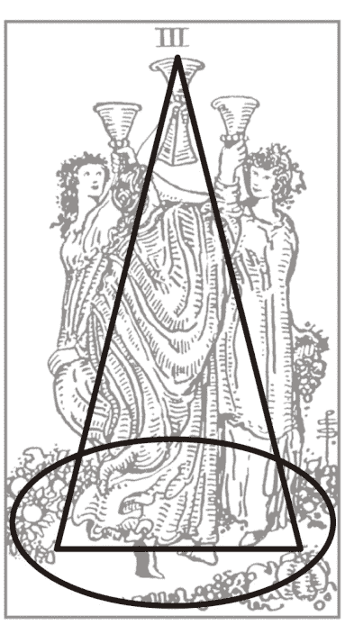

### 圖像分析

畫面中有三個人物圍成一圈，她們高舉手上的杯子，身體往中間移動，三人的身形構成三角形的視覺中心，而她們的視線向上，將焦點匯聚在三個杯子的頂端，整體畫面從地面延伸到圖像最上方，由三個人物的形體占滿。背景的配置相對微小、次要。雖然人物都站在平地上，但她們的腳步並沒有全部落地，也只繪出兩個人的腳，從腳步來看，三角形的形體並沒有很穩固、甚至往一邊傾斜，比起聖杯2的完美立地，聖杯3的圖像增添了動態與變動性，用動感帶動起歡樂的氛圍。前景平地上有收成的農作物，以弧形的線條掩蓋住背景中的地平線，形成了將三個人物環繞在內的視覺效果。因此，腳步雖看起來不穩，但視覺上形成保護三角形的界線，整體給人安心、卻又有變化的豐富的視覺感受。

### 情境敘事

三位圍著圓圈的女人，高舉著杯子，展現出歡樂氛圍。有兩位女性的頭上戴著花冠，穿黃衣的女人，另一手還拿著大串的葡萄，這是一個豐收的季節，三位女子就像參加秋季祭典的人群，用酒杯、音樂、舞蹈正歡欣慶祝豐富的成果。高舉的杯子有高低之分，也相互分離，所以這並非喝美酒之前的碰杯慶祝，更像是一種舞蹈或儀式，三位女性的穿著有各自象徵的意義，她們的動作與位置，也都是安排好的結果，代表每個人各自都有要扮演的角色，也配合著儀式安排用心演出。而且她們都是女性，不像聖杯2一男一女的組合，在聖杯3是同性別的群體，象徵了情感上同質性高的社群，但這不只是隨性的聚會，而是三人有默契以及認同的規則，並配合他人的互動。聖杯3強調團隊合作的默契與精神，就像一次表演，唯有每個人真心投入，不只要顧好自己，也要能與他人配合，才能有完美的演出。

### 元素與數字在圖像中的意義

三號是剛開始發展不久的數字，但聖杯3的圖像卻呈現了收成的結果，與三號數字的意象不太吻合。從數字的象徵來看，聖杯3所要強調的並不是豐收的結果，而是三的數字如何在聖杯元素達成默契與合作，而豐收的祭典只是演出默契的場景。二號展現了水元素往同一處流動的穩定感，當水的流動出現多個分支可能會帶來混亂，如果不理順路線，會讓水流失去動力。就像在三人關係裡，會以二為中心，總是會出現較親密或較不合拍的組合，如果要求三人情感上都要同等，反而無法讓關係延續。但三的聖杯依舊展現了和諧的場景，所以這不只是純粹的情感交流，而是被分配好的位置與角色，如果沒有這些安排，以情感親密為優先，只會帶來關係發展的阻礙。因此，二號的聖杯元素是異質性的兩個人（一男一女），從差異中形成緊密連結，三號的聖杯則需要先有三人都能認同的情感元素，才能走向和諧的互動與合作。不管是異中求同、還是同中求異，聖杯元素的優勢在於情感的投入與聚集，只有杯子聚集在一起時，聖杯元素才能發揮優勢。

### 解牌敘事（正位）

在聖杯3的情境強調了團隊合作，每個人在各自的位置上真心付出與投入，形成和諧的合作關係。很多關係例如工作、同學、鄰居，這些是因為外在的環境、地點、條件被安排在一起的團體，如果這類團體沒有形成情感交流，只要失去了原來在一起的條件，就不再跟對方聯絡。但有些工作同事，雖是因為工作而認識，但有可能離開工作後持續維持友誼，這就成為以聖杯組成的關係。聖杯3不管在什麼樣的情境，都可以像朋友一樣相互關懷與分享，在工作中，聖杯3的情境是，大家不只有工作上的默契，也能在生活中發展為友誼；在情感關係中，兩個人的相處也較多是像朋友一般，喜歡跟一群人出遊、聚餐或享受歡樂時光。在聖杯3的處境，可以形成愉快的小團隊，而且圖像中是同性別的三個人，象徵團隊成員的同質性很高，有共同喜歡的事或興趣，並分享與交流。

### 解牌敘事（逆位）

逆位的情境，三個人各自為政，相互分離，團隊成員之間的異質性過高，合作的意向也很低，所以無法相互配合、共事。而且逆位時，也未必在一個物產豐富的季節，所以團隊成員無法融洽相處，也有可能是資源缺乏，大家為了爭奪利益，會把對方視為競爭對手或敵人，各自防備。在工作上，同部門的人各自獨立作業，很少相互合作，也有可能相互提防對方會搶功勞，只為自己的利益排擠他人；如果是朋友關係，在逆位情境，有可能是因為特定的條件才形成的群體，例如學校社團、班上同學、室友等，透過這些關係網雖然成為群體，但沒有私交，關係不密切。或者因為欺騙、隱瞞或誤解，朋友之間斷絕往來。或者在情感關係上有讓兩人關係疏離的因素，例如對方或自己的朋友、家人或小孩。在逆位時，關係的疏離也會形成情感上的傷害，認為自己付出很多，卻被對方辜負或拒絕，關係中自己沒有被對等對待而失落與受傷。

### 建議敘事（正位）

遇到困境抽到聖杯3作為建議，可以解釋為與他人建立友好關係，不要把關係用功能性來區別，分成同事只跟工作有關，朋友可以一起出遊，網友只能在網路上交流等，而要能夠把關係中的情感關懷擴展出去。也有可能是建議你在團隊關係上，學習如何分配工作與各自定位，而不只是期待用情感聯繫在一起。聖杯3的建議可能在提醒你，你目前遇到的工作上的阻礙、與上司或同事的溝通困境；或者在情感關係上的磨擦，都有可能與你不喜歡感情用事，想要把工作與情感分開的意圖有關，有時候與同事、不太熟的人群，聊一點個人的事無傷大雅，反而可以增進與他人的關係。見面時的閒聊，雖看起來是在浪費時間，卻會成為情感累積的養分。在換工作問題上，也要能夠強調團隊合作的重要性，雖然獨立工作的能力是必要的，但能夠展現出與群體合作的經驗與能力，就會是重要的加分項。

### 建議敘事（逆位）

遇到困境抽到逆位作為建議，可以解釋為走出聖杯3的情境，不需努力與團隊或家人形成和諧的合作關係，接受有些事只能自己去面對與承擔，想與團隊共事的努力，反而是造成困境的原因。以和為貴是華人文化的美德，所以大部分的人不擅長應對衝突，或在疏離的關係中生活。雖然好的情感交流可以帶來快樂，但也不能過度要求每個關係都要和諧、美好。逆位的建議在提醒你，你可能過度期待人跟人的相處要和諧、愉快，卻沒有接受目前的處境，大家比起和諧，可能會更關心自己的利益，所以你的期待反而會帶來不必要的衝突。在工作中，有可能遇到無法和諧共事的主管或同事，這時只要彼此做好工作即可，在換工作的問題上，逆位建議是比起團隊合作，更要強調獨立工作的能力。或者有些家庭關係見面就會吵架，就減少見面，不必一直促成吵架的機會；或者在情感關係上，不能要求兩個人無時無刻都能情感融洽，如果兩人之間有造成關係不和諧的原因（家人、朋友等的干預），而這原因不是能夠解決的問題，也要能夠接受兩人關係當中存在不和諧的事實。聖杯情境遇到的困境，未必要解決，而需要接受與同理。

## 聖杯4

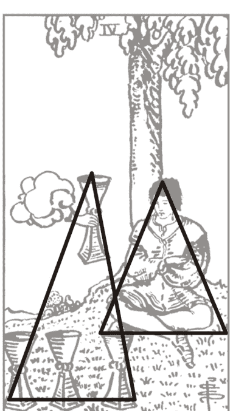

### 圖像分析

人物靠著樹幹坐在高地上，他的兩手、兩腿交叉，形成三角形的視覺中心，但他前方有四個杯子：一個從空中伸出來，另外三個在地上。這四個杯子也形成三角形構圖，兩組三角形，高度類似，但人物在高處、杯子在低處，而且人物的視線並沒有聚焦在杯子上，畫面上成為相互分開、沒有關係的兩組三角形。人物坐在斜坡，比起在平地上的杯子，視覺上有著不安穩的效果，有可能向下滑落，但後方直立的樹幹，成為人物的支撐，所以兩組高度類似的三角形，因為人物身形由樹幹向上延伸，在視覺上更被強調，也成為畫面中的焦點。前景中的杯子形成的三角形，在比例上大於人物，也成為另一個焦點，兩個焦點間沒有連結，在畫面中各自分立，在視覺上沒有被整合一起。

### 情境敘事

圖像中的背景是一處小山丘，山丘上有一顆樹，人物雙手、雙腳交叉靠坐在樹前，雖然坐在斜坡上，位置不平穩，但有樹成為依靠，象徵人物雖想要改變，但因為有安穩可依賴的資源，不想要移動。在他的下方有三個杯子，左手邊有一隻手拿著杯子從雲端中伸出來，但人物的眼神並沒有看向杯子，以拒絕的姿態坐在草地上。坐在高處的人，似乎不滿意放在低處的三個杯子，就像眼光高的人從高處往下看，拒絕三個杯子的眼神看向別處，反而沒看到前方的杯子。三個杯子是被人物拒絕，但空中的杯子則是沒有看到。這就像過早放棄可能性的狀況，因為看到三個不滿意的杯子，就認定自己沒有機會擁有更好的，放棄了期待與等待，只是坐在地上怨嘆自己時運不佳，但機會不是沒有到來，而是認為沒有機會的想法對可能性都視而不見。坐在山丘上的人物，優勢是看得遠，但他並沒有看向遠方，象徵了人物的短視，卻又認為自己擁有比他人更好的優勢，成為只會挑剔，無法珍惜。

### 元素與數字在圖像中的意義

四號的聖杯元素，不再只是滿足於自然的水流，想要用人為的力量，讓水從低處往上流，或者想要改變水道，結果遇到難題，對四號來說水成了煩惱，而不是因為擁有而快樂的生命源頭。這就表現為人物與杯子分開，沒有拿在手上，象徵了人物無法運用水的優勢與特質。在三號因為水流的豐沛而受益的聖杯元素，到了四號有了更大的渴望與野心，想要讓水流依自己的方式所用，但還不能掌握水元素優勢的四號，只能讓眼前的水流白白浪費，或者因為無法用在自己想要的方向而遺棄。聖杯元素的情感就像水流，不讓它自然流動，就會變成壓抑或干預，不管怎麼努力，都只會帶來不滿與抱怨。

### 解牌敘事（正位）

在聖杯4的情境，雖然有不錯的條件，但無法對已經擁有的感到滿足。例如擁有一份別人稱羨的工作，但情境中的人卻只看到工作讓自己不愉快的地方；人際關係上，也會挑剔對方的缺點，抱怨做不好的地方，讓關係不愉快。在聖杯4情境的人，看事情總是坐在高處挑剔毛病，看什麼都看不順眼，比起肯定，更多是批評與抱怨，而且也不會想要改變。在工作中，認為自己無法好好工作是因為公司的條件不佳、同事不合作、主管不合理。在人際或情感發展上，也會認為關係中的衝突是對方的問題，或者對自己交往的對象都不滿意，認為自己的條件配得上更好的對象。在換工作的問題上，也會處處挑剔公司或工作上的問題，認為自己經驗足、能力夠，可以找到更好的而不滿意對方的條件。

### 解牌敘事（逆位）

逆位情境時，人物可能失去樹的依靠，也沒有放在眼前的杯子，所以在一個空曠的草地上，自己一個人等待與尋找。人物在逆位時比起正位更會感到不安，也不知道一個人是否能找到杯子。人物可能離開原地四處尋找，卻只是一種不知方向的四處尋覓。逆位的聖杯4，可能是在工作中不知道自己追求什麼，只是茫然的一直去嘗試新工作、新職務，卻都不滿意。在人際關係上，想要與很多人成為朋友，但無法跟杯子連結的人物，情感表達很輕浮或不成熟，跟他人的交往無法深入，也不夠真誠，所以可能認識很多人，但都無法成為好友，或者感覺自己沒有朋友而感到孤單。逆位情境，人物很想要找到屬於自己的杯子，卻遍尋不著而感到失望與無助。

### 建議敘事（正位）

遇到困境抽到聖杯4作為建議，可以解釋為不要那麼容易妥協，如果不滿意，就不要接受，要學會拒絕，才能解決目前的困境。通常不懂得拒絕、或不敢開口說出自己的要求時，有可能是認為自己不值得、或者害怕失去他人而默默接受。但為了他人而忍受，很容易變成委屈，長期下來對生活造成不好的影響。所以聖杯4的建議，是在提醒你要看得起自己，要為自己爭取更好的機會。在工作中如果主管一直丟爛攤子給你，就要以清楚的工作職掌與責任歸屬學會拒絕；或者你不認同同事的做法，就直接說出自己的意見。在情感關係上，可以要求更為理想的關係狀態，不滿意、不愉快的時候，都要能夠表達出來，並拒絕妥協或配合，才能讓關係有所改善。

### 建議敘事（逆位）

遇到困境抽到逆位作為建議，可以解釋為要走出聖杯4的處境，如果你對目前的狀況不滿意，不要為了避開麻煩或不想改變，而原地不動或視而不見，需要在自己的位置上站起來，離開。或者也要能夠轉頭看向別的方向，就有可能看到空中給你的杯子。逆位建議需要透過改變環境，來改善目前的處境，所以在工作中，如果不滿意目前的工作，不只是思考換工作，也要想想嘗試不同領域的可能性。在人際關係上，如果你的交友對象都跟你不契合，需要離開你熟悉的交友圈，認識不同的群體，才能帶來改變。如果情感發展上有磨擦，在逆位的建議是要改變兩人的互動方式，一味忍耐並不代表尊重，或者你的忍耐可能被對方理解為不在乎，兩人長期形成的相處模式在逆位的建議需要透過行動來改變。

## 聖杯5

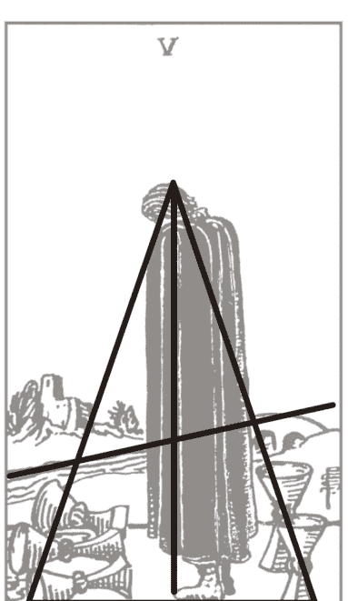

### 圖像分析

畫面中穿黑衣的人物站在中央，他的腳邊分別有倒立跟站立的兩組聖杯，跟人物一起組合成三角形視覺中心。人物直立在三角形正中央，但兩邊的杯子相對散亂，中間的直立線，反而變成區分兩邊的分隔線，導致三角形內的物件，無法和諧的被整合。背景中有橫跨畫面的河流，剛好從三角形中間的位置橫切出去，與人物直立的線條形成交叉線。寶劍圖像中出現過很多橫切視覺中心的構圖，但在聖杯圖像很少見，尤其橫切的是水元素的河流，成為分離人物的切割線。同時也把畫面分離為前景與後景，阻隔了對岸與人物站立的地方，人物雖然站在平地上，但河流兩邊都有高地，也成為高出地面的障礙，畫面整體上充滿了分割與阻隔的意象。

### 情境敘事

圖像中有河流橫過中景，把畫面一分為二，人物身穿黑色的斗篷，低著頭，是代表憂傷的身影。在他的前方有三個倒下的杯子，裡面有紅色、綠色的溶液流到地上，人物的頭朝向這些倒下去的杯子，或者這就是他憂傷的原因。圖像中的人物因為失去了三只杯子而難過，三個杯子與聖杯4中的杯子意象延續，原來在聖杯4不滿意的三個杯子，在聖杯5成為失去之物，代表人物在失去後才懂得珍貴而感到遺憾與後悔。但在他的後方還有兩個立著的杯子，就像聖杯4的人物，太在乎沒有的，反而看不到還擁有的杯子。雖然聖杯5圖像裡有河流，但遠水救不了近火，這條河流反而成為阻隔人物與對岸的城堡的界線，讓人物感受到自己不屬於群體的孤單。聖杯5的人物站立，有可能想要離開聖杯4情境中的山丘與大樹，但離開並沒有幫助他找到滿意的杯子，反而讓他失去了原有的而傷心。後方的兩個杯子與石橋在視覺上相連，象徵它們可以幫助人物走出憂傷，並跨越到對岸，在城堡中找到人群，但低著頭的人物，就像撇開頭的聖杯4的人，沒有能力、也沒有意願去看到可能性。

### 元素與數字在圖像中的意義

一直努力用人為的方式改變水流的四號，不僅沒有如願以償，四號的努力反而造就了五號的水源枯竭，雖然圖像中有河流，但無法被五號聖杯元素所用，在遠處流過。屬於聖杯元素的水早已乾枯，一去不返，只能接受沒有水源的事實。不論是像四號為了未來而努力；或者像五號因為懊悔而只看到過去，都不是聖杯元素的優勢。聖杯元素需要在此時此刻，與身邊的人事物交流、連結，才能發揮它的特質，所以人物只要抬起頭，看向周邊，就能看到後面的杯子與遠處的橋梁，不是沒有水，而是人物認為已經來不及、沒救了，杯子不屬於自己，才會變得沒有希望。

### 解牌敘事（正位）

在聖杯5的情境，人會因為憂傷而失去動力，對什麼事都感到無力與疲乏。這時不管他人如何鼓勵，只看到自己的遺憾、後悔與孤單，感覺自己是被他人遺棄的孤兒，很可憐。在工作中，如果處在聖杯5的情境，會為自己的錯誤而懊惱，也會因為不和諧的同事關係而感到失望與憂傷，雖然與他們沒有發生衝突，但也會認為自己沒有被群體接納，不管做什麼，似乎都無法被他人喜歡或認同，所以人際關係也無法順利發展，會害怕被他人拒絕而躲避，或者常常處在憂愁、不愉快的情緒中，讓他人不易親近。這是自我封閉、用情緒傷害自己的狀況，他人的善意與關懷也都會被拒絕與否定，只想要陷在自己的情緒中，無法聽到其他聲音。在聖杯5的情境，需要覺察自己為何會沉浸在憂傷中，想想是不是只看到失去的，卻無法轉向自己還有的。

### 解牌敘事（逆位）

在逆位情境中，圖像裡的人物，不再只是專注在倒下去的杯子，而能夠抬頭看向遠方，看到石橋、身後的兩個杯子。雖然人物看到自己沒有失去全部，但讓自己重新走向人群，需要努力拿起兩個杯子，跨過石橋、走向城堡，才能不再讓自己孤立，這需要一些時間，無法馬上改變。在工作中，你可能失去了轉職、接任新任務、加薪、表現自己的機會，在逆位情境，不想再讓自己懊惱或傷心，正努力讓自己從失望中走出來，參加一些活動、做一些讓自己開心的事。在人際關係上，逆位情境想要修復因為衝突而疏離的關係，或者在遠距交往中，努力與對方不要變得疏離，也可能是逆位聖杯5的情境。在逆位時，我們對關係感受到的失望與不滿足沒有全然消失，所以不愉快的情緒還是會影響我們，但人物想要跨過這些情緒，儘量往修復關係的方向努力，但因為是逆位，人物選用的方法也可能因為不適當而讓傷害持續或沒有改善。

### 建議敘事（正位）

遇到困境抽到聖杯5作為建議，可以解釋為要接受目前正經歷憂傷，承認失去，才能好好哭泣與悲慟，這也是療傷的重要歷程。很多傷害不是因為傷口太深而難修復，而是不接受自己受傷的事實，讓療癒的時間一直延誤。你可能在工作中因為能力被否定或拒絕而受挫，也有可能因為主管或同事對你的嚴厲批評而受傷。或者在情感關係上發生了讓你傷心的事，不管是什麼樣的狀況，都要先接受自己被這些事影響，比起在人群中裝作一切如常，需要讓自己靜下來，好好安慰自己，不需要努力維持故有的社交關係。聖杯5的建議是要看向失去的杯子，當我們沒有接受失去以前就轉頭看向後面的杯子，雖然可以不為失去難過，但也有可能成為逃避痛苦的行為。

### 建議敘事（逆位）

遇到困境抽到逆位作為建議，可以解釋為走出聖杯5的情境。或許你有遇到傷心的事，但你已經有了足夠的時間憂傷，是時候回到原來的生活，不要再孤立自己，走出來跟人群互動，找回過去的社交生活。逆位的建議是在提醒你，你的憂傷已成為自憐自艾，事情沒有你想像中嚴重或無能為力，只要你願意走出來面對，就會發現你有足夠的力量應付。在工作中你可能以為被他人排擠或孤立，如果你主動去接近他人，會發現事情跟想像中不一樣；或者你認為主管不賞識你或不喜歡你的工作表現，才會那麼嚴厲或分派困難的工作給你，但如果你跟其他同事溝通，就會發現這些工作或許是主管給你的機會。在情感關係上，要從自我孤立中走出來，如果你先關起了門，沒有人可以接近你、親近你，當你認為對方不了解你而孤立自己時，是你關上門，切斷了關係的未來。

## 聖杯6

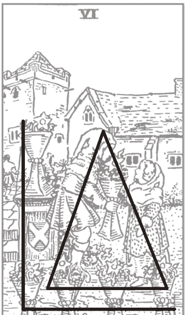

### 圖像分析

在畫面中央有兩個小孩，他們側身站立，視線看著對方。男孩身體微彎、手上拿著杯子伸向女孩，如果在這兩位小孩中間，畫出三角形視覺中心，男孩手上的杯子就會成為聚焦點，將男生與女生的視線連在一起。前景中的杯子，雖以小比例擺放在前方，但色彩與地面、背景的城堡相連在一起，形成對人物的包覆，圖像中間的兩個人物，就像被包在花瓣中的小精靈，人物所在的位置，形成視覺上的安全地帶與保護牆。後方高聳的房子，超出人物的高度，相對阻礙了視野，也阻隔了外面的世界，圖像在整體上都強調了保護意象。

### 情境敘事

圖像中以小孩為主角，展現了天真可愛的場景。男孩像大哥哥，以微彎的身體，親切的把聖杯花盆遞給女孩，女孩則仰頭看著男孩，正準備伸出手接住花盆。這之間有著送禮、分享、照顧的關係，兩人並不對等，卻可以相互體諒對方，並給予適當的關懷。女孩手上戴著手套，頭上披著圍巾，象徵了他們處在寒冷的天氣，但聖杯裡盛開的花，卻散發著春天的氣息，為圖像增添溫暖，也預告了春天即將來臨。兩個小孩年紀還小，身邊沒有大人陪伴，但在遠處有警衛巡邏，象徵了他們在非常安全的社區，不需提防危險，可以安心的在外面遊玩。小孩的天真、有保護意象的城堡、讓人開心的花朵、他人送的禮物等，這些元素展現了聖杯6友善、安心的情境，這是可以放心與人交流、分享的友誼空間，在這空間，大家會相互照顧或幫忙，也可以天真的信任他人。

### 元素與數字在圖像中的意義

在五號只注意到情感流失的聖杯元素，在六號等到了甘霖，為乾枯的大地注入水源，再次讓聖杯有了生命力。雨是大自然的禮物，是幸運、是贈予，並不是努力得來的結果。這就是孩子的意象代表的意義，沒有意圖的贈予與溫暖。雖然大自然的雨水只能等待，但情感豐沛的聖杯則可以在美好回憶中尋找，五號元素再次找回聖杯能量的方法，就是從過去被關懷、被愛與受照顧的回憶中找回來，只要憶起一件曾經美好的小事，情感就會從那件事向外擴散，喚起更多想珍惜的回憶，而慢慢從遺憾中走出來。五號聖杯展現了不被群體接納的孤寂，但過去無條件被愛的記憶，就是在五號兩個在人物後方立著的杯子，雖然人物沒看到這些，但它一直都在那裡，等待被發現的那一刻。聖杯元素的特質是流動，從五號流動到六號的水元素，終於連結到背後的兩個杯子，讓他憶起孩童時代的真誠與溫暖，重拾對他人的信任，並慢慢從被孤立的情感走出來，這就是天降甘霖的經驗，也是生命留給我們的無價之寶。

### 解牌敘事（正位）

在聖杯6的情境，人跟人的相處變得友善、愉快，不需擔憂對方是否有所居心，就像小朋友的真誠，可以真心的對待他人。就像有時候遇到貴人，就算沒有直接的利害關係，卻沒有理由的伸出友善的手，或者我們會成為他人的貴人，自願幫助他人，並不要求回報。所以在工作中，可能是資深的同事在旁用心帶領，或者是長輩給了很好的轉職機會，或者跟新同事很投緣，很自然的幫助對方熟悉工作等。在工作場合，聖杯6的情境，同事之間會分享小禮物或相互幫助，彼此之間不只是工作關係，也能成為工作之外的朋友。在情感關係上，兩人就像兩小無猜的小情侶，比起規劃未來，更專注在相處的每一刻，享受情人的小浪漫。聖杯6的人物處在安全的環境，所以當生活進入到聖杯6的狀況，我們會想在熟悉、安全的環境中生活，不會想冒險或改變，或者展開新計畫。

### 解牌敘事（逆位）

在逆位情境，原本保護小朋友的城堡不見了，小孩就獨自在外，或者進入到陌生的環境而感到不安與害怕。或者逆位時，相互送禮的小朋友，變成沒有朋友，一個人孤立，或者禮物反而變成傷害他人的言行。在工作中，聖杯6逆位時，可能換了新工作，對新環境感到陌生，也與新同事有隔閡，或者原來熟悉的部門換主管、或有新的組織編組，工作業務或同事，都需要重新熟悉。或者期待某人的協助或幫忙，但對方卻沒有伸出援手；有可能是接了沒有交接的業務，而其他人也無法協助；或者向他人尋求換工作的機會，沒有得到友善的回應等。在情感發展上，兩人的互動不足，可能很少見面，或者是遠距愛情，雖然在交往中，卻感到對方跟自己很疏離，無法對現在的關係感到安心。逆位的聖杯6，就像聖杯5的人物，感受到孤寂與遺憾，這種失落感會延續，但在聖杯6，不只是一個人，而是親近的人在身邊，卻因為無法與這些親近的人交心而失落。

### 建議敘事（正位）

遇到困境抽到聖杯6作為建議，可以解釋為相信自己現在處在安全的狀況，如果身邊有人想要幫忙，伸出手接受它，就可以解決目前的問題。聖杯6的建議在提醒，你可能長久都只相信自己，很多事自己扛，所以不習慣他人的協助。或者認為任何協助都有代價，為了不必要的麻煩，一直以來都在拒絕他人的好意。但聖杯6的建議是請你放心接受他人的好意，這不只是被幫忙，同時，因為學會接受，你也會成為向他人伸出援手的人。在情感發展上，或許對方無微不至的呵護你，或者你想要為對方付出更多，但怕自己過於依賴而猶豫不決，這時，聖杯6的建議，是讓你放心的在呵護或被呵護的關係中，安心、愉快的與對方互動。

### 建議敘事（逆位）

遇到困境抽到逆位作為建議，可以解釋為走出聖杯6的情境，不能再依賴他人的好意、停留在讓自己感到安心、熟悉的地方，如果有改變的機會，雖然會讓你感到害怕或猶豫，也要嘗試做出改變。穩定、被保護的環境雖然很安逸，卻有可能成為阻礙你成長的障礙，而逆位建議就是在提醒你，現在就是改變的時機，讓自己走向未知、不確定的未來，同時接受改變可能帶來的不安與害怕。在工作中，如有職務調動、新工作、或者接到新任務的提議，逆位建議都是向著改變的方向前進。在人際或情感發展上，也是建議離開舊的交友圈，試著去接觸新的社群；或者離開被保護、或保護他人的關係，去探索、享受一個人的時光。

## 聖杯7

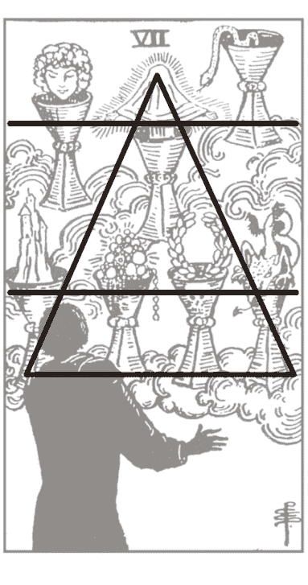

### 圖像分析

圖像中雖然有人物，但人物以黑影形態站在左下方，無法形成視覺中心，反而是位在畫面正上方、發紅光的白布成為焦點。紅光與人物之間連起的三角形，人物位在邊角，無法成為中心，其他橫向排列的聖杯，則以橫切三角形的直線，切分中心的位置，形成散亂的視覺感受，無法聚焦。三角形半浮在空中，下方除了黑影的人物，沒有其他支撐，看起來很不穩定。在這幅圖像裡，杯子成為主角，人物則被隱藏在黑影中，看不到視線、表情，衣服也只以黑色來表現，在對角位置的杯子也用白色布蓋住，看不到杯子裡的物件，整體展現了未知、不明的視覺效果。

### 情境敘事

當六個杯子裡都有著吸引人的物件，卻只有一個杯子被白布遮住，你會聚焦在六個誘人的物件？還是未知的白布？圖像裡的人物似乎在意的是中間的杯子，其他聖杯都吸引不了他。在天空出現的雲霧、黑影的人物，述說這都不是現實，而是一場夢，夢裡的人被發紅光的聖杯迷惑，雖然不知道白布底下是什麼，但他相信那才是他所期望的東西。所以金銀財寶、權力、地位、名聲等誘惑，都發揮不了作用。黑影人物的左肩向一邊傾斜，雖然看不到他的左手，但從姿態猜測，可能是伸手向著聖杯，他想要碰觸杯子、或者打開白布，但都是白費力氣的嘗試，雲端上的杯子像白日夢，看似很近，但只能想像與觀看，根本碰不到。不管白布下發光的物體是什麼，在沒有揭開之前，只能是人物的渴望與期待，是沒有具體目標的白日夢，而且聚焦在白布下物品的人物，會失去行動力，只沉浸在沒有用的想像中。

### 元素與數字在圖像中的意義

在六號，水元素的聖杯天降甘霖，世界又充滿了希望與生命力。但天降甘霖可能只是暫時解渴，還沒能成為不易乾枯的河流、湖水或海洋，所以在七號的聖杯元素，需要等待甘霖慢慢聚集成為流水，才能再次恢復聖杯元素的優勢。雖然圖像中，水元素的聖杯在高處、人物在低處，水可以往低處自然流動，但聖杯裡都沒有水，人物與聖杯無法連結，只能等待水注入到杯子，再流向人物所在的地方，就能夠再次讓聖杯展現特質與優勢。所以現在是等待時刻，但等待時沒有人陪伴的聖杯元素，為了要填補沒有伴的孤寂，就會進入到無限的想像，卻讓自己在想像中失去了現實感，雖然會自得其樂，但也可能會忘記時間而錯過重要的事。

### 解牌敘事（正位）

在聖杯7的情境，人物正不著邊際的想像著自己的未來。就像賣牛奶的少女，頭上頂著牛奶去市集買賣，途中開心想著怎麼花待會賺到的錢，想著想著絆倒在路上，牛奶撒一地，才從白日夢中清醒。有時候我們會說人因為夢想而偉大，但如果夢想無法建築在可實踐的基礎上，就會成為防礙實際行動的白日夢、或達不到的自我理想。有些人只是遇到了心怡的對象，就會開始想像如何與對方相愛、交往、結婚到白頭偕老，最後因為自己的想像，反而無法與對方自然的相處，失去了交流的機會；或者想著中樂透一夜致富、突然天上掉下大好的機會等。在聖杯7的情境，不管在工作、還是人際關係，想的比做得多，實踐力不足，又因為理想過高，如果被批評做事不用心、三心二意、不認真，會解釋是因為還沒找到喜歡的事，才無法用心去做。現在很多人在網路上認識對象，這種交流模式就像七個聖杯在雲端上，不管兩個人談了多少未來，沒有下線在現實生活相見，永遠都只是雲中的杯子，想像中很美好，但只是一場空。

### 解牌敘事（逆位）

在逆位情境，原來在雲霧中的杯子都不見了，人物也不再站在原地做美夢，而是開始身體力行去行動；或者杯子都成為空杯，人物無法想像未來，只覺得自己的處境不足又貧乏，什麼都沒有。又或者蓋著白布的聖杯，終於揭示了真相，人物終於看到了實物，所以不再等待，不管喜不喜歡杯子裡的物品，都會讓人物有所行動（失望離開或追逐夢想）。在工作中，逆位情境就像一場遲遲未公佈的人事命令突然揭曉，終於可以決定去或留的抉擇；或者從一段沒有進展的曖昧關係中清醒過來，不再猜測未來，而是暢想可實踐的明天。沒有被揭示的真相，可能會讓我們等待、停滯不前，但知道真相也常會是傷害或失望，所以在逆位情境，雖然有種終於清醒了的領悟，但這次的清醒，未必讓人神清氣爽，也有可能是失望與失落，但在逆位時，人物不再站在原處觀看著不切實際的未來，而會開始面對現實。

### 建議敘事（正位）

遇到困境抽到聖杯7作為建議，可以解釋為現在是讓自己放鬆、隨意放空、任意的想像，不需一直要求自己要精進、努力，不能浪費時間，這段時間可以無所事事的度過閒暇時光，才能對目前所處的狀況有所幫助。在工作中，你有可能急著完成某個計畫，但一直推動不了；想要換工作，但找不到適當的機會，或者發出的訊息都沒有回音。在人際或情感發展上，感覺跟身邊的人無法認真談合作；或者跟情感對象常因為一些瑣碎的小事起衝突。生活上的安排，無法都依照我們的規劃進行，聖杯7在提醒你，現在是等待、放空的時候，不需要一直盯著你想要完成的目標心急，可以轉移目光，去做一些浪費時間的事，這些事可以幫助你開心的度過等待時光。就像空中出現的聖杯，被白布蓋著，沒人知道裡面有什麼，只能不停猜測，直到它出現，所以不必管正確答案是什麼，只要開心的、天馬行空的去猜。

### 建議敘事（逆位）

遇到困境抽到逆位作為建議，可以解釋為走出聖杯7的情境。現在不是做白日夢的時候，如果要等到一切事情都清楚明白才行動，就會發現行動時機永遠都不會出現。在工作中，有些人一直都在抱怨，或認為自己運氣不好，所以找不到好工作，只能委曲求全。或者在情感發展上，一直在等待「好緣份」、「對的人」，如果跟交往的對象有衝突、不愉快，就認為是沒有找到對的對象才會如此。用白布蓋著的杯子，就像我們等待的好工作或好對象，但那是什麼，無法具體說明，只是憑感覺在等待。白布的秘密不會自行揭開，需要由你的行動去發現，所以逆位建議是提醒你，如果你不喜歡目前的工作，就用行動做出改變；如果不喜歡目前的情感狀態，就努力與對方溝通，找到改善方法。如果認為只要好運到來，一切的事情就會改變，這樣的期待就像浮在空中的杯子，只是在等待一場白日夢。

## 聖杯8

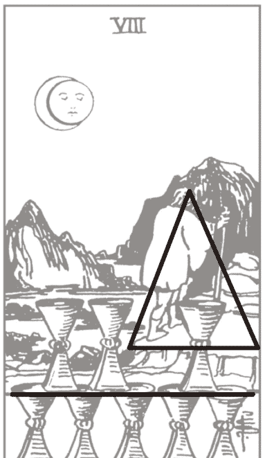

### 圖像分析

圖像整體分成前、中、後景，前方平坦的地面上有杯子，中間的山坡路上是前進的人物，後景有黑暗的高山，在這些景象之間有水流，整體散發出流動、不安的氛圍。這種不安來自不對稱的構圖，前方的聖杯以梯形放置在平地上，但中間卻有漏了一個；人物也沒有在正中央，站在偏右方的坡地邊緣，而且背對畫面，他站立的地方有著尖角的三角形坡地，手上拿著拐杖，人物的身形無法形成三角形視覺中心。但把人物站立的邊角與人物連起來，視覺上就會形成三角形，但不在畫面的中心位置。聖杯與人物之間有水流相隔，但三角形卻把人物與聖杯容納在一起，這兩者成為一組圖像，被三角形聚焦在一起。後方的高山，在構圖上擋住人物的視野與前路，形成有障礙的地形。在人物後方的水，也成為障礙，那是無法跨過的地方，所以人物能夠前進的方向受限制，不管前方的路有多艱難，沒有退路，只能前行。

### 情境敘事

圖像中的聖杯整齊的排列在地面上，比起聖杯7給人安定的感覺，八個杯子排成缺少一個杯子的形態，有著不足與缺憾，成為人物背對著杯子向著高處前進的動機：他要去尋找缺少的杯子。圖像呈現的是夜晚，但高掛在天空上的月亮，滿月與新月共在，還有人臉在上面，這不是真實的月亮，更像是呈現了人物的內在世界，他雖穿著紅色衣服，有活力的向著前方邁進，但他的心裡充滿不安與未知，不確定是否找對了路，或者是否能夠找到杯子。新月與滿月的形象，象徵不是開頭、也不是結束，代表人物的追尋並不是展開新的計畫，但也不是快要到達成果的結果階段，他在黑暗中摸索，看不到頭、也看不到尾，讓他很不安。月亮的人臉跟下方的人物，兩者視覺沒有交集，也沒有朝向同一個方向，所以這是一個被孤立、無法與他人連結，只能一個人默默前行的情境。人物站立的地方也讓他沒有退路，但前路充滿障礙，有點難行，他手上拿著拐杖，象徵他的步伐只能一步步慢慢走，但他的衣服顏色，散發出活力，相信可以找到方向，並帶著希望前進，讓自己更上一層樓。

### 元素與數字在圖像中的意義

在七號只能等待水流聚集的聖杯元素，到了八號，終於有了可為他所用的水源。但有了水源與使用水源是兩件不同的事，所以有了足夠水源的八號聖杯，開始學習如何讓聖杯元素展現最大的優勢與特點。在聖杯王牌，我們看到聖杯元素的特質是連結分開的兩個區域，這也展現在聖杯8的圖像中，兩岸的區域用河流相互連結，但這條河流充滿障礙，不只有石頭阻礙，水流也很彎曲，並不是最理想的河流，而且又以少了一個聖杯的意象來表現。人物的離開，並不是遺棄八個杯子，而是去尋找更為理想的水源。聖杯4與聖杯8的人物都在高處，但八號裡面的人與杯子之間有水流連結，所以八號並不是不滿意八個杯子，而是想要獲得更理想結果的努力。五號聖杯圖像中雖然也有河流，但水成為隔離的意象，但在八號的水流，連結了前景、中景與後景，讓畫面中的景象成為整體意象，象徵了聖杯元素正努力在發揮水元素的優勢，幫助自己更上一層樓，雖然在黑暗中探尋，但水的流動似乎承諾了可以找到聖杯的未來。

### 解牌敘事（正位）

在聖杯8的情境，人物不知道前路會到達哪裡而不安，但他也有堅持下去的毅力，不管走得好不好、路順不順，決定用自己的方法一步步去踏尋。他在找什麼呢？從圖像來看，他在找少掉的一個杯子，但杯子要去哪裡找？這是未知的探尋。在聖杯8的情境，工作中可能遇到了瓶頸去找脫困方法，也有可能離開工作，但不是在逃避困難，而是渴望讓自己更上一層樓。在人際或情感發展上，如果遇到了衝突與誤解，聖杯8的情境會默默嘗試各種改善方法，不輕易放棄，並且相信只要用心，事情就會有好轉。在聖杯8的情境，人物雖然對未來感到害怕與不安，但還是會向前方行走，相信只要自己努力，任何困難都可以度過。

### 解牌敘事（逆位）

在逆位聖杯8的情境，杯子可能沒有整齊的排列，人物也不是背對著杯子，而是看著東倒西歪的杯子感到不滿與遺憾。聖杯是我們想要追求的理想或和諧關係，當這些杯子無法整齊擺好時，代表我們在生活中沒有找到和諧與平安。而且背景中的人與高山，對人物來說成為無法跨越的困境，只能停留在原地，無法對現況做出改變。在工作中，如果處在逆位情境，雖不滿意現況，但更害怕離開去面對未知，只能停滯在原地；或者給自己找各種不能離開的理由，留在原處。在人際關係上，也容易把不滿意的關係怪到對方頭上，沒有努力從自身去改變，只等待對方先有行動或和解。在逆位情境，很容易將改變視為不可能，處處都是困難，但又無法接受現有的狀態，所以會以抱怨、怪罪等方式，應對困境，情緒容易不穩，把他人的否定或拒絕理解為情感背叛或傷害。

### 建議敘事（正位）

遇到困境抽到聖杯8作為建議，可以解釋為事情尚未到放棄的地步，再堅持一下，就會找到解決方法。而且現在只有自己才能找出解答，所以不管他人給過哪些協助或提議，只能自己去找到對的道路。你現在可能想放棄，告訴自己無路可走，但聖杯8的建議，就是在提醒你堅持在自己的路上。在工作中，你可能害怕無法實踐或成功而放棄自己的理想；或者在找工作時，怕無法即時找到工作，而接受不太滿意的職位，這時，聖杯8的建議是忠於自己的渴望，去實踐你想要做的事。在人際或情感關係上，建議你承擔讓關係變和諧的責任，不需怪罪對方、或講求公平、合理，現在需要的是為了更好的未來承擔與付出，現階段或許沒有人會看到或理解你的努力，但也要堅持走下去，就像在黑夜拿著拐杖，努力朝著高處前進的人，相信自己正走向更好的未來。

### 建議敘事（逆位）

遇到困境抽到逆位作為建議，可以解釋為走出聖杯8的情境，現在不需要努力改變什麼，也不需要讓自己更上一層樓，只要停留在原地，接受你想要離開的狀況。在工作中，如果你認為工作內容、同事、公司狀況都很糟糕，所以想要離職；或者你已經提離職了，但公司一直用各種理由不讓你離開。這時抽到逆位建議，反而是在提醒你，目前的工作還有需要你解決與釐清的內容，現在重要的並不是離開，而是如何圓滿的畫下句點，所以給自己多一些時間，把沒解決的事完成。在人際或情感發展上，逆位建議也是要能夠面對不滿意的關係，就算你覺得關係中的衝突無解或沒有未來，但建議你再給自己一些時間，留在舊有的關係內，充分的溝通與和解。或者你認為糟糕的關係，未必真的沒有未來，只是你對關係的期待過於理想，所以無法接受衝突。

## 聖杯9

### 圖像分析

畫面中央的人物，安穩地坐在長方形的椅子上，雙手交叉在胸前，椅子與人物一起形成三角形的視覺中心，給人穩定、不易動搖的視覺感受。後方有弧形的展示檯，以高於人物的比例包圍著人物，相較於直線的石牆強調的堅定，弧形散發出溫暖、柔和的保護意象。放在高處的杯子整齊排列，展現出穩固與富足的氛圍，杯子的黃色與背景相互融合，在視覺上，雖然杯子只占滿展示檯，但杯子延伸到背景，與展示檯一起包圍著人物，帶來被擁入懷中的安全感與溫暖。人物坐著的地方也是黃色的平地，這不是室外、也不是室內空間，就像聖杯7的雲端，展現了人的內在空間。

### 情境敘事

畫面中的杯子放置在高處，但不像聖杯7的人物，仰望著杯子，而是讓杯子像屏障或展示物，配置在背景中。在聖杯9，人物在中心成為主角，杯子則是背景的一部分，而且這些杯子被放置在安穩落地的展示檯上，不再是人物想像的白日夢，而是實際擁有的物件。人物雖然像聖杯4的人一樣雙手交叉在胸前，但在聖杯4的圖像中，人物高於杯子，展現了對杯子的不滿意。但在聖杯9，人物臉上露出開心的笑容，那些置於高處的杯子，成為人物想要炫耀、感到驕傲的成就。後方的展示檯像一道保護牆安穩的包覆著人物，而且材質卻是柔軟的藍色布料，像流水的意象，向下垂墜與流動，坐在弧形檯前方的人物，他的視覺向外，比起自我保護，更強調出能夠與他人交流的開放性，人物對杯子感受到的自信，沒有築起保護杯子的界線，更像是陶醉在自我成就，想要與他人分享這些快樂。

### 元素與數字在圖像中的意義

從八號尋找理想水源的聖杯元素，終於在九號，獲得了他想要的理想條件。雖然聖杯元素的優勢需要與人在一起，但要先成為情感獨立的人，才能真正發揮聖杯元素的優勢，情感不會被他人掌控或操弄。圖像中的藍色布幕，象徵了聖杯的水元素，到了九號的聖杯，水不再需要從他處流過來，已經聚集成可被人物所用的資源，也填滿了他的情感世界。所以在九號聖杯，內在情感水源充足、流動順暢，不再因為一個人而感到被孤立或寂寞。成為情感獨立的個體，才能發展成熟的關係，這就是聖杯在九號所達到的結果。

### 解牌敘事（正位）

在聖杯9的情境，人物正為自己的成就感到滿意與驕傲，他開心的展示心愛的杯子，這些杯子就像獎杯，一個個被排列整齊放在高處。聖杯元素在乎的成就，不是社會普遍認同的價值，而是只屬於自己的喜愛，例如蒐集特定物品、個人的生命故事、只有自己懂的享受等。聖杯9的情境在工作中，是能夠樂在工作的狀況，為工作感到驕傲與自豪，滿足又快樂，成就感也很高。在人際關係上，也因為自信，能夠與他人建立友好關係，不過度依賴他人，但也能適時的關懷與付出，會成為讓他人羨慕的對象。在情感發展上，會想要讓自己成為對方感到驕傲與仰慕的對象，或者成為他人眼中的神仙眷侶，被他人稱羨。

### 解牌敘事（逆位）

在逆位情境，人物沒有可以向外展示的杯子，或者對自己的杯子感到羞愧而不敢讓他人看到。在工作中，雖然努力多年，卻感覺自己一事無成，沒有可以對外炫耀的經驗，或者對自己的成就感到不滿意，不喜歡與他人談論這些話題。在人際關係上，因為自尊感低落，容易對他人的成就產生嫉妒，使用有敵意的言行，無法維持和諧關係，或者因為自卑封閉在自己的世界。在逆位情境，也有可能認為自己的不幸是他人造成的，所以會怪罪身邊的人或公司裡的同事與主管。在情感發展上，會用高標準來評價對方，並期待對方可以改變，或者常與他人比較，看不起對方，批評或要求對方改變，造成衝突與不和諧的關係狀態。

### 建議敘事（正位）

遇到困境抽到聖杯9作為建議，可以解釋為要能夠為自己的成就感到驕傲，珍惜目前擁有的，並對自己多一些自信。在工作中，你有可能覺得自己比不過他人而感到失望，或者希望自己多一些野心，跟別人一樣精進，但聖杯9的建議是提醒你不需跟隨他人的腳步，而要從自己的處境看到個人的獨特與價值，滿足與接受現在的自己，就能解決目前的困境。或者在人際或情感發展上，可能用過度理想的眼光在要求對方或自己，所以才會覺得目前的關係不理想，或者自己的表現不足而自卑。建議你要像聖杯9一樣，相信現在是最理想的狀態、你也擁有最理想的關係，就像每個小孩在父母眼裡永遠都是最好的，你也要能夠用慈悲的胸懷看待自己與接納他人。

### 建議敘事（逆位）

遇到困境抽到逆位作為建議，可以解釋為走出聖杯9的處境，你的自我滿足可能是一種虛榮、自我陶醉或過度自滿，所以在工作上無法虛心受教，不想要被他人命令或指責，不接受別人的想法等。逆位建議是提醒你要走出自我中心的世界，把自己放下來，才能改善目前的困境。在人際或情感發展上，也可能自我感覺良好，以為自己付出很多，或者認為自己是可以讓對方快樂的對象，卻沒有聆聽或真實的理解對方的想法，反而在關係中成為炫耀自己、貶低對方的言行。逆位建議是要認清自己沒有像想像中理想，要能夠接受自己的不足，才能找到問題的癥結，並解決問題。

## 聖杯10

### 圖像分析

畫面中有兩大兩小四個人物，是一個家庭的成員，他們分別在畫面中占據的位置並不大，從比例來看，空中的彩虹成為視覺焦點，而且彩虹以弧形籠罩下方的人物，與人物高舉的雙手形成了圓形的弧度，彩虹與人視覺上形成一體。在這圓形的下方，男女直立的身影連接到平穩的地平線，天與地有了連結，視覺上給人圓滿又穩定的氛圍。相對於站立的男女，跳舞的兩個小孩與左方流動的溪流，成為畫面中動態的視覺效果，在穩定的氛圍中，展現了活潑、有變化性的視覺意象，顯現了最美好的聖杯元素的情境，在安定中帶來變化的情感發展。高高在上的聖杯，並不是被仰望的對象，而是被高舉雙手的人物擁入懷中，這些聖杯像保護傘，護佑著下面的人物，像是被天使保佑與關懷，彩虹上的杯子成為關係和諧的承諾。

### 情境敘事

以弧形高掛在空中的彩虹，就像聖杯9放置在弧形檯上的杯子，是一種展示與炫耀。聖杯9的杯子，在人物可手拿的位置，象徵杯子是屬於自己的物品。但在聖杯10，杯子與彩虹一起出現在高空中，彩虹並不是人能擁有或掌控的物件，它很稀少，所以看到的人覺得是好運與幸福。與彩虹一起出現的杯子，是圖像中的人物獲得的幸運，這是超出個人期待的美好。所以下方的人物高舉雙手、跳舞，充滿慶祝的氣氛。在聖經中，彩虹是洪水退去後，神賜給諾亞未來會平安的承諾，在洪水帶來的毀滅中，方舟上的人與動物倖存下來，看著彩虹歡慶著新世界的到來。聖杯10的圖像雖然不是諾亞方舟的故事，但圖像中的一家人在彩虹下的歡欣，帶出了生活從此陽光明媚、幸運又美好的意象，前有小河，後有山丘與房子的美好景象，再加上天空中的彩虹與聖杯的祝福，一家人和樂融融，感恩又和諧。

### 元素與數字在圖像中的意義

在九號學會情感獨立的聖杯，終於在十號到達了最圓滿的情感狀態。十號的水元素，就像擁有永不乾枯的湖水或大海，所有的水源向著十號流進來，能夠涵納萬物，又能滋養一切。這種水的生命力，在十號以家人關係表達，家人是人最初形成的關係連結，恆久又緊密，也能夠無條件的接納與關懷，就像大海，無條件的容納一切。雖然圖像中的聖杯在空中，但彩虹是雨後出現的現象，與水的意象緊密連結在一起，水元素的聖杯成為了天上賜給人的祝福與美好承諾。兩組人物分別以靜與動的形態表現，也是聖杯的最大優勢：在安定當中有著流動的變化，這一切都圓滿的表現在十號圖像。

### 解牌敘事（正位）

在聖杯10的情境，人物處在和諧與美好的關係，這一切得來不易，能夠感恩與珍惜大家在一起的緣分。圖像中有家庭成員，所以在聖杯10的情境，不管是同事、朋友、或同學關係，都會給人像家人一樣的安心感，大家在一起可以真心關懷，也能珍惜彼此。在工作中，聖杯10比起工作上的個人成就，更關心人際關係的和諧，有了「人和」，就能成為樂在工作的愉快環境。在人際關係上，聖杯10當然說明了和諧的群體關係，包容、接納，又能相互關懷。在情感發展上，可能發展為像家人一樣的安定感。在換工作的問題上，聖杯10雖然象徵著關係和諧，但十號數字也代表情況到了極點，之後會走向改變，所以任何離開都可以成為圓滿的結束。十號在小秘牌是最高點，不可能再往前進，如果在想要獲得改善、前進的問題上出現聖杯10，反而會期待落空。

### 解牌敘事（逆位）

在逆位情境，相互支持與關懷的群體關係會變得疏離，人跟人會保持距離，或者用表面上的和諧，掩蓋各懷鬼胎的心機。在群體中有些人會想要掌控他人，也有人會依賴這種掌控，團體成員各取己利，未必能以群體發展為優先。或者在逆位情境，因為某些原因，需要離開像家人一樣的群體而感到傷心，也有可能被群體排拒，成為孤立的一個人。聖杯元素在逆位時，原來關懷他人的情感，容易轉換成怪罪他人或自責的負面情緒，所以逆位的聖杯10，也會因為無法獲得群體認同，會感到自己是被拒絕的受害者。在工作中，雖然想要與他人和諧相處，卻因為群體無法給予友善、信任的回應，儘量與他人保持距離的方式維持工作關係，或者對工作本身也會無法投入情感，只以把工作當作工作的方式來應付。當十號逆位時，代表到達極點（終點）前原地打轉，心不合卻未必真的可以離開。

### 建議敘事（正位）

遇到困境抽到聖杯10作為建議，可以解釋為不管目前處境如何，都要能夠「以和為貴」來應對，人跟人之間的相處能夠和諧，才能脫離目前的困境。很多人在關係上期待沒有衝突，任何不愉快都想要努力改善，但不管目前有著哪些磨擦，聖杯10的建議是接受目前是最理想的狀況，不需要努力改變，只要接納現有的情境即可。或者你期待家庭、同事、朋友關係可以更親密、相互支持，但現實卻是在相互傷害，聖杯10的建議也是把目前的狀況視為最好的結果，不需期待會有改變，可以把你的關懷與努力轉移到其他事情上。十號聖杯代表已走向了最理想的結果，所以作為建議，就是接受現在已經到達最美好的狀況，接納現在的一切。

### 建議敘事（逆位）

遇到困境抽到逆位作為建議，可以解釋為走出聖杯10的處境，現在是該離開或獨立的時候，不要因為害怕破壞彼此的情感，或者捨不得散席而不行動，唯有離開群體或不再強求和解，才能脫離目前的困境。在工作中，你可能因為他人的錯誤或誤解，遇到糟糕的狀況，考慮是否要離職，但這一離開，你需要放棄曾經努力、累積的成果而不甘願，但逆位的建議，卻是提醒你要捨得，如果因為不捨而一直拖延，只會讓不舒服的狀況一直延續。在人際關係上，你有可能為了大群體忍耐個人的不愉快，不希望因為自己的決定而讓群體解散，但逆位卻是建議你需要做出離開的決定。在情感發展上，你一直努力讓關係回到從前的美好，但這份努力反而阻礙你認清事實，逆位建議你先離開目前的情境，一個人冷靜下來，才能找到問題的對應方法。

# Chapter 8

## 五角星：聚沙成塔的技術與積累

如果以速度來比喻四元素的特質，寶劍像坐飛機，瞬間到達另一個世界；權杖像開車，上山下海無處不冒險；聖杯像騎腳踏車，悠閒的在鄉間小路閒晃。最後的五角星是用雙腳走路，每踏一步，都堅實的感受到身體與土地的接觸。踏實而穩健是五角星元素的優勢，所以可以用爬山來比喻五角星的世界，那是人用自己的雙腳與體力進行的苦練，每一步都可能是朝向自己的一次勝利，但每一步也可能是像割肉一樣痛苦的經驗。

登陸月球的阿姆斯壯曾用腳步比喻了人類文明的大進步，他說：「我的一小步，是人類的一大步。」「腳步」的意象不只是走路而已，它象徵的是人最扎實的結果與成就，所以我們也會用一步一腳印、腳踏實地等用語來形容得來不易的個人努力。五角星元素的情境就像在登峰的過程，每一步都要能踏實的著地，才能完成登頂的成就，只要幾秒的不注意或輕忽，就有可能掉下懸崖，不只無法完成任務，還有可能失去生命。所以五角星元素在任何時候，都會表現出小心謹慎的態度，也因為如此，常常停留在自己能掌控的環境，不會魯莽的踏入不熟悉或未知的狀況。但再三確認後的行動，在走山路時能夠救人一命，卻有可能過於緩慢而錯過到達目標的機會或時間。所以五角星元素的爬山，不適合成為一種競賽，而是在可以由自己掌控的計畫內，慢慢完成。

登山不只是努力不懈的前進，在何時、何地、如何讓自己休息，也會成為登頂成功與否的關鍵。所以在五角星情境，有三張停止的圖像（4、7、9），剛好把腳踏實地的登頂景象分成三個階段來描繪。在五角星4之前是登山的開始階段，做任何事都會做十足準備的五角星，在開始登頂前有充足的力氣，心情比較放鬆，欣賞山裡的美景，腳步有快有慢，享受登山的樂趣。所以二號牌裡的人物，一腳離地，這對追求腳踏實地的五角星元素來說，並不理想，但圖像比起不安穩更強調的是樂趣。五角星元素的謹慎，在開始計畫前，一定會參考前人的經驗，或詢問專家的意見，這就是五角星3裡請教專業者的情境，這時前輩的一句提醒，可能就是之後登頂成功的關鍵。前輩提醒固定休息的重要性，不能等到體力都消耗後才休息，所以五角星4就成為第一階段的完成與小歇。

五角星4之前是符合個人體力的愉快行程，能夠享受爬山的樂趣。但之後，如果繼續前進，就會進入挑戰體力的階段，除非逼不得已，五角星元素大多不會想要走到這一步，所以很多時候，從五號開始的挑戰，對五角星而言，是外在條件逼迫的結果，只能選擇繼續前進。爬到山腰的心境，是最辛苦、難受的過程，在這個階段，目的地還很遙遠，後退也不容易，而且體力已經開始耗盡，會害怕就算走到終點，也不確定會有體力回程，所以就會不耐煩、想放棄，帶著情緒一邊咒罵一邊前進，這就是五角星5的狀況，圖像用身體障礙與穿著簡陋來表現了體力與資源不足的困境。在爬山的中途，遇到體力不足的狀況，最好的方法就是承認自己的極限，停下來接受他人的幫忙，這會進入到五角星6的狀況。五角星元素絕對不會過於冒險，不會等到體力不支的最後一刻才求援，他寧願中途放棄，也不會讓自己處在危險情境中。

在五角星6決定接受幫助而放棄登頂的五角星，就會進入七號情境，只能接受沒有到達終點，但也有小成果的方式安慰自己。五角星元素雖不會讓自己冒險，但也不會輕易放棄，他會回到原點，磨練自己的體力與技巧，第一次不行，再試第二次、第三次，把登頂轉變為腳踏實地累積的結果，而不是挑戰自我極限的成就。這就是五角星8所展現的處境，日復一日的努力與重複嘗試，直到成功登頂那一天。五角星元素的九號與十號，描繪著兩種獲得成功的狀況，九號是個人在花園內享受成果，十號是與群體共享的成就。這兩者就是登頂成功後，個人在山頂體會的滿足，以及下山後，把登頂磨練出來的專業，轉換成可被群體所用的利益。五角星元素的人生目標，會很明確的追求社會價值，所以登頂對權杖或寶劍元素，或許是自我突破的挑戰，但五角星元素會去登頂，是想要練出一技之長後獲得金錢、名利等的成功，這些動機才會成為五角星元素追求目標的動力。

## 土元素五角星的圖像分析與敘事

土元素的五角星圖像，人物大多站在平地上，展現了五角星元素追求安穩的特質，所以站著比走路更安穩，而坐著比站立更安定，在圖像中，坐著的人物較能發揮元素的優勢。除了腳步上展現的穩定感，五角星處境中的人，雙手拿著的物件，也會成為是否能夠展現五角星優勢與否的判斷。除了王牌之外，有四張五角星人物，直接手拿五角星，分別為二、四、八、九號，二號的五角星配置為斜角，其中一個五角星還高過人物的肩膀，展現了在掌控五角星上的吃力與不穩的視覺效果。相對地，四號五角星則用雙手安穩的抱在胸前，是所有圖像中五角星最受保護的意象；八號五角星則成為被改造的對象，比起安穩，強調的是越來越完美的結果；九號五角星則安排在人物的腰部以下，表示長出來的果實，所以在這裡的五角星不用人物抱著，也能明確展示被人們擁有的視覺效果。

另外有五張牌裡的人物，並沒有直接碰觸五角星元素，分別為三、五、六、七、十號。三號與八號人物，手上都拿著工具，但三號人物的工具與五角星沒有接觸，五角星高高鑲在建築上，雖然位在人物拿不到的地方，但元素成為建築的一部分，非常穩固，而且人物是匠師，未來還是能碰觸到那些五角星，所以與五角星踏實前進的意象很符合。但五號的人物與五角星沒有任何連結，甚至人物的視線都沒有看向五角星，這是人物與元素最為疏離的圖像，也呈現了最為困苦的情境。六號的五角星，雖然也在高處，但卻沒有鑲在窗框內，而且人物手上的金錢成為元素的替代物，被人使用，所以六號展現的情境富足又美好。到了七號與九號，雖然五角星都成為農作物的果實，但七號人物沒有手拿五角星，只有視線在注視元素，但九號人物卻用手摸著果實，所以這兩者在資源的富足、可運用的程度上展現了差異。最後的十號圖像，人物雖摸著狗，但元素分佈在整個圖像中，甚至人物身上也有，所以這是不用煩惱或規劃資源，只要伸手就能使用五角星的最理想狀況。

五角星的優勢在於一心一意的專注與踏實的勞動，這些能夠在情境中呈現，就代表那是元素可以發揮所長的狀況，如果沒有，就會感到不穩定與沒有安全感。如果常抽到逆位五角星，可能代表在日常中常一心多用，因為心急，想要同時做很多事，或者勞動與結果之間並沒有明確的報償機制，對結果無法全然接納與滿意，感覺自己在沙地上蓋房子，找不到立足的地基。很多人認為五角星與金錢有關，所以只要賺到錢就會是五角星的優勢，但除了賺錢，五角星更需要獲得利益的正當名份，例如自己的勞動、家人贈予、正當的投資等，尤其是靠自己努力獲得的財富，長期依規劃達成的目標，最能讓五角星感到踏實與滿足。就像王牌圖像中的庭院，那是五角星為自己打造的天堂，像一座整齊、舒服的庭院，不只需要金錢投資，也需要花心思去打理與整頓，只要稍不用心，花園就會雜草叢生，遭到外人破壞，這是五角星元素內心最恐懼的惡夢。

## 五角星王牌

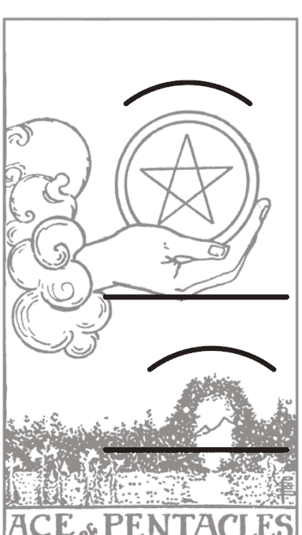

### 圖像分析

圖像中間的五角星與下方的拱門，形成了兩個弧形的視覺意象，弧形給人豐足、和諧、聚集、融合等感受，弧形的下方分別有手與地平線，穩固的定位了弧形。一個在天、一個在地的兩個弧形，視覺上相互呼應，強調出飽滿與和諧，在天上和地下都能成就的圓滿。五角星些微被手指遮蓋，展現出保護意象，弧形拱門則被花叢圍繞，展現出富饒、生生不息的氛圍，在前景的綠地，有草、有花、還有道路，道路通向拱門，強調了花園並沒有全然封閉的意象，但拱門外的視線被高山擋住，形成內與外全然不同的風景。

### 情境敘事

圖像中的五角星放置在手掌上，從雲端伸出來的手高舉在花園上方。背景的花園有著翠綠的草地、百合與玫瑰盛開，遠處的圍牆與拱門由花叢組成，這是用心整理的花園，需要長時間的照顧與管理。拱門內外形成了兩個不同世界，拱門外有高山，這座山被花園隔絕，但沒有全然阻隔，拱門是開放的，中間有道路通向高山，美麗的花園給予美好、安穩的生活，但也沒有封閉朝向外面的道路，只要願意踏出拱門，就能到達外面的世界，但五角星高舉在花園上方，象徵了五角星想要擁有的是花園，它所保障的是開滿花的豐足、保護牆、平坦的道路，在拱門外的高山，則像裝點花園的風景，只需欣賞，不需親身體驗。

### 元素與數字在圖像中的意義

一號的五角星元素，開啟了平坦、穩定的未來，圓形的五角星，成為豐足、滿溢的承諾，每個人想要在生活中追求的和諧、平安，成為五角星元素象徵的意義。但安穩的未來，需要謹慎安排每一步，有耐心的照顧、確認細節，也要能明確的定位目標，才能事先排除可能的障礙，平步青雲的往前行。雖然是一號，但五角星並沒有呈現出荒地或草原，反而出現在整頓過的庭園，代表五角星元素的計畫，並不是開拓蠻荒之地，而是走在康莊大道上，只要自己小心跟隨、努力經營，達成目標的可能性很高，除非有不可控的環境因素造成的意外，不然結果大多可以預測。五角星的第一步，不是突發奇想、也不是突如其來的衝動，這是有準備好的藍圖，並依照藍圖行進的旅程，不允許任何脫離原來計畫的脫軌行為，每一步都會小心的斟酌、再三確認，也會做好各種風險管理與保險措施。

### 解牌敘事（正位）

在五角星王牌的情境，有些新事物正在展開，這些事情不會有太大的困難，大部分的要求，就像圖像中整理好的花園，已有充足的資源或準備，可以樂觀的展望好結果。在工作中，可能接到新的任務與計畫，或者有新工作、新職務的邀請，也可能有新的主管或同事到任，這些改變在五角星的情境，會帶來更為穩定的狀況，所以雖然是新的開始，在改變中，卻有一種未來可以更為踏實的安心。在人際或情感發展上，這是實際帶來利益的合作關係，不需太冒險也能因為合作而獲益。或者在五角星王牌發展的緣分，比起可遇而不可求的心動，更像是相處後產生的好感，因為有相處的經驗，也較能建立彼此的信任，雖然未必是此生唯一的著迷，但能夠相互體諒對方，像家人一樣給人安定感，可發展為長期交往的對象。

### 解牌敘事（逆位）

在逆位情境，原來在手中的五角星掉落在地上，背景中的花園也有可能未完成，無法成為保護牆。所以可能在沒有足夠的準備或保障的情形下，急於改變現狀，或者一直等待改變的機會，卻缺乏資源而無法行動。在工作中，可能等待升職的機會或者轉換工作的好時機，也有可能懷念公司過去的美好景象，但這些在逆位情境，都會成為紙上畫出來的餅，是不切實際的美夢。在人際關係上也有可能期待對方成為好的夥伴、對的交往對象，沒有足夠的時間認識對方，或沒有充足的溝通，所以你的期待可能都只是紙上談兵、白日夢，沒有結果。五角星元素的特質是穩固的基礎，在逆位時，會變成沒有任何基礎的狀態下追求美好的未來。

### 建議敘事（正位）

遇到困境抽到五角星王牌作為建議，可以解釋為不管目前是處在變動的狀況，還是平淡的日常，都需要以五角星王牌的情境，視為嶄新的開始，並相信目前進行的一切，都可以帶來穩定的未來。如果剛好處在停滯或不知如何改變的茫然當中，五角星王牌的建議是透過實際行動帶來改變。例如開始去運動、學習技術或手藝、改變生活習慣等。在人際或情感發展上，也要相信目前的關係發展是可以保障未來的交流，但需要實際在生活中與對方互動，才能進入真正理解對方的關係模式。五角星的腳踏實地需要具體的接觸與行動，只有思考與想像，並不是五角星元素的優勢。

### 建議敘事（逆位）

遇到困境抽到逆位作為建議，可以解釋為走出五角星王牌的情境，代表你想要追求穩定、安全的工作或關係，才是造成困境的原因。所以建議你從花園中走出來，去面對花園外的高山，也要放棄對平坦道路的堅持，踏上崎嶇的小路，或者由自己開拓出道路。走出五角星王牌的情境，也代表接受手中沒有任何籌碼，只能從零開始的狀況，所以期望自己可以獲得他人資助的想法，只會帶來不滿或抱怨，認清自己兩手空空，只能從零開始慢慢累積，不管你多想抓住機會或跟某人的緣分，也無法擁有。

## 五角星2

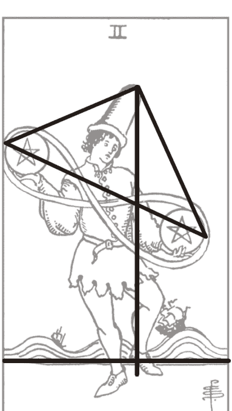

### 圖像分析

人物站在畫面中央，他的頭微傾，與左高右低的手勢形成傾斜的三角形視覺中心，傾斜的三角形給人不安、不穩的視覺感受，再加上只有一腳踏在地上，另一腳抬起來的動作，讓人更顯動搖、不穩。但人物所戴的高帽頂端與抬起的右腳跟形成一條直線，穩住了兩邊的搖晃，微妙的保持了動態平衡。這種平衡也表現在背景中，雖然海浪很大，但相對平坦的地面，沒有形成太大的晃動與不安感，反而有種看熱鬧的樂趣。

### 情境敘事

圖像中的人物戴著高帽，手上拿著無限大符號的繩索與兩個五角星，做出像雜耍或遊戲的動作。人物的服裝並不是一般人，更像表演者，所以他耍弄五角星的技巧熟練，雖然看起來會掉落，但也有可能熟練的被人物掌握。人物雖踮起一隻腳，讓身體傾斜，但他站在灰色的平地上，巧妙地維持平衡，遠方的大海正在吹起大浪，但距離遙遠，不會影響人物的安危，反而成為有趣的背景。他手中的五角星，就像背後的海浪，正在上下起伏，這些動作都給人如遊戲的趣味，看起來雖然有點吃力，但人物似乎樂在其中，也小心維持兩個五角星之間的張力。

### 元素與數字在圖像中的意義

土元素的五角星，如果想要作為資源運用，需要一點點挖起來，原來的地基挖了個洞，變得不穩，但會蓋出可以使用的物件。所以二號五角星，雙手拿著土元素，正努力轉換這些土元素的用途。二號不安穩的動作，並不是遇到困難的危機，而是在玩弄與享受自己的技術。五角星元素的特質，在任何行動前都會先做好萬全的準備，所以開始時能夠展現出遊刃有餘的態度，也能稍微向他人展現自己的能力，就形成二號的輕鬆氛圍。五角星元素要求完美，害怕出錯或失敗，所以不會做出超過能力所及的行動，但二號的變動，是讓土元素能夠轉換為可用資源的必經過程，很快又會回到安定的狀況。

### 解牌敘事（正位）

五角星2的情境是在多個任務中，能夠適時應對、解決與安排時間的情境，雖然忙碌，每件事都卡得很緊，但都能掌握，在忙碌的安排中，反而感受到生活充實、感覺到自己有價值，樂在其中。在工作中可能有多個不相干的計畫同時進行、或者兼任多個工作，也有可能同時忙於工作與照顧小孩……在忙碌的時程，事情可能會有突發狀況，但就像圖像中遠處的大浪，不會真正影響到原來的時間與規劃，整體上還是能依自己的安排應對，生活忙中有樂。在人際關係上，五角星喜歡有實際互動的關係，所以五角星2也代表忙於社交與應酬的狀況，五角星元素在人際關係上需要穩定、相互信任的互動，所以也會花時間陪伴他人，但不會只跟對方閒聊或談風花雪月，而是一起吃飯、工作、買東西，透過一起做事來建立情感，雖然在一起時沒有談太多重要的話，只要能夠在一起，都被視為重要。如果正在與人交往，五角星2的情境也有可能是用心花時間與對方相處，讓生活變得忙碌。

### 解牌敘事（逆位）

在逆位情境，原來掌握手中的五角星掉到地上，人物就會忙著到處去撿掉落的五角星，讓人感到困窘、手忙腳亂與疲憊。逆位時，背景中的海浪就有可能海水倒灌，水流到地面，為圖像中的人物帶來危險。所以在逆位情境，人物無法再以玩樂的態度面對生活，被事情追著跑。工作中，可能事情都被拖延或無法在時程內完成，一旦錯過時間，其他事都被延誤或出錯，或者搞錯事情的優先順序，錯過了重要機會等。在逆位的五角星2情境，你會被事情帶著走，不再能主導事情發展，也無法預先安排或規劃。在人際關係上也常給人不用心、不真誠的感受，跟他人互動時，心裡擔憂著其他事，所以會錯過對方所說的話、或忘記重要約定。在逆位情境時，原來有專注力的五角星元素，會變得心不在焉或容易做起事來感到浮躁。

### 建議敘事（正位）

遇到困境抽到五角星2作為建議，可以解釋為要勤勞的工作與生活，不要讓自己閒著，不管是家務、工作、交際，讓自己一直忙碌的奔跑，並且樂在其中，才能脫離目前的困境。忙碌時我們無暇想太多，只能專注在事情上，所以五角星2的建議也有可能是在提醒，目前你所遇到的困擾，現階段不需要煩惱，煩惱了也未必能夠解決，還不如轉移注意力去做事，讓自己開心過日子。在人際與情感發展上，也是建議要為對方多做一點事，把為對方忙進忙出視為快樂，就能讓目前的關係有所改善。當自己無法自拔的想太多時，五角星2的情境就有可能是最有效的解決方法。

### 建議敘事（逆位）

遇到困境抽到逆位作為建議，可以解釋為要走出五角星2的情境，從原來的忙碌中，簡化生活，給自己安靜休息的時間。生活中的忙碌，可能是害怕不被他人重視或者害怕沒事做，會感到自己沒有價值，所以很多忙碌會變成為忙而忙，不但沒有效率，也會阻礙一個人的成長與改變。或者做事都想要做好規劃再進行，反而過於小心、無法隨機應變。要走出五角星2的情境，需要認知到很多事不必非要自己做不可，有些事也可以不用做到完美的程度，能夠放下自己的堅持，也是在放過自己。逆位建議在提醒你，目前你過於專注在把事情做好，卻忘記停下來想一想是否非如此不可。

## 五角星3

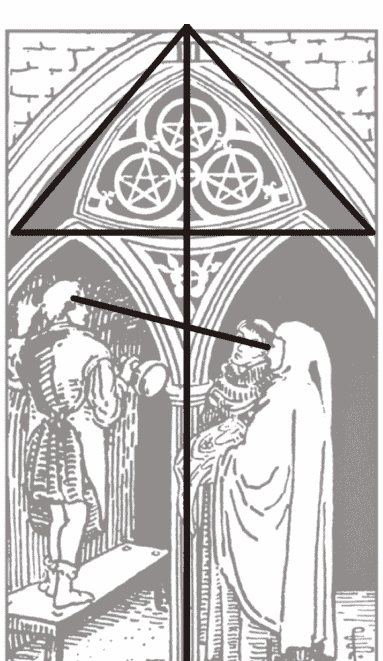

### 圖像分析

背景中的教堂填滿了畫面，上方的三角形大拱門與三角形窗，把三個人物包覆在建築內。教堂的建築體是灰色，並用黑色呈現還未完成的空間，而三個人物站在黑色的拱門前，原來教堂或建築物的保護意象變得不踏實，帶著未知、看不到的不安。三個人物站在畫面的左右兩邊，剛好被中間的柱子隔開，視覺上被分離。而且一人站在椅子上，與另外兩人對視形成傾斜的視線角度，在視覺上帶著上對下的氣氛。中間的柱子與人物視線形成十字架的交集，但因為人物位置不同，形成傾斜的十字架，但建築體穩固、不變動，所以人物視線的傾斜，比起不穩固，帶來可變動的彈性。

### 情境敘事

三個人物聚集在教堂前，正在討論與溝通。匠師身份的人站在椅子上，一隻手放在建築物上，另一隻手拿著工具，暫時停下工作，視線看向右方的兩個人。右邊有修士與拿著教堂圖的人，可能是領主派來的，兩人站在平地上，正抬頭看向匠師。以社會身份來看，站在平地上的兩個人更為有權力，但以構圖來看，匠師反而站在高處，代表在此圖像中匠師成為重要的人物，其他兩人尊重匠師的工作。後面的教堂以黑色展現了還未完成的教堂樣貌，成為教堂窗戶的三個五角星，則以灰色來呈現，也是尚待完成的半成品。建築是不易變動的物件，在情境中象徵了朝未來穩定發展的狀況，但過程中需要與他人溝通合作，才能達成目標。匠師的身份象徵專業的技術職，所以這是在精進技術，並且專業受到重視的情境。

### 元素與數字在圖像中的意義

三號五角星，用土建蓋教堂，這是耗費時間與人力的工作，也需要穩固的地基與專業技術，這些都是三號圖像呈現的內容。當五角星踏出第一步，有了足夠的準備，到達三號時就能打好基礎，依照原有的規劃穩健地發展。五角星元素雖然腳踏實地，卻不善於人際溝通，但三號數字是多人互動的情境，但這並不是交流，而是確認工作是否能依計畫行事。不像水元素的優勢是流動，土元素需要固定在原地不動，但為了轉換為建築材料，需要有其他元素摻進來，才能為人所用，但這是依比例分配的結合，並不像水元素是隨性的流動。因此，在三號雖有其他人物的參與，但他們不會改變原來的計畫，只是再次確認原有的安排，落實計畫，達成目標。

### 解牌敘事（正位）

在五角3的情境，會以專業者的身份與他人交流與互動，並獲得持續學習與發展的機會。在工作中，可能個人的專業得到尊重，並成為重要的計畫成員；或者在換工作的問題上，尋找可以發揮專長的工作，也有可能為了精進自己的專業，去考證照或上課，成為有實力的專業者。在人際關係或情感發展上，也喜歡以諮詢或給予建議的方式與對方交流，不喜歡沒事閒聊，或花時間跟未來發展沒有關係的人互動。談感情時，會認真聆聽，也會想幫忙找到解決方法，或者跟交往對象一起精進，成為學習夥伴，期待自己的意見被尊重或接受，希望自己成為有幫助、有價值的人。

### 解牌敘事（逆位）

在逆位情境，原來站在椅子上的人物，可能站不穩，手上的工具也用不好。也可能反過來，是另外兩個人站在高處，指使石匠做事，就會成為比起工作者的專業，權力者的想法與意見更為重要的情境。在工作中，逆位時工作者只能聽上司的意見行事，任何專業者的觀點都無法勝過地位高的人，所以工作就容易出錯、有狀況，甚至會因為在上位的人意見太多，無法整合，工作會停滯在原處。在逆位情境，專業者不受重視，工作變得無趣，也不想努力學習，成為渾水摸魚或怠惰的工作氛圍。在人際或情感發展上，會覺得自己不被他人重視，比起溝通更像被指使或要求，也可能想要獲得重視，努力給予意見與建議，反而成為對他人的干涉與掌控，讓關係變得不愉快，或者拒絕與對方溝通，認為講什麼都沒用。

### 建議敘事（正位）

遇到困境抽到五角星3作為建議，可以解釋為在自己的專業上累積實力，或者認真看待自己的經驗，對工作或他人有什麼貢獻。很多人在工作中未必認知到自己的專業性，認為任何人只要去學習就可以勝任，所以也無法看重自己的價值。雖然工作內容是每個人都能學習，但如何把這些工作做好，關乎工作者的資歷與對待工作的態度。五角星3的建議，是看重自己的必要性，不管是在工作或感情問題上，需要先自重，才能更有自信的與他人互動和發展關係。五角星3是還在學習與成長的情境，所以也是建議你成為學習者，再次精進、累積自己的專業，並虛心接受他人的想法與意見。在找工作的問題上，建議去尋找與你專業相符，並能夠受到尊重的工作領域。

### 建議敘事（逆位）

遇到困境抽到逆位作為建議，可解釋為走出五角星3的情境。不要認為自己的專業需要受重視，或希望他人看重自己的意見，甚至也不必認為工作要由我來做才能做好。逆位建議，走出非我不可的思維，從椅子上走下來，讓其他人站在椅子上。在工作中，你負責的業務無故被他人主導與決定，或者你認為重要的細節，不被他人理會而感到不被尊重。或者在人際與情感發展上，很想要成為群體中的中心人物，或者讓對方把你放在第一優先等，這些期待讓你無法脫離困境。五角星元素不太能隨機應變，所以逆位的情境，就需要以轉移注意力的方式，走出原有的情境，才能改善狀況。

## 五角星4

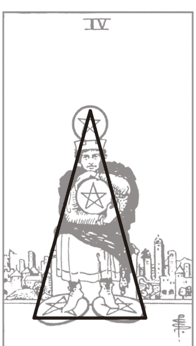

### 圖像分析

圖像中的人物坐在椅子上，他的頭頂與踩在腳下的五角星，組合成三角形視覺中心，他穩定的坐姿給人不變動的意象。人物坐在平坦的地面上，再次強化了穩固的視覺效果，背後的地平線在人物的腳邊，有種被人物壓著、被他征服的氣勢。背景中的城鎮，也以微小的比例展現了與人物的距離、以及大小的重要對比。從構圖來看，沒有任何一件事能夠動搖坐在中間的人，他會一直像座雕像守住這種姿態，這是恆久又不會有變化的狀況。天空與地面都用灰色來整合，灰色是中性色彩，給人平靜、穩定的感受，加強了整體畫面的安定感。人物的視線直直看向前方，很像為了拍照而被定格的狀態，人物的眼神也有一種自信，相信自己可以一直在原地堅守。

### 情境敘事

坐著的人緊抓五角星，雖然可以守住所有五角星，但也陷入動彈不得的處境。但目前對人物重要的，並不是如何獲得更多五角星，而是不能失去，所以在應對困境時，變成只想守住原來狀態的保守姿態。「一個都不能少」是五角星4的想法，當人物認為所有的東西都要守住時，就只能戰戰兢兢的顧好手邊的每件事，所以圖像中的人物，姿勢僵硬、無法放鬆，雖然坐在椅子上，卻時時提高警覺。人物頭上戴著皇冠，背景中的城鎮在他的椅座之下，展現了他可能是城鎮的統治者，他雖然是城鎮的管理者，但只求維持現狀，不要有任何改變，雖然帶來安定，但也成為封閉、保守的作為，無法求發展。無法失去的人，就會成為吝嗇、計較、自私的行動者，比起為他人或群體的利益考量，會先想到自己是否會失去什麼。

### 元素與數字在圖像中的意義

在三號建築未來的五角星，到了四號，開始要守住自己擁有的成果。未完成的建築會讓人期待未來，但基本結構都已完成的建築，就會開始害怕有人來搶占或破壞。五角星元素的謹慎，無法做出過於長遠的規劃，所以到了四號，是五角星能承擔與掌控的階段，五角星元素有可能就視為達成目標，不再前進。所以五角星4，把心思都集中在防止他人靠近、保護自己的資產上，無暇規劃未來。四號雖有了結構完整的建築，但這只是最基本的配備，可以遮風擋雨，卻無法講求方便，但朝向未來持續努力，會有失去現在擁有物的風險，所以對四號五角星元素來說，要改變現狀是非常困難的。

### 解牌敘事（正位）

在五角星4的情境，不管應對什麼事情，都會變得固執、僵化，只想維持現狀，對改變感到煩躁。在五角星4，我們守住現在的生活，努力讓生活在規律、穩定的安排中發展，如果發生預料之外的事，就會感到不安與焦慮，甚至會有失去重要事物的危機感。就像戴著皇冠的人物，我們想要成為自己的主人，不想被他人約束或要求，也不想去管他人的事，只想要管好自己，井水不犯河水，與他人保持安全距離。在工作中，如果被賦予不屬於自己的任務，就會產生極大的反彈，同樣地，如果自己的工作被他人決定，也會很不愉快，在工作或人際關係上，都會要求界線清楚，不喜歡隨性、目的性模糊的溝通方式。與人的應對也會很保守，不喜歡配合他人，守住自己的原則，容易給人固執、守舊的印象。

### 解牌敘事（逆位）

在逆位情境，人物不再能安穩地坐在椅子上，也無法守住自己的五角星，或者本來就沒有可以守住的五角星，變得更為自由、行動自如。人物從椅子上站起來，可以去任何他想要去的地方，或嘗試任何他想要做的事，但這種自由未必是人物想要的。所以在逆位，人物雖然有了自由，但他想要安定、不需奔波的生活。在逆位情境，不管是工作還是人際關係，你可能沒有太多牽掛能生活，但比起自由，你更想要跟他人的牽絆，也想要讓生活穩定，雖然努力維持原有的工作或關係，卻覺得自己只能隨波逐流，找不到自己的位置。在逆位情境，也有可能覺得自己一無所有，所以在工作中，很容易退縮或無法堅持自己想法；在人際關係上，會認為自己沒有價值，無法跟他人建立關係。

### 建議敘事（正位）

遇到困境抽到五角星4作為建議，可解釋為要讓自己努力守護現在擁有的事物，不要輕易改變，堅持自己的做法，不需為他人調整。五角星4的情境是有規律的生活，要求自己依計畫行事，不能隨性而為。當五角星4成為建議，代表你可能善於配合他人，或比較不會堅持自己的想法，做事散漫、沒有規劃，但現在這種方式應對困境沒有幫助，需要讓自己一以貫之，不能輕易改變，也不需在乎他人的想法，需要更重視自己的意見。在人際或情感發展上，也要守住目前的關係狀況，或為關係建立出互動的模式與習慣，透過某些被固定的活動，關係就有可能安定下來。

### 建議敘事（逆位）

遇到困境抽到逆位作為建議，可解釋為要走出五角星4的情境。現在的困境帶來的是改變的契機，要能夠從椅子上站起來，放掉手上有的五角星，才能找到困境的解決方法。但要捨下五角星不容易，逆位的建議是要「捨」，不管在工作或人際關係上遇到了什麼樣的困難，都需要主動放下堅持，走出原有的狀態，但離開可能會讓你覺得是放棄與失去，所以逆位建議，要把離開視為自由與改變的機會。逆位的五角星4，不再以自己的想法作為最終的決定，而要能夠打開抓緊五角星的手，讓頭上的五角星掉下來，才能轉頭看向其他方向，當你能夠站起來、轉頭看的時候，才會發現這個世界海闊天空。

## 五角星5

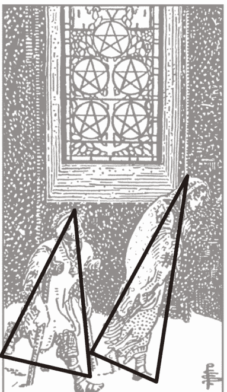

### 圖像分析

圖像中兩個人物側身在前景走動，兩個人各走各的路，構圖上也沒有把兩人連結在一起。前方的女人低頭向前走，沒有在看路，後方的男人是仰頭向左方，也沒有看前面，兩人的視線都離開了前方，也沒有交集。走動的人物，形成傾斜的三角形身形，在畫面形成不穩、不安的視覺中心，兩人走在不平的雪地上，增添了前進的阻礙，加上黑暗的背景，整體呈現出不甚樂觀的狀況。但背景中長方形的窗戶在視覺上明亮、穩定，成為另一個焦點，窗戶位在畫面正中央，比例與人物類似，形成穩定、可信賴的保護牆。但人物的姿態與視線，沒有朝向旁邊的教堂，讓教堂成為與人物無關的建築體。教堂的光越繽紛，越突顯出人物所感受到的暗淡與無助。

### 情境敘事

下著雪的夜晚，衣衫襤褸的女人與跛腳的男人，在雪地中持續踩著步伐向前，無法在這裡停下來，這只會讓他們的處境更艱難，只有持續走下去，才能維持體溫、讓生命延續。他們為何沒有看到在一旁的教堂？或者，他們在寒冬為何穿得這麼單薄？男人的腳受傷了，為何還要走在雪地上？真的有非這麼做不可的理由？或這是他們自己造成的結果？注意看圖像，男人胸前掛著金色的鈴鐺，代表他們不是沒有錢，只是不願意花錢買衣服或者找飯店休息。有些過度勤儉持家的人，雖然有能力，卻讓自己活得又苦又貧，不只自己受苦，身邊的人也不能穿好吃好，只能一起受苦。不管他們擁有多少財富，心裡感受到的貧窮讓他們不想花一毛錢，或者累垮了自己也要賺錢等。五角星5就是這種處境，圖像中的人物沒有看向教堂，是因為對自己吝嗇的人，不相信他人會給予幫助，所以兩個人也自顧自的走自己的路。

### 元素與數字在圖像中的意義

四號的五角星不想要失去任何東西的固執，帶來了五號五角星的困境。那些被四號人物抓著不放的五角星，在五號圖像中，被框在窗戶上，成為無法運用的資源。害怕失去的四號元素，並沒有因為守好五角星而感到滿意，反而會變得越來越害怕，所以就把自己不想失去的東西，緊緊的鎖起來，但同時這些資源，再也沒有機會拿出來使用，只能觀賞。依五角星元素的特質，到了五號，已經累積了相當的基礎與資源，卻比開始時更缺乏，原因就在資源成為無法使用的展示品。人生路上總會遇到預料之外的事，從四到五的轉變，在圖像上是由一個人變成兩個人，代表事態已經改變了，但在五號，所有的資源都成為觀賞物，有跟沒有一樣，所以不管過去累積過多少，都對生活中遇到的困境沒有任何幫助。這就是五角星元素會在五號學習到的經驗，資源唯有在使用時，才能持續創造價值。五角星元素的優勢，是從經驗中記取教訓，所以之後不會再犯同樣的錯誤，學會如何善用資源。

### 解牌敘事（正位）

在五角星5的情境，你會感受到自己是弱者，沒有資源、沒有力量改變現況，只能逆來順受。雖然在生活中，每個人都有可能遇到困境，但五角星5的處境，可能是自己把自己逼到絕境，動彈不得，他人想要提供幫助，都被你視為是不可能而拒絕。在工作中，如果人力一直減少而工作加重，你會一直抱怨人力不足、太辛苦，但沒有找主管去反應，反而會說服自己公司不會改變，所以說了也沒用；或者不管多困苦也沒有要換工作，認為換去哪裡都一樣。在人際關係上，也只是一味的承擔不舒服的互動方式，認為反應了也沒用，只能自己認命，長期下來認為自己受了很多委屈。在五角星5的情境，只看到自己的缺乏與不足，失去了變通能力，只想到要度過難關只能堅持不放棄，卻只會讓自己陷入更為困窘的狀況。

### 解牌敘事（逆位）

在逆位情境，人物可能受夠了貧困，終於用身上的鈴換取物資，或找到可過夜的地方，讓自己的身體獲得照顧與休息。逆位時，原來只是背景的教堂，也有可能成為協助者，代表人物會接受他人給予的資助。兩個貧困的人物在逆位時可以改變現況，主要也是已經走到絕境，再繼續下去連性命都不保，非改變不可。所以工作中人力不足、工作過量的狀況，如果是處在逆位的五角星5，代表已經到達走不下去的地步，會丟掉拐杖任性地坐在地上大吼大叫，不管是抱怨老天爺無情，還是自己愚蠢，總是會找到方法結束原有的狀況，不再扛著重擔。在人際關係中，也不再悶悶地把不滿往心裡吞，或者認為只要委屈自己就可以，在逆位時，雖然會有不愉快的情緒爆發或自憐自艾，但都會帶來讓關係轉變的契機。

### 建議敘事（正位）

遇到困難抽到五角星5作為建議，可解釋為雖然辛苦，但要學習承擔，不能輕易放棄，也不要輕易離開，要堅持到最後。以五角星5作為解決問題的方法時，代表現在的艱苦才是幫助你找到脫離困境的方法，所以不能避開、不理會，或想要用簡單的方式隨便應對。沒有人想要受苦，所以只要遇到，大部分的人只要有能力，就會迅速逃離，但所有的受苦是因為我們正在突破原有的界線，就像金蟬脫殼，沒有跨越界線的努力，就不可能讓自己改變或成長。所以五角星5的建議，是接受成長帶來的不舒服，雖然在困境中，我們會像圖像中的人物變得難堪，但過程的難堪都會成為襯托美好結果的必要。

### 建議敘事（逆位）

遇到困境抽到逆位作為建議，可解釋為走出五角星5的情境。有時候我們會說服自己，要學會承擔才是負責任的人，所以不管處境多艱困都會堅持下去。就像在工作中人力不足、工作量過多的情況，為了成為有責任感的人，就可能把壓力往肚裡吞，久了就成為理所當然。但逆位的建議，是要你不必再讓自己停留在不舒服的情境中，沒有人會因為你腳受傷還來工作而給你獎勵，或者一人扛下了多人的工作而獲得肯定。我們常為了成為獨當一面的人，已經做的太過了也不自知。逆位的建議，就是從五角星5的狀況中出走，才能讓自己在貧病中脫困。在人際關係上，逆位的建議是要走出同病相憐的關係模式，不能因為有人的處境與自己類似，就成為接受現況的藉口。在情感發展上，也要能夠認清兩人的關係或許像陌生人，沒有交集，要先承認目前的互動不理想，才能為關係帶來改變的可能。

## 五角星6

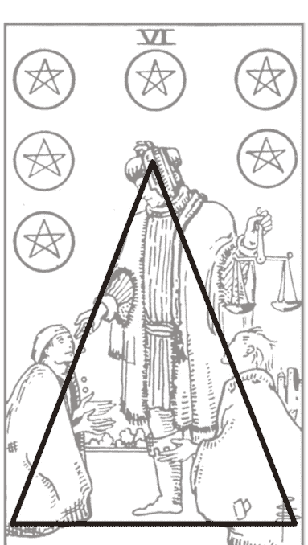

### 圖像分析

圖像中有三個人物，一人站立、二人跪在地上，形成了三角形視覺中心。站立的人看向左邊的人，頭部向下傾斜，形成畫面中的動態效果，順著他的視線，會看到施予的金錢以及向上仰望的兩個人。六個五角星並沒有嵌在窗框中，或者被人物拿在手上，反而自由地放在空中，跟圖像裡的背景沒有連結，這些五角星是創造出各種可能性的原料。三人所在的地方非常平坦，地平線也很遙遠，所以這是寬敞又平穩的環境，遠處會看到樹木與城鎮，但比例非常小，只是前景的陪襯，無法影響人物們的行動。從三人形成的三角形來看，三個人物是無法分割的一體，缺一不可，形成穩定的關係互動，但三角形外突出的天秤，可能會成為動搖穩定的因素，所以人物小心的拿在手上。

### 情境敘事

圖像中，一人正在施予，兩人獲得幫助，他們的穿著區分了富裕與貧窮的身份。站立的富人一隻手伸出放下錢幣，另一隻手則拿著天秤，坐在地上的兩個人都用渴望的眼神伸出手並仰望著富人。五角星放置在高空中，在三人的身形之外，接近站立的富人。其他五角星牌圖像中，大多會把五角星繪製在與人物有關的背景中，例如窗戶、樹、或拿在手上，但五角星6的圖像，卻把六個五角星鑲在空中，與背景構圖沒有任何關聯。它們就像可被自由運用的資源，隨時等待他人取用，或運用在其他用途上，而富人就是分配資源的人。但這些五角星最後會達成什麼成果，在於拿到的人如何運用，並非由富人掌管。富人小心翼翼的拿著天秤，不讓它倒向一邊，天秤成了讓關係維持的關鍵，只要一不小心，就有可能把原有的平衡打亂，不再能和諧、穩定地維持。

### 元素與數字在圖像中的意義

只有累積卻沒有取用資源的五號五角星，在困窘的經驗後，學會了把資源放出來自由運用的智慧，一旦打開了運用資源的可能性，六號五角星就會發現擁有的資源很多，可以源源不絕的轉換使用。所以六號五角星與五號時相反，變得慷慨、大方，知道資源要被使用才能成為實際的獲利，但就五角星小心謹慎的特質，也不會過度使用，會小心翼翼、用天秤衡量與計算後再決定。在五號的困境，五角星過度小心、害怕的特質，身邊的人也會一起受累，但到了六號，願意慷慨解囊的五角星，反而成為可以資助他人的角色，這樣的轉變來自於五角星從只會累積，學會接受變動與轉換，讓資源流動，以獲得更美好的結果。在六號圖像裡的人物，背景非常微小，他不需要有靠山，他自己就已經是自己的靠山。

### 解牌敘事（正位）

在五角星6的情境，人物會很慷慨的分享自己的經驗、技術、資源來幫助身邊的人，同時也因為有人願意接受幫助而感到開心與滿足。在工作中，你可能處在帶領他人的位置，或者因為經驗豐富，可以協助他人更有效率的完成工作。如果是正處於換工作的狀況，換工作可以成為將自己知道或能做的部分，分享出去的機會，也透過換工作，讓自己更確信自己擁有的資源很足夠，可以站在優勢的位置去考量未來。在人際關係中，五角星6的處境，可以感受到自己對他人有實際的幫助，所以在人際互動中，較能自在的與人交往，不管在請求別人協助，或應對他人的請求，都能慷慨且自在的應對。在情感發展上，也會努力成為有用、有價值的人，並在對方需要幫助時全力以赴，不會只是期待對方為自己付出，而成為大方、不計較的人。

### 解牌敘事（逆位）

逆位的情境，原來在空中的五角星會掉到地上，無法被富人運用，所以原有的三人關係會轉變，可能變成大家都在等待他人幫助，但沒人願意主動出手。在團隊或群體活動中，如果沒有自願出來承擔的人，團隊裡的每個人，就只會計較自己的功勞與付出，卻無法為了整體發展去推動工作，所以逆位情境，是沒有人願意成為承擔者的處境，大家只顧著做好自己的事，不想多為他人或群體多做一些，也不認為這是自己的責任。在人際關係上，會先看到對方沒有做到的地方，覺得自己吃虧，所以對他人的要求都會以拒絕或自我保護的方式應對。在情感關係上，也會等待他人先付出，認為先付出者會被占便宜，會被他人看不起。

### 建議敘事（正位）

遇到困境抽到五角星6作為建議，可以解釋為不管是經驗或資源，都要大方的與他人分享，不需計較。當自己能夠處在可以給予的位置時，這也是拓展自己的機會，可以視為對未來的投資，多努力一點、多付出一些，讓自己成為在事情中不可缺少的重要價值。在人際關係上，也不需要斤斤計較，當他人尋求協助時，代表你被視為是有能力的人，可以藉此展現自己的優勢與能力。在情感關係上也不需要過問誰付出的比較多，在五角星6的情境，雖然是單方面給予資助，但有能力資助他人，代表可以獲得更大的自主性。

### 建議敘事（逆位）

遇到問題抽到逆位作為建議，可以解釋為要走出五角星6的情境。你可能不懂得拒絕，過度或沒有節制的分享你的經驗或資源，而且有時候也不是你的責任或能力所及，卻因為無法拒絕，承擔了他人的責任，雖然你是好心為了幫忙盡力，反而弄巧成拙，成為被埋怨的對象。知道自己的能力所及，判斷可不可行，才能給予他人幫助。只有好心是無法成為對他人有幫助的人，所以有時候學習退一步，也是逆位情境給予的建議。雖然看到他人受苦，很想要幫一把，但要能夠明智判斷自己是否有能力幫忙，還是反過來，你也是需要幫助的人。

## 五角星7

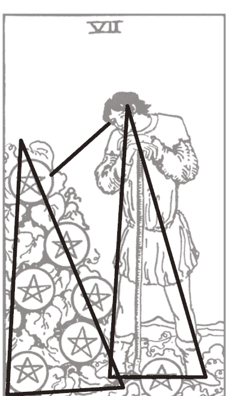

### 圖像分析

人物低頭、張開雙腳、身體倚靠在長桿上，以三角形身形站立在右側，人物的視線向著左邊的樹，樹也以三角形、與人物類似的比例，成為另一個視覺焦點，兩個立在地面的三角形，填滿了畫面，而且都是不易改變的樣態，給人安定卻不太能變化的固執感受。人物站在紅土上，地面沒有很堅實，但可以讓植物生長，人物腳邊有一顆五角星，可能是從旁邊的樹上摘下來，想要當作種子再種植，長成第二棵樹，但剛種植的樹苗需要耐心等待，才能長成像旁邊的樹。背景中的高山在遠處，不會影響人物的農地，所以人物還是可以安心耕種，整體畫面給人感受被定格，並且要慢慢等待的氛圍。

### 情境敘事

在其他圖像中，只有一位人物的構圖，人物會占據中間的位置，成為視覺中心，但在五角星7，人物雖接近中心位置，但他的視線朝向一旁的樹，讓樹也成為焦點，代表人物現在所有的心思都只在種植樹木這件事情上，沒有比這個更重要的事。人物腳下的五角星從樹中摘下來移植，雖然現在只有兩片葉子，但人物正在期待它能長成和旁邊一樣的大樹，如此農地裡的收成一步步增值。這雖然是可預期的成果，卻需要時間慢慢等待，所以人物把身體倚靠在農具上休息，但他的視線沒有盯著接下來要種植的五角星，反而一直看著大樹，象徵了人物沒有把注意力放在未來的豐收，反而專注在目前的成果是否充足。

### 元素與數字在圖像中的意義

五角星6的資源是可以流動的資源，土地的流動，才能吸收本來沒有的物質，成為富有養份的地。所以到了五角星7，用六號時獲得的豐富養份，種植出成果豐碩的果實，但務實、謹慎、力追求完美的五角星，在獲得第一批成果後，不會只想著拿來享用或使用，而是以它為基礎，找出優良果實，再種植出更優的品質，一步步讓自己獲得最好、最上等的成果，在市場上占有優勢。從六號數字開始，五角星裡的人物都是視線向下，代表他們都已站在可以掌握及改造五角星的技術，更有信心去運用與發揮五角星的優勢。從六號開始，五角星元素不只是守住資源，而是學習讓元素達到完美，所以在這個階段，五角星元素表現出高度的勤奮與專注，只求到達結果，無暇去想其他事。

### 解牌敘事（正位）

五角星7的情境，雖然已獲得成果，但沒有就此滿意，而會用手中的資源繼續培養與發展，並耐心的等待結果。在工作中，可能已有足夠的經驗獲得穩定的職務，但會認為還不夠完美，無法滿足於現況。在找工作的問題上，會思考可以長期發展與成長的工作，雖會耐心尋找與等待最佳機會，但也有可能過於吹毛求疵。在人際或情感關係上，五角星7的人物，不太喜歡快速變化的關係，一切按部就班、慢慢熟悉，建立彼此的信任。所以不會積極去認識陌生人，跟不熟的人相處會感到不自在，會長期停留在熟悉的社交圈，或者由熟人介紹才會拓展新人脈。五角星7的情境，一方面想要讓工作或關係長久穩定，但另一方面也認為還未達到最完美的結果，所以雖然不會改變，但也不滿意現況。

### 解牌敘事（逆位）

在逆位情境，人物沒有耐心等到長出新果實，或者沒有好好照顧樹木，所以果實長得不好，無法再利用。在工作中，常常隨心情做事，無法專注，或者工作換來換去，也沒能為自己累積基礎。在逆位情境，人物無法固定站在原地，而是會到處走來走去，並認為植物長不好是位置、土地的問題，所以就會到處找地方重種，但又沒有耐心照顧或等植物成長，很快又把注意力轉移到其他事情上。所以在逆位情境，不管是在工作還是人際關係上，都無法有長期、穩定的安排，對自己做的事情也很容易感到無聊，對關係也無法長久維持，無法給人可以信任的安定感。在情感發展上，如果遇到衝突或不愉快的狀況，就有可能以離開的方式應對衝突，關係無法長久維持。或者對長久交往關係感到疲乏，想要有一些變化，卻更容易帶來衝突與不愉快。

### 建議敘事（正位）

遇到困境抽到五角星7作為建議，可以解釋為留在目前的情境，暫時不要有變動，雖然目前狀況未必滿意，但停下來也是為了等待更好的時機。在工作中如果接下新計畫，五角星7的建議是從過去已完成的成果中找資源，不要展開全新的挑戰。在換工作的問題上，五角星7的建議是要守住原有的資源與經驗，所以不管是否決定改變，都不能有太大的變動，影響原有的生活。有關人際衝突，五角星7的建議是關注過去的相處模式，不需要因為衝突而做出改變，以你熟悉的方式，再與對方溝通，並耐心的應對。在情感關係上，五角星7也是建議不要輕易變動或離開，情感關係久了，可能會平淡、不浪漫，但安定的生活是你目前需要的狀況。

### 建議敘事（逆位）

遇到問題抽到逆位作為建議，可以解釋為走出五角星7的情境，代表你想要擁有長期安定的未來，反而讓你不再嘗試新的可能性，也不想改變目前的狀況。雖然日常生活中的穩定與重複可以帶來安心感，但久了就會成為害怕改變的阻礙，如果你現在有換工作的邀請，或者在工作中遇到困境，逆位建議是要你走出原有應對事情的方法或生活方式，如果不為自己帶來改變，無法脫離目前的困境。在人際或情感關係上，逆位的建議也是要你放下想要維持現狀的做法，如果太在乎穩定與不改變，只會讓關係僵持在原地，或者遇到瓶頸無法再前進，雖然改變會給人不知如何應對、要怎麼應對的困擾與不安，但逆位建議，就是要你走入這種不安的情境，才能為自己的生活帶來新的機會與可能。

## 五角星8

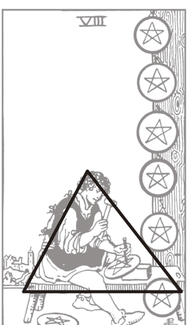

### 圖像分析

人物側身坐在長椅上，他的上半身與椅子形成三角形視覺中心，椅腳與人物的雙腳定位了三角形。放置椅子的地面平坦，人物的雙腳跨在長椅兩側，兩手持工具，視線緊盯著雙手，正在製作五角星。在右側，有六個五角星依序從上到下排掛在木柱上展示，這些是人物過去累積的成果。去的成果，在地上也有一個五角星隨意放置，這是接下來要努力的工作。在遠處的地平線有城堡與朝向城堡的道路，但比例很小，不影響人物的工作。相對其他圖像，人物的身形在比例上沒有填滿整個畫面，反而有留白的悠閒，並且灰色作為背景沉澱了整體氛圍，人物則以強烈的顏色與動態的動作，展現出穩定中發展的變化。

### 情境敘事

一位正在專心打造五角星的匠師，雖然坐在椅子上，卻是一位忙碌的工作者，只是不需要向外移動，坐在原地工作，只有雙手做個不停。他打造的五角星都是一樣的，所以這是重複的工作，日復一日的練習，打造出完美成品。就像學樂器，如果沒有勤奮的練習，就算是天才，也無法達到熟練的結果。日常生活就是需要在不變動的情境下，重複完成工作的練習，家務事、例行工作、學習一門技藝，只要用心去勤練，都能到達匠師、達人的境界，這就是五角星8的情境。遠處的城堡是人物可以去變賣物品的地方，這是勞力與獲利被保障的狀況，只要努力工作，就可以得到回報。

### 元素與數字在圖像中的意義

七號五角星以農耕表現了勤奮的勞力帶來的成就，在八號五角星則進展到精煉的手工，除了勞力還需要技術，才能獲得更多的回報與利益。五角星的特質是用務實、腳踏實地的方式做事，種植與技術都是務實的工作，但種植需要土地與大量的勞動，雖然腳踏實地，以個人力量來說並不容易。技術則更為精巧、更適合單人工作，需要日復一日的練習，精進專業，被視為是提升個人能力的技藝，非常符合五角星的特質。所以七號到八號都在強調五角星的務實性，但七號需要仰賴天氣才能擴大種植，而八號只要自我精進，皆可由個人掌控，發生變動的可能降到最低，讓五角星元素更為穩定的永續發展。有了從七號到八號的學習，五角星元素就等著豐碩成果到來。

### 解牌敘事（正位）

在五角星8的情境，人物會很耐煩的完成手邊所有瑣碎的事情，或者重複練習，讓自己成為箇中好手，或者有秩序的安排生活細節，讓日常變得井然有序。在工作中，可能有很多必要完成的例行公事，但都能夠耐煩的去做好；或者遇到要換工作，會持續精進自己的經驗與專業，換工作成為更上一層樓的機會，不希望從頭開始，所以五角星8的情境，不會考慮需要搬遷或全新的工作挑戰。在人際關係上，人跟人的溝通，大多停留在生活瑣碎的小事，交代事情、報告進度等，彼此相處穩定、安心，沒有什麼太大的衝突或麻煩。在情感關係上，是進入到柴米油鹽醬醋茶的階段，沒有心動的浪漫，但能夠安心生活，兩個人在平凡的生活中享受情感發展，像家人一樣，進入到安定的情感階段。

### 解牌敘事（逆位）

在逆位情境，原來坐在椅子上的人物，無法安穩的在原地工作，想要到別的地方，嘗試不一樣的事情。或者也有可能木柱上的五角星都掉落，人物會發現過去的努力都在浪費時間，沒有留下任何成績，還是做不好，所以想放棄。逆位的人物，沒有耐心去做需要長期專注的事，他想要馬上看到結果或改變，覺得自己已經浪費了太多時間，再不改變就會落後，或已經覺得自己落後他人很多。所以在工作中對自己手上的任務都不滿意，認為這些任務無法為自己帶來成就或機會，也會認為不換工作，就無法達到自己想要的理想結果。在人際或情感關係上，無法珍惜身邊一起相處的家人、朋友或同事，想要認識在社會上有地位、有名望的人，沒有耐心花時間經營關係，也無法接受過於平凡、穩定的情感階段，平凡會被認為是不足與不夠好。

### 建議敘事（正位）

遇到困境抽到五角星8作為建議，可以解釋為不管多瑣碎的事都要用心做好，比起改變，更需要守住現在，繼續精益求精，或享受穩定、安心的日常生活。當我們看到他人的發展就會比較，覺得自己沒有進步，或者成就不足，這時內心就會急躁，會對自己的狀況感到不滿意。五角星8作為建議，就是提醒你要把眼光從外面轉回自己，要看到自己過去累積的成就不容易，只要依照自己的步調，一步步前進，就可以獲得滿意的結果。在工作中，不需羨慕他人爭取到的新機會或新職務；或者在人際關係上，也不需要一直拓展新的人脈，只需要經營好舊交情；在情感發展上，好好享受平凡、安定的關係，並不是每段關係都會從一見鍾情或心動的迷戀開始，近水樓台或青梅竹馬，也能發展出幸福的生活。

### 建議敘事（逆位）

遇到困難抽到逆位作為建議，可解釋為要走出五角星8的情境。不能讓自己因為熟悉、安逸而停留在原處，做自己習慣做的事，需要走出現有的生活狀況，為自己的生活帶來變化。在工作或人際關係上，要放下熟悉的模式，如果以前你都是被動接受他人的安排，逆位建議要變成主動者，提出各種改變的意見，並嘗試做出一些改變。如果主管想安排新的任務，你覺得麻煩有壓力不想接受，或者他人提供好的工作機會，你因為不想換環境而拒絕。但逆位建議是要提醒你，改變會帶來不安與焦慮，但也常會有意料之外的驚喜與更多的成長機會。人際或情感發展上，也需要離開過去的交友圈，不要認為人與人的關係都要長久發展才有意義，就算只是一面之緣，也有可能給你一些啟發，所以放開自己，任何時候都可以跟身邊的人展開對話。

## 五角星9

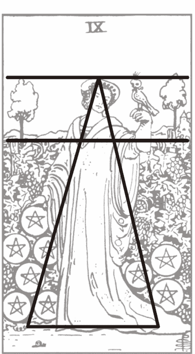

### 圖像分析

人物站在圖像正中央，以三角形的身形穩穩定位了視覺中心，人物的右手上有一隻頭上罩著布的鳥，另一隻手摸著五角星。畫面中，所有的五角星都位在人物的腰部以下，長在葡萄藤之間，也成為果實。人物的眼睛朝向右下方，盯著地面，沒有特別聚焦在物件上，讓圖像焦點停留在人物的手指向的地方。背景有高出人物腰部的圍牆，再向外有樹、城堡與山丘，五角星安全的被保護在圍牆內，人物則可以自由地看向外面，內、外的世界雖然有界線，但沒有全然封閉。後面兩棵樹的高度，剛好與人物和鳥的頭部形成直線，沒有任何景物高過人物的身形，把視覺都聚焦在人物身上。

### 情境敘事

圖像中的人物，臉微微側向一邊，但向前方展開雙臂，展示手邊的五角星與鳥，她的姿態就像雜誌封面，故意擺出特定的姿態，把自己展示給他人看。人物手指的五角星與鳥，都成為人物的形象之一，驕傲的向外展現。五角星與葡萄藤糾纏在一起，像果實一樣長在接近地面的地方，但鳥卻在高舉的手背上，一高一低、上與下的方式，占據了整個空間，人物的周邊都是她感到滿意與驕傲的成果。後方的圍籬，不高不低，剛好保護了五角星，但沒有限制鳥飛翔的自由，所以人物處在安穩但又可以自由行動的狀態。遠處的山丘與城堡，都沒有高過人物的身形，象徵沒有任何事情成為人物的挑戰或威脅。左右兩邊的樹木，剛好與人物的身高齊平，形成從圍牆延伸的守護意象，讓人物安全的待在她的地方，但又沒有遮蔽開闊的視野。腳邊有一隻慢慢爬行的蝸牛，表示緩慢、悠閒，這是時間悠然流過的美好日常，「沒事」的悠閒。

### 元素與數字在圖像中的意義

七號的勞動與八號的技術精進，在九號數字大獲成功，九號的五角星，有著辛勤勞動種植的豐碩果實，也有耐心花時間訓練在手上的鳥，這兩種努力成果，在九號五角星終於得到了應有的回報。五角星元素的特質會細心、腳踏實地完成工作，所以由五角星的努力獲得的成就，可以長期享有，不會大起大落，而像愚公移山，造就出不易改變的結果。雖然五角星在九號已經擁有回報，但這是半開放的花園，還是會受到風雨的侵襲。雖然九號已經有了安穩、豐富的資源，但五角星元素不只要擁有安定，也會努力讓這一切能夠永續經營，成為百年事業，所以對五角星元素來說，九號數字的成就還得努力發展成不會動搖的靠山。

### 解牌敘事（正位）

五角星9的情境，是在自家花園、悠閒安逸的享受生活，也很驕傲與滿意自己的成就。所以在工作中，擁有足夠應付工作的經驗與能力，任何任務都可以自信的應對。在換工作的問題上，對自己的資歷與專業很有信心，所以會慢慢尋找適合自己的工作，或者等待機會上門。在人際關係上，雖然對熱鬧的交際生活並不熱衷，但跟人發展的關係大多可以維持長久又安定的狀況。但五角星9的情境是安靜、悠閒的生活，所以不會去參與非必要的交際應酬，跟他人的互動充滿自信，很清楚知道自己的優勢。在情感發展上，兩人的關係進入穩定與信任的階段，除了兩人的生活以外，也能各自享受獨立生活，或者就算沒有對象，也能悠閒、滿足的過一個人的日子。

### 解牌敘事（逆位）

在逆位情境，原來在自家花園受到保護的人物，沒有屬於自己的地方，也沒有可以展示給他人看的果實與用心訓練的鳥，覺得自己一事無成，而且也找不到可以讓自己安心的地方。工作中，在逆位情境無法耐心、自律的完成工作，很多事情常常拖延、半途放棄、不了了之，所以也無法獲得他人的信任。逆位時，也可能認為心無法歸屬到任何地方，無法讓自己安定下來，所以就想要離開、逃避，也有可能想著換工作、離開某些環境。在人際關係上也無法經營長久的關係，常會忘記約定或承諾，也會拖延答應他人的事，所以會給人自私、不負責任的想法。在情感發展上，逆位的五角星9的情境，因為自己沒有安定感，也會讓對方感到不安，也害怕讓感情走到需要承諾的階段。雖然有著他人羨慕的關係，但無法滿足於現況或對方的條件，成為引發衝突的原因。

### 建議敘事（正位）

遇到問題抽到五角星9作為建議，可以解釋為在感到安心的地方，讓自己放鬆下來，暫時不需要煩惱未來，環顧自己的生活，看看現在的美好。在忙於追求成就、努力看向未來的過程中，你忘記自己已經擁有傲人的成績，你達到的成就並不容易，卻沒有被你重視與珍惜。五角星9的建議是，你不需要離開去任何地方，所有你需要的寶藏都在你目前站立的地方，所以在工作中，如果想要離職，比起把眼光放在目前發生的不愉快，不如回顧一下自己努力累積的成績，不必要為了更上一層樓而變動。在人際或情感關係上，也在提醒你不需要為小事煩惱或起衝突，你有足夠的優勢，可以更大方的對待他人，不需把自己放在跟他人一樣的平台上去爭執或力求公平，還不如回到自己的世界，好好享受生活。

### 建議敘事（逆位）

遇到困境抽到逆位作為建議，可以解釋為走出五角星9的情境，走出讓自己感到安心的環境，也不能只滿足於現在的狀況，試著接受變化，嘗試新的挑戰。逆位建議，代表過去你所獲得的成就，或者目前你擁有的資源，才是造成困境的原因。長久以來的安逸、沒有缺乏的生活，反而讓你的生活停滯不前，所以在工作中，因為職務調動、主管調度、公司組織變動，你負責的工作領域改變，只要接受改變是必然，就可以降低因為改變帶來的抗拒與生氣的情緒。或者當你想要換工作，如果不放下過去的條件，可能很難找到新工作。在人際或情感關係上，逆位也是在建議你走出熟悉的關係模式，如果你們的衝突是因為無法避免的事情已經發生，就先接受已經無法回到過去的事實，才能找到明智的應對方法。

## 五角星10

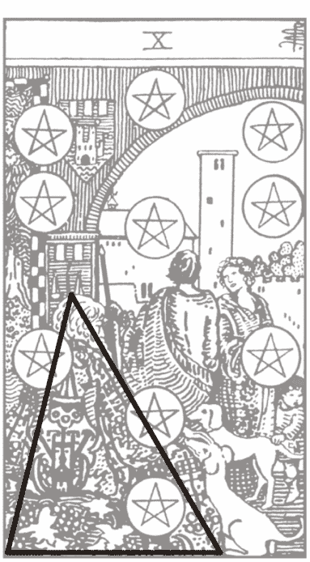

### 圖像分析

這是所有小祕牌的圖像中構圖最複雜的，從人物來看，分成前景與後景兩個視覺中心。前景是背對畫面、以三角形構圖坐著的白髮老人，他側身看向兩隻白狗，並伸手撫摸，視線再延伸過去是摸著白狗的小孩。小孩旁邊是站立的女人，她的視線對著男人，成為另一個視覺焦點。站立的男人左手拿著杖，靠在城門上，城門的柱子與拱形入口，成為老人與站立的人群之間的屏障，把兩組人在構圖上區隔開，但又透過白色的狗形成連結。背景裡有房屋和藍天，十個五角星直接覆蓋在畫面上，一方面擋住了圖像細節，另一方面填滿了圖像空間，視覺上散發出熱鬧的氛圍。

### 情境敘事

圖像中有老、中、小三代，還有狗，熱鬧又和樂融融。但他們並不是家庭成員，人物的安排上有城門內外的區隔，突顯了人群不同的社會身份。坐著的白髮老人穿著華麗，衣服上有像徽章的符號，他可能是貴族，也是管理城鎮的領主，他坐在城門前，雖沒有與其他人交談，但撫摸著身旁的兩隻狗，他坐的地方可能就是他的寶座。兩隻白色的狗也像是名犬，可能是領主的寵物，在後方的小孩，趁女人（可能是媽媽）不注意，偷偷伸手摸狗尾巴。狗與小孩成為老人的陪伴，沒有交談，只是在一旁陪伴。女人與男人則在交談，展現出更為親近的人際互動，從衣服推測，他們屬於同階級的人，所以都站著談話沒有隔閡。雖然人物在城門處，但視野都被高聳的建物擋住，看不到遠處，所有人被建築圍繞，給予守護與安全感。尤其是沿著老人的身體往上延伸的城門，兩者意象重疊，寬大的柱子與拱門展現了城鎮的氣勢，與城鎮給人民的安全保障。

### 元素與數字在圖像中的意義

十號五角星元素，終於完成可以傳承百年的建築，以城堡的形式，鞏固了五角星想要擁有的穩固領地、保護牆，還有安逸富饒的生活。十號裡的人物是坐著的老人，他擁有比九號更多的資源與主導權，猶如世代傳承的意象，老人成為代代相傳的象徵，為十號五角星賦予了永續經營的成就。在十號五角星，不只是追求個人的成功，老人也承擔著照顧他人的責任。五角星的特質不只有腳踏實地的工作，也會想要成為照顧者，在有能力照顧他人的情境下，五角星才能真正圓滿。所以九號五角星雖然也擁有很多，但年輕的女性獨自站立，完成個人成就，尚待需要成為照顧者，五角星用自己的能力與財富，肩負起眷顧他人的責任，才能感到安定與圓滿。

### 解牌敘事（正位）

在五角星10的情境，人物對自己擁有的生活條件感到十分滿意，不只可以安排好自己的生活，也有餘力照顧他人，生活已不需要為了更好的條件汲汲營營。在工作中，到了五角星10的情境，很多事到達可以發展的最高點，如果是某個計畫已完成、接近退休、或準備好離職，五角星10的情境會給予圓滿的結束，但如果是正在發展的任務、新進公司或正要學習的新領域，五角星10的情境反而成為已經到盡頭的提醒，之後就有可能遇到瓶頸、停滯不前等的阻礙。在人際關係上，五角星10的老人並不熱衷交際，他只是安靜的坐在一旁，喜歡看著別人開心，所以在這個情境，跟人的交流也會適當的保持距離，但還是會很友善的對待他人，不太會為小事爭執、計較。在情感發展上，五角星10的情境是可穩定長久發展的關係，但如果是剛開始的戀情或還在熱戀期，五角星10的情境也可能是提醒，過早到達十號的高點，下一步能夠到哪裡，都會是挑戰。

### 解牌敘事（逆位）

在逆位情境，本來默默坐在角落的老人變得很躁動，無法只是在一旁觀看，而是會到處管東管西，讓身邊的人都變得很不自在。他會以上對下的方式命令或掌控他人，打破原有的融洽與平靜。在工作中，你感到自己的成就不足，比不上別人，所以會更努力想要表現或獲得認可，但你的努力，可能變成對他人的敵意、或想要壓制、或看不起他人的表現。逆位情境有可能不想遵守傳統的做法，想要標新立異，在執行計畫與新任務時，為了嘗試新方法變得草率、不夠嚴謹。在找工作的問題上，會感受到過去的經驗無法延續，或無法成為有助於找新工作的資源，也有可能一直換工作，而沒有長久的工作經歷成為後盾。在人際或情感關係上，對人不夠信任，每件事都要親自動手，無法交給他人，或者指揮他人依照自己的方式做事，容易跟他人意見不合。在情感發展上，在五角星10的情境，不想要有所變化的努力，反而無法讓對方感到安心，也有可能害怕承諾，而讓關係無法長久。在逆位情境，無法成為照顧他人的承擔者，只會想到自己的利益或心情。

### 建議敘事（正位）

遇到困境抽到五角星10作為建議，可以解釋為接受目前你的狀況已經很完美、也達成了理想目標，不需再去努力追求更多。在五角星10的情境，只需要像老人一樣，在自己的位置上悠閒看著他人，享受自己擁有的安逸與穩定，不去與他人競爭或爭執，也不需要爭取可以表現的機會，一切都到了最圓滿的狀態，只需享受，現階段不需要為了改變而努力。在工作中，你可能很想要有更多的成就，或擁有更穩定的基礎，但在五角星10的建議，想要改變的努力，只會帶來你的挫折與不滿，接受現在已是可達到的成就的最高點。在人際或情感關係上，五角星10的建議，要成為安靜的觀察者，用你的靜，安撫身邊的人的不安，也要相信自己目前的狀況，可以為身邊的人帶來改變。或者可以享受一個人的清靜生活，雖然與情感對象不熟絡，但平安就是幸福，享受現在你們擁有的富足，感情生活也能獲得安定。

### 建議敘事（逆位）

遇到困境抽到逆位作為建議，可以解釋為走出五角星10的情境。不能安逸於現狀，或者只想要隔岸觀火，從麻煩中遠離，或認為自己有照顧他人的責任等。在逆位建議，老人需要從自己的位置上站起來、離開，穿過城門，去看看別的世界。在工作中，不管是新的專案、還是等待完成的成果，都需要走出五角星10，不能只是在一旁等候成果，要更積極的去巡視專案狀況，才能應對好目前發生的狀況，或者也要有心理準備，專案無法依計畫進行或完成。在人際或情感關係上，走出五角星10的建議，需要更主動的參與群體活動，如果與人有衝突，不能期待過了一陣子事情就會變好，或認為自己沒有做錯，所以不想理會。逆位建議不管衝突原因為何，都不能成為不管事的老人，也要認為自己對事情有主導權，請走入人群並關心與聆聽他人的想法與意見，比起強調自己的想法，努力為他人做出改變更為重要。

# Chapter 9

# 用數字牌解密宮廷人物

從塔羅占卜觀點去分類，一般所謂的小祕牌，包含宮廷牌的五十六張紙牌。但從圖像分類，雖然宮廷牌與數字牌都使用相同的四種元素，但它們的圖像解析方式不同。宮廷牌更接近大祕牌的象徵解析，並不需要看圖說故事，而需要從圖像細節解讀出宮廷人物的特質。雖然宮廷牌也可以從構圖分析獲得更多的解牌訊息，但同一組宮廷人物的構圖方式差異不大，主要改變了背景與物件配置，所以人物所在的場景與配置並不是故事發生的地方，而是說明人物的人格特質與成熟度的象徵安排。

宮廷牌的象徵分析可以參考《敘事塔羅》一書的詳細介紹。但宮廷牌與數字牌共享的元素，可以把宮廷牌的人物想像為數字牌故事裡的角色，把這兩類型的圖拼在一起解釋，就會突顯出宮廷人物的元素特質。同一個元素的宮廷牌，共享同元素的特質，差異在於人格成熟度與社會責任，讓他們在應對事情的態度與能力上有所不同，這跟我在說明數字牌的元素時，把數字1到10號視為元素從初始到成熟的發展階段，用這個觀點就能把宮廷人物視為不同數字牌的階段角色，把數字牌裡的故事，作為宮廷牌人物會經歷的事情與應對事情的能力來理解。

如果把1到10號的數字牌，以元素發展的程度分為三個階段（1號牌的圖像沒有人物，所以先從宮廷牌的對應中排除），2到4號可以視為元素實踐為行動的初始階段，與宮廷牌的侍衛正在學習成長的特質相符合。5到7號則是元素開始能夠發揮優勢，並向外推展、自我實現的階段，但元素的定性還不穩定，符合騎士朝未來邁進的特質。最後8到10號則是元素漸趨完成的階段，符合了皇后與國王成熟的人格與承擔群體責任的特質。如果把這三階段，分別視為宮廷人物特質的實踐能力與成熟度，就能更具體的認識每個宮廷人物的特色，對宮廷牌的認識也會富有故事性，不再只是模棱兩可的字詞堆積。以下就從數字牌的三個階段，分別說明與宮廷人物的特質表現。

## 權杖宮廷牌

### 權杖侍衛

權杖侍衛是好玩、好動、樂觀的青年，他好奇心強，喜歡新鮮、有挑戰的事物。但侍衛是還沒有能力運用火元素的小伙子，火性不熟的人玩火，無法適度的掌握或讓火燒旺，所以權杖侍衛沒有承諾未來的承擔力與遠見。日常生活中去哪玩、去學什麼、去跟誰交朋友等，滿足個人好奇心的行動，可以爽快的下決定，但如果遇到人生十字路口、會影響未來的抉擇，就有可能退縮或猶豫不決。他的退縮來自涉事不深，沒有足夠的經驗幫助他做決定，所以就有可能進入到權杖2的情境，在考慮未來時，無法果敢的放下保護他的安全感，表現出較為保守的態度，小心斟酌下決定的時機。

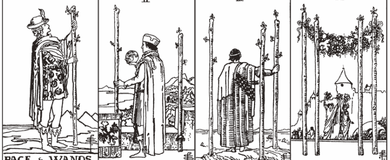

如果歷練再多一些，就可能進入到權杖3的情境，不只是著眼於眼前的事，有能力為長遠的未來做規劃。最後讓權杖侍衛做出行動，走出城堡的決定，可能是夥伴的一句話、一次邀請與建議，就能讓他有勇氣邁開腳步走向未來，發揮出侍衛最理想的行動力，不只開心，也能展現他的企圖心與行動，這就是權杖侍衛會有的權杖4處境。但權杖侍衛的能力僅止於開啟一種可能性，讓這可能性持續朝向未來實踐，接下來需要更專業的騎士來接棒，如果人一直停留在權杖侍衛的角色，就有可能展開了很多計畫，但都在初始階段放棄或失去興趣而中斷。

### 權杖騎士

從權杖5到7的情境，主要強調了權杖特質全力以赴、勇於接受挑戰的狀況，而且所有的努力是為了成為勝利者，獲得他人的掌聲與認可，與權杖騎士的特質符合，也是最能發揮優勢的情況。相對侍衛有經驗、較為成熟的權杖騎士，會更積極實踐自我，如火元素對他人的影響力，權杖騎士無法只滿足於自己的好奇心，而要能跨出自己的世界，與他人競爭，為自己爭取表現的機會。騎士騎著馬，這是需要花時間學習的技術，所以相對站立的侍衛，騎士較能自律與對未來進行長遠的規劃，也有獲得更大成就的野心，而他的野心就會想爭取像權杖5一樣的競爭機會，成為勝利者來證明自己的能力。

權杖特質會越挫越勇，有無比的信心認為自己可以獲勝，他的信心也會成為成功的動力，最終成為勝利者，榮耀的站在他人面前，獲得其他人的掌聲與讚美，這就是權杖6展現的故事。除了獲勝，權杖騎士也會持續努力、奮鬥，從不歇息，也不太能接受自己停滯、無事可做的狀況，所以一直都接受挑戰與任務，這就是騎士會有權杖7的故事。權杖騎士會很努力向眾人證明自己的能力，並且想要嘗試他人不敢嘗試的領域，而且不像皇后或國王要承擔群體的責任，反而更能自由自在的追求自己的夢想，成為可以發揮火元素最大優勢的宮廷特質。

### 權杖皇后與國王

權杖8到10的情境，是權杖的火元素達到成熟與完成的階段，展現了火元素的樂觀所帶來的幸運與好運，以及過度燃燒可能帶來的壓力，這些成為權杖皇后與國王的特質可能帶來的結果。皇后與國王都是獨立自主的領導者，他們都有能力帶領群體，為長遠的未來規劃與承諾，承擔推動群體前進的責任。但國王是陽剛特質的代表，會專注在秩序與制度的管理，而皇后是陰性特質的人物，比起制度管理，更關心制度裡的人。所以這兩者雖然都擁有成熟的元素特質，但元素本身也有陰與陽的特質差異，就會影響到皇后或國王的表現。

以權杖元素來說，以關懷人為主的皇后，在推動事情時，因為重視人的因素，有可能減緩速度與降低挑戰的困難度，會以群體裡的人都能完成為優先。但國王會把群體視為一體，要是有人跟不上或無法配合，他還是會強迫他人為了團隊犧牲自己，獲得最佳成績。如果想區別皇后與國王的不同時，可以從數字牌裡的人物性別去對應，如果圖像裡的角色是女性，就更接近皇后特質，如果是男性，就能應對到國王特質。但權杖牌比較特殊，權杖8沒有人物，所以權杖8對應到皇后與國王都適合；權杖9與10號的主角是男性，是國王會出現的場景。

如果回到宮廷牌的圖像，權杖皇后一手持著向日葵、一手握著權杖，向日葵的日光意象，就像讓八個杖能夠飛翔的好天氣，可以與權杖皇后的圖像連結，所以權杖8會出現的情境，可以聯想為權杖皇后會有的狀況。而權杖國王一手持權杖、另一手緊握拳頭，表現出不易放棄的意志力，與權杖9與權杖10的意象較符合。權杖皇后因為關懷群體中的人，不會過度要求團隊的成果或勝利，會適時關心每個人的狀況，能夠讓過於旺盛的火元素適可而止，反而阻斷了火元素可能會過度擴散而影響他人的災難。在權杖元素，這樣反而更能展現火元素的優勢，因為樂觀與信任可以把危機轉為機會，不管做什麼都有幸運相隨。但權杖國王要堅持到極點的推動力，雖然個人可以勝任，但群體跟不上他的腳步，所以可能就變成只有他在最前面打頭陣，像權杖9一樣事事都要自己打拼；或者像權杖10就算只剩自己在前進，也要堅持走到目的地。

## 寶劍宮廷牌

### 寶劍侍衛

寶劍侍衛的思緒還不成熟，想法與行動無法整合，常會出現想一套、做一套的狀況，或者想的比做的多，這些特質容易陷入寶劍2到4的情境。象徵思考與判斷能力的寶劍，比起其他元素，更需要成熟的人格，才能把元素特質運用得宜。寶劍侍衛雖然比其他侍衛深思熟慮，但僅止於收集資訊與小心謹慎，無法有效的分類、歸納並對訊息進行解讀。所以寶劍侍衛在應對事情時，只能像寶劍2猶豫不決，無法斷然下決定。

寶劍元素會有獨斷的特質，不喜歡聽取他人的意見或受他人影響，所以只能暗自憂心、煩惱，之後就會容易掉入寶劍3的瓶頸，因為跨越不了自己的限制而受挫。寶劍侍衛會有很多想法，但最終都無法成事，只能在寶劍3的挫折後，暫時放棄找不到解決方法的想法，麻痺自己或轉移注意力，暫時不去煩惱，這就是侍衛角色會演出寶劍4情境的原因。寶劍侍衛的特質，是在事情發展初期很勤奮的廣泛收集資料，希望從這些資料中找到怎麼應對的方法，但大多時候就只是在收集資料，在找不到有效的解決方法之後，就會放棄原來的計畫。

### 寶劍騎士

騎士讓思考有了速度與效率，並且可以揮舞手上的劍，擁有比起侍衛更清晰的判斷能力，可以實踐出寶劍元素的優勢，並有效地解決問題。騎士階段，人物關心的是自我實踐，並不需要承擔群體責任，所以他的速度比任何寶劍宮廷人物更快。但寶劍善於對事不對人，騎著馬衝進人群想要解決問題的騎士，在過程中也很容易產生傷兵，雖然騎士會說他不是有意的，但他的劍對人總是冰冷又銳利，所以騎士常會陷入到像寶劍5的情境，本來要解決問題，卻挑起了衝突，雖然問題解決了，但也造成人不和的困擾。

或者像寶劍6，學習放慢速度，帶領大家離開困境，儘量不去傷害他人，願意肩負起責任，不再只為自己，而能為群體著想，但騎士的特質，還沒有皇后與國王的成熟度，表面上是為群體著想而放棄自己的獨斷行為，但內心卻是不得已的選擇，是在騎士的判斷下，先與大家一起離開困境才是最佳的解決之道，才會做出這樣的行動。寶劍騎士最理想的狀況是寶劍7，不只可以善用其解決問題的能力，也避開人群，用迂迴、間接的方式，找到讓大家都滿意的方法。寶劍騎士是在元素中正在培養快速判斷與行動能力的階段，但因為追求速度，容易造成衝突，傾向用簡單、容易的方式快速解決，卻無法看到問題的核心，有可能讓問題一直重複出現。

### 寶劍皇后與國王

寶劍皇后與國王能夠展現成熟的判斷與行動能力，也因為他們能夠比騎士更全面的顧及公共利益與責任，在應對問題時，需要深入核心，無法只求效率與速度，在進行判斷與行動之前，會經歷更為艱難的思考歷程。但在他人面前，皇后與國王永遠展現出果斷與讓人信任的判斷力，但這些判斷都是經過長時間的省思、糾結、思辨之後的結果。尤其是寶劍皇后，她的女性角色出現在寶劍8與寶劍9，皇后擁有關懷他人的陰性特質，在寶劍元素會成為劣勢，為了顧及他人的面子與情感，無法果決、明快的下決定，或者說出真相時，會想要找到兩全其美的方法，一方面讓自己不說謊或欺騙他人，但另一方面，也能緩和他人可能承受的衝擊，這是寶劍皇后更為成熟地應對「人」的情感時會帶來的困擾，所以比起國王，更容易陷入寶劍8的無助與寶劍9的糾結。

寶劍國王的男性角色出現在寶劍10，他跟皇后不同，不在乎他人可能受到的傷害，只想盡快解決、結束，過程中的不愉快，都會被他當作是為了群體利益所需的犧牲，因此能夠快刀斬亂麻，保住整體利益，但很多弱勢者卻在他的判斷中被犧牲或排除。以公司經營來說，要改善營運不善的問題，寶劍皇后雖然也知道做什麼能最快解決問題，但如果波及太多人的利益，她會儘量找到折中的方法，保護公司也保住人，通常這種決定最為困難。但國王會直接以公司的最佳利益下決策，認為長痛不如短痛，徹底改變才是真正為大家好，不能有婦人之仁。皇后對人的關懷，很難做到像寶劍10一樣的絕境，只要能為大家分憂，情願讓自己辛苦。

## 聖杯宮廷牌

### 聖杯侍衛

水元素的聖杯是情感特質，在情感不成熟時，重視當下的感受，無法更拓展到同理他人的能力，所以聖杯侍衛的角色，會出現聖杯2到4的情境，很能享受當下與人的互動，全神貫注在與他人的交流中，但這並不是同理他人的關懷，只是想要讓自己開心與快樂的行動，所以聖杯侍衛與人的互動，只能停留在親密或小群體的友人關係，一旦要拓展到更多的人際互動，需要配合他人時，只要有點不愉快，就會想要離開或不理會他人，這就是侍衛在聖杯4會發生的情境。所以聖杯侍衛，只跟與自己合得來的人相處，不會勉強自己去配合他人，只要投緣的人都可以開心的玩樂，與喜歡的人相處時，他會是溫暖、有趣、帶給人快樂的對象，但只要在關係中有點不愉快，就會逃避。

### 聖杯騎士

開始走出自己的世界，朝向規劃未來與自我實踐的聖杯騎士，無法快速適應外在環境，他的馬走得很緩慢，所以他從侍衛成長為騎士的過程，需要一些時間。過程中，他想要忠於自己情感，但為了大局要配合他人的狀況讓他很糾結。所以聖杯騎士就會容易走進聖杯5的情境，雖然努力走出了侍衛的小世界，想要與更多人建立關係，但對他人的情感還無法成熟應對的騎士，會把與他人的不融洽理解為被他人的拒絕、否定或不理會而傷心，無法體會跟不合的人相處，需要時間相互體諒與建立關係。所以只想停留在熟悉的關係中，容易走回頭路，無法建立新人脈，這是騎士會進入到聖杯6的原因。但騎士終究有著想要自我實現的渴望，所以無法滿足於聖杯5與聖杯6的情境，然而對沒有足夠的社會歷練，或者無法快速適應改變的聖杯騎士來說，就有可能停留在不切實際的白日夢，一直期待最佳的時機點出現，就會走進聖杯7的狀況。在所有的騎士中，聖杯騎士的馬走得優雅、緩慢，雖然也在向未來前進，但馬卻看向後方，依戀過去，所以聖杯騎士成為無法發揮騎士優勢的人物。

### 聖杯皇后與國王

聖杯皇后與國王的情感狀態已經成熟，並能承擔群體責任與承諾，不只為自己，也能為團隊考量。聖杯是陰性特質，所以能夠把聖杯元素展現得最圓滿的是皇后而不是國王，因此國王的男性人物出現在聖杯8與聖杯9，而十號聖杯就成為皇后展現的圓滿狀況。國王比起關懷人的特質，會更關心秩序與制度，但聖杯元素本來就與人的情感有關，所以國王想要在秩序與制度面展現能力時，在聖杯元素就會產生矛盾與衝突。當公司要用制度貫徹理念時，如果沒有鐵石心腸，很難貫徹到底，只要有人來說情，聖杯國王就有可能心軟，無法不予理會。所以聖杯國王反而在不需承擔責任的聖杯8與聖杯9，表現的更為有優勢，用國王的自律與自我管理能力，要求自己更上一層樓，像聖杯9沉浸在自我滿足的情境，這是國王可以達到的最佳處境。

反觀聖杯皇后，她不需像國王一樣培養能力，已經擁有了聖杯的所有優勢，這都表現在皇后手中的聖杯，她的杯子比其他人物的更為華麗與獨特，強調了聖杯皇后能夠發揮出水元素的最大優勢，她所展現的聖杯10情境，家人與群體關係和諧圓滿，是真正懂得「人治」的皇后，能夠治癒人心，為眾人帶來幸福。在聖杯元素，國王反而不適合成為領導者，但會是善於與人溝通的獨立作業者，聖杯元素善於應對「人」的特質，在領導人的特質上，反而要去除用制度的方法，這就是皇后的優勢，不會被制度困住，而會懂得，人才是所有制度的本質與資產，從人的角度去發展皇后的能力，並開拓出唯有聖杯元素才能勝任的任務。

## 五角星宮廷牌

### 五角星侍衛

五角星侍衛對待事情的態度認真，事前會做好十足的準備才行動，而且他只會嘗試有充分把握、可以勝任的任務，所以較不易出錯或失敗，但也因為如此只能做好自己已熟練的事情，無法改變。所以五角星2到4，展現出了五角星侍衛的遊刃有餘，因為認真、不易出錯，也會逐漸獲得他人的信任，雖然做事細心卻沒有前瞻性，所以也不會被重用，但五角星侍衛滿足於自己的小世界，寧願一切都盡在掌握，也不想做任何冒險，所以就會進入五角星4的情境。穩定、踏實、不改變是五角星元素最能展現優勢的狀況，而五角星侍衛站在自己的位置上，雖然站立，卻把視線聚焦在五角星上，沒有看向前方，強調他不要為未來改變自己的定性。五角星侍衛適合熟悉的生活與工作內容，認真、細心的完成工作，但如果遇到要有遠見的情境，就無法應對自如，問題百出、狀況很多。

### 五角星騎士

騎士騎著馬向前奔馳的動力，在五角星騎士的圖像中沒有得到展現，馬上的騎士，雖在高處向前遠望，展現了騎士的前瞻性，但馬卻是原地不動，沒有展現馬可以奔向遠處的特質。當五角星遇到要改變的處境，會躊躇不前，騎士想要有足夠的準備後再行動的特質，也常會錯過時機，這就是五角星騎士會進入到五角星5的情境的原因，抓不到時機，可能在不對的時機行動，原來準備的裝備都無法使用，反而讓處境變得更為艱困。只要遇到困境，五角星騎士就會馬上找方法站穩自己的腳步，比起持續前進，會先讓自己在原地整備，安定下來後才能再繼續，所以騎士會進入到五角星6的狀況，尋找獲得幫助與站穩腳步的方法。比起冒險或挑戰，更重視安定的五角星，就算在騎士階段，也無法向外大步拓展，雖然嘗試要改變，但馬上就會退縮，以安定自己為優先，所以滿足了穩定的需求，但結果永遠都會差一些，但也只能接受，這就是五角星7的情境。在要求安穩的五角星元素，以行動為主力的騎士反而無法發揮騎士的優勢。

### 五角星皇后與國王

五角星皇后與國王擁有穩定的資源與安定的生活，不但能顧好自己，也有能力照顧他人。皇后的陰性特質在五角星元素展現為大地的孕育，她被大自然圍繞，並用五角星元素的特質，一步步耕耘與實踐，讓大地變得豐饒，不只自己獲得優渥的生活，也能滋養他人。這樣的特質就會展現在五角星9的情境，圖像中的女人站在細心照顧的花園中，五角星元素的腳踏實地、皇后對人的關懷，展現在人物對植物與動物的看管與照料，她會在花園中好好保護這些動植物，讓牠們獲得最好的對待。五角星皇后的照顧只惠及她認為重要的對象，就像她在花園裡受到保護的生活，皇后不會管花園外的瑣事，只要自己的世界安穩就是天下太平。

五角星國王的角色，則出現在五角星8與五角星10的情境，在五角星8，他是一位精益求精的匠師，為了建立自己的王國，會扎實的花功夫去實踐，不會走捷徑或過於冒險。他在五角星8用心鍛鍊技巧，無暇理會他人。國王的特質是掌握秩序與制度，他會排除人的變動性，才能穩定進行他的規劃與安排，這樣的努力，能讓他展現五角星元素的圓滿，到達十號。在十號，他成為了一位老者，坐在城堡角落，雖然身邊圍繞著很多人，但他只跟狗有互動，所以國王比起跟人交流，更喜歡管理與經營。完善的制度會讓事物能夠永續經營，五角星國王就是能夠規劃出完善的制度，並且也能好好推動與執行的管理者，在他的長久堅持下，就能建立恆久不易衰敗的王國。只要在他的王國內，人民安居樂業，就能成為他的驕傲，但五角星裡的老人是傳統的維護者，維持過去的榮耀與方法，無法接受新事物或改變。

## 結語

塔羅是圖像媒介，不管用作占卜、神秘學研究、身心靈運用，任何用途都無法離開圖像給予人的影響力。圖像一方面可以直觀的傳達情感訊息，但也能透過有意的安排，傳達道理。在長遠的塔羅占卜傳統裡，小祕牌大多以直觀的理解方式被轉譯為「牌義」，並運用到占卜解牌中，過程中，原來小祕牌有意安排的圖像內容，就會被忽視。本書嘗試的分析方法，並非傳統的占卜運用法，而是把小祕牌視為傳達故事的圖像，比起直觀感受，進一步探究圖像要傳達的意義。一旦我們進入圖像裡的故事，運用為占卜解牌時，不再只是預測未來或吉凶判斷，而會透過故事的共鳴，看到在事件中的自己，並給予自己省思與覺察的機會。透過圖像分析進行的占卜解牌，不再是窺探命運，而是像鏡子一樣映照自己的內心，一旦覺察此時此刻的自己，就會發現未來或命運並不在尚未發生的遠處，而是每一個當下，此時此刻就會成為我們的命運與未來。

從說故事的視野探究小祕牌的圖像時，每次占卜解牌都會成為把自己的生活轉換為故事的歷程，成為故事的事情，不再只是沒有意義、跟我無關、只是找我麻煩的煩惱，而會在一成不變的日常，編織出專屬自己的故事。在生活中編織出有意義的網絡，在故事中的人與事，就會成為成就我生命的必然與意義。故事是意義的中介，你的人生意義早已隱藏在你的故事中，如果想要探索生命意義，就要把你所經歷的事情轉換為故事，把它說出來，就能讓意義從無意識的神秘大河中浮現，展露在陽光下。真心期待這不只是一本學習塔羅占卜的書，也能成為帶領讀者編織自己生命故事的開始，讓故事帶領你進入神秘又深不可測的心靈世界。

## 故事水 魯米 (Rumi) ²

一個故事就像你
熱好的洗澡水。
它在火和你的皮膚之間
攜取訊息。它讓它們相遇
並將你洗淨。
很少人能坐在
火自身之中，如
火蟒蛇或亞伯拉罕
我們需要中介。
飽足感到來了，不過
往往需要一些麵包
把它帶來。
美麗圍繞著我們，但往往
我們需要在花園裡走走
才能認識它。
身體本是一道屏幕
來遮護並部分揭示了
你的顯現裡面那道
閃爍的光。
水，故事，身體

我們所做的一切，都是中介
其隱藏又展現了隱藏之物。
研究它們，
並享受被一個我們
時而懂、時而非懂的
秘密所沐浴。

1. 編註：這裡指的小祕牌不包含宮廷牌。
2. 引用自蔡翔任譯本。

## 附錄 韋特塔羅 78 張

### 大秘牌

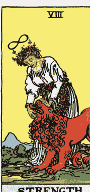

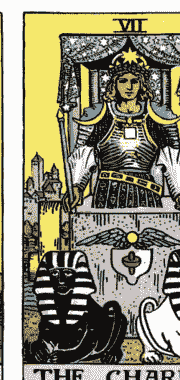

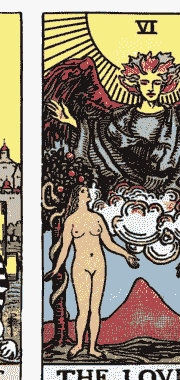

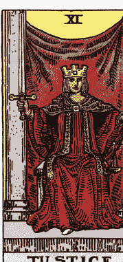

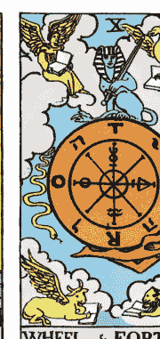

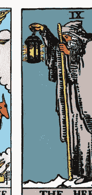

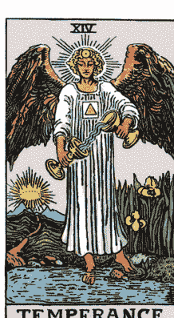

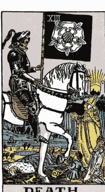

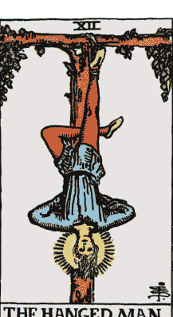

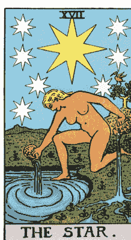

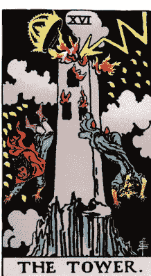

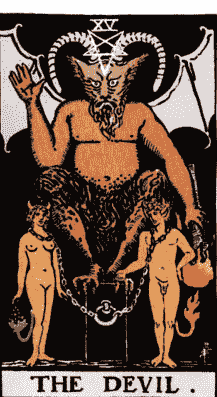

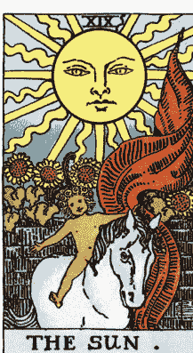

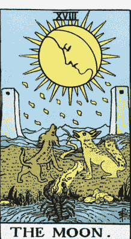

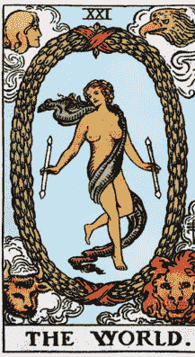

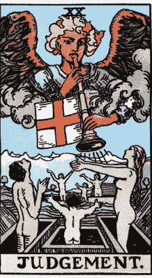

### 小秘牌：權杖牌組

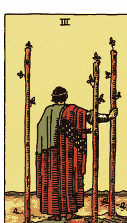

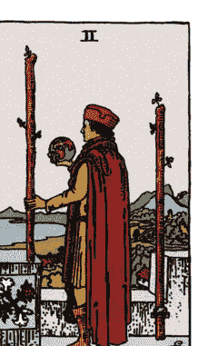

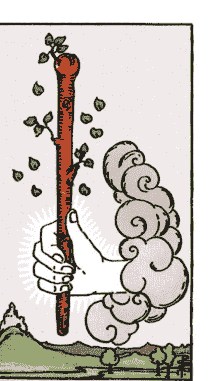

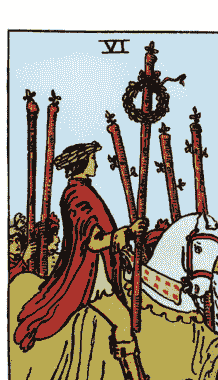

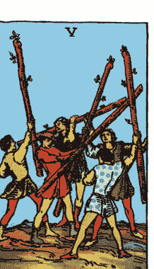

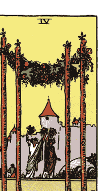

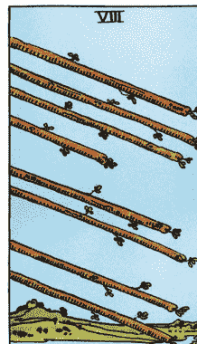

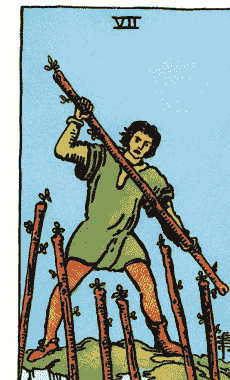

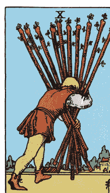

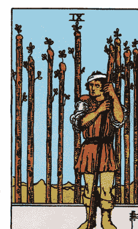

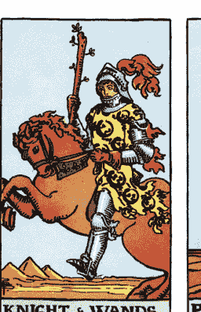

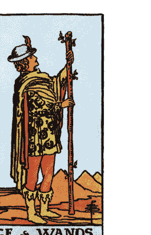

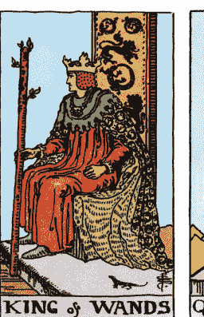

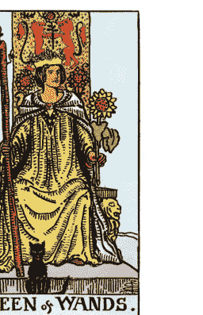

### 小秘牌：聖杯牌組

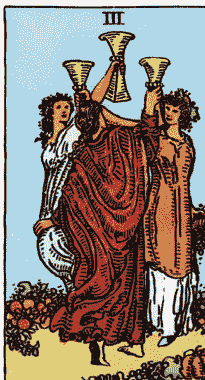

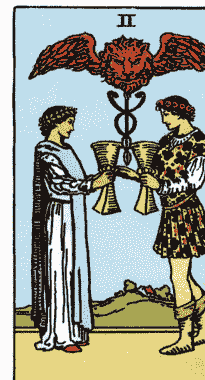

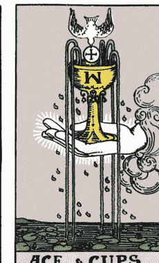

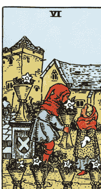

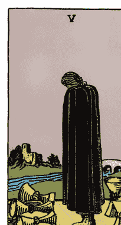

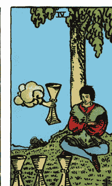

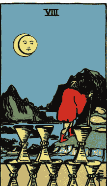

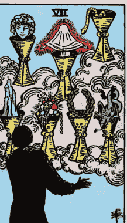

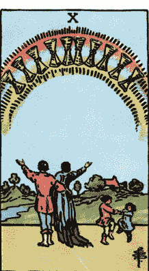

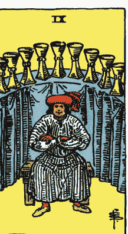

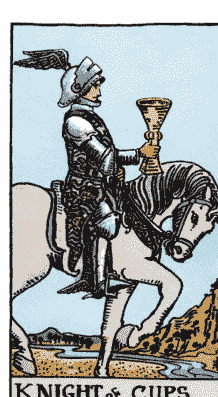

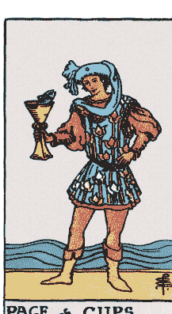

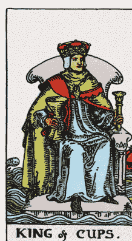

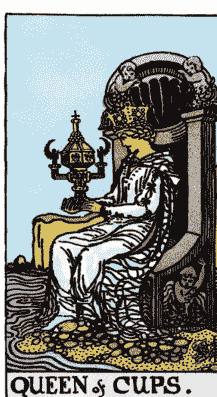

### 小秘牌：寶劍牌組

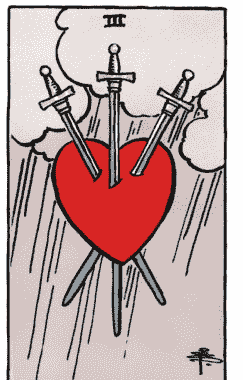

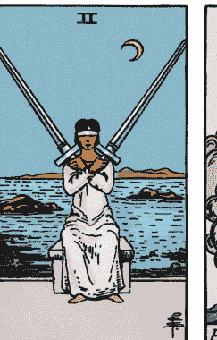

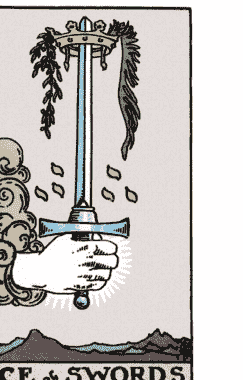

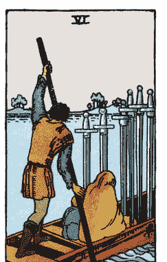

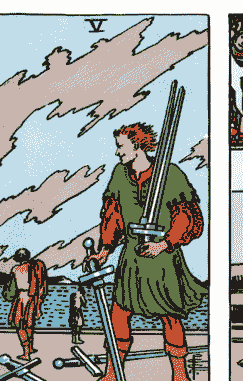

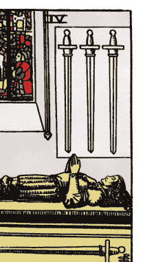

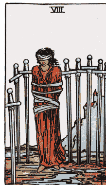

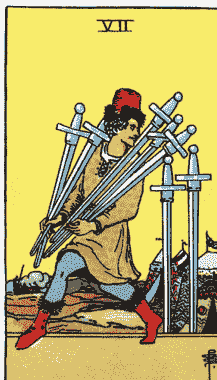

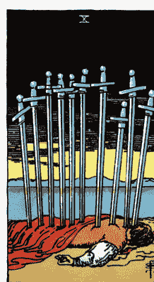

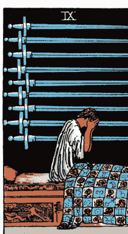

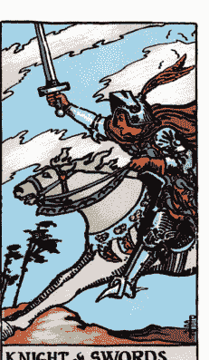

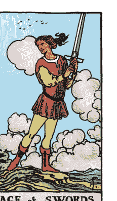

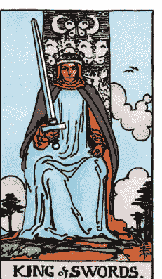

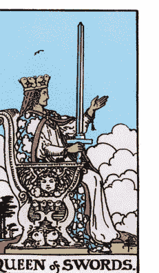

### 小秘牌：五角星牌組

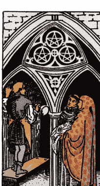

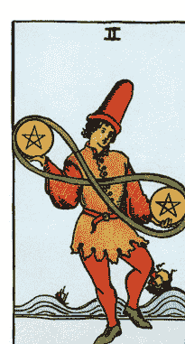

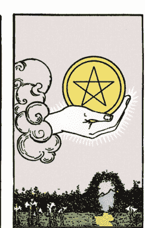

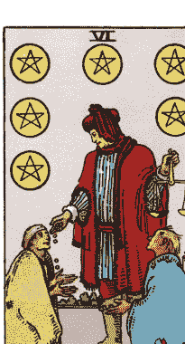

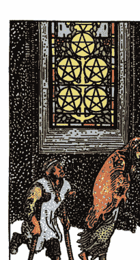

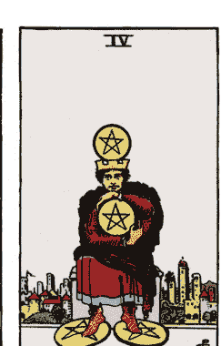

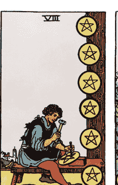

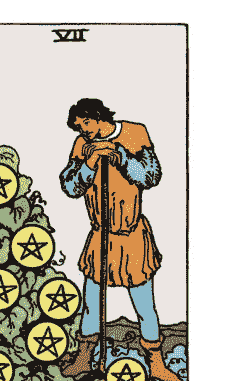

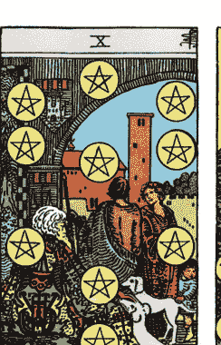

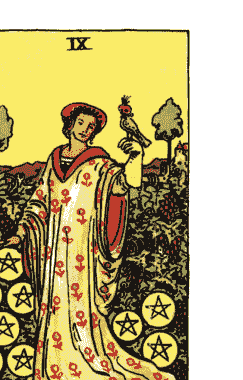

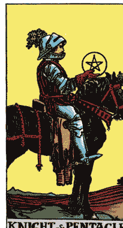

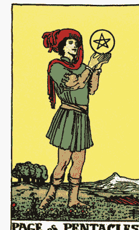

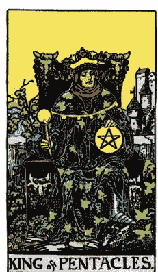

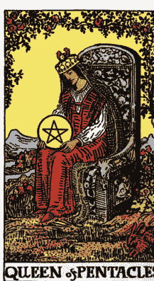
