# 塔罗工作讲义

### 人算不如天算

-   朋友找我合夥創業適合嗎？
-   今年加薪的機會大不大？
-   想要跳槽該怎麼做？
-   有沒有升官的可能性？
-   我適不適合這份新工作？

## 作者序

在企劃《塔羅逆位精解》的時候，丹尼爾就開始思考如何進一步編寫符合讀者需求的進階書籍；從《學會塔羅的16堂課》開始建立基本觀念，接著由《塔羅入門經典牌陣》去理解占卜流程與分析問題的方法，再來透過《塔羅解牌字典》擴充牌義理解的廣度，最後由《塔羅逆位精解》重新思考牌義的變化，似乎入門讀者最基本的需求都能被滿足了。但是由另一方面來看，許多讀者仍然渴求更進階的讀物，能幫助自己在分析問題與理解牌義上更上一層樓，這就不是以上基礎的讀物能夠提供的了。

由丹尼爾占卜與授課的經驗來看，「工作」是最能透過占卜來尋求解答與建議的主題，也很適合用理性思考的方式去分析，因此在規劃進階塔羅書時，就選定了工作占卜作為主軸；在內容方面，則是區分為兩大部分，第一部分「塔羅工作占卜的基本概念」著重在與工作占卜有關的分析歷程，在這裡已經不去談塔羅牌的歷史、占卜觀念、占卜流程、占卜禁忌……等等基本問題（相關內容請參考拙著《學會塔羅的16堂課》及《塔羅入門經典牌陣》），而是直接切入去分析占卜者該如何看待工作相關的問題，以及如何運用塔羅牌占卜去解決工作上的問題。

在第一部分的最後列出了七個與工作占卜有關的牌陣，前面四個是工作專用的牌陣，包括「創業評估牌陣」、「求職評估牌陣」、「工作評估牌陣」與「專案評估牌陣」，幫助大家去處理與工作有關的各種問題，後面三個則是通用牌陣，包含「現狀牌陣」、「金錢牌陣」與「運勢牌陣」，可以用來檢視自己的運勢與金錢狀況。第二部分「塔羅工作占卜的進階應用」則著重在更具體的應用，分析工作占卜可以詢問哪些問題，以及如何運用牌陣去深入探討問題，最後再用三個完整的實例來展示如何進行工作占卜。

工作相關的不同主題，後面三個是通用類型的牌陣，包括「二擇一牌陣」、「人際關係牌陣」和「工作運勢牌陣」，讓大家知道如何將這些牌陣運用在工作問題的分析上面；如果扣除特殊例外的狀況，只要熟悉書中介紹的七個牌陣，應該足以解決大部分與工作有關的問題。

第二部分的內容則是「塔羅工作占卜的牌義」，針對前面介紹的七個牌陣，詳細說明每一張牌的正逆位置在每個位置上可能的解釋方式；在內容方面區分為「評估創業」、「評估求職」、「評估工作」和「評估事件」等四大部分，方便大家在使用時查找；由於每張牌都有26個面向的不同解釋，所以即使不是使用書中介紹的這七個牌陣，在占卜時也能參考相關的牌義做出解釋，可以說是另類的「塔羅工作解牌字典」。

由於作者的雜務纏身，使得這本書的出版時間比當初的計劃幾乎晚了一年，感謝出版社協理如芳及主編昌瑜的耐心等候，沒有你們的用心和包容就不會有這本書的誕生；也謝謝所有讀者的支持與鼓勵，讓丹尼爾的塔羅書有機會繼續出版下去；最後要謝謝我最愛的Jenny與阿元，時時刻刻在精神上給我無限的支持，真的很謝謝大家。

Daniel 丹尼爾

## 使用說明

《塔羅工作講義》是一本實用的工作占卜手冊，讀者可以先閱讀第一部分「塔羅工作占卜的基本概念」，遇到問題需要占卜時，可以參考在第20頁的「牌陣選擇流程圖」，為自己的問題尋找一個適合的牌陣，接著就可以開始進行占卜。

如果你還不熟悉如何洗牌、切牌、選牌、擺牌陣和翻牌等占卜流程，建議你可以參考拙著《學會塔羅的16堂課》的第二章第二節「占卜的基本流程」，或是《塔羅入門經典牌陣》的第三章第三節「占卜流程詳解」，在此就不重複敘述。

如果你是使用書中介紹的牌陣占卜，你會在該牌陣介紹的最後看到參考答案的縮圖，這時你就可以找到自己占卜結果的每一張牌在該位置的參考答案；例如你使用的是「工作評估牌陣」來評估目前的工作狀況，翻到的牌在P1能否勝任是聖杯A正位，該位置參考答案是N，這個時候你就可以翻到聖杯A正位這張牌所在的第252頁，找到「N.能否勝任」，將這個參考答案「你的能力足以勝任這個職務，同時自己也會對工作內容感覺到快樂與滿足，是一個可以讓你充份發揮專長的地方。」套用到你的解釋當中；其他翻到的牌也可以依此方法把參考答案找出來。

### 圖型及位置：

P1能否勝任／P2假期福利／P3財務收入 P4主管相處／P5同事相處／P6升遷加薪

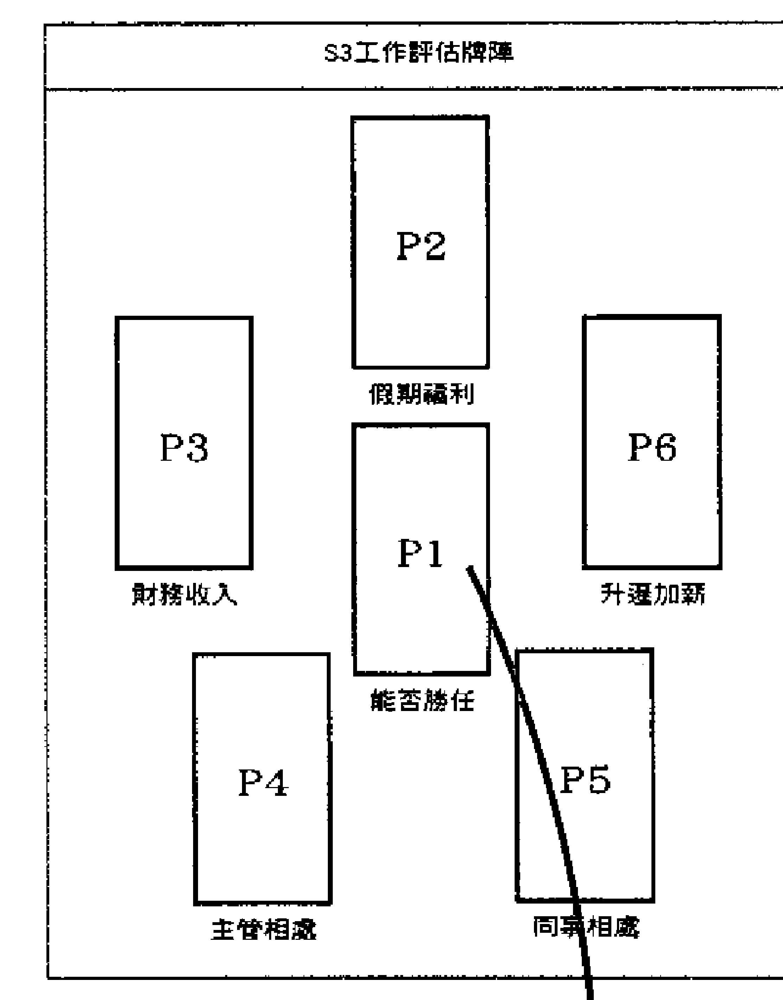

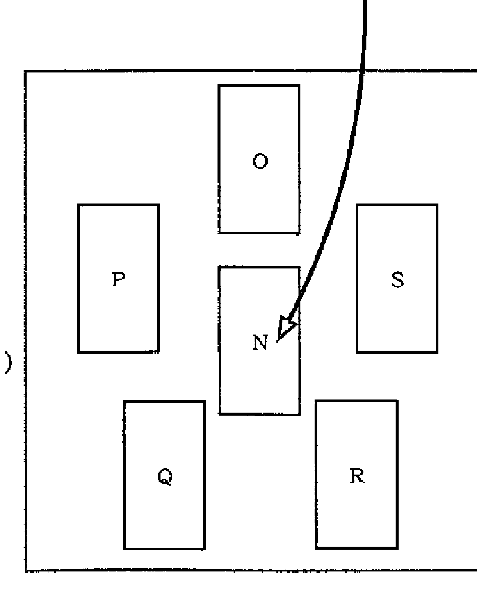

### 參考牌義：

-   P1能否勝任→N.能否勝任（聖杯A正位）
-   P2假期福利→O.假期福利（權杖八逆位）
-   P3財務收入→P.財務收入（死神正位）
-   P4主管相處→Q.主管相處（力量正位）
-   P5同事相處→R.同事相處（錢幣騎士逆位）
-   P6升遷加薪→S.升遷加薪（寶劍六正位）

### 參考牌義：

-   P1能否勝任→N.能否勝任
-   P2假期福利→O.假期福利
-   P3財務收入→P.財務收入
-   P4主管相處→Q.主管相處
-   P5同事相處→R.同事相處
-   P6升遷加薪→S.升遷加薪

## 聖杯A正位

# 評估創業

A.創業的方向-S1P1,S2P1,S5P2,S5P4
目前創業的方向會十分順利，在過程中你也覺得快樂和滿足，再加上還會有許多貴人相助，必定會有豐富的收穫。

B.資金來源-S1P2
目前資金的來源不成問題，也可能還有其他的資金會投入，只要不是揮霍投資花掉，運用得當將足以支應。

C.合夥關係-S1P3
這件事業如果有合夥會非常順利，大家彼此之間都很齊心，相信、團結的事情也會全力支持，可以發揮出更大的力量。

D.客戶群定-S1P4
應該把目標鎖定在全新的客戶，另外價格才會有更好的利潤，或是可以鎖定高齡族群，新生兒及他們的親朋好友。

E.店面優位-S1P5
店面地段並沒有太大的差別，只要交通方便環境好即可，但是還是人潮越多越好，熱鬧的地方通常比較有利。

F.草創階段-S1P6,S5P2,S5P5
這件事業的初期十分看好，不但在心態上會覺得自我滿足，在實際上也會有高速度的成長，是值得你努力的事業。

# 評估工作

M.工作狀況概況-S6P1,S6P2,S6P4,S7P1,S7P3,S7P4
你在工作當中如魚得水，不但可以有許多表現的機會，也可以帶出新的創意，在工作上會建立起新的人際關係。

N.能否勝任-S3P1
你的能力足以勝任這個職務，同時自己也會對工作內容感到快樂與滿足，是一個可以讓你發揮理想長才的地方。

O.假期福利-S3P2
這地方的福利非常好，有許多你原本想不到的好處存在，而假期的使用也人性化，通常都可以得到理想的安排。

P.財務收入-S3P3
這地方的收入還不錯，也可以滿足你大部分的期待，如果有更實際的收穫，未來也還有一些努力的空間。

# 評估求職

G.工作性質-S2P1
工作上可以參考別人的經驗，不適合擔任大組織團隊合作的工作，反而是每天都要與人相關的文化和型態會適合你。

H.工作地點-S2P2
工作地點會開創出新的人際關係，因此可能會在你所不熟悉的新地區，或是需要為了工作到另外一個全新的地方。

I.要求待遇-S2P3
要求待遇可以比市場一般的水平更高一些，如果不是太過份的話應該會被接受，將來也還有很大的成長空間。

J.來源管道-S2P4
你可以自己四處去積極尋找工作，或是由親朋好友們介紹也不錯，只要誠心誠意地去找工作，任何管道都很順利。

K.求職運勢-S2P5,S7P1,S7P2,S7P3,S7P4
這段時間想要很快找到工作，可能到處投遞都會很順利，最好把握這段時間去找工作，才不會錯過了時機。

L.可以改進的地方-S2P6
你在心態上非常樂觀，有時候會忽略需要注意事項上的細節，在找工作的過程中多聽聽別人的意見會很有幫助。

# 評估事件

Q.與主管的相處-S3P4,S6P3,S6P4
是一個真心誠意待人的上司，如果你能在工作中與其相互扶持，彼此互動就會非常愉快，也可以從他身上學到很多。

R.與同事的相處-S3P5,S6P3,S6P4
只要對於同事們能夠主動付出，就可以得到正面的善意與回饋，保持良好的人際關係，也會對你的工作很有幫助。

S.升遷加薪-S3P6
在這裡有不錯的升遷機會，是一個值得你付出心力的地方，加薪幅度雖然不一定讓你滿意，但還是會有基本的水準。

T.如何得到對方-S5P1,S6P2
這是一個真心誠意待人的人，相處起來讓人沒有壓力而且沒有壓力的感覺，如果想得到什麼好處也要想辦法與別人分享。

如果你不是使用本書介紹的牌陣，也可以參考使用本書第二部分的「塔羅工作占卜的牌義」，依照你的問題性質，由「評估創業」、「評估求職」、「評估工作」和「評估事件」這四大類牌義當中選擇一類來參考，如果沒有找到完全符合你問的主題，可以把這一類當中的所有解答都先看過一次，再自己整理歸納出可能的解答。

# 第一部 塔罗工作占卜的基本概念

# 第一章 工作占卜的基本概念

### 一、我适合创业或是找工作？

在这个时代很多人都有老板梦，希望能为自己的理想和未来打拼，而不要努力了半天都是为人作嫁，但是事实上并不是每个人都适合当老板，也不是每个人创业都可以赚大钱，能够创业成功的人除了自身的状况之外，还需要天时、地利、人和等各方面的外在条件的配合才有可能成功，因此对于绝大部分的人来说，找个工作依附于组织生活是比较简单容易的方式，也因此为人做事领人薪水就成为现代工商社会主流的生活形态。

当然就西方神秘学来看，透过个人的出生星盘分析，可以很精确地看出一个人是否有创业的天份？适合何种行业别或方向？找人合伙是否有利？以及何时创业最容易成功等等。但若是自己不懂得占星学，也无法找到信任的占星师帮助你判断的时候，也可以透过简单的自我观察法，来判断自己是不是一个适合创业的人。

首先，要确定自己是一个愿意承担责任的人：因为自行创业意味着要为自己所做的一切负全责，即使是多位股东共同创业的状况，也只是责任的分担与分工合作，并不能逃避掉作为老板应负的责任。作为一个老板，要能为自己所决定的事情与产生的后果负完全的责任，如果事业成功了，能够名利双收的是老板；但若事业失败了，赔上金钱、时间、名声，甚至是被告、跑路、抓去关的也都是老板，因此如果评估起来自己并不是那么喜欢承担这些责任的人，那么最好还是别创业比较安全。

其次，自己是不是愿意为了理想目标而吃苦耐劳：以为轻轻松松就能当老板赚大钱是一种不切实际的想法，想要创业除了必须付出一定程度的代价，许多事情还必须要亲力亲为，脚踏实地去做才能有成果；所要付出的时间、精力、脑力以及牺牲掉的亲情、友情、爱情，都是非常高的成本，如果自己没有那么高的理想性，或## ☆塔羅工作講義

是無法為了自己的理想付出這些代價，那麼要創業成功幾乎是不可能的一件事。

- 第三，要考量自己是不是自動自發而且充滿行動力的人：自己是老闆當然沒人能管你，不過在沒人管的狀況之下，能不能自動自發就變成能否成功的重要關鍵；若是自己在工作時本來就充滿了行動力，即使老闆不管你也可以活力十足地努力工作，那麼這種人自己當老闆成功的機會就比較高一些，但若是做事情需要人三催四請，上班遲到早退還想在當中打混摸魚的人，那麼自己出來創業當老闆的危險性就很高，也很容易就把自己的事業搞倒。
- 第四，自己是不是一個有自信及有自己想法的人：當一個老闆必然要有自己的想法，才能夠去開創一番事業，如果你從小是別人一個口令一個動作的乖寶寶，又沒有什麼自己的意見，那麼要創業就會難上加難；更重要的是自信心的問題，能不能夠堅持自己的想法！如果自信心不足很容易就會被別人的意見所影響，甚至在創業的路上猶豫不決或搖擺不定，無法把精神意志集中起來做事情的話，通常創業都很不容易成功。
- 第五，是否能在工作上保持良好和諧的人際關係：想要創業成功，「人和」也是非常關鍵的因素，通常成功的創業者在創業之前也是非常好的員工，與老闆的關係良好才能由他那裡學到真功夫，與同事的關係良好才能互助合作發揮更大的力量，與客戶的關係良好自行創業之後才有開發新客戶的經驗與本錢；如果自己在上班的時候與上司犯沖、與同事不和、與客戶無法溝通，想以要自己創業當老闆來逃避職場中遇到的問題，就是一種不切實際的想法。
- 第六，對於自己要創業的產業本身及上下游是否有相關的經驗或一定的了解；要創業絕對不是門外漢可以做的事情，如果不是自己有相關的工作經驗，也要經過紮實的職前訓練才有可能成功，而且老闆對於產業的了解也不可能只及於本業，對於上游與下游和相關競爭者的了解也是不可少的，如果缺乏對於相關產業的整體認識，就無法找到最有利的切入點與市場區隔。

最後，自己是不是有清楚的成本效益概念；作生意當然就是將本求利，降低成本、提高效率、增加銷售才能得到最大的利益，或許記帳、財務等工作可以請專業人士代勞，但是評估損益與擬定策略就是老闆不可能逃避的責任，如果成本效益的評估錯誤，就有可能生意越作越大但錢卻越賠越多，最後不但無法躲過公司倒閉的命運，還可能留下大筆負債成為棘手的問題。

如果經過以上七點衡量，都認為自己是適合創業的話，就可以選用「創業評估牌陣」（詳細介紹在第22頁）來看看自己的狀況如何，如果覺得自己並不是那麼適合當老闆的話，就讓我們進入下一節看看「如何找到好工作」。

### 二、如何找到好工作？

說實話，在現代工商業社會當中有超過三百六十萬行的情況之下，想透過占卜精準地知道自己適合什麼樣的工作確實有一定的困難度，即使是命理方面的工具（例如占星、八字、斗數等）也只能得個大概的大方向，在沒有其他前提假設的情況之下，想單靠占卜就直接知道行業別、職務等資訊是不太可能的一件事。

所以就命理占卜實務的觀點來看，如果自己對於找何種工作完全沒有任何想法，並不是很適合直接就使用占卜工具來處理，比較適當的方法是先依照自己的能力和興趣，尋找一些可能的選項先研究評估看看，或是找命理師算算占星、八字或斗數，把大方向先確定之後，細部的評估再來使用占卜工具，這樣效果會比較好一點。

已經找出幾個可能的選項之後，如果想要針對每一種可能的利弊得失做比較清楚的分析，可以運用「工作評估牌陣」（詳細介紹在第32頁）進行占卜，由於是針對不同的工作行業進行評估，所算的目標不同就不算是重複占卜，經過幾次簡單的占卜之後，應該很快就可以淘汰掉許多不可能的選項；但丹尼爾並不建議想到什麼工作就隨意拿出來算，因為有時候算得太多反而會陷入更混亂的局面，越是以慎重的態度來使用占卜工具，占卜工具就能為你的決策提供更有幫助的資訊。

決定好自己求職的大方向之後，可以先利用「求職評估牌陣」（詳細介紹在第27頁）來看看自己最近找工作的運勢如何，以及要注意那些事情；通常我們在占卜時會為「求職評估牌陣」設定比較短的期限，並且限定在明確的範圍之內，這樣不但可以精確地了解現在求職的各種細節，不論情況是否改變都可以在期限過後再進行占卜；若是把「求職評估牌陣」的時間設定得太長，也許出來的答案就會比較模糊一點，在期限之內不確定狀況是否已經改變又不能再重複占卜，想算又不能算的感覺實在不怎麼好。

在尋找工作的過程當中，也可以使用「工作運勢牌陣」（詳細介紹在第53頁）來看看自己這個月找尋工作的狀況會怎麼樣，如果算出來的運勢不佳也不需要灰心，因為這個月的運勢不佳還有下個月可以期待；若是算出來有幾週的機會特別好，那麼在這幾週就應該要加倍努力，不要把好的運勢白白浪費掉了！

如果已經確定找到某個工作，但是還在猶豫該不該接受，或是很想知道如果去這個工作之後的狀況會怎麼樣？這個時候可以針對這個特定的工作職位，使用「工作評估牌陣」來占卜看看，如果接受這個工作之後狀況會怎麼樣，有什麼需要注意的地方；若是在兩個工作機會之間猶豫不決，則比較適合使用「二擇一牌陣」（詳細介紹在第42頁）來占卜，這樣可以把兩者之間的差異突顯出來，也會比較容易作決定。

若是很幸運地你一次找到了三個以上的工作，那麼在占卜時就需要比較注意一點；你可以針對每個工作內容都使用「工作評估牌陣」來占卜，這就可以了解到每個工作的利弊得失，幫助你去作判斷，但若占卜了之後仍對於其中兩個工作選擇猶豫不決，這個時候就不能再使用「二擇一牌陣」來占卜，因為如果這兩個選擇都已經用「工作評估牌陣」占卜過了，再使用「二擇一牌陣」就變成重複占卜，在占卜的規則上是不允許的；所以當面對到很多個工作機會的選擇時，丹尼爾會比較建議自己先評估，不要太依賴塔羅牌占卜，到最後仍然猶豫不決的時候再進行占卜，這樣才能得到比較有幫助的答案。

其實要找到好工作取決於兩個重要的因素，一個是自己的方向是否正確？另一個則是求職運勢是否良好？如果方向正確又配合上良好的運勢，那麼很多事情自然會水到渠成，所以若是短期之內找不到好工作也不必太過緊張，有可能你只是時運不濟而已，撐過去也許就會有更好的發展；但若是找了很久還是找不到適合自己的工作，就該要檢討一下自己的方向是否正確？在不正確的方向上撐得再久也不會有什麼成果的。

所以有時候找工作不順利是一種善意的提醒訊號，正在告訴你這並不是你人生適合的方向，快快想別的出路才不會繼續浪費時間，所以俗話說得好：「山不轉路轉、路不轉人轉」，遇到不順利的事情不表示自己是失敗的，能從現在起改變做法適應環境才是有意義的事情。

### 三、現在工作當中遇到問題怎麼辦？

絕大部份的人對於自己的工作都沒有百分之百滿意的，但也還不到做不下去要立刻走人的地步，所以在工作當中遇到問題的時候，首先應該要釐清問題的範圍與性質，再來評估如何處理，才有機會度過難關；若是逃避問題不願意去面對，只會讓問題持續發酵越滾越大，失去先機之後再想要解決就會越來越困難。

如果你遇到的問題已經很大，到了懷疑自己是否仍然適合待在這個工作的程度，那麼會建議你先使用「工作評估牌陣」占卜，看看自己接下來一段時間在這個工作職務上的狀況會如何？如果之後的發展性還不錯，只是現在一時之間不如意，也許還有留下來打拼的價值，但若經過占卜之後還是看不到改善的前景，也許就該用「求職評估牌陣」來看看最近是不是有其他好的工作機會。

有時候也還不到非走不可的程度，但又想知道是不是有其他好的工作機會，在這個狀況之下可以使用「二擇一牌陣」來占卜，看看「留在這個工作的狀況」與「離開這個工作的狀況」有什麼差別，不過在使用二擇一牌陣時，最好能設定比較明確的時間，如果沒有設定時間的話所算出來的答案只適用於「現在」；若是想知道某個特定時間是不是適合換工作的話，就一定要設定時間，例如「我想知道農曆年過後一個月是要留在這個工作？或是離開這個工作？」，這樣就會得到非常明確的答案。

若是心中並沒有離職的念頭，只想把自己的工作好好做下去，在遇到單一事件時可以使用「專案評估牌陣」（詳細介紹在第37頁），看看如何突破現在工作當中的困境。在使用這個牌陣的時候可以針對不同的事件分別占卜，但最好能設定明確的時間與範圍，這樣就能更明確地看到問題的癥結點；但如果算出來客觀的狀況都很不錯，那麼需要調整的可能就是自己的心態，反省一下自己為什麼會在這件事情上卡住，也許換一種方式去面對之後，事情就可以順利地進行下去。

此外，在工作當中不免會遇到需要作選擇的時候，例如在工作當中是不是要接受某一個職務、要選擇合作或共事的夥伴，甚至是要不要外調到其他地區去工作，這些都是適合使用「二擇一牌陣」的好時機。不過在使用「二擇一牌陣」時有一個很重要的前提條件，就是你必須對這件事情「有選擇權」，如果自己只能被動地聽上面的命令作事，而無法主動地選擇，就不能使用「二擇一牌陣」；例如今年能不能加薪？這個問題大多都是老闆決定的，那麼你就不能使用「二擇一牌陣」來詢問。

有時候工作當中遇到的問題不一定是事情難做，而是有人很難搞，想知道自己與某一個同事的關係，或是如何與老闆相處，這個時候就很適合使用「人際關係牌陣」（詳細介紹在第48頁），看看兩個人之間到底是怎麼樣。在使用人際關係牌陣時最好要設定某一個特定的人與特定的關係，例如同一個人在當你的同事或是當你的上司時，關係很可能就會有所不同，所以在如果能在占卜時把關係定位清楚，就得到更明確的答案；同時人際關係牌陣也不適合占卜與一群人整體的關係，針對個別對象應該要分開占卜。

很多時候我們並不是遇到什麼具體的問題，只是想知道接下來的一段時間自己在工作當中的運勢如何，這個時候就很適合使用「工作運勢牌陣」，來看看短期當中的狀況如何。當然「工作運勢牌陣」可以使用在占卜整體工作的狀況上，但若有明確的主題或是事件，也可以拿來占卜特定事情的進行狀況；例如現在正在進行一個專案，想知道這個事業在這個月當中進行的狀況如何，也可以使用「工作運勢牌陣」來占卜看看，只是相較於「專案評估牌陣」而言，「工作運勢牌陣」看到的是依照時間不同產生的不同變化，而「專案評估牌陣」看到的是同一個專案當中不同層面的分析。

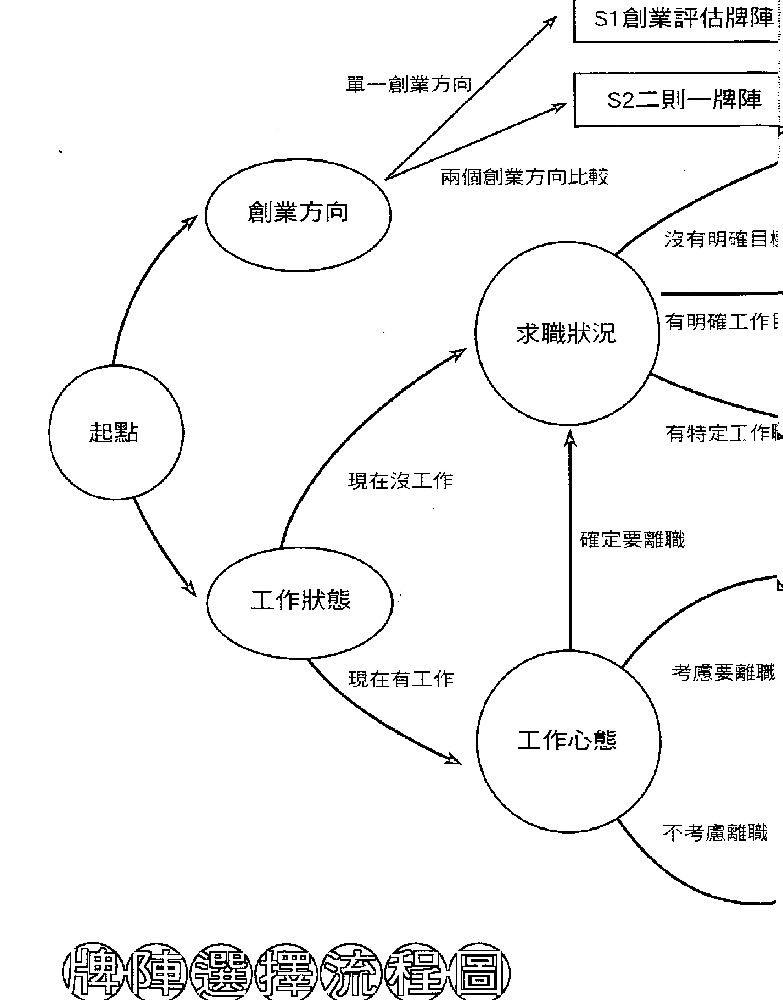

# 第一章 工作占卜的基本概念

- 初步評估目標
  - 評估特定目標 → S3工作評估牌陣
  - 比較兩個目標 → S5二擇一牌陣
- 求職狀況分析
  - 分析求職狀況 → S2求職評估牌陣
  - 了解求職運勢 → S7工作運勢牌陣
- 特定工作評估
  - 評估特定工作 → S3工作評估牌陣
  - 比較兩份工作 → S5二擇一牌陣
- 離職考量
  - 繼續待下去的狀況 → S3工作評估牌陣
  - 留任或離職的比較 → S5二擇一牌陣
- 工作狀況評估
  - 評估特定事件 → S4專案評估牌陣
  - 評估工作中的選擇 → S5二擇一牌陣
  - 評估特定的人際關係 → S6人際關係牌陣
  - 了解工作運勢 → S7工作運勢牌陣

## S1創業評估牌陣

| 類別 | 綜合類牌陣 | 難度 | 進階級牌陣 | 使用張數 | 六張 |
|------|------------|------|------------|----------|------|
| 使用時機 | 針對一個已知或正在進行中的創業計劃進行評估。 |  |  |  |  |

### 圖型及位置

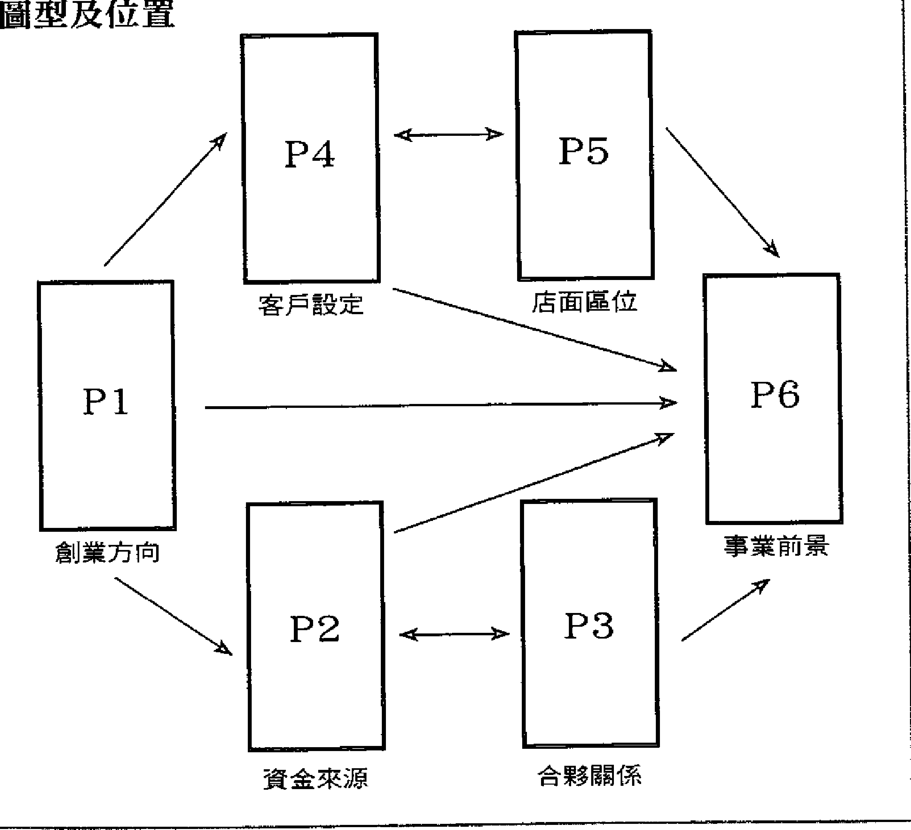

說明：創業評估牌陣主要是以創業計劃為分析單元；創業方向是指目前占卜的這個創業方向是否可行，有沒有什麼需要小心注意的地方，或者根本就是一個錯誤的方向；資金來源是表現出目前占卜的這個事業資金是否充足，或是在財務上是否有需要注意的地方；合夥關係是指目前占卜的這個事業是否適宜合夥，如果有合夥的狀況對這個事業是加分或是扣分，合夥人彼此之間可不可能合作愉快；客戶設定是分析目前占卜的這個事業關於客戶設定的方向是否正確，或是可能可以鎖定怎麼樣的客戶去盡力爭取；店面區位是分析這個事業適合怎麼樣的位置，目前的選擇的店面或辦公室是否適當，或是可以朝向哪個方向尋找；最後事業前景則是綜合以上五張牌的狀況，看未來的發展性如何。

影響因素：創業方向主要影響到資金來源和客戶設定；資金來源與合夥關係互相影響，客戶設定與店面區位互相影響；而前面的五張牌都會影響到事業前景。

解牌順序：可以將創業方向當成起點，中間依序為資金來源→合夥關係→客戶設定→店面區位，最後再看事業前景。

注意事項：在使用創業評估牌陣時應以「創業計劃」為分析單元，如果是同一個行業但有兩個不同的計劃時，最好能分開來占卜會更清楚。

## 第二章 常見工作問題與牌陣選擇

### 問題範例：

- Q1. 我適合回去接家裡面的事業嗎？
- Q2. 我想在這一區透過加盟方式開一家外帶飲料適合嗎？
- Q3. 我朋友找我合夥開一家手機店適合嗎？

### 參考牌義：

- P1創業方向→A.創業方向
- P2資金來源→B.資金來源
- P3合夥關係→C.合夥關係
- P4客戶設定→D.客戶設定
- P5店面區位→E.店面區位
- P6事業前景→F.事業前景

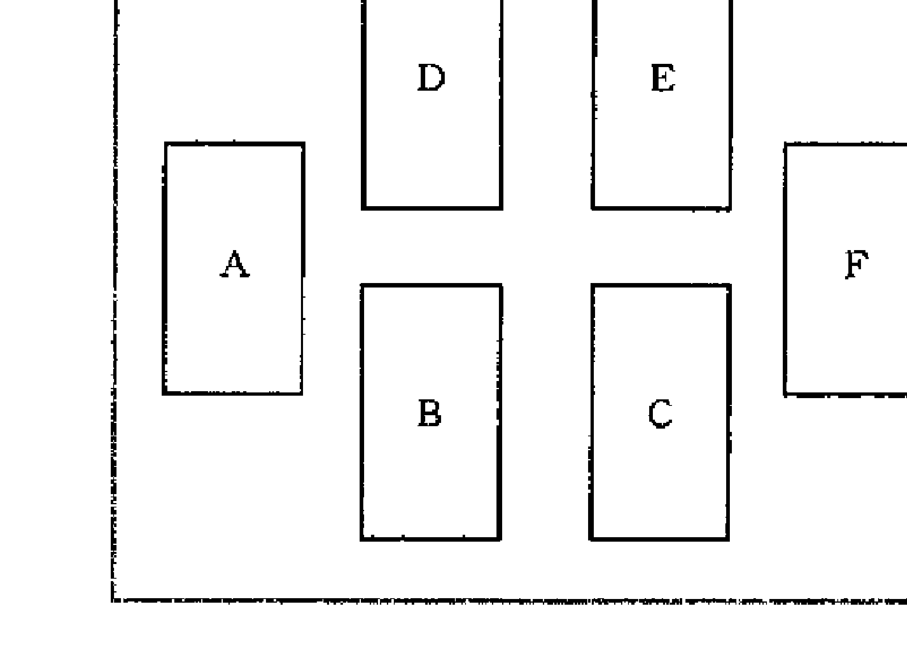

### S1Q1 我適合回去接家裡面的事業嗎？

#### 創業方向：聖杯二逆位

目前創業的方向並不適合你，不要被自己一時的慾望沖昏了頭，如果在錯誤的方向上努力，到頭來也是白忙一場。

#### 資金來源：死神逆位

現在資金的狀況出了一些問題，最好能放掉比較沒有把握的計劃重新整頓，也許到時候就會有新的資金可以投入。

#### 合夥關係：聖杯八逆位

這個事業的合夥關係表面上看起來還不錯，大家也都能維持良好和諧的關係，但是實際上並無法合作發揮出力量。

#### 客戶設定：惡魔

目前的客戶設定太過貪心，其實並不是可行的計劃，最好能全面重新檢討，才能設定出比較切合實際的客戶目標。

#### 店面區位：聖杯A

店面區位的選擇沒有太大的限制，只要你看了覺得順眼即可；但要記得人潮就是錢潮，熱鬧的地方還是比較有利。

#### 事業前景：錢幣王后逆位

這個事業的前景還不是很明朗，但在過程中將會面臨很多的危機和陷阱，如果不小心處理的話會造成財務的損失。

### 整體建議及分析：

就位置與牌義來看，創業方向上出現聖杯二逆位已經說明這個方向並不適合你，接下來影響到的資金來源（死神逆位）與客戶設定（惡魔）也都不是好牌，分析到這裡已經知道這個方向不太可行；就資金來源（死神逆位）與合夥關係（聖杯八逆位）來分析，這個家族事業的現狀並不好，無法同心協力處理問題；就客戶設定（惡魔）與店面區位（聖杯A）來看，店面本身的狀況不錯，但客戶設定太過貪心，所以無法配合；因此看到最後的事業前景（錢幣王后逆位）並不是很好。

就牌組結構來看，出現的兩張大牌（死神逆位與惡魔）都不是很樂觀的牌，宮廷牌只有聖杯王后逆位，顯示本人並無法控制整個狀況，有三張聖杯數字牌則暗示這件事情當中人際關係佔了重要的因素。

整體而言，這並不是一個適合回去接的事業，即使自己很有心經營也無力回天，還是把自己的本業顧好比較重要。

### Q102 我想在這一區透過加盟方式開一家外帶飲料適合嗎？

#### 創業方向：錢幣二

目前創業的方向讓你感到猶豫，還有一些事情要仔細考慮衡量，如果不小心的話也可能在自己拿手的項目上失敗。

#### 資金來源：錢幣國王

目前資金的狀況十分充足，完全不用去擔心錢的問題，只要想如何把資源做最有效的配置，才能發揮最大的效益。

#### 合夥關係：寶劍六逆位

這個事業可以合夥，彼此之間是屬於共患難的革命情感，遇到問題都可以一致對外，相處時最好低調不要出鋒頭。

#### 客戶設定：寶劍騎士

客戶可以鎖定在技術能力強的專業工作者，開發適合他們的產品或設計吸引他們的促銷方案，通常比較容易成功。

#### 店面區位：正義

店面區位可以選擇在政府機構集中的地區，或各級法院的附近；同時應該多聽聽大家的意見，綜合起來再作決定。

#### 事業前景：錢幣四逆位

這個事業的前景並不是很樂觀，還得要經歷一段入不敷出的時期，如果不處理好的話也可能變成長期虧損的情況。

### 整體建議及分析：

就位置與牌義來看，創業方向上出現了錢幣二，顯示出當事人對這件事情的猶豫，影響到的資金來源（錢幣國王）與客戶設定（寶劍騎士）都是宮廷牌，指出了這件事情的可行性還不差；就資金來源（錢幣國王）與合夥關係（寶劍六逆位）來看，資金與人力沒有太大問題；由客戶設定（寶劍騎士）與店面區位（正義）來看，也與當事人的問題有一致性，如果能找到好的店面，其實也還可以試試看；只是在事業前景上出現錢幣四的逆位，表示獲利並沒有那麼快速，也許還要經歷一段入不敷出的時期。

就牌組結構來看，只有出現一張大牌正義，代表當事人正考量一個重要的決定，同時出現三張錢幣牌，表示這件事情當中錢佔有關鍵的地位，其中又以在資金來源的錢幣國王最為重要，表示資金上沒有任何問題，可以承受短期的虧損。

整體而言，雖然事業前景短期內看來不是很好，但若當事人有強烈的企圖心而且也願意忍受短期的虧損，仍然算是一件可以嘗試的事情。

### S103 我朋友找我合夥開一家手機店適合嗎？

#### 創業方向：聖杯三

目前創業的方向對你十分有利，在奮鬥的過程你也會樂在其中，只要你繼續堅持下去，最後就能享到勝利的果實。

#### 資金來源：錢幣侍者逆位

目前資金的狀況並不好，而且財務狀況可能再繼續惡化，這時候也不容易找到新的金主或合夥人，面臨崩潰邊緣。

#### 合夥關係：權杖六逆位

這個事業並不適宜合夥，否則可能會發生背叛的狀況，如果有自己人一直在扯後腿，再怎麼努力都很難避開失敗。

#### 客戶設定：寶劍國王

客戶最好能鎖定具有專業技能的高收入者，開發適合他們的產品或設計吸引他們的促銷方案，通常比較容易成功。

#### 店面區位：塔逆位

目前選擇的店面應該只是短期使用，未來可能會因為各種因素而再搬遷；也可以選擇在警察局或是消防隊的附近。

#### 事業前景：戀人逆位

這件事情的前景並不看好，可能會因為內部的紛爭或是決策錯誤而發生嚴重的問題，接下來還會發生重大的變化。

#### 整體趨勢及分析：

就位置與牌義來看，創業方向的聖杯三表示這個事業的方向很適合你，但就影響到的資金來源（錢幣侍者逆位）與客戶設定（寶劍國王）來看，資金上遇有很大的問題；若是再看到資金來源（錢幣侍者逆位）與合夥關係（權杖六逆位）的互相影響，會發現人事不合可能是問題最大的關鍵；客戶設定（寶劍國王）與店面區位（塔逆位）之間的關係可以看出目前在做法只是搶短線而已；因此最後在事業前景出現了戀人逆位，其實也是呼應到合夥關係的權杖六逆位，都看到內部問題十分嚴重。

就牌組結構來看，出現兩張大牌分別是塔逆位與戀人逆位，展現出這件事情合作的起心動念十分重要，又連結到在合夥關係上的權杖六逆位和在資金來源的錢幣侍者逆位，都在告訴我們同一件事情，就是不要合夥。

整體而言，雖然在大方向上沒什麼大問題，但若以合夥方式經營就絕對不行，也許應該調整成獨資方式比較可行。

| 類別 | 狀況類牌陣 | 難度 | 進階級牌陣 | 使用張數 | 六張 |
| :--- | :--- | :--- | :--- | :--- | :--- |

使用時機：針對一段時間的求職狀況。

### 圖型及位置

說明：求職評估牌陣是看目前或一段時間的求職狀況；工作性質主要是看在找尋工作時的大方向，應該以何種性質的工作為主，或是需要避開何種性質的工作；工作地點則是指在找尋工作的過程當中，地區或地點的選擇應該如何考量；要求薪資是看在求職過程中對於薪資的想法和要求是否合理；求職管道則是指出在求職過程當中透過何種管道比較能找到適當的工作；求職運勢表現出這段時間的求職運勢；最後可以改進的地方則是點出自己在求職時可以改進的盲點。

影響因素：工作性質、工作地點與要求薪資這三項互相影響，是屬於基本性質的分析；求職管道、求職運勢與可以改進的地方這三項互相影響，是屬於狀況的分析，兩者相加起來才能看到求職狀況的全貌。

解牌順序：先分析工作性質、工作地點與要求薪資這三項，接下來再分析求職管道、求職運勢與可以改進的地方，最後針對整體狀況做出建議。

注意事項：若是在一段時間內有兩個不同行業或工作性質的求職選擇，建議最好分別進行占卜，出來的狀況會比較明確。

問題範例：
- Q1. 我想找行銷企劃方面的工作，三個月之內的狀況如何？
- Q2. 我想找秘書方面的工作一直不順利，到底問題出在哪裡？
- Q3. 我想要跳槽到同性質的另一家公司該怎麼進行？

參考牌義：
- P1工作性質→G.工作性質
- P2工作地點→H.工作地點
- P3要求薪資→I.要求薪資
- P4求職管道→J.求職管道
- P5求職運勢→K.求職運勢
- P6可以改進的地方→L.可以改進的地方

## 第二章 常見工作問題與牌陣選擇

### S2Q1 我想找行銷企劃方面的工作，三個月之內的狀況如何？

**工作性質：寶劍侍者**
可以選擇品管或稽核之類的工作，有機會讓你發揮所長；但最好避免需要大量團隊合作的職位，很容易發生衝突。

**工作地點：聖杯王后**
工作地點最好能離家近，這樣才有機會同時照顧家裡，兼顧自己的生活品質，離鄉背井去工作一定會覺得很痛苦。

**要求薪資：權杖騎士逆位**
要求薪資也許需要低於業界一般的水準才能找到工作，但是最好選擇固定薪資的方案，以免收入發生太大的變化。

**求職管道：錢幣侍者逆位**
這時候很難靠自己去找到工作，也許要靠親朋好友的介紹才能加快速度，但是別人介紹的工作大多自己都不喜歡。

**求職運勢：節制逆位**
如果找工作的狀況不是很順利，也許可以嘗試與之前不同的工作性質或行業，否則先休息一陣子也是不錯的方法。

**可以改進的地方：審判逆位**
優柔寡斷常常讓你錯失許多好的機會，必須確實從過去的經驗當中學到教訓，以免自己不斷重複發生同樣的錯誤。

**整體邏輯及分析：**
就位置與牌義來看，工作性質上的寶劍侍者與行銷企劃方面的工作並不符合，有可能當事人走錯了方向；工作地點（聖杯王后）與要求薪資（權杖騎士逆位）則指出需要降格以求才能找到兼顧家庭與事業的工作；在求職管道上的錢幣侍者逆位與求職運勢上的節制逆位都訴說著這三個月的狀況並不順利，而最後看到可以改進的地方出現審判逆位，則是表示要由這些挫折的過程當中來學到教訓。

就牌組結構來看，大牌出現了節制逆位和審判逆位，就已經顯示出求職狀況並不順利，再加上錢幣侍者逆位和權杖騎士逆位都指向負面的方向，即使有聖杯王后的正位也無力回天了。

整體而言，有可能是求職方向錯誤造成問題，換個工作性質也許會比較有好機會，若要堅持原來的方向在三個月之內就當作是在學經驗。

### S2Q2 我想要找秘書方面的工作一直不順利，到底問題出在哪裡？

工作性質：寶劍六
可以考慮與航運、漁業或是其他與交通、運輸有關的行業；但最好以技術或內勤的工作為主，不宜直接接觸客戶。

工作地點：寶劍五
工作地點沒有什麼限制，只要是你喜歡的地方都可以去試試，但是整體來看競爭激烈的都會區工作的機會比較多。

要求薪資：錢幣二逆位
要求薪資最好略低於業界一般的水準，但是也不需要委曲自己去接受太低的待遇，對於太高薪的工作要提高警覺。

求職管道：錢幣王后
這個時候可以透過職場上認識長官或是同事介紹工作，只要能把自己的需求講清楚，通常很快就可以找到新工作。

求職運勢：審判
這段時間很可能找到不錯的工作，但不一定會與你之前的學經歷有關，對你來說這應該是一個重新開始的好機會。

可以改進的地方：惡魔逆位
你應該更重視工作實質的內容與意義，不要一味追求外在的虛名，如果能苦幹實幹累積實力，將來才會有一片天。

整體運勢及分析：
就位置與牌義來看，工作性質上出現寶劍六與秘書工作是相符合的，由工作地點的寶劍五與要求薪資錢幣二逆位來看，應該是往競爭激烈的都會區前進，但也許要降低薪資的期待；就求職管道的錢幣王后與求職運勢的審判來分析，透過別人介紹很快就可以找到好工作，最後在可以改進的地方出現了惡魔逆位，則是指出了內心當中對於虛名的貪戀。
就牌組結構來看，出現兩張大牌一審判和惡魔逆位，表示事情將有重大的轉機，兩張寶劍牌指出這是一個競爭激烈的狀況，而兩張錢幣牌則是看到金錢為最重要的考量點。
整體而言，只要能透過職場上認識長官或是同事的介紹，並且降低對於薪資的要求，應該很快就可以找到工作。

### S2Q3 我想要跳槽到同性質的另一家公司該怎麼進行？

工作性質：聖杯八
目前是應該轉業的時候了，所以最好選擇與之前學經歷不同的工作；如果還在類似的工作當中你就會覺得不滿意。

工作地點：錢幣三
工作地點應該會在競爭激烈的都會區，選擇同業聚集的地方才比較有好機會；也許會需要為了新工作而搬遷住所。

要求薪資：錢幣九
要求薪資可以高於業界一般的水準，只要你能提出足夠證據來說明你為什麼值得這樣的待遇，通常都可以被接受。

求職管道：聖杯三逆位
可以透過網路、報紙或政府的就業服務站來尋找工作資訊，但是仍然要自己積極努力去嘗試，才可能找到新工作。

求職運勢：錢幣八逆位
這個時候不容易找到自己滿意的工作，自己的期待越大到頭來也許失望也越大；可以先休息一陣子再繼續找工作。

可以改進的地方：命運之輪
你應該要有自己的想法與目標，不要總是抱持著順其自然聽天由命的態度，自己要積極努力才能快一點找到工作。

整體建議及分析：
就位置與牌義來看，工作性質出現的聖杯八表示在同一個行業還不如換一個行業，工作地點的錢幣三及要求薪資的錢幣九表示自己還是有能力值得很高薪的工作；求職管道的聖杯三逆位和求職運勢的錢幣八逆位則是指出目前的機運並不是很好；最後在可以改進的地方出現命運之輪，則是暗示需要轉變的狀態，與工作性質出現的聖杯八遙遙呼應。
就牌組結構來看，大牌出現了命運之輪，表示這是一個有利於轉變的牌組，而當中出現了三張錢幣，代表金錢是最重要的考量因素，另外兩張聖杯牌則暗示自己心情的起伏。
整體而言，這個時候想離開現在的工作十分合理，但跳槽到同性質的工作機運並不理想，也許可以考慮換一個行業或工作類型試試。

## S3工作評估牌陣

| 類別 | 狀況類牌陣 | 難度 | 進階級牌陣 | 使用張數 | 六張 |
|------|------------|------|------------|----------|------|

使用時機：針對特定的一份工作或是職位進行分析。

### 圖型及位置

| 位置 | 名稱 | 說明 |
|------|------|------|
| P1 | 能否勝任 | 中心位置，代表核心問題或當事者 |
| P2 | 假期福利 | 上方，代表工作的附加價值或福利 |
| P3 | 財務收入 | 左側，代表金錢、收入方面的狀況 |
| P4 | 主管相處 | 左下方，代表與上級或管理者的關係 |
| P5 | 同事相處 | 右下方，代表與同事或團隊的人際關係 |
| P6 | 升遷加薪 | 右側，代表未來的發展與晉升機會 |

說明：工作評估牌陣是以一份工作或一個行業別做分析的單元；能否勝任是看自己的工作能力是否能勝任這個職位或是工作；假期福利是指出這份工作的假期福利如何；財務收入是指這份工作的薪資收入狀況；主管相處是指與上司的互動關係；同事相處是指與同事間的相處狀況；升遷加薪是指在這份工作中的發展與加薪的機會。

**影響因素：** 能否勝任是這個牌陣的關鍵因素，影響到其他五張牌，財務收入與升遷加薪互相影響，主管相處與同事相處也互相影響，假期福利則是比較獨立的考量點。

**解牌順序：** 由能否勝任做為起點，接著依序看財務收入→主管相處→同事相處→升遷加薪→假期福利，大部分都是綜合升遷加薪和假期福利做最後的建議。

**注意事項：** 工作評估牌陣可以針對特定的職位進行占卜，但也可以針對範圍較大的行業別做占卜，只是範圍越大也許得出來的答案就越模糊。

### 問題範例：

- Q1. 我適合進保險業當業務人員嗎？
- Q2. 如果我留在現在的工作，半年之內的狀況會怎麼樣？
- Q3. 假如我接受這個工作機會，之後狀況會怎麼樣？

### 參考牌義：

- P1能否勝任→N.能否勝任
- P2假期福利→O.假期福利
- P3財務收入→P.財務收入
- P4主管相處→Q.主管相處
- P5同事相處→R.同事相處
- P6升遷加薪→S.升遷加薪

### S3Q1 我適合進保險業當業務人員嗎？

能否勝任：權杖四
你的能力其實足以勝任這個工作，也不用去擔心工作當中的人際關係，只要把自己份內的工作做好就會十分穩定。

財務收入：權杖七
這個地方的收入不差，是一個付出會與獲得成正比的地方，如果有獎金或分紅的制度，都應該要積極努力去爭取。

主管相處：錢幣五逆位
目前在人事上的變動十分快速，不論是你自己或是上司都有可能調動，這時候只能自求多福不能指望別人幫忙你。

同事相處：戰車逆位
同事之間的競爭性很強，所以凡事最好靠自己比較安全，盡量不要介入同事之間的紛爭，以免變成了自己的負擔。

升遷加薪：權杖九
這裡沒有什麼升遷的機會，加薪的幅度也無法令人滿意，待在這裡就只是休養生息，並不是可以充份發揮的地方。

假期福利：聖杯騎士
這個地方的福利並不差，所有應該有的福利都有包括在內；雖然放假一切正常，但是有時候下班後還要處理公事。

整體邏輯及分析：
就位置與牌義來看，能否勝任的位置出現了權杖四，表示自己在工作能力上沒有問題；財務收入的權杖七與升遷加薪的權杖九看似矛盾，其實是指向努力可以有成果，只是剛開始進入這個行業不太可能有太快的成長；在主管相處（錢幣五逆位）與同事相處（戰車逆位）上都不是很好，表示這真是一個很競爭的環境，最後在假期福利上看到聖杯騎士，表示福利是自己可以接受的，但保險業務員下班仍然常需要處理公事。
就牌組結構來看，大牌出現了戰車的正位，表示這是一個充滿挑戰的行業；出現了三張權杖牌，表示行動力會是這件事情的關鍵；宮廷牌的部分只有聖杯騎士，代表自己對於這件事情帶有高度的理想性。
整體而言，這是一個還不錯的方向，但是一切都要靠自己的努力，並沒有什麼貴人可以幫助你。

### S3Q2 如果我留在現在的工作，半年之內的狀況會怎麼樣？

**能否勝任：錢幣侍者逆位**
你的能力不足以勝任這個職位，不但自己的專長無法發揮，同時無法看清事實的真相，常常被外在的幻象所迷惑。

**財務收入：寶劍王后**
這個地方的收入並不好，但也還沒差到待不下去，算是不滿意但可以接受的數字，要不要繼續就看個人的價值觀。

**主管相處：聖杯九逆位**
在工作上追求完美的上司，如果出一點小錯就可能被他責罵，所以作事情的時候要特別小心，千萬不要自作主張。

**同事相處：戰車**
同事間處於高度競爭的狀態，每個人都努力地想勝過別人，所以遇到問題只能靠自己解決，不用期待有人會幫你。

**升遷加薪：太陽**
這個地方的發展性非常好，不但升遷的機會非常高，加薪的數字也會十分亮眼，是一個可以好好努力經營的地方。

**假期福利：權杖王后**
這個地方的福利算是不錯，主要需要的東西都有照顧到；假期的規定很清楚，通常都可以掌握自己想休假的時間。

**整體建議及分析：**
就位置與牌義來看，能否勝任的位置出現錢幣侍者逆位，代表自己的能力並不足夠，但財務收入的寶劍王后和升遷加薪的太陽則表示現在雖然收入不好，但未來還有很大的成長性；在主管相處（聖杯九逆位）和同事相處（戰車）方面都有一些困難，不過假期福利的位置出現權杖王后，表示福利算是非常好。

就牌組結構來看，大牌出現了太陽與戰車，表示在這個地方充滿挑戰也很有發展前景，宮廷牌出現了兩張王后，暗示人際關係與個人感受佔有很大的影響力，同時也呼應到在主管相處的聖杯九逆位和同事相處的戰車。

整體而言，雖然自己的能力還不夠，但未來發展的前景可期，而且福利也不差，所以應該努力加強自己的能力。

### S3Q3 假如我接受這個工作機會，之後狀況會怎麼樣？

**能否勝任：聖杯九逆位**
你的能力並不足以勝任這個工作，不要對自己的能力過份自信了，如果硬接下這個工作，再怎麼努力也很難成功。

**財務收入：聖杯二**
這個地方的收入十分穩定，雖然不見得能達到你滿意的數字，不過若是與自己所付出的相比，還算是合理的收入。

**主管相處：權杖九逆位**
是一個很容易給人壓力的上司，只能盡量地把他交辦的事情作完，同時行事最好能低調一點，不要搶過他的風頭。

**同事相處：寶劍騎士逆位**
同事在處理事情的時候有很強烈的個人風格，順利合作的可能性很低，甚至還會發生衝突，所以自己要低調一點。

**升遷加薪：權杖三**
如果繼續待在這個地方有很大的機會升遷，加薪的部分也絕對不會虧待你，所以應該留在這個地方繼續努力打拚。

**假期福利：隱者逆位**
這個地方的福利並不是很好，很多東西也都要主動去爭取才會有；假期方面也有很多限制，並不是想放就可以放。

**整體運勢及分析：**
就位置與牌義來看，能否勝任的位置出現聖杯九逆位，表明了自己並沒有足夠的能力，但在財務收入（聖杯二）與升遷加薪（權杖三）仍然看到比較正面的牌，表示這是一份物超所值的工作，在主管相處（權杖九逆位）與同事相處（寶劍騎士逆位）的位置上就遇到比較大的困難，受到較多的限制；最後在假期福利的位置出現了隱者逆位，表示福利上並不是非常好。

就牌組結構來看，大牌出現了隱者逆位，顯示出自己對於這份工作仍不確定，出現兩張權杖牌表示這個工作當中的行動力很重要，兩張聖杯牌則暗示人際相處與心情的關聯性，也呼應到同事相處這個位置的寶劍騎士逆位。

整體而言，雖然自己的能力不足，但收入與升遷機會都不錯，只要小心處理人際關係，還算是一個可以待的地方。

## S4專案評估牌陣

| 類別 | 綜合類牌陣 | 難度 | 進階級牌陣 | 使用張數 | 六張 |
| 使用時機 | 針對工作當中特定的事件進行分析。 |

說明：專案評估牌陣是針對工作當中特定的事情進行分析；現有資源是看看目前這件事情執行時的資源是否足夠，是否需要再投入更多資源；人員配合是指在這件事情執行的過程當中，人員之間的配合是否良好；環境因素是指在執行這件事情時，外在因素對這件事情的影響；時程進展顯示出這件事情的進度是否順利，以及是否能在預定的時限內完成；執行成果則是看看這件事情能不能達到預期的成果；最後未來影響則是指出這件事情對你未來的發展有什麼樣的影響。

**影響因素：**
現有資源與人員配合互相影響，同時現有資源、人員配合與環境因素都會影響到時程進展與執行成果，執行成果與未來影響則是會互相影響。

**解牌順序：**
可以先解讀現有資源、人員配合及環境因素，看看這件事情的基本面如何，該如何處理會比較好，下來再分析時程進展與執行成果，看看這件事情進行過程當中有什麼需要注意的地方，最後才看未來影響。

**注意事項：**
專案評估牌陣最好是針對一個具體的事件進行分析，這樣占卜出來的結果會比較明確容易解釋。

**問題範例：**
- Q1. 我是否該去爭取這個專案？
- Q2. 老闆叫我接下這個專案，是否會順利進行？
- Q3. 我想知道這個專案三個月內的進行狀況如何？

**參考牌義：**
- P1現有資源→U.現有資源
- P2人員配合→V.人員配合
- P3環境因素→W.環境因素
- P4時程進展→X.時程進展
- P5執行成果→Y.執行成果
- P6未來影響→Z.未來影響

### S4Q1 我是否該去爭取這個專案？

#### 現有資源：愚者
現有資源根本不足以應付現在的狀況，更別說要去處理接下來遇到的挑戰，依照目前的方法繼續下去必然會失敗。

#### 人員配合：寶劍王后逆位
人員表面上可以配合，其實彼此之間內鬥嚴重，這個時候若不能把有問題的人換掉，就很可能會被內部問題拖垮。

#### 環境因素：寶劍七逆位
目前在環境上有可乘之機，是一個你翻身的好機會，這個時候除了作事情要謹慎之外，還要小心謠言或誹謗攻擊。

#### 時程進展：聖杯五
目前進度有一些落後，但也不是那麼容易追趕，除非你能及時鼓舞大家低落的士氣，否則就很難在時限之內完成。

#### 執行成果：錢幣侍者
這件事情有機會達到預期的成果，但是中間仍然有很長的一段路要走，這時候還是要很小心謹慎千萬不可以鬆懈。

#### 未來影響：寶劍國王
這件事情會讓你在專業上更為成熟，也會帶來升遷的機會，所以應該要正面迎向挑戰，給自己磨練和表現的機會。

### 整體建議及分析：
就位置與牌義來看，現有資源的愚者與人員配合的寶劍王后逆位，兩者都指向這件事情內部有嚴重的問題，而環境因素的寶劍七則相反地指向有可乘之機；在時程進展的聖杯五也呼應到前面的三張牌，因此在執行成果這個位置的錢幣侍者就告訴你這並不是一件容易達到的事情；至於在未來影響出現寶劍國王，表示自己有成長的機會，但由前面的五張牌看來，過程仍然是危機重重。

就牌組結構來看，大牌出現了愚者，表示這件事情仍然有很大的不確定性，再加上出現了三張的寶劍牌，代表這件事情會帶來一定程度的傷害性，也呼應到在時程進展這個位置的聖杯五。

整體而言，這並不是一件容易的事，除非自己有強烈的企圖心要豪賭一把，否則並不建議去爭取這個專案。

## ☆ 塔羅工作講義

## S402 老闆叫我接下這個專案，是否會順利進行？

現有資源：戀人

現有資源其實足以面對現在的狀況，不要太貪心還想要更多！只要人員之間能配合好，任何問題都可以順利解決。

人員配合：正義逆位

人員彼此之間無法配合，甚至會發生嚴重內鬥造成不利的影響，如果不能當機立斷調整人事，問題會越來越惡化。

環境因素：寶劍二

目前大環境正在變動，所以應該密切注意環境的各種變化才能找到適當的因應方案，不要再逃避問題閉門造車了。

時程進展：權杖五

目前的進度雖然還能勉強跟上，但是仍然有許多的困難險阻在前面，接下來必須要很拼命努力才有可能如期完成。

執行成果：聖杯六逆位

這件事情的成果還很難預料，但並不是努力就能得到回報，要依照情勢變化調整作法，才有機會得到最後的勝利。

未來影響：錢幣十

這件事情會帶給你很大的財富，同時對於所有相關的人也都會帶來利益，所以這件事情不能只考量到自己的部分。

整體建議及分析：

就位置與牌義來看，由現有資源的戀人與人員配合的正義逆位可以看出，內部還有很大的調整空間，而環境因素的寶劍二則指出適應環境變化的重要性；在時程進展的權杖五和執行成果的聖杯六逆位則是表示目前還看不到確定的成果，同時也呼應到在環境因素的寶劍二；最後在未來影響看到錢幣十，這是整組牌當中最好的一張牌，也表示即使過程不是很順利，仍然有可能在當中得利。

就牌組結構來看，兩張大牌戀人與正義逆位，同樣指出人員配合的重要性，環境因素（寶劍二）、時程進展（權杖五）和執行成果（聖杯六）則是在牌義上互相呼應。

整體而言，內部首先要處理人事問題，同時也要盯緊環境的變化做出因應，即使這件事情不順利也許老闆仍會給你不錯的待遇。

## 第二章 常見工作問題與牌陣選擇

### S4Q3 我想知道這個專案三個月內的進行狀況如何？

現有資源：皇后逆位

目前的資源還算充足，但是若不省著一點用很快就會捉襟見肘，所以要掌握住優先順序把資源作最有效率的分配。

人員配合：寶劍八逆位

人員彼此之間很難配合，甚至還可能會出現背叛的狀況，這個時候除了更換相關人員之外，沒有其他更好的方法。

環境因素：世界

目前大環境對你是有利的，也可能出現各式各樣的貴人來幫助你，所以這個時候應該要專注地把自己的本份做好。

時程進展：惡魔

事情的進度目前嚴重的落後，已經完全脫離你的掌握，如果還是一直維持原來的方式，就必然會走向失敗的道路。

執行成果：權杖四逆位

這件事情應該會得到不錯的成果，也是一個穩定發展的格局，人員之間能不能配合會是這件事情成敗的重要關鍵。

未來影響：錢幣八逆位

這件事情不會造成嚴重的實質影響，但是可能會對你的名聲有一些損害，你應該堅持自己的原則不要被這些影響。

整體建議及分析：

就位置與牌義來看，現有資源的皇后逆位與人員配合的寶劍八逆位相互矛盾，同時在環境因素出現世界，表示這件事情沒有外在的干擾，所以當在時程進展的位置看到惡魔時，就很確定問題一定是出在人員配合上；而接下來的執行成果也出現了持平的權杖四逆位，同樣點出人員配合是關鍵，與前面的寶劍八逆位有所呼應；最後在未來影響出現了錢幣八逆位，則是指出要小心流言與批評。

就牌組結構來看，出現了三張大牌（皇后逆位、世界和惡魔），表示這個問題有一些部分還看不到細節，但是在人員配合的位置出現寶劍八，同時又有聖杯四逆位呼應，表示最大的問題是出現在人事上面。

整體而言，這件事情只要能解決人事上面的問題，應該就可以順利過關，但是仍然要注意自己的名聲可能會受損。

## S5二擇一牌陣

| 類別 | 選擇類牌陣 | 難度 | 入門級牌陣 | 使用張數 | 五張 |
| :--- | :--- | :--- | :--- | :--- | :--- |

使用時機：針對工作上的特定狀況，有兩個互相排斥的選項可以選擇時，在一個牌陣當中來進行分析和比對。

### 圖型及位置

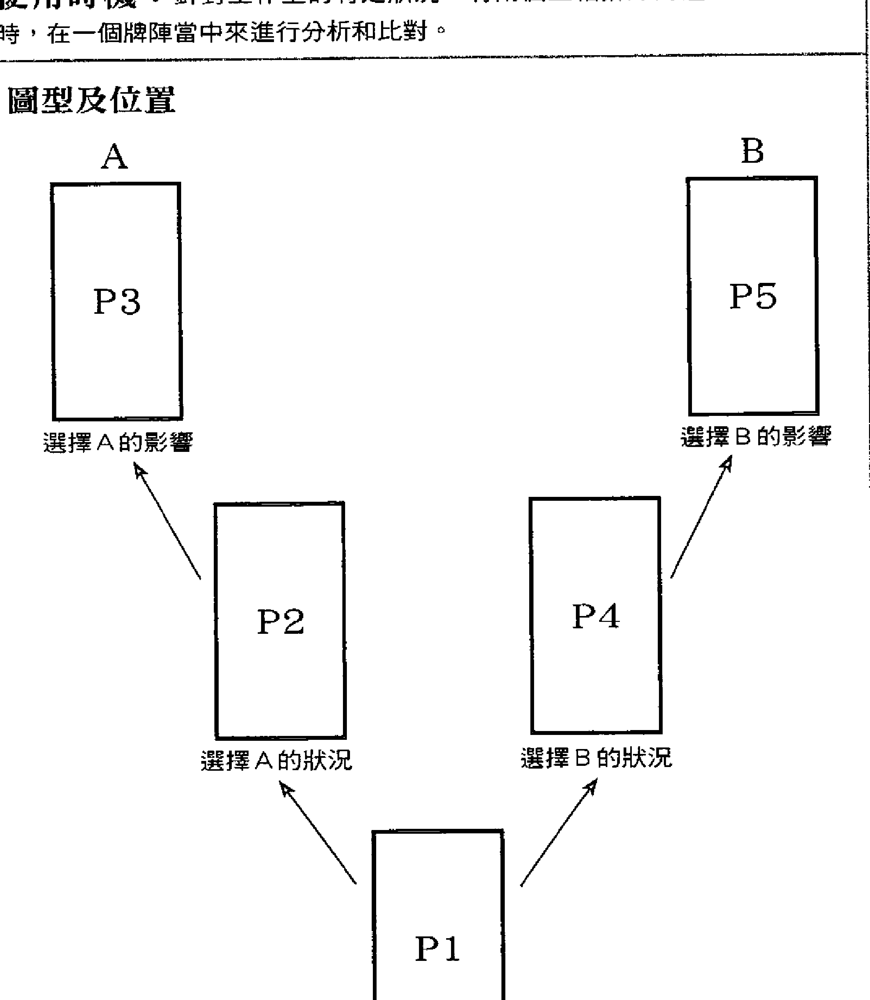

# 第二章 常见工作问题与牌阵选择

說明：二择一牌阵是针对两个选择之间进行比较最常用的牌阵之一，重点在于比较的相对状况而非绝对的好或坏；目前自己的状况是表示面对选择时本人的处境或决定性因素；选择A的状况是表示「假设」选择A的时候会发生的客观状况；选择A的影响是表示「假设」选择A之后会对本人发生的影响；选择B的状况是表示「假设」选择B的时候会发生的客观状况；选择B的影响是表示「假设」选择B之后会对本人发生的影响。

影响因素：现目前自己的状况与选择A的状况会影响到选择A的影响，目前自己的状况与选择B的状况会影响到选择B的影响，但A组与B组间没相互的影响力。

解牌顺序：先针对目前自己的状况进行评估，接着针对选择A的状况与选择A的影响进行解读，再针对选择B的状况与选择B的影响进行解读，最后以目前自己的状况为基准，分析A组与B组的优劣并提出建议。

注意事项：A组与B组的选项必须是互斥的，也就是选了A就不可能同时得到B，选了B也不可能同时得到A，否则就不能适用二择一牌阵。

### 问题范例：

- Q1.我该选择A方向或B方向创业？
- Q2.我该选择A公司或B公司？
- Q3.我应该选择与A同事合作或与B同事合作？

### 参考牌义：

#### 创业选择

- P1目前自己的状况→A.创业的方向
- P2选择A的状况→A.创业的方向
- P3选择A的影响→F.事业前景
- P4选择B的状况→A.创业的方向
- P5选择B的影响→F.事业前景

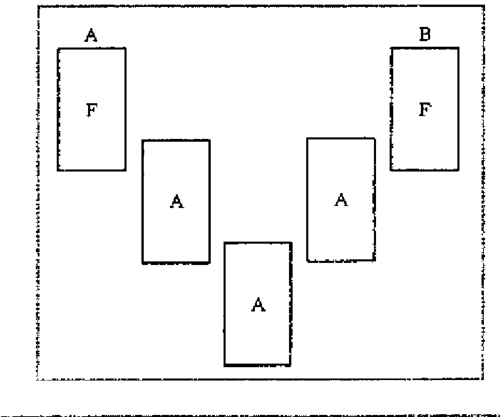

#### 工作選擇

- P1目前自己的狀況→M.工作狀況概要
- P2選擇A的狀況→M.工作狀況概要
- P3選擇A的影響→Z.未來影響
- P4選擇B的狀況→M.工作狀況概要
- P5選擇B的影響→Z.未來影響

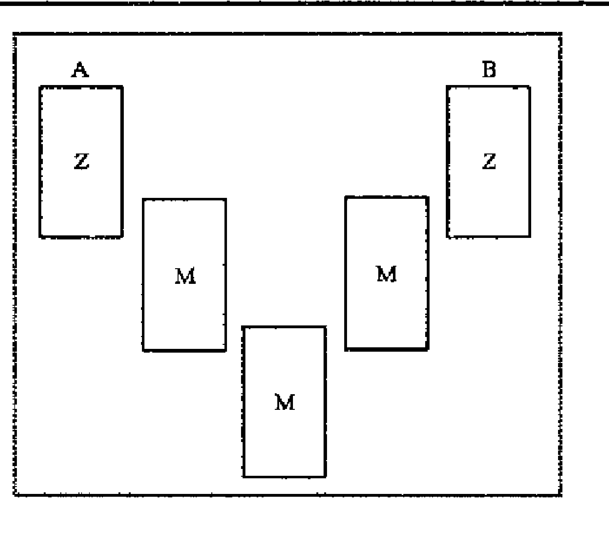

#### 同事選擇

- P1目前自己的狀況→M.工作狀況概要
- P2選擇A的狀況→R.與同事的相處
- P3選擇A的影響→Z.未來影響
- P4選擇B的狀況→R.與同事的相處
- P5選擇B的影響→Z.未來影響

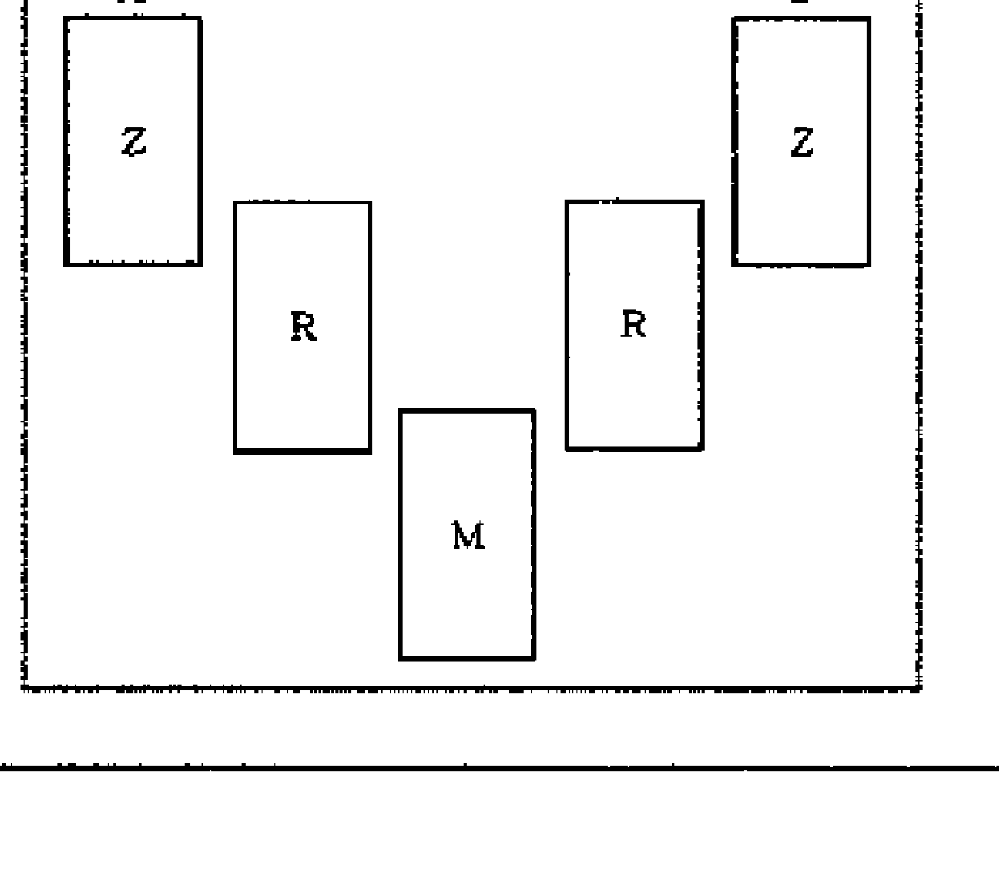

## S5Q1 我該選擇A方向或B方向創業？

**目前自己的狀況：聖杯七逆位**

目前創業的方向還需要更精細的計劃才能成功，所以現在應該針對各種可能的狀況模擬推演，不宜有太大的行動。

**選擇A的狀況：寶劍騎士**

你對目前創業的方向十分積極，而且自己也有很好的能力，如果能為自己的目標英勇奮戰，一定可以有一番作為。

**選擇A的影響：寶劍四**

這個事業的前景並不是很看好，也沒有特別高的成長性，如果無法滿足於現在的成就，還不如及早退出比較省力。

**選擇B的狀況：權杖十**

目前創業的方向對你來說壓力很大，許多事情都得自己來而無法放心交給別人，即使做得不錯也可能把自己累垮。

**選擇B的影響：命運之輪**

這個事業的前景看來一片光明，各方面的因素都能夠配合得很好，所以繼續向前就對了！不要太在意別人的看法。

**整體建議及分析：**

就位置與牌義來看，目前自己的狀況出現聖杯七逆位，顯示出當事人的迷惑，若是選擇A的狀況會是寶劍騎士，表示自己其實很主動積極，但是選擇A的影響卻是寶劍四，代表前景其實有點受限，並不符合本身努力付出的預期；而選擇B的狀況出現了權杖十，表示這是一個壓力很大的選擇，但選擇B的影響則是命運之輪，表示這是一個光明的前景。

整體而言，A選擇沒有很壞，但B選擇非常好，所以會建議當事人選擇B方向創業。

## ☆ 塔羅工作講義

## S5Q2 我該選擇A公司或B公司？

**目前自己的狀況：寶劍三逆位**

這個工作當中的狀況一團混亂，因此特別容易發生各種的小錯誤，有的時候你會被各種的突發狀況弄得神經緊張。

**選擇A的狀況：權杖七逆位**

在工作上會遇到很多問題，往往讓你左右為難不知如何決定，在猶豫不決的時候就很容易錯失良機或是作錯決定。

**選擇A的影響：權杖騎士**

這件事情將會激起你的雄心壯志，讓你想要去嘗試更有挑戰性的任務，所以這也可能只是一連串冒險挑戰的開始。

**選擇B的狀況：寶劍九逆位**

在這個工作當中需要戰戰兢兢小心翼翼，每天都在擔心害怕當中度過，如果發生錯誤可能會造成無可彌補的傷害。

**選擇B的影響：寶劍國王**

這件事情會讓你在專業上更為成熟，也會帶來升遷的機會，所以應該要正面迎向挑戰，給自己磨練和表現的機會。

**整體邏輯及分析：**

就位置與牌義來看，目前自己的狀況出現寶劍三逆位，顯示出當事人目前的心神不寧，若是選擇A的狀況會是權杖七逆位，將會遇到很多問題，而選擇A的影響則是權杖騎士，會讓當事人去迎接一連串的挑戰；另一方面，選擇B的狀況是寶劍九逆位，會讓當事人在擔心害怕中度過，而選擇B的影響則是寶劍國王，似乎也帶來不錯的前景。
整體而言，目前當事人的狀況與B公司的狀況比較呼應，但是對當事人而言A公司會是比較好的選擇，所以會建議當事人選擇A公司。

## S5Q3 我應該選擇與A同事合作或與B同事合作？

**目前自己的狀況：權杖騎士**

這個工作對你來說很有挑戰性，讓你每天都充滿了熱情與活力，如果能順利克服困難，就會讓你覺得很有成就感。

**選擇A的狀況：錢幣四**

同事之間每個人都是以自己的利益為考量，即使關係比較緊密也只是互相利用而已，在這裡無法找到真正的友誼。

**選擇A的影響：寶劍侍者**

這件事情會帶來新的挑戰，讓你不得不小心翼翼戒慎恐懼，你要預先想好各種的應變計劃，以免到時候措手不及。

**選擇B的狀況：聖杯三逆位**

基本上可以與同事維持不錯的關係，但是在公事上的合作仍然常常會出現問題；也許人事上會有出乎意料的變化。

**選擇B的影響：錢幣騎士**

這件事情將會帶給你更上層樓的機會，也可能讓你賺到很多錢，所以應該要好好把握，將週邊的效益發揮到極至。

**整體建議及分析：**

就位置與牌義來看，目前自己的狀況出現了權杖騎士，表示目前工作當中充滿了挑戰，選擇A的狀況是錢幣四，顯示兩個人之間可以互相利用，但選擇A的影響是寶劍侍者，這就指出合作之後會有新的變化和挑戰出現；選擇B的狀況是聖杯三逆位，表示兩個人的關係不錯但也許會有變化，選擇B的影響是錢幣騎士，則是指出這個合作將會有實質上的收穫。
整體而言，雖然選擇與A同事合作與目前本人的狀況較為呼應，但若就利害關係來看，還是會建議當事人選擇與B同事合作。

## S6人際關係牌陣

| 類別 | 綜合類牌陣 | 難度 | 入門級牌陣 | 使用張數 | 四張 |
| :--- | :--- | :--- | :--- | :--- | :--- |
| 使用時機：想知道與特定的工作夥伴相處的狀況與方法。 | | | | | |

### 圖型及位置

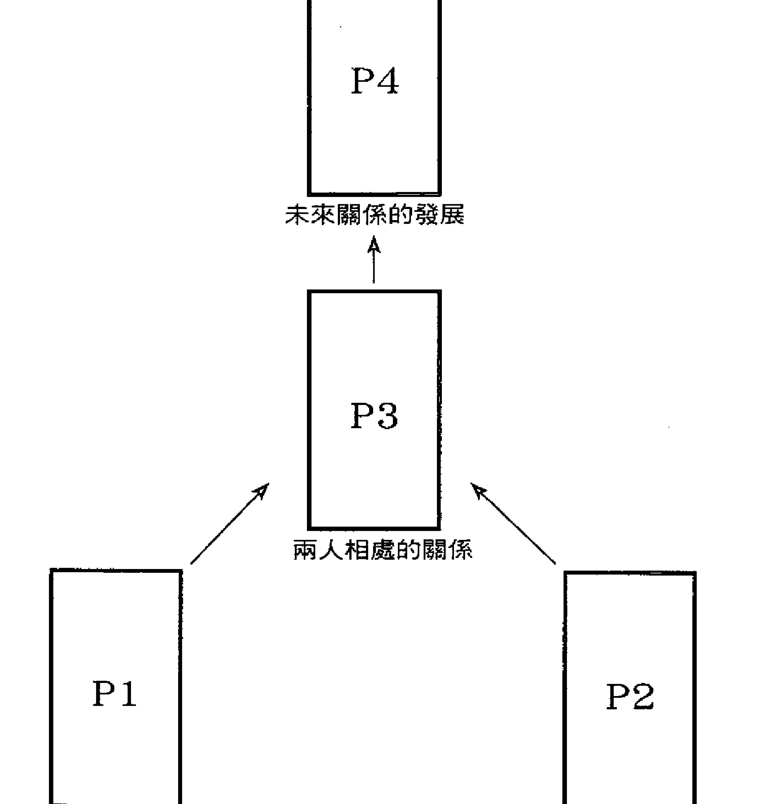

說明：人際關係牌陣可以看出工作當中兩個人相互之間的關係；你如何看待他可以看出在你心目中對他的印象是如何，他如何看待你則是呈現了在他心目中對你的印象是如何，兩人相處的關係則是指出現在兩個人之間相處的狀況，至於未來關係的發展則是預測兩個人在未來的相處狀況。

影響因素：你如何看待他以及他如何看待你都會影響到兩人相處的關係，而兩人相處的關係則是會影響到未來關係的發展。

解牌順序：可以先解釋你如何看待他以及他如何看待你，接著再分析兩人相處的關係，最後才看未來關係的發展。

注意事項：人際關係牌陣只能針對特定個人與自己的關係進行占卜，並不能呈現出一人對多人的關係（例如我與整個部門的同事關係如何）；當中你如何看待他以及他如何看你都只是一種主觀的印象，並不表示這個人就一定是這樣的人。

### 問題範例：

- Q1. 即將來一個新的老闆，我想知道兩個人相處是否良好？
- Q2. 我與這位同事總是處不好，到底是出了什麼問題？
- Q3. 我如何改善與老闆之間的關係？

### 參考牌義：

#### 與上司的關係

- P1你如何看待他→T.如何看待對方
- P2他如何看待你→T.如何看待對方
- P3兩人相處的關係→Q.與主管的相處
- P4未來關係的發展→Q.與主管的相處

#### 與同事的關係

- P1你如何看待他→T.如何看待對方
- P2他如何看待你→T.如何看待對方
- P3兩人相處的關係→R.與同事的相處
- P4未來關係的發展→R.與同事的相處

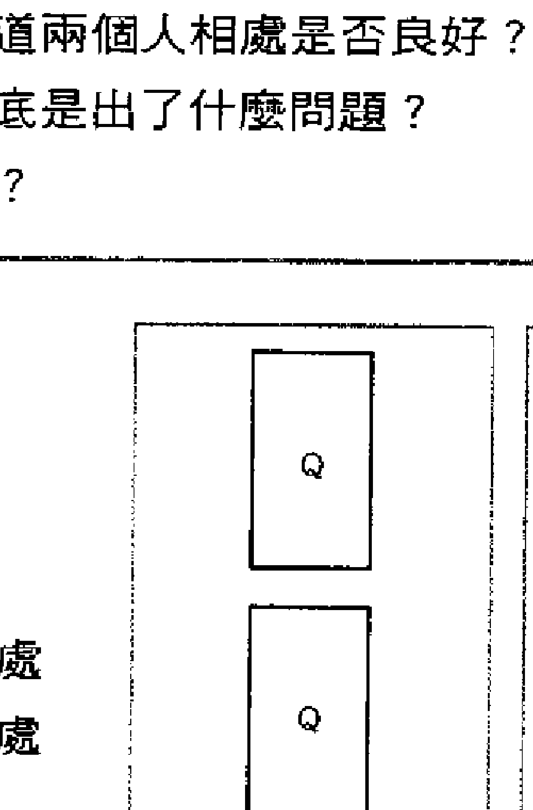

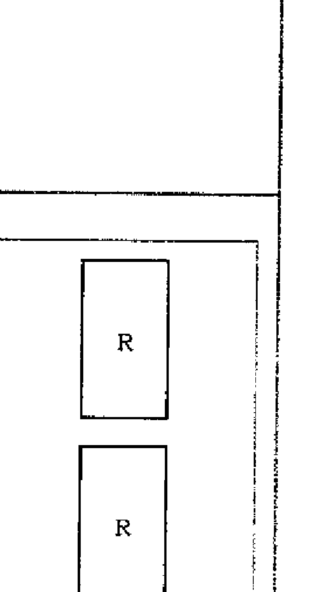

## SQ01 即將來一個新的老闆，我想知道兩個人相處是否良好？

**你如何看待他：塔**

這是一個自視甚高的人，在工作上會固執己見不知變通，還常常把事情搞得很僵，有時會給人過於情緒化的感覺。

**他如何看待你：月亮逆位**

這是一個容易緊張的人，工作上的表現也不是很穩定，甚至遇到困難會比較逃避，讓人無法將重要的事情交給他。

**兩人相處的關係：權杖七逆位**

本身十分猶豫不決的上司，常會因為耳根子軟而被別人影響改變決策，這種狀況也會讓人開始懷疑他的領導威信。

**未來關係的發展：聖杯騎士**

這是一個聰明又有理念的上司，常常喜歡發表自己的高見，如果有問題可以去請教他，他會給你一些有用的建議。

**整體邏輯及分析：**

就位置與牌義來看，你如何看待他的位置出現了塔，表示你覺得他十分固執和情緒化，在他如何看待你的位置出現了月亮逆位，則顯示出他對你的不信任，在還沒開始相處之前互相有一些猜測是正常的；但是在兩人相處的關係出現了權杖七逆位，表示開始時你會覺得他猶豫不決，也不是很相信他，但是未來關係的發展則是聖杯騎士，表示你會慢慢發現他的優點，而可以多向他請教而獲益。
整體而言，這段關係會慢慢走向正面，所以新老闆來時應該盡量表現出自己的能力，才能快一點獲得肯定。

### S6Q2 我与这位同事总是处不好，到底是出了什么问题？

你如何对待他：星星

这是一个乐于与人分享的人，而且平时就对人和善，让人觉得相处起来十分愉快；在工作上常会有好的创意出现。

他如何对待你：钱币七

这是一个很有耐心的人，但是想法比较固执而不知变通，做事情也比较被动，在同事之间常常是一个人独来独往。

两人相处的关系：钱币五逆位

同事之间无法共患难，甚至状况不好时还可能会被他们给出卖，所以时时刻刻需要小心提防，不可以太相信别人。

未来关系的发展：宝剑六

大部分同事的行事风格都很低调，所以自己也不宜太过招摇，如果有需要帮助的地方，也可以适时地请同事协助。

### 整体建议及分析：

就位置与牌义来看，在你如何看待他的位置出现星星，表示你对于这个同事的印象并不差，而在他如何看待你的位置出现了钱币七，代表你的同事觉得你比较固执而被动；在两人相处的关系是钱币五逆位，表示两个人之间无法互相信任，这应该是问题的关键；而未来关系的发展出现宝剑六，则暗示以后也许有可以互相帮助的地方。

整体而言，信任是最大的问题，所以主动释出善意并且去帮忙对方，也许就能让他对你改善。

## S6Q3 我如何改善與老闆之間的關係？

**你如何看待他：吊人逆位**

這是一個沒什麼主見的人，遇到重要的事情也不敢自己作決定，雖然會給人隨和的感覺，但是在公事上很難合作。

**他如何看你：權杖A逆位**

這是一個自信心不足又缺乏行動力的人，只有當別人一個口令的時候才會有一個動作，常常會讓人覺得無法信任。

**兩人相處的關係：皇帝逆位**

面對這個沒有決斷力的主管，如果只是聽令行事反而會製造更多困難，所以有些事情要自己下判斷以免發生錯誤。

**未來關係的發展：權杖九**

與上司的相處要特別小心謹慎，同時要認真看待他交付的每一件工作，如果處理不好也許就會影響到你們的關係。

**整體建議及分析：**

就位置與牌義來看，你如何看待他的位置出現了吊人逆位，表示你對這個上司的能力並不肯定，在他如何看你權杖A逆位，則是顯示他對你也很不信任，因此兩人相處的關係出現皇帝逆位就十分合理，表示有些事情你要自己下判斷，但又得不到上司的信任；未來關係的發展出現權杖九，表示仍然要小心處理，採取防守的策略。

整體而言，問題最大的關鍵在於你需要自己決定事情，但決定的事情又得不到上面的信任，如果要改善兩個人的關係，最好是事前多詢問該怎麼做，也許就可以降低彼此的猜忌。

## S7工作運勢牌陣

| 類別 | 時序類牌陣 | 難度 | 入門級牌陣 | 使用張數 | 四張 |
| :--- | :--- | :--- | :--- | :--- | :--- |

使用時機：想知道知道自己一個月內工作的運勢如何時使用。

### 圖型及位置

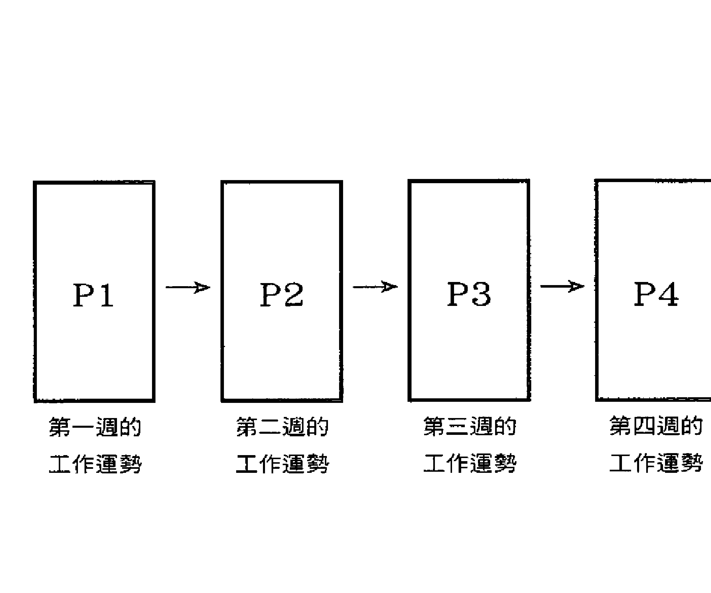

說明：工作運勢牌陣可以為自己做一個月內大概狀況的預測，也可以呈現某件事情在一個月當中的發展。每張牌代表這一週當中重要的狀況或是變化，做為一種預告與提醒。

影響因素：你可以把四張牌看成一個連續變化的過程，每一週發生的狀況都會影響到下一週，甚至會影響之後的幾週。

### 解牌順序

依照時間順序解讀每一週的狀況，最後再針對主題相關的部分給建議。

### 注意事項

並不一定要在月初的時候占卜整個人月的工作運勢，也可以選在任何一個時間點為起點，但是效期仍然有四週。

### 問題範例

- Q1.我這個月求職的運勢如何？
- Q2.我這個月整體的工作運勢如何？
- Q3.我這個月專案執行的進度如何？

### 參考牌義

#### 求職運勢

- P1第一週的工作運勢→K.求職運勢
- P2第二週的工作運勢→K.求職運勢
- P3第三週的工作運勢→K.求職運勢
- P4第四週的工作運勢→K.求職運勢

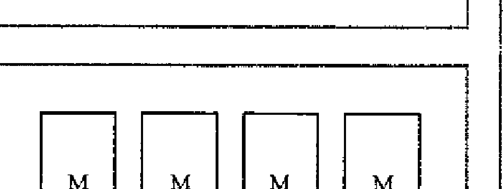

#### 工作運勢

- P1第一週的工作運勢→M.工作狀況概要
- P2第二週的工作運勢→M.工作狀況概要
- P3第三週的工作運勢→M.工作狀況概要
- P4第四週的工作運勢→M.工作狀況概要

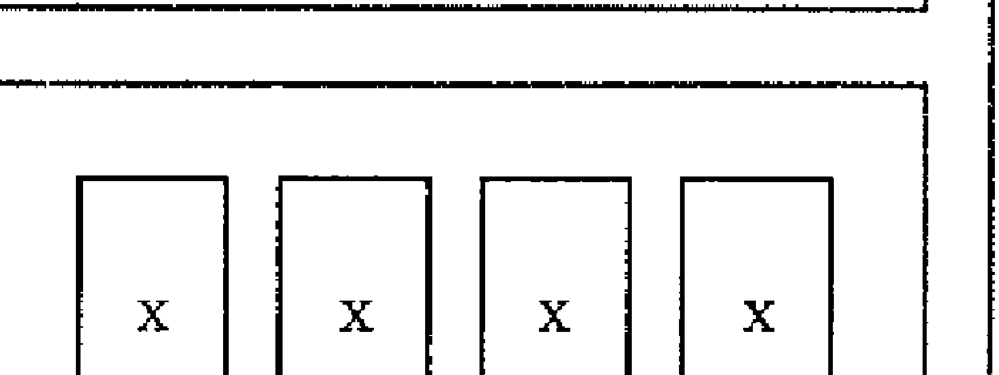

#### 專件進度

- P1第一週的工作運勢→X.時程進展
- P2第二週的工作運勢→X.時程進展
- P3第三週的工作運勢→X.時程進展
- P4第四週的工作運勢→X.時程進展

## 第二章 常見工作問題與牌陣選擇

### S7Q1 我這個月求職的運勢如何？

### 第一週的工作運勢：隱者逆位

這段時間也許可以找到新的工作，但是與之前的狀況並不會相差太多，不過換個環境之後也許心情就會有所轉變。

### 第二週的工作運勢：聖杯十逆位

這段時間的求職運勢不是很好，也不容易很快找到新工作，不如先休息一段時間，等運勢好轉之後再去找工作。

### 第三週的工作運勢：權杖十逆位

這段時間的求職運勢不太好，很多時候會覺得自己白忙一場，還可能遇到求職陷阱，所以還是先休息一陣子再說。

### 第四週的工作運勢：寶劍八逆位

這段時間的求職運勢不怎麼好，很難找到令你滿意的工作，即使真的找到了工作，可能也只是很短期的工作機會。

### 整體建議及分析：

就位置與牌義來看，只有第一週的運勢比較好，接下來的運勢都很差，如果無法把握第一週快點找到工作，也許就需要休息三週的時間。

### 我這個月整體的工作運勢如何？

### 第一週的工作運勢：錢幣二

工作對你來說是很大的挑戰，雖然在當中有很多辛苦的地方，但是也有不少的收穫，面對變動的時候要特別小心。

### 第二週的工作運勢：月亮

工作上存在許多陷阱與騙局，一不小心就可能作出錯誤的判斷，這時候要小心謹慎，避免被情緒及主觀印象誤導。

### 第三週的工作運勢：命運之輪逆位

工作可能會遇到重大的變化，由於不是你能控制的事情，所以最多只能夠盡量保持冷靜，處變不驚好好收拾殘局。

### 第四週的工作運勢：隱者逆位

是在一個人邊做邊學的狀況，所以有很多東西需要自己去嘗試與摸索，並沒有一個人可以在旁邊指導你該怎麼做。

### 整體邏輯及分析：

就位置與牌義來看，這個月的工作運勢並不是很好，也會發生很大的變動，這個時候最重要的是保持冷靜，盡量減少可能發生的錯誤。

### S7Q3 我這個月專案執行的進度如何？

### 第一週的工作運勢：權杖七逆位

目前事情的進度並不順利，很多部分並不在你的掌握當中，如果再加上環境上的阻礙，根本就無法在期限內完成。

### 第二週的工作運勢：世界逆位

這件事情的進度嚴重落後，但是又很難加速進行，如果無法改變計劃延長工作時間，就註定無法在期限之內完成。

### 第三週的工作運勢：錢幣六逆位

目前進度並不如你想像中的那麼樂觀，但是如果能從現在開始面對現實急起直追，也有可能在時限之內完成。

### 第四週的工作運勢：星星逆位

目前的進度已經稍稍落後，如果不能從現在開始努力彌補的話就會變成嚴重落後，到時想再追趕就要花更多力氣。

### 整體建議及分析：

就位置與牌義來看，前面兩週的進度很不順利，但第三、第四週起有一些追趕的機會，所以應該利用後面兩週的時間加快進度急起直追。

# ◇ 第二部 ◇

# 塔羅工作占卜的牌義

## 魔術師正位

# 評估創業

- A.創業的方向-S1P1,S5P1,S5P2,S5P4
必須要有創新的想法與作法才有可能成功，一旦確定了方向就要立即努力去行動，以免被別人後來居上搶得先機。

- B.資金來源-S1P2
創業的資金對你來說並不成問題，只要在自己可以負擔的範圍之內都可以，但最好降低借貸的比例以免過度擴張。

- C.合夥關係-S1P3
這件事情可以與人合夥，但是仍然要有一個人扮演主導者作最後的決定，如果是以合議的方式就會變成多頭馬車。

- D.客戶設定-S1P4
設定的客群可以廣泛一點，但是最好有幾個明確的重心，針對這些人進行強力的宣傳，短期之內就可以看到效果。

- E.店面區位-S1P5
首先應該考慮到交通方便的條件，其次才是租金及其他的問題，但千萬別為了省裝潢去承接同業留下來的舊店面。

- F.事業前景-S1P6,S5P3,S5P5
這個事業的前景看好，未來的發展仍有許多不同的可能性，如果能主動積極持續研發創新，還有很大的成長空間。

# 評估工作

- M.工作狀況概要-S5P1,S5P2,S5P4,S7P1,S7P2,S7P3,S7P4
這是一個新的工作狀況，因為所有條件都已經完備了，所以只要你能把握機會主動去作，就會得到你想要的東西。

- N.能否勝任-S3P1
這個工作對你來說並不困難，只要你能主動積極地去面對問題、解決問題，大部分的狀況都可以在你的掌控之中。

- O.假期福利-S3P2
公司的福利還不錯，該有的好處也都可以享受得到；假期雖然不多，但大都可以自由運用，算是中規中矩的地方。

- P.財務收入-S3P3
目前的收入並不會太好，但是未來還會有成長的空間，如果加上工作中所學習到的東西，整體看來仍然是值得的。

## 第三章 大牌的工作意義（一）

# 評估求職

- G.工作性質-S2P1
適合以動腦為主的工作，會有需要與人溝通協調的部分；另一方面，也可以試著去挑戰自己從來沒有做過的工作。

- H.工作地點-S2P2
並不是在你所熟悉的地方，但也不一定要往外地發展，最好不要在工作地點的部分設限，才能最快找到好的工作。

- I.要求薪資-S2P3
對於薪資的要求不要太高，在開始時也許會略低於業界合理的水準，不過在工作當中學習的機會和經驗才是重點。

- J.求職管道-S2P4
主動去尋找自己有興趣、有熱情的工作，這絕對比經由別人介紹能得到更好的工作，任職後也比較沒有人情包袱。

- K.求職運勢-S2P5,S7P1,S7P2,S7P3,S7P4
這段時間的求職運勢很不錯，應該主動積極地去尋找自己理想中的工作，如果被動地等待機會出現就不會有收穫。

- L.可以改進的地方-S2P6
也許個別的能力都很不錯，現在最重要的是自己的整合能力，如何把自己的特色突顯出現，才能爭取最好的機會。

- Q.與主管的相處-S3P4,S6P3,S6P4
這位多才多藝的上司會希望一切都在他的掌控之中，所以最好是依照他的指示把工作完成，其他的就不要想太多。

- R.與同事的相處-S3P5,S6P3,S6P4
在工作關係當中最重要的是溝通，不要把太多主觀的臆測加諸在對方身上，把話講清楚了才會有助於事情的推展。

- S.升遷加薪-S3P6
不論是升遷或加薪都需要自己努力去爭取，在工作上展現出自己的價值，如果只是被動的等待就不會有任何機會。

- T.如何看待對方-S6P1,S6P2
這是一個聰明有主見的人，也很積極主動追求工作上的表現，除了良好的溝通能力之外，創意與統合能力也不錯。

# 評估事件

- U.現有資源-S4P1
現有的資源其實是足以應付目前遇到的狀況和挑戰，只要能要作出適當的分配，就能對這件事情發揮最大的助力。

- V.人員配合-S4P2
基本上人員的配合沒有什麼大問題，只要大家把分工和責任都溝通清楚，就可以各自貢獻所長一起合作完成任務。

- W.環境因素-S4P3
環境上有新的狀況出現，整體來說是對你有幫助的變化，這時候應該主動掌握先機，作出對大家都最有利的決定。

- X.時程進展-S4P4,S7P1,S7P2,S7P3,S7P4
事情的進度都在掌控當中，時間的分配也還算合理，只要能按部就班地持續進行，應該就可以在時限內完成任務。

- Y.執行成果-S4P5
在這件事情會有不錯的成果，你的努力和貢獻也會得到大家的肯定，應該對自己有多一點信心相信自己可以完成。

- Z.未來影響-S4P6,S6P3,S6P5
這件事情會造成一個新的局面開始，不但有新的機會，同時也會帶來新的挑戰，要主動積極才能掌握未來的發展。

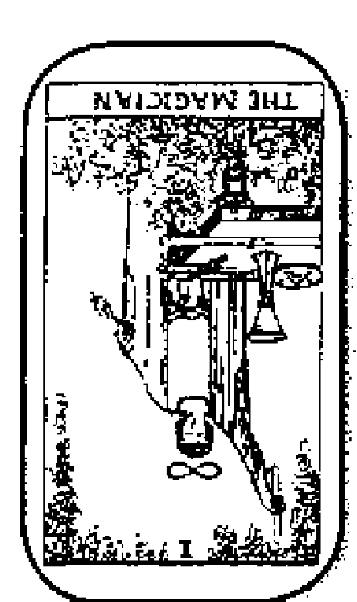

## 魔術師逆位

# 評估創業

- A.創業的方向-S1P1,S5P1,S5P2,S5P4
目前創業的方向還不是那麼確定，自己也沒有十足的把握與信心，對於自己還不是很了解的新領域不宜冒險嘗試。

- B.資金來源-S1P2
創業的資金並不是自己能完全掌握的，在起步的階段應該要偏向保守操作，同時要慎防為求資金落入詐騙的陷阱。

- C.合夥關係-S1P3
這件事情不容易找到可靠的合夥人，在合作過程當中也容易會遇到溝通不良的狀況，所以最好能避免與別人合夥。

- D.客戶設定-S1P4
目前客戶的設定可能已經陷入了錯誤的方向，最好能反省檢討重新擬定策略，才不會在無意義的事情上浪費時間。

- E.店面區位-S1P5
店面以自己看中意的為主，不要受別人的影響，雖然不一定能找到完全滿意的地方，但有要有耐心繼續努力下去。

- F.事業前景-S1P6,S5P3,S5P5
這件事情剛在起步階段，仍然有許多的問題需要去解決，如果無法忍受困難挫折的打壓，還是早點放棄比較乾脆。

# 評估求職

- G.工作性質-S2P1
最好是以自己熟悉的行業或工作內容為主，不要去嘗試過份困難的事情，最好能避免需要創意或整合能力的工作。

- H.工作地點-S2P2
最好是找自己所熟悉的地方，同時要避免往外地發展，如果是交通不便的工作地點，通常也不會是適合你的工作。

- I.要求薪資-S2P3
對於薪資不要有太高的期待，甚至有可能遠低於你認為合理的數字，如果想要找到工作就不要太堅持薪資的水準。

- J.求職管道-S2P4
這個時候可以多聽聽別人的建議，並透過網路或報紙收集資訊、分析評估狀況，在沒搞清楚狀況前不宜主動出擊。

- K.求職運勢-S2P5,S7P1,S7P2,S7P3,S7P4
這段期間可能出現不少新的工作機會，但當中也有一些是屬於害人的求職陷阱，所以要自己小心評估理性去面對。

- L.可以改進的地方-S2P6
與人溝通是可以再加強的部分，除了增進自己口語或書面的表達能力之外，如何聆聽別人的意見也是需要學習的。

# 評估工作

- M.工作狀況概要-S5P1,S5P2,S5P4,S7P1,S7P2,S7P3,S7P4
你面對的是一個新的狀況，但是很多條件並不完備，所以最好先確定自己所能作到的部分，把份內的事完成就好。

- N.能否勝任-S3P1
你的能力並不足以應付所有的狀況，仍然有很多東西需要邊做邊學，所以在過程當中必然遭遇到許多困難和挫折。

- O.假期福利-S3P2
福利制度並不完善，很多東西主動去爭取仍不一定能得到；即使有假期也不一定能自己利用，甚至可能被迫加班。

- P.財務收入-S3P3
收入並不令人滿意，未來加薪的前景也還不明朗，即使有列出業績獎金或加班費等等的項目，也不一定能夠實現。

- U.現有資源-S4P1
現有的資源並不足以應付目前遇到的問題，甚至目標和計劃都有可能一變再變，造成金錢、時間和人力上的浪費。

- V.人員配合-S4P2
目前的人員還沒有到位，也許需要再追加人手或是把職務重新調整，溝通整合是目前最缺乏也最需要加強的部分。

- W.環境因素-S4P3
目前環境上無法提供太多支援，但也不至於出現嚴重的阻礙，所以還是要靠自己努力，把份內的事情完成最重要。

- X.時程進展-S4P4,S7P1,S7P2,S7P3,S7P4
目前的進度稍稍落後，但由於接下來的進展並不順利，所以應該開始計劃投入更多資源加快腳步，不要過度樂觀。

- Y.執行成果-S4P5
只能說這件事情的過程比結果更重要，雖然並不一定能達到預期的成果，但是在當中學習到的東西也是很有價值。

- Z.未來影響-S4P6,S5P3,S5P5
這件事情可能會帶來不利的影響，要慎防有人利用機會欺騙你或陷害你，若是過度自信就很容易讓自己受到傷害。

- Q.與主管的相處-S3P4,S6P3,S6P4
長官只會給你一個原則或大方向，其他的部分都要靠你自己想辦法搞定，所以不要想依賴長官給你的幫助或支援。

- R.與同僚的相處-S3P5,S6P3,S6P4
同事間可能會發生溝通不良的狀況，所以說話的時候更要小心謹慎，為了避免麻煩即使無法深交也不要惡言相向。

- S.升遷加薪-S3P6
由於升遷的制度並不健全，能不能有發展往往取決於上司主觀的判斷；加薪的部分也不是自己努力就可以得到的。

- T.如何看待對方-S6P1,S6P2
這是一個喜歡空口說白話但執行力不夠的人，常常會過於堅持自己的意見而難以溝通，因此就無法讓人完全信任。

## 女祭司正位

# 評估創業

- A.創業的方向-S1P1,S5P1,S5P2,S5P4
創業的時機還沒完全成熟，適合繼續觀望一陣子；對於正反兩面的意見都可以參考，也許最後會採行折衷的方案。

- B.資金來源-S1P2
資金來源基本上算是足夠穩定，只要能夠冷靜評估避免過度擴張，就不會發生財務上的問題，此時一動不如一靜。

- C.合夥關係-S1P3
這件事情若是有人合夥，就很容易發生內部意見分歧的情況，必須有人扮演平衡者的角色才能讓大家團結在一起。

- D.客戶設定-S1P4
客戶的設定必須要更集中、精準一些，才不會在過程當中迷失了核心價值，對市場應該要作更深入的觀察和研究。

- E.店面區位-S1P5
店面不一定要在很熱鬧的地方，但可以考慮比較有文化氣息或宗教氣氛的區位，這樣反而能吸引到最適合的客群。

- F.事業前景-S1P6,S5P3,S5P6
這個事業並不會大起大落，雖然不會有立即倒店的危險，但也只能在穩定中緩慢地成長，需要有耐性慢慢地經營。

# 評估工作

- M.工作狀況概要-S5P1,S5P2,S5P4,S7P1,S7P2,S7P3,S7P4
目前工作的狀況十分穩定，也不會有什麼大的變化，這個地方不宜太過積極求變，只要把事情按部就班完成即可。

- N.能否勝任-S3P1
你的能力其實足以應付這個工作，只是在工作當中也學不到什麼新的東西，你只需要堅守自己的職責與立場即可。

- O.假期福利-S3P2
公司的假期與福利都依照制式規定辦理，基本上該有的絕不會少給你，但即使自己努力去爭取也不會多給你什麼。

- P.財務收入-S3P3
收入雖然不會很好但仍然差強人意，每個月有固定的薪水進帳不會有什麼意外的驚喜，算是收入十分穩定的地方。

## 第三章 大牌的工作意義 (一)

- G.工作性質-S2P1
適合比較靜態的工作，最好能以穩定為第一優先，如果工作當中有太多競爭或變動，就應該要避開以免適應不良。

- H.工作地點-S2P2
工作地點最好在自己熟悉的地方，以變動少與離家近為原則，如果需要離鄉背井到外地去打拚的也許就不適合你。

- I.要求薪資-S2P3
要求的薪資大約在業界平均的水準即可，不需要去當廉價勞工委屈自己，但也不用開很高的價碼後再來討價還價。

- J.求職管道-S2P4
對於產業要有深入的研究，才會了解什麼是對自己最有利的管道，在還沒找到好的方式之前，最好多多觀察比較。

- K.求職運勢-S2P5,S7P1,S7P2,S7P3,S7P4
這是一段不宜主動找工作的時間，如果是有工作機會自己找上門來當然可以考慮，但是主動出擊就不容易有成果。

- L.可以改進的地方-S2P6
你可能會讓人覺得太過被動或是缺乏熱情，因而不容易在求職者當中脫穎而出，或許可以表現得更主動積極一點。

- Q.與主管的相處-S3P4,S6P3,S6P4
由於主管對你的影響不大，所以不需要太刻意去拉近關係，只要保持安全距離不交惡，一切照章辦事就可以搞定。

- R.與同事的相處-S3P5,S6P3,S6P4
由於與同事必要的互動並不多，所以遠離是非明哲保身是最重要的，同時也要注意不可任意談論工作當中的機密。

- S.升遷加薪-S3P6
在這個地方發展性不是很好，升遷的機會並不大，加薪的幅度也非常有限，所以最好不要對這方面有太高的期待。

- T.如何看待對方-S6P1,S6P2
這是一個冷靜理性的人，但是有些孤僻不太愛說話，工作上的觀察力與學習力都很強，只是作事情比較被動一些。

# 評估事件

- U.現有資源-S4P1
雖然現在的資源並不是很充足，但勉強仍然可以應付所有開支，但如果出現突發的意外狀況，也許就無法處理了。

- V.人員配合-S4P2
基本上人員的配合沒有什麼大的問題，只要把各自的分工與責任交待清楚就好，即使缺乏互動仍然可以完成任務。

- W.環境因素-S4P3
環境當中可能有不同的力量或意見在拉鋸，可以先觀察環境的變化，但仍然要維持自己的步調不宜作太大的變動。

- X.時程進展-S4P4,S7P1,S7P2,S7P3,S7P4
事情的進展都按照計劃進行當中，也許現在情勢還不是那麼明朗，但只要保持速度繼續前進，還是可以順利完成。

- Y.執行成果-S4P5
這件事只要按部就班就會得到預期當中的成果，並不會有什麼太大的意外發生，在過程當中求新求變反而會壞事。

- Z.未來影響-S4P6,S6P3,S6P5
這件事情的影響短期內還看不出來，但是長期來說對你是很重要的，如果能保留相關的資料與憑證會對你有幫助。

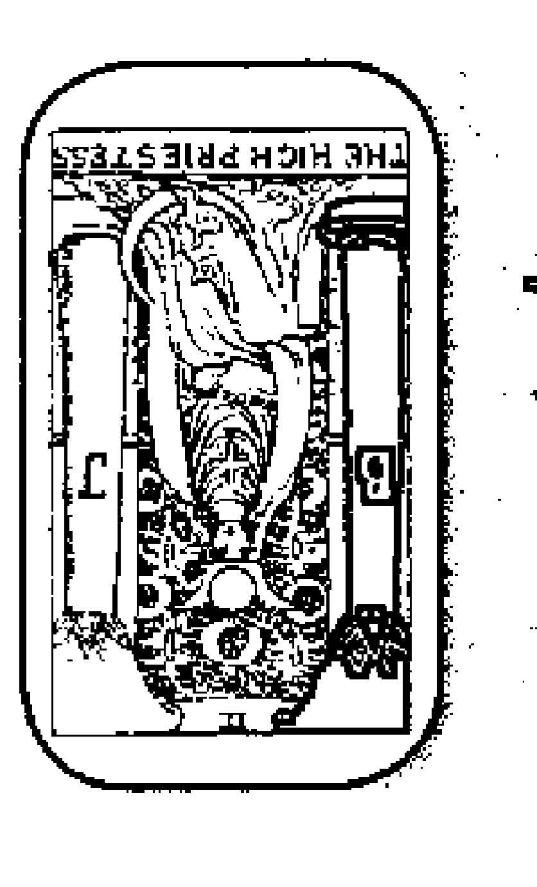

## 女祭司逆位

# 評估創業

- A.創業的方向-S1P1,S5P1,S5P2,S5P4
創業的方向大致沒有問題，是應該付諸行動的時候了，在實際執行的過程中，原本沒發現的問題會逐一浮現出來。

- B.資金來源-S1P2
目前資金的狀況開始出現缺口，如果不能及時找到新的支援也許就會在不知不覺當中惡化，要誠實面對防微杜漸。

- C.合夥關係-S1P3
這件事情不宜合夥，因為會出現極端對立的不同意見，當中又缺乏調合平衡的力量，所以很難維持住團隊的和諧。

- D.客戶設定-S1P4
在客群的設定上不要想去討好所有人，集中力量在自己有把握的客戶上面，其他顧不到的部分就放棄不要想太多。

- E.店面區位-S1P5
店面區位的選擇要相信自己的直覺，不要被別人的意見所左右，想清楚了之後就要全力搶攻，才不會錯失了先機。

- F.事業前景-S1P6,S5P3,S5P5
這個事業未來還會有很多變化，從現在開始已經慢慢可以觀察到了，若是想長久經營下去，就要作好應變的準備。

# 评估创业

#### A. 创业的方向-S1P1,S5P1,S5P2,S5P4
创业的方向非常正确，也很具有未来发展的潜力，应该快点专注在这个目标上努力，不要再三心二意浪费时间了。

#### B. 资金来源-S1P2
资金的来源十分充足，短期内也看不出什么大问题，所以该花的钱就不必太省，现在的投资未来都可以看出效果。

#### C. 合伙关系-S1P3
这件事情大家都会因为合伙而得利，所以千万不要因为一点小争执就随意拆夥，共同努力付出才会有最大的力量。

#### D. 客户设定-S1P4
在客户的设定上可以对准比较重视生活享受的人，走精致或是高档的路线，未来仍然有很多潜在的客群可以开发。

#### E. 店面区位-S1P5
店面区位适合在比较成熟的商圈，虽然租金成本可能会稍微贵一点，但是在这样的地方才能为你吸引最多的客人。

#### F. 事业前景-S1P6,S5P3,S5P5
这件事情看起来前途一片大好，是非常值得全心投入的事业，未来仍然有很大的发展潜力，是你可以努力开发的。

# 评估求职

#### G. 工作性质-S2P1
应该寻找自己有兴趣、有热情的工作，才能应付过程中遇到的波动与变化，不必太顾虑是否有经验或人脉的问题。

#### H. 工作地点-S2P2
工作地点上可能会有很大的变动，所以不必刻意排斥远距离或常要出差的工作，保持弹性才能找到最有利的位子。

#### I. 要求薪资-S2P3
薪资水平还有不少谈判的空间，只要不是太过分的狮子大开口，自己主动积极去争取的话，多少都会有一些成果。

#### J. 求职管道-S2P4
自己主动去尝试是很不错的方法，但也不必特意排斥亲朋好友的介绍，要多管齐下才能为你挖掘出最多的好机会。

#### K. 求职运势-S2P5,S7P1,S7P2,S7P3,S7P4
这段时间不太可能主动去找到新工作，但是仍然有可能被别人给找上，应该理性评估新工作的状况不要太过乐观。

#### L. 可以改进的地方-S2P6
在专业能力上可以再加强，多吸收新知也是必要的部分，同时在心态上要避免过度自信高估了自己的实力与身价。

# 评估工作

#### M. 工作状况概要-S5P1,S5P2,S5P4,S7P1,S7P2,S7P3,S7P4
虽然工作表面上看起来都很稳定平静，但是在台面下的动作却是暗潮汹涌，一个不小心就很可能会死无葬身之地。

#### N. 能否胜任-S3P1
这份工作表面上看起来简单，实际上已经有点超出你的能力范围之外，如果自己不能进步追上很可能就会被淘汰。

## O. 假期福利-S3P2
公司的福利制度并不完善，一些应该有的权益也要自己主动争取才能得到；假期的使用上存在许多不成文的规矩。

#### P. 财务收入-S3P3
财务的收入并不是很稳定，也许会在不预期的状况之下出现变化，所以应该要冷静理性地评估而不要盲目地乐观。

#### Q. 与主管的相处-S3P4,S6P3,S6P4
你无法从上司那里得到太多帮助，所以最好还是一切靠自己，若是太刻意想要讨好上司，有时候还会产生反效果。

#### R. 与同事的相处-S3P5,S6P3,S6P4
同事间的明争暗斗很多，但仍然可以维持表面上和谐的关系，在情势明朗之前不宜表态，以免选错边站造成伤害。

#### S. 升迁加薪-S3P6
工作的内容或职位都还有变化的可能性，因此在升迁或加薪上都需要自己主动去争取，才能找到最大的发挥空间。

#### T. 如何看待对方-S6P1,S6P2
在工作上有很多理想与抱负，但似乎并没有相对应的实力，有时候的表现会太过主观和固执，让人觉得很难沟通。

### U. 现有资源-S4P1
现有的资源虽然足以应付目前的状况，但接下来如果发生变化就会立刻破功，最好能注意事情的变化再灵活调整。

### V. 人员配合-S4P2
最重要的是把不同意见整合在一起，或是在不同立场之间取得平衡，如果无法获得共识就可能会造成严重的伤害。

### W. 环境因素-S4P3
环境上会有重大的变化出现，而且是你事前完全没有预料到的，所以绝不能认为事情都会按计划进行就掉以轻心。

### X. 时程进展-S4P4,S7P1,S7P2,S7P3,S7P4
现在表面上看起来事情都还在掌握当中，实际上却已经落后一大段的距离，需要快点找到问题发生的原因去解决。

### Y. 执行成果-S4P5
这件事情很难达到预期的成果，但是可能会有其他意外的收获，一边进行当中最好一边调整，千万不要太过固执。

### Z. 未来影响-S4P6,S5P3,S5P5
这件事情看来只有当下或短期的效果，长期而言并不会有什么重大的意义，所以不论成功或失败都不要看得太重。

## 皇后正位

# 评估创业

#### A. 创业的方向-S1P1,S5P1,S5P2,S5P4
创业的方向非常正确，也很具有未来发展的潜力，应该快点专注在这个目标上努力，不要再三心二意浪费时间了。

#### B. 资金来源-S1P2
资金的来源十分充足，短期内也看不出什么大问题，所以该花的钱就不必太省，现在的投资未来都可以看出效果。

#### C. 合伙关系-S1P3
这件事情大家都会因为合伙而得利，所以千万不要因为一点小争执就随意拆夥，共同努力付出才会有最大的力量。

#### D. 客户设定-S1P4
在客户的设定上可以对准比较重视生活享受的人，走精致或是高档的路线，未来仍然有很多潜在的客群可以开发。

#### E. 店面区位-S1P5
店面区位适合在比较成熟的商圈，虽然租金成本可能会稍微贵一点，但是在这样的地方才能为你吸引最多的客人。

#### F. 事业前景-S1P6,S5P3,S5P5
这件事情看起来前途一片大好，是非常值得全心投入的事业，未来仍然有很大的发展潜力，是你可以努力开发的。

# 评估工作

#### M. 工作状况概要-S5P1,S5P2,S5P4,S7P1,S7P2,S7P3,S7P4
工作进入了丰收的阶段，之前付出的努力开始看到不错的回收，只要继续努力前进，就可以比原定计划得到更多。

#### N. 能否胜任-S3P1
这件工作对你来说完全不成问题，也有很大的空间可以让你发挥，所以应该要把握这个好机会不要让他白白溜走。

## O. 假期福利-S3P2
这个公司的福利十分完善，甚至有许多东西是你自己根本不会想到的；在休假的时候也能完全放松做自己的事情。

#### P. 财务收入-S3P3
总收入算是非常非常好，而且以后还有很大的成长空间，即使不算加班费和奖金的部分，光是底薪就已经不错了。

# 评估来职

#### G. 工作性质-S2P1
比较适合以成熟女性为主要客户的行业别，或是去尝试业务性质有业绩奖金的工作，都可以为你创造不错的收入。

#### H. 工作地点-S2P2
依照工作性质不同，有可能是在非常热闹的商圈中心，或是在郊外可以亲近大自然的地方，所以不要给自己设限。

#### I. 要求薪资-S2P3
对于薪资的要求可以略高于业界平均的水准，即使薪资总额并不一定特别高，但若除以工作时数仍然是很划算的。

#### J. 求职管道-S2P4
很可能是由亲朋好友介绍，也有一些工作机会主动找上门来，若是你想要主动出击，仍然有不少的好工作在等你。

#### K. 求职运势-S2P5,S7P1,S7P2,S7P3,S7P4
这段时间求职运势非常强，可以找到特别高薪或是特别轻松的工作，所以最好能把握时间主动出击不要再犹豫了。

#### L. 可以改进的地方-S2P6
你还有很多潜力没有发挥，所以求职时可以再主动积极一点，只要愿意吃苦耐劳努力学习，很快就可以找到工作。

#### Q. 与主管的相处-S3P4,S6P3,S6P4
上司除了重视工作的成绩之外，也很重视同事之间的人际关系，有什么问题找他帮忙，大多都能得到不错的支援。

#### R. 与同事的相处-S3P5,S6P3,S6P4
工作中的人际关系对你的工作状况有极大的影响，所以一定要维持好人际关系，需要的时候才能找到人帮忙。

#### S. 升迁加薪-S3P6
未来升迁和加薪的机会都不错，但整体而言加薪还是会比升迁来得容易一些，总之在这里很容易得到实质的报偿。

#### T. 如何看待对方-S6P1,S6P2
在工作上很有能力的人，只要主动去做的事情大部分都会成功，对人也非常和善，是可以真心交往当成朋友的人。

# 评估事件

### U. 现有资源-S4P1
现在的资源绰绰有余，未来仍有许多资源会陆续投入，在资源不虞匮乏的状况之下，就可以全心投入把事情做好。

### V. 人员配合-S4P2
人员的配合没有什么问题，而且大家会因为这件事情而发展出不错的友谊，也算是在工作之外另一个附带的收获。

### W. 环境因素-S4P3
整体来看大环境对你非常有利，不论是资源的配置或整体的气氛都在有形无形之间帮助你，也可能会有贵人出现。

### X. 时程进展-S4P4,S7P1,S7P2,S7P3,S7P4
要在时限之内完成对你来说非常容易，所以不需要花太多力气轻轻松松就可以达到，一切状况都在你的掌握之中。

### Y. 执行成果-S4P5
这件事情不但可以达到比预期更好的成果，而且还会得到其他许多意外的收获，所以无论如何一定要坚持到最后。

### Z. 未来影响-S4P6,S5P3,S5P5
这件事情让你的收获满满，而且在名誉上或实质上都有正面的影响，不论是长期或短期来看你都是最大的获益者。

## 第三章 大牌的工作意义（一）

## 皇后逆位

# 评估创业

#### A. 创业的方向-S1P1,S5P1,S5P2,S5P4
比较适合在成熟稳定的产业中按部就班进行，而不宜开启一个创新作法的事业；对于创业这件事应该要再三考虑。

#### B. 资金来源-S1P2
资金对你来说并不成问题，但如何把资源作最有效率的配置才是主要的困难，应该保留多一点现金应付不时之需。

#### C. 合伙关系-S1P3
这件事情可以与人合伙，但也许会有一些潜在的冲突性产生，必须要有人出来扮演和事佬才能让大家团结在一起。

#### D. 客户设定-S1P4
客户的设定可能会有点不切实际，也许需要把眼光拉回现实，以现在立即可以争取到的客群为主，不要想得太多。

#### E. 店面区位-S1P5
很难找到完美的开店地点，要做好随时可能搬迁的心理准备，所以最好不要花太多钱在装潢上，才不会造成浪费。

#### F. 事业前景-S1P6,S5P3,S5P5
这个事业短期间看起来一切平稳，但未来的发展性并不是很好，如果是以长远的角度来看，就不算是很好的投资。

# 评估求职

#### G. 工作性质-S2P1
最好是以自己熟悉可以轻松上手的工作为目标，千万不要去挑战高难度的新工作，竞争压力太大的工作不适合你。

#### H. 工作地点-S2P2
工作可能是在很成熟或是转向衰退的老商圈，但是也有可能出现在你非常熟悉的地区，在这些地方容易找到工作。

#### I. 要求薪资-S2P3
可以比照业界一般水准或自己前一份工作，但是往上加的机会并不是很高，所以对薪资不要有过度的期待和想象。

#### J. 求职管道-S2P4
可以参加学校、厂商或政府单位举办的就业博览会，容易比较快找到自己适合的工作，也可以避免遇到求职陷阱。

#### K. 求职运势-S2P5,S7P1,S7P2,S7P3,S7P4
可以在已知的选项当中挑选，但是主动出击并不容易找到新的工作机会，也可能有其他的工作机会主动找上门来。

#### L. 可以改进的地方-S2P6
努力掌握现有的机会不要好高骛远，如果已经出现了不错的工作就要快点下定决心，犹豫不决只会让你错失良机。

# 评估工作

#### M. 工作状况概要-S5P1,S5P2,S5P4,S7P1,S7P2,S7P3,S7P4
工作上也许会有不错的成绩，但是由于本身对于工作并没有足够的冲劲，在这样的情况下也许就难有重大的突破。

#### N. 能否胜任-S3P1
这个工作对你来说是一个挑战，也许需要花很大的力气才能达到基本的要求，但仍然算是在能力范围之内的事情。

## O. 假期福利-S3P2
所有的假期福利都已经明文规定得清清楚楚，基本的部分该有的都不会少给你，但即使努力争取也不能得到更多。

#### P. 财务收入-S3P3
虽然再怎么努力也不会有加班费或奖金，不过就工作内容来衡量这里的收入还算是不错，其他的就不要奢求太多。

### U. 现有资源-S4P1
目前的资源还算充足，但是若不省着一点用很快就会捉襟见肘，所以要掌握住优先顺序把资源作最有效率的分配。

### V. 人员配合-S4P2
有些人可能心存侥幸的心理想要偷懒或搭便车，如果不能把这些不出力的人导向正途，也许就会破坏团结的气氛。

### W. 环境因素-S4P3
虽然大环境上看起来对你有利，不过并无法提供你更多的资源和帮助，最后还是要靠自己的努力把所有问题搞定。

### X. 时程进展-S4P4,S7P1,S7P2,S7P3,S7P4
表面上事情的进展没什么问题，其实内部可能已经陷入空转当中，如果不能及时发现问题也许就会继续延宕下去。

### Y. 执行成果-S4P5
这件事情的成果并不如预期，当中很多的努力都只是白费力气，所以不要太过于贪心，把力量集中于有把握的部分。

### Z. 未来影响-S4P6,S5P3,S5P5
这件事情短期来说对你非常有利，但是长远来看却没有什么帮助，所以要尽快利用这个机会多拿一点实际的好处。

#### Q. 与主管的相处-S3P4,S6P3,S6P4
会要求工作实绩的上司，最好能努力达到他设定的目标，以免被他给盯上，同时千万不要挑战他任性固执的个性。

#### R. 与同事的相处-S3P5,S6P3,S6P4
可以与同事维持不错的关系，但是也不要因此太过亲近，若是不小心陷入派系的斗争中，就会变成你最大的危机。

#### S. 升迁加薪-S3P6
这个地方加薪的机会并不太大，顶多是能抵过物价上涨就很不错了；与其想要在这个地方升迁，还不如跳槽比较快。

#### T. 如何看待对方-S6P1,S6P2
基本上工作能力还不错，但总是有一些外务缠身无法全心投入工作当中，对于辛苦的工作常会借故推辞或是拖延。

# 评估创业

#### A. 创业的方向-S1P1,S5P1,S5P2,S5P4
创业必定是在一个既有的基础上才有可能成功，不要自己尝试太多创新的变化；也可以试试连锁店或加盟的体系。

#### B. 资金来源-S1P2
资金来源还有一些问题，但是仍有努力的空间可以把缺口填补起来，能不能坚持下去就看你有没有足够的意志力。

#### C. 合伙关系-S1P3
这个事业只能有一个人发号施令，其他人最好就乖乖听话去执行，所以即使有找人合伙也不适合改用合议制决策。

#### D. 客户设定-S1P4
一开始客户设定就是对的，没有必要因为别人的说法而摇摆；另一方面，也可以把目标客户设定在军警人员身上。

#### E. 店面区位-S1P5
可以选择比较新兴的商圈，虽然这样作会面临比较大的挑战，但是由于竞争者少的关系，成功的机会也会大一点。

#### F. 事业前景-S1P6,S5P3,S5P5
虽然这个事业现在看起来还有很多困难要去解决，不过只要你勤勤奋务实坚持下去，未来发展的空间仍然是很大的。

# 评估工作

#### M. 工作状况概要-S5P1,S5P2,S5P4,S7P1,S7P2,S7P3,S7P4
这个工作当中有许多的困难要面对，但是也有发挥所长的机会，在固定规则的限制之下仍然可以完成自己的目标。

#### N. 能否胜任-S3P1
你的能力足以胜任这个工作，虽然在过程当中可能会遇到一些困难，但是这也提供了一个可以实现理想的机会。

## O. 假期福利-S3P2
这个工作的福利制度并不是很完善，常会取决于长官的好恶而有不同的标准；假期能不能运用也掌握在上司手上。

#### P. 财务收入-S3P3
这个地方基本的薪资并不会太好，但有机会可以争取奖金或其他的收入，能得到什么还要看公司的制度如何规定。

## 第三章 大牌的工作意义（一）

# 评估求职

#### G. 工作性质-S2P1
可以选择高难度或是挑战性高的工作，或是以成熟男性为主要客户的行业别，都可以为你带来很多的学习及成长。

#### H. 工作地点-S2P2
工作地点可能会在行政中心附近或是办公大楼密集的地方；适合在固定的地方上下班，尽量避免要常出差的工作。

#### I. 要求薪资-S2P3
对于薪资的要求不宜太高，等同于业界平均的水准即可，由于决定权并不在你手上，所以不要有不切实际的期待。

#### J. 求职管道-S2P4
比较快的方式是透过师长介绍，但进去之后要背负一些人情压力；也可以参加相关的公开招考，都有不错的机会。

#### K. 求职运势-S2P5,S7P1,S7P2,S7P3,S7P4
这段时间可以找到一些不错的工作，但是大多都是高难度的挑战，重要的是符合自己的兴趣，才有可能作得长久。

#### L. 可以改进的地方-S2P6
你的主观好恶判断太过绝对，对于不喜欢的工作试都不愿意去试，若是能更有弹性一点，也许就能更快找到工作。

#### Q. 与主管的相处-S3P4,S6P3,S6P4
面对严肃又控制欲强的上司，最好就是顺着他的意思，千万不要当面去挑战他的权威，否则很可能就会被他盯上。

#### R. 与同事的相处-S3P5,S6P3,S6P4
即使私底下与同事有点交情，在工作上也只能公事公办，大部分的时候都是处于竞争的状况，比较少能互助合作。

#### S. 升迁加薪-S3P6
这个地方的升迁和加薪完全取决于上级长官们的好恶，制度只是参考用而已，所以自己的努力不一定会得到回报。

#### T. 如何看待对方-S6P1,S6P2
是在工作上很有能力的人，面对挑战时也会努力去克服，但是有时候会为了追求自己的功成名就而不惜牺牲别人。

# 评估事件

### U. 现有资源-S4P1
现有的资源不足以应付现在的状况，但是努力想办法还是有机会可以突破困难，这就要看你自己的决心和意志力。

### V. 人员配合-S4P2
这件事情的人员配合不会有什么大问题，只要有主控权的人能确实把工作的内容与责任厘清，自然就不会有纠纷。

### W. 环境因素-S4P3
大环境对这件事情并不利，但危机往往就是转机；大部分的状况都要靠自己想办法解决，不要期待有什么外援。

### X. 时程进展-S4P4,S7P1,S7P2,S7P3,S7P4
现在一切的进度都在你的掌握当中，如果可以在每一个步骤都严密地控制住，最后就可以在预计的时间之内完成。

### Y. 执行成果-S4P5
这件事情有机会达到预期的成果，但是在过程当中必然会经历许多的困难和挑战，要很有决心毅力才能坚持下去。

### Z. 未来影响-S4P6,S5P3,S5P5
这件事情只是困难的开端，未来还有很多的挑战在前面等着你；若是因此能力受到肯定，也可能成为升迁的契机。

## 第三章 大牌的工作意义（一）

# 评估创业

#### A. 创业的方向-S1P1,S5P1,S5P2,S5P4
你选择创业的方向过于困难，并不是你现在的能力所能做到的，如果执意要去做的的话，也许就会遇到很大的挫折。

#### B. 资金来源-S1P2
目前资金上遇到很大的问题，如果不能及时找到新的财务支持，可能很快就会支撑不下去，应该要准备好再开始。

#### C. 合伙关系-S1P3
这件事情并不适宜合伙，否则就容易因此而发生冲突；如果非不得已要合伙，最好能避免担任领导或决策的职务。

#### D. 客户设定-S1P4
目前客户的设定方向还不够成熟，应该要作多一点的研究之后再定案会比较好，在错误的方向努力只会浪费时间。

#### E. 店面区位-S1P5
目前考虑的店面区位都不理想，也许再等一阵子之后才会有转机；若是急于开张可能要有搬迁或顶让的心理准备。

#### F. 事业前景-S1P6,S5P3,S5P5
这个事业的前景看来并不乐观，未来还有更多的困难和阻碍在等着你，即使自己很努力坚持下去也不见得会成功。

# 评估求职

### G.工作性质-S2P1
最好尽量避免需要作重大决策以及挑战性、变化性高的工作；只要愿意从基层作起，就不用担心没有经验的问题。

### H.工作地点-S2P2
工作的地点并不是你所能选择或控制的，所以在这个部分最好不要设限，随遇而安才不会错失一些好的工作机会。

### I.要求薪资-S2P3
对于薪资不要有太高的期待，最好是被动地等对方提出来，如果主动提出不合理的薪资，反而容易错过好的机会。

### J.求职管道-S2P4
这时候主动出击并不容易有收获，反而是透过师长亲友的介绍会比较快找到工作，但是同时也要背负人情的压力。

### K.求职运势-S2P5,S7P1,S7P2,S7P3,S7P4
现在找到的工作并不会很适合你，也许还要等一阵子才可能有适当的机会出现，这段时间就让自己彻底休息一下。

### L.可以改进的地方-S2P6
在专业能力上可以再加强，对于工作上的事最好能有强一点的企图心，这样遇到困难的时候才会有足够的抗压性。

# 评估工作

### M.工作状况概要-S5P1,S5P2,S5P4,S7P1,S7P2,S7P3,S7P4
遇到不好的上司或主管，不仅对你没有帮助，反而常常害你累个半死；很多事情往往超出你的掌控让你疲于奔命。

### N.能否胜任-S3P1
你的能力还不足以胜任这个职务，在这个工作上不仅对你是种折磨，对大家也都不是好事，还是早点放弃比较好。

# O.假期福利-S3P2
在这个地方没什么福利可言，大家只是敢怒不敢言，假期的运用自己也没办法控制，即使还有休假也常常休不到。

### P.财务收入-S3P3
这个工作的薪资非常苛刻，即使努力有了成果也不会得到具体的回报，常让人觉得在做白工，也会减弱工作动力。

# 评估事件

- **U.现有资源-S4P1**
现有的资源并不足以应付现在的局面，即使努力也不太可能有所突破，所以需要重新全盘检讨这件事情的可行性。

- **V.人员配合-S4P2**
大家的想法都变来变去，根本没有共识可以团结在一起，如果没有人愿意跳出来主导，事情就很难有具体的进展。

- **W.环境因素-S4P3**
由于外在环境的限制，许多的事情无法依照计划顺利地进行，这时候并不是你努力就有用，作不到的也只好妥协。

- **X.时程进展-S4P4,S7P1,S7P2,S7P3,S7P4**
这件事情的进度已经完全失控了，再怎么努力也很难追赶上，如果不能尽快再投入更多资源，一定无法如期完成。

- **Y.执行成果-S4P5**
这件事情无法达到预期的成果，由于受限于环境的因素也不能说就是谁的错，只是主导者仍然要承担所有的责任。

- **Z.未来影响-S4P6,S5P3,S5P6**
这件事情可能成为你升迁的绊脚石，所以最好不要介入太深，也不要想扛起什么责任，否则就会产生不利的影响。

- **Q.与主管的相处-S3P4,S6P3,S6P4**
面对这个没有决断力的主管，如果只是听令行事反而会制造更多困难，所以有些事情要自己下判断以免发生错误。

- **R.与同事的相处-S3P5,S6P3,S6P4**
不要与同事有太紧密的关系，最好是能独善其身把自己的事情顾好，同时要尽量避免与人争论以免陷入斗争当中。

- **S.升迁加薪-S3P6**
在这里的升迁无望，所以最好能远离争权夺利的事情以免麻烦；加薪的机会还有一点点，但要看老板主观的好恶。

- **T.如何看待对方-S6P1,S6P2**
是一个有强烈企图心的人，但是能力与意志力都不够，常会把问题责任推给别人，有时候也会有滥用权力的倾向。

## 教皇正位

# 评估创业

- **A.创业的方向-S1P1,S5P1,S5P2,S5P4**
创业一定要有长者的支持才有可能成功，想要只靠自己单打独斗是不切实际的想法；也可以尝试连锁加盟的体系。

- **B.资金来源-S1P2**
只要能找到够力的金主，资金来源就绝对不成问题，重要的是看你的身段够不够柔软，愿意低下头请求别人援助。

- **C.合伙关系-S1P3**
这件事情可以合伙，但在开始之前必须把各种规范和权利义务谈清楚，这样在实际执行的时候大家比较容易依循。

- **D.客户设定-S1P4**
目前客户的设定有一点太过理想化，还需要仔细讨论评估才能找到正确的操作方式；也可以锁定宗教人士或团体。

- **E.店面区位-S1P5**
不要选择在太热闹或租金太高的地方，以免造成太大的负担；另一方面也可以考虑在庙宇或教堂等宗教场所附近。

- **F.事业前景-S1P6,S5P3,S5P5**
这个事业的前景看好，在可预见的未来将会稳定成长，不要忘记当初创业的理想，才不会在发展过程中走偏了路。

# 评估工作

- **M.工作状况概要-S5P1,S5P2,S5P4,S7P1,S7P2,S7P3,S7P4**
工作上有很多贵人在帮助你，所以即使自己仍然有一些不足的地方，还是可以安全度过难关，对你而言是有利的。

- **N.能否胜任-S3P1**
你的能力并不完全足以胜任这个工作，但在当中会有一些贵人相助，所以遇到问题的时候应该勇敢的提问或求助。

- **O.假期福利-S3P2**
这个地方的福利还不错，有很多人性化的制度设计，会让你觉得受到照顾；假期的运用只要提早计划都可以实现。

- **P.财务收入-S3P3**
这个地方的收入虽然不是非常好但是十分稳定，如果把其他的福利和奖金都算进去的话，整体看起来也算是不错。

### # 第三章 大牌的工作意義 (一)

- **G.工作性質-S2P1** 最好把目標放在大型的組織或大公司，這樣工作會比較穩定一點，或是也可以考慮與助人或心靈成長有關的工作。

- **H.工作地點-S2P2** 工作地點可能會在有名的地標或是建築物附近；另一方面，最好選擇在固定地點上下班，而不用勞碌奔波的工作。

- **I.要求薪資-S2P3** 可以針對你本身的希望與期待提出薪資，而不用去理會業界普遍的水準，只要不是太過份的要求通常都可以達到。

- **J.求職管道-S2P4** 透過師長介紹可以讓你最快找到工作，其他的管道暫時就可以不用想了！只是得到工作之後要記得回饋感謝對方。

- **K.求職運勢-S2P5,S7P1,S7P2,S7P3,S7P4** 這段時間的求職運勢很不錯，而且在過程當中會有貴人相助，所以應該把握這段時間的機會快點把工作穩定下來。

- **L.可以改進的地方-S2P6** 你太重視心靈層面的感覺與意義的追尋，造成有時候會忽略實際發生的狀況，在找工作的時候務實一點會比較好。

- **Q.與主管的相處-S3P4,S6P3,S6P4** 這個主管通常都很願意幫助你，遇到不懂的事就去請教他，抱持著真誠與熱情的態度可以從他身上學到很多東西。

- **R.與同事的相處-S3P5,S6P3,S6P4** 同事很有可能成為你的貴人，所以在平時就要保持良好的關係，等到有一天需要別人幫忙時才不會覺得難以啟齒。

- **S.升遷加薪-S3P6** 在這裡升遷和加薪都有一定的制度在規範，只要你能夠按部就班地努力工作，等績效或是年資到了自然會升遷加薪。

- **T.如何看待對方-S6P1,S6P2** 是一個重視工作的意義甚於實質收入的人，具有強烈的道德感與責任心，通常在能力範圍之內也會盡量幫助別人。

## 塔羅工作講義

# 評估事件

# U.現有資源-S4P1
現有資源雖然並不豐富，但是由於有貴人相助的關係，仍然足以應付目前的狀況，遇到問題記得要向上反映求助。

# V.人員配合-S4P2
人員之間的配合沒什麼大的問題，只要大家都依循組織的規範與秩序作事，即使遇到意見不合也可以很快地解決。

# W.環境因素-S4P3
環境上會給你很大的支持與鼓勵，會出現外部的貴人來幫助你，所以除了利用內部資源之外也可以向外尋求援助。

# X.時程進展-S4P4,S7P1,S7P2,S7P3,S7P4
現在的進度還在可以接受的範圍之內，只要依照上級的指示或是原訂的計劃按部就班進行，應該都可以如期完成。

# Y.執行成果-S4P5
這件事情應該可以達到預期的成果，你自己在當中也會有一定的學習與成長，所以要好好把握機會盡力完成任務。

# Z.未來影響-S4P6,S5P3,S5P5
這件事情對你會很有幫助，不但能建立很有利的人脈，同時對於自己的資歷也有加分作用，算是一舉兩得的事情。

### # 教皇逆位

#### ## 評估創業

- **A.創業的方向-S1P1,S5P1,S5P2,S5P4**
你的創業方向並不可行，不要再執迷不悟下去了！如果不能調整到正確的方向，即使再努力也不會有實質的成果。

- **B.資金來源-S1P2**
現在資金的狀況有點吃緊，所以應該要省吃儉用量入為出；短期內不會有新的金主出現，不要有不切實際的期待。

- **C.合夥關係-S1P3**
這個事情如果合夥，你就是那個付出最多的人，而且自己努力得來的成果還要與大家分享，有時會讓你心有不甘。

- **D.客戶設定-S1P4**
把握住關鍵的客戶集中力量搶攻，不要把目標分散以免浪費力氣；應該相信自己的判斷，避免被流俗的意見影響。

- **E.店面區位-S1P5**
店面的區位其實受到客戶設定很大的影響，只要有利於接近目標客戶的地方都可以，即使多花一點錢也是值得的。

- **F.事業前景-S1P6,S5P3,S5P5**
這個事業的前景不明，雖然不會有立即倒閉的危險，但是也還沒那麼快進入穩定的軌道，所以作法應該保守一點。

# 評估求職

# G.工作性質-S2P1
在選擇工作時應該要相信自己的判斷，不要被別人的意見擾亂了目標；也可以考慮顧問或是提供諮詢服務的工作。

# H.工作地點-S2P2
工作地點可能會在很多朋友上班的地方附近，或是你已經非常熟悉的地區，最好不要去自己不熟悉的新區域上班。

# I.要求薪資-S2P3
要求的薪資應該和一般行情差不多，但是還是要看公司既有的規範來決定，太堅持自己的意見可能會錯失好機會。

# J.求職管道-S2P4
這時候應該以自己喜歡的工作為目標主動出擊，盡量避免由師長或朋友介紹的機會，這樣才能找到較適合的工作。

# K.求職運勢-S2P5,S7P1,S7P2,S7P3,S7P4
目前算是一段應該好好休息的時間，並不很容易找到適合自己的好工作，可以等到自己休息夠了之後再來找工作。

# L.可以改進的地方-S2P6
你需要有更明確的目標，如果有能力不足的地方就應該先充實自己，要先把自己裝備好了之後主動出擊才會夠力。

# 評估工作

# M.工作狀況概要-S5P1,S5P2,S5P4,S7P1,S7P2,S7P3,S7P4
在這個工作中充滿各種僵化的規則，還有一些是沒有明文規定的禁忌，在當中必須要小心翼翼才能避免作錯事情。

# N.能否勝任-S3P1
你的能力足以勝任這個工作，但是許多事情仍然要同事的配合才能完成，所以能否與同事合作愉快就變得很重要。

# O.假期福利-S3P2
這個公司的假期和福利都只有基本的程度，而且十分僵化沒有辦法變通，所以只能在制度的規範之內盡量去爭取。

# P.財務收入-S3P3
這個地方的收入是很穩定，但是若是以工作付出的努力來衡量並不算優渥，整體看來還是大量勞力換來的辛苦錢。

# 評估事件

# U.現有資源-S4P1
現有的資源並不太充足，所以在花錢的時候一定要精打細算，避免不必要的支出，以保守務實的方式進行就對了。

# V.人員配合-S4P2
人員之間的配合是這件事情成敗的關鍵，如何維持住大家的團結是最重要的，必要時應該拿出實質的獎賞來激勵。

# W.環境因素-S4P3
目前的環境對你並沒有太大的傷害，但也不可能是出現對你有利的變化，所以一切還是要靠自己的努力才會有成果。

# X.時程進展-S4P4,S7P1,S7P2,S7P3,S7P4
現在事情的進展並不太順利，也許需要加派人手才能追赶上進度，同時也要注意人員之間彼此的配合是否有問題。

# Y.執行成果-S4P5
這件事情的成果見仁見智，不同的人可能會有不同的評價，所以只要把自己的責任完成，不要太在乎別人的看法。

# Z.未來影響-S4P6,S5P3,S5P5
這件事情短期內看起來對你並沒有什麼幫助，但是長期來看卻是一個重要的資歷，是值得花功夫好好完成的事情。

# Q.與主管的相處-S3P4,S6P3,S6P4
這個上司的耳根子很軟，容易受到各種消息傳言的影響，所以除了把自己的事情作好之外，更要小心不利的流言。

# R.與同事的相處-S3P5,S6P3,S6P4
同事之間有許多事情需要協調合作，所以平時就要同事們保持良好的關係，否則的話很可能會因此而待不下去。

# S.升遷加薪-S3P6
在這裡升遷的機會不大，加薪則是依公司的規定多少會有一點點，如果想要有突破性的發展還是用跳槽的比較快。

# T.如何看待對方-S6P1,S6P2
這是一個過於心軟的人，無論是不是合理的事情都很難拒絕別人的要求，但是本身的工作能力也只有中等的水準。

## 塔羅工作講義

- **A.創業的方向-S1P1,S5P1,S5P2,S5P4**
  基本上你選擇的創業方向是對的，只要保持最初單純的想法，朝自己的目標邁進，不需要理會別人的批評和質疑。

- **B.資金來源-S1P2**
  目前資金上不成問題，承諾要投入的資源也會陸續到位，只要不是自己太誇張地亂花錢，在資金上絕對是夠用的。

- **C.合夥關係-S1P3**
  這件事情可以合夥，而且合作會比單打獨鬥來得有利，如果找到真心誠意的夥伴一起努力，應該會有不錯的發展。

- **D.客戶設定-S1P4**
  客戶的設定越單純越好，集中所有的力量在自己所熟悉的族群上，想要把所有人都一網打盡的作法是不切實際的。

- **E.店面區位-S1P5**
  店面區位可以考慮在公園綠地附近，或是能看到高山的地方；選擇應以創業方向為依歸，不要節外生枝考慮太多。

- **F.事業前景-S1P6,S5P3,S5P5**
  這個事業的前景十分看好，未來也有很大的發展潛力，只要能維持初衷不要亂變換方向，堅持下去一定會有成果。

- **M.工作狀況概要-S5P1,S5P2,S5P4,S7P1,S7P2,S7P3,S7P4**
  基本上是一個單純順利的工作，本身並不困難、也沒有什麼大問題，只要按部就班把自己份內的事情完成就好了。

- **N.能否勝任-S3P1**
  你的能力擔任這個職務完全沒有問題，對你來說是輕鬆容易的事情，即使有遇到困難的狀況也都可以順利地解決。

- **O.假期福利-S3P2**
  這個地方的福利非常好，好到讓你覺得有點不可思議；假期的使用也很有彈性，無論如何都要好好珍惜這個機會。

- **P.財務收入-S3P3**
  這個地方的收入穩定，但不會有什麼額外的獎金，如果把工作內容與時間考量進去，其實是非常划算的一個工作。

# 评估求职

# G.工作性質-S2P1
可以鎖定仲介或掮客等促成別人合作來抽傭金的工作，或是考慮新聞、傳播、通訊等產業切入，都有不錯的機會。

# H.工作地點-S2P2
工作地點應該盡量選擇離家近的地方，而且最好是固定地點上下班的性質，需要常常出差或遠行的就比較不適合。

# I.要求薪資-S2P3
對於薪資的要求不要太高，大概就是比照一般業界新人的行情即可，如果提出太高的價碼也許就會失去一些機會。

# J.求職管道-S2P4
可以求助於專業的獵人頭公司，或是登錄於人力資源網站，先把想求職的消息散播出去，接下來就乖乖地等回音。

# K.求職運勢-S2P5,S7P1,S7P2,S7P3,S7P4
可能會出現兩個以上的工作機會讓你選擇，因此讓你變得有點猶豫不決，這時候最好選擇性質比較單純的那一個。

# L.可以改進的地方-S2P6
應當把目標放在自己想長遠發展的本業，而不要因為一時的誘惑而迷失了方向，游移不定只會讓你錯過好的工作。

# Q.與主管的相處-S3P4,S6P3,S6P4
是一個很照顧大家的老闆，遇到問題也會幫忙解決，只要把自己份內的事情做好就可以了，不必刻意想要討好他。

# R.與同事的相處-S3P5,S6P3,S6P4
其實大家都很好相處，也可以維持不錯的關係，但要記得君子之交淡如水，如果私交太過親密反而可能會有問題。

# S.升遷加薪-S3P6
在這裡升遷已經到了極限，加薪的幅度也只能抵抗物價上漲而已，並不是一個能讓你賺大錢或是大展鴻圖的地方。

# T.如何看待對方-S6P1,S6P2
這是一個單純沒有心機的人，雖然在工作的能力上並不特別突出，但都能克盡職守把事情完成，也很隨和好相處。

# 评估事件

### U.现有资源-S4P1
现有资源其实足以面对现在的状况，不要太贪心还想要更多！只要人员之间能配合好，任何问题都可以顺利解决。

### V.人员配合-S4P2
目前来看人员的配合没有任何问题，大家不但都可以完成自己份内的事情，而且能彼此分工合作达到互补的效果。

### W.环境因素-S4P3
目前环境上有一些不当的诱惑，可能会让你在不知不觉当中作出错误的选择，要很小心以免造成无可回复的伤害。

### X.时程进展-S4P4,S7P1,S7P2,S7P3,S7P4
现在的进度没有什么问题，只要保持专注在自己的本份，不要分心去处理其他事情，应该就可以在时限之内完成。

### Y.执行成果-S4P5
这件事情很容易达到预期的成果，而且对你来说也不是非常费力的事情，只要尽自己的本份就可以轻松安全过关。

### Z.未来影响-S4P6,S5P3,S5P5
这件事情对你未来的影响非常大，所以在决策时应该特别小心谨慎，如果选择错误可能造成长期不利的后遗症。

### 戀人逆位

**評估創業**

- A.創業的方向-S1P1,S5P1,S5P2,S5P4
目前的創業方向有嚴重的問題，由於自己並無法務實地看清楚事情的真相，所以這個時候不宜作任何重大的決定。

- B.資金來源-S1P2
目前資金的狀況有些吃緊，但也不適合尋求外援，以免落入詐騙集團的陷阱當中，這時候還是自立自強比較實在。

- C.合夥關係-S1P3
這件事情不適宜合夥，以免因為內部的紛爭產生更多的問題，如果已經有合作的部分，也要預先作好拆夥的準備。

- D.客戶設定-S1P4
目前對於客戶的設定過於主觀，可能會導致錯誤的決策與行動，可以多去聽聽別人的意見，但是不要急著作決定。

- E.店面區位-S1P5
店面的選擇最好能交給專家去評估，以免自己主觀的想法作出錯誤的決定；同時最好是避開還沒成熟的新興商圈。

- F.事業前景-S1P6,S5P3,S5P6
這件事情的前景並不看好，可能會因為內部的紛爭或是決策錯誤而發生嚴重的問題，接下來還會發生重大的變化。

## ☆ 塔羅工作講義

# 評估求職

- G.工作性質-S2P1
工作的選擇上可能會面臨到難以決定的局面，這個時候應該多聽聽別人的意見，若是倉促行動對你必然是不利的。

- H.工作地點-S2P2
對於工作地點的主觀偏見已經限制了你找工作的方向，這個時候應該放開心胸接受各種可能，才能快點找到工作。

- I.要求薪資-S2P3
要求的薪資應該略低於同業一般的水準，不要有太高的期待，如果出現不合理的高薪工作，就很可能是求職陷阱。

- J.求職管道-S2P4
這時候應該避開別人介紹給你的工作，也不要去參加公開招考的大陣仗活動，自己主動去應徵職缺才比較有機會。

- K.求職運勢-S2P5,S7P1,S7P2,S7P3,S7P4
目前出現的工作都不是很適合你，即使有人想要介紹工作給你最好也不要接受，太急著作決定反而容易發生錯誤。

- L.可以改進的地方-S2P6
你目前對於自己的方向並不太清楚，但是又無法接受別人的建言，這個時候不宜衝動決定，以免發生嚴重的錯誤。

# 評估工作

- M.工作狀況概要-S5P1,S5P2,S5P4,S7P1,S7P2,S7P3,S7P4
工作當中遇到一些考驗和誘惑，一不注意就會犯下嚴重的錯誤，這個時候應該小心謹慎，最好不要作重大的決定。

- N.能否勝任-S3P1
這個工作對你來說十分困難，雖然並不是完全沒有頭緒，但是仍然有許多東西需要學習，對你來說是很大的挑戰。

- O.假期福利-S3P2
這個地方的福利並不實在，很多東西雖然看起來不錯，但是實際上卻享受不到；假期方面也有很多不成文的限制。

- P.財務收入-S3P3
這個地方的收入看似不錯，但上班相關的花費與成本也很高，兩相抵銷之後只能算平平，並不是收入很好的工作。

## 第三章 大牌的工作意义（一）

- U.现有资源-S4P1
现有资源并不足以应付目前的状况，但最大的问题应该是整体计划的问题，在错误的方向上投入再多资源也没用。

- V.人员配合-S4P2
目前人员的配合出现了重大问题，如果不能把所有人都换掉重新来过，事情就很有可能因为内部的争吵而搞砸了。

- W.环境因素-S4P3
现在的大环境对你十分不利，但是你有可能过于主观无法看见真相，如何避免被外在的陷阱所诱惑是最大的课题。

- X.时程进展-S4P4, S7P1, S7P2, S7P3, S7P4
现在的进度比预期落后许多，几乎不可能在时限之内完成，也许只能把最重要的部分顾好，其他的就只好放弃了。

- Y.执行成果-S4P5
这件事情并不能达到预期的成果，甚至可能因为这件事情失败而付出惨痛的代价，最好在心里先作好最坏的打算。

- Z.未来影响-S4P6, S5P3, S5P5
这件事情可能会造成非常不利的影响，甚至是无法弥补的伤害，能够作的只是尽量把这件事情的伤害性减到最低。

- Q.与主管的相处-S3P4, S6P3, S6P4
这个上司不会帮你扛责任，不挖洞给你跳就算不错了，决策上也常常改来改去，所以接到他的命令要三思而后行。

- R.与同事的相处-S3P5, S6P3, S6P4
同事之间缺乏信任，大家都把责任推来推去，彼此之间合作的状况也不是很好，所以交手时要提高警觉以策安全。

- S.升迁加薪-S3P6
这个地方并不是你可以顺利升迁的地方，通常有好缺都轮不到你，加薪的机会也十分渺茫，不要抱持太大的期待。

- T.如何看待对方-S6P1, S6P2
这是一个容易犹豫不决的人，如果在工作上犯了错又会推卸责任，自己不愿意去面对问题，常让人觉得无法信任。

### 戰車正位

# 評估創業

- A.創業的方向-S1P1,S5P1,S5P2,S5P4
目前創業的方向十分正確，雖然會遇到很多競爭和挑戰，不過對你來說應該都不是難事，持續努力就一定會成功。

- B.資金來源-S1P2
目前資金狀況還算充足，但是由於短期內不會有新的資金再投入，所以還是要省吃儉用一點，花錢要花在刀口上。

- C.合夥關係-S1P3
這件事情合不合夥都沒關係，但若要合夥一定要有一個人佔有絕對的主導權，由這個人來發號施令讓大家去執行。

- D.客戶設定-S1P4
客戶應該設定在最大的主流市場，雖然這樣競爭會比較激烈，但是由於你的實力夠強，競爭才會得到最大的利益。

- E.店面區位-S1P5
店面區位應該相信自己的判斷，不要被別人的意見所左右；若是選擇在相關產業集中的激戰區會吸引最多的客人。

- F.事業前景-S1P6,S5P3,S5P5
這個事業的前景十分看好，未來還有更多發展的可能性，但這並不是一件輕鬆的事，需要堅持努力下去才能成功。

# 評估工作

- M.工作狀況概要-S5P1,S5P2,S5P4,S7P1,S7P2,S7P3,S7P4
在工作當中正遇到一些困難和挑戰，但是對你來說都是能力所及的事情，只要你能努力堅持到最後一定是勝利者。

- N.能否勝任-S3P1
這個工作的內容對你來說十分容易，只要不過份掉以輕心的話，大部分的事情都可以輕鬆解決，所以不用太擔心。

- O.假期福利-S3P2
這個工作的福利不錯，若是工作上的表現突出還可以再爭取到更好的福利，不過在假期的使用上並不是那麼自由。

- P.財務收入-S3P3
基本上公司對於有能力與表現好的人並不吝嗇，所以只要自己的表現讓人刮目相看，自然就可以得到不錯的報償。

## 第三章 大牌的工作意義（一）

# 評估求職

- G.工作性質-S2P1
你應該選擇挑戰性高的工作，即使需要離鄉背井或是經常出差也無所謂，但工作仍然要符合自己的興趣才能長久。

- H.工作地點-S2P2
工作地點並沒有什麼限制，但是比較容易找到上班地點在遠方或外國的工作，同時也很適合跑來跑去外勤的工作。

- I.要求薪資-S2P3
基本上要求可以高於業界一般的水準，如果是衡量自己的實力之後開出來的合理價碼，大部分的公司都願意接受。

- J.求職管道-S2P4
應當是以自己主動去應徵的為主，也可以參加一般公司的公開招考，只要你盡全力去應試大概都有機會脫穎而出。

- K.求職運勢-S2P5,S7P1,S7P2,S7P3,S7P4
可能會出現兩個以上的工作機會讓你選擇，這個時候應該以未來的發展性為主要考量，勇敢地去面對各種的挑戰。

- L.可以改進的地方-S2P6
雖然你的能力很強，但也不要過份高估自己的實力，除了展現出自己的能力與企圖心之外，應對進退上也要注意。

- Q.與主管的相處-S3P4,S6P3,S6P4
這是一個很強勢的上司，應該要盡量配合他的政策，同時確實執行他的命令，從這當中你也可以學習到很多東西。

- R.與同事的相處-S3P5,S6P3,S6P4
同事間處於高度競爭的狀態，每個人都努力地想勝過別人，所以遇到問題只能靠自己解決，不用期待有人會幫你。

- S.升遷加薪-S3P6
這個地方的升遷加薪的機會都不少，但都要靠自己努力去爭取，除了工作表現好之外，主動提出才能掌握好機會。

- T.如何看待對方-S6P1,S6P2
在工作上的能力與企圖心都很強，但是會為了成就自己而犧牲別人，有時候會讓人有冷酷無情甚至是殘忍的感覺。

# 評估事件

- U. 現有資源-S4P1
現在的資源正好足以應付接下來的狀況，但如何設定正確的目標與方法才是最大的問題，這就是你傷腦筋的地方。

- V. 人員配合-S4P2
雖然人員的配合有一些問題，但是只要你能用一點小聰明，自然能化解他們的心結，團結在一起幫你把事情搞定。

- W. 環境因素-S4P3
環境上雖然還有一些阻礙，但是對你都沒什麼威脅性，不過也不會有外在的貴人出現，所以遇到問題要自己解決。

- X. 時程進展-S4P4,S7P1,S7P2,S7P3,S7P4
現在的進度十分緊湊，每一步都要確實跟上才不會落後，但是若能按部就班努力前進，也有機會在時限之前完成。

- Y. 執行成果-S4P5
這件事情能有多大的成果，全看你有多少的犧牲與付出，如果你能盡全力去完成它，結果必定會得到大家的肯定。

- Z. 未來影響-S4P6,S5P3,S5P5
這件事情對你的影響是利多於弊，不論成功與否你的能力都會受到大家的肯定，是很值得盡全力去完成的一件事。

## 第三章 大牌的工作意義（一）

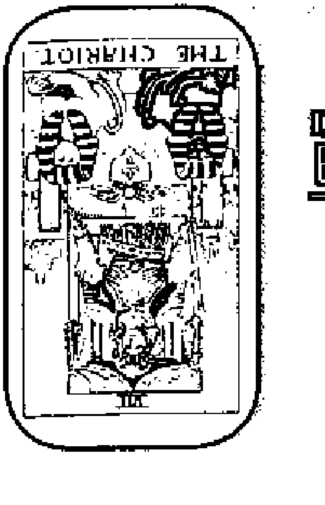

### 戰車逆位

# 評估創業

- A.創業的方向-S1P1, S5P1, S5P2, S5P4
目前創業的方向有很大的問題，如果不顧一切硬要去作的話必然導致失敗的結果，可能還會因此付出慘痛的代價。

- B.資金來源-S1P2
這個時候資金的狀況會有點吃緊，並不適宜作大動作來擴張，如果能保守一點地經營，也許還有守住城池的機會。

- C.合夥關係-S1P3
這件事情並不適宜合夥，否則內部很可能會發生嚴重的紛爭，甚至在開始對外競爭之前就會因為內鬨而先瓦解了。

- D.客戶設定-S1P4
目前客戶的設定判斷並不正確，還需要進一步的分析研究之後才適合作最後的定論，在此之前不宜作重大的決定。

- E.店面區位-S1P5
店面區位應該避免過度競爭的地區，否則可能會很快就敗下陣來；或是也可以選擇接近河流、湖泊或海洋的地方。

- F.事業前景-S1P6, S5P3, S5P5
這個事業的前景並不看好，即使花了許多時間金錢投入，到頭來可能會發現自己白忙一場，並沒有得到任何好處。

**評估求職**

- G.工作性質-S2P1
你應該選擇自己熟悉或學有專精的工作，才能充分利用現有的優勢，想要去嘗試新的工作類型是不切實際的想法。

- H.工作地點-S2P2
最好能在固定的地方上班，避免需要跑來跑去的外勤工作，由於並不適合出外發展，所以要盡量找離家近的工作。

- I.要求薪資-S2P3
即使要求自己認為合理的薪資也不會被接受，所以乾脆回答依公司的制度與規定，同時不要對薪資有太高的期待。

- J.求職管道-S2P4
由家人或師長介紹是比較容易找到工作的方法，如果是參加公開招考或是就業博覽會等活動，通常都不會有回音。

- K.求職運勢-S2P5,S7P1,S7P2,S7P3,S7P4
這段時間找工作的狀況並不順利，即使進入到最後一關也很難脫穎而出，應該檢討自己的狀況，改進之後再出發。

- L.可以改進的地方-S2P6
你應該先想清楚自己的方向，確立之後才有前進的動力，同時要避免過份情緒化的傾向，才不會在關鍵時刻壞事。

**評估工作**

- M.工作狀況概要-S5P1,S5P2,S5P4,S7P1,S7P2,S7P3,S7P4
工作當中可能遇到很多的困難和挑戰，而且常常伴隨著人際關係的問題出現，如果不小心處理的話就會變成危機。

- N.能否勝任-S3P1
這個工作其實超過你的能力範圍之外，如果硬要去作的話就必須付出極為慘重的代價，而且還不一定能達成任務。

- O.假期福利-S3P2
這個地方的福利很不好，即使努力爭取也不會有什麼改善，假期的計算與使用都很苛刻，所以不要有太高的期望。

- P.財務收入-S3P3
這個地方的收入與績效表現成正比，但是由於你的表現並不突出，所以收入也不會非常好，甚至會低於你的預期。

## 第三章 大牌的工作意義（一）

- U.現有資源-S4P1
現有的資源並不足應付目前的狀況，如果不在正確的地方再投入大量資源來補救，到最後一定難逃失敗的命運。

- V.人員配合-S4P2
內部的鬥爭可能更甚至對外的競爭，在人員之間的心結沒有解開之前，整個事情都會因此而受到十分嚴重的影響。

- W.環境因素-S4P3
大環境對你不利，甚至會有強大的競爭者在虎視眈眈，讓你每天都提心吊膽，也不要期待能有貴人出現來幫忙你。

- X.時程進展-S4P4,S7P1,S7P2,S7P3,S7P4
現在的進度有些落後，同時也缺乏繼續努力的動力，如果讓情況持續惡化下去，就一定無法在預定的時間內完成。

- Y.執行成果-S4P5
這件事情的成果並不如預期，甚至還可能在還沒完成之前就被提前強制結束，所有的努力都完全看不到任何成果。

- Z.未來影響-S4P6,S5P3,S5P5
這件事情會對未來有不良的影響，甚至可能成為重大紛爭的來源，所以在處理時要特別小心，能躲則躲能閃則閃。

- Q.與主管的相處-S3P4,S6P3,S6P4
上司的想法常常會搖擺不定，所以要試著去習慣這種政策大轉彎的狀況，事情即使因此而不順利也只能默默承受。

- R.與同事的相處-S3P5,S6P3,S6P4
同事之間的競爭性很強，所以凡事最好靠自己比較安全，盡量不要介入同事之間的紛爭，以免變成了自己的負擔。

- S.升遷加薪-S3P6
在這裡升遷完全無望，是一個沒有發展前景的地方，加薪雖然會視工作表現決定，不過也不要有不切實際的期待。

- T.如何看待對方-S6P1,S6P2
這是一個努力的人，但是由於方向或是方法的錯誤，常常將力氣浪費在錯誤的地方，導致到最後其實是白忙一場。

# 評估創業

- A.創業的方向-S1P1,S5P1,S5P2,S5P4
目前創業的方向十分正確，即使遇到什麼困難也不需要想太多，堅持自己的想法去努力，應該都會有不錯的成果。

- B.資金來源-S1P2
目前資金並不是最大的問題，但仍有一些狀況需要去克服，用錢的時候應該節省一點，以免有過多不必要的支出。

- C.合夥關係-S1P3
這個事業可以與人合夥，但是在合夥人之間彼此還是需要協調與適應，這個時候姿態放低一點會有助於達成共識。

- D.客戶設定-S1P4
目前客戶設定的大方向是對的，但是在細節上仍然需要微調；另一方面也可以將客戶設定在比較頂級的客人身上。

- E.店面區位-S1P5
店面區位可以選擇在比較熱鬧的娛樂性商圈，即使競爭激烈一點也沒關係，但是仍然要把租金控制在合理範圍內。

- F.事業前景-S1P6,S5P3,S5P5
這個事業未來的前景看好，但是仍然有很大的進步空間，所以不要對現在的成就自滿，繼續努力會有更大的成果。

# 評估工作

- M.工作狀況概要-S5P1,S5P2,S5P4,S7P1,S7P2,S7P3,S7P4
工作的整體狀況還算不錯，也有不少表現的機會，這個時候應該把握機會展現自己的實力，一定會受到大家的肯定。

- N.能否勝任-S3P1
你的能力絕對足以勝任這個工作，所以在遇到困難的時候一定要堅持下去，持續努力奮鬥才能享受到成功的果實。

- O.假期福利-S3P2
這個地方的福利算是不差，若是用對方法爭取還能享受到更多，假期的使用上也很有彈性，算是很人性化的地方。

- P.財務收入-S3P3
這個地方的收入還算是不錯，如果有績效獎勵制度的話還有機會爭取到更多，是一個努力與收入會成正比的地方。

## 第四章 大牌的工作意義（二）

# 評估求職

- G.工作性質-S2P1
工作的性質比較適合站在第一線與客戶接觸，業務方面的工作也很不錯；另一方面，也可以選擇有帶人的領導職。

- H.工作地點-S2P2
工作地點對你並沒有太大的限制，即使需要離鄉背井或常出差也沒關係，太在意工作地點可能會讓你失去好機會。

- I.要求薪資-S2P3
薪資可能高於業界一般的水準，但是提出的方式要有技巧才能談到好價錢，過去的資歷和表現會是你談判的後盾。

- J.求職管道-S2P4
參加公開的招考或就業博覽會都不錯，很容易在競爭者當中被注意到；另一方面，也可能有工作會主動找上門來。

- K.求職運勢-S2P5,S7P1,S7P2,S7P3,S7P4
這段時間應該會出現不錯的工作，或許條件並不是讓你非常滿意，但是最好能把握住這個機會，先進去之後再說。

- L.可以改進的地方-S2P6
有時候你會表現得過於自信和霸氣，會讓人覺得有侵略性或壓迫感，如果能夠更內斂一點應該會更容易找到工作。

- Q.與主管的相處-S3P4,S6P3,S6P4
要記得伴君如伴虎的道理，小心謹慎投其所好就可以相安無事，但若是用較尖銳或強硬的態度就可能會造成僵局。

- R.與同事的相處-S3P5,S6P3,S6P4
每個人都有不錯的實力，但也會有一定的傲氣甚至霸氣，所以在相處時記得要放低姿態，才能與大家都合作愉快。

- S.升遷加薪-S3P6
這個地方有不錯的升遷機會，但由於競爭者眾多，必須要比現在更努力才能出頭；加薪的狀況則視你的表現而定。

- T.如何看待對方-S6P1,S6P2
是一個充滿自信與行動力的人，但是主觀強勢的作風會讓人覺得很有壓力，也會為了面子問題發生不必要的爭吵。

# 評估事件

# U.現有資源-S4P1

現有資源其實足以應付目前的狀況，如何有效地分配資源才是最大的問題，在決策的過程中應該要小心謹慎一些。

# V.人員配合-S4P2

每個人都有很強的主觀，要整合大家的意見是一件辛苦的事情，但若是用對方法也可以把大家的潛能都激發出來。

# W.環境因素-S4P3

環境對你沒有太多助益，但也不會有什麼阻礙，事情的成敗完全取決於自己的判斷與作法，不要把責任推給環境。

# X.時程進展-S4P4,S7P1,S7P2,S7P3,S7P4

目前進度都在你的掌握之中，即使有任何的突發狀況也都可以順利解決，所以只要堅持下去就可以順利完成任務。

# Y.執行成果-S4P5

這件事情基本上可以達到預期的成果，但是若更努力一些也許會有超越預期的好表現，是值得進一步爭取的機會。

# Z.未來影響-S4P6,S5P3,S5P5

這件事情對未來會有重大的影響，特別是在升遷或轉職時會被視為重要的資歷，所以應該盡全力爭取最好的表現。

## 第四章 大牌的工作意義（二）

## 力量逆位

# 評估創業

### A.創業的方向-S1P1,S5P1,S5P2,S5P4

你目前的創業方向並不可行，千萬不要對自己過度自信，最好能冷靜地重新評估，衝動只會讓你付出慘痛的代價。

### B.資金來源-S1P2

目前資金並不是很足夠，而且短期之內也不會有新的資金投入，所以作法上最好保守一點，省吃儉用才能撐下去。

### C.合夥關係-S1P3

這件事情不適宜合夥，以免因為彼此之間無法配合而發生內訌的狀況，資金、決策與執行的狀況都是越單純越好。

### D.客戶設定-S1P4

目前客戶設定的方向並不可行，需要完全從頭來過重新評估，若是以现在的方向去前進，必然會得到失敗的結果。

### E.店面區位-S1P5

店面區位的選擇應該有長遠的考量與規劃，不要因為一時的衝動作決定；此外，最好避開同業競爭太激烈的商圈。

### F.事業前景-S1P6,S5P3,S5P5

這個事業的發展性並不是很好，也會面對到同業激烈的競爭，與其辛苦地堅持下去，還不如及早結束會比較輕鬆。

# 評估求職

# G.工作性質-S2P1

工作應該盡量選擇獨立作業的性質，避免需要大量團隊合作的事情；最好以自己熟悉的產業為主，不要太過冒險。

# H.工作地點-S2P2

工作地點應該以固定的上班場所為主，如果是需要在外面奔波的工作就不太適合；同時要盡量避免人太多的部門。

# I.要求薪資-S2P3

由於薪資並不是你可以影響的，所以不論自己是不是提出合理的數字，都不要有太大的期待，期待越高失望越大。

# J.求職管道-S2P4

最好避免親友或師長幫你介紹的工作，否則進去之後的紛爭一定很多，所以還是自己去找會比較容易找到好工作。

# K.求職運勢-S2P5,S7P1,S7P2,S7P3,S7P4

這個時候有可能可以找到工作，但千萬不要因為一時的衝動就急著下決定，還是應該多聽聽別人的建議再下判斷。

# L.可以改進的地方-S2P6

也許你在專業能力上還不是很足夠，所以還是應該要找機會多充實自己，虛心地學習才能讓自己的實力越來越強。

# 評估工作

# M.工作狀況概要-S5P1,S5P2,S5P4,S7P1,S7P2,S7P3,S7P4

在工作上會遇到比較專橫的上司，常常會有一些不合理的要求，即使在工作上有表現的機會，也都只是聽命行事。

# N.能否勝任-S3P1

你的能力並不足以勝任這個工作，如果硬著頭皮向前直衝必然是傷痕累累下場淒慘，到最後還不一定能達成任務。

# O.假期福利-S3P2

這個地方的福利制度非常不健全，簡直就是一個壓榨勞工的地方；休假也有許多的限制，即使有假也不一定能休。

# P.財務收入-S3P3

這個地方的收入比預期當中低，即使表現得很好也不會得到合理的回報，有可能因此而讓你喪失投入工作的動力。

## 第四章 大牌的工作意義（二）

# U.現有資源-S4P1

現在的資源嚴重不足，但是面對專斷的上司或客戶也不可能爭取到更多的資源，只能眼看著事情走上失敗的道路。

# V.人員配合-S4P2

人員彼此之間無法配合，可能會對這件事情造成嚴重的影響，這時應該要冷靜理性溝通，避免情緒性的對立僵持。

# W.環境因素-S4P3

目前的環境對你十分不利，在逆境中遇到的問題你也無力一次解決，所以只能固守自己原有優勢理性冷靜地面對。

# X.時程進展-S4P4,S7P1,S7P2,S7P3,S7P4

現在的進展已經有些落後，但是仍然要步步為營，在還沒準備好之前就貿然行動，犯錯了就得要花更多時間收尾。

# Y.執行成果-S4P5

這件事情無法達到預期的成果，甚至進行到一半就可能被宣告失敗提前結束，越是努力到後來的傷害就會越嚴重。

### Z.未來影響-S4P6,S5P3,S5P6

這件事情對於未來有深遠的影響，如果沒有仔細評估，衝動作決定必然會造成不利的結果，不要對自己過度自信。

# Q.與主管的相處-S3P4,S6P3,S6P4

面對專制獨裁的上司，再怎麼抗爭也不會得到自己想要的結果，還不如學習作一個乖乖牌，不要有太多自己的意見。

# R.與同事的相處-S3P5,S6P3,S6P4

與同事之間的關係常常顯得不和與緊張，但是一味退讓似乎不能讓狀況改善，如果需要合作就會引發更多的問題。

# S.升遷加薪-S3P6

在這裡升遷與加薪都很困難，在競爭當中你常會居於不利的劣勢，面對專制獨裁的老闆自己的意見也很難被採納。

### T.如何看待對方-S6P1,S6S2

這是一個自我意識很強的人，即使別人怎麼提醒或是勸告依然我行我素，常常會給人自我中心而難以合作的感覺。

# 評估創業

### A.創業的方向-S1P1,S5P1,S5P2,S5P4

目前創業的方向沒有太大的問題，只要能在正確的方向上堅持下去，以小心謹慎的態度自然就能達到不錯的成果。

### B.資金來源-S1P2

目前資金的狀況還算穩定，但是並不適宜與別人合資，所以還是應該省吃儉用一點，不要期待再有新的資金投入。

### C.合夥關係-S1P3

這件事情並不適宜合夥，決定事情的人越單純越好，太多人參與反而不容易凝聚共識，最好還是一個人主持大局。

### D.客戶設定-S1P4

客戶的設定應該經過深思熟慮，一時衝動的決定通常都會造成傷害；另一方面，也可以考慮將客戶鎖定在年長者。

### E.店面區位-S1P5

店面並不宜設置在太熱鬧的地方，反而要給人一種靜謐和遠離塵囂的感覺；或是可以選擇高樓層或比較高的建築。

### F.事業前景-S1P6,S5P3,S5P5

這個事業的發展很快就會到達極限，如果不能有更新的創意想法，很可能就會陷入停滯的狀態，發展性極其有限。

# 評估工作

# M.工作狀況概要-S5P1,S5P2,S5P4,S7P1,S7P2,S7P3,S7P4

你在工作上能達到一個高峰，但是也會感覺高處不勝寒，在人際關係上比較孤單一些，其他沒有什麼太大的問題。

# N.能否勝任-S3P1

你的能力足以勝任這件事情，而且會占有舉足輕重的地位，大家對你的表現都很期待，是一個會受到重視的地方。

# O.假期福利-S3P2

這個地方的福利並不是很好，許多東西都要經過爭取才會有，但是假期的部分則是十分自由，想請假就可以請假。

# P.財務收入-S3P3

在這裡的收入算是很高了，但是也沒有什麼成長的空間，重要的是把工作的內容好好完成，不要太在意收入的事。

# 評估求職

# G.工作性質-S2P1

可以考慮教學、顧問或是其他創意方面的工作，同時應該避開工作上需要大量團隊合作的工作，以免適應不良。

# H.工作地點-S2P2

最好選擇能獨立作業的工作，過於複雜的辦公室人際關係對你有不良的影響；在離家遠的地方比較容易找到工作。

# I.要求薪資-S2P3

對於薪資的要求可以高一點，如果是在合理的範圍內應該就會被接受，所以在事前最好能進行精密的計算和研究。

# J.求職管道-S2P4

很可能有工作機會主動找上門來，只要不是太排斥的狀況都可以去試試看，記得要把想找工作的訊息給撒播出去。

# K.求職運勢-S2P5,S7P1,S7P2,S7P3,S7P4

這段時間可能會有新工作機會出現，是否要接受仍然應該小心謹慎地評估，以免因為一時失察而作出錯誤的決定。

# L.可以改進的地方-S2P6

你對於人際關係太過被動，只想獨善其身的作法也會讓人感覺到有距離，在與人互動的時候不要拒人於千里之外。

# Q.與主管的相處-S3P4,S6P3,S6P4

是個細心負責的上司，作事的態度一絲不苟，所有東西都會仔細檢查以符合標準，同時也很願意教導下面的同事。

# R.與同事的相處-S3P5,S6P3,S6P4

在工作當中彼此的互動性不高，也沒有太多需要溝通或協調的事情，所以不用特意去經營關係，把本份顧好即可。

# S.升遷加薪-S3P6

在這裡的升遷已經到達極限，再升上去的機會微乎其微，加薪的幅度也不會很大，頂多是照年資一點一點加上去。

# T.如何看待對方-S6P1,S6P2

這是一個內斂而謹慎的人，並不太熱衷於人際關係的經營，雖然遇到事情還是會幫忙，但常給人比較冷漠的感覺。

# 評估事件

# U.現有資源-S4P1

現有資源剛好足以應付目前的狀況，但是過程中仍然要小心謹慎行事，避免因為自己一時疏忽而造成資源的浪費。

# V.人員配合-S4P2

人員當中必定要配置一個較資深的人員來帶領，以免在過程中迷失方向誤入歧途，同時也可以幫助大家團結合作。

# W.環境因素-S4P3

目前的環境因素對於這件事情並沒有重大的影響，最重要的還是要自己能夠掌控住狀況，把份內的事情好好完成。

# X.時程進展-S4P4,S7P1,S7P2,S7P3,S7P4

只要朝著目標持續努力前進，應該都可以在時限之內完成任務，但若三心二意猶豫不決，也許就會造成一些拖延。

# Y.執行成果-S4P5

這件事情不但可以達到預期的成果，而且大家都會因為這件事情而注意到你的表現，是值得好好努力爭取的事情。

# Z.未來影響-S4P6,S5P3,S5P5

這件事對於未來的實質影響有限，但是有可能會影響到大家對你的主觀印象，應該要小心謹慎處理以免名譽受損。

## 隱者逆位

# 評估創業

### A.創業的方向-S1P1,S5P1,S5P2,S5P4

目前創業的方向還不是很明確，很多事情也還在摸索當中，這個時候不宜貿然採取大動作，保守一點會比較安全。

### B.資金來源-S1P2

目前的資金狀況還不算健全，所以花費應該能省則省，這時候並不宜再投入大量的資金，先觀察一陣子再作決定。

### C.合夥關係-S1P3

這件事情並不適宜合夥，以免因為人與人之間的意見不合而使得力量被削弱，最好還是自己搞定不要想找人幫忙。

### D.客戶設定-S1P4

客戶的設定應該要盡量縮小打擊面，集中全力在自己最有把握的部分，現在並不是適合去冒險開拓新市場的時候。

### E.店面區位-S1P5

店面區位應該以自己最熟悉的商圈為主，最好也避開同業激烈競爭的集中區；或是可以挑選在宗教性建築的附近。

## F.產業前景-S1P6,S5P3,S5P5

這個事業的前景並不明朗，還有很多調整與改變的可能性，應該先想清楚自己追求的是什麼，再決定未來的方向。

# G.工作性質-S2P1

首先要想清楚自己的長期目標，再依照這個去尋找現階段合適的工作，即使是自己不熟悉的工作也可以邊做邊學。

# H.工作地點-S2P2

工作地點最好在自己所熟悉的地區，離家近的地方比較容易找到工作；並不適合需要常常跑來跑去或出差的工作。

# I.要求薪資-S2P3

要求的薪資不宜太高，否則會造成你求職上的困難，把工作機會當成是對方給你薪水的實習，心理就能比較平衡。

# J.求職管道-S2P4

可以參加職業訓練或相關的補習班，除了能習得一技之長之外，成績優異的話也有機會被推薦去實習或直接就業。

# K.求職運勢-S2P5,S7P1,S7P2,S7P3,S7P4

這段時間也許可以找到新的工作，但是與之前的狀況並不會相差太多，不過換個環境之後也許心情就會有所轉變。

# L.可以改進的地方-S2P6

你太過於小心謹慎，有些事情其實不一定要想那麼多，實際去做才知道是怎麼回事，應該盡力鼓起勇氣去嘗試。

# M.工作狀況概要-S5P1,S5P2,S5P4,S7P1,S7P2,S7P3,S7P4

是在一個人邊做邊學的狀況，所以有很多東西需要自己去嘗試與摸索，並沒有一個人可以在旁邊指導你該怎麼做。

# N.能否勝任-S3P1

你的能力可以勝任這個工作，但是要注意年齡對你產生的限制；在作事情的時候還是要特別小心，以免發生失誤。

# O.假期福利-S3P2

這個地方的福利並不是很好，很多東西也都要主動去爭取才會有；假期方面也有很多限制，並不是想放就可以放。

# P.財務收入-S3P3

這個地方的收入並不好，而且有時候還會不太穩定，所以自己平時還是要多存一點錢下來，發生問題時才能自救。

# 評估事件

# U.現有資源-S4P1

現有資源並不足以面對目前的狀況，但是又不太可能有新的資源再投入，只能努力把既有的資源發揮最大的效益。

# V.人員配合-S4P2

在這件事情當中人員很難互相配合，往往都是各自為政的狀況比較，即使強迫他們要合群或是溝通也很難做到。

# W.環境因素-S4P3

在環境當中沒有明顯的問題或傷害出現，但是也不會有任何貴人來幫助你，一切還是要靠自己去努力才能搞定。

# X.時程進展-S4P4,S7P1,S7P2,S7P3,S7P4

目前整體的進度有些落後，許多事情也還沒有找到好的解決方案，還是應該小心謹慎地處理，要記得欲速則不達。

# Y.執行成果-S4P5

這件事情並不會達到預期的成果，所以應該想辦法把傷害性降到最低，如果情況允許也許提早放棄是不錯的方法。

# Z.未來影響-S4P6,S5P3,S5P5

這件事情本身雖不能幫你成大功立大業，但是會讓你學習到很多的東西，所以在過程中若是吃了點苦也是值得的。

# Q.與主管的相處-S3P4,S6P3,S6P4

由於上司不願意負起責任，所以有時會找下面的人來當替死鬼，與他相處要特別小心謹慎，狀況不對要閃遠一點。

# R.與同事的相處-S3P5,S6P3,S6P4

與同事的關係淡淡的就好，不需要特別去交際應酬，但是在說話的時候要特別小心，以免在不知不覺當中得罪人。

# S.升遷加薪-S3P6

在這個地方還有一些升遷加薪的機會，但是還有許多的事情需要自己去加強學習，整個過程是十分孤獨而辛苦的。

## 命運之輪正位

# 評估創業

### A.創業的方向-S1P1,S5P1,S5P2,S5P4

目前創業的方向十分正確，也是你應該要去做的事情，即使過程當中可能有一些波動起伏，應該都可以順利克服。

### B.資金來源-S1P2

資金的來源目前並不成問題，在這方面也容易遇到貴人相助，所以只要不太奢侈浪費，應該都不用煩惱錢的事情。

### C.合夥關係-S1P3

這件事情可以與人合夥，只是應該在開始之初就把分工與職責講清楚，這樣子大家合作起來才能發揮更高的效率。

### D.客戶設定-S1P4

客戶的設定應該要盡量擴大打擊面，所有可能的潛在客人都不要放過，自我設限的話只會讓你錯失不少的好機會。

### E.店面區位-S1P5

店面區位的選擇應該要以自己的判斷為主，不要被其他人的意見所左右；也可以選擇新興或正在更新當中的商圈。

### F.事業前景-S1P6,S5P3,S5P5

這個事業的前景看來一片光明，各方面的因素都能夠配合得很好，所以繼續向前就對了！不要太在意別人的看法。

# 評估工作

# M.工作狀況概要-S5P1,S5P2,S5P4,S7P1,S7P2,S7P3,S7P4

你在工作上十分幸運，只要稍稍努力很容易就會看到不錯的成果，即使遇到什麼嚴重的問題最後也都能逢凶化吉。

# N.能否勝任-S3P1

雖然能力上不一定能完全勝任這個工作，不過由於有貴人相助加上好運的關係，即使能力不足仍然可以安全過關。

# O.假期福利-S3P2

在這個地方的福利比想像當中好很多，有許多意想不到的好事；在假期的使用上也很自由，想要放假就可以放假。

# P.財務收入-S3P3

雖然在收入上不見得特別高，但若與自己付出的努力來比較，已經算是非常好的一個地方，補助的福利也非常多。

# G.工作性質-S2P1

工作性質對你沒有太大的限制，但是也許會與你之前的經驗有一些差別，這時候適合勇敢去嘗試不同的工作類型。

# H.工作地點-S2P2

有可能會因為新工作的關係而需要搬遷，所以在距離遠的地方會比較容易找到工作；也可能是需要常出差的工作。

# I.要求薪資-S2P3

要求的薪資可以略高於市場一般的價位，只要是在合理的範圍之內大多都可以被接受，要勇敢地提出自己的看法。

# J.求職管道-S2P4

主動去尋找自己有興趣與意願的工作是最重要的，在一路上都會有貴人來幫助你，所以立定了志向就要努力向前。

# K.求職運勢-S2P5,S7P1,S7P2,S7P3,S7P4

這段時間可以找到不錯的工作，雖然也許在過程中會有一些峰迴路轉，但不論如何最後的結果應該還是很不錯的。

# L.可以改進的地方-S2P6

你應該要有自己的想法與目標，不要總是抱持著順其自然聽天由命的態度，自己要積極努力才能快一點找到工作。

# Q.與主管的相處-S3P4,S6P3,S6P4

上司常是無為而治的態度，很多事情的變化也不是他可以控制的，所以把本份顧好即可，不要對他有太大的期待。

# R.與同事的相處-S3P5,S6P3,S6P4

同事之間雖然並不特別親近，但是相處起來還滿輕鬆愉快的，也可以把握這樣的機會，與大家建立起良好的關係。

# S.升遷加薪-S3P6

在這裡有不錯的發展性，不論是升遷或是加薪的機會都很大，所以應該要好好努力，盡量去把握所有的表現機會。

# T.如何看待對方-S6P1,S6P2

這是一個運氣好的人，即使遇到什麼壞事也都能逢凶化吉，常常抱持著不強求的態度，與大家都保持不錯的關係。

# 評估事件

- U.現有資源-S4P1：現在資源絕對足以應付目前的狀況，即使有不足的地方也會有好的機運來解決問題，不用考慮太多就勇往直前吧！

- V.人員配合-S4P2：人員的配合上沒有什麼大問題，只要能把大家各自的責任範圍分配好，每個人自然就可以去完成自己該完成的事。

- W.環境因素-S4P3：目前的大環境對你十分有利，有許多助力或貴人紛紛出現，來幫助你解決大部分的問題，所以並不需要擔心太多。

- X.時程進展-S4P4,S7P1,S7P2,S7P3,S7P4：事情的進展十分順利，即使遇到困難也會順利解決，只要按部就班把自己的責任顧好，自然就可以在時限內完成。

- Y.執行成果-S4P5：這件事情的成果比預期的還要好，也能得到大部份人的肯定，對你來說是一件有收穫的好事，應該盡全力去把握。

- Z.未來影響-S4P6,S5P3,S5P5：這件事情對你有深遠的影響，也會帶來更進一步的改變，所以要盡全力把事情好好完成，才會對你有更大的幫助。

## 第四章 大牌的工作意義（二）

### 命運之輪逆位

評估創業

- A.創業的方向-S1P1,S5P1,S5P2,S5P4：你對於創業方向過度樂觀，以至於無法看到當中的問題，其實這並不是對你有利的選擇，應該及時回頭避免損失。
- B.資金來源-S1P2：目前資金出現了重大的問題，不要被一時的榮景沖昏了頭，如果這時候再盲目投入資金，也許會造成更大的損失。
- C.合夥關係-S1P3：這件事情並不適宜合夥，否則可能會因為大家分歧的看法而迷失了方向，所以做事與作決定的人都要越單純越好。
- D.客戶設定-S1P4：客戶的設定出現了方向上的錯誤，除非願意重新檢討完全改變目前的方向，否則依照現在的設定去作必定會失敗。
- E.店面區位-S1P5：店面區位應該避免選擇在激烈競爭的地方，同時要盡量節省店租與裝潢的支出，否則可能會形成過於沈重的負擔。
- F.事業前景-S1P6,S5P3,S5P5：這個事業的前景並不如想像當中樂觀，還有許多的意外狀況會陸續發生，所以最好能先作最壞的打算小心地面對。

# 评估求职

- G.工作性质-S2P1：工作的性质会与之前的经验与想法有明显的落差，如果不愿意改变自己以适应环境的话，也许就很难找得到工作。
- H.工作地点-S2P2：工作地点不是你能选择的，甚至可能会被派到你最不想去的地方，如果硬要坚持自己主观的想法就很难找到工作。
- I.要求薪资-S2P3：对于薪资不要有太大的期待，因为即使你要求自己认为合理的薪资也不会被接受，降低标准才比较有可能被录取。
- J.求职管道-S2P4：这个时候自己去找工作比较好，透过别人介绍的工作通常都不会有什么好下场，对自己找上门来的工作也要小心。
- K.求职运势-S2P5,S7P1,S7P2,S7P3,S7P4：这段时间的求职运势不怎么好，即使谈定了的工作也可能会突然发生意外的变化，保持平常心不要有太高的期待。
- L.可以改进的地方-S2P6：要从之前求职的经验中学到教训，不要重复犯同样的错误，同时要记得很多事情是强求不来的，要懂得顺势而为。

# 评估工作

- M.工作状况概要-S5P1,S5P2,S5P4,S7P1,S7P2,S7P3,S7P4：工作可能会遇到重大的变化，由于不是你能控制的事情，所以最多只能尽量保持冷静，处变不惊好好收拾残局。
- N.能否胜任-S3P1：你的能力并不足以胜任这个职务，如果遇到变化或挑战也许就会手忙脚乱甚至把事情搞砸，对你来说会太过勉强。
- O.假期福利-S3P2：这里的福利并不是很好，有些应该有的东西也要争取很久才会得到；休假的限制非常多，想放假时常常无法如愿。
- P.财务收入-S3P3：对于财务收入不要过度乐观，也许会比你预期的还要少一些，如果遇到突发的意外状况，甚至还可能发不出薪水。

## 第四章 大牌的工作意義（二）

# 評估事件

- U.現有資源-S4P1：現有資源並不足以應付目前的狀況，如果再發生意外的事件就完全無法處理，所以千萬不要有過度樂觀的預期。
- V.人員配合-S4P2：人員是否能配合會變成事情成敗的關鍵，無法盡責或是合作的人就應該當機立斷換掉，以免到最後拖累整件事情。
- W.環境因素-S4P3：目前大環境處於一個不利的位置，甚至會出現一些意外的狀況，小心防範之外，遇到問題出現時要記得冷靜面對。
- X.時程進展-S4P4,S7P1,S7P2,S7P3,S7P4：這件事情的進度已經完全失控，想要依原來的計畫追上是不可能的一件事，只有重新檢討全盤改變才有可能趕上。
- Y.執行成果-S4P5：這件事情的成果並不如預期，千萬不要有過度樂觀的評估，如果被一時的勝利沖昏了頭，到最後可能會樂極生悲。
- Z.未來影響-S4P6,S5P3,S5P5：這件事情對你可能會發生不利的影響，而且會造成接下來更大的改變，如果無法控制住狀況可能要有離職的準備。
- Q.與主管的相處-S3P4,S6P3,S6P4：面對變化莫測的上司，無論你怎麼努力都很難討他的歡心，遇到搖擺不定的政策，你也只好乖乖地一步一步跟上。
- R.與同事的相處-S3P5,S6P3,S6P4：與同事的相處對你非常重要，即使沒有合作關係也會互相影響，如果不小心得罪人的話，就會被人聯合起來攻擊。
- S.升遷加薪-S3P6：在這個地方升遷與加薪都很困難，不要對自己或公司有不切實際的期待，遇到意外狀況還有可能會無預警被開除。
- T.如何對待對方-S6P1,S6P2：這是一個心胸狹窄的人，討論時容不下別人不同的意見，作錯事情還會拖累別人，整體來說並不受到大家歡迎。

## ★塔羅工作講義

### 正義正位

評估創業

- A.創業的方向-S1P1,S5P1,S5P2,S5P4：目前創業的方向十分正確，應該要相信自己的判斷，勇敢地向前邁進，但是在過程中仍然要注意到手段的合法性。
- B.資金來源-S1P2：目前資金的狀況還算穩定，不過還是要仔細衡量資源配置的方式是否妥當，若是太過奢侈浪費仍然會有財務問題。
- C.合夥關係-S1P3：這件事情可以合夥，但是在事前應該將各個人的權利義務講明，最好以契約白紙黑字寫清楚，才不容易發生糾紛。
- D.客戶設定-S1P4：客戶的設定應該兼顧各方面的考量，只憑單方面的說法就決定是危險的；也可以鎖定公務人員或是法律從業人員。
- E.店面區位-S1P5：店面區位可以選擇在政府機構集中的地區，或各級法院的附近；同時應該多聽聽大家的意見，綜合起來再作決定。
- F.事業前景-S1P6,S5P3,S5P5：這個事業的前景會穩定成長，但是也不會突然就賺進大筆鈔票，要有耐性慢慢經營，之後才會漸漸看到一些成果。

評估工作

- M.工作狀況概要-S5P1,S5P2,S5P4,S7P1,S7P2,S7P3,S7P4：工作的狀況十分穩定，大部分的事情都有明確的規則可循，雖然可能會比較死板一點，但也算是輕鬆愉快的事情。
- N.能否勝任-S3P1：你的能力足以勝任這個工作，但是在決策上應該要考量到各方面的因素，深思熟慮之後再去行動才不會容易出錯。
- O.假期福利-S3P2：這個地方的福利中規中矩，基本上合理合法的都有，不過也不可能再爭取到更多；假期的使用上也有些缺乏彈性。
- P.財務收入-S3P3：在這個地方的收入平平，但整體來說算是很穩定，只要把自己的責任好好完成，也會得到上級肯定與合理的回報。

# 評估求職

- G.工作性質-S2P1：最適合與法律相關的職業，公關或宣傳方面的工作也不錯，若是在工作中需要與人協調或合作也能發揮你的長才。
- H.工作地點-S2P2：工作地點的選擇應該兼顧家庭生活的需要，所以若是上班地點離家太遠，或是工作時需要常出差的都最好能避免。
- I.要求薪資-S2P3：要求薪資大致與業界水準相當即可，但最終的決定權還是在老闆，如果能提出適當的說明被接受的機會就會大增。
- J.求職管道-S2P4：可以考慮各種政府設立的就業服務站和就業服務中心，或是透過人力資源公司介紹，自己盲目地找反而沒有效果。
- K.求職運勢-S2P5,S7P1,S7P2,S7P3,S7P4：這段時間也許可以找到不錯的工作，但是對你來說是一個重大的選擇，需要仔細衡量各方面的因素之後再作決定。
- L.可以改進的地方-S2P6：有時候你處理事情太有原則，在決定事情的時候不知變通，這可能會妨礙你找到好的工作，應該要更有彈性一點。
- Q.與主管的相處-S3P4,S6P3,S6P4：是一個很有原則的上司，用任何方式都不太能討好他，但你只要把份內的事情好好完成，就可以維持基本的關係。
- R.與同事的相處-S3P5,S6P3,S6P4：只要你能用平等互惠的方式待人，自然也會得到友善的回報，最怕就是誤會說不清楚，就會變成冤冤相報的狀況。
- S.升遷加薪-S3P6：在這個地方所有的升遷加薪都有公開透明的制度在規範，所以想更上層樓就要更加努力，自然會得到應得的回報。
- T.如何對待對方-S6P1,S6P2：這是一個比較理性而嚴肅的人，對於公平正義的要求很高，常會給人一種不近人情的感覺，處理事情也缺乏彈性。

# 評估事件

- U. 現有資源-S4P1：現有資源其實足以應付目前的情勢，不過如何把資源作有效的配置還是要花不少心思，千萬不要衝動決定任何事。
- V. 人員配合-S4P2：人員之間如果要配合良好，最重要的是把彼此的權利義務搞清楚，最好能用白紙黑字留下記錄，當作分工的依據。
- W. 環境因素-S4P3：環境上要注意適法性的問題，作事情如果不符合法律規章就有可能發生一些問題，應該事前把相關規定研究清楚。
- X. 時程進展-S4P4,S7P1,S7P2,S7P3,S7P4：目前事情的進度大部分在你的掌握當中，只要依照原定的計劃按部就班去執行，應該就可以在時限之內完成任務。
- Y. 執行成果-S4P5：這件事情應該可以達到預期的成果，自己的表現也可以得到公平合理的回報，把成果呈現出來是最重要的一件事。
- Z. 未來影響-S4P6,S5P3,S5P6：這件事情會對你的未來造成長遠的影響，甚至可能會被列入正式紀錄的一部分，所以每個細節都應該要小心處理。

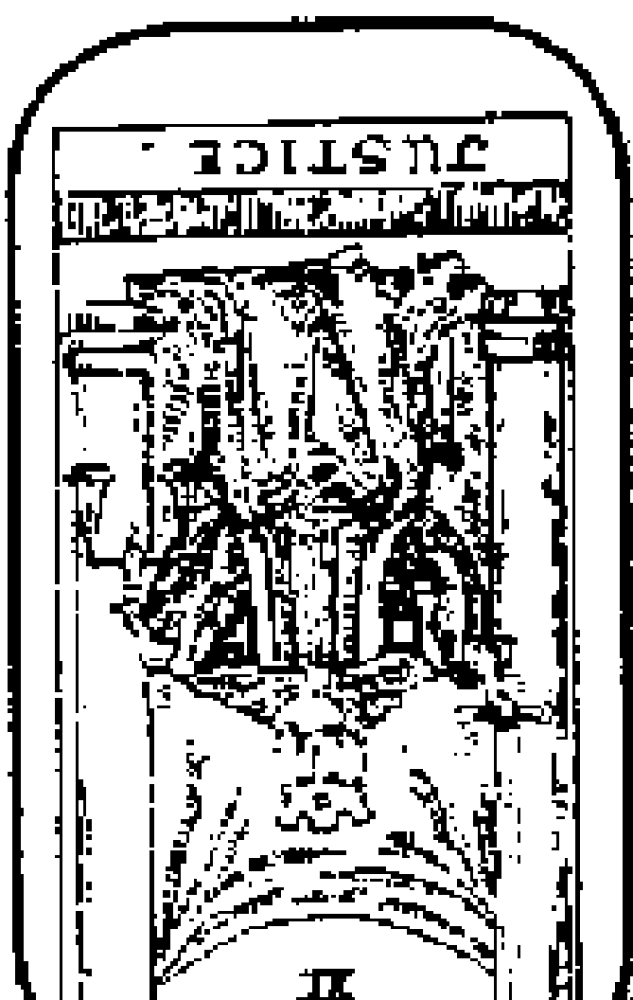

### 正義逆位

評估創業

- A.創業的方向-S1P1,S5P1,S5P2,S5P4：你目前的創業方向帶有很強的主觀偏見，實際上並不是一件可行的事，你應該多聽聽別人的意見再作最後的決定。
- B.資金來源-S1P2：目前資金的狀況非常勉強，而且也不會有新的資金再投入，所以如何維持收支平衡就是現在要努力想辦法的事了。
- C.合夥關係-S1P3：這件事情並不適宜合夥，否則可能因此而造成嚴重的糾紛，甚至鬧上法院變成法律問題，還是單純一點比較安全。
- D.客戶設定-S1P4：目前客戶的設定方向對你並不利，只是你一廂情願的主觀想法，如果硬要這樣去做的話，可能就會造成嚴重的傷害。
- E.店面區位-S1P5：店面區位首先應考慮到法令規章，如果在不合法的地方設立未來一定會有很多麻煩；同時最好盡量遠離政府機關。
- F.事業前景-S1P6,S5P3,S5P5：這個事業的前景並不是很樂觀，甚至錯誤的決策還會為你帶來一些麻煩，所以在這件事最好不要擔負太大的責任。

# 評估求職

- G.工作性質-S2P1：工作當中應該盡量避免需要與人合作的內容，以免發生重大的爭議；也可以考慮稽核、檢驗或是督察方面的工作。
- H.工作地點-S2P2：工作地點並不是你能完全決定的，但最好能選擇離家近或熟悉的地方，以免通勤或環境因素對你產生不利的影響。
- I.要求薪資-S2P3：要求薪資不論高低影響都不是很大，但也很難達到你認為合理的範圍，如果太堅持薪資水準就會比較難找到工作。
- J.求職管道-S2P4：這時候應該以自己去找比較可能有合適的工作，不論是透過親友或就業服務站介紹，都很難找到對你有利的工作。
- K.求職運勢-S2P5,S7P1,S7P2,S7P3,S7P4：這段時間也許可以找到新的工作，但是並不一定是適合轉換環境的時機，應該多看、多聽、多想再作最後的決定。
- L.可以改進的地方-S2P6：你對於一些事情太過猶豫不決，以致於會錯失好的機會，所以遇到狀況時應該要迅速果決，才能快點找到新工作。

# 評估工作

- M.工作狀況概要-S5P1,S5P2,S6P4,S7P1,S7P2,S7P3,S7P4：工作當中可能會遇到法律或規則方面的問題，這時候應該循正式的管道來解決，想要私了反而會出現不良的影響。
- N.能否勝任-S3P1：你的能力並不足以勝任這份工作，甚至連決策權也會被架空，你只能乖乖地聽命行事，出了問題還要去承擔責任。
- O.假期福利-S3P2：這個地方的福利非常苛刻，即使合法應有的部分也不一定能實現；不論是假期的計算或是使用都很僵化沒有彈性。
- P.財務收入-S3P3：這個地方的收入並不能令人滿意，嚴重的話之下還可能會有拖欠薪資的狀況出現，對你來說既不穩定又沒有保障。

## 第四章 大牌的工作意义（二）

# 评估事件

- U.现有资源-S4P1：现有的资源其实并不足以应付现在的状况，如果不能再投入更多必要的资源来补强，最后一定会走向失败的道路。
- V.人员配合-S4P2：人员彼此之间无法配合，甚至会发生严重内斗造成不利的影响，如果不能当机立断调整人事，问题会越来越恶化。
- W.环境因素-S4P3：目前大环境对于你们并不利，有可能是遇到法律规章的限制，或是有权力的人不愿意支持，问题只能靠自己解决。
- X.时程进展-S4P4,S7P1,S7P2,S7P3,S7P4：这件事情的进度已经严重失控，即使想要迎头赶上也非常困难，不如重新检讨计划的内容与方向，转向才有机会。
- Y.执行成果-S4P5：这件事情并不能达到预期的成果，甚至可能产生意料之外的伤害，所以一定要特别小心谨慎，以免让灾情再扩大。
- Z.未来影响-S4P6,S5P3,S5P5：这件事情对你有不良的影响，而且很可能会因此受到不公平的待遇或打压，即使努力申诉仍然很难把影响消除掉。
- Q.与主管的相处-S3P4,S6P3,S6P4：很多决定会没有任何理由就突然改变，常常会让你觉得无所适从，其实就只要照章办事就好，其他的不要想太多。
- R.与同事的相处-S3P5,S6P3,S6P4：同事间可能会分成不同的派系，因而产生一些误解与偏见，由于不可能讨好所有人，最后不得已也只好表明立场。
- S.升迁加薪-S3P6：在这里升迁与加薪都充满了不公平的现象，千万不要以为好的工作表现能有合理的回报，期待越高只会失望越大。
- T.如何看待对方-S6P1,S6P2：这是一个在工作上十分认真的人，但是在判断事情的时候有严重的主观偏见，常常会给人严厉苛责或一意孤行的感觉。

### 吊人正位

評估創業

- A.創業的方向-S1P1,S5P1,S5P2,S5P4：你對於創業的大方向看得十分清楚，但是目前仍然存在許多限制，如果急著要著手進行，必定要付出不小的代價。
- B.資金來源-S1P2：目前資金并不是很充足，所以在一些事情上必須要有取捨與調整，也許會有部分的計劃會因為資金不足而改變。
- C.合夥關係-S1P3：這個關係當中不太適宜合夥，否則很容易會因為彼此的意見不同而發生爭吵，還是自己一個人做決定會比較順利。
- D.客戶設定-S1P4：客戶的設定應該相信自己獨特的看法，不需要去在意流俗的意見，即使是大家都不看好的小眾市場仍然大有可為。
- E.店面區位-S1P5：店面區位應該選擇比較成熟的商圈，這樣雖然會面對比較激烈的挑戰，不過若以不同的方法經營也會闖出一片天。
- F.事業前景-S1P6,S5P3,S5P5：這個事業的發展前景還不是很清楚，仍然要先把眼前遇到的問題好好處理，現在是一個危機但也可能是一個轉機。

評估工作

- M.工作狀況概要-S5P1,S5P2,S5P4,S7P1,S7P2,S7P3,S7P4：工作上會面對到重大的困難與挑戰，對你來說是一種考驗與磨練，遇到問題的時候也許需要作出某種退讓與犧牲。
- N.能否勝任-S3P1：你的能力勉強可以勝任這個職位，但是同時也需要作出相對的犧牲，即使用盡全力對你來說仍然是很重大的挑戰。
- O.假期福利-S3P2：這個地方的福利並不是很好，也不容易爭取到更多的東西；即使表面上看起來假期很多，實際上也不容易請到假。
- P.財務收入-S3P3：這個地方的財務收入並不是很好，若是再扣掉隱藏的成本其實是非常差的，是否值得就要看你從那個角度來評估。

## 第四章 大牌的工作意义（二）

### G.工作性质-S2P1

最好寻找独立性质的工作，以免复杂的人际关系对你带来困扰；或是可以寻找与海洋、河流、湖泊等有关的工作。

### H.工作地点-S2P2

工作地点方面并没有太大的限制，但是最好不要对目前的生活型态有太大的影响，上班后需要搬家的就尽量避免。

### I.要求薪资-S2P3

薪资的要求不要太高，甚至要略低于业界平均的水准，若是要求比前一份工作的薪资更高，也许就很难找到工作。

### J.求职管道-S2P4

这个时候主动去找工作的效果非常差，还不如留在原地守株待兔比较容易成功，也可能有人会介绍好的工作给你。

### K.求职运势-S2P5,S7P1,S7P2,S7P3,S7P4

这段时间不太容易主动找到好的工作，但是仍然可能有人主动来找你，试着用一种不同的观点评估会有新的发现。

### L.可以改进的地方-S2P6

你在很多事情上太过被动，不懂得主动积极争取对你有利的东西，你应该更主动与人沟通，才能把理念传达出去。

### Q.与主管的相处-S3P4,S6P3,S6P4

你无法抓住这个上司的想法，因为两个人是用不同的角度在看事情，如果能设身处地去思考也许会比较容易沟通。

### R.与同事的相处-S3P5,S6P3,S6P4

由于与同事的看法观点不同，有时会觉得有点格格不入，其实只要把自己的责任完成就好，人际关系并不太重要。

### S.升迁加薪-S3P6

这个地方升迁或加薪的机会都不大，是适合你休息充电的地方，如果想要有很大的发展性，也许换个地方会更快。

### T.如何对待对方-S6P1,S6P2

这是一个想法与众不同的人，因此有时候会让人感觉难以沟通，不过由于做事情小心谨慎，所以也不常出什么错。

## ☆塔羅工作講義

# 評估事件

- **U.現有資源-S4P1**
現有資源並不足以面對接下來的狀況，如果不再投入新的資源就只能在原地苦撐而已，要完成任務會變得很困難。

- **V.人員配合-S4P2**
人員之間的配合並不是很好，也許會因為不同的立場或觀點發生嚴重的僵局，彼此之間也很難獲得共識或是退讓。

- **W.環境因素-S4P3**
環境上其實非常穩定，也不會出現什麼突然的意外或變動，但是也別期待能有什麼貴人相助，一切還是要靠自己。

- **X.時程進展-S4P4,S7P1,S7P2,S7P3,S7P4**
這件事情的進度嚴重落後，但也不是你個人可以控制的狀況，這個時候要有多一點的耐性，想想別的法子來解決。

- **Y.執行成果-S4P5**
這件事情的成果並不如預期，甚至可能進行到一半就陷入停頓，也很難看到具體成果，所以要有隨時放棄的準備。

- **Z.未來影響-S4P6,S5P3,S5P5**
這件事情對未來雖然不會有太大的影響，但是仍然具有指標性的意義，你應該以這件事情為基礎去看更深的意義。

### 吊人逆位

# 評估創業

- **A.創業的方向-S1P1,S5P1,S5P2,S6P4**
你對於創業的方向看的不是很清楚，仍然有一些盲點存在，這時候如果只是附和別人的意見就很難看得見真相。

- **B.資金來源-S1P2**
目前資金的狀況並不是很好，但是短期內也不可能有新的資金再投入，所以一切只能自立自強，不要想依靠別人。

- **C.合夥關係-S1P3**
這件事情不適宜合夥，由於每個人都只想要顧到自己的利益，所以即使合夥也是各懷鬼胎，無法發揮團結的戰力。

- **D.客戶設定-S1P4**
客戶的設定不需要花太多的心思，就參考同行一般的想法就好，如果標新立異想新的花招，也許還會得到反效果。

- **E.店面區位-S1P5**
店面區位的選擇應該多參考其他人的意見，不要只是一個人埋頭苦幹；也可以考慮選擇在古蹟或觀光景點的附近。

- **F.事業前景-S1P6,S5P3,S5P5**
這個事業的前景不是很平順，如果要堅持下去就必定要有所犧牲，接下來的狀況只能靠自己一個人努力撐下去。

# 評估求職

- **G.工作性質-S2P1**
工作的性質影響不是很大，不論是自己有經驗或有興趣的工作都可以嘗試，同時要多聽別人的建議不要固執己見。

- **H.工作地點-S2P2**
工作地點並沒有什麼限制，但是在離家遠的地方比較容易找到工作，同時最好不要選擇需要四處奔波的外勤工作。

- **I.要求薪資-S2P3**
要求薪資與一般業界水準相同就好，不要太特意尋求高薪，但若是提出的薪水太低，也不一定就能更快找到工作。

- **J.求職管道-S2P4**
這時候不太可能靠別人介紹你好的工作，所以一切還是需要靠自己，應該參考自己的興趣與經驗主動出擊去尋找。

- **K.求職運勢-S2P5,S7P1,S7P2,S7P3,S7P4**
這段時間不太容易有好的工作機會出現，所有出現的工作機會都會有嚴重的缺點，如果不急著上班可以再等一等。

- **L.可以改進的地方-S2P6**
你對於很多事情缺乏自己的看法，同時也太沒有原則，所以在關鍵的時候常會猶豫不決，可能因此錯失好的機會。

# 評估工作

- **M.工作狀況概要-S5P1,S5P2,S5P4,S7P1,S7P2,S7P3,S7P4**
工作上有許多事情處於停滯狀態，若是主動要去處理必定會付出重大的代價，也不可能有其他的貴人出來幫助你。

## 第四章 大牌的工作意义（二）

# 评估事件

- **U.现有资源-S4P1**
现有资源似乎还有点欠缺，但是也不可能有新的资源再投入，这个时候只能自立自强，把自己的潜能发挥到极限。

- **V.人员配合-S4P2**
人员彼此之间无法相互配合，除非换人否则很难解决问题，表面上有冠冕堂皇的理由，其实都是为了私利而斗争。

- **W.环境因素-S4P3**
目前环境上对你有一些限制，不过这些阻力会慢慢变小，你应该为下一步作好准备，必要时还是要作出一些牺牲。

- **X.时程进展-S4P4,S7P1,S7P2,S7P3,S7P4**
现在的进度已经开始落后，但是可能你还没有发现，这个时候应该要先把真相搞清楚，充分理解之后再采取行动。

- **Y.执行成果-S4P5**
这件事情很难达到预期的成果，所以要小心成为失败的代罪羔羊，在作每件事情与每个决定时都要作最坏的打算。

- **Z.未来影响-S4P6,S5P3,S5P5**
这件事情对你未来会有不利的影响，甚至要为此付出不小的代价，如果看不到这层危险就贸然行动是非常不智的。

- **Q.与主管的相处-S3P4,S6P3,S6P4**
上司并没有什么时间可以理会你，所以还是自立自强比较实在一些，即使遇到任何不合理的待遇也只能默默承受。

- **R.与同事的相处-S3P5,S6P3,S6P4**
基本上每个人都是由自己的私利出发，所以在不涉及利益的时候都还好，但若涉及实际利益时就会斗得你死我活。

- **S.升迁加薪-S3P6**
这个地方升迁的机会并不是很高，即使表现很好也没有什么机会；加薪也只是随着年资去调整，与大家都差不多。

- **T.如何看待对方-S6P1,S6P2**
这是一个没什么主见的人，遇到重要的事情也不敢自己作决定，虽然会给人随和的感觉，但是在公事上很难合作。

# 评估创业

- **A.创业的方向-S1P1,S5P1,S5P2,S5P4**
你目前创业的方向不可能成功，也许到了该彻底改变的时候了，如果想要维持目前的方向就必然走向失败的命运。

- **B.资金来源-S1P2**
现在资金状况有很大的问题，必须全盘重新检讨，如果不能及时找到新的资金投入，就可能因此影响到整个事业。

- **C.合伙关系-S1P3**
这个事业并不适宜合伙，即使现在已经有合作关系的人也可能以拆伙收场，还是自己一个人努力会比较安全一点。

- **D.客户设定-S1P4**
客户的设定方向完全错误，应该要放弃之前的决定重新开始；或是将客户锁定在军警人员、税务人员或征信业者。

- **E.店面区位-S1P5**
店面区位接下来可能会面临重大的转变，所以最好不要投入太多的资金进行装潢，以免在搬迁时造成无形的损失。

- **F.事业前景-S1P6,S5P3,S5P5**
这个事业的前景并不乐观，也许在很快的时间之内就会有所转变或结束，所以应该作好准备面对各种可能的变局。

# 评估工作

- **M.工作状况概要-S5P1,S5P2,S5P4,S7P1,S7P2,S7P3,S7P4**
工作中会遇到重大的转变，而且是你没有选择必须要接受的状况，如果无法适应的话，也许就要作好最坏的打算。

- **N.能否胜任-S3P1**
你的能力无法胜任这份工作，即使再努力都无法达成任务，如果接下这份工作就要作好随时可能离职的心理准备。

- **O.假期福利-S3P2**
这个地方的福利制度并不健全，但是也没有争取改进的空间；假期的使用也缺乏弹性，并不是想放假就可以请假。

- **P.财务收入-S3P3**
这个地方的收入并不是很好，而且收入也不是很稳定，甚至可能有时候会领不到薪水，是需要多小心注意的地方。

- **G.工作性質-S2P1**
最好找尋與之前學經歷不同的工作，從頭開始去體驗與學習，你會發現放下過去的束縛之後，前方的路會更寬廣。

- **H.工作地點-S2P2**
工作地點最好能遠離前一份工作的地區，同時也要避免在自己的住家或學校附近，在新的地方才會找到新的希望。

- **I.要求薪資-S2P3**
要求薪資不要高於業界一般的水準，把要求降低才有機會接觸更多不同種類的工作，對於薪資千萬不要期待太高。

- **J.求職管道-S2P4**
如果之前找工作的方式都不盡理想，最好是去試試之前沒有試過的求職管道，也許新的作法會有異想不到的效果。

- **K.求職運勢-S2P5,S7P1,S7P2,S7P3,S7P4**
這段時間有可能找到新的工作，但是必須要先放下舊的工作才有可能出現新的，想騎驢找馬是不太可能的一件事。

- **L.可以改進的地方-S2P6**
你對於很多事情的看法與觀點太過絕對，以致於常會缺乏必要的彈性，若是保持固執己見的態度就很難找到工作。

- **Q.與主管的相處-S3P4,S6P3,S6P4**
面對高深莫測的上司，無論如何都很難猜透他的想法，所以最好還是乖乖聽命行事，不要在私底下搞什麼小動作。

- **R.與同事的相處-S3P5,S6P3,S6P4**
同事之間常常出現反對的意見，太在意他們的想法反而會造成自己的困擾，還不如一個人把自己的事情作好就好。

- **S.升遷加薪-S3P6**
在這個地方升遷與加薪都沒什麼指望，甚至還可能會被迫離職，生殺大權都在老闆的手上，完全沒有抗辯的餘地。

- **T.如何看待對方-S6P1,S6P2**
是一個意志力很堅強的人，作事情非常地努力與負責，但是由於不太表露自己的情緒，也會給人比較疏離的感覺。

# 評估事件

- **U.現有資源-S4P1**
現有資源完全不足以達成任務，如果硬要去執行的話必定會陷入失敗的命運，與其如此還不如盡早放棄另謀出路。

- **V.人員配合-S4P2**
人員的組成可能會有重大的變化，如果發生有人離職或調動的狀況，應該要盡快補充新的人力，以免影響到進度。

- **W.環境因素-S4P3**
目前環境正發生對你不利的變化，而且也是你無力去阻止或防範的，這個時候只能靠自己努力，不會有貴人相助。

- **X.時程進展-S4P4,S7P1,S7P2,S7P3,S7P4**
這件事情的進度嚴重落後，不論用什麼方式都很難追上，與其花很多時間精力趕進度，不如重新來過會比較快些。

- **Y.執行成果-S4P5**
這件事情無法達到預期的成果，如果不能修正或降低目標，就只能等著接受失敗的結果，再努力也無法補救什麼。

- **Z.未來影響-S4P6,S5P3,S5P6**
這件事情對你來說是一個重大的打擊，但也可能是一個新的開始，你應該勇於放下過去的包袱，迎向未來的挑戰。

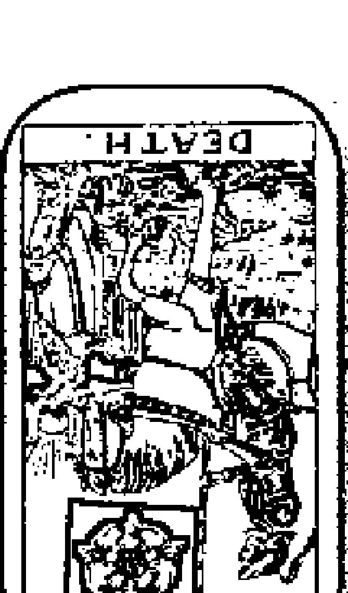

### 死神逆位

# 評估創業

- **A.創業的方向-S1P1,S5P1,S5P2,S5P4**
你目前創業的方向並不可行，需要重新檢討找出問題之所在，如果能夠及時改革精進，也許還有一點成功的可能。

- **B.資金來源-S1P2**
現在資金的狀況出了一些問題，最好能放掉比較沒有把握的計劃重新整頓，也許到時候就會有新的資金可以投入。

- **C.合夥關係-S1P3**
這件事情不適宜合夥，人多嘴雜的狀況必然不利於果斷地決策，遇到問題時無法臨機應變，就很可能會陷入僵局。

- **D.客戶設定-S1P4**
客戶設定的方向很有問題，如果能作大幅度的調整也許還會有一線生機，否則的話完全重新開始也是不錯的作法。

- **E.店面區位-S1P5**
店面區位的選擇並不適當，最好能換一個地方再重新開始；或者可以選擇在醫院、稅務機關、殯儀館附近的地方。

- **F.事業前景-S1P6,S5P3,S5P5**
這個事業的前景不是很樂觀，還有許多問題需要克服，這個時候應該放慢腳步分析思考，急著行動是沒有益處的。

# 評估求職

- **G.工作性質-S2P1**
工作最好選擇獨立作業的性質，如果自己原來就有專業應該繼續深入下去，太複雜的人際關係會成為你的絆腳石。

- **H.工作地點-S2P2**
工作地點最好能選擇自己熟悉的地區，以免重新適應通勤方式與環境對你產生困擾，較適合固定上班地點的工作。

- **I.要求薪資-S2P3**
要求薪資無法太高，即使提出自己認為合理的數字也不容易被接受，所以最好不要期待太高以免事後失望也越大。

- **J.求職管道-S2P4**
你應該放下之前固執的想法，去試試其他新的求職管道，但最好不要由之前的同事或上司介紹，以免有人情壓力。

- **K.求職運勢-S2P5,S7P1,S7P2,S7P3,S7P4**
這個時候不容易出現好的工作機會，應該好好休養生息，等自己的狀況恢復之後重新出發，會找到比較好的工作。

- **L.可以改進的地方-S2P6**
你對於過去的狀況耿耿於懷，以致於無法作出客觀理性的判斷，你應該用新的角度來看事情才會找到方向。

# 評估工作

- **M.工作狀況概要-S5P1,S5P2,S5P4,S7P1,S7P2,S7P3,S7P4**
工作上面對到極大的變化，甚至有可能會被迫離職，如果狀況真的非常糟糕，那麼離開對你來說反而是一種解脫。

- **N.能否勝任-S3P1**
你的能力並不足以勝任這個工作，但仍然有險中求勝、死裡逃生的可能性，是不是要這麼拼命就要看你的決定了。

- **O.假期福利-S3P2**
這個地方的福利並不是很好，但也許會有慢慢改善的傾向；假期的使用上雖然有很多限制，努力爭取還是有機會。

- **P.財務收入-S3P3**
這個地方的收入並不好，即使有獎金或紅利的制度也不要抱持著太大的期待，應該作好實拿最低底薪的心理準備。

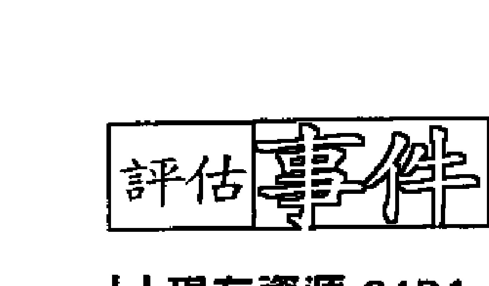

- **U.現有資源-S4P1**
現有的資源並不足以應付現在的狀況，但是也許接下來會有新的資源陸續投入，只要能撐到那個時候就會有救了。

- **V.人員配合-S4P2**
人員的配合上遇到一些困難，可能會導致整個事情的進度陷入停滯，也許需要在人事上進行新的佈局才會有轉機。

- **W.環境因素-S4P3**
大環境正在好轉當中，但是同時也充滿挑戰，這個時候應該要小心謹慎面對，要保守務實一點才有機會撐過變局。

- **X.時程進展-S4P4,S7P1,S7P2,S7P3,S7P4**
現在面對一個重要的分水嶺，如果能夠及時改變作法積極努力去做，也許還有機會趕上進度，但是過程十分辛苦。

- **Y.執行成果-S4P5**
這件事情的執行成果雖然不佳，但是仍然勉強可以接受，如何堅持到最後把收尾的狀況處理好，會是事情的關鍵。

- **Z.未來影響-S4P6,S5P3,S5P5**
這件事情可能會對你有不良的影響，不過整體來看還不算太嚴重，如何記取教訓放下情緒對你來說也是一項挑戰。

- **Q.與主管的相處-S3P4,S6P3,S6P4**
面對到態度消極的上司，大部分的事情只能靠你自己搞定，即使去請求他的幫助，最後他還是會叫你自己想辦法。

- **R.與同僚的相處-S3P5,S6P3,S6P4**
即使大家是同在一條船上也很難互相合作，所以最重要的還是把自己的責任顧好，免得被其他人的狀況給拖累了。

- **S.升遷加薪-S3P6**
這個地方也許還有升遷或加薪的機會，但是與自己的努力並不形成比例，如果要更大的發展空間還是換工作比較快。

- **T.如何看待對方-S6P1,S6P2**
這是一個比較散漫的人，在工作上會有一點遲鈍，給人一種不是很專心的感覺，對於人際關係的經營也不太積極。

### 節制正位

# 評估創業

- **A.創業的方向-S1P1,S5P1,S5P2,S5P4**
目前創業的大方向還算可行，但是仍然應該要考量各方面的意見與反應，仔細思考評估之後逐步調整到最佳狀態。

- **B.資金來源-S1P2**
資金的狀況雖然不問題，不過還是要省吃儉用一點，把資源作最有效的配置，預留一些空間應付可能的突發狀況。

- **C.合夥關係-S1P3**
這件事情應該找尋不同專長職務的人進行合夥，這樣才能達到互補的效果，合夥人彼此之間的關係也會比較和諧。

- **D.客戶設定-S1P4**
客戶的設定應該守住基本盤就好，不要好高騖遠想要把生意作大；或是以平價的策略來迎合一般消費大眾的需要。

- **E.店面區位-S1P5**
店面區位的選擇首要考量租金與裝潢的成本，即使不是那麼熱鬧的地方也沒有關係；或是選擇在外國人多的區域。

- **F.事業前景-S1P6,S5P3,S5P5**
這個事業的前景算是樂觀，只要小心謹慎經營都會有不錯的成果，同時在過程當中不要忘記了創業的初衷與理想。

# 評估工作

- **M.工作狀況概要-S5P1,S5P2,S5P4,S7P1,S7P2,S7P3,S7P4**
這個工作有很多地方需要與別人協調合作，同時要用最有效率的方式來處理事情，越是節省越是能產生更多效益。

- **N.能否勝任-S3P1**
你的能力足以勝任這份工作，但是在手段上面應該盡量和緩，同時多多參考別人的意見，才不會偏離現實的狀況。

- **O.假期福利-S3P2**
這個地方的福利不是特別好，不過基本上該有的一項都沒有缺；請假的規定比較自由，只要同事之間協調好即可。

- **P.財務收入-S3P3**
這個地方的收入並不是很好，但是仍然在可以接受的範圍之內，重點是自己花費要更省一點，才能存下更多的錢。

## 第四章 大牌的工作意义（二）

- **G.工作性質-S2P1**
比較適合與人相互合作的工作性質，這樣彼此都可以發揮更大的力量；也可以考慮化學、製藥、芳療有關的工作。

- **H.工作地點-S2P2**
工作地點對你的限制不大，但是在遠處比較容易找到工作，如果自己也不排斥的話，也可以藉這個機會去闖一闖。

- **I.要求薪資-S2P3**
雖然薪資的決定權不完全在你的手上，不過仍然有機會再討價還價的，提出比預期高一點點的數字就能開始談判。

- **J.求職管道-S2P4**
可以透過之前的同事、上司或是朋友們幫你介紹新的工作，記得把自己的條件講清楚，避免造成親朋好友們誤會。

- **K.求職運勢-S2P5,S7P1,S7P2,S7P3,S7P4**
這段時間很可能找到新的工作，但是找到工作到開始上班之間仍然會有一段空窗期，這個時候可以好好放鬆一下。

- **L.可以改進的地方-S2P6**
你作事情的方法太過於溫和，就不容易給人留下深刻的印象，有時候可以再積極一點，這樣才能快一點找到新工作。

- **Q.與主管的相處-S3P4,S6P3,S6P4**
可以把自己的意見提出來與他討論，這樣就能從當中激發出更多的靈感，不過仍然要注意到上下關係的基本禮節。

- **R.與同事的相處-S3P5,S6P3,S6P4**
工作當中有需要相互合作的地方，所以不要太固執於自己的立場與意見，盡量讓大家的意見整合在一起得到共識。

- **S.升遷加薪-S3P6**
這個地方升遷的機會還不差，不過仍然需要長期的努力才能實現；加薪的部分可以談談，但也不可能每次都成功。

- **T.如何看待對方-S6P1,S6P2**
這是一個作風溫和但偏向保守的人，基本上在工作時都能與人合作愉快，同時也很擅長統合大家的意見形成共識。

# 评估事件

- **U.现有资源-S4P1**
现有的资源勉强可以应付目前的状况，所以更要省吃俭用一点共体时艰，如何把资源作最有效的配置是当务之急。

- **V.人员配合-S4P2**
人员之间的配合十分紧密，也可以发挥出团结的力量，所以大家应该要常常坐下来集思广益，会有很多新的灵感。

- **W.环境因素-S4P3**
与环境的互动会影响到这件事情的发展，所以应该随时注意环境里的各种变化，逐步调整才有机会化阻力为助力。

- **X.时程进展-S4P4,S7P1,S7P2,S7P3,S7P4**
现在进度都在你的掌握之中，不过仍然有再进步的空间，如果人员之间都可以合作愉快，就有机会提早完成任务。

- **Y.执行成果-S4P5**
这件事情只要处理上不出大错，应该都可以达到预期的成果，在手段上则是要保持平和，不要使用太激烈的方法。

- **Z.未来影响-S4P6,S5P3,S5P5**
这件事情对你的未来有深远的影响，而且也是你能否达到理想的重要指标，在检讨反省之后还会带给你新的灵感。

## 节制逆位

# 评估创业

- **A.创业的方向-S1P1,S5P1,S5P2,S5P4**
目前创业的方向有很大的问题，不要因为一时的情绪就冲动决定，在还没想清楚之前贸然行动很可能会导致失败。

- **B.资金来源-S1P2**
目前资金面对到一些问题，但这时候并不适合去寻找新的金主或是合伙人，还是应该省吃俭用一点自己支撑下去。

- **C.合伙关系-S1P3**
这个事业非常不适宜合伙，只要有合伙就必然会带来许多的纷争与问题，即使已经在合作了也要作好拆伙的准备。

- **D.客户设定-S1P4**
客户的设定可以锁定在宗教人士的身上，或是以信仰的角度来切入；另一方面也可以考虑新生、新移民或是旅客。

- **E.店面区位-S1P5**
店面的区位应该选择在竞争激烈的地区，这样才能发挥出你的潜力；另一方面也可以选择在教堂或是寺庙的附近。

- **F.事业前景-S1P6,S5P3,S5P5**
这个事业的前景堪虑，还有许多的问题与挑战要去面对，如果因为太过乐观而掉以轻心，到最后也许会血本无归。

# 评估求职

- **G.工作性质-S2P1**
应该避免需要大量团队合作的工作，以免因为无法合作而造成问题困扰；也可以考虑与之前学经历不同的新工作。

- **H.工作地点-S2P2**
工作地点最好以自己熟悉的地区为主，同时比较适合在固定的地方上班，避免需要大量出差或在外面奔波的工作。

- **I.要求薪资-S2P3**
薪资的要求不宜太高，以免因此而错失了可能的好机会，但是仍然要坚持自己的底线，才不会让人觉得没有价值。

- **J.求职管道-S2P4**
这个时候可以考虑参加职业训练，之后再由他们来帮你媒合，或是请师长代为介绍工作，都可以找到不错的机会。

- **K.求职运势-S2P5,S7P1,S7P2,S7P3,S7P4**
如果找工作的状况不是很顺利，也许可以尝试与之前不同的工作性质或行业，否则先休息一阵子也是不错的方法。

- **L.可以改进的地方-S2P6**
你在处理事情的时候常常过于情绪化，又缺乏与人好好合作的经验与方法，所以在人情世故方面还可以再多加强。

# 评估工作

- **M.工作状况概要-S5P1,S5P2,S5P4,S7P1,S7P2,S7P3,S7P4**
工作当中会涉及到不同方面的利益冲突，一个不小心就会陷入纷争当中，在风暴中要全身而退是很困难的一件事。

- **N.能否胜任-S3P1**
你的能力并不足以胜任这个工作，而且还要小心被别人的事情给拖累，所以最好能把责任划分清楚才有机会自保。

- **O.假期福利-S3P2**
这个地方的福利并不是很好，即使努力争取也没有什么进展，在假期的使用上也是规矩很多，并不能自由地请假。

- **P.财务收入-S3P3**
在这里的收入并不好，甚至还会被苛扣奖金或加班费，虽然还不到会拖欠薪资的程度，但仍然很难令人感到满意。

## 第四章 大牌的工作意义（二）

# 评估事件

- **U.现有资源-S4P1**
现有资源不太能应付接下来的状况，如果人手不足的话应该要立即补充，如果不能再投入更多资源就必定会失败。

- **V.人员配合-S4P2**
人员之间充满了激烈的内斗，已经严重影响到事情的进行，如果不能及时调整职务或是换人，后果将会不堪设想。

- **W.环境因素-S4P3**
目前环境对你无法提供什么帮助，所以还是要靠自己把问题搞定，如果去寻找外援帮助，反而会引发更多的问题。

- **X.时程进展-S4P4,S7P1,S7P2,S7P3,S7P4**
目前的进度有一些落后，但是仍然有机会可以追赶得上，这个时候应该快点找到延迟的原因，再对症下药解决问题。

- **Y.执行成果-S4P5**
这件事情的执行成果并不如预期，甚至可能出现意料之外的结局，所以对这件事情最好不要有太强烈的主观期待。

- **Z.未来影响-S4P6,S5P3,S5P5**
这件事情对你的外在影响并不是很大，但是在心态上的冲击却是很大的，这个时候应该要放下情绪好好自我反省。

- **Q.与主管的相处-S3P4,S6P3,S6P4**
面对比较保守的上司，有时候可以适度的提出建言，不过也不要有太亲近的关系，以免被卷入派系斗争的风暴中。

- **R.与同事的相处-S3P5,S6P3,S6P4**
同事间的人际关系十分复杂，彼此之间也是充满了明争暗斗，所以维持住表面的关系就好，很难开诚布公地合作。

- **S.升迁加薪-S3P6**
这个地方升迁还有一点可能，但是要经过激烈的斗争才能达到；至于加薪的机会就更低了，不要抱持太大的期望。

- **T.如何看待对方-S6P1,S6P2**
这是一个不太有主见的人，对于很多事情也很容易有情绪化的反应，与人合作常出各种问题，甚至是破裂收场。

# 评估创业

- **A.创业的方向-S1P1,S5P1,S5P2,S5P4**
目前的创业方向十分危险，即使短期似乎可以有不错的获利，不过后续的反作用力是很强的，最好放弃这个计划。

- **B.资金来源-S1P2**
目前资金上有很大的缺口，千万不要为了眼前的问题再投入更多资金或去借贷，要先把问题找出来再决定下一步。

- **C.合伙关系-S1P3**
这个事业并不适宜合伙，即使一开始为了利益结合，到头来还是会因为各怀鬼胎而拆伙，反而会引发更多的问题。

- **D.客户设定-S1P4**
目前的客户设定太过贪心，其实并不可行的计划，最好能全面重新检讨，才能设定出比较切合实际的客户目标。

- **E.店面区位-S1P5**
目前选择的店面区位并不适合，最好能快点换一个地方会比较安全；也可以选择在声色场所附近或夜生活的地方。

- **F.事业前景-S1P6,S5P3,S5P5**
这个事业的前景并不乐观，即使在短期内可能获得暴利，但是之后必然要付出更惨重的代价，还是要小心一点。

# 评估工作

- **M.工作状况概要-S5P1,S5P2,S5P4,S7P1,S7P2,S7P3,S7P4**
工作被严重的问题破坏，而且已经超出你能控制的范围，如果不能想办法把伤害降低，甚至可能会因此丢了工作。

- **N.能否胜任-S3P1**
你的能力并不足以胜任这份工作，如果硬要去试的话也只是飞蛾扑火、自寻死路，不论身心都会受到严重的创伤。

## 第五章 大牌的工作意义（三）

- **G.工作性质-S2P1**
可以考虑高风险又高报酬的工作，但是这种工作通常也只能有短期的积利，所以在赚到钱之后记得尽快见好就收。

- **H.工作地点-S2P2**
在偏远或人烟稀少的地方会比较容易找到工作，也可以考虑大夜班或是需要轮班的工作，但是要注意自己的安全。

- **I.要求薪资-S2P3**
要求的薪资并不可能被接受，所以只要开出自己觉得合理的数字，不要对薪资有太高的期待，也没有让价的空间。

- **J.求职管道-S2P4**
以正规的管道恐怕不容易找到工作，还是要透过私人关系走后门才比较可能，但是进去之后要小心被同事们排挤。

- **K.求职运势-S2P5,S7P1,S7P2,S7P3,S7P4**
这个时候求职的运势非常差，也不会找到什么好的工作，与其一直想要换来换去，不如先休息一阵子会比较实在。

- **L.可以改进的地方-S2P6**
你太重视物质层面的收获，如果能放下不择手段追求高所得的心态，试着找寻心灵方面的意义，你会过得更快乐。

- **Q.与主管的相处-S3P4,S6P3,S6P4**
面对自私自利的上司，对于下属极尽所能的压榨，千万不要屈服于压力作出违法的事情，否则会有很严重的后果。

- **R.与同事的相处-S3P5,S6P3,S6P4**
同事之间彼此勾心斗角，随时都要处于十分警觉的状态，千万不要随便相信别人，也不会与同事成为真诚的朋友。

- **S.升迁加薪-S3P6**
这个地方升迁的机会完全没有，加薪的承诺通常也不会实现，如果想要有比较好的发展，还是快点离开这个地方。

- **T.如何看待对方-S6P1,S6P2**
这是一个为达目的不择手段的人，常会带给人很大的压力与强烈的威胁感，如果可以的话大家都会想离他远一点。

# 评估事件

- **U.现有资源-S4P1**
现有的资源其实不足以应付目前的状况，如果再发生任何意外事件就会立刻变得无法收拾，想救也不知从何救起。

- **V.人员配合-S4P2**
人员的配合程度没有问题，但是在能力上严重不足，如果真的无法把事情搞定，也许就需要赶快换人才可能改善。

- **W.环境因素-S4P3**
目前大环境的因素对这件事十分不利，而且限制了许多的选择与弹性，这时候只能尽量保守一点看看能不能自保。

- **X.时程进展-S4P4,S7P1,S7P2,S7P3,S7P4**
事情的进度目前严重的落后，已经完全脱离你的掌握，如果还是一直维持原来的方式，就必然会走向失败的道路。

- **Y.执行成果-S4P5**
这件事情无法达到预期的成果，而且当中还会发生许多意外事件搞破坏，所以只能在过程中尽力把损害减到最小。

- **Z.未来影响-S4P6,S5P3,S5P5**
这件事情对于未来有不良的影响，同时也严重影响到别人对你的观感，所以最好尽早放手不要抱持幻想或是期待。

# 评估创业

- **A.创业的方向-S1P1,S5P1,S5P2,S5P4**
目前创业的方向并不可行，不要被自己的欲望所蒙蔽了，如果不能快点结束离开，到时候越陷越深就更难脱身了。

- **B.资金来源-S1P2**
目前资金的状况并不好，但也不可能再有其他的资金投入，病急乱投医只会造成更多问题，该结束就要甘心放手。

- **C.合伙关系-S1P3**
这个事业并不适宜合伙，否则就会出现贪图利益又不愿意作事情的合伙人把这个事业拖垮，还是单纯一点比较好。

- **D.客户设定-S1P4**
客户可以锁定贪小便宜的人，以低价或折扣来聚集人气，但是这种策略只能一时奏效，长期使用反而会带来伤害。

- **E.店面区位-S1P5**
目前选择的店面应该只是临时的，过一阵子之后还会再搬迁，所以不要在店租与装潢上花太多钱，以免血本无归。

- **F.事业前景-S1P6,S5P3,S5P5**
这个事业的前景不佳，还会有很多的艰难险阻在前面等着你，如果不小心跳入陷阱当中，就会付出很惨痛的代价。

# 评估求职

- **G.工作性质-S2P1**
工作性质首先应该考量到收入，不要为了自己的兴趣或是理想去选择过分低薪的工作，多赚一点钱才是当务之急。

- **H.工作地点-S2P2**
最好选择尽量单纯的工作环境，不要接触到外面的客户，同办公室的人也不要太多，以免因为人事的纷争而受害。

- **I.要求薪资-S2P3**
在薪资的部分可以尽量去争取，但是并不一定能达到你理想的数字，不过若开价太高也许就会错失一些好的工作。

- **J.求职管道-S2P4**
这个时候最好避免由亲朋好友介绍工作，否则容易会卷入复杂的派系斗争当中，自己去应征工作反而会比较容易。

- **K.求职运势-S2P5,S7P1,S7P2,S7P3,S7P4**
这段时间求职的运势非常不很好，千万不要被钱逼急了就随便找一个工作，这样子会很容易落入害人的求职陷阱。

- **L.可以改进的地方-S2P6**
你应该更重视工作实质的内容与意义，不要一味追求外在的虚名，如果能苦干实干累积实力，将来才会有一片天。

# 评估工作

- **M.工作状况概要-S5P1,S5P2,S5P4,S7P1,S7P2,S7P3,S7P4**
工作当中存在许多的诱惑，一个不小心就可能落入陷阱不得翻身，应该把持住法律与道德的底线，才能全身而退。

- **N.能否胜任-S3P1**
你的能力其实并不足以胜任这个工作，千万不要因为一时的冲动就接下不可能的任务，那会造成很大的伤害。

- **O.假期福利-S3P2**
这个地方的福利非常诱人，但是讲得再好听无法实现都是白搭；假期的部分还可以争取，不过仍然有许多限制。

- **P.财务收入-S3P3**
这个地方的收入并不是很好，所以对于分红或奖金不要有太大的期待，至于加班费或津贴之类的则可以争取看看。

- **U.现有资源-S4P1**
现有的资源并不足以应付接下来的状况，原本隐藏的问题也会渐渐浮现出来，这个时候应该要先作好最坏的打算。

- **V.人员配合-S4P2**
人员彼此之间存在很大的矛盾，以致于无法真心地团结合作，如果不能及时换人解开心结，就会走向失败的道路。

- **W.环境因素-S4P3**
目前环境对你没有什么帮助，甚至可能出现一些小人来搞破坏，这时候应该固守自己的职责不要受到环境的影响。

- **X.时程进展-S4P4,S7P1,S7P2,S7P3,S7P4**
虽然目前的进度已经严重落后，但是仍然找不到问题的关键所在，如果不能及时发现事情的真相就必然走向失败。

- **Y.执行成果-S4P5**
这件事情的成果并不如预期，甚至会造成失望或信心崩溃的状况，对于所有的人来说这都是一个十分惨痛的教训。

- **Z.未来影响-S4P6,S5P3,S5P5**
这件事情可能会导致信心的危机，对于后续的事件也会有不利的影响，过度的乐观只会让你看不清楚事情的真相。

- **Q.与主管的相处-S3P4,S6P3,S6P4**
面对主控性很强的上司，只能乖乖听从他的指示办事，如果有事情不合他的意，还可能遭受严厉的训斥或是处罚。

- **R.与同事的相处-S3P5,S6P3,S6P4**
同事之间会有一些利益的结合或联盟，即使想要置身事外也不太可能，只能尽量避免涉入太深，以免被斗争波及。

- **S.升迁加薪-S3P6**
这个地方也许有升迁的机会，但只是名称好听并不一定有实际的意义；同时也不太可能加薪，不要抱太大的期待。

- **T.如何对待对方-S6P1,S6P2**
这是一个容易受引诱的人，常给人趋炎附势的感觉，有时会为了追求金钱或权力牺牲别人，很难与他真心交朋友。

## 塔正位

# 评估创业

- **A.创业的方向-S1P1,S5P1,S6P2,S5P4**
目前创业的方向完全错误，如果硬要去作必然会走向失败的道路，而且还可能引发重大的灾难，应该要尽早放弃。

- **B.资金来源-S1P2**
目前资金突然出现意外的缺口，但是也不是短时间内可以弥补过来的，这时候应该保持冷静，该放弃的就要放弃。

- **C.合伙关系-S1P3**
这个事业不适宜合伙，因为遇到问题大家只想到如何自保，完全不会考虑到共同的利益，并不是真心合作的关系。

- **D.客户设定-S1P4**
目前客户的设定方向并不可行，而且会让整个事业陷入重大的危机，这个时候应该放弃原本的计划全部重新来过。

- **E.店面区位-S1P5**
店面区位若是选择错误，也许会对营运造成重大的伤害，这个时候并不宜作重大的决策，还是暂缓一下比较安全。

- **F.事业前景-S1P6,S5P3,S5P5**
这个事业的前景十分危险，也许会有意外事件导致重大损失，即使目前的状况良好，仍然要预先作好最坏的打算。

# 评估工作

- **M.工作状况概要-S5P1,S5P2,S5P4,S7P1,S7P2,S7P3,S7P4**
工作上遇到了突然的意外，这并不是你可以控制或处理好的，如果又要担负这个责任，对你来说就是重大的灾难。

- **N.能否胜任-S3P1**
你的能力并不足以胜任这个工作，如果硬要去试的话就会变成内外交迫的状况，即使很努力仍然无法把事情搞定。

- **O.假期福利-S3P2**
这个地方的福利非常差，连基本的水准都没有，假期方面规定也十分苛刻，甚至让人觉得有违法压榨劳工的嫌疑。

- **P.财务收入-S3P3**
这个地方的收入不是你可以控制的，完全取决于上司或是环境的因素，想要在这里赚大钱是完全不切实际的幻想。

- **G.工作性质-S2P1**
这时候可以考虑危险性高的工作，在别人不愿意去做的事情上反而容易找到机会，但是同时也要注意自身的安全。

- **H.工作地点-S2P2**
对于工作地点不要有太大的设限，因为你原本以为会在这个地方上班，但之后仍然可能被调动到意料之外的地方。

- **I.要求薪资-S2P3**
对于薪资不要有太高的期待，能够有基本的温饱就很好了，如果开出太高的价钱，在这个时候就很难找到新工作。

- **J.求职管道-S2P4**
现在要骑驴找马是不可能的事，所以找新工作之前必定要先离职，在完全没有退路的状况下就可能突然出现机会。

- **K.求职运势-S2P5,S7P1,S7P2,S7P3,S7P4**
现在的求职运势非常差，无论怎么努力都看不到回应，与其花很多时间精力找工作，不如先休息一阵子比较实在。

- **L.可以改进的地方-S2P6**
你被过去僵固的习性或想法给困住，所以走不出一条自己的道路，唯有打破过去重新来过，才会找到更好的机会。

- **Q.与主管的相处-S3P4,S6P3,S6P4**
遇到一个喜怒无常的上司，你完全无法知道他到底在想什么，常常会无来由地被他狂钉，最好保持距离以策安全。

- **R.与同事的相处-S3P5,S6P3,S6P4**
这并不是能共患难的同事，遇到问题的时候完全不可能帮你，如果平常走得太近，出了事情还可能会被对方拖累。

- **S.升迁加薪-S3P6**
在这个地方完全没有任何升迁的机会，加薪也是不太可能发生的事情，如果不小心还可能因为这份工作惹祸上身。

- **T.如何看待对方-S6P1,S6P2**
这是一个自视甚高的人，在工作上会固执己见不知变通，还常常把事情搞得很僵，有时会给人过于情绪化的感觉。

# 评估事件

### U. 现有资源-S4P1
现有资源并不足以应付接下来的事情，如果遇到任何意外状况就必定会走向毁灭的道路，再怎么努力都很难挽救。

### V. 人员配合-S4P2
人员彼此之间各自为政并不能团结一致，一旦出现困难或是危机，很可能就会变成推诿卸责或是相互攻击的状况。

### W. 环境因素-S4P3
环境当中充满了对你不利的因素，而且还会有预期之外的破坏出现，这个时候应该预先作好危机处理的各种准备。

### X. 时程进展-S4P4, S7P1, S7P2, S7P3, S7P4
现在的进度并不顺利，而且还会有许多外在的阻碍无法克服，与其想要努力赶上进度，还不如完全放弃重新开始。

### Y. 执行成果-S4P5
这件事情无法达成预期的成果，而且还会带来意想不到的破坏，即使你想要尽力完成任务，到最后仍是一事无成。

### Z. 未来影响-S4P6, S5P3, S5P5
这件事情有极大的破坏力，对你的未来有很严重的影响，而且会延续很长的一段时间，并不是你能够控制得了的。

## 塔逆位

# 评估创业
-   **A. 创业的方向-S1P1, S5P1, S5P2, S5P4**
目前创业的方向有些问题，但最大的障碍还是来自于你内心的恐惧，要能定下心来才能看见真相并找到解决方案。
-   **B. 资金来源-S1P2**
目前资金的状况并不好，也不会有新的资金再投入，这时候应该由内部的整顿做起，无法开源的时候就应该节流。
-   **C. 合伙关系-S1P3**
这个事业并不适宜合伙，否则很容易因为内斗或其他内部问题导致失败，如果已经有合伙更要特别小心出现问题。
-   **D. 客户设定-S1P4**
目前客户的设定方向有些问题，应该多听听外界人士或是专家的意见；也可以锁定在遭遇急难或是需要帮助的人。
-   **E. 店面区位-S1P5**
目前选择的店面应该只是短期使用，未来可能会因为各种因素而再搬迁；也可以选择在警察局或是消防队的附近。
-   **F. 事业前景-S1P6, S5P3, S5P5**
这个事业的前景不佳，也会陆续出现一些问题来困扰你，如果不能当机立断结束，就要每天过着提心吊胆的日子。

# 评估求职

#### G. 工作性质-S2P1
这个时候应该彻底放下之前的想法，往完全不一样的新方向前进，越是想过的工作，越有可能找到好的机会。

#### H. 工作地点-S2P2
工作地点应该会远离你的住家及其他曾经熟悉的地方，所以对于工作地点不要设限，才不会因此错失了好的机会。

#### I. 要求薪资-S2P3
薪资的要求应该略低于业界的行情，才有机会抢占到好的位置，由于公司有其整体的考量，所以也不会太亏待你。

#### J. 求职管道-S2P4
这时候可以求助于公家的就业服务站，或是与政府合作的职业训练单位，依照自己的专长兴趣比较容易找到工作。

### K. 求职运势-S2P5, S7P1, S7P2, S7P3, S7P4
这段时间仍然有机会找到工作，但都不是什么好职缺，最好是利用这段时间充分休息一下，调整之后再重新出发。

#### L. 可以改进的地方-S2P6
你在求职及工作上过分胆小，出了错误又不愿意负起责任，如果能更勇于任事与承担，才能找到更好的发展机会。

# 评估工作

### M. 工作状况概要-S5P1, S5P2, S5P4, S7P1, S7P2, S7P3, S7P4
这个工作充满了不确定性，每天都过着提心吊胆的生活，但是即使自己做事情小心谨慎，还是有可能突然被解雇。

#### N. 能否胜任-S3P1
你的能力虽然不足以胜任这个工作，更严重的是你对于自己完全没有信心，所以还是及早回头不要再硬撑下去了。

## O. 假期福利-S3P2
这个地方的福利并不好，虽然苛刻但还不到违法乱纪的地步，假期的使用上也不太自由，很容易因此而士气低落。

#### P. 财务收入-S3P3
在这个地方的收入并不稳定，遇到意外事件还要自己掏腰包解决问题，东扣西减下来并不是一份可以赚钱的工作。

### U. 现有资源-S4P1
现有资源勉强可以应付目前的状况，但接下来如果发生任何意外就很吃力了，那时就必定要投入更多资源来补救。

### V. 人员配合-S4P2
这时候主要的问题来自于内部人员间的配合，如果不能及时调整团队重新开始，也许就会因为内部问题导致崩溃。

### W. 环境因素-S4P3
目前环境上出现了重大的阻碍，所以要保持冷静小心处理，所有事情要有明快的决策，才不会因为拖延失去先机。

### X. 时程进展-S4P4, S7P1, S7P2, S7P3, S7P4
目前的进度已经开始落后，而且状况会越来越严重，虽然说全力以赴可能还有一丝机会，但是整体来看并不乐观。

### Y. 执行成果-S4P5
这件事情无法达到预期的成果，而且可能带来不良的后遗症，在处理过程要十分小心谨慎，才能把伤害降到最低。

### Z. 未来影响-S4P6, S6P3, S6P5
这件事情对于未来会有不良的影响，但是并没有你想像的那么严重，其中最需要注意的就是属于法律方面的问题。

### Q. 与主管的相处-S3P4, S6P3, S6P4
面对非常自以为是的上司，觉得只有自己是天才，又会用严苛不近人情的方式指挥属下，最好不要提出反对意见。

### R. 与同事的相处-S3P5, S6P3, S6P4
与同事之间缺乏好的互动，反而可能充满各种勾心斗角与猜忌的想法，只能靠自己努力之外也要小心被同事陷害。

#### S. 升迁加薪-S3P6
在这里升迁看似有制度，实际上自己一点机会都没有，加薪也只是自己的想像，并不是一个适合长久发展的地方。

### T. 如何对待对方-S6P1, S6P2
这是一个比较胆小怕事的人，在重要的事情上往往不敢负责任，让人会有靠不住的感觉，大家也不喜欢与他合作。

## ★ 塔罗工作讲义

## 星星正位

# 评估创业
-   A. 创业的方向-S1P1, S5P1, S5P2, S5P4
目前创业的大方向是正确的，只要能朝着这个明确的目标前进，就不会有太大的问题，困难也都能利用方法克服。
-   B. 资金来源-S1P2
目前资金的部分没有什么大问题，但是应该注意风险管理，不要把钱卡得太紧，预留一些自由的资金以方便调度。
-   C. 合伙关系-S1P3
这件事情可以合伙，而且会因为众人合作的关系创造出更大的利益，记得要把好处分享回馈给所有出钱出力的人。
-   D. 客户设定-S1P4
客户的设定应该相信自己的灵感，保持最初的理想性才能走得长久；或是锁定比较愿意尝试新鲜事务的年轻族群。
-   E. 店面区位-S1P5
店面区位最好能接近河川、湖泊、海洋，或是在附近有喷水池、鱼池等；也可以选择新兴起或正在开发中的商圈。
-   F. 事业前景-S1P6, S5P3, S6P6
这个事业的前景不错，还有很多的潜力还没发挥出来，不过仍然要记得创业时的初衷，保持最初的理想才会成功。

# 评估工作
-   M. 工作状况概要-S5P1, S5P2, S5P4, S7P1, S7P2, S7P3, S7P4
在工作上有一个明确的目标，所以应该把心力集中在最重要的事情上，旁枝末节的事情就不要花太多时间去处理。
-   N. 能否胜任-S3P1
你的能力足以胜任这份工作，所以要对自己有信心，同时把眼光放远，遇到问题的时候自然会有灵感创意来解决。
-   O. 假期福利-S3P2
这个地方的福利很不错，制度公开透明让大家都觉得很有保障；假期的使用也很自由，通常可以休到想休的时间。
-   P. 财务收入-S3P3
这个地方的财务收入还不差，如果有奖金或分红的部分也可以尽量去争取，最重要的是自己有没有脚踏实地努力。

# 评估求职
-   G. 工作性质-S2P1
可以选择需要团队合作的工作，会因为彼此合作而发挥出更大的潜力；同时也很适合尝试之前没有经验的新工作。
-   H. 工作地点-S2P2
工作地点没有什么限制，即使需要跑外勤或常出差的工作也没有关系，应该藉此机会体验与之前不同的工作经验。
-   I. 要求薪资-S2P3
要求薪资大概与一般业界行情相同就好，不要标新立异开出很奇怪的价码，只要不太离谱大部分都会被公司接受。
-   J. 求职管道-S2P4
可以放出风声请朋友们帮你介绍工作，或是毛遂自荐去找自己喜欢的工作，只要目标明确通常很快就可以找得到。
-   K. 求职运势-S2P5, S7P1, S7P2, S7P3, S7P4
这段时间的求职运势还不错，会需要有一个明确的目标来指引你正确的方向，只要有信心一定可以很快找到工作。
-   L. 可以改进的地方-S2P6
你应该相信自己的灵感，充分发挥自己的创意，只要能确实展现自己与众不同的地方，应该很快就可以获得赏识。
-   Q. 与主管的相处-S3P4, S6P3, S6P4
这个上司通常只会作原则提示，但是接下来的事情就要你自己去想办法，只要你能顺利完成任务并不太会干涉你。
-   R. 与同事的相处-S3P5, S6P3, S6P4
与同事的相处十分和谐，即使没有业务往来还是可以变成好朋友，在这样的关系当中彼此都有付出也会有所回馈。
-   S. 升迁加薪-S3P6
这个地方的升迁很有希望，只要努力的方向正确终有一天会成功；加薪的部分制度很清楚，作出成绩就会有回馈。
-   T. 如何对待对方-S6P1, S6P2
这是一个乐于与人分享的人，而且平时就对人和善，让人觉得相处起来十分愉快；在工作上常会有好的创意出现。

# 评估事件
-   **U. 现有资源-S4P1**
现有的资源其实足以应付目前的状况，接下来仍然会有新的人力物力再投入进来，所以在分配运用上要多用点心。
-   **V. 人员配合-S4P2**
人员彼此之间的互动非常良好，而且也能互相激发创意带动士气，不但能彼此分工合作，同时会成为很好的朋友。
-   **W. 环境因素-S4P3**
其实目前环境对你是有利的，只是你要知道如何化阻力为助力，看清楚环境的状况就能找到对自己最有利的模式。
-   **X. 时程进展-S4P4, S7P1, S7P2, S7P3, S7P4**
目前的进度还算可以，但仍然要再加把劲才能及时完成，这个时候大家是不是能够同心协力就会是最重要的关键。
-   **Y. 执行成果-S4P5**
这件事情很有机会超越预期的成果，但还是要看你是不是能脚踏实地坚持到最后一步，这样才会尝到胜利的果实。
-   **Z. 未来影响-S4P6, S5P3, S5P5**
这件事情对你有很深远的影响，而且也可以帮助你确立未来的方向，应该要朝着自己心中认定的目标努力向前进。

## 星星逆位

# 评估创业
-   A. 创业的方向-S1P1, S6P1, S6P2, S6P4
目前创业的方向太过理想化而不切实际，现实的状况并不如你所想像的那么简单，还是要小心一点比较不会出错。
-   B. 资金来源-S1P2
目前的资金可以应付眼前的状况，但若照现在的计划进行恐怕会无以为继，应该要尽量减少开支才可能度过难关。
-   C. 合伙关系-S1P3
这个事业不是很适宜合伙，即使有合作的伙伴也都很自以为是，彼此之间容易发生摩擦，要小心防范内斗的问题。
-   D. 客户设定-S1P4
客户的设定应该要固守基本盘，先去把握最可能争取到的基本客户，之后再慢慢地扩张，以免冲得太快发生危险。
-   E. 店面区位-S1P5
店面的区位的选择也许是成败的关键，这个时候应该多听听别人的意见，自己闭门造车也许会落入主观的陷阱。
-   F. 事业前景-S1P6, S5P3, S5P5
这个事业的前景看似美好，其实当中还有许多的困难要去克服，如果不能务实地把问题解决，希望很可能会落空。

-   G. 工作性质-S2P1
工作上应该避免需要多人合作的性质，以能独立作业完成的专业性工作较佳，太多人际互动反而会有不利的影响。
-   H. 工作地点-S2P2
工作地点应该以自己熟悉的地区为主，并不适合在这个时候大胆尝试，若因新工作而搬迁常会有适应不良的状况。
-   I. 要求薪资-S2P3
要求薪资应比业界一般的水准略低，千万不要用太高的价码吓退了想要重用你的人，太过自以为是会找不到工作。
-   J. 求职管道-S2P4
这个时候求职只能靠自己努力，不要幻想有贵人能帮助你很快找到好工作，利用各种求职网站也是很不错的选择。
-   K. 求职运势-S2P5, S7P1, S7P2, S7P3, S7P4
这个时候可能会出现两个以上的工作机会，但是也许只有一个比较适合你，所以应该务实地衡量之后再来作选择。
-   L. 可以改进的地方-S2P6
你对于自己的信心有一点超过自己的能力，所以会让人觉得自大或是不切实际，要谦虚一点才能更快找到好工作。
-   M. 工作状况概要-S5P1, S5P2, S5P4, S7P1, S7P2, S7P3, S7P4
工作的整体目标不太明确，所以在处理事情时应该要谋定而后动，千万不要在搞清楚长官意向之前自己擅自决定。
-   N. 能否胜任-S3P1
你的能力并不足以完全胜任这个工作，不要对自己有过度的信心，凡事都需要小心谨慎才不会在意外的地方出错。
-   O. 假期福利-S3P2
这个地方的福利并不是很好，有些东西虽然规定上有，但实际上却享受不到；假期的使用也有许多看不见的限制。
-   P. 财务收入-S3P3
这个地方的收入并不如想象中的好，只能说是差强人意而已，如果想追求理想的收入，还是要换个地方才有可能。

## 第五章 大牌的工作意义（三）

### U. 现有资源-S4P1
现有资源还可以应付现在的状况，但是接下来也许就会比较吃力，这时候最好能省吃俭用一点以备将来不时之需。

### V. 人员配合-S4P2
人员彼此之间的配合并不是很好，需要有人出来把大家的想法意见重新整合，如果做不到的话可能就会造成伤害。

### W. 环境因素-S4P3
目前的环境对你虽然没有任何不利的因素，但是也没有什么有益的帮助，所以一切还是要靠你自己的努力才行。

### X. 时程进展-S4P4, S7P1, S7P2, S7P3, S7P4
目前的进度已经稍稍落后，如果不能从现在开始努力弥补的话就会变成严重落后，到时想再追赶就要花更多力气。

### Y. 执行成果-S4P5
这件事情虽然不会完全失败，但也很难完全达到预期的成果，所以应该降低主观的期待，才不会到时落差太大。

### Z. 未来影响-S4P6, S5P3, S5P5
这件事情对你未来的影响并不是很大，所以不必对它寄予太高的期待，还是脚踏实地把自己的事情作好比较重要。

### Q. 与主管的相处-S3P4, S6P3, S6P4
你很难了解上司的想法，常会发生沟通不良的状况，与其想要掌握他心里在想什么，还不如自己乖乖把事情作好。

### R. 与同事的相处-S3P5, S6P3, S6P4
同事之间缺乏真心诚意的互动，但又有不少地方需要同事的配合与帮忙，所以也不能把彼此之间的关系搞得太僵。

#### S. 升迁加薪-S3P6
这个地方加薪还会有一点点机会，但是升迁则是困难重重，如果想要有比较好的发展，还是换个地方会比较容易。

### T. 如何看待对方-S6P1, S6P2
这是一个充满理想与热情的人，但是常会给人不切实际的感觉，在工作上不够脚踏实地努力，有时会比较情绪化。

# 评估创业
-   **A. 创业的方向-S1P1, S5P1, S5P2, S5P4**
目前创业的方向有很大的风险和不确定性，你自己也不是那么有信心，这时候应该暂缓所有重要的决定比较安全。
-   **B. 资金来源-S1P2**
目前资金的状况并不是很充足，随时都可能会有重大的危机，所以要仔细检讨面对现实，才有机会找到解决方案。
-   **C. 合伙关系-S1P3**
这个事情并不适宜合伙，甚至可能因为合伙而发生被诈骗的状况，如果已经有合伙的情事就要特别小心谨慎处理。
-   **D. 客户设定-S1P4**
你目前对于客户的设定方向完全错误，这样下去根本不可能成功，所以应该要彻底检讨重新规划，改变才有机会。
-   **E. 店面区位-S1P5**
店面区位可以选择在比较不热闹甚至是荒郊野外的地方，靠近海岸的地方也很适合；太热闹的地区可能负担不起。
-   **F. 事业前景-S1P6, S5P3, S5P5**
这个事业的前景不明，还存在许多的问题与变数，如果不快点把当前的危机解决，将来还会有更多的麻烦出现。

# 评估工作
-   **M. 工作状况概要-S5P1, S5P2, S5P4, S7P1, S7P2, S7P3, S7P4**
工作上存在许多陷阱与骗局，一不小心就可能作出错误的判断，这时候要小心谨慎，避免被情绪及主观印象误导。
-   **N. 能否胜任-S3P1**
你的能力并不足以胜任这个工作，过分自信反而会让你一败涂地，对于自己没有把握或不确定的事千万不要去做。
-   **O. 假期福利-S3P2**
这个地方的福利非常差，很多规定游走于法律的边缘，对员工十分不利；休假的时间往往无法自己预先安排挑选。
-   **P. 财务收入-S3P3**
这个地方的收入并不好，即使有奖金或分红的规定也是看得到吃不到，甚至让人觉得那些说法根本只是一场骗局。

# 评估求职
-   G. 工作性质-S2P1
可以去尝试你之前完全不了解的工作，虽然这样风险比较高，但也可以学到东西；或是去选择与海洋有关的工作。
-   H. 工作地点-S2P2
比较容易找到需要常常出差旅行的工作，或是也有机会长期派驻在外地，所以对于工作的地点不要设定太多限制。
-   I. 要求薪资-S2P3
要求薪资应该与业界一般水准差不多，薪水太低的工作没必要去委曲，但是太高薪的工作也有可能会是求职陷阱。
-   J. 求职管道-S2P4
这时候求职只能靠自己的努力，想要靠别人介绍找到好工作是绝对不可能的事情，同时也要小心各式的求职陷阱。
-   K. 求职运势-S2P5, S7P1, S7P2, S7P3, S7P4
这段时间求职的运势非常不好，而且也很容易遇到骗人的求职陷阱，如果能先休息一阵子会帮你省下不少的力气。
-   L. 可以改进的地方-S2P6
你对于自己的未来太没有定见，也无法规划出明确的发展方向，所以应该快点立定志向才能找到长久稳定的工作。
-   Q. 与主管的相处-S3P4, S6P3, S6P4
面对说话不算话的上司，最好所有指示都要留下证据，如果有一天他翻脸不认帐的时候，还有东西可以保护自己。
-   R. 与同事的相处-S3P5, S6P3, S6P4
同事之间充满了尔虞我诈的心机与斗争，也没有任何可以信任的人，如果不幸出了什么错，也不会有人愿意帮你。
-   S. 升迁加薪-S3P6
这个地方升迁或加薪的机会都不存在，再怎么努力也只是为人作嫁，自己的用心和付出并不会得到相对应的回报。
-   T. 如何看待对方-S6P1, S6P2
这是一个十分善变又缺乏定性的人，常常无法把一件事情从头到尾好好完成，会给人无法信任甚至想躲开的感觉。

# U.現有資源-S4P1
現有的資源不足以應付現在的狀況，而接下來的發展只會越來越糟，如果不能及時找到問題作改變就必然會失敗。

# V.人員配合-S4P2
人員之間很難配合，除了換人之外沒有其他更好的方法，如果必須以要現在的人員去進行，也許就很難完成任務。

# W.環境因素-S4P3
目前環境對你並不利，甚至還存在許多傷害性的陷阱，如果不能看清楚情勢並避開危險，很可能會因此而失敗。

# X.時程進展-S4P4,S7P1,S7P2,S7P3,S7P4
目前的進度已經嚴重落後，只是你也不知道該怎麼辦，如果照現在的方法繼續進行下去，必然會走向失敗的道路。

# Y.執行成果-S4P5
這件事情無法達到預期的成果，甚至還會出現意料之外的傷害，所有細節都應該小心謹慎，才能把傷害減到最小。

# Z.未來影響-S4P6,S5P3,S5P5
這件事情對未來的影響還充滿了不確定性，但是受到傷害的風險仍然非常高，即使放棄對你也不會有很大的損失。

## 月亮逆位
# 評估創業
- A.創業的方向-S1P1,S5P1,S5P2,S5P4
雖然目前創業的方向還不是很確定，但是已經漸漸越來越明朗化，等到狀況更穩定一些，應該就可以大展身手了。

- B.資金來源-S1P2
目前資金仍有不小的缺口，狀況也還可能有很大的變化，這個時候支出應該要保守一點，預留現金以備不時之需。

- C.合夥關係-S1P3
這個事業並不適宜合夥，否則必定會發生嚴重的內鬥，即使平時表面上看起來相安無事，遇到問題就會面臨危機。

- D.客戶設定-S1P4
客戶的設定不宜太快定案，許多地方仍然有調整的空間；也可以鎖定喜歡夜生活的客戶，或是需要經常熬夜的人。

- E.店面區位-S1P5
店面區位可以選定夜市，或是其他晚上有蓬勃商業活動的地方，但是裝潢不宜花太多錢，因為還有再搬遷的可能。

- F.事業前景-S1P6,S5P3,S5P5
這個事業的前景仍然不是很明確，但是已度過最壞的一段時間，接下來的狀況應該會越來越好，要對自己有信心。

# 評估求職
# G.工作性質-S2P1
可以去嘗試主要在夜間上班的工作，或是其他需要輪班的工作，這個時候比較難找到朝九晚五正常上下班的工作。

# H.工作地點-S2P2
工作的地點可能會在比較潮濕或多雨的地區，也可能會接近海邊或湖邊；另一方面也可能到自己完全陌生的環境。

# I.要求薪資-S2P3
要求的薪資可以略高於業界的一般水準，雖然仍然會有談判與協商的空間，但是並不一定能達到自己滿意的價碼。

# J.求職管道-S2P4
求職可以透過人力仲介公司或專業的企業徵才網站，雖然不一定会很快就找到工作，但比較容易找到適合的工作。

# K.求職運勢-S2P5,S7P1,S7P2,S7P3,S7P4
這個時候找工作的狀況都不是很順利，也還不是那麼適合投入新工作的時機，所以應該冷靜思考不要衝動作決定。

# L.可以改進的地方-S2P6
有時候你太過意氣用事，可能會給別人太過情緒化的感覺，你應該表現得更冷靜與理性，才能讓人留下好的印象。

# 評估工作
# M.工作狀況概要-S5P1,S5P2,S5P4,S7P1,S7P2,S7P3,S7P4
工作上要應付很多不同的變化，雖然大部分你都有能力可以掌握，但是不小心的時候仍然可能會發生一些小錯誤。

# N.能否勝任-S3P1
你的能力足以勝任這個工作，但最重要的是保持冷靜，不要因為外在的挑戰而變得情緒化，那就可能會作錯決定。

# O.假期福利-S3P2
這個地方的福利並不是很好，對於不合理的部分應該還是有空間可以爭取；在假期的運用上仍然存在很大的限制。

# P.財務收入-S3P3
這個地方的收入並不是很穩定，常會因此讓你有不安的感覺，如果想要有更好的收入，還是換一個地方會比較快。

# 評估事件
- U.現有資源-S4P1
現有的資源並不是很充足，所以要認清自己能掌握的部分，把人員、金錢作最有效的配置，應該就可以支撐下去。

- V.人員配合-S4P2
人員之間的配合不是很好，彼此也缺乏建設性的溝通，這時候應該讓大家有機會聚在一起，把問題說清楚講明白。

- W.環境因素-S4P3
環境上出現了重大的變動，但是仍然在你可以掌握的範圍之內，這個時候不會有外援出現，要靠自己把事情搞定。

- X.時程進展-S4P4,S7P1,S7P2,S7P3,S7P4
現在進度已經落後了，但是仍然有逐漸追上的機會，這個時候應該要保持理性與冷靜，把問題一件一件確實解決。

- Y.執行成果-S4P5
這件事情的成果並不令人滿意，但是確實已經到達極限，即使整件事情可以從頭來過，也不可能比現在作得更好。

- Z.未來影響-S4P6,S5P3,S5P5
這件事情對於未來會有不良的影響，甚至還可能引發更大的問題與挑戰，所以最好還是採取防守策略會比較安全。

- Q.與主管的相處-S3P4,S6P3,S6P4
面對比較情緒化又沒有擔當的上司，大部分的事情還是要靠自己搞定，但是在表面上仍然要裝作服從會比較安全。

- R.與同事的相處-S3P5,S6P3,S6P4
同事之間可能存在競爭或是不合的狀態，即使表面上平靜實際上卻暗潮洶湧，在作事的時候應該堅守自己的立場。

- S.升遷加薪-S3P6
這個地方升遷的機會非常低，加薪也只是零頭而不具有實質的意義，想要有更好的發展還是要換個地方才有可能。

- T.如何對待對方-S6P1,S6P2
這是一個容易緊張的人，工作上的表現也不是很穩定，甚至遇到困難會比較逃避，讓人無法將重要的事情交給他。

## 太陽正位
# 評估創業
- A. 創業的方向-S1P1,S5P1,S5P2,S5P4
目前創業的方向十分正確，也有你可以充分發揮的地方，你應該對自己的選擇有信心，全心全意投入在創業當中。

- B. 資金來源-S1P2
目前的資金十分充足，只要能堅守合理使用的原則，就不必擔心會發生任何問題，可以把時間心力放在別的部分。

- C. 合夥關係-S1P3
這個事業如果有合夥會非常非常好，彼此之間的合作可以產生出更大的力量，但是仍然要有一個主導者會比較好。

- D. 客戶設定-S1P4
可以盡量擴大客戶的層面，而且對於所有客人應該要一視同仁，把自己的服務作確實，自然就可以有最好的成績。

- E. 店面區位-S1P5
店面區位應該選擇白天比較熱鬧或是陽光充足的地區，在廣場和地標性建築物的附近也不錯；要堅持自己的選擇。

- F. 專業前景-S1P6,S5P3,S5P5
這個事業的前景一片光明，沒有什麼好擔心的，只要你能保持目前的方向繼續努力下去，將來就會有很大的收穫。

# 評估工作
- M. 工作狀況概要-S5P1,S5P2,S5P4,S7P1,S7P2,S7P3,S7P4
你在工作上的表現如日中天，自己也能獲得很大的滿足感，即使在過程中遇到任何問題，最後也都能夠順利解決。

- N. 能否勝任-S3P1
你的能力足以勝任這份工作，而且也可以從工作中得到快樂與滿足，你應該把握這個機會把自己的長才發揮出來。

- O. 假期福利-S3P2
這個地方的福利比你想像的好，所有你想要的幾乎都會有；假期的使用也很自由，通常可以休到自己想要的時間。

- P. 財務收入-S3P3
這個地方的收入非常好，而且對你來說十分穩定，如果再加上獎金、分紅、加班費和各種津貼，簡直就是賺翻了！

# 評估來賓
# G.工作性質-S2P1
找工作應該以自己的興趣為主，這樣在工作的時候才會有熱情，其實你不論找什麼類型的工作，都可以有所發揮。

# H.工作地點-S2P2
可以選擇自己熟悉或喜歡的工作區域，並沒有太多外在的限制；如果選擇比較有規模的大企業也會對你很有幫助。

# I.要求薪資-S2P3
薪資可以依照自己的期待提出，雖然不一定会立刻被接受，但是仍然有談判的空間，應該為自己的權益努力爭取。

# J.求職管道-S2P4
這時候各種求職管道都有好工作，參加公開徵選或招考也很容易脫穎而出，可以依照自己的喜好選擇適當的管道。

# K.求職運勢-S2P5,S7P1,S7P2,S7P3,S7P4
這段時間的求職運勢非常強，不但可以找到符合自己興趣的新工作，待遇上也會令人滿意，應該快點去找新工作。

# L.可以改進的地方-S2P6
你對於自己的能力信心滿滿，但是有時候會讓人覺得刺眼或是帶給別人壓力，如果能更內斂一點會更快找到工作。

# Q.與主管的相處-S3P4,S6P3,S6P4
面對到大公無私的上司，對於所有人都是一視同仁，如果表現得好一定會有獎賞，但是若做得不好也逃不過處罰。

# R.與同事的相處-S3P5,S6P3,S6P4
同事之間的相處充滿了歡樂的氣氛，彼此之間也可以成為很好的朋友，在良性的競爭當中也有機會彼此學習成長。

# S.升遷加薪-S3P6
這個地方的發展性非常好，不但升遷的機會非常高，加薪的數字也會十分亮眼，是一個可以好好努力經營的地方。

# T.如何看待對方-S6P1,S6P2
這是一個十分樂觀而充滿自信的人，在工作上常讓人覺得活力十足樂在其中，也會把光明與熱情帶給工作的夥伴。

# 評估事件
# U.現有資源-S4P1
現有的資源十分充足，完全不需要擔心任何問題，但是在分配的時候應該重視公平，才能讓資源作最有效的運用。

# V.人員配合-S4P2
人員之間的配合不會有任何問題，彼此的關係也很和諧，你只要在下指令的時候明確，他們自然可以把事情搞定。

# W.環境因素-S4P3
目前的大環境對你十分有利，也可以提供許多的幫助，你可以不用去擔心環境的因素，全心全意把自己的事做好。

# X.時程進展-S4P4,S7P1,S7P2,S7P3,S7P4
現在的進度已經超過預定的目標，只要保持目前的作法一定可以如期完成，你大可以放鬆心情面對不必太過緊張。

# Y.執行成果-S4P5
這件事情不但可以達到預期的成果，還會有許多意料之外的收穫，你應該努力堅持下去，才能享受到勝利的果實。

# Z.未來影響-S4P6,S5P3,S5P5
這件事情對於未來有很正面的影響，對你來說是名利雙收又快樂的一件事，所以應該好好把握這個機會勇往直前。

## 太陽逆位
# 評估創業
- A. 創業的方向-S1P1,S5P1,S5P2,S5P4
創業的大方向沒有什麼問題，只是在細節上仍然有需要調整的地方，你可以利用這個機會反省一下，再重新出發。

- B. 資金來源-S1P2
目前資金的來源沒有什麼問題，但是在花錢時還是要先考慮清楚以免浪費，無限制的擴張支出仍然可能發生問題。

- C. 合夥關係-S1P3
這個事業其實可以合夥，不過由誰來領導還是會有所差別，如何讓大家都能各安其位發揮所長是最重要的一件事。

- D. 客戶設定-S1P4
客戶的設定可以集中在有權有勢的人，高社經地位的人才能為你帶來生意；另一方面，也可以鎖定在嬰兒的身上。

- E. 店面區位-S1P5
店面區位不可能有完美的選擇，所以應該從現有可能的地方當中選出一個，越是要求完美就越難找到適合的地方。

- F. 事業前景-S1P6,S5P3,S5P5
這個事業的前景整體看來是不錯的，但是在過程中仍然需要去面對困難和解決問題，是一個值得努力去做的目標。

# 评估求職
# G.工作性質-S2P1
可以選擇自己有興趣的工作，雖然不見得拿手但仍然可以學到不少東西；或是也可以嘗試與領導統御有關的職位。

# H.工作地點-S2P2
工作地點可以選擇在比較繁華熱鬧的地區，或是鎖定知名的大企業，但是不論到什麼地方都還有很多需要去學習。

# I.要求薪資-S2P3
要求薪資可以略高於業界一般的水準，但談判下來不一定能達到你滿意的數字，這時候應該務實地評估是否接受。

# J.求職管道-S2P4
求職可以透過朋友介紹，之前的同事或是上司也是不錯的管道，一定要將自己的想法與期待講清楚避免發生誤會。

# K.求職運勢-S2P5,S7P1,S7P2,S7P3,S7P4
這個時候的求職運勢相當強，也有機會找到不錯的工作，最重要的是自己的心態要積極，才能快一點找到新工作。

# L.可以改進的地方-S2P6
你在工作上有一點過度自信，即使能力不到仍然會爽快地答應別人，應該要更務實地評估自己的能力才不會出錯。

# 评估工作
### M.工作狀況概要-S6P1,S5P2,S5P4,S7P1,S7P2,S7P3,S7P4
目前的工作表現十分亮眼，但是內心當中似乎並不是那麼滿足，應該找出遇到瓶頸的原因，還是有能力可以突破。

# N.能否勝任-S3P1
你的能力足以勝任這個工作，但是過程中仍然會遇到一些小波折，你要虛心面對問題，才能找到最好的解決方案。

# O.假期福利-S3P2
這個地方的福利還不錯，但是仍然會有一點覺得不夠滿意；假期的規定也很合理，只要預先排假幾乎都可以休到。

# P.財務收入-S3P3
這個地方的收入不差，雖然可能還達不到你的理想，但是只要努力還是有機會慢慢增加，是值得持續奮鬥的地方。

# 評估事件
- U.現有資源-S4P1
現有資源足以應付目前的狀況，接下來的問題是要如何把資源安排妥當，應該考量各別差異而不要齊頭式的平等。

- V.人員配合-S4P2
人員之間的配合還不錯，但是仍然可能存在勞逸不均的狀況，應該在問題擴大之前主動了解，才能讓合作更順利。

- W.環境因素-S4P3
目前的大環境對你是有利的，所以不必太擔心外在的問題，只要把自己的部分處理好，其他的事情就不要想太多。

- X.時程進展-S4P4,S7P1,S7P2,S7P3,S7P4
目前的進度還算順利，但是也不太可能提前完成，現在起應該是按部就班地把自己的責任作好，才不會功虧一簣。

- Y.執行成果-S4P5
這件事情雖然可以達到預期的成果，但是過程卻是十分艱辛的，如果能一直堅持到最後就可以享受到勝利的果實。

- Z.未來影響-S4P6,S5P3,S5P5
這件事情對你有正面的影響，但是也許還不到你滿意的程度，應該要虛心接受各方的批評，不要太過自我膨脹了。

- Q.與主管的相處-S3P4,S6P3,S6P4
面對很有能力的上司，可以在他身上學到不少東西，不過要記得他很重視領導的權威，一定要完全服從他的命令。

- R.與同事的相處-S3P5,S6P3,S6P4
在同事之間非常受到注目，但若是犯了錯誤也沒人會出來幫你，所以不論在作人或是作事方面都要特別小心謹慎。

- S.升遷加薪-S3P6
這個地方的發展性還不錯，雖然還有很多挑戰需要去克服，不過若是能成功地突破困難，升遷和加薪都不成問題。

- T.如何對待對方-S6P1,S6P2
這是一個自我中心的人，雖然在工作上很有能力，不過都是以自己的利益為依歸，相處時也容易讓人感覺到壓力。

## ☆ 塔罗工作讲义
## 审判正位
# 评估创业
- A. 創業的方向-S1P1,S5P1,S5P2,S5P4
這個創業方向對你來說是很重大的決定，要相信自己的判斷勇往直前，事業還必須經歷徹底的轉變才能脫胎換骨。

- B. 資金來源-S1P2
目前資金的狀況出現重大的轉機，如果處理得宜的話還可以來個鹹魚大翻身，把與資金相關的所有問題一次解決。

- C. 合夥關係-S1P3
這個事業在合夥上不會有太大的問題，彼此之間最好保持平等的關係，如果想要強出頭的話就會背負很大的責任。

- D. 客戶設定-S1P4
客戶可以設定在高知識份子或是意見領袖，以進步的理念去打動他們，通常這些人也可以再幫你帶來更多的客人。

- E. 店面區位-S1P5
店面可以選擇在比較熱鬧或是具有話題性和新聞性的地方；另一方面，也可能表示店面區位的選擇會是關鍵因素。

- F. 事業前景-S1P6,S5P3,S5P5
這個事業未來還有很好的機會，但是必須要進入徹底的改造與重建，也許之後會以完全不同的內涵與面貌來經營。

# 评估工作
- M. 工作狀況概要-S5P1,S5P2,S5P4,S7P1,S7P2,S7P3,S7P4
工作上遇到一個關鍵點，會需要作出重大的判斷，這時候重要的是保持頭腦清醒，不要因為時間壓力就隨便決定。

- N. 能否勝任-S3P1
你的能力其實足以勝任這個工作，當中最大的優勢在於你的判斷力與面對困難時的韌性，要對自己的能力有信心。

- O. 假期福利-S3P2
這個地方的福利還不差，但還是會因為工作表現的不同而有所影響；假期的規定比較死板，不過仍然算是人性化。

- P. 財務收入-S3P3
這個地方的收入還不錯，能獲得多少還是取決於你的表現，所以如果有獎金或是分紅等機會，應該要努力地爭取。

# 第五章 大牌的工作意義（三）
# 評估來電
# G.工作性質-S2P1
可以去嘗試與大眾傳播或媒體有關的工作，公關和宣傳工作也是不錯的選擇，最重要的是符合自己的理念與興趣。

# H.工作地點-S2P2
工作地點比較接近新興或是正在更新的區域，但也有可能是在對你來說完全陌生的地方，應該要勇敢地面對挑戰。

# I.要求薪資-S2P3
你對於薪資的部分完全沒有決定權，所提出的建議也不會被接受，所以在要求薪資時只要表示依公司的規定就好。

# J.求職管道-S2P4
很可能是有人主動找上你，或是由親友介紹給你新的工作，你應該衡量判斷自己的狀況，不要被別人牽著鼻子走。

# K.求職運勢-S2P5,S7P1,S7P2,S7P3,S7P4
這段時間很可能找到不錯的工作，但不一定會與你之前的學經歷有關，對你來說這應該是一個重新開始的好機會。

# L.可以改進的地方-S2P6
你對於工作方面的事情太堅持自己的看法，所以常會讓人覺得缺乏彈性，有時還是要先聽聽別人的意見再作決定。

# Q.與主管的相處-S3P4,S6P3,S6P4
遇到主觀意識非常強的上司，最好完全照他的指示去作，否則若是自作主張出了問題，就會列入黑名單很難翻身。

# R.與同事的相處-S3P5,S6P3,S6P4
你在同事之間表現特別好，有一種眾人皆醉我獨醒的感覺，因此有很多事情你可以幫助同事，也會因此交到朋友。

# S.升遷加薪-S3P6
在這個地方未來還可能有很大的變動，如果績效好的話升遷和加薪都不成問題，但若表現不好也有可能被迫離職。

# T.如何看待對方-S6P1,S6P2
這是一個有主見而且果決的人，在工作上的能力與表現都不錯，但是有時候會讓人有太過固執或是理想化的感覺。

# 评估事件

### U. 现有资源-S4P1

现在的资源足以应付目前的状况，但是仍然应该要省吃俭用替未来的变局预作准备，到时候才不会觉得捉襟见肘。

### V. 人员配合-S4P2

人员之间的配合还可以，只要有一个强而有力的领导者就不会发生问题，这个人的决断力和应变能力会是关键。

### W. 环境因素-S4P3

目前环境当中还有很多不确定的因素，还要观察一阵子之后才能有定论，这个时候应该谨慎小心不要急着作决定。

### X. 时程进展-S4P4,S7P1,S7P2,S7P3,S7P4

现在的进度非常赶，但是仍然有机会在预计的时间之内完成，除了看你的判断与决心之外，人员的配合也很重要。

### Y. 执行成果-S4P5

这件事情的成果取决于你的作为，如果有确实努力付出过就会得到应有的回报，但若是懒惰就会落得很惨的下场。

### Z. 未来影响-S4P6,S5P3,S5P5

这件事情将对未来造成很大的改变，所以在面对的时候要特别的小心谨慎，最后的结果也会带来长久深远的影响。

## 审判逆位

# 评估创业

- **A. 创业的方向-S1P1,S5P1,S5P2,S5P4**
  目前创业的方向也许是对的，但是时机并不成熟，在缺乏天时、地利、人和的配合之下，并不容易达到好的成果。
- **B. 资金来源-S1P2**
  目前资金上已经出现了很大的问题，如果你还不能及时察觉去解决的话，等到状况更恶化之后就会越来越难收拾。
- **C. 合伙关系-S1P3**
  这个事业合伙并不能带来好处，甚至有可能会带来危害，如果有合伙的话一定要坚定自己的立场不要被别人影响。
- **D. 客户设定-S1P4**
  客户的设定应该以一般大众为主，不必要特别针对某种性质的族群，自己努力经营自然会吸引到有缘份的客人。
- **E. 店面区位-S1P5**
  店面应选择白天人潮比较多的地区，因此商业区会比住宅区来得适合；但是也有可能现在并不是适合决定的时机。
- **F. 事业前景-S1P6,S5P3,S5P5**
  这个事业已经摆脱了最坏的阶段，虽然目前仍然有很多的问题还没解决，但是只要能改革精进还是有成功的机会。

# 评估求职

#### G. 工作性质-S2P1

可以选择与之前学经历不同的新工作，勇于尝试成功的机会并不低；另一方面，也很适合需要与人群接触的工作。

#### H. 工作地点-S2P2

工作地点应该以自己熟悉的地区为主，不要冒险到外地去求职，最好也不要选择需要常常出差或是跑外勤的工作。

#### I. 要求薪资-S2P3

在谈的过程薪资可以要求高一些，虽然不一定完全照你的意思敲定，但是你仍然可以对薪资的数字有一些影响力。

#### J. 求职管道-S2P4

这时候主动去找工作并不会有太好的成果，还不如先放出风声等别人来找你，如果出现工作就要果决别再犹豫了。

#### K. 求职运势-S2P5,S7P1,S7P2,S7P3,S7P4

这段时间的求职运势不佳，也许等一阵子之后会有更好的工作出现，这时候应该让自己充分休息为未来作好准备。

#### L. 可以改进的地方-S2P6

优柔寡断常常让你错失许多好的机会，必须确实从过去的经验当中学到教训，以免自己不断重复发生同样的错误。

# 评估工作

#### M. 工作状况概要-S5P1,S5P2,S5P4,S7P1,S7P2,S7P3,S7P4

工作上出现了重大的转机，甚至原本已经觉得没希望的事情还会起死回生，你应该努力抓住这个东山再起的机会。

#### N. 能否胜任-S3P1

你的能力不足以胜任这个工作，最主要的问题在于你不够果决，对事情也没有清楚的认识，硬要去作也很难成功。

## O. 假期福利-S3P2

你会觉得这个地方的假期福利并不是很好，但这是因为你并不了解事情的真相，把状况搞清楚才能保障自己的权益。

#### P. 财务收入-S3P3

这个地方的收入其实并不好，关于奖金或是分红的说法都只是一场梦，要达到那些标准其实是一件不可能的任务。

## 第五章 大牌的工作意义（三）

### U. 现有资源-S4P1

现有的资源并不足以应付接下来的状况，虽然之后可能还会有新的资源再投入，但是目前仍然应该要省吃俭用一点。

### V. 人员配合-S4P2

人员之间并不很容易配合，而且常会因为合作当中的摩擦而意气用事，你应该运用你的影响力把这些不愉快化解掉。

### W. 环境因素-S4P3

目前环境的因素很复杂，可能存在许多不同的阻力与助力，你有机会可以好好利用外在的贵人来帮助你渡过难关。

### X. 时程进展-S4P4,S7P1,S7P2,S7P3,S7P4

现在的进度已经严重落后，几乎已经不可能及时完成，与其想要追上预定的进度，不如改变计划时程会比较务实。

### Y. 执行成果-S4P5

这件事情即使能达到预期的成果，在时间上也必定有所延迟，你应该先评估时间因素的影响程度再作最后的决定。

### Z. 未来影响-S4P6,S5P3,S5P5

这件事情对于未来可能有不利的影响，所以你应该尽量摆脱这些纠缠选择重新开始，切割清楚才会对你比较有利。

#### Q. 与主管的相处-S3P4,S6P3,S6P4

面对常常状况外的上司，对于重要的事情还会犹豫不决，所以遇到问题还是要靠自己解决，千万别太依赖上司。

#### R. 与同事的相处-S3P5,S6P3,S6P4

如果与同事保持良好的关系，会对你的工作很有助益，所以应该适度发挥你的影响力，在同事之间尽量帮助别人。

#### S. 升迁加薪-S3P6

在这个地方加薪的机会很低，升迁的制度也对你不利，如果想要有更好的发展，还是换一个地方会比较容易一些。

#### T. 如何看待对方-S6P1,S6P2

是一个比较优柔寡断的人，在工作上习惯于听命行事，而且很难独立把事情搞定，有时候会让人有情绪化的感觉。

# 评估创业

### A. 创业的方向-S1P1,S5P1,S5P2,S5P5

目前创业的方向太过不切实际，如果硬要去做必定会遭遇失败，而且还会付出极大的代价，只有笨蛋才会这样做。

#### B. 资金来源-S1P2

目前资金的状况面对到很大的困境，如果不能及时补救解决的话，问题将一发不可收拾，千万不要有冒进的举动。

#### C. 合伙关系-S1P3

这个事业并不适宜合伙，假如有合伙关系可能会因此使这个事业陷入危机，所以最好还是一个人做比较自由自在。

#### D. 客户设定-S1P4

客户可以设定在比较叛逆或是与众不同的人，虽然小众市场无法把生意作得太大，不过仍然可以有自己的一片天。

#### E. 店面区位-S1P5

目前你对于店面区位的想法还太过单纯，贸然往前冲的话也许会陷入危险当中，最好还是再详细研究之后再决定。

#### F. 事业前景-S1P6,S5P3,S5P5

这个事业的前景并不如想象中的乐观，当中还有许多的危机存在，如果不能及时补救处理的话应该就会走向失败。

# 评估工作

#### M. 工作状况概要-S5P1,S5P2,S5P4,S7P1,S7P2,S7P3,S7P4

这个工作当中充满了各种危险，不要傻傻地就往前冲，最重要的是如何明哲保身并且全身而退，其他的都没关系。

#### N. 能否胜任-S3P1

你的能力并不足以胜任这个工作，硬要去做只是在跳火坑而已，与其到最后痛苦得受不了，还不如避开比较实在。

## O. 假期福利-S3P2

这个地方的福利制度并不好，假期使用的规定也不太明确，不过还是有机会找到漏洞打混，让心情可以平衡一点。

#### P. 财务收入-S3P3

这个地方的收入并不好，甚至有可能会突然就发不出薪水！所以自己要多存一点钱，以免发生意外时生活出问题。

# 评估求职

#### G. 工作性质-S2P1

你应该选择比较简单不费力的工作性质，或是自由度比较高的工作，如果要受限于一大堆规章很快就会无法忍受。

#### H. 工作地点-S2P2

工作地点也许会是在你所不熟悉或是没去过的地区，你应该放开心胸接受挑战，自我设限反而可能失去好的机会。

#### I. 要求薪资-S2P3

薪资应该依自己觉得合理的水准提出，虽然一定不会被接受，不过至少表达了你的立场，让对方有基础可以判断。

#### J. 求职管道-S2P4

在求职的管道上应该多方尝试，因为自己所设想的管道和方法不一定会有效，采取乱枪打鸟的策略成功率才会高。

#### K. 求职运势-S2P5,S7P1,S7P2,S7P3,S7P4

这段时间并不会出现什么好工作，即使有工作机会出现也都是烂缺，倒不如好好休息养精蓄锐，等待时机再出击。

#### L. 可以改进的地方-S2P6

你的想法过于理想化，但是对于现实的认知不够，所以最好朝向贴近实际的方向去调整，才可能有好的表现机会。

#### Q. 与主管的相处-S3P4,S6P3,S6P4

遇到这种像是疯子的上司，最好不要当面去顶撞他，表面上打哈哈就好，私底下还是要用自己的方法作事比较安全。

#### R. 与同事的相处-S3P5,S6P3,S6P4

同事在工作当中可能会有比较疯狂或脱序的演出，所以要冷静面对不要被吓到了；同时也要收敛自己的表现方式。

#### S. 升迁加薪-S3P6

这个地方升迁或是加薪的可能性都很低，但是打混摸鱼的机会倒是有不少，并不是一个努力能够得到回报的地方。

### T. 如何对待对方-S6P1,S6P2

是一个行事缺乏逻辑而接近于疯狂状态的人，常会在情绪激动的状况下作出损人不利己的事，让人想要远远避开。

# 评估事件

**U. 现有资源-S4P1**
现有资源根本不足以应付现在的状况，更别说要去处理接下来遇到的挑战，依照目前的方法继续下去必然会失败。

**V. 人员配合-S4P2**
人员彼此之间无法配合，每一个人都坚持自己的立场和意见而缺乏沟通，很可能会因此出现脱序甚至违法的行为。

**W. 环境因素-S4P3**
目前在环境上有明显的危险，不要身在险境还自以为安全，要努力避开各种不利的因素影响，才有机会全身而退。

**X. 时程进展-S4P4,S7P1,S7P2,S7P3,S7P4**
目前的进度已经严重落后，因为努力的方向完全错误，如果不能及时回头去追赶，就绝对不可能在时限之内完成。

**Y. 执行成果-S4P5**
这件事情已经累积许多严重的错误，因此无法达到预期的成果，所以最好不要涉入太深，以免自己遭到牵连受害。

**Z. 未来影响-S4P6,S5P3,S5P5**
这件事情对于未来有极为不利的影响，若能避开会是最好的策略，否则就只能尽人事听天命，去承担所有的后果。

## 第五章 大牌的工作意义（三）

### 愚者逆位

# 评估创业

- **A. 创业的方向-S1P1,S5P1,S5P2,S5P4**
  你对于创业的内容并不够了解，对于现状也没有符合实情的评估，如果贸然去做的话很可能会遭遇非常多的困难。
- **B. 资金来源-S1P2**
  目前资金的状况不佳，未来也不可能有新的资金再投入，即使现在开始再怎么省吃俭用，仍然很难度过这个关卡。
- **C. 合伙关系-S1P3**
  这个事业不会有好的合伙关系，即使目前有合伙的状态也可能很快就会拆夥，要作好自己一个人努力的心理准备。
- **D. 客户设定-S1P4**
  客人不可能争取到一般主流的大客户，还是要以游击战方式尽量锁定一些散客；另一方面，也可以去锁定观光客。
- **E. 店面区位-S1P5**
  店面区位可以选择在新开发的地区，甚至是自己去尝试开发一个全新的地区，只是这样的方式也会比较辛苦一点。
- **F. 事业前景-S1P6,S5P3,S5P5**
  这个事业的前景仍然有很多不确定性，也不是目前可以精确评估的，如果选择现在去做对你来说无异是一种赌博。

# 评估求职

#### G. 工作性质-S2P1

可以考虑比较独立性的工作，或是需要在外面跑来跑去的外勤工作；这个时候也适合去尝试完全没经验的工作。

#### H. 工作地点-S2P2

工作地点其实没有太大的限制，但是有可能出现在你完全没想过的地方，所以在工作地点方面应该不要自我设限。

#### I. 要求薪资-S2P3

不论你要求多少薪资大概都不会被接受，所以最好是采取比较开放的态度，告知对方依照公司内部的规定就好了。

#### J. 求职管道-S2P4

这个时候不论努力哪个求职管道大概都不会有正面的回音，倒不如放下自己的主观想法，等着工作自己找上门来。

#### K. 求职运势-S2P5,S7P1,S7P2,S7P3,S7P4

这段时间的求职运势很差，不论如何都无法找到好的工作，与其每天汲汲营营努力找工作，倒不如休息比较实在。

#### L. 可以改进的地方-S2P6

你对于找工作的事情太不关心，好像并不是自己的事情一样，你应该更积极去面对求职，才能快点找到好的工作。

# 评估工作

#### M. 工作状况概要-S5P1,S5P2,S5P4,S7P1,S7P2,S7P3,S7P4

工作上面临到极大的不确定性，几乎没有什么是你能掌握得住的，如果不想要随波逐流，也许应该考虑另谋高就。

#### N. 能否胜任-S3P1

这个工作完全超出你的能力范围外，除了举白旗投降之外就只能装死，如果硬要去解决问题反而会跌得粉身碎骨。

## O. 假期福利-S3P2

这个地方的福利非常差，对于员工来说完全没有保障；假期的使用也缺乏制度的规范，一切都是人治而缺乏法治。

#### P. 财务收入-S3P3

这个地方的收入非常非常差，距离你觉得合理的范围也还很遥远，甚至可能会低到你无法维持最基本的生活开销。

## 第五章 大牌的工作意义（三）

# 评估事件

- **U. 现有资源-S4P1**
  现在有的资源并不足以应付当前的问题，当中的漏洞并不是努力就可以补救的，所以除了放弃之外没有别的办法。
- **V. 人员配合-S4P2**
  人员彼此之间无法配合，也搞不清楚自己的职责与分工，如果不能把大家的问题谈清楚，就很可能会因此而失败。
- **W. 环境因素-S4P3**
  目前环境充满了不确定性，虽然不会对你产生立即的伤害，但是也变得无法预测，只能尽本份把自己的事情作好。
- **X. 时程进展-S4P4,S7P1,S7P2,S7P3,S7P4**
  现在的进度已经开始落后，如果你没发现问题继续傻傻地做，到最后一定会走向失败的道路，甚至变得一无所有。
- **Y. 执行成果-S4P5**
  这件事情可能到头来是白忙一场，根本不会有什么具体的成果达成，所以即使在过程当中再怎么努力也都没有用。
- **Z. 未来影响-S4P6,S5P3,S5P5**
  这件事情对未来并不会有什么具体的影响，很多状况也都还在未定之天，现在要对这件事情进行评估还稍嫌太早。
- **Q. 与主管的相处-S3P4,S6P3,S6P4**
  上司对你来说就像空气一样，完全感觉不到他的存在，出了问题也不会帮你解决，所以只能专心靠自己把事做好。
- **R. 与同事的相处-S3P5,S6P3,S6P4**
  工作上同事彼此都很独立，每个人都专注在自己的事情上，所以平常不会有什么交情，出了事情也不会互相帮忙。
- **S. 升迁加薪-S3P6**
  这个地方完全没有升迁的机会，加薪的可能性也非常渺茫，如果想要有更进一步的发展，还是要换一个地方才行。
- **T. 如何看待对方-S6P1,S6P2**
  是一个冷漠又逃避的人，在工作上没有特别的才能，缺乏主动解决问题的热情，感觉上在这里只是为了混口饭吃。

## 世界正位

# 评估创业

#### A. 创业的方向-S1P1,S5P1,S5P2,S5P4

目前创业的方向应该会成功，关键在于你能否把大家的意见统合起来，同时要坚持到底才能够享受到胜利的果实。

#### B. 资金来源-S1P2

目前资金的来源没有什么问题，也可以把这些资源投入到正确的地方，所以你并不需要对于资金的事情太过担心。

#### C. 合伙关系-S1P3

这件事情如果能够大家团结在一起，应该就会发挥出更大的力量，在挑选合伙人的时候应该要注意专长和互补性。

#### D. 客户设定-S1P4

客户的设定尽量宽广，把各式各样的人都纳进来，这样生意才能够作大；另一方面也可以锁定经常长途旅行的人。

#### E. 店面区位-S1P5

店面区位的决定应该要谨慎，以长期经营的角度才能找到最适合的地方，宁可花多一点时间找也不要急就章决定。

#### F. 事业前景-S1P6,S5P3,S5P5

这个事业的前景十分看好，也有可能达到前所未有的成果，但是仍然需要花时间心力去经营，坚持下去才能成功。

# 评估工作

#### M. 工作状况概要-S5P1,S5P2,S5P4,S7P1,S7P2,S7P3,S7P4

在工作上会获得重大的成功，也会带给你很大的满足感与快乐，你可以在这个工作当中持续累积而学到很多东西。

#### N. 能否胜任-S3P1

你的能力足以胜任这个工作，而且也可以从当中得到很大的成就感，你应该抓住这个机会，把事情从头到尾完成。

## O. 假期福利-S3P2

这个地方的福利十分完善，让你可以无后顾之忧地工作；在假期使用的规定也很合理，一切都有良好的制度规范。

#### P. 财务收入-S3P3

在这里的工作收入十分稳定，如果有奖金或分红等机会也都可以努力去把握，对你来说这里会是一个丰收的地方。

#### G. 工作性质-S2P1

工作的选择应该以自己的兴趣为依归，朝着理想的方向前进，即使短期之内看不到成果，但是努力绝对不会白费。

#### H. 工作地点-S2P2

工作的地点可能在异地，或是需要常常出差到其他地方，如果选择固守在同一个地方的工作，反而比较没有前途。

#### I. 要求薪资-S2P3

要求薪资应该以自己认为合理的数字提出，如果不会太离谱的话应该都可以被接受，在薪水方面没必要委曲自己。

#### J. 求职管道-S2P4

这个时候各种求职管道都很容易找到好工作，所以不要再犹豫不决下去，快点准备好自己的心态要开始去上班了。

#### K. 求职运势-S2P5,S7P1,S7P2,S7P3,S7P4

这段时间很容易找到工作，若是与之前经验有关的工作会更适合你，最好能在同样的工作领域当中不断累积经验。

#### L. 可以改进的地方-S2P6

你对于许多状况的评估过于单纯，以致于无法看到存在的问题与陷阱，你应该要更务实地处理才能避免发生错误。

#### Q. 与主管的相处-S3P4,S6P3,S6P4

面对一个本身很有能力的主管，你可以从他的身上学到许多有用的经验，如果遇到疑问也能够得到满意的解答。

#### R. 与同事的相处-S3P5,S6P3,S6P4

与同事相处的关系十分和谐融洽，也可以和大家都打成一片，如果遇到事情能够互相帮忙，对彼此都会很有助益。

#### S. 升迁加薪-S3P6

这个地方升迁的机会很高，但是不一定会在短期之内达成，加薪的速度也不会很快，所以要有一点耐心坚持下去。

#### T. 如何看待对方-S6P1,S6P2

是一个在工作当中有恒心毅力的人，作事情都能有始有终，也善于把大家的意见整合在一起，是受到欢迎的人物。

## 世界逆位

# 評估創業

### A.創業的方向-S1P1,S5P1,S5P2,S5P4
目前創業的方向並不是很可行，當中還有很多的問題要評估，這種狀況下如果硬要去做，就要有失敗的心理準備。

### B.資金來源-S1P2
目前資金的狀況不足，但是也沒有再投入新資金的可能性，所以如果無法突破經營的困境，也許就會因此而結束。

### C.合夥關係-S1P3
這個事業並不適宜合夥，否則可能會有嚴重的意見分歧，但是又沒有能力把大家整合在一起，合夥只是自找麻煩。

### D.客戶設定-S1P4
客戶應該以已經認識的老客戶和一些懷舊的人為主，盡量保持原來的經營方式不要改變；或是也可以鎖定公務員。

### E.店面區位-S1P5
店面區位最好不要移動，維持現狀是最好的方式；另一方面，也可以選擇在機場、車站、碼頭或港口的附近區域。

### F.事業前景-S1P6,S5P3,S5P5
這個事業的前景看來穩定，但是沒有什麼成長空間，是只能守成而無法開創的事業，太過冒進是非常危險的策略。

# 評估 求職

# G.工作性質-S2P1
找工作要以長久穩定為主要考量，報考公務人員或是應徵大企業會比較有保障；同時最好不要選擇轉變職業類別。

# H.工作地點-S2P2
工作地點最好尋找自己熟悉的地區，同時盡量避免需要常出差或跑來跑去的外勤工作，最好能穩定地準時上下班。

# I.要求薪資-S2P3
要求的薪資只要與業界一般的標準相同即可，不要標新立異提出太高或太低的數字，以免對方會認為你別有用心。

# J.求職管道-S2P4
求職管道可以政府的職業訓練所以及就業輔導中心為主，或是去參加政府和企業的公開招考，都比較容易有機會。

# K.求職運勢-S2P5,S7P1,S7P2,S7P3,S7P4
這段期間不容易找到好工作，除非你能換個環境嘗試新的工作類型，否則在相同的行業中尋找不會有什麼好機會。

# L.可以改進的地方-S2P6
你對於很多事情太過保守而不知變通，因此會失去不少好機會，你應該更有彈性一點，同時要勇敢嘗試新的事物。

# 評估 工作

# M.工作狀況概要-S5P1,S5P2,S5P4,S7P1,S7P2,S7P3,S7P4
工作當中不斷重複相同的事情，不但無聊而且很沒有成長性，如果只是為了混口飯吃，因為穩定還算是可以接受。

# N.能否勝任-S3P1
你的能力不足以勝任這個工作，最主要的是缺乏整合與應變的能力，如果硬要去做的話，就會很難順利完成任務。

# O.假期福利-S3P2
這個地方的福利並不是很好，但是也沒有什麼爭取的空間；假期的規定則是非常死板，很多時候都不是操之在己。

# P.財務收入-S3P3
這個地方的收入並不令人滿意，但是勉強還可以接受，所以有的收入也只限於本俸，獎金或加班費都很難請領到。

# Q.與主管的相處-S3P4,S6P3,S6P4
面對固執又守舊的上司，應該盡量依照規則和制度行事，而不要太有自己的想法，工作當中服從命令是最重要的。

# R.與同事的相處-S3P5,S6P3,S6P4
與同事之間的關係就像是老朋友，很了解彼此的想法和脾氣，雖然並不是很好相處，但是久而久之漸漸就習慣了。

# S.升遷加薪-S3P6
這個地方完全沒有任何令人驚喜的升遷或加薪，只能依照年資一步一步慢慢往上爬，但是撐得夠久就可能是你的。

# T.如何看待對方-S6P1,S6P2
這是一個做事不知變通的人，只會依照制度的規範行事，在工作中也缺乏熱情和企圖心，常常讓人感覺十分冷淡。

# 評估事件

# U.現有資源-S4P1
現有的資源並不足以面對現在的問題，再加上未來即將出現的挑戰和變化，很有可能因為資源不足最後無疾而終。

# V.人員配合-S4P2
人員之間有嚴重的矛盾和衝突無法整合，除非把所有人換掉否則無法解決，以原班人馬繼續進行下去就無法完成。

# W.環境因素-S4P3
目前大環境對你十分不利，而且會對這件事情造成嚴重的傷害，即使你很努力去預防，仍然會因此造成重的損失。

# X.時程進展-S4P4,S7P1,S7P2,S7P3,S7P4
這件事情的進度嚴重落後，但是又很難加速進行，如果無法改變計劃延長工作時間，就註定無法在期限之內完成。

# Y.執行成果-S4P5
這件事情無法達到預期的成果，甚至可能因為種種不得已的因素半途而廢，整體看來也不可能為你帶來什麼利益。

# Z.未來影響-S4P6,S5P3,S5P5
這件事情會對你留下長遠的影響，所以在處理所有細節上要非常小心謹慎，如果不幸失敗這個陰影會一直跟著你。

## ☆ 塔羅工作講義

## 權杖A正位

# 評估創業

### A.創業的方向-S1P1,S5P1,S5P2,S5P4
目前創業的方向沒有什麼大問題，只要努力去做就對了不用想太多，如果遇到什麼問題，到時候再來解決就好了。

### B.資金來源-S1P2
目前資金還不是很充足，不過接下來還會有新的資源再投入，所以不用擔心資金的問題，要對接下來的事有信心。

### C.合夥關係-S1P3
這個事業可以合夥，但是最好由一個人來主導，其他的人配合他來行事，如果變成多頭馬車也許力量會互相抵消。

### D.客戶設定-S1P4
應該鎖定立即可以掌握的客戶全力搶攻，但是也不用太過自我設限，因為除此之外還有許多潛在的客戶可以開發。

### E.店面區位-S1P5
應該要對自己選擇的店面區位有信心，只要覺得是正確的地方就要主動去把握，對於其他人的看法就不必太在意。

### F.事業前景-S1P6,S5P3,S5P5
這個事業的前景還有無限的可能性，現在只是一個開頭而已，你只要主動積極地去做，就能創造出更多的新成果。

# 評估工作

# M.工作狀況概要-S5P1,S5P2,S5P4,S7P1,S7P2,S7P3,S7P4
你面對到新的工作狀況，或是工作當中出現新的變化，由於事情沒有前例可循，所以一切都要你自己勇敢地嘗試。

# N.能否勝任-S3P1
你的能力絕對足以勝任這個工作，所以別想太多就去做吧！雖然過程中可能有一些冒險和挑戰，但是都難不倒你。

# O.假期福利-S3P2
這個地方的福利很普通，但仍然可以靠自己的表現去爭取；假期的規定也很合理，往往可以安排自己想要的休假。

# P.財務收入-S3P3
這個地方基本的收入算是普通，不過如果有獎金、分紅或是加班費等等額外的項目，也可以試著努力去爭取看看。

# G.工作性質-S2P1
這個時候可以去嘗試新的工作類型，即使是自己沒有經驗的也可以去做，你會發現自己其實還有很多不同的潛力。

# H.工作地點-S2P2
工作地點比較可能在你所不熟悉的新環境，在外地也會有不錯的工作機會，所以在工作地點上應該不要自我設限。

# I.要求薪資-S2P3
可以主動提出你自己覺得合理的薪資，雖然不一定會被接受，但是只要不太離譜的話都不會影響你被錄取的機會。

# J.求職管道-S2P4
這個時候應該主動去找自己有興趣的工作，由別人介紹的工作反而很容易不滿意，要對自己的眼光和決定有信心。

# K.求職運勢-S2P5,S7P1,S7P2,S7P3,S7P4
這個時候的求職運勢非常強，只要主動去找就會發現已經有適合的工作在等著你，也可以嘗試類型的新工作。

# L.可以改進的地方-S2P6
你常常在還沒想清楚之前就行動，有時候會因為衝動而把事情給搞砸了，應該謀定而後動才是比較安全的做法。

# Q.與主管的相處-S3P4,S6P3,S6P4
基本上只要能夠好好表現，就不必太去擔心與上司的關係，以最簡單直接的方式去相處就好，其他的不用想太多。

# R.與同事的相處-S3P5,S6P3,S6P4
你在同事之間站在主導性的地位，也可以與大家都維持良好的關係，另一方面也可能在人際關係上會有新的發展。

# S.升遷加薪-S3P6
這個地方未來還有很大的發展性，只要努力把事情做好一定有機會升遷；加薪的部分也可以靠自己的表現去爭取。

# T.如何看待對方-S6P1,S6P2
這是一個直率而沒有什麼心機的人，可以很安心地和平相處，但是有時候做事情太過主動積極會讓人感覺到壓力。

# 評估事件

# U.現有資源-S4P1
現有資源應該足以應付現在的狀況，而且未來還會再有新的資源投入，只要盡自己的本份不用太擔心資源的問題。

# V.人員配合-S4P2
人員之間的配合沒有什麼大問題，只要有人能把工作分配好，並且掌握住事情的大方向，大家都聽他的話就對了。

# W.環境因素-S4P3
目前大環境給了你很大的發揮空間，雖然不一定會有貴人出來幫助你，不過也不會出現任何破壞性的意外事件。

# X.時程進展-S4P4,S7P1,S7P2,S7P3,S7P4
這件事情目前的進度很順利，一切的狀況也都在你的掌握當中，只要中間不要出大錯，應該都可以在時限內完成。

# Y.執行成果-S4P5
這件事情應該可以有很不錯的成果，甚至會超過當初預期的狀況，所以要把握所有的機會，努力把事情做到最好。

# Z.未來影響-S4P6,S5P3,S5P5
這件事情對未來有很好的影響，對你來說也是一個很好的起點，所以應該要對自己有信心，好好把這件事情完成。

## 權杖A逆位

# 評估創業

### A.創業的方向-S1P1,S5P1,S5P2,S5P4
目前創業的方向不太可行，如果硬要去試的話會遇到很多問題和困難，不僅可能徒勞無功甚至會造成嚴重的傷害。

### B.資金來源-S1P2
目前資金的來源不足，短期之內也不可能再有任何新的資金會投入，在最壞的狀況下也許就要考慮結束這個事業。

### C.合夥關係-S1P3
這個事業不適宜合夥，否則很可能會發生嚴重的內部問題，如果已經有合夥的狀況，就要作好拆夥的心理準備。

### D.客戶設定-S1P4
客戶的設定應該視環境的狀況作調整，不要太堅持自己的意見，在深入研究擬定好戰略之前，最好不要輕舉妄動。

### E.店面區位-S1P5
店面區位應該以自己熟悉的地區為主，如果已經選定了就不宜再變動，重新尋找新店面會花費許多不必要的時間。

### F.事業前景-S1P6,S5P3,S5P5
這個事業的前景並不是很樂觀，前面還有很多的困難需要去克服，如果硬要逆勢而為的話到最後可能會徒勞無功。

# 評估求職

# G.工作性質-S2P1
工作應該是以自己學經歷相關的範圍來考慮，如果是之前有經驗的工作會更好，這個時候不宜嘗試新的工作類型。

# H.工作地點-S2P2
工作地點應該盡量選擇離家近或是比較熟悉的地方，並不適宜為了新工作而搬遷，最好也避免需要常出差的工作。

# I.要求薪資-S2P3
要求薪資應該以業界一般的行情為準，切忌過份自信獅子大開口，提出過高的薪資要求可能會錯過好的工作機會。

# J.求職管道-S2P4
請別人幫你找工作是不錯的方法，這樣可以避免掉過度主觀的錯誤；若是有工作機會主動找上你，也可以去試試。

# K.求職運勢-S2P5,S7P1,S7P2,S7P3,S7P4
這段時間並不會立即找到好的工作，但是現在開始尋找會是一個好的起點，要有耐心慢慢精挑細選不要操之過急。

# L.可以改進的地方-S2P6
你對於找工作這件事情缺乏信心，太過被動往往就會錯失好的機會，你應該更主動積極一點才能快點找到新工作。

# 評估工作

# M.工作狀況概要-S5P1,S5P2,S5P4,S7P1,S7P2,S7P3,S7P4
這個工作當中充滿挑戰，雖然也有不少學習反省的機會，但是並不會有好的表現，是只能防守不適合進攻的狀況。

# N.能否勝任-S3P1
你的能力並不足以勝任這份工作，硬要去做的話會遇到非常大的挑戰和挫折，貿然投入只會對你造成嚴重的傷害。

# O.假期福利-S3P2
這個地方的福利並不怎麼好，但是也沒有進一步爭取的空間；假期的規定也很死板，通常都無法自由地安排休假。

# P.財務收入-S3P3
這個地方的收入並不是很好，也沒有任何獎金或分紅可以爭取，如果想要有更好的收入，還是換一個地方比較快。

# 評估事件

# U.現有資源-S4P1
現有的資源並不充足，也不足以應付目前的狀況，如果不能再投入新的人力物力，也許很快就會走向滅亡的道路。

# V.人員配合-S4P2
目前人員之間的配合有一些問題，仍然需要領導者強力地介入，如果不能強迫大家互相配合就會變成一盤散沙。

# W.環境因素-S4P3
目前的環境當中充滿了挑戰，也有許多你無法掌握的因素，需要等大環境更穩定一點之後，再依照狀況作出回應。

# X.時程進展-S4P4,S7P1,S7P2,S7P3,S7P4
目前的進展並不順利，但是又沒有足夠的力量去追趕進度，如果不能重新擬定目標，就很難在預定的時間內完成。

# Y.執行成果-S4P5
這件事情很難達到預定的成果，甚至可能執行到一半就被迫提前結束，很多事無法強求，要預先作好最壞的打算。

# Z.未來影響-S4P6,S5P3,S5P5
這件事情如果處理不好會對未來有不利的影響，應該先想好如何收尾全身而退，太積極開創反而可能會造成傷害。

# Q.與主管的相處-S3P4,S6P3,S6P4
遇到主導性強又急性子的上司，任何交辦的事情都要立刻去執行，如果做事情的速度太慢很容易就會被他給盯上。

# R.與同事的相處-S3P5,S6P3,S6P4
在同事間並不是很受歡迎的人物，應該把所有力量集中在工作當中，太過在意與同事的人際關係反而會帶來困擾。

# S.升遷加薪-S3P6
這個工作沒有什麼升遷或是加薪的機會，所以並不是適合長久發展的地方，如果有更好的機會就應該要選擇離開。

# T.如何看待對方-S6P1,S6P2
這是一個自信心不足又缺乏行動力的人，只有當別人一個口令的時候才會有一個動作，常常會讓人覺得無法信任。

## 權杖二正位

# 評估創業

- A.創業的方向-S1P1,S5P1,S5P2,S5P4
目前創業的方向還不是那麼確定，仍然有許多事情需要進一步研究與考慮，這個時候若貿然行動必定會造成損失。

- B.資金來源-S1P2
目前資金的狀況沒有什麼大問題，但是資源配置可能會變成你最主要的困擾，要小心處理所有與金錢有關的事情。

- C.合夥關係-S1P3
這個事業並不適宜合夥，即使有合夥也是各自為政，無法團結在一起發揮更大的力量，還不如一個人會比較自在。

- D.客戶設定-S1P4
目前對於客戶的設定不宜太快定案，還有很多地方需要再研究改進，目前所設想的方向有一點好高騖遠不切實際。

- E.店面區位-S1P5
店面區位應該考量到現實的可行性，目前已經有的店面就不宜再搬遷，應該把更多的時間與精力放在經營本業上。

- F.事業前景-S1P6,S5P3,S5P5
這個事業的前景還有一些進展的空間，但是這要看你是否能堅持到底，如果中途放棄的話再辛苦也只是為人作嫁。

# 評估工作

- M.工作狀況概要-S5P1,S5P2,S5P4,S7P1,S7P2,S7P3,S7P4
工作當中將會面臨重大的選擇，讓你陷入進退兩難的局面，如果無法作出正確的決定，就會對你造成不利的影響。

- N.能否勝任-S3P1
你的能力足以勝任這個工作，但是在這裡並無法讓你盡情地發揮，而且工作當中也可能有很多令你不滿意的地方。

- O.假期福利-S3P2
這個地方的福利還不差，基本該有的一樣都不會少給你；但是在假期的部分就比較不自由，還是要看上面的安排。

- P.財務收入-S3P3
這個地方的收入十分穩定，但無法達到令你滿意的水準，如果還想要更上一層樓的話，還是得換個地方才有可能。

# 評估 求職

# G.工作性質-S2P1
工作性質應該以你熟悉能掌握的為主，在此時並不適宜進行轉業或其他重大的變動，還是要保守務實才不會出錯。

# H.工作地點-S2P2
工作地點比較適合在你熟悉的地區，同時在離家近的地方也會比較容易找到新工作，所以不必離鄉背井去找工作。

# I.要求薪資-S2P3
要求薪資可以比業界一般的水準再高一點，即使對方無法接受也還有機會再商量，不用太早把自己的底牌亮出來。

# J.求職管道-S2P4
這個時候可以等著有工作自動找上門來，或是請同事或朋友們幫你介紹，自己即使很主動積極也很難有什麼成效。

# K.求職運勢-S2P5,S7P1,S7P2,S7P3,S7P4
目前你很難找到好的新工作，還是要有點耐性等一陣子之後再說，即使找到心動的工作機會，也不要急著下決定。

# L.可以改進的地方-S2P6
你對於找工作這件事情太過猶豫不決，以至於容易錯過好的機會，你應該要更勇敢果決一點才能快點找到新工作。

# Q.與主管的相處-S3P4,S6P3,S6P4
遇到一個很容易猶豫不決的上司，自己也只能依照已經有的規則與慣例去執行，自創新招有可能會為你帶來麻煩。

# R.與同事的相處-S3P5,S6P3,S6P4
與同事的關係並不密切，感覺上好像沒有任何交集，所以專心把自己的責任做好即可，不必花費太多時間去社交。

# S.升遷加薪-S3P6
這個地方升遷的機會並不大，想要到更高的職位還是要靠跳槽比較快；加薪則是依照表現與年資，該加的就會加。

# T.如何看待對方-S6P1,S6P2
這是一個比較保守的人，遇到重大的事情往往會考慮很久又不願意作決定，猶豫不決的態度有時會讓人難以忍受。

# 评估事件

现有的资源其实足以处理现在的状况，但是若发生任何变局就会无法应付了，这个时候只能希望不要有任何意外。

### V.人员配合-S4P2

人员之间可以和平相处，但是并无法密切配合，如果能把大家的责任切割清楚，每个人还是可以把自己事做好。

### W.环境因素-S4P3

目前环境对你造成一定程度的限制，虽然不会有什么搞破坏的小人出现，但是也会让你无法尽情发挥自己的长才。

### X.时程进展-S4P4,S7P1,S7P2,S7P3,S7P4

目前的进度已经开始落后，但是短期看来也没有追上的可能，如果可以接受延后完成的结果，还可以再努力看看。

### Y.执行成果-S4P5

这件事情并不会达到令人满意的结果，但是也不至于到完全失败的地步，应该要注意进度落后所带来的后续影响。

### Z.未来影响-S4P6,S5P3,S5P5

这件事情对你未来会有正面的帮助，但是也许并不是在你想要的方向，你只能掌握其中一部分，其他的只好随缘。

## 权杖二逆位

# 评估创业

# A.创业的方向-S1P1,S5P1,S5P2,S6P4

目前创业的方向对你来说是个机会，但是当中也充满了各种不同的挑战，如果决定要去做的话就必定要有所牺牲。

### B.资金来源-S1P2

目前资金方面出现了意外状况，可能是预定要投入的资金没有到位，或是出现了预期之外的支出，让你十分头痛。

### C.合伙关系-S1P3

这个事业并不适宜合伙，否则可能会变成失控的状态，每个人的想法与做法都互相矛盾，甚至会出现严重的内斗。

### D.客户设定-S1P4

客户的设定应该尽量缩小，以自己熟悉或是能掌握的客户类型为主，利用个人的魅力去拓展业务会是最好的方法。

### E.店面区位-S1P5

店面区位可能会出现新的选项，这时候若是放手一搏也许会有意想不到的成果，就要看你有没有勇气去接受挑战。

### F.事业前景-S1P6,S5P3,S5P5

这个事业的前景并不在你的掌控当中，还有许多的变化与挑战要去面对，到最后也许会与一开始的设想完全不同。

# # 塔罗工作讲义

> > 评估求职

#### ## G.工作性质-S2P1

你可以试着去挑战新的职业类别或是工作内容，虽然这样会有一些冒险，但是也许会因此为你开启一条新的道路。

#### ## H.工作地点-S2P2

工作地点并不是你能掌握的，所以不要在这个部分自我设限；也许到自己不熟悉的地方，反而能更快找到新工作。

#### ## I.要求薪资-S2P3

要求薪资依业界一般水准提出即可，太高或太低都会让你错失一些机会；也有可能得到比你预期还要更多的薪水。

#### ## J.求职管道-S2P4

这时候应该自己主动去寻找新的工作，甚至请亲朋好友们来帮你介绍，如果有任何应试的机会都应该要全力以赴。

#### ## K.求职运势-S2P5,S7P1,S7P2,S7P3,S7P4

这个时候也许会突然出现一个意料之外的工作机会，对你来说有一点冒险，你应该仔细思考之后再做最后的决定。

#### ## L.可以改进的地方-S2P6

观望与犹豫可能会让你错失不少良机，应该主动积极一点才能快点找到好工作，这个时候只要开始行动就有希望。

> > 评估工作

#### ## M.工作状况概要-S5P1,S5P2,S5P4,S7P1,S7P2,S7P3,S7P4

工作当中会有一些意料之外的发展，无论你是否能作主都应该要小心谨慎地去处理，同时要为自己的选择负全责。

#### ## N.能否胜任-S3P1

你的能力不足以应付这个工作，因为这个环境充满了无法掌握的变数，在应变的能力不足之下很容易就会被击倒。

#### ## O.假期福利-S3P2

这个地方的福利制度对你并不有利，很多东西都是你享受不到的；假期的使用上比较自由，还有一些自主的空间。

#### ## P.财务收入-S3P3

这个地方的收入并不稳定，有的时候会出乎你的意料之外，因此很难作财务上的规划，平时也许就要多存一点钱。

## 第六章 权杖数字牌的工作牌义

### U.现有资源-S4P1

现有的资源其实并不足以应付现在的状况，如果再有意外事件就难逃失败的命运，所以要及早结束才能减少损失。

### V.人员配合-S4P2

人员彼此之间不太能配合，因此需要有人出来主导这一件事，如果有人能登高一呼还是有机会把大家团结在一起。

### W.环境因素-S4P3

目前大环境的状况对你十分不利，想要突破非得要十分用心不可，在行动之前应该要仔细思考，千万不要太冲动。

### X.时程进展-S4P4,S7P1,S7P2,S7P3,S7P4

目前由于突发状况的关系使得进度落后，但是仍然有追赶上的机会，要从这次的事件中学到教训才不会一错再错。

### Y.执行成果-S4P5

这件事情的成果可能大好或是大坏，但不论如何都是超出当初的预期之外，这就要看危机出现的时候是如何处理。

### Z.未来影响-S4P6,S5P3,S5P5

这件事情会为你开启一个新的机会，所以不论预期会成功或是失败都值得一试，也不一定都会照你所设想的发生。

### Q.与主管的相处-S3P4,S6P3,S6P4

面对一个不太切实际的上司，很多事情都要自己去想办法处理，甚至当他犯错的时候，还要努力帮他想办法收尾。

### R.与同事的相处-S3P5,S6P3,S6P4

其实平常与同事的关系保持淡淡的就好，不需要花太多时间去交际应酬，把自己的工作做好才是最重要的一件事。

### S.升迁加薪-S3P6

这个地方没有好的升迁机会，加薪的部分也只是照年资逐步调整而已，如果不一个不小心还有可能被无预警地解雇。

### T.如何对待对方-S6P1,S6P2

这是一个很有个人魅力的人，在同事之间也具有一定的影响力，但是在做事时比较强势，有时会让人感觉到压力。

# 评估创业

+   **A.创业的方向-S1P1,S5P1,S5P2,S5P4**
创业的方向对你来说是很正确的，之前也已经奠定了不错的基础，这时候应该勇敢也大步向前才会有最大的收获。

+   **B.资金来源-S1P2**
目前资金的状况没有什么大问题，但是仍然要注意风险的评估，预留一些现金下来周转，遇到问题时才容易处理。

+   **C.合伙关系-S1P3**
这个事业如果有合伙是很好的，同时最好能有一个经验丰富的人出来领导，大家齐心协力就能发挥出更大的力量。

+   **D.客户设定-S1P4**
客户设定的眼光应该要放远，设定了正确方向就要全力去争取，即使看起来会有一点冒险，但努力终究会有回报。

+   **E.店面区位-S1P5**
店面区位的选择应该要考虑到未来的发展性，不要被眼前的状况所局限了；如果现在的位置不好应该想办法搬迁。

+   **F.事业前景-S1P6,S5P3,S5P6**
这个事业未来还有很大的发展空间，也有很多值得去努力的地方，你应该以比较积极主动的态度来经营这个事业。

# 评估工作

+   **M.工作状况概览-S5P1,S5P2,S5P4,S7P1,S7P2,S7P3,S7P4**
这个工作已经建立起初步的成果，未来还会有更好的发展，这个时候应该把握各种表现机会，趁胜追击更上层楼。

+   **N.能否胜任-S3P1**
你的能力绝对足以胜任这个工作，要对自己有充份的信心，只要你愿意付出时间精力去做，一定会有很好的成果。

+   **O.假期福利-S3P2**
这个地方的福利制度并不是很完善，但是最基本的大概都有照顾到；假期的使用上很自由，可以安排自己的休假。

+   **P.财务收入-S3P3**
这个地方的收入会随着你的表现而有所不同，所以如果有奖金或是分红的制度，应该要努力去争取才会得到最多。

## 第六章 权杖数字牌的工作牌义

# 评估求职

### G.工作性质-S2P1

可以去尝试与贸易、航运相关的工作，在商业上谈判的事情也很适合你；另一方面也很适合需要团队合作的工作。

### H.工作地点-S2P2

在不熟悉的远方比较容易找到好工作，所以应该要勇敢地接受新的挑战；另一方面也很适合需要常常出差的工作。

### I.要求薪资-S2P3

要求薪资可以略高于业界一般的水准，只要你能拿出成绩以及能力作为后盾，一般来说大部分的公司都可以接受。

### J.求职管道-S2P4

这个时候应该自己主动积极去找喜欢的工作，别人替你介绍的工作则是次要的选择，所有求职管道都是很畅通的。

### K.求职运势-S2P5,S7P1,S7P2,S7P3,S7P4

这段时间的求职运势非常好，在参加公开招考的过程当中也容易占到上风，是应该要好好把握去找工作的好时机。

### L.可以改进的地方-S2P6

你有很强的自信心及企图心，但是这很可能会让人觉得有威胁感，你可以更内敛一点，或许会让你更快找到工作。

### Q.与主管的相处-S3P4,S6P3,S6P4

面对很有领导才能的上司，只要能团结在他的领导之下，大家都会有很好的表现，如果不能合作的人就会被铲除。

### R.与同事的相处-S3P5,S6P3,S6P4

由于工作上需要同事的帮忙与合作，所以应该尽量维持良好的人际关系，当对方有需要的时候最好也能主动帮忙。

### S.升迁加薪-S3P6

如果继续待在这个地方有很大的机会升迁，加薪的部分也绝对不会亏待你，所以应该留在这个地方继续努力打拼。

### T.如何看待对方-S6P1,S6P2

这是一个比较自我的人，在工作上也很有能力，与他合作的时候会学到很多东西，但是有时会让人觉得很有压力。

# 评估事件

### U.现有资源-S4P1

现有的资源其实并不是那么充足，但若是有效利用仍然可以应付接下来的状况，要保持积极进取的态度继续努力。

### V.人员配合-S4P2

人员之间的配合非常好，只要领导者能给出明确的目标，并且指出一条明确的道路，大家一定能齐心协力去完成。

### W.环境因素-S4P3

目前环境上有一些不确定的因素，不过仍然在你可以控制的范围之内，最主要的部分还是要把自己的本份给做好。

### X.时程进展-S4P4,S7P1,S7P2,S7P3,S7P4

目前的进度十分顺利，但是也不能因此就掉以轻心，在这个时候更应该要盯紧每个细节，尽量把这件事提早完成。

### Y.执行成果-S4P5

这个件事情可能会超过原本预期的成果，同时也会开创出未来更多的可能性，所以应该好好把握这个表现的机会。

### Z.未来影响-S4P6,S5P3,S5P5

这件事情只是一个开端，未来还有更大的挑战在等着你，所以站在这件事的基础上，还可以有更上一层楼的机会。

## 权杖三逆位

# 评估创业

### A.创业的方向-S1P1,S5P1,S5P2,S5P4

目前创业的方向有着极高的风险，如果没有缜密的计划和应变的能力就很可能会失败，应该要三思而行别太冲动。

### B.资金来源-S1P2

目前资金的状况稍稍好转，但是整体来说还是有很大的问题，如果不能找到新的资金再投入，危机仍然无法解除。

### C.合伙关系-S1P3

这个事业不适宜合伙，否则彼此之间的勾心斗角不但会消耗掉彼此的能量，甚至还可能被欺骗或背叛而陷于孤立。

### D.客户设定-S1P4

客户的设定不宜太过冒险，要以过去的经验为基础去设想，避免天马行空异想天开，务实努力才可能有机会成功。

### E.店面区位-S1P5

之后店面区位还会需要再调整或改变，所以目前应该以暂时的心态和想法来做选择，也不宜在装潢上花费太多钱。

### F.事业前景-S1P6,S5P3,S5P5

这个事业已经渡过了最坏的一段时间，所以接下的前景应该会比之前还要再乐观一些，只是当中的风险仍然很高。

# **评估求职**

**G.工作性质-S2P1**
应该尽量选择独立性质的工作型态，避免需要大量团队合作的工作，否则可能会因为人事的斗争带来很大的困扰。

**H.工作地点-S2P2**
最好是能选择离家近的工作，对你来说会比较安定一些，如果是之前已经很熟悉的地区，也可以列入考虑的范围。

**I.要求薪资-S2P3**
要求薪资可以略高于前一份工作或业界一般的水准，但是并不需要太过坚持，这只是一个表明自己立场的机会。

**J.求职管道-S2P4**
这个时候最好是靠自己去寻找工作，由别人介绍给你的工作并不会很适合，同时也不要错过任何公开招考的机会。

**K.求职运势-S2P5,S7P1,S7P2,S7P3,S7P4**
这段期间的求职运势还不差，也许很快就会找到新的工作，虽然不一定令人觉得满意，但总要去试试看才会知道。

**L.可以改进的地方-S2P6**
你有时候会太过主观看不清楚自己的缺点，因此在相同的问题上才会一错再错，你应该自我反省之后再重新出发。

## **评估工作**

**M.工作状况概要-S5P1,S5P2,S5P4,S7P1,S7P2,S7P3,S7P4**
现在已经从工作的最低潮里面慢慢回升，各种状况也会渐渐回到轨道当中，应该好好把握这个机会不要放弃希望。

**N.能否胜任-S3P1**
你的能力并不足以胜任这个工作，不要过份高估自己的能力，如果硬要去试试的话，就必定会承担非常高的风险。

**O.假期福利-S3P2**
这个地方的福利制度还不差，但还不到令人满意的程度；在假期的使用上有一定的自由，还是需要与人相互协调。

**P.财务收入-S3P3**
这里的收入并不是很好，整体的状况也不是非常稳定，自己平时还是应该要多存一点钱，出现问题时才不会断炊。

## 第六章 权杖数字牌的工作牌义

# 评估事件

### U.现有资源-S4P1

现有的资源并不足以应付现在的状况，但还有机会可以勉强撑下去，这时候应该先安内再攘外，以内部整顿为先。

### V.人员配合-S4P2

人员之间很难合作，可能会导致这件事情无法进行，这时候除了换人没有别的办法，千万不要跳出来想整合大家。

### W.环境因素-S4P3

目前环境的风险提高，随时都有可能发生十分不利的事情，如果无法避免被环境影响，就要努力把伤害降到最低。

### X.时程进展-S4P4,S7P1,S7P2,S7P3,S7P4

虽然现在的进度已经严重落后，但是仍然有机会可以迎头赶上，这个时候如果采取比较大胆的策略也许会有帮助。

### Y.执行成果-S4P5

这件事情的成果虽然不如预期，但是也不会完全没有收获，这就要看你如何避过重重危险，在逆境当中力争上游。

### Z.未来影响-S4P6,S5P3,S5P5

这件事情会带给你很独特的经验，也可以让你学习到很多教训，所以即使当中有许多困难险阻，仍然值得去尝试。

### Q.与主管的相处-S3P4,S6P3,S6P4

虽然上司本身很有能力，但是也会因此有一些骄傲和自大，你应该学会看他的脸色，最好表现出绝对服从的样子。

### R.与同事的相处-S3P5,S6P3,S6P4

与同事之间的关系相当淡，除了工作的事情之外也不会有什么交集，每个人都专注在自己的事情上不会互相帮忙。

### S.升迁加薪-S3P6

在这个地方升迁的机会不高，加薪的幅度也无法令人满意，如果想要有更好的发展，还是换一个地方会比较容易。

### T.如何对待对方-S6P1,S6P2

这是一个比较冲动的人，也不容易与别人合作，在工作上偶尔会有很突出的表现，但是常让人感觉比较孤僻一点。

# 评估创业

A.创业的方向-S1P1,S5P1,S5P2,S5P4
目前创业的方向对你很有利，决定了就不要三心二意，按部就班把该做的事情做好，自然就能得到胜利的结果。

B.资金来源-S1P2
目前的资金状况没有什么问题，但也不会有新的资金再投入，就把现有的资源作有效的配置，其他的不要想太多。

C.合伙关系-S1P3
这个关系若有合伙会是很稳定的，同时也可以为彼此带来利益，最重要的关键可能会在成功之后如何去分配利益。

D.客户设定-S1P4
客户应该以最初设定的目标为主，不要在过程当中摇摆不定，只要把握住最核心的客人，就可以创造最大的利润。

E.店面区位-S1P5
店面区位应该以稳定为考量，如果有店面就不宜再搬迁，在同一个地方做得越久，越能为你累积更多的客源。

F.事业前景-S1P6,S5P3,S5P5
这个事业会在稳定中成长，虽然不会有突然很大的跃进，但整体看来前景是乐观的，这时候适宜守成而不宜开创。

# 评估工作

M.工作状况概要-S5P1,S5P2,S5P4,S7P1,S7P2,S7P3,S7P4
这个工作的状况十分稳定，只要按部就班努力就可以得到很不错的成果，这时候应该放鬆心情，在稳定中求发展。

N.能否胜任-S3P1
你的能力其实足以胜任这个工作，也不用去担心工作当中的人际关系，只要把自己份内的工作做好就会十分稳定。

O.假期福利-S3P2
这个地方的福利制度很好，让大家都可以很安心的在这里工作；假期的制度也很完善，算是一个很人性化的地方。

P.财务收入-S3P3
这个地方的收入十分稳定，但是不论你是否特别努力拿到的都是相同的薪水，所以也不用太过拼命，轻松做就好。

# 评估求职

**G.工作性质-S2P1**

工作内容最好与自己的学经历有关，如果是转业的话最好是找相同行业的相关工作，这样之前的经验才能用得到。

**H.工作地点-S2P2**

工作地点应该是在自己熟悉的地方，离家近的工作也会比较稳定，也可以考虑比较大的企业或是公家机关的职缺。

**I.要求薪资-S2P3**

薪资的要求应该与一般业界的水准相同即可，不要花太多心思在考虑这个部分；也有可能会与前一份工作差不多。

**J.求职管道-S2P4**

这个时候可以自己去找工作，由同事或朋友帮你介绍的工作也不错，只要是你觉得喜欢的工作都可以去尝试看看。

**K.求职运势-S2P5,S7P1,S7P2,S7P3,S7P4**

这段时间的求职运势还不错，容易找到比较稳定的工作，进去之后也可以有不错的表现，应该好好把握这些机会。

**L.可以改进的地方-S2P6**

你在心态上太过安逸，不积极自然不容易找到工作，所以你应该要打起精神来，专心致志才会快一点找到新工作。

**Q.与主管的相处-S3P4,S6P3,S6P4**

上司会很重视内部的团结和谐，所以对于人际关系就要特别努力经营，在同事之间得到好风评的人才会受到重用。

**R.与同事的相处-S3P5,S6P3,S6P4**

与同事很容易成为好朋友，在公事上面也都能合作愉快，这样不但上班时的心情较好，遇到状况也可以互相帮助。

**S.升迁加薪-S3P6**

在这里升迁的制度很明确，只要能符合条件的人都有机会升上去；加薪则是一步一步慢慢来，并不会突然加很多。

**T.如何看待对方-S6P1,S6P2**

这是一个很重视人际关系的人，在公事上面合作起来没什么问题，私底下也很好相处，彼此之间有许多的相似点。

# 評估事件

# U.現有資源-S4P1
現有的資源絕對足以應付現在的狀況，所以不必想太多去做就對了，只要維持內部穩定就一定可以把事情給搞定。

# V.人員配合-S4P2
人員之間的配合非常好，彼此之間相處就像是一家人，不但能分工合作把事情搞定，團結起來更能發揮出戰鬥力。

# W.環境因素-S4P3
目前環境上十分穩定，也不會發生什麼令人驚訝的意外狀況，所以只要把自己該做的事情做好，其他的別想太多。

# X.時程進展-S4P4,S7P1,S7P2,S7P3,S7P4
目前事情的進度都在你的掌握當中，只要能一步一腳印確實把每個步驟處理好，應該就可以在預定的時間內完成。

# Y.執行成果-S4P5
這件事情可以得到很圓滿的成果，所有的努力都會得到回報，到那時候就能一起慶祝勝利，並且分享勝利的果實。

# Z.未來影響-S4P6,S5P3,S5P5
這件事情接下來的發展會對你十分有利，如果有成功的模式就應該要繼續下去，同時也可以盡情地享受你的成果。

## 權杖四逆位

# 評估創業

- **A. 創業的方向-S1P1,S5P1,S5P2,S6P4**
目前創業的方向十分穩定，只要能在基礎上再加強一些，應該就可以得到不錯的成果，在勞動之餘也別忘了休息。

- **B. 資金來源-S1P2**
目前資金的狀況算是穩定，短期之內也不會有太大的變動，這個時候應該要採取保守的策略，並不適宜大肆擴張。

- **C. 合夥關係-S1P3**
這個事業的合夥缺乏深厚的基礎，是屬於不能共患難只能共享樂的關係，如果遇到問題大家還是只顧自己的利益。

- **D. 客戶設定-S1P4**
客戶應該設定在高消費的層次，這樣才能提高獲利；另一方面也可以鎖定機關團體類型的客戶，通常會比較穩定。

- **E. 店面區位-S1P5**
店面應該選擇比較熱鬧的地方，即使租金貴一點也無所謂；同時最好能參考其他人的意見，以免落入主觀的陷阱。

- **F. 事業前景-S1P6,S5P3,S5P5**
這個事業的前景算是不錯，同時也可以帶給你滿足感以及快樂，所以即使遇到一些困難，仍然值得努力地去克服。

# 評估求職

# G.工作性質-S2P1
最好去尋找自己有興趣的工作，這樣做起來才會覺得快樂，如果有充足的工作動力，未來的路才能夠走得長久。

# H.工作地點-S2P2
工作地點可以盡量找在自己喜歡的地區，也可以往同學、朋友們工作的地點附近去找，這樣有事也容易互相照應。

# I.要求薪資-S2P3
要求薪資可以略高於業界一般的水準，但是提出來也不一定會被接受，除了薪水之外其他的福利也可以一併談談。

# J.求職管道-S2P4
可以由朋友或是同事幫你介紹工作，雖然可能因此背負一些人情壓力，但是經過熟人打聽也比較不容易踩到地雷。

# K.求職運勢-S2P5,S7P1,S7P2,S7P3,S7P4
這段期間的求職運勢還不差，只要願意去試應該都可以找到不錯的機會，應該挑選自己覺得滿意或是喜歡的工作。

# L.可以改進的地方-S2P6
你在想法上太過保守，同時太過於重視別人的意見，如果可以有一些自己創新的想法，也許會比較快找到新工作。

# 評估工作

# M.工作狀況概要-S5P1,S5P2,S5P4,S7P1,S7P2,S7P3,S7P4
這個工作讓你覺得快樂，工作的狀況也都蠻順利的，在這個地方會交到不少朋友，除了薪水之外也會有其他收穫。

# N.能否勝任-S3P1
你的能力其實足以勝任這份工作，但是在人際關係上仍然要特別小心，只要把人事給擺平其他的就不會有問題了。

# O.假期福利-S3P2
這個地方的福利還不錯，不論職位大家都可以享受到平等的待遇；假期的制度也對你有利，可以休到想休的時間。

# P.財務收入-S3P3
這個地方的收入還不錯，但有時候仍然會覺得不夠穩定，平時除了盡情享樂之外，也要多存一些錢以備不時之需。

## 第六章 權杖數字牌的工作牌義

# 評估事件

# U.現有資源-S4P1
現有的資源並不是非常充足，只是勉強可以應付目前的狀況，如果想要有更好的成果，就必須再投入更多的資源。

# V.人員配合-S4P2
人員之間的配合沒有什麼大問題，也可以團結起來面對問題，只是討論整合可能會花比較多時間，讓人覺得心急。

# W.環境因素-S4P3
目前大環境上充斥著樂觀的氣氛，但仍然要一步一腳印地把自己的事情作好，成果出來之後才能與大家一起慶祝。

# X.時程進展-S4P4,S7P1,S7P2,S7P3,S7P4
目前事情遇到了一些困難和瓶頸，可能會造成進度的落後，你應該把大家集合起來討論，看如何有效地解決問題。

# Y.執行成果-S4P5
這件事情應該會得到不錯的成果，也是一個穩定發展的格局，人員之間能不能配合會是這件事情成敗的重要關鍵。

# Z.未來影響-S4P6,S5P3,S5P5
這件事情會對你未來的發展形成一種限制，即使在短期當中可以享受到不錯的成果，但是要突破就會比較花力氣。

# Q.與主管的相處-S3P4,S6P3,S6P4
與上司的關係可以保持得不錯，平時也算有一點點私交，不過工作上的表現才是重點，能有好的成績才會被重用。

# R.與同事的相處-S3P5,S6P3,S6P4
在同事之間有一種無形的氣氛與壓力，好像大家必須要團結在一起，如果有人破壞了這種默契，就很容易被排擠。

# S.升遷加薪-S3P6
這個地方並沒有太大的發展性，對你來說升遷的機會非常低，加薪的部分也是與別人相同，不會有太突出的表現。

# T.如何看待對方-S6P1,S6P2
這是一個比較保守的人，在重大事情上比較不願意作決定，但是可以乖乖地把交辦的事完成，同時也很重視享樂。

## ☆ 塔羅工作講義

# 評估創業

### A. 創業的方向 - S1P1, S5P1, S5P2, S5P4
目前創業的方向很有挑戰性，對你來說並不是很容易的一件事，但若是能努力克服外在的困難，還是有機會成功。

### B. 資金來源 - S1P2
目前資金的來源不成問題，但如何使用則會對你帶來一些困擾，要注意分配的狀況，以免為了爭奪資源發生問題。

### C. 合夥關係 - S1P3
這個事業並不適宜合夥，因為大家的想法與方向都不相同，硬湊在一起也無法團結合作，還不如自己一個人努力。

### D. 客戶設定 - S1P4
客戶的設定應該以主流熱門的客群為主，雖然這樣的競爭壓力會比較大，但若是能挑戰成功也會有比較大的收穫。

### E. 店面區位 - S1P5
店面區位應該選在相關行業集中的地區，這樣雖然會面臨同業的強大競爭，但也會因為群聚效應吸引更多的客戶。

### F. 事業前景 - S1P6, S5P3, S5P5
雖然這個事業未來還會面臨許多的挑戰，但是只要能積極努力進取前景仍然是可期的，這個時候千萬不可以鬆懈。

# 評估工作

### M. 工作狀況概要 - S5P1, S5P2, S5P4, S7P1, S7P2, S7P3, S7P4
這個工作當中充滿了衝突和鬥爭，每天必須很努力的工作還不一定會有成果，上班就像打仗一樣一刻都不得鬆懈。

### N. 能否勝任 - S3P1
你的能力雖然足以勝任這個工作，但是仍然需要很拼命努力才可能把事情做好，對你來說是一個非常辛苦的職位。

### O. 假期福利 - S3P2
這裡的福利是要靠自己去爭取來的，如果不去吵就無法得到應有的福利；假期的使用上經常需要與其他同事協調。

### P. 財務收入 - S3P3
這個地方的收入取決於你努力的成果，如果做得好的話獎金分紅會拿得很多，但若是表現不佳薪水也會跟著縮水。

## 權杖五正位

# 評估求職

- **G.工作性質-S2P1**
這個時候可以嘗試競爭性與挑戰性高的工作，所以各種業務性質的工作都很適合你；或是鎖定自己有專長的行業。

- **H.工作地點-S2P2**
工作地點沒有特別的限制，只要自己願意去拼這些都不是問題；另一方面，也很可能與前一份工作的地點很接近。

- **I.要求薪資-S2P3**
要求薪資可以比業界一般的水準更高一些，在談的過程中也可以盡量去爭取，只要不是太離譜大部份都會被接受。

- **J.求職管道-S2P4**
這個時候最適合自己去找有興趣的工作，由別人介紹的工作反而會帶來很多麻煩；參加公開招考也是不錯的選擇。

- **K.求職運勢-S2P5,S7P1,S7P2,S7P3,S7P4**
這段時間的求職運勢還不差，如果有努力去找的話應該很快就會找到新工作，只是大部分都是辛苦又競爭的職缺。

- **L.可以改進的地方-S2P6**
你對於工作十分認真負責，但有時候鋒芒太露會讓人不得不防備，所以作人做事要低調一點，才會有更好的發展。

- **Q.與主管的相處-S3P4,S6P3,S6P4**
與上司常會因為公事爭得面紅耳赤，但有時越吵感情反而越好，只要能在公事上表現傑出，自然就容易受到重用。

- **R.與同事的相處-S3P5,S6P3,S6P4**
與同事之間處於競爭狀態，大家彼此之間都鬥得很兇，不但很難真心誠意合作，還得小心有人在背地裡扯你後腿。

- **S.升遷加薪-S3P6**
在這個地方升遷之路十分艱辛，往往要經過激烈的鬥爭之後勝出的人才有機會；加薪也是要靠自己的表現去爭取。

- **T.如何對待對方-S6P1,S6P2**
這是一個作事情努力不放棄的人，但是有時候也會為了達到自己的目的而不擇手段，常常是踩著別人的頭往上爬。

# 評估事件

# U.現有資源-S4P1
現有的資源並不是很充足，非得要很努力去爭取才能得到必要的資源，也可能會因為爭奪資源而與別人發生衝突。

# V.人員配合-S4P2
人員之間並不能真心誠意地合作，每個人都有各自不同的立場和觀點，如果不能整合在一起，力量就會相互抵消。

# W.環境因素-S4P3
目前在環境上麵臨激烈競爭，很多外部因素並不在你的掌握當中，除了努力把自己份內的事情作好之外別無他法。

# X.時程進展-S4P4,S7P1,S7P2,S7P3,S7P4
目前的進度雖然還能勉強跟上，但是仍然有許多的困難險阻在前面，接下來必須要很拼命努力才有可能如期完成。

# Y.執行成果-S4P5
這件事情並不容易達到預期的成果，即使非常努力拼命仍然不一定會完成任務，所以無時無刻都不可以掉以輕心。

# Z.未來影響-S4P6,S5P3,S5P5
這件事情會讓你有很大的學習與成長，對自己來說是一種有幫助的磨練；但是對其他外部的影響就沒有那麼明顯。

## 權杖五逆位

# 評估創業

### A.創業的方向-S1P1,S5P1,S5P2,S5P4
目前創業的方向還沒有那麼確定，也還有很多內部的問題還沒解決，這個時候若貿然行動，應該難逃失敗的命運。

### B.資金來源-S1P2
目前資金的狀況有嚴重的問題，如果處理不好的話還可能會引起爭訟，這個時候應該先把狀況搞清楚之後再行動。

### C.合夥關係-S1P3
這個事業並不適宜合夥，否則很可能因此發生嚴重的內部矛盾和衝突，甚至會因為內部的鬥爭而導致彼此的傷害。

### D.客戶設定-S1P4
目前客戶設定的方向還不是很清楚，對於各種狀況也還沒有進一步的評估，這個時候不宜太過冒進以免白費力氣。

### E.店面區位-S1P5
店面區位的選擇可能會引起內部不和，應該考量各方的意見之後再作決定，在此之前最好按兵不動以免衝突擴大。

### F.事業前景-S1P6,S5P3,S5P5
這個事業的前景並不看好，內部的問題叢生讓你疲於奔命，即使自己很努力似乎也不見起色，讓你覺得內心掙扎。

# 評估求職

# G.工作性質-S2P1
應該盡量避免需要大量團隊合作的工作，以免複雜的人際關係傷害到你的工作表現，其他部分就沒有太大的限制。

# H.工作地點-S2P2
盡量選擇單純的工作環境，過於複雜的辦公室人際關係對你會有不良的影響；也可以選擇在自己比較熟悉的地區。

# I.要求薪資-S2P3
要求薪資最好低於業界一般的水準，把薪資水準提得太高只會讓你錯失好的工作機會，不要過份高估自己的實力。

# J.求職管道-S2P4
這個時候應該以政府設立的就業服務站和就業服務中心為主，不但資訊比較公開透明，也可以避免遇到求職陷阱。

# K.求職運勢-S2P5,S7P1,S7P2,S7P3,S7P4
這段期間的求職運勢不怎麼好，即使努力也不會有好的成果，倒不如多花一些時間自我充實，等運勢好了再出發。

# L.可以改進的地方-S2P6
你關於求職的事情想太多，方向也還不太確定，你應該先想清楚自己的下一步怎麼走，之後就會比較快找到工作。

# 評估工作

# M.工作狀況概要-S5P1,S5P2,S5P4,S7P1,S7P2,S7P3,S7P4
工作當中充滿了內部的矛盾，對於同一件事情也有很多不同的說法，因此常常會讓你覺得混淆甚至有點無所適從。

# N.能否勝任-S3P1
你的能力並不足以勝任這份工作，而且工作當中充滿了對你不友善的氣氛，在這個工作當中總會讓你覺得不舒服。

# O.假期福利-S3P2
這個地方的福利制度並不好，即使努力爭取也得不到正面的回應；在假期的安排上可能常會與其他同事發生衝突。

# P.財務收入-S3P3
這個地方的收入並不是很好，以自己付出的努力來評估更是會覺得不值得，即使再怎麼努力也達不到自己的目標。

## 第六章 權杖數字牌的工作牌義

# 評估事件

# U.現有資源-S4P1
現有的資源不足以面對現在的狀況，即使省吃儉用也很難支撐下去，可能會因為爭奪資源而引發內部的嚴重衝突。

# V.人員配合-S4P2
人員之間無法配合，彼此之間還會發生嚴重的內鬥，如果不能在人事上進行調整，很有可能成為整件事情的敗筆。

# W.環境因素-S4P3
目前大環境對你產生了一定的限制，但是仍然有冒出頭的機會，這個時候應該先安內再攘外，不要輕易放棄希望。

# X.時程進展-S4P4,S7P1,S7P2,S7P3,S7P4
目前進度嚴重落後，有可能是因為走錯了方向，如果不能及時檢討找出根本的原因，再怎麼努力都無法追上進度。

# Y.執行成果-S4P5
這件事情看不到明確的成果，很有可能在達到目標之前就被迫提前結束，人員之間的配合將是能不能持續的關鍵。

# Z.未來影響-S4P6,S5P3,S5P5
這件事情未來會引發更多紛爭，甚至可能鬧上法院變成對簿公堂的狀況，所以最好還是盡量少涉入以免惹禍上身。

# Q.與主管的相處-S3P4,S6P3,S6P4
對內與對外都很會鬥爭的上司，常常會過份壓榨下屬，如果不能讓他覺得你有貢獻，可能就會變成被出賣的對象。

# R.與同事的相處-S3P5,S6P3,S6P4
與同事們表面上雖然維持和平的關係，但是在私底下就有很多小動作，明爭暗鬥的同時也可能會提供錯誤的訊息。

# S.升遷加薪-S3P6
這個地方沒有什麼升遷加薪的機會，甚至可能變成內鬥風暴的核心，如果想避免麻煩的話還是快點逃離這個地方。

### T.如何應待對方-S6P1,S6P2
這是一個喜歡爭奪的人，在人際關係上處理得並不是很好，有時會做出一些損人不利己的事情，讓大家覺得麻煩。

## 權杖八正位

# 評估創業

- **A.創業的方向-S1P1,S5P1,S5P2,S5P4**
目前創業的方向對你十分有利，是一個大顯身手的好機會，你應該把握這個方向繼續前進，一定會有很好的收穫。

- **B.資金來源-S1P2**
目前在資金的部分本身沒有問題，同時也得到外界很大的支持，你不必擔心任何資金的狀況，可以全心經營事業。

- **C.合夥關係-S1P3**
這個事業應該可以合夥，也會因此而發揮出更大的力量，但是仍然要有一個人出來主導，才能把大家團結在一起。

- **D.客戶設定-S1P4**
客戶的設定可以盡量擴大打擊面，想辦法把所有可能的客人都拉進來；另一方面也可以鎖定經常長途旅行的旅客。

- **E.店面區位-S1P5**
店面區位的選擇會是你成功的關鍵，所以要對自己的判斷有信心；同時最好選擇比較熱鬧的地區才能吸引到客人。

- **F.事業前景-S1P6,S5P3,S5P5**
這個事業的前景一片光明，未來也還有很大的發展空間，你應該保持高昂的鬥志繼續前進，會有勝利凱旋的一天。

# 評估工作

- **M.工作狀況概要-S5P1,S5P2,S5P4,S7P1,S7P2,S7P3,S7P4**
這個工作進行得相當順利，也會得到很不錯的成果，如果能朝著這個方向繼續努力下去，將會得到更多人的肯定。

- **N.能否勝任-S3P1**
你的能力絕對足以勝任這個工作，而且還會受到同事或屬下的支持，所以應該好好把握這個可以充份表現的機會。

- **O.假期福利-S3P2**
這個地方的福利很不錯，經常會讓其他的人覺得羨慕；假期的使用上也有一定的主導權，可以在理想的時間休假。

- **P.財務收入-S3P3**
這個地方的收入很不錯，如果努力去爭取還會有更大的成長空間，以薪水來說是一個很值得主動積極奮鬥的地方。

# 評估求職

# G.工作性質-S2P1
應該去尋找自己喜歡的工作，要對自己的目標有信心，只要抱持著希望去努力，一定可以找到充份發揮的舞台。

# H.工作地點-S2P2
工作地點要以自己覺得有發展性的地區為主，即使因此必須離鄉背井工作也沒關係，要勇敢地去追求自己的理想。

# I.要求薪資-S2P3
要求薪資應該衡量自己的實力提出，即使高出業界一般的水準也沒關係，只要努力爭取大部分的狀況都會被接受。

# J.求職管道-S2P4
這個時候應該要主動去尋找喜歡的工作，同時也會有人想要幫你介紹工作，不論如何還是要保持自己最初的理想。

# K.求職運勢-S2P5,S7P1,S7P2,S7P3,S7P4
這段時間的求職運勢非常強，應該可以找到不錯的工作，在當中也能充份發揮自己的專長，要把握機會主動出擊。

# L.可以改進的地方-S2P6
你對於自己的信心滿滿，但是有時候會讓人感覺高高在上，你應該更放下身段去嘗試，才能找到更好的工作機會。

# Q.與主管的相處-S3P4,S6P3,S6P4
是一個具有光環與能力的上司，本身的前途也十分看好，如果能一直跟著他好好作事，未來也會有很好的發展性。

# R.與同事的相處-S3P5,S6P3,S6P4
同事之間會彼此支持與鼓勵，你在當中似乎可以起帶頭的作用，如果能與同事維持良好的關係會對工作很有幫助。

# S.升遷加薪-S3P6
這個地方有很好的升遷機會，即使遇到再強的對手都可以突破，如果自己的表現夠好，薪水方面也有可能三級跳。

# T.如何看待對方-S6P1,S6P2
這是一個充滿自信心的人，對於自己負責的事情也十分努力，與他合作的經驗都還不錯，也會讓人感覺很有前途。

评估事件

- 现有资源-S4P1
  现有资源其实足以面对现在的状况，即使面对未来的挑战和变化也不会有大问题，应该在这个基础上继续努力。

- 人员配合-S4P2
  人员之间的配合没有什么大问题，只要上位者能确实负起领导的责任，下面的人就自然可以分工互助把事情搞定。

- 环境因素-S4P3
  目前环境上对你十分有利，也有支持的力量会出现，你应该努力地把自己的部分作好，才能因此得到更大的利益。

- 时程进展-S4P4,S7P1,S7P2,S7P3,S7P4
  目前的进度有一点超前，所有的事情也都在掌握当中，如果能保持这样的状况继续前进，事情应该可以提早完成。

- 执行成果-S4P5
  这件事情不但可以达到预期的成果，还会有一些意料之外的收获，所以应该再持续努力下去，千万不要放弃希望。

- 未来影响-S4P6,S5P3,S5P5
  这件事情对你有很正面的影响，也会为你赢得不少的掌声，你应该对自己有信心，即使遇到困难也要坚持到最后。

## 第六章 权杖数字牌的工作牌义

### 权杖六逆位

# 评估创业

- A.创业的方向-S1P1,S5P1,S5P2,S5P4
  目前创业的方向对你并不利，在激烈的竞争当中会落居下风，如果硬要去做的话，很可能会因此走向失败的道路。

- B.资金来源-S1P2
  目前资金的状况已经发生了严重的问题，如果再置之不理的话可能会因此而崩溃，应该确实检讨找出问题的原因。

- C.合伙关系-S1P3
  这个事业并不适宜合伙，否则可能会发生背叛的状况，如果有自己人一直在扯后腿，再怎么努力都很难避开失败。

- D.客户设定-S1P4
  客户的设定应该要广纳各方的意见，不要陷入自己主观的偏见当中；也可以参考竞争对手的做法，再适当地改良。

- E.店面区位-S1P5
  店面区位的选择要量力而为，不要选择租金太高的地方，也不要花太多钱在装潢上，尽量朴实无华对你才有好处。

- F.事业前景-S1P6,S5P3,S5P5
  这个事业的前景目前看来并不乐观，即使有短暂的成功也无法一直持续下去，所以要做好随时会结束的心理准备。

## 塔罗工作讲义

- **G.工作性质-S2P1**
  工作上应该尽量避免竞争性的业务工作，也不适合需要大量团队合作的职位，能稳定地独立作业是比较好的选择。

- **H.工作地点-S2P2**
  工作地点最好是自己熟悉的地方，也要避免离乡背井到外地去工作；同时比较适合在人际关系单纯的环境下工作。

- **I.要求薪资-S2P3**
  要求薪资应该低于业界一般的水准，这样才有机会找到工作，如果过度自信提出太高的数字，就很难找到好工作。

- **J.求职管道-S2P4**
  可以听从家人和朋友的建议，或是直接由亲朋友们帮你介绍工作；如果是参加公开招考求职大部分都没有机会。

- **K.求职运势-S2P5,S7P1,S7P2,S7P3,S7P4**
  这段时间找工作会遇到很大的困难，短期之内也不会有什么好的结果，最好能先休息一阵子以免打击自己的信心。

- **L.可以改进的地方-S2P6**
  你对于自己过度自信，但是会与自己的能力有一段落差，你应该更务实地评估自己的实力，才能找到适当的工作。

- **M.工作状况概要-S5P1,S5P2,S5P4,S7P1,S7P2,S7P3,S7P4**
  工作上会遇到很大的问题，也不是自己的能力和权限可以处理的；另一方面也可能是有其他人在背后扯你的后腿。

- **N.能否胜任-S3P1**
  你的能力并不足以胜任这个工作，别再打肿脸充胖子了，如果要继续做这份工作，将会遭遇到失败与无情的打击。

- **O.假期福利-S3P2**
  这个地方的福利并不好，而且也没有进一步争取的空间，假期的使用也受制于同事，并不能休到自己想休的时间。

- **P.财务收入-S3P3**
  这个地方的收入也许看起来不错，但是因为工作增加的相关支出反而会让你花更多钱，整体算起来并不是很值得。

## 第六章 权杖数字牌的工作牌义

# 评估事件

- U.现有资源-S4P1
  现有的资源完全不足以应付接下来的状况，如果不投入更多资源的话就必然只能走向失败，再怎么努力都没有用。

- V.人员配合-S4P2
  人员之间完全无法配合，也很容易发生内部人员叛变的状况，除了更换人员之外，领导方式也有需要检讨的地方。

- W.环境因素-S4P3
  目前的环境对你十分不利，很容易陷入四面楚歌的状况，如果想要脱离目前的处境，首先要把内部的问题先搞定。

- X.时程进展-S4P4,S7P1,S7P2,S7P3,S7P4
  目前事情的进度有些落后，但是也看不到任何追赶的效果，如果不能改变做法重新开始，就很难在限期之内完成。

- Y.执行成果-S4P5
  这件事情很难达到预期的成果，甚至可能落得一败涂地的惨淡下场，即使努力想要把伤害性降到最低都会有困难。

- Z.未来影响-S4P6,S5P3,S5P5
  你很难因为这件事情而得利，甚至有可能对你的风评和信誉有一些损害，所以最好能避开这件事情以免惹祸上身。

- Q.与主管的相处-S3P4,S6P3,S6P4
  态度上过于傲慢的上司，只会空口说白话但是缺乏真正的实力，对于他说的话最好不要太相信，以免因此而受害。

- R.与同僚的相处-S3P5,S6P3,S6P4
  同事之间彼此无法信任，甚至可能成为大家嫉妒与攻击的对象，所以行事风格应该尽量低调，避免不必要的麻烦。

- S.升迁加薪-S3P6
  这个地方升迁完全无望，越是努力争取越是会觉得挫折；薪资的增加也非常有限，与自己的期望值有很大的落差。

- T.如何看待对方-S6P1,S6P2
  这是一个骄傲自大的人，在工作上刚愎自用而无法听进别人的建议，高高在上的态度也很容易会引起别人的反感。

# 评估创业

- A.创业的方向-S1P1,S5P1,S5P2,S5P4
  目前创业的方向对你有利，但是仍然存在不少的问题与挑战，你只要继续坚持下去，应该就可以得到不错的回报。

- B.资金来源-S1P2
  虽然目前资金并不是那么充足，但是应该足以应付现在的挑战，这时候要仔细评估收支状况，该花的钱还是要花。

- C.合伙关系-S1P3
  这个事业可以合伙，但仍然应该要有一个人站在主导者的角色作最后的决策，这样才能把大家的意见有效地整合。

- D.客户设定-S1P4
  客户的设定应该相信自己的判断，不要被别人的意见左右，只要能坚持最初的信念，最后一定能证明自己是对的。

- E.店面区位-S1P5
  店面区位应该选择在同业竞争比较激烈的地区，虽然这样可能会增加一些困难，但是如果胜出也会有更大的收获。

- F.事业前景-S1P6,S5P3,S5P5
  这个事业虽然面对很多挑战，但是整体来看前景仍然是乐观的，你应该继续努力坚持下去，才能享受成功的果实。

# 评估工作

- M.工作状况概要-S5P1,S5P2,S5P4,S7P1,S7P2,S7P3,S7P4
  在工作当中会遇到很多的挑战，但是大部分都在你可以处理的范围之内，你应该坚持自己的想法和做法才能成功。

- N.能否胜任-S3P1
  你的能力其实足以胜任这份工作，最重要的是要对自己有信心，主动积极去面对各种问题，应该都可以完成任务。

- O.假期福利-S3P2
  这个地方的福利制度还不错，基本上该有的一项都不会少给你；假期的使用需要与别人协调，但大多都可以如愿。

- P.财务收入-S3P3
  这个地方的收入不差，是一个付出会与获得成正比的地方，如果有奖金或分红的制度，都应该要积极努力去争取。

### 权杖七正位

# 评估求职

- G.工作性质-S2P1
  适合选择高难度或是高挑战性的工作，即使自己没有相关经验也可以尝试，在工作过程中自己也会学到很多东西。

- H.工作地点-S2P2
  工作地点适合选在自己觉得有挑战性的地方，同时应该坚持自己的想法不要被别人影响，要对自己的决定有信心。

- I.要求薪资-S2P3
  可以尽量提出自己觉得合理的薪资，不要为了快点找到工作而降低标准，坚持自己的理想总是能找到不错的工作。

- J.求职管道-S2P4
  这个时候适合参加政府或私人企业的公开招考，很容易在竞争者之间脱颖而出，靠关系介绍进去的工作反而不好。

- K.求职运势-S2P5,S7P1,S7P2,S7P3,S7P4
  这段时间可能会面临到不同工作的选择，这个时候应该坚持自己的想法，不要受到别人的影响而改变自己的决定。

- L.可以改进的地方-S2P6
  你在一些事情上过于坚持己见，反而容易因此而错过好的工作机会，你应该更有弹性才能充分展现出自己的优势。

- Q.与主管的相处-S3P4,S6P3,S6P4
  这是一个雄才大略的上司，跟着他你可以学到很多东西，也有可能因此而步步高升，记得千万不要挑战他的想法。

- R.与同事的相处-S3P5,S6P3,S6P4
  你在同事当中鹤立鸡群表现优异，但也可能因此成为大家心中的假想敌，你应该更努力工作才能巩固自己的地位。

- S.升迁加薪-S3P6
  你在这里有很大的机会可以晋级，加薪的幅度也不错，只要你能积极主动面对挑战，成功之后就会有相应的回报。

# 评估事件

- U.现有资源-S4P1
  现有的资源勉强可以应付目前的状况，但是仍然会有很多其他挑战存在，要主动积极去面对问题才是最好的策略。

- V.人员配合-S4P2
  人员彼此之间有很强的竞争，也都有旺盛的企图心，如果能够把大家都统合在一起，就能发挥出更强大的战斗力。

- W.环境因素-S4P3
  目前环境上虽然出现了挑战，但你仍然站在有利的位置，你只要坚持自己该做的事情，就能把各种困难一一克服。

- X.时程进展-S4P4,S7P1,S7P2,S7P3,S7P4
  目前的进度没有什么大问题，遇到的所有问题也都可以顺利解决，保持主动积极的做法应该可以在时限之内完成。

- Y.执行成果-S4P5
  这件事情可以得到不错的成果，你个人而言也可以得到不少好处，所以应该更主动积极，不要让别人把功劳抢走。

- Z.未来影响-S4P6,S5P3,S5P5
  这件事情未来会有好的影响，对你来说也是很大的功绩，不但会让你站上有利的位置，同时可以发挥自己的专长。

### 权杖七逆位

# 评估创业

- A.创业的方向-S1P1,S5P1,S5P2,S5P4
  目前创业的方向对你很不利，许多问题根本不是你有能力解决的，如果仍然固执己见硬要去做，就很可能会失败。

- B.资金来源-S1P2
  目前资金上面对很大的压力，也没有其他的资金可以再投入，如果不能省吃俭用度过难关，也许就会因此而失败。

- C.合伙关系-S1P3
  这个关系如果有合伙的话，很容易发生沟通不良的状况，因此最好能在事前把话都摊开来讲，否则最好不要合作。

- D.客户设定-S1P4
  针对客户的设定还有很多地方没有考虑清楚，所以最好不要急着作决定，给自己多一些时间空间思考会比较清楚。

- E.店面区位-S1P5
  店面区位应该避开同业激烈竞争的地区，寻找自己有优势的小众市场，虽然无法把生意作得很大但是会比较安全。

- F.事业前景-S1P6,S5P3,S5P5
  这个事业的前景并不乐观，最好能在状况恶化之前选择放弃或退出，如果继续坚持下去最后下场可能会十分惨烈。

# 评估求职

- G.工作性质-S2P1
  最好选择自己比较有把握的工作，这个时候并不适宜去尝试新的工作类型或行业；同时也不适合竞争性太高的工作。

- H.工作地点-S2P2
  不论任何工作地点都有机会，但是也不可能找到太轻松的工作；同时在工作环境当中的竞争性越强会对你越不利。

- I.要求薪资-S2P3
  基本上要求多少薪资都不会有太大的影响，所以只要回答依照公司规定就可以，这时候也缺乏与公司议价的条件。

- J.求职管道-S2P4
  这时候若是参加公开招考必然会失败，还不如被动地等工作自己找上门来，透过亲朋友们介绍也是不错的方法。

- K.求职运势-S2P5,S7P1,S7P2,S7P3,S7P4
  这段时间的求职运势并不好，即使很积极努力也得不到正面回应，所以可以让自己休息一下等运势好转后再出发。

- L.可以改进的地方-S2P6
  你现在缺乏明确的目标和方向，因此会更加焦虑不安，这个时候应该先确立自己的志向，才可能找到自己的出路。

# 评估工作

- M.工作状况概要-S5P1,S5P2,S5P4,S7P1,S7P2,S7P3,S7P4
  在工作上会遇到很多问题，往往让你左右为难不知如何决定，在犹豫不决的时候就很容易错失良机或是作错决定。

- N.能否胜任-S3P1
  你的能力并不足以胜任这个职务，面对到外界凶险的挑战你根本就无力应付，硬着头皮上战场只会让你奋勇牺牲。

- O.假期福利-S3P2
  这个地方的福利制度并不明确，所以对于劳工来说十分不利；在假期的使用上也有很多限制，甚至有假还不能休。

- P.财务收入-S3P3
  这个地方的收入并不好，而且还可能出现许多额外的支出，如果想要有更好的收入，还不如换一个地方会比较快。

## 第六章 权杖数字牌的工作牌义

# 评估事件

- U.现有资源-S4P1
  现有的资源并不足以应付现在的状况，如果将来发生变化更是完全无力招架，这时候还是快点想好退路比较实际。

- V.人员配合-S4P2
  人员彼此之间的戒心很重，根本就无法真心诚意合作，如果无法把大家的心结打开，事情就很难顺利地进行下去。

- W.环境因素-S4P3
  目前环境上对你十分不利，面对许多问题你根本无能为力，只能把自己的责任固守好，其他的事情就不要想太多。

- X.时程进展-S4P4,S7P1,S7P2,S7P3,S7P4
  目前事情的进度并不顺利，很多部分并不在你的掌握当中，如果再加上环境上的阻碍，根本就无法在期限内完成。

- Y.执行成果-S4P5
  这件事情的很难达到预期的成果，甚至还可能因为外在因素而提前结束，如果这样对你来说就会是很重大的打击。

- Z.未来影响-S4P6,S5P3,S5P5
  这件事情会让你落居下风，甚至遭受无情的打击，你可能会对这个状况觉得疑惑，许多事情也会因此更难下决定。

- Q.与主管的相处-S3P4,S6P3,S6P4
  本身十分犹豫不决的上司，常会因为耳根子软而被别人影响改变决策，这种状况也会让人开始怀疑他的领导威信。

- R.与同事的相处-S3P5,S6P3,S6P4
  在工作当中遭受同事们的激烈竞争，很可能因此而落居下风，这时候应该加强自己的人际关系才有机会反败为胜。

- S.升迁加薪-S3P6
  这个地方的升迁没什么指望，加薪的幅度也无法令人满意，付出的努力与收获不成比例，还不如快点换一个工作。

- T.如何对待对方-S6P1,S6P2
  这是一个优柔寡断缺乏主见的人，在工作上的表现也不怎么突出，遇到问题会比较容易紧张，让人感觉比较被动。

# 评估创业

- A.创业的方向-S1P1,S5P1,S5P2,S5P4
  目前的创业方向对你有利，也很快就会有不错的进展，你应该一开始就全力冲刺，要记得好的开始是成功的一半。

- B.资金来源-S1P2
  目前资金的需求量很大，如果不能快点筹措更多资金恐怕就无以为继，这个时候只能想办法开源而很难确实节流。

- C.合伙关系-S1P3
  只要大家都认同一致的目标，这个事业的合伙就会十分有战斗力，大家都朝向相同的方向，也有相辅相成的效果。

- D.客户设定-S1P4
  客户可以锁定出门在外的旅客，或是一些经常旅行的人；另一方面要注意服务的效率，因为客人很容易失去耐性。

- E.店面区位-S1P5
  店面区位应该尽快决定，否则可能让你的事业失去先机；另一方面可以考虑选择在郊外、田野或牧场之类的地方。

- F.事业前景-S1P6,S5P3,S5P5
  这个事业的前景不差，但是要小心扩张太快带来的后遗症，如果不能固守住努力的成果，也有可能暴起之后暴落。

# 评估工作

- M.工作状况概要-S5P1,S5P2,S5P4,S7P1,S7P2,S7P3,S7P4
  在这个工作上会非常忙碌，同时也会很要求速度，如果自己不能再加快脚步的话，可能很快就会被别人追赶过去。

- N.能否胜任-S3P1
  你的能力足以胜任这个工作，但是内外的竞争压力仍然会让你十分忙碌，所以处理问题的速度会是你成功的关键。

- O.假期福利-S3P2
  这个地方的福利普通，但是最基本该有的也不会少给你；假期的使用有很大的自由度，大概可以休到理想的时间。

- P.财务收入-S3P3
  这个地方的收入并不是很稳定，也许会有暴起暴落的现象，在收入很好的时候应该要多存一点钱，以备不时之需。

## 第六章 权杖数字牌的工作牌义

# 评估求职

- G.工作性质-S2P1
  可以选择具有速度感的工作，自由度高的接案工作也很适合你，即使在工作当中需要大量的团队合作也不用担心。

- H.工作地点-S2P2
  最好寻找跑来跑去的外勤工作，需要常出差或旅行的工作也很不错；另一方面在离家远的地方会比较快找到工作。

- I.要求薪资-S2P3
  要求薪资与业界一般的水准相同即可，目前没有太多讨价还价的本钱，要求太高的薪水只会拖慢你找工作的进度。

- J.求职管道-S2P4
  目前找工作可以多管齐下，所有的求职管道都很通畅，只要你愿意主动积极去尝试，应该很快就可以找到新工作。

- K.求职运势-S2P5,S7P1,S7P2,S7P3,S7P4
  这段时间的求职运势还不错，只要主动出击应该很快就可以找到工作，所以应该利用这个好时机快点把工作搞定。

- L.可以改进的地方-S2P6
  你目前太过于心急，但是找工作需要有明确的目标，如果能确实把自己的状况搞清楚，很快就会找到适合的工作。

- Q.与主管的相处-S3P4,S6P3,S6P4
  上司会愿意给你自由发挥的空间，只要你能把事情搞定，通常并不会管制太多，你也有机会充分展现自己的潜力。

- R.与同事的相处-S3P5,S6P3,S6P4
  同事彼此之间常处于竞争的状态，即使仍然可以为了共同的利益而互相合作，但是在彼此之间并没有太多的感情。

- S.升迁加薪-S3P6
  在这里的升迁十分竞争，要表现好速度快的人才有机会；加薪的部分也需要努力去争取，并不是靠年资就可以加。

- T.如何对待对方-S6P1,S6P2
  这是一个做事情动作很快的人，但是往往只有三分钟热度，让人感觉十分积极努力，不过仍然有爱好自由的一面。

## 第六章 權杖數字牌的工作牌義

# U.現有資源-S4P1

現有的資源只能處理眼前的問題，如果接下來有變化可能就無以為繼，這個時候應該把握時間快點把這件事完成。

# V.人員配合-S4P2

人員雖然彼此之間沒什麼感情，但是為了完成共同的目標還是可以團結在一起，每個人都可以把自己的事情顧好。

# W.環境因素-S4P3

目前環境上對你沒有限制，是你可以自由發揮的好機會，你應該把握這個空檔時間把自己該做的事情做好。

# X.時程進展-S4P4,S7P1,S7P2,S7P3,S7P4

目前進度十分快速，很快就可以達到最後階段，如果照現在的方法繼續下去，應該有機會在預定的時間之前完成。

# Y.執行成果-S4P5

這件事情很快就會看到成果，雖然不見得十分完美，但是至少也會達到中上的程度，是值得努力去做的一件事情。

# Z.未來影響-S4P6,S5P3,S5P5

這件事情的影響來得快去得也快，在近期之內可能會讓你變得十分忙碌，但是過一陣子之後也許就會再回復原狀。

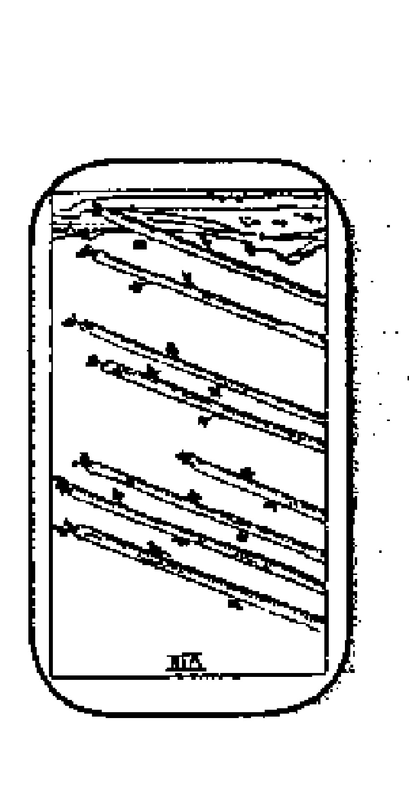

## 權杖八逆位

> 評估創業

## A. 創業的方向-S1P1,S5P1,S5P2,S5P4

目前創業的方向不太可行，不要因為一時的衝動而作出錯誤的決定，同時你的實力也不足以支撐到成功的那一刻。

## B. 資金來源-S1P2

目前資金的狀況不太好，各種的小問題陸陸續續在發生，這個時候應該先從內部檢討開始，找出問題惡化的原因。

## C. 合夥關係-S1P3

這件事情不適宜合夥，否則很可能會有內部不合的狀況發生，若是不幸發生嚴重的內鬨，就會把彼此的力量抵消。

## D. 客戶設定-S1P4

客戶的設定應該要量力而為，不要野心太大想要急速擴張，把自己可以掌握的核心客人先顧好，之後再慢慢拓展。

## E. 店面區位-S1P5

目前選擇的店面區位應該只是臨時的地方，未來發現不合用還會再搬遷，因此不要在裝潢上花費太多錢以免浪費。

### F. 專業前景-S1P6,S5P3,S5P5

這個事業的前景並不看好，也許短期之內很有衝勁，但是並無法支撐到享受成果的那一刻，前面的路仍然很難走。

# 評估求職

G.工作性質-S2P1
選擇工作時應該想清楚自己的實力，不要去挑戰太過困難的工作；機會可能集中在交通、航運或快遞物流等行業。

H.工作地點-S2P2
工作地點上沒有限制，但是也不會因此而得利，不過最好選擇交通方便的地點，以免花費太多通勤的時間。

I.要求薪資-S2P3
要求薪資也許需要略低於業界一般的行情，才能快一點找到工作，這個時候無法有太突出的機會，只能默默做事。

J.求職管道-S2P4
求職時可以請求親朋好友的幫助，由他們介紹來的工作會比較適合你，若是自己去找的工作通常會比較有挫折感。

K.求職運勢-S2P5,S7P1,S7P2,S7P3,S7P4
這段時間也許很快就可以找到新工作，但其中大多都是很忙碌而辛苦的事情，也有可能只是短期過渡性質的工作。

L.可以改進的地方-S2P6
你講話十分心直口快，但是也可能因此得罪別人而不自知，在表達之前如果能多想一下，也許找工作就會更順利。

# 評估工作

M.工作狀況概覽-S5P1,S5P2,S5P4,S7P1,S7P2,S7P3,S7P4
工作中會發生嚴重的爭吵，大家的意見不合也可能抵消彼此的力量，即使想要進行改革或是和解通常也無能為力。

N.能否勝任-S3P1
你的能力不足以勝任這份工作，反而會把你自己累個半死，如果硬要去嘗試看看，很可能會落得無疾而終的下場。

O.假期福利-S3P2
這個地方的福利制度不怎麼好，很多事情都要自己想辦法解決；假期的安排上也很混亂，也常會因為排假起爭執。

P.財務收入-S3P3
這個地方的收入並不如預期，很多獎金或分紅的說法都只是畫大餅，實際上完全拿不到，也會給人很強的挫折感。

## 第六章 權杖數字牌的工作牌義

# 評估事件

- U.現有資源-S4P1
現有的資源不是很充足，也不足以應付接下來的狀況，如果不能再投入新的資源，也許就很難繼續支撐下去了。

- V.人員配合-S4P2
人員彼此之間有很深的心結，也不是短期之內可以化解的，如果不能更換人員的話，進度很可能會因此受到影響。

- W.環境因素-S4P3
目前大環境上十分混亂，很多事情已經完全脫離你的掌控，這時候應該盡量降低環境的影響，以免被一起拖下水。

- X.時程進展-S4P4,S7P1,S7P2,S7P3,S7P4
目前的進度有一點落後，但是仍然應該謀定而後動，如果為了追趕進度而急就章，之後也許需要花更多時間收尾。

- Y.執行成果-S4P5
這件事情看不到具體的成果，也許在完成之前就會被提前終止，即使自己十分努力，到最後會發現只是白忙一場。

- Z.未來影響-S4P6,S5P3,S5P5
這件事情可能會引發內部的紛爭與衝突，對你來說有不利的影響，如果不能確實避開的話，可能就會被捲入風暴。

- Q.與主管的相處-S3P4,S6P3,S6P4
本身做事雜亂無章的上司，在工作當中指令常常會不清楚，如果事情進行到一半又突然改變心意就容易造成困擾。

- R.與同事的相處-S3P5,S6P3,S6P4
同事之間彼此各自為政，甚至還會互相攻擊對方，因此在工作當中你無法信任其他人，有事也很難找到人來幫你。

- S.升遷加薪-S3P6
在這個地方升遷或加薪都是很遙遠的事情，並不需要有太多的期待，如果希望能有好的發展還是換個地方比較快。

- T.如何對待對方-S6P1,S6P2
這是一個急性子的人，也很容易因此與人發生衝突，在做事情的時候習慣我行我素，所以常會讓人覺得很難相處。

# 評估創業

A.創業的方向-S1P1,S5P1,S5P2,S5P4
目前創業的方向對你並不利，如果硬要去做的話很可能會對你造成傷害，不只無法得利甚至還會陷入困境當中。

B.資金來源-S1P2
目前資金的狀況有點吃緊，很多事情只能走一步算一步，由於不太可能有新的資金再投入，所以要省吃儉用一點。

C.合夥關係-S1P3
這個關係並不適宜合夥，如果有合夥的話彼此也會互相防備，無法真心誠意合作，自然就無法發揮出更大的力量。

D.客戶設定-S1P4
客戶的設定應該要保守一點，從自己最有把握的部分著手，如果為了擴張而冒險進攻，通常都不會有什麼好下場。

E.店面區位-S1P5
店面區位應該以穩定的考量為主，尋找適合長期經營的地點，如果目前已經有店面就不宜再搬動，以免增加負擔。

F.事業前景-S1P6,S5P3,S5P5
這個事業的前景普通，應該能守住目前的成果，但是不太可能有什麼成長，只要安份守己的作還是可以經營下去。

# 評估工作

M.工作狀況概要-S5P1,S5P2,S5P4,S7P1,S7P2,S7P3,S7P4
這個工作很容易遇到發展的瓶頸，演變成在原地踏步的狀況，這時候即使再怎麼努力，也看不到任何實質的進展。

N.能否勝任-S3P1
你的能力其實足以勝任這個工作，只不過工作會十分辛苦，時時刻刻都要保持警覺，並不是一份輕鬆愉快的工作。

O.假期福利-S3P2
這個地方的福利制度還可以，只要懂得爭取權利就不會有損失；假期使用的規矩很多，照規定來是比較好的方法。

P.財務收入-S3P3
這個地方的收入十分穩定，但是看起來並沒有什麼成長性，即使有獎金或分紅的制度，對來你也沒有什麼意義。

## 第六章 权杖数字牌的工作牌义

# 评估求职

G.工作性质-S2P1
工作性质最好以自己熟悉或熟练的为主，千万不要去尝试新的工作类型或内容，按部就班地做才是最稳当的方法。

H.工作地点-S2P2
最好选择在同一地点固定上下班的工作，每天跑来跑去的外勤工作并不是很适合你；离家近比较容易找到好工作。

I.要求薪资-S2P3
对于薪资的要求应该要保守一点，大致与业界一般的行情相同就好，或是也可以等对方先提出之后再来讨价还价。

J.求职管道-S2P4
目前主动求职并不会有什么好结果，反而会让你觉得信心受到打击，还不如把时间空下来等工作机会自己找上你。

K.求职运势-S2P5, S7P1, S7P2, S7P3, S7P4
目前的求职运势并不是很好，也许需要再等一阵子之后才会有好工作，这个时候要好好休养让自己回复最佳状态。

L.可以改进的地方-S2P6
你在很多事情上面过于小心，因此常常落入被动的状态，你可以更主动积极一点，才可以在找工作上掌握主动权。

Q.与主管的相处-S3P4, S6P3, S6P4
与上司的相处要特别小心谨慎，同时要认真看待他交付的每一件工作，如果处理不好也许就会影响到你们的关系。

R.与同事的相处-S3P5, S6P3, S6P4
同事都只顾自己的事情，因此也不要太热心想要去帮助别人，把自己份内的搞定就好，不要与同事有多大的牵扯。

S.升迁加薪-S3P6
这里没有什么升迁的机会，加薪的幅度也无法令人满意，待在这里就只是休养生息，并不是可以充份发挥的地方。

T.如何看待对方-S6P1, S6P2
这是一个防卫心很重的人，做事情十分小心谨慎，也常把规章命令等等挂在嘴边，有时候会让人觉得很有距离感。

# 评估事件

U.現有資源-S4P1
現有的資源勉強可以應付現在的狀況，但若有任何變局出現可能就無以為繼，這時候應該小心謹慎有耐心地等待。

V.人員配合-S4P2
人員彼此之間的配合度不高，但是只要指令清楚還是可以把工作完成，這個時候上位者的領導統御就特別重要了。

W.環境因素-S4P3
目前環境上有一些限制，但是同時也提供了某種保護，這個時候不宜主動出擊，而是要盯緊環境的變化準備反擊。

X.時程進展-S4P4,S7P1,S7P2,S7P3,S7P4
目前的進度有一些落後，也不是拼一下就可以追上的狀態，你應該要有多一點耐心，慢慢來才可以把事情處理好。

Y.執行成果-S4P5
這個件事並不能達到預期的成果，而且可能還要付出額外的代價，所以在作法上最好保守一點，以避免傷害擴大。

Z.未來影響-S4P6,S5P3,S5P5
這件事情可能會造成延遲的效果，其他事情的進度也可能受到它的影響；另外一方面也有可能對你產生一些傷害。

## 權杖九逆位

# 評估創業

A.創業的方向-S1P1,S5P1,S5P2,S5P4
目前創業的方向有很大的障礙，並不是你努力奮鬥就可以解決得了的，應該及早放棄或是改變方向以免傷害擴大。

B.資金來源-S1P2
目前資金已經出現了缺口，是該要全盤檢討找出問題的時侯了，如果還是維持現狀不改變，問題將會越來越嚴重。

C.合夥關係-S1P3
這個事業並不適宜合夥，因為在合夥關係當中你會是被孤立的那個人，即使之後真的有什麼好處也輪不到你身上。

D.客戶設定-S1P4
目前的客戶設定沒有什麼發展性，應該要重新檢討找出新的戰略，如果原來的做法有問題，也應該要果決地放棄。

E.店面區位-S1P5
目前店面區位的選擇面臨困境，千萬不要為了時間因素而勿促決定，通常適合的地點需要多花一點時間才能找到。

F.事業前景-S1P6,S5P3,S5P5
這個事業的前景並不樂觀，太多的問題可能使你陷入困境，如果不能及時放棄的話，堅持反而會造成更大的損失。

# 评估求职

G.工作性質-S2P1
工作應該以務實的考量為主，即使自己不是那麼喜歡，但只要是有良好收入及發展的地方，還是應該繼續去嘗試。

H.工作地點-S2P2
工作地點應該遠離前一份工作的地區，或是其他自己很熟悉的區域，換新環境對你來說在工作上會有很大的幫助。

I.要求薪資-S2P3
要求薪資不宜太高，也不要在這個方面太過固執，如果只想要堅守住某一個數字，也許就會因此而失去好的機會。

J.求職管道-S2P4
目前求職管道並不是很暢通，所以要用盡全力所有可能的管道都去試，只要有任何機會出現，就要立即積極把握。

K.求職運勢-S2P5,S7P1,S7P2,S7P3,S7P4
目前求職的運勢並不是很好，出現的工作機會都會比較差，也許可以先休息一陣子，等運勢轉好之後再來找工作。

L.可以改進的地方-S2P6
你太過於固執己見，防衛心又很強，如果可以放開心胸勇敢地嘗試各種新的事物，也許就可以快一點找到新工作。

# 评估工作

M.工作狀況概要-S5P1,S5P2,S5P4,S7P1,S7P2,S7P3,S7P4
在工作上容易遇到一些障礙，但是並不適合硬拼，在心境上你可以讓自己先沈澱一下，再慢慢尋找好的處理方式。

N.能否勝任-S3P1
你的能力並不足以勝任這個工作，硬要去接的話一定會讓你覺得很痛苦，最好是能在達到忍耐極限之前及早放棄。

O.假期福利-S3P2
這個地方的福利並不好，也沒有什麼積極爭取的空間；假期的使用非常不自由，會被限制在特定的時間才能休假。

P.財務收入-S3P3
這個地方的收入很不好，對你來說很容易入不敷出，再加上也沒有什麼成長空間，可能會讓你因此覺得很想離開。

## 第六章 權杖數字牌的工作牌義

### 評估事件卡

- U.現有資源-S4P1
目前的資源並不足以面對現在的困境，再堅持下去狀況也不會改善，這時候即早放棄或轉向可能是比較好的選擇。

- V.人員配合-S4P2
人員彼此之間難以配合，也可能會對整件事情造成傷害，這個時候應該當機立斷換人，才有可能讓狀況快點改善。

- W.環境因素-S4P3
目前大環境對你不利，現存的障礙與限制並不容易突破，在沒有任何外援的情況之下，只能自己努力把事情搞定。

- X.時程進展-S4P4,S7P1,S7P2,S7P3,S7P4
目前的進度嚴重落後，已經完全脫離了你的掌握，這時候應該要重新檢討方向，否則苦苦追趕還是無法如期完成。

- Y.執行成果-S4P5
這件事情很難達到預期的成果，甚至會因此造成更大的傷害，在這個狀況切忌太過堅持，該放棄的時候就要放棄。

- Z.未來影響-S4P6,S5P3,S5P5
這件事對你來說不是一個愉快的經驗，也有可能造成一些實質的傷害，甚至會對你未來在工作上的發展形成障礙。

- Q.與主管的相處-S3P4,S6P3,S6P4
是一個很容易給人壓力的上司，只能盡量地把他交辦的事情作完，同時行事最好能低調一點，不要搶過他的風頭。

- R.與同事的相處-S3P5,S6P3,S6P4
與同事相處的關係常讓你覺得不愉快，有時候還會有被排擠或孤立的感覺，所以只能自立自強把自己的事情作好。

- S.升遷加薪-S3P6
這個地方升遷有許多障礙，要花很多時間努力才能夠排除；加薪對你來說也是遙遙無期，並不是發展性好的地方。

- T.如何對待對方-S6P1,S6P2
這是一個過份固執的人，在工作上經常我行我素，也不容易與別人密切合作，常常會讓自己陷於孤立隔絕的狀態。

# 评估创业

## A. 創業的方向-S1P1,S5P1,S5P2,S5P4

目前創業的方向對你來說壓力很大，許多事情都得自己來而無法放心交給別人，即使做得不錯也可能把自己累垮。

## B. 資金來源-S1P2

目前資金的部分雖然有一些壓力，但是仍然在你的掌握當中，只要能減少不必要的支出，還是可以繼續支撐下去。

## C. 合夥關係-S1P3

這個事業並不適宜合夥，因為每個人都想要掌握權力，就很難避免發生權力鬥爭，可能會因此而對事業造成傷害。

## D. 客戶設定-S1P4

客戶的設定應該要盡量放寬，把所有可能的客戶都納入考慮，能夠服務到越多的客人，就可以有越好的獲利表現。

## E. 店面區位-S1P5

店面區位要考量的東西很多，但是應該避免租金或裝潢對你產生太大的壓力，最好能放掉一些不那麼必要的條件。

## F. 事業前景-S1P6,S5P3,S5P5

這個事業的前景看來不差，但是要小心自己過勞的問題，如果能把一些實證壓力交由別人分擔，才能走得更長久。

# 评估 工作

## M. 工作狀況概要-S5P1,S5P2,S5P4,S7P1,S7P2,S7P3,S7P4

工作當中會非常忙，同時工作的壓力也很大，太多工作可能會讓你無法看清楚事情的真相，同時也有過勞的可能。

## N. 能否勝任-S3P1

你的能力雖然足以勝任這份工作，但是做起來責任很重壓力也很大，如果不能適當地分層授權可能會把自己累死。

## O. 假期福利-S3P2

這個地方的福利還不錯，只要願意去爭取大多都能夠享受得到；不過假期的使用會受制於工作的狀況而有所限制。

## P. 財務收入-S3P3

這個地方的收入掌握在自己的手上，努力爭取也會有不錯的收穫，只是每一分錢要靠自己流血流汗辛苦才換來的。

## 第六章 權杖數字牌的工作牌義

### 評估來歷

G.工作性質-S2P1
無論如何都無法找到輕鬆愉快的工作，所以還是要發揮苦幹實幹的精神；另一方面也可能找到領導或決策的職位。

H.工作地點-S2P2
工作地點應該是以自己熟悉或是能掌握的地區位為，這時候不宜貿然到外地工作，以免發生無法處理的意外狀況。

I.要求薪資-S2P3
應該依照職務內容提出自己覺得合理的薪資，如果努力爭取就很有可能會被接受，千萬不要為了有工作而委曲自己。

J.求職管道-S2P4
這時候應該是自己主動去找工作會比較快，依照自己的專長與興趣去搜尋，如果發現合意的職位就要全力去爭取。

K.求職運勢-S2P5,S7P1,S7P2,S7P3,S7P4
這段時間應該很容易就可以找到工作，不過有可能新工作的內容很累壓力又很大，要不要接受就要看自己的考量。

L.可以改進的地方-S2P6
你的責任感與掌控性都很強，有時候會給別人莫名的壓力，你如果能試著放鬆心情，也許就會比較快找到新工作。

Q.與主管的相處-S3P4,S6P3,S6P4
由於上司的壓力非常沈重，如果能夠幫他分憂解勞，就很容易得到他的重用，只是這樣自己工作會比較辛苦一點。

R.與同事的相處-S3P5,S6P3,S6P4
每個人都被自己的事情壓到喘不過氣來，也沒有時間和空間去幫助別人，大家都沒有把心思放在經營人際關係上。

S.升遷加薪-S3P6
這個地方有機會加薪，但是相對的在工作也要付出相當的努力；由於賺得是辛苦錢，想加薪得要靠自己加倍努力。

T.如何看待對方-S6P1,S6P2
這是一個責任感很重的人，不論什麼事情都會從頭到尾全程負責，但是有時會太過投入以致於看不見事情的真相。

## 第七章 聖杯數字牌的工作牌義

# 評估創業

-   A. **創業的方向-S1P1,S5P1,S5P2,S5P4**
    目前創業的方向並不如你想像的那麼簡單，當中還有很多隱藏的困難還沒有被你發現，若不小心就很有可能會失敗。

-   B. **資金來源-S1P2**
    目前資金的狀況看到一些問題，但是隱藏在背後還有更多的問題，你應該確實檢討，把問題一件一件抓出來處理。

-   C. **合夥關係-S1P3**
    這個事業非常不適宜合夥，否則很可能發生被背叛的狀況，甚至因此落入惡意的陷阱當中，因而造成很大的傷害。

-   D. **客戶設定-S1P4**
    客戶的設定還不宜太早下定論，也不要想把所有可能的客人一網打盡，務實評估自己的實力才能作出正確的決策。

-   E. **店面區位-S1P5**
    應該把店面區位的決策權抓在手上，自己的決定就要有負全責的打算，對於別人的各種意見聽聽就好不必太在意。

-   F. **事業前景-S1P6,S5P3,S5P5**
    這個事業的前景並不怎麼光明，還有很多的困難與障礙需要去克服，如果不能堅持下去的話，也許就會半途而廢。

# 評估求職

-   G. **工作性質-S2P1**
    工作上應該避免責任太重的工作，在自己可以承擔的範圍內去選擇不要太勉強；最好能設定在工作上學習的目標。

-   H. **工作地點-S2P2**
    要到離家遠的地方會比較容易找到工作，也可能會因為新工作而需要搬遷；只要自己下定決心就要勇敢地往前衝。

-   I. **要求薪資-S2P3**
    要求薪資應該與業界一般的水準差不多，如果薪水太高的工作有可能其中有詐，薪水太低的工作又會覺得很委屈。

-   J. **求職管道-S2P4**
    可以求助於政府開設的就業服務站和就業服務中心，這樣不但有比較多種的機會選擇，也可以避免遇到求職陷阱。

-   K. **求職運勢-S2P5,S7P1,S7P2,S7P3,S7P4**
    這段時間的求職運勢不太好，很多時候會覺得自己白忙一場，還可能遇到求職陷阱，所以還是先休息一陣子再說。

-   L. **可以改進的地方-S2P6**
    你應該面對自己的問題確實去改進，不要再為自己的失敗找藉口，如果能從此洗心革面，就可以快點找到好工作。

# 評估工作

-   M. **工作狀況概要-S5P1,S5P2,S5P4,S7P1,S7P2,S7P3,S7P4**
    你負責的工作非常多，而且沒有其他人可以幫你，所以只好全部都自己來；你的表現很可能會引起其他人的忌妒。

-   N. **能否勝任-S3P1**
    你的能力雖然足以勝任這個工作，但是仍然要花很多心思去面對隱藏的困難及其他的陰謀詭計，一定會非常辛苦。

-   O. **假期福利-S3P2**
    這個地方的福利不好，很多規定上有的福利實際上都享受不到，假期的使用也有很多限制，常休不到想休的時間。

-   P. **財務收入-S3P3**
    在這個地方的收入並不好，只能當作自己正在學東西，如果想要追求更高的薪水，還是要換一個新地方才有可能。

# 評估事件

-   **U.現有資源-S4P1**
    現有的資源並不足以面對接下來的問題，維持現在的作法只是坐以待斃，要更努力並投入更多資源才有可能成功。

-   **V.人員配合-S4P2**
    人員之間彼此無法配合，而且還可能因為內部人員的背叛而造成一些傷害，這個時候應該強調紀律並且追查責任。

-   **W.環境因素-S4P3**
    目前環境上有一些機會，但是同時也充滿了陷阱和欺騙，這個時候應該靠自己努力，不要去期待可能有貴人相助。

-   **X.時程進展-S4P4,S7P1,S7P2,S7P3,S7P4**
    目前事情的進度已經有一點落後，但是遇到的問題又很雜亂，這個時候應該先冷靜下來，把事情一件一件解決掉。

-   **Y.執行成果-S4P5**
    這件事情很難達到預期的成果，很可能在完成之前就因為不得已的因素而喊停，過程當中的努力只能當成是學習。

-   **Z.未來影響-S4P6,S5P3,S5P5**
    這件事情可能會造成更多的矛盾與困難，也會帶給你一些麻煩，這個時候要避免落入陷阱，同時要小心名譽受損。

-   **Q.與主管的相處-S3P4,S6P3,S6P4**
    面對所有事情都一把抓的上司，只要聽命令行事就好，千萬不要自以為是地幫他決定事情，否則就會被他給盯上。

-   **R.與同事的相處-S3P5,S6P3,S6P4**
    同事之間彼此有很多的隱瞞和猜忌，甚至還會故意欺騙和誤導，在這個地方你只能相信自己絕對不能相信任何人。

-   **S.升遷加薪-S3P6**
    在這個地方想升遷沒那麼容易，不要對自己的前途過份樂觀；加薪的幅度也十分有限，並不是發展性很好的地方。

-   **T.如何看待對方-S6P1,S6P2**
    這是一個自私自利的人，也會為了自己的利益搞一些小動作，有時候又喜歡亂傳一些八卦，讓人覺得並不好相處。

## 聖杯A正位

# 評估創業

-   **A.創業的方向-S1P1,S5P1,S5P2,S5P4**
    目前創業的方向會十分順利，在過程當中你也覺得快樂和滿足，再加上還有許多貴人相助，必定會有很多的收穫。

-   **B.資金來源-S1P2**
    目前資金的狀況不成問題，也可能還有其他新的資金會投入，只要不是揮霍浪費亂花錢，該用的都有錢可以支應。

-   **C.合夥關係-S1P3**
    這個事業如果有合夥會非常順利，大家彼此之間都是真心相待，遇到事情也會全力相挺，可以發揮出更大的力量。

-   **D.客戶設定-S1P4**
    應該把目標鎖定在全新的客戶，向外開拓才會有更好的發展；或是可以鎖定新婚夫婦、新生兒及他們的親朋好友。

-   **E.店面區位-S1P5**
    店面區位的選擇沒有太大的限制，只要你看了覺得順眼即可；但要記得人潮就是錢潮，熱鬧的地方還是比較有利。

-   **F.事業前景-S1P6,S5P3,S5P5**
    這個事業的前景十分看好，不但在心態上會覺得自我滿足，在實質上也會有很豐饒的收穫，是值得去努力的事業。

# 評估工作

-   **M.工作狀況概要-S5P1,S5P2,S5P4,S7P1,S7P2,S7P3,S7P4**
    你在工作當中如魚得水，不但可以有很多表現的機會，也可以激發出新的靈感；在工作上需要建立新的人際關係。

-   **N.能否勝任-S3P1**
    你的能力足以勝任這個職務，同時自己也會對工作內容感覺到快樂與滿足，是一個可以讓你充份發揮專長的地方。

-   **O.假期福利-S3P2**
    這個地方的福利非常好，有許多你原本意想不到的好處存在；假期的使用也很人性，通常都可以休到想休的時間。

-   **P.財務收入-S3P3**
    這個地方的收入還算不錯，也可以滿足你大部分的期待，如果想要有更豐碩的收穫，未來也還有一些努力的空間。

# 評估求職

-   **G.工作性質-S2P1**
    工作上可以多多與人的接觸，不論是需要大量團隊合作的工作，或是每天需要與人接觸的文教和服務業都很適合。

-   **H.工作地點-S2P2**
    工作地點會開創出新的人際關係，因此可能會在你所不熟悉的新地區，或是需要為了工作移動到一個全新的地方。

-   **I.要求薪資-S2P3**
    要求薪資可以比業界一般的水準更高一點，如果不是太離譜的話應該有機會被接受，未來也還有很大的成長空間。

-   **J.求職管道-S2P4**
    你可以自己去嘗試找新的工作，或是由親朋友好們介紹也不錯，只要你真心誠意地去找工作，任何管道都很暢通。

-   **K.求職運勢-S2P5,S7P1,S7P2,S7P3,S7P4**
    這段時間應該很快會找到工作，而且整個過程都會很順利，你最好把握這段時間去找工作，才不會錯過了好機會。

-   **L.可以改進的地方-S2P6**
    你在心態上非常單純，有時候會無法適當回應環境上的變化，在找工作的過程當中多聽聽別人的意見會很有幫助。

-   **Q.與主管的相處-S3P4,S6P3,S6P4**
    是一個真心誠意待人的上司，如果你能在工作當中盡忠職守，彼此互動就會非常愉快，也可以在他身上學到很多。

-   **R.與同事的相處-S3P5,S6P3,S6P4**
    只要對於同事們能夠主動付出，就可以得到正面的回應與回報，保持良好的人際關係，也會對你的工作很有幫助。

-   **S.升遷加薪-S3P6**
    在這裡有不錯的升薪機會，是一個值得真心付出的地方；加薪幅度雖然不一定讓你滿意，但還是會有基本的水準。

-   **T.如何看待對方-S6P1,S6P2**
    這是一個真心誠意待人的人，相處起來給人很舒服而沒有壓力的感覺，如果有得到什麼好處也會樂於與別人分享。

# 評估事件

-   **U.現有資源-S4P1**
    現有資源足以應付接下來的狀況，整體上有一種豐盛與快樂的感覺，只要把事情按部就班完成就不會有什麼問題。

-   **V.人員配合-S4P2**
    人員之間的配合沒有什麼問題，除了工作上合作愉快之外，也可能因此發展堅定的革命情感，私底下成為好朋友。

-   **W.環境因素-S4P3**
    目前的環境上對你是有利的，也提供你很多的援助和機會，你應該好好把握這個時機點，就能讓這件事順利完成。

-   **X.時程進展-S4P4,S7P1,S7P2,S7P3,S7P4**
    這件事情的進度目前沒有什麼問題，接下來遇到的應該也是簡單而平順的狀況，大部分的進度都在你的掌握當中。

-   **Y.執行成果-S4P5**
    這件事情的成果很豐碩，你自己也會感到滿足與快樂，所以有機會就要盡量付出，到最後一定會得到應有的回報。

-   **Z.未來影響-S4P6,S5P3,S5P5**
    這件事情會帶來人際關係上重大的突破，也可能因此建立起很有幫助的人脈，對於你未來的發展性將會很有幫助。

## 聖杯A逆位

# 評估創業

-   **A.創業的方向-S1P1,S5P1,S5P2,S5P4**
    目前創業的方向并不是很適合你，實際的狀況也許會與你主觀的期待有很大的差異，如果期望越高失望也會越大。

-   **B.資金來源-S1P2**
    目前資金的狀況開始有一些變化，可能是之前投入的金錢並無法得到預期的回收，或是有部分資金無法如期到位。

-   **C.合夥關係-S1P3**
    這個事業並不適宜合夥，如果有合夥的話也只能維持表面的關係，無法真心誠意合作，每個人只盤算自己的利益。

-   **D.客戶設定-S1P4**
    目前客戶的設定太過於理想化，這樣的想法根本無法實踐，這個時候應該要重新檢討，找出另一個更可行的方向。

-   **E.店面區位-S1P5**
    店面區位的選擇不宜匆促決定，因為整體來看還有很大的變化，最好等到大勢底定之後再決定以免浪費時間金錢。

-   **F.事業前景-S1P6,S5P3,S5P5**
    這個事業的前景并不是很樂觀，還得要面對很多的考驗和不確定性，若是成果不如預期，也可能會被迫嘗試轉型。

# 評估求職

-   G. **工作性質-S2P1**
    工作性質應該兼顧現實的需要，太過理想化也許就不容易找到工作；如果沒有好機會也可以嘗試臨時性質的打工。

-   H. **工作地點-S2P2**
    工作地點並不是你可以掌握決定的，所以不要在這方面自我設限，也許好的工作會出現在你認為不太理想的地方。

-   I. **要求薪資-S2P3**
    要求薪資應該低於業界一般的水準，甚至實際拿到的數字會低於自己的預期，在薪資上太過堅持會阻礙你找工作。

-   J. **求職管道-S2P4**
    目前自己主動去找工作大多都不會有正面的回應，還不如被動地等工作自己找上門來，或是由朋友介紹比較可能。

-   K. **求職運勢-S2P5,S7P1,S7P2,S7P3,S7P4**
    目前可能會有還不錯的機會出現，但是你並不一定能把握；如果發現工作狀況不如預期，也要勇敢放棄不必強求。

-   L. **可以改進的地方-S2P6**
    你對於找工作這件事情過份樂觀，以致於在很多地方表現太過輕率，你應該更務實細心地處理才能快點找到工作。

# 評估工作

-   M. **工作狀況概要-S5P1,S5P2,S5P4,S7P1,S7P2,S7P3,S7P4**
    這個工作當中仍然存在很多變數，並不是任何人可以預期的，你只能走一步算一步，遇到問題時再來想辦法解決。

-   N. **能否勝任-S3P1**
    你的能力並不足以勝任這份工作，有太多地方是你無法確實掌握的，如果還是硬要去做，也許就會遇到很多挫折。

-   O. **假期福利-S3P2**
    這個地方的福利並不是很好，距離你的理想還有一大段差距；假期的使用也不操在自己手上，還是要聽命於別人。

-   P. **財務收入-S3P3**
    這個地方的收穫與付出不成比例，即使收入很高仍然可能感覺不值得，如果想得到合理的回報最好還是換個地方。

# 評估事件

-   **U.現有資源-S4P1**
    現有資源並不足以應付目前的狀況，如果不能立即再投入新的資源，可能很快就會撐不下去，要做好最壞的打算。

-   **V.人員配合-S4P2**
    人員彼此之間抱持著很重的本位主義，遇到與本身利益衝突的事情就無法合作，需要有人出來協調並且提出補償。

-   **W.環境因素-S4P3**
    目前環境上的變化完全超出當初的規劃，也不是你有能力處理的，這時候你只能摸著石頭過河，小心一點準沒錯。

-   **X.時程進展-S4P4,S7P1,S7P2,S7P3,S7P4**
    這件事情的進度並不在你的掌握當中，仍然存在很多無法預期的變數，所以並不知道是否能在預定的時間內完成。

-   **Y.執行成果-S4P5**
    這件事情很難達到預期的成果，即使有成果你也可能享受不到，你必須更有耐心地努力投入，堅持下去才有機會。

-   **Z.未來影響-S4P6,S5P3,S5P5**
    這件事情可能引發新一波的人事調動，對你來說可能產生不利的影響，你應該要及早因應，甚至隨時準備好離職。

-   **Q.與主管的相處-S3P4,S6P3,S6P4**
    你很難掌握上司的想法，也常無法順利表達自己的意見，一切還是應該依照上司的命令行動，千萬不要自作主張。

-   **R.與同事的相處-S3P5,S6P3,S6P4**
    同事之間的關係可能會發生重大改變，或是會有新的人事安排，你應該試著主動釋出善意，不要有太強的防衛心。

-   **S.升遷加薪-S3P6**
    這個地方的升遷要面對很多困難，並不容易掌握到機會；加薪的部分也許還有，但是並不會達到自己滿意的程度。

-   **T.如何看待對方-S6P1,S6P2**
    這是一個過份天真的人，只在意享樂而不是很認真工作，對於一些事情又很固執己見，常常會讓人覺得難以相處。

# 評估創業

-   **A.創業的方向-S1P1,S5P1,S5P2,S5P4**
    你很喜歡目前創業的方向，因此就可以全心全意地付出，雖然不見得很快會看見成果，但長久累積應該會有收穫。

-   **B.資金來源-S1P2**
    目前資金的狀況沒有什麼問題，如果需要也可以找人出資或合夥，只是在開始之前應該要先將狀況與條件談清楚。

-   **C.合夥關係-S1P3**
    這個事業如果有合夥關係將會帶來更強大的力量，彼此之間可以平等地合作，也會保持和諧的關係與良好的溝通。

-   **D.客戶設定-S1P4**
    客戶可以由自己比較熟悉的群體著手，或是鎖定與自己熟識的親朋好友；決定的過程應該要徵詢合作夥伴的意見。

-   **E.店面區位-S1P5**
    店面區位可以選擇在離家近的地方，或是其他自己已經很熟悉的商圈，這時候要到一個新的地方去開拓會有困難。

-   **F.事業前景-S1P6,S5P3,S5P5**
    這個事業的前景還不錯，就長期的趨勢來看應該是有利的，只要自己可以繼續堅持下去，就能享受到勝利的果實。

# 評估工作

-   **M.工作狀況概要-S5P1,S5P2,S5P4,S7P1,S7P2,S7P3,S7P4**
    你很真心地喜歡這個工作，也會為工作主動付出很多，在工作上很可能需要與別人合作，所以要注意溝通的技巧。

-   **N.能否勝任-S3P1**
    你的能力雖然勉強足以勝任這個工作，但是仍然需要大家的配合才能更加平順，與別人溝通合作是最重要的關鍵。

-   **O.假期福利-S3P2**
    這個地方的福利還不差，即使原本沒有的部分也可以盡量溝通爭取；假期的規定也很人性化，可以彼此協調合作。

-   **P.財務收入-S3P3**
    這個地方的收入十分穩定，雖然不見得能達到你滿意的數字，不過若是與自己所付出的相比，還算是合理的收入。

# 評估求職

-   G. **工作性質-S2P1**
    工作中最好能有多一些的人際互動，所以業務性質的工作或是服務人員都很適合你，需要團隊合作的工作也不錯。

-   H. **工作地點-S2P2**
    在離家近的地方比較容易找到好工作，若是需要離鄉背井到外地去的工作通常不會太好，在當中比較容易有紛爭。

-   I. **要求薪資-S2P3**
    要求薪資可以比業界一般的水準更高一些，在過程當中也要努力溝通爭取，只要不是太離譜的話都有機會被接受。

-   J. **求職管道-S2P4**
    這個時候透過親友的介紹最容易找到工作，不過也可能因此背負一些人情壓力，表現好才不會辜負了親友的美意。

-   K. **求職運勢-S2P5,S7P1,S7P2,S7P3,S7P4**
    這段時間的求職運勢很不錯，除了自己去找的工作之外，也可能有親朋好友們介紹給你的機會，自己要好好把握。

-   L. **可以改進的地方-S2P6**
    你在找工作時太在意別人的看法，也許會因此對求職造成阻礙，你應該更務實地評估，以自己的喜好與判斷為主。

-   Q. **與主管的相處-S3P4,S6P3,S6P4**
    上司與你的溝通很好，也能放下身段平等地談論事情，所以有任何的想法都可以主動提出來，也有機會被他採用。

-   R. **與同事的相處-S3P5,S6P3,S6P4**
    你在工作上與同事都能保持良好的關係，彼此之間也可以互相幫忙，若是能站在平等地位真心合作就能事半功倍。

-   S. **升遷加薪-S3P6**
    這個地方還是有升遷的機會，但是你與大家的機會均等並不特別有利；加薪還是依公司的規定，應該會穩定成長。

-   T. **如何看待對方-S6P1,S6P2**
    這是一個重視人際關係經營的人，常會為別人主動付出，也會站在別人的立場將心比心，所以合作經驗都很愉快。

## ☆塔罗工作講義

## 聖杯二逆位

# 評估事件

- **U.現有資源-S4P1**
現有資源勉強可以應付現在的狀況，但是只要能把人事問題搞定，互助合作就可以把有限的資源作最有效的運用。

- **V.人員配合-S4P2**
人員之間的配合沒有任何問題，彼此的溝通也很順暢，只要大家能團結一致分工合作，就可以發揮出更大的力量。

- **W.環境因素-S4P3**
目前的大環境對你有利，也可能有貴人出現來幫忙你，所以應該本著合作的精神，盡量公開引進所有友善的力量。

- **X.時程進展-S4P4,S7P1,S7P2,S7P3,S7P4**
目前的進度還在規劃範圍當中，需要花更多精神主動去關心，只要在訊息溝通上沒有障礙，就不會有太大的問題。

- **Y.執行成果-S4P5**
這件事情的成果還不錯，重要的是必須持續主動付出最後才能享受到成果，能不能達到要看你的熱情與恆心毅力。

- **Z.未來影響-S4P6,S5P3,S5P5**
這件事情應該會促成更進一步的合作，對於訊息溝通也有正面幫助，是一個值得你主動去爭取與努力奮鬥的事情。

# 評估創業

- **A.創業的方向-S1P1,S6P1,S5P2,S5P4**
目前創業的方向並不適合你，不要被自己一時的欲望沖昏了頭，如果在錯誤的方向上努力，到頭來也是白忙一場。

- **B.資金來源-S1P2**
目前資金的狀況並不是很好，但是目前不宜再投入新的資金，應該先檢討現在的收支，省吃儉用想辦法度過難關。

- **C.合夥關係-S1P3**
這個事業不適宜合夥，如果已經有合夥也只是利益的結合，彼此之間沒有任何感情，遇到困難隨時有拆夥的可能。

- **D.客戶設定-S1P4**
目前客戶的設定方向並不可行，當中存在許多本質性的問題，這個時候最好暫緩執行，等徹底檢討之後再做打算。

- **E.店面區位-S1P5**
目前選擇的店面區位只是一個臨時的地方，一段時間過後應該就會發現有什麼缺點，到時候再依照需要進行搬遷。

- **F.事業前景-S1P6,S5P3,S5P5**
這個事業的前景看來並不樂觀，短期之內也許還看不出什麼大問題，但是長期發展並不利，要有放棄的心理準備。

# 评估求职

- **G.工作性质-S2P1**
工作内容应该越单纯越好，如果需要与人合作的话必定会引起纷争，同时最好也不要找与业务或销售有关的工作。

- **H.工作地点-S2P2**
工作地点并不在你的掌握当中，也有可能需要离乡背井到外地去工作，自己设定太多条件反而会不容易找到工作。

- **I.要求薪资-S2P3**
要求薪资大约与业界一般的水准相同即可，提出太高的数字反而容易错失好机会，当中也没什么讨价还价的空间。

- **J.求职管道-S2P4**
目前主动去求职并不容易遇到好机会，倒不如把自己准备好等着工作主动找上你，但最好避免亲人帮你介绍工作。

- **K.求职运势-S2P5,S7P1,S7P2,S7P3,S7P4**
这段期间的求职运势并不好，主动去找也不容易有好的工作，可以好好反省自己的状况，把自己的缺点改进过来。

- **L.可以改进的地方-S2P6**
很多事情你都是藏在心里，但是不讲出来也没有人会知道，你应该加强自己的沟通能力，才能快点找到新的工作。

# 评估工作

- **M.工作状况概要-S5P1,S5P2,S5P4,S7P1,S7P2,S7P3,S7P4**
工作当中出现很多困难与障碍常会让你疲于奔命，如果再加上沟通不良的状况，就会在人际关系上造成很多问题。

- **N.能否胜任-S3P1**
你的能力并不足以胜任这份工作，不要对自己有过度的信心，即使一时之间可以撑住场面，接下来就会十分辛苦。

- **O.假期福利-S3P2**
这里的福利并不是很好，即使主动要求改善也没有效果；假期的使用有很多限制，常常无法休到自己想休的时间。

- **P.财务收入-S3P3**
这里的收入看起来还不错，但是许多隐藏性的支出也花掉你不少钱，所以还是要省吃俭用自己才能达到收支平衡。

# 評估事件

- **U.現有資源-S4P1**
現有資源並不容易應付現在的問題，如果有其他阻礙出現就更無法處理，所以要密切注意所有的變化並小心處理。

- **V.人員配合-S4P2**
人員之間可能因為缺乏溝通而發生一些誤會，如果不能及時處理的話就會造成更多阻礙；最好能減少合作的狀況。

- **W.環境因素-S4P3**
目前環境上出現了一些阻礙，雖然不會造成致命的打擊，但是仍然要小心謹慎處理，以免錯誤判斷造成問題擴大。

- **X.時程進展-S4P4,S7P1,S7P2,S7P3,S7P4**
這件事情的進度開始在落後，但是並不能明確指出延遲的原因，這個時候應該徹底檢討，才有機會重新追上進度。

- **Y.執行成果-S4P5**
這件事情不容易達到預期的成果，即使能達成任務也要付出沈重的代價，如果達不到目標則可能引發分裂的危機。

- **Z.未來影響-S4P6,S5P3,S5P5**
這件事情可能會造成爭吵或是阻礙，促使你進一步地去反省檢討自己的作法，對於人際關係也可能有不利的影響。

- **Q.與主管的相處-S3P4,S6P3,S6P4**
你與上司之間似乎有莫名的心結，有很多事情他都不會告訴你，即使主動找機會與他溝通，也沒有很具體的效果。

- **R.與同事的相處-S3P5,S6P3,S6P4**
與同事之間常常出現溝通不良的狀況，可能會讓事情延遲或是發生誤會，遇到這些狀況都需要自己小心地去處理。

- **S.升遷加薪-S3P6**
在這個地方的升遷會遇到很多阻礙，並無法達到你理想中的位子，加薪的幅度也不大，並不是發展性很好的地方。

- **T.如何看待對方-S6P1,S6P2**
這是一個主觀性強的人，作事情的時候會比較被動，常常容易與別人發生溝通不良的問題，同時不善於與人合作。

# 評估創業

- **A.創業的方向-S1P1,S5P1,S5P2,S5P4**
目前創業的方向對你十分有利，在奮鬥的過程你也會樂在其中，只要你繼續堅持下去，最後就能享受到勝利的果實。

- **B.資金來源-S1P2**
目前的資金十分充足，所以重點是把資金做有效的運用，以避免無效率所帶來的浪費；接下來的收益也會很不錯。

- **C.合夥關係-S1P3**
這個事業如果有合夥會非常有利，不但彼此之間能平等地合作，而且也會帶來歡樂的氣氛，團結發揮更大的力量。

- **D.客戶設定-S1P4**
客戶的設定應該以公司或團體為主，這樣能最快地開拓市場；此外，靠老客戶的口碑介紹新客戶也是不錯的方法。

- **E.店面區位-S1P5**
店面區位應該選在比較熱鬧的地方，雖然這樣的成本可能會比較高，但是相對而言收益高的話也能很快就會回本。

- **F.事業前景-S1P6,S5P3,S5P5**
這個事業的前景看來十分不錯，不但會讓你開拓新的人脈，也能得到豐盛的實質收益，是一件會讓人快樂的事情。

# 評估工作

- **M.工作狀況概要-S5P1,S5P2,S5P4,S7P1,S7P2,S7P3,S7P4**
這個工作讓你十分滿意，每天都能高高興興地去上班，你在工作當中會學到很多東西，也可以得到很豐碩的成果。

- **N.能否勝任-S3P1**
你的能力絕對足以勝任這個工作，再加上公事當中還有很多貴人會幫助你，即使出現問題最後也都可以順利解決。

- **O.假期福利-S3P2**
這個地方的福利非常好，你對於這個狀況感到滿足；假期的使用需要與人協調，但是大多都可以休到想休的時間。

- **P.財務收入-S3P3**
這個地方的收入很不錯，如果與自己付出的努力相比更是超值的選擇，對你而言是不用辛苦又可以賺大錢的地方。

## 第七章 聖杯數字牌的工作牌義

# 評估求職

- **G.工作性質-S2P1**
工作最好是屬於團隊合作的性質，不論研究、企劃、廣告、公關等職業都很適合你；與媒體相關的工作也很不錯。

- **H.工作地點-S2P2**
工作地點可以依自己的喜好選擇，並不會對你造成太大的限制，希望在哪個地區發展就可以在那個地方找到工作。

- **I.要求薪資-S2P3**
要求薪資可以比業界一般的水準再高一些，或是依照工作內容提出覺得合理的數字，只要不太離譜大都會被接受。

- **J.求職管道-S2P4**
這個時候自己去找會有不錯的工作，透過親友介紹的速度會更快些，如果有就業博覽會之類的活動也可以去試試。

- **K.求職運勢-S2P5,S7P1,S7P2,S7P3,S7P4**
這段時間的求職運勢非常強，只要你能主動積極地去找工作，通常都有不錯的回應，甚至可能有一個以上的機會。

- **L.可以改進的地方-S2P6**
你常常只看到事情的光明面，而忽略了可能發生的潛在問題，你應該找到問題的核心去改進，才能快點找到工作。

- **Q.與主管的相處-S3P4,S6P3,S6P4**
上司很容易與大家打成一片，走的是平易近人路線，但是別忘了他是上司，仍然要給予適當的尊重才能事事順利。

- **R.與同事的相處-S3P5,S6P3,S6P4**
同事之間相處的氣氛很愉快，遇到任何問題也可以互相請教幫忙，所以只要保持良好的人際關係往往能事半功倍。

- **S.升遷加薪-S3P6**
這個地方升遷加薪的機會都很不錯，是一個可以乘勝追擊的地方，應該好好把握機會表現才能爭取到更好的位子。

- **T.如何看待對方-S6P1,S6P2**
這是一個很好相處的人，也會帶給大家歡樂的氣氛，與他合作事情通常都很順利，在同事之間也受到大家的歡迎。

# 評估事件

- **U.現有資源-S4P1**
目前有的資源十分充足，不論是資金或是人力都不成問題，這個時候應該要好好表現，不要浪費了這麼好的機會。

- **V.人員配合-S4P2**
人員之間的配合十分愉快，也可以互助合作去解決問題，只要把工作任務確實交待好，他們就可以順利達成任務。

- **W.環境因素-S4P3**
目前大環境上對你有利，也有很多資源供你運用，即使出現了任何大小問題，環境上也還有貴人可以出來幫助你。

- **X.時程進展-S4P4,S7P1,S7P2,S7P3,S7P4**
目前的進展十分順利，進度也都在你的掌握之中，只要能繼續努力堅持下去，應該就可以在預定的時間之內完成。

- **Y.執行成果-S4P5**
這件事情應該可以達到預期的成果，只要大家能齊心協力共同奮鬥，撐到最後的人應該都可以分享到勝利的果實。

- **Z.未來影響-S4P6,S5P3,S5P5**
這件事情對你有正面的影響，而且可以得到不少實質的好處，如果因此出現更好的機會，也可以積極努力去爭取。

## 聖杯三逆位

# 評估創業

- **A.創業的方向-S1P1,S5P1,S5P2,S5P4**
這個創業的方向還有一些風險，許多事情並不自己的掌握中，發展速度與變化都非常快，可能會讓你措手不及。

- **B.資金來源-S1P2**
目前資金的狀況有一點問題，這時候應該要積極尋求外援，如果不能及時再投入更多資金，也許就會撐得很辛苦。

- **C.合夥關係-S1P3**
這個事業如果要合夥，就要在事前把大家的權利義務講清楚，否則等到成功之後很可能會因為利益分配而起爭執。

- **D.客戶設定-S1P4**
客戶的設定最好能因應市場的變化而調整，不要有一成不變的想法，如果不能快速反應採取行動就很可能會失敗。

- **E.店面區位-S1P5**
店面區位可以選交通便捷的地方，但不一定要在熱鬧的商業區；另一方面，目前決定的店面也許未來會需要遷移。

- **F.事業前景-S1P6,S5P3,S5P5**
這個事業的前景雖然看好，但仍然有很多的變化與挑戰需要克服，如果因為一時的成就掉以輕心可能會樂極生悲。

# 評估求職

- **G.工作性質-S2P1**
工作上會十分忙碌，也可能需要跑來跑去，所以經常出差或外勤的工作會比較適合你；最好避免業務性質的工作。

- **H.工作地點-S2P2**
最好到離家遠的地方比較容易找到工作，很可能會因為新工作而發生遷移，固執於自己熟悉的地區就會造成限制。

- **I.要求薪資-S2P3**
要求薪資與業界一般的水準相同就好，但最好選擇有基本底薪的方案，只靠業績獎金或分紅的工作會過得很辛苦。

- **J.求職管道-S2P4**
可以透過網路、報紙或政府的就業服務站來找尋工作資訊，但是仍然要自己積極努力去嘗試，才可能找到新工作。

- **K.求職運勢-S2P5,S7P1,S7P2,S7P3,S7P4**
這段時間應該很快就可以找到工作，但是並不一定能爭取到你滿意的條件，最好與之前的學經歷相關會比較好談。

- **L.可以改進的地方-S2P6**
你太急著想找一個新工作，但是並沒有想清楚自己真正想要的是什麼，你應該先搞清楚方向之後再開始著手進行。

# 評估工作

- **M.工作狀況概要-S5P1,S5P2,S6P4,S7P1,S7P2,S7P3,S7P4**
這個工作只重視結果而不在乎過程，也可能是到了要結算成果的時候，表現得好或壞都會有對應的賞罰在等著你。

- **N.能否勝任-S3P1**
你的能力還足以勝任這個工作，當中最重要的就是要積極主動地去處理所有的事情，這樣也可以比較快看到成果。

- **O.假期福利-S3P2**
這個地方的福利要靠自己去爭取，表現不好自然無法享受到好的福利；能不能順利休假常要看同事及上司的臉色。

- **P.財務收入-S3P3**
這個地方的收入並不如預期，即使非常努力也無法得到相應的回報，想要有更好的收入還是換個地方比較有機會。

# 評估事件

- **U.現有資源-S4P1**
現有資源並不足以應付現在的狀況，必須盡速尋找外援，如果不能再投入更多資源，也許到半途就會進行不下去。

- **V.人員配合-S4P2**
人員之間的配合可能會出現一些變化，也許是在人事上出現重大的變動，或是因為意見不合而導致合作關係結束。

- **W.環境因素-S4P3**
目前很多問題都卡在環境因素上，但是也會有一些貴人可以幫助你，是不是能克服困難就看能不能好好利用環境。

- **X.時程進展-S4P4,S7P1,S7P2,S7P3,S7P4**
目前的進展非常快速，但是仍然要很趕才能追上進度，是不是能如期完成任務，就要看自己是不是足夠主動積極。

- **Y.執行成果-S4P5**
這件事情的成果取決於你的努力，如果之前的努力足夠，也許會得到不錯的成果，但若不夠努力下場也會很淒慘。

- **Z.未來影響-S4P6,S5P3,S5P5**
這件事情並不會出現對你有利的影響，如果期待越高也許失望就會越大；這將是最後的結果，也沒有翻身的機會。

- **Q.與主管的相處-S3P4,S6P3,S6P4**
上司重視的是績效，對於你如何達成目標並不干涉，所以你可以用自己的方法去解決問題，只要能達成任務即可。

- **R.與同事的相處-S3P5,S6P3,S6P4**
基本上可以與同事維持不錯的關係，但是在公事上的合作仍然常常會出現問題；也許人事上會有出乎意料的變化。

- **S.升遷加薪-S3P6**
在這個地方升遷會有點困難，也許離職或調動單位會是比較好的方法；加薪並不如預期，感覺努力沒有得到回報。

- **T.如何看待對方-S6P1,S6P2**
這是一個重視享樂的人，私底下對於同事們也都不錯，但是作事情的時候會比較急一點，往往只重視最後的結果。

## 聖杯九逆位

# 評估創業

- **A.創業的方向-S1P1,S5P1,S5P2,S5P4**
你對目前創業的方向並不滿意，但是又沒有任何改變的具體作法，這個時候應該讓自己沈澱一下，不要急著行動。

- **B.資金來源-S1P2**
目前資金的狀況並不充足，但是仍然可以支應最基本的開銷，這個時候若是能省吃儉用，就不會出現太大的問題。

- **C.合夥關係-S1P3**
這個事業並不適宜合夥，否則成員彼此之間可能會累積很多不滿及心結，無法真心誠意合作就不容易發揮出力量。

- **D.客戶設定-S1P4**
客戶應該鎖定自己最能掌握的基本盤，不要貪心好高騖遠，想太多只是自尋煩惱，把握眼前的機會才是最實在的。

- **E.店面區位-S1P5**
目前不可能找到完美的店面，現有的選擇多多少少都有一些缺點，所以只能先將就著用，等到以後有能力再搬遷。

- **F.事業前景-S1P6,S5P3,S5P5**
這個事業的前景平平，但距離你的理想還有很大的落差，如果想要更接近自己的理想，就需要更積極努力去奮鬥。

# 評估工作

- **M.工作狀況概要-S5P1,S5P2,S5P4,S7P1,S7P2,S7P3,S7P4**
這個工作會讓你感到疲倦，很想要停下來休息一下，你的內心對於現狀十分不滿，但是卻有一種無能為力的感覺。

- **N.能否勝任-S3P1**
你的能力其實足以勝任這個工作，但是在心態上卻有一種無力感或倦怠感，如何克服心理上的障礙是最大的問題。

- **O.假期福利-S3P2**
這個地方的福利雖然還可以，但是讓你覺得非常不滿意；假期方面的規定很平常，但是不一定能休到想休的時間。

- **P.財務收入-S3P3**
這個地方的收入有基本的水準，但是仍然不到令你滿意的地步，如果想要有更好的收入，還是要積極主動去爭取。

# 評估求職

- **G.工作性質-S2P1**
這段時間不可能找到自己完全滿意的工作，所以應該以現實的考量為主，去找自己有豐富經驗或學有專精的工作。

- **H.工作地點-S2P2**
最好是在熟悉或是離家近的地方找工作，找到的工作會比較好一些，但是千萬不要為了挑工作地點而放棄好工作。

- **I.要求薪資-S2P3**
要求薪資與一般業界的行情差不多就好，雖然會很想要爭取更好的薪水，不過即使再怎麼努力爭取效果也很有限。

- **J.求職管道-S2P4**
這時候自己去找工作大概都不會有什麼正面的回應，所以透過親友介紹是不錯的方法，也可能有工作主動找上你。

- **K.求職運勢-S2P5,S7P1,S7P2,S7P3,S7P4**
這段時間並不容易找到滿意的工作，因為你對於工作的想法還沒有很確定，即使有好的機會也並不一定會去嘗試。

- **L.可以改進的地方-S2P6**
你對於工作的想法很多，但有時候會犯了眼高手低的錯誤，反而會錯過一些還不錯的工作，應該要更務實的評估。

- **Q.與主管的相處-S3P4,S6P3,S6P4**
這個上司對你的要求非常高，如果沒有努力達到他的標準，很可能會留下不滿意的印象，以後的日子就比較難過。

- **R.與同事的相處-S3P5,S6P3,S6P4**
你在工作中的人緣還不錯，但是你並不以此為滿足，反而常常想得太多，有時候還會因此造成自己或別人的困擾。

- **S.升遷加薪-S3P6**
在這裡沒有很好的升遷機會，加薪的幅度也不會令你滿意，只能把這裡當成學習的機會與跳板，有好機會再離開。

- **T.如何看待對方-S6P1,S6P2**
是一個會想很多的人，但是很多事情只有想法，並沒有自己著手去進行，在同事之間也是屬於比較孤僻一點的人。

# 評估事件

- U.現有資源-S4P1
現有的資源並不是很豐富，但是已經足以應付絕大部分的狀況，只要能把現有的資源充份利用，還是有機會成功。

- V.人員配合-S4P2
人員之間的配合有一些問題，彼此之間有一些不滿的情緒，如果不能及時溝通化解，可能會把整件事情拖累下去。

- W.環境因素-S4P3
目前環境上對你沒有太大的影響，同時也不可能有貴人出來相助，你可以靠自己把事情搞定，不要自己想得太多。

- X.時程進展-S4P4,S7P1,S7P2,S7P3,S7P4
目前的進度有一些落後，但是仍然有追上的機會，如果還是保持消極被動的態度，就很難在預定的時間之內完成。

- Y.執行成果-S4P5
這件事情可以達到一部分的成果，但是並不會令人感到滿意，如果無法改變計劃或作法，就很難達到預定的目標。

- Z.未來影響-S4P6,S5P3,S5P6
這件事情會帶來不滿的情緒，也可能增加一些倦怠感和無力感，有時候一開始的期待太高到後來的失望也會越大。

## 聖杯四逆位

# 評估創業

- A. 創業的方向-S1P1,S5P1,S5P2,S5P4
目前創業的方向對你來說是一種新的嘗試，但是常會想得太多但做得太少，這個時候應該要努力把想法實踐出來。

- B. 資金來源-S1P2
目前資金狀況并不是很充足，但是可能會有新的資金再投入，或是由於加入新的合夥人而帶來一些資金上的挹注。

- C. 合夥關係-S1P3
這個事業可以合夥，而且可能還會有新的合夥人加入，如果能把這個關係鞏固好，就會對這個事業有很大的助益。

- D. 客戶設定-S1P4
對於客戶設定應該要有新的想法，同時也比較適合去開發新客戶，如果仍然墨守成規的話，就很難開發好的客戶。

- E. 店面區位-S1P5
店面區位可以嘗試到新的地方，同時要相信自己的看法及預期，只要找到自己覺得適當的地點，就要努力去把握。

- F. 事業前景-S1P6,S5P3,S5P5
這個事業的前景還可以，只是與你之前設想的方向不同，所以你應該要放下成見，依照實際情況調整自己的作法。

# 評估求職

# G.工作性質-S2P1

這個時候適合去嘗試新的行業或是工作類型，可以依照自己的想法去判斷，即使沒有任何基礎或經驗也沒有關係。

# H.工作地點-S2P2

工作地點並不是在你熟悉的地方，所以有可能會到外地去工作，或是因為新的工作而需要搬遷，要勇於面對挑戰。

# I.要求薪資-S2P3

要求薪資與業界一般的水準差不多即可，提出太高的數字也不會被接受，但是一定要將內心真實的想法表達出來。

# J.求職管道-S2P4

這個時候可能會有人介紹你新的工作，特別是新認識的朋友會非常有幫助；自己也可以預先設定好目標主動出擊。

# K.求職運勢-S2P5,S7P1,S7P2,S7P3,S7P4

這段時間的求職運勢還不錯，應該可以依照你自己的想法順利找到工作，所以如果出現好的機會就要主動去把握。

# L.可以改進的地方-S2P6

過度的消極或是固執會讓你錯過好的工作，所以應該多吸收一些新的觀念或是想法，讓自己有轉變與突破的機會。

# 評估工作

# M.工作狀況概要-S5P1,S5P2,S5P4,S7P1,S7P2,S7P3,S7P4

在工作中會發生重大的變化，也可能有新的機會出現，你應該好好把握住這個機會，就能脫離自己不滿意的狀況。

# N.能否勝任-S3P1

你的能力其實足以勝任這個工作，只要你願意放下消極的想法，用積極主動的態度來處理事情，就可以開創新局。

- U.現有資源-S4P1

現有資源並不在你的掌握當中，面對接下來的變局也沒有充足的準備，如果不能及時投入更多資源就會陷入苦戰。

- V.人員配合-S4P2

人員可能會有變動，包括新人加入或職務調整都有可能，你要花一點時間才能適應新的狀況，讓事情重新上軌道。

- W.環境因素-S4P3

目前大環境正在變化當中，也可能會出現貴人來幫助你，你應該先把自己準備好，當貴人出現的時候才可以把握。

- X.時程進展-S4P4,S7P1,S7P2,S7P3,S7P4

目前進度還在自己的預期當中，但是接下來會發生很大的變化，應該要小心處理，以免事情開始脫離自己的掌握。

- Y.執行成果-S4P5

這件事情不一定会达到预计的成果，但是可能会有意外的惊喜，如果能主动积极适应变化就会有另一方面的收获。

- Z.未來影響-S4P6,S5P3,S5P5

這件事情會帶來新的變化，影響可能會超出你最初的預期，也可能建立新的人脈或出現新的貴人，應該好好把握。

- Q.與主管的相處-S3P4,S6P3,S6P4

本身很有能力的上司，但是並不會主動指導或幫助你，如果你有需要應該主動去請教他，也許就會學到一些東西。

- R.與同事的相處-S3P5,S6P3,S6P4

也許會有新同事加入，或是因為職務調整需要與不同的人合作，你應該為這些作準備，但不要有太強的預設立場。

- S.升遷加薪-S3P6

這個地方會有不錯的升遷機會，但也要去面對新的狀況和挑戰；加薪幅度則要看自己的努力是不是能讓上司滿意。

- T.如何看待對方-S6P1,S6P2

這是一個很有想法的人，對於事情的預估也有一定的準確性，但有些時候想法會比較固執，讓人覺得不太好溝通。

# 评估创业

**A.创业的方向-S1P1,S5P1,S5P2,S5P4**
目前创业的方向对你不利，如果继续做可能会有强烈的失落感，甚至引发伤心难过的情绪，造成严重的心理创伤。

**B.资金来源-S1P2**
目前资金上有很大的问题，虽然还能勉强支撑下去，但是如果不能及时改变作法或目标的话，也许就会陷入困境。

**C.合伙关系-S1P3**
这个事业非常不适宜合伙，如果有合伙关系就会因此造成很大的问题和困难，处理不好的话甚至会闹得不欢而散。

**D.客户设定-S1P4**
目前客户设定的方向有些错误，再怎么努力也不会有成果，如果能换个角度去思考，也许就可以发现有利的方向。

**E.店面区位-S1P5**
目前选择的店面区位有严重的问题，如果无法改变心态在逆境中掌握机会，还不如换个地方会让你的心情好一点。

**F.专业前景-S1P6,S5P3,S5P5**
这个事业的前景看来非常不好，很可能会陷入停滞的状态，如果不能及时结束的话，甚至会因此造成更大的损失。

# 评估工作

**M.工作状况概要-S5P1,S5P2,S5P4,S7P1,S7P2,S7P3,S7P4**
你在工作当中有很强烈的失落感，也可能是与同事不和，你可能会因此失去工作的动力，只看到事情不好的一面。

**N.能否胜任-S3P1**
你的能力无法胜任这份工作，如果去做不但无法把事情搞定，也会造成自己的心情低落，对你来说没有什么好处。

**O.假期福利-S3P2**
这个地方的福利不太好，你对于这个状况也无能为力改善；假期的使用有很多限制，有很多时候需要与别人协调。

**P.财务收入-S3P3**
这个地方的收入低于你的预期，甚至可能会因此减弱你工作的动力，如果想要有更好的薪水还是换个地方比较快。

## 第七章 聖杯數字牌的工作牌義

# 評估求職

G.工作性質-S2P1
避免需要團隊合作的工作，以免不良的人際關係對你造成困擾；如果無法找到合意的工作，也可以嘗試短期打工。

H.工作地點-S2P2
工作地點可能會在你不想去或討厭的地方，如果無法在心態上調整就會比較難找到工作，也許就要休息一陣子了。

I.要求薪資-S2P3
要求薪資可能需要比業界一般的水準更低一點，而且還不一定能被接受，這個時候最好不要對薪水有太高的期待。

J.求職管道-S2P4
這段時間所有的求職管道都很困難，所以只好自己一項一項去嘗試，如果有親朋好友介紹工作，可能會帶來糾紛。

K.求職運勢-S2P5,S7P1,S7P2,S7P3,S7P4
這段時間的求職運勢不佳，很容易導致你的心情低落，這個時候最好能換個方向試試，或是乾脆就先休息一陣子。

L.可以改進的地方-S2P6
你太過在意工作的缺點，而沒有注意到其實每個工作都有優點，如果能夠調整自己的觀點，就能快點找到新工作。

Q.與主管的相處-S3P4,S6P3,S6P4
對屬下十分嚴苛又愛批評的上司，即使表現好也無法得到他的獎賞，因此不要對他期望太高，否則反而會更失望。

R.與同事的相處-S3P5,S6P3,S6P4
同事之間的關係非常不好，甚至到了令你沮喪難過的程度，如果無法順利化解心結，每天上班都會覺得十分痛苦。

S.升遷加薪-S3P6
這個地方沒有什麼升遷加薪的機會，你的期待越高到後來的失望會越大，所以這裡並不是適合你長期發展的地方。

T.如何看待對方-S6P1,S6P2
這是一個偏向悲觀的人，常常只看到事情不好的一面，在工作上也比較消極被動，有時候會讓人感覺不容易合作。

# 评估事件

U.现有资源-S4P1

现有的资源并不足以应付未来的状况，也不太可能再投入更多资源，如果把现有资源充分运用也许还能撑一阵子。

V.人员配合-S4P2

人员彼此之间有严重的心结，即使被迫合作也可能爆发严重的冲突，这个时候除了调整人事之外也没有其他方法。

W.环境因素-S4P3

目前环境造成一些阻碍和限制，让你的事情无法顺利进行，你要想办法改变自己的作法，否则可能将会因此失败。

X.时程进展-S4P4,S7P1,S7P2,S7P3,S7P4

目前进度有一些落后，但也不是那么容易追赶，除非你能及时鼓舞大家低落的士气，否则就很难在时限之内完成。

Y.执行成果-S4P5

这件事情即使能达到一部分的成果，整体来看仍然会让人非常不满意，所以对这件事情千万不要抱持太高的期待。

Z.未来影响-S4P6,S5P3,S5P5

这件事情会造成伤心或停滞的影响，对你来说可能是难以接受的结局，即使会小有成就也无法掩盖心中的失落感。

## 第七章 聖杯數字牌的工作牌義

## 聖杯五逆位

# 評估創業

- A.創業的方向-S1P1,S5P1,S5P2,S5P4
目前的創業方向對你十分不利，即使再怎麼努力也無法成功，你應該趁早放棄這個計劃，以免再造成更大的傷害。

- B.資金來源-S1P2
目前資金上面對很大的問題，已經不是你自己可以解決的了，這時候或許可以找到外援，但是過程將會相當辛苦。

- C.合夥關係-S1P3
這個事業並不適宜合夥，即使勉強彼此合作還是會發生很多問題，還不如一個人自己努力，狀況會比較容易掌握。

- D.客戶設定-S1P4
目前客戶設定的方向完全錯誤，必須放棄之前的計劃另起爐灶；另一方面，也可以鎖定比較獨立作業的專業人士。

- E.店面區位-S1P5
店面區位的選擇應該考慮同業合作或異業結盟的可能性，只靠自己一個人單打獨鬥的話，往往會比想像中更辛苦。

- F.事業前景-S1P6,S5P3,S5P5
這個事業的前景看來不妙，當中有許多的困難和危機是你無法處理的，如果按照現在的計劃繼續下去必然會失敗。

# 评估求职

G.工作性质-S2P1
尽量寻找与自己专业训练或学经历有关的工作，同时最好具有独立作业的性质，如果是外包接案的工作也很不错。

H.工作地点-S2P2
工作的地点也许并不会在你预期的地方，所以不要有太多的预设立场与限制，以免因此而错失一些好的工作机会。

I.要求薪资-S2P3
薪资的要求与业界一般的水准相同就好，甚至可能与你前一份工作差不多，但是最终的决定权并不在自己的手上。

J.求职管道-S2P4
透过家人或亲戚帮你介绍工作，可以让你比较快找到工作，如果只是自己一个人努力去找，再怎么样子都很难成功。

K.求职运势-S2P5,S7P1,S7P2,S7P3,S7P4
这段时间的求职运势很差，即使能找到工作也必定是吃力不讨好的职缺，还不如先休息一阵子等运势好转再行动。

L.可以改进的地方-S2P6
你太执着于自己的观点和立场，所以无法突破僵局，你如果能用更开放的态度去求职，应该很快就可以找到工作。

# 评估工作

M.工作状况概要-S5P1,S5P2,S5P4,S7P1,S7P2,S7P3,S7P4
工作当中陆陆续续发生各种问题，而且还有新的问题不断地出现，之前的计划完全失去作用，只能走一步算一步。

N.能否胜任-S3P1
你的能力不足以胜任这个工作，同时也缺乏贵人及外援，这个时候应该要有壮士断腕的决心，赶快放弃这个工作。

O.假期福利-S3P2
这个地方的福利很不好，连最基本的福利保障都没有；在假期的使用也很不自由，常常无法休到自己想休的时间。

P.财务收入-S3P3
在这个地方的收入很差，就算有奖金或是分红的制度你也无法得到，继续在这里坚持下去，其实并没有什么意义。

# 評估事件

**U.現有資源-S4P1**
現有資源並不足以應付現在的狀況，想要繼續下去只能尋找外援，若是只靠內部的力量硬撐，就很可能走向失敗。

**V.人員配合-S4P2**
人員之間並不是很能溝通，同時也可能發生嚴重的爭吵和衝突，你在當中應該保持理性，盡量避免情緒化的反應。

**W.環境因素-S4P3**
目前環境上可能會有貴人出現，但是仍然要你很主動去爭取，如果能得到外援的幫助，事情就可以順利進行下去。

**X.時程進展-S4P4,S7P1,S7P2,S7P3,S7P4**
目前事情的進度嚴重落後，而且還不斷傳來壞消息，這個時候你只能盡力把危機處理好，同時要預做最壞的打算。

**Y.執行成果-S4P5**
這件事情無法達到預期的成果，甚至到最後一事無成，所以應該事先做好最壞的打算，以防到時候自己手忙腳亂。

**Z.未來影響-S4P6,S5P3,S5P5**
在這件事情當中你無法得到什麼，所以也不會有任何正面的影響，而且很多事情可能會因此而陷入不確定的狀態。

**Q.與主管的相處-S3P4,S6P3,S6P4**
遇到本身能力不足的上司，既無法幫你解決任何問題，也無法教導你任何事情，遇到困難時一切只能夠靠你自己。

**R.與同事的相處-S3P5,S6P3,S6P4**
與同事的關係十分冷淡，除了公事之外幾乎沒有任何交集，所以就乖乖把自己份內的事情做好，其他不要想太多。

**S.升遷加薪-S3P6**
在這裡不太可能升遷，加薪的希望也非常渺茫，再加上還可能出現其他的阻礙和變化，還是早點離開會比較安全。

**T.如何看待對方-S6P1,S6P2**
這是一個容易受到別人影響的人，有時候在工作上會表現得比較情緒化，但是只要你不犯他、他也不會找你麻煩。

## 圣杯六正位

# 评估创业

### A.创业的方向-S1P1,S5P1,S5P2,S5P4

你对目前创业的方向十分熟悉，事业发展也会十分稳定，只要能够保持原来的步调好好做，应该会有不错的成果。

### B.资金来源-S1P2

目前资金的状况不差，但再也不可能有新的资金会再投入，所以应该要以现有的资源来规划，预估不要过度乐观。

### C.合伙关系-S1P3

这个事业的合伙关系十分稳定，而且彼此之间也会建立起深厚的友谊，真心诚意合作一定可以发挥出更大的力量。

### D.客户设定-S1P4

应该以经营老客户为主，只要能建立起老主顾的忠诚度，就不会有太大的问题；也可以锁定自己熟识的亲朋好友。

### E.店面区位-S1P5

店面区位最好是离家近，否则也是在自己很熟悉的地方，这样不但会有比较好的地缘关系，同时也比较有安全感。

### F.事业前景-S1P6,S5P3,S5P5

这个事业的前景看来平平，最辉煌的日子已经过去，未来最好的状况也只能守住城池，甚至可能会慢慢走下坡。

# 评估工作

### M.工作状况概要-S5P1,S5P2,S5P4,S7P1,S7P2,S7P3,S7P4

这个工作算是稳定，但是在当中也充满了一成不变的内容，可能会让你觉得很无聊，不过人员之间还蛮好相处的。

### N.能否胜任-S3P1

你的能力足以胜任这个工作，但是切记要政通必定得注意人和，能把人事问题搞定，这个工作就不会有任何问题。

# O.假期福利-S3P2

这个地方的福利很好，让你可以很安心地继续待在这里工作；假期的部分需要与人协调，但是大部分都可以如意。

### P.财务收入-S3P3

这里的收入十分稳定，同时也不会有任何意外的惊喜，如果并不追求很高的成长与发展，这里会是很适合的地方。

## 第七章 聖杯數字牌的工作牌義

# 評估求職

# G.工作性質-S2P1

工作最好與自己過去的經驗有關，自己學校讀的本科或是有受過專業訓練的工作都不錯，不宜嘗試新的工作類型。

# H.工作地點-S2P2

在自己熟悉的地方比較容易找到好工作，而且找到工作以後也容易待得久，這時候不宜冒險到陌生的地方去工作。

# I.要求薪資-S2P3

要求薪資應該與業界一般的水準差不多就好，但也可以依照自己的需求提出合理的數字，只是需要詳細說明溝通。

# J.求職管道-S2P4

這時候透過老同學、老同事、老朋友或家人親戚介紹的工作是最好的，自己一個人單打獨鬥反而不容易找到工作。

# K.求職運勢-S2P5,S7P1,S7P2,S7P3,S7P4

這段時間的求職運勢還不錯，也很可能有人可以幫你介紹到不錯的工作，你應該仔細評估以中長期的規劃來考量。

# L.可以改進的地方-S2P6

你太執著於自己過去的經驗，以至於看不清現實狀況的變化，你應該由主觀印象中解脫出來，才能快點找到工作。

# Q.與主管的相處-S3P4,S6P3,S6P4

上司非常重視屬下的忠誠度，只要你能忠心耿耿地幫他作事，他就會盡全力維護你，即使你有犯錯也會幫你解決。

# R.與同事的相處-S3P5,S6P3,S6P4

與同事之間的關係非常穩定，人際關係也沒有什麼變化，大家都已經很互相了解，也不會有任何令人驚奇的狀況。

# S.升遷加薪-S3P6

這個地方並沒有很好的升遷機會，加薪也只是照年資慢慢調整，如果想要有很好的發展還是要換個地方才有可能。

# T.如何看待對方-S6P1,S6P2

這是一個會照顧保護別人的人，在工作上的表現也算是很認真負責，但有時候會過份沈醉在自己輝煌的過去當中。

# 评估事件

現有的資源其實足以應付目前的狀況，只要能把資源作有效率的運用，應該就可以依照計劃按部就班地完成任務。

人員之間的配合非常好，彼此之間也可以充分合作，只要帶領的人能確實負起責任，下面的人就可以把事情搞定。

目前的大環境十分穩定，同時可能出現對你有幫助的貴人，這個貴人也許是你的舊識，而且會真心誠意地幫助你。

目前為止進度沒有什麼大問題，但是仍然需要小心謹慎以確保戰果，如果不小心也可能被突發意外弄得手忙腳亂。

這件事情的成果與預期相差不遠，如果按部就班就可以達到預定的目標，也不會有爆炸性的發展或是意外的驚喜。

這件事情並不會對未來有明顯的影響，但是對你來說會是印象深刻的回憶，而且可以在這當中建立起不錯的人脈。

## 聖杯六逆位

# 評估創業

- **A.創業的方向-S1P1,S5P1,S5P2,S5P4**
目前創業的方向對你來說是一種全新的嘗試，而且很快就會看到初步的成果，如果發展並不如預期也要及早放棄。
- **B.資金來源-S1P2**
目前資金并不是很充足，但是未來仍然可能有新的資金再投入，所以只要能撐過這個關口，未來還是很有發展性。
- **C.合夥關係-S1P3**
這個事業並不太適宜合夥，如果合夥的話也是純粹利益的結合，如果遇到問題還是只考慮自己的利害無法共患難。
- **D.客戶設定-S1P4**
現在應該努力向外拓展新的客戶，就有機會開創出更好的局面；若是短期間內沒有看到成果，也要快一點換方向。
- **E.店面區位-S1P5**
可以選擇在新興開發的區域，或是想辦法去開拓自己所不熟悉的地方；同時最好不要去頂同性質的店面繼續經營。
- **F.事業前景-S1P6,S5P3,S5P5**
這個事業的未來還有很大的發展性，至少還有一波高峰可以期待，所以應該從現在開始好好努力才能享受到成果。

# 评估求职

- **G.工作性质-S2P1** 可以去尝试全新性质的工作，即使自己完全没有相关经验也没有关系；同时最好能避开需要大量团队合作的工作。
- **H.工作地点-S2P2** 新的工作地点比较容易在你所不熟悉的地方，甚至会需要为了新工作而搬迁，所以对于工作地点最好是顺其自然。
- **I.要求薪资-S2P3** 要求薪资不论多少都不会有太大的影响，所以只要回答依公司规定即可；如果自己期望越高到最后可能会越失望。
- **J.求职管道-S2P4** 这个时候透过别人找的工作都不是很满意，还不如自己主动出击去找工作；可以去参加公开招考或是就业博览会。
- **K.求职运势-S2P5,S7P1,S7P2,S7P3,S7P4** 这段期间的求职运势并不是很强，所以比较难找到长久稳定的工作，如果以短期暂时的工作为目标就会比较好找。
- **L.可以改进的地方-S2P6** 你对于工作缺乏长远的规划，也不愿意好好思考自己的未来，你应该先把方向定出来，才会比较容易找到好工作。

# 评估工作

- **M.工作状况概要-S5P1,S5P2,S6P4,S7P1,S7P2,S7P3,S7P4** 这个工作并不是非常稳定，未来还会有很大的变化，对于事情应该小心谨慎处理，同时最好避免作太长远的承诺。
- **N.能否胜任-S3P1** 你的能力足以胜任这个工作，但是仍然会做得非常辛苦，如果无法把人际关系搞定，可能会因为人的因素而受害。
- **O.假期福利-S3P2** 在这个地方的福利并不好，许多的保障只是空口说白话；假期的使用则没有什么问题，该放假的时候就可以放假。
- **P.财务收入-S3P3** 这个地方的收入并不好，东扣西扣之后实际上拿到的钱并不多，而且收入与自己在工作当中的努力根本不成比例。

## 第七章 聖杯數字牌的工作牌義

# 評估事件

# U.現有資源-S4P1
現有的資源並不是很充足，也不足以應付接下來的變化。如果不能及時再投入更多資源，也許就會很難支撐下去。

# V.人員配合-S4P2
人員之間的配合需要多花一些時間經營，也可能發生溝通不良的狀況，如果有問題無法解決，也許可以考慮換人。

# W.環境因素-S4P3
環境上即將發生重大的變化，對你有利或是有害目前還不知道，這個時候應該盡量收集訊息，同時小心謹慎判斷。

# X.時程進展-S4P4,S7P1,S7P2,S7P3,S7P4
目前的進度一切正常，但是接下來有可能開始落後，最重要的是檢視自己的方向與作法，是不是能應付新的變局。

# Y.執行成果-S4P5
這件事情的成果還很難預料，但並不是努力就能得到回報，要依照情勢變化調整作法，才有機會得到最後的勝利。

# Z.未來影響-S4P6,S5P3,S5P5
這件事情會帶來新的變化，也可能會造成一個全新的局面，你必須要用新的眼光來評估，才不會作出錯誤的判斷。

# Q.與主管的相處-S3P4,S6P3,S6P4
對於事情有很強烈主觀的上司，你可能要花很多時間才能把他搞定，如果他不能接受你的建議，也不要覺得灰心。

# R.與同事的相處-S3P5,S6P3,S6P4
與同事之間可以和平相處，另一方面也可能有新的人事變動，對於接下來的狀況不要有太多預期，順其自然就好。

# S.升遷加薪-S3P6
這個地方也許還有升遷的機會，但是對你並不特別有利；加薪的可能相對而言就比較低，所以不要有太高的期待。

# T.如何看待對方-S6P1,S6P2
這是一個重視經營人際關係的人，但是又對人很有防衛心，有時會讓人覺得不夠真誠，在工作上的表現並不突出。

# 評估創業

- **A.創業的方向-S1P1,S5P1,S5P2,S5P4**
你對目前創業的方向充滿了雄心壯志，但是許多想法並不切實際，你應該更務實地評估才不會被表面的幻象誤導。
- **B.資金來源-S1P2**
目前資金的狀況并不是很穩定，也有一部分資金沒有實際到位，這個時候應該保守穩健經營，千萬不要擴張太快。
- **C.合夥關係-S1P3**
這個事業並不適宜合夥，如果有合夥的話，每個人對這個事業的想法與期待都不相同，因此就很容易會發生爭吵。
- **D.客戶設定-S1P4**
目前客戶的設定方式太過不切實際，不可能把所有對象都一網打盡，還是應該把力量集中在最能把握的核心客戶。
- **E.店面區位-S1P5**
你關於店面區位的選擇想得很多，但是並不可能有十全十美的地方，還是應該把自己的需求搞清楚之後再來選擇。
- **F.職業前景-S1P6,S5P3,S5P5**
這個事業可能有短暫的榮景，但是長遠來看前景並不看好，應該小心務實面對，千萬不要被一時的成功沖昏了頭。

# 評估工作

- **M.工作狀況概要-S5P1,S5P2,S5P4,S7P1,S7P2,S7P3,S7P4**
這個工作表面上看來十分成功，但實際上那只是虛幻的假象，你必須冷靜地反省思考，才有可能不被表象所迷惑。
- **N.能否勝任-S3P1**
你的能力並不足以勝任這個工作，也不會有任何貴人相助，如果錯估形勢接下這個重任，也許就會付出慘痛代價。
- **O.假期福利-S3P2**
這個地方的福利並不好，許多好處都是看得到吃不到；假期雖然沒有什麼限制，但實際上常無法休到想休的時間。
- **P.財務收入-S3P3**
這個地方的帳面上的收入還不差，但是若再扣掉隱藏的成本及增加的支出，和自己的付出相比起來似乎不太划算。

## 第七章 聖杯數字牌的工作牌義

- **G.工作性質-S2P1**
你可以考慮需要運用創意和想像力的工作，即使沒有相關的學經歷也沒有關係，只要你願意嘗試就可能出現機會。
- **H.工作地點-S2P2**
雖然你對工作地點想得很多，但是並不一定會與實際的狀況相符合，對工作地點不要自我設限才不會錯過好工作。
- **I.要求薪資-S2P3**
要求的薪資與業界一般的水準差不多就好，不要過份高估自己的實力，提出太高的薪水可能會讓人覺得不自量力。
- **J.求職管道-S2P4**
目前所有的求職管道都有可能，但也没有任何一個管道特別有利，所以可以選擇自己想嘗試的管道，不要想太多。
- **K.求職運勢-S2P5,S7P1,S7P2,S7P3,S7P4**
目前的求職運勢並不是很好，相對而言你對自己有一點高估，你應該要更務實一點，才能快一點找到適合的工作。
- **L.可以改進的地方-S2P6**
你對自己的未來並沒有明確的方向，也不知道自己適合什麼樣的工作，你應該先搞清楚自己想要什麼再來找工作。
- **Q.與主管的相處-S3P4,S6P3,S6P4**
上司很會畫大餅，但是常會缺乏執行的細節，所以對他提出的方向要自己想清楚，因為照他的方法不一定行得通。
- **R.與同事的相處-S3P5,S6P3,S6P4**
同事之間表面上看起來相處得不錯，實際上每個人都各懷鬼胎，甚至互相陷害，彼此之間私底下並沒有什麼交情。
- **S.升遷加薪-S3P6**
在這個地方看起來很有發展性，其實升遷和加薪的機會都不高，你應該快點認清事實，不要抱持不切實際的期待。
- **T.如何看待對方-S6P1,S6P2**
這是一個多愁善感的人，常在工作當中會自己陷入沈思，讓人覺得不容易了解，但是偶爾也會提出很不錯的點子。

- **U.現有資源-S4P1**
現有資源並不足以應付現在的狀況，不要被表面的狀況所欺騙了！現在應該要小心謹慎經營以免陷入不利的局面。
- **V.人員配合-S4P2**
人員彼此之間並不了解，所以也不能很真心誠意合作，這個時候應該要把話講清楚，才不會在過程當中發生誤會。
- **W.環境因素-S4P3**
目前環境上變幻莫測，並不是你可以掌握或利用的，所以還是應該專心把自己的事搞定，不要被環境的變化迷惑。
- **X.時程進展-S4P4,S7P1,S7P2,S7P3,S7P4**
你無法確實掌握實際的狀況，所以不知道進度已經開始落後，如果不能從現在起加緊腳步，也許就無法如期完成。
- **Y.執行成果-S4P5**
這件事情不可能輕鬆達到預期的成果，所以在過程當中還是要很努力才能確保戰果，如果掉以輕心很容易會失敗。
- **Z.未來影響-S4P6,S5P3,S5P5**
這件事情會帶給你很多新的想法，但是也容易讓你感到疑惑，在還沒確實搞清楚狀況之前，最好不要作重大決定。

## 圣杯七逆位

# 评估创业

- **A.创业的方向-S1P1,S5P1,S5P2,S5P4**
目前创业的方向还需要更精细的计划才能成功，所以现在应该针对各种可能的状况模拟推演，不宜有太大的行动。
- **B.资金来源-S1P2**
目前资金的来源还不是很确定，所以在财务上还需要进一步的规划，如果能很务实的思考就会找到好的解决方案。
- **C.合伙关系-S1P3**
这个事业不太适宜合伙，也没有人可以帮忙你，如果已经有合伙的状况存在，就要做好随时可能拆伙的心理准备。
- **D.客户设定-S1P4**
关于客户的设定应该要重新规划，之前的想法并不太可行，这时候要把自己主观的想法完全放空才可能会有灵感。
- **E.店面区位-S1P5**
店面区位应该事先做好专业的评估，不要依主观的好恶去决定；房租和装潢则应该尽量节省，避免不必要的浪费。
- **F.事业前景-S1P6,S5P3,S5P5**
这个事业的前景还不错，也有很大的发展空间，只要你能坚定意志和决心，外表看起来的危机也许就是你的转机。

# 評估求職

- **G.工作性質-S2P1**
這時候適合去嘗試新的工作，也可以與之前的學經歷都無關，但是仍然要經過詳細的計劃，以免發生過多的錯誤。
- **H.工作地點-S2P2**
工作地點的選擇應該要預先規劃研究，再依照自己的計劃去尋找；如果出現在你計劃之外的地方也不會是好工作。
- **I.要求薪資-S2P3**
要求薪資應該衡量自己的實力，提出一個合理的數字，只要能把自己的考量點講清楚，就有很大的可能會被接受。
- **J.求職管道-S2P4**
目前大部分的求職管道都沒有好的機會，可能要等人幫你介紹工作會比較好；另一方面也可能有工作主動找上你。
- **K.求職運勢-S2P5,S7P1,S7P2,S7P3,S7P4**
這段時間求職的運勢還不錯，只要你有明確的方向與求職的計劃，按部就班去作應該很快就可以找到理想的工作。
- **L.可以改進的地方-S2P6**
你對於找工作有很多的計劃，但是缺乏實際的行動，最重要的是把你的計劃拿出來實踐，這樣才能快點找到工作。

# 評估工作

- **M.工作狀況概要-S5P1,S5P2,S5P4,S7P1,S7P2,S7P3,S7P4**
這個工作非常用腦，也需要做很多的計劃和決策，即使自己不必親自動手，但是每天勞心仍然是很累人的一件事。
- **N.能否勝任-S3P1**
你的能力足以勝任這份工作，最重要的是你有沒有足夠的決心和意志力，能夠去面對實際的挑戰，努力解決問題。
- **O.假期福利-S3P2**
這個地方的福利不是很好，但是最基本的照顧仍然存在；假期的部分大都可以自己掌握，所以沒有什麼好擔心的。
- **P.財務收入-S3P3**
這個地方的收入並不是很好，若是有獎金或是分紅還是可以努力去爭取，只是這些努力並不一定很快能得到回報。

# 評估事件

- **U.現有資源-S4P1**
現有資源並不太充足，但只要能有良好的計劃與分配，仍然可以應付接下來的狀況，主要還是看你自已願不願意。
- **V.人員配合-S4P2**
人員之間的配合並不是很好，但是也不至於造成很大的傷害，所以應該盡快把大家的職責說清楚，避免發生誤會。
- **W.環境因素-S4P3**
目前環境的因素對你沒有太大的影響，但是可能會出現對你有幫助的貴人；他應該可以提供你有利的意見或規劃。
- **X.時程進展-S4P4,S7P1,S7P2,S7P3,S7P4**
目前所有的進度都在你的計劃當中，大部分的狀況你也可以確實掌握，只要能繼續保持就有機會在時限之內完成。
- **Y.執行成果-S4P5**
這件事情的成果還不錯，一切都按照計劃進行，也不會有什麼意外狀況，但是必須要堅持到最後才能享受到成果。
- **Z.未來影響-S4P6,S5P3,S5P5**
這件事情會造成全新的局面，也會影響到後面很多個計劃，如果能夠把握機會好好表現，對你來說也會非常有利。
- **Q.與主管的相處-S3P4,S6P3,S6P4**
對於很多事情都需要預作準備，因為上司並不會給你太多思考的時間，交待的事情都要在最短的期限內看到成果。
- **R.與同事的相處-S3P5,S6P3,S6P4**
同事之間彼此之間沒有什麼交集，所以私底下也沒有什麼交情，在工作當中遇到問題，還是要自己去想辦法解決。
- **S.升遷加薪-S3P6**
這個地方升遷一切照制度來，能不能爬上去要看你自己夠不夠努力；加薪的部分則是可遇不可求，不要期待太多。
- **T.如何看待對方-S6P1,S6P2**
這是一個善於規劃的人，對於很多事情都有一套自己的看法，不過在人際關係上比較冷淡，不會與大家打成一片。

## 圣杯八正位

# 评估创业

- **A.创业的方向-S1P1,S5P1,S5P2,S6P4**
你对自己创业的方向并不满意，总觉得好像还缺了什么东西，是需要自己一个人好好想想把问题找出来的时候了。
- **B.资金来源-S1P2**
目前资金的状况还算充足，但是你仍然觉得不是很安心，如果能主动向外寻找援助的话，也可能有资金会再投入。
- **C.合伙关系-S1P3**
这个事业并不适宜合伙，如果有合伙的话彼此之间容易产生不满，若是演变成严重的争吵也随时都有拆伙的可能。
- **D.客户设定-S1P4**
客户的设定应该要改变了，如果维持原来的方式就很难达到令人满意的目标；或是也可以锁定年纪比较大的客人。
- **E.店面区位-S1P5**
目前选择的店面区位应该只是一个临时的地方，之后觉得不满意也许就会选择搬迁，所以不要在装潢上花太多钱。
- **F.事业前景-S1P6,S5P3,S5P5**
这个事业的前景还不差，但是还不到你会觉得满意的程度，如果想要往更高的境界去迈进，也许就需要有所改变。

# 评估工作

- **M.工作状况概要-S6P1,S6P2,S6P4,S7P1,S7P2,S7P3,S7P4**
你对这个工作的状况并不满意，因此常会想要做一番改革或是乾脆离职算了，再多的金钱也填不满你内心的空虚。
- **N.能否胜任-S3P1**
你的能力足以胜任这个工作，只是你对自己的表现容易觉得不满意，只要愿意去做其实没有什么克服不了的问题。
- **O.假期福利-S3P2**
这个地方的福利还不差，但是也许还不能让你感到满意；假期的规定也很合理，只是不见得能休到你想休的时间。
- **P.财务收入-S3P3**
虽然这个地方的收入并不让你满意，但是整体而言还算是很不错的，如果有奖金或分红的制度也可以尽量去争取。

## 第七章 聖杯數字牌的工作牌義

- **G.工作性質-S2P1**
目前是應該轉業的時候了，所以最好選擇與之前學經歷不同的工作；如果還在類似的工作當中你就會覺得不滿意。
- **H.工作地點-S2P2**
工作地點可能會是在離家遠的地方，或是會因為新工作而需要遷移；只要你願意改變現狀就有很多機會在等著你。
- **I.要求薪資-S2P3**
要求薪資與業界一般相同的水準就好，不要提出太高的數字；即使自己很努力爭取，也很難找到薪水滿意的工作。
- **J.求職管道-S2P4**
目前應該改變之前的求職管道，換個方式也許會出現更好的機會；你應該要主動出擊，不可能有工作主動找上你。
- **K.求職運勢-S2P5,S7P1,S7P2,S7P3,S7P4**
這段時間的求職運勢還不差，只要你願意主動去找，就會找到好的工作機會，最重要的是要先搞清楚自己的方向。
- **L.可以改進的地方-S2P6**
你心中有太多不滿，所以也很難找到令你滿意的工作，你應該先想清楚自己需要什麼，放寬標準才容易找到工作。
- **Q.與主管的相處-S3P4,S6P3,S6P4**
是一個求新求變的上司，無法忍受一成不變的狀況，要能努力跟上他改變的速度，否則就可能會成為他的眼中釘。
- **R.與同事的相處-S3P5,S6P3,S6P4**
你在同事之間比較特立獨行，也比較少參加同事之間的活動或聚會，如果遇到問題也只好自己解決沒有人會幫你。
- **S.升遷加薪-S3P6**
這個地方雖然也有升遷加薪的機會，但不論是升遷的職位或加薪的幅度都無法令你滿意，最好還是早點另謀高就。
- **T.如何看待對方-S6P1,S6P2**
這是一個要求很高的人，即使狀況不錯也很難令他覺得滿意，在同事之間比較孤僻，有時候會讓人感覺難以接近。

## 第七章 圣杯数字牌的工作牌义

### 圣杯八逆位

# 评估创业

- **A.创业的方向-S1P1,S5P1,S5P2,S5P4**
  目前创业的方向遇到了瓶颈，是危机也可能是转机，你应该先厘清问题的性质和状况，才能找到解决适当的方案。

- **B.资金来源-S1P2**
  目前资金的状况不太稳定，同时也不是自己能完全掌控，所以这个时候一动不如一静，维持现状会是最佳的策略。

- **C.合伙关系-S1P3**
  这个事业的合伙关系表面上看起来还不错，大家也都能维持良好和谐的关系，但是实际上并无法合作发挥出力量。

- **D.客户设定-S1P4**
  客户的设定应该以现有的基础为考量，若是突然作太大的改变也许会措手不及；也可以从自己熟识的人开始下手。

- **E.店面区位-S1P5**
  店面区位应该以人多热闹的地方为主，最好是在餐厅、酒店或其他娱乐场所的附近；也要相信自己的创意与灵感。

- **F.事业前景-S1P6,S5P3,S5P5**
  这个事业的前景看来不差，但是其实还有很多危机需要去处理，如果不懂得珍惜自己已经有的，就有可能失去它。

# 评估求职

- **G.工作性质-S2P1**
  工作性质应该以自己的兴趣为主，不要太考虑别人的看法，即使没有相关的学经历，这时候也可以勇敢地去尝试。

- **H.工作地点-S2P2**
  工作地点可以选择在有一些亲朋好友居住或工作的地区，这样生活上比较有照应；也有可能在以前工作过的地区。

- **I.要求薪资-S2P3**
  应该把自己理想的薪资提出来，不要为了求一个工作而降低自己的标准，得到自己满意的薪资工作才会乐在其中。

- **J.求职管道-S2P4**
  这个时候主动出击常常无法找到令你满意的工作，所以还不如以静制动等工作上门；或是由亲友介绍工作也不错。

- **K.求职运势-S2P5,S7P1,S7P2,S7P3,S7P4**
  这段时间有机会找到不错的工作，但是并不急着上班，也许可以再休息一段时间之后，还会有更好的机会出现。

- **L.可以改进的地方-S2P6**
  你对于自己的状况过于乐观，以至于无法看见自己的缺点，你应该更务实地检讨自己的状况，才会快点找到工作。

# 评估工作

- **M.工作状况概要-S5P1,S5P2,S5P4,S7P1,S7P2,S7P3,S7P4**
  这个工作的状况并不稳定，但是自己的感觉还满愉快的，所以有时候会想要离开这个地方，同时又会感觉舍不得。

- **N.能否胜任-S3P1**
  你的能力足以胜任这个工作，但是要很小心谨慎处理事情，如果不觉得自己是吃苦耐劳的人就不要接下这个工作。

- **O.假期福利-S3P2**
  这个地方的福利制度平平，只能作到最基本的保障；假期的使用有很大的自由，大部分都能休到自己想休的时间。

- **P.财务收入-S3P3**
  这个地方的收入还不差，但是有时候并不是很稳定，所以最好能在平时多存一点钱，避免不小心发生断炊的危机。

- **Q.与主管的相处-S3P4,S6P3,S6P4**
  面对主观性很强的上司，并不容易采纳别人的意见，你可以对他提出一些建言或忠告，但是不要有太重的得失心。

- **R.与同事的相处-S3P5,S6P3,S6P4**
  与同事的相处上没有什么大问题，但是彼此之间也仅限于很表面的关系，实际上遇到什么困难还得靠自己去解决。

- **S.升迁加薪-S3P6**
  这个地方还有一些升迁的机会，但是会做得非常累；加薪的可能性就比较低，即使承诺你要加薪也不一定会实现。

- **T.如何看待对方-S6P1,S6P2**
  这是一个很重视感情与人际关系的人，但是在工作能力上平平，对于自己的想法很坚持，有时候会因此遇到困难。

# 评估事件

- **U.现有资源-S4P1**
  现有的资源足以应付目前的状况，但是也许不足以面对接下来的变局，比较安全的做法还是要再投入更多的资源。

- **V.人员配合-S4P2**
  人员之间的配合可能会有一些问题，所以可以藉由调整职务或是改变人员来因应，也许就会让事情进行得更顺利。

- **W.环境因素-S4P3**
  目前环境上还有很多困难要去克服，原来的方法已经不足以解决问题，这个时候应该革新做法，主动积极去处理。

- **X.时程进展-S4P4,S7P1,S7P2,S7P3,S7P4**
  目前的进度还算可以，但是仍然有一点落后，现在应该要快点改变作法急起直追，才可能在计划的时限之内完成。

- **Y.执行成果-S4P5**
  这件事情会得到一定的成果，但是还不到令你满意的程度；由另一个角度来看，也许是你无法享受到成果的好处。

- **Z.未来影响-S4P6,S5P3,S5P5**
  这件事情会造成现状的改变，也许是人员的异动或是组织的调整，同时也有可能影响到接下来的计划和发展方向。

### 圣杯九正位

# 评估创业

- **A.创业的方向-S1P1,S5P1,S5P2,S5P4**
  目前创业的方向让你引以为傲，同时也对你十分有利，你要积极努力把事情作好，才能享受事业成功带来的快乐。

- **B.资金来源-S1P2**
  目前资金的状况没有什么大问题，即使支出稍多一些也不用担心，这个时候应该把心力放在其他需要担心的地方。

- **C.合伙关系-S1P3**
  这个事业可以合伙，但是必定要有一个人出来主持大局，否则大家有可能会各自为政，因此发生沟通不良的状况。

- **D.客户设定-S1P4**
  应该尽全力去争取最具有指标性的主流客户，这样才能造成进一步的宣传效果；要相信自己对于客户设定的判断。

- **E.店面区位-S1P5**
  店面区位应该以比较热闹的黄金地段为主，虽然要花出比较高的成本，但是所带来的效益绝对会让你觉得有价值。

- **F.事业前景-S1P6,S5P3,S5P5**
  这个事业的前景十分看好，也会带来很大的成功，你应该好好把握这个机会，即使遇到任何困难也要努力撑下去。

# 评估求职

- **G.工作性质-S2P1**
  工作应该挑选自己有兴趣的类型，没有必要为了薪水而屈就不愉快的工作，只要自己作得高兴就会有好的发展。

- **H.工作地点-S2P2**
  工作地点没有限制，不论远近都可以有好的工作；应该要相信自己的灵感和直觉，就能最快找到新的工作。

- **I.要求薪资-S2P3**
  可以提出自己觉得合理的薪资，只要不是太过分通常都会被接纳，达不到自己薪资期望的工作，也不会是好工作。

- **J.求职管道-S2P4**
  目前你站在有利的位置上，所有的求职管道都很畅通，你可以按自己的喜好方法去找工作，也可能有工作会找上你。

- **K.求职运势-S2P5,S7P1,S7P2,S7P3,S7P4**
  这段时间的求职运势很不错，应该很快就可以找到令你满意的工作，甚至可能出现两个以上的工作机会让你选择。

- **L.可以改进的地方-S2P6**
  你对于自己的状况过于自信，以致于表现出来会有一点气势凌人，你如果更内敛一点，应该就能更快找到好工作。

# 评估工作

- **M.工作状况概要-S5P1,S5P2,S5P4,S7P1,S7P2,S7P3,S7P4**
  目前工作的状况让你感到满意，你本身在工作上的表现也十分抢眼，你常以自己的工作为荣，同时会向别人炫耀。

- **N.能否胜任-S3P1**
  你的能力绝对足以胜任这个工作，而且会有贵人来帮助你，即使遇到问题也不要害怕，要以自己的方式坚持下去。

- **O.假期福利-S3P2**
  这个地方的福利制度很不错，已经可以达到令你满意的程度；假期的使用也很自由，都可以休到自己想休的时间。

- **P.财务收入-S3P3**
  这个地方的收入还不错，若是与自己付出的努力相比也该觉得满足了！如果有奖金或分红的制度也可以尽量争取。

- **Q.与主管的相处-S3P4,S6P3,S6P4**
  这是一个重视绩效又自以为是的上司，所以若是想要得到他的欢心，就一定要有突出的表现，否则其他一切免谈。

- **R.与同事的相处-S3P5,S6P3,S6P4**
  你在工作当中的表现比较突出，常常会是同事们咨询学习的对象，如果你能适时地帮助别人，人际关系将会更好。

- **S.升迁加薪-S3P6**
  这个地方有很好的升迁机会，只要表现够好时候到了一定少不了你；即使没有达到升迁的标准，也很可能会加薪。

- **T.如何看待对方-S6P1,S6P2**
  这是一个充满自信的人，但是有时候会让人觉得太过招摇，在工作上的效率非常好，大家都对他的未来十分看好。

# 评估事件

- **U.现有资源-S4P1**
  目前的资源十分充足，但是也不会再有更多资源投入，所以应该把重点放在资源的配置，让资源作最有效的利用。

- **V.人员配合-S4P2**
  人员彼此之间的配合还不错，相处时也十分和谐，如果能够激励大家的士气，应该就可以合作发挥出更大的潜力。

- **W.环境因素-S4P3**
  目前大环境上对你十分有利，也可能会出现贵人来帮助你，你应该坚持自己的步调与做法，不必在意环境的变化。

- **X.时程进展-S4P4,S7P1,S7P2,S7P3,S7P4**
  目前的进度都在你的掌握之中，只要能坚持住自己的原则，脚踏实地做事情，应该就可以在预定的时间之内完成。

- **Y.执行成果-S4P5**
  这件事情会达到预期的成果，而且会令大家都觉得满意，所以最好能坚持到最后，才可以享受到自己努力的果实。

- **Z.未来影响-S4P6,S5P3,S5P5**
  这件事情对你来说会有重大的影响，也会让人注意到你这号人物，所以应该要好好表现，才能留给别人好的印象。

### 圣杯九逆位

# 评估创业

- **A.创业的方向-S1P1,S5P1,S5P2,S5P4**
  目前创业的方向对你并不利，你自己也觉得并不满意，这个时候应该小心检讨重新计划，不宜有太过冒进的行为。

- **B.资金来源-S1P2**
  目前资金的状况都在自己的掌握当中，但是整体来看并不是很足够，如果能够省吃俭用，也许还可以再撑一阵子。

- **C.合伙关系-S1P3**
  这个事业并不适宜合伙，如果有合伙的状况也容易因为沟通不良而各自为政，甚至可能因此发生纷争而导致拆夥。

- **D.客户设定-S1P4**
  客户的设定应该多听听别人的意见，自己闭门造车的话很可能就会失败；或是也可以锁定消费力较高的顶级客户。

- **E.店面区位-S1P5**
  店面最好能接近河岸、海边或是湖泊，附近有码头的话就更有利了；另一方面，若是选错地方也可能变成致命伤。

- **F.事业前景-S1P6,S5P3,S5P5**
  这个事业的前景不太乐观，也很难达到你满意的程度，如果不改变作法一意孤行，到最后就可能难逃失败的命运。

# 评估求职

- **G.工作性质-S2P1**
  选择工作时应该考量到现实的因素，不要过于主观任性地作决定，最好能先去参考别人的意见再来作最后的判断。

- **H.工作地点-S2P2**
  工作地点也许会在你不喜欢的地方，如果在这个部分自我设限，很容易就可能错过好工作，所以不要太固执己见。

- **I.要求薪资-S2P3**
  要求薪资最好能参考业界一般的行情，不要过分高估自己价值，如果一直坚持太高的数字，也许就会错过好工作。

- **J.求职管道-S2P4**
  这个时候主动去找工作的机会都不是很好，所以最好是请亲朋好友们帮你介绍工作，也许可以帮你找到好的机会。

- **K.求职运势-S2P5,S7P1,S7P2,S7P3,S7P4**
  这段时间也许很快就可以找到工作，但是都不会令你感到满意，如果不能降低自己的标准，可能就要再等一阵子。

- **L.可以改进的地方-S2P6**
  你对于工作上的事情过于固执己见，常常无法听进别人的劝告，如果能够接纳别人的建议，就能更快找到好工作。

# 评估工作

- **M.工作状况概要-S5P1,S5P2,S5P4,S7P1,S7P2,S7P3,S7P4**
  这个工作的状况虽然不差，但总是无法达到令你满意的标准，同时要避免因为过度自信，不小心犯下严重的错误。

- **N.能否胜任-S3P1**
  你的能力并不足以胜任这个工作，不要对自己能力过分自信了，如果硬接下这个工作，再怎么努力也很难成功。

- **O.假期福利-S3P2**
  这个地方的福利还可以，但不到能令你觉得满意的程度；假期的使用很有自主权，通常可以休到自己想休的时间。

- **P.财务收入-S3P3**
  这个地方的收入算是稳定，但再怎么努力也无法达到让你觉得满意的程度，如果想要有更多收入还是得换个地方。

- **Q.与主管的相处-S3P4,S6P3,S6P4**
  在工作上追求完美的上司，如果出一点小错就可能被他责骂，所以作事情的时候要特别小心，千万不要自作主张。

- **R.与同事的相处-S3P5,S6P3,S6P4**
  同事彼此之间有很强的防备心，也常会有沟通不良的状况发生，所以遇到问题时只能自己解决，也无法互助合作。

- **S.升迁加薪-S3P6**
  这个地方应该已经到了发展的极限，不太可能有升迁的机会；加薪的部分也许有机会，但也不到让你满意的幅度。

- **T.如何看待对方-S6P1,S6P2**
  这是一个自私自利的人，虽然在工作上的能力还不差，但总是不愿意与别人分享，常会给人过于自以为是的感觉。

### 圣杯十正位

# 评估创业

- **A.创业的方向-S1P1,S5P1,S5P2,S5P4**
  你对目前创业的方向充满希望，同时也作好了准备，这是一个你可以大显身手的地方，应该也会得到大家的支持。

- **B.资金来源-S1P2**
  目前资金的部分没有什么问题，或者家庭和家族当中也可以有人支持你，所以这个时候不必太去担心资金的问题。

- **C.合伙关系-S1P3**
  这个事业很适宜合伙，彼此之间可以像家人一样相处，或是也可以由家人来合伙，团结就可以发挥出更大的力量。

- **D.客户设定-S1P4**
  应该锁定已经成家有孩子的客户，或者是以整个家庭为标的单位；另一方面，也可以把目标设定在小孩子的身上。

- **E.店面区位-S1P5**
  店面区位最好能选择在离家近的地方，这样才容易兼顾工作与家庭；同时在选择店面时最好也能采纳家人的意见。

- **F.事业前景-S1P6,S5P3,S5P5**
  这个事业的前景十分看好，同时发展上也非常稳定，所以只要能以平常心持续经营下去，必然会得到不错的成果。

# 评估求职

- **G.工作性质-S2P1**
  可以选择与家庭或家用有关的职业，有关房屋或住宅的工作也很不错；另一方面，也可以在家族事业当中任职。

- **H.工作地点-S2P2**
  工作地点最好是离家近，或是在其他你熟悉的地方；如果这个时候离乡背井到外地工作，通常都没有什么好下场。

- **I.要求薪资-S2P3**
  要求薪资与业界一般的水准相同即可，不可能争取到太高的薪资，所以还是要以稳定为主，先找到一份工作再说。

- **J.求职管道-S2P4**
  这个时候自己找到工作还满容易的，但是由亲朋好友们介绍给你的工作会更好，进去之后也会有比较好的发展性。

- **K.求职运势-S2P5,S7P1,S7P2,S7P3,S7P4**
  这段时间求职的运势还不错，也可能有人会帮你介绍工作，但是在决定之前最好先问问家人的意见比较不会出错。

- **L.可以改进的地方-S2P6**
  你在现状中感觉太过安逸，因此缺乏积极寻找工作的动力，你应该要更积极主动一点，才能快一点找到新的工作。

# 评估工作

- **M.工作状况概要-S5P1,S5P2,S5P4,S7P1,S7P2,S7P3,S7P4**
  这份工作的状况十分稳定，工作环境的气氛也非常好，不但同事彼此之间相处很融洽，同时也能兼顾到家庭生活。

- **N.能否胜任-S3P1**
  你的能力其实足以胜任这份工作，而且可以有很好的表现机会，所以要对自己有信心，全力以赴把这份工作做好。

- **O.假期福利-S3P2**
  这个地方的福利非常好，可以照顾到所有你觉得需要的地方；假期的规定也很人性化，大都可以休到想休的时间。

- **P.财务收入-S3P3**
  这个地方的收入虽然不是非常好，但是足以应付你大部分的开销，如果是以稳定性来考量，算是一个很好的选择。

- **Q.与主管的相处-S3P4,S6P3,S6P4**
  上司是一个很会照顾人的长辈，可以像家人一样真诚沟通，遇到问题也可以提出来讨论，因此会维持不错的关系。

- **R.与同事的相处-S3P5,S6P3,S6P4**
  与同事的感觉就像家人一样，彼此之间相处和乐融融，即使遇到什么不愉快的状况，到最后问题也都能和平解决。

- **S.升迁加薪-S3P6**
  这个地方升迁的机会很高，只要能努力表现到时候一定少不了你；加薪的部分则是依公司的制度一步一步往上加。

- **T.如何看待对方-S6P1,S6P2**
  这是一个很重感情的人，对于家庭关系也十分重视，行事风格温和而不会给人压力，所以在同事之间也很受欢迎。

# 評估事件

## 聖杯十逆位

# 評估創業

**A.創業的方向-S1P1,S5P1,S5P2,S5P4**
目前創業的方向並不是很適合你，甚至有可能遭受到家人的反對，如果自己仍然一意孤行的話可能就會引起紛爭。

**B.資金來源-S1P2**
目前資金的狀況還沒那麼確定，還有一部分的資金還沒有確實到位，所以這個時候應該保守行事，不要過度樂觀。

**C.合夥關係-S1P3**
這個事業並不適宜合夥，如果已經有合夥關係也只能維持表面的和諧，等到發生問題的時候就會造成嚴重的傷害。

**D.客戶設定-S1P4**
你對客戶的設定過份理想化，實際上這樣的計劃並不可行，你應該保守務實地重新檢討，不宜有太過冒進的動作。

**E.店面區位-S1P5**
店面區位不宜選擇在住宅區，否則可能會因此而造成一些糾紛；同時要小心店面區位的選擇可能引發內部的問題。

**F.事業前景-S1P6,S5P3,S5P5**
這個事業的前景並不是很看好，甚至搞到最後會家庭事業兩頭空，所以應該自己衡量輕重，必要時就要壯士斷腕。

**U.現有資源-S4P1**
現有資源其實足以應付目前的狀況，所以不需要太過緊張，只要能把人事問題處理好，其他的部分都很容易搞定。

**V.人員配合-S4P2**
人員彼此之間的配合很好，就像是家人一樣相處非常融洽，如果能設定明確的目標，應該可以有很好的執行效率。

**W.環境因素-S4P3**
目前大環境的狀況十分穩定，不會發生什麼意外的變化，而且還可能有貴人來幫助你，所以這個部分不用太擔心。

**X.時程進展-S4P4,S7P1,S7P2,S7P3,S7P4**
目前事情的進度很穩定，一切都在你的計劃當中，只要你能把握方向持續努力前進，就可以在預定的時間內完成。

**Y.執行成果-S4P5**
這件事情應該是會達到預期的成果，而且大家對於這個結果也會感到滿意，所以可以說是皆大歡喜的完美大結局。

**Z.未來影響-S4P6,S5P3,S5P5**
這件事情對你十分有利，不但可以享受到勝利的果實，也可以建立起好的名聲，對你在未來工作的發展很有幫助。

# 評估求職

**G.工作性質-S2P1**
最好不要選擇在第一線面對客戶，或是需要大量團隊合作的工作，否則面對複雜的人際關係可能會對你造成傷害。

**H.工作地點-S2P2**
工作地點應該是在離家遠的地方，很可能會離鄉背井才能找到好的工作，所以對於工作地點不要有太多自我設限。

**I.要求薪資-S2P3**
要求薪資最好是低於業界一般的水準，否則就很難找到新的工作；先求有工作就好，不要對於薪水有過高的期待。

**J.求職管道-S2P4**
這個時候應該自己去找工作，同時最好避免由親朋好友們幫你介紹工作，否則進去之後容易因此而發生各種糾紛。

**K.求職運勢-S2P5,S7P1,S7P2,S7P3,S7P4**
這段時間的求職運勢並不是很好，也不容易很快找到新工作，不如先休息一段時間，等運勢好轉之後再去找工作。

**L.可以改進的地方-S2P6**
你太重視家人的意見，但是這對你來說並不是一件好事，你應該要勇敢表達自己的主張，才有可能找到好的工作。

# 評估工作

**M.工作狀況概要-S5P1,S5P2,S5P4,S7P1,S7P2,S7P3,S7P4**
這個工作表面上雖然看起來很和諧，但是其實私底下有許多的衝突和鬥爭；很可能你正面對到工作上的重大危機。

**N.能否勝任-S3P1**
你的能力並不足以勝任這份工作，再加上人事上的明爭暗鬥可能會讓你心力交瘁，對你來說還是離開會比較輕鬆。

**O.假期福利-S3P2**
這個地方的福利並不是很好，但是即使努力爭取也不會改善；假期的部分有很多限制，能不能休假要看別人臉色。

**P.財務收入-S3P3**
在這個地方的收入並不好，不要對獎金或分紅有太高的期待，如果想要有更好的收入，還不如換個地方會比較快。

**Q.與主管的相處-S3P4,S6P3,S6P4**
是一個重視家庭甚於工作的上司，有時候會因為工作以外的事情影響到工作狀況，如果不能自立自強就會被拖累。

**R.與同事的相處-S3P5,S6P3,S6P4**
表面上同事之間都可以和諧相處，但是在內心當中其實沒有什麼感情，所以如果遇到了問題大家也很難互助合作。

**S.升遷加薪-S3P6**
在這裡沒有好的升遷機會，再怎麼努力也無法得到想要的職位；加薪的部分也許還有一點，但是也很難令人滿意。

**T.如何看待對方-S6P1,S6P2**
這是一個非常努力經營人際關係的人，但往往是出於利益考量而不真誠，所以大家都會與他保持表面和諧的關係。

## 寶劍ACE正位

# 評估創業

**A.創業的方向-S1P1,S5P1,S5P2,S5P4**
目前創業的方向對你來說是一個重大的挑戰，但你似乎也沒有什麼其他更好的選擇，所以只能主動出擊勇往直前。

**B.資金來源-S1P2**
目前資金的狀況還不差，但是仍然有一點吃緊，你應該主動積極去面對資金方面的問題，該省的錢絕對不要浪費。

**C.合夥關係-S1P3**
這個事業可以與人合夥，不過絕對要有一個人能站出來作最後的決定，否則大家的意見不同有可能變成多頭馬車。

**D.客戶設定-S1P4**
客戶的設定應該盡量擴大，所有可能的客戶都要主動去爭取，雖然這樣會面對很多挑戰，但是也會得到更多成就。

**E.店面區位-S1P5**
店面區位可以選擇在同業競爭激烈的地方，雖然這樣在經營上會面對比較大的挑戰與壓力，不過也很有機會勝出。

**F.專業前景-S1P6,S5P3,S5P5**
這個事業的前景還不錯，雖然還有很多困難需要去克服，不過如果能度過這些難關，也會因此而得到很好的收穫。

# 評估工作

**M.工作狀況概要-S5P1,S5P2,S5P4,S7P1,S7P2,S7P3,S7P4**
這個工作當中充滿了挑戰，但處處也都是你的表現機會，你應該衡量自己的實力與狀況，主動出擊就會得到勝利。

**N.能否勝任-S3P1**
你的能力絕對足以勝任這個職位，只是同時也會對你造成一些壓力，這時候清晰的思考與決斷力會是重要的關鍵。

**O.假期福利-S3P2**
這個地方的福利要靠自己努力去爭取，自己不努力並不會從天上掉下來禮物；假期的使用大都在自己的掌握之中。

**P.財務收入-S3P3**
這個工作的收入還不差，所以再怎麼辛苦也會感到值得；如果有分紅或獎金的制度，努力一點也可以爭取到不少。

**U.現有資源-S4P1**
現有資源還足以應付現在的狀況，但接下來的挑戰就會比較辛苦一點，所以你還是要謹慎，避免不小心衝過了頭。

**V.人員配合-S4P2**
人員之間的配合沒有什麼大問題，只要大家有明確的目標就可以團結在一起，反而是成功之後的論功行賞比較難。

**W.環境因素-S4P3**
目前環境上出現了新的挑戰，但還在你可以處理的範圍當中，你應該主動出擊應戰，而不是被動地等待問題發生。

**X.時程進展-S4P4,S7P1,S7P2,S7P3,S7P4**
目前的進度算是很順利，一切都在你的掌握當中，只要保持原來的做法繼續前進，就可以在預定的時間之內完成。

**Y.執行成果-S4P5**
這件事情不只會達到預期的成果，而且還會有其他意想不到的收穫，所以在過程當中再苦再難都要努力地撐下去。

**Z.未來影響-S4P6,S5P3,S5P5**
這件事情會帶來新的挑戰，但也是一個你可以好好發揮的機會，如果處理得當的話，同時也可能帶給你好的名聲。

## 第八章 宝剑数字牌的工作牌义

# 评估求职

**G.工作性质-S2P1**
可以尝试竞争性或专业性强的工作，业务性质的工作也很适合你；要在自己的专业能力上不断精进才能保持优势。

**H.工作地点-S2P2**
工作地点没有什么限制，即使是没什么人愿意去的艰困地区仍然有你发挥的好机会；也可能会需要到外地去工作。

**I.要求薪资-S2P3**
可以依自己觉得合理的标准要求薪资，即使比业界一般的水准高也可以据理力争，要对自己的实力与价值有信心。

**J.求职管道-S2P4**
可以选择参加公开的招考，或是就业博览会之类的活动，只要你主动出击，就很容易在众多竞争者当中脱颖而出。

**K.求职运势-S2P5,S7P1,S7P2,S7P3,S7P4**
这段时间的求职运势很不错，应该很快就可以找到新工作，只是仍然要衡量自己的实力，不要一下子冲得太快了。

**L.可以改进的地方-S2P6**
有时候你的锋芒太露，会让别人觉得有一种无形的压力，如果能表现得更内敛一点，应该可以更顺利找到新工作。

# 评估工作

**Q.与主管的相处-S3P4,S6P3,S6P4**
非常重视工作绩效的上司，对属下有绝对的权威，你只有加倍努力工作追求好的表现，才不会被其他的人所取代。

**R.与同事的相处-S3P5,S6P3,S6P4**
在同事当中你是站在有利的位置，但是也会承受比较大的压力，记得要留一点余地给别人，以后自己才会有空间。

**S.升迁加薪-S3P6**
你有很好的升迁机会，只要你努力一定可以争取到想要的位子；加薪也很有机会，但是也许还不到你满意的幅度。

**T.如何看待对方-S6P1,S6P2**
这是一个很冷静理性的人，对于事情的判断也十分准确，在工作上很力求表现，但有时会给人得理不饶人的感觉。

## 宝剑A逆位

# 评估创业

**A.创业的方向-S1P1,S5P1,S5P2,S5P4**
目前创业的方向对你并不利，如果硬要去做的话会遇到很多困难，也不是你有能力可以解决的，会因此面临困境。

**B.资金来源-S1P2**
目前资金的状况有些困难，甚至有一部分并不在你的掌握当中，这个时候应该确实重新检讨，撑不下去只好放弃。

**C.合伙关系-S1P3**
这个事业并不适宜合伙，否则可能会引来严重的争端，甚至到最后闹得不欢而散，很容易对彼此的关系造成伤害。

**D.客户设定-S1P4**
目前客户设定的方向太过大胆，并不是你可以做到的事情，这时候应该缩小打击面，集中全力在有把握的客户上。

**E.店面区位-S1P5**
店面区位的选择最好避开同业激烈竞争的地区，以免遭受到严重的伤害；在开拓新市场时仍然要冷静理性地思考。

**F.事业前景-S1P6,S5P3,S5P5**
这个事业的前景现在看来并不乐观，在过程当中会遇到许多你无法处理的困难，到最后很可能会走向失败的道路。

# 评估求职

**G.工作性质-S2P1**
工作上应该尽量避免团队合作以及领导的工作，以免成为被众人攻击的目标，所以最好选择独立作业的专业工作。

**H.工作地点-S2P2**
工作地点并不是你可以选择控制的，太坚持在自己喜欢或熟悉的地方就比较难找到好工作，这部分最好顺其自然。

**I.要求薪资-S2P3**
要求薪资也许要低于业界一般的水准才能找到工作，所以不要对于薪资有太高的期待，最好先求有一份工作再说。

**J.求职管道-S2P4**
目前主动出击并不会很快找到工作，还不如先把资料留在求职网站或人力资源公司，看能不能有工作主动找上你。

**K.求职运势-S2P5,S7P1,S7P2,S7P3,S7P4**
这段时间的求职运势不是很好，虽然可以很快就找到新工作，不过通常都非常劳心劳力，甚至需要作出一些牺牲。

**L.可以改进的地方-S2P6**
你对找工作的事情太过急躁，并没有务实理性地评估自己与环境的状况，你应该要谋定而后动才会找到好的出路。

# 评估工作

**M.工作状况概要-S5P1,S5P2,S5P4,S7P1,S7P2,S7P3,S7P4**
在工作上会面临很大的困难，处理得不好也许会造成无法弥补的损失，严重的话甚至很可能会让你失去这份工作。

**N.能否胜任-S3P1**
你的能力并不足以胜任这个职务，这份工作对你来说是一个痛苦的折磨，还不如尽早放弃对自己来说也比较轻松。

**O.假期福利-S3P2**
在这个地方的福利并不好，即使想要争取也无从下手；假期则是掌握在别人手上，并不能自由地运用自己的休假。

**P.财务收入-S3P3**
这个地方的收入并不好，而且也不太可能存下什么大钱，即使有奖金或是红利的制度，通常也都无法确实争取到。

**U.现有资源-S4P1**
现有资源并不足以应付目前的挑战，甚至在方向上已经发生了严重的错误，如果无法完全转向也许就会面临失败。

**V.人员配合-S4P2**
人员之间的配合有一些问题，可能会出现互相排挤甚至内斗的状况，为了解决这些纷争也许会需要重新调整人事。

**W.环境因素-S4P3**
目前环境上面对十分严峻的挑战，而且可能会直接对这件事情造成严重的伤害，这个时候要先想清楚之后再出招。

**X.时程进展-S4P4,S7P1,S7P2,S7P3,S7P4**
目前的进度已经开始落后，但是许多事情也不在你的掌握当中，如果没有更高层的人出来力挽狂澜也许就会失败。

**Y.执行成果-S4P5**
这件事情很难达到预定的成果，甚至执行到一半就会被迫喊停，即使自己很努力想要挽救，仍然难逃失败的命运。

**Z.未来影响-S4P6,S5P3,S5P5**
这件事情会对你造成一些伤害，有可能发生被迫离职或被架空的状况，所以要预先作好面对各种困难的心理准备。

**Q.与主管的相处-S3P4,S6P3,S6P4**
是一个非常会压榨部属的上司，会用尽一切力量来逼迫你卖命付出，如果你无法承受这种压力最好尽早选择离开。

**R.与同事的相处-S3P5,S6P3,S6P4**
你在同事之间受到排挤和攻击，即使主动示好也得不到善意的回应，所有事情只能自立自强，不会有人来帮你。

**S.升迁加薪-S3P6**
在这里没有好的升迁机会，即使努力表现到最后仍然会败下阵来；加薪的幅度并不大，也无法达到你满意的程度。

**T.如何看待对方-S6P1,S6P2**
这是一个缺乏自信的人，往往无法作出果断的决策，在工作上的表现并不亮眼，甚至可能受到其他人的集体抵制。

## 宝剑二正位

# 评估创业

**A.创业的方向-S1P1,S5P1,S5P2,S5P4**
目前创业的方向陷入僵局，可能出现两股势力互不相让；另一方面，也有可能表示你目前无法看清楚事情的真相。

**B.资金来源-S1P2**
目前资金的状况有点卡住，虽然还可以支撑下去，但也不是那么容易解决，你应该地把事情搞清楚不要再逃避了。

**C.合伙关系-S1P3**
这个事业不适宜合伙，否则可能发生严重的意见分歧，甚至因为内部的矛盾而造成僵局，还不如一个人努力就好。

**D.客户设定-S1P4**
客户的设定应该尽量单纯，不要野心太大而把力量分散；或是也可以锁定比较年轻的族群，学生或上班族都可以。

**E.店面区位-S1P5**
目前店面区位的选择并不是长久之计，只能在短期内暂时凑合著用，过一阵子之后应该就会想搬到更适合的地方。

**F.专业前景-S1P6,S5P3,S5P5**
这个事业的前景不明，但过程中确实充满了陷阱与挑战，如果不愿意面对真相解决问题，也许就难逃失败的命运。

# 评估工作

**G.工作性质-S2P1**
你应该尽量避免需要大量团队合作的工作，以免因为不良的人际关系影响到你的表现，最好是以静态的工作为主。

**H.工作地点-S2P2**
工作地点的选择有点困难，在此时一动不如一静，最好选择在离家近或已经很熟悉的地方，心情会比较稳定一些。

**I.要求薪资-S2P3**
要求薪资大概与业界一般的水准相同就好，不必要为了求一份工作而过份委屈自己，但是也不宜过度地自我膨胀。

**J.求职管道-S2P4**
目前自己很难主动去找到工作，所以透过朋友介绍是比较快的方法，但是相对而言进去之后也要承担人情的压力。

**K.求职运势-S2P5,S7P1,S7P2,S7P3,S7P4**
这段时间并不太容易找到适合的工作，即使出现好机会也不见得能把握，也许休息一阵子之后再来找会比较顺利。

**L.可以改进的地方-S2P6**
你太坚持自己的想法，同时又不愿意面对事情的真相，所以你应该多听听别人的意见，才能找到适合你的新方向。

**M.工作状况概要-S5P1,S5P2,S5P4,S7P1,S7P2,S7P3,S7P4**
工作上很容易陷入僵局，或是发生与人对峙的状况，即使能暂时维持表面上的和平，实际上的问题还是无法解决。

**N.能否胜任-S3P1**
你的能力不足以胜任这个工作，硬要去做只是让自己陷入里外不是人的处境，在内外夹攻的状况下苦的还是自己。

**O.假期福利-S3P2**
这个地方的福利并不好，很多事情只能靠自己规划盘算；假期的使用也很不自由，很难休到自己想要休假的时间。

**P.财务收入-S3P3**
这个地方的收入不佳，同时也还看不到改善的可能性，即使有奖金或是分红的制度，实际上也完全不可能拿得到。

**Q.与主管的相处-S3P4,S6P3,S6P4**
这是一个防卫性很强的上司，常常会觉得属下在挑战他，所以做事情最好不要太积极，以免被他认为具有威胁性。

**R.与同事的相处-S3P5,S6P3,S6P4**
同事之间很容易陷入僵局，因为彼此之间有很强的防卫心，也不想要互相了解，所以遇到了问题只能靠自己解决。

**S.升迁加薪-S3P6**
在这里没有什么升迁的机会，加薪的可能性也很低，虽然暂时撑下去没问题，但还是要换个地方会比较有发展性。

**T.如何看待对方-S6P1,S6P2**
这是一个习惯逃避的人，遇到问题只会保护自己，完全不会主动去解决问题，有时候会让人觉得他搞不清楚状况。

# 評估事件

## U. 現有資源-S4P1
現有資源並不足以面對現在的困境，只能暫時撐住走一步算一步，照目前的狀況看來也不可能有新的資源會投入。

## V. 人員配合-S4P2
人員彼此之間有很嚴重的心結，也不是一天兩天可以解決得了，這個時候做人事的調動也有可能引起激烈的反彈。

## W. 環境因素-S4P3
目前大環境正在變動，所以應該密切注意環境的各種變化才能找到適當的因應方案，不要再逃避問題閉門造車了。

## X. 時程進展-S4P4,S7P1,S7P2,S7P3,S7P4
目前事情的進度有一點卡住，但是由於你還有點逃避，所以看不到事情的真相，你應該放下成見主動去發現問題。

## Y. 執行成果-S4P5
這件事情很難達到預期的成果，很可能會被卡在中間不上不下，這個時候即使想要中途放棄也沒有那麼容易收尾。

## Z. 未來影響-S4P6,S5P3,S5P5
這件事情可能會造成尖銳對立的僵局，彼此之間互不相讓，所以最好能盡量躲遠一點，避免自己被捲入風暴當中。

## 寶劍二逆位

## A. 創業的方向-S1P1,S5P1,S5P2,S5P4
目前創業的方向對你並不利，很容易遇到內外夾攻的困境，這個時候若是能及時放下離開，也許就可以減少損失。

## B. 資金來源-S1P2
目前資金的狀況並不好，不要再自欺欺人了！如果不面對現實解決問題只是挖東牆補西牆，問題只會越來越嚴重。

## C. 合夥關係-S1P3
這個事業最好不要合夥，否則很可能出現合夥人背叛或是掏空的狀況，不但無法合作貢獻心力，反而會帶來傷害。

## D. 客戶設定-S1P4
客戶的設定應該重視均衡，不要執著於自己主觀的想法孤注一擲，以免因為一時錯誤的決策造成長遠不利的影響。

## E. 店面區位-S1P5
店面區位的選擇應該暫緩行動，不要因為自己一時的情緒而作出錯誤的決定，在情況明朗之前不宜有太大的動作。

### F. 興業前景-S1P6,S5P3,S5P5
這個事業的前景並不樂觀，很可能發生被欺騙或被背叛的狀況，所以需要非常小心謹慎才有機會把損失降到最低。

# 評估求職

## G. 工作性質-S2P1
應該盡量避免決策或領導性質的工作，否則可能會面對到無法處理的問題與壓力；這個時候也不太適合轉變行業。

## H. 工作地點-S2P2
工作地點並不在你的控制當中，也許會需要為了新工作而搬遷，所以很可能因為工作地點的問題而陷入自我矛盾。

## I. 要求薪資-S2P3
要求薪資可能需要略低於業界一般的水準，才有可能找到新工作，若是出現薪水太高的工作反而可能是求職陷阱。

## J. 求職管道-S2P4
可以求助於公家的就業服務站，或是與政府合作的職訓單位，在資訊公開透明的狀況之下比較不會遇到求職陷阱。

## K. 求職運勢-S2P5,S7P1,S7P2,S7P3,S7P4
這段時間的求職運勢並不好，主動出擊經常被拒絕反而會打擊你的自信心，還不如先休息等運勢回升再來找工作。

## L. 可以改進的地方-S2P6
你很想要兩面討好，反而很容易陷入兩難的局面進退不得，所以要先確立自己的目標，才有可能找到新的平衡點。

# 評估工作

## M. 工作狀況概要-S5P1,S5P2,S5P4,S7P1,S7P2,S7P3,S7P4
這個工作當中充滿了害人的陷阱，一不小心就可能被騙而受害，在這裡要小心保護你自己，不要輕易相信任何人。

## N. 能否勝任-S3P1
你的能力並不足以勝任這個職務，也很可能因為認知或判斷錯誤而造成重大的損失，硬撐下去只會對你造成傷害。

## O. 假期福利-S3P2
這個地方的福利很差，連最基本的照顧和保障都沒有；假期的使用並不操之在己，要休假常常會需要別人的配合。

## P. 財務收入-S3P3
這個地方的收入並不好，即使再怎麼努力成長也很有限，你應該快點看清楚事情的真相，不要再繼續被騙下去了。

## 第八章 寶劍數字牌的工作牌義

## U. 現有資源-S4P1
現有的資源不足以面對接下來的變局，你應該要主動挖掘真相當機立斷，必要的時候要放棄才能把損失降到最低。

## V. 人員配合-S4P2
人員彼此之間非但無法配合，還可能出現內部人員背叛的狀況，所以在事前應該要注意所有相關人員的忠誠查核。

## W. 環境因素-S4P3
目前的大環境對你不利，也許會面臨被多方夾攻的困境，這個時候應該小心理性地處理，避免任何情緒化的反應。

## X. 時程進展-S4P4,S7P1,S7P2,S7P3,S7P4
目前進度已經開始落後，如果置之不理的話問題會越來越嚴重，但是即使全力追趕也很難在預定的時間之內完成。

## Y. 執行成果-S4P5
這件事情無法達到預期的成果，甚至可能進行到一半就被迫提前結束；另一方面也有可能從頭到尾就是一場騙局。

## Z. 未來影響-S4P6,S5P3,S5P5
這件事情會對你造成不利的影響，甚至出現背叛或欺騙的狀況，你要先作好最壞的打算，小心應付接下來的變局。

## Q. 與主管的相處-S3P4,S6P3,S6P4
表面上對大家很好的上司，其實經常口是心非玩兩面手法，所以最好不要對他太過信任，以免有一天被他給出賣。

## R. 與同事的相處-S3P5,S6P3,S6P4
同事彼此之間爾虞我詐，一不小心就可能吃虧受害，所以千萬不要太輕易相信別人，還是需要有適當的自我防衛。

## S. 升遷加薪-S3P6
在這個地方升遷的管道很不順暢，加薪的承諾也經常跳票，接下來處境只會越來越艱困，還是要找機會快點走人。

## T. 如何看待對方-S6P1,S6P2
這是一個心機很重的人，雖然表面上會和大家保持良好關係，但是私底下常會搞一些小動作，讓人覺得無法信任。

# 評估創業

## A. 創業的方向-S1P1,S5P1,S5P2,S5P4
這個創業的方向對你很不利，不只可能會讓你變得傷心難過，當中也充滿了各種的問題，常常讓你覺得有志難伸。

## B. 資金來源-S1P2
目前資金的狀況仍然短缺，而且短期之內也看不到解決的可能，如果省吃儉用還是無法度過不如就結束求個解脫。

## C. 合夥關係-S1P3
這個事業完全不適宜合夥，否則一定會搞得不歡而散，不但事業因此就無法成功，彼此之間的友情也會煙消雲散。

## D. 客戶設定-S1P4
客戶可以鎖定鰥夫、寡婦或離過婚的人，以及目前正在失戀下狀態的人；但是無論如何都會受到同業激烈的競爭。

## E. 店面區位-S1P5
無論如何不可能找到各方面都符合條件的店面，所以只好退而求其次，千萬不要為了追求完美而導致事情的延遲。

## F. 事業前景-S1P6,S5P3,S5P5
這個事業的前景看來並不樂觀，可能會演變到讓你覺得傷心的地步，即使自己努力苦撐下去仍然不會有什麼改善。

# 評估工作

## M. 工作狀況概要-S5P1,S5P2,S5P4,S7P1,S7P2,S7P3,S7P4
這個工作讓你覺得十分痛苦，每天去上班都覺得心好痛，如果不選擇離開這個地方，就無法擺脫這種惡劣的情緒。

## N. 能否勝任-S3P1
你的能力並不足以勝任這個工作，硬要接下這個工作只是讓自己痛苦而已，對於事情實質的進展並沒有任何幫助。

## O. 假期福利-S3P2
這個地方的福利非常差，連最基本的保障都做不到；假期的使用也有很多限制，通常都休不到自己想休假的時間。

## P. 財務收入-S3P3
這個地方的收入很不好，完全激不起你工作的鬥志，如果想要有好一點的收入，最後還是要換一個地方才有可能。

## 第八章 寶劍數字牌的工作牌義

## G. 工作性質-S2P1
這段時間應該盡量避開需要大量與人接觸的工作，例如業務、客服、接待、櫃台等性質，以免發生不愉快的事情。

## H. 工作地點-S2P2
好工作的地點並不在你最喜歡的地區，所以最好試著往其他地方的職缺去試試，也許很快就會有不錯的機會出現。

## I. 要求薪資-S2P3
要求薪資也許要比業界一般行情低很多才能找到工作，所以對薪資不要有太高的期待，即使想努力爭取也沒有用。

## J. 求職管道-S2P4
目前最好不要由認識的人介紹工作，以免背負不必要的人情壓力，由自己主動去找工作，即使比較辛苦也很值得。

## K. 求職運勢-S2P5,S7P1,S7P2,S7P3,S7P4
這段時間找工作的狀況極不順利，連續失敗的狀況不只影響你的心情，也嚴重打擊士氣，應該先休息一陣子再說。

## L. 可以改進的地方-S2P6
你目前的心情十分低落，還陷在傷心、難過、痛苦的情緒當中，你要脫離這樣的情緒之後，才有機會找到新工作。

## Q. 與主管的相處-S3P4,S6P3,S6P4
對於屬下完全不留情面的上司，如果犯了錯就會當面讓你難看，所以即使心中有任何的不滿通常也不敢表現出來。

## R. 與同事的相處-S3P5,S6P3,S6P4
你與同事的相處並不愉快，可能是有人做了令你傷心難過的事情，或是受到不公平的待遇，讓你覺得是小人當道。

## S. 升遷加薪-S3P6
在這裡不會有好的升遷機會，加薪的希望也十分渺茫，甚至還有可能會被迫離職，有機會還是應該快點離開才好。

## T. 如何看待對方-S6P1,S6P2
這是一個人際關係疏離的人，常常讓人覺得心事重重，但是又不會講出來，有時候沒什麼事情也會表現得很傷心。

# 評估事件

## U. 現有資源-S4P1
現有資源並不足以處理現在的問題，你必須要確實檢討現在的想法和作法，再想辦法把仍然不足的部分努力補齊。

## V. 人員配合-S4P2
人員彼此之間很難相互配合，常會發生嚴重的爭吵，如果不能適當地調整人事佈局，事情很可能會被內鬥給拖垮。

## W. 環境因素-S4P3
大環境上對你不利，甚至有可能會發生一些意外拖延事情的進度，你只能盡力追趕看看，但是不一定能及時完成。

## X. 時程進展-S4P4,S7P1,S7P2,S7P3,S7P4
目前的進度有一些落後，有很多事情並不在你的掌握當中，如果無法改變時間表，就很難在預定的時間之內完成。

## Y. 執行成果-S4P5
這件事情無法達到預期的成效，而且會造成一個令人傷心的結果；另一方面也可能因為進度落後太多而被迫停止。

## Z. 未來影響-S4P6,S5P3,S5P5
這件事情會帶來分離或破裂的影響，也常會造成令人傷心的結果，最嚴重的狀況還可能因為這件事情而丟了工作。

## 寶劍三逆位

# 評估創業

## A. 創業的方向-S1P1,S5P1,S5P2,S5P4
目前創業的方向有很大的問題，連你自己也覺得有些不確定，所以在把所有的疑問釐清之前，不宜有太大的動作。

## B. 資金來源-S1P2
目前資金的狀況並不好，財務狀況也是一片混亂，這個部分需要先理出一個頭緒，否則可能會因此拖垮整個事業。

## C. 合夥關係-S1P3
這個事業並不適宜合夥，否則可能會變成多頭馬車的狀態，在內部增加很多不穩定的因素，很容易就會造成損失。

## D. 客戶設定-S1P4
目前客戶的設定不夠明確，應該重新檢討找到更好的方案，如果以現在的計劃下去執行，也許就難逃失敗的命運。

## E. 店面區位-S1P5
目前的狀況還有一些混亂，所以還不是決定店面區位的好時機，如果現在已經決定了，也許以後會有需要再搬遷。

## F. 事業前景-S1P6,S5P3,S5P5
這個事業的前景並不看好，不但在過程當中十分忙亂，也不見得能有什麼實質收穫，也許到最後發現是白忙一場。

# 評估求職

## G. 工作性質-S2P1
你應該選擇比較具有專業性的工作，競爭性強的業務工作也很適合，工作當中適度的壓力可以幫助你成長得更快。

## H. 工作地點-S2P2
工作地點仍然存在許多變數，大概不會在你自己當初設定的地方，所以放開心胸接受各種挑戰才不會錯過好機會。

## I. 要求薪資-S2P3
可以提出自己覺得合理的薪資，但是並不一定能確實爭取到；如果有選擇的話，也可以考慮低底薪高獎金的方案。

## J. 求職管道-S2P4
千萬不要接受親朋好友介紹給你的工作，因為那並不適合你，你應該先立定自己的目標，以毛遂自薦的方式出擊。

## K. 求職運勢-S2P5,S7P1,S7P2,S7P3,S7P4
現在可能很快就可以找到新工作，但是狀況並不會非常穩定，如果想找長期發展的工作，也許就要過一陣子再說。

## L. 可以改進的地方-S2P6
你對自己未來的方向不夠清楚，因此容易錯失好的工作機會，你應該花一些時間反省檢討，把目標清楚地訂出來。

# 評估工作

## M. 工作狀況概要-S5P1,S5P2,S5P4,S7P1,S7P2,S7P3,S7P4
這個工作當中的狀況一團混亂，因此特別容易發生各種的小錯誤，有的時候你會被各種的突發狀況弄得神經緊張。

## N. 能否勝任-S3P1
你的能力雖然足以勝任這個職位，不過一旦做下去就要有得罪人的心理準備，一定要冷靜理性面對不要感情用事。

## O. 假期福利-S3P2
這個地方的福利制度並不健全，但是很多東西都可以協調或爭取；假期的運用會比較混亂，沒有明確的規則可循。

## P. 財務收入-S3P3
這個地方的收入並不是很好，但若是有獎金或分紅的制度也可以盡量去爭取；也可以考慮離開去找更高薪的工作。

## 第八章 寶劍數字牌的工作牌義

## U. 現有資源-S4P1
現有資源並不足以應付現在的狀況，接下來的危機更無法招架，若是再不投入更多資源，很有可能會因此而失敗。

## V. 人員配合-S4P2
人員彼此之間的配合不良，往往無法一致對外，如果放任這樣的狀況下去，也許就會對整件事情造成負面的影響。

## W. 環境因素-S4P3
目前環境對你沒有太大的影響，但是你對於環境的掌握還是太弱，如果發生了任何意外的變化往往就會措手不及。

## X. 時程進展-S4P4,S7P1,S7P2,S7P3,S7P4
目前的進度已經嚴重地落後了，所以應該要先花一點時間把問題與優先順序重新釐清，接著再開始盡全力去追趕。

## Y. 執行成果-S4P5
這件事情很難達到預期的成果，而且會造成心理上的傷害，即使表面上看起來有得利，背後也會付出很大的代價。

## Z. 未來影響-S4P6,S5P3,S5P5
這件事情會帶來混亂的狀況，也可能造成一些損失，如果無法在事前防範傷害發生，就要在事後迅速確實地收尾。

## Q. 與主管的相處-S3P4,S6P3,S6P4
上司經常覺得你會威脅到他，所以可能對你處處提防，你做事應該要更低調一點，鋒芒太露會傷害到你們的關係。

## R. 與同事的相處-S3P5,S6P3,S6P4
由於你常會不經意地作出傷害同事的事情，所以與同事的關係並不好，這會造成難以信任別人以及無法與人合作。

## S. 升遷加薪-S3P6
在這裡並沒有明確的升遷制度，想要升遷也不知從何努力起；加薪似乎也沒有什麼標準，老闆想加的時候就會加。

## T. 如何看待對方-S6P1,S6P2
這是一個令人討厭的人，常會作出一些離譜的事情，或是說話很不得體去刺傷到別人，所以大家都不太想理會他。

## 寶劍九正位

# 評估創業

## A. 創業的方向-S1P1,S5P1,S5P2,S5P4
目前創業的方向並不是很適合你，也許還需要再進一步考慮考慮，現在急著採取任何行動都不會帶來長久的利益。

## B. 資金來源-S1P2
現在資金的狀況沒有太大的問題，但是仍然要省吃儉用一點以備不時之需，這時候適合重新思考規劃財務的細節。

## C. 合夥關係-S1P3
這個事業並不適宜合夥，即使有合作的夥伴也是各做各的，不會因此而發揮出更大的力量；也可能很快就會拆夥。

## D. 客戶設定-S1P4
客戶可以鎖定待業者、家庭主婦或退休人士，往往會創造出不錯的成績；此外，如果已經有計劃就不宜再作更動。

## E. 店面區位-S1P5
店面區位應該避開同業競爭激烈的地區，尋找比較小的利基市場，太勉強想要佔據大片地盤，反而容易招致失敗。

## F. 事業前景-S1P6,S5P3,S5P5
這個事業的前景並不是很看好，也沒有特別高的成長性，如果無法滿足於現在的成就，還不如及早退出比較省力。

# 評估工作

## M. 工作狀況概要-S5P1,S5P2,S5P4,S7P1,S7P2,S7P3,S7P4
在這份工作當中你可能有一些喘息的機會，可以稍微放鬆自己一下，但是在未來仍然有很多的挑戰等著你去解決。

## N. 能否勝任-S3P1
你的能力並不足以勝任這個職務，所以還是躲遠一點比較安全，如果硬要接下來的話，也許就會讓自己陷入困境。

## O. 假期福利-S3P2
在這個地方的福利並不是很好，但最基本的保障還是有的；假期的部分比較自由，通常可以休到自己想休的時間。

## P. 財務收入-S3P3
這個地方的收入不怎麼好，但是整體來說還算穩定，只要能把自己份內的事情作好，其他的部分也不用擔心太多。

## 第八章 寶劍數字牌的工作牌義

## G. 工作性質-S2P1
應該選擇自己熟悉的工作類型，而且最好是以靜態的工作性質為主；這個時候若去嘗試新的工作類型並不會成功。

## H. 工作地點-S2P2
工作地點最好在離家近的地方以減少通勤時間，同時最好是在固定的地方上下班，避免需要常出差或外勤的工作。

## I. 要求薪資-S2P3
要求薪資不要太高，與一般業界的水準相同就好，如果一直堅持太高的待遇，也許就會因此而錯失好的工作機會。

## J. 求職管道-S2P4
這個時候主動出擊大都不會有什麼好結果，所以可以透過親朋好友們幫你介紹工作，也可能有工作主動找上門來。

## K. 求職運勢-S2P5,S7P1,S7P2,S7P3,S7P4
這段時間的求職運勢不怎麼好，還是待在原地不動比較適合，讓自己充份休息養精蓄銳，等運勢好一點了再出擊。

## L. 可以改進的地方-S2P6
你目前的態度過於消極，作法也是在逃避，現在應該要先搞清楚自己要的是什麼，主動出擊才會有好的工作機會。

## Q. 與主管的相處-S3P4,S6P3,S6P4
是一個比較怕被打擾的上司，所以沒有重要的事最好不要去麻煩他，如果能把事情都自己搞定就會得到他的信任。

## R. 與同事的相處-S3P5,S6P3,S6P4
同事之間的相處比較冷淡，有時會讓你覺得比較孤獨，不過由於大家都是各管各的事，所以並不會有什麼傷害性。

## S. 升遷加薪-S3P6
在這裡目前沒有什麼升遷的機會，也不會有任何加薪的希望，在這裡就是好好休息，想要有發展還是得另謀高就。

## T. 如何看待對方-S6P1,S6P2
這是一個作事情消極的人，如果不催他就不會主動做事情，也不參加同事們的交際應酬，算是一個比較孤獨的人。

## 第八章 寶劍數字牌的工作牌義

# 評估事件

**U.現有資源-S4P1**
現有的資源只夠維持住目前的狀況，但是絕對無法去面對接下來的挑戰，如果不再投入更多資源就很難有所作為。

**V.人員配合-S4P2**
人員之間的配合並不是很好，但也不致於發生什麼嚴重的傷害，所以目前最好還是維持現狀，不要有太大的變動。

**W.環境因素-S4P3**
目前環境上看起來十分平靜，其實當中隱藏許多的危機與挑戰，所以一定要提高警覺，問題發生時才能立即反應。

**X.時程進展-S4P4,S7P1,S7P2,S7P3,S7P4**
這件事情的進度目前有一些落後，但是也還不到趕進度的時候，首要之務應該是先檢討反省再看下一步要怎麼走。

**Y.執行成果-S4P5**
這件事情無法達到預計的成果，也許會在過程中因為各種理由而被放棄，太過積極努力到頭來可能都是白費力氣。

**Z.未來影響-S4P6,S5P3,S5P5**
這件事情可能會讓你覺得身心俱疲而萌生退意，也許會因此選擇離職或休長假，利用這個時間思考自己的下一步。

### 寶劍四逆位

# 評估創業

- **A.創業的方向-S1P1,S5P1,S5P2,S5P4**
目前創業的方向有明顯的危機，再加上內部也有嚴重的問題，若不小心謹慎積極地處理，也許很快就會走向失敗。

- **B.資金來源-S1P2**
目前資金的狀況並不好，但也還不到立刻崩潰的地步，除了要精打細算省吃儉用之外，最好也能定出明確的規則。

- **C.合夥關係-S1P3**
這個事業並不適宜合夥，否則可能會由內部爆發嚴重的紛爭，如果是自己一個人努力還比較容易把各種問題搞定。

- **D.客戶設定-S1P4**
客戶的設定應該經過專業性的評估，同時要小心謹慎地判斷，如果是在錯誤的方向努力，再怎麼拚命也無濟於事。

- **E.店面區位-S1P5**
店面區位的選擇要先取得內部的共識，否則未來可能會因此引發激烈的紛爭；也可以選擇在寺廟或是教堂的附近。

- **F.事業前景-S1P6,S6P3,S5P5**
這個事業的前景還有很多不確定性，未來也還有許多的挑戰和危機，即使想主動把事情處理好也絕對是一場硬仗。

# 评估求职

- **G.工作性質-S2P1**
工作性質應該與之前的學經歷有關，才能比較快進入狀況，但也不要讓自己太累，要在工作與生活之間取得平衡。

- **H.工作地點-S2P2**
工作地點會在你所熟悉的地區，也許是之前曾經工作或就學的地方附近；同時最好考慮到家人的意見與接受度。

- **I.要求薪資-S2P3**
要求薪資大約與業界一樣的水準就好，太高薪的工作對你來說可能會過度勞累，要尋求單位時間工資最高的選擇。

- **J.求職管道-S2P4**
目前應該要自己主動出擊才能找到好工作，若是透過求職網站或政府的就業服務站尋找，可能會比較快找到工作。

- **K.求職運勢-S2P5,S7P1,S7P2,S7P3,S7P4**
這段時間可以很快找到工作，但在過程中要小心謹慎地計劃，同時要注意工作內容是否滿足於自己的理想與期待。

- **L.可以改進的地方-S2P6**
你目前急於想要一份新工作，所以很多事情並沒有想得很清楚，你應該先謹慎地評估，防範所有可能發生的問題。

# 評估工作

- **M.工作狀況概要-S5P1,S5P2,S5P4,S7P1,S7P2,S7P3,S7P4**
這份工作面臨內外夾攻的危機，需要預先評估各種可能發生的狀況，否則等到問題實際發生時會被殺得措手不及。

- **N.能否勝任-S3P1**
你的能力並不足以勝任這個職務，貿然行動只是會讓狀況越來越糟，也許要等過一陣子之後狀況改變再重新評估。

- **O.假期福利-S3P2**
這個地方的福利制度並不好，頂多只能做到最基本的保障；假期的使用也有很多限制，常常會覺得自己受制於人。

- **P.財務收入-S3P3**
這個地方的收入還可以，但是可能會有很多隱藏性的支出，對於這個部分要確實精打細算，才不會因此吃了悶虧。

# 評估事件

- **U.現有資源-S4P1**
現有資源並不足以處理接下來的挑戰，所以現在就要開始未雨綢繆，要預先規劃精打細算，才有機會渡過難關。

- **V.人員配合-S4P2**
人員之間都是各自為政，因此彼此很難互助合作，但只要把職務與規則在事前都釐定好，還是有機會把事情完成。

- **W.環境因素-S4P3**
目前環境上充滿了各種挑戰，可能使你面對內外夾擊的困境，這個時候應防患於未然，小心謹慎處理各種狀況。

- **X.時程進展-S4P4,S7P1,S7P2,S7P3,S7P4**
目前的進度已經開始落後，需要經過深刻的檢討和精密的計劃才能找到好的解決方案，規劃完成就應該立即去做。

- **Y.執行成果-S4P5**
這件事情很難達到預計的成果，除非你能在事前準備好所有的應變計劃，並且小心謹慎地把所有發生的問題解決。

- **Z.未來影響-S4P6,S5P3,S5P5**
這件事情會帶來新的問題與挑戰，讓你完全沒有喘息的機會，你只好主動去面對迫在眉睫的危機，無法再逃避了。

- **Q.與主管的相處-S3P4,S6P3,S6P4**
是一個很謹慎小心的上司，對於屬下也很會規劃和照顧，表面上看起來是無為而治，其實一切都在他的掌握之中。

- **R.與同事的相處-S3P5,S6P3,S6P4**
同事之間雖然沒有太多交際，但彼此之間還是互相防備，所以遇到問題只能靠自己解決，並不可能有人會幫助你。

- **S.升遷加薪-S3P6**
在這裡升遷有明確的制度，想要升遷就得努力拼命達到標準；加薪的可能性非常小，不要對這部分有太高的期待。

- **T.如何看待對方-S6P1,S6P2**
這是一個冷靜理性的人，通常都會在事前作精確的評估，而且沒有把握的事情不會出手，因此能得到大家的信任。

### 寶劍五正位

# 評估創業

- **A.創業的方向-S1P1,S5P1,S5P2,S5P4**
目前創業的方向對你來說是一場硬仗，即使全力以赴仍然沒有絕對的把握，想要成功就必須要心狠手辣毫不留情。

- **B.資金來源-S1P2**
目前資金的狀況並不穩固，還有許多問題需要去解決，如果不能及時再挹注更多資金，也許就會走向失敗的道路。

- **C.合夥關係-S1P3**
這個事業絕對不能合夥，否則必定會因此引起嚴重的衝突，即使最後鬥爭分出了勝負，整個事業也必定元氣大傷。

- **D.客戶設定-S1P4**
應該積極搶攻最主要的核心客戶，即使得罪同業也要勇往直前，因為若是無法在這裡獲得成功，就只好退出市場。

- **E.店面區位-S1P5**
店面區位的選擇可能會引起紛爭，甚至讓原本良好的合作關係面臨崩解，這時候應該冷靜理性不要陷入意氣之爭。

- **F.事業前景-S1P6,S5P3,S5P5**
這個事業對你來說是很大的賭注，如果成功了會有很好的收穫，但失敗了將會一無所有，所以要先作最壞的打算。

# 評估工作

- **M.工作狀況概要-S5P1,S5P2,S5P4,S7P1,S7P2,S7P3,S7P4**
目前這份工作當中充滿了激烈的鬥爭，無時無刻都要武裝你自己，如果你不努力把別人打倒，就會有人來打倒你。

- **N.能否勝任-S3P1**
你的能力足以勝任這份工作，但是對你來說還是十分痛苦，每天都要面對很多的危機和挑戰，讓你需要繃緊神經。

- **O.假期福利-S3P2**
這個地方的福利制度很不健全，即使努力爭取也不一定能改善；假期的使用時常受制於人，甚至會為了休假爭吵。

- **P.財務收入-S3P3**
在這個地方收入得靠自己爭取，非常接近贏者全拿的性質，如果自己不能有足夠好的表現，也許就什麼都拿不到。

### 寶劍四逆位（續）

#### 評估來職

- **G.工作性質-S2P1**
可以考慮競爭性強的業務工作，雖然辛苦一些，但若成功了就能帶給你最佳的收益；自己學有專精的工作也不錯。

- **H.工作地點-S2P2**
工作地點沒有什麼限制，只要是你喜歡的地方都可以去試試，但是整體來看競爭激烈的都會區工作的機會比較多。

- **I.要求薪資-S2P3**
要求薪資可以提出自己覺得合理的數字，但是在爭取的過程中必然是刀光劍影，如果實力夠也可能說服對方接受。

- **J.求職管道-S2P4**
可以選擇參加各種考試、競賽或就業博覽會，在眾多求職者當中很容易會被注意到；但最好不要由親友介紹工作。

- **K.求職運勢-S2P5,S7P1,S7P2,S7P3,S7P4**
這段時間的求職運勢不是很好，但是努力仍然有機會殺出一條血路，只是這個時候找到的工作職缺也是非常辛苦。

- **L.可以改進的地方-S2P6**
你自己太過驕傲，所以很難開出適當的條件去找工作，如果不能改變自己的心態和作法，也許就會繼續碰壁下去。

- **Q.與主管的相處-S3P4,S6P3,S6P4**
上司常常會挑起同事之間的鬥爭，藉此謀取他自己最大的利益，你應該學著不被他利用，不要隨著他的歌聲起舞。

- **R.與同事的相處-S3P5,S6P3,S6P4**
同事之間常常陷於鬥爭當中，完全不可能在私底下成為朋友，即使有時好心想要幫助別人，都很可能被倒打一把。

- **S.升遷加薪-S3P6**
在這個地方是成王敗寇，如果你不是最成功那個人升遷就沒你的份；加薪也得靠自己的表現去爭取才有一點可能。

- **T.如何看待對方-S6P1,S6P2**
這是一個攻擊性很強的人，常常會主動挑起爭端，在公司裡沒有什麼人想要和他作朋友，所以通常都是獨來獨往。

### 寶劍五正位（續）

# 評估事件

- **U.現有資源-S4P1**
現在面臨到資源的嚴重不足，如果無法搶到資源的話也許就會撐不下去；在爭奪資源的過程當中也不免會得罪人。

- **V.人員配合-S4P2**
人員之間完全無法配合，經常會陷入無謂的意氣之爭，這個時候除了換人之外別無他法，要盡快調整人事與職務。

- **W.環境因素-S4P3**
目前在環境上出現了非常強的競爭對手，可能會使你陷於不利的狀況，你應該要謀定而後動，千萬不要衝動行事。

- **X.時程進展-S4P4,S7P1,S7P2,S7P3,S7P4**
目前的進度有一些落後，除了自己努力咬牙苦撐之外也別無他法，而且在短期之內還看不到可以趕上進度的跡象。

- **Y.執行成果-S4P5**
這件事情很難達到預期的成果，當中還有很多的困難險阻要去克服，甚至一個不小心還可能落得滿盤皆輸的地步。

- **Z.未來影響-S4P6,S5P3,S5P6**
這件事情會帶來更多的競爭與鬥爭，再也沒有和平的好日子可以過，以往隱藏的問題也將會一件一件地爆發出來。

### 宝剑五逆位

# 评估创业

- **A. 创业的方向-S1P1,S5P1,S5P2,S5P4**
目前创业的方向对你极为不利，一开始就落居下风，即使再怎么追赶也很难摆脱劣势，还不如早点退出比较轻松。

- **B. 资金来源-S1P2**
目前资金的状况并不好，财务上也有一些问题，这个时候要先找到入不敷出的原因，否则投入再多资金也没有用。

- **C. 合伙关系-S1P3**
这个事业并不适宜合伙，否则不但会把自己的名声搞坏了，还可能被经营团队赶出去，自己完全失去了主导权。

- **D. 客户设定-S1P4**
目前客户的设定完全不可行，必须要从头检讨起拟定全新的方向，如果依照原来的计划去做，就难逃失败的命运。

- **E. 店面区位-S1P5**
店面区位的选择可能变成失败的主要原因，所以最好不要冲动地决定，如果已经决定了也要作好随时迁移的准备。

- **F. 事业前景-S1P6,S5P3,S5P6**
这个事业的前景看来并不乐观，有可能会遭遇到重大的挫折与失败，如果早点选择退出的话也许还可以减少损失。

# 評估求職

- **G.工作性質-S2P1**
最好避免競爭性強或有業績壓力的工作，否則可能會遭受重大打擊；這時候也適合去嘗試與之前不同性質的工作。

- **H.工作地點-S2P2**
工作地點最好選擇人事單純的小公司或小單位，同時要避免第一線去面對客戶；也許在遠方比較容易找到新工作。

- **I.要求薪資-S2P3**
要求薪資最好低於業界一般的水準，如果不願意降低標準可能就很難找到新工作，也可以選擇先休息一陣子再說。

- **J.求職管道-S2P4**
這個時候不宜由親朋好友幫你介紹工作，否則進去之後將會面臨很嚴重的問題；參加公開招考的成功機會也不大。

- **K.求職運勢-S2P5,S7P1,S7P2,S7P3,S7P4**
目前的求職運勢很不好，所以無法找到適合你的工作，即使能突破萬難找到工作，也必然是吃力不討好的苦差事。

- **L.可以改進的地方-S2P6**
你在處理人際關係上有一些問題，導致在業界留下不好的名聲，你要先解決人和上的問題才有機會找到好的工作。

# 評估工作

- **M.工作狀況概要-S5P1,S5P2,S5P4,S7P1,S7P2,S7P3,S7P4**
這個工作帶給你嚴重的挫折感，甚至很可能弄到自己聲名狼藉快要待不下去，總覺得再怎麼努力也很難挽回劣勢。

- **N.能否勝任-S3P1**
你的能力並不足以勝任這份工作，硬要去作的話也只是自找死路，到最後還可能會弄得自己眾叛親離又聲名狼藉。

- **O.假期福利-S3P2**
這個地方的福利非常差，簡直到了有點在虐待員工的程度；假期的使用也很不自由，通常都無法休到想休的時間。

- **P.財務收入-S3P3**
這個地方的收入並不好，而且還可能因為工作而增加額外的支出，在這個地方無法賺到大錢，也無法存到什麼錢。

### 寶劍五逆位（續）

# 評估事件

- **U.現有資源-S4P1**
現有資源並不足以面對現在的問題，再拚下去也只是浪費自己的時間，即使再投入更多資源也不一定能解決問題。

- **V.人員配合-S4P2**
人員之間的配合遇到一些困難，也可能會因為人事鬥爭而造成人員的流動，這個時候應該以和為貴避免內部鬥爭。

- **W.環境因素-S4P3**
目前環境對你十分不利，很容易因為各種狀況遭到重大的打擊，同時還要注意各種不利的傳言可能造成的傷害。

- **X.時程進展-S4P4,S7P1,S7P2,S7P3,S7P4**
目前的進度已經嚴重落後，幾乎不可能在計劃的時間之內完成；另一方面，也有可能在完成之前就被迫提前結束。

- **Y.執行成果-S4P5**
這件事情無法達到預期的成果，甚至還會帶來一些意想不到的麻煩，所以最好不要涉入太深，才能避免受到傷害。

- **Z.未來影響-S4P6,S5P3,S5P5**
這件事情對你的聲譽有不良的影響，甚至可能因為這件事情讓你受到很大的傷害，有冤屈也不知道該向誰討公道。

- **Q.與主管的相處-S3P4,S6P3,S6P4**
這是一個自大又過度自信的上司，出了問題還會怪罪下面的人，完全犧牲部屬的利益，最好能快點離開他的管轄。

- **R.與同事的相處-S3P5,S6P3,S6P4**
你在這個地方陷於孤立，完全找不到朋友，出了事情也沒有人可以幫忙你，在同事之間最好低調一點以免得罪人。

- **S.升遷加薪-S3P6**
你在這個地方完全沒有升遷的機會，再怎麼努力也不會成功，加薪的可能性也非常低，還是換一個地方會比較好。

- **T.如何對待對方-S6P1,S6P2**
這是一個被大家討厭的人，大家經常會聯合起來孤立他，在外面的名聲也不是很好，所以在公司當中也沒有朋友。

## 寶劍八正位

# 評估創業

- **A.創業的方向-S1P1,S5P1,S5P2,S5P4**
目前創業的方向遇到一點麻煩，但還在你可以處理的範圍之內，你應該要有耐心並且低調地進行，不宜大張旗鼓。

- **B.資金來源-S1P2**
雖然目前資金的狀況有一些問題，也有機會找到新的資金再投入，所以這個時候應該堅持下去，想辦法找人幫忙。

- **C.合夥關係-S1P3**
這個事業可以與人合夥，但是自己得要多付出一些，也要承擔多一點責任，即使發生爭執最後也都可以度過難關。

- **D.客戶設定-S1P4**
應該針對熟客作比較貼心的服務，以小眾的市場區隔來謀取最大的利益；另一方面也可以鎖定在經常在旅行的人。

- **E.店面區位-S1P5**
店面區位最好可以接近海洋、河流、湖泊或是港口，會有比較大的收穫；同時最好低調一點不要太華麗的裝潢。

- **F.事業前景-S1P6,S5P3,S5P5**
這個事業還滿有發展的潛力，但是在過程當中仍然有很多的困難與波折需要克服，只要能沈穩應對就有機會成功。

# 評估工作

- **M.工作狀況概要-S5P1,S5P2,S5P4,S7P1,S7P2,S7P3,S7P4**
目前工作上遇到一些困難，是需要鴨子划水、埋頭苦幹的時候，只要能把問題解決，時機成熟之後自然就會成功。

- **N.能否勝任-S3P1**
你的能力足以勝任這份工作，但是為人處事務必低調以免惹來不必要的麻煩，即使遇到了問題也要隱忍不能發作。

- **O.假期福利-S3P2**
這個地方的福利表面上看起來不錯，其實並沒有很好的保障；假期的使用還算人性化，通常可以休到想休的時間。

- **P.財務收入-S3P3**
這個地方的收入並不是很好，但是也許私底下可以有一些額外的收入，這個部分雖然不一定違法但最好低調一點。

### 寶劍八正位（續）

# 評估求職

- **G.工作性質-S2P1**
可以考慮與航運、漁業或是其他與交通、運輸有關的行業；但最好以技術或內勤的工作為主，不宜直接接觸客戶。

- **H.工作地點-S2P2**
工作地點也許會在你所不熟悉的遠方，往外地去找比較容易找到好工作；另一方面，常需要出差的工作也很不錯。

- **I.要求薪資-S2P3**
要求薪資與業界一般的水準相同即可，不必標新立異提出太高或太低的薪水，找到符合自己興趣的工作比較重要。

- **J.求職管道-S2P4**
可以透過親朋好友的介紹找到好工作，但是在過程當中務必低調才能保平安，自己主動出擊的機會可能會少一點。

- **K.求職運勢-S2P5,S7P1,S7P2,S7P3,S7P4**
目前求職的運勢並不是太好，但是仍然有機會找到工作，也許這只是一個過渡的職位，有更好的機會可以再跳槽。

- **L.可以改進的地方-S2P6**
你的行事風格過於保守低調，以至於別人看不見你的特色與優點，你應該更積極地推銷自己才能快點找到新工作。

- **Q.與主管的相處-S3P4,S6P3,S6P4**
上司常會給你一些壓力，不過在必要時也會伸出援手來幫助你，你應該把握機會學習，快點達到獨當一面的程度。

- **R.與同事的相處-S3P5,S6P3,S6P4**
大部分同事的行事風格都很低調，所以自己也不宜太過招搖，如果有需要幫助的地方，也可以適時地請同事協助。

- **S.升遷加薪-S3P6**
這裡有不錯的升遷機會，但是仍然需要很長時間的努力累積；加薪的可能性還不小，不過很難達到你滿意的程度。

- **T.如何對待對方-S6P1,S6P2**
這是一個做事作風低調的人，大部分的人都搞不清楚他到底在做什麼，但若是有事情找他幫忙通常他都不會拒絕。

## 寶劍六逆位

# 評估事件

- U.現有資源-S4P1
現有的資源勉強可以處理現在的狀況，所以最好能速戰速決快點把事情完成，目前已經不太可能再投入更多資源。

- V.人員配合-S4P2
人員之間的配合沒有什麼大問題，遇到問題也有適當的人可以出來解決，事情最好是低調地進行不要搞英雄主義。

- W.環境因素-S4P3
目前環境因素可能會造成一些變動，甚至對目前的進度產生一些威脅，這時候應該專注於自己的本份努力去完成。

- X.時程進展-S4P4,S7P1,S7P2,S7P3,S7P4
目前的進度還在你的掌握當中，但是還得加把勁才能在預計的時間之內完成，這個時候應該埋頭苦幹不要多說話。

- Y.執行成果-S4P5
這件事情有機會達到預計的成果，只是在過程當中仍然需要埋頭苦幹才能度過難關，最後的結果應該會有得有失。

- Z.未來影響-S4P6,S5P3,S5P5
這件事情可能對你造成一些傷害，會需要一段時間低調以對療傷止痛，即使受到什麼委屈也要隱忍下來不要發作。

## 寶劍六逆位

# 評估創業

- A.創業的方向-S1P1,S5P1,S5P2,S5P4
目前創業的方向對你來說有很大的風險，接下來也許還會發生意外狀況，如果不小心處理就很有可能會失敗。

- B.資金來源-S1P2
目前資金的狀況並不是很好，也許還有意外的支出，所以這個時候最好能省吃儉用，多留一些現金以備不時之需。

- C.合夥關係-S1P3
這個事業可以合夥，彼此之間是屬於共患難的革命情感，遇到問題都可以一致對外，相處時最好低調不要出鋒頭。

- D.客戶設定-S1P4
客戶設定最好能廣徵大家的意見，避免自己閉門造車作出錯誤的決定；也許可以找到與主流想法不同的小眾市場。

- E.店面區位-S1P5
店面區位可以選擇同業競爭激烈的地區，雖然這樣可能面對比較大的挑戰，但是同時也可以比較快速打響知名度。

- F.事業前景-S1P6,S5P3,S5P5
這個事業的前景看起來仍然十分坎坷，會有許多的問題與意外狀況需要去解決，距離成功還有很長的一段路要走。

# 評估求職

- G.工作性質-S2P1
可以考慮短期打工性質的工作，包括服務業的計時人員或按件計酬的接案工作都不錯，但是要量力而為不要太累。

- H.工作地點-S2P2
工作地點並不在你的控制當中，有機會在離家近的地方，也可能需要離鄉背井去工作，所以自己不要有預設立場。

- I.要求薪資-S2P3
可以提出自己覺得合理的薪資，只要不是太過份的話也有機會被接受；但是設定的薪資到最後不一定会真的實現。

- J.求職管道-S2P4
這個時候應該主動出擊，利用求職網站或是獵人頭公司尋找好的工作機會，自己要願意冒險才能得到更好的出路。

- K.求職運勢-S2P5,S7P1,S7P2,S7P3,S7P4
這段時間的求職運勢還可以，但是自己也要願意接受不同的機會與變化，找到新工作之後才是困難與挑戰的開始。

- L.可以改進的地方-S2P6
你對於工作當中的事情很喜歡高談闊論，有時候會讓人覺得你口風不緊，如果能更低調一點應該會有更好的機會。

# 評估工作

- M.工作狀況概要-S5P1,S5P2,S5P4,S7P1,S7P2,S7P3,S7P4
這個工作當中發生了重大的風波，就目前的情勢來看自己也很難置身事外，這時候應該按兵不動，以不變應萬變。

- N.能否勝任-S3P1
你的能力足以勝任這個工作，但是仍然具有極大的風險和不確定性，一切只能自立自強無法得到任何貴人的幫助。

- O.假期福利-S3P2
這個地方的福利並不是很好，但還是有爭取改善的空間；假期的規定很明確，但並不一定能休到自己想休的時間。

- P.財務收入-S3P3
這個地方的收入並不穩定，甚至還有可能發不出薪水，你應該平時多存一點錢，否則發生了問題也沒有人能幫你。

## 寶劍六逆位

# 評估事件

- U.現有資源-S4P1
現有的資源並不足以面對接下來的變化與挑戰，也不可能再投入更多資源，除了自己硬撐下來之外沒有別的辦法。

- V.人員配合-S4P2
人員之間的配合沒有什麼大問題，雖然平時在內部不見得團結，但是在需要的時候也可以一致對外共同克服困難。

- W.環境因素-S4P3
目前環境上還有很多不確定的因素，也可能發生一些意外的變化，你應該事先想好各種應變的計劃以備不時之需。

- X.時程進展-S4P4,S7P1,S7P2,S7P3,S7P4
目前進度還算可以接受，但是接下來即將面對重大的變化與意外狀況，你必須事先準備好對策才能安然度過危機。

- Y.執行成果-S4P5
這件事情很難達到預期的成果，甚至會進行到一半就因為外在因素而叫停，過程中還有許多無法預料的意外狀況。

- Z.未來影響-S4P6,S5P3,S5P5
這件事情會讓你受到大家的注目，但是對你來說不見得是一件好事，你要很小心謹慎處理，才不會成為眾矢之的。

- Q.與主管的相處-S3P4,S6P3,S6P4
是一個主導性很強的上司，一切都要在他的控制之中，如果你能與他齊心協力一致對外，也可以維持不錯的關係。

- R.與同事的相處-S3P5,S6P3,S6P4
同事在公事上可以一致對外，但是私底下的生活則是十分獨立，所以最好是公私分明，不要去過問私生活的部分。

- S.升遷加薪-S3P6
這個地方的不確定性仍然很高，升遷或加薪的機會即使有也很難掌握，甚至有可能面對組織改組或是重整的狀況。

- T.如何對待對方-S6P1,S6P2
這是一個防衛心很強的人，通常都不願意讓人知道他在作什麼，但到了該一致對外的時候還是能和大家同仇敵愾。

## 寶劍七正位

# 評估創業

- A.創業的方向-S1P1,S5P1,S5P2,S5P4
目前創業的方向對你來說極為困難，雖然你自己很有信心，但是做事情還是要小心謹慎，以免發生被欺騙的狀況。

- B.資金來源-S1P2
目前財務的狀況並不穩固，所以在資金的運用上應該更保守一點，太過積極擴張可能會讓你犯下無可彌補的錯誤。

- C.合夥關係-S1P3
這個事業並不適宜合夥，如果有合夥的話內部可能會有嚴重的爭執，甚至會因此發生自己人掏空或是通敵的狀況。

- D.客戶設定-S1P4
客戶設定應該以自己最有把握的那個部分為主，不要輕易涉足自己不熟悉的領域，否則很可能誤入陷阱血本無歸。

- E.店面區位-S1P5
無論如何不會有完美的店面區位，所以應該就現有的條件去選擇最有利的位置，如果發現不適合就以後再來搬遷。

- F.事業前景-S1P6,S5P3,S5P5
這個事業的前景表面上看起來還不錯，但是實際上還是困難重重，如果可以及早見好就收會是最有利的處理方式。

# 評估工作

- M.工作狀況概要-S5P1,S5P2,S5P4,S7P1,S7P2,S7P3,S7P4
這個工作有很多潛在的問題，一不小心就會讓敵人有可乘之機，你應該要加強內部的監督，同時補強可能的漏洞。

- N.能否勝任-S3P1
你的能力並不足以勝任這份工作，即使你自己很有信心滿滿，但在實際執行的時候還是會遇到許多無法解決的問題。

- O.假期福利-S3P2
這個地方的福利並不好，有很多東西是看得到吃不到；假期的規定並不完備，有時候會因為假期的計算發生爭議。

- P.財務收入-S3P3
這個地方的收入並不是很好，即使有獎金或是分紅的制度也只能望梅止渴，到最後會發現這根本是拿不到的騙局。

## 第八章 宝剑数字牌的工作牌义

# 評估求職

- G.工作性质-S2P1
应该选择自己充分了解而且有信心的工作，避免在这个时候去尝试新的工作类型，以免因为不了解状况而被欺骗。

- H.工作地点-S2P2
工作地点并不是你可以决定的，也可能会派你到特别艰困的地区去任职，所以对工作地点不要有过度乐观的想法。

- I.要求薪资-S2P3
要求薪资与业界一般的水准相同即可，若是遇到超出自己预期太过高薪的工作，就要小心可能是害人的求职陷阱。

- J.求职管道-S2P4
最好是透过政府的就业服务站或是职训单位寻找工作，不但会比较快找到适合的工作，也可以避免遇到求职陷阱。

- K.求职运势-S2P5,S7P1,S7P2,S7P3,S7P4
这段时间的求职运势并不是很好，很可能遇到骗人的求职陷阱，有时候即使自己已经很小心了还是无法避免受骗。

- L.可以改进的地方-S2P6
你对于自己过度自信，但是对于自己的实力与客观的情势并不够了解，以更谦卑的态度去学习才能更快找到工作。

- Q.与主管的相处-S3P4,S6P3,S6P4
外表看似十分成功的上司，其实在背后已经出了很多问题，自己对相关规定与原则要坚持，避免被当成代罪羔羊。

- R.与同事的相处-S3P5,S6P3,S6P4
同事之间彼此无法信任，而且可能会在背地里搞一些小动作，所以对于其他人都要小心提防，否则可能会被出卖。

- S.升迁加薪-S3P6
在这里要升迁非常困难，对你来说甚至是不可能的任务；加薪的机会虽然稍微高一点点，但是也经常会期待落空。

- T.如何看待对方-S6P1,S6P2
这是一个粗心大意的人，对于很多细节都无法确实掌握，有时候会因此犯下重大的错误，也可能带给其他人困扰。

# 評估事件

- U. 现有资源-S4P1
现有的资源并不足以应付目前的危机，而且状况还在持续恶化当中，还是要先找到问题的原因才知道该如何补救。

- V. 人员配合-S4P2
人员之间的配合有一些问题，彼此之间无法真心诚意地合作；甚至有可能出现间谍或是叛徒，把状况弄得一团乱。

- W. 环境因素-S4P3
目前环境上充满了对你不利的挑战，甚至可能出现小人用阴狠的手段来伤害你，你应该要小心谨慎以免受到伤害。

- X. 时程进展-S4P4,S7P1,S7P2,S7P3,S7P4
目前的进度看起来还可以，但是已经有一些漏洞与危机出现，如果不能及时补救也许就无法在预定的时间内完成。

- Y. 执行成果-S4P5
这件事情很难达到预期的成果，有可能是当初的预期过于乐观，以致于在实际执行的过程中才发觉有很大的落差。

- Z. 未来影响-S4P6,S5P3,S5P5
这件事情短期看来有利，但是长期来看可能是个伤害；或是有可能因为这件事情掉以轻心，反而造成更大的伤害。

## 寶劍七逆位

# 評估創業

- A.創業的方向-S1P1,S5P1,S5P2,S5P4
目前創業的方向上遇到許多困難，但仍然有奮力一搏的機會，你應該多聽聽別人的建議，詳細計劃抓準時機努力。

- B.資金來源-S1P2
目前資金的狀況還可以，但是已經隱藏了一些危機，你應該更小心謹慎地處理財務，不要被一時的成功沖昏了頭。

- C.合夥關係-S1P3
這個事業並不適宜合夥，因為大家都是基於自己的利益在盤算，並不是真心誠意合作，彼此之間也無法互相信任。

- D.客戶設定-S1P4
客戶設定應該以自己有把握的小眾市場為主，也許可以有不錯的利基點，這個時候需要有與眾不同的想法和創意。

- E.店面區位-S1P5
店面區位的選擇應該接近熱鬧的地區，但也不要直接切入最核心的激戰區，在外圍的地方也許可以找到一條生路。

- F.事業前景-S1P6,S5P3,S5P5
這個事業的前景並不是很看好，也許在短期之內的發展會是有利的，但是就長期來看還是可能陷入重重危機當中。

# 評估求職

- G.工作性質-S2P1
這個時候很難找到長治久安的工作，所以可以考慮臨時性的打工，或是利用機會去嘗試一份性質完全不同的工作。

- H.工作地點-S2P2
工作地點並不會在你喜歡或是滿意的地方，所以這個部分不要自我設限，到遠方去闖闖也許可以找到不錯的機會。

- I.要求薪資-S2P3
可以就自己的需要提出合理的薪資，但是並不一定會被全盤接受；若是有機會也可以選擇低底薪、高獎金的制度。

- J.求職管道-S2P4
這時候可以透過人情請託或走後門的方式快點找到工作，雖然進去之後會面臨比較大的壓力，但也值得冒險一試。

- K.求職運勢-S2P5,S7P1,S7P2,S7P3,S7P4
這段時間主動一點還是有機會找到工作，但並不會是令人滿意的職務，如果自己仍然有懷疑就不要接受這份工作。

- L.可以改進的地方-S2P6
你太追求速效速成，而忽略了長期紮實地累積實力，如果願意放下身段按部就班努力，應該可以找到很好的工作。

# 評估工作

- M.工作狀況概要-S5P1,S5P2,S5P4,S7P1,S7P2,S7P3,S7P4
現在工作處於非常時期，可能需要用非常手段才能達成任務，如果食古不化墨守成規的話，也許就無法突破困境。

- N.能否勝任-S3P1
你的能力勉強可以勝任這份工作，但是往往需要非常辛苦才能險中求勝，有時候甚至需要用到欺騙或隱瞞的手段。

- O.假期福利-S3P2
這個地方的福利制度並不完善，有很多東西要靠自己去爭取；假期的使用可能會引起爭執，有時要與別人協調。

- P.財務收入-S3P3
這個地方的收入並不穩定，好與壞的時候差非常多，所以在收入好的時候要多存一點錢，才能應付收入低的時期。

## 第八章 宝剑数字牌的工作牌义

# 評估事件

- U.现有资源-S4P1
现有资源并不足以应付目前的状况，也不太可能再投入更多资源，所以只能尽量想办法把自己的潜力发挥到极致。

- V.人员配合-S4P2
人员的配合出了一些问题，以致于无法确实把事情给搞定，除了调整职务之外，也可以针对员工再加强教育训练。

- W.环境因素-S4P3
目前在环境上有可乘之机，是一个你翻身的好机会，这个时候除了作事情要谨慎之外，还要小心谣言或诽谤攻击。

- X.时程进展-S4P4,S7P1,S7P2,S7P3,S7P4
目前的进度有一些落后，但是仍然有赶上的机会，如果正规的做法不可能如期完成，也许就要考虑采取非常手段。

- Y.执行成果-S4P5
这件事情仍然有可能达到预期的成果，不过自己也要付出相当的代价，是不是值得就要看个人的观点和评估方式。

- Z.未来影响-S4P6,S5P3,S5P5
这件事情可能会引发谣言的攻击或言辞的诽谤，让你觉得难以应付，这时候要自己定下心来，不要随着他们起舞。

- Q.与主管的相处-S3P4,S6P3,S6P4
是一个为达目的不择手段的上司，因此常常会挺而走险，在他手底下作事情要十分谨慎，以免不小心被他拖下水。

- R.与同事的相处-S3P5,S6P3,S6P4
同事彼此之间有十分激烈的竞争，因此就很难在平时保持良好的关系，说不定还需要踩在别人的身上才能往上爬。

- S.升迁加薪-S3P6
在这个地方升迁和加薪的管道都不通畅，唯一的方法只有走后门，如果不想搞这些小动作，就很难有发展的机会。

- T.如何看待对方-S6P1,S6P2
这是一个很会钻营的人，常常会为了达到目的而不择手段，如果在工作上不小心提防的话，就有可能会受骗上当。

## 寶劍八正位

# 評估創業

- A.創業的方向-S1P1,S5P1,S5P2,S5P4
目前創業的方向對你十分不利，不但外在有強大的敵人，自己也仍然有許多看不清楚的盲點，最好還是早點放棄。

- B.資金來源-S1P2
目前資金狀況面臨重大的危機，這個時候也不可能找到外援，如果確實無法支撐下去，就只好承認失敗結束營業。

- C.合夥關係-S1P3
這個事業並不適宜合夥，否則很可能會因此而陷入困境，還不如自己一個人努力，遇到的問題都會比較容易解決。

- D.客戶設定-S1P4
你對於客戶的設定有嚴重的偏見，無法符合於現實的狀況，如果依照現在的計劃去實行，就必然走向失敗的結果。

- E.店面區位-S1P5
目前選擇的店面區位對你十分不利，有可能成為失敗的關鍵因素，最好能找另一個地方重新評估，不要輕舉妄動。

- F.事業前景-S1P6,S5P3,S5P5
這個事業的前景看來並不樂觀，前面的艱難險阻遠超過你的預期，如果不能及時回頭，也許就會被敵人徹底打敗。

# 評估工作

- M.工作狀況概要-S5P1,S5P2,S5P4,S7P1,S7P2,S7P3,S7P4
在工作當中受到很大的限制，導致你無法發揮出自己真正的實力，而且時時刻刻都提心吊膽，很害怕自己會犯錯。

- N.能否勝任-S3P1
你的能力並不足以勝任這個職務，硬要去作的話也只是變成另一個犧牲品，對於整件事情並沒有明顯實質的幫助。

- O.假期福利-S3P2
這個地方的福利非常差，簡直到了在剝削員工的地步；假期的使用上有很多不合理的限制，即使有假也沒辦法休。

- P.財務收入-S3P3
這個地方的收入很不好，最嚴重的狀況甚至還會拿不到薪水，所以再怎麼努力做牛做馬，到頭來都可能是一場空。

## 第八章 寶劍數字牌的工作牌義

# 評估求職

- G.工作性質-S2P1
你對於未來發展的方向還不清楚，所以目前可以先考慮短期打工性質的職缺，等過一陣子之後再來找正職的工作。

- H.工作地點-S2P2
工作地點不是你能選擇的，甚至會派你到你最不想去的地方，如果不願意接受的話，也許就會因此失去這份工作。

- I.要求薪資-S2P3
要求薪資可能需要比業界一般水準更低一點，才有機會快點找到工作，如果堅持某樣的收入就會對求職造成障礙。

- J.求職管道-S2P4
這時候不宜由親朋友好們介紹你新的工作，否則進去之後可能會帶來很多麻煩，所以還是自己去找工作比較輕鬆。

- K.求職運勢-S2P5,S7P1,S7P2,S7P3,S7P4
這段時間的求職運勢並不好，再怎麼找都不會有滿意的工作，還不如先休息一陣子，好好反省思考自己的下一步。

- L.可以改進的地方-S2P6
你太容易被別人負面的批評所影響，以致於看不見事情的真相，你應該快點認清現實的狀況，走自己該走的道路。

- Q.與主管的相處-S3P4,S6P3,S6P4
上司的權力很可能已經被架空，所以應該注意權力結構的變化，如果遇到難以抉擇的狀況，還是要問更高層的人。

- R.與同事的相處-S3P5,S6P3,S6P4
很多同事對你充滿敵意，因此會有一些對你不利的謠言在流傳，對於別人在背後的批評和毀謗你一點辦法也沒有。

- S.升遷加薪-S3P6
在這個地方完全沒有升遷的機會，再怎麼努力也是被壓在下面；加薪的可能性也很低，還是換個地方比較有前途。

- T.如何看待對方-S6P1,S6P2
這是一個風評不好的人，常會有人在背後說他的壞話或傳他的八卦，但是他自己似乎對這樣的狀況沒有什麼自覺。

## 第八章 宝剑数字牌的工作牌义

# 评估事件

- **U.现有资源-S4P1**
  现有的资源完全不足以面对目前的危机，而且状况已经卡死没有救了，这时候即使要撤退仍然要付出很大的代价。

- **V.人员配合-S4P2**
  人员彼此之间无法合作，反而是互相批评推诿卸责，这样内耗下去什么事都做不成，必须要强势地制止这种风气。

- **W.环境因素-S4P3**
  目前环境上充满了对你不利的因素，还有流言耳语对你造成不小的伤害，所以在这个情况下强出头是最坏的选择。

- **X.时程进展-S4P4,S7P1,S7P2,S7P3,S7P4**
  目前的进度严重落后，而且短期看来没有什么追上的机会，这时候除了改变计划和作法之外没有其他更好的方法。

- **Y.执行成果-S4P5**
  这件事情很难达到预期的成果，即使想要努力也常常感到力不从心，如果能够及早结束也许可以把伤害降到最低。

- **Z.未来影响-S4P6,S5P3,S5P5**
  这件事情会使你被困住，而且很可能会开始遭受各种的批评甚至是毁谤，你只能默默地承受完全没有反击的能力。

- **U.现有资源-S4P1**
  现有资源并不足以支持现在的状况，再拼下去也不一定会有成果，还不如趁状况恶化之前及早撤退比较安全一点。

- **V.人员配合-S4P2**
  人员彼此之间很难配合，甚至还可能会出现背叛的状况，这个时候除了更换相关人员之外，没有其他更好的方法。

- **W.环境因素-S4P3**
  目前环境上可能会出现意外的变化，让你完全措手不及，如果无法团结一致对外的话，就必然会走向失败的命运。

- **X.时程进展-S4P4,S7P1,S7P2,S7P3,S7P4**
  目前的进度已经开始落后，而接下来仍然可能会遭遇意外事件的打击，如果想要如期完成就必须全力冲刺赶进度。

- **Y.执行成果-S4P5**
  这件事情无法达到预期的成果，甚至可能会在半途就被强迫结束，你必须要非常小心谨慎处理才有机会减少损失。

- **Z.未来影响-S4P6,S5P3,S5P5**
  这件事情将会引发激烈的反弹和冲突，甚至出现被自己人背叛的状况，因此很有可能演变成进退两难的棘手问题。

- **U.现有资源-S4P1**
  现有的资源并不足以应付目前的危机，而且未来也不可能再投入更多资源，硬撑下去也只是让自己坐困愁城而已。

- **V.人员配合-S4P2**
  人员彼此之间无法配合，甚至会炮口向内让你十分烦恼，如果不能调整人员或是职务的话，问题就没有办法解决。

- **W.环境因素-S4P3**
  目前环境上对你十分不利，甚至会出现你最不希望发生的状况，光是要应付这些事情就已经足以让你焦头烂额了。

- **X.时程进展-S4P4,S7P1,S7P2,S7P3,S7P4**
  目前进度严重落后，你对于这样的状况完全无能为力，只能硬着头皮继续努力前进，看看未来会不会有什么转机。

- **Y.执行成果-S4P5**
  这件事情无法达成预期的成果，即使再怎么努力仍然是徒劳无功，而且会造成很大的伤害，对你来说是恶梦一场。

- **Z.未来影响-S4P6,S5P3,S5P5**
  这件事会对您造成严重的心理创伤，而且也无法得到任何利益，如果能够不要涉入的话就千万不要去蹚这个浑水。

- **U.现有资源-S4P1**
  现有的资源勉强可以应付现在的状况，但绝对禁不起任何的意外变化，所以你需要很小心谨慎处理尽量避免犯错。

- **V.人员配合-S4P2**
  人员彼此之间有一些心结，所以很容易彼此猜忌和不信任，你应该想办法让他们把话讲清楚，才能团结一致对外。

- **W.环境因素-S4P3**
  目前环境上充满了挑战，而且也不会出现贵人来帮助你，所以你只能自立自强，慢慢想办法把问题一件一件解决。

- **X.时程进展-S4P4,S7P1,S7P2,S7P3,S7P4**
  目前的进度有一些落后，但仍然有机会可以追上，你应该先找到进度落后的原因，才能对症下药彻底地解决问题。

- **Y.执行成果-S4P5**
  这件事情很难达到预期的成果，即使能做到在时间上也已经来不及了，所以要预先准备好计划去承担最坏的后果。

- **Z.未来影响-S4P6,S5P3,S5P5**
  这件事情对你来说是个教训，但是也会让你更加小心谨慎，对于不清楚的状况就应该抱持着怀疑的眼光戒慎恐惧。

### 宝剑八逆位

# 评估创业

- **A.创业的方向-S1P1,S5P1,S5P2,S5P4**
  目前创业的方向困难重重，很多事情并不在你的掌控当中，如果没有强烈的毅力与决心，还是早点放弃比较省事。

- **B.资金来源-S1P2**
  财务上可能会遇到一些突发状况，出现意料之外的大笔支出，如果不能及时找到资金挹注，很可能就会因此倒闭。

- **C.合伙关系-S1P3**
  这个事业不适宜合伙，否则内部可能会常常为了小事情引发严重的争执，不但无法团结合作反而会造成更多问题。

- **D.客户设定-S1P4**
  之前客户设定的方向有严重的问题，应该放下过去的计划全部从头开始研究，也许就能更快找到可行的解决方案。

- **E.店面区位-S1P5**
  不论店面区位如何选择都会面对激烈的挑战，所以不必在细节上投入太多心力，大方向抓对了自然就有可能突破。

- **F.事业前景-S1P6,S5P3,S5P5**
  这个事业的前景看来十分艰困，但是仍然有奋力一搏成功的可能性，所以在过程当中需要特别小心谨慎避免犯错。

- **A.创业的方向-S1P1,S5P1,S5P2,S5P4**
  现在创业的方向对你来说是恶梦一场，眼前的问题也让你感觉到无能为力，但是继续逃避下去也不会有任何帮助。

- **B.资金来源-S1P2**
  目前资金上遇到严重的危机，已经不是你的能力可以解决的了，如果硬撑下去只会让问题雪上加霜越来越难处理。

- **C.合伙关系-S1P3**
  这个事业并不适宜合伙，否则必然会带来严重的伤害，自相残杀把事业搞垮了不要紧，还有可能因此而反目成仇。

- **D.客户设定-S1P4**
  目前客户设定的方向并不可行，所以应该先暂缓所有的行动重新规划，在还没找到更好的方向之前不宜轻举妄动。

- **E.店面区位-S1P5**
  店面区位的选择会成为你最大的烦恼，无论如何都不可能有完美的地方，如果选择错误还会造成非常严重的伤害。

- **F.事业前景-S1P6,S5P3,S5P5**
  这个事业的前景一片黑暗，完全看不到任何希望，如果不能及早选择放弃，就只能在绝望无助当中继续痛苦下去。

- **A.创业的方向-S1P1,S5P1,S5P2,S5P4**
  你对目前创业的方向有强烈的不确定感，所以并不敢放手一搏，这个时候应该特别小心谨慎，千万不要冲动行事。

- **B.资金来源-S1P2**
  目前资金的状况有些问题，而且也很难找到新的资金再投入，这个时候只能靠自己努力，不要期待有人会帮忙你。

- **C.合伙关系-S1P3**
  这个事业不适宜合伙，因为大家会互相猜忌无法真诚合作，遇到问题又彼此针锋相对，完全发挥不出团结的力量。

- **D.客户设定-S1P4**
  客户的设定最好能缩小范围，以自己最有把握的主顾客为限，这个时候想要开拓新客户，就很有可能会落入陷阱。

- **E.店面区位-S1P5**
  店面区位的选择应该相信自己的判断，但仍然要小心谨慎分析以免被骗；此外，这个时候不宜作任何重大的决定。

- **F.事业前景-S1P6,S5P3,S5P5**
  这个事业的前景还很不明朗，需要很小心谨慎处理每一件事情，如果觉得苗头不对的话，也要当机立断即刻放下。

- **A.创业的方向-S1P1,S5P1,S5P2,S5P4**
  目前创业的方向让你受到严重的伤害，已经超过你可以负荷的程度，如果继续坚持这个方向只会让你越来越痛苦。

- **B.资金来源-S1P2**
  目前财务上整体的状况非常糟，随时都有崩溃的可能，如果不能及时找到大量新的资金挹注，就很难再救得回来。

- **C.合伙关系-S1P3**
  这个事业绝对不可以合伙，否则就会遇到众叛亲离的下场，出了事情不但没人会帮你，反而可能在背后再捅一刀。

- **D.客户设定-S1P4**
  目前客户设定的方向完全错误，必须放弃之前的想法重新规划，如果照目前的想法走下去必定会遇到重大的失败。

- **E.店面区位-S1P5**
  店面区位也许会是事业成败的关键，不过目前的选择只是一个暂时的地方，未来一定会遇到问题，还是要再搬迁。

- **F.事业前景-S1P6,S5P3,S5P5**
  这个事业的前景看来十分凄惨，继续下去一定会死得很难看，与其去经历那些痛苦不如早点放弃会比较轻松一点。

# 评估求职

- **G.工作性质-S2P1**
  这个时候应该认清自己的方向，不要被别人的意见左右，如果觉得自己的决定是对的，就应该不畏艰难坚持到底。

- **H.工作地点-S2P2**
  工作地点应该会在远方或是你所不熟悉的地方，所以要勇于面对挑战才会找到好工作，这个部份不要太自我设限。

- **I.要求薪资-S2P3**
  可以针对自己的实力提出合理的薪资，不过在这个部分可能会因为认知的不同而引起争辩，还是应该要据理力争。

- **J.求职管道-S2P4**
  这段时间所有的求职管道都很困难，所以应该就自己比较有信心的集中全力去试，也许可以在当中杀出一条血路。

- **K.求职运势-S2P5,S7P1,S7P2,S7P3,S7P4**
  这段时间的求职运势不怎么好，很难找到令你满意的工作，即使真的找到了工作，可能也只是很短期的工作机会。

- **L.可以改进的地方-S2P6**
  你对于很多小细节过份重视，而没有看清事情的大方向，如果能找到对自己有利的方向，就能很快找到新工作。

- **G.工作性质-S2P1**
  这个时候应该仔细思考转业的可能性，但是在还没有想清楚之前，可以先以短期打工或是接案的方式来度过难关。

- **H.工作地点-S2P2**
  工作地点最好选择离家近或是熟悉的地方，这样有任何问题也比较容易处理，但是这个部分并不完全由你来控制。

- **I.要求薪资-S2P3**
  要求薪资也许需要低于业界一般的水准才能找到工作，但是太低的收入又会让你感到焦虑，应该要先求有再求好。

- **J.求职管道-S2P4**
  这个时候各种求职管道的机会都不高，重要的是自己能不能主动积极把握机会，被动地等待是不会有工作上门的。

- **K.求职运势-S2P5,S7P1,S7P2,S7P3,S7P4**
  这段时间的求职运势并不好，即使找到工作也会是让你精神压力非常大的工作，还不如先休息一阵子会比较自在。

- **L.可以改进的地方-S2P6**
  你给自己太大的压力，以致于在求职上没有进展，你应该要放轻松一点，也许就会更容易看到并且把握新的机会。

- **G.工作性质-S2P1**
  这个时候可以去尝试各种不同的新工作类型；但是最好避免第一线接触客户的服务业工作，以免与客人发生冲突。

- **H.工作地点-S2P2**
  工作地点也许会在挑战性高的地方，所以可以往竞争性强的地方去找，也很有可能因为新的工作而需要搬迁住所。

- **I.要求薪资-S2P3**
  要求薪资与业界一般的水准相同就好，太高薪的工作反而要提高警觉，仔细分析观察看看是不是骗人的求职陷阱。

- **J.求职管道-S2P4**
  这个时候不宜由亲朋好友们帮你介绍工作，还是要亲自主动出击才可能有好的机会，同时也要懂得辨别求职陷阱。

- **K.求职运势-S2P5,S7P1,S7P2,S7P3,S7P4**
  这段时间有机会找到新的工作，但并不会是什么好的职缺，如果想要找好一点的工作，还是等运势转好之后再说。

- **L.可以改进的地方-S2P6**
  你对于找工作有某种恐惧，所以迟迟没有实质的进展，你应该放下担心与不确定的感觉，才能快点找到新的工作。

- **G.工作性质-S2P1**
  不论做什么类型的工作也许都会让你感到痛苦，所以尽量选择自己有兴趣的工作内容，这样做起来也会比较甘愿。

- **H.工作地点-S2P2**
  工作地点也许是在远方或带有痛苦回忆的地方，如果太固执己见又会找不到工作，在这个部分要放下主观的好恶。

- **I.要求薪资-S2P3**
  要求薪资也许需要低于业界一般的水准很多才能找到新工作，如果不想接受这样的条件，也许就只好先维持现状。

- **J.求职管道-S2P4**
  这段时间所有的求职管道都没有什么好机会，所以只好尽可能尝试各种不同的求职方式，看看会不会有奇迹发生。

- **K.求职运势-S2P5,S7P1,S7P2,S7P3,S7P4**
  这段时间的求职运势非常不好，即使很努力也不会有什么回报，还不如先休息一阵子，把自己的身体调养好再说。

- **L.可以改进的地方-S2P6**
  你目前没有充足的精神与体力去面对新的工作，所以最需要的是充分休息，身体状况改善了很快就会找到新工作。

# 评估工作

- **M.工作状况概要-S5P1,S5P2,S5P4,S7P1,S7P2,S7P3,S7P4**
  工作当中充满各种意外状况，让你觉得防不胜防，甚至还可能遇到自己人扯后腿，很容易就陷入内外交迫的状况。

- **N.能否胜任-S3P1**
  你的能力勉强可以胜任这份工作，但是会作得很辛苦，如果要达成任务，除了自己努力之外也常需要激烈地抗争。

- **O.假期福利-S3P2**
  这个地方的福利并不好，很多东西都需要自己去争取；假期的使用也很不自由，通常都无法休到自己想休的时间。

- **P.财务收入-S3P3**
  这个工作的收入很不稳定，差的时候甚至连维持最基本的生活都有困难，所以要在状况好的时候多赚一点存起来。

- **Q.与主管的相处-S3P4,S6P3,S6P4**
  本身就四面楚歌的上司，很难有额外的心力帮你处理什么事情，所以最好还是自求多福，小心不要被他给拖累了。

- **R.与同事的相处-S3P5,S6P3,S6P4**
  在工作当中非但同事不支持你，反而可能会在背后扯你后腿，所以除了自立自强之外，还要小心同事带来的麻烦。

- **S.升迁加薪-S3P6**
  在这里没有什么升迁加薪的机会，再怎么努力也是为人作嫁，如果想要有更好的发展，还是换一个地方会比较快。

- **T.如何看待对方-S6P1,S6P2**
  这是一个攻击性很强的人，在工作上总是坚持自己的意见不愿意妥协，如果遇到看不顺眼的人还会在背后扯后腿。

- **M.工作状况概要-S6P1,S6P2,S6P4,S7P1,S7P2,S7P3,S7P4**
  这个工作带给你非常大的精神压力，每天都活在沮丧与绝望的感觉当中，遇到问题的时候也常发现自己无能为力。

- **N.能否胜任-S3P1**
  你的能力并不足以胜任这个工作，继续作下去可能会让你的精神濒临崩溃，最好还是早点离开先休息一阵子再说。

- **O.假期福利-S3P2**
  这个地方的福利非常差，有些部分应该已经违反劳动法规了；即使依照规定有安排假期，实际上也经常无法休假。

- **P.财务收入-S3P3**
  这个地方的收入非常差，完全无法达到自己预期的目标，甚至连维持基本的生活都有困难，还是早点离开比较好。

- **M.工作状况概要-S5P1,S5P2,S5P4,S7P1,S7P2,S7P3,S7P4**
  在这个工作当中需要战战兢兢小心翼翼，每天都在担心害怕当中度过，如果发生错误可能会造成无可弥补的伤害。

- **N.能否胜任-S3P1**
  你的能力并不足以胜任这份工作，再加上也没有人可以帮忙你，自己独立苦撑到最后还是得面对失败的结果。

- **O.假期福利-S3P2**
  这里的福利很不好，如果不去争取的话就很容易被占便宜；假期的使用容易引起争议，常常无法休到想休的时间。

- **P.财务收入-S3P3**
  这里的收入并不稳定，有时甚至还会担心公司发不出薪水，如果想要有更稳定的收入，还是换一个地方会比较好。

- **Q.与主管的相处-S3P4,S6P3,S6P4**
  这是一个非常多疑的上司，对于属下完全不信任，如果你不想经常被他盯上的话，最好的策略还是多作事少说话。

- **R.与同事的相处-S3P5,S6P3,S6P4**
  同事彼此之前不信任，还有很强的防卫心，如果自己不够小心谨慎的话，也有可能不知不觉当中就被同事出卖了。

- **S.升迁加薪-S3P6**
  在这里没有什么升迁的机会，而且升上去反而会让你更痛苦；加薪的可能性也很低，并不是你可以有发展的地方。

- **T.如何看待对方-S6P1,S6P2**
  这是一个防卫心很强的人，对于所有的人都不信任，大家都不太喜欢与他合作，所以在同事之间也比较独来独往。

- **M.工作状况概要-S5P1,S5P2,S5P4,S7P1,S7P2,S7P3,S7P4**
  你在这份工作当中感觉到痛苦与折磨，每天都觉得不想去上班，甚至有可能因为工作的关系影响到你的身体健康。

- **N.能否胜任-S3P1**
  你的能力并不足以胜任这份工作，如果勉强去作下场也是死路一条，白白牺牲了自己又不会对事情有任何的帮助。

- **O.假期福利-S3P2**
  这个地方的福利非常差，很多不合理的规定让你觉得痛苦；假期的使用也受制于人，即使有假期通常也无法休到。

- **P.财务收入-S3P3**
  这个地方的收入非常差，简直到了在压榨劳工的地步，即使自己再怎么努力求表现，也不可能有任何改善的空间。

- **Q.与主管的相处-S3P4,S6P3,S6P4**
  上司让你感觉压力很大，完全不给你任何训练就叫你去冲锋陷阵，遇到问题也不给你任何支援，一切只能靠自己。

- **R.与同事的相处-S3P5,S6P3,S6P4**
  你在工作当中感到孤独，没有任何人可以帮忙你，也无法分担你的痛苦，所有的事情就只能由你一个人默默承受。

- **S.升迁加薪-S3P6**
  在这里完全没有任何升迁或加薪的机会，想要留下来努力甚至可能会被迫离职，最好还是快点自己走人比较好。

- **T.如何看待对方-S6P1,S6P2**
  这是一个在工作上很孤独寂寞的人，大家都不想理他，他也常常搞自闭，似乎是有什么痛苦的心事不愿意讲出来。

## 宝剑十逆位

# 评估事件

- **U.现有资源-S4P1**
现有的资源完全不足以应付现在的危机，再坚持下去只会让状况越来越糟，如果能及时放弃还可以减少一些损失。

- **V.人员配合-S4P2**
人员彼此之间无法配合，甚至相处在一起就会感觉十分痛苦，如果不能及时换人来做这件事情，就必然无法成功。

- **W.环境因素-S4P3**
目前你处于孤立无援的状况，环境上充满了各种的小人，如果自己的力量不足，很容易就会因为外在因素而失败。

- **X.时程进展-S4P4，S7P1，S7P2，S7P3，S7P4**
目前的进度很不理想，完全不可能在预定的时间之内完成，如果不能改变计划展延时间，就必然走向失败的道路。

- **Y.执行成果-S4P5**
这件事情完全不可能达到预期的成果，还会带来非常悲惨的下场，能躲多远就躲多远，千万不要被卷入风暴当中。

- **Z.未来影响-S4P6，S5P3，S5P5**
这件事情让你身心俱疲，完全提不起劲做任何事情，只能孤独地承受不被了解的痛苦，需要很长的时间好好休息。

# 评估创业

- **A.创业的方向-S1P1，S5P1，S5P2，S5P4**
目前创业的方向对你十分不利，即使看起来有点起色也只是回光返照而已，应该开始盘算结束的时间点见好就收。

- **B.资金来源-S1P2**
目前财务的状况千疮百孔，已经坏到不能再坏的程度，即使能找到新的资金挹注进来，也只能再撑住一阵子而已。

- **C.合伙关系-S1P3**
这个事业绝对不要合伙，否则你可能会被自己人背叛，内部的纷争搞得鸡犬不宁，即使想要处理也不知从何救起。

- **D.客户设定-S1P4**
对于客户设定不要太乐观的想法，目前的作法只能取得短期的好处，长期来看还是要调整大方向才能持续获利。

- **E.店面区位-S1P5**
店面区位应该注意到内部意见的整合，否则很可能会因此引起很大的纷争；另一方面，这也是到了该改变的时机。

- **F.事业前景-S1P6，S5P3，S5P5**
这个事业的前景短期看来还有一些想象空间，但是并不利于长期的发展，所以现在也许是该大刀阔斧改革的时候。

# 评估求职

- **G.工作性质-S2P1**
工作性质也许会与之前的学经历完全不同，所有的的东西都要从头开始学起，不过这对你来说是危机同时也是转机。

- **H.工作地点-S2P2**
工作地点也许会在自己不熟悉的地方，甚至会因为新工作而需要搬家迁移，即使是在远方的工作也很值得去尝试。

- **I.要求薪资-S2P3**
要求的薪资应该与业界一般的水准相同即可，虽然并不一定会立刻被接受，但是太低的薪水也没必要太委屈自己。

- **J.求职管道-S2P4**
这时候也许可以去尝试新的求职管道，只要是之前没用过的方式都很可能有新机会，换个角度就会快点找到工作。

- **K.求职运势-S2P5，S7P1，S7P2，S7P3，S7P4**
这段时间的求职运势并不好，但是已经过了最差的那段时间，如果找到的工作不满意，也许再过一阵子还有机会。

- **L.可以改进的地方-S2P6**
你在心态上太过被动，以至于会错过许多好的机会，你应该更积极去尝试新的方向，才能帮助你快点找到新工作。

# 评估工作

- **M.工作状况概要-S5P1，S5P2，S5P4，S7P1，S7P2，S7P3，S7P4**
这个工作当中存在很多问题，即使有利益也只是很短期的小利，对你来说并不是一个很值得长期坚持卖命的地方。

- **N.能否胜任-S3P1**
你的能力并不足以胜任这个工作，接下来还有剧烈变动的可能性，会遇到的困难与挑战可能会超过你自己的预期。

- **O.假期福利-S3P2**
这个地方的福利并不好，即使有一些蝇头小利也很不值得；假期的使用需要与人协调，也有可能会因此而起争执。

- **P.财务收入-S3P3**
这个地方的收入并不好，即使有奖金或是分红的制度也常常是看得到吃不到，长期付出下来会觉得自己是在做白工。

- **U.现有资源-S4P1**
现有资源并不足以应付目前的状况，而且内部还有很多问题，与其去寻找更多资源再投入，不如先作好内部整合。

- **V.人员配合-S4P2**
人员之间的配合有一些问题，你也承受了来自内部很大的压力，如果不能及时处理的话甚至可能会对你产生伤害。

- **W.环境因素-S4P3**
目前环境上充满了变化与不确定性，很多东西都不在你的掌握当中，在这时候你只能尽力把自己份内的事情作好。

- **X.时程进展-S4P4，S7P1，S7P2，S7P3，S7P4**
目前的进度有一些落后，接下来仍然有很大的变数存在，在状况不明的情形之下，即使想要急起直追也没有方向。

- **Y.执行成果-S4P5**
这件事情的成果并不如预期，即使表面上看起来还好也只是外强中干，实际上并没有任何人从当中得到什么好处。

- **Z.未来影响-S4P6，S5P3，S5P5**
这件事情虽然会带来伤害，但是同时也会是一个转变的契机，如果你能放下过去迎向未来，也有可能会创造新局。

- **Q.与主管的相处-S3P4，S6P3，S6P4**
上司本身的地位面临很重大的挑战，甚至随时都有可能被斗倒，所以最好自己独善其身，避免不小心被他给拖累。

- **R.与同事的相处-S3P5，S6P3，S6P4**
与同事的相处让你觉得十分灰心，甚至会觉得受到某些特定人士的排挤，所以遇到问题只能你自己一个人去面对。

- **S.升迁加薪-S3P6**
在这里没有太好的升迁机会，即使能升上去也不会是什么好缺；被加薪的机会也很小，所以不要抱持太大的期待。

- **T.如何看待对方-S6P1，S6P2**
这是一个不会作人的人，常常会让大家觉得十分头痛，但是又不知道该怎么和他说，所以大家对他都是敬而远之。

## 钱币ACE正位

# 评估创业

- **A.创业的方向-S1P1，S5P1，S5P2，S5P4**
你对目前创业的方向十分看好，但是仍然要脚踏实地去做才会有所成就，你应该把握住明确的方向朝着目标前进。

- **B.资金来源-S1P2**
目前资金的状况不虞匮乏，是可以大展身手的时候，只要不过份地挥霍浪费，整体来看财务状况应该都可以应付。

- **C.合伙关系-S1P3**
这个事业可以合伙，不但彼此之间可以维持愉快的关系，也会因为合伙而产生更多的利益，但是应该慎选合伙人。

- **D.客户设定-S1P4**
目前应该以自己能掌握的主要客源为主，之后再慢慢扩展到更大的范围，现在若是扩张太快可能会带来一些问题。

- **E.店面区位-S1P5**
店面局位的选择应该以长远的需求为考量，找到适合的地方就要努力坚持下去，即使租金或装潢贵一点也没关系。

- **F.事业前景-S1P6，S5P3，S5P5**
这个事业的前景十分看好，进行的过程也会非常平顺，只要按部就班朝目标前进，自然而然就可以有很好的收获。

# 评估工作

- **M.工作状况概要-S5P1，S5P2，S5P4，S7P1，S7P2，S7P3，S7P4**
工作的状况让你觉得满足，同时也带来具体的成果，你可以在现在的基础之上继续前进，未来还有无限的可能性。

- **N.能否胜任-S3P1**
你的能力足以轻松胜任这份工作，而且也可以把事情确实完成，如果认真一点还可以得到更多好处和具体的成果。

- **O.假期福利-S3P2**
这个地方的福利很好，连你想象不到的地方都有照顾到；假期的规定也很制度化，通常都可以休到想要休的时间。

- **P.财务收入-S3P3**
这个地方的收入非常好，而且相较之下工作内容算是轻松，你应该好好把握住这个机会，未来也有很好的发展性。

# 评估求职

- **G.工作性质-S2P1**
最好选择你已经有相关学经历基础的工作，应该都可以发展得很好；另一方面，也可以考虑财务金融方面的工作。

- **H.工作地点-S2P2**
工作地点最好是在你熟悉的区域，但是未来也许会有被外派的可能；如果工作是在自己不喜欢的地方就不要考虑。

- **I.要求薪资-S2P3**
要求薪资可以略高于业界一般的水准，只要不是太离谱都有可能被接受；有机会也可以选择低底薪高奖金的方案。

- **J.求职管道-S2P4**
这时候所有求职的管道都很畅通，只要你愿意主动出击去尝试，通常都有很好的机会，掌握到机会就要努力去做。

- **K.求职运势-S2P5，S7P1，S7P2，S7P3，S7P4**
这段时间的求职运势非常好，应该很快就可以找到新工作，而且不论是薪水或是工作内容都会让你感到十分满意。

- **L.可以改进的地方-S2P6**
你对于现状感到满足，所以在找工作方面不够积极努力，如果能调整心态主动出击，应该很快就可以找到新工作。

- **Q.与主管的相处-S3P4，S6P3，S6P4**
这是务实又有远见的上司，作事情的时候会先设定目标和步骤，再让大家按部就班完成，跟着他一定会很有前途。

- **R.与同事的相处-S3P5，S6P3，S6P4**
同事彼此之间可以和平相处，同时也常常充满了欢乐的气氛，遇到困难的时候也可以互相合作，共同去解决问题。

- **S.升迁加薪-S3P6**
在这个地方升迁有一定的制度，只要表现够好就能升上去；加薪的机会也非常大，所以是很值得好好努力的地方。

- **T.如何看待对方-S6P1，S6P2**
这是一个乐观又务实的人，对于自己的事情都能负责任地完成，也可以与人和平相处，是一个受到大家欢迎的人。

# 评估事件

- **U.现有资源-S4P1**
现有资源非常充足，特别是在预算上面不虞匮乏，如果有任何的问题可以用钱解决的，就尽量花钱解决不用担心。

- **V.人员配合-S4P2**
人员之间的配合没有什么大问题，而且彼此之间还会充满欢乐的气氛，大家都可以同心协力为了达到目标而努力。

- **W.环境因素-S4P3**
目前环境的状况十分稳定，而且也有一些贵人可以帮助你，你应该善用这个机会好好努力，很快就有具体的成果。

- **X.时程进展-S4P4，S7P1，S7P2，S7P3，S7P4**
目前的进度都在你的掌握之中，接下来也不会有什么意外状况，如果能够按部就班进行，就可以在时限之内完成。

- **Y.执行成果-S4P5**
这件事情不但可以达到预期的成果，甚至还会得到其他的好处，你应该要把握这个机会好好努力，不要轻言放弃。

- **Z.未来影响-S4P6，S5P3，S5P5**
这件事情会达成许多具体的成果，也可以开创未来无限的可能性，你应该要以长远的眼光和规划来处理这件事情。

## 第九章 钱币数字牌的工作牌义

### 钱币A逆位

# 评估创业

- **A.创业的方向-S1P1，S5P1，S5P2，S5P4**
你对于目前创业的方向过于乐观，虽然现在的状况看起来不错，但基础并不稳固，经营事业不能只看短期的利益。

- **B.资金来源-S1P2**
目前资金的来源没有太大的问题，但若不能量入为出也可能会坐吃山空，应该把目前有的资源作更有效率的运用。

- **C.合伙关系-S1P3**
这个事业不宜合伙，因为大家都是以自己的利益为优先考量，如果出了什么问题，也许就会为了自保而分崩离析。

- **D.客户设定-S1P4**
客户设定应该以团体或大客户为主，想要争取很多散客积少成多是不切实际的作法，但是这样做的风险也比较高。

- **E.店面区位-S1P5**
这时候可以到新的地方去开拓新的市场，但是由于没有基础的关系会比较辛苦，在竞争激烈的地方你就很难出头。

- **F.事业前景-S1P6，S5P3，S5P5**
这个事业的前景还不差，但是在过程当中仍然有许多困难和挑战要克服，要到成功的地步还有很长的一段路要走。

# 评估求职

- **G.工作性质-S2P1**
可以去尝试新的工作类型，或是竞争激烈的业务工作，但这些工作都需要自己认真学习努力，绝不可能轻易成功。

- **H.工作地点-S2P2**
工作地点最好选择在你觉得舒服或是有发展性的地区，也有可能会因为新工作而搬迁，要勇于面对新的工作挑战。

- **I.要求薪资-S2P3**
要求薪资与业界一般的水平相同即可，要求太高的待遇只会形成自己求职的障碍，千万不要太高估自己的实力。

- **J.求职管道-S2P4**
这时候应该透过专业的求职网站或是人力中介公司寻找工作，不但成功的速度较快，同时也可以找到适合的工作。

- **K.求职运势-S2P5，S7P1，S7P2，S7P3，S7P4**
这段时间应该很快就可以找到新工作，但是也许工作内容并不太令你满意，如果待遇让你心动的话还是可以尝试。

- **L.可以改进的地方-S2P6**
你太过重视工作的薪资数字，而忽略了工作当中的学习和成长，如果能稍稍降低对待遇的要求就能很快找到工作。

# 评估工作

- **M.工作状况概要-S5P1，S5P2，S5P4，S7P1，S7P2，S7P3，S7P4**
这个工作表面上看起来状况不差，但是有时候却让你觉得不太踏实，所以还是要加倍努力才能达到应该有的水平。

- **N.能否胜任-S3P1**
你的能力并不足以胜任这个工作，如果想要把它做好就要加倍努力地硬撑，但若撑过去了也可能得到实质的回报。

- **O.假期福利-S3P2**
这个地方的福利制度并不完备，很多东西是得到吃不到；假期的使用会影响到收入，让你常常想要休假又不敢休。

- **P.财务收入-S3P3**
在这个地方的收入很不错，但是并不一定能长久，所以应该好好把握住目前的机会，坚持下去能捞多久就尽量捞。

- **U.现有资源-S4P1**
现有资源勉强足以应付现在的状况，但是在财务上已经出现了一些问题，这个时候要确实量入为出以免状况恶化。

- **V.人员配合-S4P2**
人员之间的配合并不是很好，甚至会太过掉以轻心，若是因此而忙于内斗、争权夺利，就可能会造成实质的伤害。

- **W.环境因素-S4P3**
目前环境上看来还不错，但实际上很多东西都只是虚幻的假像，还是要自己脚踏实地努力，不要期待有贵人相助。

- **X.时程进展-S4P4，S7P1，S7P2，S7P3，S7P4**
目前事情的进度并不在你的掌握之中，而且已经开始有一点落后了，所以现在起应该要脚踏实地慢慢地追上进度。

- **Y.执行成果-S4P5**
这件事情很难达到预期的成果，甚至连原本预期的一半都达不到，这时候要很小心谨慎处理才能把损失减到最小。

- **Z.未来影响-S4P6，S5P3，S5P5**
这件事情也许会带来新的机会，但是同时也可能伴随着不当的诱惑和挑战，这时候不能完全以物质的角度去考量。

- **Q.与主管的相处-S3P4，S6P3，S6P4**
这是一个唯利是图的主管，为了达成自己的目的常会不择手段，有任何好处也都放在自己的口袋不会与大家分享。

- **R.与同事的相处-S3P5，S6P3，S6P4**
与同事之间只能维持表面的关系，同时要小心避开各种斗争，遇到事情最好先求自保，不要被不当的利益所引诱。

- **S.升迁加薪-S3P6**
在这里升迁的机会并不大，也许要走后门送红包才有可能；加薪则可以尽力争取，但是也要经过一番激烈的斗争。

- **T.如何看待对方-S6P1，S6P2**
这是一个很有能力的人，但是往往太过重视利益而不讲道义，与他合作的时候要很小心，以免吃了暗亏而不自知。

# 评估创业

- **A.创业的方向-S1P1，S5P1，S5P2，S5P4**
目前创业的方向让你感到犹豫，还有一些事情要仔细考虑衡量，如果不小心的话也可能在自己拿手的项目上失败。

- **B.资金来源-S1P2**
目前资金的状况并不是很稳定，但是仍然在你的掌握当中，这时候最好采取保守稳健的策略，以免出现意外状况。

- **C.合伙关系-S1P3**
这个事业并不适宜合伙，如果有合伙的话可能会增加许多变动和不确定的因素，到时候又要为这些事情来伤脑筋。

- **D.客户设定-S1P4**
客户设定应该以务实的角度来考量，找出最能提供实质收益的客人，集中全力抢攻这些客户，不要再三心二意了。

- **E.店面区位-S1P5**
店面区位应该以短期的需求来考量，因为未来很可能还会有所变动，在租金和装潢上也是能省则省，以减少损失。

- **F.事业前景-S1P6，S5P3，S5P5**
这个事业的前景还有很多变数，未来仍然有很多事情要你伤脑筋，同时也可能会面临很大的波动起伏与意外状况。

# 评估工作

- **M.工作状况概要-S5P1，S5P2，S5P4，S7P1，S7P2，S7P3，S7P4**
工作对你来说是很大的挑战，虽然在当中有很多辛苦的地方，但是也有不少的收获，面对变动的时候要特别小心。

- **N.能否胜任-S3P1**
你的能力勉强足以胜任这份工作，但是仍然需要去面对许多未知的风险与不确定因素，不会是一件轻松如意的事。

- **O.假期福利-S3P2**
这里的福利制度还可以，但是也许接下来会慢慢被削减；假期方面有固定的制度，通常可以休到自己想休的时间。

- **P.财务收入-S3P3**
这个地方的收入并不稳定，好的时候可能超出你的预期，但不好的时候又会让你很担心，平时应该要多存一点钱。

- **G.工作性质-S2P1**
最好是以自己有相关经验的工作为主，这个时候去尝试新工作并不有利；或是也可以考虑与金融投资有关的工作。

- **H.工作地点-S2P2**
工作地点也许会在你不太熟悉的地方，也不可能有完美的选择，所以这个时候应该以生活机能与成本为主要考量。

- **I.要求薪资-S2P3**
要求薪资可以略高于业界一般的水准，但是狮子大开口则是会让你错过好的工作机会，要务实地衡量自己的实力。

- **J.求职管道-S2P4**
这个时候主动出击会比较容易找到好的工作，由亲朋好友们介绍虽然速度很快，但是也会对你造成不必要的压力。

- **K.求职运势-S2P5，S7P1，S7P2，S7P3，S7P4**
这个时候的求职运势还不错，甚至可能出现两个以上的工作机会让你选择，不过最好还是以收入来考量比较实在。

- **L.可以改进的地方-S2P6**
你对于自己未来的发展还没有很确定的方向，所以会陷入自相矛盾的想法当中，先把目标确立之后就不会有问题。

- **Q.与主管的相处-S3P4，S6P3，S6P4**
遇到本身犹豫不决的上司，常会在不同的选择间不知如何选择；也许他本身的地位也不太稳固，还是要自立自强。

- **R.与同事的相处-S3P5，S6P3，S6P4**
与同事之间的相处变化性很大，也许前一天与你很好的同事隔天就突然翻脸，所以最好能自立自强不要依靠别人。

- **S.升迁加薪-S3P6**
在这个地方升迁并不容易，除了自己努力之外还要靠点运气；加薪方面也没有很明确的制度，常是看老板的喜好。

- **T.如何看待对方-S6P1，S6P2**
这是一个犹豫不决的人，常常会让人觉得他想太多；但是在作事情的时候非常确实，交给他的事情可以十分放心。

# 評估事件

# U.現有資源-S4P1
現有的資源並不足以應付現在的狀況，但若能及時投入更多資源就可以立即解決遇到的問題，所以動作要快一點。

# V.人員配合-S4P2
人員之間的配合有一些問題，但是仍然不至於影響到全局，必要時你還是要把人員作一些調整，運作會比較順利。

# W.環境因素-S4P3
目前環境上充滿了各種變數與不確定性，並不是你可以控制和掌握的，所以還是把自己的本份做好，不要想太多。

# X.時程進展-S4P4,S7P1,S7P2,S7P3,S7P4
目前的進度有一些落後，但是仍然在你的掌握之中，這個時候應該抓住重點補救，其他的部分等你有空再來處理。

# Y.執行成果-S4P5
這件事情的也許可以達到一些成果，但是整體來看狀況並不穩固，很可能在過程當中成功，但是到最後還是失敗。

# Z.未來影響-S4P6,S5P3,S5P5
這件事情會帶來新的變動，反而會讓你變得更加猶豫不決，你應該以務實的標準來考量，其他的事情不要想太多。

## 第九章 錢幣數字牌的工作牌義

## 錢幣二逆位

# 評估創業

- A.創業的方向-S1P1,S5P1,S5P2,S5P4
目前創業的方向有很高的風險和不確定性，貿然投入可能會血本無歸，所以在行動之前應該要深入地了解和研究。

- B.資金來源-S1P2
目前在財務上整體的狀況並不好，經常發生入不敷出的狀況，這時候即使再投入更多資金，也不一定能解決問題。

- C.合夥關係-S1P3
這個事業並不適宜合夥，否則可能會帶來許多情緒性的爭吵，不但無益於團結合作，反而會把彼此的努力給抵消。

- D.客戶設定-S1P4
目前客戶的設定過於樂觀，也許會造成許多不必要的支出與浪費，最好還是保守一點經營，才能確保實際的戰果。

- E.店面區位-S1P5
店面區位的選擇可能會帶來爭執，因此在決定之前應該要先凝聚出共識，如果是租賃的店面也要小心契約的糾紛。

- F.事業前景-S1P6,S5P3,S5P5
這個事業的前景並不是很好，也許在短期之內看起來還不錯，但是並不利於長期經營，努力到最後也許是一場空。

## 塔羅工作講義

# 評估求職

# G.工作性質-S2P1
這時候很難找到長治久安的工作，所以最好以短期打工或接案性質的工作為主，等到運勢好了再想辦法找新工作。

# H.工作地點-S2P2
工作地點並不是自己有辦法掌握和選擇的，所以還是以工作的內容與性質為主，很可能在進去之後又被調動地點。

# I.要求薪資-S2P3
要求薪資最好略低於業界一般的水準，但是也不需要委曲自己去接受太低的待遇，對於太高薪的工作要提高警覺。

# J.求職管道-S2P4
這個時候可以由以前的長官或同事介紹工作，但是也會因此背負較大的人情壓力，其他的管道速度就會比較慢了。

# K.求職運勢-S2P5,S7P1,S7P2,S7P3,S7P4
這段時間求職的運勢並不好，即使找到工作進去之後也不容易待得久，所以如果一時找不到工作也不要覺得失落。

# L.可以改進的地方-S2P6
現在你面對到很大的變動，必須先讓自己穩定下才可能找到好工作，這個時候要有耐心等待，再怎麼急也沒有用。

# 評估工作

# M.工作狀況概要-S5P1,S5P2,S5P4,S7P1,S7P2,S7P3,S7P4
這個工作環境發生了重大的變化，你只能被動地去應付已經出現的狀況，處理得不好的話可能會造成重大的損失。

# N.能否勝任-S3P1
你的能力並不足以勝任這份工作，不要對於自己的實力過度樂觀，既有的法令規章也可能會對你產生不利的限制。

# O.假期福利-S3P2
這個地方的福利並不好，即使白紙黑字寫明的也不一定能享受到；假期方面缺乏制度，常休不到自己想休的時間。

# P.財務收入-S3P3
這個地方的收入並不好，即使自己非常努力仍然無法得到相應的回報，遇到最壞的狀況還有可能完全拿不到薪水。

# U.現有資源-S4P1
現有資源完全不足以應付現在的危機，即使再怎麼努力補救也很難看到成效，所以最好在事前能做好最壞的打算。

# V.人員配合-S4P2
人員之間的配合有一些問題，如果不能及時處理的話很可能會危及整件事情，你應該當機立斷換人不要再猶豫了。

# W.環境因素-S4P3
目前環境上的變化已經完全超出你的預期，很多事情也不在你的掌握當中，這個時候應該要預先做好最壞的打算。

# X.時程進展-S4P4,S7P1,S7P2,S7P3,S7P4
目前的進度已經開始落後，而且狀況有可能越來越惡化，這個時候應該盯緊環境的變化，才能作出最有效的因應。

# Y.執行成果-S4P5
這件事情很難達到預期的成果，甚至會造成預料之外的傷害，最壞的狀況還有可能把之前努力的成果全部賠進去。

# Z.未來影響-S4P6,S5P3,S5P5
這件事情可能會越來越失控，甚至完全脫離你的掌握，如果過度樂觀地預期，到頭來可能會落得一無所有的下場。

# Q.與主管的相處-S3P4,S6P3,S6P4
上司對待你時好時壞，甚至你的上司也可能常常換人，所以最好的方式就是公事公辦，不必太去經營私人的關係。

# R.與同事的相處-S3P5,S6P3,S6P4
在工作上同事的流動性非常高，所以很難建立良好的私人關係，即使出現與你互動良好的同事也可能很快會換人。

# S.升遷加薪-S3P6
在這個地方升遷無望，甚至還可能會被迫離職；加薪的狀況也不在自己的掌握當中，所以最好還是快點換個地方。

# T.如何看待對方-S6P1,S6P2
這是一個做事情非常不穩定的人，交給他的事情常常無法搞定，甚至還會連累別人，所以大家都不想要與他合作。

## **评估创业**

- **A.创业的方向-S1P1,S5P1,S5P2,S5P4**
目前创业的方向还满稳定的，很适合长期经营，这个时候应该尽量充实自己的专业技能，为未来打下良好的基础。

- **B.资金来源-S1P2**
目前各方面资金已经都就定位了，但是也不会再有新的资金再投入，所以应该就目前的财务状况来计划所有事情。

- **C.合伙关系-S1P3**
这个事业合伙会非常好，大家都会贡献自己的专长，也能团结合作一致对外，专业的分工将会发挥出更大的力量。

- **D.客户设定-S1P4**
客户应该锁定高消费的族群或是能长期往来的客户，这个部分需要经过专业的研究与企划，才能达到最高的效益。

- **E.店面区位-S1P5**
店面区位应该以长远经营的需要为考量，所以应该要选择比较好的地段，在租金或装潢上多花一点钱也是值得的。

- **F.事业前景-S1P6,S5P3,S5P5**
这个事业虽然目前看来平平，但是长期来说会有很可观的成长，所以无论如何都很值得投入更多心力把基础打好。

## **评估工作**

- **M.工作状况概要-S5P1,S5P2,S5P4,S7P1,S7P2,S7P3,S7P4**
工作中需要有专业的技能，但同时也要与别人分工合作才能把事情搞定，也有机会可以争取到很好的报酬与荣誉。

- **N.能否胜任-S3P1**
你的能力足以胜任这个工作，但是除了专业能力之外也需要有与别人合作的气量与方法，才能把事情顺利地完成。

- **O.假期福利-S3P2**
在这个地方的福利还不错，只要应该有的公司都不会亏待你；但是假期方面就管得比较紧，需要与别人相互协调。

- **P.财务收入-S3P3**
这个地方收入很稳定，而且还有机会争取到更多的奖金或分红，所以有机会也可以勇敢选择低底薪高奖金的方案。

# 評估求職

# G.工作性質-S2P1
最好選擇自己已經有專業訓練和能力的工作，學歷或是證照都會對求職很有幫助；也很適合需要團隊合作的工作。

# H.工作地點-S2P2
工作地點應該會在競爭激烈的都會區，選擇同業聚集的地方才比較有好機會；也許會需要為了新工作而搬遷住所。

# I.要求薪資-S2P3
要求薪資應該略高於業界一般的水準，才能顯示出自己的身價，只要不是太離譜的數字，努力爭取都有機會得到。

# J.求職管道-S2P4
最好選擇公開徵選或考試的管道，才能突顯出自己的能力；但也有可能由過去或現在的同事或長官介紹你新工作。

# K.求職運勢-S2P5,S7P1,S7P2,S7P3,S7P4
這段時間的求職運勢很不錯，也有機會爭取到自己滿意的待遇，所以應該主動積極一點，找一個長久發展的地方。

# L.可以改進的地方-S2P6
你對於薪水的數字太過重視，以致於忽略了工作中的學習和公司提供的福利也是有價值的，應該要作長遠的考量。

# Q.與主管的相處-S3P4,S6P3,S6P4
是一個務實而有遠見的主管，會尊重屬下在專業上的意見，所以只要是依照專業判斷提出意見，通常都會被採納。

# R.與同事的相處-S3P5,S6P3,S6P4
與同事有許多地方需要分工，所以是屬於既競爭又合作的關係，如果能把人際關係搞好，對於工作會非常有幫助。

# S.升遷加薪-S3P6
在這裡長期來看升遷與加薪的機會都很高，但同時也要花費很多的時間和精力，是一個付出與收穫成正比的地方。

# T.如何看待對方-S6P1,S6P2
這是一個非常有能力的人，在專業的拚勁上也沒有問題，但是有時候太重視自己的成敗，可能會犧牲別人的利益。

# 評估 事件

# U.現有資源-S4P1
現有資源正好足以應付目前的狀況，只要大家能通力合作應該就可以度過難關，人員的素質會是非常關鍵的因素。

# V.人員配合-S4P2
人員彼此之間的配合算是良好，只要在專業能力上有什麼問題，就可以非常穩定地推動事情，達到預期的效果。

# W.環境因素-S4P3
目前環境的狀況相對比較穩定，所以有多一點的時間來處理內部的問題；但是在環境上也不會出現貴人來幫助你。

# X.時程進展-S4P4,S7P1,S7P2,S7P3,S7P4
這件事情的進度一切都在掌握之中，只要能按部就班確實做好自己份內的事情，應該就可以在預期的時間內完成。

# Y.執行成果-S4P5
這件事情應該可以達到預定的成果，所以在事前的規劃就非常重要，有健全良好的計劃可以幫助你省下很多力氣。

# Z.未來影響-S4P6,S5P3,S5P5
這件事情會帶來長期深遠的影響，也會對你的專業能力與人脈有所幫助，所以應該把握所有的機會盡全力去表現。

## 錢幣三逆位

# 評估創業

- **A.創業的方向-S1P1,S5P1,S5P2,S5P4**
目前創業的方向在想法上還不是很成熟，基礎也還不夠穩固，這個時候應該要小心謹慎，千萬不要衝動擴張太快。

- **B.資金來源-S1P2**
目前資金的狀況並不是很充足，雖然省吃儉用一點也還能夠撐得過去，但是也許還需要再尋找更多金主或合夥人。

- **C.合夥關係-S1P3**
這個事業如果有合夥影響會非常大，若是大家通力合作就能得到很大的利益，但若矛盾內鬥也很可能會因此瓦解。

- **D.客戶設定-S1P4**
客戶設定的方向會有很大的影響，所以這個時候還需要做更多的研究和評估，貿然行動只會造成無法彌補的傷害。

- **E.店面區位-S1P5**
店面區位應該以短期的經營為考量，之後也許會再改換到其他的地方，所以在裝潢上如果花費太多就會形成浪費。

- **F.事業前景-S1P6,S5P3,S5P5**
這個事業的前景還不是很明朗，但是專業人才會成為最重要的關鍵，只要找對了人進來很多事情自然就可以解決。

# 评估求职

### G.工作性质-S2P1
这个时候可以去尝试新的工作性质，但是除了理想之外仍然应该兼顾现实，要选择比较有可行性与发展性的工作。

### H.工作地点-S2P2
工作地点并不是你能控制的，所以在这方面应该不要设限，有时候工作当中的人际关系会远比工作的地点更重要。

### I.要求薪资-S2P3
要求的薪资可能要比照业界的新人来谈，千万不要把薪水待遇开得太高，否则很可能会因此而失去好的工作机会。

### J.求职管道-S2P4
这个时候最快的方法是由同事或是朋友帮你介绍工作，虽然这样会背负一些人情压力，但是绝对比自己去找更快。

### K.求职运势-S2P5,S7P1,S7P2,S7P3,S7P4
这段时间的求职运势还不差，只要愿意由基层做起慢慢往上爬，就可以找到适合自己定位的工作，开始好好学习。

### L.可以改进的地方-S2P6
其实你的能力平平，所以不要想太高薪顶尖的位子，如果能认清自己的实力苦干实干，还是可以找到不错的工作。

# 评估工作

### M.工作状况概要-S5P1,S5P2,S5P4,S7P1,S7P2,S7P3,S7P4
目前还在工作的起步阶段，也有很多东西需要学习，这个时候你的实力仍然不足，还要向上司或是前辈多多学习。

### N.能否胜任-S3P1
你的能力并不足以胜任这份工作，如果勉强自己去做也只是以卵击石，不但没有什么成就还可能弄得自己一身伤。

# O.假期福利-S3P2
这个地方的福利并不好，但会随着年资增加而越来越好；假期的使用也有很多限制，常不能放到自己想要的时间。

### P.财务收入-S3P3
这个地方的收入平平，甚至扣掉一些隐藏性的成本还会更低，如果想要有比较好的发展还是换一个地方会比较快。

## 第九章 錢幣數字牌的工作牌義

# U.現有資源-S4P1
現有資源並不足以應付接下的挑戰，所以需要再投入更多的金錢與人力，如果不能投入資源的話可能會半途而廢。

# V.人員配合-S4P2
人員之間的配合還在磨合期，也許還有再進步的空間，但若遇到不願意配合與學習的人，最好還是當機立斷換掉。

# W.環境因素-S4P3
目前環境上開始出現一點變化的徵兆，如果不能防微杜漸的話也許就會演變成重大的問題，要緊盯住環境的狀況。

# X.時程進展-S4P4,S7P1,S7P2,S7P3,S7P4
這件事情到目前為止的進度都還正常，但接下來可能會面對很多的變化和挑戰，特別要注意人員之間配合的問題。

# Y.執行成果-S4P5
這件事情還在剛起步的階段，仍然看不出什麼具體的成果，但不論最後的結果如何，你都可以從中學到很多東西。

# Z.未來影響-S4P6,S5P3,S5P5
這件事情對未來不會有長遠的影響，雖然你可以從中學習到很多的經驗和技術，但也會面臨到很大的變化和挑戰。

# Q.與主管的相處-S3P4,S6P3,S6P4
上司的能力也許並不是很好，但是很重視人際關係的和諧，所以只有與同事們都打好關係，才會受到長官的肯定。

# R.與同事的相處-S3P5,S6P3,S6P4
工作上有很多地方需要同事的幫忙或配合，所以如果關係搞得不好的話也許就會影響到工作，甚至完全做不下去。

# S.升遷加薪-S3P6
在這個地方升遷還有一點機會，加薪就幾乎沒有可能，所以只適合做短期學習的地方，或是可以視為工作的跳板。

# T.如何看待對方-S6P1,S6P2
這是一個心胸狹窄又容易有偏見之人，可能會為了很小的事情與人斤斤計較，在作人處事上讓人覺得幼稚不成熟。

# 評估創業

- A.創業的方向-S1P1,S5P1,S5P2,S5P4
這個創業的方向對你十分有利，只要好好把握機會通常都可以賺到大錢，而且在未來還有更上一層樓的發展空間。

- B.資金來源-S1P2
目前資金的部分不成問題，雖然覺得應該省吃儉用一點，但是該花的錢就要花，不小心省過度也可能會造成傷害。

- C.合夥關係-S1P3
這個事業很難有好的合夥關係，因為合夥人之間常常會因為意見不合而發生爭吵，而且都很固執己見不願意退讓。

- D.客戶設定-S1P4
應該要努力爭取可以長期合作的穩定客戶，再以口耳相傳的管道慢慢地擴張，短期的促銷並不會帶來實質的利益。

- E.店面區位-S1P5
店面區位應該做長遠的規劃儘量避免頻繁地變動，如果現在已經找到地方就不要再換了，想辦法以這裡為根據地。

- F.事業前景-S1P6,S5P3,S5P5
這個事業的前景十分看好，不但實質上會賺到錢，同時也可以建立起自己的好名聲，堅持下去就有機會名利雙收。

# 評估工作

- M.工作狀況概要-S5P1,S5P2,S5P4,S7P1,S7P2,S7P3,S7P4
這個工作不但能掌握到實權，在收入上也會令人覺得滿意，所以應該好好把握這個工作機會，不要再三心二意了。

- N.能否勝任-S3P1
你的能力足以勝任這個工作，所以要對於自己的實力有信心，不論遇到任何的變動與挑戰，都要堅持自己的立場。

- O.假期福利-S3P2
在這個地方的福利還不錯，基本上該給的一樣都不會少；但是假期的管制會比較多，並不能隨心所欲地安排休假。

- P.財務收入-S3P3
這個地方的收入非常好，除了底薪之外還會有很多額外的收入，所以有機會的話應該選擇高獎金或高分紅的制度。

# G.工作性質-S2P1
選擇工作應該以薪資待遇為主要考量，不要過度理想化；另一方面可以考慮金融業或是與房屋和土地有關的工作。

# H.工作地點-S2P2
工作地點最好是在離家近的地方，或是其他自己熟悉的地區也可以，這個時候不宜到一個新的地區去挑戰與嘗試。

# I.要求薪資-S2P3
要求薪資可以高於業界一般的水準，提出自己覺得滿意的數字，只要你能告訴對方這個價值，通常都可以被接受。

# J.求職管道-S2P4
這個時候最好是由自己去找工作，可以找到最好的職缺；若是家中長輩介紹也會很快，但是要背負人情的壓力。

# K.求職運勢-S2P5,S7P1,S7P2,S7P3,S7P4
這段時間求職的運勢很不錯，不但可以找到自己喜歡的工作，薪水也會令你覺得滿意，所以要把握時機快點去找。

# L.可以改進的地方-S2P6
你太重視薪資的數字，又太過固執己見，很可能會因此錯過好的工作，工作除了收入之外還是要考量其他的價值。

# Q.與主管的相處-S3P4,S6P3,S6P4
面對一個控制慾望超強的上司，對他的權威應該絕對的尊重，同時他在金錢上也會斤斤計較，最好不要叫他請客。

# R.與同事的相處-S3P5,S6P3,S6P4
同事之間每個人都是以自己的利益為考量，即使關係比較緊密也只是互相利用而已，在這裡無法找到真正的友誼。

# S.升遷加薪-S3P6
在這裡升遷的機會不是很高，只能依循制度與年資慢慢排隊；但是加薪的可能會比較大，這個部分可以努力爭取。

# T.如何看待對方-S6P1,S6P2
這是一個非常固執己見的人，完全聽不進別人的建議，同時又非常精打細算、工於心計，大家都不太想與他合作。

# 評估事件

- U. 現有資源-S4P1
現有的資源應該足以面對現在以及未來的挑戰，所以該花的錢就放心地花，只要能用錢解決的問題就用錢去解決。

- V. 人員配合-S4P2
為了避免人員之間各自為政的狀況發生，應該要有一個人能全權決定發號施令，這樣才不會出現多頭馬車的情況。

- W. 環境因素-S4P3
目前環境十分穩定，對你來說也算是有利的局面，你應該把握這個時間把自己的事情做好，其他的就不要想太多。

- X. 時程進展-S4P4,S7P1,S7P2,S7P3,S7P4
目前所有的進度都在你的掌握當中，只要能小心謹慎地處理每一個環節，就一定可以在預定的時間之內完成任務。

- Y. 執行成果-S4P5
這件事情應該可以達到預期的成果，而且在金錢上會有實質的收穫，所以應該要把握這個機會才能得到最多好處。

- Z. 未來影響-S4P6,S5P3,S5P5
這件事情會帶來金錢上可觀的收入，而且可能帶來深遠的影響，在這件事情當中你應該堅持自己的立場不要退讓。

## 第九章 錢幣數字牌的工作牌義

## 錢幣四逆位

# 評估創業

- A. 創業的方向-S1P1,S5P1,S5P2,S5P4
目前創業的方向並不在你的掌控當中，同時會遇到很多的阻礙，若在這個時候貿然行動必然會造成財務上的損失。

- B. 資金來源-S1P2
目前資金的狀況有一點問題，也不太可能再投入更多的資金，所以最好能省吃儉用一點，開源不足就要注重節流。

- C. 合夥關係-S1P3
這個事業不宜合夥，否則很可能會為了金錢的使用及利益的分配而爭吵，嚴重的話也許會造成分裂或結束的後果。

- D. 客戶設定-S1P4
客戶的設定應該要把眼光放遠，不能只看短期的利益就失去自己的理想，在還沒有健全的計劃之前最好不要冒進。

- E. 店面區位-S1P5
店面區位應該考慮到效益，花大錢租大房子和裝潢並不是成功的保證；也在暗示這並不是決定店面區位的好時機。

- F. 專業前景-S1P6,S5P3,S5P5
這個事業的前景並不是很樂觀，還得要經歷一段入不敷出的時期，如果不處理好的話也可能變成長期虧損的情況。

## ☆塔罗工作讲义

# 评估求职

- G. 工作性质-S2P1
这时候不容易找到长久稳定的工作，所以可以考虑短期打工性质的工作，以这样的工作为跳板再慢慢来想下一步。

- H. 工作地点-S2P2
工作地点并不在你的掌控当中，但是往大都会区总是有比较多的机会；录取之后还可能会调动到你不想去的地方。

- I. 要求薪资-S2P3
要求薪资应该比业界一般的水准略低，但是也不能完全以金钱来考量这件事，在工作中的学习与成就感也很重要。

- J. 求职管道-S2P4
目前各种的求职管道都不太畅通，所以还是要自己主动积极地去尝试，希望工作自己找上门来是不切实际的幻想。

- K. 求职运势-S2P5,S7P1,S7P2,S7P3,S7P4
这段时间的求职运势并不是很好，可能会让你觉得陷入停滞的状况，即使谈定了工作开始上班的时间也可能延后。

- L. 可以改进的地方-S2P6
你太急于找到自己理想中的工作，而忽略了环境的客观情势，所以你应该认清现实的状况，才能快点找到新工作。

# 评估工作

- M. 工作状况概要-S5P1,S5P2,S5P4,S7P1,S7P2,S7P3,S7P4
工作的状况已经脱离了你的控制，甚至会出现你无法处理的阻碍，你只能发挥微弱的影响力，希望事情渐渐好转。

- N. 能否胜任-S3P1
你的能力并不足以胜任这个工作，即使再怎么努力也无法达到理想的目标，甚至可能因为失败而付出惨重的代价。

- O. 假期福利-S3P2
这个地方的福利并不好，往往让人觉得无法提起精神努力；假期的使用规则很严，需要很早以前就开始安排休假。

- P. 财务收入-S3P3
这个地方的收入并不好，也不可能拿到任何的分红或是奖金，如果希望能有更好的收入，还是另谋高就会比较快。

## 第九章 錢幣數字牌的工作牌義

# 評估事件

- U. 現有資源-S4P1
現有資源並不足以應付接下來的挑戰，而且還可能會造成大疊的金錢損失，可以的話最好是及早結束以減少損失。

- V. 人員配合-S4P2
人員彼此之間對立衝突非常嚴重，完全無法齊心協力共同合作，這個時候除了調整職務換人之外沒有更好的方法。

- W. 環境因素-S4P3
目前環境上有重大的變動，很多事情已經脫離了你的掌握，這個時候你只能靠自己把事情做好，不會有貴人相助。

- X. 時程進展-S4P4,S7P1,S7P2,S7P3,S7P4
這個事情的進度並不在你的掌握當中，而且正遇到嚴重的停滯瓶頸，即使想花心思努力追趕也很難在時限內完成。

- Y. 執行成果-S4P5
這件事情很難達到預期的成果，甚至可能在完成之前就被提前喊停，所以要很小心提防以免造成重大的金錢損失。

- Z. 未來影響-S4P6,S5P3,S5P5
這件事情可能會造成金錢上的損失，或是因為金錢引起重大的糾紛，你應該特別小心處理，做不到的就不要強求。

- Q. 與主管的相處-S3P4,S6P3,S6P4
本身非常會算計人的上司，防備屬下就像是在防賊一樣，很多話都會藏在心裡不說出來，常讓人摸不清他的想法。

- R. 與同事的相處-S3P5,S6P3,S6P4
這個工作當中同事彼此之間經常對立，甚至還會互相破壞別人的好事，也許會需要花很多力氣來防備同事搞破壞。

- S. 升遷加薪-S3P6
這個地方升遷的管道並不暢通，加薪的機會也只有一點點，算是一個可以暫時休息的地方，不必太拼命努力工作。

- T. 如何看待對方-S6P1,S6P2
這是一個非常缺乏安全感的人，有時候會別人過度猜忌；若是自己也不願意付出，就造成自己一個人孤立的狀況。

# 评估创业

- A. 创业的方向-S1P1,S5P1,S5P2,S5P4
这个创业的方向对你十分不利，不但完全赚不到钱，还可能影响到生活的其他部分，最好早点放弃才能减少损失。

- B. 资金来源-S1P2
目前资金的状况极度缺乏，即使再怎么省吃俭用也很难支撑下去，如果照目前的方式继续发展，也只会越赔越多。

- C. 合伙关系-S1P3
这个关系并不适宜合伙，虽然合伙人彼此是真心相待，但是团结起来并不能发挥正面的力量，反而会让事业失败。

- D. 客户设定-S1P4
客户应该锁定比较底层低消费的客人，虽然这样的毛利非常低，但是若能以价格战的方式把量冲大也是会有获利。

- E. 店面区位-S1P5
店面区位的选择应该尽量节省成本，不论是租金或是装潢都不要花太多费用，否则很可能会被这些固定成本拖垮。

- F. 专业前景-S1P6,S5P3,S5P5
这个事业的前景很不乐观，投下去的成本根本无法回收，而且还可能会欠一屁股债，还是早点收手才能降低损失。

# 评估工作

- M. 工作状况概要-S5P1,S5P2,S5P4,S7P1,S7P2,S7P3,S7P4
你在工作当中可能被架空或削减权力，即使你有心想要振作也很难改变现状，有一种金玉其外、败絮其中的感觉。

- N. 能否胜任-S3P1
你的能力并不足以胜任这个工作，即使硬要去做也不会有具体的成果，反而会让你有受伤的感觉，并不是很值得。

- O. 假期福利-S3P2
这个地方的福利非常差，甚至已经到了违法压榨劳工的程度；假期的计算也很苛刻，实在不值得为这个地方卖命。

- P. 财务收入-S3P3
这个地方的收入非常差，如果再扣掉支出和没计算到的加班费，根本就是在倒贴公司，还是早点换个地方比较好。

- G. 工作性質-S2P1
可以選擇不需要太多知識和技術的勞力工作，或是服務業基層的計時人員，這個時候想要找發揮專長的工作很難。

- H. 工作地點-S2P2
工作地點應該盡量接近家裡，這樣才能減少交通及生活的花費，如果在外面租房子又餐餐外食就很容易入不敷出。

- I. 要求薪資-S2P3
要求薪資也許需要低於業界一般水準很多才會有機會，如果不想要降格以求的話，也許就要等運勢回升才有可能。

- J. 求職管道-S2P4
目前各種求職管道都不是很暢通，也許只能寄望於政府設立的就業服務站與就業服務中心，看看是不是能有機會。

- K. 求職運勢-S2P5,S7P1,S7P2,S7P3,S7P4
這段時間的求職運勢很不好，即使找到工作也是學非所用或是薪水超低的職缺，整體來說並不能發揮自己的專長。

- L. 可以改進的地方-S2P6
你對於公司的名稱或職位高低太過重視，反而忽略了自己能在工作中能得到什麼，只有更務實才能快點找到工作。

- Q. 與主管的相處-S3P4,S6P3,S6P4
本身沒有什麼能力的上司，也無法提供你足夠的資源和支援，所有的一切都只能靠自己，跟著他根本不會有前途。

- R. 與同事的相處-S3P5,S6P3,S6P4
在工作中可以有共患難的夥伴，但是這些人無法與你共享樂，當你們度過最困難的關卡之後，反而容易發生爭吵。

- S. 升遷加薪-S3P6
在這個地方沒有好的升遷管道，加薪更是想都別想！如果想要有比較好的發展性，還是應該要換個地方才有可能。

- T. 如何看待對方-S6P1,S6P2
這是一個在工作上能力不足的人，也許外表談吐的部分還可以，但是做事情就完全不行，大家也都避免與他合作。

# 評估事件

- U. 現有資源-S4P1
現有資源完全不足以應付現在的危機，只有靠人力苦苦支撐，如果無法再投入更多資金，應該就難逃失敗的命運。

- V. 人員配合-S4P2
人員之間的配合沒有什麼大問題，但若成事之後要論功行賞可能就會發生爭議，所以要在事前把各種條件先談好。

- W. 環境因素-S4P3
目前環境因素非常不利，景氣的寒冬限制了各種發展性，所以應該保守一點，很多事情也不是你努力就會有效的。

- X. 時程進展-S4P4,S7P1,S7P2,S7P3,S7P4
目前的進度完全脫離你的掌握，也不知道該怎麼解決問題，對於這件事情你完全無能為力，再怎麼想努力也沒用。

- Y. 執行成果-S4P5
這件事情無法達到預期的成果，甚至會因為資金不足而夭折，即使花了很多心力去經營，也無法改變失敗的命運。

- Z. 未來影響-S4P6,S5P3,S5P5
這件事情可能帶來嚴重的傷害，在金錢上面慘賠讓你覺得十分受傷，甚至還可能讓你覺得灰心喪志什麼都不想做。

## 錢幣五逆位

# 評估創業

- A. 創業的方向-S1P1,S5P1,S5P2,S5P4
目前創業的方向對你來說十分不利，只會讓你慘賠而無法賺到錢，而且還會帶來混亂和紛爭，所以最好早點放棄。

- B. 資金來源-S1P2
目前資金的狀況不太充足，但是再投入新的資金又太過冒險，也許可以省吃儉用一點，看看是不是可以撐過難關。

- C. 合夥關係-S1P3
這個事業完全不適宜合夥，因為合夥人之間會產生非常嚴重的爭吵，甚至到最後不可避免走向分裂或毀滅的下場。

- D. 客戶設定-S1P4
目前客戶設定的方向完全無法讓你賺到錢，充其量只能維持住打平而已，這個時候應該想辦法改變方向才能脫困。

- E. 店面區位-S1P5
店面區位的選擇會對獲利有決定性的影響，所以應該小心謹慎處理不宜操之過急，等充份瞭解清楚之後再做決定。

- F. 事業前景-S1P6,S5P3,S5P5
這個事業的前景并不是很樂觀，雖然長期來看還可能有翻身的機會，但是就短期的狀況評估應該還是會賠得很慘。

# 評估求職

- G. 工作性質-S2P1
這個時候找工作應該以收入為主要的考量，什麼工作能給你較好的收入就去爭取，不要考慮理想或是道德的問題。

- H. 工作地點-S2P2
工作地點應該同時考量到生活的成本，在大都市也許收入比較高，但若扣除房租以及生活費之後也不一定就划算。

- I. 要求薪資-S2P3
要求薪資也許要比業界一般的水準更低才有機會，但並不表示未來也會如此，如果做得好的話也是有調整的機會。

- J. 求職管道-S2P4
目前各種求職的管道效果都差不多，但最重要的是你要主動積極去找，別人再怎麼想幫忙你也要你自己願意才行。

- K. 求職運勢-S2P6,S7P1,S7P2,S7P3,S7P4
這段時間的求職運勢不是很好，也很難找到很好的機會，你應該要有耐心持續努力，時機成熟才有可能開花結果。

- L. 可以改進的地方-S2P6
你應該先想清楚自己的目標，不要像無頭蒼蠅一樣亂試，如果能把大方向先確定出來，就可以比較快找到新工作。

# 評估工作

- M. 工作狀況概要-S5P1,S5P2,S5P4,S7P1,S7P2,S7P3,S7P4
目前工作的狀況一團混亂，許多事情並不是你努力就有用的，這時候只能勉強自保，強出頭會為你帶來很多麻煩。

- N. 能否勝任-S3P1
你的能力並不足以勝任這個職務，若是失敗了反而會留下惡名，所以最好能及早抽身，就有機會把傷害減到最低。

- O. 假期福利-S3P2
這個地方的福利並不好，許多部分都很混亂而缺乏法治；假期的使用也有很多限制，也可能因為排假而發生爭吵。

- P. 財務收入-S3P3
這個地方的收入並不好，與工作內容和職稱完全不符合，如果想要有更好的收入，還是快點換一個地方才有可能。

## 第九章 錢幣數字牌的工作牌義

# 評估事件

- U. 現有資源-S4P1
現有的資源並不足以支撐太久，所以最好是能算好時機結束開始準備收尾，如果繼續投入資金也許就會造成浪費。

- V. 人員配合-S4P2
人員之間完全無法配合，還可能因為內部的鬥爭把事情搞得一團亂，該換人或裁員都必須當機立斷才能減少損失。

- W. 環境因素-S4P3
目前大環境的狀況對你不利，所以只能把自己可以掌握的部分先固守好，期待有貴人相助完全是不切實際的幻想。

- X. 時程進展-S4P4,S7P1,S7P2,S7P3,S7P4
目前事情的進度一團混亂，需要花很多時間精力才能找出問題的癥結，如果不能及時補救就很難在時限之內完成。

- Y. 執行成果-S4P5
這件事情很難達到預期的成果，還有很多的困難和問題需要去解決，如果能及早放棄的話，也許還可以減少損失。

- Z. 未來影響-S4P6,S5P3,S5P5
這件事情會帶來對你不利的影響，除了財務上的損失之外，還可能造成名譽上的損害，不小心就會搞得聲名狼籍。

- Q. 與主管的相處-S3P4,S6P3,S6P4
目前在人事上的變動十分快速，不論是你自己或是上司都有可能調動，這時候只能自求多福不能指望別人幫忙你。

- R. 與同事的相處-S3P5,S6P3,S6P4
同事之間無法共患難，甚至狀況不好時還可能會被他們給出賣，所以時時刻刻需要小心提防，不可以太相信別人。

- S. 升遷加薪-S3P6
在這個地方升遷的管道並不通暢，想要升上去就得靠關係；加薪的可能性還有一點點，但是即使有加也不會太多。

- T. 如何看待對方-S6P1,S6P2
這是一個不夠謹慎的人，常常會不小心把事情搞得一團糟，但是自己又沒有能力收尾，有可能因此帶給大家困擾。

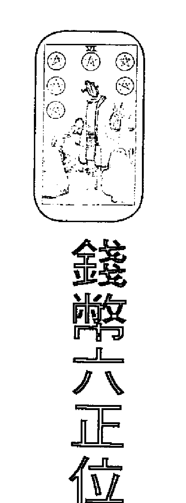

# 評估創業

- A. 創業的方向-S1P1,S5P1,S5P2,S5P4
現在創業的方向對你有利，但是許多事情仍然需要保持警覺仔細衡量，否則一不小心就有可能造成金錢上的損失。

- B. 資金來源-S1P2
目前資金狀況沒有什麼大問題，即使財務上還有缺口也可以很快補齊，但是仍然要小心謹慎並量入為出方為上策。

- C. 合夥關係-S1P3
這個事業可以合夥，但是不論大小事都要由出資最多的人最終拍板定案，否則就很可能因為一些小事而發生紛爭。

- D. 客戶設定-S1P4
可以鎖定比較精打細算的客戶，針對他們設計一些超值的促銷產品，等到關係穩定之後就可以成為長期的老客戶。

- E. 店面區位-S1P5
店面的選擇應該重視成本效益，產值與坪效都要經過精密的計算，但是該花的錢還是要花，省過頭了反而會有害。

- F. 專業前景-S1P6,S5P3,S5P5
這個事業的前景還不錯，但是凡事都要經過精確的計算和衡量，同時要付出很多時間與金錢才能得到成功的果實。

# 評估工作

- M. 工作狀況概要-S5P1,S5P2,S5P4,S7P1,S7P2,S7P3,S7P4
這個工作的內容讓你覺得滿意，雖然自己在工作上付出非常多，但是也能得到相對的實質回報，累也累得有價值。

- N. 能否勝任-S3P1
你的能力足以勝任這份工作，但是仍然需要保持專注，機警地面對各種變化，做所有事情之前都要有詳盡的計劃。

- O. 假期福利-S3P2
在這裡的福利還不錯，但是仍然會因為工作表現而有所差異；假期的規定很平常，大都可以休到自己想休的時間。

- P. 財務收入-S3P3
在這裡的收入看來平平，但若是與工作的份量相比算是非常好的了，你應該好好把握這個機會不要再三心二意了。

## 第九章 錢幣數字牌的工作牌義

- G. 工作性質-S2P1
工作最好是以自己的興趣做主要考量，這樣才能做得長久；另一方面，也可以考慮金融業或是與土地有關的行業。

- H. 工作地點-S2P2
工作地點沒有太大的限制，不論是本地或是外地都會有不錯的工作機會，這時候就看哪裡的錢比較多就往哪裡去。

- I. 要求薪資-S2P3
要求薪資與業界一般相同的水準就好，不太需要降格以求，但若出現待遇太好的職缺，反而要小心當中可能有詐。

- J. 求職管道-S2P4
目前所有求職管道都很暢通，只要你願意主動去找工作，應該都有正面的回應；由親朋好友介紹也是很快的方法。

- K. 求職運勢-S2P5,S7P1,S7P2,S7P3,S7P4
這段時間的求職運勢很不錯，只要你願意放下身段去找，應該都可以找到令你滿意的工作，千萬要把握這個機會。

- L. 可以改進的地方-S2P6
有時候你對於工作的事情想得太多，太挑剔就很難找到滿意的工作，你應該認清現實狀況去把握目前出現的機會。

- Q. 與主管的相處-S3P4,S6P3,S6P4
是一個本身非常成功的上司，對於屬下有很大的影響力，只要你能夠主動向他請益，一定會得到很多實質的幫助。

- R. 與同事的相處-S3P5,S6P3,S6P4
同事之間的相處雖然帶有很多私心的算計，但是由於需要互助合作的地方也很多，所以大家通常都能夠和平共存。

- S. 升遷加薪-S3P6
這裡雖然升遷的機會不是很好，但是如果足夠努力的話加薪的幅度也能令你滿意，所以是值得留下來拚命的地方。

- T. 如何看待對方-S6P1,S6P2
這是一個非常精於計算的人，雖然有時表面上看起來大方，其實行為的背後都另有目的，對其他人也很有影響力。

## 塔羅工作講義

# 評估事件

# U.現有資源-S4P1
目前的資源雖然足以應付所有的問題，但是仍然應該精打細算把錢花在刀口上，將每一分錢的效益都發揮到最大。

# V.人員配合-S4P2
人員之間的配合沒有什麼大問題，大家彼此之間都能互助合作共同努力，當然領導者也要扮演好激勵人心的角色。

# W.環境因素-S4P3
目前環境當中有貴人可以幫助你，所以遇到問題的時候應該盡量找人求助，也許就能更快速有效地把事情給做好。

# X.時程進展-S4P4,S7P1,S7P2,S7P3,S7P4
目前事情的進度都在你的掌握當中，如果遇到比較難解決的問題也許可以考慮用錢打發，這樣才不會拖延到時間。

# Y.執行成果-S4P5
這件事情應該可以達到令人滿意的成果，同時你也可以得到實質的利益，所以應該要好好把握這個機會不要放過。

# Z.未來影響-S4P6,S5P3,S5P5
這件事情對你有很正面的影響，不但會得到實質的利益，還有可能會因此而升遷掌權，可以發揮出更大的影響力。

## 錢幣六逆位

# 評估創業

### A.創業的方向-S1P1,S5P1,S5P2,S5P4
目前創業的方向太過好高騖遠，實際上並不是你想像的那麼簡單，如果依照現在的計劃去做將會有金錢上的損失。

### B.資金來源-S1P2
目前的資金狀況並不太好，可能會需要其他人的協助，如果不能找到新的金主投資，也許就會因為資金不足失敗。

### C.合夥關係-S1P3
這件事情並不適宜合夥，因為每個人都自私自利只為了自己，完全沒有團結合作的想法，很容易因為利益起衝突。

### D.客戶設定-S1P4
你目前對客戶的設定過於貪心，想要把所有人都一網打盡是不能的事，同時這樣的計劃也完全超出你的能力之外。

### E.店面區位-S1P5
店面區位應該選擇自己比較熟悉和有把握的地區，千萬不要去嘗試太過困難的激戰區，冒險可能會把你帶向失敗。

### F.專業前景-S1P6,S5P3,S5P5
這個事業的前景普通，必須要非常小心謹慎才能維持住基本的局面，而且實際上也不可能突然間快速地擴大發展。

# 評估求職

# G.工作性質-S2P1
工作性質應該考量到現實問題，應該以自己學有專精的方向為主，如果已經有相關工作經驗就最好延續不要轉業。

# H.工作地點-S2P2
工作地點最好以離家近的地方為主，這樣不但能省下交通與住宿的費用，同時在熟悉的地方會讓你比較有安全感。

# I.要求薪資-S2P3
要求薪資應該與業界一般的水準相同即可，提出太高的要求並不切實際，但是也不必要降格以求太低薪水的工作。

# J.求職管道-S2P4
這個時候透過親朋好友們介紹能幫你最快找到工作，只是進去之後也要好好表現，才不會辜負介紹人對你的期望。

# K.求職運勢-S2P5,S7P1,S7P2,S7P3,S7P4
這段時間的求職運勢很容易找到工作，但若是眼光太高看不起比較低薪或是基層的工作，也有可能會找不到工作。

# L.可以改進的地方-S2P6
這個時候應該要務實地評估工作機會，而不要堅持過多理想性的原則，很多事情必須實際做過之後才會了解真相。

# 評估工作

# M.工作狀況概要-S5P1,S5P2,S5P4,S7P1,S7P2,S7P3,S7P4
你對這個工作有強烈的慾望和企圖心，但也許太過遙遠而不切實際，同時在這個工作當中常常覺得自己受制於人。

# N.能否勝任-S3P1
你的能力並不足以勝任這份工作，不要因為一時的熱情就衝動接下不可能的任務，失敗的話可能會對你造成傷害。

# O.假期福利-S3P2
在這個地方的福利並不好，很多東西都只是看得到吃不到；假期的使用會受制於人，常不能休到自己想休的時間。

# P.財務收入-S3P3
在這個地方的收入並不是很多，若是再扣掉各種必要的支出就所剩無幾，也許辛苦了半天根本是在幫公司做白工。

## 第九章 錢幣數字牌的工作牌義

# U.現有資源-S4P1
現有的資源並不足以應付接下來的狀況，所以要開始為了錢而煩惱，事情也很可能因為財務上的困難而遇到問題。

# V.人員配合-S4P2
人員之間的配合有一些問題，甚至可能會因此而造成人員的流動，大家彼此之間勾心鬥角讓你覺得沒有一日安寧。

# W.環境因素-S4P3
目前的環境的狀況並不好，甚至還會發生許多意外事件讓你疲於奔命，這個時候只能自求多福不能寄望別人幫忙。

# X.時程進展-S4P4,S7P1,S7P2,S7P3,S7P4
目前進度並不如你想像中的那麼樂觀，但是如果能從現在開始面對現實急起直追，也許還有可能在時限之內完成。

# Y.執行成果-S4P5
這件事情很難達到預期的成果，事前所有的評估都過度樂觀不切實際，你應該要務實一點準備好接受最壞的狀況。

# Z.未來影響-S4P6,S5P3,S5P5
這件事情的影響未來才會慢慢浮現，但是也許會激起你強烈的熱情與企圖心，讓你投入更多時間和心力在工作上。

# Q.與主管的相處-S3P4,S6P3,S6P4
是一個主控性很強的上司，同時也可能對你有很多不合理的要求，你應該要先衡量自己的實力再決定要不要答應。

# R.與同事的相處-S3P5,S6P3,S6P4
同事們的表現或是收入常會讓你感到羨慕甚至忌妒，但是自己的實力又還不夠，你應該與同事們多多交流和學習。

# S.升遷加薪-S3P6
在這裡升遷的機會不是很好，加薪的幅度也很低，留在這裡的發展性並不好，只會看到別人不斷地超越你往上爬。

# T.如何看待對方-S6P1,S6P2
這是一個自大傲慢的人，常會看不起職位較低或能力不足的人，同時因為做法比較自私，大家都不想要與他合作。

## 錢幣七正位

# 評估創業

### A.創業的方向-S1P1,S5P1,S5P2,S5P4
目前創業的方向遇到了瓶頸，需要有創新的想法和做法才能有更進一步的發展，固守在原地最多只能夠維持現狀。

### B.資金來源-S1P2
目前資金的來源沒有什麼大問題，但是也不會有新的資金再投入，你應該以現有的資源來規劃接下來想要怎麼做。

### C.合夥關係-S1P3
這個事業可以合夥，但是並不容易找到合適的人，如果可以找到值得信任的伙伴，團結合作將會發揮更大的力量。

### D.客戶設定-S1P4
客戶最好以廠商或企業為主，一般零售的散客並不是獲利的主要來源；另一方面也表示改變做法可能會開創新局。

### E.店面區位-S1P5
目前選擇的店面區位並不適合長期的發展，如果想做比較長期的規劃，還是要尋找一個新的地方才不會受到限制。

### F.事業前景-S1P6,S5P3,S5P5
這個事業的前景還可以，但是並沒有突破性的重大發展，除非你能改變既有的經營方式，去嘗試有創意的新方法。

# 評估工作

# M.工作狀況概要-S5P1,S5P2,S5P4,S7P1,S7P2,S7P3,S7P4
目前工作上已經可以看到初步的成果，但是還不到功成名就的程度，這個時候應該積極地思考下一步應該怎麼做。

# N.能否勝任-S3P1
你的能力足以勝任這份工作，但是如果能改變既有習慣的做法就會讓事情更順利，太過固執己見只會把問題搞僵。

# O.假期福利-S3P2
在這裡基本的福利都有，但是仍然覺得有改進的空間；假期的使用很有制度，需要預先規劃好自己想休假的時間。

# P.財務收入-S3P3
在這裡的收入很穩定，但是也沒有什麼成長的空間，所以是一個適合守成的地方，想要有更好的發展就不太可能。

# 評估求職

# G.工作性質-S2P1
這個時候適合去嘗試新的工作類型，但最好還是與自己的經驗有部分相關比較容易上手，仍然應該想清楚再行動。

# H.工作地點-S2P2
也許可以考慮到其他不熟悉的地方去找工作，離開目前所在的地區有比較好的機會，不要讓固執的想法困死自己。

# I.要求薪資-S2P3
要求薪資可以略高於業界一般的水準，但也不要做出過份不合理的要求，如果積極努力爭取有很大的機會被接受。

# J.求職管道-S2P4
這時候應該嘗試與之前不同的求職管道，或是透過人力仲介等獵才公司找新工作，自己去找的工作反而沒那麼好。

# K.求職運勢-S2P5,S7P1,S7P2,S7P3,S7P4
這段時間的求職運勢還不錯，也有機會很快找到工作，但若是對工作條件不太滿意，也有可能會猶豫要不要接受。

# L.可以改進的地方-S2P6
你被眼前看到的職位與收入所綁住，而忽略了工作在未來的發展性，你應該要看得更長遠才有機會找到好的工作。

# Q.與主管的相處-S3P4,S6P3,S6P4
這個上司常常會想很多，但是實務上的執行力不足，所以只能靠你自己埋頭苦幹，遇到問題也要自己想辦法解決。

# R.與同事的相處-S3P5,S6P3,S6P4
與同事之間的相處比較疏離，並不會發展出緊密的友誼；也許由於工作性質比較獨立，所以會疏於經營人際關係。

# S.升遷加薪-S3P6
在這裡升遷的機會不高，加薪的幅度也不太令人滿意，如果很在意薪資的成長，也許換個地方會有比較好的發展。

# T.如何看待對方-S6P1,S6P2
這是一個很有耐心的人，但是想法比較固執而不知變通，做事情也被動，在同事之間常常是一個人獨來獨往。

# 評估事件

# U.現有資源-S4P1
現有的資源其實足以應付現在的狀況，但也許需要有創意的新方法才會讓事情更順利，所以要好好計劃評估一番。

# V.人員配合-S4P2
人員彼此之間的配合沒有太大的問題，但是彼此之間沒有什麼私人的交情，大家都能公事公辦把自己的責任完成。

# W.環境因素-S4P3
目前環境上沒有限制，但是也不會出現貴人來幫助你，你要靠自己的努力去完成任務，其他的不要想太多。

# X.時程進展-S4P4,S7P1,S7P2,S7P3,S7P4
目前的進度開始有一點落後，也許必須改變既有的做法才能讓事情有突破性的進展，否則就很難在時限之內完成。

# Y.執行成果-S4P5
這件事情也許無法達到令人滿意的成果，但也不致於一敗塗地，需要有創意和新的作法才可能出現突破性的進展。

# Z.未來影響-S4P6,S5P3,S5P5
這件事情將引導你去思考很多的事情，也可能會激發創意讓你有新的做法，你將發現維持現狀只會讓路越走越窄。

# 評估創業

- **A.創業的方向-S1P1,S5P1,S5P2,S5P4** 目前創業的方向讓你覺得擔心和焦慮，很害怕到最後會血本無歸，所以在做法上要比較保守以免發生致命的錯誤。

- **B.資金來源-S1P2** 目前資金的狀況很不好，財務狀況是讓你擔心的最重要因素，但是即使投入很多新的資金，事情也不見得會成功。

- **C.合夥關係-S1P3** 這個事業並不適宜合夥，因為彼此之間無法互相信任，很容易會造成溝通不良的狀況，反而可能造成更多的問題。

- **D.客戶設定-S1P4** 目前客戶設定的方向有很大的問題，也許會因此而造成嚴重的損失，這個時候應該要趕緊改變不要再執迷不悟了。

- **E.店面區位-S1P5** 目前並不是決定店面區位的好時機，在心煩意亂的狀況之下很容易做出錯誤的決定，還是等心情更平靜一點再說。

- **F.事業前景-S1P6,S5P3,S5P5** 這個事業的前景并不是很樂觀，即使規模有機會擴大也賺不到什麼錢，甚至可能因為錯誤的經營方向而造成損失。

# 評估求職

# G.工作性質-S2P1
工作性質應該以自己熟悉有經驗的為主，而且最主要的考量應該是薪水的多寡；這時不宜去嘗試新的工作類型。

# H.工作地點-S2P2
工作的地點最好選擇在自己熟悉的地方，這樣不但會讓你比較有安全感，同時也有比較大的機會快點找到新工作。

# I.要求薪資-S2P3
要求薪資也許要略低於業界一般的水準才有機會，但是也不必要降低太多打擊自信心，要有耐性才能找到好工作。

# J.求職管道-S2P4
這段時間可以透過政府設立的就業服務站去找工作，雖然速度有時候會比較慢，但是至少不用擔心遇到求職陷阱。

# K.求職運勢-S2P5,S7P1,S7P2,S7P3,S7P4
這段時間的求職運勢並不是很好，也許很難很快找到自己滿意的工作，所以當求職不順利的時候也不要太過灰心。

# L.可以改進的地方-S2P6
你對於工作的收入太過重視，以致於汲汲營營想要找到更高薪的工作，其實除了薪水之外也要考慮到其他的收穫。

# 評估工作

# M.工作狀況概要-S5P1,S5P2,S5P4,S7P1,S7P2,S7P3,S7P4
目前工作的狀況讓你感到焦慮，有很多事情並不在你的掌握當中，同時又會很擔心自己的付出到頭來只是一場空。

# N.能否勝任-S3P1
你的能力並不足以勝任這份工作，如果硬要接下這份工作，將會讓你每天陷入焦慮的情緒當中，又無法解決問題。

# O.假期福利-S3P2
這個地方的福利並不好，很多基本的保障都還做不到；假期的使用有很多不合理的限制，甚至休假還會影響收入。

# P.財務收入-S3P3
這個地方的收入並不穩定，常會讓你擔心有入不敷出的狀況，但是由另一個方面來看，這也是激發你向上的動力。

## 第九章 錢幣數字牌的工作牌義

# U.現有資源-S4P1
現有資源並不足以面對現在的狀況，所以可能會讓你每天都要為了錢的事情煩惱，即使努力硬撐也很難完成任務。

# V.人員配合-S4P2
人員彼此之間無法信任，因此在配合時常會卡在一些小問題上，也許要花一些時間精力加強彼此的共識與向心力。

# W.環境因素-S4P3
目前環境的狀況讓你非常憂慮，但是你又沒有能力改變環境，所以只能把自己的責任做好，其他的就不要想太多。

# X.時程進展-S4P4,S7P1,S7P2,S7P3,S7P4
目前的進度已經嚴重落後，很有可能是因為之前完全走錯了方向，如果不能及時更正就無法在預定的時間之內完成。

# Y.執行成果-S4P5
這件事情很難達到預期的成果，甚至還可能因為錯誤的決策造成重大損失，所以在這個狀況下更應該要小心謹慎。

# Z.未來影響-S4P6,S5P3,S5P5
這件事情可能會讓你陷入擔心焦慮的情緒當中，以致於失去了判斷力與行動力，所以應該要更務實地去面對問題。

# Q.與主管的相處-S3P4,S6P3,S6P4
這是一個唯利是圖的上司，並且常常擔心屬下會超越他，所以在相處時應該盡量低調，也不要與他爭任何的功勞。

# R.與同事的相處-S3P5,S6P3,S6P4
同事彼此之間無法互相信任，只能盡力把自己份內的事做好，同時最好避免有金錢借貸的關係，也許會造成困擾。

# S.升遷加薪-S3P6
在這個地方很難有升遷的機會，加薪的可能性也不高，如果想在這裡養老等退休還可以，但是未來沒什麼發展性。

### T.如何對待對方-S6P1,S6P2
這是一個把錢看得比什麼都重的人，每天眼裡只有錢而已，完全不顧慮到別人的感受，所以並不受大家的歡迎。

## 塔羅工作講義

# 評估創業

### A.創業的方向-S1P1,S5P1,S6P2,S5P4
目前創業的方向需要專業技術與全心投入，並不是輕鬆簡單的事情，但是若能腳踏實地努力，也可以有一番成就。

### B.資金來源-S1P2
目前資金的狀況還算穩定，只要持續努力經營應該都可以達到收支平衡，目前還不需要去尋找新的金主或合夥人。

### C.合夥關係-S1P3
這個事業可以合夥，但最好是以專業分工做為出發點，如果是以個人情誼為主尋找合夥的人，很可能會走向失敗。

### D.客戶設定-S1P4
客戶應該設定在例行性採購或大宗採購的客戶，所以很需要用心地以專業的服務，去爭取與他們長期合作的機會。

### E.店面區位-S1P5
店面區位的選擇並不會有多大的影響，目前的狀況還有進步的空間，等過一陣子之後自然會去找到更適合的地方。

### F.事業前景-S1P6,S5P3,S5P5
這個事業的前景十分看好，最重要的是自己是否有認真努力地不斷精進，只要專心一致付出必定會有很好的收穫。

# 評估工作

# M.工作狀況概要-S5P1,S5P2,S5P4,S7P1,S7P2,S7P3,S7P4
這是一份需要專業技術的工作，在工作時也很需要保持專注，如果你越努力奮鬥的話，通常也會得到越多的報酬。

# N.能否勝任-S3P1
你的能力已經足以勝任這份工作，但是自己仍然有進步的空間，應該利用這個機會好好學習，讓自己更上一層樓。

# O.假期福利-S3P2
在這裡的福利平平，基本上該有的一樣都沒有少；假期方面沒有特別的限制，但是有可能常常忙到有假沒辦法休。

# P.財務收入-S3P3
在這裡的收入還不錯，而且如果有獎金或是分紅的話應該要盡量去爭取，這是一個你越努力表現得到越多的地方。

**G.工作性質-S2P1**
可以去尋找自己有專業技能的工作，或是其他有機會在工作當中學得一技之長的職缺；最好不要擔任管理的職務。

**H.工作地點-S2P2**
工作地點對你找工作沒有太大的影響，只要是符合自己興趣或是專長的工作，即使需要離鄉背井打拼也值得一試。

**I.要求薪資-S2P3**
要求薪資應該與業界一般水準相同即可，但要注意是否有獎金、紅利或加班費，這也可能成為很重要的收入來源。

**J.求職管道-S2P4**
這個時候自己去丟求職信找工作當然很好，不過也可能有職缺主動找上門來，只要自己能力好就不怕找不到工作。

**K.求職運勢-S2P5,S7P1,S7P2,S7P3,S7P4**
這段時間有機會找到很好的工作，所以應該要主動積極一點去求職，同時記得要備齊自己的專業證照和得獎證明。

**L.可以改進的地方-S2P6**
你太專注於工作本身，而忽略了經營自己的人脈，如果能與同事或客戶多多聯絡，相信一定可以更快找到新工作。

**Q.與主管的相處-S3P4,S6P3,S6P4**
這是一個很努力工作的上司，所以也會希望屬下和他一樣認真，在他下面除了加倍努力表現外沒有討好他的方法。

**R.與同事的相處-S3P5,S6P3,S6P4**
在工作中每個人都專注於自己的工作，因此常會忽略經營與同事之間的人際關係，也缺乏和同事交流聯誼的機會。

**S.升遷加薪-S3P6**
在這個地方有很好的升遷機會，如果你的表現突出自然會得到回報，同時只要你夠努力的話，加薪幅度也會很大。

**T.如何看待對方-S6P1,S6P2**
這是一個小心謹慎的人，在工作當中非常努力和專注，也會把自己的責任做好，是一個大家都覺得可以信賴的人。

# 評估事件

- U. 現有資源-S4P1
現有的資源雖然足以應付目前的狀況，但是仍然應該小心謹慎避免不必要的浪費，要很努力才能得到亮眼的成果。

- V. 人員配合-S4P2
人員之間的配合還可以，但是彼此之間的互動不頻繁，只要能在事前把事情和責任講清楚，就可以順利完成任務。

- W. 環境因素-S4P3
目前環境上沒有什麼太大的阻力或是助力，一切成敗都是看自己的表現而定，所以只能埋頭苦幹其他不要想太多。

- X. 時程進展-S4P4,S7P1,S7P2,S7P3,S7P4
這件事情的進度一切都在你的掌握當中，現在需要的只是小心謹慎地處理好每一個細節，就可以在時限之內完成。

- Y. 執行成果-S4P5
這件事情如果有足夠的努力並且堅持下去，應該就可以達到預期的成果，所以這個時候應該保持專注不要想太多。

- Z. 未來影響-S4P6,S5P3,S5P5
這件事情會讓你有很多學習和成長，也能讓別人看見你的能力與表現，對於未來的加薪或晉升都會有很大的幫助。

## 錢幣八逆位

# 評估創業

- A. 創業的方向-S1P1,S5P1,S5P2,S5P4
目前創業的方向對你不利，即使很努力也不見得會有實質的成果，你也有可能太注意細節而忽略了大方向的問題。

- B. 資金來源-S1P2
現在財務的狀況並不理想，但是目前也不宜再投入更多資金，這時候應該先想辦法找到入不敷出的原因加以改進。

- C. 合夥關係-S1P3
這個事業非常不適宜合夥，否則很可能每個人都會在裡面搞一些陰謀詭計來暗算別人，到最後大家只好不歡而散。

- D. 客戶設定-S1P4
客戶的設定應該要重視實質的好處，不要為了過份的野心而急速擴張，經營客戶要踏實地去努力而不要想走捷徑。

- E. 店面區位-S1P5
店面區位是公司的門面，還是要找比較好的地段才能有好的發展，只是在這當中仍然要注意成本效益是否能平衡。

- F. 事業前景-S1P6,S5P3,S5P5
這個事業的前景並不是很看好，所以應該就大方向上重新檢討改進，如果在錯誤的方向上努力就不會有任何成果。

# 評估求職

- G. 工作性質-S2P1
可以選擇銷售或業務性質的工作，會有比較大的學習與成長；仍然要在專業技術與服務上不斷精進才能走得長久。

- H. 工作地點-S2P2
工作地點可以選在競爭激烈的大都會區，在那裡比較容易找到自己覺得滿意的工作；也可能會為了新工作而遷移。

- I. 要求薪資-S2P3
要求薪資與業界一般的水準相同即可，提出太低的薪資會委曲自己，要求太高的也可能會喪失一些好的工作機會。

- J. 求職管道-S2P4
這個時候可以透過關係用走後門的方式找工作，如果是經過公開徵選的程序就不容易成功，反而會打擊你的信心。

- K. 求職運勢-S2P5,S7P1,S7P2,S7P3,S7P4
這個時候不容易找到自己滿意的工作，自己的期待越大到頭來也許失望也越大；可以先休息一陣子再繼續找工作。

- L. 可以改進的地方-S2P6
你太過重視面子的問題，所以很難拉下臉來從事你覺得不夠格的工作，你要先克服心理的障礙才能快點找到工作。

# 評估工作

- M. 工作狀況概要-S5P1,S5P2,S5P4,S7P1,S7P2,S7P3,S7P4
工作當中會需要專業的技術與能力，但是除此之外仍然需要通權達變才能把事情做好，太死腦筋只會把自己困住。

- N. 能否勝任-S3P1
你的能力並不足以勝任這份工作，只能當作磨練的機會邊做邊學，但若是自己的抗壓性不夠也可能會撐不下去。

- O. 假期福利-S3P2
這個地方的福利制度並不完整，有很多地方都沒有照顧到；假期的使用限制很多，所以都要提早排假以免休不到。

- P. 財務收入-S3P3
這個地方的收入並不是很好，但是可以因此學習到很多經驗，是不是值得為此而留下來，就要看每個人的價值觀。

## 第九章 錢幣數字牌的工作牌義

# 評估事件

- U. 現有資源-S4P1
現有的資源並無法應付接下來的變化，只能靠過去的成果苦撐，到了支撐不下去的情況時，可能就只好被迫放棄。

- V. 人員配合-S4P2
人員彼此之間不合可能會影響到事情的進度，除了讓大家維持表面的和諧之外，還需要溝通協調才能把事情做好。

- W. 環境因素-S4P3
目前環境上有不少的好機會可以利用，但是狀況並不是很容易掌握，有時候還需要耍一點小手段才能把事情搞定。

- X. 時程進展-S4P4,S7P1,S7P2,S7P3,S7P4
這個事情的進度開始有一點落後，所以應該要收起散漫的態度、專心致志地去執行，否則就很難在時限之內完成。

- Y. 執行成果-S4P5
這件事情也許無法達到預期的成果，所以最好不要有太高的期望，同時也要慎防敵人會用陰謀詭計在當中搞破壞。

- Z. 未來影響-S4P6,S5P3,S5P5
這件事情不會造成嚴重的實質影響，但是可能會對你的名譽有一些損害，你應該堅持自己的原則不要被這些影響。

- Q. 與主管的相處-S3P4,S6P3,S6P4
是一個力求表現的上司，但是為了達成目的也常常會不擇手段，如果你不能配合他的作法，可能就會被他犧牲掉。

- R. 與同事的相處-S3P5,S6P3,S6P4
同事之間彼此處於競爭關係，雖然在表面上可以維持和諧，但是私底下也是暗潮洶湧勾心鬥角，要小心才能自保。

- S. 升遷加薪-S3P6
在這裡升遷的機會還有，但加薪的幅度完全與付出不成比例，在這裡只能賺到頭銜與職位，但是沒有實質的收穫。

- T. 如何看待對方-S6P1,S6P2
這是一個努力向上的人，但是常會在背後私底下搞一些小動作，所以大家也只會在表面上都和他維持不錯的關係。

# 評估創業

- A. 創業的方向-S1P1,S5P1,S5P2,S5P4
你對於目前創業的方向駕輕就熟，而且也預期可以有很好的成果，但是仍然要小心謹慎才不會讓煮熟的鴨子飛了。

- B. 資金來源-S1P2
目前資金的狀況十分充裕，所以不太需要為了錢的事情擔心，這個時候應該把重心放在如何用錢實踐自己的理想。

- C. 合夥關係-S1P3
這個事業並不適宜合夥，否則可能會因為人多嘴雜而把焦點給模糊了，還是一個人做決定比較能符合自己的想法。

- D. 客戶設定-S1P4
客戶應該鎖定在有錢有閒的頂級客群，這時候用低價促銷的策略反而會把自己困住，努力提高附加價值才是重點。

- E. 店面區位-S1P5
店面區位應該選擇在比較熱鬧或高檔的地區，同時在裝潢上也不能夠太省，要先把門面打理好才能把生意做起來。

- F. 事業前景-S1P6,S5P3,S5P5
這個事業的前景十分看好，甚至有機會可以輕輕鬆鬆賺大錢，所以應該要好好把握這個機會，不要再猶豫不決了。

# 評估工作

- M. 工作狀況概要-S5P1,S5P2,S5P4,S7P1,S7P2,S7P3,S7P4
對你來說工作並不是很費力，只是有時候要花比較多的心力去想如何解決問題，大部分的時間都非常輕鬆愉快。

- N. 能否勝任-S3P1
你的能力絕對足以勝任這個職務，因為你對於所有工作的內容都了然於胸，也有足夠的洞察力來看穿可能的問題。

- O. 假期福利-S3P2
這個地方的福利非常好，連你想像不到的很多福利都有；假期上的規定也十分寬鬆，通常都可以休到想休的時間。

- P. 財務收入-S3P3
這個地方的收入非常好，只要自己不過份揮霍都可以存很多錢，所以應該好好把握這個機會，不要被別人搶走了。

## 第九章 錢幣數字牌的工作牌義

- G. 工作性質-S2P1
工作性質應該選擇自己已經很熟悉的工作內容或產業，因為這個時候如果轉業的話，通常都會遇到非常大的困難。

- H. 工作地點-S2P2
工作地點最好選擇自己所熟悉的地區，不論是離家近或是鄰近之前工作、求學的地方，都會比較快找到好的工作。

- I. 要求薪資-S2P3
要求薪資可以高於業界一般的水準，只要你能提出足夠證據來說明你為什麼值得這樣的待遇，通常都可以被接受。

- J. 求職管道-S2P4
這個時候很可能有工作主動找上門來，如果想換工作也可以透過人力仲介或獵才公司尋找，可以談到不錯的價錢。

- K. 求職運勢-S2P5,S7P1,S7P2,S7P3,S7P4
這段時間的求職運勢非常強，只要用心留意一定可以找到很好的工作，同時薪水也有機會超過你覺得滿意的標準。

- L. 可以改進的地方-S2P6
你在心態上過於保守和謹慎，以致於會錯過一些很好的工作機會，你應該要勇於嘗試才能讓自己快點找到新工作。

- Q. 與主管的相處-S3P4,S6P3,S6P4
是一個務實細心的上司，同時也有敏銳的洞察力和高遠的理想，只要你能好好跟著他作事，未來的前途無可限量。

- R. 與同事的相處-S3P5,S6P3,S6P4
有一些事情需要同事幫忙，所以處理與同事的關係時要小心謹慎，如果能維持良好的互動在工作上就會非常方便。

- S. 升遷加薪-S3P6
在這裡升遷的機會平平，但是如果努力加薪的幅度也可能會超越自己的預期，所以最好是把全心放在賺錢的部分。

- T. 如何看待對方-S6P1,S6P2
這是一個小心謹慎的人，對於事情有一套獨到的見解，所以當出現與工作有關的問題時，許多同事都會去徵詢他。

# 評估事件

- U. 現有資源-S4P1
現有的資源可以輕鬆地應付所有的狀況，所以應該把心力用在如何解決問題上，可以用錢解決的問題就用錢解決。

- V. 人員配合-S4P2
人員之間的配合沒有什麼大問題，彼此之間雖然沒有太深的私交，但在公務上還是可以很平順地配合把事情完成。

- W. 環境因素-S4P3
目前大環境上有很多有利的因素，也可能有貴人會來幫助你，所以只要專心把自己的事情做好，其他的別想太多。

- X. 時程進展-S4P4,S7P1,S7P2,S7P3,S7P4
目前事情的進度一切正常，你只要按部就班把該做的事情一件一件顧好，輕輕鬆鬆就可以在預定的時間之前完成。

- Y. 執行成果-S4P5
這件事情會得到很好的成果，而且你也有機會可以享受到勝利的果實，所以你應該小心謹慎，盡全力去完成任務。

- Z. 未來影響-S4P6,S5P3,S5P5
這件事情會帶來金錢上巨大的回報，但是也可能讓你因此而變得懶散不想工作，你要小心謹慎看清時勢再做決定。

## 錢幣九逆位

# 評估創業

- A. 創業的方向-S1P1,S5P1,S5P2,S5P4
你對於目前創業的方向並不了解，有可能從頭到尾就是一場騙局，如果你再不認清楚現實，就會造成更多的損失。

- B. 資金來源-S1P2
目前資金的狀況並不在你的掌握之中，還有很多部分需要靠別人的幫助，這個時候應該要務實評估不要過份樂觀。

- C. 合夥關係-S1P3
這個事業並不適宜合夥，如果合夥的話很可能會因為缺乏互信而發生金錢上的糾紛，最後也許會落得拆夥的下場。

- D. 客戶設定-S1P4
客戶設定在比較衝動消費或貪圖享樂的人身上，所以在產品包裝和促銷上要盡量誇張，才可以吸引到他們的目光。

- E. 店面區位-S1P5
目前並不是決定店面區位的好時機，也許還有很多條件還沒有考慮清楚，如果在這個時候貿然決定就會造成傷害。

- F. 事業前景-S1P6,S5P3,S5P5
這個事業的前景表面上看起來光鮮亮麗，但是實際上卻是問題叢生，如果搞不清楚實際狀況的話可能會越陷越深。

# 評估求職

- G. 工作性質-S2P1
工作性質可以選擇與業務或銷售有關的職位，但是這樣的工作雖然收入好但是風險也高，要很小心謹慎避免被騙。

- H. 工作地點-S2P2
工作地點應該盡量在自己熟悉的地方，這樣不但可以兼顧到生活機能與品質，即使遇到任何問題也比較容易處理。

- I. 要求薪資-S2P3
要求薪資要略低於業界一般的水準，不要不自量力提出太高的要求，如果遇到太高薪的工作反而要小心是個騙局。

- J. 求職管道-S2P4
這個時候想透過別人介紹你好工作是不可能的，不如自己主動出擊去找比較有機會；參加公開招考是不錯的方式。

- K. 求職運勢-S2P5,S7P1,S7P2,S7P3,S7P4
這段時間求職的運勢不是很好，而且要小心各種的求職陷阱，所以如果遇到輕鬆又高薪的工作就要特別提高警覺。

- L. 可以改進的地方-S2P6
你對於工作的想法太過理想化，沒有務實地評估自己的實力和產業的狀況，你必須更貼近現實思考才能找到工作。

# 評估工作

- M. 工作狀況概要-S5P1,S5P2,S5P4,S7P1,S7P2,S7P3,S7P4
目前工作的狀況十分繁瑣，很多事情根本是在浪費時間，但你還是要耐著性子去做，遵守規定才是最安全的做法。

- N. 能否勝任-S3P1
你的能力並不足以勝任這份工作，不要過份高估自己的實力，如果硬要去做的話，可能會遇到判斷錯誤被騙的狀況。

- O. 假期福利-S3P2
這個地方的福利並不是很好，有很多好處都看得到吃不到；如果不提早排休假的話，就無法休到自己想休的時間。

- P. 財務收入-S3P3
這個地方的收入並不好，有很多東西只是畫大餅，實際上根本不可能實現，所以還是快點認清現實不要再幻想了。

# 評估事件

- U. 現有資源-S4P1
現有的資源並不足以應付接下來的危機，如果不能再投入更多的資源，也許就會因為資金不足的問題而導致失敗。

- V. 人員配合-S4P2
人員之間的配合並不好，而且會因為勞逸不均的問題產生彼此的不信任，甚至還可能出現互相欺騙和陷害的情況。

- W. 環境因素-S4P3
目前環境上充滿了不確定的因素，有可能對這件事情造成嚴重的破壞，所以要小心謹慎處理，不要再偷懶下去了。

- X. 時程進展-S4P4,S7P1,S7P2,S7P3,S7P4
目前事情的進展已經脫離你的掌握，如果還是不願意認真面對真相，也許就無法急起直追在預定的時限之內完成。

- Y. 執行成果-S4P5
這件事情很難達到預期的成果，只能盡力補救不要讓傷害擴大，如果你不能及時看清楚真相，就有可能越陷越深。

- Z. 未來影響-S4P6,S5P3,S5P5
這件事情會讓你變得迷惑，不知道怎麼做才是對的，在自己還沒有完全搞清楚狀況之前，最好不要做重大的決定。

- Q. 與主管的相處-S3P4,S6P3,S6P4
是一個比較散漫的上司，作事情常常沒有清楚的目標和計劃，如果想要把事情做好的話，還是得靠自己積極努力。

- R. 與同事的相處-S3P5,S6P3,S6P4
同事之間充滿了欺騙和詭計，完全沒有辦法互相信任，所以在工作上要想辦法自立自強，盡量減少對同事的依賴。

- S. 升遷加薪-S3P6
在這裡升遷和加薪都只是夢想，即使表面上看起來很有希望，實際上並不可能實現，還是快點看清現實比較重要。

- T. 如何看待對方-S6P1,S6P2
這是一個貪圖享受的人，常常會在工作當中想盡辦法偷懶，甚至使出欺騙的手段，所以大家都不太想要與他合作。

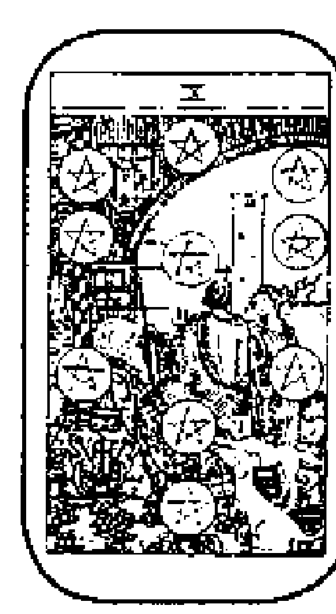

# 評估創業

- A. 創業的方向-S1P1,S5P1,S5P2,S5P4
目前創業的方向對你十分有利，也可以因此賺到很多錢，不過在過程當中仍然需要大家的配合，最後才能夠成功。

- B. 資金來源-S1P2
目前資金的狀況十分充裕，只要不太浪費應該都不成問題，這個時候要想的是如何把每一分錢的潛力發揮到極致。

- C. 合夥關係-S1P3
這個事業最好可以合夥，因為合夥可以讓大家全心全意付出，而且會各盡其職把事情做好，團結發揮更大的力量。

- D. 客戶設定-S1P4
應該想辦法適應各個類型的客戶，把所有的人都一網打盡，如果只鎖定在特定的族群之內，反而會限制了發展性。

- E. 店面區位-S1P5
店面區位可以選擇在較高檔的精華地段，雖然這樣會花費比較多的租金，但是長遠來看也可以帶來很可觀的收益。

- F. 事業前景-S1P6,S5P3,S5P5
這個事業的前景十分看好，而且可以為你賺進大筆的鈔票，你應該全心全意投入這個事業，才能得到最多的收益。

# 評估工作

- M. 工作狀況概要-S5P1,S5P2,S5P4,S7P1,S7P2,S7P3,S7P4
這是一份非常穩定的工作，只要能扮演好自己的角色，就能輕鬆地賺進大把鈔票，應該算是一份事少錢多的工作。

- N. 能否勝任-S3P1
你的能力可以勝任這個職位，但是仍然需要別人配合才能把事情好，所以在這個人際關係會有很大的影響。

- O. 假期福利-S3P2
在這個地方的福利很好，所有在意的地方都充分被照顧到；假期使用的規定很寬鬆，通常想休假的時候就可以休。

- P. 財務收入-S3P3
在這個地方的收入非常好，甚至可以說是一份事少錢多的工作，所以應該好好把握這份工作，穩定地一直做下去。

## 錢幣十正位

## 第九章 錢幣數字牌的工作牌義

- G. 工作性質-S2P1
盡量選擇比較大企業工作，對你未來的發展會很有幫助；另一方面，也可以嘗試在家族企業或親戚開的公司工作。

- H. 工作地點-S2P2
工作地點最好離家近，會比較容易找到收入高的工作，這時候若是離鄉背井到外地去工作，還是會擔心家裡的事。

- I. 要求薪資-S2P3
要求薪資可以高於業界一般的水準，而且只要自己的實力值得更高的價錢，就算提出很高的待遇也有可能被接受。

- J. 求職管道-S2P4
這個時候可以透過家人介紹，應該會是最快找到工作的方式；也可以直接就在家族企業或親戚開的公司當中工作。

- K. 求職運勢-S2P5,S7P1,S7P2,S7P3,S7P4
這段時間的求職運勢非常好，也可以找到很高薪的工作，所以要好好把握這段時間努力去找，不要再裹足不前了。

- L. 可以改進的地方-S2P6
你太重視家中的意見，以致於很難找到適合自己的工作，你應該由自己的能力興趣去考慮，才能快一點找到工作。

- Q. 與主管的相處-S3P4,S6P3,S6P4
這個上司是以集體的利益為主要考量，但也可能因此而犧牲當中的個人，你應該盡量發揮自己的專長以免被淘汰。

- R. 與同事的相處-S3P5,S6P3,S6P4
與同事之間雖然有很多機會分工合作，但是由於彼此之間沒有什麼私人情誼，所以在處理事情時也只能公事公辦。

- S. 升遷加薪-S3P6
在這個地方能不能升遷要看你所扮演的角色，位子對了自然就很容易升；加薪機會則是很高，幅度也很令人滿意。

- T. 如何看待對方-S6P1,S6P2
這是一個精明幹練的人，但有時算計得太清楚也會給人冷酷無情的感覺，大多數的人都很看好他在工作上的發展。

评估事件

### U.现有资源-S4P1

现有的资源绝对足以处理所有的事情，所以不要再犹豫不决，尽全力勇往直前，努力去克服所有的困难完成任务。

### V.人员配合-S4P2

这件事情的分工有可能成为事情成败的关键，所以要确定每个人都能克尽职责，如果有不适任的人就要果决换掉。

### W.环境因素-S4P3

目前的大环境上对你十分有利，也有很多贵人可以帮助你，只要你自己不要太离谱，就不会出现什么重大的问题。

### X.时程进展-S4P4,S7P1,S7P2,S7P3,S7P4

目前一切的进度都在你的掌握当中，只要能让每个人都做到自己应尽的责任，应该就可以在预定的时间之内完成。

### Y.执行成果-S4P5

这件事情会得到很好的成果，甚至可能超出你当初的预期，所以要好好把握这个机会，尽全力去争取最大的利益。

### Z.未来影响-S4P6,S5P3,S5P5

这件事情会带给你很大的财富，同时对于所有相关的人也都会带来利益，所以这件事情不能只考量到自己的部分。

第九章 钱币数字牌的工作牌义

钱币十逆位

> 评估创业

- **A.创业的方向-S1P1,S5P1,S5P2,S5P4**
目前创业的方向对你而言是很大的负担，在还没想清楚之前贸然投入有很大的风险，整个事业就像是在赌博一样。

- **B.资金来源-S1P2**
目前资金的状况并不是很好，也许还有很大一部分还没到位，在入不敷出的状况之下一切都要小心谨慎不可浪费。

- **C.合伙关系-S1P3**
这个事业并不适宜合伙，因为大家很可能为了钱的事情而明争暗斗，不但无法发挥出团结的力量，反而可能坏事。

- **D.客户设定-S1P4**
客户的设定应该看得长远，只重视短期的利益并不会让你的事业成功；另一方面，也可以全力锁定退休的年长者。

- **E.店面区位-S1P5**
店面区位最重要的是考虑坪效，如果无法精确估算出成本效益，就不要急着作决定，以免错误的决策造成了损失。

- **F.事业前景-S1P6,S5P3,S5P5**
这个事业的前景堪虑，未来充满了风险与不确定性，如果再继续坚持下去的话，就像是在赌博一样没有办法掌握。

# 评估求职

### G.工作性质-S2P1

目前可以尝试金融或投资方面的工作，博弈相关的产业也可以考虑；另一方面，业务性质的工作可能比较适合你。

### H.工作地点-S2P2

在工作地点的选择上最好是离家远一点，这样比较可以专心工作不必去烦心家里的事情，也会比较容易找到工作。

### I.要求薪资-S2P3

要求薪资最好略低于业界一般的水准，否则很容易错过好的工作机会，除了薪水之外也要考虑到生活品质的条件。

### J.求职管道-S2P4

目前不可能由别人介绍给你好的工作，所以还是要靠自己努力积极主动去试，针对自己理想的公司职位毛遂自荐。

### K.求职运势-S2P5,S7P1,S7P2,S7P3,S7P4

目前求职的运势不佳，很有可能会遇到骗人的求职陷阱，所以不要看到高薪的工作就奋不顾身，还是要冷静考虑。

### L.可以改进的地方-S2P6

你目前针对未来发展的方向都没有想清楚，只是想要混一口饭吃，如果持续维持消极的心态，就很难找到好工作。

# 评估工作

### M.工作状况概要-S5P1,S5P2,S5P4,S7P1,S7P2,S7P3,S7P4

工作上可能会经手大笔金钱，但是因为这些钱都不是你的，所以在处理时要特别小心，以免造成无法弥补的伤害。

### N.能否胜任-S3P1

你的能力并不足以胜任这份工作，如果硬要接下这份工作就得要靠大家的帮忙，在这种状况之下往往会受制于人。

# O.假期福利-S3P2

这个地方的福利并不好，很多事没有明确制度会因人而异；假期的使用常常受制于人，无法休到自己想休的时间。

### P.财务收入-S3P3

在这个地方的收入并不稳定，时好时坏的状况让你觉得有些担心，平时自己还是应该要多存一点钱以备不时之需。

第九章 钱币数字牌的工作牌义

评估事件

**U.现有资源-S4P1**

现有的资源看似充足，其实并不足以应付接下来的状况，所以这时候还是要省吃俭用，保留多一点资源处理危机。

**V.人员配合-S4P2**

人员之间彼此无法配合，反而是为了利益而明争暗斗，这个时候如果无法平息纷争，事情很有可能被内斗给拖垮。

**W.环境因素-S4P3**

目前的大环境对你不利，巨大的风险让状况变得像赌博一样，你只能尽全力去做，但是完全无法预料结果会如何。

**X.时程进展-S4P4,S7P1,S7P2,S7P3,S7P4**

目前的进度并不在自己的掌握当中，还有很多部分要看别人的脸色，需要大家都赏脸帮忙才有机会在时限内完成。

**Y.执行成果-S4P5**

这件事情无法达到预期的成果，反而会造成重大的金钱损失，你应该要及早想好对策，才能防范伤害的程度扩大。

**Z.未来影响-S4P6,S5P3,S5P5**

这件事情的发展还有很大的不确定性，对你来说是重大的赌注，赌赢了当然收获丰富，但赌输了可能会损失惨重。

**Q.与主管的相处-S3P4,S6P3,S6P4**

这个上司的眼中只看到钱，完全没有考虑到个人的感觉，所以如果你对公司的贡献不够，可能就会被他钉得很惨。

**R.与同事的相处-S3P5,S6P3,S6P4**

在工作当中大家都为了资源的分配而斤斤计较，彼此之间常常会因此而明争暗斗，所以也很缺乏良性的互动关系。

**S.升迁加薪-S3P6**

在这个地方没有好的升迁机会，能不能升上去完全是靠运气；加薪幅度也不会很大，只能靠年资慢慢地累积上去。

**T.如何看待对方-S6P1,S6P2**

这是一个反应比较迟钝的人，往往要做很多次才能会学一个东西，同时又会想得很多，所以大家都不想与他合作。

权杖侍者正位

评估创业

**A.创业的方向-S1P1,S5P1,S5P2,S5P4**
目前创业的方向对你来说是一种新的尝试，也还在刚起步的学习阶段，你应该要勇于尝试才知道未来发展的方向。

**B.资金来源-S1P2**
目前资金的来源明显不足，还需要努力争取才能把钱凑齐，但也可能出现贵人相助，帮你找到新的金主或合伙人。

**C.合伙关系-S1P3**
这个事业可以合伙，但还是需要一段时间磨合才能适应，所以内心不要有主观的预设立场，实际相处后再下定论。

**D.客户设定-S1P4**
客户可以设定比较年轻、勇于尝试新鲜事物的族群，所以宣传上应该要更活泼而有创意，才会吸引这些人的注意。

**E.店面区位-S1P5**
目前选择的店面只是一个暂时的跳板，也许之后会发现一些不足的地方，到时候也许就会再迁移到更适合的地点。

**F.事业前景-S1P6,S5P3,S5P5**
这个事业还有很大的发展空间，是好是坏完全取决于你的做法，所以应该快点找到自己想要的方向尽全力去经营。

评估工作

**M.工作状况概要-S5P1,S5P2,S5P4,S7P1,S7P2,S7P3,S7P4**
目前的工作还在刚开始的起步阶段，也还有很多东西可以去探索和学习，你应该要把握各种的机会多方面去尝试。

**N.能否胜任-S3P1**
你的能力虽然并不足以胜任这个职位，但是可以在这份工作当中学习到很多，也许经过训练之后就有足够的能力。

**O.假期福利-S3P2**
这个地方的福利并不是很好，但仍然有争取更多的可能性；假期的使用很自由，通常都可以休到自己想休的时间。

**P.财务收入-S3P3**
这个地方的收入并不是很多，但是可以学到很多东西，也算是另一个方面的所得，值不值得就要看个人的价值观。

### G.工作性质-S2P1

工作性质应该是以自己有兴趣的方向为主，也可以去尝试自己不熟悉的新工作，这个时候抱持着学习的心就对了。

### H.工作地点-S2P2

工作地点应该选择离家近的地区，这样可以减少生活适应方面的问题，比较有多一些时间可以全心全意投入工作。

### I.要求薪资-S2P3

要求薪资应该略低于业界一般的水准，最好把自己想成是新手的立场比较合适，所以不要对于薪资有太高的期待。

### J.求职管道-S2P4

这个时候可以多方尝试不同的求职管道，不论是公开招考或是就业博览会之类的活动，多参加会增加自己的经验。

### K.求职运势-S2P5,S7P1,S7P2,S7P3,S7P4

这段时间的求职运势还不差，应该很快就可以找到新的工作，所以这个时候不要想太多，任何机会都可以去尝试。

### L.可以改进的地方-S2P6

你对于找工作这件事情过于轻忽，并没有很认真的思考和规划，你应该更用心一点，主动积极才会快点找到工作。

### Q.与主管的相处-S3P4,S6P3,S6P4

是比较放任自由态度的上司，你应该在自己可以尝试的范围之内多多学习，只要你能把事情搞定他就不会来烦你。

### R.与同事的相处-S3P5,S6P3,S6P4

与同事相处要保持平常心，不要自己想太多吓自己，其实大家都是很真心相待，遇到问题也可以一起想办法解决。

### S.升迁加薪-S3P6

在这里未来可能还有不错的升迁机会，但是并不会在近期之内发生；加薪的幅度还是要看你实际的表现才会决定。

### T.如何看待对方-S6P1,S6P2

这是一个很单纯的人，对人的态度十分和善，虽然在工作能力上并不是很成熟，但是遇到问题大家都乐于帮忙他。

### U.现有资源-S4P1

现有的资源并不足以面对接下来的挑战，所以最好能尽快争取到更多的资源，否则将会遇到非常难以处理的挑战。

### V.人员配合-S4P2

人员之间的配合没有什么问题，只要有明确的指令就可以把自己的事情搞定，所以最重要的是负责领导指挥的人。

### W.环境因素-S4P3

环境上虽然充满了挑战，但是也可能出现贵人相助，你可以勇敢地尝试新的做法，也许会有令人意想不到的效果。

### X.时程进展-S4P4,S7P1,S7P2,S7P3,S7P4

目前事情的进展还算顺利，但是仍然要小心接下来的各种问题和挑战，主动积极处理也许就可以在时限之内完成。

### Y.执行成果-S4P5

这件事情仍然要面对很多的挑战和不确定性，所以接下来只能走一步算一步，等遇到实质的问题再来想办法解决。

### Z.未来影响-S4P6,S5P3,S5P5

这件事情会带来行动的新讯息，也许将会引发一连串的机会出现，你可以在這当中找到适当的事情勇敢地去尝试。

第十章 宫廷牌的工作牌义

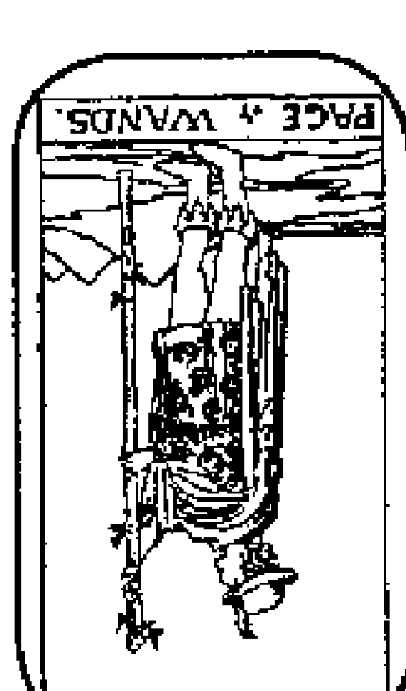

权杖侍者逆位

评估创业

**A.创业的方向-S1P1,S5P1,S5P2,S5P4**
你对目前创业的方向不够熟悉，有可能因为错误的判断而导致重大的损失，在还没搞清楚状况之前不要轻举妄动。

**B.资金来源-S1P2**
目前资金方面遇到重大的问题，也不是你一个人就有能力解决，如果无法找到新的金主或合伙人就很可能会失败。

**C.合伙关系-S1P3**
这个事业并不适宜合伙，因为大家彼此充满了猜忌，若是再乱放话又会造成不愉快的状况，反而不利于事业发展。

**D.客户设定-S1P4**
目前客户设定的方向错误，如果硬要去做一定会发生很多问题，所带来的批评与坏消息还会让你不得不改变做法。

**E.店面区位-S1P5**
目前并不是决定店面区位的好时机，如果已经决定了很可能会是一个错误的地点，最好能打消这个念头从新再找。

**F.事业前景-S1P6,S5P3,S5P5**
这个事业的前景看起来不佳，不稳定的状况会让你很担心害怕，如果又遇到外来的打击，就很有可能会撑不下去。

评估求职

### G.工作性质-S2P1

目前比较难找到长治久安的工作，所以可以考虑临时打工性质的工作，或找一个过渡性质的工作当成未来的跳板。

### H.工作地点-S2P2

工作地点并不是自己可以控制得了，即使在某个地区找到工作也未必会在那个地方上班，还有很大变动的可能性。

### I.要求薪资-S2P3

要求薪资也许需要低于业界一般的水准，才有可能找新工作，如果太坚持要做高薪的工作，也许就会失业一阵子。

### J.求职管道-S2P4

这个时候不可能由别人介绍你好工作，所以只能靠自己去找，记得要多收集相关的讯息，才不会被求职陷阱所骗。

### K.求职运势-S2P5,S7P1,S7P2,S7P3,S7P4

这段期间的求职运势不佳，即使找到工作也并不是很稳定，也许很快又会想要换新工作，所以不要有太高的期待。

### L.可以改进的地方-S2P6

你对于工作的想法太过天真幼稚而不切实际，所以很难找到条件适合的工作，也许与有经验的人多聊聊会有帮助。

评估工作

### M.工作状况概要-S5P1,S5P2,S5P4,S7P1,S7P2,S7P3,S7P4

工作上出现一些坏消息，但也可能只是谣言而已，所以这个时候应该沉着以对，在状况更明朗之前不宜轻举妄动。

### N.能否胜任-S3P1

你的能力并不足以胜任这个职位，如果硬要去坐这个位子也不会长久，而且可能很快就会因为不适任而被迫离开。

# O.假期福利-S3P2

这个地方的福利不好，让你没有办法安心地为公司付出；假期方面规定很模糊，也有可能因为排假的问题起冲突。

### P.财务收入-S3P3

在这个地方的收入不佳，看起来也没有什么成长性，如果想要有更好的收入，还是应该快点换一个地方才有可能。

评估事件

### U.现有资源-S4P1

现有的资源并不足以应付现在的挑战，即使自己非常努力也很难弥补这个落差，所以应该要预先做好最坏的打算。

### V.人员配合-S4P2

人员彼此之间无法配合，而且也很难把自己份内的事情做好，如果遇到这些不适任的人选，就应该当机立断换人。

### W.环境因素-S4P3

目前环境上有很多艰难险阻，而且还有一些坏消息传来，你只能自立自强想办法解决问题，不要期待有贵人相助。

### X.时程进展-S4P4,S7P1,S7P2,S7P3,S7P4

目前事情的进度并不在你的控制当中，想太多只会让自己更烦恼而已，即使无法在时限之内完成你也不能怎么样。

### Y.执行成果-S4P5

这件事情无法达到预期的成果，同时状况也会变得很不稳定，所以你应该预先做最坏的打算，不要过度乐观期待。

### Z.未来影响-S4P6,S5P3,S5P5

这件事情也许会对你产生不利的影响，虽然可能只是一些流言或坏消息，但光是这些就已经够让你担心害怕的了。

### Q.与主管的相处-S3P4,S6P3,S6P4

这是一个本身能力不足的上司，所以也无法提供你什么协助，遇到问题只能自己解决，让你没有安心踏实的感觉。

### R.与同事的相处-S3P5,S6P3,S6P4

同事之间常常会有八卦消息传出，但是也许大部分都是谣言，所以不要随着这些传言起伏，专心做自己的事就好。

### S.升迁加薪-S3P6

这个地方没有很好的升迁管道，再怎么做都还是一样的事情；加薪的机会也很少，并不是很适合长期发展的地方。

### T.如何对待对方-S6P1,S6P2

这是一个善变而不稳定的人，处理事情往往不够成熟甚至会流于肤浅，所以在工作上大家都会尽量避免与他合作。

权杖骑士正位

评估创业

### A.创业的方向-S1P1,S5P1,S5P2,S5P4
你对于目前创业的方向跃跃欲试，每天都充满了热情和活力，如果能主动积极面对挑战，就可以得到很好的回报。

### B.资金来源-S1P2
目前资金的状况还有一些问题，但是只要你努力应该都可以顺利解决，这个时候收入上可能会有大起大落的状况。

### C.合伙关系-S1P3
这个事业并不适宜合伙，否则彼此之间可能会因为冲动而发生意外的冲突，就很容易对事业发展产生严重的阻碍。

### D.客户设定-S1P4
客户应该锁定在比较冲动消费的人身上，所以在促销手段上要尽量夸张一点，才能让这些人在冲动之下做出决定。

### E.店面区位-S1P5
店面区位可以选择交通要道附近，或是新兴开发的地区，这些地方比较容易有人潮，当然也可能会帮你带来钱潮。

### F.事业前景-S1P6,S5P3,S5P5
这个事业的前景大有可为，但是仍然有许多的挑战需要克服，只要保持积极的心态和行动力，就会有很好的成就。

评估工作

### M.工作状况概要-S5P1,S5P2,S5P4,S7P1,S7P2,S7P3,S7P4
这个工作对你来说很有挑战性，让你每天都充满了热情与活力，如果能顺利克服困难，就会让你觉得很有成就感。

### N.能否胜任-S3P1
你的能力绝对足以胜任这份工作，所以应该抱持着积极主动的心态，即使遇到任何艰难险阻，也要尽全力去挑战。

# O.假期福利-S3P2
在这个地方的福利很普通，基本上该有的都有；假期的使用就比较自由，但是有时候公事很忙，有假也没办法休。

### P.财务收入-S3P3
在这个地方的收入要看你的付出与努力，通常如果你的付出越多收入就会越好，也很有可能争取到分红或是奖金。

### G.工作性质-S2P1
工作性质可以选择业务、外勤或是属于交通运输的行业，如果选择内勤或是文书类的工作，可能会让你觉得很闷。

### H.工作地点-S2P2
工作地点可能会在远方，所以这个时候应该努力面对挑战，即使需要离乡背井的工作机会，也可以积极努力争取。

### I.要求薪资-S2P3
要求薪资与业界一般的水准相同即可，若可能的话尽量选择高奖金低底薪的方案，这样会产生最有利的结果。

### J.求职管道-S2P4
这个时候适合依照自己的判断由自己去找工作，透过别人介绍不但比较慢，而且比较不容易找到令你满意的职缺。

### K.求职运势-S2P5,S7P1,S7P2,S7P3,S7P4
这段时间的求职运势还不错，所以只要主动出击都会找到不错的工作机会，只是找到的工作对你来说也会是挑战。

### L.可以改进的地方-S2P6
你在找工作时太过冲动，所以很容易瞻前不顾后，若能更小心谨慎地面对各种工作机会，也许就能顺利找到工作。

### Q.与主管的相处-S3P4,S6P3,S6P4
是一个直率但急性子的主管，不喜欢属下闲闲没事做，所以即使不忙也要想办法装忙，否则就会被塞更多的事情。

### R.与同事的相处-S3P5,S6P3,S6P4
同事彼此之间都是直来直往，有时候也不免为了公事而发生冲突，由于每个人都想力求表现，所以也算竞争激烈。

### S.升迁加薪-S3P6
在这个地方有不错的升迁机会，所以可以积极努力去争取；加薪也是要看你的努力，表现越好加薪的幅度就越高。

### T.如何看待对方-S6P1,S6P2
这是一个非常主动积极的人，工作上也很有冲劲，虽然有时候比较容易冲动，但是遇到困难大家都会想找他帮忙。

## 第十章 宫廷牌的工作牌义

### 权杖骑士逆位

# 评估创业
- **A. 创业的方向-S1P1,S5P1,S5P2,S5P4**
  目前创业的方向遇到了重大的困难和干扰，而且并不是你的能力可以解决的，如果硬要去做的话很可能就会失败。

- **B. 资金来源-S1P2**
  目前财务上面对非常严重的危机，而且也很难再投入更多资金，如果不能确实检讨找到原因去解决可能就会失败。

- **C. 合伙关系-S1P3**
  这个事业不适宜合伙，如果有合伙的话必定会发生严重的争执，而影响到正常的工作，到最后也许就不得不拆伙。

- **D. 客户设定-S1P4**
  客户可以锁定比较基层、朴实的客群，当然料好实在价格合理是成功的要件，外在的包装宣传反而不是那么重要。

- **E. 店面区位-S1P5**
  目前选择的店面区位应该维持现状不宜搬动；如果还没有找到适当的地点，最好是能先缓一缓，不要冲动地决定。

- **F. 事业前景-S1P6,S5P3,S5P5**
  这个事业的前景不佳，当中的问题也许比你想象中还严重，如果不能彻底检讨改变作法，最后就难逃失败的命运。

# 评估求职
- **G. 工作性质-S2P1**
  这个时候很难找到符合自己专长的工作，只能考虑体力工或计时人员之类的工作，但要注意工时与薪资的合理性。

- **H. 工作地点-S2P2**
  最好是找离家比较近的工作，以不变动原来的生活圈为主，如果是需要离乡背井的新工作，通常都不会很适合你。

- **I. 要求薪资-S2P3**
  要求薪资也许需要低于业界一般的水准才能找到工作，但是最好选择固定薪资的方案，以免收入发生太大的变化。

- **J. 求职管道-S2P4**
  这个时候可以透过政府设立的就业服务站和就业服务中心来找工作；若是亲朋好友介绍的工作通常都会有纠纷。

- **K. 求职运势-S2P5,S7P1,S7P2,S7P3,S7P4**
  这段时间的求职运势并不好，即使能找到工作也是吃力不讨好的职缺，如果不是非常缺钱的话还是等一阵子再说。

- **L. 可以改进的地方-S2P6**
  你的脾气太坏又容易与别人冲突，当然很难找到好的工作，如果能收敛一点自己的坏脾气，就可以快点找到工作。

# 评估工作
- **M. 工作状况概要-S5P1,S5P2,S5P4,S7P1,S7P2,S7P3,S7P4**
  工作的状况可能会脱离你的掌握，出现许多让你烦恼的棘手问题，很多时候遭遇失败是整个大环境的因素所造成。

- **N. 能否胜任-S3P1**
  你的能力并不足以胜任这个职务，而且这份工作比你想像的还要困难许多，并不是你想要努力奋斗就可以成功的。

- **O. 假期福利-S3P2**
  这个地方的福利并不是很好，但是也很难再去争取到更多的福利；休假的制度有些混乱，有时候会让人无所适从。

- **P. 财务收入-S3P3**
  这个地方的收入十分不稳定，甚至还会增加意外的花费，即使自己已经非常省吃俭用了，还是很难达到收支平衡。

# 评估事件
- **U. 现有资源-S4P1**
  现有资源严重不足，完全无法去应付现在的挑战，如果不能及时投入更多资源挽救，还不如提早结束以减少损失。

- **V. 人员配合-S4P2**
  人员彼此之间完全无法配合，不和谐的状况比你想像的还更严重，所以这个时候要立即优先处理人际关系的问题。

- **W. 环境因素-S4P3**
  目前环境上出现了重大的问题与挑战，将会严重干扰到这件事情的进行，你只能从内部开始做起，先安内再攘外。

- **X. 时程进展-S4P4,S7P1,S7P2,S7P3,S7P4**
  目前的进度严重落后，已经完全脱离你的掌握，即使你再努力也无法追上进度，甚至会因为困难太多而被迫放弃。

- **Y. 执行成果-S4P5**
  这件事情很难达到预期的成果，甚至还有可能遭受预料之外的损失，有很多问题并不是你努力就有办法可以解决。

- **Z. 未来影响-S4P6,S5P3,S5P5**
  这件事情将会引发严重的纷争，甚至可能变成合作破裂的局面，如果不小心冷静处理会对您的人际关系造成伤害。

- **Q. 与主管的相处-S3P4,S6P3,S6P4**
  这是一个决策草率又执迷不悟的上司，所以做任何事情一定要先为自己留后路，以免遇到问题就被当成代罪羔羊。

- **R. 与同事的相处-S3P5,S6P3,S6P4**
  与同事之间常常发生争吵，彼此之间也很难合作，如果不能把自己的身段放软，就很有可能变成内部斗争的箭靶。

- **S. 升迁加薪-S3P6**
  在这个地方没有什么升迁的机会，加薪的幅度也无法令人满意，如果有其他更好的机会，还是快点离开这个地方。

- **T. 如何看待对方-S6P1,S6P2**
  这是一个心直口快的人，因此容易与人发生冲突，在工作上非常拼命努力，会选择困难而有挑战性的工作去尝试。

### 权杖王后正位

# 评估创业
- **A. 创业的方向-S1P1,S5P1,S5P2,S5P4**
  你对目前创业的方向充满期待，也很清楚自己应该扮演的角色，如果能持续朝向目标努力，将会得到实质的回报。

- **B. 资金来源-S1P2**
  目前资金的状况没有什么问题，是你可以大展身手的好时机，只要不太挥霍浪费，在财务上面绝对不会入不敷出。

- **C. 合伙关系-S1P3**
  这个事业可以合伙，彼此之间也可以维持和谐的关系，但最好能有一个领导者出来统筹指挥，做事情会比较顺利。

- **D. 客户设定-S1P4**
  客户可以锁定年轻女性或是家庭主妇，尽量去开发适合他们的产品或是设计吸引他们的促销方案，比较容易成功。

- **E. 店面区位-S1P5**
  挑选店面区位的时候应该要相信自己的直觉，一旦认定了就不要再三心二意，也不用去理会别人的建议或是想法。

- **F. 事业前景-S1P6,S5P3,S5P5**
  这个事业的前景一片光明，未来也有很好的发展性，所以应该好好把握这个机会努力去做，其他的就不要想太多。

# 评估工作
- **M. 工作状况概要-S5P1,S5P2,S5P4,S7P1,S7P2,S7P3,S7P4**
  你在这个工作当中有很好的发挥空间，也能掌握到特定的权力，只要你能克尽自己的职责，将会得到实质的回报。

- **N. 能否胜任-S3P1**
  你的能力可以胜任这个职位，而且感觉驾轻就熟并不特别费力，只要相信自己直觉的判断，就不会出太大的错误。

- **O. 假期福利-S3P2**
  这个地方的福利算是不错，主要需要的东西都有照顾到；假期的规定很清楚，通常都可以掌握自己想休假的时间。

- **P. 财务收入-S3P3**
  这个地方的收入十分稳定，以工作内容来衡量也算是非常丰厚，如果能好好把握这个机会，应该可以存下不少钱。

# 评估求职
- **G. 工作性质-S2P1**
  工作性质应该以自己熟悉的工作为主，这样对你来说比较轻松不费力；另一方面，也可以寻找自己有兴趣的工作。

- **H. 工作地点-S2P2**
  工作地点对你没有太大的限制，不论在什么区域都有可能找到适合你的工作，这个时候要相信你的直觉勇敢尝试。

- **I. 要求薪资-S2P3**
  要求薪资可以略高于业界一般的水准，但也不要用太高的待遇吓退想用你的人，只要坚持就可以守住自己的底线。

- **J. 求职管道-S2P4**
  这个时候各个求职管道都很畅通，但最好还是利用自己有经验熟悉的方式去求职，在求职过程当中也会比较顺利。

- **K. 求职运势-S2P5,S7P1,S7P2,S7P3,S7P4**
  这段时间的求职运势非常强，应该很快就可以找到适合自己的工作，这个时候要对自己有信心，积极努力去尝试。

- **L. 可以改进的地方-S2P6**
  你对找工作这件事情比较随性，不够积极就可能错过好的机会，所以能不能打起精神专注努力会是最重要的关键。

- **Q. 与主管的相处-S3P4,S6P3,S6P4**
  这是一个重视员工关系的上司，希望大家都能和谐相处，所以除了把事情做好之外，也要与同事保持良好的关系。

- **R. 与同事的相处-S3P5,S6P3,S6P4**
  同事之间常常充满了欢乐的气氛，所以不需要太矫揉造作自然地表现就好；你的领导气质会让大家重视你的意见。

- **S. 升迁加薪-S3P6**
  在这里升迁的机会很不错，对你来说有很好的发展性；加薪的幅度也会很可观，所以可以坚持继续在这里做下去。

- **T. 如何看待对方-S6P1,S6P2**
  这是一个亲切而乐观的人，带有光明和愉快的特质，会努力把自己份内的事情完成，所以大家都很喜欢与他合作。

# 评估事件
- **U. 现有资源-S4P1**
  现有的资源十分充足，而且都在你的掌握当中，只要能把资源做比较有效的配置，就不用去担心资源不足的问题。

- **V. 人员配合-S4P2**
  人员之间充满的配合良好，而且当中充满了欢乐的气氛，如果能保持这样的感觉，大家就可以团结合作发挥力量。

- **W. 环境因素-S4P3**
  目前环境因素的影响力并不大，所有事情的成败还是取决于你自己的做法，所以这个时候应该要持续努力地付出。

- **X. 时程进展-S4P4,S7P1,S7P2,S7P3,S7P4**
  目前事情的进展顺利，进度都在你的掌握当中，只要能按部就班把该做的责任好好完成，就可以在时限之内完成。

- **Y. 执行成果-S4P5**
  这件事情应该可以达到预期的成果，而且会在金钱上有很大的收获，所以最好能保持原来的做法，继续努力前进。

- **Z. 未来影响-S4P6,S5P3,S5P5**
  这件事情会让你变得主动积极，能以更正面光明的方式看待事情，凡事顺着走不强求，在工作当中就能更快乐。

### 权杖王后逆位

# 评估创业
- **A. 创业的方向-S1P1,S5P1,S5P2,S5P4**
  目前创业的方向遇到了强烈的反对和抵制，事情并不能随心所欲地进行，潜在的困难和障碍远比你想像的还复杂。

- **B. 资金来源-S1P2**
  目前资金的状况并不好，但是只要省吃俭用还是有机会撑下去，这个时候开源比较困难，所以还是从节流来下手。

- **C. 合伙关系-S1P3**
  这个事业很不适宜合伙，否则很可能会发生背叛的状况，若是不幸变成腹背受敌的危机，就会造成很严重的伤害。

- **D. 客户设定-S1P4**
  可以锁定爱面子和重视排场的客户，提供给他们比较好的服务和礼遇；但是不要为了经营大客户而忽略了小客户。

- **E. 店面区位-S1P5**
  店面区位应该尽量避免竞争激烈的地区，因为自己的实力并不充足，如果真的与对手正面冲突，就很可能会失败。

- **F. 事业前景-S1P6,S5P3,S5P5**
  这个事业的前景堪虑，有很多的困难已经超乎你的能力之外，若是还不切实际地以为自己会成功就必然造成伤害。

# 评估求职
- **G. 工作性质-S2P1**
  在工作性质上应该尽量减少团队合作的比重，如果能自己一个人独立完成最好，否则很可能因为人和问题而失败。

- **H. 工作地点-S2P2**
  工作地点最好避免变动，可以选择在住家或是原来工作的地方附近，在自己熟悉的地区工作会比较有安心的感觉。

- **I. 要求薪资-S2P3**
  要求薪资也许要略低于业界一般的水准，如果是为了面子问题不愿意降格以求，也许就会错失一些好的工作机会。

- **J. 求职管道-S2P4**
  这个时候应该自己去找工作，最好避免由亲朋好友帮你介绍工作，否则进去之后很有可能会因此而卷入纷争当中。

- **K. 求职运势-S2P5,S7P1,S7P2,S7P3,S7P4**
  这段时间的求职运势不佳，虽然还是可以找到工作，但是会与你自己设定的目标有一些差距，让你不太想要接受。

- **L. 可以改进的地方-S2P6**
  你在找工作时的态度过于强势，有时候会给人一种嚣张跋扈的感觉，如果能把身段放软，也许就能更快找到工作。

# 评估工作
- **M. 工作状况概要-S5P1,S5P2,S5P4,S7P1,S7P2,S7P3,S7P4**
  这个工作有许多外在的限制，并不是一个你能尽情发挥的地方，但如果愿意接受例行性的工作也是还不错的选择。

- **N. 能否胜任-S3P1**
  你的能力并不足以胜任这份工作，不要过份高估自己的实力，如果为了面子问题勉强接下来，未来会有很多问题。

- **O. 假期福利-S3P2**
  这个地方的福利并不好，很多好处都是看得到吃不到；假期的使用需要别人的配合，常不能休到自己想休的时间。

- **P. 财务收入-S3P3**
  这个地方的收入并不好，虽然稳定但是没有什么成长性，如果想要有更好的发展，还是要换一个地方比较有可能。

# 评估事件
- **U. 现有资源-S4P1**
  现有资源并不足以应付外在的挑战，所以必须非常省吃俭用才可能撑下去；这个时候也不太可能再投入更多资源。

- **V. 人员配合-S4P2**
  人员之间可能产生非常严重的冲突，甚至会进一步造成背叛的状况，如果遇到不适任的人，就应该当机立断换人。

- **W. 环境因素-S4P3**
  目前环境上出现了重大的障碍，并不是你有能力可以解决的，这时候只能把自己份内的事做好，其他的别想太多。

- **X. 时程进展-S4P4,S7P1,S7P2,S7P3,S7P4**
  目前进度并不如预期的顺利，仍然有非常多困难需要去克服，如果不能够改变做法，就很难在预期的时限内完成。

- **Y. 执行成果-S4P5**
  这件事情很难达到预期的成果，很多的事情并不在你的掌握当中，如果能选择提前结束也许还可以减少一些损失。

- **Z. 未来影响-S4P6,S5P3,S5P5**
  这件事情对你有不利的影响，甚至会对你的声誉造成严重的损害，另一方面，可能因此引发你失望或愤怒的情绪。

- **Q. 与主管的相处-S3P4,S6P3,S6P4**
  这是一个主观性很强的上司，只要意见与他不同就会被他否决，所以自己要懂得察言观色，千万不要出言顶撞他。

- **R. 与同事的相处-S3P5,S6P3,S6P4**
  在工作中可能会受到同事的暗算或背叛，所以最好是与大家都保持表面的关系就好，千万不要太轻易地相信别人。

- **S. 升迁加薪-S3P6**
  在这里可能会有升迁的机会，但是会遇到很多的困难和挑战；加薪的幅度也许并不如预期，算是辛苦付出的地方。

- **T. 如何看待对方-S6P1,S6P2**
  这是一个固执已见的人，常常想要掌握事情的主导权，有时候会有比较情绪化的表现，所以大家都不想与他合作。

### 权杖国王正位

# 评估创业
- **A. 创业的方向-S1P1,S5P1,S5P2,S5P4**
  你对目前创业的方向很有经验，也很清楚自己该做什么事，所以最好是在稳定中求发展，太过急躁反而比较不利。

- **B. 资金来源-S1P2**
  目前资金的状况没有太大的问题，也都在你的掌握当中，这个时候应该要把眼光放远，对于小地方就不用太计较。

- **C. 合伙关系-S1P3**
  这个事业可以合伙，但是最好由一个特定人出来发号施令，如果采用集体领导的合议制，到最后很可能会一团乱。

- **D. 客户设定-S1P4**
  客户应该是以内行人和常客为主，提供比较专业和精致的服务，如果不能满足这些人的需求，发展就会受到限制。

- **E. 店面区位-S1P5**
  店面区位应该相信自己经验的判断，不要理会别人怎么想，只要有决心毅力继续做下去，一定可以看到好的成果。

- **F. 事业前景-S1P6,S5P3,S5P5**
  这个事业的前景十分稳定，也可以有不错的成长性，如果能够持续努力累积经验，未来的发展状况将会越来越好。

# 评估工作
- **M. 工作状况概要-S5P1,S5P2,S5P4,S7P1,S7P2,S7P3,S7P4**
  这份工作的状况十分稳定，也是你很熟悉的领域，你可以把握住这个机会充份发挥自己的才能，争取最好的成绩。

- **N. 能否胜任-S3P1**
  你的能力绝对足以胜任这份工作，对你来说是很容易的一件事，但是千万别太固执己见，以免在合作上遇到问题。

- **O. 假期福利-S3P2**
  这个地方的福利不差，而且是待得越久福利越好；假期的使用也掌握在自己手中，通常可以休到自己想休的时间。

- **P. 财务收入-S3P3**
  这个地方的收入很稳定，工作对你来说也不困难，如果不想追求高度的薪资成长，也算是一个可以固守的地方。

# 评估求职
- **G. 工作性质-S2P1**
  最好是寻找自己已经有相关学经历的工作，继续累积下去才有好的发展，这个时候如果贸然转业一定会非常辛苦。

- **H. 工作地点-S2P2**
  工作地点最好是在自己熟悉的地方，不论是在住家附近，或是以前工作过的地区都很好，也比较容易找到好工作。

- **I. 要求薪资-S2P3**
  要求薪资可以略高于业界一般的水准，以有经验人员的标准来谈；最好能提出过去工作的成绩来证明自己的实力。

- **J. 求职管道-S2P4**
  这个时候可能会有工作自己找上门来；如果想去找工作，可以透过人力仲介或是猎才公司寻找会有比较好的职缺。

- **K. 求职运势-S2P5,S7P1,S7P2,S7P3,S7P4**
  这段时间求职的运势还不错，应该很快就可以找到新工作，但是仍然应该要谋定而后动，考量清楚之后再做决定。

- **L. 可以改进的地方-S2P6**
  你对于找工作的想法太过固执，所以有可能错过非常好的工作机会，这时候多听听别人的意见也许会有一些帮助。

- **Q. 与主管的相处-S3P4,S6P3,S6P4**
  这是一个经验丰富的上司，可以尽量在工作上向他学习，但是不要太涉入他的私生活或情绪，最好能够公私分明。

- **R. 与同事的相处-S3P5,S6P3,S6P4**
  同事之间彼此都很真心相待，有什么问题都可以提出，你在同事当中的表现还不错，大家也都会尊重你的意见。

- **S. 升迁加薪-S3P6**
  在这个地方有很好的升迁机会，只要坚持下去一定会升；加薪是跟着年资走，幅度虽然不令人满意但还可以接受。

- **T. 如何看待对方-S6P1,S6P2**
  这是一个友善而诚实的人，对于人事物很有自己的定见，在工作上的想法和做法都很成熟，是可以大家信赖的人。

# 評估事件

- **U.現有資源-S4P1** 現有資源正好足以應付目前的狀況，所以只要能把資源做有效的運用就不必擔心，即使遇到問題也可以輕鬆解決。

- **V.人員配合-S4P2** 人員之間的配合沒有什麼問題，即使因為某些人的固執會造成一些困擾，但是只要真心誠意溝通就可以化解誤會。

- **W.環境因素-S4P3** 目前環境對這件事情的影響不大，也不會有什麼意外狀況發生，所以最重要的是把自己份內的事情按部就班完成。

- **X.時程進展-S4P4,S7P1,S7P2,S7P3,S7P4** 目前事情的進度完全在你的掌握當中，也不會有什麼意外的突發狀況出現，所以應該可以在預定的時限之內完成。

- **Y.執行成果-S4P5** 這件事情可以達到預期的成果，而且還可以學習到很多的經驗，所以應該要積極把握，全心全意把這件事情做好。

- **Z.未來影響-S4P6,S5P3,S5P5** 這件事情對你來說是一個重要的資歷，而且會讓你有一些新的想法；另一方面，這也可能帶來升遷或掌權的機會。

## 權杖國王逆位

# 評估創業

- **A.創業的方向-S1P1,S5P1,S5P2,S5P4** 目前創業的方向遇到了預期之外的變化，若是不小心處理可能會變得滿盤皆輸，這個時候策略應該保守以策安全。

- **B.資金來源-S1P2** 目前資金的狀況並不完全在你的掌握當中，還有一部分需要別人的幫助，所以應該要省吃儉用一點才能度過難關。

- **C.合夥關係-S1P3** 這個事業不適宜合夥，因為每個人都有自己主觀的成見，但是又不願意退讓，硬要湊在一起共事只會讓彼此痛苦。

- **D.客戶設定-S1P4** 客戶設定可以鎖定中高齡或是已經退休的人，開發適合他們的產品或是設計吸引他們的促銷方案會比較容易成功。

- **E.店面區位-S1P5** 你對於店面區位的想法過於主觀與保守，並不是很適合這個事業的發展，這時候多聽聽別人的意見也許會有幫助。

- **F.事業前景-S1P6,S5P3,S5P5** 這個事業的前景平平，雖然穩定但是沒什麼成長性，目前已經到了發展的極限，由另一方面來看也可以見好就收。

# 評估求職

- **G.工作性質-S2P1** 工作性質上最好避開領導職，否則很可能會發生嚴重的問題；盡量以自己有經驗的工作內容為主，不要冒險改變。

- **H.工作地點-S2P2** 工作地點最好在你事先預期的地區，如果有其他地區的工作機會通常也不會適合你，堅持自己的想法不要被影響。

- **I.要求薪資-S2P3** 要求薪資與業界一般的水準相同即可，沒有必要特別降格以求，但是最好能選擇固定薪水制，不要去拚業績獎金。

- **J.求職管道-S2P4** 目前不太可能透過別人介紹你好的工作，只能自己想辦法去找，可以利用民間或政府的求職網站刊登自己的履歷。

- **K.求職運勢-S2P5,S7P1,S7P2,S7P3,S7P4** 目前的求職運勢並不差，也許很快就可以找到新工作，只是工作的內容了無新意，連你自己也不見得感覺想要去。

- **L.可以改進的地方-S2P6** 你在工作上自視甚高，有可能過度高估自己的實力，所以放棄掉一些不錯的工作機會，要找工作就必須放下成見。

# 評估工作

- **M.工作狀況概要-S5P1,S5P2,S5P4,S7P1,S7P2,S7P3,S7P4** 工作當中常常遇到不確定的變化，但大致上都是你可以掌握的狀況，這時候應該在穩定中求發展，不要操之過急。

- **N.能否勝任-S3P1** 你的能力足以勝任這個職務，但是在做法上會受到很大的限制，這個地方適合守成，不過無法讓你充份發揮實力。

- **O.假期福利-S3P2** 這個地方的福利很普通，只能說有做到基本的保障；假期的使用需要與別人協調，不一定能休到自己想休的時間。

- **P.財務收入-S3P3** 這個地方的收入還不差，但是還不到令你滿意的水準，如果想要追求更高的薪水，也許需要換一個地方才有可能。

## 第十章 宮廷牌的工作牌義

# U.現有資源-S4P1

現有資源雖然可以處理現在的狀況，但並不足以應付接下來的挑戰，所以在做法上應該要省吃儉用採取保守策略。

# V.人員配合-S4P2

人員彼此之間有很深的成見，有時候會影響到工作的狀況，最好能找機會大家一起談清楚，也許就可以化解誤會。

# W.環境因素-S4P3

目前環境上發生了意想不到的變化，完全超出你的掌握之外，你只能把自己的責任先顧好，其他的你也無能為力。

# X.時程進展-S4P4,S7P1,S7P2,S7P3,S7P4

目前的進度有一點落後，但是仍然有機會趕上，這個時候最好參考前人的做法，比較有可能在預定的時限內完成。

# Y.執行成果-S4P5

這件事情也許可以達到預期的成果，但是過程中會非常辛苦，如果無法堅持到底的話，也許成果就會被別人收割。

# Z.未來影響-S4P6,S5P3,S5P5

這件事情可能會造成你的職務異動，甚至有可能失去權力，你要非常小心謹慎處理，千萬不要過度自信掉以輕心。

# Q.與主管的相處-S3P4,S6P3,S6P4

這是一個很固執己見的上司，而且很重視自己的權威，所以即使出現了不合理的命令，最好還是照他的方法去做。

# R.與同事的相處-S3P5,S6P3,S6P4

同事彼此之間也許看不順眼，但是還可以維持住表面的關係，你不要想與別人深交，公私分明會是比較好的做法。

# S.升遷加薪-S3P6

在這裡升遷已經到了極限，即使再怎麼努力也很難更上層樓；加薪的幅度也很有限，是只適合養老等退休的地方。

# T.如何看待對方-S6P1,S6P2

這是一個很正直的人，但是對人比較嚴厲一點，對於工作也有自己的看法和堅持，有時候會讓人覺得比較難溝通。

# 评估创业

- **A.创业的方向-S1P1,S5P1,S5P2,S5P4** 你对目前创业的方向充满了好奇心，但是实际上了解得并不够深入，所以现在应该先多收集资讯而不要急着行动。

- **B.资金来源-S1P2** 目前所需资金还没有完全到位，也许还要再去寻找新的金主或是合伙人，在完成集资之前最好不要有太大的动作。

- **C.合伙关系-S1P3** 这个事业可以合伙，接下来可能还有新的合伙人会加入，只要抱持著真诚的心来合作，一定可以发挥很大的力量。

- **D.客户设定-S1P4** 客户设定时可以锁定学生族群以及年轻人，开发适合他们的产品或是设计吸引他们的促销方案，会比较容易成功。

- **E.店面区位-S1P5** 选择店面区位之前应该要先做好完整的研究，把需求和优缺点都分析好之后再来决定，现在还不到做决定的时间。

- **F.事业前景-S1P6,S5P3,S5P5** 这个事业的未来还有很大的可塑性，所以现在来断定前景还太早了一点，但是不论结果如何你都会学到很多东西。

# 评估工作

- **M.工作状况概要-S5P1,S5P2,S5P4,S7P1,S7P2,S7P3,S7P4** 目前工作上有很多东西需要学习，所以应该保持旺盛的好奇心努力吸收新知，同时透过实作的经验让自己更成熟。

- **N.能否胜任-S3P1** 你的能力并不足以胜任这份工作，还有很多东西需要学习，应该要向上司或同事多请教，可以让工作快点上轨道。

- **O.假期福利-S3P2** 这个地方的福利很普通，但是所有基本的福利都有照顾到；假期上没有太大的限制，通常都可以休到想休的时间。

- **P.财务收入-S3P3** 这个地方的收入算是普通，但是工作上能学到的东西也许还更有价值，把这个部分也考虑进去就会感觉非常值得。

# 评估求职

- **G.工作性质-S2P1** 这个时候可以去尝试各种不同的工作，即使是自己完全没有经验的也没关系，最重要的是自己有兴趣才能做得好。

- **H.工作地点-S2P2** 工作地点没有限制，只要是你想要发展的地区都可以去尝试，但若有明确的目标则可以帮你快点找到工作。

- **I.要求薪资-S2P3** 要求薪资可能需要略低于业界一般的水准，也可以把自己角色想成是实习生，所以对于薪资不要有太高的期待。

- **J.求职管道-S2P4** 这个时候有机会透过师长或亲友帮你介绍工作，但是会比较限于与自己学经历相关的，其他种类就要靠自己去找。

- **K.求职运势-S2P5,S7P1,S7P2,S7P3,S7P4** 这段时间的求职运势很不错，应该很快就会找到新工作，你可以多方面尝试各种机会，不要被过去的经验限制住。

- **L.可以改进的地方-S2P6** 你对找工作的想法过于天真，很多事情并不如你想像的那么简单，要多向相关行业的前辈请教才能快点找到工作。

- **Q.与主管的相处-S3P4,S6P3,S6P4** 这是一个很有创造力的上司，但是有时候想法并不是那么确实可行，你应该保持独立思考的空间，不要照单全收。

- **R.与同事的相处-S3P5,S6P3,S6P4** 工作上也许会有新同事加入，你应该用比较正面的角度来思考这件事情，如果真心相待就可以建立起不错的关系。

- **S.升迁加薪-S3P6** 在这个地方有很好的升迁管道，但更重要的是有很多学习与成长的机会；加薪的幅度则是会依照你的表现来决定。

- **T.如何看待对方-S6P1,S6P2** 这是一个很认真好学的人，而且在工作当中十分认真，遇到问题会去想办法搞清楚，所以大家都很看好他的发展。

## ☆☆塔羅工作講義

# 評估事件

- **U.現有資源-S4P1** 現有的資源並不足以應付目前的狀況，但又不可能再投入更多的資源，即使自己再怎麼努力也很難突破這些限制。

- **V.人員配合-S4P2** 人員彼此之間無法配合，反而可能發生結黨營私甚至是互相欺騙的狀況，如果遇到不適任的人選就應該立即換人。

- **W.環境因素-S4P3** 目前環境上出現重大的變動，你對這些狀況完全無能為力，如果真的發生不利的影響，也許就會危及到這件事情。

- **X.時程進展-S4P4,S7P1,S7P2,S7P3,S7P4** 目前的進度已經落後，所以這個時候不要再自己騙自己，趕快檢討找到問題的關鍵，解決之後才有機會追上進度。

- **Y.執行成果-S4P5** 這個事情很難達到預期的成果，當中會出現非常多的問題與挑戰，如果不能務實細心面對還可能造成很大的損失。

- **Z.未來影響-S4P6,S5P3,S5P5** 這件事情並不會造成長遠的影響，但是短期來看會讓你比較消極而不願意面對現實，要快點走出不切實際的幻想。

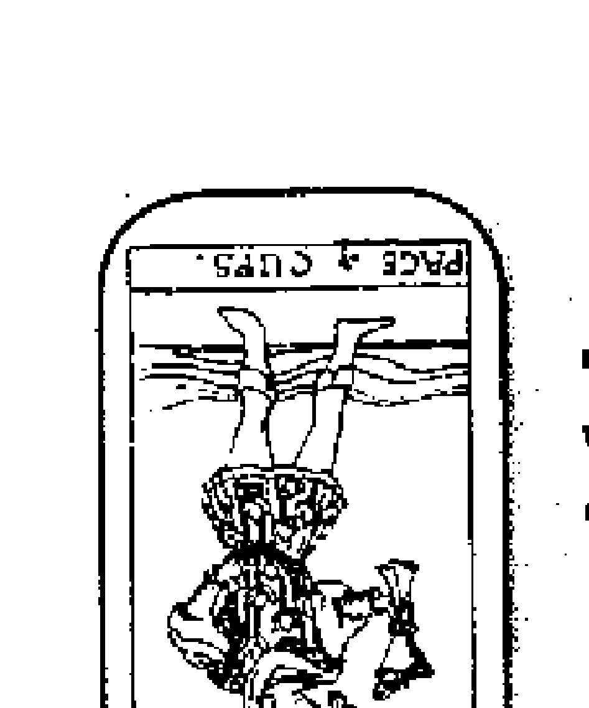

## 聖杯侍者逆位

# 评估创业

- **A.创业的方向-S1P1,S5P1,S5P2,S5P4** 目前创业的方向充满了不确定性，当中可能隐藏了许多欺骗的陷阱，所以你应该更务实评估不要自己一个人幻想。

- **B.资金来源-S1P2** 目前资金的来源还不是很确定，也还有很大一部分的资金还没有到位，这时候应该保守一点以免不小心扩大太快。

- **C.合伙关系-S1P3** 这个事业并不适宜合伙，否则很可能会发生合伙人互相欺骗或隐瞒的状况，彼此也不容易建立起互相信任的关系。

- **D.客户设定-S1P4** 客户设定上应该要有自己的想法，不要人云亦云盲目从众，大家都一窝蜂的做相同的事情，到最后一定会泡沫化。

- **E.店面区位-S1P5** 目前并不是决定店面区位的好时机，因为还有很多状况暧昧不明，所以最好先观望一阵子，千万别急着采取行动。

- **F.事业前景-S1P6,S5P3,S5P5** 这个事业目前看来并不太光明，很有可能只是昙花一现的美好，等到这阵子风潮过去，也许就会遇到很大的困难。

# 评估求职

- **G.工作性质-S2P1** 工作性质最好是以自己有基础的工作类型为主，这样才能比较快上手，这个时候转换工作性质会遇到很大的困难。

- **H.工作地点-S2P2** 工作地点最好选在自己熟悉的地方，这样会比较有安定感，如果选择离乡背井出外工作，之后很可能会失望而返。

- **I.要求薪资-S2P3** 要求的薪资与业界一般的水准相同即可，提出太高的待遇也不可能被接受，所以还是先想办法找到工作比较实在。

- **J.求职管道-S2P4** 可以透过政府举办的就业服务站及就业服务中心找工作，一方面比较不会遇到求职陷阱，也可以增加成功的机会。

- **K.求职运势-S2P5,S7P1,S7P2,S7P3,S7P4** 这段时间的求职运势并不太好，很难找到自己觉得满意的工作，如果找工作一直不顺利，也许就该考虑换个方向。

- **L.可以改进的地方-S2P6** 你对于找工作方面没有自己坚定的想法，总是随波逐流受到别人意见的影响，最重要的是想清楚自己要的是什么。

# 评估工作

- **M.工作状况概要-S5P1,S5P2,S5P4,S7P1,S7P2,S7P3,S7P4** 工作上很多地方没有明确的规则和制度，因此必须一边做一边尝试，但是又存在着很多可能造成违法失职的陷阱。

- **N.能否胜任-S3P1** 你的能力并不足以胜任这个职务，只靠阿谀奉承上面长官是没办法把这个位子坐稳，还可能遇到很多棘手的问题。

- **O.假期福利-S3P2** 这个地方的福利很不好，很多有关福利的说法都是骗人的；假期的使用会被别人影响，常常不能休到想休的时间。

- **P.财务收入-S3P3** 这个地方的收入并不好，但也还没差到待不下去，若是想要追求较高的薪资成长，还是要换一个地方比较有可能。

# 评估事件

- **U.现有资源-S4P1** 现有的资源并不足以应付目前的状况，但又不可能再投入更多的资源，即使自己再怎么努力也很难突破这些限制。

- **V.人员配合-S4P2** 人员彼此之间无法配合，反而可能发生结党营私甚至是互相欺骗的状况，如果遇到不适任的人选就应该立即换人。

- **W.环境因素-S4P3** 目前环境上出现重大的变动，你对这些状况完全无能为力，如果真的发生不利的影响，也许就会危及到这件事情。

- **X.时程进展-S4P4,S7P1,S7P2,S7P3,S7P4** 目前的进度已经落后，所以这个时候不要再自己骗自己，赶快检讨找到问题的关键，解决之后才有机会追上进度。

- **Y.执行成果-S4P5** 这个事情很难达到预期的成果，当中会出现非常多的问题与挑战，如果不能务实细心面对还可能造成很大的损失。

- **Z.未来影响-S4P6,S5P3,S5P5** 这件事情并不会造成长远的影响，但是短期来看会让你比较消极而不愿意面对现实，要快点走出不切实际的幻想。

- **Q.与主管的相处-S3P4,S6P3,S6P4** 上司本身很会逢迎拍马，但是又没有真才实学，常常连自己的问题都搞不定，就不要指望他能帮你解决任何问题。

- **R.与同事的相处-S3P5,S6P3,S6P4** 在同事之间常常出现各种的谣言，可能会对你产生困扰，这个时候相应不理是最好的方法，要记得谣言止于智者。

- **S.升迁加薪-S3P6** 这个地方的升迁制度对你不利，再怎么努力都很难升上去；加薪的机会也很小，所以并不是适合长期发展的地方。

- **T.如何看待对方-S6P1,S6P2** 这是一个虚浮而不踏实的人，在工作上缺乏明晰的判断力，也没有坚定的立场和看法，常常会看情势而见风转舵。

## 聖杯騎士正位

# 評估創業

- **A.創業的方向-S1P1,S5P1,S5P2,S5P4** 你對目前創業的方向充滿了理想性，而且也很清楚自己應該做些什麼，但是除了理念之外同時也要兼顧現實狀況。

- **B.資金來源-S1P2** 目前資金已經有一定的基礎，但是仍然不太充足，這個時候需要去尋找新的金主或是合夥人，才能解決財務問題。

- **C.合夥關係-S1P3** 這個事業可以合夥，但是最好尋找理念相近、志同道合的人一起努力，否則當遇到問題的時候就很容易發生紛爭。

- **D.客戶設定-S1P4** 客戶可以鎖定比較重視理念的高知識份子，或是教師之類的人，在宣傳過程當中要用理念來吸引客戶會比較長久。

- **E.店面區位-S1P5** 店面區位可能會面臨許多選擇，這個時候多聽聽別人的意見會有一些幫助；另一方面也適合去新興地區進行開拓。

- **F.事業前景-S1P6,S5P3,S5P5** 這個事業的前景大有可為，只要你能維持最初的理想繼續努力奮鬥，不論遇到什麼樣困難的挑戰都可以順利克服。

# 評估工作

- **M.工作狀況概要-S5P1,S5P2,S5P4,S7P1,S7P2,S7P3,S7P4** 這個工作很有挑戰性，要花很多腦力想辦法解決問題，是勞心而非勞力的工作，即使下班了也還在想工作的事情。

- **N.能否勝任-S3P1** 你的能力足以勝任這個職位，但是很多事情仍然要花費很多心思才能解決，有時候還要靠自己的口才去說服別人。

- **O.假期福利-S3P2** 這個地方的福利並不差，所有應該有的福利都有包括在內；雖然放假一切正常，但是有時候下班後還要處理公事。

- **P.財務收入-S3P3** 這個地方的收入並不是很好，如果工作符合自己的理想，也許還可以繼續撐下去，否則還是要快點離開比較明智。

## 第十章 宫廷牌的工作牌义

- **G.工作性质-S2P1** 工作性质上可以选择比较多团队合作的工作，有机会让你充分发挥实力；另一方面，也可以尝试动脑为主的工作。

- **H.工作地点-S2P2** 新的工作地点很可能会在远方，所以要先做好心理准备为新工作而搬迁，到不同的地方去闯对你来说也比较有利。

- **I.要求薪资-S2P3** 要求薪资与业界一般相同的水准即可，但若是能找到理念想法相符合的工作，即使薪水比预期更低还是可以接受。

- **J.求职管道-S2P4** 这时候最有可能透过朋友介绍找到好的工作，所以应该尽量放出消息请朋友们帮忙，自己去找的也许就没那么好。

- **K.求职运势-S2P5,S7P1,S7P2,S7P3,S7P4** 这段时间的求职运势还不错，也可以找到符合自己想法的工作，只是薪水可能会少一点，就要看自己能不能接受。

- **L.可以改进的地方-S2P6** 你在找工作时太重视理想忽略了现实的考量，所以应该更务实地思考工作的方向，才有机会找到条件适合的工作。

- **Q.与主管的相处-S3P4,S6P3,S6P4** 这是一个聪明又有理念的上司，常常喜欢发表自己的高见，如果有问题可以去请教他，他会给你一些有用的建议。

- **R.与同事的相处-S3P5,S6P3,S6P4** 在工作当中人与人的相处十分愉快，大家因为理念相近而感觉特别亲密，有什么问题大家也都能提出来公开讨论。

- **S.升迁加薪-S3P6** 这个地方有很好的升迁机会，是一个可以实现你理想的地方；加薪的幅度要看你的表现而定，所以应该努力一点。

- **T.如何看待对方-S6P1,S6P2** 这是一个充满理想性的人，也有很好的口才，常常可以提出新的想法来解决问题，同时去说服别人接受他的建议。

# 評估事件

- U.現有資源-S4P1
  現有資源勉強足以應付目前的狀況，但是為求保險起見最好還是再投入更多資源，否則接下來可能會撐得很勉強。

- V.人員配合-S4P2
  人員之間的配合良好，也可能因此而發展出深厚的友誼，只要領導者沒問題，就可以團結合作發揮出更大的力量。

- W.環境因素-S4P3
  目前環境上充滿了各種不同的挑戰，是你可以大顯身手的好時機，你應該勇於主動出擊，才能掌握到最好的機會。

- X.時程進展-S4P4,S7P1,S7P2,S7P3,S7P4
  目前事情的進度都在計劃當中，並沒有出現任何意外的狀況，只要保持現在的做法就可以在預定的時限之內完成。

- Y.執行成果-S4P5
  這件事情應該可以達到預期的成果，即使過程當中遇到任何困難也都可以順利解決，只要努力成功自然水到渠成。

- Z.未來影響-S4P6,S5P3,S5P5
  這件事情會帶給你更高的視野與新的想法，甚至會激發你工作上的熱情讓你更加努力；也可能會讓你想要換工作。

## 第十章 宮廷牌的工作牌義

### 聖杯騎士逆位

# 評估創業

- A. 創業的方向-S1P1,S5P1,S5P2,S5P4
  你對於目前創業的方向過於理想化，但是缺乏實際的經驗與務實的計劃，此時若是貿然投入可能造成重大的損失。

- B. 資金來源-S1P2
  目前資金的狀況並不理想，如果認真算起來還有很大的財務缺口，這時候應該盡量少吃儉用，不要打腫臉充胖子。

- C. 合夥關係-S1P3
  這個事業並不適宜合夥，否則內部可能會充滿了爾虞我詐的鬥爭，彼此之間不但無法合作還可能出現背叛的狀況。

- D. 客戶設定-S1P4
  目前客戶設定的方式有很大的錯誤，實際上並不可行；如果想要靠虛偽造假的方式欺騙客戶，生意一定無法長久。

- E. 店面區位-S1P5
  目前並不是決定店面區位的好時機，可能會因為疏忽而判斷失誤，如果做出錯誤的決定之後還要花更多心力收拾。

- F. 事業前景-S1P6,S5P3,S5P5
  這個事業的前景並不很樂觀，也許短期之內能有一些收穫，但是長期來看發展很有限，見好就收是比較好的策略。

# 評估求職

- G.工作性質-S2P1
  工作性質最好避免需要靠嘴巴說話的工作，例如客服人員、業務人員或是教育訓練工作，否則很容易會發生紛爭。

- H.工作地點-S2P2
  工作地點最好在自己熟悉的地區，這個時候往遠方去會有很大的風險，即使有找到新工作未來發展也不是很穩定。

- I.要求薪資-S2P3
  要求薪資與業界一般的水準相同即可，遇到太高薪的工作反而要小心可能是求職陷阱，千萬不要被花言巧語所騙。

- J.求職管道-S2P4
  這個時候應該要自己去找工作，由朋友建議或介紹的工作通常都不會適合你，反而去參加公開的招考會比較順利。

- K.求職運勢-S2P5,S7P1,S7P2,S7P3,S7P4
  這段時間的求職運勢並不是很好，所以找到的工作都是自己所不喜歡的工作，同時也有可能遇到騙人的求職陷阱。

- L.可以改進的地方-S2P6
  你自己的能力不足，但是又有點過於好高騖遠，你應該要務實地重新評估自己的能力和方向，才能快點找到工作。

# 評估工作

- M.工作狀況概要-S5P1,S5P2,S5P4,S7P1,S7P2,S7P3,S7P4
  這個工作本身就是一場騙局，而且當中還充滿了各種危險的陷阱，如果能夠早點離開的話，或許還可以全身而退。

- N.能否勝任-S3P1
  你的能力並不足以勝任這份工作，如果硬要接下這份工作就只好使用各種詐術來欺騙別人，但是這樣也無法長久。

- O.假期福利-S3P2
  這個地方的福利非常差，很多說法根本就是在欺騙員工；假期的使用也很不自由，即使有假也常常沒有辦法請假。

- P.財務收入-S3P3
  這個地方的收入並不是很好，也許只是公司名字好聽而已，如果不在乎面子問題，還是快點換工作會比較有發展。

- U.現有資源-S4P1
  現有資源並不足以應付接下來的挑戰，所以要快點面對現實不要再自欺欺人了，如果無法投入更多資源就會失敗。

- V.人員配合-S4P2
  人員彼此之間只有表面的和諧，其實在暗地裡常常互相算計與欺騙，如果不能小心提防還有可能發生背叛的狀況。

- W.環境因素-S4P3
  目前環境上充滿了欺騙和陷阱，所以要提高警覺慎防危險，如果不小心處理的話，也有可能落得滿盤皆輸的局面。

- X.時程進展-S4P4,S7P1,S7P2,S7P3,S7P4
  目前事情的進度看似正常，其實已經開始落後了，如果還是過度樂觀搞不清楚狀況，就無法在預定的時限內完成。

- Y.執行成果-S4P5
  這件事情很難達到預期的成果，甚至有可能自始至終都是個騙局，如果能夠提早警覺問題嚴重也許還能減少損失。

- Z.未來影響-S4P6,S5P3,S6P5
  這件事情會帶給你不切實際的幻想，很容易讓你落入陷阱當中，所以接下來處理事情要很謹慎務實才不至於被騙。

- Q.與主管的相處-S3P4,S6P3,S6P4
  這是一個很會畫大餅吹牛的上司，但是經常無法說到作到，所以不要把他的話太當真，還是要靠自己的努力才行。

- R.與同事的相處-S3P5,S6P3,S6P4
  同事彼此之間都是爾虞我詐，所以也找不到可以信任的同事，這時候只能靠自己，同時要注意保守工作中的秘密。

- S.升遷加薪-S3P6
  這個工作當中沒有什麼升遷的機會，加薪的幅度也非常小，即使你很努力付出也只是白費力氣，還不如早點離開。

- T.如何對待對方-S6P1,S6P2
  這是一個心機很重的人，口才很好但是沒有真材實學，在工作上常常只是在做表面功夫，所以大家都不太喜歡他。

### 聖杯王后正位

# 評估創業

- A.创业的方向-S1P1, S5P1, S5P2, S5P4
  你对于目前创业的方向十分专注，同时小心翼翼地维护已经有的成果，这是一个适合你不断努力稳定经营的方向。

- B.资金来源-S1P2
  目前资金的来源没什么问题，财务的状况也很稳定，所以不必太担心资金方面的事，把全部心力放在经营事业上。

- C.合伙关系-S1P3
  这个事业可以合伙，而且大家都很有同理心可以互相体谅，所以如果找到适当的合伙人，团结在一起会很有力量。

- D.客户设定-S1P4
  客户设定应该以成年女性为主，不论是家庭主妇或职业妇女，只要能针对她们开发适合的产品，就会很容易成功。

- E.店面区位-S1P5
  店面区位选择时考量的因素应该尽量单纯，以标的客户聚集或方便到达的地区为主，其他因素的影响都可以忽略。

- F.事业前景-S1P6, S5P3, S5P5
  这个事业的前景十分看好，只要能专注于本业稳定地经营，不但自己会做得很快乐，在事业成就上也会非常成功。

# 評估工作

- M.工作状况概要-S5P1, S5P2, S5P4, S7P1, S7P2, S7P3, S7P4
  这份工作的状况十分稳定，你可以专注于处理工作上的事情，而不会被其他的事情所干扰，也可以学到很多东西。

- N.能否胜任-S3P1
  你的能力可以轻松胜任这个职位，但是仍然有一些人事方面的问题需要再协调，能不能搞定就要看你处理的手腕。

- O.假期福利-S3P2
  这个地方的福利很好，所有想得到的福利都一次全包了；假期的使用也很自由，即使有事情临时请假也没有关系。

- P.财务收入-S3P3
  这个地方的收入整体看来算是普通，但对你来说已经够用了，如果能再省吃俭用一点，也许还有机会存下一笔钱。

# 評估求職

- G.工作性質-S2P1
  工作性質可以選擇有關於關心人、照顧人以及幫助人的服務性工作，人事方面的工作也很不錯，能讓你樂在其中。

- H.工作地點-S2P2
  工作地點最好能離家近，這樣才有機會同時照顧家裡，兼顧自己的生活品質，離鄉背井去工作一定會覺得很痛苦。

- I.要求薪資-S2P3
  要求薪資與業界一般的水準相同即可，不需要在待遇上過份計較，其實工作的內容自己喜不喜歡才是考量的重點。

- J.求職管道-S2P4
  這個時候應該積極收集求才資訊，對自己有興趣的職缺主動出擊；另一方面，透過家人介紹也能很快找到新工作。

- K.求職運勢-S2P5,S7P1,S7P2,S7P3,S7P4
  這段時間的求職運勢還不錯，只要自己的目標明確，應該很快就可以找到工作，所以要把握住這段時間積極努力。

- L.可以改進的地方-S2P6
  你對於人的因素太過於敏感，有時候可能會因此而錯過好的機會，這時候應該鎖定自己的目標，其他不要想太多。

- Q.與主管的相處-S3P4,S6P3,S6P4
  是一個非常重視人際互動的上司，對於屬下也很有同理心，但是本身的想法高深莫測，完全沒有辦法直接討好他。

- R.與同事的相處-S3P5,S6P3,S6P4
  在工作當中同事之間的關係非常好，遇到了事情也能互相幫助，處理事情除了正式規定之外，同時也可以通人情。

- S.升遷加薪-S3P6
  這個地方有穩定的升遷機會，在工作當中也能學到很多東西，雖然加薪的幅度並不是很大，仍然很值得好好經營。

- T.如何看待對方-S6P1,S6P2
  這是一個對於人及情緒非常敏銳的人，工作時十分專注，遇到事情也能考量別人的立場，因此會受到大家的歡迎。

# 評估事件

- U.現有資源-S4P1
  現有資源足以應付目前的問題，所以不必太擔心錢的問題，只要專心把自己的事情做好，其他的就不要想太多了。

- V.人員配合-S4P2
  人員彼此之間的配合十分良好，也可以團結在一起發揮更大的力量，這時候領導人應該要出來給大家明確的目標。

- W.環境因素-S4P3
  目前大環境上十分穩定，並不會出現意外的狀況，你還是專心於自己份內的事情，不需要去理會任何的外在干擾。

- X.時程進展-S4P4,S7P1,S7P2,S7P3,S7P4
  目前事情的進展穩定，進度也在你的掌握當中，所以只要持續保持專注，就一定可以在預定的時限之內完成任務。

- Y.執行成果-S4P5
  這件事情可以達到預期的成果，而且所有參與的人都能各取所需皆大歡喜，是一件值得好好把握努力去做的事情。

- Z.未來影響-S4P6,S5P3,S5P5
  這件事情讓你有反省的機會，在心靈上也有進一步的成長，也許會因此改變待人接物的態度，對別人更有同理心。

### 聖杯王后逆位

# 評估創業

- A.創業的方向-S1P1,S5P1,S5P2,S5P4
  你對目前創業的方向充滿幻想，但是想法往往落入主觀的猜測而不切實際，這個時候貿然行動很有可能就會失敗。

- B.資金來源-S1P2
  目前資金的來源還有一些問題，財務的狀況也不穩定，你應該要更務實地評估與計算，不要陷入自己的想像當中。

- C.合夥關係-S1P3
  這個事業不適宜合夥，因為無法找到靠得住的伙伴或金主，人多反而增加了事情的複雜度，但是又沒有什麼幫助。

- D.客戶設定-S1P4
  客戶可以鎖定未成年女性及未婚女性，開發適合他們的產品或是設計吸引他們的促銷方案，通常會比較容易成功。

- E.店面區位-S1P5
  目前並不是決定店面區位的好時機，已經決定的店面區位也不是會很適合的地方，應該要更理性評估之後再決定。

- F.事業前景-S1P6,S5P3,S5P5
  這個事業的前景充滿危機，也許會發生非常大的變化，這個時候要冷靜理性地處理，不要陷入情緒化的狀況當中。

# 評估求職

- G.工作性質-S2P1
  工作性質最好找專業性強，可以自己一個人完成的工作，如果工作當中涉及到複雜的人際關係，通常都會出問題。

- H.工作地點-S2P2
  工作地點最好在自己熟悉的地方，這樣你會比較有安全感，如果是一個人住在外面更好，會讓你更專心投入工作。

- I.要求薪資-S2P3
  要求薪資可能需要比業界一般的水準更低一點，才有機會找到工作，所以要調整心態去接受比預期更低薪的工作。

- J.求職管道-S2P4
  這個時候主動去嘗試並不容易找到好的工作，還不如等工作自己找上門來比較輕鬆，最好不要給自己太大的壓力。

- K.求職運勢-S2P5,S7P1,S7P2,S7P3,S7P4
  這段時間的求職運勢並不好，一方面是不容易找到自己滿意的工作，即使真的找到工作，進去之後也不是很穩定。

- L.可以改進的地方-S2P6
  你對於找工作這件事情的反應過於情緒化，所以並沒有做很理性務實的判斷，要先確實反省之後才會出現好機會。

# 評估工作

- M.工作狀況概要-S5P1,S5P2,S5P4,S7P1,S7P2,S7P3,S7P4
  這個工作的狀況很不穩定，工作上遇到的壓力和挫折也常常會牽動你的情緒，即使如此偶爾還是會有不錯的表現。

- N.能否勝任-S3P1
  你的能力並不足以勝任這個工作，硬要接下這個工作只會讓你覺得孤獨又心情低落，到最後可能會受不了而離開。

- O.假期福利-S3P2
  這個地方的福利制度並不完備，很多的待遇會因人而異；假期的使用也受到他人的影響，要事先與別人協調排假。

- P.財務收入-S3P3
  這個地方的收入並不穩定，常常讓你陷入斷炊的恐懼，所以在平時就要多存一點錢，以免收入突然減少陷入困境。

# 評估事件

- U.現有資源-S4P1
  現有的資源並無法應付接下來的挑戰，硬撐下去也只是賭一口氣，不如早點見好就收，也許還可以減少一些損失。

- V.人員配合-S4P2
  人員彼此之間有一些心結，所以沒有辦法真心誠意合作，如果無法及時解開這些情緒，也可能發生被背叛的狀況。

- W.環境因素-S4P3
  目前環境上出現了重大的變化，可能會影響到你的情緒，甚至無法專注於工作，先休息一陣子才能讓你冷靜下來。

- X.時程進展-S4P4,S7P1,S7P2,S7P3,S7P4
  這件事情的進度並不在你的掌握當中，很多事情都要看別人臉色，所以即使你很努力也不見得能在時限之內完成。

- Y.執行成果-S4P5
  這件事情很難達到預期的成果，除非你能排開所有的外務專心一意地只做這件事情，還需要別人的幫忙才能成功。

- Z.未來影響-S4P6,S5P3,S5P5
  這件事情可能對你產生誤導的作用，如果不小心辨別就很容易誤入歧途，一旦走錯了路事後還要花更多心力收尾。

- Q.與主管的相處-S3P4,S6P3,S6P4
  這是一個不值得信賴的上司，只要對他有利什麼事情都做得出來，對於他說的話要理性判斷，千萬不要全盤接受。

- R.與同事的相處-S3P5,S6P3,S6P4
  同事之間相處非常情緒化，彼此之間沒有辦法真心相待，有時候會讓你感覺到被孤立，也很難交到真心的好朋友。

- S.升遷加薪-S3P6
  在這個地方沒有什麼升遷的機會，加薪的可能性也非常渺茫，如果想在工作上有所發展，還是快點離開才有希望。

- T.如何對待對方-S6P1,S6P2
  這是一個比較情緒化的人，在做事情的時候常常無法專心，甚至會出現非常嚴重的錯誤，所以會讓大家無法信賴。

# 評估創業

- A.創業的方向-S1P1,S5P1,S5P2,S5P4
  你對於目前創業的方向有深入的研究，也見過各種大風大浪，不論遇到什麼困難險阻，最後一定能想出辦法解決。

- B.資金來源-S1P2
  目前資金上完全沒有問題，財務狀況也十分健全，所以重點並不是錢從哪裡來，而是怎麼做最有效的利用和分配。

- C.合夥關係-S1P3
  這個事業可以合夥，而且大家將會團結合作一致對外，如果你成功扮演領導者的角色，就會讓大家覺得十分安心。

- D.客戶設定-S1P4
  客戶可以鎖定宗教界的人士，或是其他有虔誠宗教信仰的人，如果能開發適合他們的產品，通常會比較容易成功。

- E.店面區位-S1P5
  店面區位可以選擇在競爭激烈的地區，這樣雖然會面對比較大的競爭壓力，但是若能勝出也可以得到很大的回報。

- F.事業前景-S1P6,S5P3,S5P5
  這個事業的前景十分光明，很有機會成就很大的事業，這個時候就要看自己能不能堅持到最後，才能享受到成果。

# 評估工作

- M.工作狀況概要-S5P1,S5P2,S5P4,S7P1,S7P2,S7P3,S7P4
  在工作上可能會遇到很多的變化與挑戰，但是你都可以安全過關，即使遇到自己解決不了的事情也會有貴人相助。

- N.能否勝任-S3P1
  你的能力其實足以勝任這份工作，只要你能處變不驚面對問題，從過去的經驗當中尋找靈感，一定可以安全過關。

- O.假期福利-S3P2
  這個地方的福利很好，甚至連家人都受到很好的照顧；假期的制度也很人性化，通常都可以休到自己想休的時間。

- P.財務收入-S3P3
  這個地方的收入十分穩定，其實也很夠你平時一般的花用，所以只要不太奢侈浪費，應該可以存下一筆不小的錢。

# 評估求職

- G.工作性質-S2P1
  工作性質最好選擇你有相關學經歷的工作，這樣比較能駕輕就熟；助人工作或是專業諮詢之類的事情也很適合你。

- H.工作地點-S2P2
  工作地點沒有太大的限制，但是最好是能離家近，如果真的要離鄉背景去工作的話，把家人帶在身邊會比較順利。

- I.要求薪資-S2P3
  要求薪資可以略高於業界一般的水準，但是怎麼談會有很大的影響，應該盡量提出相關的經歷來加強自己的優勢。

- J.求職管道-S2P4
  透過家人或是師長能最快幫你找到新工作，而且會是適合你的職務，如果自己要找工作的話，最好透過獵才公司。

- K.求職運勢-S2P5,S7P1,S7P2,S7P3,S7P4
  這段時間的求職運勢還不錯，應該可以找到符合自己專長的工作，如果覺得自己不夠專業，也可以考慮先去進修。

- L.可以改進的地方-S2P6
  你在找工作這件事情上過於溫和，所以很難在眾多求職者中脫穎而出，你應該要更積極主動才能把握到好的機會。

- Q.與主管的相處-S3P4,S6P3,S6P4
  這是一個很有能力的上司，遇到不懂的事情可以盡量向他詢問，除了在公事上會幫助你之外，也會關心私人的事。

- R.與同事的相處-S3P5,S6P3,S6P4
  同事之間相處的關係不錯，遇到問題也可以互相幫忙和體諒，你在同事當中很受歡迎，也是大家喜歡諮詢的對象。

- S.升遷加薪-S3P6
  這個地方有很好的升遷機會，同時也可以學到很多東西；薪資則是會隨著年資調整，所以是適合長期經營的工作。

- T.如何看待對方-S6P1,S6P2
  這是一個學識與經驗都很豐富的人，在工作上也很樂於助人，遇到任何狀況都能沈著應對，因此受到大家的信賴。

## 第十章 宮廷牌的工作牌義

### 聖杯國王逆位

# 評估事件

- U.現有資源-S4P1
現有的資源其實足以應付所有的狀況，端看你如何發揮創意去解決問題，而首要之務就是要解決人和上面的問題。

- V.人員配合-S4P2
人員彼此之間可以配合，即使遇到不順利的事情也可以互助與體諒，最重要的是領導人要表現出處變不驚的氣度。

- W.環境因素-S4P3
目前環境出現了重大的變動，也為這件事情帶來不小的風險，你應該密切注意環境的變化，隨時做出相應的調整。

- X.時程進展-S4P4,S7P1,S7P2,S7P3,S7P4
這件事情的進度確實有一點落後，但是也還有趕上的機會，你要心平氣和地處理，才能找到好的方法來解決問題。

- Y.執行成果-S4P5
這件事情有機會可以達到預期的成果，但是有賴你堅定的信念與領導，有創意的作法往往可以突破難關開創新局。

- Z.未來影響-S4P6,S5P3,S5P5
這件事情會讓你在想法與情感上更成熟，也更能體悟政通人和的道理，有些時候這也會為你帶來更上層樓的機會。

# 評估創業

- A.創業的方向-S1P1,S5P1,S5P2,S5P4
目前創業的方向有很大的風險與衝突性，狀況也許比你想像的還要更嚴重，如果執意要做也許會造成重大的損失。

- B.資金來源-S1P2
目前資金面對到嚴重的問題，即使表面上看起來還好，事實上財務狀況已經是千瘡百孔，想要努力挽救都很困難。

- C.合夥關係-S1P3
這個事業最好不要合夥，因為彼此之間嚴重缺乏信任，也無法真心誠意合作，即使硬湊在一起也沒辦法一致對外。

- D.客戶設定-S1P4
目前客戶設定的方向並不可行，真的執行下去會造成重大的損失，所以這時候應該重新檢討，千萬不要輕舉妄動。

- E.店面區位-S1P5
目前並不是決定店面區位的好時機，還有很多問題還沒有釐清，這個時候不宜野心太大，還是保守一點比較安全。

- F.事業前景-S1P6,S5P3,S5P5
這個事業的前景並不是很看好，即使表面上看來光鮮亮麗，其實內部可能會一團糟，還是快點結束才能減少損失。

# 評估求職

- G.工作性質-S2P1
工作性質上應該避免專業諮詢或客戶服務方面的工作，以免與客戶發生糾紛，業務或教學性質的工作也對你不利。

- H.工作地點-S2P2
工作地點最好能離家近，或是以你現在工作的地區為主，基本上是以不搬動為原則，這樣才能找到安定的好工作。

- I.要求薪資-S2P3
要求薪資可能需要比業界一般水準略低，若遇到過份高薪的工作則要小心可能是求職陷阱，不要相信表面的訊息。

- J.求職管道-S2P4
這個時候可以透過政府設立的就業服務站和就業服務中心來找工作；若是由親朋好友介紹的工作都很容易有糾紛。

- K.求職運勢-S2P5,S7P1,S7P2,S7P3,S7P4
這段時間的求職運勢並不好，不小心就會遇到掛羊頭賣狗肉的狀況，當初應徵的項目和實際工作的內容完全不同。

- L.可以改進的地方-S2P6
其實你的實力並不夠，但又要打腫臉充胖子，不能放下面子問題務實地面對自己的實力，就很難找到適合的工作。

# 評估工作

- M.工作狀況概要-S5P1,S5P2,S5P4,S7P1,S7P2,S7P3,S7P4
這個工作的狀況起起伏伏，各種壓力也有可能超過你的負荷，表面上看起來光鮮亮麗，其實是金玉其外敗絮其中。

- N.能否勝任-S3P1
你的能力並不足以勝任這個職務，因為這份工作當中充滿了欺騙和詭計，無法看清事情的真相就會因此身敗名裂。

- O.假期福利-S3P2
這個地方的福利很不好，很多當初承諾的福利都是騙人的；假期的制度也很不公平，常讓你覺得有被欺負的感覺。

- P.財務收入-S3P3
這個地方的收入並不好，可能連基本的生活都無法維持，再加上一些無法報帳的支出，總覺得自己是貼錢在工作。

### 寶劍侍者正位

# 評估創業

- A.創業的方向-S1P1,S5P1,S5P2,S5P4
目前創業的方向對你來說是很大的挑戰，但是對於實際的狀況還不是很了解，這個時候應該小心謹慎不要冒進。

- B.資金來源-S1P2
目前資金上并不是很充裕，仍然有一些經費還沒有著落，你可以努力去募集資金，但是同時也要預做最壞的打算。

- C.合夥關係-S1P3
這個事業可以嘗試合夥，但是也許並不如你預期的那麼順利，最好還是以專業性的方式分工，千萬不要感情用事。

- D.客戶設定-S1P4
客戶可以設定在要求比較高的內行人身上，這樣子做出來的東西品質有一定程度以上，也可以設法賣給其他人。

- E.店面區位-S1P5
店面區位應該選在交通要道或是方便到達的地方，這樣客人才容易聞風而至，所以也不一定要擠在熱鬧的激戰區。

- F.事業前景-S1P6,S5P3,S5P5
這個事業的前景充滿了挑戰，接下來的狀況可能會更加艱困，所以要隨時保持警覺，如果苗頭不對也要及早撤退。

# 評估工作

- M.工作狀況概要-S5P1,S5P2,S5P4,S7P1,S7P2,S7P3,S7P4
工作當中有很多不確定的變化因素，隨時都要保持警覺去處理突發的狀況，所以對你來說並不算是份輕鬆的工作。

- N.能否勝任-S3P1
你的能力勉強足以勝任這份工作，但是要花很多心力進行細節的分析並且統合各方的資訊，才能做出正確的判斷。

- O.假期福利-S3P2
這個地方的福利並不好，而且還可能會陸續縮減下去；假期必須要事先安排，臨時請假會對工作造成很大的影響。

- P.財務收入-S3P3
這個地方的收入並不好，但是省吃儉用一點還是可以達到收支平衡，想要追求更高的薪水還是要靠跳槽才有可能。

# 評估求職

- G.工作性質-S2P1
可以選擇品管或稽核之類的工作，有機會讓你發揮所長；但最好避免需要大量團隊合作的職位，很容易發生衝突。

- H.工作地點-S2P2
工作地點可能在外地或是你不熟悉的地方，雖然對你來說是一大挑戰，但是也有機會找尋到比較有發展性的機會。

- I.要求薪資-S2P3
要求薪資與業界一般的水準相同即可，不需要委曲自己去接受太低的薪水，但應該在事前打聽好每家公司的制度。

- J.求職管道-S2P4
這個時候可能會有工作主動找上你，如果你主動出擊還可以找到更適合自己的工作，要用心收集各種求才的資訊。

- K.求職運勢-S2P5,S7P1,S7P2,S7P3,S7P4
這個時候的求職運勢普通，雖然可以很快找到工作，但都不是什麼好缺，如果不急著上班還可以再等更好的機會。

- L.可以改進的地方-S2P6
你在找工作這件事情上想太多，只是一直收集資訊而沒有實際的行動，這個時候要主動出擊才能快點找到新工作。

- Q.與主管的相處-S3P4,S6P3,S6P4
這個上司隨時都對屬下非常注意，你的一舉一動都在他的掌握之中，所以千萬不要打混摸魚否則一定會被他發現。

- R.與同事的相處-S3P5,S6P3,S6P4
同事之間有互相監視或稽核的義務，所以也很難彼此信任，你應該要時時保持警覺，以免不小心就被同事給出賣。

- S.升遷加薪-S3P6
這個地方升遷的機會不高，加薪的幅度也很低，你可以在這裡好好學習，但隨時也要注意有沒有其他更好的機會。

- T.如何看待對方-S6P1,S6P2
這是一個十分細心敏銳的人，對於新奇的事務有強烈的好奇心，在工作上能預先發現錯誤，往往能防止問題擴大。

# 評估事件

- U.現有資源-S4P1
現有資源其實不足以應付當前的危機，更大的挑戰必定要投入更多資源才能成功，沒有資源就不要做無謂的抵抗。

- V.人員配合-S4P2
人員之間可以相互配合，但是彼此之間只是公事公辦沒有任何情誼，所以讓他們各自獨立作業會是比較好的方法。

- W.環境因素-S4P3
目前環境上充滿了肅殺之氣，隨時都可能面臨重大的危機和挑戰，你要盯緊各種資訊，預先做好危機處理的準備。

- X.時程進展-S4P4,S7P1,S7P2,S7P3,S7P4
目前事情的進度都在你的掌握之中，但是也許會發生意外的狀況讓你疲於奔命，不小心處理就會影響到進度。

- Y.執行成果-S4P5
這件事情也許可以達到預期的成果，但是要非常小心應付各種變化和危機，即使是小地方沒處理好也可能會失敗。

- Z.未來影響-S4P6,S5P3,S5P5
這件事情會帶來新的挑戰，讓你不得不小心翼翼戒慎恐懼，你要預先想好各種的應變計劃，以免到時候措手不及。

### 寶劍侍者逆位

# 評估創業

- A.創業的方向-S1P1,S5P1,S5P2,S5P4
目前創業的方向對你來說十分困難，當中有很多因素都是你個人無法掌握的，如果硬要去做會遭遇到很大的挑戰。

- B.資金來源-S1P2
目前資金的狀況並不好，而且財務上已經有不小的漏洞，如果不能及時找到資金挹注，可能會被資金的問題拖垮。

- C.合夥關係-S1P3
這個事業並不適宜合夥，因為大家可能會因為溝通不良而產生很多誤解，甚至會因此造成相互之間的懷疑和猜忌。

- D.客戶設定-S1P4
客戶可以設定叛逆有獨特想法的年輕人，開發適合他們的產品或設計吸引他們的促銷方案，通常會比較容易成功。

- E.店面區位-S1P5
這並不是決定店面區位的好時機，因為你還有很多事情沒想清楚，得到的資訊也有錯誤，貿然決定只會造成傷害。

- F.事業前景-S1P6,S5P3,S5P5
這個事業的前景看來並不樂觀，也許會出現一些意外的狀況讓你措手不及，在達到目標之前就已經被迫提前結束。

# 評估求職

- G.工作性質-S2P1
這個時候不容易找到長治久安的工作，所以可以考慮臨時打工性質的工作；也可以嘗試徵信或是調查相關的工作。

- H.工作地點-S2P2
工作地點並不是你能掌握的，可能會被突然派到不熟悉的地方，所以不要有預設立場，最好預先做好搬遷的準備。

- I.要求薪資-S2P3
要求薪資也許要低於業界一般水準很多才能找到工作，算算工時大概就和打工的人員差不多，但也很難要求更多。

- J.求職管道-S2P4
這時候可能會有工作主動找上你，也可以自己主動去嘗試；但千萬不要由親朋好友介紹你工作，很容易會有糾紛。

- K.求職運勢-S2P5,S7P1,S7P2,S7P3,S7P4
這個時候的求職運勢並不太好，而且要特別小心各式各樣的求職陷阱，自己覺得不太對勁的工作千萬不要去嘗試。

- L.可以改進的地方-S2P6
你對於找工作這件事情根本就沒有準備，當然很難找到適合自己的工作，這時候應該要認真準備才能找到好工作。

# 評估工作

- M.工作狀況概要-S5P1,S5P2,S5P4,S7P1,S7P2,S7P3,S7P4
這份工作的狀況十分混亂，各方面的訊息也相互矛盾，而且常會生意料之外的狀況，經常都在做危機處理的事。

- N.能否勝任-S3P1
你的能力不足以勝任這份工作，事情的困難程度遠超過你的預期，而且可能在沒有準備的情況下被殺得措手不及。

- O.假期福利-S3P2
這個地方的福利並不好，很多規定只是好看其實並沒有保障；假期使用也大受限制，常無法休到自己想休的時間。

- P.財務收入-S3P3
這個地方的收入並不太好，而且有時候還會不太穩定，建議你平時就要多存一點老本，以免發生三餐不繼的狀況。

# 評估事件

- U.現有資源-S4P1
現有資源並不足以應付接下來的危機，除非能及時投入更多資源，否則要靠現在的人力物力苦撐是不可能成功的。

- V.人員配合-S4P2
人員彼此之間無法配合，甚至還會互相欺騙陷害，如果想讓事情進行得更順利，把不適任的人換掉是最好的方法。

- W.環境因素-S4P3
環境當中充滿了不道德與不公平的事情，這個時候除了要專注做好自己的事情之外，同時也要防止被別人所陷害。

- X.時程進展-S4P4,S7P1,S7P2,S7P3,S7P4
這件事情的進度看起來沒有問題，其實內部已經問題叢生，如果不能看見真相及時改進，甚至有可能會提前崩潰。

- Y.執行成果-S4P5
這件事情無法達到預期的成果，甚至可能到半途就提前崩潰，不論外表看來如何光鮮亮麗都要預先做最壞的打算。

- Z.未來影響-S4P6,S5P3,S5P5
這件事情可能會讓你的野心膨脹，但是若沒有確實去執行的能力到頭來還是一場空，在行動之前要有週詳的計劃。

- Q.與主管的相處-S3P4,S6P3,S6P4
這是一個表裡不一的上司，可能表面上做的是一套，其實心裡想的是另一套，平時就要小心防範不要被他給賣了。

- R.與同事的相處-S3P5,S6P3,S6P4
同事之間表面上維持還不錯的關係，實際上卻是互相猜忌、無法信任，不要因為只外在的表現就太輕易相信別人。

- S.升遷加薪-S3P6
這個工作沒有好的升遷機會，還可能會發生嚴重的危機，加薪的幅度也很低，還是趁危機還沒爆發之前快點離開。

- T.如何看待對方-S6P1,S6P2
這是一個很有想法的人，但是在工作上往往眼高手低，無法解決實際的問題，還會為了達成目的採取欺騙的手段。

### 寶劍騎士正位

# 評估創業

- A.創業的方向-S1P1,S5P1,S5P2,S5P4
你對目前創業的方向十分積極，而且自己也有很好的能力，如果能為自己的目標英勇奮戰，一定可以有一番作為。

- B.資金來源-S1P2
目前資金的狀況有一點吃緊，但是仍然勉強可以應付，這個時候如果能找到新的金主，也許就可以讓狀況更順利。

- C.合夥關係-S1P3
這個事業可以合夥，但只有想法一致的人才可能合作愉快，如果有想法不同的人加入，可能就會引發嚴重的紛爭。

- D.客戶設定-S1P4
客戶可以鎖定在技術能力強的專業工作者，開發適合他們的產品或設計吸引他們的促銷方案，通常比較容易成功。

- E.店面區位-S1P5
店面區位可以選擇在競爭最激烈的地區，正面進攻才是最好的策略，想要成功就不要怕面對強敵環伺的艱困狀態。

- F.事業前景-S1P6,S5P3,S5P5
這個事業的前景大有可為，但是在過程當中必然十分辛苦，你要繼續積極努力地往前衝，才能享受到勝利的成果。

# 評估工作

- M.工作狀況概要-S5P1,S5P2,S5P4,S7P1,S7P2,S7P3,S7P4
這是一份非常競爭的工作，不但工作上經常十分匆忙，而且工作量也很大，需要維持精神專注否則很容易會出錯。

- N.能否勝任-S3P1
你的能力足以勝任這份工作，但並不是一個輕鬆的涼缺，每天都要拼命向前衝，才能達到自己或上司設定的目標。

- O.假期福利-S3P2
這個地方的福利要靠自己去爭取，不敢說就什麼都沒有；工作的狀況太忙會排不進休假，即使有假也沒有時間放。

- P.財務收入-S3P3
這個地方的收入是看個人表現而定，如果自己的能力好，可以選擇低底薪高獎金分紅的制度，就有機會得到更多。

# 評估求職

- G.工作性質-S2P1
工作性質可以選擇自己有專業訓練與能力的工作，這樣會比較有優勢；另一方面也可以考慮軍警及保全類的工作。

- H.工作地點-S2P2
工作地點也許會是在自己不熟悉的遠方，越是競爭激烈的地區就越有發展性，所以最好往該產業集中的地區去找。

- I.要求薪資-S2P3
要求薪資可以略高於業界一般的水準，但是一定要在事前先準備好專業的經歷與證照，這樣才能抬高自己的身價。

- J.求職管道-S2P4
這時候最適合主動出擊去找工作，針對自己想要的工作可以毛遂自薦，或是透過公開招考的管道積極努力去爭取。

- K.求職運勢-S2P5,S7P1,S7P2,S7P3,S7P4
這段時間的求職運勢還不錯，應該很快就可以找到新工作，只是找到的工作應該不輕鬆，還是要很拼命努力才行。

- L.可以改進的地方-S2P6
你在找工作這件事情上過於積極，有時候會讓對方覺得太有侵略性，所以在表現企圖心的同時也要收斂一下殺氣。

- Q.與主管的相處-S3P4,S6P3,S6P4
本身能力十分突出的上司，對於速度與績效的要求異於常人，要達到他的標準要十分拼命，但其實很不符合人性。

- R.與同事的相處-S3P5,S6P3,S6P4
同事之間的競爭意識非常強，每個人都想要勝過別人，做事情的時候常常是各自為政，所以也不可能交到好朋友。

- S.升遷加薪-S3P6
這個地方有很好的升遷機會，加薪也可以靠自己的表現去爭取，如果自己覺得有雄心壯志，是適合拼拼看的地方。

- T.如何看待對方-S6P1,S6P2
這是一個有英雄氣質的人，為人豪爽又講義氣，判斷事情明快果決，在工作上即使遇到再大的困難也會勇往直前。

# 評估事件

- U.現有資源-S4P1
現有資源並不足以應付當前的危機，更大的挑戰必定要投入更多資源才能成功，沒有資源就不要做無謂的抵抗。

- V.人員配合-S4P2
人員彼此之間不容易配合，而且會互相猜忌和防備，所以最好能找個時間讓大家充份溝通，把話講清楚會有幫助。

- W.環境因素-S4P3
環境上目前出現了重大的挑戰，同時也傳來對你不利的消息，你如果不小心處理的話，也許還會受到嚴重的傷害。

- X.時程進展-S4P4,S7P1,S7P2,S7P3,S7P4
這件事情的進展完全不在你的掌握之中，而且還會發生意外狀況，所以即使努力也不一定能在時限之內完成。

- Y.執行成果-S4P5
這件事情無法達到預期的成果，而且還會帶來一些傷害，你應該盡快退出這件事情，否則很可能會越來越難脫身。

- Z.未來影響-S4P6,S5P3,S5P5
這件事情會招致嚴重的批評，各種的壞消息也接踵而至，即使你自己已經很小心防備了，還是難杜眾人悠悠之口。

- Q.與主管的相處-S3P4,S6P3,S6P4
這個上司時時刻刻都在防備屬下，也不會把重要的事情交辦下來，所以從他身上學不到東西，也沒有什麼發展性。

- R.與同事的相處-S3P5,S6P3,S6P4
同事之間嚴重缺乏信任，而且還會互相設計陷害，各種傳言八卦特別多，所以很多事情只要聽聽就好不用太相信。

- S.升遷加薪-S3P6
這個地方沒有升遷的機會，加薪也是不太可能，只能算是一個過渡性質的工作，如果做得太久對你來說也很痛苦。

- T.如何看待對方-S6P1,S6P2
這是一個防衛心很重的人，而且會喜歡刺探別人的秘密，對工作上的事情缺乏完整的規劃，也沒有能力擔當大任。

# 評估事件

# U.現有資源-S4P1
現有資源勉強可以應付現在的狀況，但是需要很拚命才能勝過接下來的挑戰，人員的效率與專業度是成敗的關鍵。

# V.人員配合-S4P2
人員彼此之間互相競爭，配合的狀況並不是很好，最好能在分配任務時把責任切割清楚，不要用團隊合作的方式。

# W.環境因素-S4P3
環境上面臨到非常激烈的挑戰，如果不想失敗就要全力抵抗，正面出擊是最好的方法，速度則可能是決勝的關鍵。

## X.時程進展-S4P4, S7P1, S7P2, S7P3, S7P4
這件事情的進度非常非常趕，並不是一件容易處理的事情，需要大家盡全力去拼才有可能在預定的時限之內完成。

# Y.執行成果-S4P5
這件事情很有機會達到預期的成果，但在過程當中需要很努力拼命，若是能克服困難得到的戰利品也是很豐富的。

## Z.未來影響-S4P6, S5P3, S5P5
這件事情會帶來一些新的機會，但是同時也是困難的挑戰，你如果想要更上一層樓，這會是一個很好的表現機會。

## 寶劍騎士逆位

# 評估創業

- **A.創業的方向-S1P1, S5P1, S5P2, S5P4**
目前創業的方向對你十分不利，基本上還沒上戰場就已經注定失敗，如果能看清事實提早結束也許還能減少損失。

- **B.資金來源-S1P2**
目前資金上出現了很大的漏洞，如果不能儘快找到新的金主或合夥人，可能就會因為資金不足面對到很大的危機。

- **C.合夥關係-S1P3**
這個事業並不適宜合夥，因為合夥人之間可能經常發生嚴重的衝突，明明沒什麼深仇大恨還是互相鬥得你死我活。

- **D.客戶設定-S1P4**
目前客戶的設定有很大的問題，如果硬要去執行的話必定會造成嚴重的損失，這時候應該冷靜下來不要魯莽衝動。

- **E.店面區位-S1P5**
店面區位應該避開競爭取激烈的地區，在外圍地區也許還有一些機會，在實力不足的狀況之下強出頭是最不智的。

- **F.事業前景-S1P6, S5P3, S5P5**
這個事業的前景看來很不樂觀，也許會在激烈的競爭當中落敗，甚至搞到自己一文不名，還是早點退出比較安全。

# 評估求職

- **G.工作性質-S2P1**
工作性質可以尋找短期打工或是努力的工作，雖然辛苦但會有收穫；千萬不要去嘗試自己沒有專業訓練的新工作。

- **H.工作地點-S2P2**
工作地點最好避開激烈競爭的大都會地區，或是相關產業集中的地方，遠離競爭衝突的地區才能找到穩定的工作。

- **I.要求薪資-S2P3**
要求薪資也許要少於業界一般的水準才能找到工作，如果這時候提出太高的待遇，也許會讓人覺得你太不自量力。

- **J.求職管道-S2P4**
你可以透過人力介紹或是獵才公司找到工作，但是絕對不會是很輕鬆的肥缺；這時參加公開招考的成功機率很低。

- **K.求職運勢-S2P5, S7P1, S7P2, S7P3, S7P4**
這段時間的求職運勢很不好，即使勉強找到工作也必定是吃力不討好的工作，可以暫時先休息一下，不用太著急。

- **L.可以改進的地方-S2P6**
你在找工作這件事情上目標不明、方向錯誤、計劃矛盾、作法愚蠢，如果不能徹底反省改頭換面就很難找到工作。

# 評估工作

- **M.工作狀況概要-S5P1, S5P2, S5P4, S7P1, S7P2, S7P3, S7P4**
這是一份吃力不討好的工作，每天忙個半死但是又沒有實質的報償，若是發生錯誤還要被處罰，實在沒什麼意思。

- **N.能否勝任-S3P1**
你的能力並不足以勝任這個工作，硬要去做只是自己找罪受而已，不但無法把事情搞定，還可能讓自己受傷慘重。

- **O.假期福利-S3P2**
這個地方的福利很差，老闆根本就是在壓榨勞工；假期的使用也被嚴格的限制，通常都不能休到自己想休的時間。

- **P.財務收入-S3P3**
在這個地方的收入很差，嚴重一點的話還可能連薪水都拿不到，如果不想為老闆白白做工，還是快點離開比較好。

# 評估事件

# U.現有資源-S4P1
現有的資源並不足以面對現在的危機，即使投入更多資源也不一定成功，所以不論如何都要預先做好最壞的打算。

# V.人員配合-S4P2
人員之間完全無法配合，經常陷入無意義的內鬥當中，如果不能及時把問題人員做調整，將會被內部問題給拖垮。

# W.環境因素-S4P3
目前大環境上對你非常不利，甚至會帶來毀滅性的重大危機，這個時候只能盡力求自保，強出頭是最愚蠢的做法。

## X.時程進展-S4P4, S7P1, S7P2, S7P3, S7P4
這件事情的進度嚴重落後，幾乎已經到完全失控的地步，如果這個時候還不改變做法，一定無法在時限之內完成。

# Y.執行成果-S4P5
這件事情無法達到預期的成果，而且還會帶來重大的災難，很多事情你完全無能為力，即使想要預防也沒有效果。

## Z.未來影響-S4P6, S5P3, S5P5
這件事情會帶來嚴重的衝突，也可能是災難性或毀滅的結果，如果能夠趕緊提前結束，也許還可以減少一些損失。

- **Q.與主管的相處-S3P4, S6P3, S6P4**
本身能力並不是很好的上司，但是又會拼命要求屬下，若是自己的表現太好還會被打壓，所以不用為他賣命工作。

- **R.與同事的相處-S3P5, S6P3, S6P4**
同事在處理事情的時候有很強烈的個人風格，順利合作的可能性很低，甚至還會發生衝突，所以自己要低調一點。

- **S.升遷加薪-S3P6**
這個地方沒有升遷的機會，即使事情變多了還是不會加薪，除非你是很喜歡挑戰的人，否則還是快點離開比較好。

- **T.如何對待對方-S6P1, S6P2**
這是一個十分急躁而衝動的人，有時候會表現出驕傲自大的樣子，但是又沒有堅強的實力，所以大家都不喜歡他。

## 寶劍王后正位

# 評估創業

- **A.創業的方向-S1P1, S5P1, S5P2, S5P4**
你對目前創業的方向十分擔心，其實內部有許多問題你無法解決，但是外表又必須裝作堅強，所以陷入矛盾當中。

- **B.資金來源-S1P2**
目前資金方面已經開始出現小問題，但是還來得及補救，最重要的是保持冷靜找到問題的癥結，才能想辦法解決。

- **C.合夥關係-S1P3**
這個事業雖然可以合夥，但是彼此之間沒有什麼感情，只是基於專業分工的利益結合，相互之間也有很重的戒心。

- **D.客戶設定-S1P4**
客戶的設定應該要重視實際的效益，不要感情用事以免造成損失；另一方面也可以鎖定離婚、喪偶或是失戀的人。

- **E.店面區位-S1P5**
店面區位的選擇應該要沈著冷靜，因為可能會造成深遠的影響，如果沒有評估清楚就決定很可能會拖垮整個事業。

- **F.專業前景-S1P6, S5P3, S5P5**
這個事業的前景並不樂觀，還是有很多的問題無法解決，如果不想背負那麼大的心理壓力，早點結束會比較輕鬆。

# 評估工作

- **M.工作狀況概要-S5P1, S5P2, S5P4, S7P1, S7P2, S7P3, S7P4**
這個工作需要非常集中精神獨立去完成，完全不允許帶有個人的情緒與好惡，只要犯了一次錯誤可能就無法翻身。

- **N.能否勝任-S3P1**
你的能力其實足以勝任這個工作，但是必須很不講情面地處理各種事情，只要一時心軟通融就會發生嚴重的後果。

- **O.假期福利-S3P2**
這個地方的福利並不好，有很多基本的東西都沒有被照顧到；假期的使用也很不自由，常常會受限於別人的安排。

- **P.財務收入-S3P3**
這個地方的收入並不好，但也還沒差到待不下去，算是不滿意但可以接受的數字，要不要繼續就看個人的價值觀。

## 第十章 宮廷牌的工作牌義

# 評估求職

- **G.工作性質-S2P1**
工作性質最好選擇能獨立完成的工作，需要大量團隊合作的工作可能會對你造成困擾，甚至引起嚴重的對立衝突。

- **H.工作地點-S2P2**
工作地點也許會在遠方，很可能會因為新工作而必須遷移，除了看得見的成本之外，也要考量到人際關係與感情。

- **I.要求薪資-S2P3**
要求薪資也許要略低於業界一般的水準，提出太高的薪水也許會比較難找到工作，但是也不需要屈就太低的薪水。

- **J.求職管道-S2P4**
目前應該是先做足功課，再以自己最有把握的管道去求職，如果一次試不成功，也許短期之內就沒有第二次機會。

- **K.求職運勢-S2P5, S7P1, S7P2, S7P3, S7P4**
這段時間的求職運勢並不是很好，也許不會很快就找到新工作，你應該要保持理性，冷靜地面對自己求職的狀況。

- **L.可以改進的地方-S2P6**
你對於自己的想法過於執著，有時候會忽略了外在的條件與人際關係，其實多聽聽別人的意見也許會有一些幫助。

- **Q.與主管的相處-S3P4, S6P3, S6P4**
這個上司對於事情有自己獨特的看法，所以不可以用一般的常識去判斷任何事情，最好能問過他的看法之後再做。

- **R.與同事的相處-S3P5, S6P3, S6P4**
同事之間只能保持表面上的和諧，其實在內心當中完全沒有任何感情，所以遇到任何問題也只能自己想辦法解決。

- **S.升遷加薪-S3P6**
在這裡沒有好的升遷機會，加薪的幅度也不大，如果想穩定待著是可以繼續下去，但想要有所成長就得換個地方。

- **T.如何看待對方-S6P1, S6P2**
這是一個非常沈著冷靜的人，在公事上有很精準的判斷，但是由於有很強烈的防衛心，所以不太容易與別人合作。

# 評估事件

- **U.現有資源-S4P1**
現有的資源勉強可以應付現在的狀況，但是對於未來的危機則不太夠用，如果能夠投入更多資源會比較容易處理。

- **V.人員配合-S4P2**
人員彼此之間很難配合，所以在事前一定要把工作的責任劃分清楚，盡量讓大家都獨立作業，才能減少問題發生。

- **W.環境因素-S4P3**
目前環境上出現一些對你不利的因素，但也還不到致命的程度，你還是應該保持冷靜，專心地把自己的責任做好。

- **X.時程進展-S4P4, S7P1, S7P2, S7P3, S7P4**
目前的進度雖然還可以，但整體的狀況還是讓你十分擔心，如果能冷靜沉著應對仍然有機會在預定的時限內完成。

- **Y.執行成果-S4P5**
這件事情有機會達到預期的成果，但是在過程當中必須辛苦地拼命付出，甚至會犧牲掉感情和家庭等感性的部分。

- **Z.未來影響-S4P6, S5P3, S5P5**
這件事情可能帶來分離和結束，也許會讓你覺得感傷，如果陷在情緒當中出不來，也可能會影響到接下來的工作。

## 寶劍王后逆位

# 評估創業

- **A.創業的方向-S1P1, S5P1, S5P2, S5P4**
你對目前創業的方向沒有清楚的認識，當中其實帶有嚴重的偏見，如果不能更客觀地看待事情將會造成一些損失。

- **B.資金來源-S1P2**
目前資金的狀況並不好，但是也不適宜在這時候去找新的金主或合夥人，否則可能會為了這件事發生嚴重的爭吵。

- **C.合夥關係-S1P3**
這個事業千萬不要合夥，否則可能會發生嚴重的內鬥，即使不會使事業立即瓦解，但仍然會在彼此心中留下心結。

- **D.客戶設定-S1P4**
目前客戶設定的方向完全錯誤，如果硬要去執行的話必定會造成很大的損失，是應該多聽聽別人的建議再作決定。

- **E.店面區位-S1P5**
這並不是決定店面區位的好時機，因為還有很多事情還沒有想清楚，如果倉促地決定未來要花更多的心力來收尾。

- **F.事業前景-S1P6, S5P3, S5P5**
這個事業的前景不太樂觀，即使有獲利也只是很短期的狀況；內部的紛爭很多，甚至可能會因為內鬥而產生分裂。

- **G.工作性質-S2P1**
這個時候無法找到長治久安的工作，也許可以考慮臨時性打工的工作；另一方面也可以嘗試具有研究性質的工作。

- **H.工作地點-S2P2**
新的工作地點應該以不搬遷為原則，所以最好找在自己家裡附近或是現在工作的地區，可以幫助你快點進入狀況。

- **I.要求薪資-S2P3**
要求薪資與業界一般的水準相同即可，但最後的決定權也不在你的手上，所以對於未來的薪水不要有太高的期待。

- **J.求職管道-S2P4**
這個時候參加公開招考通常都會失敗，所以還是要自己想法去應徵工作，如果由朋友介紹工作很容易會有紛爭。

- **K.求職運勢-S2P5, S7P1, S7P2, S7P3, S7P4**
這段時間的求職運勢並不好，即使找到工作也不會待太久，也許會因為適應不良的問題離職，要預做最壞的打算。

- **L.可以改進的地方-S2P6**
你在找工作這件事情上帶有強烈的偏執，而無法看到實際的狀況，要放下自己的預設立場，才能找到適合的工作。

- **M.工作狀況概要-S5P1, S5P2, S5P4, S7P1, S7P2, S7P3, S7P4**
這個工作表面上看起來還不錯，但是其實當中充滿了激烈的鬥爭，如果不小心發生錯誤，可能就會成為代罪羔羊。

- **N.能否勝任-S3P1**
你的能力無法勝任這個職務，硬要接下這份工作只是自找麻煩而已，不但無法把事情搞定，還可能造成嚴重損失。

- **O.假期福利-S3P2**
這個地方的福利很不好，很多說法都只是在欺騙員工；假期使用也有很多限制，通常都無法休到自己想休的時間。

- **P.財務收入-S3P3**
這個地方的收入還可以，但是你個人覺得很不滿意，有時候不穩定的狀況會讓你擔心，並不是很安心工作的地方。

# 評估事件

- **U.現有資源-S4P1**
現有資源不足以應付未來的危機，也不可能再投入更多資源，雖然還有努力的空間，但撐不下去的話也只好放棄。

- **V.人員配合-S4P2**
人員表面上可以配合，其實彼此之間內鬥嚴重，這個時候若不能把有問題的人換掉，就很可能會被內部問題拖垮。

- **W.環境因素-S4P3**
目前在大環境上對你不利，甚至會出現惡意的攻擊，如果你不能守住自己的底線，很有可能會遇到更嚴酷的挑戰。

- **X.時程進展-S4P4, S7P1, S7P2, S7P3, S7P4**
這件事情的進度表面上看起來還可以，其實已經問題叢生嚴重落後了，再不雷厲風行改革就無法在時限之內完成。

- **Y.執行成果-S4P5**
這件事情無法達到預期的成果，嚴重的狀況還可能弄得滿盤皆輸，即使狀況看起來還好也要預先做好最壞的打算。

- **Z.未來影響-S4P6, S5P3, S5P5**
這件事情會造成內部的對立和鬥爭，甚至會引發人事上的大地震，如果不幸被波及也要做好被迫離職的心理準備。

- **Q.與主管的相處-S3P4, S6P3, S6P4**
這個上司會犧牲下屬來成就自己，所以千萬不要傻傻地被他賣掉還幫他數鈔票，對於可能違法的狀況要有警覺性。

- **R.與同事的相處-S3P5, S6P3, S6P4**
工作當中內鬥非常嚴重，而且大家也把很多力氣花在互相攻擊上，若是太輕易相信同事，就很有可能被對方出賣。

- **S.升遷加薪-S3P6**
這個地方對你的升遷不利，經常會在鬥爭中敗下陣來；加薪的幅度也不令人滿意，所以不是適合長期發展的地方。

- **T.如何看待對方-S6P1, S6P2**
這是一個脾氣不好的人，常常一個人生悶氣，在工作上很會做表面文章，事情出錯的時候會找其他人做代罪羔羊。

# 評估創業

- **A.創業的方向-S1P1, S5P1, S5P2, S5P4**
你對於目前創業的方向十分專業，而且也能清楚地判斷接下該做什麼，你應該運用你的專業能力獲取最好的成果。

- **B.資金來源-S1P2**
目前資金的來源沒有什麼問題，情況都在你的掌握當中，但是最好將財務會計都交給專業人員處理以免發生錯誤。

- **C.合夥關係-S1P3**
這個事業可以合夥，但是最好是找有能力的專業人員來加入，如果是純粹提供資金的金主，最好就不要參與決策。

- **D.客戶設定-S1P4**
客戶最好能鎖定具有專業技能的高收入者，開發適合他們的產品或設計吸引他們的促銷方案，通常比較容易成功。

- **E.店面區位-S1P5**
店面區位的選擇應該尋求專家的建議，通常都會比自己的評估精準；也可以選在軍營、法院或其他公家機關附近。

- **F.事業前景-S1P6, S5P3, S5P5**
這個事業的前景十分看好，只要能維持專業冷靜的判斷，並且全心全意地努力經營，未來一定能得到很好的成果。

# 評估工作

- **M.工作狀況概要-S5P1, S5P2, S5P4, S7P1, S7P2, S7P3, S7P4**
這份工作非常需要專業能力，如果在專業上不足可能很快就會被淘汰，所以隨時都要保持專注作出最理性的判斷。

- **N.能否勝任-S3P1**
你的能力可以輕鬆勝任這份工作，不論發生什麼事情都難不倒你，要好好把握機會在這裡運用你的專業大展身手。

- **O.假期福利-S3P2**
在這裡的福利很一般，只有符合法律上基本的要求而已；假期的使用很制度化，事前排假就可以休到想休的時間。

- **P.財務收入-S3P3**
在這裡的收入還不差，可以保持自己的收支平衡，如果有機會的話，應該盡量選擇低底薪但高獎金和分紅的制度。

## 第十章 宮廷牌的工作牌義

- **G.工作性質-S2P1**
應該選擇自己具有專業技能的工作，如果自己還沒有一技之長，也可以考慮先參加職業訓練課程之後再來找工作。

- **H.工作地點-S2P2**
工作地點應該是以該產業集中的地區為主，有可能會因為新工作而遷移，這個時候應該拋下兒女私情以工作為主。

- **I.要求薪資-S2P3**
要求薪資可以略高於業界一般的水準，只要你能拿出足夠的專業證照及表現經歷，即使提出了高薪也可以被接受。

- **J.求職管道-S2P4**
這時候可能會有工作自己找上門來，也可以透過人力仲介公司或獵才公司去找工作，自己找的工作反而沒那麼好。

- **K.求職運勢-S2P5, S7P1, S7P2, S7P3, S7P4**
這段時間的求職運勢還不錯，通常都可以找到符合自己專長的工作，所以應該好好把握這個運勢做最有利的選擇。

- **L.可以改進的地方-S2P6**
你在找工作這件事情上過於理性，以致於給人一種壓迫感，如果能表現得更人性化一點，應該可以快點找到工作。

- **Q.與主管的相處-S3P4, S6P3, S6P4**
這是十分專業又公事公辦的上司，公事上的主觀性很強，所以最好是照著他的意思去作，千萬不要違反他的命令。

- **R.與同事的相處-S3P5, S6P3, S6P4**
在工作當中每個人都保持一定的距離，也無法互相信任，所以自己的事情就只能靠自己完成，不可能會有人幫你。

- **S.升遷加薪-S3P6**
在這裡的升遷十分競爭，如果想要打敗別人就得要在專業上不斷提升；加薪則是看個人表現，表現好自然加得多。

- **T.如何看待對方-S6P1, S6P2**
這是一個很理性的人，在公事上的判斷力非常強，也有很強的領導統御能力，所以大家都很看好他未來的發展性。

## 寶劍國王逆位

# 評估事件

- **U.現有資源-S4P1**
現有資源其實足以應付現在的狀況，只要你能發揮專業冷靜理性的判斷，一定可以將所有資源的效率發揮到極致。

- **V.人員配合-S4P2**
人員彼此之間比較冷漠，也不容易互相合作，所以應該在事前把每個人的責任範圍都劃分清楚，才不會發生糾紛。

- **W.環境因素-S4P3**
目前受制於環境的外在因素，有很多事情沒辦法為所欲為，但是只要能遵守專業的規範，也不會造成很大的影響。

- **X.時程進展-S4P4,S7P1,S7P2,S7P3,S7P4**
目前事情的進度都在你的掌握之中，而且也不會有什麼意外的狀況發生，所以只要按部就班就可以在時限內完成。

- **Y.執行成果-S4P5**
這件事情應該可以達到預期的成果，只要你能發揮自己的專業技能努力去做，即使遇到任何問題都可以順利克服。

- **Z.未來影響-S4P6,S5P3,S5P5**
這件事情會讓你在專業上更為成熟，也會帶來升遷的機會，所以應該要正面迎向挑戰，給自己磨練和表現的機會。

# 評估創業

- **A.創業的方向-S1P1,S5P1,S5P2,S5P4**
你對目前創業的方向過於固執，其實並不符合專業的判斷，如果硬要去做，也許就會遇到很多的問題和困難。

- **B.資金來源-S1P2**
目前資金的狀況並不是很好，也還有很大一部分資金沒有到位，財務狀況的不穩定也常會讓你覺得有一些擔心。

- **C.合夥關係-S1P3**
這個事業沒有辦法合夥，因為合夥人彼此之間無法信任，甚至還會以欺騙和背叛作為鬥爭手段，反而會造成傷害。

- **D.客戶設定-S1P4**
目前客戶設定的方向完全錯誤，以專業的角度來看根本是不及格，想要快速攻佔市場往往會造成血本無歸的下場。

- **E.店面區位-S1P5**
店面區位應該避開競爭激烈的地區，尋找沒人注意到的藍海，如果採取硬拼的態度強攻，通常都不會有好的結果。

- **F.事業前景-S1P6,S5P3,S5P5**
這個事業的前景堪慮，可能會面對外在無情的攻擊，或是內部嚴重的紛爭，很多問題並不是你有心就可以解決的。

# 評估求職

# G.工作性質-S2P1
目前很難找到符合自己專業能力的工作，所以可以考慮比較不需要專業技術的體力工作，或計時人員性質的工作。

# H.工作地點-S2P2
工作地點並不是你能決定的，甚至有可能會被派任到你最不想去的地區，若是太堅持工作地點就比較難找到工作。

# I.要求薪資-S2P3
要求薪資也許需要略低於業界一般的水準，如果想要高薪的話要等進去之後再來爭取，不要一開始就獅子大開口。

# J.求職管道-S2P4
這時候可能要靠私人關說走後門的方式才能快點找到工作，但是這樣進去之後要特別小心，以免造成彼此的困擾。

# K.求職運勢-S2P5,S7P1,S7P2,S7P3,S7P4
這段時間的求職運勢並不是很好，即使可以找到工作也必是吃力不討好的苦差事，再等一陣子將有更好的機會。

# L.可以改進的地方-S2P6
你對於找工作這件事情有偏見，同時又過於固執於自己的想法，如果不能更客觀地評估情勢，就很難找到好工作。

# 評估工作

# M.工作狀況概要-S5P1,S5P2,S5P4,S7P1,S7P2,S7P3,S7P4
這個工作的環境十分嚴苛，不但工作時間長，也沒有什麼好的福利，常常無法正常休假，可能會影響到身體健康。

# N.能否勝任-S3P1
你的能力完全無法勝任這個職位，如果硬要去做可能會遇到很多困難和障礙，甚至還會因為辦事不利而被迫離職。

# O.假期福利-S3P2
這個地方的福利非常差，老闆完全就是在壓榨員工；由於工作性質的關係，也常常無法正常休假，應該快點逃走。

# P.財務收入-S3P3
這個地方收入的起伏會非常大，所以平時應該多存一點錢，以免發生意外狀況的時候，在財務上沒辦法應付。

- **U.現有資源-S4P1**
現有資源並不足以應付目前的困境，也不太可能再投入更多資源，即使努力不懈到最後仍然難逃彈盡援絕的命運。

- **V.人員配合-S4P2**
人員彼此之間有嚴重的猜忌，因此很難相互協同合作，即使能在事前把責任劃分清楚，也難保大家可以和平相處。

- **W.環境因素-S4P3**
目前環境上充斥背信忘義的事情，也沒有任何可以信任的人，所以一切只能靠自己努力，絕對不可能有貴人相助。

- **X.時程進展-S4P4,S7P1,S7P2,S7P3,S7P4**
目前事情的進展並不順利，有很多狀況也還不能確定，在這種情況之下，即使想急起直追也很難找到適當的方法。

- **Y.執行成果-S4P5**
這件事情無法達到預期的成果，而且還可能會落得滿盤皆輸的局面，不論事情如何發展都要預先做好最壞的打算。

- **Z.未來影響-S4P6,S5P3,S5P5**
這件事情可能會對你造成嚴重的傷害，有可能是被架空而失去權力，甚至還會被迫離職，成為派系鬥爭的犧牲品。

- **Q.與主管的相處-S3P4,S6P3,S6P4**
這是一個固執又極權的上司，會以自己的想法不顧一切地蠻幹，除了滿足他的要求之外，最好還要為自己留後路。

- **R.與同事的相處-S3P5,S6P3,S6P4**
在工作當中充滿了不信任的氣氛，同事之間的競爭也常會以欺騙和背叛作為鬥爭手段，所以凡事都只能夠靠自己。

- **S.升遷加薪-S3P6**
這個地方並沒有通暢的升遷管道，而且還充滿了激烈的派系鬥爭，加薪也是隨老闆主觀隨意決定，最好快點離開。

- **T.如何對待對方-S6P1,S6P2**
這是一個非常自以為是的人，對自己及別人都十分嚴苛，不容許發生任何錯誤，在工作上大家都不想要與他合作。

## 金幣侍者正位

# 評估創業

- **A.創業的方向-S1P1,S5P1,S5P2,S5P4**
目前創業的方向很有發展性，但仍有很大的進步空間，如果能把握所有的機會好好學習，將來就會有很...

- **B.資金來源-S1P2**
目前資金的狀況並不是很充裕，但是也許還有機會找到新的金主或合夥人，若是從這方面下手就可以越來越充實。

- **C.合夥關係-S1P3**
這個事業可以合夥，彼此之間可以真誠地合作發揮出更大的力量，所以尋找適當的合夥人就變成很重要的一件事。

- **D.客戶設定-S1P4**
客戶的設定應該要小心謹慎，可以在確立方向後先做小規模的嘗試，看看效果如何再做調整，不要一股腦的投入。

- **E.店面區位-S1P5**
店面區位可以選擇在新興開發的地區，雖然這樣帶有一點實驗性質，但若是真的成功所獲得的回報也是很可觀的。

- **F.事業前景-S1P6,S5P3,S5P5**
這個事業的前景十分看好，但是仍然有很多的地方需要在實踐當中慢慢成長，對你來說也是一個很好的學習機會。

# 評估工作

- **M.工作狀況概要-S5P1,S5P2,S5P4,S7P1,S7P2,S7P3,S7P4**
在這個工作當中有很多東西可以學習，同時你也充滿活力想要把事情好好完成，這段期間需要你努力付出和投入。

- **N.能否勝任-S3P1**
你的能力勉強可以勝任這個職位，但是仍然有很多東西需要學習，如果能利用這個機會增強自己的實力也很不錯。

- **O.假期福利-S3P2**
這個地方福利不差，基本該有的福利都有照顧到；假期常會受制於人，即使預先排假也不一定能休到想休的時間。

- **P.財務收入-S3P3**
這個地方的收入很普通，但是實務上可以學到很多東西，如果把這些的價值都加進去，也算是收穫很不錯的地方。

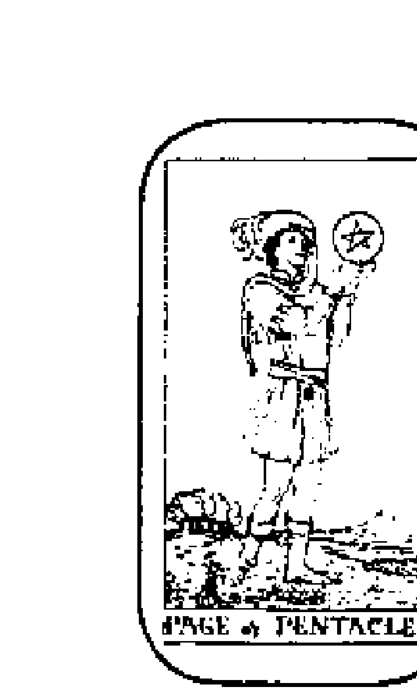

## 第十章 宫廷牌的工作牌义

- **G.工作性質-S2P1**
這個時候可以嘗試自己有興趣的工作，即使沒有相關的學經歷也可以從頭學起，實際去做之後才知道自己的實力。

- **H.工作地點-S2P2**
工作地點可以選擇在該產業集中的地區，這樣會有比較多機會；另一方面，選擇中小企業可以學到比較多的東西。

- **I.要求薪資-S2P3**
要求薪資也許需要低於業界一般的水準才有機會，但應該看重的是在工作當中的經驗與學習，那也是很有價值的。

- **J.求職管道-S2P4**
這個時候可以透過師長幫你介紹相關的工作，或是先參加職業訓練的課程，再由這些職業訓練機構幫你媒合工作。

- **K.求職運勢-S2P5,S7P1,S7P2,S7P3,S7P4**
這段時間的求職運勢還不錯，只要你願意從基層做起，不要太計較薪水或職位，一定可以找到很適合你的好工作。

- **L.可以改進的地方-S2P6**
你在工作技能和專業素養上仍然不足，如果能夠先加強自己的能力或是考取證照，一定可以幫你快點找到新工作。

- **Q.與主管的相處-S3P4,S6P3,S6P4**
這是一個在工作上很專注的上司，所以當他在忙的時候千萬不要打擾他，如果認真觀察也可以從他身上學到東西。

- **R.與同事的相處-S3P5,S6P3,S6P4**
同事之間的關係還不錯，如果你想要學習也有人會熱心地教導你，所以只要建立起良好的同事關係就有貴人相助。

- **S.升遷加薪-S3P6**
在這裡有不錯的升遷機會，加薪則是看個人的表現，你可以利用這個地方好好充實自己，也有更上一層樓的機會。

- **T.如何對待對方-S6P1,S6P2**
這是一個很小心謹慎的人，在做事的時候非常務實細心，同時也很會觀察事情的變化，大家都看好他未來的發展。

# 評估事件

- **U.現有資源-S4P1**
現有資源並不足以應付未來的挑戰，但是仍然有機會可以爭取更多的資源再投入，這個時候應該要預先做好計劃。

- **V.人員配合-S4P2**
人員彼此之間可以配合，但是仍然有一些需要磨合的地方，只要摸熟了彼此的做事方式，應該還是可以配合良好。

- **W.環境因素-S4P3**
目前在環境上還有不錯的機會，如果好好把握也可以有很大的幫助，在行動之前應該要先做好充份的研究和規劃。

- **X.時程進展-S4P4,S7P1,S7P2,S7P3,S7P4**
目前事情的進度還在很初步的階段，大部分的狀況都在你的掌握當中，只要小心謹慎處理就可以在時限之內完成。

- **Y.執行成果-S4P5**
這件事情有機會達到預期的成果，但是中間仍然有很長的一段路要走，這時候還是要很小心謹慎千萬不可以鬆懈。

- **Z.未來影響-S4P6,S5P3,S5P5**
這件事情是對你來說是很好的學習機會，而且很快就可以學以致用，所以應該認真努力，把每一個細節都搞清楚。

## 錢幣侍者逆位

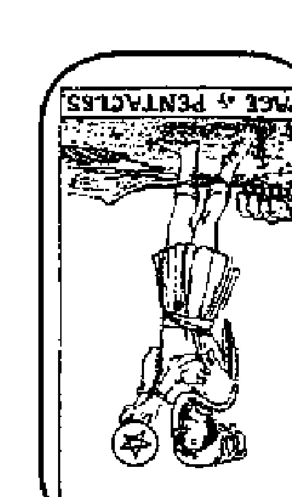

# 評估創業

- **A.創業的方向-S1P1,S5P1,S5P2,S5P4**
你對目前創業方向的想法過於幼稚，還無法掌握到經營管理的訣竅，對於接下來自己應該做什麼事情也不太清楚。

- **B.資金來源-S1P2**
目前資金的狀況並不好，而且財務狀況可能再繼續惡化，這時候也不容易找到新的金主或合夥人，面臨崩潰邊緣。

- **C.合夥關係-S1P3**
這個事業並不適宜合夥，因為這時候不容易找到好的合夥人，大家都想來享受而不做事，還不如自己努力比較好。

- **D.客戶設定-S1P4**
目前客戶設定的方向完全錯誤，如果照目前的計劃去執行一定會損失慘重，這個時候應該要按兵不動再重新檢討。

- **E.店面區位-S1P5**
店面區位的選擇應該要考量到成本的問題，不能為了面子排場就花大錢，先算清楚可能有的效益才不會做錯決定。

- **F.事業前景-S1P6,S5P3,S5P5**
這個事業的前景看來並不是很樂觀，還有很多的漏洞需要處理，如果不能及時補救的話，可能會造成慘賠的狀況。

# 評估求職

# G.工作性質-S2P1
目前很難找到固定時間正常上下班的工作，所以可以考慮部份工時的工作，或需要輪值夜班和在假日上班的工作。

# H.工作地點-S2P2
工作地點並不是你可以決定的，甚至很可能會派你到不熟悉的地方去，所以要預先做好為工作而遷移的心理準備。

# I.要求薪資-S2P3
要求薪資也許需要低於業界一般的水準才可能有機會，很難談到令你滿意的待遇，所以對於薪資不要有太高的期待。

# J.求職管道-S2P4
這時候很難靠自己去找到工作，也許要靠親朋好友的介紹才能加快速度，但是別人介紹的工作大多自己都不喜歡。

# K.求職運勢-S2P5,S7P1,S7P2,S7P3,S7P4
這段時間的求職運勢並不好，即便找到新的工作，事後也會發現不太適合而想要離開，還不如先休息一陣子再找。

# L.可以改進的地方-S2P6
你對找工作這件事情漫不經心，不用心思考和行動就很難有具體的成果，要打起精神集中心力才能快點找到工作。

# 評估工作

# M.工作狀況概要-S5P1,S5P2,S5P4,S7P1,S7P2,S7P3,S7P4
目前工作的狀況有點混亂，事情千頭萬緒又沒有規則可循，完全要自己從頭開始摸索，也算是吃力不討好的工作。

# N.能否勝任-S3P1
你的能力不足以勝任這個職位，不但自己的專長無法發揮，同時無法看清事實的真相，常常被外在的幻象所迷惑。

# O.假期福利-S3P2
這個地方的福利並不好，而且現有的福利還可能再被削減；假期的使用沒有制度可言，常常無法休到想休的時間。

# P.財務收入-S3P3
這個地方的收入並不高，而且還有很多無法報公帳的必要支出，所以實際上可支配的收入會比帳面上還要低很多。

- **U.現有資源-S4P1**
現有的資源並不足以應付目前的狀況，所以從現在開始就必須省吃儉用，同時要積極尋求更多資源才能度過難關。

- **V.人員配合-S4P2**
人員彼此之間各自為政，常常會造成事情的延誤，如果不能把打混摸魚和不適任的人抓出來，就很難把事情完成。

- **W.環境因素-S4P3**
目前環境上充滿了不確定的因素，甚至會傳來不好的消息，你應該小心謹慎面對，任何的小細節都可能變成關鍵。

- **X.時程進展-S4P4,S7P1,S7P2,S7P3,S7P4**
目前事情的進展完全不在你的掌握當中，而且你也不知道問題到底出在哪裡，所以就很難在預定的時限之內完成。

- **Y.執行成果-S4P5**
這件事情很難達到預期的成果，因為實際的狀況比當初設想的還要複雜許多，所以在人力和物力上都不足以負荷。

- **Z.未來影響-S4P6,S6P3,S6P5**
這件事情可能會帶來不好的消息，也可能造成財務上的損失，如果沒有集中精神專心一致，就很難把事情處理好。

- **Q.與主管的相處-S3P4,S6P3,S6P4**
這是一個自主性很強的上司，千萬不要去干涉他的作法，最好也不要提出任何意見，否則可能會被他視為眼中釘。

- **R.與同事的相處-S3P5,S6P3,S6P4**
同事之間相處得很愉快，但是有一點像是酒肉朋友的感覺，即使私底下的關係非常好，對於工作還是沒什麼幫助。

- **S.升遷加薪-S3P6**
這個地方升遷的狀況十分混亂，又沒有什麼加薪的空間，如果沒有十足的興趣與忠誠，最好是快點離開另謀發展。

- **T.如何看待對方-S6P1,S6P2**
這是一個做事情漫不經心的人，而且十分任性聽不進別人的建議，常會因為粗心大意做錯事情，但是又不肯認錯。

# 評估創業

### A.創業的方向-S1P1,S5P1,S5P2,S5P4
你對於目前創業的方向胸有成竹，很清楚自己該做的事情有哪些，只要堅定地朝向目標前進一定會有很好的成果。

### B.資金來源-S1P2
資金的狀況沒有什麼大問題，而且還可能有新的金主或合夥人會加入，資金狀況會越來越好，讓你沒有後顧之憂。

### C.合夥關係-S1P3
這個事業可以合夥，而且可以找到有能力又負責任的合夥人，大家團結在一起努力，一定可以發揮出更大的力量。

### D.客戶設定-S1P4
客戶可以鎖定金融業的從業人員或業務員，開發適合他們的產品或設計吸引他們的促銷方案，通常比較容易成功。

### E.店面區位-S1P5
店面區位應該衡量自身實力，找到最經濟實惠的地點，裝潢也以實用為原則，太多華而不實的佈置只是在浪費錢。

### F.事業前景-S1P6,S5P3,S5P5
這個事業的前景十分看好，而且充滿了賺大錢的潛力，所以應該放下所有的雜事全力投入，才能得到最大的成就。

# 評估工作

# M.工作狀況概要-S5P1,S5P2,S5P4,S7P1,S7P2,S7P3,S7P4
這個工作的工作量很大，工作時間很長，同時也要負擔很重的責任，但是由於收入非常豐厚所以你也會心甘情願。

# N.能否勝任-S3P1
你的能力絕對可以勝任這個職務，但對你來說責任壓力也非常大，同時必須犧牲掉工作以外的其他東西全力以赴。

# O.假期福利-S3P2
這個地方福利制度非常好，許多你想像不到的都有保障；但是由於工作十分忙碌，即使有很多假期也常無法休到。

# P.財務收入-S3P3
這個地方的收入非常好，而且還可能得到大量的獎金和分紅，如果不太過份浪費，應該可以利用機會存一大筆錢。

- **G.工作性質-S2P1**
工作性質應該以自己最有能力的工作為主，或是以能創造最多收入的方向為目標，這時候興趣反而不是主要考量。

- **H.工作地點-S2P2**
工作地點應該會在該行業最集中、最競爭的地區，但是在這些地方通常有比較多機會，對你來說才能找到好工作。

- **I.要求薪資-S2P3**
要求薪資可以略高於業界一般的水準，而且如果有機會的話，還可以爭取較高獎金與分紅的制度，對你比較有利。

- **J.求職管道-S2P4**
這個時候可以透過人力仲介或獵才公司幫你找工作，也可能有工作自己找上門來，不論哪一個求職管道都很暢通。

- **K.求職運勢-S2P5,S7P1,S7P2,S7P3,S7P4**
這段時間的求職運勢很不錯，應該可以找到很高薪又適合自己的工作，所以立定目標之後就要盡全力去找新工作。

- **L.可以改進的地方-S2P6**
你對於找工作十分認真，但是在人際關係的技巧上有待加強，如果在應對進退上能更得體，應該會很快找到工作。

- **Q.與主管的相處-S3P4,S6P3,S6P4**
這是一個在工作上全心付出的上司，也會以相同的標準來衡量部屬，如果你無法配合他的要求，就會被釘得很慘。

- **R.與同事的相處-S3P5,S6P3,S6P4**
同事彼此之間沒有什麼感情，即便有合作也只是公事公辦，如果想要拉近彼此之間的距離，還有可能被覺得奇怪。

- **S.升遷加薪-S3P6**
這個地方有很好的升遷機會，加薪也是依個人表現決定，只要你能把握機會全心投入，應該就會得到很好的回報。

- **T.如何看待對方-S6P1,S6P2**
這是一個很有責任感的人，只要是自己該做的事情絕對會負責到底，所以能得到大家的信任，是個十足的工作狂。

# 評估事件

**U.現有資源-S4P1**
現有資源足以面對接下來的挑戰，但是仍然要非常努力才能克服難關，這時候應該想辦法把資源做最有效的配置。

**V.人員配合-S4P2**
人員彼此之間可以相互配合，在專業上都處理得非常好，但是彼此之間沒有什麼交情，合作事情也只是公事公辦。

**W.環境因素-S4P3**
目前在環境上有許多可以發揮的空間和機會，是你應該要努力去爭取和利用的，同時也有可能出現貴人來幫助你。

**X.時程進展-S4P4,S7P1,S7P2,S7P3,S7P4**
目前事情的進度都完全在你的掌握之中，而且你也能盯緊細節讓事情盡量上軌道，所以應該可以在時限之內完成。

**Y.執行成果-S4P5**
這件事情可以達到預期的成果，一切都會依計劃按部就班完成，如果能夠堅持到最後，就可以享受到勝利的果實。

**Z.未來影響-S4P6,S5P3,S5P5**
這件事情將會帶給你更上層樓的機會，也可能讓你賺到很多錢，所以應該要好好把握，將週邊的效益發揮到極至。

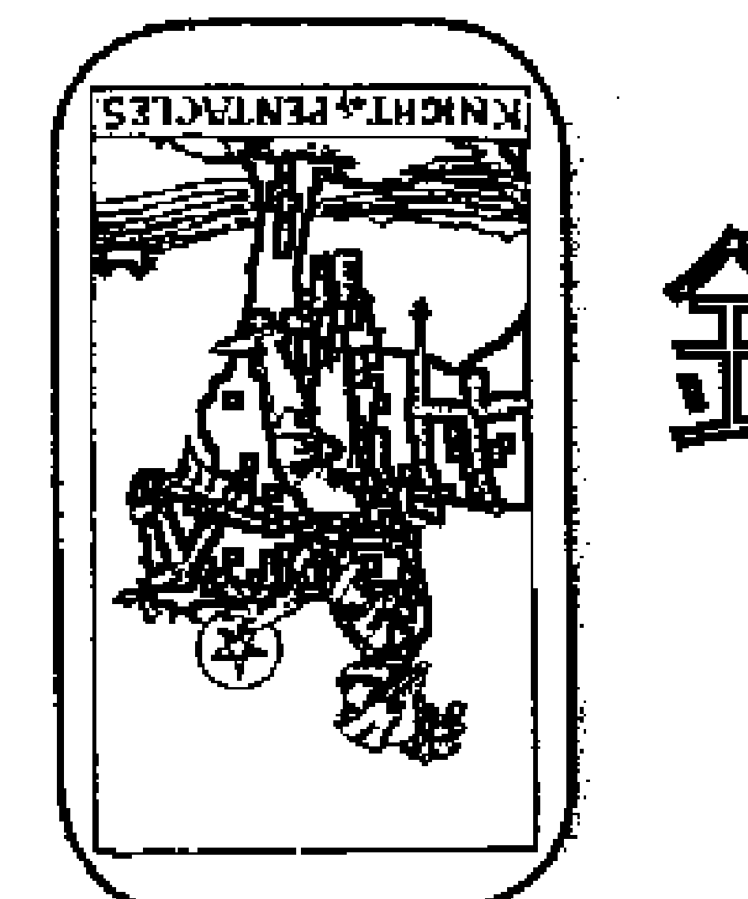

## 金錢騎士逆位

# 評估創業

**A.創業的方向-S1P1,S5P1,S5P2,S5P4**
目前創業的方向有些停滯，可能會讓你覺得提不起勁，如果沒辦法積極地面對，還不如早一點結束比較省時省力。

**B.資金來源-S1P2**
目前資金的狀況沒有什麼大問題，但也不可能再有新的資金投入，所以應該想辦法把現有的資源做最有效的利用。

**C.合夥關係-S1P3**
這個事業不適宜合夥，因為比較難找到適當的合夥人選，反而會請一堆人來吃閒飯，還不如一個人努力比較實在。

**D.客戶設定-S1P4**
客戶可以鎖定失業中或不想去找工作的人，開發適合他們的產品或設計吸引他們的促銷方案，通常比較容易成功。

**E.店面區位-S1P5**
店面區位應該避開競爭最激烈的地區，在不那麼熱鬧的地方也許還有一點機會，不自量力去越級挑戰必然會失敗。

**F.事業前景-S1P6,S5P3,S5P5**
這個事業的前景看起來並不樂觀，而是會陷入一種停滯的狀態，嚴重一點甚至還會門可羅雀，完全沒有生意上門。

# G.工作性質-S2P1

工作性質可能是以臨時性的補充人力為考量，很難找到安定的正職人員；有可能你對所有的工作類型都意興闌珊。

# H.工作地點-S2P2

工作地點最好是在鄉村地區，競爭太激烈的都會地區並不適合你；或是在離家近的地方嘗試，可以快點找到工作。

# I.要求薪資-S2P3

要求薪資也許需要低於業界一般的水準，這個時候無法爭取到高薪的職位，所以要求保守一點比較不會錯過機會。

# J.求職管道-S2P4

這個時候可以透過政府設立的就業服務站或是就業服務中心幫你找工作；自己去找工作的狀況通常都不會很順利。

# K.求職運勢-S2P5,S7P1,S7P2,S7P3,S7P4

這段時間的求職運勢不太好，也找不到符合自己興趣和專長的工作，還不如先休息一陣子，等運勢好轉後再來找。

# L.可以改進的地方-S2P6

你目前根本無心於找工作，消極的態度是找不到工作的主因，如果不能徹底改變自己的心態，就很難找到新工作。

# M.工作狀況概要-S5P1,S5P2,S5P4,S7P1,S7P2,S7P3,S7P4

這個工作讓你覺得非常無聊，所做的事情也都是例行公事，自己的專長完全無從發揮，讓你常常升起離職的想法。

# N.能否勝任-S3P1

你的能力足以勝任這個職位，但是在心態上比較消極被動，常常覺得提不起勁，硬要去接的話就會覺得比較辛苦。

# O.假期福利-S3P2

這個地方的福利平平，最基本該有的福利都有照顧到；假期的規定很寬鬆，只要事先排假都可以休到想休的時間。

# P.財務收入-S3P3

這個地方的收入並不是很好，所以讓你提不起勁想要努力，甚至還可能因此覺得想要離職，去找收入更好的地方。

## 第十章 宮廷牌的工作牌義

# 評估事件

**U.現有資源-S4P1**
現有資源並不足以應付目前的狀況，如果沒有更多資源投入，很快就會變得閒閒沒事，甚至還可能被迫提前結束。

**V.人員配合-S4P2**
人員彼此之間無法配合，而且還會互相推卸責任，如果不能及時調整人員及職務，很有可能會被不適任的人拖垮。

**W.環境因素-S4P3**
目前大環境上沒有什麼變化，也不會對這件事情有明顯的影響，所以還是要靠自己努力，不要期待能有貴人相助。

**X.時程進展-S4P4,S7P1,S7P2,S7P3,S7P4**
這件事情的進度嚴重落後，不過你對於大部分的狀況也無能為力，所以即使很努力也不一定能夠在時限之內完成。

**Y.執行成果-S4P5**
這件事情無法達到預期的成果，但也不會造成太重大的損失，有可能會卡在一個不上不下的狀況，也沒辦法解決。

**Z.未來影響-S4P6,S5P3,S5P5**
這件事情讓你身心俱疲，甚至會想要離職先休息一陣子，即使留在目前的職位上，心態和作法也會變得被動冷漠。

**Q.與主管的相處-S3P4,S6P3,S6P4**
本身就無心於工作的上司，要他幫忙恐怕比登天還難，所以遇到問題只能靠自己搞定，也不用特意想要經營關係。

**R.與同事的相處-S3P5,S6P3,S6P4**
同事之間彼此很冷漠，不太會去關心別人的事情，所以就安心地把自己的事情做好，不必太刻意去經營人際關係。

**S.升遷加薪-S3P6**
在這個地方沒有升遷的機會，加薪的可能性也很低，即使只是想在這裡混口飯吃等退休，還是有被資遣的可能性。

**T.如何對待對方-S6P1,S6P2**
這是一個被動懶惰的人，工作上只會一個口令一個動作，遇到問題也只是冷眼旁觀，所以大家都不看好他的發展。

# 評估創業

- **A.創業的方向-S1P1,S5P1,S5P2,S5P4**
你對於目前創業的方向十分篤定，也知道接下該如何經營管理，以長遠的角度來看這是一個值得持續努力的方向。

- **B.資金來源-S1P2**
目前資金的狀況沒有問題，財務上也十分健全，所以只要專心把自己該做的事情作好，不用特別擔心資金的狀況。

- **C.合夥關係-S1P3**
這個事業可以合夥，而且也可以找到很有能力的合夥人，只要大家能保持長期合作，一定可以發揮出很大的力量。

- **D.客戶設定-S1P4**
客戶可以鎖定公司或企業用戶，或是以自營商為目標，若是以一般零售的消費者為主將會花費許多不必要的力氣。

- **E.店面區位-S1P5**
店面區位應該做長遠的考量，如果真的有需要也可以選擇比較高級的地段，但是所帶來的成本效益都要精打細算。

- **F.專業前景-S1P6,S5P3,S5P5**
這個事業的前景十分看好，即使在短期當中遇到一些阻礙，但是由長期來看沒有任何問題，應該要繼續堅持下去。

# 評估工作

- **M.工作狀況概要-S5P1,S5P2,S5P4,S7P1,S7P2,S7P3,S7P4**
這份工作的狀況非常穩定，是可以專心付出的地方，如果能你長期經營下去，也可以在當中找到充份發揮的機會。

- **N.能否勝任-S3P1**
你的能力可以輕鬆勝任這個職位，但是仍然要花一些時間處理工作當中的人際關係，主動幫助人就會有人幫助你。

- **O.假期福利-S3P2**
這個地方的福利非常好，還有許多你完全想不到的福利；假期的使用也很自由，通常可以休到自己想休的時間。

- **P.財務收入-S3P3**
在這個地方的收入十分穩定，如果不過份浪費的話也可以利用機會存一大筆錢，所以是一個值得長期耕耘的地方。

## 第十章 宮廷牌的工作牌義

# G.工作性質-S2P1

應該選擇自己有能力和經驗的工作性質，以長遠的角度去考量要做什麼；另一方面也很適合做業務和銷售的工作。

# H.工作地點-S2P2

工作地點最好能找離家近的地方，因為這樣不但可以省下很多生活的成本，而且還可以同時兼顧工作與家庭生活。

# I.要求薪資-S2P3

要求薪資可以略高於業界一般的水準，只要不太離譜通常都可能被接受，只是自己也要盡力去爭取才能順利實現。

# J.求職管道-S2P4

這個時候可以透過職場上認識長官或是同事介紹工作，只要能把自己的需求講清楚，通常很快就可以找到新工作。

# K.求職運勢-S2P5,S7P1,S7P2,S7P3,S7P4

這段時間的求職運勢很不錯，可以找到符合自己長遠發展目標的工作，如果好好努力在金錢上也會有很好的回報。

# L.可以改進的地方-S2P6

你對於找工作這件事情胸有成竹，所以有一點太過被動，如果能主動出擊去找工作，應該很快就可以找到新工作。

# Q.與主管的相處-S3P4,S6P3,S6P4

這是一個很會照顧屬下的上司，所以有什麼問題可以盡量和他商量，在合理的範圍之內他都會提供你必要的協助。

# R.與同事的相處-S3P5,S6P3,S6P4

同事之間的氣氛很好，所以大家都能保持良好的關係，如果你能主動去幫助別人，需要的時候也會有人來幫助你。

# S.升遷加薪-S3P6

這個地方升遷的制度很清楚，需要長期累積才能達到；加薪則是看個人的表現，如果表現得好也有可能會三級跳。

# T.如何看待對方-S6P1,S6P2

這是一個很精打細算的人，同時待人親切又體貼入微，由於非常樂於幫助別人，在工作上大家都很喜歡與他合作。

# U.現有資源-S4P1

現有的資源其實絕對足以面對接下來的狀況，所以不必擔心資源不足的問題，如何把人員的問題搞定才比較重要。

# V.人員配合-S4P2

人員彼此之間的默契十足，不但在工作上配合良好，在私底下也有不錯的交情，只要指令清楚就可以把事情搞定。

# W.環境因素-S4P3

目前環境上十分穩定，不會發生什麼意外的變化，還可能會出現貴人相助，對你來說是一個可以專心努力的時刻。

# X.時程進展-S4P4,S7P1,S7P2,S7P3,S7P4

這件事情的進度都在你的掌握當中，只要你按部就班把每一件事情都確實完成，就可以在預計的時限之內完成。

# Y.執行成果-S4P5

這件事情可以達到預期的成果，在金錢上也可以有很豐富的收穫，但只有堅持到最後的人才能享受到勝利的果實。

# Z.未來影響-S4P6,S5P3,S5P5

這件事情對未來會有長遠的正面影響，也可能帶給你升遷加薪的好機會，對你來說也可以建佈未來會有用的人脈。

## 錢幣王后逆位

# 評估創業

**A.創業的方向-S1P1,S5P1,S5P2,S5P4**
你對於目前創業的方向十分懷疑，不確定自己是不是走對了路，這個時候應該要先觀望，不要急著做重大的決定。

**B.資金來源-S1P2**
目前資金的狀況並不充足，也不太可能找到新的金主來幫助你，即使找到新的合夥人對於資金也沒有多大的幫助。

**C.合夥關係-S1P3**
這個事業並不適宜合夥，因為每個人只為自己利益著想，彼此之間還有強烈的猜忌，根本不可能真心誠意合作。

**D.客戶設定-S1P4**
目前並不是決定客戶設定的好時機，已經決定的方向也不可行，這個時候應該先思考新的方向，而不要急著行動。

**E.店面區位-S1P5**
店面區位應該選擇在自己充分了解的商圈，並且要小心評估各方面的狀況，如果還有懷疑的話就不要急著做決定。

**F.事業前景-S1P6,S5P3,S5P5**
這個事業的前景還不是很明朗，但在過程中將會面臨很多的危機和陷阱，如果不小心處理的話會造成財務的損失。

# 評估求職

# G.工作性質-S2P1

目前很難找到適合長期發展的工作，所以應該以短期過渡性質的工作為主，千萬不要與公司簽定長久任職的合約。

# H.工作地點-S2P2

工作地點最好找在自己熟悉的地區，不論是之前就學就業或在家裡附近都不錯，這樣你會心情穩定比較有安全感。

# I.要求薪資-S2P3

要求薪資也許需要略低於業界一般的水準，而且實際得到的數字還不一定會令你滿意，提出高薪就很難找到工作。

# J.求職管道-S2P4

這個時候可以透過政府設立的就業服務站和就業服務中心尋找工作，可以避免遇到詐騙陷阱之外，機會也比較多。

# K.求職運勢-S2P5,S7P1,S7P2,S7P3,S7P4

這段時間的求職運勢並不是很好，很難找到適合你長期發展的工作，即使找到新工作之後的狀況也無法令人滿意。

# L.可以改進的地方-S2P6

你在找工作這件事情上猶豫不決，所以無法把力量集中，你應該先確定自己的目標和方向，才能快點找到好工作。

# 評估工作

# M.工作狀況概要-S5P1,S5P2,S5P4,S7P1,S7P2,S7P3,S7P4

這個工作當中存在很多錯誤的陷阱，所以需要非常專注細心地檢查所有的步驟，否則一不小心就可能會粉身碎骨。

# N.能否勝任-S3P1

你的能力並不足以勝任這個職務，硬去接這份工作只是去當砲灰而已，並不會有貴人相助，也無法得到任何好處。

# O.假期福利-S3P2

這個地方的福利並不好，有很多宣稱的福利都是騙人的；假期的使用很不自由，甚至有時候放假還會影響到收入。

# P.財務收入-S3P3

這個地方的收入並不穩定，所以讓你常常為了錢的事情操心，所以平時就要多存一點錢，才可以應付緊急的狀況。

# 評估事件

- **U.現有資源-S4P1**
現有資源並不足以應付接下來的危機，同時也不太可能再投入更多資源，所以只好省吃儉用看看能不能度過難關。

- **V.人員配合-S4P2**
人員彼此之間無法配合，猜忌和不信任讓事情無法順利推動，這個時候除了果斷地換人之外沒有更好的處理方法。

- **W.環境因素-S4P3**
目前環境上沒有任何援助者，所以算是陷入孤軍奮戰的局面，幸好也不會有重大的變化，讓你可以專心處理事情。

- **X.時程進展-S4P4,S7P1,S7P2,S7P3,S7P4**
目前事情的進度有一些混亂，你也不是很清楚確實的狀況如何，這個時候要很小心求證才能知道確實的進度如何。

- **Y.執行成果-S4P5**
這件事情很難達到預期的成果，但也還不到滿盤皆輸的程度，你應該要小心保存已經有的戰果，避免損失再擴大。

- **Z.未來影響-S4P6,S5P3,S5P5**
這件事情可能會造成財務上的損失，也讓你無法再信任其他人，要很小心謹慎分析辨別，才能避免一再受到欺騙。

- **Q.與主管的相處-S3P4,S6P3,S6P4**
這是一個很多疑的上司，隨時都覺得自己的位子可能會不保，所以千萬不要太積極搶功，把自己的本份完成就好。

- **R.與同事的相處-S3P5,S6P3,S6P4**
在工作當中大家都無法信任彼此，反而會因為猜忌抵消內部的力量，即使你想要改變這種風氣，大概也無能為力。

- **S.升遷加薪-S3P6**
在這個地方沒有升遷的機會，加薪的可能性也很低，所以並不適合在這裡長期發展，只能做一個工作轉換的跳板。

- **T.如何看待對方-S6P1,S6P2**
這是一個非常精打細算的人，但是天性多疑很難信任別人，在工作上常會利用別人，所以大家都不喜歡與他合作。

## 錢幣國王正位

# 評估創業

- **A.創業的方向-S1P1,S5P1,S5P2,S5P4**
目前創業的方向進展十分穩定，所有的事情也在正常的軌道上運行，整體來說是一個穩健又有長遠發展性的方向。

- **B.資金來源-S1P2**
目前資金的狀況十分充足，完全不用去擔心錢的問題，只要想如何把資源做最有效的配置，才能發揮最大的效益。

- **C.合夥關係-S1P3**
這個事業可以合夥，而且有機會找到一些很有眼光的大金主，只要你說服他們加入，就不需要擔心資金的問題。

- **D.客戶設定-S1P4**
客戶應該鎖定比較有錢有閒的上層階級，開發適合他們的產品或是設計吸引他們的促銷方案，通常比較容易成功。

- **E.店面區位-S1P5**
店面區位應該要選擇在比較高檔的地區，而且店面的裝潢也要很有質感，這樣子才能吸引到最能創造利潤客戶群。

- **F.事業前景-S1P6,S5P3,S5P5**
這個事業的前景十分看好，未來應該能穩定地發展，只要能持續在原來的方向上堅持下去，一定會有很好的成果。

# 評估工作

- **M.工作狀況概要-S5P1,S5P2,S5P4,S7P1,S7P2,S7P3,S7P4**
這份工作對你來說非常好，不但可以享受到工作的成果，也可以同時兼顧到生活品質，是適合你長期發展的地方。

- **N.能否勝任-S3P1**
你的能力可以輕鬆勝任這份工作，雖然事情還是需要花一些心思想辦法處理，但是工作的難度對你來說並不高。

- **O.假期福利-S3P2**
這個地方的福利非常好，是一個可以讓人安心工作的地方；休假很制度化，只要預先規劃都可以休到想休的時間。

- **P.財務收入-S3P3**
這個地方的收入非常好，而且也有機會爭取到高額的獎金或紅利，只要自己不過份浪費應該都可以存到一大筆錢。

## 第十章 宮廷牌的工作牌義

# 評估求職

**G.工作性質-S2P1**
工作性質上應該是以自己有豐富經驗或學識的類型為主，當中追求穩定的成長；或是可以考慮金融或投資的行業。

**H.工作地點-S2P2**
工作地點應該會在競爭激烈的大都會，所以應該勇於面對挑戰勇敢往裡面鑽，經過重重關卡才能得到出頭的機會。

**I.要求薪資-S2P3**
要求薪資可以高於業界一般的水準，但也要提出足夠的學經歷來證明自己的價值，應該會爭取到自己滿意的數字。

**J.求職管道-S2P4**
這時候可能有工作自己找上門來，或是也可以透過人力仲介或獵才公司幫你找工作，應該會出現幾個機會讓你挑。

**K.求職運勢-S2P5,S7P1,S7P2,S7P3,S7P4**
這段時間的求職運勢非常好，可以找到高薪又符合自己專長的工作，所以應該主動積極一點，才能把握住好機會。

**L.可以改進的地方-S2P6**
其實你比較想要當老闆而不想找工作，但是這是不一樣的兩件事，你要調整好當人屬下的心態才能快點找到工作。

**Q.與主管的相處-S3P4,S6P3,S6P4**
這是一個務實成熟的上司，偏向重視事理而不顧人情，所以只要能拿出好的方案去說服他，就可以得到他的賞識。

**R.與同事的相處-S3P5,S6P3,S6P4**
同事之間的相處十分和平，在工作上的事情也可以彼此信賴，大家在私底下也有一些交情，所以大都能合作愉快。

**S.升遷加薪-S3P6**
這個地方有很好的升遷機會，加薪的幅度也令人滿意，如果能夠長期在這裡努力奮鬥，有機會坐到最頂尖的位置。

**T.如何看待對方-S6P1,S6P2**
這是一個非常成熟老練的人，行事上十分穩重務實，同時也很重視私人生活和享受，所以大家都很看好他的發展。

# 評估事件

U. 現有資源-S4P1
現有的資源足以去應付所有的狀況，所以完全不必擔心資源不足的問題，應該把重點放在將資源充份有效的運用。

V. 人員配合-S4P2
人員彼此之間的配合很好，也可以有良好的互動與分工合作，所以最重要的是在事前把每個人的工作都交待清楚。

W. 環境因素-S4P3
目前環境上有非常好的機會，同時也可能有貴人相助，所以不必太擔心外在的狀況，把握機會努力往前衝就對了。

X. 時程進展-S4P4,S7P1,S7P2,S7P3,S7P4
這件事情的進展十分順利，即使不太努力拼命趕進度，只要按部就班把事情做好，就可以在預定的時限之前完成。

Y. 執行成果-S4P5
這件事情不但可以達到預期的成果，而且還可能有意外的驚喜，所以只要努力就有機會得到比預期更豐富的收穫。

Z. 未來影響-S4P6,S5P3,S5P5
這件事情會有長遠的正向影響，不但可能有升遷加薪的機會，也能兼顧到家庭與生活品質，應該會有很大的收穫。

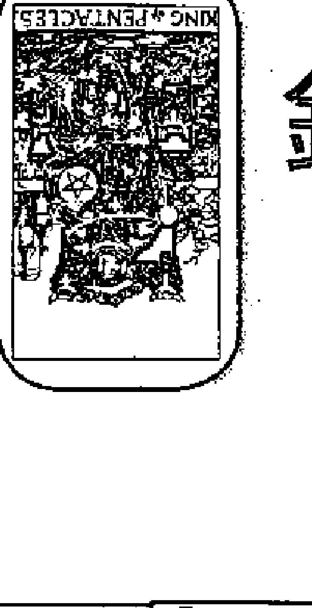

## 金錢幣國王逆位

# 評估創業

- **A. 創業的方向-S1P1,S5P1,S5P2,S5P4**
  目前創業的方向完全錯誤，已經不是局部調整能夠挽救得了的，現在應該要徹底檢討，必要時甚至需要重新開始。

- **B. 資金來源-S1P2**
  目前資金還有很大的缺口，如果無法再投入更多資金就必然會失敗，但是這個時候又很難找到新的金主或合夥人。

- **C. 合夥關係-S1P3**
  這個事業不適宜合夥，因為大家都只為自己的好處營私舞弊，完全不顧共同的利益，早晚會因為這些私心出問題。

- **D. 客戶設定-S1P4**
  目前客戶設定的方向完全錯誤，如果硬要去做的話會造成很大的損失，目前最好是按兵不動，重新檢討後再出發。

- **E. 店面區位-S1P5**
  店面區位的選擇有很大的風險，如果選對了地方可能會大發利市，但是若賭錯了地方就可能造成整個事業的危機。

- **F. 事業前景-S1P6,S5P3,S5P5**
  這個事業的前景看起來並不好，可能從大方向上就出現偏差，內部鬥爭的問題也很嚴重，也許很快就會土崩瓦解。

# 評估 求職

- **G. 工作性質-S2P1**
  這個時候應該避開高風險的行業，例如業務或銷售性質的工作，以免因為自己的表現不佳賺不到生活的基本開銷。

- **H. 工作地點-S2P2**
  工作地點也許會被派到你不喜歡的地方，如果在工作地點上太過於堅持，很可能在這一陣子會很不容易找到工作。

- **I. 要求薪資-S2P3**
  要求薪資可能需要略低於業界一般的水準，如果發現薪水高到不合理的工作，就要小心有可能是騙人的求職陷阱。

- **J. 求職管道-S2P4**
  這個時候各個求職管道都不太暢通，所以應該盡量嘗試各種不同的管道，要多增加碰撞的機會才能快點找到工作。

- **K. 求職運勢-S2P5,S7P1,S7P2,S7P3,S7P4**
  這段時間的求職運勢並不好，不可能找到符合自己理想的工作，找到工作的話薪水也不高，同時要小心求職陷阱。

- **L. 可以改進的地方-S2P6**
  你對於工作的野心太大，但是並沒有相對應的實力，如果不能及時認清事實調整心態，就很難找到適合你的工作。

# 評估 工作

- **M. 工作狀況概要-S5P1,S5P2,S5P4,S7P1,S7P2,S7P3,S7P4**
  在工作上出現了很大的漏洞，之前的問題也慢慢浮現出來，狀況有可能已經腐化到了極點，即使想救也無能為力。

- **N. 能否勝任-S3P1**
  你能力並不足以勝任這個職位，而且這個工作還會對你的名聲有所傷害，如果不是必要狀況千萬不要接這個工作。

- **O. 假期福利-S3P2**
  這個地方的福利很差，老闆根本就是在壓榨勞工；假期的規定也很苛刻，即使還有假也會因為種種因素沒辦法休。

- **P. 財務收入-S3P3**
  這個地方的收入並不好，老闆只是在剝削勞工而已，自己做的事情完全沒有相對應的回報，還不如快點另謀高就。

- **U. 現有資源-S4P1**
  現有的資源其實並不足以面對現在的危機，如果不能及時投入更多資源就注定要失敗，再怎麼撐也很難化險為夷。

- **V. 人員配合-S4P2**
  人員彼此之間很難配合，而且還會互相鬥爭陷害彼此，如果無法調整人員或職務，就很可能被內部人事問題拖垮。

- **W. 環境因素-S4P3**
  目前大環境的因素對你並不利，還有很多的問題和危機需要去面對，這時應該多聽別人的意見，別再閉門造車了。

- **X. 時程進展-S4P4,S7P1,S7P2,S7P3,S7P4**
  目前事情的進度嚴重落後，即使再怎麼追趕也沒辦法補救，這個時候如果能夠重頭來過，也許速度還會更快一點。

- **Y. 執行成果-S4P5**
  這件事情很難達到預期的成果，有可能是在一開始就走錯了路，所以之後再怎麼努力補救也很難看到具體的成效。

- **Z. 未來影響-S4P6,S5P3,S5P5**
  這件事情對你有不利的影響，不但會增加工作的困難度和風險，還可能爆發出嚴重的醜聞，對你的名聲造成損害。

- **Q. 與主管的相處-S3P4,S6P3,S6P4**
  這個上司往往把自己的利益放在第一位，很會利用下面的人為自己謀私利，對於所有可能違法的事情要提高警覺。

- **R. 與同事的相處-S3P5,S6P3,S6P4**
  工作當中大家都在互相算計，並不存在真心的人際關係，如果你不小心一時疏忽，很可能就會被其他人給出賣了。

- **S. 升遷加薪-S3P6**
  這個地方沒有升遷的可能，加薪的機會也很低，即使有獎金或分紅的制度實際上也拿不到，還是快點找機會走人。

- **T. 如何看待對方-S6P1,S6P2**
  這是一個很有心機的人，重視自己的利益甚於一切，還會為了達到目的不惜犧牲別人，所以大家都不想與他合作。

## 塔羅工作講義

作者／丹尼爾

發行人／黃鎮隆

協理／鄭如芳

主編／叢昌瑜

美術監製／徐祺鈞

美術主編／杜詠芬

美術編輯／劉玉成

出版／城邦文化事業股份有限公司 尖端出版
台北市民生東路二段141號10樓
電話：(02)2500-7600 傳真：(02)2500-1971

發行／英屬蓋曼群島商家庭傳媒股份有限公司
城邦分公司 尖端出版行銷業務部
地址：台北市民生東路二段141號10樓
電話：(02)2500-7600
傳真：(02)2500-1979
劃撥專線：(03)312-4212
劃撥帳號：50003021英屬蓋曼群島商家庭傳媒（股）公司城邦分公司
◎ 劃撥金額未滿500元，請加付掛號郵資50元◎

法律顧問／通律機構 台北市重慶南路二段59號11樓

台灣地區總經銷／中彰投以北（含宜花東）高見文化行銷股份有限公司
電話：0800-055-365 傳真：(02)2668-6220
雲嘉以南 威信圖書有限公司
（嘉義公司）電話：0800-028-028 傳真：(05)233-3863
（高雄公司）電話：0800-028-028 傳真：(07)373-0087

馬新地區總經銷／城邦（馬新）出版集團 Cite(M) Sdn.Bhd.(458372U)
電話：603-9056-3833 傳真：603-9056-2833

香港地區總經銷／城邦（香港）出版集團 Cite(H.K.) Publishing Group Limited
電話：852-2508-6231 傳真：852-2578-9337

2008年10月初版 Printed in Taiwan ISBN 978-957-10-3948-0

* 版權所有·侵權必究 *

◎ 本書若有破損或缺頁，請寄回本公司更換 ◎

> 國家圖書館出版品預行編目資料
塔羅工作講義／丹尼爾 作.--初版.--
臺北市 ： 尖端，2008.10
面 ； 公分
ISBN 978-957-10-3948-0(平裝)
1. 占卜
292.96 97016481

## 本书特色

每张牌皆提供详细的正逆位牌义说明，供读者快速找到答案。

搭配7种问题牌阵范例，让读者能身历其境，学以致用。

详细设计的4大类、26项的占卜结果，全面解决你职场生涯面临的问题。

「朋友找我合伙创业适合吗？」、「今年加薪的机会大不大？」、「想离职应该怎样进行？」、「有没有升迁的可能性？」、「我适不适合这份新工作」……这些关于工作的问题，相信每个人的心裡都曾有疑惑过，现在不用怕了！《塔罗工作辞典》的诞生，就是要解决你心裡的这些困惑。

透过全副78张塔罗牌正逆位的解说，并结合《塔罗解牌字典》和《塔罗入门经典牌阵》的双重概念，让有心学习塔罗牌的读者能获得深度（解题深入）的学习、也为对工作上面临困境的读者带来趣味（查阅容易）的效益。

你想知道计画的时程进度？想瞭解事业发展的前景？也想得到与同事间人际关系的提示？有了《塔罗工作辞典》在手，详尽的说明、透彻的分析，定能一网打尽你面对的难题，让你轻松工作、快乐上班。