## 塔罗时刻
—— 圣甲虫的预言 ——

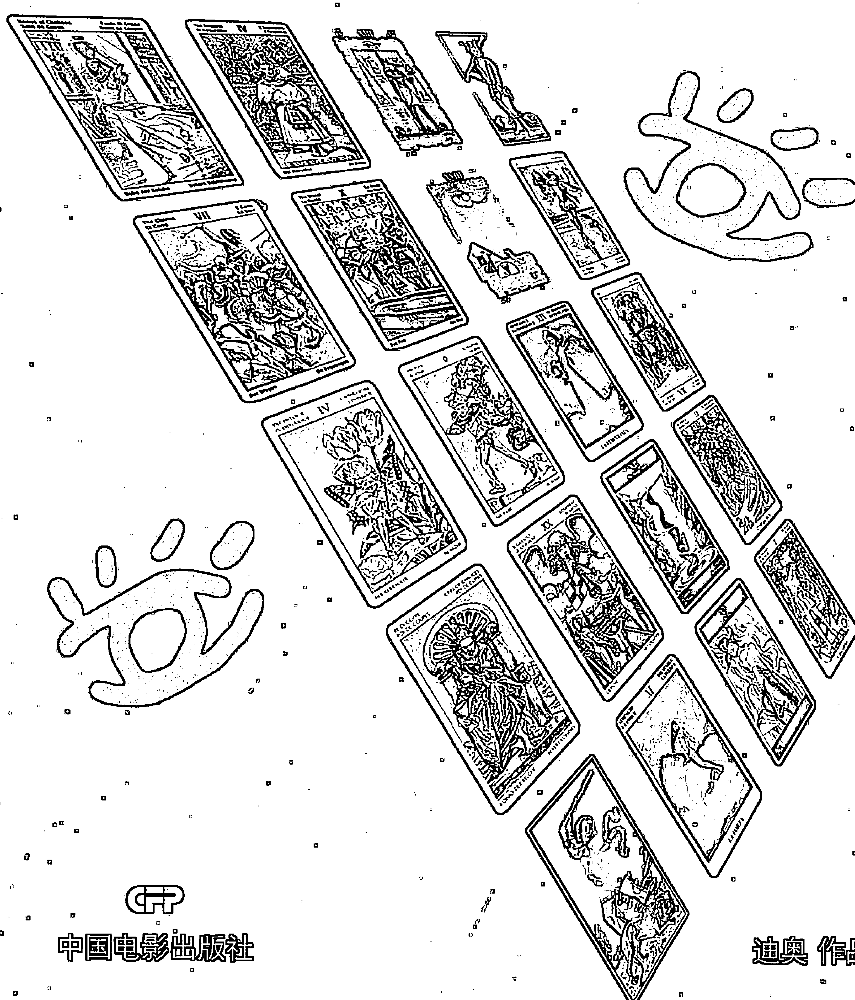

中国电影出版社

迪奥 作品

# 塔罗时刻——圣甲虫的预言

作者——迪奥
责任编辑——安刚
书装设计——深红

猛迅（北京）文化艺术传播中心有限公司
Lo Scarabeo s.r.l 中国大陆地区独家代理
中国北京朝阳区北苑路172号欧陆经典15楼102室 邮政编码 100101
电话—— 86-10-88151606 传真—— 86-010-88133088

出版发行——中国电影出版社
印刷——北京达利天成印刷有限公司

2004年9月 初版一刷
版权所有·翻印必究
ISBN 7-106-02211-X/G.0601

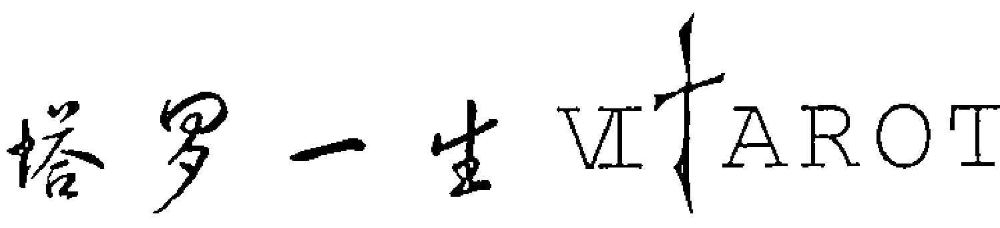

http://www.vitarot.com
E-mail:info@vitarot.com

# THE TAROT TIME
- Scarab's Prophecy -

Copyright© 2004 by Monsoon (Beijing) Culture and Art Communication Centre Ltd.

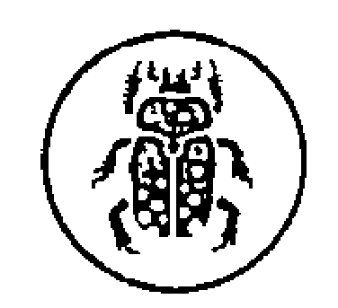

# TAROT OF THE RENAISSANCE

Pietro Alligo
Artwork by Giorgio Trevisan

© 2004 Copyright Lo Scarabeo
Via Varese 15c 10152 Torino Italy
Tel: +39 011 283793 Fax: +39 011 280756
E-mail:info@loscarabeo.com
Internet:http://www.loscarabeo.com

# 初识塔罗

李毅华

当人们无法超脱于喧嚣的时尚生存氛围，庞杂的资讯会让你产生一种透不过气的感觉。人们似乎在问自己：是有自知之明的无知，或是应当有渴求知之的急迫。

人类文明进入到信息时代的21世纪，从学养深厚的专家学者的心态，到有一定文化修养的知识分子的自省，对待未知或不可知，都会有不同程度的困惑。人们在乘坐探索外层空间的奥秘、在向生命科学领域挑战的列车上，开启了人类又一个漫长的、新的征程。“太空”、“生命”，既是那么遥远浩渺，又是那么身临其境，亘古至今这是一个永恒的话题。而涉及这类命题的古代的探求，无论是在西方延演的占卜之术，或者华夏的《易经》之学，其中笈藏玄妙，若想达到精辟的解读程度，却谈何易事？这或许正是通过对娱乐塔罗，释放潜意识的好奇与迷惑的一个小门阀。

据说，“塔罗”在西方已有近千年的历史，它在演进中含括了与天文、地理、宗教、神话、历史、文化、艺术诸多方面的同步溶融。更早的形态尚缺少文物佐证。但是，演绎至今的形式，无疑是有本之木。

塔罗，是一门专门的知识，又是一门技巧性的工具；它会带给你娱乐性的消闲，也会培养起对收藏的乐趣。一说塔罗牌是扑克牌的前身，从这个意义上讲，它更应当有广泛的受众，就好像需要弥补“牌的娱乐”的断层。

塔罗是时尚，对于不断正视“文化自闭”的时代现实，恰恰它似乎又是迟到的时尚。无论在香港，或在台湾，塔罗在一定范围里被人们所认知或传播，大抵是一、二十年间的事，对于开放的中国大陆，更是近年的现象。

《塔罗时刻》是一册集知识性，娱乐性的专门著述图书。所配的原版塔罗牌，更是在意大利享有盛誉的圣甲虫公司的产品。我以为，其应当具有传播文化的触角之功。在致贺作者成书之时邀余作序，婉拒不恭却无以为文，遂命笔《初识》聊以与读者分享。

（《代序》作者系中国文化艺术传播中心（香港）有限公司主政）

# 目录

# 序章

借魔法和通灵术探求未知世界 / 8

## 1 神秘的塔罗牌

- 什么是塔罗牌 / 20
- 塔罗牌的过去和现在 / 22
- 十天体与十二宫 / 28
- 流变之轮 / 46

## 2 大阿尔克纳

- 愚人 / 54
- 魔术师 / 57
- 女祭司 / 60
- 女皇 / 63
- 皇帝 / 65
- 主教 / 67
- 恋人 / 70
- 战车 / 72
- 正义 / 74
- 隐士 / 76
- 轮 / 78
- 力量 / 80
- 倒悬者 / 82
- 死神 / 85
- 节制 / 87
- 恶魔 / 89
- 高塔 / 91
- 星星 / 94
- 月亮 / 96
- 太阳 / 98
- 审判 / 100
- 世界 / 102

# 3 小阿尔克纳

- 杯组 / 106
- 杖组 / 121
- 币组 / 136
- 剑组 / 151

## 4 解读塔罗牌

- 解牌者守则 / 168
- 展开法 / 177

# 5 塔罗牌戏

- 牌戏规则 / 216

# 序章

## 借魔法和通灵术探求未知世界

> 我们就是
> 梦幻所用的材料，
> 一场睡梦
> 环抱了短促的人生。
>
> ——威廉·莎士比亚《暴风雨》

在第一世纪基督诞生的年代，希腊古城雅典曾经充斥着各式各样希腊和罗马诸神的偶像，城内人民的生活显然与敬拜鬼神有着密切的关系。由于害怕在无意之间忽略了崇拜任何重要或有力的神祇而令其不悦，雅典人甚至在崇拜中包括一位“不认识的神”在内。这清楚地表明他们十分畏惧鬼神。

当然，畏惧鬼神，尤其是畏惧不认识的神，并不限于第一世纪的雅典民众。数千年来，这种恐惧一直支配着人类。在世上许多地方，人民生活差不多在各方面均直接或间接与某些鬼神扯上关系。古代埃及人、希腊人、罗马人、中国人和其他民族的神话都根深蒂固地基于有关鬼神的主张，这些主张对个人和国家事务都产生着重要影响。中世纪的时候，有关炼金术士、巫师、女巫的故事在基督教国家境内广泛流传。今天的情况也与此不相上下。

## 今天的宗教习俗与迷信

不论世人察觉与否，他们所做的许多事都与迷信的习俗或信仰有关，有些则与鬼神有关。例如，你知道庆祝生日起源于占星术吗？这种迷信对人的精确诞生时日极为重视。生日蛋糕又如何？它看来与希腊女神阿耳忒弥斯（亚底米）有关，因为她的生日是用插上蜡烛的圆形蜜糖饼庆祝的。你知道在丧礼中穿着黑衣原本是要设法避免受据称这时埋伏在暗中的邪灵所注意吗？有些非洲黑人把自己染成白色，其他地方的送殡者则穿着颜色异常的衣服，使邪灵认不出他们来。

除了这些流行习俗之外，各处人也有自己的迷信和忌惮。在西方，打破镜子、看见黑猫、行在梯下，凡是星期二或星期五遇上是十三号（视乎你在什么地方而定），统统被视为不祥之兆。在东方，日本人穿和服以左襟叠在右襟之上，因为相反的折叠法是留给尸体用的。他们的房屋没有任何向着东北方的门窗，这样从这方向而来的鬼灵就不得其门而入了。在菲律宾，死人在殡殓前鞋子被脱下放在腿旁，这样圣彼得就会欢迎他们。年长者教训后辈要行为端正时指出，月亮里有个人物，便是圣米迦勒，他负责监视人的行为，并且将其记录下来。

可是，对鬼神的信仰并不限于看来无害的习俗与迷信。不论在原始抑或现代社会中，均有人凭借各种方法去控制或安抚邪灵及邀福于善灵。至此我们自然想到居于僻远森林和山区中的土著，在患病或遭遇困难时求问灵媒、巫医和萨满（魔法祭师）。可是，居于现代大小城市里的人也喜欢向占星家、通灵术士、算命卖卜者和预言家求问前程或要后者帮助他们去作重要决定。有些人虽在名义上属于某个宗教，却仍然热心作这样的求问。其他许多人则把通灵术、黑魔术和玄秘术视为他们的宗教。

这一切行为是出自什么样的来源或起源的呢？它们对跟从者会产生什么影响？为了取得这些问题的答案，我们必须回顾人类以往的历史，看看早期的崇拜方式是怎样的。

## 探求未知的境界

信仰宗教的人们对于自身的看法与进化论者的观点正相反，他们认为人类具有属灵的倾向，从而使人与低等动物迥异并且较之优越。人生来便有探求未知境界的欲望。他们渴望寻得若干问题的答案，例如：人生有什么意义？人死后会有什么遭遇？人与物质世界，事实上跟宇宙有什么关系？人也受到一种渴求所驱策，要接触某些高于或强于自己的东西，以期对自己的环境和生活取得若干控制权。

利斯纳（Ivar Lissner）在他所著的《人、神、魔术》一书中这样说：“历史上古往今来，人受到驱策去探求本身以外的事物，其不屈不挠之处的确令我们惊讶。人的精力从没有完全用在谋求生活必需品之上。他们不断质疑，不断作进一步的探索，渴望达到无法达到的境界。在人类当中，这种奇异和天生的推动力便是他们的灵性。”

当然，不信有神存在的人对事情并不持有这样的看法。他们通常认为人类的这种倾向来自人在心理或其他方面的需要。可是，按照我们的一般经验，大多数人在面对危险或逆境时的最先反应岂不是呼求神或某些较高力量的帮助吗？此种情形古今均无二致。是故，利斯纳继续说：“在最古老的原始民族当中进行研究的人无一不察觉到，这些民族全都相信有神存在，他们对于一位至高者都具有敏锐的警觉性。”

他们怎样设法使用这种探求未知境界的天生愿望获得满足却是另一回事。游牧民族中的狩猎者和畜牧者战栗于野兽的力量。耕农要努力适应气候和季节的转变。住在森林区的人与住在沙漠或山区的人的反应颇为不同。鉴于这许多不同的恐慌和需要，世人发展了种类多得令人困惑的宗教仪式，希望借此求告善良的神和安抚凶恶的神。

不过，尽管有种种差异，我们却可以在这些宗教活动上辨认出若干共同的特色，例如敬奉和畏惧鬼神与超自然力量、使用魔法、借着征象和兆头预测未来、占星术和种种占卜方法。我们考查一下这些特色，就可以看出它们在模铸宗教思想方面担任着重要角色，古往今来，甚至在今天的世人当中莫不皆然。

## 神灵与超自然力量

初民的生活看来充满了神秘。在他们四周有许多无法解释和令人惶惑的事情。他们无法了解何以一向强壮的人会突然生病，何以在下雨季节天竟会滴雨不降，一棵看来毫无生气的光秃树干何以会在年中某些时候变得青翠悦目、欣欣向荣。甚至人本身的影子、心搏和呼吸也是神秘莫测的。

宗教既然使人认为他们具有天生的属灵倾向，所以人们把这些神秘的事情和遭遇诱诸超自然力量是顺理成章的。不过，由于缺乏正确的指导和了解，人的世界很快就充满了鬼魂、精灵、邪魔、妖怪等。北美阿尔贡金族印地安人把人的灵魂称为“奥他左克”，意即“他的影子”。东南亚的马来人相信人死时灵魂会从鼻孔逃脱。今天，对于鬼魂及魂离开躯壳的信仰并试图以某种方式与之沟通差不多遍及普世。

同样，自然界中的其他生物、日月星辰、山川河湖都似乎具有生气而能够对人类的活动直接产生影响。它们既然看起来别有天地，于是被拟为人性化而成为鬼神，有些为善降福，有些为恶降祸。差不多在所有宗教中，崇拜有形的事物均居于显著地位。

我们几乎在每个古代文明的宗教里都可以找到这种信仰。古巴比伦人和古埃及人崇拜太阳、月亮和众星的诸神。动物和野兽也成为崇敬对象。印度教徒以崇拜神祇众多见称，数目达千百万之巨。中国人一向有自己的圣山及神河，并且以崇拜祖先来表示孝敬。不列颠群岛的古代特鲁伊特人以橡树为圣树，对于橡树上的槲寄生小枝也予以特别的崇敬。后来，古希腊人和古罗马人也秉承一贯作风，对鬼、神、灵魂、妖魔和各种圣物的敬奉遂成为根深蒂固的信仰。

今天虽然有些人把这样的信仰视为迷信，但在世界各民族的宗教习俗中，我们仍可以见到这类遗风。有些人依然相信山川、怪石、老树和其他许多东西是神圣的，于是奉之为崇拜的对象。他们在这些地方建造祭坛、神龛和庙宇。印度教徒以恒河为圣河，他们最大的愿望便是生时能在河中沐浴，死后骨灰被抛入河中。佛教徒认为在印度的菩提伽耶佛殿敬拜是一项特殊经验，因为据称佛陀是在那里的菩提树下悟道的。在墨西哥，天主教徒膝行前往瓜达卢佩圣母大教堂朝拜，或用法国卢尔德的圣水沐浴以求获得神奇医治。

## 魔法的兴起

认为生物的世界里充满善恶鬼神的信仰一经确立，就很容易进至另一步了——设法与善灵沟通以祈求指引和祝福，同时也设法安抚恶灵。魔法于是乘时而兴，古往今来，差不多在每个国家均大行其道。

在最基本的意义上，魔法便是企图控制或强迫自然或超自然力量去遵行人的命令。由于不知道日常发生的许多事的真正原因，较早期社会的人还认为反复诵念某些具有魔力的词语或咒语，或者举行某些仪式，就可收到若干效果。使这类魔法更受人信任的是，某些仪式竟然生效。例如，据说苏门答腊以西的明打威群岛的巫医（其实是魔法师或术士）在医治腹泻方面非常有效。他们的魔术疗法是叫患者在一道断崖边缘附近把面孔俯贴在地，不时舔一下泥土。是什么使这种方法生效呢？原来断崖的土壤含有瓷土，这种白色粘土在今日时常入药作医治腹泻之用。

少数成功的例子很快就抵消了所有失败的事例，从而为巫医确立了声誉。他们一跃成为社区中备受敬畏的份子——祭司、酋长、萨满、巫医、女巫医、灵媒。人民纷纷以难题向他们请教，诸如治病、防病、找寻失物、辨认盗匪、驱邪治鬼、设法复仇等。最后他们积聚了大量属于迷信性质的法术和仪式去处理上述各事和生活上的其他事务，如诞生、达到法定年龄、订婚、死亡、殡葬等。魔法的势力和神秘不久就支配着人民生活的每一方面了。

## 求雨舞蹈和符咒

尽管不同民族所行的魔法极其多样化，但背后的基本主张却相似得令人惊讶。首先，有一项主张是以小喻大，那便是，希望获得的效果可以靠加以模仿而产生。这称为模拟的魔法。例如，若天旱不雨，农作物受到威胁，北美的奥马哈印第安人就围着一桶水跳舞。其中一人吸一口水，喷向空中，模仿雨点或骤雨。有时一个男子会在地上滚来滚去像只受伤的熊，希望借此确保他能猎熊成功。

其他的民族则举行繁复的仪式，包括念咒和献祭。中国人以纸制或木雕的巨龙象征雨神，抬着四处游行，或者把神像从庙中抬出来放在太阳之下，使它感到炎热，从而降下甘露。东非恩戈尼人的仪式包括把酒倒入壶囊埋在雨神庙的地下，在进行祷告后各人喝下余剩的酒，随即唱歌跳舞，并把在水里浸过的树枝猛摇。

施行魔法也基于另一个主张，那便是，属于某人的物件在离开那人之后仍会继续影响他。魔法师于是对这人的旧物施咒。在十六和十七世纪，欧洲和英国的一般人仍然相信男巫和女巫能够以法力令人受害。法术凶手为人造个蜡像，把针插入像里，把人的名字写在纸上烧掉，埋葬他的一件衣物，对他剪下的头发、指甲、汗液甚至粪便作法。此类行为十分广泛，从英国在1542、1563和1604年由国会立例规定行巫术者应判死刑一事可以见之。自古至今，差不多每个国家均有人以某种方式施行魔法。

## 凭征象和预兆探知未来

魔法在很多时候被人用来揭露隐藏的消息或借征象和预兆探知未来。这种魔法称为占卜，古巴比伦人便以此闻名。《魔法、超自然主义和宗教》一书指出，“他们擅于从祭牲的肝、肠，从火和烟以及宝石的亮度预测未来；他们根据流水的响声和植物的形状预告未来的事件。……气象变化、风云雨电均被视为未来的征兆；家具和木板的龟裂都是预兆……苍蝇和其它昆虫以至狗均是玄秘信息的携带者。”

圣经中曾有这样的记载，在一次征战中，巴比伦王站在岔路那里，在两条路口上要占卜。他摇箭求问神像，察看牺牲的肝。当时，术士、巫师和行魔法的祭司经常出入巴比伦宫廷。

其他国家的人，不论东方或西方，也涉猎多种形式的占卜。举凡政务大事以至世俗的私事如婚姻、旅行和儿女问题等，古希腊人均向预言者请教。那里有阿波罗神的女祭司（称为皮斐亚 [Pythia]）发出晦涩难明的声音，然后由其他祭司传译成模棱两可的诗句。典型的例子是吕底亚王克罗伊斯（Croesus）所获的答复，她说：“克罗伊斯若渡过哈利其河，便会毁灭一个强大帝国。”事实表明，遭受毁灭的强大帝国正是他自己的王国。克罗伊斯在渡过哈利斯河入侵卡帕多西亚时败在波斯王居鲁士之手。

在西方，古罗马人的占卜术达到登峰造极的程度。他们事无大小均求教于征象和预兆。社会各阶层的人无不相信占星术、巫术、护身符、算命和各种形式的占卜。据罗马史学权威吉本（Edward Gibbon）说：“流行于罗马世界中的种种崇拜方式都被人民认为是同样真实。”著名政客兼演说家西塞罗（Cicero）擅于从雀鸟的飞行察知征兆。罗马历史学家佩特罗尼乌斯（Petronius）评论说，从有些罗马市镇上种类繁多的宗教和祭礼看来，其中的神必然比人还多。

在中国，出土文物之中有10万块甲骨文和贝壳，被鉴定为公元前2000年商朝之物。它们是商朝术士用来求神指道的器具，所求问的事从天气至军事行动不等。术士用古字把问题写在骨头上，然后弄热骨头，考查其上出现的裂纹，然后在同一块骨头上写下答案。有些学者认为中国文字便是从这种古字发展出来的。

中国古代最著名的卜卦书是《易经》（变易之经），据说是由周朝初期的两位君主文王和周公在公元前第十二世纪写成的。《易经》详细解释两种相反的力量——阴与阳（例如昼夜、正反、雌雄、日月、天地等）的交互作用。许多中国人仍然相信阴阳是支配一切生活事务的原则。《易经》主张凡事都不断变动，没有什么是恒久的。若要在任何事上获致成功，就必须意识到时势的变化而行事与之一致。是故，民众在有疑难时就卜卦，然后向《易经》寻求答案。多个世纪以来，《易经》一直是中国一切占卦、求签及其它形式的占卜术的根据。

## 天文学与占星术

日月星辰的井然运行久已使地上的人为之着迷。在美索不达米亚出土的星辰目录可以追溯到公元前 1800 年。根据这样的资料，巴比伦人能预测许多天文学上的事件，例如月蚀、星座的出没和行星的运行等。埃及人、亚述人、中国人、印度人、希腊人、罗马人和其他古代民族也同样观察天象而留下天体运行的详细记录。他们从这些记录立法和安排一年中的活动。

从天文学上的观察，人留意到地上有些事情看来与天上有些事件同时发生。例如，季节的变换与太阳的运行有密切的关系，潮水随着月亮盈亏而涨退，尼罗河每年的泛滥总是在天上最亮的星——天狼星出现之后发生。自然的结论是，对于促成地上的许多事情，各天体担任一个重要角色。事实上，埃及人把天狼星称为尼罗河的前驱者。星宿影响地上事物的观念很快就导致一项主张，认为天体对于预言未来大有帮助。这样，天文学遂产生了占星术。不久之后，许多国王和皇帝在朝廷里设立官方的占星术士，以求在国家的重要政务上咨询星宿，平民也同样仰赖星宿去预告个人的命运。

在这方面，巴比伦人也十分活跃。巴比伦人把星宿看作诸神在天上的居所，正如庙宇是诸神在地上的居所一般。这导致把群星组成星座的观念。许多人也相信，天上的反常现象，例如日食、月蚀、某些明亮的星和彗星的出现，预示地上会有苦难和战争。美索不达米亚的出土文物包括数以百计有占星术士呈交给国王的报告。例如，其中有些报告声称，将临的月蚀预示仇敌会战败，或者某颗行星在某星座中出现意味着会有“烈怒”临到地上。

后来，占星术从巴比伦传至埃及、亚述、波斯、希腊、罗马和阿拉伯。在东方，印度教徒和中国人也有繁复的占星术。据记载，探望婴儿耶稣的几个博士（Magi）其实是东方的占星家。有些学者认为这几个占星术士可能来自安息国（Parthia，或译帕提亚，亚洲西部古国，在伊朗东北部）而属于迦勒底和玛代波斯的占星学派。

## 塔罗时刻

曾一度是波斯的行省，后来才成为独立的安息帝国。

不过，把占星术发展成今日形式的却是希腊人。公元二世纪，埃及亚历山大的希腊天文学家托勒密（Claudius Ptolemy）把当时所有的占星术资料汇集起来编成四本书，称为《四经》（Tetrabiblos）。这成为占星术的基本教科书，直至今日。一般人所谓出生时地占星术（natal astrology）便从这本书发展而成。这种占星术借着研究一个人的生辰图或天宫图来预告他的未来命运，而天宫图则按照个人出生地点和时刻去表明当时日、月和众行星在星座中所居的位置。

到了十四和十五世纪，占星术在西方已受到广泛接纳。不少大学将其作为学科来教授，学生需要对语言和数学具有相当知识才行。占星家被人视为学者。莎士比亚的作品时常提及占星术对人类事务所起的影响。每个宫廷和许多贵族都聘用占星家作私人顾问。差不多没有什么计划——不论是战争、建造、商业抑或旅行是不先参看星宿的指示便执行的。占星术备受一般人所敬重。

虽然天文学家——如哥白尼和伽利略的工作成就以及科学研究的进步已大大贬低了占星术的科学地位，它仍然存留到今日。上至国家元首，下至普通百姓，不论在科技先进的国家抑或发展中国家的僻远村落，这种由巴比伦人始创，希腊人发展和阿拉伯人进一步推广的玄秘术在今日仍然有着广泛的影响。

## 写在脸上和掌上的命运

如果以观天来探求有关未来的征象和预兆似乎难以捉摸，那么还有较直接和较浅近的方法给予人从事占卜。十三世纪犹太神秘主义的教科书《光辉之书》（Zohar，或称 Sefer ha-zohar）声称：“在环绕宇宙的穹苍中，我们看见星体和行星构成许多圆形。这些圆形揭露隐藏的事件和深奥的玄义。同样，包着人体的皮肤上也有许多圆形和特征，它们便是身体上的星宿。”这种理论导致进一步的占卜方法，凭着观察面容和手掌以预测未来。这些占卜方法在东方和西方仍然十分流行。但它们显然是根源于占星术和魔法的。

面相术是借着观察面貌的特色，例如眼、鼻、牙齿和耳朵的形状，来预告未来命运的方法。1531年，恩特根尼的约翰（John of Indagine）在斯特拉斯堡出版了一本关于这个题材的书，其中刊有各种形状的眼、耳、鼻的逼真版画，并附有他的注释。

据占卜者声称，除了头部之外，人手比身体其他器官更能反映出从上而来的力量。因此，以查看掌纹去决定人的性格和命运遂成为另一种流行的占卜方法，称为手相术或掌相术。中世纪的手相家在圣经中搜寻经文去支持他们的论据。他们利用若干经文，例如“他封住各人的手，叫所造的万人都晓得他的作为”以及“她右手有长寿，左手有富贵”等。手上隆起的部分或关节则被认为代表各个行星，因而能够透露一些关于个人及未来的资料。

借着研究面部和手掌的特征来预告命运的占卜方法在东方非常流行。除了有许多专业星相家和预言家提供服务之外，业余和自学的人也不少，因为各级程度的书籍和刊物在市上到处有售。人们学习掌相时常仅为了乐趣，但也有许多人郑重其事。可是，涉猎此道的人通常不会以使用一种术数为足。他们若遭遇严重难题或需要作重大决定，便会去向佛教、道教、神道教或其他庙宇求神问卜，然后求星相家考查星宿，再请相士看掌看相，回家之后还要求问祖先之灵。他们希望从其中一方找到一个看来适合自己的答案。

## 占卜术仅仅只是迷信？

至此，我们已经叙述了各种魔法与预测术的起源及发展的状况。其实想预知未来是很自然的事，渴望趋吉避凶也是人之常情，由于这个缘故，古往今来的世人都希望得到鬼神的指引。古人佩带驱邪符和护身符以求自保，求巫医和萨满治病。今人仍然佩带圣克里斯多夫徽章或幸运符，也有降神会、灵应盘、水晶球、天宫图和塔罗纸牌。以依赖通灵术及魔法而言，人们没有多大改变。

当然，许多人会说这些只不过是迷信，是没有根据的，仅仅是好玩而已。但有些人则认为占卜其实对人有益，因为它们会对人提供心理保障，使人在面临逆境时不至于惊慌失措。

我们是否真的能借魔法和通灵术探求未知的世界？神秘的塔罗纸牌为什么会历经几个世纪而不衰？它会不会给予人们真正的启示？对于这些问题，也许在读完本书之后你会有自己的答案，现在让我们开始这次神奇的塔罗之旅吧！

## 1 神秘的塔罗牌

有名的算命家索梭斯特里斯夫人，
患了重感冒，可她仍是
驰誉欧洲顶灵通的女人，
她握着一副邪气的纸牌。你瞧，她说，
这张是你，淹死的腓尼基水手，
（看！那两颗珍珠原是他的眼睛。）
这张是贝勒朵娜，岩石圣母，
善于应变的夫人。
这是拥有三根权杖的男人，这张是轮，
这是独眼商人，还有这张牌
是空白的，是他背着的东西，
却不准我看那到底是什么。我没有找到
那个被倒吊的人。就怕死于水里。
我看见簇拥的人群围成一个圆圈打转。

> ——艾略特《荒原》

## 什么是塔罗牌

导读：初学者读物，让您对塔罗牌有初步了解。

从远古文明以来，大智大慧的人类就在追寻一个问题的答案：世界从哪来。这也是最深奥最基本科学——哲学的由来。斯多葛学派（Stoic）最先提出了水、火、土、风四元素构成了世界的理论，也因四元素（Stoicheia）理论而得名。其实这种观点早在斯多葛学派之前就存在了。在已知有文字记载的最古老的文化中，苏美尔人已有这种想法，在中国、印度、阿兹特克、美洲印第安、埃及、希腊、罗马及各洲的部落也同样盛行这种观点。

塔罗牌与四元素有密不可分的关系。它共78张，包括22张图案牌与56张数字牌。其中22张图案牌称为大阿尔克纳 Major Arcana（王牌），其余56张数字牌则称为小阿尔克纳 Minor Arcana（数字牌）。小阿尔克纳牌分为圣杯（Cups）、权杖（Wands）、宝剑（Swords）、五芒星（Pentacles）四组花色，分别与四元素有关。杯组代表“阴性”的水元素，星组代表“阴性”的土元素，这两组分别与爱情及金钱有关。杖组代表“阳性”的火元素，剑组代表“阳性”的风元素，这两组与权力及死亡相关。每组花色14张，皆有数字一到十和4张宫廷牌：国王、王后、骑士及侍从。

我们现在所用的传统扑克就是由这56张小阿尔克纳演变而来，其中剑转变为矛头较宽的黑桃，权杖变成三叶草状的梅花，圣杯的意象演变为红心，五芒星则由方块所取代。也许纯属巧合，现代扑克的颜色与极古老的密教观点完全一致，密教视富有创造力的阴性为正面，以红色代表。因为在世界末日那一天，母神要毁灭宇宙，再创造一个新的轮回，最后她会吞噬她生出的神祇，全身浴在血泊红光中。其余的骑士与侍从由Jack接替，而大阿尔克纳中的愚人就是现在的小丑牌。有一种说法是因为基督教会不愿把神的力量交给普通人，所以把大阿尔克纳和骑士拿掉，却故意留下了愚人。

大阿尔克纳牌从代表流浪的零号牌愚人到代表达成的二十一号牌世界，每张纸牌上都绘有不同寓意的图画，象征着一次完整的人生旅程。因为利用大阿尔克纳牌预测未来是吉普赛人常用的占卜方法，所以22张大阿尔克纳牌也常被称作吉普赛纸牌。

当我们初次接触塔罗牌，很可能会迷惑于这些纸牌数不清的变化，实际上在我们的潜意识中早已熟悉这种象征性的语言，我们真正所要做的只是读出纸牌反映在我们心中的感觉而不是去默背它们固定的意义。

塔罗牌是一本充满暗示与意象的书，一旦你真正地理解这些象征符号之后，塔罗牌将会成为一道门，为你展现出先前被隐藏的知识与讯息。塔罗牌是一个工具，它有助于情感的、心智的以及精神的成长与完善。在遭遇问题时，塔罗牌会提出代表某些可能性的建议，给予我们进一步思考怎样选择的机会。

做出正确的决定，意味着成功和失败、快乐和沮丧之间的不同。当你处在进退维谷的冲突中应该如何做出正确的决定？塔罗牌将会给你帮助。

## 塔罗牌的过去和现在

导读：初学者读物，介绍塔罗牌的发展历史。

塔罗牌（Tarot）经历了几个世纪的流传，直到今天仍如谜一般充满神秘感。这些卡片中的每张图画都有着引人入胜令人感到不可思议的力量，这种近乎蛊惑的魔力给人一种莫名其妙的情绪，而从中获得许多启示。它可以说是隐藏了命运的诡秘性与暗示性。

现存最古老的塔罗牌是保存于巴黎国立图书馆的17张纸牌，据说是画家贾克曼·格兰高尼（Jacquemin Gringonneur）于1392年为查尔斯六世所做的部分作品。十五世纪意大利画家画出Visconti Sforza的牌是欧洲第一套近乎完整的塔罗纸牌，但是少了4张：恶魔、高塔、宝剑之三、五芒星骑士。据说是当时靠联姻合并了Visconti家族与Sforza家族的米兰统治者佛朗西斯柯·斯佛撒（Francesco Sforza）雇请两位以上画家为他画成。

塔罗牌在欧洲的盛行始于十四世纪末意大利北部的贵族阶层中，后来在法国也发现了它的踪迹。这些华丽的手绘纸牌，反映在当时昂贵的价钱上，而珍贵的相关文献，也仅在富有人家及贵族当中流传，随着精英主义观念的改变，以及人与人之间不断口耳相传的力量，塔罗牌才逐渐地平民化。其间，塔罗牌也曾有一段被指责为“魔鬼的工具”的岁月，教堂及政府甚至下令禁止使用塔罗牌。即使如此，塔罗牌还是被流传了下来，它不仅扮演了一个重要的角色，神秘难解的智慧更遍及了几世纪。不知名的文献指出，神秘主义又再度出现在十八世纪末，塔罗牌的兴衰起伏，直到近代，所绽放出的珍贵花朵依旧灿烂，启蒙了人们更多的智慧。

“塔罗”这个名字的流传不知已经历经了多少年，只知道最早是取自于埃及的“道”（Tar）和“王”（Ro）两个字，其含意就有着王道的意思，附有着身为一个王者所应具备的正确的决断力，它也是埃及王朝的法老们用来作决定的一种方式。法文t不发音，因此称为塔罗。

塔罗原本并不是我们所知道的纸牌的形式，而是一本名为《透特之书》的法典，在埃及文化中，透特是所有魔法师的守护神，当法老有任何疑难困惑，翻开《透特之书》即迎刃而解。后来在埃及王朝被波斯帝国灭亡的时候，神职人员为防止这本神秘之书落入异族之手，所以便以画图的方式把它绘制在卡片之上，后来经由亚历山大的征伐传入了欧洲。而这只是对于塔罗的一个传说，确切地讲，并不能肯定地说出塔罗牌的出处在哪里，甚至无法确定它当初是否是被用来作为游戏或占卜的用途。

事实上，牌戏与轮盘和骰子一样，都是宗教教育的媒介。在古代，绝大多数人是不识字的，对他们而言，唯一可读的书就是图片。纸牌上的图画表达的是教众的信仰，也引导着它的信徒。塔罗牌完整地保留了它所代表的信仰系统。这是一种什么样的信仰呢？从它被统治中世纪的基督教会严令禁止这一事实就可见一斑。塔罗牌是基督教天生的敌人，它是被正统宗教嫉妒的孪生姊妹。

塔罗牌自古以来就被赋予神圣的力量，因为东方的圣经是像纸牌一样没有装订，只是叠在一起以绳子固定的，被称为神圣之书。在欧洲，纸牌也有相同的名称。然而基督教只承认《圣经》是唯一神圣的书，其他异教经典、犹太法典、炼金术典籍，都是神秘哲学的包装，在《圣经》的光芒下渐渐融入圣杯传奇、徽章学及典雅爱情故事中去了。塔罗牌则成为占卜圣书。这从一个侧面也可证明它的神圣性，因为人们认为只有神圣的事物才有预知的力量。

曾有过一份资料说到塔罗纸牌也许是从中国传到欧洲去的，因为中国是最早发明纸的国家，经过了中亚与东方的通商以及十字军的东征辗转地传到了欧洲。不过资料上提到的这个理论很快就受到了质疑，因为一个名为约翰尼斯（Johannes）的传道士曾经在瑞士的《伯非尔》中写道：“一种叫作‘纸牌’的游戏出现于西元1377年，而十字军的最后一次东征是在1270年，尔后的一百年间欧洲处在一种赌博、堕落和嬉戏的风潮中，但是根本未曾有过任何资料提到过纸牌。”

在西方，十四世纪末正统观念受到了前所未有的挑战，欧洲各地暗暗涌动着一股寻求除基督教以外其他信仰的激流。十字军东征没有寻到铺满金银的街道，却发现了阿拉伯人各种有趣的学问，以致动摇了军人及朝圣者的基督教信仰。直到他们西归，带回的不只是货物和新概念，还有黑死病。这场空前的浩劫使得对上帝的怀疑公开化。这时的教会几乎丝毫不能慰藉人们的心灵，神对人类的痛苦漠不关心，古老的诺斯替教魔神的形象再度兴起。距当时一千年前，摩尼教及诺斯替教与基督教一样视耶和华为创造者，只不过摩尼教及诺斯替教视其为邪恶的创造者，以物质世界引诱灵魂，就如同派蛇去引诱亚当与夏娃一般。他们引用以赛亚的话证明上帝自己承认创造了邪恶。正统教会在这一点与异教说法一致，只是不会推演出以下的结论：统治恶魔的神必是个大恶魔。

其实在最古老的神话里神与恶魔原是孪生兄弟，根据波斯的二元宇宙观，他们同时从第一个最古老的神祇——阴阳同体永恒的时间——的子宫中出生。他们本没有严格区分，一直到后来父系宗教才规定谁是“神”，谁是“恶魔”。这个“恶魔”出现在塔罗牌中并不被看作邪灵，而是一种内在的灵魂或守护天使。

教会人士也从未否认这些神祇的存在，差别是对异教徒而言他们是神，对正统教会而言他们是恶魔。这些神祇的信徒毫不隐瞒地记录当时僧侣的恶行，修道士雷蒙公开宣称：“信仰的敌人就在我们中间。统治我们的教会就像是启示录里的大淫妇，迫害着穷人。”面对批评，教会不但不反躬自省，反而诉诸残酷的压制，设立宗教裁判所。在这种局势下其他宗教或神秘信仰不可避免地必须在自己身上裹上一层神秘象征。

在异教秘密的传延中有一个传统是始终不渝的——母性崇拜。人间的灾祸是上帝向人类射出的瘟疫及战争之箭，人们只有向圣母祈求救他们免于上帝的盛怒，人类在绝望中回到潜意识里强烈的母性崇拜信仰。基督教是绝对的父系宗教，他们否认母神，但他们无法彻底根除人们心目中的信仰——母性崇拜在塔罗牌里得到了永生。塔罗牌中可见许多女神崇拜的痕迹，也许部分解释了塔罗牌流行的原因。

另有学者认为：纸牌与西洋棋是由同一根源发展出来的，那是印度的一种有四组棋子的棋戏（Chaturange），其中包括了国王、将军、骑兵与一群步兵，此说法算是较合理的一种。在复杂的印度教信仰系统中，据称有3亿3000万个神祇，代表创造、保护及毁灭的三相神在崇拜中居于首位。但同时有人说印度教并非多神崇拜，印度作家帕菲沙拉弗（A. Parthasarhy）解释说：“印度教徒并不是多神崇拜者。印度教千万神祇中的男神和女神只代表一位至高主宰在显形世界中所拥有的众多权力和功能而已。”但这些观点无法证明塔罗与古印度神话的真正联系，只是对于塔罗牌神秘系统的一神论推测罢了。

另一方面塔罗牌被用于占卜使人联想到吉普赛人，这支流浪的民族自称为被放逐的古埃及贵族的后裔，他们深知欧洲人对埃及文化的着迷，就将魔术牌戏与神秘仪式结合，塔罗不仅是他们糊口的工具，也是他们神秘信仰的圣经。但吉普赛人于十五世纪才在欧洲出现，纸牌的出现可比这更早了。可以确定的是，吉普赛人在散播与纸牌相关的神秘信仰上的确扮演了重要的角色。吉普赛的信仰以基督教最不喜欢的人物——大母神——为中心。大母神的画像出现在塔罗牌最后一张大阿尔克纳上，称为世界之母。吉普赛人称之为妈（Ma）、妈塔（Matta）、拉其（Laki）或塔拉（Tara）。塔拉是在天地之初即存在的地球中心之母。塔罗这个神秘的词字源一直不明，但可能就是源自这个主掌人类命运的女神之名。

女神之所以成为众神之神，只因为整个世界都是女神生出的。她是三位一体的，是处女、母亲、老妇，掌管创造、保存及毁灭（或说是出世、生活、死亡）。在女神的世界里是没有天堂和地狱的，女神用永恒的时间之轮带领你轮回转世。吉普赛人相信人死后将“赤裸裸的回到母亲的子宫中”。他们拥护密教哲学，密教认为有生必有死，死是由掌管破坏的“老妇”所代表，即便她是疾病与毁灭之神我们也必须爱她如同爱我们美丽的“处女”及仁慈的“母亲”一般。密教诗人说道，只有认识女神死亡那一面，才算是真正认识她。她“吞噬所有生命”，在世界末日那一天她要毁灭全宇宙，再创造一个新的轮回。

这些“大逆不道”的宗教信仰是基督教一直不承认的，但在母系的自然宗教里一直被信仰着。随着吉普赛人的四处流浪塔罗牌传遍了欧洲，因此它也被一些人称作吉普赛纸牌。

作为“吉普赛哲学及宗教的概要”，塔罗牌以一套文盲也能读的符号系统来呈现生死轮回的观念。以这套系统沟通必须先对符号的含义达成某种共识，就像在所有的时代及文化中，以及在个体的梦境或幻想里所能找到的基本原型。塔罗牌的现代诠释者在原型概念中找到一套可信度很高的原则，可以白牌中读取有意义的资讯。潜意识的语言由符号构成而非文字，而纸牌的象征符号系统可以引领我们的思想进入心灵的深处。

> “……这本源自于古埃及的书，一直流传到现今，而早期并没有很多人们去潜心研究，所以一直没有受到世人的注意……”法国作家哥柏林在1781年的作品《早期社会》中曾经提到过这些文字，“……而塔罗牌整副牌有78张，其中22张为「王牌」，分别代表了当时欧洲的社会风俗和习气，另外的56张牌为标准形式，而且也以当时的社会阶级分为四类：神职人员（圣杯）、王室（权杖）、骑士（宝剑）、商人（五芒星*）……”当然，塔罗牌随着不同的社会风俗多少会有些改变，之后历史上有许多人物提到过关于塔罗牌的琐碎资料，而就我们参考的资料中提到：从一个名为彼得的巴黎国家教育部的图书馆馆员所写的一部《魔术的历史》中讲到，在古埃及金字塔地下走道的墙壁上出现了22幅图画，并且他还强烈地主张22张塔罗大阿尔克纳是出自于古埃及王朝。虽然这被认为是基督徒的猜测，不过自此以后塔罗牌的图案在欧洲迅速地流传开来，经过多年的演进变化又不断地增加不少新图案，但大致上都有了一定的规格。

许多现在流行的塔罗牌是由一个名叫“金色黎明”的团体成员所设计的。“金色黎明”1888年在英格兰成立，当时是一个秘密的魔术团体。他们设计出三种塔罗版本，其一是透特牌（Thoth Tarot），由亚力斯特·克罗理（Aleister Crowley）所设计；其二是金色黎明牌（Golden Daybreak Tarot），由伊斯瑞·瑞格得（Israel Regardie）设计，罗伯特·王（Robert Wang）绘制；其三是骑手伟特牌（Rider Waite Tarot），由亚瑟·爱德华·伟特（Arthur Edward Waite）设计，帕梅拉·科尔曼·史密斯（Pamela Coleman Smith）绘制。

目前流传最广的是马赛地区（Marseilles）印制的塔罗牌。亚瑟·爱德华·伟特把「力量」和「正义」的顺序颠倒，成为现今的塔罗牌。

塔罗牌的象征系统适用的层面很广，它的魅力也部分因为其弹性，塔罗牌可以深入可以浅出。古普赛人把塔罗牌拿来算命，而哲学家也利用塔罗牌，他们从牌中得到种种玄奥的启示。塔罗牌的数字系统、神秘人像及传统牌形，都在指向一个前提就是：纸牌含有浓厚的宗教意味，但绝非基督教。因此，思考这些含义确实有助于培养新的自由思潮。

* 五芒星牌组也可以称为金币牌组。

## 十天体与十二宫

导读：进阶者读物，介绍塔罗牌与星相学之间的联系。初学者可跳过本章节，直接阅读本书第二部分《大阿尔克纳》。

星相学相传在西元前三万两千年即已存在；基督诞生前六千年则发现有关天文的记载；埃及的金字塔中刻有占星术，时间约在西元前两千七百六十七年。

古印度和埃及的宗教也与星相有关；中国的古老传说中有伏羲氏夜观天象；巴比伦人很早就了解天文的神秘力量，在他们所留下的石碑上刻有亚述（Assyria）国王观天象得知敌人入侵的记载。

到古希腊、罗马时代，星相学盛行，广泛记载于天文学家、物理学家和诗人的著作中。他们认为，“星球影响人类的生活，它们是天上的动物，燃烧温和无害的火焰，主宰人类的命运和个性……”。

“黄道十二宫”（zodiac）一词来自希腊语“zodiakos”，意思是“动物园”。在希腊人眼中，星座是由各种不同的动物形成，这也是十二个星座名称的由来。

随着罗马帝国的没落，星相学也一度中衰。由于基督教兴起，占星术被认为是迷信之说。

但是到十二世纪，战争频起，灾难接踵而至，加以文艺复兴时代来临，使得星相学再度兴起。

十五世纪，西方的星相学与东方合流，成为今日星相学的基础。

## 十天体与十二宫

### 十天体

有关星相的研究，除了太阳、月亮和近代发现的“三王”之外，巴比伦人发现五个星球，并根据巴比伦的守护神，取名为Nebo、Ishtar、Nergal、Marduk、Minib，即水星、金星、火星、木星和土星。

这些星球被希腊、罗马人依特性重新命名，现在的名称是沿用自罗马时代。

星相学家发现，由于距离地球的远近，以及运转的速度和方向不同，这十个星球对人类的生活、个性和行为形成不同的影响。

### 太阳

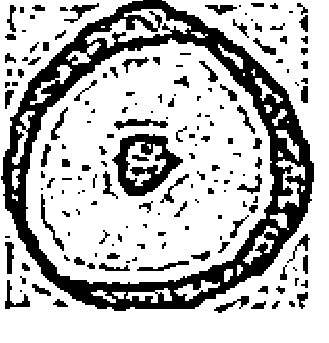

拉丁名：Sun

太阳与塔罗牌中的「太阳」相对应。
提供光和热，是创造力和力量的来源。主宰狮子座和1日、10日、19日、28日出生的人。所影响的个性是坦诚、直率、外向、活跃、热情，善于表达自己，喜欢指挥、控制、影响别人。

### 月亮

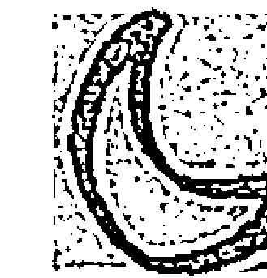

拉丁名：Moon

月亮与塔罗牌中的「女祭司」相对应。
影响潮汐，牵动人类的情绪，代表梦和潜意识以及情感的力量。主宰巨蟹座和2日、11日、20日、29日出生的人。所影响的个性是敏感、细心、内向，情绪起伏很大，富有同情心，善于和他人合作。

### 水星

拉丁名：Mercury

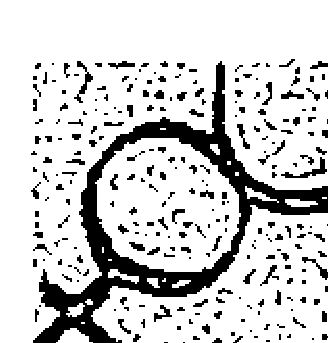

水星与塔罗牌中的「魔术师」相对应。
取名自希腊“神的使者”赫尔墨斯(Hermes)，罗马人称为墨丘利(Mercury)，为男女同体。影响5日、14日、23日出生的人。男性主宰双子座，女性主宰处女座，具有聪明的头脑和锐利的言辞。代表的个性是聪明、活泼、冲动，思虑敏锐，注意细节，容易冲动而陷入正在进行的事。

### 金星

拉丁名：Venus

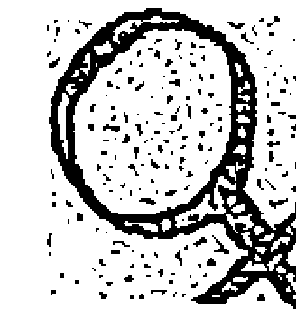

金星与塔罗牌中的「女皇」相对应。
取名自希腊“爱与美的女神”阿弗洛狄忒(Aphrodite)，罗马人称为维纳斯(Venus)。主宰金牛座、天秤座和6日、15日、24日出生的人。具有爱美的天性和艺术天份。代表的个性是温柔、热情、优雅、迷人，情感丰富，容易受感动。

### 火星

拉丁名：Mars

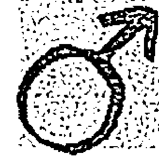

火星与塔罗牌中的「高塔」相对应。
取名自希腊“战神”阿瑞斯(Ares)，罗马人称为玛尔斯(Mars)，是精力和欲望的来源。主宰牡羊座和9日、18日、27日出生的人。具有凶猛、暴力和英雄气概。代表的个性是雄心勃勃，喜欢冒险、开拓、接受挑战，担任领导者；成就欲望很高，富有侵略性，不顾一切追求自己的目标。

### 木星

拉丁名：Jupiter

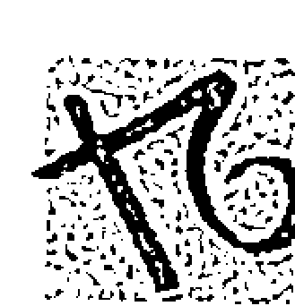

木星与塔罗牌中的「轮」相对应。
取名自希腊“天父”宙斯(Zeus)，罗马人称为朱庇特(Jupiter)，
具有良好的心智和崇高的荣誉感。影响人类的智力、潜能发展及生活方式，代表扩散的力量。主宰射手座和3日、12日、21日、30日出生的人。代表的个性是乐观、愉快，凡事朝正面思考；充满智慧，善于解决问题；喜欢阅读和旅行，注重生活品质。

### 土星

拉丁名：Saturn

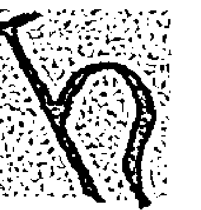

土星与塔罗牌中的「世界」相对应。
取名自希腊“执法之神”克洛诺斯(Cronus)，罗马人称为萨图努斯(Saturnus)，具有冷静的头脑和坚强的毅力。影响人生的方向和使命感，传统上代表黑、冷和宿命，也是万物的基础、秩序和责任的来源。主宰魔羯座和8日、17日、26日出生的人。代表的个性是固执、不易妥协，意志力与毅力坚强，主观，重视纪律和权威。

### 天王星

拉丁名：Uranus

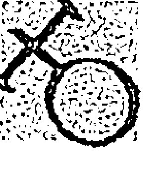

天王星与塔罗牌中的「愚者」相对应。
1781年，威廉·赫雪(William Herschel)发现天王星，取名自希腊的“天空之神”乌刺诺斯(Uranus)。运行的方向非常不规律，因此代表叛逆和不守成规。主宰水瓶座和4日、13日、22日、31日出生的人。代表的个性是捉摸不定、善变，具有天生冲动的爆发力，以及创新的能力。

### 海王星

拉丁名：Neptune

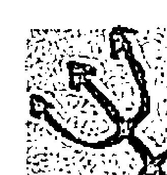

海王星与塔罗牌中的「倒悬者」相对应。
1846年，法国人奥本·尚·约瑟夫·李维里尔（Urbain Jean Joseph Leverrier）和英国人约翰·考区·亚当斯（John Couch Adams）发现海王星，取名自罗马的“海神”尼普顿(Neptune)。代表神秘、深沉和梦幻。主宰双鱼座和7日、16日、25日出生的人。代表的个性是有丰富的想象力，充满梦想和创意，容易吸引、感染和影响别人。

### 冥王星

拉丁名：Pluto

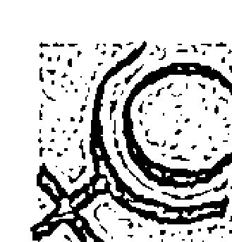

冥王星与塔罗牌中的「审判」相对应。
1930年，克莱德·威廉斯·唐堡（Clyde Williams Tombaugh）发现冥王星，取名自希腊的“冥界之神”普路同(Pluto)。代表极端的行动、暴力和反应，也是金钱、权势和性欲的来源。主宰天蝎座。代表的个性是刚毅、敏感，直觉力强，观察力敏锐，感情强烈。

### 十二宫

星相学家们以地球为中心，太阳环绕地球所经过的轨迹称为“黄道”。黄道宽16度，环绕地球一周为360度。黄道面包括了除冥王星以外所有行星运转的轨道，也包含了星座，恰好约每30度等分各有一个，总计为十二个星座称为“黄道十二宫”。

太阳根据季节不同，行经不同星座，造成日月星辰的变化与四时气候的更替，因此每个人出生的日子，因太阳到达星座的位置不同，显现出不同的个性。

### 星座出生日期

- 牡羊座：3月21日至4月20日
- 金牛座：4月21日至5月21日
- 双子座：5月22日至6月21日
- 巨蟹座：6月22日至7月23日
- 狮子座：7月24日至8月23日
- 处女座：8月24日至9月23日
- 天秤座：9月24日至10月23日
- 天蝎座：10月24日至11月22日
- 射手座：11月23日至12月22日
- 魔羯座：12月23日至1月20日
- 水瓶座：1月21日至2月19日
- 双鱼座：2月20日至3月20日

### 牡羊座

拉丁名：Aries

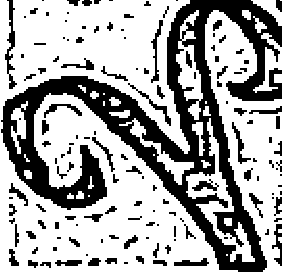

出生日：3月21日至4月20日

牡羊座与塔罗牌中的「皇帝」相对应。
希腊王子菲利克斯（Phrixus）为了逃避后母伊娜（Ino）的杀害，由其生母向天神赫尔墨斯（Hermes）借来一只金毛的飞羊，把他载离险境。后来赫尔墨斯把这只金羊献给天父宙斯，宙斯便把这只金羊放在天上，以纪念它的英勇事迹。

- 星座元素：火
- 守护星：火星
- 守护女神：亚马逊族女战士
- 幸运花朵：郁金香、红色康乃馨。
- 幸运日期：9、18、27。
- 幸运星期：星期二
- 幸运颜色：深红、粉红、玫瑰红。
- 幸运数字：8、9、17、26、35。
- 星座特性：主动、热心、富进取心、性格多变、勇敢、具先锋性。
- 个人特质：率直、丰盛的生命力、进取心旺盛、独立。

### 金牛座

拉丁名：Taurus

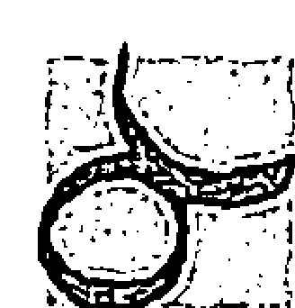

出生日：4月21日至5月21日

金牛座与塔罗牌中的「主教」相对应。
主管众神的天父宙斯爱上了腓尼基王国的美丽公主欧萝芭（Europa），化身为一只非常漂亮的白牛接近公主，公主很喜欢这只白牛，骑在它的背上，白牛载着公主飞越爱琴海，到克里特岛上才现身向她示爱，最后两人结合，过着美满的日子。因此，宙斯把白牛的形象放在天上象征他们的爱情。

- 星座元素：土
- 守护星：金星
- 守护女神：土地女神该亚
- 幸运花朵：水仙、玫瑰。
- 幸运日期：6、15、24。
- 幸运星期：星期五
- 幸运颜色：青、栗、浅咖啡。
- 幸运数字：6、15、20、29、33。
- 星座特性：充满力量、忠实、具创造天赋、实际、坚忍、喜悦。
- 个人特质：坚强的忍耐力、对情感忠贞、有无比的毅力。

### 双子座

拉丁名：Gemini

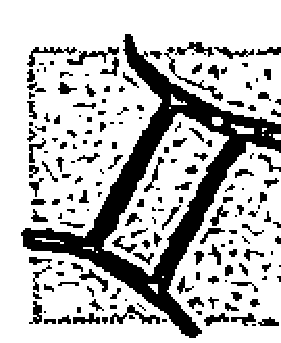

出生日：5月22日至6月21日

双子座与塔罗牌中的「恋人」相对应。
宙斯和斯巴达王妃莉塔（Leda）生下一对双胞胎，名字叫卡斯托耳（Castor）和波吕丢刻斯（Pollux）。两人都非常英勇，卡斯托耳是驯马师，波吕丢刻斯是拳击手。在一次战争中，卡斯托耳身亡，波吕丢刻斯向其父王宙斯祈求以自己的生命换回卡斯托耳。宙斯深受感动，便将两人置于天上，代表手足情深。

- 星座元素：风
- 守护星：水星
- 守护女神：鸽子女神尤瑞娜姆
- 幸运花朵：玫瑰、风信子。
- 幸运日期：5、14、23。
- 幸运星期：星期三
- 幸运颜色：白、银、银白。
- 幸运数字：5、14、23、59、68。
- 星座特性：善变、反应快、多才多艺、逃避、善于沟通。
- 个人特质：能一心多用、天生的演说家、双重性格。

### 巨蟹座

拉丁名：Cancer

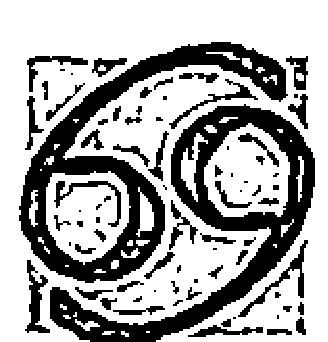

出生日：6月22日至7月23日

巨蟹座与塔罗牌中的「战车」相对应。
天后茱诺（Juno）嫉妒宙斯与另一美女阿尔克墨涅（Alcmena）生下的儿子海格立斯（Hercules），便在海格立斯和九头蛇大战的时候，派出巨蟹咬住他的脚跟不放，结果巨蟹被海格立斯打死。茱诺纪念巨蟹的服从和牺牲，把它放到天上。

- 星座元素：水
- 守护星：月亮
- 守护女神：赫拉女神
- 幸运花朵：睡莲、大波斯菊、百合。
- 幸运日期：2、11、20、29。
- 幸运星期：星期一
- 幸运颜色：淡黄、白、米色。
- 幸运数字：2、3、11。
- 星座特性：强壮、情绪化、情感丰富、敏感、母性精神、谨慎。
- 个人特质：想象力丰富、喜新厌旧、感性、情绪变化与月蚀有关。

### 狮子座

拉丁名：Leo

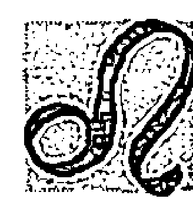

出生日：7月24日至8月23日

狮子座与塔罗牌中的「力量」相对应。
大力士海格立斯被天后茱诺诅咒要接受十二项挑战，第一关便是杀死凶猛无比的狮子。狮子的皮毛很厚，而且刀剑不入，海格立斯最后以双手扭断狮子的脖子将其杀死，然后把狮皮剥下做成胸甲，狮头做成头盔。宙斯赞赏儿子的英勇，将狮子高挂在天上。

- 星座元素：火
- 守护星：太阳
- 守护女神：亚奎丹之伊莲诺
- 幸运花朵：向日葵
- 幸运日期：1、10、16、30。
- 幸运星期：星期日
- 幸运颜色：橙、白、浅绿。
- 幸运数字：1、10、16、37。
- 星座特性：贵族气质、热心、脾气来去快速、喜欢指使他人、诚恳。
- 个人特质：积极、富统御能力、慷慨、傲慢、有果断的决策能力。

### 处女座

拉丁名：Virgo

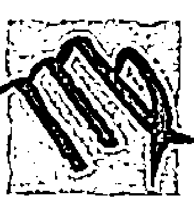

出生日：8月24日至9月23日

处女座与塔罗牌中的「隐者」相对应。
巨人普罗米修斯（Prometheus）为人类盗取天火，使天父宙斯大怒，不但把普罗米修斯缚于高加索山，每日派鹰啄其肝脏，而且把诸神一个个撤走。纯真女神阿斯托莉亚（Astraea）最后一个离开人界，化身为少女在天上。

- 星座元素：土
- 守护星：水星
- 守护女神：智慧之神雅特密斯
- 幸运花朵：大波斯菊、风信子。
- 幸运日期：5、14、23。
- 幸运星期：星期三
- 幸运颜色：黄、青、银。
- 幸运数字：5、14、23、41、50。
- 星座特性：聪颖、谨慎、大方、反应快、羞怯、感觉深刻敏锐。
- 个人特质：好分析别人的心理、心思细密、心智绝佳、富同情心。

### 天秤座

拉丁名：Libra

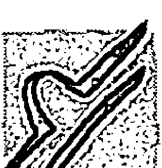

出生日：9月24日至10月23日

天秤座与塔罗牌中的「正义」相对应。
纯真女神阿斯托莉亚的母亲正义女神忒密斯（Themis）随身携带天秤，主持正义和维护公平，解决人间的纷争。她和女儿一起离开人界，化身为天秤在天上。

- 星座元素：风
- 守护星：金星、土星。
- 守护女神：特洛伊城的海伦
- 幸运花朵：兰花、雏菊。
- 幸运日期：6、15、24。
- 幸运星期：星期五
- 幸运颜色：绿、青、紫。
- 幸运数字：4、6、7、9。
- 星座特性：细致、具艺术气质、好奇心强、高雅、十分挑剔。
- 个人特质：社交能力强、明辨是非、崇尚高雅的生活品位。

### 天蝎座

拉丁名：Scorpius

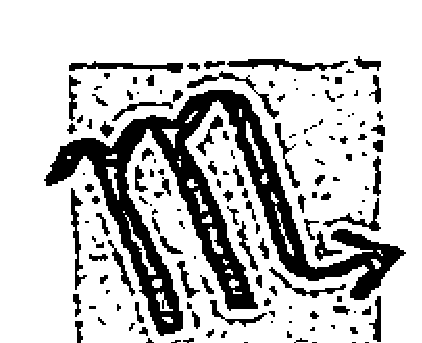

出生日：10月24日至11月22日

天蝎座与塔罗牌中的「死神」相对应。
月神狄安娜（Diana）嫉妒黎明女神厄俄斯（Eos）爱上英俊勇敢的海神之子奥利安（Orion），派出毒蝎刺死奥利安，于是宙斯把毒蝎放到天上以示警惕。

- 星座元素：水
- 守护星：冥王星、火星。
- 守护女神：蝎魔女神艾瑟斯
- 幸运花朵：菊花、红色康乃馨、仙人掌、向日葵。
- 幸运日期：10、20、30。
- 幸运星期：星期四
- 幸运颜色：金黄、黄、橙。
- 幸运数字：0、10、20、30。
- 星座特性：善变、自负、性情复杂、独立、感情激烈、报复心强。
- 个人特质：深沉内敛具神秘感、早熟、冷静、进取心强。

### 射手座

拉丁名：Sagittarius

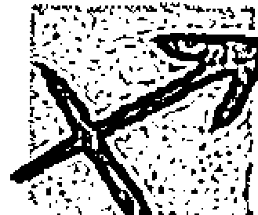

出生日：11月23日至12月22日

射手座与塔罗牌中的「节制」相对应。
多才多艺的半人马喀戎（Chiron）猎捕野猪时被大力士海格立斯误射毒箭伤了膝盖，他本来有“不死之身”，但为了解救受罚的巨人普罗米修斯，愿意以死来换取普罗米修斯的自由。宙斯深受感动，把他放在天上表扬他的舍己救人。

- 星座元素：火
- 守护星：木星
- 守护女神：克尔特女人布狄卡
- 幸运花朵：水仙、康乃馨。
- 幸运日期：3、13、30。
- 幸运星期：星期四
- 幸运颜色：紫、红紫。
- 幸运数字：3、12、13、30。
- 星座特性：善变、乐观、好动、开放、热情、具反应力。
- 个人特质：反应灵敏、崇尚自由。

### 魔羯座

拉丁名：Capricornus

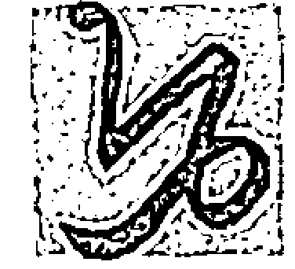

出生日：12月23日至1月20日

魔羯座与塔罗牌中的「恶魔」相对应。
半人半羊的山林之神潘（Pan）喜爱吹短笛，有一次参加众神的宴会即兴表演，结果笛声吸引了一只百头怪兽冲来，众神纷纷逃开，潘逃避不及，跳入河中变成半羊半鱼。宙斯觉得有趣，把他的样子化为天上星群。

- 星座元素：土
- 守护星：土星
- 守护女神：玛艾特、娜芙提蒂。
- 幸运花朵：杜鹃、紫丁香、罂粟。
- 幸运日期：8、17、26。
- 幸运星期：星期日
- 幸运颜色：黑色、灰紫、深棕。
- 幸运数字：4、8、17、22、26。
- 星座特性：深思、体谅、自律甚严、礼貌、富野心、严肃。
- 个人特质：意志力强、持续不移的实践者、沉静、强烈的鞭策力。

### 水瓶座

拉丁名：Aquarius

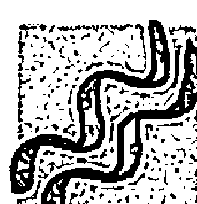

出生日：1月21日至2月19日

水瓶座与塔罗牌中的「星星」相对应。
宙斯为了消灭贪婪的旧人类，从天界引水淹没人界，只有一对夫妻丢长利翁（Deucalion）和皮拉（Pyrrha）逃到高山上幸存下来。宙斯命他们捡地上的石头往后丢，丢长利翁丢出的石头变成男人，皮拉丢出的石头变成女人，因此诞生了新人类。宙斯把水瓶高挂在天上，以显示其威力。

- 星座元素：风
- 守护星：天王星
- 守护女神：雅典娜
- 幸运花朵：山茶花、三色堇。
- 幸运日期：4、13、22、31。
- 幸运星期：星期日
- 幸运颜色：绿、黄绿。
- 幸运数字：4、7、31。
- 星座特性：慈悲、优雅、有创作天赋、节制、知性、热情。
- 个人特质：特立独行、智慧、思想家、有服务精神。

### 双鱼座

拉丁名：Pisces

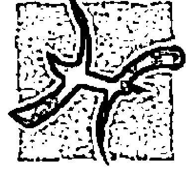

出生日：2月20日至3月20日

双鱼座与塔罗牌中的「月亮」相对应。
爱与美的女神维纳斯（Venus）和儿子邱比特（Cupid）走过幼发拉底河时，一只百头怪兽突然由河里冒出，口中喷火，非常恐怖。维纳斯在危急之下向天父宙斯求救，宙斯将维纳斯和邱比特变成双鱼，并以一绳相系，使他们从河中逃走而不失散。后来宙斯把双鱼的形象放在天上作为纪念。

- 星座元素：水
- 守护星：海王星、木星。
- 守护女神：海之神蒂玛特
- 幸运花朵：水仙
- 幸运日期：7、16、25。
- 幸运星期：星期四
- 幸运颜色：红紫、紫、银灰。
- 幸运数字：3、7、9。
- 星座特性：易产生共鸣、富动力、善变、仁慈、聪敏灵巧。
- 个人特质：具艺术家气质、好动充满活力、多才多艺、触觉敏锐。

## 流变之轮

导读：进阶者读物，说明22张大阿尔克纳间的相互关系。初学者可跳过本章节，直接阅读本书第二部分《大阿尔克纳》。

学数学的人一定知道无限大的符号——一个横过来的8。这样一个由两个相切圆构成的符号在古代是超自然的、神圣的。

密教认为第一个圆是跟随太阳，代表湿婆神右手边的道路，即白天的外在的世界；第二个逆时针方向的圆代表湿婆神永恒的恋人——卡利女神左手边的道路，是夜晚的世界，充满神秘、命运、灵魂以及真正的内在意义，又称女神的道路。在印欧文化里，普遍认为右手边的道路是用来向男神祈愿的；相反的，左手边的行动是用来召唤女神的。埃及人认为左手边代表马特女神即真理之母，而右手边代表女神之夫透特——魔术师的守护神。印度人的“存在”以双性实体来代表，右边是男性，左边是女性。卡利女神及湿婆神的神像有时也呈现两神祇融合于一体的景象。无限大记号之所以无限，正是因为它象征阳性与阴性、物质与精神、理性与灵感、意识与无意识永不分开的结合。

塔罗牌22张大阿尔克纳可以排成一个无限大记号，第一个圆圈由零号大阿尔克纳起到十号大阿尔克纳顺时针排列而成，牌面朝外，关切的是物质世界；第二个圆圈是十一至二十一号大阿尔克纳，逆时针排列，牌面朝内，着重于内在的精神层面。第一个圆每张牌都与第二个圆的牌成对，数字相加之后都是二十。但其中有一个例外，即两个曼陀罗交界处的十号大阿尔克纳「轮」和二十一号大阿尔克纳「世界」，「世界」叠在「轮」上面，以二十号大阿尔克纳完成这个序列，另外以1象征新生。

## 流变之轮

## 塔罗时刻

在代表白天和黑夜、物质与精神的两个循环里，每一组相加得二十的对应大阿尔克纳都有特殊的内涵。

零号大阿尔克纳「愚人」代表未启蒙阶段，与它相应的牌是「审判」（20 #）。二者之间的关系可以从几个层面来理解。愚人在获得启蒙经验之前缺乏的正是判断力。审判牌也常被诠释成最后审判日，在那天死者自墓中复活，天使吹响号角。基督教徒都相信世界末日，以深层心理层面而言，最后审判的语言只是反映出恐惧死亡的心理罢了。除了基督教徒之外，异教徒及诺斯替教徒都相信人在死后可以重生。因此命运的流变之轮上愚人将从死人群（或未开智的人）中重生，再一次开始新的人生之旅。

大阿尔克纳中第一张有编号的牌是「魔术师」。在文艺复兴时期的欧洲，塔罗牌魔术师常与异教神祇中最广为人知的伟大的赫尔墨斯等同，他是无人能比的四元素操纵者；他是“优秀的牧羊人”、“引导灵魂者”，这可以解释为何在未开智的愚人之后的第一张牌就是魔术师赫尔墨斯，因为魔术师可以扮演引导者的角色，引导愚人进入神秘仪式的世界；魔术师赫尔墨斯还等同于世界之光的概念，所以促成魔术师牌的编号与「太阳」（19 #）编号的连接。古代赫尔墨斯教的神秘仪式中，入教者都宣称他们被阳光充满，所以变成与赫尔墨斯一样不朽。太阳牌上所绘的孩童代表着从黑暗中出生。根据轮回转世及世界永恒新生的观点，这是一张重生牌，我们看到新时代的太阳之子欢欣无邪地在新伊甸园里生活。太阳小孩在人间的对应角色是魔术师赫尔墨斯，他是半神，引导我们穿过这复杂的启蒙象征系统，先前隐而不揭的启示现在可以指点给这些小孩了。

「女祭司」（2 #）与精神世界的「月亮」（18 #）相对应。古老的印度与希伯来语都有一个字“almah”，意指女性体内的月亮灵魂——月亮是所有理性与智慧的源泉，是精神上的领袖。在女祭司牌上经常会出现新月，代表女性祭司与月亮崇拜的结合。

如果说女祭司相当于智慧处女，那女皇就相当于母神。「女皇」（3 #）相应的牌是「星星」（17 #），人们常以星星来形容母神，她有几个古老的名字都是星星的意思。莲花状的星星是她的象征。创世纪之初，太阳第一次就是自这朵世纪之莲升起的。塔罗牌女皇的头上都有这样的星冠。

要解释「皇帝」（4 #）与「高塔」（16 #）的关系必须先知道文艺复兴时期的历史知识。中世纪的教会组织被称为“骄傲之塔”，有一个传诵多年的预言宣称，此塔将会被路西弗毁灭。路西弗（Lucifer）意为带来光的人，他跟远古神祇一样使用闪电作为武器。诺斯替教派相信将有一位光明神祇将“骄傲之塔”摧毁。皇帝牌与毁灭、重生的轮回关系暗示了一个讯息：物质上的成功及骄傲都会在轮回中走向灭亡。高塔牌中所绘的从雷殛之塔之中坠下的两人一个是教皇，一个就是皇帝，而那道闪电代表着上帝的愤怒。所以这张牌也称上帝之家。

接下来的「主教」（5 #）与精神世界的「恶魔」（15 #）相应。在传统的塔罗牌牌面图画中，两个人物都能摆出相同的姿势，脚边各有崇拜者。此为诺斯替教派观点的象征性呈现，他们主张罗马教会是“撒旦的会堂”，耶和华是魔鬼，他创造这个有形世界只是要设陷阱捕捉灵魂。传说中，有几位罗马教皇都是与魔鬼订下契约才获得这个职位的。当时习惯把超出同类表现的行为都归诸恶魔的影响。其实在最古老的传说中神与魔本是孪生兄弟，不分好坏的。魔鬼是基督教创造出来用以统治信徒的——没有地狱何来天堂呢？

塔罗牌的六号大阿尔克纳是「恋人」，上绘一位小天使向一对青年恋人祝福。与之相应的十四号大阿尔克纳是「节制」，牌面上绘有女神将水从一个罐子倒到另一个罐子里。密教认为爱神祝福的理想结合是能将恋人完全融合，就像是“倒水到另外的水里”。因此，节制女神代表俗世爱情的精神理想。节制（Temperance）这个词在七个世纪之前不是这样解释的。它来自拉丁文，意为“混合或结合元素”。另一个衍生字是气质（Temperament），也就是四元素混合的产物，它缔造个人不同的性格，引导恋人与意气相投的气质融合，混合元素的女神协助恋人找到自己的另一半。

在寻找到完美的爱情之后是凯旋之王——年轻的英雄高高坐在战车上凯旋归来。这是青年时代的巅峰，情场与战场皆捷，英雄已控制了世界。然而这只是短暂的世俗荣耀，他注定要在荣耀日之后灭亡，由另一个死亡及重生的循环取代，这就是为什么与「战车」（7 #）相应的大阿尔克纳是「死神」（13 #）。英雄有必要记得在他荣耀加身之日，死亡便在其后窥视。七号牌面上的英雄手里都没有缰绳，站在车上任凭他的战骑各行其道。这传达的讯息也与死亡有关：人无法控制自己的命运。尘世的荣耀都是徒然，那些都是命运所控制的，转眼就会烟消云散。英雄应该追求的是真正自我的智慧，明心见性之人看这短暂的存在，好比滚动的车轮一般，无足轻重。

在战车游行的短暂荣耀之后，大阿尔克纳的下一位人物是表情淡定的正义女神，她以手中的天平均衡痛苦与喜悦，显然，她是要求人们偿付业绩。塔罗信仰认为生命的喜悦之后就是痛苦，喜悦越深则付出的代价越大。凡人尽可以想象自己是天神，但命运之神会要求她应得的补偿。正义女神是存在于自身的——与基督教根本不同——根本没有外在的神祇；有的只是人类欲望的投射，只有人在心中保有神祇的形象，神祇才会存在。「正义」（8 #）对应的第十二张大阿尔克纳「倒悬者」所表达的正是要通过这种牺牲的过程来发掘心中内在的神性。

正义女神的出现指点俗世的英雄达到荣耀的巅峰之后应该隐居沉思，过忏悔的生活。这段晚年时光智者必须面对即将来临的死亡，并与精神会面，这精神最终要带他的灵魂走上最后一段旅程。这种生死的秘密只有在人理解了内在精神在有限生命历程中的真正意义时才能通晓，因此，隐士探寻真理的过程是痛苦抑或喜悦常人无从知道。在大阿尔克纳中「隐士」是九号，准备进入第二圈的月亮领域。因此隐士似乎正开始游历神秘的内在潜意识世界。他对应的牌是力量女神（11 #），代表虔诚的牺牲者的内在力量，他在苦难中仍旧保持着自己的想法（Idea），字面上的意义即“内在女神”（Inner Goddess）的古名。她以自己方式驯化桀骜的狮子正代表内在的精神才是人所拥有的最大的力量。

在传统的塔罗牌牌面图画中，无限大记号首先出现在魔术师（1 #）头上的宽边帽或光环上，又出现在力量女神（11 #）的宽边帽或光环上，这两张牌分别在属于外在世界和内在世界的圆圈内，象征着有形世界和精神世界的无限循环。

塔罗牌的象征是基于东方诺斯替教派二元循环的观念，死后重生，万事万物都在轮子上升降。这轮子结合了物质与精神层面，是「隐士」（9 #）与「力量」（11 #）之间的过渡，即第十号大阿尔克纳「轮」。命运之轮是启蒙仪式的转折点，它位于顺时针方向的太阳领域进入逆时针方向的月亮领域的交会点也就是无限大记号的中心，意味着“旋转世界的静止点”。隐士最接近命运之轮，他要走下轮子走入相反方向，也就是走入第二圈更抽象更细腻的大阿尔克纳。压在这张牌上的是全套大阿尔克那的最后一张大阿尔克纳「世界」（21 #）。上绘跳着生命之舞的女神，又一次表现了母神在孩子心中无可磨灭的原型之意象。这位裸身女神代表了一个基本的、最初的创造与再创造的象征，很自然地就会带出下一张牌——「愚人」，新生儿的象征，开始另一个新的循环。

塔罗牌信仰永恒的循环，不是基督教单向的、直线时间的宇宙观所能理解的。零号大阿尔克纳「愚人」代表英雄早期、未启蒙之前的婴儿阶段，愚人首先见到的就是魔术师赫尔墨斯，他会引导愚人的灵魂。所见的第一位塔罗牌教师就是女性智慧的精神，没有女性智慧神也不能有所作为，女教皇身上就具备这份女性智慧。女教皇是经过教导之后的发展阶段，教学的第一课就是：没有神能不靠他的女性智慧而有所作为。

塔罗牌的系统正是异教多神祇的信仰系统。然而，异教的这种神秘信仰最终导致了基督教会流血的镇压，残酷的迫害对于有着非正统思想的教友亦不放过。教会宣称，除了基督教的上帝之外，别的神祇都没有生存的空间，在镇压中所破坏的异教东西都是一文不值的。但历史学家却不同意这种说法，有人指出，远古神祇的消失所带来的影响不止体现在神学一门，还造成了艺术、哲学、世俗文学、数学、天文学、医药、建筑及西方世界心理学的衰退。而且整个过程是残暴而毫不容情的。

尽管如此，民众仍固执地守住他们旧有的信仰，特别是统御流变之轮及整个时空系统的母神。这个系统也从不曾消失。今天有许多人自称是基督徒，但却全心全意相信已被基督教否认的转世轮回。一千年前，也许连虔诚的信徒都厌烦了为他人的罪而受谴，塔罗牌正可提供这些世俗之人一种可以理解的救赎之路。也因此，尽管教会一再谴责塔罗牌，但它仍然像古代宗教一样不断流传下来。可以肯定地说，塔罗的流传不衰，正是因为人们需要它。

## 2 大阿尔克纳

当风在栎木林及大锅里鸣响，
他们在多朵纳高山上听到的话语乃是无声的，
在歌唱的水泉之畔，中间的脐石也无声，
众神曾经述说的古老谎言，而今尽归沉默。
我带着疑惑来到神殿，这里千年来不停发出神谕，
以真诚之心，道出无华的真理；
在神谕之洞中，我听到女祭司尖厉的叫声；
她与我都要死去，不再复生。

——A·E·豪斯曼

## 0 愚人 The Fool

象征意义：自由、天真、流浪

有人说他与真理很接近。天才与白痴本只是一线之隔，又有多少人了解他呢？随意性所指不受拘束，这是一种四处漂泊的流浪行为，有人认为这是没有理想的空虚生活，但也可解释为是一种“无为”的理想状态。

愚人代表着一个天真无知的形象，宛如一个初生的孩童，拥有无限的可能性。愚人是个旅人，他正要展开一次充满未知的旅程。他是如此充满着希望，以至看不清前面的重重阻碍。“0”这个数字代表着一切事物皆处于混沌未开的状态之中，没有善恶的分别。

注(1)：关于「愚人」的位置和牌序，大部分是放置在大阿尔克纳的开始（从「愚人」到「世界」，恰好是一个完整的循环），在部分的塔罗牌里，「愚人」是介于「审判」和「世界」之间；也有部分塔罗牌是放置在最后一个位置。或者认为「愚人」是一张没有编号的牌，并没有他特定的位置。

注(2)：「愚人」这张牌本身就代表着不确定性，所以它是最难解释的牌之一。当展开过程中出现了「愚人」，解牌者要特别留意它所代表的深层涵意。

### 正位的含意

基本的含意：好冒险、寻梦人、不拘泥于传统的观念而有自由奔放的心、从基础出发、流浪成性。

感情及婚姻：自由的恋爱、不顾他人的看法、以独特的攻势获得成功、轻率的攀谈、绚丽的罗曼史、独特的爱人、一直在等待交往的机会。

工作及学业：变得热衷、以独特的用功方式带来意外的效果、由于好奇心而对学业产生兴趣、掌握重点，寻找捷径、无法在不自由的环境下工作、与自由职业、艺术有关的工作。

健康及美容：找到独特的健康法、独特无法模仿的装扮方式、活动性的服装较适宜。

娱乐及兴趣：没有目标的旅行、憧憬未开发的地方、没有目标彷徨地走着、向许多事物挑战。

人际关系：以轻松的方式交友就会很顺利了、相识于旅途当中、以幽默的个性受到欢迎。

金钱：孤注一掷。

其它：有好奇心、追求某种新事物、打破规律、与众不同、流浪者。

### 反位的含意

基本的含意：低落、失败、漫无目标的旅途、散漫、愚昧的行动。

感情及婚姻：体会空虚的心情、轻率的爱情、无法长久持续的融洽感、不安的爱情旅程、对婚姻感到束缚、忽冷忽热、不顾众人的反对、因为情人的不负责任而伤心、无法专情。

工作及学业：成绩一落千丈、没有耐心、没有计划、经常迟到、猜题方向错误、临时抱佛脚也来不及了。

健康及美容：太漠不关心了、无法有正常的起居生活、因为贪玩而影响健康及美容。

娱乐及兴趣：会中断的旅程、着手过多的事情以致于手足无措。

人际关系：因过于单纯而受到轻视、怪人、恶劣不合常理的言行、无节制而且粗心大意。

金钱：毫无理财观念、无法实现理想、收入逐渐趋于稳定、没有计划地使用金钱。

其它：不脚踏实地、不在乎旁人的眼光、毫无目标的急性子、梦想发大财却无法成功、行为不检点。

## 1 魔术师 The Magician

象征意义：观察、开始、创造

全神贯注的年轻魔术师仿佛背负着神圣的使命。他周围摆放着支配宇宙的四大元素——杖（代表火），剑（代表风），金色试剂（代表土），圣杯（代表水），犹如已掌握了通向未知世界的钥匙。这四种元素相互配合，将产生无比的创造力。

魔术师相当清楚自己的能力，他可以预卜先知，自由运用宇宙的四大元素使自身的力量达到最高点，因此，所有塔罗牌都将魔术师置于首位以显示他的重要性。

「魔术师」代表着一切的开始，事物的开端。在传统的塔罗牌牌面上，魔术师的头上有着代表无限的记号∞（Lemniscate），暗示是他创造了这个世界。魔术师也同时代表着一个充满开创新局面的智慧和高度操作技巧的形象。

这张牌同时也暗示着，如果你想使用塔罗牌来预测，不能一味盲从地使用这股神秘力量，应该运用自己的智慧与判断力，有效地支配发挥这股力量。

### 正位的含意

基本的含意：驱使调查和理解的好奇心、有独创性、有发展性、以新的计划获得成功、幸福的开端。

感情及婚姻：两者的心灵相互契合、恋情的展开、受欢迎的对象、彼此的性格皆得以发挥、谈话很有默契的伴侣、体会到感情的愉悦、宜于同对方交流、轻率的交往、应对约会的场所多下功夫，才能保持新鲜感。

工作及学业：以新的方式读书获得好效果、处理得当、充满效率的计划、注意细节、能够发挥自己的所学、创意受到认同、能够在艺术方面发挥创造力、于交际时获得更多的资讯、充满创新的工作、技术人员、播音员、大众传播等相关行业、广告设计者。

健康及美容：稳定的精神状况、历经历练的性格、知性的妆扮。

娱乐及兴趣：享受来自于阅读的乐趣、将会有短期的旅行、对语言学习有兴趣、野餐、敏捷的运动神经、适合参加辩论会。

人际关系：朋友更多了、能够获得良师益友、彼此能够使对方发挥优点的组合。

金钱：能够以合理的代价获得想要的东西。

其它：善于模仿、处理事情很机灵、完成了许多事情。

### 反位的含意

基本的含意：无法下定决心、因学艺不精而败北、太消极了、容易受骗、光说不练。

感情及婚姻：不易找到表达的机会、需要先培养爱情的技巧、会受花言巧语的人欺骗、无法专情、心情过于浮动、冷酷、无法向对方表达心意。

工作及学业：预期的成绩没有起色、随机应变也要适当、努力不足、撒谎会被拆穿、需要独特的念书方式、需防备考试失误、不复习成绩会退步、一成不变的工作。

健康及美容：让神经休息、容易暴躁、小心不要增加呼吸器官及头脑的负担、不搭调的装扮。

娱乐及兴趣：旅行计划取消、交通耽误旅行、懦弱造成比赛失败。

人际关系：因不明确的态度而丧失信用、虚假表面的交往、不够体贴对方、诈欺。

金钱：少带些钱出门、容易乱花钱、因好赌而倾家荡产。

其它：听不进他人的劝告。

## 2 女祭司 The High Priestess

别名：女教皇 Papess

象征意义：等待、智慧、理智

女祭司平和冷静的表情似乎是在浅浅地微笑，眉宇间却隐隐含着一股忧愁，她的双眼无意识地凝视远方，似乎正在心中沉思默想着某个人。

身着紫衣是灵性与智慧的象征，显示着她的冷静和睿智以及包容万物的爱心与温柔。

手中的法典《TORA》象征着她心里藏着神秘的智慧与戒律，仿佛要样样与法律对照，理性地判断事物而不会流于情绪化，由于她这种高度的精神修养，总给人一种深不可测，难以亲近的感觉。

女祭司手上的典籍代表着古代流传而来的智慧。但这代表律法的典籍，也同时压抑了她的热情，宽大的外袍盖住了她的身影，是以她也同时代表着“隐匿”。这张牌和「月亮」很有关系，她是真理的守护者，但也代表虚幻的存在。（说明：这是一种精神上的存在。以爱情为例，「女祭司」有时会代表这段恋情不过是询问者心中的遐思罢了，不存在于现实，而是像爱情小说一样存在着。）在某些塔罗牌中，以「处女（Virgin）」代替女祭司，强调她坚守着纯洁和律法的灵魂。

### 正位的含意

基本的含意：有良知的、文静的象征、敏锐的观察力、有理性的、富有研究的精神、正确的时机或人将出现的预感。

感情及婚姻：理智的感情生活、柏拉图式的恋情、精神方面的结合、能够消除烦恼的对象、深藏内心深处的爱意、介于友人关系与恋人关系之间的交往、以诗篇或是文章来表达爱意。

工作及学业：有责任感的、认定目标精心钻研、拥有展现专业技术的机会、追求知识的欲望、考运佳、与教育相关的职业、有评论的才能。

健康及美容：拥有朴素整洁的魅力、要更加注意保养、善于卫生管理、深藏不露的好体力。

娱乐及兴趣：制作手工艺品、知识性的娱乐、脑力激荡的、可以在家里做的事情。

人际关系：能相互谅解的友谊、良好的商量对象、能够倾心交谈、体贴的好友。

金钱：理性消费、善于理财。

其它：迅速的理解力、同冷静的女性商谈可获得新知、洞悉旁人的力量。

### 反位的含意

基本的含意：缺乏理解能力、粗心大意、容易因为精神受到压抑而歇斯底里、容易紧张、神经质、闹意气。

感情及婚姻：以单恋结束、想得太多了、因有洁癖让人裹足不前、憧憬单身生活、因冷漠而产生误会、任性、晚婚、无趣的女性。

工作及学业：固执、不能集中全力、表面的知识、不喜欢用功、无法学以致用、因状态低潮而感到焦虑、考试失败、想要换一个新的环境又下不了决心。

健康及美容：精神紧张、不孕症、歇斯底里、错误的减肥计划、贫血、手脚发冷。

娱乐及兴趣：念书念不进去、吵闹的环境只会增加疲倦感。

人际关系：受到冷漠的对待、应留心带嫉妒的中伤、自闭、容易过于激动而得罪人。

金钱：没有计划的花费、浪费成性。

其它：心情不好、因任性而感到孤独、嘲笑别人、所有意见不合的对象理都不理、出人意料的小心眼。

## 3 女皇 The Empress

象征意义：高贵、热情、丰收

女皇高贵的衣饰，显示出她所拥有的权威性。女祭司给人的感觉是位深具智慧且文静的女士，而女皇则正好相反，她具有一种热情而奔放的个性。

女皇温和的包容力，会带给人民繁荣与丰收。

拥有幽雅外表兼具天仙般气质的女皇给人们一种完美的印象，似乎她的心中蕴藏着无限深厚的情感。

过于热情奔放的情感，往往容易误导人走入盲目的爱情中，然而，女皇的情思兼具了广阔的眼光与自我认知的理性，是可以包容万物的，而非过于自我的感情。

女皇代表着一个全然的母性形象，她是大地的母亲，代表丰收、富饶、成长。在感情上，她代表着热烈的情感。「女皇」代表着由女性主导，具有女性特色的力量。

### 正位的含意

基本的含意：优雅的生活、艺术天分、丰收、繁荣兴盛、富足。

感情及婚姻：有收获的恋爱、将与恋人论及婚嫁、异性注目的焦点、轻松的交往、令男性钦佩的女强人、对彼此相当了解、富有母性的光辉。

工作及学业：成绩进步、考试成绩优秀、在艺术领域颇有成就、适合妆扮、服饰方面的职业、外表好看的工作、优秀的感受性、在工作上很活跃的女性。

## 塔罗时刻

健康及美容：富有体力、多产、有气质、有风度。
娱乐及兴趣：逛街将会充满乐趣、在聚会中愉快的交谈。
人际关系：开放而不拘束的态度带来他人的好感、受人注目的、聚会或派对的主角。
金钱：意外之财。
其它：善于制造气氛、喜欢美丽的事物、贴心的人。

### 反位的含意

基本的含意：迷惑、缺乏上进心、轻浮、损失、没有成就、爱慕虚荣。
感情及婚姻：优柔寡断、没有结果的恋情、因任性而遭人厌恶、嫉妒、过于迷恋而无法自拔、缺乏女人味、遥远的婚期、沉溺在肉欲当中、意外地怀孕。
工作及学业：弄丢别人的笔记、浪费时间、懒惰、对学科过于好恶分明、成绩低落、缺乏集中力。
健康及美容：过胖、浓妆反而不适合自己、多余的修饰。
娱乐及兴趣：即使订出了计划还是犹豫不决着。
人际关系：锋芒过露、过强的自尊心、因骄纵而失败、缺乏包容力。
金钱：爱慕虚荣、浪费成性、投资过剩、不必要的花费。
其它：谈吐轻浮，不被重视、要长久的时间才能获得成果、金玉其外，败絮其中、被母亲指使。

## 4 皇帝 The Emperor

象征意义：权力、威严、支配

身披铠甲的帝王，威仪非凡。
右手执权杖，左手握住剑柄，分别代表了国王的权力，以及统治世界的野心。
如山岩一般的魁梧身材，使人感觉到国王高昂的斗志与决胜千里的信心。
这张牌在大阿尔克纳中位居第四，意味着四元素或四季，为一统宇宙与安定世界的力量，借以表达物质的需求，并象征着男性的权力与统御力。
虽然皇帝拥有稳固的地位与强大的统治权威，但在威仪之后是一般人所难以了解的孤独与焦躁，并非想象的幸福而无虑，这也暗示着有得必有失的道理。不及固然不好，但过多也未必是你真正想要的。
皇帝代表着父权的形象。他就是权威，他严格而公正地执行着律法，他的话语是不可反抗的。「皇帝」代表着全然的支配和掌握，一种绝对的男性形象。

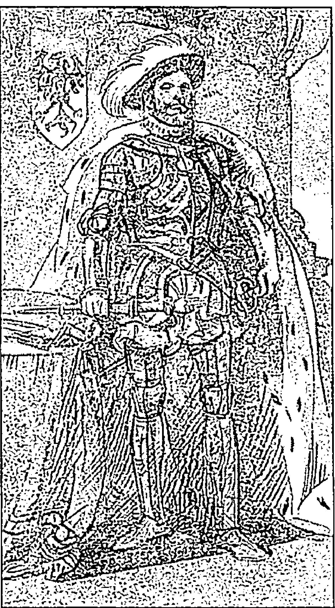

### 正位的含意

基本的含意：有行动的魄力、众人的领导者、稳定的根基、男性化、富有责任感。
感情及婚姻：以锲而不舍的精神获得青睐、值得信赖的年长对象、值得依靠的、将心系在心仪的对象身上、好恶分明的交往、是主动的一方、想要主导交往状况。

## 塔罗时刻

工作及学业：锲而不舍地钻研学业、保持优良的水平、极高的目标及理想、坚定的信念、理性的、考试顺利、擅长管理、愿意提供帮助、往目标前进着、适合事务员或公务员等工作。
健康及美容：拥有健康、对于健康充满自信、身上的小饰品更花哨将带来幸运。
娱乐及兴趣：适合与众人一起旅游、能够确认目的地。
人际关系：活跃的领导者、成为商量事情的对象、可信赖的朋友或学长、结交有力人士。
金钱：对金钱感到满足。
其它：不服输的个性、坚忍不拔的性格。

### 反位的含意

基本的含意：幼稚、缺乏管理能力、不负责任、任性、蛮横霸道、欠缺欲望。
感情及婚姻：强迫的恋情、不可靠的对象、无法告白心事、只有外貌而无内涵的对象、痛苦的结局。
工作及学业：不适合长时间坐着的工作、没有干劲、没有领导能力、因过于自信而失败、需要从根本检讨、从基础重新开始。
健康及美容：只相信自己的秘方、激烈的活动让自己更累了。
娱乐及兴趣：无法感到乐趣。
人际关系：因不负责任而遭受指责、固执己见、因蛮横而遭到厌恶，而无法领导群众。
金钱：死薪水、损失金钱、财务发生困难、预算不够。
其它：干扰敌方、虚张声势、事与愿违、自以为是。

## 大阿尔克纳

## 5 主教 The Pope

别名: 圣职者 The Hierophant

象征意义: 引导、援助

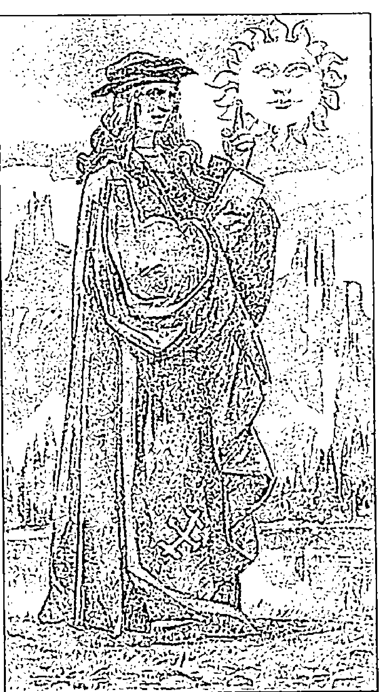

「主教」与第二张「女祭司」都是代表着支配有关宗教上与精神上的世界的牌。然而，主教与女祭司最大的不同在于，女祭司严守着旧有的律法和知识，将有关宗教上的智慧当作是自己的涵养，而深藏于心中，是一个独善其身的形象；而主教与女祭司所代表的神秘性精神不同，他代表着基督教传教的精神，他把智慧视为一种真理，认为应该要广泛地推广，他关怀人世间的一切苦难，愿以导引一切事物的智慧帮助愚昧的世人。

右手捧着圣经，左手高举，降福于求道者；代表教职的红衣隐泛着主教高贵的气质，而衣襟上刺绣着三重十字架，象征主教集祝福，高贵与神圣三者于一体。

主教的目光慈爱，以无私的爱心对待跟随他的求道者，哲理虽然深奥，但他以浅显的方式向求道者提供真正的忠告，为他们解释疑难迷惑，帮助他们获得真知。

主教代表精神世界的权威。相对于统治着物质世界的皇帝，主教是宗教、精神和心灵的领导者，一个绝对的权威。

## 塔罗时刻

### 正位的含意

基本的含意：受到信赖的、得到援助的、良好的建言者、有贡献的、怀有宽大的胸怀、有宗教情绪。

感情及婚姻：值得尊敬的恋人、对恋情慎重、深厚宽大的恋情、相亲结婚、良缘、有媒人的牵线、能够安全交往的对象、年长的异性、逐渐加深的恋情、长久持续的交往。

工作及学业：多听他人的劝告、遇到良师而成绩进步、会出现对自己有帮助的人、与学长或同学一起用功而获益、拥有强韧的耐性、思想保守、适合顾问、医学或以谈话为主的职业。

健康及美容：有遇到好医生的机会、化妆重点偏重嘴唇会带来幸运、口红以粉红色系为主。

娱乐及兴趣：观赏音乐会或看电影、到庙宇许愿、多去有许多绿树的地方。

人际关系：获得学长的谏言、获得父母的相助、能够为朋友着想。

金钱：最好看紧钱包。

其它：得到年长者的协助、可借着宗教获救、借改变环境往好的方向前进。

### 反位的含意

基本的含意：失去信赖、多管闲事、过于依赖、度量狭小、强迫推销、孤立无援。

感情及婚姻：极端的亲切、缘分淡薄、步调过于缓慢、彼此不能够体贴、占有欲过重、因过于固执而遭受厌恶、父母反对、诚心相待比礼物攻势更有用。

工作及学业：因轻视而获苦果、因讨厌老师而对课业失去兴趣、过分依赖同学的笔记、得到错误的情报。

## 大阿尔克纳

健康及美容：要多运动、呼吸道的疾病、想咳嗽、避免偏食。
娱乐及兴趣：害怕高的地方、人多的地方、乘飞机时要注意。
人际关系：过于干涉、令人困扰的好意、自以为是、没有必要的义气。
金钱：因助人而损失金钱、无人援助。
其它：无法遇到谈心的好对象、心胸变得狭窄、太过亲切只会显得自己多管闲事、完全没有要实行的心情。

## 塔罗时刻

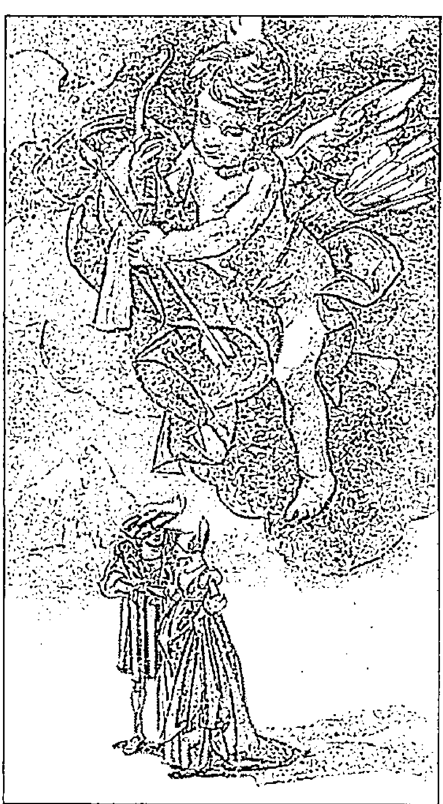

## 6 恋人 The Lovers

象征意义：开端、结合、选择

世间的爱情并不都是美满的，邱比特之箭能使他们和谐统一。当然，情侣间将来是否能够真正过着幸福快乐的日子，完全看他们如何以智慧来运用心意交融所产生的力量，不被爱情冲昏头脑，不被外物所扰，丧失了自我。

纸牌中的这对恋人代表了完美的爱情。这张牌描绘出一种明朗活泼的爱情，犹如回荡着天韵般爱的颂赞曲给予人一种“幸运结合”的感受。然而，更多时候，「恋人」这张牌代表着“选择”。不仅是在你所爱的人之中做选择，也是为你所无法割舍的两件事物之间做选择。有时是理智和情感的抉择，有时是现实和理想之间的取舍。

### 正位的含意

基本的含意：幸运的相遇、同心协力、情投意合、丰富的感情、美好的前途、相爱、一个拥有无限可能但又都无法确定的时机。

感情及婚姻：在团体活动中结识进而结为连理、经友人的介绍帮助而发展的恋曲、恋爱结婚、从朋友成为恋人、自由愉快的交往。

工作及学业：喜爱的科目进步、决定前途的好机会、以团队精神获得成功、观察力敏锐、擅长文科、出现好帮手。

健康及美容：建议在穿着上加入流行感、多与人交谈对身心较有益处。

娱乐及兴趣：愉快的短暂旅行、愉快的外出又拥有好运、网球及滑板也是很好的活动。
人际关系：出现好伙伴、人际关系良好、社团活动顺利、朋友增加、与他人容易亲近、有幽默感、活泼的。
金钱：没有金钱的烦恼。
其它：整理思绪、以直觉判断事物。

### 反位的含意

基本的含意：离别的时刻、不醒目、想要转移目标、关系结束、没有协助者、遭遇阻碍。
感情及婚姻：爱情冷却、移情别恋、为恋爱而恋爱、别离、水性杨花、短暂的恋情、两人的生活方式截然不同、后悔分开、朋友虽然多却没有固定的恋人、抓不到对方的心。
工作及学业：没有兴趣用功、没有用的计划、不能持之以恒、缺乏集中力、成绩不佳、集体学习效果不好、少说话多做事。
健康及美容：小心刺激性的食品、对化妆品过敏、经期不顺。
娱乐及兴趣：对很多事有兴趣却都无法持久、目标不定、提不起精神。
人际关系：闹意气、朋友不合作、与旁人意见不合、社团解散、交不到好朋友。
金钱：容易花钱、资金短缺、破财。
其它：表里不一、容易受到诱惑、变得笨拙、闷闷不乐的。

## 塔罗时刻

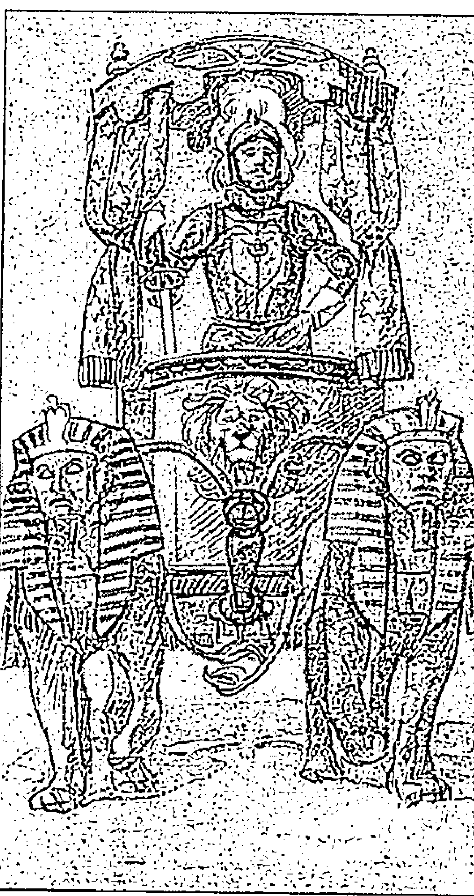

## 7 战车 The Chariot

象征意义：前进、胜利、空虚

战车上是位正要远征异乡的将军，得意非凡，不可一世。
在民众的欢呼声中，他正意气勃发，踌躇满志地握着长剑，充满信心踏上征途去探求未知的世界。
由于对自己能力充满了自信，并不愿保守于现有的封地，强烈独立的个性使得他要凭着自己的力量去争得更多的财富和荣誉。

战车向着胜利的道路前进，似乎无人能阻挡，但是有时却往往流于冒进，没有认清应行驶的方向。战车前的两头狮子(有时是骏马或其他猛兽)，分别代表着人类理性的意识和无法掌握的无意识部分。必须坚定的掌握住缰绳，维持住两边的平衡，才能往正确的道路前进。

「战车」这张牌，代表着如何自我控制内心与周遭的矛盾，努力地充实自己，多尝试不同的体验，不断开发自我，而找到一片属于自己的天空。

### 正位的含意

基本的含意：以有效率的方式进行、把握先机必胜、担任指挥、对所有事物都有积极的态度、胜利和权利的结果。
感情及婚姻：情场的胜利者、快速的进展、积极的交往终于成功、遇到喜欢的对象会猛烈追求、大胆的行动。

## 大阿尔克纳

工作及学业：独立作业、以自信心完成、成绩进步、迅速调整情绪能够提高完成的效率、经得起激烈的竞争、及格过关、与娱乐有关的工作将会带来好运。
健康及美容：多运动、健康的身体、充满活力、适合穿牛仔装。
娱乐及兴趣：掌握旅行的机会、适合户外活动、滑雪、兜风及骑马。
人际关系：交游广阔、个性活泼、灵活周旋、独立自主。
金钱：可以买车。
其它：考上驾照、搬家、对新鲜的事物充满兴趣、清楚地记下自己生活的方式。

### 反位的含意

基本的含意：无法控制、发生意外、胡作非为、失败、停止不前、因焦虑而失败。
感情及婚姻：过于鲁莽、遭到抛弃、话不投机的交往、因懦弱而无法进展的恋情、一下子失去兴趣、缺乏理智的恋情将遭受挫折、直接的话语会伤到对方、出现强劲的情敌。
工作及学业：对不想做的事情缺乏责任感、对课业不感兴趣、就算是担心，成绩及效率还是低落、经常脱轨。
健康及美容：不要让身体太累、因轻率而受伤、不要在马路上嬉戏。
娱乐及兴趣：没有目标的娱乐会花光所有金钱、在牌桌上不顺利。
人际关系：固执的争论、因任性引起旁人的不满、过于消极。
金钱：损失钱财、不懂节制的花费、赌博失利。
其它：过于坚持己见、超速驾驶被抓到、散漫的注意力、得意忘形会导致失败、因为突发事件而不知所措。

## 塔罗时刻

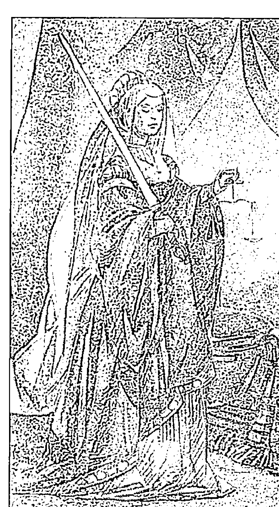

## 8 正义 Justice

象征意义：公正、均衡、责任

安静地冥想中的正义女神，左手提着天平，象征着能对一切是非善恶做最公平的裁定；右手执着一把长剑，意味着拥有矫正社会上歪曲与虚伪的能力。

剑的双刃代表着只有对自我先反省与先约束才有资格去裁定别人的是非。

天平象征着维持均衡的智慧，在这充斥私欲的世界上，只有适当地协调他人与自我的对立，才能公正地判断曲直是非。

想要维持公正的判决，并不是件容易的事，必须先行自我反省并兼具敏锐的观察力，所以剑与天平缺一不可。

世上没有绝对的对或错，女神手中的天平似乎就说明了这点。她手中的剑是强大的制裁力量，似乎在警告着你，必须小心努力地保持着平衡的状态。

### 正位的含意

基本的含意：诚实、公正、在两者之间调解争端、维持平衡、同时兼顾两者。
感情及婚姻：不会被冲昏了头的理性交往、性情好、和温文有礼的对象交往、彼此能平衡、轻松的交往、诚实的爱情、真心的交往、学业与爱情兼顾。
工作及学业：各科成绩都很好、工作与家庭兼顾、以合理的计划获得成功、做人成功、个人学业和社团活动兼顾、和法律有关的工作。
健康及美容：身材匀称、精神方面也很稳重、情人装的打扮。
娱乐及兴趣：有气氛的地点、音乐相关的事物能够开拓心情。
人际关系：能够对他人公平的对待、适合担任解决争端的角色、讲义气、受到交往对象的照顾。
金钱：贷款获准、财运上升、得到应有的代价。
其它：爱好和平。

### 反位的含意

基本的含意：不公平、有始没终、以自己的意见去断定、不能两全、不均衡。
感情及婚姻：不够主动、个性不合、不顾后果的交往、脚踏两条船将有失足的可能、单方恋情、有出现第三者的可能性、不诚实的态度。
工作及学业：无视于规则、各科成绩差异过大、过于守旧导致失败、缺乏能力及自信、做不正当的事、当心考试失误。
健康及美容：身材不匀称、无法保持体重、偏食、不认真保养。
娱乐及兴趣：只有金钱的花费毫无乐趣可言、尝试任何事物都无法长久。
人际关系：缺乏道德观念、烂好人、左右为难、对朋友过于挑剔。
金钱：财务危机、财不露白、借贷引起纠纷。
其它：避免暧昧不清的谈吐、对自己不利的状况、偏袒某一方。

## 9 隐士 The Hermit

象征意义：本性、探求、超脱

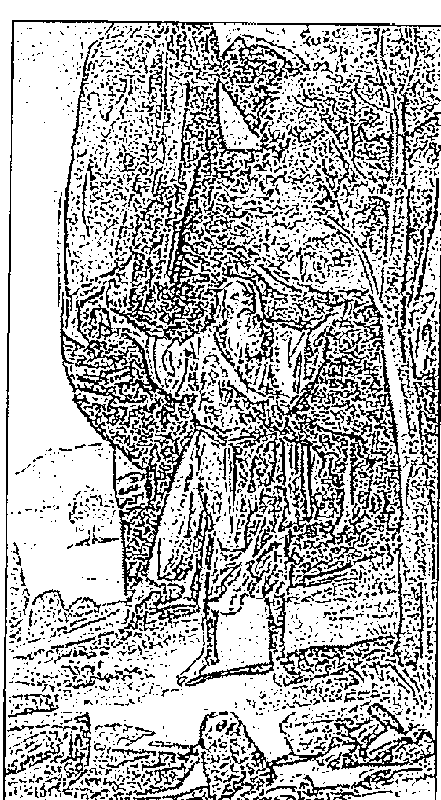

在深山中离群索居的隐士远离了人世间的虚伪和尘嚣以求真知。牌中的隐士正陷于寻求真理的思维之中，他展开双臂，似乎是在感受空气轻微的流动，又像是盲目者在黑暗中的摸索。

求得人生正道而坚持其要义的人，才能被称为“圣”。这位修行的隐士，也正是坚守与培养智慧之光的圣人。真正的隐士不会固执自己偏狭的观念，他会将目光转向更宽广的领域中。

探寻真理的路是艰苦而漫长的，不但要能忍受得了孤寂，更要不时的自我反省，了解真正的自我，以开阔的胸怀去认知一切，才能求得正道，修得正果。

「隐士」代表着对真理无尽的探求。他远离人世间的纷扰，摒弃忙碌劳顿的生活，走向寻求智慧的道路。寻求的另一面就是舍弃，你必须舍弃生命的某些部分，而去追求另一个更高的境界。

### 正位的含意

基本的含意：自信、理智、扎实的努力、中肯的建议、坚持不懈的心态、冷静的行动、为了新的开始而远离所有事。
感情及婚姻：默默的相思、以单纯的心思慕、追求精神层次的结合、永存的恋曲、彼此互相检讨的时期、单恋、多听他人的劝告、不将情感形诸于色，但是却是值得信赖的对象、理性的爱。
工作及学业：努力将会获得成果、一板一眼、应以严格的态度深入分析，拟定长期计划、注意细节、杰出的分析能力、适合以辅佐的方式出现、要求安定性、获得正确的建言、勤勉、遵守规则。
健康及美容：对健康管理表示热衷、多利用天然食品、适合穿着清爽的服饰。
娱乐及兴趣：如果不能深入的追求还不如不要接触、练习书法、喜好大自然。
人际关系：清楚自己的立场、与任何人都能够以礼相待、因内敛而受到信赖、肯进忠言、有独特的思想及行动。
金钱：开源节流。
其它：安静的场所较佳、善于整理房间、写日记、订定计划、爱干净。

### 反位的含意

基本的含意：泄露秘密、俗气、神经质、不能通融、不理智、多疑。
感情及婚姻：变得保守、怀疑爱情、不敞开心扉、孤寂的心灵、轻浮的恋情、对爱侣下意识的挑剔、缺乏告白的勇气。
工作及学业：过于担心、因注意力不集中而造成错误百出、小心文件的错误、没有发挥实力、有自卑感、考试不顺利、随便贬低他人成就。
健康及美容：神经质、过于紧张引发胃痛、气色差、肠胃方面的疾病、避免暗色调的服饰。
娱乐及兴趣：独自一人的旅行会变得更多愁善感、讨厌外出、避免一日游。
人际关系：对旁人失去信心、互相猜疑、因自卑而困扰、孤僻、别扭。
金钱：无谓的花费、若不懂得节制将花大钱。
其它：小气、随便判断别人的想法、跟自己过不去、短视近利、心胸不宽大。

## 塔罗时刻

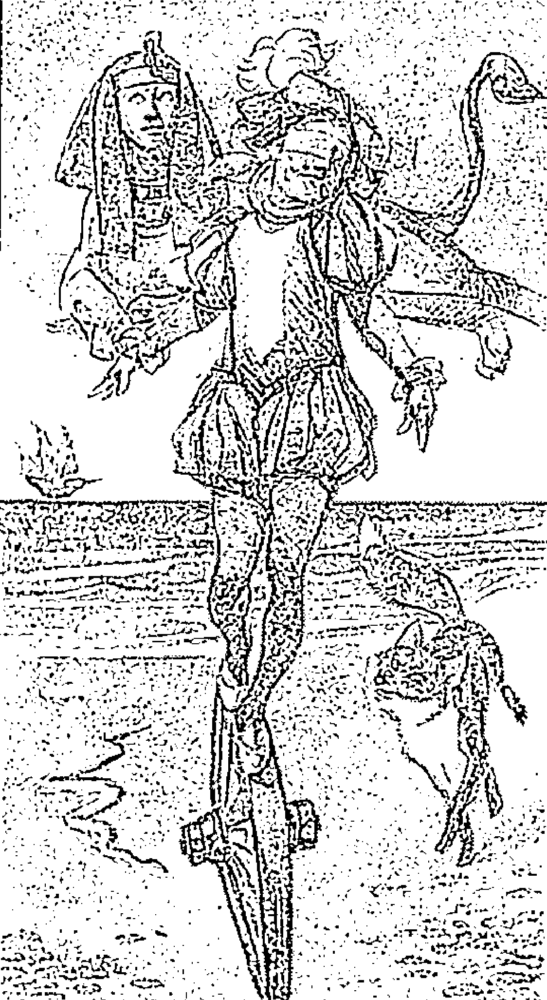

## 10 轮 The Wheel

象征意义：运转、轮回、变动的预感

蒙住双眼的小丑站在滚动的车轮之上，世界上的其他人又何尝不是处于这样境地？
世人所经历的光怪陆离，形形色色的百态人生也正像是随着车轮而回转，服从于变幻无穷无法掌握的命运。
狐狸暗示着欲望和诱惑；远处停泊的轮船代表着对不同旅程的选择；而天空中的人面狮身兽注视着在车轮上努力维持平衡的小丑，似乎正盘算着那个它用来杀死旅人们的谜题：“有一种动物，早上用四只脚走路，中午用两只脚走路，晚上用三只脚走路，这是什么动物？”
命运之轮的转动正是人生命的转动，它无时无刻不在轮回变化中，也暗示着坎坷的人生旅程。世界中的万事万物都是时时变动不羁、循环不已的。在无穷的流转中，总有着一个能够维持均衡和平的真理。
「轮」接近于二十二张塔罗牌的正中间，意味着在变化一段旅程的结束，也是另一段旅程的开始。
人不应被困境所击倒，因为顺逆都不过是循环的一部分罢了。

### 正位的含意

基本的含意：掌握时机、机会来临、转变期、意外的幸运、当机立断。
感情及婚姻：命运的邂逅、一见钟情、遇到新对象、突然的告白、爱情的好机会、运气逐渐上升至可以结婚。

## 大阿尔克纳

工作及学业：改变学习方式将得到成果、好运来临、确立前途、意外的好消息、转换方向的好时期、弹性的计划、考运佳、会有人伸出援手。
健康及美容：以独特的方式维持健康、因形象改变带来好心情。
娱乐及兴趣：对没有兴趣的事物不屑一顾、摄影。
人际关系：意外的得到贵人相助、有利的环境、随机应变。
金钱：临时的收入、意外之财。
其它：幸运的人、幸运降临、恢复原状、得到机会、想到的事情立即进行。

### 反位的含意

基本的含意：判断错误、低潮期、运气不佳的时刻、左右为难、稍安勿躁。
感情及婚姻：缺乏要领的交往方式、不稳定的恋情、亲事告吹、短暂的恋情、逐渐冷却的恋情、失恋、常常错失良机、保持现状勿深入。
工作及学业：拼命努力却毫无成果、成绩低落、效率并没有预期的提高、经常误解、突然改变计划、希望落空。
健康及美容：即使不会急速恶化，但是若不改变方式也不会好转、再多展现一些自己的特性。
娱乐及兴趣：远离危险的地方。
人际关系：误解较多、人际关系多变化而且不稳定、白忙一场、意见不合。
金钱：超支、小心被骗。
其它：一时的幸福、不要弄错约定的时间、没有趣味、缺乏变化的生活。

## 塔罗时刻

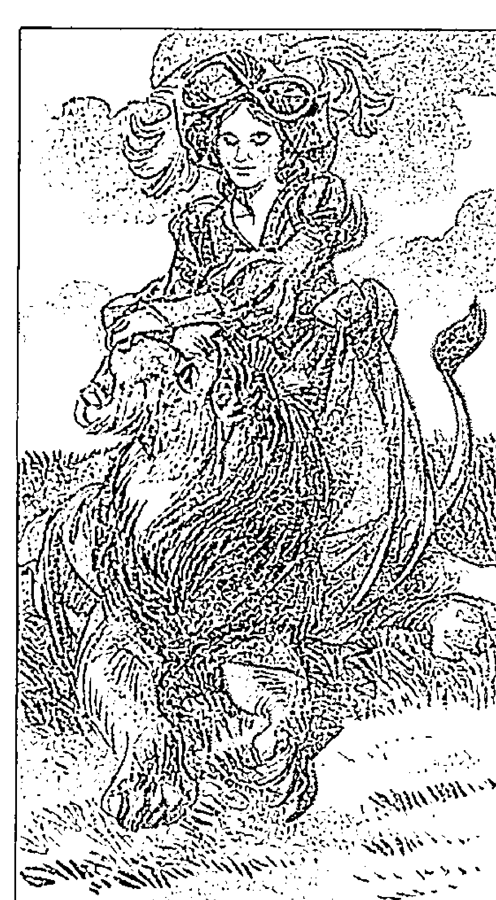

## 11 力量 Strength
别名：坚毅 Fortitude
象征意义：意志、力量

力量是胜负的关键，但不是征服别人的唯一因素。
牌中的女人抚摩着身旁的狮子，她帽子上的无限大记号代表着运用自如的智慧，而身为女性则意味着清廉的操守。
女人的表情没有一丝憎恨与嫌弃，反而略带着些许的怜悯，似乎是很同情狮子的兽性。百兽之王——狮子，意味着不受征服，但在女性冷静慈悲的目光下，原本充满敌意与伤害的兽性也缓和了几分，而被她征服了。
人的一生当中，失败挫折与危险障碍是在所难免的，必须要有强大的意志力和坚定的信心、决心才能通过重重难关。同时对隐含在本能的七情六欲中的兽性，更需要耐性去克制，所以，这张牌也暗示着“自我控制”的重要性。

注：在某些塔罗牌中，正义和力量的牌序是互换的。

### 正位的含意

基本的含意：精力充沛、不屈不挠、扭转乾坤的意志力、潜藏的力量。
感情及婚姻：以坚强的心智结合、容易过于热情、获得恋情、克服障碍长相厮守、恋情的主导者。
工作及学业：突破难关、可以倾全力发挥、将可居于领导地位、喜欢受人所托、即使不被支持仍会贯彻学习。
健康及美容：活力充沛、有持久力、恢复力强、佩戴大的饰品。
娱乐及兴趣：工作与兴趣结合、想要体验刺激。
人际关系：获得热情的赏识、以果断的言行受到赞赏、斗志获得赏识。
金钱：一大笔开销，果断的投资。
其它：有胆量、信念坚强的人、只要认为正确就会努力不懈、强烈的自我、在社团活动中相当活跃。

### 反位的含意

基本的含意：精力不足、急躁不安、危险的赌注、丧失信心、忍耐力不足。
感情及婚姻：不可以失去耐心、懦弱而不能坚持爱情、虽然积极也得不到成果、因自满及装腔作势而造成阻碍、在提出邀约前失去自信、经不起诱惑、顺其自然。
工作及学业：学艺不精、没有力量继续下去、欲速则不达、好高骛远、只偏重某方面。
健康及美容：若是不顾体力的极限就会生大病、耗尽气力。
娱乐及兴趣：无法配合旁人的步调、禁不住诱惑。
人际关系：因过于任性而破坏团体的和睦、禁不起友人的诱惑、对交友失去信心。
金钱：赌输、透支、不善理财。
其它：倾全力说服对方、输不起、自私、自大。

## 12 倒悬者 The Hanged Man

象征意义：牺牲、观点

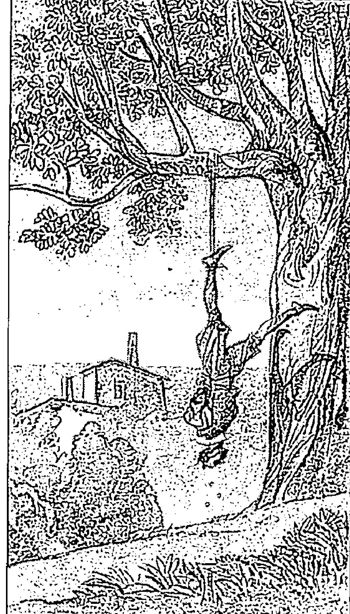

一个人一只脚被捆绑地倒吊着，身上的金币散落在地上。虽被倒立吊着，但他却似乎很平静，不做一点挣扎，反而陷入了沉思冥想中。

也许是受到中世纪基督徒殉教精神的影响，这张牌充满了灵魂不灭与自我牺牲的精神，即使他有着失去自由不能行动的无奈，却以极其平和的心境来面对多变难测的未来。

这张牌与「正义」有着对应关系，自「正义」牌中裁定是非罪刑，到本张牌表示被处刑罚的服刑状况，再接着后面一张象征终止的「死神」，这一连串牌是塔罗纸牌中最冷酷的场面。

当一个人处于生死边缘的时刻，往往会有更多的感受与领悟，这时如果能抛开一切执著，顺其自然地发展，人生将会有不同的面貌，而精神灵魂也会升华到某种境界。

这张牌令人想到基督教教义中，自我牺牲的精神。倒悬者的沉静安祥，是他以肉体的痛苦换取心理的满足。「倒悬者」代表着必须有所付出才能有所得，他也代表着必须试着以不同的角度面对自己的问题，才能获得认清事实的智慧。

### 正位的含意

基本的含意：无法动弹、牺牲、因小祸而获大福、因困苦劳顿而成长、考验的时期、以不同的角度去看待事物。

感情及婚姻：避免不必要的解释、奉献式的恋情、以对方的立场想想、禁得起爱情的考验、明知有挫折却依然不肯放弃、将有所牺牲。

工作及学业：一定要有耐心、容易牺牲、努力就会有成果，即使看起来很难、不妨以直觉判断、不可以偷懒、与福利事业或义务性的工作有关。

健康及美容：需要长时间的调养来恢复健康、因体验病房的生活而更坚强。

娱乐及兴趣：重新审视自己的时刻、一旦能够坚持就会找到成功的捷径。

人际关系：经常扮演吃亏的角色、艰苦的立场、只要咬牙忍耐必有好转的一天。

金钱：花钱消灾、因助人而损失金钱。

其它：没有。

### 反位的含意

基本的含意：没有希望、因私欲而受罚、白费力气、没有必要的付出、自我毁灭。

感情及婚姻：得不到回报的恋情、没有发展的希望、不值得奉献的、失去耐心、藕断丝连。

工作及学业：无法忍受严苛的环境、因过于被动导致成绩退步、不想培养学力、努力无所获、用功的方式造成反效果、讲话没有条理、只考虑自己的利益。

健康及美容：当心骨折、小心因为滑雪或溜冰造成足部血液循环不良、因疏忽而恶化。

娱乐及兴趣：应酬的旅游。

人际关系：没有代价的付出、自私、拘泥、杞人忧天、漫无目标的外出将有意外的支出。

金钱：情绪化的花费、浪费。

其它：废话、态度恶劣、白费力气、缺乏实行能力，如泡影般的消失。

## 13 死神 Death
象征意义：结束、终止

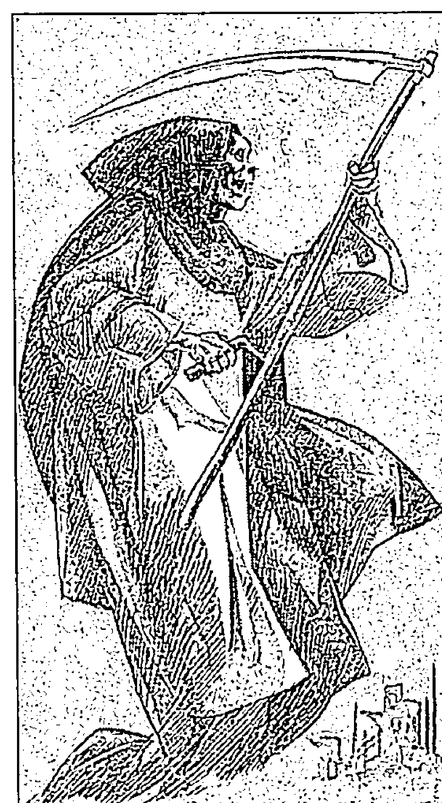

黑色披风包裹着的骸骨，露出冷酷的微笑，挥舞着锋利雪亮的长柄镰刀，似乎要毁灭终止一切。
骸骨象征着最后的破坏，意示着要毁灭一切生命力与创造力，所以这张牌所表示的含义是要能立刻当机立断，迅速地下决心，在终止与重生之间做一个明确的抉择。
在西方，十三一直被认为是个不祥的数字，然而这第十三张塔罗牌「死神」却不如想象中那般的可怕。由吉普赛人占卜的观点来看，「死神」牌有时也可以表示为去除陋习，开创变革。
如果想彻底的革新进步，就必须及早订立志向，将一切陋习与腐败完全地抛弃掉，这也暗示着先有破坏而后有建设的重要性。
死亡是一个结束，同时也是另一个新生。「死神」代表着转机，你必须结束旧有的生命，才能迎接新生命的开始。只是他并不保证那是一个更好的新生命。

### 正位的含意

基本的含意：失败、厄运连连、进入死路、来不及、绝望、遗失、不能逃离的事件。
感情及婚姻：隔阂加深、维持现状的、和对方分手、失恋、不感兴趣、离婚、分居、分离、不幸的相逢、对恋人失去感觉、冷酷的爱情。

工作及学业：死气沉沉、成绩跌到谷底、没有进展、后继无力、事物呈停滞状态、考试不顺、必须离开工作岗位、无法期待考试的成果。

健康及美容：遇到意外灾难、对自己的健康漠不关心、不想让自己更漂亮。

娱乐及兴趣：没有热衷的事物、学习技艺出现困境。

人际关系：关系恶化、友情出现裂痕、忧郁自闭、失去朋友、朋友遭受不幸。

金钱：奢侈成性、不经考虑的购买行为、过于顺应自己的情绪而不顾后果。

其它：无疾而终、努力成为泡影、忧心于物质的沉溺、忍受世间的冷漠、有苦说不出。

### 反位的含意

基本的含意：扭转方针、改变形象、奇迹似的东山再起、脱离低潮期。

感情及婚姻：主动展开攻势将有好结果、感情好转、应表明心意、绝望后出现重新燃起爱的希望、要努力不懈、破镜重圆、萌发新爱苗。

工作及学业：有决断力、如果试着扭转气氛，以新的计划重新开始，必能好转、能够挽回劣势、助手换人。

健康及美容：健康的身体来自于充满活动的生活、以自身的力量战胜病魔、改变装扮的好时机。

娱乐及兴趣：焕然一新的心情，对任何事物都勇于尝试、可以展开学习计划。

人际关系：和解、既往不咎，倍加亲密、新友谊的展开。

金钱：失而复得。

其它：脱胎换骨的时机、开拓的勇气、果断的决定、精力充沛。

## 14 节制 Temperance

象征意义：净化、治疗、关心

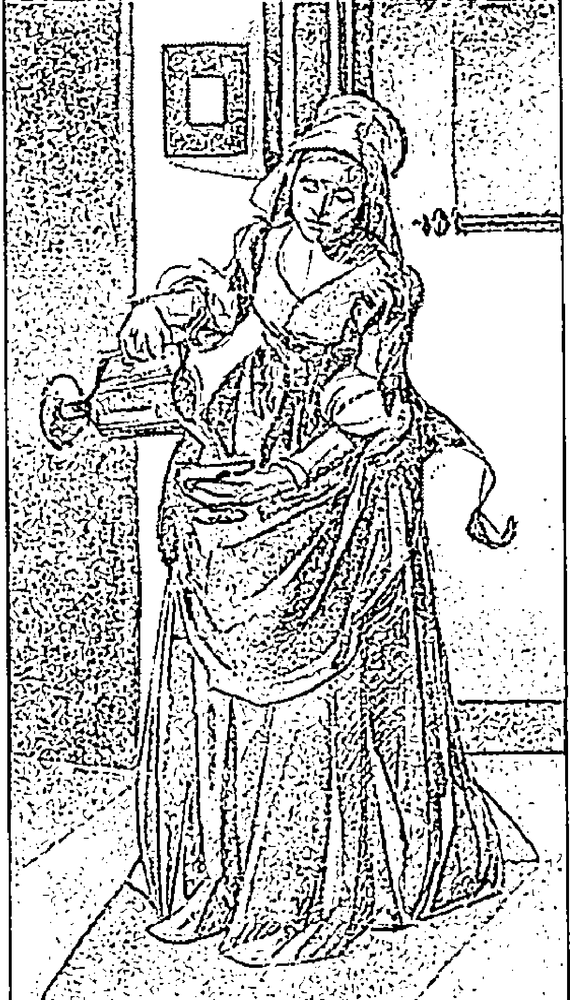

一位妇人平静地将右手容器的水倒入左手的杯中，由于画面非常平凡无奇而又如此平静，因此，「节制」牌的含义更令人难以理解。

妇人手上容器里所交换的水象征着人们有限的生命，它必须不断地交流，有如活水一般，如此不但不会腐败，还有净化的作用，这是水的性质，也是生命的本质，如果只停在一个壶中不再流动，就成了腐坏的死水，而丧失了其原有的性质。

「节制」代表完全、和谐、净化和治疗。杯中的水不断地以一种舒缓的步伐流动。这是一个疗伤止痛的过程，治愈你的身心，也使事物渐渐好转。「节制」同时代表着“缓慢”的意义，你必须以一种自制、温和，并充满耐心的态度面对你的问题。节制同时代表事物可能面临一种渐渐转化的契机。

### 正位的含意

基本的含意：进行顺利、排解争端、整理、必须调理整顿、纯洁化、在平淡的重复中发现关键，关注自我需求也兼顾他人的意愿。

感情及婚姻：能够有所差异的交往、爱情弥坚、两家人相互往来、心心相印、单纯的爱、有节制的交往、意外的邂逅、由友谊发展成爱情、心灵相通、纯挚的爱、对自己有帮助的对象、可以商谈的对象。

工作及学业：有很好的直觉、成绩顺利进展、零缺点、反复学习获得良好结果、变通待遇的时期、可望有稳定的状态、改订价格、好记性、交流的打算会有收获、人事变动。

健康及美容：健康呈现良好状态、善于调整身体的状况、多多保养皮肤。

娱乐及兴趣：去海边玩玩吧、游泳会带来好运、收集东西。

人际关系：能够与各种不同的人相处、在交谊场所会有所斩获、毫不做作的交友、体贴。

金钱：在流动的资金当中获得利益。

其它：善于节俭、可以控制、家族的凝聚力很强、互相协助、经由体验培养的性格。

### 反位的含意

基本的含意：缺乏调整能力、耗费过巨、遗忘初衷、消耗殆尽、没有节制。

感情及婚姻：小心三心二意的后果、双方都不善于控制恋情、无法调整恋情、无法主动谈和、没有默契、疲惫的身体、往错误的方向发展。

工作及学业：过于情绪化、陷于低潮、单方取消、过于浪费、时机不佳、不规律的生活习惯将有不好的影响、精神松懈、进展不顺利。

健康及美容：精神不稳定、耗尽体力、食欲减少、要事先做好准备动作。

娱乐及兴趣：意见不合而中断。

人际关系：因无法控制自己的情绪而得罪别人、让人精神疲惫的交友方式、不和睦、缺乏节制。

金钱：奢侈浪费、金钱的纠纷、不节制的花费、平均分担费用。

其它：沉闷的说教、小故障。

## 15 恶魔 The Devil

象征意义：诅咒、沉沦、欲望

「恶魔」这张牌有时被称为「撒旦」或「黑魔术师」，象征着人们心中隐藏的种种“恶性”，如犯罪、纵欲、贪婪、享乐……等坏行为，这些往往会诱导人们走入歧途而导致最后的灭亡。

恶魔支配着黑暗，身着黑色长袍，手中装满金币的袋子上盘绕着一条蛇，狰狞而诡异的脸孔给人一种恐怖不祥的印象。

在传统的塔罗牌面中，恶魔的脚下会有一对男女，他们是受到诱惑而被控制的恶魔的俘虏。这两个受制的堕落男女，兽性已渐渐的取代了人性，长出了尖角长尾，人的理性也不复存在，而不听人类善意的忠告了。

恶魔是由人内心的欲念而生，这张牌代表你被自己的欲望所缚无法自拔。被自己的自私和骄傲所困，还有什么比这更容易毁灭一个人呢？

这张牌暗示着要去克服种种欲望与自我堕落，不再陷于爱欲贪嗔的心理矛盾中，如此便要具有坚定的信心与自我控制的能力，才能战胜懦弱的人性，而不受到诅咒，成为恶魔的俘虏。

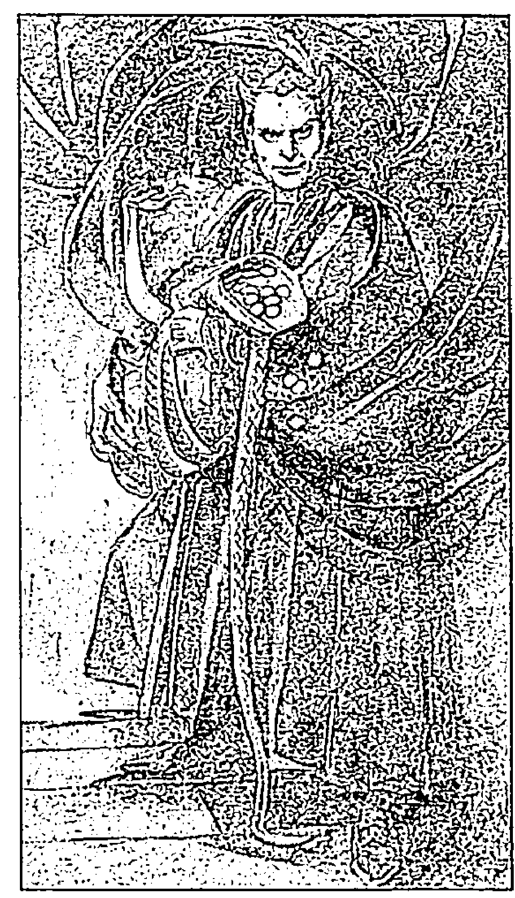

### 正位的含意

基本的含意：受到拘束而感到不自由、卑躬屈膝、沦为欲望的俘虏、颓废的生活、隐瞒事实、诱惑的陷阱。

感情及婚姻：过于紧张、危险的诱惑、没有个性、无法真实地展现自己、秘密的恋情、无法付出真心、拖泥带水的孽缘、心胸狭窄，只会想到不好的、婚事无法改变、遭受玩弄、憎恨与嫉妒。

工作及学业：孤立、因诱惑而荒废学业、受到束缚、成绩低落、对自己过于严厉、对补习班的管教感到不满、施加暴力、夜读是行不通的、被迫的用功、不满，自己如果不想办法解决只会更糟。

健康及美容：来个健康检查吧、挥之不去的病痛、不要一味地追求流行。

娱乐及兴趣：没有办法去想去的地方、团体活动缺乏自由行动的机会。

人际关系：受到不良的诱惑、陷入秘密团体、父母的束缚、屈服、计较利害、阴险的人。

金钱：被骗财、不该的收入、欠债、套牢、财运烂。

其它：多苦多劳的生活、过于忍耐、不采纳他人的意见、贪心造成无法成功、恶劣的条件、秘密行动。

### 反位的含意

基本的含意：摆脱不良诱惑、断绝、抛弃欲望、有脱离现状的机会、获得解脱。

感情及婚姻：分手的时机、结束拖延的恋情、摆脱感情的困扰、几乎没有进展的恋情、陷于肉欲之中。

工作及学业：脱离现状的希望、有向较弱的科目挑战的机会、建议来个适当的散心、离开无法忍受的工作环境、摆脱重担、想要独立发展的人要慎重行事。

健康及美容：不愉快的心情好转了、肤质变好、青春痘痊愈。

娱乐及兴趣：希望尝试解放的感觉、想要轻松的活动、心里想要开始展开某些计划。

人际关系：断绝不良的关系、放弃私欲，恢复理智，就能够改善人际关系。

金钱：脱离控制、转亏为盈、转型投资的时机。

其它：从被束缚转为自由、解除负担、能够表达出自己的意志。

## 16 高塔 The Tower

别名：上帝之家 The House of God
象征意义：毁灭、意外

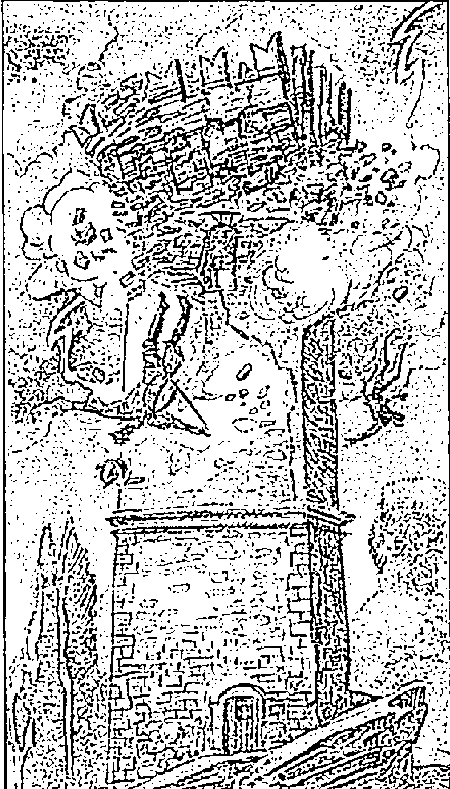

「高塔」这张暗示“毁灭”的牌是紧跟在象征“诅咒”的「恶魔」之后，整套塔罗纸牌令人觉得彼此都存续着一些微妙的关系，22 张牌合起来足可构成一部完整的戏剧，显示出人生的多样化与多变性。
从第 13 张牌开始，通过「死神」而尝过生死边缘滋味的人们，很可能会在不同的环境中靠「节制」得到净化身心的机会，但如果不能彻底自我反省，则将沦为「恶魔」的俘虏，被囚禁于「高塔」之中，遭受各种的打击与折磨。
原本巍然矗立的高塔，却被一道突来的闪电击中而崩溃燃烧起来，这雷鸣闪电，便意示着神的愤怒与神的制裁。
「高塔」代表着毁灭，全然的结束，闪电代表着突如其来的意外灾难。或许和「死神」的意义相结合，「高塔」是一个强制的结束，必须先有完全的破坏才能重建。「高塔」的反位代表着“毁灭的预感”、“毁灭即将来临”。
塔罗纸牌对人生的一切有着很鲜明的描述，有无可奈何的人生宿命也有令人感到恐惧的象征纸牌，其目的不外乎要唤起人们内心中意识的觉醒，而找到属于自己的路。

### 正位的含意

基本的含意：麻烦不断、逆境、遭受打击、信念崩溃、坏局面、突发事件。

感情及婚姻：意外的分手、变得具有攻击性、与爱人争吵、因想要分手而主动挑衅、失去爱情、想要返回原点却煞不住车、因家人的反对而遭受孤立。

工作及学业：事态急剧恶化、成绩低落、爆发不满却苦无对策、因意外的事件造成辍学、有精神上的烦恼、因闯祸而被记过、遇到灾难、不及格、落榜。

健康及美容：应该接受住院的建议、疾病容易恶化、动手术、小心烫伤或刀伤、医疗费增加。

娱乐及兴趣：遇到意外的事故、为了自己最好改变方式、多尝试与众不同的旅行。

人际关系：遭受连累、有纷争、因与朋友吵架而绝交、加深与旁人的对立、变得暴躁易怒。

金钱：损失金钱、赤字、破产。

其它：多管闲事、率性的行事会引发重大的问题、以往累积的成果崩溃、有纷争。

### 反位的含意

基本的含意：瓦解、要有悬崖勒马的勇气、口舌之灾、内部纠纷、紧急状态。

感情及婚姻：直接表达心意、感情的危机、以重新再来的心情交往、预感将分手、心情呈白纸状态、两人之间出现危机、可能遭受打击。

工作及学业：听天由命，放手一搏、成绩跌落谷底、只要有一丝希望就千万不能放弃、因自满而失败、因过于紧张而导致失败、紧迫逼人的立场。

健康及美容：大胆地接受手术、健康可以逐渐好转、平常不够注意健康状况。

娱乐及兴趣：即使条件不佳，只要有所觉悟就有克服的希望、让人后悔的旅行计划。

人际关系：大动乱的前兆、不要勉强、应尝试让步、纠纷不断。

金钱：从零开始、表面富有，其实贫穷、破产边缘。

其它：风雨前的不安感、不要惊慌处理、不可大意、有震惊的事情将要发生。

## 17 星星 The Stars

象征意义：希望

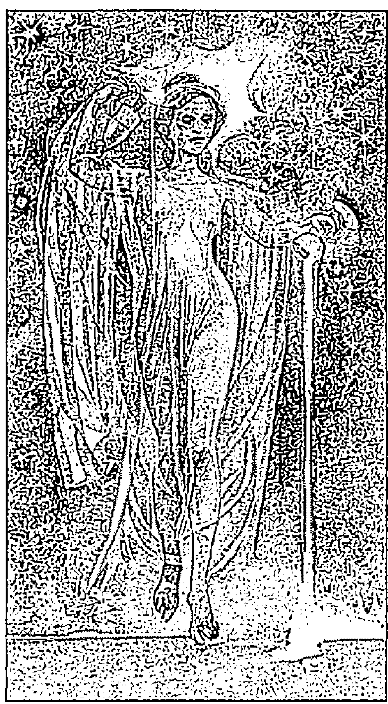

身披薄纱的女神站在河流之上，把双手容器中的水倒在河流中，而身后则衬着耀眼的群星。
我们可以神会她心中的美感与宽大的胸襟，以及她对未知领域的探求。
女神站立在地上的河流之上，而光彩夺目的群星汇聚成天上的河流，自古人们深信那是希望的泉源，星光下的女神正象征着“永远之美与无穷的希望”。
「星星」代表着生命的希望，有如夜空中指引方向的星辰一般，是一张为人们带来希望的牌，女神为生命灌注了新的能量。这张牌和「节制」有关连，代表经过净化后，重新开始的契机。

### 正位的含意

基本的含意：愿望实现、新鲜的创造力、萌发灵感、理想主义者、充满希望的未来。
感情及婚姻：感受到好预兆、理想的恋人、从友人成为恋人、爱情萌芽、遇到理想的对象、美妙的恋爱、能分享幻想的情侣、用电话联系感情。
工作及学业：有独创性、乐观的将来、对事物充满好奇心、能够达到极高的目标、独特的念书方式也不错、艺术方面颇有好运。
健康及美容：绝佳的状况、不妨多尝试不同风格的服饰、健康的化妆将引人注目。
娱乐及兴趣：想去人烟稀少的地方、对艺术方面更有兴趣了。
人际关系：与兴趣相投的朋友愉快交往、相辅相成的友情、遇到理想的朋友。
金钱：新的财源、依感觉可获得意外的收入。
其它：希望达成、反应迅速、希望生活个性化、具有创造事物的能力、取得专利。

### 反位的含意

基本的含意：缺乏想象力、失望、单纯的构想、无法实现愿望、过高的理想。
感情及婚姻：无法心灵相通、欲望过高的恋情、虽有进展也不想再继续下去了、无法产生爱意、期望落空、以貌取人、两人出现难以解决的隔阂。
工作及学业：即使有创意仍一无所获、考试受挫、通信发生错误、希望过高、缺乏信赖、理想与现实的矛盾、需改进读书方式。
健康及美容：身心疲劳、对于穿着欠考虑。
娱乐及兴趣：避免人多嘈杂的场所。
人际关系：自我意识过剩、看别人不顺眼、无意义的交谈、对朋友感到失望。
金钱：破财的征兆、无法得到预期的代价。
其它：期望过高、错失良机、过于坚持己见、洞察力变差、理想和现实无法兼顾。

## 18 月亮 The Moon

象征意义：不安、迷惑、欺骗

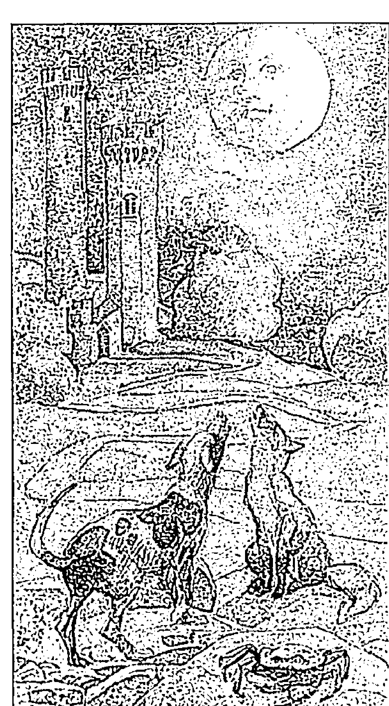

阴晴圆缺变幻莫测的月亮自古以来在人们的心中留下了许多的梦幻与传奇的故事。月亮一般代表着极富浪漫的气氛，偶尔也会有令人感到隐隐的不安。

月亮本身的圆缺变化对生物的精神上与心理上存在着某种程度的影响。

牌中的月亮呈现出一个人不安与动摇的脸，它代表人性中虚伪与善变的一面。

月夜和明亮的白天相反，令人产生不健康的感觉，也因为这种昏暗，有些事物得以蒙混过去。「月亮」牌充满了危险与不安，暗示着人们要本能地探求真相，找寻真理，而取代恐惧与不安的心灵。

自古月亮就代表着人的潜在意识，那似乎是代表黑夜的力量。人们爱月亮虚幻的美感，却也惧怕她的变化无常。朦胧的月光所映照的不是真实，而是代表欺骗的幻像。

### 正位的含意

基本的含意：幻想、谎言、不安、动摇、迷惑的心、暧昧不明、重伤、背后的敌人、被现实所撞击的愿望。

感情及婚姻：容易暧昧不清的恋情、虚伪的恋情、变成孽缘、三角关系、弄得一团糟、迷惑不安、欠缺表现力、遭遇背叛、介意对方的感觉、被流言所困、隐藏的敌人。

工作及学业：受到中伤、不明确的目标、提防诈欺、徒感不安。

## 大阿尔克纳

却无进展、犯错、欺骗、无法镇定而考试失败、适合与夜生活有关的工作、得不到满足感。

健康及美容：心烦造成精疲力尽、接受错误的诊断、把小病看得太严重。

娱乐及兴趣：避免秘密的旅行、没办法让自己从心底高兴起来。

人际关系：容易受到伤害的时期、小心谎言、恶言中伤、遭受误会、精神疲劳。

金钱：私房钱、财务危机、令人不安的经济状况、提防欺诈。

其它：因受到左右而无法决定、纤细的人、受到别人感化、无法完全发挥自己的力量。

### 反位的含意

基本的含意：逐渐好转的状况、时间即是良药、疑虑冰释、幸免于害。

感情及婚姻：唯有时间的培养才能让双方更紧密、发觉虚伪的恋情、婚事可期、误会消逝，友情坦露、因为异性的出现而展现出纯朴的一面、被动等待。

工作及学业：逐渐好转、稍安勿躁，这时正是检讨的时刻、研究对策、有挽回的希望、冷静地观察事态较佳、默默付出的精神终将获得回报。

健康及美容：精气逐渐恢复、虽然痊愈了但不可以勉强、表情变得更开朗、开始了解自己的魅力。

娱乐及兴趣：时间表不要排得太紧、在学习前要仔细了解状况。

人际关系：迷惑消失，顺利交往、误会冰释、静观其变即能恢复人际关系。

金钱：解除金钱危机、等待度过难关。

其它：终于要好转了、等待黎明、只要等待就会幸运。

## 19 太阳 The Sun

象征意义：生命、快乐

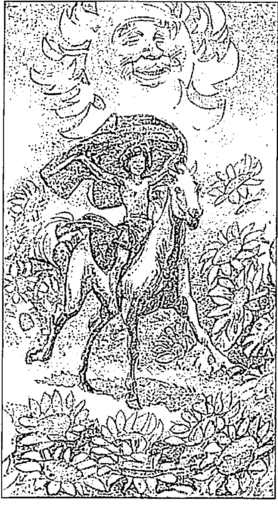

太阳是能源的中心，也是一切能量的来源，太阳是一切生命的源头。炽热的阳光孕育了大地万物，使得美丽的花朵得以开花结果，生物繁殖茂盛。
上一张塔罗牌中的月亮隐含着暧昧与不安，夜间世界与象征开朗与活力无限的白昼形成强烈的对比。「太阳」是一张代表新生的牌。
月有圆缺并随着周期规律性变化，而太阳则亘古至今始终不变，依然散发着光辉。虽然太阳也有其规律的行为，但却仍旧依循其不变的定律，不曾有异，它意味着“每日不断努力所带来的成功”。
牌中骑马的孩子因阳光的精气而容光焕发，象征了神赐生命的可贵。

### 正位的含意

基本的含意：明朗的将来、有活力、有欲望、非常活跃、贵人相助而成功。
感情及婚姻：相思相爱的爱侣、受到祝福的一对、步上红毯的那一端、顺利健康而开放的交友、获得满足的爱、出现好的恋人、恋情得以公开、逐渐培育彼此的感情。
工作及学业：目标达成、成绩快速的进步、积极的主张、因为遇到好老师而提高学习效率、工作环境的气氛变得开朗、因发挥实力而让考试顺利、尽全力完成。

健康及美容：体力更好了、优生宝宝、有生命力的、健康的身体让你更加美丽。
娱乐及兴趣：呼吸新鲜空气、在外面活动、借着运动的汗水流动而有个新心情。
人际关系：友谊的滋长、活泼开朗的交往、好友增加、积极的交往。
金钱：赌运好、储蓄增加。
其它：太阳光照射得到的地方能够带来幸运、怀孕之喜、充实的每一天。

### 反位的含意

基本的含意：意志消沉、取消、情绪低落、无法持久。
感情及婚姻：过于冲动、爱情破裂、无法发展到结婚的地步、有分离的危险、离婚、不能结合的恋情、双方无法回到起点、不被祝福的恋情、婚约有取消的可能。
工作及学业：不安感加重、失去想学的心、听不进他人的劝告、没有耐心，无法实行计划、没有目的地打转、成绩低落、精力不足而导致失败、没有固定的职业。
健康及美容：体力不足、流产、不健康的生活、产后身材变形发胖。
娱乐及兴趣：学习缺乏持续性、不要勉强自己去旅行。
人际关系：有受到同伴排斥的可能、绝交、因过于消极而给人黑暗的印象、无法与人亲近。
金钱：失去收入、浪费、因爱慕虚荣而增加支出。
其它：不活泼、没有活动性、无助而且忧郁、生活不稳定。

## 塔罗时刻

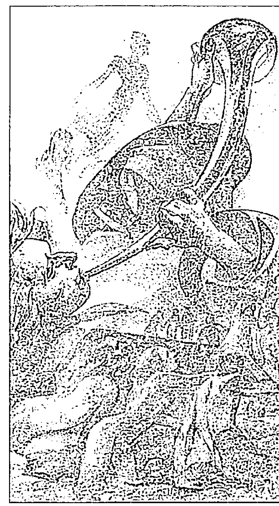

## 20 审判 Judgement

别名：天使 Angel
象征意义：复活、回忆

天使吹响金色喇叭，给世界带来了力量和鼓舞，从一个乡镇到另一个乡镇，由一座高山越过另一座高山，传播着福音。
清澈的喇叭声到处回荡，叫醒了沉睡在世俗中的灵魂，解放了凡人们的苦恼，甚至在坟场的棺木中回响，使人感到灵魂不灭与生命复苏的奇迹。「审判」牌受基督教中“最后审判”的影响很大，它以宗教性和精神性恩惠为主要的象征意义。

传播着上天福音的天使，面上却带着严肃的表情，似乎正反驳着人类许多愚昧无知的行为，严正地要引导人们离开迷途，找到自我，而来感谢与聆听上帝的福音。

这张牌来自基督教末日审判的传说，天使将吹响她的号角，死者从地下重生。新生命来临之前，是对旧有自我的裁判。只有面对和接受自我的错误，才能获得新的契机。

### 正位的含意

基本的含意：复活的喜悦、决断的时刻、等待的尽头、命运好转、公开发表、改革期、好消息。

感情及婚姻：真心的恋情、公开恋情、即使吵架仍有和好的希望、爱的使者出现、重逢的喜悦、相信爱的奇迹、告白的时刻、深情的联系、不要隐藏自己的恋情。

工作及学业：有复职的希望、脱离危机、工作单位会有变化、好的开始、决断时刻、更上一层楼、地位上升、考试顺利、听到好消息、决定前程、适合与音乐有关的工作、临阵磨枪上考场获得成果。

健康及美容：病情逐渐好转、恢复健康、痊愈。

娱乐及兴趣：借着旅行净化自己的心、试着接触乐器、前往能够休养身体的地方。

人际关系：恢复友情、受到旁人的赞赏、与多年的老友取得联系、言归于好、信赖关系。

金钱：失而复得的钱财、临时的收入。

其它：忍让是很重要的、相信宗教、对每个人都能够投注深情、拥有自信的发言。

### 反位的含意

基本的含意：失败了不再振作、未发表就结束了、不妥的决定、不能决定。

感情及婚姻：嫉妒心过重、辜负对方的好意、无法敞开心扉、消失、缺乏真心、不可能重来、不认真的交往态度、难忘旧情、留恋。

工作及学业：凄惨的状态、无法录取、决心受阻、受挫、无法接受事实、虽然想要振作起来，却心有余而力不足、对考试的期望不能太高、难以考上心目中的学校。

健康及美容：累积疲劳、过于勉强将会导致疾病、病情拖延无法痊愈。

娱乐及兴趣：旅途中要小心身体、技术不熟练、返乡放松心情。

人际关系：两边为难、不能和好、失望、过去的伤害所产生的后遗症、不会看人。

金钱：失去钱财、遗失重要的东西。

其它：散漫的生活、有罪恶感。

## 21 世界 The World

象征意义：完美、达成

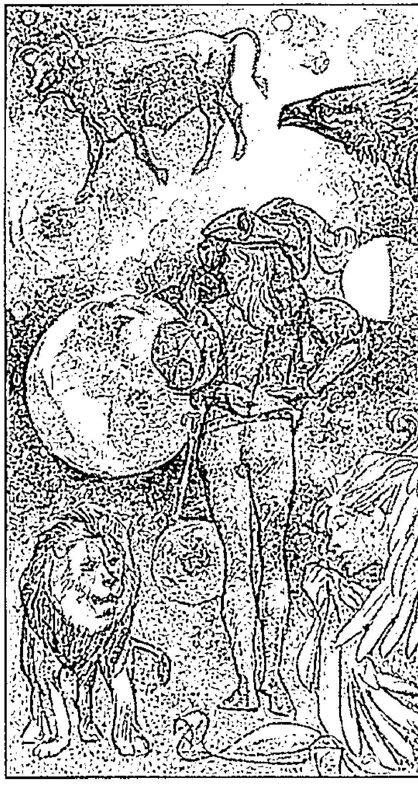

手拈红花的青年带着一副平和的面容，全身充满了高贵的气质与不凡的气度。他代表着人最终达成的神圣性，这位青年给人的感觉，是一种纯真无邪的印象。四个角落的生灵代表着世界的万物。
「世界」牌是自第一张的开始，经过各式各样的状况而表现出来灵魂升华的最高境界，就像瑜珈术中“无我”的境地，也可以解释为肉体的解脱与精神的升华，而达到与宇宙万物合为一体的状态。

这张塔罗牌非但有着很深的宗教性与精神上的意味，同时也表现出现实世界的气息，一般人都将这张牌视为极幸运的一张。
愚者的流浪终于到达了他的终点，「世界」代表着目标的达成，以及物质和心理的完美状态。需要注意的是，「世界」也代表着终点和结束的意义。

### 正位的含意

**基本的含意：** 完成、高昂的精神、幸福的时刻、达到巅峰、到达、成功。
**感情及婚姻：** 得到祝福的婚姻、最佳拍档、条件齐全、幸福的婚姻、历久弥新的情侣、幸福的成果、永久的爱情。
**工作及学业：** 最旺盛的时期、达到目标、与航空有关的工作、学业提升、完美达成、最高成就、可以顺利毕业、以最佳的方式获得成功。

健康及美容：保持素静之美、看起来年轻、内在比外表重要。
娱乐及兴趣：搭机旅行、选择宽广的场所、梦想得以实现。
人际关系：幸福的相逢、交友获益、安定的信赖关系。
金钱：增加收入、资金调度平顺。
其它：精神方面逐渐提升、宿愿达成、拥有理想、达成目标、有处女的形象、幸福围绕在左右。

### 反位的含意

基本的含意：无法完全奉献、为将来而苦恼、不顺利、不安现状、气氛低迷不成熟。
感情及婚姻：即使被求婚了，态度却无法明确、不能结合、无法恋爱结婚、容易破裂的感情、暧昧的态度令人不满、没有活力的交往、热情消失、失去新鲜感。
工作及学业：无力、成绩低落、前景不被看好、低潮期、半途而废、精神懈怠或懒惰、因准备不足而失败、因受人压迫而无法翻身、受挫、无法如愿发展、缺乏创意。
健康及美容：小心气坏身体、累积过多的压力无法宣泄。
娱乐及兴趣：海外旅行暂停、计划不周全、看的和做的大不相同。
人际关系：交友发生挫折、彼此缺乏热情、因过于幼稚而受到阻碍。
金钱：破产、资金调度困难、对待遇感到不满意。
其它：不完全的状态、无法更好、缺乏先见之明、心情容易低落、无法掌握要领、不适合搬家。

# 3 小阿尔克纳

> 西西里岛的缪斯，开始你高超的歌调，
我们再次听到库玛的神谕之声。
你看那流转的岁月又带来新的祝福；
处女来临了，还有他，人们长久期盼的君王。

——维吉尔

## 圣杯牌组

圣杯牌组代表着水元素。

水不会自寻挑战或冲突，它自得于随生命之波而逐流。

水，象征着爱和想象，和谐以及透过情感来理解人生。

水的意义正在于它的流动不息，

它的特性就如同人们的本质，

虽然生活改变了我们的外表和处境，真实的自我却完整如初。

水象星座：巨蟹座、天蝎座及双鱼座。

### 圣杯一

圣杯一意味情感的获得和满足。
这张牌代表一个开始。暗示生活当中存在着快乐、爱和喜悦的机会。它可能意味着你要进入一段情感满足的时期，你将在生命的核心中发现真正持久的东西。圣杯一也是持续你心灵发展的一个机会——通过爱，这个令人快乐、喜悦的方式。
当我们的心灵在生活中的许多瞬间契合时，就算很小的事情也能让你充满喜悦，像是一个阳光灿烂的日子、一朵绽开的小花、一个婴儿的微笑。而当你失去这种默契时，你会在挑战中寻求满足。

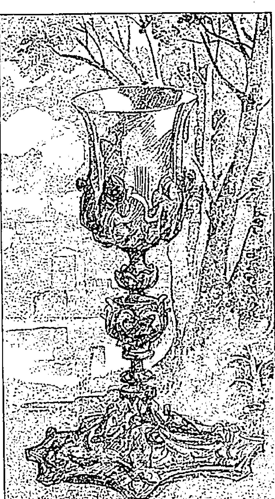

#### 正位的含义

出生、精神的永恒之源、满足、爱的到来、欢喜、丰富、美好的前景。

#### 反位的含义

改变、不稳定、没有回应的爱。

## 塔罗时刻

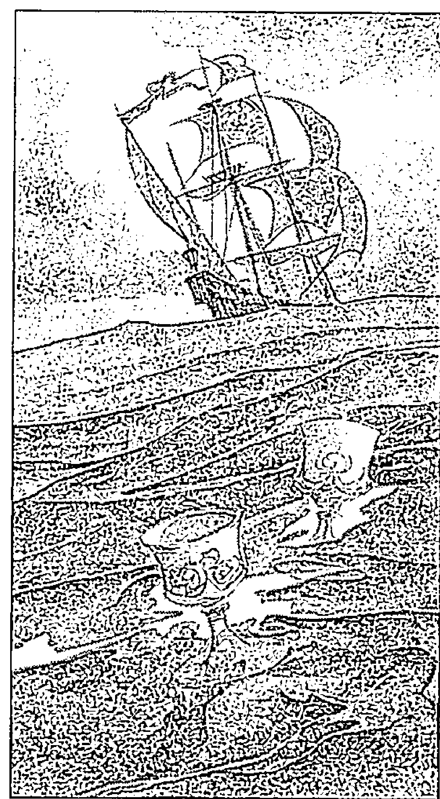

### 圣杯二

圣杯二提醒你该珍惜现在拥有的感情。这是一张代表着感情的不确定性的牌。海面上漂着两只从大船上掉落的杯子，大船已经远去，两只杯子只能跟随海浪的方向，随时有倾覆下沉的可能。这不正像人们年轻时的爱情，被各种因素所左右和改变，在命运的洪流中每个人都像是漂浮的杯子相遇和分离。
所以，当你拥有爱情时，请温柔地待你身边的那个人，即使有天要分离，也该在心里抱着感激。谁能说分道扬镳不是一种缘分呢，至少你们曾经相遇过。
圣杯二还是一张代表旅程的牌。其实，人生就是一次心灵之旅，我们在旅行中不断地了解自己，认知这个世界，而我们的心会在旅行中丰富、成长。这张牌在提醒你，如果你暂时失去了方向，那么去做一次旅行吧。

#### 正位的含义

旅行、漂泊、年轻的爱侣、亲密的朋友。

#### 反位的含义

误解、失去方向。

### 圣杯三

圣杯三暗示你要留意眼前的感情机会。这是一张代表冷漠无情或情感上不满足的牌。牌中的女人无法从面前的三个杯子中得到满足，她无法满足于眼前的机会而沉溺于关于往昔的回忆中，不过只要她准备好从自己的内心寻找，她还是可以得到满足的机会。这张牌暗示你必须将自己和心灵的目的结合起来，才能确实掌握住满足的泉源。

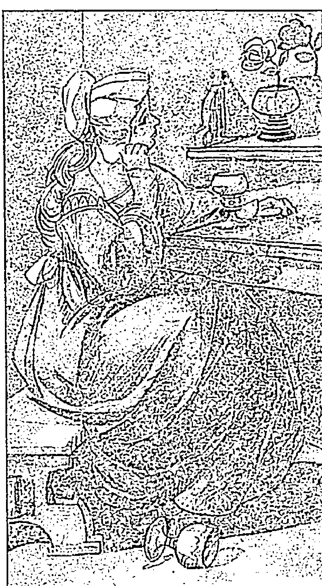

女子身后的光线似乎来自夕阳，她的白日梦已使她忘记了时间，不知不觉间错过了外界的机会。在圣杯三中所必须学习的课题是，和心灵维持联系或记取在王牌中所得到的经验，同时也要与真实的世界保持联系。

这位女子是以怀旧的心迎接即将到来的一切。如果她只准备追寻外在的东西，那么她很快就会对生活中的事物感到厌烦，但她如果只打算探求自己的内心世界，也可能会失去真实世界清晰呈现出来的爱。

#### 正位的含义

想念、怀旧之情、关于往昔的白日梦、休息。

#### 反位的含义

错过、空想。

## 塔罗时刻

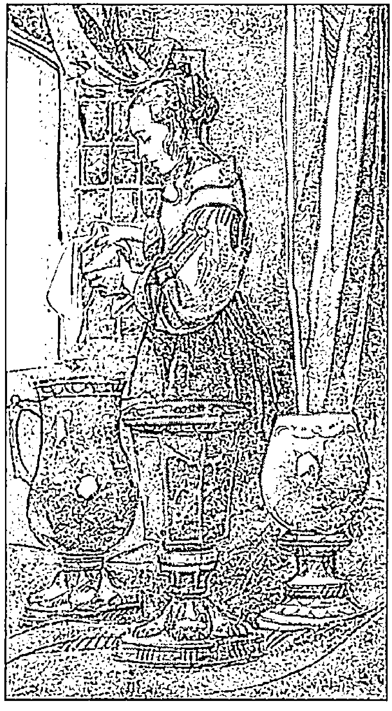

### 圣杯四

圣杯四暗示着试着联络往日的朋友。
圣杯四代表着过去，对童年时光的缅怀、对过去恋人的回忆。如果是代表有关旅行的问题，它表示你将回到某个熟悉的地方。

这是一张代表整理记忆的牌。牌中的女子仔细擦拭着手中的器皿，这些收藏了许久的杯子很少被想起而落上了灰尘，这些杯子代表着正被我们渐渐遗忘的过去的经历，那些曾经充满我们生命的美丽情感因时间的推移和人世的磨砺而变得模糊。经历了更多的事情，也许你正为周围复杂的关系所烦扰，也许你正生活在安逸的环境而感到满足，但总会有那么一天，它们会悄然触动我们的心弦。

心中的记忆是我们的财富，让我们成长，而往日的朋友是和我们拥有一样财富的人。在一个人的夜里，在你不经意想起他们的时候，请试着写一封信或拨一个电话给他们吧。

#### 正位的含义

珍爱的东西、保持、恢复、重逢。

#### 反位的含义

新鲜事、新的关系。

### 圣杯五

圣杯五意味对自己的满意和荣誉感。
这张牌提醒你，当你接受了自己以及所处的状态，你可以有更多的时间去享受单纯事物所带来的乐趣，它意味着在这段时间你该平静地回味过去的种种成就。
这张牌描绘一个对自己有着健康看法的人。他只陶醉于欣赏手中的杯子，他知道如果想拿到桌子上更多的杯子就要先放下已在手中的，所以不愿太轻易或太快的改变现状。
他的双手中的金杯象征着成就带来的荣誉感，他是一个拥有很多成就并以自己为荣的人。他身穿色彩缤纷的服饰，并从内心找到很大的满足，但是，他还未找到一个可以和他分享这些感觉的人。在达到十以前，他还是需要努力。因为他需要理解虽然他的爱很有价值，但是能够和别人分享会更有价值。

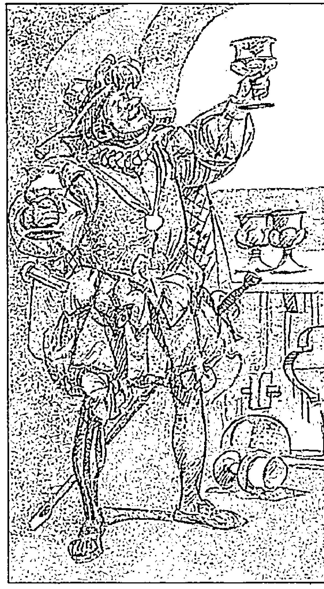

#### 正位的含义

快活、满足、继承、庆祝、成就、胜利。

#### 反位的含义

错误、物质的损失、美中不足。

### 圣杯六

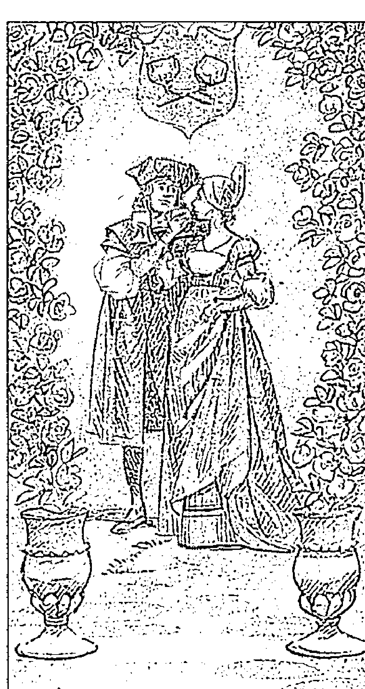

圣杯六意示一种平等的伙伴关系或两性关系。

这张牌中的玫瑰花门中，一对面对面的男女，手中各持一个杯子，两人把杯子举在同一高度，意味着平等互信。这张牌可能是在暗示一段相互信任的爱情或生意关系，或任何密切的共同努力及有利的合作关系。

圣杯六的含义正如大阿尔克纳中的第六张恋人牌一样象征着爱情，恋人牌的含义偏向于对爱情的选择，圣杯六则说明做出选择后的一种稳定长久的关系。正如牌中的男人和女人，他们之间有一种心灵上的契合。

在暗示两性关系时，它表示经由结合男性在行动、力量、活动方面的特质，以及女性在情感、想象及直觉上的特质所产生的能量。这种能量可使你对爱有更深的理解。

#### 正位的含义

结合、快乐的未来、爱情、热情、友情、姻亲关系。

#### 反位的含义

损害、分离、妄想。

### 圣杯七

圣杯七意味你该追求更多东西。
牌中的老妇人手中拿着一只杯子，有六只杯子散落在她的脚边。这些杯子代表快乐的机会。圣杯七通常指同时出现了若干机会，也就是说，当你放弃了一次机会时，一定还会有其它的机会选择。但需要注意的是，这种选择是单一的，当你拿取了一只杯子就等同于放弃了其它。这张牌的含义和隐士牌类似——想要达到更高的地方，获得更好的视野，你必须放开寻常生活中的已拥有的其它事物。
这是水元素的真正的意义，它暗示着内在的认知比外在的行动更重要，在某种境况改变或终止前，它使你有能力感知此状况即将结束。圣杯七暗示着远离你所拥有的去追求更多事物的时机已经到了。

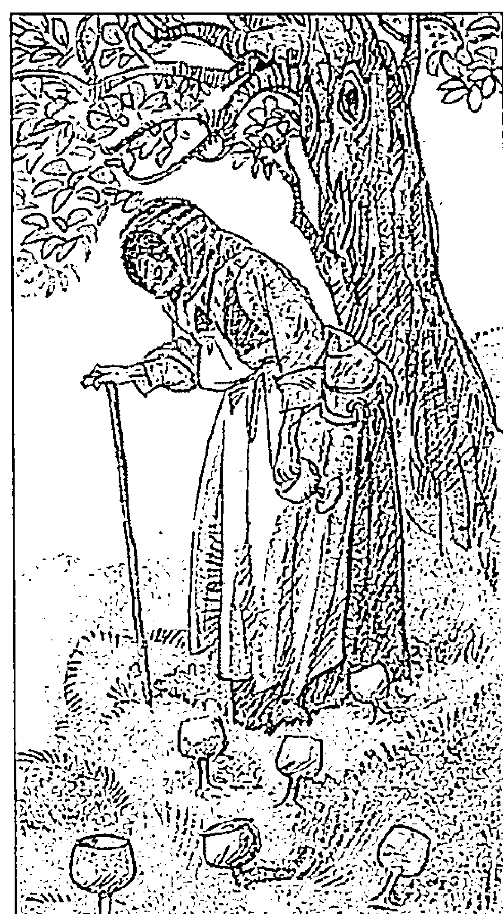

#### 正位的含义

谦逊、幻想、多种选择的机会、放弃自己原先的计划。

#### 反位的含义

保守、优柔寡断。

### 圣杯八

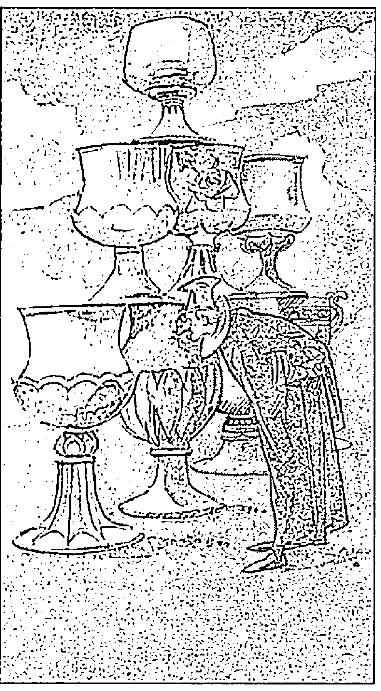

圣杯八表示应该认知你的内在寻求。这是一张代表自我发现、心灵成长的牌。对行动有所思考能帮助你将经验转变为知识，更向智慧与理解靠近。
没有思考，行动很快就会变得重复，而没有行动或经验，思考可能变得索然无味，且毫无意义。
这张牌代表你该试着探索自己的内心，以追求爱的来源。你应确认你所真正需要的是什么，并记住：如果你不爱自己，那么也没有人能给予你足够的爱。

这张牌描绘你在追求真正自我。排成金字塔的杯子代表着不同的人生课题，底下的七只杯子分别代表着你用来面对这个世界的面具、家的归属感、物质的支配力、个人的力量、必须面对的诱惑、创造力和你真正的精神上的认同感。当你真正拥有底层的七只杯子时，你就会有能力通过第八只杯子更深刻地认清你自己了。

#### 正位的含义

寻求、想象力、深思后的选择、幻想能幸运成功。

#### 反位的含义

幻想、欲望、愚蠢的怪念头。

### 圣杯九

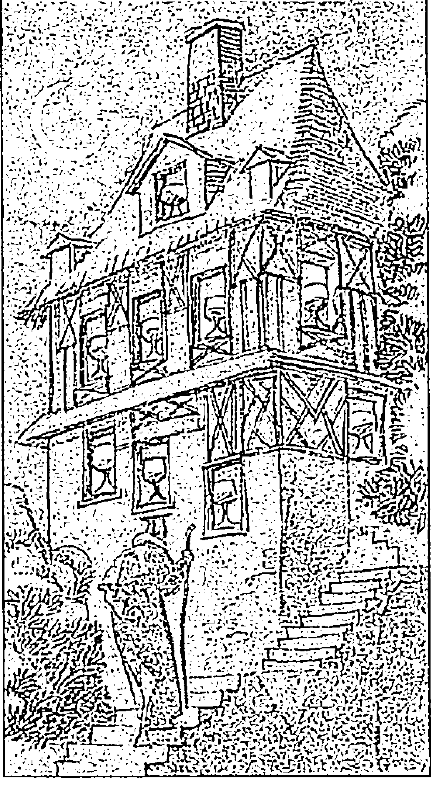

圣杯九意味着经历了悲伤和失落后心灵的平复。
牌中的老人平静地走向一幢房子，透出温暖灯光的房子象征着他的内心，窗口的杯子正是他内心中关于快乐的记忆。人在情感低落的时候往往会想到一些深藏于心底的东西。不管怎样，心灵家园依然灯火通明。
当你经历了一种失落，悲伤就是一种自然的过程。有一段时间，你对生命的感觉改变了，它被你内在的感觉或经历扭曲了。在你接受这份失落后，你就会有能力去辨认那些留下的部分。
圣杯九中的黑衣人使人联想到隐士牌，这隐士正在学习如何独处却不孤独，并从内心深处寻找出过去种种行为的因果关系。
圣杯九表示负起感情上的责任，虽然朋友们会在你悲伤的时候支持你，但你常常会切断与他们的联系，你只想从你的内心寻找支持。这么做会使你失去某些客观性，不过当失落或悲伤平息后，你又会慢慢地去注意他人了。

#### 正位的含义

遗憾、空虚、归来、心灵家园。

#### 反位的含义

远离他人的帮助、心灰意懒、孤单。

### 圣杯十

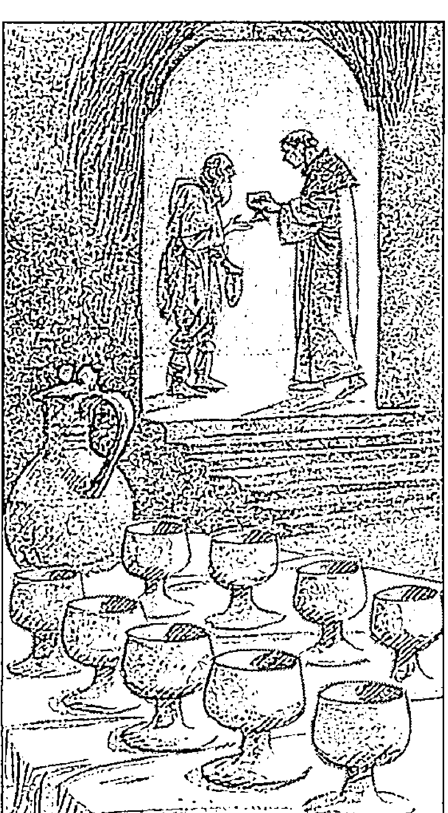

圣杯十代表保障和安全。
圣杯十是一张表示内心的富有和分享的牌。它展现这整组牌的可能性，在圣杯牌组中我们发现喜悦、思索和满足。
这张牌描绘一种施与受的情景，年轻的修道士将手中酒杯递给老年乞丐，桌子上摆放着酒壶和许多相同的杯子，代表着修道士的帮助是平等和公正的。保障和安全倍受珍惜，不过这是以极高的代价换来的。这张牌描述一种依赖关系，其中一人会去教导或保护另一人。在面面俱到的照顾中，却难免出现停滞不前、无法发展的危机。
这张牌提醒我们，他人的帮助固然是十分重要的，但只有自我内心富有才是永不枯竭的精神之源。

#### 正位的含义

慷慨、幸福、安心、解除、救助、恢复健康、承认。

#### 反位的含义

依赖、安于现状。

## 圣杯牌组

### 圣杯侍从

圣杯侍从意味情感上的成长。圣杯侍从代表着水元素当中风的成分：他透过思考、梦想或冥想等方式来接近情感。手持长剑的年轻侍从好奇地注视着他看守的圣杯，暗示着已经非常接近你的一段两性关系或伙伴关系，也可以指别人提供你的一次机会。塔罗牌中的侍从都和学习有关，而且由于圣杯牌组涉及情感和直觉，所以这张牌有可能意味着透过冥想，或其他任何类似的被动方式进行心灵上的学习或发展。圣杯侍从形容一个二十二岁以下，有着安静温柔性情、喜欢沉思胜过行动的人。如果是在形容一个孩子，那么所意味的便是一个喜欢思考，而有创造力的人。

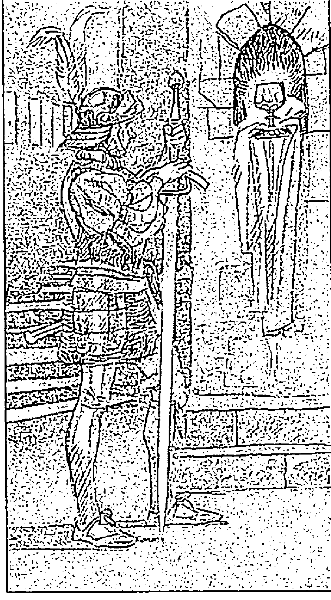

#### 正位的含义

守夜、新奇、妒忌、过度依恋、爱的信使。

#### 反位的含义

出轨、分心、诱惑。

## 塔罗时刻

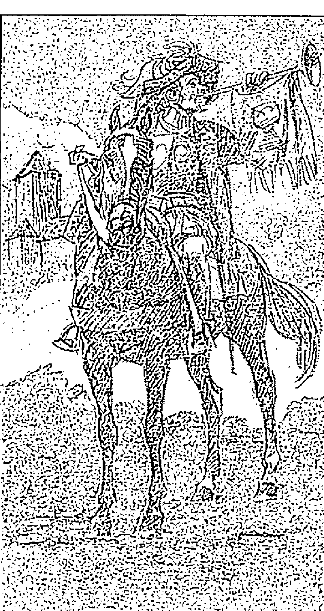

### 圣杯骑士

圣杯骑士意味在感情上的行动。圣杯骑士在发展的过程中，学着融合水和火的元素。将想象力引导到真实的挑战上。它是指跟随灵感而来的行动，或由行动导引出的灵感。这位骑士吹响了嘹亮的军号似乎要向人们宣布什么重要的消息，这正是他决定开始下一步行动的前奏。当这张牌形容一个人时，那么他的年龄应在二十一到三十岁之间，具有热情和感性。这位骑士通常表面相当热情，内心却是温和而敏感。各种人际关系、情感及创造力的追求都吸引着他，在做决定时通常会将伴侣的需求列入考虑。

#### 正位的含义

宣告、放松、假期、增进情感的行动、深思熟虑的人。

#### 反位的含义

坏消息、优柔寡断、停滞不前。

## 圣杯牌组

### 圣杯王后

圣杯王后意味凭借直觉而成功。圣杯王后代表所有水元素的特质，是水元素当中属于水的成分。她展现了融合直觉、想象、创意和行动的可能性。她的基本特质是情感和想象力丰富，然而却有足够的成熟度，可从她的灵感中产生具体结果。正因为本性消极，她常常更乐于相信梦的预测。

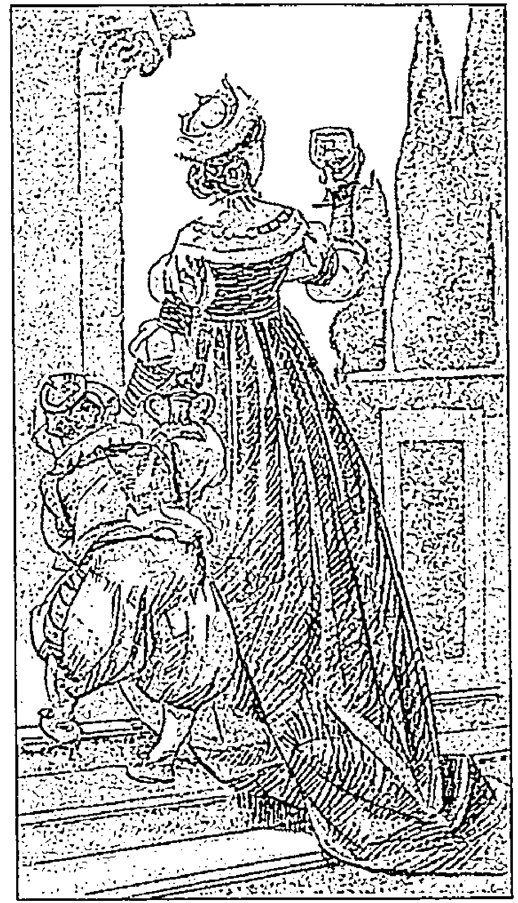

她从经验得知杂乱无章的想象所产生的结果通常是有限的，因此她可以将精力用在对身体、情感、精神及心灵上都相当有价值的行动上。创造上的成就是她最大的成就。虽然她可能显得温柔又细心，但却总有种坚强的意志。爱调和她的意志，并增加个性上的深度。她带着爱心和怜悯行事，而且常常表现出浓浓的家庭感情。

#### 正位的含义

女性朋友、妻子或忠心的未婚妻、倾听、有梦想的女性、准确的直觉。

#### 反位的含义

感情淡漠的女伴、个性消极、过于自我的。

### 圣杯国王

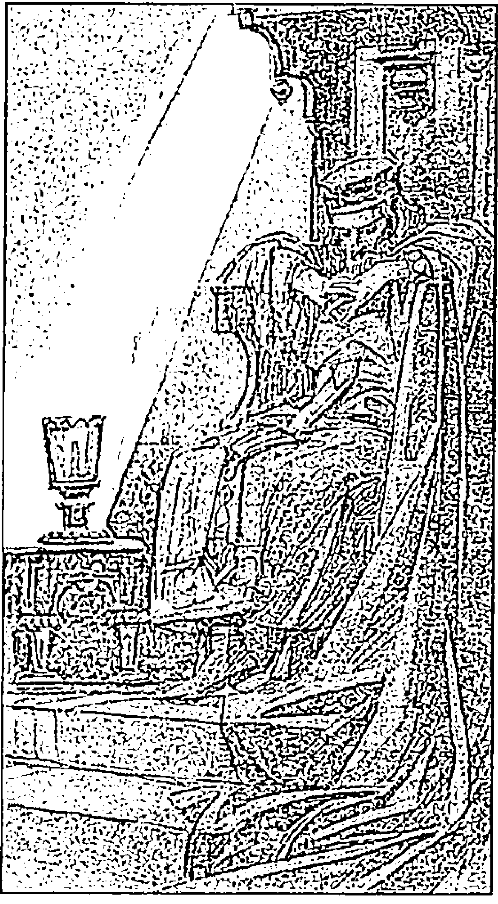

圣杯国王暗示透过创造和情感上的训练而成功。圣杯国王代表着水元素当中土的成分。这位国王的成功是想象力、训练及执著的结合。自律使他能不断成功。圣杯国王可能是任何星座的象征，但通常会拥有水相星座的特质。强壮、敏锐，能够展现出巨大的个人力量。他对任何需要创造力的领域都很在行，比如写作、绘画、表演、建筑、音乐，圣杯国王也适合从事心理学、考古学及哲学或宗教信仰的研究。在现实的事业中，他可能成绩中等，但他的心将会一直处于创意的追寻。圣杯国王和死亡牌一同出现时，可能代表天蝎座。否则，就可能是巨蟹、双鱼或狮子座。

#### 正位的含义

顺利的、宽大、休息、保守秘密、有创造力的人、艺术家。

#### 反位的含义

不诚实、不公正、狡猾。

## 权杖牌组

权杖牌组代表着火元素。自然界中，火一面寻求着燃料，一面不断地扩张。火，象征着能量、狂热、行动、生命力与喜欢接受挑战。旅行和追求目标，也与火的特性有所关联。它代表乐观、自信和希望。火在启发人们以渴望与行动去体验自己的生命。火象星座：牡羊座、狮子座及射手座。

## 塔罗时刻

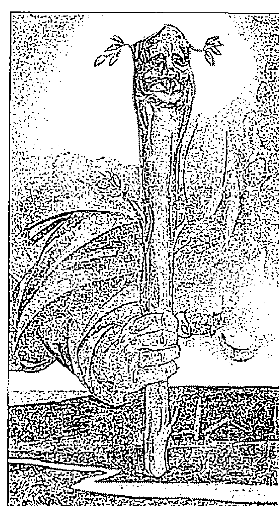

### 权杖一

权杖一象征着开始一项方案或旅行。这张牌象征一项计划强而有力的开始，代表着着手新计划的渴望、力量与勇气。这张牌指出已开始的行动，而且一定会产生具体的结果。权杖一出现在采取行动的时候，它不是代表任何的计划与决定，而是开始新事情的具体行为。从云里伸出的手握住了有生命权杖，背景里延伸的路表示通往目的地的途径。权杖这种活的形式，反映权杖类型面对各种日常事物的活力与热情。权杖类型在目标与挑战上成长，并以其狂热追求潜在的胜利。寻找值得追求的目标，会产生一种目的感。纸牌上，发亮的天空显示这一时刻，你的目的即将变得清晰。权杖一并非要你去思考或感觉，而是去做。它可以表示一段具有力量、权力以及充沛的性与肉体的时间。它是一张代表旅行与移动的牌，也常常表示一种对生活的热爱。当权杖一出现时很少有限制。

#### 正位的含义

发明、创造、开始一个困难的计划、旅行、新生、展开令人兴奋的经验。

#### 反位的含义

错误的开端、前途茫茫、停滞不前、空虚。

## 权杖牌组

### 权杖二

权杖二在暗示着缺乏和谐或者内在的冲突。牌中两个赤膊上身的男人以木棍格斗，他们势均力敌，两个人都相信自己是正确的，而不听从对方的意见。在这样争斗中是没有胜利者的，这张牌出现时，通常在提醒人们沟通的重要，合作才是达成目标的捷径。权杖类型的人总把生活看成战争，因为如果没有障碍，就没有冒险。他们往往喜欢体育与竞赛活动。权杖二表示你可能会卷入不必要的较量比赛，这会延误或干扰你到达目的。另一方面，目标的远离或难以达成对权杖类型的人来说，往往更具吸引力。

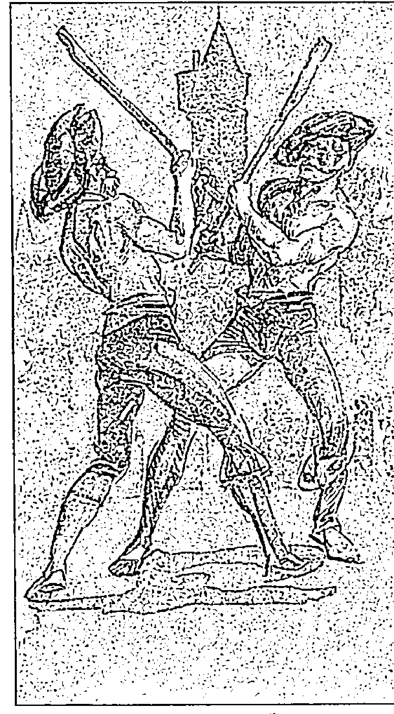

#### 正位的含义

训练、增强争斗对抗的力量、主动、竞争。

#### 反位的含义

矛盾、复杂、令人疲惫的人际斗争。

### 权杖三

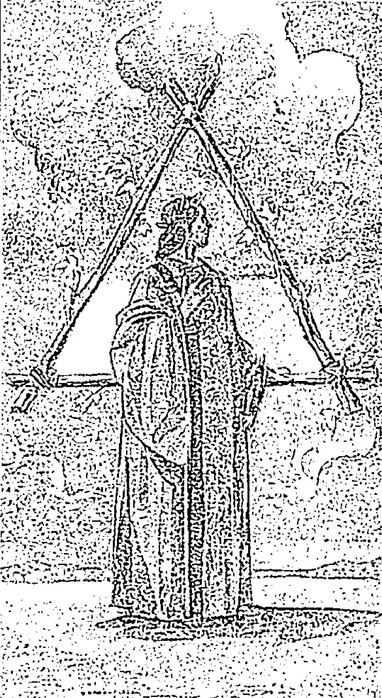

权杖三通常指发自内心的动力。这张牌中站立着一位头戴叶冠身穿红袍的年轻学者，在他的身后，三根木棍被绑在一起形成一个坚实的三角形，虽然它们并没有被植入土地，却似乎是有生命的，木棍上已经长出了新的树叶，这令图中充满了心灵和生命的灵性。权杖三可以代表当你寻求自我内在意义的过程中，仍可保持沉静和稳定；表示你一面在重视自身内在的成长，一面在维持一种平衡的状态。在这个过程中，耐性是十分重要的，因为在我们所处的环境中已经有足够的动力来促成改变和成长，我们所需要的只是一点对于成长的渴望。

#### 正位的含义

灵感、集合想法并实现它们、实用的知识、发自心底的原动力。

#### 反位的含义

环境的影响、心灵上的耗损。

### 权杖四

权杖四意味着一个决定。这张牌中一个人正困惑地看着海滩上由四根木棍组成的指示标，显然路标所指示的方向与他先前的估计并不相同，他不知道是否该跟随路标的指示或者是相信自己的判断，只好在两个选择间犹豫不决。权杖四暗示不满意当前环境，需要决定未来行动方向的时机。有时候，因为成长你的世界似乎对你已不再有意义，虽然目前的你处于停滞的状态，但内心却存在着移动、改变或旅行的欲望。你目前所拥有的实际是不够的，你将决定下一步要怎么做。权杖四提醒你要相信自己，并且使用个人的能力去实现你的目标。权杖四还是一张代表跨海旅行的牌，海洋代表着遥远和未知的地方，而这正是火性特质的人所渴望的，他们并不在乎路途的遥远，因为他们喜欢在行动中体验自己的生命。

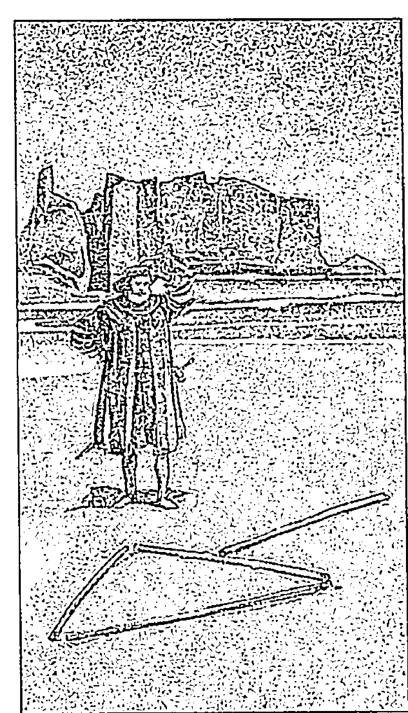

#### 正位的含义

发明、实践、未知的地方、迷惑、影响未来的决定。

#### 反位的含义

困扰、奇怪的事件。

### 权杖五

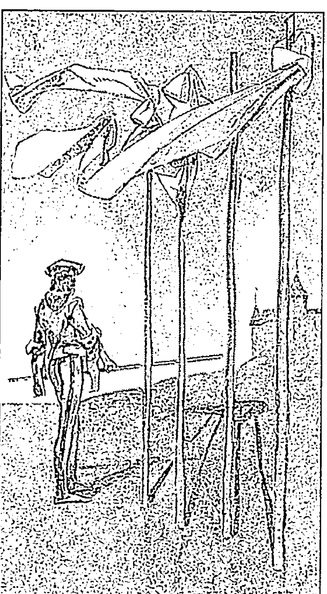

权杖五暗示着重要的消息。纸牌上一个手握长杆的人背向我们站立着，我们可以感受到他对于远方城堡的渴望，他的身旁已经树立起了四根长杆，长杆顶部的黄色布带被风扬起，似乎正在向远方的城堡传递着某种信息，并等待着回应。这张牌代表着沟通。通常在应对重大的变故时，个人的力量是极为有限的，只有依靠众人的智慧和力量才能做出最明智和正确的反应。就像图中的这个人以最快的方式将消息传达给了城堡中的众人，给最终的判断留出了充分的时间，他接下来要做的只是等待着来自城堡的下一步命令。因此，权杖五还代表着尽职和独立完成重要的任务。

#### 正位的含义

传达消息、尽职、克服障碍、充分准备、努力的成果。

#### 反位的含义

失去消息、缺乏支援。

## 权杖牌组

### 权杖六

权杖六暗示着相信自身的力量。纸牌中描绘了一个看似不可能的情景，一个身穿红衣的人正吹奏着一支竖笛，似乎是因为竖笛乐曲的魔力，他周围插在土地中的六根木棒已经长出了嫩芽。实际上这个人并没有魔法，他只是相信自己精心的培养一定会有回报。在我们对自己及生命的可能性有了真正的信仰时，去完成我们想要做的事情所需要的能量几乎总会得到补充。对看似没有生命的木棒不放弃反而付出更多的耐心是常人难以做到的，这张牌在提醒人们如果你相信你能做到就没有绝对的不可能。权杖六表示你要相信自己，并且使用个人的能力去实现、完成你的目标。

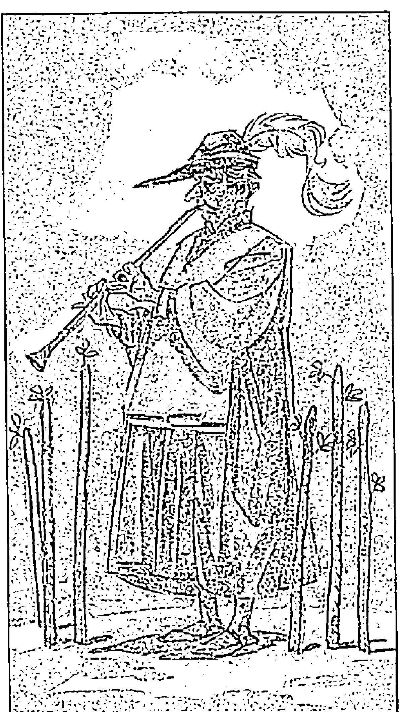

#### 正位的含义

一贯性、教育、培养、回报。

#### 反位的含义

劳累、放任自流。

## 塔罗时刻

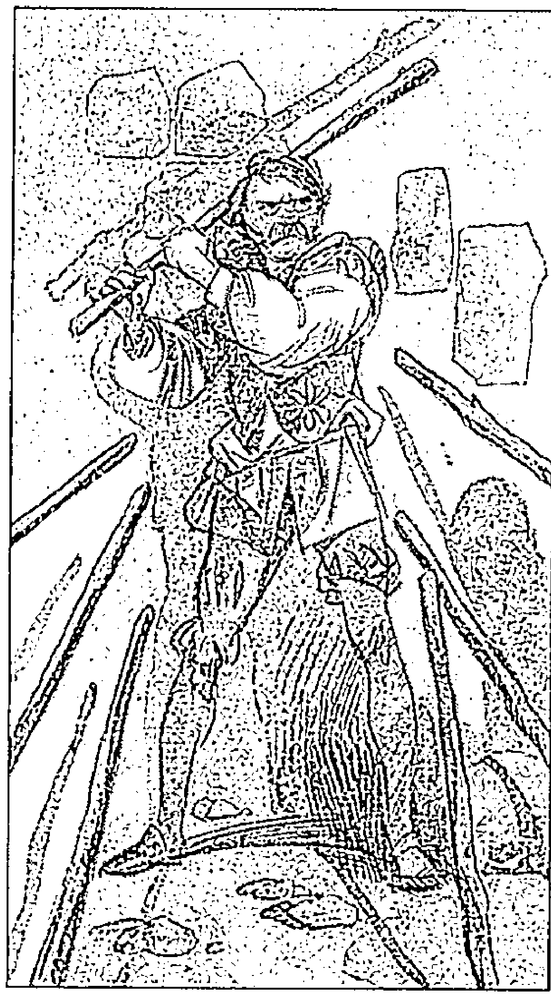

### 权杖七

权杖七暗示通过坚持而获得成功。这是一张代表冲突的牌，所有看见的活动的目的本身可能就是战争，因为在纸牌上的人，带有一种激情和坚决的神情。以一个人的力量对抗众人虽然很艰难，但他似乎丝毫没有放弃的打算，而且他也许喜欢这样的挑战。权杖类型喜欢搏斗，而且倾其所有，这会令那些火性的人感到振奋。这种斗争让权杖类型的人觉得自己有意义地活着。权杖七可能暗示你周围的人反对你的想法或计划，但你继续努力、不放弃就一定会成功。塔罗牌中所有的七都有“不要放弃”的意思。虽然挑战比以前更大，权杖七表示你会更投入眼前的工作。

#### 正位的含义

勇气、反对、在逆境中的力量、面对逆境不放弃、逆境将结束。

#### 反位的含义

冲突、焦虑、困窘。

## 权杖牌组

### 权杖八

权杖八意味着保守秘密。在牌中，一个手持木棍的红袍人在深夜守卫着一个通道，从衣着来看这个人并不是士兵，而且似乎并不想别人知道自己的真实身份，他只是在坚守自己的信念，完成自己的责任。相对于权杖七，权杖八所指的是一种更难的坚持，在权杖八中并没有的特定的对手，也没有激烈的对抗，红袍人要做的是阻止任何企图通过的人。这张牌的意义还在于任何阻隔都是暂时的。人有着好奇的本性，有时正是因为有了阻拦才激发了人们想要冲破它们的愿望，虽然通道两边的世界也许根本没有什么不同。

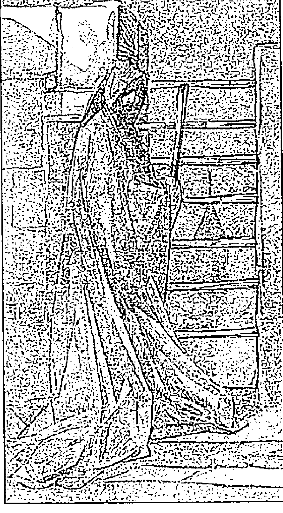

#### 正位的含义

守夜、在别人沉睡时觉醒、匿名的。

#### 反位的含义

缺乏防范、睡眠不足。

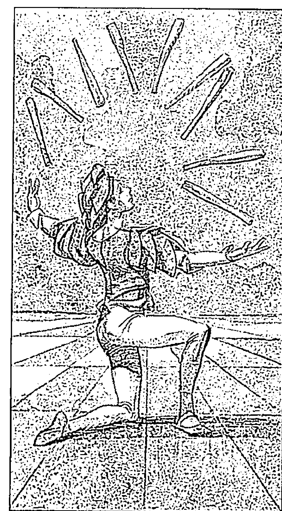

### 权杖九

权杖九意味一段顺利的进程。这张牌描绘以蓝天为背景的舞台上一个年轻的杂耍艺人正在表演抛掷短棒，他的技艺相当纯熟，九支木棒在他手中上下飞舞，这些木棒象征自由流动的火的能量，火代表着对生命的热情与挚爱。这是一张代表恋爱或旅行的牌。权杖九出现时，表示你可以清楚地看见目标，而且正准确地向它迈进。它代表健康的人际关系、顺利的旅程和令人满意的结局。你的计划碰到的阻碍是微小的，既定的目标无需太多的努力也能达成。权杖九显示着火呈现的自由状态，一种没有限制、不断运动着的的状态。

#### 正位的含义

运动、在重要的时刻不失去重心、敏捷的活力、进展。

#### 反位的含义

争论、满是阻碍的行程。

## 权杖牌组

### 权杖十

权杖十暗示着自我反省。牌中描绘一个场景，十根木棍正从天而降砸向一个人，这个人正尽力的向前跑想躲开这场劫难，但看上去他能保证自己丝毫无损的可能性已经很小了。这似乎是场人为的灾难，虽然这样的打击并没有性命的危险，但也会给你带来不小的伤害。有人想给你个难忘的教训，也许你在与他的上次冲突中占了上风，对手却一直暗自寻找着报复你的机会。很多时候，面对问题的方式会限制人们处理事情的能力。有的人会不断陷于冲突中，却并不知道冲突正是出自本身。这张牌暗示你生活在一种冲突的模式中。你可能会将自己不受欢迎、不被接受的部分强加于别人身上。如此做，你将会有一个很具体的敌对来源，而不只是一种想法、一种恐惧或一种感觉。然而，如果你继续寻求冲突，你将无法与问题的根本原因达成和解。

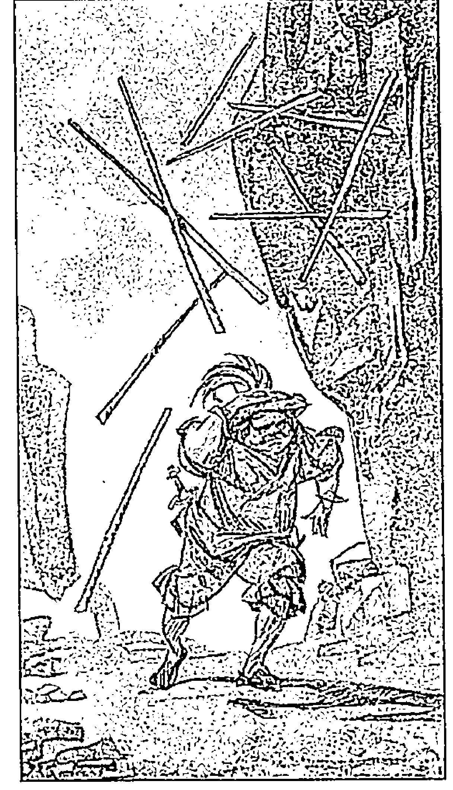

#### 正位的含义

矛盾、痛苦、灾害、障碍、自己招至的麻烦。

#### 反位的含义

糟糕的预感、有惊无险。

### 权杖侍从

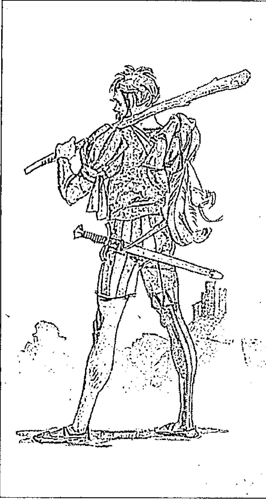

权杖侍从象征一项新方案或挑战的消息或开始。权杖侍从意味一个崭新的人生局面的开始。它通常是由身体上的行动来开始做某件事情。塔罗牌中的侍从可形容孩子或任何二十二岁以下的人。牌阵中出现的侍从可能是象征透过信件或各种媒介带来新的消息。然而它通常是形容一项新计划或人生新方向的开始。侍从代表牌组中风的成分，权杖牌代表着火，权杖侍从就象征火元素中风的成分。就一般观点来看，这意味理念和行动结合而展开新方案或迎接新挑战，或者换句话说，对你打算做的事进行计划。它代表思想先于行动，一个理念或计划正在形成。这张牌表示你正在梦想或思考你将会达到的目标，及置于面前的挑战。也可以形容展开一项方案的行动，因为权杖类型的人不喜欢怠惰。如果这张牌代表一个小孩，他通常是情绪高昂、精力充沛、积极而且喜欢吵闹的。

#### 正位的含义

专心致志、可信任的朋友、新的灵感及合作关系、带来重要消息的人、新的挑战。

#### 反位的含义

傲慢、小阻碍、思考太多而行动不足、优柔寡断。

### 权杖骑士

权杖骑士意味旅行或改变。权杖骑士所代表着火元素中火的成分。这张牌可以象征行动、旅行、改变以及为了自身缘故的活动。它给人一种活力、热情及运动的印象。权杖骑士和「节制」一样是对应于射手座，许多射手座的特质都表现在这张牌上，包括需要挑战、爱好旅游和学习，并有教学的能力。在事业的分析上，这两张牌都暗示以教书为业，或是研究和学习。权杖骑士正在思考未来的行动，他正全神贯注于对向往目标的积极追求。这张牌经常代表一种态度——完成某件事的唯一方法就是自己动手做。权杖骑士可以代表二十一到三十之间的人，或年龄更大却不够成熟的人，这人还不具有权杖国王所拥有的理解力。他还不了解，旅程只是火的主要课题，而不是目标。这个课题通常要一直到许多的目标已经达成，而渴望依然存在时才会被了解。

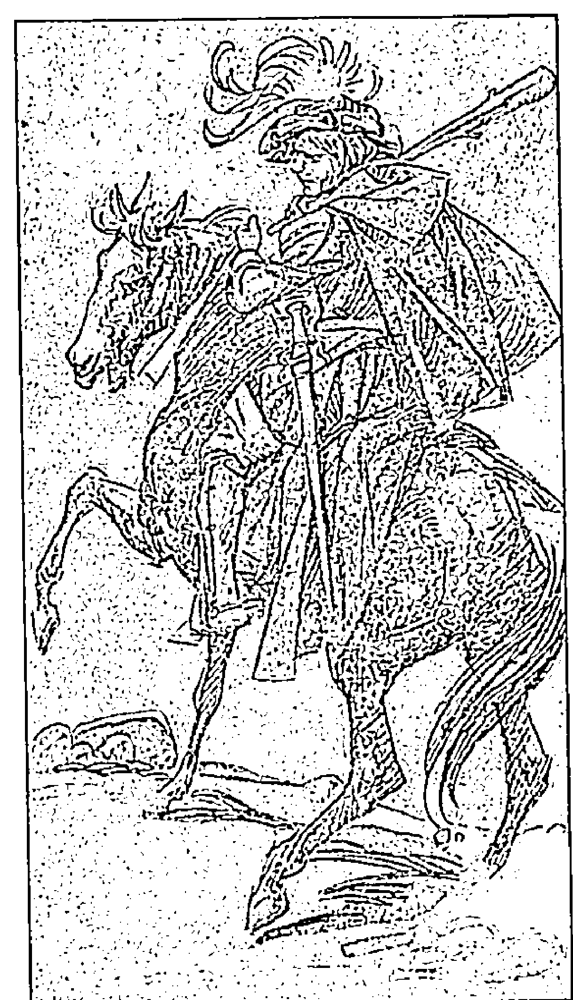

#### 正位的含义

进入新领域的愿望、有进取心但暴躁的男性、出发、迁居、分离、过度主动。

#### 反位的含义

不调和、猝然改变、中断关系。

### 权杖王后

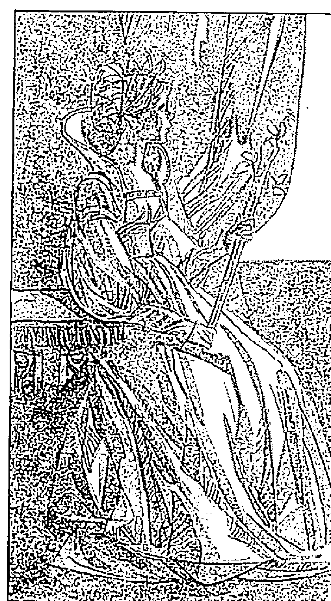

权杖王后代表着透过内在力量而达到成功。权杖王后代表火元素中水的成分。也就是说，她以水的方法得到火的教训，水透过感情、情绪及直觉渗透到我们的生活中。火性的人会积极地寻找目标，而水性的人则是通过欲望、耐心和深思熟虑来拉向他们。这种水和火的组合，使王后先在内心产生愿望，再借此去实现它。火性的生活态度很明显地表现在她的姿势和淡定的凝视中。权杖王后是一位二十二岁以上的女性，有着热情和友善的天性，她喜欢自己独立的性格，也会鼓励周遭的人这样做。她乐于行动和组织，而且可能会忽略有时候别人并没有请她帮忙。权杖王后与「力量」都象征狮子座，代表既坚强又直率的个性。这个王后是依她的感觉行事，并运用她内在的力量达成她的目标。她是一个积极又自信的人，有很强的销售能力和充沛的热情。她喜欢行动胜过思考。

#### 正位的含义

与可信任的成熟女性的友谊、独立、富同情心、善体谅、能真诚表达爱。

#### 反位的含义

忌妒、被忽视、缺乏回应的。

## 权杖牌组

### 权杖国王

权杖国王暗示经由自律而成功。权杖国王描绘一个强壮的人，能够通过他的意志力来领导及统御别人。他对自己有坚定的信念，因为他的信心是建立在自身的经验上。他知道自己的方法有效，因为他尝试过也试验过这种方法。他为人诚实、积极而坦率，而且经常愿意接受新挑战。他认为过程比结果还重要，而且拒绝任何拖泥带水的挑战。权杖国王代表火元素中土的成分。土性的人喜欢务实、可确知的事物，而且一旦投入时间和努力就会要求具体成果。这并非暗示他是个很有耐心的人，他只是比过去的骑士时代更懂得自律罢了。权杖国王通常是指超过三十岁的男人，热情、有活力并且直言不讳。不过如果代表牡羊座的人则例外，有可能是小于三十岁，或指女人。

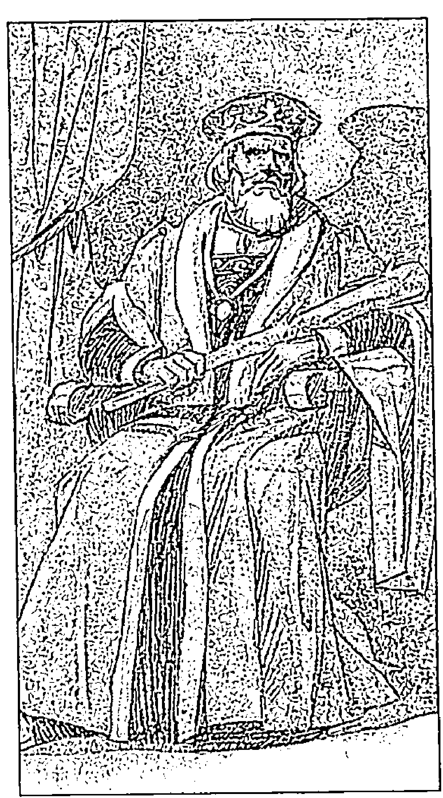

#### 正位的含义

与成熟的男性有良好的关系、严格、经验、自律、诚信可靠、有责任感的人。

#### 反位的含义

过分俭朴、思想极端、独断专行。

## 五芒星牌组

五芒星牌组代表着土元素。土代表着真实的、物质的东西，或是一种肉体的形式。五芒星中的图案象征控制身体热情的心智。土，象征热爱自然，崇尚实际。它代表着健康、活泼及脚踏实地。土象星座：金牛座、处女座及魔羯座。

## 五芒星牌组

### 五芒星一

五芒星一暗示你有足够的钱去执行你的计划。这张牌代表一个开始。它可能是一个崭新的开始，或是某种状态中一个新局面的开端。这张牌中，蓝天白云映衬着一枚巨大的金币，在它之下有一个被木栅栏围起的农庄，路穿过草地通向远处的山坡。这农庄象征五芒星牌组与自然的连接。五芒星一代表务实的作风，它也暗示你所投资的金钱、时间或精力可能会带来极大的回馈。而背景中晴朗的天空则暗示此时此刻你足以掌握住你的财富。

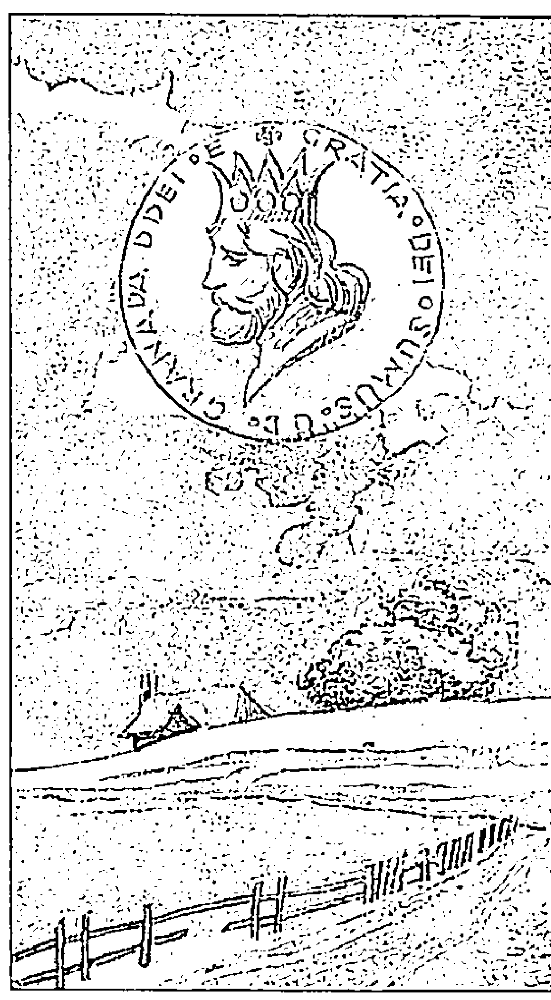

#### 正位的含义

令万物生长的大地、大型商业活动的成功、幸福、收入、经商的天分。

#### 反位的含义

不快乐的成功、金钱的虚掷。

### 五芒星二

五芒星二意味着注意隐藏在日常生活中的机会。
五芒星二代表的是可能的改变。人生当中唯一可以确定的就是所有的事情都会改变。改变是好或坏，对或错，都依赖你的观点。牌中一个辛勤劳作的小贩只顾低头运送货物，而没有注意他身后那面石墙上的金币，金币代表着物质上的意外收获，但这个人并没有看见它们而丧失了一个改变的机会。实际上，他错过机会的根本原因就是精神上的空虚。日常琐碎的工作会让人感觉疲惫和麻木，当你的精神无比空虚时，在某种程度上你会与周围的一切变得生疏。
这张牌还代表着孤立。它是一种对分离或孤独状态的认知，有时当你处于一群心灵无法相通的人之间时，可能会比你独处的时候更加感到孤独。
外在的疏离是内在孤独的反映，所以当五芒星五出现，你要接受生命提供给你的改变机会。如果你想改变这个世界请先改变你自己。

#### 正位的含义

拮据、忽略、节俭、疏离、失误。

#### 反位的含义

扭转劣势、新的目标。

## 五芒星牌组

### 五芒星三

五芒星三暗示着在金钱和兴趣间寻找平衡。

牌中一个杂耍小丑正在进行表演，他耍弄着的金币代表金钱、体力和才华，三枚金币在他手中不断变换着位置，暗示钱是一种能量形式，会不断地运转着。为了保持平衡，小丑的脚不停地移动，这也说明他为了金币的运转而付出了相当的体力。请注意，小丑的目光并没有停在在手中的金币上，而是被某种更令他感兴趣的事物所吸引。

这张牌暗示你应在必须做以及你所想做的事之间找到一个平衡点，这可能是事业与个人兴趣之间的选择。五芒星三描述权衡各种机会的轻重，当你没有办法现在就做决定，那么再等一会儿会不会更好呢？

#### 正位的含义

玩耍、小礼物、手艺及商业方面的能力。

#### 反位的含义

恶作剧、过于轻率。

### 五芒星四

五芒星四意味着认真评估那些即将得到的财富。

牌的构图处于一种和谐的对称中，天空相当晴朗，岸边的树丛中站着两个人，两枚金币悬浮在天空中，而这些都倒映在水中，水面把整个场景分成真实的世界和水中的倒影两部分，分别象征着真实的财富和虚幻的利益。现实生活中，人们时常会被虚幻的利益所驱动，出于种种目的，有的人会对我们许下某些难以实现的报偿，这张牌的课题正是认清真实与虚假的区别。

五芒星四意味占星学上的金牛座，尤其是和主教或五芒星国王一起出现时。金牛座的人生课题是：认清在人与财富的关系中，人真正的价值是什么。

#### 正位的含义

反省、反映、思考自己拥有的、不确定。

#### 反位的含义

错误的预期、虚假的利益。

## 五芒星牌组

### 五芒星五

五芒星五暗示对某项生意的持续投资。这张牌描绘了许多金币源源不断地飞向一座城镇，繁茂的植物暗示着城镇经济的兴旺，晴朗的天空预示着城镇有良好的前景。这座城镇象征一项值得投资的生意。这张牌的意义是持续的投资将会带来良好的回报。

作为一个成功的商人，只有良好的眼光和投资项目是不够的，一项生意是否能得到满意的回报也取决于是否有足够的财力上的支持，任何半途而废的投入都将是缺乏效益的。只有拥有足够的自信和魄力将一项投资进行到底，再加上对资源的合理配置，才有可能达到最后的成功。

#### 正位的含义

持续投入、支配、适当的配置、金钱上的支持。

#### 反位的含义

缺乏野心、发展缓慢。

### 五芒星六

五芒星六意味着经济能力上的巩固。这张牌中一个衣着华丽的商人正欣赏着手中的六枚金币，与五芒星三的杂耍小丑不同，这位商人全神贯注于在手中的金币上，单纯的财富积累便能给他带来满足与快乐。但是，人生的目的不应该只是对财富的追求，如何用手中的财富给自己和周围人带来快乐才是最需要认真考虑的事情。五芒星六代表着财务上的巩固，金钱可以带来安定感，但这种安定感往往容易使人忽略对生活中的其它乐趣的追求。

就做生意的角度来看，这是一种有利的状态。它可能暗示着财务大体上稳定。在协调谈判的情况中，六暗示你对于新意见或改变的接受度不高。

#### 正位的含义

经济能力、累积财富、追求安定。

#### 反位的含义

失去拥有的财富、守财奴。

### 五芒星七

五芒星七意味着离开一个不适合你的环境。

这张牌中天上阴云密布，一个女人正从她所在的农庄逃离，她的身后的半空中紧紧跟随着七枚金币，这个女人似乎正在逃避这些金钱带来的麻烦。金钱是种带来幸福的手段，但并不是幸福本身，在很多时候，金钱甚至是冲突和矛盾的根源。一个能为你带来高薪但却让你不快乐的工作绝算不上是一份好工作。

当五芒星七出现时，你应该明白工作不应该是沉闷无味的，而是一种自我完善的机会。工作不仅只是为了填满你的时间、胃或口袋，更重要的是让你的人生完整。

它还暗示如果你并不喜欢目前的工作，那么就离开，去找你所喜欢的工作。最适合你的工作将是一种爱的劳动。

#### 正位的含义

逃离、辞职、令人难堪的消息、金钱带来的困扰。

#### 反位的含义

稳定的工作、安于现状。

## 塔罗时刻

### 五芒星八

五芒星八暗示透过研究、学习或将构想付诸实现而改善自身的境遇。
这张牌中一位观星学者在一条金币铺成的小径上踱步沉思，他背在身后的双手握着一支望远镜，代表着知识让他能够看到比常人更远的地方。他丝毫没有注意脚下的金币，对于他，只有新的知识才是真正有价值的东西。
这张牌代表扎根于稳固的基础上，建立某些具有持久价值的东西。它告诫我们应明白精神的价值，要与其他人分享这些价值，遵循我们的信念来生活，而不要执迷于那些遥不可及的理想。对于自身发展而言这是张正面的牌，意示着稳定持久的向目标迈进。

#### 正位的含义

理解、领悟、不做金钱的奴隶、名人、有力量的人的支持。

#### 反位的含义

平庸之才、金钱上的困境。

### 五芒星九

五芒星九意味着思考未来的财务或物质状况。

这张牌中一个年青人站在一棵长满金币的大树下，他抱着双臂似乎在考虑着该如何处理这棵树。他是以金钱的角度来看这棵树的，他可以采收一枚金币以满足他的需要，并且继续照顾其它金币的生长以孕育更多果实。

这张牌代表一个选择的十字路口。在这里看不到伟大的梦想或急切的决定，因为平稳务实的努力已经可以确保一个很好的结果。它还象征一段两性关系或一桩生意已经够稳定，不再需要继续不懈的努力了。现在你已机会退后一步，以较宽广的角度来看整个事情的状况了。

#### 正位的含义

安全、不需要担心贫困、眼力、成长、稳定的收益。

#### 反位的含义

焦虑、急躁、损失金钱、不良的投资。

## 塔罗时刻

### 五芒星十

五芒星十提示自信可以带来成功。
牌中一个女人乘着风在空中飞翔，她注视着散落在她周围的金币，脸上丝毫没有害怕或不安的表情。这个女人的服饰暗示她生活的优裕，而晴朗的天则是预示着持续的成功，她自在地置身于自然中。这是一张融合了风元素和土元素的纸牌，表现了智力与物质财富间的关系。
从王牌的开始，到二的机遇，三的均衡，四的判断，五的投入，六的巩固，七的逃离，以及探求精神的八和规划未来的九，现在我们到达了十。
成功并非偶然，通过承诺、劳动、纪律、学习以及重新评估，你已经稳固地建立起某种具体的事物，并且也为将来打下良好的根基，投入生活并与它密不可分。经由谨慎的规划及对目标的不断投入，你将会掌握周遭的一切。

#### 正位的含义

幸福、成就、收入、追逐物质的梦、激动。

#### 反位的含义

不安稳的状态、失去。

## 五芒星牌组

### 五芒星侍从

五芒星侍从意味努力学习。
吹奏短笛的五芒星侍从正走在远离城镇的路上。他代表的是土元素中风的成分，所以思考及计划和金钱、物质财富有关的事情是恰当的。五芒星侍从的梦想比宝剑侍从更务实，比权杖侍从更谨慎，也没有圣杯侍从那么理想化。这张牌是形容一个为人务实而稳健并且喜爱大自然、户外活动和动物的人。他们通常少年老成。这张牌还说明需要认真的执行，以成功地展开一项新方案、或某个阶段。
明亮天空中的金币暗示充满希望的前途，以及由于谨慎计划带来的成功。这张牌通常表示以学习来作为准备的一种形式。
这张牌也可能指年纪较大的人，如果他们正开始做某些新事物或某些他们所不熟悉的事物的话。当开始一项工作或计划时，这张牌代表获得新技能。

#### 正位的含义

应用、学习、循序渐进、由小孩子带来的讯息、事业的开端。

#### 反位的含义

难于面对现实、非分的思想、虚度青春。

## 塔罗时刻

### 五芒星骑士

稳健而认真是五芒星骑士的标志。
五芒星骑士是所有骑士牌中最严肃也最安静的。他想要很明确地知道所投资的时间、努力、体力及将会得到怎样的回报。他喜欢做计划并沉醉其中，而且会毫无倦意地朝目标努力。

五芒星骑士形容一个二十一岁到三十岁之间的人，他经常在感情上显得不成熟，因为他的野心可能会妨碍他的感情。五芒星骑士代表土元素中火的成分——投入实际用途的热情、努力和精力。当其他骑士跑去嬉戏、恋爱、旅行及探险时，五芒星骑士则在工作、学习及组织未来。这个年轻人知道他将会在物质上获得成功，而他想选择的伴侣是可以和他未来的事业伙伴相处愉快的人。他视爱情为一项长期投资。

虽然他很早就已开始计划，但在计划成形之前，他还是会保持沉默。通常他是个负责任、勤奋工作以及独立的人。他比较喜欢拥有自己的事业，因为他不喜欢由别人来指点他该做什么。他总是设法掌控他的生活和自己，常为此工作过头。

它是一张可以代表魔羯座的牌，这与「魔鬼」牌相类似。

#### 正位的含义

认真、有用的、适当的时机、有计划、可以洞悉事情始末的人。

#### 反位的含义

停滞、粗心、寡断、茫然。

## 五芒星牌组

### 五芒星王后

五芒星王后意味着良好的生意眼光。
五芒星王后安静地坐在座椅上，耐心地沉思着她的人生。五芒星王后代表土元素中水的成分。水和土的组合可显现于她有能力静下来，很好地感受内在的成功。她以自己的身体为荣，并细心地照顾它。
土型的人一般而言很会照顾自己的生活和健康。他们会注意节食和运动，经常接触大自然，并喜欢参加社交活动。
五芒星王后可星术中的天秤座，特别是当她出现在女皇或正义牌的旁边时，她同样也可以代表任何土象星座，金牛座、处女座和魔羯座。
她的稳定而具耐心的特质，以及喜欢规律的生活，使一切井井有条。她清楚自己的能力和限制，她以一种务实的方式把个性的力量和情感的理解结合起来。她很乐于烹调和品尝美味的食物，而作为一个伴侣，她喜欢抚摸对方，以及被对方抚触。

#### 正位的含义

严格却又宽容的女性、经济上的安全、自由、预知的能力。

#### 反位的含义

怀疑、虚无的成功、疏忽职责。

## 塔罗时刻

### 五芒星国王

五芒星国王形容金钱带给人的迷惑。
五芒星国王象征着土元素中土的成分，代表根基稳固、为人务实、活跃、固执、防御性强，又勤奋工作。当他工作时，恐怕你很难想象他会有休息的时刻，然而当他在休息的时候，你同样很难想象他会跑去工作。

这位国王的成功的生意人或专业人士，他站在王座一侧，而骄傲地坐在王位当中的却是一枚金币，表情无奈的国王把象征王权的皇冠戴在了金币头上。对于人生他还不够满意，因为他能够感觉到、触摸到成功，而在对成功的追求中他却迷失了自己。

当这张牌出现在主教或五芒星四的旁边时，可以代表占星学中的金牛座；当他出现在恋人旁边时则代表双子座。

这张牌代表的是一个脚踏实地而又成熟的人。他的个性稳健、可靠且保守，并能竭力履行其承诺，慎重地负起他应负的责任。他不像权杖国王般富冒险精神，或像圣杯国王那么有创意，但他可凭借稳定的步伐以及认真地实践来达到成功。五芒星国王是成功的，因为他知道物质上的舒适就能使人生路途迥然不同。

#### 正位的含义

矛盾、必须在物质和精神间做选择的人、金钱至上。

#### 反位的含义

堕落、贪婪、吝啬、无情、冒险。

## 宝剑牌组

宝剑牌组代表着风元素。

刀剑可以带来痛苦，也可以带来理解力。

风，象征着想法、理念、信仰及态度。

风永无休止的运动正像我们的心，

漫无目的是轻而易举的事，却很难产生有价值的想法。

风代表着如何通过试炼，而改变我们对于人生的理解。

风象星座：双子座、天秤座及水瓶座。

### 宝剑一

宝剑一代表开始或计划一项冒险。
这张牌描绘一柄利剑穿过了熊熊火焰。剑的本身代表通澈的思想。这把剑是朝上的，而且双刃都能看到，表示状况的两面清晰地呈现在眼前，即人生命的二元性。
火焰中头戴王冠的狮子代表着我们所在的物质世界，而剑刺穿过了这个世界，暗示你的心智可以看透物质世界，而看到事件的精神层面，以及思想在物质世界中所造成的结果。这张牌告诉我们，生命提供你一项新的可能，而你必须谨慎地评估采取行动可能带来的任何后果。

#### 正位的含义

致使理解的敏锐、成功、力量的释放、创造力、构想、果断、开始。

#### 反位的含义

暴力、自我毁灭、障碍。

## 宝剑牌组

### 宝剑二

宝剑二意味该与人合作去完成眼前的任务。

这张牌中两个士兵高举长剑庆祝他们共同的胜利，两个人的脸上露出难以掩饰的喜悦，他们似乎刚刚出色地完成了一项艰难的任务。他们身穿不同颜色的衣服指示他们并不是来自于同一支部队，但这并不妨碍他们的良好合作。一个出色的团队正需要来自不同背景的成员参与，集合不同的长处而向同一个目标努力。

这张牌有着任务即将成功完成的暗示，经过一段时间的努力工作和伙伴们的支持，你们的努力即将得到成果，它将带来真实的喜悦和荣誉感。不过，你们的收获并不止如此，在合作过程中产生并增进了的友谊才是你们得到的最大的财富。

当你面对着困难时，请不要忘记来自于周围人的支持，合作将帮助你克服任何学习、工作和生活中的难题。

#### 正位的含义

合作、乐于面临新的工作、相称、有帮助的环境。

#### 反位的含义

口是心非、貌合神离。

### 宝剑三

宝剑三意味在另一个开始之前某种状况的结束。

这张牌描绘了一个令人难忘且不幸的情景。一个人脸朝下倒在地上，手中的剑已被折断，一柄剑被丢弃在旁边，而另一柄剑穿透他的衣襟插在地上，他的对手已然离开，只剩下年轻的妻子在静静哭泣。显然，这个人在倒下之前，曾经历了一场实力悬殊的对抗。

这张牌暗示在某种情况下，一切已到了最低潮的时刻，但尾随着艰难时刻的将会是新的以及更好的事物。去体验悲伤是很重要的，因为这样做的同时，你也扫清了障碍，让即将到来的机会可以接近你。你对人生的思想或信念导致此刻的境遇，从这里，你的思想将会带领你到任何你认为能够去的地方。它或许能帮你从物质环境和对生命的信念中抽离。你可能是被一些无用的事情或对生命具破坏性的信念缠住了。

通常，这种低潮的时候，你会设法抓住那些你平日所放弃的事物和态度。这时所需要学习的是屈从并且容许改变发生。记住，悲伤会过去的。

#### 正位的含义

无法减轻痛苦的哭泣、分离、坏消息、不幸、另一个开端。

#### 反位的含义

利益、短期的获利、暂时的成功。

## 宝剑牌组

### 宝剑四

当宝剑四出现，请尝试从烦扰你的事情中脱离。

牌的背景是恬静的草地和农庄，四柄剑插在一棵树上，剑的主人们却已不知去向。宝剑三暗示着休息、调整和思考的一段时间。剑是用来争斗的武器，当一个人手握利剑时就很难保证不会伤及他人或是自己。学习怜悯和包容他人是人生中重要的一课，就像一个真正的骑士了解在什么时候才该使用自己的剑。

当宝剑四这张牌出现时，请规避某些特殊的话题和场合，因为它们使人联想到某些尚未解决的问题。也许你正陷于与他人的对立或争执中，这时请仔细思考在你们间造成矛盾的理由，暂时放下你与对手间的歧见也许将会是一种不错的解决方法。当你脱离了对立和争执，你内心的烦恼也将消退。

请记住，生活中矛盾常出自于人与人间的不理解，而这样的对立并非是真正的是与非。面对你的对手放下手中剑并不是胆怯的表现，而是一种自信的勇敢。

#### 正位的含义

休息，一段不去思考或争斗的时间、撤退。

#### 反位的含义

杂乱、忙碌、焦虑。

### 宝剑五

宝剑五意味如果你想要成功，需要一种新的方法。
这张纸牌代表着不要放弃。当我们面对强敌时，最重要的是精神上不要放弃，此时正是另觅途径，以不同的解决之道来应付眼前问题的时刻了。
牌中一个人正偷取敌人的武器，他拒绝投降，所以在还有时间的情况下，他要做任何可以扭转局势的事。他知道偷走部分的武器就能增加生存的机会。他正在寻找心目中认为可生存下去的方法。
这张牌暗示只要经由审慎的评估各种可能，就能找到有效的解决之道。

#### 正位的含义

努力、百折不挠、新计划、侦探、间谍、遗失。

#### 反位的含义

放弃、争论、可疑的建议。

## 宝剑牌组

### 宝剑六

宝剑六意味着经过不断尝试而获得的成功。

这张牌中一位勇者杀死了巨龙，他的白银盔甲被巨龙的血染红，显然这里刚刚经历了一场的激烈的战斗并以勇者的胜利而告终。可勇者的眉宇间却并没有任何胜利者的喜悦，反而透出一股沉寂。画面反映了一种莫名的伤感和失落的气氛。

勇者的失落来自失去对手的孤独，生活得漫无目的是轻而易举的事，却很难产生有价值的想法。正是苦难带来的不断的磨炼丰富了我们对人生的理解。只有真正强大的人才能理解失去对手的悲哀。为屠龙而生的勇者当巨龙死掉之后还该做些什么呢？找到目标有时是比屠龙更加艰难的任务。

因此，宝剑六还意味着一段旅行或放松的时期，经历了一段艰苦的努力并获得成功后我们需要休息调整，正像勇者杀死了巨龙后需要一段时间来思考今后的方向和旅程。

#### 正位的含义

勇敢、胜利、通过思考和平静战胜恐惧、旅行、假期。

#### 反位的含义

失落、空虚、潜在的危险。

### 宝剑七

宝剑七暗示限制及丧失个人的能力。牌中受伤的骑士手中擎着白旗，七柄长剑插在地上，面对强敌，战士们已经放弃了最后的抵抗，对手的强大使他们相信自己的选择是有限的，他们已经丧失了原有的力量，骑士的热情和勇气被他的想法绊住了。

如果有人绑住你的身体，那么释放你很容易，然而，如果有人在精神上控制了你，那要恢复你的自由就是一段缓慢而需要耐心的过程了。

宝剑七可能暗示，你相信除了听任摆布之外别无选择，果真如此的话，你就没有任何选择的余地了。你可能被你的伴侣、家人、心灵或宗教信仰所束缚。正因如此，我们经常被自己或别人所控制，宝剑七正代表这种控制及其结果：丧失力量。

#### 正位的含义

危机、放弃、投降、被束缚。

#### 反位的含义

艰难的任务、消沉。

## 宝剑牌组

### 宝剑八

宝剑八暗示由梦境传达的直觉，或对问题的担心。

这张牌中一个女人注视着空中的八柄长剑，一切宛如一场梦境。八柄剑水平放置象征把思想与感情连接在一起。在时间流逝的过程中，忧虑是我们每个人都会经历到的生命周期。

这是一张代表着担心和情绪骚动的牌。这种担心可能是对自己或周遭的一切。它也可以代表鲜明的梦境或梦魇。而梦魇则可能是传达一种强烈的信息，即你生命当中某些不对劲的事物，已由潜意识浮现在你的意识层面了。它所叙述的是，面对思想和心中的骚动，面对一切外在世界的恐惧，可能并无道理，而唯一能确定的办法就是亲自去看清楚。

宝剑八暗示你的焦点和注意力都集中于思考，而没有意识到情绪和身体。在这种情况下，你需要脚踏实地。通过多花时间接触大自然来重新认识你自己。

#### 正位的含义

前兆，超出理解的知觉、秘密、幻想、预感的梦。

#### 反位的含义

困惑、怀疑、窘境。

### 宝剑九

宝剑九代表着信念带来的力量。
这张牌中在绣满宝剑图案的幕帐边一个女人以剑指地，在整组宝剑牌组中，她是除了宝剑王后外唯一持剑的女性。宝剑牌组象征着想法、理念、信仰及态度，而这个女人正清醒地保持着自己的信念，她被身后窗口透入的光线所笼罩，这使她看似好像正接受来自天神的祝福。
这张牌意为平静中的力量，这是种通过思考和信仰才能得到的力量。在迷茫中我们需要通过理解和思考找到方向，这将是一个很有意义的过程。
文艺复兴塔罗牌中所有的九都和恢复和强化有关，这是一个和稳固或加强信念有关的行动，宝剑九代表经由用透彻的思想及信仰来强化自己。

#### 正位的含义

平静、不允许暴力打破平衡、深思熟虑、信念。

#### 反位的含义

变动、迷茫。

### 宝剑十

宝剑十代表成长是一个渐进的过程。
这张牌的背景中弥漫着雾气，一段台阶似乎通向未知的地方，一个女子坐在台阶上，也许因为疲倦，她并不急于踏上最高的台阶，而是坐在原地似乎陷入了对未知的幻想中。每级台阶的边沿都插着一柄长剑，十把剑代表你过去和现在对生活的信念，正是它们保证你不至失足跌落下台阶。这张牌暗示在某些时候你开始厌倦生活的一成不变，这时你并不必急切地去尝试改变，因为进步本来就是缓慢而稳健的过程。急切的改变很可能会导致更多的问题，而非解决的良方。
宝剑十暗示你正带着你对周遭的迷惑从过去走向未来。或许你根本没注意到它们，然而它们却紧紧与你相随。这是一个从不安度过到一个平衡状态的过程。
宝剑十也可能是一张代表病痛的牌。也许正是因为身体上的虚弱导致了你精神上的哀伤和迷惑。请记住，身体的健康来自心灵的饱满。

#### 正位的含义

梦境、成长、迷惑、寂寞、不经意的改变。

#### 反位的含义

虚弱、胶着、未成形的计划。

### 宝剑侍从

宝剑侍从可能象征太多的梦想，而行动却不够。

宝剑牌组代表的是风的元素，这张侍从是风元素中风的成分。这是一种透过梦想和思想让自己从现实中抽离出来的生活态度，但如果想产生实际或有形的东西，脚踏实地是重要的。

对于那些以创意和思考为生的人而言这是一张正面的牌。侍从代表新的消息，传统中的侍从是为朝廷传递消息的人。这张牌还暗示着航空旅行，如果权杖四、宝剑六、节制或世界出现在牌面中，则这个意味就更加明显。

这张牌形容一个二十一岁以下，充满创意、计划和梦想的人，然而可能缺乏付诸行动必要的实际基础。如果当事人已超过二十一岁，则他们的生活态度可能是不成熟或孩子气的。

#### 正位的含义

忠诚，可以为了保卫某事而死的能力、有远见、有观察力的人。

#### 反位的含义

脱离实际、幼稚、虚幻。

### 宝剑骑士

宝剑骑士暗示要达成愿望需要有敏捷的行动。

与其他的骑士相比较，宝剑骑士在活动、行为和思考上都是最迅速的。他代表着风元素中火的成分，是思想和行动的组合。他在思想、言谈和行动上都很急躁。慌张又没耐心的他，总是要急着冲往某些新事物，甚至根本不知道自己的方向。他往往对可能性毫无估计就开始行动。

这张骑士牌在占星学上可以象征牡羊座和双子座。当皇帝或权杖国王也同时出现时，是代表牡羊座；而当宝剑的宫廷牌或恋人牌一起出现的时候，就是双子座。

宝剑骑士描述一个二十一到三十岁之间的人，有着敏捷的思想和身体，他喜欢行动甚于审慎规划或深思熟虑。这个骑士可以选择成长为权杖国王或宝剑国王。若要变成权杖国王，他必须稍加规范自己的热情，若想成为宝剑国王，则必须约束自己的思想。

#### 正位的含义

冲动的，据理力争的力量、勇气、坏脾气、生气、轻率。

#### 反位的含义

僵持、不成熟的计划。

### 宝剑王后

宝剑王后暗示经过深思熟虑所得到的成就。

王后代表风元素中水的成分：情绪和智力结合所带来的理解。她是理性的、思虑清晰及有耐性的。

她的思路相当敏捷，是一个优秀的组织者，也是一个称职的审判者。她可能是一位完美主义者。她会给予别人明智的忠告，这正是由她经历过的痛苦经验而来。这是一个喜欢说话的女人，良好的对谈似乎会使她感到振奋。这可能是一张象征处女座的牌，尤其是它和隐士一起出现时。

宝剑王后所表示这个人适合从事的事业有教学、管理、商业。她可能也会喜欢政治、医药、法律、出版、编辑、科学研究，或任何要动脑的工作。

#### 正位的含义

仁慈，不放弃努力地创造机会、敏锐。

#### 反位的含义

短视、在忧伤中，或正体验椎心刺骨的凄凉。

### 宝剑国王

宝剑国王意指透过清晰的思考和实际的努力而成功。

宝剑国王代表风元素中土的成分。他象征着实用的思考和构想。这张牌在告诉你，你需要利用你的构想去做一些真实的事，并拥有一些物质的东西来代替它们。

宝剑国王可以代表水瓶座，尤其是当星星牌出现时；而当和正义或女皇一起出现则代表天秤座；如果是和恋人一起出现则代表双子座。

国王代表一个在心智上拥有自制力的成熟男人。他深谙规划的价值，也明白思考与行动结合的重要性。他是一个拥有良好、清晰、实用构想的人，但他可能会太偏重实际思考，而对于那种未经合理化的感情无所适从。他是一个思想和目标有条不紊的人，也是一个很好的组织者，经商、政治、法律等工作都会吸引他，对于建筑和机械他也有兴趣。

从实际角度来看，他的建议值得采纳。他适合医药、科学、教学、传播及写作等工作。

#### 正位的含义

征服，增加自己的力量、权威、合法的行动、计划与思考的。

#### 反位的含义

失败、残酷、颠覆、制造混乱的人。

## 塔罗牌的颜色意义

- 红色：热情
- 橙色：成熟
- 黄色：理性
- 绿色：活力
- 黑色：沉稳
- 蓝色：随性
- 紫色：神秘
- 白色：平和
- 金色：华贵

## 解读塔罗牌

> 别揭开这画帷，
呵，人们就管这叫作生活，
虽然它画的没有真象；
它只是随便涂抹的颜色
仿制我们意愿的事物，
而希望和恐惧，
这双生的宿命，在后面藏躲，
在幽深的洞穴中不断编织着幻相。

——雪莱《别揭开这画帷》

## 解牌者守则

导读：初学者读物，介绍学习解读塔罗牌的第一步。

解读塔罗牌并不需要任何特别的天分，很容易学习。在初学读牌的时候可能会照本宣科和缺乏要点，经验和实践将会增加技巧和直觉。另一方面，来自高手的经验将有助于进一步提高。

### 1 心态

当你面对一副塔罗牌，应抱信任的心态。只有这样，你才能获得真正的答案。塔罗牌会敏感地反映出人的意念，但如果使用者的态度轻率随意，或是体力和精神上极其疲惫，结果则难免答非所问。

另一面，如果凡事都要依解牌来决定，塔罗牌也就失去了它的意义。使用塔罗牌是希望让人在消沉时再度振奋，稳定人的情绪，以求得冷静应付世事的变化。

有了这种心理准备，塔罗牌将不仅是一个工具，而成为给你忠告的伙伴，带给你生活方方面面的帮助。

### 2 不重复解牌

每张塔罗牌上都画有许多神圣的象征，隐藏着神秘的预言能力。如果想获得这种力量，就必须以认真的态度面对牌，而且在开始解牌前，就要尽量对牌产生信任感。

无法接受解牌的结果就重复展开和解读过程的行为，就构成了不信任纸牌的心态。其实，重复并不能改变事情真实的状况，只有从当时所出现的牌来寻求暗示找到解决之道，才是正确的方法。

如果真的很想再来一次，或许可以等到几天以后，或是换一个方式，甚至等到事情发生变化后再进行，毕竟纸牌显示的结果只是以当时的状态所得到的预测，任何时机都会导致不同的结果。

### 3 持之以恒

如果你偶尔去一次健身房，就不应抱怨没有效果。练习解牌也同样，必须持之以恒才能有进步。成为塔罗牌高手实在是需要耐心和时间。
最好能规划出一个解牌次数目标，不要急于结束训练课程，以使自己有一种“毕业了”的感觉。学习解读塔罗牌时应仔细品味每一次解牌的精彩之处，以心灵和精神把握每次机会来领受塔罗神秘符号的暗示。

### 4 慎选练习伙伴

慎重挑选帮助你练习塔罗解牌的对象，若不幸选择了那种让你的早期尝试变为笑柄的人，会使你一开始就产生挫折感，对以后的练习极为有害。
在经历了比较充分和有成效的训练，拥有足够自信后，甚至可以试着到酒吧一类的公共场合去为陌生人解牌，这不但使你结交许多新朋友，当你的解牌获得积极回应时，会使你有一种成就感，成为继续努力练习的动力。去这些场合不要忘记带上几位朋友，以应付万一发生的不愉快。毕竟可能碰上对你不那么友善的人。

### 5 环境

解牌的环境应清洁雅致，温馨安详。为了环境更适宜，根据你的感觉，可以播放一些平缓的背景音乐，也可摆放一些水晶球或是燃点造型别致的灯具或蜡烛，这将有利于进入融会贯通的境界，并将加强解牌的心理效果。

### 6 洗牌

洗牌方式的变换确实能导致十分不同的解读效果。要使询问者的注意力集中在牌上，比如洗牌时请询问者对着牌轻吹一口气，通过这种方式，询问者将他们的能量灌注到牌上，使牌不受以前能量的影响，从而呈现出询问者的真实情况。否则，开出的牌只不过是一堆和询问者毫不相关的乱数。

### 7 关于牌阵

解牌最终的目的是解牌者和询问者两人意见的分享，而不是表演牌阵，在牌阵形式上的刻意追求，未必能为解牌增色，因此那种力求展示复杂而令人眼花缭乱的牌阵来让询问者相信你的能力的做法是一种误解。还有人认为针对询问者不同的情况，解牌者必须采用不同的牌阵。其实，采用你所熟习而得心应手的牌阵即能有很好的效果。当然，你还可以自创牌阵，只要保持你的牌阵中每个位置所表示的含意。比如，某一张代表现在，另一张代表未来，等等。

总之，灵活运用牌阵，将使你的解牌更为有声有色，使你拥有更多的解牌经验，使解牌有更理想的效果。

### 8 牌阵的增强

在解牌中，为了解更多的细节，可以使用突出重点的技巧，即在牌阵的某些位置上增放几张牌，以获取某方面更多的相关含义和暗示。比如，利用凯尔特十字展开法时可在第八张上多放一两张牌，借助这种方法获知更多更详尽的内容，让解牌过程更顺畅，效果更圆满。但切记，要根据你驾驭牌阵的能力来决定增放多少牌，避免出现顾此失彼的情况。原则就是量力而为。如能运用得当，将使你的解牌更具个人风格，让询问者更感兴趣。

### 9 主题明确具体

把所有的牌看作表达同一主题，而不是询问者生命中的偶发事件或偶然抽出的牌。解牌是灵活性的，要避免机械的解牌方式。

在开始解牌时，要尽量缩小问题的范围。像预言询问者的未来这类难以回答的大问题是不适合使用塔罗牌的，即使一定要给出答案，所得的答案也将茫然不着边际。对类似“明天课堂考试成绩会如何？”这样的具体问题，使用塔罗牌得到的回答就会比较明确。

### 10 生动的解说

当你开始解牌时，让塔罗牌鲜明的影像触动你内心的想象力，让回忆深处的故事浮现出来；无论是儿时的妖精童话，圣经故事，希腊神话，或希伯来文明，印地安传说；甚至你以往的经历，让它们融入你的解读中。善用这些美妙的故事将有助你加强某些特定牌的重要性，并且让解牌过程更吸引人。

最后，带着询问者回到他们的现实问题上。你可以让他们接触那张引发你想象力的特别的牌，或找出把那张特别牌和其它牌连结在一起的方式。这样将使询问者有更强的参与感，往往会有意想不到的效果。

### 11 节制

运用任何牌阵解牌时都要有节制，否则一头冲进太多情节里，就变成天马行空的任意驰骋，不着边际的东拉西扯，使你的解牌归于失败，除非你有把握拉得回来。

### 12 吸引询问者的注意力

解牌时放慢讲话速度会产生戏剧化的效果，这么做另外的好处是让你有更充裕的时间斟酌下边要说的内容。当然，不可做得太过火以至妨碍你发挥平时的表达能力。适当运用一些形体语言引起询问者的注意往往有助于达到更好的效果。

### 13 互动

在为询问者解牌时，你必须随时观察你的解读对询问者的影响和对方的回应，注意他们的神情和形体语言所流露的含义，作为你解读的参考。试着在牌中找出询问者感兴趣的信息，别让他们枯坐着等你解读整副牌。在洗牌发牌等操作中，通过与询问者有意无意的闲聊，解牌时循序渐进地深入交谈了解询问者的兴趣所在，关注的重点会逐渐明晰。

### 14 别全凭理性分析

仅仅解释牌阵中纸牌所显示出来的直观意义，并不算是真正的解读塔罗牌。解牌者必须具备丰富的直觉和敏锐的洞察力。
直觉是将牌面读完后的感觉，而不是捏造状况的推断。只有充分了解纸牌间的相互关系，才会真正拥有这股力量。要避免过分评论纸牌上所显示的直观意义，更不能随意想象虚构。
有一点在解牌时永远要牢记，你的工作是对询问者的牌所反映出的信息产生感觉，绝不是将现实强加在牌上。一张牌出现了，你不用描述确实发生的事情，而是到目前为止的可能性，或应该怎样做。别试图只用头脑去解牌。
即使一张很特别的牌出现了，也不用花过多时间去思考原因。如果一开始无法将牌意和其它牌联系起来，那么暂时放下它，先解其它能解的部分。如果你坚持全部都要解的话随时都可以回来解读这张难解的牌。

### 15 思考塔罗牌的暗示

当你在检视塔罗牌阵，有时会感觉某些牌似乎在暗示某种行动，这是在暗示你应对它们付出额外的注意力。例如，你可能会注意到某些牌中的人物特别突出；或者他们的手不像是在展示，反而像是把什么东西拿回去似的。
当你在处理这些暗示的信息时，实际上是你的直觉正在参透询问者的生活，就如同牌上人物所表示的一般。
另一个例子是「宫廷牌」，在有的牌阵中，你感觉它们是“到达”；而在其他人的牌阵中看起来又像是“离开”；例如，进入或离开某人的生活。

### 16 矛盾的解牌

生命并非总是一帆风顺，往往存在着各种起伏和坎坷，也充满了矛盾与不和谐。因此在解牌过程中出现彼此冲突的牌存在实属正常，那种力图把所有牌都吻合地涵盖于同一主旨下的愿望是不切实际的，你的使命在于融汇那些矛盾与不和谐，描绘出一个纸牌呈现出的完整故事。

### 17 诚心帮助询问者

有一点是很重要的，别让自己的解牌对询问者产生负面或郁闷的影响。不要打击你的询问者，而要给他们诚恳的帮助，引导他们走出困境。别低估了正面的影响力，你可能帮助询问者重整他们的生活。记住，这是塔罗牌解读者的义务。然而所谓“正面的影响”并非指解牌时报喜不报忧，或坐在那儿给予询问者无限的希望。不，那是算命先生的工作，尽管你的出发点或许是好的。记住作为一个塔罗解牌者，你负有特别的义务。如果你遵循那些给予你灵感，并要求你学习技巧的法则，你可以为他们及你自己创造一个极好的因果。

你的工作是帮助他们拼出一张自己的地图，让他们了解自己在生命中的定位；他们曾经做过哪些事对现在他们所经历的产生了影响；他们未来要如何做，才能将未来的路导向他们想要的结果。

遇到不好的牌时，不应一味的将心态陷于悲观与绝望当中，应该仔细地推敲牌面所要传达给你的真正信息，一味的翻书，以片面的字义来解牌都不是正确的态度。应该在平常就养成直接以牌面的图案来培养直觉及灵感，书本上的文字资料都只是给你一个解牌的参考，局限在那些文字中的解读都是过于表面的。

### 18 勿使询问者陷入危局

相信有不少人在解牌时看到「死神」或是「高塔」这种牌时，都会有一种心里凉了一大截的感觉，对刚开始接触塔罗牌的人更是如此。此时，如果是在帮人解牌，应避免“不久的将来将会发生不幸”这种令人不安的话，这只会产生更坏的影响。
凭借“道德良知”和“伦理观念”为人们解牌。察觉并控制自己解牌时一己偏见的泛滥。记住，对你而言是对的事情，对前来找你的询问者却未必尽然。
要认知塔罗牌是有限制的，它并不是某种绝对正确的神谕。要如何解释它们完全靠我们自己。任何所谓“重要”的事情，实际上都是我们加诸在客观事实上的。
应让询问者明白一点，不能过分拘泥解牌的结果，因为牌只是在预测短期的未来，而并不是人的一生，解牌的目的是在告诉你事先应该知道的事，或者应该小心避免的事。
所以如果能够确实了解纸牌的暗示，聪明地运用在实际生活里，那么即使是坏预兆，也不会造成太严重的伤害，而能平顺地过去了。

### 19 避免与询问者冲突

有的询问者并非仅仅未能感知塔罗牌的信息，他们根本是在拒绝正视自己的生活。也许你在解牌时碰到了他们太过敏感、不欲人知的部分。此时你能从他们身上得到的只有敌意罢了。
这时最好的处理办法是结束解牌。除非你有足够的把握和技巧来缓和对方的敌意并建立信任，带着完整的尊严结束总比从询问者身边受伤退开好，因为他们事实上根本不想从解牌过程中得到任何东西。然而我建议这是最后一个手段。比较折衷的办法是，询问他们想从塔罗牌中得到什么，使他们觉得主动表露他们的欲求有助于你发觉牌给你的信息。

### 20 要沉着，充满希望

当你发现自己面对牌阵完全没感觉时，不要惊慌，更不必绝望。对刚开始为人解牌的人而言，或多或少感觉到面对询问者时的心理压力是很正常的现象，因为此刻询问者也往往处于对结果殷切期盼而生的压力下，这种局面使你自然而然成为注目的焦点。这使你觉得自己必须

## 解读者手则

把它做对，否则看起来会像个傻瓜。
将感觉化为理性的分析是现代心理学的方法，这和塔罗牌提供建议的方式相差太多了。试着放轻松一点，从那些感觉比其它牌更醒目的牌开始，看个大概后，就开始解说，并且让“感觉”流过你的心中。让感觉自己产生，比强迫自己“现在就产生感觉”要容易多了。
不必期望从牌中看出太多。塔罗牌在每一次解牌中透露的信息都是简单明了，且整齐划一的。这便是塔罗牌告知真相的方式。

### 21 及时纠正错误

如果你用断然的语气诉说你觉得正在发生的事件，通常你只会发觉是自己弄错了。如果在解牌过程中，你发现来自询问者的反应开始变得不好时，要立即行动，试着退回原本两人都达成共识的地方，重新开始，并小心别再落入同样的轨迹上。

### 22 保持自我，不盲从

怎样使用塔罗牌完全是自己的事，你不必为了做准确的解牌而强迫自己按照他人的方式进行，即使那看起来很完美，但实际上完全失去了真实。请使用自己的方式，发挥你的技巧，用自己的灵感行事。
不要虚张声势，如果你从牌中看不出什么，别说你看到了。有的人会试图强迫你说出他们想听的话，如果你拒绝参与他们的这个游戏并坚持只说真话，他们反而会更尊敬你的。

### 23 适时结束

你或许曾有这样的经验：当你只解完了牌阵中的一半牌时，却感觉事情似乎已经很自然地结束了。不要觉得有压力，认为自己的解牌还没结束，还应该告诉询问者什么，满足他们想要的东西。记住，当你感觉牌所透露的信息不是询问者想要知道的内容时，要诚实地说出来；同样，如果没有从牌中看出什么时，也要照实告诉询问者。要记住，你并不一定要解完全部的牌。
在解牌即将结束时归纳出一个重点，别让这次的解牌毫无方向，你必须控制整个解牌过程。有些询问者会希望解牌一直持续下去，即使所有的信息都被揭露了。别让这样的事情发生，温和但坚定地让解牌结束，可能是半个小时，40分钟，或一个小时之后。
解牌要花多久时间受很多因素影响。但无论如何，感觉解牌应该何时结束的人是你，而你也该去那样做。

### 24 做些记录

或多或少，我们都会选择性地听我们想听的东西，录音是个让询问者专注聆听你的解牌的理想方式。当你习惯用录音机记录解牌过程时，大部分解读会变得更精练。这是个很有效的方法，可以让询问者重复吸取来自牌的信息，比起只靠记忆力强记，显然会收获更多。
至于让询问者做笔记，则有人赞成有人反对。从好的方面来说，询问者不会漏掉对任何重要的信息；坏的方面是，这么做可能会干扰解牌的过程，分散解牌者的注意力。然而有些人发觉自己很能适应这种轻微的打扰，他们觉得这么做所能提供的东西，反而比过去整个解牌完成时所能提供的多。
如果你是采取录音的方式，那么用个好一点的设备。有少数人沮丧地发现自己刚经历了一次绝对一流的解牌，结果录音机里传来的却是几乎听不见的微弱声音。

## 展开法

导读：初学者读物，介绍解读塔罗牌的方法。

塔罗牌是一个让我们了解未来、我们周围的人和我们自己的工具。为此，需要以特别的方式对牌进行排列，称作关键解读法，并按照牌面含义去解读，在开始读牌前，我们需要了解每张牌的意义，22 张大阿尔克纳和 56 张小阿尔克纳。

### 洗牌

洗牌一共有两种不同的动作。每一次展开法前，都要重复这两种洗牌。

首先进行第一种洗牌。把塔罗牌牌面朝下叠齐放在手中。集中精神，不再想任何事物。然后，开始顺从自己的意志，从牌叠中间抽出一摞，放在牌叠的最上面。重复同样的动作几次，次数的多少由自己的意志决定。

接下来，把牌放在平面上，准备第二种洗牌。同样，精神必须集中。把牌摊开，并以顺时针的方向开始洗牌。在洗牌时，要在心中默述即将预测的问题，以及考虑即将采用的展开法。倾听你内在的声音，你会感觉出应该何时停止；这时，把牌慢慢地以顺时针的方向聚拢，直至恢复为一叠牌，横放在面前。这样，就完成了第一次洗牌。

另外，在进行一些展开法时要询问者本身意志集中，默想自己的问题。这时，洗牌者只需保持心无杂念即可，何时停止洗牌，是由询问者来决定的。

### 切牌

切牌是让询问者参与的时候了。当洗完牌、牌面朝下叠成一叠放好之后，就要请询问者来切牌。当然，如果询问者就是你自己，那么就自己切牌好了。

切牌的人要集中精神，从牌叠上方，依照自己的意志拿起一摞牌放到原先牌叠的下方，并恢复为一叠牌。

在刚刚的过程里，牌面都是横向朝下的。现在要把牌转为直向朝下。这个动作不可以搞错：如果是为对方预测，旋转的方向是逆时针的；也就是说，把塔罗牌的左端朝下旋转90度，变为直向。如果是为自己预测，则是顺时针把牌旋转90度。一旦搞错，整个牌面的意义会完全颠倒，所以务必要谨慎。

### 展开

洗牌和切牌是整个过程里最关乎准确与否的步骤。接下来展开塔罗牌就简单许多。只需按照刚刚决定要用的展开法把牌型排出来就可以了。记住一点：所有塔罗牌在展开过程中都要维持牌面朝下的状态。通常只有一部分牌会出现在展开牌型中，其余剩下的牌就维持直向朝下的状态，叠好放在一旁。

### 解读

展开牌型之后，按顺序把每一张牌掀开。掀牌的方式是由左往右翻。这时便是仔细阅读牌意的时候了，要注意任何问题的答案都并非是固定难以改变，解决方法就存在于你的心中。

## 简易展开法 Simple Spread

适用：初学者的展开法

将大阿尔克纳及小阿尔克纳分开，选择想要用来预测的小阿尔克纳的四元素之一，权杖用来预测工作；五芒星用来预测事业；圣杯预测爱情；宝剑用来预测其他的问题。

在脑海当中将所要问的问题清楚的想一次，经过洗牌以及切牌等程序后，将左手上的牌发三张由左至右置于桌上。第 1 张代表过去，第 2 张代表现在，第 3 张则代表未来。

接下来再用大阿尔克纳的部份以上述方式再做一次，摆在小阿尔克纳的下方，这三张牌将影响上面三张小阿尔克纳的解释。

## 圣三角展开法 Sacred Triangle Spread

适用：想明确知道问题的答案时

这种展开法是根据三张牌下判断，所以能直接知道答案，也是初学者较容易学会的展开法。已熟悉塔罗牌的人，也可以利用这种展开方式作为深入探讨牌意的练习，有助于培养推理能力或直觉。只要将问题的内容具体地形成重点就能得到明确的答案。

### 展开方式：

- (1) 将22张大阿尔克纳牌面朝下，从上面数到第7张放在位置1；
- (2) 继续向下数到第7张放在位置2；然后再同样地数7张放在位置3；
- (3) 余牌牌面朝下，放在桌旁。

### 各个位置所代表的意义：

- 位置1：（问题的）过去的经验。
- 位置2：现在的状况。
- 位置3：未来的预测。

## 要素展开法 Elements Spread

适用：为某件事烦恼而无法解决，需要一些提示时

所谓的“要素”就是指风、火、水、土四种元素。要素展开法利用四种元素的基本特质为想了解如何解决问题的询问者提供解释。询问者应尽量描述清楚自己面临的困难，以及想得到的结局，然后从牌面中找出提示。

### 展开方式：

- (1) 使用 22 张大阿尔克纳，在心中将问题始末仔细地想一遍，然后充分地洗牌；
- (2) 左手持牌，将牌从上往下数第 4 张放在位置 1，再从剩余牌中往下数第 4 张放在位置 2，再重复上面步骤两次，将得到的另两张牌分别放在位置 3 和 4；
- (3) 完成所有程序后就可以开始读牌。

### 各个位置所代表的意义：

- 位置 1：火，象征行动与想法的暗示，这张牌提供行动上的建议。
- 位置 2：风，象征语言、沟通，此位置提供语言上应采用的策略。
- 位置 3：水，象征情绪、感情，这里告诉你面对情感的态度。
- 位置 4：土，象征物质、金钱，这张牌表明如何处理物质方面的问题。

## 六芒星展开法 Hexagram Spread

适用：对于某事件想要清楚地得到一个结论

顾名思义，这个展开法的排列方式是一个六芒星的形状。同时，这个展开法亦是最被普遍使用的方法。当你遇到了困难或是无法解决的问题而感到束手无策时就可用这个六芒展开法，通常都会得到很正确的指引。

### 展开方式：

- (1) 使用 22 张大阿尔克纳，充分地洗牌；
- (2) 左手持牌，将第 7 张牌放在位置 1，第 8 张牌放在位置 2，第 9 张牌放在位置 3。然后再往下数到第 7 张牌（也就是第 16 张牌）放在位置 4，第 8 张（也就是第 17 张）放在位置 5，第 9 张（也就是第 18 张）放在位置 6，第 10 张（也就是第 19 张）放在位置 7；
- (3) 完成所有程序后就可以翻开牌开始解读。

### 各个位置所代表的意义：

- 位置 1：代表过去，说明这个问题的起因。
- 位置 2：代表现在，说明目前这个问题现在正处于何种状况。
- 位置 3：代表未来，说明今后这个问题会有什么变化。
- 位置 4：代表解决的方法，说明应以何种方法来解决这个问题。
- 位置 5：代表周围的状况，说明所有与这个问题有关的人或事的状况。
- 位置 6：代表愿望，说明尚未察觉但却存在于心中的真正愿望。
- 位置 7：代表结论，说明这个问题最后会变成何种局面。

在解牌时不要一张一张地看，应该想想每张牌之间的关连性，在看第 1 张牌时不妨也看看第 6 张，这样就可很容易发现当初做了什么错误的决定。

## 爱情十字展开法 Love Cross Spread

适用：预测目前恋情的未来发展

这是用来预测爱情的展开法，也可以预测与某人的未来关系。主要以双方是否心灵相通、彼此未来的发展等等的角度来预测这段关系的未来，以决定未来的行动准则。

### 展开方式：

- (1) 使用 22 张大阿尔克纳，心中想着对方，充分洗牌后把全部的牌面朝下以扇形摊开；
- (2) 由询问者从这些牌中任选出 4 张牌依次放在 1、2、3、4 的位置上。剩下的牌拢好放在一旁待用；
- (3) 翻开 4 张牌不要解读，先将 4 张牌面的数字全部加起来，如果得到的数字小于 22，就从剩下的牌中找出该数字的牌，不改变正逆的位置直接放在位置 5。如果得到的数字超过 22，就把个位数与十位数相加，得到一个新数值，找出相应的牌；
- (4) 可能出现这样的情况，数字正好是已出现的四张牌中的任意一张。这时，就不挑出第 5 张牌，保持 4 张牌的状况开始解读。

### 各个位置所代表的意义：

- 位置 1：代表你的心，说明现在的心境。
- 位置 2：代表对方的心，说明对方对你的感觉。
- 位置 3：代表你们现在的状况，说明目前你们之间处于何种情况。
- 位置 4：代表障碍，说明你们之间的问题，如第三者的介入、涉入某种麻烦、发生意外等等。
- 位置 5：代表最终的总结，说明这段恋情或关系未来的发展。若第 5 张牌和前 4 张牌中的一张相同，则最终结果就是该张牌的意义。

读牌时不一定要把重点摆在第 5 张，仔细地看清每张牌的意思，如此才能掌握住问题的核心。

## 维纳斯展开法 Venus Spread

适用：预测有关恋爱的事情

此种展开法是以爱之女神——维纳斯（金星）的象征符号来排列展开。它适合用来预测与恋爱有关的事，当单恋者想知道对方的真心时，这是很适合的一种展开法。

### 展开方式：

- (1) 此种展开法使用将56张小阿尔克纳，充分地洗牌；
- (2) 切牌后，一面想着对方，一面任意选出8张牌按照图中1至8的顺序放好，剩下的牌放在一旁；
- (3) 牌型完成，翻牌进行解读。

### 各个位置所代表的意义：

- 位置1：代表询问者的心，就是询问者本身对于这件事情的看法，对于对方的心态。
- 位置2：代表对方的心，就是对方对于询问者是持何种心态。
- 位置3：代表对你的影响，指这段恋情或两人的关系会为询问者本身带来什么影响。
- 位置4：代表对对方的影响，指这段恋情会为对方带来什么样的影响。
- 位置5：代表询问者未来的心情，指在不久的将来，询问者会对这个问题产生何种心境变化。
- 位置6：代表对方未来的心情，指在不久的将来，对方的心境将会如何变化。
- 位置7：代表麻烦，暗示将会有意想不到的障碍出现。
- 位置8：代表最后的结果，表示这段恋情的结果将会如何。

## 选择展开法 Choice Spread

适用：在想解决两难的选择时

这种展开法在选择两者之间感到困扰的时候，能提供明确的答案。拥有两个喜欢的人，无法决定选择哪一个的时候，最适合使用这种展开方式。在展开之前，要先将两个对象决定谁是 A、谁是 B（例如，交往较久的的对象是左方的 A，最近出现的新恋人是右方的 B）。

### 展开方式：

- (1) 从上面数到第 6 张牌放在位置 1；继续向下数到第 6 张，放在的位置 2；然后将紧接着的那一张放在位置 3；再数到第 6 张，放在位置 4；将紧接着的那张放在位置 5；
- (2) 完成所有程序后开始解牌。

### 各个位置所代表的意义：

- 位置 1：本人的状况、心情。
- 位置 2：A 的状况、心情（对象是人的时候）。
- 位置 3：B 的状况、心情（对象是人的时候）。
- 位置 4：选择 A 后未来的预测。
- 位置 5：选择 B 后未来的预测。

基本上，这是个突出选择的牌型，所以解读时要侧重两种选择的比较。

## 缘分展开法 Fate Spread

适用：预测恋情未来的发展

不论置身于幸福的恋情中还是正默默单恋着，所有恋人都想知道自己与他/她的未来发展到底如何。这正是缘分展开法最擅长解决的问题。它针对过去、现在、未来三方面进行解读，提出对询问者行动的建议。

### 展开方式：

- (1) 使用 22 张大阿尔克纳，洗牌时要求询问者集中精神默想对方的名字，直到认为够了的时候示意停止洗牌；
- (2) 切牌后，将最上面的第 1 张到第 7 张取出放在 1 至 7 的位置；
- (3) 牌型完成，翻牌进行解读。

### 各个位置所代表的意义：

- 位置 1：代表询问者过去的恋爱经验。
- 位置 2：代表询问者与对方目前的状况。
- 位置 3：代表询问者与对方未来的状况。
- 位置 4：代表对询问者采取行动的建议。
- 位置 5：代表对方的个性、行事的特征。
- 位置 6：代表两人关系可能出现的阻碍。
- 位置 7：代表两人最终的结局。

## 真心展开法 True Heart Spread

适用：想知道对方的真正心意时

借此种展开法，可以了解到自己与对方的运势与真正的心意。这种方法用来解答单恋的对象或恋人的将来和真心，以及了解自己的性情是非常合适的。此外，想与吵架的友人和好，想与某人成为好朋友等疑惑，也可以用此种展开法来获知对方的心意。

### 展开方式：

- (1) 在展开牌阵之前，首先，将询问者与对方的出生年月日以个位数的形式相加，直至得出一个个位数的结果，此个位数就是这两个人的诞生数字；
例如：询问者出生于1976年2月14日，对方则出生于1975年12月3日的情形，通过计算我们得知二人的诞生数字便是4。
1+9+7+6+2+1+4+1+9+7+5+1+2+3=58、5+8=13、1+3=4
- (2) 把22张大阿尔克纳整理为一叠，依诞生数字来切牌（此例为4次）。然后自牌叠上方取13张牌照1至13的顺序面朝下排好；
- (3) 牌型完成，按顺序翻开，依次解读。

### 各个位置所代表的意义：

- (1) 位置10：代表你的过去，表现询问者过去的状况与心情。
- (2) 位置12：代表对方的过去，表示对方过去的生活与状况。
- (3) 位置6：代表你的现在，表示询问者现在的状态与行动。
- (4) 位置8：代表对方的现在，表示对方的现况。
- (5) 位置1、2：代表你的真心，将两张牌联系起来解释，暗示出你真正的心意与想法。
- (6) 位置3、4：代表对方的真心，将两张牌联系起来解释，暗示对方对你是抱持着什么样的看法。
- (7) 位置7、11：代表你的未来，藉此暗示将来会有什么事发生在你身上或是你本身会有何改变。
- (8) 位置9、13：代表对方的未来，这暗示着对方今后将会遇到的事。
- (9) 位置5：代表二人最后的结果，这是综合判断你与对方究竟会有什么样的结局。请将此牌跟其他牌对照之后，再做解释。

## 女王的星座 Queen's Astrology

适用：竞争对手出现时

这个展开法可用来预测三角关系、情敌、课业、运动等与想战胜对手有关的疑问。在56张小阿尔克纳当中，使用38张牌，以游戏的方式来预测你与敌人竞赛的结果。

### 顺序：

首先在小阿尔克纳当中，抽出代表你的宫廷牌“圣杯王后”及代表对手的“宝剑王后”等两张牌，将它们面朝上排列在桌上。接下来将剩下的牌牌面朝下，洗好备用。然后，在“圣杯王后”的底下，如图所示，将1至18的牌照顺序给掀开排好。以同样的方法，在“宝剑王后”的底下，也将19至36的牌掀开排好。

### 游戏的方法：

- (1) 首先，查看你的牌（1至18），若有数目字相同的，则将它们翻面。例如有一张圣杯4和权杖4，便将这两张牌翻成反面在上。此外，若是有三张数字相同的牌，也将它们翻成反面。依次类推，将该翻的牌翻好；
- (2) 同样的，在对手那边的牌也是比照相同的处理办法；
- (3) 接着，查看你和对手的牌是否有数字相同的，若有，也请将它们翻面；
- (4) 然后看看你和对手各剩下几张面朝上的牌。

### 解读结果：

比较你和对方各剩下几张面朝上的牌。并统计出数量。数目较多的一方代表比较占优势。若是两边数目相等则势均力敌，胜负必须要看接下来的努力才知道。此外，两人间所差的张数表示双方实力的差距。3 张以上代表难以扭转的劣势，5 张以上代表胜负已分。另外，如果牌阵中出现“王后”，则暗示有强而有力的伙伴出现。如果此时牌的差距不大，形势就非常有可能出现转变。

## 展开法

## 处理麻烦 Solve Troubles

适用：预测麻烦

你是否在日常生活中有突然被卷进纠纷的经验呢？此种处理麻烦的展开法会告诉你，会在何时（几月）发生什么种类的麻烦。

### 顺序：

首先，将56张小阿尔克纳洗好，切好，面朝下。再从上方取出1至24的牌，按照图示翻面排好。而每张牌皆按顺序代表“月份”。1、2是1月；3、4是2月；5、6是3月；7、8是4月；9、10是5月；11、12是6月；13、14是7月；15、16是8月；17、18是9月；19、20是10月；21、22是11月；23、24是12月。

### 游戏的方法：

- (1) 若是在1至12月份出现宝剑牌，则不算；
- (2) 当宝剑牌出现时，从剩下的牌当中再抽出一张放于原本两张牌的右侧（不论出现一张还是两张宝剑牌，一律只能再多抽出一张）。以同样的方法，在1至12月份有出现宝剑牌的月份，各再多加一张牌。

### 解读结果：

宝剑的双刃代表着如果使用不当就可能引发麻烦，所以在有宝剑牌出现的月份中，则容易出现令人感到麻烦的事件。如果已经出现了两张宝剑牌，而且后加上的牌也是宝剑牌的话，则表示可能会有重大的麻烦出现；此外，如果出现的是宝剑王牌或宫廷牌，则表示程度更深。

## 塔罗时刻

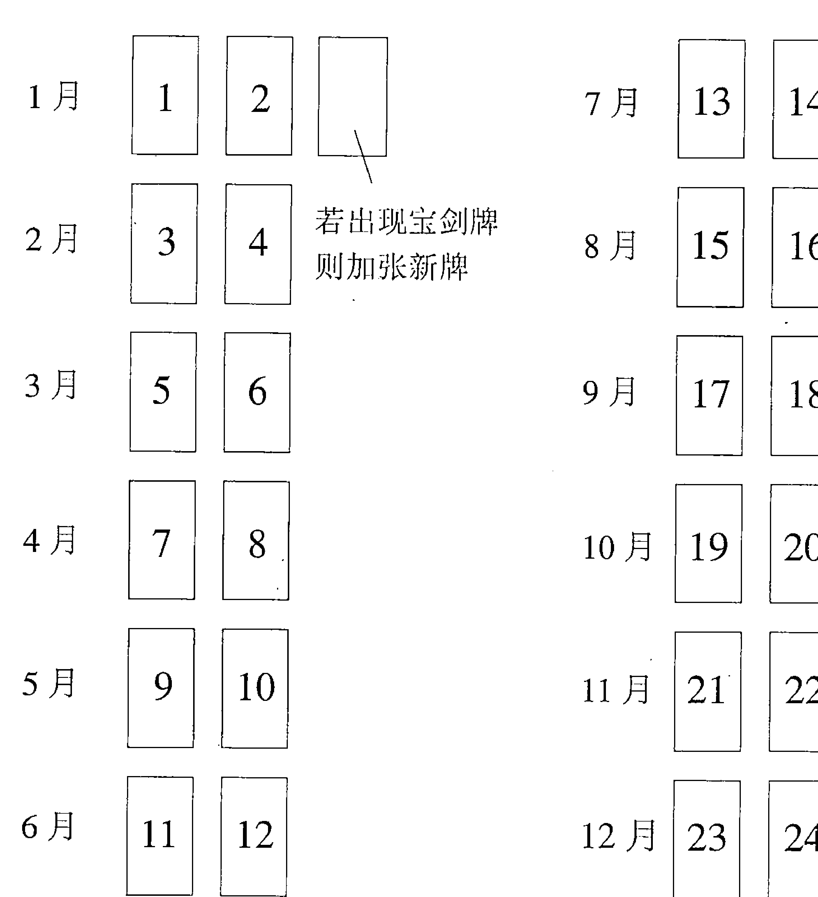

## 处理麻烦

可能出现何种麻烦，可以通过后加上的那张牌来判断。
权杖牌代表人际关系出现问题，数字牌代表一般的争吵，而王牌与宫廷牌则意味着严重的对立。
宝剑牌表示可能因意外而受伤，或是生病，要注意自身的健康。
圣杯牌意味着感情生活出现危机，数字牌代表可能出现单方面的情感，王牌与宫廷牌出现对于情侣会非常不利。
五芒星牌提示要多注意有关金钱的事，数字牌代表与友人因金钱借贷而闹得不愉快。而王牌和宫廷牌则表示遭遇盗窃或遗失重要物品等意外事件。

## 展开法

## 迷宫的尽头 The End of Maze

适用：各种状况

这是单一项目的展开法。询问者可自由选择恋爱、学业、友谊等项目来做预测。此种方式是在实际展开之后，才会得知是关于什么项目的解答。

### 顺序：

将56张小阿尔克纳充分洗好、切好之后，面朝下置于一旁。然后，将1至56按图示照顺序面朝下排好。

### 游戏的方法：

(1) 首先，打开1的牌，由它来决定所要预测的主题，各种牌所代表的主题如下：

- 圣杯数字牌：整体恋爱运
- 圣杯王牌：结婚运
- 圣杯宫廷牌：家庭运
- 五芒星数字牌：财运
- 五芒星王牌：周围的援助
- 五芒星宫廷牌：工作运
- 宝剑数字牌：健康运
- 宝剑王牌：竞争者
- 宝剑宫廷牌：麻烦
- 权杖数字牌：友情运
- 权杖王牌：学校运
- 权杖宫廷牌：学业运、考试运

## 塔罗时刻

开始 是圣杯或五芒星向右 ——>

是权杖或宝剑向下
|

| 1 | 2 | 3 | 4 | 5 | 6 | 7 | 8 |
|---|---|---|---|---|---|---|---|
| 9 | 10 | 11 | 12 | 13 | 14 | 15 | 16 |
| 17 | 18 | 19 | 20 | 21 | 22 | 23 | 24 |
| 25 | 26 | 27 | 28 | 29 | 30 | 31 | 32 |
| 33 | 34 | 35 | 36 | 37 | 38 | 39 | 40 |
| 41 | 42 | 43 | 44 | 45 | 46 | 47 | 48 |
| 49 | 50 | 51 | 52 | 53 | 54 | 55 | 56 |

迷宫的尽头

## 展开法

(2) 然后依据 1 开出那一种类的牌，决定下次往哪个方向翻牌。“圣杯”或“五芒星”是翻右边的牌。“宝剑”或“权杖”是翻下边的牌；

(3) 同样，看这回是翻出那一种类的牌，决定下一张。接下来继续翻开下一张牌，决定是往右边还是往下；

(4) 依据上述程序来翻牌，直到无法继续为止。然后，便可以最后一张牌来进行诊断。

## 七行星展开法 Seven Planet Spread

适用：看一个人各方面的状态

所谓七行星是指中古世纪以地心论为基础的占星学中里的七颗行星：太阳、水星、金星、月亮、火星、土星和木星。这七颗行星分别掌管着人的不同方面，而这里的七张牌就代表着不同的行星。

### 展开方式：

(1) 使用 22 张大阿尔克纳，洗完牌后，把全部的牌面朝下以扇型摊开用左手拿着；

(2) 请询问者任选出七张牌。将这七张牌按顺序放到 1 至 7 的位置；

(3) 翻开牌面，开始解读。

### 各个位置所代表的意义：

位置 1：代表月亮。月亮掌管的是询问者的家人状况与家庭环境。

位置 2：代表土星。土星掌管的是人的智能、精神状况。

位置 3：代表金星。金星掌管的是情感。

位置 4：代表太阳。太阳掌管的是询问者的人际关系与社交魅力。

位置 5：代表火星。火星指示询问者和其对手的竞争情况，或是潜在的意见分裂。

位置 6：代表木星。木星象征着物质的获取，或是任何人际关系、精神性物质的获得。

位置 7：代表水星。水星掌管贸易、商业工作和学习的状况。

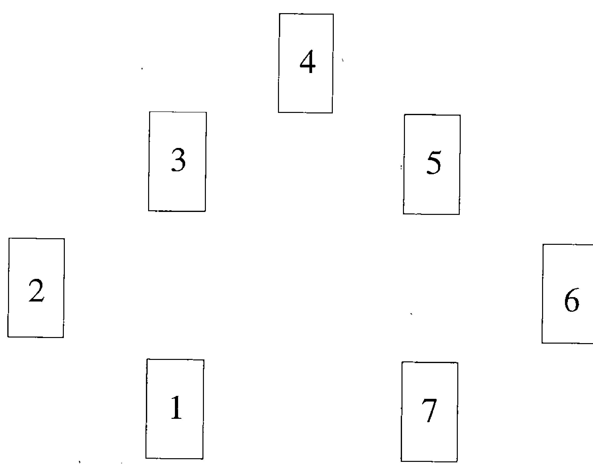

## 七行星展开法

## 展开法

## 镜像展开法 Mirror Image

适用：了解某种行动的后果

现在的行动往往影响着未来，镜像展开法正如一面镜子一样反映着由现在的某个决定或行动所产生的后果。

### 展开方式：

- (1) 使用 22 张大阿尔克纳，洗完牌后，把全部的牌面朝下以扇型摊开用左手拿着；
- (2) 请询问者任选出一张牌放在桌子正中，由左向右翻开放在 0 的位置。接着请询问者抽出九张牌按顺序放在位置 1 到 9，先不要翻开。位置 1 的牌要盖在位置 0 的第一张牌上；
- (3) 现在翻开全部九张牌，判断之后开始解读。

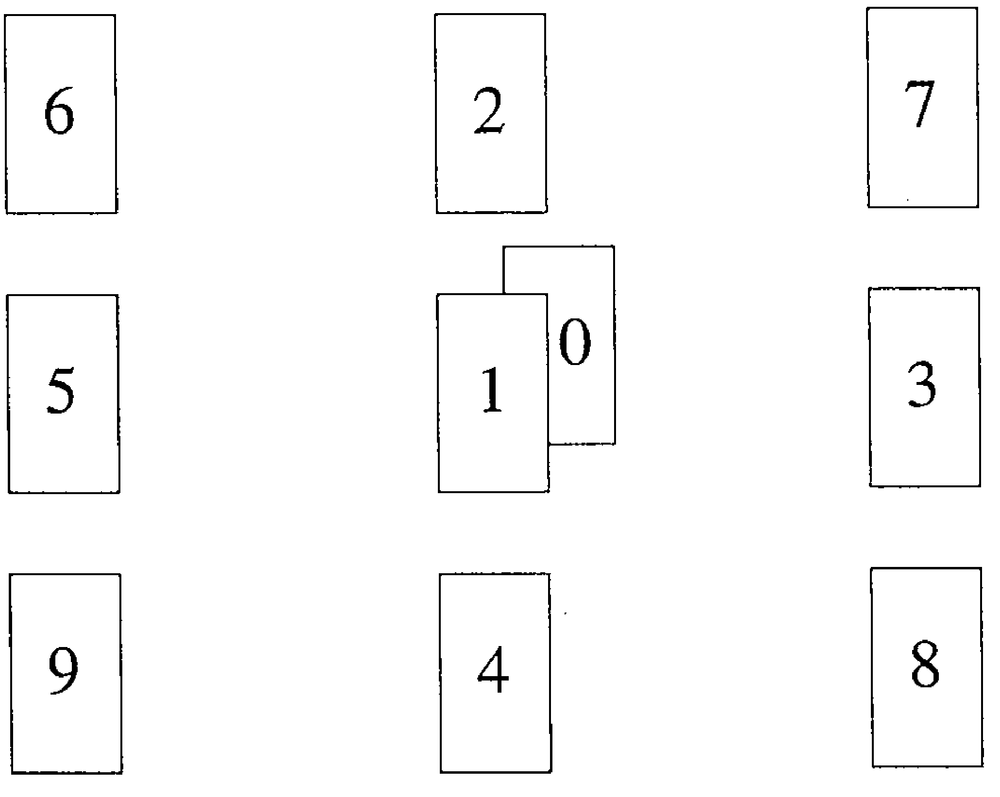

镜像展开法

## 塔罗时刻

### 各个位置所代表的意义：

- 位置 0：是问题解决的关键。
- 位置 1：指本人目前的状况。
- 位置 2：代表精神状况或思考的特征。
- 位置 3：代表感性、情感方面的状况。
- 位置 4：是可能出现的意外事件。
- 位置 5：是未来两、三个月内的状况。
- 位置 6：代表其他人的想法、举动。
- 位置 7：是尚未考虑到的层面。
- 位置 8：代表采取行动的结果。
- 位置 9：是指最终的结局。

## 凯尔特十字展开法 Celtic Cross Spread

适用：想要很彻底的分析一个问题

这是一个相当受到欢迎的展开法。主要是因为它能将问题的前因及后果完整地分析，进而找出解决之道。不管问题牵涉到工作、爱情或朋友，只要是个单一的特定问题，用这个展开法就对了。

### 展开方式：

- (1) 使用 22 张大阿尔克纳，按程序洗牌、切牌后待用；
- (2) 左手持牌，把第 7 张牌放在位置 1，第 8 张牌以头朝左的的方式横放在位置 2，第 9 张到第 12 张依序放在位置 3、4、5、6。然后再往下数到第 7 张牌（也就是第 19 张），放在位置 7，第 8 张到第 10 张依序放在位置 8、9、10。
- (3) 把所有牌翻开，综合判断后做解读。

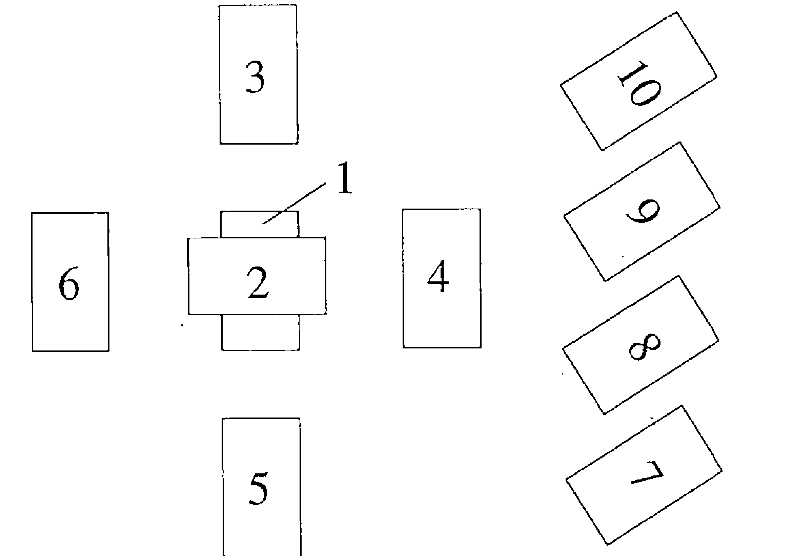

## 凯尔特十字展开法

各个位置所代表的意义：

- 位置 1：目前自己所处的状况。
- 位置 2：遭遇的困难或意外帮助。
- 位置 3：自己对问题的看法。
- 位置 4：潜意识中自己对问题的看法。
- 位置 5：过去两、三个月内问题的状况。
- 位置 6：未来两、三个月内问题的发展。
- 位置 7：未来自己会以何种立场及态度对待这个问题。
- 位置 8：周围人对问题的看法及反应以及这些人将会如何影响到自己。
- 位置 9：自己对于问题抱持着何种态度及希望。
- 位置 10：对于这个问题的最终处理原则及结果。

建议您在解牌时将牌分为两大部分，前面五张视为过去，后面五张视为未来，这样就能很方便地解读出真正的方向。

## 十二宫展开法 *Signs of The Zodiac Spread*

适用：想要知道整体的运势时

十二宫展开法适用于解读一个人在某段时期内的各方面运势，不需要有具体的问题。另外要说明的是塔罗牌属于短期型的预测工具，比较适合预测短期间的事情，例如一、两年内。不过，这种十二宫展开法也可以做比较长时间的解读。

### 展开方式：

- 1. 使用 22 张大阿尔克纳，充分洗牌后待用；
- 2. 用左手持牌，将牌从上往下数第 7 张放在位置 1，再把下 12 张依序放在位置 2 到 13；
- 3. 排好以后，先翻开位在中间的第 13 张牌，然后按照 1 到 13 的顺序翻牌解读。

### 各个位置所表示的意义：

- 位置 1：性格、主张、行事的风格。
- 位置 2：财运。
- 位置 3：旅行、沟通、兄弟间的关系。
- 位置 4：家庭、住宅、与母亲的关系。
- 位置 5：恋爱运、休闲娱乐、赌博运。
- 位置 6：疾病、健康状态。
- 位置 7：婚姻运、人际关系。
- 位置 8：遗产、继承、死亡、婚姻外的两性关系。
- 位置 9：远行、外国、学问、宗教、学校。
- 位置 10：工作、社会的评价、与父亲的关系。
- 位置 11：朋友、社交。
- 位置 12：灾难、麻烦、意外的事件。
- 位置 13：整体运势的走向。

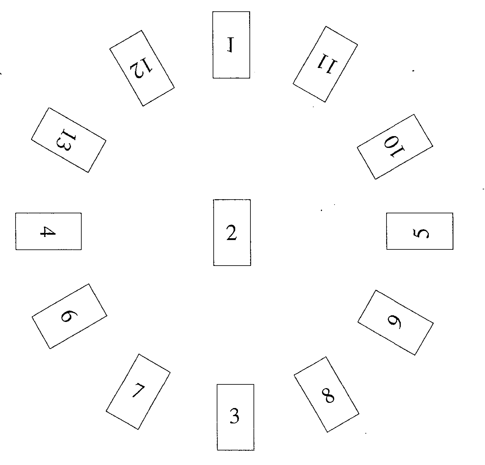

## 十二宫展开法

## 七芒星展开法 Heptagon Spread

适用：想得到具体的答案时

七芒星代表着神话及由神之处获得的礼物。这是一种以七芒星的图案来当作基本牌型的展开法，它一共会用到大、小78张塔罗牌。此种展开法的特征是每一个项目都各有3张牌来做解释，可以得到更加具体的答案。例如：“与目前的情人能够发展顺利？”、“我能否考上理想中的学校？”、“我能否入围决赛？”等诸如此类的问题，都很适合用七芒星展开法来解答。

### 展开方式：

- (1) 将78张牌洗好，切好之后，自上方取牌，按照图示在位置1至7排好。此时所有的牌全翻成正面；
- (2) 接下来位置8至14的牌也按照次序叠在1至7上面。以同样的方法，在位置15至21放牌，此时每摞都各有3张牌；
- (3) 牌型完成，进行解读。

### 各个位置所表示的意义：

- (1) 位置6、13、20：代表心理状态，是询问者本身对于问题持有什么样的感情与心态。
- (2) 位置5、12、19：代表愿望，指针对这个问题，询问者本身有什么样的希望。
- (3) 位置1、8、15：代表限制，暗示阻挠和妨碍这项事情的问题是什么。
- (4) 位置2、9、16：代表现在的状况，是询问者现在状况及生活态度。
- (5) 位置4、11、18：代表事件，暗示事出突然及倒霉的事件。如果是张好牌的话，我们却可以当做没有事件发生。
- (6) 位置 7、14、21：代表不久的未来，这个问题未来会以何种形式来发展。
- (7) 位置 3、10、17：代表最后的结果，意味着问题的结论。

在大、小牌一起使用的场合里，大阿尔克纳要比小阿尔克纳更加重要。所以在解读的时候，侧重于大阿尔克纳方面的解释，而小阿尔克纳只是用来辅助用的。不过小阿尔克纳中的王牌是与大阿尔克纳有同等分量的牌。

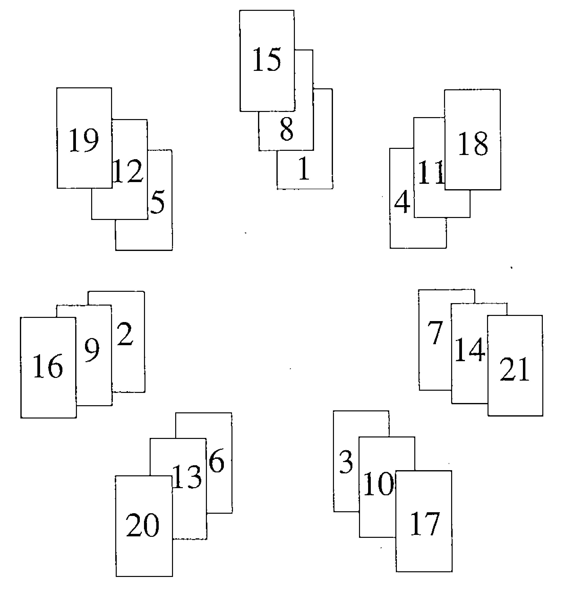

## 七芒星展开法

## 狮身人面展开法 Sphinx Spread

适用：各种情况

此种展开形式是取自于埃及的狮身人面像。它除了可用来询问爱情及考试等特定事件之外，同时可以暗示未来所会发生的事件及应注意的事项等，这种展开法是种全能的展开法。

### 展开方式：

- (1) 将56张小阿尔克纳洗好，切牌之后，任意取出一张，当作是关键牌置于桌面中央；
- (2) 依图所示，将1至22的牌依序正面朝上排好。不过2、4、6、8这几张牌可以采用面朝下的状态。因为实际上这4张牌并不会被使用到；
- (3) 牌型完成，进行解读。

### 各个位置所表示的意义：

- (1) 位置1、3、5、7：代表现在的状况，是询问者的现况与生活。
- (2) 位置9、10：代表麻烦，象征着今后询问者可能会遇到的麻烦、障碍和阻挠者。
- (3) 位置11、12：代表帮助，指示会出现什么样的人来帮助询问者，以及从事何事会对他有帮助。
- (4) 位置13、14：代表禁忌，表示询问者今后所应避免的行动与态度。若是一旦触犯禁忌，幸运将会远离而去。
- (5) 位置15、16、17、18：代表义务，表示询问者今后所应做的事。若能完成这个义务的话，则会带来幸运。
- (6) 位置19、20、21、22：代表未来，具体指出今后所将发生之事。
- (7) 是关键牌，它暗示着与所有牌面有关的影响。此外，若是出现侍从、骑士、王后、国王等四种花色共计十六张宫廷牌，请务必要依特定人物来做解释。将这些宫廷牌与周围的人物做逐一对照后再予以解释，便会有更具体性的答案。

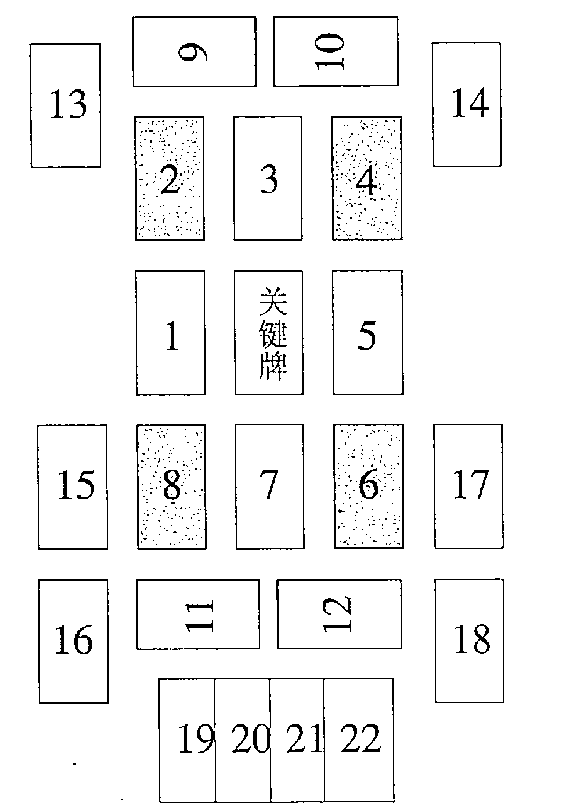

## 狮身人面展开法

## 所罗门之星展开法 Solomon Star Spread

适用：没有特定问题的预测

如果已经学会了前面的所有牌型，那么开始学习复杂些的吧。这种方法会用到全部大阿尔克纳，而且步骤有些繁琐，因此相当耗时。但解读却未必很难。

### 展开方式：

- (1) 按一般洗牌、切牌程序进行后，将整叠牌翻过来，使22张大阿尔克纳牌面朝上；
- (2) 找出[世界]这张牌。如果牌面上第1张不是，就把它翻过来，牌面朝下放在右手边。这样一张张地找，直到世界出现为止。注意扣下的牌仍要保持顺序；
- (3) 找到世界后，把世界也牌面朝下放在检查过的牌叠上。接着，把紧跟在世界之后的7张牌按顺序放在位置1至7。这种排法不掀牌，所以直接将牌面朝上。也许会出现跟在世界之后的牌不够7张的情况，这时就要把刚刚检查完的牌翻过来，让牌面朝上，然后从最上面的第一张开始拿起，补足7张；
- (4) 前7张都定位以后，从第8张开始，把8到14张叠在刚刚那7张牌的右下角（如图所示）。和刚刚一样，如果你手中已经没有牌了，就要把检查过的牌叠拿起来，牌面朝上，从第1张开始补足。当然，如果你刚刚已经拿起牌叠在补的话，现在就继续补下去；
- (5) 通常到了第14张以后，你应该都已经拿起牌叠在补了。所以第三轮的15到21张牌，就继续补下去，叠在刚刚第二轮牌的右下角；
- (6) 等到全部牌都放上去了，会出现共有三层的星型图案，手中只剩下一张牌[世界]以正位放在询问者前，代表询问者本人。开始解牌。

各个位置所表示的意义：

- 位置 1：代表目前的实际状况。
- 位置 2：代表即将发生的事件。
- 位置 3：代表询问者对问题的期望、欲念。
- 位置 4：代表这个问题的运势如何。
- 位置 5：代表可能出现的意外。
- 位置 6：代表询问者没有注意到的敌人。
- 位置 7：代表个人内心深处对问题的真正动机。

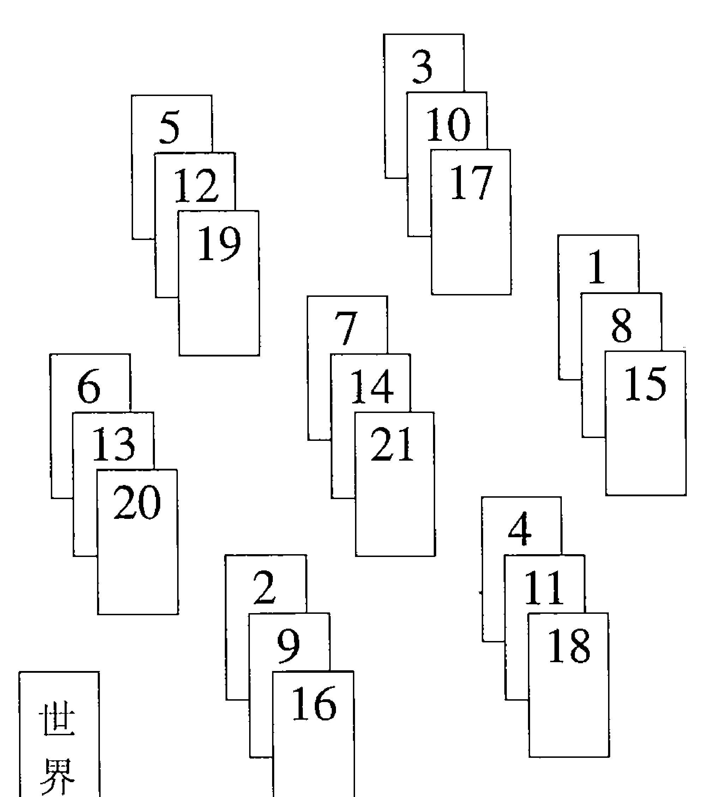

## 所罗门之星展开法

所罗门之星一共有七个位置，每个位置有三张牌。解读时注意，每个位置的牌意必须综合该位置上三张牌的含义解释。

## 太阳系展开法 Solar System Spread

适用：全面说明各个方面状况

### 展开方式：

由右至左排列，一共有七列，是一个7 × 7 的排列形态。

### 解读：

每一列，正中的牌（4、11、18、25、32、39、46）代表现在的情形，或对事件发展的影响。右边的三张牌（1、2、3）代表过去的情形；左边的三张牌（5、6、7）代表未来的情形。每一列代表从生命中一个特定的角度去检视，或者代表一个特定的人，或者有时两者皆是。

(1) 这个展开法是由占星术（Astrology）演化而来，是以使用者最好有基础的占星术方面的知识，有兴趣的读者请参考相关书籍。
(2) 各行星所代表的意义，简单说明如下：

- 土星：保守、秩序、忠诚、限制、与老年有关的事情。
- 木星：扩张、成长、智慧。
- 火星：心中的男性原型、原始的、未进化的力量、战争、行动力。
- 太阳：外在的个性、个人形象、理智、意志力、代表父亲。
- 金星：心中的女性原型、爱情、艺术、社交、金钱、物质欲望。
- 水星：沟通和思考、表达、个人的理解能力、商业、变动。
- 月亮：本能、感情层面、平常不为人知的一面、代表母亲。

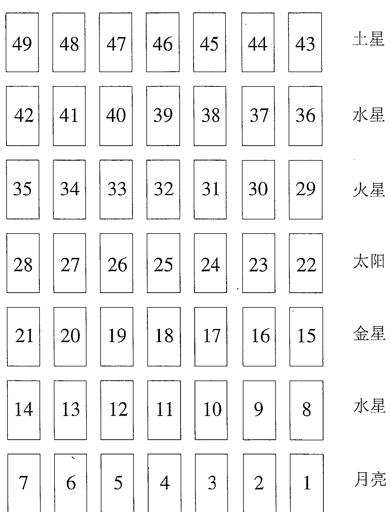

太阳系展开法

# 5
## 塔罗牌戏

纸牌使空气浮动
在玻璃杯四周；
葡萄酒的烟，诗的烟
和夜里烟斗的烟。

在每一个颤抖着的房间
那天花板的斜角里
胡乱拼凑的梦
那海上的烟聚到一起。

> ——阿尔托《夜》

## 牌戏规则

导读：进阶者读物，介绍流行于法国的塔罗牌戏方法，供想要了解欧洲塔罗文化的人选读。

自十三、十四世纪以来，如果说棋类是主要的宫廷游戏，那么包括塔罗牌在内的各种牌戏则更为平民百姓所喜闻乐见。在一段很长的历史时期内，塔罗牌是民间的首位智力游戏。每当家庭宴会或亲朋好友相聚时，在欢乐气氛中，三五好友即可进行一场富有骑士风格的塔罗牌戏。

经过几十代人的口耳相传，塔罗牌的张数和名称从起始到现在，一直没有变更。但叫牌，出牌以及计算结果的方法已有了很大的改变。很长时间内，塔罗牌戏所用的规则随地区和国家而有所不同，且在一段时间内，塔罗牌戏只能由三个人玩。后来四人玩的塔罗牌戏出现了，到上世纪五十年代初，法国的一些塔罗爱好者共同编写了一套《塔罗游戏》（Le jeu de tarot）。至此，算是最终确定了现代塔罗牌戏的游戏规则，这也是本章所要介绍的内容。

### 塔罗牌的组合

牌的尺寸为 6.6 × 12 厘米
每副塔罗牌有 78 张，分别是：
——权杖、五芒星、圣杯、宝剑四种花色，每一花色有 14 张。依递增次序为 A（即 1）、2、3、4、5、6、7、8、9、10、Knave（侍从）、Knight（骑士）、Queen（王后）、King（国王）。在后文中，Knave、Knight、Queen、King 这四种牌统称为宫廷牌，1 至 10 这十张牌，统称为小牌。

## 塔罗牌戏

——编号从 1 到 21 的二十一张王牌。
——很特别的一张牌，法文称之为 Excuse，可译为填牌、曼陀琳（因有的牌画面设计为一弹曼陀琳琴的人）或愚人，为简单起见，后文我们称它为“愚人”。
——21 号王牌和 1 号王牌及愚人，被称为塔罗牌戏的三个“Bouts”。21 号王牌是 78 张牌中最大的，其作用重大，自不必说。1 号王牌是牌戏中攻守双方争夺的重点，它的最终归属，在很大程度上决定胜负属谁，作用亦不同凡响，在后文中，我们称它为“老幺”。愚人的作用特殊，没有固定的角色，它可以代替任何一张牌。
关于老幺和愚人的运用，后文将陆续介绍。

### 牌戏的人数

三人，四人，五人皆可玩，这比桥牌灵活，甚至六人也可以玩，不过六人玩时，每一盘的发牌人只发给其余五个人，发完牌他就可以找个适合的地方小睡一觉了。所以六人塔罗的规则和五人玩时相同，唯一差别是睡完觉的发牌手，要与防守的一方共输赢。

### 座次的安排

牌手的座位由抽牌决定，每人翻一张牌，翻到最小牌的牌手首先选座位，次小的第二个选，依此类推。在翻牌前先要把愚人抽出来，它不算数。牌的大小主要是按数字，其次才按花色分，四种花色按递减的顺序为：宝剑、圣杯、五芒星、权杖，若牌手们彼此熟悉，也可以商量就座，不必抽牌。

## 塔罗时刻

### 发牌

发牌的次序按逆时针方向轮流，第一次发牌由翻到最小牌的牌手，即第一位选座位的牌手发，洗好后请坐在左手的牌手切牌，按逆时针方向发给每个人。

三人玩时，每一轮发给每人四张，留一张扣放在旁边，然后发第二轮，发完六轮后每位牌手手中有 24 张牌。每轮留下的牌也积累到六张，这发剩的牌称之为“狗”。

四人玩时，每轮发给每人三张，留一张，发完六轮后每人手中有 18 张牌，狗也是六张。

五人玩时，第一轮发给每人两张，不留牌，以后每轮发给每人三张，留两张，全部发完后每人手中有 14 张牌，狗为八张。

三、四人玩时，发完牌，若某一牌手手中既无王牌，又无宫廷牌，只有一个老幺，甚至连老幺都没有，可以要求取消这一盘，由位于原发牌人右手的下个牌手发牌。

五人玩时，若出现上述情况，则无权要求取消这一盘。

### 叫牌

牌手叫牌主要是考虑自己手中牌的实力。如有几个 Bouts，宫廷牌的多少，有无缺门或单张，有无长套等，其次也要参考其他牌手叫牌的情况，从而对“狗”有一估计，最后要考虑的因素是牌手的相对位置，发牌者总是最后一个叫牌，这个位置最有利。

位于发牌人右手的牌手开叫，依逆时针方向的顺序，每人只能叫一次。

依递增的顺序，共有如下几种叫法：

- Pass 不叫
- Take 取
- Pousse 生长
- Guard without changing 留给自己打，不使用狗中的牌，在一盘终了时，狗中牌所代表的点数归本人所有
- Guard against changing 留给自己打，不仅不使用狗中的牌，而且把狗中牌所代表的点数归给对方

某一牌手叫牌成功成为庄家后，当众将狗中的牌翻过来，供其他牌手看，然后收入手中，换下同样数目的牌扣在旁边不用，这几张牌被称为底牌，不要让其他牌手看到把什么牌放到底牌中去了。绝对禁止把 Bouts 放入底牌，也禁止把国王放入底牌，因为国王还要在出牌过程中经受被王牌毙的考验，一般禁止把王牌放入底牌，但若不得不放时，需把放入的数目告知其他牌手，当庄家以 Guard without changing 叫成时，只把狗放在自己旁边不翻开不换牌，立刻开始此一盘的攻防战。若以 Guard against changing 叫成，则把狗送给对方，不翻开，立即开始出牌。

若所有的牌手都叫 Pass，则这一盘就算打完了，请下一个牌手洗牌发牌。

### 声明

有些情况需要在第一轮轮到他出牌时声明。
——三人玩时手中没有王牌，有十三张、十五张、十八张或二十一张王牌，没有宫廷牌，小满贯和大满贯。
——四人玩时手中没有王牌，有十张、十三张、十五张或十八张王牌，没有宫廷牌，小满贯和大满贯。
愚人既可被看成是王牌，也可被看成是宫廷牌。在上述两种情况下，牌手若手中有愚人则既不能声明无王牌也不能声明无宫廷牌。
——五人玩时手中有八张、十张、十三张王牌，小满贯和大满贯。此时无权声明无王牌或无宫廷牌。

若声明手中有上述数目的王牌，应按大小顺序排好，请其他牌手过目。这声明不是强制性的，有时为了追逐老幺，不愿暴露自己牌的实力，也可不做此声明，也可不按手中实有王牌数目声明。譬如三人玩时，手中有十六张王牌，可以声明有十三张，为对手设置陷阱。

出牌到最后一轮时，可做如下两项声明：

- “最后一轮出老幺”
- “最后一轮擒住老幺”

其他牌手应团结一致共同对付做出上述各项声明的牌手，但“无王牌”和“无宫廷牌”的声明除外，做这种声明的牌手只需声明“穷困”便可，而毋需指明是无王牌或无宫廷牌。只有在开打以后，其他牌手才知道他缺了什么。做了上述穷困声明后，其他牌手都要付筹码给他。

“最后一轮出老幺”总是会得到赔偿的，不管这盘是输了还是赢了。

所谓小满贯是指庄家只丢了一墩，把其余各墩都弄到手了。

大满贯是庄家一墩不丢，把全部牌都弄到手了，只有在大满贯时，才可在最后一轮出愚人，并且总是赢了这一墩。

### 出牌

任何战争总可以分成攻守两方，塔罗牌戏并不例外。我们把叫成了牌当庄家的叫做进攻的一方，其余牌手则都是防守的一方。他们团结一致互相支援，尽一切努力使庄家不能取得完成合约所需的点数。

坐在发牌人右手的牌手开牌，以次的牌手在可能的情况下应按所要求的花色出牌，并要超越。当手中没有同一花色更大的牌，大可垫小牌。若手中没有此要求的花色的牌，则必须用王牌毙。以次的牌手在此花色用王牌第二次或第三次毙时，所用的王牌也必须比以前牌手毙时所用王牌大，即第二、三次毙时，王牌也要超越，只有当手中的牌小，不能超越时才允许垫小牌。

愚人应在最后一轮前打出，否则就归赢得这一墩的牌手所有了。除非是庄家打成了大满贯。在此情况下，他在最后一轮出愚人，并赢得这最后一墩牌。

愚人一般是不会改变阵营的。牌戏开始时，它在哪个阵营手中，便永远在哪个阵营手中，除非是防守一方的牌手在最后一轮打出，被庄家擒住了，这是极特殊的情形。若开始时，愚人在防守一方牌手手中，在某一轮出牌时打出，如果这墩牌被防守方另一牌手获得，自然不会改换阵营，无须赘述。若这一墩牌被庄家吃掉了，则把愚人挑出来摆在旁边，待这一盘结束时计点数归防守方所有。相反如愚人在庄家手中，在出牌时被防守方取得，也是挑出来，待最后计点时归庄家。

### 计点

每张牌都代表一定的点数，必须记牢。

塔罗牌共有三个 Bouts，即 21 号王牌、1 号王牌老幺和愚人。每个 Bout 为 4.5 点，其余 19 张王牌每张为 0.5 点，所以王牌点数共 23 点。
(3 × 4.5 + 19 × 0.5 = 23)

- 国王为 4.5 点
- 王后为 3.5 点
- 骑士为 2.5 点
- 侍从为 1.5 点

其余 10 张小牌每张为 0.5 点。所以每一花色点数为 17 点。
(4.5 + 3.5 + 2.5 + 1.5 + 5 = 17)

四种花色共 4 × 17 = 68 点
塔罗牌共 23 + 68 = 91 点
完成合约，即庄家取胜所需的点数，这与叫牌的高低次序无关。

有三个 Bouts 36 点
有两个 Bouts 41 点
有一个 Bout 51 点
没有 Bout 56 点

由于 21 号王牌和愚人是不会改换阵营的，三个 Bouts 中只有老幺可以易手。所以在攻守双方的交锋中，如何猎取老幺就成了塔罗牌戏的主要内容，因为它的得与失不仅为两阵营带来 9 个点的变化，而且可以改变取胜所需的点数。另外就是要设法取得点值较高的宫廷牌。

#### 其它记点规则

下述各项记点规则，与完成合约与否无关，只供计算输赢数目。

- 叫牌的次序
  - Take 0
  - Pousse 10
  - Guard without changing 50
  - Guard against changing 100

- 声明
  - 最后一轮出老幺 10
  - 最后一轮擒老幺 10
  - 小满贯 150
  - 大满贯 250
  - 三、四人玩时的穷困，即无王牌或无宫廷牌时 10
  - 发错牌 罚 10

上述记点是普遍适用的，与参加牌戏的人数无关，而宣示手中王牌数目所值的点数则取决于牌戏的人数。

#### 三人玩时

- 手中有 13 张王牌 10
- 手中有 15 张王牌 20
- 手中有 18 张王牌 30
- 手中有 21 张王牌 40

#### 四人玩时

- 手中有 10 张王牌 10
- 手中有 13 张王牌 20
- 手中有 15 张王牌 30
- 手中有 18 张王牌 40

#### 五人玩时

- 手中有 8 张王牌 10
- 手中有 10 张王牌 20
- 手中有 13 张王牌 30

### 底金

打第一盘时，首位发牌人注入 20 点，其他牌手每人注入 10 点，作为本盘牌戏的“底金”。如果庄家完成合约赢了这一盘，就把底金收归已有，第二盘开始时再以同样方法凑底金。相反地，如果庄家未完成合约所需的点数，输了，他就要赔同样数目的点挹注到原有的底金中去。第二位发牌者此时只需在底金中注入 10 点即可，其他牌手也无须再加入点数，所以如果庄家们走背运，连续几盘都没完成合约，则底金则将成倍地增加，可以达到很高的数目，这在牌戏中有一专名词，称为“加肥”。

### 可能遇到的特殊情况

1. 发错牌 若在发牌过程中，发现牌发错了，则罚发牌者再在底金中注入10点，重新洗牌，切牌后再发。

2. 排除不用的牌时，多放或少放了一张在底牌内，这情况一般是打到最后一轮时才发现，处理的办法是：

A. 若这一盘是庄家赢了，这一盘被取消。

B. 若这一盘是防卫的一方赢了，此时又可分为两种情况：

a. 庄家在底牌中多放了一张牌，到最后一轮时手中已无牌，这一墩自然是被防卫的一方取走，点数照算。

b. 庄家在底牌中少放了一张牌，打完最后一轮时，防守一方的牌手已无牌，而庄家则还握有一张，此时若最后一墩是庄家得到了，这一张就归庄家所有。反之，若防守的一方取得了最后一墩牌，庄家手中的那张牌便给了对方。

此外，在出牌过程中也可能出现一些未曾预料的特别情况，如手中有所要求花色的大牌，出牌时应超越，却忘记而出了小牌；本应用王牌毙时，没有毙却垫了小牌；把国王放在底牌中了等等。对这些情况，没有统一的处理原则，牌手们应运用智慧和风度协商解决。

### 几个实例

例1. 三人玩时，在第一盘庄家以Pousse叫成，展示手中有15张王牌，并且把老幺拖到最后一轮才打出，最后记点时，他比完成合约所需多了12点，此时

——他将把底金拿走40点

——其他两名牌手每人付给他52点，计算方法如下：

Pousse: 10点

展示15张王牌: 20点

最后一轮打老幺: 10点

多得：12 点
合计：52 点
这一盘他共赢了 40 + 2 × 52 = 144 点

例 2. 四人玩时，第一盘庄家以 Pousse 叫成，展示手中有 10 张王牌，并把老幺拖到最后一轮打出，最终他差 8 点没有完成合约，输了，此时他将：
——赔同样数目的底金 50 点
——付给其他牌手每人 18 点，计算方法如下：
Pousse：－10 点
展示 10 张王牌：－10 点
最后一轮打老幺：＋10 点
少得：－8 点
合计：－18 点
所以在这第一盘中，庄家共损失 50 + 3 × 18 = 104 点

例 3. 五人玩时，第一盘庄家以 Pousse 叫成，某一对手展示手中有 8 张王牌，并把老幺拖到最后一轮打出，最终差 5 点没有完成合约，此时他将：
——注入同等数目的底金 60 点
——付给其他四位牌手每人 35 点，计算方法如下：
Pousse：－10 点
对手展示有 8 张王牌：－10 点
对手在最后一轮打老幺：－10 点
少得：－5 点
合计：－35 点
这位庄家在第一盘中共输掉 60 + 4 × 35 = 200 点

以上简单介绍了塔罗牌法式牌戏的规则和记点数的方法。在欧洲其他国家，牌戏的规则和记点方法大同小异，这里就不一一评述了。

截止到此，读者对于塔罗牌戏应该已经有了初步的认识，也许，有的读者还会认为塔罗牌戏与桥牌相似，实际上，桥牌和塔罗牌的游戏规则差别很大。例如在桥牌游戏中，A 是每种花色中最大的，而在塔罗牌戏中，A 就是 1，是同一花色中最小的；再如，桥牌的王牌是叫出来的，而塔罗牌的王牌是固定的；此外，其它的差别还有很多，所以建议读者在读本章时，先要摆脱掉玩桥牌时在头脑中形成的观念，一切从零开始。

## 跋

每个人的人生轨迹都会由许许多多因素所左右着，包括人的个性，所受教育，与人的交往，过往的经历，等等。正是这些影响着我们的思维和判断，让我们做出种种取舍。正因如此，缘起缘灭间，总存在着一种必然。

最初想写这本书是在 1999 年的春天，却因某些原因未能成书而搁置起来。其中曲折难以尽述，箇中滋味也只做一段历练留在记忆里。

直到今年初，才又把这本书作为一件想要完成的事情安排在日程里，经过几个月的删减修改，终于六月完稿，却没有了当初所想象的激动，正如匆匆于旅途的人忽然惊觉已没有了归处，但又何需归处呢？人心之大许能装下整个世界了，随性而至也未尝不是一次完整的旅程。

感谢中国文化艺术传播中心的李毅华先生对本书的指正，感谢为本书而努力过的各位师长朋友。

时间已至凌晨，今夜恐怕又难入睡......

2004年6月22日 凌晨 于北京

## 笔记页

## 笔记页

## 笔记页

## 笔记页

## 笔记页

图书在版编目（CIP）数据
塔罗时刻——圣甲虫的预言 / 迪奥 编著.
北京：中国电影出版社，2004.9
ISBN 7-106-02211-X
I.塔... II.迪... III.扑克—基本知识 IV.G892
中国版本图书馆CIP数据核字 (2004) 第 090043 号

出版发行 中国电影出版社（北京北三环东路22号）邮编 100013
电话：64299917（总编室） 64216278（发行部）
E-mail: Jsja@netchina.com.cn
经 销 新华书店
印 刷 北京达利天成印刷有限公司
版 次 2004年9月第1版 2004年9月北京第1次印刷
规 格 开本/850 × 1230毫米 1/32
印张/7.5 字数/120千字
印 数 1 - 10000 册
书 号 ISBN 7-106-02211-X/G.0601
定 价 45.00元（随书赠送中文版文艺复兴塔罗牌一副）