# 【開運論命館】

## 塔羅牌經典手冊：偉特親自幫你分析塔羅牌

作者◎亞瑟·愛德華·偉特 (Arthur Edward Waite)
譯者◎文軒

**Pictorial Key To The Tarot**

偉特所創造的萊德·偉特塔羅牌，是有史以來最受歡迎的塔羅牌。關於這副塔羅牌之牌意解釋，偉特都寫在本書中，全世界的塔羅占卜者均奉此書為聖經。

# St. Royal College
天使神秘学院

- ※ 专业占卜预测机构
- ※ 神秘学培训机构
- ※ 水晶能量研究中心
- ※ 官方淘宝：http://strc.taobao.com
- ※ 官方微博：http://weibo.com/715104687
- ※ 新书发布QQ群：659338717
- ※ 购买更多好书请联系院长大天使

大天使
天使神秘学院 院长
QQ：715104687
手机/微信：13641926204

微信公众平台：strc2011

# 【開運論命館】

## 塔羅牌經典手冊：偉特親自幫你分析塔羅牌

作者◎亞瑟·愛德華·偉特 (Arthur Edward Waite)
譯者◎文軒

**Pictorial Key To The Tarot**

偉特所創造的萊德·偉特塔羅牌，是有史以來最受歡迎的塔羅牌。關於這副塔羅牌之牌意解釋，偉特都寫在本書中，全世界的塔羅占卜者均奉此書為聖經。

【開運論命館】04

## 塔羅牌經典手冊：偉特親自幫你分析塔羅牌

作者◎亞瑟·愛德華·偉特 (Arthur Edward Waite)
譯者◎文軒
總編輯◎馮國濤
責任編輯◎張綽倫
出版者◎雅各文創有限公司
Email: jacob.literal@gmail.com, 電話◎02-29351011
總經銷◎易可數位行銷股份有限公司
231新北市新店區中正路542-3號4樓
電話◎02-82191500，傳真◎02-82193383
初版◎2013年 1月
基本定價◎NT$600元
All Rights Reserved 有著作權·翻印必究

國家圖書館出版品預行編目(CIP)資料
塔羅牌經典手冊 : 偉特親自幫你分析塔羅牌 / 亞瑟.愛德華.偉特(Arthur Edward Waite)作 ; 文軒譯. -- 初版. -- [臺北市] : 雅各文創, 2012.12, 240面 ; 15*21公分. -- (開運論命館 ; 3) ISBN 978-986-88640-7-8(平裝) 1.占卜, 292.96, 101020908

# ☆前言☆ 與塔羅牌的偶然相遇

身為一位多年來受限於心靈與其他侷限條件下從事文字撰述，同時擔任高階神秘學校的指導者來說，我首先必須對個人的立場做徹底坦白的說明，這份書面的辯解，有其必要性，而非僅是我個人的習性。

對於現今廣為知名且乍看為算命預言的手法來說，我的行為將被視為怪異的。現在，史密斯先生（Mr. Smith）的見解，即使是書面的評論，也並不重要，除非這些見解符合我們本身的情況，然而，為使這項教義得到認可，我們必須注意，無論是自己的看法或是所引發出來的課題，皆只能與最崇高的旨意（上帝）相關。

至目前為止，僅僅如此也許看來十分令人疑惑，以當前的情況來說，不僅是對於史密斯先生，我在公正不偏的適當估量下所尊重的人，還有一些更為真實的結論，因為他們的貢獻等同於我的。

無論是對於這些或其他的，我必須這樣說，最受到啟發的基督兄弟·玫瑰十字，當他在「演變的神祕宮殿」（Secret Palace of Transmutation）裡看見化學性的緊密結合之後，他的故事就突然地中止了，據說他期盼第二天早晨就去當一個守門人。經過相同的行為之後，就更常發生這樣的情況，那些曾透過聖典中最清楚的面紗看見天國之父的人，都是後來在教堂中承擔最卑微職務的人。

經由如此簡單的手段，也能將神祕秩序中的行家與大師自一群新人中區別出來。也因此，或是在並非全然不同的方式下，我們自最外圍的部份偶然與塔羅牌相遇，當中混雜著超自然神祕技藝的殘渣碎瓦，在他們的觀念裡，沒有人會因為最微小的騙局而受苦。

然而，這些紙牌在另一個領域中是屬於它們自己，因為它們包含著一個非常高的符號象徵系統，那是依據神的恩典之律法詮釋的，而非僅是依靠著占卜手法的藉口托詞與直覺。

上帝的智慧存在於人的愚蠢無知中的這個事實，並未因此產生這樣的一種推測，認為這個世界的愚蠢無知對神的智慧而言都是有意義的，所以無論是普通程度的學者或是立於崇高地位的虛榮教師都將無法迅速察覺到這個論點的可能性或甚至是可行性。

這個主題已經操縱在紙牌占卜師的手中，成為他們職業特有的慣用伎倆之一；我並沒有試圖要說服屬於我圈外的任何人關於此事有否影響或後果；但是站在歷史與闡釋說明的角度來看，它並無進展；它也在闡釋說明者的手中受到十足的輕蔑藐視，這些人擁有鑑賞證據的哲學洞察或技能。

該是它獲得救贖的時候了，我打算就此承擔起這份職責，也許我所做的是偏離主題的枝節問題，如同詩歌是表達最美麗事物的最優美的表現方式，符號象徵系統也是最廣泛包容的形式，以傳達在最深奧的聖殿中所隱藏的事物，這些都還未能以口述的方式被如此豐富充分地宣告出來。

我目前並不考量以沉默作為辯解，我已在其他地方留下紀錄，是關於這方面主題可能闡述的部分，而且是在相當近期的時候。

接下來的小論著分為三個部份，首先我會談論這個主題的古老歷史，以及這當中所產生的、以及相關的一些議題。

必須要瞭解的是，所提出的研究內容並不是針對遊戲紙牌的歷史，那是我知道卻不感興趣的題目；其動機考量是為奉獻與提供給特定的神秘主義的學苑，特別是指在法國的，因為關於魔術幻象的所有資源與核心，在過去五十年間已假借塔羅牌歷史的考量之名開始傳達。

在第二部份，我會根據一些更崇高的觀點來談論符號象徵系統，這些紙牌都是在我的監督指導下所完成的，無論是內容屬性或意義，並經由一位嚴謹要求的女藝術家描繪而成。

至於占卜的部份，我個人認為那是存在塔羅牌歷史的一個事實，因此，我根據所有已出版的資料中，將附屬於各式各樣紙牌的解讀，推論歸納出一份統一的意義，擁有簡明易懂的優點，同時也是通用的應用手法。

但願本這本小冊子能讓大家對塔羅更加了解。

# 目 錄

前言：與塔羅牌的偶然相遇 /5

## 第一部 · 011 認識塔羅牌裡的符號

- 一、神秘學與塔羅牌 /13
- 二、塔羅牌的歷史 /21
- 三、大阿爾卡那牌 /43
- 四、小阿爾卡那牌 /71

## 第二部 · 073 揭開大阿爾卡那牌的神秘面紗

- 一、塔羅牌及其神秘傳統 /75
- 二、大阿爾卡那牌的符號意象 /85
- 三、大阿爾卡那牌與其占卜的涵義 /145

## 第三部 · 153 揭露小阿爾卡那牌的神諭秘密

- 一、大小阿爾卡那牌的區分 /155
- 二、小阿爾卡那牌的符號意象 /159
- 三、小阿爾卡那牌四組花色的增補涵義 /217

## 第四部 · 227 塔羅占卜的方法與牌陣

- 一、塔羅牌占卜 /229
- 二、古老的塞爾特占卜法 /230
- 三、一再重複出現的紙牌 /237

# 第一部 認識塔羅牌裡的符號

- 一、神秘學與塔羅牌
- 二、塔羅牌的歷史
- 三、大阿爾卡那牌
- 四、小阿爾卡那牌

# （ ）塔羅牌（ ）

｜經｜典｜手｜冊｜

12 ☆認識塔羅牌裡的符號☆

## 一、神秘學與塔羅牌

### ☆神秘學中的符號象徵

詩人的病理學說法：「一個不虔誠的天文學家，就是瘋子。」；一位坦率之人的病理學說法，天才都是瘋子；在這兩個極端之間，存在著萬種類似的不當，而且以符合最高無上的理由扮演仲裁的角色，與能力所及的事情。

我並不認為有任何關於神秘學儀式的病理學，但是其過度無節制卻是無庸置疑的，針對此項要扮演仲裁的角色，自然是吃力不討好的。此外，若真有病理學的存在，它大概是依據經驗法則，而非診斷的結果，也因此無法提供任何準則了。

現今，神秘主義不似密教組織，極少依從商業習性或日常生活的運作方式，或是將證據視為準則的智識。我知道在粗鄙的顯赫技藝下，有些事情遠比批評一份論文是假的，且未能明白那只是裝飾性的，還要來的愚蠢。

我也明白，在長時間面對著令人疑惑的教義或是艱難的研究之後，能夠在這項技藝的範疇內，發現明顯的騙局或是全然不合理之處，總會令人感到耳目一新的。

然而就歷史的觀點，神秘主義的角度來說，這並非是個裝飾性的原則，且還帶來提振精神後的幾項好處，療癒其加諸於邏輯理解方面的損傷。玫瑰十字（Rosy Cross）的會員資格幾乎需要一個能主導星辰的智者兄弟（Frater Sapiens dominabitur astris），能具備耐性，在進行塔羅占卜時，其思慮符合符號象徵系統的較高原則，不會因愚昧而迷失。

真正的塔羅是符號象徵系統；它不說其他語言，亦或是提供其他記號。其象徵符號的內在涵義，已成為某種符號系統，能夠無限制地組合，並因此做出真切的判斷。在最高的階段，以不武斷且未被通曉的方式，提供探索神秘事物之鑰。

然而，關於神秘學，所闡述的是錯誤的符號故事，且在這項主題的每份出版品中，提供著錯誤的歷史。有二至三位作家已暗示著這種情況的無法避免性，因為僅有少數人對此方面熟悉，而這些少數人在秘密社團的掌控下傳達知識，不能違背他們的信任。這建議在表面上是令人無法置信的，似乎有著令人掃興的提議，將預測未來的特殊解讀：紙牌的解讀藝術（l'art de tirer les cartes），保留成為學說的延伸。

而事實仍然存在，儘管塔羅存在著「神秘的傳統」（Secret Tradition），神秘學中的某些小阿爾卡那牌，總是儘可能以誇耀的宣傳方式，呈現在大眾面前，同樣的，也會在事件發生前，警告對此類事物好奇的人，任何所揭露的天機，就符號象徵系統來說，僅含天地的三分之一及天空星宿的三分之一個部份。

簡單的原因就是，無論就根本或進展的部份，都沒有放諸更多的訊息於文字中，如此一來，在任何虛假的解密揭露之後，保留更多闡述的空間。某些早期創始的廟堂的管理者，負責監管神秘學的這類秩序，就無須為相關事宜擔憂。

關於一連串更重要的符號，其終極與最高涵義，深藏在圖片或象形文字的表面言語之下。這部份僅能透過那些已接收到部份「神秘的傳統」的人來理解。至於更重要的阿爾卡那牌所賦予的言語上的涵義，是為了駁斥過去帶來的愚見與欺騙，將真正擁有洞察天賦的人才，放在正確的位置上，並在我的能力範圍內，關照他們，因為截至目前為止，他們所做的事就是真理。

很遺憾的是，我必須承認自己在一些觀點上有某些程度的保留，因為這當中牽涉到信譽的問題。除此之外，面對著一邊是愚蠢無知的人，他們對於傳統一無所知，都是以自己的觀點講述神秘科學與哲學這類知識，而另一邊則是少數瞭解傳統的作者的偽裝，他們認為擁有散播不實內容的合法權力，我覺得表明的時機到了，將可能的部份說明，如此一來，將目前流行的騙術與蠢見的影響，降至最低程度。

### ☆神秘符號語言的來源

我們在適當的時候會發現，塔羅牌的歷史最早源於十四世紀，且大多數是負面的，當時的爭議都沉溺於空想與無端的臆測，以確信肯定的方式表達。這些源自於埃及、印度或中國的騙術或自欺，將說謊的特質植入首批講解人的言談中，而後來的神秘學作者，在真誠的態度下，複製這些初次錯誤的證言，沒有察覺到這些研究的問題。如此的進展，造成所有的講解只能在非常狹隘的範圍內進行，實難以歸咎於創造的人啊！

不久前就有一個被忽略的絕佳機會，塔羅牌也許已善盡其責，甚而成為阿爾比教派（Albigensian）的一個神秘符號語言的來源。

我依循著加百利羅賽提（Gabriele Rossetti）與尤金亞力克（Eugene Aroux）的精神，將此建議世襲交付給哈洛貝雷先生（Harold Bayley），成為「文藝復興的新明燈」（New Light on the Renaissance），至少在黑暗當中還能發出微光，並充滿著敬意，希望能夠幫助具熱情且有著全能洞察心智的古柏奧克利女士（Mrs. Cooper Oakley）。

只要想想，從塔羅的教皇紙牌，與一種神秘的阿爾比教派元老的概念作聯想，可以獲得何種造紙浮水印的假設證明，貝雷先生已在這些相同的浮水印中，找到夠多的資料完成他的目的。

想一下，女祭司牌代表著阿爾比教派教堂；而被閃電擊中的高塔，象徵著渴望羅馬教皇的毀滅，這個建立在七個山丘的城市，連同它的教宗及其短暫具有的權力，從宗教的雄偉建物中倒下，因上帝的譴罰而撕裂。這些可能性是如此多且具說服力，幾乎在語意中朦騙住一個創造它們的上帝選民。

除此之外還有更多的案例，雖然我幾乎不敢提出引用。當塔羅牌成為他們首部正式的解釋題材時，考古學家傑伯林（Court de Gebelin）重製部分最重要的符號，且他所使用的法典，若我能如此稱之，在其令人深刻的著作下，已成為後來發行的許多牌組的基本參考。

圖像非常原始樸拙，且不同於亞提拉紙牌（Etteilla）、馬賽塔羅牌（Marseilles），以及其他流行於法國的紙牌。關於這方面，我並不是個好的判定者，但事實上每張大阿爾卡那牌也許已經針對浮水印的研究目的給予答案，可以從我所引用的案例中得知，而其中最具代表性的範例是紙牌「聖杯 Ace」。

我應該稱之為一種在祭壇天蓋的儀式後的聖餐符號，但此時這點並不重要。重點是哈洛貝雷先生在他的「文藝復興的新明燈」中提供六個類似的圖案，都是十七世紀文件的浮水印，他聲稱這些是源自於阿爾比教，以作為象徵聖典儀式與聖杯（Graal）的符號。

他是否僅知曉塔羅牌，是否知道這些作為占卜預測的紙牌、幸運之牌以及所有屬於流浪者技藝的紙牌，也許曾在某段時期流行於法國南方，我認為，他那令人著迷卻過於令人無法置信的假設，也許已經在他自己的想像中過度膨脹了。

我們毫無疑問地應該已察覺到基督教的諾斯提教派（Gnosticism）、摩尼教派（Manichaeanism），以及他透過正統原始的福音書所理解的一切，都在圖像背後醒目閃耀。

我未能看透這類現象，且僅能在後期針對他所關注的議題評論；在此提醒，關於紙牌歷史的介紹，我也許會採取前所未聞且令人驚訝的專斷推測。

關於它們的形式與數字，按理說幾乎是沒有必要一一列舉出來，因為這些應該是被普遍熟知的，然而任何的預設都是不妥的，同時因著其他的理由，我仍會簡要地列表說明於後。

# （ ）塔羅牌（ ）

｜經｜典｜手｜冊｜

20 ☆認識塔羅牌裡的符號☆

## 二、塔羅牌的歷史

### ☆《波希米亞人的塔羅牌》

緊接著要關注的是塔羅牌的歷史，如此一來，就能處置諸多流傳與不斷增加在神秘學校的揣測與空想，就如同我在前言中所暗示的。

讓我們從一開始就先明白，許多古老的紙牌或系列版本僅是部分的重點。帕柏所著的《波希米亞人的塔羅牌》（The Tarot of the Bohemians）是我近來常在報紙上提到的，將不理想的描寫修正後，還是有些實用的資訊與此相關，除遺漏了日期與考古學方面的證據之外，它仍能幫助一般的讀者所需。我並不建議在目前的情況下延伸這個話題，這是值得考量的，然而特定的補充是非常需要的，也是突出的表現形式。

在古老的紙牌中與塔羅牌有關聯的，其中最早的是著名的巴爾帝尼（Baldini），歸因於安德莉亞曼特納（Andrea Mantegan）的傳說，雖然這個看法在現今已不被接受了。

它們的年代理應在西元1470年左右，而且據說還存在歐洲的收藏不超過四份。至於西元1485年的複製品或重製的版本或許也是很少的。完整的牌組包含五十個數，平分為五十組，或每組十張連續數字的紙牌，似乎沒有紀錄顯示這些紙牌是作為遊戲的目的，無論是賭博或技藝；亦絕非作為占卜或任何形式的算命，然而，將深奧的符號意義託付在淺白的象徵設計，並非毫無目的的。

前十張象徵符號呈現不同的階級身分：

- 1. 乞丐，2. 僕人，3. 工匠，4. 商人，5. 貴族，6. 騎士，7. 總督，8. 國王，9. 皇帝，10. 教皇。

第二批的十張牌包含謬思女神們與其專長：

- 11. 卡利歐皮（Calliope）：專司雄辯與敘事詩的女神，12. 尤蓮娜（Urania）：司天文的女神，13. 特普西克莉（Terpsichore）：司歌舞女神，14. 伊拉朵（Erato）：司抒情詩女神，15. 波莉海姆妮雅（Polyhymnia）：司歌頌女神，16. 塔莉亞（Thalia）：司喜劇與田園詩女人，17. 梅爾波曼（Melpomene）：悲劇女神，18. 歐特碧（Euterpe）：音樂抒情詩女神，19. 克莉歐（Clio）：司史詩與歷史女神克萊奧，20. 阿波羅（Apollo）：太陽神。

第三部份是文學、科學與其他人類學習的領域：

- 21. 文法，22. 邏輯，23. 修辭學，24. 幾何學，25. 算術，26. 音樂，27. 詩，28. 哲學，29. 占星學，30. 神學。

第四部份接續著文科項目，並列舉一些美德：

- 31. 天文學，32. 年代學，33. 宇宙論，34. 節制，35. 謹慎節約，36. 力量，37. 正義，38. 慈悲，39. 希望，40. 信仰。

最後一部份是天空的構成：

- 41. 月球，42. 水星，43. 金星，44. 太陽，45. 火星，46. 木星，47. 土星，48. 第八行星，49. 第十層天，50. 造物主。

我們必須克制自己，不要試圖從以上這些紙牌中找出塔羅牌的完整次序，例如，我們不應該說，階級身分的系列是對應著大阿爾卡那牌、謬思女神們代表五角星、文學科學對應聖杯、美德等等就是王權，或者階級身分對應聖劍。諸如此類是頭腦扭曲的結果，與事實無關。

但同時，單一獨立的紙牌也並非無可能呈現特定，甚至令人驚異的相似類推。巴爾帝尼的國王、騎士與僕人，暗喻著小阿爾卡那的王牌。皇帝、教皇、節制、力量、正義、月球與太陽就常見於曼特納（Mantegna）與塔羅牌的大阿爾卡那牌。

同樣的特質也連結著「乞丐」與「愚者」、「維納斯」與「星辰」、「火星」與「戰車」、「土星」與「隱者」，甚至是「木星」或「造物者」與塔羅的「世界」。

> （註：牌中的乞丐實際上是赤裸的，類推是經由兩隻狗來表現，一隻似乎飛在他的腿上。火星紙牌描繪一個攜劍的戰士在有篷的戰車裡，然而卻沒有任何與之相連的馬匹。當然，假若巴爾帝尼紙牌是屬於十五世紀左右的產物，在這個議題上就不會有任何問題，因為塔羅牌早在這時期前就聞名於歐洲了。）

然而大阿爾卡那牌最顯著的特徵卻不見於曼特納紙牌，況且我不相信後者整齊的次序，有如建議，幫助其他紙牌的創造。法師梅林（Merlin）仍持這項觀點，且肯定巴爾帝尼紙牌屬於十四世紀末。

如果這是被認同的，不含偶發或零星的案例，巴爾帝尼的象徵性或譬喻的圖畫與塔羅牌之間僅有模糊且偶然的關連性，且無論它們最具可信度的日期為何，然後我們不僅仍在尋找這些重要符號的創始地點與時間，同時往前後地尋找在歐洲大陸表現手法的特殊個案，以作為偏差的證據。

### ☆具代表性的歐洲塔羅牌

目前十分著名的是西元1393的畫家查理斯葛林格那（Charles Gringonneur），我無法查到關於此人的根據，被一位不重要的英國作家稱他為神秘學者與秘術哲學家，據說他設計一些鮮明彩繪的紙牌，在法王查理四世精神異常時，供做娛樂消遣之用。

問題因此產生了，是否有任何證明可以確認這些事物的特質呢？唯一可得的答案是在巴黎的國王圖書館（Bibliotheque du Roi）內，有十七張鮮明彩繪的紙牌。這些紙牌非常美麗、古老且無價；畫像有著黃金為背景，皆鑲銀飾邊，卻沒有任何的題字或數字。

然而可以確定的是，它們納入塔羅的大阿爾卡那牌，包括：愚者、皇帝、教皇、戀人、命運之輪、節制、堅毅、正義、月亮、太陽、戰車、隱者、倒懸者、死亡、高塔與最後的審判。

尚有四張塔羅牌在威尼斯卡爾博物館（Musee Carrer），五張在其他地方。其中包含兩張侍衛或男僕、三張國王與兩張皇后牌等小阿爾卡那牌。這些收藏皆被認為是葛林格那所製的版本，但卻引發爭議，因年份為西元1848年，卻顯然在目前未被提出，甚至是那些急於證明塔羅牌的古老性的那些人。一般所持的觀點認為這些全來自義大利，且部分肯定是來自威尼斯。至少就地點的偏差來說，我們持有十分重要的論點。

進一步透過可靠權威的說明，認為威尼斯塔羅牌是古老且真實的版本，且是其他塔羅牌之母；但是我推測完整的大、小阿爾卡那牌應屬於更晚的時期。整套應包含78張紙牌。

儘管證明是偏向威尼斯塔羅牌，然而部份的米奇亞（Minchiate）或佛羅倫斯紙牌卻被認為應屬於西元1413年與1418年之間。這些曾一度為米蘭的鞏扎嘉女伯爵（Countess Gonzaga）所擁有。一副完整的米奇亞有97張紙牌，且不管遺留的部份，一般而言，是比較晚期的產物。

當中有41張大阿爾卡那牌，額外的數字是參考或借自巴爾帝尼的象徵符號。小阿爾卡那的王牌中，騎士以人馬狀的巨獸呈現，男僕牌有時是戰士，而有時卻是僕人。另一個明顯存在的特徵就是基督徒守舊思想的盛行，且全然不見任何東方的思維觀點。然而這個問題仍會存在，無論在塔羅牌內是否有東方的遺跡。

現在要討論波隆納塔羅牌（Bolognese），有時會歸納為威尼斯塔羅牌，以使大阿爾卡那牌更為完整，但是數字20與21是對調的。

在小阿爾卡那牌中，小張的2、3、4、5是遺漏的，因此全套僅有62張牌。大阿爾卡那牌以「最後的審判」作為結束令人難以理解，就其符號象徵系統的觀點是挺有意思的。

但似乎是有必要提及波隆納紙牌，除據說它曾被捏造，或更正確的說法是修改為塔羅牌外，約在十五世紀初期是由一位流亡到此地的比薩王子所做。它們的使用目的可以明白地從一項事實瞭解，在西元1423年，西恩納的聖伯納丁（St. Bernardin）以傳教的形式禁止玩紙牌與其他形式的賭博。四十年後英格蘭禁止紙牌進口，當時的國王是愛德華四世。這是在英國第一個關於塔羅牌的確實紀錄。

若要針對以上列舉的紙牌找出完美的範例，是有困難的，但要找到詳細與圖解的敘述是不難的，假若作者並非神秘學家，從這些來源所引發的證據說明通常是不恰當且模糊不清的，預設的動機考量往往遮蔽了重要的議題。

已有確切的觀點提出重要的建議，並放置在曼特納法典中——如果我可以使用這樣的稱呼來提高紙牌的身價的話。

誠如我們所見的，它已被規範在神秘的幻想中，阿波羅神與九位謬思女神是對應著五角星，然而這樣的類推卻不是從任何研究的工作所得來的；這樣的幻想，在我們能夠確認天文學、年代學與宇宙論等與聖杯牌組的關係前，都將如夢囈一般。

巴爾帝尼對於這些主題的描繪是那個時期的象徵標誌，不同於塔羅牌的符號象徵系統。

總而言之，我觀察到，專家們傾向於認為，大阿爾卡那牌原先與數字花色牌並沒有關係。我並不希望給予任何個人的看法，我並非是賭博歷史的專家，而且我痛恨褻瀆粗俗的占卜手法；但是在含蓄沉默之下，我大膽暗示，假若以後的研究能夠證明這樣的傾向，若非那十分古老的算命術與其所玩弄的命運，將是有助於大阿爾卡那牌。

### ☆古老的紙牌遊戲

至目前為止，關於塔羅紙牌的歷史觀點所必不可少的初步要件，我將不會從推測理論的方向開始，以免導致其價值遭受考驗。我在《波希米亞人的塔羅牌》一書的前言中已提到，首位發表紙牌事實的作家是考古學者傑伯林，他出現於法國大革命之前，致力於自己的著作：《古老的世界》（Monde Primitif）數年，出版至九大冊。

他在當時是個學問淵博的人、高級的石匠、一所同濟會社團的會員（Lodge of the Philalethes），且是個藝術愛好者，對於討論世界上古老的事物，早在這項科學出現以前，就有著淵博且是終生的興趣。

即使在今天，他的紀錄與論文，我已在相關主題下收集引用，都是值得瞭解的。在偶然的情況下，他認識了塔羅牌，當時在巴黎是鮮為人知的，就立刻認為這是一本埃及書的殘骸。他對此詢問調查，並確定它在歐洲大部分地區流通——西班牙、義大利、德國與南法。

它是在一般紙牌遊戲之外，作為賭博或技藝的工具，他更進一步確認遊戲的玩法。但它同時也運用在更崇高的占卜目的或預測未來，透過一位知識淵博的朋友的幫助，他發現這些紙牌的重要意義，以及針對這個目的所採用的發牌手法。

總而言之，他對於我們的知識提供卓越的貢獻，他仍舊是參考的依據來源，但僅只針對事實的議論而言，而非他所鍾愛的假說，認為塔羅牌包含道地的埃及教義。然而，他的見解直到今天仍盛行於神秘學校，認為那些神秘與驚奇的事物、屬於神祇的奇異夜晚、未知的語言與無法解釋的象形文字，都象徵著十八世紀末的埃及，而紙牌的來源卻遺失了。

只要想像一位法國典型的文人學者，就幾乎能夠瞭解並且體諒，尼羅河三角洲的國家就要開始大量侵入博學者的腦袋，成為其關心的焦點，而認為所有未知無名的事物都是屬於埃及的文化，則只是許多才智之士所傾向的錯覺。這在當時是可以被諒解的，然而這樣瘋狂的狀況仍然繼續著，甚至在神秘科學的圈子裡繼續口傳著，這就不可原諒了。

所以，讓我看看傑伯林為支持自己的假說而製造的證據，我必須保持公平公正，因此盡可能地以他本人的話來摘錄。

1. 遊戲裡的圖形與安排含有明顯的寓意。
2. 所含寓意與古埃及的民間、哲學思想及宗教信條一致。
3. 假若是現代的紙牌，大阿爾卡那牌就不會有女祭司。
4. 有爭議的圖形是戴著艾絲女神的喇叭。
5. 稱為皇帝的紙牌所擁有的王權，在一個三重的十字架被終止了。
6. 名為月亮的紙牌，也就是艾絲女神，以發光流瀉的方式，呈現雨水或露水滴落的狀態，這就是艾絲女神的眼淚，豐沛尼羅河並滋養著埃及大地。
7. 第十七張牌，或稱星星，也就是天狼星，奉獻服侍著艾絲女神，並象徵著一年的開始。
8. 塔羅牌的玩法是建立在神聖的數字七的基礎上，是對埃及來說十分重要的數字。
9. 「塔羅」這個字是道地埃及文，「塔」（Tar）代表著道路，「羅」（Ro）代表國王或皇室，因此意味著生命的王道（Royal Road of Life）。
10. 另外的說法，它的衍伸是A＝教條；起始（Rosh）＝水星＝古埃及智慧之神托特（Thoth），加上冠詞T，就成了Tarosh；因此塔羅就是智慧神之書，或是水星教義之圖表。

上述就是證明，同時我已經摒除一些不正式的說明，因此不會造成任何形式的辯解。這些就是用來支撐這棟假說大廈的十根柱子，而相同的，這些柱子是建立在沙堆裡的。

### ☆寓言與符號的解讀

塔羅牌當然是寓言式的，也就是說符號象徵的，然而寓言與符號包含一切，是所有的國家、民族與時代，並非埃及多過墨西哥；它們是歐洲亦是中國，是喜馬拉雅山上的西藏，是倫敦的貧民窟。

作為寓言與符號，塔羅紙牌對應著許多形式的想法與事物，它們是普遍性的，而非獨特的，且事實上，它們並非特別針對埃及教義回應，無論是宗教、哲學或民間，這點可以從傑伯林在斷言之後，卻無法更進一步證實中得知。

大阿爾卡那牌女祭司的存在，可以視為某種盛行的迷信的紀念活動，例如崇敬黛安娜，仍持續存在於現代的義大利，由里藍（Leland）考察出這樣令人注意的結果。我們也必須記得喇叭號角普遍存在於所有的禮拜儀式中，西藏也不例外。

將三重的十字架視為埃及的符號象徵簡直是荒謬可笑的；那是主教長老的十字架，有希臘文與拉丁文，例如有威尼斯的與耶路撒冷的，那是簽約的一種形式，直至今日，仍為神職人員與東正教的人所使用。關於艾絲女神的眼淚這樣無根據的提示，我略過不談，因為其他的神秘學作者已經說明那是希伯來文的原始字母；第十七張紙牌為天狼星或其他，是因為偏好的緣故。

數字七確實在埃及是十分重要的，況且任何數字神秘主義的論著都能夠證明，相同的邏輯推論適用在任何地方，即使我們選擇忽略七個基督聖餐與聖靈天賦。至於「塔羅」的詞源，則充分顯示是在發現羅賽達石（註：解釋古埃及象形文字的可讀鑰匙）之前，且當時對埃及文字是一無所知。

傑伯林的論點並非默然靜置於當時的學者圈中，而是以專門的四開大書向知識份子宣揚。它在巴黎為塔羅牌創造機會，成為法國的重心，以及代表法國的事物。

以紙牌占卜所得到的建議背後，有著意想不到的古代神秘科學的根據，整個主題的根源都是圍繞在埃及的神秘學與驚奇當中，隨即展現出近乎神聖的尊貴；從神秘技藝的紙牌占卜中脫穎而出，成為時尚，而且地位一度好似披上教宗衣袍般尊貴。

首先出場的角色是魔術師，也是變戲法的人，是個無知卻熱心積極的冒險者艾利特（Alliette）；第二位是女祭司，擁有直覺洞察力與啟示的樂諾爾蔓姑娘（Mlle. Lenormand），但她屬於晚期；最後是茱莉亞歐辛尼（Julia Orsini），與皇后聖杯有關，有點像是衣衫襤褸的洞察者。我與這些稱為算命的人是無關的，命運本身已淪為洗牌切牌的遊戲，或是為了王室貴族如路易十八、查理四世與路易飛利浦。

然而在「亞提拉」這個神秘學的稱號之下，艾利特以自己名字的音譯，用高度嚴肅認真的手段，提升自己的地位為神秘科學的牧師，而不僅只是位普通的紙牌技藝高手。即使在今天，也有像帕柏這樣的人，想盡辦法留住那詭異的學說，免於被遺忘的命運。

### ☆塔羅牌的各方研究者

《古老的世界》這本書長期且多樣的報導終於在西元1782年接近尾聲，同時在1783年時，亞提拉的宣傳開始在報刊媒體傾瀉而出，以證實他已經花費將近四十年的時間研究埃及魔法，並且終於找到決定性的答案。

事實上，所謂的解開塔羅牌之鑰，是一本哲學書籍——《智慧神之書》。這本書實際上是作者協同十七位波斯僧侶在火神廟所撰寫的，那是位在地中海東部沿海邊界，屬於曼菲斯的其中三個聯盟。其中包含宇宙科學，這位紙牌占卜者開始將之應用在占星學、煉金術與算命，沒有任何的怯懦或保留，他正促使著一項事業的產生。我毫不懷疑，他是認真地視它為一項真正的專長，同時自己是第一個確信並採用這套學說的人。

而我們必須注意的重點是，塔羅牌的古老特質經由這樣的方式被普遍宣傳出去。亞提拉的小書被證明是具建設性的，即使他不甚明白自己的語言；當最後他改良重製塔羅牌時，連對他態度溫和的人也認為此舉已破壞它的符號象徵性；同時就古老的觀點而言，他僅以傑伯林作為整體的參考依據。

紙牌占卜者相繼採用我所提及的這種手法，當然這些領域的競爭高手少於微小的神秘學。然而若說該主題存在著學術上的成就，也是寄託在傑伯林的四開本中長達約六十年之久。毫無疑問地，每個人對於他在塔羅牌問題上的權威依據都十分熟悉，無論是透過理論或實務、一般或特殊的觀點，皆同意它們的埃及特質。

據說人們普遍依據自己的評估，然後無庸置疑地，這些普通且不經心的心智，肯定會依著他們大膽冒險的辨別能力，接受考古學的藉口。首位以一些有根據的標題重新思考這項主題且被聽取的是法國作家杜斯（Duchesne），然而僅有極少的參考資料，我不得不將他略過不談，同樣包括英格蘭的辛格（Singer）針對玩牌的一般性主題所做的有趣研究。

後者相信，古代威尼斯的紙牌遊戲「塔波拉（Trappola）」就是歐洲最早的玩牌型式，來自於阿拉伯，因此52張紙牌也是從該地區衍伸而來的。對此看法，我並未推測出任何的重要性。

繼杜斯與辛格之後，另一位英國作家恰圖（W. A. Chatto）檢閱任何可得的事實與成群出現在該主題上的推測。當時是西元1848年，他的作品仍是某種標準的依據來源，但是，儘管給予這樣獨立思考的心智公正客觀的評估，它仍只是一份不重要且貧乏的成果，然而那是近十九世紀黑暗時期獨特的方式。

恰圖否定埃及的假說，然而他對此不甚盡心，因此他幾乎不足以取代傑伯林，要是後者的假說有任何堅實的理由支撐的話。

西元1854年，另一位法國作家柏度（Boiteau）開始研究普遍性的問題，堅持塔羅牌的東方來源，雖然從未試圖去證明它。我並不肯定，但我想他是第一個作家明確認同塔羅牌與吉普賽人的關係；然而對他而言，吉普賽人來自印度，所以埃及並未列入他的推測之中。

西元1860年出現艾利李維，一位才華洋溢且淵博的啟迪者，是個令人難以接受，更令人無法忽視的人。在所有稱頌與詮釋神秘科學與魔法學說的西方言論中，從未出現過一張能發表出如此偉大事物的嘴來。

基本上來說，我認為他對於奇特現象的關注與我相同，但是他以把握的語氣解釋這奇特的現象，認為是某個人公然將吹牛欺騙的行為視為一種達成目標的重要手段，只要是源於正確的動機。他成就了自己，同時在他自己適當的評估下，其成就也肯定他，是一個擁有淵博學問的人（以前從來不是），且展示所有以往未被發現的神秘事物。

我不認為曾見過比他更具天賦的作家，儘管擁有如此獨特的本質，他卻用在如此不重要的價值上。終究，他本人也只是亞提拉第二，他的變質帶來滿嘴的財富與更廣泛平庸的知識。儘管如此，他撰寫出最完整傑出且令人著迷的著作「魔法的歷史」（History of Magic），這是從未以任何文字撰寫過的主題。

他將塔羅牌與傑伯林的假說列為一切重點的中心，而且所有的法國神秘學與英國全部的神秘圈、馬丁尼教派者（註：Martinists，馬丁尼教派是一種哲學思想，關於基督教及其傳統。）、半學習的秘術家、自命為神智學的學校，這裡、那裡及所有地方都已經接納他的看法，並以相同的自信看待他關於猶太神秘哲學的經典的詮釋，事實上這些經典他只是瀏覽而未真正閱讀過。

塔羅牌對他來說不僅是最完美的占卜工具與神秘科學的基礎，卻也是古代波斯僧侶專用的原始書籍，這本神奇的書卷啟發所有古代的神聖的文字作品。李維第一部作品是令人滿意的，然而內容卻採納傑伯林的解釋，並重製第七張大阿爾卡那牌，加入一些埃及的特徵。

至於塔羅牌的傳遞是經由吉普賽人的這個問題，並未成為他的研究重心，直到瓦倫（J. A. Vaillant）的出現，一位擁有豐富的吉普賽人相關知識的奇異作家，在他的作品中提出與這些游牧民族相關的建議。這兩位作者幾乎不約而同的，而且後來彼此觀點能夠相互參考對照。

然後這樣的觀點延續至西元1869年，直到羅蔓梅林（Romain Merlin）指出應是相當顯明的證據，那就是某些種類的紙牌早在西元1417年吉普賽人到達以前，就已在歐洲流傳著。

但由於他們是抵達盧內堡，他們先前的存在證據是可以被追溯的，因此這樣的校正就失去相當的影響力；所以比較妥當的說法是認為，證據顯示游牧民族使用塔羅牌是在西元1840年之後；事實上發現，在此之前已有部份吉普賽人在使用塔羅牌，合理的假說並非是由他們引進塔羅牌至歐洲，而是塔羅牌已成為吉普賽人生活上慣用的手法了。

現在我們已經發現沒有任何顯示塔羅紙牌是源自埃及的證據。從其他方向研究，本地的學者曾一度提出某些種類的紙牌是在中國發明的，約在西元1120年時。傑伯林以他一貫的熱情相信自己已從一個相當古老的中國碑文找到線索，據說相當於諾亞洪水平靜之時。

這塊碑文的文字含七十七個區塊，這就構成類比的要素。印度也有自己的格式，無論是紙牌或其他方式，都意味著相似的小細節。

現存的紙牌中，例如十種花色或風格一套，每款十二個數字代表著印度神毗濕奴（Vishnu）的不同化身，有魚、烏龜、野豬、獅子、猴子、短柄小斧、雨傘或弓、山羊、神佛與馬匹，這些細節無助於了解大阿爾卡那牌來源，即使是皇冠或豎琴，甚至出現適當的錢幣作為代表法國古銀幣的同義字，也或許等同五角星，這些多數是在說明小阿爾卡那牌。

如果所有的語言、人民、氣候與時期都掌控支配著他們擁有的紙牌，並且以紙牌作為哲學思考、占卜與賭博的工具，這是非常有趣的事實，但除非這些紙牌都是塔羅牌，否則這也只是說明全世界人類共同的傾向，以多少相同的手法追求相同的事情。

所以我的結論是，這個主題的歷史，容我再次重複，在十四世紀當第一個關於紙牌的傳聞出現以前，是沒有歷史紀錄的。然而那是相當久遠以前，也許它們的用途僅是提供人們嘗試賭博的運氣或未來的命運；另一方面，如果它們隱含著神秘主義的深奧意義，則十四世紀仍是相當久遠的時間，或者至少就此觀點而言，我們已竭盡所能地得到所需的資訊。

## 三、大阿爾卡那牌

愚者，同伴或愚蠢的人（The Fool、Mate or Unwise Man）。其實這張牌在大部分的安排中，是張密碼牌，數字零。傑伯林因零及無的關係，將它放置在整副牌的首張，以數字為排列的假設，而且因為比較簡單，所以也是比較好的安排。

不過早已棄置不用此法了，因為後來紙牌是依照希伯來文字的順序，而對於能夠令人滿意地放置符號零在字母的順序中，顯然有些困難，因這些字母皆代表著數字。

目前這張牌的參考文字為「shin」，相當於數字「200」，困難與不合理的地方仍然存在。而事實的真相是，紙牌的真正排序從來都沒人知道。愚者帶著一個皮包；它的視線穿過自己的肩膀，卻渾然不知自己正站在斷崖的邊緣；但是有隻狗或其他的動物——有時稱之為老虎——正從後方襲擊，而他卻因此在不知不覺中奔向自己的毀滅。

亞提拉給予這張紙牌合理的變動，就如大家所知的，形成一個宮廷的小丑，戴著帽子、鈴鐺與五顏六色的服裝打扮。其他的描述說，皮夾裡裝著持有者的愚蠢與惡行，好似貪圖享受的中產階級與專制霸權。

**古波斯僧侶，魔術師，或變戲法的人（The Magus, Magician, or Juggler），丟擲錢幣的人或行走江湖的賣藝人，是庶民世界的騙術。**

這是宗教刊物上的解釋，與塔羅牌算命中所運用的神祕符號的真正意義相似，其神祕的解釋是根據符號象徵系統的神祕科學而來的。

我應該再補充，許多這方面學科的獨立研究者，依據他們自己的觀點，針對大阿爾卡那牌發展出一連串獨立的解讀，這些觀點有時會挑動不妥的行為，並不是真正的啟發見解。例如，法國的神祕學者伊萊李維（Eliphas Levi）說，古波斯僧侶代表著數字一，這是數字之母；其他人說這是神性的統一；一位新近的法國評論家認為，就其普遍意義來說，就代表「意志」。

**女祭司，瓊安教宗或女主教（The High Priestess, the Pope Joan, or Female Pontiff）；早期的解讀者將**這張紙牌視為「母親」或「教宗的妻子」，這是相反於符號象徵系統的。有時它用來代表著「神律」與「真知」，在此處，女祭司即相當於神的榮光（Sekinah）。她就是神秘的傳統，及制式神秘學的更高階意識。

皇后（The Empress），有時會以正面全臉呈現，儘管其對應紙牌「皇帝」是側面的。雖然曾有趨勢打算針對這不同點給予象徵的意義，但是認為這並無任何精神涵義的說法，似乎是比較令人滿意。「皇后」與多產豐收的概念相關，通常是針對某個活動而言。

### 4 皇帝

皇帝（The Emperor），頂著前者的配偶之污名。他除有著代表他個人地位的衣飾佩章、某些騎士象徵的星星或緞帶外，偶爾呈現著疲憊。我提及這些，正是為顯示紙牌混合著新與舊的符號。那些堅決主張此一證據的人，如果可以的話也許會討論其他的部份。

要有效地論斷一件特殊作品是否為古代遺物的，是不能脫離其必須包含古老材質這項事實，然而，也不能僅根據零星的新素材來否定，這些新介入物也許僅代表著某位編者或晚近製圖者的無知。

### 5 教皇

教皇，或稱為神職者（The High Priest or Hierophant），也稱為心靈之父，更普遍且明顯的是稱教皇。它甚而被稱為「南修道院院長」（Abbot），對應著女祭司，就是「女修道院院長」，或是「女修道院之母」。

兩者皆是獨斷專制的稱謂。人物身上的衣飾佩章是代表著羅馬教皇，因此「女祭司」僅代表著教堂，是教宗與祭司依著神職任命的宗教慣例，婚配的對象。然而，我認為，在其原始的形式中，這張紙牌並未代表羅馬教宗。

**戀人或婚姻（The Lovers or Marriage）**，這張符號歷經許多變動，從其主題或許可以得知。

十八世紀的形式因考古學的研究首次為世人所知，確實是張婚姻生活的紙牌，圖案有著父母親與他們的小孩在其中；上方是異教徒邱比特攜箭飛翔，這當然是一個被誤用的符號。因為邱比特是屬於愛情的開始，守護著愛的果實，而不是出現在愛情的成熟階段。

這張牌被稱為信仰的幻象（Simulacrum fidei），作為婚姻承諾的符號，彩虹是立約的象徵，因此更適合做為此圖的附加物。這些圖像也被指稱代表著誠實、榮譽與愛，但是我懷疑這是某位評論家作為道德說教的託辭。這張排除這些意涵之外，還有著其他且更高層的觀點。

### 7 戰車

戰車（The Chariot）。在一些現存的法典中，這張牌是以兩隻人面獅身像呈現，且裝置設備與符號象徵系統相同一致，但絕不能就此假設是原始的表現形式；變更的產生是為了支持某項特殊的歷史性假設。

在十八世紀，白馬是套上枷鎖與戰車連結。至於名稱的部份，通常數字越少代表越偉大；這張牌確實是國王在勝利凱旋的慶典中的典型模式，然而，是這份勝利自然促成君權的獲得，而不是如同第四張牌，王位是經由授予而來的。

傑伯林認為這是司陰府神歐斯里司之勝局（Osiris Triumphing），春天勝利的太陽已除盡冬日的障礙。現在我們知道，從死亡中升起的司陰府之神，並非由如此明顯的符號象徵系統呈現。除馬匹外，也使用其他動物作為凱旋之車（currus triumphalis），例如獅子與豹。

**堅毅（Fortitude）**。這是天主教最基本重要的美德之一，我稍後會對此說明。

女性的形體通常會呈現接近獅子之口。在早期傑伯林所印製的版本中，她顯然正打開獅口。第一個具有比較理想的象徵意義，但兩者皆是力量的表現，是此牌常用的解讀，同時傳達統治的想法。這個人物亦被認為代表著組織的力量、道德力量，以及所有信條主義的力量。

### 9 隱者

隱者（The Hermit），在紙牌上採用其最普通的語法稱呼；他也是聖方濟教會的修士（Capuchin），以更哲學的說詞，就是聖人（Sage）。據說他在尋找著「真理」，它遠位在這系列紙牌之後，而「正義」牌已優先在尋找的路上。

然而，這是一張代表達成，而非僅是探索尋找的牌，往後我們就會明白，而且據稱，他的提燈有著「神秘科學之光」，他手裡握的權杖是支魔杖。這些詮釋都能在各項觀點上，媲美占卜算命方面的解釋，兩者是該輪到討論的時候了。兩者的妖魔幻術是依著他們自己的手法時是真確的，但是卻遺漏所有大阿爾卡那牌所具備的重要事物。

這就如同一個人，他內心知道所有的路皆指引至高點，且上帝就在所有高點的至高處，是否該選擇地獄之路或是無知之途，做為抵達目的之途徑。

伊萊李維將這張牌放在「謹慎節約」的位置，但他如此做是受到激勵，希望填補符號象徵系統可能產生的斷層。四種基本的美德對於一個思想體系的發展結果是必要的，就如同大阿爾卡那牌，但絕不能僅作用於對其初步的認知，做為普通人的使用與撫慰的目的。

對於它們的正確理解，是對完美事物的建議相關聯的，當這些事物被不斷地相似表達，解釋如下：

#### a. 超然的正義（Transcendental Justice）

作為天平的反均衡機制，當它們過於偏重時，就會重重地垂在上帝的一方。與其呼應的建議，則是滿載的骰子，當你和魔鬼玩大風險的賭注時，原則就是神或虛無，（Aut Deus, aut nihil）。

#### b. 神聖的狂喜（Divine Ecstacy）

作為某種稱之為「節慾」的平衡，其象徵符號，我相信該是小酒館熄滅的燈。所呼應的建議是，只飲用天父的國度所釀的新酒，因為上帝是所有的全部。原則是做為一個理性的人，必須與上帝同醉；這個論點的歸咎案例就是史賓諾沙（Spinoza）。

#### c. 王者堅忍的領域（The state of Royal Fortitude）

那是象牙塔與黃金宮的領地，但卻是上帝而非人類成為面對敵意的塔（Turris fortitudinis a facie inimici），在宮外的敵人皆被驅離。

對應的建議是，一個人即使面對死亡，也不該饒恕自己，但卻必須確定他的任何犧牲，都應該是最值得的，得以確保其善終。其原理是當力量昇華至此程度，一個人敢於犧牲自己生命，應該向他顯示如何發現上帝，更是對此果敢行為的慰藉，並因此獲取教訓。

#### d.「謹慎節約」是依循著盡少反抗的經濟狀態，其精神也許會從其來處恢復

這是個教義，針對占卜預言的過度節約及能量的保護，是起因於這一生的壓力、恐懼，以及顯著的無理不當行為。其對應的建議是，真正的謹慎節約應該是關心最需要的事物，原則就是：不浪費不貪求。

整體的結論是一個基於交易法則的商業觀點：關於神聖的事物，你是無法只憑尋找而獲得：這是供需的原則問題。

我之所以針對此重點提出議題，因為兩個簡單的理由：

1. 因為同樣與客觀的心智相比，有時似乎難以斷定是否因邪惡或粗鄙，將現今的世界破壞地更悲慘。
2. 為彌補古老見解的不完美之處，有時是非常需要將其所採納的意義之名稱與言詞清空，如此他們方能接受一個嶄新且更為合宜的涵義。

**命運之輪（The Wheel of Fortune）**。近來有種「紙牌占卜手冊」（Manual of Cartomancy），在英格蘭成為相當流行時髦的事物，混雜著大量稀奇古怪毫無意義的事物，穿插著一些重要嚴肅的議題。在其最新且最厚的版本中，有一部分論及塔羅牌；假若我能正確地詮釋作者的意思，以我個人所理解的說法，它從頭至尾以「命運之輪」稱之。

我並不反對如此概括且傳統的描述；普遍存在各處，我感到不解的是，何以過去並未採用它作為普通算命最恰當的稱呼。它同時是大阿爾卡那牌的其中一張主題，這才是我們此刻關心的重點，如副標所示。

近年來它歷經許多異想天開的表現方式，及一次假設性的重建，具不良挑逗的符號象徵。車輪有七個輪條；在十八世紀，那些上升或下降的動物都沒有具體的形象，其中之一還有人頭。在最高處，是另一隻有著不知何種野獸身軀的怪獸，肩膀上有對翅膀，還有一頂皇冠在頭上。爪裡還拿著兩支權杖。

在一次重建中，這些被取代為一個半神的巨獸Hermanubis隨著車輪升起，一隻人面獅身蹲踞在最高處，一隻怪獸Typhon在下降的一方。這是另一個為支持一項假說而干涉的例子；後者如果不理會集體的部份，在符號上是正確的，便可就此方式通過。

**正義（Justice）**。這張塔羅牌雖是十分古老的東西，但並非遠至無可考的程度，如這張牌所呈現的，應該能夠以更為古體的方式表現。

然而，那些在這方面具有識別洞察天賦的人，無須被告知即知曉，年代並非該關心的重點；結束的儀式與石造技藝的第三等級也許屬於十八世紀末期，然而這項事實沒有任何意義；這仍是所有制式神秘學的摘要重點。

這第十一張牌的女性形象，據說是正義女神亞斯特莉亞（Astraea），她是這個美德的擬人象徵，並且由相同的符號代表。

儘管有著俗人的愛神邱比特，這張塔羅牌並非羅馬或希臘神話。其正義的表現應是四種基本美德之一，包含在大阿爾卡那紙牌系列之一。由於缺少了第四種美德的符號，評論家必須不計任何代價地找尋出來。他們循著可行的方式行動，然而研究的法則仍無法成功地在「謹慎節約」的形式中，分析出失蹤的冥王之后普西芬妮。

傑柏林試圖透過自己的影響力解決這項難題，並相信自己已經自「倒懸者」的符號摘錄所需，他這是在朦騙自己呀。

因此塔羅牌有著「正義」、「節制」與「堅毅」，但是，由於一項無法理解的疏忽，它並未提供任何形式的「謹慎節約」，雖然在某些觀點上，它已承認「隱者」的孤立存在，是依著他自己提燈的光，循著一條孤獨的路徑去追尋，對於能感受此訊息的人來說，這意象在「謹慎節約」的觀點上，表達肯定崇高的見解。

### 12 倒懸者

倒懸者（The Hanged Man）。這原該是表達「謹慎節約」的符號，艾利李維用他最淺薄且舌燦蓮花的功夫說道，這代表著他善於被自我的承諾所束縛。一個男人頭下腳上地倒吊著，其中一隻腳踝以繩子綑綁連結著絞刑台。臂膀綑綁在他背後，其中一隻腿橫跨過另一隻。

根據一項說法，且是最為普遍的解釋，他代表著犧牲，然而現今所有針對此牌的解讀，都是憑著紙牌占卜者的直覺而來的，無視符號象徵系統的重要觀點。

十八世紀流傳塔羅牌的預測未來者，描繪出一個身穿男用無袖緊身衣的半女性青年，以一隻腳垂掛著，鬆散放蕩地連結在一根矗立在地上的短木樁。

### 13 死神

死神（Death）。表現的手法幾乎是固定不變的，符號象徵系統呈現中產階級式的風格。景象是生活的田野，穿插著普通的植物，活生生的手臂與頭顱從地上伸出來。其中一具頭顱帶著皇冠，一具骷髏手拿一把大鐮刀，正在做剷除他的動作。

這明顯且無庸置疑的意義就是死亡，但針對該符號的另一層意義是改變與轉化。其他的頭顱已在之前被清除了，然而這張牌最流傳且獨特的意義，就是代表死神的紙牌。它奇特的景象被認為代表著，在神聖領域內的精神昇華、創造與毀滅、永恆持續的行動，以此類推。

### 14 節制

節制（Temperance）。有著一對翅膀的女性形象，在此不同於所有信條所認為的天使階級，通常代表著此層級的神職人員的精神，將液體從一只水壺倒至另一水壺內。

帕柏博士（Dr. Papus）在他最新的塔羅作品中，放棄傳統的形式，描繪一個女性戴著埃及的頭飾。從表面看來，首先注意到的是，整體符號與「節制」並無特別的關聯，實際上，這張牌總是採用這個命名，顯然在提供解讀背後的另一層意義，也是基於塔羅牌整體的觀點，來思考這張牌的主題。

### 15 惡魔

惡魔（The Devil）。在十八世紀，這張牌似乎不過是張猥褻的動物符號。除一頂古怪的頭飾外，主要的形體是全裸的；硬板狀的翅膀，與呈現鳥爪狀的手腳。在右手中有一個終止王權的符號，被認為代表著火。

整體形象並非特別的邪惡；它並沒有尾巴，而有些評論家隨意發表看法，認為爪子屬於殘酷貪婪之人的特徵。沒有比老鷹的爪更好的說法了。兩隻小惡魔，推測為一男一女，頸領以繩子被固定在一個臺座上。牠們有尾巴卻沒有翅膀。自1856年，艾利李維的影響及其對於神秘學的理論，已經改變這張紙牌的面貌，現今是一個疑似巴佛美神（Baphometic）的形體，有著山羊頭，在羊角間有一把大火炬；牠以坐姿替代站立，並以神秘的節杖替換生殖器官。

在帕柏所著的《塔羅牌占卜》（Le Tarot Divinatoire）一書中，小惡魔被裸體的男女人形所取代，他們只綑綁著彼此。作者該因此項符號象徵系統的改進，受到稱讚。

**受閃電襲擊的高塔（The Tower struck by Lightning）。** 它還有其他的標題：財神布魯特斯的城堡（Castle of Plutus）、上帝的宮殿（God's House）與巴貝爾塔（Tower of Babel）。以最後一項來說，從塔上掉落的人，被認為是舊約創世記裡的寧羅（Nimrod）與他的神職人員。

這肯定是張代表混亂困惑的牌，廣泛而言，這個設計符合以上任何一個名稱，「上帝的宮殿」除外，除非要我們理解上帝的宮殿已被拋棄，而教堂的帷幕已被拆毀。

稍許令人驚訝的是，同樣的手法曾使用於所羅門神殿的毀滅，閃電也許象徵著火餂與劍，是迦勒底國王（King of the Chaldees）襲擊時所用的武器。

**星星、天狼星（The Star, Dog—Star, or Siren），也異想天開地被稱為東方三賢士之星（Star of Magi）。群聚著七顆小發光體，其下方為一名裸體的女性形象，右腳置於水面上；她正從兩只花瓶中倒水；一隻鳥兒棲息在她鄰近的樹上；關於此景，後來的一些紙牌將之改為蝴蝶停息在一朵玫瑰上。**

同時，星星也被稱為「希望」。這是傑伯林以自己的想像，形容為完全埃及式的紙牌之一。

### 18 月亮

月亮（The Moon）。部份十八世紀的紙牌，會呈現微弱黯淡的月光；在受人貶謫的亞提拉版本中，呈現夜晚的滿月，與滿天的星斗。

近年來的版本中，月亮呈現著上弦的角度。幾乎所有的表現形式，月亮都是閃亮發光的，流瀉著滋潤豐沛的露水。下面矗立著兩座高塔，其間蜿蜒著一條小徑，直至地平線的盡頭。兩隻狗，或以一隻狗與一隻狼替代，正對著月亮叫吠，前景則是一潭水裡有隻螯蝦，正往陸地前行。

### 19 太陽

太陽（The Sun）。在比較古老的紙牌中，光芒以主要的放射線突顯出來，波浪狀與突出狀交替排列，並列著第二層的放射線。呈現出它流瀉至地球的影響力，不僅是依靠著光與熱，如同月亮，還有著露水。

傑伯林將之稱為黃金與珍珠之淚滴，正如同他將月之露水稱為艾絲女神的眼淚（Isis）。

註：Isis是埃及著名的女神，歐斯里斯（Osiris）的妻子，代表埃及女性的原型與埃及之母。她展現出自然界的母性能量，並且創造一條可定義所有問題的透明面紗，不將她的容貌顯露出來。

天狼星下方有一道牆，意味著一道圍牆，也許圍著一座花園，裡頭有兩個小孩，全裸或穿得很少，面對著一潭水，互相賭注或手牽著手奔跑著。

艾利李維表示，這些有時會以一部鬆開命運的紡紗機取代，除此之外，更好的替代形式是一個全裸的小孩騎在白馬上，並展示一面鮮紅色的旗子。

### 20 審判

最後的審判（The Last Judgment）。我已經談論過這個符號，表現的形式在本質上來說是不變的，即使是在亞提拉的紙牌。一位天使吹奏著喇叭，在陰沉的墓園上方，然後亡者復活了。

其實無關緊要的是，亞提拉遺漏了天使，或是帕柏博士以一個荒謬可笑的形象替代，然而，這正呼應著他最新的作品所附的塔羅牌組，所要表達的一般動機。在否決這符號象徵系統的明顯詮釋前，我們對於自己的觀點必須感到非常肯定，因這些詮釋透過紙牌的名稱，與眼睛所視的圖片傳達。

表面看來，至少可以視為父親、母親與孩子三人的復活，這三人我們已在第八張牌見過了。

布爾格先生（M. Bourgeat）大膽提出建議，認為其隱含著進化的象徵，實際上卻沒有任何代表的符號。其他人則認為它象徵著復活，這是顯而易見的；這是人類生活的三元素；這是”地球的生產力…以及永恆的生命。”傑伯林一如往常，令人無法接受地指出，如果墓碑被移開了，則可以視為創造的象徵。

**世界，宇宙或時光 (The World，the Universe，or Time)。** 啟示錄 (Apocalypse) 與以西結 (Ezekiel) 所看見的四種活生物，在基督徒的符號象徵系統中，歸類為福音的傳播者，以橢圓形的花環聚集起來，花圈意圖象徵著所有能覺察到的事物；在花環內有個女人的形體，風兒將其腰部以一條輕柔的圍巾纏繞包圍著，這就是她僅有的覆蓋物。她正在跳舞，一隻手上拿著權杖。

極富說服力的旋轉意象，象徵著敏感波動的生活，身體所獲得的喜悅，靈魂狂喜陶醉在世俗的天堂，但仍然受到神的監察者的守衛，猶如在上帝之名的力量與恩澤下，代表著上帝之名（Tetragrammaton）的四個難以理解的希伯來文字YHWH，有時象徵著神秘的野獸。

艾利李維將此花環稱為皇冠，且報告說該人物代表真相。帕柏博士將之與「純粹」（Absolute）及「偉大工作的實現」做連結；對其他人則是象徵著人性與充實生命的永恆回饋。應該注意的是，在花環的四個部份，有四種明顯標記的花朵。

根據基督教牧師，此花環應該是以玫瑰所構成的，這種鎖鏈就如同艾利李維所說，比之鋼鐵鎖鏈還不容易斷裂。相同的原因，但相反的說法，彼得的鐵製皇冠，也許在最高主教的頭上，會比君主頭上的黃金王冠輕多了。

# （ ）塔羅牌（ ）

｜經 典｜手 冊｜

70 ☆認識塔羅牌裡的符號☆

## 四、小阿爾卡那牌

22張大阿爾卡那牌的符號象徵系統，是毫無疑問的，其解讀闡釋的資源，即便沒被耗盡，也已經被過度濫用了。餘下的尚有四套花色紙牌，也就是：

- 權杖或王權，在考古學方面，這是現代紙牌的鑽石（Diamonds）的前身。
- 聖杯，相當於現在的紅心。
- 聖劍，等同於梅花，如同騎士的武器與農夫的鐵頭鋤或是亞爾沙斯人（Alsatian）的棍棒等的關係一樣。
- 五角星，也稱為金幣與金錢，這是黑桃的原型。

古時的紙牌如同現代的花色，都有十個數字，但在塔羅牌中，每一組花色還有四張宮廷牌，除了有國王、王后與男僕之外，還有騎士。男僕就是侍衛、僕人或士兵；最正確的說法應該是紳士，據推測應該是侍奉騎士的人；但特定少數的紙牌將侍衛改為一個純潔的少女，如此以來，四張宮廷牌的性別就可配對。

在部份的圖片上自然是有些特徵，我是指「國王權杖」與「國王聖杯」裡的人物並不相同，即使是容許他們之間擁有差異的特徵；然而符號的象徵性仍存在於他們所處的階層與所屬的花色。

因此直到今天，小張紙牌仍未發行繪圖式的現代版本，僅依著所屬的特定花色與數字的關係，代表特定的意義。

# 第二部

# 揭開
大阿爾卡那牌
的神秘面紗

- 一、塔羅牌及其神秘傳統
- 二、大阿爾卡那牌的符號意象
- 三、大阿爾卡那牌與其占卜的涵義

# （ ）塔羅牌（ ）

| 經 | 典 | 手 | 冊 |
|---|---|---|---|

74 ☆揭開大阿爾卡那牌的神秘面紗☆

## 一、塔羅牌及其神秘傳統

### ☆神秘教義、煉金術和塔羅牌

塔羅牌以符號具體呈現宇宙的概念，背後隱含著關於人類心智的秘密，因此它們包含著神秘的教義，那是埋藏在所有意識背後的少數真理的展現，雖然尚未變成一般大眾廣為認識的主題。

該理論是說，這項教義總是一直存在著，意思是說，已經藉由特定的少數人的意識探索出來的；它是一直保持神秘的狀態，一對一地傳遞下去，並且記錄在秘密文獻裡，如同煉金術與猶太神秘哲學；同時也包含在制式的神秘學裡，其中薔薇十字教義提供一個過去的範例，類似今日的技藝，石工技藝就是活生生的摘要，或是一般的紀念物，藉以幫助闡釋其中的真正意義。

一般認為神秘教義背後有著閱歷與實踐的支持，使教義正當合理。顯然在目前的這份手冊裡，除聲明這些主張之外，我還能進一步探討，雖然在我的其他著作中已經大篇幅討論過，書中將會針對更為重要的部份，探討同濟會與煉金術文獻中的神秘傳統。

關於塔羅牌的主張，應該記得某些神秘教義的重要的部份，已經出現在煉金術的繪圖符號中，所以「智慧神之書」就不應該被視為這種象徵性種類的一種單獨的手段。

目前，煉金術有兩條支派，誠如我在其他地方已經充分地解釋過，兩者擁有共同的繪圖式象徵。素材方面，以某種蒸餾實驗的奇怪符號系統呈現，印刷在曼格圖（Mangetus）的高級四開紙上。

這些偉大的變化工作流程，都描繪在十四塊銅板雕刻上，展示不同階段在不同化學容器內的變化。在這些容器的上方有著神話的、地球的、太陽與月亮的符號，好似是這些力量與美德——根據煉金術的教導——在指揮著這個金屬國度的發展與完善，居間主動地協助下方辛苦工作的兩位操作員。令人感到好奇的是，這兩位操作員竟是一男一女。

煉金術的精神層面，在《羊泉書》（Book of Lambspring）中以非常奇特的符號表現，且對此我已經給予初步的解讀。書中包含神秘的或大自然煉金藥的神秘學，是靈性與精神在資深哲學家體內的結合，肉體在這樣的結合下產生轉變的結果。

我從未見過比這本小書內更難以理解的暗示了。就事實而言，兩本書的時間都屬於相當晚期的，經由最激烈的評論方式認定，在塔羅牌普遍流傳於歐洲的最近時期之後。它們分別屬於十七世紀末與十六世紀。

因為我無意於將注意力放在這濺幻想之泉上，去重新回顧這些事實與經驗，我不建議塔羅牌開例以圖片表達神秘教義，這是煉金術作家所採用的方式；但顯然地，那或許是這方面藝術的最早範例。

它也是最廣泛包容的，因為並不屬於任何神秘學院或文獻的產物；不是煉金術、猶太神秘哲學、占星學或儀式魔法；但是誠如我所說，這是以世界性的象徵去呈現全宇宙的概念，結合各種神秘教義的表現方式。

這樣的結合也許存在其數字的排列次序，或是洗牌、切牌與發牌的幸運組合中，如同一般紙牌的賭博遊戲。兩位作家在對後者並未有任何的偏見情況下，採納第一種看法，或許我也會立即贊同他們的說法。

馬瑟麥格先生（MacGregor Mathers）曾出版一本主要專注於算命術的塔羅牌小冊子，他認為22張大阿爾卡那牌經由數字的順序排列，能夠建構出一個他稱為「有關連的句子」。

事實上，那是將一個道德論說的標題表現在人類的心意，透過「魔術師」呈現科學的啟發，以行動證實——這是「女祭司」所含的一個重要意義——其體現（皇后）在慈悲與善行的功業中，這些特質則分派至「皇帝」。

他所傳達的仍是熟悉的傳統行為，謹慎節約、堅毅、犧牲、希望與極致的快樂。如果這就是紙牌所要傳達的訊息，那就沒有必要直到今時還出版，或辛苦地以長篇幅闡釋說明。

帕柏的《波希米亞人的塔羅牌》是一本以滿腔熱情所撰寫的作品，在其獨特的領域中提供艱辛努力的研究與思維，雖然沒有具備真正的洞察見解，他已經針對大阿爾卡那牌提供格外詳盡的摘要大綱了。這端視它們數字上的排序而定，例如馬瑟麥格的，卻顯示出它們在占卜世界與大小宇宙裡的相互關係。

依著這樣的方式，我們獲知人類或靈魂精神方面的歷史，從永恆不朽的境界逐漸變成物質肉體的黑暗狀態，然後再度返回那至高的國度。我認為該作者是在正確的方向上且可測知的範圍內，他的觀點據此延伸發表，然而他所使用的方法，就某些方面來說，混淆了這些議題、類型與存在的階段。

### ☆塔羅牌占卜

大阿爾卡那牌也以其他的方法探討，如我所提過的，大東方（Grand Orient）在著作《紙牌占卜手冊》中，以超自然占卜的類型偽裝下，確實提供了特殊的圖像式紙牌解讀的方法，當面對處理洗牌與發牌所構成的機率組合之後的結果。

無論以何種意圖或目的使用占卜手法，都傳達著兩個建議。也許會讓人認為紙牌較深層的涵義是被附加上去的而非真實，但事實上僅針對特定的紙牌如此處理，例如魔術師、女祭司、命運之輪、倒懸者、高塔，以及一些其他的紙牌，這些並沒有對應著階級身分、藝術、科學、美德或是其他包含在巴爾帝尼象徵符號的十進位花色紙牌中。

它們同樣也證明了眾所皆知且自然的道德規範是無法解釋排序結果的。如此，紙牌以另一種方式作自我的聲明；雖然我已將塔羅牌置於某種處境，然就其歷史層面來說，越是艱難就越是自由開放的情況。這些方法也顯示大阿爾卡那牌至少已被改編為預言的工具，而非本屬於此目的。

如果預言是塔羅牌的本質，那我們就應該朝十分奇怪的地方尋找當初發明的動機，例如巫術與黑色安息日，而不是朝任何的神秘教義。

塔羅牌在較高級與次等的世界中分屬兩個不同等級的意義，且事實上沒有一位神秘學或其他的作家，曾試圖指派任何除占卜上的意義以外的事物於小阿爾卡那牌，再度以另一種方式證明兩套紙牌並不屬於彼此的假說。

兩者的結合即可能首度是出現在比薩王子的波隆納塔羅牌，此人我在第一部分曾提過。據說他的手段，在接納其居留的城市中為他贏得大眾的認同與報償，這幾乎是不可能的事情，即使在塔羅牌產生時的光輝歲月，當時僅遺漏少數的小張紙牌。

但正因為我們所面對的是關於事實的問題，必須以某種方式來解答，可以想見一份感知能力是有可能在結合次要與賭博紙牌，並配合哲學性的場景下被創造出來，同時改編兩者成為賭博遊戲。後來，可能更進一步將它改編成為其他的遊戲，稱之為預言。

在此必須要瞭解，我並非否定占卜的潛在價值，但是我將例外視為神秘主義者的奉獻，帶領著人們進入這些途徑，猶如他們與這神秘的探索有關係。

### ☆塔羅牌圖畫版本

與目前這份作品的小型版本一同發行的塔羅紙牌，也就是「塔羅之鑰」（Key to the Tarot），是由潘蜜拉·柯蒙·史密斯小姐（Pamela Colman Smith）所彩繪製作的，我認為，論其一致的設計與執行，將會被視為相當突出且美麗的作品。

它們被重新製作成現在的放大版本，以作為本文的參考工具。它們在許多重要方面皆不同於過去的傳統古式風格，以及近來由義大利傳來的那些令人討厭的宗教刊物，而且我仍需要驗證這些差異處的合理性，就符號象徵系統而言。

我僅於現今時代提出這一副塔羅牌，這是份出自於一位藝術家的作品，我認為這是不容辯解的，即使是對於那些慣於形容且自稱為「十分神秘學的」人來說，假若我們之中還有這樣的人存在的話。

若任何人能看一看恰圖的《紙牌遊戲的歷史推測與真相》（Facts and Speculations concerning the History of Playing Cards），該書中華麗的僕人或小廝以紋章裝飾在頁面插圖上，就可以知道義大利在以前曾製作過一些華麗的紙牌。我只希望能夠以相同的風格與尺寸發行經過修復與更正的紙牌；如此做法會對這些設計做出更充分的合理判斷，然而結果也許會是難以掌控的，對於那些與紙牌有關的實際功用，且是必須容忍的，無論我對此的觀點為何。

至於在符號象徵系統中的差異，已然影響其設計，由我獨自承擔負責。

關於大阿爾卡那牌，肯定引起學員們的評論，現實與附加歸咎的部份。因此我希望表明，基於禮貌及對研究夥伴的高度尊重，我完全不介意任何表達的看法。塔羅牌中有個神秘傳統，而同樣也有個神秘教義包含其中。我已採納其中一部分，在不僭越針對該主題所設之限制與名譽原則的情況下。

這項傳統包含兩個部份，其中之一已經成為著作文件，似乎認為也許會在任何時候被出賣，這將不太要緊，因為第二部份，我已暗示過，目前尚未受肯定，且甚至僅得到非常少數的支持。

偽造版本的供應者與贓物的非法販子也許會注意到這個重點，如果願意的話。我更進一步要求與現代的幾位作家區別開來，這些人自以為是地暗示著，假若願意的話也有能力提供相當多的闡釋，所以我們講的是不相同的語言；同樣的，我也區別自任何現在或以後凡是認為自己能夠完整講述的人，因為他們僅握有偶然的因素，而非揭露這類主題的重點必要因素。

就我而言，即便已聽從羅伯本恩（Robert Burns）的建議，對於絕不可能告訴任何人的部份保持沉默，我仍盡力說出所知道的部份；這就是真相，依照它自己的方式，這也許同樣是那些外界的人所期盼或要求的，你是無法預期外界能有特殊研究的能力。

關於小阿爾卡那牌，它們是現代第一副除了符號的點點之外還伴隨著圖畫的紙牌，但它並非一直都如此，也就是說，這樣的設計同樣應用在許多不同的牌組上。

這些圖畫反映占卜上的意義，已從許多資料來源得知。所以總而言之，目前這部份的解釋是專門針對大阿爾卡那牌，它將會以更崇高的含意，並參考紙牌的設計來闡釋說明。

## 二、大阿爾卡那牌的符號意象

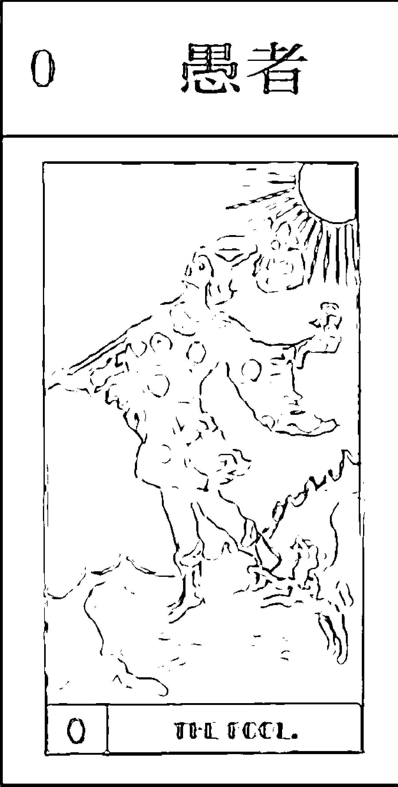

踏著輕快的步伐，猶如地球及其束縛無法對他產生控制力，這位年輕人身穿亮麗的祭袍，停在斷崖的邊緣，處在世界的高處；他眺望著眼前的藍色遠處，那是天空的延伸而不是下面的景色。

雖然此刻他是站立不動的，但仍可看出他熱切的步伐；他的狗仍在跳躍著。開展至深淵的邊緣並無可怖之處；就好似天使們會等在那兒接住他，如果他從高處跳躍時。

他的冷靜沉著，充滿智慧與期待的夢想。他一手拿著一朵玫瑰，另一手則是昂貴的權杖，倚靠在他的右肩上，並有奇異繡花的旅行袋。

他是來自另一個世界的王子，正旅行至此地，在早晨的光輝中，在熱情的空氣裡。在他背後照耀的太陽，知道他從哪裡來要往哪裡去，以及許多天後他將由其它路徑回來。他是在追尋經驗的心靈，許多制定的神秘事物的符號都記錄在這張牌上，並經由崇高的證明，推翻過去所造成的混淆困惑。

在大東方的《紙牌占卜手冊》中有一個奇怪的聯想，認為神秘愚者的職務是他通往更高部門的過程之一；但是這也許需要非比尋常的才能始可運作。

我們應該觀察這張牌如何依據普通的預知方法進行，對於能夠分辨者，這將成為一個事實的範例，除此外也是非常明顯的，那就是大阿爾卡那牌並沒有出現在原始的靈媒遊戲中，當時紙牌僅作為籌碼或藉口罷了。這項技藝產生在這樣的環境背景下，我們所知是非常微少的。

傳統關於愚者的解釋認為，他代表著肉體眾生與敏感脆弱的生命，並在奇特的諷刺下，曾一度被附以煉金術士的旁名，描繪處在最愚鈍無理狀況中的愚蠢。

### 1 魔術師

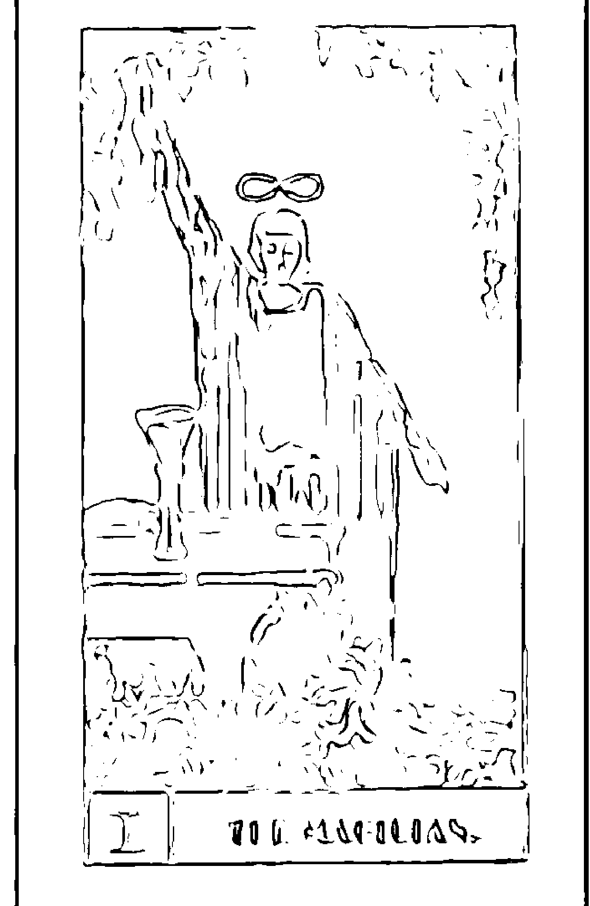

一位身著長袍且十分年輕的形體就是魔術師，有著阿波羅神的面容，帶著自信的微笑與閃亮的雙眼。

在他的頭頂上是一個聖靈的神秘記號，這個生命記號就像是由一條無盡的繩索繞成數字8的平行狀。他的腰部纏繞著一條巨蛇，牠看來似乎要吞噬自己的尾巴。這與多數傳統象徵永恆不朽的符號相似，但是在這裡特別表示獲取靈性的永恆不朽。

在魔術師的右手是把權杖，被高舉著朝向天堂，同時左手是向下指著地面。這雙重的記號在制式神秘學裡是屬於非常高階的知識，它顯示合宜的美德、善行與光明是從上面的事物取得，而衍伸至下面的地球，所以整體的建議是聖靈力量與才能的擁有與溝通。

在魔術師面前的桌子上是塔羅牌的四種花色符號，代表著自然生活的四個要素，橫躺在這位高手的面前如同籌碼，而他也将之改造成自我的意志。

在下面的是玫瑰與百合花，野地裡的花朵、百合與金合歡都轉變成花園裡的花朵了，顯示出文化方面的志向。

這張紙牌意味著一個人的神性動機，正影射上帝，以及意志力從與天上的結合中釋放出來。這也是在所有階級的每個獨立個體的統一體，而且被認為是在一個非常高的意識，以其固定的狀態存在著。

進一步瞭解我稱之為生命記號且與數字8有關的部份，它也許令人想到基督教的諾斯提教派（Gnosticism）所談論的基督復活，就是一項改變「直到第8日」（unto the Ogdoad。註：Ogdoad是埃及信仰中創造神話的八位神祇。在此，諾斯提教派也使用它代表基督在第八天復活的寓意。）

這個神秘的數字被稱為耶路撒冷，那是一塊流動著牛奶與蜂蜜的土地，是聖靈與上帝之國土。根據馬丁尼教派，8是代表耶穌基督的數字。

### 2 女祭司

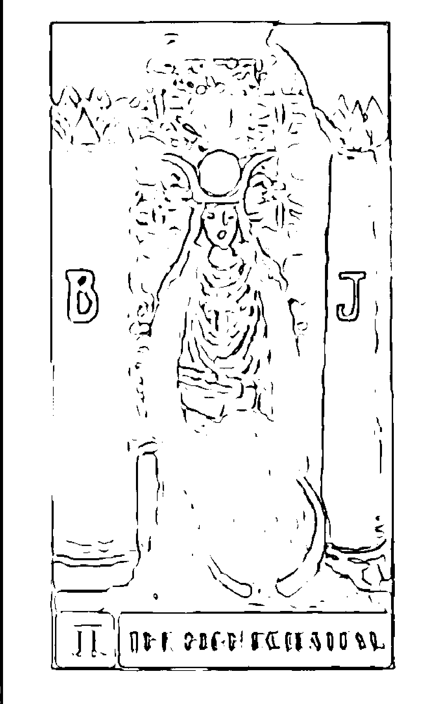

在她的腳邊有一道新月，頭頂上是角狀的冠冕，並有一個球狀物在中央，巨大的太陽十字架在她胸前。

她手裡的卷軸題著「Tora」的字，代表著上帝的律法、神秘律法與世界的第二意識，被她的斗篷半遮掩著，顯示有些事情是暗示的，而有些則是可說出來的。她坐在神秘殿堂的兩根黑與白的柱子之間—— J 與 B，殿堂的帷幕就在她的背後，繡著棕櫚與石榴。

祭袍輕薄垂墜著，斗篷意味著亮光——微微閃爍著光輝。她被稱為神秘的科學，是艾絲女神聖殿（Sanctuary of Isis）的發端，然而她實際上是神秘的教堂，是上帝與人類的居所。她也象徵著王子的第二婚姻，他已不存在這世界上了；她是精神上的新娘與母親，星辰的女兒與崇高的伊甸園。

她是帶來光明的皇后，是照亮全體的光。她是由天上的母親所哺乳的月亮。

依此情況，她自己本身也就是天上的母親，意思是，她就是光明本身的反射。在反射的概念下，她最真實且崇高的名就是「神的榮光」（Shekinah）——共存的榮耀。

根據猶太秘術教義，神的榮光同時在上面及下面。在上面的世界稱為「Binah」，這超凡的理解反映出對下面世界的散發狀態。在下面的世界則稱為「Malkuth」，為著這個原因，這個世界被認為是受祝福的國度，因其內在的榮光而受到祝福。依神秘學的說法，神的榮光就是一位正義男子的精神上的新娘，當他閱讀律法時，她就會提供預言。

根據這些觀點，這張紙牌是大阿爾卡那牌中最高且神聖的。

### 3 皇后

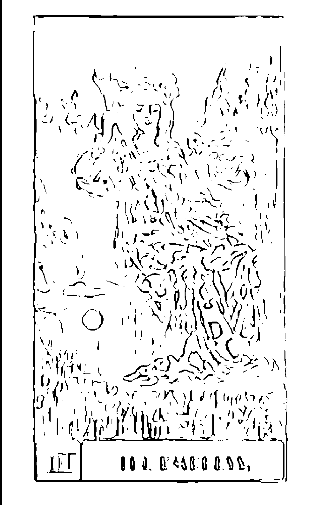

一位莊嚴高貴的人物端坐著，面容親切慈善，神情態若，具有王室的貴氣，又有和善的親切感，與周圍的大自然融為一體，身上穿著奢華的紅花白底的祭袍，是天與地的女兒。

她的冠冕由十二顆星星串連著，散發獨有的尊貴氣息，她穿的祭袍有黃色領子，給人熱情和熱力，而白底上的紅花則代表滿滿的愛。

靜置在她座椅旁的盾牌上有維納斯的金星符號，象徵女性的溫柔，以及豐饒的物產，在座椅四周是滿地成熟的穀物，白色與黃色交錯的稻穗，給人歡樂的豐收感，上方，遠方還有森林和流水。

她手裡的權杖頂端是一顆地球。她是下方的伊甸園與世俗樂園，一切皆由人類的居所得到象徵。她並不掌管天堂的神祇，但卻是人類心靈的避難所，更是萬物多產的母親。也有些特殊的觀點認為，她的正確說法應該是慾望與其翅膀，因為她是身披太陽的女人，是世界之光與至聖所；但我應補充，她並不是獲得翅膀的靈魂，除非符號象徵系統歸納出其他或不同尋常的方式。

她最重要的是繁殖的意象，與世界的外在感官。這是顯而易見的，因為沒有比這個源自於女人給男人的訊息還要直接的了；但是她本身並未傳達這樣的闡釋。

從另一個角度看，皇后紙牌意指著大門或入口，是通往生命的路徑，如同走進維納斯的花園；這條道路引導至更深處，來到女祭司所知的秘密：由她傳達給上帝的選民。

大多數針對此牌特質的古老說法，在符號象徵方面是完全錯誤的，例如將它視為福音、預言特質、三位一體等等。

### 4 皇帝

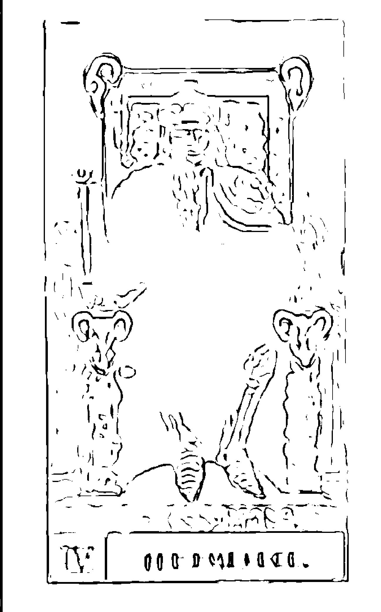

他握有埃及十字型（Crux ansata）的權杖，左手裡有顆球體物。

他是位戴著王冠的君主，居高臨下且莊嚴地端坐在王位上，扶手前端是公羊的頭像，給人莊嚴穩重的形象。

他是執行與實踐者，掌握著全世界的力量，在此他穿著最崇高象徵的衣飾，全身紅色的袍子，散發尊貴的至高氣質，更代表最大的權力。

座椅上的公羊頭，同時呼應了皇帝牌對應的火元素（註：占星學中，白羊屬於火元素），而火元素所代表的就是領導、勇敢、熱情、有野心，與皇帝君臨天下的特質不謀而合。

他有時會以坐在立方石頭的方式呈現，而非端坐在石椅上，然而這樣的表現會混淆一些議題。

相對於皇后，他代表著雄偉的男性力量，因此他試圖拿掉「艾絲女神的面紗」（Veil of Isis），然而她仍是完好無損。

應該了解的是，這張牌與皇后並不盡然代表有婚姻的生活，雖然暗示著這樣的狀態。表面上看，如我所指的，他們代表著世俗的王室，被提升至偉大的位置；但是其上方暗示著有更高的存在。

他們，特別是男性的形象，也表示更高的君主身份，是擁有著智慧的君王。這裡指的是思想上的貴族身份，而不是畜牲界。兩者的性格，依他們的行為是「充滿著奇怪的經驗」，但卻不是有意識地來自更高世界的智慧。

皇帝被描述為：a.意志力的具體展現，但這只是其中的一個運用，以及b.他是絕對存在所含的虛擬事物的表達，然而這只是幻想的。

### 5 教皇

他頭戴三重王冠坐在兩根柱子之間，三重王冠代表身、心、靈三種層次的世界，而兩根灰色的柱子則是尚未開啟的通往潛意識之路，但這裡不是女祭司所看管的那些聖殿之一。

他右手指向上天，有祝福之意，左手持權杖，有神聖與權力之意。他的前方有兩支鑰匙，一支金色，一銀色，象徵陰陽、日月、外在和內在，其寓意是如何將兩者完好的結合。

在他的左手中握著一支權杖，末端是三重十字架，同時他的右手做出基督教會知名的手勢，代表祕傳，區分出教義中揭露的與隱藏的部份。

由此可以發現其與女祭司沒有任何手勢之間的關連。在他腳邊是成交叉放置的鑰匙，面前跪著兩位身著白麻聖職衣的教士。

他經常被稱為教宗，這是他應用在更一般的職務上的象徵。他是外部宗教的領導力量，正如女祭司代表著祕傳領域的主要精神與內在力量。

關於這張牌的適當解釋，已遭受來自近乎所有人的悲慘際遇所染濁。

「大東方」（Grand Orient）曾正確的說明，關於公開的正統教義以及導向教義的生命的外在部份，教皇是解答關鍵的力量；但是他肯定不是神秘教義之主，誠如另一位評論家所言，他相當於神學知識的總體（summa totius theologia），若以最嚴格的說法；但他同時也象徵著所有顯然的公正神聖等事物。

因此，他是將神的恩典帶到制度世界的管道，區別於自然界，同時他也是多數人類救贖的領袖。他是受認可的僧侶集團的秩序與領袖，這反射著另一個更崇高的階級秩序。但也許會這麼發生，教宗忘卻自己的象徵性地位的重要性，舉止猶如所有的象徵意義或顯示的符號都出自於自己適當的掌控。

他並不代表哲學，除了神學方面之外；他也不代表靈感或宗教，雖然這是他表現的一個模式。

### 6 戀人

太陽在天上閃耀著並向下傾瀉著影響力，其下方有個長著翅膀的巨大形體。

前景是兩個人類的形體，男與女，彼此未著任何遮蔽物，就如同亞當與夏娃第一次在天堂擁有世俗的肉體般。

夏娃背後的知識之樹上，纏繞的蛇，在這裡可代表智慧，也可代表慾望和誘惑，是一種來自於潛意識的誘惑，亞當背後的生命之樹上，有十二顆水果，也代表著慾望之火。

這些形體代表著在受到粗俗物質與慾望污染以前的青春、純潔、天真與愛。簡而言之，這張牌就是人類的愛情，在這裡展現部份的情況，既真實且生動。

亞當和夏娃背後是風之天使拉斐爾，風元素的重要特質是溝通，顯示兩人必須重視彼此的溝通。而拉斐爾身後有一個佔滿天空的黃澄澄大太陽，則象徵兩人的結合充滿愉悅歡樂的能量。

兩人的背後有一座山，其代表意義一說是思想的豐饒果實，另一說則是代表高峰的極樂感受。

根據第一項原則，它取代了古代紙牌的婚姻，如我先前所描述的，後來無知的人將男人描述為在善惡之間。就崇高的意識而言，這張牌代表聖約與安息日的神秘事物。

關於女人的建議認為，她是敏感生命的誘惑，其中包含著影響男人的墮落，然而她有點是受到上帝的神秘律法的操控，而非出於自願與意識去誘惑人的女人。經由將過錯歸究在她身上，男人才得以在最終時刻復活，而且也僅能透過女人，他才能使自己成為完整。

這張紙牌也因此暗示著女性偉大神秘的特質。

舊時的解讀都從古代的圖片開始分析其必要元素，但即使是後者的闡釋，部分是平凡無奇，而其他的在符號意象上是毫無根據的。

### 7 戰車

一位直立著的尊貴人物，攜帶著一把出鞘的劍，駕著兩隻人面獅身獸拉著的戰車。這兩隻人面獅身獸一黑一白，代表陰與陽，也代表嚴厲與慈悲，具有相互輔佐和相互平衡的作用。

他的手上拿著權杖，象徵意志和力量，頭上戴著八角星頭冠，象徵統治，還有桂冠象徵勝利，身穿盔甲，盔甲上有月形肩章，胸前有象徵土元素的四方形圖案，還有戰車前方的翅膀圖案代表靈感，盾牌裡的紅色圖案是男性與女性生殖器的組合象徵，代表陰陽的結合。

在這位勝利英雄的肩膀上應該是烏陵與土明（註：烏陵代表著光明、火；土明則代表正直、純真、誠實）。

他帶領著被囚禁的俘虜；他是所有領域的征服者——在心智、科學、發展以及某些創始的嘗試。他因此回擊了人面獅身像，所以根據這個理由，我接受艾利李維的變更解讀，所以成為兩個人面獅身像拖著他的戰車。他在心智上，是凌駕萬物的勝利。

這是可以從以下的理由得到理解：

- a. 人面獅身像的問題是與自然界的神秘事物有關，而無關神的恩典，所以戰車的駕駛者無法提供任何解答；
- b. 他的征服領域是屬於明顯的或外在的，不是他自己本身；
- c. 他所造成的解放也許會將他自己囚禁在理性的判斷中；
- d. 他開始所歷經並獲取勝利的考驗，必須以自然規律或理性來理解；
- e. 如果他來到女祭司所坐的殿堂柱子前，他無法打開名為「Tora」的卷軸，即使女祭司提出問題，他也無法回答。

所以，他並非世襲傳承的王權，他也不是教士身分。

### 8 力量

一個女人，頭頂上籠罩著相同的生命記號，我們在魔術師的紙牌已見過了，她正要閉合獅子的口，她的態度是平靜的、溫柔的、和善的，就像以柔克剛似的，用柔軟的力量，化解剛烈的強硬。

她的頭上有一個倒8的符號，這個符號象徵無限大的力量，也就是說她的力量是無窮的，天地之間的能量都可為她所用。

她頭上有一個美麗的花圈，腰上繫著花環，全身散發一股柔順的平和之氣，即使面對張開大嘴的獅子亦無所懼，反而有一種輕易就扭轉局勢的無窮之力。

獅子的身體微微傾斜，順勢壓低，尾巴低垂，表現出已被女人馴服的模樣，毫無抗拒之感，整體畫面一片祥和。

這裡唯一與傳統的表現方式不同之處為她的慈善堅毅已經降服了獅子，並以花圈帶領著。

令我自己滿意的是，這張紙牌已經與通常是數字 8 的正義牌交換位置了。這樣的變動對讀者來說並不重要，因此也無須加以解釋。

堅毅是神聖神秘學協會中最崇高的觀點；這項美德當然適用在任何領域，因此可利用在所有的象徵主義。它亦與天真、純潔，以及存在沉思冥想中的力量有關。

然而這些更崇高的意思是依靠推斷而來的，我並不認為它們從紙牌表面是明顯可知的。這些暗示都是從花圈的隱含意義得來的，它同時也代表著許多事情，例如甜蜜的枷鎖與神聖律法的輕微負擔，當它成為所有精神的重心時。

這張牌與一般所認知的自信並無關係，而是力量來自於上帝，並找到上帝成為庇護所的人所擁有的自信。

另外，獅子代表熱情，而稱為力量的她則是解放牠的更高存在，走在角蛭與蜥蜴上，並踩著獅子與龍。

### 9 隱者

這張紙牌唯一與傳統模式不同的是，油燈並非半遮掩在提燈者的斗篷裡，他融合古代的思想與世界的光。一位老人站在山巔之上，四周環境盡是冰天雪地，空無一物，在這浩瀚的天地裡，只有老人的存在，透露出自我堅持的強烈訊息。

他穿著灰色斗篷，手裡高舉著一盞燈，像是要照亮前路，而這盞燈象徵的就是真理，一顆六角星在油燈裡照耀著，代表的則是潛意識之光。

老人的左手拿著拐杖，而且是一支黃色的拐杖，與油燈裡閃耀的星星相互輝應，在灰白的世界之中，更顯鮮豔明亮。

我曾說過這是一張知識的牌，延伸這樣的概念，畫面裡的人物在高處高舉著指路明燈。因此，隱者並非如傑伯林所言，是在找尋真理與正義的智者；也並非像後來的解說所提的，是特別代表經驗的牌。他的指路明燈暗示著：「我所在之處，你也可能到達。」

更有甚者，對於這張牌相當錯誤的理解為，認為它與神祕的孤立有關，是個人魅力的防護，相對於混淆的狀態。

這樣輕率的描寫應歸咎於艾利李維，其說法已被馬丁尼教派的法蘭斯歐德（French Order）所採納，我們當中有些人已聽過許多關於「沉默與未知的哲學掩蓋在他的斗蓬之下，以避開外來的異端知識」一類的說法。

在馬丁尼教派真正的教義當中，「陌生的哲學家（Philosophe inconnu）」的意義是另一個神職。

它並未涉及制式神祕學或其替代物的刻意隱瞞，但是誠如紙牌本身，是關於神聖神祕事物為保障自身的防護，以防不速之客。

### 10 命運之輪

藍色天空的四邊有四個角色，分別代表風水火土四種元素，人是水瓶座（風）、老鷹是天蠍座（水）、獅子是獅子座（火）、牛是金牛座（土），他們都在以閱讀來增加自己的智慧。

輪盤左方有一隻正往下的蛇，象徵向下沈淪的黑暗世界，右邊背著輪盤的胡狼頭動物，則代表渴望向上的企圖。輪盤的四個方位分別有TARO四個字母，Rota（輪）、Orat（說）、Tora（律法）、Ator（哈托爾女神），也就是「塔羅之輪述說哈托爾女神的律法」。

我再次採用艾利李維的重修版本，他做了幾處變動。使用埃及的符號系統是合乎法統的，誠如我所示意，只要符合我們的目的，且在不包含來源論說的條件下。

然而我已呈現Typhon的巨蛇狀態。其符號象徵系統並非僅埃及的，正如以西結書的四種活生物佔據紙牌的四個角落，且輪子本身採用李維其他關於以西結書的指示，作為特定的塔羅圖例說明。

根據法國神秘學家與圖畫本身的設計，這張象徵性的圖片代表著永恆持續的動態，世界的流動以及人類生命的變動。獅身人面像代表其中的均衡。

塔羅「Taro」的音譯字「Rota」印寫在輪子上，與神聖的名字交錯著，顯示上帝皆存在所有的過程中。但這是在內部給予神性的意圖，在外部的相似意圖是以四個活生物為例。有時，人面獅身像會以伏蹲在上方的座檯方式呈現，這是藉由廢除動態中的必要「穩定」要素，欺騙符號象徵系統。

在符號的一般見解陳述背後，隱含著否定機會，並暗喻宿命的意思。需要補充說明的是，自李維以後，這張牌的神秘學闡釋，甚或是對神秘學本身來說，都是格外地愚昧虛幻。它被認為是普通的原則、多產繁殖力、男性尊嚴、統治權威等等。普通的預言在其領域內的結論，都勝過於此。

### 11 正義

一名女性穿著大紅色的袍子，袍子上有一條綠色披肩，頭戴著金色帽冠，端坐在石椅上，感覺四平八穩。

她的綠色披肩由一個方形釦子扣著，方形釦子中間是個圓形，象徵火土風水四元素的和諧性。她的金色帽冠上有四方形的寶石，再加上三個方頂，會得出七這個數字，它代表金星，是占星學中天秤座的守護星，同時代表正義之意。

她的右手高舉著象徵決心和公正的寶劍，意指用理性和智慧來揭穿一切不實的虛幻和謊言。但寶劍終究是有殺傷力的，如水可載舟亦可覆舟的道理，寶劍可用來行善，也可用來行惡，就看使用者的心態和意圖。她的左手拿著天秤，象徵她正在評估、衡量，為下某個決定而思考該如何平衡。

她的後面有一塊紫色帷幕，代表隱藏的智慧，而帷幕旁的兩根柱子分別象徵正面和負面的力量，讓人學習思考該如何安然生存其中。

因為這張牌採納傳統的象徵系統，且擁有一切對閱讀者而言明顯的意義，除少數在第一部分提過的原因之外，無需多言。

然而，圖中的人像坐在兩根柱子之間和女祭司一樣，因此，似乎想要表示出這個道德原則適用於所有的人應用在自己的工作上，當然它與更崇高的事物有絕對的類同性，儘管如此，卻在本質上不同於涉及選擇概念的精神正義。

後者屬於上帝的神秘秩序，這樣的美德得以使某些人懷抱著信念要奉獻給至高無上的事物。其運作有如聖靈的呼吸，且我們沒有任何有關此的評論標準或解釋的根據。

這就類似詩人擁有優雅、崇高與優美的天賦才能：我們擁有它們與否，它們的存在如同消失一樣地神秘。正義的律法無論如何皆非兩者之一。

總言之，正義的支柱向一個世界展開，女祭司的支柱則是面對另一個世界。

### 12 倒懸者

一名男子倒吊在一棵T字形的樹上，他兩手都放在身後，遠看這個畫面，就像一個三角形。他的兩隻腿交叉著，形成十字，而這個十字和三角形組合起來，就是古代煉金術的符號。

男子將自己的身體與樹結合，呈現鍊金術的符號，象徵著低層次慾望向高層次慾望轉化的過程，也就是一種靈魂的提升。

男子身上的紅色褲子代表「身」，藍色上衣代表「心」，金髮和光環代表「靈」，一併將肉體、慾望、知識、智慧、心靈等全數涵蓋，而他的金色鞋子則象徵欲追求的崇高理想。

男子身後的樹，是生命之樹，由代表潛意識的地獄開始生長，經過代表意識的地面，直達代表超意識的天庭。

他懸掛在絞刑台上呈現T字型，而整個形體自腿部的位置開始呈現十字形，有圈光輝圍繞著他的頭，好似一名殉教者。

應注意以下幾點：

- 1. 他所犧牲懸吊的樹是生長著葉子的生命之樹。
- 2. 他的面部呈現陶醉而非痛苦的表情。
- 3. 畫像整體而言，代表生命的懸浮狀態，但卻是有著生命而非死亡的。

這是張蘊藏深奧涵義的牌，但是所有的涵義都被掩蓋住。

它一直被誤認為是代表殉教、謹慎、偉大工作或義務的牌；但是即使我們找盡所有出版過的闡釋，也許會發現是無用的。我只會根據自己的部分非常簡單地說明，它所要表達的觀點之一是神學與宇宙之間的關係。

他能夠明白有關自己更崇高本質的一切都埋藏在這套符號象徵系統中，也將會接收到關於一個偉大覺醒的暗示，並且知道在莊嚴神秘的死亡之後，會有榮耀神秘的復活日。

### 13 死神

一名騎著白馬的骷髏騎士，身穿盔甲，全副武裝，手裡拿著有薔薇十字會圖騰的黑白旗幟。

他的身旁有四個角色，分別是國王、主教、女人和小孩。國王抗拒死亡，但仍被骷髏騎士踐踏而過；主教雙手合十，接受死亡；女人跪下，轉過頭去不敢面對；小孩不懂死亡，好奇地望著骷髏騎士。整體來說，其象徵著無論男女老幼，誰也逃不過死亡這個自然法則。

在骷髏騎士的背後有一條冥河，代表生生不息的生命；而象徵永生的朝陽自兩座塔之間升起，目的是讓人類瞭解死亡並非一切的終點。

生命的面紗是永久存在於變動、轉變中，以及由低層次通往高層次的過程中，修訂過的塔羅牌更恰當的展現其中天啟的觀點，勝過收割骷髏頭的粗糙概念。

其背後隱含著全世界的精神方面提升的意思。神秘的騎馬者緩慢地移動著，舉著一把黑色旗幟，上面裝飾著代表生命的神秘玫瑰。水平邊緣的兩根柱子間，代表永恆不朽的太陽在閃耀著。

騎馬者並未帶任何可見的武器，但是國王、孩童以及婦人都倒在他的面前，同時一位主教雙手合掌等待他的終結。

這裡應該無需特別點出死亡的意義，就神秘主義的理解，其原因我在前一張牌已經做相關的說明了，但不適用於現在的案例。

人類自然的變遷至生命的下一個階段，也許是進化的一種形式，但是仍在現存生命中，從奇特且近乎未知的入口要通往神秘死亡的階段，是意識型態的轉變，通往一種非以尋常死亡作為路徑或門檻的境界。

對於第十三張的現存解讀，整體來看是比較適當的，代表復活、創造、終點、重生與休息。

### 14 節制

一位有著雙翅膀的天使，前額是太陽，胸前有代表七的正方形（地元素），與橘色的三角形（火元素），象徵終極相標。

天使的臉上散發和諧平靜的光輝，舒適自在，活在當下，右腳踏入代表潛意識的池塘中，左腳踩在代表顯意識的岸邊石頭上，其象徵著天使能在潛意識和顯意識之間取得平衡。

池塘邊開著黃色的花，代表光明愉悅的感受，遠方有一條小路通往藍色的山，兩座山之間閃著豔陽般的金色光芒，讓人感覺充滿希望。

雖然我使用男性的概念稱呼他，但是他既不是男性也不是女性。一般認為他正將生命的本質從一個聖杯傾倒至另一個聖杯，一隻腳在地面，另一隻腳放在水面，藉此說明自然的本質。

一條直徑往上通向水平的邊緣，在那兒上頭有一道幾近刺眼的巨光，裡頭隱約看見到一頂王冠。

這裡有關於永恆不朽的生命的部分秘密，人類有可能在自己的化身中實現。在此，所有傳統的象徵都棄置不用。

因此也有些常見的解讀，提到生命永恆的移動，甚至是所有概念的綜合。再者，認為他象徵太陽的才能在人類三位一體的第三部份裡實現，也是錯誤的，雖然這是類同於太陽的光。

它難以置信地被稱為節制，因為當規則是取自於我們的意識，認為它鍛鍊、結合與協調著精神與物質的特質。依此規則，我們的理性部分知道我們是從何處來與要往何處去。

再者，節制排在死神之後，即意謂著已經從內心深層的恐懼跳脫出來，就像風雨後的雨過天晴，給人安祥的平靜感。

### 15 惡魔

這個設計根據在第一部分提過的一些動機，代表適應、鄙陋或是和諧。有著山羊角的曼德斯（Mendes），戴著蝙蝠的翅膀站立在祭壇上。

在胃部的凹處是個代表水星的符號。右手高舉並張開，是第五張牌的教皇所給予的祝福的相反。右手裡是把巨大的火餡轉向下朝著地面，一個顛倒的五角星在前額上。

祭壇的前方有個扣環，套著兩條鎖鏈圈在兩個人形的頸子上，是一男一女，亦即亞當夏娃的角色。

在亞當夏娃身後的惡魔，頭上有倒立的五角星，代表物質世界，其右手的黑魔法手勢，和教宗的祝福手勢，是對立的，而手心裡的土星符號，則是更貪婪的物質慾望，其左手拿著火把，似在挑起亞當的慾望。

亞當和夏娃都長了角和尾巴，顯露原始獸性；他們都被鐵鍊鎖住，但其實鐵鍊很鬆，是可以掙脫的，但他們卻流連其中。

這些與第五張牌的符號類比，如同亞當與夏娃墮落之後，代表著物質生活的鎖鏈與宿命。

這些人形都有尾巴，代表動物的特性，但臉部卻有著人類的智慧，而高高在他們之上者並非永遠是他們的主人。

即使是現在，他也是個受自己本身惡魔支撐的奴隸，且無視於自由的助益。勝過他對這些藝術一貫的嘲弄，一向佯裝尊敬且以大師之態解讀，艾利李維確信巴佛美神（Baphometic）的形象是屬於神秘科學與魔法的。

另一位評論家認為，在神聖的世界它代表著預定的宿命，但是在那個世界裡卻沒有等同於下面的獸性。而它確實代表著因吃下禁果而被驅逐在伊甸園門外的那兩個居住者。

### 16 高塔

這張牌在神秘學方面的解釋，是貧乏且令人不知所措的。

我認為它的各方面描述皆指出毀滅的觀點是錯誤的，因為這是它表面上傳達的證據。更進一步被認為含有對有形建築物的首要暗示，但我並不以為高塔比之前三張牌所提及的柱子更為有形化或少些。

我看不出任何得以支持帕柏（Papus）的假設，認為它確實是代表亞當的墮落，然而我倒是贊同他的另一項說法，認為它象徵著精神世界的具體化。

基督教的書目編纂家想像那是心智的墮落，並試圖勘破上帝的秘密。

我傾向贊同大東方（Grand Orient）的看法，認為那代表「生命之屋」（House of Life）的毀滅，當邪惡入侵時，尤其是一個「教義之屋」（House of Doctrine）的崩裂。然而，我瞭解它是指一個「虛假之屋」（House of Falsehood）。

它同時以最完整充分的方式說明聖經上的真理：「除非上帝建造這房屋，否則建造的人就枉費努力」（except the Lord build the house, they labour in vain that build it）。

有一種看法認為大災難是前一張牌的反射，但並不是從符號象徵的角度，這是我一直試圖說明的。

更確切地說，這是關於類比的問題：一是關於墮落於物質與動物的境界，另一方面是代表智性的毀滅。

至於高塔則被視為一種懲戒，對於傲慢自大與試圖瞭解上帝秘密而過度壓抑理智；但是以上兩者皆無法說明這兩個活生生的受難者。一個只是毫無用處地照字面解釋；而另一個則是錯誤的詮釋。

更深入的觀點認為它也許亦代表一項天命的結束，但在這裡並無就此原因討論相關問題的必要。

### 17 星星

一顆巨大、閃耀著八道光芒的星星，被七個同樣有著八道光芒的較小星星圍繞著，

位在前景的女性人像，是完全裸露的。

這名女子的左膝跪在土地上，而她的右腳踩在象徵潛意識的水裡，兩手各拿一個水壺，從這兩個大口水壺中傾倒出「生命之水」（Water of Life）。

她將右手水壺裡的水倒入池子，將左手水壺裡的水倒在草地上，象徵人的五種感官，相互交流，生生不息。

在她身後是一片往上攀升的地面，其右側是一顆灌木或短樹，上頭有隻鳥兒飛落，牠代表的是智慧，正眺望遠方，似在提醒人類應隨時保有智慧之心。

另外，女子身後的遠處還有一大片開滿了花朵的草原，以及一座靜謐安穩的山脈，看起來欣欣向榮，令人心曠神怡。

這名女子像傳達著不朽的青春與美麗，而星星則象徵著耀眼的巨星，它出現在同濟會的象徵符號系統中，但卻因此造成混淆困惑。

該女性所傳達的生動景象，就是天堂與其元素的實體。這可以真確地從兩句格言表達：「可以自由拿取的生命之水」與「心靈的禮物」。

綜合一些庸俗的解釋，認為這是代表希望的牌。就其他的層面而言，證實此牌為永恆不朽與內在的光。

對於大多數已作好準備的理智而言，她將呈現真理的真實樣貌，榮耀存在永恆不朽的美麗中，傾倒靈魂之水在一些地方，且估量她所擁有的無價寶藏。

但實際上在猶太教神秘哲學中她是偉大的母親，擁有超凡的覺知，並向下方的生命之樹（Sephiroth）註：Sephiroth是遠古猶太教神秘主義教義中的「生命之樹」，意即真理的根源。傳遞她的匯集，依他們能夠接收到的方式。

### 18 月亮

一個大大的黃色月亮高掛在藍色天空，但這個月亮裡卻有不同元素，一個是新月，一個是滿月，一個是女人的臉孔，然後從新月慢慢延伸到滿月。

另外，這個月亮有十六道大光芒，以及十六道小光芒，而飄散在空中的是代表思想的露珠。

一隻蝦正從池塘爬出，這隻蝦代表一種很深層的情緒，像是猶豫或憂慮。蝦的左邊是一隻狗，右邊是一隻狼，各自代表已收斂和未收斂的獸性。

在狗與狼的中間有一條通往遠方兩塔之間的小路，它一直延伸向更遠的山脈，這條小路不知最後會通往何處，但它越來越細小，只剩微弱的月光照著，似也表達了一種不安。

這張牌與一些常見類型的明顯區別是，月亮正增強其慈悲寬容的部份，是給予觀察者的權益。它有著十六道主要光芒與十六道次級的光線。

這張牌象徵想像力的生命，與心靈生活無關。在高塔之間的路徑是通往未知的課題。

狗與狼代表著自然心智面對出口的地方所產生的恐懼，因為那裡僅藉著反射的光給予指引。

最後的關連性，是解答另一個符號象徵形式的關鍵。智慧的光是反射的，超越其上的是無法向外顯露的未知神秘事物。它闡明我們的動物特性，並以狗、狼等形式呈現，這些從深處開始表現出來的無名且可怕的傾向，比之野蠻的獸性還低等。

它努力達到顯露的地位，從深不可測的水裡爬上陸地作為象徵，然而依循慣例，它又會重回與沉入來處。代表心智的臉龐對著下方的騷動不安投以安詳的凝視；落下思維的露水傳達的訊息是：祥和平靜；也許安靜會因此影響動物的特性，同時位於下方深不可測的事物應會由放棄一個形式而終止。

### 19 太陽

一個可愛的孩童騎在馬背上，裸體、頭戴著雛菊花環和一根紅色羽毛、張開雙手微笑著，很開心的模樣。孩童左手拿著一支很大的紅色旗幟，象徵他已經有能力掌控自己擁有的一切。

孩童雖坐在馬上，但不需要用韁繩拉住牠，且連手都不用扶著，象徵孩童與馬的關係是和諧的、愉悅的、良性的。

後面的圍牆上有四朵鮮豔的向日葵，且面向孩童，而不是太陽，表示孩童的純真、坦誠、正面能量，已足以吸引原本向陽的向日葵。

一個超大的太陽高掛空中，且光芒四射，總共有二十一道光芒，它代表了愚人之外的二十一張大阿爾卡那牌。

一位赤裸的孩童騎坐在白馬上，展示著一面軍旗，誠如前面所提，這是關於此張紙牌比較適當的符號象徵系統。象徵著超自然的東方（Supernatural East）的命運，以及偉大且聖潔的光，在人性永無止盡的隊伍之前，自敏感脆弱的花園圍牆內出現，並繼續回家的路。

所以這張牌表示，從地球的壯麗太陽所象徵的這個世界鮮明的光，轉變為未來世界之光，開始於志向抱負之前，以孩童的心作為代表的典型。

但是最後一項暗示，再度成為解答符號象徵系統的另一個不同的形式或觀點的關鍵。太陽代表精神的意識，意指反射之光的對照。

人性的獨特典型成為一個內在的小孩，有著單純天真的智慧。在這樣的單純中，他懷有自然與藝術的封印；在那樣的天真裡，他代表著精力充沛的世界。

當自覺的心靈已開始出現在意識中，超越天生的理智，該理智就會在重建中引領動物的特質朝向理想一致的境界。

### 20 審判

大天使加百列在空中吹著號角，從號角口發射出七條線，代表著七個音階，能帶領著人類掙脫物質世界的束縛，重回精神層面的淨化和提升。另外，號角上綁著紅十字旗幟，象徵業力的平衡。

下方有一片海洋，象徵人的潛意識，海洋上漂浮著棺木，棺木裡載有灰色的人，他們分別是代表顯意識的男人，仰望著天使；代表潛意識的女人，迎接著天使的召喚；代表重生的小孩，背向著天使。

我已經說明過，這張符號實質上在所有的塔羅牌中都是不變的，或至少這些異動並不會改變其特色。

這個巨大的天使在此被雲朵圍繞著，但他吹奏著附有旗幟的喇叭，而十字架照例出現在旗幟上。

死者從他們的墓地裡站起來，女人在右手邊，男人在左手邊，在兩者之間的是他們的孩子，他是背對著站立。但是在這張牌中還有超過三位的復原者，這項改變被認為是有價值的，以說明目前的解釋之不足。

應該注意的是，所有的人像皆一致處於驚異、崇拜與狂喜中，從他們的姿態傳達出來。這張牌在表達一項轉變的偉大工作，回應來自天國的召喚，其請求被聽見並從中獲得回應。

裡頭暗示著一項重要的意義，卻無法在目前的階段進一步闡釋。那是什麼？存在我們內心中所吹響的喇叭，我們所有較低等的特質皆起而回應，近乎在一瞬間的光景或一眨眼的時間裡。

就讓紙牌繼續說著，對於無法看見更深遠意義的人，最後的審判與復活是發生在自然的軀體；但是讓那些擁有內在雙眼的人，隨即看見並發現吧！

他們將會明白，在過去它曾被真確地視為代表永恆生命的牌，因此可與節制的紙牌相比較。

### 21 世界

一位舞者的左右手各拿著權杖，各自代表進化和退化的力量，其身上纏繞著象徵高貴與神聖的紫色絲巾，像是在輕快地跳著舞。

這舞者站在橢圓桂冠花圈的中間，桂冠除了象徵成功，也像是愚者 0 號的形狀，表示潛力無窮，桂冠的上面和下面各有一條紅色絲巾，且呈倒 8 符號，象徵無限和永恆，而舞者本身則代表著每個人身上都有神性存在。

在桂冠花圈外的四角，分別有人（水瓶座，風元素）、老鷹（天蠍座，水元素）、獅子（獅子座，火元素）、牛（金牛座，土元素），他們相互合作協調，最後將任務圓滿達成。

做為大阿爾卡那牌的最終訊息，其設計是不變的，而且確實是不可改變的，關於它的深層涵義已被部份地描繪出來了。

它同時象徵著圓滿與宇宙的盡頭，其中蘊藏的秘密是宇宙的狂喜，當它在上帝裡瞭解自己時。

更深一層的境界是靈魂處於神聖觀點的覺醒狀態，從自覺的靈性所反映而來。但是，這些意義並無關物質面的偏見。

它不只一項關於大宇宙的訊息，且舉例來說，是恢復精力的世界狀態，當展現自然界的盡善完美的最高境界時。但這也許是特別指過去的故事，當時所有的一切皆是美好的，當時早晨星星一同歡唱，與所有的上帝之子歡笑著。

關於此點，最糟糕的解釋之一是認為該人像代表東方三博士之一，當他達到初始的最高階段；另一種可笑的說法是，它象徵純粹完全。該形體也曾代表真理，然而真理更恰當的位置是在第十七張牌。最後，它也被稱為東方三博士之冠。

# （ ）塔羅牌（ ）

｜經｜典｜手｜冊｜

☆揭開大阿爾卡那牌的神秘面紗☆

## 三、大阿爾卡那牌與其占卜的涵義

### 0.愚者

愚蠢、瘋狂、奢侈、狂喜陶醉、精神錯亂、狂熱、洩漏。

【逆位】疏忽、缺席、分配、粗心大意、冷淡、無價值的事物、虛榮虛幻。

### 1.魔術師

技術、外交手腕、演說、精細微妙；疾病、痛苦、損失、災難、敵人的圈套；自信、意志；如果是男性，則只占卜問事者。

【逆位】醫生或治療師、東方三博士之一、精神疾病、丟臉的事、不安憂慮。

### 2.女祭司

秘密、神秘事物、尚未揭露的未來；若為男性占卜問事者，則是使他產生興趣的女人；若為女子，則占卜問事者是指她自己；靜默、頑強堅持、神秘事物、智慧、科學。

【逆位】熱情、精神或肉體的狂熱、自滿以及表面的知識。

### 3.皇后

豐收、行動、主動進取、時間長短；未知的事物、暗中秘密地；困境、懷疑、無知。

【逆位】光明、真相、解決所涉入的事物、公開的慶祝；另一種解讀說法，猶豫躊躇。

### 4.皇帝

穩定、權力、保護、實現；偉大的人物；幫助、理性、說服力；權威與意志。

【逆位】仁慈善心、同情憐憫、信譽、面對敵人的混亂困惑、妨礙、不成熟。

### 5.教皇

婚姻、結盟、束縛、奴役；根據另一種說法，慈悲與善良；靈感；占卜問事者所求助的對象。

【逆位】社會、良好的理解、和睦、過於友善、軟弱。

### 6.戀人

吸引力、愛、美麗、克服的試煉。

【逆位】失敗、愚蠢荒謬的構想。另有種說法提到失意的婚姻，與所有事物的相反對立。

### 7.戰車

救援、遠見；戰爭、勝利、冒昧放肆、報復、麻煩。

【逆位】騷亂、爭吵、爭執、訴訟、戰勝擊敗。

### 8.力量

堅毅、精力、行動、勇氣、寬宏大量；徹底的成功與榮譽。

【逆位】專制、濫用權力、軟弱、爭吵不和、有時甚至代表恥辱或丟臉的事。

### 9.隱者

審慎、謹慎；又特別指背叛、掩飾虛偽、欺騙、墮落腐敗。

【逆位】隱瞞、偽裝、政策手段、恐懼、無理的警告。

### 10.命運之輪

宿命、命運、成功、提升、幸運、幸福。

【逆位】增加、豐富、奢侈品。

### 11.正義

公平、公正、誠實廉潔、執行者；在律法中值得獎賞方面的勝利。

【逆位】法律的所有部門、法律方面的複雜層面、偏執頑固、偏見、過度嚴厲。

### 12.懸吊者

智慧、慎重、洞察力、試煉、犧牲、直覺、占卜預知、預言能力。

【逆位】自私、群眾、運用身體的手段。

### 13.死神

結束、死亡、毀滅、墮落；對男人來說，則代表失去捐助者；若是女人，則有許多對立相反的事物；若是少女，則代表婚姻計畫的失敗。

【逆位】懶惰、睡覺、昏睡無生氣的、茫然、夢遊；希望毀滅。

### 14.節制

節約、溫和穩健、管理、調和適應。

【逆位】與教堂、宗教、派別、教士職位有關的事物，有時甚至是關於即將與問事者結婚的教士；分裂、不幸事物的結合、魚與熊掌不可兼得的利益。

### 15.惡魔

蹂躪、暴力、激烈、異常的努力與成果、力量、死亡；這些命運是註定的，但這並非是邪惡的理由。

【逆位】邪惡的致命、軟弱、渺小、盲目無知。

### 16.高塔

悲慘、危難、貧困、災禍、巨大的苦難、恥辱、欺騙、毀滅。這張牌特別指著預料之外的災難。

【逆位】根據相同的理由，代表比較輕微程度的相同意義；還有，壓迫壓制、監禁、專制暴虐。

### 17.星星

損失、盜竊、貧困、遺棄；另一種解讀是，充滿希望與光明的前景。

【逆位】傲慢自大、高傲、無能。

### 18.月亮

隱匿的敵人、危險、毀謗、黑暗、恐怖、欺騙、神秘的力量、錯誤。

【逆位】不穩定、易變無常、靜默、輕微程度的欺騙與錯誤。

### 19.太陽

物質的快樂、幸運的婚姻、滿意。

【逆位】相同的意義，但是比較次要的程度。

### 20.最後的審判

位置的改變、復活、結果。另一個解釋說明訴訟的總體損失。

【逆位】軟弱、膽怯、儉樸單純；深思熟慮、決定、判決。

### 21.世界

有把握的成功、報酬、旅行、路徑、移民、飛行、地點的轉換。

【逆位】懶惰、固定、停滯、永久性。

除了那些表面涵義所傳達的無法否決的意見之外，對我而言，從大阿爾卡那牌中所摘取的占卜技藝方面的解讀，是極度的矯揉造作且武斷。對於某一層級來說，是神秘事物的啟發，另一方面則是幻想的結果。將預測未來的觀點置於這些紙牌上，是個由來已久的不恰當舉動。

# 第三部

## 揭露小阿爾卡那牌的神諭秘密

- 一、大小阿爾卡那牌的區分
- 二、小阿爾卡那牌的符號意象
- 三、小阿爾卡那牌四組花色的增補涵義

# （ ）塔羅牌（ ）

| 經 | 典 | 手 | 冊 |

☆揭秘小阿爾卡那牌的神諭秘密☆

## 一、大小阿爾卡那牌的區分

依據他們通常呈現的方式，以存在大、小阿爾卡那牌之間的宮廷牌作為橋樑——國王、皇后、騎士與侍從或侍衛；但是最明確的區別是從大阿爾卡那牌的傳統特色展現出來。

請讀者比較任何在前面排序的牌，例如愚者、女祭司、教皇等，幾乎沒有例外，就能領悟我的意思。

普通的宮廷牌，表面上並未包含任何特殊的想法；他們是傳統的橋樑，成為簡易的籌碼憑藉與緊接著的十個數字牌的過渡。

我們似乎已徹底地從生動圖畫所闡述的更高意義的領域抽離了。然而曾有段時期，數字紙牌也曾是圖畫，但是這樣的設計僅是某些特定的藝術家偶然的發明，若不是典型代表性的設計就是寓意式的，與已知的符號象徵系統有所分別，或者我們可以說他們是說明風格、習俗與時代的圖解。

簡言之它們是裝飾物，因此重要性無法與大阿爾卡那牌相比；再者，差異變化是非常地少。

儘管如此，仍有些含糊的傳言談論小紙牌的更崇高意義，但截至目前為止並沒有人知道任何事情，即使是在最神秘學的圈子內慎重的領域；這些確實在占卜價值標準上有一定的差異存在，但我還未聽說他們在實際操作上提供更好的結論。

努力的成果如帕柏的「波希米亞人的塔羅牌」就是其中費盡心力且值得的範例；他特別指出大阿爾卡那牌所含之神性內在的元素，而且他試圖在小紙牌系列中依循相同的模式，好似藉由命運的世界呈現經篩選的神的恩典世界；但是他僅能創造一種武斷的片段架構無法更深入探討，他最終出於必要求助於一般的占卜方式作為小阿爾卡那牌的替代主題。

現在的我，實際上位於相同的處境；但是我在此將不會效法他或其他人所做的，利用數字的神秘特性以保障地位。

我應立即認清大阿爾卡那牌屬於哲學的神聖交易，但這些全部成為預測未來的工具，因為它從未轉變為其他的語言；經採納的做法將作為占卜之用，且需要時甚至成為賭博遊戲，及屬於這個特定技藝世界的事物，它將撥出部分給重要的事務，運用其他的規則。

針對目前這項主題的隨意介紹中，僅需補充56張小阿爾卡那牌與普通遊戲紙牌之間的差異實際上很輕微，因為聖杯替代紅心等等以此類推，構成偶然的變動，但是由於騎士牌的出現在四組花色中，曾在許多平凡的紙牌中獨具特色，當時這個角色經常替換掉皇后呢！

在修訂後的塔羅牌中，也就是闡釋現在這本手冊者，所有編號的小阿爾卡那牌，Ace牌除外，皆提供不惹人厭煩的人像或圖畫來詮釋所賦予的占卜意義。

某些賦有思考與識別才能的觀點者，這並非談論異常的洞察力，也許觀察到許多小阿爾卡那牌因為設計的緣故，傳達模糊不清的暗示，似乎超越指定的占卜價值標準。為避免錯誤的想法，非常值得明確地說明差異變化不應該被視為更高或超越占卜的符號象徵系統，除少數偶然發生的情況之外。

我已說過，小阿爾卡那牌尚未被翻譯成任一種超越算命的語言。我不該真的傾向於視他們現在的形式屬於其他的範圍；但是占卜的潛在價值是無窮無盡的，依據這項技藝的假設與紙牌占卜的結合系統僅能指出使用中的符號標題的意義。

當目前案例中的圖片超越傳統的涵義時，它們應該被視為順著相同的方式下可能的發展的暗示；這也是為什麼將繪圖式手法應用在四組花色牌的原因之一，將會證明對直覺有極大的幫助。

它們本身僅僅靠數字的能力與無文字的意義是不足夠；但是這些圖畫就像是對著意想不到的房間所開啟的門，或者就好像是轉進一條面對著遠方寬廣景致的敞開大道。

## 二、小阿爾卡那牌的符號意象

小阿爾卡那牌或稱塔羅牌的四組花色牌——權杖、聖杯、聖劍、五角星，會根據它們個別的等級以圖畫描述其各自的屬性，且將整合所有資源提供整合一致的意義。

小阿爾卡那牌在占卜技藝方面的示意，其真實的描繪特質似乎憑藉自由的選擇，可供簡要迅速地傳達訊息。關於這項技藝的記載都是假說性的，根據過去的經驗所得的研究紀錄；以此而論，它們是記憶的指南，能夠掌握這些元素的人，仍然假設性地，根據它們的基礎給予闡釋。

另一方面，那些擁有直覺感知能力、千里眼或異常洞察力的人，隨你怎麼形容稱呼，將會根據它們自己的能力，去增補過去經驗的研究結果，並且將會憑藉神諭說明他們之所見，而相同的技藝同樣運用在提供大阿爾卡那牌簡要的占卜意義。

### 權杖

#### 國王權杖

這張牌的外表與情緒特質是黝黑的、熱切的、柔軟的、活躍的、激情的、高貴的。國王略為前傾地坐著，手握一支有花的權杖，直接置於地面，而非座椅的台階，顯示王者與天地相連的氣勢。

國王戴著一頂保護的帽子在王冠底下，與其他三個國王牌一樣。他的椅背上刻著獅子與蜥蜴的圖騰，另外在座椅旁還有一隻蜥蜴。

占卜的涵義：黝黑的男人、友善、鄉下人、通常是已婚的、誠實與良心的。這張牌總是代表著誠實，且也許意味著不久即將面臨的突如其來的繼承消息有關。

【逆位】良好，但嚴峻、嚴厲卻寬容的。

#### 皇后權杖

權杖在整組花色牌中總會出現葉子，因為它是代表生命與生氣的花色牌。無論是情緒或其他方面，皇后的個性特質與國王相對應，卻更具魅力。

占卜的涵義：一個黝黑的女人、鄉下婦人、友善的、貞潔的、深情的、高貴的。假若在這張牌的旁邊是張代表男人的牌，她將對他有助益；若是一個女人的牌，則她對占卜問事者（Querent）有興趣。其他尚有：喜愛金錢，或是在事業上獲致成功。

【逆位】良好、節約的、樂於助人的、有用的。另外在特定的位置與其他紙牌相鄰的情況下，也代表著反對、忌妒、甚至欺騙與不貞的傾向。

#### 騎士權杖

一名青年男子全身穿著盔甲，披著畫有火蜥蜴的黃色戰袍，頭盔上有紅色長穗，騎著正在奔騰的馬，右手握著權杖，左手拉著韁繩，駕輕就熟、英姿煥發。

他的出現好似在旅途中，配備著一柄短權杖與盔甲，雖然並非處於軍事任務狀態。他正經過一些土墩或三角錐塔的東西。馬匹的動作是瞭解坐騎者性格的關鍵，提示著倉卒的心情或與此相關的事物。

占卜的涵義：離開、缺席、飛行航程、移民。一個黝黑的年輕人、熱情、友善、改變居住地。

【逆位】破裂、分割、阻礙、不和。

#### 侍衛權杖

與前一張相似的場景，一位年輕人站立著做宣告的動作。他是個默默無聞的人但卻忠心耿耿，且他的音信是奇怪的。

他雙手握著一根直立的權杖，且微微抬起頭來看著權杖的頂端，身上穿著繡有火蜥蜴的黃色衣服，披風和鞋子也都是鮮豔的黃色。

占卜的涵義：黝黑的年輕人、忠誠的、是個戀人、一位使節、一位信差。若出現在一個男人的旁邊，他將攜帶對其有利的證據。若是緊跟著侍衛聖杯牌，代表危險的競爭者。擁有他所屬的花色牌之主要特質。他也許代表著家族的智慧。

【逆位】軼事秘聞、宣佈、邪惡的消息。同時伴隨著優柔寡斷與不穩定的特質。

#### 權杖十

一個男人受到他所持有的棍棒的重量壓迫。

占卜的涵義：一張紙牌擁有許多的意義，且部分的解讀是無法協調一致的。我暫且對於信譽與承諾的聯想不予理會。其最主要的意義，簡單的說就是壓迫，但它同時也代表幸運、獲利與任何形式的成功，然後就受到這些事物的壓迫。它同時也是代表錯誤的表象、偽裝、背信忘義的紙牌。圖中人向所靠近的地方也許承受著這些棍棒所帶來的痛苦。假若緊跟著的是聖劍九，則成功是無望的，且假若是關於訴訟的問題，則將會有一定的損失。

【逆位】矛盾對立、困境、陰謀，及與以上所類似的事物。

#### 權杖九

一名男子頭上綁著繃帶，顯示他受了傷，到目前尚未恢復，他雙手握著一根權杖，眼睛望向側邊的遠方，好像在尋找或擔心什麼。

男子像是倚靠著他的權杖，且帶著期待的神情，好似正在等待一個敵人。後方是其他八支棍棒直立著，有秩序地排列著如同一道柵欄。

占卜的涵義：這張牌代表著對立的勢力。假若攻擊的話，該角色將會面臨一場勇敢的突擊；而他的體格顯示出他也許會是個令人畏懼的敵手。依據這個主要的意義，連帶包含著所有可能的附屬特質——延遲、暫停、延期。

【逆位】障礙、逆境、災難。

#### 權杖八

背景是一大片藍色的天空，遠方有綠色山脈和藍色河流，主角則是八根有長有短的權杖，它們方向一致，整齊畫一。

這張牌描繪靜止固定的動作——權杖在空曠的郊外飛行；但是朝著他們自己的方向。他們所指的意義即將到來；甚至也許已到達門前。

占卜的涵義：正在進行的活動、這類活動的路徑、敏捷、如同一位迅捷的信息者；十分匆忙、偉大的希望、朝向一個確保幸福的終點速度；通常那都是在移動狀態；也代表愛情的箭。

【逆位】忌妒的箭；內心的爭論、良心的刺痛、爭論，以及已婚者的家庭爭論。

#### 權杖七

一個年輕人身穿黃色上衣和綠色外衣，雙手握緊一根長長的權杖，站在滿是綠草的山頂，而山頂上則是崎嶇的高地，其他還有六支權杖，則是在下方被高舉著，畫面呈現上下爭鬥的感覺。

占卜的涵義：這是一張代表英勇的牌，從表面上看來，六個正在攻擊一個，然而他卻是處於優勢的狀態。就智慧層面解讀，它代表討論與言詞的衝突爭鬥；就事業而言是協商談判、貿易的戰爭、易貨貿易、競爭。進一步而言，是表示成功的牌，因為戰鬥士是立在頂端，且他的敵人們也許無法碰觸到他。

【逆位】困惑糾纏的處境、難堪、焦慮。它也是對於優柔寡斷的警告。

#### 權杖六

一名男子頭戴著象徵勝利的桂冠，身穿紅色上衣，手裡高舉頂端掛著桂冠的權杖，騎著有綠色披風的白馬，其他人則拿著權杖簇擁在一旁，整個畫面被佔得滿滿的，氣氛熱鬧，似是凱旋歸來。

占卜的涵義：紙牌如此的設計包含著許多意義；表面看來，這是勝利者的歡慶活動，但也可能是由國王的信差捎來偉大的消息；以它的渴望作為所期待事物的報酬，是希望的榮冠，以此類推。

【逆位】恐懼、憂慮，好似戰勝的敵人就在門前；背叛與不忠，猶如對著敵人敞開大門；也是無限期的延遲。

#### 權杖五

背景是藍色天空以及綠色草地，有五個年輕人穿著不同顏色的衣服，各自拿著一根權杖，擺出不同的姿勢，但像是在相互爭鬥，誰也不讓誰，對彼此有不滿的情緒，彷彿就要展開一場戰爭。

一群年輕人揮舞著棍棒，如同在運動或爭鬥中。這是一場模擬的戰爭。

占卜的涵義：模仿，例如模擬的鬥爭，但同時也是非常激烈的競爭與努力掙扎著搜尋財富。就此觀點而言，它與生命的戰鬥有關。因此某些說法稱之為代表黃金、獲利與富裕的牌。

【逆位】爭訟、爭論、奸計、矛盾。

#### 權杖四

背景是一大片的鮮黃色，插立在前景的四支巨大權杖上有著一圈大花環懸浮在空中，讓人感覺很熱鬧。

四大權杖的後方，有兩位女性人物高舉著花束，她們分別穿著紅色衣服和藍色衣服，旁邊是一座跨越護城河的灰色橋，橋上面有一間紅色尖頂的白色房屋，像是古老莊園的房子。

占卜的涵義：僅這一次所有的意義幾乎都顯現在表面——鄉村生活、庇護的天堂；一種當地歡慶收穫的形式、休息、和睦、融洽、繁榮、和平與理想完美的工作。

【逆位】意義仍舊未改變；繁榮、增加、幸福、美麗與裝飾。

#### 權杖三

一位沉著、威嚴的男子背對著，他身上穿著紅色的衣服，披著綠色的披風，正從懸崖邊由上往下望著遠方的船隻駛過海面，整個背景都是鮮豔的黃色，給人一種欣欣向榮的感覺。

男子的身旁有三支權杖插入土地裡，而他正用手輕輕握著其中一支權杖。

占卜的涵義：他象徵著已建立的實力、事業、努力成果、貿易、商業、發現；那些都是他的船隻，載運著他的貨物，航行經過海面。這張牌也代表著事業的合作，猶如這位成功的商業鉅子正從他這邊觀察著你並給予幫助。

【逆位】煩惱終止、結束逆境、苦難與失望。

#### 權杖二

一位高大的男子從城垛的頂端望向海面與海岸；他右手裡握著一顆地球物，同時左手扶著一支棍棒停靠在城垛上；另一支則由扣環固定著。應特別注意左邊的玫瑰百合十字架。

占卜的涵義：在若干的解讀中，沒有婚姻的可能性；一方面是富裕、幸運與宏偉；另一方面則是肉體的痛苦、疾病、懊惱、哀傷、屈辱羞愧。這個設計提供一項見解：這裡是個君主俯瞰著他的領土，並交替凝視著一個地球物；就好像是疾病、屈辱、亞歷山大的悲傷都在這個世界富有的壯觀顯赫之中。

【逆位】驚奇、疑惑、著迷、情感、煩惱、恐懼。

#### 權杖Ace

一隻手從一朵雲裡伸出來，強而有力地握著一支粗厚且長了許多綠葉的權杖，背景是純然的白色。

這根權杖是唯一的主角，不僅展現強大的力量，還長滿了象徵生生不息的綠葉，遠方還有繽紛的山脈、草原和河流。

占卜的涵義：創造、發明、冒險精神、以及產生這些結果的力量；原則、開端、來源；誕生、家族、根源，且就某種意義來說，是他們背後所代表的生殖力；事業的開始；根據另一項說法，代表金錢、財富、繼承物。

【逆位】衰退、墮落、毀滅、消滅；也是某種程度充滿愁雲的成功。

### 聖杯

#### 國王聖杯

他的左手握著一個短王權，右手是一個巨大的杯子；他的王位是放置在海面上；一邊是正在航行的船隻，在另一邊是正在跳躍的海豚。其暗喻著聖杯的符號自然與水相關，因此出現在所有的宮廷牌中。

占卜的涵義：公正誠實的人、從事生意、法律或神學的人；負責任、傾向於幫助問事請求指點迷津者；公平、藝術與科學，包括那些教授科學、法律與藝術者；創意的智慧。

【逆位】不誠實、雙面人；欺騙、苛徵、不公平、罪行、醜聞、掠奪、相當多的損失。

#### 皇后聖杯

皇后頭戴黃色后冠，身穿白袍，腳邊有豐沛的水流，美麗迷人、夢幻般的她從聖杯中看見遠景。然而，這僅是她的樣貌之一；她觀看但是也付諸行動，且她的行動茁壯她的夢想。

占卜的涵義：美好、美麗的女人；誠實奉獻的女人，她將為問事請求指點迷津者服務；忠誠的智慧，因此擁有洞察的能力；成功、快樂、愉悅；還有智慧、美德；一位完美的配偶與好母親。

【逆位】說法根據是有變化的；好母親；另一種說法是，高貴的母親但卻不可信賴；剛愎自用的母親；罪行、不名譽、墮落。

#### 騎士聖杯

一名身穿盔甲的男子，手握著黃色聖杯，坐在靜止不動的白馬上，未有任何往前的舉動，前方有一彎河流，遠方則有高山。

優雅卻不好戰的；靜悄悄地騎馬，戴著一頂有著翅膀的頭盔，與想像中的崇高恩典有關，有時做為這張紙牌的象徵。他也是個夢想家，然而感官的影像困擾著他的洞察力。

占卜的涵義：到達、接近——有時是一位信息者；前進、主張、風度、邀請、激勵、溫情。

【逆位】欺騙、狡詐詭計、敏銳、詐騙的、口是心非、騙子。

#### 侍衛聖杯

他的頭上戴著一頂藍色帽子，與身上藍底紅色的外套相互搭襯，從紅色上衣到紅色褲子，加上橘色鞋子，全身散發希望與外界連結的訊息。他左手插著腰，右手拿著黃色聖杯，聖杯裡探出一個魚頭，代表了純真和好奇心。

一位俊俏愉悅卻有點柔弱女子氣質的侍衛，有著勤奮好學與熱切的樣貌，正凝視著一條魚從聖杯中升起並看著他。這些圖描繪獲取心智的方式。

占卜的涵義：俊俏年輕的男子，被驅使著提供服務給予問事請求指點迷津者；一位勤奮好學的年輕人；新聞、訊息；應用、反映、冥想；還有導向商業的事物。

【逆位】品味、傾向、愛慕忠誠、魅力誘惑、欺騙、詭詐奸計。

#### 聖杯十

聖杯在一道彩虹中顯現；下方有一個男人與一個女人正驚奇地與狂喜地注視著，顯然他們是丈夫與妻子。

他的右手環抱著她，左手高舉著；她也高舉起右手。兩個小孩正在附近跳舞而沒有看著這幕奇蹟，卻玩得不亦樂乎。遠方是家園的景象。

占卜的涵義：滿足、滿心安詳；完美的景況；也是人類愛情與友誼的完美關係；假若同時與其它有圖畫的紙牌放在一起，是代表一個人負責問卜者所關心的事物；也包括問卜者所居住的城鎮、村莊或國家。

【逆位】虛假心靈的歇息、憤怒、暴力。

#### 聖杯九

一個討人喜歡的人物已獲得心滿意足的享受，而且充裕提神的葡萄酒就放在他後方的拱型櫃檯上，似乎說明未來已獲得保障。

這個人頭戴紅色帽子，身穿白衣，雙手抱胸，穩穩地坐在椅子上，神情十分愉悅，而背後的藍色桌布和桌上黃澄澄的九個聖杯，更相互輝映出喜樂的氣氛。

這張圖片僅提供物質層面，但尚有其他觀點。

占卜的涵義：協調一致、滿足、美好的物質；還有勝利、成功、優勢；使問事者或尋求諮詢的人滿意。

【逆位】真相、忠心、自由；但是有多樣的解讀，也包括錯誤與不完美的答案。

#### 聖杯八

一位身穿紅衣紅鞋的人，手拿著長杖，垂頭沮喪狀，他遺棄了裝載著幸福、事業、工作，或以前所關心事物的聖杯，這些聖杯都是經過時間和努力所擁有的，但他打算全部丟棄，越過河川，啟程離去。

占卜的涵義：這張紙牌是從表面說明自己本身的牌義，但是其他的解讀卻是完全相反的——給予歡樂、溫和、膽怯、名譽、謙虛。事實卻經常發現，這張紙牌顯示事件的衰退現象，或當初被視為重要的事件實際上是微不足道的結果——無論是善或惡的。

【逆位】偉大的喜悅、快樂、正在享受中。

#### 聖杯七

一個身穿黑衣的人背對著，他望著浮在眼前空中這些被雲霧環繞的七個聖杯，這七個聖杯裝的是人頭、蓋著布發光的人（象徵自己）、蛇（象徵智慧，另有一說是嫉妒）、城堡（象徵冒險）、珠寶（象徵財富）、桂冠（象徵勝利）、龍（象徵恐懼，另有一說是誘惑），黑衣人面對這些，顯得不知所措。

奇異的酒杯所呈現的景象，但是這些形象多數特別是想像中的精靈。

占卜的涵義：偏愛幻想的、反射的影像、情緒、想像力、凝視著玻璃所看見的事物；在這些程度上有所獲得，然而卻沒有任何事情是永久的或是實在的。

【逆位】渴望、意願、決心、計畫。

#### 聖杯六

孩子們在一座古老的花園裡，他們的聖杯裡面裝滿花朵，這是一座寧靜溫暖祥和的莊園，有白屋黃牆的房子，有六個裝著白色花朵的聖杯。

一個戴著紅帽、身穿藍衣的男孩拿著裝有白花的聖杯，準備送給戴著橘色帽巾、黃色花衣、藍裙和紅鞋的小女孩，感覺十分溫馨。

占卜的涵義：一張關於過去、回憶，並回頭望的紙牌，例如童年時期；快樂、樂趣，但卻都是屬於過去；已經消逝的事物。另有一種解讀推翻這項看法，認為是提供新的關係、新的知識、新的環境、然後孩童們正在不熟悉的環境嬉戲。

【逆位】未來、更新的事物，但不久將會成為過去。

#### 聖杯五

一位黝黑、身披斗篷的人，深深地垂著頭，心情顯然不佳，他正望著前面的河流，身旁有三個傾倒的聖杯旁，而身後則有另外兩個聖杯是站立著的。

遠方有一座很明顯的白色拱橋，它可通向另一個小聚落，天空的色彩有點灰，但無論是黑衣人的身旁或河流的對岸，都有大片的黃色土地。

占卜的涵義：這是關於損失的牌，但仍有些東西遺留下來；三個已被拿取，但有兩個還留著；這是關於繼承、繼承遺產、傳遞的牌，但卻不符合期望；某些解釋者認為這是關於婚姻的牌，但卻有著痛苦與挫敗。

【逆位】消息、結盟、姻親關係、親密關係、祖先、歸返、不正確的計畫。

#### 聖杯四

一位年輕人悠閒地坐在樹下，雙手抱胸、雙腿盤坐，正凝視著放在面前草地上的三個聖杯，好像什麼事都不想做。

一隻手臂從一朵雲裡伸出來，遞給他另一個聖杯，但他視而不見，依然沈浸在自我世界，表情顯現對自己所處環境的不滿。

占卜的涵義：厭倦、反感、厭惡、想像的煩惱，猶如這個世界的葡萄酒僅供溫飽罷了；另一份葡萄酒，好似一份美好的禮物呈現給這位揮霍者，然而他卻無法從中得到慰藉滿足。這也是張代表混合的樂趣的牌。

【逆位】新奇、預兆、新的知識、新的關係。

#### 聖杯三

有三名女子，一位身穿紅衣，一位身穿白衣，一位身穿黃衣白裙，三人頭上都戴著桂冠，她們圍成圓圈，臉上洋溢著幸福，在花園的草地上高舉著各自的聖杯，好像在向彼此敬酒，氣氛充滿了歡樂。

有一名女子右手高舉聖杯，左手自然下垂地拿著一串葡萄，四周還有藤蔓、花朵和瓜果相襯，象徵著滿滿的豐收。

占卜的涵義：任何情況的結論都是豐足、圓滿與歡笑；快樂事件、勝利、充實、安慰、治癒。

【逆位】遠征、派遣、成就、結束。它也代表著過度的肉體享受與感官的歡愉。

#### 聖杯二

一位年輕男子與少女正彼此敬酒，在他們的杯子上方升起水星赫密士的雙蛇杖（Caduceus of Hermes），並再兩片巨大翅膀的中間出現一個獅子的頭。這是從這張紙牌的一些古老範例中所演變而成的符號。

附著一些奇怪的象徵意義，但是在這裡我們都不予考慮。

占卜的涵義：愛情、激情、友誼、親密關係、結合、協調一致、同情心、兩性的相互關係，以及與所有占卜職務無關的建議，就是非出自於自然的渴望，但自然卻因此而被聖潔化。

【逆位】關係出現裂痕、戀愛不順、合作不順、拆夥、不信賴、反對、誤解。

#### 聖杯Ace

水在下面，上有荷花；手自雲裡伸出來，掌中扶著聖杯，聖杯裡有四注水流正傾瀉著；一隻鴿子嘴裡叼著一個十字架符號的聖體（Host），下降至聖杯裡的水位，水珠降落在所有地方。這或許是隱藏在小阿爾卡那牌背後的暗示。

畫面中除了聖杯的顏色是亮黃色的，從聖杯中流出的水、聖杯下的水池，以及背景的天空顏色都是藍色系，讓人覺得特別平靜。

占卜的涵義：真心的家、喜悅、滿足、住所、滋養、豐富、繁殖力；聖禮、有關此的幸福。

【逆位】虛假心靈的家、變質、不穩定、變革。

### 聖劍

#### 國王聖劍

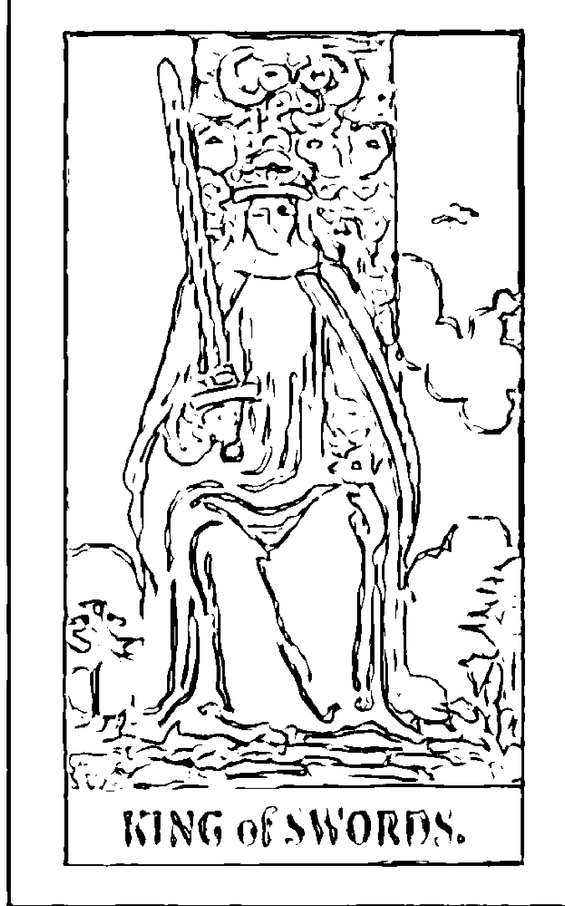

國王正襟危坐地正對前方，表情嚴肅，頭戴金色王冠，紅色帽子，身穿藍色系的王袍和披肩，身後有白色蝴蝶的圖騰，右手高舉著寶劍。

他扮演審判的角色，握著他所屬花色的未入鞘的聖劍。他自然使人想起在大阿爾卡那牌中傳統正義的象徵，他也許代表這項美德，但他更是主宰生命與死亡的力量，基於他職務所應有的優點。

占卜的涵義：凡是由審判所產生的任何想法或與之相關的一切——權力、命令、權威、戰鬥的智慧、法律、王位、與此類推。

【逆位】殘酷、倔強剛愎、殘暴、忘恩負義、邪惡的意圖。

#### 皇后聖劍

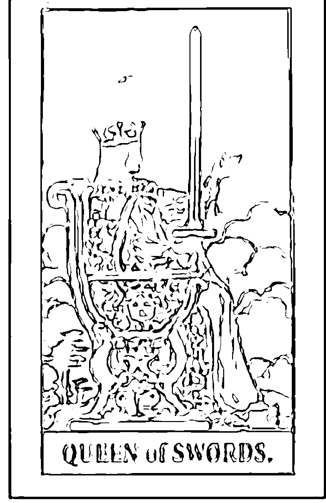

皇后頭戴黃色后冠，身穿白色袍服，還有藍底白色雲朵圖騰滾黃邊的披風，面容是嚴肅正經但和緩的；近似悲傷的狀態。

皇后側身坐著，右手將寶劍垂直舉起，劍柄輕靠在皇椅的其中一個扶手上，左手向外伸出並舉起手臂；座椅的扶手旁有一個天使頭像，椅腳有蝴蝶的圖樣；身後的遠方有幾棵樹和小河流，天空中有一隻孤獨的飛鳥。這張牌不代表慈悲憐憫，儘管擁有聖劍，但她決不是力量的象徵。

占卜的涵義：守寡、女性的悲傷與難堪、缺席、不孕、服喪、貧困、分離。

【逆位】敵意、頑固、狡詐、過分拘謹、欺騙。

#### 騎士聖劍

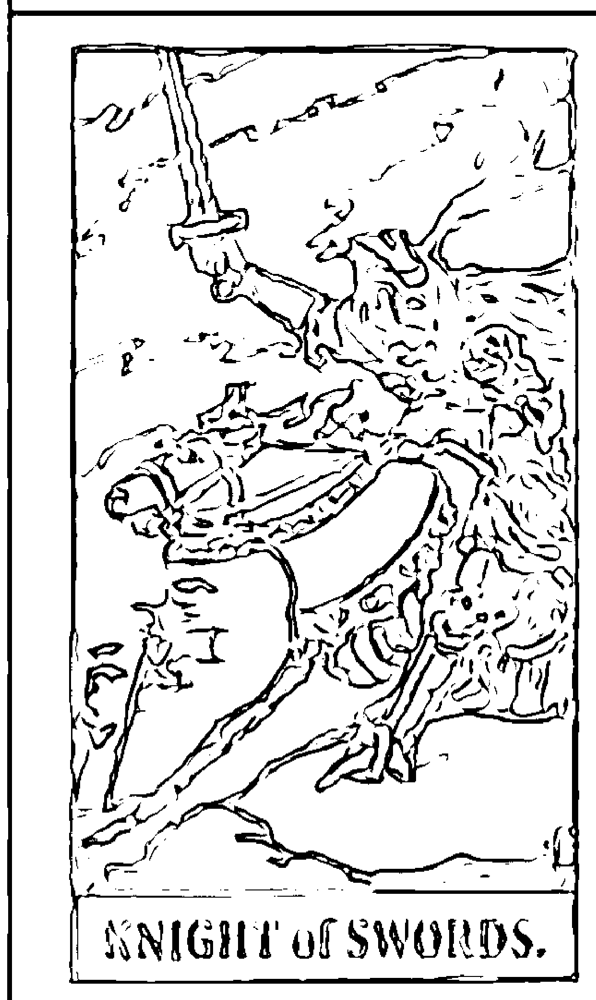

他全副武裝，身著紅色披風，揮舞著寶劍，騎著白馬，目光直視遠方，風馳電掣般地往前奔去，猶如正在分裂潰散他的敵人。在這個設計裡，他是浪漫騎士精神的典型原貌。

他幾乎就是圓桌武士之一加拉哈特（Galahad）的化身，劍法迅捷而穩健，因為他的心是公正純潔的。

占卜的涵義：技能、勇敢、有能力、抵禦、演說談吐、敵意、憤怒、戰爭、毀滅、對抗、反抗、破壞。所以這張牌也另有一層涵義，代表著死亡，但僅針對鄰近具有死亡宿命象徵的牌時。

【逆位】輕率、無能、無節制。

#### 侍衛聖劍

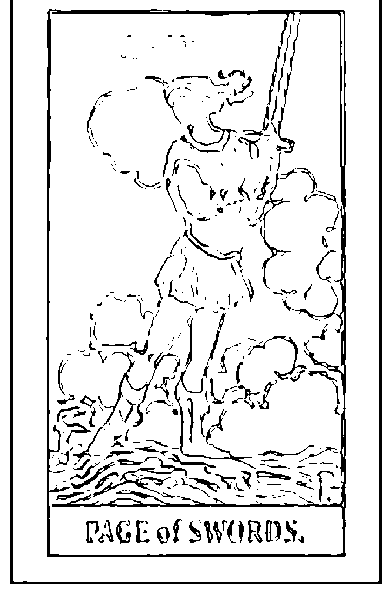

一個輕盈、活躍的人雙手高舉著一把劍，正敏捷地行走著。他正經過高低不平的路面，行經的路上，天空的雲狂亂地排列在一起。他是警覺而輕盈的，觀察這條路再看看那邊，好似期待中的敵人隨時會現身。

他的穿著簡潔俐落，沒戴帽子，將頭髮束起，讓人感覺輕巧快捷。他的身後是一大片天空，天空上有白色雲朵與一群飛鳥。

占卜的涵義：權威、監視、秘密任務、警覺、暗中刺探、檢查，以及其他同屬性的特質。

【逆位】這些特質的邪惡面：未預見的事物、未作準備的狀態；也有疾病的暗示。

#### 聖劍十

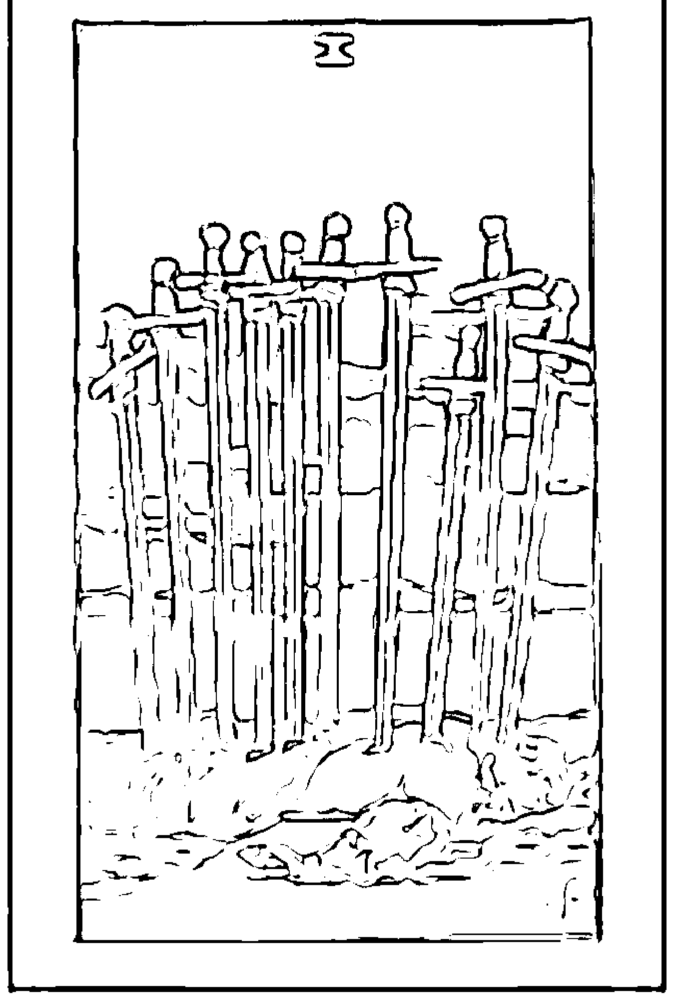

一具俯臥的人，身穿白上衣配橘外衣，衣服上蓋著一塊紅布，身上被十把劍插著，這十把劍從頭部到腰部排成一直線。

遠方有一片藍色的海和山脈，一大半的天空被黑暗與烏雲佔據，但在藍色山脈和烏雲之間，露出一片鮮黃色的天空，在絕望中有了一線生機。

占卜的涵義：任何由此構圖所暗示的涵義；還有痛苦、折磨、淚水、悲傷、孤寂。這張紙牌並不特別意味著因暴力引起的死亡。

【逆位】優勢、利益、成功、恩惠，看似美好愉快，但這一切皆不是永久的；還有權力與威權，也是如此。

#### 聖劍九

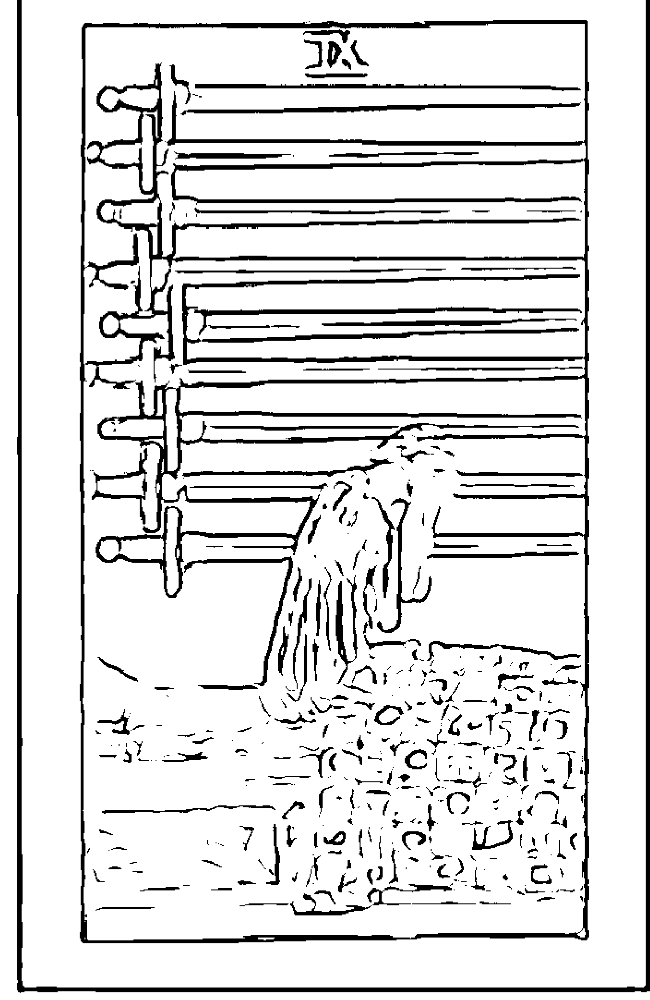

一個女子身穿白衣，像是在午夜從夢中驚醒，獨自坐在臥榻上慟哭著，還把整個臉都埋在雙手裡，感覺悲傷又恐懼。

女子的床的上方有九把劍，整齊地排列著，從畫面上看起來，最下面的三把，與掩面坐著的女子交疊，好像將她刺穿一般。不過，女子所蓋的棉被卻是由象徵熱情的玫瑰和星座符號所組成的圖案。

她知道沒有任何的憂傷勝過於她所承受的。這是張表達徹底孤寂的牌。

占卜的涵義：死亡、失敗、失誤、延誤、欺騙、失望、絕望。

【逆位】禁錮、猜疑、懷疑、合理的恐懼、羞愧。

#### 聖劍八

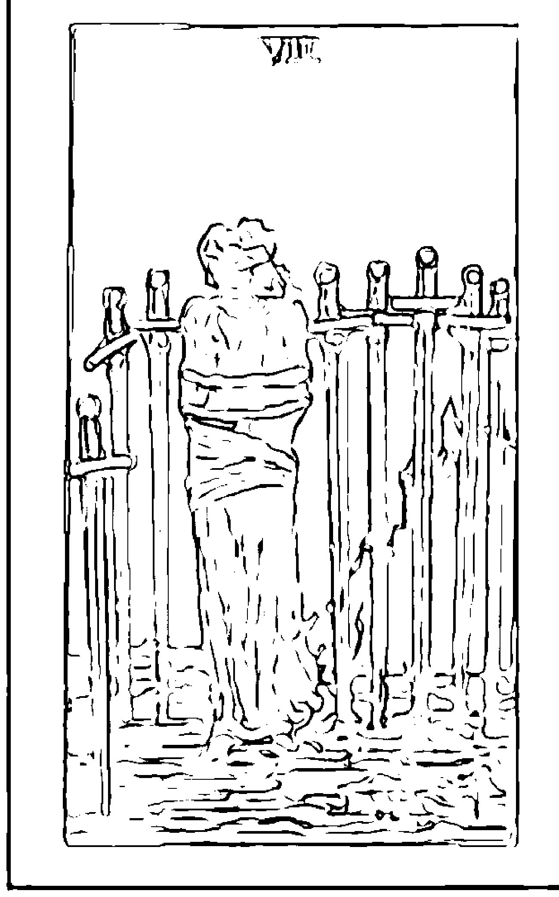

一個女人身穿橘紅衣服，眼睛被白布朦住，身體也被白布條綑綁著，雙手背在身後，她赤腳踩在有水的泥濘地上，身邊有八把劍插在地上，將這名女子限制在一個狹小的空間裡。

遠方有一座很高大的石山，山上有一城堡矗立在峭壁上，雖然不是很大，但絕對清晰可見。這張牌代表著暫時的監禁，而非無法恢復的束縛。

占卜的涵義：壞消息、極度的苦惱、危機、譴責、束縛的力量、衝突、毀謗；以及疾病。

【逆位】焦慮、困境、對抗、意外、背叛；未預見的事物；死亡宿命。

#### 聖劍七

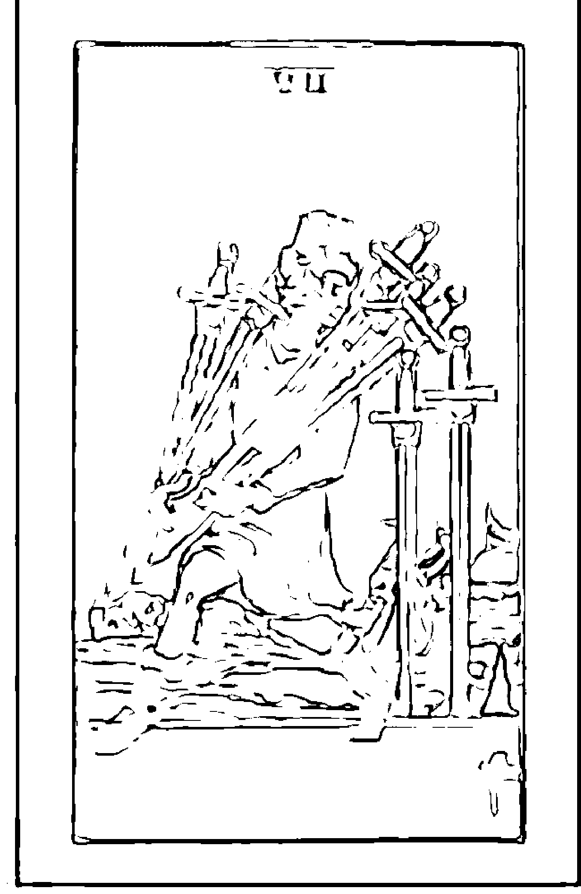

一個男人戴著紅帽，穿著橘色衣服、藍色褲子和紅色鞋子，手裡拿了五把劍，是他趁著沒人守衛的空檔，從軍營之中偷出的。

男子臉上一邊露出得意的表情，又一邊頻頻回頭看後面是否有人發現或追過來，顯示有所擔心。除了男人手上的五把劍，他身旁還有兩把因為搬不動而留在地上的劍，象徵雖然有部份成功，也有一定程度的失敗危險性。

占卜的涵義：計畫、圖謀、渴望、期盼、信心；爭吵、也許會失敗的計畫、困擾。這個構圖的涵義是不確定的，因為其意義是很廣泛地根據彼此的變化。

【逆位】良好的建議、商議、指導、毀謗、胡言亂語。

#### 聖劍六

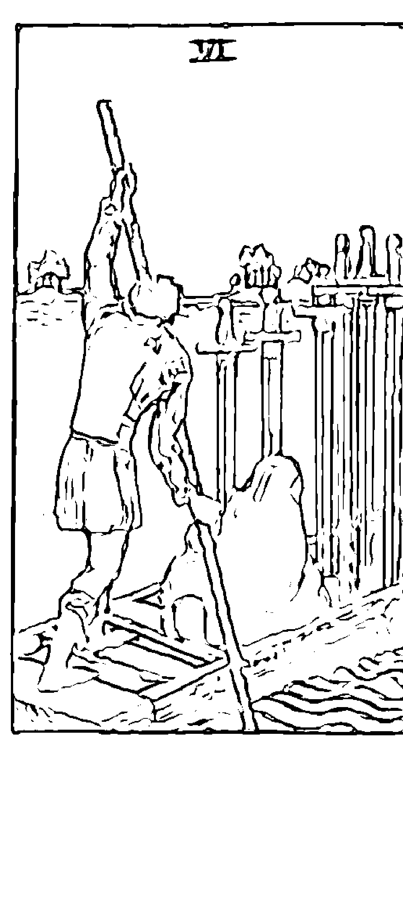

一艘小船上插著六把寶劍，船上有一個女人、一個小孩與一位船夫。

船夫身穿藍上衣搭配橘外衣，腳上是一雙紅色的鞋子，他手持長杖，正要將船駛離岸邊；女人穿著橘色的連帽上衣，帽子把頭整個都覆蓋了，她的頭向下低垂；小孩身穿藍紫色衣服，坐在女人身邊。整個畫面感覺沈默安靜。

渡船夫用他的平底船載運旅客到遠方的岸邊，過程十分順暢且可以看出所載運的貨物很輕，這也許示意著，工作並未超出他的能力範圍。

占卜的涵義：經由水路的旅程、路線、道路、使者、委任、權宜之計。

【逆位】宣佈、坦承、宣傳；有一種說法認為是愛的求婚。

#### 聖劍五

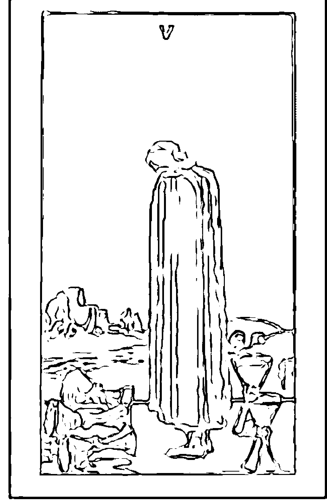

一個神態輕蔑驕傲、嘴角帶著笑意的男子，左手將兩把劍靠在肩上，右手握著第三把劍指向地面，正回頭看著兩名退避且氣餒沮喪的人。

男子是擁有這塊土地的主人，他剛與其他兩人發生爭鬥，看著地上散落的兩把劍，以及一人黯然離去、一人手摀著臉的畫面，顯然男子是勝利者。天空雲朵紛亂，象徵不安的氣氛。

占卜的涵義：降級、毀滅、撤回、聲名狼藉、不名譽、損失，以及所有相關變化的形容與同類辭。

【逆位】意義相同；埋葬、喪禮。

#### 聖劍四

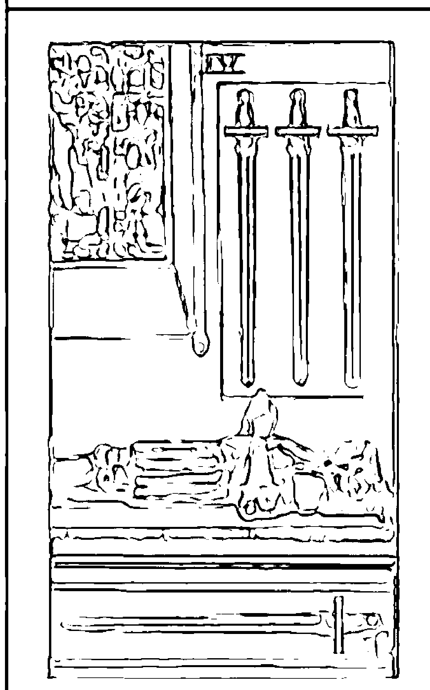

一名騎士躺臥在石墓上，身處的環境似是修道院的建築物，他雙手握著放在胸前，呈祈禱的姿勢，感覺平靜安詳，像在休息。他的身旁放著一把與他方向一致的劍，另外三把劍則高掛在他上方的牆上。

左上方有一塊彩繪玻璃，彩繪的圖像是一個祈禱者跪在聖母面前，好像在誠心祈求著。騎士、石墓和石墓旁的劍皆呈黃色，而牆上的劍則是白色。

占卜的涵義：警覺、引退、孤獨、隱士的歇息、流放、墳墓與棺材。就是最後的這些涵義啟發這張牌的構圖。

【逆位】明智的經營管理、謹慎、節儉、貪婪、警惕、遺囑。

#### 聖劍三

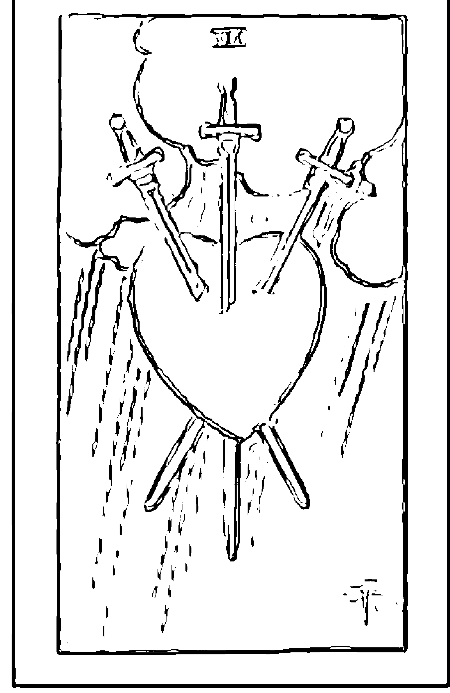

三把劍刺穿一顆心，背後是雲雨。

這是一幅讓人看一眼就感到悲傷和痛苦的畫面，空中有三朵白色的雲，每一朵雲下面都有雨絲，三把藍色的劍分別從中間、左方和右方插穿紅色的心，象徵三股可怕的外來力量，把心給毀了，其傷痛可想而知。

占卜的涵義：除掉、缺席、延誤、分裂、破裂、分散、離別、痛苦、正面襲來，以及這張構圖自然而然代表的所有意義，因為這些都過於簡單且明顯，難以稱為特別的涵義。

【逆位】精神的疏離、錯誤、損失、精神分散、混亂、困惑。

#### 聖劍二

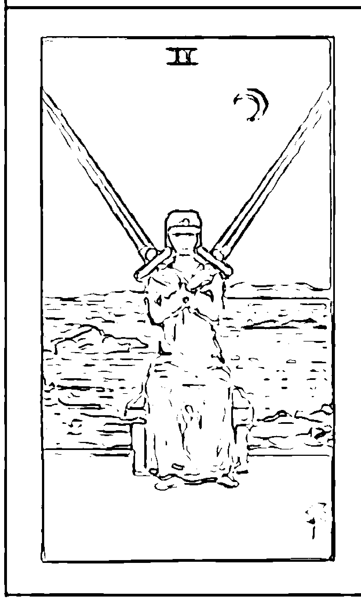

女子身穿淺灰色的長袍，穩坐在石椅上，她的雙眼被白布朦著，雙手各握著一把劍，將它們交叉放在胸前，她運用肩膀的力量保持兩把劍的平衡。

女子就坐在海邊，身後是一大片海洋，海洋的近處有幾座小山，遠處則有黃色山脈，天空呈藍色，且有彎月高掛在空中。

占卜的涵義：一致與平衡，那代表著勇氣、友誼與權力的和睦狀態；另外的解讀是溫和、影響、親近。關於和睦融洽或其他稱讚的解讀，必須在符合條件的手法下才能使用，因為聖劍通常在人類的事件中並非扮演有助益的力量。

【逆位】詐欺、虛假、欺騙、不忠誠。

#### 聖劍Ace

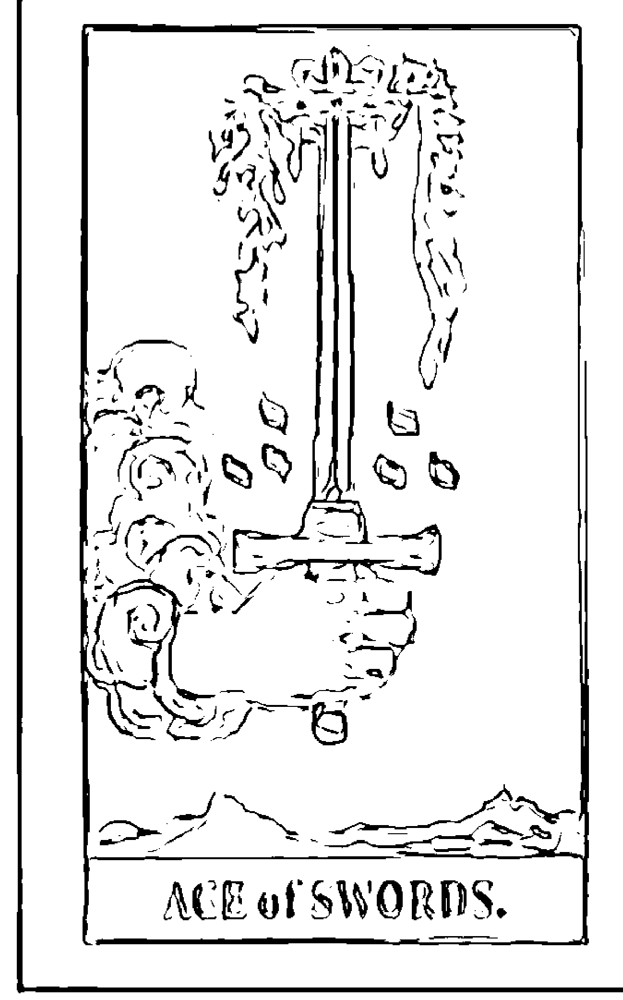

一隻手從雲裡伸出來，緊緊握著一把劍，這把劍又直又利，可以讓人感受到那股堅定穩實的力道，劍端環繞著一頂王冠和桂冠。劍的下方是一片山群，但山的顏色是藍色和棕色，而非綠色，天空的色彩是灰白的。

占卜的涵義：勝利、任何事件的過度等級、征服、勝利的勢力。這是代表巨大威力的牌，無論是對愛情或敵意。這頂王冠或許涵蓋著更崇高的涵義，相較於在算命的範疇內經常給予的解讀。

【逆位】意義相同，但是結果是悲慘的；另一種解說是，觀念、分娩、擴大、多樣性。

### 五角星

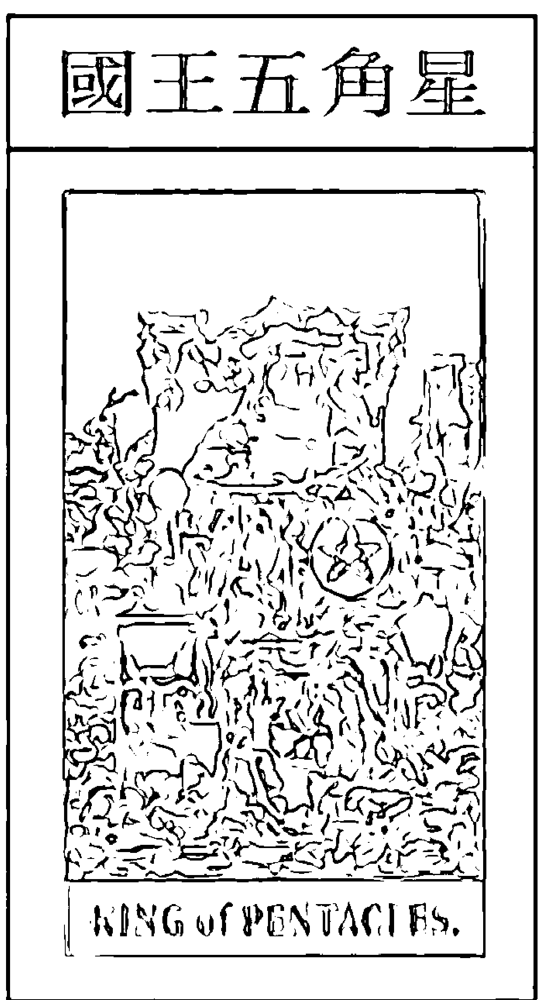

國王臉色有些陰暗，同時也象徵著勇氣，但卻有些毫無生氣的傾向。公牛頭應特別注意是在王位上一再重複的符號，這組花色紙牌的符號都是以五角星刻畫或描繪的，相當於人類特質的四個要素的典型，並因此受五角星形的影響。

在許多古老的塔羅紙牌中，這套花色牌代表當時流通的貨幣、金錢與法國古銀幣。我並未創造這些五角星的替代物，也沒有特殊理由去支持這些替代選擇。

占卜的涵義：英勇、智慧領悟、商業與普通知識的能力、有時是數理方面的天賦或這方面知識；在這些路線方面的成功。

【逆位】邪惡、軟弱、醜惡、剛愎倔強、墮落腐化、冒險。

#### 皇后五角星

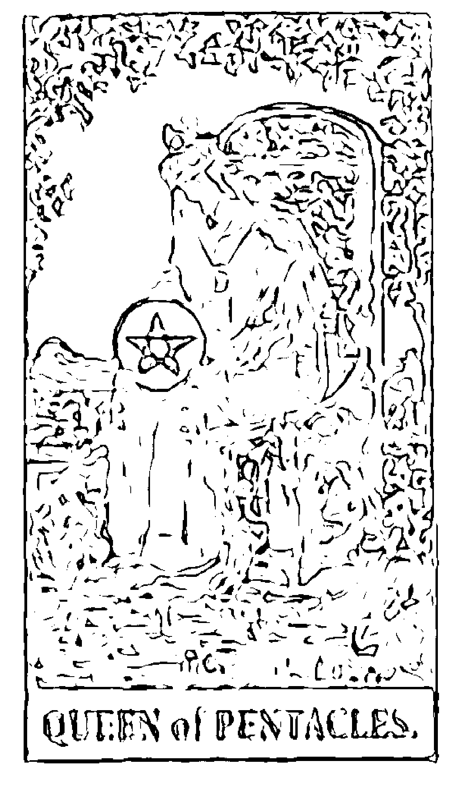

她頭戴黃色皇冠，身穿紅色袍子，搭配綠色披風，她低頭看著由自己雙手捧著的五角星，表情端莊而不嚴肅、平靜而不冷漠，座椅上方有美麗的花叢，腳邊是綠草和黃土，而遠方則有藍色的山脈。

從面容上可以看出她是一位黝黑的女人，在她身上的所有特質可以歸納為靈性的崇高偉大之總和；她同時擁有重要莊嚴的智慧；她凝視著自己的符號，且也許看見當中的世界。

占卜的涵義：豐富、慷慨、壯觀華麗、安全、自由解放。

【逆位】邪惡、猜疑、懸而未定、恐懼、不信任。

#### 騎士五角星

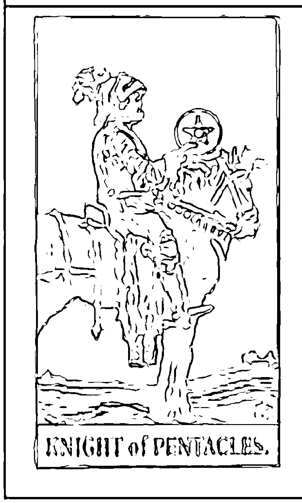

一名頭戴頭盔、身穿盔甲的騎士，用戴著手套的手拿著五角星，騎在黑色馬兒身上，沒有行動之意，馬兒也站得穩穩的，一動也不動，遠方有紅色的土地和黃色山脈，象徵豐饒的物質資源。

他騎著一匹緩慢、持久、沉重的馬，正與他的樣貌相應。他展示著他的符號，但是卻未看著它。

占卜的涵義：效用、有用的事物、利益、責任、正直公正，以上皆屬於正常與外部的層面。

【逆位】遲鈍、懶惰、這類型的停息狀態、停滯；還有平穩沉著、氣餒、粗心大意。

#### 侍衛五角星

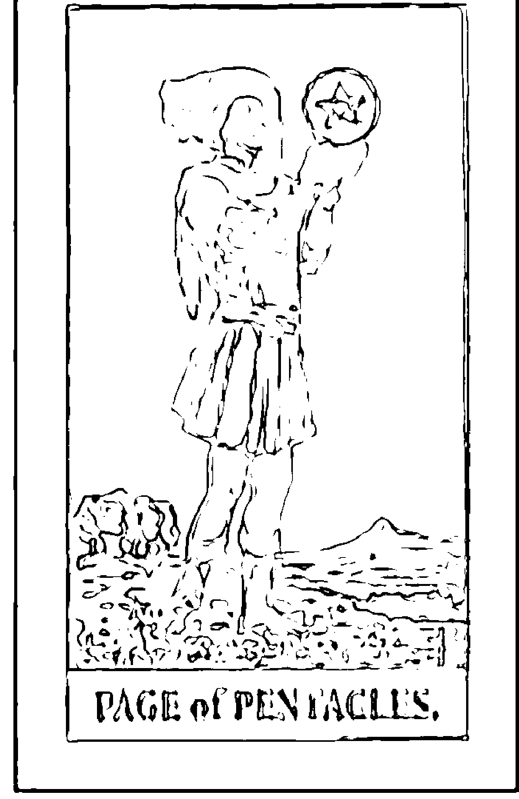

一位朝氣蓬勃的年輕人頭戴紅色帽子，身穿綠色外套，以及橘色上衣、腰帶、褲子和靴子，全身散發求知的欲望。他站在綠油油的草地上，遠方有茂盛的樹木，以及藍色的山脈，背景則是一整片的鮮亮黃色。

他熱切地注視著，盤旋在他舉起的雙手中的五角星。他緩慢地移動著，並沒有意識到週遭的事物。

占卜的涵義：專注、學習研究、學術成就、反應；另有一種說法是，消息、訊息與這些的提供者；還有統治支配、管理。

【逆位】揮霍、浪費、慷慨、奢華；不利的消息。

#### 五角星十

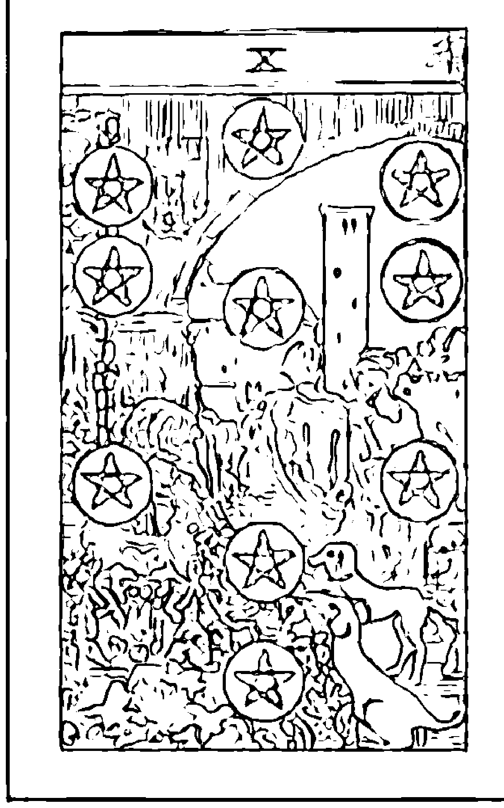

一對男女在一座石製拱門的下方，那是通往一棟房子的入口，男子和女子互望，感情融洽，互動良好。他們身邊有一個身穿藍衣的小孩，小孩正一邊好奇地看著白色小狗，一邊用手撫摸小狗，而小狗則望著坐在前方的高齡長者。

畫面裡的元素十分豐富，人、動物、房屋皆融合在一起，最後再加上排列成生命之樹象徵的十個五角星，富足而圓滿。

占卜的涵義：獲得、財富、家族事件、檔案紀錄、摘錄、家庭的住所。

【逆位】機會、死亡宿命、損失、搶劫、冒險遊戲；有時候亦代表禮物、嫁妝、津貼。

#### 五角星九

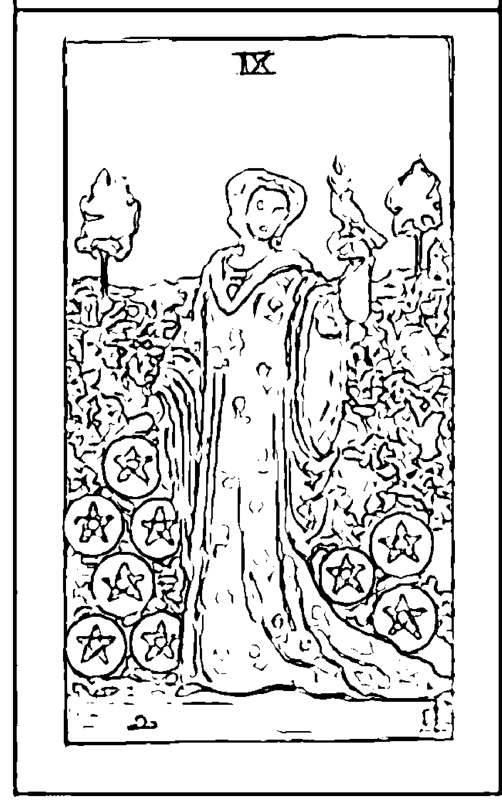

一位身穿黃色長袍，長袍上有著美麗圖案的女子，站在她的莊園裡，莊園裡有茂盛的葡萄藤，看起來物資十分豐沛。她的左手戴著白手套，一隻被紅布蓋著頭的鳥兒停在手套上，女子的姿態十分優雅，展現出貴族生活的閒情逸緻。

女子腳下的土地和遠方天空都是鮮亮的黃色系。

這是一片廣闊的領土，意味著所有事物都是茂盛繁多的，也許這一切都是她的財產，這證明在物質方面的富裕安康。

占卜的涵義：節儉、安全、成功、成就、確實、洞察力。

【逆位】壞事、欺騙、廢棄的計畫、不良意圖。

#### 五角星八

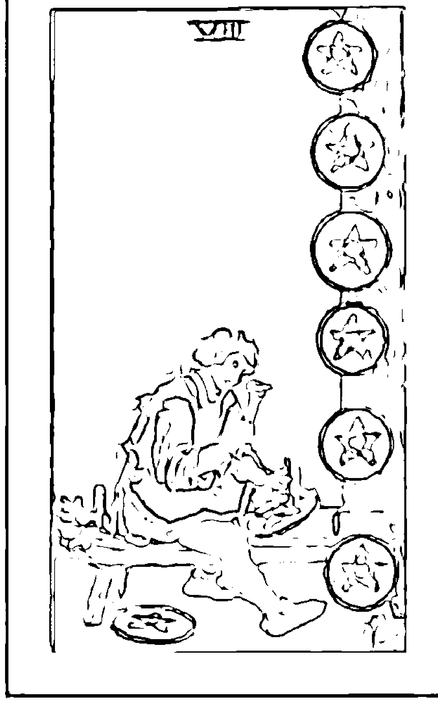

一位藝術家坐在長椅子上工作，他既專注又認真，勤奮不懈地刻著五角星錢幣，右邊一直排的五角星即是他的工作成果，而腳邊還有一個未完成。

藝術家的身後遠方有一條黃色的道路，它通往更遠的城鎮，象徵藝術家雖將大多數時間投入於工作，但偶有機會，仍保持與人群的互動連結。

占卜的涵義：工作、受雇、委任、技藝、在工藝與商業方面的技術，也許是處於準備的階段。

【逆位】無用的抱負、虛幻、貪心、勒索、高利貸。它或許也代表著擁有技術，關於靈巧的心智轉變為狡猾與陰謀。

#### 五角星七

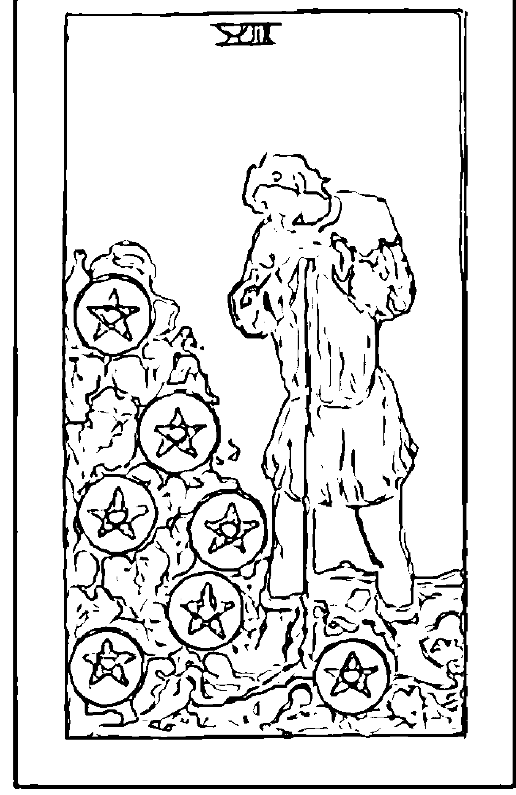

一位年輕人把下巴靠在他的長杖上，專注地看著六個五角星堆放在右方的綠色樹叢上，這些都是他長期努力得來的成果，讓他感到欣慰和滿足。

有人也許會說這些都是他的寶藏，他所有的心力都用在這裡，但是擁有了這些之後，接下來該怎麼做呢？他腳邊還有一個五角星，即說明了他將要完成結果前的困惑和傍徨。

占卜的涵義：這些是極度矛盾對立的；主要的意義是代表金錢、生意、貿易；但是有一種解讀提供爭論、吵鬧以及純真、靈巧、淨化的意義。

【逆位】由於金錢而引發的焦慮，也許是因為被要求借貸予他人。

#### 五角星六

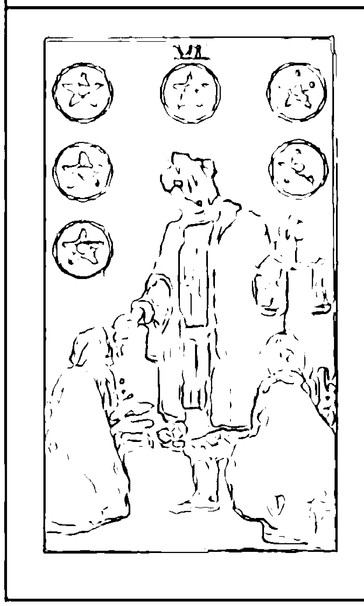

一個穿著商人裝扮的人，身旁跪著兩個乞丐，商人的左手正用天秤在秤量金錢，右手則同時將錢分發給身邊這些貧窮與困苦的人，這是他個人生活的成功與善良心地的表徵。

在商人的上方空中，有六個五角星，象徵著商人的富有，而左手的天秤和右手的給予，則表示商人的精算與慷慨，十分平衡。

占卜的涵義：贈與、禮物、滿足喜悅；另有種說法是，注意、警覺；此刻是公認的時間、目前的繁榮興旺等等。

【逆位】慾望、貪心、羨慕、假象。

#### 五角星五

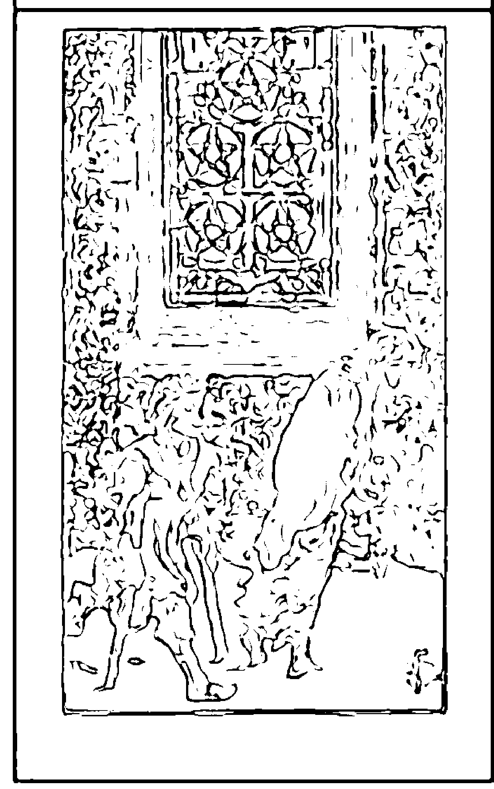

兩位乞丐在冰天雪地中，步履蹣跚地前行，其中一個雙手握著拐杖，另一個則緊抓衣服，欲抵擋寒風，兩人的衣服都破爛不堪。

他們經過一間教堂，教堂的牆上有一扇透著亮光，且有著五個五角星圖案的彩繪玻璃窗，但他們卻視而不見，繼續飢寒交迫地往前行。

占卜的涵義：這張紙牌最重要的是預言物質的困難，無論是繪圖所闡釋的形式或其他方面，就是指貧窮。有些紙牌占卜者認為，這是張代表愛與戀人的牌——妻子、丈夫、朋友、情婦；同時也代表這些象徵無法協調一起。

【逆位】失序、混亂、毀滅、不和、放蕩。

#### 五角星四

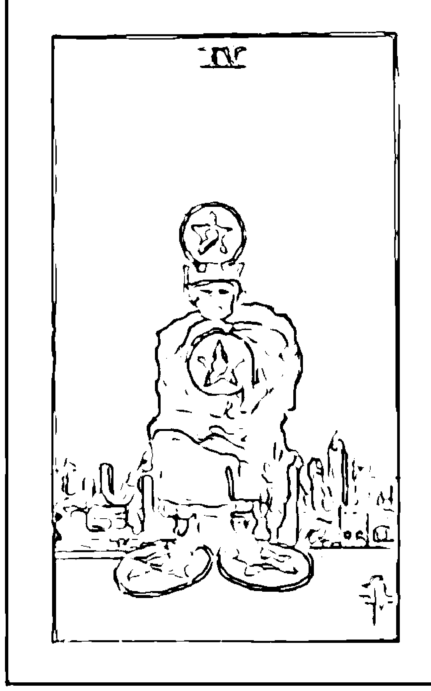

一個戴著有五角星圖騰王冠的男子，身穿紅色袍子，袍子下方有藍色衣邊，象徵擁有者的身份。

男子穩坐在一個箱子上，雙手與臂膀緊抱著一個五角星，另外則有兩個五角星被他踩在腳下，顯示他堅持所擁有的所有資產，而且十分害怕失去，所以緊緊地抓牢，不讓任何閃失發生。

男子的背後是一座城市，他將自己隔絕於城市之外，死守自己的財物。

占卜的涵義：所有物的確保、固守擁有的東西、禮物、遺產、繼承。

【逆位】懸而未決、延遲、對立反抗。

#### 五角星三

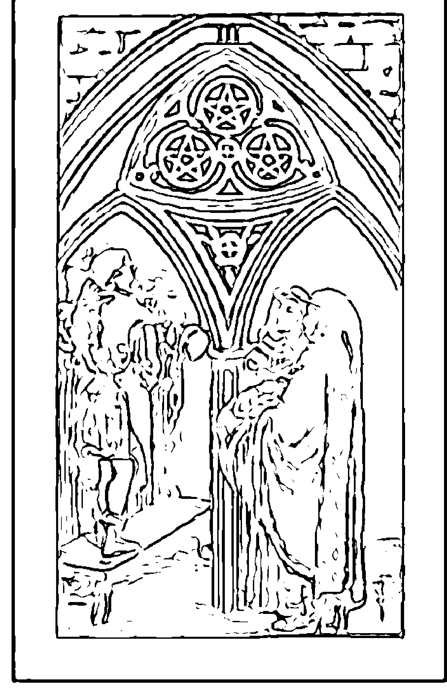

一位雕刻家正在一間修道院工作，他站在椅子上，和身邊的兩個人，正拿著草圖，三人一起討論著工作的相關事宜。

建築物的梁柱最上方，有三個五角星的圖案，下方則有一朵花，象徵著這是一個神聖且能量飽滿之地，讓人想真心為它付出和奉獻。

這是一個已經獲得獎賞的學徒或業餘者，此刻正誠摯地工作著。

占卜的涵義：專長、交易、需要技能的工作；然而，這通常被視為代表貴族、特權階級、名望與榮譽的牌。

【逆位】在工作或其他方面的庸才、幼稚、微小、薄弱。

#### 五角星二

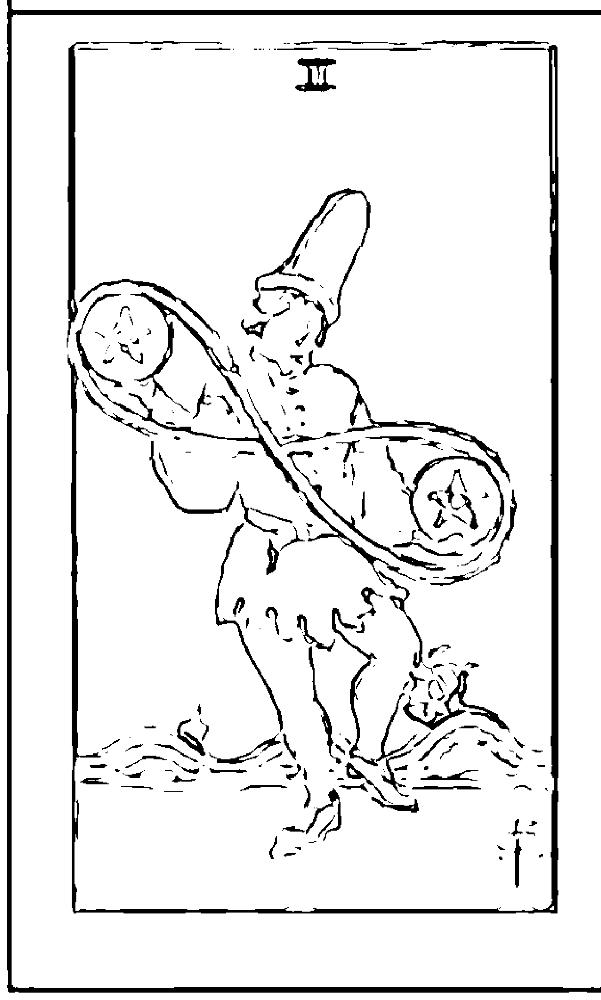

一個頭戴紅色高帽子，身穿紅衣搭配橘色外衣，還有紅褲和綠鞋的年輕人，正在跳舞，兩手裡各拿著一個五角星，並由一個倒8的環狀繩索連接在一起，像是在玩樂耍弄一般。

年輕人的背後是劇烈的海浪，有一大一小的兩艘船正隨著海浪起伏。

占卜的涵義：一方面是象徵慶祝活動、娛樂與相關的事物，是這張構圖的要義；但是它也可解讀為書寫的消息或訊息，以及障礙、騷動、煩惱、混亂。

【逆位】強迫執行的慶祝活動、假裝的樂趣、如實不誇張的判斷、手寫、作曲、交換的信函。

#### 五角星Ace

從雲裡伸出來的一隻手，捧握著一個五角星，雖然只是單手拿著，卻讓人感覺放心，穩固而踏實。

背景是一座長滿了美麗繁茂花草的庭園，從綠樹拱門看向遠方，有一座白色的山，這象徵除了物質之外，還可以延伸到精神層面。

占卜的涵義：全然的滿足、幸福、狂喜、也是迅速的情報；黃金。

【逆位】富裕的邪惡面、不好的情報；龐大的財富。在任何的情況都呈現富饒、舒適的物質條件，但是對於財富的擁有者究竟是優勢還是劣勢，則必須視紙牌的正逆位而定。

## 【塔羅牌】

| 經 | 典 | 手 | 冊 |

216 ☆揭秘小阿爾卡那牌的神諭秘密☆

## 三、小阿爾卡那牌四組花色的增補涵義

### 權杖

- 權杖國王：通常是討人喜歡的；可以代表一段美好的婚姻。【逆位】應該被採納的建議。
- 權杖皇后：令人滿意的豐收，可以包含許多方面的意思。【逆位】對占卜問事者懷有善意，卻缺乏運用的機會。
- 權杖騎士：一張不好的牌；根據某些解讀，有離間疏遠的意思。【逆位】對女人來說是婚姻，但可能是令人沮喪挫敗的結果。
- 權杖侍衛：家族中年輕的男子，正在尋找年輕的女子。【逆位】不好的消息。
- 權杖十：假若是鄰近一張好牌，則代表著困難與矛盾抵觸。
- 權杖九：一般而言代表不好的牌。
- 權杖八：針對一位已婚人士的家庭爭論。
- 權杖七：一位黝黑的孩童。
- 權杖六：僕人喪失對主人的信心；年輕的女孩遭到朋友的背叛。【逆位】遲來的希望實現。
- 權杖五：財務方面的投機買賣成功。【逆位】爭吵也許會轉為優勢。
- 權杖四：意料之外的好運。【逆位】已婚女人將會擁有漂亮的孩子。
- 權杖三：一張相當好的牌；共同合作將對企業有利。
- 權杖二：一位年輕的女孩也許預料可能有無關緊要卻令人失望的事情。
- 權杖Ace：所有類型的災難。【逆位】誕生的象徵。

218 ☆揭密小阿爾卡那牌的神諭秘密☆

### 聖杯

- 聖杯國王：小心防範一個有地位的男子的不懷好意，虛偽地佯裝幫忙之意。【逆位】損失。
- 聖杯皇后：有時候代表著一個女人擁有模糊曖昧的特質。
- 聖杯騎士：一位朋友將會來訪，並將為占卜問事者帶來預料之外的錢財。【逆位】不規則的事物。
- 聖杯侍衛：好的預兆；也代表在愛情方面不幸運的男子。【逆位】各種障礙。
- 聖杯十：若是男性的問卜者，則代表一段美好的婚姻，且是遠超過他的期待。【逆位】憂傷；也代表一段嚴重爭吵。
- 聖杯九：對於軍方的人來說，是好的徵兆。【逆位】好的生意。
- 聖杯八：與一位美麗女子結婚。【逆位】完全的滿足。
- 聖杯七：美麗的孩子；意見、構思、解答、行動。【逆位】若與聖杯三放在一起，代表成功。
- 聖杯六：令人愉悅的回憶。【逆位】繼承物數量驟減。
- 聖杯五：通常是討人喜歡的；快樂的婚姻；繼承的遺產、成功的事業。【逆位】某些許久未見的親人返家。
- 聖杯四：反對矛盾。【逆位】不祥的預感。
- 聖杯三：一位軍職身分的男子，獲得突如其來的升遷。【逆位】安慰、治療、生意的結束。
- 聖杯二：在樂趣與生意方面都很順利，愛情也是；財富與名譽。【逆位】熱情。
- 聖杯Ace：不屈不撓的意志、不可改變的律法。【逆位】地位或工作方面突如其來的改變。

### 聖劍

- 聖劍國王：代表一位律師、參議員、醫師。【逆位】一個壞男人；一份警告，該結束一個極有害的訴訟。
- 聖劍皇后：寡婦。【逆位】一個壞女人對占卜問事者懷有惡意。
- 聖劍騎士：軍人、擁有武器的男人、領薪水的人；軍人會展現的英雄行動。【逆位】與一位低能弱智者的爭論；一個與競爭對手爭鬥的女人，將會被擊敗。
- 聖劍侍衛：一個輕率不謹慎的人將會打聽刺探占卜問事者的秘密。【逆位】令人震驚的消息。
- 聖劍十：緊跟著聖劍Ace與聖劍國王，是監禁；若是女孩或妻子，是背叛。【逆位】一位軍人在戰場上的勝利與隨之而來的幸運。
- 聖劍九：一位傳教士、一位神父；通常代表不好預兆的牌。【逆位】針對一位令人起疑的人，有著充分懷疑的理由。
- 聖劍八：就一個女人而言，代表散佈與她有關的醜聞流言。【逆位】親人的離開。
- 聖劍七：黝黑的女孩；一張好牌；無慮的鄉間生活。【逆位】好的建言，很可能被忽略。
- 聖劍六：旅程將令人感到愉悅。【逆位】令人不悅的訴訟爭論。
- 聖劍五：指問卜當事者命運的一次襲擊。【逆位】憂傷與服喪的徵兆。
- 聖劍四：一張壞牌，但若是逆位，理智的作為可帶來成功。【逆位】明智的判斷，可得成功。
- 聖劍三：就女人而言，代表她戀人的飛行航程。【逆位】占卜問事者與讓他妥協讓步的對象會面；修女或尼姑。
- 聖劍二：給一位女孩的禮物、對一位尋求援助的男人給予有影響力的保護。【逆位】應付流氓惡棍。
- 聖劍Ace：繁榮昌望或巨大的不幸。【逆位】對女人而言，代表婚姻中斷，因本身輕率、不謹慎。

### 五角星

- 五角星國王：一個相當黝黑的男人、一個商人、主人、教授。【逆位】蒼老惡毒的男人。
- 五角星皇后：黝黑的女人；從一位富有的親戚處得來的禮物；一個年輕男子的富裕且快樂的婚姻。【逆位】疾病。
- 五角星騎士：一個有用的男人；有價值的發現。【逆位】失業的男子。
- 五角星侍衛：一個黝黑的年輕人；一個年輕的官員或軍人；一個小孩。【逆位】有時代表降級，有時代表搶劫掠奪。
- 五角星十：象徵房屋或住所，其價值由其他紙牌衍生推知。【逆位】有一半的幸運。
- 五角星九：由鄰近的紙牌所預知的事物迅速實現。【逆位】無意義的盼望。
- 五角星八：一個從事商業的男人與問卜者有關係；一個黝黑的女孩。【逆位】問卜者會在金錢借貸事件中妥協退讓。
- 五角星七：一位女子，她未來的丈夫境況的改善。【逆位】無耐性、憂慮、掛心、猜疑。
- 五角星六：目前是不可依賴的。【逆位】問卜者的雄心抱負被抑制。
- 五角星五：合理獲取財富。【逆位】愛情煩惱。
- 五角星四：若是一位單身漢，則代表一位姑娘捎來的令人愉悅的消息。【逆位】觀察監視、妨礙。
- 五角星三：若是針對一個男人，則代表他長子的名聲。【逆位】視鄰近的紙牌而論。
- 五角星二：煩惱多數是想像的，而非真實情況。【逆位】惡運、無知、不公正。
- 五角星Ace：所有紙牌中，最討人喜歡的一張。【逆位】分享尋獲的寶藏。

由此，將會觀察到：

1. 這些增補的附加說明與所談論的圖畫內容不太有關聯，因為所呼應的是更重要的推測思索性的價值；
2. 再者，這些額外附加的意義經常與先前所給予的解讀不一致。所有的涵義大部分是不受彼此影響的，無論是減少、增強、或修改，有時幾乎是全然相反的意義，全都是根據他們在牌陣裡的位置而論。關於這方面幾乎沒有任何評論的準則。

我認為就某程度而言，任何的系統凡是從概括性的陳述延伸至細節部份者，自然就變得更無所根據而不可靠了；而且，在職業算命的記載中，提供的多數為這方面主題殘渣與瑣碎的內容。

同時，基於直覺與超人洞察力的占卜預測鮮少有實用的價值，除非是從普遍共通性的範疇回到個別獨特的特性；但是就比例而言，因為這項天賦是展現在特定的情況中，這個由過去的紙牌占卜師所記錄的特殊意義將會被捨棄，以支持個人對紙牌重要性的偏好立場。

關於此點我已經暗示過了。似乎是有必要補充接下來的推測性解讀。

## （ ）塔羅牌（ ）

｜經｜典｜手｜冊｜

☆揭祕小阿爾卡那牌的神諭秘密☆

## （ ） 。第四部 。 （ ）

## 塔羅占卜的方法與牌陣

- 一、塔羅牌占卜
- 二、古老的塞爾特占卜法
- 三、一再重複出現的紙牌

## （ ）塔羅牌（ ）

｜經｜典｜手｜冊｜

228 ☆塔羅占卜的方法與牌陣☆

## 一、塔羅牌占卜

我們現在進行至主題的最終與實際應用的部份，透過塔羅牌的各種手法以作為諮商與獲取神諭的手段。操作的方法相當眾多，其中有一些是非常地複雜。

對於上述的這些手法我不予理會，因為精通這類問題的人都相信，簡單的方法就是真理之路。

同時，我也不採用近來重新再版的《波希米亞人的塔羅牌》中題名為「占卜預言的塔羅牌」的操作手法；基於其正統的價值觀，它也許可以推薦給希望更進一步研究且會超越這本手冊限度的讀者參考。

我首先提供一種簡短的步驟，是在過去許多年來私下流傳於英格蘭、蘇格蘭與愛爾蘭。我不認為它曾被公開出版過，至少肯定不是與塔羅牌相關的部份；我相信它將適用於所有的需求，但是我將會補充另一個不同的變化方法，曾經在法國被視為茱莉亞歐辛尼（Julia Orsini）的神諭。

## 二、古老的塞爾特占卜法

這個占卜的方法，最適合於回答一個明確的問題。

占卜者首先選擇一張牌來代表所詢問的人或事件。這張牌就稱為「意義指示牌」（Significator）。若他希望確認某些與他本身相關的事物，就由他可以取出一張符合他個人描述的紙牌。

一張騎士牌應被選取為意義指示牌，假若所詢問的主題是一位年齡超過四十歲的男人；一張國王牌應被選取於任何年齡低於四十歲男人的情況下；一張皇后牌則是針對年齡超過四十歲的女人；而一張侍衛牌則是針對任何小於四十歲的女子。

權杖花色牌中的四張宮廷牌象徵十分美麗的人，有著金黃或赤褐色的頭髮，白皙的膚色與藍色的眼睛。

聖杯牌組中的宮廷牌代表淺棕色或暗金色的頭髮，與灰或藍的眼睛。而聖劍的宮廷牌所代表的人是擁有淡褐色或灰色的眼睛，深棕色的頭髮與晦暗的膚色。

最後，在五角星中的宮廷牌是指擁有非常深棕色或黑色的頭髮的人，有著深色的眼睛與灰黃或黝黑膚色。然而，對於這些指派應有所保留，以免將之視為慣例。

你偶爾可以根據一個人眾所皆知的特質來引導：一個極度黝黑的人也許是精力非常旺盛的，或許以一張聖劍牌來代表會勝過一張五角星牌。在另一方面，一個相當白皙的人，懶散且無生氣，則應該參照的是聖杯而非權杖。

將一次占卜的目的用來作為意義指示牌，也就是關於所要諮詢的事件，是比較方便的作法，應挑選大阿爾卡那牌或小牌作為符合該事件的一項意義。

### 假設這個問題是：訴訟是必要的嗎？

在這個案例中，取大阿爾卡那牌十一的正義牌作為意義指示牌。因為這是與法律有關的事物。但是假若問題為：我在訴訟中是否會勝訴？就必須選擇一張宮廷牌作為意義指示牌。接著，也許執行一連串的占卜以確認這項步驟本身的作法，與其對相關對象所產生的結果。

選定顯示意義牌之後，將它放在桌子上，正面朝上。然後將剩餘的紙牌做三次洗牌與切牌的動作，紙牌保持正面朝下。

取出紙牌最上面的第一張；將它覆蓋在意義指示牌上，並說著：「這個覆蓋隱藏著他。」這張牌所帶來的影響，通常是正發生於所詢問的對象或事情上，其他的趨勢也在這樣的氛圍中產生作用。

拿起第二張牌橫放在第一張之上，並說著：「這個橫跨阻撓著他。」它顯示在這個事件中所面臨的障礙特質。假若這是一張代表順利的牌，則對立的勢力將不會很嚴重，或者它也許指出某些存在它本身的優點將不會在這個特定的關聯中產生優勢。

取出第三張牌放在顯示意義牌的上方位置，並說：「這是給予他的報酬。」它象徵著（a）占卜問事者在這個事件中的目標或理想；（b）在這些情況之下所能達到的最好狀況，但目前還未實現。

拿起第四張牌放在意義指示牌的下方位置，並說：「這是在他之下的影響。」它表示這個事件的基礎或根據，並已經成為事實，而且顯示意義牌也已經擁有自己的基礎根據。

取出第五張牌，將它放在顯示意義牌面向的同一側，並說：「這是在他背後的。」它所給予的影響力剛剛消逝或正在消失中。

補充說明：假若顯示意義牌是張大阿爾卡那牌或任何無法辨識面孔朝向的小牌，則占卜者必須在開始操作以前先決定他所面向的地方。

取出第六張牌放在顯示意義牌所面向的那一側，並說：「這個在他前方。」它象徵著即將發生作用的影響力，並且在不久的將來即將產生效果。

這些紙牌的配置呈現一個十字架的形狀，而被第一張牌所覆蓋著的顯示意義牌就放在中央的位置。

取出緊接著的四張紙牌，並接續放在另一張的上方，排成一列直線在十字型的右方。

其中第一張，也就是全部操作過程的第七張牌代表他自己本身，也就是顯示意義牌，無論是指人或事件，同時呈現它在整個情況當中的情勢或態度。

第八張牌代表他的房子，也就是他週遭的環境與正在運作中的趨勢，會影響這個事件，例如他在生命中的境況、當前的這些朋友的影響力，諸如此類等等。

第九張牌給予此事件的希望或恐懼。

第十張牌代表即將到來的事物、最終的結果、頂點，在占卜的過程中經由所拿取的紙牌去呈現所引發的影響力。

這張牌是占卜者應該要特別貫注心力於他的直覺技能與記憶相關正式的占卜意義。它應該要具體呈現任何可能從桌面上的紙牌中占卜到的諭示，包括顯示意義牌本身，以及與他或它有關的事物，且不排除這類根據更高涵義的啟發，因為那也許就像自天上降落的火花一般，假若這張牌的目的是神論，則提供解讀的應該會出現一張大阿爾卡那牌。

整個操作過程已經全部完成；但是假若發生最後一張牌是模糊未定的情況，無法從中獲得最後的決定，或是未顯示出針對這個事件的最終結論的指示，則最好再次重複整個操作手法，將第十張牌作為顯示意義牌，以替換先前所使用的那一張。

整副紙牌必須重新洗牌與切牌三次，然後將前十張牌依照之前的作法一一排列。經由這個方法，對於「即將發生的事情」也許可以獲得更詳細的說明。

如果在任何占卜的情況中，第十張牌為一張宮廷牌，表示所占卜的議題最終將落入一個人的掌控之中，這張牌即象徵此人，詢問主題的結果主要是依靠他而定。

在這個事件中，將所討論的這張宮廷牌作為新牌局的意義指示牌，也是很有幫助的，並且去發掘他的影響力在這個事件中的特質，以及他將來會為它帶來如何的議題。

透過這個手法可以在比較短的時間內獲得優秀的技能，且總是能顧慮到占卜者的天賦才能，無論是潛在的或已成熟的，同時它還具有一項優點，能夠免於所有複雜困難的情況。

在此我附加一個圖表，顯示紙牌在這個占卜方法中的排列。意義指示牌在此是面朝向左方。

## 塔羅牌

經典牌陣

- 第1張牌：意義指示牌：所覆蓋隱藏的事物
- 第2張牌：橫跨阻撓他的事物
- 第3張牌：將給予他的報酬
- 第4張牌：在他之下的影響力
- 第5張牌：在他背後過去的原因影響
- 第6張牌：在他前方的未來狀況
- 第7張牌：他自己本身
- 第8張牌：他的家
- 第9張牌：他的希望或恐懼
- 第10張牌：即將到來的事物

## 三、一再重複出現的紙牌

### ☆在正常的位置

- 4張國王牌＝偉大的榮譽；3張國王牌＝諮商；2張國王牌＝次要的商議。
- 4張皇后牌＝巨大的爭論；3張皇后牌＝受到女人的欺騙；2張皇后牌＝真誠的朋友。
- 4張騎士牌＝嚴肅重要的事情；3張騎士牌＝熱烈的討論；2張騎士牌＝親密。
- 4張侍衛牌＝危險的疾病；3張侍衛牌＝爭執；2張侍衛牌＝焦慮不安。
- 4張數字十＝譴責；3張數字十＝新的條件情勢；2張數字十＝改變。
- 4張數字九＝一位好朋友；3張數字九＝成功；2張數字九＝接收到。
- 4張數字八＝顛倒相反的；3張數字八＝婚姻；2張數字八＝新知識。
- 4張數字七＝陰謀；3張數字七＝虛弱、薄弱；2張數字七＝消息。
- 4張數字六＝豐富；3張數字六＝成功；2張數字六＝敏感易怒。
- 4張數字五＝規律一致性；3張數字五＝堅定果斷；2張數字五＝警戒監視。
- 4張數字四＝即將到來的旅程；3張數字四＝反映的主題；2張數字四＝失眠。
- 4張數字三＝進展；3張數字三＝統一整體；2張數字三＝鎮靜沉著。
- 4張數字二＝論點；3張數字二＝安全保障；2張數字二＝調合一致。
- 4張Ace＝有利的機會；3張Ace＝小成功；2張Ace＝奸計。

### ☆逆位的情況

- 4張國王牌＝迅速；3張國王牌＝商業貿易；2張國王牌＝企劃。
- 4張皇后牌＝拙劣的公司；3張皇后牌＝暴食貪吃；2張皇后牌＝工作。
- 4張騎士牌＝結盟；3張騎士牌＝抗爭決鬥或個人的衝突遭遇；2張騎士牌＝敏感易受影響。
- 4張侍衛牌＝缺乏、貧困；3張侍衛牌＝懶惰閒散；2張侍衛牌＝社會、社交。
- 4張數字十＝大事、事件；3張數字十＝失意、失望；2張數字十＝合理的期盼。
- 4張數字九＝高利貸；3張數字九＝輕率不謹慎；2張數字九＝一份小收益。
- 4張數字八＝錯誤；3張數字八＝奇景、壯觀；2張數字八＝不幸。
- 4張數字七＝爭吵；3張數字七＝高興；2張數字七＝無聲望的女人。
- 4張數字六＝關懷；3張數字六＝滿足、滿意；2張數字六＝墮落、沒落。
- 4張數字五＝秩序；3張數字五＝躊躇猶豫；2張數字五＝顛倒相反。
- 4張數字四＝走到國外；3張數字四＝焦慮不安；2張數字四＝爭執。
- 4張數字三＝偉大的成功；3張數字三＝平靜沉著；2張數字三＝安全。
- 4張數字二＝和解調停；3張數字二＝恐懼憂慮；2張數字二＝不信任。
- 4張Ace＝不名譽；3張Ace＝放蕩；2張Ace＝敵人。