# 塔罗牌速成魔法

# 认识塔罗牌

塔罗占卜是非常灵验的预测工具，早在十四世纪时于欧洲已极为盛行，现今最广泛流传的塔罗牌是“伟特牌”。塔罗牌本身不会说话，了解牌义后然后做预测的，是人的“心”。透过塔罗牌的牌义和图像，人可以万念归一，发挥潜意识的能量，这时，人不但可预测未来，为未来作出最恰当的抉择；更可以与人心对话，了解自己的心理状态。

塔罗牌有逾百种占卜阵法，根据不同问卜者的不同问题而选择不同形式的牌阵。

## 揭开78张塔罗牌的神秘面纱

只要明白了各张牌的牌义和主要阵法后，就可以透过不同牌阵来解决不同的难题，并且达到一定的准确度。塔罗牌有分正牌和反牌，如果显示的伟特牌是向着大家，就是正牌，相反就是反牌。要注意：正向或反向的牌义会完全不同。“伟特牌”由78张牌所组成，包含22张主牌，40张副牌及16张宫廷牌：

- ◎二十二张主牌

22张主牌代表问卜者无法控制的部分。当牌阵中大牌出现的比率特别高时，表示问卜者对于这个问题是无能为力的。另外，大牌出现特别多，有时也代表着问卜者在生命中发生了一件影响较深远的重要事件。

二十二张主牌分别是：愚者、魔术师、祭司、皇后、皇帝、教皇、恋人、战车、力量、隐士、命运之轮、正义、弔人、死神、节制、恶魔、塔、星星、月亮、太阳、审判和世界

### ◎ 四十张副牌

40张副牌是补充22张主牌的细节，每副牌都代表着我们在生活上会面对的各种问题。

- 四十张副牌分别是：权杖一、二、三、四、五、六、七、八、九、十；圣杯一、二、三、四、五、六、七、八、九、十；宝剑一、二、三、四、五、六、七、八、九、十；钱币一、二、三、四、五、六、七、八、九、十。

### 占卜时要注意的地方

占卜前须先洗手，洗牌与排牌阵时要默念问题，不断重复，直到开牌后才停止。以下是“占卜前”、“占卜时”和“占卜后”要注意的事项：

#### 占卜前

- 1. 留意身心状态
在生病、情绪低落、激动、生气或疲倦时，都应该避免占卜。原因是解牌需要耗费精神来思考，身心状况不佳时，会影响解牌的准确度。而且，选出来的牌常反映出问卜者当下的情绪，试想身心状况这么糟的时候，选出来的牌会好到哪里去呢？如果选到坏牌，心情岂不是更糟？如果无法平心静气，客观忠实地解牌，占卜结果的准确度亦会大打折扣。

- 2. 占卜时地的选择
占卜的地点以明亮、干净与舒适的环境为佳。在嘈吵和人流太多的环境下都会影响占卜者的专注力。此外，最好避开风大或潮湿的地方，以免影响心情，令占卜失准。

- 3. 至亲好友才能代人问卜
问卜的人要与当事人有密切的关系，换言之，母亲可以代替孩子问卜，但同事代替同事问卜则是不恰当的。

#### 占卜时

- 1. 不宜预测国家大事
占卜时，只能针对与自己有密切相关的人或事来占卜，不宜用于预测国家大事、球赛胜负等。换言之，如要占卜美国总统的竞选结果，必须找到候选人来抽牌，因为他们才是与问题切身相关的人物。

- 2. 发问的技巧
每次只问一条问题，不要连续问几条问题，如“我在公司的工作前景如何、与老板的关系以及和同事的关系如何？”这样我们难以判定塔罗牌所回应的是何者。

#### 占卜后

占卜后的善后工作要好小心。万一遗失了其中一张牌，就要重新买一套。所以一般玩家占卜完之后，都会用绒布包起，然后放在干燥阴凉的地方。

### ◎十六张宫廷牌

16张宫廷牌描述16种不同年纪和性格的人。宫廷牌在塔罗牌中扮演着很重要的角色，可以告诉我们身边究竟有怎样的人正在影响事情的发展，亦可以告诉我们自己在处理事情时的态度。

- 十六张宫廷牌分别是：权杖侍从、骑士、皇后、国王；圣杯侍从、骑士、皇后、国王；宝剑侍从、骑士、皇后、国王；钱币侍从、骑士、皇后、国王

### 玩塔罗牌有什么禁忌

- 所谓的塔罗牌禁忌并非犯了就会遭到厄运，而只是为了提高准确度。在使用塔罗牌时切勿犯上以下错误：
◎不可以在同一天内占卜同一个问题。塔罗牌是我们的伙伴，我们必须给予信任。但可以转换问题形式发问，或用第二副塔罗牌再问。
◎不可以有“不算到好结果决不罢休”的心态，要尊重塔罗的结果，不可以一意孤行，塔罗要做的正是告诉我们真相，而不是按照我们自己的意愿说话。
◎虔诚的宗教信徒最好不要使用塔罗牌。因为塔罗会揭示神谕，这一禁忌或许与宗教信仰有冲突。
◎占卜开始时，应该注意自己的心情，太开心或太低落都不适宜占卜，占卜时应保持轻松的情绪，尽量找一个安静的地方开始。
◎如果时间紧迫，就不宜占卜，应另行约问时再做。
◎尽量避免发问一些关于生死的问题。帮别人占卜时，如果对方得到了“死神”这张牌，就得好好留意如何将它演绎，尝试以一个正面的态度解说。
◎不要过分依赖塔罗牌，例如有关医学诊断、法律诉讼或股票买卖等问题，就要找专人协助。

“包袱”象征四处流浪，象征愚人飘泊不定的特质。他们在生活、工作和感情方面都飘忽不定、我行我素。

愚人左手的小白花，显示了主人纯真的内心。右脑掌管左手，强化了愚人顺随直觉而生活的特点。

主人身旁的小白狗不断吠叫，提醒主人面前的危机，这是警告的讯号。

牌中人抬头望天，忽略了前面的陷阱，暗喻当事人只要对未来多些规划和谨慎，就能有效化解危机。

## 愚者

- ◎正牌牌义：你觉得自己有点脱节，你需要冒一下险，去做你想做的事情。
- ◎反牌牌义：预测你做某件事时会碰上一鼻子灰，要检讨得失，才好再次行动。

此牌代表行动、感情、事业及各种计划的开始。在各种问事的占卜中，此牌都给予主动、进取和向前的意思。

天地之间的能量经由魔术师的双手流动着，能量循环不已，代表无比的创造力和良好的沟通能力。

牌中人头上无限大的符号，象征知识的无穷无尽，求知欲旺盛。

象征地水火风，暗示万事齐备，只欠东风。

## 魔术师

- ◎正牌牌义：
有创造性、发展能力、新计划成功、幸福的开始。
- ◎反牌牌义：
切忌鲁莽行事，现在你处于弱势。缺乏自信，或有身份危机，你对恋爱可能有不切实际的期许。

布幔之后平静的湖面代表静止的状态。水又代表感情，背向湖水的女祭司，象征逃避感情的心境。对感情占卜而言，这是一张缺乏热情的牌，且往往带有拒爱的意味。

女祭司手中的卷轴，TORAH(教谕)的H被遮住了，象征当事人有心事隐瞒着。

月亮是直觉的表征，女祭司清晰的洞察力，在此表露无遗。此牌暗喻当事人要倾听内在心灵的声音，要明白他人的处境。

## 祭司

- ◎正牌牌义：
你要深入了解别人的动机，此刻你只是一知半解。
- ◎反牌牌义：
你对爱情失望，你对恋爱有不切实际的想法，你要检讨一下你的人际关系。

皇后面容慈祥温和，母性的光辉与慈悲，都包含在这副牌的图像当中。

皇后宽松的衣着，看似孕妇装，不禁让人联想到怀孕和生产，两者都是这张牌的重要意义。有关家庭或婚姻的占卜中，此牌经常会带来怀孕或生产的喜讯。

心形的石板，象征皇后牌感性和喜悦的一面。

座前盛长的麦穗，暗示着丰收和富足。

## 皇后

- ◎正牌牌义：
意味丰收、繁荣、富足，表示你有结婚或怀孕的念头。
- ◎反牌牌义：
表示母亲给你的爱不够，或者有人在性方面很苛索，但又不给你承诺。你可能意外怀孕了，但又忽略了健康。

皇座的羊头图腾，象征皇帝牌的白羊座特质，即是积极进取与冲动易怒。

皇帝严肃的容貌，正是标准的严父形象，是一张强势、控制的牌，带有较强的占有欲和控制欲。

皇帝手持代表生命的古埃及十字架，这是掌控生杀大权的象征。

穿在皇袍之下的盔甲，暗示出皇帝的心防与戒备，在与人相处时，容易陷入“审判者”的角色。当事人在事业上要成功，待人以宽是重要的窍门。

## 皇帝

- ◎正牌牌义：你有领导才能，只要你按部就班，成功指日可待。
- ◎反牌牌义：你想抗拒某个任命，或者跟一个权威人物如父亲出现了问题，双方关系紧张。疲累、缺乏精力，你应该去做身体检查。

教宗有一定的权威性，是精神和思想上的权威，在学业或事业的占卜中，代表有上司或老师之类的长辈贵人扶助。

教宗的右手指天，象征祝福。

十字架符号的出现，提醒我们要致力于哲学与智慧的追寻。

听命于教宗的神父与修士，隶属于教会组织。团体的学习与生活，是这张牌的含义。

## 教皇

- ◎正牌牌义：会得到长辈或上司的协助，可能是一笔奖学金，或某个奖项或褒赏。
- ◎反牌牌义：你反抗自己的传统信仰，你想当自己的主人，不想听人指挥，你抗拒拘束和限制。

明亮的太阳表现出恋人牌光明、积极和喜悦的一面。另一方面，这张牌亦暗示人生当中要面对重大的抉择和决定。

天使拉斐尔 (Raphael) 的出现，为亚当与夏娃带来了祝福。

象征诱惑的蛇，盘踞在夏娃身后的知识之树，表示当事人在感情上要面临一些考验。

恋人牌顾名思义是代表恋情的发生，也可能暗示当事人的恋爱对象。这张牌带出的价值观是“爱是要无条件”的。

## 恋人

- ◎正牌牌义：
你面临一个选择，是与爱情有关，你要小心选择！
- ◎反牌牌义：
因犹豫不决而产生问题，或者你当日一个不智的选择，如今正尝苦果。分离，意见不合，关系结束，交不到好朋友，得不到真爱。

战车代表竞争，表示在事业、爱情、考试上遇到众多的竞争，但战车上的棚布画有许多星星，这象征胜利的希望。

一黑一白的狮身人面像，虽无缰绳的制约，却乖乖地臣服于战士之下，表示当事人相当强的意志力。

“战车”注定驰骋于战场上，毅力与坚持将为战士克服面前的挑战。

## 战车

- ◎正牌牌义：
战车预告你的努力将会得到荣誉、胜利或奖赏。
- ◎反牌牌义：
压力大到受不了，处处受人制肘。失败、停滞不前、丧失斗志，有意外的事情会发生。

力量牌中的无限大符号，象征着力量的无穷无尽，亦即“力无限”之意，代表当事人充满活力去处理和解决事件。

牌面中的人物用爱的力量驯服凶猛的狮子，人狮之间的友好互动象征人与人之间良好的沟通关系。主角安抚狮子，并与它嬉戏的情景，蕴含着沟通良好以及驯服内在兽性的意思。

力量一词提醒我们拥有克服困难的能力。面对眼前的逆境，我们是有能力克服的，不要看轻自己，要对自己有信心。

## 力量

- ◎正牌牌义：
表示你战胜严峻的考验，正处于强势。你精力充沛、斗志旺盛，能冲破难关，发挥潜能。如果你正在生病，很快就完全康复。你有能力去帮人，成为他们心中的冠军。
- ◎反牌牌义：
你正面对困境，体力不足、浮躁不安、自以为是，情场仕途皆失意。

这张牌代表与他人缺乏互动沟通，也意味着一段考虑和反省的时期。

站在山峰高处的隐士，代表隐士拥有的智慧除了可引领他人前进，也可开拓自己的前途。

离群索居的隐士，不擅与人沟通交际。

## 隐者

- ◎正牌牌义：你正为一些棘手的问题而烦恼，你需要找个宁静的地方冷静和思考一下。如果问题很难解决，你可以考虑独自去一趟旅行，仔细思考和聆听自己的心声。
- ◎反牌牌义：你正在逃避问题，还故意扮作忙碌。

圣经四福音书的象征动物，是宝瓶、天蝎、金牛和狮子等四象星座，四大元素的齐备象征万事俱备，事情将有所进展，但单调颜色，显示目标的达成尚须努力。

人生充满了无数的变化，变化带来机会，即使危机处处，亦能转危为机的。

## 命运之轮

- ◎正牌牌义：好运已经来到，想做就去做吧！
- ◎反牌牌义：运气欠佳、处于低潮期、时机未到，居于劣势、希望落空。你花了太多时间去幻想了，应该彻底面对问题，努力寻找解决方法，想到就做，不要再拖。

垂直向上的锋利宝剑，象征人的理性、公正与清晰的决断力。

玛奥特后方的紫色帷幕，暗示他拥有智慧与光明，足以裁决人世间的是非。

左手所拿的天秤和剑代表公理的渴求。此牌表示如果当事人行为正确，会有应得的报酬；如果行为不端，代表将会受到应有的代价。

“正义”即是世间公义的象征，代表善恶有报的因果法则。

## 正义

- ◎正牌牌义：
能排解纠纷、维持中立、身兼两职。
- ◎反牌牌义：
因受到不公平的待遇而郁郁不乐，但明天会更好，不要太介怀失败。愤怒和敌意只会招致失败，快点收拾心情，平衡自己的心理。

脚被绑在十字架的弔人，行动受到了很大的束缚。红色裤衩象征身体有障碍，以及内心的热情无法抒发。如果抽到弔人牌，意味着会身处逆境，但内心和悦，即使遭遇厄运，仍能处之泰然。感情、工作或其他的占卜出现弔人牌，表示要抱着“顺其自然”的态度。

弔人的神情平和，头放光明，象征他以乐观的态度面对逆境，这是一种平常心。而以倒立角度观看世界的同时，弔人也拥有超越世俗的特质。

## 吊人

- ◎正牌牌义：扮演吃亏的角色，但只要咬紧牙关，必有好转。
- ◎反牌牌义：白费气力、没有回报、没有发展。你排斥成长，原因是你害怕失败但你继续依赖，只会招致更多失败，生活停滞不前。

死神代表一件事或关系的结束，也用来表示一个给你带来压力的人物。但所有结束都是重生的开始，死亡并非结束，是蜕变和新生。

远方的曙光提醒大家事实难以改变，但要相信希望尚在人间。

传教士以坚定的信仰和对神的信心，面对恐惧的挑战。

少女正与内心的恐惧奋战。接受或抗拒变化，是她能否成长蜕变的关键。

以自我为中心的国王，因为抗拒改变的发生而倒在死神面前。

天真无邪的孩子，以喜悦和包容面对人生的无常。

## 死神

- ◎正牌牌义：这代表一个良好的转机，意味阻挡新发展的老旧思想或感情关系将会结束，你可能会陷入短暂的伤痛，快点振作！
- ◎反牌牌义：起死回生、东山再起、失而复得、脱离低潮期。旧的东西过去了，意味新的东西即将来临。

看到米迦勒头部发出神圣的光辉，提醒我们节制牌有关心灵成长的涵意。

两个圣杯之间互相流动的水，表示关系融洽，沟通良好。

米迦勒的一足履地、一足涉水的姿态，有海外贸易或旅行的含意。

节制牌有“节制”的意思，提醒大家中庸之道，懂得节制，处事要恰到好处，要懂得进退。

## 节制

- ◎正牌牌义：你正在学习在工作和私人生活之间、物质和精神之间取得平衡，进展顺利。
- ◎反牌牌义：你的生活失去平衡了，你变得过分重视工作，或者过分沉迷耍乐，或者过分追求物质等，你又因情绪化而得罪别人、意见不合、缺乏节制。

倒立的五角星形，显示出肉体凌驾精神、欲望作主的现象。此牌代表精神层面的沉沦与压抑，但在有金钱、权力、欲望或投机的占卜上却是一张带来成功的牌。

恶魔手中所持的火炬，煽动人心当中的原欲与冲动，是诱惑的象征。

心灵枷锁束缚着人心，使人做出远离爱的行为。但松动的铁链，却暗示着人有选择的自由。

恶魔具有诅咒和诱使堕落的能力。诱惑会不断拉扯你，明知不智，但欲望和枷锁让你难以挣脱。

## 恶魔

- ◎正牌牌义：
你可能在做自己不想做的事情，但事情是有转弯的余地的，你仍有选择的，不要让自己过分冲动和太大压力。
- ◎反牌牌义：
你感觉身不由己，或者你时常疑神疑鬼，终日妄想有人要害你，你要找个可信赖的朋友倾诉一下。

迅雷的劈打带来了毁灭，就像生活中突如其来的改变或冲击。此牌象征当事人会有突如其来的变故，或突然陷入困境。

至高无上的帝王与皇后因灾难的发生而双双从堡垒坠下来，象征人生低潮的来临。但伴随困境而来的，却是成长的契机，不要自暴自弃。

## 塔

- ◎正牌牌义：
麻烦多多、信心受到动摇、有突发的事情发生。但你会灵光一现，感觉一切豁然开朗。你可能陷于感情困扰，或者家庭争吵中，但你有能力挣脱限制，创造美好的未来。
- ◎反牌牌义：
极有可能发生意外，你驾车或做运动时要格外小心！你会面对口舌之灾、内讧、决裂。令人震惊的事情将会发生，不可大意！你要避免结交损友，有病要立即看医生。

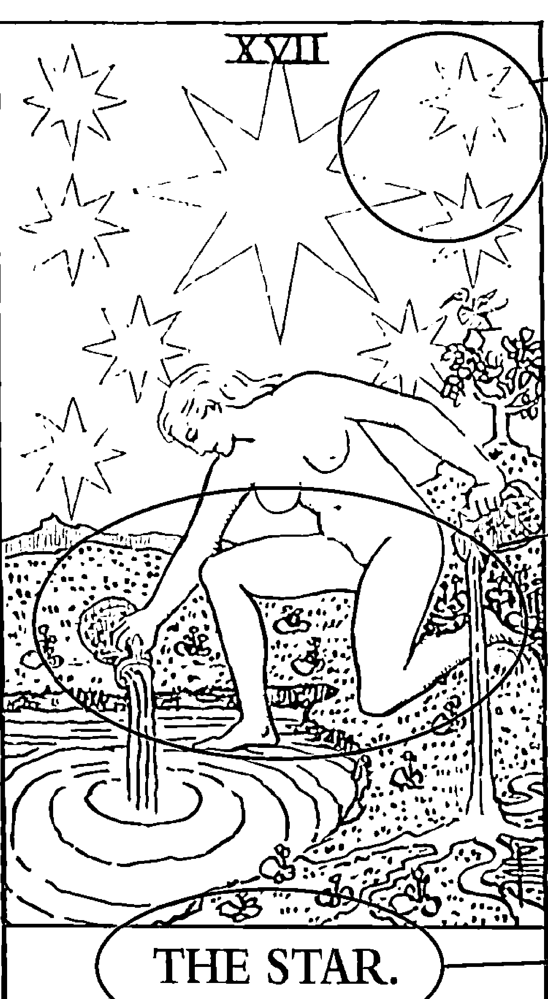

此牌象徵希望、平靜與和諧，平安、喜悅、感恩的心境將會為你帶來美好的結果。

圍繞著地球的星星，顯現出天體運行對人心的影響，這代表人類心靈中對寧靜的渴望。

雙手各執一壺的景象，流之不盡的壺中水，暗喻愛從未終止。

此牌象徵潛意識藏有靈感與直覺。如果從事創作的人抽到此牌，表示靈感將會源源不絕；但在有關感情的占卜中，此牌暗示一段三角關係的存在。

## 星星

- ◎正牌牌義：
願望實現、夢境成真、前途一片光明。
- ◎反牌牌義：
期望過高、錯失良機、固執、觀察力低。你可能正在治療創傷，但進度緩慢，過程又充滿挫折。但只要有耐性，一切都能順利解決的。

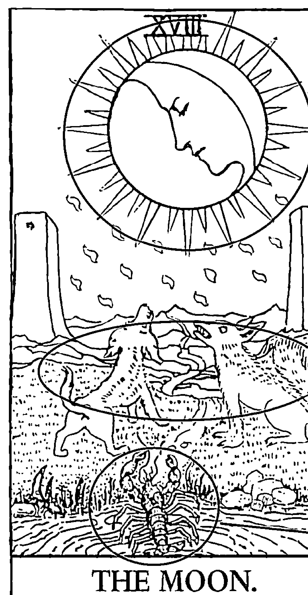

恐懼是人類痛苦的源頭，人生各樣的傷痛，都是源自心底的恐懼。人若覺得恐懼，就不能活在當下。占卜時出現月亮，代表了當事人正在與內心的陰暗面奮戰，內心很不安和恐懼。

一狼一犬對月亮的吼叫，象徵淒冷的月夜充滿不安的氣氛。

孤獨步向遠方的螯蝦，象徵恐懼，唯有信任和無條件的愛，才能換來心靈的安穩。

## 月亮

- ◎正牌牌義：外在環境的轉變令你產生恐懼、不安。

- ◎反牌牌義：生活迫人，你經常要被迫做自己不願意的事情。你要聆聽自己內心的訴求，和它好好溝通，最嚴苛的問題也能迎刃而解。時間可沖淡一切、惡劣的關係可望冰釋前嫌。

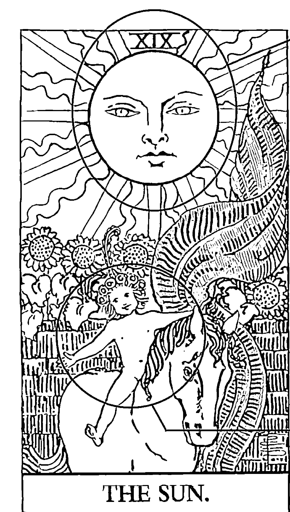

光芒四射的太陽是世間光明的來源，大地因為它的照耀而充滿生機。太陽牌帶來了勝利與光明。圖中全裸的孩童，象徵無比的活力和創意。即使事情看來灰暗無望，但仍有曙光。在占卜中，正面的太陽代表勝利和成功。但反面的太陽則帶來相反的意思。

充滿生命力的孩童象徵積極正面的思維和強大的創造力。

## 太陽

- ◎正牌牌義：
代表活力、信心、成功，足以抵銷所有負面的牌。你可能正在開始新的計劃，或打算將某樣東西升值，如更換電腦、購買新屋和換新車等。
- ◎反牌牌義：
計劃有阻滯，你要作出改變，才能扭轉局面。

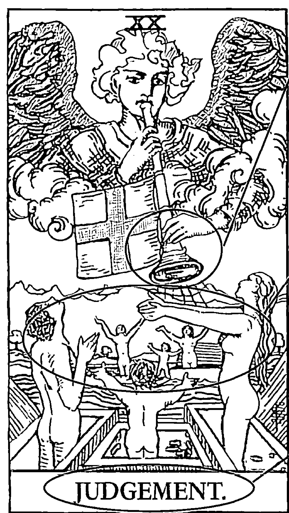

大天使手中的號角喚醒了沉睡的人心與迷惘的眾生。

從棺木中站起的人們象徵重生和希望。

審判是從結束到開始的轉變階段，人們一生的善惡功過，都在這裡有了結果。

## 審判

- ◎正牌牌義：
此牌表示你已經成長，一個全新的生活正在展開。例如你畢業了，要由學生轉變為打工仔，你要開始找工作，展開你另一個人生。有人正在判斷你的能力，此人很可能是僱主。

- ◎反牌牌義：
你不贊同別人對你的評價，人家負面的評價令你一敗不起，復原的時間要很長。

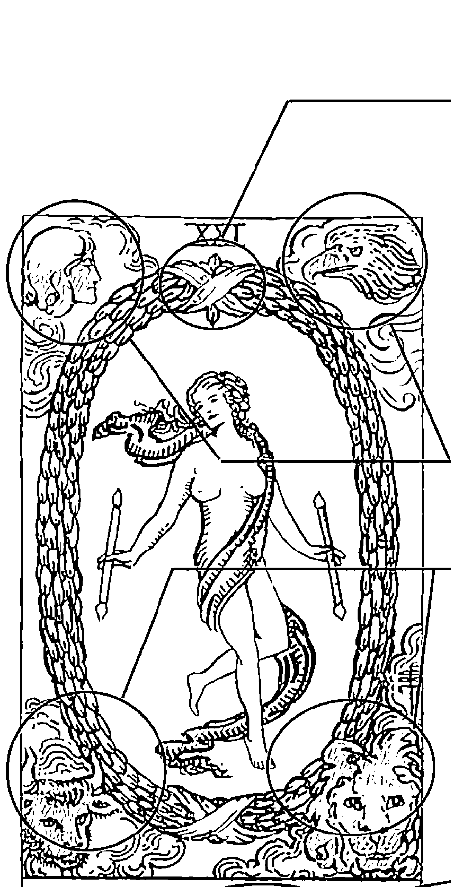

無限的大符號形式的飾帶，代表宇宙周而復始和循環不已的本質。同時也暗示世界牌帶來明確和重的成功。

代表地水火風四大元素的四象星座，在世界牌中都有了鮮明的顏色，這代表計劃和工作的完成，也顯示成功在望。

世界牌也是重要的旅行牌之一，而且代表長途旅行，甚至環遊世界的計劃。

## 世界

- ◎正牌牌義：心願可達成、幸福常伴身邊。事業成功或工作回報指日可待！眼前許多機會任你選擇，成功在望。

- ◎反牌牌義：低潮期、前景不樂觀、半途而廢、煩惱不斷、無法掌握一切、心願無法達成。你眼前有很多選擇，但你不懂得選擇，你要捫心自問，你究竟想點！抉擇時要果斷一點，否則，會錯過時機！

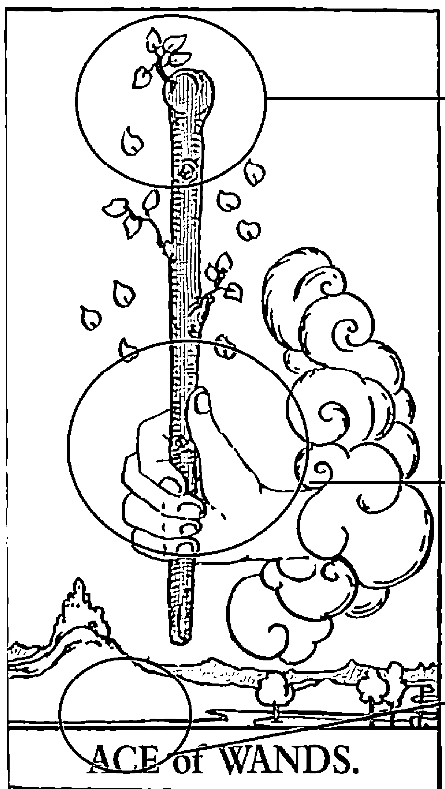

朝上生長的生命樹充滿著旺盛的生命力，代表當事人有無比的活力和熱情，想做就做。在人際關係中，它代表新關係的開始或原有關係的新發展。而在事業上，它代表升職或一項計劃的開始。

宙斯之手穩健有力的握住權杖，表現出積極將計劃付諸實行的自信及行動力。

Ace牌為一個牌組的開端，因此權杖Ace可引申為行動的開始。

## 權杖一

- ◎正牌牌義：代表你有一段新關係的開始或原有關係的新發展，可能是新想法、新朋友、新事業和新戀情等。

- ◎反牌牌義：計劃有阻滯，你需要休息和運動，以便重新振作。你的健康欠佳，或周遭的情況令你疲累不堪，影響健康。

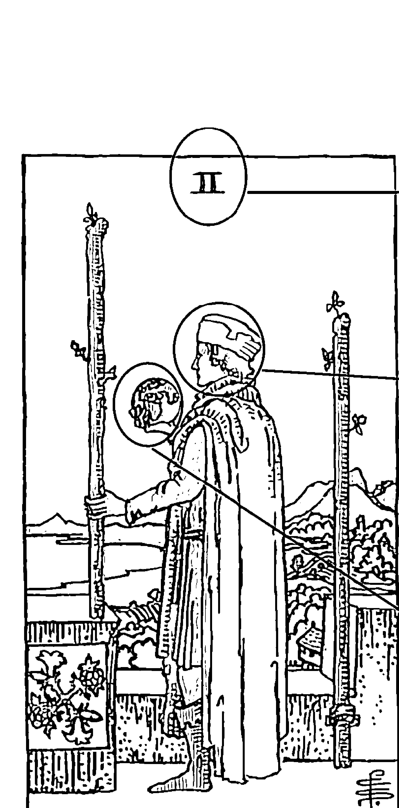

## 權杖二

權杖二代表了面臨兩個選擇而猶豫的狀態，在戀愛關係裡，當事人可能正面臨兩個以上的選擇。在事業上，代表想轉換工作。

人物凝視遠方，象徵宏觀和遠見，目前的現狀不能使他感到滿意。

牌中人物的中古歐洲貴族打扮，其身處的城堡和手上的地球、權杖，顯示他擁有一定的成就和權力。被拴在城牆的權杖，意味著當事人的行動受到限制，完全無法發揮應有的水準。它的出現提醒大家應該審慎行事，不可輕舉妄動。

- ◎正牌牌義：
代表面臨抉擇的狀態，你要審慎行事，不可輕舉妄動！你需要在兩個之間作出選擇，例如兩份工作、兩個愛人、兩個同時舉行的活動等。
- ◎反牌牌義：
表示你做錯了決定，如今悔不當初。你需要尋找方法，為自己所做的錯事作出補償。

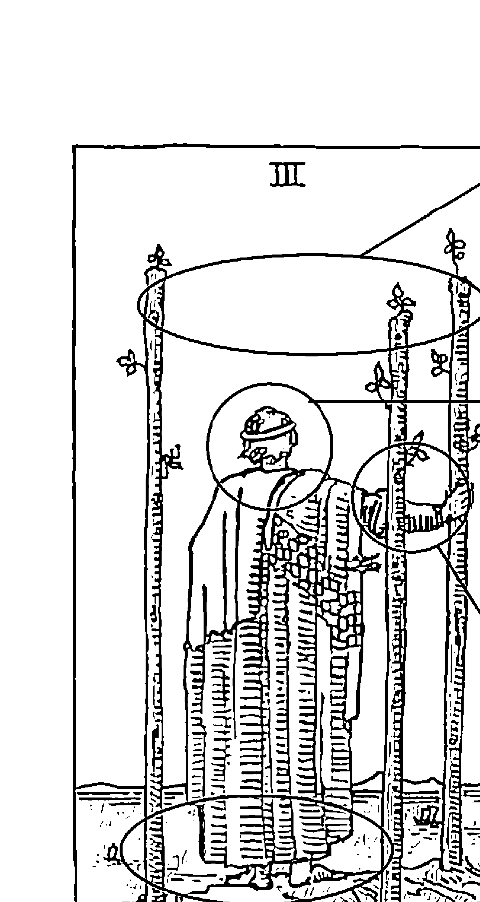

三號牌中三根權杖的矗立，代表了合作。「團結合作」是成功法則之一。

權杖三代表朝著既定的目標前進、邁向成功的過程。牌中人物的視線正望著海面上的商船，表示計劃執行後，會有可觀的利益。

手握權杖代表能力和信心，也表露出當事人在團體中的領導地位。

在海邊居高臨下，表示當事人擁有一定的地位和成就，登高遠望則象徵前瞻和遠見。

## 權杖三

- ◎正牌牌義：
此牌表示你可能正在學習做生意，或者正在考慮修讀與商業有關的課程，你正在為自己的興趣和理想進發。

- ◎反牌牌義：
因缺乏行動，白白讓機會溜走。你可能因自己的計劃受阻而氣餒，或對自己的想法感到猶豫和懷疑。

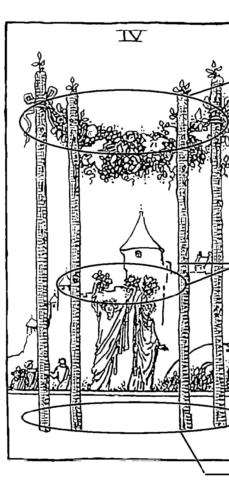

權杖上的果棚懸掛著綵帶和豐碩的果實，象徵豐收和勝利。

兩人頭戴花環，高舉花束，身姿舞動的動作，讓人聯想到婚禮。在兩性關係中，此牌象徵美好甜密的愛情或堅定的承諾。占卜時如搭配特定牌（包括聖杯二和正義牌）時，意味著結婚和婚禮。如占卜事業工作，此牌表示投資獲利和生意成交。

四支權杖直立於平坦的地面上，象徵穩定的環境，與合作的可能性。

## 權杖四

- ◎正牌牌義：此牌代表新發展，或者特別的喜慶即將來臨，如訂婚、頒獎禮、家庭派對等。此牌亦表示是時候要釐定目標，規劃未來。
- ◎反牌牌義：因缺乏穩固的基礎，而無法面對周遭的挑戰。

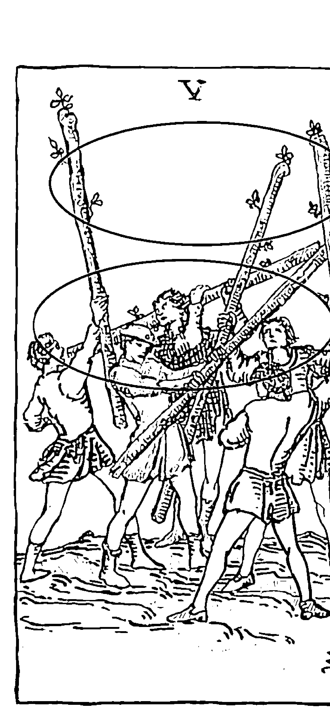

五個人手中的權杖方向不一，甚至互相抵觸牽制，象徵著五人因立場矛盾而發生衝突和摩擦。在人際關係中，此牌表示大家因觀念不同、生活方式不同、意見分歧而爭吵，鬧得很不愉快，甚至無法再合作下去。

惟有學會忍讓和寬容，才能化解當中的矛盾。

牌中的五個人物，各有五種不同的穿著打扮，面朝五個不同的方向，作出五種不同的姿勢，令人聯想到差異、不合與混亂，是一張衝突且不和諧的牌。

## 權杖五

- ◎正牌牌義：
表示你正在參加比賽，挑戰很大，你必須全力以赴，積極提升自己的能力，克服眼前的障礙。
- ◎反牌牌義：
表示你自信心不足，別人鬥志越旺盛，你越想打退堂鼓，你害怕失敗。

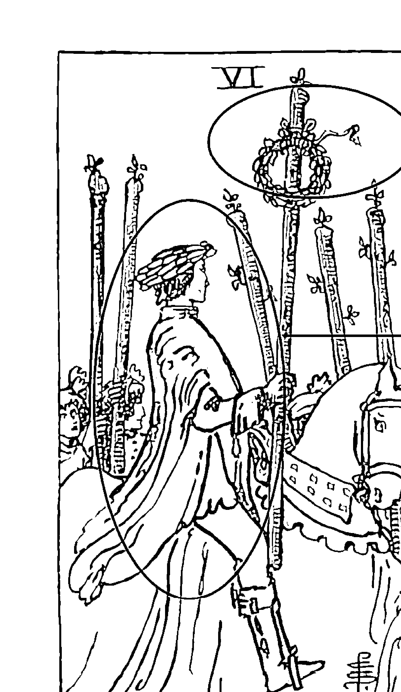

權杖上掛著慶祝勝利的花環，象徵凱旋、成功和榮耀。權杖六是一張勝利、榮耀的牌。但要留意，它同意帶有成功後得意忘形的涵意，當事人要緊記「滿招損，謙受益」的道理啊！

人騎在馬上，頭戴桂冠，抬頭挺胸充滿著自信。他騎著華麗的戰馬，意氣昂揚地接受眾人的歡呼。而在馬下遊行的隊伍，則顯示了擁戴和崇拜的涵意。
這張牌代表人際關係上的重要突破或進入新階段。而在事業工作上，它的出現往往象徵升職、加薪。

## 權杖六

- ◎正牌牌義：
代表有重要的突破或即將進入新的階段。在工作上，它象徵升職、加薪。
- ◎反牌牌義：
代表有人妨礙你，令你的計劃最終失敗。你害怕面對群眾，埋沒了自己的潛能，人們的目光令你很不自在。

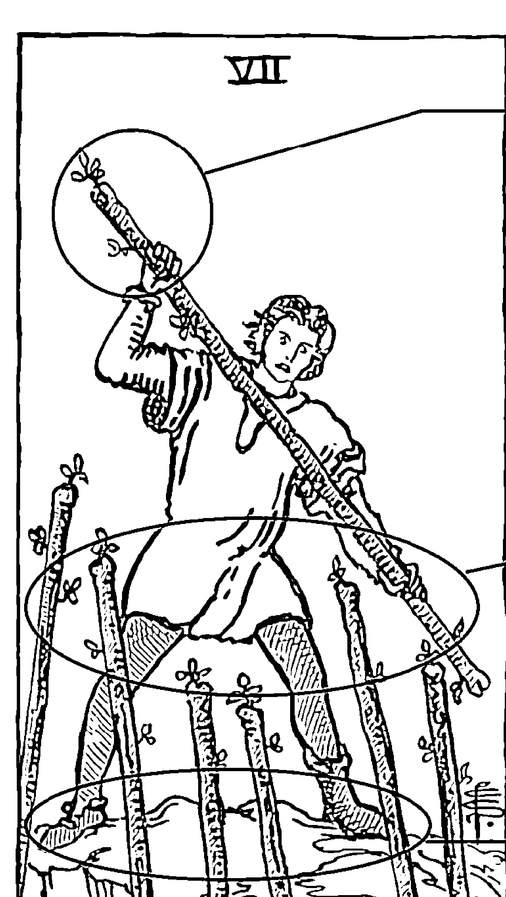

主角高举權杖，擺出迎接挑戰的姿勢，這代表堅持和奮鬥。這張牌代表當事人正面臨挑戰和遭遇阻礙，在事業工作上，工作的困難度會提高，當事人必須付出更多的心力去完成。

擋在前方的六根權杖，象徵遭遇到的挑戰和阻礙。雖然牌中有六支權杖阻擋去路，但當事人仍處於有利位置，表示過程雖然艱辛，但只要抱住堅持到底的決心和勇氣，成功的機會還是很大的。

人物腳踏的高地代表握有較高的勝算和位居優勢位置。

## 權杖七

- ◎正牌牌義：
過程也許艱辛，但只要堅持到底，成功的機會仍然很大。你需要堅守立場，克服障礙和勇敢面對他人的挑戰和反對聲音。
- ◎反牌牌義：
你的能力和信念被受質疑。你要堅持自己的夢想，不要受到他人的威嚇。

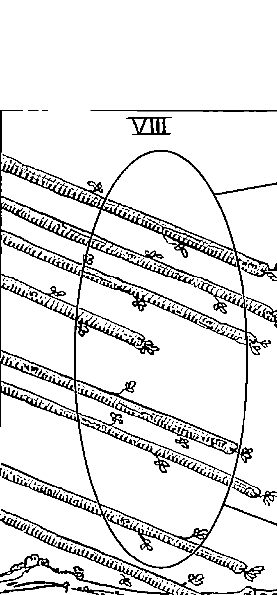

八支權杖在空中飛行，而且方向一致，令人聯想到快速和自由的行動。在人際關係上，暗示當事人不要給予對方帶來壓力；在事業工作上，它代表順利完成任務和得到滿意的成果，是成功的徵兆。

權杖飛過河川和廣大的地面，代表當事人即將有搭乘飛機出差或旅行的機會。

## 權杖八

- ◎正牌牌義：代表順利完成任務和得到滿意的成果。
- ◎反牌牌義：事情發展得太快，令你疲憊不堪，承受不住。

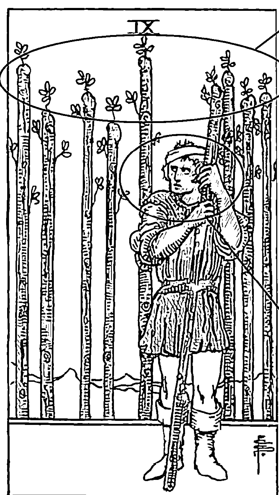

牌中人身後一排權杖象徵有形或無形的限制、包袱和壓力，以及即將到來的挑戰。

權杖九是一位剛剛歷劫歸來的戰士，他目前仍處於恐懼的備戰狀態，戰士頭上所綁的繃帶，象徵著過去受傷和挫敗的經驗，正因為如此，而使他不能勇敢跨出下一步。在感情占卜中，過去不愉快的經驗，阻礙了兩人進一步發展。對於事業工作而言，經歷過挫敗的人可能因而小心翼翼或過於謹慎而不敢大膽行事。

主角以防衛的姿勢握著權杖站立，代表當事人抱持著自我保護、不安、謹慎的心態。在這樣的心態下做事，會令事件有所延誤。簡單來說，這張牌暗示當事人把負面思維放大，形式退縮、恐懼和防衛的意識。

## 權杖九

- ◎正牌牌義：健康良好，有勇氣和決心。你的效率提升了，所以面對各方交來的重大責任，也能輕鬆完成。
- ◎反牌牌義：過於頑固，不願合作，花費太多不必要的氣力，導致問題叢生。

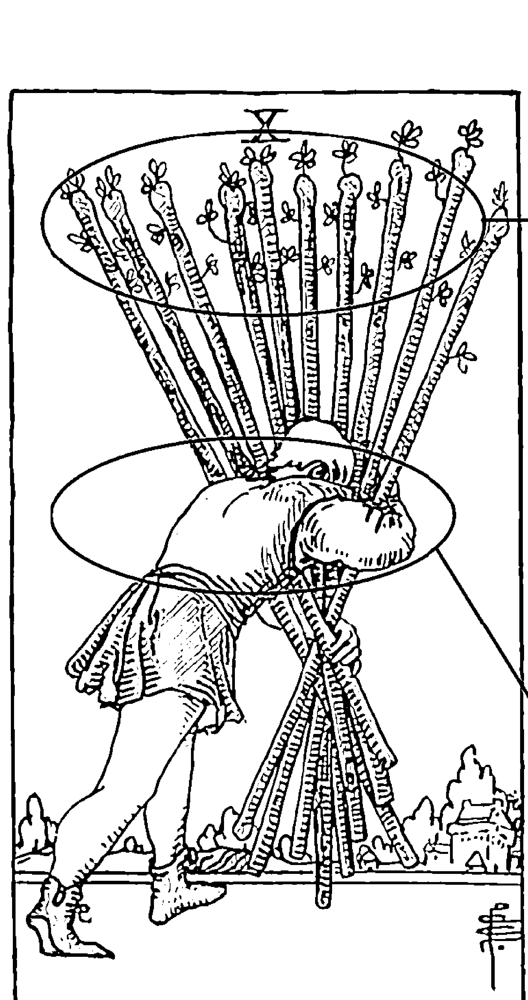

權杖十是一個負擔沉重的人辛苦地一步步前行，過度的壓力使他感到疲憊不堪。一次扛了十支權杖，象徵著負擔沉重和責任太多。而視線的遮蔽，也暗示過度的負擔會使人缺乏遠見。

圖中人將十支權杖全部抱在身前，擋住了視線，這暗示當事人應該放下一些或換個方式來攜帶權杖。

從主角彎腰駝背的姿勢，可看出他腰酸背痛的情形。無論在事業或感情上，此牌象徵當事人背負過多的責任和壓力。

## 權杖十

- ◎正牌牌義：表示你要承擔某個重任，你可能感覺負擔沉重，但你永遠向前的力量和不退縮的性格，終能衝破所有難關。

- ◎反牌牌義：表示過度的壓力使你感到疲憊不堪。

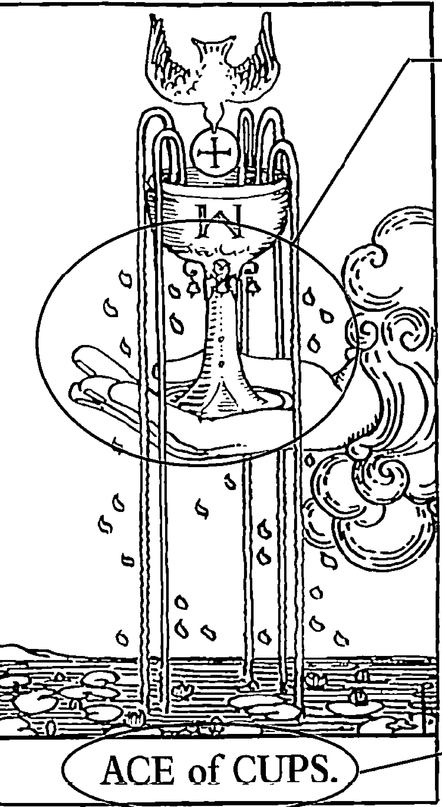

源源不絕的水柱持續地由杯中溢出注入池塘，象徵著豐盈和滿足。牌中的水柱自聖杯中不斷流瀉，象徵情感充沛、熱情洋溢，以及無條件的愛。

聖杯 Ace 所代表的是一段感情或學習的開始，也表示心靈上充滿愛和喜悅的狀態。兩性關係的占卜中，聖杯 Ace 是愛的源頭，表示有關感情的新開始和新階段。在事業上，此牌代表新的靈感和創意，或是擁有無限的動力來專注工作。

## 聖杯一

- ◎正牌牌義：
表示將會有一段新愛和一個新的開始，你的心靈上會充滿愛和喜悅。

- ◎反牌牌義：
代表情緒錯綜複雜，心情反覆，愛情路上受阻。這亦表示新的戀情結束了，或新的計劃泡湯了，你需要時間恢復和振作。

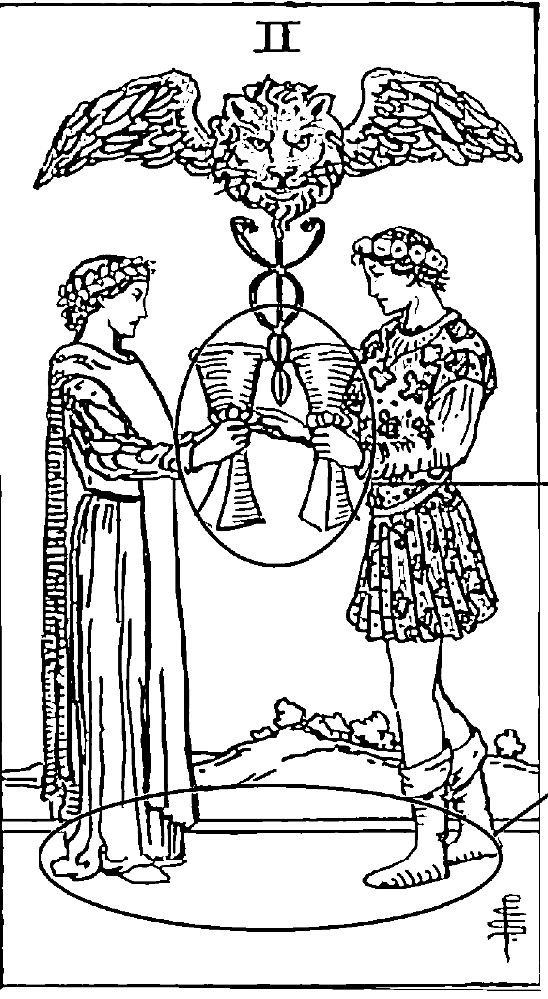

兩人愉悅地對舉聖杯，同時男方右手輕碰女方，象徵這是溝通良好的關係。同時也帶有合作的意味。

在事業工作上，它顯示出一種愉快的合作關係；在感情方面，它意味著有婚姻、或熱戀中的意思。

兩人立足點高度一樣，代表一段平等且和諧的感情關係。

## 聖杯二

- ◎正牌牌義：
顯示一種愉快的合作關係，溝通良好，牌中帶有婚姻的意思。

- ◎反牌牌義：
一段友誼或愛情會受到阻撓，可能是雙方家長反對你們拍拖，你只能和情人偷偷戀愛。又或者與朋友前嫌未釋，很難和好如初。

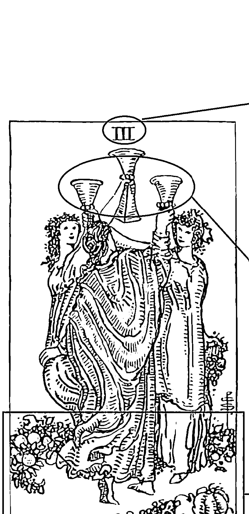

三號牌有合作的意義，它代表一個豐收、快樂的氣氛或聚會。在兩性關係中，它代表分享或重聚；在工作事業上，它象徵之前辛苦的耕耘將帶來回報和成果，又意味著有團隊合作的來臨。

三人高舉聖杯的動作，使人聯想到慶祝，它是一張豐收和歡慶的牌，它同時提醒當事人要珍惜與志同道合的夥伴相處的機會。

人物身旁佈滿各種豐碩的果實，代表豐收和成果。

## 聖杯三

- ◎正牌牌義：這是一張豐收、歡慶的牌，它同時也提醒你要珍惜志同道合的夥伴。

- ◎反牌牌義：意味著延遲或失望。例如一場颱風令某個宴會取消，或者某個活動因天氣關係而要延期等。又或者期待的朋友沒有出現，心儀的對象拒絕你的示愛等。

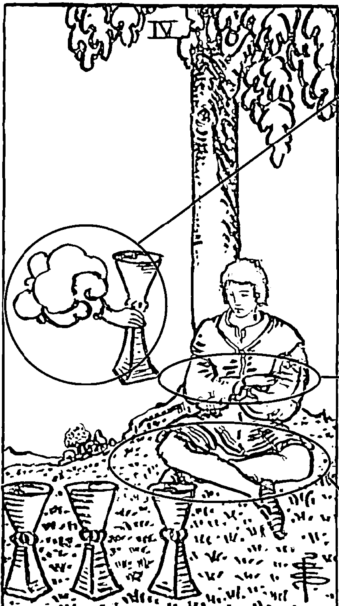

已擁有三個聖杯的主角仍然覺得不滿足，幻想著另一個虛幻的聖杯，緊閉的雙眼讓他無法把握眼前的機會。聖杯四代表對現狀不滿和事情處於消極停滯的狀態。原因是當事人緊閉雙眼，無視眼前的三個聖杯，活在幻想中而沒有把握目前的機會。聖杯四是一張因不滿足現狀而錯失良機的牌。

雙手環抱的防備姿勢，象徵主角對感情的退縮與拒絕。

雙腳盤坐在地上而不起身行動，象徵主角處於消極、停頓或休息的狀態。

## 聖杯四

- ◎正牌牌義：代表你生活缺乏動力，你需要時間休息，學習放鬆心情。

- ◎反牌牌義：意味著重新振作，從幽暗的低谷走出來。

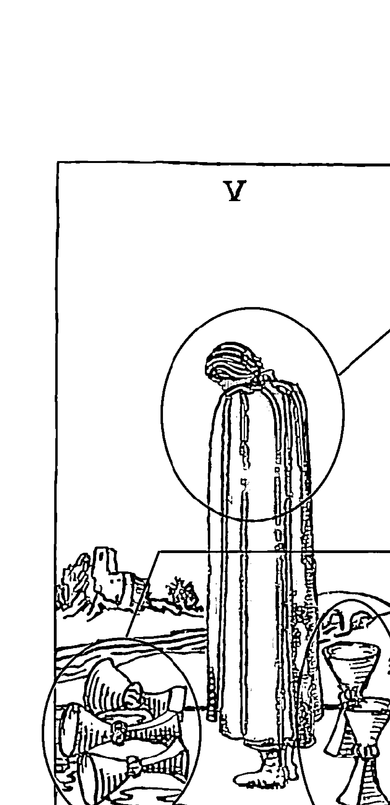

主角穿著黑色大衣，一副垂頭喪氣的樣子，使人聯想到悲傷、失望和沮喪的情緒。聖杯五所描繪的是一個悲傷、失望的狀態，當事人不斷地把問題無限放大，令自己長期活在憂慮當中。

傾倒的杯子，四散流出的液體，代表當事人失落的感情。

依然站立的兩個聖杯，象徵當事人並非一無所有，也不是輸得一敗塗地，周遭還有親友的關懷和支持。

## 聖杯五

- ◎正牌牌義：
代表你沉浸在過去的失敗或挫折當中，久久未能自拔，你過分沮喪懊悔，不願正面面對未來。

- ◎反牌牌義：
痛苦已經結束，一切都在恢復當中。你願意忘記過去，原諒自己過去的錯誤，你願意收拾破碎的心情，從失敗中汲取教訓，重新出發。

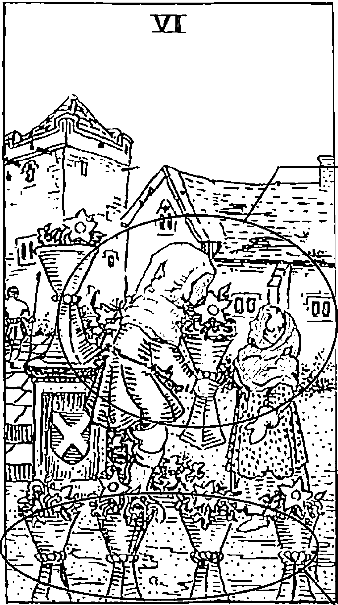

圖中兩人大小比例不同，顯示兩人關係不平等，其中較大的一人居於主導地位，且對另一人存著佔有慾。

較高的那位手持聖杯和花朵要贈送給小女孩，使人聯想到承諾、照顧和保護。聖杯六顯現的是一個溫馨而充滿安全感的環境，牌中的人物一大一小，比喻著不成熟的關係。就兩性關係而言，聖杯六代表一方給予照顧和保護，另一方則被動接受；至於工作方面，這可能指一份安穩卻不能帶來成長的工作。

聖杯中的花朵，代表昔日的美好時光。

## 聖杯六

- ◎正牌牌義：你過去愉快的生活經驗，會指引你走向快樂的未來。
- ◎反牌牌義：
你長期處於被保護的環境中，無法獲得成長，雖然你是成人，但心境和心智還像個小孩子，你無法擔當責任。

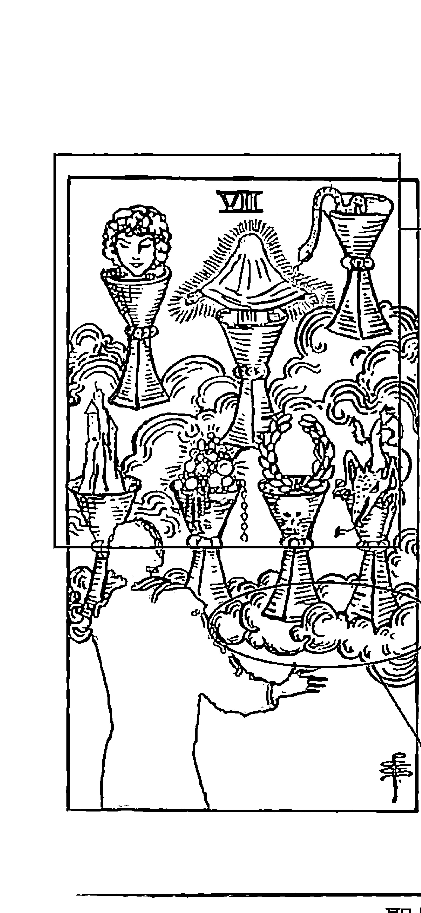

七個杯子中各裝了代表容貌、性、安全感、財富、地位和慾望等不同的事物，這象徵了當事人要面對多種不同的選擇。

聖杯七代表一個人面對太多選擇，卻不知道自己真正的需求。在兩性關係上，這張牌意味著兩人之間缺了一些東西，但又找不出問題所在。在事業工作上，也許面臨了不同性質的工作機會。牌中有一張被白色布幔所遮蓋的人像，這代表真實的自我。在面臨眾多選擇的時刻，人必須自我探索才能認清內心真正的需求。

處於雲霧中，象徵當事人身處迷惑中。這是一張代表迷惑和探索的牌。

## 聖杯七

- 正牌牌義：眼前太多選擇，結果不知道自己真正的需要而感到迷惘。你想做的事情太多，但又沒有周詳的實踐計劃，結果甚麼也做不到。
- 反牌牌義：事情開始明朗，你漸漸會清楚哪一個選擇較適合自己，你開始從不切實際的幻想中走了出來。

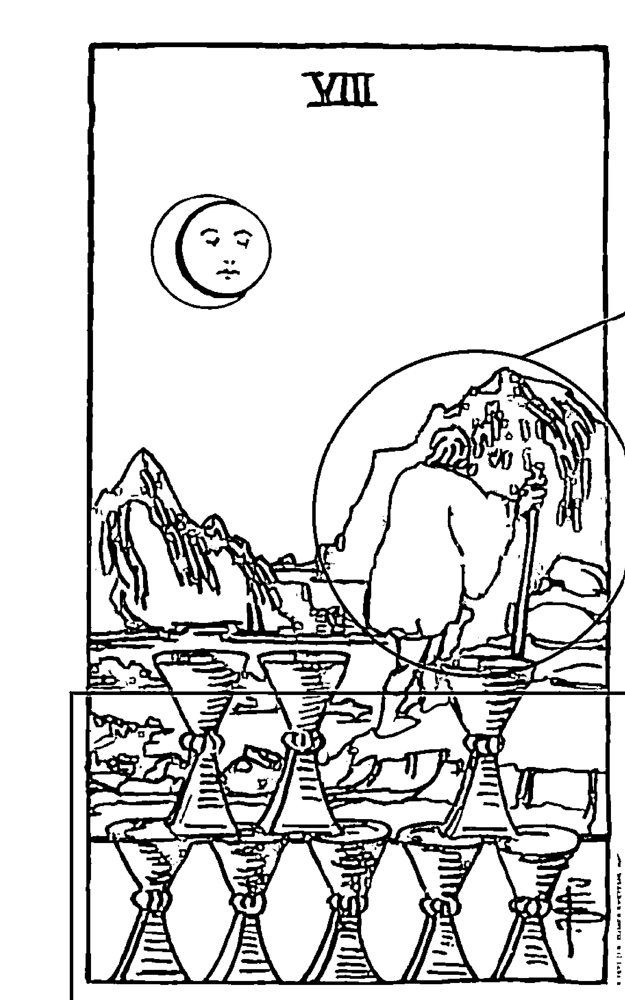

主角是往上方的路途前進的，象徵著更高層次的追尋，聖杯八表示一個不滿現狀的人，他毅然放下了既有的成就，踏上追尋人生的旅途，牌中月亮高高掛，夜色已深，但主角仍不休息地攀山涉水，顯示了當事人行動的決心，也暗示了過程的艱辛。

八個聖杯整齊地排列，但空出了一個明顯的缺口，象徵當事人對現狀的不滿足以及想追求的目標。
在兩性關係上，這可能意味著拋棄或外遇；在事業上，代表當事人想轉換工作環境或尋求突破。

## 聖杯八

- ◎正牌牌義：
  要拋開過去，尋找一個新的生活方式，這對你有幫助。
- ◎反牌牌義：
  意味著你想放下一段感情關係，或者你想找一個新的處理方式，去解眼前困擾已久的問題。

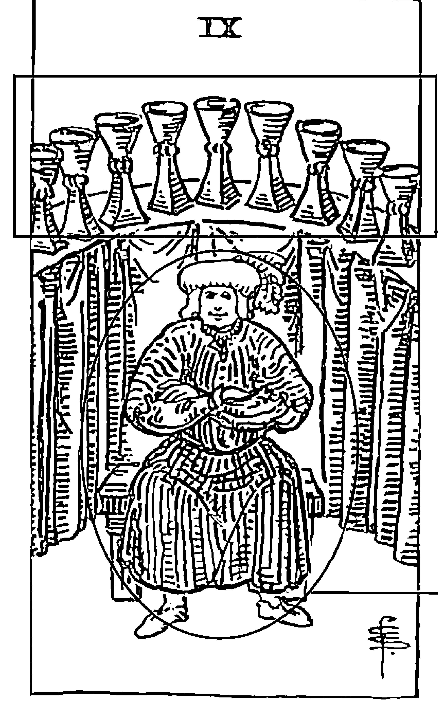

高高在上展示出來的聖杯，表示當事人已經取得的成就和滿足。在事業工作上，此牌表示目標已經完成，而當事人對自己的成就感到很自豪。

主角的姿態顯現出他的自負，雙手環抱的姿勢反映他相當驕傲，不願向人敞開心扉和與人溝通，在兩性關係裡，這可能代表當事人滿意兩人目前的狀態，也可能說明出兩人缺乏交流的現象。

## 聖杯九

- ◎正牌牌義：
你的願望快將實現。
- ◎反牌牌義：
因過於驕傲，而不願意與人溝通。此牌表示你未得到你想要的東西，或者你得到後仍感到不快樂，你過於重視物質，你貪得無厭。

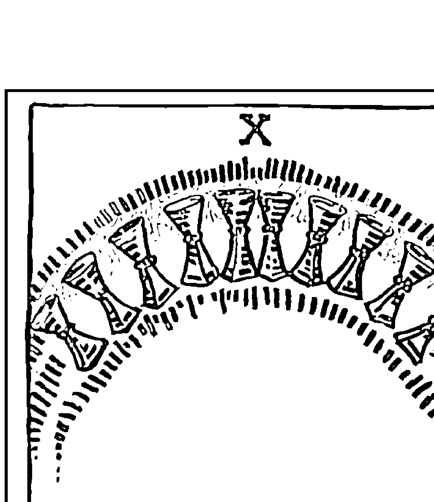

天空的聖杯與美麗的彩虹相互輝映，代表著美好、和諧的事物，聖杯十所代表的是一個快樂圓滿的家庭，以及一種成熟穩固的關係，在兩性關係上，兩人的感情已超越了熱戀期，到達了穩定的階段；在工作上，此牌通常表示團隊間的相互合作與相處融洽。

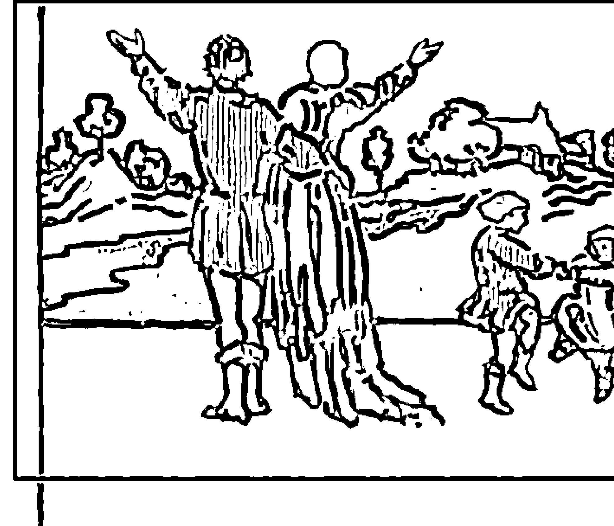

圖中相互擁抱的男女，再加上兩個小孩牽手跳舞，正是美滿家庭、和諧團結的象徵，除了歡樂的景象，也有扶持和合作的意味。

## 聖杯十

- ◎正牌牌義：即將有好事發生，例如愛情開花結果、工作上與同事相處融洽，或者個人財政轉趨穩定等。
- ◎反牌牌義：計劃或願望會有延遲和阻礙，但你要保持積極的態度，一切會轉好的。

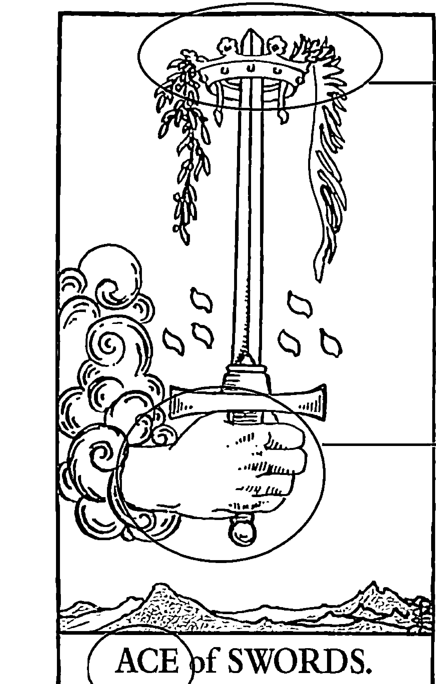

寶劍的尖端穿過王冠，暗示了當事人待人處事太強勢、尖酸和苛刻。

雅典娜的手握住寶劍，代表勝利與決斷，也象徵理性的思考與清晰的判斷力。穿過王冠的劍身象徵「順利過度」，表示勝利和征服，你精密的思考和強勢的部署已戰勝了眼前的挑戰。

Ace 象徵一項計劃或冒險的開始。

## 宝剑一

- ◎正牌牌義：代表一個新計劃、新冒險的開始，你的努力會得到回報。
- ◎反牌牌義：代表工作上會有意外，事事不如意。另外，此牌暗示你可能要做個小手術，或者被某種鋒利的工具割傷，小心小心！

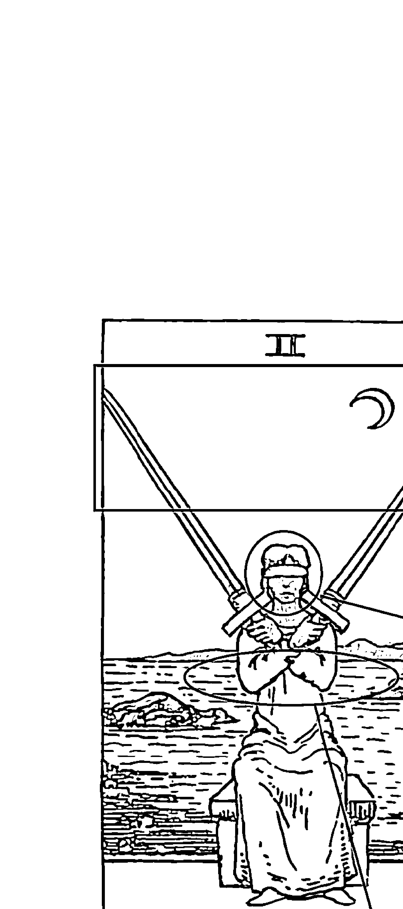

兩把寶劍指著兩個不同的方向，代表對立和矛盾。寶劍二代表當事人面對兩難的局面，內心長期處於苦惱和擔憂的狀態。在愛情占卜中，此牌代表逃避情感和悲情苦戀。在事業占卜中，它指當事人工作壓力太大但又不願正視問題，讓事情陷於緊張的僵局。

牌中人物的眼睛被蒙蔽起來，顯示當事人看不清楚形勢和想逃避現實的現狀，內心很不安。

主角雙手交叉在胸前成防衛的姿勢，象徵抗拒和封閉，還有僵持不下的態度。圖中人的衣服和石椅都是灰色的，象徵當事人的感情冷漠。主角背後大片大海，象徵感情，背對海水，表示當事人想逃避愛情。

## 寶劍二

- ◎正牌牌義：代表逃避愛情和封閉內心。
- ◎反牌牌義：代表恢復溝通和爭端的結束。例如和愛人的冷戰結束，雙方和好如初。

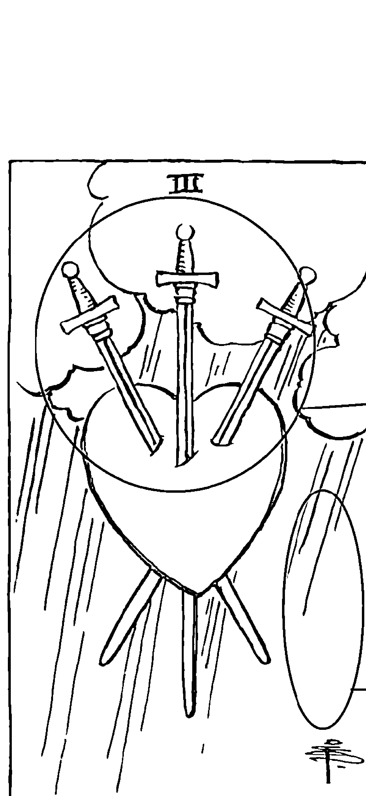

三把寶劍刺穿心臟表示當事人面臨錐心刺骨的悲痛和打擊，在兩性關係中，此牌可能表示失戀、分離和背叛；在事業工作上，這代表裁員、投資失敗或人事爭吵等；在健康占卜方面，這代表心血管可能出現毛病，當事人要多加小心！

牌的背景是烏雲暴雨，陰鬱天氣比喻沮喪和低落，但只要跨過這些困難和挫折，你會獲得很大的得著。

## 寶劍三

- ◎正牌牌義：代表利劍穿心般的強烈痛苦和悲傷，當中包含失戀、分離、裁員的暗示。你要拋開過去，凡事有失必有得，你很快會明白這個道理。
- ◎反牌牌義：表示不面對現實，只管責怪別人，死不悔改。你要學習知錯能改，不要鑽牛角尖，不要終日在想「早知道這樣，我就會那樣」。

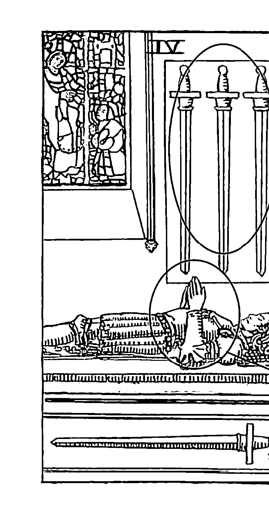

平放於身旁的寶劍在伸手可及的範圍內，表示當事人雖然處於休息的狀態，但仍積極備戰，為將來的奮鬥而努力。當休息充足以後，就可以整裝待發了。在兩性關係中，此牌代表當事人要讓自己冷靜思考一段時間；在工作事業上，表示當事人要放鬆一下自己，充電之後再回到工作崗位搏殺。

主角靜靜地閉目平躺，雙手合放在胸前，表示他正處於休息和沉思的狀態，同時也帶有內省的含意，主角身處教堂內，在這安全的環境裡，他可以獲得充分的休息，這是一張休息和準備的牌。

## 寶劍四

- ◎正牌牌義：代表復元，即身體和精神狀態開始恢復過來。
- ◎反牌牌義：表示你拒絕停下來讓自己休息，結果事情弄巧反拙。

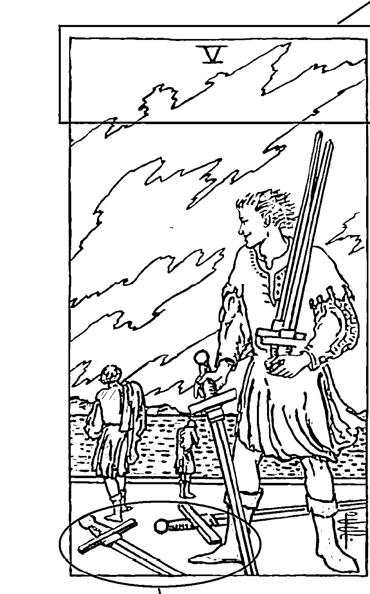

五號牌往往帶有衝突、不和諧的含義。寶劍五呈現一個衝突過後，氣氛肅然的局面，這場衝突顯示有輸有贏，因為主角帶著得意的笑容望著失敗者離去，勝利者雖然暫時以強硬的方法取得優勢，卻沒有從中得到實質的好處，問題根本未解決，這亦埋下風暴再臨的伏線。

在人際關係中，此牌表示兩人意見不合，缺乏良好的溝通；在事業占卜中，這可能代表惡性競爭的現況。

空中的雲正被狂風吹著，意味著不安定、緊張和憤怒。

雖然戰敗者的寶劍散落一地，但勝利者也沒有多餘的空間去撿拾，這代表著逞一時之意無謂爭鬥。

## 寶劍五

- ◎正牌牌義：表示問題沒有真正被解決，反之，下一場風暴即將到來。
- ◎反牌牌義：這張牌警告你，要你提防某個人，這個人不值得信賴。

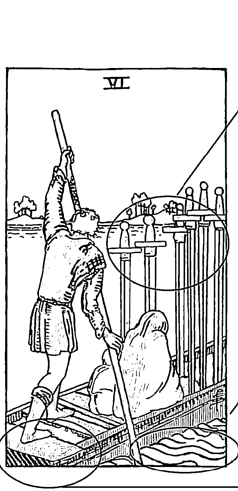

船上除了三個人物外，船身還插著六把寶劍，使小船顯得格外沉重，意味負擔沉重與過去的傷害。

水面一邊洶起伏，一邊平靜無波，而船身正慢慢駛向平靜的那頭，象徵了傷口漸漸復原，痛苦的心情也漸趨平靜。

在占卜中，這張牌意味著過去的傷痛將逐漸平復，當事人很快就可以接受新愛，並在痛苦的回憶中跳離。在工作上，也許目前有不少經濟壓力，但情況會好轉的。

小船表示當事人有水上旅遊和海外旅行的意思。

## 寶劍六

- ◎正牌牌義：表示過去的傷痛將逐步平復，可以重新開始。幸運之神正在眷顧你，你會有好結果的。
- ◎反牌牌義：表示波折重重，很難找到解決辦法。但只要你改善與人的相處方式，增強人際關係，這些朋友會助你渡過難關。

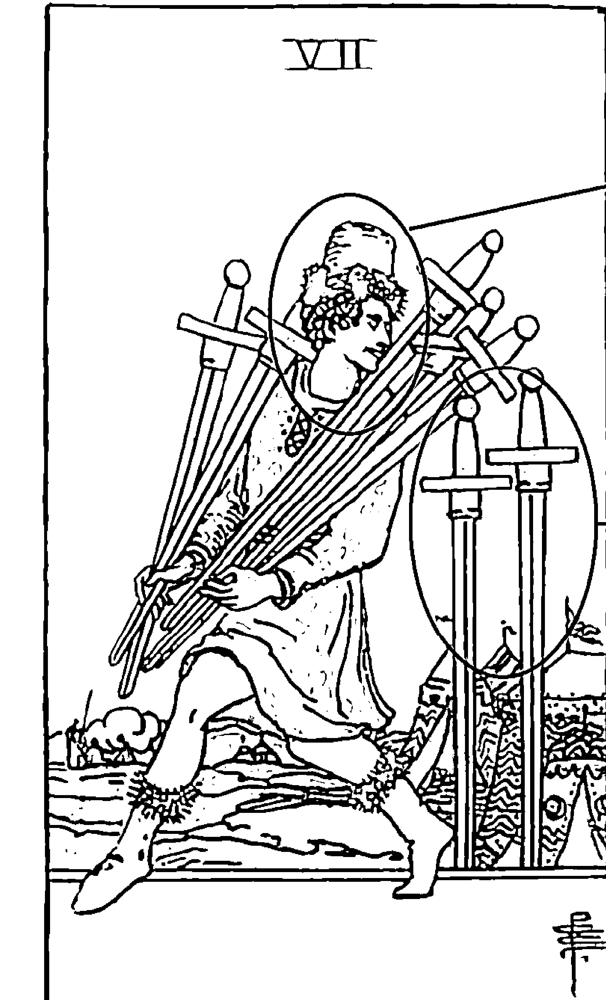

這是一張表示欺騙的牌，牌中主角正悄悄地潛入敵方的軍營裡偷取武器。在兩性關係中，這代表彼此不能以誠相待，若搭配特定的牌（如逆杯三和星星牌），可能表示有三角關係或外遇；在事業上，表示當事人要小心合伙人的可靠度，並注意投資的風險。

偷偷摸摸設法不引人注意的溜走，使人聯想到偷竊、欺騙以及不坦誠等含意。

牌中人遺下兩把劍，因他無法將所有武器偷走，為自己日後埋下不少的禍根。

## 寶劍七

- ◎正牌牌義：是一張欺騙、危險的牌，表示對方不會以誠相待，你要小心被騙、被出賣。
- ◎反牌牌義：意味很多突發的事情會發生，要份外小心。

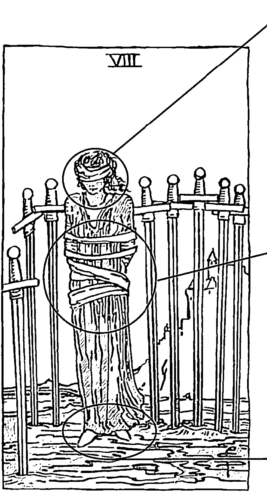

主角的雙眼被蒙蔽，使他看不清楚內心和周遭的情況。

身邊八把寶劍散發出來的殺氣，讓失去清晰判斷力的主角感到恐怖和不安。雙手被綁，表示受到他人的束縛。在人際關係中，這代表當事人因受到束縛而感到不自在。在事業問題上，他人的批評令當事人非常不安。整體而言，寶劍八是一張盲目、限制和不安的牌。

主角雙足仍然可以自由移動，表示他仍可以憑自己的力量走出困局，這也象徵目前的困難並不是很難垮過，只是當事人把困難無限放大而已。

## 寶劍八

- ◎正牌牌義：表示受到束縛，無法做回自己。但這糟糕的情況只是暫時，你很快找到機會發揮真我。
- ◎反牌牌義：表示問題得到緩和，開始從束縛中釋放出來。你擁有多的自由，可以開放地表達自己。

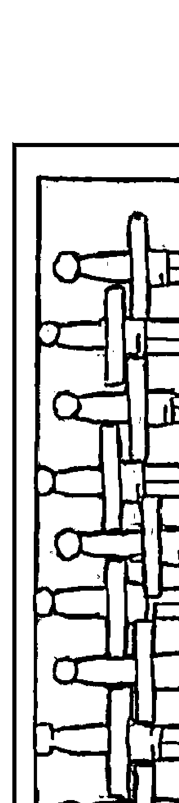

從夢中驚醒的主角作出了掩面神傷的動作，象徵他心中的沮喪、煩惱與不安。

另一方面，牌中寶劍貫穿頭、頸和心臟的部位，可能暗示當事人的頭、頸和心臟的健康出現了問題，無論占卜甚麼問題，此牌都象徵當事人很心煩，眼前的問題令他飽受困擾，身心俱疲，可能自己想得太多，導致情緒波動，此牌是一張有關惡夢、沮喪和煩憂的牌。

## 寶劍九

- ◎正牌牌義：這是一張「惡夢牌」，表示你因焦慮、緊張而睡不安穩。一些負面的思想正在折磨著你。你做惡夢，是因為你找不到解決方法，這時你要找可靠的朋友或長輩傾訴一下。
- ◎反牌牌義：意味著有一線希望，前景明朗，你會再度感覺自己原來可以很棒！

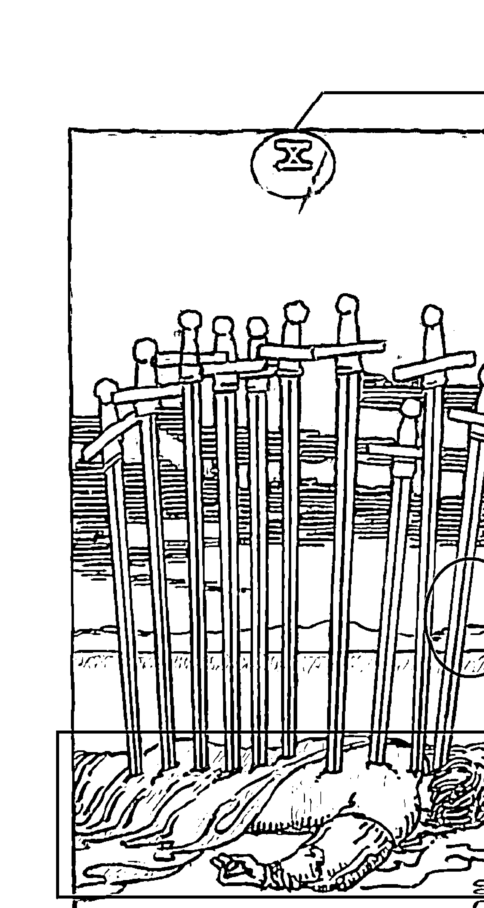

十號牌是數字牌的最後一張，所以包含結尾的意思，這張牌顯示的是一個悲慘痛苦的情形，但同時又象徵了當事人的痛苦已到了盡頭，無論是感情、學習、事業或其他方面的占卜，都表示了痛苦帶來成長，痛苦之後曙光所帶來的新局面即將出現。

黑暗的天空漸漸露出了金黃色的曙光，代表黎明即將到來，同時也喻指另一個開始和重生的契機。

主角倒臥在地，十把寶劍從頭到腳，每一把都刺進了身體，象徵當事人陷入了孤獨、痛苦和低潮。

## 寶劍十

- ◎正位牌義：意味著波折和考驗快將結束，是一個開始、重生的契機。凡事都有結束的一天，你要採取主動，才可逃出黑暗，面向黎明。
- ◎反位牌義：未能面對現實，沒有切實執行你要做的事。

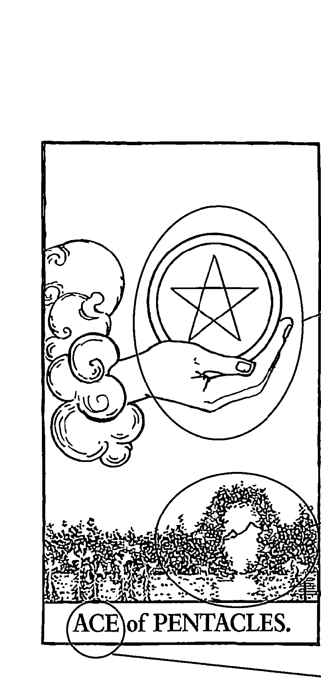

手捧著錢幣表示擁有財富，Ace 錢幣所代表的是與金錢有關的計劃或物質肉體方面的享樂。雲中伸出的是海神波塞頓的手，將錢幣捧在掌中象徵錢財與物質的豐足。在人際關係或事業占卜裡，錢幣 Ace 象徵務實穩定的狀態，而且往往和財務上的吉兆有關。

美麗的花園中還有條通往遠方小路，代表收穫之期即將到來。

Ace 牌為一個牌組的開端，因此錢幣 Ace 象徵一項財務計劃或新事業的開始。

## 錢幣一

- ◎正牌牌義：象徵錢財和物質富足，顯示財務穩健。
- ◎反牌牌義：健康不佳，缺乏精力。你要重新打好根基，集中目標，才能取得成功。

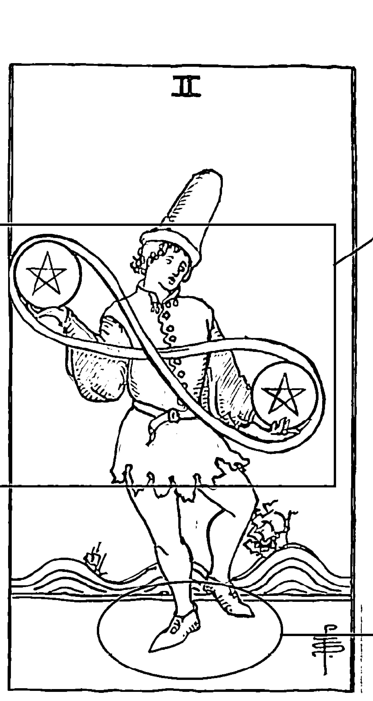

主角的雙手各拿著一個錢幣，但看著其中一個若有所思，這代表他正在抉擇和衡量。

牌中人物的腳一高一低，表示難以平衡，水與情感有關，背後波濤洶湧的海浪，喻指當事人情感或財務上起伏不定。

在有關事業或財務的占卜裡，此牌代表當事人正處於不穩定的階段，一時間拿不定主意。

## 錢幣二

- ◎正牌牌義：表示你要面臨抉擇，進退兩難。
- ◎反牌牌義：表示你手頭很緊，入不敷支，要小心花錢。

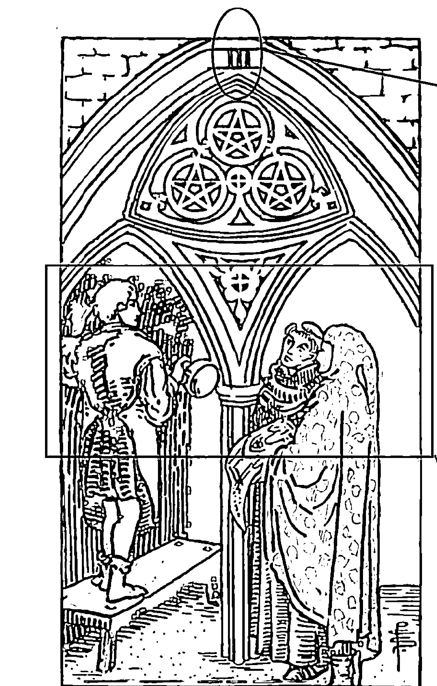

牌中三人商議，帶出三號牌合作的意味。

工匠、傳教士與設計師正在計劃如何建造教堂的事宜，這讓人聯想到討論、協商和合作，大家正在商議如何建造一座長久穩固的教堂。

圖中的教堂尚未完工上色，需要大家同心協力。錢幣三代表共同的合作和努力，營造長久穩定的未來，這也是「三人同心，其利斷金」的表現。整體而言，錢幣三是一張合作、協商的牌。

## 錢幣三

- ◎正牌牌義：意味著獲得認同，有回報。你找到機會發揮自己，只要你按照自己的興趣，做自己喜歡的工作，財富自己跟著來。
- ◎反牌牌義：代表你害怕失敗、懶懶、表現欠佳。你因害怕失敗，而不肯接受新任務，結果生活停滯不前。

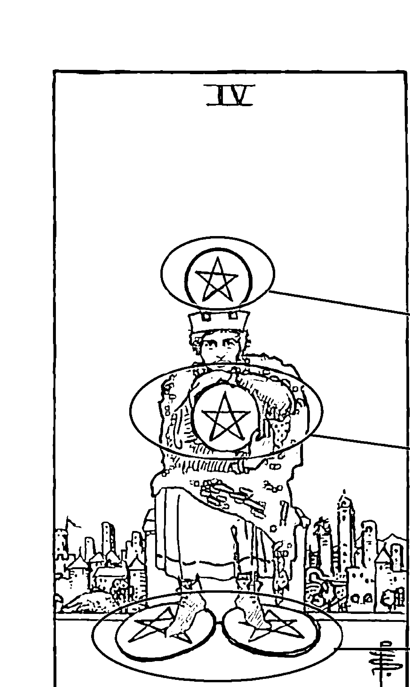

牌中人物不僅手中緊抱和腳下踩踏著的三個錢幣，頭上還想再多頂一個，這種執著的心態若展現在錢財上，則變成吝嗇的守財奴；若展現在感情上，則表示當事人佔有慾很強，不願放手。

牌中人身披長袍大衣和頭戴金冠，表示他已擁有一定的財富和成就，但他一人孤立在城市之外，暗示了當事人的人際關係很疏離，固執而不能敞開心胸，在情感上只會控制和佔有；在事業工作上，此牌表示穩定獲利，但也暗示著金錢的運用過於保守。

## 錢幣四

- ◎正牌牌義：表示太安於現狀，害怕改變。
- ◎反牌牌義：代表缺乏安全感，得不到你想要的東西。

錢幣五帶有矛盾、障礙及不和諧的含意，而困難和障礙是指財政方面。

裝飾了彩繪玻璃的教堂，象徵物質和精神上的庇護。

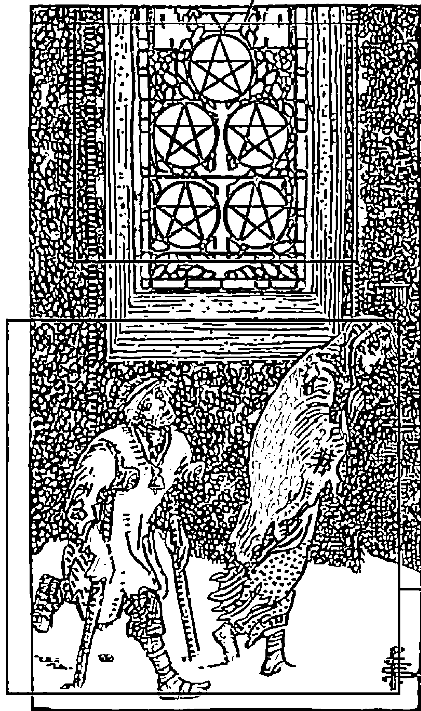

牌中兩個流浪漢衣衫襤褸、受傷疲憊，使人聯想到人生中的低潮、挫折和貧窮，錢幣五所呈現的是一個貧困飢寒和受傷潦倒的悲慘遭遇。天寒地凍裡，兩個流浪漢經過教堂，教堂可以為他們提供精神和物質上的幫助，但他們視而不見，表示當事人忽略了身旁的轉機。其中一個流浪漢腳部受傷，象徵身體上有疾病或傷患，在人際占卜中，此牌代表受挫、分離和空虛；在事業占卜中，此牌顯示出當事人正陷於財務上的困境。

## 錢幣五

- ◎正牌牌義：意味著貧困、經濟損失和物質匱乏，你充滿空虛、受挫的負面情緒。此牌表示你的財政會變得緊張，身體方面會出毛病等。
- ◎反牌牌義：是時候要作出行動，以免情況繼續惡化。

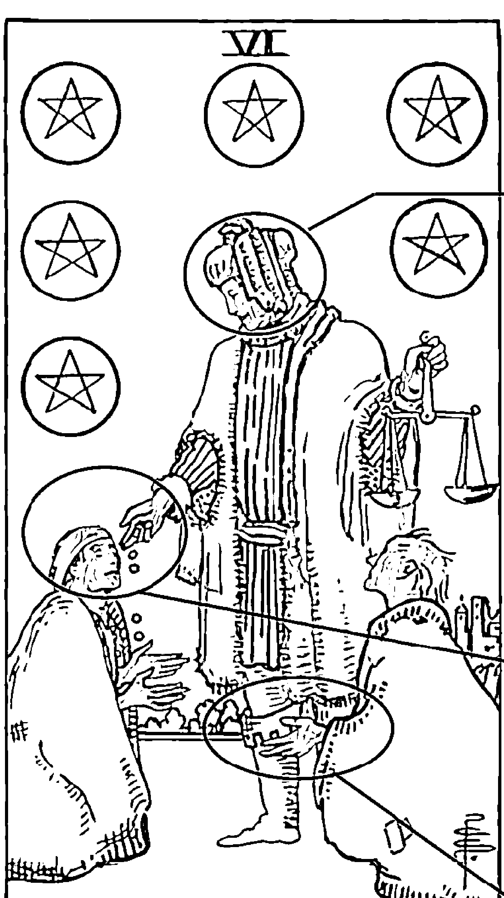

錢幣六表示「給予」和「接受」的平衡關係，從牌中富人站立而乞丐跪地的姿勢來看，可知雙方的地位並不平等但卻能和平相處。

問卜者所扮演的可能是施或受的其中一方。在人際關係上，這表示一方支配另一方順從的關係，一方付出另一方接受照顧的相處模式，富人手中沒有絲毫傾斜的天秤，象徵著平衡和穩定。

富人手持錢幣向下施予的動作，顯示出錢幣六付出、施予和幫助的含意，但也讓富人擁有了支配弱者的權力。

乞丐手掌朝上準備承接恩惠的姿勢，代表接受和順從。

## 錢幣六

- ◎正牌牌義：表示感情美滿，生活富足。財政匱乏的問題已經告一段落，收支平衡。感情方面，關係和諧。
- ◎反牌牌義：你需意注意自己的財政問題，別揮霍無度和負債。此牌表示你理財不當、正在負債，你即將要經歷一段黑暗期。

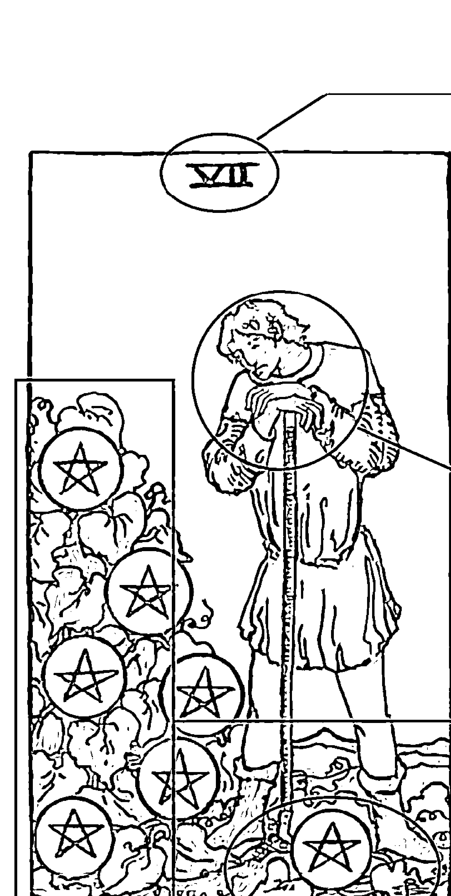

牌中的錢幣象徵主角長久以來辛苦耕耘，終於累積了一些財富，現在他擁有穩定的財務狀況，可以停下腳步來想想該如何善用這筆財富。在占卜中，這張牌代表當事人要謹慎地理財致富。

主角用鋤頭托頭，若有所思地望著自己栽種的農作物，這幅景象代表他正在評估和籌畫下一步該怎麼走。

長滿錢幣果實的樹木，暗示著豐收的成果，也表示主角目前所擁有的財富成就。

腳邊已採收的錢幣，象徵當事人準備好要運用資源。

## 錢幣七

- ◎正牌牌義：你此刻你需要明確的目標和不畏艱難的毅力。
- ◎反牌牌義：表示目標不切實際，太早打定輸數，未開始戰鬥而打退堂鼓，過份低估自己的能力，埋沒了自己的天份。

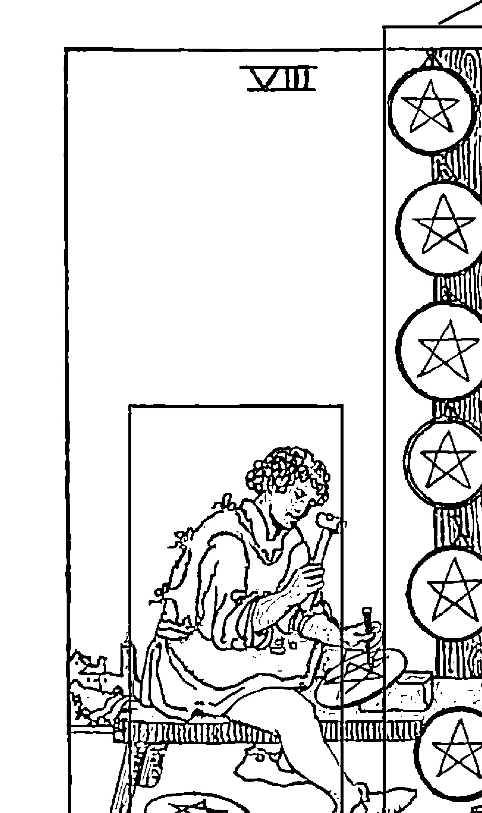

完成之後掛在牆上展示的錢幣，表示過去的成果和現有的成就。

工匠正努力專心地打造錢幣，這是精進技藝與追求成就的象徵。

在工匠腳邊，等待被琢磨的錢幣代表尚未完成的目標，也是他目前要努力的方向。

錢幣八顯示的是一個努力不懈、力求上進的狀態。雖然主角已有一定的成就，他仍努力不懈，力求上進。在感情占卜上，這代表當事人用心經營和維繫彼此的關係，但有時卻代表某一方忙於工作而疏忽了伴侶。在學業或工作上，此牌代表當事人認真投入的態度，並暗示成功即將來臨。

## 錢幣八

- ◎正牌牌義：表示成功指日可待。此牌表示你正在學習一門手藝或者接受一項新的訓練，學成之後，你會取得理想的報酬。
- ◎反牌牌義：表示你尚未完成學業，或者尚未完成整個訓練過程。你想開創新的事業，但根本本身打得不好，又沒有足夠的知識，結果，目標遲遲未能達到。你要新學習，彌補不足。

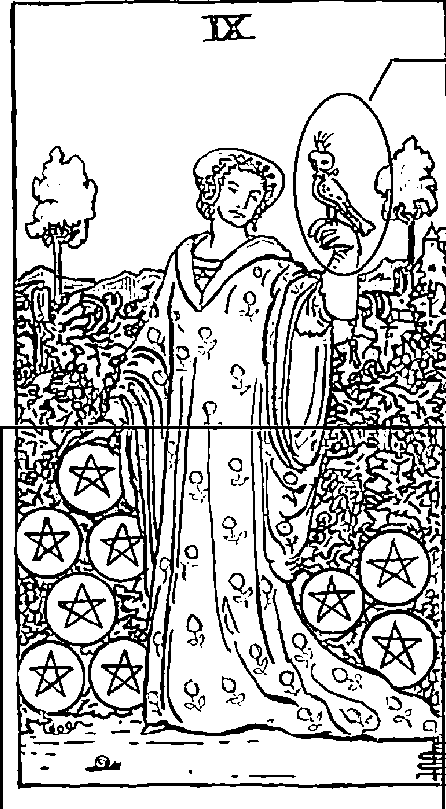

牌中人手上停著一隻小鳥，輕鬆寫意的大自然景象，象徵著悠閒安逸的生活。

掛在樹叢的錢幣和果實，象徵著主角的成就和收穫。牌中主角的衣著華麗，怡然自得的站在結實纍纍的果園裡，象徵已擁有優厚的物質條件。工作之餘，主角也懂得親近自然，享受成果。

在人際關係上，錢幣九表示當事人與人相處和諧穩定；在事業工作上，表示當事人之前的努力已取得成果。

## 錢幣九

- ◎正牌牌義：你比同齡的人成熟，你要求自己獨立自主和自力更生。你懂得發揮自己，改善自己，不用別人替你擔心。
- ◎反牌牌義：在經濟上你要依賴別人，可能是父母或親戚，無法自立。目標模糊不清，財務混亂，令你賺到的金錢比起你預期的目標差很遠。

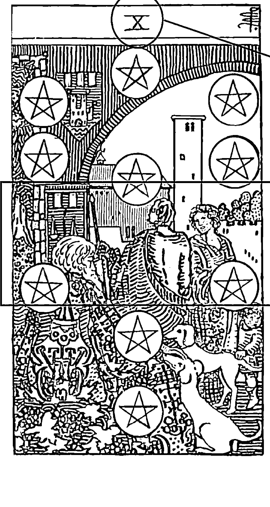

錢幣十是物質巔峰的代表，有過度的意味，暗示當事人因過份追求物質而忽略了心靈的滿足，錢幣十是一張富裕、成功但情感疏離的牌。

牌中的人物屬於同一個家庭，這個家擁有非常富足的物質條件，但他們之間的眼神卻缺乏情感，關係亦顯得疏離。

## 錢幣十

- ◎正牌牌義：暗示你將會繼承一筆財產，經濟上有安全感。
- ◎反牌牌義：代表家庭不和，家人之間會發生口角。由於家庭沒有給予經濟支持，因此，你無法進一步深造，或進行自己的計劃，如做生意等。

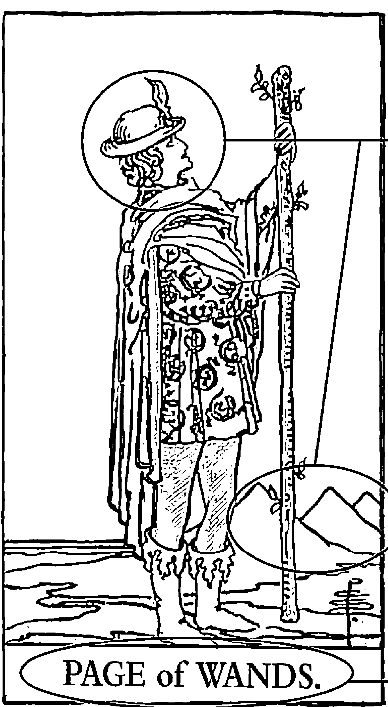

前方的沙丘象徵權杖侍從勇敢地克服未來的挑戰。熱情、活力與冒險的精神，是牌中人展現出來的優點，喻意當事人不要忘記自己也具備這些特質。

侍從的任務之一是「傳遞訊息」，此牌象徵行動和訊息和新行動的計劃。

## 權杖侍從

- ◎正牌牌義：此牌代表訊息，如電話、書信、電郵，通常都是喜訊。
- ◎反牌牌義：此牌表示延遲，表示某件事或某項工作因不可預測的災難或人為失誤而延期。一些不幸的消息將打亂你的生活，可能愛人提出和你分手，某人出賣你等。

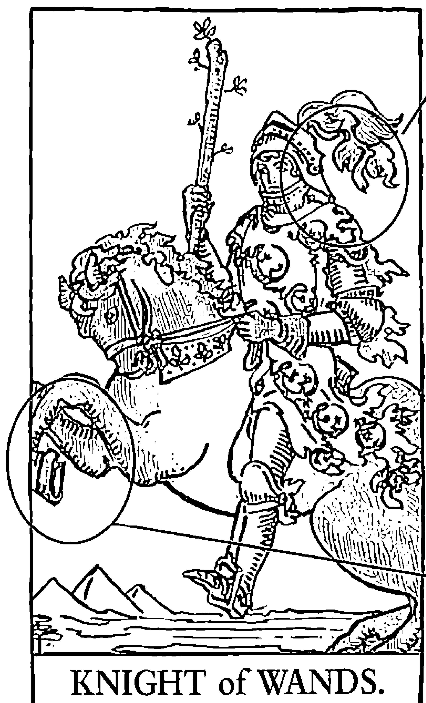

權杖騎士的火紅色帽飾，表現出權杖騎士熱情且衝動的性格。

權杖騎士座下的紅馬高高起雙腿，做出了跨越沙丘的姿態，清楚地顯示出冒險犯難的精神，以及不懼挑戰的決心。權杖騎士以熱情開朗的態度面對生活，任何的困難和障礙，他都樂於挑戰和克服。活力與動力，是權杖騎士引以為傲的優勢；熱情和決心，是他成功的本錢。
不過，衝動和缺乏謹慎卻是權杖騎士最大的缺點，若在占卜中抽到此牌，當事人要引以為誡。

## 權杖騎士

- ◎正牌牌義：你有冒險精神，儘管別人大潑冷水，你也是勇往直前。你熱切地追求自己的理想和目標，精力充沛，充滿熱誠。
- ◎反牌牌義：你所期待的事情沒有在預定時間之內發生，這會令你感到挫敗和浮躁。例如原定計劃好的旅行、婚禮等要延期或取消。

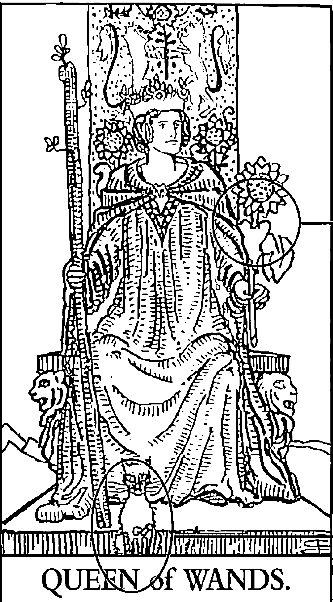

權杖皇后手上的向日葵，象徵了太陽般的笑容與快樂。座椅上的獅子座圖騰，也表現了權杖王后熱情大方、行事積極以及誠懇待人的性格。

權杖王后是一種快樂和幸運的象徵。

一隻黑貓的出現，表達出權杖王后在樂觀積極的外表下，仍然保有感性和溫柔的一面。

## 權杖皇后

- ◎正牌牌義：此刻是創業和開展新計劃的好時機。權杖皇后可能代表你的母親或一位思想成熟的女性，她給你很多客觀的意見，助你事半功倍。
- ◎反牌牌義：這是一個警告，提醒你不要激怒一些有權勢的女性，以免她破壞你的生活和前途。

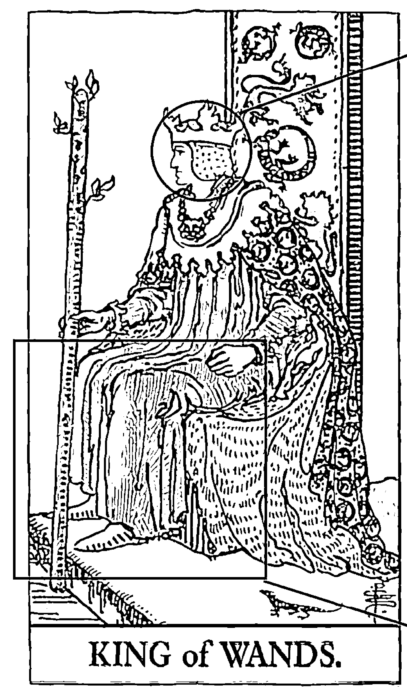

權杖國王充滿自信的看著遠方，並握住代表行動的權杖，象徵他慎謀能斷的智慧。在占卜中，表示當事人要找一個具有權杖國王特質的人扶持自己。

另一方面，此牌亦有告誡當事人要謹慎行事，時刻檢視自己是否太過自我中心的含意。

穩坐在王座之上的權杖國王，以姿態顯示他堅定不移的信念，但也同時蘊含了過份固執的缺點，當事人要引以為誡。

## 權杖國王

- ◎正牌牌義：表示好運臨門，事業上會更上一層樓。
- ◎反牌牌義：此牌表示你的計劃會出現混亂、意外或延遲，你代表缺乏援助，身邊的人也沒有施以援手。

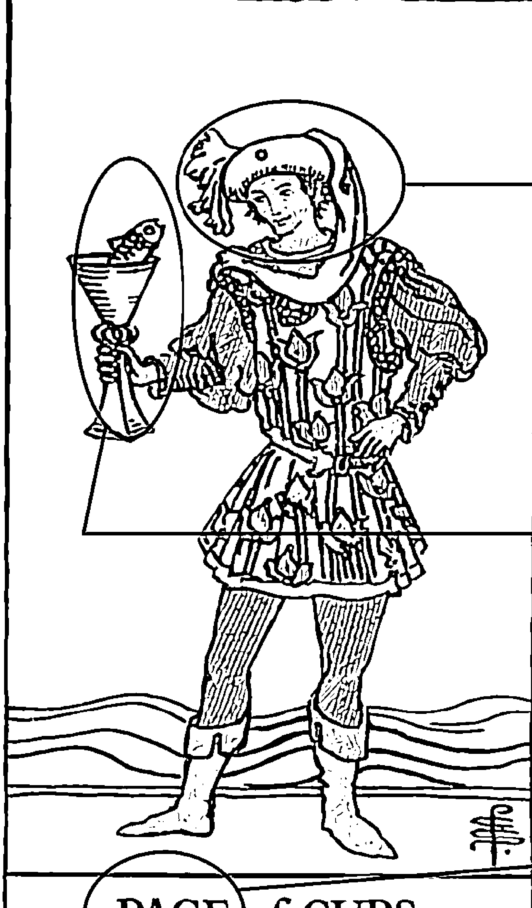

聖杯侍從是聖杯家族中最年幼的成員，聖杯表現出感性和好學的一面，象徵一個好學而且充滿孩子氣的男生或女生。

正在和杯中魚兒說話的侍從，充滿了想像力和感染力，處於這種時期的少年，正是學習的最佳時機。

聖杯代表學習與感情，侍從則表示訊息與思維，因此，聖杯侍從總是帶來感情的訊息或是學業的新消息。

## 聖杯侍從

- ◎正牌牌義：提示你不要涉及不智的感情關係。
- ◎反牌牌義：提示你身邊有人在誘惑你，當中包含欺騙和奉承。防人之心不可無，你要小心別被騙，別隨便獻出你的心。

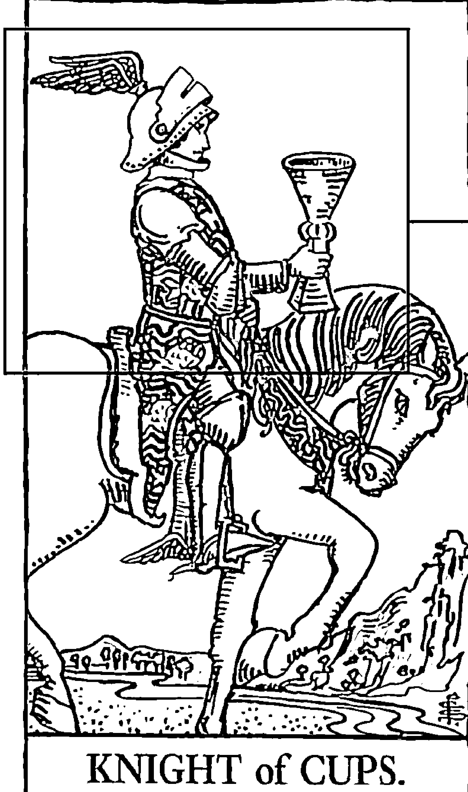

騎著白馬的聖杯騎士具備優雅恬適的氣質，平舉在胸前的聖杯象徵著奉獻，為文質彬彬的騎士增添了浪漫的情懷，它象徵一個舉止高雅大方的白馬王子；也象徵著書香世家出身的有為青年。

聖杯騎士代表著一個吸引萬千注目的翩翩公子，但有時過多的機會反而令他難以專注一個目標上，結果錯過了最值得珍惜的人和事。

## 聖杯騎士

- ◎正牌牌義：意味愛的信息，愛的表白。這張牌又代表一個真摯的朋友、一個誠實而聰明的助手將會出現。
- ◎反牌牌義：你所期待的愛情有阻滯，甚至無疾而終。這張牌也表示你在迷戀一個人，但他對你並非真心，只是存心引誘你，對你不會作出任何承諾。你要當機立斷，痛定思痛地終止關係。

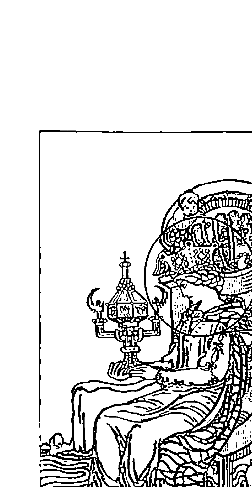

聖杯王后代表了直覺和感性，如果當事人想尋求忠告而進行占卜，此牌暗喻只要當事人順著自己的直覺和靈感，就能克服眼前的困難，完成任務。

聖杯王后的跟前有著流動不息的海水，水帶給聖杯王后過人的直覺和感性，表示當事人最適合沈浸在文學與藝術之中。

## 聖杯皇后

- ◎正牌牌義：一個和藹可親又充滿感性的人在你身邊出現，她可能是你的母親，或者思想成熟的女性朋友。她很有遠見，對你影響深遠。
- ◎反牌牌義：一個情緒不穩定，精神恍惚的人在你身邊出現。她不能給予你任何物質上或精神上的支持，反過來，你要照顧她。

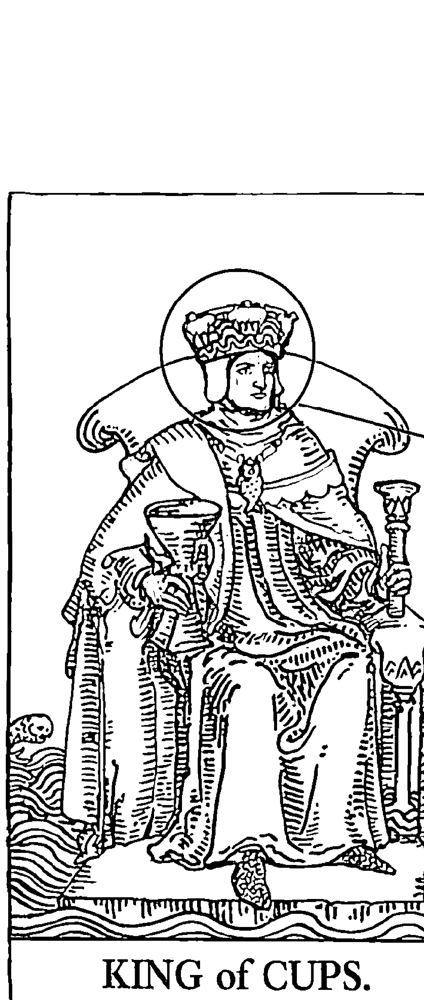

圍著王座的海水，象徵澎湃不息的情感。氣定神閒的聖杯國王坐在穩如泰山的王座中，是穩定、有智慧、成熟和 EQ 高的象徵。聖杯國王象徵一個愛家的好男人，懂得設身處地去關心家人，是一個愛錫妻兒的好父親。

如果當事人想尋求忠告而進行占卜，此牌暗喻「深入了解、鎮定處理」即可解決問題。

在事業工作上，此牌表示當事人只要發揮自己感性和直覺的一面，就能帶來突破。

## 聖杯國王

- ◎正牌牌義：身邊會有一個感性和家庭觀念很重的人出現，他值得你信賴。
- ◎反牌牌義：此牌表示你要脫離某個年長男性的依靠，你要學懂獨立！舊的模式不再適合你，你要跳出這個框框，成就自己的人生。

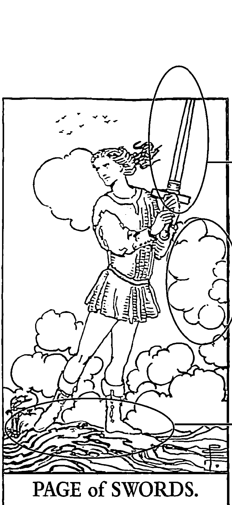

寶劍與傷害有關，寶劍侍從可能帶來不利的流言，會傷害到當事人。另一方面，這可能代表一個只談不做的夢想和計劃。

牌中風起雲湧的景象，象徵了不安的氣氛。

寶劍侍從輕盈的站姿，顯示出他輕浮、不切實際和不夠腳踏實地。

## 寶劍侍從

- ◎正牌牌義：表示意外和令人不安的消息。
- ◎反牌牌義：表示有人有不軌的行為，你要小心防範。

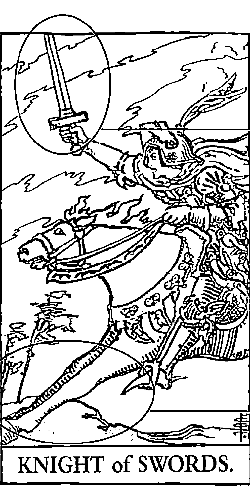

右手高舉利劍，在戰場上馳騁的寶劍騎士將會帶來對立和毀滅。在占卜中，此牌代表一個情緒不穩，但思辯迅速和行動敏捷的人。

寶劍騎士策馬飛奔的圖象，點出迅速行動是他一貫的行事作風，但盔甲上帶有尖刺也顯示出他的傷害性。此牌暗喻當事人反應迅速，在瞬息萬變的社會生存非常有利，但他來勢洶洶，為身邊人或共事的人帶來無比的壓力，影響了人際關係。

如果當事人想尋求忠告而進行占卜，此牌暗喻當事人要反應快，言而不決，決而不行，只會錯失大好良機。

## 寶劍騎士

- ◎正牌牌義：表示你內心非常矛盾。
- ◎反牌牌義：表示有人很不負責任，做事草率，不值得信賴，這個人可能是你身邊某個朋友或工作夥伴，又或者這個人是你自己。

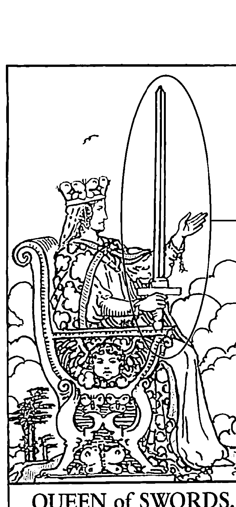

代表感性與情緒的王后，手持有殺傷力的寶劍，顯示出這張牌的牌義和悲傷、分離和失落有關。

寶劍王后象徵一個外表理性和冷酷的女人，但內心卻受著壓力和痛苦煎熬。

壓力和痛苦往往來自對過去回憶的執著。寶劍王后暗喻當事人要學會超越痛苦的過去，重新接納新愛，才能迎接美好的未來。

## 寶劍皇后

- ◎正牌牌義：表示你可能正面對一段跟生離死別有關的創傷，但你絕對有力量去克服傷痛，面對未來。
- ◎反牌牌義：表示你無法好好治癒傷痛，情緒越來越低落。你意志消沉，極度憤怒，終日在怪責上天太過不公平，何解偏偏選中你！

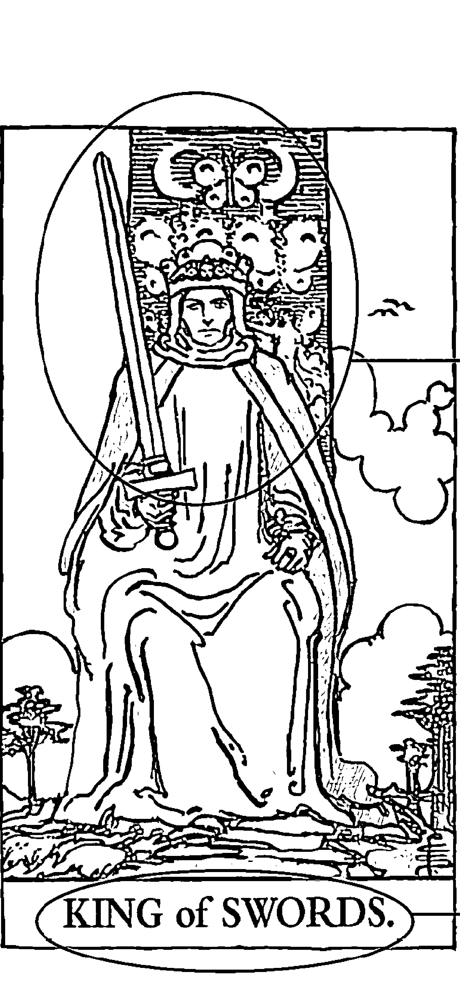

寶劍國王手中所拿的寶劍，象徵清晰的判斷力和決斷力。他決斷清晰而快速，具有邏輯思維的頭腦，有專業知識，因外表嚴肅冷酷，所以能展現出其權威性。

在占卜中，此牌提醒當事人遇到困境時不妨請教適當的專家，不要拖泥帶水，要迅速把問題解決。

## 寶劍國王

- ◎正牌牌義：表示一個具權威的人會出現，他會給你清晰和明確的指引。
- ◎反牌牌義：你身邊會有一個非常跋扈，很難相處的人，這個人可能是你的父親，或者一位有權威的人物。他硬要你跟著他的計劃行事，你的意見不被接納。

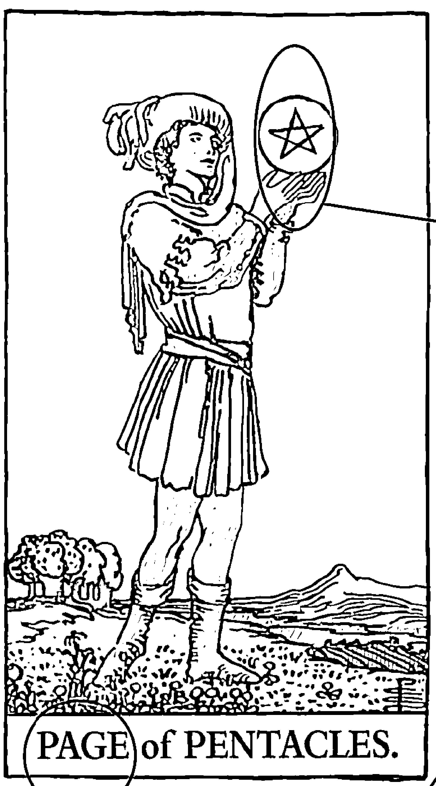

緊緊盯著錢幣的侍從，可以看出當事人重視物質和嚮往財富。

錢幣侍從表示一個財務計劃，暗喻當事人要從務實的態度處理財務，管理金錢。

## 錢幣侍從

- ◎正牌牌義：此牌代表一個好學的青年，你有野心、堅毅、有目標、聰明，懂得欣賞大自然和藝術。
- ◎反牌牌義：此牌表示懶惰，沒有動力，不願意學習。它暗示一個與金錢有關的壞消息，如考試不及格、見工面試失敗等。

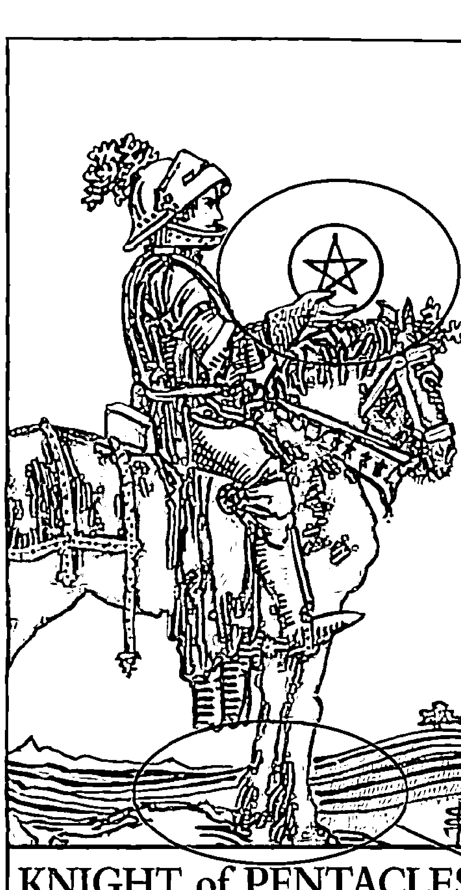

錢幣騎士手捧錢幣，望向遠方的目標，這幅圖像顯示出主角為金錢奮鬥，也暗示了他堅定的決心和務實的工作態度。

他以信心、決心和毅力戰勝所有困難，並取得物質的報酬。在占卜中，此牌代表一個致力發展事業和追求金錢的人，它擁有財富，但缺乏浪漫和溫柔。

暫時停下腳步的黑馬，象徵錢幣騎士穩打穩扎的特質。他依靠穩健的腳步一步一步走向目標。

## 錢幣騎士

- ◎正牌牌義：表示你是一個誠實和值得信賴的人。此牌另一個含義是行動，意味著你即將參與一個新計劃。
- ◎反牌牌義：代表一個壞消息，挫折和突如其來的延遲。此牌表示你正面對與金錢有關的困擾，問題使你變得沮喪，缺乏動力。

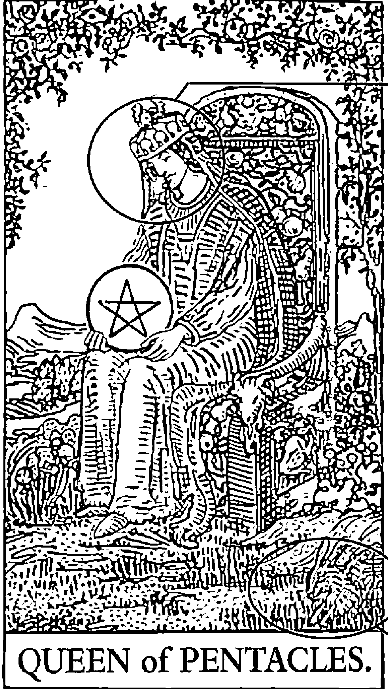

錢幣皇后專心地看著手中的錢幣，她那充滿愛心的表情顯現出母性的光輝，此情此景也暗示了主角有精明理財的眼光，同時又能關心家中大大小小的情況。

後座旁邊的野兔，是大自然充滿生機的表徵，同時也顯示出這張牌和諧、喜悅的氣氛。

QUEEN of PENTACLES.

## 錢幣皇后

- ◎正牌牌義：意味著物質上的大豐收，也表示會有一位女性給予你經濟上的支援。
- ◎反牌牌義：代表你不善理財，弄致債台高築。

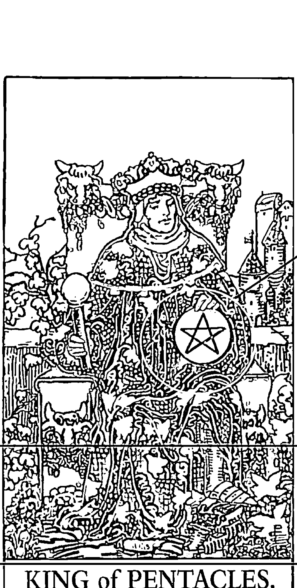

錢幣國王的左手輕輕搭在錢幣上，象徵他對於掌握財富和運用金錢都可以隨心所欲。

在占卜裡，此牌代表事業成功，生活穩定富足，但要切忌太過保守，固步自封。

王座旁邊結實纍纍的果實，象徵錢幣國王早已擁有相當的成就。

## 錢幣國王

- ◎正牌牌義：代表一位和藹可親、有文化修養、經驗豐富和財政穩健的人即將出現，他在金錢和財務方面會給你很多可靠和專業的意見。
- ◎反牌牌義：代表貪婪、不誠實、見利忘義，只懂用財富多寡而判斷人的好壞。你不停擔心錢的問題，用錢又吝嗇。這個人可能代表你的父親，但在你心目中，他不是一位稱職的父親。

## （三）塔羅牌25大牌陣

## 牌陣一：單牌占卜法：可以找出問題的癥結

這是最簡單的一種牌陣，適合初學者使用。一來，可以讓初學者學會找出問題的重點，然後解釋。二來，初學者可以專心地了解一張牌，不會被其他牌擾亂分析。

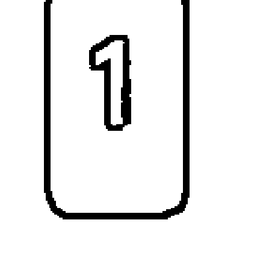

## 牌陣二：幸福指數占卜法：可以知道自己整個月的運程

隨意抽出五張牌，依序放在 1-5。

- 第一張牌：本週運程
- 第二張牌：下週運程
- 第三張牌：第三週運程
- 第四張牌：第四週運程
- 第五張牌：第五週運程

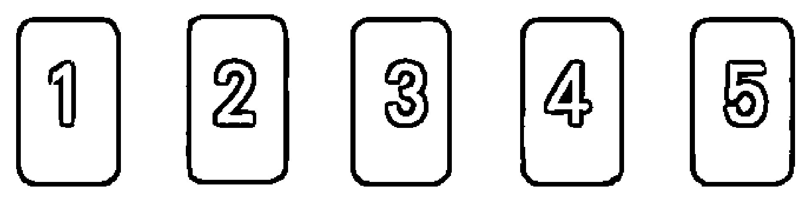

## 牌陣三：三角形牌形：占卜愛情及人際關係

隨意抽出四張牌，依序放在 1-4。

- 第一張牌：代表你現在的心情、處境。
- 第二張牌：代表你碰到的感情障礙、困擾、問題。
- 第三張牌：代表未來的影響。
- 第四張牌：代表你的選擇、最後的結果。

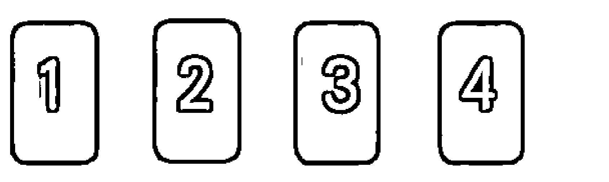

## 牌陣四：二選一牌陣：可以幫大家作出抉擇

當你進退兩難，不知道如何抉擇的時候，例如有兩個你同樣喜歡的異性，又或有兩個同樣重要的活動在同日舉行。你便可以使用此牌陣。

隨意抽出五張牌，依序放在 1-5。
第一張牌：你目前的狀況、心情。
第二張牌：選擇 A 的狀況、環境及心情。
第三張牌：選擇 B 的狀況、環境及心情。
第四張牌：選擇 A 後的結果。
第五張牌：選擇 B 後的結果。

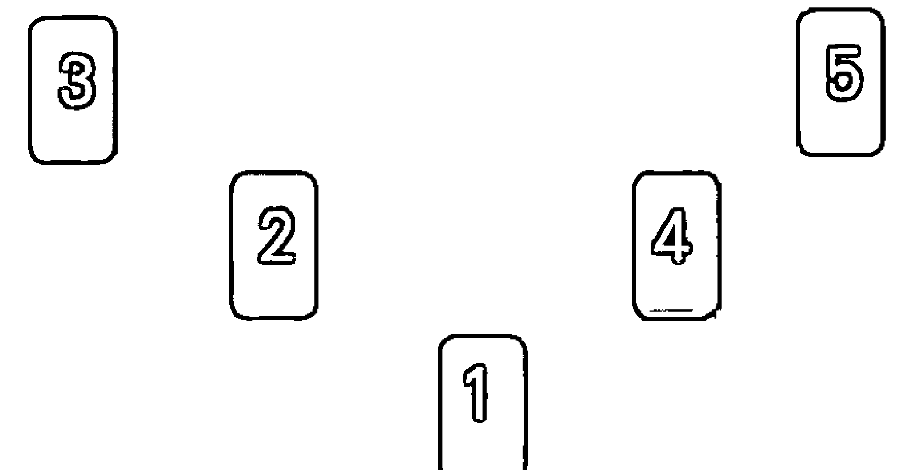

## 牌陣五：靈感對應牌陣：可以知道伴侶對自己的看法

此牌陣可讓大家得知身邊的伴侶對戀愛的看法及態度，隨意抽出六張牌，依序放在 1-6。

- 第一張牌：你對對方的看法
- 第二張牌：對方對你的看法
- 第三張牌：你認為目前的關係
- 第四張牌：對方認為目前的關係
- 第五張牌：你期望將來的發展
- 第六張牌：對方期望將來的發展

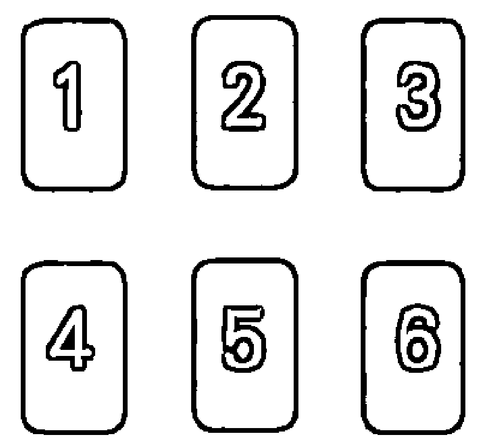

## 牌陣六：克爾特十字牌：可以深入探討問題的真正所在及其相應的解決方法

此牌陣適用於尋找問題的真正所在，並找出解決方法。它與六芒星不同之處是，此牌陣只能找出真正問題所在，而六芒星牌陣（詳見牌陣十三）會直接給予大家解決問題的方法。隨意抽出十張牌，依序放在 1-10 的位置上。

- 第一張牌：代表現在 - 問題的重心，事情的最重要之處。
- 第二張牌：代表阻礙 - 不可預知的因素。
- 第三張牌：代表內在 - 內心的動機，問題的根源。
- 第四張牌：代表外在 - 自我的期待，潛在的可能性。
- 第五張牌：代表過去 - 發生過的人或事物、問卜者的信念、希望和恐懼。
- 第六張牌：代表未來 - 短期將來會發生的事情。
- 第七張牌：代表自己 - 面對事情的態度，自己的表現方式。
- 第八張牌：代表環境 - 別人對自己的看法，周遭的環境情形。
- 第九張牌：代表引導 - 這次事件讓自己學到甚麼。
- 第十張牌：代表結論 - 主要用於說明問題最後會變成的局面。

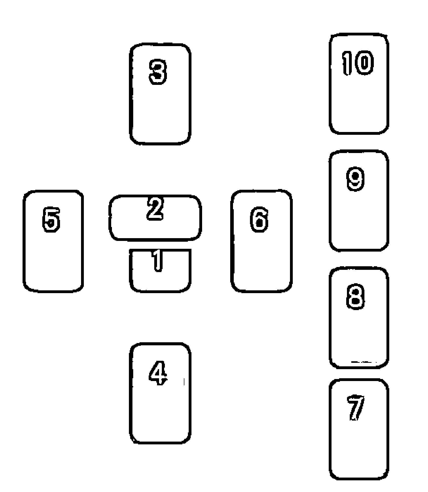

## 牌陣七：聖三角占卜法：找出問題的來龍去脈

此牌陣適用於 22 張大牌，是塔羅牌陣中最簡單易學之一。此陣法適合用在是非題，例如「我應不應向他表白？」「我會不會與他分手等？」等等，它只有三張牌，大家可以根據這三張牌直接知道結果：

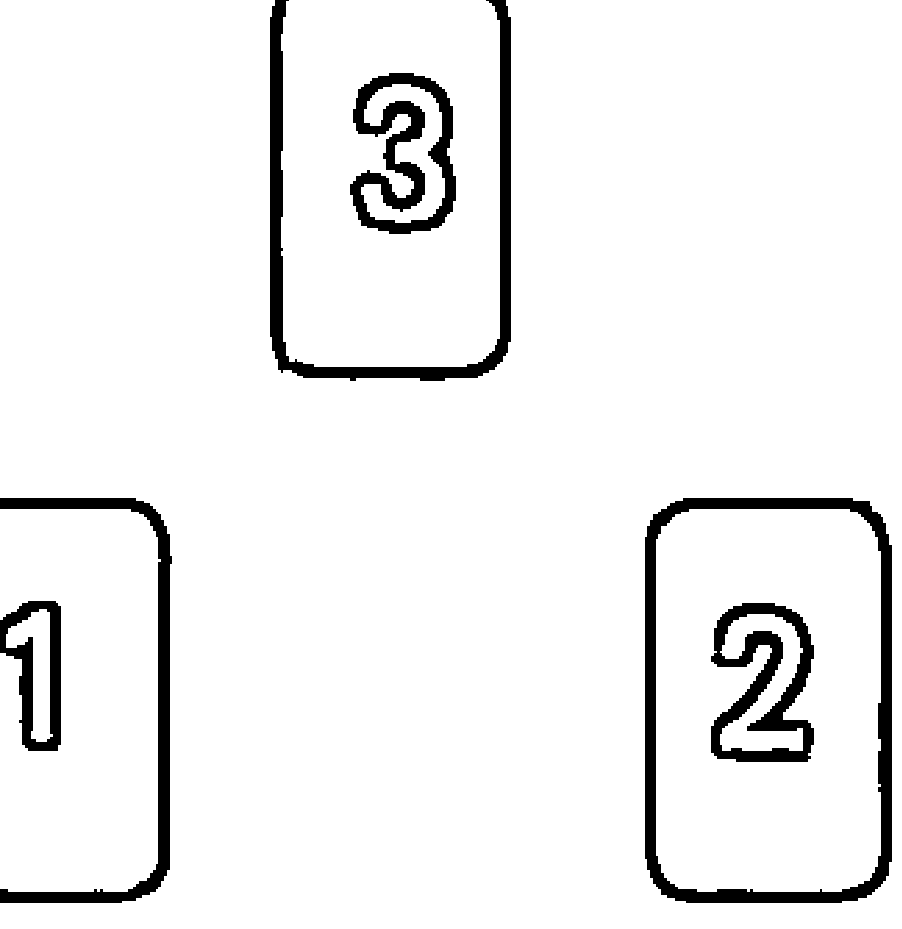

- 第一張牌：代表你過去在這方面的經歷
- 第二張牌：代表你現在目前的狀況
- 第三張牌：代表這個問題在未來的發展

不過，如採用「聖三角占卜法」，須按照以下步驟：

1. 將所有的大牌拿出來，由上往下數至第七張牌，然後把這張牌拿出來，放在圖示中的「1」位置。
2. 數過的牌放在一邊，然後把剩下的牌重新再數一遍，將第七張牌取出，放在「2」的位置。
3. 如上動作，將數過的牌放在一旁。最後你再數一次剩下的牌，把第七張牌放在「3」的位置。
4. 此時你手上應該還有一張牌，把它放在數過的那一疊裡。

## 牌陣八：友誼的占卜：占卜大家的友誼

此陣法可用來占卜友誼，隨意抽出六張牌，依序放在 1-6 的位置上。
第一張牌：代表你對對方的看法。
第二張牌：代表對方對你的看法。
第三張牌：代表你認為目前雙方的關係。
第四張牌：代表對方認為目前雙方的關係。
第五張牌：代表你期望未來雙方關係的發展。
第六張牌：代表對方期望未來雙方關係的發展。

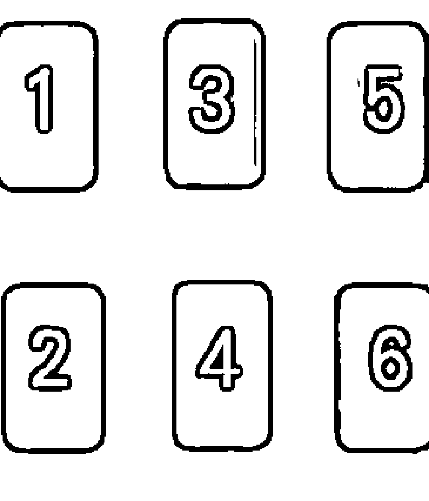

## 牌陣九：戀人金字塔：可知道兩人發展的可能性

「戀人金字塔」是現時最流行的戀愛占卜法。

憑著這七張牌，可以預測二人發展的可能性。隨意抽七張牌，依序放在 1-7 的位置上。

1. 第一張牌：代表問卜者對對方的想法和態度。
2. 第二張牌：代表對方對問卜者的想法和態度。
3. 第三張牌：代表問卜者對於兩人關係的看法或認為兩人目前的關係。
4. 第四張牌：代表大家有沒有結婚的打算。
5. 第五張牌：問卜者必須做的行動或表現的態度
6. 第六張牌：代表兩人目前的顧慮
7. 第七張牌：代表兩人最後可能的結果

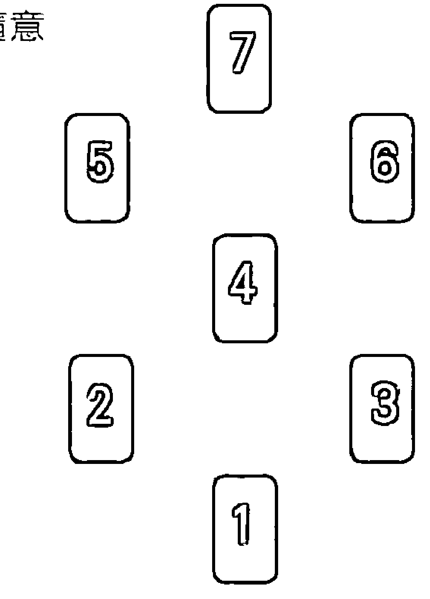

## 牌陣十：吉普賽十字法

適用於占卜戀愛等問題，放好第一排的牌後，接著放第二、第三排的牌，剩下的牌置於一邊即可。依右圖示，將 1 到 5 的牌依序翻開。

1. 第一張牌：表示對方目前的心情及想法。
2. 第二張牌：表示目前自己的狀況。
3. 第三張牌：表示自己與對方的相處方式，應採取甚麼態度較好。
4. 第四張牌：表示兩人目前的狀況，亦可看出有無情敵或阻礙出現。
5. 第五張牌：表示兩人關係最後的結果。

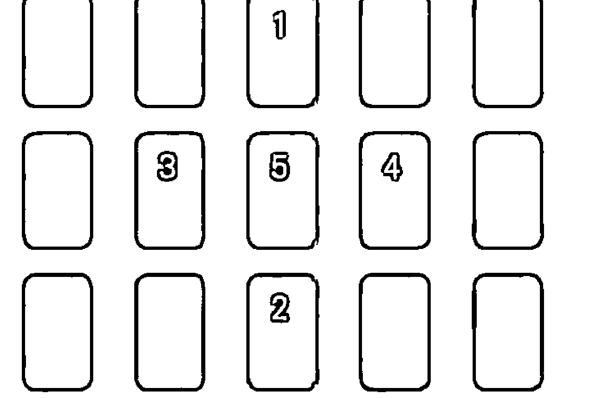

## 牌陣十一：婚姻占卜法：占卜如何解決婚姻問題

若大家有婚姻問題，可以透過「婚姻金字塔」預測大家和伴侶未來的結果。隨意抽七張牌，依序放在 1-7 的位置上。

- 第一張牌：代表你自己
- 第二張牌：過去的婚姻狀況
- 第三張牌：現在婚姻狀況
- 第四張牌：婚姻遇到的問題
- 第五張牌：對婚姻的期望
- 第六張牌：對婚姻的恐懼
- 第七張牌：未來的發展，最後的結果。

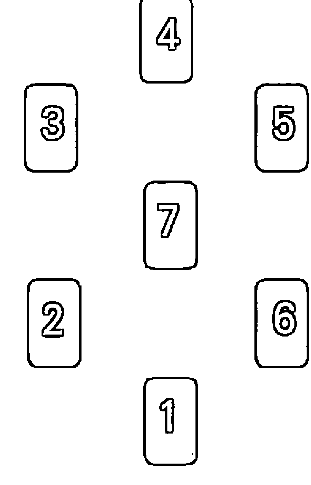

## 牌陣十二：未來發展的占卜：占卜未來自己的動向

隨意抽六張牌，依序放在 1-6。

- 第一張牌：代表你現在的狀況。
- 第二張牌：代表你的愛情發展。
- 第三張牌：代表你的事業發展。
- 第四張牌：代表你的財運發展。
- 第五張牌：代表你的成就。
- 第六張牌：代表最後的結果。

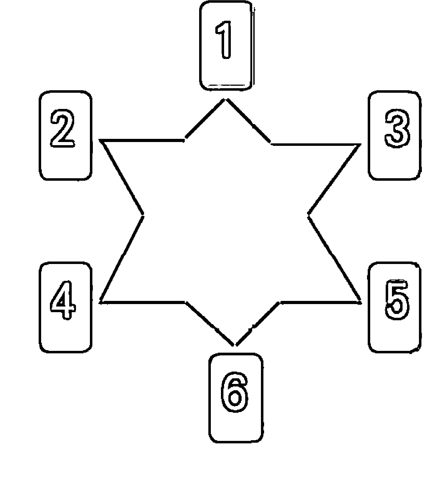

## 牌陣十三：六芒星牌陣：可以幫大家找到出路

此牌陣可以找出事情的因由。如果遇上解決不了的事時，便可使用此牌陣，找出指引。隨意抽出七張牌，依序放在 1-7 的位置上。

- 第一張牌：代表過去，主要說明這個問題的導火線（原因）。
- 第二張牌：代表現在，主要說明目前這個問題處於何種狀況。
- 第三張牌：代表未來，主要說明今後這個問題會有什麼變化。
- 第四張牌：代表解決的方法，即應甚麼方法解決這個問題。
- 第五張牌：代表與這個問題有關的人或事的狀況。
- 第六張牌：代表願望，即你尚未察覺但卻是你心中真正的願望。
- 第七張牌：代表結論，即是這個問題最後會變成甚麼局面。

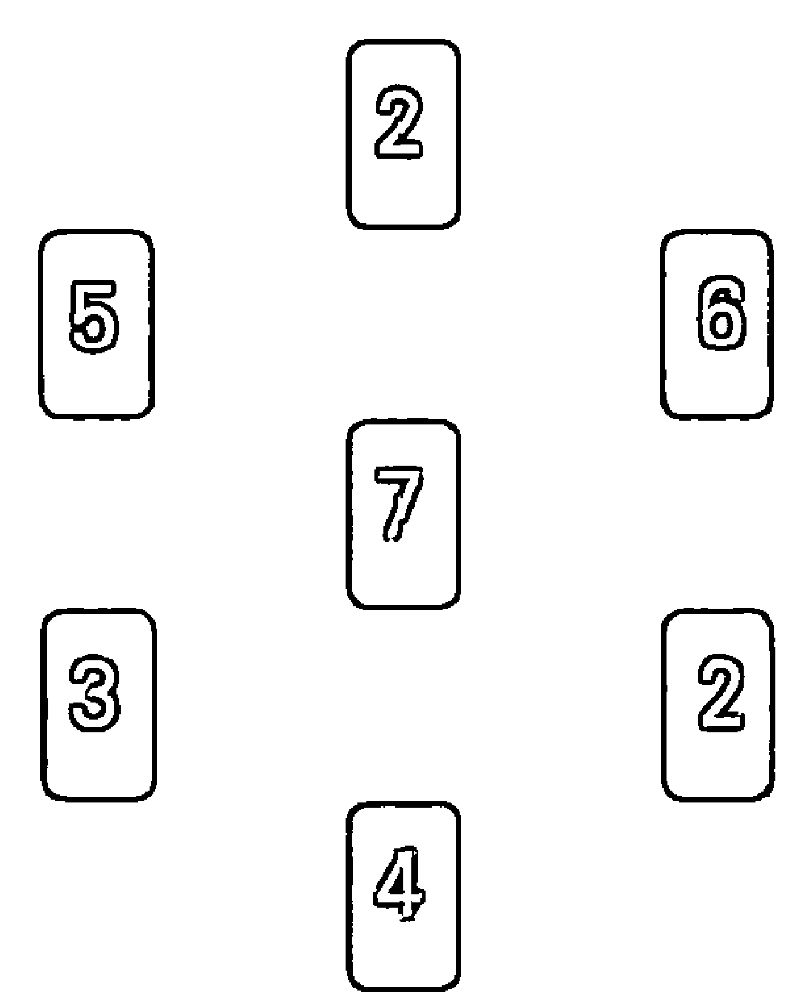

## 牌陣十四：卡爾米克展開法：探討自己的命運

探討你的命運，隨意抽七張牌，依序放在 1-7。
第一張牌：你的宿命。
第二張牌：你的個性。
第三張牌：影響你一輩子的重大事件。
第四張牌：這輩子的第二種影響。
第五張牌：你來這世界的目的。
第六張牌：你可以在這輩子完成甚麼。
第七張牌：這輩子可以學到甚麼。

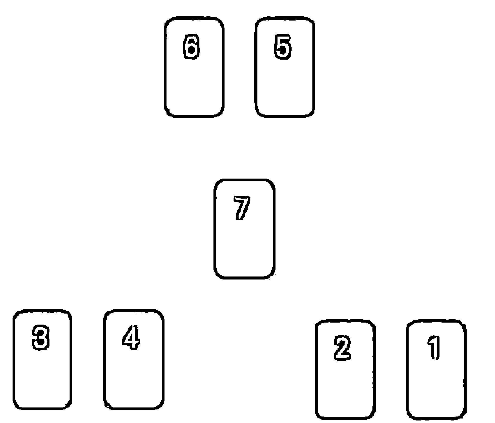

## 牌陣十五：情敵占卜法：占卜三角關係和情敵

「情敵占卜法」多用來占卜三角關係和情敵等，與戰勝強敵有關的疑問。

先取出代表自己的聖杯女王，放在左方；再拿出代表敵人的寶劍女王，放在右方。接下來將剩下的牌朝下洗好，然後依照圖 A 的順序，直接掀開排出 1 到 18。接著，再直接掀開 19 到 36，如圖 B。

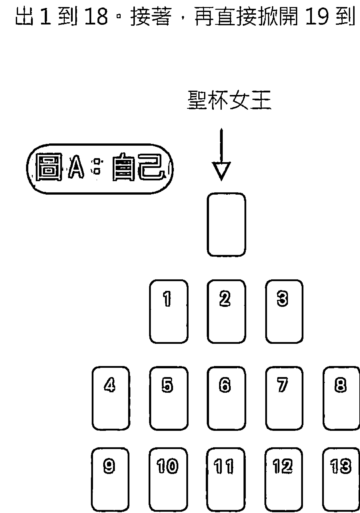

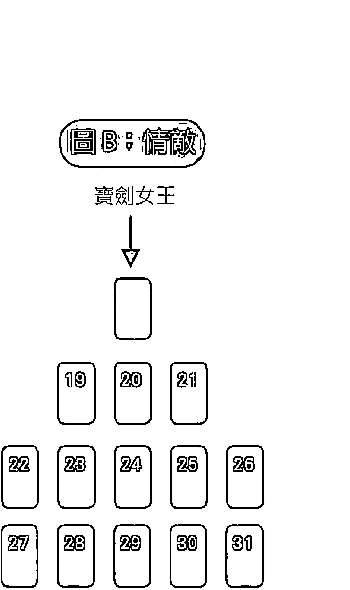

哪一邊的主牌最多，代表哪一個占優勢。如果相差不大，相差一至兩張，代表雙方實力接近，隨時會有轉機。相差三至五張，代表實力有差距，難以拉近距離。相差六張以上，勝負已定。

## 牌陣十六：命運占卜法：預測自己一生的運程

想知道自己一生的運程，想知道往後的路該怎麼走？這個牌陣會給大家一個詳盡的分析。洗牌後由上數第七張放在 1，接下來將第八張到第十九張放在 2 到 13 的位置。

- 第一張牌：個人性格、行事的風格
- 第二張牌：金錢運
- 第三張牌：和兄弟姊妹的關係
- 第四張牌：家庭狀況 / 和父母的關係
- 第五張牌：戀愛運 / 和子女的關係
- 第六張牌：身體健康狀況
- 第七張牌：人際關係 / 婚姻運
- 第八張牌：性生活狀況
- 第九張牌：學業運 / 海外旅行機會
- 第十張牌：工作運 / 和父親的關係
- 第十一張牌：朋友的狀態
- 第十二張牌：意外的事件
- 第十三張牌：整體運勢的趨向

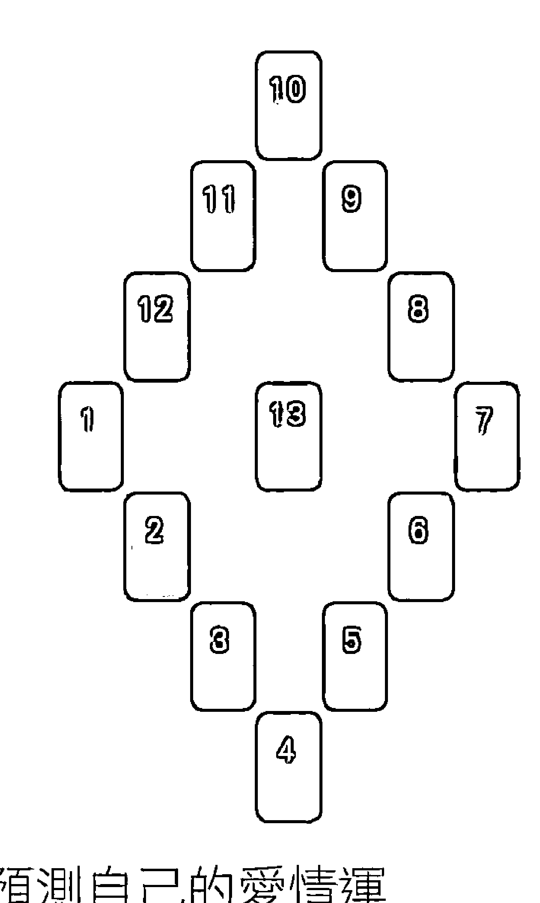

## 牌陣十七：尋找對象占卜法：預測自己的愛情運

此陣法適用於未有戀人、或者未有對象的單身人士，運用這個陣法可以預測自己的愛情運。隨意抽五張牌，依序放在 1 - 5 的位置上。

- 第一張牌：代表你現在的心情和處境。
- 第二張牌：代表你希望追求的類型。
- 第三張牌：代表你不喜歡的類型。
- 第四張牌：代表該採取的行動。
- 第五張牌：代表未來的發展。

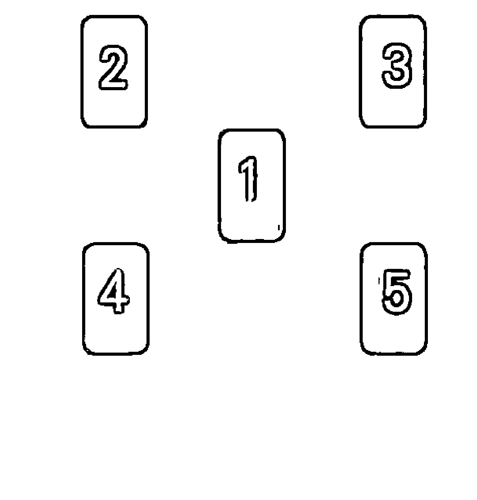

## 牌陣十八：全年占卜法：預測全年運程

知道全年會發生甚麼事，隨意抽出十三張牌，依序放在 1-13 的位置上。

- 第一張牌：一月的運勢。
- 第二張牌：二月的運勢。
- 第三張牌：三月的運勢。
- 第四張牌：四月的運勢。
- 第五張牌：五月的運勢。
- 第六張牌：六月的運勢。
- 第七張牌：七月的運勢。
- 第八張牌：八月的運勢。
- 第九張牌：九月的運勢。
- 第十張牌：十月的運勢。
- 第十一張牌：十一月的運勢。
- 第十二張牌：十二月運勢。
- 第十三張牌：整年的運勢。

解釋重點在於不同月運勢的改變情形，而不是只單看該月的運勢好與壞而已。

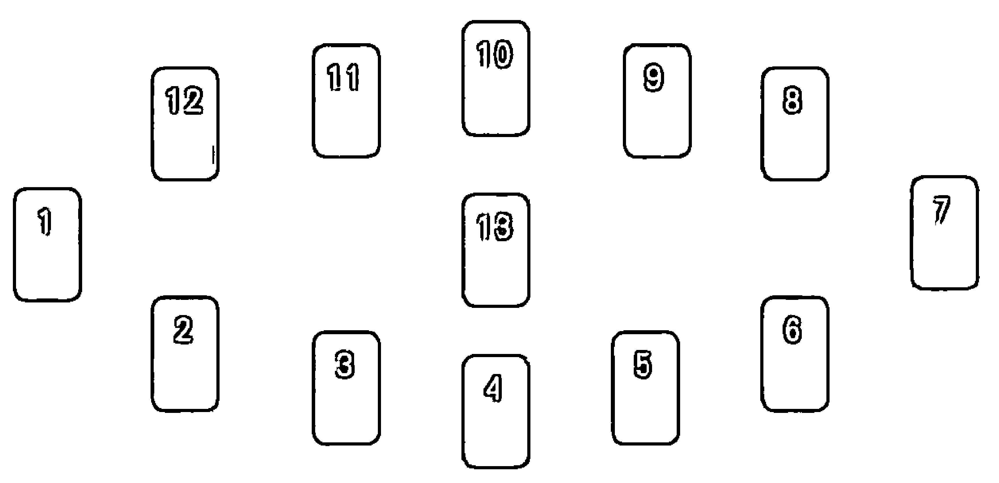

## 牌陣十九：鑽石展開法：分析過去、現在、未來

此牌可分析過去、現在、未來。隨意抽四張牌，依序放在 1 - 4 的位置上。

- 1 為過去，2、3 為現在，4 為未來。
（過去為原因，現在為現況，未來為可能之將來。）

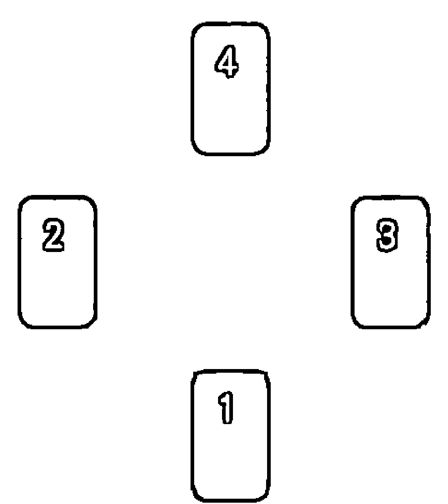

## 牌陣二十：工作的占卜法：占卜事業運

工作的占卜，隨意抽出十三張牌，依序放在 1-13 的位置上。

- 第一張牌：你的工作情況和你對同事影響。
- 第二張牌：驅使你做這工作的動力。
- 第三張牌：你和同事之間的關係。
- 第四張牌：你在工作方面的創造力。
- 第五張牌：你的工作環境。
- 第六張牌：你的同事是甚麼樣的人。
- 第七張牌：影響你事業的轉捩點。
- 第八張牌：工作上會遇到的事。
- 第九張牌：你在工作上的得著。
- 第十張牌：如何突破自己。
- 第十一張牌：事業的隱憂。
- 第十二張牌：工作的前景。

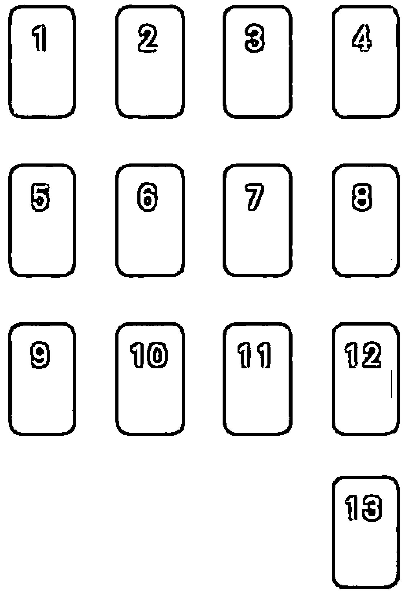

## 牌陣二十一：珍珠項鍊占卜法：找出愛情盲點

指點愛情的盲點，讓大家懂得處理。隨意抽出八張牌，依序放在 1-8 的位置上。

- 0：當事人關心的焦點。
- 1：當事人內心的憂慮。
- 2：要解決問題的所在。
- 3：表示愛情盲點。
- 4：表示應該採取的行動。
- 5：表示處理的最佳方法。
- 6：雙方進一步發展的方法。
- 7：表示雙方的結果。

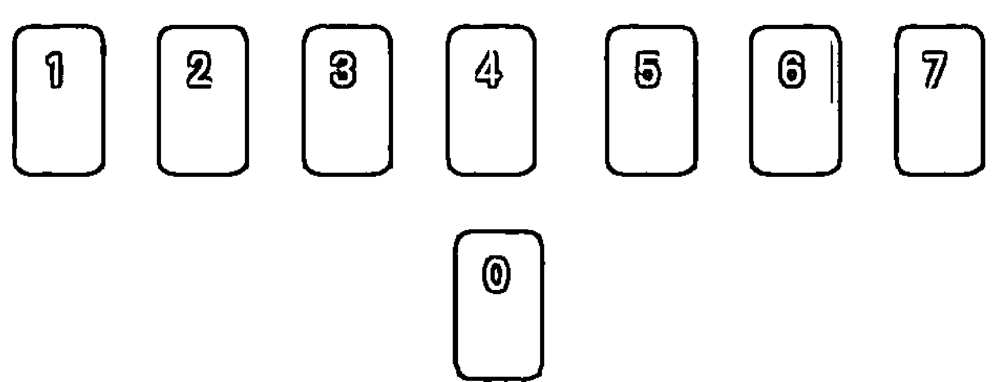

## 牌陣二十二：愛情占卜法：測試對方的真心

此牌陣可幫助大家了解自己和對方的真心。隨意抽出八張牌，依序放在 1-8 的位置上。

- 先翻開 1 到 4 這四張牌：
  - 第一張牌：問卜者對這問題的看法、或對對方的心態。
  - 第二張牌：對方對問卜者的心態。
  - 第三張牌：兩人的關係變化對於問卜者的影響。
  - 第四張牌：兩人的關係變化對於對方的影響。
- 再來翻開 7、8、5 三張牌：
  - 第五張牌：問卜者未來的心情。
  - 第八張牌：對方未來的心情。
  - 第七張牌：將來可能產生的障礙。
- 最後翻開 6 這張牌：
  - 第六張牌：最後結果。

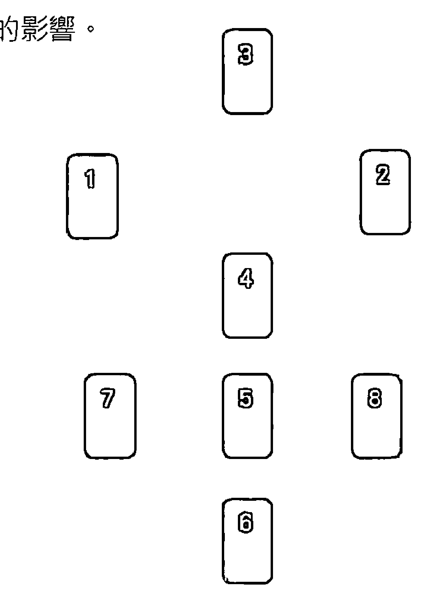

## 牌陣二十三：自我探索占卜法：了解自己內心

隨意抽出四張牌，依序放在 1-4 的位置上。

- 第一張牌：代表內心深處。
- 第二張牌：代表精神生活。
- 第三張牌：代表知識領域。
- 第四張牌：代表感情生活。

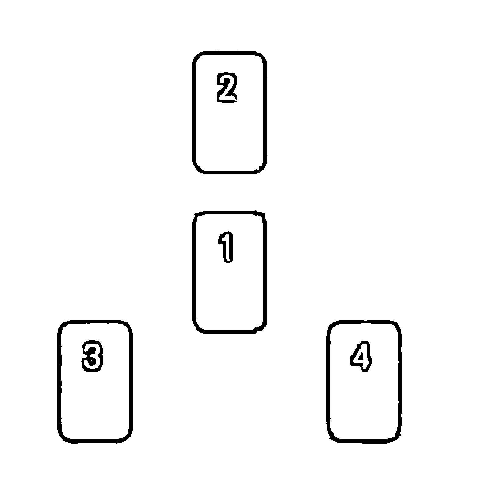

## 牌陣二十四：前世今生占卜法

此牌陣可讓大家了解自己的前世今生，隨意抽出九張牌，依序放在 1-9 的位置上。

- 第一張牌：前世自己是誰，包括個性。
- 第二張牌：前世所學到的事，特別是情感方面。
- 第三張牌：前世所學當中曾失敗的事。
- 第四張牌：今生自己是誰，包含個性。
- 第五張牌：今生對自己是簡單的事。
- 第六張牌：今生對自己是困難的事。
- 第七張牌：經常出現的問題。
- 第八張牌：解決問題的最佳方法。
- 第九張牌：今生的學習目標，特別是情感方面。

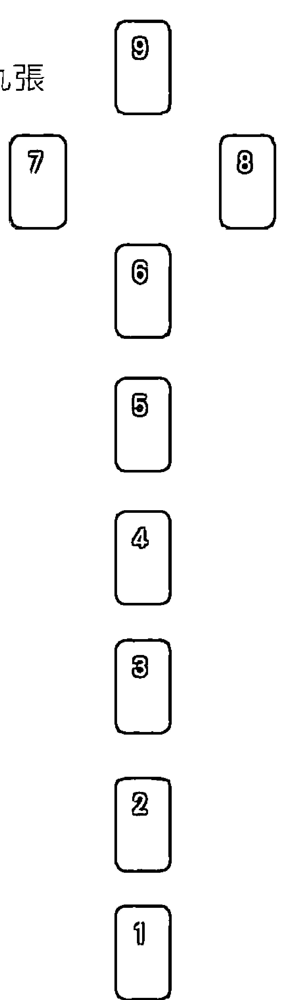

## 牌陣二十五：願望展開法

此牌陣可讓大家了解如何完成心願，隨意抽出九張牌，依序放在 1-9 的位置上。

- 第一張牌：你想要甚麼。
- 第二張牌：你現在的處境。
- 第三張牌：你應該知道的事。
- 第四張牌：你應該做的事。
- 第五張牌：不久後會發生的事。
- 第六張牌：會改變結果的事。
- 第七張牌：偶然會發生的事。
- 第八張牌：哪裡最容易成功。
- 第九張牌：綜合、總結。

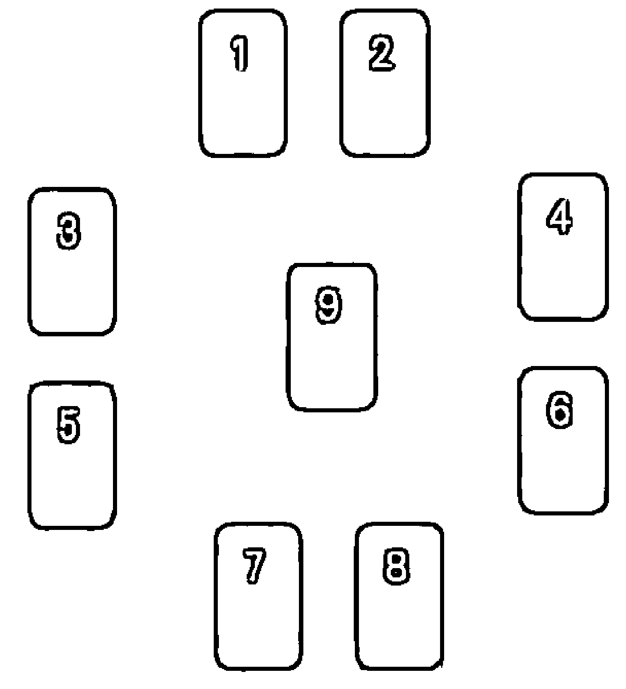
