## 塔罗白皮书

作者：星宿

## 塔罗牌秘仪涵义初揭示

《塔罗白皮书》系列话题，是要和大家分享塔罗牌秘仪的意义，将秘仪的内涵做一番解释和阐发。而每个阶段对塔罗的见解都会有增长或修订之处，因此不同篇次的白皮书内容，有些微的时间性的差异。

这一篇是最早成形的一篇文章，是我刚开始塔罗教学时候的内容，文字是依据当时上课学生的笔记而稍作修订的。文章完成时间距今也有七、八年了，所以与我后来的塔罗教学内容也不尽相同。不过在三年前开始的“塔罗基础推广课”以及社团制式讲义的单张牌义内容文字，就是放进这些文字内容，若有上过塔罗基础课的人，就会发现是和讲义内各张秘仪中的文字是大同小异的。

由于“年代久远”，没有仔细校订勘误，一些脱误之处仍在所难免，而且是脱胎于笔记形式，所以有些说明也不够完整明白，虽然如此，秘仪内涵的重点也都提到了。而今我将这些内容公开在版上，让不只上过课的学员也能分享这些文字，因为仍是有需要的，阅读之后应对塔罗的认识有所帮助，然而希望大家将此篇内容做个参考即可，不用太执着或强记了。

或许，这也标示着，未来的塔罗讲义内容，也就不再放进这些文字了，而要有所更新，推出新的内容了。（这样，这篇文章的张贴，也可以算是一种纪念和更新的仪式吧）

这个内容尽量着重在塔罗秘仪的通用意义，当然还是不免叙述了牌面的图案，并且也算是依据泛伟特系统的塔罗牌，但重点仍在于秘仪的通用意境上。大秘仪部分每一张牌都有讲述到，属于这一阶段的小秘仪笔记，找出的部分并不多，并没有每一张秘仪的专述，但对于小秘仪的意义原则也算交代清楚了。

### 大秘仪

#### 0. 愚者

0 号牌代表还没有诞生的状况，愚者漫无目的地走。

牌面上的人背着一个包，穿着夸张可笑的衣服，走着跳舞一样的步伐，带着满脸的自信，左手拿着一朵红（白）玫瑰，脚边有一条狗。他走在断崖边缘，背后有白雪皑皑的山。

愚者的衣服有着夸张的花纹，代表了追求快乐的随性，但也隐含了许多奥秘。他不同平常人，动作可笑，盲目疯狂。然而，愚者或许是大智若愚、纯真、生命旺盛的象征，带着生命力的、隐藏着无限潜能的。

这张牌无论是正反位置，都有很多种不同的解释，可以自己去定义方向。

#### I 魔术师

牌面上有四大元素（圣杯、权杖、宝剑、星币），有桌子神坛，魔术师身在花丛里（玫瑰、百合花）。

四大元素：即是构成世界的基本原素“火、土、风、水”。

玫瑰、百合花：生、死。

衣服：红的部份代表深度，而白的部份代表纯净。

他的动作是指天地，手上拿的东西是魔法杖。

∞记号 在头顶上：法力无边的象征。

有桌子的人都是他有某种职责要做。

魔术师和愚者都是旅行者，然而魔术师是很有法力的人，愚者则没有什么具体的能力，而是凭借着勇气。

0 与 1，是最基础的号码——0：还没开始、混沌、无我、一个循环。代表 NO or Nothing，但也可能是 all，不即不离。

1：自我最大、独尊，让自己跑来跑去，并且善于沟通，聪明、机智，自我意识很强。

#### II 女祭司

女祭司的牌面上，有一个面容严肃的女子端正地坐着，脚下踏着一弯新月，双手怀抱着一本智慧之书——TORA，在她印着石榴树的布幕后面是一片湖水。她的身后有两个柱子，分作两种颜色，代表着二元对立的观念，女祭司的数字是 2，从她开始二元对立、分裂（辨证的思考方式，生死、灵肉、正反、精神和物质）。在二元对立的世界里生存要智慧，只有智慧能够统合这一切。

女祭司是重精神的、冷静而理智的，不重物质，可控制感情故能掌握月亮，可掌控命运之轮，来自天意的智慧。

在塔罗牌中所有女性的牌都是好的，然而要看是怎样的女性。女祭司是处女、精神层面的、智能的、封闭的、刚硬、绝对的、精神恋爱、严苛的。

这张牌在恋爱中不论正反牌都不太好，对于钱财比较没用，倒的就赚不到钱，对学业有帮助，若是反牌则是走错方向、错误抉择。

#### III 皇后

皇后代表成熟的女性，享受人生的女性，和女祭司正好是不同的两种女性典型。皇后是维纳斯的化身，掌握欲望和物质的享乐，感情丰富，有着金星的盾牌。这张牌也代表维护爱情、金钱、生活，和女性自身的权益。

皇后性格则是温柔的，并且不会乱用她的权利，她享受同时也能滋润。

这张牌也代表美丽与人生的幸福，但并没有特别代表坚贞。

若负面倾向则为：纵欲、慵懒、为爱颓废、不伦、不正当的爱情。

#### IV 皇帝

皇后到皇帝，是感情和权力的转移，皇后把权力交给男性，男性开始要掌权，男人在女性后面，表示女性所拥有的男性也都要有。四，代表掌握四大元素，也就是世界的全部。这张牌对于精神层面并无益，但对世俗面有很大帮助。

正面：有足够男性魅力，可掌握一切，可行使权力，否定前面的女性层面，想要全面掌握。有男性的魅力，然而却孤独而劳碌。

负面：太在乎世俗，因权力欲过重而失利，权力会让人老得很快，劳碌而无所获，公羊的羊头代表邪恶（同恶魔）和欲念的力量。

#### V 教皇

皇帝抓到人间的东西，但少了精神层面。教皇则代表精神层面的权威，除了四大元素之外，是另一种神秘的东西（第五元素）。教皇是有智能的，但女祭司长更有智慧，只是教皇的法力较强，代表无中生有的援助（是精神上的援助，顶多是人脉上的供应，非物质性的）。

基督教的教皇，帽子三层权杖也比皇帝高，手上的权杖代表身心灵三合一。可否定皇帝的权威。教皇背后也有两根柱子，一样在二元对立的世界里。右手指天，是古传教士的手势，只传教不做世俗的工作。钥匙可开启进入神国度的法门，也是开启智慧的钥匙。

在爱情上出现教皇，正立是干涉，长辈的介入，或媒人，不见得成功但为帮助的行动；反面则是破坏，第三者（不应出现的）不伦的破坏，不能侵犯而侵犯。

对钱而言，不要看钱这么重就会感觉富有。否定前面四个元素。对学业来说比皇帝有用，对学业有帮助。

#### VI 恋人

感情上最重要的一张牌，受过宗教洗礼的（成年）情侣，被祝福的恋情，开始的新人生。画面中会发现背后带有隐藏的危机，必须要谨守某些规范。有点讽刺——爱情需要宗教承认和管理。

占卜意义是变化最大的一张牌，针对不同问题有不同答案。对事业上没有什么作用，正反都可能妨碍事业，学业更严重。对钱而言是浪费，正牌是好的，但是钱不一定很多。

负面：爱错人或为了一时寂寞而在一起。倒牌：分开，或许有第三者，不然就是感情不合或外力的影响。

#### VII 战车

战车要自己征服世界，心高气傲，他的背后代表他所征服和游历的领域。战车的驾驭者是一个统帅，性格有着无比勇气、热情和执着。

前方的牵引是人面狮身，代表想要征服生死两面，找出人生的至理。战士必须控制这两匹神兽的方向，也就是控制自己的方向。这是意志力的驾驶，走人生的道路。

这位将领是有尊贵血统的，可以说是皇子。皇帝是年长的，他的儿子就是战车，代表着年青人。

正位：胜利和征服。

逆位：挫败，这种力量很大。

#### VIII 力量

女子能够代表力量，表示着不同于一般的心境才能达成的。她是阴柔的，是一种信念，和发自内心的坚毅和坚强。这张牌与前一张战车不同，战车是一种冲劲和威势，但这张牌并不是这种外在的力量，而是一种坚定的信心。而且战车要努力，而这张牌不是用努力的，她本身就是一种胜利，无形而绝对，因此可说是王牌中的王牌，具有神力和魅力。

正位置的力量是无穷的魅力，倒牌也不过是失去力量罢了，是很好的一张牌。也是很特殊和很有内涵的一张牌，需要用心去体会。

#### IX 隐者

老人退隐了，因环境不合于理想，通常四周都很黑暗。他手上的那盏明灯，表示把力量转化成能量，可以掌握真理，把一切隐藏起来再出发。他的目标很确定，心中掌握的智慧和方向，也都是最正确的，是用脑而非行动去探索。他的性格是慈祥的，但也是深沉的、严肃的。

手上的杖：表示他以前曾有权力，也暗示着他的能力很强。隐者提灯伫立，仍旧有希望复出的，心中的理想尚未抹灭。

倒牌：假的隐者（并没有能力），退缩、自以为是的隐者、和环境不合。

#### X 命运之轮

从隐藏再出现，再变成 O、圆周、轮，是大秘仪最中间的轮，代表整个命运的转折、转变之轮，是不可预测的状况。牌面中一定要有轮盘，轮才有转动变化，也有速度、时间以及空间、方向。画面中也要有四元素的图案，代表一切事物的变化。四角落就是四个神物，各代表一种元素。

出现命运之轮是一种机会，不一定好运或不好运。爱情等各方面都有突如其来的变动，当然可能有好的一面也有坏的一面。

正位通常是较容易掌控和较容易接受的状况，也多半解释为好运。

倒牌：有不好的突发状况，没有答案，被人摆布，或许是有人暗中操作。

#### XI 正义

裁定方向，衡量对错的“正义”，使者手上拿着剑，剑是一种理性抉择判断，分辨善恶和对错，二柱的善恶对立再度出现，均衡、平衡、公平，是理智、不留情面的。衡量的工具是天秤，诉诸于公正，内心需有衡量的准则。正义牌也代表着各式法律和所有相关事宜。

当正义出现时，代表一种因果关系，不一定好坏，看事情的起因和初衷而推测后果。关于做决定的时候，正立的牌是正确的决定和选择，保证未来方向的无误，是一种明智。

倒牌：过于冷漠、不懂感情，也代表错误抉择，或者失去原则或正义。

#### XII 倒吊人

倒吊的人他的姿势是圣三角，组合成六芒星，这是一种舞姿，和世界中那个女神一样，然是种静态的精神之舞。

倒吊人是甘愿的，牺牲奉献的精神，无法得知成功与否，从牺牲得到快乐。或许有受委屈的感觉，或许是一种低姿态。在行动上，也是不明确、无力的一张牌，自主性并不高，可能有被牵制。

然而倒吊人正牌即是心态正确，感情上甘愿、想要付出，而不求回报。

倒牌是，白费心机，付出无结果，愚蠢的行动，徒劳无功。正牌需要付出，倒牌仍然是要付出，只是付出却没有回馈。

#### XIII 死神

这张牌有好有坏。

死神带着瘟疫旗，上面是白玫瑰花（丧花），教皇、小孩是幸存，地面躺着的表示连皇帝都逃不过这股强大力量。牌中的塔是地狱之门，塔罗牌画面中有水的地方，都代表人的潜意识。

摧毁现有的生命、体制之后而重生，激烈的变化，死而重生。然而解牌时多半不以生命的死亡来解释。死神代表心理作用比代表现实环境来得多，虽然难以逃避，但这种力量也是可以转圈的，要看自己的如何去因应面对。

爱情有报复的心态，看本身是在那一方。

正牌和倒牌的意义相反，正牌是面临，倒牌是远离这个情况。

#### XIV 节制

牌中的天使控制着两边的流量，原义应是疏导，感情的互通，完全的兼容而且是动态的，也代表净化和升华。可算是圣杯小牌的领导者。若对一个人的形容，代表有才华、有灵感，是一种灵感和精神。

天使后的道路，代表你的意识可通往高山，是拯救牌（情感的拯救），纯洁的情感无欲望，也没有女祭司的冰冷，是最懂得感情的，最艺术的，有技巧的、有磨练的意思（净化），有翅膀表示重感情而不累于情，是精神的。

水的功能就是要互动才能生存下去，同时跨越了物质和精神面。

倒牌：不顺利，无法代表结果，有挫败、阻碍，然而不会太激烈或不幸。恋爱方面，顶多也只代表暂时不和或分离。

#### XV 恶魔

邪恶的力量，欲望和引诱。黑暗的场景，就是内心状态。

恶魔的翅膀是僵化的，无法回到天上。代表错误的方向，不正当的欲望，不节制，不忠诚、秘密恋情，第三者，不伦之恋。代表被诅咒、被唾弃的恋情，欲望、力量很大，有法力的。

这张牌放在内心和放在外在的位置，意义会有所不同，层面很广。出现在环境，表示外环境在对你不利。恶魔也表示盲目的做判断，结果究竟会如何，要看本身如何处理了。

恶魔的正反牌的意义差很多，反面的牌：可以当作欲望的化解来解释。

#### XVI 塔

盖得太高而被打下来，是过度自满而造成盲目之举，产生危机。

塔的崩溃代表组织、朋友、契约、爱情关系的崩解、名声大坏、最大警讯、突如其来的。闪电是突然的，但被打到却是必然的，因为塔太高了。灰色有僵化的意思，因此不知自己的错误，固执很久。

摔下来的是谁，可以看解什么而变化，也可以说就是当事人。

在恋爱中某些时候，也代表两个人同时退烧，或是严重的争执。

倒牌的意义差不了多少，但还是可以定义出和正牌的不同点。

#### XVII 星星

美丽的夜空，布满着星星，代表希望与承诺，一切的美好与幸运。这张牌表未来一定有希望，理想会达成。有些类似于节制牌的功效，但星星和节制比较，是没那么节制的，可以容纳欲望，纯洁而不排斥欲望。允诺金钱和美丽、情爱，很甘愿、很澎湃的，是可付出的，美好的牌。是艺术，艺术之美。心灵净化提升，但不像节制牌的严肃，是一种宁静。

牌面上的水有五道流向是五种情绪和感觉，沟通的各式管道和来源。天空中的星星，也是一种追寻和指引。

星星正牌，所有的允诺和心愿，都可能实现。

倒牌：希望与承诺遥遥无期。过于虚幻，假想的爱情，太执着理想，希望微弱或破灭。

#### XVIII 月亮

代表完全没有希望的、恐惧不安、恐怖、敏感。是月夜、黑暗和诡异。月亮牌和女性当然有关，女性的周期中女性有三副脸孔，少中老三种。月亮牌特别呈现老的，严厉的，景色很可怕，代表潜意识的巨大欲望，造成自己的毁灭，不安是因为怀疑别人，其实是自我欺骗。

欲念与邪恶、悸动，从水里冒出来，前面已有一条路了。这样的情境会害了自己，害的是自己的内心层面，外在事件是一种气氛，其实是自己堕落。

月亮牌的力量比太阳星星都大，营造的气氛就像是正要进行可怕的事。人际关系上会遇到很复杂事，是否有人在陷害你。

倒牌：成长、又一轮新月，走出困惑、不保证不重蹈覆辙。

#### XIX 太阳

代表生命力，热情有活力，直接而光明。不但现在就很好，而且还有前景、有未来。

太阳牌的画面主要是要看太阳底下，有什么样的情节描绘，就代表着重什么样的事情，但对任何事情仍是都很有帮助。

各种牌的太阳，整体风格还是会有不同，要看画出怎样的太阳，有欢乐也有哭脸或皱眉的太阳，都会有点不一样，但也可以忽略这一点。

正位：就代表一切都很好，很旺盛。

逆位：没力的、力量衰弱，降低减弱，太阳被蒙蔽、降落。爱情有退烧的倾向，热情不再，好东西的流逝。

#### XX 审判

清算、大结算，你和别人的关系也要清算，所有业报的责任。不一定来自内心的，也是现实环境的。内心层面，之前是逃避的、是死寂的，而今时候到了，是一种内心的觉醒和省思，是一种心态的调整，然而必须要抓到重点和关键，才能过关。

结果也不一定好坏，该怎样就怎样，得到应有的待遇，也是必然的遭遇。然而也都可以重新再来，继续循环轮回，再一次调整与适应。

外在环境可能有无形的援助或警示。有出家的涵意，可以完全放弃过往。

牌位在过去：清醒。现在：过去逃避，爱情等于总结帐。未来：现在就要开始因应。

倒牌：被审判，被击垮，过早来临的审判，不公平，没有通过考验。

#### XXI 世界

完成、结束、完成的、圆满的。一样有圈圈，但是不像命运之轮这么变动，不是中继站，是一个终点，也是一个新的起始，是一个循环，带着真正的审判，所有东西累积起来面对，重新播种和创生。

圆圈中有女神在舞动着，女子挥舞手中的杖，代表生命的活跃。

有数字 1 的牌，都有无限大∞的记号，花圈上有这个记号，不是只有“魔术师”和“力量”牌有这个记号，其实还有“世界”牌。

要加入四元素，构筑世界的成份，加入了才换圆满。

世界正牌，就是圆融完美的境界，是世间尽善尽美，是理想的实现和落实。

倒牌：很难达成，或者是不够圆满。

### 数字牌的数序意义

塔罗牌里的数字牌，多是代表事项与状况的。

小秘仪数字牌的内涵，大部分是根据数字顺序配上花色专属物变化而来的，不同花色的相同数字，会有相同的状态。然而这些数字意义，是在一个特定系统内的顺序意义，不是完全与生命灵数的涵义等同的。

除了这些来源的意义之外，再加上画面而有更多变化，就是塔罗数字牌的涵义。

当然，数字牌的意义中，有很多牌义是传统论断留下的依据而演进的。

以下，即每一数序的意涵解说，其中所谓的“事件”，多是指花色（专属物）所代表的事项类别，像圣杯就是相关感情的事件。

#### ACE 牌

意义说明：ACE 牌，具有数字 1 的意义，但又不只是 1，因此称为 ACE，有统领、起始和包含全部整体的意味。

ACE 也代表整个花色及元素，是专属物的象征和牌组的旗帜。

思考主轴：事件的“开始”与“进行”

负面现象为“转折”——也就是失败、撤退

#### 2 号牌

意义说明：2 号牌是结合或者分开。两股力量可能是对立的，而且旗鼓相当、双方很均等。

思考主轴：事件多为“结合”或双方“协调”

负面现象为“分裂”

#### 3 号牌

意义说明：3 号牌是情绪化的字眼，喜悦高兴，不然就是相反的意义。

三也代表三股力量的结合，是共同的，超过二个人力量的结合，是一起合作进行的意思。

思考主轴：事件的作用为“制衡”与“共享”

负面现象为“纷乱”与“失利”

#### 4 号牌

意义说明：4 号牌是静止之牌，是一种停顿，也有稳定的意义。

思考主轴：事件的正面呈现为“恬逸”、“安稳”

负面现象为“退缩”与“固执”、“停顿”

#### 5 号牌

意义说明：5 号牌是一种变动，多是不好的意思，混杂和散乱，倾向比较负面的涵义。

思考主轴：多为事件的关键与“重整”

负面现象为“失落”、“散乱”

#### 6 号牌

意义说明：6 号牌是享受、滋润，流动、沟通。大都很顺利，六六大顺。

思考主轴：事件进行“顺利”和“成功”

负面现象为“沉迷”或者“落败”

#### 7 号牌

意义说明：7 号牌都跟想和思考有关。是加料的，思考性的，添加了幻想层面的东西。

思考主轴：好的话是事件的一种“突破”

呈现出的负面现象为事件的“纠葛”、“纷乱”

#### 8 号牌

意义说明：8，代表集中的力量，凝聚而成为另外一种状况和局面。

思考主轴：若有好的现象为事件的“扭转”

负面现象为整体的“胶着”、黏滞不前、无法动弹

#### 9 号牌

意义说明：9，最后的意味，多会随花色涵义而变化，多是加强花色特性，是那一牌组的最后境界。

思考主轴：事件的“充份”发挥，可算是最后成果但负面现象为“困顿”、全面性的“匮乏”和不顺

#### 10 号牌

意义说明：10，完整的结合唯一体，极致之后再附加上去，附加了一级，时间上也是延续下去。有一点决定性的功能存在。有整体花色合一的意味。

思考主轴：事件完全的“解决”，以及日后保障负面现象为“危难”，事态程度严重，或是不完美、无法完整

### 宫廷人物解析

宫廷牌占卜时通常与人物有关，也是塔罗中最不好使用的，对人的心理解释个性解释很有关。每一位的人物都有其特殊的个性，逐一简述如下：

圣杯国王

好父亲，对家人和晚辈极好，了解人情义礼，有人情世故的社会历练，是感情的获利者，也能够付出和关怀。

星币国王

最有钱的人，并且有钱很久了，懂得管理，也能够享乐的人，拥有很多东西的人。处理实际面的事，有方法、有实效。

权杖国王

掌有权力、实权的人，有权威感，斗争力强，办事有效率，拥有人脉和资源。男人味很重。

宝剑国王掌握理性的国王，有智慧，明快果决，有智识，有宝剑的权威和距离感。也是扮演裁决角色的人。

#### 圣杯王后

成熟、浪漫的特质，以大牌的女帝和宫廷牌的圣杯王后最有女人味，但圣杯皇后较浪漫，并且更为温柔体贴、善解人意。

#### 星币王后

重视实际面的女性，拥有很多东西或资产的女人，能享受也能处理金钱。也或许是拜金的女人。

#### 权杖王后

成功的女强人，有领导能力的，有独立自主的个性，可能是个火爆的女人，可能会忽略感情，有点大意的女人。

#### 宝剑王后

特殊的女性，男性化的，冷酷和情感隔绝的女性，78张塔罗可说宝剑王后最无情难测。成熟的女人，黑寡妇，厉害的女人。

#### 圣杯骑士

感情主动，追求一定成功。浪漫斯文的男子，温柔体贴的情人，也是许多女性心目中的白马王子。

#### 星币骑士

在钱上能获利，有冲劲的年轻人，可赚到金钱、累积财富，懂得逐利的方法，财务上会成功。

#### 权杖骑士

追逐权力的年轻人，斗争力旺盛，迅速而有威力，对事业非常有冲劲，能力强，成功有把握。

#### 宝剑骑士

功夫最厉害的，一定成功的保证，能力甚至可以单挑战车，感情一样也会成功，但本身不是很重感情。

#### 圣杯侍从

珍惜感情，但年轻人易受伤而脆弱，或许比国王等更在乎感情。因为正在追求的阶段，所以容易患得患失。

#### 星币侍从

学习如何赚钱的人，财务和商业的见习生，处理金钱的庶务，对这些方面都很热衷。

#### 权杖侍从

学习快，帮人家做事的高手，忠心耿耿的人，守信重诺的人。很看重自己的表现。

#### 宝剑侍从

正在运用剑的人，护卫国家、理念，年轻人，出现这张牌代表你需要运用真正的理性，注意沟通状况。

### 宫廷牌说明

十六张宫廷牌是公定的。约定每个花色牌组，一定要有四张宫廷牌。一般编制为，国王、王后、骑士、侍从。另外就是：国王、王后、王子、公主。
侍从是跟着骑士，侍从是多变而地位不定的人物。在这个位阶，就是不明的状态。可能只算是平民，跟班，或者侍卫。有些时代侍卫位阶是比较大的，容易跟骑士的角色搞混。所以不建议直接翻译成侍卫。
现在侍从通常是以中性角色论，是男是女皆可。
人物的意义是由元素花色和位阶推衍出来的，与画面的图案不一定都有关。图案多是作者自由解释，有时虽画得很详细，但不见得令人记忆深刻。基本原则是画面构成一定要配合元素特质，细节只作为辅助占卜使用。
倒牌，负面，会丧失位阶的优点，跟花色的距离比较远一点。可说元素是会流失，但元素的特性仍然存在。

#### 国王牌

关键词汇：拥有、掌控花色代表物。权责、管理。
位阶意义：掌控元素的人。稳定掌控。国王人物是有稳定成熟的特质，成年男性的特质。年纪较大的。大多是40岁以上，然而年纪是一个使用法，但不是一个硬性规定，会与社会状况，和心理状况都有关。至于几岁是不用硬性限定，如果要用依自己限定而使用就可以。心理上的成熟。有点年纪威严的男生。
逆位变化：不太会管理。严重程度较广。

#### 王后牌

关键词汇：享受、沉浸花色代表物。热诚、关心
位阶意义：与国王同等位阶。然而并不是掌控花色，是享受花色，沉浸于花色，运用花色元素。女性，成熟女性，至少不是小女孩。
逆位变化：过度使用。

#### 骑士牌

关键词汇：追逐、获取花色代表物。任务、达成。
位阶意义：正在追逐东西。奋斗的阶段，年纪上是比较年轻的男子，重点是要有雄心壮志，也是有所专长，是有武艺，也是个猎人，代表其有本领，前途看好的人。重点不在位阶高低，是有配备与动作，有马与工具利器，具有动作，动作性很强，偏向主动的。主动追求，有本领追求到，有信心的人物。
逆位变化：不但没有能力，而且还是停下来了，事情停顿，执行失误。或者是被打败。

#### 侍从牌

关键词汇：向往、追随花色代表物。人情、了解。
位阶意义：见习生，对花色没有信心的人物，是一个学习的角色，不熟悉花色，然而内心却很向往，很认同。或者是帮他人做事的角色，地位较低。年纪上特别指青少年以下，或者指儿童。任何领域中的菜鸟。
逆位变化：程度一样很差，但还会比正牌差，是个非常生手，而且容易会胡搞、乱来。

## 塔罗画面建构主轴

塔罗牌的内涵，孕育在牌的画面之中，要深入掌握牌义，就必须对画面有深刻了解。
每一张秘仪中都有其主题画面，其中的图案都有不同寓意。
什么场景、哪些图案才是符合这张秘仪的涵义呢？
在建构这些图案的时候，有什么不可或缺的要素呢？
无论是运用塔罗，甚至是绘制创作一副塔罗，对于画面的建构主轴，都必需要有所掌握，尤其有志于创制一副塔罗的画者，更需有所了解引为参考依据。
通常对于一张秘仪的画面结构，可以分为以下几个项目来分析：

- 主角人物：主题画面的人物角色形貌。
- 画面情节：主题画面的背景情节或故事。
- 场景搭配：这张牌画面主要场景大多具备什么，以及其意义。
- 整体架构：整体画面的人物、服饰、场景、背景之间的构图和颜色搭配设计，说明涵义和作用何在。
- 相随配角：有无画面或情节中的配角人物，其意义何在。
- 样貌外观：主角人物的样貌和外观，包括神情眼神长相。
- 另外，也有可能是秘仪主题对象的形貌。
- 服饰造型：主角人物的服饰造型，或是主题对象的装饰，以及其意义。
- 动作姿势：主角人物或配角的动作和姿态，呈现出的情节故事意义，以及其象征内涵。
- 道具配件：画面中的一些道具和人物配备，多半是神秘学象征物，因为取其意义而加上去的，所以是很重要的部分，需要加以探讨。

其中，主角人物、画面情节、场景搭配是三个较为重要的项目，可以说是画面建构的主轴，这里就针对塔罗牌的每一张秘仪，提供画面建构主轴的分析：

### 愚者

主角人物：愚者——年轻的人物，有点中性化，不容易看出性别。
画面情节：愚者漫不经心的行走，踩着雀跃的步伐，甚至轻盈舞动着。或许他那种无谓的神情，是一种不为人知的信心坚定。
场景搭配：许多塔罗牌的愚者，都是踏在悬崖的边缘上，从背后的山丘可看出其高度如何。不同的塔罗牌设定不一样，会与该副塔罗的大秘仪故事相关。

### 魔法师

主角人物：魔术师——通常以年轻男子为主。
画面情节：魔法师多为站立之姿，正在施展道具，也就是——布坛施法。
场景搭配：仪式场景多半在户外但稍有遮蔽之处，而周遭都是具有魔法或符号象征意义的景物。

### 女祭司

主角人物：女祭司——通常以年轻女子为主。
画面情节：女祭司端坐于台座，手持奥秘之卷，正传达神谕或暗示秘密知识的传承。
场景搭配：女祭司位于圣殿之前，双柱之间。在这个内外交界之处，守卫圣殿护持神圣秘密。身后有一帘布幕，遮掩殿堂之内的奥秘。

### 皇后

主角人物：皇后——雍容华贵的成熟女性。
画面情节：皇后悠闲地坐在后宫花园内，享受美好时光和迷人景致，拥抱她的人生财产。
场景搭配：花园是开敞的户外空间，皇后融入大自然之中，其内谷物丰硕，树木花朵繁茂。平地以及流水，都象征着阴性能量。

### 皇帝

主角人物：皇帝——位高权隆的成熟男性。
画面情节：皇帝威严地坐在宝座上，例行视事，治理天下，手握权柄，发号施令。
场景搭配：皇帝的宝座不在宫殿内而在户外，座落在至高点上君临天下，背景并以高山象征阳性能量。

### 教皇

主角人物：教皇，宗教领袖——有学养修为的男性，年纪设定各有不同。
画面情节：教皇手执法器，正在讲台上演说，传道授业，或是正在主持入教或某种仪式。多半牌中会有几位信众或教徒，正在聆听教诲，或等待宣告。
场景搭配：教皇身居殿堂之内，位于高高在上的讲台尊座，听众在阶梯下方。身旁有双柱，身前是台阶，秘密通道的暗号隐藏在建筑物中。

### 恋人

主角人物：一对年轻男女，恋人，上方有见证的天使。或一男夹在二女之间，上方有助兴的爱神。
画面情节：一对恋人袒裎相对，或者彼此相依。天使在身后祝福，背景诡谲多端。或是一男面对两个女人的左右为难，上方的爱神拉出弓箭帮助他做出选择。
场景搭配：恋人通常在户外，以及阳光之下。上方无论是天使或爱神，都惯常地浮在云端上。

### 战车

主角人物：战士，战车驾驶者，可能是王子或储君——他是一位气宇轩昂的青年。
画面情节：战士驾驭战车，他身居战车之上，驾驭着拉动战车的兽类。
场景搭配：战车本身有四根柱子架起敞篷，并饰有许多神秘符号。战车此刻停在城市之外，车后有一道护城河，后面自是一座城堡都市。

### 力量

主角人物：力量之女——身怀绝技的少女，然而年纪也可以有所改变。另外还有一头猛兽，多半是狮子。
画面情节：女子维持运功般的姿态，以自身的神奇力量，徒手降服一头狮子，彼此正交缠着。
场景搭配：美女与野兽都处于平地上，背后场景有火山，天空明朗清亮。

### 隐士

主角人物：隐者——年老而退隐的炼金术士。
画面情节：隐者正在探询和揭示，一手杵着拐杖，一手高提灯笼或沙漏等器物。
场景搭配：黑暗的夜里，隐者孤寂的在高峰上伫立，于一片寒冷雪地中。

### 命运之轮

主角人物：画面主体即为命运之轮，并无主要人物，只有一些神话中的神物或神兽。
画面情节：刻画命运之轮的转动，轮的外围紧黏着几个神物，神物各施其力，好似在影响轮的转动。多数的牌，有四活物展翼并开卷读经诵文，或是画出代表四元素的象征物。
场景搭配：命运之轮多是呈现该副塔罗神秘内涵，于是有多种面貌，而场景必须与之搭配。命轮多半呈现在中央，设定为天空或宇宙之中。通常都有神物紧邻。多数的牌更有四活物，隔着空间和云雾分布于四角落。如果都没有，那么也会呈现四元素分割背景。

### 正义

主角人物：正义女神——西方传统的各类正义女神形象化身为人间执法者，外貌形象很中性。
画面情节：正义女神位居法官之职，手执天秤，以及宝剑，正在裁夺执法。
场景搭配：坐在执法的宽广殿堂上，双柱耸天，四壁冰冷无彩。不然就是镇坐在神殿或冥府之中。

### 倒吊人

主角人物：倒吊人——一位被倒吊的男人。多半年纪不大。
画面情节：这位男人的脚被绳子套住，绑在横杠下倒吊，身体悬空而姿态奇异，头顶发光。——他是牺牲者或是祭品，是罪人或代罪羔羊，是甘愿奉献的人，或是承受自身许诺的代价。
场景搭配：倒吊者悬在空中，或许身倚树木或柱子，或许荡在绞刑架间，或许在其它场所。背景可见天空的颜色，远景依情节需要而变化象征景物和颜色。

### 死神

主角人物：死神——骷髅外型的死神，有时候身披斗蓬。
画面情节：骷髅手执镰刀收割头颅骨骸。或者骑马前行高举大旗，宣告死亡降临。
场景搭配：周遭地面躺着许多人，或是陈列着头颅，代表他们濒临或已经死亡，国王是最早被割猎的。也有套用启示录末世情境画面，但加上作者想象，背景繁复，包括高山河流和双塔。

### 节制

主角人物：节制天使——偏向中性的神圣人物，高层次修为的形象。
画面情节：节制天使以奥妙的姿态，双手持瓶互相倾注，正在调和其中的炼金术神秘液体或灵药仙丹。
场景搭配：场景设计较为特殊，在水流和陆地的交接岸边，旁有花草、后有树木等植物相衬。远景有道路通往远山，此处蕴有黄金曙光，以暗示炼金术的智慧之光。

### 恶魔

主角人物：恶魔——长着双角和翅膀的恶魔首领，欲望和黑暗的主宰。多半的牌中都有被恶魔禁锢的人类或小鬼。
画面情节：恶魔在它的祭坛上张牙舞爪，操控两个堕落的灵魂。
场景搭配：魔殿是深沉黑暗的境地，犹如位于地底深渊或地狱之间。

### 塔

主角人物：塔与塔主，多半是两位，可视为一男一女夫妻档，或是二男——政教首领。
画面情节：塔顶耸天，触雷而掉落顶部王冠，塔身起火冒烟。塔的主人因而坠落塔外。
场景搭配：塔座落于高危之地，高塔受雷击而倾塌毁坏，场景浓黑气氛紧张。

### 星星

主角人物：星星女神——裸身的美丽女子为星星的化身，女神降世于此。
画面情节：星星女神维持特殊身姿，倾倒源源不绝的生命之水，注入湖泊之中。
场景搭配：宁静祥和的夜晚，女神降身在宽广沙漠之中，身处绿洲之畔——水与陆地之间。

### 月亮

主角人物：无人之境，除了月亮之外，只有地面上的动物，及冒出水面的生物。有些牌会描绘月亮女神。
画面情节：月亮散发出光芒，深夜的地面上，有兽类对月的感应吠鸣，也引发水生动物的浮现。或者描绘月亮女神的姿仪。
场景搭配：场景在水域与陆地之间，陆上有双塔之门坎，位于两侧而呈对称。并有一条路，沟通水域陆地以及双塔后的未知领域。

### 太阳

主角人物：太阳之子——纯真无邪的小孩，生命精神能量的投注凝聚体。极少数牌是描绘太阳神之类的人物。
画面情节：纯真的赤子在太阳底下，可能是两位小孩相联系，或是一位小孩骑着马匹跃进。
场景搭配：场景在光天化日下，但人物的身后多半都有一道围墙，天空晴朗无云。

### 审判

主角人物：审判天使——灵魂深处的声音，上帝或宗教的使者，为末世审判或宣示而降临。
画面情节：审判天使在上，浮现在云端，吹响号角，宣告醒世之音，深睡在地下人们的起身苏醒。
场景搭配：冷绝的墓地，冰冷的山和空气，地面也呈灰白，石棺打开着。许多牌中都有从地下起身的人们，多为一家人——父母和小孩，也会有一家以上的画面。

### 世界

主角人物：世界女神——完美无瑕的女性身姿，象征心灵的自由境界。少数的牌是手捧世界、地球或宇宙的女人或小孩。
画面情节：世界女神跟随宇宙韵律跳着自由之舞，在花圈之中旋绕。四活物也跟着韵律摆动。好似齐声歌颂世界人间。
场景搭配：在无限空间中，以花圈围绕一周，女神通常位于中央。四活物或四元素象征分布于四角落。有些牌是勾勒世界或地球的样态，以星系或宇宙为场景。

## 塔罗画面整体架构

这一篇来解释塔罗秘仪画面的设计，也就是“架构”！

### 愚者

整体架构：
不同的塔罗牌的愚者设定不一样，取决相关该副塔罗的大秘仪故事，或者说是“愚者旅程”的大秘仪设定。
然而都极力营造出，和愚者轻松的神情迥异的危险环境，形成对比和张力。
甚至画面要经营得让人感到神奇特别。

### 魔法师

整体架构：
颜色的搭配是本秘仪重点，要让人物与整体产生既融合又独立的感觉。并营造在空间中无端冒出来的感受，以符合“无中生有”的蕴义。
整体画面要极力表现丰富性和变化性，能量的接通的动作以及元素的操控的方式都是重点。

### 女祭司

整体架构：
利用颜色搭配，让女祭司融入场景中。蓝色调呈现沉稳安静以及智慧之外，更有象征到水与海洋的作用。
场景多半是填满画面的，以显示内涵丰富深刻而表现低调的对比。于是布幕挂在双柱之间，有的塔罗在布幕上会挂着装饰品，上面多为石榴和棕榈。
服饰搭配要与整个圣殿融合为一体，双柱的颜色和布幕也都要注意色彩。

### 皇后

整体架构：
整体画面要让皇后沉浸在大自然里头，以及融入属于她自己的园地当中。
色彩搭配要鲜明亮丽，对比强烈。景物要显得丰富缤纷，深浅要刻画出，这样才有空间深广度，以显示富裕的特质。

### 皇帝

整体架构：
要突显皇帝坐镇天下的感觉，多半让他高高在上，能够俯瞰和巡视他的领土。
场景还要有阳性的象征，以及衬托他内心的热力与野心，服饰道具也一样，最好能够与皇帝的孤寂辛劳，以及铁血精神作一呼应。

### 教皇

整体架构：
教皇要和他的教众连成一气，他们的眼光姿态要相应，身上所穿着也要有相关。
可运用神秘图案让几位人物与场景全部融为一体，表示他们是属于是同一个体系内的。

### 恋人

整体架构：
画面架构与故事情节设定息息相关，因为恋人的发挥空间很大。
纵使只画出简单的一对恋人也可以，但通常加入寓言性的故事背景，以表达更深入而丰富的意涵。
古塔罗的男人选择二女，伟特的伊甸园故事，都是有名的恋人故事背景设定，炼金术的物质结合也是象征的重点之一。

### 战车

整体架构：
战车和战士要融为一体，身上服饰和车上配件需搭配起来，并求能增添战斗力和神秘感。
背景光明亮丽，要有一些实质的以及人为的场合，这是战车的战利品和征服地。
而战车正前往未来的感觉也要营造出来。

### 力量

整体架构：
力量牌画面架构，动作的呈现是重点，女子与狮子结合成为一体，静静的连结，内在力量在运作，能量在流动。
环境也暗示了这股张力的强劲，点缀和衬托能量的运作，以及蓄势待发的潜藏力量。

### 隐士

整体架构：
场景一片灰暗的色调，营造寒冷黑暗的气氛，象征世局不明。整个画面焦点是唯一光亮处，集中在老人手上高举的物件上。
这位智慧老人，也和景色融合在一起，表示他其实并不愿凸显自己，只愿手中明灯指引世人方向。

### 命运之轮

整体架构：
命运之轮几乎都是圆的形状，让人觉得拥有圆心或轮轴，也多安放在画面居中之处。
整体画面是奇幻式的构造，并没有出现人物。类似的生物多半有三神兽或三女神，以及代表四元素的四活物，结构上需要划分层次来安排景物，以命轮外框为界，有内部和外部的差异，而从内到外层迭分明并连贯。

### 正义

整体架构：
判官在殿堂之内端坐于中央，表现正在执行或裁决的威仪。
需营造肃穆庄严的气氛，无论是不是属于人间的法庭，都是这样的景致。

### 倒吊人

整体架构：
倒吊人被悬吊在树前，全身凌空，以绑住脚上的绳索系于架子下。
身体倚靠或不倚靠木头有不同涵义。木架的背后是广阔天空，有呈现倒吊人心情性格的作用。

### 死神

整体架构：
死神出现在荒垠，是生命的战场，气氛肃杀而满目疮痍。
场景显得辽阔，是为了编织未来的许多可能性。
有近景和远景的层次，这样的画法可以表达更深远的涵义。

### 节制

整体架构：
环境清新、气氛幽静，主角人物、器物穿着与背景调和一致。如早晨般和煦的光芒色泽，呈现出黄金黎明，是高层修为和智慧的表征。
呈现意识与超意识，气定神闲的状态。

### 恶魔

整体架构：
营造出恶魔与男人、女人，三方之间主从相控难分，耐人寻味而诡异的关系。
黑暗的紧张诡谲，浓郁沉溺的色调，是欲望与潜意识、梦境、幻觉的呈现。

### 塔

整体架构：
整个画面壅塞，仰望的视角使高塔更显危险。
以闪电等方式呈现出骤然和措手不及，猛烈的震撼的感受，塔身裂缝倾塌、冒起浓烟着火，人物逃生或受难，刻画如大灾难般的场面，充满混乱紧张和恐怖。

### 星星

整体架构：
星星牌是宁静的夜晚，充满清宁馨的气氛，感到舒服美好而有希望。
黑夜与明亮的并存、干旱与滋润的对比和互相烘托，需要精准巧妙地拿捏。

### 月亮

整体架构：
黯淡的月夜，诡异恐怖阴森的气氛，黑暗不明的蒙昧不安，有一种力量在其中。
地面上呈现对称和中间的安排，双塔、狼与犬，小路在中间。双塔之后，是最神秘之处。前景更有一滩水域和岸边，画面层次分明。

### 太阳

整体架构：
营造光明灿烂辉煌，以及热力四射、热情洋溢，精力充沛、活力十足，望望望就对了。太阳下呈现了自由敞开的精神，博爱的情怀。
围墙是重要场景，作用是表示有藩篱，以及有着另一面不为所知。

### 审判

整体架构：
灰暗无生命的场景和色调，表现出冷冽冰寒的境地，以及生命的枯槁死寂。
然而其中每位人物天使的动作却都具有高度动感，并相联系呼应的。
整体而言，是一种特别的张力营造。

### 世界

整体架构：
天空宇宙无边无际，花圈更增加空间感，多半位于中央，而主角更在其中。
尽量会营造出空间感，让你感觉到画面更广大。

## 塔罗牌人物造型

塔罗牌画面中的人物造型究竟是怎样设计的？这些设计又有怎样的内涵和象征呢？这里就其中人物的“样貌外观”、“服饰造型”、“动作姿态”、“道具配件”这几个项目来个别分析：

### 愚者

样貌外观：呈现天真无邪的样貌。现代塔罗中，愚者大都是年轻而中性化的表情，多半是陶醉或着迷的样态。有的是一副心不在焉的样子，或许他那种无谓的神情，是一种不为人知的信心坚定。一些牌表情较为凶恶，是较为贬低的愚者意义。但也有特殊人物画法，表示他是有什么来历或是有怎样的目的！

服饰造型：
愚者通常上半身的穿著特别繁复或花俏，然而边缘却有点破损。这个对比也表示愚者的多面性格，不修边幅的放浪却又喜爱花俏亮丽引人注目。愚者花花绿绿的衣服，有人说这是特殊形式的法衣，因为上面绣有许多神秘图案或符号。

动作姿势：
愚者踩着雀跃的步伐，甚至是跳舞的姿态。他的双手在挥动，多半呈敞开状貌。整体感觉是，轻快的走着或暂时停顿，看起来要往前却又不一定。

道具配件：
愚者至少都有带着一根棍子，多半是撑在肩上挂行囊的竿，马赛系统另外多了一根手杖。行囊——上面绣着一些图案，具有象征意义，像是老鹰头，表示精神能量的转化。多半认为行囊里面所藏之物，代表任何你所认定的特质，也是神秘和抽象的意识。有些塔罗的愚者手上还持花，这也是增添神秘感的手法——手拈花朵。而这朵花本身是情感和精神能量净化的象征，因此多为白色玫瑰。

### 魔法师

样貌外观：
除了是男性以外，强调年纪正处青壮，是男性发光的人生时期。外貌要清秀或有形，眼神表情要锐利狡黠，而也需要带有神秘感。

服饰造型：
魔法师的服饰需要亮眼，颜色也要强烈或对比，全身配备颇多，但仍然朝向简单化。各种牌的颜色使用，多是根据构图上或个别神秘学上的涵义。RWS 塔罗是冠以白色袍服，外加红色披肩，这是为了与四周的植物融合，表示是由四周所交织而出。红袍白衣，就是红玫瑰与白百合的配对。

动作姿势：
这个人物要表现出正在施展魔法的姿势，这样才能突显他是一位魔法师，看设计者偏用什么魔法就会摆出怎样的姿势。最高的魔法通常是一手握魔法杖为导体朝向天际，一手指着地面，这动作表示接通宇宙神秘力量，整个人也成为一个能量的导体。

道具配件：
由于是魔法师，手上若能搭配魔法杖或其它法宝会更贴切。握住魔法杖表示可以抓住重要的东西。大都有法桌或祭坛等呈现在前面，表示有某种职责任务要执行，也有以立方石替代桌子，或者两者皆具备。当然，没有桌子，更可自由施展发挥法力。

牌面上也需要有代表四大元素的圣杯、权杖、五芒星盘、宝剑，四种法器，摆在桌上呼应施法。并表示魔法师 1 号连结了所有的元素的开始，由此连结了同样属于数字 1 的 ACE 牌，并使每个牌组的起始相连。

∞记号在头顶上：无限大符号表示法力无边，也是传导神秘力量的象征。这个符号自古塔罗就存在帽子形状中，也这是伟特所特别强调的符号，后人沿用的也颇多。

### 女祭司

样貌外观：
强调青春少女的清新脱俗，要有清纯的气质，或神秘的色彩，甚至遮掩羞怯。也有的是严肃和坚定，但总要没有世俗味。眼神清澈但神秘，视线焦点模糊，表情宁静平和。

服饰造型：
女祭司的穿著是朴素的道袍，特别之处是全身上下紧紧包裹，层层交迭的衣物褶襬。颜色和线条都要与场景搭配，特别是和水的连结。头顶上多半戴有新月圆盘状头冠，身上多怀挂有神秘十字，脚下也有踩着新月状物，也是营造出”脚踩新月”的高洁女性形象。

动作姿势：
女祭司大多是坐姿，显得端正而不是贵气，给人沉稳从容并非紧张的感觉。她的仪态优雅，是护法镇守之姿，隐藏秘密的感觉；或许她仍会透露出秘密讯息，但不会明显张扬。

道具配件：
女祭司最重要的是手上的卷轴或图书，总之要有个文化象征或符号标志。可以是一般书籍，甚至上面印有太极符号。大多数会印着字母的密码，而多半是 TORA 四个字母，或是AΩ。

### 皇后

样貌外观：
雍容华贵，外观美貌动人。多半表情温和柔美，亲切迷人的笑容。当然也有显示出女性尊贵气势的画法。

服饰造型：
皇后穿着高贵富丽，但轻松宽畅。衣着上的花纹是必要的，不能太素净，纹饰多半有红黄色系的鲜艳色彩。她头戴后冠，有各种样貌，有的是抽象的十二星。也就是呈现了”头戴十二星”的尊贵女性形象。身上的饰品当然不能免，重要的是项链，能显示出品味高贵让这位女性人物更出众动人。

动作姿势：
她是悠闲的，甚至是慵懒、松散自由、畅快轻松的，仪态自然不会太紧绑，甚至看得出正在享受。举手与他人打招呼，互动感十足，有别于女祭司无视他人的存在。

道具配件：
由于是皇后，手上通常会持有属于她的后杖，向上举起高扬。也可能会有属于她的盾牌，放置在座椅旁边。盾牌的造型和上面的图案，也能表现出皇后美善的特质，心形盾牌跟其中刻画的金星符号。

### 皇帝

样貌外观：
皇帝多半神情严肃，表情生硬，长相具有威严，眼神看来若有所思般，可见心中城府。至于年纪和是否蓄有胡子，这是因牌而异的，但年纪都至少是成熟壮年以上，原则是不会比战车和魔法师年轻。

服饰造型：
皇帝的装扮，当然是穿着属于他的皇袍。然而有些牌会加点配备，尊贵外衣之内藏着盔甲，表示随时准备应战，怀有铁血精神。从更多附加在外的服饰，可以看出想增添的感觉是什么。

动作姿势：
有些牌的皇帝是端正坐着，两脚开阔而脚尖踮起，感觉紧张。有些牌是侧面坐着或侧脸向画面。都有可能会翘二郎腿，两腿成”4”的形状。多半需要以姿势呈现固执坚持，上半身直挺，而手势显示出坚决。

道具配件：
由于是皇帝，手上通常会持有权杖，多是"安卡"十字的形状，表示拥有至高权力。另一手可能也握有尊贵的王权宝球，表示握有天下疆域。少数皇帝也有一面盾牌，可能手持或放置一侧，象征家世来历，过去辉煌的大业。

### 教皇

样貌外观：
有两种教皇面貌：一种是留着满腮的胡子，通常是白胡子，年老而慈祥。一种是面目清秀的男子，脸部光滑不带胡渣，年轻有为。无论年纪，教皇形象多半慈眉善目，和蔼而让人有安全感。不过还是有些塔罗牌的教皇是神情略微显得高傲，道貌岸然，不然就是有点严肃。

服饰造型：
视该副塔罗所设定的宗教体系而定，绘出其最高首脑的服制。也要考虑较低阶层两位徒众的服装，要注意到需与教皇同一体系，还需各具表示不同性质涵义的神秘符号。

动作姿势：
教皇一手高举权杖，另一手做出宗教手势，维持宣教或主持的姿态，无论是坐着或站立都可以。他的姿势需让自己有更醒目的感觉，引起他人注目。徒众或教士通常背对画面面向教皇，恭敬受命，肃立或摆出宗教仪式。

道具配件：
由于是教皇，手上通常会持有教皇的法杖，其造型比较特殊，可能是十字或多重十字，象征身心灵层层向上接通。当然，也有的是其它形状的法杖。

钥匙，有时候会出现在布景当中，多半在两位听众之间，教皇台阶之下。钥匙代表开启智慧的门，两把钥匙交叉置放，表示炼金术作用和神秘启蒙。

### 恋人

样貌外观：
伊甸园的场景中，一男一女，两情相悦，却由于蛇的介入而彼此有了分歧，从而考虑到了日后生活的进展。天使表情有点诡异，显露出不悦或带着威胁，似乎不允亚当夏娃做出大逆之事，天使头发直竖，气氛显得紧张。

一男居中二女在旁的架构，由于有很多种情节变化，表情如何就是判断故事的重点。而爱神的表情，总似带着戏谑，暗示爱情的萌生是人类无法理性思索和控制的。

服饰造型：
天使穿着裹身的法衣袍服。一男一女，则是裸裎相对。大部分没有天使在一旁的恋人，也是这样的裸身。

一男配二女：男子穿着看来有地位，一位女人的装扮严谨慎重，另一位华丽活泼。爱神是小孩形象，并没有穿着什么。

动作姿势：
恋人相爱的各种姿态，都有可能在这张牌呈现，只是"级"别不一样。也有的画面着重犹疑的感觉，在抉择要不要远离上帝吃下禁果。那两者选一的情节是最为尴尬的，男子呈现左右为难，双方讨好的姿态。但不同牌的人物神情是有差异的。

道具配件：
伊甸园中：智慧之树——表示自主性，以及了解自我与他人。生命之树——表示尊崇生命的安定，讲究生活的规范。一般的恋人的场合也都有植物陪衬。爱神的弓箭，表示爱的认定和抉择。

### 战车

样貌外观：
青年战士气宇非凡，精神奕奕、英气勃发，爽朗果决的样貌。眼神中充满期待和希望，如星一般的明亮。胸有成竹的了然神色，对过去满意，对未来充满信心和把握。

服饰造型：
战士的服饰并不简单，多着重在上半身。护胸甲，是显示神谕的宝物，也有神力的保护作用。护肩，喜悦和哭泣的脸孔状，是赏善罚恶的执行力。皮带，可代表黄道绕行，其上画上星座天宫符号，象征宇宙能量。下摆，上面的花纹可运用神秘文字，能引动神秘的力量。

动作姿势：
战车驾驭者可以站立或坐在车上，但有很多是以下半身与车体相连的画法，代表人车一体，人与工具合一。战士挺立的身姿，显示执着坚定，信心十足，未来光明，过去辉煌。

道具配件：
手执特殊的武器，它同时也是指挥大军的工具。战车：四柱撑起棚子，代表四元素彰显，能屹立不摇、顶天而行。棚布象征天空，上面的纹饰多是星星。车身前方的标志，多有双翼太阳圆盘，鹰神降临。也有阴阳交会符号——圆圈被直棍穿越，表示阴阳合成绽放的能量。缰绳，双马拉车的状况会有缰绳，但以其它动物拉车的多半没有缰绳，表示无形的缰绳由意志力控制。

### 力量

样貌外观：
女子神情是坚定并充满善意，没有恐惧更没有仇视。显示了她内在的真心诚意，也从而展露出无比的魅力。

服饰造型：
女人，纯白的装束，白色的长衣，清淡雅洁，象征气质和精神力量。狮子，较深的颜色，多半是火红颜色，象征兽性和原始能量。

动作姿势：
表面上是女子降服一只狮子。比较典型的画法是：女子弯下身子以双手按捺狮子的嘴部，控制上下颚的开合。她的双脚略弯或腰身略弯，双手很像环抱太极，这犹如运功练功的姿态，暗示有气在体内运行。无论是不是像运功，女子的确是正在发功的状态，才能有无比的勇气和信心面对狮子。

道具配件：
多数塔罗主角戴有花环头圈，戴在头顶上，精神力的标明，也能表示精神力流动。女子身上的花蔓线条，从下半身往上缠绕，如电线般引导能量提升和流动。与头圈相连结。无限大符号，象征能量运作中，生生不息。

### 隐士

样貌外观：
他的年纪很老而有着很长的灰白胡子。头脸和眼光低垂，有的是闭目沉思或静待。神情漠然，却又很笃定的样子。让人觉得他垂垂老矣，却又像是老神在在。

服饰造型：
有帽子的斗蓬外衣，灰暗的颜色如同他的低调，陈旧的布质像是饱尽风霜。衣物将全身裹得紧紧的，甚至将头深埋其中，好似抵御风寒，也象征着内心的与世隔绝。

动作姿势：
隐者笔直站立着，显得有点僵直，而背部略微佝偻，头颈低垂着。他像是路灯般，屹立不动，所举起的灯火，更像是照明世人的明灯。好似在静静等待命运的安排，或是坚持心中的不挠理想。

道具配件：
提灯，隐者手上所提的，是隐者意识和精神的凝聚，算是他的一种”分身”。灯火，代表智慧和启蒙的光明，也表示温暖的传递。形状多是以六芒星造型，表示精神和物质的结合，智慧的凝聚。或是其它符号形貌，作为神秘象征。拐杖，是具有魔法或法力的木杖，通常是所谓的”蛇杖”，有的牌木杖形状弯曲有蛇的形貌。

### 命运之轮

样貌外观：
轮子：圆状物，各种能转动的物品，种类有很多：纺织转轮，地球，宇宙，天球，黄道十二宫，旋转木马。画面可以尽量追求立体和动态表现的仿真。

服饰造型：
三神兽：人面狮身多半裸身，其它二物如果是动物形，多半也没有画出衣服。三女神：穿着古典服饰。有翅膀的四活物，身上没有蔽体之物。

动作姿势：
三神兽：各以自己之力影响轮的转动运作。三女神：通常出现在纺织转轮旁，转动看守着织线和纺轮的转动。四活物：读书——它们都振翅停在云端上，而专心入定念经。

道具配件：
人面狮身多半手里持着剑，表示以智慧来决断。四活物念书读经，表示明了智慧和启示，或是散布福音。书与剑同时出现，隐喻了命运与智慧之间的互相影响力。纺织转轮的丝线代表命运的脉络。

### 正义

样貌外观：
面貌清高，给人宽大但并非纵容的感觉。智慧而锐利睿智之眼神，能够明察秋毫，智慧是必要的内涵。表情坚定不犹疑，表示公正廉明，正气凛然。

服饰造型：
判官的冠冕：表示智慧灵性，精神内涵，以及对正义的坚持。执法的袍服：显示执法者的性格，上面的服饰也需要有一些象征符号。主持正义者的颜色：紫色的高层次理性智慧。

动作姿势：
判官刚正不阿地坐着，双脚开阔或紧闭，有正对和侧面的画法。位于画面中央的安排，是要表示双柱之间的中柱。他将宝剑举起，常见到宝剑与柱子重迭。他的另一手提着天秤，衡量对错以及心的善恶。

道具配件：
正义之剑：这一把大秘仪之剑，表示无上智慧和智慧的权威。公平之秤：秤子出现在大秘仪中，可见是很重要的器具，象征公平正义和尊崇法律的精神。

### 吊人

样貌外观：
这位被倒吊的人，眼神迷离难以捕捉，然而他的表情并没有痛苦或是不悦，反而像是一种满足，无论被吊起的原因是牺牲奉献或抵罪消灾。

服饰造型：
身上的衣服两截分明有上衣和裤子，上半身和下半身的颜色，形成鲜明对比。比较奇异的是，衣服却并没有垂下的感觉，或许是要吊人的精神法力使然。吊人身上较少饰物，但是多系有腰带，表示被神秘的宇宙能量和运作围绕，与魔法师的腰带有异曲同工之妙。

动作姿势：
倒吊，是最特别的姿势，更何况他又维持着奇怪的姿势，让人感到更神奇。他双手抱胸，一腿弯曲放在另一脚上面。表现得甚为泰然自若，怡然自得。他的头发往下垂，头顶还有光环，这是一种能量引导的写照，也是神圣的象征。

道具配件：
这张牌比较少道具配件。光环，倒垂的头顶，围绕着光芒。有些牌画出吊人身上掉落的物品，有时候就是钱币。表示倒吊的时候，会牺牲和丢失很多目前拥有的东西。

### 死神

样貌外观：
死神空洞的双眼、无表情的表情让人感到恐怖。有时候画成像在笑的模样而露出牙齿，好似讽刺人类的无能抵抗死神的力量。

服饰造型：
有些画法骷髅是穿戴着衣物的，露出面颊颅骨。斗蓬：营造神秘，黑色表示肃穆沉寂。盔甲：无坚不摧。上面的羽毛是有些画法是没有蔽衣，骷髅直接暴露在外，呈现死亡的真实面。

动作姿势：
死神收割头颅的动作，有时像在割草般，刈着在地面的头。有的牌会将死神画成有点像在跳舞的姿势，或许对死神而言这算是丰收的喜悦吧！其实也是要呼应欧洲中古的死神之舞。骑在白马上的死神，高高在上而阔步前进，如同一种示威和巡行。通常高举着死亡大旗，并喜爱配戴白花，不拿镰刀更不直接取头颅。

道具配件：
镰刀，收割头颅专用的死神镰刀，这是死神最重要配备。有的死神会揭举死亡旗帜，通常是黑色大旗，象征瘟疫、生命终结等意义。而白花时常呈现在死神画面中，位置和呈现方式多变。除了表示丧花，更有着生命灵魂净化的寓意。

### 节制

样貌外观：
节制天使是调和的化身，显露出安详清明的表情，眼神平和而带着隐约的微笑。态度祥和，表现出一种谦卑的信心，以及修为的体现。

服饰造型：
如果主角设定为天使，则穿着大概都很“制式”，一身洁净纯白，长袍及地而有折纹。多半注重发型和头饰，额上有太阳或是金圆圈符号：象征智慧或第三眼。胸上有七角形或是四方形加三角形符号：是心胸或气脉的提升。身上一定要有隐约的装饰，也就是一些神秘符号。

动作姿势：
节制天使大致是站立的姿势，却是一种特殊的仪态，一脚在岸边陆地上，一脚伸进水里面。这种神秘的姿势，是一种入定和超意识。双手各握一个金圣杯，互相倾倒着，滴水不外露，看得出高人仍专注于手上的工作。

道具配件：
两个金圣杯，象征水元素也是精神承载体，也是炼金术专用的器具。一对成组表示阴阳协调和交流。两杯之间的液体，在节制天使身前，那是神秘物质也是神秘能量，存在体外也是体内。黄金黎明，出现于场景之中，却呼应到身上头饰。炼金术的最终目的，提炼出最高智能的精神元素，与太阳能量相呼应的高层意识。

### 恶魔

样貌外观：
恶魔的表情多半不是很正派，通常会被描绘成邪恶的神情或笑容，有时还增添恶毒戏谑的眼神。只有少数的塔罗较没有丑化恶魔，这时长相就还可以。

恶魔大部分在头上长有一对角，有长的也有短小的。脸形多呈现倒三角，甚至连同耳朵和角组成五芒星外型。

两个人类，则是彼此相望，却似不知恶魔的存在，互相之间有联系力。他们的表情显得无奈又甘愿，执着又逃避。表情姿态也需要依设定而变化。

服饰造型：
恶魔多半是没有衣装的，上半身光滑地裸露着，而下半身被身上长出的浓密兽毛覆盖着，以丑化不堪表现出恶魔的原始和兽性。也有些牌的恶魔，是身上覆有鳞片肤质衣，表示具有如蛇般的神秘。五芒星：虽然已经以脸形呈现了，但多半还是会再画出来这个符号来，大都位于头上。

动作姿势：
恶魔蹲坐在祭坛魔座上。他一手高举起来，做出法力的手势，很类似教皇，但却是一种魔力作用。恶魔的另一手握着火炬，向下垂着让火势更旺，或者是让火延烧那个傀儡。被操纵的是两个人类，男的被烧到尾巴而痛苦，女的闪避蜷缩。也有的画出两人无视自身的处境。小鬼有的是被奴役，有的呈现惊慌或抗拒想逃的姿态。有的塔罗会表现恶魔操控玩偶的动作。少数的塔罗中，这个恶魔呈现的是一种魔法的秘密修练姿势，以此盘坐着。不过多数的塔罗并不愿表达恶魔的神秘高能。

道具配件：
火炬，是恶魔的配备，是黑暗的权柄。火焰，能在黑暗中集中光亮，是能量的凝聚，也象征着欲望之火。锁炼，表示很难斩断的关系，被铐住脖子，也就是孽缘的套牢。烛香，有的塔罗中，修练的恶魔所运用的法器，位于身体腹部中间。

### 塔

样貌外观：
塔本身是坚固的堡垒，多是砖石建造而成，塔顶尖耸，有的牌画上王冠。此时呈现倾塌的状态，着火、崩裂。看怎样去呈现，这些呈现也预示了灾难的型态。两位人士的面貌，则是遇难时的惊恐诧异。

服饰造型：
从塔身掉下的两位人士，身上的衣着完整但显得狼狈。或许头上还顶着王冠，或者跟着掉落，而这可以显示他们的身份。

动作姿势：
闪电击中巨塔层峰。塔正在坍塌分裂，并起火而冒出浓烟。两人是跳下来或被抛出的姿势，双手四肢伸张摆动，呈现惶恐和惊讶，充分表现他们的措手不及。

道具配件：
有些牌将塔顶设计成一个大王冠的样貌，王冠象征着物质和现实面智慧的尖端。那道摧毁塔的闪电，算是神的工具吧！奇异光点，随落体遍洒，是表示神秘的作用力，影响围绕他们。这些点的形状多半是以”上帝之指”——第十个希伯来字母的形状来呈现。有的牌会添加其它落下的物品，被强调的拥有与失去的东西。

### 星星

样貌外观：
星星女神，一直是美丽的，纯真的、无暇的形象。神情：悠怡然自若，幽雅。而那天上的星星，数量的安排，星的大小排列，都应有不同涵义的。尤其是星体的形状是最重要的，星芒数的意义是不可忽略的。星的颜色多是荧光黄或银白。

服饰造型：
星之女是纯洁自然的，多是裸身登场，不假任何修饰遮蔽。发型多半是：飘逸长发，发色也多是金色。

动作姿势：
星女多要呈现出跪姿，以表示虔敬之心及祈愿之心，倾注水流于湖中。

是一种赐予和祝福美好，期望明天更好的动作。而这种姿势也较为贴近于地面和水面，显示较为沉浸其中。

她一足在陆地，一足在水里面，表示接通快跨越不同次元。这个动作与节制天使很类似。

道具配件：

两个热水壶，这也是炼金术用的容器，具有神秘感并表示包容万千。倾倒出的是生命之水，魔法之水，总之是生命的泉源。

### 月亮

样貌外观：

月亮：月亮圆盘内分割成两半，画有月亮的脸，不同塔罗有不同的神情。具有两轮或两种不同线条的光芒，而有些塔罗设计的光芒数量是有意义的。月亮的颜色多是荧光黄色，也有银白的月色。

有时会出现阿努比斯狗头神，取代守卫双塔的犬类动物。

若出现月神，则可能是狩猎装扮或古典装扮。

服饰造型：

一般的塔罗牌，月亮牌都是没有人物可穿着衣服，出现的都是动物，因此没有服饰可讨论。

月亮女神，比拟神话中的装扮，但也随绘画的时代而有变化。

有时候会将狗拟人化，或以埃及狗头神出现时，就有其专属服饰。

动作姿势：

狗或狼等犬类动物，抬头望月，正在吠叫不已。表与月亮呼应，神秘时刻来临，或显示兽性的释放。

鳌虾类的水生动物，正从水里探出头来，奋力上岸往陆地攀爬，欲沿着小径朝向塔后的远方。这象征了最底层的潜意识，将浮现出来而具体化或消失。

道具配件：
这张牌没有人物，自没有道具和配备。
而双塔上的窗户，可以勉强算是配件，窗棂表示了透视的作用。

### 太阳

样貌外观：
太阳要拟人化的画出脸型和表情，当然大都是笑脸，也就是那种"太阳公公"式的笑容。
小孩但童稚健康，表情自然而愉悦，展现出天真无邪的笑容。
两者的关系如同父亲与小孩般，也有如圣父与圣婴的对照。

服饰造型：
小孩通常没有穿衣服，纯白的身躯，而且有一头金发。
有的小牌头上戴着向日葵花圈，不然发色金黄也能呼应于场景中的向日葵。而几株向日葵多半种植盛放在墙上。向日葵是太阳的象征和化身。
有的塔罗太阳下有两位人物，身上则多会穿上简单的衣物。

动作姿势：

骑在马上的小孩，敞开双手放松身体，是畅快轻松的喜悦。
他手握着棋杆，展现初生和年轻的力量，以及生命的奔放。
小孩安然坐在马背上，驾驭的方式就表示超越距离和物质牵绊，多是自由的关系。
如果太阳底下是两人，会表现出两人的友好或亲密，朋友之间牵手，或恋人之间的拥抱。

道具配件：
红旗，意义是揭示热情博爱的思潮，以及热血精神。
旗杆，是一种坚定的决心，也是揭示和宣扬。旗帜，需要飘荡以展现动态，配合行进不停的特质。
围墙，表示界限和藩篱，僵硬坚固的阻隔。墙多为石块或砖块材质堆砌的灰白墙面。

### 审判

样貌外观：
天使有其严肃的神情，也有怜悯之心，似乎仍具刚烈的性格。
地面三人组的表情都喜悦，因接受福音而有了生气，人们之间的眼神，互相联系有关怀之意。

服饰造型：
审判天使的服装，仍多半是简易的素袍。头发颜色和形貌，与所具性格息息相关。天使的背后有羽翼，颜色也能暗示其位阶层级职务。
地面上的人，通常都是裸身且苍白，因为是从死亡状态下复活的。

动作姿势：

天使双手持着号角，正在吹奏，将声音传送出去，天籁直下云霄。

地面上的人，欢欣鼓舞，彻底重生而充满活力，伸出双手，好似在迎接或是拥抱。男、女、小孩，各有不同的动作，却又能相呼应。

道具配件：

号角：具有宣布警醒的作用，这样的乐器，多是宗教常用的乐器。是神的发声器，是天籁的振动，是福音的传递，启示录的预言中就是以天使吹号角宣示末世审判来临。

十字旗帜，挂在号角之下，表示救赎的意念。旗帜底色和十字符号的颜色，都有个别和组合的涵义。

### 世界

样貌外观：

世界女神是完美的。脸型：端正。身型：姣好的，曲线优美。表情，柔和满足。眼神，超脱而喜乐。

服饰造型：

世界女神是裸身的，但因为正对画面，也会有少许衣物遮蔽，所以可能根据该副牌的诉求对象尺度而有变化。

不过通常身上还是有半掩的布条，这丝绢也呈螺旋状缠绕，随女神舞姿而转动飘逸。

女神头上的花环，是桂冠所组成，通常与围绕她的花圈相同材质，两者彼此呼应而形成无限空间循环。

动作姿势：
女神没有立足之地，必定是动态的，必定是舞姿的律动，踩着和谐韵律宇宙之舞蹈。姿势极力画得让人感到很优美。
四活物其实更常在世界牌中出现，这里它们也是喜悦的表情，且颜色和形象鲜明。它们只有出现上半身，也不再面对经籍。

道具配件：
女神手上的双杖齐握着，表示统合一切二元对立，抿除一切界线。
桂冠花圈，围绕女神身旁，象征着光荣与和平，也表示世界的联机、宇宙的层级、空间和次元的标示。

## 每一张牌的配角

塔罗牌中的每一张画面都有故事情节和主题，当然也就一定会有主角，不过除了主角之外，配角也是很重要的一环。他们在故事中有不同的作用，也可能是主角的宠物或是侍从，也有可能是其它立场的角色，多半是人，也有动物，还有，别忘了植物，更有很多神怪人物或神兽，有时如同道具、景物一般。这里就让我们来讨论最佳塔罗配角。

### 愚者

相随配角：
这张牌的特色，是有宠物相随在后，多半是一只小狗。
宠物会跟随愚者，随他起舞，或者对愚者叫，或咬愚者的脚。

牠代表内心深处的潜藏自我，或是精神上或直觉力的指引，对外界现实面的情况发出警示的声音。

愚者牌中使用不同动物形象，所表示的特质有些差异。狗偏向保守温驯而猫偏向直觉冒险。

也可以运用较凶猛的动物——小老虎，这时牠就是敌对者，会追咬愚者，表示后面有恐怖麻烦的事。

### 魔法师

相随配角：
这张牌多半没有配角。
因为强调独立精神，通常是主角独力作业，所以不太需要加配角或宠物。
如果有动物在画面中，是为了衬托魔法师神秘或智慧的力量。

### 女祭司

相随配角：
这张牌多半没有配角。
由于强调孤寂的气氛，女主角沉静而不与有形物沟通，也不代表有伴侣和任何情感关系，通常不加配角或宠物。
少数塔罗会配给女祭司神秘阴森的宠物。

### 皇后

相随配角：
一般没有配角和宠物，有许多植物在周遭。
有些古塔罗等，配有几位侍者，在身旁服侍皇后。

### 皇帝

相随配角：
多半没有配角，也不会有宠物。
有些古塔罗等，配有几位护卫或随侍，在身旁待命。

### 教皇

相随配角：
教皇这张牌通常需要有配角，彼此有所互动与关连，以表现出自成一格的组织或教团。
配角大多是两位听众，是比教皇低阶的神职人员、信众或是入门者。
也有少数牌强调教皇尊严，让他独自登场。

### 恋人

相随配角：
恋人牌，根据主题而来的主角当然是一对恋人，然而我们知道时常在恋人身边会出现许多其它角色。
天使，是上帝的使者，守护着恋人，带给他们安定的环境。是施予祝福还是干预？如同其它故事设计中的爱神，都很出风头，可说是最抢戏的配角。

蛇，是恶魔的化身，却也是点燃智慧之光的契机，引导人们走向独立，也走向危险。

恋人的环境真是复杂，天使与恶魔都齐聚一堂，很多牌都会处上类似的电灯泡。

不只如此，有些牌还有如婚礼中的花童陪伴，算是拖油瓶了。

### 战车

相随配角：

既是战车，定有拉车的差事，一般是以两匹马担任，也有其它动物或神兽的。

最有名的是：人面狮身兽斯芬克司 Sphinx，驾驭的不易之处是在以意念胜过斯芬克司，必须回答司芬克斯的谜底，需要真正了解自己，才能够驾驭斯芬克司。

斯芬克司也有化身为四神兽的，若是其它猛兽拉车，也表示强大精神力量的控制。

### 力量

相随配角：

牌中的狮子或猛兽，被女人降服，不再挣扎而顺服，甚至喜爱或忠诚于主人。

彼此既是对立且又是融合，其实两者都可以算是“美女与野兽”情节中的主角。

### 隐士

相随配角：
隐者牌多半是整片孤寂，没有其它角色出现。
有时候会有蛇出现，在拐杖的地面旁边或缠绕着，也有握在手中或隐藏他处的画法。加入了蛇，除了增添蛇本身象征作用之外，也表示这根拐杖是蛇杖，是具有力量和法术的，不是普通的杖，可以变化为蛇也能还原。
而这位老人也因此显得不是普通的老人，更是一位世外高人。

### 命运之轮

相随配角：
许多牌种中的命运之轮会有三人组，三神兽，各占据轮盘的边缘。
人面狮身在轮的上方，轮的左下，轮的右下。
四活物，自伟特后才加入命运之轮的。都是带有羽翼的动物，各为人、狮、牛和鹰的头和身。
在命运的作用下谁是主宰？这些“人物”应该都是同等地位的配角吧。

### 正义

相随配角：
正义牌也多半没有配角。
法官是自主而独立的，如同法律不容被外力干涉。而正义女神也是一样的，不被任何其它声音所扰。

有些牌的场景中，会有衬托执法者至高尊严特质的画面，有可能是动物像是孔雀或蛇。

### 倒吊人

相随配角：
这张牌画面很特别，不太需要配角来丰富情节。
如果一定要找出来的话，那么有些倒吊人倚靠着的树木应该能算得上吧！
因为倒吊人倚靠的是活的树木，甚至是有灵性的，能补充这个人类能源，两者互相依存。
这活树刑架通常是T字形，才能在中间有树干而让倒吊的仁兄靠得住。

### 死神

相随配角：
在死神脚下，整个领域内都称不上主角，因此原先在地面上的要角人物，都屈居于配角：皇帝、教皇、女子（力量之女）、小孩（太阳之子），在这张牌里出现都一概作为陪衬。他们同时面对了死神，却担任诠释不同的作用，国王多半是已经死去的那位。有时候只以地面上的头颅面孔来表示，已经死亡或接近死亡的这些人。
另外，也不要忽略了有些牌中，死神的坐骑——铁蹄巨马。巨大的马匹是一种强大力量，如果是白色就具有净化和精神的象征，白马是精神净化的力量。

### 节制

相随配角：
这张牌不一定有配角人物或宠物。
如果有宠物的话，是炼金术画面的象征物，这些动物代表物质元素的精神，在炼金过程中呈现。
牌中多半会有的是植物，像是鸢尾花，表示精神层次的美感。

### 恶魔

相随配角：
原本恋人牌中的主角人物，在这里变成了配角，不过一样有很重要的地位。
况且谁是主角谁是配角是很难说定的，因为恶魔也不过是人心生产出来的产物。

### 塔

相随配角：
若塔楼本身算是主角，那么两位逃难的人士就像是配角了，在这样混乱激烈的场合中，多半没有其它的角色或动植物出现了。

### 星星

相随配角：

沙漠中的星星女神通常与埃及有关，这样场景中就会有一只朱鹭，停落在树上。朱鹭或其它鸟类，是智慧和希望寄托的导引。

### 月亮

相随配角：
地面上与水里面的生物们，都是月亮的配角，但也都可以算是主角，因为除了月亮没有其它主要人物出现。
不然，也可说，配角是场景中的双塔和小路。

### 太阳

相随配角：
塔罗中以天体为名的牌，主角是二元化的，地面上的人物算是有这个星体的分身，太阳牌就是这样的结构。
这么一来，最重要的配角就是马匹了，牠是太阳之子的坐骑。
多半是白马，马身巨大与小孩差距甚远，跳跃的姿势载着小孩移动。马与小孩的关系不是互相控制的，其间没有疆绳羁绊的。
而如果太阳底下的场景是两人组，应该就没有坐骑动物了。

### 审判

相随配角：
审判牌中的角色，主客不易分别。宣告审判的是天使，地面上的人们响应着，却是代表当事人。

从地底起身的人通常是一群，他们或许是三人组或许是双三人组等群聚。

他们动作一致，也没有自己性格和色彩，由此算是临时演员配角身份，不过却也是画面中的重点。

### 世界

相随配角：
世界女神并不孤独，配角就是角落的四活物，这次形象色彩鲜明，头脸部放得较大，通常看不到全身，也不见在诵读经书。
他们代表四元素、四方位，或者关连于四的各种象征。
四活物也随着女神起舞般悠游自在，世界由此而缤纷。

## 塔罗牌义的历史演变

塔罗有 78 张牌，都有其占卜上的牌义，如果加上运用上的逆位变化，那么意义更是丰富了。然而，在对于塔罗牌占卜的解释上，为时常出现有歧异牌义？为何是有差异的？是不是原本就有这些分歧的渊源存在？还是使用者自身的问题呢？事实上，除了当前使用者和作者的不够明了而让牌义更为分歧之外，在历史的渊源上，就有牌义演变的现象。每一张牌的牌义，都在历史传承中随着图案内容和每一代的创作者而有所变化，甚至会因应时代趋势和理性原则而有外部的意见，这些都使得牌义有更动和趋向。每一张牌的牌义都有这些演变进展，对这些历程，我们如果能掌握，就能够充分掌握每一张秘仪的所有变化。然而这个概念需要更加细微地去认识，若能针对每一张牌去了解各张牌义的演变沿革，就能真正掌握每一张牌的牌义，并了解哪些解释的渊源或差异程度，也就是”鉴往知今“——从了解过去而知尽发展可能。以下即针对每一张牌的“牌义沿革”说明：

### 愚者

牌义沿革：
这张牌一直是受到注目的焦点，但也是变动最大的一张，历来塔罗家都关注它的位置定位，也形成了涵义的问题。
一直到神秘学家时期，仍被视为因愚蠢而走向毁灭的象征，这是由于对难以控制和非理性特质的恐惧感。
伟特所定的牌义还是很多负面特质，但他也在图案上赋予许多神秘学涵义，表示可能有无潜能和神秘力量的护持，并不仅是招致灭亡。
后来的牌义走向，就越来越有深层的意义，而不只是轻浮或兴奋躁狂。导向热心和天真无邪。
“愚者旅程”的观念确立之后，更是代表生命勇气和追寻的意志。

### 魔术师

牌义沿革：
这张牌原本有欺骗的意义，是一位魔术师——变戏法者。神秘学家修正了这一点：改为真正的魔法师，导向正面的独立和意志力。后来伟特赋予更为丰富的内涵，包括阳性的力量原则、个体的统合或与神秘力量的结合。
不过伟特的定义上，正位还有损失、痛苦、危难的意义，伟特稍后的牌义，也还包括欺骗等意涵。
这些负面意义到后来都归于逆位置，而正位置都是良好而正面的意义。这些也都是本张牌特有的意涵，包括：自信，原创、想象，足智多谋，灵活，专业、技术高超。

### 女祭司

牌义沿革：
这张牌原本是知识传承，是启蒙的母亲，尤其是宗教知识。自神秘学家时期，就越来越偏向神秘奥义、秘传宗教，以及高层次意识，也赋予神秘科学，以及圣母或女神信仰的内涵。
一直以来，也都具有智识能力，以及沉默坚定的特质。伟特增添于占卜作用的是：未来和秘密的揭发。
伟特稍后的占卜意义，承袭了历来这些特质：智慧，先见之明，感受敏锐，洞察力和预视能力。
但也有在感情上的负面倾向：冷漠、不动感情，独立自主性强，纯精神的和理想式的恋情。
现代的涵义将直觉和思维统合为：开发意识和潜意识的功能，运用在探索未来和寻求真理。

### 皇后

牌义沿革：
这张牌与滋润生产结合大地，早期就具有丰饶多产的意涵，并强调行动力和积极进取。
女帝的世俗的意味强烈，是人生体验的象征，也能表示物欲和欲望，是尘世人间乐园的象征。
伟特在占卜上承袭了早期的意义，并增添了女性的象征——难以了解的秘密为占卜意义。他还加入了负面意义，如困难和疑虑、无知，显然认为是女性的缺点。

伟特稍后时期，已将女性特质和形象加入，女性的形象和影响力，以及女性的进步，删去了之前女性的负面意义，一律都是正面的意义。

现代的解释，仍着重女性相关的形象，于私人层面的生活领域是美好的情况。

### 皇帝

牌义沿革：

这张牌一向表示世俗的权势和力量，地位和财富，也代表稳固和安定的局面。

神秘学家加入了思想和理智的控制力，实体和精神的关系，是有意识的智慧。伟特的占卜定义中，加入了保护和帮助。

伟特稍后时期的定义就统整得很周到，现今仍沿用下来：包括世俗人生层面的成功，公众领域和团体的妥善管理运作，成熟稳健的特质，以及相关于男性的形象和领域。

现今的解释统合为：男性的影响力。父权体制，世俗的权力。男性的内心层面：自信和野心。坚强的掌控力和铁般的意志力，理智面能驾驭情绪面。

### 教皇

牌义沿革：

这张牌的原本的宗教意涵越来越薄弱，越加偏向于心灵，以及一般教育体系。

伟特认定为：外在宗教力量，普遍机制的最高权威，能理解的正统教义，外在生活导向宗教，拯救的领导者。信仰或精神上的领导者。

当然也有着宗教的慈悲与善良，以及启发鼓舞的作用。

这张牌也代表对于传统的维持，这一点伟特解释偏向负面：思想受困、谨守过时的观念和原则、墨守成规，甚至遭到限制和束缚、禁锢。伟特还定义有结婚或联盟起誓等。伟特稍后也跟随这一些定义，并且有不活跃和羞怯等意义。却在逆位置中才有社交、协商、沟通的意义。

如今的解释，将负面意义减少了，也改掉了不活跃和不够社交的特质。

### 恋人

牌义沿革：

这张牌有一些变革需要注意：古塔罗多是这样的画面——一位男人夹在善与恶之间，而一位爱神在射弓箭，这其间传达出选择的意味，也表示婚姻现象。炼金术认为是男女结合，阴阳交融。

伟特集合了这一些内涵，转化为一男一女的形象，却引用圣经故事的亚当夏娃，牵涉到更多神秘意涵。伟特表达出男女的纯净无邪与爱，以及女性的伟大神秘。

伟特稍后时期：除了爱情结合以外，也是美丽及和谐，并定义出——信任及乐观开朗。选择的意义多了挣扎于神圣与世俗的爱之间，考验或受试炼的必要，以及尝试成功。

现代的解释上，更拓展于广泛的两性话题，也仍保存着选择的涵义。

### 战车

牌义沿革：

古代塔罗的画法较为写实，是马车拉着车体，但伟特改为神力的奇幻马车，是由人面狮身兽拉着马车，并且有神秘符号的护持法力。

伟特认为战车表示了解自然的奥秘，而不是神恩的秘密，且征服的是外在世界。

伟特的占卜定义，具有救助、救援，实时的照顾。除了胜利之外，也有傲慢、蛮横，以及复仇的意义。

伟特稍后意义，也沿用了以上意义，显得有点混乱，而今改成一律是成功的意义，没了冲突和逆境。虽然仍有性急和匆忙之意，却是没有逃逸之意。

而向来的旅行相关涵义，都一直被保留至今。

### 力量

牌义沿革：

这张牌的寓意深刻，从早期的古塔罗就有代表内在的美德和生命力、道德力量、所有力量的原理，并已有热情和信心的具体意义。

伟特的画面和古塔罗差不多，但却悄悄地添加了一些隐藏的神秘学和炼金术内涵，善意的坚毅，驯服和引导，强调“神秘法则”，神圣奥义的统合，清明无邪的诚心，以及冥想凝思的力量。而占卜作用为：能量，力气，行动，勇气，宽宏大量。

伟特稍后时期仍差不多，沿用早期和伟特相成承而来的涵义。

而在占卜解释上，目前正位都是精神层面超越物质层面，逆位则是物质凌驾精神。

### 隐者

牌义沿革：
虽然历来塔罗这张牌的画面都差不多，但牌义上的变化就很大了。
古塔罗和伟特时期除了智能、知识以及警惕忠告之外，都认为有许多负面作用：包括倚老卖老、装糊涂、刻意掩饰、腐败堕落和年老衰竭，甚至是背叛和不忠的行为。正位牌义同时容纳了明智的正面特质以及负面的老年衰弱形象，然而这样并没有冲突。矛盾的地方是在于：忠诚、谦逊，跟背叛不忠、倚老卖老是相反不容的意义。因此后者部分在日后就规划到逆位意义去了。
隐者的特征还有：自我否定和退缩不前，临时取消计划，害怕被揭露或隐藏感情的倾向。这些也意义包括在伟特稍后的解释中。
一直以来，隐者最大的优点就是谨慎周全、勤奋不懈，这也是最切题的意义。而现今的解释，已将不统一的负面特质取消，归给逆位置。

### 命运之轮

牌义沿革：
这张牌的画面，几乎都很有创意，能表达出该副塔罗创作者的宇宙观和神秘体系。
伟特在占卜上的定义很简单，正位置就认定为各种幸运、福气和成功，甚至连逆位意义都不错。稍后的牌义，才将正逆位互异分化，为好运和厄运的不同。
后来进一步修改为，需要参考整体牌局来判断这张牌的好坏，因为这

### 正义

牌义沿革：

正义一直都是不可或缺的中心原则，一直都有均衡的涵义，代表公平、正确、诚实清廉，而也象征法律或司法执法系统。

这张牌的画面内容，能改变的不大，都是化“正义女神”的概念，这些都只是取用的形象不一样，内涵意义都差不多。占卜意义一直都包含：适度、均衡、和谐，拥有美德、信誉和贞节。

伟特的定义中还有：主管，经营，执行。伟特稍后时期，就革除了伟特的这一些涵义，与现今牌义很接近了，现今占卜运用多根据牌局和问题而变化，有时候出现这张牌代表做了对的事、正确的决定，得到正当的报酬，走向应有的结果。但这张牌的公正是绝对性的，有时候公平的结果并不见得对当事人一定有利。

### 倒吊人

牌义沿革：

这张牌的主角有时候并不是倒吊的，后来演变为以倒吊人为正统。

原本有人认为内涵上包括：谨慎的德行，审慎与智慧，或是占卜、预言、神谕等事件。这是因为对主角被吊起的动作和原因各有诠释，伟特承袭了以往许多杂乱的意义。

伟特稍后时期整理为：过渡阶段和缓冲时期，转变和调整的状态，更新的生命等多层面的涵义……

但是其中有许多涵义，会与其它许多张不同的牌有重迭，于是又只留下了最有特色的——牺牲、奉献、服务等意义。占卜意义的方向则为——实际层面的受苦委屈，以完成精神的期待和达成代价。

### 死神

牌义沿革：

古塔罗除了以骷髅为死神，表达死亡意义之外，也象征改变和转化。并一直都包含国王之死，伟特诠释这隐含有革命的意义。

神秘学家对这张牌投入了修炼法和生命之树提升。伟特修改为启示录的画面，将这张牌带入世界心灵的提升，表示低层到高层的进化，以及生死意识。

伟特的定义已经和现在颇为接近：结束、终止，但却又包括损失，毁灭、破坏。伟特稍后时期，承袭了这些意义，更强调蜕变、更新、重生，以及新阶段的开始。且清楚的强调——不必然肉体的死亡。

现今的解释多不包含死亡，也无恐怖色彩。重生和新阶段归到逆位意义中。而正位意义集中在——突然的转折或激烈的改变，以及关系、阶段、境遇的结束。

### 节制

牌义沿革：

这张牌一直都是高层次的内涵，画面图案中，也越来越有炼金术的神秘意味。

伟特对这张牌的占卜意义很简易：节约、简朴、经济，并相关于管理、经营，以及关系的适应和容纳。

伟特稍后时期：意义相差不多但较为丰富，透过自制、和缓及耐性等原则而达到成就。了解经营和进步之道。更强调和谐融洽，以及各种关系的结合互动交流。

以上这些作用就延续为如今的一般涵义。然而更丰富深刻的意义仍在增加中，朝向精神指引，能量循环，高层次的真理这些方向来解释。对于神秘内涵的追寻以及内容的深度，仍然正持续开发中。

### 恶魔

牌义沿革：

这张牌字面意义似乎已经定下了占卜意义，但这意义随着时代演进，诠释观感也不一样，如同画面也一直有所改变一样。

有些神秘学家将内涵加深，成为练功的姿态。

然而伟特对这张牌定义仍在黑暗面，正位作用都是负面的：伤害，暴力，劫数，意外变故等。

伟特稍后时期：意义仍差不多，更着重在没落毁坏，无法实现理想，始料未及的失败，而这些遭遇或许是到考验和警示。诠释的关键则是，受到引诱而被控制，因而失去自我。另外，也包括一些玄怪神秘的体验。

如今，正位意义锁定在诱惑、堕落，欲望，黑暗，不合常轨的行为。而决定这些行为事件的情况如何，诠释也随时代而变化，这是占卜师导向的，关键就在对于上述层面的看法。

### 塔

牌义沿革：

这张牌的意义导向都差不多，一致认为是巨塔的崩毁。只是塔之所以倾塌的原因认定有所差异，这跟塔罗作者和占卜师自身的意识型态与信仰有关，会设定不同的故事作为寓意。这些寓意在占卜时也有很作用的，可以代表发生不幸的原因。

伟特正位意义包含：不幸，苦恼，贫困，逆境，灾难，劳碌，耻辱，诈欺，毁灭，垮台。

伟特稍后时期：除了延续之外，加上舍弃以往的关系，意外的震撼，失去安定与保障。并且重申了前人的意见，加入了观念上的变革——因突如其来的打击，因而有所彻悟和改变，打破过往的执着。

现今在占卜运用上，这张牌可运用象征方式解读，并根据问题和牌局，判定倒塌的塔的规模，以及受到伤害灾变波及的人物是谁。

### 星星

牌义沿革：

古塔罗就致力于表达希望和真理，成为光明愿景的代表牌。

伟特的占卜定义虽然保留了这一些，但加入了一些很负面的作用——损失、窃盗、自暴自弃，或许是由于梦幻不实的涵义推论出来的。

然而伟特稍后时期，正位置就都调整一致为正面意义：信心、乐观，满足、愉悦，洞察力、灵感。对未来而言，是个好预兆，也是精神性的恋爱。另外还代表：过去和现在的交融。在欲望和工作、希望和成果、爱情和表达上的适度均衡。虽不是很强盛，但也都是很不错的意义。

星星牌还特别表示占星学，和其作用影响力。

现今的解释原则上就是：未来是美好而值得期待的，因此现在充满了希望，并能够知足和安心。

### 月亮

牌义沿革：

这张牌的图案其实变化不多，但意义内涵历来却有大幅转折。

伟特沿袭以往的定义：隐藏的敌人，危险，毁谤，黑暗，恐怖，欺骗迷惑，错误。伟特稍后时期，也是伟特定义的阐发：朦胧晦暗，暧昧不明环境的险恶。尤其着重在负面的人际关系——心机、虚伪、不光明的作为、隐藏的敌人、虚假的朋友，自私，狡猾诡诈、骗局，中伤、诽谤。从这时候起，月亮牌就大都偏向负面的意义，而逆位置的意义则偏向好的。这种方式一沿用到现在。

可是最新近的解释，却导向更心灵和精神的力量，想象、灵感和直觉的开发。这或许是未来的牌义转变吧！

### 太阳

牌义沿革：

古代的画面在太阳底下有两个人，伟特改为只有一位小孩乘着白马，比较强调独立自由的特质，而两个人如果是小孩则偏向于无私的友爱的意义，如果是成年男女自是一对恋人。如今的牌也大都不脱于这两种模式。

无论画面如何设计，意义却都蛮一致的，因为大都根据西方传统上赋予太阳的各项象征：太阳本就具有温暖、真诚的特质，也代表精神力、生命力，事业上的成功和旺盛。延伸领域是恋爱、情侣、婚姻，幸福美满的生活，物质的享乐，也有艺术上的成果，当然与小孩也有关。

伟特的正位置意义，就熔铸了这些正面意义。伟特稍后时期：将意义稍向精神面移动——单纯的喜悦和精神的满足。但前期的各项仍皆保留，这种解释法一直至今。

### 审判

牌义沿革：

这张牌好像跟宗教议题特别有关，其实不用认定为特定宗教，各类宗教都有其警示观念，落实为人心的最终道德，这皆是审判的意义，人要根据这道德而改善更新。

伟特定义正位置为：局面的改变，革新、复苏、演变。

伟特稍后牌义整合为：自省自制，以免影响他人。赎罪、悔改和原谅。活化、重生、改善，进展、升级。审判，通过判决。衡量时机妥善运用，珍惜机缘。而这些意义就这样一直沿用下来。

现今正位置的运用方式，则是以审判象征所面临的问题和考验，正位置就是度过了难关，而这是因为自身的调整和领悟改变。

### 世界

牌义沿革：

这张牌自古以来都是美好正面的意义，自由心灵的世界女神说明了一切。神秘学家加深内涵为纯然绝对的真理，对伟大使命的领悟，以及沉浸在神圣或神秘中。这张牌也一直是人性的象征，生命的永恒报偿。

伟特解说已根据牌序定义为尽善尽美的终点，世界的复苏，完美的最高程度。高层的精神境界——狂喜以及自我觉知。

对占卜的事项，明白指出了旅游、迁移等涵义，任何航行和出发、启程，也已经包含了飞行。当然，也不可或缺成功和实现面的达成，得到各种成果和代价。

伟特稍后加强了：才华洋溢，能力卓越，尽职胜任。却有依赖，依附的缺点，不过现今的解释，负面作用都放到逆位置去了。

## 塔罗逆位牌义来源

塔罗牌的占卜意义其实包含了正、逆位置的意义，其实不会这么困难，尤其需要了解到逆位并非就是负面意义，逆位的占卜作用是被需要的，而且正位置其实也包含逆位意义，使用正逆位只是在实用上作较清楚的分隔。对于逆位意义的解释有很多种，也有许多推衍的方法，但是这些方法中有一些会造成混淆，像是对于“前位法”的迷思。于是，了解逆位的原则究竟是什么，成为一件重要的基础认识，而了解逆位的推衍方式，自要明了逆位置原始的意义，从历史的演变和转折中去探索。以下，即提供每张牌的正逆牌义转折历史过程做为参考：

### 愚者

正逆转折：

愚者逆位的牌义比正位更难捉摸，随着正位置意义的更动，逆位置意义就更为浮动不定了。

伟特除了与正位置差不多的意义：粗心大意、轻率莽撞，无效的行为。之外，还以相反互异的方式推衍：冷淡、漠视和空虚。

伟特稍后时期，逆位仍然不脱这些的意义，然而又以不够彻底勇往直前的思考方向来推演：犹豫不决和踌躇不前。

而后，愚者逆位便吸收了原本愚者的较负面意义——轻率疏忽，并加入了虚荣，以及错误决定。

逆位定案：

挥霍无度，随便轻率，没有理性，躁动不安。受外界声音所干扰，产生怀疑而失去信心勇气，反而不利。另外就是，会由于自身的因素或不了解状况而招致危险或损失。

### 魔术师

正逆转折：

伟特对这张牌逆位有许多奇怪的定义：医师、博士。负面特质并已经出现了：心理疾病，羞耻，忧虑不安。

伟特稍后时期，开始加入了虚弱原则，包括意志薄弱和技巧不佳。

而后，魔术师逆位涵义吸收了这张牌的负面特征和性格，正位具有的禀赋会出错或减损，可用逆位虚弱的原则来思考：这时候他的法术失灵，是虚假的魔术师，只是一个变戏法的人，能力不足或是能量引导方向错误。甚至还装成很行的样子来卖弄，不惜以花言巧语说谎欺骗。

而从画面上来看，也是如此的感觉。

逆位定案：

占问各种方面都是失败，以及无法解决困难，事情遇到阻碍。也表示软弱、依赖或不安定的性格，缺乏真正的能力和自信，以及弄巧成拙。

### 女祭司

正逆转折：

伟特的逆位定义，是以相反互异原则为主：低调姿态变成了自负骄傲，理智成了妄想，而冷漠则转成了狂热和欲念。

伟特稍后的牌义较有条理，着重在伪装虚假的感觉，也运用了正位置各项目相反的涵义。虚假的是：缺乏智慧，不学无术，无知，肤浅。逆位不当原则的推衍，是：目光短浅，为了眼前的利益，做出不智的决定。逆位女祭司性格上表现，一样是不够沉稳，浮躁，原本的冷漠，仍变成热情和冲动。

逆位定案：

目前的逆位意义，是缺乏真正智慧，并非真心的修养，而其实是装模作样，过度克制压抑造成偏差。对人际和感情，更为冷漠疏离，是很不利的作用。

### 皇后

正逆转折：

伟特对皇后逆位定义特别：部分意义反而比正位置佳，像是愚昧转为理智的光芒。也能解决正位置的困难和疑虑，甚至是欢欣鼓舞。

伟特稍后时期：逆位就都一律是负面意义了，多半以逆位虚弱原则推衍，优柔寡断的意义仍在。其它就是生命力的减损——怠惰、没有活力，缺乏兴趣和专注力。以相反互异原则来推衍，则是：贫瘠、不孕等。也包括女性负面形象，像是不贞等。不过，这在现今解释已经过时而少用了。

逆位定案：

总括来说，逆位过度原则，似乎是如今皇后逆位的诠释走向。人际上过于软弱，态度不坚定，感情过于丰富。事件上容易延迟、耽搁。浪费奢侈或物质匮乏，为现实焦虑。

### 皇帝

正逆转折：

伟特定逆位较有慈悲柔软之心，是从正位的铁石心肠反向转化来的。也根据成熟稳健而转化为不成熟、生硬，以及无效率和障碍。

伟特稍后时期：更加入了许多性格弱点：无法控制情绪，优柔寡断，缺乏行动力，执行面遭遇困难等。这都是以“逆位相反原则”或是“负面原则”来推衍的。

逆位定案：

如今，皇帝的逆位置，以一个昏君来象征是最好不过的了。人际相处上更为紧绷，尤其不利于感情。事件运作遭遇阻碍或管理不善，物质上也是有所损失。

### 教皇

正逆转折：

伟特对教皇逆位，定义在：社会、社交，及良好的了解或协议，这是从教皇的内涵中分化出来的。如今已调换为，逆位才是社交状况不佳。

伟特稍后时期：有时候运用“逆位过度原则”——过度善心软，太容易同情别人，太过于慷慨。有时较偏向是“虚弱原则”：软弱无能，脆弱敏感。以相反原则推衍出的项目是：异端思想、被放逐。

而今逆位意义都被规划整齐：过度与不当的帮助，错误的指引和信仰。

逆位定案：

总括来说，可以“不正确的教皇”来理解逆位意义。无论在人际、情感或是事件进行上，遇到受外力干扰的现象。不然就是走向不正确，而物质上更无所获。

### 恋人

正逆转折：

伟特定的许多层面，都是根据正位置转换为负面作用，像是事件上的失败，和不智的尝试。

伟特稍后时期，便完全根据正位置各层面意义以逆位相反原则推衍出涵义：恋情转为不顺、相处不和谐或受外力干扰，甚至分别或离异。也代表经不起考验、善变、不可靠、不值得信赖的特质。

而今，逆位的解释就依循这些解释，用于各种不同的层面，并且以正逆位判断所做选择的正确与否。

逆位定案：

恋人逆位的明确和实用意义，是各种程度的恋情不顺，从相处不和谐到彼此争执，甚至吵架或分手都有可能。另外就是错误或不明智的选择和行为态度。

### 战车

正逆转折：

战车的逆位置多属于比较恶性的竞争，如伟特定的争吵、斗争、辩论、诉讼等。

伟特稍后时期，多着重于事件的失败：计划的突然失败，被击垮了，功亏一篑，尤其是竞争上的失利。各时期的相同点在于，只要是逆位置，都是负面的结局和状况。

现今的逆位解释一样是如此，而正位置原本有的逆境等负面涵义也完全分派到逆位了。

逆位定案：

都能以行车不顺来比拟各种状况，以及不同程度的结果。像是遇到阻碍、擦撞、甚至翻车，然后根据问题来解释战车逆位象征的真实情况。

### 力量

正逆转折：

伟特本人的定义：是以逆位过度原则或逆位负面原则，可能是过度滥用、蛮横专制，也可能是不足虚弱，总之是不协调与不和谐的状态。

伟特稍后时期，差不多沿用这些解释，引发到信心不足、身体病弱，意志不坚定，以及欲望熏心等方面。这些是以逆位相反原则以及虚弱原则所推衍出来的。

现今的逆位解释，多不脱这些原则和范围，也就是拿捏不当而造成的缺失。

逆位定案：

整体而言，是一种因缺乏“力量”而造成的失败。重点是解释这样的情况原因何在，多半是缺乏诚意或勇气，而这会影响到人际、感情，以及事件进行和物质收获。

### 隐士

正逆转折：

伟特定逆位为：谋略策划，甚至有欺瞒假装的意义，但也是恐惧和担忧过度，这两个解释方向有所差异但能并存。

伟特稍后时期：将正位置不能兼容的负面意义移到逆位，两者也由此有明确的分别。逆位多以正位意义的过度或不足的两种思考方向为主：过于谨慎而踌躇造成拖延或失败，或是急切轻率而不严谨，这些相同现象是不安和疑虑。

如今，隐者逆位最适宜使用的是“虚假原则”，如今的逆位牌义就是以此为主。

逆位定案：

隐者逆位最简易的理解方式，就是视之为“假隐者”。这时隐者的形象是伪装的，内涵的智慧和优点其实不存在，退缩、推让与低调其实是有目的而非真心的，以这样的性格和特质来针对问题作出解答。

### 命运之轮

正逆转折：

伟特本身是以“逆位过度原则”来推衍这张牌，逆位变成扩增、丰富和奢华的意义。然而在伟特稍后时期，这些方式被改变了，逆位成为坏运和不幸的象征，无法预料的状况问题，以及意外事件。

通常都依据伟特稍后定义，命运之轮是突如其来的状况和改变，正位置为好运、逆位置为坏运来解释，也是“正逆互异原则”推衍方式的代表。但也有人遵从正位置的不定性解释，而逆位就解释成更加不定的意外状况了。

逆位定案：

命运之轮的逆位比正位更为始料未及，并且多半不是遭遇到好运的事情，因此可以意外来形容。配合占算的问题和牌局状况来判断是哪方面的事件，以及严重程度如何。

### 正义

正逆转折：

伟特定定义逆位与法律体系相关，这点目前已不再使用。因为在伟特稍后时期已经修改，将正逆位置的意义分辨为正面与负面作用。

于是正义牌的逆位一律表示：法律上遭遇到问题，遭到陷害诬告，或是本身违反法律，得到不公正的决议结果，或是过度严苛的仲裁。另外的涵义就是：顽固、执着以及偏见。

而今逆位占卜意义运用为：不正确的行为和决定，这些可以说都是遵循逆位负面原则来推衍的。

逆位定案：

正确、正当、公正在逆位中都变成了否定，所以这张牌运用在逆位，都是针对问题点而表示错误不当的意义。需要特别判断的是，这时所指或代表的对象和事项是什么。

### 倒吊人

正逆转折：

伟特对于逆位有一些自相矛盾的奇怪定义：自私自利与人群社会国家共同体同时并存。

伟特稍后时期，将上述的怪异解释都舍弃不用，而以正位而推衍出相反意义：预言不正确、直觉错误，而牺牲也是无益的。由牺牲也推衍出不愿意付出和奉献，这也与前述的自我中心特质有关，所以也有专注于自身的意义。

这些关于面对奉献或牺牲的态度，就成为一直沿用至今的逆位意义。并且可以理解为：跳离或者是放弃这种牵绊和坚持的状态，无论是什么心态，也不论是前功尽弃或造成怎样的结果。

逆位定案：

整体而言，倒吊人逆位是解除正位的悬吊状态。人际和感情关系上，不愿再处于委屈的地位或是付出的一方。对事件和目标想要放弃或跳离，物质上是尽力停止损失。

### 死神

正逆转折：

伟特的定义，是以逆位减弱原则，变成“不是很彻底的死亡”——不活泼，睡觉、昏睡、昏沉、醒不过来，茫然、发呆，僵化，以及梦游病。

伟特稍后时期，逆位置定义有了改变：较为合理的“不彻底死亡”——缓慢的转变：局部改变、迟钝、停滞、执着。另外也有尽力阻止走向结束的意味——严密避免重大事故。

如今逆位的定义可以更有深意：是彻底重生、到达彼岸，已走过低谷与黑暗、更为接近崭新生命。

逆位定案：

死神逆位，视远离死神的影响和相关状态，往前回溯或往后推移都是解释的方向。无论哪一种推衍方式，结果都是已经重生或已走往另一条路，拥有新的生命和道路，进入新的阶段。

### 节制

正逆转折：

伟特定了一些特殊的项目：跟教会有关的事情，宗教信仰，宗派，神职等等。不过这些对于占卜作用不大，伟特稍后时期，当然舍弃了这一些较怪异的项目。

而伟特原本逆位意义还有：不幸的结合，分离不合，利害关系的对抗争夺。这部分延续了下来，形成各种不调和的状态：利益冲突、甚至互相敌对，无法与他人一起工作、对了解他人有困难。另外伟特稍后涵义的逆位，还包括了缺乏耐性以及贫瘠不育。

如今的牌义，依循逆位不当原则，采取“不调和”的各个项目，以及朝程度不足的方向解释。

逆位定案：

现今的逆位解释，就是人际与情感上的沟通不良，或相处不融洽。其它方面直接一点的解释，就是事情的成果评价不怎样，因为是不懂得个中之道或是技术不佳，也就是不了解做人处事的黄金律。

### 恶魔

正逆转折：

伟特定蛮模糊的：邪恶，命中注定的，虚弱，卑鄙，盲目，这些意义与正位置的分别并不大。

伟特稍后时期，开始分别正逆位差异，并使用“逆位超越原则”：摆脱束缚、抛弃枷锁。还有“逆位相反原则”：相对于正位置的结合力，逆位可以是分手、割断纠缠。并且还有相对于堕落欲望而朝向精神提升的解释：克服欲望，不再贪求，悔悟或认清自我，精神体悟和提升。

对恶魔牌而言，“逆位相反原则”也可视为“逆位超脱原则”，而这也都是沿用至今的最常用法。

#### 逆位定案：

恶魔已是负面意义，通常逆位不用解释为无限沉沦，而是开始挣脱这样的情境。虽然可能产生另一种痛苦与矛盾，也不一定能成功。与倒吊人逆位类似点在于脱离，但差异是在正位时出发点就不同了。

### 塔

#### 正逆转折：

塔的逆位解释无论怎样变化，一直都是很特别的。或许由于逆位的画面极为特殊吧！其实，无论从牌义和画面来说正逆位，都很难分辨差异和轻重。

伟特定义为：情况类似正位而程度较轻微，这就是明确的以减轻原则推衍逆位。然而也表示正位的情况是有原因导致的，这说明了逆位多已经历了正位。

伟特稍后时期，延续伟特的意义是：持续受到压迫和限制，因循旧有习性，无力改善现状，精神不愉悦，是一种跳脱不开的情境。

如今的解释有两大方向：超越原则——逃逸成功，阻止崩毁！相反原则：塔并没有倒塌，相反的太稳固了，就像被囚禁一般。

#### 逆位定案：

危难已经来临，那么是否也只能豁出去了？塔的逆位，就是在倾毁中以最坏的打算面对事实，或者是以彻底的决心脱离险境。至于结局如何，就要看问题和牌局，由整体状况来决定了。

### 星星

#### 正逆转折：

伟特对星星逆位的定义：有两大走向：一是自大，傲慢，是这是逆位过度原则。一是虚弱无力，这是逆位虚弱原则。

伟特稍后时期，整合了之前的差异性：失望悲观，愿望难以实现，以及运气不好，缺乏机运。感情不够美好和符合预期，也有结束分手的意味。不过又有其它不同的意义：不平衡，顽强固执。

现今的解释，以失望遥遥无期的等待，较能与正位置互有对比呼应。

#### 逆位定案：

星星逆位的解释重点在于，期望与实际层面之间的差距。遥遥无期的等待，是一种执着也是一种迷惘，离现实很遥远。然而失望和落空也是注定的，到时就会回到现实面了，只是心中感到的落差极大。

### 月亮

#### 正逆转折：

月亮这张牌很特殊的地方是，自早期一直到现在，都明显地定义为正位置是负面意义而逆位置较为正面。

逆位意义是有了好转，因为伟特开始就认为是比较轻微的迷惑和错误。然而伟特却还有与正位接近的定义：不安、混乱、无常，沉默、黯淡。

而在伟特稍后时期，运用了“逆位超越原则”，推衍出：识破问题避免伤害，克服欲念和诱惑，轻微的失误。此外还有一点窃喜之意：占到便宜或是不劳而获。

现今就以“有所好转”的推衍方向，来理解这张牌的逆位涵义。

#### 逆位定案：

黯夜漫漫已接近尾声，局势已经扭转过来，黎明即将来临。这时的心境虽仍忐忑，却已经较为安心和轻松。只要再撑下去，一切都将复苏。

### 太阳

#### 正逆转折：

伟特对太阳逆位置的定义，是逆位减轻原则，即“同样意思感觉较轻微”，仍属于正面的意义，只是比较没那么旺盛。不过此时仍没有明白指出正在走下坡的意思。

伟特稍后时期的观点，则倾向于逆位相反原则，成为：不快乐、孤单寂寞，计划取消，甚至婚姻破裂。不然就是“虚弱原则”——热力消失，沉寂或阴霾。另外还有：晚成，迟来的盛事。

如今的逆位，就是视作太阳在中天之后的下降作为象征，将情况解释为转而正走下坡或逐渐没落。

#### 逆位定案：

就如同太阳运行到最中天之后总会开始下降和隐没，太阳牌的逆位就是影射为一切都不如从前。恋爱的热情减退，各方面都不再那么活跃或旺盛，物质层面也不如以往繁茂。

### 审判

#### 正逆转折：

伟特的逆位定义有点与正位混淆：决定、决心，宣告、判决，以及协议。而且也显得有点矛盾：也是无力、怯懦，跟决心是不搭的。另外还有简单便利等意义。

伟特稍后的意义是：延迟、耽误、蹉跎，无法面对现实、失望，其实是延续前期的无力解释。另外也有关离异、分开，感情的疏远。以及不正当的行为——盗窃等。

如今逆位承袭的是：没有彻底的决心，因而无法通过考验，导致不佳或不愿意的后果。这个推衍方式则沿用至今。

#### 逆位定案：

与正义牌很类似的用法，审判一样是道路的错误，只是这时是自身心态有问题或调整不当，也从而导致外在的不顺畅。并且是一个无法突破的难关，通不过这个考验。具体状况根据问题来对应。

### 世界

#### 正逆转折：

伟特定义：正位的移动变成静止不动，也延伸为不活跃和一成不变，或是受到限制而不自由。

伟特稍后着重在完美与否：不完美、缺憾，功亏一篑，未能完成预期的目标。另外像是：没有远见，失望、落空，也是其中的涵义。这些多半是以逆位不足原则来推衍的，也是沿用到后来的涵义。

如今的世界逆位，运用的意义，主要就是以逆位不足原则，以及相反互异原则来推衍的。

#### 逆位定案：

世界逆位无论是人际、情感，还是事件状况、物质条件，都是不够完整，不周全，无法达成目标。难以到达颠峰或最高境界，内心感到有所缺憾以及不安。而在旅游、行动和沟通交流方面，也有阻碍和不顺。

## 塔罗数字牌的象征物设定

### 塔罗数字牌的象征物设定•圣杯篇

塔罗牌小秘仪各花色中的数字牌，图案中所属花色象征物的排列，微妙的变化下隐藏着设计与涵义。

这里带领大家探索各种塔罗中，数字牌画面的专属物排列营造，以下是圣杯组数字牌的意义：

### 圣杯 2

故事中的象征物排列：

两个杯子的图形——ΨΨ，就让人想到应是并列在一起的，也容易感觉是表达彼此之间的相互关系，因而可以象征结合和盟约。

两个杯子的位置平列，表示平等对待互惠。如果杯子有高低差异，表示关怀——一个杯子将液体注入另一个杯子中。总之，都是各种互相之间的关系。

可知，两个杯子特别是双方关系的象征，因此牌义也大都一样，少有脱离双方情感交流的意涵。

各种几何排列的意义：

Ψ Ψ
Ψ 或者 Ψ

这些排列都只有些微差异，上下排列的交流象征，可以很明显地看出。

### 圣杯 3

故事中的象征物排列：

三个杯子，可当成是二加一组成，感觉是二结合后生出新的一个。

三个杯子让人感到，是众人同乐共享而不是小两口的私情，是一种附增感情——友谊，并代表协调、分享以及欢乐情绪。

如果是平行排列表示关系平等，不平行则表示有上下之分别，然而这并没有改变同乐的意义，因为重点是在于有数量3个杯子，这就已经象征了共同饮食的飨宴意味！

各种几何排列的意义：

若是平行排列，为——ΨΨΨ，表示情谊交流。

然而，也有许多牌是排列成三角形：

Ψ
Ψ Ψ

三角形更象征了艺术和美感。

### 圣杯 4

故事中的象征物排列：

四只杯子，一般是平版的放置方式：

ΨΨ
ΨΨ

这象征平稳的日常生活，或者是正式的、严肃的场合，不再是娱乐欢畅的日子。是要表达沉寂、无趣、枯燥，心中不满足，接受但无意义。

也可以视为三加一的组成：

Ψ
ΨΨΨ

这是有别于一般的特殊设计，这样的排列显示平板之外，内心却若有所思，存有遐想而不完全是沉寂。

各种几何排列的意义：

这样的排列也有逸思之意：

ΨΨΨ
Ψ

其它特殊的排法，像是这样：

Ψ
Ψ Ψ
Ψ

有没有"空洞"的感觉？还是蕴藏着无限可能呢？

### 圣杯 5

故事中的象征物排列：

五个杯子，是很难完善放置的，通常不容易排列整齐。所以画面中的五杯多趋向凌乱，也藉以显示主角情绪混乱、甚至心思矛盾，因此无暇顾及杯子摆置，甚至故意弄乱翻倒。

将杯子倾倒放置的状况，也因此常见于圣杯五。杯子翻倒可以延伸为，在杯子使用过度后，耗尽虚脱等精神萎靡不振的象征，有如酒醉一般。

各种几何排列的意义：

很少是平铺的五个杯子——
ΨΨΨΨΨ
至少有如以下的变化：
ΨΨΨ
Ψ Ψ
不满意，缺憾的感觉。
Ψ
ΨΨΨ
Ψ
象征交错的各种情绪，不同层面的感受。

### 圣杯 6

故事中的象征物排列：

六的排列通常是有规律和美感的，而六个圣杯，更是可以说只能排列出美好的形状。较一般的排列：

ΨΨΨ
ΨΨΨ

其它的变化也都相差无几，除非刻意弄乱，但既然能排出美丽的画面，当然也不需要特别去变化了。

六个杯子的意涵很丰富，而通常不脱离漂亮美丽，也象征着美好情绪以及融洽的关系等等。很多画面会让杯中装满，或让花朵盛开，表示丰盛、满足，也象征着回忆。

Ψ Ψ
ΨΨΨΨ

各种几何排列的意义：

无论是整齐的六个杯子，

ΨΨ
ΨΨ
ΨΨ

或是参差的排列：

  ΨΨΨ
ΨΨΨ

都隐含着六个圣杯的美感。

### 圣杯 7

故事中的象征物排列：

七个杯子，或许比六杯的美好更甚，因为又增添了一个，然而这样一来就略为脱离现实了。七杯的排列位置虽多不整齐，但方向一致，能够错落有致：

Ψ Ψ Ψ
ΨΨΨΨ

这些图式表示理想性，多象征遐思、遐想，以及幻想、幻境，而在现实面上却是难成或者破灭。

各种几何排列的意义：

七杯的各种变化：

Ψ
Ψ Ψ
Ψ Ψ
Ψ Ψ

以及

ΨΨΨ
Ψ Ψ
ΨΨ

这几种排列方式，都是七的象征，有如星体的七曜，或是七芒星图案，是一种理想的编织。

#### 圣杯 8

故事中的象征物排列：

八杯很容易排列整齐而一体，表示情绪稳定，以及心境平和——
ΨΨΨΨ
ΨΨΨΨ
只是这样的排列易流于刻板，因此会寻求一些变化——
ΨΨΨ Ψ
ΨΨΨΨ
这种特殊排列，是经过设计的留心安排，而不是随意或混乱的放置，暗示这是用心感受之后的结果。

这样的排列图式，表达出八杯或许让人感到无趣，但也仅止于有形或物质的停滞，然而心灵却能够远离或超越！

圣杯八夹杂着沉寂落寞与欣喜缤纷的两种情绪方向，透过精心设计而能同时蕴含。

各种几何排列的意义：

整齐迭起八个杯子：
ΨΨ
ΨΨ
ΨΨ
ψψ
表示丰富而无变化。

或者类似这样的形状：

ψ  ψ
  ψ
ψ  ψ
  ψ
ψ  ψ

则表示缤纷的色彩。

### 圣杯 9

故事中的象征物排列：

九杯已是极多的杯子，可以象征一种满足。由于 9 数需要强调力量整合，且不能显出凌乱，因此合起来围成圆拱状排列。

九杯并且是高举或置放高处，这样陈列出来，除了表示储存起来慢慢享用，以及心中的满足感之外，更有着向大众展示或炫耀的意味。

情绪高昂的极多杯子，呈现透露出极为满意的内在。

各种几何排列的意义：

九个杯子，通常都会有将画面整个填充的感觉：

ψψψ
ψψψ
ψψψ

当然，九个杯子也可以排成一列：

ψψψψψψψψψ

或是交错相迭，一样都很有气势。

### 圣杯 10

故事中的象征物排列：

十杯，是全满而又溢增的感觉，由于 10 表示全部象征物合而为一，所以都要有整体结合感，因此将十杯连接，排成一道圆弧状，以表达真正的幸福美满。这些圣杯更有如彩虹般，背景饰以七彩，象征一切美好的心灵境界、美丽人生。而圆弧的柔和排列形状，非常适于表达圣杯十的祥和温馨。

各种几何排列的意义：

十个圣杯可以拆成两段：

ψψψψψ

ψψψψψ

或者是任何其它的放置方式，都一样能造成满足的视觉，就暗喻了心中的感受。

### 塔罗数字牌的象征物设定～星币篇

### 星币 2

故事中的象征物排列：

两枚星币排列不出具体形状，只能连成一直线和方向，因此重点在于两枚星币的关系。由于是圆的形状，两枚星币给人两相互绕的感觉。


或是

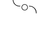

这也成为设计的重点，因此连几何图形的画面表现都有互相旋绕，以及饰带串连的表现方式。可知意义不离：周转、交流、传达等方面。

各种几何排列的意义：

双币平行放置：


也可代表双轮，运转快速，方向一致。

也可有上下高低：


这样的运转更为强烈，而具有变动起伏的特质！

### 星币 3

故事中的象征物排列：

星币三最有可能的是排列成三角形，这样的平面排列，就能形成堆积的感觉了：

+   ○
○ ○

这种形状显示并非独力奋斗，也不只双方合作，而是多方协力、互相扶持相拱的感觉。如果紧密相邻支撑着，更表示团结，象征与同心合作。

星币本来就常类同于五芒星，五角形配合三角形，会有很多种图形因应而生，构成丰富的几何呈现，可以表达很多设计上的意涵：

+   ☆
☆☆

也能以此暗示特殊技能，专业的工作，精工，以及几何等。

各种几何排列的意义：

三枚星币的排列，连成一直线是最没有特色的：○○○
只要不是一直线，就会呈现出三角形，如果是倒三角：

+   ○○
○

就暗示微妙复杂的相互供应关系。

### 星币 4

故事中的象征物排列：

四枚星币，能排成一个方形，给人的感觉就是固若金汤，这样的坚固方形，就象征着固守，甚至是吝啬节俭守财。

然而 4 的排列，通常会在稳定中求变化，因此四枚星币不一定只排成方形或一直线。在故事情节画面中，尤其会添加变化：

+   - o
- o
- o o

这样纵横两方向垂直排列，也能涵盖二度空间平面，并且表示储蓄有方法，也不乏理财技巧或规则。

各种几何排列的意义：

星币四的方形排列：

+   - oo
- oo

可明显感到极为稳固！

+   - o
- o o
- o

这个排列的意涵，类似于前述的垂直排列法。

### 星币 5

故事中的象征物排列：

五枚星币可以堆成五角形，无论怎么排，形状一定很特别。

四角上迭一枚，是比较合乎日常能排出的五角形状：

+   ○
○ ○
○ ○

许多牌法都会有突出的一枚，或者遗漏于四枚整体之外的一枚，这一枚星币是这张牌的要点所在。

图形中顶端突出的那枚星币，位置高高在上，可望而不可及。

如果这枚星币是滚落于外的，那么表示金钱的散逸，象征财务上的亏损和漏失。

综合这几种象征，五枚封存星币难以运用，掉落的星币也暗示经济崩盘。

因此星币五即是象征贫穷，或者是贫富差距的意涵。

各种几何排列的意义：

星币本来就类同于五芒星，五枚星币排成五角形是很自然的呼应：

+   ☆
☆ ☆
☆☆

五枚星币还可排成：

+   ○
○○○
○

或是

○ ○
○
○ ○

都表示有一藏住的钱，是一种奥秘或难寻的至宝，贵重而难以触及。

### 星币 6

故事中的象征物排列：

六枚星币，容易给人均衡的感觉，能够排成最佳图形，并且兼顾很多层面。将六分成两部分还是三部分皆可，如何取舍就象征了对于分配的考虑。这也就是星币六所代表的意义：衡量供需，公平交易，经济均等。

这是最佳排列法，天秤形状：

○
○ ○ ○
○   ○

天秤就是星币六的宗旨，象征：施与舍，付出与回收，营利与赚钱之道。如果营造成以下的样貌，就是天秤倾斜了，特别表示正在衡量拿捏中，或是有所偏颇：

○ ○ ○
○   ○
○

各种几何排列的意义：

对称和整齐，表示衡量和规划，是理财的成长或是资金的累积：

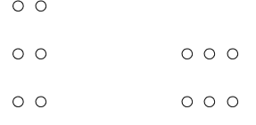

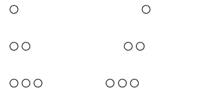

六角形的方式，显示出金钱的美好：

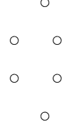

六枚星币互相连结运转，连成波浪状，也表示生生不息以及财源滚滚，象征生意兴隆：

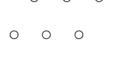

### 星币 7

故事中的象征物排列：

七枚星币的排列，由于七角难成，通常是堆积成尖状，然而却又不够高。因此除了表示堆积、累增，并有期盼、等待的意味！

七枚星币是在双数之外多出一单数，以星币六为基础，多出一枚星币的变化。这枚特殊的星币，即是那期待、回收，及自由运用的一枚。

既然是金钱的等待，投资的风险和危机自是难免，当然也可随意排列，表示经济环境的难测。在一些情节画面中，七枚星币即是这样的图式：

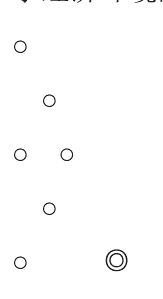

跟星币五不一样的是，七枚星币可能会凌乱，然而却较无散逸和贫富差距的意涵。

各种几何排列的意义：

七个圆圈，难以分配平均，必须费一番思量：

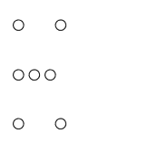

或是

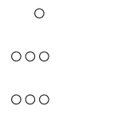

都会特别突显一枚星币，即是前述的自由资金或特殊期盼。

### 星币 8

故事中的象征物排列：

八枚星币最容易排成整齐划一的图形，可以表示累积，表示有规划有纪律的编列财务。

然而，或许是因为很容易有规律，有些情节画面就刻意以不规律的排列，表示正处于进行财富累积的过程当中，不整齐的排法是特殊的变化方式：

+   - ○
- ○
- ○
- ○
- ○ ○
- ○ ○

这些星币一样是凝聚起来，也暗示质能互换，以劳力换取金钱，是工作和事业收入的象征。

各种几何排列的意义：

规律的排法有两种：

+   - ○ ○
- ○ ○
- ○ ○ ○○○○
- ○ ○ 以及—— ○○○○

而较有变化的方式其实不少，如：

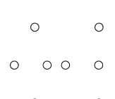

或是

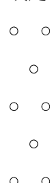

表示财富丰收，并能够灵活运用。

### 星币 9

故事中的象征物排列：

九枚星币，可以充分表示堆栈累积。此时形状似乎已经不太重要，怎么排列都能显示数量丰富。虽说九需要强调力量整合而不能太凌乱，然而因为是满满的财富，排列上当然可松散随性一点，只要能有往上堆积的感觉，下多上少的安稳形状即可。这样就能表示财富的最高境界，到达财富上位顶峰阶层。

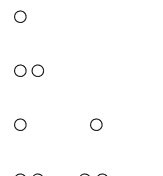

这个图式见于情节画面中，三枚星币一堆而共有三堆，表示有规划分配的储蓄。

各种几何排列的意义：

九枚星币可以排列成完美的图形，像是围绕成九角星圆圈。

这个数量给人充实感，尤其配合这样的图式：

ooo
ooo
ooo

不然也是往上增长的感觉：

o
oo
oo
oo
oo

总之，是财富的累积和成长。

### 星币 10

故事中的象征物排列：

十枚星币，表示比最多还要更多的财富，并且延续到以后。10 需要呈现全部象征物合而为一的整体感，所以可以将十枚星币绕成圆圈，或是组成特殊图形。

在某些画面情节中，星币构成一组的生命之树图形，这是一种神秘学图案，具有丰富的涵义。这些没有紧邻的星币其实是有整体性的，而且能够对称，更有特殊的隐含规律蕴含其中。

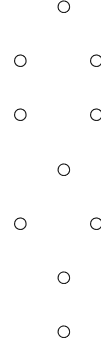

各种几何排列的意义：

最多枚的星币无论怎样排列，都能让画面感觉非常丰富。只是通常对于这些圆圈的安排会多加考虑，安排对称或组合成特殊图案。

十枚星币，也能组合成完整的金字塔，象征丰富的宝藏：

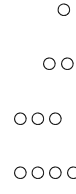

### 塔罗数字牌的象征物设定•权杖篇

### 权杖 2

### 权杖 3

故事中的象征物排列：

三根权杖可视为双柱再加上另一柱子，排列成Ⅲ的形状，三点成为一平面，表示往外延伸新的空间。双柱代表原本旧有的领域，加上一柱往外拉出去的动向，象征领域拓展的意味明显。

Ⅲ， ΠⅠ
双杖外加一杖，也表示有外来资助，以及附增力量，能够据以继续拓展。
三根权杖的组合，也表示多方的联合交流。

各种几何排列的意义：

图式也可排列排成△，就象征完整与和谐。

* 表示力量集中于一点，卄则表示强力连结的力量。

### 权杖 4

故事中的象征物排列：

四根权杖的竖立能形成稳固的局面，这图形总让人联想到建造物和架构物的支柱。只要有四根棍棒，就能架出稳固的帐棚庇护所，而如果四柱是坚固粗壮，甚至是钢筋钢骨，就会营造出一座坚固无比的建筑。
四根柱子无论如何排列，总能形成四边形的支柱，总之是很好的支撑物。

|||| ， // //

如果两柱形成一个门坎来看，两两交错之下就有许多个门坎，营造出多重空间交错感。由此看来，一定也能造成完整而充分的保护作用。

||
||

各种几何排列的意义：

四杖都是长条状，除了竖立四柱外，也可构成正方形□和菱形◇，一样表示稳定和坚固的领域。

如果是交迭在一点上，力量也是很强大，也表示可以扩展到四面八方。

米

### 权杖 5

故事中的象征物排列：

五根棍棒，较难排列和呈现出特殊图形，通常会显得凌乱，感觉上破坏了四柱的整齐和稳固。因此也表示更为复杂的关系，以及难以统合的状况。其实还是能够整合出特殊的局面，让五杖具备各种不同方向和角度，算是比较激烈的配合，不免经过一番纷扰、摩擦和争执！凌乱的画面也表示状态不稳定或正在崩毁，是一种局势的变动，或许也算是一种创新的局面吧！

各种几何排列的意义：

五杖还可以形成五个方向，五角形等排列方式，虽可独立出一根，但地位并没有那么特殊，也只显示出整体看来有所冲突的形势。

||
—
||

### 权杖 6

故事中的象征物排列：

六根棍棒能有许多种对称的排列，主要是分成两组或分成三对的方式。而每对权杖又能有不同变化——像是 II 或 V，于是可以组成如 VIIV 的各式排列变化。

纵使排列稍微随性，也都不至于太凌乱，甚至有一定的秩序在其中。各组权杖能表达不同涵义，像 V 字形就是胜利的象征，无论怎样统合，六杖都不脱荣耀和成功。

各种几何排列的意义：

六柱，另外还能排列成：
IIIII ， II II II ，
或是构成完美的六边形。
这些表达方式，也都能想象为完美和光荣。

### 权杖 7

故事中的象征物排列：

七根棒子，显得难以均匀分配，然而拆解成一和六，是最容易的方式。这样的安排，突显了这一根权杖，而这一根是横向或直向并不重要，重点是与其它六根分别出来。一夫当关，是这一根权杖的象征。而六根权杖方向一致，表示另一股对立势力的整合。

各种几何排列的意义：

七杖的许多排列法，都会有居中或独立于外的一根：
IIIII I ，或 III I III
这一杖定是特别显著鲜明的。

### 权杖 8

故事中的象征物排列：

八杖排列在一起，会形成一大片，感到是整合起来的强大力量。整齐划一的八根权杖方向一致，但却不是乖乖陈列在地上，而是从天而降，表示临时而匆促，并且具有动态感。
何况也总不能再运用 V 字成对的排列方式了，因此就组成了一个平面，也能表示力道集中运作。

各种几何排列的意义：

八杖，其它的图形变化比较少：

|||||||

与

||||
||||

感觉起来相差不大，都是整合与一致性很强。

### 权杖 9

故事中的象征物排列：

九杖，这数量极多的木棒，可直接排为一列，形成一道屏障，作为栅栏或篱笆，表示隔绝或保护的作用。况且九数通常需要强调力量整合，不能够太凌乱，因此多半相连成列。|||||||

然而有时候，在整齐之中却又独立出一根出来，而在排列中空出一根权杖的位置：

|||||| |
|

这是特别设计的图案，表示这根脱队的权杖是特殊的，可以赋予它权柄或机会等等意义。而这根权杖握在前面主角的手上，暗示多出一项挑选或把握住机会，也隐喻了紧抓不放的意味。

各种几何排列的意义：

九根权杖，除了排成一列：

|||||||，让人感到充满之外，一样也可以安排突显出显著的一根，像是：

||| |||
|

同时表现并排多数及歧出独一的意义，也藉以营造出对比。

### 权杖 10

故事中的象征物排列：

十杖的整体性很强，多半都将十合成为一，由于 10 表示全部象征物整体的结合，所以捆成一束是最常见的方式。这样也表示集中在一起，象征全力以赴。

当然，整束权杖可以形成重力的感觉，表示承受压力颇大，这个重担如果过度就会支撑不住，会被压垮而倒地。

各种几何排列的意义：

十杖，无论怎样排列，都容易给人有密布的感觉，让人透不过气来。
简单的排列如：||||||||||，
或是：
||||
||||
也都会有类似的感觉。

### 塔罗数字牌的象征物设定•宝剑篇

### 宝剑 2

故事中的象征物排列：

两支剑，因为是武器，较不给人互相合作的感觉，而是对立的状况。这象征了立场上或意见上，个人和他人双方的对峙和拉锯，结果或许是分裂、或许是和平，大概不脱离这些范围。
双剑合一的使用，也需要左右开弓，须高度磨合后，才能够运用自如配合得天衣无缝，所以平顺合作的情况并不多见。

各种几何排列的意义：

两支剑的排列，不脱以下的几种形状：

X ， V ， ∧

分别代表——对峙，分裂，以及约定！

### 宝剑 3

故事中的象征物排列：

三把剑，其实给人的感觉就是犀利的表征，这个特质设计成图形，就是三根直线，贯穿于一点，结果形成六角星的图案—— * ，这是很集中而切中要害的。这个特殊的形式，强调凝聚于一个焦点上，具有强劲而聚集的杀伤力，对于心灵上的伤害很大，多表示悲伤心痛。

各种几何排列的意义：

三剑集中的排列也可如下：

小

剑尖集中于一点，这样的形式比较缓和，表示协约以凝聚力量。
另外的排列，除了三角形之外，有更多的变化：

卄 ， ≠±， 〒 ， ， ......

这些图式多有互相牵制的感觉，不同方面的立场营造出整体局势紧张严肃。

### 宝剑 4

故事中的象征物排列：

四把剑的排列乍看无奇，四角形应是可推想而得的。然而四剑实可包含两两成组而交互作用的特色，构成对峙中的对峙，形成一种僵局。也因此宝剑四一般多代表停滞、休息、等待、暂缓，或者终止。

4 的图案通常会从固定中求变化，因此宝剑四也多半不死板，在平稳中暗藏玄机。

有些情节画面将其中一剑更动位置，在平行的三把剑之外，深藏在底下：

这象征在停顿当中隐藏或酝酿着微妙的变化。

各种几何排列的意义：

四剑自可以排成各种四角形，也可以有更多变化：

XX

感觉像是封锁现场。

II II ， ∧∧

则可联想到门禁森严。

### 宝剑 5

故事中的象征物排列：

五把剑的排列，总会有一把较为突出，以二分法或三分法都不能平均，无论如何都是宝剑挥动的争斗场合，也因此是针锋相对的象征。

五角本易有锋芒，与宝剑结合更见锐利，通常会有一剑脱颖而出，显示尖锐凌厉。

宝剑五就是与纷争、激辩和凌乱有关，当然也摆脱了沉寂而生动，算是一种脑力激荡。五剑的排列多力求特殊，像有些情节画面中的五把剑，是类似这样的安排：

V
> "

这图示具有以上所述的各种特性。

各种几何排列的意义：

五剑可以交错成为五芒星，也可连接成五角形：

其实这样的排列并不多见，通常是特殊的整体对称图形，尤会突显出中轴的孤立：

XIX ， // | // ， =|=
?V
∧

特殊的那柄剑，居中挚肘整体局面。

### 宝剑 6

故事中的象征物排列：

宝剑六的排列可以很有造型，营造成特殊设计下的平衡感。
六把剑放置一起，并且分两边，而相隔的两列，又形成了保护作用。

||| |||

这种整齐的设计和排列，也显示了一种井然有序，隐喻着顺畅和流通，并能象征一种沟通，或者延伸为顺水推舟。

各种几何排列的意义：

六剑的基本形状是六角形，本就象征着设计、思维、研究，甚至学术、科技。

分成两半直立的剑，类似双屏而其中存在空间，若排成 VIIIV 的图式也有这种感觉。

≡≡，这样的平行排列，能模拟为水流波纹，或是船只两侧的桨，与航行多有关连性。

### 宝剑 7

故事中的象征物排列：

七支宝剑，排列和组织较具难度，因为七角耀眼而不驯。机巧和智囊，是宝剑七剑的特色，因此七剑的排列组合，要考虑如何表达机变运用，为了这因素须寻求更多变化。

VIII II

上面的图示是将剑分成两部分，在情节画面上就是将几把插在地上，另外几把抱在手上。每一剑各有不同的功能展现，这情形表示有特殊策略，以及诡谲复杂的局势。

各种几何排列的意义：

七剑多半会分组排列，也总会有一把剑居于特殊位置：

廿|廿

这些图式都能暗示在环境中周旋进而经营局势。

£|3≡|≡，V III V，

则令人感到取巧得胜。

### 宝剑 8

故事中的象征物排列：

八支宝剑，可以有多种排列法，但为显出与他张牌不同的特色，且需集中宝剑的作用，因此必须有特殊的安排。

画面情节中的宝剑插地竖立围成一圈，是一个很独创的构思。这样的排列可以产生立体感，且能让宝剑绕住人物，形成一种藩篱，发挥八个方向的包围力。八剑营造了禁锢的场面，表示限制和封锁，居于各方位的剑象征不同方向的意见，是严苛而过度的压力。

各种几何排列的意义：

八剑可以排成类似这样的图式：

```
∨
> <
∧
```

形成中心的焦点而感到受困，集中力与威胁感更强。中心焦点的营造，也是宝剑八所具的特色。

卅卅，MM

这些排列方式，也表示各方串连而共同围起形成阻挡。

### 宝剑 9

故事中的象征物排列：

九支宝剑已是最多的一级，算是宝剑的最高作用，因此画面多将剑直接作用到主角人物。9数需要强调力量整合而不能太凌乱，所以画面呈现的多是九剑层层迭上，且剑尖方向皆一致。

```
≡
≡
≡
```

这表示每个层面都造成影响，也象征各式悲观负面的情绪，受到引动和刺激：包括忧虑、烦恼、悔恨等。

各种几何排列的意义：

九支剑几乎已经占满画面，充分表达剑的思虑过度。
纷乱飞舞的宝剑排列则表示心思更为混乱，不过通常仍排列得工整：

≧|≦，VII V VII

象征不同来源和类别的思绪，也暗示较具整理与分辨能力。

### 宝剑 10

故事中的象征物排列：

十剑，是宝剑极致杀伤力再更加强的意涵，让人感到滴水不漏严加追杀。而 10 表示全部象征物合而为一的整体结合感，因此十剑需集合成组，形状不需太花俏，只要整齐划一的排列，就能感到力量强大而震撼。也由于一致感多是人为所造成，能更感到刻意安排的可怕。

III II II III

十支宝剑更直接的刺上身去，实质伤害到了主角，危及了许多层面，完表达了毁灭的意涵以及宝剑招致厄运的作用。

各种几何排列的意义：

十剑一定会呈现充斥画面的感觉，让人感到惊恐气息。
若求有所变化，多会以分组方式排列：

VIII VIII ， M V M， ≡||≡

加入对称与设计感，更隐喻事件情况被注定或安排。

## 塔罗小秘仪数字牌的故事情节•圣杯篇

塔罗牌小秘仪中的数字牌，有以情节故事画面为主的，这是 RWS（莱德•伟特－史密斯）塔罗以降的传统。这些画面情节都有共同点和一定的关系，这里就以这些有故事情节的塔罗牌做画面概述或解释。

"情节推衍发展"，是大致叙述每张牌会有的几种画面，并指出如何判断到底是什么用意。并会从情节中的主角人物与专属物之间的关连，来解释其中所产生的意义。然后再带到情节部分。

"画面附属搭配"部分，则是解释这张数字牌的各种构图整体场景背景和搭配物品。主要仍以 RWS 塔罗为主，并尽量容纳各种后 RWS 的塔罗中有画面情节的数字牌。

这一篇以圣杯数字牌为主，希望经由本篇叙述，让大家充分了解圣杯数字牌。

### 圣杯 2

情节推衍发展：

本秘仪主题为情爱结合，这是非常明确的方向，因此不同塔罗中的画面，并没有变异太多的现象，几乎很少有例外的。
构图意念大致都不脱离男女主角饮用交杯酒，也就是一对恋人的剧目，看作者要怎样诠释和变化了。
通常杯子的位置是关切重点，两杯之间的高低和距离都隐含着微妙的意义——亲密程度以及相互地位。而两位主角人物举起酒杯的姿态，可看出彼此间的感情状态和具体相处模式。
这张牌的特色，是与大秘仪的画面情节很类似，并且多半也有守护在两人背后的角色，作为见证者或警惕告诫者，是爱神或是天使，或者是两人交融的意象呈现。
当然，这是保守一点的画面，小两口若是更为亲密，通常也容不下后面的天使或见证者了。有些塔罗的男女主角动作就很亲热，更为明显地显示出恋爱关系，甚至有的牌会有接吻等动作，感情更为热烈。
周遭环境与主角之间的调配也要注意，镜头和景物远近多会配合双方的亲密度而有变化。

画面附属搭配：

通常背景中央上方都会出现如恋人牌般的见证者，然而比较不具人形，主要用以揭露双方的内在关连。只要相关于彼此交融阴阳结合的符号，都可以使用：双蛇杖代表缠绵交流的能量，也有出现阴阳太极符号；狮子头是炼金术的热力物质，并且也能作为见证者的头脸，如果是火红色，就是热情的象征。

两人所在的场合，与双方的相处有关，空旷或隐密暗示着两人亲密程度。

远景小山丘和房子，表示未来两人的恋爱的走向。

### 圣杯 3

情节推衍发展：

本秘仪主题是欢欣鼓舞和庆祝，与娱乐和艺术也有关连。主要画面多描绘生活中遇到喜事而雀跃，众人一起高举杯子欢庆畅饮，多半还要表示出丰盛，受到赐予而欢欣感激。

三个女人共襄盛举是本秘仪的特点，多会将西方三女神组的观念融入，多为模拟其神色姿态的呈现。并由此表示女人之间及友人之间的情谊。而所表露的兴高采烈情绪，多半只是一时的激昂和感动，是生活中必要的点缀而不是常态。

三个人之间的关系，是牌义变化的重点，不过只有些微的差异。极少见的变化牌种，会将主角更换为三个男性。有些塔罗只安排一位女性主角在画面中，可说是女神三合一的意象，也表示一个人的喜乐情绪。

有的塔罗则只画出异性的两人，也表示情感的欢愉，有点像圣杯 2，然而更多浪漫和周边享受，而不是只有在一起。然而，圣杯 2 却不能够只放一位，主角必须成双成对且男女均衡，由此可见此二张牌的差别。

仍有少数塔罗会将三人行表现成小两口之外的第三人介入，例如夫妻之外还有一个小孩。有些则是三人的联欢外，另有他人加入。

画面附属搭配：

主角是三个女性，地面上多会堆放着许多丰盛的果实，表示丰收和礼物、赏赐，也表示时值节庆或喜事、盛宴。

通常都伴以有花叶的场景，展现田园或自然风光，花朵更隐喻女人们的美善。

牌义与才艺相关，可以表现出艺术天分，尤其是动态的表演，有些牌或许会有乐器等道具出现。

### 圣杯 4

情节推衍发展：

本秘仪要表现的是沉寂但平稳的情绪，并没有不满或者不悦，更称不上忧郁。虽然很可能觉得无聊平淡，但也有机会求得恬逸和领悟。

许多画面是一个男人孤独沉寂地坐在树下，像是在纳凉歇息，但也有可能是在静坐悟道。他像是正在沉思，或许心里感到百无聊赖，或许正静心感悟。

**RWS** 的构图将杯子安排得很特别，主角凝视三个杯子，而一个杯子从空中冒出，象征心灵浮现的一个意象，或是一种渴望和幻想。有的牌是画出天使捧来一个杯子，或是画出已经将这杯捧在手上的画面。有的塔罗是四个杯子都同在现实面的安排，少数塔罗是四个都在梦幻之中。

有的塔罗将情节稍作更动，描绘女人坐在庭院中小憩的梦境，或是延伸为沉思静心或求道过程中所遭遇的的各种诱惑。大多数情节都是一人为主，强调孤独的特质，刻画个人私密的想象世界，因此很少有更多人物出现的情形。不过，无人的画面倒是有的，以四个杯子的描绘为重点，像是填满各式物品或长出花朵，也是一种静与美的孤寂。

画面附属搭配：

树木是这张牌很重要的搭配，它是主角的依靠，也代表他的另一个声音。树的样貌和品种也有其象征意义。
树根地面高耸起来，让主角的栖身处更为清爽明朗。
主角的姿势多为坐姿，并以神态表现出精神面和个人境界如何。
云中浮现杯子，表示幻想刺激，或是心中开始有梦。

### 圣杯 5

情节推衍发展：

本秘仪表示情绪的低落、不悦以及怅然若失的感觉。一般从主角人物的姿势和外表，就可以看得出心情的反映，他多是僵直地伫立，别过头去低头不语，并且全身穿着漆黑。
杯子的排列也耐人寻味，通常是三杯翻倒而背后的两杯直立，但位置和主角方向也都能更动。有的塔罗五个杯子全都直立未倒，也有的是杯子全倒的状况，有的牌的杯子甚至是存在幻境之中。
主角人物的动作多相差不大，然而面朝何方通常有不同的意向，可以用这些差异来评估忧郁的状况和程度。

这些表现方法都是强调失意的结果，但引发的起因是什么则需要深入推敲，留下很大的想象空间。最好强调孤独，单一主角在画面中，会感到更为落寞，就像是一个人独自喝着闷酒。但也可安排后面有人安慰，然而主角仍沉浸在愁绪中，这样更能表现心中的沮丧郁闷。有些牌更为生动，在倒翻的杯中寻找残存的余温。

有些牌则画出了两人互相背对背的失和状况，直接交代出不如意的原因是情感问题。

画面附属搭配：

- 场景多为人物站在岸边，因此会出现河流、桥梁，甚至彼岸的景物。
- 流水，是愁绪的表现，抽刀断水水更流、怅望江头江水声的意象。
- 桥梁，象征回头或离去的考虑，也是沟通管道。
- 彼岸，暗喻未来的希望和走向。
- 彼岸的城堡，是潜意识中向往的庇护所。

### 圣杯 6

情节推衍发展：

本秘仪是表达宁静温馨的情感、美好的点点滴滴回忆，也是纯真的代名词。那么主角当然是孩童，通常至少有一对男孩和女孩，牌义可以连结到与儿童相关的幼保、幼教以及童年，并推衍到从前的美好时光，以及过往的回忆。

有的塔罗着墨于回忆这一点，以泛黄或黑白的图案表现出回忆中的画面，甚至有年老与幼年的对比，可知这张牌与时光也很有关连。

花园中的场景，令人感到温馨，累积的感情应给人厚实的感觉，于是多会在圣杯中装满了泥土而生长出花朵。

所有这些象征都贴近于纯真的感情，由小孩子之间的相处关系，看出所要表达的意境。多以孩童的游戏表示真挚的情谊，也延伸为不及爱情的关系。如果认定是小两口的恋情，也是偏向于两小无猜、青梅竹马，较为温馨而非激情。有的塔罗表达的是较为成熟的爱情，甚至是浪漫热情，这样也无不可。

有的塔罗表达的是人物与大自然或动物之间的和谐关系，而这也与童稚纯真的心有关。

画面附属搭配：

杯子内装的实物是由累积而成的，表示是实在而不是幻想或激情引发的。况且杯子是放置于城堡土地上的，表示真实境地，杯中内容都是真实的过往。

开出花朵是目前的情感呈现，纯洁而美丽的象征。

所处背景的安排，多位于城堡花园之中，表示孩童受到安稳的照顾保护。

### 圣杯 7

情节推衍发展：

本秘仪要表达出不切实际的情况，因此大都将七个杯子画在云雾里，

### 圣杯 9

情节推衍发展：

本秘仪旨在形容个人志得意满的情绪，几乎多以单一人物出现。主角独自坐，享受快乐欣喜片刻，这是人生的美满自信的境界。也代表心想事成、愿望达到的无比喜悦。
多半塔罗是描绘男性的欢乐以及志得意满，给人骄傲得意的感觉。但这样有时候看起来却会引起反感，因此也有很多牌是以女性作为主角。
女性主角可以表现出比较细致的情怀以及深刻的感动，除此之外还能带出另一重要主题——心想事成。这张秘仪也有作为心愿牌的传统，女人对于心愿达成的感受和情感寄托的态度，是较为贴切的。尤其是让杯子浮在云端，配合女性的梦幻心境。
女主角的画面通常比较静态或偏重内心戏，为了避免流于平板，也有较为动态的变化画法：让女子随喜悦的心起舞，杯子围绕于四周。
仍有少数的牌是描绘两人亲热的画面，表现双方融合成一体的喜悦。也有的塔罗描绘女人和小孩的互动，也是一种内心的幸福喜悦与满足。

画面附属搭配：

布景是什么即表示目前处境和遭遇，以及透露出为什么感到满足。帐篷表示一时的舒适与收获。生活状况也可由主角与杯的关系透露出，正在饮用还是摆饰。圣杯的摆设，表示得意之处，或内心的目标放在哪里。

主角的位置和动作姿势，代表内心的细微状况，双手抱胸或昂首抬臂都是不同的肢体语言。

多半会有椅子，给主角人物坐着，这样会显得比较安稳舒适，才能泰然自若。

### 圣杯 10

情节推衍发展：

本秘仪主要表达亲情、爱情等幸福人生，多半以全家和乐为场景，表现美满家庭的内心感受。

重点就在于小家庭的和乐，因此多会有全家福的场景出现，夫妻子女的共处与融洽。而安全的家庭居处是很重要的，多半也会着重住所房子的建筑。

虽然需要表现家庭的和乐与温暖，却不需有人物的限定，也不一定全家人都要出现，甚至可以不用画出人物。而如果没有人物，那么家园的描绘就成为主要重点了。这时多呈现出城堡庄园，甚至有高山为屏障或建筑在山上，这都表示安定稳固有靠山。

有些塔罗并非表现全家福的意涵，而是纯由两人构筑的世界，这也是一种幸福的感觉。让彼此双手共握一个圣杯，或是一起捧着全部的圣杯，都可以表现出关系紧密、感情深厚或者是互相扶持。

当然也会有单一人物出现的画面，有的牌只有唯一女主角坐着，十杯水围绕而满溢出水来。也有塔罗一改这些意象，只画出情感丰沛，以象征方式来表达主题的，像是十个圣杯的特殊安排或是以水元素精灵出场的画面。

画面附属搭配：

天空中的一道彩虹，连结起圣杯：作为圣杯的背景，彩虹是美好的希望和愿景，也是心灵的桥梁。

既然描绘家庭，那么建筑物是很必要的，表示安定稳固的家，物质有一定程度的安稳，才能真正和乐，有精神面但不虚幻。

周边环境场景：河流、山坡，描述共同生活的园地，以及各自发展的空间。

优美的环境就是心境写照，晴朗的天气更是心情开朗的描绘。

## 塔罗小秘仪数字牌的故事情节·星币篇

### 星币 2

情节推衍发展：

本秘仪主旨特别，涵义又很丰富，所以画面所传达的意涵较难揣摩。通常都有一个男人为主角，像是在杂耍般地转动着两枚星币。

两枚星币刚好能够左右移动，多以双手操作互绕旋转。主角通常摆出特殊的姿势，甚至还身处于摇晃的甲板上，让人感到会很累甚至疲于奔命。这个奇特的动作，用以象征许多不同的涵义：财务的周转，事务的协调，危机的转化，甚至包括娱乐等。

从人物的扮相，可以了解他与这两枚星币的关系，以及所扮演的角色。

转动星币的动作方式或是纽带，都能据以增添许多变化和创意：一个人加上他的影子一起操作星币，或是小丑的左右两侧服装衣着相反，或者是主角戴着面具隐藏真面目。这都是要更增添双重性，表示左右逢源或两面讨好。

另外还有更为特殊的转化：有些塔罗将星币和纽带分开，分别安排在画面的不同地方出现，也不以转动星币为主要姿势，将星币 2 的特殊神秘力量用其它方式展现出来。甚至有的塔罗更动了人物：将主角改为女性，应有更特殊的意涵，而改为两人一起操弄或交换星币也增添更多的意义。

画面附属搭配：

若场景有船只和海浪，是为了烘托波涛起伏汹涌，象征人生的摆荡不安。场景也可暗分两种领域，表示两面忙碌奔波。

神奇纽带，无限大符号，围绕在两枚星币之外，连结两枚星币。表示运作当中呈现能量，能够引动无限潜能。这个符号也有独立在外的表现模式，像魔术师牌的画法，甚至更神奇的光芒或磁场呈现。

### 星币 3

情节推衍发展：

本秘仪表现星币的精致作用，不脱离实际而又兼具美学，不是只有金钱的价值。于是画面通常都强调星币位置的变化，再来才是人物特征。

这张牌的构图多以星币配合场景，营造出更多意义变化。三枚星币在上，是众人齐心努力的精神目标。星币如果镶在墙上，表示努力所得是成就和名誉。是不是位于教堂内，则与精神奉献相关。

通常画面都会出现不止一个人物，共同进行某项工作任务，这具有团队工作的意涵。而从人物装扮可看出在这项任务中担任的角色，三个人物各执其事，则暗示了专业技能。RWS 画面的角色有工匠师傅、建筑设计师以及教堂人员，表示各方的协调。

当然，人物数量会有所改变，有些塔罗以单一主角独力完成工作，但专业的意涵仍须保留：一人手执设计图或进行工作。

很多塔罗着重于工作型态的变化：可以直接描绘一般工艺的创作制造，也可以展现对星币的掌握技巧。甚至更为复杂庞大的设计工作，星币成为运转机轮。

这张牌也具有才华的意义，有一些塔罗据此而将画面做一些更动，构思成其它对才艺的表现有意义的情节画面。甚至描绘一场舞台登场表演，星币转化成了聚光灯。

画面附属搭配：

- 工作器具：根据工作性质而定，代表谋生技能和工具。
- 设计图：是才艺、智能结晶，是计划规划，是精心设计。
- 画面中多要呈现设计，并增添空间营造感。建筑并以几何图形突显出设计感和古典风格。
- 教堂建筑花纹雕刻、其它装饰的配合，可看出这张牌的定位。玫瑰等图式符号，表示其中有秘密契机存在。

### 星币 4

情节推衍发展：

本秘仪主旨极为明确而固定，就像牌义也是稳定的意思，因此连画面更动也不会相差太远。

财务的稳定需要节流储存，多半以守财奴般的金主当主角人物。通常会画出一个男人抱紧着钱，露出吝啬的表情。然而从另外的角度来说，这也是一种坚强的意志力和凝聚力。并隐含有星币与身体结合的感觉！这种坐拥星币的动作让人印象深刻，许多塔罗都会据以变化。

这个男人有各种造型，以及各种类似的动作：四枚星币全都抱在身上，双脚各踩住一枚星币而双手高举各抓住一枚星币，躺在星币之上。也有不接触星币的，用心去掌握而不着形迹。

当然，也不乏刻画女人爱钱的情节：女人抱钱紧紧不放，正在采集金钱，或者单纯是心里爱护喜悦星币的拥有。

这张牌也颇重视主角所处的场合，居于室外、室内的差异，在于心态与实际上的封闭程度，室内的布景刻画通常也是心境的写照。

比较大的变化是增添其他人物，这就一改封闭的形象，情节也会有较多差异。富商与人协商生意，用星币的排列位置暗示他分文必争。仍然相同的特色是——财力雄厚的财阀意味。

画面附属搭配：

主角坐镇的姿态，必须要有椅子，且多是坚固的石椅。

由人物装扮可以看出他的身份地位。顶上的帽子更暗示他自认的阶层。

若有房间，是他的小环境、生活和心境写照。房间的门窗，是与外界联络的管道。

城镇，是他的大环境，看出主角的金钱流通领域和社会面。

### 星币 5

情节推衍发展：

本秘仪在表现上比较特殊的是，由于主题是贫困患难，星币反而成为没钱的象征，多半营造出贫富差距的对比。

首先要描绘主角自身的困乏，要画出人物的穷困潦倒。人物衣衫褴褛的状况，也可判断贫困的严重与否。再来要让环境困难险恶，以雪上加霜更形严重。因此天气要很恶劣，表现出饥寒交迫，并以黑夜为场景来呈现。

黑夜里融入明亮教堂星币高挂的景象，是要营造与穷困的对比。一般都将星币高挂教堂，距离主角十分遥远，以表示不可及的阶级差距。有些塔罗会呈现教堂内景象，凸显出更强烈对比。

部分塔罗则将星币做其它安排，也能呈现经济的低靡。最穷困的情节，是刻画一群贫困的难民，整体都是在断垣残壁的场景，而五枚星币镶在其中一个断柱上。

虽然处境困苦但并不孤独，这个情节通常有两位男女主角，他们可以互相拖累，也可以互相扶持，是患难见真情，也是贫贱夫妻百事哀。他们或者是革命情感，或者是私奔的情节，总之其间感情是推敲重点。彼此关系在画面中都会表现出来。

比较温馨的画面是两人烤火取暖，或者在桌上对饮。有些塔罗更不残酷，没有着力在表现贫穷，两位主角在教堂下谈情说爱。这些变化是融合两种意涵。

画面附属搭配：

拐杖，表示行动不便以及支柱。
残障或受伤，失去正常谋生能力，是一种无奈而非不努力。
雪衣，表达了主角的受冻保暖度如何，也能形容不堪程度。
教堂窗户、教堂灯火，表示里面的富裕和幸福，与教堂外形成强烈对比，因此教堂外大都必须黑夜和下雪。

### 星币 6

情节推衍发展：

本秘仪主题由几个方向组合而成，生意的经营与赚钱、获利，也是资源的分享和施予。由于涵义比较广泛，画面情节也多变。
因为主题繁复，登场的人物也有很多个。主要人物多赋予成功的商人形象，另外的对比是贫困的人，并表现金主给予、分享或者施舍的动作。RWS 画面即是男性的金主，正施予金钱给两位乞求的人。
几乎所有塔罗画面都有天秤在手，以便于进行衡量。需要衡量分配的事情有两大方向，一是交易，二是赐予施舍分享。
强调交易的塔罗很多，一般都会表现出交易和获利的情节，或是做生意的画面。有些塔罗的画面看来类似一般交易，却是奇怪情节，常见的如：老人作为中间人的金主与美女交易，有各种表现法。
多半会将施予的情节，结合在生意成功的画面中，融合主题为——有能力维持好生意和收获，并关注如何分配这些资金。有些塔罗则强调赐予的意义，画出教堂内传承的画面。

当然也有塔罗舍弃以上所有主题故事，直点出金钱成功的感受的。只有一位主角享受因能力而获得的金钱，甚至没有主角只出现天秤和星币的画面。只是这样的情节较无特色，容易与其它星币数字牌的意义混淆，因此不并多见。

画面附属搭配：

- 天秤：象征衡量，交易，公平。
- 城镇：是交易和赚钱对象和来源。
- 眼前的场景，是正在分配或施予，不然就是谈一笔交易，与人的故事有关。
- 手上星币，有些施舍的画面会画出多出来的小枚星币，是在六枚主要星币之外，当然也有直接用这六枚表达的。
- 接受者的姿势，可以看出两方之间的关系，是索求还是乞讨。

### 星币 7

情节推衍发展：

本秘仪主题和投资很有关系，而且投资的概念范围很广泛，所以情节画面可以有很多差距变化。

画面的要点是主角很专注，也透露出殷切期盼的心境。动作多是正在种钱，呵护的神情表示投注很多心力。投资或付出必须在先，然后未来才有所得。因此这种方式也有其风险存在。

有些塔罗强调“一分耕耘一分收获”，所以坚持将主角画成一个种田的男人。不过，种植的方法就有很多种了——在谷物田地耕作里而七枚星币在上空，或是农夫直接把星币埋进土里种植，身上带着种子而地面正发芽出星币，最常见到的是已经生长出金钱果实的作物。

至于这些付出的收获如何，场景和人物神情的描绘，就可以看出未来局势演变。有时候农夫不是盼望而是神色悲戚，就表示已经了解到未来的欠收。更常运用场景黯淡、气氛诡谲，来暗示未来的前景堪虑。背景亮丽和表情喜悦，表示较有美好的希望。甚至也可以出现祥瑞之物，来暗示未来丰收的征兆。

这张牌与未来十分相关，因此这些不同设计的主要差异点，就在于未来的答案不尽相同。（这与占卜意义十分相关喔）

画面附属搭配：

锄头：赚钱工具。这张牌还是有一些劳动的，虽然是从无中生有、以少生多。工具的依赖也表示，纵使是投资，还是需要付出努力和技术的。
当然有耕作的农地，是投资的领域和场地。
葡萄藤是主要作物，是呵护之下的结果。葡萄结实累累，象征是有价值而令人喜爱的。

### 星币 8

情节推衍发展：

本秘仪是勤奋努力的代表，直接诉求赚钱，显示目前正忙于“打造金钱帝国”的阶段，打拼的创造财富。强调努力勤奋的特质，这是有异于星币 3 之处。

通常画面中主角还不是最专业的，但也足以掌握份内的工作。或许仍处于新手阶段，还没有成为大师傅，却已经有铁饭碗了，所以也收入无虞。但有些塔罗画面中还有设计图，这时主角显得更专业些。差不多主角都是以男性工匠形象出现，但也会根据情节中的工作不一样而有变化。

为避免让人感到纸上谈兵，除了手中正在画的大饼星币外，其它星币都展现为实际的成果。星币放置有各种不同的构图，表达的意涵也稍有不同：多半是几枚挂在墙上或柱上而几枚在地上，也有一起放置在墙上或是在窗台等明显地方展示出来，星币在门上在户外等不同处，也都有不同的暗示意义。

有些塔罗的画面情节，虽一样是在工作，却不是在制作钱币，而直接画出制作产品。制作任何物资、生产物都可以象征，有些是师傅正在雕塑不只是造钱，有些是织女在细心地刺绣，最直接的是做出面饼等食物。

比较强调赚钱涵义的塔罗，则营造成捞钱、地上挖钱、树上摘钱等动作，或是突显致富意念。

画面附属搭配：

生财工具需要出现，由打造的工具是什么，可以具体看出工作性质和生产方式。

工作场合的样貌，看出工作环境。半户外，是表示开放流通的特性。

椅凳、长条板凳：同时是工作平台以及座位。怎样的板凳或椅子，会配合主角的工作姿势而设计。

背景也要注意，表示工作事业往来的对象，多半画出城镇。

### 星币 9

情节推衍发展：

本秘仪主题是享受金钱，过着优渥的日子，享受悠闲时光。财富充裕而且转化为实质用途，不是只有累积起来，是懂得生活的牌。画面多依此旨而设计，因此大多以女性为主角，很少是男性，比较不会有俗气的感觉！

这张牌也就这样成了贵妇生活的写照：在花园之中，独自优雅地过日子，姿态优雅闲散，而环境显示了丰富盛况。会刻画女人种花养鸟，也表示心境上很投入于大自然，虽然享受但并不是颓靡。这些园中花草树木和小动物，都是她生活中的一部份，除了显示享受生活，也象征大自然之爱。

牌义鲜少有很大差异，比较会有变化的地方，是画面中星币的位置：多半会融合在景物中呈现，常见的是变换为园中的花果，甚至是成串的小果实。与建筑相关的也很多，镶在建筑上方而为了显示富裕，置于窗户上方或窗外景致中。很多塔罗是星币化为首饰穿戴在身上的画法，如：串成项链挂在胸前。多半都是这样拥有财富收成、悠闲的贵妇下午茶。

其实这些星币只要连成一弧线，也有足够的气势。也有的塔罗画面中没有主角，场景一样是房子和花园。只要能呈现出富丽堂皇就可以了。

画面附属搭配：

这张牌没有谋生工具，是过生活的牌，享受收获代价，不是工作的牌。

鸟：象征主角的精神或心思。鸟的种类不一样，有象征的差异。它的造型和姿势以及和主人的关系，都透露了重要的讯息，可以暗示深层生活状态。

蝴蝶：象征转化，也有飞鸟的意涵在。

蜗牛：另有象征时间的停顿，或丰收的过去。

### 星币 10

情节推衍发展：

本秘仪主题是大量的财富，多以家产的传承来表现富有繁荣，因此都不乏家族的刻画，以及大家宅第的描绘。画面情节多以名门望族或家族企业为主角，也表现了贵族的朱门恩怨剧情。

由于与继承有关连，除了需要大家族而画出很多位家庭成员之外，也要表现出多个世代同堂，以及表现各种关系。这些成员大致是父母、小孩还有老人与狗。当然这些成员会有更动，也有更多人口或世代的画面。人数较少也可以，最少的只有一个主角独拥城堡家园。有些塔罗很着重于屋宅的描绘，这样子跟房地产或住宅的相关就更密切了。有些塔罗将城堡营造显得很重要，十枚星币镶在建筑上，更与住宅强力结合。也有不着重建筑的塔罗，可以不画出房子，只要家族和传承刻画出来即可。甚至可以没有房子且只有一人，独自掌控所有星币大权。

有些塔罗的星币 10，并没有画出家族相关场景，甚至整体更改，连人物都没有。因为是十号牌，可以舍弃情节安排，转变成整组星币元素的呈现。像是十枚星币排列成生命之树，或是藏在巨大丰饶角里。

画面附属搭配：

家徽：表明家世背景地位。家徽的图案样式，透露家族的特质和过往。

建筑物内的器财产物：表示家族着重什么、有无生产的工作。

烟囱：代表炊事，有无荒废显示家庭温暖存在与否。

围墙：隔阂，封闭的空间。

拱门：入口与资格。

这张牌多有狗或其它宠物，表示受照顾的对象。

老人与权杖：表示家族历史见证和精神支柱。

## 塔罗小秘仪数字牌的故事情节·权杖篇

### 权杖 2

情节推衍发展：

本秘仪通常是以男性为主角，作为相关于领土主权统御的角色。主角人物的穿着，显示了他的身份地位以及时代背景。这位首领或戍卫与权杖的关系是牌义变化所在，可看出权力结构的差异。

没有握住任何一根权杖的主角，通常会在权杖竖立而成的双柱“门坎”之间，这样的动作是单纯地表明所有权的宣示。

一手握住一根权杖，表示掌握自身的优势和权力，独立自主而统御权力强。而另一根权杖表示他人方面的力量，或许是与你并肩的依靠，从而形成现在稳固的局面，然而是如何伫立或由谁所握，也是诠释牌义的关键，这凸显出另一方的状况如何，也可以从中看出两者之间的关系。

手握两根权杖的情形，则表示一次要协调两边，合作和合并的意味很强，也会比较有两难及必须致力于均衡的涵义。一手齐抓两根权杖，那就表示强力掌控一切，双方的融合已非常紧密，更不需要费心协调。

#### 画面附属搭配：

因有领域的观念，所以这张牌画面通常以城堡为场景，表示领地而象征相关的资产。领土外的背景，通常描绘成很辽阔，所囊括的领域和地方，就是未来想要拓展的范围和内容。

跟随 RWS 的画面，也通常附带地球仪在主角手中，象征模拟拓展的欲望和思量。这成为本张牌的特色之一，纵使没有握在手上，也会画出来，甚至也以球体延伸出各式丰富的设计变化。

有的牌会画出特殊的图帜，增加神秘感和强调身份渊源。

### 权杖 3

#### 情节推衍发展：

本秘仪多半以男性作为力量拓展的运作者，当然也可以用女性作为主角。

主角人物的站立位置是牌义思索的重点：三根权杖通常会以双柱外加另一柱的方式来表现，双柱一样是领域界线的意义，另一柱是前进或后退的方向指标。

主角站在双柱之间还是双柱之前或之后，可以看出他目前的处境和未来的动向。手握第三根权杖，有前进和拓展的意义，然而却是在初步的阶段。如果双柱在前，而手握其中一根，也代表扩张领域，但却是实际已完成和持续进行中。

可知行为作风偏于保守或积极，能从主角如何握杖看出来。有双手握住双柱，甚至三杖都握在手中的画面，都表示全盘掌握的意义。

有些塔罗会出现两个或更多的人物，双柱原先的一方而另一权杖为新加入或外来的一方，带来合并或支援，象征新的一个支柱。

也可将一根权杖架在双柱上方，形成更完整的门坎，表示对既有的管辖信心，并成为对外交流贸易的窗口。

#### 画面附属搭配：

通常主角眺望着平坦而空旷辽阔的场景，其中包括了水域或海洋。甚至可以看到遥远的彼岸，或许还有小城镇，象征远方的拓展理想。

海面和船只：表示海洋货物以及贸易交流。船只的描绘是许多塔罗的重点，多半不会遗漏掉。这张牌比较少有其它道具配备。

### 权杖 4

#### 情节推衍发展：

四根权杖的竖立能形成稳固的局面，这图形总让人联想到建造物和架构物的支柱。只要有四根棍棒，就能架出本秘仪的涵义并不多变，画面概念也都是同源——将四根权杖化为四根柱子，支撑起一个空间，而这范围内就是一个庇护所。如果四根权杖不是架成柱子，也多排列出一个完整的领域。

身在其中的人物通常都不是孤独的，这会有互相照应的感觉。有的牌画出小两口，有的牌画出了一家人，包括小孩子。

他们在其内欢天喜地，也像正进行庆典或欢迎仪式。当然也可以描绘任何相关于家庭或室内的活动，而且多是欢喜的事，因为本秘仪就是偏向欢乐的。

这片场所内还应有尽有，放进什么物品就表示主角们拥有什么，并可配合他们的行动。通常前方还会挂起花圈等装饰物，更显示出喜悦以及光耀。

后面的背景绘画出居住的设施和建筑，有时候还会画出城堡，表示更坚强的后盾。不过当有些牌没有画出人物时，这些景观就显得必要了。

#### 画面附属搭配：

通常四柱之上或之间会挂着花圈，暗喻新居落成的祝贺，或是开幕的志庆，以及对这保护所的赞美。

花圈上有什么装饰品，就象征着要表达的内容：有果实就是有丰收和好生活。而花圈的挂法也会有所不同。

主角手上拿着的东西，直接表示他们正在进行什么事。

城堡表示稳定的保障，是同质重复的象征作用，因此其实可以不用画出。

场景中还可能包括建造物、桥梁、花园等，以及山陵等地势，是刻画园地中涵盖的内容。

### 权杖 5

#### 情节推衍发展：

本秘仪意义变化较多，画面也比较多变。不过都有紧张的气氛，激烈的场面。

五根权杖的应用，通常被当作武器，拿在手上而挥动着，用来打击他人。因此也必须有不止一个人物，才能互相产生冲突，多安排五个男人各握一根棍棒，彼此挥打斗殴。

这么多人的争斗场面，会有各种对决的状况，有的画面是五人混战，有的是分成几方对垒。而人物的动作激烈或是和缓也有一些差别，若是棍棒接触到了身体，就显示了比较严重的冲突。有些场景是两人互相决斗，而不是多人的混乱局面。有些塔罗会画出明显的争夺意味，表明斗争的原因和目的。

如果画面情节是单一的主角，通常是描绘紧张或紧急的事态。有的情节即是遭遇到危难，而主角以权杖作为工具，在混乱之中对抗环境而度过危难。

#### 画面附属搭配：

这张牌通常人物很多，但是其它器具却少见，因为已经以权杖当作工具武器了。

需要注意的是人物的穿着，通常是以他们的装扮和颜色，来辨认彼此的立场和归属派别。

场景的地面通常崎岖不平，表示环境也是险恶的。而每人所在的位置高低起伏不相同，也暗示着因为地位不平等而引发的斗争冲突，并且也暗喻各自的立场并不相同。

### 权杖 6

#### 情节推衍发展：

本秘仪主旨是荣耀光辉和胜利成功，画面通常要表明胜利的缘由，以及得胜后的欢庆。

主角可能是竞赛的得胜者，或者完成某项任务的英雄，或者是一番成就的衣锦还乡，他赢得了某种资格或光荣。有时候是表示新手或低阶者的晋级，有时是比赛中的卫冕成功。多半是以男性为主角，也便于配合其他许多人们的喝采。

围绕主角或夹道欢呼的群众，表示有许多人和主角的立场是一致的。并显示能够集合群众的力量，具有群策群力的后盾。

然而不一定要有配角和群众，只要有主角获胜的画面即可。甚至也可以没有人物，只以权杖排列出凯旋般的门廊。

有的塔罗会展现强大力量或高亢的意志，自身散发出来的容光，而不是外在赋予或是由得胜而来的。

这些画面纵使不完全相似，意义却都非常一致。

#### 画面附属搭配：

主角通常骑在马上，较有威势和风光，也能够表示位阶提升。

马匹本身也具有行动的力量。马匹上通常也有配备和饰物，头上戴着马鞍而身上套着布服，加强表示尊贵的身份地位。

桂冠、花圈，是这张牌很重要的象征物，主角多会戴在头上，表示夺冠或受嘉勉。有的画面六根权杖上都有花圈，至少也会有一根权杖上头挂着花圈。不同塔罗纵使画面不一样，但都会有花圈以象征胜利荣耀。

### 权杖 7

#### 情节推衍发展：

本秘仪惯常以男性为主角，表现警觉果断与勇气，几乎都有对立的场面，以突显主角面临挑战的表现。

主角握住一根权杖，面对其它六根权杖，表示以一敌六——以寡击众，以少胜多。主角展现的是一夫当关万夫莫敌之姿。抓住的权杖表示紧急的权宜和有效方式。六根权杖代表与主角对抗的立场，这些持杖者若隐若现或全不露面，并且可以分散或聚集起来。

主角握棍和回击的姿势，以及所处环境的刻画，比拟为面对困难时采取的方式。多半会呈现他出击的勇气和力量，并暗示须一次解决难题的紧急。

有的情节主角面对的是权杖设成的障碍或栅栏，必须要去突破，比较着重在面临危难的环境。

重点是主角要去面对外力——自己以外的权杖，如何面对就是故事中的想象空间了。虽然故事情节不大一样，但是蕴含的意义都大同小异。

#### 画面附属搭配：

地势是判读的指标，可看出主角所处局势的优劣，也可暗示原本所居的地位高下。场景通常是在高地，以居高临下克服万难。

然而还要注意地面上的变化，有些画面的主角是跨站在中隔水流的两块地上，表示本身所处环境虽高但实险恶，且有分裂崩解之虞，主角也需同时面对和解决。

这张牌较少出现其它配备或道具，背后的天空也空无一物。

### 权杖 8

#### 情节推衍发展：

本秘仪画面多描绘权杖在空中飞舞，多半是八根聚集而方向一致，排列出很整齐的画面。通常没有具体的故事情节，只描绘出这个飞跃的情况，表现迅速的动作与强劲的力道。权杖的排列方式相关于速度和整体力量的协调。有的塔罗权杖的聚集方式特殊，旋卷进入云中，这种力量较多变而猛烈。有的画面是权杖往上飞跃，如弓箭或飞镖般射出。而环境是在天空中，隐喻了在空中和飞行的涵义。少数塔罗会让人物出现，有的是人物在空中飞腾，也有的是人物是在权杖中穿梭、跳跃、奔腾，或者是操作这些棍棒，代表敏捷和迅速。另类一点的塔罗，也会附加马匹等相关意象，甚至直接画上飞行器代表表示飞行。虽然画面不尽相同，但多半脱离不了起飞、空中、速度以及敏捷等意念。

#### 画面附属搭配：

通常画面是整片风景，辽阔而空旷，以距离宽广表现出速度飞快。要呈现出天空中，是为了表示跨越、起飞、跟飞行飞航相关的涵义。空中出现云雾，表示位置很高以外，也呈现了权杖突破障碍的感觉。

地面通常是平原中有略微起伏的山丘，也有河流经过，房子代表家或人的住所，都是权杖飞越的景致。暗示跨越这些高地水陆障碍，是一种无远弗届的交通运输。

这张牌通常无人物，当然更无配备跟道具。

### 权杖 9

#### 情节推衍发展：

本秘仪的涵义耐人寻味，需探究画面中权杖的特殊作用。将权杖排列起来可以成为屏障，具有界线和保护隔绝的作用，更能实际发挥防御力量。更讲究来说，每一根权杖都代表一个职务或岗位，如此共同组成防御工事。

主角手中握着的那根权杖，也是其中一个职务，同时代表了主角想要确保的东西、自身的权位和利益。

权杖的排列方式也有深意，有些画面的栅栏有一空缺的位置，而这根脱队的权杖正被主角紧握住。这说明了主角与团队的关系特殊，防御和坚守的立场复杂。

这个紧握第九根权杖的男人，他的神情是这张牌的重点，由此可以判断出心态为何。有时是恐惧的保住既得利益，或者贪婪的占有，还是防守他人的掠夺。许多牌的情节安排差异就在于此，所画出的脸和目光朝哪一面，表情神色如何都是诠释的空间。甚至全身姿态，握杖或持杖的方式都有生动变化。

有些塔罗的权杖排列方式比较不同，也不一定握住一根权杖，可能是围绕着主角，可能是在权杖数组之中迷失。

#### 画面附属搭配：

画面很密，很少加入其它对象。只有主角的装扮是要注意的重点，表示他的地位和立场，以及性格与心境的表征。像是头上绑着白布条，即表示固执自限和紧绷的精神状态。而主角站立的位置，也能从地面的分界划分看出来，分辨出不同的涵义。远方景物可以表示整体所处的大局势状况。

### 权杖 10

#### 情节推衍发展：

本秘仪通常将十根权杖诠释为重担，而让一位男人来承受。十根权杖捆成一束压在身上，显示了压力极为沉重。不然就是一把抓起全部而弯身，表示权责或工作已经过量。每种画法都有姿势的差异，表现出劳碌和疲累的程度不一。至于接受这些权杖的起因，牌中不一定有说明，可能是自愿或迫不得已。可能是权力和利益因素使然，有些牌直接表明权杖 10 是位高权隆，因而需要有所省思。有些塔罗的情节，并不是主角本身去扛起，而是被外力压迫——被权杖打击到身体，甚至已呈现跌倒的姿势。有一些牌是主角面对十根权杖，却都没有承受甚至接触。人物通常在分成两列或其它排列方式下的十根权杖当中。这张牌也多包含了孤独之感，只有孤军奋战才会劳累至此，并且劳碌与高位也造就孤独。有些牌会强调孤独感，十根权杖组成障碍，主角必须独力拨开。

#### 画面附属搭配：

屋舍常会在场景中出现，代表工作场地或家庭，总之是主角需要负责的地方。然而家却也是休息的地方，这时房子会安排在浓荫之下。

无论是工作或休息之处，主角与这座房屋的距离，也可以呈现出主角还要走多少路、扛多久的重担才能卸下。

有时候场景会有围墙或栅栏在一旁，表示受限制和阻碍困难。

而地面平坦或崎岖也透露了主角行路无阻或更形艰难。

## 塔罗小秘仪数字牌的故事情节•宝剑篇

### 宝剑 2

#### 情节推衍发展：

本秘仪具有许多层面的意义，从对峙到化解僵局甚至和平均势，这过程中的每种状况都有可能，根据所偏重的涵义而有不同的构图。由于主题并不是很一致，情节与构图的变化空间也就非常大。

RWS 的构图即是女子手执两把宝剑，蒙着双眼，在海岸边缘坐着，背对潮汐起伏。这幅画面表达了许多值得探索的内涵，看似有关两个方向的抉择，表露内心两种意见产生的冲突或矛盾，也暗示有如分裂或对峙的局势，然而也是一种静心的等候和理解。

类似的构思一直被许多塔罗所采用，而主角人物也都是女子，以表示审慎细密的心思。对于主角的处境却有所更动，有的会增添危机重重的感觉，甚至走在绳索上。有些构图感觉诡异但不紧张，同样是女子在水岸边沉思，而两剑插于地面上。

以双方壁垒对峙的主旨，就有截然不同的构图，两人以剑相抵触形成僵局，或加入人物双方谈判的场景。有的塔罗是互相争锋的局面，两人对望的意念之争，蒙眼出击或选剑，都是以求一搏而分胜负的对决。

至于化解对立、合作共生以及和平的牌义，则以双剑合并、剑尖的接触或是剑身的交错，并以气氛较为祥和的画面来表达。

#### 画面附属搭配：

场景多蕴藏变化的伏笔，月亮、潮水，都是张力，都会随时间而有变动。

时常在海岸陆地与水的交界，增添临界线的感觉。水里有礁岩，甚至可看到对岸，都是为了暗示未来的瞬变。

水的危险可用更具体的深渊来表达，并以跌入的可能来增添危机感。而诡谲紧张的气氛，则多以夜晚来营造。

脸上的蒙眼布，是加强心灵层面的效果，表示倾听海浪的韵律或内心的声音。

### 宝剑 3

#### 情节推衍发展：

本秘仪要展现宝剑作用的发挥、剑的犀利特质，以及三把宝剑力量的强大，所以会显现出杀伤力。由于力量很集中，因此也特别强劲。

自 RWS 以来多是以三剑穿心为构图，主要画面即是大红心居于画面中央，而三把剑由外插入其中，并没有人物的出现。许多塔罗也以同样的画面传达伤心悲痛的意念。据此而加以变化的塔罗也很多，像是让刺入心脏的剑有人把持。有的塔罗不但有三剑穿心的画面，另还附带人物和情节。

就是因为穿心的画面容易让人感觉不舒服，许多塔罗并不遵循这种画法，何况没有以剑伤心的构图，也能以情节来描绘相同的意念。这些塔罗的画面营造就很多样了：较类似的画面是三剑分别朝向悲泣的主角人物，或是三剑飞越空中穿透云雾而显现出尖锐的冷冽。

相差较多的画面情节感更强：三个人物一起哀悼，或是孤独的主角伫立冷冽场景中。有的主角正在伤心于某个状况，像是被欺骗、背叛、掠夺，也有主角因伤心或羞愧的情绪而以剑自残。

当然，这么多不同构图，所表达的内心感受也就略有差异，不过都不脱离相同的范围。

#### 画面附属搭配：

背景是一片愁云惨雾，有如阴霾笼罩。天空颜色，也是一片灰暗。通常各种变化画面，都以淡淡的雨丝为衬底。

以人物故事情节构图的，多半以夜晚和雨天等场景，或者伴以路灯。也有以影子、梦境等意象，作为心理的恐惧或伤害根源。

### 宝剑 4

#### 情节推衍发展：

本秘仪表现的是停顿的情势，也就是剑的杀伤力休止，思绪和活动都静止。剑的放置可以透露出休兵状态，以配合牌义和画面情节。主角通常正处于休眠的状态，多半是男性人物平躺着。

宝剑的排列会根据环境而有所变化，可丰富画面的意涵。RWS 将三把剑挂在墙上剑尖向下，床底下隐藏另一把剑。这个构思并没有很多塔罗跟从，对于四剑排列大部分都有自己的意见：四把剑方向一致而不同塔罗的方向不同，或者四剑都在插在地上，悬挂或放置于某处。

会有较大变化的自是主角人物的动作，躺下除了休息还有许多相关的联想，包括睡眠、累倒、生病甚至长眠。然而有些塔罗着重休息意念，这就不一定非要躺着，不少塔罗画面的人物就是坐着。甚至有让人物浮在水面，强调轻松释放的感受。

有些塔罗强调的是休兵意念的延伸，这样就连整个情节都不同了。例如四个人物同时放下剑来，表示休战和放下执着。或者是躲过追杀危难过程中，一时喘息的机会。

虽然这些画面变化丰富，却都可以归纳为相关意涵的范围内。

#### 画面附属搭配：

环境场景，可猜测过去未来状况发展。场景在室内，表示封闭且受保护。在教堂之内表示被刻意放置，有人照顾的感觉。

窗户的彩绘图案，隐喻为梦，以及圣洁的洗涤和愿望。

躺在什么上面，可看出原意要表达人物处于什么状态。其实是很重要的原意是 XX，但不一定要应用，后来的牌都改掉了。

床下，除了宝剑以外，也可以设计为隐藏一些玄机。

### 宝剑 5

#### 情节推衍发展：

本秘仪的意涵本就较为混乱，恰如各种画面也都不一致，人物表情是分析牌义的焦点。主旨多锁定在：互相攻击、分出胜败，以及遭遇危难、挫折。

RWS 营造的是男人之间的混战情景，以一位胜利者作为主角出现在近景，并刻画出邪恶或诡异的笑容，呈现出一种不当的心态。多半的塔罗模拟这个争斗后的局势，并且着重于赢的人高高在上、而输的人在下的惨状。更惨的变化呈现，就像在水面木筏上的生死之争，输的人被推到水里。或者是悬崖边的争斗，不敌的结果是摔落谷底。

有些塔罗对争议相斗的意念，表现得比较不那么严重：改以两人彼此间切磋琢磨，或仅止于吓阻作用，以及驱逐赶跑对手。有的塔罗较偏重于诡异心态，对主角的刻画较为特殊，甚至代换成女性。

有些塔罗主旨差异较大，是表达危机处理的情况。很多塔罗都以五剑插在地上配合各种情节：像是身处风雨中拔剑抵御，或者五剑插地而主角平躺着，不然就是人被埋入地面。

少数塔罗更强调巨大的障碍和严重的困难，也有描绘人物被五把剑架住的。也可知宝剑 5 画面变化，的确莫衷一是。

#### 画面附属搭配：

背景有低沉的卷云，增添诡谲恐怖的气氛。所处场地分隔成两种境地，区分胜利失败的处境遭遇落差。

海面，表示危险，沉浮难定。场景面海而无路，表示背水一战，必决生死胜负。对岸，或许是未来的希望或争取的目的。环境若是在冰天雪地之中，表示漠视冰冷的周遭。若是沙地，表示可以埋葬对手，因为原意兼有埋葬之意。

### 宝剑 6

#### 情节推衍发展：

本秘仪涵义较为不明确，或许因为具有多重意义，画面中呈现的情节要点会比较不明朗。大多数塔罗都是顺水行舟的构图，以渡河到彼岸的情节为主，呈现各种不同变化。舟上的乘客多是妇女携带小孩，表示一种保护照顾。不可遗漏掉摆渡的人，他多半代表帮助者，以及掌握技术和资源的人。划舟前行表示有预设目的地，离开岸边是有安排的计划，船只、水流都表示解决问题。插于船沿的剑，也有保护和秩序的意味。当然，潜藏的危机和风险难免，毕竟是在水中船上，不及陆地安稳。有些塔罗更以桥上或是路途藏有剑，来表达闪避危险。有以两艘船甚至多艘船互相照应的方式。有些塔罗则表达面临不如预期的难题需要解决：到达河岸边却发现没有船只接应。也有运用陆地场景的构思，人物穿梭小路而通行。画面中还有一个要点是，透露出目标所在和引导的方向，有些塔罗会加入引路者或相关工具。另外还有很多变化，因为秘仪主题是企划安排，可以诠释为策划谋略，也是一种智识与科学的象征。而也有少数塔罗表现的是，沟通顺畅与轻松自在的情况。

#### 画面附属搭配：

整体场景是在水上，是另一种通行管道。陆地在远方彼岸，彼岸是目标也是希望，更是未来的改变提升境界。最重要的道具自是乘载工具——船只，是沟通交流工具，也是因应环境的工具。划船的桨：度过危难的关键物。摆渡人——度过危难的帮助者。天使指路，或是引路甲虫等，心灵的指导者，洞悉方向的高等能力。

### 宝剑 7

#### 情节推衍发展：

本秘仪主题明显，都是与投机和计谋相关，也脱离不了冒险的情况，虽因此得以有许多发挥空间，但这些意义都在一定的范围内。一般主角都表现出偷鸡摸狗的姿态，也多出现在两军对垒的危急局势中，他可能先前潜伏在敌对阵营中探听消息，而正从此处逃出。这号人物是一个探子或间谍，甚至是个小偷，不然也算是鸡鸣狗盗之辈，这样的风格很少以女性为代言。主角的动作如何也相关于情节变化，并与宝剑的安排有关。多半画出这号人物目前正在趁机脱逃，但目的是设下埋伏或陷阱，保护自己和我方。因此剑可以当作防身利器或埋伏陷阱，也可以是战利品。有些塔罗抱走全部的剑，有些只拿走一部分，有些则留下一把剑作为陷阱。部的剑，一手挽住或双手都拿剑。

许多塔罗场景比较有差异：虽然一样是潜逃，却没有军营的背景。而也有纯粹是逃难脱困的画法。有时候会画出两个人物看地图计划，更着重于策略谋划。

宝剑 7 的特色就是不正面交锋，而情势却比宝剑 5 紧急匆促。

这张牌也有其它较不相关的变化主题，然而也不脱复杂多变的局势或诡谲隐密的气氛。至于是投机还是巧计、是创意还是暗中行事，画面情节并没有透露出定论。

#### 画面附属搭配：

- 军营：表示强大和有备而来的敌对阵营，暗示面临极为困难的处境，看看作者画出多大的阵容，并且衡量距离远近。
- 帐棚：表示配备强大。
- 炊烟：表示有人正在活动。
- 旗帜：标明所属旗下。
- 主角人物装扮：看出身份性格、目前所处状况。
- 地面分野：分辨区域是在敌方还是我方。
- 有的塔罗中有配角出现：狐狸等动物，表示机灵诡诈，出没神秘。

### 宝剑 8

#### 情节推衍发展：

本秘仪主旨是表现受困的情况、遇到阻碍或难关、内心的牵制与实际的阻碍，主题比较固定而没有争议，也因此不同塔罗的画面都较为一致。

RWS 的构图设计很具创意，成为经典画面：史密斯小姐以自身为样本，八把宝剑将主角围绕在其中，并以绳索或绷带缠绕捆绑住。这张牌的主角绝大多数是女性，因为男性不太容易受到威胁而惊恐屈服，比较会有反抗的力量和意志，然而女性就较有可能被制约。

女子的身姿也可以透露很多讯息，双手与双脚的位置，所站立的境地都有丰富的涵义。

也因为史密斯小姐的构图表现手法成功，许多塔罗都跟随仿效。然而也有些塔罗会稍做更动，像是主角被捆绑而没有画出被宝剑包围，也有的是虽被包围却没有遭受捆绑或蒙眼。

纵使画法差异较大的塔罗，也是要表达相近的涵义：主角改以双手蒙起自己的眼睛，或是以八剑插地成为阻碍物，表示前路窒碍难行。

有的塔罗相同意念的特殊表现：男女两人一起被围在剑中的，表现双方缘份关系的进退维谷，是另一种变化的佳作！

#### 画面附属搭配：

- 地面上的水流，来自远方，表示接触它处。水也象征潜意识，而土地象征意识。
- 身后的城堡，是强大的外力的靠山，也是内心渴望寓居的庇护。
- 有些塔罗背景的远方绽露曙光：心中的希望，契机的萌生。
- 蒙眼表示：倾听内心声音，用身体感觉、用心灵去感应。
- 捆绑：表示身体肉身受限，动作不能自主，缺乏自由。

### 宝剑 9

#### 情节推衍发展：

本秘仪须表现宝剑伤人的力量，而以一个人的内心忧愁为主题。画面情节多是失眠的景象，且在夜晚里从睡梦中惊醒，甚至起身掩面哭泣。
主角人物多半是女子，较适合传达纤细的思绪，而极少数塔罗才会以男子为主角。
主角多处于意识不明下的脆弱中，因过往的遭遇而惊恐惧怕，并衬以九把宝剑的犀利，表现出内心的痛苦和不堪回忆。九把剑的表现方式很多种，多半是在主角头上略过，但却并不在现实的空间。
也有不以睡梦和夜晚为构图，而一样表现沮丧和悲惨的变化：有的主角双手被捆绑，有的主角是将九把剑全都揽在身上。
有的塔罗会表现得更激烈些，这时宝剑在构图中是真实的存在，这表示所有的痛苦是目前当下的遭遇，而非既往或存留心中的伤痕。有些主角遇到乱剑而致落败下跪求饶，有些是九剑同时刺向主角，甚至描绘成剑落如雨，而这些主角当然都是惊惶失措。
也许因为是极致，使得有些画面的残酷程度，可能已经很接近于宝剑10。而且，几乎都不出悲惨沮丧的主题，并没有翻案的状况出现。

#### 画面附属搭配：

- 床版的图案，暗示这是主角的梦，也是内心的症结和恐惧来源，推敲内容是什么，知道是哪一类型的事件。
- 棉被上的花纹、星座占星符号，象征所面对的繁复世界。
- 背景，漆黑的空间，配合黑暗的心境。

### 宝剑 10

#### 情节推衍发展：

本秘仪须描绘出宝剑的极度威力、遭受此一力量的悲惨状况。众所周知的画面是：主角已经倒在地上，被宝剑所刺伤，而且因为是十把，伤害非常严重而彻底。这位被剑所伤的人多半是男性，也可避免伤害女性的残忍画面。

这位被害人倒在地上，但仔细观察发现他的手捏了神诀，暗示他心中期待能够得到拯救。很多塔罗会跟随这样的画法，可以注意这一点。

各种受伤和倒地方式，目的在表现严重打击和摧毁，可以是卧倒或趴倒以及其它姿势，甚至可以没有昏厥而神色痛苦或流泪悲泣。其它的情节变化只是更动了场景，仍是要表现悲惨绝境：有的塔罗会画出施以十剑的迫害者，甚至主角还被践踏，或是出事倒地之后被寻获的。

有些塔罗的构图比较非现实，以抽象或幻想的方式来表达，同样是惨状，却比较不会那么直接：如针的剑纷纷扎在脸上，或是十把剑为精灵所持而刺向主角。

有些塔罗改变了悲惨境遇，因为宝剑 10 也能以元素形态来呈现，这反而比宝剑 9 有更动的空间。例如画面就没有被刺的对象，而十把剑聚集在同一点上。甚至反而是排除十剑的危害的情节。

#### 画面附属搭配：

- 被剑刺的部位，表示受伤之处何在，以及该处功能有毁损。
- 彼岸的意义是救赎，以及原本的愿望残念。
- 黑暗之下透露出光芒，表示绝望时豁然开朗的心境。远方的曙光，是未来的新的希望和期待，只不知是慰藉还是讽刺！

## 塔罗数字牌之主旨标题

即是：**数字牌部分之秘仪主题**
以四花色并列方式呈现，便于互相比对。

| | 权杖 | 圣杯 | 宝剑 | 星币 |
|---|---|---|---|---|
| 2 | 统御，管理 | 情爱，结合 | 对峙，和解 | 协调，转化 |
| 3 | 实力，扩展 | 欢庆，娱乐 | 伤心，悲痛 | 专业，技能 |
| 4 | 稳定，周全 | 恬逸，平静 | 沉寂，休养 | 掌控，固守 |
| 5 | 冲突，争斗 | 失落，忧郁 | 挫折，打击 | 耗损，患难 |
| 6 | 胜利，荣耀 | 温馨，愉悦 | 企划，安排 | 获利，分配 |
| 7 | 英勇，果决 | 梦幻，想象 | 投机，冒险 | 投注，期盼 |
| 8 | 速捷，激进 | 追寻，离弃 | 困扰，牵制 | 审慎，勤奋 |
| 9 | 坚毅，保卫 | 得意，享受 | 绝望，沮丧 | 优裕，丰收 |
| 10 | 重责，大任 | 幸福，美满 | 毁灭，崩溃 | 富有，繁荣 |