# 塔罗的藏宝

# 信息

《塔罗的藏宝》第二版，发布时间 2014 年 4 月 16 日。

我建议你访问下面这个网址，确保你手中的是最新版。

最新版下载地址：[http://sharuo.com/tot/](http://sharuo.com/tot/)

若你想要在新版发布时第一时间获得通知，请到上面的网址中订阅《塔罗低语》。

Copyright ©2014 向仪 All Rights Reserved.

引用本书内容时请标明作者（沙若）与出处（塔罗的藏宝）。

向仪是作者的本名。

分享本书时请尽量分享这个网址：[http://sharuo.com/tot/](http://sharuo.com/tot/)，若是直接分享文档，请分享原版 pdf，不要转换格式。

未经允许请不要用于商业用途，这会帮助你与你的公司维持正面形象。

申请使用本书内容请发送邮件至 sharuo@sharuo.com

# # 自序

一个人的知识并不属于他自己，而是属于任何需要他的知识的人。我相信这是一个真理。不管一个人选择以怎样的方式分享他的知识，与谁分享他的知识，只要拥有知识的人在分享，而不是在独享知识，那么他就是对的。

我在过去独享了很多知识，我在2012年的年末动笔撰写《大阿卡娜的藏宝》一书，并且有野心在未来将其扩展为《塔罗的藏宝》，将我对大阿卡娜与小阿卡娜的理解都涵盖进去。

但我只发布了一个简单的预览版。我手中的手稿，尽管多次修改，我仍然感到不满意，我也不知道怎样才算让我满意。同时我也在想，要不等我积累了足够的牌阵放在书里做例子吧。

总之，从2013年的3月11日起，我就将这本书的所有工作都搁置了。但是我把它重新拿起来，重新完成，作为一本完整的《塔罗的藏宝》，因为我感到我需要分享我的知识。我对把塔罗当作事业所灌注的野心已经逐渐褪去，但是我不愿意我在学习塔罗的这几年所积累的东西随这野心一起死去。

因为我的知识和理解不属于我，属于需要它们的人，或者，属于整个世界。我必须把它们留给整个世界，让需要它们的人从中受益。

这便是唯一驱动我现在继续着手撰写的动力。抛弃了我曾经寄托这本书的野心：关注，名声，推动我的塔罗事业进一步发展的垫脚石，以及，我对自己半开玩笑地承诺的要出英文版，走向世界的想法。

我接触塔罗的几年，是我极为迷茫的几年，我无法在我身边寻找出任何有一丝意义的事物，一切都是暗淡无光的。就在这个时候，我在塔罗牌中发现了意义，不管是愚人的天真没大脑也好，死神的势不可挡与绝望也好，星币七的等待焦躁不安也好，在其中都是包含有意义的。

曾经的我，对于厄运也好幸运也好都感觉不到任何东西，因此我知道，波澜起伏和经历痛苦是生命的特权。对我，塔罗牌这个爱好并不仅仅是窥视未来，更是窥视对我遥不可及的“活着的感觉”，因得到而快乐，因失去而痛苦。我并不奢望某一天我能找回这种感觉，可以不用感觉自己的人生只是无尽的寒冬。

但是看起来对于这个事情，我并没有选择的权力，不知不觉中已经到了原本不敢奢望的地步。对此，是该感谢命运，还是该诅咒命运呢，我并不知道答案。但是，如果我曾有意识或者无意识地问，到底要如何才能摆脱我这幼稚的年少的抑郁，我已经找到了答案，我已经告别了那段过去。

当然，这个答案就在塔罗的藏宝中，毕竟这可是本书的题目。但塔罗的藏宝并不在塔罗中，而是在我们在塔罗中看到的自己的倒影里。

也就是说，答案并不在《塔罗的藏宝》里，而是在塔罗的藏宝里！

沙若
2013 年 3 月 15 日

# 致谢

在我还只准备发布《大阿卡娜的藏宝》的时候，许多人给了我宝贵的建议，在此对他们表示由衷的感谢，大概有这么些人，机器猫饭，炎之幻翼，空空，小王爷的皇上，tony 叔，瓦拉，履程，冯略，星星，嘉乐。

而在《塔罗的藏宝》发布之后——

感谢兔子，炎之幻翼，冰糖，碎寒对于错别字以及文法的纠正。

# # 导读

## 本书讲解的内容

《塔罗的藏宝——不讲牌面不讲对应不讲入门，只讲牌意的韦特塔罗牌意书》，书如其名，这一本电子书讲解的是韦特塔罗中七十八张牌每一张牌的意义，也就是每一张牌的牌意，在讲解这些牌意的时候，本书常常会发散性思维地给你讲人生观恋爱观世界观以及灵魂的奥秘和宇宙的真相（最后这是玩笑）。

但是，在塔罗方面，本书只讲韦特塔罗这一副牌的牌意。

这本书不讲什么是塔罗，不讲塔罗从哪里来，不讲新人必须了解的基础知识，不讲占卜步骤，没有大把的案例分析，也没有塔罗导购，新人答疑，手把手带你进行第一次占卜，占卜技巧，占卜指南。

甚至，我不会专门地讲解牌面，不仅如此，这本书里不会提到四大元素，不扯占星对应，和灵数毫无关系，更不会讲生命之树，阴阳五行，荣格心理学，脉轮，天使，磁场，星体层，水晶，灵摆，星盘还有世界大同。

如果这些你都没有听过名字，没有关系，本书并不会讲它们。不是因为我不能讲，更不是因为我要宣扬直觉解牌法，而是因为我选择不去讲。

这是一本专注于从占卜之外和占卜之中讲解韦特塔罗每一张牌如何理解的书，而我不用丢出一个接一个的术语也能把它讲明白。

换句话说就是本书充满了通俗易懂的白话文。

## 本书适合的读者

这是一本专门的牌意书，除了牌意，其它塔罗知识都不讲。但是，要理解和运用本书的知识，一定的基础知识是必不可少的。所以，我建议你在读此书之前，确保你已经做到了以下几点：

- 了解什么是塔罗，塔罗的结构等基础知识
- 熟悉塔罗占卜和其流程
- 熟悉韦特塔罗大阿卡娜的牌面
- 对塔罗有理性认知
- 拥有韦特塔罗

如果仍然欠缺塔罗牌的基础知识的话，我建议你去下载和阅读炎之幻翼的《塔罗学习地图册》，这是一本免费的电子书，专为新人打造，详细讲解了初学塔罗关键的几个知识点，同时解释了很多常见的误区，非常推荐。

换句话说，如果你是新人，现在就去下载。

下载地址：http://deathparadise.blog.163.com/blog/static/102351823201372615914289/

对塔罗有理性认知，具体地说，有以下典型表现：

- 知道塔罗没有牌灵
- 知道塔罗没有血牌，封牌，养牌
- 知道塔罗和魔法，诅咒，召唤通通无关
- 知道塔罗牌占卜有其限制
- 知道塔罗牌不能算彩票
- 知道塔罗不能让生活变得容易，而是让我们更好地面对生活
- 知道塔罗牌并不是源自埃及，更不是王道

简单地说，即使学习了塔罗，幻想也还会是幻想，现实也还会是现实，天上不会掉下女朋友，钱也不会凭空地送到你的手中。不如说，看清现实，正是塔罗学习初级阶段必须要踏出的一步。

如果出于任何原因你觉得自己对塔罗的理性认知有缺陷，比如说上面典型表现中有哪怕一条不符合，那么我建议你赶快去下载《塔罗学习地图册》，从头开始学习和了解什么是塔罗。

在整本书中，我都会假设你已经对塔罗有了一定的了解，对塔罗不抱有幻想，并且熟悉韦特塔罗大牌牌面，也熟悉占卜和解读的流程与基本。

## 本书适用的塔罗牌

这本书里讲的牌意只适用于韦特塔罗，不适用于其它牌。

尽管这是理所当然的，但是常常会看到初学者问能不能用韦特牌的牌意去解读别的牌，所以这里特别说明一下。

本书讲的牌意不适用于韦特之外的牌，尤其是初学者，一定不能拿本书中的牌意来解读韦特之外的牌。

这是因为牌面和牌意之间，是存在联系的。发现并理解这两者之间的联系，也是学习塔罗牌中的一个过程。

用一副牌的牌意来学习另外一副牌，无疑会让初学者更难以发现这两者之间的联系，同时这也在初学者的脑中植根了这样一个观念：一张牌的牌意可以只和牌名有关，和牌面完全无关。

这对于塔罗牌学习非常有害的，我甚至怀疑这样会导致根本学不会塔罗。不管如何，我强烈建议你只将本书中的牌意用在韦特牌上，对于初学者尤其如此。

确实，不同塔罗之间，它们的牌意本身是常常有共通点的，这一是因为大部分塔罗会以其它塔罗为基础进行创作，二是因为有的时候，不同的塔罗可以是用不同的符号表达同一个主题，或者是作者对这个主题的独特理解。

因此有经验的塔罗爱好者可以经过较短时间的学习就能使用一副新的塔罗牌，但这也是建立在对这副牌有足够理解的基础上的，这说明之前的经验和知识能让一个人更快地理解其它塔罗，不是说所有塔罗牌不管什么图像，其牌意都是一样和共通的。

塔罗牌的图像重要，很重要。

## 本书的结构

作为一本无比专注的牌意书，自然是在第一章的简单寒暄之后从第二章开始立刻开始着手讲解每一张牌。

## 本书的使用方法

把全书通读一遍，通过占卜实践或者其它你选择的手段，确保你消化掉了一些本书的内容，再回来把这本书再读一遍。

在通读完之前，千万不要在占卜中碰到不懂的牌再来翻那张牌的意思，这种用法并不是辅助轮，只是偶尔用用的氮气加速，也就是说，这并不是学读牌的捷径，是在知道怎么读牌之后，帮助激发灵感的。

## 意见反馈

若是你发现本书中有任何错误，或是觉得这本书对你很有帮助，想来说说你的看法，都可以到 http://sharuo.com/tot/fb/ 这个网址来告诉我。

当然，如果是你有什么问题想问，或者有什么事想要和我讨论，也请到这个网址。

# 第一章：标识与符号

你是否有经历过这样的场景？

你抽完牌摆好了牌阵，为了解读它，你从书中或者自己的记忆里，想出这张牌的一些含义，之后你选出一个或者几个合适的意义，将它们与所问的问题联系起来，做出自己的解读。

许多时候，这就是一个人解读塔罗牌的过程，但这个过程中，有一个大部分人没有意识到的问题，这个问题据我观察会随着经验的增长而消失，所以使得更多人没有意识到这个问题。

这个问题是：这种解读方法主要使用你学到的关于一张牌的文字形式的知识，而不是使用这张牌和它的画面本身。

比如说，使用这种解读方法，看到死神牌时，使用“结束”的关键字来进行解读，看到宝剑八时，使用“束缚”的关键字进行解读。看到命运之轮时，使用“改变”的关键字进行解读。

但问题是，塔罗占卜并不是这样运作的。并不是说，我抽出了一张牌，我再去书中看这张牌是什么意思，然后，这个意思现在就是对求问者生活的描述了。不是这样的，一张塔罗牌的意义不是语言能概括完的，一次塔罗占卜也并非逻辑思考能得出结果的，求问者遇到的事情状况更不是这样简单的几个词就能概括的。虽然这些关键词常常能够帮助我们解读塔罗牌，但我们是在解读塔罗牌，而不是塔罗牌的关键字。

实际上，塔罗牌本身代表的就不是语言能够概括完的东西，这是因为一张牌的图案是符号，而不是标识^1。

所谓标识，指的是由人有意识地创造出来表达有限特定含义的图像。比如说在 WC 的门口，烟斗的标识表示这是男厕所，高跟鞋的标识表示这是女厕所，它们能够简单说清，有着有限特定含义，并且完全是由人定义的。

符号代表的是未知的东西，是无法被清楚准确定义的东西。比如说用爱心的符号来代表爱，用天平代表公正，但我们很难准确描述爱或公平是什么，并且，相较于语言，它还会激起我们的情绪反应。说到爱，我们会想到人与人之间的温暖，说到公正，我们能想到善有善报，恶有恶报，我们还能想到许许多多关于爱与公正的故事。

正如荣格所说，一个标识总是比它所代表的东西要简单，而一个符号总是有着比第一眼所见更为深沉复杂的意义。

一张塔罗牌也是一个符号，其内涵要比“好的运气”，“一个帮助你的男人”这样的关键字更为丰富，但同时也更为模糊。一张牌可以代表一定的行动，人生遭遇，情绪反应，人表现出的态度，甚至还有历史事件，组织团体，神话传说，抽象概念。我们没办法下定论说一张牌一定代表什么，在占卜中更是如此了。

举个例子吧。

高塔这张牌，历史事件上代表从封建主义到资本主义的过度，也就是从被禁锢到解放的过程，当然也对应各个打倒封建主义的革命。组织团体上代表大势已去却还苟延残喘的封建政府，以及任何不适应改变即将被淘汰的组织。神话传说上代表巴别塔，还有借着蜡做的翅膀飞向太阳的伊卡洛斯。人生遭遇上代表让人失去安全感的灾难。情绪反应对应因感到被禁锢过久而不自由，继而产生的愤怒和无力感。行动上代表暴力或者守旧的行动，或者两者皆有。当然也代表神的愤怒，人的骄傲自大被打败。

那么占卜中到底会出现哪个含义？答案是都不会出现。在占卜中只会出现高塔这个符号，只会出现被闪电击中的塔这个图案，这次占卜中它会和求问者生活以怎样的方式相关，是完全未知的，也正是我们需要努力发掘的。

因为其作为符号的模糊性，一张牌在占卜中也会表现出我们之前从未想到过的含义。比如说，Mary Greer 曾举例说，在为一个毕业的学生抽牌时抽出了宝剑五，做出的解读是，学生放下了一直以来的压力，走向新的生活，他们的老师在笑着向学生送别。

这样的解释是不会出现在大部分牌意书中的，我们也可以预见，大部分时候我们遇到宝剑五时，都不可能表现出这样一个含义。但这样的解释是合理的，在那一次占卜中，这样的解释也肯定是正确的。

你也许会想，“既然这样的话，一张牌在占卜中到底有什么意义，是不是就只有在占卜中才能知道了？”

正是如此，在这次占卜中，这张牌会有什么含义，是只有等抽出牌了之后才能知道的。即使已经知道了求问者的详细情况，我们也不能做出类似这样的论断：“如果在这次占卜中出现了这几张牌，那么这个事情一定会变好或是变坏”，只有在抽牌完成之后，看着整个牌阵，我们才能够开始发现，在这次占卜中，哪一张牌代表什么含义。

比如说，我见过一个关于购物的牌阵，其中，能从命运之轮这张牌看出，当事人的花钱会如之前一样，不理性而且大手大脚，控制不住自己。之所以这样解读，是因为命运之轮代表运气，手气，也对应赌博，相应的，当然还有赌徒的心理——仅凭一时冲动做出不理智的举动，并且控制不住自己。

这个解读同样是说的通且正确的，但也是大部分牌意书不会提到的。

如果你读书没那么快，而是在一边进行思考一边读的话，我估计你脑中会冒出这样一个问题，“既然如此的话，那么读牌意书还有什么用呢？是不是不需要看牌意书了呢？”

这是一个非常好的问题，我举一个例子来回答。

请回忆起你的中学时代，相信一定有一个名叫“数学”的科目，在这一科中，你需要在上课专心听讲，顺带阅读学习书中的知识，例子。之后老师会给你布置课后作业，这些作业，教科书中并没有答案，但却需要借助书中的知识才能解答，例如公式定理，解题思路。

牌意书和塔罗牌占卜之间的关系，就好像是数学课本和课后习题的关系。你不能在课本中找到所有习题的答案，但这并不能说明课本没用。同样的道理，牌意书并不是要告诉你在你遇到的每一次占卜中，每一张牌表达的含义。你应该从中学习的，是对牌的理解，以及读牌时可以用到的思路，这些将会赋予你解牌的能力，而不是一两次解读的答案。

所以尽管不能直接拿牌意书来解牌，许多人在刚接触塔罗的时候也会在解牌不顺的时候，翻开牌意书阅读。书中的文字并不一定和这一次占卜中的牌意对得上，但它们都是对这张牌的符号的描述，通过这些描述，你能够逐渐地抓住一张牌这个符号本身，之后才能在占卜中应用它。

你在做数学题的时候，会通过看教材中对定理的描述，所举的解题例子，慢慢掌握这个定理本身，以及如何去应用。在你学习塔罗牌，阅读牌意书的时候，你也是在逐渐掌握这一个符号，以及应该如何应用它，慢慢理解在占卜中碰到这一张牌的时候应该如何解读。

如之前所说，一张牌作为一个符号，它所象征和代表的东西是“大于这个符号本身”的，牌意书尽管可以描述它的种种含义，却无法将这些含义说尽。一张牌可能的含义是无穷无尽的，掌握和理解一张牌需要透过书中的文字，逐渐抓住其背后的“未知的，无法描述”的内涵。

本书会帮助你掌握这些内涵。

英语中有一句话叫“一图胜千言”，而一张塔罗牌的图案是千言万语都说不尽的。如果读完这整本书你只能学到一点知识，那么请记住这一点：一张塔罗牌表达的内涵不在人类的语言能够完全描述的范围之内。

## 第二章
## 大阿卡娜的前后夹击
## 0 愚人

我们都有各种各样的责任，要上班，要上课，要安抚爱人／情人，但愚人没有，所以这张牌出来的时候，你可能不用上班，不用上课，不用安抚爱人／情人，当然也不用加班，不用补课。至于你是翘掉了，辞掉了，是在休假，还是跑到一个天高皇帝远的地方，我可不清楚。虽然说，这些都符合“流浪者”的角色特征。

我们都是活在被困在这个充满遗憾的世界上的异乡人，如果你相信这类论调⁴，那么愚人牌就是我们自由的灵魂。相比马赛流浪汉而言，这也更为贴合韦特塔罗中较为正面的愚人形象。彼岸世界的追求者，对于现实世界的脱离，实占中遇到是不是难得一见，真说不定。

你的眼光不是看着眼前的深渊，或者当前的困境，而是朝着其它的东西。或许你是天才，看到别人看不到的未来，或许你是疯子，看到的是幻象。无论哪一个，你既不关注当前的困难，也不受环境的限制。

愚人牌代表跟着感觉走，不考虑后果，也不考虑自己所做是否会被别人视为合适。所以愚人是非理性的，并不会做出最合适，或者说最好的选择，而是会想做什么就做什么。

此外，愚人也代表走出原本熟悉的环境，或者说，跳出原本熟悉的环境，以全新的状态去迎接一个全新的生活。毕竟愚人可以将过去，责任，熟悉的环境等等都抛在一旁。

因为愚人不用受到过去，责任等的束缚，愚人也能够以一种和常人不同的眼光看生活和看事物，就如小孩一样。

除此之外，没有方向与目的感也是愚人和小孩一样的特征之一。方向和目的可以是负担，愚人讨厌负担。所以如果抽到愚人的当事人处在一个需要他朝一个目标努力的环境下，恐怕他就会表现出逃避责任，以及让别人失望的轻浮态度。比如说，军队，学校，项目组，等。

愚人牌代表每个人童年无忧无虑的时光，不需要为自己的生活担心，也不需要承担什么负担，只需要快快乐乐地过每天的生活，以及观察周围的世界。所以说当我们说愚人代表纯洁的时候，我们指的是在我们成长之前，逐渐担负起作为一个社会人的责任之前，那种天真无知的纯洁。

一个成年人在占卜中抽到愚人牌时，可能代表他对这种天真无知生活的朦胧向往，可能代表他度过了一段类似的快乐时光。但是如果一个成年人长期地处于这样的快乐时光的话，恐怕他的生活很难用健康来形容，因为面对现实，负担起自己的责任，是一个成年人必须要做的，这不仅是社会的要求，也是个人独立的需要。如果愚人牌以逆位出现，那么就可能特别强调，当事人已经太久地逃避自己的责任了。

## I 魔法师

熟能生巧，巧能生精。这张牌中的人已经熟练地掌握了某种技能，并且正在使用它。

虽然韦特中主要是一个魔法师，他也掌握了魔法这种技能，因为魔法就是根据自己意志改变世界的一种技术^5。用自己的想法影响，操纵周围的人与事，也是这张牌的牌意之一。至于这是可取还是不可取，得看他这样做是为了骗取钱财，为了一己私欲，还是借自己的魅力将所有人团结起来。

同时，强大的人格魅力，以及通过技巧将周围的事掌握在自己的手中，这能让这个人看起来像是无所不能。你可能觉得自己是那个人，可能是你周围的一个人。

无所不能是什么意思？举例来说，就像一个看起来什么题都能解出来的年级第一名，一个什么都知道的电脑高手，一个怪胎程序员，一个啥都能卖出去的销售员，再比如说，一个看起来什么女生都能追到的花心大萝卜，和一个大骗子。

这张牌的牌意中很重要一点是自我。他并非为了世界和平而掌握技能，也并非真是为了别人好而想要操纵他周围的事物，而是为了实现他自己一个人的目的与想法。动漫里的男主角有不少这类，或者带这类特质，比如“我要当火影！”，“我绝对会救你的！”，“我一定要建立起后宫！”。这是因为这些动漫的面向观众主要为少年，而少年正是自我膨胀的年代⁶。

说这张牌代表幻象的时候，意思是说这张牌代表欺骗，用语言让别人相信虚假的东西⁷。

同时，这张牌也可以代表注意力集中。无论是在学习一个技艺的时候，还是在使用这个技术的时候，集中的注意力都是必要的东西。这并不简单，因为人的头脑总是有涣散的倾向。除了技术之外，魔法师也代表将精力集中在一个目标上，比如说一个项目，学业上的一个目标，等等。

正如人的头脑总是有涣散的倾向，我们对于自己定下的目标也总有放弃的冲动。但是这里的魔法师代表的并非是放弃，而是通过将注意力集中到那个目标上，将之变成现实。魔法师确实是一张代表自己创造自己的生活和未来的牌。

但这样坚持自己的意志不一定就是好的，如之前所举的例子，在极端的情况下，当事人会不顾别人的感受，甚至不顾别人的死活，会用一切可能的手段满足自己。这种倾向一般我们认为在逆位中更为明显，但是实际上在正位中它也是存在的，只是没有表现出来。就像在逆位里，当事人创造自己生活的可能性也存在，但没有表现出来。

## II 女祭司

魔术师是在室外表演，向人们展示自己的技术，那么女祭司就是一个在室内好好学习，天天向上的乖乖女。也就是说，魔术师是技术，女祭司是知识。她关在自己小房间里是研究高等数学，英语语法，还是概率论，物理化学，或者塔罗牌，占星术，这并不清楚，不过她两耳不闻窗外事基本是无误的。

相比魔术师，女祭司是一张很消极的牌。这里的消极当然并不是指“不好”，而是指她并没有积极表达自己的想法，不管是通过语言还是通过行动。当然在许多情况下，这种态度都是对当事人不利的。应该说，只要是和他人相关的事务，这种态度都是不利的，比如友谊，求职，工作，社交，相亲等。在这些场合，当事人可能对他人表现出明显或者不明显的抗拒，并不主动打开话题，面对别人的询问也不会全心全意回答，真的是很破坏气氛。在恋情中出现女祭司的话，可能就会是一方一直献殷勤，而另一方不为所动，一直都是单方面的交流，毫无真正的进展。

当然，会有女生认为恋爱就应该是这样的，男孩就应该一直积极主动。在一些女孩的心中，自己就应该是一个公主藏在城堡中，等待一个骑士哪天跑来把她们带走，哪怕那个骑士出现了，自己也什么都不用做，什么都不用表现。当然，这种态度一般是不会招来骑士，而是会送走骑士的。但让人啧啧称奇的是，总会有男孩子们对公主们产生兴趣，跑去献殷勤，结果虽不可知，男孩也真是一种神奇的生物。

理所当然地，女祭司并不只限于用来描述女人，这也是初学者往往难以理解的。实际上，所有的塔罗牌都并非只能应用到一个性别，或者只能对应到一个状况。比如说，圣杯牌只能代表爱情，星币牌只能代表工作，这种想法都是不对的，爱情只是圣杯牌所代表的东西的一种表现。同样的，女祭司代表的特质也仅仅是常常在女人身上表现出来而已。

当女祭司用来表现一个男人的时候，通常可以是一个腼腆内向害羞并且不善言谈的可爱男孩，我们很容易想象出，他可能非常安静，总是一个人在看书。并且，总是不表达自己想法也给他的生活带来了种种不利。尤其是，作为一个男人，社会需要他独当一面，需要他如魔法师一般，展现出自信和风采，需要他承担起各种责任。当这些特质以逆位牌出现时，他可能在外在上已经完全是一个普通的男人，但内心却仍然腼腆。

女祭司看起来很冷漠，疏离这个世界和日常生活的各种活动，这也会给人一种神秘的感觉，让人越发不知道猜不透她在做什么和想什么。结合知识的牌意，她可以代表一个冷淡的教师，虽然知识丰富，能做出详细的讲解，但却对学生缺乏关怀，看起来只在乎履行自己的职责。

尽管有这些种种问题，女祭司也不是坏牌，塔罗中并不存在好牌或者坏牌。我们不能总是积极地表达自己，时不时就会需要如女祭司一般从繁忙的生活中退却下来的。此外，女祭司也代表学习和知识，这对我们的社会生活也是非常重要的，必须要常常学习才能够有竞争优势，拿更高的工资，以及跟上时代的变化。所以说，要想有魔法师的英姿风发，必须要先有女祭司的厚积薄发，不然就真的只是骗人的把戏了。

## III 女皇

女皇对应爱与美的女神维纳斯……所谓爱与美，一定程度上也就是嫉妒和护肤。美是一个社会属性，护肤，化妆，打扮，服饰，都可以加强美的感受。所以这张牌出现的时候，当事人不一定美若天仙，但也许确实会使用各种手段让自己漂亮起来。

这张牌是社会眼中和人们的观念中，女性应该有的样貌。但占卜中的当事人是喜欢做一个别人眼中的“好女人”，还是更喜欢做自己，这可不一定，说不定，她会觉得穿高跟鞋真尼玛是一个负担。虽然这种讨厌的牌意一般在逆位时会更明显，但正位时一样存在这种可能。

女人除了应该化妆打扮之外，当然还应该生孩子。同样的，这是社会眼中的女性应该做的事情。生孩子，怀孕，结婚，我们能够自然地联想到这些。实际上当然不一定一出现女皇牌，就生孩子了。但这些是女皇牌意重要的一面。

如果觉得女孩就应该打扮，生孩子，各种麻烦，男人轻松多了，实在是不公平，不如对比下皇后和皇帝所处的场景：皇后享受的是舒适的生活，不需要如皇帝一般为了养家时刻保持紧张状态，所以当皇后牌出现的时候，你也许正在享受舒适的生活，背后有一个辛苦的男人。

就情感上，在好的时候，皇后能够很体谅人，但在悲剧的时候，真变成嫉妒和仇视也说不定。

不过仍然，在恋情的占卜中，女皇牌可以是一个好兆头。因为女皇可以代表充分表达自己的情感，同时女皇象征的恋情也是成熟的，有肢体接触的，以及互相支持的恋情。

所以说，许多女孩觉得干家务生孩子实在是不公平，却没有意识到在男人养家女人持家的这个事情中，实际上也是两个人在互相扶持的。也许，总觉得这样不公平的女孩还没有长大，需要的不是一个老公，而是一个老爸。

当然，并不是只要有女皇出现，就会是幸福的。之前说过，女皇牌代表社会对于成熟女性的要求。那么就有可能，当女皇牌出现时，女人之所以要结婚，完全是因为社会加给她的责任，娘家给她的心理负担，这个时候，家务什么的自然也成了另一个负担。在逆位出现时，这种可能性就更大了，同时，这个女人表现出残酷，嫉妒，暴戾等负面特质的可能性也更大了。她可能对社会，对家庭，对自己的老公，甚至自己的孩子都充满怨恨，能做出不少让人吓一跳的举动，但却不敢将自己从自己的负担中解脱出来。

如果女皇牌出现代表一个男人的情况，她代表的是这个男人中比较阴柔的地方，具体地说，比较注重形象，体谅他人，甚至喜欢做家务，保持整洁的那一面。如果这些特质太强了，恐怕这个男人就会看起来娘兮兮了。

## IV 皇帝

如果说皇后是社会眼中女性应该是个什么样子，那么皇帝就是男人们被要求扮演的角色——严肃认真的专业人士，领导，熟练工人，能够高效率完成任务，在情绪上格外淡定，他可以愤怒，但没人会期待看到他伤心的一面。

这张牌代表领导者，也就是一个需要做出决定，以及负担起责任的人，他可能是一个管理者的角色，确定一个团队或者组织的前进方向。

同时，作为一个领导者，他也要向自己的下属发出命令，制定规则，通过这种方式确保所有人都团结在一起，为团队的目标努力。皇帝这张牌对应头部，占卜中，皇帝牌代表的角色也可能正是一个团队或组织的首脑，起着龙头作用。

规则与秩序也是这张牌强调的元素之一。在英文中，命令的单词 order，恰巧也是秩序的意思。当皇帝牌出现时，可能当事人自己需要制定并遵守规则，可能当事人正处于一个强调秩序的环境。制定和遵守规则同样和皇帝领导者的角色相称。在一家公司中，若是老板自己都不遵守自己制定的作息表，恐怕下属也会随意迟到早退了。

同样地，若是老板充满激情，幽默诙谐，按时上班，恐怕员工也会被激励起来。这又是皇帝牌中领导和统帅含义的表现了。

权力，秩序，责任，命令。这些元素使得皇帝这张牌特别男性化，就如之前所说的，这是社会要求成熟男人们扮演的角色。就像全副武装的皇帝，社会对男人的期待是时刻都像一个士兵一样，保持警惕，一丝不苟，完成任务，同时还要雄心勃勃，精力充沛，如拿破仑所说，不想当将军的士兵不是好士兵。皇帝牌是属于战场和野心的，总是有一个又一个目标去征服，我们很难想象他像皇后牌一样淡定地坐在大自然之间休养生息。

在占卜中，这种野心可以表现为一个将工作看得太重的人，这使得他没有对其它事情给予足够的注意力，比如说家庭，或者说自己的身体。这个时候，如果你让他放下工作，多关心其它事物，他可能会告诉你自己的工作非常重要，等等等等。但是请意识到这一点，工作永远是做不完的，就如永远有征服不完的领土一样，还有工作没完成并不能成为拒绝休息的理由。

说起来，在家庭中，传统上男人也是扮演家长的角色，需要做决定，同时需要承担养家的责任。这张牌也代表这种父亲形象。与之相伴的，当然也就是严肃沉默，不懂得体恤人的感情了。

现在是二十一世纪，大家听惯了女人要独立要怎样怎样，却没听惯男人说自己也有脆弱的时刻……除非是男孩。但即使是男孩，所受的教育也是在告诉他不要脆弱，要压抑自己的情绪，“要做男子汉”。我们很容易就能想象出一个男孩子被家长或者老师训导说“男孩子不要哭”，“哭哭啼啼像女孩子似的”，此外，男儿有泪不轻弹是我们都熟悉的一句话，不过我们很少能够想起，这句话的下一句是“只是未到伤心处”。

在占卜中，有可能当你遇到皇帝逆位的时候，这个男儿就已经到伤心处了。以及，你可能听到当事人说不想做男人，他可能稍稍无法承担“男人”这个角色对他带来的负担，责任，以及压力。毕竟，男人们被要求“撑起一片天”嘛。

除了不想做男人的男人之外，皇帝的逆位也可以代表一个像汉子的妹子⁹，操起了皇帝牌所代表的，男人应该承担的角色，包括做领导发号施令，为了手中的工作和心中的目标压抑自己的感情等。

当然，社会在进步，对男人的关怀也是在发展的。

## V 教皇

如果说女皇和皇帝代表在我们成长过程中，父母起到的作用，那么教皇就代表，社会以及文化对我们的烙印。这张牌强调的是系统，集体性，传统的观念，强调一个人作为社会的一份子。

它代表我们“应该”做的事情，我们“应该”持有的观念，我们“应该”是怎么样的人。而所谓应该，并不一定会对我们带来最大的快乐，而是最为符合别人的期待，社会的观念，以及，系统和传统。

所以说，这张牌代表社会，文化，传统在我们心中的投影。当这张牌以正位出现时，你可能会不断告诉自己，自己应该怎样做，或者可能想要让自己的行动和思想符合“传统”，或者同其他人一致。当这张牌以逆位出现时，你可能会想要抵抗这种趋势，想要有自己的想法，甚至觉得别人在强迫你按照一定的规则行动。不过实际上，能够限制人的只有人自己，并不是外在的东西在限制我们，而是那些东西在我们心中的投影。

如果说这张牌代表的是一个人，当然，就是一个把持传统观念的人，一个告诉别人应该怎样的人，也就是，一个教皇。如果它代表的是环境，则是一个强调系统和传统的环境。以此类推。

当然，传统本身是好是坏，就见仁见智了。你可以将它看作是一个限制我们的东西，也可以是一个支持我们的东西。

教皇也代表教育，也就是老师在台上，学生在台下，就像这张牌的牌面中教皇在台上，信徒们在台下。这种学习知识的方式和隐士相对，本身已经很有集体性。

如果是学校中的教育，那么强调的是整个社会要求学生学习的知识体系。而如果是非义务教育，那么我们可以想到，学生跟着老师学习，想必思想会变得和老师相近，久而久之，学生成长起来了，他们这一个集体之间，就会有相同的知识，类似的看法，以及采用同样的实践手段。

教皇非常强调集体性，强调不同人持同样的观点，有同样的行为准则。往大了讲是整个社会的道德观，价值观。而往小了讲就是之前所举的，一个学派，或者是师生关系。就实际占卜上来讲，当事人可以是在学习别人的思想，可以是在教授自己的理论，不管怎样，教皇牌表示，这里形成了一个想法类似的集体。

## VI 恋人

恋人牌首先代表沟通互动，合作，以及人和人互相了解的过程。至于这是不是爱情，并不一定，爱情是一个更适合于放在小牌中的主题，恋人强调的更多是关系，人与人之间的关系。可以是和家人，或者朋友，或者同事之间的关系。更重要的是，恋人牌代表人和人之间敞开心扉的交流，两个人都将真实的自我表现出来，并且在是倾听和理解对方。

在恋人牌代表的关系中，语言交流是很重要的。如果是在恋情中，那么这张牌代表恋情中浪漫的一面，在约会与烫电话煲中用糖衣炮弹互相轰炸，享受两人在一起的时光。它代表未成熟的男女们对爱情的憧憬，以及单纯但却不完整的爱。之所以说不完整，不仅是因为性是爱不可或缺的元素，也是因为驱使两个人陷入恋情的并非只有“爱”与吸引这样单纯的原因。不过这些现在都被牌中天使宽大的衣服和翅膀挡住了。当事人现在只能感受到爱情的甜蜜带来的幸福感和晕眩感。

这张牌也很强调每个人的个性。在和别人的互动中，我们更能够感受到每个人都有不同的个性，它强调互相尊重。

一定程度上，塔罗牌中的每一张都是前一张的反面。教皇是遵循大众和长辈的观点，恋人就是需要自己做出了，宣布自己并非是长辈庇护下的孩子，而是一个独立的人。但是，恋人牌并非代表是已经成熟的人，而是开始违抗命令和感到迷茫的少年。所以说，恋人牌代表叛逆期，当然，觉醒的性欲也能和此联系起来。

不过在占卜中，成年人也可以抽到这张牌并可以表达相似的含义，也就是说，他感到自己之前一直都是在听着别人的命令行动，而没有自己做出过选择。或者，他可以感觉自己之前的一个行动是遵照别人的想法，而不是自己在自己做出选择，所以他现在想要试着老夫聊发少年狂，叛逆一把。如果恋人呈逆位的话，可能他仍然在把选择权交给别人，并且在犹豫中。

但是，叛逆期的少年仍然是不成熟的，他是否会做出别人看来不够明智的选择呢？答案是肯定的。这张牌强调的是去大胆开创自己人生的冲动，而不是理智。占卜中遇到出现叛逆这层含义的时候，对当事人来说重要的并不是要做选择的事情本身，而是做选择的人要是自己。

这种叛逆就像是从伊甸园中堕落的人类，脱离了耶和华的庇护，在地球上承受劳苦以及短暂的人生。我们可以把这看作是人的原罪和不幸，也可以看作是人类的进步，不再是伊甸园中上帝的宠物，开始拥有了知识和技艺。解读是多种多样的，选择哪一种是我们的自由。相比之下，我个人宁愿在地球上过着短暂而痛苦堕落的一生，也不愿在永恒的无聊快乐中懵懂无知。

## VII 战车

这张牌代表第一次穿西装打领带的年轻人。我们都被逼得去找工作，去适应社会，而战车就是那个被逼着走出自己的安全地带，还要做出一副意气风发，处理工作完全不在话下的样子的男人。

他会试着用自己的意志将状况牢牢地控制在自己的手中，但他也在控制自己。无论是哪一个控制，他都会觉得，当他放手的时候，事情就会乱作一团。具体地说，他可以是一个事必躬亲的上司，不愿意放权的领导，死命工作的员工，或者仅仅是一个天天都在催交作业的班干部。

在别人的眼中，这无疑是一个备受瞩目的，成功的，能干的人。业绩或者成绩优秀，有光鲜的形象，光鲜的简历，以及更为明亮的未来。但是，他对自己光鲜的未来，以及自己的人生并不一定会那么肯定，尤其是在逆位的时候。

学业和事业绝不是人生的一切……所以在这一方面是一个成功者，并不代表他是人生赢家，也不代表他比别人更快乐，但他自己也许并未意识到人生的多姿多彩，而是将“成功者”，“好学生”，“高材生”，“人才”的面具一直戴在自己身上，变成一个无趣的人。

战车牌代表我们在人生中需要扮演的各种各样的角色10，但如果我们过多地将自己与这些角色等同的话，就可能引发各种各样的问题。

比如说，作为好学生是不应该玩耍的，作为一个好领导是不应该优柔寡断的。但是学生都处于应该玩耍的年龄，同样领导也是人，也会有脆弱的感情。长期带着这样的面具也就意味着压抑着这些需要。恐怕被压抑的需要总会找到方法表现出来11：时不时地睡过头，没有办法集中注意力学习，将自己脆弱的感情寄托到别人身上，等等。

在战车牌处于逆位的时候，更可能显示出当事人把自己等同于一个角色太久了，自己的行动和情绪开始显得不受控制，阻碍他完成工作。在极端的情况下，他原本的自我认知将会被汹涌的情绪完全推翻，影响当事人的正常生活，让他的行为表现产生一百八十度的大转弯，比如一个好学生突然天天逃学，一个好男人突然酗酒终日。就如牌面中的战车被两个狮身人面像推翻一般。

## VIII 力量

如果是战车牌是“我必须要这么做”，那么力量牌就是“我想要这么做”。战车牌出现时，当事人的行动是忠于自己的职位和身份的，但力量牌出现时，当事人的行动是忠于自己的欲望的。他可能就如一头狮子一般，张开大嘴准备面对挑战。

同时，力量牌也代表着勇气。当事人可能正在面对挑战性的工作，或者自己恐惧的事物。他需要做的并不是压抑自己的害怕，而是顶着害怕做出行动。

恐惧是生活中一个自然的部分，勇气并不是指无畏，而是指能够面对自己的恐惧并且不被其打倒。

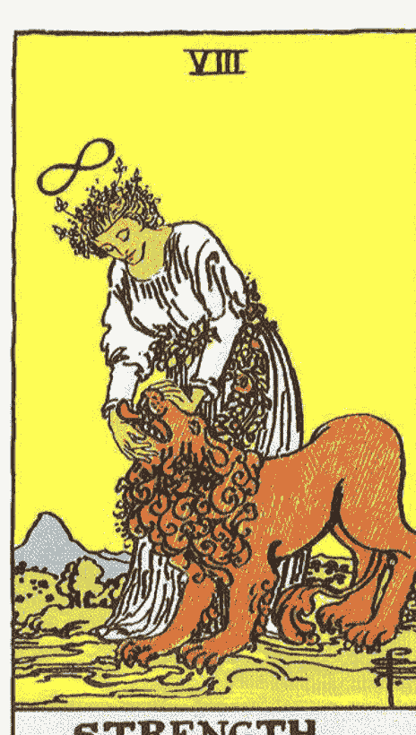

许多时候我们都需要这样的勇气，例如，上台演讲，面试，表演，要求加薪或者晋升，进行踩滑板这样（看起来）危险的体育运动。

除了勇气之外，成功地处理好这些状况也需要自信以及淡定。当事人很可能会遇到挫折与失败，这是很自然的，但当事人可能会受到很大的打击，并且表现出想要放弃和消极的态度。这个时候，当事人就需要像牌面上的女人一样，淡定地安抚自己放弃的冲动。

如果当事人无法成功处理好这些状况，没有勇气做出行动，或者行动了却被失败打击到了，那么他可能就会充满挫败感，懊悔，愤怒，以及不自信，他可能会觉得自己一无是处，并且失去了勇气。这会在力量牌的逆位中表现出。

除了没有勇气之外，力量逆位也可以代表太大胆和自傲，无所畏惧。但这种泡沫堆起来的勇气是脆弱的，一旦面临失败或者挫折，当事人的态度恐怕就会发生180度的大转变，认为自己糟糕透了，什么都做不好。这种过多与不足之间的180度转变，同样也是逆位牌的含义之一。

此外，战车和力量分别代表相反的两种人生计划，分别是“等我有钱了”以及“就算我现在没有钱”12。在前者当中，我们先找个好工作，买套好房子，娶个好老婆，在完成了这些我们必须要做的事情之后，再开始做我们想要做的事情，环游世界，开个个性小店，培养高花费的爱好，学习另一种语言，独立生活，等等。

“等我有钱了”属于先辛苦后享乐的模式，我们也一直被灌输以这种思想。上学的时候，老师会告诉我们，不要贪玩，好好学习，上了大学之后有很多时间可以玩。大学的时候，面对一个很花钱的兴趣爱好，辅导员会告诉我们，放一放，等到工作稳定之后再玩。快毕业的时候，如果我们还怀有梦想，家长和朋友会告诉我们先找个好工作，等以后有时间和金钱了再去考虑这些。

于是就这样，我们把自己想要做的事情一次又一次地往后推迟，并且一次又一次地去做我们“应该做”的事情，期望有一天我们能够从繁重的负担中解放出来，远离学业或者工作的烦忧，期待有一天，“等我有钱了”～

“等我有钱了”也是大众抱有的一个幻觉：在经历过艰难险阻（比如说自己不喜欢的工作）之后，才会迎来快乐和幸福（比如说做自己喜欢的事）。有这么一个故事，说是有一个商人终于捧着大把的钞票退休了。按照一般的观念，他当然是应该开始快乐地享受生活了。结果他享受了几个月之后，又跑去创业了，因为他不知道自己该干什么。艰难险阻的终点并不是乐享天年，如果你今天不知道怎么享受你的生活，你明天也会不知道。

之所以说战车牌能代表“等我有钱了”，是因为战车牌同样强调人在社会中扮演的角色，战车牌的成功也是社会定义的成功（当然，战车逆位可以代表“不是社会定义的成功”，“另一种意义的成功”），战车牌正描绘了一个符合社会期待，找到了好工作，可能某天要娶个好老婆的好青年，他将自己的梦想，热情，幽默和野心都抛在脑后，只求完成自己的职位所要求的事情。这些梦想与热情，在牌面中我们可以说由两只狮身人面像象征。

但是战车牌的牌面是不稳定的，驾车者严肃的神情和貌合神离的两只狮身人面像表示，他必须要刻意去控制和命令，才能够让战车牌继续前进下去。在占卜中，这可以象征当事人虽然表面上一丝不苟，兢兢业业。心中却有着强烈地摆脱自己在社会中现有的身份的欲望，为了压抑这种冲动，他必须用很强的意志力控制自己。也就是，他明明在实践战车牌的模式，却又想要逃避这张牌。

力量牌代表的“就算我现在没有钱”，则是指不去等待，从现在开始就追寻自己的梦想，兴趣爱好，从现在开始做自己想要做的事情。这并不容易，因为首先我们都有等待的思维习惯，比如说，你可以想一想，有没有想要做的事情，但你却告诉自己，等有时间或者金钱之后再去做呢？

此外，“就算我现在没有钱”也需要极大的勇气，尤其是当你想要做的事情涉及到职业与金钱时。其原因，当然是风险，不论是谁，想要做的事情应该都是有些超出他的能力范围的，因此付诸行动也就意味着面对失败的风险，尤其是如果付出行动需要丢掉工作的话，风险就更大了。对此我们都有恐惧，所以代表“就算我现在没有钱”的才是象征恐惧与勇气的力量。

你可能感觉不到这种恐惧，觉得自己之所以没有去做自己想做的事，原因是诸如没钱或者没时间或者需要再考一个证，这些都是借口，我们怀着恐惧不敢承认自己的恐惧时，就会用这样的借口说服自己。在这些借口背后，是对失败对未知还有对成功的恐惧。

虽然有这些恐惧和风险需要面对，但将自己的热情付诸实践将会带给我们更多的满足，我们也会更为投入，会给我们更多活着的感觉，而不仅仅是履行职责，如一个齿轮一般，做着别人认为我们应该做的事情。

你是否有过类似的想法，某天，你要环游世界，某天，你要飞上月球，某天，你要去一次迪斯尼乐园？我曾读到过一句话，“某天决不会到来”，就是说如果你有什么事情想要完成，那么完成它的唯一方法就是去做，而不是等待。到今天我也觉得这句话说得很有道理。

当然不要因为读了这些就变得有勇无谋，做傻事，抛弃妻子了，小子。

## IX 隐士

隐士是一张和教皇相对的牌。在教皇牌中，我们看到人与人之间的连结，以及学习前人的知识，经验，或者教条。那么隐士牌就代表拒绝这种知识与连结，自己去体验感受生活，并从中获得宝贵的经验与第一手知识。

所以隐士是一张孤独的牌，无论在哪一个时代，大部分人都选择接受别人所教的知识，接受别人认为“正确”的事情，隐士作为一个亲身探求的人，自然是孤独的。

那么，这里讲的知识和经验到底是什么？隐士要拒绝的是怎样的知识，要自己去探索的又是怎样的知识呢？原本，这应该是指宗教上的知识，与神相关的知识与体验。因为隐士的这个英文单词，有一个意思是指基督教中的隐士，通过简朴的生活侍奉上帝。引申开来，我们也可以把那些退隐到山林中去闭关的“真人”们算到这一类。

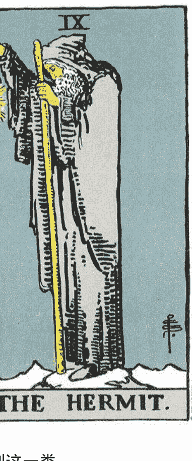

在没钱万万不能的现代社会，隐士会代表这个含义的情况肯定是罕见的。但是仍然，隐士牌可以强调追寻传统观念之外的知识。比如说冥想，瑜伽，塔罗占星之类可以用来探索内心的道具，不过，现在此类文化声势越来越大，倒是更偏向教皇类的群体活动了。总之，隐士既可以代表当事人正在学习它们，也可以代表一个在这方面已经有所造诣的老师。

隐士也特别强调探索自己。当我们回避了日常生活中的琐事，在孤独的时候，我们都会自然地将注意力从外界转向自身，而这正是隐士牌所象征的。不是外物而是内心，不是别人教授的知识，而是自己发现的知识。隐士，就是一张代表由外转内的牌。

隐士牌也可以代表冷淡，对社会性活动，别人的邀请等的冷淡。因为他已经将自己的注意力转向内心了，所以必然地会表现出从日常琐事，应酬这些活动中抽离的行动。Mary Greer 曾说，如果在两性关系中抽到隐士牌，可能其中一位正在度过性冷淡的时期13。

之前也说过，隐士牌也可以代表一个老师，不过呢，说它是向导或者监督更好。教皇牌是告诉你什么是什么，应该怎么做。隐士牌的教导却主要是指路，他并不会告诉你所有的答案，只会告诉你要怎么去找到它们，你仍然需要经历种种艰辛。就如隐士手中提了一盏灯，他并不会手把手地把你带到目的地，却会告诉你路在何方。

## X 命运之轮

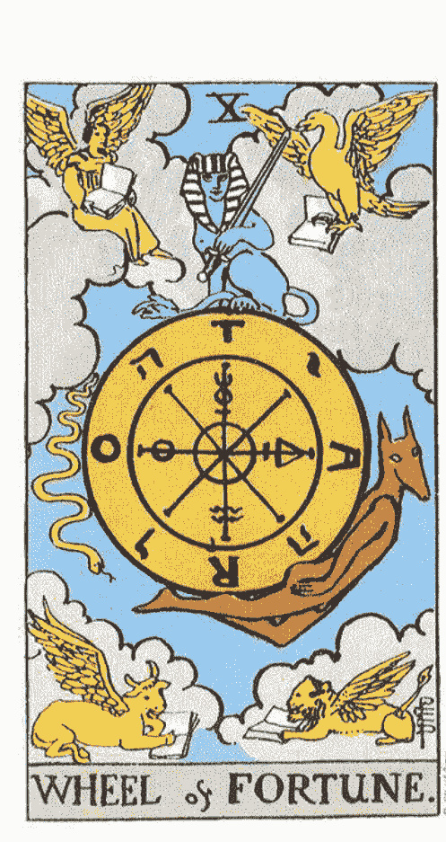

这不是什么命运之轮，这是手气之轮和运气之轮14。风水轮流转，就像斗地主中今天你拿双王，明天我拿炸弹一样，命运之轮表达的就是这些看似毫无规律，全凭运气决定的东西。

当然，除了赌博或者打牌之类的东西之外，股票的涨跌，商品与明星的走红，市场的反应与变化，也是命运之轮代表的。这里的关键词一是变化，二是无规律。

但是，在无规律的表面之下，却是有着特定的法则。就像手气不一定谁都差不多，但确实有打牌打得好的人，成功人士在这些无规律的变化中之所以能够成功，也往往确实有独到之处。就像一句话说的，成功者在失败的时候在自己身上找原因，失败者的失败都是老天害的。

虽然正位可以代表好运气，逆位可以代表坏运气，但我们也可以说，正位代表求问者已经做好了抓住机会的准备，而逆位表示求问者不仅已经让机会白白溜走，还对自己的坏运气大骂一顿。

这样一解释，正逆位代表人的时候，就能有头绪了吧？塔罗牌中不存在只能代表人的牌，也不存在只能代表事的牌。

同运气与手气相关的还有赌博。在有的时候，这张牌可以代表确实的赌博，但它也可以代表类似赌博的心态。在好的情况下，它代表当事人能够不顾自己的恐惧与风险，抓住成功的机会。但在坏的情况下，当事人可能就如赌徒一般，只为刺激和一时冲动而行动，奢望好运能够降临到自己身上，毫不在意自己行动的后果。

那么，如果我们面对一个机会，我们是应该赌一把呢，还是应该考虑到其风险而不行动呢？这是一个没有绝对答案的问题。机会总是伴随着风险的，失败并付出代价的可能性总会存在。到底该怎样行动，还是需要当事人自己做判断，并无标准答案。

另外，这张牌也可以视为代表世事无常。在占卜中出现命运之轮时，可能在占卜的事件发生了突然且无法预测的变化。一般正位时变化被视为有利的，逆位时变化被视为有害的。不过不要就此以为正位的就是好的，逆位的就是坏的。正如命运之轮是一个转动的轮子，有利或是有害的情况随时都可能发生预料之外的大逆转，以为抽到下下签的穷小子可能没多久就搞出一番事业，以为捡到大便宜的高帅富可能明天就撞人了。就如中国的那句古话，祸兮福所倚，福兮祸所伏。

## XI 正义

这张牌的关键之一是天秤的两端是平的。这可以代表一场公平的交易，也就是，付出的金钱，努力，时间，或者其它代价和所收获的有相等的价值。除了金钱交易之外，这也可以适用到一些合同和协商，包括劳动合同，公司之间的合约，作者与出版社之间的合同，独立设计师与雇主的合同，等等。

对于这些交易，一般认为，当正义以正位出现的时候，这场交易是公平的，那么相应的，逆位时就可能没那么公平，比如说，剥削劳动力的合同，不平等条约，签订合约的一方甚至可能带有欺骗性质，意图自己拿尽所有的好处，不给别人应得的部分。

正义也表示要为得到的东西付出代价，付出的将会收到回报。但是千万不要以为这是爱情或是亲情中的付出与回报，感情不是交易，别人的感情也不是可以通过所谓付出而拿下的目标。

正位的正义也能够代表信念，自己所做的事情是对的，以及自己的努力能够看到结果的信念。就像在早期塔罗牌中正义女神背后的骑士，当事人可能深信某个高尚的原则，并将之付诸行动。比如说，不走关系，不通过送红包这种手段办事。也就是我们一般说的正直，即使这种正直在现在这个社会可能会有些难以维持下去，当正义牌处于逆位的时候，就更加表达出人间正道是沧桑了。

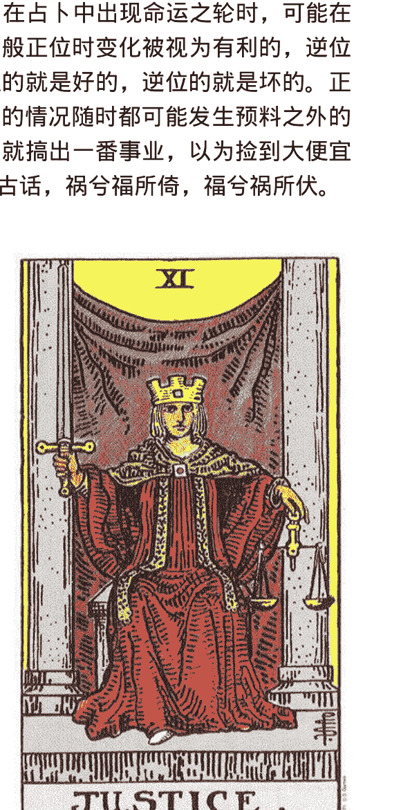

正义中的人拿的剑代表裁决与原则。裁决是不近人情的，尤其是当逆位出现的时候。当事人也许会觉得自己有种种理由和借口为自己辩护，但是如果需要为自己行动付出代价，还是要为自己行动付出代价。这里的行为，可能是犯罪，可能是为了达成目的使用的不正当的手段，不管怎样，这把剑代表这些行为的惩罚。

这把剑关心的，裁决的也只是行为，而不是人的情感。所以正义牌也可以代表太过无情，没有慈悲之心，完全按照法理办事。在正义牌为逆位，以及当事人有对别人做出裁决的权限时，这个意义会更为明显。或者，求问者也可能是被裁决的一方。

而所谓裁决，听起来离我们生活很遥远，实际上并不是。公司的管理人员，学校的老师，监督部分的成员，都有权限让你为不称职的行为付出代价。不过大部分时候，我们都不会只看到行为的对错，会更考虑到情理。

不过，即使没有做出裁决的权限，正义牌也可以代表一个不近人情，只讲法理的人，他可能会对别人的对错进行激烈的反对和批判，不考虑到别人的难处和感受。

当然，说到裁决，自然能想到法庭，法律与官司。正位的正义可以代表官司能有公平的结果，逆位可以代表不公平的审判。此外，逆位也可以代表对当事人不利的审判结果，也就是，降临到当事人头上的审判。

逆位的正义还可以代表的是，当事人自己无法好好衡量与做出选择，也就是犹豫不决和选择障碍。

此外，天平也是商贸的符号，所以这张牌也可以代表字面意义的买卖和交易，也就是生意。不过，如果生意人抽到这张牌，正义牌并不一定代表他的生意会很红火，更可能是代表他在交易中是诚实的，这确实是一场公平的交易，他问心无愧。在正义牌以逆位出现的时候，恐怕就要问心有愧了。

## XII 倒吊人

痛苦与折磨，是这张牌所代表的。相比肉体上的折磨，这张牌更代表精神上的痛苦。觉得人生无望，不知道前进方向，感觉痛苦万分，万事不如意，均有可能。

宿命，如果它真存在，这张牌就代表被宿命抓住的人，他可能会感到无论自己怎样地挣扎，都不仅看不到希望，更是为自己带来更多的痛苦。许多人只怕死神，恶魔，高塔，想来是不了解吊人的牌意的。

这张牌的一个含义是无法前进。无论之前看起来进展有多顺利，现在仿佛都如卡死了一般，不会因个人的意志产生变化。

这种卡在某处无法前进的状态，可能是指外在事件，也可能是指内心状态，当然，也可能是指两者一起。外在具体地说，可以是感到工作百无聊赖，事业处于半死不活的状态，长期地处于低保状态，婚姻的双方吵来吵去却又不离婚。而内在的话，则是与这种生活态度相对应的情绪与精神状态，无力感，受害感，懊丧，悔恨，羞耻，以及看不到明天的太阳的感觉。

吊人也代表以相反的视角看世界，毕竟牌中这个人是被倒吊起来的，他眼中的世界也是颠倒的。

这可以代表面对当前生活中的苦痛，当事人需要转换视角，将注意力从自己一直关注的外在事件中抽离出来。不管是工作，家庭，还是恋情上的苦难，他这个时候都需要放弃挣扎。当事人之前可能将工作或是家庭，或是其它外在的事物视为自己生活的全部，但吊人牌出现的时候，则代表他可能会产生和之前完全不同的洞见。

吊人牌代表奉献，无私，以及自我牺牲。上一段说的“和之前完全不同的洞见”，其实就是“牺牲小我，成就大我”，将个人成败和苦痛放在一边，追求能使人生更有意义的事，不管那是侍奉上帝，还是为小区义务劳动，或者是奔赴灾区，创建或加入公益组织。

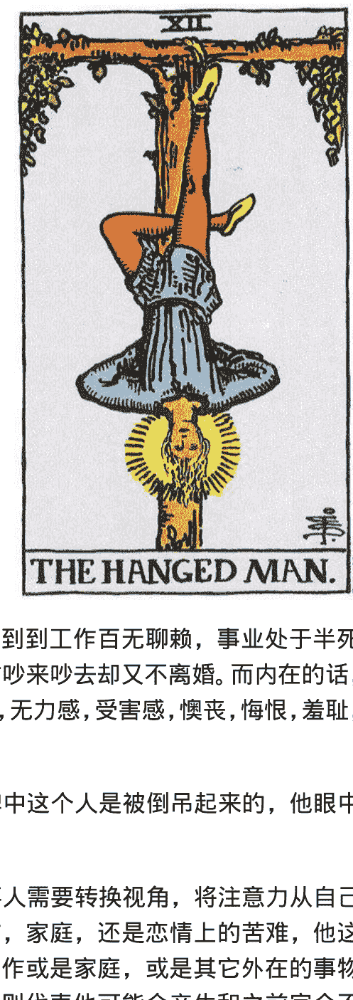

此外，吊人牌也代表救世主，也就是耶稣。所谓救世主，就是为了大众的福祉和更好的世界牺牲自己的人。通过自己的牺牲，为别人的世界带来光芒。在占卜中，这可以代表或大或小的帮助别人的行为。

还存在一种解读是，倒吊的姿势代表敢于和世界不同，和其它人不同，听从自己内在声音的呼唤，做自己真正想要做的事。

当然，这两种解读并不是完全对立和冲突的。我们可以看到，如果当事人真的将自己人生的意义定位为奉献，那么恐怕他也要必须敢于与世界不同才是。现代社会是一个鼓励自私的社会，奉献自我去追求创造更美好的世界，恐怕大部分时候会被视为是不现实，异想天开，严重时甚至会被视为是抛妻弃子，大逆不道的行为。但是这样无私的行动无疑会使需要他们帮助的人看到希望，同时这也可能足够让他们自己找到人生的意义。

但是显然，现代社会本身生活的压力已经非常大，同时我们还要肩负各种各样的责任，许多东西我们不一定能放下。那么，吊人牌代表的放弃挣扎，无私奉献，以及找寻人生的更为重大的意义，到底是不是可行的，是不是应该做的，尤其是，对找上占卜师的求问者来说，是不是他这个时候正需要的？对于这个问题，恐怕我们没有简单的答案，只有当事人本身才能决定，而且，恐怕会要经历一番内心挣扎。

那么，我们应该怎么做，持怎样的观点为好？对此，我认为，占卜师的任务并非是将任何观念或所谓“应该”强加到求问者的身上，而是应该在他探寻自己是谁，找寻自己人生意义的路上，为他提供需要的指引和帮助。而我们可以天真地相信，每个求问者将要追寻的终点，将会是对他自己，他周围所有人，以及世界都有好处，将会带来更好和更快乐的未来。

## XIII 死神

死神代表结束，代表改变。许多人对这张牌有抵触，但是这本身是一个自然的过程，同时也并不完全是有害的。乔布斯被从苹果开除，才又创立了两个给力的新公司。诺基亚的时代结束了，但我们有了屏幕越来越大的触屏手机。

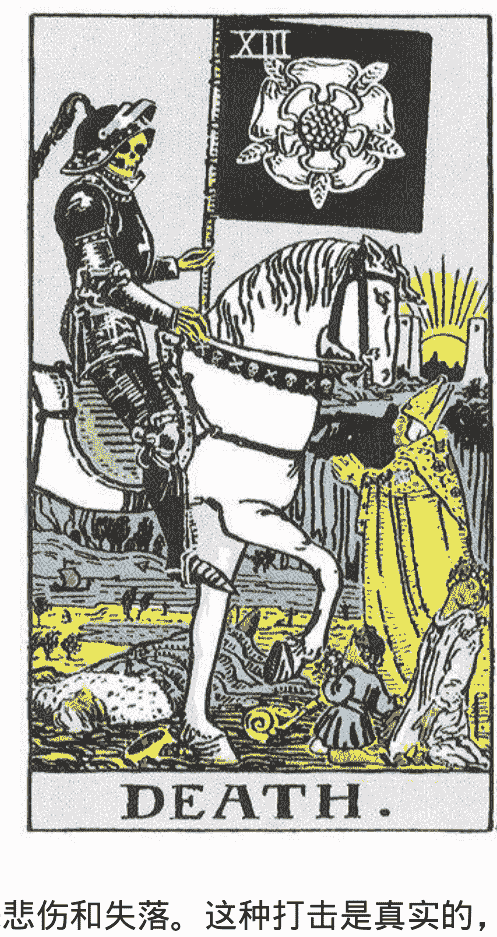

有人认为死神正位代表新开始，逆位代表结束。不用特别这样看，开始和结束本身是并无区别，都是变化过程的一部分。结束和新开始的区别，不过是我们的主观解读。

我们之所以会害怕死神牌，是因为我们害怕这张牌所代表的——改变与结束。因为结束意味着失去，而害怕失去是人之常情。我们会害怕恋情的结束，亲人的逝世，朋友的离别，工作的丢失。越是我们看重和珍惜的东西，失去的时候越是会给我们造成打击，给我们带来悲伤和失落。这种打击是真实的，人也需要一定程度的安定才能保持情绪稳定。

但是，我们也必须理解，结束是不可避免的，是自然的一部分。仅仅是我们不希望它发生，不能改变它必须发生的事实，也不能改变它对我们生活的积极作用。

结束对我们的积极作用是什么？是它能够推动我们前进。随死神牌中河水一起向下流的并非只有小舟，更有在吊人中绑住我们的绳索。如果这个世界上没有死亡，那么世界恐怕将会被一群老不死的支配，同样，如果人生中没有改变与终结，我们恐怕也根本不会成长。

没有让你断肠心碎的分手，也许你无法摆脱那段对你毫无益处的恋情，没有依依不舍的搬家，就没有新环境的刺激和欢乐。

所以说，死神牌不仅仅是代表死亡，更是代表生命力。生命是什么？生命是成长，是变化，而不是静止。

死亡与结束，意味着放下曾经的包袱，让人再一次对自己不那么确信。就如乔布斯说的，当他离开苹果的时候，成功的沉重被替换为重新开始的轻松。死亡本身就意味著新生，只有当我们放下了之前一直背著的包袱，我们才能够开始新的人生阶段。

改变与结束也会带走更多的东西，正如乔布斯说的，“所有外界的期待，所有骄傲，所有对出丑和失败的恐惧，都会在死亡的面前烟消云散，只留下真正重要的东西15。”

> “所有外界的期待，所有骄傲，所有对出丑和失败的恐惧，都会在死亡的面前烟消云散，只留下真正重要的东西15。”

不过不要忘了，正如之前所说，结束本身确实会对人造成打击，正如我们总会需要一定时间才能够从亲人离别的悲伤中恢复过来。当占卜中，面对求问者仍在经受之前的某个“死亡”造成的打击时，并不需要立刻提醒他结束和改变的正面含义，请理解他所承受和经历的痛苦。悲伤也是人生的一部分。

至于死神逆位出现时，当事人则可能没有办法放下这些东西。包括已经取得的成功，对失败的恐惧，自己的骄傲，已经不在的爱，该分别的朋友。这也许是因为无法放手这些“珍贵”的事物与回忆，也许是你恐惧新的开始，以及未知的世界。

## XIV 节制

牌如其名，这张牌代表平衡，以及不走极端。不是非你不可的爱情，不是死命到放弃一切的工作狂。愉快的事情超过了一定程度都将带来痛苦，这张牌就代表努力不让愉快变为痛苦。

这张牌的基调是平和的，和死神中的激烈不同。当这张牌出现的时候，当事人可能也表现出这种平和的心态。

平衡与节制涉及的范围很广，喝酒，社交活动，运动，工作，抽烟，购物，减肥，游戏，甚至包括吃饭。许多东西若超过一定限度，就会造成痛苦。当逆位出现的时候，就有可能代表这种由太过极端而带来的痛苦，不管是太过纵欲还是太过节欲。

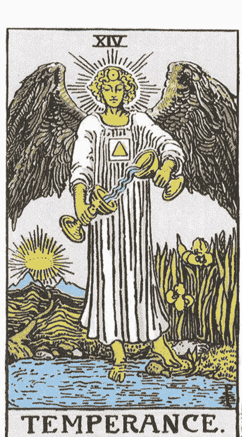

推而广之，正位的节制牌也可以代表有规律的生活，所谓“早睡早起，方能养生”，有规律的生活带来的也正是健康的精神和身体状态，这同样可以算作节制的意义。

当节制牌出现时，当事人之所以不走极端，选择平衡和中庸之道，并不是因为有外力的控制，而是源自于当事人的自愿。也就是说，他本可以纵欲奢华，但却决定不过那样的日子。我们可以想到，节制牌的逆位，也可以代表当事人之所以过着有规律，不放纵的生活，并非是出于自己的自愿，而是源自外界的压力，比如说，老母丈母娘或者妻子的唠叨。

同时，节制逆位也可以代表一种态度，那就是觉得放纵的生活很不错，觉得没有什么必要去控制自己。这种态度并不难理解，毕竟放纵的生活也就是尽情享受的生活，谁不想斗酒十千恣欢谑，谁不想从此君王不早朝？实际上，抛开“纵欲是错误的，是邪恶的”这样符合大众道德观的陈述，以及纵欲会影响我们正常生活这样众所周知的原因，我们会发现，我们难以在我们自己心中找到一个不纵欲的理由。

当然，难找不等于没有。纵欲的生活其实也是难以掌握自我的生活，仅仅是被自己的欲望和冲动推着走，就像宿醉后会觉得，醉酒并不是自己想要的一样。节制并不代表自制力，不走极端并不是因为意志坚定，也不是因为不能够感受到这些享受的美好，而是因为他知道怎样做是合适的，并且会去这样做，因为他能够掌控自己的生活和行动。不管是面对享受，还是面对工作等严肃的事情，他都能够保持冷静和淡定，做出最合适的行动与决定，而不是顺从于一时冲动。

节制牌代表两极之间的均衡。之所以能够做出最合适的行动与决定，也是因为在当事人心中，“自己应该做的事情”和“自己有冲动想做的事情”之间并没有矛盾和鸿沟，而是处于和谐的状态。在我们放纵自己时，这个鸿沟与矛盾对我们来说是存在的。比如说，我们会觉得自己不应该喝酒，不应该逃课，不应该一夜情，不应该暴饮暴食，但是实际上，我们又会想要去做这些事情。这种矛盾让我们此一时被冲动支配，彼一时又后悔不已。

这种矛盾也会让我们两头不讨好，让我们在做着快乐的事情的时候却自知自己不应该做这个，让我们在履行自己的职责时却时刻想着要怎么玩乐 16。这些都可能会在节制牌逆位的时候表现出来。

这个矛盾看起来不可能调和，但是在节制的牌面中，我们可以看到两个水瓶中的液体以不可能的方式混合在一起，这正是代表矛盾的调和与统一，其结果，自然是与身不由己相反的，掌控住自己的行动与生活，在合适的时候做合适的事，为自己带来最好最应该，同时也是最快乐的结果。

此外，两个杯子之间水的对流，也可以视为是思想的交流，在激烈争辩的两种观点之间采取中庸的态度，或者平息两个人的争吵，等等。

## XV 恶魔

不少人都挺怕这张牌，但这牌中不正有许多人梦寐以求的东西么？恶魔牌，代表在物质世界的成功，代表男女之间的“亲密接触”。金钱,美女,帅哥,兄贵,许多人都渴望的东西，正是恶魔牌所象征的。所以看到恶魔牌，而你问的问题又和金钱美女帅哥相关的时候，大可以欢呼，因为你的欲望很可能会变为现实。

但是人并不是欲望驱动的动物。欲望能够满足，不代表能带来快乐。至少，在恶魔牌中,这些欲望的满足也会变成对当事人的束缚,对当事人造成极大的压力很痛苦，引起他的怨苦痛与哀伤。

一份钱途无量的事业可以变成日复一日的负担，一个温柔漂亮的女孩可以变成充满嫉妒心，还死不放手的黄脸婆。最开始，是他想要抓住自己欲求的东西，但最后，他的欲求之物却抓住了他。

但是，恶魔牌描述的人，他们的痛苦并非真的来自于外界，或者自己的欲望，而是来自于自己的固执，固执地认为自己没有救。在这种愚蠢信念的驱动下，他们才会产生各种负面情绪，而这又会一次又一次给自己施加痛苦。

-   比如说，觉得工作不好，但自己绝对不能换，并为此四处抱怨。
-   觉得家庭关系不好，但自己毫无办法，因此心中充满憎恨。
-   觉得自己无论如何都无法获得异性的青睐，因此干脆对异性仇视。

要改变人的行动很简单，但要改变人的死脑筋却很难。恶魔中的人看不到改变的希望，并不是因为希望不存在，而是因为他们自己看不到，并且不会承认自己看不到。如果他们能看到，他们就不会继续被束缚了。从这个角度来讲，他们是被自己束缚了。

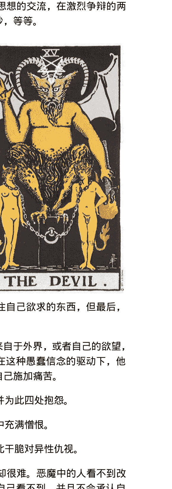

所以说，在和恶魔牌强烈的求问者交流的时候，请注意理解他们。他们也许会看不到我们认为很明显的事物，而如果你将你看到的希望强加到他们身上，或者因为自己的话语无法进入他们的心中而耿耿于怀，那样，你的行动也许只会使他们更深地陷入对世界，以及对自己的憎恨中，同时增加他们的无力感。

恶魔牌代表的人可能会表现暴力，自残，嫉妒，成瘾等各种各样和的恶意情绪与行为。请注意，可能。他多半会觉得无法控制自己的行为以及情绪，而这并不是夸大其词。现代人拥有一个幻觉，那就是我们可以随意掌控自己的行动，这并不正确，很多时候，我们会觉得负面情绪如火山一般在我们的脑中爆发出来无法阻止，而这些情绪会控制我们的行动。

比如说殴打自己孩子的父母，当然这有确实是父母本身太过恶劣的情况，但也有可能他觉得当时一阵烦躁与愤怒的情感冲上头，在反应过来之前就把孩子给打了。

再比如说之前有报道的，对丈夫的重要部位痛下毒手的女子，她如此做的原因仅仅是对方提出想和她离婚，而认定对方有外遇，下手之后她不停地喃喃，自己为什么会这么做。令人发指的是，在之后，她竟然再一次地对丈夫的同一部位再下毒手，因为这样她的老公就再也不会找别的女人了。

这确实是个疯女人，但是我们就没有经历过一个瞬间，在其中我们被涌上的负面情绪或是诡异思维控制，在语言上或者行动上伤害了我们在乎的人？我们应该都有过这种经历，并且我们都可能再做出这样疯狂的事情。上面讲的疯女人仅仅是在疯狂的程度上要比常人更进一步，如果我们因此以为，我们和她在本质上拥有不同，我们是正常的，而她是疯狂的，那就是五十步笑百步了。

而难道你不觉得，在我们被这些负面情绪控制的时候，就犹如被恶魔控制一般吗？被我们心中的恶魔。

没错，恶魔存在于每个人的心中，暴力与残忍存在于每个人的心中，这正是为什么我们会如此地害怕恶魔牌。我们想要维持，自己是“好”的，是善良的这样一个自我印象，会想尽一切办法逃离我们心中的恶魔。

这种逃离是正常的，但是有的时候我们不得不面对自己的恶魔，那正是当我们长时间地被其控制的时候。当我们不再是偶尔地对别人表现出嫉妒憎恨与恶意，而是持续性不由自主地去表现出这样的态度的时候。

也就是恶魔牌有时会代表的，当我们被恶魔束缚的时候，当我们被恶魔附身的时候。

这时候，我们有两种可能的态度，其一是拒绝承认问题在我们自己身上，也就是说，会归罪到别人身上，觉得是其它的人，组织，社会，国家，制度，这些造成了我们的悲惨，让我们不得不去憎恨，痛苦，仇恨，抱怨。

其二是开始自我否定，觉得这都是自己的错，认识到痛苦来自于自身，自己之所以会被“对别人的恶意”这类害人害己的情绪困然，是因为自己是坏的，或者说，因为自己就是恶魔。

无论哪一个，当事人都会觉得，自己无力改变这个现状，然后他会自暴自弃，并且继续伤害和自我伤害，这种伤害最常见的是情绪上的，但是如上面例子中所举出的变为肉体上甚至生命的伤害也是有可能的。

至于怎样才能摆脱这种情况，并不存在简单的答案。许多塔罗书中会说，恶魔牌中被恶魔奴役的人，他们脖子上的锁链实际上是松的，所以他们只需要看到这一点，然后拯救自己就行了。这是一个合理的牌面解释，但是并不能帮助到真正陷入恶魔牌的困境的人——你不能期待，告诉他们“你脖子上的锁链是松的！”就能把他们解救出来。

那么究竟该怎么做？视情况的严重程度而定，严重的话，送去心理医生，不严重的话，建议其去看心理医生。我是认真的，塔罗读牌人不能解决求问者遇到的所有问题，也不能给出所有的答案。恶魔牌恰巧是极难解决的问题中的一个，这个时候安心地交给专业人士很不错。或者，如果你有相关专业知识，那如何做就不需要我的建议了。

好吧，如果你实在需要建议，碰上这种情况的当事人需要明确地决定自己要改变。当然这看起来并没有想起来那么简单，就像人不会一拍脑门就决定改变熬夜，抽烟，喝酒，不锻炼等坏习惯，敢于改变自己的勇气相当罕见，大部分时候当事人会说，嗷我等几天再说，或者又不是我的错，都是别人引起的，都是环境的错。啊，天，我真受不了这些呻吟来呻吟去又不去改变自己境况的人……人只有自己能救自己，尤其是恶魔牌这种状况，要么在地狱里被烧死，要么自己爬出来。

当然，如果当事人只是偶尔一次地和朋友吵了一架，你倒没有必要转交给专业人士……

林林总总说了许多恶魔牌的“可怕”之处，但是认定恶魔牌是坏牌，讨厌恶魔牌，也就意味着逃避恶魔牌所代表的我们的生活中的一部分，以及我们自己中的一部分。尽管逃避也是自然的行动，但是一个塔罗牌学习者对恶魔牌必须有正确的观念，或者说，面对它的勇气，不能一看到这张牌就害怕。如果你都无法面对这张牌，你能怎么期待求问者有勇气面对它？塔罗读牌人的使命是让求问者能够更好地面对他的生活，而不是传播恐惧，担忧，以及没由来的害怕。

恶魔牌是逃避不开的，因为我们无论怎么逃，也逃避不了我们自己。人不是神，也不是天使，人并非完美的生物。无论怎么逃避，我们会都有缺陷，会无知，会有欲望，会有痛苦，也可能会暴力，也可能会自残，这和道德无关，这是人性的一部分，假装自己心中并不存在这些，假装自己不有欲望，假装人心中的恶魔不存在，只是伪君子而已。

## XVI 高塔

同恶魔一样，这张牌招来了不少人的讨厌。突然的灾难，毁灭，已经建立起来的稳定生活一夜消失。同死神表达的结束与改变不同，这张牌代表的确确实实是“灾难”，类似雷劈一样，外界突然强加给你的灾厄。你也许会觉得自己躺着也中枪。

这张牌也特别强调原本稳定的东西被破坏。稳定的工作被炒掉，或者因为经济萧条等外界因素而不得不丢掉，幸福的家庭突然变得居无定所，以及好好的封建王朝被西方列强撬开大门。

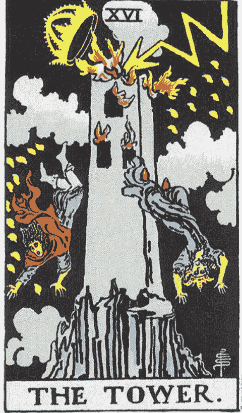

此外，这张牌也代表牢笼的破灭，逆位时可以有牢笼尚未破灭的含义。我们说星星是自由，但是首先只有不自由的人才会渴望自由，想要自由就等于承认牢笼的存在。从牢笼到自由的过程，也就是从塔的逆位到星星正位的过程，其中的过渡阶段就是塔的正位。

牢笼本身也应该是一个稳固的结构，让人认为其牢不可破。注意只是认为，而高塔的出现，除了是天灾，对当事人来讲，更重要是让他认识到自身的愚蠢。

经文中说，“除非上帝建造了这座房子，他们所作的都是无用功。”注意此牌中被劈的塔，其实也就是一个房子。人造的房子象征人类浅薄与肤浅的观念，神造的房子代表真理。而天雷劈塔，神之怒的降临，即象征人的观念被击碎，仿佛凭空听到了一声巨响——“太天真了！”。

在占卜中，人造的房子，或者说牢笼，可以同时象征外在的事物和头脑中的观念 17 。比如说，一份无聊的工作，以及对应的“自己一辈子就这么平庸了”的想法。家庭主妇的身份，以及“孩子长大之前我都尼玛不能去旅游了啊！”的想法。再比如，创业者的身份以及“等哥把公司以数万美元卖出去之后，看哥怎么享受”的想法。

实际占卜中，可能是物质的牢笼被毁灭，可能是当事人的观点发生了改变，或者两者都有，如果塔是逆位的话，可能只是受到了冲击。虽然这里把塔说得好像是“没那么坏”，但塔对当事人仍然是危机，尤其是，塔确实可以代表外在环境的剧烈的突然的变化，类似千万遗产付之一炬。

继续谈人造的房子。牌中的塔颜色是灰白的，这代表无聊，无趣，以及毫无生气，已经是死物。

比如说之前说的创业者和打工仔，等待把自己公司卖出去的创业者和等待退休的普通工作者并无太大区别。两者都觉得自己的工作是无趣的，他们唯一的希望存在于某个遥远的将来，可能出现的救赎。他们已经消失了当初建立起高塔的热情与投入，工作对他们也只变成例行公事和等待，在这种情况下，被洗牌也是应该的了。

再比如说，已经毫无存在理由的爱情，却还是抓住不放。已经不知为何要读大学，却还淡定不已。已经不再的信仰，却还假装信徒。人害怕改变，即使要让他们放弃对自己有害的，去追求自己的热情与梦想，他们许多时候也宁愿守着固有的东西。在这个时候，他们自己内心对改变的渴望，以及社会的优胜劣汰，还有…如果你相信的话…宇宙往更好的方向前进的动力，将会把这份改变强加到他们身上，对他们，就是经历高塔的时候了。

高塔表示的人是怎么样子的？因改变而受到打击，在打击中看到些微的希望，以及，如果高塔在逆位的话，在牢笼中的人无端的愤怒。因为愤怒是和破坏联系在一起的情绪，神之怒能确实地击毁高塔，而人之怒至少是在表达高塔毁灭的希望，尽管当事人不一定会承认。

让我再提醒你一次，尽管我这里解释了许多高塔牌可能有的意义，以及理解高塔中的毁灭的方法，但是仍然，高塔牌出现的时候，当事人可能仅仅是天雷的牺牲品。因地震海啸等自然灾害失去亲人的人们，再怎样瞎编这个事件的积极意义，也不会抚平他们的伤痛。

让我再强调一次，塔罗中没有好牌与坏牌，生活中，我们不可避免地会遇到让我们伤心与难过的事，有时候会像高塔一般，我们没有选择的权利，它们就那样发生了。这个时候，许多人倾向于排斥这些经历，而将高塔牌视为坏牌也是这种态度的一部分。

但排斥我们讨厌的经历只是权宜之计。它对我们造成的打击总会是巨大的，会让人想要逃避。但是人逃不开生活，逃不开他的过去，以及他自己。他必须面对，接受这些经历，作为一个整体接受自己的生活，作为一个整体接受自己，否则，那份打击总会如幽灵一般提醒着他，带给他痛苦。我们都希望人生能总是快乐的，但排斥不快乐的经历并不会带给我们快乐以及继续人生的力量，而接受不快乐的经历会。

## XVII 星星

这就是自牢笼中走出之后的自由，风暴后的平静。高塔中的人感受着内心的冲突，与外在的灾难，自己的情绪也变得激烈而无法控制。这些在星星中都消失了，只剩下平静的人，以及从牢笼中走出，才发现的新的自由。

这些意义在实占中的表现会是：当事人感受自己和以前大不一样，能够自由地表达自己，不再感到内心的冲突与暴躁，而是因为清楚自己是自由的而能保持平静的态度。

“能够自由地表达自己”，表达的到底是什么内容，通过什么媒介表达？首先，可以表达观点，之前不敢开口讲出的话，害怕是禁忌或者惹人耻笑，现在已经能够自如地谈论了。其次，可以是通过行动实现自己的想法，不管是踩着滑板环游世界一周，辞去高薪职业跑到非洲丛林里去研究原始语言，都有可能去做。当然，他想做的事情在“有悖常理”的程度上可以小一点，比如说一个家庭主妇把孩子安顿好，自己跑去旅游，一个大学毕业生跑去创业，或者是穿着不寻常的服饰。

你可能会想到愚人也有类似尽情去做自己想做的事的含义，但是愚人和星星是有着不同的。虽然同样不受世俗观念和别人眼光的影响，但愚人属于另外一个世界，他跟着自己的直觉随波逐流，想要做什么就做什么。而星星是，之前有着高塔的被禁锢，之后再明白：自由是自己的，因此，他能去做自己想做的事。

所以说，这张牌的自由，并不是指外在环境，并不是指你有大把钞票可以去你想去的地方，有大把魅力能够把你想把的妹，有大把闲心能够逃课到“只要胆子大，五一变暑假”，不，这张牌的自由是一个内在的状态。

这张牌的自由是：你知道自己是自由的，以及自己能够做，可以做，并且会去做自己想要做的事，并对自己有足够的信念。

所以，你也许没有大把的钞票，但是可能知道自己真正需要的是什么，而不是仅仅追求持有奢侈的物品，你可能从学校中退出，但却知道自己的人生方向。你可能在创办一个小小的公司，但你却知道它的意义以及目的何在。

注意我一直在强调“知道”这个字，并非是因为我想要让这个牌意写得玄乎，而是在指出事实：自由和束缚主要来自我们自己，正如在讲解高塔牌时，我也一直在强调外在和内在两个方面的含义¹⁸。

我们可以举出几个简单的例子。我们都听说过搭车游，穷游，等等各种节省钞票旅游的办法，但是大部分人应该是没有去尝试过，即使是想要旅游的人。理由诸多，时间不够，要工作，外地不安全，等等。我们也都耳闻目染了许多国内外创业者的故事，但是许多创业者仍然在踌躇着，同时给自己塞满理由。

当这张牌以逆位出现的时候，牌意可能就会偏向于种种理由，种种理由不去表达自己，继续拖延，接受现实，还同时将自己不行动的原因责怪到环境上。所以，这也反应了“延迟”这个逆位关键字。

正如正位是“知道”，逆位就是“不知道”，正位是“有信念”，逆位就是“无信念”。所以，逆位就是迷茫，看不清，对自己没有信心，自己认为是周围环境或是未来有太多的风险等等，在阻碍自己的行动，但实际上，并非是未来阻碍了人的行动，而是自己心中的动摇。

如果你无法信服上面的事实。用理性的眼光看看吧，亲。风险和困难，做什么都是存在的，许多杰出人士往往面对别人未曾面对过的困难，比如说霍金，他们能够克服这些困难，显然并非由于外在环境。同理，无法克服这些困难，也并非由于外在原因。当然，如果你对当事人说了这样一番话的话，他们说不定会继续说，自己不比别人，自己能力差，等等。这就显示出之前说过的，“无信念”，也就是没信心¹⁹。

## XVIII 月亮

星星牌中自由地表达自己和战车牌形成了一个对比。在战车牌中，我们首先是社会分配给我们的角色，其次才是我们自己，我们的观点与行为并不因为我们的意志而产生，而是因为我们处于这样的职位必须这样。比如说商人必须利益第一，律师不能以玩笑的嘴脸接待客户，再比如上班族得要穿正装，没错，穿正装是应该的，但是那个时候的你更多的是一个职员更少的是你自己，不是么？

那么相对的，星星牌就代表我们首先是我们自己，其次才是社会分配给我们的角色。星星牌代表着有自己的喜好自己的原则，并且不愿意因为自己的社会角色而做出太大的妥协。用通俗的语言讲，这常常代表着有个性和创造力，在许多新兴行业20中，这样的自由也是被鼓励的，实际上很多新兴行业也对应星星牌。比如说谷歌的工作环境充满了舒适放松，据说上下班时间都可以不固定，在这样的环境下的员工，不正是星星牌的用力展现自我的代名词么？

当然，最后提醒，不要看到这张牌就会觉得很开心，一切都很顺利。好和坏只是人的判断以及好恶。一对夫妻如果只是因为要负起“对家庭的责任”之类而在一起，星星就会代表抗拒这种责任的倾向。同时，不受环境和常识的限制，也意味着这是一张比较“飘”的牌，离根基，基础，安全感，以及稳固这类元素很远。如果求问者恰巧处在一个需要这些元素的情况下，嘛～人生几何时，怀忧终年岁。

恐惧，不安，担心，犹豫，以及癫狂。恐惧和疯狂是这张牌的关键。

月亮的恐惧，并不是躲避危险的那种恐惧，类似动物对火的恐惧。月亮的恐惧，是类似小孩独处于空旷或者狭窄地方时，在他们心中产生的恐惧，或者许多人对所谓“鬼”的莫名恐惧。其恐惧的对象一般并非外在世界中实际存在的，看得见摸得着的东西。

那么月亮的恐惧到底来自何处？当然来自于人自己中，当事人带着这种恐惧看世界时，由于杯弓蛇影，看到本来没啥的东西都会觉得害怕了21，这就又切合了“幻影”这一关键字。

具体地说，当事人可能总觉得别人对他有歹意，别人心怀不轨，或者，如果足够严重，到处的房子看起来都像是要塌下来了一般。疑神疑鬼，草木皆兵，杞人忧天，杯弓蛇影，拿来这个时候的当事人是很合适的。

再比如，当事人也许会觉得其他人针对他，或者是自己的不幸都是某某人造成的，当然，在月亮牌出现的时候，他的这些想法不一定是正确的。他可能仅仅只是在将自己内心的恐惧和不安投影到外界罢了。

月亮牌中的不安和恐惧是关于当事人自己以及他自己的内心的。就好像走夜路的时候，有的人会觉得前方的景色，身边的黑影，以及各种声音很可怕，实际上只是当事人自己害怕了而已，这些东西中本身并没有真正危险。

这种恐惧与不安并非是我们所能够控制的，即使我们告诉自己要淡定，没什么好怕的，骇人的图像也会不停地钻进我们的心中，我们的身体说不定也会自己颤抖起来。这是自然现象，在被恐惧支配时，我们显然不能如我们完全控制我们自己。

想象力，梦境也是这张牌所代表的，尤其是，无法控制的想象力和疯狂的梦境。所以说，噩梦也是这张牌的牌意之一。无法控制的想象力，具体地说，就像是水中的龙虾看到两只狗狗会不自主地在脑中浮现它们吃掉自己的场景，当事人可能也无法将“别人企图加害自己”这个念头抛诸脑后。

想象力是联接潜意识的钥匙，而潜意识是我们无法控制的。并非是因我们想要恐惧，所以才会恐惧，而是因为我们不得不恐惧。类似，当事人对外物的不安，也是理智所无法驾驭的，不管其不安的形式具体如何。比如对未来的不安，对恋情发展的疑惑，担心在街上遭遇歹徒，害怕工作突然丢失，或者疑心自己得了什么疾病。

上面说的这些不安，每个人都会有，这些不安是否严重到有我这里所说，则视情况而定。可能有同学会觉得，这些不安很理性啊，确实是存在这些危险，做出一些防范也是应该的，在某些情况下确实如此，但我们这里说的显然是害怕过度的情况。此外，这张牌代表的并非是外在的这些危险，而是当事人的情绪，他自己所感受到的不安。

新人解读塔罗，容易将注意力集中在外物上，但对于月亮这张牌，我在上面说到其重点并非是外在的危险，而是人内心的情绪反应，他自己心中的不安。这应该会让新人感到疑惑，因为这不符合一般人的思维与理解，当我们谈到不安与恐惧的时候，我们的注意力总是放在不安的对象上的，而不是不安这个情绪。

比如说，当事人应对不安的方式一般为，通过各种手段确保自己害怕的事情不会发生：害怕歹徒就带防身用具，害怕被甩就严加看管，等等。我们安慰当事人的时候，也通常会说，他们所担心的事情并没有要发生的先兆，这个男人是个好男人，本城治安不错等等。这就是普通的，正常的，一般认为合理的思考回路。

但如果你有一些塔罗读牌经验的话，你可能已经发现，这个思考方式解决不了问题。即使你解读出这个男人是个绝种好男人，将之详细地告诉对方，对方也连连点头说准，她还是会不安，为什么？因为不安的源头是内心，来自外界的安慰只是暂时缓解，不能消除不安。但当事人自己不会意识到这一点。

在解读这张牌的时候，即使很明显她的不安是没有道理，过于敏感，你也不一定能让她意识到这点。本来，如果她能够意识到这是自己的问题，能够去面对它，她也就不会去借外力来逃避这个问题了。

之前提到的月亮的癫狂，表现之一便是，分不清楚幻想与现实。如果我们仔细去想，杯弓蛇影，草木皆兵这些本身已经带有一点分不清幻想与现实的味道在里面。在极端的情况下，当事人眼中的世界将会丧失其客观性，沦为表达其内心幻想与情绪的媒介。比如说，他可能会觉得自己是救世主，或者觉得整个世界都如地狱一般，全部在折磨他。

在上面举的这两个例子中，第一个表现了当事人对自己能力与优越性的肯定，或者说自大，以及用其拯救别人的“美好愿望”，第二个则表现了当事人所感受到的孤独与自己所受到的折磨。但是，在这两种情况中，他们都将自己心中的东西强加给了世界，没有看到世界的本来样子。对这种人，我们一般的称呼为：疯子。

那么，我们要怎么面对这张牌，面对自己的恐惧，不安，噩梦，怀疑，甚至癫狂？这是一个难以回答的问题，不过这里我还是说说我的答案：保持淡定，看清事实，缓步前进。恐惧来源于我们的内心，遮蔽了我们的双眼，但我们可以选择慢慢地看清楚事实，而不是被恐惧与自己的想象力所控制。如此，我们才能如湖中的那个小虾，看清眼前的道路，踏出第一步。

## XIX 太阳

不管正位还是逆位，快乐都被视为是这张牌的关键字，只不过逆位时程度要小一些。尽管这种传统解读有些太过绝对，它还是说出了太阳的本质含义之一的：单纯而绝对的快乐。

什么是单纯而又绝对的快乐？在举例说明之前，先认清一个事实：大部分时候人生是无趣的，我们做着重复性的工作，习惯性地摆出笑脸，却不一定发自内心地喜爱我们正在所做的事。但当太阳牌出现的时候，它代表的就是全然的快乐，驱赶掉了我们习惯性的麻木，它是一种无法抗拒的激动，不仅占据了我们的整个头脑，也占据了我们的全身。无论你在做什么，当出现太阳牌的时候，你有着真正活着的感觉，以及对自己所作的事情的热爱。

阳光是一种能驱散黑暗的东西，当这张牌出现的时候，它带来的快乐也将驱散掉负面情绪，虚假的信仰，以及无聊和木讷。如果你正在进行一个项目，那么当这张牌出现的时候，你将没有以往的对项目未来发展的担忧，对各种小细节小错误的烦躁，对工作环境的抱怨，而是能够集中注意力到推动项目发展上。

如果是感情中遇到这张牌，那么两个人之间曾经的隔阂，相互的不信任，在恋爱过程中各自经历的痛苦，或者用通俗的语言讲，受到的伤害，都将烟消云散（至少是暂时烟消云散），能够好好地享受两个人在一起的时光。所以说，这可以是一张代表热恋与结婚的牌。

集中注意力到关键的事务上，感到充满动力，单纯的快乐，原本的负面思想和担忧的消散，不再在浑噩中度日，以及，仿佛这一刻能感受到人生不是毫无意义的。这些也是太阳关键字的一部分。

之前的月亮牌有质疑和不安的意义，到太阳牌中，这些不安将被信任取代，事实也将驱散怀疑。因为在阳光之下一切都能看得很清楚，所以这也是一张开诚布公的牌。正是因为开诚布公，所以才能驱散怀疑。不管怀疑的对象是男人出轨，女人劈腿，事业伙伴，宗教信仰，人生观，性取向，还是研究成果，科学理论，论文造假，考试作弊。

所以，如果男人确实出轨了，女人确实劈腿了，理论确实弄错了，论文确实造假了，考试确实作弊了，男朋友确实和前男友跑了，恐怕也将会被“开诚布公”。

你可能会觉得，要是占卜考试作弊会不会被抓，不应该表示作弊成功之后的欣喜么？看起来合理，但作弊成功并不会给人带来“单纯而绝对的快乐”，恐怕更多的是悬着的心终于放下来的安心，以及侥幸。毕竟作弊不是正大光明的，但太阳牌是正大光明的。

所以太阳牌出现的时候，我们可以想到，小人不会得逞，反倒会曝光，至于当事人是不是那个小人，就得看情况了。

信任和信心也可以是这张牌的关键字。可以是当事人对人生的信心，一切都会变好的信心，对恋情的信心，对就业前景的信心。至于信任，除了可以是和恋人，伙伴之间的信任关系之外，也可以是别人对当事人的信任。之前说，太阳牌是一张开诚布公的牌，所以当事人可能也通过这种开诚布公的方式，“将自己的心掏出来给别人看”，而赢得了别人的信任，不管哪个别人是丈母娘，是客户，还是上司，或者是班主任。

## XX 审判

你真正想要做的是什么事？你真正想要成为谁？在理想的情况下，当审判牌出现的时候，你也许就能够回答这个问题。

审判牌可能代表，你的胸口正回荡着一份召唤，教唆你去做某件事。去休假，去培养一个新的爱好，去旅行，去开创新的事业，去写书，去绘画，等等。不管是哪一个，审判牌代表，你会想去做这些事情，并不是因为外在的影响，而是因为你内心的渴望。

你也许会觉得，自己的每一个想法都是“内心的渴望”。但事实是，人的大部分想法和欲望都是不受人自己控制的，我们不想死，这是由我们的肉体决定的，我们想要更多的钱，这是由我们的当前时代决定的，因为在这个时代里钱被视为是好的，而我们想要好的事情，但好坏的观念也是文化赋予我们的。所以，我们的大部分想法可以说是被决定的，由外物引起，或者说，由外物在我们心中的投影引起。

审判牌出现的时候，去做某件事的冲动并不是由这些因素引起，并不是因为应该做这件事，或者现在做这件事很好，而是因为从你的内心升起了这样一股冲动，或者说响起了这样一声召唤。

所以我们这里可以看到一个很有趣的现象，我们以为是自己想法的东西却是源自外物，源自我们自身的对我们反而是一种“召唤”。

召唤，没有人会“召唤”身边的人，召唤者和被召唤者之前必须要有一定的距离，就像皇帝殿下的召唤。所以，“来自内心的召唤”这句话，其实也在暗示着，这里说的内心是一个和我们有一定距离的东西，对我们是陌生更胜于熟悉23。

这张牌中的“按照自己想法行动，将限制与别人的想法抛诸脑后”不同于愚人与星星。在愚人中，你只是跟着自己的直觉走，如同一个流浪者，不知道要到哪里。在星星中，强调的是不受角色限制地表达。但在审判中，强调的是“召唤”，内心的冲动在召唤你前往某一个特定的方向。审判牌强调有明确的方向感，这是它与这两张牌的不同。

所谓明确的方向感，在最好的情况下，可以代表人生的目标，存在的意义，在那一刻，当事人会感觉知道自己为什么活着，会感觉自己来到这个世界是带着一个明确的目的和使命的。所以审判牌也常被视为代表人生的十字路口，我们作出重大改变的时刻。

十字也在审判牌中天使的旗帜上出现，两条线的交会更代表两个世界的交汇：一个是空间与时间的世界，一个是灵性与永恒世界。这也许很难理解，但这个符号代表活在现在这个时间，此处这个地方的渺小的我们，对永恒的惊鸿一瞥。永恒是什么？从贴合实际的角度来看现在我们所探讨的观念，它可以指藏在我们日常行动与工作中的意义。让世界变得更好，为全人类的福祉工作，对知识的探求等等。我知道这些东西离我们的现实生活很远，但是，不是每个人每一天都站在人生的十字路口上的。

当然，不可能每一次出现审判牌的时候，当事人的人生都会发生重大转折。明确的方向感，也不一定会上升到人生意义这样的高度。

审判牌有一个关键字是重生，就如画面中从棺材里升起的死人。但是要重生，必须先要死一次。当然，我们不大可能在现实中遇到死而复生这样的事情，更多地，我们会遇到这个符号象征的东西：救赎。并非来自救世主的救赎，而是人自己的救赎，如同《肖申克的救赎》中的那样。

那么，救赎是什么？两个方面，其一，是摆脱过去的阴影。其二，是迎接新的生活。应该说，两者是一体的，因为摆脱了一直缠绕在心中的阴影，才会随之而来产生有如释重负，以及重新做人的感觉。

这种过去的阴影，尤指心理阴影。可能是过去的某一个让当事人懊悔的事一直无法忘记，可能是过去自己所作的错事一直感到罪恶感，或者是过去发生的事在当事人心中留下的伤口。不管是哪一个，当审判牌出现的时候，当事人正在接受这些事实，并接受新的生活。

注意是接受而不是忘却。我们也许会想要忘掉自己不喜欢的过去，但忘却仅仅是逃避，这张牌代表的是清算。就如最终审判会对灵魂生前所作所为进行清算，引向新生活的钥匙并非藏在逃避与忘却中，而是清算。

是否你无法找出这和死神的区别？毕竟同样是和过去诀别以及新的开始。区别在于，审判牌告别的是过去的回忆，过去的阴影，死神牌告别的是事情本身。比如说假设一个人在重要的人死去之后过了很久才走出来，此时重要的人的死去对应死神，他在多年后的走出阴影对应审判。

若是审判牌处于逆位，那么这个阴影恐怕仍然困扰着当事人。其表现的方式，并不一定是当事人会一直想着这件事，可能会从当事人不经意的行动，长时间的精神状态，情绪，以及对让其产生阴影的事的态度上体现出。

审判牌的逆位，还可能的含义有诸如抵触自己心中的召唤，不去做能实现自己人生意义的事情，或者对别人能不受外在限制表示嫉妒或者不屑，等等。

## XXI 世界

许多人认为世界牌是一张好牌，但却不知道好在哪里。在他们眼中，世界牌似乎就如童话和电视剧里的大团圆结局一般，代表着完美，圆满，以及，“从此过上了幸福的生活”。

一定程度上这可以算是对的。作为大阿卡娜的最后一张牌，世界代表努力有了回报，以及经过付出之后获得的成功。当事人也会相应地感到由此而来的满足感，以及全世界都被点亮的感觉。

但这只是世界牌的一种情况。而且，相比于完美与圆满，这张牌更为强调的是“和谐”。如果说之前的审判牌代表超越限制，那么这里的世界就代表在限制中起舞。

世界牌并不代表当事人想做的任何事情都能够完成，当事人的任何愿望都不会实现。世界牌代表的是，当事人已经在现在的环境和条件下，做到最好了。

当世界牌以正位出现的时候，当事人可能并没有想过要实现自己的奢望，或者定下太过宏伟的目标。之前说过，世界牌是一张很和谐的牌，当事人并没有在和谁斗争，也没有尝试完成不可能的任务。他只是在利用环境中可以为所用的东西，为自己带来相对最好的结果。

有的时候，这种和谐也会对当事人不利。塔罗牌和人生都没有绝对的好坏，有的时候需要和谐，有的时候需要冲突。永远都和平并淡定的只有待宰的羔羊。

那么什么时候会需要冲突？比如说，工人的工作环境突然变糟，老板突然不照合同出牌，各种情况。

当然，和谐也会有和谐的好。当世界牌出现的时候，当事人可能会有“一帆风顺”的感觉，仿佛周围的一切都是在帮他一般。这是因为当事人自己并没有摆出一副和谁斗争的态度，或者是试图完成不现实的举动，当事人认清了现实，也认清了自己的界限。比如刚开始锻炼的人若是直接尝试高强度训练，就是没有认清现实，自然会失望，若是他量力而为，就有可能看起来很顺利地逐渐变得更为强壮。

所以说，这张牌并不是代表当事人福星当头，更是强调他本人的态度。在韦特塔罗牌的大阿卡娜中，一直或明或暗地强调的一个观念便是：我们的看世界的方式造就了我们各自的世界。如果我们认为自己不会成功，我们就不会成功，如果我们认为全世界都对我们有敌意，那么世界就会有敌意。在大阿卡娜的最后一张，世界牌中，代表的态度是认为整个世界是对自己有利的，认为整个世界是在帮助自己实现自己的目标。所以才会顺风顺水。

学习塔罗牌，或者塔罗牌占卜对我们的积极作用，其中有一个便是如此，让我们意识到我们生活的钥匙掌握在我们自己手中。世界牌便可以代表这个积极作用生效之后的结果，牌面中的裸女手中正掌握着两把钥匙。

这张牌里很重要的要素是限制。让我再说一次，世界牌并不是超出限制，为所欲为，而是在限制中起舞。限制在牌面上的表现是围绕着裸女的花环。当然，这个花环不仅有限制这一种解读。

限制是什么？从客观上讲，我们手里的资源，拥有的时间，技能，都可以是限制。完成任何目标都需要这些东西，即使看起来要实现的目标并不需要物资保障，你也得受到粮食和时间的限制。世界牌代表这些资源够用，虽然并不一定非常充足，但足够让当事人“在限制中起舞了”。

从主观上讲，限制主要指环境，文化，社会，亲朋好友给我们留下的固有观念。当我提到限制的时候，大部分时候可能都主要指这个。

比如说，你想做一个成功的商人，但是你也同时想到这对你不太现实，因为你并没有那个能力。确实，这是你自己内心的纠结，但是另一方面，你之所以会这么急于否定自己，可能也是因为从小被父母养成了否定自己的习惯。再比如，你想要出去旅游，但却觉得自己没有钱，或者没有时间，等等，这也反映了旅游对你是一个在有钱有时间之后再来享受的事情，这也是固有观念。

往大了说，我们每个人都受到我们所处时代的限制，时代给予我们的资源，时代也给予我们的偏见。资源很好理解，但是时代赋予的偏见并不一目了然。但如果我们回顾历史，会很容易发现属于某个时代的固有观念，比如各种迷信思想，比如“男大当婚，女大当嫁”，比如曾经女性的低下地位。人类的历史是不断前进的历史，当然也就意味着每个时代自有其致命的偏见或错误，我们的时代自然也不例外。

但是，这并不代表限制就是“坏”的。限制是我们逃脱不掉的，只要我们活着，我们都会受到来自各方面的影响。其次，如之前所说，如果你认为限制是坏的，那么它就会以各种方式限制你，如果你不认为其是有害的，你才能发现它的积极意义。就像画与画布的关系，画布限制了一幅画的大小，形状，但也正是如此才给了它自由发挥的空间。

所以说，好和坏都是源自于人的偏见，许多东西本身并没有好坏，即使有，也是两面都有，你选择注意哪一面，哪一面对你内心的影响就越大，限制也是一样。

世界牌较为正面的含义之一便是，让我再强调一遍，意识到有自己所无法超越的限制，但却也意识到即使在这个限制中，自己也能够有选择，能够将自己的人生带往最好的方向。

如果对于限制，要举更为具体的例子的话，可以是身体上的限制，比如说残疾，比如说病痛。世界牌可以代表去接受这些不幸，而不是怨天尤人。也可以是能力或者天赋上的限制，比如说意识到自己不是创业的料，或者不是打工的料，或者缺乏音乐天赋，当不了音乐家，只能当作爱好玩玩。还有比如说，接受自己的相貌不再试图去整容哪，接受自己作为政治婚姻牺牲品没有选择余地的命运哪，接受自己浪费了人生中最宝贵二十年的历史，好好活下去哪。

虽然这些例子看起来很有些悲惨，但是世界牌的当事人不会觉得悲惨。我们每个人都会自己的限制，都会有无论如何都想要改变，但却无论如何也无能为力的事情，谁都没有比谁更悲惨。接受了这样的限制，才能迎来了世界牌的和谐，以及内心的平静。这个世界上本就不存在绝对的自由，只有在臣服之后的相对的自由。

作为大阿卡娜的最后一张，世界牌也是对于决定论和自由意志论矛盾的解答，灵肉矛盾的结论，以及二元对立在物质世界的完美调和。二元思想以各种形式贯穿大阿卡娜，包括个人意志与集体意志的矛盾，显意识和潜意识的对立，工作与家庭的水火不容，人格面具与阿尼玛的博弈，飘忽的运气与其中法则的捉摸不透，乃至人的自傲在神的意志下的溃败，在审判牌中我们看到了二元的交汇，而在世界中我们看到了二元的调和。这是旅程的终点，但是有一天我们还会再次回到愚人，走到已知世界的边缘，再次开始，一场愚人之旅。

本来大阿卡娜到这里就该结束了，但是几乎每一本塔罗牌意书都会像这样，从愚人讲到世界，然后又说，世界牌并不是大阿卡娜的完结哦，在世界牌之后，我们又要回到愚人牌，再次展开我们的愚人之旅。如果我们再细细一想，这不就像是一次次的轮回转生一样，不停重复痛苦么？

说真的，当你听到世界之后又是愚人的时候，就没有想过要问这么一个问题么，为什么要重新去经历死神，高塔，恶魔，为什么要重新回到愚人，为什么不能一直停留在世界？世界牌难道不是愚人之旅辛苦获得的成果么？为什么不能一直停留在世界牌？一直享受自己的成果？

好好思考一下。

再好好思考一下。

看在耶稣的份上，离开屏幕，思考出你的答案，再继续读。

我是认真的。

因为这个答案我已经和你说过不止两次了。

想出来了么？

好吧，公布答案。

因为塔罗中没有坏牌。

还不明白么？所以说，世界牌并不比愚人或者死神好，也不比愚人或者死神坏。所以！就算在愚人之旅中我们首先经历了除世界之外的所有塔罗牌，这也并不是为了最终到达世界牌。世界牌是22张大阿卡娜中普通的一张，和其它牌一样，并无特殊地位。

它并不是我们期待的人间天堂，也不是童话中的“从此以后幸福地在一起”。所以永远停留在世界牌中是没有意义的。虽然它代表成果，但并不是我们期待的那个成果。

我们在人生中所经历的，伤心，痛苦，分别，灾难，惆怅，迷茫，憎恨，嫉妒，焦虑，奋斗，抗争，等等，也并不是为了某一天，我们能到达一个充满了一个幸福快乐的终点。

这个终点并不存在，所以世界牌不是终点，它只是看起来像而已。

这又让我们问另一个问题，这个问题也许你会产生共鸣，它是，如果并不存在一个幸福快乐的终点，那么人生为何如此充满痛苦？难道人生来就是为了受苦的吗？

这个问题不能被直接回答，它拥有一个假设，那就是人生充满痛苦没有快乐，显然这是一个很多人都同意的观点。即使你不同意，在你评估某一段时间内的经历时，你一般也会说，这段时间很快乐，或者，这段时间很郁闷，很痛苦。

这就是人生为何充满痛苦的答案。

因为人脑中存在善恶，好坏对立的观念，当你把你的生活归结为“坏”的时候，你就会忽视所有“好”的元素，当你认为生活很“好”的时候，你就会看不到“坏”的因素。

这样的话，自然我们会发现，快乐的时光都是短暂的，充满痛苦和辛劳的时光却日渐增长。因此有些人就提出，我们要积极思考，不能消极思考，试图用这样的手段让自己变得更快乐。合理的想法，但解决不了根本的问题。

根本的问题是，我们想要消灭痛苦之类“坏”的东西，享受完全快乐的时光。当然消灭是一个夸张的用词，我们也可以说，逃避，抗拒，逃离，拒绝，总之就是，我们不想要这个熊孩子，想尽一切办法都要让它消失。

但这是不可能的。就像一个巨人站在你的面前，你想尽一切办法用拳头去击败它，只会徒劳无功并且感到更痛苦。但在你放下拳头的时候，它不一定会如你所想的那样来揍你。

所谓的痛苦也是如此，如果人并未如此强烈地去诅咒自身的痛苦，而是学会去接受的话，它们也不会那么可怕，因为在接受了之后你才能发现，温暖人心的东西也一直都在。

正如托马斯福音之 51，

> > 信徒们问，“主啊！啥时候死人才会复活，啥时候新世界才会到来啊？”
>
> 耶稣说，“傻孩子，你们期盼的已经发生了，但你们却看不到它。”

## 第三章
### 小阿卡娜的四面楚歌

在讲解塔罗牌的小阿卡娜四个牌组之前，我想要先澄清这样一点：

权杖牌不等于事业，圣杯牌不等于爱情，宝剑牌不等于心智，星币牌不等于财富。

很多塔罗初学者在读牌的时候，会问这样的问题：我问的明明是爱情，为什么会出现星币牌呢？

因为在他们的眼中，星币牌 = 财富。只要出现星币牌，那就一定是财富，因此在爱情问题中出现星币牌非常奇怪。

这是一种误解。小阿卡娜的四个牌组并不是这样的。虽然我们说星币牌和财富有联系，但是并不是说星币牌和财富能划等号，财富是星币牌的一种表现，但并不是星币牌惟一的一种表现，这在占卜中尤其如此。

有的人在读爱情相关牌的时候会说，哎呀，没出现圣杯牌，这两人的感情一定有问题。对于这样一个观点，我在不同的场合反对过，这里再好好反对一下好了。

如果你是一个新人，你应该会想，圣杯牌那么甜蜜，代表爱情是对呀，占卜爱情时未出现圣杯牌，因此两人之间缺乏感情交流，也很符合逻辑啊，问题在哪里？

问题在于，这种逻辑就是在暗示：爱情占卜中一定要出现圣杯牌，否则就是有问题的。

我不得不表示反对。因为，爱情不止是圣杯牌，尤其是成年人的爱情。如果你是一个未成年人，那么请跳过下一段，如果你是个成年人，那么请听好了：

在一段成年人之间的健康的爱情中，性爱是一个不可缺少的因素，我们完全可以说一段成年人的爱情若是没有性爱，那么肯定是有极大的问题存在的。性爱在塔罗牌中主要是以权杖牌或者恶魔来表示，那么是不是可以说如果没有这些牌出现，那么两个人之间肯定没有健康的性爱，所以肯定有问题？

再比如说，我们都知道两个人在一起相处久了，必然会有冲突，冲突是任何亲密持久关系中重要而必要的一部分，通过冲突，双方才能更好地了解对方的想法，了解对方积压起来的不满和抱怨。如果没有冲突，那么几乎肯定有一方在忍让。而冲突在塔罗牌中以宝剑牌组表示。那么是不是可以说如果爱情占卜中没有宝剑牌出现，两个人之间就缺少必要的冲突，所以肯定有问题？

还比如说，我们知道爱情需要一定的物质基础，以及，需要安全感。需要两个人花时间来聚在一起，度过快乐时光。如果没有这些的话，比如说没有物质基础，或者见面时间太少，那么也会有问题。这些东西在塔罗牌中主要由星币牌来表示。那么是不是可以说，如果爱情占卜中没有星币牌出现，两个人之间总是缺少物质基础，或者安全感，或者聚在一起的时间太少，总之就是有问题？

除此之外，我们知道，在求问一些比较重大，对求问者来讲影响和意义比较大的问题的时候，经常会出现大阿卡娜。而爱情，我们一般人都会把爱情看得很重。既然这样的话，那么是不是占卜之中必须要出现大阿卡娜，否则的话就是这段爱情对求问者无足轻重，总是就是有问题？

明白了吗？如果说爱情占卜中，一定该出现圣杯牌，那么同样也一定该出现权杖牌，星币牌，宝剑牌，还有大阿卡娜。但是实际上，不管是关于什么问题的占卜，出现或者没出现任何一个牌组的牌，都是无比正常的，不存在应该不应该出现哪一个牌组的问题，因为：

牌给出的并不是求问者遇到的状况的全貌，而是最需要的信息。

也就是说，一次关于爱情的抽牌，并不会告诉你关于这两人爱情的全部信息，包括是否滚了足够多的床单，是否有足够多的感情交流，是否有物质基础，是否有冲突，是否有安全感，甚至还有比如周围人是否赞同，家长是否反对，是否有过去的因素在影响，是否有第三者。

任何一段爱情，相关的因素都太多太多了，不可能一次占卜，抽出的牌把这些所有的因素都给你展示出来，它只会展示最重要的信息。

比如说家长反对的时候，可能会出现国王皇后宫廷牌，或者星币十之类，或者在床单不够的时候，出现逆位的权杖首牌等等。

但是，没出现表示家长赞同的牌，不代表家长就反对，没出现代表滚床单很开心的牌，不代表床单就是个问题，没出现物质富足的牌，也不代表两人就生活窘迫。

同样的，没有出现代表感情交流的牌，不代表两人感情就有问题了 24。

## 权杖牌组

如果说要用一句话概括权杖牌的本质，我会说：权杖牌代表对某个目标的努力追求。

至于权杖牌的外在表现，则包括一些指定一个目标努力的活动，比如说体育竞赛，目的在于胜利。

权杖牌代表行动。权杖牌是动态的，是行动的，是朝着一个目标移动，比如说权杖八。或者是想要去行动，比如权杖二。

在权杖牌没有动的时候，权杖牌也代表野心，代表对未来的期望与展望，代表对着一个目标的渴望。比如说在权杖三中，我们能看到一个人在等待他的商船回港，也就是——等待自己的野心实现。

权杖牌也意味着领导和被领导，因为，所谓领导，就是带着别人朝着某一个目标，或者方向前进，用自己的野心去鞭策整个团队的人。这在权杖六中表现出来。

竞争，同样是权杖牌中一个不可或缺的因素，就好像当一个充满野心的人遇到另外一个充满野心并且有着同样目标的人的时候，他们只有两个选择，要么是联手并且由一个人来领导，要么就是竞争。

也许你会认为，竞争不好，和平才好，我为你的善良表示感动，但是，NO，竞争是这世界的一部分，尤其是权杖的一部分，它并不会消亡，并且，它是有着积极意义的，那就是鞭策参与竞争的人。

想一想体育运动，如果把竞争因素从所有体育运动中去掉，还会剩什么？自然是什么都不剩。因为竞争才有意义，毕竟冠军只有一个，没有了竞争，也就不存在冠军，以及与冠军相连的一切让人激动的掌声，赞誉和成就感，同时参与体育运动的目的也并不存在了。

竞争的缺憾也是存在的，除了可能有人使用作弊手段之外，还有竞争太激烈，导致参与的人压力太大，这在权杖七中非常准确地描述了出来。

过大压力的危害在权杖十中也很明显。那就是竞争和目标本身变成了负担。需要放下为好。

权杖牌组也是一个表达男性特质的牌组，没错，这个牌组中表现的特质可以由女人表现出来，但是，权杖牌组是表达男性特质的牌组。这不仅仅是因为权杖这个符号。

我们现在的社会是由男权社会发展而来，在这样的社会中，男人们被期待积极，主动，有活力，表达自己。同时，男人们也被期待去承担领导者的责任，那就是决定发展方向，目标，以及带领其他人往这条道路上前进。

此外，在两性关系中，我们的男同胞们都被期待要占据主导权：表白应该男人来做，做爱应该由男人发起，求婚也应该由男人向女人求婚。

同时，在家庭中，一个男人，尤其是父亲，也要肩负着“一家之主”的重任，需要做出关于家庭的重大决定。

这些都符合权杖牌组的特质。

当然，随着社会的进步，时代的发展，或者从另一个角度看，随着世风日下，人心不古，当今社会的男人并不都能表现出这些特质。在极端的情况下，很多男人选择去发展阴柔以及女性化的一面，比如说世界各地发起的伪娘风潮²⁵。而在更为常见的情况下，我们发现很多男性难以做决定和承担责任，在女性面前很小心，许多家庭中重大决定都交给女性来做，以及，很多男性会有意识或者无意识地想要取悦女人。

有人认为，之所以会产生这样的现象，源于现代男人的成长历程，随着工业化的进程，许多家庭中父亲需要去上班，因此失去了和孩子亲密接触的机会，幼儿园与小学中男性老师的缺少，使得一个男孩子在成长过程中最易受影响的几年无法接触和学习到，一个成熟男人应该有的思考和行为模式，反而是被女人环绕，学到了要怎么取悦女人。

同时，在国外存在有一些过激的女权运动者，认为男人完全不需要存在，认为全体男性都是充满肉欲的猪猡，世界上只剩下女人就好了。这样的言辞，给男孩子传达了“做男人不好”的信息，因此他学会了去隐藏自己的男性特质。

在国内的话，我个人认为，男性所承担的压力，以及业务教育中所承受的负担要扮演重要的角色。我国的高考制度对于未成年人会造成极大的心理压力，即使在高中之前，初中和小学的孩子所承担的压力也不小。比如说，我曾看到一个孩子上学所用的拉杆书包，需要放在地上拖着走。书包很重，他们所承受的压力恐怕更重。

也许你会以为这能提高小孩的抗压能力，我想，结果完全相反，十几年的义务教育生活，以及越来越大的压力，我是在这种压力下长大的，经历完这一切，我只觉得我不想再承担任何压力，我也非常讨厌压力。我周围的同学也大都觉得，如果让自己再去读一遍高三，自己肯定不愿意，因为承受不了那样的压力，也不想再承受那样的压力。

我就没见过义务教育出来的学生会雄赳赳气昂昂地说，压力你放马过来吧，看我击飞你，这很荒谬。

在这样一个教育制度下长大的男孩子，当他面对一个成年男性需要承担的压力：养家糊口的时候，他会怎么想？他会想逃避，他会不愿意去承担这样的压力，因为他的整个短暂的人生几乎都是在难以承受的压力下度过的，他想要的东西是轻松一些的生活，而不是再次承担起繁重的压力，责任，这会让他觉得自己快要被压垮。

要怎么去期待这些男孩子能开心地面对自己作为一个男人需要面对的挑战？没变基佬或伪娘就已经用尽全力啦！光是活着就已经竭尽全力啦！

## 圣杯牌组

如果说权杖牌组象征的是男性特质，那么圣杯牌组象征的就是女性特质。但是，不管是男人和女人，都可以表现这这两个牌组的特质。并不是男人应该只表现权杖特质，也并不是女人应该只表现圣杯特质。这就像是巧克力味道和草莓味道的冰淇淋，一个人会更偏向巧克力味道，但这不代表他只吃巧克力味道的，草莓味道也是会吃的哟。

和权杖的激烈冲突不同，以及专注于外在的活动不同，圣杯注重于和谐生活，人与人之间的情感交流，而在这些进行不顺利的时刻，圣杯牌表现的是伤心这一种情绪，而不是权杖牌一般的挫败感。

因此，圣杯牌组可以说是代表家庭的牌组，权杖牌组可以说是代表事业的牌组，所谓男主外，女主内的自然规律，在牌中的表现就是这么一回事啦。

圣杯也代表情感，情感交流，对别人的担心，被别人担心，在乎，还有享受一起度过的快乐时光。在一个人成长的历程中，这些需要都是首先被家庭满足的。在之后，坠入爱河，并且组建新的家庭满足这些需要。

所谓爱情，是“父母的家庭”与“我的家庭”之间的一个过渡期，一个半成品。它也许很美好，但并不如许多人梦的那样是幸福的最终形态。也许确实是浪漫和性爱的憧憬在推动着我们发展爱情，但最终，我们所寻找的是一个归宿。

这话也许很残酷，但这是事实。

每个人在成长过程中都会或多或少有一些情感伤口，之后我们会期待爱情来填补这些伤口，拯救我们。但这是填补不了的。

爱情可以很甜美，如一口香醇的白酒，只需一口就让人忘却所有的烦恼，只需沉浸在罗曼史的灼热中，但它却并不是解决方案。正所谓抽刀断水水更流，举杯消愁愁更愁，爱情不会治愈一个人情感的伤口，只会让人麻痹和忘却伤口，然后之后的后劲会让这个伤口会越来越大。

不要听信现在流行的观点，认为情感的伤口都是恋人给的。只有极小的部分是恋人给的，大部分来自童年经历，来自你的父母，在恋爱之前就存在，但是恋爱的美酒使得这伤口更为痛楚，更为明显，但你却拒绝回想起这伤口究竟从何而来。

仔细思考，父母给你刻印下情感的印记的时候，是你人生中最易受到外界影响的几年，而在你为TA死去活来的时候，你的人格早已成型，你的父母对你最为重要的时候，他们就是你的整个世界，而TA对你最为重要的时候，对方是你整个世界不过是个情话。

我知道我又说残酷的话了，但这是事实。不管是“你是我的整个世界”，“我会永远地爱你”，“没有你我一无所有”，“你的一个吻就能让我来到天堂”，“和你相遇是我这一辈子唯一有意义的事情”，“你照亮了我的整个世界”，“我绝对不愿看到你再受到伤害”，“我会保护你直到时间的尽头”，不管是怎样的让人感动，让人掉泪，让人开心，让人能够充满希冀地去遐想，让人愿意去相信，并且让两个人都去全心全意地相信，这些都是情话。

和是否真心无关，和是否全心全意地相信无关，和有多美好无关，这些都是情话。

这些都是圣杯，更是圣杯牌组最残酷的表现：幻想。

就如权杖牌组最残酷的表现是为达目的不择手段以及把自己的欲望强加给他人，圣杯牌组最残酷和最具破坏性的表现在于幻想。

幻想并不是现实，但是却比现实更为拥有吸引力，让人沉醉，让人无法自拔，就如长生不死之泉水一样，让人要想去追寻它，去为它不顾一切，去为它自我毁灭，去为它腐烂掉。

如果你要经常帮人进行塔罗占卜的话，你会经常遇到这样追寻幻想的人：

- 寻找“对的人”的人
- 等待“真爱”的人
- 想要建立后宫的男人（这个很少）
- 把爱情看得比什么都重的男人女人
- 相信感情之所以会出问题是因为对方不是真爱的人
- 相信只要找到了真爱一切都会好起来的人
- 等待结婚之后一切变得好起来的人
- 相信永远的爱的人
- 期待着和对方有一个结局的人
- 期待恋人哪一天开始爱自己的人
- 觉得只要能做爱人生就一片幸福的男人（这个很多但一般不会明说）

此外还有比如，一个男人疯狂地爱上了一个女人，但却听不进对方的话，同时他也并不那么了解对方，他爱上的是一个幻想，但他以为自己爱上的是一个人。很多时候，如果这个男人幸运地（或者说不幸地）与这个妹子在一起，他会发现这个妹子没有自己想象的那么好。

这是理所当然的，这是天经地义的，现实永远没有幻想好，不然我们幻想个啥？不然我们为何沉浸于幻想？不然我们为何花费上大把的时间和精力，去想要抓住一个幻影？

对这些幻想，容我引用一句莎士比亚的诗歌来评论：这他妈是个傻子讲的童话，好听是好听，全是假的^26^。

牌中的表现包括，圣杯七，幻想的大游行，圣杯八，抛弃已经拥有的全部而去追寻一个幻想，圣杯九，以为坐拥幻想却充满空洞的人，圣杯十，幻想的高潮与圆满，以及把幻想当作现实的腐烂在幻想的两人。

当然浪漫和感情仍然是值得追寻的，不要错以为我是在教唆你看破红尘，我只是在说它们没有你想的那么美好。

## 宝剑牌组

宝剑牌组是一个象征心智的牌组，它也是一个充满冲突的牌组。

很多人无法将这两点联系起来，或者说，无法理解为何单单在宝剑牌中有如此多的代表冲突，争端，残酷，无情和心碎的牌。

比如说，宝剑牌组中有宝剑三，三剑穿心，有宝剑五，无人获利的局面，有宝剑九，噩梦，以及宝剑十，全然的终结，以及随之而来的剧痛。

即使是宝剑牌组中不那么刺眼的牌，也往往表示的是休息，抗拒，以及束缚之类的主题。比如说宝剑四，宝剑二，以及宝剑八。

之所以宝剑牌组会这样，是有一定的历史原因的。但除历史原因之外，宝剑牌组本身也应该表现这些特质。

因为相比心智，更准确地说，宝剑牌象征的是分辨力（Discrimination），也就是发现区别，不同，以及差异的能力。

善恶的差别，好坏的差别，以及，更重要的，你我的差别，你们和我们的差别。

这就会带来争端。

比如说种族歧视，能产生种族歧视，有一个基础条件，那就是我们能够发现别的种族的人和我们不一样。因为我们能发现这点不同，所以能划分出，“我们”和“他们”的区别，然后将所有好的品质归功于自己，把坏的品质推脱给他们。

再比如说，我们都知道，如果没有国家，或者只有一个国家，就没有战争，但这是不可能的。除非真的是，外星人入侵，然后全人类团结起来，那么有可能只有一个国家。这并不是说，人只有在面对外敌才能团结起来，而是，我们需要分裂和对立的存在。至于到底是国家和国家之间的对立，还是人类和外星人的对立，这不重要。分辨力存在于人的心中，分裂和对立存在于全人类的心中，它总会找到一个方式在这个世界上显现出来。

所以宝剑牌也代表二元对立。所谓二元对立，可以是非常复杂的概念，但是这个复杂的概念也有非常简单的表现，比如说，自己和他人的对立：我和你是不一样的，是有区别的，我拿到好处是我的事，你拿到好处是你的事，所以我完全可以用各种手段把你的收益给抢过来，因为我不会为此而伤心。所以我和你有冲突，有矛盾，也是理所当然的。

当然，常常人和人之间也不存在对立，而这是因为，他们把自己视为同一个集体的一部分，然后和另外一个或者一些集体对立了。比如漫画中常常看到的，当更坏的坏人出现时，之前的坏人就加入了好人的团队。再比如说，国难当头的时候，闹矛盾的两个人携手赴战场。

这并不是什么让人感动的场面，只是更多的人在寻找更大的冲突而已。要拿战争的发展来说的话，原本是部落和部落的对立，之后变成城市与城市的对立，再变成国家与国家的对立，再变成一个联盟与另一个联盟的对立，在每一个令人感动的团结与和解背后，都是对更多的人带来更大的灾难，在这条不归路的终点，也许正是科幻作品中常出现的全球核战和人类毁灭。

这里讲了些战争的东西，不知你是否觉得离题和不悦？但是不要忘了，剑是什么？是兵器，战争的工具，杀人的利器。宝剑本身，就是战争的象征，是人与人之间互相仇恨和互相残杀的象征。

宝剑牌组本身就应该是残酷和残忍的。

当然，在实际占卜中，你不会常常遇到拔剑相向的情况，这些时候宝剑牌组所代表的，是同样性质的事情，只是程度和方式要轻了不少，互相指责啊，对骂啊，对峙公堂啊，觉得对方伤害了自己呀，什么什么的。

也就是说，很少会遇到真的被一把剑戳穿的情况，但是当事人在情绪上却可以有仿佛被剑刺中一般的痛感。

到现在我只是讲了宝剑牌组不那么讨人喜欢的一面，讨人喜欢的一面，这个牌组也是有的。啊天，“这不是说它是坏的”，“它也拥有好的一面”，“它也不是单纯的好”，这些话我说了多少遍，我还要在这本书里再说多少遍……从这里你就可以看出我多恨好牌坏牌这类观念。

总之，我这里要提出我的一个观点，那就是，分辨力是区别人和动物的一个关键因素，没有分辨力，就不会有人类文明。

人和动物的区别之一，在于人拥有自我意识，而自我意识和区分“自己”与“他人”的分辨力息息相关。如果你分辨不出谁是自己，谁是别人，你没有自我意识。

当然并不是说动物区分不出自己与外物，而是说，他们并不会意识到，这是自己，这是他人。他们仅仅是根据自己的直觉行动，只是活着，而不会“意识到”自己活着。

但是人不一样，我们能意识到我们活着，我知道我活着，你知道你活着。动物活着却不会去意识到自己活着，而我们却知道自己是活着的，这就是区别。

再比如说，对于死亡，动物对于死亡的态度是本能的恐惧和求生。但是人，却在没有面对死亡的时候也会思考，为什么人会死亡？死后的世界是怎样的？

我们并不仅仅是活着而已，我们知道自己活着。

这就像圣经创世纪中讲的，亚当和夏娃在吃下“善恶知识之树”的果实后，才被逐出伊甸园，开始人的历史。

一切都由知识而始，二元分辨的知识。

## 星币牌组

不要把星币牌组当成只和钱有关。

不要把星币牌组当成只和钱有关。

我已经重复了两遍，所以，如果你再犯同样的错误，我就只有仰天长叹。

确实，星币牌组是四个小牌牌组中最为“物质”的一个，但物质并不只是钱。之前所讲的三个牌组，权杖，圣杯，宝剑，都有代表一些比较抽象的东西的含义，比如说热情，勇气，情感，幻想，知识。而星币牌，相对来讲，就是代表的更为具体的，更为现实的东西，健康，钱财，日复一日的工作，两人见面和互相抚摸的日子等。

可以这么说，星币牌组是其它三个牌组的载体，因为我们活在现实世界，抽象的东西大都需要一个载体，星币就是这样的一个载体。

比如说，在工作中，权杖牌代表热情，对一个目标的追逐，竞争，星币牌组代表的就是这些热情与竞争心的载体，那就是日复一日地去上班的这个事情。

在感情中，圣杯牌代表情感交流，而星币牌代表情感交流所发生的场所，两个人的见面，约会等等。

当然，圣杯牌代表幻想的时候并不需要一个载体，因为本身就是一个不现实的事情，不需要现实中的任何东西作为载体。但它也可以以小说之类形式作为载体。

星币牌也有成果的含义，因为，既然我们活在现实的世界，不管是野心也好，情感交流也罢，都需要有一个实实在在的成果，对于野心来讲，这个成果可以是金钱，地位，或者一个强劲的公司。

对于情感来讲，实实在在的成果则是家庭的形成。没错，圣杯牌也代表家庭，但圣杯牌代表的是家庭里情感交流的那一部分，星币代表的是家这样一个实实在在存在的地方。

对于宝剑来讲，就再简单不过了，环顾四周，只要你不在什么深山老林，你应该能看到不少现代科技的结晶，这些结晶，就是宝剑——知识——的成果。

也许你对星币牌不怎么喜欢，觉得哎，现实毫无意义，物质社会充满了空虚，钱财什么都不是。这种观点，这种观点，可以说，有一半是正确的，而有一半是完全错误的。

为何完全错误？因为不管是权杖的热情还是圣杯的情感，都需要星币这么一个载体才能完全发展和表现出来。

比如说一个家庭（圣杯），假如没有了星币元素——一个实实在在的家——整天在外面流浪，这还算一个家么？要怎么提供一个家的温暖与安全感？

再比如一个野心勃勃的事业家（权杖），假如没有星币元素——不去上班了，不就成空想家了么？

即使一个思想家，或是科学家（宝剑），也需要记录自己的思想，搞出一本书，或者论文（星币），若是整天在脑子里空想，那不叫思想家，那叫逃避现实。

在这些情况下，现实并非毫无意义，也并非充满了空虚。

但是在某些情况下，确实并无意义。比如说大家喜闻乐见的星币十，这张牌描画了一个家庭，但是家庭中的人却彼此并无眼神交流。

对此，一种解读便是：这个家庭只有家的形式，没有家的实质，也就是圣杯所象征的情感和温暖。

在这种情况下，一个再怎么豪华的家也毫无意义并且充满了空虚。

或者明明缘分已尽的两人却仍然保持着婚姻关系或恋爱关系。

或者不再拥有热情，但仍然坚守着的岗位。

星币可以代表这些东西，完全可以。因为和热情或情感不同，现实总是要慢一拍的。

假设你对某一个项目充满了热情，但这也需要你付出很多时间和精力才能慢慢地把它做起来——这是慢了一拍。

当你热情消退了之后，这项目可能已经起飞，让你不能轻易放手——又慢了一拍。

这就像根据设计图建造一个房子，建造的时候非常辛苦，到需要拆除它的时候，也不能拍拍手它就会消失。

这就是星币牌组，或者说现实的缺陷之一：有时候它代表的只是缺乏实质的形式而已。

缺乏热情的工作，无爱的家庭，毫无用处的富有，或者只是习惯性地延续下去的恋情。

有时候我们会对这些形式产生眷恋，就如星币四中所表现的。

面对这种情况，应该采取的解决方案，就如托马斯福音之 71 所述：

> > “我会毁灭此屋，无人再能将之重建。”

## 第四章

### 权杖的野草 🍀 生生不息

## 权杖首牌

权杖首牌就像一个火种。在这张牌中所包含的潜力是充满野性，攻击性，以及积极性的。不要忘了，权杖牌组是四个小牌牌组中，与传统观念中的男性特质最为接近的一个牌组。

权杖首牌将这些所有的特质以可能性的形式包含在了一张牌中。

我们可以说，一个牌组中，除首牌之外所有的牌，都包含在首牌的可能性中，一张首牌的可能性，也都包含了这些所有的牌。

权杖首牌出现的时候，当事人心中可能出现要去探索的冲动。因为权杖牌组代表积极向前地体验生活，寻找新的体验，权杖首牌可以表示这样一个体验的可能性。

在两性关系或者亲亲我我的同性关系中，权杖牌可以代表两人关系即将走入新的一步，以及在两人心中所酝酿的那一种激动以及迫不及待的心情。至于让他们这么激动的原因，就有很多种可能了，比如说包括，恋情关系刚刚确认，结婚，生小孩，或者要试验一个让人脸红心跳的体位。

没错，我刚刚是说到恋情关系刚刚确认。也许在你的认知中，圣杯首牌才代表一段感情的开始。但是，让我提醒你，一段感情只是表象，塔罗牌喜欢表现的并非是表象，是表象下的本质，在权杖首牌和圣杯首牌的例子中，分别是，“对新的体验的渴望”，以及“一个满足情感需求的机会”，恰巧它们的表现形式都可以是恋情的开始。

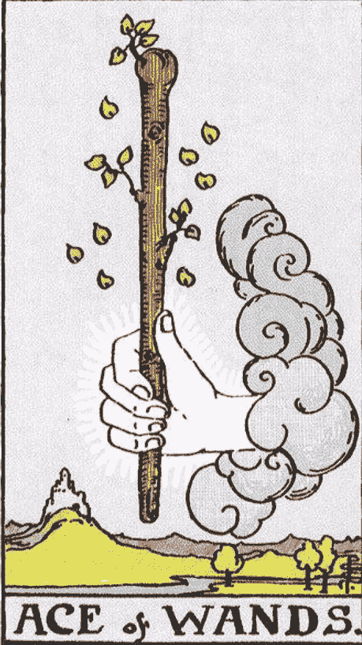

上面这个例子也说明，一张首牌不仅仅可以代表可能性，也可以代表一种情感，情绪，思想状态，在当事人的脑中堆积。

权杖首牌所代表的情感，就是这种面对新的体验，目标，以及冒险所产生的，激动，亢奋，以及紧张的心情。

比如说运动员在重要的比赛之前很可能紧张兴奋得睡不着觉，这个时候用权杖首牌去表示他们这一纯粹的心情是非常合适的。

再比如说，一个即将在第二天进行演讲的演说家，也很可能因为第二天的演讲而兴奋不已，跃跃欲试。

在这些情况下，你可以发现，权杖首牌作为可能性与潜力的这一层含义并没有失去，比如说运动员在比赛之前满怀着对第二天竞争的期待，在第二天的比赛场上，权杖首牌的可能性就将变为现实，带给我们喜闻乐见的权杖五。

如果说你有认真观察的话，你也会发现我在上面所举的例子中，都很强调新，新的体验，新的开始，新的目标，都是和新有关的。

没错，权杖牌组是一个向前看的牌组，也就是说在即将到来的事件中寻找快乐的牌组，权杖首牌又是这个牌组最为纯粹的表示，自然在权杖首牌中，我们完全无法看到任何和旧有关的东西。

本来嘛，权杖牌就是一个对着目标使劲追寻，并且沉浸在这种追寻中的牌组。反思，犹豫，徘徊，都不属于权杖，或者说，仅仅属于权杖牌表现不顺畅的时候。

这就像夕阳下的奔跑，沉重的呼吸，挥洒的汗水，会让你将所有的注意力集中在现在的这一刻，以及你想要实现的目标。

忧郁，沉闷，以及不快乐，都不属于权杖牌。权杖牌，就像大阿卡娜中的太阳牌一般，属于阳光的一面。

一个被权杖主宰的人，或者说，表现出强烈权杖牌特质的人，在人生这一段又臭又长的赛跑完之后，会激动地说出，我的生涯一片无悔！

## 权杖二

我们说，数字牌，就是首牌中所表示的潜力在慢慢发展，变为现实的过程。权杖二就是权杖首牌的潜力在发展的过程中所必需遇到的阻碍之一：惯性。

所谓惯性是指，我们生活中，以及我们自己身上，遇到的大部分事情，都倾向于保持现状，而不是做出改变。

那么问题就来了，权杖牌是一个需要改变的牌，因为它需要去追寻一个目标，一种感觉，在维持现状中它什么都追寻不了，它需要往前中。

权杖二就很好地给我们刻绘了这样的矛盾。

在牌中有两根权杖，其中一根在墙上，象征现状的约束，或者说，维持现状的惯性。另外一根在牌中主角的手上，这象征打破现状的冲动，改变的欲望。

但这种欲望现在并没有被实现，我们的主角这个时候所能做的，最多也就是看着自己手中的地球仪（自己将要去征服的广阔世界），幻想它们的美丽。

在生活中这其实是一个非常非常常见的现象。比如说，一个人想要去学习一项新的技能，比如说做饭吧，他会先考虑一番，在网上搜索一下，了解关于做饭的东西，甚至可能已经向培训班什么的打了一通电话。但是，他还没有开始去学做饭。

权杖二表示的就是这样的一种状态。

再比如说，一个人想要交新女朋友，又觉得自己形象不好，于是到处了解关于怎么改善形象，但就是还没有踏出去改善形象的那一步。

还比如说，一个人想要创立一家公司，但他仍然停留在学习商业理论，以及构思设想的阶段。

总之，权杖二就是，想要去做什么新的事情，已经开始为了去做这个事情做准备了，但就是还没开始做这个事情。

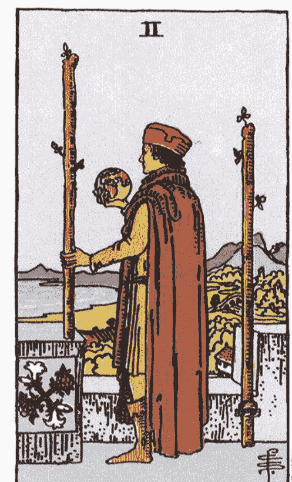

在一些情况下，这个状态持续不了多久，比如说我们之前讲的，要学做饭的男人，打了几通电话过后，三下五除二，就到培训班报道去了。

但是很多时候这个状态会一直维持。再拿之前的例子来说，一个想要创业的人可能一直拖着，一个想要当作家的人可能无法提笔，一个立誓改变自己形象的男人可能就是不行动。

还比如说，一个总想着换工作但却总是不换的人。一个总说要去旅行却总不去的人。

这很常见，这很正常，并且我向你保证，一个人想要去做但从没做过的事情对他越为重要，他就越可能这样一直拖下去。

如果你有过这种经历，那么相信你会理解这种感受。

会有这种情况发生，是因为惯性。我们每个人都存在着一个本能，去维持我们的现状。如果我们要打破现状，做出改变，那么我们会恐惧，尤其是，如果我们要做出对我们真正重要的改变。

包括但不限于：追寻自己的梦想，认真对待自己的人生，第一次改善自己的形象，重新审视家庭关系，追寻一个自己真心喜欢的兴趣，瘦身，等等。

在我们想要去做这样的事情的时候，我们很容易陷入权杖二的困境：停留在想要行动的阶段，而不是去行动。

不得不说，我作为一个至少经常在写作的人，我可以说在写作中也经常会遇到权杖二。

就像那老句话说的，写作真正难的并不是写而是提笔。

我到现在，写过的任何一篇文章，以及我书中任何一个章节，全部都经历了这样的感觉，这样的痛苦：难以提笔。

我会想要写，我会告诉自己，我必须要写，但是在我的心中总是有那么一种抗拒的力量存在，让我不想去碰键盘，让我即使接触到了键盘，但却就是打不出有意义的文字来。

但是我必须写，一个作者的义务是，把他在自己脑中所看到美景，变为真实存在的文字。

这些美景，在牌中表示的话，自然，就是权杖二里这位主角所持的地球仪了。

## 权杖三

以为过了权杖二，战胜了自身的抗拒之后，就能投身到火热的火热的事业中了吗？太天真了！

权杖三告诉你：你想要实现任何的目标，那么你首先要学习两点东西，第一，耐心，第二，想想你承担的风险。

权杖三中是一个商人远望自己的商队出海的情景。海上贸易，传统上来讲，风险很大，耗时很多，但是一旦成功，收获是极为丰厚的。

因此这张牌会代表诸如需要耐心啊，远景啊（商队回归是很远的未来嘛），风险啊。

这里我们就讲耐心和风险这两个事情。

关于耐心，这其实是很简单的，没有一夜的暴富，没有天降的萌物，当你在权杖二中看到各种各样你自己可能有的未来的时候，你看到的往往是结果，也就是在路途的终点，你能够收获的东西，比如说作家的梦想的话，写出惊世大作的场面。

但是在想要把这些梦想实现的过程中，你所需要面对的，是日复一日枯燥的劳动以及等待。

什么？你说有没有捷径？我不相信有，我也不相信有值得你去走的捷径。

总之，在你幻想梦想的实现的时候，你应该觉得它仿佛与你很近，触手可及，但当你真正开始追寻它的时候，它会飘向了越来越远的地方。

甚至，你越是一步步往前走，越是能发现前路艰辛，越是能了解到，啊啊，好远，好远。

比如说想当作家的话，提起笔才发现，不仅仅写一部作品很难受，写一部作品还是远远不够的。

比如说想要去跑马拉松，然后明白了，每天都要去训练，累死累活，最后还要跑马拉松超级超级长的跑道。

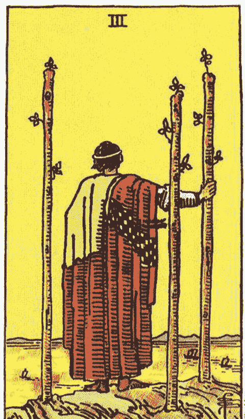

再比如说，你想要摆脱一个坏习惯，但是才发现你时常不自觉地想要按照之前的习惯行动。

又比如说，我最近开始锻炼身体，读了两三本书之后，发现它们都提到了这么一个事实：长肌肉需要休息，很多很多的休息，建议同一个部位的锻炼一周一到两次。虽然确实会轻松很多，但是你能体会宅了一辈子难得想要健身，恨不得每天都折磨自己的男人，却发现必须把节奏慢下来的心情吗？

任何一个值得你去付出的目标，都并非一朝一夕可以完成，需要你的耐心，以及持续的挑战自己。

> > 问：“那中彩票怎么说？家庭富裕又怎么说？”
>
> 答：你可以中五百万的大奖，但你不会有这是你自己辛苦劳动成果的感觉，你不会觉得自己用自己的双手改造了自己的生活，你不会有任何自豪，充实，以及在辛苦赚钱的过程中收获了很多的感觉。

而，相信我，这些东西比钱这个形式更好。不相信？回答我，等到有一天，你已经老去，躺在床上，回顾你的人生，你是会后悔你没有赚到更多的钱，还是说后悔你没有度过一个充实的生活，没有去做更多有意义的事？

不要做自己会后悔的事，妹子。

至于家庭富裕，这并不是目标，没有人会把“我要活在一个富裕的家庭”当做一个目标的，至于“我要嫁到一个富裕的家庭”，甚至，“我要挤进一个富裕的家庭”，我不认为这是值得任何人付出任何东西的目标。

好，这是耐心。接下来我们再讲风险。

任何改变都有风险，任何现实的改变。

权杖牌组的前几张牌，都可以看作是权杖首牌的可能性在慢慢发展和展开的过程，在权杖二中我们看到了自身的抗拒这一因素，在权杖三中，除了之前所讲的，需要耐心之外，还有一点，那就是这些新的改变或者新的经历也是充满风险的。

原地踏步，保持现状，才没有风险。可惜权杖牌组的牌语并非安于现状，而是相反的一直向前以及冒险。

冒险是什么？做出大胆的行动。

这也意味着，失败也毫不奇怪。

在权杖三中，到底是否失败，还不得而知，我们仅仅知道的是，存在风险，可能失败。所以如果问啥事情会不会成功，抽到权杖三的话，既不表示会成功，也不表示会失败。

当然不要因此就觉得塔罗牌给不出一个具体明确的答案，但是塔罗牌不是硬币，不是非要具体明确地表示成功或失败的，如果你对此特别执着，非要简单明确地了解一个事情是否成功或者失败，不愿意去了解塔罗牌所给出的信息，那么我建议你去抛硬币。

实际上，在成功或失败的问题中，抽到宝剑三，可能代表当事人正在观望和评估风险，因为牌中人现在所做的也是观望嘛，也可能代表当事人做这个事情的时候，是带着对未来的大胆展望和评估做的，也可能代表，这个事情到底会不会成功失败现在还看不出来。

具体如何，要结合具体情况，以及牌中其它牌来定，并不是抽到一张牌就能够轻松地给你一个确定答案的。如果你特别想要这样的话，我还是建议你去抛硬币。当然，如果你想用占卜逃避这些风险，那就太天真了，占卜没有这个功能。

一个典型，但很奇怪，在现在也很罕见的例子是，告白。因为若是告白成功，那么将能带领当事人走入新的体验中，但是告白失败的后果还是很吓人的，尤其是对于年龄比较小的弟弟妹妹而言，肯定会想，“他要是讨厌我怎么办！”，“会不会连朋友都做不到！”。

对于这种情况该怎么办，我的建议是看着权杖六这张牌：像个男人一样往前冲就是了。

其它的比如说，如果要去做自己一直想要做的工作，或者开一家自己一直想开的小店，那么，如果赚不到钱怎么办，如果没钱吃饭流落街头怎么办。

还有比如说，如果你想要研究一个不能许多人所接受的爱好，比如说塔罗牌，家人反对怎么办，恋人反对怎么办，家人或恋人甚至爱人告诉你说，这是邪魔外道，你必须放弃，怎么办。

再有比如说，如果你对同性充满了爱，但却假装自己爱异性地活着，想着不，不能再这样下去了，必须坦白，但是坦白所面对的压力怎么办。

这些都是风险，是真实的风险。
这些风险，也可能并且常常会变成真实，不然它们就不叫风险了。
在某些故事书中，冒险者总会获得胜利。

在现实世界里，失败比成功要更为频繁。

就有句老话说，想要获得她，你必须也要敢于失去它们。

## 权杖四

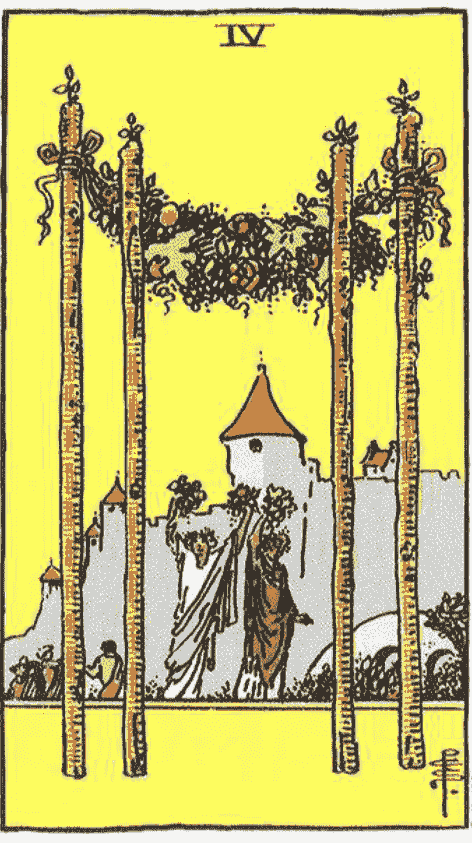

如果说权杖三代表风险，那么权杖四就是回报。

权杖四是庆功宴，承担了足够多的风险，付出了足够的努力，在收获了同样足够的成果之后，所展开的庆功宴。

当然，实际占卜中并不会出现权杖四就代表事情一定成功，可以开庆功宴了，一张牌的含义，和它在某次占卜中出现的含义是不同的。就好像是同样的男人在不同女人的面前，尽管是同一个人，却有不同的反应一般。

回到权杖四，庆功宴，所谓庆功，自然就是说，要有功才能庆。也就是说，想要出现权杖四这样的局面，必须要做出别人能够看到的功绩。

为什么？因为权杖四并不只是关于你自己的，而是包含了别人对你的承认。在之前的权杖二——计划阶段，以及权杖三——风险评估阶段，画面中都有一个明确的主角，但是在权杖四中，并无这样一个主角，而是出现了多个庆祝的角色。

所以说，相比于个人的成功，它更强调，别人的承认，恭喜，祝贺。

这自然也就意味着，你需要做出别人看得到的，能承受的好事情出来。因为世界并不会因为你的野心或者想法而承认你，不会因为你付出的汗水而赞赏你，不会因为你是一个伟大的人而崇拜你。

就像蝙蝠侠中那句台词说的，重要的并不是你内在是个怎样的人，而是你做了怎样的事。

你的所作所为决定了你受到的待遇。

在占卜中，除了庆功宴之外，权杖四也可以代表庆祝别的啥的宴会，结婚呀，生子呀，满月呀，毕业呀。除了宴会之外，也可以有其它的形式，KTV，打牌，杀人游戏，颁奖，总之只要有一个很欢乐很兴奋的氛围即可。

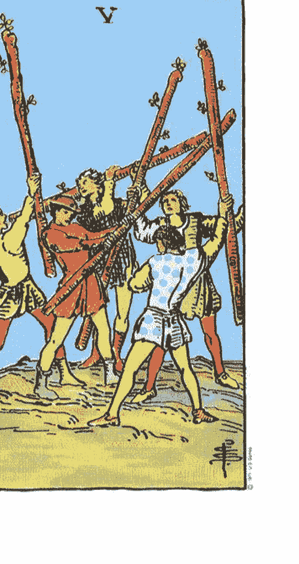

## 权杖五

竞争。权杖牌组走到半路，终于能够看到我们喜闻乐见，不对，期待已久的竞争元素了。

尽管之前有说过了……也许仍有一些读者，看到这张牌的图像，便会即刻将之认定为一张不好的牌，哎呀，几个大老爷们拿着根棍子在哪里打来打去，争来抢去的，不好不好。

因为他们认为，安宁，和谐，平静是好的，争端，冲突，竞争是坏的。

你也这么认为么？

如果是的话，那么是时候改变你的观点了。

竞争的好处在哪里，要说明非常简单。

你用手机么？

相信大部分情况下，你是用的，那么，你应该也知道，什么漫游费，长途费，流量套餐超出之后的资费，等等，杂七杂八的奇怪费用。

国外的手机资费相比国内要人性化许多，有诸如不限制短信，免费时段之类。

为什么？尽管我不是什么专家，但是原因之一想必是，因为移动通讯行业在中国是垄断行业，缺乏竞争，不用特别实惠，也能获取暴利。

竞争并不是坏的。健康的竞争是健康且必须的。

不要在看到这张牌的时候，就觉得它代表当事人要和别人大吵一架。No，不是这样的。权杖五出现的场合，完全可以是当事人正在和别人进行一场健康的，充满生机的，竞争或者游戏。比如说辩论赛，激烈的讨论，摔跤，对弈，WCG，卡牌对战，三国杀。

同时，竞争也是不可避免的。经过了权杖三与权杖四，我们的主角已经取得了足够多的实绩，赢得了众人的赞赏。至于这实绩具体是什么，就让我们假设他找到了一个新的市场，然后打开了这片市场，取得了不俗的业绩。

那么现在，等着他的是什么？竞争，以及模仿者。

因为人是一种善于学习的动物，当你看到别人达成了一个目标，自己又不知道怎么去达成这个目标的时候，你会怎么办？当然是学习他的方法。

所以我们的这位新市场的开拓者现在就遇到了多种多样的学习者，想要来分一杯羹，尽管他自己首先进入了这个市场，但却并没有占据任何优势。

于是就到了我们现在所正在讨论的，权杖五的情况。

这样的场景在我就读的大学中刚好也发生过。一两年前，有几家店在做送外卖的生意，生意都很不错。但是，2013 年开始， 做外卖生意的如夏天挥洒的汗水一般，千树万树梨花开。每隔一两天，就会有一家新的外卖店跑来发传单。还纷纷采用了送东西的宣传手段: 这个月点餐，免费送一个鸡腿，或者，本周内点餐，免费送一杯可乐，云云。

在这样的竞争下，某家外卖的打工仔发出感慨，以前啥都不送生意都很好，现在送东西了也没人来了，呜呼哀哉。

尽管你可能不是老板，但是却也是逃不过竞争的。因为竞争同样也存在于同学与同学之间，同事与同事之间。升职呀，奖学金呀，这个世界上机会很多，但是人总是比机会多。

竞争总是有的，竞争也是必须的。

## 权杖六

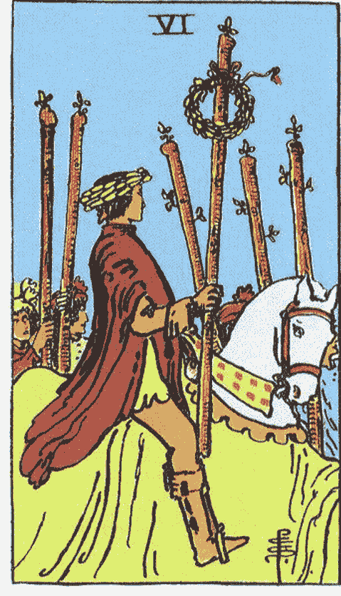

权杖六涉及到权杖牌组的另外一个重要的方面：领导。

一群人为为了一个目标聚集在一起的时候，称为一个团队，而一个团队，需要一个领导去带领。

确实，在权杖六的牌面中，我们也能够看到一个人骑着白马，顶着桂冠，被许多人追随着。

桂冠代表他所受到的赞誉，处于领导地位的人所受到的赞誉，是会比他们应该受到的赞誉要更多的。在团队外部，我们很容易将一个团队全部的功劳都归结于领袖一人，在团队内部，很少有人会对领导提出意见和反对。

比如说，当我们说起微软的时候，我们会想到比尔盖茨，当我们说起苹果的时候，我们会想到乔布斯。显然他们起到了很大的作用，但是他们的成果并不属于他们自己一人，是整个团队辛苦劳作的后果。但是当苹果手机走红的时候，摄影师的镜头们最爱的是谁？乔布斯。

团队内部的例子的话，倒是相当简单。如果你有过被领导的经历，你就会明白大部分时候你倾向于听从领导的领导，即使你觉得他说的不对，你也不会说出来。比如说对上司，对班主任。

因为上面所讲的原因，一个领导会倾向于高估自己的能力，会发现所有人都赞同自己的做法，会觉得自己无所不能。因此，权杖六毫无疑问是整个权杖牌组的顶端。毕竟，权杖牌组是一股向着目标前冲的力量，是一股想要扫除一切障碍的力量。就好像一个不知人间艰苦的少年下定决心要实现宏大的理想，它的低谷是挫折和失败，高峰是我能行，我很棒的感觉。

在权杖六所展示的情况中，一个人会体现到很多这样的感觉，因为他的地位，同时也因为他的功绩。别忘了桂冠同时也代表胜利，权杖六的牌面也是凯旋的画面。

当然这种感觉有其弊端，那就是滋生一个人的自大，自大会导致失败，整个团队的失败。

所谓自大，就是觉得自己理所当然是对的，别人理所当然应该听自己的。

要举例子的话，我们可以再举举乔布斯的例子，他年轻时候被从自己一手创立的苹果公司中开除，原因是他的失败，而失败的原因之一就是他的专横。

和你讲的也许会有些不同，不过自大几乎是无法避免的。因为一个领导的工作就是把自己的意志加在整个团队之上，让整个团队按照自己的想法行动。即使他的想法是错误的，他也会有冲动去让整个团队实践自己的想法，因为这是他的工作。而当一个人的想法是错误的时候，他显然没法自己知晓自己的错误，否则就纠正过来了。

所以总结一下。在占卜中遇到权杖六的时候，有可能会出现下面几种情况，当然，其它没写到的情况也是完全可能出现的。

- 代表当事人正处在一个领导的位置，或者，当事人正在被领导。
- 代表虽然没有直接的领导和被领导的关系，但是有类似的，一方比一方地位高的关系。
- 代表凯旋。
- 代表一个自大的领导(逆位的时候尤其可能)，可以是当事人，也可以是别人。
- 代表自大和专横。
- 代表带领团队走向胜利，或者带领团队走向团灭(失败)。

## 权杖七

挫折和失败，反对与阻碍，质疑与麻烦，问题连不断。

不同于权杖六中的情绪高昂与一致称赞，权杖七展示了更为现实，同时更为令人沮丧的事实：任何想要完成任何值得完成的事的人，都将面对来自事件本身，来自他人，以及来自自己的挑战。

来自事件本身的挑战，指的是任何事业的进展都不会一帆风顺。比如说，之前好好的突然出错了，合作伙伴跑路，遇到之前没想过的障碍麻烦，等等。各种麻烦让你不想坚持下去。

来自他人的挑战，意思是别人会质疑你，会反对你，会责怪你。这里的别人包括家人，朋友，亲戚，长辈，上司，同事，甚至陌生人。也许，在某个理想的世界中，当你想要完成某个目标的时候，你受到的全是支持以及赞同的声音。但是这是现实的世界，某些时候你会被支持，但你更多地会被反对。

他人的反对和质疑并不代表你做不到某些事情，相反，这可能代表你正在稳步往实现目标的路上行走。因为如果只有在你做了足够的成果时，关注到你的人才会多到会有质疑者的出现。若是你默默无闻，没人会舍得来质疑你。

来自自我的挑战，就是说面对事情的挑战与他人的挑战时，你会经历灰心，失望，不自信，以及恐惧的心情。能否重整旗鼓，重新来过，是一个人必须经历的挑战。

面对障碍时，你还必须要问自己，是应该放弃，还是应该继续下去？

显然，我不会在这里鹦鹉学舌地说，面对障碍时，我们应该打起精神，克服困难，这是空话。

并不是所有的障碍都可以被克服，并不是所有的目标都可以被实现，此外，也有可能并非是阻碍太大，而是现在的你经验或者资源人手不足，也可能是时机不对，毕竟人在环境面前能力有限，环境现在还不允许你实现你的目标，也是完全有可能的。

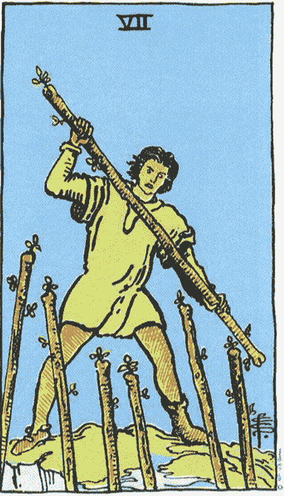

假如说这一章你只能记住一点知识，那么请记住这一点，失败是极为正常的，相信付出努力就会成功，遇见困难啥都不想迎头而上只是年少轻狂和太天真了而已。

我也不是在建议你遇到权杖七就放弃，我只是想说，并没有一个简单的答案能让权杖七中的挑战变得简单。坚持还是放弃，还是需要自己做决定。

## 权杖八

八根权杖在空中平行且倾斜地排列，对于这个画面，一般的解读为，这是在朝着某个地方飞去。因此权杖八的意思有快速发展的意思。

考虑到和权杖七的接续的话，我们可以解读为，在通过了权杖七的挑战之后，才能够迎来权杖八中爽快的飞速发展时段,也就是说，付出的努力终于得到了回报，现在能够相比以前都要更为快速地往自己想要的那一个终点前进了。

我们可以把权杖七和权杖八看作一个整体，权杖七代表阻碍，而权杖八代表顺畅，两者交替出现。比如说，我现在在做的事，也就是写作中，常常会感到提不起笔，没有灵感，或者挤也只能挤出很少几个字，这就是权杖七。相对地，在文思泉涌，一小时搞定 3000+ 字的时候，就是权杖八。

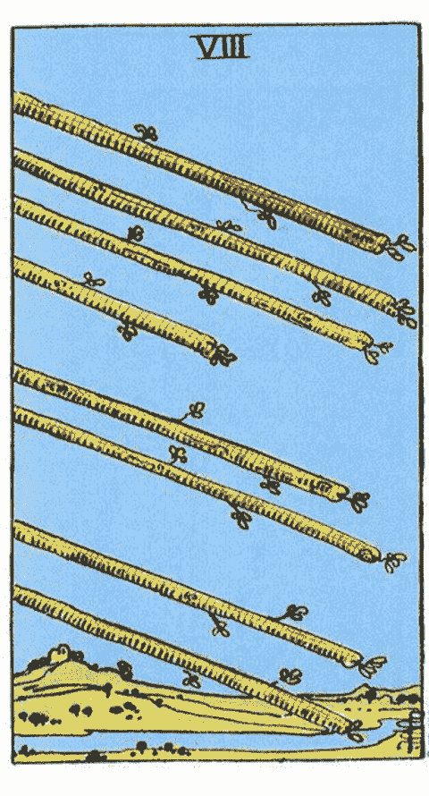

尽管我很想要自负地说，我任何时候都能以权杖八的气势，奋笔疾书，下笔如有神，轻松完成我给自己所定的目标。但是现实是，绝大部分时候，我所面对的是权杖七，在高举双手准备朝键盘挥下的那一刹那即可感觉到无数的压力纠结——不知道写啥！

抗拒的理由和心情很多，解决方法也只有一个，那就是如权杖七中所画的一般，拿起自己的笔，即使带着充满动摇的决心，也要继续写下去。

这份不屈的回报，则是几乎每一次，当我在战胜抗拒的感觉之后，能够体验到权杖八的畅快，能够感受到，哦哦哦，我右手的封印终于解开了吗！能够亲自体验到文字组成句子，句子组成段落，段落化身文章，文章构成书籍的瞬间，我向你保证，这是充满了快感的，就像是白酒在冲刷喉咙一般，无比的刺激。

众所周知，我是一个酒鬼，尽管现在为了身体，不再放开胆子喝白酒，但我仍然坚持酒是好物，以及酒好喝。

我坚信写作就像是喝酒，最初是苦的，但是熬过了那最初，就能尝到无边的快感。

我擅长做的另外一个事情，编程也是一个类似的活动，快感和痛苦交替着，在能够顺畅地敲击键盘打出一行行代码的时候，会有仿佛在看着美女出浴一般，让人不禁想要继续下去。在遇到难题，遇到麻烦，遇到出错的时候，又是我们喜闻乐见的权杖七，一如既往的手忙脚乱和焦头烂额。

所以我说，权杖八，代表的是朝向目标的顺利发展，也代表与权杖七相反的，顺畅的时段，同时，也代表整个权杖牌组的冲劲和努力的回报。

诸君现在心里应滋生了一个疑问，倘若尚未如此，那就请接下我的一个疑问：为实现目标的努力所获得的回报应该是目标的实现，为何却是权杖八呢？整个权杖牌组中，又是否存在这个，代表目标已经实现的皆大欢喜的牌呢？

诸君哟，睁开你们的双眸，在权杖牌组中，并不存在代表目标实现的牌，在权杖牌组中，并没有代表终点的牌。终点意味着休息，意味着停止，权杖牌组绝对是和停止不沾边的。

权杖牌组的快乐，并不藏在追逐许久才到手的终点之中，而是藏在追逐这个事情本身里面。

就好像写作，并不是，在完成了一部长篇大作的那一个瞬间，才感到快乐无比，觉得自己终于做到了，觉得我终于也完成了这样一部大作，并不是，在写作的过程中，煎熬着，煎熬着，就为了等待最终完成的那一刻。

事实与之相反。写作的过程是煎熬，这是事实，但是快乐也存在于写作的过程中，存在于，看着自己面前出现自己都不知道自己能写出来的句子的那一种，惊讶以及愉悦中。这就像看着一副优美的画卷在自己的面前展开，同时还能想着，哦哦，这是我画出来的东西吗，我真是伟大啊，的这样一种充满自恋和自豪的快乐。

在写作完成之后，一个人所拥有的快乐，相比写作中的快乐，这就像中国那句古话，星星还想和月亮比谁更亮么！

我写了很多文字，不只是因为我给自己定了目标，要写。更是因为，我爱写。

但是你呢？你所从事的工作，你爱么？

不要忘了权杖牌组和工作联系很大，某种角度来看，也和学业联系不小。尽管在学业方面，学生没有权力选择。

总之，工作什么的，想要实现的目标什么的，永远都是，一个接着另外一个，并没有尽头，并没有一个到达终点的快乐可以让你去享受。

你可以享受的，只有来工作与挑战本身的快乐，只有权杖八的快乐。

## 权杖九

权杖九代表休息，但是别断章取义，这里的休息指的是，类似把正扭打在一起的两个人强行分开，然后他们一边干瞪眼一边休息，的那个休息。

简单地说，权杖九就是，在明明可以并且应该休息和冷静下来的时候，却仍然保持一颗战斗中的心，从而没法休息。也就是说，看起来充满了警觉心，仿佛任何时候都可能再需要自己重装上阵。

上面说的这句话有三个关键点。研究表明，当一个人读完一本书的时候，能掌握其中40%的知识已经谢天谢地了。所以，为了方便你更容易地掌握和吸收，我替你把这三个关键点总结出来。

- 其一，可以并且应该休息了。
- 其二，当事人没有好好休息。
- 其三，没有好好休息，是因为当事人有着仿佛时刻准备着战斗的态度。

也就是说，一般要三个点都符合，才能说是一个符合权杖九的情况。

比如说，一个可歌可泣的大学生，在寝室熄灯之后，仍然躺在床上，良久良久地思考着 VC 6.0^{27} 的奥秘，并因此失眠。这就是一个很符合权杖九的状况。

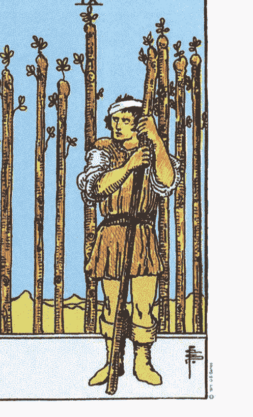

如果说，这位大学生仍然在挑灯夜战，捧书苦读的话，那就不符合。因为这个时候，他还在战斗着，而不是时刻准备着战斗。也就是说，时刻准备着战斗的态度，是在没有在战斗中才能表现出来的，类似，高举右手随时准备消灭蚊子。

我不知道如此详细的解说是否多余的，但是我对于人类理解能力的信心一天不如一天，所以我还是这么详细的解说了。

再比如说的话，一个因病假或者什么理由在休假的公司管理人员，却仍然对公司内的情况忧心忡忡，这也是很符合权杖九的话。

担忧，不安，恐惧，是权杖九很常见的表现形式。

之所以会出现权杖九这样的状况，是因为过劳。因为，要知道，太阳之所以每天东升西落，是教育人们要劳逸结合。不遵从这宝贵的教诲，乱来的话，就会过劳，然后，在休息的时候，就会出现权杖九，也就是变得没办法休息了！

与权杖九相反的有一种情况，这种情况也许更为常见，那就是玩过火了，然后在第二天上班或者上课的时候仍然萎靡不振，转换不过来，这是在该紧张的场合没有办法紧张起来，相信大家都经历过的，毕竟谁没有过夕阳下的奔跑，谁没有过终将逝去的青春！

那么，把这种经历逆转过来，我们就有了权杖九，在该轻松的地方没法轻松起来，明白了么？

当然，这是我讲的一种理解，还存在其它的理解，比如说认为权杖九代表的是未雨绸缪，修筑防御啊，把背景处群山似的东西解读为是即将来临的大军啊，什么什么的。

## 权杖十

权杖十有时候是在权杖九的百尺竿头终于又进了一步——在该休息的时候也在工作了！

不过，权杖九强调的是过度紧张，权杖十所强调的，是不堪重负。

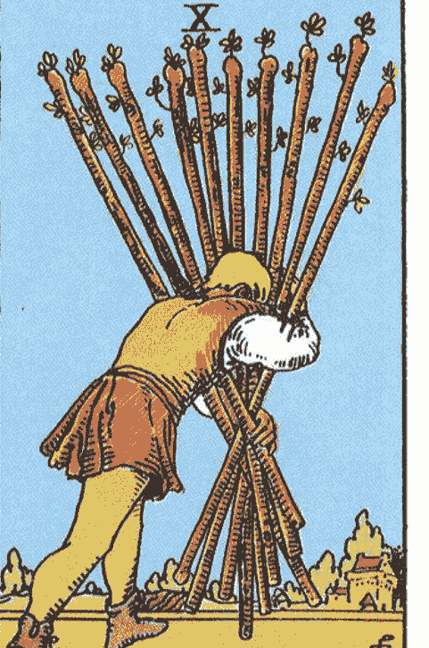

诸君哟，睁开你们的双眼，看看牌面中人所扛之物,显然是超出了他所能负担的范围，但是他仍然未有放下，是迈出已经不能称为大步的步子前行。

其实，不由得觉得，看着牌中的人总会觉得很感慨。那种一心想要实现最初的目标的执念，那种哪怕已经撑不住了也要撑下去的执念,那种即使只剩自己一人也不会放弃的执念，那种就算难以前行也要前行的执念。

这种即使已经无法背负，却仍然要去承受的举动，不觉得很感动么？不觉得很男人么？不觉得很英勇么？

确实，这是在逞强，确实，被压垮是迟早的事，确实，不管怎么说，在追寻一个梦想和目标的路上，发现梦想越来越远，负担越来越大，曾经的热情也越来越少的时候，正确的行动是即刻放弃。

也就是，各种牌意书里谈到这张牌时爱说的，放下权杖，放弃自己的负担。

但是，很少有书会告诉你，为什么，为什么牌中的人仍然没有放弃。很少有书会告诉你，这种不愿放下自己负担的感觉。

当你的手触碰到火的时候，你会下意识地缩回来。当人在面对痛苦的时候，第一反应便是远离痛苦的源头。

那么为什么权杖十的人承受无法承受的负担也不放下它们呢？原因至少有二。

其一，在于习惯性作用。权杖牌组是充满荆棘的牌组,权杖二，权杖三，权杖五，权杖七，都是需要克服掉面前的困难才能继续前进。因此，在面对一个接一个的难题之后，一个人很难分辨，什么时候应该放弃，什么时候继续坚持一下好。

其二，在于对目标的执念。目标的实现并不是权杖牌组最终的回报，但却有无比重大的意义，就像一根离弦的箭，要知道靶心在何处才能够飞翔。对目标的执念是驱动一个人行动的动力，但在权杖十中，也是它让一个人看不清现实，让一个人无谓逞强，让一个人不管有多少负重，也要前行。

在我个人经历权杖十时，还有一个原因是必须要遵守自己的承诺。我曾固执地觉得我必须要遵守自己的承诺 28，不管是对自己承诺也好，是对别人的承诺也好，我告诉自己我必须遵守。我承诺要把塔罗作为自己的事业，尽管我对塔罗的爱早已从占卜的方向偏离，我仍在勉强往这个方向靠拢，这就成为了我的负担。

很长的时间中，我完全没有考虑过放弃，和负担多重无关，和多辛苦无关，我必须坚持自己的执念，坚持自己的承诺，这就是我的做法。我不知道这是不是愚蠢的，但是我曾绝对地相信承诺必须被遵守。我无法放下，我没办法背叛自己的承诺，没办法背叛自己为此目标曾付出的努力，曾作出的规划。我从 09 年开始在博客中所写下的 200 多篇文章，我与亮合作，终于出版的《经典塔罗攻略秘籍》，我花接近半年时间为博客设计的新主题，我曾辛苦三月准备的塔罗课程，我曾无数次梦想的自己的未来，自己将要实现的梦想，以及我为了这些梦想所进行的学习，对塔罗牌的学习，对荣格心理学的学习，对卡巴拉的学习，对网页设计，商业理论手段，文案写作，所进行的学习。

要我放下这权杖十的负担，就是要我放下这一切，要我放下我所付出的全部心血。

你觉得这很简单吗？

权杖十，只要放下就好。能说出只要放下就好，是因为不明白这十根权杖的重量究竟有多重。

放下这十根权杖，意味着背弃自己的目标，背弃自己的承诺，意味着承认，“我曾为此尝试过了，但是我失败了，并且即使继续尝试也不会成功。我无法达成这个目标。即使这是个无比让我自豪，让我憧憬，无数次梦想过的目标。”意味着承认，“不管我多么不情愿，我已无法遵守我的诺言。我已无能为力。”

你觉得这很好受么？

不。

权杖十的解决方法，是权杖牌组所面对所有困难的解决方法中，最难的一个，那即是认输。

对，是放下，但更确切地说，是认输。

大部分时候，认输是逃避困难的方法，这些时候认输不难，但权杖十的认输，和这并不一样，不要搞混淆了。

> 这就如海明威所写的，“我多希望在我只爱她一个人时就死去。”

因为这样，就不需要背弃自己与她度过时光的回忆，不需要背弃自己与她的承诺。和女人爱想象的不同，这并不快乐，而是如自己狠狠打自己一巴掌一般，不知道应该因为打人一巴掌的快感而快乐，还是该因为被打而心痛。但我可以保证心痛会很多。

我也希望自己在认输之前死去，不用去背弃自己的目标与承诺。不用像这样，不知道自己该为抛弃的志向而骂自己狼心狗肺，还是为此而松一口气。

不过，正是因为我已经认输了，所以我才可以毫无顾忌地创作这可能是我最后一本的塔罗书，因为现在的话，写塔罗相关的东西并不是我的负担了，我才可以流畅地写下心中所想。

是否能帮助我在塔罗事业上更进一步，能否带给我足够的关注，会不会出版，到底会有多少人看到这本书，要不要做成电子书售卖，会不会被该死的淘宝商家拿去卖，会不会被盗版，能不能出英文版，会不会得到别人的认可，会不会得到别人的推荐，能给大陆塔罗学习环境起到多大的作用，有多少人会从这本书里学到东西，会不会有人来反对我的意见，会不会有人说风凉话……

这些全部的问题，以及问题背后的目标，这十足的权杖，都已被我抛诸脑后，我都已经认输了。

看在上帝的份上，我是一个作者，我写我想写的东西，以任何我想要的形式发表，并且为我所写的东西自豪，这就够了。

## 第五章

### 圣杯的积雪 ❄️ 消融殆尽

## 圣杯首牌

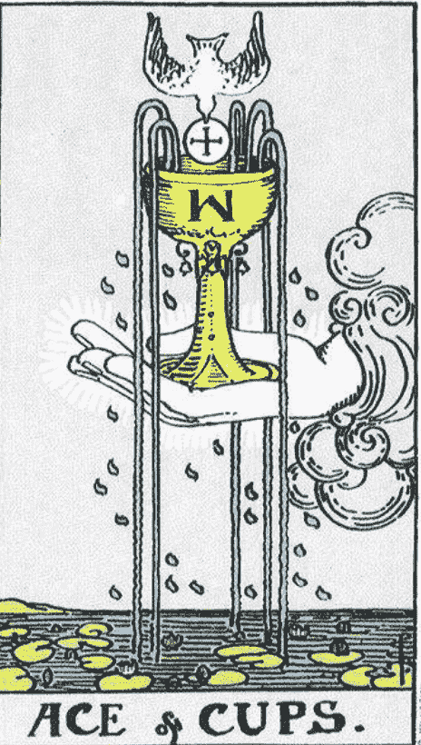

如果说要用一个词来概括圣杯首牌的话，那么我应该会选爱意满怀这个词。

不过在你调动起脑中的浪漫神经或者花痴神经，把这张牌从各种意义上误解和夸大之前，听我再多说几句。

所谓爱意满怀呢，指的是一种感情放在自己的心中没有表达出来。这种感情不一定是男女之情，可以是亲情，友情，基情，等。

让我再次替你讲解一下我刚刚说的话，在上一段话，关键点有两个，其一在于自己，其二在于没有表达出来。这两个是有联系的。

比如说一个典型的圣杯首牌的状况。小孩子（或者说未成年人）在接触塔罗时，很爱问的一个问题就是，我喜欢他，他喜欢我吗？他们在问这个问题的时候，通常，都把这种喜欢藏在心里，甚至和对方没有太多接触，但仍然问，他喜欢我吗。

对于此类问题，我通常觉得匪夷所思。想一想，假设你周围有10个异性，他们和你都关系一般，并无太大接触，然后让你选一个人来暗恋。之后告诉你，这10个人中有一个喜欢你，你觉得，你暗恋的人也喜欢你的概率是多少？抱着盲目乐观的心态估计，10%。抱着实话实说的心态估计，1%，因为大部分人暗恋的就那几个显眼的，1%的概率是你是那个显眼家伙的概率。

不要想什么心意相通，什么既然你喜欢对方，对方就应该发觉。人类是靠语言和身体语言交流的动物，并不是靠心灵感应。你暗恋一个人，和这个人是否暗恋你毫无关系，大部分时候他当然不会去暗恋你。

所以说，没有表达出来的好感只属于自己，并不属于两个人。所以是爱意满怀，但只能带来自我满足。

再比如说，某些成年人很爱问的一个问题是，我爱他，他爱我吗。有的时候，会这样问是因为当事人觉得既然自己长大了，就应该用爱而不是用喜欢了，但实际上和上面所讲的是同一种情况。

另外现在很多无聊的电视剧或小说也把无聊的单相思冠上爱的大名，更是助长了这种情况。要我来提出改进的建议的话，我会说，无聊的单相思就称作无聊的单相思就行，无需美化。也可以叫做无聊的单方面的好感，或者叫自以为是爱的执念，或者称作，“以为自己爱着对方，实际上对对方只有非常肤浅的了解，擅自把对方的形象进行理想化，或者扭曲为自己想要的样子。实际上自己爱的只是一个幻影，但却能说出我能为你去死之类疯狂的话语”综合症，简称“以为是爱综合症”29。

其它一些时候，则是当事人正在恋爱，甚至婚姻中，但却问出了这样的问题。

如果我是一个残酷的人，我会说这也真匪夷所思，你若不知道他爱你，你为何和他恋爱，为何和他结婚？

但即使我是一个残酷的人，我也知道我们坠入爱河并不是因为我们思考和分析出我们应该坠入爱河，而是在我们心中的情感将我们推下去的，留给我们做选择的空间并不大。

但存在一个区别，那就是被对某人的感情推下去，还是被和某人的情感推下去。很多时候，我们会被对某人的感情所迷惑，以为这就是我们所追求的东西，但并非如此。这种区别这就像隔着屏幕对着女优发情和对面前的女人发情的区别，前者是单方面的，后者是一般双向的。

圣杯首牌，同其它首牌一样，代表的是潜力，可能性，对某人所抱有的感情，只是和某人加深感情和建立关系的可能性，并不是两人之间的关系本身。

也就是说，无论感觉到有多么强烈，或者多么美好，多么幸福，没有传达出来的好感，以及并未建立起来的感情，都只是一种可能性，并不真实。

正所谓，即使是无法传达的爱恋，是否也有实现的那一天，看不到模糊答案的今日，这份爱恋仍寸步难行。

## 圣杯二

青春男女的深情对望，这可真是一个喜闻乐见的场景呢。

不管怎么说，二是一个可以和二元对立交流联系起来的词语，圣杯二这里，表达的是这些元素更为积极的一面，那就是两个人的惺惺相惜或者心心相印。

相对比的话，在权杖二，宝剑二，与星币二中，我们都更能看到二元的对立。权杖二是现状与改变的对立，宝剑二是两种选择的对立以及由此产生的犹豫，星币二是此消彼长的规律。

唯有在圣杯二中，我们能看到对立元素的平等，交流，一起共同孕育出更好的局面。不得不说这是在塔罗牌中，少有的一张平静安宁祥和的牌。

没错，这张牌代表的就是平静，安宁，祥和，和谐，协作，交流，结合，这些元素。

尽管我个人更喜欢冲突和争端，毕竟它们在我眼中更为真实和精彩，我也不得不承认，一个没有安宁的世界是不完整的，

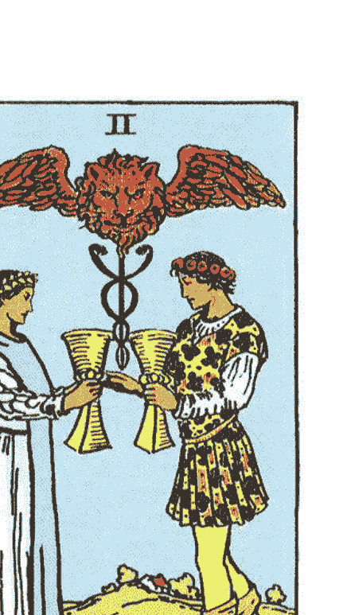

## 圣杯三

几个人聚在一起鬼混的欢乐时光，这就是圣杯三。

或者说，圣杯三代表朋友们。

不知道你看着圣杯三的画面会不会想到，朋友才不仅仅是吃喝玩乐呢。但是，朋友们聚在一起，是要干什么？当然是吃喝玩乐。

所以说，圣杯三既代表朋友们，也代表吃喝玩乐。

所谓吃喝玩乐嘛，自然就包括吃饭啊，喝酒啊，聚餐啊，一起去 KTV 唱歌啊，或者一起去哪里旅游啊，或者去哪里玩啊，什么什么的。

圣杯三代表的就是这样的社交活动。有的时候，你可能不会觉得和你一起进行活动的并不是朋友，毕竟不同人对于朋友的定义不同，但是只要进行的是类似这样的喝酒吃饭调情的活动，同时涉及到多个人，那么毫无疑问这就是圣杯三的情况。

除了社交之外，它有时候也代表糜烂在快乐中，这些快乐有时会涉及到液体，诸如酒，交换体液，以及法律禁止的某些物质。所以说，圣杯三也代表上瘾，可以是对酒之类物质进行上瘾，也可以仅仅是对某类行动上瘾，比如说购物。

在这种情况下，圣杯三也可以同时代表一起搞这类腐烂活动的狐朋狗友。

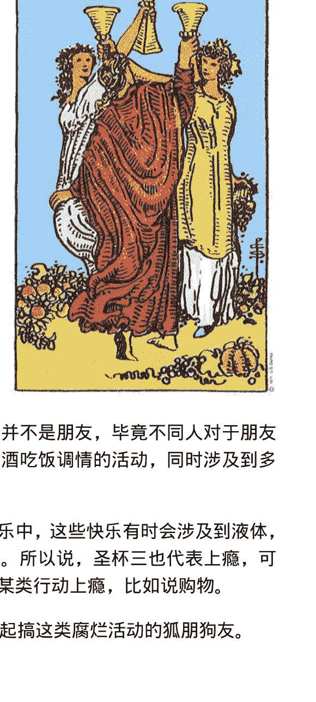

## 圣杯四

圣杯四的图像可以从多种角度解释，因此我这里就给你列出几个可行的解释。

### 解释一，不懂珍惜的少年拒绝爱的表白

Do not take it literally。主角是不是少年，遇到的是不是爱的表白，那是次要的。主要的是，第一，不懂珍惜，第二，拒绝新的东西。

所谓不懂珍惜，指的是明明主角的面前摆着三个杯子，甚至还有一个新的杯子向他递过来，但他却熟视无睹，在那里闹着自己的别扭。

拒绝新的机会，是将云中手握杯子这个画面，解释为新的机会已经送到了主角的面前，但主角却拒绝去接受。

典型的场景有比如，一个闹别扭的酒鬼，在别人向他敬酒时，选择了不喝。或者一个闹别扭的烟鬼，面对递过来的烟，摆出扑克脸。

再或者，喜欢玩闹的小孩，突然安静了下来，怎么哄也不去玩，再比如说，喜欢到处鬼混的少年选择了宅在家，不肯出门。

你应该已经发现，这里所讲的拒绝，都是拒绝自己原本所喜欢的东西，而不是拒绝自己本就不喜欢的东西。这是因为空中的手递过来的是圣杯，而圣杯代表的是快乐，享受。所以出现这张牌时，当事人拒绝的，是自己所爱的事物，而不是自己所讨厌的东西。

所以圣杯四的解法之一就是厌倦。

不管是游戏，吃喝，朋友聚会，小说，电影，异性或者同性，快乐的东西享用太多，都会有厌倦的时候，圣杯四就是这样一个时刻。

### 解释二，失乐少年冥想曾经的欢乐。

这个解释和前一个解释不同的地方在于，将空中的圣杯解释为画中人物所想象的东西，那就是圣杯首牌，最初的单纯的快乐。

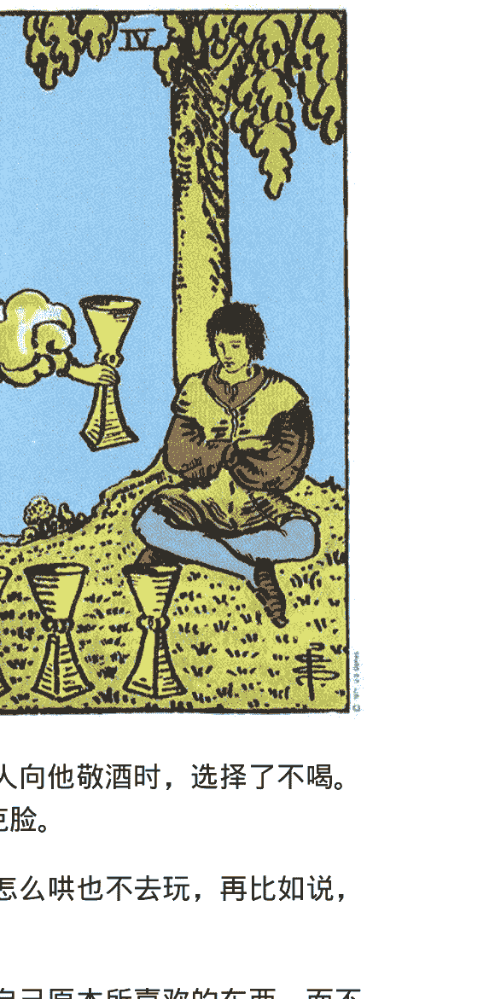

圣杯代表的是带给人快乐的东西，让人享乐的东西，也就是刺激人兴奋神经的东西，这些东西无一例外，在最初的时候给人的刺激是最大的，也就是所谓新鲜感。

圣杯四就是这种新鲜感已过，主角在怀念曾经的新鲜感的时候。

比如说电脑游戏，打开一款新的电脑游戏，刚开始玩的那一段时间，一切都是新颖的，刺激的，之后就渐渐淡化。因此玩家们总是在追寻新的游戏。或者，等待现有游戏的更新。

再比如说恋爱，刚开始一段新的恋情时，对对方的了解是不深的，对方的性格，触感，话语都充满了新鲜感，能带来最大的刺激，最大的兴奋，最大的快乐，之后渐渐淡化。

我不知道你是不是对恋爱持幻想，认为恋情很神圣，但事实是，恋爱是一个复杂的东西，在其中，很有不神圣的部分。比如说，许多人对恋爱的追求，不过就是如酒鬼对酒的追求一般，追求沉浸其中的快乐和麻醉而已。

否则又哪里来那么多风流浪子，追寻一个又一个漂亮的妹子？

作为一个男人，我可以告诉你，如果说妹子是一杯酒，那么新的妹子就是一杯绝妙醇香的美酒，有着无与伦比的吸引力，她不一定要比上一位优秀，或者漂亮，或者年轻，或者身材好，或者放荡，只要她有一定的吸引力，并且和上一位不同，那么她就绝对要比上一位要美味千倍。

所以从某种意义来讲，女人们强烈的嫉妒心也是有一定道理的，因为她们知道自己没有任何办法能影响男人看上另外的女人，所以只好迁怒于那个女人。

如果要我来对这样的情况给建议的话，我会建议女人去确保男人不是因为新鲜感而和你在一起。大部分男人都能感觉到别的妹子的吸引力，但不是所有男人都会作出相应的行动。

当然追求新鲜感这个事情，并不是男人的专利。但是，根据反荡妇防卫机制（Anti Slut Defense）理论30，大部分女人都会或者潜意识或者显意识地极力避免自己作出荡妇般的行为，因此她们不会以花心的方式追寻新鲜感。

女人追寻新鲜感的方式，根据我的观察及臆测，常常表现为发脾气闹别扭。因为你看，在恋情刚开始的时候，两人之间是存在一定的距离的，两人跨过了这份距离，才终于成为恋人。在女人发脾气闹别扭的时候，又人为地创造了类似的距离感，若是男人配合地献上了殷勤，那么，也许，这种跨越距离的感觉能让女人能体验到类似刚恋爱时的新鲜感。

此外，女人们常常爱说，“他没以前爱我了”，这也是难以理解的一句话，有人曾对我说这句话，我毫无同感并且完全不知道她为何会有这样的感觉。也许，这是在说，已经没有曾经的新鲜感了。

## 圣杯五

失去的爱。

塔罗牌中许多引发人痛苦的牌，都和失去有关。圣杯五便是其中之一，更为过分的是，圣杯五所代表的失去，失去的是人怀有感情的东西，友情，爱情，或者是家。并且，圣杯五中的主角显然因自己所失大受打击，把自己的头埋在斗篷中，正在痛苦着。

相比其它牌来讲，圣杯五更要强调当事人所经受的情感打击。比如说，如果高塔是在说，“啊，有东西坏掉了”，那么圣杯五就是在说，“啊，有人在伤心。”

为什么伤心？因为失去了自己重视的东西。

所以，圣杯五表示的是，“失去重要的东西的那种心情”。如果说非要我详细描述的话，就是……“啊，他竟然离我而去！抽泣抽泣。”，“没有你的世界，我不需要！”，“失去你的那一刻，我也失去了活着的意义。”，“不要死啊！醒醒！不要骗我，不要骗我！”，“他没有死！只是去了一个遥远的地方！”类似这样的感觉。

此时，当事人对这种“失去”的反应，可能有比如以下几种。

- 1. 拒绝接受事实。“他怎么会死！”，“他还是爱我的！”，“我们最后还是会在一起的！”，“这一定不是他的本意，是他妈逼的！一切都是他妈的错！”，“我们不是永远的朋友么！”
- 2. 压抑自己的感情，麻木。这个时候，牌可能以逆位出现，注意是可能。有时候当事人可能觉得自己并没有那么伤心，并没有表现出强烈的情感，但实际上只是压抑自己的感情而已。

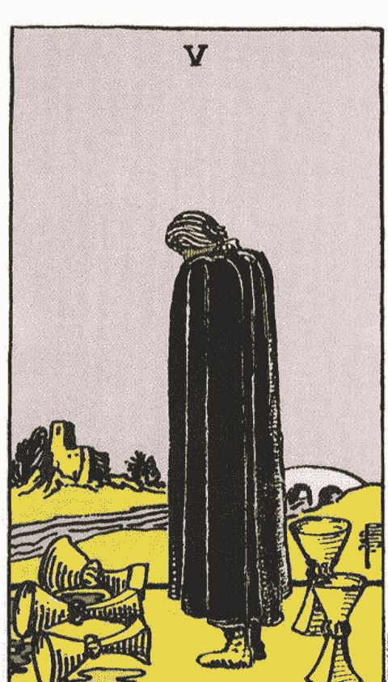

- 3. 承受打击。打击有多大就因人而异了，可能只是郁闷个几天，也可能是大呼小叫，也可能是嗷嗷大哭，当然寻死觅活，或者觉得人生失去意义，就此一蹶不振也是有可能的。

关于圣杯五，很多人爱指出的一点是，虽然画中人面前的杯子倒了，但是他的身后仍然有杯子站着，也有着一座桥，可以走出这样的困境。对此我想说的是和权杖十一一样，这事情没有说的那么简单。

圣杯五中最显眼，占主调的元素是什么？是倒下的杯子和哀悼的黑衣人。确实，牌中人身后有杯子，可以代表仍然存在的机会，可以代表周围人的支持，也有一座桥可以解释为仍然存在走出阴霾的一条路。但是这些元素都是次要的，圣杯五的主要元素是失去，以及经历这种失去的感觉，而不是，仍然有出路。我们不需要特地去强调这些次要元素。

也许你会想，难道不是该用积极思维，强调好的元素，而不是坏的元素么？

不是。

想一想，假设一个人有两个儿子，其中一个不幸遇上事故死去了，你能不能对他说，“确实这是很不幸的事故，但是你还有一个儿子呢，开心点。”

当然不能。除非他对死去的那个儿子完全不在意，不然绝对不可能开心得起来。与亲人的别离是一件伤心的事，这和有多少个亲人并没有关系，和是否仍然有亲人在身边没有关系。

同样的道理，恋人的分别带来的伤心，和天涯何处无芳草并无关，友情的决裂，和仍然有一些朋友毫无关系。

失去即是失去，心痛即是心痛，这是天真的乐观所无法改变的。

不过当然，对于因失恋而呻吟过多的男人，你完全可以质问他到底要他妈哭到什么时候。很多时候这完全只是矫情。毕竟如果真的有那么伤心，正常的反应是，看好了老子今天开始要改变自己，奋发图强，让你后悔甩掉了我31！男人不适合矫情，真的。

至于仍然拥有，没有失去的东西，默默支持的友人，只有在当事人在哭完之后，在能够接受现实之后，才能等到当事人注意到他们。

圣杯五中，主角背后存在的桥和杯子，并不是说只要转身就可以不用悲痛。而是说，并不是一切都结束了，是在说，可以失望，可以纠结，可以忧愁，但不用绝望——总有人在等待着你重新站起来。

## 圣杯六

圣杯六也是一张可以从多种角度解读的牌，因为画面并非非常明确。其中的一个角度便是，认为圣杯六代表的是回忆的美好与陷阱。

之所以是“回忆”，原因之一是，牌中的两人都以小孩的形象出现，这使人联想到童年的回忆。当然在某些情况下也可以解释成当事人就是小孩，但是为小孩读牌的情况还是少之又少的。

原因之二则是，整张牌有种回忆特有的梦幻气氛。具体地说，牌的整体画面是一个封闭的环境，背面有房子，侧面有守卫，前景处也有四座圣杯。这种封闭的环境代表了安全以及保护，我们最需要安全感的时候，自然，也是我们的童年。

当然，这里说的安全感，和女人们爱嘀咕，男人们永远搞不懂到底是在说啥的安全感不同，是小孩所体验的，更为单纯的安全——未知即是不安，熟悉的有人保护的家即是安全。

不过，这张牌出现的时候，并不是代表我们能够回到这样一个小孩喜欢的受保护的，安全的环境中。毕竟这是不可能的，我们生活的世界每一天都充满了未知，充满了变化，一定程度上也充满了不安，更没有什么人整天来保护我们，我们必须想办法保护自己。

所以，牌中的受保护环境，更多的，是代表一种感觉，代表那种受保护的感觉。虽然说我们已经没有办法回到童年了，但是要再次唤醒那种感觉还是可以的，比如说，拜访自己的老家，或者造访自己的父母，或者翻阅以前的日记，以前看过的书，以前写过的同学录。再次接触通过这些充满回忆的东西，往往会让一个人被包裹在过往的回忆中，体验到曾经拥有的温暖。

这就是许多书在讲圣杯六时所提到的“思乡“，过往的记忆，旧地重游，老友重聚，等等。

当然，我们并不需要借助什么媒介就可以造访我们的记忆，因此圣杯六出现的时候，也完全可以代表单纯的怀念，那就是自发地将自己包裹在回忆之中，而这，就有一定的危险在里面了。

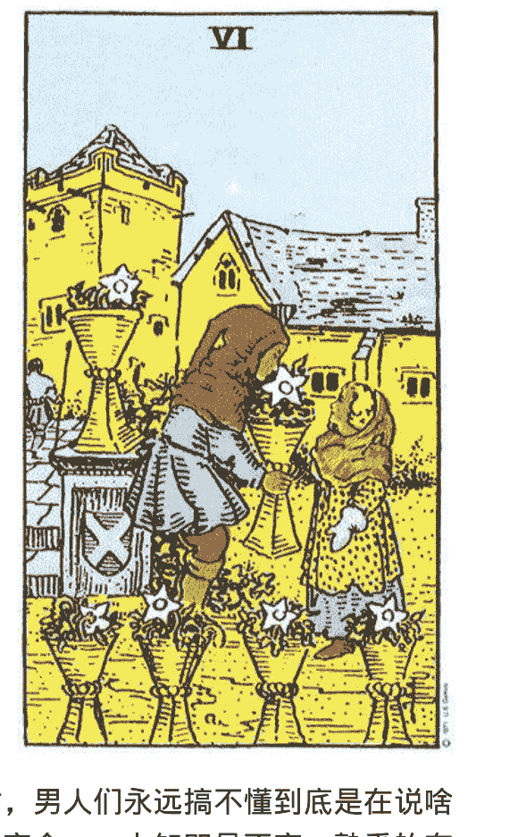

因为当我们在旧地重游时，虽然当时会有强烈的怀念的感觉，但大多数时候，之后都能回归到正常生活，将怀念放在一边。但是一个人若是刻意地追求回忆，那么，他可能是因为无法应对现在的生活，自觉或不自觉地逃避到回忆的安逸中，通过回忆所唤起的虚幻的安全感，抵抗自己所面对的现实的不安。

在这个时候，牌中的封闭环境就不再代表保护自己的乐园，而是代表自我隔绝的监牢，代表当事人不愿意面对现实，不接受现实，抗拒现实，一味地躲到回忆中。

出现这种情况有一个例子，那就是青少年时期遭遇频繁搬迁。不管对谁，周遭环境的完全变化，都是需要慢慢适应，并且会造成一定压力的。对于某些青少年来讲，由于心智尚不成熟，对此的承受能力并不特别强，再加上搬迁往往是家庭原因，他们无力改变，又会加强无能为力的感觉。因此，无法承受这般压力的青少年常常会选择逃避现实，沉浸在回忆之中。此外，他们也往往无法从回忆之外的渠道获得支持，可怜的孩子们。

我自己就是这样的情况，幼年经历了几次转学，每转学一次，就越发内向，越爱回想以前的朋友，越不爱和现在周遭的人打交道。

这在当时，可能是一个正当的自我保护，但是到了某个时间，人总会需要长大，需要在没有保护的情况下，自己面对这个世界。

## 圣杯七

对于这张牌的解读，一般可以有下面几种模式。

其一是选择。也就是说，牌上的人面对种种看起来非常美好的景象，他需要在这些景象之中，寻找出一个对他而言真正重要的，抛弃其它并不那么重要的。

有的解读认为牌中所出现的所有元素，珠宝啊，城堡啊，都有可能值得追求，也有可能值得放弃，需要看情况而定。另外一些解读则认为，所有这些元素中真正值得追求的，只有画面中央被布所覆盖的人影，因为它代表真我，至于其它代表胜利的桂冠，代表豪宅的城堡，代表钱财的珠宝，都是不值得追求的。

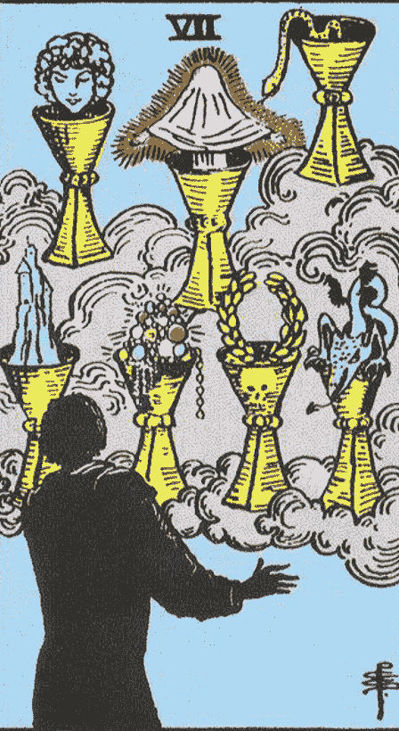

当然至于哪种更为正确就要看个人喜好了，并没有标准答案。

另外一种模式是，不切实际的幻想。圣杯七中所有圣杯和它们所承之物都坐落在一个云端之上，云端代表想象力，幻想。也就是说，画中人所面对的这些，并非是真实存在的东西，仅仅是他自己在那里白日做梦所想出来的。因此，画中人可能需要抛弃自己这么多的想法，转而去关注更为现实的东西，也就是说需要脚踏实地。

不过我这里要仔细讲的并不是上面这两个模式，而是另外的观点，那就是圣杯七代表“追寻虚假的快乐”。

具体地说，牌中各个元素分别对应如下虚假的快乐。

- 城堡——买房子
- 珠宝——有钱
- 桂冠——成就与赞誉
- 蜥蜴——做坏事
- 人脸——长得帅
- 蛇——滚床单
- 帷幕——灵性

在我们被社会所灌输的偏见之中，我们会认为上面大部分东西都能带给我们快乐，因为它们都是我们所想要得到的东西，我们相信得到了它们就能得到快乐。

比如说房子，谁不想有一个大房子？比如说成就，谁不想事业有成？比如说滚床单，除了很多因为需要假装矜持而要宣称自己不想滚床单的女孩子和还不到年纪的小孩子之外，谁不想滚床单？比如说做坏事，尽管大部分人都需要保持一副我不是坏人的形象，但是在内心深处谁没有一丝想要为非作歹，为所欲为的邪念？

这些全部，都是我们认为可以带给我们快乐的东西，我们认为只要拥有了它们，我们就拥有了快乐。

当然，你很可能会提出一个非常正当的抗议：灵性才不是和这些物质追求一概而论的东西！

毕竟，在很多人的心目中，灵性是神圣的，是高洁的，是好的，是和物质追求完全不一样的。

没错，灵性本身和物质追求并不一样。但是我要说的是，很多人追求灵性的方式，和他们追求别的东西的方式一样，所以对这很多人来讲，灵性不灵性并不区别。

比如说，你是不是觉得只要有了灵性，你就会很快乐？是不是觉得单单灵性就能带给你莫大的满足，希望，愉悦，以及欢乐？

那么你知不知道很多男人觉得只要能滚床单就会很快乐？你知不知道他们觉得单单滚床单就能带来莫大的满足，希望，愉悦，以及欢乐？

这显然是一个在情感上很难以被接受的对比，但是请用理智思考，我并非在对比灵性和滚床单，而是在对比一个人对灵性的偏执，以及另一个人对滚床单的偏执。

这两者之间最大的区别是，偏执于滚床单的人一般知道自己的偏执是变态的，偏执灵性成长的人一般以为自己的偏执是崇高的。

更常见的是，女人对爱情的偏执，觉得只要自己遇上了对的人，拥有了完美的爱情，也就掌握了快乐，解决了自己所有的烦恼。

偏执的对象并不重要，不管是灵性，还是滚床单，还是爱情，还是工作，还是退休，还是钱。它都是同一种偏执——只要我拥有了它，我的一切问题都没有了，我就拥有了快乐。

对塔罗牌感兴趣，想要学习塔罗牌的人中，大部分都对灵性，精神，灵魂，天使这类话题更有好感，所以在选择偏执的对象的时候，很多会选择此方面。

但是这种偏执仍然是错误的。尽管这种偏执很常见，它是错误的，是“追求虚假的快乐”。

所有这些让人着迷的东西，本身都有足够的魅力，也能提供一定的快乐，但是并非它们就能够等同于快乐。尤其对于在它们中追寻快乐的人来讲，它们获得的更是一种快感，但却把这种快感误以为快乐。

拥有豪宅，获得极大的钱财，取得极大的成就，以及众人的羡慕，别人的赞誉，滚床单，等等，所有这些圣杯七中元素所象征的东西，无一例外能够带给人一种满足和亢奋的感觉。无一例外，它们都有可能让人上瘾，让人舍弃其它一切，只为追求获得这些东西时的感觉，让人认定自己只需要它们中的一个。

无一例外。

比如说钱财，人可以为钱财六亲不认，这是事实。比如说长相，有人为了达到想要的外观而花极高的价格整容。

当你把一个东西等同于快乐的源泉的时候，它就不会带给你快乐，只会带来快感了。

## 圣杯八

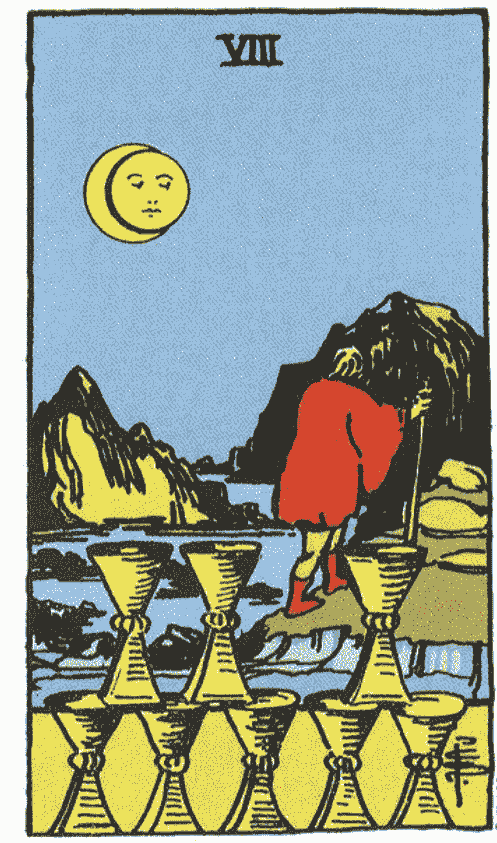

是夜，明月高挂，一个身着披风手拄拐杖的男人刚刚上岸，正向着前方踏出自己的脚步，他像个男人一样，一言不发，只留下自己的背影作为诠释。在他的身后，有着八个圣杯，但显然八个圣杯之中缺少了一个，空出了一个位置。

对于这个画面，很明确的一点是，这个男人是要去寻找些什么。那么不明确的就是，第一，他与身后圣杯的关系，第二，他到底要寻找什么。

对此，有这么一种解释，那就是男人身后的圣杯代表他已经获得的东西，但是其中缺了点啥，他启程就是为了寻找那点啥，在找到之后，他就会回来，让这些圣杯变得完整。

这虽然也是一种可行的解释，但是我个人更倾向于下面这一种解释，那就是：

身后的圣杯代表他已经获得的东西，但是他发现这些并不能满足他，它们缺少些什么，而这缺少的东西又是非常关键，对他非常重要的。为了寻找，他所缺少的，对他非常重要的那个东西，他义无反顾地踏上了旅程，只留下了一个男人该留下的背影做纪念。

也就是说，圣杯八代表主动的离别，代表背叛，代表一意孤行。

从背叛这个角度来看，圣杯八中落魄的男人也稍微有了一丝帅气，是吧？

因为你看，牌中八个圣杯整齐地排列着，仿佛在注视着，同时威压着牌中的男人，而他不吃这一套，依然离开了。

因为圣杯代表的是情感和人与人之间的联系，圣杯八中的背叛也并非仅仅是背叛别人的期待，更是对”关心自己同时自己也关心着“的人的背叛，是对自己所在乎的人的背叛。八座圣杯的集结，以及男人的背影，无不在传达着这一背叛的沉重。

比如说，一个男人发现自己和妻子之间并没有爱，毅然决定再给自己年轻一次的机会。

在这种情况下，八座圣杯除了代表很多人的反对，也可以代表他们结婚多年回忆的沉重。

当然，如果你是女性，这种情况有可能会怒发冲冠，想着，这分明是坏男人的行径！不管怎么样，抛弃都是错误的，可耻的，都是挨千刀的！女性公敌！

对此我表示理解，因为在这样的情况下，女人一般是要扮演那八座圣杯的角色的。毕竟女性忍耐力比男性要强很多，面对不如意的状况选择努力承受的比男性多得多，面对不幸福的感情时宁愿继续的也不少。

那么在这样的情况下，男人一般所要扮演的，自然就是背叛者的角色了。结束掉该结束的，给双方一个重来的机会，然后自己承受指责，承认全部都是自己的错，是自己背叛了对方。另外，不论是正常分手还是出轨，都一样是背叛，所以这里我所说的背叛这两个意义都包括的。

在一段感情需要结束的时候，尽管大部分时候不可能仅仅是一个人的错，因为大部分男人不是完全的花花公子，大部分女人也不是完全的荡妇，但是仍然需要表现成一个人有过错，另外一个人是受害者，如此才好接受。

这个时候，男人背叛女人并非只是心狠，这是他选择扮演的角色。

## 圣杯九

小牌中所有的九号牌都和“独自一人”有关，圣杯九也不例外。圣杯九代表的是，独自一人的享乐与满足。

因此，可以和圣杯九联系起来的比较典型的场景，就有比如一个人喝酒，一个人看小说，一个人玩游戏，这样独自进行，又能带给人快乐和满足的情形。

有人评论说，圣杯九的画面很像是一个家里蹲正在心满意足地看电视，由此再延伸一下的话，一个人玩电脑，看视频，听歌之类活动也非常符合圣杯九呢。

再有比如一些一个人就可以进行的兴趣爱好，比如说模型拼装，等等。

我们可以看到，圣杯九和圣杯三可以形成一个对比，在圣杯三中是一群人一起玩乐，在这样的情况下，最后曲终人散时，当事人往往可以感受到一丝丝的寂寞，因为终于又剩下自己一个人，High 不起来了。

圣杯九正好相反，圣杯九正是在独处的时候才能尽情的享受，若是有朋友加进来，恐怕会破坏自己的乐趣。

而这，正是圣杯九的危险所在——只顾着一个人玩，忽略了周围的人，导致自己慢慢变成孤家寡人。

在这种情况下，牌中九座圣杯的帷幕，就变成了让当事人与世隔绝的围墙了，当事人所穿的淡色衣装，也可以理直气壮地解读成代表他空虚的内心，因为不管怎么说，人都是社会性的动物，不能整天整天地自娱自乐。

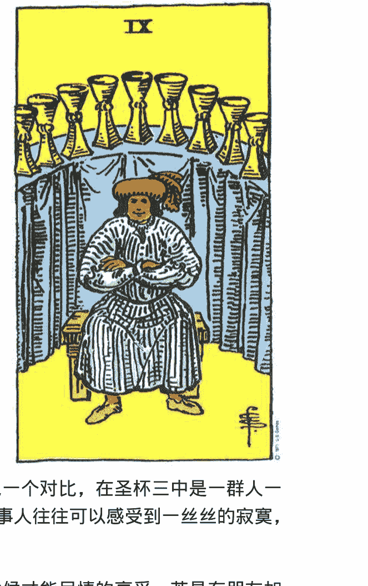

## 圣杯十

很多人喜欢把这张牌看作是代表幸福美满的一张牌，毕竟，牌中有一对幸福的夫妇，有两个欢乐的小孩，此外远处还有他们的家，空中还有美丽的彩虹，这张牌中的幸福元素实在是非常明显，大部分人理想中爱情的最终阶段，恐怕差不多就是这样子吧。

不过，一如我们所知，塔罗牌中并不存在绝对的好牌，圣杯十的幸福美满，当然也是有着缺憾的，而那缺憾就是不真实。

空中的十座圣杯在彩虹中闪耀，彩虹是一个我们能看到，但却触摸不到的东西，圣杯十的幸福美满也是这样的存在。我们可以肆意地幻想有这样一个幸福的家庭，可爱的孩子，但是仍然，这只是一个幻想，并不是我们能够触碰得到的东西。

因为人是不完美的生物，人与人之间无法构筑出完美的幸福，只能相对地朝着幸福靠拢，同时还要面对严峻的现实生活中层出不穷的烦恼。但圣杯十中并没有表现出这种不完美和烦恼，因此它代表的并不是现实的情况，而是我们的幻想，我们的希冀，我们的梦。

可悲的是，人们常常会把自己的幻想误以为是真实，这就是圣杯十的幻想特别悲哀的地方。

比如说在感情中，我们常常会美化对方，看不到他的缺点，美化双方的关系，自以为特别幸福。等到一切都结束的时候，才发现自己和对方都没有自己所想的那么好，双方关系也并不是自己所想的那样充满了快乐，而是有着各种各样的摩擦与隔阂。

这样对爱情的幻想一个非常典型的表现，同时也特别符合圣杯十的一个表现，那就是期待两个人之间会有一个“结局”。

结局是什么？结局是在小说和故事中，把所有悬念和矛盾冲突都解决之后，迎来的故事的终点。涉及恋爱的题材常常会有或者两人幸福地在一起，或者惨淡的分开的结局。

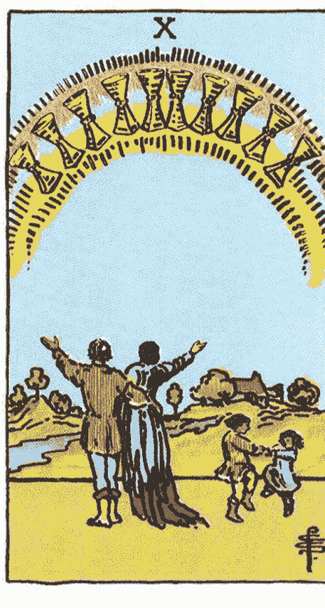

但是这样的结局只存在于故事中，并不存在于现实中，现实中存在的唯一结局是死亡。在现实中，只要还活着，感情就可能出现变故，家庭就可能四分五裂，并不存在童话故事中的，“从此以后他们过上了幸福的生活”。

尽管说起来也许是理所当然，但是相信并且执着于这样一个结局的人并不少。很多找上塔罗读牌人的求问者都会问，或者都会想，他为什么不爱我了，说好的幸福呢，不是说好要做彼此的天使么，不是承诺过只爱我一个么，为什么会花心，等等等等，所有这些想法，都是当事人在期待并不现实的爱，期待并不存在的结局，以及期待虚幻的圣杯十。

当然，一辈子的爱情是存在的，但那并不是需要谁去相信，或者期待的东西，而是在经过了岁月的风风雨雨之后所形成的结果。

如果要打比方的话，就好像一场长跑，执着于说好的幸福的同学们会只想着冲过终点的那一瞬间，因为那代表他们得到了一辈子的爱，而正常的跑完的同学只想着现在正在跑的瞬间，因为这是一个全程都很重要的过程。

# 第六章 宝剑的深渊——道阻且长

## 宝剑首牌

宝剑首牌，同其它的首牌一样，有着潜力和可能性的意义。具体地讲，宝剑首牌代表的是获得新的知识见解的可能性。

有的时候，这代表的是字面意义上的知识，也就是经由读书，参加课程等手段所能够获得的知识。常见的情况有比如买了一本新书，报名了一个什么课程，或者新学期的开始，对某种东西新产生的兴趣，等等。

另外一些时候，它可以代表另外一个意义上的知识，那就是意识到自己之前并没有意识到的东西。如果非要用一个词来表示的话，我想觉知这个词可能会比较合适。但遗憾的是，这个词现在被用烂了，也被赋予了某些特殊的意义，所以我们不用这个词。

具体地说，我们可以举几个例子。

比如说，一个人原本并不觉得自己的穿着有问题，但是突然有一天，经由朋友的提点，他意识到自己的穿着充满了问题。

再比如说，一段自以为是非常幸福的恋情，在遭遇突然的背叛之时，在沉重的打击之下，才明白这段恋情并没有自己以为的那么幸福。

还比如说，在经历了生离死别之后，才明白自己对某个人有多在乎。

可以说，宝剑牌组和圣杯牌组处于相对的立场。圣杯牌组提供的幻想让人远离现实，宝剑牌的痛楚让人贴近现实，重新认知现实。

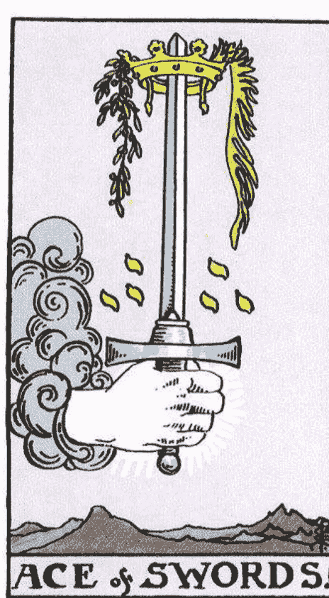

也许你对痛楚这个词产生了情绪反应，想要把宝剑牌一口气归结到“坏牌”这一大旗之下，但可惜的是，痛楚和知识密不可分，尤其是自知。

知识就意味着痛楚。因为我们所在的这个世界并不完美，我们自身也并不完美，既然不完美，那么在这其中存在着无数的因素带给我们困扰，迷惑，迷茫，犹豫，心痛，悲哀。

我们越是了解这个世界，我们就越能认识到这个世界充满了苦难。我们越是无知，我们越能愚蠢地相信这个世界是一个单纯的美好的世界。

所以，就如一句老话说的，“无知即是祝福”。

也正是由于这个原因，许多人宁愿选择无知。他们并不会直白地告诉你，“不，我就这么无知就好了”，但他们会抗拒接受现实。

他们会骗自己说，“不，他是爱我的”，“不，我是一个天才”，“不，我还有机会”，“不，还没有结束”，“都是时机的问题，下次会更好”，等等等等。

但是，就如另一句老话说的，“真实强力而不屈” 32，无论怎么逃避，真实总会追上我们，我们总会遇上宝剑首牌，告诉我们，是时候醒来面对真相和接受痛苦了。

这时，如果当事人仍然无法去坦然接受，仍然想要保持无知的状态，比如说，即使证据确凿，也骗自己说配偶爱着自己，那么宝剑首牌就将是代表审判之剑，带给他痛苦的觉悟。

相对的，如果当事人可以有勇气去面对和看清真实的情况，去接受自己并不如自己所以为的那么优秀体贴，或者所爱的对方并不如自己所想的那么好，或者一连串失败的恋情其实都是自己的错，那么宝剑首牌可以代表与过去决断，以及开始新的旅程。

不管怎样，真实都是强力而不屈的。

但是仍然，接受现实的又是说起来容易做起来难，换句话说，绝大部分你遇到的求问者做不到，你我也常常会做不到。比如说，我曾有相恋数年的女友，和她在一起并不快乐，如果我问自己，她爱我吗，我只能说我知道她很在乎我，但我既无法感受到她的在乎，也无法感受到她的爱，当然这其中也有我的原因，但无论如何，两人的关系都到了停滞不前的时候，可我却极难说服自己放手，不愿意承认，该结束了。这一定不是爱，是我的愚蠢和盲目地抱着事情可能好转的一丝希望，直到我发现事实的状况早已不如我所想。

某些读牌人会大力批判求问者的懦弱，盲目，顽固，但从不将这种批判用到自己身上。不要成为他们的一员，会读塔罗牌并没有给你贬低别人的权力，也没有让你高人一等，尤其是，并没有让你比求问者高一等。你在求问者身上发现诸多缺点很碍眼，只是因为人都有诸多缺点，你无法接受它们，是因为你还未睿智到能够在自己身上发现同样多的缺点，也并未睿智到能够宽容理解自己和别人的缺点。

## 宝剑二

之前说过，宝剑首牌是代表一个知晓的机会，紧随其后的宝剑二则表现了大部分人对这样一个机会的态度：抗拒。

没错，宝剑二是一张表现出非常明确的拒绝态度的牌。因此在遇到类似需要对方接受的状况时，宝剑二的出现可就成一个大灾难了。比如说表白啊，签订合同啊，商量价钱啊，什么什么的。

毕竟，蒙住的双眼代表不愿意去看，也就是在考虑要不要接受之前，考虑这个事情本身都很不情愿了。具体地说就是告白的话，连看都不愿意看你一眼，更别说接受了，合同的话，连条款都不看，一听到公司名就回绝了。或者对于推销员，一听到是推销的就闭门不见了。

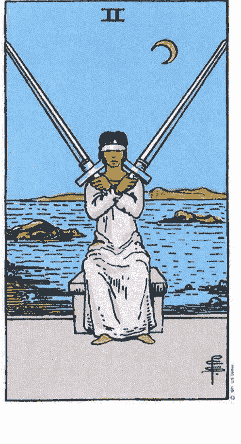

在胸前交叉的双剑则更明确地表现出一副“不要接近我！”的态度，再加上静态不动的坐姿，传达出的是这副态度难以转变。

对于抗拒的对象，除了表白和推销之外，也可以是感情交流，友情爱情和亲情都有可能。比如说对朋友表现出冷淡的态度啊，恋人吵架闹冷战啊，因为过去的伤心事对亲人板着脸啊。

要举更为具体的例子的话，你有玩过《Clannad》么？其中的主人公冈崎朋也对父亲的态度就是典型的宝剑二，虽然居住在一起，但由于某些因缘，两人之间保持着很大的距离，有了女儿之后也很少与其见面。但后来由于机缘巧合才知道，父亲同自己一样，由于某些和爱妻相关的事件而消沉和自暴自弃，但是即使在这样的情况下，他也为了把儿子拉扯大而努力着。

虽然是拒绝看清事实，坚持保持成见的宝剑二，但是那个事实究竟是伤人的，还是值得欣慰的，我们并不知道的。类似上面所讲例子的情况自然存在，但是同样不少见的还有以抗拒的形式进行自我保护的。

比如说，一对见面就吵架的夫妻，因为一见面就吵架，为了所谓的“避免给双方造成伤害”，都长年不见对方，不想对方，不问对方。

这张牌中的月亮以及波动的水面表示，有些时候，当事人之所以表现出这样一副强烈的抗拒的态度，是因为曾经产生过激的情绪反应，现在想要避免再出现类似情况，这在涉及到人与人之间时尤其明显。

比如说对朋友的冷淡，通常都发生在吵架之类冲突的情况之后，这些情况下显然当事人会产生过激的情绪反应。

夫妻或者恋人之间的吵架同理，而且恋人关系中双方所产生的情绪反应都会更为激烈。

对于女性来讲，可能会把这类情况描述为，“他伤害了我，所以我要对他冷淡。”

如果说一个人觉得造成她痛苦的原因是另外一个人，那么她会怎么做？当然是抗拒和远离那个人。

于是我们就明白了，为何宝剑二中的主角是女人，而不是男人。

玩笑放在一边，我真正需要说的是：一个人的情绪只属于自己，责任并不在别人，宝剑二中的女人只是通过抗拒别人的形式，抗拒自己的情绪波动。

## 宝剑三

塔罗中大部分的牌都注重于表现一个场景，比如说一个人在划船，或者五个人在吵架，或者三个人在举杯，然后通过这样的场景传达或是悲痛或是亢奋的情感，同时除了情感之外，往往也会传达出转变，吵架，庆祝等事件相关的信息。

显然宝剑三是一个意外，它的主要着眼点，或者说唯一的着眼点，是传达心痛这样一种情绪，对于到底发生了什么事情，倒并未透露多少。

也正是因为这个原因，个人（我）在面对宝剑三的时候总觉得非常苦手，不管是所谓被别人伤害也好，突然被触发起过去痛苦的回忆也好，因为被评价面包不好吃情绪崩溃哭着跑出去也好，分别也好，被憎恨也好，因为被欺负伤心也好，在我看来怎么看都是同样的一种东西，那就是剧烈的情绪波动，一句心痛，痛苦或者伤心即可概括，之后就没什么好说的了。

显然，不管是占卜也好，写牌意也好，没啥东西可说是一个令人尴尬的情况，尽管我建议你习惯这种尴尬，养成厚脸皮的习惯，现在的话，还是说说宝剑三吧。

除了上面讲的心痛，伤害之外，宝剑三有一个与此相关联的含义，那就是不去压抑自己的情绪，让眼泪尽情地流下来。

我们知道，当一个人需要流眼泪的时候，流眼泪是有益于身心健康的，相反，强压下去，假装什么都没有发生则是有害于身心健康的。

很可惜的是，强压自己的情绪和眼泪并不是一个罕见的现象，这时若抽到宝剑三的话，不管是正位还是逆位，恐怕已经快要压抑不住了。

我们可以联系到宝剑二，宝剑二中的女人也可以是正在压抑和抗拒自己的情绪，而在宝剑三中，这些被压抑的情绪正式地爆发了出来，由宝剑二中的湖面上的小波纹成长为宝剑三中的倾盆大雨，也就是全面地释放了出来。

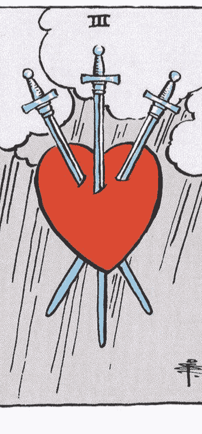

不得不承认，作为一个男人，对于这种情绪的爆棚，我并没有啥好说的，虽然我有过剧烈的情绪，但我却完全不知道如宝剑三这样大哭一场，或者大闹一场是什么感觉，当然我也基本无法理解有啥“心痛”值得死去活来如世界末日一般，作为一个男人自然应该全部一言不发地承受下去。

嗯，虽然我在讲皇帝牌时说社会对男人脆弱的一面关怀不够，但我并不认为男人们需要如女人们一般执着于自己有没有受到足够的关怀，男人是行动力的动物，遇到问题，行动起来替自己解决掉即可，当然这也意味着在有必要的时候去寻找第三方的帮助，但这不意味着要整天喊疼，大力斥责社会不公，然后等着别人来响应你的呼吁，解决你的问题。

所以宝剑三就到此为止！

## 宝剑四

基本上，这张牌代表的是休息。

宝剑牌组中的许多牌都与争端，冲突，烦恼，焦虑等有关，与之相对的，宝剑四就代表这些冲突平息之后的休息。注意是冲突平息之后的休息，也就是，虽然是休息，但仍然指示了冲突的存在。若是长期住院或者长假躺在家睡懒觉的话，就并不非常符合宝剑四的状况了。

不过仍然，宝剑四是塔罗牌中最明确地表现出躺在床上这一动作的牌，你也可能遇到它单纯代表卧床不起和睡觉的情况。毕竟，一张牌的意思和它在占卜中表现出的意思是两回事。

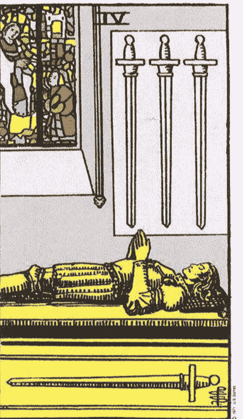

之所以宝剑四仍然指示了冲突的存在，在牌上我们可以明显地看出来，其一在于悬在墙上的三把剑以及牌中人全副武装的睡姿，这显然是起床后操起一把剑就能直接上阵的格调。其二就是，本身宝剑就有冲突的意思，这“悬而未掉”的三把宝剑，可以看作是“悬而未决”的问题。

此外，冲突与休息本来就是相反相对的一体。就好像一般饿了才会要吃饭一样，有着冲突和平静的日子，才让人特别想要稍微地去维持内心的安宁。

当宝剑四出现的时候，可能当事人会特别需要这种安宁，需要暂时地从他所遇到的烦恼中抽身出来。这困扰着他的烦恼，并不一定需要以人与人之间的冲突表现出来，可以是压力，劳累，紧张，什么的。比如说长时间顶着高压力高度集中注意力导致的神经紧张，常见的情况有工作太过劳累呀，士兵在前线打仗呀，或者我国少年少女的高中生活呀。

总之，宝剑四就是要把这种紧张的情绪缓解下来，然后一般也会有美美地睡上一觉。毕竟所谓的休息，就是从烦恼中暂时地解脱出来，能够不再去思考这些烦恼，那么当然，最美的休息就是睡觉了，因为睡觉的时候人是不思考的。

不过，当然，占卜中出现的时候，它也可以单纯表示休息，不表示睡觉。比如说通过旅行的方式休假，或者快乐的购物时间，或者一个人的快乐时间。

总之，关键点并不是睡觉这一形式，而是休息这一行为，以及，“把烦恼的事情放到一边”这一概念。

嗯，讲完了这张牌通常的内容，让我们讲一点刺激的。虽然说刺激，不过只是对部分读者会很刺激。

这张牌也代表了寻求庇护的行为，也就是，面对压力和烦恼的时候，寻找一个能带给自己安宁和暂时忘却烦恼的地方。

除了牌中的窗花有表示这一含义之外，整张牌所表现的休息的主题，片刻的安宁，悬而未落的宝剑，也与寻求庇护有联系。

如果只是偶尔一次这样的寻求庇护的话，显然，是符合上面所讲的休息的定义的，也没有必要这样特地地拿出来说一遍，所以我这里说的并非偶尔的寻求庇护，而是藉由这样的庇护长期地逃避自己所需要面对的烦恼。

这样的庇护常常是“心灵的庇护”，也就是说不一定非要是物理的地方，往往可以是一个抽象的东西，不管自己遇到了怎样的麻烦，怎样让人焦急让人彷徨让人不安的情况，只要有了这个东西，当事人就会觉得所有的麻烦和焦急都消失了，仿佛从冰天雪地的北极来到了夏威夷岛，能够立刻甩掉身上的累赘，从寸步难行变为动如脱兔，又如在暴雨中摸爬滚打终于回了家，然后好好地洗了一个澡。

总之，就是一种整个人都被救赎了的感觉。

那么，对于这种东西，元芳，你怎么看？

这个问题的标准答案是：“大人，此事必有蹊跷！”

没错，此事必有蹊跷。这个世界上并不存在这样的灵丹妙药，即使在炼金术士的梦中，这样的灵丹妙药也是只在每个人之中存在，并不存在于这个世界上。

不管感觉起来有多么安宁与清爽，这些庇护的效果都只是暂时的，就如看一场喜剧电影能让你暂时忘掉烦恼一样。并不是说这些庇护不好，它们一般是好东西，只是并没有好到灵丹妙药那种地步。

> “但是你没有举一点实际的例子，你到底在说啥！”

如果你这么问了，那么说明你读得很认真。我在说的是，很多人在面对塔罗占卜，占星术，灵修，新时代等东西时，所展现的态度。

比如说，不少人把塔罗占卜当作代替自己做决定的工具，一旦遇到什么问题不知道怎么办的时候，就会找上一个塔罗牌读牌人，让他给自己指条路。通过这种方式，他可以不去认真考虑自己所遇到的烦恼，傻傻地照别人所说的那样做就好。这是对塔罗的误用以及滥用，就如拿刀对着人一样，愚蠢的是人不在工具。

其它占卜工具的话，同样的道理。

至于灵修以及新时代，是众所周知地会吸引一大批逃避现实的人，当他们把自己的脑袋里装满光和神，宇宙与天使，灵气与爱的时候，昨天下午和上司的吵架这样细小的事情自然就会显得很遥远。他们是真的相信自己的神无比神圣，还是仅仅因为这种盲目的信仰能让自己不去想平日的烦恼所以才这么虔诚呢？

## 宝剑五

当谈到宝剑牌组的时候，我应该经常使用冲突这个词，我用这个词的时候，我并不仅仅指外在的，人与人之间的冲突，而是更广泛地包括了内心的冲突，比如说当女朋友说要到大城市里发展的时候，想要留下她的心情，以及想要她好好发展的愿望的冲突。

但是，在宝剑五中，我们所处理的冲突就主要是实实在在的人与人之间的冲突了。不过，同权杖五中的公平竞争或激烈讨论不同，宝剑五中并不存在公平或者公正的因素，只存在刻意的伤害。

如果说要举例子对比的话，比如说在网上讨论的时候，有的时候参与的人会各自抒发自己的意见，对别人的观点提出质疑和反驳，有的时候会变成胡搅蛮缠，人身攻击，甚至激情对骂，前者就是权杖五，后者就是宝剑五。

正规讨论的例子：

> “你的这个观点不对，根据某某权威在某某书中所著，正确的事实应该是这样这样，所以你是错误的。”

胡搅蛮缠的例子：

> “书里写的就是对的了么！我原本以为你是一位大神，没想到你只能搬出书里写的死东西，唉真是失望。”

区别在于，讨论的时候，发言人的目的在于探讨一个话题，或者辩论的时候，目的在于证明对方是错的。当一个人胡搅蛮缠的时候，他的目的在于想方设法诋毁对方，好欺骗自己那比尘土还小的自尊心，告诉自己，自己没错，都是世界的错。

当然，在线下的交流中，很难在三言两语之间就互相攻击起来，但是，类似的情形并不少。

总之，宝剑五指的就是——

一个人对他人表现并实施恶意，故意做出伤害他人的行为。

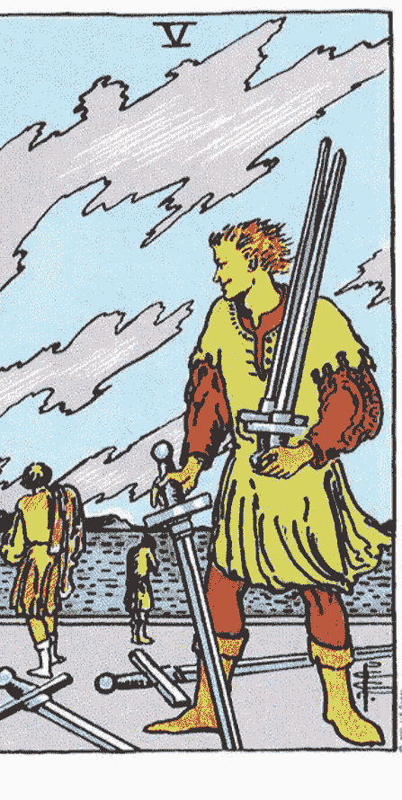

典型的情形当然是吵架，街边陌生人之间的争吵，朋友的争吵，家人的争吵，恋人的争吵。不管用不用脏话，只要是争吵，总会故意去互相伤害，揭短，诋毁。而且，说老实话，脏话在这种情况下并不算伤人的，比如说，你觉得“fuck you”和“我再也不想见到你”哪个更为伤人呢？

但是，比吵架更为伤人的行为还有很多。比如说，想方设法去“对付”一个人，去给老师或者上司告密，在班上排挤特定的某一个人，或者聚众把谁打一顿。

再上升一个等级的话，就要变成小说电视剧中喜欢描写的，想办法对一个人的名声，地位，钱财，健康等造成伤害，这就是非常恶劣的事情了，严重的可能会变成杀父之仇，夺妻之恨。

说起来，许多人似乎觉得成年以前的学生时代是清纯，美好的。但说实话，小学初中高中的班级比许多其它环境更充斥着这样的恶意。比如说，一个班级，甚至一个年级大部分的人去排挤一两个人的情况并不少见。校园暴力也或多或少总是存在。再比如，因为自己和一个人吵了一架，或者这个人“抢”了自己的男友，就怂恿朋友疏远这个人。

如果你在想，这不过是小孩子的玩笑，那么请赶快道歉。

想一想如果你的大部分朋友都突然开始疏远你，你会有什么感觉。

这些“玩笑”是成年人心理都难以承受的，更别说未成年人。

宝剑五代表的情形我们讲的差不多了，不过我接下来要讲更为重要的，我更想讲的东西，也是这张牌悲哀的地方。

宝剑五中有两个败者，一个胜者，对那个胜者你怎么看？是不是觉得他是这张牌中的坏人，通过故意伤害别人获得快乐，看到自己的敌手被打败而感到很满足？

如果是的话，那么我问你，你觉得在你的生活中，如果你遇到宝剑五类似的情况，这个不折手段的胜者会是你自己还是别人？

只要你的梦想不是称霸世界，相信你会和大部分人一样，觉得这个胜者是别人，觉得自己不会这样去卑鄙地故意伤害别人。

那么问题来了，把想要称霸世界的人放在一边不谈，既然所有人都不愿意去主动伤害别人，那么这个伤害人的混帐到底是谁？

这就像好人与坏人的故事，把以犯罪为生的人放在一边不谈，既然所有人都觉得自己是好人，那么坏人到底是谁？

这两个问题的答案是一样的，并且很简单，那就是——

每一个人都可能做坏事，大部分人做坏事的时候，都仍然觉得自己是好人。

人是一种无法否定自己的动物，即使他们可以承认自己的缺点，但却难以把自己和“坏人”，“伤害别人”，“背叛别人”，“欺骗别人”这样的词语联系起来。

比如说，你有没有在吵架的时候，说出让你在乎的人非常伤心的话？

如果有的话，会不会事后解释说这是自己说的气话，自己实际上并不是这个意思？

我周围曾有某些女人就很爱这么做,我从不相信“气话”和“玩笑话”之类说辞，我也不建议任何人相信。

说真的，好好想想，如果说一个女人口中的分手可以是气话可以不算数，那么是不是一个男人口中的“我会娶你”也可以是只是因为当时氛围太好了，或者精虫上脑才说，实际上也不算数？

他们会相信自己说了气话，仅仅是因为他们后悔说了这种话，无法承认自己做出伤害别人这种事情而已。

同理，在以其它形式对别人做出伤害的时候，当事人在绝大多数情况下不会觉得自己是在恶意地加害别人，只是觉得自己是个受害者，是受到其它什么因素或者人的影响才不得不这么做。

我们都想要去相信坏人是别人，自己是受害者，但这世界上并不存在坏人这个物种，每一个人都可以并且会伤害他人，在我们拒绝承认自己伤害了别人时，我们只会拒绝改变，因为既然你没错，你为什么要改变？所以我们继续互相伤害。

宝剑五，就是这样一个互相伤害的情景，牌中的所有人都一样既是加害者也是受害者。

## 宝剑六

一般对宝剑六的解读是，在友人的陪伴下，从充满情绪波动的时期往平静的时期过渡。

要说为何的话，首先宝剑六是一副沉默的画面。想象一下，在一片平静的湖中，一个男人一言不发地划船，他前方坐着的两人也背对着他一言不发，他们并没有在对话，也没有在争吵，仅仅是沉默着而已。

在这份沉默之间，就有一种压抑的氛围不知道你是否有感觉到？想一想，当你和朋友或者家人一起到哪里去的时候，不管是旅游还是搬家，一般来讲都是会聊天的，是吧。在这种环境下，要是每一个人都低着头不吭声，要么，就是都在玩手机，要么，就是都有心事。

显然，宝剑六中的两人不可能是在玩手机，那么他们当然是有烦恼了。具体地说，尽管已经远离了让他们烦恼的事情本身，但是心中的阴霾却迟迟无法散去。

现实的例子的话，可以是失恋之后的情绪低落状态，可以是因为早上的巧克力被别人吃掉了而失落一整天，可以是吵完架后还在生闷气。

总之，就是这么一个类似后遗症的东西。

虽然有这么一层阴霾的因素存在，牌中的人却是要慢慢地向摆脱阴霾的方向移动的。至于这是为何，有人认为这牌中的船是从波涛汹涌的地方往风平浪静的地方行驶。不过这种观点我认为和牌面对比会显得很牵强。牌中右下角的波涛，如果看作是因船桨划动而起，象征麻烦的事情已经过去，但当事人仍在自寻烦恼，倒显得更为合适。

不过，船这个符号本身，就能够象征牌中人在往好转的方向发展，因为船代表转变。

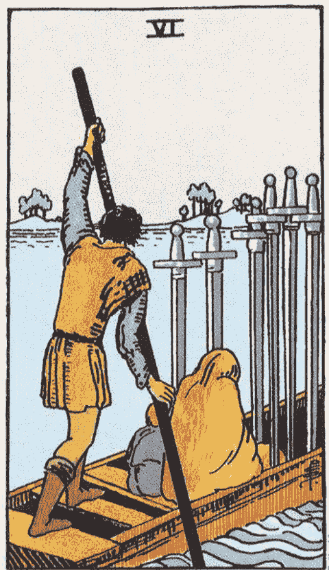

## 宝剑七

懦弱的男人不敢直面问题，只想着怎么投机取巧。

或者你可以看成是聪明的男人开动聪明才智，曲线救国。

总之，宝剑七的主题之一就是坑蒙拐骗之类的卑鄙手段，至于这是耍小聪明，还是脑袋灵活，就要看你想怎么评价了。

具体的例子，除了很少见的真代表偷东西之外，还有考试作弊，欺骗，设局，结党营私，设鸿门宴，什么的。

不知道你有没有问，牌面上明明画的是偷东西，和考试作弊有啥关系呢？这样想吧诸君，考试作弊，不就是偷到了本来不属于自己的分数么！

当然这是一个玩笑。偷东西只是一个符号，这个符号象征的是见不得人的勾当。

虽然说是见不得人的勾当，但是这样的事并不如我们印象中那样稀少，相反，是很常见的。

学校中自然不用说，作弊是一个全球流行的现象，从带小抄，交头接耳，传纸条，发短信，乃至于抄袭论文，贿赂老师，篡改学分，买答案，请人代考，方式方法层出不穷。

当然作弊之外，一些相对更为光明正大的手段也可以算在其中，比如说买户籍获得高考加分。为何可以这样的话，因为宝剑七的符号，除了见不得人，显然也代表走不太正当的捷径。

在社会上也并不少见，遇到什么难办的事情的时候，大部分人人首先想到的是，“说起来我有一个妹妹有个大学同学是这方面的负责人，不知能不能送点礼，通融一下？”我不想在这里探讨这样做是否正确，这实在是太过无聊了，我想说的只是，这是一个普遍的社会现象。

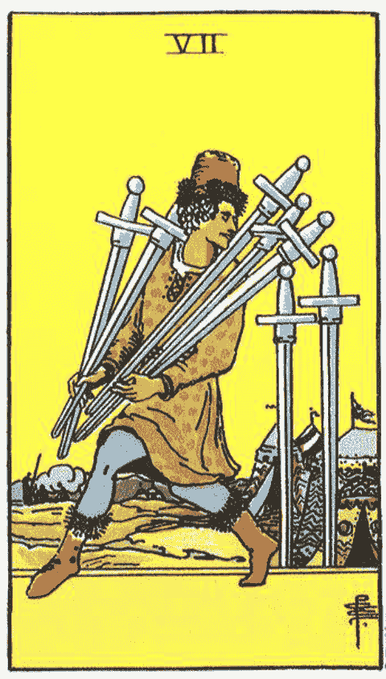

毕竟我们都喜欢走捷径，能轻松解决的问题，谁愿意花大把汗水去鼓捣？只要不会让自己坐牢，谁在乎方式方法正当不正当？

当然，会有人在乎，但是事实是绝大部分人不会在乎。再一次地，我不会在这里探讨这是否是一个符合道德的事情，这实在是太过无谓了。

但我想要探讨的是，为什么我们不在乎。这答案，在牌中也有提示。

在宝剑七的背景上，我们可以看到许多帐篷，远处还有几位士兵的身影。毫无疑问，他们都是牌中这位卑鄙的男人的敌人。

也就是说，他这偷剑的行为拥有极大的危险，那么他宁愿顶着这份危险也要来行偷窃之事，理由只可能有一个，那就是如果不这样的话，自己所在的军队并无胜算。

虽然我们并没有在战场上，但我们却通常面对着类似的情形：我们觉得我们必须要做的事是，通过正当手段我们绝对做不到的。

宝剑七中的人需要获胜，而我们需要合格，好成绩，毕业证，需要工作，升职，房子，车子，恋人，配偶。

这些事情中的许多，我们会觉得自己不可能做到。

比如说年轻人要面对的买车买房，完全靠自己的实力买房基本是不可能实现的。

比如说中学生们要面对的好成绩，虽然成年人，尤其是为人父母的会假定，只要努力就能有好成绩，成绩差肯定是不努力。但实际上，作为一个中学的回忆仍然鲜明的人，我可以告诉你，一个中学生的成绩基本是稳定的，即使他努力了，也基本是稳定的。

可以说，分数就像是工资，努力了就会涨这种事，理论上讲有道理，实际上是白日做梦，太天真了，事情没这么简单。

那么，面对根本涨不起来的分数，很多学生当然会选择作弊。

当然，一个成年人可能会说，即使考得差也不能作弊，但是，未成年人受到的教育中，更加强调的是要让他们考高分，而不是做一个正直的人³³。

当然我不是说作弊是对的，我只是以此举例说当人面对这类社会压力的时候，就会倾向于走捷径。

就好像现在都爱喷的拜金女们，除了她们自身显然有问题之外，这和现在年轻男女所面对的极大生存压力真的没有关系么？

总之，我想说的是，当人面对压力，尤其是极大的社会压力的时候，有些人会倾向于选择看起来更为轻松但不那么正当的手段。宝剑七正是描写了这个现象。

## 宝剑八

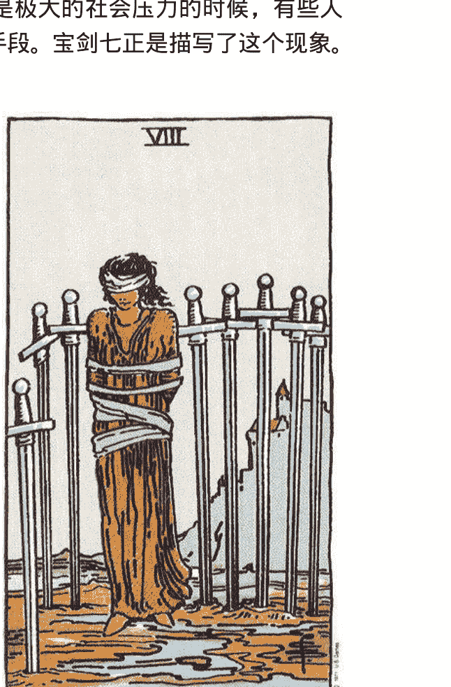

愚蠢的女人被自己的愚蠢束缚着，动弹不得，无能为力。

在七十八张塔罗牌之中，宝剑八是少有的直接明确地表现出束缚和限制这含义的一张，毕竟牌中人什么也看不见，同时双手也无法行动。显然，这个姿势所代表的是看不清事件全貌和无能为力。

同时，这个姿势也代表着“不是我的错”和“我没有办法”，

总之，宝剑八这张牌总结了当一个人面对任何有一定难度或者可能会带来痛苦的烦恼之时，他的自我认知，具体地说……

-   他认为自己没有办法，无能为力，改变不了现状。也就是牌中被捆住的双手。比如说，觉得自己就是学不进去，宣称怎么都改不了吸烟，觉得自己一辈子都会是电脑盲，觉得自己就是独立不了，怎么都没有办法。
-   他会夸大自己面对的烦恼，顺便贬低自己。比如说，“英语这么难，我这么笨，学得会才怪了。”“女人都喜欢高帅富，像我这样的矮挫穷连男人都不会要。”“做不到做不到做不到绝对做不到的！”
-   他常常会怪罪这是别人的错。比如家人或者恋人伤害了自己，或者现在社会男人就是不好混，或者女人就是不好混，或者别的什么。

似乎举的例子不够具体？那么，我们再举一个稍微具体一点的例子……

你是不是觉得自己生活中有一些东西很早就需要改变了，但却一直没改变？

这是为什么呢？

是不是，是因为问题太难，或者环境/时机/他人的理由，所以你不得不推迟？

相信你一定能想出至少一两件这样的事情，对么？至于我为何确信你能想出来，是因为宝剑八所代表的这种自我认知，是一种普遍现象。

任何事情，只要我们原本有能力改变，并且应该改变，但我们并没有去行动，去改变，我们就会倾向于去这样想，去觉得并不是自己没有去改变，而是因为各种各样乱七八糟的理由自己没有办法改变现状，所以才什么都没有做。

比如说一段婚姻若是变得不幸了，两个人就可能都觉得是对方的错，怪对方“耽误了自己”，若是还有孩子的话，说不定就会觉得，之所以没有离婚，就是因为还有孩子这份负担，或者说这份责任在。都是因为有孩子自己才不幸福，都是孩子的错。

这样的故事并不少。

我们的国家喜欢赞颂父母之爱的伟大和美好，但是有的时候，这份爱敌不过逃避责任的冲动，敌不过想要说“不是我的错”的冲动。

当然，这种“我做不到”和“都是别人的错”的认知是错误的。

除了是面对麻烦的事情时通常出现的自我评价，在我们想要改变坏习惯，或者想要从一个糟糕的状况中脱离的时候，我们也会遇到这种感觉。

比如说，如果你已经很肥了，若是想要继续不顾一切地大吃特吃，那么你不会觉得你做不到。但是如果你想要开始健康饮食，你会开始觉得太麻烦，以你的耐性做不到，或者自己已经形成习惯改不了了。

或者，如果你想要继续过平静而可悲的单身生活，一般你也不会觉得你做不到。但是如果要你去一反常态，积极追求异性，多半你马上会开始找借口，现在太忙，自己不够好看，自己太内向了，等我有钱了，等等等等。

当你需要改变一种对我们有害的情况时，你的内心都会存在一种抗拒，告诉你不要去做，告诉你你做不到，告诉你等会做。

如果你没有战胜这种抗拒，如果你听从了这种抗拒，那么就欢迎来到宝剑八——有一件事你总觉得你应该去做，但又总没去做，但却不是你的责任。

因此，尽管宝剑八是七十八张塔罗牌中少见的清晰表现出束缚的牌，它代表的却并不是我们是受害者，我们被困住了，相反，它代表的是自我束缚，自我限制，它代表扼杀我们本来应该有的美好生活的，就是我们自己。

## 宝剑九

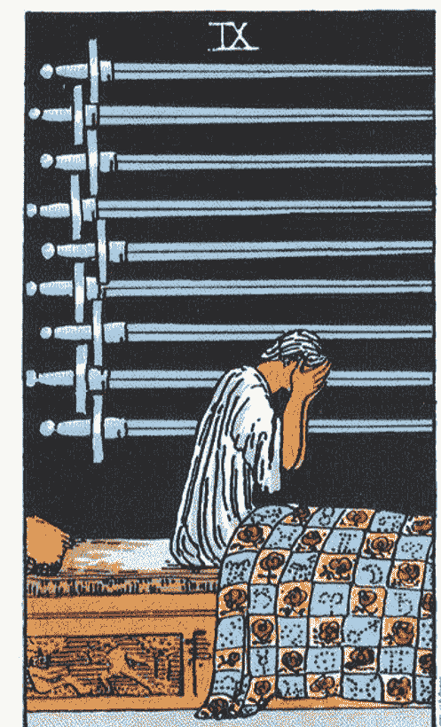

宝剑牌组是一个象征伤害与痛苦的牌组，伤害别人，以及被人伤害，但是，通过前面这些牌的讲解，我希望，你已经发现，“别人在伤害我”这种想法大都是自欺欺人，是一种逃避自己内心痛苦根源的方式。之前所讲的牌，宝剑二的抗拒，宝剑五的以受害者的名义害别人，宝剑六的压抑与逃避，宝剑七的投机取巧，宝剑八的假装无能为力，都是逃避自己内心中的痛苦的方式。

在宝剑九中，牌中人终于能够醒来，面对真实的噩梦——并不是别人或者世界在折磨你，而是你自己。

也许你仍然无法信服，觉得这是胡扯，折磨自己的当然是别人，毕竟他对你实质性地造成了那么多的伤害……那么我就来举一个例子说明好了。

假设说你有一个仇人，你这些年一直非常的恨他，常常想到他就觉得咬牙切齿，心头一阵绞痛，然后突然有一天他死了，你对他的憎恨会停止么？

觉得会？那么我们换一种说法。

假设你和这个仇人在两年前就没有接触了，但你却没有放弃自己的憎恨，直到现在也一直在恨他。这很合理吧？

那么再假设，他在一年前已经死了，只是你不知道。

也就是说，这一年之间，你在憎恨着一个死人。那么你还觉得是这个死人带给你这么多痛苦吗？还是你自己？

在上面的例子中，折磨你的原因是你持有憎恨这种感情，至于你憎恨着谁，或者这憎恨因谁而起，并不重要，只要你仍然持有这种感情，你就会继续受到折磨。

当然冤冤相报毫无意义，当你想要报复一个人的时候，你是感觉更为轻松，还是感觉对他的憎恨更加沉重，更加激烈的？

唯一的解决方法并不在于将自身所承受的折磨怪罪于别人，而在于接受其存在于自己的心中，然后放手。

> 就如荣格在《原型与集体潜意识》中所说的，“真正的解脱并不来自于假装痛苦的感觉并不存在，或者压抑这种感觉，而仅仅来自于完全地体验这种感觉”。

当然恨别人属于逃避的手段，不属于完全的体验。

具体地说，就如宝剑九中这样，醒来直面自身的痛苦，然后在宝剑十中，让自己被这种痛苦完全穿透，之后才能迎来真正的解放。

这也是这两张牌为什么在宝剑牌的最后。它们并不是要说，“只有在死亡中才有解脱”，更不是说，人生充满痛苦无路可逃，而是在说出路正存在于在你最想要避免的地方。

我可以拿自己的经历举例子，我曾一直很讨厌家人对我指责，有时我会觉得脑中响起无数家人的声音，指责我这里做得不对，那里做得不好，显然这对我的心理健康有很大的影响。但这并不是他们的错，仅仅是我在成长的过程中，学到了“我一无是处”的这个自我认知而已。

无论是出书也好，建网站也好，不管我做了什么，都无法改变这根深蒂固的感觉，直到我了解到这种感觉有多深，并最终学会去接受它们。

这在最开始的时候，比憎恨别人和怪罪别人更为痛苦得多。所以我切身体会到，我们之所以会这么憎恨别人，这么愚蠢地觉得都是别人在伤害自己，原因之一也是，我们无法承受和直面自己心中的这场噩梦。恨别人实际上要轻松得多。

不过总之，对于我的这一场噩梦，我是直面下来了。

虽然，我仍然记得，小学和家人出游的时候，遇到过一个中年人，满脸阳光地说着自己小学六年级的孩子写的作文被老师表扬说有初中水平，他当时脸上的表情，我从未也绝不会在我的家人脸上看到。

有些命运无法被扭转，有时我们能期待的最好的结果就是接受现实，继续活下去。

## 宝剑十

很多人觉得宝剑十是一张“不好”的牌，因为它代表终结，但是，又要摆出我们谈了又谈的一点，终结也意味着开始，宝剑十中的曙光，并不是放在那里安慰你的，而是告诉你一个真实的故事：不管你喜欢还是不喜欢，有些事情会终结，而另外一些事情会开始。

一般来讲，那么，到这个时候，我就应该开始给你苦口婆心地讲，任何事情的逝去都是有有意义的，旧的不去，新的不来，这是黎明之前的黑暗，在挺过去之后，就能迎来新的希望，或者举实际的例子说分手虽然心痛，但却也带给你审视自己和重新开始的新机会。

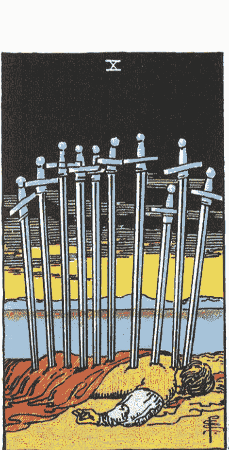

当然我不会这么讲。如我之前所讲过的，一张牌拥有讨人喜欢的因素，同样也拥有讨人厌的因素，大部分牌意书，先给你讲有这么一个讨人厌的因素，然后，话锋一转，但是！还有希望，还有救，还有转机，还有好处，等等。

这样讲牌意没有任何错，至少，看了这些书你也应该不会把一些牌认定成好牌，另一张牌认定成坏牌了。说起来，是否持有这样单纯的认定，也是区别一个人是否已经入门的方式之一，所以这些牌意书从这个意义来讲做得不错。

但是我要说的是，比如说我们拿宝剑十当例子，完全地看图写话的话，我们可以说，“尽管你现在会死，但你将会复活”，挺贴切的，是吧？

可是我们完全也可以这么说，“就算你明天会复活，现在你可是会死哟。”

所以说，光是强调一张牌不仅只有坏的因素，还存在好的因素，并不够。我再次提倡，认清这样一个事实：一张牌就是一张牌，把它分作好的部分与坏的部分的，只是人类愚蠢的偏见 35。

比如说我们现在在讲的宝剑十，宝剑十作为十号牌，带有完全和浓厚的意义，宝剑牌组又与疼痛有关——在现实中一般表现为情绪上的痛苦，压力，紧张，烦恼，失眠——那么，我们可以想象，在宝剑十中，我们将遇到的是最大的痛楚，整个牌组所积累下来的痛楚。

同时，宝剑牌组之前的每一张牌，也都是在表示如何与这种痛楚战斗，尽管所用的方法大都是抗拒和逃避，但是不要忘了，在面对人生中毫无道理的残酷和不幸时，我们并没有太多选择，即使所用的手段没有完全解决问题，至少暂且我们还没有崩溃。

既然如此，宝剑十不也应该显示出一个相比比较完善的解决方法么？

当然是显示出来的，就如我之前所剧透的，“真正的解脱并不来自于假装痛苦的感觉并不存在，或者压抑这种感觉，而仅仅来自于完全地体验这种感觉。”

并不是在宝剑十中存在有两个不同的东西，一个叫做终结，一个叫做解脱，而是本来就只有一个东西，既不是“即使终结但会解脱”，也不是“虽然解脱但也终结”，而是终结就是解脱，解脱就是终结。

比如说一段不幸福的爱情，嗯，我又要举不幸福的爱情做例子了，很多时候解决方案就是宝剑十，终结与解脱，并不存在不用结束这段关系就能让自己的感情生活走上正轨的方案，也不存在不能够帮助自己重新审视自己对爱情期待的终结。

当然，当事人能不能理解这点，会不会单纯地认定自己遇到了不幸，我们就不知道了。如我们所知，人或多或少拥有改变自己命运的能力，这能力在寻求救赎上往往建树不高，但把自己推向地狱的情况却多如牛毛。

把自己推向地狱只是一种比喻，是指明明存在着出路，但却一味地自怨自艾，认为世界对自己不公，假装自己什么都无力改变，然后即使机会摆在了自己的面前也毫无作为。

如果持着这种心态，那么宝剑十显然只会有终结和痛苦的含义，不对，如果持着这种心态，任何牌都只会有煎熬和苦刑的含义，毕竟整个世界都会是地狱。

尽管，这在反映到实际生活，和你实际遇到的人时，程度一般不会是完全的绝望，但是，大部分时候，如果遇到宝剑十的状况，当事人都只能看到自己现在所承受的失去，看不到这所带来的机会。

不要责怪他们，你我皆会如此，在宿命的残酷面前，只有愚蠢的人和逃避自己感觉的人会说自己毫无畏惧，正常人都会被其击倒，然后，或快或慢地站起来。

不要问，为什么你会被击倒。不要问，这点打击都承受不了吗。不要问，有那么痛苦吗。因为不在伤口上撒盐是一个基本的礼仪。

惟一需要问的是，你是要一直这么下去，还是要慢慢爬起来。

许多时候你并不会看到他爬起来的那一天，但你不是拐杖，你的任务不是让他爬起来，而是让他明白，有一些事情他必须要去做，这些事只有他能做到。

# 第七章

# 星币的矩阵☆无处不在

## 星币首牌

终于的终于，我们该讲星币牌组了，星币牌组代表“现实”，“看得见摸得着的世界”，也就是感官的世界，同时也是钱的世界。

似乎确实，钱这个东西，比之前三个牌组的热情，情感，以及知识都要有实感一些？

不过，即使如此，我们的星币首牌，还仍然是一个并没有那么有实感的东西。

首牌代表潜力，代表可能性，我们的星币首牌代表的也是一个可能性，可以是赚钱的可能性，可以是之前的劳动出成果的可能性，也可以是夫妻床上劳动出成果的可能性，也就是说，作为一个首牌，它代表的仍然是可能性这样一个虚无缥缈的东西，尽管是“变为现实”的可能性。

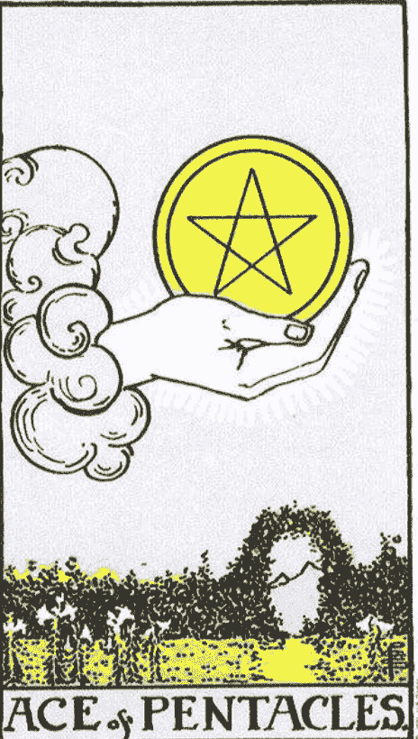

挺有趣的不是么？不过，就如其它首牌一样，当你真的遇到它的时候，它看起来会没有那么的虚无缥缈，比如说，一个人找上你，说有一份工作你要不要接受，这就是一个赚钱的可能性。再比如说，新组建的家庭一直想入手一套合适的房子，然后星币首牌可能表示在他们的生活中一个适合的机会已经出现了，只需要他们现在去把它抓住。

所以说，除了“潜力”，“可能性”，我们也可以使用“苗头”这个词，嗯，赚钱的苗头！买房的苗头！买车的苗头！How Good（多好啊）！

不，我不会在这里说什么，金钱不重要，或者金钱买不到幸福这样老套又没意思的话。

我们都知道我们需要钱，往往还是需要很多，它是生活的必需品。即使我们都说，金钱买不到幸福，但是当一个人如卖火柴的小女孩一般没有钱吃饭，然后饿死的时候，我不知道在这样的人生中会有怎么样的幸福存在。

一般对钱的态度基本存在两个极端，第一个是很少有人明确说出来，但是大家都知道的，那就是钱就等于快乐，有钱人住豪宅，开跑车，穿名牌，把靓妹，当然这是高帅富的生活，但是相信我们都同意，高帅富中最重要的还是富。我们都或多或少地相信，如果我们能够过上那样的生活，那么我们就能享受幸福。

这样想没什么错。不管怎么说，你我都是，从小就在电视，小说，媒体，各种渠道中了解到有钱人所过的幸福快乐的生活，如果我们将他们的生活和我们对比，我们会发现我们所拥有的很多烦恼他们都不必面对，因此我们自然能从中得出一个结论，钱能带来幸福快乐。

那么另外一个极端，就是说钱是万恶之源，嘛，虽然也许说的时候不会那么极端，但是这样说的人看到世界充满了腐败，无聊的争斗，嫉妒，都只不过是为了给自己获得更多的钱财。比如说我们经常在新闻报道中看到的，为了争夺遗产，兄弟反目，甚至演变成流血事件。

对此，他们高呼，金钱买不到幸福！金钱买不到快乐！金钱买不到女朋友！金钱买不到爹地！金钱买不到北京户口！金钱买不到知识！金钱买不到帅气！

总之他们就是想说，愚蠢的人啊，金钱不好，金钱很坏，金钱不值得你去这么追求！

正如我对大部分的极端论相同的看法，对于这两个极端，我的看法也是，这两种观点都是一样的愚蠢。

觉得金钱好的人觉得自己的人生很糟糕，因为不知道为什么，也不知道怎么才能好起来，所以看着金钱说，嗯，有钱就会好起来了。

觉得金钱坏的人觉得自己的人生很糟糕，因为不知道为什么，也不知道怎么才能好起来，所以看着金钱说，呸，都是你的错。

也就是说归根结底，都只是把外物当作替罪羊。

金钱是什么？想想我们之前对于星币牌组所讲的，星币牌组代表成果，金钱和物质享受也是一样，在大部分情况下，它是一个人对社会做出相应的贡献之后，所获得的成果，一个人对社会贡献得更多，那么他就会有更多的金钱，更大的房子，更傻气的车子，香水味更浓的女朋友，还有体型更大的宠物，它们本身并不是值得追寻，因为他们就像吻痕一样，是美妙的事情曾经发生过的证明，而不是美妙的事情本身。

## **星币二**

如果说要用一个词来形容星币二的话，我会选“搞不定”，或者，“玩不转”。

比如说，当事人可能会感觉他需要做的事情太难了，超出了他的能力范围之外，让他感觉举步维艰。比如说一般学生尝试去解很难的奥数题，写惯了纯情手牵手小说的作家去写激烈的床戏，纯情的小青年要去追高岭之花，习惯了内向独处的学子突然要去挑战班长的职位，或者没有管理经验的普通职员去挑战管理职位。

除此之外，也可以是需要做的事情太多了，时间不够，让他慌乱不已。比如说截稿日快要来了！不得不说这是如宣告末日的钟声一般让人心慌慌。再比如说要做的作业太多，要处理的文件太多，需要发短信安慰的妹子太多，等等。

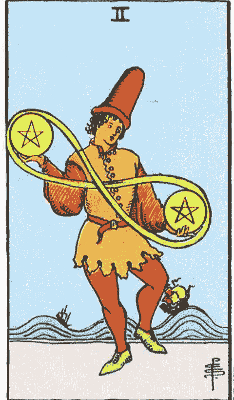

当然，因为单纯的遇到了意料之外的麻烦而手忙脚乱也是可能的。电脑坏了呀，停电了呀，火灾了呀，突然通知要加班呀，突然下来新的任务啊，或者花了一个月才写好的一万字内容因为不小心重装系统而丢失了呀，明明辛苦准备几个月要在这一天发布新的网站，结果在发布前的几小时网站挂掉，必须立马重新租用服务器再重新部署网站呀 $^{36}$。

最后那两个是真实的故事，嗯。

总之，正如小牌所有的“二”中都存在着矛盾，星币二中所存在的矛盾就是，和我们所期待的一帆风顺不同，真实世界中什么事情都是波浪起伏的。同时，和我们以为的，自己能够轻松地解决遇到的问题不同，我们要很辛苦才不会被这些问题解决掉。

这也是为什么牌中人明明一副表演戏法的职业装束，但却露出一副“完了完了憋不住了”的表情。

当然，既然牌中存在着两个星币，占卜中遇到的情况偶尔也会和“二”有关。比如说有两个妹妹要照顾呀，或者有两个哥哥要照顾呀，或者两份兼职要做呀，或者有两份告白要拒绝呀，或者有老婆孩子两个人要养活呀，或者有两个女朋友要讨好呀，或者有两份项目同时进行呀。

总之，不管是哪种情况，抽到星币二的时候，加油吧。

## 星币三

中国有这么一句古话，人多力量大，星币三讲的就是这个道理。

比如说，一个人吃不完的饭，两个人来吃的话，大部分时候就能吃完了。

不，这只是一个玩笑，我很确信你基本不会遇到需要帮忙吃饭的情况。

在星币二中，我们看到一个人搞不定他的工作，原因之一可能是他要做的事情太多，那么解决方法之一自然也是，找些人一起干。

两张牌加起来，星币二和星币三给我们展示了，一个人的能力即使再强也是有限的，我们需要把多个人的力量联合起来，才能够做到更大的事情。

不过除此之外，这两张牌传达了一个更为重要的主题，那就是——

不可能一个人把所有的事情都做好，分工合作是必须的，每一个人分别在自己负责的领域专研，之后再一起合作，才能更好的完成工作。

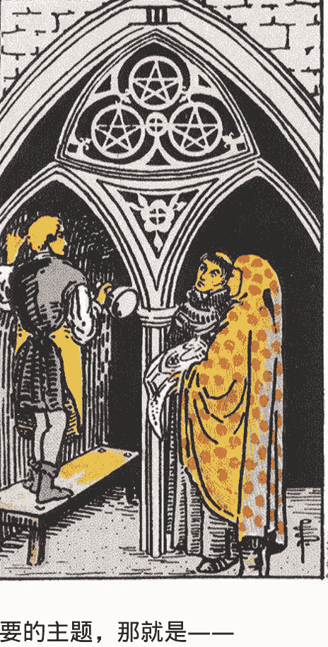

这也就是所谓的职务专业化（Job Specialization），用通俗易懂的语言讲，就是写程序的人只管专心写程序，做美工的人只管专心做美工，写剧本的人认真写剧本，卖萌的认真卖萌，每个人都尽力去做好自己最擅长做的事情，而不是试图去做一个多面手。

没错，这基本也就是大学应该教给我们的东西——成为某方面的专业人才。也是我们在工作生活中应该做的——发挥某方面的专业才能。

所以星币三也完全可以代表这两项内容：专业知识的学习，以及专业知识的应用，具体究竟是哪一个，根据来访者的背景，大部分时候可以很清楚地判断出来。

假设说来的是一个老练的公司高管，然后在对未来的展望这里抽到星币三，你可以肯定这不是指专业知识的应用，因为如果他在自己的岗位上没有应用自己的专业知识，我们实在是无法想象他怎么可能会老练，那么显然他展望的是去进行进一步的深造。

同样的道理，如果来的一个大二的学生，你知道这正是他在学习专业知识的时候，如果抽到他需要做什么的星币三，那么肯定是叫他不要分心，好好地去学习自己的专业知识。但是如果他是一个怪才，专业知识已经自学得非常好了，再抽到这张牌的时候，那么你就可以想的出来，这个时候他需要的就是实践了。

如果你问，假设不知道背景，要怎么判断呢，这个很简单，努力接受外星电波就行了。读牌不要背景，就好像医生不给你做检查，不问你什么症状一样，除了努力接受外星电波和卖萌之外，实在是没啥可做的。

当然，这张牌也可以强调另外的方面，那就是，通过团队的分工合作，使得原本所持有的计划或者愿景，目标，变为现实。

## 星币四

吝啬鬼没有好下场。

但做出吝啬鬼一般的行动并不少见，因为我们或多或少会持有这样的想法，“我的东西为什么要给你？”

自私存在于每一个的心中，并且不仅仅局限于对于钱财的吝啬。

当事人可能吝啬于分享自己的知识，把它当作宝贝一样抱在自己的心中，只给自己视为是自己人的一些人分享。

他也有可能吝啬于分享自己的经验，即使看到有人热切地需要它们，但也闭口不谈。

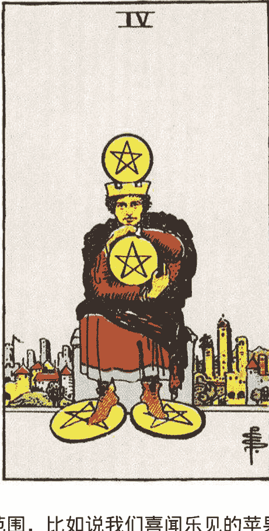

除此之外的话还有专利之类的，从法律和道德上来讲持有自己的专利不给别人使用并没有什么错，不过这也属于星币四能够描述的范围，比如说我们喜闻乐见的苹果啊，三星啊，其它什么公司之间的官司大战，就明显是要死守自己的利益的行为，也就是星币四的行为。

对于个人来讲的话，吝啬于钱财的情况现在应该是比较少见的，为何的话，自己的钱财本来就是属于自己的，和别人分享反倒是匪夷所思的情况，再说现在应该大部分人都觉得自己的钱都不够用，需要节俭，吝啬自然也无从谈起了。

相对来讲，表现出吝啬之外的另外一个含义说不定更为常见，那就是死守着自己现有的东西，既不想增加，也不想减少。

比如说死守着家里的老房子，不愿意搬迁。

或者死守着一种固有的观点，拒绝改变，比如说男大当婚，女大当嫁，或者性别不同怎么能谈恋爱，或者男人都不是好东西。

我们可以想到，死死抓着自己的老思想不放这一点在年龄比较大的人身上可以更多地看到。因为随着人生经验的积累，到某一个时候，也许一个人就不再想要学习新的东西了，变得如星币四中的傻国王一般，守着自己到现在为止获得的东西，把它当做宝贝。

在这个例子中，拒绝放弃旧观点的同时，也意味着拒绝接受着新的观点。没错，星币四的拒绝是两方面的，是既不愿意从别人那里获得什么，也不愿意给别人什么。

或者，换一种说法，拒绝给予也就意味着自己关上了收获的大门。

比如说知识的交流，所谓交流，既然不是说的学习，那么自然是双向的，要么，你既给予又付出，要么，你既没有给予，也没有付出。

比如说钱财。有一句知名的话说得很好，“赚钱这个事情是要花钱的”，像是提高学历，深造，参加培训，考取证书，都是需要花钱的活动，但是有了这些活动才方便更好地赚钱。

总之，敞开你的心胸吧！

## 星币五

很多书在讲这张牌的时候，会强调，是两个人在困境中同甘共苦，或者尽管物质上贫乏，却有精神上的富裕。

而我，一如既往地要强调，这张牌首先传达的，并且最重要的信息，那就是贫穷与疾病。

也就是物质上的痛苦，身体上的痛苦。

背景处的教堂，相比于象征有精神上的富裕，我觉得不如看作是在说，不管你精神上有多么富裕也好，它们也不会填饱你的肚子，不管你对耶稣的爱有多深也好，他也不会送你一个面包。

你不能假装说，因为你有心灵寄托了，你就不需要吃饭了，就不需要温暖的大衣和柔软的大床了，这是活生生的自我欺骗。

至于友情和陪伴也是一样，也许它可以温暖你脆弱的心和你的泪腺，但是它并不能把温暖带给你的胃，也不能让你的肚子安静下来。

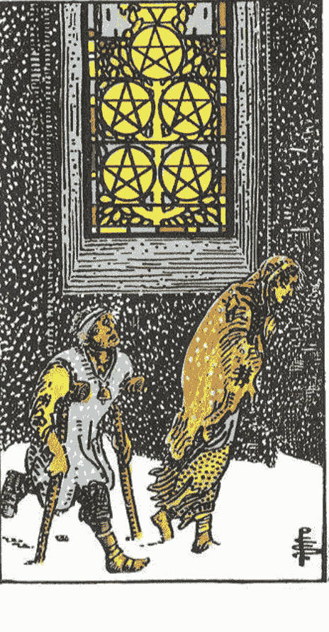

我并不是说友情，陪伴，和心灵寄托不好，但是它们并没有这张牌中的问题，那就是穷困潦倒，所以不要说“虽然很穷，但是有朋友”这种话，仿佛因为有朋友，穷这个问题就神奇地解决了一样。

因为实际上，问题并没有解决，仍需要面对。

所以，出现星币五的时候，当事人可能就处于这样的穷困潦倒，无家可归的情况，尽管这种情况非常罕见，但也是可能的。

其它时候，或者说更多的时候，星币五可以表示一种感觉，一种独自一人面对漫天大雪冷到不行但却没有地方可以让自己暖和一下的感觉。

也就是不被保护不被支持不被祝福的感觉。

比如说只身前往外国生活，遇到多种不顺，却连个可以诉苦的人都没有，连睡觉的床都是外国的，没有温暖的感觉。

或者一对恋人不被身边的人支持，遭遇到各种反对。

或者心灵脆弱的女人不知为什么就是总是觉得空虚寂寞冷，想要有人能安慰自己保护自己。

重要的并不是当事人是不是真的遇到了一个如此艰辛的环境，只要他确实地有这种感觉即可。

此外，星币五也可以表示当事人主动地去追求这样一个不被保护的状态。

比如说勇敢的少年离家出走啊，愚蠢的少年少女为爱私奔啊，满怀梦想的少年不顾父母的反对果断追求自己的梦想啊~

也许在我们看来，这种放弃自己现有的安逸环境，自己往麻烦里钻是一个非常费解的行为，但是实际上，仅仅是对于当事人来讲，有着相比于安逸更为重要的东西而已。

对于离家出走的少年，他更为重要的东西就是在决定离家出走的时候燃烧起来的孩子气。

对于私奔的少年来讲，他更为重要的东西就是在那一刻自以为激昂起来的爱意。

对于追求梦想的少年，他更为重要的东西当然，就是追寻自己的梦想。

如上面讲的一样，这个东西对其他人是否更为重要无所谓，重要的是若是当事人这样以为，那么他就有充分的理由作出星币五这样的行动。

再从一个角度来讲，任何踏足社会为我们所铺设的既定轨道之外的人，都将面对星币五的困境。

因为我们身边的环境，不管家人，朋友，还是恋人，在绝大多数的时候，他们对我们的支持只限于当我们在做“我们应该做的事情”的时候。

比如说假设有一个中世纪的农民的儿子，他应该做的事情就是长大了当个农民，如果他这么做了，他会得到家人的支持，如果他说他要去当个骑士，他就不会得到家人的支持。

现在的话，若是孩子要恋爱，只有在父母认为孩子到了该恋爱的时候，他们才会支持。

而，一个家庭和成绩都正常的好青年，在他踏上读大学，找工作，买房子，结婚的这条道路的时候，他也会得到周围人的支持。

若是他要中途辍学，走上比尔盖茨的老路，那么毫无疑问，他会被劈头盖脸地骂一顿，诸如“你是比尔盖茨那样的人才吗”，“好好读书”之类。

不过显然，一个人是不是能干出大事，只有在未来才知道。但几乎我们每一个人都会被贴上“你做不到”的标签。

因为这并不是社会对我们的期待，社会对我们的期待仅仅是要我们做一个好齿轮，做我们该做的事，对有些人是读完大学，找一个好工作，对有些人是回家种田，对有些人是继承家业，对有些人是悲惨地活着。

如果你迎合了这个期待，你就会被欢迎，被支持，被称赞，被羡慕，或者，被可怜，被同情。

如果你背离了这个期待，你就会面对暴风雪。

有时我也会想这个问题，到底哪个才是最重要的，过上“平稳”的和“别人觉得我应该过”的生活，还是尝试去做我觉得我应该做的事，即使我知道我很可能会失败？

## 星币六

对于星币六，有这么一套说辞，就是说图中的商人虽然在施舍，但是他手中的天平表示穷人们虽然得到了钱财，但也付出了别的东西，那就是他们的尊严。因此这个商人并没有他看起来那么高尚，这只是一场交易。

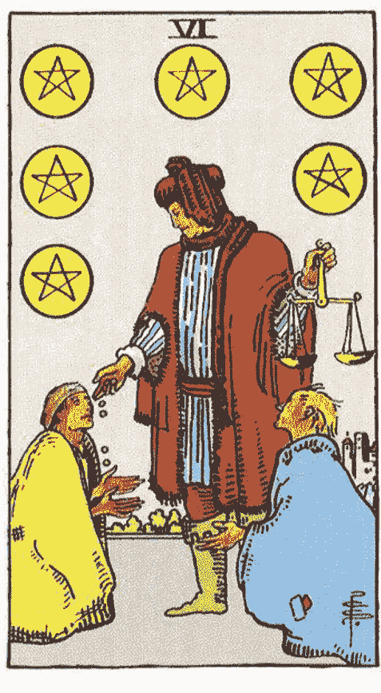

对于这套说辞，我的反应一如既往地是“what the（我去年买了个——）”。让我们假设你是一个穷得连眼泪都要当水喝了的穷人,突然有一天有一个富人来给你施舍钱财了，你不感激涕零，还在那里咕哝自己没有尊严？

或者让我们想想那些饿得吃树皮啃草的人，你觉得他们在乎自己的尊严？

当然，我也觉得，如果你真的处于那样悲惨的地位，那么接受别人的援助是应该的，不存在尊严不尊严的问题，没有人会因此而看低你。更不会有人觉得你不接受别人的援助是有尊严的。

把这点阐释清楚之后，我们再来看星币六。星币六最为基本的一点含义就是施舍。

在实际的读牌中，当事人可以是施舍的一方，也可以是被施舍的一方，但是不变的是这种施舍和被施舍的关系。

施舍的东西当然也并不仅仅限于财务，可以是住所。比如说你刚搬到一个新的城市没有地方住，然后在朋友家暂住几天，自己就感觉被这朋友施舍了似的。

也可以施舍感情，尽管这种情况是非常悲惨的。一个人可以在对施舍表面上的在乎和关心中，收获一点点的自我肯定。

在最坏的情况下，被施舍的一方会觉得非要有这个施舍自己才能活下去，施舍的一方会觉得自己只能在这个关系中感觉到自己活着还有些价值。

当然这是最坏的情况，我非常怀疑你会遇到这么疯狂的情况。不过谁知道呢，毕竟学塔罗这几年，我见过不少完全疯了的两性关系。

## 星币七

显然这张牌代表务农，种地。

但是正如你清楚知道的，显而易见的也可以是误导人的，而这又让我们回到最初的问题，那就是，为什么我们在这里……不对，最初的问题是，星币七代表什么。

种地，在过去一直都是一种靠天吃饭的劳动，虽然大半年都在辛苦劳作，但是最终到底有怎样的成果，收成到底如何，还是得看老天爷心情如何。

当然这里的老天爷是文学上的比喻。

在现在的话，随着科技的发展，时代的进步，农业早已今非昔比。不过，农业变成什么样子了并不是我们要关心的，毕竟这不是一本科普杂志。

我们要关心的是，从靠天吃饭的这个劳动中衍生出的含义：不能确信自己能得到相应的成果，成功与否取决于外界因素。

不得不说，即使在今天，也有许多劳动是这样的。不，我并不是在说新世纪的农民——码农（程序员）。

比如说，写作，大部分时候，你不能预知自己的作品卖不卖得出去，除非你已经小有名气。不管你对自己作品灌注多少心血，它都有可能卖不出去，很多时候能不能出版都是一个谜。

再比如说，创业，创业能否成功大部分的因素都和个人无关，是的，你必须尽力，但是仍然，这就像种地一样，和你流多少汗无关，谁也不能保证会成功。

如果在塔罗占卜中，你抽到这张牌，然后遇到了上面这些情况，然后我建议你行行好，祝他们好运。

当然，更多时候我们不会遇到这样的含义，更多的时候我们会遇到的含义之一是，星币七代表当事人该做的都已经做了，现在只能等结果。

比如说考完试抽到星币七，安心等待。

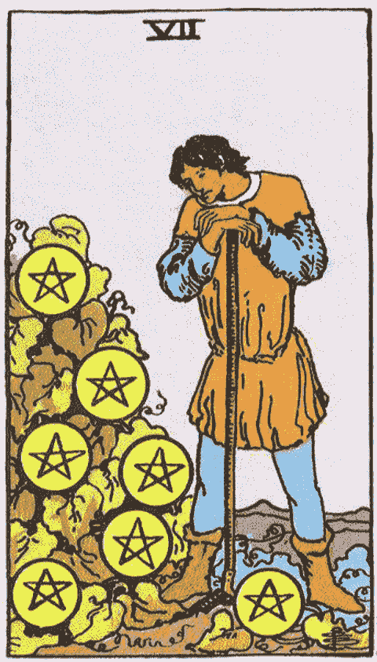情侣吵完架安慰完女人仍不理不睬，再遇到星币七，说明该说的都说了，安心等着即可。

对象莫名其妙发脾气，这个时候的星币七就表示，你做啥也没用，歇着吧。

然后，我们会时常遇到的含义之二，星币七可以代表当事人放弃了的态度，代表当事人认为自己已经无能为力了。

比如说考试完的星币七，“完了安心等补考吧！”

比如说情侣吵完架安慰完女人仍不理不睬，星币七就代表，“行了，安慰也安慰了，我该歇着了。”

比如说对象莫名其妙地发脾气，星币七就代表，在一边傻傻地看着。

我特地用同样的例子，希望你能发现，我这里所讲的两个含义，是互相矛盾的。但是，如果你再仔细思考，你会发现，这其中一个是在描述事件的环境，情况，而另一个是在描述当事人的表现，行为，态度。

实际占卜中，就需要你好好判断，这张牌是在描述情况还是在描述人了。

## 星币八

工作，又是工作。

不过这并不是如星币七中一般不确定的工作，而是，只要自己有能力，并且愿意勤奋工作，就能够收到回报的工作。

也就是掌握一项特定的技能，然后稳定地应用这些技能，做出相应的成果，并因此获得报酬。

比如说掌握了编程这项技术，然后没日没夜地写代码，拿工资。

或者掌握了修车这项技术，然后整天修车，拿工资。

或者掌握了教人把妹这项技术，然后一天天地教人把妹，收钞票。

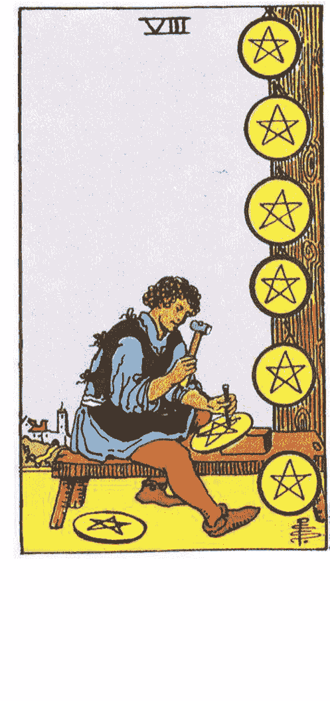

把妹这个并不是在开玩笑，真有人这么干，还不少，这是随着社会的进步，时代的前进，所产生的新兴产业之一。

总之，星币八的关键词就是技能，重复性，以及据此产生的收入。

显然，这符合现代大部分工作的特征。因此我们可以说，星币八是所有塔罗牌中，最恰当地描述工作的一张牌。

日复一日，年复一年，使用同一个的技能，做着同一件事，然后拿工资。

无聊，枯燥，繁重，累人，是必须承受的负担，以及义务。

同时也是一步步让自己在社会上立足，为了让自己能在自己选择的地方活着，吃自己想吃的饭，买自己想买的奢侈品所必需的步骤，你可以说这也是在雕刻自己的生活，让它一步步贴近自己想要的样子。

当然，即使有意义，工作也仍然是无聊和繁重的，即使你的工作没有星币八强调的技术和重复性，繁重和压力也是不可避免的。嘛，这也是没办法的事情。

以上观点，来自毫无工作经验的沙若。

那么，在工作之外的领域内抽到星币八怎么解释呢？可能性有二。

其一，很简单的，说明这牵扯到工作。

比如说爱情问题的环境碰到星币八，喔喔，有可能是激动人心的办公室恋情。

其二，说明这很符合工作的特征。

很像工作的意思就是，拥有星币八特征中的一个或者多个：需要技能，可以稳定发挥，获得成果。

不管怎么说，工作只是一个形式，是“稳定地使用技能获得成果”的一个表现，而可行的表现形式自然完全不会被工作限制。

比如说，稳定地使用把妹技能获得把妹成果这种事情，就很符合星币八。尽管女性们可能会对此感到愤怒，但这是一种世界范围的现象，已有几十年的历史，各个把妹大师们仔细研究分析造成吸引力的因素，总结出一套又一套的涉及穿着，行为，语言，心态的把妹系统，稍微读读这些大师的著作，你就可以意识到，通过自己的行为让异性对自己产生吸引力确实是一个可以学到的技巧。

不，即使你充满好奇，哪怕你满怀激动与憧憬，我也不会在这里给你推荐把妹大师的。确实我读了不少手段，比如通过事先准备好和联系过的材料进行谈话，通过在一次约会中逛多个地点产生更亲密的幻觉，假装自己不在乎对方来让对方更主动更积极，或者比较疯狂的用心理暗示的手法催生好感，甚至街上搭讪然后直接短信约炮。不过最后这一位被人评价说有模特的外表，妹子自然投怀送抱。

但是，在读过这不少的内容之后，我终于明白了，这些技巧都不重要，重要的是，存在一个吸引女人的终极奥秘！现在订购，只要 998，没错，不是 2000，不是 3000，只要 998！如果你在 sharuo.com 下载了《塔罗的藏宝》，那么还将完全免费！你还在等什么，赶快拿起电话订购吧！

这奥秘就是，有魅力的男人吸引女人，具体地说就是，正直坦诚，尊重对方，尊重自己，对自己负责，等等。听起来也许陈词滥调，但是认真想想，当你想要一个女人时，你能不能坦诚地说出来？当女人和你意见不同时，你是否能尊重她的意见，但同时也坚守自己的立场？你是否会坚持自己的兴趣，不为女人妥协？你是否尽力过着自己能享受的生活，不把女人当作生命中唯一的乐趣和希望？

许多男人在追求女人时都不坦诚，他们不会说自己想拥有她，会说想保护她，想要做她的好朋友，或者即使她不喜欢自己自己也会一直喜欢她，或者更差的情况下，什么都不说，或者翻来覆去地想对方是不是也喜欢自己。天，即使不能面不改色心不跳地说出，“我想要独占你的香味”，不能厚颜无耻地说，“即使我读过许多哲学书，但它们也解答不了我心头的一丝疑虑，那就是你的嘴唇到底是什么味道的。”至少一马平川的“今天开始做我的女朋友！”应该是毫无难度的。

如果觉得充满了难度，那就想办法让自己变得能够毫无难度地说出这样的话。

假设对方拒绝了怎么办？当然是尊重她的意愿，然后去找下一个。若是放不下……我是无法理解要怎么才能放不下一个不属于你的女人，不过，我建议不要给她第二次机会。如果她今天不会因为能有机会和你在一起而欢呼雀跃，她明天也不会，后天也不会。但这个世界上会有人和她不一样，会有人会为能和你在一起而兴奋得像个傻子。

假设这个人不存在，那显然是你魅力不够，该加把劲了。

最后，不要忘了，如果你手中的《塔罗的藏宝》并不是在官方网站 sharuo.com 下载的，请一定要去 [http://sharuo.com/tot/](http://sharuo.com/tot/) 下载最新版，确保你能掌握最新的把妹奥秘。

此外，你还可以订阅塔罗低语哦，订阅之后，把妹奥秘或者《塔罗的藏宝》更新了，也会给你的邮箱发通知哦，更惊人的是，这项服务是完全免费的！实在是难以置信！

## 星币九

如果说前面的两张牌是劳动的话，那么我们的星币九显然就是劳动成果。

自然，这也是一张象征富裕的物质生活的牌，豪车！别墅！香槟！美人！

不过，相比于大把大把的钞票，这里所谓富裕的物质生活更多的是指满足的感觉。当事人不一定有豪车，不一定有别墅，但多半会对他所拥有的物质条件觉得心满意足，说不定还沾沾自喜。

这是这张牌最为主基调的意义。尽管我们下面会说存在有别的意义，但主基调还是最重要的。

占卜中的话，除了直接表示这样富足的财务状况一样，也可以有着这样财富状况的人，男女不限。嗯，男女不限。塔罗牌中，牌上人的性别在占卜中基本没有意义。

在财务之外的境况，星币九时常会表现出根据主基调衍生出来的一些含义，比如说，若是问谈判时，对方的位置出现了星币九，那么显然是准备充分，成竹在胸，悠然自得的姿态。

爱情的时候也差不多，往往会是两人中的一个自己和自己玩得很开心，也许对对方表现出一些冷淡，不过肯定不会表现出太大的依赖。

不管怎么说这也是小牌的“九”号牌系列之一，包含有独处的含义，和依赖是不沾边的。

除了主基调之外，对于星币九，经常有人提到的一点就是这副牌中有象征限制的元素，最为明显的就是女人手中小鸟被蒙住了头，不能自由飞翔，类似的还有地上的蜗牛，背着自己的壳，所以只能慢慢爬行。

但是为什么？为什么在这么一张象征富足的牌中，会有限制的元素在里面？

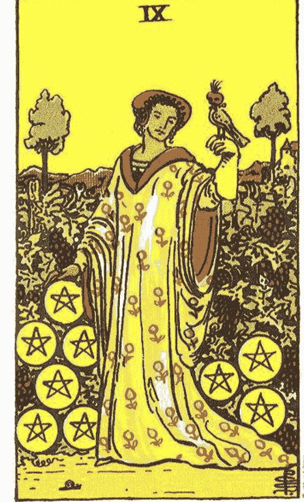

因为我们都被我们自己的成就和自己的过去所困。

毕竟星币牌组象征的是现实的东西，实质的东西，这些东西的美德，同时也是其恶行之一就是，它不会轻易消失，会持续存在。

假设当事人是通过工作获得优质的生活，那么他通常需要通过继续工作来维持这样的优质生活。

若他是通过通婚达到了这个地方，那么，显然，持续的婚姻就是他持续的限制。

或者，如果要举一些更为简单直白的例子……那就是买了房子就需要经常打扫，买了车子就会耗油这回事。除了吃了就没的食物之外，没有什么物质享受是我们可以白白享受的，还得好好养。

也正是因为有着限制这一层因素，事业相关的话，星币九不一定会是一张很受待见的牌。对有的人来讲，这种悠闲和富裕很舒服，但是对另外一些人来讲，他们需要的是挑战和新的机遇，那么他们就会觉得很束手束脚了。

## 星币十

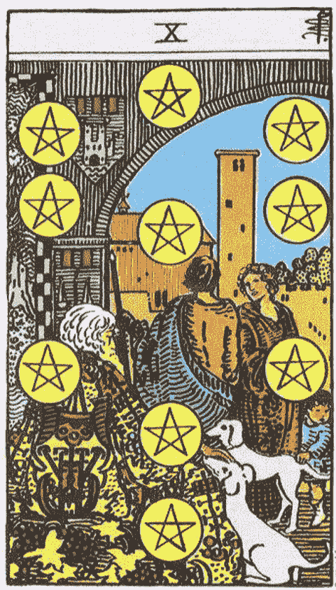

也许在象征热情的权杖牌组中权杖十并不是最热情的一个，但在象征物质的星币牌组中最为物质的一张无疑就是我们这次的主角，星币十了！

从星币九中独自一人享受的财富中再进了一步，我们来到了星币十的家族繁荣。

这就是在肥皂剧中经常出现的，历史传统悠久的家族！苦苦压迫和强逼孩子的长辈！注定要继承家业的命运！不能放弃延续下来的高贵家族传统！相爱的两个人，到底能不能克服重重阻碍，最终牵手呢！

当然，现代来讲，在我们国家这样的家族应该并不是特别多了？不过，遇到类似，但是程度更轻的情况也是完全有可能的。

比如说，在普通家庭中，家人对孩子给予的压力以及支持。

没错，星币十既代表家族的压力，也代表支持，这两者是相关联的。并不存在免费的支持，支持中就寄托着有期待。

那么，对已经独立和组成自己家庭的人，星币十就不能表示这一方面的含义了吗？

- 其一，即使是成年人，也不是代表和长辈完全隔离。
- 其二，成年人可以做施加压力的那一方。

具体在占卜中，可以代表家庭帮当事人找到当前工作，可以代表家庭给当事人施加好好工作的压力，可以代表家庭接受当事人的恋情，可以代表家庭反对当事人的恋情，可以代表家庭不支持早恋，可以代表家庭催你赶快嫁了，等等。

以上例子中，我提到家庭对当事人恋情的反对和支持，这显然又是互相矛盾的两个意思，但是，它们都是家庭的意见，而我不得不说，不管家庭支持还是反对都是无所谓，重要的是他们对当事人的恋情有一定的意见，而出现这张牌说明当事人不得不重视一下这些意见。

要我说的话，不管他们是反对还是支持，一开始就不应该在乎他们的想法。当然，这是因为我是放荡不羁的一个年轻人。

哎呀，说这样的话，也许又会有人摇头说，唉，现在的年轻人啊，唉，垮掉的一代。

这种观点也很符合星币十这张牌的主题。不过每一代的年轻人在某些上一代人的眼中总是垮掉的一代，所以无所谓啦~

另外，每一代的年轻人中都有一些人无法接受长辈给自己的正确答案，哪怕犯错都要自己寻找出路，每一代的长辈中也有一些人就是要给年轻人正确答案，然后一脸臭屁地说，

> 你竟然不照我说的正确的做，你个垮掉的一代！

不过，把年轻人的热血傻气放在一边，传统的存在也是必须的，正如之前所说的家族提供的压力和支持，历史和传统是下一代人发展的基础。

基础与根基同样是星币十的含义之一。

另外，星币十并不仅仅局限于家族，任何有一定大小，有一定历史的组织或者系统都可以表现出这样的感觉。

比如说大公司，比如说传承下来的神秘学组织( 尽管据说现在是越来越随意 )，比如说大学。

## 第八章

### 宫廷牌们 ❤️ 相亲相爱

我强调一遍，一张宫廷牌，牌上的人物是什么性别，在占卜中几乎没有任何意义。

也就是说，权杖国王可以是女人，圣杯皇后可以是男人，宝剑皇后也可以是男人。没错，即使宝剑皇后这张牌有寡妇这么一个关键词，它仍然可以代表一个男人。

记住了吗？

甚好，之后我们来看宫廷牌。就如我在之前的书中也讲到的，宫廷牌的解读是比较棘手的，因为宫廷牌并没有明显地表现发生了什么事，而单纯地突出表现一位人物，这就给解读增加了难度，因为形容人要在一定的情景下才比较好形容。而且，在占卜中，宫廷牌并不代表一个人物的情况也非常常见，这就更让人不知所措，不知道该怎么解了。

因此，随着塔罗牌解读自 20 世纪以来的飞速发展，也出现了不少对于宫廷牌的理解思路，方法，比如说，下面这一些：

- 把宫廷牌看作代表一个状况，比如把宝剑皇后看作一个需要做出无情决断的状况。
- 通过做各种奇奇怪怪的练习，让自己对每个宫廷牌代表的人格更为熟悉，从而做出更顺畅的解读。
- 把宫廷牌看作代表事件中某个人表现出的一种态度，而不只是代表这个人。比如说权杖骑士代表不耐烦的态度。
- 把所有出现的宫廷牌都当作是在表现当事人自己人格的一部分，尽管听起来很疯狂，实际上是完全正当的理解。

嘛，总之方法是很多的，不过本书只用两种方法，其一是把宫廷牌当作态度来讲，其二是把宫廷牌看作代表关系，这种关系可以是人与事的关系，或者是人与人的关系。显然我这里并不会把宫廷牌所有的可能性讲完，差不多讲一些即可，留给你自己发掘的空间是很大的哟。

与人的关系相信不用多说，与事的关系指的是……比如说，宝剑国王可以代表在工作中评判和决定你是否能够升迁的关键人士。圣杯骑士可以代表对爱情犹豫不决，进进退退的男人，若是换成星币骑士的话，那恐怕就是死气沉沉，太过认真的态度了。

尽管我有的时候会使用某张牌是怎样怎样的人这样的语言，但是请注意，这时我的意思是，这张牌代表的人表现了这样这样的特质。人是复杂的生物，不能用几句话就限制和定义，只能说在特定的场合中，他表现出了这样的特质。这也是为什么我有时会特别强调关系。

在下面几个小节的内容中，我们会分别讲解每个位阶，也就是分别讲解国王，皇后，骑士，以及侍从牌分别代表怎样的人格特征，有怎样的关系，之后再具体地讲每一张牌的含义。

## 国王牌

你完全可以把国王牌们和大牌中的皇帝牌联系起来，把四张国王牌看作皇帝牌的四种不同的具体表现形式。

就好像表达爱恋之情可以用接吻，牵手，情话，情书，以及人民币折的玫瑰一样，皇帝牌特质的表现，也可以通过权杖国王，圣杯国王，宝剑国王，以及星币国王中任意一个表现出来。

不过，不管用哪一个来表现，权威，成熟，责任，规则，领导，等基本要素都是不变的。

在与事的关系中，国王牌大都表现出权威，指挥，决定，领导这一面。比如说面试时，决定是否让你通过的那位考官。比如说在准备活动的时候，现场指挥的负责人。或者在魔兽世界打团中负责指挥的团长。

当然，在爱情这方面的话，国王牌主要表现的是成熟的一面，也就是说是一个成熟的男人形象～当然，也可以是一个成熟的女汉子。总之，爱情中一位国王不太会像年轻小伙一样死去活来，信誓旦旦，会更倾向于谈一场认真的恋爱，给予相应的支持。

在对人的关系中，国王牌大多表现的就是领导与被领导的关系了。上司和下属，小分队长和小分队员，创业计划的发起者和支持者，深受中老年女性喜爱的检察官与经常被扣工资的胡渣刑警。

但在这领导与被领导的关系中，是当事人处于领导的位置，还是另外一个人处于领导的位置，都是有可能的，要具体情况具体分析。

另外，每一张国王牌都会表现这些关系，所以在接下来分别讲单张牌的时候，我将省略掉这部分共通的内容。

### 权杖国王

权杖国王主要表现的是国王牌们作为领头人的一面，也就是说，相比与其它国王牌，他更加胜任带领团队走向胜利这样的工作。

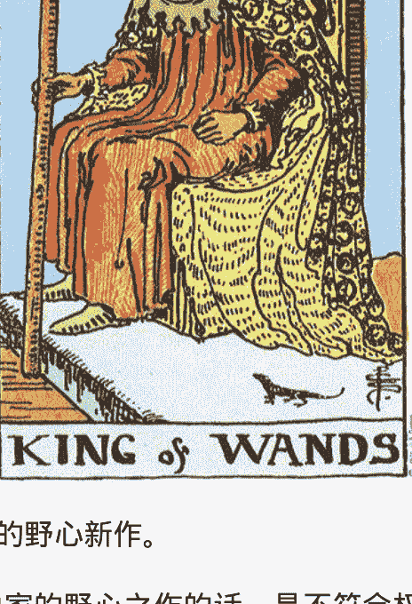

相比之下，虽然宝剑国王也强调作为领导的一面，但那主要是在管理制定与执行规章制度上面，权杖国王强调的是开拓新的疆域，强调的是发展。

权杖国王会认准自己的目标，然后带领部下充满激情地去追逐它，并且在大多数情况下，他能够达到自己的目的，因为作为一个国王，他是有经验有能力的。

所以在对事的关系上，除了上面讲的国王牌都有的内容之外，权杖国王象征征服者与被征服的领域关系。比如说跨国公司野心勃勃地进入一个新的市场。比如说久负盛名的小说家的野心新作。

需要注意的一点是，如果有诸如愣头青小说家的野心之作的话，是不符合权杖国王描述的关系的，因为愣头青并不符合国王的形象，更符合一位骑士。

在对人的关系上，权杖国王是一个鼓舞人心的领导与充满干劲的下属的关系，因为他明确地知道自己的目标在哪里，并且会带着下属努力地往那个目标冲刺，然后下一个目标，然后再下一个目标。他让下属能够看到事业蒸蒸日上的希望。

在情意缠绵的关系中，权杖国王是一个积极主动，甚至过激的男人，他的动作行为都传达了一个信息，那就是如果他觉得自己想要强吻你，那么他会觉得强吻你肯定是正确的，并且会毫不犹豫地这么做。也就是比较强硬的男人，这强硬并不如某些骑士一样源自假装和天真，而是来自于深入骨髓的自负，或者说自信。

### 圣杯国王

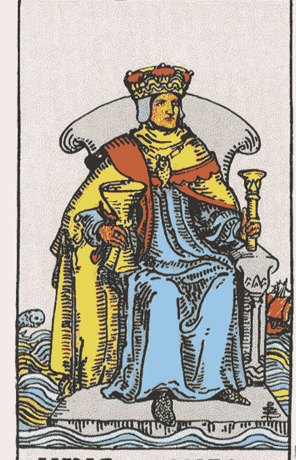

如果说权杖牌表现了一个成熟的男人所拥有在事业方面的成就——拥有能够征服更多的实力，那么圣杯牌就代表一个成熟的男人在情绪方面所取得的成就，那就是拥有情绪上的成熟，或者说情感上的成熟，一回事。

和女性不一样，大部分男性不会没日没夜地大喊我好痛苦，但男性是拥有情绪问题的。

不过和女性相同，此类问题在爱情中非常明显。但这类问题本身影响范围是不限于爱情的。

具体举例的话，一个情绪不够成熟的男人可能会表现出对某位女性疯狂地着迷，倾向于选择有情绪问题的女性，逃避恋爱关系带来的责任，有事没事发脾气，傻傻地陪着有事没事发脾气的女友，爱得要死要活，“不是说好要做彼此的天使吗”，等等无数多种。

不过有一个非常简单的方法可以判断一个男人情绪是否成熟。所谓物以类聚，人以群分，情绪有问题的人会和情绪有问题的人搞在一起死去活来，情绪成熟的人会找到情绪稳定的配偶，发展出相对风平浪静的生活。

所以说，圣杯国王象征情感成熟，同时也象征在恋情关系上取得了成就——幸福而情意绵绵的生活！

如果这本书早几个世纪写的话，我可能会说因此圣杯国王也象征已婚人士，但是社会在进步，时代在发展，幸福早已不和婚姻划等号，婚姻也不和幸福划等号。

作为领导者，圣杯国王是一个人文主义的领导者，对下属有着关怀，让其感到自己被关心着，被支持着，或者，在某些情况下，感到单位是自己的家。

在对事的统御方面，也会表现出这人文的一面，比如说优异的员工福利，工作餐，之类~

两性方面相信已经说得够多了？一个既不会死去活来，也不会选择死去活来的配偶的男人。既不会对对方抱有奇怪的期待，也不会选择拥有这样期待的配偶，既不会闹别扭，也不会允许对方闹别扭。

也就是，如果你是女人或者基佬，你并不能期待遇到一个这样的男人然后给你幸福，因为他并没有理由选择比自己不成熟的人。

我曾说圣杯国王的王座漂浮在水上，象征他需要压抑自己的情绪。现在我改变主意了，我现在认为这象征他能够控制自己的情绪，而不是被自己的情绪控制。

### 宝剑国王

如之前所说，宝剑国王就是通过规章制度进行领导的那位。就是这货告诉你，这个要这么做，这个要那样搞。它也代表企业文化这样的东西，总之，一个组织团体要作为一个整体行动，不仅仅是需要权杖国王那样的被同一个目标激励，还需要宝剑国王这样的所有人有同样的行动准则，以及价值观，等等。总之，就是在思想上也要统一起来！

在与事的关系上，宝剑国王可以代表计划，规划，谋划，策划。也就是仔细地去考虑这个事情到底要怎么做，每一步由谁去做，遇到问题怎么办，还有细节怎么处理，等等内容。

除了计划之外，也可以代表分析，或者出谋划策。比如说一个咨询师。总之，就是一位擅长动脑子的人在呼啦呼啦地动脑子。

以此类推，在与人的关系上，也可以是提供建议和被提供建议的关系。

恋爱方面，是一个颇为冷静和认真的人，说不定会提出详细而细致的恋爱计划。《White Album 2》中的主角就带有这样的气质，虽然这一位更明显的是逃避和不明确表明自己的想法。

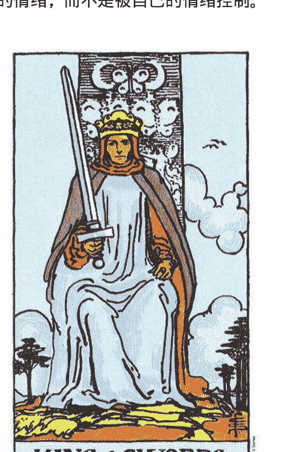## 星币国王

终于来了！在所有构成一个成熟男人的要素中，第一眼看着觉得最为重要，也是最为吸引眼球的一个，那就是有钱！

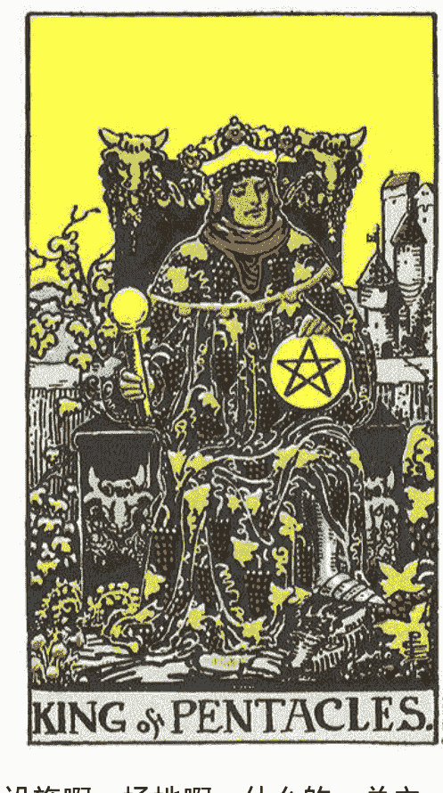

毕竟，我们怎么定义别人的成功？拥有很多物质财富。不管是权杖国王的野心，圣杯国王的成熟，宝剑国王的信念，都是相对内在的东西，即使以行动表现出来，也并非那么明显。因此当我们想要评定一个人是否成功，是否已经是一个独立的成熟的人的时候，我们最容易看到的是他有没有挣到足够多的钱。

也许这就是为什么星币国王要摆出一副不屑的嘴脸。

不过当然，星币国王并不仅仅是有钱这一点可说，他往往可以做一个出资者，支持别人的事业。或者规模小一些，租借点设备啊，设施啊，场地啊，什么的。总之，这是一个物质上给人提供帮助的人。

作为领导角色的话，星币国王所扮演的是老板的角色，确保下属能按时拿到自己的那份工资。不管是之前所讲权杖国王的冲劲也好，圣杯国王的人文也好，没有星币国王的可靠，全部都是空了吹，或者说全部都没有意义。

没错，星币国王是一个可靠的人，值得依赖的人，往往也可以提供保护，住所，之类。在恋爱关系，这也是一个现在许多妹子都在找的一个角色：人傻钱多。

不，这只是一个玩笑。星币国王在恋爱关系中是一个能够给对方安全感，也能够给对方提供足够的物质条件的角色。

恋爱是一个烧钱的活动，结婚是一个把钱一捆一捆地烧掉的活动，所以充分的物质条件也是必须的。如我之前所说，四位国王都是皇帝牌的具体表现形式，他们对恋爱的态度并没有优劣之分，星币国王既没有优于，也没有劣于其它牌。

只不过，对于某些特定的人，他们需要的可能更是星币国王所提供的安全感，但这是个人需要，并不会让这张牌比其它牌更好。

## 皇后

类似国王们，你也可以把皇后们看作是大阿卡娜中的女皇牌的一个表现形式。

就如国王们都会表现出要在事业这一方面做出成就的倾向一样，皇后们也会表现出倾向于打理好家庭，社交，人际关系，子女养育等方面。

也就是说，和国王表现出的征服，统帅与强硬不同，皇后表现出的是养育，滋润，呵护，照料这些特质。

因此在职业方面皇后们会更倾向于护士，教师等职业，这也是一般来讲女人们爱选择的职业。

这也可以在开办培训班，或者参加照顾人的义务劳动上表现出来，不一定非要和职业有关。

在爱情中这会以照料，关心，辅助和顺从等方面表现出来。

也许你认为顺从这一点不太合适，不太平等，并非如此。大部分正常女人喜欢稍强硬的男人引导他们，她们不喜欢软弱的，什么事情都听女人的男人。

如果要让她们从两个男人中选择，一个男人对她很好，什么都听她的，另外一个男人对她普通，也常常照自己喜欢的行动，不管她怎么想。即使她嘴上会说她会选前一个，实际遇到时她几乎绝对会选择后一个。

正常的女人不会喜欢窝囊废。

嗷，我是不是伤害了好男人们的心？嘛，窝囊废总是会被伤害的，要么被实话，要么被现实，所以感谢说实话的我吧。

不过，正如现代社会中会有男人们抗拒强硬的男子形象，转而去做软绵绵的男人，现代社会中也有某些女人们想要如男人一般自立强硬和野蛮，不想做软妹子。

这就让我们更需要强调那句说了千百遍的话，牌上人物的性别在占卜中几乎没有任何意义。

至于男人该做怎样的男人，女人该做怎样的女人，即使我在这里给出我的答案，我也不认为这会对别人面对同样的问题有多少帮助。

但我确实认为男人若是不想当受的话，还是应该有点男子气概。

因为正如皇帝牌和女皇牌互相吸引，持有阴柔气质的女人会被持有阳刚气质的男人吸引。

### 权杖皇后

这是一个积极主动的妹子，但并不是女汉子。就如圣杯国王虽然重视自己的情绪，但却并不是伪娘一样。

和这样一个妹子恋爱的话，会感觉如夏天一样烂漫，她多半会拖着你满街跑，这里去玩，那里去玩。也就是说，这个妹子在恋爱中更为关注的是两人一起享受快乐的经历。情话对对碰啊，爱意满满电话煲啊，都并非这位主要关心的话题。对她来讲，重要的是一起去玩，一起去疯。party，旅游，逛街，吃喝等等，什么都好，关键是要开心。

这样的一个妹子通常也会很好哄，也就是说，她并不会太把伤心的事放在心上，对她来讲，伤心的事都应该忘掉，重要的是现在要开心。不过相应的，如果你被她归类到“伤心的事”里去的话，那就很难挽回了。

此外，权杖皇后拥有热心的特质，并非是如圣杯皇后一样的照顾和体贴，而是看到别人遭受困境和难处的时候，拥有冲动去帮一把手。

总之，犹如阳光一般的妹子！

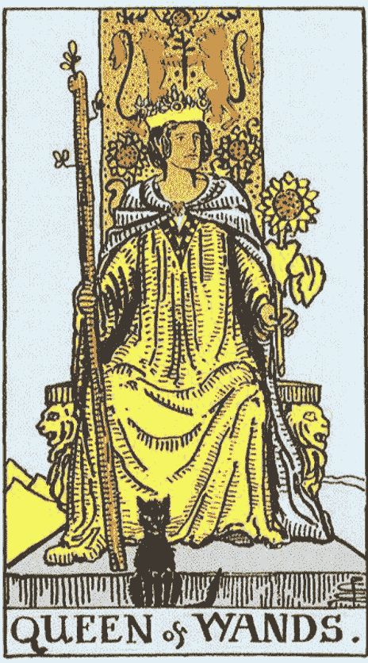

### 圣杯皇后

圣杯皇后的存在就是在证明，女人是水做的。

不，我不是说她整天以泪洗面……尽管在某些情况下，她也有可能变成这样，毕竟，这是一个非常注重，不，非常放任自己的情绪，感觉，直觉的女人，在伤心的时候，恐怕她会毫不掩饰地哭得昏天黑地。

当然所有的皇后牌都有放任自己情绪的要素，不过圣杯皇后更强调这一点。

因此，这一位在恋爱之中，容易把对方看得很重，不会像权杖皇后一般看起来更注重玩得开心，所以也更可能说出诸如，“只要在你的身边就好”这样的台词，也就是那种很传统的很顺从又很贤惠的女子。不过相应的，如果把她弄伤心了，哄回来的难度估计会相当大，毕竟这是一位放任自己情感的妹子，当她的情感是朝着对你温柔的这个方向发展时，会如溺爱一般，而当其是朝着伤心的方向发展时，也会一发而不可收拾。

纯真和爱幻想也是这位的特点，在恶劣的情况下，说不定就是一位公主病患者。

要举例子的话，《朝色》中的女主角与神桔世就是很符合这些特质的，不过这一位只表现出的是贤惠，顺从和一股脑地为对方付出的这一面，也就是好妻子的这一面，并未表现出情绪化的一面，不过仍然，脆弱的这一点是表现出来的，确实是一个拥有女主角魅力的角色。

此外，《White Album 2》中的女主角之一雪莱更是相当的符合，兼具一心一意的温柔，分手了还咬着不放的死脑筋，一直等着前男友归来的傻气，为了“爱”可以委曲求全到不知何种地步的执着，对寂寞无比的害怕，以及撕心裂肺的眼泪。

不过，虽然说艺术作品中这样的角色大致仍招人喜爱，但是在现实生活中，我们遇到的更多是掌控不了自己情绪的疯女人，她们会倾向于对男人或者孩子产生病态的依赖。这在圣杯皇后逆位时可能会更明显，但在正位也有这种可能性。

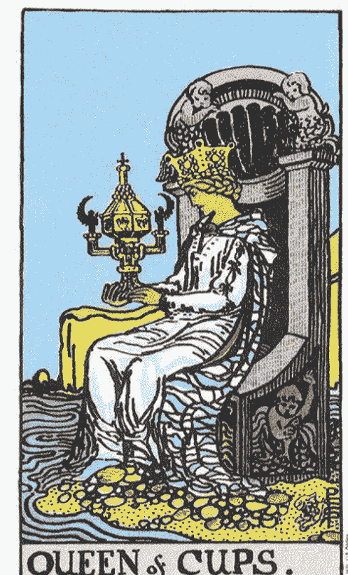

这些女人可能会把“爱”挂在嘴边，说自己如何如何爱她……但是说真的，她们口中的“我爱你”不过是，“我爱你所以你必须听我的”，“我爱你所以我伤心都是你害的”，“我爱你所以我可以随意憎恨你周围的人”，“我爱你所以我的快乐我的人生全部都是你的责任”，她们也会等待着某一个人的“爱”来解决他们生活中遇到的所有问题，但却不知道他们自己却是问题的源头。

所以说，这样的“爱”不过是一起走向毁灭的邀请函，通往地狱的单程车票。

这并不是危言耸听，女人的情绪是一个可怕的东西，破坏力能够席卷她周围所有人，相信这点不用再证明？

至于圣杯皇后的男人……啊，要去想象一个把“我明明这么爱你”挂在嘴边的男人，我的脑袋都会感到一阵抽筋。要去想象一个心思细腻，对周围人投以温柔关怀的男人，我的脑袋又会感到一阵抽筋。

这样的男人应该存在，或者说，这样的特质显然确实地存在于男人中，但是我还是不要描述了。

### 宝剑皇后

冰山美人！

和这一位谈感情的话，首先遇到的，几乎绝对会是拒绝。

这是因为，宝剑牌组是一个整体上压抑和逃离情绪的牌组，宝剑皇后站在抗拒情绪情感的顶点上，拒绝别人，拒绝与别人产生情感上的联系，拒绝与人亲密，也是其抗拒自身情感的一个方式。

她作为一个“皇后”，本身情绪也是很激烈的，与之相对，抗拒的态度也会表现得更为明显，更为强烈。

也就是说，在恋爱中这一位不仅会毫不犹豫地拒绝你，还很可能毫不犹豫地放手。而且，说不定她越是在乎你，就越是容易放手。

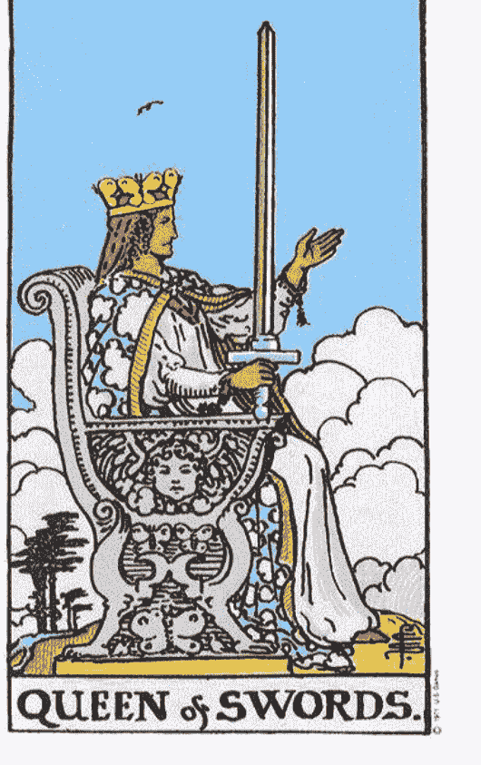

尽管我们可能会很有冲动去批判这种拒绝，认为其不好，但是，这种批判是片面的。

人与人的亲密关系中，有一个不可逃避的事实，那就是越是亲密的人，越容易互相伤害。逃离这种伤害的方法之一，同时也是面对这种伤害时常见的下意识反应，就是远离那个人，把自己孤立起来，不让别人进入自己的内心。

联系到上一张牌，你就能明白，这样的孤立在很多时候是有必要的。

至于占卜中遇到的宝剑皇后，孤立是否必要，这就没有定论了，有可能她习惯性地摆出了拒绝的态度，但是接近了才发现其实是很温柔的人。

也有可能，接近了才发现，这是不应该接近的，在她的胸中存在着情绪的风暴，太接近了就会被卷入。

尽管听起来文艺气十足，但这是一个常见的现象，也并不仅仅局限于女性。在现代社会中，即使我们遇到了什么伤心事，也常常需要板起脸继续上班，这个时候碰到别人的好意，也就常常要摆出一副拒绝的嘴脸，因为再想起那件伤心事的话，多半无可奈何地会在对方身上发泄。

不过，这对女性更为常见，因为女性应该是有比男性更为激烈得多的情绪的。

情绪以外的方面和宝剑国王差不多，脑袋很好，逻辑思维很棒，倾向于分析和规划事情的人。她的建议往往也值得一听。

宝剑皇后也可以代表一个独立的女性。除了头脑很好这一点之外，宝剑皇后并不倾向于依赖他人。毕竟，要拒绝别人，以及把自己孤立起来，自然意味着会比较独立。

这种独立可以在人际交往上反映出来，也就是在和人的交往中他不会显现出依赖别人的倾向。此外也可以在生活作风上反映出来，也就是说他可能自己在养活自己。

有时候这种独立会有些过头，到拒绝别人的帮助，非要一个人硬撑的情况。

《White Album 2》中的和纱非常符合宝剑皇后的角色，不过是一个非常可爱化的版本。

### 星币皇后

皇后牌们表现了成熟女人拥有特质的几个方面，星币皇后所表现的方面，毫无疑问就是家庭主妇了。

也许看到家庭主妇这个词你就觉得一阵头疼？脑袋里浮现出洗不完的衣服，打扫不完的房间，整理不完的混乱，洗不完的盘子，永无终结的做饭，还有烦的要死的小孩以及和小孩差不多烦的老公？

不过，我不会在这里同情女性，或者同情女性们对此如何如何不合理的种种抱怨，或者赞同一个好男人应该包揽所有家务，甚至赞同一个好男人应该去生孩子。

许多女性都憧憬一个好爸爸一样的男人，让她们不用做麻烦事，不用承担责任，啥都不用做，整天玩玩玩，外加血拼血拼血拼。

我实在想不出任何男人会有任何理由去担任这样的角色……

每个人都有其必须承担的责任，不管是男人还是女人，星币皇后，作为一个成熟女人的典范，自然是满心欢喜地承担起了这样的责任，无怨无悔地投身到了与天空一般宽广大海一般宏大的，与家务活的战斗中。

不，不仅仅是家务活，还有照料培养滋润一个家和家庭中的成员。

当然，这个角色可以有男人担任，但让我们把那个贤妻良母型的男人放在一边，这里只看女人的情况。

一如我们所知，女人们更倾向于胜任这个角色，男人们则是更倾向于把他们居住的任何地方变成一团糟。

这样的照料，整理，以及精心布置当然并不仅仅局限于家庭。在工作场合，这可以是把工作场所装点得更为温馨，可以是为所有人营造出更为轻松和舒适的环境。

或者，更为具体的例子的话，自己开一家自己的小店，装饰成自己想要的风格，给人提供一种享受。

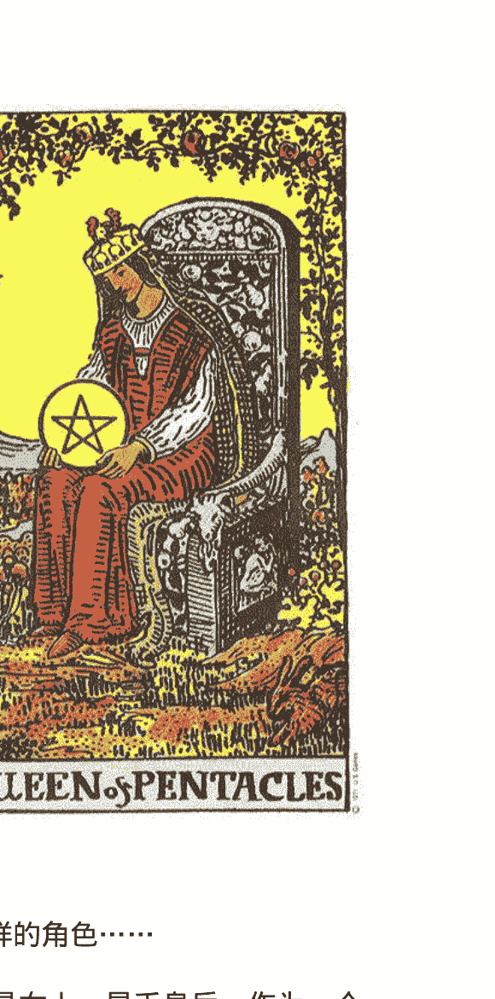

总之，星币皇后就是这样一位环境的呵护者，以及良好环境的提供者。

## 骑士

既然我们说皇后与国王是成熟的人，或者说代表成熟的特质，那么显然，骑士和侍从们就该带着不成熟的特质。

在《经典塔罗攻略秘籍》中，我曾说骑士可以代表一个正在走向经济独立的人，而侍从代表一个仍然被父母保护着，或者仍然在上学的人。

这是一个需要扩展的观点，因为既然成熟与独立并不仅仅包括经济意义，当然，不成熟和受保护也要在多种方面分别讨论，比如说圣杯骑士感情方面不成熟，权杖骑士在怎么做好自己工作和实现目标与野心方面还太年轻。

此外，即使不成熟，也并不意味着侍从和骑士“不好”，就好像小孩并不劣于大人一样，成熟与不成熟只是分别处在成长这一自然过程的两端，并无优劣之分。

那么，骑士是一个怎样的人，或者说，骑士代表怎样的特质？

骑士代表证明自己，代表尝试，代表虽然不知道自己能不能做到，但也夸下海口说自己可以，代表虽然仍没有经验但却在逐渐积累经验，代表总有一天会“而你，将加冕为王！”

尽管并不局限于任意性别或年龄，但这些特质最常在年轻男人身上表现出来。

可惜的是，这种特质并不被大众喜爱，尤其是，不被女人们喜爱，即使除开之前说过的对好爸爸的憧憬，大众也更为喜爱一个成熟能干的男人，而不是一个仍在摸索，看不清自己前路的少年。

当然有一个例外是少年漫画中的主角，但是我们都知道，少年漫画面向的读者果然还是少年……

事实上是，年轻有年轻的魅力，成熟有成熟的魅力，这是对于男女都适用的。少年虽缺乏成熟的魅力，但其中却包含有可能性的魅力，以及年少轻狂的魅惑。比如说我们都能很容易地想象出的，一个意气风发，正准备搞出一番名堂的少年，在他眼中自己什么都可以做到，任何障碍都能够被扫除。

这种意气风发不得不说，即使是在同性的我看来，也是十分具有魅力的，但是这同少女的纯真一样，属于青春的昙花一现。不久这种狂妄就会被现实的挫折所推翻，即使他最终能完成自己的夙愿，他也会变为一个冷静沉着的大叔。

骑士牌也代表面对压力和挑战，这也是为什么骑士们需要证明自己，在证明自己的过程中，他们或者会成功，或者会失败，无论怎么样，他们将会更切实地了解自己，同时积累更多的经验，最终变得可以胜任这些挑战，也就是，变身为国王或者皇后。

在个人独立方面，这意味着年轻人尝试去工作，在出错中学习，最终能胜任工作。

在其它方面，大部分技能的掌握都需要有这样一个过程，比如说编程的学习，需要学习者不断地不断地犯错，才能逐渐积累起足够的经验。

再比如说把妹，把妹需要的是技巧之一是沟通，怎么样才能成为沟通的达人？必不可少的一步就是多沟通，多犯错，多被妹子扇耳光和泼冷水。

奇怪的是，现在流行的观念是奢望这样的过程不存在。女孩们喜爱幻想拥有年轻的身姿却拥有成熟头脑的男人。男孩们也喜爱幻想自己就是那样的男人，明明一点经验都没有，但任何问题都能被自己轻松搞定。

但现实是，经验的积累必不可少，经验积累之初我们都会觉得很痛苦，觉得受到了挑战，觉得自己无法完成，觉得压力山大，觉得妈妈咪呀好难，觉得臣妾做不到啊。这种感觉是正常的，但我们不能因此退缩。

我们必须挑战自己的界限，才能超越自己的界限，才能把原本对自己不可能的事情变为可能。

骑士们就是这样挑战自己界限和试图将不可能的事情变为可能的人。

相比摆出一副“这种事情对我太简单了！”的臭嘴脸的权杖国王，哪一个更有魅力一些呢？

### 权杖骑士

年轻版的权杖国王。一样的缺乏耐心，一样的想要实现一个又一个的目标。

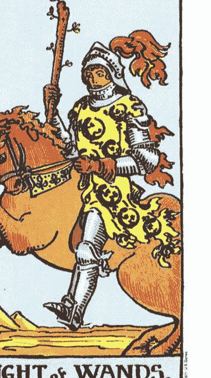

但不同的是，权杖国王常常能够成功，权杖骑士常常会失败。权杖国王对自己的实力有自信，但权杖骑士高估了自己的实力。权杖国王充满了野心，权杖骑士充满了好高骛远。

也许有一天，他能够独当一面，但是现在，他仍然是一个毛头小伙子，即使他已经尝到了一点成功的甜头，他也仍然有许多需要学的，此外他也有着更多的失败在等着他。

权杖骑士的优点之一是他敢于梦想。当我们面对未来的不确定性，我们的第一反应很容易是采取安全保险的做法，找热门的行业，找大家都喜欢的配偶。然而，权杖骑士并未被未来吓到，他梦想着自己要成就一番大事，并且愿意为此付出代价。

然而这梦想常常是奢望，随着时间的冲刷，他往往能明白自己当时太过天真，把一切都想得太容易。绝大部分时候，等着一位权杖骑士的是失败。

但是，在我们还年轻和天真的时候，真正重要的是做成功的事，还是做出自己在乎的不让自己尝试的尝试呢？

这个问题本身见仁见智，但权杖骑士无疑是选择尝试的。

敢于尝试去做难以做到的事情，这本身就是一个美德。可惜的是，许多给年轻人提供指导的人，都并不看好这个美德。

一定程度上这种态度可以理解，毕竟中国人推崇一帆风顺，他们希望年轻人可以过上平稳顺利的生活，也无可厚非。

我家长辈也希望我能找一个好的稳定的工作，可惜我脑袋里装的全是不切实际的梦想。

成功或失败并不重要。重要的是不用花下半生去思考，那时我要是那么做了会怎么样。

也是由于我们所处的环境，有的时候逆位的权杖骑士可以代表当事人有着想要实现的梦想，但是他却压抑着这个梦想，并没有去追逐这个梦想，或者假装其不存在。

此外，虽然我们说梦想，但是实际上，这并不一定非要是特别伟大的东西，任何对当事人很难，但值得追寻一下的目标都可以符合我这里所说的梦想。包括出去旅游呀，移民到某个国家呀，到非洲去做义工呀，学习新一门的语言呀，创业呀，写书呀，唱歌呀，接受更高等的教育呀，等等。

从这里你也应该可以想到，对于不同的人，梦想的定义不同，也许对于某些出身比较富裕的人，出国旅游和移民算不了什么，但是对于另外一些人，则是遥不可及的梦想。比如，现在对我来讲，写一本书也算不了什么太大的事，既然我并不在乎能不能出版成纸质书籍，但是对另外一些人来讲，却是做梦也想不到自己能不能做到。

对于每一个人，都拥有自己想做，但不知道自己能否做到的事情，权杖骑士就代表，即便如此，也敢于去尝试的勇气。

神奇的是，如果你不去尝试，你永远也不会知道你能不能做到。很多人都喜欢说，总有一天，等我做好准备了，等我存好了足够的钱，等我遇到了合适的伙伴，等我有了一个长假……

但事实是，你永远都不会准备好。在任何时候尝试都可以，重要的是自己尝试。

尽管这么说……但我也并没有在怂恿你做无谋之事。权杖骑士也确实可以代表有勇无谋，因此到底怎么做还是要你自己思考和自己负责的。

### 圣杯骑士

花花公子驾到，是要用鲜花迎接呢，还是用臭鸡蛋迎接呢，还是柴刀呢，还是好船呢，还是花束和球棒呢？

没错，圣杯骑士就是那个让多个女人伤心的男人，而这甚至可以在同一时间发生。噢！多么无情！多么残酷！纯情的无垢的少女心，就这么活生生地一个接一个地糟蹋在了他的手上，哭成了泪人！嗷！

嗯……真的是这样的么？

物以类聚，人以群分，尽管花心的男人并不一定会吸引花心的女人，但是一个正常的好女人不会轻易地被花心大萝卜吸引，如果你被某个人伤了心，那么肯定存在你自己的责任，因为你那个人对你生活有害你却没有远离他。这对于男女都适用。

所以，在重申了感情是两个人的问题，不能只责怪一个人之后，让我们来好好看看圣杯骑士是怎么个情况。

圣杯骑士，在代表花花公子或者连环少女心杀手之时，当事人可以持几种可能的心态，比如说他可能确实地对女人不在乎，觉得自己就是要玩弄女人，当然对于这类可以尽情地谴责。他也可能并不持这种心态，但是不知不觉就变成了这种自己伤害女人心的情况，这种时候他自己往往也会非常自责和感到受伤。

不管持什么心态，情况都是一样的，情绪不成熟的一个人伤害了多个情绪不成熟的异性。为何被伤害的人也情绪不成熟？成熟的人应该学会拒绝这样的伤害，否则叫什么成熟。

这类情况在创作中也非常非常的喜闻乐见，比如说大家都爱的三角恋系列，《White Album 2》中如机关枪突突突一般快速泛滥直击人心弦的修罗场呀，《School Days》中让人瞠目结舌高呼三声好的结局呀，《你与她与她的恋爱》中高潮迭起的发展与印象鲜明的主角呀～

在这类作品中，主角，大都会犹豫不决，不敢明确表露自己心态，不敢说自己爱这一位不爱另一位，这也是圣杯骑士的特质。

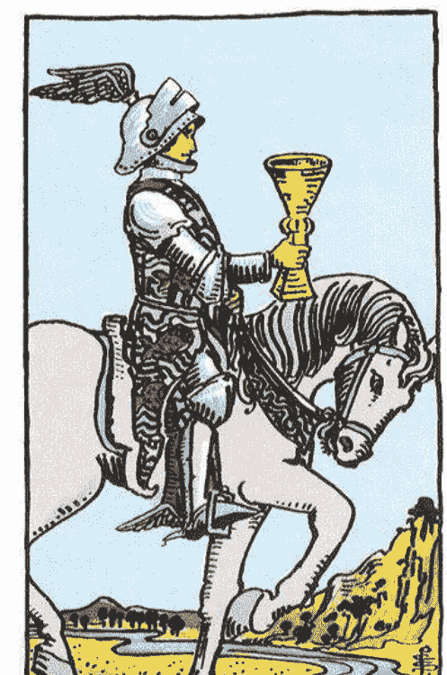

尽管我坚持爱情并不是一个选择，但是当遇到类似选择的情况时，当事人正确的反应一般是与其中一位继续卿卿我我，然后与其他异性保持距离，断绝关系。

但是圣杯骑士无法做出这种反应，他能够承受拥抱一个人所带来的浪漫与快乐，但却无法承担这所带来的责任。当然，我并不是说拥抱就等于要负一辈子的责任了。我所说的是，当两个人的亲密关系发展时，互相会对对方有所期待，其中往往就包括专一的期待，圣杯骑士知道对方有这样的期待，但他却既无法满足这样的期待，也无法断绝与对方的关系，这就是问题所在。

假设，假设说他能够明确地说，他就是做不到专一，那还好说。尽管在道德上这显得更腐败，但是对方能够知道他的态度，不会抱有他会对自己专一的期待，同时，对方也完全可以离开他。

但是通常，脚踏两条船的主角们，他们完全不表态，因此异性们会期待着自己可以“得到他”，但却又被“得不到他”的现实所折磨。这往往比简单直白的“我放弃你了”要更为伤人。

圣杯骑士们决定不了，明确不了，连自己到底想怎样都不知道，连“我就是个花心大萝卜”也说不出来，总之，通常他们不会做任何推动事情解决的行为，只能一边痛苦，一边等着哪一个，或者每一个异性离开自己。

当然他们是拥有吸引异性的魅力的，否则也不会遇上这种问题，他们通常都显得比别人要更浪漫，更能享受和异性共度的美好时光。但他们并不是好的长期相处的材料，也就是说，和他们偶尔调情是一种享受，和他们长久共处是一种折磨。

即使他暂时没有陷入到下一场三角恋之中，既然面对别的异性，他都不能作出明确的回答，若你问他，能不能放弃他生活中其它的诱惑，专心与你共度一生，在没撒谎的情况下，他的回答也会是，“我不知道”。

一定程度上，我能理解那种心情……每一个遇见的异性都有着自己独特的魅力，相处起来都有着不一样的体验，不管哪一个都同样诱人，同样让人想要把其捧在手心，想要触摸，拥抱，以及占为己有。但是在一切完结之时，除了手掌之上如风沙一般的回忆，以及那短暂的快乐之外，有谁信任过我，或是被我信任？有谁会觉得遇见我改变了她的一切，有谁给过我这种感觉？与她们在一起的日子对她们有意味着什么，对我又意味着什么吗？

### 宝剑骑士

权杖骑士拥有的是野心热情与梦想，那么宝剑骑士拥有的就是聪明才智与天真。

当然，从某一个角度来讲，所有的骑士和侍从都有着天真的特点，但是既然宝剑骑士这么聪明，他的天真也就更为明显了。

你可能会问，为何有聪明才智还会天真呢？原因很简单，缺乏经验。就如一个刚从培训班走出来，脑袋中装满新学知识的年轻人，他的脑袋可以转得飞快，但是现实并不一定如他所想的那样，他仍然要去通过积累学习。

就像我们所熟知的，自以为了不起的年轻人形象：自己脑袋里觉得自己很伟大很厉害，学了很多东西，有很多独特的想法，觉得自己就应该被重用，应该平步青云了。

实在是太天真了。

他和权杖骑士都需要学习一件事，那就是现实和自己所想的并不一样。

宝剑骑士还需要学的是，现实和书里的东西不一样。

当然，抛开年轻的自大的话，宝剑骑士也拥有独特的优势，那就是他的脑袋很灵活，学习能力也非常强。我们知道，知识改变命运，知识决定人生，即使他现在拥有的只是纸上谈兵的知识，他也拥有着不断消化吸收这些知识，最终成为很厉害的人的潜力。

就像更高等的教育，在理想的情况下，虽然不会增加你的工作经验，但却会给你更多的知识，而这些知识能够带给你更多的可能性。

实际占卜中，这可以就是一个单纯地刚走向社会的年轻人，也可以是一个人刚刚学会相关知识就要去实践，也可以是一个纸上谈兵的货，也可以是有点小聪明就自以为不得了的货色，或者，也可以是一个单纯智商高，想得出很多点子的人。

在最理想的情况下，宝剑骑士可以代表曾经大学生被以为的天之骄子那样的角色，一个刚出炉的精英，掌握着极少人能掌握的高端知识与科学技术，身体与智能都处在巅峰状态，有着极大的潜力，被赋予极高的期待。

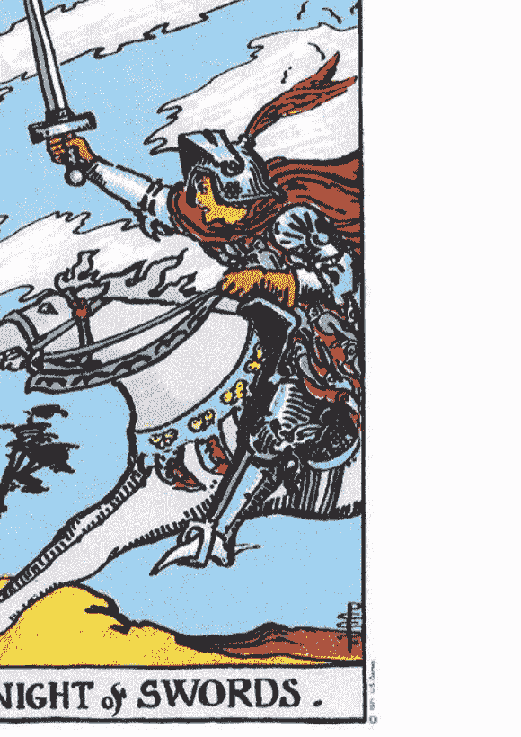

显然，这也是一个理想的学生形象，但这更偏向于大学及以上的学生，小学生和中学生表现出这样的形象实在是……难以想象。

占卜中的话，虽然不一定以这种理想的情况出来，但可以表现出类似，但程度没那么强烈的情况。比如说一个成绩在年级上名列前茅的货，他不一定有那么精英，也不一定被赋予特别高的期待，但是我们也会觉得他是拥有大好前程的。

或者说，也可以是公司中的一个新进入的高学历员工，显示出了很强的学习能力，被赋予了很高的期待。

总之，相对年轻，脑袋灵活，拥有知识和潜力是宝剑骑士的特征，在实际占卜中的表现程度和强弱就千差万别，可以是稍微脑袋好一点，可以是智商拔群，可以是跳级生，可以是某些能力远超同龄人。

最后需要提一点的是，这样的一个人，到底能不能让他面前的大好前程变为现实，我们并不知道。我们可以使用大好前程，前途无量这样的词语，仿佛此人的未来就如红地毯上的走秀一般笔直，但实际上未来仍是如迷雾一般，并不清晰。即使他拥有潜力，潜力一直潜伏的情况也完全正常，毫不稀奇。

### 星币骑士

这是一个让人又爱又恨的骑士。

爱是因为，他拥有其它三个骑士都缺少的非常关键的东西，那就是对现实的把握。终于我们可以看到一个脑中并没有充满“我这么伟大一定能做到”的骑士。

恨是因为，他缺少其它骑士都拥有的同样关键的东西，那就是青春，青春啊！

虽然权杖骑士充满了傻气和自以为能做到，圣杯骑士充满了犹豫和不知道怎么办我就跑，宝剑骑士充满了小聪明和天真地以为自己是对的，但他们都充满了青春的味道，不成熟，不确定，和敢于拥抱自己的不成熟，挑战未来的不确定的味道，用英语来讲的话就是 diamond in the rough，未打磨的宝石。

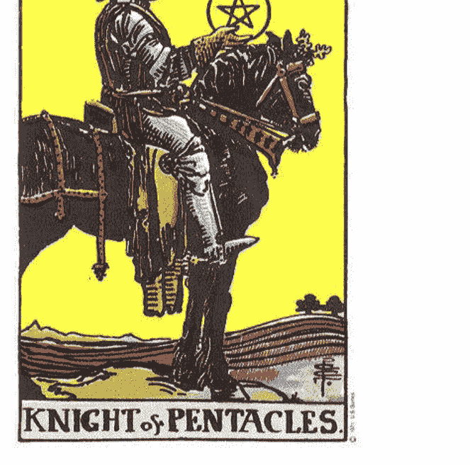

星币骑士就过于老成了，他知道自己要做的是什么，并且忠实地照此行动，他是我们勤劳学习的好学生，以结婚为基础恋爱的好男人，认真完成工作的好员工。

显然，因此他们是值得信赖的，让人放心的，符合周围人期待的。

此外，星币骑士是另外一种理想的好学生形象。宝剑骑士是一个因为才智能够轻松完成学业的学生，是能力上的典范，而星币骑士则是一个因为勤劳而能够做得比平均水平要好，是态度上的典范。

同宝剑骑士一样，星币骑士偏向于大学及以上的学生，把手背在背后的好学生的话，请找星币侍从谢谢~之所以如此，一是显然侍从更年轻，二是骑士牌是在承受着压力的，而侍从牌无忧无虑。

不过同宝剑骑士不同的是，星币骑士完全可以代表高中生，毕竟高中也是有很大压力的，宝剑骑士的话是一个很个性很显眼的存在，但在我们国家不管多聪明，高中生活都是一样的被迫从早学到晚，实在是很难显眼起来。

好了，学生的话题说够了，我们知道，骑士牌是面对压力与挑战的牌，比如说，工作压力，学习压力，成家压力，脱团压力，脱处压力，出柜压力，考级压力，打团压力，冲级压力，灌酒压力，等等~

在面对这些压力的时候，一个星币骑士的做法是，照别人教给自己的方法做，按照别人给自己的答案过。好好学习，好好工作，找个贤惠的妹子，找个高帅富，这都是别人教给我们的正确的做法。

我很理解这样教的人都是怀着好意的，但是完全听从这些意见的人会遇到一些问题。

问题之一是可能缺乏独自思考解决方法的能力，如果说他遇到的任何问题，他都采取别人告诉他的方法做，那么，如果他遇到这些方法不适用的情况，他不一定能做出适当的反应。

和上学选专业之类不一样，职业方面往往是更需要个人作出选择了，毕竟别人能给的意见也就是找个好单位，考公务员之类。但是如果当事人不走公务员之类道路的话，往往是要面临需要做出选择的情况的。然后，如果他之前没有好好试着做出过自己的选择，只是听从别人的说法，这个时候能果断地作出选择吗？

还是说会希望有一个人来告诉他，自己“应该”从事什么职业？

当然，即使有这些弊端，星币骑士仍然是有着可靠，踏实和认真的优点的，这些优点也仍然是非常难能可贵的。

比如说，假设四位骑士去读同样一本书，书中有大量的练习，帮助他们把书中所学的知识变为自己的能力，权杖骑士可能看都不看直接想要去应用这些知识，圣杯骑士可能在开头兴致勃勃地做这些练习，然后厌了放弃了，宝剑骑士可能觉得自己足够聪明，看一看这些练习怎么回事，自己选择点好的去做就行了。但星币骑士会一丝不苟地去做完。

这自然是极好的，因为许多值得我们去完成的事情，不管是学习一门语言，还是建立一个网站，还是做好一项负责的工作，都需要极大的耐心，包含不少个细节，星币骑士正拥有着这样的耐心。

不过，我仍需要再次强调，四位骑士牌是同一个东西的不同表现形式，在实际生活中，并不会一个人只拥有一个骑士牌的特征，并且，我们往往会需要用到多种骑士牌的特质。但是在占卜中，我们只会看到，我们最需要看到的那些特质，因为占卜不一定要表现事情的全貌，只需要呈示我们需要注意的信息。

比如说，我最近在学日语，驱动我学习的动力是圣杯骑士——玩美少女游戏。

在选择学习方法时，我的态度是宝剑骑士——一旦感觉效率太低或者无聊赶紧换方法。而我现在所使用的方法是在有一定的基础之后，把一本高质量的语法书囫囵吞枣之后，使用 Anki 软件背单词，同时时不时地去玩几个小时的日文原版美少女游戏。

在找到合适的方法之后，我的下一步行动是权杖骑士——大胆地挑战不切实际的目标。比如说，我在刚开始背单词的前三天内背了接近 800 个单词，当然这样做后果就是之后要做的复习如鬼神一般堆积起来。即使我之后暂时停止了背新词，那也是在 13 天背完 2000 个单词之后了。当然这也是囫囵吞枣。

在整个过程中，体现的精神都是星币骑士——不能放弃呀。我不得不承认，语言学习大部分时候都是很无聊的，枯燥，无趣，还长得要死。不管用什么样的方法，语言学习都是需要付出极大的努力和许多时间的，对抗这一事实，唯一的办法就是老老实实地，付出这些时间。

我用的方法缺陷很多，最明显的一点就是很多东西只求个大概，并不深究。不过这个缺陷对我实现目标的影响不大，并且因为忍受了这个缺陷，我可以相当快速地学到相当多的东西，不用非要把某个东西搞清楚再学下一个，这同样是对我实现目标很有用的，所以我很满意。

至于为何这个例子用用四个骑士表示，而不是四个侍从，或者四个国王，则是因为这对我显然是一个挑战。

### 侍从

和骑士一样，侍从是天真和不成熟的。但是和骑士不同的是，侍从牌并没有面对太多的压力和挑战，所以要轻松很多。同时，它们也并没有如骑士牌一样那样明显地表现出自己的特质。

就像一个人在成长过程中，在最初的十多年是小小少年没有烦恼的，在这个时候他们的个性也并不明显，这个时候就是侍从。之后慢慢开始面对压力和挑战，除了天真和不成熟之外，他们也渐渐表现出自己特有的性格，做法，态度，这个时候就是骑士。最后成长为一个能够独当一面的成年人，这个时候就是国王或者皇后。

当然，侍从牌并不非要代表一个小孩，或者一个经济上不独立受保护的人，他可以单纯代表在某一个方面的轻松和无压力。

比如说，我们都知道，爱因斯坦爱拉小提琴，而且拉得很烂，这就很符合宝剑侍从，因为虽然拉得不好，但是他乐在其中，不用向别人证明什么。

所以自然我们可以联想到，宝剑侍从还可以代表单纯因为喜欢学习而阅读各种技术性的书籍，尽管听起来也许是个很奇怪的爱好，但我发现我就拥有这样的爱好。

没错，侍从牌是很适合代表兴趣爱好的牌，因为在理想的情况下，在兴趣爱好中我们寻找的是单纯的快乐，不追求达到什么目标，也不追求达到何种水平。具体地说，权杖侍从可以是运动方面的爱好，圣杯侍从可以是烹饪之类，星币侍从可以是物品收集等。

什么，你问女装癖之类的变态嗜好？因为是追求快感，所以我想应该是属于圣杯侍从的。

### 权杖侍从

权杖侍从表现的是权杖牌爱玩的那一面。

我们知道，权杖牌专注于胜负，竞争，目标。在其它权杖牌中，我们看到的是严肃地热切地追求这些的人，权杖侍从则是以玩乐的方式追逐胜负。

就如小孩子们踢一场足球对决之后不论胜负都能开心的笑，或者热衷于五子棋的对决，权杖侍从是一个享受竞争，享受胜负，享受这带来的刺激的人。

相比之下，一个权杖骑士就会觉得“我必须要赢”，一个权杖国王会想，“我会赢是当然的”。

这种对竞争的热爱当然也有其它的表现形式，比如说竞技游戏的对决，对看球赛的热衷，参与或者观看涉及到分组竞技活动的节目。

没错，权杖侍从并不一定要参与到他热爱的活动中去，即使看着他也会很满足了。在我小的时候，经常也会去看邻居家的小孩玩电脑，邻居家的小孩也常常过来看我玩。不得不说那时候看别人玩和自己玩是一样快乐的，呀，真是怀念呀。

不过，这种享受和放松的气氛，在占卜中并不一定是适合的。也就是说，当当事人可能面对着一个需要他认真起来接受挑战的情况，但他却仍然摆出一副玩乐的态度。这个时候权杖侍从常常会以逆位表现出来，这时的逆位就代表这种态度的不合适。

但是同样一张逆位的权杖侍从也可以代表当事人正需要放松一点，不必太过紧张。实际遇到的时候到底是这两种情况中的哪一个，还是哪一个都不是，就需要你自己去思考和发现了。

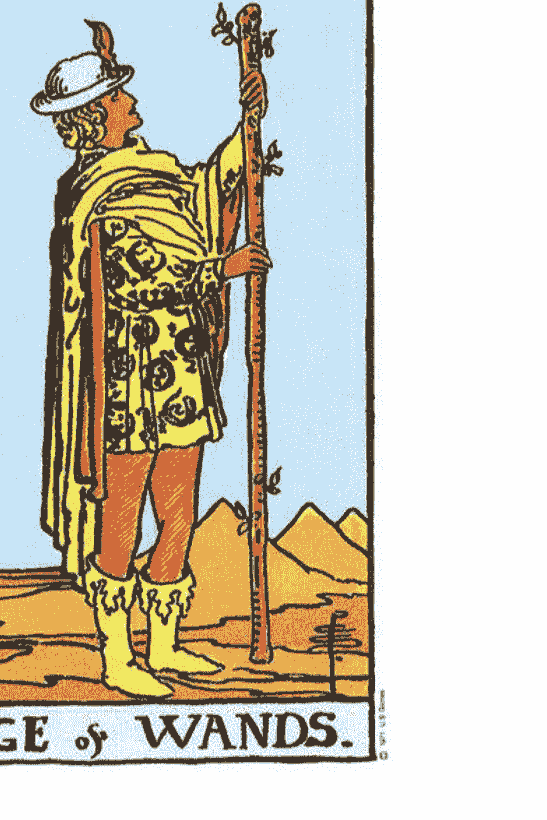

### 宝剑侍从

这一位爱的是动脑筋。

思考！解谜！幕后黑手！智商的对决！逻辑的对抗！

所以之前在权杖侍从中所讲的棋牌类玩乐也是适用于宝剑侍从的，权杖侍从强调的是这类游戏中的竞技性，而宝剑侍从强调的是这类活动中调动起来的头脑。

此外，解谜小说之类也是这位的最爱。

说起来，我在幼年的时候也很热衷于此类，当时家附近有一家书店，其中有《冒险小虎队》系列书，讲述几个孩子陷入各种冒险与解谜历程中的故事，常常会出各种谜题让读者来思考。时不时地我就会去翻一下~呀，真是童年宝贵的回忆，当然大部分时候谜题的答案我是想到了的。

除了对于动脑的喜爱，宝剑侍从也可以代表对文字，艺术一类的热衷。

小说，绘画，演剧，乐器，之类之类~

同权杖骑士一样，宝剑侍从也是既可以沉浸在观看与欣赏这些艺术中，也可以亲自挽起袖子鼓捣个一两下，自己写个小故事，画点小人，或者弹点乐器什么的。

我们成年人拥有的一个固有观念就是，写作是作家做的事情，绘画是画家做的事情，弹奏是音乐家做的事情，因此如果我们不是这类职业，那么我们就做不到也不应该做这类事情。

不过似乎在小孩的眼中，并不存在这类界限，他们喜欢欣赏什么，就会想试着去参与什么。

我觉得这点天真值得成年人学习的。

当然，类似权杖牌，如果一个立志成为作家的人抽到了宝剑侍从牌，恐怕他还太过天真，没有领教到世界的残酷——他写的东西既不一定叫好也不一定叫座，更不一定能面世。

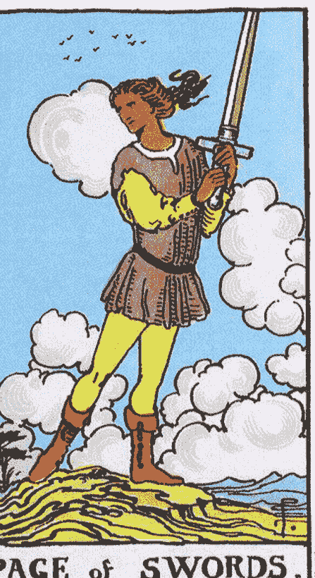

但是，因为领教了失败的教训，我们就必须放弃侍从的初生牛犊不怕虎，侍从的“我觉得我应该能行”吗？

### 圣杯侍从

他爱的是生离死别，爱恨情仇！

不，仅仅是那样的故事罢了~

就如权杖侍从爱竞争，宝剑侍从爱动脑，我们的圣杯侍从爱的自然就是耍小脾气闹别扭和看电视中的角色们闹情绪和爱得死去活来。

他也是喜爱听故事的一位。现实的故事，童话故事，各种故事。总之，他喜欢让自己的想象力飞一会，而这在听故事与编故事中都能满足。

嗯。这次我就不披露我在小学时候写过怎样的童话故事了~

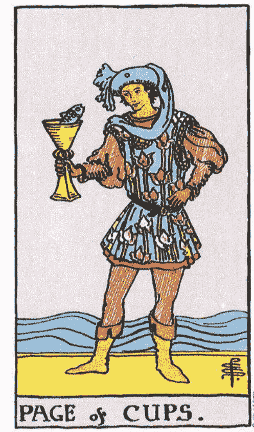

圣杯侍从也是天真的代名词，作为一个深切沉浸在幻想中的孩子，他很可能对于现实没有特别好的把握，容易轻信别人，也就是说说不定会相信接吻就能生孩子这样的事情。

不知可喜还是可悲的是，成年人常常也会像这样相信这些不切实际的事情，比如说网上经常有人发信息说日赚300的网上兼职招人，这一直以来都有人在发，说明一直都有人受骗上当。这些上当的人显然是仍然持有轻松发财的幻想，并且不知为啥以为这有可能实现。

类似的还有，轻信神吹海吹的减肥产品，增高产品，保健产品，理财产品，等等……

所以抽到圣杯牌的时候，可能就是在告诉你，太天真了。

比如说，朋友邀请出资一个项目，据说前景非常好，能够赚很多钱！抽到圣杯侍从，太天真了！

再比如说，参加了一个选秀结果，满怀期待地抽牌看看会怎么样！抽到圣杯侍从，太天真了！

还比如说，准备开始学一门新的语言，壮志满怀地准备急速搞定！抽到圣杯侍从，太天真了！

仍比如说，和女神交谈得很愉快，小鹿乱撞地问女神有没有被自己迷倒！抽到圣杯侍从，太天真了！

又比如说，有人说今年会遇到有钱的贵人，开开心心地抽牌看贵人有多帅！抽到圣杯侍从，太天真了混蛋，哪有天上掉下来的高富帅！

### 星币侍从

星币侍从在乎的是拥有，以及这所带来的安心和平稳的感觉。

前三位侍从关注的更多是经历，竞争和冒险的心跳加速，解谜的绞尽脑汁，肥皂剧的爱来爱去，而星币侍从关注的是拥有，并不是拥有多少回忆，而是更为实质性的东西，比如拥有多少本小说，多少个玩具，多少个手办，多少张 CD，多少个房子，等等～

所以星币侍从对应的爱好就是一切收集相关的，比如说我们在小学时候都曾听说过的集邮，虽然作为连邮票都很少见到的人我实在不懂这爱好有啥值得爱的……但所谓收集就是这样东西，只在有爱的人眼中有意义，不是么？塔罗牌收集者在世人的眼中，是不是也是买了一堆奇怪纸牌的奇怪人物呢？

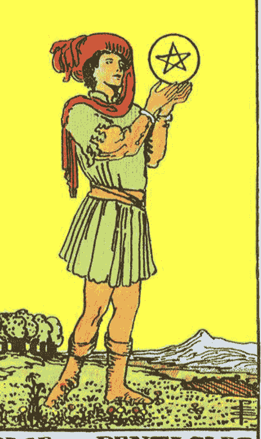

此外星币侍从也有打基础的含义，在童年生活的各种方面中，它强调那些帮助我们为日后生活做准备的，也就是家庭和社会给予我们的教育。包括个人行为举止，思考习惯，以及在学校中学到的科学与人文知识，还有如何讨好老师的知识。

因此，星币侍从代表的小孩一般是一位听话和认真学习的小孩，努力地完成这个人生阶段所应该完成的义务：为将来做准备。

对于成年人的话，这可以代表安心沉稳地学习的一段时间，可以代表成年人不常见的服从态度。当然也可以代表为了未来而进行的一切打基础活动。比如说工作之后，为了给争取更好的工作打基础，重新去准备考研。或者重新打造自己的形象，为日后的把妹打基础。

星币侍从和星币骑士的区别，仍然在于星币骑士面对着更多的挑战和压力，星币骑士的顽固要更为根深蒂固一些，以及星币侍从获得的外界的支持要更多。

就像一个中学的好学生和大学的好学生，虽然同是好学生，但是中学的好学生是整天被老师管着看着学习的，而大学的好学生大部分时间在自习室或者图书馆学习。

因此星币侍从也可以代表类似这样的手把手教学的时间。

当然，在代表这样一个听话的人的时候，这张牌中诸如收集的其它意义不一定适用。就像圣杯侍从代表天真的时候，牌中对于故事的爱这要素也不一定适用一样。

## 结语

如果这是一本其它什么塔罗书的话，那么这个时候，我应该说：

这一本书虽然结束了，但是你的塔罗之路才开始哟！

但是你也知道，我不是一个按常理出牌的人，所以在结语里，我要说的也不是这个。

我要说的是，不要以为把这本书读完一遍就够了！

如我之前所说，大部分人读完一本书，能够吸收40%的内容，已经谢天谢地了。

也就是说，在读完这本讲了 78 张牌的《塔罗的藏宝》之后，如果你能记住 30 张牌的内容，已经很了不起了。

那么怎么办？

多读几遍呗。

这是其一，其二，即使你差不多记住了这本书里所有的内容，那也不够。

因为这书里写的仍然是我的理解，你需要将之消化吸收，变成你的理解。

就好像一个美人，别人的女朋友，不管你再了解她的温柔甜美，都是不够的，因为是别人的女朋友。

你需要把她骗到手，才能知道她会怎么温柔对你。

塔罗牌也是一样，你现在开始了解她怎么温柔对我了，但你还需要知道她会怎么温柔对你。

总之，就是叫你别照本宣科，好好思考理解书里的内容，并且多实践消化。

另外，对于本书如果你有任何想要说的，不管是反馈也好，纠错也好，感想也好，都请到塔罗的藏宝反馈与讨论专页来：http://sharuo.com/tot/fb/

## 附录 I

## 之后学习内容的推荐

显然我首先要推荐我的博客，沙若的塔罗讲堂：http://sharuo.com/，充满了我写的文章，内容从入门到历史到翻译到书籍推荐都有。时不时我也会更新新文章的。

当然之后我也要推荐我与亮合著的纸质书籍，《经典塔罗攻略秘籍》，如果你同我一样，相信或者愿意相信塔罗牌值得学习的并不只是如何拿来占卜，那么在这本书中你可以找到许多无关占卜，但同样重要和有趣的知识。你也可以找到这些问题的答案：塔罗如何一步一步发展到今天这个样子的？塔罗大牌的排列一直只存在一种吗？大阿卡娜自古就有22张牌吗？所谓牌意到底是什么，有何种特征分类？什么是愚人之旅？大阿卡娜可以看作是怎样的结构？占卜应该怎样定义？提问有何讲究？塔罗的原理为何？为什么必须要使用牌阵？

总得来说，这本书有四个部分，分别讲了历史，牌意与大牌结构，占卜知识与技巧，以及实例解析。

实话实说，现在看来这本书很有缺点，其一在于定位相对较高，其二在于缺乏一个统一的主题，其三在于并不适合新人从头到尾读，其四在于该死的审核把占卜二字全改为预测和游戏，其五在于错别字相对多了一些。

显然我当时应该雇人检查错别字，应该和出版商多沟通，自己去手动把占卜改掉，应该更从新人的角度考虑，把占卜相关的内容放更前一点，应该更多地意识到统一的主题的重要性。

但在内容方面，我们已经尽了当时的全力了。

虽然我当时的幽默感还相当缺乏，也不太会分段。

更详细和更吹嘘的介绍，请到我的博客中来看看：http://sharuo.com/my-book/

此外，若是你准备买这本书，你可以从我这里买有我一人签名与赠言的签名版，支持一下我。大四下期啦，想着把最后两箱书卖掉后就不做了。

之后的推荐将按照话题分类。

### 基础知识

好吧，我不知道为何你还会需要学习基础知识，但是万一你需要的话，这里是我的推荐。

- ※ 《塔罗学习地图册》：来自炎之幻翼的免费入门电子书，内容很全面，讲到了新人易犯的很多错误，也有很多文章链接。推荐给所有新人。

下载地址：http://deathparadise.blog.163.com/blog/static/102351823201372615914289/

- ※ 塔罗入门七步走：来自我自己的入门系列博文。入门系列嘛，内容都差不多，就不多介绍了。

在线阅读：http://sharuo.com/2012/07/learn-tarot-in-seven-steps/

- ※ 塔罗初学者易陷入的10个误区：不知为啥这篇我在10年写的文章出奇的流行，看来是讲了很多对初学者很需要的东西。

在线阅读：http://sharuo.com/2010/07/塔罗初学者易陷入的10个误区/

- ※ 《塔罗入门十九堂课》：Joan Bunning 写的入门书，全球范围内流行了很久，你可以在网上找到全文，也可以购买台版。台版译名为《塔罗入门》，其中不仅增加了牌意的内容，还附送正版韦特塔罗，性价比很高。作为台版一般只能在淘宝买，其它地方没有。

### 塔罗历史

塔罗牌的历史并不仅仅是谁在哪一年干了什么。比如说，你知道女祭司又被称为女教皇么？为什么会这样，为什么现在我们都说女祭司不说女教皇？再比如，说，为什么韦特塔罗的战车牌中有狮身人面像，在它之前的 Oswald Wirth 塔罗也有这个符号，这个符号到底是谁想到要加入战车牌中的？

还比如说，之前已经说过的，塔罗牌大阿卡娜的顺序是定死了的吗？还是一一定演变后的成果？

要回答这些问题，需要研究塔罗历史。

- ※ 《经典塔罗攻略秘籍》：学习塔罗历史的话，中文资料还是这本最合适推荐。本身这题材中文资料就不多，大部分也在亮的博客中。而在亮的博客里，你会发现海一样一篇又一篇文章，但在书里就很清晰地从头到尾理得很顺。

详细介绍：http://sharuo.com/my-book/

- ※ 亮之塔罗时空：亮（男）的博客，看完《经典塔罗攻略秘籍》，或者对塔罗历史已经有了一个大概的把握之后，来读这博客会更轻松。
传送门：http://blog.sina.com.cn/u/1262811464

- ※ 理解早期塔罗：我自己写的以马赛为主讲解早期塔罗的系列文章。
在线阅读：http://sharuo.com/2012/03/ 理解早期塔罗 - 隐士与命运之轮 /

- ※ 塔罗历史学习指北：历史学习书籍推荐我在这篇博文里做过了，所以这里就不再提了。
在线阅读：http://sharuo.com/2013/01/guide-to-history-pt1/

### 牌意与牌面解析

好吧，大部分的牌意书都是这两个都会讲的。这里介绍的所有书除了《塔罗的藏宝》都未在大陆发行，在书店与网上商城中都找不到的，请上淘宝搜索。

- ※ 《七十八度的智慧》：被称为塔罗圣经的经典著作，牌面解析很多，和本书相反涉及到了许多奇怪的系统，初学就去读的话恐怕会头疼。推荐对七十八张牌都有点把握之后再读。

- ※ 《塔罗逆位牌》：不是《塔罗逆位精解》，是《塔罗逆位牌》！现代塔罗逆位解读的开山之作，也是一本很好的牌意书，很本书一样没讲牌面。

- ※ 《塔罗葵花宝典》：美人所作，必须推荐。

- ※ 《透视系统塔罗》：香港人紫枰所作，和本书相反强调使用各类系统理解牌意。

- ※ 《其实你已经很塔罗了》：到现在其实没必要看这书了，其它的选择会更好。

- ※ 《塔罗的藏宝》：强烈推荐！

- ※ 《Secret Language of Tarot》：从七十八张牌里挑了好几个重复出现的符号来讲，很不错。

### 杂七杂八

- ※ 《跟着大师学塔罗》：这书名翻译是瞎搞的，更好的翻译是为自己抽牌。详细讲了怎样记塔罗日记，怎样用塔罗做计划，怎样解读凯尔特十字等一堆不太相干的主题。这本书的特色在于将塔罗用作探索自身的工具，而不是为别人占卜，所以在书中会问你很多问题，会有很多空白，让你自己填写，自己思考，书中甚至会让你做冥想，并写下你的感想。相比之下，此书中占卜相关的内容非常黯然失色。
- ※ 《Professional Tarot》：职业读牌人养成指南，顾名思义，想以此谋生的可以参考。
- ※ 《Tarot Shadow Work》：教你怎样通过塔罗牌发现自身的阴影。又一本和占卜无关的书。
- ※ 《21 Ways to Read a Tarot Card》：塔罗读牌二十一式，教你怎么读牌的，很多人觉得很有用，个人没啥感想。
- ※ 《Understanding the Tarot Court》：宫廷牌专书，和上面那本逆位专书不同，这一本有很多练习，讲解相对较少。不过我就知道有这一本宫廷牌专书，所以就算你不喜欢这书的风格，选择也并不多。

### 把妹指南

- ※ 《Models》：Mark Mason 所作，教你怎样用你的诚实吸引妹子。相信我，把妹的书我看了不止三四本，只推荐这一本是因为只觉得这一本值得推荐。大部分书看起来教你怎么让女人围着你转，实际上教你怎么围着女人转。不过这本书告诉你，先把自己照顾好，对自己投资，这才是把自己放在第一位。整天追着女人转并不是把自己放在第一位，不管那是一个女人，还是一串女人。

至于妹子们……就算你要问我怎么追男神，很显然我既无经验也无研究，即使要我告诉你该怎样怎样，也只是我个人喜好。不过我或许可以明确地说一点……看在上帝的份上，别抱怨，不存在不讨厌抱怨的男人，也不存在抱怨的时候还有魅力的女人。你可以学着用其它更好更委婉的方式表达，比如说面对游戏狂魔，不要抱怨他整天面对屏幕，告诉他你需要他陪——男人很容易拒绝女人的命令和抱怨，但很难拒绝女人的诱惑。

## 附录 II

## 你可能会想问的问题

1. 我必须用韦特塔罗么？
2. 我是新人，我看你的书，没看懂，怎么办？
3. 讲小牌的那几章标题中的符号（♣※※☆♡）是啥？
4. 为什么这本书只讲牌意，没有像其它书一样把牌阵，读牌方法，基础知识什么的也讲一通？
5. 为什么你在书中完全没有提到占星术，四元素，或者卡巴拉，以及它们与塔罗牌的对应？
6. 但是占星术，四元素，这类系统都很重要不是么？
7. 为什么不讲逆位？
8. 我看完了你的书，为什么解牌还是不准确？
9. 为啥你这书里写的和其它书里写的不一样？
10. 那我该以哪本书中的牌意为基准？
11. 我要怎么提高自己的直觉？
12. 《塔罗的藏宝》有纸质版么？
13. 《塔罗的藏宝》有英文版么？
14. 为什么大阿卡娜没有小阿卡娜那么风趣幽默？
15. 能否推荐接下来该看什么书？
16. 我能在哪里读到更多你的文字？
17. 为什么本书免费？不是明明投入了这么多的心血么？
18. 这么年轻，投入这么多精力写免费的电子书，吃饭没有问题么？
19. 没想过如果卖电子书，然后大热卖你能赚多少钱么？也没有担心过免费发布所以被拿去满天传阅么？
20. 我发现你在四个小牌牌组那一章中对于“爱情必须出现圣杯牌”的观点太伤人了，我很愤怒！
21. 我发现你对爱情的观点有很多问题，我想要对你说教！
22. 你是不是对爱情和女人持反对和轻视的态度？
23. 你不觉得你是在把你自己的意见强加在别人身上么？
24. 有恋爱烦恼需要找你咨询！
25. 能详细介绍一下你自己么？在塔罗方面？
26. 能详细介绍一下你自己么？在个人层面上？
27. 我要怎么联系你？
28. 你能帮我解牌么？
29. 能和你约会么？

**1. 我必须用韦特塔罗么？**

你可以不用韦特塔罗，但你不用韦特塔罗的话，这本书里的讲的东西就不适用。

**2. 我是新人，我看你的书，没看懂，怎么办？**

这本书专注于讲牌意，至于新人必须了解的知识并没有讲。

所以，新人去下炎之幻翼的《塔罗学习地图册》。

地址：http://deathparadise.blog.163.com/blog/static/102351823201372615914289/

**3. 讲小牌的那几章标题中的符号（♣※※☆♡）是啥？**

是男人的浪漫。

**4. 为什么这本书只讲牌意，没有像其它书一样把牌阵，读牌方法，基础知识什么的也讲一通？**

简单即是美。一本书应该好好地讲完一个话题，然后闭嘴。

**5. 为什么你在书中完全没有提到占星术，四元素，或者卡巴拉，以及它们与塔罗牌的对应？**

因为我认为，如果一个系统对于理解牌意并非必须，那么讲牌意时就可以略去。

比如说，我们常常说，权杖牌组对应火元素，然后说，火元素包含有热情，竞争，实现目标，充满干劲的含义。

但是，我们完全可以把火元素抛开，说权杖牌组包含有热情，竞争，实现目标，充满干劲的含义。

明白了么？在这样的情况下，加入元素系统对理解一张牌毫无帮助。

而我觉得这样的情况并不少。

**6. 但是占星术，四元素，这类系统都很重要不是么？**

塔罗牌的起源与发展历史也很重要，韦特塔罗中符号起源也很重要，韦特塔罗牌设计者的生平介绍也很重要，我今天早上吃了什么饭也很重要，但是一本书不需要把所有重要的东西都讲了。

**7. 为什么不讲逆位？**

第一，我认为逆位属于读牌技巧，而读牌技巧不属于本书讲解范围。

第二，我懒。

第三，我实在懒得写，“逆位权杖二可以代表你不能怎么做决定，可以代表你仍然有留恋，可以代表你一直在压抑去实现新的野心的冲动，可以代表你实现野心的冲动被延后了，可以代表别人不赞同你的新目标，可以代表你自己仍然不确定你的新目标是否值得追寻，可以代表现在还不是选择激进的时候”，等等等等，逆位解法太多，写起来又臭又长。

**8. 我看完了你的书，为什么解牌还是不准确？**

你会问你的数学课本，为什么你数学不好么？

自己的问题自己解决。

**9. 为啥你这书里写的和其它书里写的不一样？**

因为是不同作者写的。

我知道，这不是你期待的答案。在你眼中，既然是讲同一种塔罗牌，那么在不同人的笔下，讲的东西应该是差不多的，对么？

但是并不是这样。

就像一个美女，让不同作者来描述她的美，写的内容肯定不同。

横看成岭侧成峰，三围罩杯各不同！

**10. 那我该以哪本书中的牌意为基准？**

随便哪本都可以，在你自己理解和消化的过程中，你会发现哪些观点更和你胃口，哪些观点你无法接受，此外还会发现你自己的观点，用哪本书，就像走路先出左脚还是右脚一样，长远来看无所谓。

实在决定不了，就自豪地以本书为准吧。

**11. 我要怎么提高自己的直觉？**

去问强调用直觉解牌的人。我从不强调直觉，从不锻炼直觉，也不教人锻炼直觉。

**12. 《塔罗的藏宝》有纸质版么？**

不幸的是，现在没有。

考虑到中国出版审核之严峻，出版成本之高昂，我不知道《塔罗的藏宝》有没有可能，以及什么时候会出纸质版。

**13. 《塔罗的藏宝》有英文版么？**

没有，至少现在没有。

**14. 为什么大阿卡娜没有小阿卡娜那么风趣幽默？**

大阿卡娜基本上是2012年年末完成时候版本，只做了少量修改，小阿卡娜的写作发生在2013年的年末。写作风格自然有些差别，再加上大阿卡娜写作的时候心态很是焦躁，总觉得怎么改都不满意，写小阿卡娜的时候心情基本是破罐子破摔。反映在文字上，小阿卡娜自然要轻松很多。

因为我信奉“没坏的东西就不要去修”的原则，所以对大阿卡娜也没做太多改动。

**15. 能否推荐接下来该看什么书？**

去看附录一。

**16. 我能在哪里读到更多你的文字？**

来我的博客，http://sharuo.com

**17. 为什么本书免费？不是明明投入了这么多的心血么？**

我在 13 年的时候，被免费和收费问题伤透了脑筋，我想要免费发布，又觉得付出这么多，然后啥都没得到心里不舒服。但是，收费的话又怕被人盗版。

我心中充满了矛盾，这矛盾最终让我停笔。

后来我重新开始写《塔罗的藏宝》的时候想清楚了，我是一个作者，对我来讲最重要的并不是收入，而是我有东西想写，我有东西我必须要写。

所以我对自己说，去他妈的人民币，就这么写完免费发布得了。

于是我就这么做了。

**18. 这么年轻，投入这么多精力写免费的电子书，吃饭没有问题么？**

有，大问题，我至今仍在愁伙食费问题。但是不管了，青春就是拿来燃烧的！钱总会有办法的，面包会有的，牛奶会有的！

**19. 没想过如果卖电子书，然后大热卖你能赚多少钱么？也没有担心过免费发布所以被拿去满天传阅么？**

我当然想过。这是一个诱人的梦，而且看起来还不怎么脱离现实。毕竟，想一想，这么好一本书都写出来了是吧，想象能大卖相比之下太容易，也太理所当然了。

在《塔罗的藏宝》发布的一夜之间，全国的塔罗爱好者发来贺电，蜂拥而至，销量蹭蹭蹭地往上涨，我的身价也随之一飙再飙，于是，一个崭新的高帅富就此诞生，多美！

显然我不会被这个美梦骗了。追逐这个美梦，并不意味着瞬间的富贵，而是意味着，我要走用塔罗赚钱这条路。

但我已经放弃了，我会继续写塔罗，但我不会再考虑这样正儿八经的经营，以后偶尔教导一下新人，收点钱看个牌，这还在可行的范围之内，但像这样的投入？No。

我不担心满天传阅，相比之下，我更担心的是，是需要这本书的人没有看到这本书。

但是仍然，分享本书的时候请分享这个网址：http://sharuo.com/tot/ 以确保他能够下载到最新版。

**20. 我发现你在四个小牌牌组那一章中对于“爱情必须出现圣杯牌”的观点太伤人了，我很愤怒！**

你可以尽情表示强烈谴责，或者恼羞成怒说因为我是个混球，所以我的观点不算数，但我不会改口的，宝贝。

因为别人观点和自己不同而恼羞成怒进而诋毁这个人的事情我看太多了，现在我甚至懒得指出这有多幼稚。

**21. 我发现你对爱情的观点有很多问题，我想要对你说教！**

如果你能够不去重复“幻想是真实的”这一观点，那么我想我可以听听。

比如说，下面这些就是在不停重复幻想是真实的这一观点……

永远的爱是存在的！爱情是神圣的！他是爱我的！他为了我可以抛弃一切！我为了他可以抛弃一切！爱情是我活着的意义！生命诚可贵，爱情价更高！他伤害了我，还到处乱说！你看那谁谁谁和谁谁谁不是一辈子在一起了么！爱情是高尚的，是美好的，是值得憧憬的！

个人认为现实的爱情从来都不是单纯美好而是充满混沌的，即使在所谓年少清纯的初恋中也是如此，这一点我不会让步，所以要是你想对这一点进行说教，我觉得应该是没有结果的。

**22. 你是不是对爱情和女人持反对和轻视的态度？**

不，我个人对爱情持享受和尽情享受的态度。对女人持欣赏和“高岭之花哟，染上我的颜色吧”的态度。

当然这是半开玩笑，实际上，我对女人能尊重的时候会保持尊重的态度，但我无法忍受愚蠢的观点和幻想。顺带一提，我也无法忍受把脑补出来的关于塔罗的想法当作事实这回事，会生理上产生去批斗的冲动。

**23. 你不觉得你是在把你自己的意见强加在别人身上么？**

别开玩笑了，你会怪你的老师把意见强加在你的身上吗？用力表述和传播我认为正确的意见是我作为作者的工作，判断是否接受是你的工作。

**24. 有恋爱烦恼需要找你咨询！**

我接受到的外星电波告诉我，会有不少人想找我咨询爱情问题，并且会很有趣。

既然如此的话，我想，在收费的前提下可以做来玩玩。定价就一次 75，时间不超过一小时半吧，再长了没有意义。当然你找上我时可能价格已变。

免费是不可能的，就算用脚趾头想，免费的恋爱咨询能招来的也只是一堆又一堆抱怨连天的傻女人，这是我不可能忍受的。

如果你接受不了收费，显然要么你的问题不够严重，要么你对我不够信任，无论哪种情况，我想我都不需要说服你。

**此外，有这么几个规则……**

- 第一，初恋的烦恼请慎重。
- 第二，初吻还在的请慎重。
- 第三，未成年人好好学习不要早恋。
- 第四，请确保你有勇气考虑放手或者加把劲。

据我观察，纯洁的少年少女常常只要在自己心里默默地喜欢就足够满足了，既然如此，有什么好咨询的呢？请继续享受青春的悸动吧。

之所以需要勇气，是因为很多恋爱烦恼都需要放手或放手一搏的勇气，比如说长年的单相思。但我给不了你放手的勇气，这必须来自你自己。

另外，如你所知，我对恋爱的观点大部分时候都毫不留情，我也不会为了让你好接受就说得委婉。

此外我也相信想要得到谁必须要敢于失去他，所以要问我建议怎么追一个人，我的回答也会是，首先确保你能追不到就换人。

我也相信对于爱情问题，大部分人想拥有的并不是值得拥有的，比如明女友对自己很差，也想问怎么挽留。而我毫无疑问会建议你去选择追求值得你拥有的，放弃现在想拥有的。

所以如果你有明确的目标，比如说复合，要问我怎么做的话，我可能会告诉你，不用考虑复合。或者有人想追，问我怎么做的话，我也很可能建议你，换个目标。

此外注意我所说的都是参考，是一个混球的胡言乱语，并不是恋爱圣经，做决定的是你自己，抓住幸福的也是你自己。不要问我为什么照我做了之后仍然不幸福快乐，我真的付不起你的幸福这个责任。

如果到现在你仍然确定你需要找我咨询，请加 Q，774655386。

### 25. 能详细介绍你自己么？在塔罗方面？

09 年开始学塔罗，同年开始写作塔罗博客。

在不断地学习和写作之中，终于慢慢有了能看的塔罗知识技术，以及能看的文字。大概 2012 年和亮一起合著了《经典塔罗攻略秘籍》。

写作范围从牌意到读牌技巧到塔罗历史到新人入门都有涉及。

自认为写得还算不错。

比较擅长的是写入门文章，以及把复杂的东西以较容易理解的方式表达出来，比如说塔罗牌的历史，塔罗牌占卜原理。

曾经抱着致力于改变大陆塔罗学习环境和传播塔罗知识的想法，目前对于塔罗以及曾经憧憬的塔罗事业兴趣逐渐减退，不过写作兴致还算仍然高昂。

至于水平如何，相信你从这书里也能得出结论，不用我再自我吹嘘？天，我实在是讨厌不停地说自己很牛很棒，毕竟我不需要谁把我当作大师，也不需要谁的崇拜，并且相当讨厌盲目的崇拜。当然爱慕的话可以有的。

### 26. 能详细介绍介绍你自己么？在个人层面上？

沙若，男，单身，直，本名向仪，2014 年 11 月 16 日时将会迎来 22 岁的生日，有着死宅和超级不修边幅的过去，从小就觉醒了对文字的嗜好，爱读爱写，最爱读的是技术与实用类书籍，包括但不限于 IT 技术，商业知识，演讲技巧，沟通手段，荣格心理学，创业心态论，神秘学等奇奇怪怪的东西。最近对神秘学兴趣减退。

初中开始阅读英文书籍，逐渐发展为所读书本基本全为英文。最近也开始学日文。自认为学习能力拔群，这体现在广度上多于精度。

塔罗属于自己爱写的一个话题，准确地说，到现在基本所写的全部东西都是塔罗相关的，写了有几十万的文字吧，但惭愧的是仍然没把关于塔罗自己所知的全部传播出去。唉，鬼知道到底哪来这么多可写的东西。

但仍然，我深切地认知到，塔罗方面有许多我所不知道的，可以学习的。所以别以为我是个自大的傻瓜。

文字之外的兴趣爱好无疑就是游戏了，尤其是美少女游戏。无法忍受虎头蛇尾和不能自圆其说的故事。平庸不是罪，但至少请讲一个完整的故事。

个人形象的话，在男生眼里偏胖，在女生眼里偏瘦，我自己觉得这几年长胖了，身高大概一米八。帅不帅见仁见智！最近在试图改良个人形象。

恋爱历史和个人恋爱观的话，可以说经过各种各样的事情后终于成功成长成了混球。曾经觉得为了心爱的妹子什么都可以做到，曾经觉得为妹子付出是应该的，曾经会对妹子很依赖。

现在的话，不会接受想要对我指指点点的女人，不会接受喜欢闹分手闹矛盾耍脾气的女人，讨厌爱在心头口难开的女人，讨厌死去活来的女人，讨厌要男人证明自己的爱的女人，讨厌会问他爱不爱我的女人，讨厌在意闺蜜或者别人怎么说的女人，讨厌公主病。喜欢省心的情绪稳定的，能喜欢就说喜欢，不喜欢就说不喜欢的，也能察觉男人对自己如何想法的，喜欢美人，喜欢大胸。

至于内向外向，国籍人种，什么什么的，基本都是次要的。

但是美人这点很重要。

个人经济情况目前为一片空白，也不是高富帅。

### 27. 我要怎么联系你？

- 我的博客：[http://sharuo.com](http://sharuo.com)
- 邮箱：sharuo@sharuo.com
- 新浪微博：[http://weibo.com/tarocchi](http://weibo.com/tarocchi)
- 我的闲聊 Q 群：314283013

### 28. 你能帮我解牌么？

这得看你问什么问题，以及你让我帮你解牌的意图。如果是你自己已经解过一遍，想让我指点一二的话，而且不死缠烂打的话，那么大部分时候是 okay 的。

如果你只是有一个问题想知道答案，我并不一定有时间和精力与兴趣帮你看看，因为相比单纯的读牌，我更注重沟通，更善于沟通，同时无法忍受没有沟通过一个牌阵就解，因为许多人问的问题的出发点就并不是朝着解决问题的方向。

显然你可以想到我要认真帮你分析的话是会花比较长时间的，所以大部分时候我会干脆拒绝掉算了。

更何况大部分人不期待这样的沟通，只想要对于自己的问题拿到一个答案，却不知道自己问的问题就有问题，我就更没理由浪费自己的时间了。

### 29. 能和你约会么？

如果你真的想问这个问题……好吧，显然我必须要足够了解你才能回答这个问题。

## 尾注

1. 这里的符号与标识的概念是由瑞士心理学家 Carl Jung 提出的。（第 11 页）
2. “The sign is always less than the concept it represents, while a symbol always stands for something more than its obvious and immediate meaning.” - Dr. Carl G. Jung, “Man and His Symbols”, Part 1, (1964), p.41（第 12 页）
3. 这个例子来自《The Complete Book of Tarot Reversals》。（第 12 页）
4. 这类论调是诺斯替教的特征之一。（第 15 页）
5. 颠倒一下似乎也读得通？因为技术就是根据自己意志改变世界的一种魔法？（第 16 页）
6. 这里的自我当然是指弗洛伊德和荣格心理学中都有提到的“ego”，但绝不是新时代爱说的那个 ego。（第 17 页）
7. 顺带一提，魔法师关键词中的幻象翻译自 illusion，本身就有骗术的意思，比如说制造幻象迷惑人。这个词并不是指精神病人看到的幻象。唉，是哪个二货带头翻译的幻象。（第 17 页）
8. 这句话里的也许没有去掉仅仅是为了保持几个月之前写它时的气氛和语气而已，我是很有冲动把也许换作显然的。（第 20 页）
9. 我写这句话的时候，还没有女汉字这个词呢！（第 22 页）
10. 其实我想说的是各种各样的“人格面具”（persona），来自荣格的一个概念，但果然，不用这个概念能说得更清楚。我也毫无闲心在这里详细阐述人格面具与阿尼玛的矛盾和对立，毕竟这不仅难以理解，昏昏欲睡，对于理解战车牌也并非必须的。仅仅是我脑袋中有这么一个东西，放在这里也非常合适，所以有冲动把它写出来而已，但是就算写出来也对读者毫无益处，所以我当然是克制住了自己的冲动。（第 26 页）
11. 被压抑的情绪往往先跑到潜意识里去，再通过各种方法表现出来。（第 26 页）
12. 这两种人生计划的正式名称是 deferred life plan 和 whole life plan，由 Randy Komisar 在《the monk and the riddle》中提出。（第 27 页）
13. 《Complete Book of Tarot Reversals》 p.62（第 29 页）
14. 这也不是文学上的修辞，命运之轮的英文，wheel of fortune，更为准确的翻译是手气之轮或者运气之轮，之所以本书不用这个翻译完全是因为国内已经习惯命运之轮的翻译了。（第 30 页）
15. 既然是讲死神牌，当然要多引用死人的故事和的话！（第 36 页）
16. 这里讲的“自己应该做的事情”和“自己有冲动想做的事情”之间的鸿沟，也可以和弗洛伊德人格理论中本我和超我的理论联系起来。（第 37 页）
17. 其实我原稿中是内心的观念，但是我想到内心是一个被用烂了甚至赋予了神奇含义的词，我就毫不犹豫的换掉了。（第 42 页）
18. 为了避免误解，我非要把“自由和束缚主要来自内在”换为“来自自己”，我容易么。好好的中文，简简单单的内在外在两个词……总之我所讲的东西和灵性无关。（第 44 页）
19. 另外，这里我们讲到的知识与信念，在牌面上的八芒星中有体现，八芒星又对应水星，在塔罗中又对应魔法师。（第 44 页）
20. 不觉得听着很像星星行业么？好吧，在四川话里是完全一样的。我来读的话也是完全一样的！（第 45 页）
21. 这叫投射。（第 45 页）
22. 也就是说男人归根结底给不了你安全感！（第 47 页）
23. 好吧，这几段中的内心这个词要花很大力气才能换掉，那就保留原样吧。（第 50 页）
24. 在原稿中，我写了更多的内容，分析这种观点从何而来，不过仔细审查一番后，我发现这个信息绝对传达不到需要它们的人，所以就干脆地删掉了。（第 58 页）
25. 我其实很想说 Yoooooo 风潮的。（第 60 页）
26. It is a tale. Told by an idiot, full of sound and fury, signifying nothing. 显然我这个翻译是开玩笑的，别当真。（第 63 页）
27. 一个和计算机有关的，过时多年，但却仍然在国内大学中广泛应用的东西。说起来，真的有必要每个大学生都要去学计算机编程语言么？完全是和英语四级一样，即使大部分人都过了，也仍然大部分人完全不会嘛。（第 83 页）
28. 现在没那么固执了但应该仍然很固执。（第 86 页）
29. 显然这是个玩笑，别问我要到哪个医院去治。（第 89 页）
30. 这不是某个伟大的心理学家搞出来的理论，是致力于研究如何让女人被自己吸引的人们的功劳。（第 93 页）
31. 即使这不是正常的反应，如果你是一个男人，把这当作自己正常的反应，如果你是女人，期待男人做出这样正常的反应。因为男人不适合矫情，真的。好吧，至少不是受的男人不适合矫情。（第 95 页）
32. Truth is mighty and it will prevail.（第 106 页）
33. 显然这不仅仅适用于未成年人受到的教育。（第 118 页）
34. Real liberation comes not from glossing over or repressing painful states of feeling, but only from experiencing them to the full.（第 122 页）
35. 这书里我到底重复强调了多少次不存在好牌坏牌的区别，天……（第 123 页）
36. 还有的例子比如明明马上就到该发布大阿卡娜的藏宝的时间了，却仍然怎么改稿子都觉得好不满意。（第 128 页）
37. 我们在这里并不是因为我们自由了，我们在这里是因为我们不自由。毕竟，我们逃不出理由的束缚，抵抗不了目的的监牢。你我都知道，如果没有目的，我们并不会存在。是目的创造了我们，联系了我们。是目的在鞭策着我们，引导着我们，驱动着我们。是目的定义了我们，约束了我们。而我们在这里是为了你，安德森先生哟。我们是要从你这里夺走，你想从我们那里夺走的东西——目的！（第 136 页）