## 塔罗解密全书

## 推·荐·序

### 磅礴且实用的塔罗名作

日本国际级塔罗大师 亚历山大·木星王

听闻众所周知的《塔罗解密》即将重新再版，这本分析塔罗牌的名作，在日本也备受瞩目。

书籍内容旁征博引，包含牌义沿革以及伟特塔罗释义，对初学者来说非常实用，无疑是一本非常值得推荐的名作。

此外，书中采用了神秘且稀有的原创塔罗牌图文解说，令人倍感兴趣。这些塔罗牌是由星宿老师本人所设计，我认为是一个非常有趣的尝试。

作者星宿老师是塔罗牌及西洋占星术协会的会长，他推广塔罗教育不遗余力，也培养了许多专业占卜师。

恭贺本书的再版问世，我也十分期待未来能看见此书推出续作，以及星宿老师更多的实占分享。

关于本文作者：

亚历山大·木星王是日本塔罗界、占卜界的宗师。

毕业于关西大学文学部，在成为占术师之前，他从事过新闻工作。之后他负责了许多塔罗翻译和入门书，在日本成为了普及塔罗占卜的第一人。他以清晰的解释方式介绍了原本只属于少数爱好者和收藏家的塔罗牌，于四十多年前在日本创立了第一家专营塔罗占卜的商店“魔女の家”，并创立出版占卜专门书籍的“魔女の家BOOKS”出版社。早年木星王有许多著作流传到台湾，成为台湾许多人的塔罗牌启蒙。

木星王的主要著作包括：《高阶塔罗占术》、《准确的塔罗占卜》、《12星座秘密笔记·上》、《12星座秘密笔记·下》、《塔罗速成课程》、《快速入门塔罗》、《特训塔罗课程》、《妖术手册第2卷》。全部于“魔女の家BOOKS”发行出版。

## 自·序

### 重启解密，还原初心

塔罗牌的传世将近六个世纪，若从近代的伟特塔罗算起，至今也积累了超过一百年的发展。然而塔罗的理论架构和历来演变，一直存在许多被忽视的层面，诸如图案和牌义的形成缘由或者结构、原理，这些部分正是了解和学习塔罗牌的重要关键。于是填补这块领域的构思因运而生，旨在揭开鲜为人知的谜底，终而将这些内容集结成书。由于触及塔罗的诸多面向，起初感到无以名之，而后发觉此一披露深层奥秘之举，犹如解码加密信息般，“塔罗解密”的书名遂呼应而出。

在这部著作中，各张秘仪的主图，是原创的塔罗牌作品，为本人亲自设计和绘制，根据符码意旨和图案象征运思而成。置于书中每张牌的开头，担当抽象原理叙述的参考。牌图画面因以概念的呈现为主体形构，故而自名之为“概念”塔罗。这副塔罗牌的创作也是整部著作的重要成分，也可以说是图文相伴而生的成套作品。

其实开始撰写的初衷，就是针对塔罗牌的通性和共同涵义的阐释，从图案、符号和牌义等多样角度切入，揭示塔罗的结构性和概念化，并涉及秘仪的整体设定。对于“秘仪主题”的刻划有如标语般，以加深印象和符合意境，这是为了强调神秘学和占卜中的语言作用，希望塔罗内涵能直接以凝练而实用的字句表述，因而力求词语的分辨和锻造，行文和格式也由此有别于心得分享或传述性的文

而后将主轴锁定在牌义推行的原则和方向，比较不同专牌间的差异，从中掌握变化脉络，使用各种体系的塔罗牌做为开始都能上手。并且以重要观念的理解为入门诉求，超越工具功能的塔罗白皮书，也能满足以进修为目的或据此持续钻研，在不同阶段皆可运用自如。出书时为使符码解析更加具象化，同时不遗漏传承关键，每张秘仪除了主图塔罗之外，还提供三副历史性的经典塔罗牌图对照，总共囊括了多套牌图，期许成为借以通透各式塔罗牌的钥匙。

内容如此广泛庞大，文字风格迥异加上展示多副牌图的阵仗，这些特殊性使得整体呈现并不容易，连带资料的取舍和名目安置，都几经多番转折和推敲思量。所幸自始就以配合塔罗体系为编排导向，每张秘仪都依据占卜要素和原理分项归纳，以单元和分项的排列组合，展开不同剖面的说明。而各段落的划分和接续之间，或许藏有引发读者的联想的线索。多层次的大小项目纷陈，不只为了查找时得心应手，也为营造出横向的联结。相同项目经拆解后各别串联起来，可统合为一个主题以单独学习，无论顺读或在秘仪间循环式阅读，只要按图索骥就能悠游在其中。

本书于今重新问世，可谓由来已久、源远流长，早在2004年发想和提笔，约历时一年后在协会内部刊行，《概念塔罗牌》图稿也是在同时绘制完成。由于本为着眼于塔罗学习而构筑，又适合主题式的分拆重组，撷取部分范围即足以成册，因而曾集结成各式讲义，担纲塔罗教学任务颇长时日。实然，与本人大部分著作的境运

相同，雪藏多年方遇脱颖而出的机缘，整合的全版书籍，于2012年得以初次付梓发行。

本著作正式融入塔罗世界之中，距今恰逢迈入第十二个年头。对于当时因篇幅等因素而裁省的部份，多年来一直有着补足完善的心愿，终于在2024年迎来重启的机遇，得以打造新版的《塔罗解密全书》。这次保存了既有的内容而又有不少新增，最重要的是能够还原初心，表达我真正的构思和创见。未能在塔罗解密时代面世的部份，主要是关于塔罗历史的综述以及知识领域的拓展，念及其中详尽的史实记述和剖析颜值广为人知，乃在我后来的另一著作《塔罗攻略》书中发表，而这些篇幅于今回原位，置于全书的首篇和末篇，环环相扣的解密拼图于焉完整。

这次迭代更新的机会实属难得，多处文字和编排又从头打磨良久，重复体现多年前出版时的艰辛，奋战了将近整年，周旋在塔罗解密的宇宙之中，也仿佛当下的我穿越到过去，以往熟悉的一切历历在目，如今再度重冶镕铸。非常高兴崭新的《塔罗解密全书》终能成功出版，这次的重启犹如本著作历经了三生三世，也期盼能奉献给读者更千锤百炼的成果。

**星宿 Farris Lin 于 2024年10月**

## 首篇
塔罗起源解密
The origins of Tarot

### 塔罗定义

#### 一、名实本质

##### 名称来由

塔罗，就一般人的印象而言，通常被看待成占卜使用的纸牌，而牌上面有着神秘的图案；或者也被视为可以从事或辅助心理疗愈，这些主要都是从运用层面开始认识的。较为熟悉神秘学的人，则可能认为塔罗是一个领域，和占星学、灵数学可相提并论，这时候又是塔罗学的简称。基于这些印象，现在就让我们开始对塔罗逐步重新理解，补足向来忽略的层面，并深入地探索并学习。

塔罗来自西洋而传佈全世界，跨越不同的文化圈，在国内也流行了多年，因而在此从语言着手，先来认识塔罗这个名称与转译。塔罗，英文名称就是Tarot，另外也会出现Tarocco和Tarochi的字眼，其实这两个字汇是同个名词的单复数形态，源于塔罗原始产地的意大利语。举凡这些欧洲各语系指称同一目的词语，统合来说，都是指“塔罗牌”。在英文资料中，可能会见到针对某副牌专门使用带有

Tarochi名称，这是以出处原名来呈现专有牌名的识别，可能指古代塔罗的某一种类，也是古代某一时期对塔罗牌的称呼。

由上可知，这些欧洲语言的名称，前面字根都同样是“TARO”，这个名词的重点就在前面两个音节而不是语尾，因而中文名称使用的音译省略了最后的发音。这个名词在日文是全音译，称为“タロット”，早先从日本传入塔罗相关书籍的时候，连正式的中文译称都没有。自“塔罗”这个名称出现并开始使用之后，就广泛被接受而流传定拍，不再见到有人提出更动过。

##### 塔罗和纸牌

在概念上首先需要分辨的是，“塔罗”（tarot）与“塔罗牌”（tarot deck 或 tarot cards）这两个词的不同：“塔罗”是抽象的名词，“塔罗牌”才是呈现塔罗的纸牌，两者的概念是有所差别的。只是在行文使用的习惯上，两个词汇多互为涵盖而相通，在学理和细节的叙述上，运用这种分辨可以使人更为清晰明了。

“塔罗”可视为一套思想和哲理，而以纸牌的形式来呈现就称为“塔罗牌”：“塔罗”是可以超越工具而存在的神秘哲思，“塔罗牌”则是这套神秘哲思和纸牌工具的结合品。

由于塔罗是抽象名词，在英文的行文上也一样会和纸牌的称呼混用互通：有时候一种塔罗（牌）也以tarot为称，而tarots可意指多种塔罗（牌）。不过多半的时候，一种塔罗或一副塔罗，都会使用deck这个名词，意义是整“副”纸牌，也可算是纸牌的单位名词，而多

副牌即为decks。如果是说整副牌中的一张牌是card，多张牌就是cards，通常中文惯称应为“牌”而不是“卡”。

##### 塔罗和秘仪

塔罗领域里有个名词非常受到重视，因为与塔罗特性最有关联，也最能突显出塔罗的神秘专业度，这个名词即是一“秘仪”。所谓“秘仪”，原意是指秘密奥义和精神仪典，沿袭自炼金术对其提炼物质所惯称的“奥秘”，也就是将塔罗视为精神物体，用此名称予以神秘化。“秘仪”这个名词源于拉丁语，Arcanum是单数，而Arcana才是复数，有时候也音译为“阿尔克纳”。塔罗的分部就是以秘仪来指称的，整副塔罗牌分为“大秘仪”（Major Arcana）和“小秘仪”（Minor Arcana）两分部；通常“大秘仪”可简称为“大牌”，“小秘仪”则为“小牌”。由此，秘仪也能用来当做塔罗的代称，那么一张牌也可以称为一张秘仪。

当“秘仪”用以称呼塔罗里面的各张牌，这时的用意和塔罗之称一样，偏向彰显其中的精神内涵，而意不在于纸牌。甚至秘仪所指也不在于牌的画面，而着重在牌代表的象征主旨。Arcanum / Arcana和card / cards之间的分别，等同于tarot和deck之间的分别。牌卡和秘仪虽然所指对象相同，但在正式程度与神秘化方面有所差别。从概念上来说：塔罗是由多张秘仪所构成，而整副塔罗牌是由一张张的牌所组成。当然，一般行文和口语中多以“某张牌”涵盖，使用“秘仪”则是有所讲究之时。

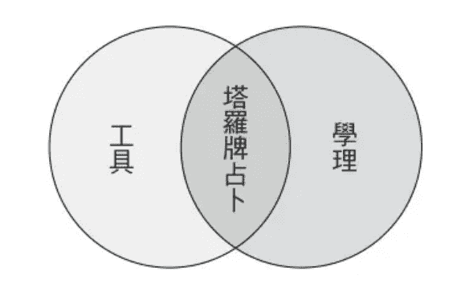

##### 精神和工具

塔羅既是抽象的精神，因此不只能以具體的工具操作，也可以做無形的計算運用，因而能方便以純報數法推算，甚至做為程序完整地運作。在此藉由其他占卜機制來比較說明會更加清楚：“易卦占卜”的依據是《易經》卦爻和辭義，這是一套象徵體系或思想文字，而用來占卜操作的工具只是銅錢或蓍草，上面並沒有寫上辭義、更沒有畫上易卦，這就是精神內涵和工具兩者截然分別的情況。

並不是所有占卜方式，都像這樣有工具和內涵的意義分別，例如“靈擺”之類的占卜，工具本身是唯一重點，需要親身操作才能起占卜作用，也無法抽解出內涵意義層面，這類就是純粹的占卜工具物件。相反地，也存在純粹哲理而無需工具的占卜方式，純粹透過演算機制即得到答案。可知，占卜工具的這幾種型態，就是依據工具和哲理兩者的交集或聯集來區別，這也恰好等同於簡易的占卜四大分類。

“塔罗”在概念上能够分辨于工具之外，但塔罗的特点仍在于其为纸牌，因此塔罗有别于其他占卜的特色，就是操作工具和内容解说都在同一物件上。不像铜钱和易经没多大关联，塔罗是工具和内涵完全合一的。经由以上辨证可知：塔罗是一种纸牌，也是抽象的哲理，通常以占卜工具的面貌被认识，但内容和功能颇具多样化。塔罗更是属于神秘学工具，以纸牌承载抽象的原理，而能够在各种不同层面上多元运用。

#### 二、格式构造

##### 编制规格

塔罗牌是一种完整而多面向的神秘学工具，主要作用是作为占卜工具被世人所熟知。另外，塔罗的面目是一套呈现图案画面的纸牌，有其规格和编制，也是工具和内涵的交集。

全副塔罗牌划分为大秘仪和小秘仪两部分，小秘仪的形制为花色纸牌，分成四个牌组共56张牌。每一牌组包含14张牌，各由首牌（Aces）开始，接着自2到10的数字牌（pip cards），以及四位阶的宫廷人物牌（court cards）所构成。大秘仪部分就是22张所谓的王牌（Trumps），每一张牌都有独自的名称，也都具有编号，从0顺序到21。

现代就是将上述编制设为塔罗牌规格，简化统称为“78张大小秘仪四花色牌组”。符合格式定义者即为“塔罗牌”，基本的要求就是编制和张数，成为判定的重要指标。狭义而言，塔罗牌需要完全符合标准编制，甚至连各张牌的名称和画面内涵都可讲究。但在广义上，编制符合但名目内容有所差异，或者编制稍有更动者，也可能视为塔罗牌。整副塔罗如果有某些变动，也可以视为塔罗的变格或变化版。

大秘仪22张牌是塔罗最主要的部分，名称顺序号码是固定编制，因其整体的结构性具有意义。每张秘仪的主题要素和牌图象征都有讲究，大秘仪结构或牌图有所变动都是大事，并须阐明变革的缘由和宗旨。然而标号的适度调动，或者有几张牌更改了名称，仍是符合塔罗编制的，至于增添或减少牌数就有待商榷了。

小秘仪分为四花色牌组是不变的，然而四种花色专属物都可以更换，只要符合四元素对应的原则。宫廷牌四个位阶偶有更替，但总要自成合理体系和原则，通常不能减少位阶，增多位阶也极罕见但可以接受。至于数字牌多半不会有所增减，但内容牌义的编派应该是较为自由的，然而若能有内涵体系则更符合塔罗牌的精神。

制定标准之所以困难，是由于塔罗牌为真实历史的自然演变而来，所有的规范都后起的，在传承过程中并未受到任何制约。（可参见第26页的“塔罗定义之限缩与扩张概念图”）

塔罗牌基于其工具特质和实用需求的缘故，容易呈现出多变的样貌，不同种类的塔罗牌差异性颇大，因而规格标准应有弹性。在应用层面上不需要截然绝对，一副牌算不算是塔罗，可依符合规格和内涵的程度来衡量。许多塔罗牌虽然更动编制，却有其变化之道理，只要保有塔罗的特色，还是能视为塔罗牌，也就是以含有多少塔罗成份和精神，来判断一副牌究竟“塔罗不塔罗”。

如果塔罗的设计完全基于塔罗规格和内涵，从而增生更多意涵或者转换嵌入其他思维体系，个中创意却都是因应塔罗架构而生，这就非常具有塔罗精神，当然属于塔罗牌。例如和大秘仪设定相符合的女神配置，这样并无伤于塔罗的架构也不违塔罗的精神，就可以归属于塔罗牌。

反观之，有不少纸牌虽然套用塔罗的编制，但在内容上塔罗精神却荡然无存，纵使完全符合规格，也是徒具形式，这就没有必要当作是塔罗牌了。比如随便贴上风景照片的牌，虽然编制正确、名目俱全，实质上只是具有塔罗编号的风景卡罢了。也有某些有意义的牌卡完全没有编制，却自称为塔罗来面世，其实仍然不足以成立。

### 成分要素

完整的占卜系统，必须“象”、“数”、“理”三要素皆具，而塔罗身为一套占卜系统，自是符合这些条件的完整设计。“象”，指的是图案象征，或者是文字符号象征亦可，而图案本身承载的任何意涵也都在其内。“数”，指的是对应的数字、顺序、编号或数量，多半是原设指定而来，本身即可具有神秘意义，也有其系统运作或计算方式。“理”，指的是联结或配置的神秘学原理或整套运作系统，不限于单一体系，通常是透过“数”和“象”的联结而来，成为其背后运作的原理作用。

塔罗的特色与重点即在于图像，画面图案就是塔罗的内容主体，因此塔罗牌是极为重视“象”的占卜工具。一般占卜系统的“象”多是较为明显的层面，塔罗的“象”当然更是显著，然而“数”和“理”的背景结构，仍是不容忽视的。

除了牌面图案外，塔罗重要的成分就是“数”，每张牌上都有数字编号，才能可以显示顺序的关联，并形成结构编制，进而联结于“理”。塔罗演进的历程中，秘仪的定位和编号数字逐渐具有个别专属意义，使得塔罗的重要特色就是与数秘学的紧密结合，数字寓意和秘仪涵义愈来愈脱离不了关系。

至于“理”，是塔罗内涵中最容易被忽视的要素，在塔罗发展历史中的神秘学时期，就是融入各式神秘学的系统理论，举凡占星学、卡巴拉修习法等等，诸多体系都能与塔罗联结和配置，而这都归功于塔罗本身具有完整且缜密的结构体系。虽然塔罗与其他系统的对应联结是经常被提到的题材，但本身最基础的结构脉络之原理反而常被忽略。本书则强调这一层面，每张秘仪都开设〔秘仪原理解析〕单元分项解说。

“数”和“理”有时候似乎会难以分辨，两者确实关联度颇大。在此简单做一分别：蕴含在其中的“数”是直接显示出意义的，而“理”是经过曲折或联结得出的另一套意义。多半时候塔罗牌是透过“数”做为桥梁而连接起“理”的，例如数字牌的序号和“生命之树”的“天界”序号一致，以此联结了其意涵和作用。塔罗也可以不透过数字做为“理”的中介，例如在牌面上显示行星符号或图案，即代表配置了这个占星要素，而将其特质或作用纳入牌中，直接借由图案联结象征性的“理”。

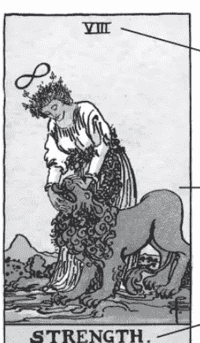

VIII

STRENGTH.

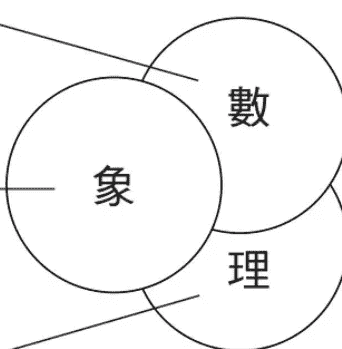

象

數

理

### 来历追踪

#### 一、源流回溯

塔罗发端并非只能臆测，如果掌握清晰概念和脉络，其实能够清楚的评析各种说法的缘由。塔罗牌并不等同于纸牌，因而考究真正塔罗牌的起始，重点不在于牌的编制形式，更重要的是精神和思想，从这个角度来对待，才能正视塔罗牌的起源，不然就只是探索纸牌家族的共同来历，反而忽略了塔罗牌的个别性。

欧洲的纸牌家族，包括塔罗牌以及其他许多种游戏纸牌，都具备四个花色牌组，也可以统称“花色纸牌”。前章提到“塔罗”和“塔罗牌”的概念不一样，可以帮助厘清思想渊源和具体纸牌流传的来源是不同意义的。而“塔罗牌”与“纸牌”两者的来源容易混为一谈，因此将两者分别清楚，则更能清晰掌握塔罗的来龙去脉。

##### 智慧源流

关于“塔罗”这个名称的意义，流传的说法是源于埃及古文中的一个近似塔罗的发音，意思为“神秘旅程”，也有人称其意就是“王者之道”。

也有人认为塔罗就是埃及魔法和智慧之神传下的《透特之书》，也是经由塔罗拼音字母的神秘转码而得到Book of Thoth的结果。

这两种说法时常相提并论，是“埃及起源”的来由，而吉普赛和塔罗的渊源，加强了塔罗从埃及传出的论调。“埃及起源说”是一种精神寄托，最早为塔罗神秘学时期创建的精神联结。诚然吉普赛人是埃及后裔的说法有失严谨，但纸牌确实是经过埃及一地传入欧洲的。

另外的说法也和名称相关，认为塔罗是“律法”的另一面呈现，将Tarot拼法错置即接近Torah，所指的就是《律法之典》上帝的意旨。再者，则是塔罗以回文拼写，符合了拉丁语的“转轮”（Rota），象征命运的运转。

这两种文字转写渊源被结合起来，起源就与希伯来产生关联。后来将卡巴拉学理配置在塔罗上，就是希伯来起源的明确认定，由于相信这套配置是前人设定好的，也就等于认同了塔罗与卡巴拉有相同的希伯来起源。“希伯来起源说”是后起的追溯，具有学理的联结而非历史性。

虽然以上这些论点大致都是附会之说，却也言之有理，因为塔罗就是智慧，是道的呈现，也是命运的显影。其实，这些对名称加以讲究的说法，都是认为就塔罗的内涵而言，其中学理和智慧的发源，是渊源于某个古文明。神秘学、修炼、魔法的古老起源都来自于埃及，本就是许多人的信念，而希伯来人居住过埃及、在文化上也曾混同，像是认定了神秘学的希伯来起源，也就从而间接承认了埃及起源。

晚近也有根据字母文明的起源以及文化的混同，翻案地追溯塔罗牌的“腓尼基起源说”。

##### 结构源流

塔罗牌和游戏用的“花色纸牌”之间有所交集，因而两者的来源也容易混为一谈。随着花色纸牌的诞生和拓展，“纸牌占卜术”（Cartomancy）也在其中生根，欧洲自古以来即流传着纸牌与占卜，塔罗只是其中之大宗，另外还有“扑克”和“奈比”等各式纸牌，这几种纸牌和塔罗的小秘仪，都是四花色牌组的形制。塔罗牌和“花色纸牌”是旁系演变关系，尤其和“扑克”之间并非传承关系，而是都来源于共同的祖先。

这是有必要认识的重要观念，也是更了解塔罗与纸牌演变的关键点，因为共同源流是可循着纸牌传布的真实历史得证的。从编制来说，塔罗牌的小秘仪和花色纸牌结构相似，应然有着同样的渊源，而这类型的纸牌已证实起源于东方的亚洲，然后透过中东和非洲传进欧洲。

欧洲中世纪时期，本来就是和中东交流、大量输入的时代，这时期恰是伊斯兰势力兴起鼎盛之时。纸牌传布，亦是欧洲地中海沿岸国家和阿拉伯世界间，习俗和文化长期密切互通之结果。最早记载的是“萨拉森纸牌”从阿拉伯人手中引进，而长期和摩尔人接触，从南欧带来了“摩尔纸牌”，并且转化为“奈比”纸牌。可知最确切无误而有迹可循的起源论，就是各式“中东起源论”的说法。

尔后欧洲人也记载了埃及流行的纸牌，编制与玩法都和欧洲的纸牌相差无几，从当时为穆斯林国家的埃及马穆鲁克苏丹国（Mamluk Sultanate）传入，这恰恰证明了实体纸牌正是“埃及起源”。

其实，“马穆鲁克纸牌”本身有其明确的流传脉络，那就是来自于波斯，而对波斯来说也非创始而另有其来历，只不过更早的源头并不清楚。

然而当时波斯盛行纸牌并外传是有明证的，印度至今还在使用的“甘以发”（Ganjifa）纸牌，记载是从波斯传进的，证明波斯是所有游戏纸牌可知的源头，而“波斯源头”就属于“中东起源论”的一种，也是最确定的起源学说。尽管也有人就此模糊地推至和印度相关，形塑了“印度起源”之说；又因波斯受过蒙古人统治，由此追溯蒙古横跨亚洲的交流影响，甚而臆想推测远及“中国起源”。

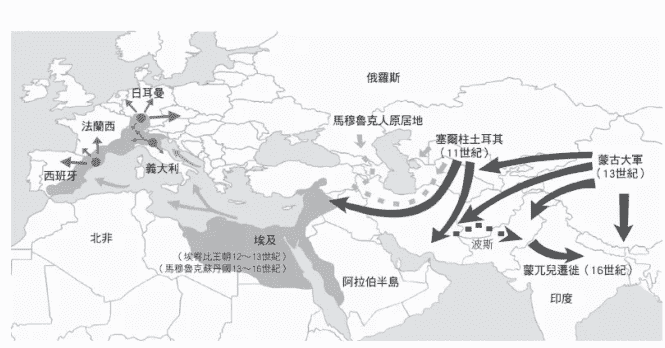

##### 寓意源流

在中世纪尾声的十四世纪下半叶，阿拉伯纸牌传入欧洲之后，在各地有不同的发展，同时期内形成了各种不同的牌系。西班牙的纸牌叫做“奈匹斯”（Naipes），意大利称为“奈比”（Naibi），传到日耳曼地区则形成了“狩猎纸牌”（Hunting cards）。由这三大系统再辗转演变，形成了后来各支“地方纸牌”，由于源头的分歧，因而各种纸牌的花色系统和牌组张数也就有所差异。

就在这个时期，欧洲发展出一系56张的花色纸牌，各牌组多达14张牌，宫廷牌扩充为四张人物牌，并结合了另外22张牌，成为整副78张的纸牌。这22张的一组纸牌名为“王牌”（璀昂斐Trionfi，英文称Trumps），是北意大利的产物，真正的起源至今仍然不明。这套纸牌完全不同于前述其他花色纸牌，由“王牌”和14数阶最高张数的花色牌组结合，构成了真正的“塔罗牌”。无论“王牌”是否先行单独存在过，直到这时才算是“塔罗牌”的真正起始点，先前的传佈只是花色纸牌的共同源流。

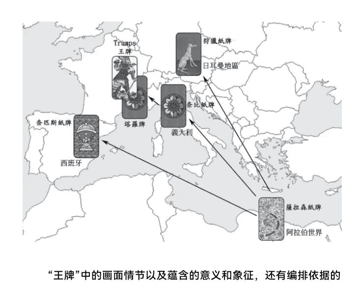

“王牌”中的画面情节以及蕴含的意义和象征，还有编排依据的制度名目，都极具欧洲色彩。创作者将各种神秘学讯息灌输其中，尤其呈现了欧洲秘教与正教争鸣之留影。思想内涵层面才是探究塔罗源流的重点，而这主要就呈现在“王牌”的内容上。

“王牌”和“花色牌组”结合，也就是“大牌”和“小牌”组合起来，如此更能一起发挥。大牌一出身就很有欧洲味，而小牌的内容物也随之欧洲在地化，不仅宫廷牌的位阶名称和性别有所改变，牌图也画出了人物。整套塔罗牌形成整体的社会位阶，而这种封建制度的形态正是欧洲的缩影，连政教并立、邦国共存的情势都呈现出来。因而就主体来说，完全是欧洲内涵，可以说塔罗就是在本土的“欧洲起源”。

##### 画面源流

纸牌在中东更为符号化，当时这一带已经是伊斯兰的世界，不可能看得到人像绘画，因而中东的花边纹饰和抽象的构图法，就这样保留在数字牌中。纸牌传入欧洲各地而产生了不同的变异，然而各体系变化的共同点就是朝向欧洲风格发展。

宫廷牌位阶编制已经欧洲化，在构图上也有别于中东并没有画出人物，塔罗宫廷牌主体是人物画像且图案繁复，宫廷牌成为详加着墨的要角，甚至以face cards名之，表明已和中东纸牌的旨趣大相径庭。尤其塔罗宫廷编制加入了女性，王后位阶即为欧洲专属标志。

每一种新的塔罗牌问世，就等于诞生一个新的塔罗种类，然而其中那22张王牌的主题向来遵循着一套标准，画面中的图案可能有些许变异，却都是传统和革新的组合，新图案通常取材于前期的牌，并且也反映同时代的当地文化、信仰和大众口味等等。就各种类塔罗牌的画风手笔而言，塔罗牌从一开始就非常具有欧洲色彩，而后更带有炼金术图画的传统，还隐含着密码学模式的绘图，全都是西洋绘画的典型手法。

起始阶段的塔罗特色是手绘画作，呈现精致的彩色古典风格，牌图画面是很欧洲的，大秘仪部分的构图也很精细。塔罗绘制的物质条件也同步于文艺复兴：成熟而普遍的造纸术和取得容易，颜料绘画的常态和发达，使得塔罗绘制颇为讲究。

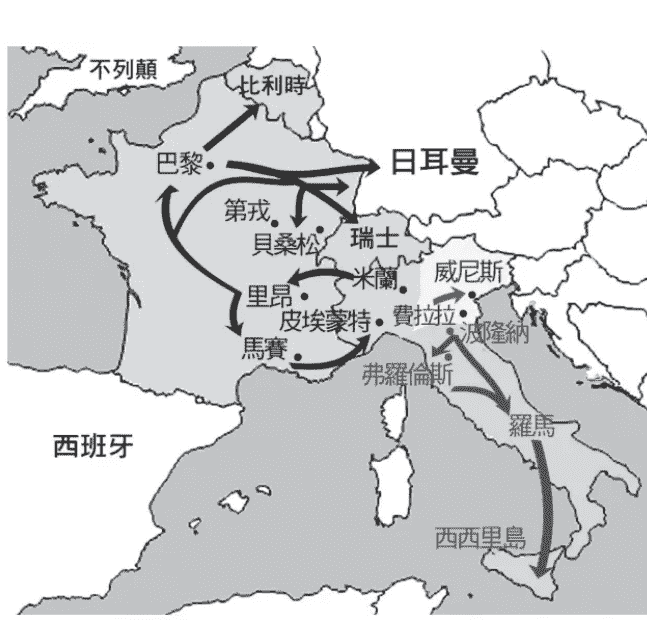

#### 二、历史分期

##### 古塔罗时代

前章叙述塔罗渊源，追溯塔罗兴起前纸牌的传播，有如塔罗牌的史前史，而本章正式进入塔罗牌的历史：塔罗牌的第一段时代是最早的成形期，源头是身为艺术品的早期塔罗图画，地区和年代都与文艺复兴重叠。最早以“璀昂斐”（Trionfi）代称，而后演变以“塔罗奇”（Tarocchi）为名。几经发展传播后，成为印制出品的塔罗纸牌，也逐渐定名为“塔罗”（Tarot）。依据塔罗是否发行流通来，整个古塔罗时代可划分前后两个分期：前期为绘画古典塔罗阶段，后期为马赛传统塔罗阶段。

〔珍藏古版〕：塔罗发展的古典时期，有几套重要的塔罗牌先祖流传下来，成为典型代表。保存至今的多为残缺的塔罗牌，并且偏向绘制的型态。塔罗牌最初的出现年份虽不确定，但现存公认最早期的《维斯康提塔罗牌》（Visconti-Sforza tarot）是在十五世纪前半期的米兰问世，并已确立了如今编制的雏形。

伪托1392年的这套《法王查理六世塔罗》，其实产生于十五世纪晚期的意大利，在费拉拉和威尼斯一带出现，属于东北意大利形式，这个传承属于“东方系统”，在早期有零星的塔罗牌出现，然而这些款式不再有后续的发展，也没有更向外传播。

同个地区在十五世纪末还出现了一套非常特别的塔罗，名为Sola Busca Tarot，是以收藏捐献者命名，塔罗牌图出版商给的名称是《启蒙塔罗》（Illuminating Ancient Tarots）。这套“十五世纪塔罗”是以金属蚀刻印刷模版印造，竟出现在手绘塔罗时期，这是十五世纪仅有的78张牌都保存完好的塔罗，也是塔罗在早期就创建编制的最佳证明，更是数字牌有情节画面的第一套塔罗。后世《伟特塔罗》在这副牌里借镜和参考的，不只宝剑三和权杖十，还有很多张牌，包括宫廷牌、甚至也有大秘仪，所以可说是对于《伟特塔罗》的启蒙，也是对塔罗界和世人启蒙之意。

虽然不同塔罗牌的创制，张数和结构时常有调整和更动，但终究仍维持在22张王牌加四花色牌组、共78张牌的“标准编制”。南方意大利出现的塔罗牌，形式编制都自成一格，然而也是基于“标准编制”增删变化的。《波隆纳塔罗》（Bologna Tarot）以减牌为主，而《曼榭塔罗》（Minchiate）为增牌。这个脉络的塔罗传承属于“南方系统”，往南影响，发展到晚期则形成《西西里塔罗》流传至今。

跟随文艺复兴的节奏，意大利成了各支塔罗的发源地，也是塔罗牌的第一重镇。佛罗伦萨除了传世的《曼榭》，还有不少相关于梅迪奇家族的塔罗有待挖掘，与这个家族互动甚密的米兰宫廷，除了《维斯康提塔罗牌》以外，委制的许多塔罗也不断被发现，这也标示着塔罗牌在意大利西北地区的风行，并且持续外传到其他各地，这些系列塔罗产生不小影响力。传播的路径是往西到法国，然后往北到达比利时，另外也绕道至瑞士，……这个传承的脉络称为“西方系统”。塔罗的发展持续不坠，而主要地点逐渐移往法国各地要城，法国由此成了第二个塔罗重镇。

〔发行流通〕：《马赛塔罗》（Le Tarot de Marseille）其实是一系列塔罗的统称，源于十七世纪，而在十八世纪时大为通行。塔罗牌创制跟随文艺复兴脚步，重心从意大利外移，在法国各城陆续出现许多印制的通行塔罗牌，大同小异的款式在各地流传和使用，以普罗旺斯的大港马赛为中心，成为整个世纪的主流塔罗，因其重要性而有了通用的缩写代称《TdM》。

这一流行是塔罗发展的重要指标，打开了古塔罗时代的第二个分期。“马赛系列塔罗”确立了塔罗牌的“标准编制”，在编制上承袭了《维斯康提塔罗牌》，为塔罗的“西方系统”脉络，也影响了许多塔罗的分支发展，整合各系发展成完全相同的编制和内容主旨，也成为后来各“地方塔罗”的范本。

这些塔罗的广佈流传，外缘因素是雕版印刷术臻于成熟的地步，而彩色印刷也已得到发展。这些塔罗都是雕版印制的牌图，所以在线条和设计上会较为简易，颜色也是较少的几样主色分佈组合，也因而成为鲜明的特色。后人归纳出这些塔罗的共同点，指称这段期间在某些地区生产而通行开来的主流塔罗为一个系列。

《马赛塔罗》是容易“上手”的塔罗，在功能上符合游戏需求，当然也能够用来占卜。《马赛塔罗》不但传承已久，并且蔚为十八世纪的塔罗牌代表，因而成了各神秘学者研究塔罗牌的主要根据。

这一阶段的塔罗牌，主要下列有几套为要角：十七世纪是马赛塔罗的发源阶段，早在1650年巴黎的《诺贝版马赛塔罗》（Tarot of Jean Noblet），已经和后来的马赛形制相去不远。进入十八世纪，1701年里昂的《杜达版马赛塔罗》（Tarot of Jean Dodal）接续了下来，成为马赛塔罗的“第一型”。

不久后在1709年的第戎生产出《皮耶之马赛塔罗》（Tarot de Marseille Pierre Madenié）基于前面几种塔罗为雏形而变化，为“第二型”的马赛塔罗，成了众所周知的主要型态。而后这种型态的不同套塔罗在马赛陆续开创和生产，到了1760年出现《康瓦之马赛塔罗》（Tarot of Nicolas Conver），这就是后世所认定的“正典马赛”。本书选为各秘仪三套历史图例塔罗牌图之一的马赛塔罗，就是康瓦版马赛的牌图。

“马赛系列塔罗”在之后仍继续延伸，除了本系列持续生产和发展，也流传到其他地区而产生了分支：1751年的《柏德塔罗》（Tarot of Claude Burdel）就是“瑞士型”马赛分支，从这边发展出《瑞士塔罗》一脉。这些系列的延续发展直到十九世纪才告终结，像是1845年左右意大利的米兰印制的《杜提塔罗》（Tarocchi Milano published by Dotti）也是一个分支。

另一个旁系的发展是意大利的《皮埃蒙特塔罗》（Tarot of Piedmont）系列，皮埃蒙特位置就在意大利西北地区，邻近法国和西班牙，陆续衍生出许多变化款式的塔罗，影响了这些区域，演化为主流或地方塔罗。此外，相关的《伦巴底塔罗》（Lombardy Tarot）系列，也含有意大利的传承，同样都在十九世纪还持续发展和演变。

##### 神秘学时代

经过上页图示意的塔罗分系发展脉络之后，脱胎于“马赛系列塔罗”这一脉，塔罗历史发展进入了第二个时代，神秘学家投入塔罗的领域，打开了塔罗史上的重要演变。始于十八世纪中后期，塔罗牌的原理、哲思和神秘学被挖掘出来，或者和各领域神秘学体系结合，正式揭橥占卜等神秘学功能，并创制出神秘学塔罗。

神秘学时代亦可再划为两个分期：早期为个别的神秘学家提出塔罗理论和配置，不一定画成牌图或印出纸牌发行，重点是刊文或出书表达思想和理论。后期为神秘团体的传承，有意识地在组织中推广，更致力于理论性专属塔罗并绘制出完整牌图。

〔近代重塑〕：十八世纪中开始了塔罗牌的神秘学化，不少研究者提出了塔罗和神秘学系统的相关性和配置，最早仍以当时流行的马赛塔罗各种系列版本为依据。莫烈特（Comte de Mellet，1727—1804）首度将塔罗秘仪化，结合卡巴拉与希伯来字母，首倡塔罗的埃及传承，并且提出了早期的占卜法。

同时期的加百林（Antoine Court de Gébelin，1719—1784）将全副塔罗做出卡巴拉的设定，认定字母配置是宇宙的神秘语言呈现。这些见解最迟在1781年提出，这时候塔罗牌内涵已经融合了卡巴拉生命之树（Kabbalah）、炼金术（Alchemy）和密术（Hermeticism）等“三术”成为学术的基底。

紧接着几年后，伊忒拉（Etteilla，1738—1791）更进一步将塔罗神秘学化，身为纸牌占卜师，他将塔罗带进了有系统的占卜，以及更详尽的神秘学设定，并配置了占星学要素，正逆位置的牌义也齐全，自此塔罗成为完整而实用的体系，并且开始了授业传承。

十九世纪仍然风潮未减，艾勒伐斯·李维（Eliphas Lévi，1810—1875）身兼作家、诗人和艺术家的神秘学者，对这些塔罗牌的设定和理论更加深化，据载他想要创建整副塔罗的图案，但留下来的完稿只有战车和魔鬼。他文字著作丰富且流传甚广，其后的神秘学者和神秘学结社几乎都受到他的影响，虽然方向可能南辕北辙。

和李维同时期的保尔·克里斯廷（Paul Christian，1811—1877）也投入塔罗研究，几乎到了他才真正画出了整套大秘仪，附带在约于1870出版的书中，这是实现塔罗埃及渊源的一套牌，并结合了占星和魔法，开创了埃及主题塔罗的先河。

这段分期的晚期代表是帕布斯（Papus，1865—1916），他接续了李维的研究，也集合前人之大成，写了详细的著作，将学理扩张到更多领域，并首度结合画家创制专属塔罗牌。

上述所有神秘学者都是以化名列举，而他们全都是法国人。如果算上总结马赛塔罗图案而配置希伯来字母的沃尔斯（Oswald Wirth，1860—1943），也是法语圈的人士。以上这些学说，也都是在二十世纪之前就发表或出版。

〔魔法结社〕：欧洲文艺复兴的法国遗绪，也带动了古老神秘智慧、秘密结社和仪式传统的复兴，从而点燃了塔罗神秘学时代第一阶段的光芒。在神秘学时代打开的同时，传统塔罗牌的发展仍并行不坠。进入十八世纪以来，阐释塔罗神秘学的著作陆续出版，然而对塔罗的影响仍方兴未艾。

这些神秘学家其实也不乏成立组织，然而直到十九世纪末神秘结社与塔罗的结合，组织性的塔罗研究才大放异彩。神秘学者帕布斯就活跃于这两分期的前后交界，本身在许多团体间游走，也曾经自组结社，包括和沃尔斯合组团体，甚至在之后也加入过黄金黎明的法国分部。

由于整体的时代趋势，神秘学团体半秘密地创建或重建起来，融合历来西方神秘学的各种体系，而塔罗研究也从个体走向团体，这个风向逐渐转向了英国，在当地魔法结社的盛行和竞争中，于十九世纪的尾声诞生了“黄金黎明”。

“黄金黎明密术教团”（The Hermetic Order of the Golden Dawn）成立于1888年，创始者魏斯特寇特（William Wynn Westcott, 1848-1925）带领几位追随者，假托神秘人士精神允诺授与秘密组织的传承资格，创立了教团组织，一时人才济济、风云际会。这些创建班底，将塔罗牌视为神秘学密码的载体，指导成员学习与钻研塔罗，可说是历来最热衷塔罗的团体。

这样的风气缘于黄金黎明创立的渊源就在于塔罗：魏斯特寇特自称机缘巧合之下取得前人李维的秘密手稿，其中的塔罗配置和原已公诸于世的有所差别，这份资料经解码后的内容才是真实的奥秘，由此展开了结社的传承。

黄金黎明对历来塔罗都做了重整，主力放在神秘学的内涵，然而占卜功能也没有偏废。在塔罗的设计上，主要是对宫廷牌的编制做了更动。塔罗本身成为内部学说的教材，如马瑟斯（S.L. MacGregor Mathers, 1854-1918）对此开发与贡献良多。

整个团体的成员都很重视塔罗牌，竞相标榜自身与塔罗的深入联结：几位创立者都以自己的塔罗图稿做为指导，内部教团的成员都有一套自己的专属塔罗，像是另一位领导者诗人叶慈（W. B. Yeats, 1865-1939）就是以《杜提塔罗》为专属塔罗。

黄金黎明的许多成员几乎有个共同的梦想，兴许是想将李维当年的塔罗架构付诸实现，不少要角都致力于塔罗牌的创作。由于秘密结社有不得公开所学内容的誓约，当时的设计和图稿都未臻完成，直到后世才完稿或出版。

黄金黎明确实能人辈出，几位突破体系的塔罗创作者皆出身于此，伟特（Arthur Edward Waite，1857-1942），以及克劳利（Aleister Crowley，1875-1947），各自所创制的塔罗牌更为塔罗领域和发展趋向带来极大的影响。后世多以黄金黎明为现代塔罗的根源，由此看来实不为过。

### 地方风华

〔遍地开花〕：花色纸牌使用的专属物在欧洲各区域内是不相同的，由于源头的分歧而形成牌组花色的差异，早期的西班牙、意大利、日耳曼三大系统，传播到更多地域之后，经过辗转演变，形成了更多种不同的“地方花色”。意大利花色和西班牙花色，都是权杖、圣杯、宝剑、金币，与主流塔罗牌相差无几，只是各地在这套花色专属物的画法上有所差异。中欧、日耳曼地区用的是橡实、红心、叶片、铃铛的牌组花色，瑞士基于此保留橡实和铃铛而更动叶片为盾牌、红心改为花朵。以法国为主，大英、西意大利、北欧、东欧等广大区域，用的花色是梅花、红心、黑桃、钻石。

欧洲的纸牌家族，都是以各地的地方花色配合惯用游戏的用牌数量，印制成了各别有特殊张数和花色的游戏纸牌，也就是说除了塔罗牌以外的各种不同花色纸牌，可以统称为“地方纸牌”(regional cards)。其中，法式地方纸牌就是“扑克”的前身，而日耳曼系地方纸牌于今使用的是Tarock这个名词，但并非塔罗牌。

### 花色纸牌传承图示

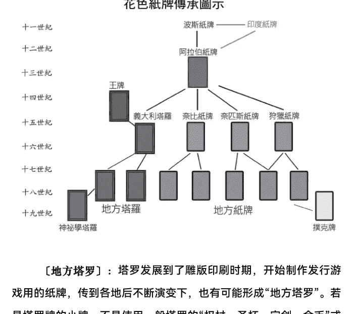

〔地方塔罗〕：塔罗发展到了雕版印刷时期，开始制作发行游戏用的纸牌，传到各地后不断演变下，也有可能形成“地方塔罗”。若是塔罗牌的小牌，不是使用一般塔罗的“权杖、圣杯、宝剑、金币”或其他新创花色，而是使用上述某种“地方花色”，就是所谓的“地方塔罗”。也很类似于“地方纸牌”和“王牌”结合起来成为“地方塔罗”。“地方塔罗”理论上使用的是该地的“地方花色”，应该等同地方纸牌的分布。不过实际上，最常见到的是使用法式花色的塔罗，也就是小牌是类似扑克花色的塔罗，那就是法式地方塔罗。另外也有少数日耳曼花色的塔罗存在，但这些地区后来都惯用法式花色来绘制或印刷游戏用塔罗牌。

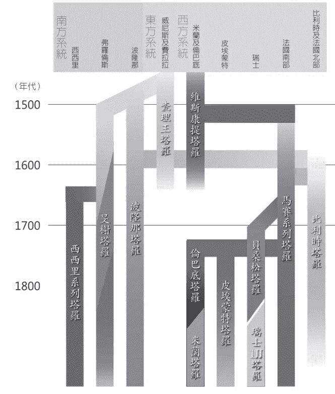

〔华奇特塔罗〕：约于1893年在意大利皮埃蒙特首府杜林（Turin），一套奇特的塔罗牌问世，出自艺术大师华奇特（Giovanni Vacchetta）之手，当时出版的名称是“I Naibi di Giovanni Vacchetta”，以“奈比”而不是以塔罗命名。如今多以绘制的画家为名，称之为：《华奇特塔罗》（Vacchetta Tarot）。这套特殊的塔罗，数字牌具有稍带剧情的图案，或许曾启发伟特和史密斯设计有情节画面的数字牌，可说居于马赛系列和《伟特塔罗》之间的衔接地位，颇具代表性且值得重视，也选为本书各秘仪三套塔罗图例之二。古塔罗一直出产到十九世纪末，《华奇特塔罗》的出现，标示着古塔罗时代的真正尾声。

#### 三、塔罗划时代

##### 旷世塔罗创制

以上这些塔罗牌传承演变的终点，就是伟特（A.E. Waite）设计的塔罗牌问世，从此打开了现代塔罗牌的新里程。这套塔罗由伟特委任同团体的成员史密斯（Pamela Coleman Smith, 1878—1951）负责绘制，完成之后由英格兰的莱德（Rider）出版商在1909年出版，首度成为图书出版品的塔罗。

这套塔罗多年之后在英美逐渐广为人知，自美国游戏公司（U.S.Game）出版这套牌以后，冠上原始出版者之名，称为《莱德伟特塔罗牌》（Rider-Waite Tarot Deck），以此名风行世界，于今已经流传百年以上。

这套塔罗几经辗转再版或重制，陆续有许多版本出现，都统称为“伟特本系”，成为塔罗牌中最基本的一族，也是至今流传最广的塔罗牌。由于本系塔罗牌特色的重心在于画面，遂使得绘图者角色相形重要，后来的观念也逐渐认为绘图者确实是重要的创作者，所以后世追认史密斯之名，而以《莱德伟特史密斯塔罗牌》（Rider-Waite-Smith Tarot deck）统称这个系列，缩写就是《RWS》，以此做为便捷而标榜新意识与认知的简称。

##### 巨大的变革

伟特不只在大秘仪修改了古塔罗的图案和设定，更让数字牌的画面寓有情节内容，小秘仪金币牌组的花色图案和名目改成“五芒星币”，而大秘仪的力量牌和正义牌的数字配置互相挪移，是塔罗在编制上的最后一变。

后起的塔罗牌设计，不外乎选择遵循伟特规格，抑或追溯传统马赛塔罗的编制。伟特对于牌义内涵也统整了古今之说，并强调了塔罗占卜的逆位专项，这些都成为后世牌义变化的依据。

《RWS》问世之后，不但本身受到瞩目与欢迎，更带领了整体塔罗牌在世界上广为传布。个中原因在于图画内容的突破，也就是数字牌是具情节意义的画面。早期塔罗的数字牌画面非常简单，虽然也有装饰图案，但每张牌并没有独自的特色。黄金黎明的塔罗系统赋予数字牌炼金术和卡巴拉意义，却只含蓄地加了些魔法图示，没有针对每张牌特别着墨。《RWS》则与此不同，每张牌都根据意义来塑造图像画面。

虽然《RWS》的两位创作者都是黄金黎明的成员，他们共同设计出的牌图竟与团体中其他塔罗牌大相径庭。原委应在于伟特的构思是想展现更宽广的领域，跨越框架而直接诉求整体纸牌的传统，他热衷于钻研纸牌占卜术，统合以往出现过的塔罗牌，连吉普赛的江湖用法也不遗漏，统合了各路纸牌的占卜意义。

可知在《RWS》看似简单的画面下，其实揉合了许多历来古塔罗图案的变形，纸牌占卜术的牌义精华，也以多层次的繁复手法呈现于画面中。至于黄金黎明对于塔罗的思想，伟特个人的设计和见解，魔法和神秘的气质，宗教和灵修的氛围，都由绘图作者史密斯融为一炉，当然这其间亦不乏纯粹的个人构思和创意空间。

##### 塔罗的现代起点

《RWS》如此重要且成为经典，主因就在于历史的承先启后，《RWS》完整而周延地统整了以往的塔罗，无论在画面上、内涵上或结构上，皆同时具有传承和变革创新。因而，被视为塔罗历史上最重要的时代分水岭，自此以后塔罗的出版、图画和牌义都不同于以往而有新发展。于各类内容中提及历史进展时，也是以之做为划分标准，时常被视为“后RWS时期”，也是现代塔罗牌的开端。由于《RWS》的重要性，本书纵使属于通论也需引为例说的主轴，并且选取为各秘仪三套塔罗牌例附图之三。

自《RWS》问世以来，各式塔罗创作纷纷起而效尤，以《RWS》画面为基调跟进或仿造，出现了很多相近的牌种，蔚为“泛RWS”大系，这个大系的风格都比较写实，容易上手与理解，也适合于进行占卜。后来创作的塔罗，多崇尚富有情节画面的数字牌，而这些设计从最早就是以《RWS》做为依据，并且也逐渐成为不成文的规范。塔罗发展走向现代的同时，仍有一些跟随古代塔罗的创作，或者研拟神秘学的塔罗出现，早期的埃及系列塔罗源于神秘学时代，所以图片与当时的塔罗很类似。也有其他各式创作塔罗出现，逐渐也形成了几个系列。

##### 透特塔罗分庭抗礼

克劳利（A. Crowley）也曾是“黄金黎明”的一员，也创作设计了一副塔罗，自己命名为《透特塔罗》（the Thoth Tarot）。克劳利和绘图者荷蕊丝夫人（Lady Frieda Harris, 1877—1962）两人密集合作长达五年，《透特塔罗》以及这副牌的专属著作《透特之书》于1943年完成，却迟至1969年才出版纸牌。而后牌名也同样并列设计者和执画者之名，特称为Crowley-Harris Thoth deck，简称《CHT》。《透特塔罗》从此与蔚为塔罗教科书的《伟特塔罗》分庭抗礼，别出新裁而独树一格。

这套牌的出版代表此后有更多元丰富的塔罗种类和意涵，鼓励了塔罗牌的创作与突破，造就神秘学系统塔罗的复兴，强调元素变化和神秘系统。自此塔罗牌才真正受到出版界的重视，以及更广泛群众的兴趣和青睐，也引发了日后的愈趋密集和频繁的塔罗牌创作生产，成为又一波的新分水岭。

综观《RWS》和《CHT》分别成为有关数字牌发展脉络的两种代表性塔罗，在古典塔罗之后，数字牌有两大走向：一为《RWS》开辟的蹊径，透过具有情节的画面，描绘出人物和剧情，表达实际面的人事变化，便于占卜咨询或心理方面的功能，可将意义往外想像和拓展，本书数字牌的〔故事情节解说〕旨在说明这些范围。

另一支塔罗数字牌的发展路线，是走向元素化，着重于阐明元素专属物的能量呈现，甚至比古塔罗强调图形排列，重点在物质抽象表现上，作用则在于“冥想凝思”的神秘学功能，更往元素内涵钻研，力求融合炼金术、占星等神秘学体系，从神秘学时期开始，而后有黄金黎明的统合，《CHT》为集大成者。这些系列古往今来的塔罗，牌义和占卜方法有其特殊性，本书数字牌〔属物呈现解谜〕的研析适用于此。

##### 全球流行广佈

塔罗牌的发展在早期并没有固定规格，出现过许多种不同编制和张数的塔罗牌，而后经发展演变逐渐趋向一致，塔罗牌的定义遂愈来愈明确了。到了后来的历史转捩点，也是定义最为狭隘严格的黄金交叉点，这时才有了塔罗公定编制78张。在这交叉点之后，依循这个定义又新增了其他各种的塔罗牌，因为有此公认“标准编制”为据，才能发展更多新奇多元的创作，又逐渐趋向广义，这就是塔罗定义的变化综观。

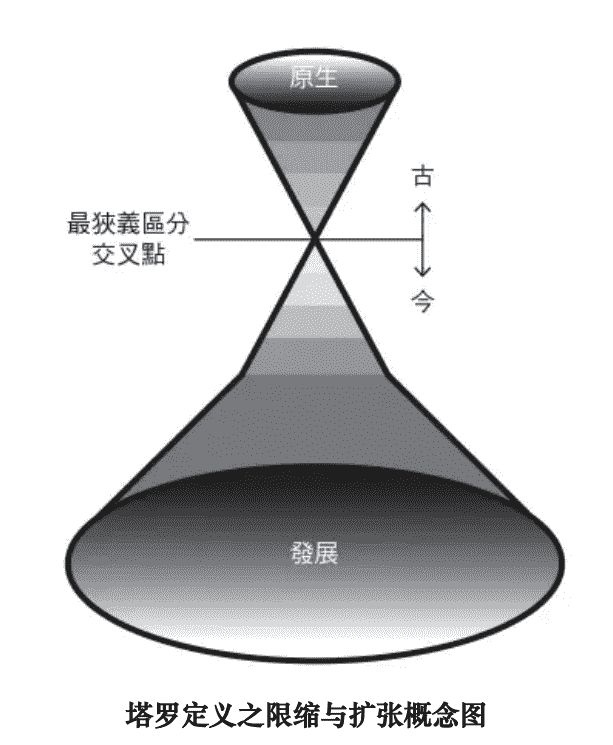

##### 塔罗定义之限缩与扩张概念图

现今举世的塔罗理论，在牌义内涵以及数字的联结关系上，也都确认了一致性的公论。塔罗发展尔后进入了现代时期，各式塔罗纷纷出现，专属牌义和特殊的秘仪内涵都因应而生，变量虽然增多，却甚少脱离这个公定的编制和数字意涵。纵使宫廷牌编制存在传统和黄金黎明系统的差异，却能振奋塔罗界对于学理的比较和研究。

近几年来的出版概况可以证明一个事实：塔罗牌的被接受和有画面图案息息相关，随着塔罗牌愈盛行和被深入了解，愈后面出版的塔罗数字牌愈多具有情节画面，早期出版界或漫画界会出版数字牌为点数花样的塔罗已经少见，只出版22张大秘仪的情况也不多了，纵使是神秘学系统也不例外，新创的《CHT》系塔罗增添了画面情节就是一例，甚至另行设计的新体系塔罗，亦多在数字牌投下许多心力。

二十世纪前期塔罗牌的种类不多，中后期才开始持续有塔罗出版，接近世纪末塔罗牌开始蓬勃创作和出版。二十一世纪以来，塔罗牌挟以大众出版品之态势，大量出现了各式各样风格以及不同系统和编制的塔罗牌。结合漫画插画创作的塔罗曾经风靡，插画和各种美术流派也云起，塔罗牌成为出版商的宠儿。新时代思潮的汇入，后现代风格的兴起，塔罗牌遂进入了百家争鸣的景况。

随着全球化的节拍，反而促使独力自制的个人化塔罗崛起，回溯各地文明的呼声带动异教复兴或女巫体系重建，这股能量也复苏了古塔罗的还原重制与手作。时至今日，连材质都能有所创举，格式自由发挥、题材多元，不断求新求变。

琳琅满目的塔罗牌，可以归纳为不同的种类和系统以利于了解，配合演进阶段一并呈现于下图：

### 塔罗发展脉络和类型示意图

| 时期 | 阶段 | 类型/示例 |
| :--- | :--- | :--- |
| 十五世纪前期 | 古典塔罗时代 | 艺术创作塔罗牌 维斯康提塔罗 |
| 十八世纪中后期 | 神秘学时代 | 个别神秘学家提出神秘学理论 神秘团体塔罗之内部传承 流行发行纸牌 马赛系列塔罗 |
| 1909 | 伟特塔罗问世 开创新阶段 几乎所有塔罗都受到影响 | 黄金黎明延伸 透特塔罗 埃及之书系列 伟特塔罗 |
| 二十世纪后期 | 缤纷时期 出现各种系统识别 随个人设计 | 泛伟特塔罗 |
| 二十一世纪以来 | 百家争鸣 - 个人时期 更多个人原创塔罗蓬勃出品 非公家出版品和独立出版 | 漫画风格塔罗 女神塔罗 电影主题戏剧塔罗 传奇故事主题塔罗 翻修风格塔罗 趣味主题塔罗 神秘族群塔罗 天使塔罗 特殊媒介塔罗 吸血鬼塔罗 魔法塔罗 神话主题塔罗 仿古塔罗 多元文明呈现塔罗 古塔罗牌例重制 新世纪意识塔罗 |

##### 内涵探索

#### 一、牌义掌握

对塔罗的历史了解不仅是学术探索，除了攸关于塔罗的分类和渊源问题，更有助于对牌义脉络演变的厘清。因为牌义随着时间不断的变化，每张牌义的演变过程，就是最精密的塔罗历史。

某一张秘仪的牌义为何如此，不只是理论就能够说明，更需要了解的是历史渊源和人文脉络，这是学习塔罗的难度，然而也正是有趣之处。

##### 牌义外缘层次

塔罗牌的种类不同，其中秘仪的牌义内涵也不尽相同，每一种塔罗会根据共通牌义加以变化，这较细微或深入的层面，就属于每一种塔罗“专牌”的解析部分。其实像《伟特塔罗》也是一种专牌，只是因为身为经典等级常被当成通用范本使用，仍有其专属之独特牌义部分。每一种塔罗的牌义层次都很多元，必然会有的是共通牌义加上专牌牌义。

不同专牌的牌义差异时常被忽视，大都以共通牌义来代用。然而在实际解牌的时候，却呈现牌义各异的状况，是因为共通牌义会随牌局而有取舍变化，并且再加上个人定义所致。

牌义诚然有个人色彩，却更有其共通的语言，共通语言是不会变的，所以对于专牌牌义和共通牌义应该加以注重，并厘清共通和个人牌义的差异。本书旨在探讨共通牌义的层面，阐述各秘仪的主旨内涵和牌义定位，亦即“数”和“理”要素，以及画面图案的“象”，并导出正逆位占卜应用，以这三大部分为主体。

##### 牌义内涵成分

秘仪内涵仍可继续抽丝剥茧，一般所谓“牌义”具有许多成分，“占卜意义”只是其中一环，其他则是秘仪的主旨属性和各种原理设定。多数著作所引用的牌义多不明其缘由，不知道占卜意义来历，或许并没有厘清占卜意义和主旨内涵意义的层次，有时候小册子还不符合该种塔罗专牌的属性。

即便是“占卜意义”也会有所变迁，明白何者是当代适用的“主流定义”、何者属于“历史牌义”，这样才可厘清牌义很多方面的问题。因而了解牌义历史沿革更形重要，透过这观点便有助于日后各种学习理解和辨认。

对于每张牌一连串牌义变化的解说，在本书中占有重要份量，目的就是为了厘清众人较难解之疑惑。

类似单词项目陈列的说明书关键字解读，容易误导以为是通用意义，而忽略了实际占卜时需要锁定问题导向。这时占卜意义也会更动，但仍须基于对该牌的认定，塔罗占卜的解读并不是完全随心所至，是有一定原则可循的。理解占卜应用的几种原则，如此就可以面对各种占问而有所变化，而又不至于脱离准则。牌义内涵有其层级，

#### 二、共通牌义设定

#### 牌序结构

在整体结构安排下，这个主旨的秘仪为何被摆在这个位置，例如为何教皇被定位为第五号牌，这点一定要先有所理解，才不失其结构性。最基本且最共通的意义，可说就是从这里开始推演起的，因而所有秘仪都列有〔牌序结构〕这个相同的项目。

##### 数字原理

塔罗秘仪的一个重点是跟数字结合，数字具有顺序意义和数秘涵义。数字本身有其神秘哲学体系，也就是数字的意义化，将数字的神秘内涵视为有意义的象征符号，可统称为“数秘学”（Numerology）。而运用于个人出生日期相关数字解析的“生命灵数”，只是数秘学中的一个系统。塔罗牌的数字寓意是共通意义的一部分，也和某些数字系统有交集和互通，然而这些意义都是经过筛选所得，并不涵盖数字的完整象征，也与各别系统如“生命灵数”的数字解释不全然相同。其实塔罗本身就构成一套自己的数秘体系，反而是其他系统时常需要援用塔罗数秘意义做为解释。

##### 秘仪主题

牌义内容和这张秘仪的名称主题极度相关，为什么这张牌名为“教皇”，是否代表精神领袖，还是特指怎样性质的宗教首领，教皇和女祭司除了性别，还代表什么信仰上的差异？这些都是值得探究的切入点。对秘仪主题的解说项目，是大牌的〔象征法则〕、小牌的〔主题定调〕或宫廷牌的〔人物原型〕，连同解说数字原理的〔数字对应〕或〔数序导向〕项目，统合在〔秘仪原理解析〕，是秘仪内涵的基础设定和原理主旨，并且是属于共通性的。

##### 牌义沿革

事实上，塔罗占卜牌义是会随时代变迁的，并没有绝对性，然而又有一贯相通之处。每张秘仪的某些涵义可能来自某时期的定义，而另一些涵义有可能又源自其他来历。像是《伟特塔罗》数字牌的画面，有时让人摸不明白情节主轴，其实这种模棱两可，就是为了要表达各种不相搭的涵义存在。牌义中有些部分是超越画面所呈现的，这就是和文字说明有时会不一样的原因，这些多半是历来牌义的残存，所以要从牌义渊源与演变过程来了解。例如，金币五中有恋人的涵义，是渊源于古代的纸牌。

从古典塔罗时期以来，甚至追溯至各式纸牌占卜的渊源，就开始有牌义的分歧和变化，神秘学时期各家更注入许多意涵。伟特做了最早一代的总结和统合，产生牌义错综复杂的情况，这也是让后人摸不清头绪的原因。然而伟特之后的时期，基于伟特统整的意义之下，又有一些不同的理解，这时牌义已经有明显的差异，尤其对正逆位的混乱修改了很多。往后的历史更是不断修正牌义，而慢慢修改演进成为如今的面貌。

牌义就是这样随着时代而改变更动，会有当时的“主流定义”。于今也有一套较为公认的现代牌义。当今塔罗学的兴盛，公认的秘仪定义也已经产生，这是从历史演变以及理论推衍而来，了解这些定调的背景和由来，才能有效学习、消化和应用。此即书中所有秘仪皆有的单元〔牌义沿革解疑〕中，从〔来历变迁〕述说至逆位牌义。

#### 三、塔罗专牌意涵

##### 专牌背景架构

现今不同套塔罗也会有不同意义，通常是从历史中的变化和差异取舍所需的意义。塔罗牌义有许多层次，不同的塔罗之间有共通的牌义，而个别的专牌设定也形成了其特有的涵义。

每一种塔罗专牌有其不同的背景架构，造就了各副专牌的特殊性。要了解一副塔罗，须特别注意背景系统的设定，这会使其中每张秘仪的牌义有别于其他塔罗，并增加一般秘仪内涵之外的独特意义。塔罗创作者赋予该副塔罗专牌的寓意，是不容忽视或误解的。

了解专牌背景系统设定，至少要能判断主题或风格，例如：精灵塔罗的背景是属于奇幻世界而不是现实世界，如此各秘仪的画面情节就不同于一般，也表示牌义会有所差异。有些塔罗为炼金术的主题，也有更新的塔罗以魔法修习为主题，基本上可从整副塔罗的风格大致掌握。《伟特塔罗》是写实的描绘方式，设定在一般世界的情境下。

更为细节的方式就是知悉每张牌个别的内容，背景设定会根据塔罗专牌不同而变化，有时甚至需要查明专牌中每一张秘仪有无特殊意指。

例如：《伟特塔罗》中的教皇，是否代表特定对象或某位人物。传说女祭司牌主角是中世纪的一位女教皇，但并非所有的女祭司牌皆有此意，须以该套塔罗的原始定义为根据，像《伟特塔罗》其实就没有这个指涉。

又如：《螺旋塔罗》（Spiral Tarot）设定每张大秘仪中的主角各联结一位神祇，这些相关的背景知识，对于各塔罗专牌而言是很重要的。

##### 专牌图案寓意

画面图案就是塔罗的主体本身，是真正具象的内容和形式，附带文字都只是塔罗之外的说明。无论大小牌的画面都可视为具有剧情，研究某一种塔罗专牌的设定，主要就是从该专牌上的画面情节去得知寓意，参考背景设定和结构来观想。

许多塔罗纵使有专牌书籍或文件说明，但多半不会直接对背景多加说明，也较少详及画面剖析。例如《螺旋塔罗》的四元素蕴含在四种颜色的背景中，这点就需要自行观察。

有些专牌的画面中，图案的每一部份是可以拆开来解读的，一个个区块都能够分析出不同的用意，需要解读出特殊图案符号的象征，而非通用的图案则更有必要个别解码。然而，有些塔罗画面较具整体性或者不易拆解，需要从图案之外查探其用意。

时常产生误解而需要厘清的是，《伟特塔罗》塔罗中的许多图案，其实并非通用而是专属的，如女祭司牌黑白双柱上呈现的字母，连泛伟特系塔罗中也不见得有出现。

如何判断画面中的图案究竟属于必备与共通、或是属于专牌与特别的，在本书以各秘仪的一半篇幅来详加说明：大牌的〔画面寓意解构〕、〔图案符号解码〕和小牌的〔故事情节解说〕、〔属物呈现解谜〕。由于本书主旨并不在于专牌，虽然也会提到《伟特塔罗》，但真正针对这套最重要专牌的书籍其实是《塔罗攻略：从伟特系牌图透析塔罗奥秘》。

#### 四、牌图画面象征

##### 主体画面分析

因为图象是塔罗主要内容，相关于塔罗多层次的意义，特辟专节讲述画面本身。塔罗牌的画面意涵，可依循如下步骤研究，前几个项目在书中每张牌都有详述：

1.  主角人物：首先要识别出主角人物，代表这张牌的主题。外观动作都要剖析。
2.  相随配角：配角多有其重要涵义，而在有些状况下配角与主角很难分。
3.  服饰装扮：详细研究人物本身所穿的服饰描绘，都会有涵义。像《伟特塔罗》这类写实性强的塔罗，这点就相当重要。
4.  道具配件：道具会直接有神秘学的象征作用。手上拿什么或使用什么物品都具有寓意，如锄头可以象征任何的生产用具。大牌中很多道具都是神秘学图案。
5.  场景佈置：大背景有其含义，如身居户外或户内，所要表达的就有差异，场景的构造也需要分析，其中佈局和细节当然更需注意了。
6.  整体营造：整体下有隐藏架构在，容易忽略掉。像《伟特塔罗》中有很多六芒星的结构，必须整体观察才能看得出来。《伟特塔罗》金币三就呈现了许多神秘几何图形。
7.  局部符码：某些图案可讲究其象征语言或典故来由，如《伟特塔罗》金币十上的家徽。
8.  细节安排：某些细节也会透露蕴义，有时是很隐藏的。如《伟特塔罗》权杖二，画面中有一支权杖是被固定在城墙上的。
9.  图案串联：注意隐藏的串联性，在不同张牌中出现相同的图案，这个现象表示了这些牌之间的联结。
10. 特殊细项：对一副牌钻研到底时，就连图案中附增的数字、符号、签名等细部，也都能挖掘出涵义，时常这些符号确有特殊作用。《伟特塔罗》牌面的标题数字坚持使用罗马数字，而构图上也仿佛巧妙配合罗马数字的形貌布局，尤属太阳牌最为明显。

##### 牌图历史传承

观览愈多种类的塔罗牌，就能够了解愈多塔罗秘仪内涵。《伟特塔罗》里每一张牌的图案来源虽不尽相同，但多为根据当时既存纸牌的图案变化而来。各种塔罗中的战车牌，期间的历史渊源传承很明显，可以探究车棚的四柱起源于什么时代、拉车的人面狮身又源于哪副牌。甚至有些相同图案会在其他塔罗的别张牌中出现，比如战车驾驶者双肩上的月牙，在某些传统塔罗牌的国王身上也曾出现，这仿佛在传达月牙图饰为尊贵者的象征。

至于有名的《伟特塔罗》宝剑三，被喻为经典的“三剑穿心”图案，是原创还是承袭于何处，也可透过历史一探究竟。了解这些塔罗之间图案的传承，会掌握更多牌义演变，并且对此的研究本身就是一种乐趣，也形成一个专门领域。

本书对这个领域的着墨甚多，占据各秘仪内容的一半，并精选三套塔罗牌做为各秘仪图例，出于塔罗各历史分期的重要节点，《马赛塔罗》和《伟特塔罗》是两大类型的代表，而《华奇特塔罗》居于两者之间的衔接并显示过渡的迹象，并列观察更易体悟塔罗发展的脉络。

各秘仪主图则是作者本人原创的《概念塔罗》牌图，旨在以图像表达原理和重要象征，有助于演示画面直接解析。

##### 神秘符码暗示

西洋的图画有其文化性，若能多涵养西方艺术史或文化史，会更了解这些内容，许多画家本身有神秘学思想，在美术作品中便灌注了神秘学符码。其实，评析塔罗牌画面的方式，就等同对于美术作品的解析，而且也时常见到有关艺术、美术史或历史题材的塔罗牌。而研究这些重要的要旨，是对于神秘学体系的认识和了解。

在最基本的《伟特塔罗》牌图中，许多画面便和正教经典或秘教传说都有关联。神秘学家的创作、或神秘学主题的塔罗，内容更多神秘的暗示，密码隐含在图案之中，诸如炼金术原理、魔法、神话宗教的隐秘情节，都可从画面中识别出来。其实这部分正是最原始塔罗流传的用意，明白这些暗示才算真正探触到塔罗牌精神。

许多塔罗画面里都有符号密码，能够对此破解象征指涉，就得以对牌义有更多了解，也有助于解析运用。许多画面含有暗示性的隐喻象征，并非借由单一图案或符号来呈现，而是蕴藏在整体编排下，某几种颜色的组合或某几种意象同时出现，都可能是神秘学象征的暗示。

这些编排方式也常借用一些既定的惯例来呈现，最常见的例子是炼金术的画风：飞鸟跟气体物质有关，盘旋代表气流旋绕，向上飞代表气体上升、也象征精神提升；而鱼表示液体物质，潜在水中或跃出水面代表不同的含义。诸如此类的炼金术暗示法在塔罗画面中层出不穷。

其中有些塔罗牌画面，承载着完备的神秘学成分，囊括炼金术图像、卡巴拉符号、密术的隐喻暗示，以及结社的密码，可谓“三术”学理俱全。一套优秀的塔罗牌总是内蕴丰富，因而需要善解绘画的语言以及各支神秘学领域的符码，以能自力识别更多意涵。

### 塔罗逆位解密

#### 一、逆位现象

##### 错反倒逆概念

接触塔罗常会听到“逆位”这个字眼，另外又呢称为“倒牌”，占卜时将牌直摆在平面上，会出现画面朝上或朝下两种相反的方向，朝上为正位置而朝下为逆位置。在塔罗牌占卜的实作上，认为牌的朝向不同，就传达了不同的另一面意义，重视“逆位”牌义的蕴含与存在，赋予有别于“正位”牌义的解析，这正是塔罗牌占卜的特色。

##### 逆位置的历史

为何塔罗牌发展出逆位的占卜呢？塔罗这种纸牌的图案会因为摆放方向不同，在视觉上感到很明显的差异，因此容易产生不同的感受，相对来说扑克牌的正逆位就较难辨认。纸牌占卜自古就有正逆位差异的用法，而塔罗牌对此最为重视的原因就在于画面的正逆差异显著。塔罗牌演变的历史中，也出现过双向相同图案的塔罗牌。

塔罗牌的逆位置应用，的确不完全渊源于神秘学原理，流传而保留至今的更重要因素是占卜上的实用需求。

伟特设计塔罗时很强调占卜的特性，在统合传统运用的纸牌涵义时，自然承袭了正逆位的观念，每张秘仪都分别定义了正位和逆位的意涵。

每张牌逆位置的意义，是和正位置相互分判和转折而来，且推理上是有迹可循的，然而实际上每张牌的逆位涵义总让人感到莫衷一是，这种不规律是历史因素使然。借由经典牌义的历史和记载，了解有几种转折和走向，拣选其中最初始到最终结的要点，归纳出各张牌的逆位牌义定案，详见于本书秘仪中的〔牌义沿革解疑〕。

##### 占卜变化需求

那么占卜上为何有需要使用逆位呢？可说基于以下几点理由：

1.  机率取样：样本空间可以变得更大，也就是超越原本牌数，在78张下更能有156个机率变化。
2.  意义增加：除了机率取样增多之外，也丰富了全套塔罗的牌义，两面差异使解读更具变化性。并且，在牌义上正逆位的清楚分别，也有助于论断方向更为明确。
3.  内涵深入：由于了解正牌才能掌握逆位，对正逆牌义都需更深入的理解，这样能够更为讲究和贴切。由于逆位包含了正位，因而从逆位置可以更精密地剖析事务与人心，有助于厘清更多细节。
4.  变化转折：逆位能使牌义内容化为动态，由正位意义推理至逆位意义时，也从而呈现事件更多层次的转折，也能够描述得更为曲折生动。

逆位应用不但有其必要，也是占卜的发挥表现和艺术，甚至可说是塔罗的精髓所在。在原理的综观上，塔罗的逆位就等同于易卦“变爻”的地位。诚然某些塔罗专牌以及心灵导向谘商没有使用逆位，但这只是由于个别专用体系的着眼点不同而非抵触。涉猎塔罗者大可视逆位为占卜必备之基础，而在必要时亦能灵活应变，无论是否朝此发展或持续使用。

#### 二、逆位推定

##### 逆位推衍原则

逆位意义一定是基于正位意义转折而来，正牌的定义必须先确立，才能有逆位牌的变化。逆位是正位的变动，不确定性可能更多，然而不可以脱离正位涵义的架构。也就是逆位大多会包含正位的意义，并且都会存在时态的差异，可说是正位置的情节延伸，有时间上的前后关系，通常是往后续发展进行的。从正位置推衍而得逆位置牌义的思考方式，就是各种“逆位原则”。

本书在秘仪的〔正逆转折〕和〔逆位思考〕中会有各自的详述。在此先说明各种逆位原则的定义：

1.  增添作用：逆位置可视为这张牌特质的加强，而由于特质过强造成负面的影响，这就是“逆位过度原则”。例如皇后牌的享受幸福，在逆位就表示过度享乐而成了放纵，这也是物极必反的原理。另外，本来正位置意义就不是很好的特质，一经加重也变得更差，例如皇帝的控制力强化成了铁血手腕，这可称为“逆位加重原则”。
2.  减损作用：理解成原本牌义特质的内蕴不充实，牌格不到位的意思，可分成两种，一是“逆位削弱原则”，视原本含有的意义减损或低弱，如魔法师牌的逆位，理解为魔法师的能耐不足而变不出把戏。若另以“逆位虚假原则”，逆位可理解为冒充的魔法师，其实并没有真正能力。而如逆位的隐士则是虚伪的，修为不够且故作矜持假装清高，由这观点而解为扭捏作态或者欺世盗名。
3.  负化作用：直接朝向较不好的负面涵义来解释，这就是“逆位负面原则”，专挑出缺点来说，如皇帝的负面就是专制。另以运作不安妥而失利来理解，则称为“逆位不当原则”，例如治理不当或是不称职的皇帝被视为暴君或昏君。相较来说，“不当”多指“后天”或无意间造成的情况，“负面”则是“先天”就已经偏向不佳了。
4.  反向作用：即“逆位相反原则”，直接往正位意义的相反方向来解析，形成正逆互异的情况，如恋人牌的逆位，就是将恋爱结合转为没有在一起或分手的情况。还有另一种反向思考，在原本牌义倾向负面时使用，称为“逆位超越原则”，像是高塔牌本代表倾覆的负面作用，反向却可看成克服与脱逃，这就视为一种超越。

逆位牌义可以参照这四类作用的顺序，从中各取一种原则尝试推行，例如：先以“逆位过度原则”思考，如果想不出牌义过度有何差异，那么就取其后的“逆位削弱原则”来推论，也有可能推不出有何虚假的情况，那么再采取“逆位不当原则”，总是能够设想出缺点或负面的走向，尤其是正位置牌义不错的情况。若是正位置本就包含负面的意义，那么就以“逆位相反原则”来思考。

直接朝反方向推得结果很容易，但通常会脱离原意范围，因而最后才以“逆位相反原则”推论较为恰当。比如太阳牌若直接推为相反的黑夜，如此不免成了月亮牌，可知先使用“逆位削弱原则”推定为热力消退的太阳，比较不会偏离应有的主旨。

##### 逆位分项思考

以上逆位原则是通论的罗列，并不是每种法则都要使用，各项法则使用频率也不一样。所有秘仪都能使用每种原则，但是也都各有最适合的。

大秘仪的每张牌都独具特色，因而每张牌都需个别思考，并有适用的某个逆位法则。其实数字牌的逆位思考原则，竟与大秘仪相差无几，同样都有每张牌的差异性，也适合直接运用逆位原则和顺序推行方式，只不过数字牌由元素和位阶组成，会有更为复杂的情况。至于宫廷牌和首牌，则有专属的通性和相关变化。

首牌的逆位：早期首牌的正位都是良好的意义，逆位多半呼应了正位意义的相反，或是正位代表的良好作用减弱了。现代而言，首牌逆位一律视为位阶的负化作用，可以归纳为情况出现“转折”，也就是行动有变动或出状况，可能遭遇阻碍和挫折以致失败或撤退。各张牌再加上元素增添或减损的变化意义，即可详细推衍。

宫廷人物共通性：正位都是正面的人物性格和正面的作用，依据花色位阶而变化意涵。逆位则表示较为负面的人物性格，尤其是在位阶方面上出问题。元素特质可能是过度或失去优点，也可能是低落或流失，但元素基础特性仍然存在。宫廷人物的四个位阶，还可以细分不同的解析设定，但原则大致相同。

##### 图案逆位观点

牌义是一种语言和思考方式，图形也是其一。逆位的变化须透过“逆向思考”，不只是语言思考，也可以使用图形思考。

根据对逆位画面视角的直观感受或是运用想像力就可以诠释，不过直接以图案联想情节变化其实并不容易，因此一般都采取牌义推行的方式，图案则作为辅助之用。然而就塔罗牌而言，以相反观点的图案来推行逆位，不但独具特色也不可或缺。以下大致列出逆位画面推行意义的方法原则：

1.  观点差异：塔罗图案以朝上或朝下的不同观点，视觉感受就会有差异。骑士逆向确实比较有摔马的感觉，许多牌第一眼印象多半只是牌图放反而已，须再多层想像。首牌的逆位画面最能符合第一眼的直观，尤其是圣杯首牌逆位，画面仿佛呈现了手将圣杯倾倒，水流整个倾泻而出的感觉。
2.  情节变化：根据正位情节意义推展逆位图像，以此增进具象化的想像，也可直接配合牌义的转向来推行，如《伟特塔罗》权杖七正位为克服敌人，那么逆位画面的感觉，就可比拟为被他人打倒。
3.  几何旋转：有些几何图形方向变化，可能呈现相反的象征意义，或者被认定为另外一种图案。有些符号本身的设定，就是以正逆方向的差异来表达不同意涵。像是正三角与倒三角、五芒星与倒五芒星等等。

逆位可说是一种极为特殊的占卜表达形式，有许多层面可以探索，值得深入研究。从前述诸多范围分别推导而出，再经过统合而成的完整逆位意义，都应该视为这张牌既有的固定内涵，在学习或思索的过程中即须先行推衍并完成“内建”，而不是之后在占卜运用时才开始思索。

## 主篇1

### 大秘仪解密

#### 大秘仪统论

##### 结构特性

大秘仪，是塔罗牌中最主要的部份，纵使总张数少于小秘仪，却恰恰表示每张大秘仪的份量其实比小秘仪更重。在占卜应用时，出现大秘仪也会更被看重，解析起来着墨更深。由于大秘仪的这种特殊地位，甚至偶尔在应用上，也有取大牌独立担纲占卜的情况。可知对于大秘仪，固然需要对于单张牌详加剖析和深入理解，而整体性和结构性的认知也不容忽略。大秘仪的整体性就表现在结构上，牌序、数字和类别并非小秘仪专有，运用本身的顺序排列形成结构性，依据“象”、“理”、“数”交织出各牌之间的相对关系。最重要的一环自是“数序”，除了顺序意义，更构成类别或阶段。因而无论大小秘仪，书中各张牌的介绍都是以〔牌序结构〕为开头。

##### 阶段和层级

整体大秘仪是个进程，而主要又分为1～10号牌和11～20号牌两大层级（0号牌和21号牌分别在这两大阶段前后），不同层级有其不同的寓意和作用，而每张牌在各自层级中的不同位置而有其不同意义。本书中每张牌的〔牌序结构〕中所述就是处于这个层级的前后位置阶段形成的作用。大秘仪的层级阶段排列出来可成为以下图式：

##### 周期和段落

另有以7为数，划分大秘仪为三个周期，而0号牌独立于外，每个周期有其不同寓意，周期中各位置首尾都有其意义，其中较为特殊的在〔牌序结构〕中也会提到，像是7号牌。以下是大秘仪三周期的排列图式，空白框牌的位置是11号牌：

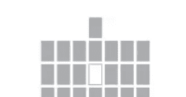

此外，也有将大秘仪分为四段落，各有五张牌，但因为分得比较细，通常被整合在十张牌阶段里，本书则不赘述。这些大秘仪的划分法有各种细节上的差异，但都是不同原理和意义的呈现。有些数字本身较为特别，是某些段落或节点，也可能是文化中备受关注的数目或单位，如12代表圆的“循环”，也会多加说明意涵。

##### 结构排列和图征

###### 图征增生意涵

塔罗中隐含的结构，数字之间错综复杂的关系，秘仪意义和图案之间的联结，都具有结构性。将排列中每张牌的位置都标上号，会更清楚地定位各张秘仪。其间的关联性也随之浮现，逐渐看出这些号码形成更多脉络，赋予整体结构更多含义。甚至写上牌的名称或加上画面，更能发现其中关联性。

聚集一起而排列出的阵式，可以看出整体之间的结构关系，并理解有何意义与如何应用。若能具体在手边用塔罗牌摆放出来，会发现在各牌关联之外，牌图之间的特殊联系对应更有其奥妙之处。这样的呈现法就是一种“图征”，意即使用秘仪、牌组或全副塔罗来排列出特定寓意的图式，表达塔罗的深层意涵和结构组成。

###### 数序对位图征

“数序对位图征”就是将大秘仪层级综合排列的具象图案，呈现出塔罗大秘仪的最基本结构，代表牌序以及外显的数字关系，呈现各张秘仪位置和所属“层级”，书中各张秘仪的〔牌序结构〕即涉及于此。这个图征明显呈现了大秘仪分成两大“层级”，而尾数相同的牌则成对相连，凸显这两张牌对立的差异变化：

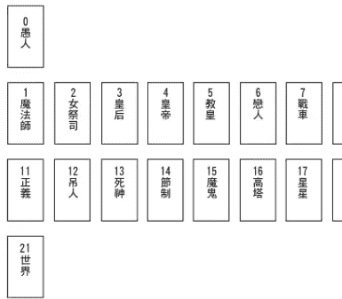

各组尾数相同的大牌蕴含的对立的辩证寓意，扼要陈述于下：

- 1&11：变易与不变的坚持，有所为与有所不为。
- 2&12：对于爱的抵抗拒绝以及牺牲奉献。
- 3&13：生命的赋予养育和剥夺毁灭。
- 4&14：扩张与节制，管理方式的异同。
- 5&15：上帝与魔鬼的两面性。
- 6&16：结合与分裂，也是和谐与暴烈的反差。
- 7&17：躁进与宁静的相对。未来希望同样美好。
- 8&18：正面心态和爱的力量，相对于负面情绪和丧失真正力量。
- 9&19：生命力消沉而不见阳光，相反于太阳高升和生命力蓬勃。
- 10&20：同为宇宙间两种最高法则，神秘力量以及宗教力量之运作。
- 0&21：最后与开始，什么都没有到什么都达成。

## 1 魔法师 The Magician

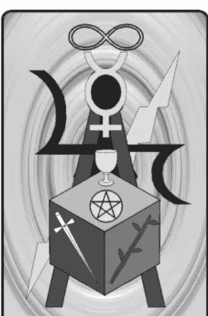

#### 牌序结构

第一阶大秘仪一
象征一切事物的开端和初始阶段，也代表创造之起源。

#### 各式别称

魔术师、大能法师、修行者。
变戏法者、骰子投掷者，江湖术士。

正 法力无边 逆 技穷无路

#### 秘仪原理解析

#### 数字对应

魔法师为序号1的秘仪，完全联结数字1的宇宙原型象征，除了开端和第一外，就是代表阳性原则，并有独一无二、顶天立地的涵义。1号牌以最小的顺序为开始，进入世界当中，成为独立的存有。数字1代表意志力，自我意识强烈，个别风格鲜明。在塔罗秘仪系统里，这张牌呈现了数字1的总体原型，并特别强调创造力和变化性。

#### 象征法则

由数字涵义接着可以探究这张秘仪的象征，亦即阳性原则代表生命动力、自我信念和能力展现，主动积极而有所作为。这样的主题所造就的人物主角，理应是生命力旺盛的男子，一般认定是位年轻人，并且强调法力高强以及能量传递的特征。并成为元素变化和衍申的开端。

##### 内涵探索

魔法师，擅于掌控元素变化，也是能够传导能量接通天地的人，他的能耐可以夸称“法力无边”，不但多才多艺，并且拥有丰富想像力和创意。魔法师展现出开创的精神以及独特的魅力，热心助人解决疑难，象征每个人必须找到人生定位与目标，了解自我的天赋以及责任。牌中四元素花色俱全，对于占问各种问题都有良好的回应，一切困难都能解决，任何目标都可以达成。

##### 正位实占解释

**人际交谊**：人际交游广阔，积极活跃，相处热络，消息灵通、风趣幽默。

**恋爱情缘**：交往顺利愉悦，相处充满情趣和新鲜感，令人陶醉的恋情。

**事务进行**：事务进行顺利，工作得心应手。学业相关表现都不错。

**金钱物质**：财务运作良好，能掌握与拥有，朝向获利、赚钱、盈收的趋势。

#### 牌义沿革解疑

##### 来历变迁

- ★这张牌最古老意义，多含有欺骗和狡诈在其中，主角人物被看成是一位魔术师或变戏法者，形象偏向负面，牌义也是诡计多端之类的。
- ★神秘学家修正了这一点，转向认定主角具有魔法师的能力，牌义导向正面的独立和意志力。主角从不可信任到令人信赖，这两种抵触的涵义渐渐地转移，相同的点是皆有不可思议的影响力，然而一个是真正变化物质，另一个却是以假乱真。这个演变的关键，是对于魔法和神秘的真正力量采取的态度，以神秘学者的观点而言，自是倾向肯定的立场。
- ★伟特可说将主角设定为真正的魔法师，并赋予这张牌更为丰富的内涵：阳性的力量原则、个体的统合、与神秘力量的结合。不过伟特对占卜意义设定中，正位仍包含有损失、痛苦、危难的意义。
- ★然伟特稍后的牌义，正位也仍包括欺骗等涵义。然而到了最晚进的时期，这一些负面意义皆数归于逆位置，形成正位置都是良好而正面的意义。这些正面意义也都是现今本张牌特有的涵义，包括自信心，原创、想像力、足智多谋、灵活多变、专业和技术高超。

##### 正逆转折

- ★伟特对这张牌逆位有许多奇怪的定义：医师、博士。其中的负面特质出现了：心理疾病、羞耻、忧虑不安。
- ★伟特稍后的时期，这张牌开始加入了以“逆位削弱原则”推衍出的牌义，包括意志薄弱和技巧不佳，一些操作上的失误，也可以说是“逆位不当原则”。而后，魔法师逆位涵义吸收了这张牌的整个负面特征和性格，或者是魔法师具有的禀赋出错或减损。

##### 逆位思考

如今魔法师逆位多运用“逆位虚假原则”：逆位的他法术失灵，是个虚假的魔法师，只是一个变戏法的人，能力不足或是能量引导方向错误，还装成很行的样子来卖弄，甚至不惜说谎欺骗来掩盖。这些情况可究源于内在的软弱逃避或轻浮的性格，缺乏真正的能力和自信，却又托大，因而导致弄巧成拙的结果发生。综上所述可归纳出这张牌的逆位，就代表江湖术士的伪装已经“技穷无路”。

##### 逆位实占解释

**人际交谊**：行为浮夸、待人敷衍，因而不被信任或人缘不佳。
**恋爱情缘**：感情方面真心不足，花言巧语，不愿负起对关系的责任。
**事务进行**：无法具体解决难题，让事端扩大，导致下场颇不乐观。
**金钱物质**：偏差的理财方式和心态导致损失，财务状况难以解决。

#### 画面寓意解构

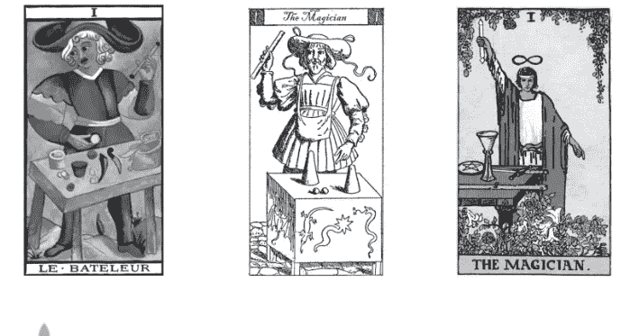

##### 主角人物

这张牌主角的形象一般是以年轻或壮年男子为主，强调年纪正处盛年，是男性发光的人生时期，以呼应阳性的创造和活跃的本质。情节重点是主角站在放满道具的桌子后，摆出某种动作而正在展现些什么。

施法的仪式姿态，是魔法师的专属特色，他双手呈现特别的魔法手势，而前方的桌子是祭坛，上面陈列许多法器。主角若是魔术师或变戏法者，是正在利用桌上的道具施展魔术或戏法。无论主角是何身分，都是意气风发地在施展能力。

##### 场景佈置

既然是以魔法师施法为主题，整体场景更要以突显魔法师的专长为主，也使牌义增添更多能量和法力，这就要从描绘形貌姿态和场景搭配做起。而施法仪式的场景多半在户外但并不空旷，可能稍有遮蔽之处，而周遭景物其实都是具有魔法或符号象征意义的，并且具有施法的作用。愈是懂得法术，就愈能够从其中发现端倪。

#### 样貌外观

魔法师的长相也透露出这张牌的牌义，外貌要清秀或有形，眼神表情锐利狡黠且若有所思，赋予魔法师的性格多半就带着这种机智和淡淡的神秘色彩，常常在占卜时就是当事者的性格。戏法师之类的主角表情或许会比较诡谲，但笑容中同样充满自信。

#### 动作姿态

这个人物表现出正在施展魔法的模样，以突显出作为魔法师的特色，根据魔法师的姿势，便可推敲出设计者采用的是什么魔法和仪式。最高的魔法通常是一手握魔法杖为导体朝向天际，一手指着地面，这动作表示接通宇宙神秘力量，整个人也成为一个能量的导体。从施法的动作姿态，甚至可以进一步判别法力高深以及法术类别、神秘学渊源。

#### 图案符号解码

##### 服饰装扮

魔法师的服饰需要亮眼，颜色也须强烈或对比度高，全身上下配备颇多，但仍然朝向简单俐落。每一种塔罗牌的服装颜色使用，多根据构图需要与景物搭配，以融于场景中，并且也借以呈现不同神秘学体系上的涵义。

披风、头饰、腰带，都是常见于魔法师身上的装扮，其实也是他的配备或法宝，各有其魔法功能和象征意义。披风助长威势和增添法力，亦有保护防御之用。头饰引动精神和意志的凝聚力并规范其运作。魔法师身上穿戴的神秘法器以“腰带”最为重要，它暗示着空间存灭和界限伸缩，代表“无中生有、来去自如”，多以自吞蛇的形状出现，象征宇宙神秘运作。

##### 道具配件

由于是魔法师，手上若能搭配魔法杖或类似法宝会更贴切，握住魔法杖表示能够掌握要件。画面大都有法桌或祭坛呈现在前景，也有以立方石替代桌子，或者两者皆具备，都表示有某种职责在身、正在执行任务。当然，若没有桌子，仍可自由施展发挥法力。

牌面上不可或缺的是代表四大元素的权杖、圣杯、宝剑、和五芒星圆盘，四种法器摆在桌面上呼应施法。并表示1号魔法师统领了所有元素的开始，由此联结了同样属于数字1的各花色“首牌”，并使每个牌组的起始相联结。

∞记号位于头顶上，无限大符号象征法力无边，也是传导神秘力量的象征。这个符号自古塔罗就蕴藏在所戴帽子的形状中，这也是《伟特塔罗》所特别强调的标志，后人沿用的颇多。

##### 相随配角

因为具有自主性与独来独往的特质，一向独立作业而保持神秘的魔法师，通常没有其他配角相随。如果有动物在画面中，通常是为了衬托魔法师神秘或智慧的力量。

##### 整体营造

颜色的搭配是本秘仪重点，要让人物与整体产生既融合又独立的感觉。并营造在空间中无端冒出来的感受，以符合“无中生有”的蕴义。整体画面要极力表现丰富性和变化性，能量的接通的动作以及元素操控的方式都是很重要的。

> ## 阅牌要领提示
> 魔法师这张牌，是整副塔罗的定调，因此极为重要，一张牌的面貌可以窥见五个牌组的究竟。想了解整体设计的走向和风格，要看将魔法师描绘成怎样的格调，如此就能掌握到这副塔罗的调性了。

## 2 女祭司 The High Priestess

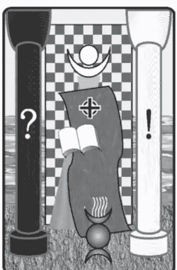

#### 牌序结构

第二阶大秘仪一
进入二元对立世界的阶段，深沉地投入其中。

#### 各式别称

女教皇、女性教宗、琼安教皇。教皇之妻、女修道院长。
女祭司长、银星之女祭司、灵知圣女。教母。

正 灵性智慧 逆 一表正经

#### 秘仪原理解析

#### 数字对应

女祭司为第2号大秘仪，2的数字寓意：2的宇宙原型象征是阴性原则，以少女的纯净与文静为表征，尤其是柔和及细腻特质，符合女祭司的灵性和易感、对精神信仰的接受性，深层隐藏的智慧均不脱2的意义。在塔罗秘仪系统里，此牌表现了数字2的基本原型，但弱化了具体的人际方面互动作用，在感情关系上反而存有距离与隔阂。

#### 象征法则

代表精神上的女性指导者角色，体现出阴性原则，这也与数字2有所呼应。内敛和接纳的特性，以及对于智识的吸收能力，也都在2的意涵之内。多数塔罗以少女纯净而拥有真切的心灵，接收不含任何杂质的讯息，带出女祭司传递先验的真理和智慧。可知等同于圣女的原形，从而能够发挥直觉感应、打开灵知的领悟。有少数塔罗的主角为成年女性，多是强调其阅历体验与灼见的洞察力。

##### 内涵探索

女祭司，是秘密持有者，肩负镇守启蒙关卡的职责，她会有条件地透露神谕般的讯息，内容都具备着深度的意涵，是透过清新的心捕捉到的“灵性智慧”。她是一位解答者，也是一位倾听者。这位高阶的女祭司手中掌握了书卷，记载着神圣智慧的奥秘，此奥秘是安放藏起并刻意遮掩住的，真知的答案和谜底在她的脑中和心中。

##### 正位实占解释

**人际交谊**：行为低调，交谊并不十分热络，与朋友保持一定距离。

**恋爱情缘**：缺乏恋爱兴趣，或者纯情而重精神面，不利于亲密关系发展。

**事务进行**：谨慎内敛行事，不出差错。具真知灼见引导而能达到正确方向。

**金钱物质**：对精神层面较有增进，在财物方面收获通常不是很大。

#### 牌义沿革解疑

##### 来历变迁

- ★在早期这张牌代表智慧知识的传承，视为启蒙的母亲，并且是比较倾向于宗教性质的，包括其他像是圣母或女神信仰。
- ★自古这张秘仪位置都是特殊的女性角色，延续到神秘学家时期，愈来愈偏向神秘奥义、秘传宗教、以及高层次意识，也赋予神秘科学的内涵。
- ★伟特将这张牌正式定名为“女祭司”，图案表现有别以往，更为强调女祭司的特殊神秘属性。牌义方面统合了以往的一些特质，认为正位代表智识能力和沉默坚定，而另外又增添较为特殊的层面：未来的预视、以及秘密的揭发。
- ★稍后对于伟特占卜牌义的解释中，承袭了历来这些特质：智慧、先见之明、感受敏锐、洞察力和预视能力。但也包含感情上的负面倾向：冷漠、不动感情，以及独立自主性强、纯精神的理想化恋情。
- ★现代的涵义将直觉和思维统合成为：开发意识和潜意识的功能，运用在探索未来和寻求真理。并且承袭前期对于正逆位各项牌义的分配。

##### 正逆转折

- ★伟特的逆位定义，是以“逆位相反原则”为主：由低调姿态转变为自负骄傲，理智成了妄想，而冷漠则转成狂热和欲念，这些意义或许也带有根据“逆位不当原则”而得的推论。
- ★伟特稍后的逆位牌义较有条理，着重在伪装虚假的感觉，也运用了正位置各项目相反的涵义，在性格上的表现同样是负面的：不够沉稳而毛躁、浮动。

##### 逆位思考

以“逆位虚假原则”推衍，是勉强装出的沉静和硬撑出的气质，因此意为：缺乏智慧、不学无术、无知、肤浅。其他的推论也是可统合于其中：目光短浅、自作聪明，为了眼前的利益做出不智的决定。在占卜上可以综合起来，这样解释事情的成因：缺乏真正智慧，没有那个灵性，也并非真心的修养，其实是装模作样或故作神秘。也许由于过度克制压抑而造成如今的偏差，然而这样不成熟的女祭司仍摆出“一本正经”的姿态，以为自己掌握真知或者享有殊荣。

##### 逆位实占解释

**人际交谊**：对人爱理不理，态度扭捏，表面应付但内心疏离。
**恋爱情缘**：缺乏深层的感受，冷漠以对。摆出高姿态，无意愿又故做矜持。
**事务进行**：受情绪蒙蔽而不安，失去准则，使得执行更不顺利。
**金钱物质**：一时短视而错估情况，判断不明智，导致财务和金钱损失。

#### 画面寓意解构

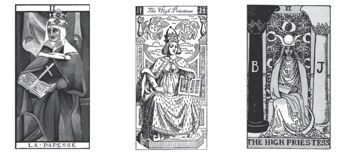

##### 主角人物

这张秘仪以崇高圣洁的女祭司之首为主角，表明在位阶上理应平行于教皇，而“女祭司”的形象则与教皇相关的体系分别。画面的描绘充分传达了其特色与意涵，直接还原了“圣女”的原形，因而总以年轻女子为主。其实年龄设定并不需与配合整副塔罗的体系，也不需为了强调地位而加深资历感，通常只需考量表现本身的特质。而如果有年纪也是守贞之处女，亦可依西洋月神的女性三姿态之一做为性格的主轴。

##### 场景布置

女祭司执行其职，位于圣殿之前、双柱之间，在这个内外交界之处守卫圣殿、护持神圣秘密。身后有一帘帷幕，在双柱之间挂起，遮掩殿堂之内的奥秘，然布幕上装饰物本身和排列也有深刻涵义可供探索。双柱的雕塑和造型攸关于殿堂和女祭司的来历，许多塔罗牌在柱身刻划文字或符号，具有密码意义，以表明柱子的命名和禀赋；有些牌会使场景和水域相邻或连接，也能隐约表露位置座落于何方。

#### 样貌外观

女祭司一般的描绘是：眼神清澈而带着灵气，视线焦点显得神秘，而表情宁静平和、或者若有所思般迷离。通常强调青春少女的清新脱俗，要有清纯的气质或神秘的色彩、甚至遮掩羞怯之态。也有些牌的表现是严肃和坚定，然而总归仍须淡化世俗色彩。

#### 动作姿态

女祭司端坐于台座，手持奥秘之卷，正传达神谕或暗示秘密知识的传承。女祭司大多是坐姿，这有其传统和渊源，古代某些信仰甚至讲究到女祭司或圣女的椅子。当然姿势主要作用是表现女祭司的性情，显示出端庄气质而不是贵气，并给人沉稳从容而非紧绷的感觉。女祭司的仪态优雅，呈现护法镇守之姿、掩藏秘密的神情。或许她仍会透露出些许神秘讯息，但不会明显张扬。

#### 图案符号解码

##### 服饰装扮

女祭司穿着朴素道袍，特别处是全身上下紧紧包裹，层层交叠的衣物褶摆，颜色和线条都与场景搭配，特别是和水的联结性。头顶上多半戴有新月圆盘状头冠，这是精神内涵的象征，也是接通神秘讯息的装置。《伟特塔罗》的画面，脚下踩着新月状物，也是为了营造出“脚踏新月”的高洁女性形象；也以重复出现的方式加深与月亮的关联，并隐喻潮汐和生物节律的联动。然而这类设计，并不是每种塔罗皆然的惯例。

##### 道具配件

女祭司最重要的是手上的卷轴或图书，总之要有个文化和智慧的象征，除了古卷、也可以是一般书籍。上面总显露出印有字符或标志。一般塔罗多显露出T、O、R、A四个字母，虽源于圣经密码，却也是最能代表塔罗神秘寓意的字母。其他则是合乎密码身分或有涵义之字母，像是A、Ω，或是太极等常见的神秘符号。可以注意书上密码和柱子的记号之间或许有呼应关系。

头饰最上方的水晶球是女祭司的重要配件，象征智慧的结晶；“真知晶球”戴在头顶上，代表灵性的领悟力，也隐喻顶轮清澈而具灵能可接通上层。

袍上有主要装饰物，以项链坠子垂于胸前为主，代表心的感受力；神秘十字多呈现在胸前，象征心胸的均衡调和，可能就是坠子、也可能是另外挂在身上的饰物。

##### 相随配角

这张牌多半不设配角，极少像教皇牌般出现随众，强调孤独的氛围。女主角沉静而不与有形物沟通，也表示没有任何陪伴和情感关系，因此通常不加配角或宠物。仍有少数塔罗会配给女祭司较有神秘感、具阴性特质或自然野性的宠物，或者是与女祭司特质和灵能相称的动物或神兽。

##### 整体营造

利用颜色搭配，让女祭司融入场景中。多以蓝色调呈现沉稳安静以及智慧，更有象征水与海洋的作用，表示直觉精神的世界。现代塔罗牌的设计更注重场景就是在海边或者背后有河流池沼，会在地面上呈现水流或波浪。画面的背景大都填满景物，显示内涵繁复深刻，并对比出低调静态的气息，服饰搭配要与整个圣殿融为一体，甚至衣裙要与海水相融或连接。而双柱的颜色成对，和布幕底色同样需表达象征意义。

> ## 阅牌要领提示
> 女祭司这张牌，是整副塔罗牌中细节刻划之所在，无论从画风笔触或者蕴义内涵来说都是如此，神秘学符号丰富、设计也多巧妙之处，因而可视为对一副塔罗的最后检验和挑剔，并以高度要求来品评。尤其手上的卷轴透露出何种符号密码，更让人想要事先一探究竟。

## 3 皇后 The Empress

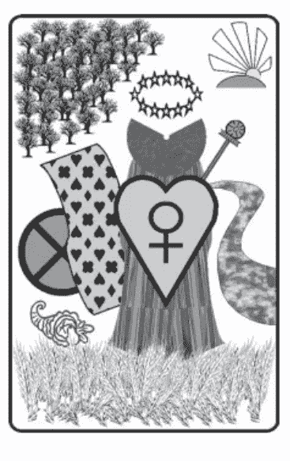

#### 牌序结构

第三阶大秘仪一
进入多元世界的丰富阶段，缤纷美好而多采多姿。

#### 各式别称

女帝、女皇、女君王、女主。天后。
尘世天堂，乐园之主。神力之女。

正 感性胸怀 逆 心意浮泛

#### 秘仪原理解析

#### 数字对应

数字3是增生和发展的数字，乐观和丰富的原则。皇后呈现这个数字的幸福美满意涵，增添了实际面的充沛资源和未来保障。在塔罗秘仪系统里，这张牌将数字3原有的阳刚意味和大而化之的特质弱化了，而强调数字中蕴藏的艺术美感和生产力等意义，并具有人际沟通能力与情感交流的特质。

#### 象征法则

强调阴性原则中的关爱与哺育，也就是母亲形象，是较为成熟的女性典型，并且更为积极而有活力。皇后牌体现世俗界，呼应具体的生活、私人领域及家庭事务，掌管情感关系和情绪层面，具有热情洋溢、浪漫滋润的特质，是悠闲时光、美丽人生的表征。而幸福美满之中，更不乏物质上的丰盛。

##### 内涵探索

皇后，代表内心的阴性层面，也是最重要的女性形象，是成熟女性典型，拥有高贵雍容的气质，经现实历练而深谙人情世故。以“感性胸怀”眷顾美好的生活、环境和氛围，高度关注内蕴和心境。在更细微的分别下，皇后其实存在两种形象的差异：一是温柔的女性情怀，另外是独当一面的女帝气度。

##### 正位实占解释

人际交谊：态度亲切，散发出迷人风采，很有人缘，处处受到欢迎。

恋爱情缘：特别有利于爱情，享受恋爱的甜蜜滋味，沉浸在幸福的情境中。

事务进行：在轻松愉悦的状态下，顺利进行与完成。悠闲生活和享受。

金钱物质：获得充分的资源，能够尽情享受，金钱物质都不虞匮乏。

#### 牌义沿革解疑

##### 来历变迁

+   ★这张牌以滋润生产、结合大地为特质，早期就具有丰饶多产的意涵，并强调行动力和积极进取。皇后的世俗意味强烈，是人生体验的代表，也能表示物欲和欲望，是尘世人间乐园的象征。
★伟特对这张“传统牌”的外观和牌义并没有改变太多，在占卜上承袭了早期的意义，并增添更多女性相关特征：难以了解的秘密。还加入了其他负面意义：困难、疑虑、无知，或许认为这些是属于女性的缺点。

+   ★伟特稍后时期，对于女性的特质和形象，加入了女性形成的影响力以及女性的进步，而删去了之前的女性负面意义，使正位置一律都是正面的意义。

+   ★现代的解释，仍着重女性相关的形象，并对于私人层面的生活领域，全都视为美好的情况。

##### 正逆转折

+   ★早先伟特对皇后逆位定义很特别，部分意义反而比正位置还佳，像是愚昧转来的理智光芒，以及解决了正位置的困难和疑虑，甚至是欢欣鼓舞。

+   ★伟特稍后时期，随着正位置代表正面特质，也规格化将逆位一律修正成负面意义了。多半以“逆位削弱原则”推行，优柔寡断的意义仍在，其他就是生命力的减损：怠惰、没有活力、缺乏兴趣和专注力。

##### 逆位思考

皇后牌若以“逆位负面原则”推衍，包括女性的负面形象，像是不贞等等。然而，现今这类解释已经过时而少用了，较被采用的是“逆位相反原则”，将多产丰饶之意反转为：贫瘠、不孕等现象。然而总括来说，如今更多以“逆位过度原则”推衍，诠释走向是：感情太丰富、凄情、情绪化，逆位的不够格皇后仍然具有“心意浮泛”的特质！

##### 逆位实占解释

人际交谊：因情绪化或骄纵的表现，影响到人缘，还可能造成朋友的困扰。

恋爱情缘：感情过于丰富，而可能显得滥情。心思易感，面对关系的态度不坚定。

事务进行：由于怠惰慵懒、态度消极或较无纪律，行事容易延迟、耽搁。

金钱物质：及时行乐而浪费奢侈，或物质流失匮乏，逃避现实隐忧。

#### 画面寓意解构

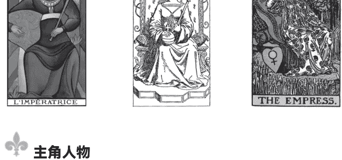

##### 主角人物

皇后：雍容华贵的成熟女性，最高阶层的贵妇。皇后以悠闲的仪态，坐在后宫的花园内，这时她正在享受美好时光和迷人景致，拥抱着她的人生财富与资产。

##### 场景布置

宫殿花园多是开敞的户外空间，皇后融入大自然之中，其内谷物丰硕、树木花朵繁茂，而平地以及流水象征着阴性能量。

#### 样貌外观

必然具有雍容华贵的气质，以及美貌动人的外观。皇后多半表情温和柔美，展露亲切迷人的笑容。当然也有显示出女性尊贵气势的画法，有如女帝或女皇。

#### 动作姿态

无论是哪一类型的皇后，她总是悠闲的，甚至是慵懒闲散、畅快轻松，这样的仪态自然不会太紧绑，看得出正在享受幸福。皇后的姿势看来仿佛正举手与群众打招呼，互动感十足，有别于女祭司的无视他人存在。

有些皇后双手会围抱，呈现出圆形，是怀抱的空间，也是炼金术符号形状的象征，以此和皇帝牌相呼应，不过这样的画法并不常见。然而皇后绝大多数不是正对着画面而是稍微偏侧面，传统塔罗或炼金术系统的画法更会整个朝向画面左侧或右侧，这就是为了和皇帝牌配合，以成为一组对牌，两张牌的主角因而能够面对面相觑。

#### 图案符号解码

##### 服饰装扮

皇后穿着高贵富丽，但轻松宽敞。衣料上的花纹是必要的，不能太素净，纹饰多半有红黄色系的鲜艳色彩。她头戴后冠，有各种样貌，常见的是抽象的十二颗星，也就是呈现了“头戴十二星”的尊贵女性形象。身上的饰品当然不能免，尤其是珍珠项链的配戴，要能突显出品味高贵，让这位女性人物更出众动人；也可借由项链坠子来表示皇后的心胸，充满着爱心或洋溢着情怀。

##### 道具配件

由于是皇后，手上通常会持有属于她的后杖，向上举起高扬。表示尊贵和身分的盾牌，放置在后座旁边，或者以手执起于身前；属于她的盾牌造型和上面的图案，也能表现出皇后美善的特质，例如心形盾牌跟其中刻划的金星符号。

##### 相随配角

一般没有配角和宠物，但有许多植物在周遭。有少数古代塔罗牌配有几位侍者，在身旁服侍皇后。新式塔罗可能会加宠物来陪伴皇后，这样仍是能够突显出贵妇之尊，也能表现她的爱心。

##### 整体营造

整体画面要让皇后沉浸在大自然里，以及融入属于她自己的园地当中。色彩搭配要鲜明亮丽、对比强烈，景物要显得丰富缤纷、要刻划出深浅对比，这样才有空间深广度，以显示富裕和满足的特质。

> ## 阅牌要领提示
皇后牌突显出这副塔罗的人生观和生活态度，尤其是对女性和相关议题的观感，而占卜即是面对生活，所使用塔罗表达的观念态度和自己合不合是很重要的。那么，就先透过皇后牌来了解吧！

## 4 皇帝 The Emperor

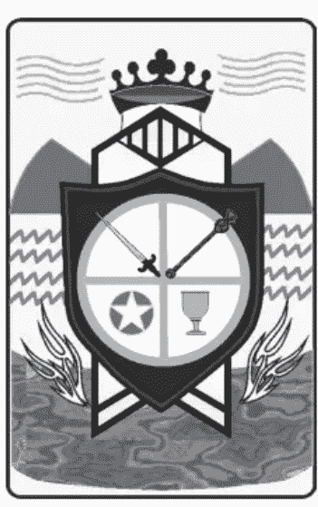

#### 牌序结构

第四阶大秘仪一
进入最务实的世界，熟悉世俗的心态，体验和掌握现实面。

#### 各式别称

帝王、君主，皇上、君上，人皇。至尊、领袖、最高领导者。朝阳、晨之子。神力之主。

正 君临天下 逆 无道昏君

#### 秘仪原理解析

#### 数字对应

数字4代表四平八稳，以现实基础为原则，能稳定掌握局面。4象征地面上的人世国度，因此表示务实而重视事业以及各方面的世俗成就。在塔罗秘仪系统里，这张皇帝牌将4的阴性和退缩特质减少，加强严肃刚毅的一面，从而增递成皇帝的阳刚特质和积极力量。并借此数字代表四元素，亦即现实物质世界的构成，从而皇帝即是其上之统御者。

#### 象征法则

强调阳性原则中的保护与掌控、成熟稳重的男性，代表父亲形象、父系影响力、父权体制，也意味着公众领域内的事项、相关规范纪律。皇帝牌显示在上位者和当权者的形象，以及管理、领导、统御等运作，多展现出权威而强势的作风、刚硬的铁血手腕。代表世俗功业，事业方面的成就以及社会层面的声望。

##### 内涵探索

皇帝，代表内心的阳性层面，也是最重要的男性形象。具有充分的自信心、凡事有把握而果决、明了世事的运作。可谓“君临天下”的气概，满怀雄才大略，倘若真正坐拥资源，更可尽情发挥执行管理、掌控局面的营运能力。由此，在性格上很偏重实际面，讲究实事求是，也有严肃而固执的特质。

##### 正位实占解释

**人际交谊：** 领导能力虽强，然而较无亲和力，缺乏情感面的交流。

**恋爱情缘：** 能掌握稳定恋爱关系，然而稍嫌缺乏浪漫和情趣滋润。

**事务进行：** 一切在掌握中，依计划进行，不会出差错，而且非常有效率。

**金钱物质：** 对财务有管理能力，善于掌握和控制。妥善经营，不致漏财。

#### 牌义沿革解疑

##### 来历变迁

+   ★皇帝牌一向表示世俗的权势和力量、地位和财富，也代表稳固和安定的局面。
★神秘学家加入了思想和理智的控制力的意涵，强调物质和精神的相互关系，表示意识层面的智慧。
★皇帝属于“传统牌”，有其制式画面，伟特虽然跟随神秘团体赋予炼金术寓意而影响了画风，但整体构图设计没有改变很大。而在占卜牌义方面也没有多大的变化，正位置占卜定义，在前述项目以外加入了保护和帮助。

+   ★伟特稍后时期定义统整得较周详，现今仍沿用下来：包括世俗人生层面的成功，公众领域和团体的妥善管理运作，成熟稳健的特质，以及相关于男性的形象和领域。

+   ★现今的解释统合为：男性的影响力、父权体制、世俗的权力。以及男性的内心层面：自信和野心。强烈的掌控力和坚定的意志力，能以理智驾驭情绪。然而也是最为固执难以撼动的人。

##### 正逆转折

+   ★伟特将逆位定义为较有慈悲柔软之心，是从正位的铁石心肠，依据“逆位相反原则”转化而来的。也能据以将成熟稳健转化为：不成熟、生硬，以及无效率和障碍。

+   ★伟特稍后时期：逆位更加入了许多性格弱点：无法控制情绪，不够果决，缺乏行动力，执行面遭遇困难等。

##### 逆位思考

皇帝逆位牌义当时除了“逆位相反原则”，还有以“逆位削弱原则”和“逆位负面原则”推行。当然若使用“逆位过度原则”意义也都相通，像是过度严苛导致抵抗和倾覆，其实也等同于反向和弱化。

如今，皇帝的逆位置，以一个昏君来象征和联想是最适合的了，这是由“逆位负面原则”而来。占卜时可以直接套用在现实界的各种职位之上，也就是缺乏领导者的优良品质，从而导致各类事端和问题产生，总归就是个“无道昏君”的所作所为。

##### 逆位实占解释

**人际交谊**：以支配态度指使他人，相处严肃而不近人情，因而不受拥戴。

**恋爱情缘**：恋爱因为相处紧绷、无趣而产生嫌隙怨怼，有损关系发展。

**事务进行**：多半因为管理不善的缘故，运作遭遇到阻碍和问题。

**金钱物质**：由于经营不善或理财控管不当，物资财产上有所损失。

#### 画面寓意解构

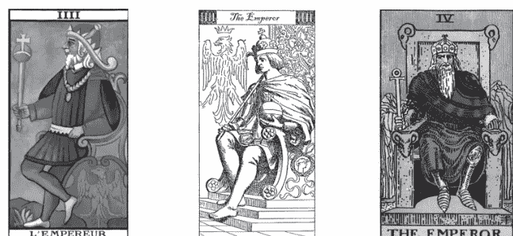

##### 主角人物

皇帝：位高权隆的成熟男性、至尊统治者。皇帝威严地坐镇于宝座，高高在上、君临天下，他日理万机、治理领土，手握权柄、发号施令。

##### 场景布置

皇帝的宝座不在宫殿内而在户外，座落在至高点上，以能一览天下、睥睨万物，背景并以高山象征阳性能量。

#### 样貌外观

皇帝多半神情严肃、表情僵硬，长相具有威严，眼神若有所思，可见心中颇具城府。至于年龄岁数以及是否蓄胡，则因不同塔罗牌而异，但年纪都至少是成熟壮年以上，原则上不会比战车和魔法师年轻。

#### 动作姿态

皇帝多半都会以其姿势呈现固执坚持，上半身直挺，而手势更显示出意志坚决。

两大类典型画法都表示强势姿态：有些牌的皇帝则端正坐着，两脚开阔而脚尖踮起，感觉在紧绷状态中；另一类别是侧面坐着或侧脸向画面，可能会翘起一腿，两腿成“4”的形状，这特殊姿势有其奥秘，不只是本秘仪数字4的呈现，也代表炼金术中代表硫磺的符号。侧面画法也可使皇帝与皇后面对面，配合成为一组对牌。

#### 图案符号解码

##### 服饰装扮

皇帝的装扮，当然是穿着属于他的皇袍，也多有皇冠和披风之类的服饰。而有些牌会加点配备，尊贵外衣之内藏着盔甲，表示随时准备应战，怀有铁血精神。更多附加在外的服饰和徽章，都可解读其赋予的涵义及作用。

##### 道具配件

由于是皇帝，手上通常会持有权杖，多是“安卡”十字的形状，表示具备神能、拥有至高权力。另一手可能另握有尊贵的王权宝球，表示掌理天下疆域。皇帝也有一面皇家盾牌，可能手持或安放在一侧，除了护卫自身，其上的标志也表明家世来历以及过去辉煌的大业，并可与皇后的盾牌呼应成对。

##### 相随配角

皇帝牌应该容不下其他配角，也多半不需要贴身宠物陪伴。有些古塔罗牌配有几位护卫或随侍在皇帝身旁待命。少数塔罗牌会以雄性象征的动物，像是老鹰和公羊，来衬托皇帝的气焰。

##### 整体营造

要突显皇帝坐镇天下的感觉，多半让他居高临下，能够俯瞰和巡视他的领土。场景还要有阳性的象征，以及衬托他内心的热力与野心。服饰道具也一样，最好能够与皇帝的孤寂辛劳，以及铁血精神作一呼应。

> 阅牌要领提示
皇帝这张牌如何表现，是该副塔罗政治态度和历史观的呈现，作者对皇帝这角色的观感，代表他对专制人物和体制的看法，借由角色的描绘就透露了其中讯息。

## 5 教皇 The Hierophant

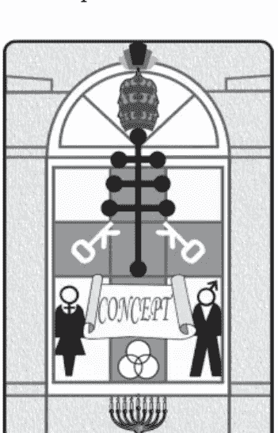

#### 牌序结构

第五阶大秘仪一
达到精神和智识领域的入门，开始探索在其中。

#### 各式别称

教宗、主教、圣职者、神职导师，梵蒂冈之父，男修道院长。
大祭司长，法王，永恒神力之法师。

正 精神领袖 逆 道貌岸然

#### 秘仪原理解析

#### 数字对应

数字5是意念传播和流通之意，也是引导、启发和媒介。这张秘仪强调5的沟通和游历，而原先5较为肤浅和躁动意味，则转向为入门和表面宗教的涵义。教皇的传统保守特质，与数字5的力求新鲜变化有所差异，其实表示教皇有和蔼可亲的特质而能擅于传播吸引大众。在塔罗秘仪系统里，这张牌主要还取用了数字5精神上的自由与提升，以及鼓舞的活力。

#### 象征法则

象征精神上的父亲、心灵的导师，延伸代表亲人之外的尊长、师长。是生命的指引、内心信仰、人生指标及精神性指标，因而有关于引导和指点。教皇象征打开人生的钥匙，象征了入门仪式、开学典礼、以及毕业进阶。教皇是宗教领袖，也能代表宗教制度、教育体系、派别机构，并由宗教信仰衍申出慈祥、善心、古道热肠等特质。

##### 内涵探索

教皇，代表内心的权威指标，对于“精神领袖”的认定和追随的心念。象征在观念中的高层次守则、心理和智识的成长和建构、以及目标的方向和指引。在学习方面，代表正式踏入师父领进门的阶段，取得了入门和登堂的钥匙。在占卜时出现，表示指引和帮助，教皇可视为当事人求助的对象。

##### 正位实占解释

**人际交谊**：广结善缘、热心公益。精神上的支持，协助或指引，也可表示贵人。

**恋爱情缘**：恋情受到鼓励，或者介绍、牵线。彼此精神上或意识上的认定。

**事务进行**：也许有高人从旁指点，或者支援、鼓舞。学业进修成绩斐然。

**金钱物质**：提供信息或情报，也可能引荐或担保，并非实质面的援助和建设。

#### 牌义沿革解疑

##### 来历变迁

+   ★这张牌原本具有宗教涵义，然而这点愈来愈薄弱，而趋向于纯精神和心灵，以及一般教育体系。
★伟特将教宗的称谓改造成法王或另以教皇做为泛称，并整合牌义为：外在宗教力量、世俗机制的最高权威、能理解的正统教义、外在生活导向的宗教，亦为救赎的导师、信仰或精神上的领导者，当然也有宗教的慈悲与善良特质以及启发鼓舞的作用。此外还认定了结婚或联盟起誓等项目。

这张牌有些涵义是对于传统的维护，伟特就这点给予的解释偏向负面：思想受困、谨守过时的观念和原则、墨守成规，甚至遭到限制和束缚、禁锢。

+   ★伟特稍后也跟随上述这些定义，并且加上不活跃和羞怯退缩等意义，却在逆位置中赋予社交、协商、沟通的意义。
★如今的解释，正位置将负面意义减少了，也改掉了不活跃和不够社交的特质。

##### 正逆转折

+   ★伟特对教皇逆位定义为：社会、社交及良好的了解或协议，这是从教皇的内涵中分化出来的。如今已调换为，逆位才是社交状况不良。
★伟特稍后时期：解释为异端思想、被放逐，其实是根据“逆位相反原则”推出的。有时候运用“逆位过度原则”推为：过度善良心软，太容易同情别人，太过于慷慨。有时较偏向是“逆位削弱原则”：软弱无能，脆弱敏感。

##### 逆位思考

如今逆位意义都被规划得较为一致：过度与不当的帮助，错误的指引和信仰，就是根据“逆位不当原则”推行出的。总括来说，这张牌逆位可以“不正确的教皇”来理解，一切都表现得“道貌岸然”，让人看不清他虚假道学的真面目，以此掩饰内心的真正意图，由此可知这也是一种“逆位虚假原则”。

##### 逆位实占解释

**人际交谊：** 过于好心帮倒忙、或者干涉太多的情况。遇到假贵人。交友浮滥。

**恋爱情缘：** 恋情方面，显示各种受到他人干预的状况，严重的话是关系被介入。

**事务进行：** 可能受到外力或杂音的干扰，不然就是所听从的走向不正确。

**金钱物质：** 因为相关讯息不够可靠而处理失当，自然更无所获。

#### 画面寓意解构

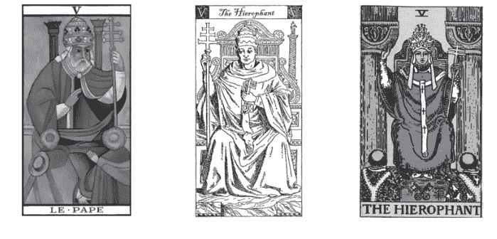

##### 主角人物

教皇亦即宗教领袖，是有修为和学养的男性，年纪设定各有不同。教皇手执法器，正在讲台上演说，传道、授业、解惑，不然就是正在主持入教或某种仪式，究竟是何宗派多半并未完全确切表明。
在画面中，还有几位信众或教徒，正在教皇跟前聆听教诲、听从指示，或者等待宣告。

##### 场景佈置

教皇身居殿堂之内，位于高高在上的讲台尊座，听众站在阶梯下方，强调位阶有高低落差。身旁有双柱，代表均衡的精神支柱。身前是台阶，或许有秘密信道的暗号隐藏在建筑物和场景当中，这即是需以钥匙打开的路径门闸。

#### 样貌外观

教皇有两种面貌形象：一种强调德高望重，留着满腮的胡子，通常是花白长胡，年老而慈祥。另一种是面目清秀端正的男子，脸部光滑不带胡渣，感觉形象清新。无论年纪，教皇形象多半慈眉善目，和蔼而让人信任而有安全感。不过还是有些塔罗牌的教皇神情略显高傲，一副道貌岸然，不然就是有点严肃。

#### 动作姿态

教皇一手高举权杖，另一手做出宗教手势，维持宣教或主持仪典的姿态，无论是稳坐或站立都有可能，他的姿势要让自己能更为醒目，引起众人注视或聚焦。徒众或教士通常背对画面朝向教皇，恭敬受命，肃立或展现宗教仪节的姿势。

#### 图案符号解码

##### 服饰装扮

教皇的服装中总有着特别符号徽记，这些象征颇值得推敲，但其实多是依照某种宗教体系，绘出其最高首脑的既定服制和文章，教皇服装的作用是表现出该副牌所设定的宗教类别。更值得探索的是较低阶层两位徒众的服装，除了和教皇同属一个体系，通常又各具表示不同性质涵义的神秘符号，可突显出教徒属性和所带特质，例如Y字形状表示牛轭加身，象征辛勤而顺服的仆役。

##### 道具配件

由于是教皇，手上通常会持有专用的法杖，其造型比较特殊，可能是十字形或是多重十字，象征身心灵层层向上接通。当然，也有的教皇握着其他形状的法杖，会根据所属宗教性质而不同，意义也有所差别。

钥匙，这张秘仪最重要的象征物件，通常出现在佈景当中，多半在两位听众之间、教皇台阶之下，成为关键位置。钥匙代表打开智慧的门，两把钥匙交叉置放，表示炼金术交融作用和神秘启蒙。钥匙的颜色不同，也能够象征炼金术中不同的元素和精神意义。

##### 相随配角

教皇这张牌通常需要有配角，彼此有所互动与关联，以表现出自成一格的组织或教团。配角大多是两位听众，是比教皇低阶的神职人员，不然就是信众或是入门者。有少数塔罗，强调教皇至高无上之尊，独自登场通常暗示这个意味。

##### 整体营造

教皇必须和他的教众连成一气，他们的眼光或姿态要相呼应，身上所穿着也要有关联。此外可运用神秘图案，让几位人物与场景全部融为一体，表示同属一个体系或组织，或以位置排列特定成形状，一般都构成正三角形以象征精神提升。

### 阅牌要领提示

教皇牌很明显地传达了宗教观念，这位神秘学的宗教性质代表人物，职位称呼和行头都很重要，因为背后代表了宗教或组织的性质，而这表达出了创作者的中心信仰认同是什么，也由此牵涉到对于神秘学的态度，攸关于整副牌的体系。

## 6 恋人 The Lovers

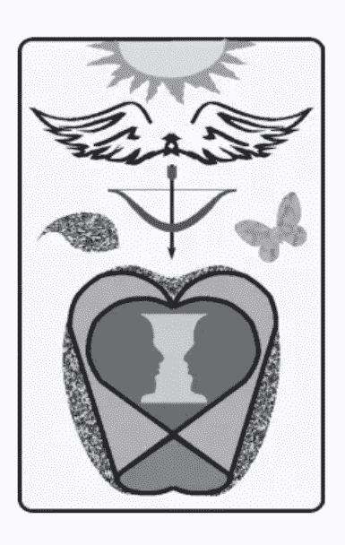

#### 牌序结构

第六阶大秘仪一
进入成熟的阶段，不同个体相互交融的意境。

#### 各式别称

情人、情侣、爱人、爱情。婚姻、联姻、结合。
强大神灵之神谕：圣音之子。孪生、兄弟。

正 世间缘分 逆 分歧离异

#### 秘仪原理解析

#### 数字对应

数字6原本涵义就是情感与滋润，特别表示恋情、柔和、浪漫等特质，以及互动关怀。6包含精神与肉体上结合的欲望，期许共同决定未来命运，一齐站在同样的地面上。在塔罗秘仪系统里，恋人这张牌涵盖了数字6的完整意义，更强调了爱情中的“认同”，增添了“选择”与“决定”的意义，并附带更严肃的信仰议题。

#### 象征法则

本秘仪的主要象征是：他人介入自我存在后的回应和拿捏，关系的处理和选择。人间最重要的互动就是结合，也就是双方相处及伴侣关系，个中的要项就是爱情、恋情、爱意和浪漫情怀。恋人牌从而代表爱情观、婚姻观和家庭观，也可扩及两性议题，并延伸至合作盟约，更可扩展为同辈间的相处之道、一同面对不同辈分与世代关系。

##### 内涵探索

恋人，代表内心的情感面、恋爱感受，也是爱情观、感情模式的确立，并代表心目中或实质上的感情对象、情侣、另一半。恋人牌其实就等同“世间缘份”的代言：一切两性关系的面对和个中体验，伴侣关系中各个阶段的状态。这代表了一种抉择和认定、契约的确认和琢磨，也是一种对未来共同生活的编织和置身投入。

##### 正位实占解释

**人际交谊：** 各种人际关系都表示很合得来。由于这张牌的感情滋润性，询问一般友谊时也有可能牵扯到喜欢或情愫、爱恋或桃花。

**恋爱情缘：** 美好恋情、合适对象。两情相悦、关系和谐。成功交往、确认在一起。

**事务进行：** 执行过程气氛轻松。各种合作关系愉快。学业上的表现则差强人意。

**金钱物质：** 物质足以享受和安逸，不是很勤奋或累积很多。合作对彼此都更有利。

#### 牌义沿革解疑

##### 来历变迁

+   ★这张牌有一些变革需要注意，古典或传统塔罗多是这样的画面：一位男人夹在两女性之间，而一位爱神在上拉弓射箭，故事虽然繁复但主轴很明确是在于选择。
★炼金术体系的塔罗，认定这张秘仪是男女结合、阴阳交融之意。

★伟特颠覆传统改造构图，转化为一男一女的画面，引用伊甸园的亚当与夏娃为典故，牵涉到更多信仰和神秘学意涵。由此而出的牌义表达的是：男女之间的纯净无邪与恋爱，以及女性的深层奥秘。

★伟特稍后时期：除了爱情和结合以外，也是美丽及和谐，并定义出信任及乐观开朗。选择的相关意义，集合传统和伟特的影响，强调挣扎于神圣与世俗之间的爱、考验或受试炼的必要、以及成功的尝试。

★现代的解释上，更扩展于广泛的两性议题，也仍保存着选择的议题。

##### 正逆转折

★伟特定的逆位，许多层面都是根据正位置转换为负面意义，像是事件上的失败，还有不智的尝试。

★伟特稍后时期，便完全根据正位各层面意义，以“逆位相反原则”推衍出涵义：恋情转为不顺、相处不和谐或受外力干扰、甚至分别或离异。也代表经不起考验、善变、不可靠、不值得信赖的特质。

##### 逆位思考

如今，逆位的解释就依循以上这些解释，用于各种不同的层面，并且以正逆位判断所做选择的正确与否，这样的思考其实就是“逆位相反原则”。在占卜上，恋人逆位的明确作用，是代表各种程度的恋情不顺，从相处不和谐到彼此争执，甚至吵架或分手都有可能。另外就是各类错误或不明智的选择及行为态度，总归都是趋向“分歧离异”。

##### 逆位实占解释

**人际交谊：** 互相没有好感、彼此合不来。朋友间相处不佳，或固有情谊受损。

**恋爱情缘：** 错误的恋情，觉得彼此不搭。感情不睦或关系疏离。令人失望的收场、不美好的结局。

**事务进行：** 走错方向导致不顺利，相处气氛差。合作关系出问题，可能就此告终。

**金钱物质：** 超过控制和规律，财物有损失。财务合作状况不可靠。

#### 画面寓意解构

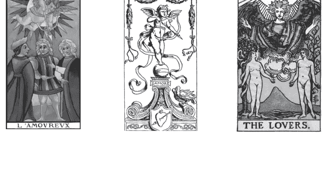

##### 主角人物

恋人牌有几种典型的情节版本：一对年轻男女，上方有见证祝福的天使—恋人袒程相对或彼此依偎，所处背景隐藏着诡谲多端。另一种画面呈现的是，一男夹在二女之间左右为难，头上飞翔着持弓射箭的爱神，拉弦示意将箭射出，看来正是为爱情做出选择的关键时刻。当然另外还有其他自由发挥下各种画风的恋人相爱情节。

##### 场景佈置

恋人通常会出现在户外，以及阳光之下。周遭场景要配合他们的气氛，也可有更多寓意。而盘旋上方的无论是天使或爱神，都惯常地浮在云端上。

#### 样貌外观

这张秘仪的特色不仅是角色众多，而且任何画面中的眼神互动都颇耐人寻味。一男一女的单纯情节中，这对恋人两情相悦，眼神含情相视。《伟特塔罗》的伊甸园场景中，却由于蛇的介入而让双方有了分歧，仿佛思虑到日后生活的变化，男人和女人的神情变得错综复杂。天使的表情也有点诡异，显露不悦或带着威胁，似乎不允恋人做出大逆之事，天使的头发直竖尖起，气氛更显紧张。一男居中二女在旁的架构中，有多套不同的剧本：如“善恶对立”或“婆媳之争”，样貌表情便是判断剧码的重点。而爱神的神情，总似带着戏谑，暗示爱情的萌生其实是人类无法理性思索和控制的。

#### 动作姿态

恋人相爱的种种姿态，都有可能在这张牌呈现，只是“级”别程度不一样。另外，不同专牌的情节安排都有差异，两人的互动因而有更多变化：果园场景着重犹豫的感觉，正在抉择是否要吃下禁果或无视上帝。那么，两者选一的桥段是最为尴尬的，男子呈现左右为难，各方动作呈现互相敏感关系，其中错综复杂的纠葛，又随不同专牌的剧情安排而有差异。

#### 图案符号解码

##### 服饰装扮

一男一女：是裸裎相对，天使则穿着制式的素净法衣袍服。若是没有天使在一旁的恋人牌，也多半是这样的裸身。

一男配二女的情节中：男子穿着看来颇具身分地位，一位女人的装扮严谨庄重、另一位华丽活泼，这也是辨认哪个女人才是真爱良伴的依据；爱神多是小孩形象，通常以布裹身而未穿衣，这里裸身的任务就交给爱神了。

##### 道具配件

伊甸园的场景中，有两棵奇树，智慧之树在女人身旁，代表着自主性、以及了解自我与他人。男人身旁的是生命之树，表示尊崇生命的安定、并讲究生活的规范。一般恋人的场合，通常也都需要许多植物陪衬，也做为佈景或遮蔽。

弓箭是爱神的道具，表示感情的喜恶萌生，爱情的认定和抉择。

##### 相随配角

恋人牌，根据主题而来的主角当然是一对恋人，然而时常在恋人身边会出现许多其他角色。

天使：是上帝的使者，守护着恋人，带给他们安定的环境，然而对恋人所为是施予祝福还是干预？

爱神：如同其他故事中的表现，一向都很出风头，可说是最抢戏的配角。

蛇：是魔鬼的化身，也是点燃智慧之光的契机，引导人们走向独立，也走向危险。

恋人的环境颇为复杂，天使与魔鬼都齐聚一堂，很多塔罗里都有出现类似作用的旁人。不只如此，有些牌还有如婚礼中的花童陪伴。

##### 整体营造

画面架构与故事情节设定息息相关，因为恋人的发挥空间如此之大，而纵使只画出简单的一对恋人也符合秘仪主旨，但通常都会加入寓言性的故事背景，以表达更深入而丰富的涵义。古塔罗男人从善恶两女选择的戏码中，或许也暗示一位是天使、一位是魔鬼，是善恶对比的结构模式。《伟特塔罗》的伊甸园故事也是具有整体背景的剧码，同样有天使与魔鬼。炼金术的阴阳元素结合，则是较为单纯的象征的寓意。

> ## 阅牌要领提示

恋人牌可说是重中之重，代表塔罗创作者的爱情观，这也牵涉到画风和牌义，影响到占卜的风格和对恋爱的诠释。除此之外，更可能从这里牵涉到宗教信仰，还有重要的社会关系及两性议题。恋人牌竟是人生社会重大议题，所以本身也是决定选择一副牌的关键。

## 7 战车 The Chariot

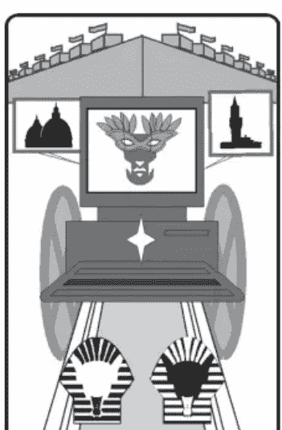

#### 牌序结构

第七阶大秘仪—
融为一体后，进一步与外物结合，完成第一周期，继续前进。

#### 各式别称

驾驭者，战士、将军、将领、统帅、皇子，王将、王牌。
胜利者、征服者，凯旋花车。水能量之子，光之胜利主君。

正 凯旋征途 逆 冲撞翻覆

#### 秘仪原理解析

#### 数字对应

数字7具有敏锐和思索特质，也有敏捷的反应能力，更具有智慧涵义。这种深度的精神能量即是智慧光芒，具有光的力量和速度，能发挥如战车般强大的动力，除了数字7涵义中行动力薄弱的部分。在塔罗秘仪系统里，这张牌将数字7智慧的速度和无远弗届，转化为具体行动，能与外界实物力量结合，增添冲劲热力，并且动态十足。

#### 象征法则

本秘仪成为阳刚的动力原型、理性和智识化为行动、反应力的高度发挥。战车牌人身与工具的结合，表示心物合一、心思和行动的一致性，呈现为运行承载和快速冲刺的动作、和占领攻略的行动。战斗任务象征人生各种战场的竞争，表现为势如破竹、犀利而无坚不摧的势态。一路大捷的寓意又衍申为路途和旅程的顺利和收获，亦能直接代表具体的交通事宜以及交通工具。

##### 内涵探索

战车，代表积极进取的雄心壮志、野心、斗志和竞争心态，象征行动与能耐、智识的落实，以及才干的培养与发挥，也意味面对环境的明快处理和应变能力、追求效率速度的热切身姿、以及行动和停留的各种心境。战车的“凯旋征途”无往不利，胜利成功的保证也指向未来，飞黄腾达的契机预示了往后升变或上任的殊荣。

##### 正位实占解释

**人际交谊：** 热烈积极，主动扩展交情和人脉，颇具影响力和煽动性。

**恋爱情缘：** 感情冲动，热情如火。立即展开爱情攻势，快速达成关系。

**事务进行：** 顺利而迅速完成，效率极高。奋斗精神，积极向前冲。驿马星动。

**金钱物质：** 大量或快速获取金钱财物，征服占有权益。能够获得标的物。

#### 牌义沿革解疑

##### 来历变迁

+   ★古代塔罗的战车画法是写实的，描绘的是现实界，由马匹拉着车体。最早是描绘胜利凯旋的场景或庆典，“凯旋”成为最早的塔罗王牌的名称，一直寓于这张牌中。
★后来神秘学家针对备受瞩目的凯旋牌进行改造，打开了整个塔罗界对画面构图寓意的变革创新。这张牌摇身化为神力的奇幻战车，由“人面狮身”引动前行，并且有着神秘符号的护持法力和寓意。

★伟特承袭神秘学家的路线，但认为战车虽然有其深奥之处，但了解的是自然的奥秘，并不代表了解神恩的秘密，且征服的是外在世界。

★伟特稍后时期的正位置，沿用此前各期的意义，内容显得有点混乱，诸如：帮助、支援、即刻救援，除了胜利与征服之外，也有傲慢、蛮横、强硬，以及复仇的行动。

★而今改成正位置一律是成功和正面的意义，没了冲突和逆境。虽然仍有性急和匆忙之意，却取消了逃逸。而向来具有的旅行相关涵义，则一直保留至今。

##### 正逆转折

★战车的逆位置多属于比较恶性的竞争或对立，如伟特定的逆位意义：争吵、斗争、辩论、诉讼等。

★伟特稍后时期，多着重于事件的失败：计划的突然终止、被击垮了、功亏一篑，尤其是竞争上的失利。

★各时期的相同点在于：无论正位意义如何混杂，只要是逆位置，任何项目都是负面的结局和状况。尤其正位置以往含有的逆境和负面涵义，如今完全分派到逆位了。

##### 逆位思考

现今的逆位延续从前的解释，而以“逆位不当原则”推衍，也就是将战车逆位以行车不顺的种种状况，来比拟各类实际情形以及不同程度的结果。像是路途颠簸、遇到阻碍、擦撞、甚至翻车，然后根据问题来描绘这些象征的真实情况，总之逆位就是战车“冲撞翻覆”的情况和各种后果！

##### 逆位实占解释

**人际友谊：** 交友过于激进，反招致不受欢迎。态度强硬蛮横，有损人际关系。斗争性强，难以平心静气待人。

**恋爱情缘：** 追求过于冲动躁进，遭到拒绝。天雷勾动地火，一时激情。

**事务进行：** 过于急躁求快，反而中途受挫，造成停顿或者破局。操作失控、竞争失败。背道而驰、欲速则不达。交通不顺利。

**金钱物质：** 急功近利，贪图赚头反而蒙受损失。开销上克制不住冲动而失血。缺乏理智或自控力，而造成得不偿失或倒赔的情况。

#### 画面寓意解构

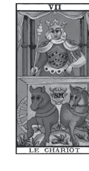

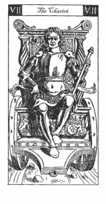

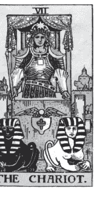

##### 主角人物

战车驾驭者：他是一位气宇轩昂的青年战士。论职位，是高阶领军将领，可能位至将领甚至是统帅；论身分，或许来历是位王子或储君。重点在于他是个有做为、有功勋的胜利者，这个荣耀甚至比一般的皇帝或王者更辉煌。

战车：是塔罗牌中的道具之最，可说已经达到主角等级了，何况这张牌主旨名称就是战车，如果主角不是限定为人物，战车就能算是名符其实的主角了。若论及战车驾驶者和战车合而为一的设定，更会认为战车确实就是主角无误。

##### 场景布置

战士亲身驾驭战车，他居于战车之上，驱使着拉动战车的役兽。战车此刻停驻在郊外，车后有一道护城河，隔河的远方依稀可见城堡和建筑，那是一座都城。

#### 样貌外观

青年战士精神奕奕、英气勃发、爽朗果决的样貌。观望前方的眼光中充满期待和希望，如星一般的明亮；神色了然笃定，显示心中满意过去的辉煌，坚信未来的光明，仿佛胜利已经握在手中。战车通常拥有车篷，以四支柱子架起篷子，篷上、柱子和车身都饰有许多神秘符号。车盘底部应该设有车轮，是战车的行动装置，此时停止运转暂时驻于此地。有如宝贵的名车，车身前方通常置有其专属标志。

#### 动作姿态

战士挺立的身姿，显示执着坚定而无所畏惧，胸有成竹而踌躇满志。战车驾驭者可以站立或坐在车上，但有很多塔罗是描绘驾驭者下半身与车体相连，这是特别又奇幻的画法，代表人车一体，心思与工具合而为一。甚至在传统塔罗中就走向了奇幻路线，出现两匹马的后半身也嵌入车内的画法，也就不只人车合一，而是连战马也合一，整体完全合成为单一主角！

#### 图案符号解码

##### 服饰装扮

战士的服饰并不简单，而多着重在上半身。整体是古代军装和战袍的造型，身上满是应战和防卫的配备，虽不尽然每种塔罗都如此钜细靡遗。头盔：额前有明亮饰物，是身分的标示，也是目光和智慧的补充器。胸甲：是显示神谕的宝物，也有神力的保护作用。护肩：呈现喜悦和哭泣的脸孔状，是赏善罚恶的执行力、恩仇分明的决断力。腕套：增强力量和掌握度，视形状比拟何物作为象征。腰带：可代表黄道带，其上有十二星宫符号，象征宇宙能量。下摆：花纹为神秘符文，能引动神秘的力量。

##### 道具配件

战士手执专用武器，多为长枪或矛刺形状，也是带领大军的指挥杖，且可能发挥其他神奇效用。缰绳：双马拉车的缰绳表示控制行进的工具；但神兽在车前多不见缰绳，代表和动力融为一体，不必借由器具而能直接由意志力驾驭。四柱：撑起车篷，战士就在篷下；四柱代表四元素稳定布局，而使其屹立不摇、顶天而行。篷布代表天空，投射出理想和心境，以星星为纹饰象征拥有希望和光明前景。车轮：轮子时常画得并不明显，但却是战车不可或缺的要件，有辗压过往迎向未来的暗喻，也隐约联结命运之轮的作用；详细的画法通常会显示轮辐，轮辐数也有其象征意义。车前标志：借以暗示这辆车的性能层级，许多牌上是双翼太阳圆盘，象征遵循太阳神轨迹，并且有鹰神护持导航。各式阴阳交会符号，则象征阴阳合成绽放生生不息的能量。

##### 相随配角

既是战车，定有拉车的差事，这个设定是画面的主轴，驮兽不只是点缀的配角。一般是以马匹担任，也有的牌是其他动物或神兽。最奇幻的是人面狮身兽，由于答出了司芬克斯的谜底，也就是真正了解自我，才得以驾驭奇兽。司芬克斯也有各种变化形象，如改为四活物神兽等。不同的役兽代表的动力以及与车主关系都有差异，若是其他勐兽拉车，也都表示强大精神力量的控制。

##### 整体营造

战士身上服饰和战车上的物件，如能相互搭配可更加强一体感，也增添战斗力和神秘性。特定场景配合特定的动力，古典场景之下以战马拉车，奇幻的架构下为人面狮身引动战车。背景光明亮丽是将领的辉煌，车后实质的景物，即是战车的战利品和征服地。并由此尽力营造出，战车正前往未来、蓄势待发的感觉。

> 阅牌要领提示
战车身为代表大秘仪的凯旋牌，意义颇为重大。可以研究画面整体架构和细节呈现，如何相关于整副牌的背景，并联结其他哪几张秘仪？各版本在奇幻程度上的差异有何不同作用，战士、战车、战马上的配备纹饰又隐含着什么故事在其中？

## 8 力量 Strength

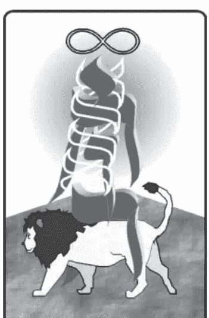

#### 牌序结构

第八阶大秘仪一
第一层级的统整阶段，亦为第二周期的开始，表象静止而内部循环律动。

#### 各式别称

坚毅、坚强、坚定，意念，欲念。奥秘法则。

力量之女，火焰宝剑之女。狮子龙。

正 信念奥秘 逆 欲振乏力

#### 秘仪原理解析

#### 数字对应

数字8代表能量流通循环和利益交换的原则，显示出质能互换和阴阳融合的状态。在塔罗系统里，这张秘仪减少了8偏向世俗和物质的味道，等于将8横放成∞无限循环宇宙符号。这个数字的阴性主体呈现为女性主角，而阳性面则以狮子为表征，两股能量进行交流，透过实质的接触交融成真正的“力量”。因为这个深层原理，伟特将大秘仪8号牌编定为“力量”牌，后世跟进者众多。

#### 象征法则

阴柔的动力原型，感性、心念和敏锐性的高度发挥。象征双向互动交融，质能生生不息、循环不已的运作模式。“力量”是出自内在的一种无形作用，以真诚、信心形成爱和勇气，拥有定力和安全感，发挥出耐性、坚强、刚毅。可说是内力、潜力和软实力，呈现于外则表现为魅力和吸引力。

##### 内涵探索

此牌暗示内在无形力量，自心中的纯挚而生，是坚定的信心及

## 力量

诚意的善念。力量源于深刻的“信念奥秘”，由内而发的律动和潜能，加上刚正坚定和修为而累积的能量，散发成为魅力和吸引力。展现方式是降服而非征服，是融合吸收而非摧毁，因互相交流而更为增强。占卜时表示因内心真情流露，以致人和而事兴，导向美好的结局。

##### 正位实占解释

**人际交谊：** 对朋友真诚相待，具良性互动。散发出魅力而赢得人缘。

**恋爱情缘：** 爱情魅力十足，热情真挚融化对方的心。和所爱的人彼此热烈吸引。

**事务进行：** 态度正确、方法拿捏得当而事半功倍。轻易搞定、掌控局面。

**金钱物质：** 能够轻松运作而累积财富。转化能量、发挥功效而有实质回收。

#### 牌义沿革解疑

##### 来历变迁

★这张牌的寓意深刻，从早期的古塔罗就视为美德项目之一，转而为塔罗所用，代表内在的美德和生命力量、道德力量和所有力量的原理，并已有热情和信心的具体意义。

★伟特对这张牌不只是调动位置，其实也改动了名称，首度正式区隔原本的“坚毅”而定名为“力量”，赋予深层奥秘的内涵。这张牌的画法一向有固定的形制，伟特设计的构图在表面上和古塔罗差不多，但已经融入了隐藏的神秘学和炼金术要素，也丰富了许多意义：善意的坚毅、驯服和引导，强调“神秘法则”、神圣奥义的统合，清明无邪的诚心、以及冥想凝思的力量。

★伟特稍后时期定义仍相差不远，沿用早期和伟特相成承而来的涵义。明确强调的正位占卜定义为：能量、力气、行动，勇敢和宽宏大量。

★现今的正位解释，没有改动很多内涵，只是诠释方式比较新颖：精神面的提升、能量的凝聚。

##### 正逆转折

★伟特本人的定义，运用了“逆位过度原则”或“逆位不当原则”：可能是过度滥用、蛮横专擅，也可能是不足、虚弱，总之是不协调与不和谐的状态。

★伟特稍后时期，逆位差不多沿用上面这些解释，并且延伸为：信心不足、身体病弱，意志不坚定，以及欲望熏心等方面。这些涵义应是以“逆位相反原则”和“逆位削弱原则”所推衍出来的。

★现今的逆位解释，多不脱上述这些原则和范围，可归纳为热源消退而造成的缺失，由于“力量”匮乏而导致的失败。

##### 逆位思考

这张牌的主要诠释，自伟特之后时至今日一直被采用的是：正位置解释为精神层面超越物质层面，而逆位则是物质凌驾精神。正逆位的相对性很有规律，由“逆位相反原则”即可定出。力量牌逆位在占卜时的重点，是需要解释失败受挫的情况原因何在，多半是缺乏热诚或勇气、或者原有的信心消磨掉了，以致于影响到人际、感情，甚至事件进行和物质收获，整体而言不外乎就是“欲振乏力”的现象！

##### 逆位实占解释

**人际交谊：** 因为诚意不足，难以打动人心。失去群众魅力光彩。

**恋爱情缘：** 感情能量低落，失去真诚的对待。热情降温、欲望消退。

**事务进行：** 缺乏信心，无法掌握力量，难以坚定持续，不再有所进展。

**金钱物质：** 丧失恒心毅力，财务难以增进扩充，甚至吃亏或折损。

#### 画面寓意解构

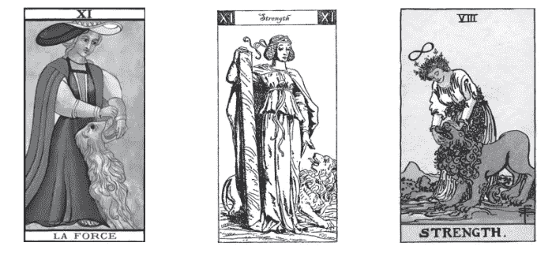

##### 主角人物

力量之女：身怀绝技的少女，然而年纪也可以有所改变。另外还伴随一头勐兽，多半是狮子。

若以男性为主角，会少了以柔克刚之意，会这样安排角色多半是为了配合整副牌故事的特殊设定，兽类也随之而变化，不局限于狮子。

无论是女或男，无论什么姿态，重点都需以徒手方式亲身面对另一客体，不假手工具和武器会更有深度意涵。女子维持运功般的姿态，以自身的神奇力量，亲身降服一头雄狮，彼此正交缠着。至于，男性英雄，则正在发挥武力技艺，徒手克服敌对的力量。

##### 场景布置

美女与野兽都处于平地上，背后场景有尖耸的山陵，天空明朗清亮，这片打斗或纠缠的平台后方，呈现山势起伏的地型状貌，也象征着内在力量运作状态。

#### 样貌外观

女子神情坚定且充满善意，没有恐惧、更没有仇视，不仅显示了她内在的真心诚意，也从而展露出无比的魅力。
男性主角神情样貌则随故事而定。

#### 动作姿态

关于双方姿势，细节是有得讲究的。女人降服狮子的典型画面是：女子弯身以双手按捺狮子的嘴部，控制上下颚的开合，而究竟是扳开或合拢却有着些微区别，显示出双方关系和地位的不同进展或方向。女子略弯腰身，双手很像环抱太极，这犹如运功练功的姿态，暗示有气在体内运行。无论是不是像运功，总是要呈现有如发功中的特殊精神状态，才能有无比的勇气和信心面对狮子。

#### 图案符号解码

##### 服饰装扮

女人，纯白的装束、白色的长衣、清淡雅洁，象征纯净气质和精神能量。狮子，较深的色调，多半是火红颜色，象征动力、兽性和原始能量。这两种意象是对立的。
若以男性为主角，造型服饰以及道具配件，皆随其故事而定。

##### 道具配件

大部分塔罗的这张牌中，女子戴有头饰，身上有衬纹。头饰表示精神力，也能暗示能量流动，多数头戴花环、围绕于额上。身上的纹路线条，是为了表达如电线般引导能量的提升和流通，多数力量之女身缠花蔓线条，从下半身往上回绕。而藤蔓枝条与头圈花环相联结，接通身体和头部的能量。

无限大符号，再度呈现于画面中，位于力量之女的头顶上方，可与身上的花圈或藤蔓呼应，象征下方有一股能量正在运作中，并生生不息。

由于强调徒手，这张牌比较少看到其他配件或武器。在男性英雄的故事中，或许少数的牌中会见到手执武器、甚至用以对付敌手的画法，武器可代表主角性格特质。

##### 相随配角

牌中的狮子或勐兽，是配角也是主角。而狮子可说是力量牌的招牌动物，这头野兽总是选择狮子是有许多神秘学因素的，最主要是出于炼金术的典型象征法，狮子代表阳性物质，也有蜕变成高级物质的潜能。在牌中狮子通常与女子紧挨住，被女子降服、不再挣扎而屈于低姿态，甚至是接受怀柔，呈现出幸福感、喜爱或忠诚于主人。彼此既是对立且又融合，可以喻为“美女与野兽”。

##### 整体营造

力量牌画面架构，动作的呈现是重点，女子与狮子互相结合成为一体，静静地联结、仿佛时光停止，然而内在力量的运作未止、能量正在流动。环境也暗示了这股张力的强劲，背景地势表现出能量的运作，衬托出蓄势待发的潜藏力量。

> ## 阅牌要领提示
由力量牌号码顺序的编排可以看出这副塔罗的时代背景，以及较大的整体方向。力量位于8号都是现近的塔罗，这个编排目的就是标新而有别于传统、服膺数字学原则、表明跟随《伟特塔罗》系统。力量位于11号的塔罗，如果不是较古的塔罗，就是刻意绕过《伟特塔罗》而直接追溯传统。此外，力量牌本身具有的内涵和画出的情节内容，也代表这副塔罗的深度和神秘倾向强弱。

## 9 隐士 The Hermit

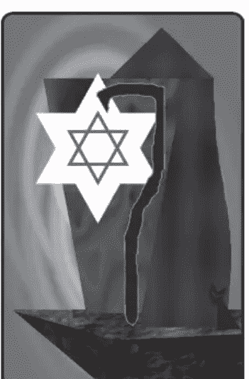

#### 牌序结构

第九阶大秘仪一
第一层级的最高阶段，凝聚意志力、精神力为星光。

#### 各式别称

隐者、密术士、秘教修士、炼金士、隐修会士，博士。
贤者、大师、智慧老人。圣音之法师，永恒之先知。

### 正 孤寂探索 逆 矫情作态

#### 秘仪原理解析

#### 数字对应

数字9本被赋予高层次精神，能量很强但忽隐忽现。在塔罗系统中，将9的这种特质稍加转折，成了隐士的修为、精神的高层次以及智慧。黑暗中出现一盏明灯，是隐士强大的精神能量凝聚之处。这张秘仪减少了数字9的冲劲和不稳定，但仍带有数字9的双极情绪特质，只是常态偏向抑郁或沉寂的一面。

#### 象征法则

个人精神具体化的原型，亲身经验的知识和智慧、沉潜过后的理念想法、以及长远周全策划谋略，显示人与环境间的差异对比与特殊的互动方式、如遗世独立，以及对于理想抱持的态度、如追寻探索。是年老的象征，代表晚年、暮气、风霜、和退休隐居；然而也是资深的条件或结果，代表智慧、历练、功力和沧海桑田。

##### 内涵探索

隐士，代表内心中孤寂的一面，世人皆醉而我独醒的感受，渺茫的盼望中等待知遇之心，以及对理想抱持的态度，退隐或遗世独立的精神。这样的追寻探索是一种修持，需要在心志与环境的抗衡下保有格调和坚持立场，琢磨于孤高耿介或退让谦逊的拿捏、高调与低沉的得宜、亢奋与消极的控制，经过这些历练而凝炼的内在智慧。

##### 正位实占解释

**人际交谊**：孤僻的态度、离群索居。人际关系不活泼，更缺乏热情。

**恋爱情缘**：心如止水难以动情，宁愿孤寂，或者过于坚持和保守。

**事务进行**：遇到明灯指点迷津，有可能出人意表地成功。待业中有出路，就业中却可能出局。学习方面颇有心得。

**金钱物质**：较不擅长世俗的争利，对此可能获益不大。但寻找失物可望获得。

#### 牌义沿革解疑

##### 来历变迁

+   ★虽然历来塔罗中这张牌的画面都差不多，但对牌义的认定却一直有变动，正逆位置的涵义也一直混杂。
★古塔罗时期除了智慧、知识以及警惕、忠告之外，都认为有许多负面作用，包括倚老卖老、装糊涂、刻意掩饰、腐败堕落和年老衰竭，甚至是背叛和不忠的行为。正位置牌义同时容纳了明智的正面特质以及负面的老年衰弱形象，这点并不算是冲突；矛盾的地方在于忠诚、谦逊跟背叛不忠、倚老卖老是相反的意义，因此不相容的负面成分在日后就归到逆位意义去了。

+   ★集古来塔罗大成的伟特，虽有自己的评判，然而对上述的牌义却都照单全收了，没有提出其他有差异的项目。

+   ★在伟特稍后时期的解释中，道出了隐士的一些特征：自我否定、退缩不前、临时取消计划、害怕被揭露或隐藏感情的倾向。

+   ★现今的正位解释保留了隐士最大的优点：谨慎周全，勤奋不懈，这是最切题的特质，在各个时期都有提到。并取消和主要特质不一致的负面作用，全数归给了逆位。

##### 正逆转折

+   ★伟特定逆位为谋略策划，甚至有欺瞒假装的意义，但也是恐惧和担忧过度，这两个解释的方向有所差异但能并存。

+   ★伟特稍后时期，开始厘清正位和逆位中的意义，虽然正位包含优缺点，但方向愈趋于一致。逆位的意义也逐渐统合出明确的走向，包括从以往保留下来的解释：不安和疑虑。

+   ★而后至今，正位置不能相容的意义都移到逆位，两者也由此有明确的分别。逆位多以正位意义的“逆位过度原则”或“逆位相反原则”的两种思考方向为主：过于谨慎而踌躇，拖延造成失败，或是急切轻率而不严谨。

##### 逆位思考

如今，隐士逆位牌义重整，以“逆位虚假原则”来推行，这是对于隐士逆位最佳的理解方式，亦即视之为“假隐士”，表示他的清高形象是伪装的，内涵的智慧和优点也是虚假的。“假隐士”的外表退缩、推让与低调，其实也是别有目的而非真心，以“矫情作态”的性格和特质来揣摩，便能贴切了解他的心思，并针对问题做出解答。

##### 逆位实占解释

**人际友谊：** 内心觊觎，却又被动推辞，还故意拉高姿态，令人感到难以相处。

**恋爱情缘：** 内心深处渴望情感却又抗拒，过度防卫而难以表露真心。

**事务进行：** 坚持己见，导致事态僵持不下或方向偏差。不安焦虑、进退失据。找不到目标、失物难寻。

**金钱物质：** 一意孤行，逆势操作或误判局势，错失机运，不利于金钱财运。

#### 画面寓意解构

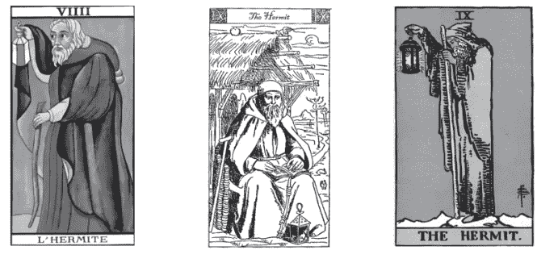

##### 主角人物

隐士：年迈而隐遁的修炼者，绝大多数是男性长者，可能炼金术士或是密术士，也可能是卡巴拉修习者。这位隐士正在探询和揭示，双脚杵立，但双手各有作用：一手杵着拐杖，衬托老迈的形象；一手高提灯笼，表示等待期盼之心与悯怀世间之愿。手里或怀中可能还携带其他像是沙漏等器物。

##### 场景佈置

黑暗的夜里，隐士孤寂地在寒冷的高峰上伫立，身影融于一片冰天雪地中，兀自举起一盏灯，映衬出“世人皆醉而我独醒”的感受。

#### 样貌外观

隐士的年事已高，留着很长的灰白胡子，表明年老的特征。老人的头低垂而目光朝下，或是正闭目沉思，也有点像在静待等候。他的神情漠然，但又一脸笃定；让人觉得他虽垂垂老矣，却老神在在。

#### 动作姿态

隐士遗世独立的姿态，好似在静静等待命运的安排，或是坚持心中不变的理想。对知遇的期盼，通常以手提灯笼为象征。这位老人通常笔直伫立着，显得有点僵硬，而背部略微佝偻，头颈微微低垂着，模样如路灯般屹立不动，所高举的灯火，更像是照亮世人的明灯。

#### 图案符号解码

##### 服饰装扮

老人有帽子的斗蓬外衣，灰暗的颜色如同他的低调，陈旧的布质像是饱尽风霜。衣物将全身裹紧而深藏不露，甚至将头深埋其中，好似抵御风寒，也象征着内心的与世隔绝。

##### 道具配件

提灯：是这张牌中极为重要的道具，如果没有此灯画面就没有任何光亮了，主角性格也就很难彰显了。隐士手上所提起高举的，是隐士意识和精神的凝聚，算是他的一种“分身”。灯火：代表智慧和启蒙的光明，也表示温暖的传递。光芒形状多以符号形貌做为神秘象征和智慧的凝聚，一般以六芒星符号表示精神和物质的结合。灯罩：提灯的形状也需要注意，可能有其象征意义。多半是灯笼外型，有时候也可以用火把、火炬来代替，而后者更强调启蒙的精神。

沙漏：象征时间，也配合主角的年纪老迈。而手执沙漏更突显等待的涵义，也具有控制时间的意味，并联结到形象很接近的年老的时间之神——塞坦。

拐杖：手执拐杖或者与之相倚，可以说是老者的躯体形象，也有其支援生命力的暗示。或许真的具有魔法或法力，有些画面的木杖形状弯曲好似蛇的形貌，这就是所谓的“蛇杖”。

##### 相随配角

隐士牌的画面多半是整片孤寂，没有其他角色伴随。有时候会有蛇出现，缠绕着拐杖或落在触地之处，也有握在手中或隐藏于身上的画法。加入了蛇的角色，除了增添蛇本身的神秘象征作用之外，也暗示所执拐杖可能是根蛇杖，具有魔力和法术而不是普通的杖。有时也直接画成蛇杖，可以变化为蛇也能还原，从道具跃升为配角。而这位老者也由此显得不是普通的老人，更显得是一位方外高人。

##### 整体营造

场景一片灰暗的色调，营造寒冷与黑暗的气氛，象征世局昏沉不明。整个画面焦点是唯一光亮处，集中在老人手上高举的物件上。这位智慧老人，也和景色融合在一起，隐喻他其实并不愿突显自己，只愿手中明灯指引世人方向。

### 阅牌要领提示

隐士牌，可说是塔罗中代表创作者精神形象的一张牌，所表现出的样貌特质，就是创作者透露出来的精神特质和所向往的境界，而他手上的灯光就代表他的精神状态或心中的最高指标。

## 10 命运之轮 The Wheel of Fortune

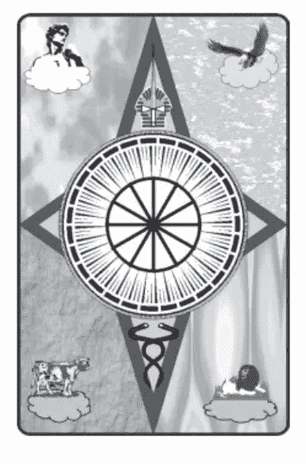

#### 牌序结构

第十阶大秘仪一
新旧两重层级的转化变动，内在与外界相呼应。打破既往而再创造，开拓崭新的一轮。

#### 各式别称

运命之轮、幸运、命运。生命之轮、律法之轮、塔罗之轮。宇宙之轮、天宫之轮。运命之主君。

### 正 永劫回归 逆 祸福难料

#### 秘仪原理解析

#### 数字对应

数字10是变换的创造力，一种改变和动态的力量。10是1的演化和升级，变动更剧烈也更为复杂。1统驭四元素的作用再度强调，0表示周而复始的循环，具变幻莫测的意义，也具神秘的力量。因此1与0的结合，就象征命运的运行转动，而1与0的形状也貌似轴和轮。这张秘仪虽然基数仍是1，却因为带0而减少了阳性意味，并且更为神秘。

#### 象征法则

描述命运如轮般转动，象征时空循环、轮回运行变化不已的实相。四元素在周遭，象征具体的环境受神秘命运力量影响，也表示方位、矢量及元素质能在预料之外的变化演进。命运之轮体现宇宙型态以及命运的运作模式，代表神秘力量的根源和起点。

##### 内涵探索

命运之轮，代表宿命的牵引、神秘力量的运作。作用于个人的型态为：运气、运势、运程、运途；作用于群体的型态则为：气运、机运、时运、世运。面对这一切无可预测的惶惑，所因应和采取的顺命、认命、知命、和抗命等各种态度；或者对于时机缘份的尝试、掌握、开创、甚至放弃，始终都是“永劫回归”的现象变幻。占卜上的解释为：由于命运作用安排，一切项目都是起伏难料的际遇。

##### 正位实占解释

**人际交谊：** 遇到贵人、福星。与好友不期而遇。难能可贵的交情。

**恋爱情缘：** 感情转折有突破、戏剧化的进展。艳遇、偶然邂逅、“喜相逢”。

**事务进行：** 波动变化中的好运、转机。突发奇想、临时起意、惊喜、“好意外”。

**金钱物质：** 预期之外的收获、得到偏财、有中奖的可能。

#### 牌义沿革解疑

##### 来历变迁

+   - ★这张牌的画面，几乎都非常具有创意，能表达出该副塔罗创作者的宇宙观和神秘体系，古典和传统塔罗也是如此。
- ★古代塔罗，简单认定正位置就代表为各种幸运、福气和成功，甚至连逆位的意义也都颇佳。
- ★伟特的命运之轮一改古典画风，结合自己的信仰和所学构筑新的体系，然而在占卜上也跟随既有的定义。后来他进一步优化占卜用法，认为需要参考整体牌局来判断这张牌的吉凶好坏，使得命运之轮的解析显出深度。

+   ★伟特稍后时期，这才将命运之轮的正逆位意义互异分化，成为吉运和噩运的差别。并且加上一种诠释法：纵然已经呈现无可避免的注定状况，但仍须努力以静待最终命运的揭晓，更具神秘感和丰富性。
★如今较以遭遇预料之外的命运安排来看待，配合将面临的好事加以诠释，更能发挥这张牌的作用。

##### 正逆转折

+   ★伟特本身是以“逆位过度原则”来推衍这张牌，逆位变成比正位过度的扩增、丰盛和奢华的意义。
★然而在伟特稍后时期，这些方式被改变了，逆位成为不幸和恶运的象征、无法预料的状况和问题、以及意外事件。
★而后至今，通常都依据伟特之后的定义，正逆位的意义对垒愈来愈分明：命运之轮这张牌代表突如其来的状况和改变，正位置显示好运气，而逆位置则以坏运气来解释，这也是“逆位相反原则”推衍方式的典型。

##### 逆位思考

然而也有人遵从正位置的不定性来解释，而逆位就推衍成更加不定的意外状况了，也就是命运之轮的逆位比正位的变化更为始料未及，并且多半不是遭遇什么好事，因此可直接用意外来形容，这就有点“逆位过度原则”的意味了。不同原则的推行出的结果可能异曲同工，也都体现了“祸福难料”的复杂层次，然而仍须配合占算的问题和牌局状况，据以判断究竟是哪方面的事件、以及严重程度如何。

##### 逆位实占解释

**人际交谊：** 遇到煞星或克星。冤家路窄、狭路相逢。发生意想不到的误会。

**恋爱情缘：** 感情生变、骤然发生状况、离谱的插曲。措手不及的离别。

**事务进行：** 变动起伏中的厄运、危机、突发状况。横生波折、遭遇不测。

**金钱物质：** 意料之外的损失、忽然破财、有可能掉钱或遭窃。

#### 画面寓意解构

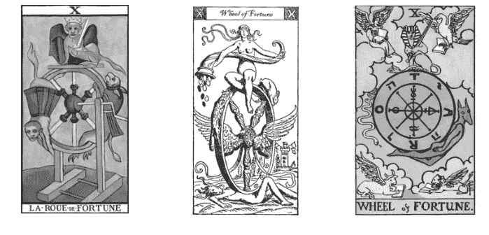

##### 主角人物

画面主体刻画命运之轮的转动，多半无主要人物，只有一些神话中的神物或神兽。命运之轮主要是圆形或环状的可旋转机制，用以象征宇宙运行循环之理，配合轮上其他装置配件，组成决断分派命运的机制。近代的命运之轮有较奇幻的设计，轮的外围紧黏着几个神物，神物各施其力，好似与轮的转动互有影响。传统塔罗的构图，以纺车之轮为命运之轮的主体，结合神话典故表现命运的运作模式。如果是三女神在纺织，则可以视为主角。最古老的画面也有单独的命运女神直接架着车轮。

##### 场景佈置

命运之轮有多种面貌，场景必须与之搭配。命运之轮多半在中央，设定为天空或宇宙之中，通常有神物紧挨命轮。多数的塔罗中，有四活物展翼并开卷读经诵文，主要是象征四元素，隔着空间和云雾。分布于四角落；也有以其他象征物表达四元素，甚至以分割背景为四个区块来呈现。四活物或四元素的位置随采取的理论而有不同安排。

#### 样貌外观

命运之轮是轮状物，多以各种圆形、环形物体，或者其他能转动的机制来表示，种类不胜枚举，经常出现命运交织的女神纺车，天体运行相关的则有地球、宇宙、天球、黄道十二宫，甚至也可以是旋转木马。画面通常尽量追求三维和动态表现的模拟，目前一般的命运之轮以正圆为外形，内部包含几个圈层，并也可划分为四或八等分区域。轮内的每个区位中，都能刻印上特殊的文字或符号，以表现更多深入的寓意。

#### 动作姿态

三女神：通常出现在纺织转轮旁，转动和看守着织线和纺轮的转动。

三神兽：各以自己之力影响轮的转动运作，或者是被轮子带着转动不能自己。

四活物：常呈现读书姿态，振翅停在云端上，专心入定念诵经文，眼神都不张望。

#### 图案符号解码

##### 服饰装扮

女神：单一的命运女神是主角，通常穿着古典服饰，踩轮而行的女神也可能蒙着眼。纺织车旁的三女神，会很注重服装的华美。

三神兽组合：人面狮身多半裸身，其他二物如果是动物形，多半也没有画出衣着。

有翅膀的四活物：身上多没有蔽体之物，除了那位近乎天使样貌的人。

##### 道具配件

渊源于古代的纺织轮画法中，纺织机的转轮是命运之神的工具，象征命运转动的机制。轮上多有轮轴和轮辐衬托，把手是控制命运的操作关键，而纺轮上的丝线，则代表命运的脉络。

神兽“人面狮身”多半手里持着剑，表示以智慧来决断。

四活物面前大都有经书，好似正在翻阅或诵读，表示明了智慧和启示，或者在散布福音。经书表示有更深内涵和意念的凝聚，配合四活物共有四本，表示相关于四的典籍。书与剑同时出现，隐喻了命运与智慧之间的互相影响力。

##### 相随配角

三女神围绕纺车旁纺纱织线，若当纺织轮是主角，则女神就成了配角。后来的演变真的成为纺纱机器配上神兽或神物，而非女神样貌，这时真正沦为配角了。

传统和近代许多牌种中的命运之轮多有三神兽组合，是从三女神概念演化而来。三兽各占据轮盘的边缘，一般是人面狮身在轮的上方，一侧为犬首人身或称阿努比斯，另一侧为蛇或者是其他怪物。在许多塔罗系统中，这三神兽也会在其他张牌中出现。

四活物是自《伟特塔罗》后才加入命运之轮的，都是带有羽翼的动物，各为人、狮、牛和鹰。在命运的作用下究竟谁是主宰？这些“人物”应该都是同等地位的配角吧！

##### 整体营造

古典的构图表现是以纺织转轮来表达命运轮转，目的是要表现命运三女神如何操控命运。命运之轮无论古今都是圆的形状，让人觉得具有圆心或轮轴，也多安放在画面居中之处。近代的设计中，整体画面是奇幻式的构造，并没有出现人类主角，类似的代表是三神兽以及四活物。结构上需要划分层次来安排景物，以命轮外框为界，有内部和外部的差异，而从内到外层叠分明并相互连贯。

> ## 阅牌要领提示
命运之轮是非常特别也是极为重要的一张牌，通常就是判断一副塔罗的关键牌，因为这张秘仪是整副塔罗命运哲思的浓缩，代表宇宙观、命运观和人生观的呈现。在这个宇宙和世界的架构之下，衍申全副塔罗的设定。

## 11 正义 Justice

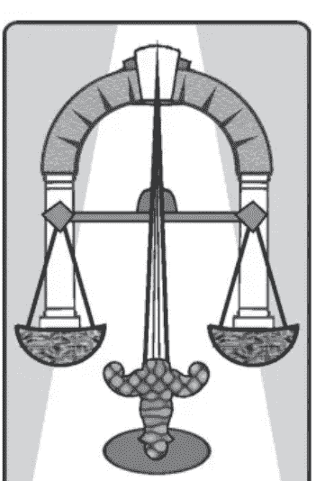

#### 牌序结构

第十一阶大秘仪—
第二层级的新起始阶段。整体最置中的秘仪，也是中间周期的居中阶段，揭示中庸原则和衡量裁决之道。

#### 各式别称

法官、正义女神。公道、公平合理、平等。律法原则。

真理之主君、均衡主宰之女。调整。

正 平衡法则 逆 偏颇不公

#### 秘仪原理解析

#### 数字对应

11是最为均衡而力量潜能无限的数字，在灵数系统中，两位重复数具有特殊力量和卓越性。11号又是二位数的新开端，代表强大的智慧和行动。11的基数为2，成为结合阴阳的均衡数字，也是魔法师和女祭司的组合和升级。在塔罗系统里，11号居于大秘仪最中间位置，惟正义能符合此数的特殊地位和性质，阴阳各半、左右均衡。因而伟特仔细考量11号秘仪的安置，配定为正义牌，后世多所采用。

#### 象征法则

此为二元对立的高层发挥，辨证能力的拓展，发挥于思考、衡量、裁决、定夺与判断力。亦象征对于原则和立场的坚持，进行执中与协调，凡事维持均衡、力求平等，以彰显正义、公理。代表世间一切法律相关制度和体系，一般人的契约与履行，以及须遵从谨守的行为规范。

##### 内涵探索

正义，是心中的准则，也是一贯的坚持，保持立场和维护理念的正直心境。这是一种“平衡法则”，做为最基本和最重要的评量标准，代表持平的公正态度，讲究真正平等、破除人际中的阶级地位、化解心中的傲慢与偏见，旨在尽心维系各式关系的和谐。象征理智与情感的均衡，以智慧之眼看待世间，穿透表面上的是非曲直。

##### 正位实占解释

**人际友谊：** 朋友间互相平等相待，凡事讲究公平、均衡，遵循正义原则。

**恋爱情缘：** 对象的选择正确。双方平等以对、维持彼此均衡、相处和谐。

**事务进行：** 行事风格有准则，坚持原则去做，方向清晰正确。法律事件的胜利。

**金钱物质：** 得到回收、报偿或代价。分配得宜、处置公正，感到合理或值得。

#### 牌义沿革解疑

##### 来历变迁

★正义向来是不可或缺的中心原则，一直都有均衡的涵义，代表公平、正确、诚实、清廉，并且象征法律或司法、执法系统。这张牌的画面内容一直改变不大，都是呈现出“正义女神”的概念，只是取用的形象渊源不一致，而内涵都相差无几。占卜意义一直是这些相关项目：适度、均衡、和谐，拥有美德、信誉和贞节。

★伟特调动了正义牌的顺序，往后挪到11号的位置，如此更符合这张秘仪的意涵、也更适合展现女神的威严。然而在占卜方面，仍旧承袭既定的意义，并对于正位置增添或加强了某方面的内容：主管、经营、执行、经理。

★伟特稍后时期，革除了伟特添加的这些涵义，正逆位之间也做了一番统整，已经与现今牌义很接近了。

★现今占卜运用多根据牌局和问题而变化，有时候出现这张牌，表示：做了对的事、正确的决定、得到正当的报酬、走向应有的结果。

##### 正逆转折

★伟特认定正义牌的逆位代表法律体系和相关事宜，以为在占卜中会有其效用，然而不久后已不再这样使用，一直维持至今皆然。

★伟特稍后时期，修改和调整了以往的牌义，将正逆位置的意义分辨为正面与负面作用。而后正义牌的逆位一概表示面临法律上的问题：遭到陷害诬告，或是本身违反法律，也可能得到不公正的决议结果或是过度严苛的仲裁。另外也包含一些负面特质，如：顽固、执着以及偏见。

##### 逆位思考

如今逆位占卜意义运用为：不正确的行为和错误的决定，这些可以说都是依循“逆位相反原则”来推行的。如此一来，正确、正当、公正在逆位中都变成了否定，所以占卜上这张牌呈现出逆位时，都是针对问题点而表示错误不当的意义，如此也就等同于“逆位不当原则”，只不过需要特别判断这时所代表的对象或事项是什么。无论如何，总归是表示在某方面出现了“偏颇不公”的情况。

##### 逆位实占解释

**人际友谊：** 对别人要求过高，却律己不严、私心偏袒。处世不公正、双重标准。

**恋爱情缘：** 感情上自私的现象。不平等的关系和对待。错误的决定。

**事务进行：** 处置不当，失当的决策导致不良后果。判断失准、行为偏差。

**金钱物质：** 来源不够正当，获取不义之财。报偿不公、分配不均。待遇偏颇、感到代价过高或不值得。

#### 画面寓意解构

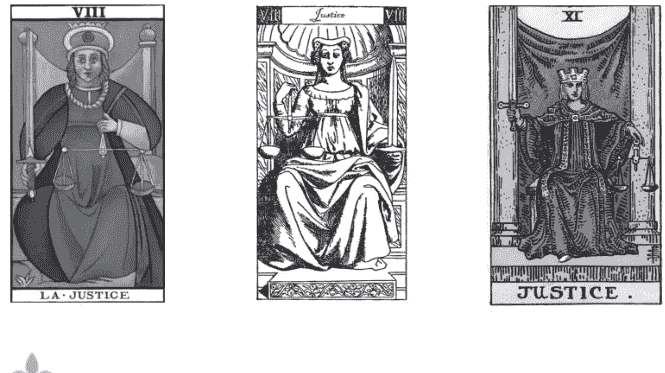

##### 主角人物

正义女神：西方传统的各类正义女神形象，无论什么名字或来历，都是人间执法者的化身。正义女神在人间对应法官的形象，位居司法之职。她手执天秤，以及宝剑，正在裁夺执法。

##### 场景布置

正在执法或判决的庭长坐在宽广的法庭殿堂上，双柱耸天、四壁冰冷。身后一帘布幕，色调代表审理的氛围，严肃神圣而不容侵犯。女神也可视为镇坐在天神宫殿之内，不过也有另外一种判官形象是居于地底冥府当中。

#### 样貌外观

虽称为女神，许多塔罗中这个角色的外貌形象很中性化。正义女神的面貌清高，给人宽大但并非纵容的感觉，表情坚定不犹疑，显示出公正廉明、正气凛然的气场。锐利清明的眼神，能够明察秋毫，智慧是必要之内涵。

有些塔罗采取蒙眼的正义女神版本，执法者被布条遮蔽双眼，却更表现出刚正威仪。蒙起双眼表示不以表面判断，不存缺省立场，并且一律平等，亲疏不认。

#### 动作姿态

正义女神根据不同来源而各有造型和姿仪，主要有正面和侧面两种画法呈现。

正义的使者一手提着天秤，衡量对错以及心的善恶，另一手将宝剑举起做为裁夺之决心，这类描绘都是正面且置身中央，也呈现出有不偏不倚的感觉。而坐姿的她双脚紧闭或开阔，也显示其拘谨或威慑的态度。

埃及系统的女神以侧面呈现，多半将自身与天秤结合为一体，且可能位于冥府。

#### 图案符号解码

##### 服饰装扮

判官的冠冕：表示智慧灵性高尚、深度精神内涵，以及对正义的坚持。

额头上或冠冕前方的宝石或饰物：表示高能的第三眼，与蒙眼而以心观照的情况可相模拟。

执法的袍服：显示执法者的性格，上面的服饰也需要有相关象征符号。主持正义者的颜色，通常以紫色象征高层次理性智慧。

蒙眼布：有些塔罗的法官蒙上了眼，代表无视于强权或利诱，也是自我约束的能力，象征法律中的审理程序。

##### 道具配件

正义之剑：大秘仪之剑表示无上的智慧和公正严明，做为威信以及裁决之功能。

公平之秤：天秤出现在大秘仪中，可见是很重要的器具，做为均衡和裁量的评估标准，象征公平正义以及尊崇法律的精神。

主角与天秤或宝剑结合在一起，代表完整的法律制度，以及审理和裁决。天秤向前提起或拉高，而宝剑比较贴身，且常见到叠于柱前，表示先以天秤衡量后以宝剑执法，宝剑是备而不用、非到最后不会采取的手段。

法械与圣火：法械是柱状束棒上带有斧头，为法律制裁权至高无上的象征，可以结合双柱，或者直接将双柱视为法械化身。圣火象征纯净的光明，照耀出真理，可能以火炬或是火炉形态呈现，有时则单独置于一旁。法官双手各执圣火和法械，或者两者同时存在，皆强调严厉威势和铁面无私的形象。

##### 相随配角

正义牌也多半没有配角。法官是自主而独立的，如同法律不容被外力干涉、没有依恃与仰赖，这同样是对于正义使者的要求，不被任何其他声音所扰。有些牌在场景中，仍可能设有其他物件衬托执法者的至高尊严，多半会是动物，例如孔雀或蛇等。

##### 整体营造

执法者在殿堂之内，端坐于中央，表现正在执行或裁决的威仪。身居双柱之间暗示她代表中柱，也是天秤的支架。须营造肃穆庄严的气氛，无论是不是属于人间的法庭，都是这样的景况。

> ## 阅牌要领提示

正义牌的编排顺序和力量牌搭配，和整副塔罗的大方向有关，11号的正义牌是居中的位置，也配合均衡执中的象征。正义这张牌，构图上必须配合许多设定而呈现，整副专牌的故事体系或神话背景，已定位出主角的来历和渊源，形象怎么勾勒都由这些因素先决定好了。

## 12 吊人 The Hanged Man

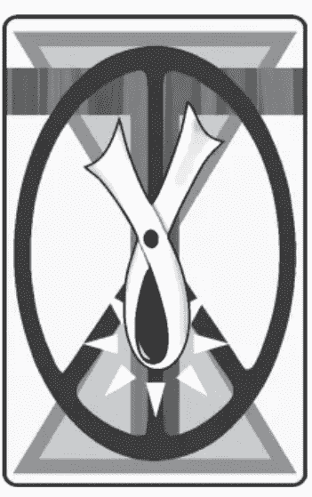

#### 牌序结构

第十二阶大秘仪一
复杂的境遇，处于中间位置之后，是新层级的进一步阶段。也是另一种循环视角中，12的节点位置。

#### 各式别称

倒吊者、被悬吊的男子。牺牲者、殉道者、受难者，垂死边缘。

责任、谨慎。伟大功法、神秘功法。玄水之灵。

正 奉献姿态 逆 转身平复

#### 秘仪原理解析

#### 数字对应

12对应黄道十二宫，代表天且以悬浮空中的画面为象征。数字包含1和2与加总的3，1与2并存表示自我和他人，需代表管道的3促成完满。整组数字阳性成分较多，阴性面则化为牺牲而以倒吊的男子呈现。12是圆周进位的循环，此特殊性由逆转来突显；此秘仪以塔罗的专有方式—逆向视野，呈现出另一种超越世俗观点的美好周全。

#### 象征法则

公正背后有是非曲折，面对不平的待遇，采取委曲求全的立场，意味退一步的海阔天空，体悟有舍才会有得，给予即是收获之理。吊人处于过渡的中间阶段，没有着落的现况是难以承受之轻。心中盼望转机、等待翻身而寄托未来，或者自身尽力挣脱、求取突破。吊人蕴含着牺牲的愿力、臣服的姿态、潜修苦行的精神，以及慈悲的情怀。

##### 内涵探索

吊人呈现发自内心的深层意愿，所以能够心甘情愿奉献、付出与承担，忍受身心煎熬，坚信未来会更好的境况来临。逆向思考，以截然不同的眼界看待世间，往下即是朝上的观念颠覆，形成与众不同的价值观，也造就了异于常态的另类行为作风。“奉献姿态”是一种能量交换，代表转念之间的心态差异，萌生退让、宽恕、谅解、包容和悲悯等心情。占卜时当事人属于牺牲和委屈的一方，正承受艰辛困顿、苦难折磨。

##### 正位实占解释

**人际友谊：** 需多担待些，总是委屈、忍受和付出。也可以说对朋友讲道义、不计较。

**恋爱情缘：** 为深情无保留付出、认分接受现状。甘愿的心态、牺牲奉献的情怀。

**事务进行：** 扛下责任，劳心费力。需要忍耐沉潜的过渡期。专心准备应试或展演。

**金钱物质：** 着重精神面，对现实财物掌握度不高，有漏财现象。奉养、捐献、救助。

#### 牌义沿革解疑

##### 来历变迁

★这张牌的主角在初期的塔罗中并不都是倒吊之姿，后来才演变成被绑住脚倒吊起来的画面，不但成为这张牌的正统画法，更成为深入人心的塔罗牌代表形象。

★古塔罗就认为倒吊人在内涵上包括：谨慎的德行、审慎与智慧，或是占卜、预言、神谕等事件。这是因为对于主角被吊起的动作和原因，各有不同的理解和诠释。

★伟特有自己的看法，驳斥了各家诠释画面情节的观点，却没有提供明确的定论，在占卜上也大致承袭了以往那些混杂的意义。

★伟特稍后时期整理为：过渡时期和缓冲阶段、转变和调整的状态、孤独和放逐的历程、悔悟与更新的生命等许多不同层面的涵义。但是这其中有很多意义与其他的牌有所重复，于是又过滤出了最有特色的：牺牲、奉献、服务等意义。

★而后，基于牺牲奉献的脉络，占卜的诠释方向都是：实际层面的受苦委屈，以完成精神的期待，达成目标须付出的代价。这个调性一直传颂至今。

##### 正逆转折

★伟特对于逆位有一些自相矛盾的定义：自私自利，以及人群、社会共同体，两种意义同时并存。

★伟特稍后时期，将上述的奇特解释都舍弃不用，而以正位推衍出相反意义：预言不正确、直觉发生错误。与牺牲相关的议题则推衍出：不愿再付出和奉献，体悟到牺牲是没有必要的，这也与前述的自我中心特质有关，所以也有了心思转回到自身的意义。这些推论都应用到了“逆位相反原则”和“逆位负面原则”。

##### 逆位思考

这些对于奉献或牺牲的态度有所转变的解释，就成为一直沿用至今的逆位意义。对此可以理解为跳离，亦即放弃这种牵绊和坚持的状态，无论心态是逃避还是看开想通，也不论是前功尽弃或者已经熬出头了。整体而言，吊人逆位可统合为“逆位超越原则”，就是解除正位的悬吊状态、让主角“转身平复”，从而回复之前的常态，解放身心并尽量将一切导正；许多层面的问题或许就此平复，然而并不是就此成功翻身，也并不代表能够得偿所愿，但却足以得到崭新的自己和另一扇窗！

##### 逆位实占解释

**人际友谊：** 不愿再屈居于劣势地位或是付出的一方，再也不当冤大头了。

**恋爱情缘：** 对感情的心态有所转变，不再甘愿委屈，挣脱关系、逃离束缚。

**事务进行：** 从原本的执着跳脱开，对目标呈现放弃的心态，不尽然已经达成。

**金钱物质：** 尽力阻止财物的消耗流失、采取停损措施，虽然效果如何并不一定。

#### 画面寓意解构

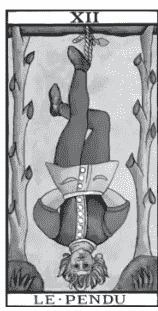

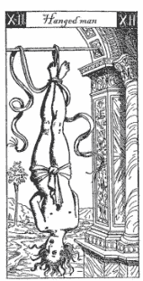

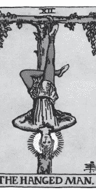

##### 主角人物

吊人：一位被倒吊的男人，大约是成年人，年纪通常不太大。男人悬挂于架上，他的脚被绳子套住，绑在横杠下倒吊，身体悬空而姿态奇异。主角究竟是自愿或被迫上架？是甘愿奉献的人还是承受自身许诺的代价？是做为牺牲者或是祭品而被无辜吊起？是受罪伏法还是代罪羔羊？甚或是为了练功而苦修？这是历来塔罗界的长久纷论的议题，而每种桥段各有其不同的诠释，从画面中人物的面貌神情和身体姿态或许能够看出究竟。

##### 场景佈置

倒吊者不着地面而悬在空中，身倚树木或柱架，他可能荡在刑架间，也可能在其他场所。背景可见天空的颜色，远景依情节需要而变化象征景物和颜色。

#### 样貌外观

早期塔罗中受罚或抵罪消灾的吊人，应可看出承受苦难或是昏厥的感觉。若是为了牺牲奉献，或是神秘功法的修习，这位被倒吊的人就显得很特别，眼神迷离难以捕捉、甚至像是陶醉沉浸，他的表情没有痛苦或是不悦，反而像是一种满足。大多数塔罗会着墨在吊人的头部，笼罩着一层光芒，或者以背景的色调差异做出空间区隔。这个色泽或光环：代表能量的引导和聚集，象征吊人的崇高精神或救赎的力量。

#### 动作姿态

倒吊，是最特别的身姿，何况主角人物又维持着奇怪的姿势，让人感到更加神奇。其实这个姿态不仅是练功动作的展现，也蕴藏着心境的呈现。一般基本的姿态大致是：吊人双手往后背，一腿弯曲与另一脚交叠，表现得泰然自若。各种塔罗因功法和招式不同而会小有差异，因而双脚如何交叠各有不同，而双手在背后如何互动更不得而知了。不少有创意的塔罗牌或许会画出更特别的练功姿势。

#### 图案符号解码

##### 服饰装扮

身上的穿着通常两截分明，上衣和裤子的颜色，多形成鲜明对比。上半身颜色显示精神状态，下半身显示具体现象，精神与物质居于上下的顺序也有很多可以诠释的空间。少数塔罗是裸身上阵，强调浑然一体融合于自然。

吊人身上较少饰物，但是多系有腰带，不只为了分别上下半身，代表被神秘的宇宙能量和运作围绕，这点与魔法师的腰带有异曲同工之妙。比较奇异的是，倒吊者的头顶朝向地面，使得头发往下垂着，然而身上衣服却没有明显垂下的感觉，或许可以看作是他的精神力使然的超自然现象。

##### 道具配件

这张牌比较少道具配件，然而吊起主角的绳索，是绝对不能忽略的。通常是一般麻绳的材质，有些牌会以绳结捆绑的模式和形状，透露出一些隐藏的讯息。有的绳索是蛇的造形，或者就是真的蛇，用以象征神秘能量运作和联结的作用。

有一些塔罗画出从吊人身上掉落的物品，多半是代表金钱的硬币，这个现象隐喻在倒吊的时候，会牺牲和丢失原本拥有的东西。

##### 相随配角

这张牌画面很特别，不太需要配角来丰富情节。如果一定要找出来的话，那么悬挂主角的吊架应该能算得上，它有各种不同的“款式”以配合主角被吊起来的主旨，究竟是练功还是献祭、是救赎或是受罪。所以吊着这个人的可以是绞刑台或刑架，也可以是其他木架。而木架的造型有十字形、T字形，或者H字形、拱门形等等，甚至直接显示希伯来字母的形状（如n），功能和象征都有差异。像是有些吊人倚靠的是活的树木，甚至强调是有灵性的，且能帮助补充能量，两者互相依存修炼；这样的活树刑架通常是T字形，才能在中间有树干而让倒吊者能够倚靠。

##### 整体营造

吊人被悬吊起来，全身凌空且倒转，以绳索绑在脚上系于木架之下。而身体倚靠或不倚靠树干有不同的作用或涵义。架子之后是广阔天空的景观，有呈现或对照吊人的心情性格的作用。若是被吊于悬崖山谷之间的设计，更是让人惊心动魄。

> ## 阅牌要领提示

这是最具有塔罗特色的代表牌，被吊的主角上下颠倒，呼应和提醒了塔罗牌具有逆位的特性。因此每位塔罗牌创作者都会精心规划这张牌，内容设定也相关于对塔罗本身的看法如何，并且会呈现出这副专牌的神秘程度，以及有无蕴藏深入的神秘学要旨。

## 13 死神 Death

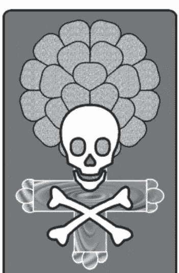

#### 牌序结构

第十三阶大秘仪一
超过12循环的结束，获得重新开始，也是新层级前半部的中间阶段。

#### 各式别称

死亡、死神之舞、持巨大镰刀的骷髅。国王之死、革命。
伟大蜕变者之子，死亡之门主君。

### 正 当机立断 逆 真正重生

#### 秘仪原理解析

#### 数字对应

13一向是死神的代表，神秘和灵界的数字。加总基数4为阴性数字，更可联结地底的国度。3在此呈现精神面，与1的生命能量同被4压抑而潜伏。1和3都是阳性数字，具强大威势的变革力量；1、3的并列，表示与自身的灵性沟通，也象征生命形态转变的灵体运作。这张秘仪蕴含了这些数字寓意，是表达死神的最贴切代码。

#### 象征法则

死神带来人生的终结，生命的转化和蜕变，有如各种事项以任何形式结束。不愿意或难以接受的残酷事实，皆有如面对死神来临的心境。这样一种将地面铲平的强大力量，更象征着斩断、割舍、以及了结一切的运作。也代表某些特殊的精神状态，像是空境、无意识、死寂意识、跨越阴阳界。

##### 内涵探索

死神，是一种绝望的心境，走到绝路的切身感受。而这沉痛的体验，正是下定决心的契机，在痛定思痛之下而来的醒悟。铁了心面对、有如与死神共舞，始能“当机立断”挥别过往一切。不再抱存希望地真正割舍，从而得以有所革新，犹如一种再世为人的心情，由此延伸为重生、转化、蜕变的景况。这张牌在占卜时，都可解释为各种事件和发展上的结束和终止。

##### 正位实占解释

**人际交谊：** 在某些圈内处得不和，关系可能闹僵。情谊到此为止、分道扬镳。

**恋爱情缘：** 感情遇到了休止符、骤然画下句号，面临分手、离异、关系终结。

**事务进行：** 执行遭到中断或终止，计划半途而废。学业中辍，革职或离职。

**金钱物质：** 物质毁坏，金钱损失，财务穷途末路。倒帐、跌停、面临破产的可能。

#### 牌义沿革解疑

##### 来历变迁

- ★古塔罗除了以骷髅为死神，表达死亡意义之外，也象征改变和转化，并一直都包含国王之死，伟特诠释这张牌隐含有革命的意义。
- ★神秘学家加入了炼金术内涵，以及生命之树提升等修炼法，使得这张牌的层次更加丰富多元。
- ★伟特对画面做了更动，修改为启示录的相关情节，将这张牌带入世界心灵提升的境界，表示低层至高层的进化，以及生死意识。伟特的占卜定义已经和现在颇为接近：结束、终止，但却又包括损失、毁灭、破坏。
- ★伟特稍后时期，承袭了这些意义，更强调蜕变、更新、重生、以及新阶段的开始。且清楚地强调这张牌代表的不必然是肉体的死亡。
- ★现今的解释多不包含死亡，也无恐怖色彩。重生和新阶段归到逆位意义中，而正位意义集中在：突然的转折或激烈的改变，以及关系、阶段、际遇的结束。

##### 正逆转折

- ★伟特对逆位的定义，是以“逆位削弱原则”推至“不是很彻底的死亡”这个方向：不活泼、睡觉、昏睡、昏沉、醒不过来、茫然、发呆、僵化，以及梦游病。
- ★伟特稍后时期，逆位置定义有了改变，是较为合理的“不彻底的转变”之意，包括：局部的改变、迟钝、停滞、执着。另外也有尽力阻止走向结束的意味：严密避免重大事故。

##### 逆位思考

如今逆位的定义运用可以更有深意，以“逆位超越原则”思考而推得：彻底重生、到达彼岸，已走过低谷与黑暗、更为接近崭新的生命。也有的想法认为逆位代表躲开或逃离死神的阴影，或者心态上逃避面对死神。死神逆位，即是远离死神影响和其相关状态，据此往前回溯或往后推移，都是解释的方向；而无论哪一种推衍方式，结果都是已经重生或已走向另一条路，拥有不同的生命和方向，即将进入新的阶段，从而获得“真正重生”！

##### 逆位实占解释

**人际友谊：** 历经一场伤害之后，重新看待、重头来过，或可迈向新局。

**恋爱情缘：** 安抚伤痛情绪，转化重生。走出自己的道路，开创新天地。

**事务进行：** 接受了事实之后，迈出步伐、向前走出去，重新再来或另辟蹊径。

**金钱物质：** 认赔了结之后，重振旗鼓。采取新的路线卷土重来。

#### 画面寓意解构

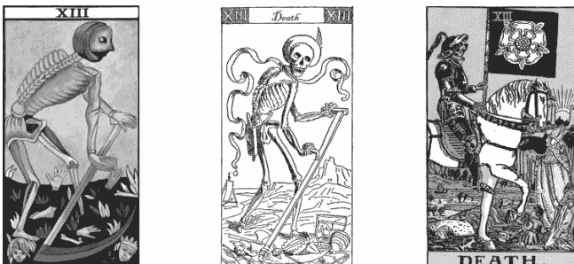

##### 主角人物

死神：骷髅外型的死神，有时候身披斗蓬，也有些牌的骷髅装在盔甲中。骷髅手执镰刀收割头颅骨骸，或者骑马前行高举大旗，宣告死亡降临。死神有一类只拿镰刀而站立，并没有骑马；另一种是从“启示录”骑马举旗而来，也就没有亲自带上镰刀了！

##### 场景布置

周遭地面躺着许多人，或是陈列着头颅，代表他们濒临或已经死亡，国王是最早被割猎的。也有套用启示录末世情境画面，但仍加上作者的想像和设计，因而背景构图繁复：高山层叠而河流穿越其中，河上甚至还有船只航行，远景依稀可见双塔以及地平线上的太阳。

#### 样貌外观

死神空洞的双眼，以及面无表情，让人感到恐怖诡异。这当然不代表活人的外貌，但是仍然会有表情，有时候画成像在笑的模样而露出牙齿，好似正在讽刺人类无能抵抗死神的力量。

#### 动作姿态

死神收割头颅的动作，有时像在割草般，正刈着露出地面的人头。有的牌会将死神画成类似跳舞的姿势，或许对死神而言这算是丰收的喜悦，而其实也是要呼应欧洲中古的“死神之舞”。不拿镰刀更不直接割取头颅，骑在白马上的死神，高高在上而阔步前进，如同一种示威和巡行，通常高举着死亡大旗，并喜爱配戴白花。

#### 图案符号解码

##### 服饰装扮

有些画法并无蔽衣，骷髅骨架直接暴露在外，呈现死亡的真实面。有些画法的骷髅披戴着衣物，只露出面颊颅骨。

- 斗蓬：营造神秘，黑色表示肃穆沉寂。
- 全身盔甲：象征无坚不摧的力量，并包裹隐藏身形。
- 头盔：上面的羽毛多是红色，是精神能量凝聚的形式。

##### 道具配件

镰刀：收割头颅专用的死神镰刀，这是死神最重要配备。
旗帜：有的死神会揭举死亡旗帜，通常是黑色大旗，象征瘟疫、生命终结等意义。而白花时常呈现在死神画面中，位置和呈现方式多变，通常是绣印在旗帜上面。除了做为丧花之外，更有着净化生命和灵魂的寓意。

##### 相随配角

在死神脚下，整个领域内任谁都称不上主角，因此原先在地面上的要角人物，都屈居于配角。传统塔罗以地面上的头颅或面孔来表示已经死亡或被铲除的人，多有其代表的角色地位，像是君主皇帝、教皇主教、商人富翁等等不一而足。

有些塔罗像《伟特塔罗》的构图，地面上不是人头而是完整的人，包括：皇帝、教皇、女子（力量之女）、小孩（太阳之子）。这些人可能来自其他张牌，在这里却担任诠释不同角色的作用：他们同时面对了死神，有人求生、有人已死，各有不同的个性和表现。

另外，也不要忽略了有些牌中，死神的坐骑是铁蹄巨马，巨大马匹代表强大的力量，而白色具有净化和精神的象征，因而这匹白马就表示了精神净化的力量。

##### 整体营造

死神出现在荒垠，象征生命的战场，气氛肃杀而满目疮痍。背景显得十分辽阔，是为了编织未来的许多可能性。有近景和远景的层次，这样的画法可以表达更深远的涵义。

《伟特塔罗》整张牌图的戏剧性超强，光是背景的营造就引人很多联想空间，而主场景的许多配角，男女老幼在这张牌里一概做为陪衬，却营造了丰富的故事情节。

> ## 阅牌要领提示
这张牌当然是代表生死观、以及生命态度的一张牌，涉及严肃的议题又具伪装性。其实这样的牌是看创意的，主题设定的发挥空间很大。也因而向来受人注目，更是必先了解究竟“长什么样子”的一张牌。

## 14 节制 Temperance

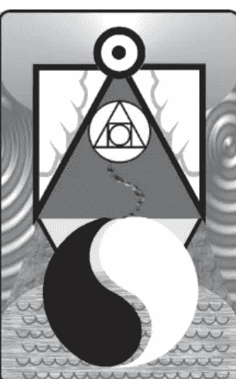

#### 牌序结构

第十四阶大秘仪一
新层级的稳定和确立，并超越各种循环体系，为第二周期的总结，同时进入第二层级的真正发展阶段。

#### 各式别称

调节、调和。艺术、炼金术，修练法门，至道。
调和之女，天使、灵体军团。生命赋予者、疗愈者。

### 正 至高真谛 逆 火候失准

#### 秘仪原理解析

#### 数字对应

14象征修炼和提升，4代表规范，是朝向进步和提升所需，1在其旁是观照的自我，1和4都是统合元素的作用，加总为流通的5，融合为更高层级的变化之道。灵数的几何原理在此运用于14，单一的点外于四点的平面，此即金字塔的奥秘—超脱的第五元素凌驾世俗的四元素。塔罗系统由此以14号代表节制这张秘仪，表示真正的修为。

#### 象征法则

象徽调和守恒的自然规律，高度循环的神圣平衡。是一种意识修持、元素的转化，因而与炼金术特别相关。高层次的修炼、追求更美好境界的觉醒、提升和净化的意识皆源于此。各领域中形塑风格和达成高乘素质，必须体悟和深谙个中原理，可知节制就是“道”，是最高指导原则、是黄金律、是精神炼金术，特别代表转化、治疗与超越。

##### 内涵探索

节制，在人生体验中修炼。维持觉察的意识，凡事追求更晋一级的境界，懂得美感的讲究和完美的坚持。培养对于万物的关怀，从物质的微妙而触探心灵的奥秘。秉持“至高真谛”，必须逐步深入了解而掌握精髓，透过长期修习始能达成提升。节制在各层面都美好调和，代表人际的和谐互动，营造双赢局面，以及身心灵的融合交会。

##### 正位实占解释

**人际交谊：** 良好的互动和情谊，沟通顺畅。有利的交流、共享、双赢。

**恋爱情缘：** 爱情关系美好和谐，真心分享、使感受更加深刻，各层面都有契合，彼此一起提升，达到水乳交融的境界。

**事务进行：** 懂得调节、规划安排，进度十分顺利、有效率，学业、事业都能提升。

**金钱物质：** 善于经营运用之道，不但能成功获利，更能充分利用发挥。

#### 牌义沿革解疑

##### 来历变迁

- ★这张牌一直都是高层次的内涵，向来最受神秘学家青睐，画面图案也随时代演进，炼金术的神秘意味愈来愈浓厚。
- ★伟特提升了这张牌的内涵寓意，但对占卜意义下得很简易，正位为：节约、简朴、经济，并关于管理和经营，以及关系的适应和容纳。
- ★伟特稍后时期意义相差无几，然而更为丰富，正位意义为：透过自制、和缓及耐性等原则而达到成就，了解经营和进步之道，并更强调和谐与融洽，以及各种关系的结合互动交流。
- ★以上这些作用延续为今日的一般涵义，然而更多元化的意义正在增加，朝向精神指引、能量循环、高层次的真理这些方向来解释。对于神秘内涵的追寻以及内容的深度，仍然持续在开发中。

##### 正逆转折

- ★伟特原本对于逆位的定义有：不幸的结合、分离不睦、利害关系的对抗争夺。但他还加入了些许特殊的项目：教会相关事宜、宗教信仰、宗派、神职等等。
- ★伟特稍后时期，舍弃了这些对于占卜作用不大的特殊项目，延续了各种不调和状态的部分：利益冲突、互相敌对，无法与人共事、对了解他人有困难。另外，还包括了缺乏耐性以及贫瘠、不育等作用。

##### 逆位思考

如今逆位的牌义，主要依循“逆位不当原则”，采取各个项目“不调和”的方向。也以“逆位削弱原则”朝程度不足、层次不够的方向来解释。占卜上的逆位解释，就是事情的成果评价并不佳，也可说是由于不了解做人处事的黄金律而造成的。当然控制不妥也可能是行为过度，这就牵涉到“逆位过度原则”，也就是削弱或过度都有可能导致问题产生。相对于正位置高段境界的炉火纯青，节制的逆位表示尚在拿捏摸索的阶段，因而总是过犹不及“火候失准”！

##### 逆位实占解释

**人际友谊：** 沟通不良或相处不融洽，有时被排挤在外，对交游不得其道，可能由于向来故步自封所导致。

**恋爱情缘：** 感情中常忽略了关键的契机、失去美好的感受、彼此之间缺乏默契、并不真正了解对方。

**事务进行：** 因为不懂得个中之道或是技术不佳，遭逢许多阻碍或各种摩擦。

**金钱物质：** 未掌握到理财之道，做不到开源节流，帐面混乱，易平白流失金钱。

#### 画面寓意解构

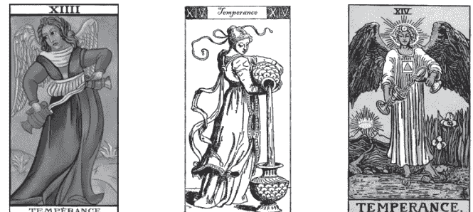

##### 主角人物

节制天使：偏向中性的神圣人物，高层次修为的形象。节制天使以奥妙的姿态，双手持瓶互相倾注，正在调和其中的炼金术神秘液体或仙丹灵药。

实际上一般塔罗中的节制牌还是有呈现出主角的性别，只是不见得那么明显，多数的牌都偏向女性，而少许牌则偏向男性。

##### 场景佈置

场景设计较为特殊，搭配人物姿态，几乎融而为一体。节制牌的画面要点是在水流和陆地的交接岸边，而旁有花草、后有树木等植物相衬。

多半会在远景中选取一个角落特别着墨，隐约表现出这张牌的专属深意，这个构图也就成了节制的象征标志。像是《伟特塔罗》的画面中有道路通往远山，此处蕴有黄金太阳曙光，以暗示炼金术的智慧之光，这是一种达到“最高真谛”的隐喻。

#### 样貌外观

节制天使是调和的化身，天使显露出安祥平静的表情，眼神平和而带着隐约的微笑，旁若无人地专注于手中的操作。他的态度祥和安宁，表现出一种谦卑的信心，也是一种修为的体现。

#### 动作姿态

节制天使大致是站立的姿势，一脚在岸边陆地上，一脚伸进水里面。这种神秘的姿势，是一种入定和超意识的状态，也是让意识接通不同次元的方式。双手各握一个法器，互相倾倒着圣水，并且滴水不外露。虽已是世外高人，仍然聚精会神地认真操作、心无旁骛。大多数塔罗都不出这类画法，几乎成了节制的招牌动作，连整个场景和许多设定也须配合。个别塔罗在这个制式化中仍能展现更多细节变化，少数塔罗也可能另外设计出别种独特动作，这些方式都可增添这张牌的神秘奥妙之感。

#### 图案符号解码

##### 服饰装扮

如果主角设定为天使，大概都是很制式的装扮，通常穿着一身洁净纯白，长袍及地而具有折摆，当然不同的塔罗仍会小有差异。多半注重主角的发型和头饰，额上有太阳或是金圆圈符号，象征智慧或第三眼。

胸前的神秘学符号是重点，在这位置代表心胸或气脉中能量的提升。而符号本身的涵义自需探究，一般是七角形或是四方形加三角形的符号，为炼金术内涵的物质升华和质变象征。身上多会有隐约的附加饰物，形状也都是神秘符号，用来增添象征涵义，需各别针对符号意义去解读。

##### 道具配件

两只圣杯或其他器皿，由主角左右手各持一只，以一对成组表示阴阳协调和交流，不过也有持单一器皿或相应用具的设计。圣杯代表水元素、象征精神承载体，也是炼金术专用的器具。圣杯或器皿的形状和颜色，与其在炼金术中的作用相关。当两只杯身不同颜色时，要特别注意是一组对比的涵义。

两杯之间的液体是关键奥秘所在，可说是神秘元素、也可视为玉液琼浆；在节制天使身前神奇地流动，是一股抽象的能量、也是具体的物质，既存在于体外、也暗喻体内运行的气。

##### 相随配角

节制牌大部份没有配角人物，也不一定有动物。如果有动物的话，就是炼金术画面的象征物，表示物质元素的精神在炼金过程中呈现。

这张牌中多半会出现的是植物，最典型的是鸢尾花，代表精神层次的美感。不同的花和颜色，都可以依据特定象征或一般花语来解读。

##### 整体营造

环境清新、气氛幽静，主角人物和背景须调和一致，不只是动作姿势具独特性，器物、穿着、场景等各式设计几乎都成了标配，缺一不可而难以更动。一切的配合都是要营造出成功状态，而且这张牌需从整体画面观察方能看出奥妙所在：早晨般和煦的光芒色泽中，“黄金黎明”浮现于场景之中，更瞥见主角额头上的符号和朝阳呼应，这个联结隐喻了意识与超意识的相应，象征朝向智慧和修为的提升，达到炼金术的最终目的、提炼出最高智慧的精神元素，也就是成为与太阳能量相呼应的高层意识。

> ## 阅牌要领提示
节制是塔罗的最高指导原则，自是不容忽略的一张牌。虽然各式画面乍看之下大同小异，但如此更能突显特殊之处的令人惊艳；况且正是需要观察入微，才能由此见到真章。如果在意塔罗至高真谛的奥妙，势必会重视和关注节制牌的。

## 15 魔鬼 The Devil

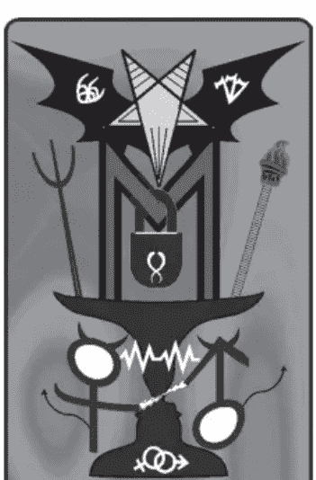

#### 牌序结构

第十五阶大秘仪一
第二层级前半部的完成，第三周期之始，潜入深渊探索底层的阶段。

#### 各式别称

恶魔、魔王。撒旦，巴弗灭，猥亵的野兽。
物质之门主君，时光力量之子。

### 正 欲望深渊 逆 挣脱枷锁

#### 秘仪原理解析

#### 数字对应

15是魔鬼的专属数字和魅惑的展现，1的自我能量加上5的活跃，结合起来动力特强而转化为欲念。5的精神力和1相互干扰，呈现出极度的放纵，加总基数6涵义中的缠绵悱恻，转化成耽溺沉浸而受到牵制。6本身一向也被视为魔鬼的相关数字，15就是其藏身的变化。灵数6本代表爱，却成了诱惑的滋味，或许这就是魔鬼的试炼？

#### 象征法则

源于内在的欲望与来自外界的诱惑，有如强力的吸引或融合，是关系之间的交缠和捆绑。黑暗的魅惑使阴影逐渐茁壮，直到被心中生出的另一股力量所控制，进入沉溺而无法自拔的境地、受役于物的局面。另外亦代表故弄玄虚或神秘诡异之事物，着魔、蛊惑、甚至卡阴的遭遇，也相关于念力、魔法和神秘能力。

##### 内涵探索

魔鬼，表示人的欲望层面，也是精神与物质的另一种关系。魔性总在不知不觉中成长和共生，一旦不慎恐成魔鬼代言人，甚至沦为欲望的奴隶。对黑暗面必须加以探索，而不是逃避或忽略掩藏，惟有身陷其中的体悟，往“欲望深渊”深入探照，才能真正有所觉察。这张牌显示了一些人性中的黑暗面，以及社会阴暗角落呈现的事态。

##### 正位实占解释

**人际交谊：** 对他人心怀鬼胎，萌生不正当的意图，不是很单纯的往来。

**恋爱情缘：** 暧昧关系、晕船情态、纠缠不清的孽缘。执迷不悟、互相折磨束缚，欲望重于情感，或许关系已经变质。各式不被社会认可的恋情。

**事务进行：** 想要一步登天、不肯按部就班、不遵从规范行事、图谋不轨。

**金钱物质：** 怀有贪欲，使用手段获取。以投机方式赢得，从非法途径获利。

#### 牌义沿革解疑

##### 来历变迁

- ★这张牌的字面意义似乎已经定下了占卜意义，但魔鬼随着时代演进，诠释观感也不一样，就如同画面也一直有所改变。
- ★有些神秘学家将内涵加深，成为某类神秘功法的练功姿态。
- ★伟特承认以往神秘学家的变革，然而仍将魔鬼牌定义在黑暗面，正位占卜意义都是负面作用：伤害、暴力、劫数、意外、变故等。

## 魔鬼牌

★伟特稍后时期：正位意义仍没有改变多少，更着重在：没落、毁坏、无法实现理想、始料未及的失败，而这些遭遇或许是考验和警示。另外，也包括一些玄怪神秘的体验。

★如今，魔鬼牌的正位意义锁定在欲望，黑暗的心态和行为，探其缘由为受到引诱而被控制，因此失去自我。而不合常轨的行为和恋情，情况如何判定，其意义随时代而变化，且诠释也是占卜师导向的，关键在于对这些层面的理解和观感。

##### 正逆转折

★伟特对于逆位定义颇为模糊：邪恶、命中注定的、虚弱、卑鄙、盲目，和以往一样，这些意义与正位置的区别并不大。

★伟特稍后时期，开始分别正逆位差异，并使用“逆位超越原则”，推行为：摆脱束缚、抛弃枷锁。另外也运用“逆位相反原则”，相对于正位置的结合力，将逆位解释为分手、割断纠缠。

★晚近还有相对于堕落欲望而朝向精神提升的解释：克服欲望、不再贪求、悔悟或认清自我，达到精神体悟和提升。这看来已经用到“逆位超越原则”了。

##### 逆位思考

对魔鬼牌而言，“逆位相反原则”几乎等同于“逆位超越原则”，而这些推衍方向，也是沿用至今的最常用法。魔鬼已是负面意义，通常逆位不用再往无限沉沦的方向推论，而应该指开始挣脱这样的情境，虽然由此可能产生另一种痛苦与矛盾，也不一定就能达成目标，但总归有“挣脱枷锁”的醒悟，至少是个心念的萌芽。与吊人逆位的类似点在于都是跳离，然而个中旨趣却截然不同，毕竟在正位置的起始点就已经天差地远了。

##### 逆位实占解释

**人际交谊：** 摆脱一段不好的关系，或远离小人。不再同流合污，脱离、撇清、切割。

**恋爱情缘：** 幡然醒悟、不再沉迷，解开内心纠结、挣脱枷锁，萌生割舍的念头。

**事务进行：** 反悔以往作风和心态，内心一番挣扎，踩下煞车、试图回到正轨。

**金钱物质：** 了解进财方式不当，开始抽手、不再贪婪。改邪归正、补偿、赎罪。

#### 画面寓意解构

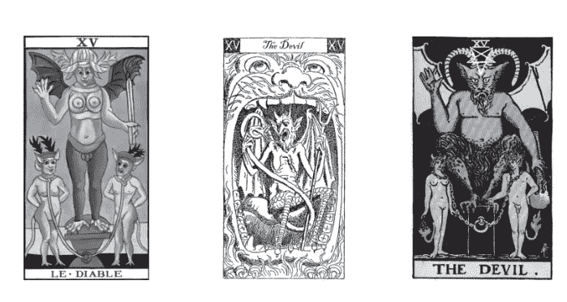

##### 主角人物

魔鬼：长着双角和翅膀的恶魔首领，欲望和黑暗的主宰。

多半的牌中都另有被魔鬼禁锢的人类或小恶魔，魔鬼在祭坛上张牙舞爪，操控两个堕落的灵魂，或是独自借着烛火炼功增进魔力。

##### 场景佈置

魔殿是深沉黑暗的境地，犹如欲望国度的城堡，位于地底深渊或地狱的底层。

#### 样貌外观

魔鬼的表情似乎多不正派，通常被描绘成邪恶的神情或笑容，有时还增添恶毒戏谑的眼神。只有少数的塔罗较不丑化魔鬼，这时长相会稍美观些。魔鬼大部分在头上长有一对角，有长的也有短小的。脸形多呈现倒三角，甚至连同耳朵和角组成倒五芒星外型。

两个人类或小鬼头，则是彼此相望，却似不知魔鬼的存在，互相之间有联系力。他们俩似乎是一对、可能算是恋人，或许另有前尘纠葛、但已恩怨难明。他们的神情显得无奈又甘愿、执着又逃避，这些表情和姿态，需要依情节设定而变化。

#### 动作姿态

魔鬼蹲坐在魔座或祭坛之上，他一手高举起来，做出施法的手势，这姿态很类似于教皇，但却是一种魔力作用。魔鬼的另一手握着火炬，向下垂着让火势更旺，或者是让火延烧那个傀儡。被操纵的若是两个人类，可能男人被烧到尾巴而痛苦、而女人闪避畏缩，也有的画面是两人无视自身的处境。

少数的塔罗中，这个魔鬼呈现的是一种魔法的秘密修炼姿势，以此盘坐着。不过多数塔罗并不愿表达魔鬼的神秘高能。

#### 图案符号解码

##### 服饰装扮

魔鬼多半是没有一般衣装的，表示缺乏专属于人类的羞耻感。上半身光滑地裸露着，而下半身被身体长出的浓密兽毛覆盖着，以丑陋不堪来表现魔鬼的原始和兽性。也有些牌的魔鬼，身上覆有鳞片肤质衣，表示具有如蛇般的神秘性，或者暗指蛇的化身。这些变化都不外乎是魔鬼可能具有各类动物的表皮，但不会是人的。

倒五芒星：虽然已经以脸形呈现了这个形状，但多半还是会再画出这个符号来，位置大都位于头的上方。

##### 道具配件

火炬：是魔鬼所拥有的配备，是黑暗的权柄。火焰：在火炬顶端燃烧着，能在黑暗中集中光亮，是能量的凝聚，而在这里象征着欲望之火。

烟雾：来自于火炬，制造乌烟瘴气的效果，但有的是配合蜡烛而有不一样的解释。烛香：有的塔罗牌中，魔鬼的中央会点燃蜡烛或熏香，也呈现了幽微的火光和烟雾。这是修炼的魔鬼所运用的法器，位于身体腹部中间；有时也做为魔鬼的配件，用以取代火炬。

锁链：表示很难斩断的关系，被铐住脖子也就是孽缘般的套牢。有时以其他工具表现，像是绳索或人偶线，都具有类似的象征作用，表示控制和操纵的关系。

##### 相随配角

原本恋人牌中的主角人物，在这里变成了配角，终究失去独立性，不过一样有其重要的作用。况且谁是主角谁是配角是很难说定的，因为魔鬼也不过是人心生产出来的产物。这两人的姿势变化很大：有的画得像是甘愿被奴役，有的呈现惊慌或抗拒想逃的姿态，他们多半被枷锁套牢，而有的塔罗会表现将他们当成玩偶魔鬼操控的动作。

有的牌画面中出现的不是人类，而是小恶魔的形态，正式沦为魔鬼的附随或下属、沦为真正的配角。也可能有少数的牌配角数量更多，于两人之外再添加小鬼等构图。

##### 整体营造

营造出魔鬼与男人、女人，三方之间相互控制、主从难分难解，耐人寻味而诡异的关系。黑暗的紧张诡谲、浓郁沉溺的色调，是欲望与潜意识、梦境、幻觉的呈现。更高段的构图手法是，制造出混淆视听的效果，呈现和恋人牌、甚至教皇牌颇多雷同之处，如此更能表达出魔鬼的厉害、欺骗世人的手法高超。

> 阅牌要领提示
由画风就可以看出作者对魔鬼的评价，而这就透露出作者心目中对黑暗面的看法和见解，得知整副牌的“正派”程度，是属于保守类型还是开放类型，也能由此评估跟自己的风格是否相搭配。

## 16 高塔 The Tower

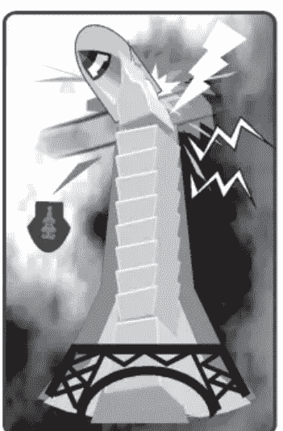

#### 牌序结构

第十六阶大秘仪一
第二层级后半部开端，极力向上发展、高度的累积堆叠，面临起落挫折、崩毁坠落的阶段。

#### 各式别称

巨塔、高危塔楼、雷击之塔、天上之火，神力万军统领、战争。巴别之塔、人类之家、上帝寓所。财神之堡、所罗门圣殿。

### 正 震撼激荡 逆 绝地求生

#### 秘仪原理解析

#### 数字对应

16是热力旺盛、升高到极点的蕴意。6原有热切活力，加上1的能量供应互相增强，加总基数7是背后隐藏的智慧结晶，共同建构成巨大堡垒。1和6都有执着与眷恋特质，与7的尖锐形成冲突，暗示潜伏变动因子。变动和能量累积过度时，终将引发摧毁的力量，导致震撼性的后果。这张秘仪设定以高塔为象征，寓意建设成果遭到剧烈冲击。

#### 象征法则

建设与破坏力量的主题：雷霆万钧的动能、万丈高楼的坚固、以及摧毁的变异。表现巨塔与堡垒的建构和组织内幕，面临灾变危难的各种反应和态度。代表遭受严重打击和挫折，骤然的遽变来势汹汹，多年的基础毁于一旦。也象征各种天灾人祸、灾厄战乱，组织或个人遭逢危难局势。代表各方面破坏、倾覆的力量，遭遇空前逆境。

##### 内涵探索

高塔代表毁灭，然而这种磅礴的破坏却也是另一种力量，可借以摧毁执着与依赖。透过现实的“震撼激荡”，在意识中形成觉醒，无论是刹那的灵光或断然的决心。临界点前虽呈现惊恐、焦躁和暴烈状态，也可能是身逢绝境之后的顿悟、内心的透彻了然。揭示走向颓势的注定或偶然、成住坏空的阶段演变、经历塔楼兴起又楼塌的感触。

##### 正位实占解释

**人际友谊：** 互相抵触冲突、纷争不断、关系决裂，作用力可能牵连甚广。

**恋爱情缘：** 感情失和、关系破裂，争执吵架、闹到不可开交。分别、离异、绝决、切断联系，问题可能波及到其他层面。

**事务进行：** 严重挫败、惨遭滑铁卢。革职、开除、退学。组织瓦解、公司倒闭。

**金钱物质：** 金钱损失惨重，财务陷入重大危机。大赔、惨跌、亏空，甚或破产。

#### 牌义沿革解疑

##### 来历变迁

+   ★这张牌的意义导向都差不多，一致设定是巨塔正在崩毁。几乎都是藉塔表现“高危”而导致崩塌，而未见只呈现塔本身的坚固宏伟的意旨。
★伟特虽然对这张牌有很多见解，但在占卜意义上仍是简化的，正位意义包含：痛苦、不幸、贫困、劳碌、毁灭、垮台、灾难、逆境。此外还有耻辱，诈欺。

★伟特稍后时期：延续伟特的定义，诠释为：舍弃以往的关系、意外的震撼、失去安定与保障。并重申了前人的意见：观念上的变革，由于突如其来的打击而有所彻悟和改变，打破过往的执着。

★主要牌义上的差异在于认定高塔走向倾塌的成因，最常见的版本是高傲的塔招致上帝惩罚而受到雷殛，然而尚有各种不同来历渊源的诠释，多因意识型态而有差异，并没有固定的正解。

★现今在占卜运用上，即以这些情节寓意直接比拟所问事项，深入剖析解体的起因，并根据问题和牌局，判定倒塌的塔规模如何，以及受到伤害灾变波及的人物是谁。

##### 正逆转折

★高塔的逆位解释一直都需要特别思考和划分，因为就连从翻转的画面来看，也是很难分辨意境差异和“灾情”的轻重。

★伟特定义为：情况类似正位而程度较轻微的破坏，这就是明确的以“逆位削弱原则”来推衍。然而也指出是正位的情况而有导致的因素存在，这说明了逆位实已历经了正位的情境。

★伟特稍后时期，延续伟特的意义：持续受到压迫和限制，因循旧有习性，无力改善现状，精神不愉悦，是一种跳脱不开的情境。

##### 逆位思考

如今的解释有两大方向，一为“逆位相反原则”：塔在逆位并没有猛然倒塌，相反地是由于太过于稳固了，导致就像被囚禁一般。二为“逆位超越原则”：竭力阻止崩毁、脱身逃逸，或者在残破废墟内求生。而建议思索方向为：危难已经来临，那么是否也只能豁出去了？高塔的逆位，就是在倾毁中以最坏的打算面对事实，或者是以彻底的决心脱离险境。至于结局如何，就要看问题和牌局，由整体状况来决定了。无论往任一个方向推导，逆位的境况都可说是“绝地求生”！

##### 逆位实占解释

**人际友谊：** 关系破裂后的相处，减轻伤害或掩盖问题。阻止冲突事端爆发。

**恋爱情缘：** 力图挽救破碎的感情。闹翻、决裂之后的接续处理。

**事务进行：** 残局的善后。避难、逃离险境。力挽狂澜、避免遭受更大的损害。

**金钱物质：** 严重耗费之后，如何生存或恢复元气。竭力降低损失。利空出尽。

#### 画面寓意解构

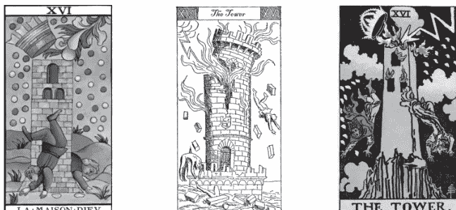

##### 主角人物

画面中高大的塔危顶耸天，触雷而掉落顶部王冠，塔身起火冒烟，塔里的主人因而坠落塔外。

塔与塔主都可算是“主角”，塔主多半有两位，是一组配对人物。如果为一男一女，则代表情侣，可以视为皇帝和皇后；如果两人都是男子，则分别代表政教首领，那就是皇帝和教皇；主要必须有一位代表世俗的皇帝或国王，另一位也可不代表宗教人员、而是国师或臣下。

##### 场景布置

塔本身座落于高危之地，高地上的高塔又耸入云霄，可见危机早已存在，如今只是爆发。

高塔遭受雷击而倾塌毁坏，场景浓黑气氛紧张。

#### 样貌外观

塔是坚固的堡垒，多是砖石构筑的建造物。塔顶尖耸，有的牌则画上王冠为顶。此时的状态是正受到强力冲击而毁坏中，着火、裂解、坍塌、崩坏，终成壮烈而惨败的塔楼。不同的呈现手法表示灾难型态的不同。

两位人士的面容，自是遇难时的惊恐诧异。

#### 动作姿态

闪电击中巨塔顶峰，这个动作比拟在人身上，就是如雷轰顶，代表内心受到打击震撼。

塔正在坍塌分裂，并起火而冒出浓烟。

两人是跳下来或被抛出的姿势，双手四肢伸张摆动，呈现惶恐和惊讶，充分表现他们的措手不及。

#### 图案符号解码

##### 服饰装扮

从塔身掉下的两位人士，身上的衣着完整但显得狼狈。坠落者身上的装扮可供辨认他们的身份：或许头上还顶着王冠，显示出原本是王者，而其他帽子也能看出职位。不过多半在坠楼中，王冠或帽子也跟着从头上飞落了。

当然，所有的冠冕之间都是互有呼应的，包括塔顶的大冠在内：有些牌将塔顶设计成一个大王冠的样貌，这也算是塔的重要配备，这顶王冠象征着物质和现实面智慧的尖端，也比拟人的尊严和面子，而人物所戴的冠冕也有相同的寓意。

##### 道具配件

那道摧毁塔的闪电，或者天火，可说是神的工具，是惩戒人类的武器，也可视为自然的力量。可以用来象征意识中脑中的灵光乍现，由于雷电多半击中塔顶，这部位可以比拟为人体的头部，犹如五雷轰顶的写照，让人不得不觉悟清醒。而被雷掀翻掉落的巨大王冠，比喻被指出的祸首或罪旨所在，也是首先该扬弃的执着。

在倒塌和崩落中自会升起浓烟，熏天的混浊加深事态的糟糕程度，也湮没了不多时的清明片刻，比拟为难逃的魔障、笼罩的戾气。有的牌会添加其他落下的物品，是原本拥有而如今正在失去的东西。

奇异光点随着落体遍洒，表示神秘的作用力围绕，影响着坠落者甚至整座塔。这些点的形状多半是以“上帝之指”一第十个希伯来字母yod的形状（י）来呈现，表示神意的运作，而这些点笼罩的范围都在神的意旨控制下。

##### 相随配角

若塔楼本身算是主角，那么两位逃难的人士就像是配角了，在这样混乱激烈的场合中，多半没有其他的角色或动物植物出现了。炼金术系的塔罗牌会有奇幻动物出现，竟多身于火海之中或者烟雾之中，可为整体增添更多象征意义。

##### 整体营造

整个画面壅塞，满目尽是疮痍，仰望的视角使高塔更显危险。以闪电等方式呈现出骤然和措手不及，勐烈震撼的感受。塔身裂缝倾塌、冒起浓烟着火，人物逃生或受难，刻划如大灾难般的场面，充满混乱紧张和恐怖。

> ## 阅牌要领提示

塔罗牌中最激烈的一张牌，也是灾难的代表牌，格局庞大的“塔”，主旨和画面各种牌都不会相差太远，只有从塔上坠落的人物有各自差异，而这点不只是细节问题，其实关乎整个构图背后的寓意，甚至全副塔罗的思想和架构，自是值得深入探究。

## 17 星星 The Star

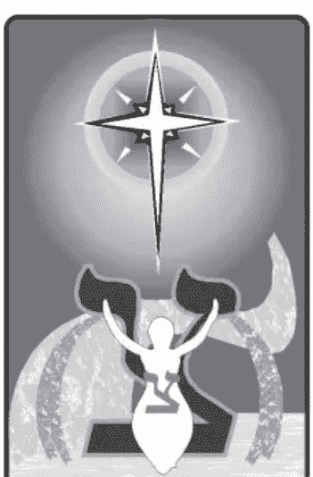

#### 牌序结构

第十七阶大秘仪一
从无中再生有，过去历程的证明，即将达到终点的契机。

#### 各式别称

天狼星，伯利恒之星。女神之星、希望之星、永恒之星。
苍穹之女。内在之光、生命魔法石。灵魂之水、心灵礼赠。

### 正 寄望未来 逆 星辰陨坠

#### 秘仪原理解析

#### 数字对应

17是同时具有美感和理性的数字，也是精神和物质的交界。7呈现出美感和锐利，并将速度意涵转变为光，而1也是孤独之光，加总基数8因而升级为更具精神性的新能量。1和7很搭配，静态的理想和人道的实现，17／8表达出宁静祥和，隐藏而寄托于未来的能量，以遥远的星光为象征，亦为超越时空的精神力交流。塔罗系统中的这张秘仪，于是将这个美丽幻想的数字以星星牌为诠释。

#### 象征法则

星光是黑夜中的光芒，象征心中的希望和期待，是遥远的目标与方向。美丽的光辉象征宁静祥和的现在、以及存在于未来的闪亮日子，这是拯救的心愿、救赎的许诺、一种心灵层面的契约。天上的星星呼应地上的国度，犹如荒漠中的甘泉、一方应许的绿洲，为内心的净地与欢欣的乐土。星星的魔法之光犹如精神的宝钻，是生命疗愈的灵丹妙药，也是内心不灭的明镜。

##### 内涵探索

星星，是心中愿景的表露，是渴望也是理想、是未来的希望。星星怀有最初的梦想，最美与最宁静的显化，发现生机无限并重新孕育。仰视星空“寄望未来”，继续抱持着希望、方向明确、内心笃定，由此更有生命活力，始终坚持以信心和智慧去达成。本秘仪偏向心灵的滋润，对目前实际面的影响较弱，为未来更美好的保证。

##### 正位实占解释

**人际交谊：** 祥和的交谊与关系，温馨和谐的场合或氛围。耀眼的群众魅力。

**恋爱情缘：** 唯美的心灵感情，彼此不是热情如火，却有令人称羡的亮眼之处。

**事务进行：** 事务缓慢平和地进行，未来发光闪亮的期待，成功在望。

**金钱物质：** 眼前实质收获尚少，着重于未来的保障。有利的投资、绝佳机会。

#### 牌义沿革解疑

##### 来历变迁

+   ★古塔罗就致力于表达出希望和真理，成为光明愿景的代表牌。
★伟特对星星牌与其说给予新意，不如说是纠正了几处设定，虽然保留了光明希望的寓意，但占卜意义却加入了一些负面作用：损失、窃盗、自暴自弃，或许是由梦幻不实和蒙昧不明的涵义所推论出来的。

★然而伟特稍后时期，正位置皆调整一致为正面意义：信心、乐观、满足、愉悦、灵感、洞察力、精神上的恋爱和未来的好预兆。另外还代表：过去和现在的时间交织，以及在欲望和工作、希望和成果、爱情和表达上的适度均衡。虽然都不是很强势旺盛的作用，但也都是很美好的意义。星星牌还特别表示占星学，以及其作用影响力。

★现今的解释原则上则是：未来是美好而值得期待的，因而此刻充满了希望，并能够知足及安心。

##### 正逆转折

★伟特对星星逆位的定义有两大走向：一是自大、傲慢，这是“逆位过度原则”；另一是虚弱、无力，这则是“逆位削弱原则”。

★伟特稍后时期，整合了之前的差异，逆位置一致化地倾向负面意义：愿望难以实现，失望悲观，以及运气不好、缺乏机运。感情则不够美好或不符合预期，也有结束分手的意味。也加入其他方面的项目：不平衡和顽强、固执。

##### 逆位思考

现今的逆位意义，以失望和遥遥无期的等待为主要解释，较能与正位置有对比呼应。星星逆位的解释要义在于：期望与实际层面之间的差距悬殊，原来美好的远景竟是海市蜃楼，或者错认了指路的星。无尽的等待，是一种执着、也是一种迷惘，距离现实非常遥远。故而未来已提前知悉，失望和幻灭原来注定会发生，回到现实面后心中将感到极大落差。推行方式偏向“逆位过度原则”，但也都能以“逆位虚假原则”来代入。星星逆位代表总有一天会来到的希望破灭、期待落空，此后心境有如面临“星辰陨坠”般地消沉或心灰意冷。

##### 逆位实占解释

**人际交谊：** 由于过度期待，因而总是希望落空。轻浮的态度、不真诚的情谊。

**恋爱情缘：** 自作多情、错以为是的情感、虚幻的恋情、未来无望的心情。

**事务进行：** 不如预期的进展、令人失望的结局、内心的失落感、成功希望渺茫。

**金钱物质：** 幻想、空谈、画大饼，兑现遥遥无期。对金钱的贪念和欲望、中奖的妄想、投机的心态。

#### 画面寓意解构

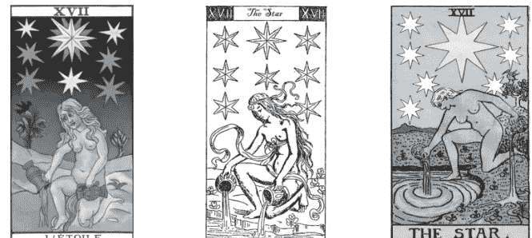

##### 主角人物

星星女神：裸身的美丽女子为星星的化身，女神降世于此。星星女神维持特殊身姿，倾倒源源不绝的生命之水，注入湖泊之中。

地面的星女也可以视为一种“阿凡达”，是星星于人世间的投影和化身。

##### 场景布置

夜空星光灿烂，主星更是明亮。静谧祥和的夜晚，女神降身在宽广沙漠之中，身处绿洲之畔，陆地与水域的交界。远景有些令人惊喜之物或暗藏玄机奥秘，主画面是绿洲的小小盎然。

不过，既然身在绿洲也就表示周遭是辽阔的沙漠，面对看似荒芜的环境，是否仍旧相信所遇即是梦寐以求的甘泉、此地必是心心念念的应许乐土，是否坚信定能开垦出未来的荣景？

#### 样貌外观

星星女神，一直是美丽的、纯真而无暇的形象。女神的神情优雅、怡然自若。天上的星星明亮耀眼，颜色多是萤光黄或银白。星星的数量、大小和排列，都应有不同涵义。尤其星体的形状最重要，星芒数的意义更不可忽略。《伟特塔罗》的画法中：最明亮之大星有其他七颗小星的陪伴，并皆展现为八芒星，主要是呼应秘仪数字17／8。

#### 动作姿态

星星之女多呈现出跪姿，以表示虔敬之心及祈愿之心，倾注水流于湖中，是一种赐予和祝福、期望明天更美好的动作。这种跪蹲姿势表露了抚慰和疗愈的心思，较为贴近于地面和水面也显得更为沉浸其中。星之女一足在陆地，一足在水里面，表示跨越和接通不同次元；这个动作与节制天使很类似，但涉足其中与浅尝即止的态度差异还是能够分辨出来。

#### 图案符号解码

##### 服饰装扮

星星牌主角都是女神，也是闪亮之星，创作者多会投射心目中最美丽的女性外型，描绘在这张牌中。

星之女神是纯洁自然的，多是裸身登场，不假任何修饰遮蔽。发型多半是长发飘逸，覆身甚或直至垂地，发色也多为金发。

##### 道具配件

星星女神双手持着两只器皿，这也是炼金术用的容器。壶状器皿表示具有神秘感，并表示包容万千、内藏无限。器皿的颜色也可能有象征涵义，并暗示其内容物的品质，多配合炼金术的表达法，呈现高贵金属元素的颜色—黄金或白银。

从器皿中倾倒的是生命之水、魔法之水，是神秘元素的泉源，比节制更高层的万灵妙药。源源不绝地倾倒而出，来自女神的哺育，滋润与灌溉生灵；水倒进湖里，使大地和女神形成联结，而女神又自天上来。

##### 相随配角

沙漠中的星星女神通常与埃及有关，那么多会联结艾希丝女神与智慧之神透特的组合；这样场景中就会有一只朱鹭，停落在远方的树上，也仿佛准备再度飞翔。朱鹭或类似的鸟类，是智慧和希望寄托的导引，停驻于此意味着智慧之神的提醒。鸟类也是风元素的象征动物。

远方沙丘上的树木，或许是以往种子的茁壮成荫，无心的种植成长为如今的喜悦。

##### 整体营造

星星牌是宁静的夜晚，充满清馨的气氛，感到舒服美好而有希望。要营造出美丽、亮眼的形象，须象征明星、偶像的典型，又具有温馨疗愈、纯真无邪之感受。黑夜与明亮的并存，干旱与滋润的对比和互相烘托，需要精准巧妙地维系均衡。

星女和天星之间的交互关系也可以着墨刻划，透过水的动线来连接，可拉近或加强距离。

> ## 阅牌要领提示

星星这张牌多会牵涉到异教，由于主要女神都现身了，已经无可回避和伪装。所以也必定会透露出作者的信仰，从中看出对异教的态度。

对一般人而言最重要的是，星星的涵义是美感，这张牌正是美学造诣的代表，也就是重视画面美感的人，可从品评这张牌的美学处理来揣度整副塔罗牌。

## 18 月亮 The Moon

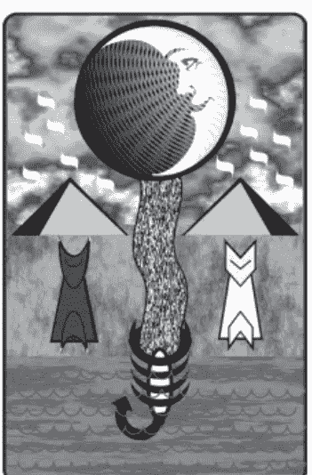

#### 牌序结构

第十八阶大秘仪一
从有之中开始重新孕育的阶段，进入大光明前的至暗时期。

#### 各式别称

月夜、黯月、下弦月、亏月。吠月之犬、阴阳交界。
交感共振，潮汐主宰，强大神灵之神谕。

正 暗潮汹涌 逆 逾越黯夜

#### 秘仪原理解析

#### 数字对应

18是力量强大且变动的数字，充满能量的1与旺盛坚定的8，连同加总基数9也极具动力；在交织作用下相互增强而形成波动现象，其中蕴含着循环的规律。神秘的9在此仍以夜晚为象征，并表示不安的情境，9的热力则隐藏在背后，有如月亮光芒的反射源头即是太阳。1和8皆表示人与天体之间的感应互动，可比拟为潮汐对情绪的作用，来自于月亮的周期节律。这些都是数字18代表月亮和这张秘仪的原因。

#### 象征法则

月亮的阴晴圆缺，代表人世的悲欢离合。全然的漆黑笼罩下，一切景象都是内心的投射。月黑风高的黯夜，象征不景气的环境、黑暗的时代，也代表个人的负面情绪和思维、阴暗深沉的心境、恐惧不安和疑虑魅惑的情境。象征深层的潜意识空间，是欲望的表露和浮现，也有想像和欢愉在其中，可以成为创造力，也可能只是徒然虚妄。

##### 内涵探索

月亮，是情绪的释放和意念的奔驰，在幻境与虚拟的时空中穿梭，能达到神秘意念和魔法能量的境地，然而也能导致疯狂的精神状态。月夜是心中最深处的秘境，底层的“暗潮汹涌”隐不可见，但涨落却悄然发生。月下世界是超意识、集体无意识、神秘领域的探索。这张牌是情境导向的，时而代表心境、时而代表实境。

##### 正位实占解释

**人际交谊：** 人际方面尤其诡谲阴暗，互相猜疑不信任。或许周遭真有小人作祟。

**恋爱情缘：** 觉得感情关系受到威胁，彼此丧失信任感，各怀心结和猜忌。

**事务进行：** 充满恐惧和不安全感、没有信心。环境险恶黑暗，过程曲折不顺。

**金钱物质：** 面临财务危机、难以掌握情况。环境不景气、经济萧条。

#### 牌义沿革解疑

##### 来历变迁

+   ★这张牌的图案其实变化不多，但意义内涵历来却有大幅转折。
★伟特沿袭以往的定义：危险、黑暗、恐怖，以及毁谤、欺骗、迷惑、隐密敌人，几乎已经都着重在黑暗面。他在画面中阐发了月亮牌与死神牌的关联，透露了这张秘仪如此阴森的缘故。

★伟特稍后时期，仍是伟特定义的阐发：朦胧晦暗、暧昧不明、环境险恶。尤其着重在负面的人际关系：心机、自私、虚伪、不光明的行径，甚至是隐藏的敌人、虚假的朋友，狡猾诡诈、骗局，中伤、诽谤。

★从这时候起，月亮牌的正位置就都偏向负面的意义，而逆位置的意义则较偏向正面，这种方式一直沿用到现在。

★然而，最新近的解释，却导向更心灵和精神性的力量：想像、灵感和直觉的开发。这或许是未来牌义的新扩展方向吧！

##### 正逆转折

★月亮这张牌很特殊的地方是，自早期一直到现在，都明显地定义正位置为负面意义、而逆位置较为正面，并且多半逆位的意义是正位的险恶情况有了好转。

★虽然伟特从开始就认为月亮逆位是程度较轻微的迷惑和错误，这应是采取“逆位削弱原则”而得，但伟特却仍保存与正位置接近的定义：不安、混乱、无常，沉默、黯然。

★而在伟特稍后时期，运用了“逆位超越原则”推衍出：识破问题、避免伤害、克服欲念和诱惑、以及轻微的失误。此外还有一点窃喜之意：感觉占到了便宜或是不劳而获。

##### 逆位思考

现今就以“有所好转”的方向，来理解月亮牌的逆位涵义，这样的推行方式以“逆位超越原则”就可以涵盖。思维推敲如下：艰辛地在漫漫暗夜中熬过，如今终于接近尾声，局势已经开始扭转，灾难会接着远离而去，黎明即将来临。这时虽仍未见到大放光明，心境却已经较为安心和放松，只要继续再撑下去，待握过最后的紧要关头，不久就能“逾越黯夜”，开始迎接新的契机，一切都将复苏而且更美好。

##### 逆位实占解释

**人际友谊：** 拉近距离和互信、重新拾回交情。化解尴尬、冰释误会。

**恋爱情缘：** 感情恢复了信任和理解、修补关系、解开彼此心结、将爱找回来。

**事务进行：** 缓慢爬升、有所起色、逐渐升温、提高信心指数。度过紧要关头。

**金钱物质：** 景气逐渐复苏当中，从恶劣局势中好转。财务状况有所调整。

#### 画面寓意解构

##### 主角人物

无人之境，除了月亮之外，只有地面上的动物及冒出水面的生物。月亮散发出光芒，深夜的地面上，有兽类对月的感应吠鸣，也引发水生动物的浮现。

少数塔罗牌以月亮女神为主角，牌面描绘月神的姿仪，多以手捧弯月之姿出现，既然有女神形象出现，此时月亮本身的地位可能成了配件。

##### 场景佈置

场景在水域与陆地之间，陆上有双塔之门槛，位于两侧而呈对称。其间有一条路贯穿，从岸边延伸至双塔背后的黑暗地带。这条小径代表通往遥远神秘领域的历程，联结了两个不同的境地，蜿蜒曲折就是路途境遇的写照。整体画面可说是呈现内心世界的阴暗面，而心中的某个角落是不可及的黑暗深处。这片神秘地带，或许可以接通未知的时空、另一陌生的世界。

#### 样貌外观

月亮圆盘多被划分成两半，同时表示满月和新月的不同月相。像是人物般，月亮是画出面容的，不同塔罗有不同的神情。具有两轮或两种不同线条的光芒，而有些塔罗设计的光芒数量是有意义的。月亮的颜色多是萤光黄色，也有银白的月色。

少数塔罗是以三面月亮女神为主角，以三位一体的老婆婆、熟女和少女，同时或其中之一登场。

#### 动作姿态

狗或狼等犬类动物，抬头望月，正在吠叫不已。这表示它们与月亮相呼应，象征神秘时刻即将来临，或者显示兽性的释放。

有时候会将犬类拟人化，或以埃及狗头神现身，取代盘踞在双塔下的动物，此时犬首神持杖面对面站立，仿佛在守卫着这道关卡。

#### 图案符号解码

##### 服饰装扮

一般的塔罗牌，月亮牌中都没有人物出现，画面中只有动物，因此没有服饰可讨论。除非，犬类动物以埃及犬首神阿努比斯神取代，就会身着其专属服饰，并手执其杖或法器。

若画面是以月神为主角，则比照神话中的装扮，大多数是狩猎装扮，但也随绘画的时代而有变化。三面月神则依照年龄层差距，服饰也各有不同。

##### 道具配件

这张牌没有人物，也就没有道具和配备。

双塔：是场景，也可算是配件，代表不同领域交接的地界，也具镇守观望的功能。某些牌的双塔具有窗户，窗棂表示了透视的作用，也是空间穿梭的接口。

场景的空中会有一些点状物，可以是露滴或月亮的眼泪，就形状所示，也是“上帝之指”。

##### 相随配角

地面上及水里面的生物们，都是月亮牌中的配角，但也都可以算是主角，因为除了月亮，没有其他主要人物出现。

螯虾类的水生动物，正从水里探出头来，奋力上岸往陆地攀爬，正欲沿着小径匍匐前进，仿佛要朝向塔后的远方而行。这象征了最底层的潜意识浮现了出来，是内心最深处的欲念或暗影的具体化。螯虾也可能浮出不久就再度沉入水中，代表欲念或冲动的消失，或者再度潜抑到无意识深处。

##### 整体营造

黯淡的月夜，诡异恐怖阴森的气氛，黑暗不明的幽昧中，有一种不安的力量蛰伏着，同时表现出生命力与死寂威胁的对立能量形态。

画面分佈颇具层理：月亮高挂夜空当中，以深沉的表情显露光芒，引动和诱发下方的蠢蠢欲动。地面上的景物以对称显出静态张力，双塔、狼与犬各居两侧，小路及螯虾位于中间。前后层次分明，双塔之后是最神秘之处、黑暗深邃而不可见，前景为陆地岸边交界，岸前水域隐含潮汐的变化作用、呼应月亮的运行和圆缺。整体共同烘托出月下不可捉摸的隐流脉动。

> ### 阅牌要领提示
月亮牌通常变化不大，一旦出现有所差异的牌，在画面和牌义上就会相距甚远，一般的牌是负面而黑暗的景况，另外的牌则是精神和想像奔驰的表现，这个差异也能指出整副牌在心灵走向上的态度，是着重现实占卜还是直觉感应的风格。

## 19 太阳 The Sun

#### 牌序结构

第十九阶大秘仪一
第二层级的最高阶段，是极致的顶点，如日中天，大放异彩的光明时期。

#### 各式别称

永恒青春，白马赤子。红旗，围墙，征途。
太阳之子，世界之火主君。

正 日正方中 逆 日趋没落

#### 秘仪原理解析

#### 数字对应

19一向是代表太阳的数字。首先19是日月轨道交点运行的周期，也等同黄道的根号一圆周360度加圆心1点等于19的平方，以此联结太阳。1的能量、9的精神性，皆是阳性而具有火力，热能化为光和明亮。1+9出现10，联动了命运之轮、也蕴含了0的旋转力，基数1也在加总过程多次重复，代表循环而持续的热力四射。1和9各为最小和最大的个位数，共同代表周而复始的完整周期。

#### 象征法则

太阳表示了光明磊落和坦然、乐观开朗且大方率直，具正面的情绪和态度、主动积极进取的精神。充满热情活力、精力旺盛，开创和发展能力强，是如日中天的兴茂繁荣景象。象征自由、解放，广泽普及的博爱精神；也代表天真、纯净的赤子之心，以及对内在小孩的呵护。

##### 内涵探索

太阳，比拟为积极进取的人生，生命应有的展现，热力的能量发挥。代表正向、光明境界、敞开的心胸，能够摊开一切而透明化，也象征纯真诚挚的情感。处于“日正方中”鼎盛阶段，代表凡事兴旺、一片欣欣向荣。太阳下的新鲜事都生动有趣，却也须了解烈日下的确难有细腻的感受，因而总有阴暗的存在，那是角落的一道围墙。

##### 正位实占解释

**人际友谊：** 人际相处开朗大方、随和快乐。交游广阔、光采四射。

**恋爱情缘：** 特别代表热情洋溢、关系纯粹而光明、恋情真挚而愉悦。

**事务进行：** 前途光明、欣欣向荣，一切旺盛、万事兴隆。达到高峰、成就非凡。

**金钱物质：** 资源充足、繁荣成长、富足丰收。财务扩展提升、大发利市。

#### 牌义沿革解疑

##### 来历变迁

+   ★ 古代的画面在太阳底下有着两个人。如果是两个小孩则意义偏向于无私的友爱，如果是成年男女则多半是一对恋人。
★ 伟特更动了原本的构图，改为在太阳下只有一位幼孩、乘着白马而来，赋予这张牌新的寓意，强调独立和自由、纯真的特质。
★ 如今的太阳牌画面大都不脱于这两种模式。无论如何设计构图，意义却都颇为一致，因为同样受到传统赋予太阳的象征寓意所影响：太阳本就具有温暖、真诚的特质，也代表精神力、生命力，事业上的成功和旺盛。延伸领域是恋爱、情侣、婚姻、幸福美满的生活，包括物质的享乐、也有艺术上的成果，当然与小孩也有关。

+   ★伟特的正位意义，熔铸了这些关于太阳的正面特质，而在伟特之后的时期也都继续采纳，这些正位置的意义也就一直沿用至今。

+   ★随时代演进，意义朝向精神面移动，像是：单纯的喜悦和精神的满足，这类说法愈来愈多加入太阳正位的牌义之中，也成为现代受到欢迎的解释。

##### 正逆转折

+   ★伟特对太阳逆位置的定义，是依照“逆位削弱原则”推导而来，伟特有亲身提到他的推论方法，即与正位“同样状况但感觉较轻微”，仍属于正面的意义，只是比较不那么旺盛。不过此时仍没有明白指出逆位具有走下坡的意思。

+   ★伟特稍后时期的观点，则倾向于“逆位相反原则”：原本许多美好的景况，变成不快乐、孤单寂寞，计划可能中断或取消，甚至婚事不成或婚姻破裂。当然一定还是保有“逆位削弱原则”：热力消失、沉寂或阴霾，另外还表示晚成、迟来的盛事。

##### 逆位思考

如今的逆位，可理解为太阳在中午运行到天顶之后转而开始下降，影射为一切都不如从前旺盛。在如日方中之后总会开始下滑而终至隐没，有如冲往高点后的回档或转向，可以将实际情况解释为转而逐渐在走下坡，这都可理解为“逆位削弱原则”。另外也可认为是太阳遇到阴霾或受到乌云笼罩，也可以是冬日的无力和落寞，而这些景况都仍有复苏的可能性，也都可说是“逆位相反原则”。无论是一时的降温或持续的低落，都可总归为“日趋没落”的现象。

##### 逆位实占解释

**人际友谊：** 原本美好的友情，如今感到生疏了，缺乏经营日久终会淡掉。

**恋爱情缘：** 恋爱热度减退、感情正在降温，乐趣和刺激不复存在，逐渐日趋平淡。

**事务进行：** 不再活跃或积极，事务的成效不彰。在鼎盛后渐走下坡、趋势下滑。名气声望不复从前，比较不红了。

**金钱物质：** 财富不如以往繁茂丰盛，收入逐渐在减少当中。

#### 画面寓意解构

##### 主角人物

太阳的主角并非太阳，而是太阳之子：纯真无邪的赤子，是生命精神能量的投注凝聚体。太阳下的幼孩身在马匹上，随之奔腾和跃进，跨越围墙的屏障来到新的领域。

另外的版本是两个孩童相联系，有可能是一对相爱的恋人，或者是手足朋友之类的关系，看取用彼此性质相同或互补的任一模式。

极少数塔罗的太阳牌，描绘了太阳神之类的人物作为单一主角。

##### 场景佈置

场景在光天化日之下，但人物的身后或者场景中多半都有着一道围墙，天空晴朗无云，并呈现出太阳的热力。太阳下的新鲜事儿，就这样摊开在画面上了，围墙前景的场地要怎样安排，就看作者想要表达什么内容了。有些塔罗牌以高山为远景，有山衬托太阳，并呼应阳性的作用象征。

#### 样貌外观

太阳要拟人化的画出脸型和表情，当然大都是笑脸，也就是那种“太阳公公”式的笑容。小孩童稚健康，表情自然而愉悦，展现出天真无邪的笑容。两者的呼应像极了父亲与小孩的关系，也有如圣父与圣婴的对照。

#### 动作姿态

骑在马上的小孩，敞开双手放松身体，是畅快轻松的喜悦。他手握着旗杆，展现初生和年轻的力量，以及生命的奔放。小孩安然坐在马背上，完全信任而不驾控马匹，这样的骑乘方式表示超越物质牵绊，也不受限于距离，彼此是一种自由的互动关系。

如果太阳底下是两人，他们可能正在嬉戏或凝视，无论动态或静态、氛围总是轻松愉悦。多会表现出两人的友好或亲密，朋友之间的牵手、或恋人之间的拥抱。

#### 图案符号解码

##### 服饰装扮

很小的幼儿通常没有穿衣服，纯白的身躯，带有一头金发。有的小孩头上戴着向日葵花圈，而其实发色金黄本身也能呼应于场景中的向日葵。其他构图的塔罗，在太阳下有两位人物，造型变化就比较丰富了，身上或许会穿上简单的衣物。

##### 道具配件

红旗：揭示热情博爱的思潮，以及热血精神。旗帜以飘荡之姿展现动态，配合行进不停的动作。旗杆是一种坚定的决心，手执旗杆也表示正在揭示和宣扬新时代的来临，甚至可能隐含革命的意味。

围墙：是太阳牌画面中不可或缺的要素，有其深入寓意，一般表示界限和藩篱、僵硬坚固的阻隔，以空间的区分隐喻时代的落差，并可赋予这张牌奥秘、故事，影射看不见的背景和暗影在墙后的世界。墙体多为石块或砖块材质堆砌的灰白墙面，显示出和太阳相反的冰冷强硬隔绝，能阻挡光热和生命力。

##### 相随配角

塔罗中以天体为名的牌，主角皆是二元化的，地面上的人物可算是天体的分身，太阳牌也属于这样的结构。而这么一来，最重要的配角就是马匹了，它是太阳之子的坐骑。多半马身巨大而与小孩差距甚远，虽和死神牌一样代表强大原始的力量，但在这里与小孩结合，意义是积极正面的，表示纯净的强大生命力。白马以跳跃的姿势载着小孩移动，双方的合体并不是互相控制的，其间没有缰绳羁绊，甚至可以说是平等而彼此信任的朋友关系。

如果太阳底下的场景是两人组的构图，应该就没有坐骑动物了。

太阳牌常会出现几株向日葵，半多种植盛放在墙上。向日葵也是太阳的象征和化身，与太阳同样的意涵重复出现，做为陪衬或表示回应，多会想办法赋予更多象征，例如采取四朵向日葵来比拟四元素之统合。

##### 整体营造

营造光明灿烂辉煌，以及热力四射、热情洋溢、精力充沛、活力十足，一片旺盛繁茂的景致。晴空呈现了自由敞开的精神与博爱的情怀。太阳底下是欣欣向荣的花园，小孩骑士在园地内外徜徉，或者少年男女在墙边嬉戏。围墙是重要场景，有区隔出园地场域的作用，也可暗示或许有着不为所知的另一面。

> ## 阅牌要领提示

太阳牌是自由发挥的一张牌，太阳底下的场景可供尽情挥洒，实际上这些构图仍采取固定选项，因为必须顾及完成这张牌的某些寓意，并且会牵涉到各张牌的共同设定。那么一副塔罗的创新和突破程度如何，或许真可从太阳牌看出个究竟。

## 20 审判 Judgement

#### 牌序结构

第二十阶大秘仪一

第二层级的结束，揭示最后的审判，打开更新层级的可能，转折变化莫测。

#### 各式别称

最后的审判、末日审判。复苏、重生。轮回、业力。劫期，永纪。拙火之灵。

正 末世谜底 逆 在劫难逃

#### 秘仪原理解析

#### 数字对应

20再度完成循环，象征精神层面的周期轮回或宿命期限，处于大秘仪的终后位置，适以代表最后审判。20是2的加强和提升，是正义和女祭司的高层级变化，代表深度内省和更高神谕；极度阴性则以地底为表征。不可测的0强化至无从窥探、如天意般只能顺服，由此20攸关共同聚合的信仰契约，所谓的审判正是众人齐信的愿力。

#### 象征法则

代表心灵感召、内在精神信仰、宗教情怀及道德观念的法则。审判中宣判和承受的两方并不对等，必须要求自身勇敢面对而后因应和修正。这是一种深层的省思，有如接受福音或洗礼的心境，带动调整和更新、甚至复苏和重生，是开悟或救赎的起始，代表着考验和试炼的境遇，以及人生中面临的各种“关卡”，诸如难关、情关……

##### 内涵探索

审判，是内在的道德意识，心底最深处的声音，超我意识对自我的警醒。有如对“末世谜底”的探求，下定自我改善和提升的决心，彻底而全面的省思批判，目的在于朝向多重层面的圆融、重塑崭新的生命样态。由于触动了某一道底线，从而唤醒内在的神祇、核心的信念或是最终的良心，犹如频死的观照、生命历程整体浮现。

##### 正位实占解释

**人际友谊：** 关系遭遇难题，须审视对待他人的方式，评估或反省如何调整修复。

**恋爱情缘：** 感情相处遇到考验，省思自身的缺失而试图改善，以能弥补和挽回。

**事务进行：** 遭遇到挫折阻碍，必须检讨过去、纠正曾经的错误，以期度过难关。代表被宣判或受裁决的事项，如参与考试、测验、评鉴、比赛等。

**金钱物质：** 面临金钱财物上的损失或遇到难关，不过仍有机会寻回或拯救。

#### 牌义沿革解疑

##### 来历变迁

★这张牌的主旨看似和宗教议题特别有关，其实不需视为某些特定宗教，因为各类宗教和信仰都有其警世观念，落实为人心的最终道德，人们须根据这些道德而更新和提升，这皆是审判的意涵。

★伟特在这个脉络之下，加入了自己的观点，并定义正位置的解释为：局面的改变，革新、复苏、演变。

★伟特稍后时期将牌义整合为：自省自制，以免影响他人。赎罪、悔改和原谅。活化、重生、改善，进展、升级。面临审判，通过判决。衡量时机妥善运用、珍惜机缘。而这些意义就这样一直沿用下来。

★现今正位置的占卜运用方式，则是以审判象征所面临的问题和考验，正位置就是通了试炼，而这是因为自身的领悟和决心调整。而审判的关卡来临可说是早就注定，也可视为过去业力累积所致，甚至果报的意味比高塔这张牌还强烈，占卜时审判所代表的事况也较具针对性且个人化。

##### 正逆转折

★伟特的逆位定义有点与正位混淆：决定、决心，宣告、判决、协议，也有和前面这些显然有矛盾的涵义：无力、怯懦。另外还有简单、便利等不搭的意义。

★伟特稍后的意义是：延迟、耽误、蹉跎，无法面对现实、失望，其实都是延续之前有关无力的解释。

★而后，某些意义愈来愈明确，并一直沿用下来：离异、分开、感情的疏远，以及一些不正当的行为，像是盗窃等。

##### 逆位思考

如今审判逆位承袭的是：没有彻底的决心，因而没有通过考验，导致不佳或不愿见到的后果，这个“逆位不当原则”的推行方式，与正义牌逆位的运用很类似，审判的逆位置一样是道路的错误，不过这时是自身心态有问题或调整不当，也从而导致外在的不顺畅。审判逆位所遭遇的是一个无法突破的难关，或者难以通过这个考验，具体事态状况的描述则根据问题和牌局来对照。可以这样说，正位置已经算是躲不过的果报，但逆位是更无法摆脱或改变其负面效果的“在劫难逃”。

##### 逆位实占解释

**人际友谊：** 历经患难，友谊人情终见分晓。误会难以冰释、裂痕无法弥合。

**恋爱情缘：** 情关难过、逃不了情劫。感情似乎走到尽头，关系破损难以挽回。

**事务进行：** 无法通过考验、持续受到试炼。注定无法避免的劫数、在劫难逃。

**金钱物质：** 财务问题、经济危机、金钱风波。调度困难、周转不灵。

#### 画面寓意解构

##### 主角人物

审判天使：传递灵魂深处的声音，上帝或最高神祇的使者，为末世审判或末日终结而降临，宣示神旨教义或传达天意。审判天使在上，浮现在云端，吹响号角、宣告醒世之音。而原本沉睡在地下的人们苏醒，起身伸展。

##### 场景佈置

地面上一片冷绝之地，冰寒的山色环绕和凛冽的空气笼罩，地面也呈灰白，多半就是墓园所在，其中可能还有石棺打开着。无论如何，地面上一定要有呼应天使宣告的场面，甚至可排列出图形阵式。

#### 样貌外观

天使有其严肃的神情，具刚烈的性格，又存怀怜悯之心。许多塔罗中都有从地下起身的人们，多为一家人，父亲、母亲和小孩，也可能会有一家以上的画面。地面三人组的表情都很喜悦，因接受福音而有了生气，人们之间的眼神互相联系，有彼此关怀之意。这几人各代表某种生命特质或重要层面，如：身、心、灵，男性面、女性面，童真或世故。

#### 动作姿态

天使双手持号角，正在吹奏着，将声音传送出去，天籁直下云霄。天使持号的角度和旗帜的飞扬方向，会根据画面而调整。地面上的人们欢欣鼓舞，获得重生而充满活力，伸出双手好似在迎接新的人生，或是互相拥抱、彼此更增进了联结。男、女、小孩，有不同的动作，却又好似在配合呼应。

#### 图案符号解码

##### 服饰装扮

审判天使的服装多半是简易的素袍。头发颜色和形貌，与所具性格息息相关，多半带有威仪，像头发可能火红如烈焰。天使的背后有羽翼，颜色则暗示其位阶层级或职务，像紫色即表示高阶。地面上的人，通常都呈现裸身且晦暗或苍白，因为是从死亡状态下复活的。

##### 道具配件

号角：具有宣布警醒的作用，这样的乐器，多是宗教中所常用的。这乐器是神的发声器，是天籁的振动，是福音的传递。启示录的预言，就是以天使吹号角宣示末世审判来临。

旗帜：通常挂在号角之下，揭示这个审判所秉持的信念为何，呈现在旗面的图案上。旗帜上最常见的图案是十字，表示救赎的意念；而旗帜底色和十字符号的颜色，都有个别和组合的不同涵义。

石棺、墓穴等，象征着使人们身心灵各层面僵化的限制和框架。

##### 相随配角

审判牌中的角色，主客不易分别。宣告审判的是天使，地面上的人们响应着，他们代表占卜时的当事人。从地底起身的人通常集结成群，为三人组或双三人组等群聚。他们的动作颇为一致，没有个别的性格和色彩，象征失去真正自我的状态，这点在他们起身後才开始改变。由此，地面人群原本只称得上这一幕的临时演员，不过却成了画面中的重点，反转式地展露出剧情主角的身分。

##### 整体营造

多重世界次元同时呈现并有联结，场景和地面多为灰暗无生命的色调，表现出冷冽冰寒的境地，以及生命的枯藁死寂。然而其中的天使和每位受到拯救的人，动作却都具有动感，并相联系呼应，尤其地面上的人可能排列出某种符号的形状，例如ψ，能增添更多象征意义。整体而言，这些安排都算是种特别的张力营造。

### 阅牌要领提示

审判这张牌，是塔罗中重要的环节，由此与信仰和宗教层级联结，甚至讨论到灵魂重生等深入的议题，也从而增添塔罗牌的正式及严肃性。由画面中审判的模式，可看出作者对于信仰观念的态度，甚至明指偏向何种宗教。若是轻松而不确定，则表示崇尚新式而自由的信仰和观念。

## 21 世界 The World

#### 牌序结构

第二十一阶大秘仪一

整体的最终阶段以及最高层级，再晋级增添的后续和新生的未来。

#### 各式别称

宇宙、大功告成，天堂境界。王冠、花环，博士的冠冕。时光之至尊，纯然绝对。时空尽头。

正 完美圣境 逆 未臻至境

#### 秘仪原理解析

#### 数字对应

21能代表周全的世界，也具有人间的意涵，并蕴含欣欣向荣的意味。21的加总基数为3，于是这组数字123到齐，更呈现整体性。21与12位数对称相反，较强调阴性主体而结合阳性动能，因此以女神为画面主角，并赋予交流律动、喜乐和丰富性，表现基数3的更高意涵。21的尾数是1，也具有驾驭四元素的功能，由此带出隐含的4和再变化出0，并藏置在图案画面中。世界以最多数字统合最终王牌的极致之理。

#### 象征法则

一段旅程的终点站，也是整体人生的重要中继站，代表到达与完成。是最高层次的跃升、进入最美好完善境界，有形和有情界的完美周全和极致。心境上无入而不自得，也代表大功告成，象征实际面各种阶段的完满句点：毕业、乐退、升学、高迁等等，也包括这些过程中经历的现象：多元化、蓬勃发展，还有和谐及沟通。

##### 内涵探索

世界，是心灵中最高层的境界，不再受到任何羁绊束缚。超脱而融合于自然韵律和宇宙节奏，也是有意识的悠游自在、随心所欲不逾矩的写照。世界亦代表理想的终极目标，是心中“完美圣境”的显化，达到尽善尽美的功成圆满。这张牌中四元素俱全，占卜时表示各层面周到而完整，样样都是美好的，还能扩及其他层面。

##### 正位实占解释

**人际友谊：** 心胸开放、接纳多元、交游广阔，相处都能热络而融洽。

**恋爱情缘：** 恋情幸福美满无缺憾，尤其扩及到实际面的助益。修成正果。

**事务进行：** 扩展顺畅、达成目标、高度成就、共襄盛举，贵人相助、旅游顺畅。

**金钱物质：** 轻松拥有，能自主运作。财富自由。福禄双至、圆满丰收、心灵满足。

#### 牌义沿革解疑

##### 来历变迁

★这张牌自古以来都是美好正面的意义，自由心灵的世界女神说明了一切。神秘学家加深内涵为纯然绝对的真理，对伟大使命的领悟，以及沉浸在神圣或神秘中。这张牌也一直是人生的象征、以及永恒生命的报偿。

★伟特根据牌序定义为：尽善尽美的终点、完美的最高程度、世界的复苏，在高层的精神境界代表狂喜以及自我觉知。对于占卜的事项明白指出了：旅游、迁移等涵义，任何航行和出发、启程，也已经包含了飞行。当然，尚有不可或缺的：成功和现实面的达成、得到各种成果和代价。

★伟特稍后的解说加强了这些层面：才华洋溢、能力卓越、尽职胜任。然而却也带有依赖、依附的缺点。不过现今的解释，这些负面作用已经都放到逆位置去了。

##### 正逆转折

★伟特对世界逆位的定义有一个推衍的主轴，正位的移动之意在逆位转为静止不动，也延伸为不活跃和一成不变，或者是受到限制而不自由。

★伟特稍后时期的正逆位差异着重在完美与否，因而逆位表示着：不完美、缺憾、功亏一篑，未能完成预期的目标。另外像是：没有远见、失望、落空，也是其中的涵义。这些多半是以“逆位削弱原则”来推行的，也是沿用到后来的逆位涵义。

##### 逆位思考

如今的世界逆位，主要就是以“逆位削弱原则”，以及“逆位不当原则”来推行的。世界逆位在运用上无论是人际、情感，还是事件状况、物质条件，意义都是不够完整、不周全，无法达成目标。各层面难以到达颠峰或最高境界，抑或是内心感到有所缺憾以及不安。而特别在旅游、行动和沟通交流等具体事项，也有阻碍和不顺。

若要以“逆位相反原则”解释成整体倾覆或全毁也是可以，不过这么一来会显得太过严重了。世界逆位有其微妙之处可看待：虽不完美但也还过得去、说很糟糕却并不至于、真要说能够接受又感到勉强。总而言之，无论事态轻重深浅，都可以统摄为“未臻至境”来解释。

##### 逆位实占解释

**人际友谊：** 总是难以交心，也许交情不足，也许彼此不是很贴心。关系有嫌隙，或不太够朋友，有可能不欢而散。

**恋爱情缘：** 心里觉得不满足或不够幸福，或许关系中偏偏遗漏了核心要素。不明确的交往、不完整的关系、不完美的结果。

**事务进行：** 关键时刻只欠东风，缺少那临门一脚，导致功亏一篑的下场。稍有缺失或者混乱，难以达到目标，最后仓促结束或无疾而终。

**金钱物质：** 营运失误或周转不灵，只好认赔收场以保大局。资源不完整、物料不齐全、金额不到位。过度注重眼前实利而忽略了其他方面。

#### 画面寓意解构

##### 主角人物

世界女神：完美无瑕的女性身姿，象征心灵的自由境界。世界女神跟随宇宙韵律跳着自由之舞，在花圈之中旋绕。四活物也跟着韵律摆动，好似齐声歌颂世界人间。

部分古典塔罗是描绘手捧世界地球或宇宙天球的女人。有极少数塔罗的世界牌以小孩为主角。

##### 场景佈置

在无限空间中，以花圈围绕一周，女神通常位于中央；四活物或四元素象征分布于四角落。有些牌是勾勒世界或地球的样态，以星系或宇宙为场景。而无论主体差异多大，也都尽量呈现四元素于背景中。

#### 样貌外观

世界女神是完美的，是心中的理想化身。女神脸型端正典雅，身型姣好而曲线优美，她的表情柔和满足，眼神超脱而喜乐。

#### 动作姿态

女神没有固定的“立足之地”而处于动态，必定以舞姿的律动、踩着和谐韵律的宇宙舞蹈，须极力呈现出姿态的优美。

世界牌里的四活物显现出喜悦的表情，且颜色和形象鲜明，似乎更显自由活泼。都只现出上半身或头脸，有的牌是从云里冒出，并都不再面对经籍。

#### 图案符号解码

##### 服饰装扮

世界女神是裸身的，但因为正对画面，也会有少许衣物遮蔽，可能根据该副牌的诉求而有尺度变化。不过通常对身上半掩的布条也可再赋予寓意，这丝绸也呈螺旋状缠绕，随女神舞姿而转动飘逸，包含了许多意象可供诠释。

女神头上的花环，是桂冠所组成，通常与围绕她的花圈相同材质，两者彼此反复呼应而形成无限空间循环。

##### 道具配件

女神手上的双杖齐握着，表示统合一切二元对立、泯除一切界线。双杖和魔法师的魔法杖很类似，其实也代表所有牌中的各种双柱，甚至许多二人组和其他成对的组合。女神的大能以奇幻的方式统合了所有秘仪的内涵。

桂冠花圈，围绕女神身旁，象征着光荣与和平，也表示世界的连线、宇宙的层级、空间和次元的标示。

##### 相随配角

世界女神并不孤独，配角就是角落的四活物，他们代表四元素和四方位，或者关联于四合一的各种象征。四活物其实更常在世界牌中出现，而不是命运之轮，在这里他们的形象清晰色彩鲜明，头脸部放得较大而通常看不到全身，也不见在诵读经书。画面中四元素或四活物的位置排列有其讲究，不同塔罗的方位对应可能因所采取的理论而有异，通常会和命运之轮牌中的位置一样，然而呈现方式会突显出和命运之轮有所差别。

##### 整体营造

天空宇宙无边无际，圆形的花圈更增加空间感，多半置中或位于中央，而主角更在圈线结界之内，仿佛是在说“女神为世界的中心”。

四活物随着女神起舞般悠游自在，世界由此而多采多姿，有些牌会添加更多要素或装饰以强调整体的缤纷。必要的是尽量营造出空间感，让人感觉到画面更形广大，却又紧密协调和融合，表现出空间与次元变化多端。

### 阅牌要领提示

世界，是真正压轴的一张牌，因而格局也是最大的，揭示最终的目标和宗旨，如此几乎就蕴藏了整副塔罗的寓意了。显然对于层次的铺排至为重要，由此看看画面如何设计以呈现这种格局、在简单的图案中能容纳些什么，一窥作者的构图设计功力和蕴藏其中的内涵。

## 0 愚人 The Fool

#### 牌序结构

第二十二阶或零号大秘仪一

特殊的定位，或无定序。一切的开始之前，也是一切的结束之后，混沌未明的阶段。

#### 各式别称

愚者、傻子。疯狂、浑人。流浪者，宫廷弄臣，小丑。混沌，以太之灵。

正 大智若愚 逆 装疯卖傻

#### 秘仪原理解析

#### 数字对应

0为无性或中性特质，是进位元，也是接续点。0的涵义，即是空和无。代表未进入状况之前，一切未知不定，充满神秘和无限的潜能。在塔罗体系内，0也同时等于神奇的22，基数4间接联结皇帝和死神，潜力更为强大。这张秘仪的顺序向来模棱两可，愚人代表开始之前、结束之后，或者衔接和交替，也有放在其他号码之间，甚至别于大秘仪之外或无标号。如此特殊多变，标以定位不明的0号再适合不过了。

#### 象征法则

无与空的原型、无中生有的法则，演绎成无与有、智和愚的交互辩证与吊诡。象征最纯然的原始状态、本初样貌、空无之境，浑然天成之姿蕴藏无限的神秘潜能。漫无目标的行动，面临变化莫测的环境，以虚心和好奇迎向前方。跨出一步后的世界有如天壤之别，是否纵身一跃投入于未知的抉择，需要彻底的信心与绝对的勇气。

##### 内涵探索

愚人，具有无比的信心和勇气，心中没有任何成见。他一无所有、也别无所求，脚步自由轻盈然而也是虚浮，总不着落在实际的见地上。他看似目空一切、心高气傲，或许只是莫名忘我、混沌懵懂，甚至其实是“大智若愚”、保持心思单纯、或者放空的状态、可能已经身于空灵的境界。既然愚人无拘无束，也就无所评断是非好坏。

##### 正位实占解释

**人际交谊：** 随性而不掩饰，有时候容易得罪人，有时候却被认为真诚率直。

**恋爱情缘：** 面对爱情没有多想什么，有点放空状态。没对象也不打算考虑恋情。

**事务进行：** 对手边事务不求甚解，进行过程易出状况，多半是误打误撞过关。

**金钱物质：** 漫不经心也能得过且过，难以掌握全盘财务，偶尔还会疏漏或遗失。

#### 牌义沿革解疑

##### 来历变迁

★这张牌一直是受到注目的焦点，也是变动最大的一张牌，甚至还曾经在编制之外，因而历来塔罗家都很关注它的牌序定位，这也牵涉到它的涵义问题。

★一直到神秘学家时期，愚人仍被视为愚蠢无知、不知不觉步向毁灭的象征，这是由于面对难以控制和非理性特质而产生的恐惧感。

★伟特所定的牌义还是有很多负面特质，虽然他在图案上和本质上赋予许多神秘学涵义，表示可能蕴含无限潜能，或者有神秘力量的护持，并不仅是招致灭亡。

★伟特之后的牌义走向，就愈来愈容纳更深层的意涵，而不只是轻浮或兴奋躁狂，导向热心以及天真无邪。

★现代塔罗界“愚人旅程”的观念确立后，愚人更是代表生命勇气和追寻的意志。

##### 正逆转折

★愚人逆位的牌义比正位更难捉摸，随着正位置意义的更动，逆位置意义就更为浮动不定了，大致为：处于空泛、缺乏的状态。

★伟特认为逆位意义与正位置相差无几：粗心大意、轻率莽撞、无用的行为。除此之外，还以“逆位相反原则”推衍出这些牌义：冷淡、漠视、和空虚。

★伟特稍后时期，逆位仍然不脱以上意义，然而又以不够彻底勇往直前的思考方向来推衍，导出犹豫不决和踌躇不前之意，也算是一种“逆位削弱原则”的应用。

★而后至今，愚人逆位便吸收了原本愚人的较负面意义—轻率疏忽，并加入了虚荣、以及错误决定的意涵。

##### 逆位思考

愚人逆位的解释有很多变化性，可以运用各种逆位原则推往不同方向，也可以不受这些原则限制。逆位多半设定为事况比正位难控制些，而这就等于倾向负面意义、有如“逆位负面原则”，大致方向是：挥霍无度、随便轻率、没有理性、躁动不安、目标定位不明确，容易受外界声音所干扰，产生怀疑而失去信心勇气，反而造成不利的影响。以另外的角度来看，愚人逆位代表：由於单凭本能行动或不了解状况、因而招致危险或损失，也可能是明知故犯。以上种种行径，都不外乎是以“装疯卖傻”做为掩护，仿佛也介于“逆位不当原则”甚至“逆位虚假原则”之间。

##### 逆位实占解释

**人际交谊：** 态度轻浮、行为不成熟，表现出无知、任性、狂妄和莽撞等等行径。

**恋爱情缘：** 感情相处上我行我素，轻忽对方感受，自我感觉过于良好。蛮不在乎自身有无恋爱或桃花，也可能对关系的确认游移不定。

**事务进行：** 踩空、摆烂、失误。毫无主见、找不到方向。偶有疯狂作为。

**金钱物质：** 财务失控，无视危机存在而招致损失，时而起伏不定、甚至跌落谷底。

#### 画面寓意解构

##### 主角人物

愚人：是一位年轻的人物，有点中性化，不容易看出性别，更带着令人捉摸不定的神秘感。愚人漫不经心的行走，踩着雀跃的步伐，甚至轻盈舞动着，他像是正展开一段旅程，只携带简单的行囊和竹竿，却不知他的下一步究竟是何走向。

##### 场景布置

许多塔罗牌的愚人，都是踏在悬崖的边缘上，从背后的山丘可看出其高度如何。有些牌例如埃及系统，愚人是处于深渊的岸边。总之，愚人都会面对一种临界线，而另一边就是危险和未知的代表。面对险境表示冒险而无畏的心态，但之后是否向前或置身何地未得而之，营造出一个耐人寻味的悬疑。

#### 样貌外观

呈现天真无邪的样貌，现代塔罗中愚人大都是年轻而中性化的，古代塔罗其实多是留胡须的男子。表情多半是陶醉或者着迷的样态，有的是一副心不在焉的样子。有些牌的人物表情较为凶恶，是较为贬低的愚人意义。另外的特殊表现法，多半是暗示愚人有其来历或是怀有特殊目的。

#### 动作姿态

愚人踩着雀跃的步伐，甚至是跳舞的姿态。他的双手在挥动，多半角成敞开状貌。整体感觉是轻快地走着或暂时停顿，看起来要往前却又不一定。或许他那种无谓的神态，是一种不为人知的信心坚定。

#### 图案符号解码

##### 服饰装扮

无论哪种类型的愚人，穿扮都有其共通性。通常上半身的穿着特别繁复或花俏，但边缘却有点破损。这个对比也表示愚人的多面性格一不修边幅的放浪形骸，却又喜爱花俏亮丽引人注目。这一切爱装扮的特质，其实是种伪装。愚人花花绿绿的衣服或许是特殊形式的法衣，上面绣有许多神秘图案或符号，且都有其神秘学意义。愚人头上大都戴有饰品，可能是帽子或是花圈之类，用以衬托其精神层面或意识状态。

##### 道具配件

至少都有带着一根棍子，多半是撑在肩上挂行囊的竿，是唯一肩负和牵挂之物，也是他的依恃，或许也暗示有魔法作用。一些古代的塔罗可能另外多了一根手杖，等于多了个倚仗的工具，也有可能是增添悬疑效果，让人猜测究竟哪一根杖才具有法力。

行囊：上面可能绣着图案或符号，隐约表达其象征意义，如老鹰头表示精神能量的转化。多半认为行囊里所藏之物，代表任何所认定的特质，也是神秘和抽象的意识。

有些塔罗的愚人另一手上还持花，这也是增添神秘感的手法一手拈花朵。而这朵花本身是情感和精神能量净化的象征，因此多为白色花朵或玫瑰。

##### 相随配角

这张牌的特色，是有宠物相随在后，多半是只小狗。宠物会跟随愚人、同他起舞，或对愚人吠叫，甚至咬他的脚。这只动物代表内心深处的潜藏自我，或精神上、直觉力的指引，对外界现实面的情况发出警示的声音。各式塔罗牌中的愚人可能使用不同的动物形象，所表示的特质有些差异。狗偏向保守温驯、猫偏向直觉冒险。也可能是较凶猛的动物，这时便可能是敌对者，像是老虎追咬愚人，也表示遭遇恐怖麻烦的事。

若说愚人牌真正的“敌对者”，可能会在前方河岸边另有一只动物，这当然不是宠物，而是塔罗里少数的反派配角，扮演危险和伤害主角的角色，不同的动物有其不同属性象征，像鳄鱼代表愚昧无知或原始能量。

##### 整体营造

不同塔罗牌的愚人设定不一样，取决该副塔罗的大秘仪故事，或是“愚人旅程”的大秘仪设定。但都极力营造出愚人轻松的神情，迥异于险阻的环境，两者形成对比和张力，甚至画面要经营出神奇、特别的氛围，让人感到有所期待或者察觉藏有蹊跷。

> 阅牌要领提示

愚人，是塔罗牌中最起眼的代表牌，多半有隐藏整副牌的特殊寓意。在愚人旅程中，这张牌成为串联整体秘仪的钥匙，地位更形重要。愚人牌最为特殊却又无限制，能让创作者尽情发挥，可以朝想像力扩展、或学理内蕴上的丰富深入。这是看似最为肤浅、却也可能是最具内涵的一张牌。

## 主篇2

### 四花色解密

Four Suits and Elements

#### 元素花色牌组结构

##### 元素体系

###### 四大元素

西洋神秘学重视四元素宇宙体系，认为“四大元素”（Four Elements）是构成物质世界的元素，又可称为四象元素：火元素（Fire）、水元素（Water）、风元素（Air）、土元素（Earth）。

其实西洋在各个文化层面上，举凡哲理、思想、宗教、神秘学、占星学、炼金术、魔法等领域，都有四元素体系的观念，成为共通的精神信念。

对四大元素的概念，并不是简单地视为基本物质，实则是一种归类，也可认定为属性或成分。

四大元素也不专指物质、抽象的事件，甚至行为和性格各个层面，都可套用四元素去解析，这也等同于四大假合的概念，终而成为一切事物的象征。

四元素又划分为阴阳两个类别：阳性元素包括火元素△和风元素△，符号皆以正三角形为基础。而阴性元素包括水元素▽和土元素▽，符号则以倒三角形为基础。从元素符号可以很明确其分类属性，从中还可以看出：火元素和水元素有其同质性，符号都是单纯的正反三角；而风元素和土元素亦有同质性，故两者都在正反三角上加杠。这是四元素最基本原理，也是公认的分类。

##### 花色对应

塔罗承袭元素体系的观念和传统，也设定让其中各个牌组与各个元素对应：塔罗牌有大秘仪和小秘仪两部分，小秘仪包含四个牌组，每一牌组为不同的花色，每种花色选定一个器物图案做为象征图腾，这个器物可以称为“专属物”。花色专属物通常可用以联结神秘学要素，于是每一花色象征对应并代表某一“元素”。每种花色专属物，都是使用元素的器物，以此媒介物联结于该元素。

由此，纸牌四花色牌组对应了四大元素，这是最基本的一般对应，据此继续拓展可以做更多内部设定。

元素到器物之间的应对，有一连串的转折过程，这个细微的神秘学原理，会与元素性质、器物属性，一并四花色分论中详述。

##### 第五元素

西洋也有其特别的五元素观念。在四大元素之外，还有个“第五元素”，一般性称呼是“以太”，然而炼金术各系统中有各自不同的认定和名称，共同点就是视为外乎这个世间的独特高等元素。

具体的物质世界中由四元素构成，而在精神性的世界中才有第五元素。第五元素的概念超然于四元素，并且也不参与其中相互运作。

塔罗牌在小秘仪四牌组对应四元素之外，整体大秘仪序列又可视为第五个牌组，而这一串特别而重要的大秘仪，就恰如其分地代表了特殊的第五元素。总之，不管是否论及第五元素，塔罗牌都完全与元素体系紧密结合起来。

##### 元素串联

塔罗的奥秘之理，亦是无中生有、有生万物。万物皆归纳为四元素，四元素之精华为四法器。四种法器衍生构成四个花色牌组，对应人生的四项层面，从而能应用于占卜。各法器的具体呈现和元素的起始，呈现为四花色的首牌，象征四种层面的开端。

大秘仪中的愚人象征“无”，从无到有的开端为魔法师，魔法师展现了有生万物。魔法师联结四张首牌，桌上陈列的四个器物特别是四牌组首牌中的专属物，表示魔法师掌握四元素。由于四花色首牌连接整个牌组，牌组内各张牌代表该元素的更多细微变化，因而延伸为万物生成。

一号牌魔法师直接在画面中呈现四种法器，也就是首牌专属象征物，塔罗牌以此方式将五张第一号牌结合，使四牌组和大秘仪的开端接通、大秘仪和小秘仪连成一气、并串起各个牌组。大秘仪代表第五元素，因而也就联结了四元素和第五元素，显示出不同元素体系之间特殊而巧妙的关联性。这种设计强调了每张牌之间的脉络和强力联结，表现出其间相关性、同源性，象征宇宙万有一体。

下方示意图就是各牌组和这几张秘仪代表的元素关系脉络：

##### 元素关联

###### 次级元素生成

塔罗以大小秘仪各牌组全体配置元素是基本的一环，更深入的学理仍是基于四元素作变化，可知元素体系即是塔罗牌的神秘学主轴。前述提到各牌组以元素串联，表示从无到有、乃至生成四元素，而后在各牌组内继续衍生以象征万物，仍是透过元素分化的方式。

神秘学塔罗进一步拓展元素学理，使所有小牌都对应元素的更多变化，尤其宫廷牌中的每张牌更有细节的设定：四牌组各四张宫廷牌，以4 x 4 = 16各对应一张宫廷牌—四元素配四元素组合起来，成为十六种更细微复杂的元素，称为“次级元素”，或者视为“成分”。例如“火元素中的火元素”为十六种次元素之一，可简化称为“火之火”，这些称呼的字眼重复可能稍嫌混淆，在此采取“火元素中的火成分”的方式称之。如此，元素的作用和变化成了宫廷牌的特色，也使宫廷牌笼罩在神秘色彩之下，增添了更多意涵。

当然，数字牌也可参与元素变化，不过并非完全纯以元素对接元素，而多透过卡巴拉生命之树的原理运作。至此可知，整副塔罗每一张牌，都可对应或配置元素。涉及到生命之树的详细内容本书不加阐述，而宫廷牌范围的元素变化则会在各张宫廷牌中分别述及。

###### 元素顺序排列

四元素在基本分类之外，元素之间还有其他相互关系，例如对立或和谐等概念，须根据元素顺序和排列位置来决定。就像在示意图中的元素位置，显示了其间复杂的交互关系。但而这里显示的放置法只是其中一种，因为四元素的排列方式和顺序并没有绝对的，故而不只有这种模式。元素顺序和各种不同的排列方式，代表的关系网络也就有所差异，皆有其成立之理，更由此形成各种不同的观念和流派。

##### 花色关系运作

对于元素之间的关系，在转成塔罗的各花色后依然存在，更可套用在牌组之间。当然，有许多不同的理论存在，通常以炼金术等系统的理论为代表：权杖与圣杯相互对立，宝剑与金币相互对立，权杖友好于宝剑、相安于金币，圣杯友好于金币、相安于宝剑。

这里出现了几种基本关系，优劣等差依序是：友好、相安、对立。这些理论透过特定的使用法，根据牌局分佈来判断某张牌的元素花色能量被加强或削弱，而成为尊贵（well dignified）或失格（ill dignified）状态，简单说就是倾向于正面作用或负面作用，由此即得出进一步判读讯息。

##### 牌组花色

###### 元素转化历程

元素本意和花色属物的涵义不尽相同，每种元素各有其原本的象征意义，也可有直接的占卜作用。但需要先了解元素的涵义和象征法则，还有自然现象和拟人化特征。元素和专属物之间的关系，是经过元素提炼的历程而产生链接。专属物是由元素提炼而出，视为元素的精华与转化物，也是与元素最相关的器具，这过程是元素变化的重要环节，其间的转折至为重要。花色专属物，本身有其象征意义，这与出自元素的意涵并不相同。在占卜时思考和象征的依据，大多是以花色专属物为主，而忽略了元素的象征渊源。因此什么意义源自于专属物，而什么意义源自于元素，是有必要厘清的。

花色专属物的最基础渊源为具体形貌象征，而还原成基本图案形状，便可看待为一种原型符号象征。专属物的物质性质和功用，是牌组的主要特征和涉及范围，不但都是日常使用的生活器具，也具有其社会意义而具有标签作用，由此层面可直接比拟于占卜上的各项意义，并从而理解深层涵义；这四种物品更是在信仰和法术仪式中的四大法器，从这层作用加以理解更能探索其神秘性质。

由这几层属物器具用途的象征意义和隐喻内涵，能够较完整的了解花色作用，掌握整体而多面的牌组功能，并能从牌组意义和实际应用的再延伸变化，归纳成整体的牌组主题，以此做为牌组蕴义的更多启发。透过元素花色牌组结构的统论，接着逐一展开四花色专论，之后再进入首牌更能清晰掌握脉络。

###### 花色属物变化

四花色会有各种名称和形貌变化，这因为其专属物本来就不是绝对的配置，而是依据元素而加以选择使用的器物。各种纸牌的四花色牌组，也包括扑克牌在内，花色专属物虽不尽相同，然而都联结对应于四大元素。一般塔罗牌的四花色大同小异，专属物都是权杖、圣杯、宝剑、金币系统，在图案或名目上都会小有差异。有些塔罗牌将四花色系统全数更动，也有采取某牌组花色有改变，或者也可能是其他的变化方式。

###### 元素花色名目变化比较表

| 元素 | 火 | 水 | 风 | 土 |
| :--- | :--- | :--- | :--- | :--- |
| | 权杖 | 圣杯 | 宝剑 | 金币 |
| 统合编制名称 | wands batons staves | cups chalices chalices | swords swords swords | coins 五芒星 pentacles 圆盘 disks |
| 变化花色 | 权杖 sceptres | 心 hearts | swords | 石 stones 圆 circles |
| 差异系统 | 棒桩 stakes 管 Pipes | 碟盘 dishes 碗 Bowls | 宝剑 swords 箭 Arrows | 面饼 loaves 石 Stones |
| 刻意变化 | 闪电 lightning | 水 water | 彩虹 rainbow | 水牛 buffalo |
| 地方纸牌 | 橡实 acorns | 红心 hearts | 树叶 leaves | 铃铛 bells |
| 现代扑克牌 | ♣ clubs 棒 | ♥ hearts 红心 | ♠ spades 铲 | ♦ diamonds 钻石 |

### 权杖花色

#### 元素起源

花色来由：权杖，是根源于火元素的牌组花色专属物。

#### 元素本意

火是一种能量，是每一物质所具备的，是隐藏的能源或者呈现为动力。火元素因此被视为一切事物的温度和热力，也呈现为动力现象。火元素象征生命、能量，衍申为人的存在感受、意识层面、以及意志力。火元素没有实质的形体，却具有光和热的现象，变化性也很大。火热的特质联结阳性的原则和男性特质，具有生命活力的功能，象征人之间互动的热情。火代表的能量和动力变化，可比喻为人的脾气与行动反应。火元素比拟为对人们性格的影响，就是热诚与勇气的特质，在意识上为直观倾向和主观理性的运作。

#### 元素提炼

权杖是由火元素提炼而出的物质，与火元素有很强的关联性—权杖是木头，木头是火元素演变循环中的一个物质过程。木头不是一般物质，原是有生命的活树。树木生长的能量来自于太阳的光与热，这就是火元素的来源，而树木吸收太阳能成为生命实体，树木在被制成木头或木柴之后，可以进行燃烧，再度还原为火元素。由此可见，木头成为一种能源的储藏，也就是火元素借此寓于权杖中，以这种性质存在着。因此可以说，权杖即是火元素的中继物质，是储存火的媒介物。再换个角度解释：权杖即是由火中生出的一火成树，树成火。这是自然的循环关系，象征火元素与生命能量的循环，生命即是火。急速发挥生命力时，就是火的燃烧，以此还原为火元素。

#### 花色象征

##### 原型符号象征

｜这个形状作为最简单的符号，是阳性的象征，也表示男性雄风。主要是长条形状，其实也是柱状体，也就是三维的图案。三维实心也暗示能够内蕴能量而表示为火元素，这是与另一阳性元素风元素分辨的关键，并且也能另与许多圆柱物体产生联结。

##### 具体形貌象征

权杖的来源代表生命，就是有斗争的欲望，为了战胜其他生物而求生存，以人的社会制度与方式执行人的欲望。许多塔罗牌的权杖长着叶子以象征生命和活力，这种活木也常昵称为“生命树”，但这个名称无论是中英文，事实上在各式塔罗牌中并不曾正式出现过。许多塔罗原名意义为木棍、棍棒，和生命树一样也是朴质风格，但略嫌少了生活实用性和社会性。有些塔罗明确地画出了法杖、宝杖，这样的名称也较尊贵威严，却又过于华而不实。囊括以上各式原文名目，取得两种绘制形态的平衡点，并抓准本牌组专属物的主要宗旨，即为职务和权力运作，因而统合定名为“权杖”。

##### 属物性质

###### 日常生活

手里握着杖有很多象征性意义，代表掌有实际的权位，或者接掌职责任务；也代表对事务的处理，正处于执行之进程中。权杖也带有武力，具有保护和维安功能，也可用于争斗冲突。

###### 社会标签

权杖在社会中代表职位，赋有武力与权柄的象征，可以表示权力，具有社会性的功能，是表明身份的指标，依照高低权力所持的权杖也有区别。因此权杖代表身分地位、社会阶级，当然也相对的承担了责任。在现代与事业和工作相关，也代表事务处理、执行活动。

###### 仪式法器

在各种宗教祭典和法术仪式上，是最需要的法器。指挥引导能量的权杖或是象征权威的权柄法杖，都可用以摆设也能握在手中操作。专用于操作的魔法杖，代表生命力和能量的运作，能与人的身心结合而引用神秘能量。

#### 牌组应用

##### 牌组功能

整体权杖牌组的呈现层面：表现各种事态的状况和变化，主要占算事业工作和职场方面，一切事务执行，以及各式行动现象。能够显示各种身心力量和能量强弱，因而也有关于健康。涉及各种人际互动的活跃度，以及恋爱中的热情。

##### 牌组主题

权杖牌组的表现主题可归纳出一个宗旨，即“执杖之法”。执杖就比为掌权，需有能耐善加掌握，才能发挥魄力和声势。重要的是达到成效，如果发号施令而无人回应服从，徒然握杖也是白费，待人接物、管理统御须有方法，才能够顺利运作下去。

##### 名目变化

塔罗惯常名称：wands 木杖，staves 权杖，batons 棍棒。生命树。
以上各项皆化约统称为“权杖”。
塔罗其他变形：sceptres仪杖。stakes棒桩。

欧洲地方花色对应：橡实。扑克花色对应：♣ club 棍棒。

### 圣杯花色

#### 元素起源

花色来由：圣杯，是根源于水元素的牌组花色专属物。

#### 元素本意

水是一种滋润，多是隐藏于许多物体中，却不可或缺的因子。水元素因此被视为一切事物与现象的内涵及成因，各种交互关系的媒介和缘份。水元素象征人的感情和情绪、心灵层面、和潜意识层面。水是液体状态，虽然形体不是固定的，却能聚合且具备能流动的特色。水的柔和特质联结于阴性原则，具有滋润的特性和功能，可象征情感和爱。水的流动性和形体变化，有如人的情绪时常起落多变。水元素比喻为对人们性格的影响，就是敏锐与关怀的特质，在意识上为情绪倾向和主观感性的运作。

#### 元素提炼

圣杯是由水元素提炼而出的物质，与水元素有很强的关联性一圣杯是水元素的精华与转化，是水元素的变化过程，可说由水元素生出圣杯这一物品。杯子，是一种容器，可说是为水而生，存在目的就是做为盛水的工具，是让水保持固定形状的器皿。而水也必须透过杯子才能够凝聚和成形，一切容器、瓶子、盆碗，以及任何凹

#### 花色象征

##### 原型符号象征

Ψ、U、V、¬、▽这些倒三角形的标志，是阴性的象征符号，以杯子的侧面为形。也象征人体，人体可比拟为圣杯，是感情的媒介物。具体的杯子是三维立体，特点是形成凹陷的空间，而正剖面观察下的杯口则是圆形，也都是阴性象征。

##### 具体形貌象征

选用三维的容器，侧面为反抛物线弧度形状，开口向上且有圆形的平面，主要就是杯子之类，也可能选用相近形态的碗钵或其他器皿。

容器具有深度可装载物质，也象征接纳性。而杯状器皿更能贴近情感生活、人际交流的作用，也能够做为内心情绪的写照，因而如果讲究造型能更显示特定意义。有些塔罗本牌组的专属物，会直接以宗教特定仪式的圣餐礼器为形象，或以源于传说中的Grail为概念，这些独特的杯器都可以专称为“圣爵”，但也时常和圣杯混用。

本牌组专属物一般采用各式高脚杯，但也有如上所述的繁复变异。鉴于杯子的最高目的是接通精神心灵层面，因而囊括各式名目和绘制形态，统合定名为“圣杯”。

##### 属物性质

###### 日常生活

杯子装盛液体使用的器具，日常生活上提供饮用功能，与生活滋养相关，是很重要的器皿。除了饮水用途，更配合生活和社会文化而多所讲究，杯子种类和用途有一套规范，如何配合礼仪也有制度。

###### 社会标签

杯子的使用，通常具有社会性，尤其是飨宴和聚会的场合中，更显现出社交与礼仪作用。一般相处中，杯子保持的距离如何，也能看出人际亲疏远近和关系类别。圣杯没有明显的社会阶级识别，却隐含精神和心灵的高下，也能刻意突显而表现于社会，成为一种另类的识别等级。

###### 仪式法器

在各种宗教祭典和法术仪式上，都是一种不可或缺的重要法器，是最基本的摆设，做为人和精神界或神灵沟通的媒介物，或者赋予更多的重要功能，举凡净化洗礼等等。因此圣杯特别与宗教、心灵和神秘导向相关。

#### 牌组应用

##### 牌组功能

整体圣杯牌组的呈现层面：表现所有的人际关系与感情事件，特别相关于缘份与爱情。也能呈现个人内在的情绪、感受，感情、心思，以及精神和心灵的层面。以情绪的变化和情感的动向为主轴，刻划人生的许多层面。

##### 牌组主题

圣杯牌组的表现主题可归纳出一个宗旨，那就是：“御杯之情”。情感自内心深处而发源，需要加以调节引控，这有如一连串的蝴蝶效应。如果善于驾驭情感，那么进而能够洞悉缘份和安稳关系，而不会让自身被淹没于感情或欲望之中。关系的经营和拿捏，可比拟为拿取杯子并使用在情谊交流上。

##### 名目变化

塔罗惯常名称：cups 杯，chalices高脚酒杯、仪式杯。

以上各项皆化约统称为“圣杯”。

塔罗其他变形：dishes 碟盘器皿。

欧洲地方花色对应：红心。扑克花色对应：♥ hearts 红心。

### 宝剑花色

#### 元素起源

花色来由：宝剑，是根源于风元素的牌组花色专属物。

#### 元素本意

风即是空气，也是大气，其流动的现象就是风。风元素被视为概念与理型，也就是事物的原理，运作的原则。风元素象征人的理性层面、思考认知、知识与语言。无形体和不可见的气体，捉摸不定且变换快速，如同人的思维和创意；充斥在任何空间与缝隙之中，不可见的隐藏特质犹如设计与规划。风的各种流通的现象，象征人与人之间的沟通以及意念的交流，也可延伸为人际关系和社会制度。风元素比拟为对人们性格的影响，就是智慧与理念的特质，在意识上为思考倾向和客观理性的运作。

#### 元素提炼

宝剑是由风元素提炼而出的物质，与风元素有很强的关联性—宝剑是风元素的转化与升华，是风元素演变中的一个现象过程。宝剑的运作模式，有如空气的流动方式，剑的挥舞有如风的吹拂。剑的形状是薄而平的，几乎不占有空间，然而却又具尖与利的特质，如此能在空间中穿梭自如，在风中顺势行动。剑甚至可以穿透固体，如同空气的无孔不入。剑这种近乎无形的器具，可以发挥强劲而锐利的力量，而空气的无形却能成为风的强劲。风的变化莫测，在不间歇的思绪中寻定意志，如同风的方向感，亦即为使剑的功夫。风并具备无形的传导力，可以很温和也可以很犀利，能够比拟为剑气。挥剑能够形成风势，然而必须依赖空气而运作，空气则因为宝剑得以特殊发挥。宝剑与风元素，互相呼应并证明彼此的存在，风的现象就是宝剑的作用。

#### 花色象征

##### 原型符号象征

↑ 长直线箭头，直条而带刺。也可继续转化为这组符号：^ ∧，是阳性的刀刃象征。纵使画成三角形、不再是线条，也能相通，主要需呈现尖角状，对立于弯曲弧状。实物形貌就是薄而平面的长条尖刺状，以匕首宝剑之物类而属刀刃系。

##### 具体形貌象征

宝剑代表思考运作，是头脑中的主轴，犹如宝剑挥舞于风元素之中。剑是主宰性的，人以理性和智慧主宰自我。用剑需要经由修习而精进操作技艺，比喻透过修练而寻得智慧、理性和意志力。剑穿透王冠，代表剑能够套住目标，可追寻生命中更高层次的灵光，而非运用自己的想法去侵害别人。塔罗牌中所有的宝剑都是出鞘的，可以说是锋芒毕露，于是智慧之剑还要再加上花叶之穗，转型为祥瑞之剑，带来幸运福祉。本牌组名称并无分歧，也少有不一样的型态，同样都是剑。由于这个牌组专属物的终极目标，是探寻至高的智慧宝藏，因而统合定名为“宝剑”。

##### 属物性质

###### 日常生活

剑是兵器、武器，不止于防身而具有攻击性和杀伤力。刀刃类的利器之属，其中别具特殊性和格调者始能称为剑，因而也是特殊身份的配备。日常生活甚少出剑使用，只限于专门习练，而竞技和战场上也能用于指挥。

###### 社会标签

剑为利器，佳兵不祥。使剑有方法，蕴藏智慧或诀窍。宝剑的来历是有曲折的，不只是经过粹炼而能打造出来，成剑之后，更需要一番安排或机缘才能降服化用，是凶器还是祥瑞之剑，还须经过悉心引导。佩剑的概念是一种关系缔结，剑与人相配涉及名气和资历等层面，是一种特殊的身份标识，甚至宝剑的特质能与人格相呼应。

###### 仪式法器

在各种宗教祭典和法术仪式上，都有仪式剑。匕首、刀刃和剑器之类都有同类的仪式功能，加强犀利的意志凝聚力，而剑特别有指挥召唤特质。运用起来可具有保护结界、划分时空，以及防御和驱逐的功能。

#### 牌组应用

##### 牌组功能

整体宝剑牌组的呈现层面：囊括许多层面的事项。可代表学业与功课，也关于于才能与智慧。占算时多运用为沟通及人际关系，其实牵涉的是心理上的作用层面，并多能感应负面的情绪。涉及遭遇难题与解决之道，许多宝剑牌的负面特质有着杀伤力，也表示不幸与厄运，这点更见于传统的论断牌义中。

##### 牌组主题

宝剑牌组的主题可归纳出一个宗旨，即“持剑之心”。宝剑的主题其实都在于内心，无论是内在的思考或外在的人际，出发点和感受都存于一心。心中有智慧，剑术才会高明；秉持心思纯正，剑才具有正气和力量。须能驾御自己的内心，才能够善御宝剑。

##### 名目变化

塔罗惯常名称：swords 宝剑。其他名称都少见。化约称为“宝剑”。

塔罗其他变形：宝剑的变形较少，因为变化为利器，还是能够算是宝剑。

可能有knives刀、或daggers匕首，特殊情况下有枪或笔。

欧洲地方花色对应：树叶。扑克花色对应：♠️ spades 铲。

### 金币花色

#### 元素起源

花色来由：金币，是根源于土元素的牌组花色专属物。

#### 元素本意

土是物质的具体呈现，也是万物生长的大地。土元素因此被视为构成物质的实体、以及实际层面，并象征人的感官能力、现实面的认知与感觉。土是固体的状态，形貌固定而不容易变动，也便利于塑型和操作运用；具有坚硬的特质，表示稳定和安全。土亦做为哺育万物的大地，也是母亲的象征，蕴藏丰富的功能，如同人之间的照顾与实质关怀，具体的生活以及社会的物资和经济。土元素比拟为对人们性格的影响，就是毅力与坚持的特质，在意识上为感觉倾向和客观感性的运作。

#### 元素提炼

金币是由土元素提炼而出的物质，与土元素有很强的关联性—金币是土元素的生成物与精华，源自土元素中的物质，也是演变循环中的过程。金币是由金属和各类矿物熔铸制作而成，是大地内所提炼出的物质，是由土元素所生，及其结晶和精华。这些物质经过转换形成有用的物品，甚至当作公定的价值指标物而流通运用。大地生长出的作物或地下蕴藏的矿物，在滋养和使用之后又回归大地之中，重新融入土元素，完成一个循环的过程。土元素，可成为社会中有价值的物资，而被运用过后的物质，经过回收的历程，最终又回到土壤之中。金币代表了土元素循环转折的过程与媒介物。

#### 花色象征

##### 原型符号象征

◎ ○，○ Θ ⊕这些符号主要都是圆形，为阴性的象征，也具有圆融和包含的寓意。圆形是平面的，圈圈也可表示领域，其内标示符号图腾，更可增添明确定义，也因而有各种象征。正立的五芒星☆，四方伸展而向上接通，有如人体顶天立地的形状，从下方大地汲取养分而向上生长，是大地母神的象征和阴性的图示。

##### 具体形貌象征

金币和碟盘都是圆形，平面而不具三维的器物。金币是物质的实用性功能，具有财富价值，和生存资源相关。碟盘在生活实用功能之外，是圆形的装饰品和摆设物，可为仪式中重要的法器。传统塔罗为一般钱币的画法，而黄金黎明系统直接视为神秘圆盘。克劳利承袭了圆盘（Disks）的概念，而伟特在盘面加上五芒星符号成为Pentacles，两种都为了标榜神秘仪式和魔法意义。经伟特的发扬，后世多以五芒星圆盘仪式金币做为牌组名称，此即中文“星币”简称的由来。无论牌组称为星币或碟盘，画面情节中的钱币作用，和财物象征仍然不移。金色是世俗的金碧辉煌，也暗喻高层次的智慧，兼具物质和精神双重特性，适以形容牌组专属物，因而统合泛称为“金币”。

##### 属物性质

###### 日常生活

圆盘、碟子，是生活必备用品，也是时常见到的物体形状。钱币、货币主导经济流通，已成极为重要的生活必备物品。金币的使用就是人类经济的运作、财产物资的归属拥有、以及物质层面的应用。

###### 社会标签

金币为最实用的器具，土中的精华，形成生活上必须使用的物品，累积愈多的精华就愈富有，拓为财务状况和经济制度，甚至延伸为市场机制和金融体系。由财物资产而生的贫富现象，不仅是个人的生存和生活品质，也形成了一种社会阶级。

###### 仪式法器

在各种宗教祭典和法术仪式上，都会用到这个属性类别的道具。时常做为纯标志作用，或承载他物的辅助工具，此时较容易被忽略。圣盘、圣碟、仪式盘、仪式碟，造型样貌等同于符号图腾标志，其实精神性特别强大而极具重要性。

#### 牌组应用

##### 牌组功能

整体金币牌组的呈现层面：表现财务方面的变化起伏趋势、各种金钱资产的状况和现象。占算生活上的现实层面，经济状况、财务活动、物资的得失。个人的财运，生活富裕贫困，也能探究相关于工作事业的利益、各式行动的得失。

##### 牌组主题

金币牌组的表现主题可归纳出一个宗旨，即“理财之道”。物质资产、金钱财富，想要保存运作或使其成长发展，都须处置打理，视为财务来规划管理，在于有方法和原则。理财成效高下在于领悟其中之妙，到达某个境界就是一种艺术，就可称道。

##### 名目变化

塔罗惯常名称：coins 钱币，pentacles 五芒星币，disks盘碟，circles 圆。
以上各项皆化约统称为“金币”。

塔罗其他变形：stones 石。loaves 面包。

欧洲地方花色对应：铃铛。扑克花色对应：diamonds 钻石。

### 首牌统论

#### 基本说明

##### 首牌的意义

首牌是小秘仪四花色牌组中的第一张牌，原文称为Ace牌。各牌组中并没有1号的牌，Ace就是1号牌。中文可称Ace牌为“首牌”，而扑克牌的Ace也曾被称为么点，这个数序位阶确然是为首也是么牌。至于以“王牌”指称Ace并不可行，这个术语另有所指，也是大秘仪的别称，不能够相混淆。

“ace”这个字词源于古拉丁文，原本就有1的意涵，另也有单位和统一的意义。由于代表最小数字，这个词汇在中世纪英语曾经有低劣的涵义，但后来也随纸牌设定的更动而有所改观，Ace牌在游戏中代表胜利而压倒各种点数，也超越了宫廷牌的地位。而后这个字词成为了杰出高手的代名词，形容优秀卓越。各类纸牌均不写成1而保留Ace字样，和其他数字形成差异，让意义更广阔并营造神秘感。Ace能够同时表示1与统合，并隐含统领和优越之意，适能表达这些特性的名称就是“首牌”。

##### 首牌的特性

首牌因为具有数字1的本质，却又不只是1，因此原文称为Ace。有起始的意义，也有统领的意味，并代表全部整体。Ace牌是数字牌之一，但地位特殊，有别于其他数字牌，比宫廷牌还受重视，甚至能作为牌组的代表。首牌Ace是各花色牌组的第一号秘仪，也统领整组花色和所属元素。塔罗牌现代仍保持选用Ace作为首牌位阶的名称，自是取用Ace这个字眼源头和延伸的涵义，这样才能呈现突显其重要性和地位。

#### 原理功能

##### 数序原理

Ace牌就牌序定位而言，是小秘仪各牌组之统领首牌，可代表整个花色及元素，是专属物的象征呈现，有如牌组的国度旗帜。首牌是该牌组的重要指标，代表元素花色的所有涵义，而影响和作用力也很强。首牌为各元素之源，纯净而尚未经过分化，对应卡巴拉学理中的生命之树第一天界原质（Sephiroth）。这个位阶的数序寓意，是1和统合的原则，联结该元素花色的意涵，表示该花色作用之起始，也表示元素的统合以及花色整体代表事项的进行。由此推展以下〔位阶数序〕和〔主题定调〕。

##### 位阶功能

首牌的共通性及单纯特质使得牌旨定义和占卜应用，都可依据理论原则设定。首要主轴是：正位置皆为正面良好作用，逆位置为负面不佳作用。正位置占卜牌义的通则为：事件的开端和发生，或正在进行中，表示一切都很周全，整体统合运作，并持续发挥良好作用。首牌是行动的图腾，具有强烈行动意涵，占卜时不必拘泥于“开始”的涵义，也可能是遇见或出现某个人事物。无论占卜何种项目，任何花色的首牌一律都表示良好的正面现象，而针对所属花色元素的相关事项则优势作用更强。

##### 占卜牌义

###### 正位共通变迁

首牌有共同规则，从古牌义开始首牌本来就有着一致性。早期的牌义，即包括了开始、创新和启动这类的涵义，也具有行动和启程的意味。古代的各张首牌也都具有相关于家庭的项目，伟特也保存这些意义，不过后来逐渐被忽略掉。伟特还加强了事务进行中和整体运作，标明对各类项目的正面作用。伟特稍后时期，过滤了一些琐碎的项目并厘清正逆位意义，而今整合为理论推衍原则下的牌义。

###### 逆位共通转折

自古逆位牌义已经大致偏向负面，然而并不是全然如此。自早期就与正位置意义相呼应，多半是正位意义的相反，或是正位良好意义的减弱。现代逆位置一律都是较为负面的现象，可以统合为“转折”，也就是行动生变、进行不顺，甚至为失败或退回。

首牌位阶的正逆变化思考，逆位以“不当原则”定调为负面走向，再根据元素花色意涵的逆位“削弱原则”或“过度原则”判断遭遇何种阻碍或挫折，也将整体正位牌义以“逆位相反原则”推出相应的负面状况。首牌的逆位也适合以反向画面的感受来解析，其实每张秘仪的逆位都可以如此应用，然而首牌的呈现特别明显且容易理解。

##### 形貌变化

###### 画面呈现搭配

首牌的专属物是主角、不是陪衬，甚至排斥其他角色出现，因而都是放大突显地呈现、极力刻划专属物，通常不会出现人物。首牌是与元素最具关联性的牌，背景中会以各种方式呈现出所属元素，甚至描绘专属物与元素的互动现象。这点还能够从花色专属物本身形貌到浮现方式，属物外围的各种装饰的营造，最后扩及到整体画面搭配。炼金术系统和神秘学系统的塔罗，更会详细地强调这一层面。

首牌大都是以手的掌握和捧托的方式来呈现专属物，而手在云端浮现是最常见的，古典塔罗和炼金术系统都以此为主，现代塔罗沿用下来。从画面出现的是左手或右手来探究寓意是可行的，然而时常全副塔罗中都是用同一手。至于手从哪一方向伸出画面也可以探究，通常以对称关系符合元素脉络，然而花色配置的方向其实并不固定，会因塔罗不同而有差异。早期塔罗虽然有手握专属物的传统，但是多半的塔罗牌，阳性元素花色属物由手握着，而阴性元素并没有。而这样的画面为了避免单调，多半会增添帮衬装饰，像是彩带围绕或缀以花穗，数字牌的背景同样跟随此方式。

###### 花色属物差异

首牌中的专属物，无疑是该牌组中最特别的一个，也可能和牌组中某一张最贴近。花色专属物的描绘自然需要探究，牌组内部专属物有整体联动性，而各张牌的专属物样貌又随着位阶而有变化，这些细节中隐含着些许端倪。更有塔罗牌以刻划专属物差异为重点，同一牌组中每张专属物的变化就更大了，几乎各有不同面貌，像《透特塔罗》就是刻意着墨于此，后起的心灵和新时代系列塔罗也惯于安排各阶差异的专属物。

### 权杖首牌 Ace of Wands

#### 牌序结构

权杖花色之首，权杖牌组第一号秘仪，象征权杖国度之旗帜，统领整体权杖花色及火元素。

#### 各式别称

火元素之源，未分化之火。
火元素之初始阶段，全体火象之整合。

正 事务根源、信念把握 逆 事务险阻、把握失准

#### 秘仪原理解析

##### 位阶数序

权杖之首牌，包含数字1的法则和统合性，联结火元素权杖的意涵，融合而表现为创造、前进以及达成。权杖首牌引领并代表整体花色牌组，为火元素作用之起始、权杖相关项目的全面启动。

##### 主题定调

权杖首牌象征事务的打开，是任务行动事件的开端、事业和工作的开创，将计划付之实施，得到权威或接受使命。并能从而带动对更多人事物感到兴趣，促进恋曲进行、燃烧起热情。也特别代表旅行、启程、新阶段或不同的尝试，并且显示精力充沛而活跃、健康状态良好。

权杖首牌的秘仪主题为“事务根源、信念把握”一手握权杖的动作态势，已然展现了无比的信心和把握，这个出发点的心态就保证了过程和结局。

##### 正位实占解释

人际交谊：人际关系活跃而热络、主动积极交流、内心充满热诚。

**恋爱情缘：** 情感热烈、关系亲密。追求热情洋溢，引动对方情欲。

**事务进行：** 积极的行为、有力的执行。主动进取、顺利成功。代表事业顺畅，接任职务或者开创，都预示前景美好。

**金钱物质：** 金钱上能有所收获，也能掌握得住财富。继承或接收产业有望。

#### 牌义沿革解疑

##### 来历变迁

+   ★在早期这张牌含有很负面的作用，某些正位置牌义的解释竟是代表各种灾难；不过也另有截然不同的涵义，那就是金钱上的幸运或是继承。
★伟特已经一改前况，将正位置的所有负面意义去除，成为一概都是正面作用。强调首牌代表的开始意义，表示来源和起点。并根据元素内涵推衍为活力、导引行为的动力或因素。两者统合起来，则为创造和发明，以及生命的诞生，并且也延伸出了家庭的涵义。另外一方面，也强调了权杖所代表的事业。
★伟特稍后时期，承袭了上述的所有正面涵义，此外还强调了游历方面，即是开始一段具有新意的经历或是冒险。

##### 正逆转折

+   ★这张牌有关生产的征兆，在早期是归给逆位置的，这时期逆位置的负面倾向不是很绝对。

直到伟特做出更动，则将正逆位牌义的正负面作用截然分别，负面意义都归给逆位，诸如消沉、衰微、毁灭，失去幸福和快乐。

伟特稍后时期，直接吸收正位的项目转为负面的逆位意义，例如错误的开始、阴霾的前景，计划取消或半途而废，目标无法实现。形成每个项目都正反面相对，而各归于正位和逆位，并且是以“逆位削弱原则”推衍出来的。另外逆位也有承袭自以往的意义，像是生活空虚、苦闷和衰弱。

##### 逆位思考

现代定义方式是以逆位原则推衍：火元素的“削弱原则”为能量不足、缺乏活力，权杖花色的“过度原则”为急速扩张。而首牌的位阶“不当原则”代表各种行动遭遇困难、受阻，甚至有失败或是撤退之意。接着以“逆位相反原则”做一番统整，可得出如下情势：由于缺乏动能和准备，又过度心急求取，导致欲振乏力的状况，难以顺利前进和持续执行下去。如此再与正位牌义对照，而后归结出的逆位主旨结语为：“事务险阻、把握失准”，主要也就是任务执行不顺。

##### 逆位实占解释

人际交谊：交流情况不和谐，萌生不满或厌恶的感觉。缺乏耐性、失去兴趣。

恋爱情缘：恋爱的热情消退，当初美好的感受远去，再引不起兴趣了。

事务进行：进行不顺畅，方向错误，难以达成目标。中途受阻，遭遇挫折或失败。

金钱物质：金钱有所损失，无力掌握、运用不当、难以控制流向。

#### 画面寓意解构

##### 显现方式

腾空云雾中冒出一只手，这是整体画面的重点，呈现出这只手强有力地紧握住权杖的姿态，甚至营造出抖动的状态来突显这股力量。少数塔罗的权杖首牌并不是以手握权杖，权杖可以伫立地面上，并且也可由孩童、天使或神话人物撑立起来。

##### 元素互动

权杖牌组较少描绘出火的意象，首牌多以权杖本身的动感表现出力量，或者将权杖当成活树生长萌发，以表示生命力和能量。但有些塔罗的权杖首牌，木杖背景仍有火焰，或者干脆就让木材燃烧，以此强调火元素的运作。

##### 专属搭配

权杖首牌的画法看起来多不十分特别，但仍有寓意在其中。有枝叶的树木形态木杖，本身就代表生命活力；并多描绘叶子从上抖落的画面，表示被力量和行动所振落，也暗喻着更新的必然。有的塔罗画出权杖萌芽滋长，象征生命授与和启蒙。少数魔法神力主题的塔罗，会描绘从木头中烧起火焰，显示火元素之外，也象征点燃光明、启动能量，隐喻一段好的启程与开始。

##### 整体营造

通常整体画面会拉远景，呈现整片广阔和丰富的景象，天幕为万里晴空，大地之上有山丘起伏和原野，甚至有水流穿越而过，以空间营造出权杖移动和启程的特质。地面景物代表权杖的出发点、过渡、或终点站，多半有屋舍建筑以象征家庭或庇护所。

#### 属物呈现解谜

##### 首牌属物特写

本花色首牌的专属权杖，通常与整个牌组中的权杖差别不大。

权杖多半就是坚硬的木杖或者棍棒，呈现阳刚的象征。然而许多塔罗中的权杖都生长着绿叶，强调是仍具有生命力的鲜活树体，以表示蕴藏生命能量和活力，这也是牌组名称偶尔被唤为“生命树”的原因。有些较新的塔罗赋予全部权杖皆具华丽气派的造型甚至刻画细腻，这和质朴自然的木棒风格差距颇大。在宫廷牌和数字牌两者有分别的情况下，何者质朴何者雕琢却并不一定。至于权杖首牌比较接近于数字牌还是宫廷牌或任一位阶，也定位了牌组着重的倾向。

##### 牌组各阶评比

每张宫廷牌独具特色的设计安排之下，国王专属权杖的形貌有象征作用，雕饰的权杖是世俗权势的象征，是统领群雄的标示，应当描绘出特殊感受。王后专属权杖的形貌也有其特色考量，通常不是权柄而采取较为自然的形貌。有时候两位陛下手同是较为尊贵的权柄。骑士专属权杖的形貌与行动有关，可以显示出其武力值。侍从牌则可从权杖形貌看出和哪个位阶相似而有较近的关联。虽然这个牌组的花色代表作用和权力职位相关，尊贵的宫廷牌和数字牌之间理应有等级落差，但真正截然划分的情况并不占大多数。

古典塔罗的权杖数字牌，专属物形状多变形简化，形状接近标杆或枪矛。有画面情节的数字牌中，如果是牌组中权杖（皆）有所差异的设定，可能会接近侍从或是首牌。有些塔罗牌的权杖虽然华丽细腻，可能还是全体牌组都共享，连数字牌也不例外。权杖的外型大小或长度不能表示重要性或独特性，因为这是根据画面而搭配的。

魔法师虽然手上握有魔法棒，桌上仍有摆出生命树权杖，与其他元素法器并列。此外的大秘仪没有和牌组专属物完全相像的权杖，不过有出现许多可链接于权杖的意象，如隐士握在手中的木杖、以及愚人肩上的木竿。如果以活树的概念看待，有些塔罗中的吊人背后的木架可能是活树，也算是权杖的变形。另外大秘仪中许多有旗竿甚至柱子的牌，都可以视为间接与权杖有关联。

> ## 占卜诀窍提点
权杖首牌占问各类项目都代表能够成功顺利，当然针对事业工作方面以及事务的执行是最直接有好作用的。对于其他各方面，多是以热力活跃而带来帮助，虽不是那么直接，但也多有良好的效应。学业上表示怀有热诚或是拼搏的精神，对于成绩结果自能加分不少。在财务方面，凭借干劲和动力，能够争取到很大的利益，也可认为能量转化成财务运势。而对于爱情方面的优点，除了动力勇气之外，也表示心中燃起热情，这是恋情中很重要的一环，所以对此颇有助力，只是相处上不够细腻，也不保证维系的程度，这是其中的不足之处。

### 圣杯首牌 Ace of Cups

#### 牌序结构

圣杯花色之首，圣杯牌组第一号秘仪，象征圣杯牌组之旗帜，统领整体圣杯花色及水元素。

#### 各式别称

水元素之源、未分化之水。
水元素之初始阶段，全体水象之整合。

正 情感泉源、细致捧托 逆 情感枯竭、捧托失调

#### 秘仪原理解析

##### 位阶数序

圣杯之首牌，包含数字1的法则和统合性，联结水元素圣杯的意涵，融合而表现为动心、交流以及完满。圣杯首牌引领并代表整体花色牌组，为水元素作用之起始、圣杯相关项目的全面启动。

##### 主题定调

圣杯首牌象征感情的起点，是恋爱和感情的萌芽、缘份的开始和关系的发展，滋生爱意并体验亲密互动，彼此得到关爱或接受照顾。一段情史的缘起，是基于美好的因。最能表示心灵启迪、感情生活丰富而浪漫、情绪喜悦滋润、幸福美满的感受，尤其可维系一切的和谐。

圣杯首牌的秘仪主题为“情感泉源、细致捧托”—保存最初的感动，犹如捧在掌中以细腻的心呵护，透过持续绵密的维护，终于得尝甜蜜正果。

##### 正位实占解释

人际交谊：各种互动关系都很融洽，充满欣赏与鼓舞、精神上的和谐与认同。

**恋爱情缘：** 表示爱情的开始与进行，走入一段关系中。受到爱情滋润，感受美好、心灵丰富、精神满足。

**事务进行：** 各类事务都能有好的开始与顺畅的进行，洋溢人情与温馨的气氛。

**金钱物质：** 对财务方面也是有所助益的，尤其在心理上能够感到满足。

#### 牌义沿革解疑

##### 来历变迁

+   ★早期圣杯首牌正位置的牌义纷杂，其中包括意志坚定与规则等意义。
★伟特强调圣杯相关的心灵涵义，即内心的喜悦与满足，以“真心的家”延伸出家庭、住所与哺育。水元素象征的丰富、充足也没有遗漏，此时特别强调画面上设计出的寓意，就是象征幸福与心灵感召的圣餐桌。
★伟特稍后时期，承袭了伟特的所有涵义，也就更远离了早期正位置的其他意义，像是满溢着爱与善，美丽和愉悦以及美好的远景。此外还增添了更实质层面的项目，也就是完美和财富等意义。

##### 正逆转折

+   ★早期圣杯首牌逆位置的意义与正位置洽为相反，是变动之意。

★伟特对于逆位承袭以往的变化、变革、不稳定等意义，并加入与他定义的正位呈相反的意义各种项目，强调虚假之心、欺衍的居所、缺乏精神的感动。这些意义大致可从“逆位相反原则”推得。

★伟特稍后时期，承袭伟特的所有逆位特点，明确论述为不尽情的欢乐，没有回报的爱，精神贫乏和物质上的损耗困顿。还有相处上的不和谐与意见矛盾分歧，这点或许是从画面倒立观点的感受而来。

##### 逆位思考

现代定义方式是以逆位原则推衍：水元素的“削弱原则”为当初的悸动已经不再，圣杯花色的“过度原则”为感情需求过度。而首牌的位阶“不当原则”代表各种不顺畅、不和谐，甚至有分离、分裂的情况。接着以“逆位相反原则”做一番统整，可得出如下情势：真情逐渐消逝，情绪无法表达流露，却又需要关爱，导致相互间感情失和，关系难以持续下去。如此再与正位牌义对照，而后归结出的逆位主旨结语为：“情感枯竭、捧托失调”，主要也就是人际相处不和。

##### 逆位实占解释

人际交谊：相处不融洽、观念不一致、性格不搭、缺乏交流互动。

恋爱情缘：恋情尚未成熟，无法走进关系中。感情付出难以回收，空虚、不满足。虚情假意、浮泛的恋情。

**事务进行：** 事态变动不稳定，碍于人情难以成事，或者因感情用事而误大局。

**金钱物质：** 损耗与困顿，财务失衡。情绪性的花费，消耗状况颇难控制。

#### 画面寓意解构

##### 显现方式

腾空云雾中冒出一只手，掌心托住杯子底部，或者是轻握住杯脚而托起整个杯子，这个姿态关乎感受与态度，值得关注与细品。也有许多塔罗画面并没有出现手，像古代塔罗大都只让圣杯自行立着，有些可能描绘孩童、天使、神话人物等伴在圣杯旁。

##### 元素互动

多半圣杯会在一片水域环境之中，从杯内涌注或冒出水来，形成水流或水柱，然后流向水域之中，形成源源不绝的循环。杯中涌出的水，就表示了感情的开始，并且流动不已，有时候水柱的样貌或数量，也可具有其象征意义。

##### 专属搭配

圣杯上方有白鸽衔着刻有十字记号的圆盘，将此物投入圣杯之中，杯中的水因而满溢而向外涌出。白鸽象征纯净圣洁的心灵以及和平安宁，也可代表圣灵本身。十字圆盘即是象征圣体的餐饼，也比拟为心灵感召的契机。这个景象暗喻了启动感情的关键，犹如爱情的灵丹妙药，具有打开心灵的作用，有的塔罗会依此内涵改造为不同的情节画面，并以其他相当的事物作为象征。

##### 整体营造

画面下方是一片汪洋，水面上开着莲花，为纯洁的象征，也是水元素的代表物，许多塔罗在圣杯牌组中都出现莲花。水面上呈现什么事物依据作者而定，都可用來象征所想强调的特质。清澈的水质配合幽微的天幕，营造出所需的空灵氛围。

#### 属物呈现解谜

##### 首牌属物特写

本花色的首牌，专属圣杯通常是较为特殊的造型，至少会刻划得比较细致，或者比牌组中其他圣杯大很多，以表示此一圣杯的独特性。圣杯首牌是各种仪式专用的圣杯而不是生活用具，虽然多是高脚杯外型，却都缀有许多标记和装饰，甚至也有两侧的提把和加盖。有的直接以圣礼或传说中圣爵的形态呈现，有意区别于其他张牌的一般圣杯。首牌杯身除了一般纹饰，有些会刻意加上特定符号文字标志，暗示来历或其他象征意义，例如《伟特塔罗》的圣杯首牌，杯上的字母意涵耐人寻味，隐喻此为传说中骑士所追寻守护的圣杯或圣爵。

##### 牌组各阶评比

整个圣杯宫廷是维护心灵的家族，所持圣杯可多加着墨，而各人物的专属圣杯也存在独特差异。国王专属圣杯，时常看起来不是很有特色，但这具有号召力的圣杯仍须小有着墨。王后专属的可说是“心灵圣杯”，可以是细致特别的。骑士专属圣杯是众人追寻的圣杯或圣爵，也需要悉心呵护。侍从是护持者，有可能手上的圣杯就是骑士或王后、国王的，而如果侍从拥有独自的专属圣杯，多半会以此呈现职务或等级的属性。

圣杯牌组中宫廷牌多是隆重的圣杯，而圣杯首牌并不遑多让，甚至有时候数字牌也很特别。古代某些塔罗可能在特殊的圣杯首牌之外，另选某张圣杯的数字牌做为“商标”，画上一些识别标志。有些塔罗每张圣杯数字牌专属物会各有变化，但多半塔罗中圣杯数字牌的专属物形貌是一致的，只以些微的大小差异表现有别的细致意涵。

魔法师四法器中的圣杯，可观察属于牌组中的哪一张。其他大秘仪中明显有圣杯出现的是节制牌，通常造型就和圣杯牌组专属物相近，刻意以此表明联结性。星星女神手中的容器有别于节制天使的杯子，与圣杯相关性稍弱，但有些塔罗仍然是圣杯造型。另外，少数塔罗牌中的恋人或是其他秘仪，也可能有圣杯在画面中出现。

> ## 占卜诀窍提点

圣杯首牌对于询问各种范围，答案当然都是肯定的，然而这张牌更贴近于情感关系和人际情谊，细腻特质对这些层面最适切有效。因而对于积极奋力的工作办事方面，成效就比较有限，是以滋润性带来助益的。关于财务方面则有一种间接的保证，就是愉悦的心情多少基于某种程度的现实稳定上。至于学业则表示，维持心平气和或者有兴趣而喜悦，能够有助于学习，然而并不保证专注程度，那么胜算率和名次就可能亚于其他更贴切此问题的牌。圣杯首牌对于这一切都有所帮助的道理并不难理解，因为和谐总会将结果带往更好的方向。

### 宝剑首牌 Ace of Swords

#### 牌序结构

宝剑花色之首，宝剑牌组第一号秘仪，象征宝剑牌组之旗帜，统领整体宝剑花色及风元素。

#### 各式别称

风元素之源，未分化之风。
风元素之初始阶段，全体风象之整合。

正 智识基源、专注秉持 逆 智识偏差、秉持失当

#### 秘仪原理解析

##### 位阶数序

宝剑之首牌，包含数字1的法则和统合性，联结风元素宝剑的意涵，融合而表现为启迪、实现以及胜利。宝剑首牌引领并代表整体花色牌组，为风元素作用之起始、宝剑相关项目的全面启动。

##### 主题定调

宝剑首牌象征意念的萌发，是思绪和灵光的乍现、计划的酝酿和萌生，使创作或研究的启蒙具体落实，以才华与能耐达成目标。能够带来人气且沟通顺畅，拥有坚定的力量和强大的决心。因而任何难题都能迎刃而解，破除障碍而化险为夷，带领你迎向胜利、成功和夺冠的境界。

宝剑首牌的秘仪主题为“智识基源、专注秉持”—锐意专注和坚定秉持，有如信念在于手中，始能施展驾轻就熟的能耐，如此突破万难达成目标。

##### 正位实占解释

人际交谊：理性相处模式，注重沟通与原则。反应灵敏和犀利。竞争上能致胜。

**恋爱情缘：** 对感情缘分也是正面作用，虽然外在表现似乎比较高冷，内心却藏着深层的爱意。可能是因理念而结合的爱，或者是坚定的革命情感。

**事务进行：** 快速进行、成功在望。以智慧解决难题，在开创和革新方面颇见魄力。特别表示智识的成长，以及学业方面的发挥。

**金钱物质：** 对此一样表示能够成功、获胜、得利，甚至成效非常可观。

#### 牌义沿革解疑

##### 来历变迁

+   ★早期宝剑首牌原本就象征极端，代表极度的繁荣或者是极度的不幸。
★伟特也认为这是一张强大力量的牌，表示事件趋向极致或扩大增强，无论是爱或恨的力量都可能加强或极端。然而正位置已经有固定的正面意义，亦即成功、以力量获胜、征服。并且对于画面中一贯出现的王冠，提出了象征的说明，认为王冠蕴含的寓意值得探索和考虑，表示所指的事件有更深的涵义存在。
★伟特稍后时期，差不多承袭这些意义，却更清楚确定为成功和权力，以及丰盛、兴旺，一样也表示深层的爱和情感。另外强调了首牌的一贯意义，那就是开创和行动。也不遗漏首牌结合宝剑的特殊意义，推行为坚定的力量和强大的决心。

##### 正逆转折

+   ★早期这张牌逆位置是偏向负面的，对于婚姻关系更为不妥，尤其矛头还指向女性。这样的观念伟特依然承袭下来，不过也加入了其他的应用。
★伟特将早期正位置的极端作用放到逆位置，成为扩增作用和复杂化，甚至结果是倾向负面的。特别之处是，伟特又认为逆位置有分娩、怀孕、繁殖等意义。
★伟特稍后时期，逆位置意义做了更大的调整，直接认定为灾害、不幸。根据元素“削弱原则”而来的意义是无理性、火爆脾气、自我毁灭以及暴虐行径。另外还有根据正位置的兴盛意义，以“逆位相反原则”推衍而来的是难堪、障碍以及贫困。

##### 逆位思考

现代定义方式是以逆位原则推衍：风元素的“削弱原则”为学习不足、缺乏智慧，宝剑花色的“过度原则”为思绪繁杂混乱。而首牌的位阶“不当原则”代表沟通方面纷扰、失序，各种人际关系发生争执与冲突。接着以“逆位相反原则”做一番统整，可得出如下情势：原本的规划不够周全或者由于过度的实验精神，产生后续许多麻烦难以摆平，导致结局失利惨败，甚至遭遇危机或攻击等现象。如此再与正位牌义对照，而后归结出的逆位主旨结语为：“智识偏差、秉持失当”，也就是主要症结解决不了。

##### 逆位实占解释

人际交谊：人际关系失去和谐、互相伤害、厌恶憎恨、恶性竞争。

恋爱情缘：感情或婚姻不顺，产生纷争或冲突，关系出现裂痕。

事务进行：自身的失误或他人的干预，导致挫败或被击倒，遭遇到困难与阻碍。

金钱物质：理财失当，招致贫困的局面，资产可能殆尽。

#### 画面寓意解构

##### 显现方式

腾空云雾中冒出一只手，伸向宝剑手握住剑柄，持立或操作着宝剑。宝剑首牌的浮现方式有较多的变化，会根据全副塔罗的整体设定所需而异。有让宝剑直接浮现在空中的，也有少数会插在地面上，或者以孩童、天使、神话人物等竖立起宝剑。

##### 元素互动

宝剑隐藏于风中，背景即是天空以表示宝剑居于大气中，用以表达空气风元素。通常不会刻意着墨于无形的空气，有时会描绘出风的线条，或者以空中的云朵浮动来表示风的流动，也让宝剑穿梭在风中。

##### 专属搭配

宝剑首牌多数都是剑尖朝上，通常上端会套住一个王冠。王冠象征着智慧与高贵，黄金王冠散发光芒更是无上智慧与修炼成果。宝剑套住王冠，是宝剑操练出高超技艺的成果呈现，也借以象征捕捉住深奥的智慧。枝叶挂在王冠两侧，象征勇气和胜利，缀以文采和祥瑞之气。时常还能看到剑外闪烁的光点，色泽鲜明而形似落叶状，可视为上帝之指的符印，代表神圣尊贵与荣耀。

##### 整体营造

宝剑首牌的背景主要是天空，可能一片清澈、也可能风云运行，这与宝剑的动态表现有关。当然也会看到下方的着落，通常有描绘出陆地，多是空旷荒原、冷山屏障。有些塔罗在这张牌的背景中，或者从剑身发出剑气，透露出黄金黎明的微光，呼应黄金王冠的隐喻。

#### 属物呈现解谜

##### 首牌属物特写

本花色首牌的宝剑造型，虽然看起来不一定与牌组中其他宝剑有明显差异，但都会描绘得较为精致，通常也是最华丽或尊贵的，具有统领群剑之尊。既然有此地位，自需要精心铸造、细微雕琢，甚至暗指特定某“名剑”而以此为雏形，这些手法的作用都在于使这把剑特别突显，保证和其他的剑要有所区别。一般赋予宝剑首牌“祥瑞之剑”这层意涵，而更为人周知的“智慧之剑”封号也不容忽视，这些都是造型塑造和细节刻划的方向，而加强外部变化看来是不可或缺的，于是有了特别专属的王冠和叶穗，这组设计是延续至今的传统画法。

##### 牌组各阶评比

宝剑宫廷牌的剑是真正的宝剑，各自都有特殊性，但也有共同标志。国王专属宝剑，介于首牌宝剑和小牌之间，是王者之剑，也是仲裁之剑，宝剑国王的角色常比拟为法官，和正义牌有相属关系，因而国王之剑也和正义之剑有渊源。王后的专属宝剑也很特殊，是心中之剑，也是女性之剑。骑士专属宝剑的特殊性在于是最犀利强大、最有杀伤力的一把。宝剑侍从的剑可能模拟或接近其他宫廷牌，多半是跟随着宝剑骑士。不过这些理想中的差异在实际绘图中不一定能具体或明显呈现。

数字牌中的宝剑，通常都有异于宫廷人物和首牌之剑。古典塔罗的画法，使宝剑数字牌的属物形状多变形扭曲，因而与首牌大有差别。现代塔罗数字牌中各张宝剑仍有安排些小变化，只是这多半不是很突显。然而无论任何塔罗，整体安排的要点在于，宝剑首牌一定要最独立特出于其他张牌的宝剑，无论这副塔罗的设计中，整个牌组中的剑身造型是否接近。

魔法师四法器中的宝剑，造型接近宝剑首牌，表明和首牌的宝剑地位相当而不亚于国王之剑。大秘仪中还有一把更强的“大秘仪之剑”，就是在正义牌中出现的那把剑，巧合的是这张牌里也同时出现王冠，正义和宝剑牌组的联结如此明显而不容忽略，尤其专与宝剑首牌以及宝剑国王有直接相关。此外，若命运之轮中有司芬克斯，也会握住一柄小宝剑。

### 占卜诀窍提点

宝剑首牌十分强悍威力，对于成功效能更为提高，祥瑞之剑对于一般事情依然保证吉运。但是如此犀利的特性，更适合于解决疑难杂症，去除问题有如快刀斩乱麻，也表示能挥剑斩情丝。这张牌可以专治学业方面，并对于考试、评比和各方面赛事，愈有竞争性的事件胜利指标就愈强。对于企划策略和创造力的优势也不输权杖首牌。人际关系方面更是正面作用，依宝剑性质是以理念为主，表示志同道合或能够服众，毕竟风元素有助于此。宝剑首牌于感情方面仍表示诚挚深刻的灵犀相通，也确实对于情欲层面和世俗生活面较为淡薄。

### 金币首牌 Ace of Pentacles

#### 牌序结构

金币花色之首，金币牌组第一号秘仪，象征金币国度之旗帜，统领整体金币花色及土元素。

#### 各式别称

土元素之源，未分化之土。
土元素之初始阶段，全体土象整合。

正位：财富发源、关切掌理
逆位：财富倾覆、掌理失衡

#### 秘仪原理解析

##### 位阶数序

金币之首牌，包含数字1的法则和统合性，联结土元素金币的意涵，融合而表现为播种、成长以及收获。金币首牌引领并代表整体花色牌组，为土元素作用之起始、金币相关项目的全面启动。

##### 主题定调

金币首牌象征收获的种子，是有偿劳务的起始、投资项目的根底，进展为生意的发起和财富的发迹，扩充财源走向繁荣兴盛。在完善的基础和周全的准备下，有着良好的起步，是稳定运作的保障。具有内在的安全感和强韧的心理素质，亦暗示绝佳的机会，可达到预计的成效。

金币首牌的秘仪主题为“财富发源、关切掌理”—内在品质配合外在资源，以关切的态度形成掌握的毅力，凭借务实的打理而导向繁盛的收获成果。

##### 正位实占解释

人际交谊：利益共同体、合作共荣、互相支助扶持、彼此照应。

恋爱情缘：拥有幸福感或安全感、受到照顾或恩惠、对感情关系稳固有所帮助。

事务进行：情况顺利、安稳，有防护与保障，能带来实质效益。

金钱物质：财务稳定成长，收入、进帐，获利、赚钱，都能有非常好的成果。

#### 牌义沿革解疑

##### 来历变迁

-   ★自早期开始，金币首牌就常被认为是最顺利的一张牌。
-   ★伟特同样这么认为，并赋予正位置明确的正面意义，也就是完美、满足、幸福，并表明物质的收获与心灵的充实并进，因此也有喜乐与心灵狂喜、入神等特殊意义。物质方面的意义，除了金钱的涵义外，更可以直接代表黄金。另外也表示个人拥有高度的才智和理解力。
-   ★伟特稍后时期，几乎跟随伟特赋予的涵义，更为具体的说明为物质上和精神上满足的结合，其他项目则偏向应有的物质层面，并据黄金的意义，转化为有价硬币或贵重制品，并且也代表宝物。

##### 正逆转折

-   ★由于这张牌正位置的涵义非常好，所以逆位置也连带不会差到哪里去。早期的逆位置多与正位置相差无几，像是宝藏寻获与分配。
-   ★伟特接受这样的观点，强调物质面作用与正位置差不多，仍然代表富裕和物质条件。差异只在于这对拥有者并没有真正帮助，反而带有其负面效应，如因财富而来的怠惰心态或罪恶。其他的负面意义项目，仅有才智不足的涵义，这项是由正位的意义反向推行而来的。
-   ★伟特稍后时期，对以往的逆位见解做了更明确的融合，即是富庶但不快乐。并突显金币的负面状况：不当使用金钱或浪费、为物欲而堕落、或者是吝啬贪心、甚至因而受欺诈和损失。

##### 逆位思考

现代定义方式是以逆位原则推衍：土元素的“削弱原则”为资源不足、缺乏补充，金币花色的“过度原则”为享用消耗。而首牌的位阶“不当原则”代表各方面的运作卡关，收入难以为继、结构不稳定。接着以“逆位相反原则”做一番统整，可得出如下情势：原始资源条件不足，财务运作有误区或漏洞，导致获利或回收困难，支出开销超过负荷而走向匮乏。如此再与正位牌义对照，而后归结出的逆位主旨结语为：“财富倾覆、掌理失衡”，主要也就是理财进行不利。

##### 逆位实占解释

人际交谊：待人吝啬小气、不愿付出。欺瞒诡诈、互相算计。

恋爱情缘：相处上沉闷无趣、缺乏气氛与感觉。照顾不周、体贴不足。

事务进行：因执行不当或才智不足而失败。浪费金钱或物资、堕落的行为模式。

金钱物质：对于财务方面都颇为不利，运作失灵，漏财、损失等状况发生。

#### 画面寓意解构

##### 显现方式

腾空云雾中冒出一只手，掌心捧着金币，包围住金币下缘，使它维持直立，透露出谨慎的心态。另外，有一些塔罗画面中没有手的出现，传统塔罗则多让金币着地放置或直接呈现在画面中，这时会有许多陪衬以增添变化，较古典的塔罗会以孩童、天使、神话人物等围绕着金币。

##### 元素互动

手上的金币多半单纯，少有元素的互动，或许因为本身就代表土元素的精华，然而一定会有大地背景作为烘托。浮现或是着地的金币，通常身于土元素或大地之中，或者交杂于大地繁茂的生长物之内，表示土元素的完全融合。

##### 专属搭配

金币首牌通常较少专属搭配的特殊画法，多数塔罗这张牌的金币会呈现出闪亮或光泽，和背景的构图产生隐约的呼应关系，而此外少有搭配其他物件陪衬在身上，金币本身的刻划就是重点，上面的符号标志或可视为搭配。另外有所变化或特别之处，就是大地之上有何景物出现，加上背景的天幕描绘，可交织营造出生机和朝气，以展现蓬勃发展的景况。

##### 整体营造

地面是主要场景，以大地呈现土元素。地上有自然景致，更有人为的庄园、以及生产作物，这一切景象显示万物蓬勃而有人气。然而多数塔罗有封闭隔绝的围篱，由拱门可往内深入，表示整体是稳固的领域，为拥有权和归属感的象征。这个界限的营造另有深意，暗示此处是一座秘密花园或者神秘境地。

#### 属物呈现解谜

##### 首牌属物特写

本花色首牌的专属金币，外型通常是牌组中最大的，至于形貌和装饰之间的差别程度，则依据不同塔罗而异。有些塔罗的金币首牌和牌组中其他金币差异不大，这情况下通常全体金币形貌也都一致。金币通常是圆盘造型，这种单纯的几何图形予人更多发挥的空间，尤其首牌的金币花样成为设计重点。圆盘的变化有关这个牌组深层意涵的认定：传统塔罗为一般钱币的画法，五芒星圆盘是后来的变革。《透特塔罗》在圆盘中搭配特殊图腾，甚至扩及牌组各张牌的形貌各有差异，不少塔罗牌也跟进仿效，颇独锤于施加变化在金币花色上。

##### 牌组各阶评比

由于宫廷牌的高贵性，也要求专属物更为特殊，因此有些塔罗宫廷牌有共同特质而有别于数字牌。国王的专属金币也要够大，足以突显掌握财物的丰富。王后专属金币不一定亮丽起眼，但需要留意其中蕴藏奥秘这个层面，例如暗示与镜子或水晶球之类物品相似，因而具有神秘学作用。骑士的金币有战利品的感觉，而侍从的金币则像是展示品。宫廷牌中手拥首牌金币的那个位阶，应该就是经济大权在握者。

根据通俗习惯，金币上的纹饰和外型大小就表露了“面值”大小，金币随位阶差异而有不同画法，这点自古就开始有所讲究了。不但数字牌和宫廷牌之间有所差别，有些创作是整组各张牌都有不同安排和变化。古代塔罗还有个传统，可能在金币首牌之外，另选某张数字牌作为“商标”牌，而添加特殊标志图案，其上的金币也可能与其他数字牌大不相同，识别度仅次于首牌。

魔法师四法器中的金币，多半接近于金币首牌。其实大秘仪和金币花色的相关画面是最少的，魔法师之外找不出其他真正含有金币的牌，然而透过图案变化的方式，就能发觉出隐藏式的联结，命运之轮整个大轮盘和金币的圆形是相通的。另外还有比较不被注意的联结，是将金币圆盘上的“五芒星”符号拆解，由此也算和有些魔鬼牌中的“倒五芒星”产生了纠缠。

> ## 占卜诀窍提点

金币首牌对于财务方面具有针对性，因此会有直接作用，也就是保证强度和速率而容易见效。占卜任何事情都好的趋向，只是其他层面的效应比较缓慢些。金币首牌最大的优势作用，其实是能够带来稳定以及持续力，这点和土元素特质相关，提供财富的作用是在其次才考量的。财务原本和事业工作最能相通，因而对事业和任务等项目也都有助益。至于学业，可知是以稳定的力量而带来累积的成效。

爱情方面的答案也都颇佳，因为除了土元素的稳定作用之外，就现实生活上实况可证，金币代表的财力，时常感情关系的维系发挥了很大功能。

## 主篇3

### 宫廷牌解密

Court Cards

#### 宫廷牌统论

##### 宫廷人物

宫廷牌又称人物牌，是塔罗牌和相近似的纸牌中都具有的一系列牌，而这个存在更成为各类纸牌的共通特色。在塔罗中，宫廷牌属于小秘仪，分布于四个牌组花色中，各牌组皆有固定人物，代表与该花色不同互动模式的角色。宫廷牌刻意被区分出来，除了别具特色外，并有其专用功能。由于自成独特单元，有时也被视为“中秘仪”。

##### 宫廷制式

塔罗有十六张宫廷牌是公定的，不同纸牌的宫廷牌张数则有差异。塔罗编制约定每个花色牌组，一定要有四张宫廷牌。即四位阶编制，一般名目为国王、王后、骑士、侍从。位阶编排配合小秘仪牌组宗旨，成为规格化的牌义设定：每个人物的定义和特性，皆由元素花色和位阶融合推行出来，从而有16种基本典型人物，若考虑逆位置的变化，则有32种特质人物。宫廷牌的牌义诠释通常不以画面图案为主，因为这些画面都是根据制式原则而设计，虽然许多种塔罗的宫廷牌图案都十分讲究而有个别差异，但每张宫廷牌的秘仪涵义是超越不同塔罗而一致的，画面的图案和细节的作用性其实并不大。

##### 人物通性

宫廷牌用以形容各式各样的人，通常做为对人的个性解释，更可代表占卜事件中的某位人物角色。当然也可以照一般方式来运用，依据涵义作用解释问题。然而宫廷牌的占卜牌义主要仍是人物性格，并且无论如何演变，一直都能规格化地解析，所有宫廷牌具有一致的共同基底，供为推理和定义。

正位置共同点：都是正面的人物性格，以及正面的作用，依据位阶花色结合而定出意义。而逆位置则是：较为负面的人物性格，位阶作用出问题，元素特质过度或流失，总之是失去了优点，但花色属物代表的特性仍然存在。正逆变化思考为：花色意涵不能抹灭，甚至会增强或过度，视为能量的滥用导致问题。因此对宫廷牌而言：位阶采取“逆位负面原则”或“逆位不当原则”，元素花色则多以“逆位过度原则”。

##### 指定牌专论

在占卜实际应用时，宫廷牌用来代表事件中某个人物，如果算得准确可达神奇命中和精细预测的效果，然而这种设定通常使初学者感到困扰，宫廷牌也就时常被认为是不易使用的一组牌。其实宫廷牌的人物设定有其更贴切的专用方式，就是当做“指定牌”（Signifactor），运用在特殊占卜模式上。大致方法是，由16张宫廷牌中选出一张代表占卜指定人物，所有牌之间的关系都是搭配设定好的，如此可以依照出牌推敲出剧情角色关系。这种专用法首先要选择指定牌，有如下的方法可依循：

1.  针对当事人特质，占卜师感觉当事人符合哪张牌。
2.  针对问题的性质，依此选花色，再根据当事人决定性别位阶，挑出指定牌。
3.  问卜者自选，观看牌面以直觉挑选。
4.  问卜者抽牌，从整组宫廷牌或某位阶中，抽出一张牌做为指定牌。

##### 位阶关系

##### 宫廷变革

宫廷牌编制有如阶级社会，是封建制度的缩影，随着时代推移，制度也跟着演变，发生“宫廷变革”而出现不同的位阶名目。尤其最常见的是，将最小位阶的侍从替换为公主牌，这是因男女平等以及阴阳平衡的观念增长，所以把侍从改成公主，宫廷组成变为：国王、王后、王子及公主。然而，克劳利自创设定改变宫廷牌常见的对应是，将骑士变成国王，与王后相配，王子与公主相配。

宫廷牌人物特质的诠释随时代和观念差异而有所变化，但由于制式化设定，演进都有相通的脉络，现代更可以配合心理原型来延伸意涵。基本上，四位阶人物可视为父亲、母亲、兄弟和姊妹的心理原型，这也是如今塔罗套用家庭编制的缘由。其他变化，如部落或特殊团体的职称，介于宫廷王室和平民家庭间，都可归于家族制。而不管名目如何变化，同样位阶的解释都是相差无几的，无论是占卜或象征心理上的涵义。

#### 宫廷编制变化比较表

| 古典塔罗泛伟特系列 | 国王King | 王后Queen | 骑士Knight | 侍从Page |
| :--- | :--- | :--- | :--- | :--- |
| 欧系/地方塔罗 | 国王Roi / R | 王后Reine / D | 骑士Chevalier / C | 侍者Valet / V |
| 史派若塔罗 | 国王King | 王后Queen | 骑士Knight | 公主Princess |
| 女神，宇宙，杰淳黄金黎明系列 | 国王King | 王后Queen | 王子 Prince | 公主Princess |
| 克劳利系列 | 骑士Knight | 王后Queen | 王子Prince | 公主Princess |
| 埃及系列 | 国王King | 王后Queen | 骑士Knight | 仆役Knave |
| 上古塔罗 | 国王King | 王后Queen | 骑士Knight | 使者Herald |
| 锦绣塔罗 | 男人Man | 女人Woman | 骑士Knight | 侍从Page |
| 朱鹭塔罗 | 男主Master | 女人Woman | 战士Warrior | 奴隶Slaves |
| 心灵塔罗 | 父亲Father | 母亲Mother | 兄弟Brother | 姊妹Sister |
| 海因德塔罗幻境之旅 | 父亲Father | 母亲Mother | 男子Son | 女子Daughter |
| 药女塔罗 | 模范Exemplar | 屋舍Lodge | 图腾Totem | 学徒Apprentice |
| 异教徒塔罗 | 元老Elder | 门人Initiate | 见习士Novice | 基本元素Elemental |
| 欢庆日塔罗 | 国王King | 王后Queen | 战士Warrior | 基本元素Elemental |

#### 元素成分

各花色配置元素是在神秘时期前后确认的，而且配合了位阶成为元素的变化形式，每张宫廷牌秘仪都相等一种元素成分、阶段或相关象征物。这种配置法更有助于心理原型的运用，正如占星也有同样特点，皆以元素形式特质比拟心理原型性格。其实宫廷牌编制原理本就寄托于元素原理，整个即是元素炼金术的表达，也是全副塔罗中最具元素特性和炼金术色彩的部份。宫廷编制结合元素系统更表现出规格化，也能够联结更多细节和延伸体系，像是卡巴拉的圣名四字母、生命之树，以及占星术的星座和日期等等，其中联结项目会在各张宫廷牌解说中的〔神秘学理联结〕中列出。

#### 位阶牌义原则

关于宫廷人物牌解析，每一位阶人物都有其共同特性和基本设定，后述即解说各位阶特性通论。

至于其他实际人物特征和各种细节的占卜解析，都能依据花色和位阶的结构原则制定，例如年龄和性别就有几套不同的对应法。

各式相应联结也在每张秘仪解说的〔延伸应用解锁〕中列出，然仅供参考，可自行斟酌。

##### 国王牌

位阶作用：拥有花色属物、掌控元素的人。代表权责和管理，稳定大局的情境。

人物特质：国王人物具有稳定威严的特质，是熟年男性的角色，年龄层较高些，和另一男性人物牌—骑士有所区隔。会因社会常态和心理状况而有差异。基本上，指内在心境上的成熟和沉稳。

逆位变化：表示国王做得不好，管理不妥善，元素掌控不当而无法呈现出力量，这样的影响程度可能较其他人物牌为严重和深广。

##### 王后牌

位阶作用：享受花色属物、沉浸元素中的人。对花色怀有热诚和关心，喜爱运用并且乐在其中。

人物特质：与国王同等位阶，然而性别相异，是具成熟特质的女性，但不需特别强调年龄层，只要不是过于年轻的少女或小女孩就可符合。

逆位变化：过度使用或享受花色，沉溺的性格特质，滥用资源而匮乏，因而呈现出负面作用。

国王与王后虽有差异，却同为陛下之尊，也都属于王室，两者都是采取坐姿，代表不用行动也不需要奔走和劳动。因而这两个位阶有时可归纳出共同涵义，例如年龄层有时也可设定同为40岁之上。其实年纪只是一种概况，不需硬性规定岁数。

骑士为一种爵位，是贵族而并非王室。如果这位阶以王子为名目，则阶级较高，且属于王室成员。骑士不同于陛下而可以随意到处移动，必须执行任务，却仍然骑乘在马上、有坐骑可以代步，而驾驭驰骋也表拥有一定的自主权。

##### 骑士牌

位阶作用：追逐花色属物、获取元素的人，当然也因擅长此道而能获取成功！

人物特质：人物年纪是比较年轻的男子，重点是怀有雄心壮志，并且有所专长和能力，是前途看好的人。正在追求或奋斗的阶段，处于执行任务或是主动竞逐中，充满信心也有本领达到目标，因熟练于该花色而能成功。位阶和年纪并非重点，而是位阶特色拥有的配备与活力，骑士具备马匹与工具利器，有很强的动作性。

逆位变化：停顿延误，执行失利，能力或技术不精，或者过于急躁求速导致失误。因为追求方式出问题，可能被打败或被竞争出局，原来掌握之物会被抢走。

宫廷牌的最小位阶，处于宫廷人物与数字牌的交界，呈现变化而地位不定的现象，涵义作用具有多样性，名称和性质也常因塔罗种类的差异而有不同的设定。根据传统的塔罗牌宫廷编制，这个位阶一般名为Page，本身并不是贵族，而是为宫廷贵族服务的差使，时常作为骑士跟班的职务，因此中文可称为“随从”。如果要将Page翻译为“侍从”也行得通，甚至“侍者”也还能接受。然而“侍卫”就较为不妥了，因为这名词是专指某种官阶，并非随从或侍从之意。而本位阶的许多变体角色和英文名目中，也未曾出现和侍卫意义相符的字眼，所以并不建议使用这个名称。

本书的宫廷牌秘仪详解，今以“侍从”为本位阶代表，其他变体在此以通论说明，提供简易推行牌义和作用之据。侍从最近似版的变体是仆役或奴仆，不过这其实是更为降格的。少数的“使者”则是平行版本，意义参考侍从即可。本位阶的这些变体可统称“随从”等级，有其共同点：年龄多指青少年以下，逆位可代表更小的年龄、用以特指孩童。在性别上以中性论，虽习惯指男孩，但其实男、女皆可代用。

##### 侍从牌

位阶作用：向往花色属物、追随守护元素的人。代表随身之人或物品，信差或信件。

人物特质：对花色不是很纯熟，尤其在运用上并没有信心，是一个学习的角色，然而内心却无比响往和认同。该领域中的见习生、初学者、新手和资浅者。具有服务的精神，背负任务和职责，通常是传递讯息，担任物流或各种差事。可视为帮忙做事的角色，除了年少或年幼以外，也指地位较为低阶或资格尚浅。

逆位变化：程度要比正位置差，能力上还更逊一筹，更为幼稚或退化。是个真正生手、非常菜鸟。并且更易胡搞乱来、爱闹瞎掰，失败和被修理得更惨，招来更为不幸的羞辱。

##### 仆役牌

**位阶作用：** 并非主动和向往，多是被动、甚至被迫地必须去保护或维持花色专属物的人。也指随身跟班之人，甚至是指携带的物品。

**人物特质：** 对花色陌生又不具热诚，并且是更不起眼的人物，可认为连新手都称不上，根本就不得其门而入，只是当差服役或供人使唤的角色。

**逆位变化：** 很不甘愿的进行工作，因无心造成疏失而搞砸事情，或是不被肯定而多受责备，遭遇折磨和困境。

“公主”是本位阶的高级变格，属于宫廷王室的一分子，也与侍从的意义差距较大。公主牌通常代表女性，因此整体宫廷的性别分配会更为平均，年纪的设定也会更有规则。

##### 公主牌

**位阶作用：** 元素刚酝酿成形，没有行动，刚在内心萌芽生成，细心照应呵护。

**人物特质：** 公主牌偏向心灵作用，较少负面的意思，比侍从懂事并具有气质。

**逆位变化：** 花色作用被压抑或扼杀抹灭，相关计划和行动并未成行或者取消。

### 权杖国王 King of Wands

#### 牌序结构

权杖宫廷牌最高位阶男性角色，
权杖花色牌组第十四序号秘仪。

#### 各式别称

火元素之火成分，强烈的火性物质，固态火元素。
火之父，光明之君・火之灵。

正 热烈领导 逆 暴烈霸道

#### 秘仪原理解析

##### 位阶数序

权杖牌组的成熟资深男性宫廷人物牌。根据元素位阶组合而推衍出的本质是：权杖的拥有者、火元素的管理者。进一步延伸推论为：拥有权力的领导者、运用权威并具有主导气势的男人。

##### 人物原型

心理投射的人物原型是：豪气威势的父亲心象。在现实层面上的表现为：魄力十足、阳刚的成熟男人，豪迈而有气势威严。他有着热烈积极的性格，待人处世慷慨大方，具备领导者的风范，是个带头人物。在职业身分推断上：多为法政人士，不然就是领导或资深主管，各单位中的管理阶层者。

以上综述可统合出正面形象为本秘仪正位主旨：“强势而威严的领导者”，并可化约为此标语：“热烈领导”。

##### 正位实占解释

人物关系：可能遇到符合上述特性的人物出现在所占算的故事当中；也可能代表一位与当事人有权力管理关系的长辈或上司。

**事态处境：** 在事态上表示掌握权力，带领管理，运作执行成功。

处境状况则是在权威主导之下、大刀阔斧的局面中。

**情志心绪：** 情志上意味着豪迈直接、热切诚挚、慷慨大方、强势主导。

心绪感受则是充满强盛和荣耀感。

#### 牌义沿革解疑

##### 来历变迁

- ★早期的权杖国王牌义强调对于结亲是有利的，可以代表良好姻缘。还有继承上的优势和利益，也多提及是已婚男人的身分，而且个性慈祥。这张牌也一向都与诚恳、忠实相关，更代表友好的特质。
- ★伟特承袭这些涵义，也相符于他对此位阶的一贯定义，并特别加上了纯朴正直的特征。
- ★伟特稍后时期的涵义逐渐加强智慧、成熟、友善、富同情心等特质。后来甚至演变为具有学养和绅士风范。

##### 正逆转折

- ★早期逆位置有忠告的意义，似乎因为传统认定这是张很好的牌，所以就连逆位也坏不到哪里去。
- ★伟特对于权杖国王逆位意义的下笔也较轻，只设定为比正位置的宽大优点较为严厉些的特质。
- ★伟特稍后时期的逆位，则放弃了优点，改成真正严厉的人物形象。随和变成坚守规则，简单纯朴变成深思熟虑。这些可说是以正位置统合整体意义的“逆位相反原则”来推行的。

##### 逆位思考

现今的方式，是规格化以逆位原则推论：权杖能量的洩用以及国王位阶的不当，得出这张牌的逆位意义。从中交织而成的人物特质或当前举止为：性格上暴烈急躁、专横跋扈的男人。

上述这些特征亦相符于正位特质过度发挥而形成的负面形象，经整合可归结出本秘仪的逆位主旨：“暴烈的霸道总裁”。

##### 逆位实占解释

人物关系：可能遭遇上述特质的人物，产生掌控占有或紧张火爆的对待关系。

事态处境：管理不当，领导无方，喜欢耍威严。虽然高压政策，但事务仍然延宕。

情志心绪：暴躁易怒、控制欲强，严厉要求他人。

#### 画面寓意解构

##### 主角人物

权柄在握的长者一权杖国王。这位长者坐在王座上，显示他至尊的国王身分。王座定位于沙漠中的火山之旁，暗示火元素权杖国度的领域。

##### 场景佈置

地面沙漠一片空旷且一望无际，天空晴朗而清澈无物，这些都是火元素热力呈现的表征。远景中如有火山，更加强火元素象征，并表示蕴藏强大能量。这样的场景搭配，蕴藏着火中火的意涵。

##### 外观姿态

权杖国王有威严的神情，简单粗犷的轮廓线条，表现阳刚男性特质。权杖国王手握着专属权杖，执杖姿态足以表达出他的作风，牌面上时常描绘国王以权杖触地，呈现出威吓震撼的氛围。

##### 专属搭配

宝座椅背上多装饰着狮子、蜥蜴或龙的图腾，在权杖人物服饰也多有这些标志。狮子图案为雄壮威武的象征，领导者的风范。蜥蜴纹饰表示火元素热烈和动力能量。龙之图腾代表类似火蜥蜴的作用，然而这个奇幻动物更具最高权威或强大力量，匹配国王之尊贵。权杖国王的服饰造型，色泽简单而呈对比。身穿红袍，绿披风，模拟权杖树木的色调。王冠外形呈现火焰状，加强突显火元素特质。

##### 相随配角

做为权杖国王的专属宠物，都是他性格特质一面的象征。火蜥蜴是生存在沙漠中或火山旁出没的动物，时常做为火元素权杖花色的象征动物。

#### 延伸应用解锁

##### 实占事件角色定位

对应角色：豪迈大方的长者，很可能是个领导人物。

关系推敲：事业相关问题之资深男角。机构资源之主事者或掌控者。

逆位角色：阻挠事况的权威者、霸道不讲理的长辈。

##### 指定牌选用依据

符合特征：遇见成熟稳重而有魄力的男性，选用本牌为指定牌。

因事指定：事业工作或事务问卜之熟龄男性，可以直接指定本牌。

##### 外貌年龄推测

一般可行用法：四十岁以上的男性，特质视指定或占卜而比照上述设定。

多种族区适用：金发或红发、蓝眼睛、白色皮肤，年纪在四十岁以上的男人。

##### 特殊项目占卜参考

颜色运用：红色（Red）。

天气概况：高温烈日。

时间期限：一年。

方位走向：1.正西方 W。

2.远距南方。

##### 神秘学理联结

星象设定：1.狮子座（螺旋塔罗，一般神秘学塔罗及多数塔罗设定）。

2.白羊座（宇宙塔罗等少数设定）。

克劳利星象设定：天蝎座20度至射手座20度（变格为权杖骑士）。

易卦对应：1.震卦 ☳ （克劳利透特塔罗）。
2.乾卦 ☰ （透特塔罗新诠释设定）。
3.比卦 ☷ （星宿系统对应）。

地占图形：小幸运（Fortuna Minor、The Lesser Fortune）

### 权杖王后 Queen of Wands

#### 牌序结构

权杖宫廷牌高位阶女性角色，
权杖花色牌组第十三序号秘仪。

#### 各式别称

火元素之水成分，温暖的火性物质，液态火元素。
火之母，火焰宝座之女王。

正 热情女性 逆 骄纵气焰

#### 秘仪原理解析

##### 位阶数序

权杖牌组的成熟女性宫廷人物牌。根据元素位阶组合而推行出的本质是：权杖的享受者、火元素的沉浸者。进一步延伸推论为：正在享受着权柄、或者沉浸在热情之中的、兴高采烈的女人。

##### 人物原型

心理投射的人物原型是：热切急性而有主导力的母亲心象。在现实层面的表现上，权杖王后可分别出几种类型走向：一为有自我主张，能力卓越或事业有成的女强人。二为充满磁性与魅力、甚至火辣性感、热情洋溢的熟女。三为个性强悍、可能有点阳刚气质。

虽有典型的差异，仍可统合出共同的正面形象为本秘仪正位主旨：“热情主动且成熟坚强的女人”，并可化约为此标语：“热情女性”。

##### 正位实占解释

人物关系：可能遇到符合上述特性的人物出现在所占算的故事当中；也可能代表一位与当事人有公务关系，或者能够大方相处的女性。

**事态处境：** 在事态上的面对多为，积极的鼓励与赞赏、自然而真诚的对待。

处境状况则代表活泼热闹或欢心喜悦的场面。

**情志心绪：** 情志上率性自如、活泼开朗、轻快好动而真诚热情，充满光明和积极。

心绪感受则为热情洋溢。

#### 牌义沿革解疑

##### 来历变迁

- ★早期权杖王后是一张很好的牌，正位置代表各种方面的大丰收。
- ★伟特根据这些要点加以变化，定义为财务或事业上的成功。他对于王后位阶的一贯相通意义为真诚、正直、亲切、友善以及贞洁，而又融合权杖涵义定出人物形象，为纯朴自然的女性、乡村妇女，同时又具有权杖的荣耀，并且特别强调这张牌表示出现对问卜者有帮助和关怀的女性。
- ★伟特稍后时期，承袭了以往的正位牌义，但比较没那么复杂，人物特质则从质朴转趋于魅力和优雅。

##### 正逆转折

- ★早期的权杖王后逆位置牌义，是正位置那些意义的减弱，并没有很负面，例如良好的计划和目标，只是没有机会实现。
- ★伟特仍认为逆位具有好的涵义，像是热心、关切、节俭勤奋。但也认为逆位有负面特质，只是需要根据整体牌局才能判定，他对于王后逆位的一贯定义，就是欺骗和不贞。当然也要加入火元素的负面作用，就是嫉妒和情绪化，以及权杖的负面特质，也就是反抗和不顺从。
- ★伟特稍后时期的逆位置解释，大致跟随之前这些牌义，但还是有所差别，取消其中好的优点，只留下负面特质，此时可说已经一律单纯以“逆位负面原则”来推论了。这样一个女性的特质，应当脾气颇差，其中的一种类型，也因而被认定为粗枝大叶的男人婆。

##### 逆位思考

现今的方式，是规格化以逆位原则推论：权杖能量的滥用以及王后位阶的不当，得出这张牌的逆位意义。从中交织而成的人物特质或当前举止为：性格上泼辣凶悍、怨念善妒的女人。

上述这些特征亦相符于正位特质过度发挥而形成的负面形象，经整合可归结出本秘仪的逆位主旨：“骄纵而气焰嚣张的女人”。

##### 逆位实占解释

人物关系：可能遭遇上述特质的人物，产生嫉妒猜忌或怨恨不满的相处关系。

事态处境：盛气凌人、遇事责怪怨恨，不愿顺从、互相压制，常做出无理性行为。

情志心绪：情绪起伏大，脾气易怒、善妒、吃味，时常不悦、不快。

#### 画面寓意解构

##### 主角人物

紧握权杖的女人—权杖王后。这位女子坐在后座上，显示她尊贵的王后身分。后座定位于无垠的沙漠之中，是火元素权杖国度之辖区。

##### 场景佈置

王后身侧的远方可见到金字塔，暗示精神内涵或探索，如此明确表示所在之地，或许存有情节作用。若背景中有绿洲水源或树荫，表示火元素的国度中有水成分的滋润。天空晴朗亮丽，是心境的写照。

##### 外观姿态

权杖王后相貌线条简单，可看出强势的一面，然而也具有磁性和魅力。眼神望向远方，显示她的眼界和心境。权杖王后一手握住权杖，自在而安稳。大方俐落的坐姿，充满精神并散发魅力。

##### 专属搭配

权杖王后的宝座椅背高起，其中刻划着火红狮子，扶手也有狮头装饰，都是火元素尊贵和热情的象征。服饰造型来说，火红后袍和披风，色调与场景融合一体，暗喻沙漠般的热情以及烈日下的火焰。有些塔罗牌会让权杖王后另一手握着其他物品，多半是向日葵类的花卉，也可在王后身旁或纹饰中呈现。向日葵像太阳，象征热情和生命力，代表阳光开朗的女性，也呈现花卉具有的美感。

##### 相随配角

做为权杖王后的专属宠物，是她性格一面的象征。猫温柔而又桀敖不驯，而黑猫更表示神秘能量和潜藏的生命力。豹等猫科动物同样时常做为火元素的象征动物，皆有类似于黑猫之作用。

#### 延伸应用解锁

##### 实占事件角色定位

对应角色：热情洋溢的女人，多为掌握事务进行的女性。
关系推敲：事业、工作、旅行情节之女主角。爱情故事女配角。
逆位角色：易怒或干涉事情的女性长辈。

##### 指定牌选用依据

符合特征：遇见成熟而热情的女人，选用本牌为指定牌。
因事指定：事业人际问卜的熟女，可以直接指定本牌。

##### 外貌年龄推测

一般可行用法：二十岁以上的女性，特质视指定或占卜而比照上述设定。
多种族区适用：金发或红发、蓝眼睛、白色皮肤，年纪在四十岁以上的女人。

##### 特殊项目占卜参考

颜色运用：紫红色（Fuchsia）。
天气概况：燠热有雨。
时间期限：九个月。
方位走向：1.西南西 WSW。
2.远距西南方。

##### 神秘学理联结

星象设定：1.白羊座（螺旋塔罗，一般神秘学塔罗及多数塔罗设定）。

2.射手座（宇宙塔罗等少数设定）。

克劳利星象设定：双鱼座20度至白羊座20度（变格为权杖女王）。

易卦对应：1.随卦 ☳ （克劳利透特塔罗）。

2.咸卦 ☱ （透特塔罗新诠释设定）。

3.渐卦 ☴ （星宿系统对应）。

地占图形：红色（Rubeus、Red）

### 权杖骑士 Knight of Wands

#### 牌序结构

权杖宫廷牌中位阶男性角色，
权杖花色牌组第十二序号秘仪。

#### 各式别称

火元素之风成分，爆发的火性物质。汽态火元素。
火之子，控火战车之王子。

正 热血青年 逆 火爆浪子

#### 秘仪原理解析

##### 位阶数序

权杖牌组的青年男性宫廷人物牌。根据元素位阶组合而推行出的本质是：权杖的追求者、火元素的掌握者。进一步延伸推论为：充满雄心壮志、追求成功上进、积极掌握权势的男子。

##### 人物原型

人物原型是心目中的英雄人物。在现实层面上的表现为：热力爽朗、进取有为的青年，崇尚权力而致力于事业前途，在乎自我展现和成就感。

具有男性魅力和雄风，往来直接却不够细腻。在各场域中的角色，若非勇气活力的英雄、就是魄力十足的先锋。

以上综述可统合出正面形象为本秘仪正位主旨：“热血澎湃或性格强烈的男子汉”，并可化约为此标语：“热血青年”。

##### 正位实占解释

人物关系：可能遇到符合上述特性的人物出现在所占算的故事当中；也可能代表一位与当事人有业务关系，或者能坦率相处的男性。

**事态处境：** 在事态上表示追逐目标可以成功，能达到某种地位。也可能透过改变或冒险，投入新领域之中。
处境状况则是热烈奔腾、跃动激进的场面。

**情志心绪：** 情志上意味自信心与雄心壮志，对权力与事业或某项行动感兴趣。
心绪感受上则是冲劲十足。

#### 牌义沿革解疑

##### 来历变迁

- ★这张牌一开始牌义并不是很固定，早期被认为是不好的牌，正位置即表示了疏离隔阂与缺憾。
- ★然而伟特只保留了缺憾这个意义，给予正位置的是正面的人物特质：积极热切和友好。另外基于他对于骑士牌正位置一贯的通义，强调了旅行或启程相关的事件，并延伸推论为飞航，以及搬迁、移民，甚至与居家状况的变化都有关联。
- ★伟特稍后时期，皆跟从以往这些意义，且延伸出：前往未知的领域，以及改变现状等意义。

##### 正逆转折

- ★原先权杖骑士逆位置和正位置一样是负面的意义，尤其指女性的不幸遭遇、在婚姻方面受到挫折。
- ★伟特把负面的意义归于逆位，赋予他对骑士逆位的通义：人际关系上的不和谐、争执、分开、决裂，事件和遭遇上则是中断和阻碍。
- ★伟特稍后时期，延续了这些意义，并强调了预料之外的转变，这是以正位置的转变涵义加剧而推衍出来的，可以说是“逆位过度原则”。而人物形象也偏向粗鲁，这种气质甚至可用以形容带有江湖味或是流氓气的。

##### 逆位思考

现今的方式，是规格化以逆位原则推论：权杖能量的洩用以及骑士位阶的不当，得出这张牌的逆位意义。从中交织而成的人物特质或当前举止为：性格上冲动火爆、莽撞自大的男子。

上述这些特征亦相符于正位特质过度发挥而形成的负面形象，经整合可归结出本秘仪的逆位主旨：“冒失的火爆浪子”。

##### 逆位实占解释

**人物关系：** 可能遭遇上述特质的人物，产生竞争较量或摩擦冲突的交互关系。

**事态处境：** 竞争受挫失利、预料之外的转变、事务遭遇阻碍而中断。关系不和谐，感情或婚姻不顺。

**情志心绪：** 感到错愕或惊恐、愤恨不平，心中有强烈挫折感或沮丧。

#### 画面寓意解构

##### 主角人物

马背上揭扬权杖的男子一权杖骑士。红马奔驰在广漠的沙丘之间，骑士在沙漠之中无畏艰难地前行，他正在历经火元素权杖国度之境地。

##### 场景布置

这位男子骑着红鬃烈马，正行经金字塔之旁，金字塔暗示精神内涵或探索，而如此明确显示所在地，可能为了表达情节作用。天空光亮无云，是明快心境的写照，也是火中之风的景致描绘。

##### 外观姿态

权杖骑士长相很有英气，而且神情威武。他的马匹前脚扬起，骑士的身姿剽悍，表示威势与往前冲的决心，表现出骑士的热切，期待这段旅程的展开，他必须到达目的地以完成使命。

##### 专属搭配

权杖骑士的服饰造型，是全副盔甲武装，亮橘黑纹外袍裹身，黑色的陪衬更添尊贵感，颜色和纹饰同样呈现火元素象征。盔甲饰以红色羽毛，形似马尾，象征火焰，突显火元素热烈如火的特质。

##### 相随配角

权杖骑士的专属座骑，是他性格另一面的象征呈现。他所驾驭的马匹多为红棕色，以配合权杖骑士的烈火热力，马鞍的颜色也和服饰相搭配。

#### 延伸应用解锁

##### 实占事件角色定位

对应角色：开朗阳光的年轻人，可能是位冒险者。
关系推敲：事业、工作、旅行、冒险情节之男主角。爱情故事男配角。
逆位角色：故事中想以暴力解决事情的人。

##### 指定牌选用依据

符合特征：遇见活力充沛、年轻气盛的男子，选用本牌为指定牌。

因事指定：前途、事业问卜之成年男性，可以直接指定本牌。

##### 外貌年龄推测

一般可行用法：二十岁以上、未满四十岁的男性，特质视指定或占卜而比照上述设定。

多种族区适用：金发或红发、蓝眼睛、白色皮肤，年纪在四十岁以下的男人。

##### 特殊项目占卜参考

颜色运用：深棕色（Maroon）。

天气概况：热有风。

时间期限：六个月。

方位走向：1.正西北 NW。
2.远距东南方。

##### 神秘学理联结

星象设定：1.射手座（螺旋塔罗，一般神秘学塔罗及多数塔罗设定）。
2.狮子座（宇宙塔罗等少数设定）。

克劳利星象设定：巨蟹座20度至狮子座20度（变格为权杖王）。

易卦对应：1.益卦 ☴（克劳利透特塔罗）。

2.履卦 ☱（透特塔罗新诠释设定）。

3.明夷卦 ☷（星宿系统对应）。

地占图形：限制（Carcer、Prison）

### 权杖侍从 Page of Wands

#### 牌序结构

权杖宫廷牌低位阶角色，权杖花色牌组第十一序号秘仪，处于衔接权杖数字牌之位置。

#### 各式别称

火元素之土成分，持续的火性物质，火元素之炉。火之女，火焰公主之闪耀。火之殿堂玫瑰。

正 热心少年 逆 狐假虎威

#### 秘仪原理解析

##### 位阶数序

权杖牌组的少年宫廷人物牌。根据元素位阶组合而推衍出的本质是：权杖的向往者、火元素的维护者。进一步延伸推论为：向往权威、渴望成功、维护权力结构和体制的跃劲少年。

##### 人物原型

权杖侍从就社会心理上的标签印象来说，是个事务运作见习生。在现实层面上的表现为：向往管理经营、执行任务的少年男女，由于充满热诚和兴趣，导致经验不足却跃跃欲试，难免轻率粗糙。

以上综述可统合出正面形象为本秘仪正位主旨：“权力结构中的基层成员”，并可化约为此标语：“热心少年”。

##### 正位实占解释

人物关系：可能遇到符合上述特性的人物出现在所占算的故事当中；也可代表一位与当事人有事务交涉关系的下属或晚辈。

事态处境：事态是学习或模拟如何管理，拿捏权力的行使和公器的运用。处境状况则为热情激动的氛围。

**情志心绪：** 情志上意味表现发挥，或一时骄傲得意。心绪上则是感受到爽快、雀跃的心情。

**相应占问：** 代表公物信物递送者、执行公告或宣告者，一切告示信函和公文。占问物品时表示以下随身物－出示身分的各种证件，名片或会员卡、识别证、通行证，以及钥匙。

#### 牌义沿革解疑

##### 来历变迁

- ★早期的权杖侍从牌义锁定为人物，强调少年人，以及使者、信差，甚至是密探之类的角色，并且也和寻人或征求等任务相关。
- ★伟特给予的角色职务承袭了以往定义，着重于携带重要讯息，并且具有忠诚特质。在占卜功能上，他认为可以代表恋人，也可以视为敌手，也有可能表示受到赞扬或奖赏，不过这些判断都要根据牌局而定。伟特也说明需要根据花色特质来演绎牌义，其实整体的正位置的意义设定得很模糊。
- ★伟特稍后时期的牌义，偏重于人物形象，强调真诚可靠的特质，无论是善意的陌生人、或是忠诚的友人。

##### 正逆转折

- ★原本权杖侍从逆位置就特别跟坏消息相关，可以说是正位置涵义的“逆位负面原则”推行而得，也就是将讯息视为负面的。
- ★伟特对此阐释而加上流言散布和负面报导，也赋予他对侍从逆位的一般定义，即是心理上混乱焦躁、犹豫不决，和缺乏安全感。
- ★伟特稍后时期，统合了以上这些意义，并着重于负面的消息传布的情况，嚼舌根或八卦，以及因为这些新闻而受伤害或不愉快。

##### 逆位思考

现今的方式，是规格化以逆位原则推论：权杖能量的滥用以及侍从位阶的不当，得出这张牌的逆位意义。从中交织而成的人物特质或当前举止为：性格上好高骛远、炫耀浮夸而欠缺自省。

上述这些特征亦相符于正位特质过度发挥而形成的负面形象，经整合可归结出本秘仪的逆位主旨：“狐假虎威而自以为是的小咖”。

##### 逆位实占解释

**人物关系：** 可能遭遇上述特质的人物，产生互相嫌恶的牵涉关系。另外可表示有人嚼舌根，也可能是得到坏消息、负面的报导或评价、不佳的成绩或业绩。

**事态处境：** 滥用职权，拿着鸡毛当令箭的作风。不纯熟的执行运作和表现态度，氛围浮躁。

**情志心绪：** 内心焦躁不安、急切而又担忧，或许因受到批评而伤到自尊，也可能是利欲熏心而后自食其果。

**相应占问：** 接收到事务、政策相关的负面或不利讯息通告。占问物品时，表示证件、钥匙等权杖随身物的损坏或遗失。

#### 画面寓意解构

##### 主角人物

手执权杖的少年一权杖侍从。这位少年独自挺立在辽阔的沙漠之中，在火元素权杖国度境内，执行他的任务使命。

##### 场景佈置

权杖侍从站在古文明的金字塔旁，这样明确表示所在之地，与其他张牌的场景相同，表示了这几张牌之间相属或相近关系的情节。通常场景和权杖骑士是连接一气的。

##### 外观姿态

权杖侍从神情的闪亮，可看出他正付出热诚，认真投入于他的任务当中。他将权杖安插在地上，站立的姿态显示出他正要宣告新的讯息。权杖侍从手按触权杖的模样，让人感受到他的跃跃欲试。

##### 专属搭配

权杖侍从全身橘红缀以黑色花纹，为较醒目的配置。黑蜥蜴图腾纹饰，是火元素权杖花色的象征物，代表深层的能量。服饰如果和骑士相近，则表示两者间的主从关系。权杖侍从服装的色泽如同树木，和地面搭配恰可呼应火中之土。

##### 相随配角

权杖侍从的专属宠物，是他性格某一面的象征和补充表露，并也能代表讯息传递作用。火蜥蜴在沙漠中或火山旁出没，时常做为火元素权杖花色的象征宠物，更是权杖侍从形象的具体投射。

#### 延伸应用解锁

##### 实占事件角色定位

- 对应角色：活泼动感的少年，或者是位热心者。
- 关系推敲：有助于剧情进行发展的小配角。
- 逆位角色：故事中的捣乱者、喧哗好动的小孩。

##### 指定牌选用依据

符合特征：遇见青春活泼、表现高亢的少年少女，选用本牌为指定牌。

因事指定：未来、前途、事件问卜之青少年，可以直接指定本牌。

##### 外貌年龄推测

一般可行用法：二十岁以下的少年男女，特质视指定或占卜而比照上述设定。

多种族区适用：金发或红发、蓝眼睛、白色皮肤，年纪在四十岁以下的女人。

##### 特殊项目占卜参考

颜色运用：黄色（Yellow）。

天气概况：热而干燥。

时间期限：三个月。

方位走向：1.西北西 WNW。2.近距南方。

##### 神秘学理联结

一般星象设定：夏季星座—巨蟹座、狮子座、处女座。

克劳利星象设定：春季星座—白羊座、金牛座、双子座（变格为权杖公主）。

易卦对应：1.颐卦 ☶（克劳利透特塔罗）。2.豫卦 ☳（透特塔罗新诠释设定）。3.小过卦 ☴（星宿系统对应）。

地占图形：男子（Puer、Boy）

### 圣杯国王 King of Cups

#### 牌序结构

圣杯宫廷牌最高位阶男性角色，圣杯花色牌组第十四序号秘仪。

#### 各式别称

水元素之火成分，澎湃的水性物质，固态水元素。水之父，波浪之君・水之灵。

正 温和领导 逆 用情唐突

#### 秘仪原理解析

##### 位阶数序

圣杯牌组的成熟资深男性宫廷人物牌。根据元素位阶组合而推衍出的本质是：圣杯的拥有者、水元素的管理者。进一步延伸推论为：拥有丰沛的感情世界、情感历练丰富的男人。

##### 人物原型

心理投射的人物原型是：慈祥宽大的父亲心象。在现实层面上的表现为：深谙人情世故的成熟男人，关怀和照顾他人温暖周到，给人充分安全感，带有父爱或家长特质。对于关系和感情的分寸，他能拿捏得恰到好处。在职业身分推断上：大致是走高阶专业路线，不然就是身为学者或从事教育，也可能为艺术和人文领域的人士，再者或许和宗教信仰相关。

以上综述可统合出正面形象为本秘仪正位主旨：“和蔼可亲、承担包容的长者”，并可化约为此标语：“温和领导”。

##### 正位实占解释

人物关系：可能遇到符合上述特性的人物出现在所占算的故事当中；也可能代表一位与当事人有良好情谊关系的长辈或上属。

**事态处境：** 事态呈关怀照顾或庇荫保护，有整体感、归属感，在幸福安全情境中。处境状况可能有人持续关心自身、环境祥和融洽。

**情志心绪：** 情志上意味着充满慈祥爱心、和蔼亲切、慷慨宽宏、关注照顾。心绪感受则是温暖熟悉、归属感或家的感觉。

#### 牌义沿革解疑

##### 来历变迁

- ★早期正位置包含许多负面的涵义，像是男性的身体健康问题，并且也是伪善的帮助。这些涵义或许源于花色与位阶结合的人物特质，只不过是朝向负面来推行。后来正位置的负面涵义还是逐渐清除掉了。
- ★伟特以专业人士意涵配合花色，将职业身分定位于艺术和神职。但因为也认定国王代表具有经验而善于管理，所以也可以是法律、商人、实业家、科学家。由圣杯推出个人特质为：俊美的外貌，具有创造的天赋，且令人信赖。另外在事件上，对问卜者支助相挺或公正以待。
- ★伟特稍后时期的牌义，容纳了以上的涵义，并更强调了学养气质、体贴周到、虔诚、善良宽大等，属于元素花色的正面特质。

##### 正逆转折

- ★早期圣杯国王逆位置涵义就比正位置更为负面，代表了损失以及不利。
- ★伟特加强正逆位的差异，将逆位视为更重大的损失，并加上他一贯赋予国王逆位的性格，不正直、不真诚和不负责任，以及行为上的邪恶行径和名声。事件方面就推论为欺骗、掠夺和不公道的交易。这些内容比对正位意义的项目，可知这是种“逆位相反原则”的推论。
- ★伟特稍后时期承袭了这些意义，也将逆位的人物形象解释为：艺术家性格，诡诈而无美德的人。

##### 逆位思考

现今的方式，是规格化以逆位原则推论：圣杯能量的洩用以及国王位阶的不当，得出这张牌的逆位意义。从中交织而成的人物特质或当前举止为：性格上世故深沉、暗地留情的男人。

上述这些特征亦相符于正位特质过度发挥而形成的负面形象，经整合可归结出本秘仪的逆位主旨：“用情唐突的大龄熟男”。

##### 逆位实占解释

人物关系：可能遭遇上述特质的人物，产生情感拿捏不当或失控的现象，形成逃避或欺瞒的对待关系。

**事态处境：** 不负责任的态度，欺瞒和蒙蔽，遇到黑心交易而损失。

**情志心绪：** 不够真诚，产生心机或邪念。过度的艺术家性格，无法有担当。

#### 画面寓意解构

##### 主角人物

圣杯高举的长者—圣杯国王。这位长者坐在王座上，显示他至尊的国王身分。王座定位于汪洋大海之中，立于小岛上，海洋正是水元素的疆域、圣杯的国度。

##### 场景佈置

王座孤立于海上，表明国王能掌握水元素，控制水的流向而移动。一侧水面上有船驶过，而另一侧可见到海豚在跳跃着。船只为海上运行交流的工具，暗示具有容载量和保护作用。

##### 外观姿态

圣杯国王相貌比较随和亲切，表情更是生动，刻划了感情丰富以及和蔼可亲的特质，而他的眼神机灵，透露出内蕴智慧。有些圣杯国王一手握着圣杯，另一手会握着短柄王权宝杖表明身分和尊贵权力，以增添国王威势，也隐含着水之火的寓意。实而，一派轻松是他的自然气度。

##### 专属搭配

宝座装饰以贝壳或水生动物，甚至王座本身就是贝壳，水中物都是水元素的呈现。贝壳象征心思细腻，具有美感设计感的神秘构造。海藻是海中的生产物，也是生产力的象征。他的服饰造型多为蓝袍绿衣的组合，呈现出海洋风味、水元素的表征。如果加以金色披风，更显出尊贵。国王另一手所握之物，可以象征其性格之外的身兼职务。

##### 相随配角

做为圣杯国王的专属宠物，都是他性格特质一面的象征。海豚表示温和的性格，活跃而深情悠游于海洋中。海中的大型动物，自是水元素的相关动物，而海豚足以代表圣杯国王，其他海里的大鱼也与海豚有相同的作用。

#### 延伸应用解锁

##### 实占事件角色定位

对应角色：有亲和力的长者，也可能为调停角色、中间人、中介者。

关系推敲：感情故事中的资深男角，或者是父执辈。

逆位角色：上了年纪而不够检点的大叔。

##### 指定牌选用依据

符合特征：遇见成熟稳重的和善男性，选用本牌为指定牌。

因事指定：爱情问卜之熟龄男性，可以直接指定本牌。

##### 外貌年龄推测

一般可行用法：四十岁以上的男性，特质视指定或占卜而比照上述设定。

多种族区适用：棕色头发、灰或蓝色眼睛、白色皮肤，年纪在四十岁以上的男人。

##### 特殊项目占卜参考

颜色运用：紫色（Purple）。

天气概况：豪雨。

时间期限：一年。

方位走向：1.正东方 E。2.近距西南方。

##### 神秘学理联结

星象设定：1.天蝎座（螺旋塔罗，一般神秘学塔罗及多数塔罗设定）。2.巨蟹座（宇宙塔罗等少数设定）。

克劳利星象设定：宝瓶座20度至双鱼座20度（变格为圣杯骑士）。

易卦对应：1.归妹卦 ☳☳（克劳利透特塔罗）。2.蛊卦 ☴☶（透特塔罗新诠释设定）。3.同人卦 ☰☲（星宿系统对应）。

地占图形：大幸运（Fortuna Major、The Greater Fortune）

### 圣杯王后 Queen of Cups

#### 牌序结构

圣杯宫廷牌高位阶女性角色，圣杯花色牌组第十三序号秘仪。

#### 各式别称

水元素之水成分，纯净的水性物质，液态水元素。水之母，海洋宝座之女王。

正 温柔女性 逆 情欲流动

#### 秘仪原理解析

##### 位阶数序

圣杯牌组的成熟女性宫廷人物牌。根据元素位阶组合而推行出的本质是：圣杯的享受者、水元素的沉浸者。进一步延伸推论为：正在享受着感情的美好、沉浸在爱和幸福之中的女人。

##### 人物原型

心理投射的人物原型，是温柔慈爱而细心的母亲心象。对于圣杯王后，不用考虑是什么类型，她就是女人中的女人，温柔体贴的性格，感情丰富细腻，气质优雅，浪漫而富情趣。极具爱心、关怀、包容、与同理心，也是母亲中的母亲。在现实层面上，会因情况而有些许细微差异，但都同样是人们心目中的理想女性典型。

以上综述可统合出正面形象为本秘仪正位主旨：“温柔体贴且感情丰富的女人”，并可化约为此标语：“温柔女性”。

##### 正位实占解释

人物关系：可能遇到符合上述特性的人物出现在所占算的故事当中；也可能代表一位与当事人有情感关系或相处融洽的女性。

**事态处境：** 事态为恋爱机缘的来临，愉快而美好的相处，罗曼蒂克的情境。处境状况则表示身于温情或风花雪月的氛围中。

**情志心绪：** 情志上沉浸在浪漫感情中，享受恋情的幸福、关怀伴侣。心绪上感受到甜蜜浪漫。

#### 牌义沿革解疑

##### 来历变迁

- ★这张牌一直都与爱情相关，也是女性特质的代表。然而早期的正位意义却有着偏向负面的形象，认为代表情感暧昧的女人。
- ★伟特更动意义为良好形象的女性，具有属于王后的一些特质，就是包括忠贞、正直、真诚、亲切、善良、友好，除了有爱心之外，还有更多的品德和气质，并且也强调圣杯所代表的温柔和美丽。在角色上更认定为完美的妻子和母亲，对问卜者关系是一位帮助或关怀顾问卜者的人。还有着其他与圣杯相关的正面作用，包括爱的智能、梦想中的礼物，还有各种幸福、愉快和成功。
- ★伟特稍后时期，圣杯王后正位涵义差不多和以往相同，甚至有更为正面的特质，具有了智慧和远见。

##### 正逆转折

- ★早期的圣杯王后逆位牌义和正位置相差不会太大，有时候甚至是偏好，尤其针对婚姻而言，更是令人称羡。
- ★然而伟特对逆位加上了负面效果的但书，表示纵使是卓越的女人，她也是不值得信赖。对于王后逆位的早期定义并没有放弃，也具有狡诈或邪恶、不正当和堕落的行为等意义。这样就包含女性的各种正负面形象，这些特质显得颇为纷歧。
- ★伟特稍后时期的诠释，解除了这些纷歧，圣杯王后逆位就演变为全然负面的涵义，也可说各项都是根据正位置，以“逆位负面原则”转变推衍过来的。

##### 逆位思考

现今的方式，是规格化以逆位原则推论：圣杯能量的洩用以及王后位阶的不当，得出这张牌的逆位意义。从中交织而成的人物特质或当前举止为：性格上多情善感、迷惘依赖的女人。

上述这些特征亦相符于正位特质过度发挥而形成的负面形象，经整合可归结出本秘仪的逆位主旨：“放任情欲流动的女子”。

##### 逆位实占解释

人物关系：可能遭遇上述特质的人物，产生依赖纠缠或缺乏真诚的相处关系。

事态处境：或许身陷于不正当和堕落的行为、不值得信赖的感情之中。

情志心绪：沉迷梦幻、感情氾濫，情绪过度而无理性、性格依赖而黏腻。

#### 画面寓意解构

##### 主角人物

坐拥圣杯的女人—圣杯王后。这位女子坐在后座上，表示她尊贵的王后身分。后座位于海岸边的沙滩上，水元素圣杯国度之疆界。

##### 场景佈置

王后身于水与陆地的交界，陆地和海水都接触于脚下，象征情感的落实。海洋环绕着她，远处屏障也保护着她。地面上的鹅卵石，具有美丽缤纷的色彩，借以反映她内心的缤纷和生活情趣。

##### 外观姿态

圣杯王后是最为美丽的人物，相貌呈现优雅气质，神情之中充满着梦幻。圣杯王后时常被描绘成这样的姿态：凝望着圣杯正在出神，似乎杯中有着景象般，表示她的心灵徜徉于梦境之中。

##### 专属搭配

宝座可能在被水环绕的陆地上，通常有着色彩丰富的装饰，或别致的造型，像是椅背塑造成贝壳状。还可能有许多天使雕像，天使象征善良而美丽的心，暗喻温暖关怀的内在。圣杯王后以纯净白袍和蓝白披风相间，表示海浪波纹，整体造型与海洋或水域完全融合在一起，也暗喻水之水。而整体设计上以纯净或华丽的风格为两大走向。

##### 相随配角

做为圣杯王后的专属宠物，是她性格一面的象征。如果能看见水里的热带鱼，这样的鱼类象征最美丽灿烂的水元素，而鱼群自在悠闲的漫游，如同圣杯王后梦幻般的心思。贝壳则象征细腻深度的回忆，也代表美感和神秘性。

#### 延伸应用解锁

##### 实占事件角色定位

对应角色：温柔妩媚的女人，也可能表示治疗者、抚慰者。

关系推敲：爱情故事之第一女主角。

逆位角色：感情用事的傻女人。

##### 指定牌选用依据

符合特征：遇见温柔气质的成熟女性，选用本牌为指定牌。

因事指定：爱情问卜的女性当事人，可以直接指定本牌。

##### 外貌年龄推测

一般可行用法：二十岁以上的女性，特质视指定或占卜而比照上述设定。

多种族区适用：棕色头发、灰色或蓝色眼睛、白皮肤，年纪在四十岁以上的女人。

##### 特殊项目占卜参考

- 颜色运用：蓝色（Blue）。
- 天气概况：霖雨。
- 时间期限：九个月。
- 方位走向：1.东南东 ESE。2.远距西方。

##### 神秘学理联结

星象设定：1.巨蟹座（螺旋塔罗，一般神秘学塔罗及多数塔罗设定）。2.双鱼座（宇宙塔罗等少数设定）。

克劳利星象设定：双子座20度至巨蟹座20度（变格为圣杯女王）。

易卦对应：1.兑卦 ☱（克劳利透特塔罗）。2.坤卦 ☷（透特塔罗新诠释设定）。3.归妹卦 ☳（星宿系统对应）。

地占图形：白色（Albus、White）

### 圣杯骑士 Knight of Cups

#### 牌序结构

圣杯宫廷牌中位阶男性角色，
圣杯花色牌组第十二序号秘仪。

#### 各式别称

水元素之风成分，挥发的水性物质，汽态水元素。
水之子，佈水战车之王子。

正 温驯青年 逆 花花公子

#### 秘仪原理解析

##### 位阶数序

圣杯牌组的青年男性宫廷人物牌。根据元素位阶组合而推行出的本质是：圣杯的追求者、水元素的掌握者。进一步延伸推论为：追求恋情和浪漫情怀、掌握爱情心思和缘份关系的男子。

##### 人物原型

人物原型是心目中的白马王子。在现实层面上的表现为：浪漫多情、文质彬彬的青年，重视情感和感受，对待伴侣温柔体贴，能为爱情或对象付出。具有丰富内涵，心思比较细致，或者赋有艺术和创意的男性。这是圣杯骑士唯一的典型形象，虽然有着各别不同的想像空间和差异。

以上综述可统合出正面形象为本秘仪正位主旨：“翩翩佳公子、艺术家或文艺青年”，并可化约为此标语：“温驯青年”。

##### 正位实占解释

人物关系：可能遇到符合上述特性的人物出现在所占算的故事当中；也可能代表一位与当事人有情感关系或相处融洽的男性。

**事态处境：** 在事态上投入浪漫情境中，追求对象成功机会很大。

处境状况为身于有礼貌有风度的氛围中。

**情志心绪：** 情志上可能坠入情网，倾心于某个对象，全心对待呵护伴侣。

心绪感受方面则为潇洒顾盼，充斥浪漫情怀。

#### 牌义沿革解疑

##### 来历变迁

- ★这张牌原本有传令兵或信差的涵义。早期就与抵达有关，另外的代表事件，就是遇到贵人、带来意外之财。
- ★伟特大部分遵循传统牌义，并加入他对骑士正位的通用涵义，延伸为出发、赴约、进行、邀请、委托以及鼓励、激发。不过对于圣杯花色的意涵，就比较没有明显加强和发挥了。
- ★伟特稍后时期，这张牌的正位置意义多半承袭既有涵义，只增添了骑士的挑战特色，衍申为接受挑战和面临机会。

##### 正逆转折

- ★早期圣杯骑士的逆位置意义，一直都偏于负面，表示个性不好的男人。这个解释方向一直到后来都是很明确的。
- ★伟特也着墨于人物的负面特质，以花色涵义推衍出欺瞒、狡诈、口是心非的行为以及诡计。更贴切于圣杯水元素的是，过于软弱或敏锐纤细的特质。这些可说是由元素的“逆位过度原则”推论法而得。
- ★伟特稍后时期的圣杯骑士逆位涵义大致相同，但更强调遇到这类人物的出现。

##### 逆位思考

现今的方式，是规格化以逆位原则推论：圣杯能量的洩用以及骑士位阶的不当，得出这张牌的逆位意义。从中交织而成的人物特质或当前举止为：性格上轻佻放纵、蒙蔽自欺的男子。

上述这些特征亦相符于正位特质过度发挥而形成的负面形象，经整合可归结出本秘仪的逆位主旨：“公子哥儿或花花大少”。

##### 逆位实占解释

**人物关系：** 可能遭遇上述特质的人物，产生暧昧尴尬或牵扯不清的交互关系。

**事态处境：** 追求感情不成功，可能与情敌竞争落败。或者是情感不够专一，因多情而导致感情问题。

**情志心绪：** 过于敏锐纤细，易受到挑逗和刺激。优柔寡断、心性不稳定。

#### 画面寓意解构

##### 主角人物

马背上轻抚圣杯的男子—圣杯骑士。

白马漫步在溪河岸边，骑士的前面临一道水流，他来到了水元素圣杯国度之滨。

##### 场景佈置

这位男子身骑白色宝马，如今正面临一条河流，他将在河畔停驻或深入水中，还是跨过这道天然界线呢？这未知的体验值得探索。
天色晴朗配合水面的清澈，隐约感到微风的吹拂，表明水之风的心境和场景。

##### 外观姿态

圣杯骑士是相貌最俊美的骑士。他虽然在马上，眼神仍然朦胧梦幻，显示出他浪漫的性格，且充满灵感、想像力丰富。圣杯骑士的马匹轻巧的踱步着，动作优美如同骑士身姿，典雅而和谐。他身为骑士只为了追寻理想，并非喜好武力。

##### 专属搭配

圣杯骑士的盔甲外有蓝底水纹外衣，衬托温文儒雅的色彩。他戴着有羽翼的头盔，表示轻盈清柔，并暗示天使般温和善良。衣饰上如果绣着红色的鱼，就代表深藏感情和内涵的象征，红色是热情的散发。

##### 相随配角

圣杯骑士的专属座骑，是他性格另一面的象征呈现。他所驾驭的马匹多为白马，以配合圣杯骑士的纯净浪漫，马鞍的颜色也和服饰相搭配。

#### 延伸应用解锁

##### 实占事件角色定位

- 对应角色：多情浪漫的年轻人，也可以是个梦想家。
- 关系推敲：爱情故事之第一男主角。
- 逆位角色：故事中感情面的失意者。

##### 指定牌选用依据

符合特征：遇见风采迷人或斯文有气质的男子，选用本牌为指定牌。

因事指定：爱情问卜之男性当事人，可以直接指定本牌。

##### 外貌年龄推测

一般可行用法：二十岁以上、未满四十岁的男性，特质视指定或占卜而比照上述设定。

多种族区适用：棕色头发、灰色或蓝色眼睛、白皮肤，年纪在四十岁以下的男人。

##### 特殊项目占卜参考

颜色运用：深蓝色（Navy）。

天气概况：风雨。

时间期限：六个月。

方位走向：1.正东北 NE。

2.近距西方。

##### 神秘学理联结

星象设定：1.双鱼座（螺旋塔罗，一般神秘学塔罗及多数塔罗设定）。

2.天蝎座（宇宙塔罗等少数设定）。

克劳利星象设定：天秤座20度至天蝎座20度（变格为圣杯王子）。

易卦对应：1.中孚卦 ☴ （克劳利透特塔罗）。

2.革卦 ☱ （透特塔罗新诠释设定）。

3.需卦 ☵ （星宿系统对应）。

地占图形：结合（Conjunctio、Union）

### 圣杯侍从 Page of Cups

#### 牌序结构

圣杯宫廷牌低位阶角色，
圣杯花色牌组第十一序号秘仪，处于衔接圣杯数字牌之位置。

#### 各式别称

水元素之土成分，停滞的水性物质，水元素之炉。
水之女，海洋公主之潮流，水之殿堂莲花。

正 温吞少年 逆 受挫初心

#### 秘仪原理解析

##### 位阶数序

圣杯牌组的少年宫廷人物牌。根据元素位阶组合而推衍出的本质是：圣杯的向往者、水元素的维护者。进一步延伸推论为：向往恋爱、憧憬爱情、维护且看重感情层面的纯情少年。

##### 人物原型

圣杯侍从就社会心理上的标签印象来说，是个爱情人际见习生。在现实层面上的表现为：向往感情世界的少年男女，虽然充满思慕的纯情，然而尚不太懂得感情的真实面、也不擅长表达或互动，显得自己生疏稚嫩。

以上综述可统合出正面形象为本秘仪正位主旨：“感情世界的初心者”，并可化约为此标语：“温吞少年”。

##### 正位实占解释

人物关系：可能遇到符合上述特性的人物出现在所占算的故事当中；也可能代表一位与当事人有情谊互动关系的下属或晚辈。

**事态处境：** 事态上有心仪对象但追求技巧生疏，具诚恳的优势，但不一定能成功。

处境状况则是身于有点八卦的氛围中。

**情志心绪：** 情志上表示以纯真的心灵细心呵护、珍惜、崇尚感情。

心绪上则感受到羞怯、喜悦、憧憬等情绪。

**相应占问：** 代表礼物递送者、文艺作品递送宣告者，一切私人信件和情书。

占问时表示以下随身物—增添美感和人缘的物品，身上的饰物、携式镜子、化妆用品。

#### 牌义沿革解疑

##### 来历变迁

- ★这张牌原本意义就偏好，正位置尤其是代表好消息，不过却又关于少年人的爱情失利，可见其实在早期牌义就显得有所矛盾了。
- ★伟特将意义往正面移动，除了是新闻消息和回应以外，赋予侍从正位置一贯的设定，即专注诚恳与勤勉好学的形象，并根据圣杯特质认定为外貌美丽的年轻人。在占卜上，表示问卜者能遇到愿意提供支助的人。
- ★伟特稍后时期几乎都跟随这些意涵，只是较强调忠诚和有助益的人，以及值得信赖的助手。

##### 正逆转折

- ★早期圣杯侍从正位置的牌义略有摇摆，逆位置却并未因此转向为正面，而是表示遭遇各种阻碍。
- ★伟特赋予一贯的逆位意义：纷乱焦躁、表达上的不实、欺瞒，或者逢迎谄媚。并根据圣杯的特质，推行出依赖与诱惑。
- ★伟特稍后时期，除了跟随这些意义外，另包含了圣杯负面涵义而来的，行为上的偏差越轨，以及过于敏感和脆弱的性格。这仍是根据“元素过度原则”所推行出的意义。

##### 逆位思考

现今的方式，是规格化以逆位原则推论：圣杯能量的洩用以及侍从位阶的不当，得出这张牌的逆位意义。从中交织而成的人物特质或当前举止为：性格上殷勤逢迎、唯诺怯懦而欠缺自信。

上述这些特征亦相符于正位特质过度发挥而形成的负面形象，经整合可归结出本秘仪的逆位主旨：“不擅爱情而时常受挫的入门者”。

##### 逆位实占解释

人物关系：可能遭遇上述特质的人物，产生互相厌烦的牵涉关系。
另可表示有人造谣、传八卦、不实报导，也可能收到错误讯息，或收到被拒绝的回复。

**事态处境：** 人际往来缺乏诚意，行为空泛、没有准则和规律。情感表达不受肯定、遭到拒绝，氛围很八卦。

**情志心绪：** 情绪敏感、忧郁悲伤，易受外界影响而动摇打击。依赖感和无助感油然而生、缺乏信心和勇气、充斥退缩的心态。

**相应占问：** 接收到情感、交谊相关的负面或不利讯息通告。占问物品时，表示首饰、妆物等圣杯随身物的损坏或遗失。

#### 画面寓意解构

##### 主角人物

手持圣杯的少年—圣杯侍从。
这位少年独自站立在船只的甲板上，在水元素圣杯国度之域，执行他的任务使命。

##### 场景布置

圣杯侍从站在船只甲板上，从背景可以看到海水波浪高低起伏，整个人是在水域之中，船板代表水中之平地，却又一起在水中随波涛起伏，这是以情感为命运的暗喻，载浮载沉的特质。被水包围的甲板平地，成了水中之土的写照。

##### 外观姿态

圣杯侍从的长相特别清秀，面貌姣好，显得纤细而中性化，呈现出谦虚和上进之心。这是他任务的必经旅程，低头与手上的圣杯中探出头来的鱼对望。多半些微侧身，以两脚不同弯曲度的姿势站立着，表示正紧张专注中。

##### 专属搭配

圣杯侍从服饰造型的颜色柔和粉嫩，多为粉红搭配粉蓝，是感情滋润的颜色。在场景中或身上衣物的纹饰上，出现的花朵多为莲花，象征纯真洁净的心灵，以及对于美好感情的盼望。

##### 相随配角

圣杯侍从和杯中小鱼的关系密切，是他的心灵投射或感情寄托，很多塔罗都会着墨类似的安排。小鱼细致和稚嫩，象征情感的幼苗，多从杯中冒出头来，表示新奇与陌生。小鱼和人物相对眼，暗示主角的自我对话，或者在省视内心、呵护感情。

#### 延伸应用解锁

##### 实占事件角色定位

对应角色：纯情的少年，一位关注者。
关系推敲：有关故事转折或主角感情变化的小配角。
逆位角色：妨碍情势发展的小角色、纤细敏感的小孩。

##### 指定牌选用依据

符合特征：遇见诚恳真挚的少年少女，选用本牌为指定牌。
因事指定：感情问卜的未成年男女，可以直接指定本牌。

##### 外貌年龄推测

一般可行用法：二十岁以下的少年男女，特质视指定或占卜而比照上述设定。
多种族区适用：棕色头发、灰色或蓝色眼睛、白皮肤，年纪在四十岁以下的女人。

##### 特殊项目占卜参考

颜色运用：深青色（Teal）。
天气概况：毛毛雨。
时间期限：三个月。夏季
方位走向：1.东北东 ENE。
2.远距西北方。

##### 神秘学理联结

一般星象设定：秋季星座—天秤座、天蝎座、射手座。
克劳利星象设定：夏季星座—巨蟹座、狮子座、处女座（变格为圣杯公主）。

- 易卦对应：1.损卦 ☶（克劳利透特塔罗）。
- 2.姤卦 ☴（透特塔罗新诠释设定）。
- 3.中孚卦 ☱（星宿系统对应）。

地占图形：女子（Puella、Girl）

### 宝剑国王 King of Swords

#### 牌序结构

宝剑宫廷牌最高位阶男性角色，
宝剑花色牌组第十四序号秘仪。

#### 各式别称

风元素之火成分，激烈的风性物质，固态风元素。
风之父，气息之君·风之灵。

正 锐利领导 逆 偏颇强硬

#### 秘仪原理解析

##### 位阶数序

宝剑牌组的成熟资深男性宫廷人物牌。根据元素位阶组合而推衍出的本质是：宝剑的拥有者、风元素的管理者。进一步延伸推论为：拥有丰富智慧宝库、发挥学问和思想影响力的男人。

##### 人物原型

心理投射的人物原型是：坚持原则的父亲心象。在现实层面上的表现为：理智冷静的成熟男人，智慧而有理念，思虑周密严谨。他的个性讲理而较为冷峻严肃，魅力来自思想和学问的光彩。在职业身份推断上：多为学者、研究者、科学家、或者是教育者，以及各种高深专业人士如医师，也可能是法政相关领域、掌握与制度有关的事务。由于是重视理念的人，也可能是社会运动者、思想改革者、观察批判者。

以上综述可统合出正面形象为本秘仪正位主旨：“专业人士、学术代表或意见领袖”，并可化约为此标语：“锐利领导”。

##### 正位实占解释

**人物关系：** 可能遇到符合上述特性的人物出现在所占算的故事当中；也可能代表一位与当事人有学识课业，或思想理念关系的长辈上司。

**事态处境：** 在事态上面临裁决定夺，可能涉及法律事件，成竹于胸或者坚持立场。
处境状况是周详规划并有英明睿智的首领，具指导原则或有智者献计。

**情志心绪：** 情志上正是头脑清晰、见解独到锐利，秉持原则与一贯作风。
心绪感受则为理念充实、沉着应变、处之泰然。

#### 牌义沿革解疑

##### 来历变迁

- ★最早宝剑国王的涵义就相关于这些职业身分，诸如律师、议员、医生等类高阶层的专业人士。
- ★伟特据此赋予的牌义是，政府机构等相关事宜和运作，以及相关于法律和任何审理判决的相关事务。
- ★伟特稍后时期偏重人物特写，纳入伟特对国王位阶的共通特质，配合宝剑而更强调专业性和才智，成为具高度分析能力、行动力和决断力强，而且稳重、经验值、以及指挥若定的特质更是被强调。也可以说，正位置意义充满智者和思想家的形象。

##### 正逆转折

- ★这张牌的逆位一直都是很负面的意义，人物形象是坏男人，而相关法律的事件是险恶诉讼以及警告。
- ★伟特为这张牌赋予国王逆位皆然的邪恶行径，就是背信和不忠诚，且更强调残酷暴行。将固执特质与宝剑负面的偏颇特性，结合成为固执己见。这些推论是由“位阶不当原则”和“元素过度原则”而来的。
- ★伟特稍后时期的宝剑国王逆位，负面形象更严重，偏激和破坏性都增强，也表示引发冲突事件。

##### 逆位思考

现今的方式，是规格化以逆位原则推论：宝剑能量的洩用以及国王位阶的不当，得出这张牌的逆位意义。从中交织而成的人物特质或当前举止为：性格上严苛压抑、刚愎武断的男人。
上述这些特征亦相符于正位特质过度发挥而形成的负面形象，经整合可归结出本秘仪的逆位主旨：“思想偏颇的强硬人士”。

##### 逆位实占解释

人物关系：可能遭遇上述特质的人物，产生争执对立或苛刻激烈的对待关系。

事态处境：不符现状的因应措施、改革方法不正确，不公义的判决，失去信用或者动摇立场。

情志心绪：观念偏颇、批判过度，偏重理论而看不清现实。

#### 画面寓意解构

##### 主角人物

宝剑贴身的长者—宝剑国王。这位长者坐在王座上，显示他至尊的国王身分。王座定位于高山之巅，摩天的云间深处，表达出风元素国度的意境。

##### 场景佈置

背景中，云的位置很低，表示位置的高耸。背景可清晰见到几只鸟，在不远处的远方可见到树木，表示领域仍然含括实地。鸟于天空中飞行，暗示领空范围，并突显风的刻划。风的线条表示心思如风般迅速敏捷，以及爽飒的性格，亦象征风中之火。

##### 外观姿态

宝剑国王呈现智者深思熟虑的严肃样貌，神情大义凛然，表现出一个判官应有的态度。宝剑国王的动作姿态表明正在执行的事情，他身前高举着剑，可表示掌理着审判，他控制了生杀大权，并且也是行使正义。

##### 专属搭配

宝剑国王的宝座装饰并不多，椅背高长平板，上有着蝴蝶的浮雕刻镂，全是灰阶色调，代表权威、尊贵，并且不带情绪。服饰造型方面，整体以蓝白相配或淡色系代表风的颜色。紫色披风，为智慧的象征颜色，表露出这位男性智慧丰富的内在。国王惯常头戴王冠或便装王帽，王冠之外也可加层帽装，或在其内安戴护顶便帽。

##### 相随配角

做为宝剑国王的专属宠物，都是他性格特质一面的象征，多以飞翔动物对应于风元素。蝴蝶表现心灵高洁，潇洒飞舞也象征精神的蜕变和净化。飞鸟表示心思在高空中遨翔，呼应大气的脉动。老鹰则为勐禽，比一般飞鸟的意志力坚定，力量也更强大。

#### 延伸应用解锁

##### 实占事件角色定位

对应角色：智慧风范的长者，可能也扮演了仲裁者。

关系推敲：学业、专业相关之资深男角。组织或团体之幕后主使者。

逆位角色：控制思想或掌握情资的老谋深算者。

##### 指定牌选用依据

符合特征：遇见成熟沉稳而理智的男性，选用本牌为指定牌。

因事指定：学业应考或特殊问卜之熟龄男性，可以直接指定本牌。

##### 外貌年龄推测

一般可行用法：四十岁以上的男性，特质视指定或占卜而比照上述设定。

多种族区适用：黑发、绿色或褐色眼睛、深色皮肤或黄色皮肤，年纪在四十岁以上的男人。

##### 特殊项目占卜参考

颜色运用：黑色（Black）。

天气概况：暴风。

时间期限：一年。

方位走向：1.正北方 N。

2.近距东南方。

##### 神秘学理联结

星象设定：1.水瓶座（螺旋塔罗，一般神秘学塔罗及多数塔罗设定）。
2.天秤座（宇宙塔罗等少数设定）。

克劳利星象设定：金牛座20度至双子座20度（变格为宝剑骑士）。

易卦对应：1.恒卦 ☳（克劳利透特塔罗）。
2.旅卦 ☶（透特塔罗新诠释设定）。
3.师卦 ☷（星宿系统对应）。

地占图形：道路（Via、The Way）

### 宝剑王后 Queen of Swords

#### 牌序结构

宝剑宫廷牌高位阶女性角色，
宝剑花色牌组第十三序号秘仪。

#### 各式别称

风元素之水成分，潮湿的风性物质，液态风元素。
风之母，空气宝座之女王。

正 犀利女性 逆 偏激作风

#### 秘仪原理解析

##### 位阶数序

宝剑牌组的成熟女性宫廷人物牌。根据元素位阶组合而推行出的本质是：宝剑的享受者、风元素的沉浸者。进一步延伸推论为：享受思考研论的乐趣、或者沉浸在思索和记忆中的女人。

##### 人物原型

心理投射的人物原型，是情感内敛、管教严格的教师型母亲心象。宝剑王后比较复杂而难以捉摸，在现实层面上，大致可归为几种类型：一为独立自主的现代女性，有独立思考的想法和见解。二为女学者、女智者，或者女性专业人士。三为女性主义者，奉行某种理念的女人。四为具有防御心态的女人，可能感情曾经受创，内心孤独悲伤。

虽有不同类型的差异，但都具有犀利的共同特质，可统合出正面形象为本秘仪正位主旨：“重视理念而思想犀利、风格独具或捍卫自我的女性”，并可化约为：“犀利女性”。

##### 正位实占解释

**人物关系：** 可能遇到符合上述特性的人物出现在所占算的故事当中；也可能代表一位给予当事人冷淡隔阂感受或关系难测的女性。

**事态处境：** 事态为人际关系较为疏离，保持君子之交，孤独寂静的自处阶段。

处境状况代表遇事犀利剖析、沉默低调应对。

**情志心绪：** 情志上意味着漠然而不抱热情、低调或凝重、排斥与孤独感。

心绪上的感受是冷静淡然。

#### 牌义沿革解疑

##### 来历变迁

+   ★这张牌在古代纸牌占卜术中，早就是非常负面的形象，不但代表了孀居，甚至被看做是位黑寡妇，不然就是一位性格恐怖或运势悲凄的女人。
+   ★伟特接受以往定义的这些人物特质，不过已经开始有所调整，许多特质转为比较不那么阴暗了。
+   ★伟特稍后时期，改写为曾经遭遇逆境的女性，而至于那些负面遭遇也逐渐取消，代以个性的冷漠和难以捉摸。正位置意义加强王后位阶应具备的优点，那就是正直。宝剑的花色优点当然也考虑进去了，成为机智敏锐的特质。不过孤独的境遇，以及分离、悲悼等特质仍然保留了下来。
+   ★而后至今的阶段，宝剑王后的解释有更大幅的调整，逐渐转而朝向心理层面的诠释。现今纵使是同样性格的形容方式也有所不同，这张牌被看待的观点，已经和古时候很不一样了。

##### 正逆转折

+   ★原本就具有比正位置更甚的负面意味，逆位人物特质就是代表一个恶女，而占卜时表示问卜者将会生病。之前这张牌的恐怖形象和负面的意义，就这样逐步都分派到逆位的解释上了。
+   ★伟特认为除了具有王后逆位皆然的恶行之外，特殊之处则是冥顽不灵、偏激而假道学，不但过于拘谨并且更为机诈，而这些都可归结为整张牌的“逆位负面原则”。
+   ★伟特稍后时期的逆位牌义差不多，但已经较着重在心理层面上，像是报复、仇恨心态、心胸狭窄和坏脾气。占卜时也常认定，从关系上来说，这张牌逆位置代表的是险恶的敌人。

##### 逆位思考

现今的方式，是规格化以逆位原则推论：宝剑能量的洩用以及王后位阶的不当，得出这张牌的逆位意义。从中交织而成的人物特质或当前举止为：性格上冷漠孤僻、偏执狭隘的女人。

上述这些特征亦相符于正位特质过度发挥而形成的负面形象，经整合可归结出本秘仪的逆位主旨：“作风偏激的女性”。

##### 逆位实占解释

**人物关系：** 可能遭遇上述特质的人物，产生拒绝往来甚至决裂或翻脸的关系。

**事态处境：** 人际关系隔绝疏离，各怀猜疑或有心机。采取或遭遇偏激的行径，以悲情诉求进行报复，或滥用意识形态抗争。

**情志心绪：** 内心创伤严重，否定感情封锁情绪、思想过于偏激或执着、不然就是冷眼旁观或冷漠以对。

#### 画面寓意解构

##### 主角人物

坚持宝剑的女人—宝剑王后。这位女子坐在后座上，表示她尊贵的王后身分。后座定位于高原之上、天际之下，暗示风元素宝剑国度的领空。

##### 场景布置

云雾聚集而低沉在王后身旁，表示位置颇高，似乎也是心境高绝的写照。空中有淡淡的孤鸟形迹，或许是只身孤影的投射。远方也有树木和水流，刻划身为王后的滋润性和水成分。

##### 外观姿态

神情看来凝重而内敛，显示了她对悲伤的了然，宝剑王后一向有复杂的心境，拥有过去的特殊经历。王后的姿势也隐约表露内心深处的悲伤或创伤，多半一手垂直举起宝剑，剑柄靠在她王后尊椅的扶手上，可感受到一种无奈的坚持。另一手伸出并将手臂抬起，有如表达拒绝否定的意思。

##### 专属搭配

宝剑王后的宝座装饰简单，椅背末端卷曲如云朵造型，无色彩是云淡风轻的调调。椅上刻着蝴蝶表示心性高洁以及精神的蜕变和净化，天使浮雕也暗示仍怀有爱心。她的服饰造型多以白色后袍为主，披风是蓝底绣上云朵为衬，反映出宝剑王后的心境，云朵表示心性自由、轻盈而高尚洁白。

##### 相随配角

做为宝剑王后的专属宠物，是她性格一面的象征。飞行的鸟，象征王后的心思在高空中遨翔，并做为宝剑风元素的具象呈现。

#### 延伸应用解锁

##### 实占事件角色定位

对应角色：具有冰山美人特性，冷眼旁观的人。
关系推敲：特殊项目或是学业问题之女主角。爱情故事之女杀手。
逆位角色：孤僻偏执的年长女性。

##### 指定牌选用依据

符合特征：遇见较成熟冷艳或是专业形象的女性，选用本牌为指定牌。
因事指定：学业应考或人际问卜之女性，可以直接指定本牌。

##### 外貌年龄推测

一般可行用法：二十岁以上的女性，特质视指定或占卜而比照上述设定。
多种族区适用：黑发、绿色或褐色眼睛、深色皮肤或黄色皮肤，年纪在四十岁以上的女人。

##### 特殊项目占卜参考

颜色运用：银色（Silver）。

天气概况：风雨交加。

时间期限：九个月。

方位走向：1.南南东 SSE。
2.近距东方。

##### 神秘学理联结

星象设定：1.天秤座（螺旋塔罗，一般神秘学塔罗及多数塔罗设定）。
2.双子座（宇宙塔罗等少数设定）。

克劳利星象设定：处女座20度至天秤座20度（变格为宝剑女王）。

易卦对应：1.大过卦 ☱（克劳利透特塔罗）。
2.贲卦 ☶（透特塔罗新诠释设定）。
3.蛊卦 ☶（星宿系统对应）。

地占图形：伤心（Tristitia、Sadness）

### 宝剑骑士 Knight of Swords

#### 牌序结构

宝剑宫廷牌中位阶男性角色，
宝剑花色牌组第十二序号秘仪。

#### 各式别称

风元素之风成分，清爽的风性物质，汽态风元素。
风之子，御风战车之王子。

正 锋利青年 逆 玩家杀手

#### 秘仪原理解析

##### 位阶数序

宝剑牌组的青年男性宫廷人物牌。根据元素位阶组合而推行出的本质是：宝剑的追求者、风元素的掌握者。进一步延伸推论为：追求信息和聪明才智，掌握智识并展现才能的男子。

##### 人物原型

人物原型是心目中遥不可及的独特人士、或是新议题的先驱者。在现实层面上的表现为：理智机灵、本领高超的青年，优秀的佼佼者，但性格较为冷酷高傲。具有清晰锋利的思辨力或口才，行径洒脱而自我，重视自由和理想。只有这么一种抽象的类型，就是如此自恃甚高，给予他人极酷的形象感受。

以上综述可统合出正面形象为本秘仪正位主旨：“才华洋溢而技艺卓越的高手”，并可化约为此标语：“锋利青年”。

##### 正位实占解释

**人物关系：** 可能遇到符合上述特性的人物出现在所占算的故事当中；也可能代表一位给予当事人特别感受或各式相处状况的男性。

**事态处境：** 任何疑难迎刃而解，任何竞争无往不利，凡是追逐都可获得，而速度和成效也最快。
处境呈现出锋芒毕露或抢眼夺目的状况。

**情志心绪：** 情志上冷酷而犀利的，对于目标则能一心前进、旁无他骛。
心绪上充满志气远大的自我感受。

#### 牌义沿革解疑

##### 来历变迁

+   ★古代这张牌特别指军人身分，身居士官等公职，也因此对相关身分的问卜者非常有利。然而由于相关于士兵，也就脱离不了战争征伐，也就带着不幸意味。
+   ★伟特对这些定义修正了许多，虽然正位置的牌义中也有灾害、毁灭、破坏和战争，然而对死亡的论断，强调需要参考其他牌面始能定论。其他的负面项目也多少与此相关：面临对立或阻力，以及负面情绪的仇恨和愤怒。
值得注意的是，伟特也增加了许多正面的特色，如相关于士兵的英勇和防御，以及技术和能力。而这些推论似乎与强烈的性情有关联。
+   ★伟特稍后时期，还是承袭了征伐斗争的意义，不过已逐渐导向正面，强调年轻的特征，英雄的行径及冒险犯难的精神，但也具有战略能力和诸多才能，应该也包括胜利。往后至今，更多正面特质还是在持续在增加。

##### 正逆转折

+   ★古代逆位置仍然是负面的意义，看起来却没有比正位置凶险，大约是争论和抢夺，造成破坏性的结局，甚至是男人之间为了赢得女性芳心的斗争。
+   ★伟特大致承袭了这些涵义，并以骑士逆位的通义，形容人物的特征，也就是以“逆位相反原则”，将正位置的有能力，转为无能、轻率、鲁莽和奢侈。
+   ★伟特稍后时期也一样承袭以往的各项目，较偏向“逆位不当原则”推得：由于冲动或者自满吹嘘的不当态度而造成失败。继续运用理论推衍，还可以得出：耍酷、太跩，或者过于招摇的特质来形容这号人物。

##### 逆位思考

现今的方式，是规格化以逆位原则推论：宝剑能量的洩用以及骑士位阶的不当，得出这张牌的逆位意义。从中交织而成的人物特质或当前举止为：性格上心高气傲、逞强自负的男子。
上述这些特征亦相符于正位特质过度发挥而形成的负面形象，经整合可归结出本秘仪的逆位主旨：“玩家或杀手级人物”。

##### 逆位实占解释

**人物关系：** 可能遭遇上述特质的人物，产生争夺恶斗或反目成仇的关系。

**事态处境：** 面临锋利尖锐的情势，遭遇失败与打击，受伤或损失惨重。

**情志心绪：** 脾气刚硬、自尊心强烈，然而方向并不正确。容易受到激扰，从而做出错误的决定。

#### 画面寓意解构

##### 主角人物

马背上挥舞宝剑的男子—宝剑骑士。白马疾驰在荒原之上，骑士在风中飕速，几乎已经成了风的化身，融入风元素宝剑国度中。

##### 场景布置

这位男子身骑疾影神马，不断前行奔腾。背景劲风卷云，表示速度极快，然而空中仍然可见鸟影，远方也仍有树木。借由树木和云影描绘出秋风扫落叶之势，骑士逆风前行，可见其性格叛逆无畏。

##### 外观姿态

宝剑骑士神情犀利，无惧地往前冲，刻划出典型的英雄神貌和形象。宝剑骑士的马匹疾速前行，就像在驱逐敌人，势如破竹。他握剑的姿态纯熟而犀利，击败对手绝对不是问题。这个破风之姿，传达了风之风的隐喻。

##### 专属搭配

宝剑骑士的服饰造型，是盔甲色调一致而平淡，犹如融入风元素之中。其外缠着红色的布，隐约透露出内在有一颗热烈的心，也可用深色或黑色调来呈现犀利和强势力道。身上可能有蝴蝶纹饰，表示潇洒飞舞以及心思纯净。如果有鸟类的纹饰，则代表思绪或讯息的传递。

##### 相随配角

宝剑骑士的专属座骑，是他性格另一面的象征呈现。他所驾驭的马匹多为淡色，以配合宝剑骑士的飘忽无形，马鞍的颜色也和马匹、服饰相搭配。天空中的飞鸟，象征心思在高空中遨翔，与骑士相互呼应。

#### 延伸应用解锁

##### 实占事件角色定位

对应角色：率性傲气的年轻人。

关系推敲：所有故事中最杀的男主角，杀手级人物介入剧情中甚至抢戏。

逆位角色：故事中耍酷的反对角色。

##### 指定牌选用依据

符合特征：遇见风格独具或者超酷杀气的男人，选用本牌为指定牌。

因事指定：事务或专业相关疑难问卜之男性，可以直接指定本牌。

##### 外貌年龄推测

一般可用用法：二十岁以上、未满四十岁男性，特质视指定或占卜比照上述设定。

多种族区适用：黑发、绿色或褐色眼睛、深色皮肤或黄色皮肤，年纪在四十岁以下的男人。

##### 特殊项目占卜参考

颜色运用：灰色（Gray）。

天气概况：劲风、寒。

时间期限：六个月。

方位走向：1.正西南 SW。

2.远距东方。

##### 神秘学理联结

星象设定：1.双子座（螺旋塔罗，一般神秘学塔罗及多数塔罗设定）。

2.水瓶座（宇宙塔罗等少数设定）。

克劳利星象设定：摩羯座20度至宝瓶座20度（变格为宝剑王子）。

易卦对应：1.巽卦 ☴（克劳利透特塔罗）。

2.蒙卦 ☶（透特塔罗新诠释设定）。

3.讼卦 ☵（星宿系统对应）。

地占图形：损失（Amissio、Loss）

### 宝剑侍从 Page of Swords

#### 牌序结构

宝剑宫廷牌低位阶角色，
宝剑花色牌组第十一序号秘仪，处于衔接宝剑数字牌之位置。

#### 各式别称

风元素之土成分，干燥的风性物质，风元素之炉。
风之女，劲风公主之回旋，风之殿堂莲花。

正 伶利少年 逆 学艺不精

#### 秘仪原理解析

##### 位阶数序

宝剑牌组的少年宫廷人物牌。根据元素位阶组合而推衍出的本质是：宝剑的向往者、风元素的维护者。进一步延伸推论为：向往专精才艺和技能的少年、维护其所学领域的激进少年。

##### 人物原型

宝剑侍从就社会心理上的标签印象来说，是个学识技能见习生。在现实层面上的表现为：向往特殊技能和才艺的少年男女，一心期待能尽快学有所成，虽然目前阶段仍然不得要领，但也仍把握每次任务和实习机会尽情发挥，总是有敏捷利落的表现。

以上综述可统合出正面形象为本秘仪正位主旨：“才艺技能和智识领域的学徒”，并可化约为此标语：“伶利少年”。

##### 正位实占解释

**人物关系：** 可能遇到符合上述特性的人物出现在所占算的故事当中；也可能代表一位与当事人有信息和消息传递关系的下属或晚辈。

**事态处境：** 在事态上变化莫测，可能是探听内情，或发挥运用所学和长才。

处境状况则为纷杂多元的局面。

**情志心绪：** 情志上意味着小心翼翼、全心投入、尽力表现。

心绪上则感受到学习颇有心得，很想要露一手。

**相应占问：** 代表文物书籍递送者、公文法律递送宣告者，一切书信文件和讯息。

占问物品时表示以下随身物—通讯功能的器物机具，包括电话卡、手机、笔电。

#### 牌义沿革解疑

##### 来历变迁

+   ★宝剑侍从自古就特别与消息有关，也代表密探和间谍之类的差使，这类的涵义在往后逐渐成为这张牌的重点。
+   ★伟特的正位置意义根据这些传统论调，甚至更加强化，许多意义几乎都意指特务机关或者情报单位、监视或刺探等行动、以及这些相关事物。
+   ★伟特稍后时期才更动较多这些属性，然而人物性格仍是依此设定出来的：敏捷、机灵又谨慎，具有敏锐洞察力、善于察觉分辨，以及揭露秘密。当然这些意义，也符合于侍从位阶配合宝剑蕴义合成而推导出的牌义。

##### 正逆转折

+   ★宝剑侍从逆位置的意义根据正位置变化，将原本正位的消息转为令人震撼的消息，已见比较偏于负面。
+   ★伟特也认定逆位为意料之外或无预警下的消息，并代表疾病和各方面的困难恶劣状况，这或许是考量到这张牌的土成分作用，由此可以代表身体。
+   ★伟特稍后时期的逆位牌义几乎都跟随前期这些定义，又以“逆位削弱原则”推行原来的正位置项目，例如间谍被揪出来、秘密被揭发了，此外则为无力抵抗强大的力量，这些意义都具有失败的意味。

##### 逆位思考

现今的方式，是规格化以逆位原则推论：宝剑能量的洩用以及侍从位阶的不当，得出这张牌的逆位意义。从中交织而成的人物特质或当前举止为：性格上眼高手低、吹嘘卖弄而欠缺自知。

上述这些特征亦相符于正位特质过度发挥而形成的负面形象，经整合可归结出本秘仪的逆位主旨：“学艺不精又四处亮招的菜鸟”。

##### 逆位实占解释

**人物关系：** 可能遭遇上述特质的人物，产生互相猜忌的牵涉关系。
另外可表示有人散布流言、震撼的消息、噩耗，也可能是诊断出疾病、或者得知败迹。

**事态处境：** 遇到难题困扰，或是踢到铁板而出糗。由于伶牙俐齿、好争好胜、急于表现，以致才疏学浅的原形毕露。

**情志心绪：** 好胜好强而精神紧绷，或者一时爱现、兴奋过头，造成失误。

**相应占问：** 接收到法律、应试相关的负面或不利讯息通告。
占问物品时，表示手机配件等宝剑随身物的损坏或遗失。

#### 画面寓意解构

##### 主角人物

手撑宝剑的少年—宝剑侍从。这位少年独自屹立在崎岖的山岩上，在风元素宝剑国度之界，执行他的任务使命。

##### 场景布置

宝剑侍从在较低的山腰，他行经的路上，地面崎岖路途坎坷，岩石刻苦而冷峻。乌云密佈而狂乱，山风呼啸，气氛肃杀而诡谲，这整体场景也是风中之土的刻划。远方有树木存在，是宝剑宫廷牌都有共同景物，也暗示人物有故事相关性。

##### 外观姿态

宝剑侍从神情紧张，眼神警觉而灵敏，高度聚精会神的行进，任务执行中、使命必达的决心。宝剑侍从轻巧灵活的穿梭在山径，从姿态可看出身手矫健。双手紧握宝剑向上举起，好似是依恃着剑，又似在保护着剑。回头看向来时路，是为了警戒身后可能埋伏或跟踪的敌人。

##### 专属搭配

宝剑侍从的服饰造型是淡黄底色，外加灰色暗色外衣，和场景的地面一致，这是隐匿保护的作用，也是风中之土的色调。

##### 相随配角

这些专属宠物，是宝剑侍从性格某一面的象征和补充表露，并且代表讯息传递作用。蝴蝶表示心性高洁，潇洒飞舞的自在，也象征精神的蜕变成长。飞鸟象征心思在高空中遨翔，以及讯息传递。

#### 延伸应用解锁

##### 实占事件角色定位

对应角色：聪慧的少年，可能是位探听者。
关系推敲：牵涉到剧情变化转折的关键配角。
逆位角色：捣乱或搅局的旁人、反应机伶的小孩。

##### 指定牌选用依据

符合特征：遇见灵活聪明的少年少女，选用本牌为指定牌。
因事指定：事件或学艺问卜中的年少或资浅者，可以直接指定本牌。

##### 外貌年龄推测

一般可行用法：二十岁以下的少年男女，特质视指定或占卜而比照上述设定。
多种族区适用：黑发、绿色或褐色眼睛、深色皮肤或黄色皮肤，年纪在四十岁以下的女人。

##### 特殊项目占卜参考

颜色运用：白色（White）。
天气概况：高压。
时间期限：三个月。

方位走向：1.北北西 NNW。
2.远距东北方。

##### 神秘学理联结

一般星象设定：冬季星座—魔羯座、水瓶座、双鱼座。

克劳利星象设定：秋季星座—天秤座、天蝎座、射手座（变格为宝剑公主）。

+   易卦对应：1.蛊卦 ☶（克劳利透特塔罗）。
2.屯卦 ☵（透特塔罗新诠释设定）。
3.大过卦 ☱（星宿系统对应）。

地占图形：龙尾（Cauda Draconis、Dragon's Tail）

### 金币国王 King of Pentacles

#### 牌序结构

金币宫廷牌最高位阶男性角色，
金币花色牌组第十四序号秘仪。

#### 各式别称

土元素之火成分，坚硬的土性物质，固态土元素。
土之父，大地之君・土之灵。

正 务实领导 逆 守财刻薄

#### 秘仪原理解析

##### 位阶数序

金币牌组的成熟资深男性宫廷人物牌。根据元素位阶组合而推衍出的本质是：金币的拥有者、土元素的管理者。进一步延伸推论为：拥有财务资源、能够运作金钱财富的熟年男人。

##### 人物原型

心理投射的人物原型是：供应与照顾的父亲心象。在现实层面上的表现为：掌握财富资源的成熟男人，讲究实际而老谋深算。他可说是最稳重与踏实，却也是最固执的人，节俭或慷慨在一线之间。在职业身分推断上：可能是位富人、有钱人、财主、甚至暴发户，也可能是具有商业头脑的经营者，是老板、商人、或企业家，甚至是经济的带动者。

以上综述可统合出正面形象为本秘仪正位主旨：“拥有财富而善于经营的业主”，并可化约为此标语：“务实领导”。

##### 正位实占解释

人物关系：可能遇到符合上述特性的人物出现在所占算的故事当中；也可能代表一位与当事人有财务上的分配或支助关系的长辈或上司。

**事态处境：** 在事态上表示经营得利、财务充裕、营运状况良好。
处境状况则为稳定安心，可能有人照应。

**情志心绪：** 情志上重视现实面，想要掌握占有，关切安全和保障，不乏满足物欲。
心绪感受则为满足踏实而有安全感。

#### 牌义沿革解疑

##### 来历变迁

+   ★早期金币国王即以相关的职业身分代表牌义，诸如商人、教授等。
    ★伟特也认定此位阶代表具有身分地位的专业人士，加上金币土元素就更强调能力和才干，以及对现实面的认知与理解力、商业和财务的智能，并且因为这些能力而达到成功。伟特个别赋予这位人物的性格特质，是英勇的品格。
    ★伟特稍后时期，完整地以花色元素结合位阶的人物形象：经验丰富和善于管理经营，具有品格和智慧。并表示可靠安稳的角色关系，无论是朋友或交往对象，相关事件也都是有利的，表示有能力从生意或投资中赚钱获利。

##### 正逆转折

★自古这张牌的逆位置意义一直都比正位置负面些，人物形象也多半代表邪恶的老男人之类的。

★前期这些特点，和伟特给予国王逆位的一贯涵义相符，因此他也着墨在恶行和堕落腐化等特质上。由于土元素的负面作用，也使得固执更严重，成为乖僻、倔强。虚弱和浪费、堕落的涵义，则是金币的过度滥用，都是采取元素“过度原则”，当然也包括了国王的“位阶不当”问题。至于铤而走险的行为，可认为是从正位的勇气，以“逆位过度原则”所推得。

★伟特稍后时期，金币国王逆位意义仍然相差无几，只是更强调堕落和贪欲，这是由于紧密结合了元素花色的作用而来的。

##### 逆位思考

现今的方式，是规格化以逆位原则推论：金币能量的滥用以及国王位阶的不当，得出这张牌的逆位意义。从中交织而成的人物特质或当前举止为：性格上倔强吝啬、顽固昏庸的男人。

上述这些特征亦相符于正位特质过度发挥而形成的负面形象，经整合可归结出本秘仪的逆位主旨：“守财刻薄的金主”。

##### 逆位实占解释

人物关系：可能遭遇上述特质的人物，产生财务纠纷或产权倾轧的相互关系。

事态处境：经营不善、财务困难、因冒险投资而赔本、丧失既有权益、奢靡享受而浪费损失。可能想要收割某些利润，却难以进行实施。

情志心绪：由于堕落和贪欲，一时迷惑和糊涂铸成错误。

#### 画面寓意解构

##### 主角人物

金币入怀的长者—金币国王。这位长者坐在王座上，显示他至尊的国王身分。王座定位于城堡外的庄园，是自然与繁荣的交界，更是土元素金币国度的领土。

##### 场景佈置

场景似在城墙之旁，背景即可看见一整座城堡与广大领地，全身被包围融入，富裕气派的刻划。城堡代表安稳的庇护、稳固的财富保障。葡萄藤蔓是丰富生产的表征，链接于葡萄酒暗示高贵和飨宴。

##### 外观姿态

金币国王看似脸色相当深沉，表露出他的坚定和固执，而眼皮下垂眯起，让人感受到他的傲慢心态。金币国王一手扶着金币，一手握住王者权柄，多半不会让手空闲着。他的脚底如果踩着他物，尤其是动物，更可表现出他颐指气使的动作，显露掌握资源的大权气势。

##### 专属搭配

宝座装饰华丽气派，椅背两端与扶手前端，都装饰有公牛头，象征生生不息。金币国王的服饰造型，多为深蓝绿服装，大都绣着葡萄图案，这种花色繁复的装饰法，目的是让国王能够融于场景中，给人感受土之火的意象，也就是生命力融合到雄厚大地中。

##### 相随配角

做为金币国王的专属宠物，都是他性格特质的象征。国王脚底踩着的野猪为富裕的象征，也表示繁殖、增产，以及与豢养、保有。牛是踏实的精神，并以耕作带来财富。山羊为向上的积极精神，以及旺盛生命力。兔子温驯又有动力，并且象征繁殖力。

#### 延伸应用解锁

##### 实占事件角色定位

对应角色：固执富有的长者，多半可视为供应者。

关系推敲：财运问题之资深男角。机构资源主事者、老板、金主。

逆位角色：老顽固或吝啬老头。

##### 指定牌选用依据

符合特征：遇见成熟稳重而有担当的男性，选用本牌为指定牌。

因事指定：财务问卜之熟龄男性，可以直接指定本牌。

##### 外貌年龄推测

一般可行用法：四十岁以上的男性，特质视指定或占卜而比照上述设定。

多种族区适用：黑发、黑眼睛、黑色皮肤，年纪在四十岁以上的男人。

##### 特殊项目占卜参考

颜色运用：橄榄色（Olive）。

天气概况：干冷出太阳。

时间期限：一年。

方位走向：1.正南方 S。
2.近距北方。

##### 神秘学理联结

星象设定：1.金牛座（螺旋塔罗，一般神秘学塔罗及多数塔罗设定）。
2.摩羯座（宇宙塔罗等少数设定）。
克劳利星象设定：狮子座20度至处女座20度（变格为金币骑士）。

易卦对应：1.小过卦 ☶☶（克劳利透特塔罗）。
2.小过卦 ☶☶（透特塔罗新诠释设定）。
3.大有卦 ☲☲（星宿系统对应）。

地占图形：群众（Populus、The People）

### 金币王后 Queen of Pentacles

#### 牌序结构

金币宫廷牌高位阶女性角色，
金币花色牌组第十三序号秘仪。

#### 各式别称

土元素之水成分，滋润的土性物质，液态土元素。
土之母，大地宝座之女王。

正 现实女性 逆 拜金逐利

#### 秘仪原理解析

##### 位阶数序

金币牌组的成熟女性宫廷人物牌。根据元素位阶组合而推行出的本质是：金币的享受者、土元素的沉浸者。进一步延伸推论为：享受金钱财富、或者沉浸在物质和金钱打理中的女人。

##### 人物原型

心理投射的人物原型，是照顾周到的全能保姆型母亲心象。在现实层面的表现上，金币王后都是重视实际面的女性，然而可分别几种类型差异：一为看重物质或崇尚金钱的女人，不免有爱钱、拜金、现实、势利的特质。二为贵妇或者出身为千金名媛，是懂得生活和享受金钱财富的女性。三为贤慧能干的女人，勤俭持家而纯朴务实，打理金钱的能力强，从而发家致富，可说是贤慧而有帮夫运。

虽有典型的差异，仍可统合出共同的正面形象为本秘仪正位主旨：具现实意识并着重财务的贤妻良母或贵妇名媛”，并可化约为此标语：“现实女性”。

##### 正位实占解释

**人物关系：** 可能遇到符合上述特性的人物出现在所占算的故事当中；也可能代表一位与当事人有财务往来或实质照应关系的女性。

**事态处境：** 事态是享用财物及享受生活、或是打理经济财政。
处境状况表示富庶的景气。

**情志心绪：** 情志上意味着幸福温馨、有安全感和踏实感，并怀着期待和希望。
心绪上感受到舒适安稳，可以安心享受。

#### 牌义沿革解疑

##### 来历变迁

+   ★早期金币王后的正位牌义与联姻很有关联，表示幸福美满的婚姻，尤其对于男性问卜者而言更佳，也表示得到丰富的赠礼。而后来牌义的演变，都是简单的看待成富裕、安康、繁荣兴旺的现象。
    ★伟特已经加入了心理上的安全感，以及自由、舒坦的感受，而在人物形象方面，自不乏王后的基本特质：忠贞、优雅而善良亲切，并加入金币土元素的作用，贤淑而慷慨、热心，并且有着雍容华贵的气质。
    ★伟特稍后时期延续这些属于王后的特质，然而更升级增添了仁慈的女性，以及高尚的灵魂。

##### 正逆转折

★这张牌的逆位早期就是完全负面的特质，也包括疾病的现象。

★伟特当然赋予他对王后逆位的一般定义，那就是邪恶、不正当的行为、缺乏责任。并且也融入了金币的相关意涵，像是：缺乏安全感、担心焦虑、患得患失，都是基于实际面而生的。

★伟特稍后时期大都延续这些意义，更完全结合金币土元素，强调责任与信任的危机，实际层面的挫折，以及虚幻的愿景和期待。这些逆位意义，也都可以视为是根据正位置的意义以“逆位负面原则”转变而来。

##### 逆位思考

现今的方式，是规格化以逆位原则推论：金币能量的洩用以及王后位阶的不当，得出这张牌的逆位意义。从中交织而成的人物特质或当前举止为：性格上逐利奢华、虚荣攀比的女人。

上述这些特征亦相符于正位特质过度发挥而形成的负面形象，经整合可归结出本秘仪的逆位主旨：“拜金女郎或败家女”。

##### 逆位实占解释

人物关系：可能遭遇上述特质的人物，产生干扰生活或拖累经济的相互关系。

事态处境：洩用金钱、享受过度、败家或处置不当，愈趋严重而产生财务问题。

情志心绪：崇尚物质面却不务实，可能对于金钱需索无度，或者缺乏安全感、患得患失的心态、不然就是对财富或保障有虚幻的期盼。

#### 画面寓意解构

##### 主角人物

身怀金币的女人—金币王后。这位女子坐在后座上，表示她尊贵的王后身分。后座位于花园树林之内，也就是土元素金币国度的领地。

##### 场景佈置

树叶和草坪营造出绿色的景致，身处庄园所属的自然场地中，显示富裕丰收的优渥状况，包含水流会更呼应土中之水。花果表示丰硕的结果，而花朵则表示生活的浪漫、重视美感以及感情丰富，两者都是收成和生命繁殖力的象征。

##### 外观姿态

金币王后的样貌，应描绘出端庄和绚的美，她的神情宁静而专注，有别于圣杯王后的深情流露。金币王后的动作姿态更为内敛，她的双手紧拥着金币，眼神凝望怀中金币，好似出神凝思一般，这个动作类似于冥想，仿佛能探索深沉心灵的本质。

##### 专属搭配

宝座装饰了许多的花纹，还有山羊头的雕刻造型，属于大地系的形象物，表示满是丰饶的土元素。服饰造型主要配合土元素的缤纷大地，多以深色褐色的基调加上红色与绿色的相配，暗示这位女性沉稳内敛和给人安全感的性格特质，具备坚毅的耐性。

##### 相随配角

做为金币王后的专属宠物，是她性格一面的象征。她的身边通常出现兔子，代表温驯又有动感，并且象征繁殖力，如是野兔则代表更强的活力和野性，这类半宠物半猎物的动物最能搭配金币王后。不同塔罗会安排不一样的动物，在象征上会小有差异。牛是踏实的精神，耕作带来财富。山羊为向上的积极精神，生命力旺盛。

#### 延伸应用解锁

##### 实占事件角色定位

对应角色：精明贤慧的女人，有时也是支持援助者或者抚育者。
关系推敲：财运问题之女主角。爱情故事的第二女主角。
逆位角色：成事不足的女性友人。

##### 指定牌选用依据

符合特征：遇见较成熟务实的干练女性，选用本牌为指定牌。
因事指定：财务或感情、家庭问卜的女性，可以直接指定本牌。

##### 外貌年龄推测

一般可行用法：二十岁以上的女性，特质视指定或占卜而比照上述设定。
多种族区适用：黑发、黑眼睛、黑色皮肤，年纪在四十岁以上的女人。

##### 特殊项目占卜参考

颜色运用：青色（Cyan）。
天气概况：雪或寒冷。
时间期限：九个月。
方位走向：1.南南西 SSW。
2.近距西北方。

##### 神秘学理联结

星象设定：1.摩羯座（螺旋塔罗，一般神秘学塔罗及多数塔罗设定）。
2.处女座（宇宙塔罗等少数设定）。

克劳利星象设定：射手座20度至摩羯座20度（变格为金币女王）。

易卦对应：1.咸卦 ☱（克劳利透特塔罗）。
2.同人卦 ☰（透特塔罗新诠释设定）。
3.随卦 ☳（星宿系统对应）。

地占图形：喜乐（Laetitia、Joy），

### 金币骑士 Knight of Pentacles

#### 牌序结构

金币宫廷牌中位阶男性角色，
金币花色牌组第十二序号秘仪。

#### 各式别称

土元素之风成分，松动的土性物质，汽态土元素。
土之子，拓土战车之王子。

#### 秘仪原理解析

##### 位阶数序

金币牌组的青年男性宫廷人物牌。根据元素位阶组合而推行出的本质是：金币的追求者、土元素的掌握者。进一步延伸推论为：追逐金钱财富和资源、掌握并善于运用理财工具和机制的男子。

##### 人物原型

人物原型是心目中的多金公子或事业新贵。在现实层面上的表现为：拥有财富或努力勤奋、前途受到看好的绩优股青年，重视财富和发展，理财或赚钱能力强。具有专业能力和才干，精练实际且讲究效率。可分为两大不同的类型：一为勤奋有为的青年，并非倚赖出身背景，以自身的奋斗而培养能力、获取资源，进一步达成目标。另一为富家子弟，或者说天生掌握资源，因而也深谙这一块领域。

以上综述可统合出正面形象为本秘仪正位主旨：“精明干练且专注投入、前景有望的才俊”，并可化约为此标语：“精实青年”。

##### 正位实占解释

人物关系：可能遇到符合上述特性的人物出现在所占算的故事当中；也可能代表一位与当事人有财务往来或实质互助关系的男性。

**事态处境：** 事态方面表示正在赚钱、业绩良好，或财务上可望成功。
处境状况正面临打拼务实、经济成长的阶段。

**情志心绪：** 情志上信心坚定而沉稳实在，重视并期待实际成果。
心绪上表示很有现实感，并且渴求追逐金钱或财务稳定。

#### 牌义沿革解疑

##### 来历变迁

+   ★古代金币骑士就是比较偏向吉利意义的牌，正位置所指的人物，是有助益的男人，并且也可以指有利的事件。
    ★伟特大约遵照这些涵义，加上他对此位阶形象的观感，解释为奋发上进的年轻人；并加入土元素的作用，表示具有正直、专心、关注的特质，更不乏强烈的责任感，事件上则是实用和有效的。
    ★伟特稍后时期的正位置意义差不多，但更为强调土元素和金币花色的特质，强调人物形象为成熟可靠的人、耐性坚定的人、以及有担当的人，具有条理组织和办事能力，并且使命必达。

##### 正逆转折

+   ★早期金币骑士逆位意义似乎就是从正位转折过来的，大致上的意义都与失去工作有关联。
    ★伟特据以推论为事件上的停滞或歇息，人物特质则为迟钝、怠惰、沉寂，这些也可说特别以“逆位相反原则”所推得。而伟特由骑士逆位而推得的定义为粗心大意的不佳态度，以及沮丧、挫折的不顺情境。
    ★伟特稍后时期，一样强调不利工作的态度，并加入了缺乏决断力或迷失方向。在人物心理方面的描述为心胸狭窄、观念受限。这些也都与逆位的元素作用相关，是元素或花色的“削弱原则”所推得。

##### 逆位思考

现今的方式，是规格化以逆位原则推论：金币能量的洩用以及骑士位阶的不当，得出这张牌的逆位意义。从中交织而成的人物特质或当前举止为：性格上唯利是图、故步自封的男子。

上述这些特征亦相符于正位特质过度发挥而形成的负面形象，经整合可归结出本秘仪的逆位主旨：“纨绔子弟或少爷姿态”。

##### 逆位实占解释

人物关系：可能遭遇上述特质的人物，产生利益冲突或合作失利的实质关系。

事态处境：理财投资失误、财源和机会争取失败，失去工作或事业受挫、专业能力或态度不受肯定，生计产生困难。

情志心绪：焦虑烦恼，为未来生活或经济担忧，苦无方法改善。观念和心思不够开阔远大。

#### 画面寓意解构

##### 主角人物

马背上高捧金币的男子—金币骑士。黑马徐行在原野之中，骑士身侧可见山脉岩层，他将要开辟土元素金币国度的大地。

##### 场景佈置

这位男子骑乘着一匹黑马，来到这片广大土地。草地、岩脉和远方小丘陵构成了复杂的地形，蕴藏丰富多变的潜能。地面上的植物生长繁茂，暗示未来将蓬勃发展的可观前景。

##### 外观姿态

金币骑士长相厚实，脸色沉着，表情专注认真，是位显得实际而刚强的年轻人，怀着坚定的信心和计划。他的马匹脚步好似将要停止，好似思忖着是否该停留下来。骑士捧着金币，但眼神却朝更远的地方望去，这动作暗示心中有更遥远的目标和梦想等待实现。

##### 专属搭配

金币骑士身着厚重盔甲，颜色也是深色，套着厚实的深棕色外衣，搭配成大地的颜色，也是他性格的写照。背景明朗而光彩，隐喻空气微风的气息，呈现出土之风的景象。

##### 相随配角

金币骑士的专属座骑，是他性格另一面的象征呈现。他所驾驭的马匹多为深色，以配合金币骑士的稳重踏实，黑色的马匹更象征潜能无限，马鞍的颜色也和马匹、骑士服饰相搭配。

#### 延伸应用解锁

##### 实占事件角色定位

-   对应角色：深沉自我的年轻人，以金钱财物影响故事的男性。
-   关系推敲：财运问题之男主角。爱情故事第二男主角。
-   逆位角色：故事中现实面的无能者。

##### 指定牌选用依据

符合特征：遇见重实际和成效的男人，选用本牌为指定牌。
因事指定：投资理财或前途问卜之男性，可以直接指定本牌。

##### 外貌年龄推测

一般可行用法：二十岁以上、未满四十岁男性，特质视指定或占卜比照上述设定。
多种族区适用：黑发、黑眼睛、黑色皮肤，年纪在四十岁以下的男人。

##### 特殊项目占卜参考

颜色运用：绿色（Green）。
天气概况：寒冷多风。
时间期限：六个月。
方位走向：1.正东南 SE。
2.近距东北方。

##### 神秘学理联结

星象设定：1.处女座（螺旋塔罗，一般神秘学塔罗及多数塔罗设定）。
2.金牛座（宇宙塔罗等少数设定）。
克劳利星象设定：白羊座20度至金牛座20度（变格为金币王子）。

易卦对应：1.渐卦 ☶（克劳利透特塔罗）。
2.渐卦 ☶（透特塔罗新诠释设定）。
3.晋卦 ☷（星宿系统对应）。

地占图形：获得（Acquisitio、Gain）

### 金币侍从 Page of Pentacles

#### 牌序结构

金币宫廷牌低位阶角色，金币花色牌组第十一序号秘仪，处于衔接金币数字牌之位置。

#### 各式别称

土元素之土成分，丰沃的土性物质，土元素之炉。土之女，山丘之回音公主，土之殿堂玫瑰。

正 踏实少年 逆 不谙实作

#### 秘仪原理解析

##### 位阶数序

金币牌组的少年宫廷人物牌。根据元素位阶组合而推衍出的本质是：金币的向往者、土元素的维护者。进一步延伸推论为：向往金钱财富、维护经济体制、期待日后有能力致富的天真少年。

##### 人物原型

金币侍从就社会心理上的标签印象来说，是个理财投资见习生。在现实层面上的表现为，向往赚钱和投资致富的少年男女，虽然努力按部就班学习和模拟，但是运用方针与操作手法都尚未纯熟，距离独立实作还须继续磨练。

以上综述可统合出正面形象为本秘仪正位主旨：“职场业界的新鲜人”，并可化约为此标语：“踏实少年”。

##### 正位实占解释

人物关系：可能遇到符合上述特性的人物出现在所占算的故事当中；也可能代表一位与当事人有财务传送或供应关系的下属或晚辈。

事态处境：在事态上表示能力不足或资金不够雄厚，尚未真正赚钱获利或回收。处境状况则为，环境有些许物质的诱惑力。

情志心绪：情志上意味全神贯注、兴奋地投入。心绪上则感受到赞叹，想望或渴求某种目标。

相应占问：代表财物递送者、帐单递送宣告者，一切财务报表、帐单或收据。占问物品时，表示以下随身物—货币作用的物品和配备，包括钱包、皮夹，纸钞、零钱，以及各式金融卡。

#### 牌义沿革解疑

##### 来历变迁

- ★这张牌早期即代表少年人，并且怀有任务，或者是一位低阶士兵。
- ★伟特的正位置牌义仍赋予侍从一贯代表的讯息和信息、以及传递提供者。人物形象也是专注用心和学习研究的精神。配合土元素的蕴义，推论为奖赏、规则，以及运用和管理。
- ★伟特稍后时期整合了以往的牌义，并以元素与位阶的融合，推论出的牌义为寻找新点子和不切实际的改良。

##### 正逆转折

- ★早期的金币侍从逆位置意义，以失去正位置的优势为论据，表示遭到降级、或者是被剥夺权益。
- ★伟特加入了金币花色“过度原则”负面作用的考量，也就是浪费奢侈、放荡消耗。当然也不乏侍从逆位的一贯意义，在消息方面是不利的。
- ★伟特稍后时期，逆位延续这些意义，另外以位阶“负面原则”推论而得出人物性格方面，是不切实际与反叛。整体牌义以“相反原则”来推论，原本的精明转为思考上有问题，导致认知不清、逻辑出错、思绪纷乱等特质。

##### 逆位思考

现今的方式，是规格化以逆位原则推论：金币能量的洩用以及侍从位阶的不当，得出这张牌的逆位意义。从中交织而成的人物特质或当前举止为：性格上不切实际、迟疑怠惰而欠缺自律。

上述这些特征亦相符于正位特质过度发挥而形成的负面形象，经整合可归结出本秘仪的逆位主旨：“不谙实作又误判市场的生手”。

##### 逆位实占解释

人物关系：可能遭遇上述特质的人物，产生互相排斥的关系。另外可表示有人散布不满的声音、不利的消息，也可能是接获负债催讨、债务帐单。

事态处境：浪费奢侈、财务失控，由于出纰漏和差错，遇到实际面的困难。可能环境或消息面充满利益的诱惑。

情志心绪：思绪打结、认知不够清楚。意志不坚定、受到迷惑。

相应占问：接收到财务、物产相关的负面或不利讯息通告。占问物品时，表示钱包、金钱、卡片等金币随身物的损坏或遗失。

#### 画面寓意解构

##### 主角人物

手捧金币的少年一金币侍从。这位少年独自伫立在空旷的田野中，在土元素金币国度之地，执行他的任务使命。

##### 场景佈置

背景看出是辽阔大地，身旁有一片草地植被，远方为岩石山峦，刻划出大自然各种地貌的结合，这些都是土中之土的描绘。地面很丰富多元，更有繁花缤纷。植物树木象征朴质毅力、耐性坚持，而树木成林则表示茂密繁盛。这和骑士的树林可以呼应，而山脉也可与金币宫廷牌连接。

##### 外观姿态

金币侍从的面貌端正而有点严肃，正呈现出全神贯注的表情，有如完成任务得到宝物后的检视。金币侍从的动作姿态是双手捧着金币，好似缓缓地高举起来，透过光线长久凝视，仔细关注端详这枚金币。

##### 专属搭配

金币侍从的穿着像一棵树，棕木绿叶，整个看起来似乎是从地面上长出来的，等同于完全的结合，是生命力从大地滋养而成长茁壮的象征，且为土中之土成分透露于外的暗喻。

##### 相随配角

金币侍从的专属宠物，是他性格某一面的象征和补充表露，并也能代表讯息传递作用。通常出现的宠物可能与前述宫廷牌相同，只是互动关系的呈现不一样。

#### 延伸应用解锁

##### 实占事件角色定位

对应角色：能干的少年，一位服务者。关系推敲：有关环境局势演变的小配角。逆位角色：疏于职守的派遣者、中规中矩的小孩。

##### 指定牌选用依据

符合特征：遇见关心注重实际面的少年少女，选用本牌为指定牌。因事指定：金钱物质问卜之年轻男女生，可以直接指定本牌。

##### 外貌年龄推测

一般可行用法：二十岁以下的少年男女，特质视指定或占卜而比照上述设定。多种族区适用：黑发、黑眼睛、黑色皮肤，年纪在四十岁以下的女人。

##### 特殊项目占卜参考

颜色运用：亮绿色（Lime）。天气概况：干燥且无风。时间期限：三个月。方位走向：1.北北东 NNE。2.远距北方。

##### 神秘学理联结

一般星象设定：春季星座—白羊座、金牛座、双子座。克劳利星象设定：冬季星座—魔羯座、水瓶座、双鱼座（变格为金币公主）。易卦对应：1.艮卦 ☶（克劳利透特塔罗）。2.观卦 ☴（透特塔罗新诠释设定）。3.颐卦 ☳（星宿系统对应）。地占图形：龙首（Caput Draconis、Dragon's Head）

## 主篇4

### 数字牌解密

Pip Cards

#### 数字牌统论

数字牌是小秘仪的宫廷牌之外的部分，各张牌由数字和花色所构成。数字牌的牌义主旨是根据数字顺序配上花色意义变化而来，不同花色的相同数字会有一些共同的状态。必须了解的是，数字牌上的数秘意义，多根据编制系统内的顺序数码而推得，并非完全与生命灵数的涵义等同。

由于首牌地位特殊，着重在象征性和统合性，因而有别于其他数字牌，在本书中的划分就区隔开来，本章“数字牌解密”的内容范围只包括二号牌至十号牌。这36张数字牌，除了由数码花色综合出的主题之外，另再加上情节画面而增添变化，囊括的涵义多根据传统沿革而来。这样多元丰富的意涵，正适合针对占卜事件做详细状况的分析。

数序作用有一部分和卡巴拉学理有关，生命之树的十大原质天界就对应于十阶数字牌，每个原质的意涵或天界行星的属性，都融贯在数序共通意义里，甚至成为左右牌义导向正面或负面的关键。像是对应第五原质“严厉”的五号牌都是负面作用，而对应太阳天界的六号牌表示顺利并常被提到和太阳相关，至于八号牌的定义为何难以捉摸也可从中一探究竟。阐释这个浩瀚学理的塔罗都是为数不多的特殊专牌，本书设定原本就是对生命之树系统点到为止，因而不再深入阐述，并入数字牌序统合说明。

#### 数序牌义原则

##### 二号牌

作用主轴：二号牌代表两者的关系与分合。两股力量相当，各层面的对比性很强。变化方向：事件多是双方“结合”或是彼此“协调”；负面现象则表现为“分裂”、“抗衡”。

##### 三号牌

作用主轴：三号牌表示情绪化的作用，是欢欣喜悦或者相反的意义。三也代表超过二股力量、至少三方的组合，也就是多方共同进行之意。变化方向：事件主要作用表现为“制衡”与“共享”；负面现象则表现为“纷乱”与“失利”。

##### 四号牌

作用主轴：四号牌是静止之牌，是一种停顿现象，当然也有稳定的作用。变化方向：正面呈现的是“恬逸”、“安稳”；负面则表示为“退缩”、“固执”及“停顿”。

##### 五号牌

作用主轴：五号牌都代表变动，多是混杂和散乱的状况，倾向比较负面的涵义。变化方向：正位主旨却一概是负面的“失落”、“散乱”现象；逆位都较为正面，为事件的关键与“重整”。

##### 六号牌

作用主轴：六号牌主旨都是顺利，呈现花色的良好作用，正巧可以用六六大顺来喻称。也多包含享受、滋润，流动、沟通等意义。变化方向：正位都是事件进行“顺利”、并且结果“成功”；逆位都是负面现象，像是“沉迷”或者“落败”。

##### 七号牌

作用主轴：七号牌都和想像、思考有关，是花色再增添、加料的作用，多了那么一层虚幻的面貌，可当做受到7的灵数意义影响。变化方向：往好处想，都属于事件面临某种“突破”；但也易呈现出负面的现象，像是“纠葛”、“纷乱”的状况。

##### 八号牌

作用主轴：八号牌代表了集中的力量，或花色作用凝聚成为另外一种状况和局面。变化方向：如果有好的现象，应为事件整体的“扭转”；负面现象则为全面的“胶着”、黏滞不前、无法动弹。

##### 九号牌

作用主轴：九号牌表示即将面临最后尾声，也就是该花色牌组的最终境界，高度加强花色特质，由此推行出牌义。变化方向：某种特性“充份”的发挥，正面现象可说是事件走到了最后，达到“成果”；但负面现象为“困顿”、“匮乏”和不顺。

##### 十号牌

作用主轴：十为全然彻底的作用，可视为极致之后再附增一级，时间也可往后继续延伸。10的基数是1，有整体花色合一的意味，表示统整为一体。变化方向：完全“解决”、“了结”可担保往后持续发展，有决定性的功能存在；负面现象为“危难”，事态程度严重，或是不完美、无法完整。

#### 数字牌逆位思考

各张数字牌主旨原意的正负性质不一定，有的牌是正位置却是负面意义，可知上述各数序所提及的正负面作用，并不等于正位、逆位牌义；而且也不是同样数字的四张牌，就是一律正面意义或负面意义，数序法则只涵盖通性而无涉正逆位置。每张数字牌的逆位置意义必须各别推行，先确认这张牌的正位置涵义，再从正位推论而得。

关于数字牌逆位原则的应用，可依据以下情况而定：正位主旨为正面意义的牌，逆位牌义多使用“逆位不当原则”、“逆位相反原则”推行而得。正位主旨为负面意义的牌，逆位牌义多适用“逆位超越原则”、另外同样可使用“逆位相反原则”导向正面意义。而正位主旨为中间涵义难辨正负的牌，逆位大多使用“逆位不当原则”、或者“逆位超越原则”来推衍。

### 权杖二 Two of Wands

#### 牌序结构

权杖牌组第二张数字牌，权杖作用的初步展现绽放。

#### 元素衍化

火元素最有冲劲和展现力量的阶段，也是火元素的最强烈呈现形式。

正 统御管理 逆 驾驭不住

#### 秘仪原理解析

##### 数序导向

二号牌原则与火元素权杖蕴意的组合，首先是行动和意志上的接触与协调，也代表权力的整合或分裂。力量的结合或抗衡，形成正负面两种相反作用；朝着正面的进展，就是合作与互相扶持，这个导向也是本秘仪主旨和正位置牌义。

##### 主题定调

统御管理：两根权杖其实是两股力量的的统合，一起运作后更突显驾御的重要，两方势力既要并行不悖，又需相互配合，管理与控制必须得宜，若能发挥集中指挥的核心权力，才更利于统合下的整体运作。

##### 内涵探索

权杖二代表拥有和掌握、驾驭和支配，管理运作能力很强，有担当和充分的魄力。在事业方面能顺利进行，并享受权势和富裕。如果说正位置中有何负面特质，那就是野心欲望过强，或是因为任务过于艰巨，造成心理上的负担或障碍。

##### 正位实占解释

人际交谊：在人际关系上主动出击，赢得他人交情。彼此合作无间。

恋爱情缘：感情方面表示触碰撞击出热情火花，有结合的趋势。

事务进行：由于积极进取的态度、负责尽职的精神，并擅长管理运作，事务进行都能有好成果。

金钱物质：能够管理运作一切，充分掌握资源，得到实质的成果。

#### 牌义沿革解疑

##### 来历变迁

- ★这张牌在古代纸牌占卜术中，正逆位意义相差无几，正逆位中也都包含有正面和负面倾向的意义。
- ★然而在炼金术系统中，认定这张牌代表极为强大的力量，纵使可能较难控制，却是一张优异的牌。黄金黎明和透特系列塔罗，更以强大的正面意义为这张牌的主旨。
- ★伟特承袭了古塔罗的定义，于是正逆位中都有苦难、懊恼、烦忧之意。然而在正位置中却有着极为正面的意义：富有、荣华、高贵、幸福，这是因为伟特也在炼金术系统的影响之下，他本人明了也宣称权杖二存在着不相容的牌义。
- ★由于伟特想要同时接收这些牌义，所以容纳了些许的矛盾，而这也是导致伟特之后时期，这张牌的意义始终有点模糊的原因。

##### 正逆转折

- ★古代到伟特之后，这张牌的逆位都保有了些正面特质，然而负面特质还是居多，举凡：惊讶、忧烦、恐惧。而后逆位的负面意义仍逐渐增多。
- ★于今牌义朝向单纯化演变，依照炼金术神秘系统的认定，权杖二是强大的能量，走向正面积极的演变也是必然的，而在正逆区别的原则之下，逆位置的意义就愈加趋向于负面，主要就是内容一致化，不再正负吉凶作用混杂不清，那些良好的意义都删除了。

##### 逆位思考

如今，权杖二逆位置意义主要采取“逆位相反原则”的思考，也就是将正位置的好运都变成相反的。逆位象征内心的积极进取已不再，个人自信心丧失了，甚至烦恼和担忧；合作上不顺利和障碍，互相之间难以协调平衡；遇到挫折打击，失去权势和地位。而这些情况也可推断或许有敌手从中作梗。

☆ 整合以上各项综述，归纳出的逆位主旨结语为：“驾驭不住”。

##### 逆位实占解释

人际交谊：管理不当而失去民心，支持度大幅滑落。合作失利而拆伙，意见互有抵触，终于分道扬镳。

恋爱情缘：两人情感不协调、背对背，甚至产生冲突、可能分开。

事务进行：管理不妥善、难以统合或融合、分裂。中途受到冲击。

金钱物质：财务管控不当，有所损失。由于有人抽资，从而不能继续运作。

#### 故事情节解说

##### 剧情演绎

本秘仪主题是“统御管理”：通常是以男性为主角，做为相关于领土主权统御的角色，也表达阳性积极的意味。主角人物的穿着，显示了所属的时代和背景，以及本身的阶级地位。城墙上观望的城主，可以是任一阶级封地领主，大到首领人物，而至少也是一名城堡戍卫之长。

领主与权杖的关系是牌义变化所在，主角没有握住任何一根权杖的情节设定，通常会在权杖竖立而成的双柱“门槛”之间，这样的动作是单纯地表明所有权的宣示。一手握住一根权杖，表示掌握自身的优势和权力，独立自主而统御权力强。另一根权杖表示他人方面的力量，或许成为并肩的依靠，从而形成现在稳固的局面。然而这支权杖是如何伫立或由谁在握，也是诠释牌义的关键，这突显出另一方的状况如何，也可以从中看出双方之间的关系。

手握两柄权杖的情形，则表示一次要协调两边，合作和合并的意味很强，偶尔也会出现两难并必须致力维持均衡的情况。一手齐抓两根权杖，则表示强力掌控一切，或者双方的融合已非常紧密，不需要再费心协调。

##### 整体营造

因有领域的观念，所以权杖二画面通常以城堡为场景，表示领地而象征相关的资产。领土外的背景，通常描绘成很辽阔，所囊括的领域和地方，就是未来想要扩展的范围和内容。

跟随《伟特塔罗》的画面，也通常附带地球仪在主角手中，象征心里模拟扩展的欲望和思量。这也成为本张牌的图案特征之一，纵使不是握在手上，也会在画面中其他地方，甚至也以球体延伸出各式丰富的设计变化。

有些塔罗在这张牌中会画出特殊的图帜，除了增加神秘感外，也是强调主角的特殊身分渊源。

#### 属物呈现解谜

##### 几何排列形貌

双杖的图式，就表示了双方的接触和组合，可以形成并进、合作或者是竞争。这种意义的表达，可以排列成以下的形状：

其实最常见到的排列方式，则为两根权杖交错，然而通常不会排成垂直的十字形状，多是斜向交叉的X字形，以此表示两股能量的撞击和爆发，并且可以形成强大的力量：

##### 画面融入安置

两根权杖并立，这种排列等同于塔罗中双柱的涵义：

通常出现这样排列的画面，就是在暗示门槛和关卡，以此做为标志，确立一个地标和领域，成为一道区隔的界线，可以在此内管理统辖，或者进一步往外扩展。

由于图案简单，权杖直立并列的方式，也可能以变化外型显示出其他意义，例如以权杖直接构成双柱型态和样貌，甚至画出真正的双柱而取代了权杖。

> ### 占卜诀窍提点
> 多数人对权杖二印象不深刻，其实这张牌是很特别的，可以说是权杖牌组中、甚至全部数字牌中最强而有力的一张。这股能量起于不可抗拒的雄心壮志，也能转化而产生权力、威势等作用。

### 权杖三 Three of Wands

#### 牌序结构

权杖牌组第三张数字牌，权杖作用的进一步扩展延伸。

#### 元素衍化

火元素的移动和传递能力，火元素的扩张形式。

正位图标 实力扩展 逆位图标 裹足难行

#### 秘仪原理解析

##### 数序导向

三号牌原则与火元素权杖蕴意的组合，所形成的正面作用是成长和扩展，并且能够增添外援，各股势力互相制衡而产生运作机制。负面的状况则是这些力量互相牵制，产生摩擦而行动失利。本秘仪主旨和正位置牌义，采取正面作用意义。

##### 主题定调

实力扩展：三根权杖，始能跨出界线，因而有进一步的向外和扩展，并且背后的实力和后盾已是充分而强大，足以往前扩张领域，可理解为平面式的延伸而非堆叠。所拥有的雄厚资源，也能促进蓬勃发展，未来生机无限。

##### 内涵探索

权杖三是进一步的扩展、事业上的扩张，冒险的行动有所斩获。并且代表协商、交易和生意上的往来，或是共同协力合作、有援助和依靠；个人则具有乐观进取和冒险精神。这张牌也有旅行和远游的涵义，过程畅通而顺利。

##### 正位实占解释

人际交谊：交流互动频繁热络，交游更是十分广阔。接受奥援。

恋爱情缘：感情有进展，加入更多元素，相偕游历、增添丰富趣味。

事务进行：喜欢尝新和冒险，能向前迈进，事务的扩展和进行都很顺畅。

金钱物质：从交易流通中能够获利和赚钱，也许会有人支持或资助。

#### 牌义沿革解疑

##### 来历变迁

- ★自古以来权杖三的牌义就非常驳杂，有时很积极乐观，有时是悲伤不幸，还包括许多不同层面涵义，像是联姻与事业方面。正逆位通常有所差异，但是好坏意义仍时常相混淆与对调。
- ★炼金术系统赋予这张牌极为正面的特性，认为能量的发挥十分和谐，在意义上为：具备实力和内涵。
- ★伟特同时承袭古代和炼金术系统涵义，整体虽偏向良好的意义，然而也仍夹杂着几项负面作用存在。这时的牌义已经与商业、贸易有深入关联，正位置的意义尤其着重：事业上的成功、新的扩展。
- ★往后的演变中，这张牌时常连正位意义都被定义得模糊不清，也就是因为早期牌义的历史因素造成的。

##### 正逆转折

- ★伟特承袭古代涵义，认为权杖三是一张很好的牌，因而扩及到逆位置也定义出许多正面意义，像是停止厄运、减轻不幸、结束烦恼。当然同时也有负面意义，像是：辛劳、失望等等。
- ★伟特之后的时期，为了朝向便于解释，演进方式还是根据炼金术系统和伟特的定义做一番调和，有关正逆位的分别也从模糊而逐渐清晰。
- ★最后正逆位意义也各自朝向单纯化，统合定为正位置一律是正面意义，而逆位置则为负面意义。

##### 逆位思考

如今权杖三的正逆位意义分明，多以“逆位相反原则”和“逆位负面原则”来推行逆位意义，既然正位置的定义如此良好，那么逆位置的意义就显得很负面了：多半表示事务进行失利，遭遇阻碍或面临困难；原因可能是个人的退缩封闭而裹足不前，从而拖延受阻。也表示提供的支援和帮助可能有问题，或许是别有用心的不当动机。

☆ 整合以上各项综述，归纳出的逆位主旨结语为：“裹足难行”。

##### 逆位实占解释

**人际友谊：** 心态放不开，人际交流较封闭，甚少对外往来。由于方法不妥，人脉扩展不起来。

**恋爱情缘：** 感情没有进展，互相之间讲不开、关系难改善。渐行渐远。

**事务进行：** 营运不当、事业扩张不成功，或者因为扩张而造成失利。

**金钱物质：** 交易拖延阻碍，因而造成损失。营运失当，财源扩展不成功。

#### 故事情节解说

##### 剧情演绎

本秘仪主题是“实力扩展”：多半以男性做为力量扩展的运作者，然而也可见以女性为主角的画法。主角人物的站立位置是牌义思索的重点：三根权杖通常会以双柱外加另一柱的方式来表现，双柱一样是领域界线的标志，另一柱是前进或后退的方向指标。

主角站在双柱之间、还是双柱之前或之后，可以看出他目前的处境和未来的动向。手握第三根权杖，有前进和扩展的意义，然而却是在初步的阶段。如果双柱在前，而手握其中一根，也代表扩张领域，但却是实际已完成和持续进行中。

从主角如何握杖，能看出行为作风偏于保守或积极。有双手握住双柱，甚至三杖都握在手中的画面，都表示全盘掌握的意义。

有些塔罗会出现两个或更多的人物，双柱代表原先的一方，而另一权杖为新加入或外来的一方，带来合并或支援，象征新增的支柱。也可将一根权杖架在双柱上方，形成更完整的门槛，表示对既有的管辖信心，并成为对外交流贸易的窗口。

##### 整体营造

通常主角眺望着平坦而空旷辽阔的场景，其中包括了水域或海洋，甚至可以看到遥远的彼岸，或许还有小城镇，象征远方的扩展理想。

海面和船只，表示海洋货物以及贸易交流。船只的描绘是许多塔罗的重点，多半不会遗漏掉。这张牌比较少有其他道具配备。

#### 属物呈现解谜

##### 几何排列形貌

图式可排列成三角形，象征完整与和谐：

三杠交错为六角星符号，表示力量集中于一点：

则表示有几股力量强劲地联结起来。

##### 画面融入安置

三根权杖可视为双柱再加上另一柱子，三点成为一平面，表示往外延伸新的空间。

双柱代表原本的领域，加上一柱往外拉出去的动向，象征领域扩展的意味明显。

双杖外加一杖，也表示有外来资助以及附增力量，能够据以继续扩展。

三根权杖的组合，也表示多方的联合交流。

> ### 占卜诀窍提点
> 时常对于权杖三的牌义时常和权杖二混淆不清，其实个中差异很明显，两张牌是有关系，这关系就在于是接续的，所以两者肯定大有分别，权杖三是基于权杖二架构下，进一步扩展开来的。

### 权杖四 Four of Wands

#### 牌序结构

权杖牌组第四张数字牌，权杖作用的稳固和静止。

#### 元素衍化

火元素的静止作用，为火元素的最稳定形式，最适合引导及善加运用。

- **正** 稳定周全
- **逆** 纰漏动摇

#### 秘仪原理解析

##### 数序导向

四号牌原则与火元素权杖蕴意的组合，正面作用是安全稳固，强有力的保护与庇荫，组织架构完善，负面状况则是停顿和固守而缺乏进展的动力，或者是相反地失去了这些作用。本秘仪的主旨和正位置牌义，是导向正面作用的意义。

##### 主题定调

稳定周全：犹如四根柱子，象征稳固的建筑，屋宇的栋梁给人安全感受。不但稳固安定，对未来也有保障，是绝佳的保护和庇荫，而且其中样样周全，并可延伸至许多方面：感情搭配、伴侣联姻、成家立业、开张设店。

##### 内涵探索

权杖四虽有着奋斗和突破困难的意味，所幸这个阶段已经过去了，目前是休养生息的恬逸日子，甚至非常安定繁荣，不但受到保护，并能得到丰收果实或完美成果。各种层面和关系也是如此，组织团体都和谐稳固，连恋情也十分甜蜜美好。

##### 正位实占解释

**人际交谊**：相处很和乐，特别是家庭成员或团体之间，能同心协力。

**恋爱情缘**：伴侣关系更是紧密，两人一条心，与家人旁者也相处和谐。

**事务进行**：局面稳定而安全，有庇荫和保护，一切兴隆旺盛。

**金钱物质**：丰收的现象，生意营收兴旺，并能安然保有这一切。

#### 牌义沿革解疑

##### 来历变迁

- ★原本权杖四是很正面的意义，甚至被当成超级好运牌，不只是具有稳固的作用。而且正逆位置的涵义相差不多，同样都很正面。
- ★炼金术系统也是强调稳固安定和美好周全的主旨，几乎是完美的代名词，而炼金术系统本不讲究正逆位差异，于是历来在正逆位的划分上，便一直保持正逆位意义不分明的设定。
- ★伟特承袭了之前的各种说法，但也没有将正逆位牌义分别清楚，同样都代表安稳和庇护。虽然正位置涵盖面广泛，有局势上的安详，和谐，协调，也有实质面的收成兴旺繁荣，但是正逆仍各自有不同的好项目，甚至于逆位置也有美好、安康的景况。
- ★伟特之后的时期，逐渐分别出正逆位差异，自然是往正位置导向正面意义，而逆位置就分配了负面意义了。

##### 正逆转折

- ★权杖四的涵义可说近乎完美，古代占卜术中，无论正逆位都视为非常良好的作用，像是家中可能有喜事之类。不只如此，甚至逆位中几乎没有负面意义。
- ★伟特延续以往的定义，权杖四逆位置也代表美好、幸福、兴盛，这样的逆位使用法延续了很久。
- ★后期的牌义演变下来，因为正位和逆位区隔的需要，将正位置定义为良好的意义，而原先逆位置中的美好意义部分，都转而分派给正位置，并且再根据正位置推衍出相对应的逆位置意义，于是有了像是不稳定、不平静的相关解释。

##### 逆位思考

如今逆位置的意义是根据正位置各项目，以失去、减损、或毁坏，来推衍出相对的负面特质而定的，代表原本稳固安定的局面，变成了动摇而不平静，庇护的效果不再，内心也失去了安全感。可知以“逆位相反原则”即可推得，然而其中带着“逆位削弱原则”，以此推衍的答案会更细腻：失去安定繁荣的局面，甚至形成不稳定的环境或不安的心情，并且美丽是褪色的、快乐是不彻底的、恋情是不成功的。

☆ 整合以上各项综述，归纳出的逆位主旨结语为：“纰漏动摇”。

##### 逆位实占解释

**人际交谊**：分散松散，不够团结一致。分立、出走开分店，或者是拆伙。

**恋爱情缘**：感情相处不和谐，关系出现了不稳定的情况。彼此有隔阂嫌隙，或因延迟而破局。分家或分居。

**事务进行**：根基不稳、事业动摇。失去保护伞或支柱，事态摇摇欲坠。

**金钱物质**：财务基础不够扎实、或者出现漏洞，从而导致流失。金钱难守。

#### 故事情节解说

##### 剧情演绎

本秘仪主题是“稳定周全”：这个涵义一直很固定，画面概念也都是同源。将四根权杖化为四根柱子，支撑起一个空间，而这范围内就是一个庇护所。如果四根权杖不是架成柱子，也多排列出一个完整的领域。

身在其中的人物通常都不是孤独的，这会有互相照应的感觉。有的牌画出小俩口，甚至有的牌画出了一家人、包括小孩子。一群人或一家子在其内欢天喜地，也像正在进行庆典或欢迎仪式。当然也可以描绘任何相关于家庭或室内的活动，而且多是欢喜之事，因为本秘仪就是偏向欢乐的。

这片场所内还应有尽有，里面放进什么物品就表示主角们拥有什么，并可配合他们的行动而设置。通常前方还会挂起花圈等装饰物，更显示出喜悦以及光耀，直接象征喜事或光彩临门。

后面的背景更描绘出居住的设施和建筑，有时候还会画出城堡，表示更坚强的后盾，加深安稳保证和蕴藏丰富的意涵。而当有些牌没有画出人物时，这些景观就更显得必要了。

##### 整体营造

通常四柱之上或之间会挂着花圈，暗喻新居落成的祝贺，或是开幕的志庆，以及对这保护所的礼赞。花圈上有什么装饰品，就象征这要表达的内容：有果实就是有丰收和好生活。而花圈的挂法也会有所不同，表示不一样的欢庆缘由。

主角手上拿着的东西，会更直接表示他们正在举办什么活动。城堡表示稳定的保障，是同质重复的象征作用，因此其实也可以不用画出。场景中还可能包括建造物桥梁花园、以及山陵等地势，都是在刻划园地中涵盖的内容。

#### 属物呈现解谜

##### 几何排列形貌

四杖都是长条状，除了能够竖立四柱之外，也可构成正方形和菱形，表示稳定和坚固的领域：

如果是交叠在一点上，组成米字形，同样表示力量很强大，也是均匀平衡地分布，更显示出可以由中心伸展到四面八方的概念。

##### 画面融入安置

四根权杖的竖立能形成稳固的局面，这图形总让人联想到建造物和架构物的支柱。只要有四根棍棒，就能架出稳固的帐棚庇护所，而如果四柱是坚固粗壮，甚至是钢筋钢骨，就会营造出一座坚固无比的建筑。

四根柱子无论如何排列，总能形成四边形的支柱，总之是很好的支撑物，像是：

如果两柱形成一个门槛来看，两两交错之下就有许多个门槛，营造出多重空间交错感。由此看来，一定也能造成完整而充分的保护作用。

> ### 占卜诀窍提点
> 历来正位牌义几乎都是好的方面，占卜时不用怀疑地把这张牌当成大好的牌即可，不但各种塔罗的权杖四都是不错的涵义，且遍及各项目都几乎具有针对性的专属好作用。

### 权杖五 Five of Wands

#### 牌序结构

权杖牌组第五张数字牌，权杖作用进入最中间阶段的衔接和转折。

#### 元素衍化

火元素的受限和爆破状态，能量受到扰乱而反弹，表现出不稳定的爆破力量。

- **正** 冲突争斗
- **逆** 重整乱局

#### 秘仪原理解析

##### 数序导向

五号牌原则与火元素权杖蕴意的组合，容易形成混乱和复杂的局势，竞争激烈的负面状况，失去均衡，原有的权益受损。而较为正面的作用则是重整这些乱局。本秘仪主旨、常态定义和正位置牌义，导向以负面作用意义为主。

##### 主题定调

冲突争斗：五根权杖所形成的凌乱，加上火元素的动力，交织成难以控制的局势，并且具有火热、暴烈的特质，是火力十足的状况。内在的热力多发泄在较量、竞赛、争夺、互斗，造成立场纠纷以及利益冲突的火爆场面。

##### 内涵探索

权杖五是动作感特别强的一张牌，显示混乱激烈的局势，而这些事件正在进行当中。面临竞争角逐的情况，各方都互相杠上了，轻易就发生争执和吵架。这是浮上台面的明争，或许显得粗糙鲁莽，但却不是暗地的勾心斗角。

##### 正位实占解释

**人际交谊**：对立冲突的局面、意见分歧，发生吵架或斗争，甚至可能暴力相向。

**恋爱情缘**：感情不睦、纷争斗嘴，吵得火热，关系摩擦损伤。

**事务进行**：面临强力竞争和挑战，处于人事复杂而紧绷的环境之中。

**金钱物质**：互相争夺利益，在激烈竞争后或许能得到所求，但也可能各蒙损失或两败俱伤。

#### 牌义沿革解疑

##### 来历变迁

- ★在早期纸牌时期，权杖五这张牌的内涵不全然都很负面，甚至也有挣钱、赚钱的意义在，包罗的范围颇为广泛。
- ★就炼金术原理而言，权杖五的确是张代表混乱、纷扰的牌，几乎都导向负面意义，就算使用正逆位意义的方式区隔，也都很难往好的方向推论。
- ★伟特承袭了这些观念，不过却认为正位置仍有优点，就是由奋斗和争取而致成功，逆位置则与正位置有些微差别。
- ★伟特之后的牌义，保留了正逆位有差别的特点，却将正位置直接改为激烈斗争的明显情况，而逆位置则为较不明显的情况。

##### 正逆转折

- ★从最早开始，这张牌的正逆位就是很混淆的，不但意义多元，各自也都有好有坏，而且正逆还可能有雷同的意义。值得注意的是。这时期的正面意义已经有这样的解法：透过争执而转为优势的可能。
- ★由于炼金术系统不太在乎正逆位，这张牌整体趋向负面作用，但正逆位之间没有多大差别。
- ★伟特定义的逆位，包含的负面情况似乎有比正位置轻微或不那么直接：矛盾、争论、诉讼，另外还有欺骗的意义。
- ★更往后有针对这张牌的逆位作出一些认定，意义多为：情况有所改善、不再那么混乱了。这也显示了权杖五朝着逆位比正位的意义更好的方向走。

##### 逆位思考

权杖五的牌义在统合过后，由于正位置是如此负面的作用，从而逆位置就不再那么负面了，要和正位有所分别的情况下，就只会显得比较正面。使用“逆位超越原则”将问题加以转化，视为冲突已经过去，或者至少转为不激烈的争斗，如：暗涛汹涌、以及台面下的计较。更代表在事情暂时摆平的善后阶段中的各种事宜。当然也可能有更为正面的超越或改善，甚至有办法能够化解问题和心结。

☆ 整合以上各项综述，归纳出的逆位主旨结语为：“重整乱局”。

##### 逆位实占解释

**人际交谊**：关系冲突的状态下，尽力恢复和谐、摆平乱象。

**恋爱情缘**：激烈争执过后的冷静或不悦，抚平情绪、床头吵床尾和。

**事务进行**：营运混乱后尽力平复，处理烂摊子、收拾残局。

#### 故事情节解说

##### 剧情演绎

本秘仪主题是“冲突争斗”：这个意义涵盖面稍广，画面也会有些微变化，不过多半不约而同地营造出紧张的气氛和激烈的场面。五根权杖的应用，通常是当做武器，拿在手上而挥动着，用来打击他人。因此也需要有不止一个人物，才能互相产生冲突，多半以配合花色点数而安排五个人各握一根棍棒，且彼此挥打斗殴。

这么多人的争斗场面，会有各种对决的状况，有的画面是五人混战，有的是分成几方对垒。而人物的动作激烈或是和缓也有一些差别，若是棍棒接触到了身体，就显示了比较严重的冲突。

有些场景是两人互相决斗，而不是多人的乱局。有些塔罗会画出明显的争夺意味，表明斗争的原因和目的何在。

少数的塔罗画面情节是单一的主角，通常是描绘紧张或紧急的事态。有的情节即是遭遇到了危难，而主角以权杖做为工具，在混乱之中对抗环境，从而度过了危难。

##### 整体营造

这张牌通常人物很多，但是其他器具却少见，因为已经以权杖当做工具武器了，这也表示较无立即致命性，但伤害程度仍可大可小。需要注意的是人物的穿着，通常是以他们的装扮和颜色，来辨认彼此的立场和归属派别。

场景所在的地面通常崎岖不平，表示环境也是险恶的。而每人所在的位置高低起伏不一样，也暗示着因为地位不平等而引发的斗争冲突，并且也暗喻各自的阶级和立场并不相同。

#### 属物呈现解谜

##### 几何排列形貌

五杖还可以形成五个方向，五角形等排列方式。虽可独立出一根，但地位并没有那么特殊，也只显示出整体看来有所冲突的形势，以下列图示为例：

##### 画面融入安置

五根棍棒，较难排列和呈现出特殊图形，通常会显得凌乱，感觉上破坏了四柱的整齐和稳固。因此也表示更为复杂的关系，以及难以统合的状况。

其实还是能够整合出特殊的局面，让五杖具备各种不同方向和角度，算是比较激烈的配合，但不免经过一番纷扰、摩擦和争执！

凌乱的画面也表示状态不稳定或正在崩毁，是一种局势的变动，或许也算是一种创新的局面吧！

> ## 占卜诀窍提点
> 权杖五算是最混乱的一张牌，这个印象是很好记的，此外还有火力十足、充满动态等特色，这些特色应用在各种层面上，只要发挥能力串联起这几个特性，就会很好理解和应用。

### 权杖六 Six of Wands

#### 牌序结构

权杖牌组第六张数字牌，权杖作用的下半阶段开张、光大。

#### 元素衍化

火元素的稳定运作，处于最均衡发挥的状态，能够良好控制，引导出各种能量形式，发出光芒。

正 胜利荣耀 逆 失误落马

#### 秘仪原理解析

##### 数序导向

六号牌原则与火元素权杖蕴意的组合，正面作用是行动顺利而成功凯旋，达成目标或安然晋升。负面作用就是反转的状况，能量不顺畅而受创，结局落败或是挫折，不然就是沉迷在虚荣当中。本秘仪主旨和正位置牌义，导向正面作用意义。

##### 主题定调

胜利荣耀：六根权杖是能量热力交会发出光芒，处于最美丽的时期，代表辉煌亮丽的表现，莫过于以胜利和荣耀来形容，代表光辉灿烂、容光焕发而神采飞扬，并且均衡而有美感。

##### 内涵探索

权杖六是凯旋光荣，因获得成功而赢得众人掌声，受到支持和拥护。个人不但有了名声，在地位上也有所晋升。在一般事件上的进展顺畅，心态和行动皆乐观积极，充满欢欣鼓舞的气氛。也可能是得到期待已久的好消息，心愿能在努力下达成。

##### 正位实占解释

人际交谊：人缘良好、人脉广阔，受众人欢迎或拥戴。众所瞩目，群体中的焦点。

恋爱情缘：受人青睐和仰慕，而这些风光多少也能对于恋爱运有加分或帮助。

事务进行：顺利进行而达到成功，荣获胜利或是晋升加级。

金钱物质：物质层面有利。付出能得到预期的代价，可能获得奖金或得到资助。

#### 牌义沿革解疑

##### 来历变迁

- ★权杖六的牌义并不是很固定，然而自古至今的各家说法，正位置还是以正面意义居多。
- ★炼金术原理设定权杖六为完全正面的意义，成为荣耀、光辉与胜利、成功的代表牌。而后这张牌整个提升，这个认定被众人跟从。
- ★伟特也承袭了以往的这些涵义，正位置采取完全正面的意义，逆位置则定义为负面。权杖六的正位意义明显而容易理解，不外乎就是大获全胜，自此之后也成为牌义很清晰的一张牌。
- ★伟特之后的时期，延续伟特和炼金术系统的牌义，正位置的牌义为正面光明积极，并且一直沿用至今。

##### 正逆转折

- ★权杖六这张牌的主旨定义如此鲜明，因此正逆位的意义和差距也很分明，逆位置明显地呈现了相反于正位置的意义，主要就是失败、落马。
- ★伟特对权杖六逆位的定义颇为细腻：树立敌人、敌手出现、面对战场的恐惧，以及延期、背叛不忠等等。
- ★从历来演变来看，逆位置很单纯而没有什么歧异，也一律偏向较为负面的意义。由于正逆位的意义相反，所以表现出落差颇大的成败好坏。

##### 逆位思考

权杖六自传统以来的许多意涵，就可以说是以“逆位相反原则”推衍而得，主轴是逆位置不免就成为失败的象征，纵使仍然从事件中能有所获，也只是短暂一时的，甚至是不稳定和虚幻的假象。落败从而也与敌人浮现相关，并且由于充满了不荣誉，也延伸为不尽力或不忠诚。现代的理论推行，逆位置则直接定为正位置的良好作用转为负面的意义，各方面项目的好坏也都是正逆相对的。

> ☆ 整合以上各项综述，归纳出的逆位主旨结语为：“失误落马”。

##### 逆位实占解释

**人际交谊：** 光环消退、失去爱戴，严重的话是遭受唾弃。人缘不复以往。

**恋爱情缘：** 不再那么受到青睐和重视。遭受冷落、或者忽视不屑。失意。

**事务进行：** 营运不当、事业扩展不成功。绩效滑落、正在走下坡。挑战失败、比赛败北、失误饮恨。

**金钱物质：** 顿失良机，煮熟的鸭子飞了。掉钱。经济状况大不如前。

#### 故事情节解说

##### 剧情演绎

本秘仪主题是“胜利荣耀”：代表荣耀光辉和胜利成功，画面通常要表明获胜的缘由，以及得胜后的欢庆。主角可能是竞赛的胜出者、或者完成某项任务的英雄、或者在一番成就后的衣锦还乡，他赢得了某种资格或光荣。

有时候是表示新手或低阶者的晋级，有时是比赛中的卫冕成功。多半是以男性为主角，也便于配合游行时众人的喝采。

围绕主角或夹道欢呼的群众，表示有许多人和主角的立场是一致的。并显示能够集合群众的力量，具有群策群力的后盾。然而不一定要有配角和群众，只要有主角获胜的画面即可。

甚至也可以没有人物，只以权杖排列出凯旋般的门廊。有的塔罗会展现强大力量或高亢的意志，自身散发出来的容光，而不是外在赋予或是由得胜而来的。这些画面纵使不完全相似，意义却仍然一致。

##### 整体营造

主角通常骑在马上，较有威势和风光，也能够表示位阶提升。马匹本身也具有行动的力量，马匹通常也有配备和饰物，头上戴着马鞍而身上套着布服，加强表示尊贵的身分地位，也暗示可能有封为骑士而晋升的可能。

桂冠花圈是这张牌很重要的象征物，主角多会带在头上，表示夺冠或受嘉勉。有的画面六根权杖上都有花圈，至少也会有一根权杖上头挂着花圈。不同塔罗纵使画面不一样，但几乎都会有花圈以象征胜利荣耀。

#### 属物呈现解谜

##### 几何排列形貌

六柱，还能够排列成：

或是构成完美的六边形。这些表达方式，也都能想像为完美和光荣。

##### 画面融入安置

六根棍棒能有许多种对称的排列，主要是分成两组或分成三对的方式。而每对权杖又能有不同变化，像是：

于是可以组成如下列各式排列变化：

纵使排列稍微随性，也都不至于太凌乱，甚至有一定的秩序在其中。各组权杖能表达不同涵义，像 V 字形就是胜利的象征。无论怎样统合，六杖都不脱荣耀和成功，举例如下：

### 占卜诀窍提点

权杖六是一张小骑士牌，宫廷四骑士牌外的一张数字骑士牌，表示这张数字牌等于平民升级了，象征春风得意、升官晋爵，也可将骑士的意义和功能赋予其中，只是此作用力比正规骑士牌来得小。

### 权杖七 Seven of Wands

#### 牌序结构

权杖牌组第七张数字牌，权杖作用的新貌和骤变。

#### 元素衍化

火元素的变异和不均衡的状态，火的性质游移不定，造就炫丽色彩，能如烟火灿烂，也可能如炸药般危险。

- **正** 英勇果决
- **逆** 寡不敌众

#### 秘仪原理解析

##### 数序导向

七号牌原则与火元素权杖蕴意的组合，正面作用是独当一面、英勇无比的表现，能改变现状或是突破重围、成功解决问题。负面的状况则是勿促成军，以致局势纷乱不堪、或是冲突纠葛不断。本秘仪主旨和正位置牌义偏向正面意义。

##### 主题定调

英勇果决：纯粹行动加上智慧，就要突显反应力。不只是运动敏捷的反应，决断力更突显火元素权杖不仅止于动作和行为，内在的魄力担当和勇气的素质，也是以寡敌众、出奇制胜的情势。

##### 内涵探索

权杖七虽然都会遇到危难或紧急事件，是明确而显著的状况，但却有着坚强的防御力和先决优势，能够解决问题、度过难关，具备良好的危机处理能力。正位置是成功的保证，虽然面对艰难的局势，但终能抵御他人的攻势，获致胜利、取得先机，更表示本身的勇气和英明果断、急智机灵。

##### 正位实占解释

**人际交谊：** 受到敌手攻击或他人抗衡，但终能解决、打败、或降服敌对者。

**恋爱情缘：** 感情上及时挽回，打败情敌、驱散竞争者。

**事务进行：** 事态非常紧急，需要当机立断，才能安然度过难关，并且反败为胜。

**金钱物质：** 保卫自身权益，得到战利品，获取掌控权和所有权。

#### 牌义沿革解疑

##### 来历变迁

- ★这张牌的意义很纷杂，原本有遇到障碍的意思，不然就是协商或竞争的状况，但也有获胜与得利的意味，另外也和言语或文字的各种强度的辩论有关。
- ★炼金术原理和伟特都认为这是很强劲的一张牌，演进到后来就融合成许多正面积极意义：代表高人一等的优势，凭借无比的勇气，可摆平一切阻挠而获得胜利成功。
- ★以往的这些意涵都在RWS的画面中巧妙统合起来，另外伟特还特别定义了有关于商业竞争、业务上的交手、谈判等等。
- ★伟特之后的时期，权杖七正位置牌义的演变也都不脱以上这些意义，有许多描述风险的景况，但在结局上还是比较偏向正面。

##### 正逆转折

- ★权杖七牌义自古演变的情况，早期虽然有点混杂，然而逆位置也逐渐与正位置有区别，而今各项目的意义都是正逆位之间的差距颇大。
- ★伟特对权杖七逆位的定义就清晰多了，大都是以正位置意义的相反情况，除了竞争结果失利外，还形容了面对危难或敌人的反应并不果决，而是困惑和焦虑。
- ★后来牌义趋向单纯明了的方向，逆位置定义仍从正位置着手即可，同样都是遇到对手或敌人，正位置是优势与克服，在逆位置的情况则是被对方所摆平，也就是失败和挫折的意义。

##### 逆位思考

权杖七固定采取逆位置情况和正位置相反的意义，也就是“逆位相反原则”，以寡敌众变成寡不敌众。因为本身缺乏优势和能力，或者由于事出突然，而措手不及、反应不过来，难以因应状况，于是遭遇到危难和被害，从而造成损失。其中也有很多情况类似“逆位削弱原则”的作用，例如：不够果断、决心不强，很可能紧张、焦虑或迟疑、犹豫，甚至感到茫然困惑，在这些状态下很难面对危难、处理问题。

☆ 整合以上各项综述，归纳出的逆位主旨结语为：“寡不敌众”。

##### 逆位实占解释

人际交往：被众人攻讦，遭受埋伏。有如被吞没、被压倒。

恋爱情缘：感情挽回不及、覆水难收。一时不察、痛失良机。

事务进行：紧急事故、措手不及、危机处理不当。自己栽跟斗、或是被拉下来。

金钱物质：交易拖延阻碍，造成损失。被他人掠夺、并吞、吃掉。

#### 故事情节解说

##### 剧情演绎

本秘仪主题是“英勇果决”：惯常以男性为主角，表现警觉、果断与勇气，几乎都有对立的场面，以突显主角面临挑战的表现。主角握住一根权杖，面对其他六根权杖，表示以一抵六、以寡击众、以少胜多。

主角展现的是一夫当关万夫莫敌之姿，抓住的权杖表示紧急的权宜和有效方式。六根权杖代表与主角对抗的立场，这些持杖者若隐若现或全不露面，并且可以分散或聚集起来。

主角握棍和回击的姿势，以及所处环境的刻划，比拟为面对困难时采取的方式。多半会呈现出击的勇气和力量，并暗示须一次解决难题的紧急。有的情节主角面对的是权杖设成的障碍或栅栏，必须要去突破，比较着重在面临危难的环境。

重点是主角需要面对强大的外力，画面中以其他人的几根权杖呈现，而如何面对则是故事诠释的想像空间了，如何因应这些情况需要延伸探讨。不同塔罗的权杖七，画面故事情节可能不大一样，但是蕴含的意义应该都大同小异。

##### 整体营造

场景的地势是判读的指标，可看出主角所处局势的优劣，也可暗示原本所居的地位高下。主角通常是站在高地，以便于居高临下，才能克服万难，打败这些敌手或侵略者。

然而还要注意地面上的变化，有些画面的主角是跨站在中隔水流的两块地上，表示本身所处环境虽高但却十分险恶，且有分裂崩解之虞，主角也需同时面对和解决。这张牌较少出现其他配备或道具，背后的天空通常也别无长物。

#### 属物呈现解谜

##### 几何排列形貌

七杖的许多排列法，都会有居中或独立于外的一根权杖：

这一杖定是特别显著鲜明的，表示有别于其他权杖的双方。

##### 画面融入安置

七根棒子，显得难以均匀分配，然而拆解成一和六，是最容易的方式。

这样的安排，突显了这一根权杖，而这一根是横向或直向并不重要，重点是与其他六根分别出来。一夫当关，是这一根权杖的象征。而六根权杖方向一致，表示另一股对立势力的整合。

### 占卜诀窍提点

具有急忙的意味，有突然的外力作用导致，需注重双方力量消长，事态是由于力量不均衡所致，但结果会倾向某一方。抽到这张牌不见得是好事，虽然危机处理很妥当，但是也揭露了总有个危机的前提存在。

### 权杖八 Eight of Wands

#### 牌序结构

权杖牌组第八张数字牌，权杖作用的集结统合。

#### 元素衍化

火元素的高速进行，火元素集中和冲刺的力量，造成速度和强大动能。

正 速捷激进 逆 欲速不达

#### 秘仪原理解析

##### 数序导向

八号牌原则与火元素权杖蕴意的组合，正面作用是整体力量结合集中，朝一致方向发展，形成新的局势，达成高度功效和目标。负面的状况则是进程缓慢，胶着在原来的阶段，没有进展和功效。本秘仪主旨和正位置牌义，较偏向正面作用。

##### 主题定调

速捷激进：八根权杖表示多而充分，这样的力道显得过激，却以画面的整齐来呈现尚保持平顺。整合力量而激发前进，形成快捷和速度，又有敏锐、激动之意，无疑代表着全力前进，与交通行动很有关联。

##### 内涵探索

权杖八具有动态，主要表示移动以及速度，由此推行为旅行、游历，并代表空中旅程，而且是顺畅的旅程。其他事件的好坏并没有很绝对，在不同层面上的意义需要转折，例如应用在个性上就是很热切、或者很急躁，甚至有突兀的表现。

##### 正位实占解释

人际交往：人际交流快速频繁，关系和感情热切但不够深入。

恋爱情缘：性急、激情、热情如火。情欲炽热，有着燃烧的内心。

事务进行：行事冲劲十足，事务能够迅速进行，但显得匆促粗糙。

金钱物质：在物质方面或许能获得眼前的利益，但过于急切仍可能会坏事。

#### 牌义沿革解疑

##### 来历变迁

- ★这张牌本身没有很明显的吉凶好坏，只描述一些遭遇和现象，而正逆位意义也没有差很多，不然就是有的偏好、有的偏坏的混淆现象，在历来的解释就是这样，而其中最重要的项目就是旅程和热恋。
- ★伟特给予权杖八更好的意义，或许有些受到炼金术相关神秘学的影响，除了是迅速敏捷，即将到来的行动，更是重要的快件讯息、并且是大好消息，未来更是朝向美好结局的保证，并且也是“爱神的箭”。
- ★伟特之后时期权杖八的演变，就转而将正逆位的分别拉开，将正位置意义设为偏好，而逆位置意义则偏向负面，以这样的方式来定调。

##### 正逆转折

- ★伟特对于这张牌逆位的定义都偏向不和谐，并给予正位置牌义中许多项目负面的情况。其中强调了这几个项目：争吵不和，内部的争执，更多是家庭纷争，以及偏激的道德观念。
- ★而后延续伟特的做法，并拉大正逆间的相异，将正位置确定在能够导致完好效果，而逆位置是相反的方向和作用力、行为方式也是反过来的。
- ★传统的家庭纷争以及感情的反向推论，逆位尤其在爱情方面有很特别的涵义：例如急切的八支丘比特之箭，从正位置转为逆位置的时候，就成了嫉妒之箭，而不再是爱情之箭了。

##### 逆位思考

权杖八的逆位意涵，可用“逆位相反原则”来推衍。在进行方面就是速度减缓，迟缓拖延，甚至停滞不前。当然无论事件或是旅程，都有不顺畅的现象。逆位也是力量的分散与瓦解，不再凝聚、整合，或方向不一致、甚至产生分歧，其实也等于用到了“逆位削弱原则”。另外也代表在情绪和相处上，产生不和谐与争论，感情上有嫉妒、抱怨等情况。

☆ 整合以上各项综述，归纳出的逆位主旨结语为：“欲速不达”。

##### 逆位实占解释

人际交谊：焦虑急躁、激昂的态度。失控的情绪。过度嚣张。

**恋爱情缘：** 情绪激动、感情失控，关系相处产生冲突。

**事务进行：** 营运积极、行事激烈，却骤然停顿、或者缺乏方向感。

**金钱物质：** 急功近利，反而易失落。状况突然急转直下。

#### 故事情节解说

##### 剧情演绎

本秘仪主题是“速捷激进”：画面多描绘权杖在空中飞舞，多半是全数聚集而方向一致，排列出整齐的画面。通常没有具体的故事情节，也没有主角人物，只描绘出这个飞跃的现象，表现迅速的动作与强劲的力道。

权杖的排列方式相关于速度和整体力量的协调。部分塔罗权杖的聚集方式特殊，旋卷进入云中，这种力量较多变而劲烈。有的画面是权杖往上飞跃，如弓箭或飞镖般射出。而环境是在天空中，隐喻了在空中和飞行的涵义。

少数塔罗会让人物出现，很可能人物就在空中飞腾、伴随着权杖一起向前冲刺。也有的是人物在权杖中穿梭、跳跃、翻腾，或者是操作这些棍棒，以这些动作表现敏捷和迅速。

另类一点的塔罗，也会附加马匹等与速度相关的意象，甚至直接画上飞行器以表示飞行。虽然画面不尽相同，但多半脱离不了起飞、空中、速度，以及敏捷等意象，由此也间接意指了交通和到达。

##### 整体营造

通常画面是整片风景，辽阔而空旷，以距离宽广表现出速度飞快。多让权杖呈现于天空中，是为了表示跨越、起飞，跟飞行飞航相关的涵义。空中出现云雾，表示位置很高以外，也呈现了权杖突破障碍的感觉。

地面通常是平原中有略微起伏的山丘，也有河流经过，陆地上出现的房子代表家或住所。这些都是权杖飞越的景致，暗示跨越高低水陆障碍，是一种无远弗届的交通运输。这张牌通常无人物出现，当然更无配备和道具。

#### 属物呈现解谜

##### 几何排列形貌

八杖的图形变化比较少，感觉起来相差不大，都是整合与一致性很强，例如：

##### 画面融入安置

八杖排列在一起，会形成一大片，感到是整合起来的强大力量。整齐划一的八根权杖方向一致，但却不是乖乖陈列在地上，是从天而降，表示临时而匆促，并且具有动态感。因此就组成了一个平面，也能表示力道集中运作。

两者部分也能交错如下图所示，或运用如下V字成对的排列方式，可展现如下：

### 占卜诀窍提点

由权杖八可联想到力量、速度或是飞行，除了动作就是形容词，抓对了特点就会很好解析。只要和权杖七分清楚就好了，权杖七是被动之下然后采取的及时反应，权杖八却是主动进击的。

### 权杖九 Nine of Wands

#### 牌序结构

权杖牌组第九张数字牌，权杖作用的极致阶段。

#### 元素衍化

火元素最高和极致的状态。由于火力强大，导致并不容易控制，须谨慎操作处理。

- **正** 坚毅保卫
- **逆** 全面倒戈

#### 秘仪原理解析

##### 数序导向

九号牌原则与火元素权杖蕴意的组合，正面作用是充分的权力行使，能发挥极致的力量，行动成果良好。只是这种力量难以控制和整合，而负面的状况则是遇到极大冲突和阻碍困难，遭受严重打击。本秘仪主旨定义是正面和负面作用参半。

##### 主题定调

坚毅保卫：九根权杖也算是最高权能指标，所以此境地必须要有防御保护。如此多的权杖，最好分配为各方势力分头抵御，也很适合排成栅栏一道防卫。可能由于编制太大而不够精简，会显出紧张过度和耗能的状态。

##### 内涵探索

权杖九表示有潜伏的危机，包括暗处的敌人和难料的变动。而因应这些情势，也采取了防御和捍卫、藩篱和屏障等措施，代表必须尽力保有自身的权利、紧握住自己的职位、坚持既有的纪律和规范、守住最后的防线和舞台。

##### 正位实占解释

**人际交谊：** 人际或职场上气氛诡谲紧绷，感到隔绝、孤立、甚至敌意。周遭或许有小人环伺，随时要保持防备、不可掉以轻心。

**恋爱情缘：** 对于感情防卫心强，拒人于千里之外。对既有的关系控制欲强。

**事务进行：** 事情进行不是很顺利，有隐藏的危机，必须加以防御且谨慎面对。

**金钱物质：** 守住仅有的权益，目前所拥有的能保有。守护珍贵的物品。

#### 牌义沿革解疑

##### 来历变迁

- ★ 历来的解释大致是遇到一个事态的变化，虽然有可能是难得的机运，但比较有可能是极大的危机，到时这个外力威胁可能会比权杖七还大，必须采取防御措施。
- ★ 这张牌很多层面的涵义被保留了下来，正位置的解释好坏兼具，并不是绝对的，伟特认为权杖九并不是一张好的牌，然而其中又包含着好的作用。伟特的正位意义有：对立、抗衡、危机四伏、勐力突击，当然防御和警觉性很严密，而回击力也并不弱。
- ★ 正位置中的正面作用后来才愈来愈突显，尤其是防御、保卫、坚毅的力量等等，逐渐成为主轴。权杖九正逆位一向分明，或许也因为逆位置原本就是更为负面的意义。

##### 正逆转折

- ★ 自古演进以来，权杖九逆位总是承担这张牌的负面意涵，诸如：障碍，逆境，灾难等等，都是较有确定性且较为严重的结果。无论正位置意义如何，逆位置会具有更不好的意义。
- ★ 伟特认为权杖九的牌义为可能会遭遇到对手的攻击，而逆位的情况似乎是指此时采取反击则会破坏秩序，不然就是造成严重后果，然而若不行动又会被击垮。也有可能是遇到其他的逆境或障碍，因而陷入困顿当中。
- ★ 相较来说，正位置不好的意义较少，而正位的意义也都可和逆位成组相对，这也是后期至今的牌义走向。

##### 逆位思考

如今权杖九逆位以“逆位相反原则”推衍，根据正位置代表强势对立的张力、潜藏着爆发的能量，由此逆位也可以认为是经历爆发后的惨况，或者无可避免的冲突过后的结局。许多负面情况也有可能是能量不足、导致防御力不够而造成的，也可能是掌控力不足而难以控制局面，这种情况都可以说是以“逆位削弱原则”的观点做出的推论。

☆ 整合以上各项综述，归纳出的逆位主旨结语为：“全面倒戈”。

##### 逆位实占解释

**人际交谊：** 大势已去，维持不住了。阵局溃堤、桩脚反噬，有可能受到背叛。

**恋爱情缘：** 感情难以挽回、彼此翻脸不和，忍耐很久终于溃堤。

**事务进行：** 进行途中被拦截、被撂倒，受到攻击、入侵。

**金钱物质：** 财务曝光，受到觊觎，金钱可能遭到剥夺。失去本金、血本无归。

#### 故事情节解说

##### 剧情演绎

本秘仪主题是“坚毅保卫”：这个涵义颇耐人寻味，需探究画面中权杖的特殊作用。将权杖排列起来可以成为屏障，具有界线和保护隔绝的作用，更能实际发挥防御力量。更讲究来说，每一权杖都代表一个职务或岗位，如此共同组成严密的防御工事。

主角手中握着的那根权杖，也可视为其中一个职务，同时代表了主角想要保护的东西，或许是自身的权位和利益。权杖的排列方式也有深意，有些画面的栅栏有一空缺的位置，而这根脱队的权杖正被主角紧握住。这说明了主角与团队的关系特殊，防御和坚守的立场复杂。

这个紧握第九根权杖的男人，他的神情是这张牌的重点，由此可以判断出心态为何。有时是恐惧地保住既得利益，或者贪婪的占有，也可能只是防守他人的掠夺。许多牌的情节安排差异就在于此，所画出的脸和目光朝哪一面，表情神色如何都是诠释的空间。

甚至连全身的姿态，握杖或持杖的方式，都可能有生动变化。有些塔罗的权杖排列方式比较不同，也不一定握住一根权杖，可能是围绕着主角或是在权杖阵列中迷失。

##### 整体营造

这张牌的画面很密，很少加入其他物件。只有主角的装扮是要注意的重点，这表示他的地位和立场，以及性格与心境的表征。像是头上绑着白布条，即表示固执自限和紧绷的精神状态。

主角站立的位置也值得注意，从地面的分界划分加以观察，说不定能分辨出不同的涵义。远方景物可以表示整体所处的大局势状况。

#### 属物呈现解谜

##### 几何排列形貌

九根权杖，最平常的方式就是排成一列，让人感到充满画面：

此外，一样也可以安排突显出特别的一根，同时呈现出并排多数和歧出独一的意义，也借以营造出对比。

##### 画面融入安置

九杖，这数量极多的木棒，可直接排为一列，形成一道屏障，做为栅栏或篱笆，表示隔绝或保护的作用。况且 9 数通常需要强调力量整合，不能够太凌乱，因此多半相连成列。

然而有时候，在整齐之中却又独立出一根权杖来，并且在排列中隐约能看出空缺的位置，这是特别设计的图案，表示这根脱队的权杖是特殊的，可能是赋予权柄或机会等等意义。而这根权杖握在前面主角的手上，暗示这是精心的选择或者实时把握住的机会，也隐喻了紧抓不放的意味。

### 占卜诀窍提点

主旨搞清楚就好解释应用了，一般虽知患得患失的心境，但定义却不够明确，而且别忽略了加上第二意义，也就是防御和保卫，这是一直都存在、却容易被学习者忽略的牌义。

### 权杖十 Ten of Wands

#### 牌序结构

权杖牌组第十张数字牌，权杖作用的结束和新契机。

#### 元素衍化

火元素的最终状态。尾声之后的馀响，整合之后融为一体再晋级，燃烧殆尽后，朝新的走向继续薪传下去。

- **正** 重责大任
- **逆** 压倒释放

#### 秘仪原理解析

##### 数序导向

十号牌原则与火元素权杖蕴意的组合，正面作用是一次解决所有问题，想让事情或任务彻底完成。然而这是很难达到的，通常落得半途而废，使自己面临困难。更为负面的状况是因为重担负荷而累倒，本秘仪主旨定义导向负面作用意义。

##### 主题定调

重责大任：最多数量的权杖，其实并没有带来好处。权杖十由于加级和过度，造成重担而让人无法承受，反而成为艰巨的责任。随时间显得愈来愈沉重，承担起来却不堪负荷，过程和结果都是难以有成。

##### 内涵探索

权杖十的意义是被压得喘不过气来，努力维持下去拼到底，虽然颇期待完成任务，但目前情况确实非常难熬。况且心中真正的热情会消失，因为已经成了不得不的重担而非兴趣了，更有可能因太过沉重而难以招架。

##### 正位实占解释

**人际交谊：** 负责尽职于身肩的重担，无暇顾及情谊，且也不见支援的人。

**恋爱情缘：** 感情受到施压，迫于无奈负责任，感觉已经麻木。外界压力大，致使无心于感情层面。

**事务进行：** 事务繁多、而且压力极大，进行得十分疲累，但效率并不佳。

**金钱物质：** 难以获得大钱财。扛着财务重担。虽然劳碌但酬资微薄。

#### 牌义沿革解疑

##### 来历变迁

- ★ 权杖十这张牌历来有很多不同的解释，像是很幸运的作用，尤其是财运上的获利，诚恳与荣耀这类的牌义也曾出现过。但较差的状况也有人运用，这些不太一致的状况一开始就存在着。
- ★ 炼金术系统对权杖十这张牌的内涵诠释，则是偏向负面的作用，尤其指隐含着极大的危险性。
- ★ 这些矛盾伟特都保持了下来，他认为这是一张有着许多涵意的牌，而许多的解释是无法被协调的。不过他已经定调了，这张牌主要意义是压迫，强调了其中的责任和重担，纵使成功也有后遗症。
- ★ 伟特之后时期的正位牌义，则撷取其中的压力，解释愈来愈锁定在辛劳繁重，逐渐过滤掉那些不相干的项目。

##### 正逆转折

- ★ 权杖十历来至今的正逆位作用，都是两者相差不大，逆位置的意义虽混杂，但原来就是以偏向负面的意义居多。
- ★ 伟特对这张牌的逆位置定义为：矛盾、困难、阴谋，以及与此类似或相关的事件，此时的内容已经比正位置还要有一致性。
- ★ 往后逆位置意义诠释空间更大了，可能是不支倒地、也可能是抛下重担，而这些解释看来都像是正位置的一种解套，也就形成了逆位意义比正位意义稍好的趋向。

##### 逆位思考

权杖十逆位置的发展方向多样，有许多未知的空间可供推行，有许多可能的状况，好坏参半或不一定。总括来说，是已经放下了重担，但也给人倒下去的感觉，可以是摆脱了负担，也可以是被压垮了。或许这些意义都比正位置稍好，但也没有全然正面，纵使是正位的负担意义的解套，也是由于负载超重而不支倒地。这个逆位推行方式是整副牌少见的“逆位加重原则”，然而就情况而言其实也是“逆位超越原则”，虽然不算是绝佳的作用，至少也是一种解套或解脱。

☆ 整合以上各项综述，归纳出的逆位主旨结语为：“压倒释放”。

##### 逆位实占解释

**人际交谊：** 承受不住来自众人的压力，或者一蹶不振、或者就此摊牌、宣泄压力。

**恋爱情缘：** 放弃苦守坚持、抛开沉重负荷。得到喘息空档、暂时纾缓。

**事务进行：** 撑不下去、累倒、不再坚持。忍受不住，被压垮倒地不支。人仰马翻。

**金钱物质：** 负担不起、最后一根稻草、财务濒临破产。背债、负债受累。

#### 故事情节解说

##### 剧情演绎

本秘仪主题是“重责大任”：通常将十根权杖诠释为重担，而让一位男人来承受。十根权杖捆成一束压在身上，显示了压力极为沉重。不然就是一把抓起全部而弯身，表示权责或工作已经过量。每种画法都有姿势的差异，表现出劳碌和疲累的程度不一。

至于接受这些权杖的起因，牌中不一定有说明，可能是自愿或迫不得已。也有可能是权力和利益因素使然，有些牌直接表明权杖十正处于位高权隆，因而需要有所省思和谨慎。

有些塔罗的情节，并不是主角本身去扛起权杖，而是受到外力压迫，或被权杖打击到身体，甚至已呈现跌倒的姿势。少数的牌是主角面对十根权杖，却都没有承受甚至接触，只是身居这些权杖的阵列之中。

这张牌也隐含了孤独之感，只有孤军奋战才会劳累至此，并且劳碌与高位也造就孤独。有些塔罗会特意强调孤独感，十根权杖组成障碍，主角必须独力拨开。可从而总结为含辛茹苦，而个中辛酸无人知。

##### 整体营造

屋舍常会在场景中出现，代表工作场地或家庭，总之是主角为之负起责任的地方。然而家是休息的地方，这时房子会安排在浓荫之下。如果房子是工作场合，则代表这段路程的目的地。无论是工作或休息之处，主角与这座房屋的距离，也可以呈现出主角还要走多少路程，估计还要扛多久的重担才能卸下。

有时候场景会有围墙或栅栏在一旁，表示受限制和阻碍困难。而地面平坦或崎岖也透露了主角行路无阻或更形艰难。

#### 属物呈现解谜

##### 几何排列形貌

十杖，无论怎样排列，都容易给人有密怖的感觉，让人透不过气来。

简单的排列成一列，或是两列，都会有类似的感觉。如：

全部交错也是常见的排列，如下所示：

##### 画面融入安置

十杖的整体性很强，多半都将十合成为一，由于十表示全部象征物整体的结合，所以捆成一束是最常见的方式，这样也表示集中在一起，象征全力以赴，像是下图：

当然，整束权杖可以形成重力的感觉，表示承受压力颇大，这个重担如果过度就会支撑不住，会被压垮而倒地。

### 占卜诀窍提点

十号牌有后续性，也包含之前的故事，因此特别需要交代前因和后续。权杖十是转折大的十号牌，更需要注意衔接前后。可从提问中或牌局中归纳，勾勒出来龙去脉。

### 圣杯二 Two of Cups

#### 牌序结构

圣杯牌组第二张数字牌，圣杯作用的初步交流。

#### 元素衍化

水元素的舒畅流通，最美好和谐的作用，也是最浪漫的形式。

- **正** 情爱结合
- **逆** 消退隔阂

#### 秘仪原理解析

##### 数序导向

二号牌原则与水元素圣杯蕴意的组合，正面意义是感情和关系的协调，进一步是双方结合在一起。而负面的状况是感情和关系的不和睦，彼此相处状况不佳，甚至分开或离别。本秘仪主题和常态定义、正位置牌义，导向正面作用意义。

##### 主题定调

情爱结合：这张牌的主题很简单，就是人世间的情爱，但要注意的是跟大秘仪恋人牌、以及跟其他圣杯牌或有关恋爱的牌的差异。圣杯二可能算是最纯正于恋情本身的一张牌，以内心的感觉为重，关系则为其次，至于与之牵涉的其他议题都较不相关。

##### 内涵探索

圣杯二是单纯的情爱，大秘仪的恋人是人生方向抉择的重要关系。其他小牌的恋情都有受到某种环境的限定，然而圣杯二是没有受到世俗压力下而产生的恋情，纯粹是互相的吸引力。当然，有很多针对各种层面的用法仍是比照恋人牌，独特性是在于突显恋爱层面的细微之处。

##### 正位实占解释

**人际交往：** 任何相互关系都是良好的，相处很和谐、也有好感。

**恋爱情缘：** 问亲密关系和爱情，都是美好幸福和热烈。代表交往或恋爱追求成功。

**事务进行：** 面对事情都感到很快乐，和谐愉悦，合作上很顺利也会带来好运。

**金钱物质：** 财物交流保持礼尚往来。维持均衡和合理的收支。

#### 牌义沿革解疑

##### 来历变迁

- ★ 圣杯二代表情爱的意味明显，自古没有更改，这等同于秘仪永久设定，历来这个主轴没有变过，只有其他周边项目会有小差异。
- ★ 自古以来一向都是表示恋情的顺畅和甜蜜，以及双方结合的可能，这类的解释让圣杯二成了数字牌中爱情的代表牌。
- ★ 不同系统的像是炼金术学理也是相同涵义，伟特以降也几乎不曾动摇，可说都很坚决锁定于爱情。
- ★ 不过实际上可能并不止于此，这张牌应是一张大好之万应牌，除了爱情以外其他方面也都能适用，所有人际关系和合作都是和睦、协调，此外在事业、娱乐、劳逸都相宜，名声、金钱、名利两双收，各种人生要项都是成功的，这是古塔罗既有而伟特接收的牌义内涵。

##### 正逆转折

- ★ 原本圣杯二正逆位只是呈现方式稍有不同，好坏差异没那么大，甚至逆位反而更专门于爱意情欲。
- ★ 到了伟特开始才尽力做正逆位的区隔，虽然正逆位牌义都以感情为主轴，但有明确区分逆位是一种激情。
- ★ 后来正逆位的区别逐渐被重视，演变至今，就成了正面现象集中在正位置作用上，而逆位置则显示了负面现象，不只限于恋爱或伴侣关系的不和谐或分手，在各项目正负面牌义的分别都是一致的。

##### 逆位思考

圣杯二的逆位置显示了相处上不能平等，各层面的交流有隔阂，热情消退了，不能给予对方所想要的，也可以说是个人的欲望强于关系的维护。简易来说，以“逆位相反原则”可以推衍出各式逆位的意义，在其他各种关系上，也是类似的不和睦的现象，比拟到合作方面相关事项，则为遭遇阻碍不顺利。正位置还牵涉到人生要项的成功，那么逆位置在这些方面就变得不够成功了。

☆ 整合以上各项综述，归纳出的逆位主旨结语为：“消退隔阂”。

##### 逆位实占解释

**人际交谊：** 关系不和睦，互相看不顺眼，对立、误解，严重的话是决裂。

**恋爱情缘：** 爱情消退。彼此有隔阂，不合、分离、分手。或是恋爱追求不成功。

**事务进行：** 合作不起来，难以配合，互相抵触不协调。因心情差而影响事务。

**金钱物质：** 合作不利，可能因为分配不均而反目、破局、或拆伙。

#### 故事情节解说

##### 剧情演绎

本秘仪主题是“情爱结合”：这是非常明确的方向，因此不同塔罗中的画面，并没有变异太多的现象，几乎很少有例外的。构图意念大致都不脱离男女主角饮用交杯酒，也就是一对恋人的剧码，看作者要怎样诠释和变化了。

通常杯子的位置是关切重点，两杯之间的高低和距离都隐含着微妙的意义，代表亲密程度以及相互地位。而两位主角人物举起酒杯的姿态，可看出彼此间的感情状态和具体相处模式。

这张牌的特色，是与大秘仪的画面情节很类似，并且多半也有守护在两人背后的角色，做为见证者或警惕告诫者，是爱神或是天使，或者是两人交融的意象呈现。当然，这只是保守一点的画面，小俩口若是更为亲密，通常也容不下后面的天使或见证者了。

有些塔罗的男女主角动作就很亲热，更为明显地显示出恋爱关系，甚至有的牌会有接吻等动作，感情更为热烈。周遭环境与主角之间的调配也要注意，镜头和景物远近多会配合双方的亲密度而有变化。

##### 整体营造

通常背景中央上方都会出现如恋人牌般的见证者，然而比较不具人形，主要用以揭露双方的内在关联。只要相关于彼此交融阴阳结合的符号，都可以使用。双蛇杖代表缠绵交流的能量，也有出现阴阳太极符号。狮子头是炼金术的热力物质，并且也能做为见证者的头脸。如果是火红色，就是热情的象征。

两人所在的场合，与双方的相处有关，空旷或隐密暗示着两人亲密程度。远景小山丘和房子，表示未来两人的恋爱的走向。

#### 属物呈现解谜

##### 几何排列形貌

一般大约可排列如下图，这些排列都只有些微差异，上下排列的交流象征，可以很明显地看出。

##### 画面融入安置

两个杯子的图形让人想到应是并列在一起的，也容易感觉是表达彼此之间的相互关系，因而可以象征结合和盟约。

两个杯子的位置平列，表示平等对待互惠。如果杯子有高低差异，一个杯子将液体注入另一个杯子中，则表示关怀。总之，都是各种互相之间的关系。杯子特别能呈现动态感，可以展现互动状态，这点下图应该展露无遗：

可知，两个杯子特别是双方关系的象征，因此牌义也大都一样，少有脱离双方情感交流的涵义，两个杯子之间的距离，可表示关系亲密程度，另外也可以利用杯子的倾斜角度，来显示更为生动的相互对待方式。

### 占卜诀窍提点

圣杯二就是一张“小恋人”牌。简单来说，当成和恋人牌一样作用就好理解掌握了，先了解影响力稍弱于大牌的恋人牌即可，进一步学习的时候再去厘清两张牌之间的更多差异。

### 圣杯三 Three of Cups

#### 牌序结构

圣杯牌组第三张数字牌，圣杯作用的动态激荡。

#### 元素衍化

水元素发挥力量和特性，是畅快清澈的感受，如流动的河川一般。

**正** 欢庆娱乐 **逆** 放纵脱轨

#### 秘仪原理解析

##### 数序导向

三号牌原则与水元素圣杯蕴意的组合，正面作用是情绪的愉悦，处在共享欢庆的场面，也有和乐的感情。由于是多人的关系，负面的状况下则容易变质，成为互相牵制的情形，甚至在感情上变成复杂的状况，第三者甚至会介入两人关系中。本秘仪主旨和正位置牌义，导向正面作用意义。

##### 主题定调

欢庆娱乐：这张牌的意义看起来很好解释，但实际运用上不是很容易。相关朋友方面的事项都是好的，属于心胸开阔的情感，是友情和友谊的代表牌。相关于庆典的各方面，举凡节日、欢庆场合，节日、度假，各式娱乐嬉戏、欢欣鼓舞。另外跟丰收有关，物质面的充足是基础点，以此才有能力享受欢庆和娱乐、愉悦地休闲和度假。

##### 内涵探索

圣杯三代表的快乐，是多人一起的众乐乐，当然可以包括两人的恋情和朋友之间相处的欢乐，然而仍有别于圣杯二专指双方的关系限定在爱情的部分，圣杯三的情谊更多是友情。至于欢庆所需的娱乐，也可发挥到各种艺术、表演、演艺等领域的欣赏与从事；更别忘了特别赋予这张牌的疗愈功能。

##### 正位实占解释

人际交谊：朋友关系良好而愉快，相处感到欢愉、快乐，共同娱乐、彼此分享。

恋爱情缘：由于锁定的是友谊，有关爱情关系的询问，代表对此没有帮助。

事务进行：事情进行很愉悦，劳逸结合。状况和成果都让人感到满意。

金钱物质：物质上很丰硕，财务方面收获还不错，也能充分享受。

#### 牌义沿革解疑

##### 来历变迁

- ★圣杯三的许多意义都充满正面愉快的情绪，拥有丰富的情感。在纸牌占卜术中意义较为混乱，大致是人际关系和决定的犹豫。
- ★而在古塔罗时期，会较明显的倾向朋友之间的欢乐，而且仍然是万应的好牌。
- ★伟特大都跟随以往的牌义，正位置可以代表任何事项的完美、满意、实现、成功，而开始拉开逆位的差距。伟特之后的正逆位占卜牌义，就更分明出正逆位的差异和正负面作用了。
- ★这张牌有个重要主旨意义，那就是“疗愈”，在以往牌义演变中，曾经在正逆位的涵义中都出现过，伟特也采取过相关意义，并且后来分配于正位，因此现今多以圣杯三正位代表治疗之相关意义。

##### 正逆转折

- ★原本圣杯三逆位置的意义虽然和正位置小有差别，但没有很明显的负面作用，有关事务和行动方面，接受委任、结束与达成都属于逆位。也有些特别的项目曾游移在正逆位意义之间，像是疗愈。
- ★伟特的逆位置已经有过度而来的放纵意义，而对于关系之间的变化和失序方面也愈来愈被注重。也确立了更负面的涵义：失去美好的拥有，包括物质、情绪、记忆，或者是关系。
- ★伟特之后的正逆位占卜牌义，就分明出逆位是较为负面的意义了，早期事务和行动方面等较正面的涵义在这时期都不再提及了，取而代之的意义是失去曾经拥有的美好。

##### 逆位思考

圣杯三在爱情方面正位本没那么纯然的好，因为并不完全专注在两人世界上，在逆位时就更为不妙，尤其直接占问爱情的时候，或许由于数字的涵义让人觉得情况很吊诡，可能第三者相关的问题会浮现。其他方面包括过度享乐、放纵奢侈、不知感恩等意义。总之都是在平和当中出现状况，这一切都符合使用“逆位不当原则”的推衍。

☆ 整合以上各项综述，归纳出的逆位主旨结语为：“放纵脱轨”。

##### 逆位实占解释

人际友谊：朋友之间失去和谐，有可能产生一些纷争而影响情谊。

恋爱情缘：问恋情则多半双方不和睦，恐有第三者介入的可能。或许出轨。

事务进行：脱序、放纵，不依规矩，脱离计划。嬉戏、没有工作气氛。劳逸不均。

金钱物质：没有节制地凌用资源，游玩娱乐嬉戏的花费过多。

#### 故事情节解说

##### 剧情演绎

本秘仪主题是“欢庆娱乐”：亦即欢欣鼓舞和庆祝，与娱乐和艺术也有关联。主要画面多描绘生活中遇到喜事而雀跃，众人一起高举杯子欢庆畅饮，多半还要表示出丰盛，受到赐予而欢欣感激。

三个女人共襄盛举是本秘仪的特点，多会将西方三女神组的观念融入，多为模拟其神色姿态的呈现。并由此表示女人之间及友人之间的情谊。而所表露的兴高采烈情绪，多半只是一时的激昂和感动，是生活中必要的点缀而不是常态。

三个人之间的关系，是牌义变化的重点，不过只有些微的差异。极少见的变化牌种，会将主角更换为三个男性。有些塔罗只安排一位女性主角在画面中，可说是女神三合一的意象，也表示一个人的喜乐情绪。

有的塔罗则只画出异性的两人，也表示情感的欢愉，有点像圣杯二，然而圣杯三拥有更多浪漫和周边享受，而不是只描述在一起，圣杯二却不能只放一位主角，必须成双成对且男女均衡，由此可见此两张牌的差别。

仍有少数塔罗会将三人行表现成小俩口之外的第三人介入，例如夫妻之外还有一个小孩。有些则是三人的联欢外，另有他人加入。

##### 整体营造

主角是三女性，地面上多会堆放着许多丰盛的果实，表示丰收和礼物、赏赐，也表示时值节日或喜事、盛宴。通常都伴以有花叶的场景，展现田园或自然风光，花朵更隐喻女主角们的美善。

牌义与才艺相关，可以表现出艺术天分，尤其是动态的表演，主角们自身发挥之外，有些牌或许会有乐器等道具出现。

#### 属物呈现解谜

##### 几何排列形貌

若是平行排列，表示情谊交流：

然而，多半不会完全平行，至少会有上下参差的感觉。大多数的牌，三个杯子都是直接排列成三角形的，更象征了艺术和美感：

##### 画面融入安置

三个杯子，可当成是二加一组成，感觉是二结合后生出新的一个。三个杯子让人感到众人同乐共享，而不是小俩口的私情，是一种附增感情—友谊，并代表协调、分享以及欢乐情绪。

如果是平行排列，表示关系平等，不平行则表示有上下之分别，然而，这并没有改变同乐的意义，因为重点是在于有数量为三的杯子，这就已经象征了共同饮食的飨宴意味！

### 占卜诀窍提点

这里的牌义变化或许让人感到解读起来会很复杂，其实思考上颇为单纯，检验感情是否变质就是以正逆位判断。当然也可以不采取此方法、忽略变质这回事，但秘仪主题和逆位主旨这两个标题就是最正规的解释，还是须从这里下手。

另外，这张牌也是疗愈之牌，以及小女神牌。

### 圣杯四 Four of Cups

#### 牌序结构

圣杯牌组第四张数字牌，圣杯作用的平稳停滞。

#### 元素衍化

水元素的静止状态，有如一滩死水，没有波动、缺乏流通。

**正** 恬逸平静 **逆** 坐立不安

#### 秘仪原理解析

##### 数序导向

四号牌原则与水元素圣杯蕴意的组合，正面作用是情感关系和情绪的平稳，但负面的状况则会感到无聊没趣，缺乏刺激，关系停滞而不再有进展。也可能因为追求安逸而有怠惰的态度。正负作用之间没有明确分别，因而本秘仪的导向可以说是中性的。

##### 主题定调

恬逸平静：圣杯在平静中引动未来的变化，所以不是死气沉沉的，而是恬淡安逸、平淡静态。杯具里面并不是完全平静无料的，只是被盖住了没有被察觉。应该是属于舒服的感觉在其中，因而也成为遐思。

##### 内涵探索

圣杯四的主要意义是代表陈旧而平淡无奇的生活，在感情世界里觉得无趣和枯燥。这是指内在的情绪感受，关系目前都还是平稳的，但其中缺乏火花和刺激因素，心中不免期待新鲜的事物来临，往内探索静态、隐性的求道。

##### 正位实占解释

人际交谊：低调面对各种人际关系。觉得无趣、意兴阑珊。

恋爱情缘：感情平淡，相处感到单调无趣，寂寞难耐。

事务进行：事业找不到新的方向和动力，事务进行让人觉得平板无趣。

金钱物质：财务错失良机，状况停顿没有进展，然而尚不虞匮乏。

#### 牌义沿革解疑

##### 来历变迁

- ★圣杯四的涵义有许多变化，正逆位置意义也不会差太多，不同时期的各式解释，正逆位置的意义常是相互颠倒的。
- ★这张牌在较早时期以及神秘学、炼金术系统中，被认定的意义都是具有混杂性或矛盾的，大致像是代表愉悦却又有苦恼、烦闷之意。
- ★伟特开始稍作整合，而后这张牌才习惯被认定为正位置偏负面，而逆位置转向好的意义。伟特给予正位置的负面的情况，在于无聊、厌倦，或许这是源于不满足的内心深处。
- ★这张牌后来逐渐定调为情感的平淡，然而也不代表很好或很坏，正逆两种位置也没有差距很大。

##### 正逆转折

- ★而逆位置原本有好有坏，伟特却赋予了许多正面的意义，又相较于正位的负面，后来也就如此对应的沿用下来。
- ★自伟特以来，逐渐形成正逆位对立，且逆位置偏向正面意义。以正位置无趣之意义为基础，逆位则反转成与新意相关的：新鲜、有趣、充满刺激。不过并未扩大正逆位的好坏作用和感受上的差距，这点至今仍然不变。
- ★而后的解释，逆位置跟许多四号牌一样，具有重获和弥补的意义，也代表各方面的除旧佈新、重新寻获喜悦。

##### 逆位思考

逆位置的圣杯四，不再是平淡无趣的感受、停摆的生活。更不是对既有关系的厌倦，反而是重修旧好。更代表新的事物面临或产生，包括新的人际关系，新的恋情，以及其他新点子、新兴趣、新的生活方针。大致可以用“逆位相反原则”，然而因为正负面意义并不明显强烈、正逆位本就差距不大，所以很多部分可以用“逆位超越原则”来推行，纵使从正面意义中也可以导出有超越意涵的具体项目。

☆ 整合以上各项综述，归纳出的逆位主旨结语为：“坐立不安”。

##### 逆位实占解释

人际友谊：潜伏很久终被挑动，耐不住寂寞，被拉抬出来、复出。

恋爱情缘：觉得感情生活有点趣味了，也可能是另外寻找刺激，春心荡漾。

事务进行：事况有了动静，唤起了前进的意愿，但也容易分心不务正事。

金钱物质：财务状况终于有了起色，也能够较宽裕地运用金钱。

#### 故事情节解说

##### 剧情演绎

本秘仪主题是“恬逸平静”：要表现的是沉寂但平稳的情绪，并没有不满或者不悦，更称不上忧郁。虽然很可能觉得无聊平淡，但也有机会求得恬逸和领悟。许多画面是一个男人孤独沉寂地坐在树下，像是在纳凉歇息，但也有可能是在静坐悟道。他像是正在沉思，或许心里感到百无聊赖，或许正静心感悟。

《伟特塔罗》的构图将杯子安排得很特别，主角凝视三个杯子，而一个杯子从空中冒出，象征心灵浮现的一个意象，或是一种渴望和幻想。有的牌是画出天使捧来一个杯子，或是画出已经接触到或者收下这个杯子的画面。

有的塔罗是四个杯子都同在现实面的安排，少数塔罗是四个都在梦幻之中。有的塔罗将情节稍做更动，描绘女人坐在庭院中小憩的梦境，或是延伸为沉思静心或求道过程中所遭遇的的各种诱惑。

大多数情节都是一人为主，强调孤独的特质，刻划个人私密的想像世界，因此很少有更多人物出现的情形。不过，无人的画面倒是有的，以四个杯子的描绘为重点，像是填满各式物品或长出花朵，也是一种静与美的孤寂。

##### 整体营造

树木是这张牌很重要的搭配，它是主角的依靠，也代表另一个声音，甚至是主角的一个分身投射，而树的样貌和品种也有其象征意义。

树根地面高耸起来，让主角的栖身处更为清爽明朗。主角的姿势多为坐姿，并以神态表现出精神面和个人境界如何。云中浮现杯子，表示幻想刺激，或是心中开始有梦。

#### 属物呈现解谜

##### 几何排列形貌

这样的排列颇有逸思之意：

而纵使是极为整齐的排列方式，也有特殊意义，像下面这图案是不是从中发现了“空洞”感觉？还是觉得蕴藏着无限可能呢？

##### 画面融入安置

四只杯子，一般是平版的放置方式，象征平稳的日常生活，或者是正式的、严肃的场合，不再是娱乐欢畅的日子。表达出沉寂、无趣、枯燥，心中不满足，无奈地接受等意义。

四杯，也可以视为三加一的组成，这原是有别于一般的特殊设计，不过后来却蔚为盛行，因为可以表现丰富意涵，这样的排列显示平板之外，内心却若有所思，存有遐想而不完全是沉寂。

### 占卜诀窍提点

圣杯四算是有梗的一张牌，在规范牌义之时，已纳入了预留变化的可能性，因而有一些些的悬疑成分在其中，可供设想未来各种不同的发展。而且尽管正逆位牌义有差异，都可以这样运用。

### 圣杯五 Five of Cups

#### 牌序结构

圣杯牌组第五张数字牌，圣杯作用中段的秩序调整。

#### 元素衍化

水元素波动起伏不定，混乱了情绪，是一种漩涡。五激扰了四的死水状态。

- **正** 失落忧郁
- **逆** 走出阴霾

#### 秘仪原理解析

##### 数序导向

五号牌原则与水元素圣杯蕴意的组合，正面作用是感情和关系的重整，和情绪的改变。但多半呈现的是负面的情况，诸如失望与失落感、不悦的情绪、对感情有抱怨、关系不够协调极需要改善。所导向的秘仪主旨定义和正位置牌义，为负面作用意义。

##### 主题定调

失落忧郁：圣杯凌乱倾倒，衍申为失意无语，也就是心情不好、一种失落的感觉、悲从中来的情绪，包含忧伤、郁闷、颓废等一切负面情绪。这并不是受到激烈打击，而是某种事与愿违的失望感受。

##### 内涵探索

圣杯五大约是代表失去和挫折，像是在爱情和婚姻方面、以及合伙或继承方面，都可能出现不顺心的情况。尤其是感情层面上，关系不和睦或破裂，甚至遭遇到背叛或不相等的对待，因而形成失望、沮丧，深深地影响到内心。

##### 正位实占解释

人际友谊：人际关系不太好，友谊并不和睦，或者彼此相处不来。

恋爱情缘：恋情失望沮丧、失落失意、忧郁悲伤，可能遭遇了分离吵架情况。

事务进行：受情绪干扰而影响到不同层面，漏掉了重要的讯息。

金钱物质：财物有所损失，漏财、金钱流失掉了，失去了心爱的东西。

#### 牌义沿革解疑

##### 来历变迁

- ★圣杯五的牌义一直很混乱，时而偏好、时而偏坏；有时一些项目正逆位意义都不错，另外有些项目却都很糟糕；也会有某些项目有好坏差异的状况，但又不一定是在正位或逆位。
- ★这张牌在炼金术的元素涵义并不好，整张牌偏向于负面能量，这个观点影响了往后时期，所以也多半被视为负面情绪和感情困扰的牌。
- ★伟特对这张牌的定义受到这两种影响，接受炼金术系统的定位而认定是负面的牌，对于古典时期涉及人生各大领域项目的好作用，则改为虽然遇到好事但其中也不乏缺憾。
- ★伟特之后的时期，“不符合期待”逐渐成为重点，也有可能是受到《伟特塔罗》画面的影响，都是偏向失望、心情低落的主旨。

##### 正逆转折

- ★自古逆位置的意义牵涉也很广，有些值得注意的项目，像是消息、亲族、先祖等等，也强调开始或计划已经是错误了，也有回归或回复关系的说法。
- ★自伟特开始，圣杯五逆位意义就比正位好且强有力，例如：结盟、联姻。更有代表性的论法是：代表事态不佳，但其中或许还残留些好的情况，或者从此开始好转。
- ★伟特之后的时期，正逆位意义愈加形成很大的差距，由于正位置是强烈的负面情绪和情况，而逆位置就转而为偏好的结果。

##### 逆位思考

如今圣杯五逆位置，使用“逆位超越原则”推衍，表示从正位的沉痛中跳离、从忧郁阴霾走向世界。逆位置表示会有好转的迹象，原本正位置的负面情绪和状况，都将会一扫而空。无论是情绪、关系、恋情，或是具体事务，都有机会复原或重新发展，具有失而复得、重逢重聚、或是复合之类的可能性，以及因此而带来的喜悦。

☆ 整合以上各项综述，归纳出的逆位主旨结语为：“走出阴霾”。

##### 逆位实占解释

人际交谊：对友谊或人际交流失望，逐渐调整心情，能够面对他人。

恋爱情缘：在对恋情失望过后，挥别过去，或者期待和对方重修旧好。

事务进行：无心工作但仍尽力撑下去，试图让自己走出阴霾。

金钱物质：痛定思痛之下，决心不得不整顿财务，或许仍然无奈地进行。

#### 故事情节解说

##### 剧情演绎

本秘仪主题是“失落忧郁”：画面要传达情绪的低落、不悦、以及怅然若失的感觉。一般从主角人物的姿势和外表，就可以看得出心情的反映，他多是僵直地伫立，别过头去低头不语，并且全身穿着漆黑。

杯子的排列也耐人寻味，通常是三杯翻倒而背后的两杯直立，但位置和主角方向也都能更动。有的塔罗五个杯子全都直立未倒，也有的是杯子全倒的状况，有的牌的杯子甚至是存在幻境之中。

主角人物的动作多相差不大，然而面朝何方通常有不同的意向，可以用这些差异来评估忧郁的状况和程度。这些表现方法都是强调失意的结果，但引发的起因是什么则需要深入推敲，留下很大的想像空间。

牌面尽量强调孤独，单一主角在画面中，会感到更为落寞，就像是一个人独自喝着闷酒，无人倾诉。但也可安排后面有人安慰，然而主角仍难以消愁，表示他仍沉浸在心中的沮丧郁闷中。

有些牌更为生动，在倒翻的杯中寻找残存的余温。有些牌则画出了两人互相背对背的失和状况，直接交代出不如意的原因是情感问题。

##### 整体营造

场景多为人物站在岸边，因此会出现河流、桥梁，甚至彼岸的景物。流水，是愁绪的表现，抽刀断水水更流、怅望江头江水声的意象。桥梁，象征回头或离去的考量，也是沟通管道。

彼岸，暗喻未来的希望和走向；彼岸的城堡，是潜意识中向往的庇护所。

#### 属物呈现解谜

##### 几何排列形貌

很少是排成一列的五个杯子：

多有变化性甚至强调不整齐，至少会排成如下图，是代表不满意，缺憾的感觉：

这个排法，则象征交错的各种情绪，不同层面的感受：

##### 画面融入安置

五个杯子，是很难完善放置的，通常不容易排列整齐。所以画面中的五杯多趋向凌乱，也借以显示主角情绪混乱、甚至心思矛盾，因此无暇顾及杯子摆置，甚至故意弄乱翻倒。将杯子倾倒放置的状况，也因此常见于圣杯五。

杯子翻倒可以延伸为，在杯子使用过度后，耗尽虚脱等精神萎靡不振的象征，有如酒醉一般。

> ## 占卜诀窍提点
> 这张牌含有伤怀、忧郁和悲痛的感觉，感情方面走向低潮。圣杯五与圣杯四两张牌是有差异的，刺激度不一样。圣杯四代表无趣，也是自己感受到对现况的嫌弃，而圣杯五是混乱不平静，是遭遇到不利的实际状况，并非只是自己的观感或体验。

### 圣杯六 Six of Cups

#### 牌序结构

圣杯牌组第六张数字牌，圣杯作用的下半阶段开张、辉煌美丽。

#### 元素衍化

水元素最稳定而均衡的状态，顺畅律动、柔和温驯而宁馨，是最美丽的形式。

- **正** 温馨愉悦
- **逆** 嫌隙裂痕

#### 秘仪原理解析

##### 数序导向

六号牌原则与水元素圣杯蕴意的组合，正面作用是感情关系的和谐顺畅，保持情绪的愉悦。负面的状况则是沉溺在回忆中，或是耽误在两人相处的气氛当中，忽略了更广泛的层面。本秘仪主旨定义和正位置牌义，导向正面作用意义。

##### 主题定调

温馨愉悦：圣杯排好好的，代表累积已久的良好感情、情谊深厚。固定不动的现象，就是尘封的往事、历程，而这都是良好的心情和回忆。虽不是激烈澎湃的，热烈激昂，然而却是可以持续下去的温馨感受。

##### 内涵探索

圣杯六是温馨安宁的情境，当然包括各种感情的和谐。也延伸到照顾抚育，因此也关联到小孩子和童年时光，纯真的心境和青涩的恋情，更进一步联结到过往回忆、往日情怀以及思乡情绪。

##### 正位实占解释

人际交谊：人际关系良好，尤其是长久的情谊、温馨的友情。

**恋爱情缘**：两小无猜的恋情。唤起回忆，勾起美好的感受。

**事务进行**：事务进行算是顺利，有时容易沉浸于过去，难以开拓新展望。

**金钱物质**：在金钱和物资上能够分享，并且也不虞匮乏，只是没有很大的进展。

#### 牌义沿革解疑

##### 来历变迁

- ★这张牌一向带着温和的涵义，由此发展出相关的感情和情绪状态，与小孩、童年有关联，也牵涉到回忆以及过往光阴。这样的意义内涵到后来，就一直历经各时期而保留下来。
- ★另一方面，关于“新”和“未来”的涵义，应该算是从伟特开始刻意阐发的，原本隐藏在正位置中，而后逆位置更明显提到，并且与正位代表的过去相对照，过去和未来的关联是相对性的，可以说这张牌跟时光很有关系。
- ★伟特调整了正逆位置的意义的差别，将较好的意义留给正位置，不过因为正位置涉及过去，有时候也会有陈旧、消逝或沉溺过去的评价，不是全然完美的意义。
- ★伟特之后的时期，发展的方向是，正位置本身先定义明确，例如代表过去、记忆、旧时光，许多意义是由此延伸的，而逆位置也跟着调整定位或据以推衍意义。

##### 正逆转折

- ★伟特对圣杯六的设定是，稍差一点的作用就留给了逆位置，有些层面虽倾向负面，但由于牌旨温和的前提，都不至于太激烈或糟糕。
- ★伟特的“新”意放在正位置不免混淆不清，而将新的概念和未来设定给逆位，以相对于正位的过往相关意涵，并持续推行为向前看、期待、新发展。这个更为合理的方式，也在后来继续采用。
- ★伟特之后的牌义也都有相同的设定，主旨牌义和正面意义都分派给正位置，逆位置的项目多是正位的相反或较负面的意义。

##### 逆位思考

圣杯六的逆位置，通常被视为正位置的相反作用。破坏了安全感以及和谐稳定的关系，也因而造成彼此的裂痕。当然这张牌的正逆位不单只是好坏意义的问题，因而逆位置并非“逆位负面原则”，而是真正的“逆位相反原则”，完全是正逆互异的相对性，例如正位的“过往”与逆位的“未来”、回忆与展望，还有陈旧与新鲜等对比。

☆ 整合以上各项综述，归纳出的逆位主旨结语为：“嫌隙裂痕”。

##### 逆位实占解释

**人际交谊**：情谊自然淡掉逐渐疏离。喜新厌旧或出现裂痕嫌隙。成长历程的淘汰。

**恋爱情缘**：感到不再美好纯真，温馨感受、往日情怀不再。对以往的情谊怀疑或有不安全感。遗忘过去，不再眷恋从前、回不去了。

**事务进行**：抛开过往云烟向前看，更新、迎向未来。

**金钱物质**：财务上新的路线，除旧佈新，更新态度重来。

#### 故事情节解说

##### 剧情演绎

本秘仪主题是“温馨愉悦”：需表达宁静温馨的情感，美好的点点滴滴回忆，也是纯真的代名词。那么主角当然是孩童，通常至少有一对男孩和女孩，牌义可以联结到与儿童相关的幼保、幼教以及童年，并推衍到从前的美好时光，以及过往的回忆。

有的塔罗着墨于回忆这一点，以泛黄或黑白的图案表现出回忆中的画面，甚至有年老与幼年的对比，可知这张牌与时光也很有关联。

花园中的场景，令人感到温馨，累积的感情应给人厚实的感觉，于是多会在圣杯中装满了泥土而生长出花朵。所有这些象征都贴近于纯真的感情，由小孩子之间的相处关系，看出所要表达的意境。多以孩童的游戏表示真挚的情谊，也延伸为不及爱情的关系。

如果认定是小俩口的恋情，也是偏向于两小无猜、青梅竹马，较为温馨而非激情。有的塔罗表达的是较为成熟的爱情，甚至是浪漫热情，这样也无不可。有的塔罗表达的是人物与大自然或动物之间的和谐关系，而这也与童稚纯真的心有关。

##### 整体营造

杯子内装的实物是长期累积而成的，表示是实在而不是幻想或激情引发的。况且杯子是放置于城堡土地上的，表示真实境地，杯中内容都是真实的过往。开出花朵是目前的情感呈现，纯洁而美丽的象征。

圣杯六所在背景的安排，多位于城堡花园之深处，表示孩童受到安稳的照顾和保护，甚至还有守卫看护。

#### 属物呈现解谜

##### 几何排列形貌

无论是整齐的六个杯子，或是参差的排列，都隐含着六个圣杯的美感：

##### 画面融入安置

六的排列通常是有规律和美感的，而六个圣杯，更是可以说只能排列出美好的形状。较一般的排列为：

其他的变化也都相差无几，除非刻意弄乱，但既然能排出美丽的画面，当然也不需要特别去变化了。

六个杯子的涵义很丰富，而通常不脱离漂亮美丽，也象征着美好情绪以及融洽的关系等等。很多画面会让杯中装满，或让花朵盛开，表示丰盛、满足，也象征着回忆。

> ## 占卜诀窍提点
> 圣杯六算是一张模棱两可的感情牌，原本就是代表纯情，然而却反过来会成为暧昧牌。可以是友谊、也可以是爱情，端看占卜者怎么询问。和圣杯二最大的差异，就在于一个属于成人世界，而这张牌则是代表纯真的童心。

### 圣杯七 Seven of Cups

#### 牌序结构

圣杯牌组的第七张数字牌，圣杯作用的另类道路。

#### 元素衍化

水元素的特殊形式，可以比拟为一种喷泉，具有虚幻的美丽形式和光泽。

- **正** 梦幻想像
- **逆** 幻灭清醒

#### 秘仪原理解析

##### 数序导向

七号牌原则与水元素圣杯蕴意的组合，正面作用是感情的新进展和增添情趣。但通常会出现负面的状况，就是过度的思绪和想像，编织出很多虚幻的情境，混淆了现实感。所导向的秘仪主旨定义和正位置牌义，采取沉浸于想像中的诠释。

##### 主题定调

梦幻想像：圣杯浮在空中，其实也就是想像的情境，有如飘在空中虚幻世界。圣杯七代表做白日梦，沉浸在幻想之中；然而缤纷绚丽的想像世界，也是属于自己的精采，纵使虚幻而不切实际、脱离了现实层面。

##### 内涵探索

圣杯七代表模糊不清的幻境，许多欲念和想像，七情六欲踊窜而出，甚至计划或行动也都是不切实际的。纵使看起来很具体的拥有或成功，其实却是虚假而短暂的，如梦幻泡影一般。优点应该是想像丰富、创意十足，观想能力也很强。

##### 正位实占解释

人际交谊：人际之间的关系多半是虚幻的，自己所编织想像出来的。胡思乱想。

**恋爱情缘**：单恋、一厢情愿。不切实际的单相思、过于虚幻的爱意。美梦、绮想。

**事务进行**：事情并非想像的那样，沉浸在虚构的情境之中，搞不清楚实际状况。

**金钱物质**：没有实质的收获，无用的理财计划，贪念欲求但无法获得。

#### 牌义沿革解疑

##### 来历变迁

- ★这张牌是一张不稳定的牌，所以意义也会时常飘移，原本多包涵着选择和决定的意味，但后来被省略掉了。多半正逆位置的意义会有所差距，在许多层面上，逆位置还会偏向好的作用。
- ★伟特厘清正位置的想像是属于虚幻、于实际无补的，而对于决心和行动已经从正位往逆位偏移，以符合正逆互异。有意识地设定正逆位置为相反作用，一个是虚幻想像、而另一个偏向实际。
- ★伟特之后的时期，定义为幻想、白日梦、虚构的恋情、短暂的成功。此时更加明确分辨正位和逆位的作用，正位着重在想像的精神次元，逆位才是着重在具体的现实世界。

##### 正逆转折

- ★自古以来逆位意义也是一直纷乱着，原本逆位好像就比较强劲，是一种达成或实现的力量，并且也开始相对于正位置的意义。
- ★伟特的逆位置定义，是由正位置的不切实际转换为逆位置的回归人世间，像是明朗和清楚、具体和实际这一类的意义。总之都会比正位具体些，无论具体程度如何，像是计划、意图，都比纯粹想像稍微实际些，至于决断与执行则有别于正位的耽溺和沉浸。
- ★伟特之后的时期，愈来愈明确地认定圣杯七正逆位的相反差异，正位置停留在虚幻和想像世界当中，而逆位置是相反地走回现实面，尤其是想像的落实成为重点，类似的涵义如：具体化、显化等等。

##### 逆位思考

如今对圣杯七逆位置的解读，都表示比较重视实际，从虚幻中清醒过来了，走向现实面中，这是采取“逆位相反原则”来推衍的，由于是回到现实而比较不能说是“超越”。逆位在态度上，是务实而果决明快的，不会拖泥带水或不清晰，甚至可以说清明而具有智慧。亦代表无用的欲望和想像转化成为意志力，能够有真正的获得或达成。

☆ 整合以上各项综述，归纳出的逆位主旨结语为：“幻灭清醒”。

##### 逆位实占解释

**人际交谊**：发现真相，使人惊觉、错愕的情况，从沉溺中清醒。

**恋爱情缘**：措手不及的接受残酷的事实，不再被迷惑了，从美梦中清醒过来。

**事务进行**：搞清楚当前状况，拨开迷雾重围，面对现实、看清方向。

**金钱物质**：面对现实问题，不再做白日梦、发财梦。开始愿意脚踏实地。

#### 故事情节解说

##### 剧情演绎

本秘仪主题是“梦幻想像”：画面要呈现出想像中的精神的世界，因此大都将七个杯子画在云雾里，表示这是虚幻之物。并多会让每个杯子装不同的物件，具体表示内心所想要的是什么。

杯中物是为了进一步详细描绘所幻想的范围及欲望的种类，然而也可填入不同颜色的液体，甚至不一定要盛装东西，只要让杯子浮在云端或空中，就表明了这是幻象。杯子也可被云雾遮挡，或是区隔出界限，不一定要在上方浮着。

主角人物背对着画面，面朝浮杯的幻想世界，他的动作是对着幻境的反应，彼此要有所互动。主角的面目多半是模糊的，背影看起来都是男性，强调女性为主的情节应有其他特殊意念。也由于重点在于杯子的刻划，甚至可以不用出现人物。

从杯中看到幻象的呈现方式，也具有多变性，像是在镜子中或水盆、水晶等各种灵视方法中浮现。有的还描述主角被幻象击倒，甚至以延伸出的“诱惑”之意来构思。有些塔罗牌，会稍微加强现实感觉和行动意志，以强调理理想落实，画成编织向往蓝图，而不纯然是空想幻觉。

##### 整体营造

云雾表示幻境，象征心中的想像投射，也因而杯中装什么都被视为虚幻。想像内容丰富与否，也可以从杯中物看出。主角的呈现衣着装扮，也是黑暗诡异，以增添幻觉感受。除主角与云内杯子之外，即无其他道具物件。

整体情境着重于沉浸在不切实际的状态中、或者陶醉于心灵世界的描绘，要看创作者抱持的理念与如何经营。

#### 属物呈现解谜

##### 几何排列形貌

七个杯子的排列，通常会兼具变化和具有整体感的形状，最常见的是如下二图，这两种排列方式都是七的象征，有如星体七曜，或是七芒星图案，是种理想的编织。

##### 画面融入安置

七个杯子，或许比六杯的美好更甚，因为又增添了一个，然而这样一来就略为脱离现实了。七杯的排列位置虽多不整齐，但方向一致，能够错落有致。这些图式表示理想性，多象征遐思、遐想，以及幻想、幻境，而在现实面上却是难成或者破灭。

### 占卜诀窍提点

这张牌其实并不含糊，究竟是虚幻还是真实，可以分得很清楚，只不过虚幻与真实之间，连占卜师也很难以评断孰优孰劣；优缺点应该因人而异，回到现实和沉浸想像世界，都是无可厚非的。

### 圣杯八 Eight of Cups

#### 牌序结构

圣杯牌组第八张数字牌，圣杯作用的承先启后。

#### 元素衍化

水元素的澎湃状况，也像是瀑布般，朝固定的方向大量倾泄。

- **正** 追寻离弃
- **逆** 徘徊反顾

#### 秘仪原理解析

##### 数序导向

八号牌原则与水元素圣杯蕴意的组合，正面作用是在感情和情绪层面上想要有一个整体的转变，但是常形成负面的状况，就是会放弃和割舍一段感情，不然就是胶着在目前关系中，不知如何取舍。本秘仪主旨定义和正位置牌义，表面看似负面而深意中有其正面性。

##### 主题定调

追寻离弃：圣杯八的主题显得比较复杂，可能是追寻、也可能是离弃，这必须能够拿捏得当。两种走向都囊括于主旨中，其实是因为在深入层面上有所相关，追寻和离弃两者并存表面上是矛盾，但这并非模糊混淆，追寻提升总需要有所割舍与放弃。

##### 内涵探索

圣杯八主旨如今走向更为单纯化的解释，表示对既有的情况，采取一种退缩、羞怯的情绪和态度，也是朝向另一个新的未知方向的意味。因而多导向放弃原本的初衷，不再抱持希望，甚至扬弃可行的机会。

##### 正位实占解释

**人际交谊**：对关系不够满意，因此想要放弃，或者另谋发展。
**恋爱情缘**：意欲放弃目前的恋情，想要完成自我，或者决意另寻新的伴侣。
**事务进行**：事务进行不顺，没有完成就半途而废，重新来过，另寻出路。
**金钱物质**：目前没有得到，必须继续追求和等待，或许会割舍放弃。

#### 牌义沿革解疑

##### 来历变迁

- ★圣杯八的牌义其实莫衷一是。在纸牌占卜的正逆位意义没有相差很多，而牌义内容跟后来的也不太一样，有许多论法是有关恋情、艳遇和婚配的。
- ★炼金术神秘学系统、克劳利、伟特的看法都不一致，有许多层面混杂在其中。
- ★伟特自己也提到《伟特塔罗》的圣杯八在画面表达的意涵之外，也有更多可能矛盾的牌义。而他强调的层面是：情绪的沮丧低落、放弃幸福、冒险进取，也有欢乐、温馨以及羞怯、谦逊的特质。
- ★伟特之后时期的牌义变化，多半都有保留这些项目，然而整个牌旨愈后来愈走向心灵解读的层面，更直接地诠释《伟特塔罗》画面为求道的探索，牌义也就多与此相关：缺憾、探索、割舍、追求更高目标。

##### 正逆转折

- ★逆位置最开头的意义还真不错，从古老的完满如意，到后来就逐渐复杂难明了。
- ★伟特对逆位的定义为：美妙欢愉、幸福盛宴，有的和正位牌义也很接近，跟随着正位置而混乱。
- ★伟特之后的逆位牌义，是根据伟特的传统，并且有更多的正面意义：不放弃原有的坚持，继续努力以达到成功。直到后来正位置才偏向放弃、以及其他倾向于负面的牌义，而逆位置也从而定向为较佳的意义。
- ★由于心灵导向的观点，原本负面的意义受到肯定，例如视正位的割舍有断舍离精神；有些逆位意义像决心不够也就成了差评。这张牌的正负作用本就有其深意。

##### 逆位思考

圣杯八逆位置的意义以“逆位相反原则”推衍，恰能解释历来各种逆位牌义的缘由，正位较为负面的意义在逆位转好，像是“放弃”就转而为努力不懈，正位代表的失意的情绪，变成激昂或兴高采烈、甚至是欢庆盛宴。这个庆贺暗示找到了喜悦美好和幸福快乐的契机或道路，这过程好似是一种补完，也是正位意义缺憾的相反。如果使用“逆位削弱原则”，则可推出难以割舍、重新回头，决心不够彻底之类的意义。

☆ 整合以上各项综述，归纳出的逆位主旨结语为：“徘徊反顾”。

##### 逆位实占解释

**人际交谊：** 应付心态的交际，不好意思拒绝他人。受到一些状况导致内心拉锯。

**恋爱情缘：** 感情若即若离，或要离不离拉拉扯扯，关系纠缠不清，难以割舍缘份。

**事务进行：** 行进踌躇、来回反复，没有立定方向和决心。

**金钱物质：** 对支出或进财都下不了手，平白错失良机，因而可能损失。

#### 故事情节解说

##### 剧情演绎

本秘仪主题是“追寻离弃”：内涵较为多元而不易捉摸，所以画面情节的变化也很多。通常会见到留下背影的主角，他似乎舍弃了眼前代表情感的圣杯，转身离去，朝远方的未知前行。我们不知他的心中，究竟渴望停留还是渴望离开。

画面中的杯子如何摆放，可以看出原本所处的情境，完好的放置暗示感情状态是完整的。伟特系的杯子排列呈现出一个空缺，暗示有不为人知的缺憾需要填补和追寻，来自于心中完美或更高境界的追求，或者是另有其他的目标。

有的塔罗会画成杯子被打翻，情绪显得比较激愤，也有郁闷默默喝酒的情况，稍类似于圣杯五，这都表示对原本的关系感到受挫。

画面中的流浪者多为男性，为追寻自身理想而出发。以女性为主角的牌义，代表觉醒的意识，并且心情更为细腻。同样是想离开，却可以刻划成踌躇思量或依依不舍。

有的塔罗画面是出发后的历程，甚至到达目的地的心境。当然也有塔罗描绘主角手捧圣杯，强调求道的气氛和心境。少数的塔罗会直接并明确地画出两人别离的场面，寻求更高境界的意味则较薄弱。然而两人的情节也可表现得比较和谐，男女主角共望着远景思索着未来。

##### 整体营造

许多主角都手握拐杖，表示携带着自身的原则宗旨，以及既有的本领；从他身上的穿着可以看出向往的目标，多是体现求道的精神，不由联想到与隐士的相似。

水流与路径，是未来的方向写照，地势崎岖路途蜿蜒，未来道路艰辛并不好走，到达目标或寻得真理、获得真爱，并不是容易的事。

远方景致是黑暗，月亮挂在夜空，隐喻在未知中摸索而目标明确。如身在建筑内，象征与外隔绝和出发的困难度。一条向前指引的路是很重要的，也可以转化为其他表现方式。夜空的月和水域旁蜿蜒的路，这画法明显地联结于月亮牌。

#### 属物呈现解谜

##### 几何排列形貌

整齐叠起八个杯子，表示丰富而无变化如下左图，或者类似右边这样的形状。

##### 画面融入安置

八杯很容易排列整齐而一体，表示情绪稳定，以及心境平和。只是这样的排列易流于刻板，因此会寻求一些变化，像是下面这两种特殊排列，是经过设计的留心安排，而不是随意或混乱的放置，暗示这是用心感受之后的结果。

这样的排列图式，表达出八杯或许让人感到无趣，但也仅止于有形或物质的停滞，然而心灵却能够远离或超越！圣杯八夹杂着沉寂落寞与欣喜缤纷的两种情绪方向，透过精心设计而能同时蕴含。

### 占卜诀窍提点

圣杯八跟宝剑二有类似的情况，各种不同的塔罗给这张牌的涵义可能有些微差异，但都可依据“秘仪主题”中的几种走向来设定，甚至顾及画面图案作用，照此学习和使用便能清楚明了。此外，由于主角形象很接近大秘仪的隐士，内在特质和愿望目标也都一致，因此这张牌也可昵称为“小隐士”牌。

### 圣杯九 Nine of Cups

#### 牌序结构

圣杯牌组第九张数字牌，圣杯作用的极致阶段。

#### 元素衍化

水元素最满足涨潮的状态，洋溢着水的柔和美丽。

**正** 得意享受 **逆** 膨胀昏头

#### 秘仪原理解析

##### 数序导向

九号牌原则与水元素圣杯蕴意的组合，正面作用是情绪的满足、生活的充实、以及感情关系的平和。然而负面的状况则是情感失意、关系受挫，情绪感到低落、不安全、和不满足。本秘仪主题、常态定义和正位置牌义，导向正面作用意义。

##### 主题定调

得意享受：处于志得意满的状态下，因为对于现状欣喜愉悦，已经达到某种程度，适足以享受完美的整体感受。过去的想望都已如愿以偿、圆满成功达阵，正值得意须尽欢之时。对于未来也仍满怀希望，不变的是梦想成真的保证。

##### 内涵探索

圣杯九表示完满的感受、美好的感觉和情绪，并且是基于现实面的，而不是空泛的纯精神愉悦，所以物质生活方面也是安康满足。能够达成与获得，也意味得以尽情享受这一切，充满欢乐和愉快的气氛。

##### 正位实占解释

**人际交谊**：皆大欢喜的局面，独乐乐或众乐乐的飨宴，人际互动畅快。
**恋爱情缘**：感情上相处兴高采烈，达到想要的进展。
**事务进行**：事务进行顺利和谐，并且能够轻松安逸的运作，对此自信满满。
**金钱物质**：能够获取很多利益，财务丰收大好，物质享受不缺。

#### 牌义沿革解疑

##### 来历变迁

- ★古代对圣杯九有很特别的看待，早期代表占卜本身、或者占卜所指事务的达成，在功能上很类似特效指定牌。
- ★圣杯九这张牌一直都是满意充足的象征，不过也隐含了许多繁杂的意义在其中，包括心灵精神感动或心愿达成的意义。
- ★伟特为了将圣杯九的牌义与圣杯十区隔，设定为囊括物质上的满足快乐，但对这张牌涵盖多种涵义也没有统一。不过这时候大部分的意义都是好的居多，除了自信满满，还包含和睦与满足，更不乏优势和胜利、成功。
- ★伟特之后的牌义，也就一直没有更动这种趋向，维持差不多的意思，不过古代的牌义也有人使用。这时期主要是逆位的涵义有了改变。

##### 正逆转折

- ★最早对于圣杯九逆位的设定，原本就是和正位相差无几，都有很正面的意义，随着时代逐渐和正位意义的差距越来越大。
- ★伟特则做出特殊设定，降低逆位意义的优势，并点出有不够完美和瑕疵之意，虽然其中有良好意义在，但因力度不足而不够稳定，有点“逆位削弱原则”之意。
- ★从伟特之后，圣杯九逆位置朝向于负面意义演变，以分辨与正位置的差异，甚至有些项目，正逆位的差距颇大。
- ★时至今日，圣杯九逆位置可直接设定为正位置的反面意义，如不完美、未达成之类的涵义。

##### 逆位思考

圣杯九逆位置，是所有正位置的情况的逆转，直接以“逆位相反原则”即可推行出。逆位置就代表事情不完满、一切的失当和错误、以及各种损失，是情绪的失落、低调沉闷的日子、和种种不对劲的感觉。关系上面临着不和谐，个人行为上过度放纵或不当的自由，也表示失去可靠和稳定。由于正逆差距颇大，也可用“逆位负面原则”一律往负面意义推行逆位牌义；甚至可以使用“逆位过度原则”来解释自信过头的吹嘘作风。

☆ 整合以上各项综述，归纳出的逆位主旨结语为：“膨胀昏头”。

##### 逆位实占解释

**人际交谊：** 过度吹嘘膨胀、乐观过头、打坏关系。不愿分享、宁可独乐乐。

**恋爱情缘：** 过度自信吹嘘，忽略对方感受，终究惹人嫌弃。

**事务进行：** 因为错误评估、过度乐观、看不清真相，终而导致失败。

**金钱物质：** 奢侈生活、浮华作风。严重的状况甚至可能坐吃山空。

#### 故事情节解说

##### 剧情演绎

本秘仪主题是“得意享受”：旨在形容个人志得意满的情绪，几乎多以单一人物出现。主角独自坐，享受快乐欣喜片刻，这是人生的美满自信的境界。也代表心想事成，愿望达到的无比喜悦。

多半塔罗是描绘男性的欢乐以及志得意满，给人骄傲得意的感觉。但这样有时候看起来却会引起反感，因此也有很多牌是以女性做为主角。

女性主角可以表现出比较细致的情怀以及深刻的感动，除此之外还能带出另一重要主题—心想事成。这张秘仪也有做为心愿牌的传统，女人对于心愿达成的感受和情感寄托的态度，是较为贴切的。

尤其是让杯子浮在云端，配合女性的梦幻心境。女主角的画面通常比较静态或偏重内心戏，为了避免流于平板，也有较为动态的变化画法：让女子随喜悦的心起舞，杯子围绕于四周。

仍有少数的牌是描绘两人亲热的画面，表现双方融合成一体的喜悦。也有的塔罗描绘女人和小孩的互动，也是一种内心的幸福喜悦与满足。

##### 整体营造

佈景是什么即表示目前处境和遭遇，以及透露出为什么感到满足。帐棚表示一时的舒适与收获。生活状况也可由主角与杯的关系透露出，而圣杯的摆设位置表示其得意之处、或者呈现内心的目标。

主角的位置和动作姿势，代表着内心的细微状况，双手抱胸或昂首抬臂都是不同的肢体语言。多半会有椅子，给主角人物坐着，这样会显得比较安稳舒适，才能泰然自若。

#### 属物呈现解谜

##### 几何排列形貌

九个杯子，通常都会有将画面整个填充的感觉。当然，九个杯子也可以排成一列：

或者是如下二个图交错相叠，一样都很有气势。

##### 画面融入安置

九杯已是极多的杯子，可以象征一种满足。由于九数需要强调力量整合，且不能显出凌乱，因此合起来围成圆拱状排列。

九杯高举或置放高处，这样陈列出来，除了表示储存起来慢慢享用，以及心中的满足感之外，更有着向大众展示或炫耀的意味。情绪高昂的极多杯子，呈现透露出极为满意的内在。

> ### 占卜诀窍提点
> 这张牌其实精神物质两相宜，尤其切勿认为互相有所抵触。而最重要的特色就是，这张圣杯牌比较自我，无论主角性别是男还是女，所以重点不在于描述共通的情感和交流，而是在于形容个人的内心感受，多半是自我情绪高昂、感觉良好。

### 圣杯十 Ten of Cups

#### 牌序结构

圣杯牌组第十张数字牌，圣杯在极致阶段后的馀绪和新脉络。

#### 元素衍化

水元素满足充溢，并且将继续蔓延下去，源源不绝的状态如汪洋大海。

- **正** 幸福美满
- **逆** 低潮落差

#### 秘仪原理解析

##### 数序导向

十号牌原则与水元素圣杯蕴意的组合，正面作用是感情面非常完满，彻底完成人生的各种关系，并更进一步绵延下去。负面的状况则是，遭遇不和谐和情绪的低潮阻塞。本秘仪主旨定义和正位置牌义，采取正面作用意义。

##### 主题定调

幸福美满：圣杯十是整体的情感层面，代表最幸福美满的生活，情感方面最完善极致的阶级。要强调周全完满的感情和充足的爱，并且有许多好运和幸运，有如美丽的彩虹更带来希望，应该也不乏浪漫情怀。

##### 内涵探索

圣杯十很明显地是幸福和美满的涵义，个人的情绪和精神层面上都很圆满，各种情感关系也都和谐美好，可以扩及到各个层面。这张牌很着重家庭关系，是全家和乐融融的象征，无论是伴侣、家人、亲子手足，都充满了亲情而有爱。

##### 正位实占解释

**人际交谊：** 所有的关系都感情不错，尤其家庭更是美满和乐、亲子互动良好。

**恋爱情缘：** 锁定专问恋情，则是圆熟之爱，并且亲密如家人般美好。

**事务进行：** 事情都能顺利进行和完成，并能够受到赞扬和肯定。

**金钱物质：** 物质上的收获不见得很多，但能够让你感到值得和满足。

#### 牌义沿革解疑

##### 来历变迁

- ★圣杯十从古至今一直都是极为好运的一张牌，集合了各个层面的正面状况，并且影响力很强，且已经视婚姻为重点了。
- ★唯有炼金术系统，在牌义上有些小小的差异，由于认为元素配置没有绝佳，隐藏着某种奇怪行径的可能性，因为这个缘故也就没有大为盛赞这张牌。
- ★伟特完全承袭古塔罗的诠释内容，似乎不受炼金术神秘学的影响，认定正位置意义为：完满，心满意足，完熟的爱。特殊用法是代表一群人、团体、或群落。
- ★后期的演变不太更动这些既有的设定，牌的主旨和正位置既然没有疑义，那么逆位置的作用演变如何，就是探讨的重点了。因为主旨牌义实在太好了，那么逆位置的涵义也会很极端。

##### 正逆转折

- ★从最早时期，圣杯十的牌义在逆位方面就包括争吵、以及悲伤等负面情绪，而且已经开始强调程度激烈了。
- ★由于圣杯十的正位意义非常优异，此时逆位却形成了不同方向的选择：究竟是跟随正位意义转为弱化不足而稍微逊色，还是彻底相反成为极端负面的作用？
- ★伟特其实还是受到炼金术系统的影响，认为这张牌的问题是一种隐患，把可能的缺失归到逆位时的呈现。
- ★后来的时期，圣杯十因应正逆位区隔的趋势，逆位的设定朝向和正位相反的意义，并且负面作用的程度愈发严重：代表家庭问题和负面情绪，发生争执或关系不和睦，心中有不美满、不幸福的感觉，甚至以暴躁、盛怒之类的情绪相向。

##### 逆位思考

在家庭关系上，出现了一些问题和状况，成员之间有纷争或意见不合。生活方面流于琐碎和繁杂无章，缺乏照应和整顿，内心的情绪也需要平抚。家庭以外的各种人际关系，友谊和爱情方面，也都是不和谐的。看来都是正位置的相反，而且一律趋于负面，这情况也表示圣杯十以“逆位相反原则”和“逆位负面原则”推衍的结果几乎等同，而那些偏激的负面作用，端以“逆位削弱原则”是推不出来的。

☆ 整合以上各项综述，归纳出的逆位主旨结语为：“低潮落差”。

##### 逆位实占解释

**人际交谊：** 成员之间互相不和谐，感到待不下而各自散去。

**恋爱情缘：** 彼此之间吵架、仇视、极度愤怒、翻脸、恶脸相向。

**事务进行：** 散乱不协调，难以进行。因一些感情限制使得发展困难。

**金钱物质：** 钱的问题颇为严重，违反理财规则或失去章法，因而导致亏空。

#### 故事情节解说

##### 剧情演绎

本秘仪主题是“幸福美满”：主要表达亲情、爱情等幸福人生的写照，多半以全家和乐为场景，表现美满家庭的内心感受。重点就在于小家庭的和乐，因此多会有全家福的场景出现，夫妻子女的共处与融洽。而安全的家庭居处是很重要的，多半也会着重住所房子的建筑。虽然需要表现家庭的和乐与温暖，却不需有人物的限定，也不一定全家人都要出现，甚至可以不用画出人物。

而如果没有人物，那么家园的描绘就成为主要重点了。这时多呈现出城堡庄园，甚至有高山为屏障或建筑在山上，这都表示安定稳固有靠山。

有些塔罗并非表现全家福的涵义，而是纯由两人构筑的世界，这也是一种幸福的感觉。让彼此双手共握一个圣杯，或是一起捧着全部的圣杯，都可以表现出关系紧密、感情深厚或者是互相扶持。

当然也会有单一人物出现的画面，有的牌只有唯一女主角坐着，十杯水围绕而满溢出水来。也有塔罗一改这些意象，只画出情感丰沛，以象征方式来表达主题的，像是十个圣杯的特殊安排或是以水元素精灵出场的画面。

##### 整体营造

天空中的一道彩虹，联结起圣杯，做为圣杯的背景，彩虹是美好的希望和愿景，也是心灵的桥梁。既然描绘家庭，那么建筑物是很必要的，具备表示安定稳固的家，物质有一定程度的安稳，有精神面但不虚幻，这是真正的和乐。

周边环境场景有河流、山坡，描述共同生活园地，以及各自发展的空间。优美的环境就是心境写照，晴朗的天气更是心情开朗的描绘。

#### 属物呈现解谜

##### 几何排列形貌

十个圣杯可以拆成两段叠放：

或是任何其他放置方式，一样能造成满足的视觉，暗喻心中所感：

##### 画面融入安置

十杯，是全满而又溢增的感觉，由于十表示全部象征物合而为一，所以都要有整体结合感，因此将十杯连接，排成一道圆弧状，以表达真正的幸福美满。

这些圣杯更有如彩虹般，背景饰以七彩，象征一切美好的心灵境界、美丽人生。而圆弧的柔和排列形状，非常适于表达圣杯十的祥和温馨。

> ### 占卜诀窍提点
> 圣杯十是包涵万应的感情类别、所有关系项目的一张牌，可以说是聚集一堂，和其他圣杯牌的意义甚至画面都可以结合起来一起看。需要区别的是，圣杯十代表小小的温馨家庭，这和指涉大家族的金币十号牌是相差很多的。

### 宝剑二 Two of Swords

#### 牌序结构

宝剑牌组第二张数字牌，宝剑开始真正运作、思索的开端。

#### 元素衍化

风元素冷而锐利的思想力量，首先是沟通对谈、辩证思考，以及彼此意见的交会。

- **正** 对峙和解
- **逆** 索性放弃

#### 秘仪原理解析

##### 数序导向

二号牌原则与风元素宝剑蕴意的组合，表示思想的结合或抗衡对峙。正面作用是形成均衡的局面。负面的状况则是两难，或者两股力量僵持不下，不然就是失去均衡。本秘仪主旨定义和正位置牌义恰好呼应了这些导向，也显得模棱两可。

##### 主题定调

对峙和解：不同的意志分裂形成二元，双方的关系有着各种阶段的过程变化，从对峙和对立的僵持不下，然后是实力均衡下的冷战坚持，最后进展到和解或和平相处，这些阶段的不同状态都是有可能性。因为旗鼓相当、势均力敌，没有办法分出高下；形势可能复杂而吊诡，在维持平衡的同时、也进入了一个对立的僵局。

##### 内涵探索

宝剑二是思想的对立和矛盾，从两难中寻求平衡点，但其实并存着两种思绪，只不过维系住了统合性。这也显示了某种坚持的性格和沉稳的耐性，才能营造这种风雨中的宁静，通常是刚毅而非温和亲昵的。这样的局势应该是一种冷战式的和平，或者是互相牵制的状态，由此实力相当的两方可营造出高度的惺惺相惜。

##### 正位实占解释

**人际交往：** 产生对立的立场，可能维持均衡或形成僵局。

**恋爱情缘：** 两人的思绪和意见不一致，彼此僵持不下，需相互妥协。

**事务进行：** 事情因意见不同形成两难局面，难以抉择取舍，需要仔细衡量评估。

**金钱物质：** 由于想法矛盾、态度踌躇不前，没有积极争取，因此也难以获利。

#### 牌义沿革解疑

##### 来历变迁

- ★这张牌有很多人解释成和谐与和平，甚至代表亲和力，这是炼金术和黄金黎明系统的论调。
- ★然而伟特认为并非如此，于是这张牌产生了分歧的意见。他对宝剑二正位取用的意义是平衡、友谊、勇气、惊喜。他并认为这张牌身为宝剑花色，不太可能代表感情或慈善的力量，在实占上除非牌局中其他出现的牌，显示了和谐、滋润的良好状况。
- ★《伟特塔罗》的宝剑二画面表达得很含蓄而模棱两可，这情境也是伟特的本意所想呈现的，亦即同时并存这些定义，而《伟特塔罗》确实统整了宝剑二最适切的意涵。
- ★由于《伟特塔罗》画面显示的两把宝剑，无论如何是一种张力，就突显了分歧和僵持的作用，在伟特稍后时期开始，牌义是沿着这个走向而来的，而和平之意已较为人忽视，如此一直至今。

##### 正逆转折

- ★宝剑二的逆位意义，自古一直都是和虚假诈骗或欺瞒不等相关，可以理解为这是因为思想上的对立，从而采取非正面的因应方式，因此造成了口是心非和双面性的状态。
- ★伟特仍赋予正位置较好的意义，而将较为不好的意义放入逆位置中，也就是沿用了古牌义的逆位解释。而后许多人对逆位的负面意义应是跟随伟特意见的。
- ★后人还原《伟特塔罗》画作之图案本意，将僵局、僵持、对立矛盾等状况纳入宝剑二正位意义之中，而逆位置就是解除、放弃，这些意义并不是很负面。然而这张牌至今仍有着多元化的各种解释，何况是逆位置。

##### 逆位思考

从正位推导至逆位的解释，主要是放下坚持与化解矛盾，那就是超脱现在情境，很明显是以“逆位超越原则”。这个结局或许会让原有的和平破局。但如此可能已经做出了决定和抉择，而不会再停滞不前了，不一定真能解决问题或找到答案，但至少不再陷入僵局，甚至完全弃之不理，以此摆脱纠结。

- ☆ 整合以上各项综述，归纳出的逆位主旨结语为：“索性放弃”。

##### 逆位实占解释

人际交谊：一方的想法胜出，或者同时因厌倦了僵持而放弃。

恋爱情缘：感情关系从冷战或僵局转入互相妥协或敷衍的阶段。

事务进行：不再犹豫不决，果断下定决心，做出了某种选择。

金钱物质：放下坚持，着手进行规划，但尚未能够见到起色。

#### 故事情节解说

##### 剧情演绎

本秘仪主题是“对峙和解”：具有许多层面的意义，从对峙到化解僵局甚至和平均势，这过程中的每种状况都有可能，根据所偏重的涵义而有不同的构图。由于主旨的方向并不一致，情节与构图的变化空间也就非常大。

《伟特塔罗》的构图即是女子手执两把宝剑，蒙着双眼，在海岸边缘坐着，背对潮汐起伏。这幅画面表达了许多值得探索的内涵，看似有关两个方向的抉择，表露内心两种意见产生的冲突或矛盾，也暗示有如分裂或对峙的局势，然而也是一种静心的等候和理解。

类似的构思一直被许多塔罗所采用，而主角人物也都是女子，以表示审慎细密的心思。对于主角的处境却有所更动，有的会增添危机重重的感觉，甚至走在绳索上。有些构图感觉诡异但不紧张，同样是女子在水岸边沉思，而两剑插于地面上。

若以双方壁垒对峙的主旨，就有截然不同的构图，两人以剑相抵触形成僵局，或加入人物双方谈判的场景。有的塔罗是互相争锋的局面，两人对望的意念之争，蒙眼出击或选剑，都是以求一搏而分胜负的对决。

至于化解对立，合作共生以及和平的牌义，则以双剑合并、剑尖的接触或是剑身的交错，并以气氛较为祥和的画面来表达。

##### 整体营造

场景多蕴藏变化的伏笔，月亮、潮水，都是影射强度的张力，并且都会随时间而有变动。时常在海岸陆地与水的交界，增添临界线的感觉。水里有礁岩，甚至可看到对岸，都是为了暗示未来的瞬息万变。

水的危险可用更具体的深渊来表达，并以跌入的可能来增添危机感。而诡谲紧张的气氛，则多以夜晚来营造。主角的脸上如有蒙眼布，则是加强心灵层面的效果，表示倾听海浪的韵律，或内心深处的声音。

#### 属物呈现解谜

##### 几何排列形貌

两支剑的排列，不脱以下的几种形状：

各自可以代表不同涵义，对峙、分裂，以及约定结盟，这也完全符合宝剑二的各种意义范围。

##### 画面融入安置

两把剑因为是武器，给人的感觉比较不是互相合作，而比较会是对立的状况。这象征了立场上或意见上，个人和他人双方的对峙和拉锯，结果或许是分裂、或许是和平，大概不脱离这些范围。

双剑合一的使用，也需要左右开弓，须高度磨合后，才能够运用自如配合得天衣无缝，所以平顺合作的情况其实较不多见。

> ## 占卜诀窍提点
> 每种塔罗的宝剑二牌义几乎都不一样，原则是都不脱离“秘仪主题”的范围，皆从其中涵盖的不同阶段择为本牌描述的现象，多以僵局或抗衡为主旨，也有的牌是以和平为标题。所以一定要注意牌画面和内容解说，也因此这张秘仪画面呈现的地位倍显重要，也从而成了一个特点。

### 宝剑三 Three of Swords

#### 牌序结构

宝剑牌组第三张数字牌，宝剑作用的深邃力量。

#### 元素衍化

将风元素往下拉的沉重力量，有如一种冷冽沉寂的高气压。

正 伤心悲痛 逆 创痛疗愈

#### 秘仪原理解析

##### 数序导向

三号牌原则与风元素宝剑蕴意的组合，正面作用是理智地隔绝冷漠超然，冷而尖锐的力量加强聚焦，而负面的力量很强，并且较常形成受到伤害的状况，思绪纷乱，感情失利而伤心欲绝。本秘仪主旨定义和正位置牌义，采取的是负面意义。

##### 主题定调

伤心悲痛：三剑穿心，被突然而尖锐的事件打击，是种震撼的认知，戳中心坎。集中在某一点上的清晰刺激，没有上麻醉药般的锥心之痛。此即所谓的心理上的伤害、情感上的受伤，接着会有难过的感受，并将留下伤痕。

##### 内涵探索

宝剑三以悲情为基调，伤心欲绝的感受刺痛心灵。可能源于环境有杀伤力的因素存在，遭遇到与他人的争执冲突或是分离决裂，多半是突发的状况和改变、或是不愿意接受的事实，才会带来如此深刻的刺激和痛彻心扉。

##### 正位实占解释

人际交谊：受到极大的伤害，原因是无情的作风，使人心寒而感到创痛。

**恋爱情缘：** 感情遭受伤害，事实难以接受，被刺痛伤神，陷入伤心欲绝的情境。

**事务进行：** 事情很不顺利，可能遇到难以解决的麻烦，使你忧心忡忡。

**金钱物质：** 物品或金钱的丧失带来苦恼。或者表示错过或损失珍贵至宝的心情。

#### 牌义沿革解疑

##### 来历变迁

- ★宝剑三的意义并不是很糟糕的，自古有很多不同的解释，好的与坏的意义其实都曾并存，而正逆位置的分别也没有交代清楚。
- ★炼金术系统开始，对此元素变化定义为深暗力量，打开了这张牌黑暗面的意涵。
- ★直到《伟特塔罗》创作出有名的三剑穿心画面问世，加强了“心”受到伤害的意象，之后这张牌就一律较少正面解释了；伟特对正位置下的定义就着墨于此：伤心欲绝、分离、关系破裂。
- ★伟特之后时期，正位置的意义就这样延用了下来，确定为：受伤与悲情。而逆位意义也逐渐清晰，定为处于后悲伤阶段的情况。

##### 正逆转折

- ★早期宝剑三的逆位牌义也很稀奇古怪，时常和正位是差不多的意思，又时常和正位置没什么相关性，而能归纳出的倾向顶多是偏向于无序感。
- ★伟特的逆位占卜意义，和正位差不多：心神涣散、混乱失序、无法集中思绪和振作精神。
- ★伟特之后的时期，给予宝剑三逆位比较适当的设定，根据正位置的受伤与悲情，定义出逆位处于悲伤后的阶段，表示已经有所损害、也留下了伤痕，既然错误确实造成、只好寻求因应措施。
- ★在悲痛过后采取的因应措施有很多方向，也许是远离、也许是直接面对，无论如何都算是一种疗愈历程。有可能得到抚慰和痊愈，也可能弥补无效、甚至继续伤怀。

##### 逆位思考

在悲伤之后，必然是伤害的处理和事件的转折。当事人可能面对和化解，不然就是逃避。因而可能是逃避压抑，也可以是忘记淡化，让心理或实际上疏远相关一切。主要以“逆位超越原则”推衍，宝剑三逆位甚至整个以超越为重点，也就是强调疗愈。他人也可能弥补和抚慰当事人，最后或许能够减轻伤痛或者真正痊愈，而最差的状况则是依旧焦虑不安、感到痛苦、无法释怀。

- ☆ 整合以上各项综述，归纳出的逆位主旨结语为：“创痛疗愈”。

##### 逆位实占解释

**人际友谊**：曾经令人痛心的友谊，如今再回首已能泯除恩仇。

**恋爱情缘**：感情创伤终于能够平息，从悲情的伤痕中复原。两人关系可能自此平淡或者形同陌路。

**事务进行**：痛定思痛，在创伤过后，回复状况或向前看，已有能量迎接未来。

**金钱物质**：在金钱财物的损失之后，重新出发。再度买回失去的东西或者更新。

#### 故事情节解说

##### 剧情演绎

本秘仪主题是“伤心悲痛”：很明确地发挥了宝剑作用、剑的犀利特质；由于三把宝剑力量的强大，所以会显现出杀伤力，加上命中和聚集而特别强劲。自《伟特塔罗》以来多是以三剑穿心为构图，主要画面即是大红心居于画面中央，而三把剑由外插入其中，并没有人物的出现。

许多塔罗也以同样的画面传达伤心悲痛的意念。据此而加以变化的塔罗也很多，像是让刺入心脏的剑有人把持。有的塔罗不但有三剑穿心的画面，另还附带相关的人物和情节。

就是因为穿心的画面容易让人感觉不舒服，也有一些塔罗并不遵循这种画法，何况没有以剑伤心的构图，也能以情节来描绘相同的意念。这些塔罗的画面营造就很多样了，较类似的画面是三剑分别朝向悲泣的主角人物，或是三剑飞越空中穿透云雾，而显现出尖锐的冷冽。

相差较多的画面情节感更强：三个人物一起哀悼，或是孤独的主角伫立冷冽场景中。有的主角正在伤心于某个状况，像是被欺骗、背叛、掠夺，也有主角因伤心或羞愧的情绪而以剑自残。

当然，这么多不同构图，所表达的内心感受也就略有差异，不过都不脱离相同的范围，也就是围绕在秘仪主题。

##### 整体营造

伤心的背景多是一片愁云惨雾，有如阴霾笼罩。天空颜色，也是一片灰暗。通常各种变化画面，都以淡淡的雨丝为衬底。

以人物故事情节构图的，也多是营造凄凉的景象，多半以夜晚和雨天等场景，或者伴以路灯。也有以影子、梦境等意象，做为心理的恐惧或伤害根源。

#### 属物呈现解谜

##### 几何排列形貌

三剑集中排列，使剑尖集中于一点，这样的形式宝剑力量比较缓和，暗示透过协约或是控制以凝聚力量：

另外的排列，除了三角形之外，有更多的变化方式，像是：

这些图式多有互相牵制的感觉，每把宝剑可代表不同方面的立场，借由多方的差异和交错，营造出整体局势紧张严肃。

##### 画面融入安置

三把剑，其实给人的感觉就是犀利的表征，这个特质设计成图形，就是三根直线，贯穿于一点，结果形成六角星的图案：

这是很集中而切中要害的。这个特殊的形式，强调凝聚于一个焦点上，具有强劲而聚集的杀伤力，对于心灵上的残害很大，多表示悲伤和心痛。

> ## 占卜诀窍提点
> 宝剑三已经成为很容易解析的一张牌，几乎可以说连路人看了都秒懂，所以占卜师的解析需要更为细腻和别致。当然，比较难以理解的会是逆位置，许多宝剑牌也都有这种特色，占卜师加深诠释的难度，同时就是加强解牌的高度。

### 宝剑四 Four of Swords

#### 牌序结构

宝剑牌组第四张数字牌，宝剑作用的平息，思考的停顿。

#### 元素衍化

风元素被密封起来，正处于静止、停顿和凝聚的状态。

正 沉寂休养 逆 勉力奋起

#### 秘仪原理解析

##### 数序导向

四号牌原则与风元素宝剑蕴意的组合，正面作用是能够借此休养生息，酝酿下一步骤的开始。然而负面的状况则是停顿不前，逃避退缩的心态，自闭而孤立。所导向的秘仪主旨定义和正位置牌义，属于好坏参半的状况。

##### 主题定调

沉寂休养：风的静止表示平息，以躺着做为象征，代表相关以及类似的所有状况：休息、睡眠、休养、养病、沉默、死寂等等；并可比喻为休兵卸甲，由此探索走向沉寂的原因。感情方面的寂寥、沉闷平板，也是相同意象的延伸。

##### 内涵探索

宝剑四的意义是休养生息和补充供给，而这时候的状态是很低调的，甚至像是闭关或隐居，而孤单沉寂和隔绝是难免的。目前的引退状态，也许是之前遭遇生病、受伤、或其他变故；这时只具备基本的保护措施，而警觉和应变能力是降低的。

##### 正位实占解释

人际交谊：人际交流不热络，甚至停顿，犹如隐居的状态，缺乏往来互动。

**恋爱情缘：** 关系仍在，但感情几乎走到冰点，不再有深入的交流。被封印的情感。

**事务进行：** 事情停顿不前，没有新的计划或执行动力，较适合修复和休养阶段。

**金钱物质：** 物品不再拥有，财物纵使没有损失，也不太有进一步获利的可能。

#### 牌义沿革解疑

##### 来历变迁

- ★这张牌向来都与停顿相关，也一直都表现死气沉沉的感觉。原本就是张不怎么吉利的牌，呈现了宝剑的特色，甚至可能家庭事业同时翻覆，不然就是合作方面出了状况。所幸这些问题也没有严重到失去转圜的余地，只是可能是在逆位的情况下才代表能够解决。
- ★伟特定义主要以思绪的停息为相关，可以延伸为各种休息，正在治疗或复原中的状态，或是解除压力、让思想沉淀下来。这时的心情平静，然而孤立隔绝，也延伸为隐居、退休等状态。
- ★伟特的牌义已经排除掉较早期那类严重不顺的作用，而以后的牌义演变也都承袭伟特的定调，逆位意义也是慢慢跟随正位意义演进的。

##### 正逆转折

- ★早期宝剑四逆位置就是比正位置好，甚至是正位置低落状况的翻盘现象：面临的问题如果妥善因应处理的话，是能够解决而达到成功的，这种翻转局势的情况特别呈现于逆位，有点像宝剑十的逆转胜。
- ★伟特继续加强这种特质，将逆位的翻转劣势解决问题，直接化为积极的意义：智慧、经营、管理、以及成功。
- ★伟特后期不再那么强烈翻转宝剑四的正位意义了，减轻为复苏和奋起，也就是成功的保证度没那么强了。
- ★于今宝剑四逆位置所推行之定义，仍然和以往相去不远。由于正位意义包含停顿的各种可能状况，其实中性或负面的情况居多，而逆位做为正位的相反，则是不再躺着或不再停息的状况，可直接视为：重新来过、失而复得、东山再起。

##### 逆位思考

透过“逆位相反原则”推行，逆位置是醒过来和起身之意：有可能是生病痊愈，但也可能是被迫起床、抱病奋起，至于是否康复和恢复元气、则须视状况而定。经过整顿之后重新站起来，意味重获所失去的，奋发向上而重振声威；恢复了活络和生机，表示灵敏和警觉、或是获得崭新智慧。这个奋起甚至也象征为觉醒、甚至是一种顿悟。

☆ 整合以上各项综述，归纳出的逆位主旨结语为：“勉力奋起”。

##### 逆位实占解释

人际交谊：从沉默中发声，浮上台面。出关面对大众，清晰地处理人际。

恋爱情缘：相处终于破冰，开始能够互动和交流。感情如苏醒般进展。

事务进行：从沉寂中复苏，起身奋发去进行。接续之前的任务，东山再起。

金钱物质：奋力振作拯救财务，使经济状况融冰，景气复苏重获生机。

#### 故事情节解说

##### 剧情演绎

本秘仪主题是“沉寂休养”：所要表现的是停顿的情势，也就是剑的杀伤力休止，思绪和活动都静止。剑的放置可以透露出休兵状态，以配合牌义和画面情节。主角通常正处于休眠的状态，多半是男性人物平躺着。

宝剑的排列会根据环境而有所变化，可丰富画面的涵义。《伟特塔罗》将三把剑挂在墙上剑尖向下，床底下隐藏另一把剑。这个构思并没有很多塔罗跟从，对于四剑排列大部分都有自己的意见：四把剑方向一致，而不同塔罗的方向不同，或者四剑都在插在地上，悬挂或放置于某处。

会有较大变化的自然是主角人物的动作，“躺下”除了休息，还有许多相关的联想，包括睡眠、累倒、生病甚至长眠。然而有些塔罗着重“休息”的概念，这就不一定非要躺着，不少塔罗画面的人物就是坐着，甚至有让人物浮在水面，强调轻松释放的感受。

有些塔罗强调的是休兵这个意念的延伸，这样就连整个情节都不同了。例如四个人物同时放下剑来，表示休战和放下执着；或者是躲过追杀危难，拥有一时喘息的机会。虽然这些画面变化丰富，却都可以归纳为相关涵义的范围内。

##### 整体营造

环境场景，可猜测过去未来状况发展。场景在室内，表示封闭且受保护。在教堂之内表示被刻意放置，有人照顾的感觉。窗户的彩绘图案，隐喻为梦、以及圣洁的洗涤和愿望。

人物躺在什么物件上面，可看出原意要表达处于什么状态。其实伟特的设计原意是人形棺，这个缘由本为不祥，因而不一定需要采用，后来的牌也几乎都改换画法了。因此视为人物躺在床上即可，而床下除了宝剑以外，也可以设计为隐藏了什么玄机。

#### 属物呈现解谜

##### 几何排列形貌

四剑自可以排成各种四角形，也可以有更多变化，感觉像是封锁现场：

也可整齐而重复的排列，或是两两接触交错却又保持状态，则可联想到门禁森严：

##### 画面融入安置

四把剑的排列乍看无奇，四角形应是可推想而得的。然而四剑实可包含两两成组而交互作用的特色，构成对峙中的对峙，形成一种僵局。因此宝剑四一般多代表停滞、休息、等待、暂缓，或者终止。

四的图案通常会从固定中求变化，因此宝剑四也多半不死板，在平稳中暗藏玄机。有些情节画面将其中一剑更动位置，在平行的三把剑之外，深藏在底下，这象征在停顿当中隐藏或酝酿着微妙的变化：

> ### 占卜诀窍提点
> 宝剑四算是宝剑牌组之中，正逆位意义比较好分辨的一张牌，而正位牌义也是容易解析的。毕竟正逆位变化，即是躺下与起身的差异，这样也就较易于辨别和记忆了。

### 宝剑五 Five of Swords

#### 牌序结构

宝剑牌组第五张数字牌，宝剑作用在最中段的重整。

#### 元素衍化

风的动向分歧，如同乱流般纷乱，思考的方向很多元，思想动态和路线产生纠结。

正 挫折打击 逆 抚平言和

#### 秘仪原理解析

##### 数序导向

五号牌原则与风元素宝剑蕴意的组合，负面的状况则是思绪和立场的纷杂混乱，无谓的争辩模糊焦点，失去了原本的宗旨，就如同剑之间的互砍、平白受伤害。正面作用可说是脑力激荡，或许因刺激而有精彩的感受。本秘仪主旨定义和正位置牌义就是采取这些负面意义。

##### 主题定调

挫折打击：宝剑的杀伤力，就是强烈的负面作用，呈现为言语的犀利和可怕的行径；对关系、情感、心理之外，就是名誉上的损害、人事层面或其他破坏性的后果；代表事项进行中途的受挫和折损、事态的骤变、以及各种失败。

##### 内涵探索

宝剑五代表的意义为内在思绪混乱，失去真正理智而有损条理。发挥在身外，则为意见分歧产生矛盾冲突，好强争胜的态度产生摩擦、互相激烈攻讦，造成无谓损失的后果。除了引发争辩之外，攻击和诋毁在所难免。

##### 正位实占解释

人际交谊：人际中充斥诡异的氛围、环境风云变色，谨防小人有什么动作。

恋爱情缘：感情关系很糟糕，彼此批判谩骂对方，甚至互相伤害诋毁。

事务进行：事态复杂而牵扯，许多纠纷和意见冲突，终究没有实质助益和进展。

金钱物质：金钱方面或珍贵物品有所损失，本身处理失当，或遭人拐夺诱骗。

#### 牌义沿革解疑

##### 来历变迁

★这张牌的意义一直都不是很好，自古就代表着纷乱。除了主要的现象是争执以外，还代表着敌人朋友之间关系的错综复杂局势。而纷争所造成的影响力和破坏力可小可大，也可能涉及到许多不同层面。

★伟特接受了这些定调，包括正逆位的分辨，同样认为正逆位意义大致都相同，都是颇为负面的状况。正位意义多为受到打击或者和名誉相关的问题：名誉不佳、声名受损、遭人毁谤、人格攻击之类的相关情况不胜枚举。

★伟特之后牌义有了些变化，并且正逆位置的意义开始有了分别。正位置对于敌友关系做出总结和阐发：敌人兴起，但有办法可以打败敌人，纵使只是一时的占上风。此时各种项目的正负面分配，却又有了新的混淆，纷乱的现象仍旧存在。

##### 正逆转折

★宝剑五正逆位置意义原本差不多，并且都是偏向不好的，这点就和权杖五不一样。逆位意义诸如：悲伤、哀痛、挫败。

★伟特的逆位意义大致和正位意义相同，其中有分别也有合流，演变至此反而更为复杂。逆位置则很可能遭遇到攻击和挫败，而敌手或许正因得胜而耀武扬威，甚至连支持你的朋友也可能遭到波及。

★直到伟特之后的时期，正逆牌义的明显差异才发展完成，逆位置有些牌义是从正位置的相反意义而来：弭平损失、导正错误、收拾残局。

##### 逆位思考

宝剑五逆位置是收拾残局的情势，是正位置牌义状况下的还原旧貌，可透过“逆位超越原则”推行出来：弥补争诉过程造成的损失，并重新因应和调整关系。由于遭受到打败击垮，正处于虚弱匮乏的状态，恢复自己的名誉，然而也有可能计划要对敌手讨回公道。

☆ 整合以上各项综述，归纳出的逆位主旨结语为：“抚平言和”。

##### 逆位实占解释

**人际交谊**：在纷争分歧的乱象之后，采取和谐的措施，尝试言归于好、或者回头检讨、以期达成共识。

**恋爱情缘**：雨过天晴，尽力抚平情绪、抹去伤痕，期许能够重修旧好。

**事务进行**：因争吵而无力、放弃或逃避事务，或是面对现实收拾残局、重新整合。

**金钱物质**：尽力打平财务的收支状况。面对以往混乱的烂帐，开始着手处理整顿。

#### 故事情节解说

##### 剧情演绎

本秘仪主题是“挫折打击”：这个涵义本就较为混乱，恰如各种画面也都不一致，人物表情是研判牌义的焦点。主旨多锁定在：互相攻击、分出胜败，以及遭遇危难、挫折。

《伟特塔罗》画面营造的是男人之间的混战情景，以一位胜利者做为主角出现在近景，并刻划出邪恶或诡异的笑容，呈现出一种不当的心态。多半的塔罗模拟这个争斗后的局势，并着重于赢的人高高在上、而输的人在下惨状；更惨的变化呈现，就像在水面木筏上的生死之争，输的人被推到水里；或者是悬崖边的争斗，不敌的结果是摔落谷底。

有些塔罗对争议相斗的意念，表现得比较不那么严重，改以两人彼此间切磋琢磨，或仅止于吓阻作用、以及驱逐赶跑对手。有的塔罗较偏重于诡异心态，对主角的刻划较为细腻、特殊，甚至代换成女性。

有些塔罗主旨差异较大，是表达危机处理的情况：以五剑插在地上配合各种情节，像是身处风雨中拔剑抵御；或者五剑插地而主角平躺着，不然就是人被埋入地面；少数塔罗更强调巨大的障碍和严重的困难，也有描绘人物被五把剑架住的。由此可知宝剑五画面的确变化多端。

##### 整体营造

背景有低沉的卷云，增添诡谲恐怖的气氛。所处场地分隔成两种境地，区分胜利失败的处境和落差。海面情况表示危险、沉浮难定。场景面海而无路，表示背水一战、必决生死胜负。而对岸或许是未来的希望，或者双方争取的目标。

环境若是在冰天雪地之中，表示漠视冰冷的周遭。若是沙地，或许暗示可以埋葬对手，这是本张牌早期兼有之牌义。

#### 属物呈现解谜

##### 几何排列形貌

五剑可以交错成为五芒星，也可连接成五角形，不过这样的排列并不多见。通常是特殊的整体对称图形，尤会突显出中轴的孤立：

而下图特殊的那柄剑，居中掣肘整体局面：

##### 画面融入安置

五把剑的排列，总会有一把较为突出，以二分法或三分法都不能平均，无论如何都是宝剑挥动的争斗场合，也因此是针锋相对的象征。五角本易有锋芒，与宝剑结合更见锐利，通常会有一剑脱颖而出，显示尖锐凌厉。

宝剑五就是与纷争、激辩和凌乱有关，当然也摆脱了沉寂而生动，算是一种脑力激荡。五剑的排列多力求特殊，像有些情节画面中的五把剑，是类似这样的安排：

此图示具有以上所述的各种特性。

> ### 占卜诀窍提点

宝剑五牌义向来令人感到莫衷一是，实因代表诡谲的局势，主旨即是“败”字，然而这个字有点模棱两可，无论胜负方都能使用；“挫折打击”的结局是两败俱伤，若一定需要分出胜负，端赖画面情节中的角色认定即知分晓，而当事人就是失败或被打败、遭受挫败的那一方；关键在于锁定小人当道的意涵，知道这是一张小人牌，当道者是胜利者，被霸凌的是尝到败迹的当事人！

### 宝剑六 Six of Swords

#### 牌序结构

宝剑牌组第六张数字牌，宝剑作用下半阶段开张、恢复秩序。

#### 元素衍化

风元素和缓均衡的状态，恒定平和，可视为微风轻轻吹拂般。

- **正** 企划安排
- **逆** 翻船泡汤

#### 秘仪原理解析

##### 数序导向

六号牌原则与风元素宝剑蕴意的组合，正面作用是思考与沟通的顺畅与和谐，遇事能够成功解决。负面的状况则是逃避现实，迷失或走错方向。本秘仪主旨和常态、正位置牌义，所导向的是正面作用意义。

##### 主题定调

企划安排：六柄宝剑齐聚明示详确的思考力、发挥风元素的正面功能，整齐排列或是特殊几何图形，都象征特意的企划和安排、以平安到达目的地为宗旨。船只启程不但代表航行，也相关于顺流逆流、迎风逆风，这些都喻指因应环境的策略。

##### 内涵探索

宝剑六即是顺利和畅通之意，在旅途沟通或思绪上，或是解围脱困皆然。事务情况有如船到桥头自然直，紧凑但并不惊险。另包括出发、启程、旅行、航线、路途，尤其代表水路旅行，也可以象征使者、委托运送、或护送保卫等事项。

##### 正位实占解释

人际交谊：人际圈风平浪静，沟通状况顺畅，相处上也感到轻松。

恋爱情缘：感情和谐，彼此能沟通，想法观念一致而协调。

事务进行：问题能够迎刃而解，透过企划安排，可安然度过难关，达到理想目标。也表示深谋远虑，预先安排得宜。

金钱物质：物品金钱的运送、传递，或者是经手，也可能得到又再度流失。

#### 牌义沿革解疑

##### 来历变迁

★这张牌的意义一向具有争议性，而历来正逆位的意义好坏也都常有对调更动。最早的意义颇为单纯，就代表顺畅的旅途。

★《伟特塔罗》画面虽然是乘船渡河，承袭了旅程顺畅之意，但伟特给予的定义仍不明确，正位置成为权宜之计，这是解决疑难的一个谋划策略。

★伟特之后的时期在正位意义上，增添了隐忧之类的解释，着墨于坚持克服困难、焦虑之后的成功，多半表示逃开、避难或解决问题危难，而局势上和情绪上都有些许的烦恼忧虑。

★由于炼金术的意义是偏好的，这个系统也一直保持原来的纯粹顺畅面貌。因而如今也趋于正面意义，也逐渐摒除了解套、避险的涵义。

##### 正逆转折

★最早时期宝剑六的意义就很有流动性，当时逆位置的意义比较复杂，其中有：承受法律诉讼的不利宣判。

★伟特的宝剑六正位意义成了以化解问题为重点，而逆位置仍然复杂多变，甚至包含有宣告和表白的意义。

★伟特之后的时期，逆位置仍承袭前期的意义，仍为表白、宣布、无用的提案、以及形成僵局。

★如今以积极来理解正位置，纵使背后有所隐忧、但颇有乐观希望能解决。而逆位置则都以较为负面的意义解释：阻碍不顺、计划泡汤、风险危难、中途折损。

##### 逆位思考

宝剑六逆位置意义为事情进行的障碍，无法解决问题、难以逃脱困境，计划和提案难以实施，也表示沟通方面的受阻和不和谐。另外还有旅途不顺畅的暗示，尤其是水路旅行和亲水活动都不宜。以上使用“逆位相反原则”都可推行而出；也可理解为“逆位负面原则”，以此推行的结果则是“无风不起浪”、半途遇到危难。

> ☆ 整合以上各项综述，归纳出的逆位主旨结语为：“翻船泡汤”。

##### 逆位实占解释

人际交谊：原本良好的关系竟发生龃龉，甚至因为发生某些状况而闹翻。

**恋爱情缘：** 感情经不起风雨的考验，可能因意见相左沟通不良而闹僵。

**事务进行：** 不顺利、计划赶不上变化，企划失误或方向偏差，遭遇到波折而失利。

**金钱物质：** 遇到难以预测的风险，或者评估错误而蒙受损失，甚至可能荡然无存。

#### 故事情节解说

##### 剧情演绎

本秘仪主题是“企划安排”：涵义较为抽象，或许因为具有多重可能性，画面中呈现的情节要点会比较不明确。大多数塔罗都是顺水行舟的构图，以渡河到彼岸的情节为主，呈现各种不同变化。

舟上的乘客多是妇女携带小孩，表示一种保护照顾。不可遗漏掉摆渡的人，他多半代表帮助者，以及掌握技术和资源的人。划舟前行表示有缺省目的地，离开岸边是有安排的计划，船只、水流都表示解决问题。插于船沿的剑，也有保护和秩序的意味。

当然，潜藏的危机和风险难免，毕竟是在水中船上，不及陆地安稳。有些塔罗更以桥上或是路途藏有剑，来表达闪避危险。有以两艘船甚至多艘船互相照应的方式。有些塔罗则表达面临不如预期的难题需要解决，到达河岸边却发现没有船只接应。

也有运用陆地场景的构思，人物穿梭小路而通行。画面中还有一个要点是，透露出目标所在和引导的方向，有些塔罗会加入引路者或相关工具。另外还有很多变化，因为秘仪主题是企划安排，可以诠释为策划谋略，也是一种智识与科学的象征。而也有少数塔罗表现的是，沟通顺畅与轻松自在的情况。

##### 整体营造

整体场景是在水上，是另一种通行管道。陆地在远方彼岸，彼岸是目标也是希望，更是未来的改变提升境界。最重要的道具自是乘载工具—船只，是沟通交流工具，也是因应环境的工具。

划船的桨是度过危难的关键物。摆渡人则是度过危难的帮助者。这张牌意味着天使指路，或是引路甲虫等，也代表心灵的指导者，洞悉方向的高等能力。

#### 属物呈现解谜

##### 几何排列形貌

六剑的基本形状是六角形，本就象征着设计、思维、研究，甚至学术、科技。

分成两半直立的剑，类似双屏而其中存在空间，像是：

平行排列的方式，能模拟为水流波纹，或是船只两侧的桨，与航行多有关联性。

##### 画面融入安置

宝剑六的排列可以很有造型，营造成特殊设计下的平衡感。而六把剑放置一起，并且分两边，而相隔的两列，又形成了保护作用。

而下图这种整齐的设计和排列，也显示了一种井然有序，隐喻着顺畅和流通，并能象征一种沟通，或者延伸为顺水推舟。

### 占卜诀窍提点

流动、过关，是本张牌的重点，看成将要遇到危难来解，其实会失去本意的。真正暗示在于人物表情，背后有故事或玄机在，但这应是事件的前提，危难其实在过去已然形成，并不需要想到后面会翻船，故事已有深刻的背景可供阐发，完全用不着加入这类无中生有的悬疑！

### 宝剑七 Seven of Swords

#### 牌序结构

宝剑牌组第七张数字牌，宝剑作用的变异。

#### 元素衍化

风元素的激发状态，像是一种乱流，激扰的、突发的气流。

- **正** 投机冒险
- **逆** 铤而走险

#### 秘仪原理解析

##### 数序导向

七号牌原则与风元素宝剑蕴意的组合，正面作用是突破现状，找出点子化解危机，但有时会陷入思绪纠葛，难以判断的负面状况，甚至因而误蹈法网。所导向的秘仪主旨定义和正位置牌义有点负面，却也含有些许优势。

##### 主题定调

投机冒险：不是很整齐规则、却又不只是凌乱，正可谓机巧的特性，很有创意点子和独特性，比较另类或不符合常轨。在复杂环境实况下，采取投机取巧或冒险犯难的精神，也恰能足以解决难题，甚至有更大的斩获。

##### 内涵探索

宝剑七是内心有所企图或希望、心愿或幻想，不然就是因应环境困难和压迫，从而萌生构想，然后设计成形、采取行动，因而也具有尽力而为的坚忍毅力。不过这些构思多半是具有风险的方法，必须信心十足才能有所斩获。然而这仅是过关或一时得逞，并非真正的成功和长久之计。

##### 正位实占解释

**人际交友：** 交友的诚意不足，群体之间互相打着盘算，暗着来些勾当。

**恋爱情缘：** 感情不是很真诚坦率，有点不安分，私下可能有些不轨想法或举动。

事务进行：用非常手段来面对或解决问题，以投机取巧的方式达成目的。

金钱物质：投机方式取财，或获得目标物是透过一些特殊管道或非正规的管道。

#### 牌义沿革解疑

##### 来历变迁

★这张牌在早期阶段就意义多变，包含许多好坏兼具的矛盾。正位同时代表好运也代表黑暗的人，好运如承诺富足收入，被保障后的乡居生活。逆位置意义多和言语有关。

★到了伟特的解说，也是认为这张牌的意义较为复杂，然而牌义已经以打破成规、发挥想像、创意机伶为主了。正负面导向仍不明确，正位牌义的事件发展成或失败都有可能，且还包括争吵和激恼之意。

★伟特之后的牌义，仍维持伟特时期的调性继续发展，然而稍微更动而固定了方向，代表一时的、局部的、或片面的成功。

##### 正逆转折

★早期的逆位置开始有忠言劝告的意义，不过这声音可能被忽略。

★伟特的宝剑七逆位承袭了来自前期的意义：有益的忠告、进言劝告、教诲，也有毁谤或胡言乱语。

★伟特之后时期，整顿了这张牌的逆位置，将劝告改为不明确的建议，虽可能较为慎重，然而已经比较偏向负面意义了。另外还将争执、中伤、胡言乱语等，也全分给逆位。

★现在对这张牌的设定是，无论正逆位出发点都是一样的，是一种打破规则的思考或举动，根据问题和牌局而变化，正逆位的差异在于指出了是成功或失败的结局，而逆位置解成慎重或打住的答案，则多已经排除不用了。

##### 逆位思考

宝剑七逆位置代表的是一种随性的、越轨的思考和行径，不为世所容。是一种胡思乱想和胡言乱语，会触蹈法网而被逮到。也是混乱分杂的各种沟通，包括误解和无用的劝告，争执和互相中伤诋毁。可知这张牌的逆位无论以“逆位负面原则”或“逆位不当原则”都可做出结果相当的推衍。

☆ 整合以上各项综述，归纳出的逆位主旨结语为：“铤而走险”。

##### 逆位实占解释

**人际交往：** 互相打探窥伺，心机很重、尔虞我诈、各怀鬼胎、互揭疮疤。

**恋爱情缘：** 感情上有偷鸡摸狗的现象，甚至背地里偷吃乱来，并很可能被抓包。

**事务进行：** 走捷径、钻漏洞，或者各种鸡鸣狗盗的行径。不听劝告，容易栽跟斗、被人揭发或逮到。

**金钱物质：** 可能是不当获利或非法所得，然而偷鸡不着蚀把米、终将得不偿失。

#### 故事情节解说

##### 剧情演绎

本秘仪主题是“投机冒险”：名称和画面都很明确，看得出与投机和计谋相关，也脱离不了冒险的情境，虽因此得以有许多发挥空间，但这些意义都落在一定的范围之内。

一般主角都表现出偷鸡摸狗的姿态，也多出现在两军对垒的危急局势中，可能先前潜伏在敌对阵营中探听消息，此刻正从里面逃出而要离开。这号人物貌似探子或间谍、甚至是个小偷、不然也算是鸡鸣狗盗之辈，这样的风格很少以女性为代言。

主角的动作姿态也相关于情节变化，并与宝剑的安排有关，多半画出这号人物正在趁机脱逃，但目的是设下埋伏或陷阱以保护自己和我方。因此这些剑可以当做防身利器或埋伏陷阱，也可以是战利品。有些主角抱走全部的剑，一手挽住或双手都拿剑。

许多塔罗在场景营造上比较有差异：虽然一样是潜逃，却没有军营的背景；也有纯粹是逃难脱困的画法；有时候会画出看着地图，甚至有两个人一起前往探险，这些构图更着重于策略谋划。

宝剑七的特色就是不正面交锋，而情势却比宝剑五紧急。这张牌也有其他较不相关的变化主题，然而也不脱复杂多变的局势或诡谲隐密的气氛。至于是投机还是巧计，是创意还是暗中行事，画面情节并没有透露出定论。

##### 整体营造

军营表示强大和有备而来的敌对阵营，暗示面临极为困难的处境，看看作者画出多大的阵容，并且衡量距离远近。帐棚表示配备强大。炊烟，表示有人正在活动。旗帜标明所属旗下。

从主角人物装扮可看出身分、性格、目前所处状况。地面分野，分辨区域是在敌方还是我方。有的塔罗中有配角出现，像是狐狸等动物，表示机灵诡诈，出没神秘。

#### 属物呈现解谜

##### 几何排列形貌

七剑可参差错落排列，也可分半排列成两种图案再组合，也多半总会有一把剑居于最特殊位置，这些图式都能暗示在环境中周旋进而经营局势：

下列排法具有灵巧性，可以由此联想到取巧得胜。

##### 画面融入安置

七支宝剑，排列和组织较具难度，因为七角耀眼而不驯：

机巧和智囊，是宝剑七剑的特色，因此七剑的排列组合，要考虑如何表达机变运用，为了这因素须寻求更多变化：

上面的图示是将剑分成两部分，在情节画面上就是将几把插在地上，另外几把抱在手上。每一剑各有不同的功能展现，这情形表示有特殊策略，以及诡谲复杂的局势。

### 占卜诀窍提点

本牌有关于聪明度，由于聪明度过高，这种过度容易造成奇巧另类、聪明反被聪明误，因而纵使过关也颇惊险。有别于宝剑六，是种冒险而不是排解危难。而过程失不失误也成为重点所在，也可当做正逆位置的分别。
另外可以代表探听讯息的任务，和宝剑侍从很类似，可将主角看成是个小小侍从。

### 宝剑八 Eight of Swords

#### 牌序结构

宝剑牌组第八张数字牌，宝剑作用的集中凝聚。

#### 元素衍化

风元素的凝聚，旋转或环绕，形成包围的状态，如同被封锁、固着，令人动弹不得。

- **正** 困扰牵制
- **逆** 突破困境

#### 秘仪原理解析

##### 数序导向

八号牌原则与风元素宝剑蕴意的组合，这是意念的胶着，使得观念和行动受到捆绑而动弹不得。产生的正面作用是在局势中沉稳下来，伺机奋力一搏，以期扭转这一切。本秘仪主旨定义和正位置牌义的导向是负面的意义。

##### 主题定调

困扰牵制：各种塔罗宝剑八颇为一致，都是围绕烦恼，外在声音内化，形成了让人很想摆脱的情况。四面八方的围绕产生密不透风的效果，能够包围住主角而成为结界困境，成为思绪相互影响，因而受到极大的牵制和干扰。

##### 内涵探索

宝剑八的意义大都是负面的，遭遇到限制、被捆绑束缚、甚至受到控制，代表一个人所遇到的难关和紧张对立的局面；也许是面临责难、批判、或者绯闻，并形成是一种悔恨难当的心境、以及耻辱的感受。除此之外，负面的意义还包含了生病等。不过，好处是能培养出一种坚毅的力量，在困境中提升和成长。

##### 正位实占解释

**人际交谊：** 与周遭意见相左、甚至对己很不利。人言可畏、或是四面楚歌的局面。

**恋爱情缘：** 感情路不被人谅解，而且多半与其他人际层面纠葛在一起。

**事务进行：** 事务上遇到障碍和瓶颈无法突破，感到绑手绑脚难以施展。

**金钱物质：** 财务上遇到困难，无法获得更多资源，也没有办法周转。

#### 牌义沿革解疑

##### 来历变迁

★纸牌占卜和古塔罗的牌义上，有着广泛的意义，包括法律文件上的问题以及绯闻之类的事件。大致上涵义都是偏向挫折和限制，而且正逆位涵义并没有相差很多，不过逆位恐为更严重。

★宝剑八演变的取向，是以受到束缚、禁锢等限制为主旨。《伟特塔罗》画面就是传达这些牌义，并表现出以往对女人不利景况的意涵，具体来说可为这些细项：紧急关头、责难与诽谤、束缚中的挣扎、冲突抵触。

★伟特后期仍旧延续这些解释法，正位置占卜意义几乎全都延续而相同。例如：懊恼悔恨、不愿听到的消息、处于危急状态和为难的情势当中。

##### 正逆转折

★早期宝剑八逆位，已经有断舍离的感觉，表示分开、离异。
★伟特的定义和古代一样，正逆位意义相差不多，是焦虑不安、困难，反对、背叛，预料之外的事故。
★伟特之后时期的演变，逆位置意义没有改变多少：过往的背叛、消沉、辛勤工作，其他项目几乎完全一致。
★而今牌义逆位置设定与正位相反，并为更后起的状况，相反于原本的束缚，是从中挣脱、解套，离开困境的意义，因而逆位置涵义较为正面。

##### 逆位思考

目前设定宝剑八的逆位置是一种解套：从窘迫的局面中逃离，挣开一切束缚和捆绑。不再被不好的关系所牵绊，有决心离开或分手，对过往的背叛求偿或算帐。抛开心中的焦虑，解开思想上的疑虑、不再被牵制或制约。这些情况都是摆脱和超越，自是从“逆位超越原则”着手推行的。

☆ 整合以上各项综述，归纳出的逆位主旨结语为：“突破困境”。

##### 逆位实占解释

**人际交谊：** 踏出步伐，摆脱众说纷纭，找到方向、走出自己的路。

**恋爱情缘：** 走出感情的局限，不受对象或旁人干扰，做出自我的选择。

**事务进行：** 能够重新动弹，突破重围、突破瓶颈。摆脱局限、踏出困境。

**金钱物质：** 在财务方面，某些困境或套牢的现象开始能够解套。

#### 故事情节解说

##### 剧情演绎

本秘仪主题是“困扰牵制”：旨在表现受困的情况、遇到阻碍或难关，以及内心的牵制与实际的阻碍。主题比较固定而没有争议，也因此不同塔罗的画面都较为一致。《伟特塔罗》的构图设计很具创意，成为经典画面：创作者有如身历其境，八把宝剑将主角围绕在其中，并以绳索或绷带将自己捆绑住。

这张牌的主角绝大多数是女性，或许过往传统思想中，不太容易表现男性受到威胁而惊恐屈服，况且也比较会有具体的行动反抗，然而女性就较有可能被制约。女子的身姿也可以透露很多讯息，双手与双脚的位置，所站立的境地都有丰富的涵义。

也因为《伟特塔罗》构图表现手法成功，许多塔罗都跟随仿效。然而，也有些塔罗会稍做更动：像是主角被捆绑而没有画出被宝剑包围，也有的是虽被包围却没有遭受捆绑或蒙眼。

纵使画法差异较大的塔罗，也是要表达相近的涵义：主角改以双手蒙起自己的眼睛，或是以八剑插地成为阻碍物，表示前路窒碍难行。有的塔罗有相同意念的特殊表现，男女两人一起被围在剑中，表现双方缘分关系的进退维谷，是另一种变化的佳作。

##### 整体营造

地面上的水流来自远方，表示连接于他处。水也象征潜意识，而土地则象征意识。身后的城堡，比喻外力的强大靠山，但也是内心渴望寓居的庇护。

有些塔罗背景的远方绽露曙光，代表心中的希望、契机的萌生。蒙眼表示倾听内心声音，用身体感觉、用心灵去感应。捆绑表示身体肉身受限、动作不能自主、缺乏自由。

#### 属物呈现解谜

##### 几何排列形貌

八剑可以排成类似下面这样的图式，形成中心的焦点，因而感到受困，集中力与威胁感更强。中心焦点的营造，也是宝剑八所具的特色。

另外，表示各方串联而共同围起形成阻挡，像是：

##### 画面融入安置

八支宝剑，可以有多种排列法，但为显出与他张牌不同的特色，且需集中宝剑的作用，因此必须有特殊的安排。画面情节中的宝剑插地竖立围成一圈，是一个很独创的构思。这样的排列可以产生三维感，且能让宝剑绕住人物，形成一种藩篱，发挥八个方向的包围力。

八剑营造了禁锢的场面，表示限制和封锁，居于各方位的剑象征不同方向的意见，是严苛而过度的压力。

> ### 占卜诀窍提点
> 这张牌，本来就具有受人关注的特殊性，大概是因为可以讲的心理层面很多，是很着重在内心戏的一张牌。然而还有更精采之处，那就是逆位的解释了，会更有戏剧性和动态变化。

### 宝剑九 Nine of Swords

#### 牌序结构

宝剑牌组第九张数字牌，宝剑作用的极致影响。

#### 元素衍化

风元素极大力量，成为难以承受的凄风。

- **正** 绝望沮丧
- **逆** 暂避舒缓

#### 秘仪原理解析

##### 数序导向

九号牌原则与风元素宝剑蕴意的组合，常态状况通常是思绪的困顿和心理的匮乏空洞，宝剑的力量充分发挥。较为正面的情况是，了解体验深刻的情绪，调整得当也可从低潮当中恢复平稳。本秘仪主旨定义和正位置牌义，导向为负面意义。

##### 主题定调

绝望沮丧：宝剑九都是很沉重的，重度忧郁的沮丧，失落绝望的感受。受到过去的干扰颇大，累积层叠的过往记忆，使人内心难堪、情感伤害，对未来感觉一片黑暗。刻画心情和记忆的内在描述，又具有实际面和心境的结合。

##### 内涵探索

宝剑九代表心理上的受创，形成情绪失调：悲伤、落泪、叹息、忧郁、失眠，竟已到了无以复加的地步。目前遭遇多半是心中挂记爱人，饱受相思或怀念之苦，甚至受到爱情的折磨。情境多半是带着失望和沮丧，容易遇到挫败或遭受欺骗。

##### 正位实占解释

**人际交谊：** 关系相处不好，充满忧虑失意，受到欺瞒或是流言中伤。
**恋爱情缘：** 为爱挂念伤心。感情层面的沉痛记忆累积，形成阴影笼罩。
**事务进行：** 事情使人焦虑头疼，人事麻烦不断，感到痛心追悔、或是孤立无援。
**金钱物质：** 物品失去难再寻回，或者面临经济上的苦恼，缺乏支援和帮助。

#### 牌义沿革解疑

##### 来历变迁

★宝剑九一直以来都是牌义不怎么好的一张牌，最早时期就代表不好的预兆，这些作用连逆位也等同视之。
★尤其是伟特仍然特别强调其黑暗面，这张牌就更以悲伤凄凉和忧郁伤怀为主了。绝望、失落自不待言，事情的失败或延误都是小事，还有欺骗和出卖，更有甚者几如死神牌般严重。
★在伟特之后的牌义发展，仍是类似之前的涵义而没有改变，正位置的占卜意义还另加上为所爱的人担忧、心思有所牵挂。

##### 正逆转折

★至于逆位置的牌义，也一直都不怎么样，早期就是悲苦凄惨的代表牌。
★伟特对于逆位的解释却跟正位没有很大分别，另包括徒刑，羞耻、恐惧，怀疑和不信任。
★伟特之后的时期，逆位置的占卜意义也大致一样，更多了些其他负面的意义，像是流言中伤之类。
★如今的牌义走向是正位置保留原本悲伤的涵义，而逆位则能暂时从中抽离、解脱，此外还包括：从恶梦中惊醒、跳离不堪的情境、避开难以面对的情境。
★是正位置的转折，逆位置不会比正位置好太多，也不代表完全转向，但相较之下，不那么深度和沉浸的情绪和心境。

##### 逆位思考

宝剑九逆位须以“逆位超越原则”推行，逆位置的意识更为清晰，从悲情和阴郁中暂时走出，不再被恶梦缠身。这个抽离能够纾缓许多压力，可以暂时喘息或好转起来，是复原的重要关键。有时候表示心中有着不安和怀疑，但都是有根据的，并非妄想和夸大。另外也表示羞怯和耻辱的情绪，以及顾忌的心态。

☆ 整合以上各项综述，归纳出的逆位主旨结语为：“舒缓暂避”。

##### 逆位实占解释

**人际友谊：** 曾经因为一些状况，友谊关系紧绷，目前已稍微冰释，或许已经能够互相理解，但仍然未能热络。

**恋爱情缘：** 试图恢复沟通，然而心中余悸犹存，情感尚未完全弥合。

**事务进行：** 目前可以打起精神，暂时能拨开云雾、挥别阴霾。

**金钱物质：** 浮云退散后清醒了些，明了过去财务上的疏失而有所改善，逃脱出困境的阴影。

#### 故事情节解说

##### 剧情演绎

本秘仪主题是“绝望沮丧”：须表现宝剑伤人的力量，而以一个人的内心忧愁为主题。画面情节多是失眠的景象，且在夜晚里从睡梦中惊醒，甚至起身掩面哭泣。主角人物多半是女子，较适合传达纤细的思绪，而极少数塔罗才会以男子为主角。主角多处于意识不明下的脆弱中，因过往的遭遇而惊恐惧怕，并衬以九把宝剑的犀利，表现出内心的痛苦和不堪回忆。

九把剑的表现方式很多种，多半是在主角头上略过，但却不在现实的空间中。也有不以睡梦和夜晚为构图，而一样表现沮丧和悲惨的变化。有的主角双手被捆绑，有的主角是将九把剑全都揽在身上。

有的塔罗会表现得更激烈些，这时宝剑在构图中是真实的存在，这表示所有的痛苦是目前当下的遭遇，而非既往或存留心中的伤痕。有些主角遇到乱剑而落败下跪求饶，有些是九剑同时刺向主角，甚至描绘成剑落如雨，而这些主角当然都是惊惶失措。也许因为是极致，使得有些画面的残酷程度，可能已经很接近于宝剑十。而且，几乎都不出悲惨沮丧的主题，并没有翻案的状况出现。

##### 整体营造

背景为漆黑的空间，配合黑暗的心境。床板的图案暗示这是主角的梦，也是内心的症结和恐惧来源，可以推敲内容是什么，进而得知是哪一类型的事件，做一番“梦的解析”。

《伟特塔罗》在棉被上的花纹，是占星学的星座和行星符号，象征所面对的繁复世界，有一些塔罗会跟进而仿用这个画法。

#### 属物呈现解谜

##### 几何排列形貌

九支剑几乎已经占满画面，充分表达剑的思虑过度。纷乱飞舞的宝剑排列则表示心思更为混乱，不过通常仍排列得工整：

象征不同来源和类别的思绪，也暗示较具整理与分辨能力。

##### 画面融入安置

九支宝剑已是最多的一级，算是宝剑的最高作用，因此画面多将剑直接作用到主角人物。九数需要强调力量整合而不能太凌乱，所以画面呈现的多是九剑层层叠上，且剑尖方向皆一致。

这表示每个层面都造成影响，也象征各式悲观负面的情绪，受到引动和刺激，包括忧虑、烦恼、悔恨等。

> ## 占卜诀窍提点
> 这张牌与宝剑三需要做点区隔，主要的差异在于宝剑三有其痛快之处，而且是一击必杀，不过宝剑九却是一种长痛、长时期的折磨煎熬，深入的情况历时已久，苦痛可能早就融合在自身之中了。

### 宝剑十 Ten of Swords

#### 牌序结构

宝剑牌组第十张数字牌，宝剑作用的彻底结束和等待重生。

#### 元素衍化

风元素超级强劲的作用，强力而不绝，继续运作下去，有如狂大暴风一般。

- **正** 毁灭崩溃
- **逆** 暗夜曙光

#### 秘仪原理解析

##### 数序导向

十号牌原则与风元素宝剑蕴意的组合，完全出笼的宝剑杀伤力很强，许多层面彻底被破坏了，代表非常危难的状况，这些都是很负面的。而正面情形是隐藏在未来，或许遇到转机能够获得重生。本秘仪主旨定义和正位置牌义，导向为负面意义。

##### 主题定调

毁灭崩溃：黑暗而毁灭性、全面崩溃的格局、难以恢复的惨烈。力量集聚且具时间性，有延续的损伤、是种不留后路和余地的狠劲。多半起因于有计划性的刻意安排，而不是偶然的意外，是一种彻底的追杀、或注定式的毁灭。

##### 内涵探索

宝剑十可说是悲惨的代表，遭遇到极大的困难、或受到重大的全面性打击。这样的残酷事实、不幸的事件，不仅是心中的绝望和痛苦，更形成了极大的摧残和折磨。得救或复原的可能性很渺茫，只能从精神层面上寻求解脱。

##### 正位实占解释

**人际友谊：** 环境险恶莫名，受到中伤诽谤或是破坏恶搞。关系几乎要决裂，彻底感到沮丧与失望。

**恋爱情缘：** 感情关系非常糟糕，受到刻意伤害，并且难以再复原。

**事务进行：** 事务上遭遇到莫大的困顿、危难、和祸害，难有成功和希望。
**金钱物质：** 没有获利的可能，无法挽回的失去、甚至一无所有，或许有破产之虞。

#### 牌义沿革解疑

##### 来历变迁

★最古老的牌义曾经包含实际、合理，而从较早期的说法，这张牌的就是以不幸与困难的涵义居多。
★后来这张牌显示的意义，可说是跌到谷底了，几乎是数字牌中最惨的一张，并有许多负面意义和宝剑九多重叠，像是徒刑和背叛。
★伟特定正位置的意义，是：痛苦、折磨、撕裂、毁灭等等惨烈的状况。而此时逆位已经呈现与正位相反的涵义。
★伟特之后的时期，正位牌义如出一辙，并列举更多的不幸、失望。逆位的项目逐一相对于正位，一律是修复后的正面作用，而正面的程度则愈趋强大。宝剑十成为悲惨的代表牌，这点至今仍旧如此。

##### 正逆转折

★至于宝剑十的逆位置却捉摸不定，有时候是获利或得胜的意义，然而有时候却比正位更凄惨。
★在伟特的设定下，使逆位有别于正位的惨烈，不只是正位意义的转机，甚至反而是能够获利或成功的有力现象。
★伟特之后时期的逆位置意义，则直接定义为：即将受惠或取得利益、改善处境、暂时的拥有、刹时的成功、瞬间的优势。
★演化到今日，逆位的解释多半强调是暂时性的回复，并不是永续的利益和长久的成功，然而无论如何都是转机的意义，发挥了逆位转折的用法。

##### 逆位思考

宝剑十逆位置是基于正位置的遭遇境况，而可能稍有转机，也算是并没有直接到最惨的境地，或许会有一些较好的演变，但可能只是短暂或临时的现象，不能保证长久持续生效，更难以全然复原。宝剑十自是须以“逆位超越原则”推衍逆位，然而也可再加入“逆位相反原则”，更周全地遍及所有涵义。

> ☆ 整合以上各项综述，归纳出的逆位主旨结语为：“暗夜曙光”。

##### 逆位实占解释

- **人际交谊**：不必要的补偿，无用的弥补与挽回，希望终究能扭转局势。
- **恋爱情缘**：感情破灭后，等待奇迹发生，期待不可能的转机或救赎。
- **事务进行**：原本已无望的事情，最终出现转机的曙光。走到无路可走，退无可退，终于杀出一条血路。起死回生、逆转胜。
- **金钱物质**：财务上的重大危机，终于有救了。找到了那么一丝希望，也许能有起色、或者挽回些什么。

#### 故事情节解说

##### 剧情演绎

本秘仪主题是“毁灭崩溃”：须描绘出宝剑的极度威力，以及遭受此一力量的悲惨状况。众所周知的画面是，主角已经倒在地上，被宝剑所刺伤，而且因为是十把，伤害非常严重而彻底。这位被剑所伤的人多半是男性，也是避免呈现伤害女性的残忍画面。

这位被害人倒在地上，但仔细观察发现他的手捏了神诀，暗示他心中期待能够得到拯救。很多塔罗会跟随这样的画法，可以注意这一点。

各种受伤和倒地方式，目的在表现严重打击和摧毁，可以是卧倒或趴倒以及其他姿势，甚至可以没有昏厥，而神色痛苦或流泪悲泣。其他的情节变化只是更动了场景，仍是要表现悲惨绝境。

有的塔罗会画出施以十剑的迫害者，甚至主角还被践踏，或是出事倒地之后被寻获的。有些塔罗的构图比较非现实，以抽象或幻想的方式来表达，同样是惨状，却比较不会那么直接：如针的剑纷纷扎在脸上，或是十把剑为精灵所持而刺向主角。

有些塔罗改变了悲惨境遇，因为剑十也能以元素形态来呈现，这反而比宝剑九有更动的空间。例如画面没有被刺的人物，而十把剑聚集在同一

##### 整体营造

被剑刺的部位可以稍微讲究，表示受伤之处何在，以及该处功能遭到毁损。

彼岸的描绘不容忽略，是救赎的象征，也暗喻原本愿望的残念。黑暗之下透露出光芒，表示绝望时豁然开朗的心境。远方的曙光，是未来新的希望和期待，不知是慰藉还是讽刺！

#### 属物呈现解谜

##### 几何排列形貌

十剑一定会呈现充斥画面的感觉，让人感到惊恐气息：

若求有所变化，多会以分组方式排列：

加入对称与设计感，更隐喻事件情况被注定或安排：

##### 画面融入安置

十剑，是宝剑极致杀伤力再更加强的涵义，让人感到滴水不漏，严加追杀。而十表示全部象征物合而为一的整体结合感，因此十剑需集合成组，形状不需太花俏，只要整齐划一地排列，指向同一方向，就能感到力量强大而震撼。也由于一致感多是人为所造成，更能感到刻意安排的可怕。

十支宝剑指向若更为集中，会更直接让人感到其中的杀伤力，多用以表示已经实质伤害到了主角，危及了许多层面，完全表达了毁灭的涵义以及宝剑招致厄运的作用。

### 占卜诀窍提点

宝剑十统合全部宝剑牌的各种毁灭状况，并表示伤害仍会持续，严重在于毁灭性可能延伸到后续才出现，是有所后患的伤害，日后也很难完全复原。并且，所遭遇的或许是有计划的全面追杀，这张牌算是较大格局的数字牌。

### 金币二 Two of Pentacles

#### 牌序结构

金币牌组的第二张数字牌，金币作用的流通周转。

#### 元素衍化

土元素的运转，这种形式与这个元素不容易搭配，因而掌握度不高。

正 协调转化 逆 周转不灵

#### 秘仪原理解析

##### 数序导向

二号牌原则与土元素金币蕴意的组合，正面作用是经济方面的调度和协调、交流合作，然而负面的状况则是失误而差池，运作不协调、关系或合作不利。所导向的秘仪主旨定义和正位置牌义，仍然可算是正面作用意义。

##### 主题定调

协调转化：金币交换旋转，互相轮流替换，是变化莫测的循环现象，因而也可包罗万象，任何变换和循环，生生不息的现象，都包含在这个象征之中，并且也延伸为化解问题、解决和调整。

##### 内涵探索

金币二的定义为，以健康乐观的心境去处理周遭的事，以超脱的意志操控物质，而不是被牵制。环境各方面可能有改变或运势起伏，但能够保持灵活和弹性来因应，无论是对经济状况或是对人际关系。纵使爱情受到外力阻挠，仍能从中感受到欣慰。

##### 正位实占解释

人际交谊：人际交流活络，利益往来与互通不成问题，却不够真正熟稳或深交。

**恋爱情缘：** 以愉快轻松的心情面对伴侣或追求对象，需要更深入用心。

**事务进行：** 事情需要不断协调、忙碌而惊险，偶尔有起伏。尝试执行新的计划。

**金钱物质：** 金钱物质的周转、流通、和交换，或许是经手，可能从中获取利益。

#### 牌义沿革解疑

##### 来历变迁

-   ★这是正逆位意义最为接近的一张牌，而且定义也都很浮动不定，正面或负面的倾向也不明显。恰好这张牌的主轴就跟改变、起伏有关，也就愈加捉摸不定了。
-   ★伟特的牌义都是从传统而来，他认定了正位置快乐和娱乐的涵义，同时还有障碍、起伏、麻烦、混乱。这些意义之间有相反矛盾之处，而《伟特塔罗》的画面并没有厘清这些问题，反而造成更多混淆不明。
-   ★伟特稍后时期，正位置牌义开始与以往不太一样，多认定为负面的作用：困境、难堪，新的麻烦或执行新计划时的困难，这其实和伟特设定并不符合。
-   ★然而经过单纯化后的定义，融合炼金术体系的设定，皆以和谐的改变为主轴，面对环境的起伏，保持愉快的心境，而逆位置就接收了忧虑和事态严重的意义。

##### 正逆转折

-   ★金币二自古以来的本意上，正位置本还是正面些，逆位置则偏向不太好的意义，像是坏预兆、不公正、愚昧无知等。
-   ★伟特对金币二的设定则是正逆都好坏意义掺杂，而逆位意义更为复杂，除了对应正位欢愉而来的勉强欢颜、假装愉悦，还特别包含了文字、写作和电报等项目。
-   ★金币二的牌义应该修正回来，正位置定调以愉快轻松的心情，但是可能需要应付变动的环境。虽然有时会有点窘迫，然而真正有问题的状况要放到逆位去。逆位置在情绪上原本就倾向负面，也一样看成正位置的各项反义。
-   ★后来时期的演变，金币二因应上述的修正，逆位接收了很多负面意义，像是失误、真正的忧虑等等，并为了和正位相对立，新增设定了一些负面作用的项目。

##### 逆位思考

金币二逆位表示对目前的状况束手无策，或事态变得严重，让你应接不暇。身边潜藏着微妙关系，需透过手腕、甚至花招来应付，但多半比较难圆满解决，很容易操作不当或失误。最明显的情况是，类似周转失灵的现象产生，担忧的情绪油然而生，现实面有许多问题存在。这些都是以“逆位相反原则”和“逆位不当原则”推衍而得。

-   ☆ 整合以上各项综述，归纳出的逆位主旨结语为：“周转不灵”。

##### 逆位实占解释

人际友谊：多方兼顾之下应接不暇、不够周全妥善，反而出差错得罪人。

恋爱情缘：耐心不足或不够专一，因分身乏术，导致关系出问题。

事务进行：因心情低落感到紧凑匆促，或粗心大意不专注，接着应付不来而失控。

金钱物质：周转不灵、调度不及，在某环节上卡住，导致财务可能崩盘。

#### 故事情节解说

##### 剧情演绎

本秘仪主题是“协调转化”：由于主旨特别而涵义又丰富，所以画面所传达的涵义较难揣摩。通常都有一个男人为主角，像是在杂耍般的转动着两枚金币。两枚金币刚好能够左右移动，多以双手操作互绕旋转。

主角通常摆出特殊的姿势，并且还身处于摇晃的甲板上，让人感到会很累、甚至疲于奔命。这个奇特的动作，用以象征许多不同的涵义：财务的周转、事务的协调、危机的转化，甚至包括娱乐表演等。

从人物的扮相，可以了解他与这两枚金币的关系，以及所扮演的角色。转动金币的动作方式或是纽带，都能据以增添许多变化和创意：一个人加上自己的影子一起操作金币，或是小丑的左右两侧服装衣着相反，或者是主角戴着面具隐藏真面目。这都是要更增添双重性，表示左右逢源或两面讨好。

另外还有更为特殊的转化，有些塔罗将金币和纽带分开，分别安排在画面的不同地方出现，也不以转动金币为主要姿势，将金币二的特殊神秘力量用其他方式展现出来。甚至有的塔罗更动了人物：将主角换成女性，或是改为两人一起操弄或交换金币，也可增添更多的意义。

##### 整体营造

若场景有船只和海浪，是为了烘托波涛起伏汹涌，象征人生的摆荡不安。场景也可暗分两种领域，表示两面忙碌奔波。

神奇纽带或无限大符号，围绕在两枚金币之外，联结两枚金币。这个创意来源是古塔罗金币二装饰的变形，用以表示运作中呈现的能量，甚至可引动无限潜能。

这个符号也有独立在外的表现模式，像魔法师牌上的画法，甚至更神奇的光芒或磁场呈现法。

#### 属物呈现解谜

##### 几何排列形貌

双币平行放置，通常可象征双轮，无论之间距离远近，都可表示出运转快速，方向一致：

另外也有两枚上下高低落差的排列方式，这样可表示运转更为强烈，表现变动起伏的特质，甚至暗示转动方向的差异性：

##### 画面融入安置

两枚金币排列不出具体形状，只能连成一直线和方向，因此重点在于两枚金币的关系。由于是圆的形状，两枚金币容易给人两相互绕的感觉，以下两种排列或多或少都会营造出这种动态感：

于是，两枚金币的关联性成为设计的重点，因此连几何图形的画面表现都有互相旋绕，以及饰带串联的表现方式。可知意义不离周转、交流、传达等方面。

双币圆盘既然有如运转的两个轮子，通常在画面中有不可或缺的附加图案，可以说是两轮之间的链带，不能忽略两圆之间总有此物做为联结。这惯例起始于传统塔罗上的饰带，从一开始的“S字体样式”，如“S”或“J”，演化到后来成为“8字体样式”的“循环双纽带”图形，也被视为无限大符号“∞”。

> ### 占卜诀窍提点
> 二号牌的牌义好像容易被后人弄成暧昧不明，金币二也是这样，但二号牌主旨其实都是很明确的，金币二虽然好坏强烈度不高，但仍有主要的方向，即以周转调度为重点，副主题愉快和娱乐也须参考不容忽略，这样就能掌握这张牌的要义了。另外，金币二甚至可比拟大秘仪的节制的部分特质来理解。

### 金币三 Three of Pentacles

#### 牌序结构

金币牌组第三张数字牌，金币作用的精致深入。

#### 元素衍化

土元素的精致调配，因此具有高价值和质感。

正 专业技能 逆 摩擦失序

#### 秘仪原理解析

##### 数序导向

三号牌原则与土元素金币蕴意的组合，正面作用是在实际面上，如专业和工作的合伙共事，或者团队进行、齐心致力。负面的状况则是意见纷歧、人多手杂，或者群龙无首、莫衷一是，因而运作失误、或者造成摩擦而误事。本秘仪主旨定义和正位置牌义，采取正面作用意义。

##### 主题定调

专业技能：固定安放的金币象征稳扎稳打的方式，有如品质保证的口碑、事业经营的成果。高档技术和精致成果，仰赖专业技术能力，也需要专心致志、凝聚精神力量。也代表团队工作表现良好，彼此合作无间、完成任务使命。

##### 内涵探索

金币三主要谈的是工作事务以及由此衍申的各层面，首先是报酬方面，包括名声和口碑、以及实质利益的回收。可说与工作和事业息息相关，还包括合作、分工，以及接洽、业务、行销等方面。与专业技艺相关的，还有才能与学习等事宜。

##### 正位实占解释

人际交谊：小团体或利益共同体，成员间关系密切，不注重广泛的人脉交谊。

恋爱情缘：透过工作使得感情结合度更高了。不像一般的浪漫，却也别有滋味。

事务进行：运用专业技能，或以分工合作方式完成事务。业务或案子接洽成功。

金钱物质：获得有价值的报酬或应得的薪资、以及额外的奖赏。有机会得到至宝或艺术品。

#### 牌义沿革解疑

##### 来历变迁

-   ★金币三这张牌的意义争议较多，有着许多混杂和分歧，层面也包罗甚广，不只在金钱财务方面。
-   ★伟特统合了财务和其他层面，着重在工作技能和名利报偿的相关范围，强调专业、职务分配，以及因此收获的报酬和口碑。
-   ★炼金术系统的设定，和伟特也几乎如出一辙，主题也是锁定于工作。
-   ★往后的牌义演进，就更加纯粹化了，不相关的层面像是贵族或联姻等项目，就逐渐剔除了，成为尊严、名声，可呼应于工作专业上。更强调极强的商业或工作技能，优异、完美的成果，以及美术、设计才能。

##### 正逆转折

-   ★较早时期金币三的牌义主轴不那么明确，逆位更莫衷一是、牌义好坏也难明。
-   ★伟特将这张牌的正位置意义锁定在事业、工作、专业、技术和能力上，而逆位这时也根据正位置而确立为其能力的匮乏或成果上的挫折。
-   ★伟特之后的时期，虽然金币三正位置是锁定工作而没有特别提到财务，逆位置还特别强调财务方面的各种问题。
-   ★发展至今，金币三逆位置的内容范围也都是这几个相同的项目，而皆以不顺和低落的情况论之。另外在性格方面特质为：情感脆弱、情商较低、心理素质不佳。

##### 逆位思考

金币三逆位置是从正位置意义以“逆位不当原则”推行出来，代表工作进行不顺畅，成果并不理想，这也会影响到报酬和声誉口碑的问题，而有时候是报偿或财务上本身出状况。当然，也有可能是合作或洽商方面的问题。就自身而言，也许是才华平庸或学习不力，在技能方面不足以胜任，导致成果展现上出了问题。

-   ☆ 整合以上各项综述，归纳出的逆位主旨结语为：“摩擦失序”。

##### 逆位实占解释

**人际交谊：** 在群体之间的相处上协调不良，节奏不合拍、产生嫌隙摩擦。

**恋爱情缘：** 感情上因实际面的意见不合，产生不满、怨怼、或怀恨。

**事务进行：** 太紧凑匆促，因赶工而忽略品质、或者安逸而延宕正事。团队失和、配合度不佳，导致事务难以进行。

**金钱物质：** 因各种事务上的状况，或者口碑、时效、程序等问题，没有应得的利润和报偿，甚至丧失机会或工作本身。

#### 故事情节解说

##### 剧情演绎

本秘仪主题是“专业技能”：表现金币的精致作用，不脱离实际而又兼具美学，不仅只有金钱的价值。于是画面通常都强调金币位置的变化，再来才是人物特征。这张牌的构图多以金币配合场景，营造出更多意义变化。

三枚金币在上，是众人齐心努力的精神目标。金币如果镶在墙上，表示努力所得是成就和名誉。是不是位于教堂内，则与精神奉献相关。通常画面都会出现不止一个人物，共同谋划某项工作任务，这具有团队工作的涵义。而从人物装扮可看出在这项任务中担任的角色，三个人物各执其事，则暗示了专业技能。

《伟特塔罗》画面的角色有工匠师傅、建筑设计师以及教堂人员，表示各方的协调。当然，人物数量会有所改变，有些塔罗以单一主角独力完成工作，但专业的涵义仍须保留，例如以一人手执设计图来表现。

很多塔罗着重于工作型态的变化：可以直接描绘一般工艺的创作制造，也可以展现对金币的掌握技巧。甚至更为复杂庞大的设计工作，金币成为运转机轮。这张牌也具有才华的意义，有一些塔罗据此而将画面做一些更动，构思成其他对才艺的表现有意义的情节画面，甚至描绘一场舞台登场表演，金币转化成了聚光灯。

##### 整体营造

工作器具根据工作性质而定，代表谋生技能和工具。设计图是才艺、智慧结晶，是计划规划与精心设计。

画面中多要呈现设计，并增添空间营造感。建筑并以几何图形突显出设计感和古典风格。教堂建筑花纹雕刻，其他装饰的配合，可看出这张牌的定位。玫瑰等图式符号，表示其中有秘密契机存在。

#### 属物呈现解谜

##### 几何排列形貌

三枚金币的排列，可以连成一直线，无论是纵向或横向的排列，然而这些都是最没有特色的，只要不排成直线，三枚金币就会呈现出三角形，并且更时常排成等边或对称的三角形：

如果是倒立的三角形，就暗示微妙复杂的相互供应关系：

##### 画面融入安置

金币三最有可能的是排列成三角形，这样的平面排列，就能形成堆积的感觉了：

这种形状显示并非独力奋斗，也不只双方合作，而是多方协力、互相扶持相拱的感觉。如果紧密相邻支撑着，更表示团结，象征与同心合作。金币本来就常类同于五芒星，五角形配合三角形，会有很多种图形因应而生，构成丰富的几何呈现，可以表达很多设计上的涵义，也能以此暗示特殊技能，专业的工作、精工制品、各种设计以及几何图案等。

> ### 占卜诀窍提点
> 金币三颇具大能，与环境的结合度高，除了高度技能表现之外，也是一种提升，超越物质层面的代价和成果。另外，无论怎样定义，在本身的体系里，总是要和金币八这张牌分清楚差异，尤其牵涉到工作相关问题，有级别高下的暗示。

### 金币四 Four of Pentacles

#### 牌序结构

金币牌组第四张数字牌，金币作用的稳定。

#### 元素衍化

土元素的强力凝聚，沉稳坚固的局面。

正 掌控固守 逆 顾此失彼

#### 秘仪原理解析

##### 数序导向

四号牌原则与土元素金币蕴意的组合，正面作用是守住金币，财务稳固安定而有保障。负面的状况则是过于执着固守，财务没有进展和流通。如此导向的秘仪主旨定义和正位置牌义就呈现出两面作用了。

##### 主题定调

掌控固守：这是财务的某种状态，事务的某种最坚固阶段，保守传统的特质更加稳定、甚至牢不可破；或许感到在方法上不知变通，而且也容易错过良机，却也相对地呈现出安定稳固。

##### 内涵探索

金币四描述的财务状况是稳固安定、金钱物质的囤积，并不是流通的经济状况。然而，却也有着心态上吝啬的意味，也可由此推测人际上和情感上的封闭或不讨喜，在相处关系方面显得比较枯燥。

##### 正位实占解释

人际交谊：人缘上很不讨喜，由于有点小气或斤斤计较而欠缺人缘。

恋爱情缘：感情更嫌平板无趣，掌控欲更强，相处上感到枯燥乏味。

**事务进行：** 处理方式固执保守，能按部就班并维持稳定，然而缺乏创新和变化。

**金钱物质：** 资产保固良好，妥善收藏或囤积物品，守财节流严密，财务非常稳固。

#### 牌义沿革解疑

##### 来历变迁

-   ★这张牌在早期和现在的意义不完全一致，古代的解释，就财务而言好坏也不一定，正逆位的意义相差不大，好坏程度也不会很绝对。而有关爱情方面，回应似乎还没那么糟糕。
-   ★直到伟特统整后，主旨定义很清楚而不再跟从前一样了，正位置意义为：坚守拥有物、稳固所有权，担保、遗赠、继承。
-   ★炼金术系统和伟特，都将金币四视为拥有力量，元素和数字变化的特点，统合来说就是极度的安稳。
-   ★伟特稍后时期，这张牌就锁定了财务稳定相关的意义，以及着墨在对物质财富的喜爱，且更着重于囤积，而延伸为这样的特性，描绘吝啬成性、无法与人分享的人物特质。

##### 正逆转折

-   ★早期这张牌的逆位置多跟随正位置，大致是相像的项目，只是作用力比较薄弱，或者态度上比较旁观和淡然。

### 金币四 Four of Pentacles

★各时期金币四的逆位置也都基于正位置加以转化，一直以来都是如此。物质事务方面设定为挫败、抗拒，进一步推得疑虑、迟疑、延误、甚至控制不当。

★伟特对金币四的定义也不例外，正位置同样是物质的掌握，而逆位置意义则为：延迟、耽搁、担心、对立。

★原本的守财却成了漏财或挥霍，或者因固守而失去更多。总之，金币四逆位置造成的结局是，损失或者得不偿失。

##### 逆位思考

逆位自然是原本状况的改变，以“逆位不当原则”或“逆位相反原则”来设定，推衍出失去稳固的状况，变成财务动摇不稳，甚至损失挫败。也可能是财货原封不动，却贬值或沦为无用失效。金币四是少数可适用“逆位过度原则”的小牌，推衍出的结果足以形容为：过度节省而成了吝啬、或是谨小慎微反而赔钱等各种因小失大的状况。

☆ 整合以上各项综述，归纳出的逆位主旨结语为：“顾此失彼”。

##### 逆位实占解释

人际友谊：或许由于自身过于吝啬或抠门，人缘上不受欢迎，遭到唾弃或嫌恶。

恋爱情缘：感情僵化，极力控制关系，却处理过当而导致关系破裂。

事务进行：墨守成规或食古不化，或因后顾之忧而导致事情失败。

金钱物质：理财方面过于保守固执、不知变通，甚至锱铢必较，反而招致损失。

#### 故事情节解说

##### 剧情演绎

本秘仪主题是“掌控固守”：主旨极为明确而固定，就像牌义也是稳定固守的铺陈，因此连画面变更也不会相差太远。财务的稳定需要节流储存，多半以守财奴般的金主做为主角人物，画出一个男人抱紧着钱、露出吝啬的表情。

然而从另外的角度来说，这也是一种坚强的意志力和凝聚力，并隐含有金币与身体结合的感觉！这种坐拥金币的动作让人印象深刻，许多塔罗都会据以变化。

这个男人有各种造型，以及各种类似的动作：四枚金币全都抱在身上、双脚各踩住一枚金币而双手高举各抓住一枚金币、躺在金币之上；也有不接触金币的，用心去掌握而不着形迹。

当然，也不乏刻划女人爱钱的情节，女人抱钱紧紧不放，正在采集金钱，或者单纯是心里对于拥有金币而感到喜悦。

这张牌也颇重视主角所处的场合，居于室外室内的差异，在于心态与实际上的封闭程度，室内的佈景刻划通常也是心境的写照。

比较大的变化是增添其他人物，这就一改封闭的形象，情节也会有较多差异。富商与人协商生意，用金币的排列位置暗示分文必争，仍然相同的特色是财力雄厚的财阀意味。

##### 整体营造

主角坐镇的姿态，必须要有椅子，且多是坚固的石椅。由人物装扮可以看出他的身分地位。顶上的帽子更暗示他自认的阶层。

若有房间，是主角所在的小环境，也是生活和心境写照。房间的门窗，是与外界联络的管道。背景若看到城镇，是主角所处的大环境，可以看出他的金钱流通领域和社会面。

#### 属物呈现解谜

##### 几何排列形貌

金币四的方形排列，可明显感到极为稳固：

这个排列的涵义，类似于前述的垂直排列法。

##### 画面融入安置

四枚金币，能排成一个方形，给人的感觉就是固若金汤，这样的坚固方形，就象征着固守，甚至是吝啬节俭守财。然而四的排列，通常会在稳定中求变化，因此四枚金币不一定只排成方形或一直线。在故事情节画面中，尤其会添加变化，如下图。这样纵横两方向垂直排列，也能涵盖二度空间平面，并且表示储蓄有方法，也不乏理财技巧或规则：

### 占卜诀窍提点

这张秘仪的牌义好像很固定，似乎也是众所周知，而且大都一致，几乎都是对主角怀有不好的印象。其实这位主角也有他的优质之处，解析的时候偶可念及于此。只要注意逆位置的变化，以及如何将牌义用在关系的询问上，这张牌就没多大问题了。

### 金币五 Five of Pentacles

#### 牌序结构

金币牌组的第五张数字牌，金币作用中断的转折变化。

#### 元素衍化

土元素的不和谐状态，造成崩塌离析的现象，无法安然保有。

**正** 耗损患难 **逆** 度过难关

#### 秘仪原理解析

##### 数序导向

五号牌原则与土元素金币蕴意的组合，负面的状况则是漏财，失去金钱和物资，财务状况混乱。正面作用是重整生活和经济状况。本秘仪主旨定义和正位置牌义，采取的是负面作用意义。

##### 主题定调

耗损患难：主旨代表金钱财务的损失，或许因为遭遇危机、危难、折损、困难，导致后续可能的患难、颠沛流离、或是穷困潦倒的冏途。金币的稳定假象中，带着隐藏的转折和变动意味，可望而不可及的金碧辉煌，是耗损匮乏的对比和讽刺。

##### 内涵探索

金币五是在金钱上出现困顿的情况，或许长期累积的原因、或许一时踩到危机，没办法实时收到接济，是代表财务忧患或贫穷的牌。可以突显出贫富差距和对立、以及环境和人情的冷暖。爱情上的意义，多半跟环境造就是有关的，这张牌在金钱和爱情方面的意义好坏，恰好呈现出相反的情况。

##### 正位实占解释

人际交谊：环境突显出了患难见真情的境况，不由深切体验到人情冷暖。

恋爱情缘：询问爱情，表示在特殊情境下相依为命、彼此扶持，可谓患难见真情！

事务进行：遇到风霜考验和困难的局势，环境很黑暗、不景气，事态非常不顺利。

金钱物质：金钱上有损失，经济状况穷困，容易散财，无法进财或是错失机会。

#### 牌义沿革解疑

##### 来历变迁

- ★纸牌占卜时代这张牌代表好运，刚好与现在的通用意义相反，甚至还表示在财务上的大惊喜。到了古塔罗才转变成财务的问题，但在其他方面像是爱情上，一直还是维持很好的意义。
- ★从炼金术的角度来说，这个元素特质在此呈现出其负面作用，所以不佳的涵义更被强调了。
- ★伟特定调了两个方面的牌义：财务方面是困顿和贫穷，爱情则延续原来的意义。尤其不忘强调恋情的亲密度，但由于《伟特塔罗》画面失焦，社会经济问题被放大，且对主角的描绘看不出恩爱，感情关系的议题就始终受到忽略。
- ★往后的塔罗牌义，多半都是以财务问题的贫困之牌看待。恋情关系的特殊解释，由于受到忽略而后混淆不清，如今已经不受重视，不过因应情况仍可以使用。

##### 正逆转折

- ★自古这张牌的逆位，就是正位置的反向，在其中的财务和爱情两条截然相反的路线上，都是朝反向作用解释就对了。而后随着时代演进而正逆位更加厘清，这一点也就更为明确。
- ★然而伟特受炼金术影响，认定整体牌性偏向负面，连逆位置意义也好不到哪里去，无论是哪一方面。因而财务也就偏向负面：失序、混乱、毁灭、挥霍。
- ★伟特之后的时期，扭转了逆位和正位方向混同的趋势，参照古代的用法，逆位逐渐演变成正位状况有所好转的牌义，财务问题归还正位而逆位转为恢复生机。但是原本在爱情方面好的作用，逆位意义却成为失和、分离。

##### 逆位思考

如今金币五以“逆位相反原则”可推得全部的逆位置各种涵义。物质的困难会好转、最差的时机已经撑过去了、环境逐渐复苏不再萧条寒冷、自身的情况也会有所改善，这些涉及局势好转的部份也可特别视为“逆位超越原则”。至于恋情方面的波折，多由于环境变迁的缘故，致使原本的情谊也随之动摇了。

☆ 整合以上各项综述，归纳出的逆位主旨结语为：“度过难关”。

##### 逆位实占解释

人际交谊：人情冷暖尝尽，终于苦尽甘来，受到滋润。

恋爱情缘：情谊或关系出了问题，两口子因环境变迁，不再能同甘共苦。

事务进行：危机逐渐解除、低潮即将过去，将要重见光明与温暖。事情有了转机。

金钱物质：财务状况已然探底，在度过低谷之后，即将有复苏的希望。

#### 故事情节解说

##### 剧情演绎

本秘仪主题是“耗损患难”：在表现上比较特殊的是，由于主旨是贫困患难，金币反而成为没钱的象征，而多半会在画面中营造出贫富差距的对比。

首先要描绘主角自身的困乏、刻划人物的穷困潦倒，或许有像是街友的感觉；人物衣衫褴褛的状况，也可判断贫困的严重与否。再来要让环境困难险恶，以雪上加霜更形严重。因此天气要很恶劣，表现出饥寒交迫，并以黑夜为场景来呈现。黑夜里融入明亮教堂金币高挂的景象，更可营造与穷困的对比。

一般都将金币高挂于教堂之上，且距离主角十分遥远，表示不可及的阶级差距。有些塔罗会呈现教堂内景象，突显出更强烈的对比。也有的塔罗是以其他建筑或室内作为对比、而不是教堂。

部分塔罗则将金币做其他安排，同样能呈现经济的低迷。最穷困的情节，是刻划一群贫困的难民，整体在断垣残壁的场景中，而五枚金币镶在其中一个断柱上。

虽然处境困苦但并不孤独，这个情节通常有一对男女主角，他们可以互相拖累、也可以互相扶持，是患难见真情、也是贫贱夫妻百事哀。他们或者是革命情感，或者是私奔的情节，总之其间感情是剧情推敲的重点。

两主角彼此的关系如何，在构图中都会表现出来：比较温馨的画面是两人烤火取暖、或在桌上对饮。有些塔罗没有着力在表现穷困，两位主角在教堂下谈情说爱，这些变化是融合两种涵义。

##### 整体营造

拐杖表示行动不便以及支柱。因残障或受伤而失去正常谋生能力，是一种无奈而非不努力。雪衣表达了主角的受冻保暖度如何，也能形容不堪程度。

教堂灯火表示里面的富裕和幸福，与教堂外形成强烈对比，因此教堂外大都必须呈现黑夜和下雪的场景。

#### 属物呈现解谜

##### 几何排列形貌

金币本来就类同于五芒星，五枚金币排成五角形是很自然的呼应：

五枚金币还可排成下面两种，都表示有藏住的钱，是一种奥秘或难寻的至宝，贵重而难以触及：

##### 画面融入安置

五枚金币可以堆成五角形，无论怎么排，形状一定很特别。四角上叠一枚，是比较合乎日常能排出的五角形状：

许多排法都会有突出的一枚，或者遗漏于四枚整体之外的一枚，这一枚金币是这张牌的要点所在。图形中顶端突出的那枚金币，位置高高在上，可望而不可及。如果这枚金币是磕落于外的，那么表示金钱的散逸，象征财务上的亏损和漏失。综合这几种象征，五枚封存金币难以运用，掉落的金币也暗示经济崩盘。因此金币五即是象征贫穷，或者是贫富差距的涵义。

### 占卜诀窍提点

金币五的正逆位运用法有如月亮牌，逆位具有时间跨度，是正位置情况往后的发展和演变，所以正位是黑暗期，而逆位是度过且情况重新好转的意义。而在金钱以外方面的解释，也需要正逆位各项目逐一对照。

### 金币六 Six of Pentacles

#### 牌序结构

金币牌组第六张数字牌，金币作用下半阶段开张、成熟运作。

#### 元素衍化

土元素的均衡和谐，稳固发展，成熟稳健，是土元素的最佳状态。

正 获利分配 逆 失利不均

#### 秘仪原理解析

##### 数序导向

六号牌原则与土元素金币蕴意的组合，正面作用是均衡获利、财务顺畅、生意兴隆，而心境则为平和、良善。负面的状况则是障碍、沉溺于物欲追求，导致财务上的失败和没落。本秘仪主旨定义和正位置牌义，导向的是正面作用意义。

##### 主题定调

获利分配：分配和均衡是必要的，而重点在于获利。寓意着首先有资源的增进，而后才会有后面的顺利分配，能够获利是个前提。可以从这样的角度来看这张牌：由于每一方互相都获利，也因而延伸出合作和共享等事宜。

##### 内涵探索

金币六的涵义是物质方面的成功，生意兴隆、财源广进，应得的回收和报偿是没问题的。另一方面却又不失慷慨慈善之心，有施舍与分享的行为，做到了资源分配；对接受的一方而言是得到馈赠，也是一种获利，每一方都是赢家。

##### 正位实占解释

人际交谊：人际互动良好，因为慷慨大方而得人缘，相处上和谐均衡。

恋爱情缘：感情和关系平等互惠，照顾面面俱到。也可能是协约或条件的交往。

事务进行：财务良好，生意兴旺，事务进行顺利均衡。合作对各方有利，双赢。

金钱物质：生意兴旺赚钱，能得到不少利益，进帐颇为丰厚，也能够与他人分享。

#### 牌义沿革解疑

##### 来历变迁

- ★早期的涵义比较复杂，后来逐渐强化了财务上均衡发展的特点，还有馈赠或赠礼的事宜。因而也包含了慷慨的特质，但对这种特质的评价很不一致。恋情方面则是复合或新关系的迹象。
- ★伟特的金币六承袭了以往这些牌义，在这张牌中以天秤表示衡量取舍，加强了财务丰盛、生意兴隆的特性，强调投资和生意的时机点。原本《伟特塔罗》牌图的用意，是传达成功的要件本是心怀仁慈，所要暗示的是一种特殊的均衡或公平法则。
- ★往后的时期，多承袭伟特的主旨，一直是事业有成的涵义，表示持续进帐且盈余丰厚。并且也受到《伟特塔罗》画面的影响，强调了捐献、布施，怀有慷慨、慈悲之心，有公平、分享的意义。

##### 正逆转折

- ★早期的金币六逆位，涵义同正位一般复杂，正负面方向也不是很明确。
- ★伟特赋予金币六财务的积极面，这时逆位置的意义具相关性而又有差异，定为：欲望、贪财、羡慕、嫉妒、幻象，以及由贪婪而起的争夺。
- ★伟特之后的时期，逆位置对于财务负面状况事件更明确了，意指打破财务上的均衡和既有的稳定状况，相对于赚钱、回收，表示生意上的损失和赔钱。
- ★于今，金币六的逆位，琢磨出的共通特性就是“都没得赚了”，可视为其中每种角色都一起失利，对于任一方而言都是损失的！

##### 逆位思考

金币六逆位置表示财务的分配不平均，遭受不公平待遇，不相等的付出回收，或是供需不平衡。还有像是申请不到、等不到钱的状况。也表示自私自利的心态，或是嫉妒或贪求作祟，不满现有贫富差距状况，从而觊觎、眼红他人。这些以“逆位相反原则”可推行而得，然而贪婪不愿付出的心态，也因应了“逆位不当原则”。

☆ 整合以上各项综述，归纳出的逆位主旨结语为：“失利不均”。

##### 逆位实占解释

人际友谊：互动地位不平等，阶级落差形成问题难以调解，共识谈不拢。

恋爱情缘：相处上很多层面都不协调，彼此对待不公平、甚至地位并不平等。

事务进行：因资源分配问题，事务进行不顺。生意不佳、门可罗雀、乏人问津，就是难以带动热潮。

金钱物质：财务分配不均，或者一起失利。处置不当、营运不良、赔钱折损。

#### 故事情节解说

##### 剧情演绎

本秘仪主题是“获利分配”：主题由几个方向组合而成，生意的经营与赚钱、获利，也是资源的分享和施予。由于涵义比较广泛，画面情节也多变，因为主题繁复，登场的人物角色也有很多个。主要人物多赋予成功的商人形象，另外的对比是贫困的人，并表现金主给予、分享或者施舍的动作。《伟特塔罗》画面即是男性的金主，正施予金钱给两位受助或乞求的人。

几乎所有塔罗画面都有“天秤”在手，以便于进行衡量。需要衡量分配的事情有两大方向，一是交易，二是赐予施舍分享。强调交易的塔罗很多，一般都会表现出交易和获利的情节，或是做生意的画面，有各种表现手法。有些塔罗的画面看来类似一般交易、却是奇怪情节，例如以老人做为中间人的金主与美女交易。

多半会将施赠的情节，结合在生意成功的画面中，融合主题为有能力维持好生意和收获，并关注如何分配这些资金。有些塔罗则强调赐予的意义，画出教堂内传承的景象。

当然也有塔罗舍弃以上所有主题剧情，直点出金钱成功的感受：唯一的主角在享受自己获得的金钱，甚至没有主角只出现天秤和金币的画面。不过这样的情节较无特色，容易与其他金币数字牌的意义混淆，因此并不多见。

##### 整体营造

天秤象征衡量、交易与公平。城镇是交易和赚钱对象和来源。眼前的场景是正在分配或施予，不然就是谈一笔交易，总之都是与人的故事有关。

有些施舍的画面会画出多出来的小枚金币，是在六枚主要金币之外的增添，当然也有直接用这六枚表达的。

从接受者的姿势，可以看出两方之间的关系如何，以及他们本身是否代表贫困和苦难不幸的人，动作是索求或乞讨。

#### 属物呈现解谜

##### 几何排列形貌

对称和整齐，表示衡量和规划，是理财的成长或是资金的累积，有许多呈现方式：

六角形的方式，显示出金钱的美好。六枚金币互相联结运转，连成波浪状，也表示生生不息以及财源磙磙，象征生意兴隆：

##### 画面融入安置

六枚金币，容易给人均衡的感觉，能够排成最佳图形，并且兼顾很多层面。将六分成两部分或三部分皆可，如何取舍就象征了对于分配的考量。这也就是金币六所代表的意义：衡量供需，公平交易，经济均等。天秤形状可以说是最有表现力的排列法，例如：

天秤就是金币六的宗旨，象征施与舍，付出与回收，营利与赚钱之道。如果营造成另一图形的样貌，就是天秤倾斜了，可用以表示正在衡量拿捏中，或是有所偏颇。

### 占卜诀窍提点

金币六主旨，别忘了获利才是要强调的，而不是聚焦在乐善好施的行为。仁慈的本质，应该是在赚钱之前就一直保有的，表示如今的发达就是因为心存善念，佈施的画面是表达目前的成功、也做为这个本质的证明，分配是在赚钱后该懂得要做的事。简单来说，实际状况就是先获利后分配。

### 金币七 Seven of Pentacles

#### 牌序结构

金币牌组第七张数字牌，金币作用的蜕变。

#### 元素衍化

土元素的空泛和虚浮，属于一种寄托。

正 投注期盼 逆 无期难测

#### 秘仪原理解析

##### 数序导向

七号牌原则与土元素金币蕴意的组合，正面作用是等待更好的突破，把握良好机会；然而，常会有负面的状况产生，就是冒险过度而使得财务混乱，甚至金钱关系牵扯不清。本秘仪主旨包含了正负两面意义，不同塔罗的取向不同，大致趋于采取正面意义。

##### 主题定调

投注期盼：金币排列不整齐，显得有点随机、有点投机，但都是一种投注的心思，因而可知不纯粹是理性的、而是对实质金钱财务的期待和盼望。这种付出和培育的意念，可以象征于各层面，无论有形或无形、物质或精神的一切投资、栽培。

##### 内涵探索

如今金币七的牌义，主要表示财务上的进步和成长，或许是耕耘之后等待丰收、或许是有利的理财计划，并且运作进行顺利。可代表各式投资和理财、甚至是财务冒险，虽然目前还没有大量回收，但是成果指日可待；除非专牌特别表明是其他倾向。

##### 正位实占解释

人际交谊：沉溺于自身的事务，人际关系贫乏，缺乏关注和互动。

恋爱情缘：对感情投入很多，期待有所回报，殷殷盼望、殷切对待。

事务进行：逐步进展中，但仍须等待良好时机，要在未来才能达到成果。

金钱物质：财务增值和收入需等待，以投资方式来获利，也是未来获利的保障。

#### 牌义沿革解疑

##### 来历变迁

- ★金币七的涵义多半是状况不明朗、不稳定的财务现象，这时候意义纷陈，有丰收之说、也有损失之说，有的解释为大好时机、有的解释为困难的决定。这个暧昧争论和模棱两可似乎延续到今日。
- ★其实因为黄金黎明和透特的卡巴拉系统，金币七明确定为土元素的败北和削弱，这自然影响了其他的解释。
- ★伟特综合了原本就分歧很多的涵义于这张牌：意指事业、交易、金钱财务和投资，另有争论之意，却又代表无邪和净化。他本身也是有说，这些意义是极度对立的。然而《伟特塔罗》的画面呈现的是，投注心力耕耘之后的期盼神情。
- ★之后的塔罗多受《伟特塔罗》牌图的影响，日趋明确化的牌义锁定在：事业、投资和生意方面的成功，以及财务成长、反应敏锐、如获至宝等等。

##### 正逆转折

- ★早期塔罗的金币七，就很着重于心态或想法上的描述，主题也许跟财务或生计有关，但方向并没有很明确。
- ★伟特正位置意义包含财务状况，而将逆位置的意义导向了负面：金钱上的焦虑、为财务问题担忧、甚至有借贷的要求。
- ★伟特后时期的牌义锁定在事业和工作，于是逆位置意义也主要为财务损失、投资不明智，也代表行动不谨慎、无耐性、局促不安。
- ★而如今的定调则为，正位置是投资获利的代表，也是良好的机会。而逆位置也就成为投资失利、财务困境的现象。

##### 逆位思考

金币七逆位置可直接以“逆位不当原则”推得，财务计划和投资上的失利，造成财务上的损失、或是被套牢。这是由于不明智或不恰当的计划所致，或是评估失误、看错时机所导致的，并不是必然走向负面的局势中；当然，这会和自身的性情不够谨慎、缺乏耐性，或是和应变处理的能力有关，并且也表示心态上没有安全感。

- ☆ 整合以上各项综述，归纳出的逆位主旨结语为：“无期难测”。

##### 逆位实占解释

人际交谊：朋友间的情谊或义气，到最后付诸流水，感到很无奈、无言。

恋爱情缘：用心投注对方身上，难以得到回报，热脸贴冷眼、或是白当好人。

事务进行：想法失当或评估错误，或者冒险过头，最终难以达到成功。

金钱物质：投资失当，回收遥遥无期。因为投机而造成损失，或者杠杆开太大反而导致赔本。

#### 故事情节解说

##### 剧情演绎

本秘仪主题是“投注期盼”：主旨和投资很有关系，而投资的概念或象征范围很广泛，所以情节画面可以有很多变异。相同的要点在于主角很专注，也透露出殷切期盼的心境。动作多是正在种钱，呵护的神情表示投注很多心力。投资或付出必须在先，然后未来才有所得。因此这种方式也有其风险存在。

有些塔罗强调“一分耕耘一分收获”，所以坚持将主角画成一个种田的男人。不过，种植的方法就有很多种了：农夫在谷物田地耕作，而七枚金币在上空；或是直接把金币埋进土里种植，身上带着种子而地面正发芽出金币；最常见到的是出现已经生长出金钱果实的作物。

至于这些付出的收获如何，场景和人物神情的描绘，就可以看出未来局势演变。有时候农夫不是盼望而是神色悲戚，就表示已经了解到未来的欠收。更常运用场景黯淡气氛诡谲，来暗示未来的前景堪虑。背景亮丽和表情喜悦，表示较有美好的希望。甚至也可以出现祥瑞之物，来暗示未来丰收的征兆。

这张牌与未来十分相关，因此这些不同设计的主要差异点，就在于未来的答案不尽相同。

##### 整体营造

锄头代表赚钱工具，这张牌还是有一些劳动的，虽然是从无中生有，以少生多。工具的依赖也表示，纵使是投资，还是必须施展技术和付出努力的。

当然有耕作的农地，这就是拥有投资的领域和场地。葡萄藤是主要作物，是呵护之下的结果。葡萄结实累累，象征是有价值而令人喜爱的产物，或许也是蕴含精神意义的象征。

#### 属物呈现解谜

##### 几何排列形貌

七个圆圈，难以分配平均，必须费一番思量，都会特别突显一枚金币，代表着前述的自由资金或特殊期盼：

##### 画面融入安置

七枚金币的排列，由于七角难成，通常是堆积成尖状，然而却又不够高。因此除了表示堆积、累增，并有期盼、等待的意味！七枚金币是在双数之外多出一单数，以金币六为基础，多出一枚金币的变化。这枚特殊的金币，即是那期待、回收，及自由运用的一枚。

既然是金钱的等待，投资的风险和危机自是难免，当然也可随意排列，表示经济环境的难测。在一些情节画面中，七枚金币即是如下图排列：

跟金币五不一样的是，七枚金币可能会凌乱，然而却较无散逸和贫富差距的涵义。

> ### 占卜诀窍提点
> 最后到底成果收获如何，常是这张牌使人纳闷之处。不同塔罗牌的金币七意义走向确实不一样，需要参考牌面图案的设定，或查阅该副牌的有关说明。然而，无论结局的盈亏起伏如何，总是都在“秘仪主题”所定的范围内，而逆位牌义同样也不脱逆位的主旨结语。

### 金币八 Eight of Pentacles

#### 牌序结构

金币牌组第八张数字牌，金币作用的累积整合。

#### 元素衍化

土元素大量集中的状态，且是具体的形式，更加有未来保障。

正 审慎勤奋 逆 徒劳无功

#### 秘仪原理解析

##### 数序导向

八号牌原则与土元素金币蕴意的组合，正面作用是努力工作，使财务好转和持续进展。而负面的状况则是陷入工作中，没有进展和达成功效，成绩或回馈并不理想。本秘仪主旨定义和正位置牌义，采取正面作用意义。

##### 主题定调

审慎勤奋：金币八三维而丰厚，而这种稳固也代表牢靠的收入和储蓄。这来源是因为保有铁饭碗，而不是由于特殊才艺，指的是劳力和时程付出的凭证；这些都需要具备审慎的心态、以及勤奋的行动，不懈地维持主动收入。

##### 内涵探索

金币八代表进行中的一些事务，且都与金钱的报酬相关。所以就是代表工作的一张牌，所有与职能相关的正面特质：才能、技艺、学习、办事能力、努力专注，以及诚信等良好态度都包括在内。也可表示正职之外的委托、接洽等相关事项的顺畅，而薪资、酬劳、收入状况也是关注点。

##### 正位实占解释

人际交谊：人际关系一般般，只有特定的往来或事业接触，无暇维系友人的情谊。

恋爱情缘：感情上，纵使专注殷勤并且老实，在情趣魅力方面却显得不足。

事务进行：事务大有进展，相关层面都处理得当，并且能够从中学习和进步。

金钱物质：打造金钱有成果，财务正在添加和增值中，持续有充足的收入。

#### 牌义沿革解疑

##### 来历变迁

- ★在纸牌占卜上，金币八无论正逆位意义，包含的层面都很广泛，除了职业也扯到恋爱婚姻。
- ★古塔罗已将这张牌逐渐单纯化，跟工作搭上关系，并由此联结到金钱的作用，作为努力奋斗的证明和辛勤的所得。
- ★伟特开始更是将这张牌清楚限定在某些性质的工作，强调具备工艺和专业上的技能、然而或许尚在预备的阶段中。
- ★在伟特之后的时期，金币八主旨确定为事业工作的奋力与打拼，并演化出以下这些涵义：学徒、学习快速、谦逊的心、手工艺品、劳动的成果。

##### 正逆转折

- ★在纸牌占卜上的正逆位意义没有相差很多，甚至逆位可能还更复杂一些，也包括了金钱上的纠葛。
- ★古塔罗开始简化并分别正逆位，像是逆位关于金钱纠葛和借贷方面的问题，则是自古即有的涵义更明确化。
- ★伟特定定义的逆位意义可归纳为：显得比较有心机、更为贪婪，可能会不惜代价图谋对自己有利的事。
- ★如今正位已确定为正面作用，但无论正位如何演变，逆位的意义一直都偏向负面。工作上不靠实力、虚伪、阿谀谄媚，甚至密谋策略；性格上则自满、吹嘘、虚荣。

##### 逆位思考

逆位置意义主要以“逆位负面原则”或“逆位不当原则”从正位置推衍而来，这张牌主要范围是工作和所得，于是逆位推为不务正业、或者不能真正振作，甚至颓废堕落、沦为丧失志气和品格。逆位显得更会算计或较为不老实，可能偷工减料、赚黑心钱，预支薪水、或采取投机的理财方式、甚至尝试不正当的捞钱手段；也可能是心态上的问题，出现奸诈、虚伪的做为，似乎都是职业道德相关的问题。

- ☆ 整合以上各项综述，归纳出的逆位主旨结语为：“徒劳无功”。

##### 逆位实占解释

**人际交谊：** 苦心经营却白费工夫。职场人际问题，或因工作忽略人情。

**恋爱情缘：** 赔了夫人又折兵，为现实面忽略情感，结果两头落空。

**事务进行：** 付出没有达到应有成果，中途受阻不顺利，总之徒劳无功。没有按部就班进行事务，不照规矩来而想走捷径。

**金钱物质：** 没有得到应得报酬，劳务代价扣减。可能问题在于资方扦格，也可能是劳方本身怠惰或偷工减料。

#### 故事情节解说

##### 剧情演绎

本秘仪主题是“审慎勤奋”：既是勤奋努力的代表，就直接诉求于赚钱，于是显示目前正忙于“打造金钱帝国”的阶段，为创造财富而拼搏。强调辛勤努力的特质，这是有异于金币三之处。

通常画面中主角还不到顶级专业，但也足以掌握份内的工作。或许仍处于新手阶段，还没有成为大师傅，却已经有铁饭碗了，所以也收入无虞。但有些塔罗画面中还有设计图，这时主角显得更专业些。差不多主角都是以男性工匠形象出现，但也会根据情节中的工作不一样而有变化。

为避免让人感到纸上谈兵，除了手中正在画的大饼金币外，其他金币都展现为实际的成果。金币放置有各种不同的构图，表达的涵义也稍有不同，多半是几枚挂在墙上或柱上而几枚在地上，也有一起放置在墙上，或是在窗台等明显地方展示出来，金币在门上在户外等不同处，也都有不同的暗示意义。

有些塔罗的画面情节，虽一样是在工作，却不是在制作钱币，而直接画出制作产品。制作任何物资、生产物都可以象征，有些是师傅正在雕塑不只是造钱，有些是织女在细心的刺绣，最直接的是做出面饼等食物。

比较强调赚钱涵义的塔罗，则营造成捞钱、地上挖钱、树上摘钱等动作，或是突显致富意念。

##### 整体营造

生财工具是画面中必要的配件，由用于打造的工具是什么，可以具体看出工作性质和生产方式。工作场合的样貌，也可看出工作环境，半户外是表示开放流通的特性。长条板凳，同时也是工作平台以及座位，怎样的板凳或椅子，会配合主角的工作姿势而设计。背景也要注意，表示工作事业往来的对象，多半会画出城堡。

#### 属物呈现解谜

##### 几何排列形貌

规律的排法有三种，如下前三个图，皆表示财富丰收，并能够灵活运用。而较有变化的方式其实也不少，如最后一个图。

##### 画面融入安置

八枚金币最容易排成整齐划一的图形，可以表示累积，表示有规划有纪律的编列财务。然而，或许是因为很容易有规律，有些情节画面就刻意以不规律的排列，表示正处在进行财富累积的过程当中，不整齐的排法是特殊的变化方式如下图：

这些金币一样是凝聚起来，也暗示质能互换，以劳力换取金钱，是工作和事业收入的象征。

> ### 占卜诀窍提点
> 金币八的重点是劳动，必有努力和付出，也强调回收和获得。金币八和金币三的差异点，伟特本人说得很明白，本书内文也清楚阐述了，大部分都跟随这个细微的设定，虽然少数塔罗可能刻意将两张牌的意思对调，对这层用意也应该要捕捉到，且不要被混淆而套用到其他塔罗上。

### 金币九 Nine of Pentacles

#### 牌序结构

金币牌组的第九张数字牌，金币作用的极致阶段。

#### 元素衍化

土元素的极致状态，能够拥有和运用，扎实而有效能。

正 优裕丰收 逆 挥霍流失

#### 秘仪原理解析

##### 数序导向

九号牌原则与土元素金币蕴意的组合，正面作用是财务获得充分，经济层面已经完成，所以也就能够丰收和享受。负面的状况则是匮乏和不足，失去和追悔。本秘仪主旨定义和正位置牌义，采取正面作用意义。

##### 主题定调

优裕丰收：丰硕的果实累累，这就是九个金币多量而丰盛的感受，成果、收获的源源不绝，优渥充沛而且质料精致。至于个中滋味，自然是拥有的心情和享用的感受，可能感到甜美滋润或喜悦，也许交杂着回顾的孤独感或黯然情绪。

##### 内涵探索

金币九这张牌代表繁华富裕，拥有金钱却不是固守财务、可以适当而完善地运用，真正能够享受生活。除了金钱的富足之外，心情上也是很愉悦的，更是一种心理上的满足和自我肯定。但是在权力方面不一定居于高位，这暗示也许较缺乏自主性或精神上的自由。

##### 正位实占解释

人际交谊：人际关系尚可，能偶尔与朋友娱乐消遣，但不见得有知心的好友。

恋爱情缘：感情生活有点闷，心情不够开朗，虽然物质环境聊以慰藉。

事务进行：事情进行顺畅，以柔性诉求为导向，任务已经圆满达成了。

金钱物质：生活非常富裕，有丰硕的物资并能充分享受，财务状况良好而能获利。

#### 牌义沿革解疑

##### 来历变迁

- ★最早这张牌纷杂各类项目的好坏涵义，但无论正逆位皆代表着财务上的大丰收。而逆位置涵义虽大部分不及正位置的好，但少数状况下还胜过正位置。这样发展下去，正逆位意义的差距逐渐拉大，变成逆位意义大大优于正位。
- ★往后金币九牌义历经一番调整，发生了正逆转折的过程，逆位置和正位置的某些意义对调了过来，将这张牌赋予逆位置中的优裕涵义转差，经此转向归位后，再使正逆之间愈来愈有分别。
- ★伟特在经过一番正逆转折之后，确定了金币九的丰盛富足牌义，即正位置代表金钱物质上的收获、未来的保障、以及个人的成就；也可比喻为自身涉猎的领域。
- ★伟特之后的时期，金币九大致承袭以往的定义，正位牌义除了表示拥有财力以外，其他还包含有远见和洞察力、以及对于大自然的喜爱。

##### 正逆转折

- ★最早金币九就和富裕很有关联，像是逆位代表虚荣或拜金，这和后来的逆位主要意义奢华已经很类似了。早期这张牌的正逆位牌义都有好坏作用，甚至有些项目是逆位优于正位的情况。
- ★伟特认定金币九和财富有关，而正逆是有差距或相反的，于是正位置定义在富裕之下，逆位置不再是收获，而成为挥霍殆尽、或财务损失的代表。
- ★伟特之后的时期，除了财务以外，各层面的项目也分辨清楚，像是将原本正位的洞察力和营运，转向为意图不轨、营运失利或遭遇风暴。

##### 逆位思考

金币九逆位置是以“逆位负面原则”来推衍，可广泛应用于各个层面，代表错误的方针、短视近利，以及许多负面的心态、骄傲自满、爱慕虚荣、势利眼等，也算是带有“逆位过度原则”。遇到生活上的风险，或是财务危机。最重要的意涵是损失，无论损失金钱或是任何珍贵的东西，包括无形的情感或友谊。

- ☆ 整合以上各项综述，归纳出的逆位主旨结语为：“挥霍流失”。

##### 逆位实占解释

人际交谊：人际关系消磨掉了，没有热衷于联络，或者因势利眼而流失朋友。

恋爱情缘：感情觅求慰藉而遍寻不着，沉闷、枯燥、寂寞，百无聊奈。

事务进行：事情不顺、不够积极、依赖、好逸恶劳、浪费资源。

金钱物质：过度的物质享受，挥霍、奢华的态度，眼见金钱流失，然而仍难以满足空虚的心情。

#### 故事情节解说

##### 剧情演绎

本秘仪主题是“优裕丰收”：享受金钱带来的优渥日子、度过悠闲时光，要表达的是财富充裕并转化为实质用途，不是徒然累积起来，这样才是懂得生活。画面多依这个主旨而设计，因此大多以女性为主角，相对于男性比较不会有俗气的感觉。

这张牌也就这样成了贵妇生活的写照，在花园之中，独自优雅的过日子，姿态优雅闲散，而环境显示了丰富盛况。会刻划女人种花养鸟，也表示心境上很投入于大自然，虽然享受但并不是颓靡。这些园中花草树木和小动物，都是她生活中的一部分，除了显示享受生活，也象征大自然之爱。

牌义鲜少有很大差异，因而比较可能有变化的地方，是画面中金币的位置：多半会融合在景物中呈现，常见的是变换为园中的花果，甚至是成串的小果实。与建筑相关的也很多，镶在建筑上方而为了显示富裕，置于窗户上方或窗外景致中。

很多塔罗是金币化为首饰穿戴在身上的画法，如串成项链挂在胸前。多半都是这样拥有财富收成，悠闲的贵妇下午茶。其实这些金币只要连成一弧线，也有足够的气势。有的塔罗画面中没有主角，场景一样是房子和花园。只要能呈现出富丽堂皇就可以了。

##### 整体营造

这张牌没有谋生工具，是过生活的牌，享受收获代价，不是工作的牌。

宠物鸟象征主角的精神或心思，鸟的种类不一样也有象征的差异。它的造型和姿势，停在哪里，以及和主人的关系，都透露了重要的讯息，暗示了深层生活状态。蝴蝶象征转化，也有飞鸟的涵义在。蜗牛象征时间的缓慢移动或停顿，或者承载过去的记忆。

#### 属物呈现解谜

##### 几何排列形貌

九枚金币可以排列成完美的图形，像是围绕成九角星圆圈。这个数量给人充实感，尤其配合像如下九宫格的图式；另一个排列，也颇有财富向上增长的感觉。

##### 画面融入安置

九枚金币，可以充分表示堆叠累积。此时形状似乎已经不太重要，怎么排列都能显示数量丰富。虽说九需要强调力量整合而不能太凌乱，然而因为是满满的财富，排列上当然可松散随性一点，只要能有往上堆积的感觉，下多上少的安稳形状即可。这样就能表示财富的最高境界，到达财富上位顶峰阶层。

这个图式常见于情节画面中，三枚金币一堆而共有三堆，表示有规划分配的储蓄。

### 占卜诀窍提点

金币九这张牌的享受意义常常被忽略，有一些对金币牌过于心灵的解读法，多集中表现在这张牌上。如果询问的是情感层面，或许可以切题地刻画细微的心情；但是针对财务的问题时，答案仍应极为正面才对。何况这种物质和情绪的反差，其实更是金币十专有的解法。

### 金币十 Ten of Pentacles

#### 牌序结构

金币牌组第十张数字牌，金币作用的总结和延续。

#### 元素衍化

土元素的饱和状态，并且能够继续繁衍增值下去。

正 富有繁荣 逆 危机败坏

#### 秘仪原理解析

##### 数序导向

十号牌原则与土元素金币蕴意的组合，正面作用是财务上的富有，更进一步的成长延续、彻底而永续的营运。负面的状况时，财务上的危机也会是非常严重的。所导向的秘仪主旨定义和正位置牌义，采取正面作用意义。

##### 主题定调

富有繁荣：富裕的环境基于深厚的累积，也是永续发展的保证。成串的金币之树呼应生生不息的宇宙法则，象征繁盛兴隆的一片荣景，富丽堂皇的庭院宅第，身处其中的人拥有资产、也肩负责任使命，必须掌握营运之道。

##### 内涵探索

金币十在财务方面都是非常优异的，能够永续经营或是守成；并且对于家族事业、住宅、房屋不动产、以及继承等相关事项上均相当有利。当然也暗示了家庭关系的另一面，在情感上或相处上较为平淡。这些涵义之间并无冲突，甚至有密切的关联性，可以分项看待、也可互为铺展。

##### 正位实占解释

**人际交谊：** 拥有财富却人情淡薄。由实质因素而创建起的关系，互动不够热烈。

**恋爱情缘：** 情感和相处上很平淡无趣。夹杂事业和现实因素的关系。

**事务进行：** 事务已经抵定或完成，一切状况都在掌握之中，并且能稳定持续进展。

**金钱物质：** 金钱和物质层面稳定而兴旺，能够持续发展，也可能有其他各种来源的资产。家庭或团体的经营，经济上的雄厚后盾。

#### 牌义沿革解疑

##### 来历变迁

- ★纸牌占卜中这张牌代表的是旅行和迁移，也有其他方面的涵义，当然也不乏财务相关的事宜。
- ★古塔罗也多半是表示财务上的绵延不绝，后来逐渐与家庭和住宅特别相关。而原本这时期的正逆位也都有不错的涵义。
- ★伟特重整了牌义，确认了正位和逆位的走向，而两者之间也开始有了较大的好坏差异，明定了正位置代表收获充裕，丰盛富足。伟特保持了最具特色的家族相关意涵，延伸至相关家族血统和家庭事务的意义，以及家产和继承方面的顺利。
- ★伟特稍后时期，正逆位的导向就愈分愈清楚了，正位置作用大好、则逆位置便属不佳。正逆位都相关于财务方面，然而不再混淆不清了。

##### 正逆转折

- ★古塔罗时期金币十这张牌正逆位都属大吉，逆位置只是正位置力量的缩小，甚至有过之而无不及。
- ★伟特将逆位纳入负面意涵，但其中却仍有财务上的获利，像是赠礼、退休金，并认为同时是机会、也是危机，获利与损失并存。
- ★伟特稍后时期，上述情况逐渐改变了，逆位已经有别于正位，就是各种项目上的负面情况。除了财务本身经营不善之外，家庭方面也会有问题，或者有关继承的事宜出状况。而逆位时，情感上的枯燥无趣或闷闷不乐，并没有往好的方向发展多少。

##### 逆位思考

逆位置走向愈来愈简单，就是财务上的负面倾向。这时候是以“逆位不当原则”来推行的，正位置是财富丰盛的意义，而逆位置就是破财损失。于是金币十逆位，就代表时运不济，财务上不顺畅，状况与正位置相反，各方面的损失都有可能发生，甚至即将表示面临破产，财富无法持续和保有下去。

- ☆ 整合以上各项综述，归纳出的逆位主旨结语为：“危机败坏”。

##### 逆位实占解释

**人际交谊：** 随着大环境崩塌而一起溃散。团体分崩离析、树倒猢狲散。

**恋爱情缘：** 感情关系随着环境的变化而破局。劳燕分飞、各奔西东。

**事务进行：** 营运低落走下坡，势态大不如前，不复以往盛况。

**金钱物质：** 破产、倒闭，营运终止，延续不下去。没有继承遗产，或者错失大好机运，甚至面临巨大损失。

#### 故事情节解说

##### 剧情演绎

本秘仪主题是“富有繁荣”：主要表现大量的财富，多以家产的传承来阐示富有和繁荣，因此都不乏家族的刻划、大家宅第的描绘。画面情节多以名门望族或家族企业为主角，也表现了贵族的朱门恩怨剧情。

由于与继承有关联，需要画出大家族而并加上很多位家庭成员之外，也需要呈现世代同堂以代表各种关系。这些成员大致是父母、小孩、还有老人与狗。当然这些成员会有更动，也有更多人口或世代的画面。人数较少也可以成立，最少的也可让主角独自坐拥城堡家园。

有些塔罗很着重于屋宅的描绘，这样子跟房地产或住宅的相关就更密切了。有的牌颇为注重城堡的营造，十枚金币镶在建筑上，更与住宅强力结合。也有不那么着重建筑的塔罗，只要家族和传承刻划出来即可。

有些塔罗的金币十，并没有画出家族相关场景，甚至整体更改成连人物都没有。因为是十号牌，可以舍弃情节安排，转变成整组金币元素的呈现。像是十枚金币排列成生命之树，或是藏在巨大的丰饶角里。

##### 整体营造

家徽表明家世背景地位，家徽图案样式则透露家族的特质和过往。建筑物内的器材产物表示家族着重什么，有无生产的工作。烟囱代表炊事，有无荒废显示家庭温暖存在与否，也可能代表家族产业中的生产力。屋墙代表隔阂、封闭的空间，拱门则是入口与资格。

这张牌多有狗或其他宠物出现，表示受照顾的对象。老人与权杖表示家族历史见证和精神支柱。

#### 属物呈现解谜

##### 几何排列形貌

最多枚的金币无论怎样排列，都能让画面感觉非常丰富。只是通常对于这些圆圈的安排会多加考量，安排对称或组合成特殊图案。十枚金币，也能组合成完整的金字塔，象征丰富的宝藏：

##### 画面融入安置

十枚金币，表示比最多还要更多的财富，并且延续到以后。十需要呈现全部象征物合而为一的整体感，所以可以将十枚金币绕成圆圈，或是组成特殊图形。

在许多画面中，金币构筑成一组生命之树图形，这是一种神秘学图案，具有丰富的涵义。这些没有紧邻的金币其实具有整体性，不但能够对称，更有特殊的规律蕴含其中，图示如：

> ### 占卜诀窍提点
> 金币十自然格局庞大，涵盖整体营运状况，也可说统合全部金币牌代表的意义在其中。从金币十的涵义也可以了解，金币牌在于情感面上的作用，是间接的支柱和辅助，不如想像般能直接带来快乐，而这就是实际生活的真相。

## 末篇
### 占卜应用解密
Divination

#### 操作要略

##### 观念厘清

###### 平时运用

塔罗牌占卜非常重视实质运作层面，因此占卜操作方法更形重要了。先行了解占卜的型态很重要：询问自身问题称为“亲问”，询问自身以外问题称为“私问”，为自己占卜解答称为“自占”，这些都是平日练习的方式。多以塔罗对话或日记的方式开始，接着自占私问其他人事物或公众人物议题，预测自然、政局、世局、时势，都可视为练习，这些范畴若要正式占卜可参考后述的〔允占测牌〕。随着对牌义的掌握，逐渐摆脱自占而进入实际帮他人占卜的阶段是必要的，愈正式的体验占卜愈会发觉这种感受是很不相同的，经历这些阶段而能更朝向专业或成熟的占卜。

###### 开占前置

塔罗牌操作有不少讲究或仪式，这些原本都有其特定原理，无论在实用方面或是神秘玄学上，然而，许多人却因为不解个中奥妙，以致于在运用上容易变质。这些考量包括布袋、桌布等占卜配备的需求，蜡烛或熏香的使用，还有对时间、场合的讲究。当然多件配备也就多一样功能，只是必要与否皆有待商榷。

这其实都是个人习惯，在人性和物理上都有作用，可以不牵涉神秘范围的。其他诸如拆封或接手的仪式，平时的一般保养摆放，都会讲究净化消磁或冥想，以神秘学的方式对待也是无可厚非。

至于不给人碰触塔罗的禁忌，是被过度渲染形塑的，真正在意这点的占卜师不多，因为占卜操作时，多半会让问卜者接触到塔罗。那么，占卜时接触与否，对于准确度有何影响？这其实牵涉到私问或亲问的议题。当事人亲问或授权占卜，形成触机的情况之下更容易应验，否则就须通过测牌。这和占卜后能量回馈之类的问题，同属于神秘学理论的探讨范围，只要心态不轻率就不需特别在意这些能量相关问题。

##### 程序配套

操作程序有其整体性，每个阶段都可以分别选择不同的方式，然而要注意整套程序和衔接上的顺畅和完整。甚至操作方式具有目的性，需要注意各阶段的选择不要有所冲突。取牌方式尤其是操作程序中的关键，例如选择扇牌是为了让问卜者抽选，而此时切牌其实就可以省略。因为作用性不大，纵然仍想使用也不需要当成重点。

不同牌阵也可能要搭配特定的操作法，例如“吉普赛十字”之类的牌阵，是从排好的盖牌阵列中，仅翻开所须的位置，这种设计的原意就是需要直接发牌排成阵列的，也就不适合采用抽牌方式，而须以发牌为主。

##### 认识指定牌

“指定牌”，英文名称是Signifactor，一般翻译为象征牌，其实这并非象征的含义，在实质运用上更是“指定”或“代表”之意，不单单是代表当事人或占卜对象，也有指定花色的意思，运用“指定牌”的概念，有如纸牌游戏中定出“王牌”的概念。如此一来，指定的牌组在整局中地位便有所不同。运用花色的地位变化，使得占局辨认更清晰明了，因此多半是从宫廷牌中选择出一张“指定牌”。

“指定牌”的选择有许多不同的方法，可以根据问卜者特色，或是提问事件的性质，由占卜师主观选定花色，位阶则以客观的性别年龄为参考。也可交由问卜者自行选择，亮出全部宫廷牌或适合的位阶提供挑选，甚至也可以用盖牌抽取。建议占卜师参考提问事件的性质选择花色，对于之后的占卜会更顺利。

##### 指定牌模式

“指定牌”牵涉到整套规格化设定，使用指定牌可视为一种占卜模式。在“指定牌模式”下：主角认定以及相互关系都要根据指定花色，整个宫廷牌人物作用需要重新确认，加以特定的眼点看待，当然牌义的诠释法也有所差异。例如，指定牌同花色与不同花色的宫廷牌作用有别，同花色牌的阵位是相关指定人物的事件。出现指定牌花色的牌，对全局的影响力也会大些，有如游戏中“王牌”的作用。跨出宫廷牌的范围，以数字牌或大牌为指定牌，各有其独特运用方式，属于较为进阶的领域。

在占卜中运用“指定牌”，需要有能够配合的牌阵，主要就是“凯尔特十字牌阵”，可说是专门适用于“指定牌模式”，在牌阵设计中就预留了指定牌的位置。尤其本书中介绍的这版牌阵，左右位置的摆放还要由指定牌决定。因而，在占卜流程中，在沟通问题的过程中需率先确认指定牌，然后亮出指定牌并摆在牌阵中应有的位置，之后才开始后续操作。指定牌的运用是流传已久的占卜方式，实用上也广受到接纳，只是在国内对这种占卜模式还可说是有点陌生。在还不够熟悉牌义和占卜操作的初学阶段，运用“指定牌模式”可能会感到过于复杂，因此也可以在“一般模式”下使用“凯尔特十字牌阵”进行占卜。

##### 虚拟指定牌

原设指定牌位置的牌阵或许不多见，因此也可找一般常见的其他牌阵，尤其是回应式牌阵，自行加入指定牌使用，切换成指定牌占卜模式，但需要加以因应设计出适切的方式，像是指定牌放置方式等，让实际解牌能更适切便利。

占卜的指定牌是0张的情况，多半就是采取一般模式，但也可能是已经指定了某张牌，在不取出指定牌的情况下切换成“指定牌模式”，这种情况也可以称为“虚拟指定牌占卜”，更贴近于游戏王牌的用法了。

这些取牌或避牌与否的相关设计，其实也攸关于全副使用的概率问题。少数“关系牌阵”原设就有两张指定牌，此即“双指定牌”，甚至超过双指定牌而拓展到多重指定牌、群指定牌。除了数量，指定牌概念拓展下来还更有其他变化，像是征象牌、代表牌、主牌、阵主牌的运用，在学理上都有相关性。

##### 实占流程

###### 过牌交流

占卜需有“前提条件”才能解析，所以首先要确实协定问题。帮他人占卜须让问卜者询问并告知基本状况，事件相关对象也要知悉，可以共同讨论确认问法。占前所知内容愈多也要能够解析得愈详细丰富，因而也不需过度而应取得一个平衡点。在双方讨论的过程中就可以先“洗牌”，尽量让问卜者有机会接触塔罗牌，占卜师此时即须针对问题谨慎选妥牌阵，并决定要不要使用“测牌”机制。

无论测牌与否，直至排成牌阵之前都属于过牌阶段，进行“洗牌”和“切牌”等操作。让问卜者洗牌时可以请他边默念或冥想问题，而后占卜师接手将整副牌收拢为一叠，以横向放置。然后进行切牌，可直接让问卜者直接操作，也可先行示范一次，再让给问卜者照着做。

切牌完成后，要将横向摆放的牌转为直立，此时要注意牌的“转向”，这个动作是决定开牌之后正逆位方向的关键。正逆位的图案方向是相对性的，在占卜时需确立某个方向为观点来看。牌图皆以占卜师视线方向为正，画面为反向就是逆位，因而转牌方向要确定。在转向时会有顺逆时针方向两种选择，可以自行决定转哪个方向，然而每次都要固定。最好遵循这个通则：帮自己占算，以顺时针方向转成直立；帮他人占算，则以逆时针方向转为直立。

接着是很重要的“取牌”过程，取牌有许多不同方式在下段会详细介绍，然而最好在确认问题和决定牌阵后，取牌方式也应跟着确定好。在这之后才是摆牌（layout），依照位置顺序将牌阵构筑完成。

摆出牌阵的牌是要盖住、或是直接翻开明面放置皆可。盖牌的方式比较有神秘色彩，在牌阵上摆成暗面的牌之后，何时掀牌以及各张次序如何都无规定，甚至在解说中随着步调进行也可以。只须注意动作要以左右方向掀开，这样才不会混乱了牌的正位和逆位方向。

###### 允占测牌

开占抽验“允许牌”，这是一种允占与否的测试机制，塔罗古法即有此应用。其他类别的占卜也有相似的机制，不过塔罗于今较被忽略这一点。有许多变化方式，可融入占卜流程中，最简易的方法就是配合“指定牌”，在过牌阶段以切牌分墩，设定选中含有指定牌的那墩，即表示可继续进行占卜，或者保证可信度。

1. 切牌
将牌放到自己前面。

2. 切牌
切牌，将上面的牌拿起一半到左边。

3. 繼續切牌
再次各切一堆牌到左边。從其中選擇一墩攤開，看看預設的指定牌是否在其中。

###### 取牌方法

塔罗只要进行占卜就必须“取牌”，就是从整副牌里选出所需的牌放置于牌阵中，无论之后怎么放置和应用，都必须取出这些牌才能开始。取牌有不同的方法，常见的有“抽牌法”或是“发牌法”，另外还有“报数取牌”、“图像指定”等多种较特殊的方式。在此大致介绍这两种主要的取牌方式：

- ☆抽牌法：是让问卜者盲选的方式。在此之前当然要先洗牌，然后开始推牌，这动作又称“扇牌”、“铺牌”、“展牌”等，需要多练习才能铺排均匀。以直觉从盖住的牌列中抽出牌来，很适合心灵导向的咨询。
- ☆发牌法：由占卜师掌控，在洗牌等流程过后，可直接连续排成牌阵。其中也有间隔发牌的较特殊方法，可称为“配牌法”，适合客观性的解析角度。

取牌方式必须讲究的原因，主要是和机率与可信度有关，有其数理上的功用。塔罗的结构设计是最完整的，含括宇宙法则和心理原型投射，是种周延的人生领域分割，这也是塔罗为何能如此准确之因。各种牌数的牌阵取用张数，有其排列组合机率变化，需了解并善加选用合适的操作和取牌法，以发挥最准确的效能。

##### 占后收工

解完牌后需对问卜者表示关切，给予当事人建议与相关辅助。
“占后施术”是紧随占卜后的神秘学处理，以精神能量的形式导正心态，强化改变负面结果和逆转局势之信心，或者坦然面对事实演变的勇气。

塔罗占卜给予的建议通常不需依赖补牌或者另行抽取励志话语，而是靠整局牌面呈现给占卜师的启发。

在占问解析差不多完结时，如果当事人需要更多补充说明或旁生问题，可尽量从原本牌局中找出答案得到解决。除非新的询问和原来主题差异很大，为图方便是可容许采取补牌的方式来因应，加入牌局稍作参考。然而若是完全不同的问题，最好还是重新洗牌，另占一局。

占卜师常遭遇到问卜者提出相同问题重复占卜的状况，对此古有明训：“初筮告，再三渎，渎则不告”，这个原则适用于所有类别各种来源的占卜。重复询问并不恰当，占卜师需坚守这个心态和立场。如果一定要重占，至少要隔段时间才可行。如果随即重占，更须采取不同方式提问询问，而且最好也选择不同牌阵来运用解析，这是某种确保占卜维持准确的要诀。

整个占卜都结束后自需收牌，建议洗牌均匀再收齐，如果愿意更讲究，还可依照顺序收起来。这是一种理牌手续，实用上可以便利下一次占卜，例如牌序整齐有助于迅速找出指定牌。除了牌序重整之外，心理上和精神上也有平复之感，可以比拟为完整的收功程序。

##### 定势操作

- ☆前置周全：使用的牌和相关配备都准备好，场合、时间、心态都调整至适宜的情况，就愈能够驾轻就熟。在占卜之前需要和问卜者将问题厘清和确认，然后依据询问主题选择最适合的牌阵，之后才开始进行操作，并确保整体程序正确无误，这个前提至关重要。
- ☆程序正确：在“确认问题”和“慎选牌阵”之后，遵循前述程序的定势操作，占卜就有品质保证。解牌首要关键是根据问题斟酌牌义，然后让阵位引导解析方向，并讲究整体搭配和全盘观照能力，秉持这个方向进行就能够“照解不误”，确保占卜的准确性。而这最简易的占卜窍门，其实都仰赖最基础的操作，如果程序上有疑虑，占卜就会失去信心和判断依据，例如转向没有注意，就会使正逆位无法确认。

遵守固定、相同之操作程序规范，不可太过于随机，这就是定势。实地操作演练，各环节和步骤流程都必须熟练，更进一步培育出稳定的风格。保持客观清明的状态解牌，定势对于各层面都起重要作用，显示出操作对准确度和解读的影响力。彻头彻尾维系整体操作的平稳，接着即可致力于牌阵占局上的解析发挥！

### 牌阵解密

#### 牌阵开展

##### 牌阵定义

塔罗牌与占卜牌阵是共存并行的，这原则在占卜时如此，其他层面的运用也是如此。对占卜而言，牌阵就是占卜法，是和占卜同时存在的。

从英文名称来了解，牌阵名为Spread，就是“开展法”，也有使用Lay-out，是摆放“排列”之意。中文名之为“阵”，是因为这些开展排列中有其寓意和功能存在，如同阵式的作用一般。

因此可知，只要占算而摆牌就是“阵”，纵使打破规律或位置，但依然不脱其为牌阵。因为牌阵就是占卜法，就算只取出一张牌，也是一张牌的牌阵，所以说“有牌就有阵”。牌与阵就是塔罗牌运作的两大方向，也是最基本的两种学习研究范围，如同两轮并行、双翼齐振，缺一不可。

##### 牌阵结构

一个牌阵的内容，包涵这几个要素：

1. 张数：是最基本的要素，可牵涉到牌阵规模，并有关于机率取样问题。
2. 阵位：缺省放牌的各位置（position），设定意义和规范解牌。

方向，是牌阵的主要结构。有时候几张牌相连而有相同意义，也代表同个阵位，这可特称为“复阵位”。

3. 阵形：为整个牌阵排列成的形状，牌阵一定有其外型，无论有没有特地规定。
4. 顺序：阵位的摆放多有固定的顺序，形成其间的关联性，加强了结构严密性。
5. 理论：牌数和阵形都可能有其寓意，或在结构上结合某系统，理论原理愈深或愈复杂，功能性可能会愈强。

##### 牌阵功能

塔罗爱好者应对牌阵创建起正确观念，牌阵能引导和厘清牌义解读的方向，其中阵位的作用是辅助而不是限制。牌义都有时态变化，像隐士牌究竟处于退休阶段还是追寻阶段，就有赖所居阵位来判断。

须知，阵位本来就可以打破而运用，不会有所捆绑，反而能有助于发挥，尝试和使用更多样的牌阵来占卜，会更有机会持续精进和得到新的领悟。

在塔罗九层功用中，任何一层领域都无法脱离这个两轮或双翼的并行组合。除了占卜这个层次需要两者并行研究之外，在其他层次中牌阵也一样不可或缺，只是在不同层次中因为功能稍有差异而不一定都称做牌阵。例如，魔法施术摆放的牌可称为“佈局”，而在塔罗冥想中使用的牌阵也可称为“图征”。

##### 牌阵分类

塔罗牌阵样式非常众多，加以分类归纳不但有助于学习，也较便于选取应用，毕竟牌阵是以实用为主的。牌阵分类有很多不同的方式，有以下几种划分依据：规模大小、整体牌数、使用牌组，牌阵形状、蕴含原理、主题运用和功能等等。

###### 三轴分类法

占卜者通常会面临记忆和选择使用的困扰，“三轴分类法”提供实用的分类依据，直接配合应用和学习，更利于占卜时快速思索判断选择，特色是“问题导向”，牌阵类别即是针对占卜问题而分类，并可根据了解问题状况的程度以及对于解读和判断有无影响来加以考量。任何牌阵都能以这三个轴向来划分属于何种类别：

###### 回应式牌阵

★回应式牌阵：适合任何问题采用，尤其想厘清其中细节或解开疑点时，牌阵结构有助于剖析事况，每种阵位如“过去”、“环境”等，都能适用所有问题据以回应。这些通用或万应的牌阵自是最常使用的一类，本书选介的“凯尔特十字牌阵”和“六芒星牌阵”都属于此类。

★专题式牌阵：将各类问题转化成专门适用的牌阵，像是爱情关系专用牌阵或事业工作专用牌阵。在占卜时详细区分问题后，如有直接对应问题的特定牌阵就可选择使用。这些牌阵中的每个阵位都紧扣问题细节，如“他对我如何”、“在一起的可能性”等。只要认识牌阵，看到牌局就能够知道问题而直接参与解牌。

★统论式牌阵：用以剖析整体各层面的情况，不针对特定问题而回应，适用于问卜者想占卜但不需解答疑虑时。面对牌局不需追究提问，针对各阵位定义解牌即可。例如，各种身心灵探索的牌阵和整体运势牌阵。

###### 交集类别

所有的牌阵，都可以归于此三大类，不过其间也会交集存在，因为会有重叠地带，所以可更为细分为七类。将兼具两种特质的牌阵划分出一类，如此一来有更多类别，足以因应广泛的用途类型，也能解决牌阵特质疑义：

- ★专题式＋回应式：限定问题专用，阵位也针对细项而设，但保有特定项目或空间留待回应。如抉择专用牌阵。
- ★统论式＋回应式：整体剖析，但仍可有空间针对问题回应的牌阵。如月份年度占算的时效占卜牌阵。
- ★专题式＋统论式：整体剖析，又锁定某层面范围或专题。如“心灵视窗”和自我探索主题的牌阵。
- ★专题式＋统论式＋回应式：锁定某层面范围直接剖析，但仍可针对问题做些回应。如夹带问题的心灵探索类牌阵。

属于交集内类别的牌阵，样式数量较少，使用率可能也没那么高，不过如此一来，其中的牌阵也就更具有特殊性和重点性了。可知这几个类别也不容忽视，有必要分出类别，辨别其中特色和差异，并了解各自的作用。

##### 牌阵选用

了解牌阵的分类，其实就是了解牌阵的各层面结构，尤其三轴分类法对于研究阵位最为便捷。更在实用上有助于占卜时厘清问题，并依据这些分类更快选择出所要运用的牌阵。然而有些牌阵不容易分辨，有可能兼容并存两种性质而形成交集类别，毕竟原是为了实用才对牌阵加以分类，因而不需要执着于截然划分，应该运用自如而毋需拘泥受限。所有类别的牌阵都值得学习，至少各熟悉一两样牌阵也不为过：

“回应式牌阵”是最普及的，里面的阵位也最常使用，最好能够熟悉好几种，当成最基础的牌阵类别，具有用途广泛的便利性。

“专题式牌阵”配合各种专项问题的透彻解析，有更细微深入特殊阵位，能够强化敏锐性，其中有不少牌阵都足以视为占卜师的秘技。

“统论式牌阵”有更为多元变化的阵位，并多有配合其他神秘学系统，有助于拓展领域，并可运用在大格局的方向上。

各交集类别中的牌阵，更具有独特性，对占卜师而言可以做为压箱宝来运用。

牌阵的选择对于占卜问题的回答很重要，适合的牌阵会由于阵位恰当而更能有所发挥。而不适合的牌阵，则有可能妨碍解读，也因而拖累了占卜师。所以，占卜时应该仔细协定问题，甚至先默默推敲适当的回应方式，在判断依据周全后始能“慎选牌阵”。也因此，塔罗学习者需要多认识一些牌阵样式，并可以从了解分类着手，再深入熟悉其中的重要牌阵。

##### 凯尔特十字牌阵

###### 凯尔特十字渊源

凯尔特（Celt）是欧洲的一支民族，在古代有自身的神秘信仰，牌阵形态主体就是模拟他们的信仰图腾“圆环十字”，右边的直列则象征“凯尔特之剑”。在黄金黎明时期适逢凯尔特运动兴起，这个民族的神秘色彩为人津津乐道，塔罗领域内也蔚为风潮，于是“凯尔特十字牌阵”的运用就因应而生，随着塔罗一起广为流传。

“凯尔特十字牌阵”（Celtic Cross spread），历史非常悠久，存在距今至少有一百年以上，成为当今流传最广泛的牌阵，然而也因此版本众多、变化纷纭。这个牌阵适用于各种题材之问题，皆能给予相应的回答。由于结构比较多层次的牌阵，能详细而深入地剖析事件，属于较进阶的“回应式牌阵”。如此具有世界通行性和重要性，且非常值得学习与运用，自是本书首选介绍的牌阵。

###### 牌阵版本用法

本书列举的“凯尔特十字牌阵”是“横竖式”版本，且为“指定牌占卜模式”专用。图示上的零号位置是“指定牌”，去除零号位置就是一般模式的牌阵。这里的版本更特别的是，以指定牌决定牌阵位置的摆放，这张牌实际图案中的人物面向的一方代表未来，头后方的一侧代表过去的位置，而方向并不影响摆放顺序，都是先放置代表“过去”的第5号位置，然后再放置代表“未来”的第6号位置。另外，有一个简易的连续口诀可供记忆顺序：“中横上下左右、直排由下而上”，只是要注意左右两位置的先后是可能变动的。详细的阵位说明见于后文。

###### 牌阵位置定义

| 号码 | 标语 | 单牌口诀 | 英文参考 | 说明 |
| :--- | :--- | :--- | :--- | :--- |
| 0 | 他 | 指定牌 | The Significator | 代表当事人主角 |
| 1 | 中 | 囊括他 | That covers him | 现在：事件和主角目前的情况 |
| 2 | 横 | 横过他 | What crosses him | 使现况卡住的问题所在 |
| 3 | 上 | 在他顶上 | What crowns him | 显性层面，事件浮上台面的状态 |
| 4 | 下 | 在他底下 | What is beneath him | 隐性层面，事件潜藏起来的因子 |
| 5 | 左 | 在他过往 | What is behind him | 过去，事件的来由成因 |
| 6 | 右 | 在他前方 | What is before him | 未来，事件的发展趋向 |
| 7 | 法则 | 自身作为 | Himself | 立场，当事人处理方式和原则 |
| 8 | 现象 | 所处环境 | His house | 环境，周遭局势和外在现象 |
| 9 | 精神 | 内心所期待 | His hopes or fears | 心境，精神状态，愿望或恐惧 |
| 10 | 结果 | 必定发生的结果 | What will come | 最后的大结局 |

###### 阵形设计说明

十字最中央直立的牌为第1号位置“现在”，直接解释为主角当前所处状态。横放而交叠在“现在”上的第2张号位置象征关键点，可看出使现况卡住的问题，多半是面临的阻碍或交错在眼前的事件，牌呈现正面意义代表因缺乏此要素而造成问题，负面意义显示问题所在。横向这张牌要注意放置的方向，以分辨正位或逆位，通常朝向指定牌头脸后方那一侧。最开始的这两张牌是核心，为十字之中的“小十字”。

中央小十字的上方是第3号位置“显性层面”，下方是第4号位置“隐性层面”，这两个位置做为衬托“现在”的辅助，有层叠压制的关系，并构成形塑整体现况的纵轴。第5号位置代表“过去”，是影响形成现在状况的一些因素。第6号位置则是“未来”，是指基于整体现况的影响，下一步的走向或即将面临的趋势。横轴的几张牌是时间轴，和纵轴的空间性质交错，形成大十字主体。

接下来是和十字形区隔的直式排列阵位，由下而上依序摆放四张牌。最下方第7号位置代表“法则”，是当事人的处理方式，和指定牌、现况位置最有关联。第8号位置“环境”呈现当事人以外的现实面人事物，第9号位置“心境”属于当事人的内在状态，这两张牌的时态为现在偏向未来。至于最上方的第10号位置“结果”，自是整个事件在未来的总结。

##### 经典六芒星牌阵

###### 六芒星来历

“六芒星牌阵”也是属于“回应式牌阵”，适于针对各种不同问题给予回应。因以“六芒星”为阵形设计而得名，六芒星又称“大卫之星”（Star of David）或“所罗门之星”（Star of Solomon），希伯来语作“大卫王之盾”（Magen David，即Shield of David），也被视为“所罗门王封印”（Solomon's Seal）。

由二个大三角形正反交叠而成六芒星，被视为阴阳符号和元素结合的象征，实则与“卡巴拉”生命之树原理有关，各端点位置比拟为生命之树的后七个“天界”或“原质”（Sephiroth），也统称为“凡境七天界”。

###### 发牌顺序

六芒星是由两个大三角组合而成，正三角为时间轴，倒三角为空间取向。先摆放正三角形，后摆放倒三角形，皆从三角的顶点开始、依顺时针方向顺序摆放。两三角合并后，中央放置整体结局位置，构成完整六芒星阵形。

此牌阵的取牌法可参考下述配牌方式：主要是分为二阶段发牌，每阶段皆从第七张牌开始发牌。详细数牌步骤为：

第一阶段发牌，数完六张牌后开始发牌，将第七张放在1号位置、第八张放在2号位置、再取第九张放在3号位置。

第二阶段发牌同样数完六张后，第七张牌放在4号位置、第八张放在5号位置、第九张放在6号位置，接着取第十张放在7号位置。

###### 阵位说明

| 大结构 | 号码 | 标语 | 阵位意义 | 小结构 |
| :--- | :--- | :--- | :--- | :--- |
| 正三角：时间脉络 | 1 | 顶上 | 过去的经验 | 上方小三角；中柱 |
| | 2 | 右下 | 现在的状况 | 下方小三角；右柱 |
| | 3 | 左下 | 未来的发展 | 下方小三角；左柱 |
| 倒三角：空间层次 | 4 | 底下 | 主角自身立场或处理方式 | 下方小三角；中柱 |
| | 5 | 左上 | 环境的影响 | 上方小三角；左柱 |
| | 6 | 右上 | 心境、想法，愿望或恐惧 | 上方小三角；右柱 |
| 交会火光 | 7 | 中心 | 整体结局 | 六角中心点；中柱 |

指定牌模式：如果决定使用指定牌，在摆牌最开始，将选定的指定牌放在“最中央”位置，也就是的7号位置“结局”阵位。以此为中心基准，均衡放置周围六张牌，最后第七张牌重叠在指定牌上方，这就是完整的指定牌模式“六芒星牌阵”。实际操作上，结局牌可与指定牌稍微错开，使牌面可以露出而能识别，甚至和指定牌并列也可以，这样在占卜的解读过程中或许较为方便。

既然指定牌位置是和“结局”牌交叠，表示这个牌阵中，指定牌代表的情况偏于未来和朝向结局，和“凯尔特十字牌阵”表示主角沉浸在现况的处境中有所差异。可知这里的指定牌和结局的形成相关性也更高，虽然这个中心位置也和其他各角落位置皆能均衡互动牵连。

###### 结构分析

这个最通行的牌阵其实很精细，牌数足够形成结构性，能透过三维观点形成多层次的排列组合，而有更丰富的解析架构。

六芒星以两个正反大三角主结构，为时间和空间的交错，此外也可另行划分为两个小三角：上三张牌为“过去”、“心境”、“环境”小三角，共同组成难改变的因素。下三张为“处理方式”、“现在”、“未来”小三角：共同组成可调整的变因。

六芒星阵形也可拆解为三个直排，分别视为左、中、右“三柱”，各统合不同意涵：“右柱”两张牌，由“心境”、“现况”形成，偏向自身内心层面造成的状况。“左柱”两张牌由“环境”和“未来”组成形成，偏外在实际层面造成的发展。“中柱”三张牌，为“过去”、“处理方式”以及“结局”，显示了本身一贯坚持的路线。

阵形中两两相对的位置也有其作用性，1和4、2和5、3和6这三组位置之中的两张牌，都有成对互相针对性的影响力，并共同促成结局的发展：“过去”和“处理方式”评估事件的贯彻或改变的差距，“现在”和“环境”评估目前客观和具体情况，“未来”和“心境”评估心中的期望和未来发展之间的距离，属于事与愿违或心想事成。

#### 解读技巧

##### 牌义占卜诠释

秘仪内涵包括许多层面，主旨定义特质和占卜牌义并不一样，纵使是基本牌义本身，也会随时代改变观点。而塔罗共通意义又会因使用专牌的系统而有变异，个人解释更有多元变化，可知牌义诠释法是无法被完全包罗的。

牌义设定更可不断开发，占卜解说也因应问题和牌阵而变化，随着牌局而有所更动。学习充实是扩展挖掘，应用发挥则需筛选分明，着重的方向有所不同，中间要经过对牌义应用的“设定”过程。

##### 牌义层级变化

塔罗牌义有多个层级的设定，也有交互作用的影响，共通牌义外的各等级设定多有差异。设定有差异最显著的例子，就是宫廷牌有多套不同的星座联结。这根据所使用的塔罗内涵的系统而定，可视为专牌的牌义。其他个人性更强的牌义独特体会，能够对于解牌的风格特色加分，可知有容纳这一等级设定的必要性，而这部分正是牌义“推敲修正”阶段所要强化的。

有限度的牌义个人化，可各别设定某张牌，也可以整体系统化设定。而各等级设定的作用力，可依据强弱排列为：个人设定、专牌设定、主流设定、原理设定。可知愈高等级的设定作用力愈弱，而像专牌设定时常被忽视也是能照算。如果各等级设定的意义不同，较近等级的作用力会较大，甚至会盖过原来的共通涵义。个人牌义和共通牌义相差太多，虽然仍有可能占算准确，但却会愈来愈偏离塔罗共通意义。

那么应该谨守塔罗共通设定而限制个别变化吗？其实两者可以取得平衡，互相增添丰富性而不妨碍。若是讲究和坚持塔罗占卜，就会希望有足够成份的塔罗设定，这也才能成为共同沟通的语言。而且塔罗设定必然有其深奥整体性，个人突发奇想的牌义设定，在深度占卜解析的时候，很可能经不起考验。

##### 牌义临场应用

秘仪占卜牌义有时都会有浮动，秘仪放在不同阵位的解析就不同，而在各种情节下也有不一样的解答。

在设定完成之后，占卜需根据以下几个影响层次调整更动：

1. 实占前提条件：问卜者及其基本情况、事件概况及其涉及对象，皆为“前提条件”，与“问题”疑点是配合起来的，可以化约称为“核心”，是牌义修正的根据。
2. 牌阵和阵位：紧接着是牌阵和阵位：这也是最重要的变因，根据阵位而改变牌义，可视为在实占上对牌义的“定调”。
3. 出现的秘仪：此为“主轴”，考虑到基本通用设定牌义，塔罗种类牌义，像是宫廷牌分佈如何也会有差异。然后再参照占卜师的个人设定。
4. 临场变化：根据整体牌局修正牌义，此时也可以加入些个人的临场感应，也就是时常被称为直觉的东西，然而过度依赖总会有出错，心里面总是不踏实的。

统合这些要点的原则，是依据上述项目顺序，后项必须以前项为底。

##### 牌局观察分析

每一次占卜，在牌阵上的整体牌面呈现，视为“牌局”。每张牌必须针对问题以及所放置的不同阵位而变化牌义。阵位之间的牌也有关联，这些关联又随整体牌局而有调整，所出的牌也根据牌局全盘观照之后再取舍和修正意义。

##### 问题导向

秘仪主题和要旨延伸的占卜牌义，对于不同领域的影响作用是有差异的，可大致归纳为人、事、物三大主要方向，这些在本书各秘仪的解说中都有详载而可确定下来，由此再因应当时问题更进一步详细变化，针对任何范围的项目都足够迎刃而解。不同问题的项目，就循序理出相应的答案，或跟随图形的思维寻出脉络。

☆锁定核心：解释牌义是问题导向的，当事人所提问的才是回应重点，往无关的方向联想多半会不得要领。一切的解析都必须锁定“前提条件”，以询问主题为方向。每张秘仪配合阵位而产生的意义，是无法脱离这个主题“核心”的，尤其使用“回应式牌阵”更是如此。占卜中的每一影响层次，都要考虑进去，无论任何牌阵位置和出牌，都必须紧扣住“核心”。

☆寻找关键：要看出牌是否切题，能分辨切题的牌和不切题的牌，至少也要能评估花色的切题程度，由此判断回应的力度或肯定程度。例如，询问爱情而牌局多出现金币，该如何看待和解说。更须注意特别项目的启示，直接切中要点的牌就有特殊作用，这种牌出现与否其实很重要。像是询问旅游的牌局中，出现代表旅游的牌，诸如世界牌或战车牌等等，即特别具有效力和启示，可称为“关键牌”。找出关键牌，以及对于关键牌的敏锐解读、发挥，是解牌迅速上手的诀窍。

☆捕捉亮点：占卜的神秘性就在于重复性的呈现，无论是偶然出现的重复现象，或者针对性的重复现象，亦或是符合缺省指定的重复性，都是神奇的效应，也是需要注意的重要关键。在牌局中经由重复以及联结，呈现于既知的固定结构中，增添并合成新的暗示作用而捕捉到更进一步的意义，形成阵位之间的强烈结合。而体认到这样的占卜感受和信念，正是功力循环增进和持续发展的要诀！

##### 驯牌建议

☆去除依赖：牌阵的运用法在理论上，不用再补牌也不需要底牌。学习者尽量不要补牌，是为了避免破坏牌阵架构以及混乱牌局解析。底牌也是最好不要使用，就算使用最多也只是加了一个阵位，扩大解释并不合理，并且也会影响心理运思。这最常见的两种求助法都属于“参考牌”，有其运用的原理和适所，然而过度依赖解牌将无法进步，徒然留在原地兜圈子！

☆少用偏方：加入一些特殊发明的方法用来解牌，都是没有必要的，这些无根据的奇特招术只会使得更为异化，却不见得能更为别致，那么还是抛到脑后去吧。另外要项还有排除干扰，偶发的掉牌或缺牌等特殊现象，看待契机动占的法则都要先有心理缺省准备，做到面对各种突发状况皆不为所动。最后，进入牌义和综合诠释推敲修正的阶段，真正发挥全局观照的统合能力。

##### 综观全局

如果只就单张牌逐一解释，容易错过重要的关键，必须时刻不忘参考旁边出现的牌，在全盘观察之后，才能够有效论断。关键牌或其他牌搭配的状况非常重要，根据各类型牌出现的张数和位置考虑到机率相关性，就能辨别出轻重缓急。具体可参照下列方法看出牌的关联性，这些条件形成的作用，就是牌局解析中超越阵位的层面：

一、牌组花色比例：

1. 整局中，可由大小牌的比例和分配，找出较具重要性的位置。
2. 从小牌花色牌组的分配，亦能看出牌局中各种层面的份量，如圣杯牌组的多寡可说明感情因素的影响力重不重要。

##### 二、数字位阶之间的分配：

1. 整体牌面上各种数字的比例。
2. 大牌间相同基数或尾数的牌，阵位之间会形成密切联结。
3. 小牌间相同数字位阶的牌，阵位之间有交互作用。
4. 大牌和小牌之间，数字或位阶有无相同，也代表阵位的关联性。
5. 诠释由于同数同位联结而增生新的涵义。
6. 宫廷牌联结：人物之间的对立与整合要先设定好，牵扯到花色元素的相合度。位阶可以化成数字而和数字牌联结，与大秘仪之间的联结也具有多样性。

##### 三、各式数字之间的关系：

1. 大牌之间，不同数字也有各式关联性，对立或协调等不同关系作用。
2. 大牌和小牌之间，数字有无互通或相应的地方。
3. 注意数字顺序关系，包括同牌组顺序和跨牌组顺序，找出有连号关系的牌，这些牌的阵位之间的深层脉络也有迹可循。

##### 四、其他相关性：

1. 图样间的关系和联结，变化最多也最活，而且非常实用，需要加强注意。
2. 人物间的角色和代表性等问题。
3. 该副塔罗专牌对画面主角设定的相关性。
4. 该副塔罗专牌神话系统设定的相关性。
5. 该副塔罗专牌深层涵义设定的相关性。
6. 牌阵中，原本的阵位联结和相关性也不要忽视了。

整体关联意义的实占应用，诀窍在于明了并非直接解释，照本宣科背出某号牌共通增生牌义，其实是于事无补的。若将各张牌呈现出来的意义据以联想，就能让变化涵义活用于剧情的编织上。更可直接将牌局中相关位置做联结，等同于串起情节，只要能锁定问题，纵使略嫌生涩也仍不失准确性。至于更深入或细节的技巧，就是善于援用上述方法步骤而达成。

#### 拓展升级

##### 塔罗深入开发

塔罗牌学习的基础入门就是从通用的部份开始，基础秘仪牌义或主题的认识，再深入地塔罗扎根以掌握意涵。针对塔罗中的大秘仪、宫廷牌、数字牌等局部范围也能细究，逆位思考和深入的图案象征。根据基本内涵架构和传统的意义，加上塔罗专牌特殊设定，然后将个人见解灌输进去，融贯整合出的就是完整丰富的牌义了。

牌局中所出现的牌，是整体宇宙缩影对于相关现象的撷取呈现，各位置的出牌呈现各不相同的意义，未在牌局出现的牌诚然有其未出现的作用，然而无论是否关照此点，皆需从出现的牌中捕捉讯息。整个牌局中的牌都具有关联，基本是要找出关联脉络，进而了解更多深入情节，并看出问题核心，直接得到启发和建议。由于了解故事的过去，也就掌握了未来变化路线，从而能采取最合宜的因应方针。

纵使掌握秘仪各层面的内涵和牌序原理，仍与实占进步之间相去甚远。除了还须将单牌的阐释转化为应用之外，占卜要点更在于综观完整的牌局，单牌之间的联动以及多牌组合，都可能形成或增生意义。秘仪之间的相互关联其实是固定的，可以先行了解和熟记，占卜时就能得心应手。平时对照比较两张或多张牌，有助于深入探索塔罗牌义，并了解牌之间的关系，如此在解牌的时候出现了类似的对应关系时，就可以直接派上用场了，对于问卜事件的来龙去脉会更为清楚。进一步探究塔罗理论架构，可以借由聚焦思索“塔罗图征”以掌握塔罗的结构奥义。

##### 塔罗领域拓展

牌义内涵若要继续加以开发，除了单一的牌义，全盘的配合和整体结构也有关联，这些环节便属于秘仪定位的进阶项目。精研各别塔罗专牌有助于提升，可透过专书和解说学习，除了伟特塔罗完全攻略以外，尚可进击透特塔罗图解、体验女神塔罗心灵感动等。牌义开发之外的塔罗知识，像是牌阵的探索不可偏废，塔罗名著原文或翻译的阅读，也是本书以外的进阶方向。占卜时牌义能随机锋而变化，就是最佳的塔罗应用和诠释方式。

最后可以涉猎神秘学体系，卡巴拉的“希伯来字母”和“生命之树”，原本就与塔罗息息相关，炼金术及密术也融合在其中，这“三术”可视为塔罗神秘学理的基底。

其他还有更多领域和方向，除了原理研究探索外，重点是神秘系统宏观联结，诸如与占星学的星座和行星等要素联结。变化应用上也可和西洋的如恩符文（Runes）、地占（Geomancy）等联结，甚至拓展到关系更远东方系统。

##### 塔罗层次升级

接下来从塔罗用途功能来拓展，也有许多不同层次的领域。做为一种神秘学工具，塔罗自不止于占卜，另有神秘学上的多样功能，可分成九层的领域范畴，并且是循序渐进的塔罗钻研历程。九层的拓展，尤其愈向上层可能会愈来愈玄，这或许超乎平时对于塔罗的一般想像，神秘性质较为浓厚，对此读者不一定要接受或实践运用，然而了解有此一说，创建划分概念和厘清性质也是有此必要。“塔罗九层领域”，层层都是值得以整本书探讨的专题，在此仅简介各层的梗概：

[美觉集艺] 主要是塔罗的辨识和归类评比，需要了解许多知识，尤其是塔罗演进变迁历史方面，牌种与牌义的关系可从中习得不少。也有助于美学认知和图像感受的开发，这个领域还包含搜集和收藏的实作、艺术鉴赏培养和文化沉浸。

[游戏对局] 是塔罗身为游戏纸牌的基本功能，也算是一种历史性的探究，然而对于了解塔罗的纸牌结构设计原理、机率变化作用和操作方式都颇有助益。

[沟通交流] 真正进入与牌义相关的层次，用作暗语、密码，做为符码与他人交流或自我对话的工具。被视为一种语言形式，并常出现在各种文艺和创作中。在实用上，塔罗心理测验或大众运势占测，以及个人的心灵解读算法，都可归于此领域。

[占验问卜] 即为咨询问卜的实占解析，是塔罗应用的重心、牌义主要着墨的层面。须掌握全方位塔罗牌操作和锻鍊，一般塔罗书籍所载多是此一领域。

[论命推运] 塔罗的数秘的应用，依据出生信息以塔罗专有方法计算出个人专属的各张塔罗，类似生命灵数而有塔罗魔数之称。简易法被视为塔罗人格剖析或塔罗人类图，完备诠释则有如塔罗命盘或塔罗流年，是塔罗命理化的机制。

[冥想凝思] 为塔罗占卜以外最重要功能和最值得开发的领域，可深度认识塔罗并和内在互动。方式繁多，不限于单牌图像，可多张牌或整体阵式、图征一起冥想或者凝思、探索奥义。塔罗牌可根据“象”、“理”、“数”形成本身的结构，甚至援引外部学理，像是占星学配置或卡巴拉生命之树等等，排列出繁复多样的图式。

[感应存取] 进入神秘的领域，感受神秘磁场或能量，借以尝试输入意念或输出运用，有特定操作方法和模式，可说是意念具体化的运作，从中发展出的“塔罗疗法”可归为此范畴。

[祈愿施术] 使用塔罗牌进行祈愿，甚至正式以塔罗牌结合仪式施术，蔚为“塔罗魔法”的应用，也由此进入真正更为神秘的领域。

[次元转换] 可以扼要归结为“塔罗功法”这个名词，多指实质的意识体验，不仅止于冥想的感受，而是追求真正出入不同次元空间。被视作塔罗的最终境界，还原发挥塔罗牌身为修炼辅助工具的功能，结合前述神秘学各项学理整体运用发挥。

## 塔羅領域九層功能示意圖

## 最完整・最詳盡・最通透・最上手

塔羅符碼秘密一點就通，
任何陌生、複雜的塔羅牌可立即看懂
初學者最容易上手，進修者能詳盡理解的塔羅經典

台灣塔羅先驅——星宿老師，
以數十年的研究心血結晶，將其教學精華大公開！
為讀者歸納出塔羅萬用學習要領，
從數序定位原理、秘儀內涵到畫面寓意一一解密，
棘手的逆位意義，也能從歷史的蛛絲馬跡尋得答案，
讓你從符碼元素到牌義解讀，徹底融會貫通！

本書的主要應用方向是為了適用學習各種塔羅牌，
從中發覺該如何詮釋塔羅的共同涵義和各別差異。
除了原理，實占上更有通用的各項目正逆位解說，
初學者無論起步是哪一種塔羅牌，透過本書都能輕鬆上手，
而後再學習其他塔羅牌也能掌握專屬的牌義，
甚至能瞭解每副牌的作者為何會那樣畫？根源又是什麼？
掌握關鍵，自然對塔羅牌能夠一通百通！