# 塔罗解牌字典

終於完成了這本《塔羅解牌字典》，首先要感謝如芳和昌瑜的耐心包容，讓這本書能在一再拖稿和修正之後還能順利出版，也要謝謝所有讀者的鞭策和支持，沒有你們的鼓勵就不可能有這本書的誕生，最後要感謝親愛的Jenny，謝謝妳犧牲無數的假日陪我趕稿。

《塔羅解牌字典》是一本方便的工具書，包括了七十八張塔羅牌（區分正逆位置）在各個主題當中的各種解釋，當然這並不是解釋塔羅牌唯一的標準答案，而是提示一些解讀或聯想的方向，所以並不建議任何讀者從頭到尾「讀完」這本書，比較鼓勵大家使用的方法，是拿來參考或查詢；例如有人在占卜感情問題的時候，遇到了「聖杯三正位」出現在「未來」的位置，但是本身又不太會解釋，這個時候就可以翻到「聖杯三正位」的「事件類型」，找到「愛情」這個主題當中「感情本身的狀況」這個條目，就會得到「這是一個充滿歡樂氣氛的關係，兩個人可能常常會一起出去玩樂、用餐等等，也讓雙方都感覺到十分豐富和美好。」可以把這個解釋用在占卜當中。

《塔羅解牌字典》的寫作是以標準的偉特牌為藍本，若是你用的塔羅牌是與偉特牌相容的版本，你也許就可以把本書的內容直接套用在占卜當中，若是你所使用的塔羅牌是其他版本，也許就要透過自己再延伸解釋之後，才能使用在占卜當中。本寫作的內容主要是以丹尼爾自己占卜的經驗為主，再配合黃金黎明創始者之一馬瑟斯（S. L. Mathers）的原著《The Tarot》、萊德·偉特塔羅牌設計者偉特（A. E. Waite）的原著《The Pictorial Key to the Tarot》，以及黃金黎明的標準講義《The Book "T"》（收錄於法藍西斯·以色列·雷加地（Francis Israel Regardie）編著的《The Golden Dawn》當中）。有興趣的讀者也可以把這些書找來參考看看。

也許有些讀者會想要更進一步認識牌義的原理，就目前的中文書籍當中，比較推薦向日葵所著的《塔羅葵花寶典》，以及作者的《學會塔羅的16堂課》，另外作者也正加緊編寫《塔羅牌逆位精解》（書名暫訂），希望能帶給讀者更全面的塔羅視野。

Daniel 丹尼爾

## 塔羅牌占卜與牌義的學習

### 占卜·牌陣·牌義的關係

塔羅牌的其中一種使用方法是占卜，要開始占卜的第一步就是要有問題；若是沒有問題，塔羅牌就無法給你任何答案，當有問題出現，首先就要判斷這個問題是否適合用塔羅牌來處理。一般來說塔羅牌占卜比較適用於具體的單一問題，所以在時間、空間、對象上沒有界線的事情，就比較不適合用塔羅牌占卜來處理。

當我們判斷這個問題適合使用塔羅牌來處理，接下來就要選用適合的牌陣；牌陣是一套呈現問題的方式，也是分析問題所使用的框架，如果能夠依照問題的性質選用適合的牌陣，就能非常清楚地呈現出問題的狀況，針對問題進行深入而準確的分析，當然在占卜時就能事半功倍。

在選擇了適合的牌陣之後，接下來就是選出塔羅牌來呈現問題的內容；每張塔羅牌都有其不同的特殊意義，一般我們稱之為牌義，不同張塔羅牌在牌陣當中不同的位置，都會以其獨特的方式呈現出事情的狀況，也是占卜當中資訊的主要來源，所以在學習塔羅牌時，牌義是不可或缺的一部分。

### 塔羅牌義的基本性質

一副完整的塔羅牌有七十八張，以一種基本的結構存在；二十二張大牌表現出二十二種抽象的理念，十六張宮廷牌表示十六種不同的人物特質，四十張數字牌分為四個牌組，分別代表四個類別事件的十種不同表現。基本上塔羅牌就是以這七十八張牌來描述所有的事情。（針對塔羅牌的結構更深入的分析，請參考《學會塔羅的 16 堂課》第三課）

因此七十八張塔羅牌其實是一個分類系統，理論上可以把所有的概念、人物和事件通通包含進去，所以每張牌的涵意就會非常豐富，有很多人習慣把牌義簡化成「關鍵字」系統來學習，這是一種方便的法門，但缺點是讓人以為這張牌的牌義「只有這些」，其他東西都不包含在這張牌指涉的範圍內，這是一種畫地自限的作法。

若是把塔羅牌的牌義視為一種「類別」的概念，則會更加清楚地認識牌義的延展性；除了書籍或網站上提到這張牌的「定義」之外，在實際占卜時也可能會代表不同的涵意，甚至每個人也都可以發展出自己的使用方法，將這個分類系統的功能發揮到極致，那麼在占卜上也能夠更加的精準。

### 牌義的來源

一般來說在理解牌義時可以分成三種不同的層級。最基本的是屬於牌面圖案的意義及象徵；包括這張牌面上呈現的構圖、使用的色彩、出現的場景、人物的角色、裝飾的物品及符號等等……，都可能表現出某種意義，也都可以當成象徵來解釋，進而使用在占卜上。

第二級是屬於相關理論的意義及象徵；包括人物或角色背後的故事和神話，與占星、數字、卡巴拉、鍊金術……等等神秘學理論的聯結，都會增加你理解或聯想牌義的深度和廣度，進一步了解牌義的內涵，當然這些象徵的解讀也可以使用在占卜上。

第三級是屬於個人體會的意義及象徵；不論在平時的占卜經驗，或是每天塔羅日記的練習，你對於牌義都會開始有異於他人的獨特體會，甚至在自己的推理和思考之後，也常常會認識到牌義的另一個面向，這些具有經驗基礎的個人體會，當然也可以使用在占卜當中。

### 學習牌義的方法

對大多數人來說學習牌義都是由大量閱讀開始；不論是由牌面圖案解釋的象徵，或是相關理論的分析，都可以幫你打下良好的基礎，當你看到不同的說法也不用太過驚訝，因為每張牌的牌義是一個類別，也許每位作者對於分類的概念和想法並不完全相同，所以你可能會傾向同意某一種的說法，對於其他說法就先存而不論。

接下來就是要勤加練習；平時的占卜練習是最直接的方法，可以讓你了解牌義在不同狀況下的實際變化，塔羅日記則是很重要的輔助工具，可以讓你在持續不斷地接觸當中體會到牌義的不同面向，這個時候記錄是你可以努力的方向，把自己的各種經驗記錄下來，作為日後學習研究的參考。

最後就是要思考、反省以及整理；每一個學習塔羅牌的人，到最後都會有自己一套對於牌義的看法，這是以之前的閱讀及練習作為基礎，再經過自己的思考、反省之後，整理出來的東西。當牌義經過自己的整理之後，就可以說是你「個人化」的牌義，也許會有一些與別人的說法相同，但也會多出很多個人的特色。

## 魔術師正位

# 心靈與精神層面的提示

你渴望學習新的事物，在吸收新觀念上很有效率，可以利用這個時間多多接觸不同的東西，再把他們整合在一起。

### 《人物》

- □當事人的個性：十分聰明又有主見的人，通常想法靈活、口才又好，常常能在人群之中脫穎而出，對於新鮮的事物有強烈好奇心。
- □當事人的工作觀：工作上有強大的能量，可以主動去處理很多事情，對於不同性質的東西都有基本的了解，也能把事情控制得很好。
- □當事人的感情觀：重視與別人溝通的部分，在感情關係當中願意學習與嘗試，遇到問題時會主動提出來解決，但也會比較主觀一些。
- □當事人的金錢觀：運用金錢有其獨特的看法，雖然不一定是最有效率的，但是可以達到本身想要的效果，常常會有出人意料的表現。
- □與當事人的應對方法：與這種人相處時應該要保持靈活的思考，以理性的方式溝通，最好別引起他辯論的興趣，否則會陷入無益的爭論。
- □人物代表：專業醫師、教師、主持人、演講者、通靈的人、占卜者。

## 《工作》

- □工作本身的狀況：你面對一個新的工作狀況，因為所有條件都十分充足，所以只要你能把握機會主動去作，就會得到你想要的東西。
- □如何解決工作的困境：你需要使用新的觀念和方法去處理問題，把握新的機會才能突破困境，有時候也可以考慮用新人來負責這件事情。
- □工作中的人際關係：在工作當中最重要的是與別人的溝通，這會幫助你開展人際關係、刺激新的創意，也有助於事情的推展更加順利。
- □與上司相處的方法：面對這位多才多藝的上司，最好不要變什麼意外的把戲，依照他的指示把自己的工作完成，其他的就不要多想。
- □工作的發展性：這個工作的未來還有很大的發展性，但還有很多東西還沒有成形，你可以在這個工作當中創造出更多的自我價值。
- □找工作／換工作的狀況：現在有新的工作機會出現，你自己去找會有不錯的機會，但也可能是有人介紹新工作給你，是值得把握的好時機。

## 《愛情》

感情本身的狀況
在感情當中充滿熱情，也有主動表達與溝通的能力，再加上在動機上十分單純，應該會是一段富有創造性的時期。

新戀情的可能性
其實新戀情的對象已經出現，只是你有沒有注意到而已，若是細心觀察自己所處的環境，主動出擊必然會有成果。

對這段感情的看法
這是一段很有發展性的感情，但現在仍然在剛起步的階段，在這段感情中應該要主動付出，未來才會有好的收穫。

性的吸引力
雖然有很強的吸引力，但是並不單純是對於肉體迷戀或是只從外表來判斷，其中還有不少真心誠意，有性也有愛。

如何化解爭吵
這時候需要加強溝通，若是有什麼事情沒有溝通清楚，就應該要攤開來講，有些事無法隱瞞，還不如公開來得好。

分手的方法
你需要和對方坐下來好好談談，用理性的方法處理兩個人的問題，即使覺得花費很多心力，但必然能談出結果來。

複合的可能性
這段感情完全沒有複合的可能性，也許是已經有了新歡，或是即將出現更好的對象，不要在舊情人身上浪費時間。

## 《友情》

我的人際關係狀況
你面對到新的人際關係結構，但當中還有很多空間是你可以去參與和創造的，所以要把握機會和新朋友打好關係。

如何化解與朋友的誤會
要主動溝通來化解誤會，很多事情只要談開來，其實也不是什麼嚴重的問題，別讓一時的誤會影響到彼此的關係。

## 《親情》

家庭的狀況
家庭可能面臨到一個新的局面，不論是搬家或是有新的成員加入，都應該用正面的角度去看待，沒什麼好害怕的。

與長輩的關係
你很能了解長輩的意思，但是在長輩的眼中是一個長不大的小孩，有時候也可以利用這種印象得到長輩們的原諒。

與平輩的關係
你在平輩當中算是領導者，也很能得到別人的喜愛，如果能表現出更積極的態度，就可以讓大家都同意你的作法。

與晚輩的關係
你很能掌握到對方的心態，因此在發生問題時總能很快的化解，但有時還是需要多一點創意，才更能發揮影響力。

## 《學業》

學業本身的狀況
現在所學的東西對你十分重要，應該要多花一點時間把這些東西學好，除了實用性之外也是一種新鮮有趣的嘗試。

學習的方法
除了掌握課堂或書本當中的知識之外，也要有自己的創意和想法，有時間再找一些補充的資料，有助於融會貫通。

與老師相處的關係
是一位能夠因材施教的老師，你應該能適應這種教學的方法，若是遇到不懂的地方，也可以主動提出自己的疑問。

與同學相處的關係
應該多拓展人際關係，因為這個時候新認識的朋友對你都會有很大的幫助，若是能好好把握就可以有很多新朋友。

## 《財務》

目前的財務狀況
一切還在起步的階段，但是仍然有許多發展的空間，這時需要按部就班地把事情完成，才能得到自己應該得到的。

投資的狀況
你需要新的投資標的，所以最好能放下之前種種的包袱，一切重新開始，朝新方向努力的成果一定會比以前更好。

採購的策略
考慮問題時必須符合各種不同的需要，但是由於自己還是有很大的主導權，所以仍然會存在一些自主創意的空間。

## 《延伸應用》

時間
相對時間：一小時、一天、一週、一個月、一年。
標示時間：星期三、水星時。

地點
區域：演講會、說明會、社交的場合、醫院、私人花園。
方位：上方。

物品
電話、信件、手機、報章雜誌、新聞性節目、交通工具。

身體部位
呼吸系統、神經系統。

## 魔术师逆位

> **心灵与精神层面的提示**
> 你要放掉之前旧的观念，才有可能吸收进新的知识，这个时候应该好好反省自己的想法，与深层的内在重新连结。

### 《人物》

### 当事人的个性
意志力薄弱而无法坚持自己的意见，但又常常会找各种的借口帮自己辩解，有时候会给人狡猾而不可信任的感觉。

### 当事人的工作观
对于事情有部分的了解，但是仍然不够全面或深入，在发表意见时都说得头头是道，遇到实际执行时却是一团糟。

### 当事人的感情观
希望与别人有良好的沟通，但是常常无法把自己意见表达清楚，有时候会因为过于被动而失去发展新感情的机会。

### 当事人的金钱观
有自以为是的小聪明，但是常常省了小钱却花了大钱，有时候会因为过于冲动，没有想清楚就买了不必要的东西。

### 与当事人的应对方法
与这种人相处时要有自己坚定的看法，不要被对方的口才所迷惑，同时要非常小心的应对，免得误入对方的陷阱。

#### 人物代表
精神病患、学生、问卜人、电话行销服务人员、问卜者。

## 《工作》

### 工作本身的状况
你面对一个新的工作状况，但是很多条件并不充足，所以最好先确定自己所能作到的程度，把份内的事完成就好。

### 如何解决工作的困境
你应该专注于自己的工作，并且把遇到的问题和困难据实以报，若是长官无法提供支援，就只好自己想办法解决。

### 工作中的人际关系
在工作当中可能会发生沟通不良的状况，所以在说话的时候更要小心，别陷入派系斗争当中，保持中立以求自保。

### 与上司相处的方法
长官常常只给你一个原则或是大方向，其他的东西都要你自己去想办法，所以千万别依赖长官给你的帮助或支援。

### 工作的发展性
这个工作的未来还有不错的发展性，但是中间还必须经过很多的改革和波折，若是能坚持下去应该就会有所成就。

### 找工作／换工作的状况
现在有不少新的工作机会出现，但其中只有一个是真正适合的，其他的大概都是错误的陷阱，要自己小心地评估。

## 《愛情》

**感情本身的狀況**
在感情當中充滿熱情，但有時顯得過於衝動，這時若是遇到溝通不良的狀況，可能就會引發隱瞞或是欺騙的行為。

**新戀情的可能性**
這時十分有可能發生新戀情，但是因為條件還不是很成熟，所以還需要等待一陣子，這時候細心觀察比行動重要。

**對這段感情的看法**
這段感情現在陷入溝通不良的狀況當中，有些話若說不出口，可能就會因此發生誤會，必須花很多力氣才能化解。

**性的吸引力**
兩個人之間很強的吸引力，會直接感覺到彼此的熱情，有時候會過度的付出來贏得對方的好感，關係也會很緊密。

**如何化解爭吵**
這個時候雙方應該要先冷靜下來，好好思考兩人關係的下一步，不要為了一些小爭執，就把全部的計劃都推翻了。

**分手的方法**
如果不能和對方平心靜氣地坐下來談，就用算總帳的方式把兩個人的問題通通吵開來，這樣就能把退路通通封死。

**復合的可能性**
這段感情沒有任何復合的可能性，即使回頭也無法得到一段完整的愛情，千萬不要在舊情人身上再浪費任何時間。

## 《友情》

**我的人際關係狀況**
你面對到新的人際關係結構，以往的一切都不再可靠，所以把握機會和新朋友打好關係，對你只有好處沒有壞處。

**如何化解與朋友的誤會**
這時候你需要更有技巧的溝通，以免自己的意思被對方誤會，如果能傾聽對方的想法，會幫助你判斷現實的狀況。

## 《親情》

**家庭的狀況**
家庭的成員可能都要面對新的狀況，因此有一些人心浮動的感覺，這時候各自努力比較重要，不要想依靠其他人。

**與長輩的關係**
在長輩的眼中你是一個聰明的人，但是有點自以為是，有時候長輩會很依賴你的能力，也可以利用這點贏得信任。

**與平輩的關係**
你在平輩當中算是特立獨行的一個人，雖然不一定能得到大家的理解或認同，但是與別人和平相處還是沒有問題。

**與晚輩的關係**
你常常希望能用自己的方法去影響晚輩，但是這麼作不一定有實質的效果，有時可以多聽聽晚輩們對你的建議。

## 《學業》

#### 學業本身的狀況
現在是學東西的好時機，不過由於自己並不專心，所以常會把原本很容易的事情搞砸了，是應該收收心的時候了。

#### 學習的方法
不要想一次掌握太多的東西，應該從基礎的東西學起，一步一腳印地把基礎打好，才可能有更進一步發展的機會。

#### 與老師相處的關係
常常會因為不了解老師表達的意思而發生誤會，最好是能再和同學確定你所聽到的，或是當面請老師再說明一次。

#### 與同學相處的關係
人際關係會是你這個時候的重點，最好能和同學們打好關係，但是也可能因為人際關係的狀況影響到學業的表現。

## 《財務》

#### 目前的財務狀況
面對剛起步的階段，要很小心各種陷阱和欺騙，不要自以為是的作太多財務上的決定，這時候應該保守為宜。

#### 投資的狀況
這時候不宜做任何新的投資，最好能把之前的各種投資都做一個了結，等到適當時候再重新開始，不要操之過急。

#### 採購的策略
很可能遇到詐騙或是不良品，所以要格外的小心謹慎，特別是在驗收時要嚴格把關，以免發生一些不必要的糾紛。

# 女祭司正位

【心靈與精神層面的提示】
你希望自己有直觀的智慧，但是要平衡二元對立並不是那麼容易，要有耐性慢慢地朝向目標前進，不要操之過急。

### 《人物》

### 【當事人的個性】
受過良好的教育並擁有豐富的知識，但會有些孤僻而不太愛說話，對於事物有自己的定見，給人比較冷漠的感覺。

### 【當事人的工作觀】
長於觀察和學習，若事不關己則完全不會涉入，通常會把自己份內的事情如期完成，也可以保守工作當中的秘密。

### 【當事人的感情觀】
屬於比較被動的一方，即使有喜歡的對象也不會主動表達，習慣於逃避自己在感情上的需要，因此常會錯過機會。

### 【當事人的金錢觀】
具有保守又理性的金錢觀，有很強的自我克制能力，會把金錢的效用發揮到極點，但是又不會讓人覺得一毛不拔。

### 【與當事人的應對方法】
這種人不會把自己涉入到別人的事情當中，保持距離是比較輕鬆的選擇，也可以利用他對知識的興趣來打開話題。

### 【人物代表】
從事研究的人、木訥的人、旁觀者、記錄者、歷史學家。

## 《工作》

### 【工作本身的狀況】
工作狀況十分穩定，也不會有什麼變化，這個時候不宜太過積極，只要把事情依照原來的方式按部就班完成即可。

### 【如何解決工作的困境】
問題還沒完全顯露出來，這時候應該要耐心的等待，或是先查閱各種的文件和規定，為解決問題作好萬全的準備。

### 【工作中的人際關係】
人際關係在這個工作當中並不是很重要，所以與別人的互動也不必太多，要注意不可以任意談論工作當中的機密。

### 【與上司相處的方法】
其實一切都是只是照章辦事而已，最好把人的因素降到最低，只要注意不要與上司太過親近，其他一切都沒問題。

### 【工作的發展性】
這個工作的未來發展還不明朗，但是維持現狀的可能性比較高，不要對這個工作有太大的期待，要比較保守看待。

### 【找工作／換工作的狀況】
現在並沒有新的工作機會出現，應該有耐性地等待機會出現，在此之前應該要多充實自己，而不只是在原地空等。

## 《愛情》

### 感情本身的狀況
感情進入到穩定的階段，兩個人都不積極處理感情事情，雖然表面看起來是冰冷的，實際上還是有很深的感情在。

### 新戀情的可能性
現在並沒有新戀情出現的可能，是一段適合你休息的時間，與其把心思花在新對象上，不如利用時間多充實自己。

### 對這段感情的看法
在內心有很深的聯結，即使兩個人有很多的不同點，但是都可以努力達到平衡與和諧，這是很意義的學習過程。

### 性的吸引力
在這段關係當中性的吸引力並不佔有重要的位置，反而是在知性和觀念的契合更加重要，性關係會隨著與時俱進。

### 如何化解爭吵
最重要的是保持冷靜，由對方的立場來想事情，找到兩個人差異的平衡點，等過一陣子之後再把事情慢慢談開來。

### 分手的方法
相應不理是最好的方法，等到對方無法忍受就會主動向你提出分手，若是你主動提出分手的話反而無法完全切斷。

### 復合的可能性
這段感情並沒有任何復合的可能，維持一段距離才是最好的方法，你需要更多的時間來反省這段感情對你的意義。

## 《友情》

#### 我的人際關係狀況
你並不積極參與各種社交活動，所以可以保持比較完整的自我空間，人際關係上保持現狀對你來說是最好的選擇。

#### 如何化解與朋友的誤會
當兩個人有不同意見時，可以尋求公正的第三者來仲裁，如果兩個人自己吵來吵去，反而會使彼此的誤會更嚴重。

## 《親情》

#### 家庭的狀況
現在家庭的狀況十分穩固，但是在家庭成員之間彼此並沒有很多的機會溝通，所以整個家庭的氣氛是比較安靜的。

#### 與長輩的關係
你對長輩有很多的尊敬和景仰，同時長輩也很樂意教導你，家中的長輩會與你比較親近，也可以得到長輩的寵愛。

#### 與平輩的關係
在平輩當中你算是比較與世無爭，即使有任何衝突也不會發生在你身上，不過你也因為如此和大家的感情比較淡。

#### 與晚輩的關係
你會想要好好教育晚輩，但是實際上大部分時間你都是保持距離在旁邊觀察，你對他們會有影響力但是不太親近。

## 《學業》

#### 學業本身的狀況
這是應該要靜下來好好學習的時候，如果能夠專心地把這些東西學好，你將會有很大的收穫，也會有不錯的表現。

#### 學習的方法
你應該要深入研究你想要學習的東西，用整段的時間專心地把東西學好，同時進行太多不同的東西反而無法學好。

#### 與老師相處的關係
學問非常好的老師，會與所有的同學刻意保持一定的距離，所以只要上課時專心聽講即可，並不須要刻意討好他。

#### 與同學相處的關係
其實並沒有太多時間與同學互動，還是把自己該唸的東西學好最重要，若是能遇到比較知心的朋友就要好好把握。

## 《財務》

#### 目前的財務狀況
現在處於穩定的狀態，不需要太擔心錢的問題，但是也沒有什麼發展空間，把自己份內該完成的事情做完就好了。

#### 投資的狀況
現在應該要保守一點，不要作太大的變動，對於所有新的投資機會不要太衝動，而是應該要理性地評估其可行性。

#### 採購的策略
是否符合標準及產品的安全性會是考量的兩大重點，採購之前應該要詳閱規格及使用說明書，以保障自己的權益。

## 《延伸應用》

- 時間
    相對時間：兩小時、兩天、兩週、兩個月、兩年。
    標示時間：星期一、月圓時。
- 地點
    區域：藏經閣、書店、研究所、神廟宮殿、自己的房間。
    方位：下方
- 物品
    經卷、宗教書刊、研究論文、十字架、宗教儀式的用品。
- 身體部位
    消化系統、女性生殖器。

# 女祭司逆位

【心靈與精神層面的提示】
如何在落實的過程找回自我，不偏不倚地往目標前進，除了靠自己的直覺引導之外，也要依循一定的方法和指引。

### 《人物》

### ●當事人的個性
受過良好教育但並沒有相應的實力，常有自以為的固執，雖然表面上看起來平靜，但是實際上有很大的情緒起伏。

### ●當事人的工作觀
對於工作有很多的理想和抱負，但是由於實力不足，所以會給人有點眼高手低的感覺，有時也會因此而常換工作。

### ●當事人的感情觀
在感情上有很多的熱情，但是又不敢表現出來，由於看待事情過於主觀，所以常常會指責對方，因此而造成衝突。

### ●當事人的金錢觀
對於金錢的看法偏向保守，但是又不知該如何有效利用金錢，所以可能作出錯誤的決定而發生收支不平衡的狀況。

### ●與當事人的應對方法
面對這個有些表裡不一的人，不能太相信他單方面的說詞，要多方面的打聽和印證，才不會被表現的現象所蒙騙。

### ●人物代表
躁鬱症者、高學歷失業者、批評家、收藏家、膚淺的人。

## 《工作》

### ●工作本身的狀況
雖然工作看似已經很長的一段時間都保持穩定，但是在檯面下卻是暗潮洶湧、一個不小心可能就會死無葬身之地。

### ●如何解決工作的困境
重要的是把不同意見整合在一起，或是在不同立場之間取得平衡，如果倒向任何一方孤注一擲可能就會血本無歸。

### ●工作中的人際關係
不論是對你好或是不好的人，對你的工作都沒有太大的幫助，甚至有時候刻意逢迎你的人，反而是想要害你的人。

### ●與上司相處的方法
你無法從上司那裡得到太多幫助，所以最好還是要靠自己，若是太刻意想要去討好上司，有時候反而會有反效果。

### ●工作的發展性
這個工作未來還會有很多變化，從現在開始已經慢慢可以觀察到了，若是想在這裡待下去，就要作好應變的準備。

### ●找工作／換工作的狀況
現在不太可能主動去找到新的工作，但是仍然有可能被別人給找上，應該理性評估新工作的狀況，不要太過樂觀。

## 《愛情》

### 感情本身的狀況
兩個人的感情整體來看還算是穩定，但是仍然有很多歧見還沒化解，如果無法好好溝通，也有變成冷戰的可能性。

### 新戀情的可能性
現在也許有新戀情出現的可能，但是其實並不合適，如果只是一時衝動開始一段感情，反而可能會造成更多問題。

### 對這段感情的看法
兩個人仍然有一些問題需要解決，但是總能保持熱情去處理各種衝突，只要能夠好好調整應該可以達到新的平衡。

### 性的吸引力
在這段關係當中充滿了性的吸引力，但是仍無助於解決兩個人之間的問題，也許對方會採取比較主動的追求攻勢。

### 如何化解爭吵
保持解決問題的熱情和動力，站在對方的立場來考慮事情，如果能夠發現問題的源頭，應該即時提出解決的方案。

### 分手的方法
由對方主動提出分手是比較好的方法，否則你只好避不見面，完全不要讓他找到你，等雙方的感覺漸漸歸於平淡。

### 複合的可能性
這段感情仍然有一絲複合的可能，但是若無法克服兩個人之間的問題，在一起只是更痛苦而已，並不值得鼓勵。

## 《友情》

#### 我的人際關係狀況
喜歡你的朋友很愛你，但是討厭你的人則恨你入骨，整體來說是比較爭議性的人物，應該好好把握欣賞你的朋友。

#### 如何化解與朋友的誤會
尋找兩個人誤會發生的原因，以此為基礎好好去討論，也許在經過溝通之後，會發現引發衝突的只是一個小誤會。

## 《親情》

#### 家庭的狀況
由於對於彼此的期待過高，所以整個家裡的氣氛有點緊張，當壓力大到超過臨界點，也有可能會因此而發生衝突。

#### 與長輩的關係
在長輩的眼中你是一個聰明而有主見的人，但是因為常常和長輩們的觀念不一樣，所以也是一個令他們頭痛的人。

#### 與平輩的關係
在平輩當中你比較孤立，所以很多事情都只好自己去做，甚至有時候自己不想去做，還會藉故讓其他人去幫你做。

#### 與晚輩的關係
你會喜歡教育晚輩，但是實際上會有一點力不從心，如果能由別人分擔一些責任，與別人分工會讓你更得心應手。

## 《學業》

#### 學業本身的狀況
在學習上你遇到不同的變化，需要靜下心來好好思考如何應對，如果之前的方法無效，應該要有新的觀念和方法。

#### 學習的方法
你應該放下自己太過主觀的偏見，去看清楚現實的狀況到底是什麼，有些時候自己靈機一動反而會幫你解決問題。

#### 與老師相處的關係
由於與老師的關係會有很多次不同的變化，所以同一套方法並不能永遠適用，重要的是要當一個守規矩的好學生。

#### 與同學相處的關係
同學對你的學業並沒有太大的幫助，還是自己努力會比較重要，這時候還是應該好好念書，其他的東西別想太多。

## 《財務》

#### 目前的財務狀況
現在已經出現財務上的破綻，如果不能及時處理的話，小問題可能會發展成大問題，所以要誠實面對以防微杜漸。

#### 投資的狀況
現在並不宜衝動投資，如果有賺錢的投資也要快點獲利了結，如果放在原地不去處理，也許就會發生很大的變化。

#### 採購的策略
即使現在有些猶豫不決，但是最重要的還是自己內心的聲音，如果自己覺得應該要買的東西，就要勇敢的買下去。

# 皇后正位

【心靈與精神層面的提示】
你可能希望可以給別人溫暖的照顧，或是被別人細心地呵護，在當中去感受愛與美的能量，主動積極是不可少的。

### 《人物》

### ●當事人的個性
重視生活享受、喜愛美的事物，在人際關係上很有天份，在主動與別人交往時並不會帶來壓力，反而更受人喜愛。

### ●當事人的工作觀
在工作上有很大的潛力，只要願意主動去做事情大部分都會成功，對於工作有自己的計劃，不會去搶別人的鋒頭。

### ●當事人的感情觀
屬於比較主動的一方，在遇到喜歡的對象時就會主動去接近對方，散發出來的親和力及魅力是一般人很難拒絕的。

### ●當事人的金錢觀
有計劃地使用金錢，在生活享受方面的費用會比較高，願意花錢過好一點的生活，可以把金錢的功能發揮到極至。

### ●與當事人的應對方法
與這種人十分好相處，只要你是以真心誠意與他交往，大部分時間他都是一個好人，也不會有出人意料的表現。

### ●人物代表
母親、保姆、藝人、愛打扮自己的人、會享受生活的人。

## 《工作》

### 工作本身的狀況
現在工作正要進入豐收的階段，之前付出的努力已經開始看到不錯的回收，只要繼續努力就可以達成預定的目標。

### 如何解決工作的困境
在事前要有週詳的計劃，然後在適當時機主動積極地去處理相關的問題，對於超出計劃之外的事要特別小心處理。

### 工作中的人際關係
你在這個工作當中的人際關係很好，也會對你的工作本身有極大的幫助，所以只要維持好人際關係一切都沒問題。

### 與上司相處的方法
上司重視工作的實績，但也很重視同事間的人際和諧，不要為了自己的利益而與人發生嚴重衝突，反而會被盯上。

### 工作的發展性
這個工作的未來有很不錯的發展性，所以最好能一步一腳印地把所有事情好好完成，這樣在機會來時才不會錯過。

### 找工作／換工作的狀況
現在主動去找工作一定是有，但也可能有朋友介紹工作給你，重要的是你自己的決心和行動力，並沒有其他問題。

## 《愛情》

### 感情本身的狀況
這是一段重視享樂的關係，兩個人都十分重視生活的享受，會從對方身上得到很多快樂，也可以保持和諧的關係。

### 新戀情的可能性
現在很可能會發生新戀情，而且對象可能不只一個，若是主動出擊一定會成功，但如何選擇也是一件煩惱的事情。

### 對這段感情的看法
這是一段很有建設性的感情，現在已經很美滿了，但仍然有很多可以期待的地方，未來發展的潛力是無可限量的。

### 性的吸引力
這段感情當中充滿了愛的感覺，而性關係在當中則可以加深彼此的感情，也可以帶來更多快樂，彼此很有吸引力。

### 如何化解爭吵
以更多的愛去包容對方，不要急著解決問題，因為很多事情可能到頭來發現是一場誤會，也許根本就是一場誤會。

### 分手的方法
主動提出分手是一個好方法，但是切記心平氣和地處理問題，生氣反而會發出更多問題，有很大的機會和平分手。

### 複合的可能性
這段感情還是有情份在，但是能不能復合還要看你主觀的看法，如果你主動提出來要複合，還是有成功的可能性。

## 《友情》

#### 我的人際關係狀況
現在你正處於人際關係的高峰，受到其他人的歡迎，也可以隨心所欲達成自己的目的，與人為善是你最好的策略。

#### 如何化解與朋友的誤會
解決問題並沒有太大問題，但是你能不能主動去了解問題的原因就是主要的關鍵，其實事情還是在你的掌握之中。

## 《親情》

#### 家庭的狀況
現在家中應該是十分和樂的狀況，大家也因此可以有很和諧的關係，有可能正在計劃要一起出遊或是慶祝某件事。

#### 與長輩的關係
你是很受到長輩寵愛的一個，最好的東西或是機會都會降臨到你的頭上，應該要好好把握這種優勢，自己好好努力。

#### 與平輩的關係
你在平輩當中是屬於人緣還不錯的那一類，大家也都會喜歡和你來往，但是有的時候人際關係也會成為你的負擔。

#### 與晚輩的關係
你會很照顧家中的晚輩，是屬於包容與教育的慈母型角色，晚輩常會因此而喜歡與你接近，但也會有點沒大沒小。

## 《學業》

### ●學業本身的狀況
學習對你來說並不是困難的事情，之前的努力到這裡也可以有所收穫，只要你能努力付出一定會累積更多的成就。

### ●學習的方法
在現在良好的基礎上，更要積極主動追求新知，對於自己未知的東西保持開放的態度，將會有助於你學會新東西。

### ●與老師相處的關係
對大家都很照顧的老師，很重視同學之間的人際關係，如果要得到與他的喜愛，就要先和同學都保持良好的關係。

### ●與同學相處的關係
增加與同學們的互動機會，你會發現其實你是很受歡迎的，雖然人際關係對學業沒什麼幫助，但本身就很有樂趣。

## 《財務》

### ●目前的財務狀況
現在算是財務比較寬裕的時間，但是花費也會比較多一點，如果可以平衡得過來，還是應該要讓自己過得好一點。

### ●投資的狀況
現在正是可以獲利的時間點，可以投入新的投資，但是要小心評估狀況，相信自己的判斷，未來會有更好的收穫。

### ●採購的策略
這時候應該注意到質與量的平衡，如果不得已則要用品質作為考慮的重點，即使多花一點錢也要得到最好的品質。

## 《延伸應用》

- ●時間
    相對時間：三小時、三天、三週、三個月、三年。
    標示時間：星期五、金星時。
- ●地點
    區域：瀑布區、大自然、渡假景點、大賣場、百貨公司。
    方位：東方
- ●物品
    穀物、沙發、名牌奢侈品、化妝品、藝術品、生活用品。
- ●身體部位
    平衡系統、泌尿系統。

# 皇后逆位

【心靈與精神層面的提示】
重新去接近土地，感受大地的能量，你會發現靈性其實可以落實在任何地方，將這樣的理解和智慧帶入生活當中。

### 《人物》

### ●當事人的個性
過於重視別人的看法，有時會因此而變得猶豫不決，重視物質生活的享受，但又經常缺乏主動追求的意志和決心。

### ●當事人的工作觀
在工作上很有能力，但有時候會被其他事情分心，有時因為想要偷懶或節省時間，也會找到最有效率的方式執行。

### ●當事人的感情觀
遇到有人追求就很難拒絕，但常常不是真心喜歡對方的狀況，有時會因此被認為很花心，其實內心是非常空虛的。

### ●當事人的金錢觀
會為了生活的享受而願意多花錢，有時候甚至會有些奢侈浪費，在賺錢的方面很有天份，但賺錢快花錢也會很快。

### ●與當事人的應對方法
這種人對其他人並沒有傷害性，但是本身的猶豫不決是他最大的弱點，當他不知該怎麼作的時候應該要提出建議。

### ●人物代表
未婚媽媽、娼妓、整形美人、大小姐、婚外情的第三者。

## 《工作》

### ●工作本身的狀況
工作上開始有不錯的成果，但是本身對於工作並沒有足夠的衝勁，也可能因為自己的怠惰而使工作陷入停滯狀態。

### ●如何解決工作的困境
工作的解答隱藏在人際的網絡當中，必然會有人知道事情該如何處理，只是你要透過人際關係找到這個關鍵人物。

### ●工作中的人際關係
在工作中的人際關係不錯，但是也不要太依賴人際關係，若是不小心陷入派系的鬥爭中，就會變成你最大的危機。

### ●與上司相處的方法
很重視工作實績的上司，除非能達到他設定的目標，否則一切的關係都是免談，千萬不要挑戰他任性固執的個性。

### ●工作的發展性
這個工作未來的發展還不是很明確，但是對你來說是一個可以學到東西的地方，不妨把這裡當成充實自己的跳板。

### ●找工作／換工作的狀況
現在開始有一些新的工作機會，但是並不算是非常適合你，如果去試的結果不如預期，也要作好隨時走人的準備。

## 《愛情》

### 感情本身的狀況

這是一段熱情的關係，兩個人都深愛著對方，但是也因此而變得盲目，常常會忽略了客觀的限制和其他人的意見。

### 新戀情的可能性

現在一定有新戀情的機會，但是主動出擊成功的可能性並不高，應該要等待好的對象，接受別人主動追求的感情。

### 對這段感情的看法

這段感情帶來很多快樂，是一個使人迷戀的關係，為了這段感情可以付出一切，即使所有人都反對也要堅持到底。

### 性的吸引力

性關係在這段關係當中有重要的地位，彼此的吸引力可以說是兩個人在一起的主因，但是要小心預期之外的懷孕。

### 如何化解爭吵

由於兩個人的任性而發生爭吵，並不是以理性解決問題，如果能先退讓一步的話，也許會使對方先平靜下來。

### 分手的方法

現在提出分手實在不容易成功，即使真的說出口了也是會藕斷絲連，除非兩個人從此不再聯絡，讓時間沖淡一切。

### 復合的可能性

這段感情要復合的可能性很高，但是並不操之在你，如果由對方主動提出復合，你只要接受對方的提議就好了。

## 《友情》

#### 我的人際關係狀況

你的人際關係不錯，也可以好好享受與大家的歡樂時光，但是因為太過討好其他人，所以有一點失去自我的中心。

#### 如何化解與朋友的誤會

與朋友之間其實並沒有太大的問題，但是誤會還是要靠你的朋友幫忙，直接和對方溝通並不一定會有最好的效果。

## 《親情》

#### 家庭的狀況

家中現在應該正在辦喜事或有某些事情在慶祝，也可以利用這個時間把一些誤會解開，對大家都會是很有幫助的。

#### 與長輩的關係

其實你是很受到長輩喜愛的一個人，但是同時也要負起照顧他們的責任，儘量以平常心去對待，才不會有失落感。

#### 與平輩的關係

與平輩的關係算是不錯，是可以娛樂大家的開心果，不過有時候也會比較任性，這時候反而會與其他人發生衝突。

#### 與晚輩的關係

你對於家中的晚輩有一份特別的感情，也會想要特別照顧他們，但是你常常只是在心裡面想，實際上並沒有行動。

## 《學業》

#### 學業本身的狀況

現在學業的狀況還不錯，只要努力就會有成果，不過有時候會因為自己不專心而發生錯誤，一定要自己小心注意。

#### 學習的方法

在現在已經到了該收尾的時候，對於自己拿手的科目應該要好好把握，但是還不了解的東西則已經來不及補救了。

#### 與老師相處的關係

算是一個怕麻煩又愛面子的老師，所以很多東西都要自己努力，如果想要靠老師對你的照顧，那無異是緣木求魚。

#### 與同學相處的關係

與同學們的互動機會還不錯，也沒有什麼重大問題，但是為了人際關係而影響到學業本身，反而就是本末倒置了。

## 《財務》

#### 目前的財務狀況

現在的財務狀況算是還不錯，但是即將會出現大筆的花費狀況，如果現在不多存一點，到時候可能就會措手不及。

#### 投資的狀況

現在是投資應該結束的時候，如果有賺當然是最好，即使賠錢也應該認賠殺出，再等下去只是卡住大筆資金而已。

#### 採購的策略

在採購上應該要保守一點，能省則省不要亂花錢，如果不得已一定要買，也該考慮價錢和耐久性，不要衝動消費。

# 皇帝正位

> 心靈與精神層面的提示
你希望有強大的意志力去面對現在的困境，或是內心極度渴望擁有權力，這個時候你需要更務實理性地面對自己。

### 《人物》

- □當事人的個性
比較理性而偏向務實的人，對事情有自己的看法，能夠盡量把自己的理想實現，但是有時候會熱衷於權利的追求。

- □當事人的工作觀
在工作上很有能力，面對挑戰時會努力地突破困境，但是在追求功成名就的同時，就很難顧及到人際關係的層面。

- □當事人的感情觀
雖然比較嚴肅和內向，在遇到喜歡的對象時也很難主動表達，但是在內心還是渴望感情，並且會保護和照顧情人。

- □當事人的金錢觀
對金錢有極強的控制欲，如果能夠不花錢就會盡量把錢省下來，並不懂得如何花錢享受，會給人一毛不拔的感覺。

- □與當事人的應對方法
在理性的層面比較容易應對，但是整體來說要防範他的野心，在交往時只要不涉及利益的衝突，是很好的一個人。

- □人物代表
父親、行政人員、高級長官、警官、嚴肅的人、執行者。

## 《工作》

- □工作本身的狀況
工作當中有許多困難，但是當中也有許多晉升的機會，雖然受到很多規則的限制，仍然可以完成自己設定的目標。

- □如何解決工作的困境
這時候長官的態度是最重要的，如果能得到高層充份的授權，就應該要貫徹去執行，但是小心不要有越權的舉動。

- □工作中的人際關係
這個工作只看成績的特性，使得大家的競爭十分激烈，即使在私底下有點交情，遇到工作的事情也只能公事公辦。

- □與上司相處的方法
面對十分嚴肅又控制欲強的上司，最好就是順著他的意思做，千萬不要去挑戰他的權威，提出太多意見反而不好。

- 工作的發展性
這個工作的性質雖然困難，但是未來仍然有不錯的發展性，可以把某個上司當成標竿，努力地朝向這個目標邁進。

- □找工作／換工作的狀況
現在會出現一些還不錯的工作機會，但是每一個都有一定的困難度，重要的要符合自己的興趣，才能夠作得長久。

## 《愛情》

## 對感情本身的狀況

在感情關係當中存在控制與被控制的關係，也算是一個穩定發展的感情，只是當中好像缺乏了熱情及浪漫的感覺。

## 對新戀情的可能性

現在出現的感情並不浪漫，而是基於雙方的理性判斷決定要在一起，如果能用心經營的話也會是一個穩定的關係。

### 對這段感情的看法

這段感情可以幫助雙方去實現理想，但是並不是屬於熱情的關係，在這個關係當中雙方都可以感覺到安全和穩定。

## 對性的吸引力

這段感情當中性的吸引力並不重要，也可以說並沒有太多的吸引力，但若作為義務的一部分，也不會缺乏性生活。

### 如何化解爭吵

是非曲直總會有個道理可循，應該要坐下來好好談談，用理性的方式來解決問題，最好不要涉入太多的情緒反應。

### 分手的方法

只要你下定決心提出分手，對方幾乎是沒有什麼挽回的餘地，方法就隨你高興就好，但是很難避免去傷害到對方。

### 複合的可能性

這段感情很少有感情的成份在，因此不太有複合的可能性，即使複合還是會落入互相控制的狀況當中，沒有意義。

## 《友情》

#### 我的人際關係狀況

由於你待人太過於嚴肅，而且太過重視利害關係，因此很難交到知心朋友，建議你應該要放鬆心情去與別人交往。

#### 如何化解與朋友的誤會

你與朋友的關係其實還算是穩固，所以只要主動提出說明，給對方一個合理的說法，要化解誤會其實並不是難事。

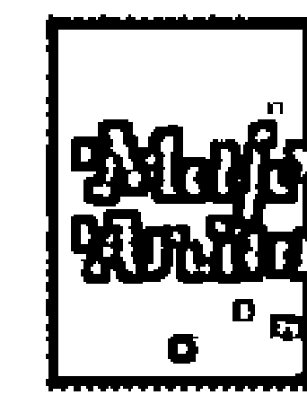

## 《親情》

#### 家庭的狀況

現在大家有一個明確的共同目標，而且朝向這個目標前進當中，一致對外使得大家能和平相處，也會有共同話題。

#### 與長輩的關係

你與長輩的關係並不好，因為你是很容易就不服管教的那一個，有時候太會找理由，反而變成讓長輩頭痛的人物。

#### 與平輩的關係

在平輩當中你是屬於比較孤立的一個，常常自己去作自己想做的事情，並不會理會別人的眼光，也很少主動溝通。

#### 與晚輩的關係

你對家中的晚輩特別照顧，而且幾乎到了大小事都管的地步，比較屬於嚴父的角色，對於是非對錯也會賞罰分明。

## 《學業》

- □學業本身的狀況
現在學習的狀況十分穩定，但是仍然有不少的挑戰需要去克服，這時應該堅持自己的立場，把該學好的東西完成。

- □學習的方法
理性與務實是你最好的武器，只要你能誠實去面對自己該作的事情，以你的能力來說都不會出現無法解決的問題。

- □與老師相處的關係
面對這種賞罰分明又主觀性強的老師，服從是最好的方法，如果膽敢犯到他的禁忌，一定會遭受到最嚴厲的處罰。

- □與同學相處的關係
你會想要在同學之間擔任領導者，不過也很可能因此而與別人起衝突，要比較軟性一點才能得到更多同學的支持。

## 《財務》

- □目前的財務狀況
以現實的角度來衡量，你的財務狀況還不算壞，但是未來仍然有很大的成長空間，應該要更努力在自己的本業上。

- □投資的狀況
現在可以開始保守的投資，但是並不會立即為你帶來實質的好處，對於長期投資來說，這會是一個進場的好時機。

- □採購的策略
不只要考慮採購的標的，同時在採購過程中的成本也要考慮進入，以實用為判斷的基準，即使不是名牌也無所謂。

## 《延伸應用》

- □時間
相對時間：四小時、四天、四週、四個月、四年。
標示時間：白羊座（約每年3／21—4／20）

- □地點
區域：政府機關、辦公室、警察局、岩山、礦山、沙漠。
方位：東北方

- □物品
公告、公文、識別證、身分證、水晶球、盔甲、大師椅。

- □身體部位
頭部、臉部。

# 皇帝逆位

# 心靈與精神層面的提示
自信其實取決於個人的意志力，並且要看自己是不是有把理想實現的能力，想要控制一切反而會使事情失去控制。

### 《人物》

#### 當事人的個性

對於事情有自己的看法，但是其實並不成熟，常常因為任性的決定而遇到嚴重的問題，同時也有偉大的理想抱負。

#### 當事人的工作觀

有強烈的企圖心，但是在能力上稍嫌不足，也沒有足夠的意志力去克服困難，反而常把自己的問題推卸給別人。

#### 當事人的感情觀

不敢表達自己的感情，其實內心十分渴望感情，如果是單身則會表現出討厭異性的樣子，反而變得很難接近異性。

#### 當事人的金錢觀

自己很想要掌控金錢，但是又對財務沒有計劃，有可能會把所有的錢都存下來，或者是突然把所有的錢通通花光。

#### 與當事人的應對方法

面對這種比較任性又自以為是的人，只要不當面違逆他的意思就不會發生嚴重的衝突，給他一些尊重就很好說話。

#### 人物代表

單親爸爸、失意政客、中年失業者、中年未婚者、戰俘。

## 《工作》

### 工作本身的狀況

工作上遇到不好相處的主管，不僅對你沒有幫助，反而常害你累個半死，事情往往超出你的預料，還要努力收尾。

### 如何解決工作的困境

這個時候應該要想辦法自己解決問題，好好計劃做好準備，如果在此沒有全力一拼，接下來的狀況更是無法收拾。

### 工作中的人際關係

這個工作當中人際關係似乎不是重點，太好的人際關係反而對你是有害的，這個時候還是獨善其身比較安全一點。

### 與上司相處的方法

對於事情要有自己的主見，不要完全被上司牽著鼻子走，這樣反而更能得到他的信任，也可以把事情處理得更好。

### 工作的發展性

這個工作未來的發展還不明朗，但可以確定的是仍然會很辛苦，如果不喜歡挑戰極限的人，還是找機會換個位子。

### 找工作／換工作的狀況

現在出現的工作並不是很適合你，也許還要等一陣子才會有適當的機會出現，這段時間你就讓自己徹底休息一下。

## 《愛情》

### 感情本身的狀況

感覺是被對方所控制的感情關係，雖然對方也提供了很多的照顧和保護，不過總覺得缺乏某些自由和平等的感覺。

### 新戀情的可能性

出現新戀情的可能並不高，重要的是你也還沒準備好要接受一段新的感情，應該先想清楚自己在感情中需要什麼。

### 對這段感情的看法

在感情中充滿了障礙和衝突，並不是一個和諧穩定的關係，還有很多事情不確定，所以也沒有明確的目標和方向。

### 性的吸引力

這段感情當中並沒有太多性的吸引力，雙方對於性與愛的看法也還不成熟，不知道怎麼帶給彼此更多性愛的歡愉。

### 如何化解爭吵

不要太堅持己見，先聽聽對方怎麼說再作決定，如果兩個人之間無法解決問題，可能就要等任何一方先軟化態度。

### 分手的方法

現在已經爆發出分手的危機，你只要順水推舟就好，但是要小心別太刺激對方的情緒，否則可能會發生暴力事件。

### 復合的可能性

這段感情復合的可能性很低，主要是因為兩個人中心已經沒有緣份在了，即使想要勉強在一起，也無法得到滿足。

## 《友情》

#### 我的人際關係狀況

你對人際關係的想法太過單純，往往落入別人的陷阱當中而不自知，應該要小心防範身邊的小人，不要再被騙了。

#### 如何化解與朋友的誤會

你該給自己和對方更大的空間，不要被一大堆的原則和固執的個性綁住，有彈性地處理這件事將會解決你的問題。

## 《親情》

#### 家庭的狀況

現在家中面對到重大的變局，但是並沒有明確的方向及目標，也沒人能出來主持大局，這是造成危機的主要原因。

#### 與長輩的關係

長輩會特別照顧你，但是對你的限制也會特別多，如果你能表現得更成熟獨立些，那麼你與長輩的關係就會改善。

#### 與平輩的關係

在平輩當中你算是比較霸道的一個，有時候已經傷害到別人了仍然不自知，你需要更虛心地接受別人給你的建議。

#### 與晚輩的關係

你會想對家中的晚輩特別照顧，但是也常常會被他們提出來的要求弄得昏頭轉向，你對他們的態度應該更強硬些。

## 《學業》

- **學業本身的狀況**
  你在學習上現在遇到一些問題，但還不到無法解決的地步，重要的是你能不能及時補救之前的錯誤，再迎頭趕上。

- **學習的方法**
  這時候千萬不要放棄，能努力就會有成果，即使結果並不如你主觀所預期的，但是累積的過程還是必定要經歷的。

- **與老師相處的關係**
  老師主觀的好惡很強，所以要先觀察一陣子再說，能夠投其所好當然是最有利的，但是只要不犯錯也就安全過關。

- **與同學相處的關係**
  你在同學之間並不是很受歡迎，主要是因為你讓人覺得過度自我防衛，適度地放鬆自己才能展現出更佳的親和力。

## 《財務》

- **目前的財務狀況**
  現在你的財務狀況並不太好，資產的配置也有很大的問題，若是有債務則會雪上加霜，重要的是要如何保住老本。

- **投資的狀況**
  現在並不適合任何投資，把現金留在手上才是最好的策略，如果現在的投資已經賠了很多錢，就先放著不要理它。

- **採購的策略**
  整個採購的計劃還不完整，要先檢查是不是有任何缺漏的東西，再看看計劃的可行性，太過衝動絕對會吃到苦頭。

# 教皇正位

# 心靈與精神層面的提示
面對到與宗教信仰有關的問題，你可以多請教別人有關於教義或靈性成長的事情，或許會幫助你早點把問題想通。

### 《人物》

- □當事人的個性
比較重視靈性成長的人，通常有虔誠的宗教信仰或是心靈上的依歸，因此而培養出慈悲心，也有樂於助人的習慣。

- □當事人的工作觀
重視工作的意義重於實質的金錢收入，具有強烈的責任感，也可以充分融入組織文化，很重視同事間的人際關係。

- □當事人的感情觀
會很重視對方的感覺，並且主動提供協助及保護，常常會是以婚姻為前提和對方交往，面對於感情既認真又保守。

- □當事人的金錢觀
對金錢採取比較隨緣的態度，不會不擇手段賺錢，也不會隨便亂花錢，如果能夠用金錢幫助其他人也會努力捐輸。

- □與當事人的應對方法
這種人在道德層面的要求較高，如果不能贊同他的價值觀，就不要談論到信仰或道德的問題，否則可能會起衝突。

- □人物代表
僧侶、牧師神父、廟祝、社工師、仁慈的人、靈性導師。

## 《工作》

- □工作本身的狀況
在工作當中有很多的貴人在幫助你，所以即使自己仍然有不足的地方，也會得到很多支援，是你可以發揮的地方。

- □如何解決工作的困境
遇到自己解決不了的問題，應該尋找更高層的人來決定，或是依循著既有的秩序和規則來處理，保守一點不會錯。

- □工作中的人際關係
其實工作當中的倫理十分重要，凡事都有先來後到、長幼有序，只要能符合這樣的規則，人際關係自然就會很好。

- □與上司相處的方法
其實是很願意幫助你的上司，遇到不懂的事情就請他教你該怎麼作，能從他身上多學到一些東西，對你就是福利。

- □工作的發展性
這個工作的未來很有發展性，而且是一個有很多人幫助你的地方，應該先把人混熟了，其實待下去對你是有利的。

- □找工作／換工作的狀況
可能會有長輩幫你介紹工作，這個時候自己去找工作反而不太容易，可以把自己需要工作的消息對大家廣為宣傳。

## 《愛情》

### 感情本身的狀況
宗教或靈性的因素對這段關係有很大的影響力，有時候也表示兩個人已經結婚，或是這段關係正向婚姻方向發展。

### 新戀情的可能性
現在會有新的感情對象出現，最可能是透過相親或是長輩的介紹，所以這段時間不妨多參加未婚男女的聯誼活動。

### 對這段感情的看法
以結婚為前提在考慮這段感情，絕對是十分認真的，同時也會希望得到大家的祝福，算是比較保守而穩定的看法。

### 性的吸引力
這段感情當中很自然的有性的吸引力，但是並不佔有最重要的位置，甚至兩個人有一點把性當成禁忌而避免談論。

### 如何化解爭吵
如果兩個人還是僵持不下，不妨尋找兩個人共同的長輩來作和事佬，但是這個人必須同時得到兩個人的信任才行。

### 分手的方法
除了當面向對方提出分手之外，重要的是要公告週知，讓大家都知道你們都分手了，那麼就可以斷得乾乾淨淨的。

### 複合的可能性
這段感情如果能夠複合，那一定是有好朋友在當中穿針引線撮合，否則以兩個人的情份要複合恐怕沒那麼容易。

## 《友情》

#### 我的人際關係狀況
現在你的人際關係算是穩定，也許會因為宗教信仰或是心靈成長的興趣交到不少知心的好朋友，應該要好好把握。

#### 如何化解與朋友的誤會
你應該對朋友有更多的寬容，由內心去原諒對方，如果對方不願意原諒你，則應該找可以信任的朋友來當和事佬。

## 《親情》

#### 家庭的狀況
家中有共同的家學淵源或相同的宗教信仰，所以能夠維持良好的秩序與和諧關係，是很重視倫理道德的模範家庭。

#### 與長輩的關係
長輩對你特別照顧，常常會幫你出面解決各種問題，但有時你會太濫用長輩對你的寵愛，反而會造成他們的困擾。

#### 與平輩的關係
你與其他人常常會有聯絡，而且也可以互相幫忙，因此感情就會特別好，你在當中似乎佔有特別重要的核心地位。

#### 與晚輩的關係
你對晚輩很照顧，不過也不會因此而疏於管教，你特別重視他們的道德教育，有時候也會給他們比較嚴肅的感覺。

## 《學業》

- □學業本身的狀況
現在學習的東西對你來說十分重要，應該要好好花時間學習，不論同學或老師都會很幫忙你，但是自己也要努力。

- □學習的方法
你應該要有耐性地學習，找到自己的問題所在，再去請教同學或老師，相信持之以恆到最後一定可以突破困難的。

- □與老師相處的關係
老師可以幫你解決很多問題，但也不應該太依賴老師，只要遵守規則不搗蛋，當個乖學生自然會得到老師的喜愛。

- □與同學相處的關係
與同學的人際關係會影響到你的學習，能有更多的好朋友對你的學習也會很有幫助，所以要和大家維持良好關係。

## 《財務》

- □目前的財務狀況
現在因為有其他的支援在，所以你的財務狀況看起來還不錯，但是並不算是很獨立而健全，還有努力成長的空間。

- □投資的狀況
如果是認識的朋友找你幫忙的話，多少可以投資一點，但是其他的標的物就要慎重考慮，這時候只能小額長期投資。

- □採購的策略
最好選擇連鎖或是有信譽的大供應商，即使比較貴至少會比較有保障，記得要把購買的憑證和單據保存下來。

## 《延伸應用》

- □時間
  - 相对时间：五小时、五天、五週、五個月、五年。
  - 标示时间：金牛座（约每年4／21－5／20）。

- □地點
  - 區域：教堂或廟宇、修道院、靈修道場、社會福利機構。
  - 方位：東南方。

- □物品
  - 鑰匙、通行證、結婚證書、冠冕、賀卡、心靈成長書刊。

- □身體部位
  - 頸部、肩膀。

# 教皇逆位

> 心灵与精神层面的提示
与其盲目地跟随大师，不如自己思考会更有帮助，有时候与朋友分享谈论这些问题，反而会对你有更多的启发。

### 《人物》

当事人的个性
特别心软的人，习惯于不顾一切地帮助别人，而没有考虑到自己的状况，也常常因为意志不坚定而被别人所陷害。

当事人的工作观
在工作上没有太积极的想法，只是依照规定去作应该做的事情，虽然不会主动创新和解决问题，但是服从性很高。

当事人的感情观
对于感情的态度比较保守，甚至可能抱持着不婚的打算，在感情中常自认为是受害者，无法把自己的意见表达出来。

当事人的金钱观
不是很重视金钱，有时候可能因此而突然花了很多钱，常会把金钱捐给慈善机构，或是想要用金钱帮助亲朋好友。

与当事人的应对方法
基本上这个人是吃软不吃硬，只要你能摆出楚楚可怜的态度，低声下气苦苦地哀求，大部分的问题都可以被原谅。

人物代表
滥好人、慷慨的人、信徒、迷失方向的人、耳根软的人。

## 《工作》

工作本身的状况
工作中充满各种繁复的规则，还有一些是没有明文规定的，一不小心就会犯到禁忌，要花很多时间才能进入状况。

如何解决工作的困境
工作当中的问题很难由自己解决，所以应该是由同事之间共同合作来处理，利用大家不同的经验和能力集思广益。

工作中的人际关系
这份工作当中人际关系的影响很大，如果不能和大家相处良好而受到严重的排挤，这样可能连工作都会做不下去。

与上司相处的方法
上司的耳根子很软，所以容易受到各种传言的影响，不同的人对他都会有影响力，要小心不利于自己的各种流言。

工作的发展性
这个工作的发展性还不错，但是要小心人际关系的影响，特别是同事对你的影响更大，应该尽量与大家和平相处。

找工作／换工作的状况
现在不太容易找到新的工作，算是一段可以好好休息的时间，等到自己状况转好之后，再来找工作就会更容易了。

## 《爱情》

### 感情本身的状况
是有一方付出比较多的状况，两个人的关系并不平等，如果能够心甘情愿地付出，也算是一段稳定发展中的关系。

### 新恋情的可能性
现在会有一些新恋情发生的可能性，但是都是借由同侪之间的介绍而认识的，所以应该多多参加朋友的社交活动。

### 对这段感情的看法
觉得自己付出得很多，但是所得的回报少了许多，也许会有一些不平衡的情绪，同时又会很想要保护和照顾对方。

### 性的吸引力
两个人对于性关系都有一点害怕，所以即使有很强的吸引力，也无法对这段关系有正面的影响，算是有色无胆吧。

### 如何化解争吵
如果两个人还在僵持的状况当中，应该寻求同侪朋友们的帮助，让大家来当和事佬，将会有助于争吵快速的化解。

### 分手的方法
正式地和对方提出分手，表示这段关系已经完全结束了，甚至可以先把你的想法写成文字，整理一下自己的思绪。

### 复合的可能性
这段感情其实并没有复合的可能性，最好不要往这个方面去想，先让自己休息一下，等待更好的机会再重新出发。

## 《友情》

### 我的人际关系状况
你的人缘还不错，但是太容易受到别人的影响，反而失去自己的主体性，有时也会因为要帮助朋友反而自己受害。

### 如何化解与朋友的误会
把自己的立场说明清楚，不要让朋友觉得不论如何你都应该让他，只要你能说得有理就可以重新赢得朋友的信任。

## 《亲情》

### 家庭的状况
家中的成员之间都有不错的感情，也能够热心地互相帮助，但是也可能为了帮助家中的成员因而付出重大的代价。

### 与长辈的关系
你是家中长辈的好帮手，常常可以帮助他们解决各式各样的问题，因此长辈们会特别重视你的意见、听从你的建议。

### 与平辈的关系
你与平辈之间的感情特别好，但是因此也会互相包庇错误、文过饰非，有时候反而失去了互相监督和砥砺的功能。

### 与晚辈的关系
你对于晚辈太过纵容，常常因此而惹出一堆麻烦来，如果不能改变这种态度，到头来还是自己要收拾烂摊子。

## 《学业》

### 学业本身的状况
现在学习进入到关键阶段，如果能过关接下来就会很轻松，但是若卡在这个地方未来就要花很多倍的力气来突破。

### 学习的方法
只要核心的概念清楚之后，接下来大部分的东西都可以触类旁通，所以重要的是抓到学习的诀窍，采取重点突破。

### 与老师相处的关系
老师很重视规矩，大部分的时候也都是依照规则来处理问题，所以只要用心观察他的作为，就可以掌握行为分寸。

### 与同学相处的关系
有时候与同学的关系太好，反而很多事情都会推到你头上来，所以除了维持良好的关系之外，也要有自己的坚持。

## 《财务》

### 目前的财务状况
如果在金钱上不够务实，财务状况就很难好得起来，要记得物质世界的规则是很现实的，要付出努力才会有成果。

### 投资的状况
这个时候并不是很适合投资，尤其是听信一些小道消息的投资特别危险，最好是保守务实一点，维持现状就好了。

### 采购的策略
现在不宜有重大的采购，花大钱对你绝对是不智之举，如果必要进行采购，这时候应该以耐久以及品质作为考量。

# 恋人正位

> 心灵与精神层面的提示
上天的祝福对所有的人都是开放的，但是只有回到纯真的状态去面对现在的人生，才能找到属于自己的生命答案。

### 《人物》

当事人的个性
比较单纯的人，喜欢用最简单直接的方法来处理事情，大都可以顺利成功，是受到上天眷顾和保佑的幸运儿。

当事人的工作观
对于工作并不热衷，也没有什么事业野心，只会把本份当中的事情好好完成，反而很重视与同事之间的人际关系。

当事人的感情观
很重视自己的感情生活，虽然十分认真但是在想法上却又很单纯，进到恋爱状态就会完全投入而忽略了其他事情。

当事人的金钱观
不太重视金钱，但是也不会缺钱用，只要按部就班工作很容易就会累积不少金钱，是属于简单生活知足常乐的人。

与当事人的应对方法
与这种人只要坦诚相交，对方也很容易和你交心，不要想用诡计或是复杂的方式占他便宜，有时反而会自作自受。

人物代表
媒人、中介、见证者、恋爱的人、纯真的人、合作伙伴。

## 《工作》

工作本身的状况
基本上是一个单纯顺利的工作，本身并不困难、也没有什么大问题，只是要小心避免当中的陷阱以及不当的诱惑。

如何解决工作的困境
用最简单的方法去处理，别把问题想得太复杂，只要顺着应该进行的方向持续前进，一定可以及时顺利通过考验。

工作中的人际关系
这里大部分的人都很好相处，因此大家都维持着愉快的关系，但要记得君子之交淡如水，太过亲密反而会有问题。

与上司相处的方法
是一个很能照顾大家的上司，所以只要你把自己份内的事情做好，应该就不会有太大的问题，也不必刻意讨好他。

工作的发展性
这个工作未来即将面对到比较大的变动或是挑战，虽然你应该可以顺利通过考验，但这还是有赖于你事前的准备。

找工作／换工作的状况
现在可能有两个以上的工作机会让你选择，因此让你觉得有点犹豫不决，这时候应该要选择性质比较单纯的那个。

## 《爱情》

感情本身的状况
两个人是很情投意合的热恋状态，彼此也有很强的吸引力，不论任何的理由或是阻碍，都很难把这段关系给拆散。

新恋情的可能性
在很短的时间之内必定会出现新恋情，如果对自己仍然有不够满意的地方，应该趁这个时机把自己的缺点改过来。

对这段感情的看法
两个人的感情已经十分稳定，希望会朝向结婚的方向发展，其实是很疯狂地迷恋上对方，同时也接受对方的一切。

性的吸引力
这段感情当中有很强烈的性吸引力，而且会很自然地互相表达出来，性关系也会是感情生活当中非常重要的一环。

如何化解争吵
其实两个人并没有太大的问题，小小的误会只要沟通清楚就好，不要把事情想得太过复杂，更没有必要自寻烦恼。

分手的方法
除非感情当中出现了第三者，否则要分开不是那么容易，即使谎称你已经有其他喜欢的对象，也不见得就会有效。

复合的可能性
其实两个人对彼此还有很深的感情，所以存在着复合的可能性，只要有一方主动提出，复合并不是很困难的事情。

## 《友情》

我的人际关系状况
你的知心好朋友不多，但是对你都是有重要意义的好朋友，所以好好把握这些好朋友，其他的事就不必太在意了。

如何化解与朋友的误会
只要你以诚心向对方解释事情的来龙去脉，对方一定会原谅你，千万不要为了任何原因说谎，反而会使事情恶化。

## 《亲情》

家庭的状况
家中的人各自扮演好自己的角色，分工的状况也很适当，即使遇到任何的考验或是挑战，应该都可以顺利地克服。

与长辈的关系
长辈虽然把你当成小孩子，但是也会因此而特别照顾你，只要你能保持原来的表现，一定会持续得到他们的喜爱。

与平辈的关系
大家都很坦诚相待，所以可以彼此信任、没有什么芥蒂，如果合作一起去完成某件事情，将会得到很满意的结果。

与晚辈的关系
晚辈对你十分信任，不过你有时候会给他们一些挑战或是试炼，希望能够帮助他们独立成长，通常关系都还不错。

## 《学业》

学业本身的状况
现在正在学习的起步阶段，每一步对你来说都是重要的基础，如果现在能够有一个好的开始，接下来就会很顺利。

学习的方法
你需要不断地接受挑战和考验，如果没有考试也应该自己练习，只有你自己有经验过的事情，才能够完整地学会。

与老师相处的关系
老师对大家都是一视同仁，所以也不用特别想要讨好他，但若是你特别捣蛋或是不认真，也一定立刻就会被发现。

与同学相处的关系
你与同学的关系还不错，但是并不会对你的学习有多大的帮助，大家都能和平相处也会带给你比较好的学习情绪。

## 《财务》

目前的财务状况
现在财务的状况还算不错，但是未来仍然有更大的发展潜力，所以应该从现在开始努力，为自己争取最多的利益。

投资的状况
开始可以重新调整投资配置的比重，但是不宜一下子增加太多新的投资，只要作适当的调整就能在投资当中获利。

采购的策略
面对不同的选择时，最好还是寻找长期合作的可靠伙伴，为了一点点价钱而改变采购的对象并不会得到多少利益。

## 《延伸应用》

时间
相对时间：六小时、六天、六周、六个月、六年。

标示时间
标示时间：双子座（约每年5／21－6／20）

地点
区域：公园、植物园、果园、圣山、天体营、原始部落。
方位：东方的上方

物品
订情信物、长在树上的水果、树叶、衣服、蛇、爬虫类。

身体部位
手臂、手肘、手腕、手掌、手指。

# 恋人逆位

> 心灵与精神层面的提示
不要害怕为自己的人生负责，能够承担的人才能得到应有的报偿，重要的是在选择之前是不是有务实地想过后果。

### 《人物》

当事人的个性
容易受到别人影响而改变心意的人，遇到挑战时往往会犹豫不决，即使自己已经决定又不愿意为自己的决定负责。

当事人的工作观
在工作当中时常犯错，但是又不知道该怎么解决问题，并没有很强的企图心，只想要把自己份内的事情作好就好。

当事人的感情观
很需要感情的依靠，但是又不愿意为自己的选择负责，常常在不同的对象之间摇摆，或是在感情当中觉得不满足。

当事人的金钱观
无法处理金钱方面的事情，常常做得很辛苦但是只得到很少的实际利益，如果不能更务实一些也可能会穷愁潦倒。

与当事人的应对方法
这种人常常改变心意，所以在完全确定状况之前不要太相信他说的话，不要为他作任何决定，以免事后被他怪罪。

人物代表
嫌疑犯、有前科的人、被放逐的人、暴露狂、外遇的人。

## 《工作》

工作本身的状况
工作当中出现很多的困难以及不当的诱惑和陷阱，一个不小心就会犯下严重的错误，再想要回头就已经来不及了。

如何解决工作的困境
先找出各种可能的组合，重新思考这些方案的可行性，以原来的方式去进行会有很大的问题，一定要做一些改变。

工作中的人际关系
工作当中大家都把责任推来推去，所以通常都是各自负责自己的事情，而无法进行深度的合作，人际关系比较疏离。

与上司相处的方法
上司不会帮你扛责任，不挖洞给你跳就不错了，对于事情的决策常常改来改去，所以接到他的命令要三思而后行。

工作的发展性
这个工作接下来的感觉并不妙，也许目前还没看到变动，但是接下来的状况很难处理，最好要有离开的心理准备。

找工作／换工作的状况
现在出现的工作机会都不太适合你，特别若是别人介绍给你的就会更惨，所以要多看多听，有耐性地慢慢过滤资讯。

## 《爱情》

感情本身的状况
两个人对彼此的感情都很深，但是也觉得有很多的不满和抱怨，如果把问题强压下来不说，反而会累积成大情绪。

新恋情的可能性
这段时间很可能会出现新恋情，但千万千万别不小心成为别人的第三者，小心考虑每个人的优缺点，不要太快作决定。

对这段感情的看法
觉得自己在感情当中付出很多，但是有时候也会觉得挫折，仍然很疯狂地迷恋对方，所以会有迷失了自我的感觉。

性的吸引力
在这段感情关系当中，性的吸引力是最重要的一环，双方都会强烈地表达对于彼此的需要，但也要小心房事过度。

如何化解争吵
重要的是把事情的责任厘清，不要再打迷糊仗，只有双方当面把问题拿出来谈清楚，才能彻底解决这个难解的结。

分手的方法
其实当面沟通是最好的方法，把自己的不满和挫折真实地表现出来，不要让对方存有任何幻想也许就能分手成功。

复合的可能性
这段关系也许还有复合的可能性，但是也许是因为欲望而重新结合，所以基础并不是很稳固，相处时要更加小心。

## 《友情》

我的人际关系状况
基本上你的人际关系还不错，但是大家都是比较表面的交往，想要找到比较好的知心朋友，在这段时间比较困难。

如何化解与朋友的误会
不要被朋友牵着鼻子走，对于事情要有自己的看法，如果能严正拒绝不当的建议，反而会让你与朋友的关系改善。

## 《亲情》

家庭的状况
现在家中正遇到一些变化，如果不小心处理可能就会留下严重的后遗症，这时候应该不分彼此共同努力合作处理。

与长辈的关系
在长辈眼中你是一个长不大的小孩，如果不能表现得更加成熟，就无法得到他们的信任，也很难得到他们的宠爱。

与平辈的关系
在平辈之间你常常有点不知所措，也不知道应该相信谁的说法，如果无法自己清楚地判断，还是保持距离比较好。

与晚辈的关系
你与晚辈的关系还不错，但是彼此并不是很亲近，虽然有一些距离的感觉，但是主动付出的关心还是会被感觉到。

## 《学业》

学业本身的状况
现在学习的东西并不是你拿手的项目，所以只能走一步算一步，减少错误就是加分，太积极努力反而会觉得挫折。

学习的方法
虽然有时候会觉得有一些挫折，但是这时候你还是最适合尝试错误法，在实作的过程当中你慢慢可以把东西学会。

与老师相处的关系
老师在情绪上的反应比较大，所以尽量不要去刺激他的情绪比较好，尽量维持平凡，不要被注意到是最佳的策略。

与同学相处的关系
你与同学的人际关系对你的学习并没有什么影响，但是有时候和同学吵架会影响你的学习情绪，还是要和平相处。

## 《财务》

目前的财务状况
你现在面对到财务上重大的决定，但其中可能有不少的陷阱，如果自己无法想清楚，应该要相信专家给你的建议。

投资的状况
不要相信太高收益的投资，因为当中的风险也许不是你所能承担的，作决定的时候要保守一点，才不会血本无归。

采购的策略
这是不适合采购的时机，想要贪便宜反而容易买到瑕疵品，如果不能当面确定东西的品质，还是再等一阵子再说。

# 战车正位

> 心灵与精神层面的提示
你现在具备成功所需要的强烈意志力，不论付出何种代价也要得到你想要的东西，但是要切记欲速则不达的道理。

### 《人物》

当事人的个性
有理想抱负的人，凡事都想要追求成功与卓越，为了达成自己的目标不择手段，即使与别人发生冲突也在所不惜。

当事人的工作观
工作上的企图心很强烈，认为升迁比加薪更重要，常在工作当中把握表现的机会，想要把别人打倒好让自己晋升。

当事人的感情观
非常珍视自己的感情，同时也有强烈的占有欲，对于自己所爱的人极尽可能的付出及保护，绝不容许别人来挑战。

当事人的金钱观
了解金钱的价值，也可以有效地运用金钱，通常比较喜欢先把钱存起来，等到有一笔积蓄之后再来作财务的规划。

与当事人的应对方法
与这种人千万不要起正面冲突，也不要阻碍到他达成目标，否则被他认为是敌人的话，就会受到冷酷无情的攻击。

人物代表
征服者、野心家、军人、努力成功的人、司机、赛车手。

## 《工作》

工作本身的状况
工作上正遇到一些困难和挑战，但是对你来说都是能力所及的事情，只要你再打败竞争者，最后胜利者一定是你。

如何解决工作的困境
这时候你应该要采取强制的手段，绝对不可以因为一时心软而坏了大事，即使引发正面冲突也要不计代价撑下去。

工作中的人际关系
你与其他人处于高度的竞争当中，每个人都想要把别人比下去，因此不太可能交到真心的朋友，要自己解决问题。

与上司相处的方法
面对很强势的上司，应该要配合他的政策，确实执行他交付的事情，这不但对他本身有利，也是你学习的好机会。

工作的发展性
这个工作未来有很大的发展空间，但是主要还是你自己拚出来的，只要你足够努力，就会有美好的未来在等着你。

找工作／换工作的状况
现在可能出现两个以上的工作机会，最好是以未来的发展性为考量，若是找到你有兴趣的工作将会带来更多利益。

## 《爱情》

感情本身的状况
现在感情当中不可避免的会遇到某种冲突或竞争，有赖你主动积极地处理和改进，千万不要在这个时候放弃希望。

新恋情的可能性
现在应该会出现新的感情对象，但是也许会有不少的情敌和你竞争，你应该评估自己的心意和能力再决定怎么作。

对这段感情的看法
这是辛苦努力过而得到的感情，当然也会特别珍惜，会尽一切的努力来维持这段感情，不会被任何的事情所影响。

性的吸引力
这段关系当中并没有很强的吸引力，反而会有点把性关系工具化，把性当成征服对方的工具，带有强烈的目的性。

如何化解争吵
这个时候斗力不如斗智，要花心思、想办法来表现自己的诚意，有时候越是强硬的态度，反而会引发更大的冲突。

分手的方法
大吵一架是最好的方法，只要你强硬地提出分手的要求，对方就没有什么挽回的余地，应该用快刀斩乱麻的方法。

复合的可能性
两个人之间已经没有什么情份了，所以并不存在任何复合的可能性，再加上竞争者的实力很强，再妄想也没有用。

## 《友情》

我的人际关系状况
你在人际关系当中充满了竞争性，常常对别人有防卫性，反而无法放开心胸交到好朋友，有时也觉得高处不胜寒。

如何化解与朋友的误会
不要太过自以为是，也该要听听朋友方面的说法，在综合双方的意见之后，也许可以找到另一种更好的解决方案。

## 《亲情》

家庭的状况
现在家庭面对到重大的挑战，如果彼此之间不能好好合作，可能会使家庭陷入空前的危机，应该以家庭为重考量。

与长辈的关系
你是令长辈觉得难以管教的头痛份子，只执着于自己想要作的事情，完全不听别人的劝告，你也常常会顶撞他们。

与平辈的关系
你在平辈当中是比较强势的一个，虽然大家会觉得你比较自以为是一点，不过遇到事情还是会想要听听你的意见。

与晚辈的关系
你对晚辈十分照顾，不过管理上也十分严格，如果有任何人想要挑战你的权威，你就会让他彻底知道什么是服从。

## 《學業》

#### 學業本身的狀況
你在學業上面對到強大的挑戰和競爭，不過因為你的基礎還不錯所以應該能夠順利通過，參加比賽很可能會得獎。

#### 學習的方法
立定了明確的目標之後，就要努力去做，這時候就要專心把自己的事情完成，不要被任何外力干擾到才不會分心。

#### 與老師相處的關係
千萬不要想挑戰這種老師，他是會徹底執行各種規定的人，即使你再有什麼方法鑽漏洞，也一定會被抓出來處罰。

#### 與同學相處的關係
你在同學之間算是領導型的人物，大家都會重視你的意見，因為在課業上也有比較好的表現，應該要多幫助別人。

## 《財務》

#### 目前的財務狀況
目前在財務上是一個很有收穫的時候，所以更要努力為自己爭取最大的利益，不論任何事情都無法阻止你的攻勢。

#### 投資的狀況
在投資上雖然有美好的前景，但是仍然要理性務實的投資，只要你能把握到好的機會，就必定能在投資當中獲利。

#### 採購的策略
事情要做很細緻的評估，不要被外表的現象所欺騙了，在經過計算和比較之後，應該就可以得到最佳的採購條件。

## 《延伸應用》

#### 時間
- 相對時間：七小時、七天、七週、七個月、七年。
- 標示時間：巨蟹座（約每年6／21—7／21）。

### 地點
- 區域：戰場、佔領區、競賽場地、考場、平原區、道路。
- 方位：東方的下方

### 物品
- 攻擊性武器、機車、敞篷車、問卜的道具、窗簾、輪椅。

### 身體部位
- 胸部、乳房。

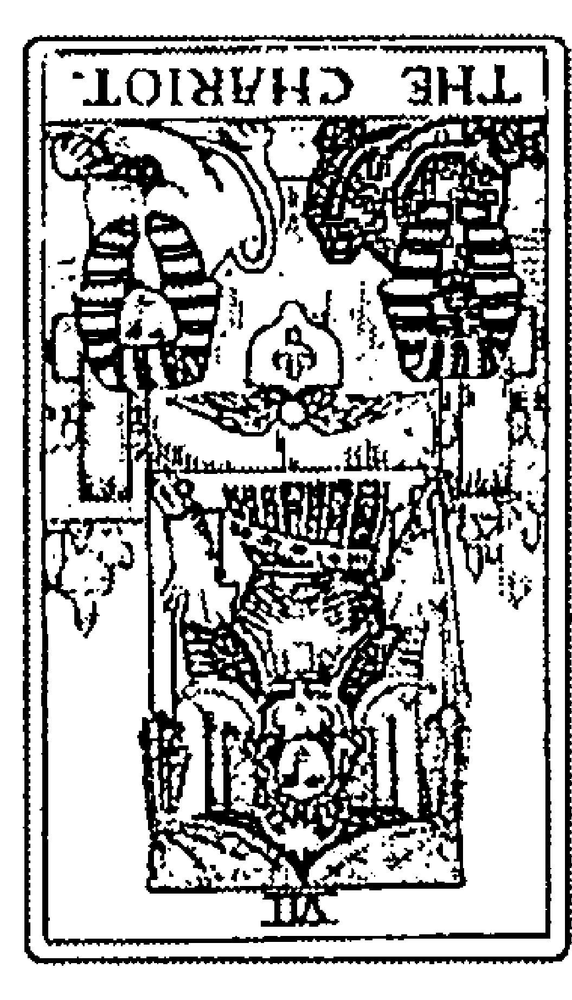

# 战车逆位
在二元对立之上，必定还有更高的原理存在，如何去整合不同的观点是你最重要的任务，记得要在内心保持希望。

### 《人物》
心中不时充斥悲愤的情绪，觉得都是别人对不起自己，但是很少检讨自己，常因为意志力不足而无法坚持到最后。

在工作上十分努力，但会因为无法掌握到诀窍和方向，以致于白费力气，在遇到重大的案件时常常会不敢作决定。

在感情当中情绪的起伏很大，同时也会因为别人的闲言闲语而受到影响，也有可能会在不同的对象之间摇摆不定。

很喜欢积累金钱，但是常常无法作有效的运用，有时候也会因此而陷入一些金钱的纠纷当中，最后没有任何好处。

这种人太会保护自己，所以没有必要不必去涉入他私人的领域，也不要八卦有关他的事情，否则可能会被报复。

被征服者、背叛者、退伍军人、车祸肇事的人、问卜者。

## 《工作》
工作现在遇到一些困难和挑战，同时也会造成一些人际关系的问题，如果不够小心应付可能会变成无辜的牺牲品。

这个问题已经不是你自己就可以解决的，多去问问不同的人，把大家的意见综合之后，也许就会找到更好的方法。

这是一个竞争性很强的环境，最好还是靠自己比较安全，尽量不要介入同事的纷争当中，以免变成了自己的麻烦。

上司的想法常会摇摆不定，所以常常要习惯这种政策转弯的状况，事情即使因此而不顺利，也不要觉得太过挫折。

这个工作的发展性还不错，但是现在仍然有很多问题需要去解决，如果能撑过现在的危机，未来的远景才有意义。

现在找工作其实并不顺利，即使进入到最后一关也很难被录取，应该先想清楚自己的优势，调整之后再重新出发。

## 《愛情》

感情本身的狀況：現在的感情當中面對到很大的危機，這時候應該以家庭或家人的意見作為考量的基準，否則到頭來可能是一場空。

新戀情的可能性：現在出現的對象都比你強勢，也可能會主動來追你，但是因為主動出擊的成功率不高，所以還是在原地守株待兔。

對這段感情的看法：覺得在這段感情當中受到很多委屈，也沒有被對方真正了解，即使內心很想放棄，仍然覺得有很多的不甘心。

性的吸引力：在這段關係當中性並不是那麼重要，對於彼此來說也沒有那麼大的吸引力，算是比較缺乏性生活的那種類型。

如何化解爭吵：這時候問題變成非黑即白的是非題，你只能選擇拒絕或是接受，想要兩面討好的話反而會把自己陷入更大的危機。

分手的方法：只要任何一方正面開戰，這段關係就會結束，所以如果你已經想清楚要結束這段關係，就不要再猶豫把它解決吧。

複合的可能性：兩個人要複合已經是不可能的事情了，即使對方還有意思希望複合，也絕對不會是一個好關係，反而會吵得更兇。

## 《友情》

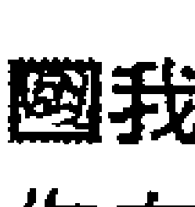

我的人際關係狀況：你在朋友之間感覺上比較弱勢，常常無法伸張自己的意見，反而會被朋友的意思所支配，是屬於被動交朋友的人。

如何化解與朋友的誤會：這時候必須先退讓才會有和解的空間，所以可以先和對方道歉或是認錯，也許接下來的狀況就會是你可以處理的。

## 《親情》

家庭的狀況：家庭當中面對到分裂的危機，分裂成兩個陣營彼此對立，如果不能團結去處理問題，對家庭將會造成重大的傷害。

與長輩的關係：長輩其實不太關心你，所以你就要作一些反叛的事情引起他們的注意，其實只要你的表現好也會得到他們的寵愛。

與平輩的關係：在平輩當中你是比較任性的一個，對人或事情都比較情緒化，看事情比較主觀，如果對你的態度不好你就會生氣。

與晚輩的關係：你常覺得對晚輩不夠好，但是實質上你已經很照顧他們了，不要對自己的行為有罪惡感，應該要對他們嚴格一點。

## 《學業》

#### 學業本身的狀況
你現在面對學習的關鍵時刻，如果能夠堅持下去的話，你將會得到很多的收穫，否則之前所有的力氣都白費掉了。

#### 學習的方法
要考量不同的事情之間應該如何去作整合式的理解，如果不能了解也可以多問問其他人，不要自己一直鑽牛角尖。

#### 與老師相處的關係
老師對大家都比較鬆，所以只要不做得太誇張，應該都可以安全過關，但是若犯到他的大忌可就吃不完兜著走。

#### 與同學相處的關係
因為有些時候學習上要靠同學們的互相幫助，所以如果無法和同學有良好的互動，將會對你的學業有重大的影響。

## 《財務》

#### 目前的財務狀況
現在的財務狀況並不是很好，已經沒有多餘的餘力去進行任何新的計劃，所有的事情都應該量力而為，不要太勉強自己。

#### 投資的狀況
如果現在投資已經有獲利，那麼就應該立即獲利了結，而且短期內不要再進行新的投資，否則很可能會血本無歸。

#### 採購的策略
現在不宜從事大量採購，應該以少量而且必需的東西為準，切忌不可進行大量囤積，否則可能會造成重大的損失。

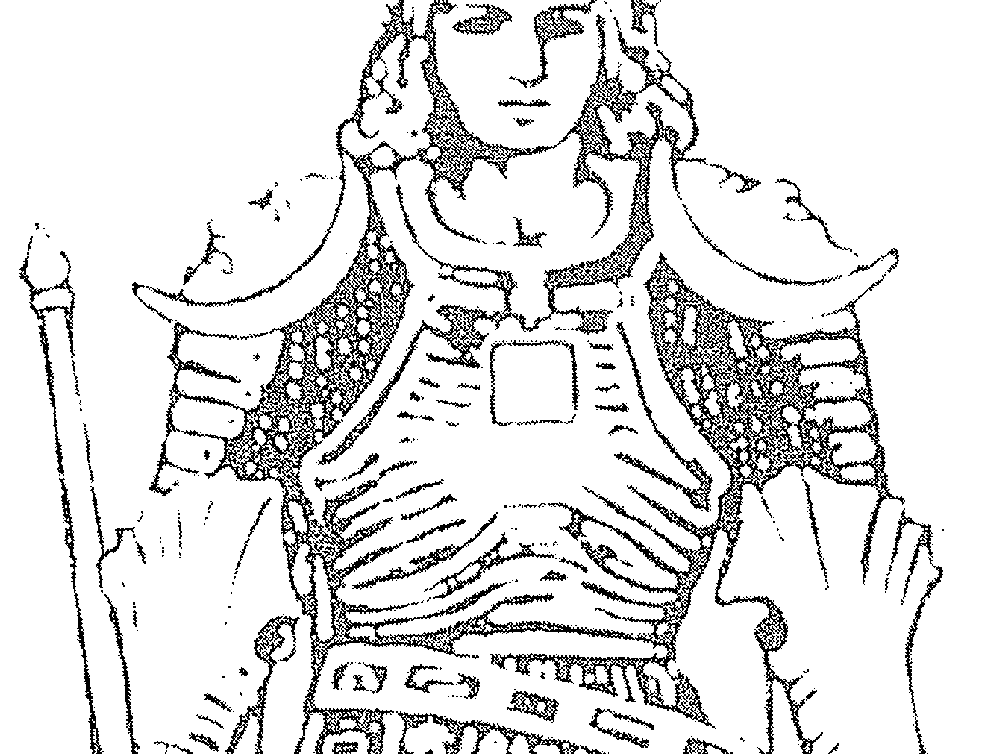

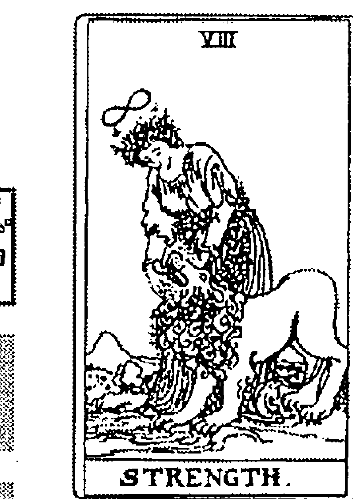

# 力量正位

# 心靈與精神層面的提示
你現在有足夠的智慧和能量可以處理眼前的困難，不過如果沒有實際的行動，一切都沒有意義，要小心理性評估。

### 《人物》

- 當事人的個性：具有英雄特質的人，有勇氣去面對任何挑戰，即使有時候會比較冒險一點，仍然願意負責任把事情從頭到尾完成。
- 當事人的工作觀：在工作當中很有行動力，但是有時候會有一點英雄主義，想要自己一個人把事情完成，工作時就很有活力及自信。
- 當事人的感情觀：外表堅強但是內心的感情仍然十分豐富，會和對方互相配合，共同找到適合的相處模式，也有能力處理各種問題。
- 當事人的金錢觀：並不把金錢放在最重要的位置，但是很會利用金錢來達成自己的目標，對其他人非常慷慨，有大哥級的海派作風。
- 與當事人的應對方法：這種人會比較好面子一些，所以千萬不要當著大家的面讓他難看，有事情在私底下協調的話，就會比較容易解決。
- 人物代表：馴獸師、寵物的主人、英雄主義者、運動員、女性上司。

## 《工作》

- 工作本身的狀況：工作的狀況其實還算順利，也有不少可以表現的機會，你應該把握不斷出現的機會，才可以在工作上更上一層樓。
- 如何解決工作的困境：有些事情需要和別人相互配合，有時候也要考慮到對方的立場，找到雙方都可以接受的方法才能順利地進行下去。
- 工作中的人際關係：每個人都有一定的實力及傲氣，所以應該有寬大的心胸接受別人比你強的部分，真心地欣賞對方才能英雄惜英雄。
- 與上司相處的方法：很多時候強硬的手段不一定是最有效的，你應該利用方法投其所好，打出柔性訴求反而能夠得到意想不到的效果。
- 工作的發展性：這個工作未來的發展性不錯，但是也會有不少的競爭者，你只有比現在更加努力，才能保持現在建立起來的優勢。
- 找工作／換工作的狀況：現在應該會出現還不錯的工作機會，但是也許並不是十分令你滿意，應該要把握現在的機會，進去之後會更值得。

## 《愛情》

### 感情本身的狀況
現在的感情狀況還算穩定，應該要主動付出更多的愛，才能讓人感覺到這段關係的成長，為彼此帶來更多的歡樂。

### 新戀情的可能性
應該很快就會出現新的感情對象，只是你自己主觀接不接受而已，這會是一段值得付出的關係，可以試著去接受。

### 對這段感情的看法
這是一個互補的組合，兩個人雖然有很多的不同但是可以互相配合，有時候自己要扮演馴獸師的角色去教導對方。

### 性的吸引力
這段關係當中有很強的性吸引力，兩個人在性關係方面配合良好，因此性生活也會成為增進雙方感情的良性過程。

### 如何化解爭吵
要有技巧和智慧地去處理問題，更重要的是切記柔能剋剛的道理，這時用直接衝突的方式處理問題反而會一身傷。

### 分手的方法
只是自己片面宣佈分手並沒有什麼用，還是要兩個人坐下來才能談出一個結果，其實兩個人的關係仍然是很緊密。

### 復合的可能性
其實兩個人之間還是存在復合的可能性，也有很多你可以努力的地方，別急著放棄希望，也許對方也想和你復合。

## 《友情》

#### 我的人際關係狀況
因為你對別人都還不錯，所以在人際關係上並沒有什麼大問題，為別人的付出越多，你就會得到更多朋友的幫助。

#### 如何化解與朋友的誤會
試著站在對方的立場想事情，也許就可以找到兩全其美的方法，若是你主動提出合解的請求，很快就會化解僵局。

## 《親情》

#### 家庭的狀況
家中現在是十分和樂而成功的狀況，彼此可以分享榮譽和利益，如果大家互相配合分工，還會有更大的成功出現。

#### 與長輩的關係
你和長輩的感情很好，你很會對他們撒嬌，因此你會得到很多的關心和照顧，同時他們也會很願意對你提供援助。

#### 與平輩的關係
在平輩當中你比較像是領導者，會給大家出主意，也可以幫其他人解決問題，所以只要你所到之處都會受到歡迎。

#### 與晚輩的關係
家中的晚輩都很喜歡對你撒嬌，因為你是他們心目中的救星，不論遇到什麼樣的問題，往往你都可以幫他們解決。

## 《學業》

#### 學業本身的狀況
現在在學習上的狀況十分順利，也可以把該學會的東西確實學起來，如果能繼續進行下去，將會得到很多的收穫。

#### 學習的方法
如果能與同學們分工合作，在學習上將會更有效率，所以趕快放下自以為是的驕傲，開始試著與別人相互配合吧。

#### 與老師相處的關係
是屬於吃軟不吃硬的老師，千萬不要正面去挑戰他的權威，如果犯了錯誤先認錯再苦苦哀求，他一定會原諒你的。

#### 與同學相處的關係
你在同學之間是比較出鋒頭的人物，但是要避免因此而傷害到別人的自尊心，在行動之前要多考慮到別人的立場。

## 《財務》

#### 目前的財務狀況
現在正是你財務狀況特別好的時候，所以應該要在這個時候為自己多存一點本錢，千萬不要那麼快就把錢花光了。

#### 投資的狀況
現在是你適合進行投資的時候，但是遇到大額的狀況還是要小心，如果能尋求到專家的建議，會對你有更大幫助。

#### 採購的策略
這時候採購必定經過談判議價的過程，才會得到對你最有利的條件，即使在第一時間就決定還是要試著殺價看看。

## 《延伸應用》

#### 時間
- 相對時間：八小時、八天、八週、八個月、八年。
- 標示時間：獅子座（約每年7/22—8/22）。

### 地點
- 區域：牧場、寵物店、動物園、舞台、公開表演的場地。
- 方位：北方的上方。

### 物品
- 花環、項圈、貓、獅子、馴養的寵物、寵物用品、電源。

### 身體部位
- 上背部、脊柱。

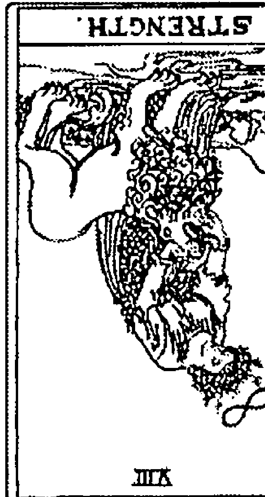

# 力量逆位

# 心靈與精神層面的提示
如何適當的使用自己的權力，而不對其他人造成威脅或傷害，這一切都取決於你對於自己的肯定以及對愛的付出。

### 《人物》

- **當事人的個性**
考慮事情常常以自我為中心，也算是自負的人，在作決定的時候不太會考慮到別人的立場，容易濫用自己的權力。
- **當事人的工作觀**
在工作上很有執行力，不過常常在沒有想清楚之前就自作主張，太過求個人的表現機會，也許就會和同事起衝突。
- **當事人的感情觀**
外表看起來堅強，其實在內心又十分脆弱，在感情上覺得付出沒有回報，有時候會搞不清楚自己對於感情的需要。
- **當事人的金錢觀**
並不很熱衷於賺錢的事，反而喜歡把錢用在奢侈品上，也許全身上下會有很多品牌精品，卻無法把金錢累積下來。
- **與當事人的應對方法**
可能因為內心的自卑而表現出自大的樣子，所以遇到與面子有關的事情就會特別在意，要溫和有耐心的與他溝通。
- **人物代表**
執行者、表演者、專橫的人、濫權的人、怕老婆的男人。

## 《工作》

- **工作本身的狀況**
現在工作當中遇到比較專橫的上司，每天光是要應付他就很累了，雖然也會有不少表現的機會，但都是聽命行事。
- **如何解決工作的困境**
要鼓起勇氣堅持自己的立場，不要因為別人的閒言閒語而退縮，能夠繼續以自己的方法進行就會得到最好的結果。
- **工作中的人際關係**
工作上的人際關係十分緊張，因此更要小心處理與別人有關的事情，如果得罪別人的話可能會引來不必要的流言。
- **與上司相處的方法**
面對專制獨裁的上司，即使再努力也是白費力氣，還不如作一個乖乖牌，完全照他的意思去做才會得到他的欣賞。
- **工作的發展性**
這個工作未來並不太穩定，但是如果你能突破挑戰還是會有不錯的發展性，這就要看你是不是足夠用心在工作上。
- **找工作／換工作的狀況**
現在是一個轉換的好時機，慎選工作機會，如果自己不能判斷的話，會建議選擇獨立執行的事情，避免團隊合作。

## 《愛情》

### 感情本身的狀況
現在的感情狀況好像有點失控了，雖然兩個人都想要讓這段關係更和諧，但是因為某些事情無法配合而陷入僵局。

### 新戀情的可能性
現在很可能會出現新的感情對象，但是並不在你自己的控制之下，所以等待別人主動追求，會遇到更適合的對象。

### 對這段感情的看法
感覺上對方很強勢，但是自己也不願意服輸，所以還有很多地方需要作調整，有時候還被迫要很刻意地討好對方。

### 性的吸引力
在這段關係當中性關係是很重要的一部分，如何在當中去體會彼此的愛意，是能不能維持兩個人感情的重要關鍵。

### 如何化解爭吵
如果衝突已經是不可避免了，那麼就應該要讓問題直接爆發出來，知道對方真正不滿的地方，才有可能徹底解決。

### 分手的方法
現在想要分手的話，最好是把對方所有的問題通通拿出來數落一頓，即使你不主動提出分手，對方也會無法忍受。

### 複合的可能性
兩個人有本質性的不合，所以即使複合也沒有什麼好處，你應該要嚴正的拒絕對方，不要讓他再有機會傷害到你。

## 《友情》

#### 我的人際關係狀況
在人際關係方面你要小心注意，可能會有人想要利用你去達成他的目的，即使對你不一定有害，也會覺得不舒服。

#### 如何化解與朋友的誤會
要注意流言對你產生的傷害，當面找對方把問題講清楚，不要透過第三者傳話，否則事情可能會因此而越描越黑。

## 《親情》

#### 家庭的狀況
現在家中可能為了某件事情的狀況彼此爭吵，這時候應該要以更包容的態度來面對彼此，各讓一步會有不錯的效果。

#### 與長輩的關係
在長輩的眼中你是很難教育的人，不論何種建議你都很少聽從他們的意見，對於很多事情的看法相差十萬八千里。

#### 與平輩的關係
你與平輩的人比較少有互動的機會，大多都是自己處理自己的問題，即使有彼此合作的機會，大部分也不會成功。

#### 與晚輩的關係
你對家中的晚輩特別好，不過也會造成他們恃寵而驕的心理，反而會讓你難以控制，教育的時候應該更嚴厲一點。

## 《學業》

#### 學業本身的狀況
現在學習上遇到一些困難，你很難用理性的方法去解決問題，所以會變得有些情緒化，應該找同學幫你解決問題。

#### 學習的方法
不要讓自己太累，若是覺得自己已經沒有力氣了，就應該讓自己休息一下，等到自己回復之後學習效率就會提高。

#### 與老師相處的關係
對老師特別討好也是沒有用的，你應該要加強自己在學業上的實力，能夠有突出的表現，一定可以得到他的肯定。

#### 與同學相處的關係
在同學之間流傳對你不利的流言，要找到謠言的源頭加以澄清，雖然這對你的學習沒有什麼影響，但會影響情緒。

## 《財務》

#### 目前的財務狀況
現在的財務狀況還不錯，但是其實並不如你主觀想像的那麼好，應該要理性一點去評估，才不會一下子花錢太兇。

#### 投資的狀況
現在投資的獲利還不錯，不過重要的是見好就收，太執著於現在的投資反而會對你造成傷害，也不宜有新的投資。

#### 採購的策略
這時候的採購要特別小心，如果無法決定應該要以品牌和品質為準，若是貪小便宜的話，有時候反而會得不償失。

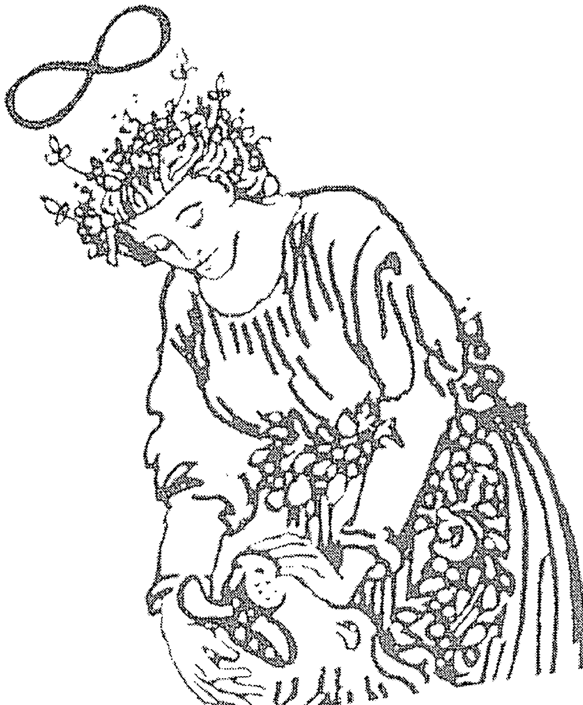

# 隱者正位

心靈與精神層面的提示
你也許想要某種形式的閉關修練，或是想要切斷與凡塵俗世之間的關係，這樣才能讓你認清自己內心真正的想法。

### 《人物》

## 《工作》

- 當事人的個性
十分小心謹慎的人，對於事情有自己獨到的看法，通常習慣獨自一個人做事情，也不喜歡參加團體的聚會或活動。

- 工作本身的狀況
你已經達到工作的頂峰，但是高處不勝寒，你也會覺得有一點寂寞，應該要開始思考如何把工作的經驗傳承下去。

- 當事人的工作觀
在工作上表現出成熟的態度，但是不太習慣與別人合作，在處理事情時特別深思熟慮，也會把事情作完美的解決。

- 如何解決工作的困境
這時候應該要看看前人怎麼解決問題，謹慎地進行處理，即使有點停滯也不要害怕，這件事情一定可以獨立完成。

- 當事人的感情觀
常會抱持著獨身主義，甚至給人在逃避感情的感覺，其實本人在感情上已經很成熟，只是還沒準備好要接受感情。

- 工作中的人際關係
這個工作當中彼此往來的互動性不高，大多都是自己作自己的事情，所以不用特別經營人際關係，顧好自己就好。

- 當事人的金錢觀
認為金錢乃是身外之物，並不會特別去累積金錢，但是維持自己的生活倒不成問題，對於投資及理財有特殊天份。

- 與上司相處的方法
屬於細心負責的上司，做事情往往一絲不苟，所以若是作事情不夠仔細地符合標準，一定會被挑出來重新來一次。

- 與當事人的應對方法
這種人比較喜歡自己一個人，沒什麼事就不要去煩他，基本上並沒有什麼傷害性，要交朋友的話則要靠機緣巧合。

- 工作的發展性
這個工作已經達到發展的極限了，未來也不會有更好的前景，如果要等退休養老的話，這裡會是一個不錯的地方。

- 人物代表
模範生、智慧的長者、老師、獨居的人、經驗豐富的人。

- 找工作／換工作的狀況
現在應該很難主動找到工作，有的話也是別人來找你，所以把你需要工作的消息放出去，然後就等著看狀況如何。

## 《愛情》

- 感情本身的狀況
現在感情的發展到達一個瓶頸，即使兩個人在一起仍然會覺得寂寞，也許是該要好好重新思考這段感情的時候了。

- 新戀情的可能性
現在並沒有發生新戀情的機會，即使你再積極主動也不會有什麼結果，倒還不如趁機好好享受自己一個人的生活。

- 對這段感情的看法
對於這段感情感到熟悉和習慣，但是已經缺乏新鮮的刺激感，如果不小心去維持這段關係，則怕它會很快崩潰掉。

- 性的吸引力
這段關係當中並沒有什麼性的吸引力，甚至有些在逃避性關係的感覺，若是有一方太渴望性生活反而會無法滿足。

- 如何化解爭吵
這個時候要先反省自己，而不是急著指責別人，如果自己無法想通該怎麼辦，也可以請教在感情上經驗豐富的人。

- 分手的方法
避不見面是分手最好的方法，只要你躲起來讓對方找不到你，很自然就會分手成功，其他的事情都不算是必要的。

- 複合的可能性
兩個人之間其實已經沒有什麼情份，要復合是完全不可能的事情，應該快點習慣一個人的生活，才能讓你更快樂。

## 《友情》

- 我的人際關係狀況
你是屬於有一點孤僻的人，所以並不會樹立什麼敵人，朋友也不是很多，但是別人遇到問題又常會想要找你幫忙。

- 如何化解與朋友的誤會
試著用包容的心情去看待發生的事情，你會發現這並不是什麼嚴重的事情，等著他自己來找你把事情講清楚就好。

## 《親情》

- 家庭的狀況
現在家中的狀況還不錯，只是大家都在作自己的事情，所以彼此的交流比較少，應該每隔一段時間大家來聚一聚。

- 與長輩的關係
其實長輩對你很照顧，只是你有時候會不太了解他們對你好的方法，當你年紀漸長的時候，就會慢慢越來越了解。

- 與平輩的關係
你與平輩的人來往比較少，但是常會被他們當成模範，你的一舉一動都會成為注目的對象，即使想逃避也沒辦法。

- 與晚輩的關係
你是晚輩們心目中的大師，不論遇到什麼問題你都可以幫他們解答，但是要記得身教重於言教，要當他們的好模範。

## 《學業》

- **學業本身的狀況**
學習上沒有什麼問題，也許是名列前茅的好學生，也很受到老師的喜愛，但有時候會覺得比較不被其他同學了解。

- **學習的方法**
你很自然可以看清事情的核心及原理，試著用自己的方式重新去理解，而不一定要靠師長的幫助，也許會更有效。

- **與老師相處的關係**
基本上他是很有料的老師，所以可以在知識上多和他學習，不過他也比較會要求學生，達不到標準的一定會被退件。

- **與同學相處的關係**
你和同學的關係比較淡，是屬於比較獨來獨往的人，這樣對你的學習是有幫助的，所以只要掌握少數好朋友就好。

## 《財務》

- **目前的財務狀況**
財務狀況並不是你現在關心的事情，但是還算是十分的穩定，應該開始作比較長遠的打算，不要只看到眼前。

- **投資的狀況**
長期的投資若是有獲利，到這個時候應該要獲利了結了，現在已經到了頂峰，再繼續下去獲利反而會漸漸地減少。

- **採購的策略**
這個時候並不是很適合採購的時候，能等的話就先等一等，採購的時候要注意東西的品質，小心檢查你買的貨品。

## 《延伸應用》

- **時間**
相對時間：九小時、九天、九週、九個月、九年。
標示時間：處女座（約每年8／23－9／22）。

- **地點**
區域：山頂、無人的曠野、老人社區、燈塔、避難場所。
方位：北方的下方

- **物品**
柺杖、燈籠、斗篷、雪衣、照明設備、路標、大衛之星。

- **身體部位**
腹部。

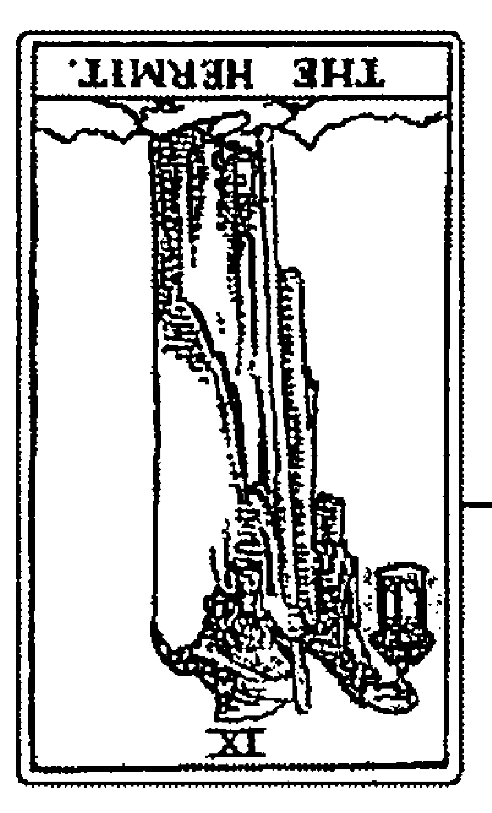

# 隐者逆位

心灵与精神层面的提示
真理与道路都在你自己的心中，只是看你如何超越凡俗的限制在灵性上更进一步，追寻的道路是必须忍受孤独的。

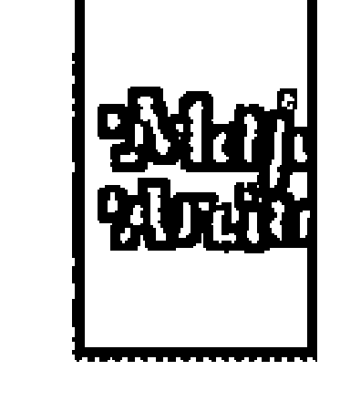

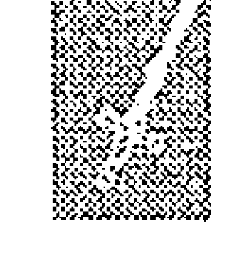

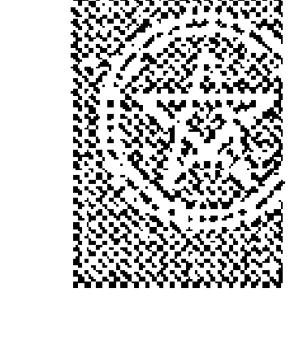

### 《人物》

**当事人的个性**
过于小心谨慎的人，甚至会让人觉得有一些胆小，习惯于隐藏自己，对某些事情有强烈的研究精神，会追根究底。

**当事人的工作观**
工作上仍然在学习当中，能依照长官的指示把事情做好，但不敢对自己的建议负责，常常会陷入自己的思考当中。

**当事人的感情观**
在感情上过于胆小，以致于无法表达自己的感情，即使已经出现好对象也仍然保持被动，有很多保守过时的观念。

**当事人的金钱观**
对于金钱并不了解，所以只会拼命地把钱存下来，有时候又会因为缺乏考虑而乱花钱，常搞不清楚自己有多少钱。

**与当事人的应对方法**
在交朋友方面比较被动，所以若是想要和他交往就要主动出击，但是他本身又很胆小，大大的动作可能会吓到他。

**人物代表**
苦行僧、修士、修女、保守主义者、胆小鬼、自卑的人。

## 《工作》

**工作本身的状况**
是自己要努力学习的状况，也还在摸索当中，没有什么人可以教导你该怎么去做，常会觉得是在孤军奋斗的感觉。

**如何解决工作的困境**
这时候应该要自己深入研究问题的状况，找到问题发生的原因，才有可能把问题解决掉，想靠别人是不会成功的。

**工作中的人际关系**
这个工作当中人际关系并不是重要的事情，只要小心别得罪人就好，其他的事情不要花太多心思，免得影响工作。

**与上司相处的方法**
由于上司也不能负起责任，所以常会找下面的人来当代罪羔羊，要小心谨慎地与他相处，状况不对也要见风转舵。

**工作的发展性**
这个工作未来还有一些发展的空间，但是仍然会是很辛苦的状况，如果不能心甘情愿的话，留下来反而会更痛苦。

**找工作／换工作的状况**
现在是可以找到新工作，不过状况并不会有太大的变化，如果觉得想要换环境的话，也可以到新的环境去试试看。

## 《愛情》

感情本身的狀況
感情的狀況有點不明，現在究竟是何種關係也還不是很確定，如果不找個機會談清楚，也許兩個人就會漸行漸遠。

新戀情的可能性
現在並沒有任何新的感情對象會出現，即使你有新的對象也比較屬於單戀的狀況，應該要漸漸習慣一個人的生活。

對這段感情的看法
十分小心地維持這段關係，但是對於自己的付出又感覺沒有價值，認為對方的表現不太成熟，所以很難維持下去。

性的吸引力
在這段感情當中，性的吸引力並不存在，甚至有其中一方或兩方有嚴重的處女情結，為這段感情設下更多的限制。

如何化解爭吵
爭吵絕不如表面上看起來那麼簡單，在背後還有更深的原因，如果不能找到問題真正的核心就很難化解這個狀況。

分手的方法
兩個人已經沒有什麼感情了，只要任何一方提出分手都可以很自然的分開，也可以告訴對方你想要一個人的生活。

複合的可能性
這段感情沒有任何複合的可能性，即使兩個人都是保持單身也是如此，可以多利用時間去做一些更有意義的事情。

## 《友情》

我的的人際關係狀況
你在人際關係當中比較被動，所以並不會有很多朋友，如果你想改善你的人際關係，就要改掉自己過於膽小的習慣。

如何化解與朋友的誤會
其實你和朋友之間沒有什麼誤會，有很多部分是你自己想像出來的，只要你看清楚事情的真相，就知道沒有問題。

## 《親情》

家庭的狀況
目前家中還缺乏某個穩定的關鍵要素，因此大家都會有一點人心惶惶，應該要盡快找到這個東西把大家穩定下來。

與長輩的關係
你很能了解長輩們的觀點和想法，但是並不能完全的認同他們，如果能夠有良好的溝通，關係應該就會慢慢改善。

與平輩的關係
在平輩之間你是比較孤僻的人，也不喜歡成為大家注目的對象，大家容易忽視你的意見，不過你自己也喜歡這樣。

與晚輩的關係
你對於晚輩常常太過挑剔，因此對你也會保持一定的戒心，如果要改善與他們的關係，就要對他們多一點的寬容。

## 《學業》

學業本身的狀況
你對於學習的方向還不是那麼清楚，也許需要花更多時間來思考這個問題，如果能想清楚的話應該就會十分順利。

學習的方法
這個時候你應該要深入地研究，而不只是了解表面的知識，試著使用更多資料來佐證你的看法，應該會很有收穫。

與老師相處的關係
是一個公事公辦的老師，只要符合標準和規則就會被他喜愛，但若你想要偷工減料，那麼他一定會把問題挑出來。

與同學相處的關係
與同學的關係對於學習並沒有什麼幫助，大部分的時候還是要靠自己學習，即使讓別人覺得你有點孤僻也沒關係。

## 《財務》

目前的財務狀況
現在的財務狀況並不是很好，要特別小心處理，一個不小心就可能會面臨破產危機，應該要謹慎保守的處理問題。

投資的狀況
接下來投資必然面對到重大的損失，所以應該當機立斷解決問題，如果還再加入新的投資，這個部分會血本無歸。

採購的策略
這個時候只適合量小質精的採購，一切都應該以品質為先，要小心檢查你買的貨品，以免遇到品質不良的瑕疵品。

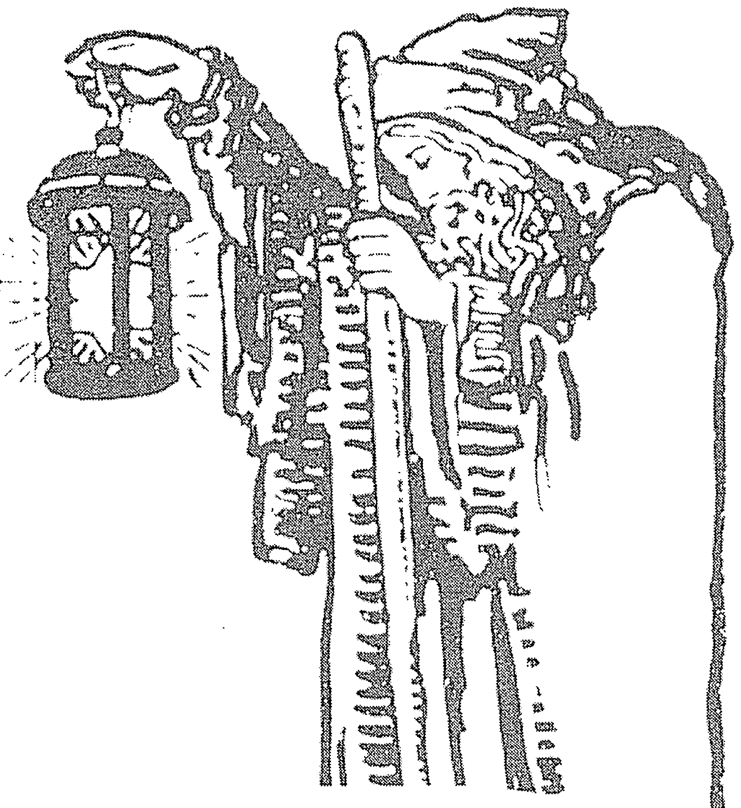

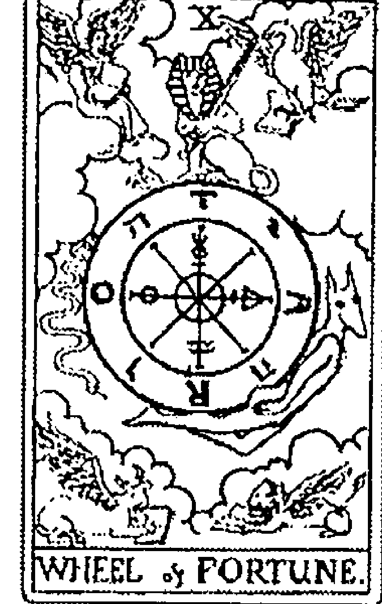

# 命运之轮正位

心靈與精神層面的提示
你正在體會世事無常的變化，只要更臣服在宇宙神聖的秩序當中，不論在心智上或是情緒上都將有突破性的成長。

### 《人物》

當事人的個性
一個心胸寬大的人，相信很多事情上天自有安排，採取順其自然不強求的生活態度，反而感覺上比其他人更幸運。

當事人的工作觀
在工作上十分認真學習，也能不斷吸收新的知識和觀念，對於事情有敏銳的判斷力，遇到問題往往能逢凶化吉。

當事人的感情觀
在感情上抱持著開放容忍的態度，不會特別去限制或強迫對方，但是自己也需要一些空間，無法忍受被對方綁住。

當事人的金錢觀
在金錢態度上十分樂觀，認為自己不會遇到大問題，沒有特別努力存錢，但是會有不少積蓄，算是有偏財運的人。

與當事人的應對方法
與這種人相處不用太緊張，只要讓事情順其自然發生就好，很多事情都是有機緣存在，該怎麼發展就會怎麼發展。

人物代表
出考題的人、門口的守衛、預言家、外交人員、哲學家。

## 《工作》

工作本身的狀況
在工作上處於一段還滿幸運的時期，即使自己不是非常努力，但在工作上的表現上也還不錯，是很得心應手的事情。

如何解決工作的困境
很多事情應該順勢而為，不要和時代潮流作對，面對問題要保持鎮定，只要掌握到正確的方向事情就會自然解決。

工作中的人際關係
你在這個工作當中的人際關係不錯，也可以因此而認識很多新朋友，應該要把把握這個機會好好建立起自己的人脈。

與上司相處的方法
上司比較使用無為而治的方式，很多事情的改變也不是他可以控制的，所以只要努力把自己份內的事情完成就好。

工作的發展性
這個工作應該還有不錯的發展性，除了樂觀應對之外還是要努力工作，否則可能會錯過一些升遷或調動的好機會。

找工作／換工作的狀況
現在應該會出現很好的工作機會，重要的是你能不能主動去掌握，也許往離家遠的地方找，會比較快找到好工作。

## 《愛情》

感情本身的狀況
現在感情的發展即將進入到下一個階段，應該放下不必要的顧慮和擔心，與對方共同去面對接下來要發生的事情。

新戀情的可能性
也許會有一見鍾情的可能性，如果想要談戀愛的話，可以每天把自己打扮得美美的，才會給對方良好的第一印象。

對這段感情的看法
這是命中註定的一段感情，不論如何都要和對方在一起，即使經歷過各種的風風雨雨，仍然很珍惜兩個人的感情。

性的吸引力
兩個人之間有很強的吸引力，第一次見面時就有似曾相識的感覺，更會覺得相見恨晚，當然性的吸引力也是很強。

如何化解爭吵
時間將會為你證明一切，其實這根本是一場誤會，但是如果強加解釋什麼，反而可能會讓對方有越描越黑的感覺。

分手的方法
除非發生重大的變故，否則兩個人要分手並沒有那麼容易，但如果長時間不見面的話，也許可以沖淡一點感情。

複合的可能性
兩個人的複合其實是意料中事，即使當時已經撕破臉了，仍然有很大的機會可以複合，一切好像冥冥之中註定的。

## 《友情》

我的的人際關係狀況
你是屬於朋友很多的人，但是每換一次環境又會有新的朋友出現，久而久之就會累積很多好朋友，成為你的貴人。

如何化解與朋友的誤會
其實很多事情是機緣巧合，如果真的覺得兩個人的緣份盡了，那麼也不一定要強求，反正信者恆信不信者恆不信。

## 《親情》

家庭的狀況
家中目前面對一個不錯的新狀況，只要把握到這個機會，應該會帶給大家很多提升的力量，也會改善大家的處境。

與長輩的關係
你常常很得長輩的人緣，即使你犯了什麼錯誤，大家也都會幫你找藉口，大部分狀況你都會從長輩得到很多幫助。

與平輩的關係
你和平輩之間常常都有互動往來，很自然的感情也會很好，大家常常會成為互補互助的團體，對彼此都會有幫助。

與晚輩的關係
晚輩常常無法了解你的想法，因此總是覺得你高深莫測，其實你常常在背後幫助他們，只是又不願意明白地說破。

## 《學業》

- **學業本身的狀況**
現在正是該努力念書的時候，如果在大家都很努力的時候自己鬆懈下來，那麼在學業上就很可能被其他人給追上。

- **學習的方法**
這個時候最好是能多多研讀資料，如果覺得課本不夠，最好也能找一些課外的材料參考，專業的書籍絕對是必要的。

- **與老師相處的關係**
是一個很會教書的老師，但是常常放任學生在其他方面自由發展，所以只要把書念好就可以，其他就自由發揮了。

- **與同學相處的關係**
你們是一群可以彼此砥礪進步的同學，大家的關係都還不錯，只要在當中不要太想出鋒頭，那麼就可以彼此和平相處。

## 《財務》

- **目前的財務狀況**
現在你的財務狀況很不錯，也會有一些偏財運，也可以賺到不少錢，應該把握這個時間作好長期發展的打算。

- **投資的狀況**
現在正是你投資可以獲利的時候，如果之前沒有投資，這個時候可以開始試試看，但也要注意投資開始變化的時機。

- **採購的策略**
現在適合進行大筆的採購，也容易買到物超所值的東西，所以要多看多比較，看到適合的東西千萬不要再猶豫了。

## 《延伸應用》

- **時間**
相對時間：十小時、十天、十週、十個月、十年。
標示時間：星期四、木星時。

- **地點**
區域：災後重建區、疫區、博物館、圖書館、便利商店。
方位：西方

- **物品**
專業書籍、神話故事書、出生命盤、月曆日曆、木乃伊。

- **身體部位**
排毒系統、肝。

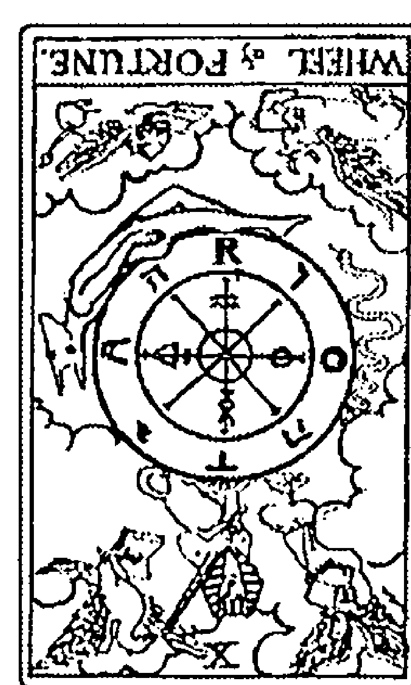

心灵与精神层面的提示
你的心量有多大，世界就有多大！放开心胸去接受大自然的洗礼，你会发现更多的空间和智慧，帮助你突破难关。

### 《人物》

当事人的个性
一个心胸狭窄的人，对于很多事情都怨天尤人，但是自己并不积极去处理问题，总觉得自己的命运比别人更坎坷。

当事人的工作观
对于工作容易心生不满，也许就会常常换工作，或是落入重复的错误当中，有时候也会因为自己认识不清而犯错。

当事人的感情观
面对感情往往三心二意，因此就很难稳定下来，很可能在之前受过严重的感情伤害，所以也常在感情上停滞不前。

当事人的金钱观
由于过于乐观与浮夸，所以财务状况并不太稳定，运气好的时候也会有很多收入，但是往往无法为自己累积财富。

与当事人的应对方法
其实对方不是什么坏人，但是仍然要保持距离以策安全，对于他的提议请再三评估，千万不要盲目地相信他的话。

人物代表
罪犯、一错再错的人、盲目乐观的人、带衰的人、骗子。

## 《工作》

工作本身的状况
目前在工作上遇到了重大的变化，这也不是你自己可以控制的事情，这时候应该处变不惊地面对，千万不要慌乱。

如何解决工作的困境
面对必然发生重大变化的状况，千万不要只是在原地不动，如果能够跟上变革的脚步，也许就可以化危机为转机。

工作中的人际关系
这个工作中的人际关系相当重要，即使不彼此合作也会互相影响，如果有得罪人的话，可能就会被人在背后攻击。

与上司相处的方法
变化莫测的上司，无论你怎么努力还是无法讨他的欢心，面对到摇摆不定的政策，你也只好乖乖地一步一步跟上。

工作的发展性
这个工作接下来还有很大的变化，到时候也许会有很大的麻烦出现，你可能要先想好是要选择接招或是准备逃走。

找工作／换工作的状况
现在应该会出现不少工作机会，但是要小心选择，不要落入求职的陷阱当中，也不要太相信别人介绍你的新工作。

## 《愛情》

### 感情本身的狀況
在感情上面對到很大的變化，你覺得在當中兩面不是人，也很難作出選擇，這時候的決定對未來會有很大的影響。

### 新戀情的可能性
現在會出現新的感情對象，但是並不一定是你理想中的類型，你可以試著改變自己去接受他，或是放棄再等一等。

### 對這段感情的看法
這段感情走到現在是一種因緣際會，但是接下來要怎麼辦也沒有很具體的想法，雖然感覺到兩人的關係正在變化。

### 性的吸引力
這段關係當中有很強的性吸引力，兩個人也會因為性關係而覺得無法分開，但有時這又會成為兩個人爭吵的主題。

### 如何化解爭吵
有些關係必將置之死地而後生，你只能維持現狀等待局面改變，也許問題慢慢浮現出來之後，你才有能力去處理。

### 分手的方法
兩個人的關係必然會發生改變，如果要利用這個機會分手也是順理成章的事情，只要有一方提出分手就可以結束。

### 複合的可能性
兩個人的關係總是分分合合，但是即使再複合了也很難就此穩定下來，應該思考清楚問題之後，才作最後的決定。

## 《友情》

#### 我的人際關係狀況
現在的人際關係狀況有點複雜，有些朋友好像沒有那麼熟，但是仍然會找你出來玩樂或是幫忙，讓你有點難應付。

#### 如何化解與朋友的誤會
不要急著下判斷，先找其他朋友來商量看看，有時候集思廣益會幫你找到更好的解決方案，要有耐性去解決問題。

## 《親情》

#### 家庭的狀況
家中目前面對一個無法預料的變局，大家都很想改善這個狀況，不過因為情勢還不明朗，所以也無法有具體作法。

#### 與長輩的關係
你與長輩的關係時好時壞，其實並不穩定，你應該把握好的時間和他們化解誤會，以免彼此間的誤會越結越難解。

#### 與平輩的關係
你和平輩之間是一種互相利用的關係，彼此之間也可以分工合作，但是若不是為了利益，大家也沒有深厚的感情。

#### 與晚輩的關係
你對晚輩常常會特別照顧，不過他們也不是每次都領情，你很難得到他們對你的具體回報，所以不必期待太多。

## 《學業》

### □學業本身的狀況
現在是你學習運勢比較差的時候，在一個無法充分發揮的地方，這個時候轉學或是轉系也許可以幫助你扭轉劣勢。

### □學習的方法
換一個環境再重新開始，如果在現在的環境當中再努力也是沒用的，你需要以更高的視野來看待現在的學習狀況。

### □與老師相處的關係
與老師的關係起伏不定，有時候覺得相處十分愉快，但是也常常有很多不滿的地方，不要過度期待關係會很穩定。

### □與同學相處的關係
這是一群對你念書沒什麼幫助的同學，一切還是要靠自己才有效，不必太在意與他們的關係，保持距離以策安全。

## 《財務》

### □目前的財務狀況
你的財務狀況正在發生結構性的改變，如果能好好把握將會為你帶來極大的利益，但是發生錯誤也是無法挽回的。

### □投資的狀況
不要過度樂觀地評估你的投資，必要時應該向專業的人士求助，如果自己胡亂來一通，必定會是血本無歸的慘況。

### □採購的策略
這個時候的採購應該要更小心謹慎一點，甚至有很大的機會買到不良品或是仿冒品，不要落入了歹徒的騙局當中。

## 正義正位

> 心靈與精神層面的提示
雖然你想追求正義與公道，但是要切記自己認為的正義有時並不一定是真正的正義，千萬不要被表面的假象迷惑。

### 《人物》

### □當事人的個性
有很強的正義感，對事情講究公平及平衡，很重視自己的原則，但是同時也能兼顧到別人的反應，以理性來判斷。

### □當事人的工作觀
在工作上重視條文及規則，完全以正式的規則為依歸，處理事情比較沒有彈性，但同時也會重視職場的人際關係。

### □當事人的感情觀
在感情上可以兼顧雙方的需要，以同理心去考慮事情，但是若有違反公平原則的狀況，他也會為了自己力爭到底。

### □當事人的金錢觀
在處理金錢上比較保守，但是會有自己的儲蓄和投資組合，雖然並不會因此賺到大錢，保留老本是絕對沒有問題。

### □與當事人的應對方法
這種人比較偏向理性和嚴謹，所以只要能符合一定的行為規範，就會被視為同類型的人，相處起來也會比較愉快。

### □人物代表
法官、檢察官、公務員、正義感強的人、洞察力強的人。

## 《工作》

### ☑工作本身的狀況
現在工作正在一個穩定的時期，大部分的事情都有明確的規則可循，也是自己可以勝任的狀況，沒有什麼大問題。

### ☑如何解決工作的困境
應該依照成文的法規來處理，否則也要找到正式的公文或是命令作為依據，真的遇到問題可以採取法律途徑解決。

### ☑工作中的人際關係
由於大家都有共同的利益，因此彼此之間會建立起一種良性的互動規範，大家都會盡力去維持良好的人際關係。

### ☑與上司相處的方法
很有原則的上司，要用任何方式討好他都不容易，但是你只要把份內的事情完成，不犯什麼大錯，關係就會很好。

### ☑工作的發展性
這個工作的發展性要看公司的制度，除了制度的保障之外就很少可以幫到你的地方，要學會正確理解公司的制度。

### ☑找工作／換工作的狀況
現在可以找到不錯的新工作，但是對你來說改變是一個重大的決定，應該要考慮到各方面的因素再作最後的決定。

## 《愛情》

### 感情本身的狀況
兩個人之間正在尋找一個平衡點，也有很多地方要相互配合，如何在不同的觀點和需要中平衡要靠雙方共同努力。

### 新戀情的可能性
現在出現新戀情的可能性並不高，主要是你太理性的考慮這件事情，自己又想得太多，即使出現對象也無法把握。

### 對這段感情的看法
在這個關係當中雙方都有付出，也都得到很多東西，彼此的感情也因此更為堅固，但也許仍然有一些事還沒決定。

### 性的吸引力
兩個人之間並沒有很強的吸引力，但是仍然會有一定的性生活，只是會變得比較像是例行公事，而有點缺乏熱情。

### 如何化解爭吵
現在需要的是一個平衡的結果，若是偏向任何一方就會有更大的反作用力，或者也可以找公正的第三者從中協調。

### 分手的方法
如果能透過理性的方法談判，就可以得到傷害性最小的結果，分手的過程可能會冗長而辛苦，但其結果會是好的。

### 複合的可能性
其實兩個人並不可能複合，最多只是留下一些舊帳還沒清而已，所以若是真談清楚了，兩個人其實沒有任何關係。

## 《友情》

#### 我的人際關係狀況
你的人際關係很好，但有時候會為了一些小事與朋友爭論，只要你能改掉這個壞習慣，應該會交到更多的好朋友。

#### 如何化解與朋友的誤會
事情的是非對錯是不能被顛倒的，相信公道自在人心，如果是自己對的事情應該就要堅持到底，否則就應該道歉。

## 《親情》

#### 家庭的狀況
現在家裡的狀況還算和諧，但是彼此的關係上也許會有一點嚴肅，這個時候如果能多一點聯誼活動應該會有幫助。

#### 與長輩的關係
在長輩的眼中你是非常懂事的一個人，有什麼事情也會和你分享或是詢問你的意見，因此你也會得到很多的信任。

#### 與平輩的關係
在平輩之間你常會成為大家的和事佬，發生衝突的時候大家都會想找你評評理，但是你和其他人的關係有點疏遠。

#### 與晚輩的關係
你對於晚輩常常有很多的關心和幫助，但因為態度比較嚴肅一點，所以他們常常會因為怕你，而照著你的話去做。

## 《學業》

#### 學業本身的狀況
現在在學習上應該要力求平衡，對各個科目都不可以偏廢，如果能循序漸進地跟上進度，整體的收穫也就會最多。

#### 學習的方法
依照順序由淺入深，不要因為自己的喜好而任意跳動學習的順序，一步一步把基礎打好，接下來的狀況才會順利。

#### 與老師相處的關係
很重視規則和原則的老師，也會很注意同學之間的人際關係和諧，所以只要作一個中庸的乖乖牌就完全沒有問題。

#### 與同學相處的關係
也許在同學中出現了不同的小團體，彼此之間有一些競爭關係，你要試著在當中尋求平衡，不要太偏向任何一邊。

## 《財務》

#### 目前的財務狀況
目前你的財務狀況穩健而平衡，是一個很好的狀況，但是也不會有太多的意外之財，應該把握好自己目前的主業。

#### 投資的狀況
原先的投資還算不錯，但不太適合有新的投資，這個時候可以先觀望一下，等過一陣子情勢明朗再作最後的決定。

#### 採購的策略
現在採購上要衡量不同的需要，也可能會有深遠的影響，這個時候不要太快作決定，應該去尋求專業人士的建議。

## 《延伸應用》

- 時間：相對時間：十一小時、十一天、十一週、十一個月、十一年。標示時間：天秤座（約每年9／23－10／22）。
- 物品：六法全書、判決書、執行命令、秤子、尺、量杯、王冠。
- 地點：區域：各級法院、調解委員會、律師事務所、法律學院。方位：西北方。
- 身體部位：腰部。

## 正義逆位

> 心靈與精神層面的提示
有時候思考並不見得能得到問題真正的答案，很多解答還是在你自己的心中，有時候應該放下理性相信你的直覺。

### 《人物》

### □當事人的個性
自己覺得正義感很強的人，但是有時對別人過於苛刻，或者是流於主觀的判斷，常會不顧別人的想法而一意孤行。

### □當事人的工作觀
在工作上十分認真負責，但是很難在工作與生活之間找到平衡點，有時候會變成工作狂，有時則是完全不想工作。

### □當事人的感情觀
在感情上想得很多，常常會過度自我批判，或是因為一點小事情而指責別人，時常會堅持自己的看法而沒有彈性。

### □當事人的金錢觀
理性但不太務實地處理金錢，雖然也會存錢和投資，不過很少因此而獲利，也可能因為拒絕承認錯誤而越陷越深。

### □與當事人的應對方法
面對這種主觀又苛刻的人，最好不要與他有正面的衝突或是利益上的牽扯，即使無法躲開也要保持距離以策安全。

### □人物代表
律師、好辯的人、政治評論家、檢驗員、誣告別人的人。

## 《工作》

### □工作本身的狀況
工作當中可能遇到與法律或規則有關的問題，並不是自己可以解決的，其實法律問題應該要用法律途徑解決才對。

### □如何解決工作的困境
面對著不公平的待遇，應該要循正式的管道來解決，私底下以私人關係來處理，不但無法解決反而會有更多問題。

### □工作中的人際關係
工作當中分成不同的派系，大家都有不同的利益要維護，這個時候應該理性思考，若不選擇你的處境會更加艱難。

### □與上司相處的方法
由於決定常常沒有任何理由的改變，讓你覺得無所適從，其實就只要照章辦事就好，無理的要求則是看狀況處理。

### □工作的發展性
這個工作的制度本身對你不利，所以無論你怎麼努力，就是比別人慢了半拍或是矮了半截，可以考慮換其他工作。

### □找工作／換工作的狀況
即使現在有新的工作出現，也不表示你現在適合一個新的環境，你可以先考慮各方面的意見，最後再自己下決定。

## 《愛情》

### □感情本身的狀況
兩個人之間出現不平衡的狀況，可能有一方覺得自己付出的太多，又得到太少回報，因此而產生一些問題和衝突。

### □新戀情的可能性
現在有新戀情發生的可能性，但是需要你主動去找才行，與其每天想很多可能性，還不如主動去爭取喜歡的對象。

### □對這段感情的看法
覺得還有很多東西沒想清楚，因此很難作出重要的決定，也許在更多實際相處的經驗之後，才能解開心中的疑惑。

### □性的吸引力
兩個人之間沒什麼性的吸引力，反而是在理性的交流上居多，有時候反而因為性生活不順利，引發更多的衝突。

### □如何化解爭吵
現在雙方需要的是一段冷靜的時間，先不要急著下決定，這時越是努力溝通反而會吵得越兇，還是不要白費力氣。

### □分手的方法
兩個人經過談判的過程必然可以得到分手的結果，只是這個過程當中可能會覺得很痛苦，得去面對一些傷心的回憶。

### □復合的可能性
兩個完全沒有復合的可能性，只是仍然覺得有很多的不甘心，還是早點把前帳還一還，免得分手還繼續糾纏不清。

## 《友情》

### □我的人的關係狀況
由於你對人比較嚴苛一點，所以只有極少好朋友可以容忍你，大部分的人對你是敬而遠之，人際關係並不是很好。

### □如何化解與朋友的誤會
這個問題並不是你自己可以解決的，因為解鈴還需繫鈴人，只有找到出問題的當事人，才有可能把問題徹底解決。

## 《親情》

### □家庭的狀況
現在家中可能遇到成員之間彼此不合的狀況，但是因為清官難斷家務事，家裡的問題還是要大家共同來處理才行。

### □與長輩的關係
長輩們對你的期望非常大，當然有時候也會比較嚴格一點，其實你和他們的感情不錯，要花更多時間與他們相處。

### □與平輩的關係
你在平輩之間其實是很有影響力的，大家都會重視你的意見，不過有時候你的看法太過主觀，也會引起大家反彈。

### □與晚輩的關係
基本上你對晚輩有一點過於嚴苛，應該可以用更輕鬆的態度和方法與他們相處，不要怕這樣教育的效果會打折扣。

## 《學業》

#### 學業本身的狀況
你在學習上給自己太大的壓力，其實大部分的表現都在可以接受的範圍之內，但是這個時候並不太適合參加比賽。

#### 學習的方法
很多事情適可而止，不要一下子衝得太快，有時候反而容易因此更快就感覺到疲勞，要有恆心地一步一步慢慢來。

#### 與老師相處的關係
是一個很容易偏心的老師，由於好惡太過於明顯以致於無法公平的判斷事情，這個時候再怎麼爭取也不會有結果。

#### 與同學相處的關係
你應當注意你的人際關係，雖然這對於課業並沒有直接的影響，但是如果被大家排擠，在情緒上也許會無心學習。

## 《財務》

#### 目前的財務狀況
你的財務目前處於恐怖平衡當中，任何一個環節處理不好都有可能造成全面的崩潰，記得不要給自己太大的壓力。

#### 投資的狀況
投資不是你該去作的事情，不要抱持著不切實際的期待，如果有人找你合夥千萬不要答應，很可能會有法律糾紛。

#### 採購的策略
要注意採購過程及物品本身的合法性，不要為了貪小便宜而買了來路不明的東西，有時會為你惹上不必要的麻煩。

## 吊人正位

# 心靈與精神層面的提示
你會想要追求強烈的洞見和直覺，即使不能在實際的事物上有所作為，也可以學著去接受現實當中的殘酷和美好。

### 《人物》

### □當事人的個性
能從不同的觀點來看事情，因此具有遠見及卓越的看法，遇到問題時有絕佳的耐力，也可以適應各種不同的狀況。

### □當事人的工作觀
在工作上並不積極，但會把自己份內的事情好好完成，對於事情有直觀的判斷力，也會很謹慎的去處理各種問題。

### □當事人的感情觀
在感情上比較被動，常常只有想像但是不行動，會安於自己在感情當中的角色和狀況，也不想作任何改變。

### □當事人的金錢觀
對於金錢的處理並不拿手，所以常常採取以不變應萬變的策略，在花錢的時候特別謹慎，算是在財務上保守的人。

### □與當事人的應對方法
因為常常與別人的看法不一樣，也許有時候會被視為異類，不要對他特殊的行為太驚訝，容忍會讓你們和平相處。

### □人物代表
有遠見的人、衛冕者、自願失業者、閉關沈思者、船員。

## 《工作》

### □工作本身的狀況
現在工作上面對一個重大的挑戰，也許並不是你一個人可以解決的，如果時機還不成熟，應該要先等待再作決定。

### □如何解決工作的困境
你需要一些新觀點的刺激，規則已經無法解決你的問題了，有的時候並不見得是革命性的作法，只是轉個彎而已。

### □工作中的人際關係
在這個工作當中人際關係並不重要，大家都是以自己的事情為主，彼此之間沒有太多互動，只要獨善其身就好了。

### □與上司相處的方法
你常會感到無法抓住上司的想法，其實可能是你的思想太僵固了，偶爾發揮一下想像力，你會發現事情很好解決。

### □工作的發展性
這個工作適合你休息和充電，但是未來發展性還不清楚，所以不要抱持太大的期待，先解決眼前遇到的問題再說。

### □找工作／換工作的狀況
現在很難主動找到新工作，但是仍然可能有人來找你，試著用一種不同的新眼光去評估，就會遇到最適合的工作。

## 《愛情》

### 感情本身的狀況
在感情當中兩個人的觀點似乎不同，但是仍然有交集的地方，不要表面的差異所蒙蔽，其實對方還是有很多優點。

### 新感情的可能性
現在適合觀察，但是不宜有所行動，你應該先思考自己在感情上的需要，等想清楚了之後自然就知道該怎麼作了。

### 對這段感情的看法
現在感情雖然十分穩定，但是也讓人覺得有一些停滯，如果付出的一切感覺沒有回報，也許就該考慮結束關係了。

### 性的吸引力
兩個人之間有很強的性吸引力，但是有很大的一部分是自己想像出來的，如果不能把想像實現出來可能會更失望。

### 如何化解爭吵
你們需要的是一個全新的觀點，因為想法改變狀況也就改變了，至於實際生活上的調整，反而不是最重要的事情。

### 分手的方法
現在立刻提出分手並不能解決問題，應該還會再拖一陣子，所以不如等狀況改變之後，再提出分手才能一次解決。

### 複合的可能性
現在其實感覺上也不像分開的樣子，但是要複合也沒有那麼容易，也許會在現狀上卡一陣子，即使主動也沒有用。

## 《友情》

#### 我的人際關係狀況
在人際關係上你比較退縮，並不太會主動與別人交往，因此朋友就會比較少一點，但是大部分都是很知心的朋友。

#### 如何化解與朋友的誤會
也許你要先退一步想，不能去要求對方立刻改變或相信你，即使事情的錯不在你，也要有耐心地等待事情的轉變。

## 《親情》

#### 家庭的狀況
現在家中的狀況十分平靜，但是仍然有一些長久以來的問題沒有解決，如果換一個角度來看也許根本就不是問題。

#### 與長輩的關係
你與長輩的關係很好，你總是很關心他們的狀況，而他們也都會幫助你很多事情，這是一個良性互動的行為模式。

#### 與平輩的關係
你和平輩之間的交集不多，幾乎都是一個人做自己的事情，但你是當中表現得比較好的一個，有時會遭大家忌妒。

#### 與晚輩的關係
你對晚輩採取放任的態度，但是其實在背地裡你又會很關心他們，也會幫助他們成長，因此相處的關係會很和諧。

## 《學業》

### □學業本身的狀況
學習正在一個重要的關鍵時期，任何科目都不能放棄，如果能突破現在遇到的問題，接下來的時間就會輕鬆多了。

### □學習的方法
在學習上要有耐性，不要因為一時的不順而放棄，還是要依照自己原訂的計劃一步一步完成，結果才會令人滿意。

### □與老師相處的關係
老師似乎常會採取放任的策略，因此只要把自己應該要完成的責任做好，其他的都不用擔心，安心作自己的事情。

### □與同學相處的關係
你的人際關係對於學業沒有多大的影響，最主要還是要靠你自己的努力，所以和同學平平淡淡的關係就好。

## 《財務》

### □目前的財務狀況
現在在財務上遇到重大的挑戰，雖然還不到窮愁潦倒的程度，但是確實對你的影響會很大，要小心處理這個問題。

### □投資的狀況
投資到此並沒有太大的收穫，同時也不會有太大的變化，所以若不急著用錢就先放著，換成現金也是不錯的選擇。

### □採購的策略
現在採購還不到可以進行採購的時機，也許你真正需要的東西還沒出現，你應該再等等看，也許會有更好的機會。

## 《延伸應用》

- 時間：相對時間：十二小時、十二天、十二週、十二個月、十二年。標示時間：夜間、睡眠當中。
- 地點：區域：樹蔭下、刑場、看守所、古蹟、大海當中、水中。方位：由東方到西方。
- 物品：祭拜用的牲禮或鮮花素果、海水、海鹽、乾燥花、標本。
- 身體部位：身體的下半部。

## 吊人逆位

> **心灵与精神层面的提示**
> 放掉你的混乱和恐惧，在暂停的这一刻回到真实的自我当中，你会发现更多的平静和安详，在当中可以找回智慧。

### 《人物》

### 当事人的个性
属于比较随和的人，遇到问题也能逆来顺受，有很大的包容性，但是有时候会过于忍耐而造成自己不必要的损失。

### 当事人的工作观
在工作上比较胆小怕事，不敢作重要的决定，也不愿意对事情负责，有时候也会因为粗心大意而犯下严重的错误。

### 当事人的感情观
在感情上会主动付出，并且常常为了对方而牺牲自己，但是又会自己觉得有点委屈，在感情当中常无法达到平衡。

### 当事人的金钱观
在处理金钱上考虑很多，但比较倾向于自私的想法，遇到财务出状况的时候，可能会牺牲别人的利益来成就自己。

### 与当事人的应对方法
平时感觉很好相处，但是要注意他情绪化的突然反应，只要平时保持良好的关系，到关键时刻他也会主动帮助你。

#### 人物代表
逆来顺受的人、牺牲者、殉教者、身心障碍者、潜水员。

## 《工作》

### 工作本身的状况
工作上有事情悬而未决，也许需要你的付出和牺牲，如果不能妥善处理的话，可能会演变成无法收拾的大事情。

### 如何解决工作的困境
也许你需要为这件事情做一些必要的让步和牺牲，以顾全更大的集体利益，但是也要仔细地评估其中的利弊得失。

### 工作中的人际关系
基本上每个人都是自私的，所以在不涉及利益的时候大家都是好朋友，但是若涉及实际利益时就会斗得你死我活。

### 与上司相处的方法
现在你的上司没什么空可以理你，你还是要自立自强比较重要，平时就保持一般的关系就好，不必要特别讨好他。

### 工作的发展性
这个工作未来的发育性并不好，但是保持平稳倒是没什么问题，所以若是想要有所表现，可能就必须要换工作了。

### 找工作／换工作的状况
现在并没有任何新工作会出现，所以还是在目前的位置待着就好，即使再努力想要换工作，到最后也是白费心机。

## 《爱情》

感情本身的状况
感情上正面零到重大的挑战，如果不能有正确的认识和行动，可能会使感情陷入破裂的危机之中，反而会更痛苦。

新恋情的可能性
现在不会有新的恋爱对象出现，所以自己不用想太多，倒不如在这个时候好好休息，对你来说反而更轻松愉快。

对这段感情的看法
觉得为了这段感情牺牲很多，应该在这个基础上更进一步的努力，就算没有回报也表示自己在这当中已经尽力了。

性的吸引力
其实你在性关系上很吸引对方，只是对方不知该如何回应和表达，如果两个人就卡在这里，就浪费了一段好姻缘。

如何化解争吵
在这件事情上你必须要先道歉，甚至是作出某些重大让步，否则对方若是不和你善了，这件事情可能就变成无解。

分手的方法
除非远走他乡避不见面，否则不论如何是无法分手成功的，与其花那么大的力气没有成果，还不如先等一等再说。

复合的可能性
这段感情的结束对你其实是一种解脱，实在没必要再回头去想那个人，你应该往未来去看，而不是被这个人卡住。

## 《友情》

我的人际关系状况
你是比较容易被别人欺负或者是被占便宜的人，虽然朋友们都会想要对你有所要求，但是你仍然要有自己的原则。

如何化解与朋友的误会
如果两个人的状况卡住，那还不如把问题诉诸于其他的朋友，让大家来为你们评评理，也可以善用同侪间的压力。

## 《亲情》

家庭的状况
遇到家中面对到困局，如果不向外求援的话根本无法解决问题，所以这时候应该不要再管面子问题直接找人帮忙。

与长辈的关系
你是长辈眼中的头痛人物，因为不论他们怎么说，你都不会听他们的劝告，而且即使遇到问题也不要他们帮忙你。

与平辈的关系
在平辈当中大家都是各过各的，彼此之间没什么感情，也没有办法合作任何事情，遇到重要事情大家再联络一下。

与晚辈的关系
你对晚辈有很深的感情，但是他们也许并不是太爱理你，你可以帮助他们很多地方，其实教育他们也是你的职责。

## 《学业》

- 学业本身的状况
现在卡在一个不利的位置，因此无法随心所欲地作自己想做的事情，除非你愿意用其他的条件来换取更多的自由。

- 学习的方法
休息是为了走更长远的路，这个时候一直拼下去也不一定会有结果，先让自己好好放松一下，再开始表现会更好。

- 与老师相处的关系
不要被老师注意到是最佳的策略，所以一切保持平凡、不好不坏，然后专心作自己的事情，其他的事都不要去管。

- 与同学相处的关系
在同学当中你的很受欢迎的一个人，不过这也是因为你为大家都付出了很多，不应该为了人际关系而忽略了课业。

## 《财务》

- 目前的财务状况
目前的财务状况并不是你可以完全控制的，而且当中还有很多的限制和危机，这个时候应该要有壮士断腕的决心。

- 投资的状况
这个时候的投资需要格外的谨慎，因为一个不小心可能就会满盘皆输，如果没有必要的话尽量不要从事新的投资。

- 采购的策略
现在其实并不宜进行采购，不得已的话应该要采用最保守的策略，以最少的金钱买最少量的东西，不要操之过急。

## 死神正位

# 心灵与精神层面的提示
你很想要除旧布新，从先前痛苦的状况解脱出来，关键在于你能不能把过去彻底放掉，才有可能开创全新的未来。

### 《人物》

- 当事人的个性
曾经历过重大的变故，已经能很平静地面对各种状况，外表看起来十分冷酷，其实是以坚强的意志力在控制情绪。

- 当事人的工作观
对于事情有自己主观的看法，而且会以各种方法贯彻完成自己的想法，不论谁用任何方法，都无法改变他的决定。

- 当事人的感情观
在感情上经历过分分合合，已经不抱持任何的期望，也不相信自己会得到幸福，常常会以行为或言语去试探对方。

- 当事人的金钱观
对于投资和理财都很有天份，即使赚的钱不多仍然可以把金钱的功能发挥到极至，处理金钱上有与众不同的看法。

- 与当事人的应对方法
无法与别人分享自己的心情，也很重视自己的隐私，只要不涉及到私人的事都可以谈，但千万别想刺探他的生活。

- 人物代表
刽子手、屠夫、税务人员、军警人员、征信业者、医生。

## 《工作》

- 工作本身的状况
工作上遇到重大的转变，而且你没得选择就必须要接受，甚至面临到被迫离职的状况，这个时候要作最坏的打算。

- 如何解决工作的困境
除了放下之外你别无所选择，与其坚持原来的方法和原则，不如试着把自己放空，可以自由地选择各种不同方案。

- 工作中的人际关系
这个工作当中并没有太多的人际互动，每个人都专注于自己的事情，大家的兴趣和性格也都不同，没有必要深交。

- 与上司相处的方法
一个高深莫测的上司，无论你怎样都不能猜透他的想法，所以最好还是听了命令乖乖去办事，才是最安全的方法。

- 工作的发展性
这个工作其实与你的缘份已尽，再拖下去也没什么意思，如果不能转换工作内容或是职位，还是快点准备离职吧。

- 找工作／换工作的状况
现在很可能找到新工作，但是你可能要下定决心转变才行，因为新工作很可能出现在你完全陌生的职业别或地方。

## 《爱情》

感情本身的状况
现在该是要放手的时候了，如果不能放掉不适合的人，怎么会有可能找到自己的幸福呢？应该放开心胸接受改变。

新恋情的可能性
现在并没有新恋情出现的机会，除非你把旧情人完全放下，如果在中间还是纠缠不清，就一定会维持单身的状况。

对这段感情的看法
现在的感情必须要作重大的改变，否则就很难维持下去，或许结束也是其中的一个选择，但是现在还没有作最后决定。

异性的吸引力
这段关系当中有极强的吸引力，彼此也无法放下性与爱的需求，可能因为性关系而把两个人的感情带入新的阶段。

如何化解争吵
这个时候两个人需要一些空间，让彼此先冷静下来，如果急着逼迫对方作决定，那么可能会让冲突一发不可收拾。

分手的方法
只要任何一方提出分手，这段关系应该就结束了，因为两个人的关系已经无法维持下去，还是分开会比较好一点。

复合的可能性
这段关系已经完全不可能复合，两个人也许会从此不再见面，而且也不会再有任何关系，还是早点死了这条心吧！

## 《友情》

我的人际关系状况
在人际关系上你属于比较孤立的一个人，也许会让人家觉得你有点自傲，你的敌我意识很强，不是朋友就是敌人。

如何化解与朋友的误会
其实问题已经这么严重了，这个误会也很难立刻化解，也许要考虑这段友谊的意义，也许到了应该要放弃的时候。

## 《亲情》

家庭的状况
家中可能有亲人去世，但是面对到重大的变故，这个时候应该要先稳定心情，把必须作的事情一步一步确实完成。

与长辈的关系
你与家中的长辈并不亲近，甚至已经没有任何往来，一直以来你都是比较独立处理事情，也不会想去要依靠他们。

与平辈的关系
在平辈当中你是比较内向的一个人，几乎不与大家有任何往来，你总是能把自己的事情搞定，也不会去帮助别人。

与晚辈的关系
你对晚辈聚少离多，没有太多时间心力去照顾他们，也许因此使你们的关系会有一点疏离，彼此之间感情比较淡。

## 《学业》

- 学业本身的状况
学习上面零一个重大的挫折，如果你不能改过自新重新振作努力，那么这个状况会更严重，到时就来不及补救了。

- 学习的方法
之前你的学习方法全错，必须要完全从头来过，如果自己无法下定决心改变，也可以向师长们请教比较好的方法。

- 与老师相处的关系
十分严格又赏罚分明的老师，完全不会留任何情面给同学，只有你的表现才决定了分数，其他一切求情都没有用。

- 与同学相处的关系
与同学之间的交集越少越好，这是应该要自己一个人努力的时间，若是人际关系花去你太多时间反而对课业不利。

## 《财务》

- 目前的财务状况
现在在财务上遇到重大变化的关键时期，如果处理不好可能会让你穷愁潦倒，如果发现有错误的决定也应该放下。

- 投资的状况
现在投资应该要通通结束，不要留下任何尾巴，否则后患无穷，即使别人对你再怎么花言巧语也绝对不可以相信。

- 采购的策略
所有的一切从头来过，不要被你之前的经验和习惯所影响，如果不能理性的评估这个状况，也许就不应该去采购。

## 《延伸应用》

- 时间
    - 相对时间：十三小时、十三天、十三周、十三个月、十三年。
    - 标示时间：天蝎座（约每年10/23－11/22）。

- 地点
    - 区域：急诊室、停尸间、殡仪馆、告别式、坟场、桥梁。
    - 方位：西南方。

- 物品
    - 棺材、骷髅、退学通知、离职通知、白旗、丧服、黑衣。

- 身体部位
    - 下腹部、生殖器官。

## 死神逆位

# 心灵与精神层面的提示
不要害怕改变，因为一件事情的结束往往也会是一个新的开始，只有勇敢面对转化过程的人才能得到进步和提升。

### 《人物》

- 当事人的个性
缺乏意志力的人，面对各种困难的状况常会觉得自己无能为力，即使把事情放到不可收拾的状况仍然不想作处理。

- 当事人的工作观
在工作上有一点迟钝，处理事情总是慢半拍，给人一种不是很专心的感觉，对工作没有强烈的期待或长远的计划。

- 当事人的感情观
还在失恋的情绪当中没有完全回复过来，因此无法对另一个人诚心诚意地付出，对于感情仍然有一点害怕的感觉。

- 当事人的金钱观
在处理金钱上并不拿手，是属于比较消极的人，有时候会莫名其妙地把钱花掉，事后检讨起来也不知道花去哪里。

- 与当事人的应对方法
这种人常常有一点晃神，交待事情给他一定要再三叮咛，并且在事后要去盯进度，但是他对交朋友方面并不积极。

- 人物代表
死者家属、孤儿、殡葬业者、绝症患者、跷家的年轻人。

## 《工作》

- 工作本身的状况
可能面对被迫离职或是工作上极大的变化，这个时候离开对你来说反而是一种解脱，既然这么辛苦就不要再撑了。

- 如何解决工作的困境
这个时候你应该选择收尾或是结束，投入更多的人力物力也是无法解决问题，很多时候问题应该置之死地而后生。

- 工作中的人际关系
大家同在一条船上但是没有互相合作，各自为政的结果反而是被个个击破，如果大家都站在本位主义就很难合作。

- 与上司相处的方法
本身很消极的上司，大部分的事情只能靠你自己，不要太去烦他有关工作的事情，最后他还是会让你自己想办法。

- 工作的发展性
这个工作当中最坏的状况你现在经历到了，伤害也已经造成，离开对你是比较好的选择，留下来状况就是这么坏。

- 找工作／换工作的状况
现在还不是找新工作的好时机，也许你应该要先等到你的状况回复之后再找工作，才会有适合你未来发展的工作。

## 《爱情》

- 感情本身的状况
也许你自己还不是很清楚，但是两个人真的是不适合，继续下去只会对你造成更多伤害，应该当机立断作出改变。

- 新恋情的可能性
即使现在已经有新的对象出现，你自己也无法发现，你必须把自己彻底的改造，才有能力判断出适合你的新对象。

- 对这段感情的看法
这段感情当中仍然有很多问题没有解决，但是大部分并不操之在我，要看对方如何回应，才知道到底能不能解决。

- 性的吸引力
这段关系当中没有很强的性吸引力，或者是双方对于性爱都是一知半解，因此性关系不会成为感情中的重要部分。

- 如何化解争吵
有些事情就是要装傻，表现得太聪明反而会让彼此的关系卡住，只要你能放下这件事情，争吵自然就会完全化解。

- 分手的方法
这个时候主动提出分手的一方会伤得比较重，所以还是由对方来提出分手比较适合，你还是被动消极一点比较好。

- 复合的可能性
这段感情已经转化成另一种关系，再也不可能回到感情关系当中，即使双方可以成为朋友，还是无法再成为情人。

## 《友情》

- 我的人际关系状况
其实你并不太努力经营人际关系，如果有好朋友也就是那几个，大部分的人都跟你不熟，也不知道你发生什么事。

- 如何化解与朋友的误会
有些时候努力处理不如就把它放着，也许过一阵子问题就会自然的转变，这个时候再去强求什么也不一定有意义。

## 《亲情》

- 家庭的状况
家中遭遇到无法避免的变局，大家应该发挥向心力合作共渡难关，如果只是想要维持现状必然会遇到更大的失败。

- 与长辈的关系
在长辈的眼中你是很特立独行的人，即使你努力说明他们仍然无法了解你，不过他们也会给你足够的空间去发挥。

- 与平辈的关系
你在平辈当中没有太特殊的表现，常常会被大家所忽略，你并不喜欢与大家的社交活动，反而会去作自己的事情。

- 与晚辈的关系
你不太会管晚辈的事情，大部分时间都是让他们自由发展，但是若他们遇到什么问题，你也会尽力帮助他们处理。

## 《学业》

- 学业本身的状况
学习陷入停滞的状况，其实你也搞不太清楚现在的状况进行到哪里，所以最好能找一个比较清醒的同学来解救你。

- 学习的方法
现在学习上的负担已经超过你的能力，如果不能适时放弃一些东西，想要把所有的东西全包，反而通通都学不好。

- 与老师相处的关系
与你本身并不太对盘的老师，最好是敬而远之，尽量减少互动的机会，当他越了解你之后，反而会看你更不顺眼。

- 与同学相处的关系
你与同学常常会有一些争吵，但是并不会造成多大的伤害，也许会遇到有同学转学离开，或是有新的同学转学来。

## 《财务》

- 目前的财务状况
你现在的财务状况很糟，应该要请教专家重新整理一下，如果紧抓住现在的状况不放，最后可能会变得一无所有。

- 投资的状况
现在应该要把所有的投资结束，等到适当时候再重新开始，如果有合伙的状况更要快点退出，否则就会血本无归。

- 采购的策略
应该重新评估你的采购计划，不要糊里糊涂就把东西买下来，也许你事后检讨会发现这些东西根本一点用都没有。

## 节制正位

# 心灵与精神层面的提示
你想要朝向更高的目标前进，在这里就要放掉不必要的包袱，才能帮助你提升到更高的层次找到奥秘的神圣智慧。

### 《人物》

- 当事人的个性
有良好的生活习惯同时对人温和有礼，可以容纳不同的意见整合成自己的看法，并且能严守不偏不倚的中庸之道。

- 当事人的工作观
乐于与别人合作，并且有良好的统合能力，通常会使用温和的手段来完成任务，也很稳定地朝向自己的目标前进。

- 当事人的感情观
对感情的态度会偏向保守，也是比较专情而不花心的类型，很重视两个人之间的沟通，并且能够接纳对方的意见。

- 当事人的金钱观
在金钱上偏向节省，但是该花的钱也不会省过头，在投资理财上很有天份，也会把自己的资金作最有效率的配置。

- 与当事人的应对方法
是一个相处起来很舒服的人，但是最好不要在他的面前表现出奢侈浪费的样子，也不要约在消费太高的地方见面。

- 人物代表
化学家、芳疗师、调酒师、药剂师、调解委员、和事佬。

## 《工作》

- 工作本身的状况
你需要用更有效率的方法去管理和调控，若是能够节省更多的成本和资源，在减少花费方面也算是另一种的获利。

- 如何解决工作的困境
手段上需要更缓合一点，不要强迫别人接受你的想法，而是要加强沟通来达到共识，最后再由大家一起合作完成。

- 工作中的人际关系
在工作当中有需要与别人相互合作的地方，这个时候就要发挥你的统合能力，让大家的意见整合在一起得到共识。

- 与上司相处的方法
可以尽量提出你的意见，因为他也喜欢和你讨论事情的感觉，如果能从当中激发出更多的灵感，他就会更重用你。

- 工作的发展性
这个工作的未来还有不错的发展性，也与你长远的目标相符合，所以应该在这个工作当中多尽一份心力好好表现。

- 找工作／换工作的状况
现在可以自己找到新工作，但是由朋友介绍的可能性也很高，只是在变换的过程中要比较低调，尽量减少伤害性。

## 《爱情》

- 感情本身的状况
两个人之间的关系已经很紧密了，彼此的沟通也很好，该到了可以开始讨论下一步的时候，正在朝向正面发展中。

- 新恋情的可能性
现在有新的恋爱对象出现，但是不一定是你喜欢的类型，你可以试着和对方交往看看，或者完全不理会也没关系。

- 对这段感情的看法
这段感情像是两个人共同的事业，在发展过程中同时符合了两个人的想法，两个人在当中也都付出了很多的心力。

- 性的吸引力
这段关系中有很强的性吸引力，不过两个人都克制在符合道德的范围当中，当关系更进一步就会有更多的性生活。

- 如何化解争吵
你需要用更和缓的方式和对方沟通，使用温和的手段，加上表现出愿意妥协的态度，才能帮助你们真正化解歧见。

- 分手的方法
如果要分手的话，一定要两个人有共识才行，所以应该展开一连串的谈判，在谈判成功之前两个人还算是在一起。

- 复合的可能性
这段关系还存在一部分复合的可能性，但是要双方共同努力去解决问题才有可能在一起，不过不是件容易的事情。

## 《友情》

- 我的人际关系状况
你的人际关系很好，是属于大家都很喜欢的那种人，不过因为一般的朋友太多，使你没有时间和你的好朋友相处。

- 如何化解与朋友的误会
要想办法继续沟通协调，这样才有可能达到双赢的局面，也许双方都有要改进的地方，不要只是一味的怪罪对方。

## 《亲情》

- 家庭的状况
算是温馨的小康家庭，大家的关系也都很和谐，即使家人之间发生了什么不愉快的事情，也都可以透过沟通解决。

- 与长辈的关系
你是长辈眼中的乖孩子，因此也会得到长辈们更多的宠爱，你们有很多的交流机会，也可以直接参与他们的活动。

- 与平辈的关系
与平辈的关系很不错，大家都可以互相合作彼此支援，如果你扮演领导者的角色，更会因此受到大家一致的肯定。

- 与晚辈的关系
你和晚辈很能聊，一方面可以教他很多东西，也可以从他们身上学到很多新的观念，也算是一种交流互惠的关系。

## 《學業》

#### 學業本身的狀況

現在正是你適合學習的好時機，可以利用這個時候把過去零散的觀念統合起來，你將會對這些東西有全新的認識。

#### 學習的方法

你可以和同學們互相討論，不但可以因此更了解內容，也可以在論辯的過程中抓到問題的核心，順便和同學交誼。

#### 與老師相處的關係

是一個擅長教學的老師，也會很公正的處理同學之間的問題，所以你的表現決定了你們的關係，應該要好好表現。

#### 與同學相處的關係

你的同學對你的學習狀況來說非常重要，所以應該要多花一些時間和他們相處，你也會因此而得到很多的好朋友。

## 《財務》

#### 目前的財務狀況

即使你現在並不有錢，但是因為財務結構上是健全的，整體看來也可以達到收支平衡，擁有長期發展的良好基礎。

#### 投資的狀況

現在的投資可以作一些調整，不過並不宜再增加新的投資，在原有的基礎上發展，未來應該可以達到不錯的收益。

#### 採購的策略

這個時候不能只注意單價，也要看總價到底是多少，把整個採購計劃再仔細評估之後，就可以找到最有利的方法。

## 《延伸應用》

#### 時間

相對時間：十四小時、十四天、十四週、十四個月、十四年。
標示時間：射手座（約每年１１／２３－１２／２１）。

### 地點

區域：河岸、湖邊、上山的道路、俱樂部、資源回收箱。
方位：西方的上方

### 物品

植物精油、化學藥品、成藥、雞尾酒、消毒和清潔用品。

### 身體部位

臀部、大腿。

節制逆位

心靈與精神層面的提示
彼此合作比相互競爭更有力量，但是要在之前評估自己的狀況，一步一步地朝向目標前進，才能得到最後的成功。

《人物》

當事人的個性
容易受到別人的影響而失去自己立場，遇到無法解決的問題時容易有情緒化的反應，或者會以主觀的直覺作判斷。

當事人的工作觀
在工作上很難與人合作，大多會以破裂收場，對於事情的看法過於樂觀，以致於實際執行時常會遇到意外的困難。

當事人的感情觀
在感情上不切實際，會為了愛而付出一切，但是也常常遇到不合適的人，當感情當中出現狀況時常常會逃避問題。

當事人的金錢觀
有時候會過於節省，但是有時候又過於浪費，對於自己的資產常常沒有務實的規劃，甚至搞不清楚自己有多少錢。

與當事人的應對方法
一個不太有主見的人，但是千萬不要試圖去影響他，若是出錯的時候他可能就會怪罪於你，也最好不要與他合作。

人物代表
月光族、卡奴族、新進人員、轉學生、混血兒、新移民。

《工作》

工作本身的狀況
你的工作當中涉及到不同方面的利益衝突，你在當中比較像是夾心餅乾，不論偏向哪一邊都會帶來一些新的問題。

如何解決工作的困境
把自己的部分確實完成就好，不要去管別人負責的事情，必要的時候還要與對方劃清界線，以免被對方所拖累了。

工作中的人際關係
工作當中有很複雜的人際互動，與大家的關係都很重要，雖然你是大家爭取的對象，但仍然要小心背後被捅一刀。

與上司相處的方法
屬於比較保守的上司，所以可以適度的提出建言，不過也不要有太親近的關係，以免因為人情反而衍生更多問題。

工作的發展性
這個工作的未來的發展性平平，大概不會有太大的變化，但是要小心人際關係的發展，也許會有不同的派系鬥爭。

找工作／換工作的狀況
現在找工作的狀況不是很順，或者也可以去嘗試新的領域，把自己之前所學的東西，以另一種方式重新表現出來。

《愛情》

感情上現在面對溝通不良的狀況，很多事情無法了解彼此的想法，也開始有一些爭執，也有很多事情還沒想清楚。

現在並沒有新感情發生的可能性，反而是你應該好好反省的時刻，也要重新思考自己對於感情的需求到底是什麼。

也許因為這段感情在還沒想清楚的狀況下就開始了，所以現在出現一些嚴重的問題，正在考慮是不是要繼續下去。

兩個人之間有性吸引力，這也是兩個人會在一起的重要原因，不過因為屬於情緒性的結合，也可能帶來一些問題。

這個時候應該將處理事情的速度放慢，有耐性地和對方討論下去，把對方從情緒化的狀況中拉出來才能解決問題。

只要有任何一方提出分手，兩個人的關係就算是結束了，最好是利用電話或是信件提出，不要面對面談這件事情。

這段關係並不太可能復合，感情已經完全破裂了，離開這個人對你來說是一個正確的決定，沒有必要再為難自己。

《友情》

你常覺得無法與別人合作，也很難融入人群之中，也許是因為對環境還不習慣的關係，而使你與別人都保持一些距離。

先放下你的情緒，自己反省一下到底自己是哪裡不對了，等想清楚之後再和對方溝通，記得要保持理性才能成功。

《親情》

現在家中面對分裂的危機，因為大家對一件事情有不同的看法，而造成了彼此緊張的氣氛，一時之間也無法化解。

你很喜歡和長輩聊天，或者是聽他們討論事情，但是他們並不是很喜歡你這樣做，有時候也會因為聊天而起衝突。

在平輩之間大家最好各自作各自的事情，如果有合作的事情就常會發生一些爭執，最好是不要有金錢方面的牽扯。

你對晚輩的事情都很關心，也很熱心教育他們，但是他們常會覺得你太愛管閒事，有一些事情也不太願意和你講。

## 《學業》

#### 學業本身的狀況

現在學習對你特別重要，有很多東西要同時進行，如果太過強求的話，反而通通都學不好，所以應該要量力而為。

#### 學習的方法

一方面需要抽象的思考，但同時也不能忽略了實踐，除了念書之外需要很多時間練習和實習，才能學得又快又好。

#### 與老師相處的關係

也許因為和老師不太對盤，所以常常會有溝通上誤解的問題，如果第一時間無法了解的話，應該要提出疑問確定。

#### 與同學相處的關係

可能會因為與同學的人際關係，而影響到你的學習情緒，其實交朋友是需要一些時間慢慢適應的，不要急著有結果。

## 《財務》

#### 目前的財務狀況

目前的財務結構並不健全，所以應該更務實地重新調整，切忌不可與別人合夥或把錢借別人，以免發生很大的糾紛。

#### 投資的狀況

現在並不是很適合投資，如果有合夥的狀況也應該盡快結束，把所有的資產都計算清楚，等到適合的時候再出發。

#### 採購的策略

現在不是很適合進行採購，可以先把錢省下來，如果必須進行採購，也要很小心的計劃和評估，否則很可能被騙。

惡魔正位

心靈與精神層面的提示

你現在過份重視物質層面，而忽略了精神與靈性的成長，因此可能會感到空虛和迷惘，也缺乏人生的方向和目標。

《人物》

#### 當事人的個性

個性比較激烈，常會因為一時激動犯錯，遇到不順利的狀況可能會有暴力傾向，為了達成目的往往不擇手段。

#### 當事人的工作觀

在工作上渴望成功，不惜使用各種不正當的方法，很會陷害或是利用別人，如果自己得不到的別人也別想要得到。

#### 當事人的感情觀

對於感情並不信任，常常把感情當成手段而非目的，即使在戀愛關係當中也很難感受到愛，但是又不能缺乏感情。

#### 當事人的金錢觀

非常重視金錢，也會願意為了金錢而犧牲其他的事情，會努力把錢存下來，但是無法把自己的資金作適當的配置。

#### 與當事人的應對方法

對這種人最好敬而遠之，如果得罪到他一定讓你吃不完兜著走，如果和這種人走得太近，反而會被利用或者陷害。

#### 人物代表

暴力犯、縱火犯、施行邪術的人、毒販、自私自利的人。

《工作》

### 工作本身的狀況

現在工作遇到了嚴重的破壞，大部分的狀況都超出你的控制之外，事前無法防範，甚至可能為了這件事丟了工作。

### 如何解決工作的困境

這件事情即使無法解決，也決不要用不正當的手段來處理，也許一時之間似乎得到好處，但會引來嚴重的副作用。

### 工作中的人際關係

在這個工作當中每個人都在勾心鬥角，大家即使一起工作也無法信任，要小心別被陷害了，也不要想交到好朋友。

### 與上司相處的方法

一個自私自利的可怕上司，最多也只能在合法的範圍內盡量滿足他的要求，如果能夠選擇的話最好離開他的控制。

### 工作的發展性

這個工作的未來一片黑暗，也不會有什麼好的發展，應該及早離開這個地方，千萬不要對這個地方抱持任何幻想。

### 找工作／換工作的狀況

現在正在你自己運勢的低潮，找什麼工作都只是從一個地獄逃到另一個地獄，能夠休息的話就不要出來找工作了。

《愛情》

- 感情本身的狀況
兩個人的關係已經走到盡頭，再撐下去也沒有什麼意義，還不如早一點分手，免得繼續下去對大家都再造成傷害。

- 新戀情的可能性
現在並不存在任何新戀情出現的可能性，即使有人表示喜歡你，也必然是心懷不軌，別在這個時候去自找麻煩了。

- 對這段感情的看法
這段關係帶來的痛苦多於快樂，有時候會想要控制對方，但是又覺得不能得到滿足，有時候會轉變成憤怒的情緒。

- 性的吸引力
這段關係當中只剩下了性的吸引力，也是兩個人發洩慾望和情緒的管道，但這種關係已經沒辦法讓人感覺到溫暖了。

- 如何化解爭吵
問題已經不是兩個人可以解決的了，這時候再勉強溝通也是吵得更兇而已，最好是不要見面，以免發生暴力事件。

- 分手的方法
其實兩個人已經算是分開了，談或不談只是一個形式而已，所以找到好時機就把這件事談一談，總是該要解決的。

- 複合的可能性
這段關係完全沒有複合的可能性，想再和他在一起只是自己找罪受而已，要趕快離開這個人才能讓你看清楚真相。

《友情》

- 我的人際關係狀況
人際關係的狀況並不好，別人都不想和你交往，如果你不改自己的脾氣及怪罪別人的習慣，這種狀況會繼續下去。

- 如何化解與朋友的誤會
這個誤會是因為雙方都堅持己見而引起的，即使你主動道歉也不見得會被接受，所以可能會維持很長的一段時間。

《親情》

- 家庭的狀況
可能是發生家庭暴力的狀況，或是遇到很重大的威脅，家人彼此之間不能相互信任，也許大家都在逃避這個問題。

- 與長輩的關係
在長輩的眼中你是很不聽話的小孩，你也不太喜歡長輩管理你的方法，雙方常常會發生衝突，因此感情也不太好。

- 與平輩的關係
在平輩當中彼此都在算計對方，除了利益的交換之外彼此沒有太多感情，遇到事情也必然是以自己的利益為優先。

- 與晚輩的關係
你常想利用晚輩幫你去作事情，或是把他們作為滿足你慾望和虛榮心的工具，他們也會覺得自己總是被你所控制。

## 《學業》

## 《財務》

- 學業本身的狀況
現在你的學習狀況並不好，主要是因為你又想要偷懶走捷徑，另一方面又想在各方面都表現得很好，這是不可能的。

- 目前的財務狀況
現在的狀況表面上看起來還好，其實當中藏有很多的問題，也不是短期間之內可以解決的，要很小心地應對處理。

- 學習的方法
你必須要按部就班慢慢來，一次解決一個問題，不要那麼貪心，也許在一段時間之後，你的課業也會慢慢上軌道。

- 投資的狀況
現在的投資如果有賺錢應該快點把它們通通換成現金，因為這只是表面上曇花一現的成功，不要再投入新的資金。

- 與老師相處的關係
面對到兇惡又不可理喻的老師，你很難脫離他的掌握，你只能把自己該作的事情好好完成，其他的就不要太在意。

- 採購的策略
這個時候要注意對方的誠信問題，千萬不要被花言巧語所騙，如果不小心買到假貨或贓貨，反而會帶來更多問題。

- 與同學相處的關係
你與同學的感情並不是很好，一方面也是因為你的脾氣不太好，因此讓人覺得難以接近，在功課上也不會幫助你。

## 《延伸應用》

- 時間
相對時間：十五小時、十五天、十五週、十五個月、十五年。
標示時間：魔羯座（約每年12/22—1/19）。

- 地點
區域：賭場、酒店、狂歡派對、電玩遊樂場、聲色場所。
方位：西方的下方

- 物品
毒品、迷幻藥、符咒、色情暴力書刊、盜版光碟、偽鈔。

- 身體部位
膝蓋。

惡魔逆位

心靈與精神層面的提示
只有物質的享受無法填滿你內心的空虛，只有超越物質的誘惑才能得到真實的洞見，找到自我內在的療癒和力量。

《人物》

#### 當事人的個性

意志不堅定的人，容易受到其他人、事、物的誘惑而改變了自己的想法，甚至也可能執迷於酒、色或是毒品當中。

#### 當事人的工作觀

重視自己的利益大於一切，為了賺錢或升遷不計毀譽，結黨營私的可能性很高，有時候做了決定又不願意負責任。

#### 當事人的感情觀

容易受到外貌或是對方的家世財產所吸引，但是並不算是真正的喜歡對方，遇到更有錢的對象可能就會見異思遷。

#### 當事人的金錢觀

重視金錢之外更重視物質生活的享受，會花很多錢去買各種的名牌精品，甚至不惜為了賺錢去作違法犯紀的事情。

#### 與當事人的應對方法

這種人容易受到利益的誘惑，更容易因為自己的利益出賣其他人，所以最好不要太信任他，平時就應該做好防備。

#### 人物代表

迷信的人、嫖客、妓女或牛郎、上癮者、賭客、黑社會。

《工作》

### 工作本身的狀況

你被利慾薰心，而忽略了正當的手段和道德的界線，即使在短期能有一些利益，長期看來反而會造成不利的影響。

### 如何解決工作的困境

你必須拒絕不正當的誘惑，才不會把自己的後路卡死，一切都依照正常程序處理，就能在關鍵時刻保護你的安全。

### 工作中的人際關係

工作當中結成各種不同的利益聯盟，派系之間的鬥爭也很激烈，這個時候即使想保持中立，也會被捲入鬥爭當中。

### 與上司相處的方法

現在被這個上司完全控制住，因為不可能脫離他的控制，就只好乖乖服從他的命令，最好不要有與他不同的意見。

### 工作的發展性

這個工作是金玉其外敗絮其中，即使看起來再光鮮亮麗，也絕對不會有什麼好的發展，最好能快點離開這個地方。

### 找工作／換工作的狀況

千萬不要因為被錢逼急了就隨便找一個工作，如果沒有好的工作機會就應該再等等，小心不要被就業陷阱所騙了。

《愛情》

### 感情本身的狀況

兩個人之間有太多的錯綜複雜的情感糾結，也歷經了欺騙和激烈的爭吵，也許兩個人是為了利益結合而沒有感情。

### 新戀情的可能性

現在會出現感情的誘惑，但是並不是會真心與你相愛的人，或許他會想要利用你或控制你，所以應該要小心提防。

### 對這段感情的看法

這段關係帶來很多的束縛和限制，為了對方而失去自我，想要逃開又沒辦法放得下，因此會變成一段痛苦的關係。

### 性的吸引力

這段關係當中有很強的性吸引力，也是兩個人仍然在一起的主因，但是性的吸引力反而讓兩個人覺得是一種束縛。

### 如何化解爭吵

兩個人都無法看清真相，再談也是沒有用的，應該回到兩個人相愛的原點，重新去考慮兩個人的關係到底是什麼。

### 分手的方法

現在要分手也無法立刻達成目的，也許應該要先冷靜一陣子，等兩個人的情緒都過去之後，再找機會談這件事情。

### 複合的可能性

如果兩個人只想互相控制而沒有真心，即使複合也不會幸福，看清兩個人真正的關係，你就不會每天想要複合了。

《友情》

#### 我的人際關係狀況

你常常會想控制別人，但是你越是如此別人就越會躲你，想辦法放開自己的心胸，自由自在的交往友情才會長久。

#### 如何化解與朋友的誤會

有時候誤會是由其他的人所造成的，如果能夠找到這個關鍵性的第三者，也許就可以解開這個長久以來的老問題。

《親情》

#### 家庭的狀況

家人之間為了錢而發生不愉快的狀況，甚至因此而陷入嚴重的糾紛當中，如果還是這麼重視利益，親情就無法維持。

#### 與長輩的關係

長輩非常想要控制你，但是你隨時都想要脫離他們的控制，如果只是看到衝突面，那麼關係就會陷入無解的僵局。

#### 與平輩的關係

基本上平輩之間有一些利益上的結合，但是也會因此想要彼此控制，當發生利益衝突的時候就很容易翻臉不認人。

#### 與晚輩的關係

你常常會想要滿足晚輩的各種需求，但是他們似乎常常得寸進尺讓你疲於應付，因此也會花費很多的時間和金錢。

## 《學業》

- 學業本身的狀況
你現在被學習以外的事情所迷住，以致於沒有花太多心力在學習上，你應該專心念書，不要每天想著玩樂或戀愛。

- 學習的方法
很多東西是沒辦法勉強的，遇到無解的問題就先放著，把自己能作的事情先做好，等到完成了之後再回頭來解決。

- 與老師相處的關係
不應該對這個老師有過度的想像或期待，如果不好好表現就一定會受到處罰，千萬不要想去挑戰老師忍耐的極限。

- 與同學相處的關係
很多只會帶著你玩樂的損友，與他們交往反而會對你的成績有不利的影響，應該離開他們以免被他們把成績拖垮。

## 《財務》

- 目前的財務狀況
現在的狀況面臨到很大的危機，一個不小心就會讓你一無所有，記得要用正當的手段才能徹底解決你的問題。

- 投資的狀況
你被美麗的說辭所騙，自己陷入了投資的陷阱當中，越快脫離就越能減少你的損失，如果晚了可能就會血本無歸。

- 採購的策略
這個時候並不宜進行採購，以免因為一時衝動買了你不需要的東西，更要注意衡量自己的財務狀況以免超支太多。

塔正位

心靈與精神層面的提示
你執著於錯誤想法，反而會離真正的理想和智慧越來越遠，若沒人當頭棒喝點醒你，恐怕就會走向錯誤的不歸路。

《人物》

- 當事人的個性
自視甚高的人，也會為了面子而堅持自己的作法，即使明知道自己是錯誤的仍然不願意改過，因此常常遇到困難。

- 當事人的工作觀
在工作上不知應變，往往以過時的方法來處理事情，遇到危機的時候常會有不理性的情緒反應，也因此很難成功。

- 當事人的感情觀
在感情上總認為只有自己才是對的，因此會忽略對方的觀點和作法，遇到困難時常以分手來威脅但又不解決問題。

- 當事人的金錢觀
無法適當地處理自己的金錢，因此常會讓自己陷入窮困的境界，有時候不預期的臨時支出反而會占到很重的比例。

- 與當事人的應對方法
最好不要與這種人深交，可以用激將法讓他去作某些事情，但是若事情並不順利，也要小心他會有情緒性的反彈。

- 人物代表
破產的人、被囚禁的人、不悔改的人、佞臣、自大的人。

《工作》

- 工作本身的狀況
工作上遇到了突發的重大意外，這並不是你可以控制的狀況，但是又要由你來負責任，讓你覺得很無辜又很倒楣。

- 如何解決工作的困境
沒有非常的破壞就沒有非常的建設，要作好一切從頭來過的準備，如果不能解決問題就選擇放棄，不用再堅持了。

- 工作中的人際關係
這些人只能共享樂而不能共患難，狀況好的時候可以當酒肉朋友，遇到問題的時候絕不可能幫你，還是要靠自己。

- 與上司相處的方法
一個喜怒無常的上司，你無法知道他到底在想什麼，甚至完全照他的要求去做還會被釘，最好保持距離以策安全。

- 工作的發展性
這個工作未來沒有任何好的發展，只可能有更悲慘的狀況在等著你，如果可以選擇的話就應該快點離開這個地方。

- 找工作／換工作的狀況
現在找工作只是自找麻煩而已，並不能解決任何問題，如果不願意在這個時候休息，就會找到有很多麻煩的工作。

## 《愛情》

### 感情本身的狀況

感情上遇到重大的挫折，但這並不是你們可以控制的，也許會面臨重大的反對壓力，使得這段感情無法繼續下去。

### 新戀情的可能性

這時候不會出現任何新的感情對象，別再執迷不悟了！還是把自己該作的事情好好完成，感情的事情就不用想了。

### 對這段感情的看法

這是一段沒有希望的感情，即使兩個人真心想要在一起也註定要分開，現在付出得越多只是在未來分開時更痛苦。

### 性的吸引力

這段關係當中並不存在性吸引力，甚至可能有一方或雙方有性功能障礙，不良的性生活也會成為這段關係的阻礙。

### 如何化解爭吵

現在任何爭吵都可能造成毀滅性的後果，想要挽回這段關係變得十分困難，也許分開一陣子是兩個人唯一的選擇。

### 分手的方法

只要任何一方不再堅持，這段關係就已經算是結束了，再撐下去也沒有任何意義，所以只要寫個信告訴他就好了。

### 複合的可能性

分手已經是這段關係註定的結果，任何想要複合的努力都只是白費力氣而已，兩個人的感情是不可能繼續下去的。

## 《友情》

#### 我的人際關係狀況

你在人際關係上遇到重大的困難，這都是因為你堅持錯誤的作法導致受到大家的排斥，應該快點調整自己的作法。

#### 如何化解與朋友的誤會

這段友誼很可能會到此為止，也不是你作什麼可以挽回的，既然這個誤會無法解決，那麼就只好去尋找新的朋友。

## 《親情》

#### 家庭的狀況

家中遇到了很大的意外變故，這個時候應該要先穩定人心，從悲傷或害怕的情緒當中走出來，才有可能解決問題。

#### 與長輩的關係

長輩對你有很多的不滿，甚至可能常會對你打罵，你對這樣的狀況時常作出反擊，雙方的關係也因此而劍拔弩張。

#### 與平輩的關係

平輩們彼此之間有很多的不滿和衝突，彼此之間也很難有交流或是合作，每個人都只是站在自己的立場來看事情。

#### 與晚輩的關係

你對晚輩有很多的不滿，也會以各種強制的手段去控制他們，若是他們不受你的控制，你反而會因此而大發雷霆。

## 《學業》

#### 學業本身的狀況

你現在的學習狀況奇差無比，幾乎沒有任何科目是及格的，如果繼續保持這樣的表現，很可能就會被退學或留級。

#### 學習的方法

你必須要先承認自己的失敗，才能從失敗當中重新站起來，捨棄自己原先無效的方法，去學習別人更有效的方法。

#### 與老師相處的關係

遇到以處罰為主要手段的老師，只能盡量做到不要犯錯，如果自己做不好的話，即使真的被處罰也無話可說。

#### 與同學相處的關係

同學之間大多狀況都是吵吵鬧鬧，雖然不太會影響你的心情，但是對你的學習也沒什麼幫助，一切還是要靠自己。

## 《財務》

#### 目前的財務狀況

你現在處於破產的狀況或是面臨破產的危機，自己已經沒有能力解決自己財務上的困境，必要時應該向專家請教。

#### 投資的狀況

現在進行投資必然血本無歸，甚至會讓你賠到傾家蕩產，如何當機立斷減少損失，就要看你自己的判斷和決心了。

#### 採購的策略

這個時候採購必然面對到很大的問題，所以最好是不要在這個時候進行任何採購，否則很可能會花錢當冤大頭。

## 《延伸應用》

#### 時間
- 相對時間：十六小時、十六天、十六週、十六個月、十六年。
- 標示時間：星期二、火星時。

### 地點
- 區域：高樓、災難現場、電線桿、建築工地、廢墟遺跡。
- 方位：北方。

### 物品
- 電擊棒、毀滅性武器、逃生救難用品、消防栓、避雷針。

### 身體部位
- 肌肉系統、男性生殖器。

## 塔逆位

> 心靈與精神層面的提示
害怕會使你停滯不前，也無法看清楚事情的真相，唯有皈依臣服於更大的智慧中，才能啟發你潛在的智慧和勇氣。

### 《人物》

#### 當事人的個性

比較膽小害怕的人，常常覺得自己過著悲慘、痛苦的日子，也會因此而自怨自艾，還不時的會有杞人憂天的擔心。

#### 當事人的工作觀

害怕在工作當中負責任，因此也不敢下任何決定，遇到事情就會躲得遠遠的，也很難與別人合作去處理一件事情。

#### 當事人的感情觀

可能曾經在感情上受過嚴重的傷害，老是覺得自己不夠好，也很會自我批判，當發生爭吵時總會覺得配不上對方。

#### 當事人的金錢觀

常常感覺到有財務上的壓力，但是即使有賺錢的機會也無法把握，會認為自己一定不可能有錢，因而放過好機會。

#### 與當事人的應對方法

有時候會因為極度的自卑，而表現出自大的樣子，但是又沒有勇氣去面對問題，所以最好不要替他決定任何事情。

#### 人物代表
- 慌亂的人、失敗者、難民、消防人員、救難人員、傘兵。

## 《工作》

### 工作本身的狀況

有可能是突然被解雇，或是因為莫名其妙的原因被處罰，與其每天過著提心吊膽的日子，還不如快點把工作辭了。

### 如何解決工作的困境

首先要克服自己的心理障礙，如果自己都覺得不可能做到，那事情怎麼有可能解決？就勇敢地照原定的計劃去做。

### 工作中的人際關係

工作當中缺乏人際互動，但是又彼此處於勾心鬥角的狀況，一切都要靠自己的努力，同時也要小心被同事們陷害。

### 與上司相處的方法

非常自以為是的上司，覺得全世界只有他一個人是天才，其他的人都是笨蛋，遇到這種人最好不要提出反對意見。

### 工作的發展性

這個工作已經到了最壞的狀況，但是未來也沒有什麼改善的空間，如果無法忍受這種悲慘的生活，就快點離開吧。

### 找工作／換工作的狀況

現在找的工作並不好，不如趁這個時候多休息，把自己的身心狀況調整好，等到自己回復得差不多了再重新出發。

## 《愛情》

### 感情本身的狀況

這段感情已經無法繼續下去了，即使再怎麼努力也無法使關係改善，應該快點選擇離開這段令雙方都痛苦的關係。

### 新戀情的可能性

現在並不會出現好的感情對象，應該是先讓自己走出感情的傷害再說，想要以一段新感情來療傷是不可能的事。

### 對這段感情的看法

這段感情帶來許多的擔心和痛苦，並且看不到未來的希望，如果能快速地結束這段感情，對兩個人都是一種解脫。

### 性的吸引力

這段關係當中性生活並不重要，兩個人之間也沒有太多性的吸引力，即使有性生活也不會對這段感情有任何影響。

### 如何化解爭吵

現在爭吵已經流於意氣之爭，兩個人只是爭一口氣，而沒有是非對錯的問題，因此只要有一方先低頭就會有轉機。

### 分手的方法

這段關係本來就在危險邊緣，只要提分手關係就會結束，但最好不要當面提出，以免對方因羞憤而發生暴力事件。

### 複合的可能性

這段關係已經被徹底破壞，也不存在任何感情的基礎，所以即使想複合也只是空想而已，彼此不可能繼續在一起。

## 《友情》

#### 我的人際關係狀況

你在人際關係方面過於保守，又無法適應環境調整自己的作法，以致於無法交到新的好朋友，且舊朋友又離你而去。

#### 如何化解與朋友的誤會

這段友誼很難復原，最多只能減少對彼此的傷害性而已，最好是兩個人能分開一陣子不要聯絡，可能會比較冷靜。

## 《親情》

#### 家庭的狀況

家中遇到的意外變故，大家都還在震驚和傷害當中，這時候應該要先把大家的情緒穩定下來，再來討論如何解決。

#### 與長輩的關係

你對長輩的作法十分不滿，也會當面頂撞他們，他們也會因此而對你有很多意見，雙方的關係也會因此發生衝突。

#### 與平輩的關係

平輩其實是只能顧好自己的事情，也沒有什麼情感的交流，有時候也會因為你自己的固執，而招致同輩們的不滿。

#### 與晚輩的關係

你常覺得晚輩不了解你的心情和苦衷，不過又不願意表現出你對他們的關心，有時反而會無法感覺到彼此的心意。

## 《學業》

#### 學業本身的狀況
你現在的學習狀況很差，很多科目幾乎到了無法補救的地步，如果不還覺悟開始努力的話，就會留下不好的記錄。

#### 學習的方法
你必須要先克服自己的恐懼，不要認為這個科目有那麼可怕，從基礎重新開始學習，雖然比較慢但是仍然會有救。

#### 與老師相處的關係
遇到脾氣不好的老師，最好還是少招惹他為妙，千萬不要因為頑皮而故意去挑釁他，你一定會受到最嚴厲的處罰。

#### 與同學相處的關係
你現在處於被同學們孤立的狀況，也沒有人可以幫忙你，因為一切只能靠自己的關係，也會讓你學會更獨立。

## 《財務》

#### 目前的財務狀況
你現在面臨破產的危機，每一步的處理都要格外小心，甚至會有意外的狀況來打擊你，讓你覺得自己真的很倒楣。

#### 投資的狀況
現在並不適合進行任何種類的投資，可能因為一個意外事件就讓你的心血化為烏有，合夥的事業面對拆夥的危機。

#### 採購的策略
這個時候並不適合進行採購，即使原本計劃當中的採購也可能發生變故，不要執著於自己的想法，要有彈性應變。

## 星星正位

# 心靈與精神層面的提示

你十分渴望得到上天的啟示，但是你需要先將自己放空才能讓上天的旨意進入你的生命，得到真正的平靜和智慧。

### 《人物》

#### 當事人的個性

對人生充滿希望的人，能夠信任他人並與他人分享自己的想法，十分愛好自由自在的生活，也帶有高度的理想性。

#### 當事人的工作觀

對於工作有自己的看法，也會設定屬於自己的目標努力達成，很會利用人際關係來完成任務，是個值得信任的人。

#### 當事人的感情觀

在感情上有理性面的考量，但又不失感性面的表現，能夠為對方無怨無悔的付出，非常渴望建立長久穩定的關係。

#### 當事人的金錢觀

並不把自己的金錢放在第一位，反而會去想其他人是否過得好，很習慣地以金錢幫助朋友，甚至其他不認識的人。

#### 與當事人的應對方法

一個可以真心交往的朋友，談到社會公義或世界大同的話題特別會引起他的興趣，對他付出將會得到更大的回報。

#### 人物代表
占星學家、漁夫、水手、水電工、義工、參觀的解說員。

## 《工作》

### 工作本身的狀況

現在工作上有一個明確的目標，你應該要緊抓住與這個目標有關的所有機會，不要讓其他的事情分散了你的心力。

### 如何解決工作的困境

你應該盡量發揮你的創意，以最自由不受拘束的方式來思考，這樣會想到最好的方法，問題自然就可以順利解決。

### 工作中的人際關係

工作當中的同事都很好相處，即使沒有業務的往來還是可以互相幫忙，只要你願意付出，絕對能和他們成為朋友。

### 與上司相處的方法

常常只會作原則提示的上司，但是接下來就要你自己想辦法了，只要你能順利完成任務，並不會太干涉你的作法。

### 工作的發展性

這個工作未來有不錯的發展，但是先要認清你自己的想法和目標，有了明確的方向才不會走一些不必要的冤枉路。

### 找工作／換工作的狀況

只要你有一個明確的目標，其實工作就在不遠的前方，你要對自己的能力有信心，這樣才能更快找到更好的工作。

## 《愛情》

### 感情本身的狀況

感情上進入平穩的階段，也開始在計劃長遠的未來，兩個人的關係不只是情人也像是朋友，常常會彼此分享心情。

### 新感情的可能性

現在有可能會出現新戀情的機會，但是能不能把握就要看你自己有沒有主動，只要你鎖定目標努力一定會有成果。

### 對這段感情的看法

這是一段令人充滿期待的真感情，兩個人對未來都有很多的理想和計劃，也會希望和對方一起去實現這些夢想。

### 性的吸引力

這段關係當中並沒有很強的性吸引力，但是會有不錯的性生活，兩個人會重視生活情趣，性生活只是其中一部分。

### 如何化解爭吵

其實只要把話說清楚了，沒有什麼事情是不能解決的，問題在於誰先開口而已，應該要提出自己的想法和他討論。

### 分手的方法

若要兩個人完全不聯絡也不太可能，所以如果要提出分手，也必然是以回復朋友關係為前提，這樣談才可能成功。

### 復合的可能性

這段關係能不能復合，取決於之前是怎麼談分手的，如果之前是和平談判分手的，現在要和平談判復合就很容易。

## 《友情》

#### 我的人際關係狀況

你的朋友很多，彼此之間也能夠互相幫助，不過有時候因為你的付出太過沒有保留，反而會被朋友的問題所拖累。

#### 如何化解與朋友的誤會

其實你與朋友的誤會只是小問題，只要兩個人找機會談一談就沒事了，千萬不要因為一時的賭氣而使誤會更嚴重。

## 《親情》

#### 家庭的狀況

現在家庭當中的氣氛十分平靜，家人彼此之間的感情也很好，能夠分享彼此的心情和想法，算是很和樂的一家人。

#### 與長輩的關係

家中的長輩可以說是你的偶像，有很值得你崇拜和學習的地方，你如果能和他們保持良好關係會對你有很大幫助。

#### 與平輩的關係

平輩彼此之間能夠分享很多東西，如果有一個共同目標也可以相互合作，因為彼此充分信任也可以很坦誠地相處。

#### 與晚輩的關係

你對晚輩特別照顧，希望他們能得到所有最好的東西，不只是在有形的物質層面，在情感層面上也有很好的照顧。

## 《學業》

#### 學業本身的狀況

現在你學習的狀況還算不錯，但是仍然要持續努力才能達到自己的目標，千萬不要一時的成功就自滿而停滯不前。

#### 學習的方法

與同學相互討論是比較有效率的學習方法，千萬別一個人閉門造車，也許在你付出的同時會從別人身上學到更多。

#### 與老師相處的關係

很會鼓舞學生的好老師，但是會採取比較放任的策略，也可以試著和老師成為好朋友，其實他是很平易近人的。

#### 與同學相處的關係

同學是你學習最大的動力，你應該要和同學保持良好的關係，並且在學習上與他們互動討論，對你會有很大幫助。

## 《財務》

#### 目前的財務狀況

你目前的財務狀況還不錯，不但自給有餘還可以幫助別人，記得分享與擁有一樣重要，有些時候施比受更為有福。

#### 投資的狀況

現在投資的運勢還不錯，但比較適合合作長期的投資，不要想短期之內就有很多獲利，還是要有耐心慢慢等待回收。

#### 採購的策略

這是一個適合進行採購的時間，可以多打聽多比較，不要在第一時間就衝動決定，因為可能會買了不需要的東西。

## 《延伸應用》

#### 時間
- 相對時間：十七小時、十七天、十七週、十七個月、十七年。
- 標示時間：水瓶座（約每年 1 / 2 0 — 2 / 1 8）。

### 地點
- 區域：天文台、水池邊、魚缸或魚塭、網際網路、太空。
- 方位：南方的上方。

### 物品
- 花瓶、水壺、無線電話、八角星、八卦、鳥類、觀賞魚。

### 身體部位
- 小腿、腳踝。

## 星星逆位

# 心靈與精神層面的提示
直覺與靈感看似遙不可及，其實就在你每日的生活經驗當中，能夠漸漸接受不完美的自己，就能發現天啟的真理。

### 《人物》

#### 當事人的個性
屬於天真浪漫的人，但有一些不切實際，以過度美化的角度來看事情，以至於無法發現事情的真相，也容易受騙。

#### 當事人的工作觀
對於工作有高度的熱忱，但是並不夠腳踏實地努力工作，所以有時會無法達成任務，在工作當中常常過於理想化。

#### 當事人的感情觀
在感情方面願意付出，同時也要求回報，在戀愛當中會全心投入，這時候感性會超越了理性，也變得比較情緒化。

#### 當事人的金錢觀
對於金錢沒有太多的想法，只要有得花用就好，並不在乎是否會有很多積蓄，有時也搞不清楚自己到底有多少錢。

#### 與當事人的應對方法
對於高談闊論的一些看法只要附和就好，不必把他的看法太認真看待，只要保持平衡的付出，會是很好相處的人。

#### 人物代表
青春美麗的人、理想主義者、空想的人、特異功能的人。

## 《工作》

### 工作本身的狀況
工作上遇到目標不明確的狀況，應該要謀定而後動，搞清楚上面的想法是什麼，不要任意解讀隨自己的意思亂搞。

### 如何解決工作的困境
這時候應該要開放心胸，努力去吸收大家的看法，彙整之後就可以得到最好的方法，更重要的是要腳踏實地去做。

### 工作中的人際關係
在這個工作當中，同事之間的互助很重要，即使你的能力再強，若是缺少了同事的支持，就絕對不可能完成任務。

### 與上司相處的方法
你很難當面就了解他的想法，只能在實踐當中慢慢去猜，由於他平時不太參加社交活動，所以也很難刻意討好他。

### 工作的發展性
這個工作未來的發展還不錯，但是還有一些未知的變數存在，不要一廂情願地以為事情一定會照自己的想法發生。

### 找工作／換工作的狀況
現在可能會出現兩個以上的機會，但是其中只有一個是適合你的，應該衡量自己的興趣與能力作一個務實的選擇。

## 《愛情》

### 感情本身的狀況

兩個人對於這段感情的看法過於理想化，而且彼此之間的認識還不夠深，如果想更進一步的話應該更務實地評估。

### 新戀情的可能性

現在也許會出現新的戀情機會，但是常常是你看得到吃不到的狀況，如果不能努力去追求很可能就會讓希望落空。

### 對這段感情的看法

這段感情雖然十分穩定，但有一點讓人覺得平淡無味，兩個人與其說是情人還不如說是好朋友，也帶有一些責任。

### 性的吸引力

這段關係當中性的吸引力並不強，甚至可以說是沒感覺，也許兩個人的相處會比較像不帶有性別差異的朋友角色。

### 如何化解爭吵

很多的爭吵其實都是想像出來，也沒有什麼具體的證據，只要兩個人可以把問題釐清，就會發現一切都只是誤會。

### 分手的方法

距離是這段關係最大的殺手，如果能夠完全避不見面、相應不理，對方在完全沒有回應的狀況下也許會同意分手。

### 復合的可能性

這段關係其實不太可能復合，一切都是你自己想像出來的，所以只要你能務實的評估，就會發現兩個人沒有未來。

## 《友情》

#### 我的人際關係狀況

你與朋友之間的關係還不錯，是一種交流互惠的關係，不過若是你只想要好處而停止付出，他們也會這樣對待你。

#### 如何化解與朋友的誤會

這時需要你放下面子主動去化解，不能主動跨出第一步就不會有開始，只要你有誠意要談，事情很快就會有轉機。

## 《親情》

#### 家庭的狀況

現在家中面對一個很好的機會，但是不宜對這個機會有太高的期待，以免因為期望越大若無法達成反而失望越大。

#### 與長輩的關係

你由長輩那裡得到不少的好處，但是並不是很積極地回饋他們，使得這個關係有一點失衡，應該要多多關心他們。

#### 與平輩的關係

平輩彼此之間很坦誠地相處，但是因為觀念上的差異而難以合作，這個時候也不要強求，能夠彼此支援就足夠了。

#### 與晚輩的關係

你在晚輩身上看到希望，因此會對他們付出特別多，不過因此也會想要控制他們，別因為主觀的期待而強迫他們。

## 《學業》

#### 學業本身的狀況

現在學習的狀況算平穩，但是要注意各個科目之間的平衡，不要只在自己有興趣的科目上努力而忽略了其他科目。

#### 學習的方法

不要只是空想而不行動，要把東西學好還是要自己下苦功才行，只要你腳踏實地努力學習，就會得到應有的報償。

#### 與老師相處的關係

有點古怪的老師，比較難理解他的行為模式，有時候很親切但是又常變得情緒化，還是以平常心來相處會比較好。

#### 與同學相處的關係

雖然同學對於你的學習沒有太大的幫助，不過因為和同學的感情很好也會有助於你的學習情緒，建議維持良好關係。

## 《財務》

#### 目前的財務狀況

你有一點好高騖遠，反而沒有辦法把握到近在眼前的機會，應該更務實地評估自己的財務，才會作出正確的決定。

#### 投資的狀況

如果已經有長期的投資收益，可以提早落袋為安，不要太樂觀預期未來的榮景，也許轉眼之間就會變為過眼雲煙。

#### 採購的策略

這時適合進行新品的採購，但是應該衡量自己的經濟能力，不要衝動消費，精密評估就可以達到物美價廉的效益。

# 月亮正位

心靈與精神層面的提示
如果要突破模糊的現狀，找到確定的堅實基礎，你可以運用直覺或是參考夢境中的指引，幫助你更快的找到答案。

### 《人物》

當事人的個性
十分善變的人，有些時候連自己也搞不清楚自己的想法到底是怎麼樣，常常以至於隨著自己當下的直覺作決定。

當事人的工作觀
容易對工作心生不滿而會想換工作，反而很難把一個工作從頭到尾完成，但會在表面上裝作自信和不在乎的樣子。

當事人的感情觀
不知道自己在感情上真正的需要是什麼，也不務實地經營感情，會幻想一個完美的愛情，但是也常在感情上被騙。

當事人的金錢觀
無法好好面對自己的金錢問題，因此會在財務上犯下重大的錯誤，但是又不知道如何改進，在財務上常會不穩定。

與當事人的應對方法
也許前一分鐘說的話到下一分鐘就不算數了，所以除非有白紙黑字的契約存在，否則不要太相信他答應的任何事。

人物代表
諮商師、化妝師、老婦人、雙面人、善變的人、大騙子。

## 《工作》

工作本身的狀況
你面對很大的風險和不確定性，到處充滿了陷阱和騙局，這時你應該要防止要被自己的幻想誤導作出錯誤的決定。

如何解決工作的困境
現在並不是作決定的好時機，最好是等你精神體力好轉之後再來解決，在這個狀況當中僵持下去也沒有什麼意思。

工作中的人際關係
同事彼此之間爾虞我詐，完全無法信任其他人，如果不小心說了什麼不該說的話，不到一天就會被所有的人知道。

與上司相處的方法
面對這種說話不算話的上司，最好所有的指示都要留下證據，以免他後來翻案的時候，你可以有方法保護你自己。

工作的發展性
這個工作未來的不確定性仍然很大，除非你很想要賭賭看，否則這並不是一個好的選擇，離開也不會有什麼損失。

找工作／換工作的狀況
現在其實充滿了求職的陷阱，也不容易找到好的工作，如果能夠先休息一陣子的話，就不要那麼急著出來找工作。

## 《愛情》

感情本身的狀況
感情仍然在變化當中，也還有很多未知的影響因素，這個時候應該保持開放的想法，而不要急著下任何大的決定。

新戀情的可能性
現在容易出現愛情的騙子，很少會出現真心相愛的對象，所以應該睜大眼睛小心分辨，才不會成為無辜的受害者。

對這段感情的看法
在這段感情當中覺得很不穩定，也不知道兩個人的未來會是怎麼樣，因為看不清楚狀況，所以就會有很多的情緒。

性的吸引力
這段感情當中的性吸引力很強，而且是出於本能的反應，也許有很頻繁的性生活，但是與感情的狀況有一點分開。

如何化解爭吵
記得不要用情緒性的字眼批評對方，應該先耐心地讓對方把話說完，你會發現有很多事情其實是自己想像出來的。

分手的方法
為了避免涉入太多的情緒反應，最好選擇速戰速決的分手方式，如果當面談得越久，反而可能引發更多新的問題。

複合的可能性
這段感情即使有可能複合，也不會是一個穩定的關係，還會落入重複的分分合合當中，還不如下定決心快點分開。

## 《友情》

我的人際關係狀況
你常常遇到會欺騙你的人，因此在友情方面就不太願意付出，要小心不實的謊言對你產生傷害以及暗箭傷人的小人。

如何化解與朋友的誤會
其實都是謊言惹的禍，只要你能誠心地向對方澄清，把事情講清楚說明白，過一陣子之後問題就會慢慢地平息了。

## 《親情》

家庭的狀況
由於家族當中發生意外的狀況，以至於影響到你的家庭氣氛，只要能夠小心處理，應該不會發生太大的問題。

與長輩的關係
長輩對於整個家庭可以說是最重要的穩定力量，因此你們的關係也變得格外重要，最好能盡量避免情緒性的反應。

與平輩的關係
平輩之間雖然沒有明顯的衝突，但是私底下也常會相互比較和較勁，有時甚至會發生互相欺騙或是隱瞞的狀況。

與晚輩的關係
你很希望能夠照顧晚輩，不過因為各種因素使你無法達到原本的期望，同時也要小心不要被晚輩所隱瞞或者欺騙。

## 《學業》

學業本身的狀況
在學習方面可能會覺得狀況不是很好，這是因為你缺乏清楚的方向，只要你想清楚自己要的是什麼狀況就會改善。

學習的方法
這個時候需要邊做邊學，試著改變自己以往不良的學習慣性，以更新更有效率的方法去學習，成績就會明顯改善。

與老師相處的關係
老師似乎特別關心你，但是也會對你產生較大的壓力，這個時候應該保持平常心，不要因此影響到你的學習情緒。

與同學相處的關係
在現在的交友圈當中損友居多，所以不但對你的學業沒什麼幫助，反而還可能把你帶壞，應該要快點離開這些人。

## 《財務》

目前的財務狀況
你無法務實地評估自己的財務狀況，以至於自己已經沒錢了還不知道，這種錯誤的認知可能會帶給你不利的影響。

投資的狀況
千萬不要在這個時候掉入投資的陷阱當中，任何的投資都不適合，不論別人說得如何天花亂墜，最好都不要相信。

採購的策略
這時候不宜進行任何採購，因為你無法看清物品真正的價值，很可能會買貴了當冤大頭，甚至買到假貨或瑕疵品。

## 《延伸應用》

時間
- 相對時間：十八小時、十八天、十八週、十八個月、十八年。
- 標示時間：雙魚座（約每年2/19-3/20）

地點
- 區域：海岸、潮間帶、天然的洞穴、地下室、荒野小道。
- 方位：南方的下方

物品
- 魚類、蝦、螃蟹、水生植物、狼、青蛙、野狗、銀飾品。

身體部位
腳。

# 月亮逆位

心灵与精神层面的提示
认清与接受真实的自己是困难的，如果一直陷于自我欺骗的状态当中，问题永远无法解决，也没人能救得了你。

### 《人物》

当事人的个性
很容易紧张的人，常觉得风声鹤唳草木皆兵，不容易信任别人，也很少与人谈起自己的状况，但内心有很多情绪。

当事人的工作观
在工作上并不稳定，当发觉状况不对的时候可能会以逃避甚至换工作来处理，让人无法安心地把重要的事交给他。

当事人的感情观
在感情上十分缺乏安全感，因此也不太敢表现出真正的自己，即使很真心对待别人，也会让人有言不由衷的感觉。

当事人的金钱观
总是觉得自己缺钱，但是又不知道如何改进自己的财务状况，常常会莫名其妙地把钱花掉，而无法把金钱存下来。

与当事人的应对方法
尽量不要以言语去刺激他，也许对你来说是一句玩笑话，他可能会记在心里好几天，甚至觉得受到了严重的伤害。

人物代表
爱幻想的人、艺术家、胆小鬼、容易紧张的人、夜猫子。

## 《工作》

工作本身的状况
你常在工作上犯一些小错误，虽然不见得会造成什么实质上的伤害，但是对你的形象有很大的影响，要小心一点。

如何解决工作的困境
俗话说“穷则变、变则通”，只是谨守规则是无效的，应该因时因地制宜采取不同的方法来处理，改变才有希望。

工作中的人际关系
也许在表面上大家都是和平相处，但是其实私底下是暗潮汹涌，所以不论为人处事都要特别小心，以免树立敌人。

与上司相处的方法
对这种情绪化又没担当的上司，最好还是靠自己比较稳，但是在表面上要装作服从的样子。

工作的发展性
现在也许到了该换工作的时间，你可以开始找其他的工作机会，至于现在的工作就不用太在意了，别太放在心上。

找工作／换工作的状况
现在找工作的状况并不是很顺利，即使找到新工作也不是那么稳定，所以最好不要太快就决定要投入一个新工作。

## 《愛情》

感情本身的状况
彼此可能有一些事情互相隐瞒，虽然不是有意欺骗但也不知如何开口，有时候也会因此而引发比较情绪性的争吵。

新恋情的可能性
现在并没有什么好的新对象会出现，即使努力寻找也只是白费心力，最好是先休息一阵子，等运势好转之后再说。

对这段感情的看法
这段感情引发了很多的情绪，彼此之间也有很多的意气之争，常会觉得看不到两个人的未来，而感到有一些失望。

性的吸引力
这段感情当中性的吸引力是很重要的一部分，但是常常无法真的满足对方，有时候也会因为性生活不协调而争吵。

如何化解争吵
这个时候最好什么都不要解释，以沈默来冷静双方的情绪反应，等过一阵子之后再来处理，其实就会很顺利解决。

分手的方法
避不见面是逼不得已，但是其实可能是伤害性最小的处理方式，在双方没有联络的状况下，感情就可以渐渐变淡。

复合的可能性
两个人之间其实已经没有感情，还不如快点分开的好，再纠缠下去只是浪费生命，也不可能在分手之后成为朋友。

## 《友情》

我的人际关系状况
你虽然有不少好朋友，但是其中也有很多虚情假意的人，是为了不单纯的目的和你交往，要小心分辨两者的差别。

如何化解与朋友的误会
现在解释什么都是多余的，时间会为你证明一切，即使自己有错道歉也是以后的事情，应该要先让事情冷却下来。

## 《親情》

家庭的状况
家中最近需要作一些小的调整，其实不必太过担心，只要能利用这个机会完成更新，未来应该会有更好的发展。

与长辈的关系
长辈对你的要求很多，甚至有一些是不合理的要求，不过因为你早就习惯于逆来顺受，所以大部分状况都会接受。

与平辈的关系
与平辈之间的感觉常常在变化，关系也不是那么的稳定，所以最好不要合作事情，以免因此而影响到彼此的感情。

与晚辈的关系
最好不要对晚辈作太多承诺，因为那不见得是你心甘情愿的决定，也不一定有能力作到，保守一点总是比较安全。

## 《學業》

学业本身的状况
你很害怕自己在学业上的表现不够好，其实你的表现并没有你想像的那样差，所以应该重新检视自己的学习效果。

学习的方法
要相信自己的直觉，找到自己真正不足的地方，只要能够补上之前学习的缺口，接下来的学习状况也会有所进步。

与老师相处的关系
你对于老师有很多的不满，但是当中情绪性的反应居多，你可以换一个角度来看待，你会发现很多事情都是误解。

与同学相处的关系
你与同学之间的关系并不稳定，也会常常在不同的小团体之间游走，如果让这种状况继续下去就会有不利的影响。

## 《財務》

目前的财务状况
你对于自己的财务状况过于担心，可能因此会犯下一些小的错误，只要能排除情绪的影响，就可以作出正确判断。

投资的状况
现在不适合进行投资，也不要把状况想得太美，如果现在有获利的话应该快点了结，把钱拿到手上才是最真实的。

采购的策略
这时候不太适合进行采购，可能遇到很厉害的业务员来找你推销，但并不是你真正需要的东西，只是多花钱而已。

# 太陽正位

心靈與精神層面的提示
你需要更多的理性之光幫助你建立自信，也需要更多的活力與熱情來面對現在的狀況，以樂觀的態度朝向光明面。

### 《人物》

當事人的個性
樂觀而有自信的人，常常會從光明面去觀察和思考事情，對人總是會表現出熱情的一面，也可以作出理性的決定。

當事人的工作觀
在工作上充滿活力，會努力完成自己的事情，行有餘力也會去幫助其他人，因此常常能得到上司或是客戶的賞識。

當事人的感情觀
在感情上會不斷地付出，表現出熱情和活力，也很懂得生活的情趣，會很努力去經營一個幸福而滿足的感情關係。

當事人的金錢觀
在財務上有理性而全面的規劃，在該花錢的時候並不吝嗇，也願意花錢享受，但是可以節省大部分不必要的開支。

與當事人的應對方法
是一個很喜歡交朋友的人，每個人只是他的朋友之一，不可能佔有他全部的時間，也是一個可以放心交往的人。

人物代表
熱情的人、理性主義者、樂觀主義者、自信的人、老闆。

## 《工作》

工作本身的狀況
你在工作上的表現如日中天，也帶給你很大的滿足感，但要注意是否自己表現得太耀眼，反而刺傷或干擾到別人。

如何解決工作的困境
你要對所有的人事物一視同仁，不可以隨著個人的好惡而有所偏私，也不要破壞規則，這樣才能達到最好的效果。

工作中的人際關係
同事彼此之間是有激勵性的關係，可以在彼此的競爭當中帶來學習和成長，大家都會為了達成共同的目標而努力。

與上司相處的方法
一個大公無私的上司，只要你的表現好，一定會得到相對應的獎賞，但是若犯了錯誤也必然無法逃過他的處罰。

工作的發展性
這個工作未來的前途一片光明，有你可以充分發揮的空間，只要你能好好堅持努力，一定會達到你理想中的目標。

找工作／換工作的狀況
現在已經出現很好的工作機會，不但符合你的興趣，在待遇上也可以談到你滿意的程度，應該快點去找新工作。

## 《愛情》

感情本身的狀況
兩個人的感情處於十分令人滿意的狀況，恨不得分分秒秒都和對方在一起，只要看到彼此就會覺得是最大的幸福。

新戀情的可能性
即將出現令你覺得滿意的戀愛對象，這個時候應該要把自己調整到最好的狀態，睜大眼睛才不會錯過這個好機會。

對這段感情的看法
兩個人在一起的感覺十分溫暖，也算是非常穩定的關係，會希望這段關係繼續下去，也會開始作長久經營的打算。

性的吸引力
這段感情的當中有很強的吸引力，性的吸引力只是其中一個部分，兩個人都很享受性生活的快樂，也能得到滿足。

如何化解爭吵
其實兩個人只是一點小小的誤會，只要講開了就沒有什麼問題，其實雙方都沒有錯，所以應該勇敢去面對問題。

分手的方法
即使兩個人想要分手也不見得能分開，或許使用理性談判的方法會有最快的進展，但結果可能是使彼此感情更好。

複合的可能性
這段感情其實根本不算是分開，所以只要有一方先提出複合，應該很快就會重新墜入愛河，不要再為了面子撐住。

## 《友情》

我的人際關係狀況
你在朋友之間很受歡迎，你也喜歡與朋友相處的時光，由於你與朋友真心相待，所以也會交到許多知心的好朋友。

如何化解與朋友的誤會
只要你出面澄清，所有的問題會都不攻自破，也可以詢求其他朋友幫你作證，其實所有的事情都只是一場誤會。

## 《親情》

家庭的狀況
家中現在充滿了和樂的氣氛，也許是正好遇到喜事，成員之間彼此的感情也都很好，有良好的溝通可以分享心情。

與長輩的關係
長輩對大家都是一視同仁，所以對你並沒有特別的照顧，不過如果你的表現特別突出，也可能得到比較多的稱讚。

與平輩的關係
你與平輩之間的相處很愉快，彼此也可以合作一些事情，如果能夠為同一件事情付出心力，將會很快就看到效果。

與晚輩的關係
你對晚輩是沒有保留的付出，也不會去限制他們的行動，大家都會受到你的照顧，因此也會對你尊敬及心存感激。

## 《學業》

學業本身的狀況
現在正處於學習的高峰，所有的科目對你來說都是得心應手，你可以輕鬆應付所有的問題，算是游刃有餘的狀況。

學習的方法
只要以平常心依照原來的方法去學習就好，重要的是對自己有信心，即使遇到任何問題，也只是短期不利的影響。

與老師相處的關係
老師對所有的學生都很照顧，也會站在一個公正無私的立場處理事情，如果能夠適應他的教學方法成績就會進步。

與同學相處的關係
是一群可以與你成為好朋友的同學，相處起來很自然又很快樂，即使在學習上不一定有幫助，也是很值得交往的。

## 《財務》

目前的財務狀況
你現在的財務狀況良好，所有的資源也做了最有效的配置，好好經營你目前的資產，未來將會有極為可觀的獲利。

投資的狀況
現在是很適合投資的時候，要把握時機理性的評估，看準目標之後就不要遲疑，要有信心穩健地向你的目標前進。

採購的策略
這是適合大量採購的好時機，只要你看上的東西都可以買下來，即使平常覺得有點貴的東西，也有希望殺價成功。

## 《延伸應用》

時間
- 相對時間：十九小時、十九天、十九週、十九個月、十九年。
- 標示時間：星期日、太陽時。

地點
- 區域：圍牆邊、馬場、烈日下、司令臺、溫泉、電影院。
- 方位：南方。

物品
- 旗幟、馬匹、陽光、向日葵、防曬乳、太陽眼鏡、日晷。

身體部位
- 心臟、循環系統。

# 太阳逆位

心灵与精神层面的提示
身体健康是一切的根本，当你的身体充满了活力，就会帮助你建立自知和自信，也才能去追求精神与灵性的成长。

### 《人物》

当事人的个性
十分聪明而理性的人，但有时候会表现得比较自我中心一点，自视甚高而且有一点骄傲，对人还算是亲切和热情。

当事人的工作观
在工作上全力以赴，即使再困难的任务也有信心可以完成，喜欢在工作上担任领导者，也具备指挥和领导的才能。

当事人的感情观
在感情上比较热情而冲动，在付出的同时也会企图控制和要求回报，如果对方忽略自己的意见常会觉得伤心落寞。

当事人的金钱观
在财务上很刻意的经营和规划，希望把每一分钱都用在刀口上，即使面对必要的开支也能用最有效率的方式达成。

与当事人的应对方法
是一个海派但爱面子的人，只要不当面让他难看，重视他的建议和看法，其他的都很好相处，可以寻求他的帮助。

人物代表
婴儿、骑师、指挥官、掌旗者、土木工人、得胜的一方。

## 《工作》

工作本身的状况
现在在工作上的表现十分亮眼，自己也觉得满意，虽然有一点遇到瓶颈的感觉，但是其实都还是可以克服的状况。

如何解决工作的困境
领导统御需要恩威并施，即使面对客户也要适时的展现权力，只要展现实力全力以赴，再困难的事情也可以完成。

工作中的人际关系
你在同事中具有指标性的意义，所以你的一举一动都要特别小心，即使只是犯了小错误也会成为大家注目的焦点。

与上司相处的方法
是一个很有能力的上司，也可以在他的身上学到很多东西，但是他很重视领导的权威，一定要完全服从他的命令。

工作的发展性
这个工作未来的发展很不错，但是仍然有不少的挑战等着你去克服，如果能好好努力把任务达成将会有更多收获。

找工作／换工作的状况
即将出现一个很不错的机会，只要你主动去找一定可以找到令你满意的工作，应该要自信地坚持自己想要的条件。

## 《愛情》

- **感情本身的狀況** 兩個人感情的發展很順利，並沒有遇到什麼困難或是障礙，即使當中有遇到一些小誤會，通常也會很快就被解決。

- **新戀情的可能性** 現在會出現不錯的感情對象，但是也許不夠明顯，你應該小心注意四週出現的異性，並且多多去參加社交的活動。

- **對這段感情的看法** 兩個人配合得很好，在感情上也漸入佳境，正在朝向光明的方向發展當中，對這段關係的未來也有很樂觀的預估。

- **性的吸引力** 這段感情當中有性的吸引力，兩個人都非常重視性生活，這彼此的關係有加分的作用，也能建立起穩定的基礎。

- **如何化解爭吵** 兩個人應該理性地去面對問題，先把內心的情緒反應放下，其實並沒有什麼大的問題，只要把問題談開來就好了。

- **分手的方法** 現在要分手其實並不容易，因為兩個人還有很強的感情在，即使把不合適的種種理由提出來，還是無法就此分開。

- **複合的可能性** 這段感情若是想要複合就要有一方先提出來，而且是越直接越好，對方應該也會欣然接受，要主動才能解決問題。

## 《友情》

- **我的的人際關係狀況** 你現在處於人際關係的高峰，可以交到不少的新朋友，即使與朋友發生什麼誤會，也會有其他的好朋友幫你澄清。

- **如何化解與朋友的誤會** 其實你是站在主導的地位，應該主動和朋友說明，不要為了面子而不想與他和解，畢竟與人為善還是最重要的事。

## 《親情》

- **家庭的狀況** 現在家中成員彼此之間的感情很好，而且十分重視你的意見，你可以提出很多有益的看法，也能製造歡樂的氣氛。

- **與長輩的關係** 你常常能提出令長輩眼睛為之一亮的看法，也是在長輩眼中最寵愛的一個，你大部分的要求都會得到正面的回應。

- **與平輩的關係** 在平輩當中你具有主導的地位，也是當中表現比較好的一個人，但千萬不要因為這樣就目中無人反而會引起惡感。

- **與晚輩的關係** 你的生活常常是以晚輩為中心，不論他們提出什麼要求你大多都會努力去達成，與晚輩的相處也帶給你很多快樂。

## 《學業》

- **學業本身的狀況** 你現在的學習狀況良好，也可以應付課業上的各種要求，不過也不要因此就掉以輕心，以免因為粗心大意而失敗。

- **學習的方法** 現在需要更努力去學習，把之前的成果繼續延續下去，如果在這個時候中斷學習，反而會使之前的努力都白費了。

- **與老師相處的關係** 你會受到老師特別的關注和照顧，更要盡全力的表現爭取好成績，基本上與老師的互動會很多，因此有更多收穫。

- **與同學相處的關係** 是一群帶給你很多歡樂的好同學，雖然在學習上不見得有很大的幫助，不過因為彼此之間感情很好，也常出去玩。

## 《財務》

- **目前的財務狀況** 你現在的財務狀況還不錯，手上也有一些閒錢，如果能好好考慮進行一些投資，可預見的未來將會有不錯的收穫。

- **投資的狀況** 現在是可以考慮投資的時機，但應該要對投資的目標有清楚的認識和深入的研究，不要投入自己所不熟悉的領域。

- **採購的策略** 這是你可以好好選購東西的機會，在你的精打細算之下，可以用最少的錢買到最多的東西，也可以充份利用金錢。

# 審判正位

> 心靈與精神層面的提示
面對你想要覺醒或重生的強烈慾望，這時候應該要傾聽自己內心真實的聲音，才能引導你發現上天的啟示和旨意。

### 《人物》

- **當事人的個性** 對於事情有主見而且果決的人，內心具有高度的理想性，也善於對別人傳達自己的理念，經常路見不平拔刀相助。

- **當事人的工作觀** 很會適時地宣揚自己在工作當中的表現，遇到不合理的事情也會據理力爭進行改革，因此容易變得比較有爭議性。

- **當事人的感情觀** 在感情當中很喜歡教育對方，也會借機向對方灌輸自己的理念，通常是以結婚為前提與異性交往，也很重視承諾。

- **當事人的金錢觀** 會很努力賺錢，但是並沒有財務規劃的概念，會願意花大錢追求自己的理想和興趣，甚至可能會因此而散盡家產。

- **與當事人的應對方法** 主觀而且會堅持自己的看法，如果不能和他有相同的理念或興趣，就不可能成為好朋友，最好不要太密切地聯絡。

- **人物代表** 音樂家、傳教士、宣傳人員、發言人、救生員、改革者。

## 《工作》

- **工作本身的狀況** 現在遇到一個重要的判斷，決定會有極大的影響，所以一定要保持頭腦清楚，千萬不要因為時間壓力而隨便決定。

- **如何解決工作的困境** 遇到無法解決的問題，就應該要大刀闊斧地改革，把不適合的人員或制度徹底改變之後，才有可能好好處理事情。

- **工作中的人際關係** 有一種眾人皆醉我獨醒的感覺，在很多事情你可以幫助到同事，但也會覺得背負很多責任，會因此交到很多朋友。

- **與上司相處的方法** 遇到主觀性很強的上司，最好是依照他的意見和要求去做，有些事情若是自作主張的話，反而會使你們漸行漸遠。

- **工作的發展性** 這個工作未來還會有很大的變動，如果你努力很可能會有三級跳升遷的機會，但是若表現不好也可能會被迫離職。

- **找工作／換工作的狀況** 現在應該可以找到不錯的工作，而且是與你先前的工作或就讀的科系有關，若是透過別人介紹會更快找到新工作。

## 《愛情》

- **感情本身的狀況** 在感情上遇到了重大的決定，這件事情的處理狀況將會對兩個人都造成很大的影響，兩個人必須同心協力地面對。

- **新戀情的可能性** 現在會出現新的戀愛對象，而且是你從來沒有想過的狀況，你應該慎重考慮這個決定，對你來說是非常大的突破。

- **對這段感情的看法** 現在是該作最後決定的時候了，如果對方不能有一個明確承諾也許就會走向分手，已經作好面對改變的心理準備。

- **性的吸引力** 這段感情的當中並沒有很強的性吸引力，性生活也不會成為兩個人關係的重要因素，反而是精神上的吸引力比較強。

- **如何化解爭吵** 俗話說一個銅板拍不響，只要你不一直提出挑剔的反對意見，兩個人也沒什麼好吵的，這時候要低調小心的應對。

- **分手的方法** 其實這個時候可以和對方攤牌，把所有與對方的問題通通拿出來檢討，對方如果無法解決的話很自然就會分手了。

- **複合的可能性** 這是一個複合的好機會，但是需要有其中一方主動，只要你能主動提出複合的想法，對方應該會給你正面的回應。

## 《友情》

- **我的的人際關係狀況** 你在朋友之間很有影響力，但你也因為你好惡分明，以至於喜歡你的人和討厭你的人會很極端，彼此之間很少交集。

- **如何化解與朋友的誤會** 不要放棄這個好朋友，要盡力為自己的作法澄清，如果遇到自己有不對的地方也可以主動道歉，事情就會有轉機。

## 《親情》

- **家庭的狀況** 這個時候家庭面對到很重大的決定，應該要小心地評估各種不同的方案，務必要取得一致的共識之後再採取行動。

- **與長輩的關係** 你一直都很聽長輩的話，因此長輩也會對你特別的關心和照顧，你由長輩那裡得到很多東西，也學到很多的觀念。

- **與平輩的關係** 你與平輩之間的關係還不錯，但算是主觀性比較強的人，由於不容易與別人合作，所以還是自己一個人作事比較快。

- **與晚輩的關係** 你對晚輩有很大的影響力，此時不只是身教重要，也要重視觀念的啟迪，在教育的過程當中會得到很大的成就感。

## 《學業》

- **學業本身的狀況** 現在已經是迫在眉梢的時候，再臨時抱佛腳的效果也是有限，倒不如把握你原本基礎良好的部分，盡量爭取好的表現。

- **學習的方法** 專心聽講遠比自己苦讀更有效，如果有不懂的地方也可以向其他同學請教，因為很多事情不是自己就可以想通的。

- **與老師相處的關係** 老師對於所有的事情都規定得清清楚楚，所以只要依照規定去作，就不會出現什麼問題，是一位公事公辦的老師。

- **與同學相處的關係** 一群物以類聚的同學，彼此之間也可以教學相長，切忌太過主觀地判斷其他人，畢竟對你來說朋友是多多益善的。

## 《財務》

- **目前的財務狀況** 你現在的財務狀況出現了重要的轉機，你應該把握機會好好努力，如果運用得宜的話，也有可能因此而鹹魚翻身。

- **投資的狀況** 由於即將有重大的消息要宣佈，這個時候還是保守因應為宜，要有耐性地等待翻身的機會出現，還不要太快放棄。

- **採購的策略** 應該重新檢討自己的採購計劃，以免因為重複採購而產生浪費，如果舊的東西還可以維修再利用，就不要買新的。

## 《延伸應用》

| 類別 | 內容 |
| :--- | :--- |
| **時間** | 相對時間：二十小時、二十天、二十週、二十個月、二十年。 標示時間：白天、清醒的時候。 |
| **地點** | 區域：墓園、加護病房、記者會、產品發表會、音樂廳。 方位：由北方到南方 |
| **物品** | 榜單、成績單、交通罰單、開鎖、救護車、吹奏的樂器。 |
| **身體部位** | 身體的上半部。 |

# 審判逆位

> ### 心靈與精神層面的提示
所有的人都有開悟的可能，所以不要在靈性上感覺驕傲或是有優越感，而是要把靈性的修持落實在日常生活當中。

### 《人物》

- **當事人的個性** 有點優柔寡斷的人，也容易受到別人的影響，受到別人鼓勵的時候也許會作出不理性的反應，有時也比較情緒化。

- **當事人的工作觀** 在工作上能夠聽令行事，但沒有太多自己的意見，很難自己完成任務、若是在一群人當中合作共事就會更有效率。

- **當事人的感情觀** 在感情上缺乏判斷力，常會犯下相同的錯誤而無法改變，即使已經有固定的感情對象，仍然無法確定自己的心意。

- **當事人的金錢觀** 對於金錢有不切實際的幻想，無法作務實的財務規劃，常常只是期待自己一夜致富，但是並沒有任何實際的作為。

- **與當事人的應對方法** 保持距離是一個不錯的處理方法，太過接近的話可能會被他情緒化的表現嚇到，也不要隨便對他的事情提出意見。

- **人物代表** 群眾、狂熱崇拜的人、從事傳銷的人、有瀕死經驗的人。

## 《工作》

- **工作本身的狀況** 事情即將出現重大的轉機，原本已經被放棄的計劃也會起死回生，你應該抓住這個東山再起的機會更努力地奮鬥。

- **如何解決工作的困境** 這個時候應該要把相關的制度搞清楚，別再渾渾噩噩地過日子了，只有清醒過來才能看清真相，也才能解決問題。

- **工作中的人際關係** 與同事的人際關係對你特別重要，因為有很多事情都需要大家互相配合與幫忙，得罪人就不可能把事情好好完成。

- **與上司相處的方法** 常常會猶豫不決的上司，有時候甚至自己對很多事情也不了解，這個時候還是要靠自己解決問題，別太依賴上司。

- **工作的發展性** 這個工作的發展性並不是很好，大部分的時間都在作重複的事情，也不會因此有什麼成長，但還算是穩定的地方。

- **找工作／換工作的狀況** 也許過一陣子再找工作會比較適合，這個時候並不容易出現好的工作機會，即使出現機會也容易被別人捷足先登。

## 《愛情》

- **感情本身的狀況** 在感情上即將出現大的變化，很多以前的事情都將在這個時候重新浮現出來，如果處理得好的話將會有重大進展。

- **新戀情的可能性** 現在不會出現好的對象，即使出現追求者也只是曇花一現，最好是先休息一陣子，等到運勢改變之後再來努力。

- **對這段感情的看法** 對方似乎很被動，只有在要求的時候會改進，但是不提醒的話就會故態復萌，常常犯同樣的錯誤因此會有無力感。

- **性的吸引力** 兩個人之間並沒有很強的性吸引力，但是性關係會成為這個關係當中重要的關卡，也是一個要很小心處理的議題。

- **如何化解爭吵** 你應該更細心地傾聽對方的意見，而不要只是自己一直講，如果無法了解對方的心意，就不可能化解現在的問題。

- **分手的方法** 這段感情到此已經累積了太多的問題，雖然現在談分手不會有立即的成果，但是已經慢慢地朝向分手的方向發展。

- **複合的可能性** 這段關係已經沒有太多的感情存在，但是仍然有複合的機會，只是這樣的努力似乎沒有必要，只是讓彼此更痛苦。

## 《友情》

- **我的的人際關係狀況** 你其實並不擅長於人際關係的經營，好朋友就是那幾個，也很難擴展生活圈，應該好好珍惜你與知心好友的感情。

- **如何化解與朋友的誤會** 現在再作任何努力已經來不及了，這時候要看對方的心態和想法，如果對方覺得你不對，再怎麼辯解也無濟於事。

## 《親情》

- **家庭的狀況** 家中有一件重大的事情急待解決，由於影響很大所以要小心的處理，但是應該當機立斷，拖得越久可能會越不利。

- **與長輩的關係** 基本上長輩很重視你的意見，在作重要的決定之前都會向你徵詢，由於長輩的信任，也常會激發出你很大的潛力。

- **與平輩的關係** 你不喜歡平輩間的社交活動，也不太涉入彼此的生活，如果彼此之間有生意或金錢上的往來，很容易會發生糾紛。

- **與晚輩的關係** 你很重視晚輩的教育，而且會覺得比自己的任何事情還要更重要，由於你花費很多的心力，在教育上也會很成功。

## 《學業》

- **學業本身的狀況** 學習的進度嚴重落後，要追上恐怕要花費好幾倍的力氣，應該從這件事情上學到教訓，養成今日事今日畢的習慣。

- **學習的方法** 與其每天空想還不如花一點時間好好努力，如果無法理解的話應該不厭其煩地再來一次，應該慢慢就可以上軌道。

- **與老師相處的關係** 是一位重視事情的過程甚於結果的老師，所以應該要努力的表現自己，只要讓他覺得你已經盡力了其他的好商量。

- **與同學相處的關係** 喜歡你的同學不少，他們也都會對你的學習有很大的幫助，所以應該好好把握這些好朋友，對你來說是正面影響。

## 《財務》

- **目前的財務狀況** 你現在的財務狀況面對到重大的變化，應該先把自己的資產作一個完整的清理和計算，搞清楚自己到底有多少錢。

- **投資的狀況** 現在其實木已成舟，要翻身已經不太可能，甚至還可能涉及到法律方面的問題，能夠全身而退就已經很不容易了。

- **採購的策略** 這個時候並不宜進行大筆的採購，還是要再三考慮謀定而後動，應該要多多打聽或是參考別人的意見才不會犯錯。

# 愚者正位

- **心靈與精神層面的提示** 你想要放下一切去體會新的經驗，未知對你很有吸引力，但還是要注意自身的安全，不要因為一時衝動犯下大錯。

### 《人物》

- **當事人的個性** 作事沒有任何邏輯而接近瘋狂的狀態，有時甚至會有暴力傾向，常常搞不清楚自己在作什麼，也不能為自己負責。

- **當事人的工作觀** 工作上常常無視於規則作出一些損人不利己的事情，也容易被激怒而犯下嚴重的錯誤，之後又會裝作沒事的樣子。

- **當事人的感情觀** 容易突然瘋狂的愛上對方，但也可能馬上又變心，並不把承諾當作一回事，也很難在感情上找到一個穩定的對象。

- **當事人的金錢觀** 並不努力賺錢而又會拼命花錢，對於金錢沒有長遠的打算，也沒有任何財務規劃的概念，通常負債會大於資產。

- **與當事人的應對方法** 會提出很多新鮮有趣的概念，但常常又會被他氣得半死，最好是不要把他說的話太當真，平時也最好能保持距離。

- **人物代表** 瘋子、喝醉的人、放縱的人、狂人、搬運工人、登山者。

## 《工作》

- **工作本身的狀況** 你正在面對很危險的狀況，這時候最重要的是想如何明哲保身，其他的一切都不是那麼重要，千萬不要玩火自焚。

- **如何解決工作的困境** 這個時候最重要的是冷靜下來，把真實的狀況搞清楚，不要再被當成呆子耍，再執迷不悟的話可能就會萬劫不復。

- **工作中的人際關係** 你的作法過於特立獨行，以至於沒有人想要靠近你，你也不可能在工作上交到好朋友，要找別人合作也不太可能。

- **與上司相處的方法** 這種像是瘋子的上司最好不要當面頂撞他，表面上打哈哈就好，私底下還是要用自己的方法作事，不要走得太近。

- **工作的發展性** 這是一個極為錯誤的選擇，你不應該一錯再錯，能有機會換工作就快點找機會走人，留下來對你一點幫助也沒有。

- **找工作／換工作的狀況** 現在是你應該要休息的時候，也不會出現什麼好工作，要先把自己調養到最佳狀態，之後再重新開始找新的工作。

## 《愛情》

- **感情本身的狀況** 你們兩個人之間還不太了解，雖然還有一些發展的潛力，但也可能在更了解之後選擇分開，並不是很緊密的關係。

- **新戀情的可能性** 可能會出現新的感情對象讓你迷戀不已，但是實際上並不是適合你的人，你若貿然決定投入付出勢必會受傷慘重。

- **對這段感情的看法** 這真是一件瘋狂的事情！我怎麼可能會跟這個人在一起，如果有機會讓我再選一次，我一定不可能作相同的決定。

- **性的吸引力** 這段感情當中有很強的性吸引力，但是也只是一種很短暫的感覺，甚至不知道是不是一種幻覺，後來就沒感覺了。

- **如何化解爭吵** 以平常心去面對爭吵，不要隨著對方的情緒反應起舞，只要你先冷靜下來，就會發現其實你們爭吵的事情很好笑。

- **分手的方法** 其實只要有一方提出要分手兩個人就算是分開了，也不需要使用什麼特別的方法，因為彼此都知道這是遲早的事。

- **複合的可能性** 現在維持單身對你來說是比較好的選擇，千萬不要因為一時心軟就再和對方在一起，對你來說絕對是最壞的選擇。

## 《友情》

- **我的的人際關係狀況** 其實你並沒有什麼真心的好朋友，也覺得內心十分空虛，如果還是維持你原本的行為模式，就很難交到新的朋友。

- **如何化解與朋友的誤會** 你應該好好檢視與朋友相處的過程當中，是否有不小心冒犯到對方的地方，如果有疏失的話要為自己的行為道歉。

## 《親情》

- **家庭的狀況** 現在家中處於極不穩定的狀態，如果不小心處理可能會弄到離家出走的地步，這時候應該要更務實地看待問題。

- **與長輩的關係** 其實長輩一直都很照顧你，只是你做出太多令他們失望的事情，所以彼此的關係有點緊張，也會覺得很不是很親近。

- **與平輩的關係** 其實大家都是自己做自己的事情，同輩之間並沒有什麼交集，對彼此也不太了解，所以算是很獨立又自由的關係。

- **與晚輩的關係** 你常把晚輩認為是一種的負擔，所以也不太想去管他們，即便如此你還是有一點放不下，而關係并不是很親近。

## 愚者逆位

> 心灵与精神层面的提示
除了物质之外还是有灵性层面的存在，当你放下外在的规则与限制，就可以体会到生命本身的活力进而更爱自己。

### 《人物》

- 当事人的个性
不喜欢与别人接触，总是活在自己的世界当中，对于四周的事情漠不关心，常会自己一个人没有目标地到处闲逛。

- 当事人的工作观
在工作上没有特别的才能，也不会主动去解决问题，会经常换工作而无法累积工作经验，也不愿意为工作负责任。

- 当事人的感情观
无法控制自己的情绪，也很难在感情上得到满足，如果有人对他很真心的付出，他反而会找各种的借口想要逃避。

- 当事人的金钱观
可能会觉得拥有金钱是一件罪恶的事，因此就无法储蓄，通常是赚多少钱就花多少钱，但也不喜欢背任何的负债。

- 与当事人的应对方法
由于他不喜欢与别人有太深的交集，所以也不用强迫他把自己当成好朋友，就维持淡淡的关系对彼此都没有伤害。

- 人物代表
古怪的人、智能不足者、逃避的人、冷漠的人、观光客。

## 《工作》

- 工作本身的状况
现在工作上面面临到极大的不确定性，几乎没有什么是你能掌握得住的，除了随波逐流之外，也许该考虑另谋高就。

- 如何解决工作的困境
现在事情已经完全超出你的能力之外，除了举白旗投降之外就是装死，如果硬要去解决问题反而会跌得粉身碎骨。

- 工作中的人际关系
在这个工作当中并没有人际关系的问题，大家彼此之间也没什么交集，只要做好自己的事情就好，不要去管别人。

- 与上司相处的方法
上司对你来说就像空气一样，完全感觉不到他的存在，你就当作你没有任何上司，只要专心地把自己的事情做好。

- 工作的发展性
这个工作的未来很不稳定，也不是你一个人可以控制的，留下来就像是在赌博一样，离开也许会有更多的好机会。

- 找工作／换工作的状况
现在并不存在好的工作机会，即使用心去找也只是白费力气而已，不如在这个时候放松一下，别给自己太大压力。

## 《愛情》

## 《友情》

- 感情本身的狀況
兩個人即使還沒到形同陌路的程度，關係也已經降到冰點了，彼此之間已經沒有談戀愛的感覺，也無法分享心情。

- 我的人際關係狀況
基本上你並沒有很認真地在經營自己的人際關係，也很討厭一群人在一起時的喧鬧，一個人單獨行動也比較自在。

- 新戀情的可能性
現在並沒有什麼新的對象會出現，你自己也還不想被綁住，所以還是趁單身好好享受一下一個人自由自在的日子。

- 如何化解與朋友的誤會
其實你們之間並沒有什麼誤會，只是彼此不太對盤罷了，只要能夠保持一定的距離，所有的問題都會隨風而逝。

- 對這段感情的看法
現在兩個人之間已經沒什麼感情，也不用心在經營這段關係，感覺十分無力，其實兩個人的關係已經名存實亡了。

## 《親情》

- 性的吸引力
這段感情當中並沒有什麼吸引力，就更別提性的吸引力了，即使兩個人之間有性生活，也不會有任何加分的效果。

- 家庭的狀況
現在大家都離開去追求自己的生活，所以彼此之間也比較少聯絡，即使逢年過節等重大的日子也不一定會見到面。

- 如何化解爭吵
忽略問題是你的第一反應，但事情並不會因為你假裝看不到就會自己解決，如果不面對問題就會出現相同的爭吵。

- 與長輩的關係
你的長輩對你並不太關心，也沒有對你特別照顧，所以你會想要一個人獨立生活，甚至為了脫離他們而離家出走。

- 分手的方法
其實兩個人之間已經沒有什麼感情了，所以只要一陣子不聯絡的話很自然就會漸漸分開，很多事情也不必要強求。

- 與平輩的關係
大家彼此相處的關係還算不錯，但是因為相處的時間不多，所以並沒有很深厚的感情，平時也很少有機會互相關心。

- 復合的可能性
兩個人的關係在此歸零，想要回復到從前的狀況已經是不可能的事情，想要再一起的話就要當成新戀情重新開始。

- 與晚輩的關係
你對於晚輩是完全自由放任的態度，但也不會提供他太多支援，有一點讓他自生自滅的味道，彼此也會比較疏遠。

## 《學業》

- 學業本身的狀況
你目前可以說還沒學到什麼東西，一切都要重頭開始打基礎，你已經落後別人很多了，應該要開始努力急起直追。

- 學習的方法
你應該多花一點時間在課業上而不是每天在那裡閒晃，不要以為臨時抱佛腳就可以考得好，平時的努力也很重要。

- 與老師相處的關係
基本上不是很關心學生的老師，發生什麼事情也不會幫你解決，所以不用太期待他，只要管好自己的事情就好了。

- 與同學相處的關係
同學對於你的學習沒什麼幫助，你也不太喜歡現在這些同學，所以大部分時間都是自己一個人，這樣也比較自由。

## 《財務》

- 目前的財務狀況
你太忽視你自己的財務狀況，以至於等到問題十分嚴重了才發現，你應該以更務實的角度重新評估你的財務狀態。

- 投資的狀況
現在不應該進行任何的投資，能躲多遠躲多遠，如果之前已經有的投資也要全數結束，否則很可能就會化為烏有。

- 採購的策略
這個時候最好不要作任何採購，因為大部分都不是現在需要的東西，可以把錢先存起來，等到要用的時候再來買。

## 世界正位

> 心靈與精神層面的提示
只要了解世界自然的法則，就不會有過度的妄念和幻想，能為自己每一步的行為負起責任，達到可以完成的目標。

### 《人物》

- 當事人的個性
想法十分單純，面對任何事情只會順勢而為，因此能夠避開失敗的危險把握成功的機會，同時在內心充滿了喜樂。

- 當事人的工作觀
作事情有始有終，即使再困難也會努力達成任務，同時具有開闊的視野和前瞻的想法，常常可以掌握到發展趨勢。

- 當事人的感情觀
在感情上從一而終，重視家庭的責任和承諾的義務，能帶給對方穩定的感覺，同時在愛情當中也會無條件的付出。

- 當事人的金錢觀
對於金錢有務實的看法，也會有具體的財務規劃，在用錢的時候會經過精密計算，把每一分錢的效用發揮到極至。

- 與當事人的應對方法
只要能以平常心看待，你會發現他算是很單純的人，和他講話的時候不用拐彎抹角，直接簡單的溝通是最有效的。

- 人物代表
空服員、舞者、快樂的人、心地善良的人、受祝福的人。

## 《工作》

- 工作本身的狀況
你在工作上十分成功，大部分的事情也都可以如期完成，這是一份很適合你的工作，也會從當中得到很大的成就。

- 如何解決工作的困境
你需要去統合所有的意見，找到大家都可以接受的解決方案，這件事情雖然辛苦，但最後應該會有很不錯的成果。

- 工作中的人際關係
你是工作當中的關鍵人物，很多人都因為你的關係而能開始合作，因為你樂於助人，到需要時也會有很多人幫你。

- 與上司相處的方法
一個很有能力的上司，跟著他可以學到很多東西，也會有不錯的發展，如果遇到什麼不懂的地方可以盡量問他。

- 工作的發展性
這是一個很值得做下去的工作，未來也會有很好的發展性，如果能在這裡好好表現，升遷和加薪都絕對沒有問題。

- 找工作／換工作的狀況
現在應該會很快找到工作，若是有與之前工作經驗有關的工作會更適合你，應該在相關的工作當中持續累積經驗。

## 《愛情》

- 感情本身的狀況
只要依照原本的狀況繼續交往下去，這段關係應該是十分穩定而不會有什麼變化，應該也是正在朝向婚姻的方向。

- 新戀情的可能性
現在會出現一個不錯的戀愛對象，但不一定是新認識的人，他會符合你大部分想要的條件，應該要好好把握機會。

- 對這段感情的看法
感覺上兩個人已經在一起很久了，也期待這段關係能夠天長地久，能感覺到彼此的誠意，也會用實際的行動回報。

- 性的吸引力
兩個人之間並沒有很強的性吸引力，但由於互相吸引的關係才會試著去探索這個部分，也會有令人滿意的性生活。

- 如何化解爭吵
真心真意的付出，對方一定會感受到你的誠意，很多事情只是一時的情緒，等時間過去問題很自然就會化解開來。

- 分手的方法
兩個人在這個時候要分開並不容易，因為彼此之間的感情已經太深，也有太多錯綜複雜的關係，應該再慎重考慮。

- 複合的可能性
這段關係很有可能會復合，只要兩個人都能放棄過去錯誤的模式，其實兩個人還是滿適合的，但要兩個人共同努力。

## 《友情》

- 我的人際關係狀況
你週圍的好朋友很多，也都是真心在和你交往，由於長久以來累積的各種革命情感，都會使你們的友情更加堅定。

- 如何化解與朋友的誤會
其實你與朋友之間是小誤會，只要在大家面前講清楚就沒問題了，不要把這種小事情也放在心上，要有風度一點。

## 《親情》

- 家庭的狀況
家庭的狀況非常的美滿和樂，大家都能盡自己的一份心力，彼此緊密地聯結在一起，因此也能展現出團結的力量。

- 與長輩的關係
長輩對你的影響很大也特別照顧你，所以你們的關係非常親近，若是遇到什麼無法解決的事情，也可以請他幫忙。

- 與平輩的關係
雖然大家的志趣不同，但是彼此之間的感情不錯，也可以分工合作事情，也許你有機會成為促成團結的核心人物。

- 與晚輩的關係
你很重視晚輩的教育，希望他能得到最好的照顧，不用擔心煩惱任何事情，因為你的全心付出也會使他特別成熟。

## 《學業》

- 學業本身的狀況
你已經完成了你該完成的事情，也將會得到很豐富的收穫，在學習的進度當中即將接近尾聲，應該努力堅持到底。

- 學習的方法
現在應該把之前所學的東西開始作總複習，而不是再去讀新的進度，只要把觀念整合起來，就可以有最好的表現。

- 與老師相處的關係
在教學上十分認真的老師，也會認真處理學生的問題，重視班級的經營，所以都是以整個班級的氣氛為主要考慮。

- 與同學相處的關係
同學之間可以互相幫助，在學習上也會彼此交流，是一群值得交的好朋友，應該好好珍惜與他們相處的所有時光。

## 《財務》

- 目前的財務狀況
你目前的財務狀況已經進入收穫期，之前的投入開始有了實質的回報，你應該保持現在的狀況減少不必要的變動。

- 投資的狀況
你的投資獲得了成功，應該是可以獲利了解的時候，但暫時還不適合找新的投資目標，先享受你的投資成果再說。

- 採購的策略
以最簡單的方式就可以得到最好的效果，不要想太多，如果到了該採購的時候就要採購，一點點小錢就不用省了。

## 《延伸應用》

- 時間
相對時間：二十一小時、二十一天、二十一週、二十一個月、二十一年。
標示時間：星期六、土星時。

- 地點
區域：天空、機場、飛機上、休息室、安養中心、舞池。
方位：正中央

- 物品
各種礦物、水晶、寶石、化石、鉛筆、行李箱、飛機票。

- 身體部位
骨骼系統、皮膚。

## 世界逆位

> 心灵与精神层面的提示
你敬畏大自然的法则，也想更进一步了解，但是真理往往有许多不同层面，并不是你认识的道理就是唯一的法则。

### 《人物》

- 当事人的个性
比较不知变通的人，对于事情就只有一种观点、一种作法，即使环境变化仍然以同样的方法应对，完全没有弹性。

- 当事人的工作观
非常重视工作的稳定，即使没有进步和挑战也没关系，希望自己的工作可以做到退休，缺乏工作的热情及企图心。

- 当事人的感情观
属于比较传统价值的人，觉得感情会带来很重的责任和压力，不轻易付出自己的感情，但只要承诺就一定会做到。

- 当事人的金钱观
不太善于处理自己的金钱，虽然有储蓄的习惯但是并没有财务规划的概念，常常都是死抱着现金而不愿意去投资。

- 与当事人的应对方法
只要你的价值观和他相同，你们就可以相处得非常愉快，不要在他面前有太多标新立异的作法，会让他看不下去。

- 人物代表
科学家、公务员、资深员工、守旧的人、不知变通的人。

## 《工作》

- 工作本身的状况
一直都是在做相同的事情，没有任何变化也无法得到成长，感觉自己有点被困住了，虽然不满意但仍然可以接受。

- 如何解决工作的困境
最好的方式就是维持现状，事情原来该怎么办就怎么办，自己擅自去改变的结果，反而可能使你惹上更多的麻烦。

- 工作中的人际关系
其实这个工作中的人事非常稳定，大家都是老同事了，对于彼此的脾气也都很清楚，自然就会找到相处的模式。

- 与上司相处的方法
属于守旧派的上司，尽量照着规则和制度行事，太多自己的想法反而会被讨厌，最好也不要太过关心他的私生活。

- 工作的发展性
你现在看到的样子就是未来的状况，工作除了依年资增加之外也不会有什么改变，是一个可以等退休养老的地方。

- 找工作／换工作的状况
现在很难找到好工作，除非你能换个环境，去尝试不同种类的新工作，太坚持现状只会让你困死在自己的小框框。

## 《愛情》

## 《友情》

- 感情本身的狀況
现在感情進入穩定的階段，但是也讓人覺得有一點無聊，兩個人之間的責任多於感情，平淡的相處也使熱情消失。

- 新戀情的可能性
現在不會出現任何新的戀愛對象，應該要快點習慣一個人的生活，因為這樣單身的狀況可能會維持很長一段時間。

- 對這段感情的看法
兩個人已經習慣彼此的存在，但也沒有什麼新奇的東西可以激起兩個人的熱情，也許這樣的關係會無力地拖下去。

- 性的吸引力
兩個人之間沒有性的吸引力，性生活也落入相同的模式當中，無法為這段關係加分，有時候感覺只是盡一份義務。

- 如何化解爭吵
爭吵的東西都是老問題了，再吵也沒有可能去改變，如果還是無法學會去接受，以後相同的問題還會不斷發生。

- 分手的方法
由於兩個人已經習慣了彼此，所以除非有新的對象出現，否則要分開是非常困難的事情，不論誰提出都不太可能。

- 複合的可能性
這段關係完全不可能複合，也不用再去想複合的事情，如果只是看到舊的對象，反而會因此而錯過其他的新機會。

- 我的人際關係狀況
你的朋友其實還滿固定的，而且都是很久的老朋友，你不太喜歡去接觸新朋友，有時候甚至也會覺得一個人更好。

- 如何化解與朋友的誤會
你無法改變朋友對你的看法，所以也不用多作解釋了，反正討厭你的人也不會聽你的解釋，再說也只是白費力氣。

## 《親情》

- 家庭的狀況
家中的狀況已經有很長一段時間沒有變化，呈現出蒼白無力的現象，也許需要一些新的刺激才能讓氣氛活潑起來。

- 與長輩的關係
長輩對你的期待很高，也會給你很大的壓力，你常會覺得想要逃離這種壓力，但是又無法離開或是作任何的反駁。

- 與平輩的關係
你和其他人的關係並不深，彼此之間也沒有什麼交流或聯絡，只有在逢年過節的時候，大家才會有例行性的會面。

- 與晚輩的關係
你常常搞不清楚晚輩在作些什麼，但是又很擔心他們的狀況，因此有時候會想要控制，又不知道如何與他們應對。

## 《學業》

## 《財務》

- 學業本身的狀況
你的學習進度已經停滯了很長一段時間，是該開始重拾書本的時候，如果現在還不開始努力，再來就很難補救了。

- 學習的方法
應該把握自己已經熟悉的東西，對於來不及讀的部分就不要去理會，在目前的基礎上發揮實力，就是最佳的策略。

- 與老師相處的關係
屬於傳統派的老師，在教學上也會比較呆板一點，應該自己找一些課外的讀物來補充，以免觀念因此而受到限制。

- 與同學相處的關係
你與同學的相處對於你的學習沒有什麼幫助，也只有與固定幾個老同學關係良好，其他人就不會與你有什麼交集。

- 目前的財務狀況
你的財務狀況一直以來都沒有什麼變化，你也沒有花很多心力在思考與金錢有關的事情，所以是不好不壞的狀況。

- 投資的狀況
這個時候並不適宜進行新的投資，不過長期投資如果已經有獲利，這個時候就應該要果斷結束，再放下去也沒有用。

- 採購的策略
要在你熟悉的地方進行採購，最好也是你原本就熟悉的商品為主，這樣比較不會被騙，也可以幫你省下不少的錢。

## 權杖國王正位

> 心靈與精神層面的提示
反省自己生活當中的各種經驗，尋找屬於自己的核心價值，這會幫助你找回自信，激發你的新的靈感和新的方向。

### 《人物》

- 當事人的個性
誠實而友善的人，看待人事物有自己的定見，並且會謀定而後動，對於自己有強烈的信心，同時也會很有創造力。

- 當事人的工作觀
在工作上經驗豐富，但仍然嚴肅地面對，把自己的工作當成和生命一樣重要，不論如何都願意苦幹實幹完成。

- 當事人的感情觀
在感情上十分忠誠，但並不太會表達自己的情感，遇到自己喜歡的對象也會努力把握，屬於直率而不衝動的類型。

- 當事人的金錢觀
在金錢上不太計較，會以自己的努力換取自己應得的報償，通常都會為自己存一點錢，算是誠懇務實理財的類型。

- 與當事人的應對方法
這種人通常自視甚高，所以不要在他自認專長的部分挑戰他，一開始先順著他的意，再慢慢一步一步引導他改變。

- 人物代表
鄉紳、老農夫、老師傅、工頭或領班、白手起家的老闆。

## 《工作》

- 工作本身的狀況
工作的狀況十分穩定，也是你所熟悉的一個領域，正是你可以好好發揮的時候，要把握這個機會爭取最好的成績。

- 如何解決工作的困境
你需要發揮創意，用新的方法來解決現在的困境，如果自己沒有辦法處理這個問題，也可以去請教有經驗的人員。

- 工作中的人際關係
你在工作當中的人際關係還不錯，大家也都會重視你的意見，不過有時你太過固執己見，也是會讓大家頭痛的。

- 與上司相處的方法
儘量在工作上向他學習，但是不要太涉入他的情緒或是私生活，最好能夠作到公私分明，才是一個最適當的距離。

- 工作的發展性
如果能在工作當中累積經驗，漸漸得到自己的心得，那麼這個工作應該是很有發展性，而且未來必定能獨當一面。

- 找工作／換工作的狀況
最好是找與自己的學經歷有關的工作，才能表現出你的競爭優勢，如果現在的工作可以待下去，並不太建議換工作。

## 《愛情》

### 感情本身的狀況
經過各種的大風大浪考驗之後，這段感情已經十分穩定了，若是沒有其他重大的阻礙，也會建議朝向結婚去計劃。

### 新戀情的可能性
主動去追求新戀情的可能性不高，不過倒是有機會被暗戀你很久的人告白，要不要接受就看你自己的一念之間了。

### 對這段感情的看法
這段感情已經走到成熟的階段，當然不可以輕易放棄，也很希望能有更進一步的發展，同時帶有認真負責的態度。

### 性的吸引力
這段關係對兩個人都很有吸引力，但是對人格特質的欣賞會多過於男女情愛的力量，因此也比較穩定而有持續力。

### 如何化解爭吵
誠實是最佳的策略，一五一十地把事情的原委講清楚，相信再難的問題都是有機會解決的，要充分展現你的誠意。

### 分手的方法
面對這種事情事前一定要有計劃，再把對方當面約出來談，詳細列出所有想要和對方分開的理由，堅定自己的立場。

### 復合的可能性
不論是誰提出分手，這段感情復合的機會都不高，因為雙方都沒有因此作出任何改變，再在一起只是又陷入僵局。

## 《友情》

#### 我的人際關係狀況
你在朋友之間風評還不錯，大家也都很重視你的意見，若是能用心經營人際關係，也很容易成為大家的意見領袖。

#### 如何化解與朋友的誤會
你很難正面向朋友低頭，所以常常是等對方主動來找你和解，堅持自己覺得對的事情，但是有錯也該向對方認錯。

## 《親情》

#### 家庭的狀況
家庭當中有一位樸實的長者提供穩定和發展的力量，大家都能沒有心結地彼此相處，在平順當中又有創新的感覺。

#### 與長輩的關係
你在長輩的心目中佔有重要的地位，也會重視你的意見，當然你對長輩也多了一份照顧的義務，需要多付出一些。

#### 與平輩的關係
在平輩當中你是屬於比較強勢的一個，常常愛對別人發號施令，不過若是太堅持己見可能就會受到其他人的排斥。

#### 與晚輩的關係
你對晚輩都很好，不過若是他們的表現不合你的意，你也會施出強力的手腕來整治他們，要特別重視培養榮譽感。

## 《學業》

- **學業本身的狀況** 現在所學的東西對你來說是駕輕就熟，但是由於已經到了進步的瓶頸，所以若是要有所突破，就要有新的創意。
- **學習的方法** 你現在最需要的是保持原本就有的優勢，所以對於自己比較拿手的科目應該要多多複習與練習，才會得到最多成果。
- **與老師相處的關係** 掌握住老師的脾氣，盡量不要去刺激他的情緒，除了有時候比較激動之外，整體而言是很用心教學又和善的老師。
- **與同學相處的關係** 你會喜歡出鋒頭，但是因為功課方面並沒有突出的表現，所以若是想要得到大家的肯定，就必須在才藝上多努力。

## 《財務》

- **目前的財務狀況** 你在財務上應該是屬於穩定中求發展的狀況，一切都不宜操之過急，好好把握現在工作當中出現的機會才是正途。
- **投資的狀況** 對於你所熟悉的投資標的應該有不錯的獲利，但是還是保守從事為宜，最好不要進行新的投資或是有太大的動作。
- **採購的策略** 以實用性高的東西為主，凡是有使用過的品牌或是商品都應該優先考慮，只要目標確定在執行的過程就會很順利。

## 《延伸應用》

- **時間** 相對時間：十四週。
- **標示時間** 白羊座（約每年3／21－4／20）

## 權杖国王逆位

> **心灵与精神层面的提示**
目前有太多的经验形成先入为主的观念，以致于你无法看见事情的真相，随着你放下的越多，反而能够看得更远。

## 人物

- **当事人的个性**
天生善良但是对他人比较严苛，常常表现出严肃不可侵犯的样子，对事情的看法十分固执，像是顽固的老人一样。
- **当事人的工作观**
对于工作有自己的看法和坚持，而且很难接受其他人的意见，常给人很难沟通的感觉，会以职务高低来衡量他人。
- **当事人的感情观**
并不把感情放在最优先的位置，但是遇到与感情有关的事情会深思熟虑之后再作决定，有时脾气会比较暴躁一点。
- **当事人的金钱观**
对金钱方面不太会规划，但是若努力工作会有不错的收入，一般来说并不缺钱用，要小心一时冲动会花掉太多钱。
- **与当事人的应对方法**
情绪稳定的时候其实都很好说话，但是要小心他突然爆发出来的怒气，可能会波及无辜的人，这时就要躲远一点。
- **人物代表**
土财主、大地主、届龄退休者、中年失业者、顽固老人。

### 工作

- **工作本身的状况**
工作当中常遇到不确定的变化，但是大致上是你可以掌握的状况，这个时候应该在稳定中求发展，不要操之过急。
- **如何解决工作的困境**
你应该要由过去的经验当中学到教训，不要再固执己见了，向现在的长官或是前辈求助，会帮助你快速解决问题。
- **工作中的人际关系**
在工作当中的你属于比较孤立的一个人，即使与别人有交集也不会深交，自己在公与私之间划下一道明显的界线。
- **与上司相处的方法**
不要挑战他的权威性，即使出现了不合理的命令，最好也是照他的方式去作，否则出了错误你可就吃不完兜着走。
- **工作的发展性**
这个工作已经走到了极限，若是你满意于现在看到的状况，这是一个很值得待下去的地方，不必担心有太多变化。
- **找工作／换工作的状况**
现在并没有太好的机会出现，即使找到新的工作也会与原先的状况差不多，或者也可以考虑作暂时性的计时人员。

## 《愛情》

### 感情本身的狀況
感情上趨向穩定，但也有可能開始覺得無聊，即使不滿於現狀也無力去改變，若是提出新的要求反而會造成爭吵。

### 新戀情的可能性
並沒有任何發生新戀情的可能性，即使有舊情人回來找你也是短暫的狀況，所以還是把心力放在其他的事情上面。

### 對這段感情的看法
這段感情總是由對方在控制，自己在當中常常身不由己，但是又覺得自己仍然喜歡對方，所以會陷入矛盾的情緒。

### 性的吸引力
這段關係對雙方都有吸引力，雙方也可以用行動回應對方的熱情，雖然有時會因為其他事情而影響性生活的頻率。

### 如何化解爭吵
這時先退一步應該是最佳的策略，避免在第一時間起正面衝突，等到對方氣消了之後再提出要求，才有可能實現。

### 分手的方法
被動也許是比較好的方式，但若對方堅持不提出分手，也應該詳實地告訴對方你無法忍受的理由，讓他了解狀況。

### 復合的可能性
既然已經分手，就不再有復合的可能性，在短時間之內不要去想有關感情生活的事，舊情人就讓他隨風而逝了吧！

## 《友情》

#### 我的人際關係狀況
你總是是以別人為中心來看待事情，若是朋友間的關係很好，你也會因此而受益，但是若交了損友也會被害得很慘。

#### 如何化解與朋友的誤會
放下自己的主觀心態需要對事不對人的精神，若是對方有錯當然要堅持對方認錯，但若自己有錯也該向對方認錯。

## 《親情》

#### 家庭的狀況
家中不常有爭吵，但是實際上大家並不親近，只是因為有一些情份而沒有爆發衝突，每個人都為了自己的事忙碌。

#### 與長輩的關係
在長輩的心目中你算是很受重視的一個，但是又會想要把他們的期待放在你的身上，有時會有被他們控制的感覺。

#### 與平輩的關係
你在平輩當中的表現比較突出，但不一定會得到認同，有時候會比較我行我素一點，以此突顯自己的特立獨行。

#### 與晚輩的關係
你對於晚輩常常有過度的寵愛，即使犯了一些錯誤你也不太在意，但是有時候突然兇起來的時候他們也是很怕你。

## 《學業》

#### 學業本身的狀況
學業方面現在面對到很大的壓力，雖然都是你所熟悉的東西，但還是覺得自己作得不夠好，別給自己太大的壓力。

#### 學習的方法
在學習當中應該要定下心來思考，而不是東一點、西一點地打游擊戰，如果能有系統地學習將會得到很大的成果。

#### 與老師相處的關係
對學生帶有比較重的主觀想法，若是無法取得他的信任和喜愛，就要有被盯上的準備，要很小心千萬別激怒了他。

#### 與同學相處的關係
在同學當中你比較特立獨行，即使喜歡很多同學熱鬧的場合，大多也是一個人默默旁觀，很難真的打開人際關係。

## 《財務》

#### 目前的財務狀況
你在財務上還不算是很穩定，但只要用錢的方面得到控制，也不用太過擔心會窮愁潦倒，應該是可以守成的時期。

#### 投資的狀況
現在不宜有新的投資，面對舊的投資還是要小心觀察，不要因為以前的獲利就掉以輕心，狀況隨時都有可能變化。

#### 採購的策略
這時候不宜大量採購，以少量質精的東西為主，最好是找有信譽的老字號合作，在品質的穩定性上會比較有保障。

## 权杖皇后正位

**心灵与精神层面的提示**：接受生命带给你的各种经验，朝向光明面去看待事情，你会发现生活的丰富和趣味，也会带给你新的想法和讯息。

### 《人物》

- **当事人的个性**：待人十分直接而亲切，带有光明而愉快的特质，所到之处都会充满欢乐的气氛，常常会不经过思考依照直觉做事。
- **当事人的工作观**：热爱自己的工作，也以自己的工作为荣，会努力把自己份内的事情完成，很重视工作当中的气氛和人际关系相处。
- **当事人的感情观**：在感情上十分直接，也是一个爱恨分明的人，遇到自己喜欢的对象会主动去追求，但是也会比较想要去控制对方。
- **当事人的金钱观**：非常重视金钱，除了工作的所得之外，也会以借贷生息或者互助会等传统方式来获利，花钱的时候也是精打细算。
- **与当事人的应对方法**：只要你也保持光明正面的心态，给予充分的尊重并诚实以对，那么两个人应该可以成为好朋友，也会过得很快乐。
- **人物代表**：农村妇女、生产作业员、清洁工、阳光女孩、节俭的人。

## 《工作》

- **工作本身的状况**：在工作上有很不错的发挥空间，也掌握了特定的权力，只要你能按部就班好好工作，将会得到实质金钱上的回报。
- **如何解决工作的困境**：这时候你应该相信自己的直觉，而不要用太多的头脑去思考，有时候想破头也不会有答案，决定了就勇敢去做吧。
- **工作中的人际关系**：在工作当中你十分努力经营人际关系，因此也会受到大家的欢迎，你自然散发出的领导气质让大家重视你的意见。
- **与上司相处的方法**：是一个很重视员工关系的上司，希望大家能和谐相处，即使你很有能力但人际关系不佳，仍然无法得到他的重用。
- **工作的发展性**：这个工作有很不错的发展性，不只在职务上有升迁的机会，未来薪水的增加也会很可观，应该要继续坚持做下去。
- **找工作／换工作的状况**：现在你应该可以找到还不错的工作，千万要对自己有信心，只要依照直觉的指引去做，就会发现最好的发展方向。

## 《愛情》

### 感情本身的狀況
這段感情是很樸實而真誠的，雖然沒有太多的熱情，也進入了十分穩定的狀態，彼此之間的相處也覺得十分快樂。

### 新戀情的可能性
現在如果會發生新戀情，很有可能是在工作場合當中出現，或是經過老朋友介紹的，雖然你自己並沒有特別感覺。

### 對這段感情的看法
這是一段帶來許多歡樂的關係，總是能保持愉快而真誠的氣氛，彼此之間也很忠誠，是可以長久穩定發展的感情。

### 性的吸引力
這段感情當中有極強的性吸引力，兩個人也可能是因此而在一起的，彼此都很重視經營性生活，也會得到滿足。

### 如何化解爭吵
先看事情的光明面，不要老是批評對方，試著去原諒對方的錯誤，再來討論事情的解決方案，大概就沒什麼問題。

### 分手的方法
如果想要分手必定要利用一時衝動的情緒，想太多就沒辦法分開了，提出分手之後就不再聯絡，專心投入工作中。

### 複合的可能性
兩個人有可能會成為朋友，但是並不太可能會複合，因為誰都不願意先拉下臉來道歉，再在一起也只是每天爭吵。

## 《友情》

#### 我的人際關係狀況
你是大家眼中的開心果，也可以帶給大家很多的快樂，所以整體來說人際關係算不錯，你的付出都可以得到回報。

#### 如何化解與朋友的誤會
先要看事情的性質，小事情的話自己先道歉也沒什麼關係，但是若遇到原則性的問題，也不用太委屈自己去認錯。

## 《親情》

#### 家庭的狀況
家庭當中是以一位樸實的長者為中心，常常會關心和照顧大家，大家相處的氣氛十分歡樂，經濟狀況也還算不錯。

#### 與長輩的關係
你很得長輩的歡心，會得到長輩特別多的照顧，也許會養成你有一點恃寵而驕的心態，但你也很體貼長輩的需要。

#### 與平輩的關係
在平輩當中你像是天生的領導者，不論你的年紀或排行如何，都是可以主導大局的一個人，也會受到大家的歡迎。

#### 與晚輩的關係
你對晚輩特別照顧，但在教育上會有比較強的控制慾，希望他們能符合你的期望，因此也會重視各種才藝的訓練。

## 《學業》

#### 學業本身的狀況
現在學習上是一段平穩累積的時期，沒有太多的機會可以投機取巧，一切都要靠自己的努力，以後才會看到成果。

#### 學習的方法
學習上要向成功的人看齊，設法了解他們的經驗，模做他們的成功的方法，在累積一段時間之後也會看得到成果。

#### 與老師相處的關係
重視誠實的老師，即使犯了錯誤，只要自己能誠實認錯，反而會留下好的印象，但是同樣的錯誤不要發生第二次。

#### 與同學相處的關係
你很能融入團體當中，也會和同學相處得十分愉快，雖然這對你的學業沒什麼幫助，但是會有助於你的學習情緒。

## 《財務》

#### 目前的財務狀況
你現在有不錯的收入，但是在財務操作上比較保守一點，因此算是在穩定中求發展，也可以試著進行多一點投資。

#### 投資的狀況
選擇長時間、低風險的投資工具，會是你穩定獲利的最佳方式，只要能長期累積下來，也會是一筆很可觀的收入。

#### 採購的策略
這個時候應該相信你的直覺，只要你覺得有問題的東西就要放棄，不要被別人的意見左右，要對你自多一點信心。

## 《延伸應用》

#### 時間
相對時間：十二週。標示時間：獅子座（約每年7／22－8／22）

## 權杖皇后逆位

# 心靈與精神層面的提示
與別人表面地交往只會限制了自己的發展，唯有誠心地分享才能讓你擴展全新真實的經驗，看見生命的另一種可能。

### 《人物》

- **當事人的個性**
對別人經常都用比較嚴格的標準去評量，因此會容易羨慕甚至忌妒別人，也會把自己主觀的想法強加在別人身上。
- **當事人的工作觀**
在工作上喜歡掌握主導權，會比較強勢堅持自己的意見，即使自己有錯也不願認錯，反而會指責別人來轉移注意力。
- **當事人的感情觀**
在感情上比較隨性而不會想太多，喜歡別人主動熱情地追求但是又很少付出，遇到更好的對象也有可能見異思遷。
- **當事人的金錢觀**
平時的生活可以很節省，但是會花很多錢去買名牌精品或是百萬名車，只是為了塑造讓人覺得很氣派的外在印象。
- **與當事人的應對方法**
只要你把面子作給他，平時多稱讚他兩句，他也可以對你很好，但別奢求他會對你主動付出，期待越大失望越大。
- **人物代表**
裁縫師、美容師、模特兒、虛榮浮華的人、愛忌妒的人。

## 《工作》

- **工作本身的狀況**
工作上有很多的規則限制，自己可以發揮的地方並不多，但只要把例行性的工作做好，也還算是一個不錯的地方。
- **如何解決工作的困境**
很多事情並不是你自己就可以解決，這個時候應該設法和同事相互支援合作，太過堅持自己的意見只會導致失敗。
- **工作中的人際關係**
你在工作當中的人際關係並不是很好，主要是因為你常常太主觀去否定別人的意見，因此也很難與大家共同合作。
- **與上司相處的方法**
一個主觀性很強的上司，只要意見與他不同就會被否決，所以要懂得察言觀色，等待他心情好再和他討論事情。
- **工作的發展性**
這個工作的發展性還不錯，但是會遇到很多的挑戰，在升遷或加薪的速度上不如預期，也需要付出更多的努力。
- **找工作／換工作的狀況**
現在你可以找到新的工作，但是與你設定的目標有一點差距，如果不能先屈就一下可能就會陷入長期失業的狀況。

## 《愛情》

### 感情本身的狀況
這段感情外表看起來十分美滿，但是其實當中有很多的衝突和問題，只是兩個人都因為面子問題不願意公開出來。

### 新戀情的可能性
現在不太可能會發生新戀情，即使有喜歡的對象也會遇到很多的障礙，現在應該把心力用在其他更有意義的地方。

### 對這段感情的看法
在感情當中覺得不夠滿足，和別人比起來總覺得缺了什麼，有時候對方會太強烈的主導，也讓自己覺得有志難伸。

### 性的吸引力
這段關係當中並沒有很強的性吸引力，但是會很想要去控制對方，也許性關係會變成雙方爭奪主導權的工具之一。

### 如何化解爭吵
何必為了面子一爭高下，先低頭的也不見得就是輸的一方，如果能夠放低姿態來處理這個問題，就不會僵在那裡。

### 分手的方法
或許在某一次劇烈的爭吵之後，兩個人就自然不再聯絡了，也沒有必要正式宣佈分手，或是進行任何形式的談判。

### 復合的可能性
兩個人不聯絡是最好的處理方式，復合也完全不可能，這個時候再花心力在這個人的身上，只是浪費自己的時間。

## 《友情》

#### 我的人際關係狀況
你與大家只能維持表面的關係，但很難建立深厚的友誼，你對於別人的付出太過計較，別人也很難對你全心付出。

#### 如何化解與朋友的誤會
如果你認為這面子問題那麼就完全無解，只有把情緒和是非對錯分開來處理，才能找到兩全其美的方法來解決。

## 《親情》

#### 家庭的狀況
家中成員之間的感情很平淡，但表面上看起來還算和樂，如果沒有特別的婚喪喜慶，彼此之間也不會常聯絡。

#### 與長輩的關係
你常會覺得長輩對你不公，其實很多時候是自己多想的，如果你能對他們多一點關心，必然會感受到更多的回報。

#### 與平輩的關係
你在平輩當中屬於比較會爭取自己權益的人，大家彼此之間也都是直來直往，有時候一不小心就會發生一些衝突。

#### 與晚輩的關係
你把晚輩當成實現自己願望的工具，希望他們能夠光宗耀祖，因此會對他們進行嚴格的訓練，達不到標準還會生氣。

## 《學業》

## 《財務》

#### 學業本身的狀況

學業上沒有太多的變化，但是對於自己的表現並不滿意，這個時候應該要更努力念書，而不只是消極地羨慕別人。

#### 學習的方法

這個時候需要排除一切外在的干擾，讓自己專心於課業，若還是每天都想要玩，那麼用什麼方法都沒辦法進步的。

#### 與老師相處的關係

一個脾氣比較不好的老師，遇到不乖的學生立刻就會糾正和處罰，最好不要輕易違規，否則就是在找自己的麻煩。

#### 與同學相處的關係

現在的同學對你學習上沒有什麼幫助，有時候你也會覺得他們很煩，最好是保持一個人的狀態才能真正把書念好。

#### 目前的財務狀況

你目前在財務上遇到一點小麻煩，但是並不因此影響到你整體上的財富，這個時候對你來說節流比開源重要得多。

#### 投資的狀況

這個時候不宜進行投資，所有的錢應該都由工作來才是最穩當的方式，千萬不要因為別人說有多好賺就貿然投資。

#### 採購的策略

這個時候應該多多參考別人的經驗，而不要自己創新招，有時候反而會造成你自己的損失，考慮清楚之後再採購。

# 權杖騎士正位

> 心靈與精神層面的提示
不要害怕面對生命帶給你的各種挑戰，變化也將是不可避免的事情，當你克服了內心的恐懼，自然可以順利出發。

### 《人物》

- 當事人的個性
對於事情非常主動積極，而且對生命充滿了熱情，雖然有時候比較容易衝動，但是會很用心於自己想要做的事情。

- 當事人的工作觀
在工作上十分有衝勁，不論如何都會保持最佳的體力和精神狀態，即使工作的內容再困難，他也毫無懼色地面對。

- 當事人的感情觀
在感情上通常都是採取主動，即使在單戀當中還是十分用心付出，很快就會向對方告白，充滿了熱情洋溢的感覺。

- 當事人的金錢觀
會很努力賺錢，同時也認為錢就是應該拿來花的，所以並不會有很多的儲蓄，會把很多錢花在追求自己的興趣上。

- 與當事人的應對方法
只要有不斷的挑戰目標出現，就可以引起他的興趣和熱情，在真心誠意的交往當中，你也會和他成為很好的朋友。

- 人物代表
貨車司機、大客車司機、搬運工、導遊、容易衝動的人。

## 《工作》

- 工作本身的狀況
在工作上有很多的挑戰，但同時也是你可以磨練進步的機會，應該勇敢地衝破這些困難，你將會得到更多的回報。

- 如何解決工作的困境
這個時候行動力決定一切，只要開始動了就能解決問題，如果只是在原地一直等待答案，放再久還是不會有進度。

- 工作中的人際關係
彼此聯合又競爭的關係，每個人都想求最好的表現，但是又可以彼此互助，有時候也不免為了公事而發生衝突。

- 與上司相處的方法
如果讓他發現你閒閒沒事，你就永世不得翻身了，所以即使不太忙也要找事情來作，不然就會被指定更多新工作。

- 工作的發展性
這個工作將會遇到很多新的挑戰，但是也會變成你有用的經歷，可以先待下來增加經驗，不要每天都想著要異動。

- 找工作／換工作的狀況
現在主動出擊一定可以找到不錯的工作，但是也許工作時間會比較長，工作當中也要勞心勞力，先作好心理準備。

## 《愛情》

### 感情本身的狀況
現在感情上遇到某些挑戰，也有可能是相隔兩地或是聚少離多的狀態，如果想要保有這段感情，就要更主動付出。

### 新戀情的可能性
現在你有很多事情在忙，根本沒有時間談戀愛，即使出現了適合的對象，你也很難注意到，所以還是不要想太多。

### 對這段感情的看法
這段感情是一個很大的挑戰，在交往的過程中出現了很多的難題需要克服，但是也因此使得兩個人的感情更穩固。

### 性的吸引力
兩個人之間有很強的性吸引力，也許會因為一時的熱情和衝動而發生性關係，之後兩個人反而不太重視這個部分。

### 如何化解爭吵
這個時候如果把問題吵開來，反而會是解決問題最快的方法，只是想避免爭吵而把問題掩蓋下來反而會越滾越大。

### 分手的方法
這個時候可以選擇分開一陣子不見面，等大家的情緒慢慢平復之後再來談分手，也許兩個人還有成為朋友的可能。

### 復合的可能性
其實兩個人完全不可能復合，即使勉強要再在一起也只是每天吵個沒完，更何況兩個人早就已經沒有什麼感情了。

## 《友情》

#### 我的人際關係狀況
你與朋友的關係都還不錯，也常常會認識新的朋友，你與大家都能保持良好的關係，也喜歡和朋友們一起出去玩。

#### 如何化解與朋友的誤會
這時候應該主動積極地找朋友討論這件事情，單刀直入地講清楚說明白就可以徹底解決，以後也不會有問題。

## 《親情》

#### 家庭的狀況
可能面對到搬家或移民的狀況，大家都還在變動之中，這個時候大家應該齊心協力地合作，才可以快點穩定下來。

#### 與長輩的關係
你很喜歡挑戰長輩的作法和規則，因此成為長輩眼中的頭痛人物，但是也會讓你們的關係更親近，帶來很多成長。

#### 與平輩的關係
你在平輩之間是比較直接的一個人，因此也會容易把自己的好惡表現出來，可能因為小事情就與其他人發生衝突。

#### 與晚輩的關係
你其實忙於自己的事情，以至於沒有太多時間去管教晚輩，你通常只能作原則規範，然後以重罰來防止他們犯錯。

# ## 《學業》

#### 學業本身的狀況
現在學習的進度很多，也都需要你花很多心力去研讀，這對你來說是很關鍵的時期，只能靠自己的用心和努力。

#### 學習的方法
這個時候應該主動學習，遇到不會的東西要主動發問，或是自己找其他的課外資料來參考，等是無法真正學會的。

#### 與老師相處的關係
一個很豪爽的老師，會很重視大方向但是不拘小節，你可以儘量發揮自己的長處，就會在他心中留下好的印象。

#### 與同學相處的關係
你與同學間的關係變化得很快，有些時候很親近但有時又會變得疏遠，也可以交到不錯的朋友對你的學業有幫助。

# ## 《財務》

#### 目前的財務狀況
你的財務狀況並不算很穩定，其中大筆或無法預期的支出佔了過高的比例，應該要多存一些本錢以應付不時之需。

#### 投資的狀況
現在進行投資的話必定是大起大落，要小心衡量自己承擔風險的能力，不要因為一時衝動就決定投入大筆的資金。

#### 採購的策略
這個時候最重要的是先確立自己採購的目標，直接開始進行比價和訂購的流程，不要被其他不相干的東西所干擾。

# ## 《延伸應用》

- 時間
相對時間：十二週。
標示時間：射手座（約每年11/23－12/21）

# 權杖騎士逆位

> 心靈與精神層面的提示
除了精神面的勝利和成長之外，也要把這種能量回頭用在實際生活當中，這樣你在處理事情的時候才能無往不利。

### 《人物》

- 當事人的個性
由於心直口快的性格，容易與別人起衝突，也很難與別人合作，對於自己的理想非常狂熱，會不顧一切地去完成。

- 當事人的工作觀
在工作上非常拼命，會選擇困難而有挑戰性的工作去嘗試，對於工作上所遇到的障礙，會不留情面地完全掃除掉。

- 當事人的感情觀
習慣以激烈的方式來表達自己的愛意，因此常會與所愛的人吵架，而且不願意妥協，通常認為工作比感情更重要。

- 當事人的金錢觀
是屬於衝動型消費的人，在還沒有想清楚之前就買了東西，因此常會入不敷出，甚至被債務追著跑，但很難改過。

- 與當事人的應對方法
避免與他正面衝突，更不可以在言語上刺激他，否則他一定和你沒完沒了，保持和平的表面關係不然就躲遠一點。

- 人物代表
農夫、礦工、建築工人、各種重度體力勞動者、運動員。

## 《工作》

- 工作本身的狀況
工作上的狀況已經不是你可以掌握的了，太多外在的因素打亂了你原有的計劃，即使勉強可以支持也是十分辛苦。

- 如何解決工作的困境
不要害怕談判破裂，有時候衝突才能帶來新的開始，就先努力地向前沖吧，有時候考慮太多反而會使你動彈不得。

- 工作中的人際關係
同事之間常常發生爭吵，彼此之間也很難合作事情，所以通常都是各自為政的狀況，甚至可能有槍口向內的鬥爭。

- 與上司相處的方法
常常決策草率又執迷不悟的上司，做任何事情一定要先為自己留後路，千萬不要太過軟弱，以免被當成代罪羔羊。

- 工作的發展性
這個工作未來還有很多變化，衝突的狀況只會增加不會減少，如果對自己的能力沒有那麼大的信心還是早點走吧。

- 找工作/換工作的狀況
現在不容易找到好工作，即使有工作也是很吃力不討好的，如果不是急著用錢的話，還是先等一陣子之後再來找。

## 《愛情》

### 感情本身的狀況
在感情當中常常發生爭吵，但是仍然非常愛對方，也無法下定決心分手，所以只能在這個不滿意的狀況中撐下去。

### 新戀情的可能性
現在不會出現新的感情對象，面對自己一團亂的生活狀況，還是等自己的狀況先穩定下來之後，再來考慮談感情。

### 對這段感情的看法
其實每天吵架是很累的一件事，但是又很難控制自己的脾氣，現在還有其他重要的事情要忙，所以也不急著解決。

### 性的吸引力
兩個人之間有一些性吸引力，但是無法成為對這段關係有利的因素，有時候反而會因為性生活不協調而發生爭吵。

### 如何化解爭吵
如果爭吵已經不可避免，倒不如把問題通通談開來，反而會是一個解決問題的轉機，但也不要太堅持自己的意見。

### 分手的方法
現在兩個人已經吵得很兇了，就約個時間出來決鬥吧！當所有的問題都攤開來之後，就會發現其實彼此並不適合。

### 復合的可能性
兩個人不可能會複合，也不存在任何有利於複合的因素，千萬不要再這樣折磨彼此了，還是想辦法躲得遠遠的吧。

## 《友情》

#### 我的人際關係狀況
你會與朋友因為理念不合而發生衝突，因此如何找到志同道合的朋友才是最重要的，其他不合的人就不用理會了。

#### 如何化解與朋友的誤會
有的時候遇到不講道理的人實在是沒辦法，如果真的無法溝通就只好放棄，最基本的還是應該要堅持自己的立場。

## 《親情》

#### 家庭的狀況
家中遇到比較大的變化，可能會因此而分裂或發生衝突，這個時候不宜作重大的決定，還是等大家冷靜下來再說。

#### 與長輩的關係
長輩常會出難題給你，讓你覺得疲於奔命，但是又不能不理他們，有時候也會因為失去耐性反而和他們大吵一架。

#### 與平輩的關係
在平輩之間大家是井水不犯河水，並沒有太多的聯絡或交集，如果合作事情還會發生衝突，所以最好是保持距離。

#### 與晚輩的關係
你對於晚輩的要求太多，所以常會引起他們的反彈，彼此之間的關係也不是很愉快，最好能適度減輕他們的壓力。

## 《學業》

- 學業本身的狀況
現在學習受到很多外在因素的干擾，自己也會因此而分心，如果不能在這個時候收心努力，接下來就很難補救了。

- 學習的方法
這個時候應該挑選少數幾個科目，盡全力開始搶攻，而不是漫無目的盲目努力，只有集中力量努力才能看到成果。

- 與老師相處的關係
一個很主觀的老師，不容許學生挑戰自己的意見，所以最好是保持低調不要發表意見，這樣比較不會被他盯上。

- 與同學相處的關係
你的同學大多都會干擾你的學習進度，而沒有什麼實質的幫忙，甚至會因為與同學爭吵，而影響到你的學習情緒。

## 《財務》

- 目前的財務狀況
現在你的財務狀況已經很危急了，再不注意的話可能會面臨到重大的危機，應該要徹底地清楚計算自己的資產。

- 投資的狀況
現在不宜作任何的投資，特別是朋友介紹或是合夥的事業特別不利，如果之前已經有獲利的投資也應該獲利了結。

- 採購的策略
這時候不太適合進行重要的採購，特別容易引發不必要的爭議，如果不得不採購，最好的狀況是能一手交錢一手交貨。

# 權杖侍者正位

> 心靈與精神層面的提示
人生當中必然面對新的變局和狀況，只有你親身經歷才能瞭解到最深刻的東西，這就是你最真實、最可貴的資產。

### 《人物》

- **當事人的個性**
屬於天真純潔的人，通常是以最簡單直接的方式思考，並且能常保赤子之心，也喜歡去嘗試各種新鮮有趣的事情。

- **當事人的工作觀**
喜歡工作並且對自己的工作感到滿意，常常想要去探索未知的領域，也願意做不同的新嘗試，因此會有很多成長。

- **當事人的感情觀**
感情的經驗不多，也會以開放的態度去面對感情，接受各種不同的可能性，雖然忠誠但是在表達上仍然有些幼稚。

- **當事人的金錢觀**
對於金錢沒有什麼概念，也不把花錢或負債當作一回事，也許會有入不敷出的狀況，但都在可以解決的範圍。

- **與當事人的應對方法**
他的想法很單純，你也不要想得太複雜，大家就簡簡單單地交往，自然可以體會到當中的樂趣，屬於好相處的人。

- **人物代表**
郵差、大樓管理員、泊車小弟、水電工、愛惡作劇的人。

## 《工作》

- **工作本身的狀況**
工作還在剛開始的起步階段，也還有很多東西可以去探索和學習，整體來說是愉快的經驗，應該把握機會多看看。

- **如何解決工作的困境**
你可以使用嘗試錯誤法，在傷害性較小的部分去實驗你的作法，如果不行再改進也不遲，至少算是學到一個經驗。

- **工作中的人際關係**
最近在人事上有新的變動，而且應該是朝向對你有利的方向發展，所以也不用太過緊張，以平常心去面對就可以。

- **與上司相處的方法**
並不太愛管制你的上司，你應該在自己可以嘗試的範圍之內多多學習，只要你把事情搞定，他就不會來找你麻煩。

- **工作的發展性**
這個工作未來還會有不錯的發展，也還有很大的學習空間，你應該留下來好好磨練，這樣才能增進自己的競爭力。

- **找工作／換工作的狀況**
在這時候應該很快就可以找到不錯的工作，或者去試試看某個不一樣的領域，對你來說也會是一個愉快的新體驗。

# ## 《愛情》

- **感情本身的狀況** 感情還不是非常穩定，而是有一點在互相探索和熟悉的階段，這個經驗對你來說很新鮮有趣，關係也會漸漸成熟。

- **新戀情的可能性** 現在可能會與某人有曖昧的感覺，但是不一定會發展成感情關係，因為這時你還有其他事情在忙，心情也還不定。

- **對這段感情的看法** 這段感情是一個新的經驗，在當中有很多的學習和成長，也覺得自己仍然有很多不足的地方，需要更努力地付出。

- **性的吸引力** 兩個人可能沒有什麼性經驗，但是都對性感到好奇，因為不熟悉而更有性的吸引力，也可能在關係中經驗第一次。

- **如何化解爭吵** 其實問題才剛剛開始而已，只要你們把問題談開來，應該就沒有什麼大問題，也可以去嘗試一些不同的解決方法。

- **分手的方法** 其實兩個人都還沒有用情很深，所以只要有一方提出要分手，也可以很快全身而退，通常是兩個人講定就可以了。

- **復合的可能性** 這段關係仍然有再開始的可能性，但必然也是不一樣的全新關係，不要急著在現在復合，應該等兩個人更成熟一點。

# ## 《友情》

- **我的人際關係狀況** 你剛進入一個新的環境，也會認識不少的新朋友，這時應該放開心胸去接受各種不一樣的人，才能擴展你的人脈。

- **如何化解與朋友的誤會** 與朋友的誤會都只是小事情，也不用太嚴肅地正式處理，說不定他也沒有放在心上，只要平常心地聊聊就可以了。

# ## 《親情》

- **家庭的狀況** 家中遇到新的變化，對大家來說都還算是全新的經驗，這個時候只能走一步算一步，別因此而破壞了家庭的和諧。

- **與長輩的關係** 你是長輩特別疼愛的一個，也會受到更多的照顧、得到更多的好處，你應該珍惜這樣的緣分，也應該要感恩回報。

- **與平輩的關係** 你在平輩當中並不突出，但也是很受到大家喜愛的一個人，即使你犯了錯誤大家也都會幫你，讓你有發揮的空間。

- **與晚輩的關係** 你從來不認為自己是長輩，而與晚輩以平輩的方式來相處，你常從晚輩的身上學到很多東西，彼此的感情也很好。

## 《學業》

#### 學業本身的狀況
現在正是要起步打基礎的階段，因此也會有不錯的表現，你應該要保持學習上積極的心態，持續努力就會有進步。

#### 學習的方法
這個時候應該多方面的嘗試，不要怕自己犯錯，才能在這個過程當中不斷的修正自己，最後反而會是你學到最多。

#### 與老師相處的關係
越直接的方法越能發揮良好的效果，有什麼就說什麼，老師才不會和你計較這種小事情，重要的是充份表現自己。

#### 與同學相處的關係
你與同學都是每天玩在一起，反而對於學習沒有什麼幫助，基本上和同學的相處都是愉快的，所以也不用太擔心。

## 《財務》

#### 目前的財務狀況
你的財產雖然還沒有累積很多，但是基本上財務規劃的方向是正確的，在這個基礎上繼續努力，就會有好的發展。

#### 投資的狀況
現在可以開始試著作一點小投資，但對於自己所不了解的東西更要小心謹慎，慢慢的你就會抓到投資理財的訣竅。

#### 採購的策略
這個時候應該多方的嘗試，對於沒有用過的東西也要進行少量的試用，要相信自己的經驗而不要相信書面的東西。

## 《延伸應用》

- 時間
相對時間：十一週。
標示時間：射手座（約每年 11/23－12/21）# 權杖侍者逆位

心靈與精神層面的提示
能夠面對自己內心的恐懼，才能處理外在世界的變化，對於各種不好的傳聞或消息，都要用最冷靜的態度去應對。

### 《人物》

## 《工作》

當事人的個性
個性善變而不穩定的人，喜歡去嘗試各種事物，但是常常只有三分鐘熱度，處理事情往往不夠成熟或是流於膚淺。

工作本身的狀況
工作上出現了一些不好的消息，但也可能只是謠言，這個時候應該要沈著，在正式發佈結果前最好不要輕舉妄動。

當事人的工作觀
不清楚自己的方向，因此在工作上不認真學習或常換工作，只是羨慕別人而不努力工作，會給人眼高手低的感覺。

如何解決工作的困境
這不是下最後決定的時候，應該還要再觀察一陣子，可以多方打聽別人的經驗作為參考，因為狀況還有可能再變。

當事人的感情觀
在感情當中沒有安全感，因此可能隨時會見異思遷，喜歡和對方撒嬌或是賭氣，情緒上喜怒無常會讓人無所適從。

工作中的人際關係
最近在公司當中傳出不少八卦消息，但是都不要太過相信，對於沒有證實的事情保留彈性，以防止自己過早表態。

當事人的金錢觀
沒有財務規劃的概念，因此常常賺多少就花多少，甚至會衝動地消費以致於產生很多的負債，也不會想要去解決。

與上司相處的方法
常會以各種方式試探你的上司，所以自己應該時時保持警覺，但是本身的能力不是很好，也無法提供你什麼幫助。

與當事人的應對方法
單純但有些幼稚的人，不要把他的話太當真，因為他常常也只是說說而已，只能當作酒肉朋友而無法深入地談心。

工作的發展性
這個工作的狀況未來會越來越不穩定，所以要作好改變的各種準備，當遇到變化的時候才能有充份的能力來面對。

人物代表
臨時人員、服務生、工讀生、貪玩的人、常換工作的人。

找工作／換工作的狀況
現在會出現一些新的工作機會，但是都不是最好的機會，可以試著從當中挑一個先試試看，不過也很難做得長久。

## 《愛情》

感情本身的狀況
兩個人之間常常為了很小的事情爭吵，也會把爭吵當成主要的溝通方式之一，隨時都覺得這段關係有可能會結束。

新戀情的可能性
現在沒有發生新戀情的機會，因為你自己的狀況還不穩定，也無法吸引真心的對象出現，而出現的對象你都不滿意。

對這段感情的看法
這段感情並不愉快，每天都在擔心害怕中渡過，但是又無法甘心地放下，因此使得自己陷入極大的情緒起伏當中。

性的吸引力
這段關係當中並沒有很強的性吸引力，所以對性生活採取觀望的態度，即使有發生性關係也不會為這段關係加分。

如何化解爭吵
不要被外在的各種消息給誤導，你應該更信任自己的判斷，等到確定了事情的性質之後再開始與對方溝通也不遲。

分手的方法
兩個人的關係已經很不穩定了，所以分手並不是難事，但是最好不要當面提出分手，以避免對方激烈的情緒反應。

復合的可能性
這段關係並沒有復合的可能，兩個人的關係也已經完全結束了，不要想再和對方成為朋友，應該完全不要再聯結。

## 《友情》

我的人際關係狀況
你要避免給別人不好的第一印象，否則你就要花很多時間才能去改變大家對你的看法，記得在朋友之間言多必失。

如何化解與朋友的誤會
這個時候你應該先放下自己的擔心和害怕，即使自己真的有錯也不會有多嚴重，只要找個時間和對方解釋就好了。

## 《親情》

家庭的狀況
現在有突發的狀況要處理，在這個不穩定的時候更要沈著冷靜，千萬不要在這個時候生氣，陷入彼此的爭吵當中。

與長輩的關係
你在長輩眼中是永遠長不大的小孩，因此也會對你有更多的管制，不要因此而有情緒上的反彈，影響彼此的感情。

與平輩的關係
你在平輩當中是比較驕縱的一個，也常會讓別人覺得你在耍賴，有時候也應該收斂一點，以免把大家都得罪光了。

與晚輩的關係
你其實不太願意去管理晚輩，也覺得自己沒有能力好好管他們，有時候也會因為太過放任，使晚輩出現一些偏差。

## 《學業》

學業本身的狀況
在學習的過程中你並不快樂，因為有很多部分你無法搞清楚，但是又沒有人可以問，在心中充滿了疑問和挫折感。

學習的方法
這個時候可以試著向別人詢問，再來參考別人讀書的方法，要更深入研究正在學習的東西，才能突破現在的困境。

與老師相處的關係
很容易心情不好或是發脾氣的老師，其實是他比較像小孩子，若是能適度忽略他情緒性的發言，自己會比較快樂。

與同學相處的關係
你與同學常常都會發生爭執，因此也影響了你學習的情緒，你應該快點從這種狀況當中走出來，一個人好好念書。

## 《財務》

目前的財務狀況
即使你很想要存錢，但是仍然會莫名其妙地就沒錢了，這個時候最好是能開始計帳，試著去了解自己的支出狀況。

投資的狀況
現在不宜去進行任何形式的投資，也無法帶來任何實質的收益，這個時候應該把所有的投資都換成現金比較安全。

採購的策略
這個時候不宜進行大額的採購，對於買了之後要使用很久的物品也最好不要在這個時候決定，先等過一陣子再說。

# 權杖十正位

心靈與精神層面的提示
如果只是想自私地把所有的東西都抓在手上，不但會產生無法負擔的壓力，也很可能因此而造成無可避免的失敗。

## 《工作》

工作本身的狀況
你現在的工作非常忙，工作的壓力也很大，可能會有過勞的傾向，太多的工作已經讓你無法看清楚事情的真相了。

如何解決工作的困境
你可能要試著重新檢討自己工作，把一些事情分工出去，再一件一件來處理，把所有東西都抓在手上就無法解決。

工作中的人際關係
你被工作當中的事情壓到喘不過氣來，根本沒有餘力去經營人際關係，因此即使有許多相處時間也沒有什麼交情。

與上司相處的方法
你可以主動提出要分擔上司的工作，雖然會對自己造成一些壓力，但是也會因此學到很多東西，得到上司的信任。

工作的發展性
這個工作已經到達極限，未來的發展十分有限，如果你繼續待下去還會有過勞的危險，應該小心評估自己的健康。

找工作／換工作的狀況
現在很輕易就可以找到新的工作，但是必然是很累又壓力大的工作，你應該考量自己的狀況，不要輕易地就答應。

## 《愛情》

感情本身的狀況
你有很多事情在忙，同時談感情也帶給你很大的壓力，在內外交迫的狀況之下，無法花很多時間去經營感情生活。

新戀情的可能性
現在完全不可能發生新的戀情，因為現在遇到的其他事情已經讓你忙得焦頭爛額了，這時再談感情只是自找麻煩。

對這段感情的看法
這段感情帶來的壓力多於快樂，即使表面上看起來還好，其實內部是問題叢生，現在也沒有心力去處理這些問題。

性的吸引力
兩個人之間沒有很強的吸引力，平時也為了生活忙碌，性生活反而是雙方壓力的來源，變成一種不得不作的責任。

如何化解爭吵
不要給彼此太大的壓力，最好先冷靜下來再說，等到彼此有充分時間溝通的時候再來處理，會有比較圓滿的結果。

分手的方法
兩個人的關係其實已經到了極限，只要再增加一點點壓力可能就會崩潰了，這時候就要看誰願意把分手先說出口。

複合的可能性
這段關係完全沒有可能複合，不要再去想這個人了，當你真的放下這段感情之後，你會感覺到前所未有的解放感。

## 《友情》

### ●我的人際關係狀況
因為你每天忙於自己的事情，反而常常都會忽略了朋友，如果再不重視人際關係的經營，你的朋友將會越來越少。

### ●如何化解與朋友的誤會
你與朋友的樑子結大了，不是那麼容易解決的問題，這時候應該先從其他人那裡疏通，最後才會找機會和本人談。

## 《親情》

### ●家庭的狀況
家中的成員大都忙於自己的事情，以致於沒有時間分享彼此的心情，在沒有情感交流的狀況之下自然會比較疏遠。

### ●與長輩的關係
長輩很想要掌控你，因此你也覺得有很大的壓力，即使如此彼此的關係仍然很緊密，你也無法逃離他們的影響力。

### ●與平輩的關係
平輩彼此之間沒有太多感情，也不會有什麼爭吵，但若是彼此之間有合作或是合夥關係，事情就很難順利地進行。

### ●與晚輩的關係
你覺得晚輩對你來說是一種負擔，也覺得對他們的教養對你造成很大的壓力，但是你們彼此之間的關係又很緊密。

## 《學業》

### ●學業本身的狀況
你現在要學習的東西很多，學業上的壓力也很大，使你完全沒有休息的時間，應該找個時間讓自己稍微放鬆一下。

### ●學習的方法
一次想要掌握所有的東西反而什麼都學不會，所以應該分門別類、循序漸進慢慢累積，才能達到最好的學習效果。

### ●與老師相處的關係
老師會給你很重的壓力，若是往好的方面想，這也是激勵你的力量，千萬不要因為覺得壓力太大就決定要放棄了。

### ●與同學相處的關係
與同學的相處帶給你很大的壓力，因此反而會影響到你的學業表現，應該要把自己的心先靜下來，收心好好念書。

## 《財務》

### ●目前的財務狀況
現在你財務上的壓力很大，可能已經被各種帳單壓得喘不過氣來，你應該重新檢討你的財務狀況，盡量減少支出。

### ●投資的狀況
你的投資已經超出你的能力範圍，反而影響到你正常的財務運作，這時候應該適時地把一些無法獲利的投資結束。

### ●採購的策略
你同時要處理太多的事情，同時進行採購很可能會顧此失彼，把事情分開來處理，等你有空的時候再好好來採購。

## 《延伸應用》

### ●時間
相對時間：十一週。
標示時間：射手座 (約每年11/23－12/21)

# 權杖十逆位

心靈與精神層面的提示
把自己份內的事情作好，就是最負責任的表現，權責區分不但能為自己創造更多的空間，也能幫助自己建立自信。

## 《工作》

工作本身的狀況
你現在負責的工作非常多，而且因為沒有人可以幫你，所以只好全部自己來，你的表現可能會引起其他人的忌妒。

如何解決工作的困境
這時候你應該要負起責任，讓所有事情回到你的控制當中，如果沒有整體的視野，在細節上再怎麼努力都沒有用。

工作中的人際關係
其實大家並不喜歡你，但是因為你掌握重要權力，大家只好與你維持表面關係，你在工作當中並沒有知心的朋友。

與上司相處的方法
對所有事情一把抓的上司，只要聽他的命令依照他的方法把自己的事情作好，千萬不要自以為是地幫他決定事情。

工作的發展性
工作上將會有很大的變化，也可能會對你產生更大的壓力，千萬不要被表面的現象所迷惑，對這個工作過度樂觀。

找工作／換工作的狀況
現在可能會出現一些求職陷阱，可能忙了半天還拿不到錢，甚至還要花錢消災，最好還是等一陣子再開始找工作。

## 《愛情》

感情本身的狀況
你在感情方面遇到很多的困難，每件事情都要你花很多時間去解決，即使如此你仍然堅持下去，不願意就此分手。

新感情的可能性
有可能會出現新的感情對象，但是如果現在開始一段新的感情，反而會引發更多的問題，所以最好能先等一陣子。

對這段感情的看法
這段感情經營起來很花力氣，也已經付出了很多的時間和精神在上面，仍然覺得不是很穩固，還會繼續努力付出。

性的吸引力
在這段感情當中性的吸引力並不是重要的因素，彼此之間的佔有慾反而是更重要的事情，性生活只是佔有的一部分。

如何化解爭吵
你應該要對這個問題負起責任，仔細地分析到底問題出在哪裡，再一步一步地解決，千萬不要衝動地和對方對罵。

分手的方法
其實兩個人還無法放下對方，要分手也不是那麼容易的事情，除非出現了重大的欺騙或謊言，才可能會無法忍受。

復合的可能性
這段關係其實還沒有完全結束，但是分開會是比較好的結局，如果真的不幸復合的話反而會比從前吵得更兇。

## 《友情》

我的人際關係狀況
你對別人的掌握性太強，反而會使得大家很害怕被你利用，如果不能改變自己的作法，你會發現朋友都離你而去。

如何化解與朋友的誤會
其實你很有可能是被流言所傷了，這個時候應該快點出面澄清，總是躲著不出面的話，還會被對方以為你是在逃避。

## 《親情》

家庭的狀況
現在家中有很多的事情要處理，也不是短時間之內可以解決的，應該要多留一些時間給家人，才能把問題處理好。

與長輩的關係
由於長輩平時非常忙碌，因此沒有什麼時間可以理你，你常常覺得被他們忽略，彼此之間的關係也會有一些疏遠。

與平輩的關係
在平輩當中存在很多的矛盾，彼此之間也無法合作事情，因此都是各自過各自的生活，常常覺得沒有太多的感情。

與晚輩的關係
你對晚輩有很大的期待，也會對他們比較嚴格，因此形成了很大的心理壓力，他們常常會希望能脫離你的影響力。

## 《學業》

學業本身的狀況
你在學業上遇到很大的困難，對你自己形成很大的心理壓力，這時候應該衡量自己的實力，才能訂出合理的目標。

學習的方法
這個時候應該要注重基礎的部分，把基礎打好後面的發展就容易了，因此對於前面有不了解的部分要先徹底搞懂。

與老師相處的關係
你覺得老師給你很大的壓力，其實這是你自己給自己的壓力，只要你能保持平常心就會發現其實老師也很好相處。

與同學相處的關係
你常常太忙於同學之間的各種事情，反而沒有時間好好念書，你可以多留一點時間給自己，對於課業才是有益的。

## 《財務》

目前的財務狀況
你在財務上遇到很多困難，必須一件一件分開去解決，如果想要把所有的事情一次解決，到最後什麼都解決不了。

投資的狀況
如果現在的投資已經有獲利，應該快點把他們變成現金落袋為安，這時不應該再進行新的投資，而是要好好觀察。

採購的策略
這個時候應該進行分批的採購，而不要想在同一時間把所有的東西買齊，這樣才不會顧此失彼，反而買錯了東西。

# 權杖九正位

心靈與精神層面的提示
當你擁有強大的力量時更應該要小心謹慎地使用，不要引起無謂的競爭和衝突，否則將會使你的力量由內部崩潰。

## 《工作》

- 工作本身的狀況
你在工作上遇到了發展的瓶頸，已經變成在原地踏步的狀況，這個時候即使再怎麼努力，也看不到任何實質進展。

- 如何解決工作的困境
這個時候應該要採取拖延戰術，把事情延後決定，因為現在立刻處理對你見得有利，所以要爭取時間造成改變。

- 工作中的人際關係
工作中的人事並不和諧，因此你必須要採取防守的策略，沒有其他可以信任的人，也無法找到其他人來幫忙你。

- 與上司相處的方法
對於上司要常常保持警覺，因為他可能隨時出難題給你，如果你沒有處理好，反而會對你們的關係產生負面影響。

- 工作的發展性
這個工作還算是穩定，不過也不會有多少的發展性，是一個可以暫時待著休息的地方，但是並不利於長期的發展。

- 找工作／換工作的狀況
現在你並不需要向外去找新的工作，但是要作好準備，一旦有其他人找上門來，才可以快速地反應抓住機會。

## 《愛情》

- 感情本身的狀況
現在感情上變成僵持的狀況，兩個人都不願意讓步，因此也無法解決問題，這個過程當中已經傷害了彼此的感情。

- 新戀情的可能性
由於你在之前的感情當中受過傷害，所以對於感情常常採取過度防禦的態度和作法，因此就很難再發生新的感情。

- 對這段感情的看法
你覺得在這段感情當中受到某些傷害，但是仍然會給對方改過自新的機會，並不會因此對這段感情完全失望。

- 性的吸引力
兩個人之間沒有很強的性吸引力，性關係也會變成兩個人都逃避的一個領域，甚至可能很長一段時間沒有性生活。

- 如何化解爭吵
這個時候應該先給彼此一些空間，不要急著去處理問題，等雙方都冷靜下來再說，否則可能會引發更嚴重的衝突。

- 分手的方法
其實是雙方僵持的狀況，只要提出分手另一方就會進行激烈的反擊，如果想提出分手就要有受傷慘重的心理準備。

- 複合的可能性
其實兩個人之間已經沒有什麼感情了，所以要複合的可能性幾乎不存在，即使複合之後兩個人的關係也無法改善。

## 友情

你對於大多數人都採取過度防守的態度，所以很難交到知心的朋友，你應該放下自己的心結和其他人好好交朋友。

如何化解與朋友的誤會
這個時候立刻去談也解決不了問題，還不如先讓狀況冷卻下來，等到對方主動找你的時候，你再提出解釋也不遲。

你在人際關係上遇到很多的障礙，主要是因為你自己之前樹敵太多，以至於現在即使想要改善也很難交到新朋友。

如何化解與朋友的誤會
這個時候已經不是兩個人之間的問題，很多人的意見使得這個狀況更為複雜，甚至原來的問題都已經被模糊掉了。

你在這段期間的朋友很多，但大多都只是你生命中的過客，彼此之間會有很好的感情，但是大家都有不同的理想。

如何化解與朋友的誤會
你需要立刻去解決問題，時間拖久了就更難解決了，所以若是你能主動找對方來談談，將會對事情有很大的幫助。

你的人際關係遇到很多問題，常常會和朋友們吵個沒完，其實你現在的狀況並不好，還是要自己去作自己的事情。

如何化解與朋友的誤會
大家已經吵成一團了，也不是你一個人就能解決的問題，最好是大家能先冷靜下來，過一陣子再來討論這件事情。

## 學業

學業本身的狀況
你現在要學的東西太多，因此不知道該如何下手，其實你只要依照事情的重要性排出順序，就可以安排出時間來。

學習的方法
這個時候應該要看考試和測驗的時間，依照這樣的進度去念書，只要能跟上大家的程度，基本上就立於不敗之地。

與老師相處的關係
不要想去挑戰老師的權威，因為這是有意義的事情，只要把老師交待你的事情好好完成，自己專心念書就對了。

與同學相處的關係
你現在與同學的關係並不好，其實你也不要太在意他們的看法，只要把自己該作的事做好，其他的就一切隨緣了。

你現在在學習上遇到重大的障礙，而且常覺得怎麼樣都無法學會新東西，其實是因為你的腦中已經擠了太多東西。

學習的方法
這個時候應該要適度地調整自己的學習進度，不要給自己太大的壓力，如果在某個科目無法突破不妨就換個目標。

與老師相處的關係
你永遠無法抓住老師的好惡及想法，所以就不要想太多，把該作的事情確切完成就好，其他的就一切隨緣了。

與同學相處的關係
你與同學相處得並不好，因為你太在意別人的看法，但又無法作到每個人都滿意，其實自己的想法才是最重要的。

你現在的玩心很重，根本不想要念書，每天只想要往外跑，若是不能快點定下心來學習，狀況將會越來越難補救。

學習的方法
學習上要有一個明確的目標，然後就訂定計劃去念書，千萬不要只是三分鐘熱度，很可能什麼都沒學好就放棄了。

與老師相處的關係
是一個很急性子的老師，對於他交待的事情一定要在期限之前完成，否則將會留下不好的印象，那就很翻身了。

與同學相處的關係
你與同學之間的關係很好，但是都是在想玩樂的事情，對於你的課業完全沒有幫助，有時候也該收收心好好念書。

你並沒有足夠的用心在課業上，因此學習的效果也不好，這個時候應該快點收心好好學習，不要再打混摸魚了。

學習的方法
這個時候不論你用的是什麼方法，只要有確實認真在念書，就一定會看到成果，最怕的是你完全沒有念書的鬥志。

與老師相處的關係
你應該要表現更穩重一點，對自己承諾的事情一定要說到做到，更不可以耍賴不認帳，否則就會留下不好的印象。

與同學相處的關係
最近你與同學常常吵架，對你的學習也完全沒有幫助，這個時候應該想辦法脫離他們的影響，定下心來好好念書。

## 親情

家庭的狀況
現在家中遇到了很大的挑戰，因此也造成了家人彼此之間的猜忌，如果不能同心協力處理，問題就很難徹底解決。

與長輩的關係
其實長輩很想要關心你，但是因為你對他們的善意並不領情，所以彼此的關係有點疏遠，但也不會發生什麼衝突。

現在家庭成員彼此之間有一些心結，彼此之間的溝通也出現了問題，這個時候應該要增加大家相處和溝通的時間。

與長輩的關係
你和長輩之前可能有一些誤會，因此造成彼此之間無法信任對方，即使你想要改善關係也已經很難修補彼此的感情。

與平輩的關係
你與平輩相處的經驗並不很愉快，因此也不是很喜歡和大家交往，通常你都是自己一個人去作自己想要作的事情。

與晚輩的關係
你和晚輩之間的關係並不是很親密，可能是因為你太忙了而沒有空照顧他們，你應該要花更多的心力去關心他們。

現在家中的成員有一個共同的目標，大家都能同心協力地朝向這個目標去努力，也希望這件事情能儘快地達成。

與長輩的關係
其實你的長輩並不太管你，也給你很多自由發展的空間，因此也會養成你比較獨立的習慣，彼此關係仍然很密切。

與平輩的關係
平輩彼此之間是各自獨立的個體，大家都在作自己的事情，但若遇到家中發生了事情，也可以團結起來一致對外。

與晚輩的關係
你對晚輩付出很多，但是有時候會覺得無法達到心中理想的目標，這個時候你應該放慢腳步，小心不要揠苗助長。

現在家庭成員彼此之間發生爭吵，甚至引起激烈的對立而不願意妥協，這個時候最需要的是互相溝通和彼此理解。

與長輩的關係
你和長輩有很多的意見不合，但是平時也都可以相安無事，盡量避免在言語上的挑釁，就能保持相當和諧的關係。

## 財務

目前的財務狀況
現在你的財務狀況並不是很健全，應該快點把漏洞補起來，這時候不宜作過度的擴張或投資，一切應該保守行事。

與平輩的關係
在平輩當中你是比較孤僻的一個人，並不是很喜歡和大家集體行動，而是想要作自己的事情，也愛和大家唱反調。

投資的狀況
現在投資已經遇到重大的瓶頸，很多投資應該見好就收，而不要想得到超額的報酬，先保住老本才是務實的作法。

與晚輩的關係
你常覺得晚輩對你有所求，所以常會有過度的防備和戒心，其實你和晚輩的關係很緊密，彼此之間的依賴也很深。

採購的策略
這個時候不宜作太多的採購，尤其是要嚴拒推銷員或業務員的攻勢，只要買自己真正需要的東西，不要花太多錢。

這個時候你在財務上應該要小心評估，試著開始累積資本，而不要作不切實際的投資，以免因為意外狀況而受害。

投資的狀況
現在並不宜進行投資，如果已經獲利的投資就應該要結束，也不要去進行新的投資，一切都是以保守操作為宜。

採購的策略
這個時候不宜作任何的採購，把錢省下來總是會有用的，如果不小心買到不好的黑心商品，自己反而會深受其害。

目前的財務狀況
你現在的財務狀況有一點擴張太快，如果沒有適當的保本措施，榮景也可能只有曇花一現，應該更小心謹慎處理。

投資的狀況
現在有利於短期的投資，但是也只有短期獲利的可能，應該懂得見好就收，以免時間拖長了到最後變成血本無歸。

採購的策略
當你有了採購的明確目標，就要快點去付諸行動，否則很可能就無法買到自己最想要的東西，只好退而求其次了。

你現在在財務上遇到一些困難，應該更保守務實一點，不要只看到未來可能的收益，現在就自不量力地一直投入。

與平輩的關係
平輩彼此之間相處並不和協，常常會因為大小事情而吵架，若是有合作任何事情，很可能最後還是會以破裂收場。

投資的狀況
現在不適合做任何投資，現在已經開始投資的東西也應該要盡快結束，如果不能當機立斷的話可能就會血本無歸。

與晚輩的關係
你對於晚輩的作法有很多意見，但是常常隱忍在心中沒有講出來，不過若一次爆發出來的話可能就會把晚輩嚇到。

採購的策略
這個時候不應該進行大筆的採購，凡事要三思而後行，以免因為一時衝動就犯下錯誤，反而會帶來更多的後遺症。

## 延伸應用

時間
相對時間：九週。
標示時間：射手座第二旬（約每年11/3-12/12）。

相對時間：八週。
標示時間：射手座第一旬（約每年11／23－12／2）。

## 權杖九逆位

心靈與精神層面的提示
從內心的反省當中將會幫助你找到真正的力量，只有真正了解自己的人才能找到適當的定位，與環境和諧地相處。

### 工作

工作本身的狀況
你在工作上遇到了一些障礙，但現在並不是硬拼的時候，在心境上你可以讓自己暫時休息一下，之後再重新出發。

如何解決工作的困境
現在應該要先安內再攘外，不要急著對外處理問題，等到自己有充份的準備之後，解決問題應該就可以無往不利。

工作中的人際關係
你可能遭到同事的排擠或是抵制，這個時候應該要自立自強，把自己的事情作好，自然可以化解外面的各種流言。

與上司相處的方法
一個很強勢的上司，千萬不要搶過他的鋒頭，只要你能如期地把所有的事情完成，就可以和他保持良好的關係。

工作的發展性
這個工作的發展算是每下愈況，即使現在的狀況還不錯，接下來也不會有進一步的進展，所以可以開始找工作了。

找工作／換工作的狀況
現在找到的工作並不是很好，甚至還可能比現在的狀況更差，這個時候應該要先休息一陣子，等運勢改變了再找。

## 愛情

感情本身的狀況
這段感情本身遇到很多的障礙，而且也不是輕易可以解決的問題，如果不小心處理的話這段關係也可能因此破裂。

新戀情的可能性
現在並不存在發生新戀情的可能性，即使有追求者也會帶來更多的問題，所以這段時間應該要習慣一個人的生活。

對這段感情的看法
這段感情當中存在太多的障礙，幾乎看不到解決的可能性，常常會擔心這段關係突然破裂，也只好走一步算一步。

性的吸引力
這段關係當中性的吸引力並不重要，甚至也會成為雙方不願意去碰觸的話題，因為可能有其中一方有性功能障礙。

如何化解爭吵
現在不是處理紛爭的好時間，越急著去處理問題反而會造成更多的問題，應該要先反省一下自己到底是錯在哪裡。

分手的方法
現在要分手其實並不太容易，雙方都不甘心在這個狀況下就分手，即使引發嚴重的衝突也只是使雙方更痛苦而已。

複合的可能性
這段關係完全沒有任何可能複合，兩個人都很想要快點逃出這段痛苦的關係，甚至可能會因此而不想要再談戀愛。

## 權杖八正位

心靈與精神層面的提示
只有三分鐘熱度是無法學好任何東西的，只有耐心持續地努力練習，才能讓自己完全精通一門學說或是一種技藝。

### 工作

工作本身的狀況
現在工作上非常忙碌，而且也很要求速度，如果自己不夠努力的話，很快就會被別人追趕過去，所以常需要拼命。

如何解決工作的困境
這時你需要的是一個明確的方向和目標，只要大家能夠有集體的共識出來，通常在執行上都是非常快速而順利的。

工作中的人際關係
工作當中的同事彼此之間處於競爭的狀態，但是仍然可以為了共同的利益合作，但是彼此之間並沒有太多的感情。

與上司相處的方法
他是一個對屬下比較放任自由的上司，只要你能把事情搞定，通常並不會管制太多，你也可以充份發揮自己的潛力。

工作的發展性
這個工作未來還有很好的發展性，而且發展的速度可能會超出你的預料之外，應該在這個時候把握機會好好表現。

找工作／換工作的狀況
現在很快就可以找到好工作，你應該更主動出擊去找，或者也可以試試看離家遠的工作，說不定會有更好的待遇。

## 愛情

感情本身的狀況
感情上的發展十分快速，兩個人也是真心相愛，但是若欠缺長久經營的各種配合計劃，也有可能只是短暫的火花。

新戀情的可能性
現在應該很快會有新的戀情發生，應該要先鎖定一個目標，然後集中全力搶攻，但如果缺乏目標的話就沒戲唱了。

對這段感情的看法
這段感情發展得很快，連自己都不敢相信這是真的，但是雙方已經投入大量感情無法自拔，也希望最後會有結果。

性的吸引力
兩個人之間有很強的性吸引力，因此也會發展得非常快速，性生活將成為這個關係當中不可或缺的一個重要領域。

如何化解爭吵
兩個人的關係需要一些空間，讓彼此有更多的自由去作自己想要作的事情，處理好之後自然可以心平氣和地溝通。

分手的方法
雙方可能會因為長遠的規劃不同而有所爭吵，但仍然不至於到立刻分手的地步，但若熱情過後可能就會自然分手。

複合的可能性
兩個人之間並沒有復合的可能性，重新回到自己一個人的自由生活就不想要再被綁住，甚至短期內也不想談戀愛。

## 權杖八逆位

心靈與精神層面的提示
速度並不是就是決勝的關鍵，還是要有務實的計劃作後盾才容易成功，完全以自己的好惡作決定只會引來更多衝突。

### 工作

工作本身的狀況
現在工作當中發生了嚴重的爭吵，大家的意見不合已經抵消了彼此的力量，即使想要進行改革或和解也無能為力。

如何解決工作的困境
這個時候應該要先安內再攘外，在得到內部的共識之後大家才能一致對外，一直把炮口朝向自己人是無法解決問題的。

工作中的人際關係
工作當中的同事彼此不合，各自有各自的想法和作法，還會彼此攻擊，你無法信任其他人，也很難找到人來幫你。

與上司相處的方法
你想要出人頭地就要在他的面前力求表現，這個時候已經顧不得同事的情誼了，越會搶功的人就越會變成大紅人。

工作的發展性
這個工作的未來還有很多的變數，如果不能克服內部的矛盾，也許將會因為內部的派系鬥爭不得不離開這個工作。

找工作／換工作的狀況
現在很快就可以找到新工作，但將會是忙碌而辛苦的事，也可能不會待太久，應該把它當成一個臨時過渡的工作。

## 愛情

感情本身的狀況
兩個人彼此有嚴重的不合，也常常會為了各種的事情發生爭吵，有時候爭吵反而成為兩個人之間溝通的主要管道。

新戀情的可能性
現在不太可能會有新的戀情發生，主要是因為你內心當中缺乏明確的目標，對於感情方面也沒有很清楚的方向感。

對這段感情的看法
這段關係當中充滿了爭吵與不合，帶來的痛苦其實是大於快樂的，雖然不見得想立刻分手，但已經漸漸無法忍受。

性的吸引力
兩個人之間有很強的性吸引力，但是性生活並不協調，兩個人可能會因此引發一些爭吵，甚至可能導致雙方分手。

如何化解爭吵
有很多問題是因為雙方不夠務實而產生，只要回歸到實質的層面來討論，甚至提出相關的數據之後自然可以解決。

分手的方法
兩個人的關係已經有太多的糾結，要一下子分開除非快刀斬亂麻，決定分手之後就不要再見面，否則並不太可能。

複合的可能性
兩個人之間仍然存在複合可能，但是即使真的決定要複合，還是會一天到晚吵個沒完，倒不如就分開來比較乾脆。

## 權杖七正位

心靈與精神層面的提示
真正的勇氣是一種來自於內心的堅定，而不是衝動地與別人發生衝突，只有真正的了解自己才能堅守自己的立場。

### 工作

工作本身的狀況
現在工作上遇到很多挑戰，但是大部分都在你可以處理的範圍之內，只要你能夠堅持下去，就可以得到最後的成功。

如何解決工作的困境
這個時候應該要進行談判，而不是硬碰硬地引起衝突，若是能找到各方都可以接受的方案，事情就可以圓滿解決。

工作中的人際關係
你面對很多同事的競爭，應該勇敢地面對各種障礙，由於你站在有利的位置上，他們的挑戰並不會造成什麼影響。

與上司相處的方法
一個雄才大略的上司，跟著他你可以學會很多東西，也可能因此而步步高升，這個時候服從是最主要的方針。

工作的發展性
這個工作未來仍然有很好的發展前景，你已經有一個很好的開始，更應該從現在起努力工作，爭取各種表現機會。

找工作／換工作的狀況
現在面臨到不同的工作選擇，應該以自己的想法為主，不要聽太多別人的意見，反而會混淆了你自己清晰的想法。

### 感情本身的狀況

現在感情上可能會出現競爭者，或是有許多外來的壓力和挑戰，這時應該把問題攤開來談，兩個人共同解決問題。

新戀情的可能性
現在可能會出現新的感情對象，但是也會有其他的事情產生干擾，你應該堅持自己的方向，不要被外務所影響了。

對這段感情的看法
這段感情歷經了千辛萬苦才有現在的成果，不論接下來遇到什麼困難，都應該要努力堅持下去，絕不向命低頭。

性的吸引力
這段感情當中性的吸引力並不是最重要的，但是也是不可或缺的一個部分，兩個人都會盡力去維持性生活的美滿。

如何化解爭吵
這個時候不要想把所有的事情一次解決，應該把問題分開來一個一個處理好，這樣就能很順利地解決所有的問題。

分手的方法
這個時候可能有其他競爭者的介入，而使感情發生一些問題，如果以此為藉口提出分手，也算是可行的方法之一。

複合的可能性
這段關係其實有可能會複合，但是要看你是不是主動，以及你到底付出了多少，若是在原地等待是不會有結果的。

## 《友情》

我的人际关系状况
你在朋友当中是属于比较有优势的一个，因此大家常常会以你的意见为主，但是你也要为朋友们出比较多的主意。

如何化解与朋友的误会
你应该对朋友有更多的包容，而不是立刻指出他们的错误，如果你能择善而固执，相信到最后朋友都会赞同你的。

## 《亲情》

家庭的状况
现在家中遇到一个挑战，应该同心协力共渡难关，如果你是站在领导者的角色，也要勇敢地把事情的真相说出来。

与长辈的关系
你的长辈在作法上非常强势，也会把他的观念直接灌输给你，有时候你会想要反抗，但是通常到最后也只好接受。

与平辈的关系
你在平辈当中是表现得比较好的一个，因此会得到比较多的关心和宠爱，通常你也会是平辈中自然的意见领袖。

与晚辈的关系
你常会觉得晚辈会提出很多要求，但是你都可以坚持原则不随便答应，也因此你与晚辈的关系都能保持长幼有序。

## 《学业》

学业本身的状况
你在学业上的表现不错，即使有很多的困难也都可以一一克服，之前已经打下了良好的基础，应该继续努力下去。

学习的方法
在这个时候可以多和朋友或同学讨论课业，在这个过程中可以厘清很多的观念，也可以藉此增进同学之间的感情。

与老师相处的关系
他是一个赏罚分明的老师，对于自己的意见也很坚持，只要你能找到机会好好表现，就可以得到老师的奖赏和信任。

与同学相处的关系
你在同学当中常常表现出比较强势的样子，也会让很多人觉得有些嫉妒，有时候会在不知不觉当中就得罪了别人。

## 《财务》

目前的财务状况
你目前在财务上有很不错的基础，若是依照自己的步调去发展，不要被其他的因素干扰，未来将会有很好的收益。

投资的状况
现在在投资上已经得到初步的成果，应该要坚持下去才能得到进一步的收获，但是此时并不宜开始进行新的投资。

采购的策略
这个时候应该要坚持自己的意见，不要被外在的其他诱惑所影响，你就可以用最少的钱买到最符合自己需要的东西。

## 《延伸应用》

时间
相对时间：七周。
标示时间：狮子座第三旬（约每年8／12—8／22）。

## 权杖七逆位

# 心灵与精神层面的提示

人生在遇到逆境的时候更应该要保持冷静，与自己真实的内在重新连结，同时要避免作出不理性或不务实的决定。

## 《工作》

### 工作本身的状况

你在工作上遇到很多问题，往往让你十分为难不知如何决定，常常会陷入左右为难的状况，最后变得里外不是人。

### 如何解决工作的困境

这个时候千万不要陷入争吵当中，给自己多一点空间，好好思考下一步应该怎么作，想好方案之前不要贸然出手。

### 工作中的人际关系

你在工作上可能遭受同事们的竞争，因此而落于弱势的位置，这个时候应该要加强自己的人际关系才能反败为胜。

### 与上司相处的方法

本身十分犹豫不决的上司，因为耳根子软常常会被别人影响决策，最好不要与他保持太密切的关系以免因此受害。

### 工作的发展性

这个工作的未来并不乐观，也还存在很多的困难险阻，如果不想过这么辛苦的日子，还不如早点找其他机会离开。

### 找工作／换工作的状况

现在可能缺乏明确的目标和方向，因此会更加焦虑不安，这个时候应该先确立自己的志向，才能找到自己的出路。

## 《爱情》

### 感情本身的状况

现在感情遇到很多外在因素干扰，甚至出现众多的挑战者，如果不能坚定自己的意志，这段感情也可能就此结束。

### 新恋情的可能性

现在也许会有不少可能的感情对象出现，但是你并不知道该怎么作选择，由于自己缺乏主动也很难有实质的进展。

### 对这段感情的看法

自己一直对这段关系感到怀疑，但是又没有勇气把它结束，也许到有一天真的无法忍受的时候才会一次爆发出来。

### 性的吸引力

在这段感情当中并没有很强的性吸引力，即使有性生活也不会成为两个人生活的重要部分，更没有加分作用。

### 如何化解争吵

这个时候最忌讳人多口杂，太多外人出意见反而无法看到问题的核心，两个人还是单独找个时间坐下来好好谈吧。

### 分手的方法

这段关系其实已经问题丛生，即使不分手两个人也是很痛苦，如果有一个人先提出分手，双方都会有解放的感觉。

### 复合的可能性

这段关系已经没有复合的可能性，两个人的感情应该是到此为止了，如果再有什么感情的牵扯也只是带来更多痛苦。

## 《友情》

我的人际关系状况
你在朋友当中是属于比较弱势的一个，常常会受到大家的意见影响，但也是常会在不同朋友的意见之间左右为难。

如何化解与朋友的误会
这个时候不应该坚持自己的意见，如果自己有错也应该立刻向对方道歉表示诚意，这样子才能把伤害性降到最低。

## 《亲情》

家庭的状况
家中现在遇到一个重要的选择，应该要仔细冷静地分析评估，才能作出一个对大家都有利的决定，千万不要冲动。

与长辈的关系
长辈常对你会提出很多要求，让你觉得十分为难，因此也会采取逃避的方法应对，使得双方的感情变得有点疏远。

与平辈的关系
平辈彼此之间有很多不同的意见，也很难一起合作事情，最好是把自己的事情管好就好，不要太爱管别人的闲事。

与晚辈的关系
你会把自己的想法强加在晚辈身上，并且会很严格的执行，造成晚辈很大的压力，因此他们也会变得有一些怕你。

## 《学业》

学业本身的状况
你在学业上陷入慌乱当中，有太多的事情该作，但是不知从何下手，现在是应该开始好好重新安排自己的生活了。

学习的方法
这个时候应该要用积少成多的方法，注重每一步的学习累积起来，经过一段时间的努力，就可以看到明显的进步。

与老师相处的关系
老师不会给你很明确的答案，因为很多的事情你需要自己去思考，所以学习还是要自己努力，不要完全依靠老师。

与同学相处的关系
你与同学的相处并不是很和谐，因为你太想要去讨好其他人，反而得罪了另一些人，这对你的学习完全没有帮助。

## 《财务》

目前的财务状况
你的财务状况陷入困境，而且也没有别人能帮得了你，你只能一个人面对这些问题，一件一件试着把他们解决掉。

投资的状况
现在投资上已经出现败象，如果不能当机立断结束，将会造成更大的损失，不要因为自己一时的犹豫而造成遗憾。

采购的策略
这时候在采购上可能会遇到难以判断的状况，最好是不要在这个时候作重大的决定，否则可能会作出错误的判断。

## 权杖六正位

心灵与精神层面的提示
经过自己诚实努力得来的胜利，才是真正值得荣耀的事，任何想要走捷径或是偷懒的作法，成功都必然无法长久。

## 《工作》

工作本身的状况
你目前的工作进行得相当顺利，也已经得到很不错的成果，如果能朝这个方向继续努力，将会得到更多人的肯定。

如何解决工作的困境
这个时候应该要发挥自己的领导才能，让大家和你一起解决问题，而不是一个人埋头苦干，其实效果是很有限的。

工作中的人际关系
你得到其他同事的支持，也算是同事当中表现比较好的人，如果能够放开胸襟去帮助其他人，将会有更多的回报。

与上司相处的方法
一个具有光环与能力的上司，本身的前途也十分看好，这个时候应该全力支持他，到他成功的时候一定会报答你。

工作的发展性
这个工作的未来仍然有很好的发展性，现在就应该努力去发挥自己的长处，持续的累积将会把你带向更大的成功。

找工作／换工作的状况
现在应该可以找到很好的工作，而且也能发挥自己的专长，所以一定要对自己有信心，把握所有主动出击的机会。

## 《爱情》

感情本身的状况
现在感情的状况十分顺利，这是长久以来努力累积的成果，两个人的配合相当良好，相处的时光也感觉非常快乐。

新恋情的可能性
现在可能会出现新的感情对象，需要你主动地去追求，如果能表现出自己的风格勇敢前进，对方很可能就会接受。

对这段感情的看法
经过了很多的付出和努力终于得到这段感情，现在是应该稳定下来的时候了，同时也对两个人长远的未来有所期待。

性的吸引力
两个人之间有很强的吸引力，性吸引力只是其中的一部分，两个人在性生活方面配合良好，也是情趣的重要来源。

如何化解争吵
这个时候应该对彼此有信心，不要因为一点点小事情就闹翻了，理性地慢慢来处理问题，将会有一个完美的解决。

分手的方法
这个时候两个人实在很难分开，除非对方主动提出分手才有可能，但是你也很难用任何方法让对方主动提出分手。

复合的可能性
这段关系并没有任何复合的可能性，因为彼此之间已经没有太多感情，而且也觉得到此为止是对双方最好的选择。

## 《友情》

我的人际关系状况
你在朋友当中很受到欢迎，也是朋友之间自然的领袖，你有很高明的社交手腕，很多朋友也会因此受到你的影响。

如何化解与朋友的误会
这时候应该发挥你的影响力，让其他的朋友帮你说话，在适当的时候再亲自提出说明，相信对方一定会接受的。

## 《亲情》

家庭的状况
现在家里的状况很好，长久以来的问题终于被解决，让人有一种扬眉吐气的感觉，家中的成员也会觉得与有荣焉。

与长辈的关系
你对于长辈的各种作法都很支持，并得到长辈们的喜爱，你常因此学到很多东西，彼此的感情也会特别好。

与平辈的关系
平辈彼此之间十分团结，也可以同心协力去完成很多事情，在这当中你常担任领导的职务，也会帮大家解决问题。

与晚辈的关系
你是晚辈心目中的英雄，因此你的身教与言教都很重要，只要你能多花心思去教育他们，你们的关系也会很紧密。

## 《延伸应用》

时间
相对时间：六周。
标示时间：狮子座第二旬（约每年8／2－8／11）。

## 《学业》

学业本身的状况
你目前在学业上的表现非常优秀，之前的付出在这个时候也都看到了成果，也很有可能在各种比赛当中赢得胜利。

学习的方法
这个时候应该对自己有信心，用自己的方法好好努力，即使一时之间没有什么成果，到最后也会证明自己的价值。

与老师相处的关系
一个很好面子的老师，对于表现好的学生会特别的照顾，所以如果要得到老师的喜爱，就要在成绩上有过人之处。

与同学相处的关系
你是同学当中表现比较好的一个，这时候就更要谦虚地帮助别人，当你得到其他同学肯定的时候就会表现得更好。

## 《财务》

目前的财务状况
你目前在财务上获得很好的成果，别忘记了曾经帮助过你的人，除了回馈别人之外，也应该要好好享受你的成果。

投资的状况
在投资方面已经得到很好的成果，这个时候更应该要趁胜追击，把握充份获利的机会，但不要被别人的建议影响。

采购的策略
这个时候适合进行任何种类的采购，但是记得要量力而为，千万不要被一时的情绪给冲昏头，而一下子支出太多。

## 权杖六逆位

> 心灵与精神层面的提示
外在的敌人并不可怕，只要你能放下自己内心的恐惧，就会发现真正的智慧和价值，完全不需要虚张声势来壮胆。

## 《工作》

工作本身的状况
你十分担心自己工作的状况，因为问题已经大到不是你自己可以解决的了，也可能是有其他人在背后扯你的后腿。

如何解决工作的困境
这个时候应该要谦虚地向其他人请教，而不是自己一个人闭门造车，这样才能避免因为傲慢和主观所造成的错误。

工作中的人际关系
在工作当中大家彼此无法信任，也很难真心诚意地合作，平时除了自己要努力之外，还要防止其他的人来搞破坏。

与上司相处的方法
可能是过于傲慢的上司，对于他说的话最好只相信一半，因为很多都是华而不实的表面文章，其实根本无法实行。

工作的发展性
这个工作未来将会每况愈下，也没有什么好期待的，如果有可能的话就快点想办法跳槽，不要有不切实际的幻想。

找工作／换工作的状况
现在找工作会遇到很大的困难，短时间之内也不会有结果，所以最好是能先休息一下，等到运势转好再来找工作。

## 《爱情》

感情本身的状况
在这段感情当中可能会出现强有力的竞争者，对于两个人的关系造成不小的影响，也开始感觉到不太对劲的气氛。

新恋情的可能性
现在可能会出现吸引你的对象，但是对方可能已经有心上人了，或是对方根本就不喜欢你，所以你的成功率很低。

对这段感情的看法
这段感情好像并不稳固，而且都会出现一些外来的竞争者，让人觉得饱受威胁，甚至担心情人会被竞争者给夺走。

性的吸引力
两个人之间有并没有很强的性吸引力，反倒是会担心自己在性生活方面表现得不够好，对这段关系造成负面影响。

如何化解争吵
这个时候应该放下自己太过主观的看法，不要老是高高在上的态度，要真正了解对方的看法，才有可能化解误会。

分手的方法
这个时候感情当中可能会出现强劲的竞争者，这也许会是一个令两个人分开的机会，但是很难不对彼此造成伤害。

复合的可能性
两个人之间完全没有复合的可能，因为彼此已经撕破脸了，也没有任何转圜的余地，也许对方很快就会有新对象。

## 《友情》

我的人际关系状况
你的人际关系状况并不好，因为你太高傲看不起其他人，而别人也受不了你歧视的眼光，彼此之间就没有交集。

如何化解与朋友的误会
除非你能确实检讨自己高傲的态度，否则被别人误会的状况会一再发生，这绝不是个案，不要再继续欺骗自己。

## 《亲情》

家庭的状况
现在家中出现令人担心的状况，问题也不是那么容易解决的，这个时候应该要大家团结起来，共同度过这个难关。

与长辈的关系
其实长辈对你特别照顾，但是你反而常常令他们失望，即使在期望不断落空的状况下，他们还是不会轻易放弃你的。

与平辈的关系
平辈彼此之间总是群龙无首，因此无法团结在一起，更常发生的是在彼此猜忌，也会在无形中抵消了彼此的力量。

与晚辈的关系
你对于晚辈的期望特别高，但是过高的期望反而造成更多失望的情绪，有时候你会觉得自己的心思全部都白费了。

## 《学业》

学业本身的状况
你害怕面对学业上的挑战，因此就很难有优秀的表现，首先要克服自己的心理障碍，才有可能表现出真正的实力。

学习的方法
在这个时候你需要更多的鼓励，如果能得到同学的支持或是家人的肯定，你将可以得到奋斗的动力和上进的决心。

与老师相处的关系
一个很会教训学生的老师，千万不要被他盯上，否则每天的日子就难过了，这时最好是不要犯错把自己隐形起来。

与同学相处的关系
你常常无法确定同学是不是可以信任，也很难与同学真心地交往，因为同学当中总是有人很喜欢和老师打小报告。

## 《财务》

目前的财务状况
你目前的财务是外强中干，其实整个的财务结构已经很危险了，如果不能在这个时候控制支出可能就会造成崩溃。

投资的状况
现在不宜进行任何的投资，因为竞争者比你有更多的资源，也能掌握到更好的机会，你的投资几乎没有任何胜算。

采购的策略
这个时候不宜进行任何采购，若是买了在事后一定会后悔，千万不要太相信自己的判断，因为这个时候常会犯错。

## 权杖五正位

> 心灵与精神层面的提示
很多事情都必定要经过自己实际的努力，才能得到真实正确的理解，在确实去做一件事情之前不要对它妄下断语。

## 《工作》

- 工作本身的状况
这个工作当中充满了冲突和斗争，每天必须很努力的工作还不一定有成果，所以工作不但很累也很难会有好心情。

- 如何解决工作的困境
这个时候你需要更努力地工作，坚持自己的作法，才有机会突破困境，如果无法打败敌人就一定会被敌人所打败。

- 工作中的人际关系
在工作当中大家彼此斗得很凶，不但难以互相合作，还会想办法扯别人的后腿，随时都得小心同事私底下搞破坏。

- 与上司相处的方法
你如何对待上司，上司就会如何对待你，所以如果你努力和上司争取各种的权益，他也一定会尽量压榨你的能力。

- 工作的发展性
这个工作未来只会越来越艰苦，但是如果你撑下去也会得到更多的成长，你应该评估自己是不是适合这样的环境。

- 找工作／换工作的状况
现在应该很快可以找到新工作，但必然是很辛苦又竞争的工作，如果不够努力的话，恐怕很快又要开始找新工作。

## 《爱情》

- 感情本身的状况
两个人之间的争吵不断，甚至可能上演全武行，打到头破血流的地步，两个人的冲突已经是举世皆知的事情了。

- 新恋情的可能性
现在不可能出现新的感情对象，你生活当中的麻烦已经够多了，不必要再找自己的麻烦，先解决自己的问题再说。

- 对这段感情的看法
两个人都很重视这段感情，也付出了很多的努力，但是就有一些事情是无法克服的，也很难化解彼此之间的争吵。

- 性的吸引力
在这段感情中两个人都很想要胜过对方，性关系只是控制对方的手段之一，两个人之间并没有性的吸引力。

- 如何化解争吵
现在争吵已经成为一种常态，如果有一天不吵还会让人觉得不太习惯，除非你们能放下想要控制对方的强烈欲望。

- 分手的方法
两个人的关系已经快要到极限了，只要有一方完全不理会对方，也许就算是分手的状况，也不用正式地提出分手。

- 复合的可能性
这段关系完全没有任何复合的可能性，彼此之间也已经撕破脸，如果不小心再见到对方也还会想要和他大吵一架。

## 《友情》

### 关于我的人际关系状况

你在朋友当中常常与人起争执，而且他们也很爱和你吵，大家真的是不打不相识，但是你也没有什么真心的朋友。

### 关于如何化解与朋友的误会

首先要检讨是不是自己作了什么对不起大家的事情，如果真的作错事情只要你先道歉，对方很自然就会原谅你。

## 《亲情》

### 关于家庭的状况

现在家里发生了严重的冲突，由于大家都还在气头上，所以没有办法理性地讨论事情，因此问题也很难获得解决。

### 关于与长辈的关系

你由长辈那里得到不少的好处，但是并不因此就特别听话，也是常常有叛逆的表现，但是彼此之间的感情还不错。

### 关于与平辈的关系

平辈彼此之间的意见无法一致，因此常常会互相争吵，即使有任何人想要先停下来，可能也会受到其他人的围劝。

### 关于与晚辈的关系

晚辈常常会模仿你的言语或行为，所以不论身教或言教都很重要，如果你常打骂晚辈，他也会把这些通通学起来。

## 《学业》

### 关于学业本身的状况

你在学业上十分努力，但是目前还看不到明显的成果，所以你应该要检讨自己的方法，是否有应该要修正的地方。

### 关于学习的方法

这个时候应该要向学业有成的同学们看齐，好好观察他们是用什么方式成功的，再模仿他们的作法也许会有效果。

### 关于与老师相处的关系

只要你在过程当中十分努力，基本上就会得到老师的肯定，所以不论事情的结果如何，过程中还是一定要尽力的。

### 关于与同学相处的关系

你和同学之间经常争吵，连带影响到你的学习情绪，如果你真的无法控制自己不吵架，那么最好是离他们远一点。

## 《财务》

### 关于目前的财务状况

你非常努力地赚钱，在财务上也小有累积，但是分配状况完全是一团混乱，你应该找一个时间好好清理你的财产。

### 关于投资的状况

如果你对于投资非常有研究，你将可以利用这个机会大赚一笔，但是对于自己没有研究的投资则一定会血本无归。

### 关于采购的策略

这个时候不论进行任何的采购都常会引起争议，所以最好不要去进行不必要的采购，否则你就是在找自己的麻烦。

## 《延伸应用》

### 关于时间
- 相对时间：五周。
- 标示时间：狮子座第一旬（约每年7／22－8／1）。

# 权杖五逆位

> 心灵与精神层面的提示
内心的批判常常会耗损自己的心智，也无法对事情得到正确的理解，这时应该设法放下内心想要争强斗狠的心态。

## 《工作》

### 工作本身的状况

这个工作当中充满了内部的矛盾，对于同一件事情存在很多不同的说法，常常会让你觉得混淆甚至有点无所适从。

### 如何解决工作的困境

这个时候可能需要先安内再攘外，把内部的规定和说法统一之后，才有可能去解决问题，否则会先被自己人打败。

### 工作中的人际关系

在工作当中大家彼此尔虞我诈，即使在表面上维持和平的关系，在私底下就有很多小动作，也会提供错误的讯息。

### 与上司相处的方法

一个很会对内及对外斗争的上司，也会不惜为了自己而牺牲其他人，所以每天都要很努力贡献，以免被他干掉了。

### 工作的发展性

这个工作的未来其实没有太好的发展性，反而会有更多的冲突和斗争浮上台面，所以能离开的话还是不要留下来。

### 找工作／换工作的状况

由于你的工作方针还没有确定，所以也没有很适合你的新工作会出现，重要的是先确定自己的下一步想要怎么走。

## 《爱情》

### 感情本身的状况

两个人之间常常有意不合，彼此也有很多观念上的矛盾，这些差异并不是很快可以化解，需要两个人共同努力。

### 新感情的可能性

现在很难会出现新的感情对象，因为你对于感情的各种要求自相矛盾，也不会有任何一个人会符合你的奇怪条件。

### 对这段感情的看法

这段感情当中存在许多问题，也出现了当初没有料想到的困难，也许两个人开始决定要在一起的时候是有点冲动。

### 性的吸引力

这段感情当中其实没有很强的性吸引力，但是可能有其中一方或双方有暴力倾向，以至于双方很排斥发生性关系。

### 如何化解争吵

其实很多争吵的事情已经发生太多次了，能不能改变彼此相处的方式是最重要的，否则这次解决了一定会再发生。

### 分手的方法

其实两个人已经没什么感情了，只是表面上还不愿意说破，只要有一方说出来要分手，两个都会同意就此分手。

### 复合的可能性

这段关系完全没有任何复合的可能性，因为彼此之间的心结已经很深，心中也有很多怒气未平，不想再见到对方。

## 《友情》

### 关于我的人际关系状况
你常会与朋友起争执，而且大多是为了事情的意见不合而吵架，与其如此还不如放宽心，其实并没有什么好争的。

### 关于如何化解与朋友的误会
双方无法和解其实都是出于一口气，谁也不愿意先低头，如果你能先释出善意的话，也许问题就会有转圜的余地。

## 《学业》

### 关于学业本身的状况
在你的内心其实是很抗拒现在的学习环境，也许是讨厌老师、同学或某一个科目，因此就很难把该学的东西学好。

### 关于学习的方法
这个时候要重新安排自己的学习进度，作一个有系统的整理，而不是东读一点西读一点，零散的努力不会有效果。

### 关于与老师相处的关系
你很不喜欢现在这个老师，所以也不太想要好好学习，其实你可以试着放下个人的好恶，把老师和这个科目分开。

### 关于与同学相处的关系
你不太喜欢和同学之间互动，如果多一点交流就常常会发生冲突，或许你会觉得受到同学排挤，而不太想去上学。

## 《亲情》

### 关于家庭的状况
现在家庭的成员之间发生严重的争吵，甚至还动用到法律程序告来告去，在诉讼当中也会对彼此的感情造成伤害。

## 《财务》

### 关于目前的财务状况
你在财务上作了太大胆的规划，现在已经出现了严重的问题，如果不能及时回头改进，甚至还会因此而吃上官司。

### 关于与长辈的关系
长辈常常会对你提出很多的要求，但是彼此之间又互相矛盾，有时候会让你觉得无所适从，也很难确实去帮他做。

### 关于投资的状况
现在不适合做任何的投资，即使是小额的投资，也常会遇到各种的困难和问题，也可能会涉及到法律方面的纠纷。

### 关于与平辈的关系
你在平辈当中可能是比较不受欢迎的一个，常常成为大家围剿的目标，大家彼此之间也常会因为意见不合而争吵。

### 关于采购的策略
这个时候不宜进行任何的采购，因为自己还没有充份准备好，也很容易因为买卖而引发纠纷，还是小心谨慎为妙。

### 关于与晚辈的关系
你对于晚辈的管教十分严格，如果有不听话的状况一定会狠狠地教训他，因此他虽然会听你的话但也会特别怕你。

# 权杖四正位

> 心灵与精神层面的提示
把自己该作的事情完成之后，就应该放下烦恼好好休息，尽情享受自己应得的成果，由内心当中找到真正的平静。

## 《工作》

### 工作本身的状况
现在工作的努力已经有了成果，也是应该好好享受自己成果的时候，这个时候应该要放松心情，在稳定中求发展。

### 如何解决工作的困境
首先一定要人和才能够政通，推行政事情一定要先把人员彼此团结起来，在人事和谐的状况之下事情自然就会解决。

### 工作中的人际关系
工作当中大家都是好朋友，也常常有公开或是私人的聚会来联络感情，会因为事情推展顺利而使大家的感情更好。

### 与上司相处的方法
非常重视内部团结和谐的上司，所以对于人际关系就要特别努力经营，在同事之间能有好风评的人才会受到重用。

### 工作的发展性
这个工作的发展非常稳定，会在目前的基础上持续成长，已经可以看到未来的光明前景，是很值得待下去的工作。

### 找工作/换工作的状况
现在可以找到一个稳定的工作，进去之后也会有不错的表现，应该利用这个时间认真找工作，不要放掉这个机会。

## 《爱情》

### 感情本身的状况
两个人的感情十分稳定，也已经找出相处的最佳模式，每天在一起的时光都非常愉快，算是令人安心的和谐关系。

### 新感情的可能性
现在不太可能出现新的感情对象，但是也许在认识很久的人当中会有你欣赏的人，不过在这个时候一动不如一静。

### 对这段感情的看法
这是一段非常愉快的感情，彼此的付出也觉得非常值得，两个人可以一起经营很多快乐的时光，分享彼此的心情。

### 性的吸引力
在这段感情中两个人之间有很强的性吸引力，也可以经营出非常令人满意的性生活，在性关系的配合也非常完美。

### 如何化解争吵
其实一些小争吵只能算是生活的情趣，并不算是很严重的冲突，只要你能诚心地向对方说明，就不会有什么问题。

### 分手的方法
这时候感情的关系十分稳定，要分手并不是那么容易的事情，即使遇到再大的环境阻力，也很难迫使两个人分开。

### 复合的可能性
这段关系也还不算完全结束，所以再次在一起也不太算是复合，只能说是吵架之后再和好，关系还是会十分稳定。

## 《友情》

### 关于我的人际关系状况
你的人际关系很好，也很努力在经营自己的人际关系，你可以多多参加朋友们的聚会，甚至会常常遇到庆祝活动。

### 关于如何化解与朋友的误会
这个时候应该要先探询大家的意见，看看对方到底是为什么对你不满，也许在朋友的聚会当中比较容易解开心结。

## 《亲情》

### 关于家庭的状况
现在家中充满了欢乐的气氛，也许是正在庆祝某些事情，大家都可以在安全的环境之下，自由地分享自己的心情。

### 关于与长辈的关系
你受到长辈很好的保护，也由他们那里得到不少好处，你常会有实质的行动来回馈他们，所以彼此的感情非常好。

### 关于与平辈的关系
平辈彼此之间都能和平相处，也可以团结一致共同合作，在这个状况之下即使没有人领导，也有很好的互动关系。

### 关于与晚辈的关系
你对于晚辈常常会过于保护，以致于他们会有一些长不大，不过也因为你的用心照顾，使他们的日子过得很愉快。

## 《学业》

### 关于学业本身的状况
你在学业上的努力已经看到实质的成果，现在正是成果显现出来的时候，这是一个可以好好庆祝以及享受的时刻。

### 关于学习的方法
这个时候应该以不变应万变，在自己原有的基础上用自己原来的方法学习，经过一段时间的努力一定会看到成果。

### 关于与老师相处的关系
基本上是一切按照规定来的老师，所以只要在自己的本份之内把事情好好完成，也就可以得到老师的肯定和称赞。

### 关于与同学相处的关系
同学之间的相处都是很快乐的，彼此之间十分和谐而少有争吵，在这种快乐的环境之下，对你的学习会很有帮助。

## 《财务》

### 关于目前的财务状况
你之前的努力已经有良好的成果，财务也已经有很适当的配置，现在应该好好休息一下，不要再为了财务而烦恼。

### 关于投资的状况
现在进行当中的投资将会有很好的获利，所以可以继续保留目前所有的投资，但是这个时候并不宜进行新的投资。

### 关于采购的策略
这个时候很适合进行采购，但最好是和你熟悉的管道采购，才会得到最有利的价格，可以充分运用老主顾的优势。

## 《延伸应用》

### 关于时间
- 相对时间：四周。
- 标示时间：白羊座第三旬（约每年4／11－4／20）。

# 权杖四逆位

> 心灵与精神层面的提示
传统与习惯有其不可动摇的稳定力量，但是如果能有创意地去运用它，将会赋予全新的意义，创造出更多的价值。

## 《工作》

### 工作本身的状况
现在工作的状况很顺利，也是在稳定当中持续发展，因为自己很喜欢这份工作，所以除了薪水之外也有很多收获。

### 如何解决工作的困境
现在应该要保守行事，一切以安全为最高的指导原则，如果有之前的惯例可以依循，就不要自己另外创新的招数。

### 工作中的人际关系
你在工作当中的人际关系相当不错，和大家相处也很愉快，大家都会因为利益关系，发展出彼此相互合作的模式。

### 与上司相处的方法
是一个很要求完美的上司，对于事情都会采取高标准来评判，所以一定要尽力表现自己，至少不要比其他人更差。

### 工作的发展性
这个工作的状况非常稳定，对你来说也是一个愉快的环境，如果不想要有太大的变动，这是一个可以待着的地方。

### 找工作／换工作的状况
现在应该很快就可以找到工作，也会是一个很稳定的地方，即使别人并不知道你在做什么，但是你会觉得很快乐。

## 《爱情》

### 感情本身的状况
这段感情对彼此来说都是快乐的，也是非常稳定的一段关系，现在保持现状不要作任何改变，是最好的相处模式。

### 新恋情的可能性
现在不容易发生新的恋情，因为你对于自己的现状十分满意，也没有太大的动力去追求新的感情对象。

### 对这段感情的看法
这段感情非常稳定，也带给彼此很多的成长，在这个关系当中两个人都感觉到幸福，也算是一段非常快乐的时光。

### 性的吸引力
这段感情当中两个人有很强的性吸引力，由于性关系带给彼此很多的乐趣，所以在感情当中将会发挥稳定的力量。

### 如何化解争吵
有时候争吵只是反映出缺乏信心的部分，这个时候应该要给对方更多的付出，让他觉得在这段感情当中是安全的。

### 分手的方法
现在两个人的感情十分稳固，不是任何外力可以破坏的，除非在两个人当中发生出轨或是欺骗，否则就很难分开。

### 复合的可能性
这段关系其实还有可能复合，这要看你付出多少的努力，如果能回复到当初相处的模式，也可以有很快乐的生活。

## 《友情》

### 关于我的人际关系状况
你的朋友很多，在朋友当中也很受欢迎，有空可以多参加朋友间的聚会或是庆祝活动，都可以带动欢乐的气氛。

### 关于如何化解与朋友的误会
应该运用同伴之间的压力，让大家在聚会或欢乐的气氛当中打开心防，再来解释或说明也许就会比较容易被接受。

## 《亲情》

### 关于家庭的状况
现在家庭的生活对你来说十分幸福，你也很享受这样的气氛，你应该好好把握这个机会，花更多时间和家人相处。

### 关于与长辈的关系
你与长辈的关系十分稳定，你常常会带给他们很多的欢笑，对他们也有很多实质的回馈，所以彼此的感情非常好。

### 关于与平辈的关系
平辈彼此之间的感情都非常好，虽然都是各自做自己的事情，但是遇到困难还是可以彼此讨论，找到解决的方法。

### 关于与晚辈的关系
你很希望带给晚辈欢乐的生活，常常会提供各种他们想要的东西，由于得到充分的满足，你们的感情也会很紧密。

## 《学业》

### 关于学业本身的状况
你在学业上的表现很稳定，也少有遇到什么问题，所以只要保持原本该有的努力，就不用特别担心学业方面的问题。

### 关于学习的方法
很多事情应该要先预习，这样在上课的时候才能吸收得更好，也许花一点点的时间来作预习，就能让自己更安心。

### 关于与老师相处的关系
老师很会塑造班上欢乐的气氛，所以破坏和谐的人必定会被他盯上，平时要注意和同学之间保持良好的人际关系。

### 关于与同学相处的关系
你和同学之间的关系都很稳定，也有很多可以教学相长的学习同伴，应该把握这些好同学，未来也可成为好朋友。

## 《财务》

### 关于目前的财务状况
现在在财务上已经有很好的累积，但是也许还不是足够稳定，这个时候应该要保守的操作，不要去想快速的获利。

### 关于投资的状况
现在的投资已经有很好的获利，应该到了可以获利了结的满足点，即使再继续和它拚下去，也不会有多大的进展。

### 关于采购的策略
这个时候适合进行经常性的采购，只要依照原本的习惯去进行采购，就可以买到最适合自己的东西，也会最省钱。

# 权杖三正位

> ### 心灵与精神层面的提示
很多事情是彼此互惠的，不要只想占人家便宜而又不愿意付出，只有同时照顾自己及别人的需要，成功才能长久。

## 《工作》

### 工作本身的状况
在工作当中已经建立起初步的成果，未来还会有更好的发展，这时候应该把握各种表现机会，趁胜追击更上层楼。

### 如何解决工作的困境
目前看起来合作是事情进行最好的方法，同时应该要有一个共同的领导者，大家在他的指挥之下一起把事情完成。

### 工作中的人际关系
工作当中很需要大家彼此合作，所以也会养成大家相互支援的习惯，维持良好的人际关系对你的工作会很有帮助。

### 与上司相处的方法
很有领导能力的上司，大家只要能团结在他的领导之下，自然能有很好的表现，如果不能合作的人就会被它铲除。

### 工作的发展性
这个工作未来还会有很好的发展性，只要现在的表现良好，也累积了足够的工作实力，将来还会有更光明的前景。

### 找工作／换工作的状况
现在应该很快就可以找到新的工作，甚至有可能会到外地去工作，也许初步会觉得有一点冒险，但前景是很好的。

## 《爱情》

### 感情本身的状况
两个人的关系已经确立，也已经建立起很好的感情基础，接下来的发展将会是很正面的，彼此也会有很好的分工。

### 新恋情的可能性
现在你的心思都集中在工作上，并不太可能会有时间去谈感情，但是也许会有在工作场合认识的人开始喜欢上你。

### 对这段感情的看法
这段感情对于双方来说都是有利的，也是一段很稳定的关系，只要有一个人提出意见，另一个人就会配合去执行。

### 性的吸引力
在这段感情当中并没有很强的性吸引力，但是性生活上的配合非常良好，所以并不会因此而影响到两个人的感情。

### 如何化解争吵
这个时候应该要考虑到对方的立场，其实是与自己的想法互补的，在异中求同的讨论当中很自然就可以找到交集。

### 分手的方法
两个人要分手的可能性并不高，除非两个人是相隔两地的状况，可能会忙于自己的事务，因此会渐渐忽略了对方。

### 复合的可能性
这段关系的性质已经完全确定，所以并不可能会复合，两个人还是分开比较好，说不定还有机会可以成为好朋友。

## 《友情》

- 我的人际关系状况
你目前的人际关系很不錯，但並不完全取決於感情，有時候也是因為有共同的利益存在，這種關係反而會更穩固。

## 《學業》

- 學業本身的狀況
你現在在學業上已經打下了良好的基礎，也具備了進一步發展的能力，只要你能在這個基礎上好好努力就能成功。

- 如何化解與朋友的誤會
這個時候應該要考慮到集體的利益，而不是站在本位主義鬧脾氣，其實雙方都是很講理的人，是可以好好溝通的。

- 學習的方法
這個時候可以和同學們分工合作，再互相分享學習的心得，不但可以達到事半功倍的效果，也可以增進同學情感。

- 與老師相處的關係
非常有自己個人風格的老師，也會得到大部分學生的喜愛，你應該和大家站在同一陣線，不要和老師故意唱反調。

## 《親情》

- 與同學相處的關係
同學之間基於共同的目標，會有很多合作的計劃，如果大家都能夠團結在一起，對彼此的學習也會有很大的幫助。

- 家庭的狀況
現在家中的狀況十分穩定，也有很好的發展機會，這個時候應該要有一個人出來領導大家，共同合作才會有利益。

## 《財務》

- 與長輩的關係
長輩常常給你很好的發展空間，也會提供你充足的資源，基於對他們的感激，你也應該要有更多實質的回饋行動。

- 目前的財務狀況
你目前的財務狀況已經打下良好的基礎，也很具有未來的前瞻性，但是要注意到風險的管理，隨著狀況靈活調整。

- 與平輩的關係
你常在平輩當中擔任領導人的角色，大家也都相處得不錯，如果有機會合作任何事情，大部分都會有很好的成果。

- 投資的狀況
現在的投資狀況不錯，也有進一步獲利的可能性，但是相對而言風險也在提高當中，保守的人可以先行獲利了結。

- 與晚輩的關係
你對晚輩有很務實的訓練，因此他們大部分都會很獨立，由於你是他們的堅實的後盾，彼此之間的感情也會很好。

- 採購的策略
這個時候是非常好的採購時機，也利於你談判或是殺價，你應該要利用這個好機會，把近期需要的採購通通完成。

## 《延伸應用》

- 時間
相對時間：三週。
標示時間：白羊座第二旬（約每年3/31－4/10）。

## 權杖三逆位

# 心靈與精神層面的提示
不論遇到外在世界如何變化，最重要的是記得你自己是誰，你的核心價值是什麼，這才是你東山再起的真實資本。

## 《工作》

- 工作本身的狀況
現在工作上的麻煩已經被解決，各種狀況也漸漸回到軌道當中，應該好好把握這個機會，不要那麼快就放棄希望。

- 如何解決工作的困境
有些事情是需要冒一些風險的，沒有大膽的策略就不可能突破現在的困境，應該放下心裡的恐懼努力把事情完成。

- 工作中的人際關係
工作當中的同事彼此之間互相各自為政，需要有上面的人來把大家統合起來，除了工作之外大家其實沒什麼交集。

- 與上司相處的方法
上司很有解決問題的能力，但是也因此有一些驕傲和自大，你應該學會看他的臉色，最好表現出絕對服從的樣子。

- 工作的發展性
這個工作現在正在起步，未來還有很多的可能性，但是也有不小的風險，如果留下來就要當作是磨練自己的機會。

- 找工作／換工作的狀況
現在很快就會找到新的工作，但也是一個充滿挑戰性的機會，你如果能夠放手去做，也許會達到前所未有的成就。

## 《愛情》

- 感情本身的狀況
兩個人終於克服了障礙，重新確立彼此的感情，雖然好像看到了一線曙光，其實兩個人的狀況也還不是很穩定。

- 新戀情的可能性
現在並沒有發生新戀情的可能性，即使出現了你喜歡的對象，也不是適合表白的時候，還需要一段時間調整自己。

- 對這段感情的看法
之前的風風雨雨對於雙方來說都造成很大的傷害，即使現在都已經過去了，但是仍然無法對這段關係完全信任。

- 性的吸引力
在這段感情當中並沒有很強的性吸引力，性生活也不會是當中重要的部分，甚至可能因為忙碌而完全沒有性生活。

- 如何化解爭吵
這個時候應該向前看，而不是一直翻舊帳，如果能把問題的前因後果搞清楚，就會知道其實這些爭吵是很無聊的。

- 分手的方法
現在兩個人並不太可能選擇分手，即使發生了嚴重的衝突仍然無法使兩個人分開，除非在感情當中出現了第三者。

- 復合的可能性
兩個人之間其實已經沒有什麼感情，所以並不可能會復合，即使有一方提出想要復合，客觀環境也不利感情發展。

## 《友情》

- 我的人際關係狀況
你目前的人際關係還不錯，但有時候會因為自己傲慢無禮的表現而使朋友不高興，這個時候應該要親自向他道歉。

- 如何化解與朋友的誤會
其實你與朋友發生的都是小誤會，不能完全解決是因為面子問題，如果你能放下身段去說明，對方也算是明理的人。

## 《親情》

- 家庭的狀況
家裡剛剛渡過一個難關，大家也都還在回復元氣當中，所以不宜作什麼大的變化，讓大家休養生息才是最重要的。

- 與長輩的關係
長輩對你是照顧有加，也會教你很多事情，你如果能把握機會好好學習，對你未來的人生發展將會有很大的幫助。

- 與平輩的關係
平輩彼此之間沒有太多感情，不過也可以大家一起合作事情，但是最好不要擔任領導者，對你來說是太大的負擔。

- 與晚輩的關係
你的晚輩常常喜歡冒險，所以你要想辦法給他們一個安全的環境，讓他們不致於傷得太重，但是也要給他們教訓。

## 《學業》

- 學業本身的狀況
在學業上你算是苦盡甘來，已經開始看到一些好的成果出現，你應該在這個基礎上持續努力，不要放棄任何希望。

- 學習的方法
這個時候你可以多找各種的參考資料，不要只限於課本的內容，這樣不但會限制了你的視野，學習效果也不夠好。

- 與老師相處的關係
是一個非常頑固的老師，不要想挑戰他的作法，否則不但會給你長篇大論的理由，連帶的其他同學也會受到影響。

- 與同學相處的關係
你與同學之間其實沒有太多交集，但是同學之間會分成很多小集團，你應該獨立於各個集團之外去作自己的事情。

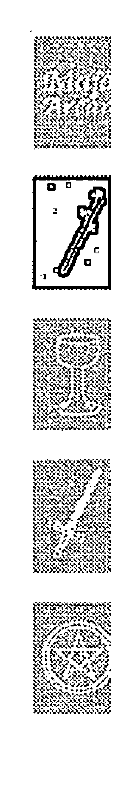

## 《財務》

- 目前的財務狀況
你的財務狀況已經由谷底翻身，但是之前的經歷讓你餘悸猶存，所以一切都要保守操作，不要再度落入陷阱當中。

- 投資的狀況
現在的投資風險相當高，除非你在安全的本錢外還有很多閒錢，否則並不建議你進行投資，還是存起來比較實在。

- 採購的策略
這個時候可以進行少量的採購，作為以後採購的準備，如果一下子就進行大量的採購，可能必須負擔過高的風險。

## 權杖二正位

# 心靈與精神層面的提示
好的領導者不只是以力服人，還要能提出方向和願景，如果不能專心於自己的本業，再多的幻想都不可能達成的。

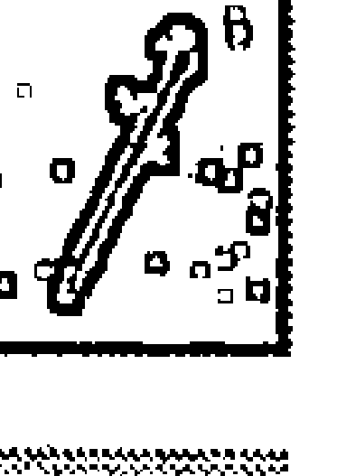

## 《工作》

- 工作本身的狀況
你在工作當中面臨重要的選擇，你不知道該更進一步的發展，或者守住現在已經有的成果，因而陷入兩難的局面。

- 如何解決工作的困境
現在並不是作最後決定的時候，你需要花更多的時間把問題徹底研究，作好各種的方案和準備，等待時機再行動。

- 工作中的人際關係
你在工作當中其實與同事之間沒有什麼交集，彼此之間也沒什麼感情，所以你也就不用多花時間去經營人際關係。

- 與上司相處的方法
本身是一個猶豫不決的上司，很多事情就只能依照現有的規則和慣例去作，所以最好你也不要自己創什麼新招。

- 工作的發展性
這個工作也許會有很好的發展性，但是更多東西是你看到吃不到的，到頭來很可能只是一場誤會，自己白忙了。

- 找工作／換工作的狀況
你現在很難找到很好的新工作，也許過一陣之後會有更好的機會出現，所以現在不急著下決定，可以先觀望再說。

## 《愛情》

- 感情本身的狀況
你對於感情的狀況並不滿意，但是又不想要放棄，所以只能卡在這個不上不下的階段，也有很多是你不能控制的。

- 新戀情的可能性
現在並不太可能會發生新的戀情，即使出現了你喜歡的人，也不可能會喜歡上你，所以還是看看就好別太認真了。

- 對這段感情的看法
這段感情已經有點成為習慣了，很多的問題也開始浮現出來，是很不甘心就此放棄，但是也沒有動力去解決問題。

- 性的吸引力
這段感情中有很強的性吸引力，但是也只是讓兩個人的性生活比較頻繁而已，並不會對兩個人的感情有加分作用。

- 如何化解爭吵
這個時候只能把問題解決一部分，但是無法碰觸到問題的核心，所以只能以拖待變，看以後能不能再找機會解決。

- 分手的方法
其實現在兩個人要分手也不太可能，因為兩個人都無法作出明確的選擇，即使出現第三者也很難使這段關係結束。

- 復合的可能性
這段感情完全沒有復合的可能性，因為一旦作了決定了就是最後的結果，即使現在雙方想要反悔也已經來不及了。

## 《友情》

- 我的人際關係狀況
你並不是很在意自己的人際關係，也沒有很用心在經營，所以常常會覺得自己沒有什麼朋友，是一個很孤獨的人。

- 如何化解與朋友的誤會
這個時候你可以試著與朋友和解，找一個只有兩個人的私下場合先溝通一下，你也許會發現你之前想的都是錯的。

## 《親情》

- 家庭的狀況
現在家中面臨重要的抉擇，處理得不好可能就會有天壤之別，但是現在並不是適當的時機，應該等一陣子再決定。

- 與長輩的關係
長輩對你有很多的管制，也會給你很多的幫助，即使如此你仍然對他們有很多的不滿，所以有時還是會發生衝突。

- 與平輩的關係
平輩之間彼此沒有什麼交集，互相也沒有很多交情，但是遇到困難的時候還是會互相幫忙，但是成效總是很有限。

- 與晚輩的關係
你對晚輩常常會過度的保護，反而使他們覺得受到太多管制，其實你對他們的教育十分用心，也是真心為他們好。

## 《延伸應用》

- 時間
相對時間：二週。
標示時間：白羊座第一旬（約每年3/21－3/30）。

## 《學業》

- 學業本身的狀況
你在學業上的表現還不錯，但是你自己對於這個狀況並不滿足，仍然想要有更好的表現，只是現在沒有好的方法。

- 學習的方法
你應該對自己學習的計劃重新思考，把時間作出最有效率的利用，這樣在重新開始的時候，才能達到最好的效果。

- 與老師相處的關係
是主控性非常強的老師，對於很多事情都有自己主觀的看法，如果有人不服他的管教，他會用最嚴厲的方法處罰。

- 與同學相處的關係
你與同學之間就像是平行線，彼此之間沒有交集，所有的學習都應該要靠自己，與人際關係好壞沒有太大的關係。

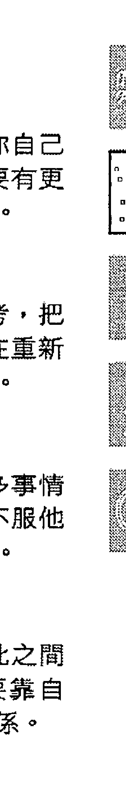

## 《財務》

- 目前的財務狀況
你目前的財務狀況很好，但是財務規劃反而造成你的困擾，這時候應該請專業人士來處理，自己想破頭也沒有用。

- 投資的狀況
現在不宜進行任何新的投資，最好還是要保守一點操作，留得青山在不怕沒柴燒，還是先把自有的資金儲存下來。

- 採購的策略
這不是你花錢的好時機，應該小心謹慎地評估各種採購計劃，但是不要在這個時候執行，等待對你更有利的時機。

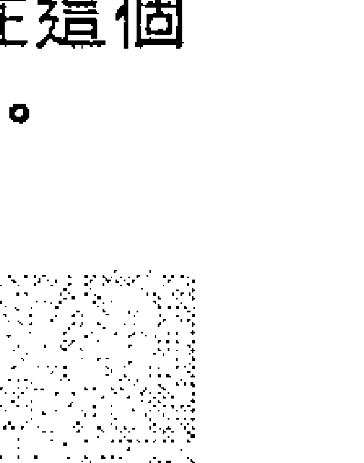

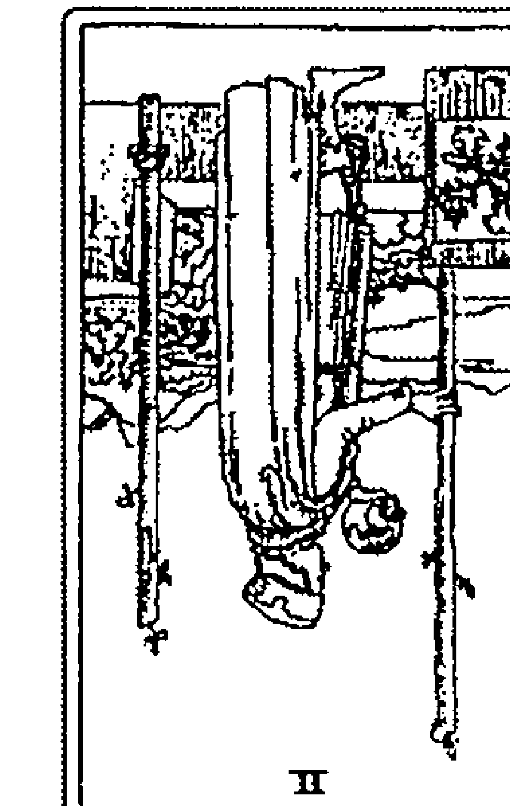

## 權杖二逆位

# 心靈與精神層面的提示
行動力是成功的不二法門，任何事情沒有實際去作都只是空談，下定決心之後就應該要把理念落實到實際生活中。

## 《工作》

- 工作本身的狀況
現在工作上出現了意料之外的發展，你必須在這個時候作出選擇，即使無法掌握住所有的因素，還是要勇於負責。

- 如何解決工作的困境
這個時候可以發揮你個人的魅力，用個人化的方式去解決問題，雖然不是制式的方法，也許會有意想不到的效果。

- 工作中的人際關係
你在工作當中的人際關係並不是很好，也沒有什麼人可以幫助到你，這個時候你就更應該自立自強追求好的表現。

- 與上司相處的方法
是一個不太實際的上司，對於很多事情只看到好處而忽略了問題，所以當發生意外狀況的時候可能就要幫他收尾。

- 工作的發展性
這個工作接下來還會有很多變化，雖然可能是一個翻身的好機會，但也可能會變得很慘，最好先觀望一陣子再說。

- 找工作／換工作的狀況
現在可能會從天上掉下來一個意外的工作機會，但是並不一定那麼適合你，應該要仔細考慮之後再作最後的決定。

## 《愛情》

- 感情本身的狀況
感情當中還有很多的問題需要去突破，現在已經開始踏出第一步，其實兩個人都不知道這段關係究竟會如何發展。

- 新戀情的可能性
現在有可能在不預期的狀況之下發生新戀情，但是由於事出突然你也沒有充份的考慮，所以也可能是短暫的關係。

- 對這段感情的看法
這段感情現在已經有一點失控了，不知道事情到底會如何發展，也充滿了各種的驚喜，其實算是一種全新的經驗。

- 性的吸引力
兩個之間有很強的性吸引力，但也只是一種比較短暫的作用，對於兩個人長期關係的發展，並沒有太大的影響。

- 如何化解爭吵
這個時候也許只能以戰止戰，拿出另外一個問題來轉移焦點，雖然沒有辦法真的解決問題，至少可以先喘一口氣。

- 分手的方法
如果是想要有計劃的分手，這段時間可能會很困難，但是卻可能突然出現一個意外事件，兩個人就決定要分手了。

- 復合的可能性
這段感情沒有復合的可能性，兩個人也不可能再成為朋友，之後就是完全不相干的兩個人，還是不要再去想它了。

## 《友情》

- 我的人際關係狀況
你平常算是一個很受到大家注目的人，但是其實你並不是很喜歡如此，你總是會和朋友之間保持一個適當的距離。

- 如何化解與朋友的誤會
現在你很難得到朋友的原諒，也很難去原諒對方，所以應該讓雙方都先冷靜一下，等到適當的時間再來解決爭議。

## 《親情》

- 家庭的狀況
現在家中遇到了意外的事件，重要的是保持鎮靜不要慌亂，這個時候應該要有一個人出來領導大家作重要的決定。

- 與長輩的關係
你和長輩之間其實常常發生衝突，但是你並不會因此而討厭他們，反而因此使你學到更多東西，越吵感情會越好。

- 與平輩的關係
你在平輩當中屬於比較大膽的一個，所以很自然就成為領導者，但是好事常常輪不到你，壞事才會找你出來頂罪。

- 與晚輩的關係
你給晚輩很大的空間發展，但是同時也很注意他們的安全，你會培養他們獨立的能力，也特別強調勇氣的重要性。

## 《學業》

- 學業本身的狀況
你在學業上的表現起伏很大，也常常因為粗心大意而犯錯，你應該想更小心地表現你自己，不要只是呆呆向前衝。

- 學習的方法
有時候計劃趕不上變化，要隨著狀況的變化調整自己的作法，沒有任何其他人可以作你的模範，所以只能靠自己。

- 與老師相處的關係
一個不按牌理出牌的老師，不要想去揣測他的想法，或是預測他的作法，只要把自己該作的事情確實完成就好了。

- 與同學相處的關係
你在同學當中比較出鋒頭，但是也因此會引來別人的閒言閒語，這個時候應該要堅持自己的作法，對自己有信心。

## 《財務》

- 目前的財務狀況
你的財務狀況可能會遇到不預期的變化，這個時候要沈著地應付，切忌主觀衝動地決定事情，會造成更多的損失。

- 投資的狀況
現在投資的不確定性很高，也不知道下一步會怎麼發展，所以還是把所有的投資先換回現金，等適當時機再行動。

- 採購的策略
這個時候可能會有意外的驚喜出現，所以可以多多注意各種採購的訊息，說不定就會突然出現你正需要用的東西。

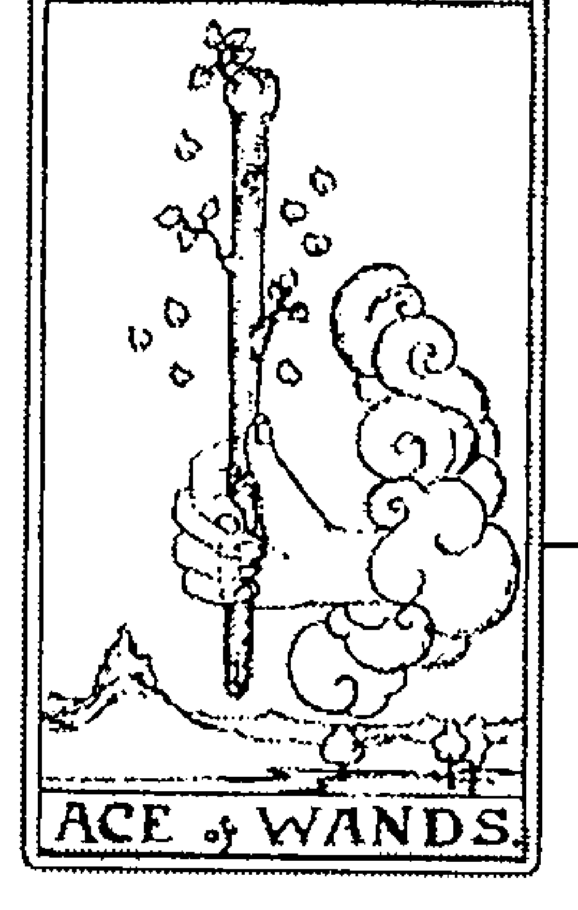

## 權杖A正位

# 心靈與精神層面的提示
很多的事情會自然發生，我們只是在發生時把握住我們應得的機會，主動把握住靈感將會讓你充滿自信以及能量。

## 《工作》

- 工作本身的狀況
你面對到新的工作狀況，或是工作當中出現了新的挑戰，這是一個還在發生中的狀況，所有事情也都還沒有定案。

- 如何解決工作的困境
你需要主動把握任何出現的機會，掌握主動權的人才可能解決問題，對自己保持充足的信心，努力朝向目標前進。

- 工作中的人際關係
如果能掌握最有影響力的人，其他的人很自然的就可以維持良好的關係，用心經營少數關鍵人物就可以達到目的。

- 與上司相處的方法
越是能夠表現自己，與上司的關係自然就會越好，所以只要專注在工作的內容當中，其他的東西都不必太過擔心。

- 工作的發展性
這個工作的未來十分有發展性，現在看到的只是其中的一小部分，有些位置算是先佔先贏，要把握機會好好表現。

- 找工作／換工作的狀況
現在已經有新工作在等著你，但還是要你自己主動去找才能得到這份工作，也可以嘗試和之前不同性質的新工作。

## 《愛情》

- 感情本身的狀況
現在很可能有新戀情發生，或是原本的戀情有了新的變化，你應該要好好把握現在的機會，快點把感情穩定下來。

- 新戀情的可能性
現在發生新戀情的可能性很高，而且常常是伴隨著新工作或是搬新家的機會而來，對你而言這是一個全新的經驗。

- 對這段感情的看法
會覺得這段感情充滿了活力及以未來的發展性，是一段可以好好經營的感情，同時也覺得這段感情是自然發生的。

- 性的吸引力
性的吸引力可以說是這段感情當中很重要的一部分，雙方在性關係上的和諧，對兩個人感情的穩定也是很重要的。

- 如何化解爭吵
應該要主動以行動證明自己的真心，而不是被動地等著被對方質問，在問題剛發生的時候就應該要積極處理化解。

- 分手的方法
如果你覺得這是一段痛苦的關係，那麼自己主動提出分手是最好的方法，通常親自見面把話講清楚會是最有效的。

- 復合的可能性
這段關係還是有復合的可能性，但是這會是一個全新的關係，要把過去所有的回憶都拋棄掉，徹徹底底重新開始。

## 《友情》

## 我自己的人际关系状况
这是刚开始经营人际关系的阶段，要主动与别人伸出友谊的双手，多一点主动去关心别人，才会建立起新的关系。

### 如何化解与朋友的误会
其实有些误会只是小问题，主动道歉并不是什么丢脸的事情，如果连这一小步都不愿意退让人际关系怎么会好。

## 《亲情》

### 家庭的状况
因为新成员加入的关系，使得家中中有与以前不同的气氛，应该要快点适应这个新的结构，不要再怀念以前的状况。

### 与长辈的关系
你与长辈的关系十分亲密，也是大家所疼爱的那个人，即使出现其他人与你竞争，也不用担心你的地位会不稳固。

### 与平辈的关系
在平辈当中你的作风比较强势，但并不会让人感觉到威胁，很容易自然而然的成为领导者，可以对别人发号施令。

### 与晚辈的关系
你对于晚辈特别照顾，但是其中也同时具有想要控制的想法，望子成龙的期待当然可以有，不过也要小心一头热。

## 《学业》

### 学业本身的状况
你面对新的学习状况，对于没接触过的东西充满好奇心，但是也因为不熟悉而觉得没有安全感，要对自己有信心。

### 学习的方法
很多东西是需要循序渐进慢慢学习的，在一开始应该要掌握到核心的观念才是重点，细微末节的东西不用太在意。

### 与老师相处的关系
老师会重在观念的启发，而不是在细节上的教导，只要在上课时能够专心听讲，其他的一切都顺其自然就可以了。

### 与同学相处的关系
这是应该要好好读书的时候，与同学的关系反而不是那么重要的一件事，只要顾好几位知心的好朋友就很足够了。

## 《财务》

### 目前的财务状况
现在还是刚开始起步的时候，应该要顺其自然，有多少钱就做多少事，有时候也可以在错误当中学习到不少东西。

### 投资的状况
这是开始投资的好时机，但是别急着想要有大笔收入，现在只是把种子放到土壤里而已，真正要开花结果还有得等。

### 采购的策略
很多事情都还没有定案，所以在采购方面也别急着作决定，最好是由最必须的东西少量开始，之后再来慢慢增加。

## 《延伸应用》

| 项目 | 内容 |
| :--- | :--- |
| 相对时间 | 一週 |
| 标示时间 | 夏季 |

# 权杖A逆位
灵性与精神层面的提示：保持精神上的清晰和活泼，不要被特定的观念所限制住，你将会得到更多新的想法，同时会充满了积极的行动力。

## 《工作》

### 工作本身的状况
你面对到新的工作状况，但是在工作当中处处都充满了挑战，这是适合向下扎根学习的时刻，没有太多表现机会。

### 如何解决工作的困境
你需要主动掌握事情的核心，找到真正的问题点，才有可能解决问题，但是同时也要做问题可能无解的心理准备。

### 工作中的人际关系
你被工作当中的人际关系所困扰，以致于无法专心工作，应当把力量集中在工作本身，把人的影响因素降到最低。

### 与上司相处的方法
会把很多的事情交给你做，然后就急着要看到成果，所以所有的事情动作都要快，若是拖得太久就会被上司盯上。

### 工作的发展性
这个工作的未来是在朝向结束的方向发展，对你来说只是一个短期的工作，随时都要作好再重新找工作的准备。

### 找工作／换工作的状况
现在已经可以开始计划找新工作了，即使不是立刻在眼前出现，也必定是在不远处，努力寻找就会得到好的机会。

## 《爱情》

### 感情本身的状况
感情很自然地发展当中，或是有新的恋情出现，但是并不完全在你的掌握当中，两个人之间还是有很强的吸引力。

### 新恋情的可能性
现在是有新恋情的可能性，但是并不在你所预期的地方出现，你要小心地注意四周的变化，才能掌握到新的机会。

### 对这段感情的看法
会是一段很有发展性的感情，但是现在仍然在开始的阶段，要等更多的事情更确定之后，才会对这段感情下定论。

### 性的吸引力
对方对你很有吸引力，但你常不知道该怎么回应，反而会显得有点不知所措，其实应该勇敢一点表达自己的欲望。

### 如何化解争吵
现在问题看似刚刚开始，实际上在当中已经有很深的误会，要努力挖掘事情的真相才有可能找到彻底解决的方法。

### 分手的方法
若是要由自己主动提出分手，那么就要准备好所有的火药，以大吵一架作为结束，否则很可能会和对方藕断丝连。

### 复合的可能性
这段关系应该没有任何复合的可能性，已经算是彻彻底底结束的状况，与其活在回忆当中，不如去寻找新的对象。

## 《友情》

### 我的人际关系状况
现在开始面临到人际关系的一点波动，虽然不太顺利但是还可以过得去，可以利用这个时间多多去认识新的朋友。

### 如何化解与朋友的误会
误会在刚开始的时候比较容易解决，若是能掌握主动权送出善意的礼物，相信所有的问题都会随着时间而过去的。

## 《亲情》

### 家庭的状况
家中面对到新的挑战，因此可能有不同的变化和调整，在这个状况之下还是保持现状比较好，等待事情慢慢发生。

### 与长辈的关系
长辈把你当成很重要的人，但是你并不是很喜欢这种感觉，你需要更多自由的空间，应该要让他们知道你的想法。

### 与平辈的关系
在平辈当中你有比较大的主导权，但是若强求要去控制别人，也很容易与别人起冲突，要小心保持和平的关系。

### 与晚辈的关系
你对于晚辈十分照顾，而大家也都会十分重视你的意见，但是别太强求大家都照你的意思去作，有时候也会失望。

## 《学业》

### 学业本身的状况
你在学习上遇到新的困难，但是其实问题是根源於过去的基础并不稳固，所以还是要努力把过去所不足的补起来。

### 学习的方法
在学习上要循序渐进，并且要了解到事情发展的原理和源头，由概念和原理开始推论，放开胸襟接受所有可能性。

### 与老师相处的关系
十分坚持自己立场的老师，辩论并不能够改变任何事情，与其积极地争取自己的权益，还不如保持距离以策安全。

### 与同学相处的关系
你与同学的相处并不是很顺畅，人际关系也不是一朝一夕可以改善的，建议你把该做的事情按部就班地完成就好。

## 《财务》

### 目前的财务状况
现在财务的状况其实并不算好，但仍然存在许多扭转劣势的空间，应该要务实地发挥自己的长处争取更多的金钱。

### 投资的状况
现在应该开始考虑把投资结束，还没开始投资的人则不要急着投入，先把目前的获利落袋为安，等待机会再开始。

### 采购的策略
先要搞清楚采购的目的性，不要盲目地依循先前的经验，重新检视所有的可能性之后，再一项一项慢慢地加上去。

# 《圣杯国王正位》

## 灵性与精神层面的提示
帮助别人是一个令自己快乐的过程，也许在短期看起来你付出了许多，但是内心的满足感渐渐会滋润你的心田。

### 《人物》

### 当事人的个性
慈悲宽容的一个人，通常都很乐于助人，在经验和学识上很丰富，对于婚姻及家庭等传统价值也十分坚持和重视。

### 当事人的工作观
在工作上见过各种大风大浪，因此不论遇到什么状况都能沉着应变、处变不惊，也会想出很好的方法来解决问题。

### 当事人的感情观
在感情上十分成熟而睿智，也能做到包容和原谅，以婚姻作为发展感情的前提，也会勇敢负起感情和家庭的责任。

### 当事人的金钱观
在处理金钱上比较保守，会以生活上的必要支出为主，常会拿出一部分金钱去帮助别人，同时也很重视风险管理。

### 与当事人的应对方法
是一个可以信任和依靠的人，遇到无法解决的问题也可以去询问他的看法，也许就会提供你一个不错的解决方案。

#### 人物代表
校长、班主任、老教授、宗教领袖、大师、尽职的家长。

## 《工作》

### 工作本身的状况
工作上虽然遇到很多的变化，但是你都可以安全度过，若是遇到无法解决的问题，也都会有人对你及时伸出援手。

### 如何解决工作的困境
这个时候你一定要冷静下来，处变不惊地处理问题，在过去的经验当中寻找灵感，或是透过书籍和网络找到解答。

### 工作中的人际关系
你在工作当中的人际关系相当不错，也是大家喜欢咨询的对象，由于你常帮助别人，所以遇到问题也有人会帮你。

### 与上司相处的方法
一个很有解决问题能力的上司，遇到不懂的事情可以尽量地向他询问，平时也会常常关心你，让你觉得十分窝心。

### 工作的发展性
这个工作未来还会有很多的变化，但是也会学到很多东西，由于可以同时兼顾家庭生活，是适合长期经营的工作。

### 找工作／换工作的状况
这个时候最好是找与自己学历有关的工作，越高的学历对你越有利，如果觉得自己的学历不够也可以考虑先进修。

## 《爱情》

### 感情本身的状况
现在两个人之间感情的状况非常稳定，有可能是正在计划要结婚，彼此的相处像家人一样，也会受到大家的祝福。

### 新恋情的可能性
现在有可能出现新的恋情，同时对方的态度十分认真，是以结婚为前提要和你交往，所以千万不要只想玩玩就好。

### 对这段感情的看法
这段感情经历了各种风风雨雨，现在终于走出一条自己的路，即使未来遇到任何的艰难险阻，也绝对不轻言放弃。

### 性的吸引力
这段感情当中有很强的吸引力，虽然对于学识谈吐的欣赏会多过于男女情爱，性生活对彼此来说也是很重要的事。

### 如何化解争吵
这个时候应该要以更包容的心去看待这件事，即使对方有什么不对也不应该苛责对方，要设身处地去为对方着想。

### 分手的方法
这段关系实在很难在这个时候结束，即使遇到再大的困难也不能把两个人分开，除非双方家属都站在反对的立场。

### 复合的可能性
两个人现在的关系很像家人，也有可能再度复合，但是也许复合之后就要开始安排结婚计划，应该要三思而后行。

## 《友情》

### 我的人际关系状况
你的人际关系很好，大家都很喜欢来找你帮忙，在能力范围之内你也都热心地帮助他们，所以会很受朋友们敬重。

### 如何化解与朋友的误会
这个时候你应该主动向朋友说明，把事情从头到尾通通讲清楚说明白，也许朋友就会理解你也是有不得已的苦衷。

## 《亲情》

### 家庭的状况
现在家中有一位慈祥的长者作为核心，使得大家都能和平地相处，由于互动频繁的关系，彼此之间的感情也很好。

### 与长辈的关系
长辈非常重视你的意见，遇到事情也常会找你帮忙，对你来说照顾长辈是出于本能反应，自然而然感情就会很好。

### 与平辈的关系
对于平辈的人来说你像是长辈，常常会找你帮忙出主意，由于你都能解决大家的问题，所以也是团结大家的核心。

### 与晚辈的关系
你对晚辈都很照顾，也会很有耐性地对他们谆谆教诲，由于你太容易原谅他们，所以有时也会造成他们一错再错。

## 《学业》

### 学业本身的状况
你在学习上常常能触类旁通，对于自己不懂的东西也会自动自发地去研究，所以学业上的表现常常令人刮目相看。

### 学习的方法
这个时候多研读资料是最好的方法，除了增加深度之外也要注意到广度的面向，打好基础之后才会有自己的想法。

### 与老师相处的关系
老师通常都能不厌其烦地一再教你，所以遇到不懂的东西就可以提出问题，在做人处事方面也可以多向老师学习。

### 与同学相处的关系
你在同学当中常常扮演小老师，同学有课业上的问题也习惯来问你，如果你能多多帮助别人自己反而会学到更多。

## 《财务》

### 目前的财务状况
你目前的财务状况算是很稳定，一般性的支出也没有什么问题，若是能维持现在的方针，未来的发展也会很不错。

### 投资的状况
现在投资方面的风险特别大，因此应该选择你了解又属于保本的工具，对于自己不了解的东西最好还是少碰为妙。

### 采购的策略
这时候应该以日常生活用品为主，对于商品的标示和包装要特别注意，对于比较好的东西即使贵一点也没有关系。

## 《延伸应用》

| 项目 | 内容 |
| :--- | :--- |
| 时间 | 相对时间：十四天。 标示时间：巨蟹座（约每年6／21－7／21） |

# 《圣杯国王逆位》

# 心灵与精神层面的提示
把知识能力用在正常的事情上，不但能充分发挥自己的才能，也可以对别人产生贡献，别被一时的利益所引诱了。

### 《人物》

### 当事人的个性
空有伟大梦想但是本身并没有去实现的能力，常常会觉得自己怀才不遇，有时满口仁义道德实际上却是个伪君子。

### 当事人的工作观
对于工作有远大的理想，但是有一些眼高手低，当无法解决眼前的问题时，也可能采取欺骗或其他不诚实的手段。

### 当事人的感情观
对于感情的需求很大，但是因为缺乏安全感的关系，常常会有过度情绪化的反应，面对感情问题时往往会先退缩。

### 当事人的金钱观
会想要努力储蓄金钱，但是又会把钱花在非必要的事物上，常常贪心想要更多钱，所以可能会败在高风险的投资。

### 与当事人的应对方法
不要被他谈的理想和抱负迷惑，重要的是他有没有提出实践的方案，最好不要和他有金钱上的往来以免有去无回。

#### 人物代表
导演、制作人、企管顾问、艺术评论家、艺品商、神棍。

## 《工作》

### 工作本身的状况
工作上的起伏让你感觉窒息，各种压力也几乎超过你的负荷，表面上看起来光鲜亮丽，其实是金玉其外败絮其中。

### 如何解决工作的困境
现在的状况当中充满了欺骗和诡计，如果不能看清楚事情的真相，不只无法解决问题，还可能会因此而身败名裂。

### 工作中的人际关系
你在同事之间的风评不是很好，但是即使如此大家还是和你保持表面上的关系，千万不要轻易相信其他人的说法。

### 与上司相处的方法
是一个表里不一的上司，可能表面上作的是一套，其实心里想的是另一套，平时就要小心防范不要被他给出卖了。

### 工作的发展性
这个工作即使表面上看起来还好，其实已经问题丛生快撑不下去了，最好是趁各种危机还没有爆发之前快点离开。

### 找工作／换工作的状况
现在去找工作很可能会遇到挂羊头卖狗肉的状况，应征的项目和实际的工作完全不同，所以一定要格外小心谨慎。

## 《爱情》

### 感情本身的状况
现在这段感情当中是波澜汹涌，充满了各种情绪性的冲突，彼此之间的关系也岌岌可危，随时都有破裂的可能性。

### 新恋情的可能性
现在不太可能出现真心的恋爱对象，想要接近你的人大部分都是有不正当的企图，所以这时候最好不要去谈感情。

### 对这段感情的看法
这段感情已经造成了严重的伤害，也不是一时之间可以平复的，觉得自己受到欺骗和不公平的待遇，也很不值得。

## 《友情》

### 我的人际关系状况
你的人际关系状况很不好，大家都不能信任你，你应该要改过自新，想办法重新作人，慢慢重建朋友对你的信心。

### 如何化解与朋友的误会
现在情绪已经把你们通通淹没，所以现在去解释也无法讲得清楚，还不如先让彼此冷静下来，等适当的时机再说。

## 《亲情》

### 性的吸引力
两个人之间有很强的性吸引力，其中更夹杂了迷恋的强烈情绪，也许彼此之间只有性生活，但是并没有真心相爱。

### 家庭的状况
家中的成员彼此之间缺乏信任，也无法同心协力合作，即使大家仍然保持表面的关系，私底下还是经常互相算计。

### 如何化解争吵
这个时候应该不计一切代价去揭开谎言，把事情的真相摊在阳光下，这样子才有可能把事情作彻底而完整的解决。

### 与长辈的关系
长辈对你有很多的要求，你常常觉得不合理或无法作到，因此彼此之间就容易发生冲突，甚至常会觉得有点疏离。

### 分手的方法
其实两个人的关系已經名存实亡了，只是看谁要先把分手说出口，也许双方需要一个台阶下，然后就再也不相干。

### 与平辈的关系
平辈当中大家都各怀鬼胎，想要利用别人又不想要付出，如果你表现得太过于和善，反而是给其他人占便宜的机会。

### 复合的可能性
其实两个人也已经没有什么感情，要复合是完全不可能的事，与其仍然期待对方回头，还不如去找一个新的对象。

### 与晚辈的关系
你常常觉得晚辈不成材，但是又不知道该怎么教育他们，所以当遇到他们犯错的时候，你常常会有情绪性的反应。

## 《学业》

### 学业本身的状况
你在学习上不够脚踏实地，好像学了很多东西，其实都没有打好基础，等到要测验的时候再补救已经来不及了。

### 学习的方法
现在应该要克服心中的恐惧，从头开始把基础重新打好，不要觉得东西太多念不完，只要认真终会有完成的一天。

### 与老师相处的关系
非常细心而敏锐的老师，你在变什么把戏都逃不过他的眼睛，所以这时诚实才是上策，千万不要认为可以欺瞒他。

### 与同学相处的关系
你现在的同学大多都是损友，对于你的学业没有什么正面的帮助，最好是离他们远一点，还是要花时间专心念书。

## 《财务》

### 目前的财务状况
你目前的财务状况已经快不行了，应该尽快诚实面对自己的问题，千万不要挖东墙补西墙，这样反而越补越大洞。

### 投资的状况
现在不宜进行任何的新投资，否则可能会陷入你不了解的投资陷阱，不但从此血本无归，甚至惹上不必要的麻烦。

### 采购的策略
这时候不宜进行大笔的采购，对于商品的来源和品质要特别注意，记得太便宜的东西没好货，千万不要贪小便宜。

## 圣杯皇后正位

心灵与精神层面的提示：站在务实的角度去运用直觉，才能平衡意识与潜意识的部分，除了专注于自己的事情，也要照顾到其他人的需要。

### 《人物》

- 当事人的个性：对于人际情绪非常敏锐，也能够以同理心去看待事情，重视心理分析和情绪管理，在心灵及神秘学方面很有天份。
- 当事人的工作观：在工作上十分专注，也具有独立作业的能力，做一件事情之前能考虑到其他人的反应和后果，因此也很容易成功。
- 当事人的感情观：在感情上十分温柔浪漫，可以充分体谅对方的难处，同时也会体贴对方的需要，在面对新恋情的时候会比较被动。
- 当事人的金钱观：并不认为金钱是最重要的，反而会想要利用金钱去帮助别人，在财务上不太务实，有时候会选择爱情而不顾面包。
- 与当事人的应对方法：可以充分放开心胸和他交往，但是最好不要谈到太俗气的话题，心灵成长的相关议题会会帮助你们搭起友谊的桥梁。
- 人物代表：研究员、人事主管、修女、班导师、家庭主妇、好情人。

## 《工作》

- 工作本身的状况：现在工作的状况十分稳定，你可以全心全意地专注于工作，任何问题都很难令你分心，也会在工作当中学到很多。
- 如何解决工作的困境：这时候你要以同理心去面对其他人，设身处地为别人着想，找到大家都可以接受的方案，最后才会有完美的解决。
- 工作中的人际关系：你在工作中的人际关系非常好，因为你常常能站在对方的立场上思考事情，处理事情除了正式规定之外也通人情。
- 与上司相处的方法：非常重视人际互动的上司，但是本身的想法高深莫测，你只能与同事维持良好的关系，完全没有办法直接讨好他。
- 工作的发展性：这个工作未来还有不错的发展性，也会在工作当中学到很多东西，如果能够专心地经营，一定有更上一层楼的机会。
- 找工作／换工作的状况：现在应该锁定自己想要的目标，尽全力做好找工作的准备，如果漫无目的地随便找，就很难在这个时候与人竞争。

## 《爱情》

- **感情本身的状况**：现在两个人感情十分稳定，彼此之间相处的时间也非常快乐，在这段感情当中双方都学习到如何去经营一段感情。
- **新恋情的可能性**：现在很有可能会发生新的恋情，将出现一个你认为十分理想的对象，如果你能主动出击去追求，很可能就会成功。
- **对这段感情的看法**：对方真是一个完美情人，让自己觉得有一点不太真实，两个人的感情十分稳定，希望这段感情可以永远那么甜蜜。
- **性的吸引力**：在这段感情当中两个人之间有很强的性吸引力，性生活对彼此来说都很重要，愉快的性生活也使得关系特别紧密。
- **如何化解争吵**：这时候诚实是最好的策略，对方提出任何问题要有问必答，把事情说清楚就不会有误会，两个人的感情也会更好。
- **分手的方法**：两个人对于彼此的感情还很深，在这个时候要两个人分开实在不太可能，除非在这段感情当中突然出现了第三者。
- **复合的可能性**：两个人现在其实还有很深的感情，也有可能立刻就复合，但是千万不要自己急着提出复合，最好等对方先主动再说。

## 《友情》

- **我的人际关系状况**：现在你的人际关系不错，与朋友的相处也都很快乐，你常常能帮助朋友处理很多事情，因此他们也会努力回报你。
- **如何化解与朋友的误会**：这个时候你可以动之以情、说之以理，除了详细说明之外还要发动人情攻势，记得柔性处理比强硬的手段更有效。

## 《亲情》

- **家庭的状况**：家中成员彼此之间的向心力很强，也会为彼此着想，因此若是合作事情就很容易成功，也会因为合作而有所成长。
- **与长辈的关系**：长辈常常会称赞你，让你觉得很有成就感，你也会尽力去完成他们交待你的事情，所以你与长辈的感情很好。
- **与平辈的关系**：在平辈当中你是比较温和的一个，虽然并不出锋头，但是常常能协调大家的意见，反而可能成为幕后的领导者。
- **与晚辈的关系**：你对晚辈常会过份溺爱，即使他们犯了什么错误也会一再原谅他们，有时候应该强硬一点会有比较好的教育效果。

## 《学业》

- **学业本身的状况**：你在学习上十分认真，并且也有深入研究的精神，对于很多东西有敏锐的灵感，所以在学习上会比别人更有效率。
- **学习的方法**：这个时候应该要专心地研究，慢慢地整理把问题解决，如果书本当中没有标准的答案时，应该要相信自己的直觉。
- **与老师相处的关系**：是一个很会照顾人的老师，所以有什么心事可以尽量和他讲，他对于学生的问题大多都有问必答，脾气也很温和。
- **与同学相处的关系**：你和同学的相处很愉快，常常都可以帮他们出主意来解决问题，由于你待人诚恳实在，别人对你也会有更多回报。

## 《财务》

- **目前的财务状况**：现在你的财务状况算是很稳定，但也沒有多余的资金，这个时候应该开始设定目标，有计划地把钱累积下来。
- **投资的状况**：现在可以开始研究该如何投资，但是还不到动手的时候，应该大部分是以储蓄的功能为主，不要想要有太多获利。
- **采购的策略**：这个时候可以去采购一些个人的用品，也许要先从自己了解的东西下手，说不定会意外地遇到很适合自己的东西。

## 《延伸应用》

时间：相对时间：十三天。标示时间：天蝎座（约每年10/23－11/22）

## 圣杯皇后逆位

心灵与精神层面的提示：应该要把真实的世界和自己想像分清楚，这样才能在想像的世界当中自在的飞翔，又不会影响到自己的日常生活。

### 《人物》

- 当事人的个性：想像力很丰富但也比较情绪化，常常会陷入自己的幻想当中无法自拔，有时候不经思考就会随着自己的感觉说话。
- 当事人的工作观：其实不太爱工作，但是在工作当中比较自以为是，无法接受别人的建议，对于自己的工作也会有不切实际的幻想。
- 当事人的感情观：感情上比较随性且很难稳定下来，在感情当中十分投入但是也很容易见异思迁，因此常会有错综复杂的感情关系。
- 当事人的金钱观：对于金钱没什么概念，喜欢花钱享受但是并不想努力赚钱，通常没有什么积蓄，有时甚至需要靠别人的金钱援助。
- 与当事人的应对方法：对于他无心说的话不要太在意，否则就会常常被他气得半死，最好不要和他吵架，因为他骂人都会十分尖酸苛薄。
- 人物代表：诗人、画家、贵妇人、爱幻想的人、女演员、风尘女子。

## 《工作》

- 工作本身的状况：现在工作的状况其实很不稳定，甚至不知道明天会不会有工作，即使偶尔有不错的表现，也常会引来更多的麻烦。
- 如何解决工作的困境：这时候应该要把自己抽离出来，不要陷于情绪的漩涡当中，只要你能务实地评估状况，大概就可以把骗局给拆穿。
- 工作中的人际关系：你在工作当中的表现不错，但是不能得到同事的认同，反而可能会被其他人孤立，在这个工作当中你找不到朋友。
- 与上司相处的方法：一个完全没有原则的上司，只要对他有利什么事情都作得出来，他说的事情不可以完全相信，最好是自己想办法。
- 工作的发展性：在这个工作当中很难看到未来性，也只能做一天算一天，如果想要在工作上有所发展，应该快点离开才会有希望。
- 找工作／换工作的状况：现在很难找到适当的工作，即使真的找到也很不稳定，如果可以先休息是比较好的选择，不然就当自己是在打工。

## 《爱情》

- **感情本身的状况**：这段感情缺少实际相处的经验，很多事情都是自己想像出来的，其实两个人都在和自己想像出来的对象谈恋爱。
- **新恋情的可能性**：现在不太可能出现好的恋爱对象，但是也有可能会出现极为短暂的感情接触，彼此只是在追求感官上的刺激而已。
- **对这段感情的看法**：这段感情就像是一场梦，一切都很虚幻而不真实，也许在开始的时候会觉得是一场美梦，但是后来却变成恶梦。
- **性的吸引力**：这段感情当中有很强的性吸引力，而且可能就是因为这种吸引力使两个人在一起，性生活会带来很强的感官刺激。
- **如何化解争吵**：这个时候就算开始谈也谈不出结果，所以最好是先把问题放着，等大家都清醒一点再来谈，否则只是会越吵越凶。
- **分手的方法**：其实这段关系当中存在太多的幻想和谎言，只要两个人把谎言拆穿、把所有真相说出来，这段感情就会立刻结束。
- **复合的可能性**：这段关系完全不可能复合，虽然彼此还有一些感情，但是其实两个人并不适合，即使真的复合了也只是每天吵架。

## 《友情》

- **我的人际关系状况**：你在人际关系上是属于比较喜欢独处的类型，同时因为你常常会说话得罪其他人，所以也很少会有知心的好朋友。
- **如何化解与朋友的误会**：这个时候真的会越描越黑，所以还是什么都不要说，也许先写个信或发简讯和他道歉，等他气消了之后再来说明。

## 《亲情》

- **家庭的状况**：家中现在可能发生成员彼此严重争吵的状况，也因此引发了连锁的情绪反应，全家都笼罩在无法信任的气氛当中。
- **与长辈的关系**：你常常会对长辈们闹脾气，虽然你原本的想法是要撒娇，但是有时候也会弄巧成拙，把彼此之间的气氛弄得很僵。
- **与平辈的关系**：在平辈当中你算是比较娇纵自私的，因此大家都会很怕你，如果有发生争吵的状况，你一定是大获全胜的那一个。
- **与晚辈的关系**：你很关心晚辈的状况，其实很有心想要好好教育但是缺乏方法，你可以多找一些相关的书籍来看，也许会有帮助。

## 《学业》

- **学业本身的状况**：你在学习的时候常常不能专心，只是每天自己在幻想自己的事情，没有付出努力好好学习，当然不可能会有成果。
- **学习的方法**：这个时候应该要收心好好的读书，同时辅助地作很多的练习，一方面可以检验自己的成果，也可以强迫自己专心。
- **与老师相处的关系**：有时老师说话会很情绪化，所以如果有什么事情要说，一定要先学会看老师的脸色，否则可能不小心扫到台风尾。
- **与同学相处的关系**：其实你和同学没有什么交集，也很少和同学们说话，有些时候会和同学发生口角冲突，反而会影响你的学习情绪。

## 《财务》

- **目前的财务状况**：你现在的财务状况十分不稳定，甚至已经负债严重了还不自知，如果不能务实地面对自己的问题，很可能会破产。
- **投资的状况**：现在不宜进行任何的投资，也不去想像有多少的获利空间，只要能把钱安全的存下来，就是你现在最好的选择了。
- **采购的策略**：这个时候并不太适合进行金额太大的采购，因为你可能会在还没想清楚之前就付了钱，事后要反悔已经来不及了。

## 圣杯骑士正位

心灵与精神层面的提示：当自己有新的体会，应该透过与别人的分享来重新检视，不但可能帮助到别人，也可以在过程中发现自己的不足。

### 《人物》

- 当事人的个性：在思考上敏锐而富有理想性的人，喜欢对别人宣扬自己的理念，也有很好的口才，但是在执行力方面就比较不足。
- 当事人的工作观：比较重视工作的理念和发展性，常常可以提出新的想法和作法来解决问题，也很有能力去说服别人接受他的建议。
- 当事人的感情观：在感情上浪漫而热情，而且会主动去追求自己喜欢的对象，除了追求感情上的满足之外，也会很重视理念的交流。
- 当事人的金钱观：虽然不是那么重视金钱，但是会把金钱作最有效率的运用，通常不太喜欢储蓄，而会把金钱花费在自己的兴趣上。
- 与当事人的应对方法：这些人非常喜欢聊天，你可以和他天南地北无所不谈，只要不涉及到价值观的问题，通常都会让你觉得获益良多。
- 人物代表：作家、演说家、行销企划、公关宣传、传教士、好丈夫。

## 《工作》

- 工作本身的状况：现在工作的状况很有挑战性，要花很多脑筋去想办法解决问题，还要努力去说服别人，上下班时间没有明显界线。
- 如何解决工作的困境：这件事情其实只是欠缺一个合理的说法，你必须把前因后果想清楚，然后提出完整的说明和解决方案去说服大家。
- 工作中的人际关系：你在工作当中的人际关系很好，因为你总是能与大家保持良好沟通，不会发生误会的状况，也能和大家打成一片。
- 与上司相处的方法：是一个聪明绝顶的上司，常常喜欢发表自己的高见，千万不要当面去反驳他的意见，否则他可能会和你辩个没完。
- 工作的发展性：这个工作未来有很好的发展性，不但可以开阔你的视野，也有机会可以实现你的理想，即使辛苦也应该要作下去。
- 找工作／换工作的状况：现在可以找到不错的工作，也有可能是由朋友介绍而开始新的工作，这个工作当中人际关系很重要，要好好经营。

## 《爱情》

- 感情本身的状况：其实两个人都很享受这段感情，也在这个关系当中开发很多感情方面的能力，整体来说是一段浪漫而热情的关系。
- 新恋情的可能性：现在很可能会出现你所喜欢的对象，对方也算是比较主动的类型，如果你能更鼓励他前进，也许很快就会在一起。
- 对这段感情的看法：这是一段很浪漫的感情，在这个感情当中双方都全力的投入，把两个人紧紧地绑在一起，真是一段很理想的感情。
- 性的吸引力：在这段感情当中有很强的性吸引力，而且双方都能自然也表现出浪漫和热情，常常都能够享受到很愉快的性生活。
- 如何化解争吵：这个时候就要用到你的口才，努力地用甜言蜜语去说服对方、和对方道歉，甚至是求对方要原谅你，这都不太难。
- 分手的方法：这段期间两个人要分手实在不太容易，因为彼此之间的感情还很深，也许要先分开一阵子不联络，之后再来谈判。
- 复合的可能性：这段感情其实并不算完全结束，所以复合也可以很自然地发生，如果你主动提出要复合，应该就可以重新在一起。

## 《友情》

- 我的人际关系状况：你在人际关系上的表现很不错，不但各式各样的朋友很多，也可以与大家保持不错的关系，你很喜欢和朋友聊天。
- 如何化解与朋友的误会：这时候你可以办一个朋友间的聚会，在当中向他当面道歉，即使他还觉得不爽，但是因为同侪压力也就原谅你了。

## 《亲情》

- 家庭的状况：最近家中常常都有会亲友来访，所以充满了放松和享乐的气氛，这个时候应该去规划未来的事情，提出新的愿景。
- 与长辈的关系：长辈常会找你聊天，也会顺便教你很多事情，你和他相处的时间非常愉快，因此彼此之间也会建立起深厚的感情。
- 与平辈的关系：在平辈当中你常常担任跑腿的角色，但是也因此串起大家的感情，你常会提供大家一些建议，和大家感情都很好。
- 与晚辈的关系：你常会对晚辈说教，也很重视对他们的教育，但如果能用比较温和的态度，教育的效果会比较好，也能增进感情。

### 《学业》与《财务》

| 类别 | 项目 | 内容 |
| :--- | :--- | :--- |
| **学业** | 学业本身的状况 | 你花很多时间在学习上，因此也会有不错的成果，如果你可以和同学们多交流，那么会很快地增进你的学习效率。 |
| | 学习的方法 | 这个时候除了专心念书之外，也要找机会和同学们多交流，在讨论的过程中会使观念更清楚，也帮助你消除死角。 |
| | 与老师相处的关系 | 是一个口才很好的老师，对于大部分的问题都可以解释得很清晰，也会希望多和学生们交流，所以要多提出问题。 |
| | 与同学相处的关系 | 你和同学是属于教学相长的关系，与同学的互动越多会增进你学业上的表现，所以应该要和同学们保持良好关系。 |
| **财务** | 目前的财务状况 | 现在你的财务状况还在打基础当中，所以一切要以稳定为原则，不要太好高骛远，以免出现自己无法承担的风险。 |
| | 投资的状况 | 现在可以开始尝试一点投资，但是还不到你大显身手的时候，这个时候应该是抱持着学习的心，而不是想要赚钱。 |
| | 采购的策略 | 这个时候采购以个人兴趣有关的东西为主，也许会发现自己梦寐以求的好东西，但是这都要你主动出击去找找看。 |

## 《延伸应用》

时间：相对时间：十二天。标示时间：双鱼座（约每年2／19－3／20）

## 聖杯騎士逆位

# 心靈與精神層面的提示

謊言或詭計只能在一時掩蓋自己的錯誤，但是被發現之後反而要付出更大的代價，要勇於承擔所有自己說過的話。

### 《人物》

- 對當事人的個性：口才很好但是沒有真材實學，因此常常讓人覺得流於詭辯，表面上看起來談吐溫文有禮，其實常常都是口蜜腹劍。
- 對當事人的工作觀：其實不是很喜歡工作，也不太實際去努力，只是在作表面功夫，用一些小動作去討好上司及客戶，也會挑撥離間。
- 對當事人的感情觀：在感情上浪漫而多情，常常會在不同的對象之間游走，也很難只有一個固定的情人，非常會用花言巧語討人歡心。
- 對當事人的金錢觀：會把大部分的金錢用在生活享受上，也不太想努力工作，常常夢想自己一夜致富，或是用不正當的手段賺取暴利。
- 與當事人的應對方法：與這些人交往的時候要小心他背後的動機，也不要談到太多私人有關的事情，以免讓他有機可乘，反而身受其害。
- 人物代表：補習班名師、廣告人、演員、攝影師、騙子、花花公子。

## 《工作》

- 工作本身的狀況：這個工作可能本身就是一個騙局，或者是用不正當的方法賺錢的工作，如果能夠早點離開的話或許可以全身而退。
- 如何解決工作的困境：這個事情其實根本就沒辦法解決，只能盡量想辦法去掩蓋，不要被其他人發現，否則爆發出來會是很嚴重的後果。
- 工作中的人際關係：在工作當中大家都是爾虞我詐，也找不到可以信任的同事，這個時候只能靠自己，同時要注意保守工作中的秘密。
- 與上司相處的方法：一個很會畫大餅吹牛的上司，但是都無法說到作到，所以不要把他的話太當真，也絕對不要當面把他的牛皮戳破。
- 工作的發展性：這個工作未來不會有什麼發展，即使你付出很多努力，也只是白費力氣，還不如早點離開，可以節省你很多時間。
- 找工作／換工作的狀況：現在很難找到適當的工作，你應該要重新務實地評估自己的能力和方向，不要再自欺欺人了，才有可能重新出發。

## 《愛情》

### 感情本身的狀況
其實在這段感情當中充滿了虛偽的謊言，雙方都不是真心在和對方交往，甚至兩個人都已經有私底下出軌的狀況。

### 新戀情的可能性
現在不太可能出現真心的對象，但是也許有與不同的人發生一夜情的機會，只會有感官上的刺激但不會有真感情。

### 對這段感情的看法
其實這段感情根本不應該開始，但是現在已經來不及回頭，只好走一步算一步，也是隨時在想該怎麼結束比較好。

### 異性的吸引力
兩個人之間有很強的性吸引力，而且雙方都是很快就被對方吸引住，但是性的吸引力只會帶來很短暫的肉體關係。

### 如何化解爭吵
這個時候只能用甜言蜜語去哄他，希望他快一點氣消，但是實際上問題還是無法解決，最多只能把問題延後而已。

### 分手的方法
這段感情表面上看起來還不錯，其實內部已經問題叢生了，只要把真相揭開，這段關係就算想維持也不可能。

### 復合的可能性
這段感情已經完全不可能復合了，而且兩個人已經有很多解不開的誤會，甚至還會怨恨對方，怎麼可能再在一起。

## 《友情》

#### 我的人際關係狀況
你在人際關係上的評價很兩極化，喜歡你的人覺得你很好，但是討厭你的人則是恨你入骨，其實你常覺得很孤獨。

#### 如何化解與朋友的誤會
這個問題並不是你可以解決的，也許該考慮放棄這段友誼，即使說明了很多，到最後還是無法把心結完全解開來。

## 《親情》

#### 家庭的狀況
由於家庭某一個成員的隱瞞，使得家中遇到了重大的危機，即使仍然有人認為問題不嚴重，還是應該立刻處理。

#### 與長輩的關係
長輩常會和你談一些理想或夢想，但是其實很多東西是不可信的，你應該要有自己的判斷能力，小心去分辨真相。

#### 與平輩的關係
平輩彼此之間常會互相算計，但是表面上又表現出感情很好的樣子，在口是心非的狀況之下其實暗藏許多的危機。

#### 與晚輩的關係
你對晚輩採取比較放任的態度，即使他們犯了什麼錯誤也不太想去理他，其實你應該要嚴格一點對他才會比較好。

## 《學業》

#### 學業本身的狀況
你在學習上常常不踏實，遇到測驗又會用作弊的方法來自欺欺人，即使成績看起來還好，其實能力已經完全不行。

#### 學習的方法
這個時候應該要謙虛地面對，對於不了解的東西應該要從頭開始打基礎，如果不務實處理，未來會越來越難補救。

#### 與老師相處的關係
其實老師很擅長教學，但是對於學生的問題卻不太關心，在課業上可以向他多學習，其他的部分就只能靠自己了。

#### 與同學相處的關係
你和同學基本上是互相拖累的損友關係，應該要自己多多努力，如果每天只是打混而不讀書，就不可能會有起色。

## 《財務》

#### 目前的財務狀況
你現在的財務狀況是金玉其外、敗絮其中，千萬不要再打腫臉充胖子，這時候減少開支把債務處理一下才是正途。

#### 投資的狀況
現在不宜進行任何投資，特別是自己不太熟悉的領域很可能會遇到投資陷阱，即使是自己熟悉的也可能血本無歸。

#### 採購的策略
這個時候應該把錢省起來，不要再進行採購了，即使遇到你很著迷的東西，也應該要保持理性千萬不要衝動消費。

## 聖杯侍者正位

> **心靈與精神層面的提示**
> 
> 常常進行自我反省的思考，會幫助你更了解自己，只有在了解真實的自我之後，行動時才會充滿堅強的內在力量。

### 《人物》

### □當事人的個性
待人誠懇而有禮貌，對於新鮮的事物有強烈的好奇心，不只認真好學，而且能獨立思考，同時具有豐富的想像力。

### □當事人的工作觀
在工作上抱持著學習的心態，遇到不懂的事情常常會去請教別人，會認真地把自己的事情完成，也很有反省能力。

### □當事人的感情觀
在感情上真誠而謹慎，會全力實踐諾言但絕不承諾自己作不到的事，了解自己在感情上的不足，也會努力去學習。

### □當事人的金錢觀
還不太了解金錢的作用，但是會把大部分的金錢儲蓄起來，對於投資理財很好奇，也會去學習和充實相關的知識。

### □與當事人的應對方法
在交往的過程當中會很愉快，也可以互相交流很多的訊息，常會提出很多有創造性的想法，也許會對你所有幫助。

### □人物代表
學生、總機、客服員、行政人員、儲備幹部、好奇的人。

## 《工作》

### □工作本身的狀況
你對於本身的工作還不是很熟悉，應該要快點學習讓自己進入狀況，整體來說會是愉快的，也可以學到很多東西。

### □如何解決工作的困境
遇到自己無法解決的問題，應該和對方真誠地討論，試著找到雙方都可以接受的方案，或者去問其他有經驗的人。

### □工作中的人際關係
你在工作上的人際關係很不錯，也會認識不少新的朋友，大家都對你十分友善，你也可以從別人的身上學到很多。

### □與上司相處的方法
是一個很有創造力的上司，但是有一些方案並不一定能實行，你應該以他的方向為準，再自己想辦法慢慢去完成。

### □工作的發展性
現在工作還在學習的階段，但也是進步最快的一段時間，應該把握所有自我充實的機會，遇到不懂的事情就要問。

### □找工作／換工作的狀況
這個時候可以找到不錯的工作，應該各個方面多多嘗試，不要只限於與自己學經歷有關的，否則可能會錯過好機會。

## 《愛情》

### 感情本身的狀況
現在感情還在剛開始的階段，對雙方來說都需要一段時間去適應，未來的發展還有很大的潛力，也有各種可能性。

### 新感情的可能性
現在應該很快就有新的感情對象出現，但是就看你是不是能主動去把握，也許會是經由朋友介紹而認識的新朋友。

### 對這段感情的看法
這段感情算是一個全新的經驗，在當中也有很多地方要學習，雖然覺得還有很多的不確定，但是會很想維持下去。

### 異性的吸引力
在這段感情當中有多的性吸引力，好奇反而是佔了大部分，雙方也許是因為對彼此的好奇而開始了性生活。

### 如何化解爭吵
這個時候應該誠心地和對方溝通，努力找到問題發生的真正原因，如果自己有錯就和對方道歉，沒什麼好為難的。

### 分手的方法
其實兩個人的感情還不算很深，如果真的有需要分手，理性談判還是最好的方法，以後大家也還可以成為好朋友。

### 復合的可能性
這段感情有可能會複合，但是必然是與之前的性質不太相同，還是要重新適應，已經不可能回到以前相處的狀況。

## 《友情》

#### 我的人際關係狀況
你的人際關係還不錯，和大家都能保持良好的互動關係，也可以與大家打成一片，你常在聊天當中學到很多東西。

#### 如何化解與朋友的誤會
其實只是雙方發生了一點小誤會，因此只要你先向他道歉就會沒事了，如果對方有錯，他也一定會主動向你道歉。

## 《親情》

#### 家庭的狀況
最近有許多與家中有關的訊息發佈，家裡面也覺得氣象一新，這個時候應該提出一些新的作法，來因應新的情勢。

#### 與長輩的關係
你與長輩的關係很親近，長輩也很喜歡跟你說他以前發生的事情，因此你會對長輩特別了解，也會學到很多東西。

#### 與平輩的關係
你是平輩當中比較受到疼愛的，但是也可以和大家都維持良好的關係，你也常常扮演平輩和長輩之間溝通的橋樑。

#### 與晚輩的關係
你常常把晚輩當成大人來看，也會對他們的事情特別關心，因為常常和他們聊天的緣故，彼此之間的感情特別好。

## 《學業》

#### 學業本身的狀況
你在學習上非常認真，而且也很愛自由思考，所以不僅在學習效果上很好，也因為了解得很深入而可以靈活運用。

#### 學習的方法
這個時候要發揮你的好奇心，多多閱讀資料，再加上深入的思考，遇到不懂的再問其他人，一定可以充份了解的。

#### 與老師相處的關係
很重視學習態度的老師，所以不論如何都要認真上課，如果能在課堂上多發問，就會在老師心中留下很好的印象。

#### 與同學相處的關係
你和同學的相處很愉快，也可以交到很好的朋友，和同學的互動當中對你的學業有幫助，大家都是你的良師益友。

## 《財務》

#### 目前的財務狀況
由於你現在還沒有什麼財務基礎，所以應該要作好未來的規劃，如果能有一個好的開始，未來就會有很好的發展。

#### 投資的狀況
現在對你來說是適合開始投資的好時機，可以針對自己了解的東西多投資一點，就長期而言應該會有不錯的回收。

#### 採購的策略
這時候適合進行採購，但是都不要一次投入太大的金額，只要能夠多多打聽、貨比三家，一定會找到最划算的價格。

## 《延伸應用》

#### 時間
相對時間：十一天。
標示時間：雙魚座（約每年2／19－3／20）

## 圣杯侍者逆位

> **心灵与精神层面的提示**
> 
> 在美丽词藻包装的背后，常常都是缺乏自信或是内涵的状况，朴实无华的言语当中，往往包含了真诚坚定的信念。

### 《人物》

### 当事人的个性
喜欢幻想而不切实际，因此对于事情常常没有正确的认知、缺乏明晰的判断力，也会比较没有实际去做的行动力。

### 当事人的工作观
在工作上很会见风转舵，没有坚定的立场和看法，在工作当中并不积极，甚至有时候会没来由地就请假不去上班。

### 当事人的感情观
在感情上只考虑到自己，从不会为别人着想，常常陷入自己的幻想当中无法认清现实，所以常会在感情上受伤害。

### 当事人的金钱观
不想在财务上独立而希望能依靠别人，花钱的时候没有节制，常会在不知不觉当中把钱花完又提不出具体的明细。

### 与当事人的应对方法
过度沈溺于自己的幻想当中，因此他说的话大概只有一半可以相信，容易与人有财务上的纠纷因此最好不要介入。

#### 人物代表
助理、秘书、翻译人员、临时演员、代课老师、看护员。

## 《工作》

### 工作本身的状况
工作上没有明确的规则和制度，因此必须边做边学—摸着石头过河，但是又存在着很多可能会失职或违法的陷阱。

### 如何解决工作的困境
这个时候你应该试着去了解问题，而不是想要立刻解决问题，也许你会发现问题根本不在你，也不是你能解决的。

### 工作中的人际关系
你在工作当中的人际关系还不错，但是因为你常常想要依赖别人帮你，所以也会引起别人不耐烦，甚至会躲开你。

### 与上司相处的方法
上司常常连自己的问题都搞不定，就不要指望他可以帮你解决任何问题，也许该越过一级或是找其他主管想办法。

### 工作的发展性
这个工作未来的发展前景不明，因为还会发生很大的变化，留下来就像是在赌博，但绝对不会是一个稳定的工作。

### 找工作／换工作的状况
这个时候可以找一些临时的工作，但是要找长久稳定的工作就不太可能，最好要先去充实自己在专业方面的能力。

## 《愛情》

### 感情本身的狀況
現在感情還算是在曖昧期，雙方也沒有真的認定對方就是唯一的情人，可能還有其他備胎人選，沒有下最後決定。

### 新戀情的可能性
現在很可能會出現新的感情對象，但是也許與你之前的預期有極大的差異性，對你來說並不滿意也不一定要接受。

### 對這段感情的看法
這段感情是一個自我的突破和嘗試，但是心中仍然沒有很確定，也常常會想試試其他的對象，心情并不是很穩定。

### 異性的吸引力
兩個人之間並沒有太多的性吸引力，也不想去碰觸有關性生活的部分，因此也無法對這段感情有什麼正面的幫助。

### 如何化解爭吵
這個時候多多和對方撒嬌算是還不錯的方式。要讓對方覺得你真的很委曲，等到氣消了之後，自然就會原諒你了。

### 分手的方法
這個時候兩個人都還可以選擇，所以直接提出分手就可以分開，但是要斷得清清楚楚，最好也不要再和對方聯絡。

### 復合的可能性
這段感情不太可能會復合，因為彼此已經認清是不適合的類型，也沒有太深厚的感情，分開是對彼此最好的選擇。

## 《友情》

#### 我的人際關係狀況
你在人際關係方面的狀況還不錯，由於你很擅長討好和巴結別人，所以即使不喜歡你的人也不會和你正面衝突。

#### 如何化解與朋友的誤會
這個時候要多多稱讚對方，多多說對方的好話，讓他覺得有飄飄欲仙的感覺，那麼不論有什麼問題通通可以解決。

## 《親情》

#### 家庭的狀況
家中成員最近比較少彼此聯絡，所以在感情上有一點疏離，這個時候應該把大家找回來，一起吃飯或是聯誼一下。

#### 與長輩的關係
你特別會對長輩撒嬌，也會得到長輩特別的照顧，即使如此你還是不太滿足，常常會向長輩作很多不合理的要求。

#### 與平輩的關係
你在平輩當中是屬於比較自私的人，不愛與大家分享東西，但是因為你的嘴巴比較甜，大家也不會和你一般見識。

#### 與晚輩的關係
你在與晚輩相處的時候常常會覺得不耐煩，因此也懶得和他們說說話，對他們的教育會採取比較放任自由的作法。

## 《學業》

#### 學業本身的狀況
你在學習上並不是很認真，每天還是很想要玩，而且只學習自己有興趣的東西，所以在學習上就會無法平衡發展。

#### 學習的方法
這個時候想再多都沒有用，最重要的是你要確實去念書，要花時間努力用功，除了念書之外絕對沒有其他的捷徑。

#### 與老師相處的關係
屬於耳根子比較軟的老師，只要你多說一點好聽的話，他就會對你留下很好的印象，很多事情會對你比較好一些。

#### 與同學相處的關係
你和同學每天只是在言不及義，完全沒有教學相長的正面功能，如果還是每天鬼混不念書，成績表現就不會進步。

## 《財務》

#### 目前的財務狀況
現在的財務狀況還好，但是已經有一些不好的習慣出現，你應該正視自己的財務結構，重新建立起好的理財習慣。

#### 投資的狀況
現在對你來說並不適合投資，特別要避免只聽到別人的一面之詞，就貿然投資自己不熟悉的領域，必然血本無歸。

#### 採購的策略
這時候不太適合進行採購，可能會遇到很會推銷的商家，其實並不是你需要的東西，如果買了也是用不到浪費錢。

## 聖杯十正位

> **心靈與精神層面的提示**
> 
> 完美的成功來自於內心的平靜，很多理想看似離我們很遠其實只在咫尺之間，只要你願意誠心去感受真實的快樂。

## 《工作》

### 工作本身的狀況
是一個很完美的工作，不但工作環境的氣氛很好，也能夠同時兼顧家庭生活，你本身在工作當中的表現也非常好。

### 如何解決工作的困境
應該要去考慮到大家的需要，而不只想要解決自己的問題，如果能從集體的觀點出發，個體也會得到最大的利益。

### 工作中的人際關係
這是一個溫馨和諧的環境，同事都像是家人一樣的相處，而且也可以彼此互助配合，因此會保持很好的工作情緒。

### 與上司相處的方法
你可以把上司當成家中的長輩，有事情就要真誠地溝通，遇到問題也是互相分擔，才能培養出命運共同體的感覺。

### 工作的發展性
這個工作現在十分穩定，未來也有不錯的發展，只要你能立定志向、朝向明確的目標去努力，一定會有機會成功。

### 找工作／換工作的狀況
現在可以找到很不錯的工作，也許由家人介紹會比較快，決定之前最好也能參考家人的意見，對你有很大的幫助。

## 《愛情》

### 感情本身的狀況
現在兩個人的相處十分和諧，就像是家人一樣的感覺，只要大家能真心地對待，未來仍然會保持很好的感情狀況。

### 新戀情的可能性
現在有發生新戀情的可能性，而且很有可能是經由親戚朋友的介紹而認識，因此也可以多多參加親友聚會的活動。

### 對這段感情的看法
這是一段很完美的感情，對於兩個人來說都是很美好的一件事情，會很想要共同去經營一個家庭，感情非常親密。

### 異性的吸引力
兩個人之間有很強的吸引力，性的吸引力也是其中的一部分，性生活對彼此來說是很自然的事，也沒有什麼壓力。

### 如何化解爭吵
其實爭吵的只是一件小事情，把事情談開來就好，最怕的就是悶在心裡不講出來，反而會累積成未來更大的問題。

### 分手的方法
現在兩個人要分手很不容易，除非雙方的家長都提出強烈的反對意見，而且又沒有轉圜的餘地，才有可能會分開。

### 復合的可能性
其實兩個人的關係還是很像家人，但是不一定要走在愛情的道路上，如果決定了要復合可能就是打算和對方結婚。

## 《友情》

#### 我的人際關係狀況
你和大家的關係都已經很穩定了，也建立起固定的人際網絡，你對朋友就像家人一樣，朋友們常可以一起出去玩。

#### 如何化解與朋友的誤會
你可以在朋友的聚會當中對他提出說明，再加上其他朋友也來當和事佬，一定可以解決問題，你要有誠意去解釋。

## 《親情》

#### 家庭的狀況
現在家中的狀況十分和諧，家庭成員彼此之間的感情很好，大家對這個狀況十分滿意，也是人人稱羨的模範家庭。

#### 與長輩的關係
你與長輩的感情非常好，由於你對於長輩們十分尊敬，他們也會對你提供援助，你應該努力不要辜負他們的期望。

#### 與平輩的關係
平輩之間大家的感情很好，也常會一起出去玩，感覺上大家都很平等，也可以互相尊重，所以相處狀況都很快樂。

#### 與晚輩的關係
你和晚輩的相處十分愉快，遇到什麼問題也都會幫他們解決，你會希望他們能以你為榮，所以自己也會謹言慎行。

## 《延伸應用》

#### 時間
相對時間：十天。
標示時間：雙魚座第三旬（約每年3／11－3／20）

## 《學業》

#### 學業本身的狀況
你在學習上的表現很好，也已經達到自己滿意的狀態，如果能繼續以現在的方式努力，應該可以保持長久的成功。

#### 學習的方法
要用自己熟悉的方法學習，才是最穩固的成功方法，也許有些時候會覺得效果不如預期，但是仍然應該堅持下去。

#### 與老師相處的關係
是一個非常關心大家的老師，會希望大家都能和諧相處，所以只要能和同學保持良好關係，就會得到老師的喜愛。

#### 與同學相處的關係
你與同學的感情十分緊密，遇到困難的時候大家會互相幫助，在課業上又可以教學相長，是一群值得交往的同學。

## 《財務》

#### 目前的財務狀況
你對自己的財務狀況感到滿意，也能維持在穩定小康的狀況，也許用在家庭方面的支出比較多，但收支算是平衡。

#### 投資的狀況
現在可以進行購屋或是長期的儲蓄，而不太適合進行短期又高風險的投資，對你來說越長期的投資就會越有利。

#### 採購的策略
這時候非常適合進行生活用品的採購，或者以滿足家庭需求為主，其實並不需要花太多錢就可以買到滿意的東西。

## 圣杯十逆位

> 心灵与精神层面的提示
如果能放下自己内心的情绪，自然就可以接收到来自上天的讯息，得到各种解决问题的智慧以及内心真正的平静。

### 工作

工作本身的状况
你很喜欢你的工作，但却不太被家人所理解和接受，你希望能在两者之间取得平衡，但是常会影响到工作情绪。

如何解决工作的困境
你应该从长远的角度去考虑这个问题，而不要放弃任何解决的希望，有时候冲突被表面化反而有助于问题的解决。

工作中的人际关系
在这个工作当中，大家都可以保持表面上的和谐，但是在内心其实没有什么感情，遇到问题大家也很难互相帮助。

与上司相处的方法
一个重视家庭甚于工作的上司，所以常会因为工作以外的事情影响到工作的进度，如果不能自立自强就会被拖累。

工作的发展性
这个工作看似非常稳定，其实还有很多隐藏的危机在当中，如果不能及早防范，也有可能会成为斗争下的牺牲品。

找工作／换工作的状况
现在不太可能找到很好的工作，除非选择在家里面帮忙，不过这对你长期的发展没有帮助，甚至可能会造成冲突。

### 爱情

感情本身的状况
这段感情开始时太过于理想化，以致于忽略了很多实际上的困难和问题，到现在即使想要回头，也已经来不及了。

新恋情的可能性
现在有可能会发生新的恋情，但是不太可能是美好的恋情，如果只是很短暂的一段感情，事后反而会觉得更痛苦。

对这段感情的看法
两个人的感情表面上很和谐，其实内心当中有很多的冲突，即使能够控制自己的情绪保持平静，也无法真心相对。

性的吸引力
两个人之间有很强的性吸引力，但同时也有一种冲突的张力，对于双方来说性生活是两个人之间的重要缓冲机制。

如何化解争吵
这个时候如果把争执表面化，反而会是解决问题的开端，不要怕发生冲突，只要把情绪发泄出来之后就好解决了。

分手的方法
现在两个人即使提出分手也不容易分开，因为双方都都还有很强烈的情绪，无法真心的放手，同时会引起更多冲突。

复合的可能性
这段感情已经走到尾声，即使复合还是难逃再度分手的命运，如果有其他更好的对象，就不要再一直纠缠不清了。

## 友情

我的人际关系状况
你对大家都还不错，但是在人际关系却不太受欢迎，主要是因为你常常表错情，让别人觉得你不是很真心在付出。

如何化解与朋友的误会
你应该坚持自己的立场，把自己的理由讲清楚，其他的事情也就随缘了，很多事情不要强求，反而比较容易解决。

## 亲情

家庭的状况
现在家中充满了欢乐的气氛，但是却没有人发现潜在的问题，也许在表面的和谐之下，其实是存在着很多的危机。

与长辈的关系
你很想为长辈做些什么，但是又缺乏实质的行动力，双方常常会有一些意见不同，所以有时也会比较难分享心事。

与平辈的关系
在平辈当中你是属于比较疏离的一个，虽然表面上和大家的感情都保持不错，但是平时并不会主动去关心其他人。

与晚辈的关系
由于之前你对于晚辈过于放纵，因此很可能会养成他们无法无天的习惯，即使你花费很大的力量也很难约束他们。

## 学业

学业本身的状况
你在学习上常常过于理想化，觉得自己应该很快就可以学会，但是又不够务实去努力，所以反而会无法跟上进度。

学习的方法
这个时候应该靠集体的力量，以大家共同合作的方式去学习，如果不能团结一致，靠每个人自己的力量都是不够的。

与老师相处的关系
其实老师并不太想要管你，所以一切就只能自求多福，即使遇到什么问题他也不会帮你解决，但是也不会约束你。

与同学相处的关系
你与同学的关系并不紧密，但是其实有很多事情是要大家互相合作的，如果你无法与人合作，将会被大家所排斥。

## 财务

目前的财务状况
你对自己的财务有过于乐观的预期，而缺少务实细心的评量，如果仍然不节制花费，将会让自己陷入财务的危机。

投资的状况
你现在不适合进行任何的投资，即使是再好的亲朋好友建议你也不行，有时候一时的胡涂会让你付出很大的代价。

采购的策略
这个时候只适合小型的采购，对于长期或是大额的采购，最好都能再三思考评估之后再进行，以免因此发生纠纷。

## 圣杯九正位

**心灵与精神层面的提示**
懂得享受生活的人才算真正拥有智慧，若是把物质享受视为堕落则会限制自己的心智，反而无法得到真正的快乐。

### 工作

- **工作本身的状况**
你对于自己的工作相当满意，你本身在工作当中的表现也非常好，你常常会以自己的工作为傲，并且向别人炫耀。

- **如何解决工作的困境**
这个时候应该要相信自己的能力，以自己的方法去解决才会得到最好的结果，你一定要坚持到底争取最大的利益。

- **工作中的人际关系**
你在工作当中的表现比较突出，因此常常会是同事们咨询的对象，如果你能适时地帮助别人，人际关系将会更好。

- **与上司相处的方法**
这是一个重视绩效又自以为是的上司，所以若是想要得到他的欢心，就一定要有突出的表现，否则其他一切免谈。

- **工作的发展性**
这个工作未来仍然有很好的发展性，特别是有很不错的加薪机会，如果能够保持好的表现，在升迁上也少不了你。

- **找工作／换工作的状况**
现在应该可以找到很好的工作，而且很有可能是有人来找你跳槽，应该要好好评估到底哪一个环境最适合你发展。

### 爱情

- **感情本身的状况**
双方对于这段感情都觉得很满意，彼此之间也保持着良好的关系，两个人之间的和谐相处常常会带来更多的欢乐。

- **新恋情的可能性**
现在应该很有可能出现新的感情对象，但是要看你是不是能主动出击，若只是等对方主动可能就会错失一些机会。

- **对这段感情的看法**
这段感情已经很接近完美了，自己也觉得非常满意，由于两个人的相处过程十分愉快，因此也会很珍惜这段关系。

- **性的吸引力**
这段关系当中性的吸引力非常重要，也是两个人在一起的主要原因之一，同时性生活常常能带给彼此很大的乐趣。

- **如何化解争吵**
其实两个人的争吵并不严重，只要两个人可以一起来面对问题，一定可以有一个完美的解决，不要自己太过担心。

- **分手的方法**
其实感情是两个人的事情，只要有一方坚持要分手，另一方也没有什么话好说，只要你坚定立场就能顺利地分开。

- **复合的可能性**
两个人其实还是有感情在，但是不一定能够复合，主要是因为双方都太重视面子，谁也不愿意先低头向对方认错。

## 友情

我的人际关系状况
你的人际关系还不错，但是有时候会太过于主观和自负，常常就在不知不觉当中得罪人，也许可以稍微修饰一下。

如何化解与朋友的误会
如果自己没有错那就一定要坚持自己的立场，不要因为别人的话就动摇了信心，对方总有一天会发现是自己的错。

## 学业

学业本身的状况
你在学业上的表现非常好，这个时候若是参加竞赛或考试，都会有很不错的表现，你对自己的表现也是十分满意。

学习的方法
这个时候应该针对自己比较有优势的项目去发挥，而不要只是看到自己还不足的地方，应该要对自己更有信心一点。

与老师相处的关系
是一个很有能力的老师，但是也会很重视面子问题，如果能在竞赛上有好的表现，也许就会得到老师特别的照顾。

与同学相处的关系
你在课业上的表现非常好，但是有一点过于自满，以致于在人际关系上会有一点问题，对同学应该要更谦虚一点。

## 亲情

家庭的状况
现在家中充满了快乐的气氛，也有很令人满意的生活，大家都在自己的岗位上表现得很好，也会常常会彼此称赞。

与长辈的关系
长辈常常会对你提起他当年的事迹，你也因此对他们有更多的了解，只要你能适度地附和或称赞他们就会很高兴。

与平辈的关系
你在平辈当中是属于表现比较突出的，所以通常大家都会很重视你的意见，但是最好注意不要太过以自我为中心。

与晚辈的关系
你对晚辈有很多的期待，也会培养他们的各种能力，但若常常无法达到你的标准，你就会觉得自己是在白费力气。

## 财务

目前的财务状况
你在财务上十分成功，也能把所有的钱作最适当的规划，你能享受金钱带来的各种快乐，在生活享受上愿意花钱。

投资的状况
你现在适合进行投资，虽然不算是长期的利益，但是就短期来说已经非常好了，你应该要见好就收不要长期抗战。

采购的策略
这个时候很适合进行各种采购，在采购的过程中你也可以享受到花钱的快乐，但是要注意自己的预算不要超支了。

## 延伸应用

时间
相对时间：九天。
标示时间：双鱼座第二旬（约每年3/1-3/10）

## 圣杯九逆位

心灵与精神层面的提示
能与别人分享的人才算真正地拥有，只想要自己独占快乐的人，不但无法持续成功，最后必然会落入失败的境地。

### 工作

工作本身的状况
你在工作上非常追求完美，但是总是很难达到自己的理想，有时候也因为对自己太有信心，以致犯了严重的错误。

如何解决工作的困境
有时候拥有和分享是一样重要，如果你能把自己的心得和别人讨论分享，也许会激发你更多的灵感，把问题解决。

工作中的人际关系
你在工作当中的人际关系并不太好，因为你太以自我为中心，而且常常有自大自满的言论，大家当然就不肯帮你。

与上司相处的方法
在工作上追求完美的上司，如果有一点小错误就会被他责骂，所以除了自己小心之外，也要懂得看他的脸色说话。

工作的发展性
这个工作已经接近发展的极限了，如果能见好就收快点离开也许能维持不错的形象，否则未来会对你越来越不利。

找工作／换工作的状况
现在也许很快可以找到工作，但是都不是非常满意，如果不能降低自己的标准，也许就要再等一阵子才会有机会。

### 爱情

感情本身的状况
两个人在感情当中都各执己见，又不愿意彼此体谅，因此常常会发生不愉的状况，但是又不知道该如何才能解决。

新恋情的可能性
现在也许会有机会出现新恋情，但是并不是你原本喜欢的类型，如果你不能改变自己的想法，也许就不会适合你。

对这段感情的看法
在这段感情其实自己的付出很多，但是觉得对方都不太珍惜，也没有太多的回馈，有时候会觉得挫折或是不值得。

性的吸引力
两个人之间其实没有太多的吸引力，性生活的部分也不是很愉快，反而变成了一种义务，对于感情没有太大帮助。

如何化解争吵
两个人可能都是固执己见而不肯妥协，因此就无分解解决这个问题，这个时候应该加强分享和沟通，以同理心来看事情。

分手的方法
如果真的想要分手，就要断绝一切沟通的管道，除了不说话之外，也不要通什么讯息，让对方无法知道你的想法。

复合的可能性
这段关系已经不可能回复了，因为两个人都无法接受对方的行为模式，即使真的复合也不可能是一个快乐的关系。

## 友情

关于我的人际关系状况
你最近在人际关系上很挫折，常常会觉得受到欺负，也许你应该打听一下自己到底是那里做错了，以免受到排挤。

关于如何化解与朋友的误会
你应该要以同理心来看事情，千万不要太过主观，如果是自己的错就要道歉，以免更多人因为这件事情看不起你。

## 亲情

家庭的状况
现在家中遇到一些挫败，实在是该要好好研究找到解决方案的时候，最好能多参考别人的意见，别再闭门造车了。

与长辈的关系
在家中你是固执己见的人，以致于当与长辈们意见不合的时候就无法妥协，他们对于你的行为也常常会无法接受。

与平辈的关系
在平辈当中大家都只是管自己的事情，所以彼此之间并不亲近，你与平辈之间的关系也不是很好，凡事要靠自己。

与晚辈的关系
你对晚辈要求完美，但是也因为这样会给他们太大的压力，你无法忍受他们犯错，所以彼此之间的关系会很紧张。

## 学业

关于学业本身的状况
你在学业上遇到了重大的挫折，可能是因为粗心大意而犯了错误，只要你能改进这个缺点，下次的表现可以更好。

关于学习的方法
这个时候应该多和同学分享，并且从同学的身上学到更多东西，如果只是一一个人努力，必然还会遇到同样的问题。

与老师相处的关系
是很重视规则和理性能力的老师，必然是以学生的表现来评量，对于过程不是那么重视，所以只要重视结果就好。

与同学相处的关系
你在同学当中有点被孤立，你自己也不知道是怎么回事，也许是有一群讨厌你的同学在排挤你，应该要虚心检讨。

## 财务

目前的财务状况
你太过自以为是，以致于在财务上犯下严重的错误，如果这个时候还不能及时刹车，接下来也许会有更大的问题。

投资的状况
现在非常不适合进行投资，如果现在投资上有获利当然要见好就收，如果继续下去获利可能减少，甚至血本无归。

采购的策略
这个时候采购要非常小心，以免买到瑕疵品或是冒牌货，在付钱之前要很仔细检查，否则最好先观望一阵子再说。

## 圣杯八正位

> 心灵与精神层面的提示
能够把自己独特的想法付诸实现，才算是真正的创造力，如果只有空想而没有行动，到最后必然会被现实所打败。

### 工作

- **工作本身的状况**
你对于自己现在的工作并不满意，因此常会想要做一番改革或是干脆离职算了，再多的金钱也填不满内心的空虚。

- **如何解决工作的困境**
这个时候最重要的是行动力，如果留在原来的状况下就必死无疑，只有改变才是唯一的生路，快点改变你的做法。

- **工作中的人际关系**
你在工作中是属于比较特立独行的人，也很少参加同事的聚会，因此与大家的关系都不深，遇到问题也没人帮你。

- **与上司相处的方法**
是一个很善变的上司，无法忍受一成不变的状况，所以最好能够常常提出一些新的想法，即使做不到他也会高兴。

- **工作的发展性**
在这个工作中绝对无法达到你的理想，所以若是有适当的时机应该要快点走人，留下来只是在浪费你的时间而已。

- **找工作／换工作的状况**
现在是非常适合换工作的时间，也可以找到不错的工作，如果现在起你能主动出击，应该很快就会找到新的工作。

### 爱情

- **感情本身的状况**
你对这段感情的状况并不满意，也常常会想做些什么来改变，也许两个人之间已经没有刚开始在一起的那种感觉。

- **新恋情的可能性**
现在只要你能主动出击，很快就会有新恋情，这段感情必然是与之前的感情不同，对你来说也会是很愉快的经验。

- **对这段感情的看法**
这段感情已经走到了尽头，如果再不改变就必定要结束，这个时候会对两个人的关系作各种假设，也不排除分手。

- **性的吸引力**
这段感情开始的时候也许有很强的性吸引力，但是吸引力会随着时间渐渐地减少，到后来可能会完全没有性生活。

- **如何化解争吵**
这时候需要有实质的行动来打破僵局，也许两个人应该一起出去走走，在一个不熟悉的新环境会有助于解决问题。

- **分手的方法**
现在两个人已经没什么感情了，甚至还会有外遇的状况发生，只要两个人从此不再联络，这段关系就必然会结束。

- **复合的可能性**
两个人之间完全不可能会复合，一方面是双方都对彼此有很多的不满还没解决，距离也会造成一定的阻隔和困难。

## 友情

我的人际关系状况
虽然你的朋友还不少，但是其实你常常想要一个人就好，你应该勇敢地去作自己想做的事情，不要太被朋友牵绊。

如何化解与朋友的误会
你应该主动去找朋友谈谈，其实两个人之间真的只是小误会，但若是你什么都不做，问题也不会自然就被解决掉。

## 亲情

家庭的状况
现在家中可能有人会离家发展或是远行，大家应该要尽量地关心和帮助他，同时也要自立自强让他没有后顾之忧。

与长辈的关系
你在长辈的心目中是很有主见的人，但是也比较难管教，你则会认为他们并不太理你，所以双方的感情并不很深。

与平辈的关系
你在平辈当中你常常都是自己一个人，而且并不太想理会别人，你讨厌参加集体的行动，也很少要求别人帮忙你。

与晚辈的关系
你和晚辈之间可能因为距离的关系，而使你们的关系不是那么亲近，也许你应该多花一些时间和心力去关心他们。

## 学业

学业本身的状况
你最近并没有花很多心思在课业上，所以成绩表现有一些退步，但是只要你重新振作努力，还是会有不错的表现。

学习的方法
这个时候应该针对自己最弱的部分去补救，不论是请教别人或是自己努力都好，只要有在认真学就能看得到进步。

与老师相处的关系
老师对大家都是采取放任自由的方式，对你也不例外，所以除了上课时间之外也不用去找他，有事情就自己解决。

与同学相处的关系
你并不是很重视与同学的交往，但是都会和大家保持还不错的关系，你可以多花一点时间念书，去作自己的事情。

## 财务

目前的财务状况
你目前的财务状况还不错，但是也已经到了该变的时候了，如果能够重新检讨改进，就能在未来获得更大的成功。

投资的状况
你现在并不适合进行高风险的投资，应该是以储蓄的概念为主，把钱确实存下来，等到有更好的机会再准备投入。

采购的策略
这个时候不适合进行耐久产品的采购，买来的东西也只能短期有用，能买便宜的就不要太花钱，以免到时候后悔。

## 延伸应用

时间
相对时间：八天。
标示时间：双鱼座第一旬（约每年2／19－2／28）# 圣杯八逆位

心灵与精神层面的提示
华而不实的言词只是空洞的美丽宫殿，只有发自内心的沟通才能感动大多数人，要努力寻找自己心中真正的创意。

## 《工作》

工作本身的状况
你现在的工作费力而且不稳定，但是在工作当中还满愉快的，因此有时候会自己想要离开，同时又会感觉舍不得。

如何解决工作的困境
你应该在过去的经验当中寻找解决方案，也许是一个曾经被放弃的计划或是没有被采纳的建议，都可能是有效的。

工作中的人际关系
工作中的同事会一起出去玩，你也常常参加同事的聚会，虽然都保持很好的关系，但是在工作上并没有什么帮助。

与上司相处的方法
是一个主观性很强的上司，不太会采纳别人的意见，你可以尽量对他提出建言，但是即使被退件也不要失落感。

工作的发展性
这个工作还有不错的发展性，但必然是很吃力不讨好的状况，如果觉得自己不是刻苦耐劳的人，还是不要太坚持。

找工作的状况
现在是适合找工作的时间，但也许不会很快就去上班，可以边找工作边休息，等到找到满意的工作之后再作决定。

## 《爱情》

感情本身的状况
这段感情已经走到了重要的转捩点，即将进入到下一个阶段，如果两个人没有准备要结婚，很可能就会走向分手。

新恋情的可能性
现在可能很快就会有新恋情，但是也许会是比较短暂的关系，你可以在当中享受到恋爱的愉快感觉，只是不长久。

对这段感情的看法
这是一段很愉快的感情，但是已经走到了瓶颈，也许必须作一些改变才能维持下去，这需要两个人共同努力才行。

性的吸引力
两个人在感情当中有很强的性吸引力，但也是比较短暂的感觉，等到互相更熟悉之后，这种吸引力就会渐渐变淡。

如何化解争吵
其实两个人遇到的只是小问题，应该快点走出争执的情绪，只要不变成一种意气之争，最后也是可以喜剧收场的。

分手的方法
现在两个人的关系正在转变当中，若是不小心变成有外遇的状况，很可能就会因此而分手，也会带来很大的伤害。

复合的可能性
其实两个人还有一些感情，但是这段关系已经不太可能复合了，因为分开是比较好的结局，就不要再想要复合了。

## 《友情》

### 我的人际关系状况

你在朋友之间还满受欢迎的，也会在人际关系当中得到很多快乐，只是你常常觉得这种关系并不是太深入和稳固。

### 如何化解与朋友的误会

你和朋友之间只是小误会，其实对双方来说都不是很重要，所以一段时间之后就自然会解决，不必刻意去作什么。

## 《亲情》

### 家庭的状况

现在家中遇到一些令人高兴的事情，但是也许并不是很稳固，要看到事情背后的真相，不可以太盲目地相信别人。

### 与长辈的关系

你的长辈常常很忙，也没有空理你，所以彼此见面的时间并不是很多，但是你们的相处关系也会非常愉快。

### 与平辈的关系

其实平辈彼此大多都是单独行动，并没有什么集体的活动，大家都只忙于自己的事情，遇到问题也不会互相帮忙。

### 与晚辈的关系

其实你并不了解晚辈们在想什么，彼此之间也没有什麽沟通，你应该多去了解他们的想法，才能好好培养感情。

## 《学业》

### 学业本身的状况

你目前被课业的问题所困扰，但是其实你也搞不太清楚是什么状况，这个时候应该要先厘清问题，才有办法解决。

### 学习的方法

这个时候应该要发挥你的创意，不要被既有的规则和观念限制，用自己的方式和进度去学习才是最适合你的方法。

### 与老师相处的关系

老师非常重视班上的气氛，对于破坏大家和谐的人他一定不会宽待，所以最好是乖乖的，和班上的同学打好关系。

### 与同学相处的关系

你与同学的关系还不错，彼此的相处也很愉快，但是这样对于你的学业没有任何帮助，不要花太多时间和大家玩。

## 《财务》

### 目前的财务状况

你目前的财务状况看起来还不错，但是实际上已经出现漏洞了，你应该要小心检讨自己的财务，才能够及时补救。

### 投资的状况

你现在很想要追求金钱，但是投资运势并不是很好，应该要见好就收，如果现在投入更多的金钱会有很高的风险。

### 采购的策略

这个时候适合进行一些采购，也可以把一些东西汰旧换新，但是也要小心进行比较，以免发生买到瑕疵品的状况。

# 圣杯七正位

# 心灵与精神层面的提示

> 不考虑自己的需求而想要拥有的任何东西，都只是贪心和虚幻的想法，真正的成功必然是根植于自己心中的理念。

## 《工作》

工作本身的状况
也许你觉得自己的工作非常成功，但那只是虚幻的假象，你对工作会有很多理想和抱负，只是绝大部分并不可行。

如何解决工作的困境
这个时候你应该要确定目标，而不要被事物的表象所欺骗，只有找到真正的问题所在，才有可能找到解决的方法。

工作中的人际关系
你常会参加很多交际的活动，但是其实大家并没有深交，即使表面上看起来大家感情很好，对你也没有什么帮助。

与上司相处的方法
一个很会提出愿景的上司，但是对于实际执行没有什么好方法，所以只要方向一致，其他的就照自己的方法去作。

工作的发展性
在这个工作中只有一时的成功，但是长远来看是不会有什么发展的，这个时候应该开始寻找其他可能的工作机会。

找工作／换工作的状况
现在要先认清自己的方向，再依照自己的需要找工作，有些工作表面上看起来很不错，但不一定能符合你的需要。

## 《爱情》

感情本身的状况
这段感情当中很多部分都是你自己想象出来的，实际上并不是那么一回事，你只是和自己虚构出来的对象谈恋爱。

新恋情的可能性
你现在还搞不清楚自己在感情上的标准，也不知道自己在感情当中需要什么，想清楚答案之前是不会新对象的。

对这段感情的看法
在这段关系当中有很深的无力感，和一开始的想像完全不一样，但是又无法去改变这段关系，因此会有很多情绪。

性的吸引力
这段感情当中有很强的性吸引力，但这只是其中的一小部分，对于两个人来说，更大的吸引力来自于各自的想像。

如何化解争吵
你对于对方有太多不切实际的期待，那根本是不可能达到的，只要你认清楚了这一点，就不会与他有太多的计较。

分手的方法
其实两个人的感情是架构在虚幻的基础上，只要两个人能看清楚真相，这段关系必然会结束，想分手就实话实说。

复合的可能性
两个人之间虽然有可能会复合，但是复合并不会解决任何问题，反而是一连串问题的开始，最好还是要保持距离。

## 《友情》

我的人际关系状况
其实你的朋友很多，但是大部分只是泛泛之交，不要轻易地把别人当成知心朋友，否则很可能会被他们给出卖了。

如何化解与朋友的误会
问题在于你有没有说到作到，如果是自己对不起人家就一定要出来道歉，千万别再执迷不悟下去以免一错再错。

## 《亲情》

家庭的状况
家中成员相处的时间很少，因此彼此之间的感情也比较疏远，如果能够加强关心常常联络，对大家都会很有帮助。

与长辈的关系
你与长辈的关系还不错，他们也会因此想要给你很多的帮助，不过别太相信他们说的话，因为常常无法说到作到。

与平辈的关系
你与平辈之间并没有太多感情，相处的机会也不是很多，对你来说有或没有都一样，也不会对他们有太大的期望。

与晚辈的关系
你对于晚辈比较自由放任，也会给他们很多的选择，只是有些时候过于放任的结果，可能反而会使他们无所适从。

## 《学业》

学业本身的状况
你在学业上的表现好像还不错，不过实力方面远远不如表面上的强，因此你应该要针对自己的实力再努力加强。

学习的方法
这个时候应该更发挥你的想像力，去尝试各种不同的可能性，如果找到最适合自己的方法在学习上就能突飞猛进。

与老师相处的关系
基本上老师对大家的要求都很多，所以不可能去符合他所有的要求，这个时候应该就自己可以完成的部分去努力。

与同学相处的关系
大部分同学和你都不是真心交往，而且也常常会大家混在一起，对于学业来说一点帮助都没有，还是要自己努力。

## 《财务》

目前的财务状况
你的财务状况表面上是不错，但是实际上并不如表面上那么成功，你应该更实际去规划评估，而不是什么都想要。

投资的状况
你的投资项目太多以致于你的力量过度分散，不可能有什么实际的利益，这时候应该要结束一些没有获利的投资。

采购的策略
这个时候不适合进行各种采购，因为大部分你想要买的东西都不是你真正需要的，应该重新检讨自己的采购项目。

## 《延伸应用》

时间
相对时间：七天。
标示时间：天蝎座第三旬（约每年11/13－11/22）

# 圣杯七逆位

# 心灵与精神层面的提示

想要重新开始就必定要先放掉过去，由现在开始重新评估和计划，只有放空的双手才有可能抓到随时出现的机会。

## 《工作》

### 工作本身的状况

你的工作非常的用脑，也需要作很多的计划以及解决各种的问题，所以虽然不用在外面跑，也还是很累人的工作。

### 如何解决工作的困境

这时候应该把自己放空，不要带有任何预设立场去看事情，也许很快就可以找到解决的方法，其实并不是大问题。

### 工作中的人际关系

你在工作当中并没有很多朋友，也许你并不需要与大家有太多社交，大部分的事情还是要你自己去想办法解决。

### 与上司相处的方法

对于大部分的事情都要预作准备，因为上司并不会给你太多时间去想解答，也许在最短的时间内他就要看到成果。

### 工作的发展性

这个工作未来还有很多的发展空间，但是要靠自己的努力去抓住机会，外表看起来的危机对你来说也许就是转机。

### 找工作／换工作的状况

现在只要有明确的方向和事前的计划，那么事情就会照你所想的方向发展，应该很快就可以找到适合自己的工作。

## 《爱情》

### 感情本身的状况

经过一段不太稳定的期间，现在感情已经慢慢步入正轨，也算是一种新的开始，很多状况都要重新去计划和适应。

### 新恋情的可能性

只要你能放下之前的感情，以及各种混乱不清的想法，在确立了自己的需要之后，适合你的新对象自然就会出现。

### 对这段感情的看法

因为这段感情使得自己有很大的改变，也开始可以释放掉一些旧有的错误模式，但这些都是很努力才得到的成果。

### 性的吸引力

在这段关系当中并没有很强的吸引力，两个人在知性方面的吸引力反而更强，性生活只是感情当中自然发生的事。

### 如何化解争吵

双方都要放下自己的预设立场，用比较客观的标准去看事情，其实只要两个人都各退一步，问题很自然就会解决。

### 分手的方法

现在两个人的关系正在转变当中，如果想要分手也不是很难的事情，只要有其中一个人正式提出，也许就会分手。

### 复合的可能性

两个人是很有可能会复合，但是必然是另一种新关系的开始，若是怀念过往的各种模式，是完全不可能再回复了。

## 《友情》

我的人际关系状况
其实你的朋友并不多，所以大多数状况你都是单独行动，但是由于你待人真诚，因此大部分的朋友都会真心相待。

如何化解与朋友的误会
你应该要找个时间单独和他谈谈，在这个时候人多嘴杂，反而没办法看到事情的真相，沟通之后也许就可以解决。

## 《亲情》

家庭的状况
也许家中面对到不同选择而无法决定，其实很多事情都是兹事体大需要从长计议，这时候只适合计划不适合行动。

与长辈的关系
长辈常常会给你很多的建议，但是你都是不理会他们的意见而我行我素，有时候会因此让他们觉得你很难以管教。

与平辈的关系
你与平辈之间没有太多交集，大家也都各分东西各自发展，即使逢年过节时有多一些时间相处，也没有太多感情。

与晚辈的关系
你会为晚辈作很多的计划，但是不见得都是可行的，要先判断哪些是自己不切实际的幻想，不要强加在他们身上。

## 《学业》

学业本身的状况
你现在面对到新的状况，应该在学业上重新评估，试著作更务实的计划，也许可以先从设定目标的部分开始做起。

学习的方法
这时候你可以重新开始，不要回头去看过去的状况，只要由现在开始把东西学好，就可以在学业上有很好的表现。

与老师相处的关系
对于老师不要有不切实际的期望，因为大部分时间老师都只是尽到最基本的教学义务，不可能会给你更多的东西。

与同学相处的关系
你会希望和同学们保持良好的关系，但是现在一切都还在未定之天，即使真的要去强求什么，也不一定可以得到。

## 《财务》

目前的财务状况
你目前的财务状况并不稳固，但是也没有太坏的状况会发生，也许是可以重新开始的时间，需要好好地重新规划。

投资的状况
你现在应该把所有的投资结束，换回现金以便接下来重新开始，如果还去计较现在的得失，反而会因此失去更多。

采购的策略
这个时候只要有完整的计划配合，就适合进行任何的采购，但若只是因为一时冲动的采购，必定不符合你的需要。

# 圣杯六正位

心灵与精神层面的提示
如果只是一直付出而不要回报，到最后必然造成失衡的关系，在爱中不只是要学习爱人，被爱也是需要学习的事。

## 《工作》

工作本身的状况
你现在的工作算是稳定，但是当中也充满了一成不变的内容，让你觉得很无聊，在这里你有很多愉快的过往经验。

如何解决工作的困境
这时候你应该要从经验当中寻找答案，看看是不是有什么方法可以解决，同时表示过去的人脉有助于你解决问题。

工作中的人际关系
工作中的人事非常稳定，人际关系也没有什么变化，大家都已经很互相了解，也不会有什么令人惊奇的状况发生。

与上司相处的方法
基本上是很重视忠诚度的上司，只要你能忠心耿耿地帮他作事，他也会全力维护你，即使你有犯错也会帮你解决。

工作的发展性
这个工作不会有什么新的发展，也已经走到你能达到的极限，如果想要留下来养老等退休，就是一个不错的地方。

找工作／换工作的状况
现在找的工作必然要与之前的学经历有关，否则就很难找到好的工作，你的履历和经验越丰富，就会对你越有利。

## 《爱情》

感情本身的状况
这是一段不平等的关系，可能是由其中一方保护另外一方，而另一方又过份依赖的状况，两个人的关系会很紧密。

新恋情的可能性
现在如果会有新恋情，必然是在一个已经认识很久的人身上发生，你们也许会有一些共同的回忆来促成这段感情。

对这段感情的看法
其实两个人都在这段关系当中用了很深的感情，也是很真诚地去面对彼此，两个都想要对彼此作出深度的承诺。

性的吸引力
这段感情当中并没有很强的性吸引力，但是由于两个人都很用心于这段关系，所以也会努力经营出快乐的性生活。

如何化解争吵
要以长期经营关系的观点来处理，而不是治标不治本地走短线，若是能给对方更深的承诺，就会消除对方的不安。

分手的方法
现在两个人要分手并不容易，因为彼此需要和依赖的关系还很深，即使两个人完全不联络，关系也很难就此结束。

复合的可能性
两个人之间的感情已经成为回忆，完全不可能会复合，即使任何一方有心想要努力，也绝对不会被另外一方接受。

## 《友情》

我的人际关系状况
你的人际关系状况：你的老朋友比较多，但是很难交到新朋友，其实你只要好好珍惜每个和你有缘的朋友，有很多事情是强求不来的。

如何化解与朋友的误会
你也许要买个礼物去和对方道歉，这样才能展现出你的诚意，如果对方能感受你的诚意，再大的问题也可以解决。

## 《亲情》

家庭的状况
你在一个温馨和谐的家庭环境当中，长辈对于大家都有很好的照顾和保护，从以前到现在相处方式都没什么变化。

与长辈的关系
你的长辈对你特别照顾，也会提供你非常安全的成长环境，有有时候你会觉得受到限制，但也能享受到很多的好处。

与平辈的关系
你现在与平辈之间已经没有太多交集，但是以前相处的关系还不错，所以如果遇到什么问题大家都可以互相帮忙。

与晚辈的关系
你与晚辈的关系很紧密，也会给他们很好的教育及生活享受，有时候会造成晚辈对你的依赖，但是你总乐在其中。

## 《学业》

学业本身的状况
你对于现在学业上的表现并不满意，而想要追求过去的光荣，其实现在与过去的状况已经不同，比较也没有意义。

学习的方法
你应该从过去失败的经验当中学到教训，不要再犯相同的错误，只要你能改过自新振作起来，很快就会看到成果。

与老师相处的关系
是一个非常照顾学生的老师，所以遇到什么问题可以尽量去找他，大部分状况他都会帮你解决，所以就不用担心。

与同学相处的关系
你和少部分同学的关系还不错，但也只限于这个小圈圈，其实比较小的生活圈会让你比较有安全感，要好好把握。

## 《财务》

目前的财务状况
你目前的财务状况算是很稳定，也累积了很不错的实力，只要你在这个基础上继续努力，未来将会有很好的收获。

投资的状况
你应该集中自己的力量，在已经有实质获利的投资项目上，千万不要进入你不熟悉的领域，新投资必定血本无归。

采购的策略
这一个时候应该把每一个单项采购分开来进行，而不要一次进行太多项目的采购，并且最好是寻找自己熟悉的店家。

## 《延伸应用》

| 时间 | 相对时间：六天。 |
| --- | --- |
| | 标示时间：天蝎座第二旬（约每年 11/2 - 11/22） |

# 圣杯六逆位

> 心灵与精神层面的提示
真正的快乐来自于对于自我的充分了解，以及真心地接受自我的状态，与其向外去求取快乐不如倾听自己的内心。

## 《工作》

### ■工作本身的状况
工作上会有一些新的变化，之前稳固的状况也会被打破，你需要花一些力气去适应这个状况，对你来说是新经验。

### □如何解决工作的困境
有问题就应该不耻下问，不要觉得找人帮忙是丢脸的事情，只要你能找到有能力的人处理，问题总是能事半功倍。

### ■工作中的人际关系
工作中的人事会有新的改变，但也不需要去预期或算计什么，只要你诚心地对待别人，也可以得到真心的回报。

### □与上司相处的方法
你要花很多力气去搞定你的上司，因为他对于事情有很主观的看法，即使你的方法比较好，他还是会很难以接受。

### ■工作的发展性
这个工作会有不错的发展性，但是等于是一切重新开始，之前的努力都不算数，对你来说也许有不太公平的地方。

### ■找工作/换工作的状况
现在应该可以找到不错的新工作，只要你愿意去尝试不同的新挑战，也会学到很多新东西让你的工作经验更丰富。

## 《爱情》

### ■感情本身的状况
虽然这段关系已经很稳定了，但是仍然可能出现一些不同的刺激，因此两个人的感情即将进入一个不同的新阶段。

### ■新恋情的可能性
现在有可能会出现新的感情对象，而且应该要等到你创造出新的生活圈之后，才可能有机会认识这个全新的对象。

### ■对这段感情的看法
觉得在这段感情当中一直在付出，但是并没有感觉到真实的回报，当有一些争吵的时候，就会怀疑付出是否值得。

### ■性的吸引力
这段感情当中也许会有很多的欢乐，但是由于并没有很强的性吸引力，所以性生活并不会成为最重要的那个部分。

### ■如何化解争吵
这个时候要提出不同的观点和作法，若是老套就不可能会被接受，要很小心处理这个问题，以免制造未来的祸根。

### ■分手的方法
两个人其实是有可能协议分手，只是在过程当中会给彼此留下很深的心理伤害，表面上平静其实在内心会很难过。

### ■复合的可能性
两个人要再遇到一起也不是没机会，但是也许复合要等很长一段时间，甚至要到双方都经历了另外一段感情之后。

## 《友情》

### 我的人际关系状况
除了老朋友之外，也许你现在会比较需要新朋友，所以你有机会可以打开出新的生活圈，找到各种不同的新朋友。

### 如何化解与朋友的误会
其实在两个人误会还没有很深之前，应该要及时去解决这些问题，否则等到形成刻板印象之后再说什么都没用了。

## 《亲情》

### 家庭的状况
家中即将发生重大的变化，也许会有预期之外的正面力量，让人觉得家里可以重新振作起来，也会有很好的发展。

### 与长辈的关系
你对长辈常常会特别照顾，但是你觉得他们不太领情，反而像是在作白工，有时候也表示他们对你过度的依赖。

### 与平辈的关系
最近与平辈之间的关系开始越来越好，也有很多好的互动经验，如果好好经营这些关系，未来有互相帮忙的机会。

### 与晚辈的关系
晚辈常常对你有很多要求，但是你并不是每次都可以满足他们，你应该着眼于长远的发展需要，而不是短视近利。

## 《学业》

### 学业本身的状况
你在学业上的表现还不错，若是想要未来仍然有好的表现，就要保持过去努力的方法，应该很快就会看到成果了。

### 学习的方法
现在只能应付最紧急的状况，其他的东西就顾不了那么多了，为了达到快速有效的结果，临时抱佛脚是有必要的。

### 与老师相处的关系
老师会很重视学生的反应，因此不论大小事都逃不过他的眼睛，这个时候千万不要想骗他，到最后一定会被拆穿。

### 与同学相处的关系
你在同学当中会交到不少的新朋友，或是朋友的关系会有所改变，这个时候你的人缘会很不错，应该要好好把握。

## 《财务》

### 目前的财务状况
你现在的财务状况还算不错，但是因为已经打下良好的基础，所以未来发展是很可观的，应该保持下去继续努力。

### 投资的状况
你的投资即将进入到收获的期间，应该要开始寻找新的投资标的，当原有投资获利达到顶点，就要准备开始转换。

### 采购的策略
这个时候应该考虑到实用性和未来性，如果真的不错也可以考虑二手的东西，千万不要在这个时候一下花太多钱。

# 圣杯五正位

心灵与精神层面的提示
不要总是念念不忘自己的缺点，而忽略了自己的优点，能够把握自己优点好好发挥的人，才能发现到对自己的爱。

## 《工作》

工作本身的状况
你在工作当中有很强烈的失落感，也可能是有同事不和的状况发生，你失去了工作的动力，只是看到不好的一面。

如何解决工作的困境
这时候你应该收拾失落的情绪，接受资源不足的现状，看看如何利用自己仍然有的优势，去扭转外界的不良印象。

工作中的人际关系
工作中的人际关系令你沮丧难过，大家的相处常常发生不愉快，甚至到视而不见的程度，也已经无法化解冲突了。

与上司相处的方法
对于属下十分会究责批评的上司，即使表现好也无法得到他的奖赏，因此不要对他期望太高，否则反而失望越大。

工作的发展性
这份工作已经没有什么好期待了，混一口饭吃还可以，要有什么发展性就很不容易，还是找机会早早离开比较好。

找工作／换工作的状况
你现在找工作的方向不对，因此就很难找到适合你的好工作，这个时候不妨换换别的方向，试一试也许会有帮助。

## 《爱情》

感情本身的状况
这段感情让你十分难过，原先的快乐现在已经完全被痛苦所淹没，你很容易看到对方的缺点而无法欣赏他的优点。

新恋情的可能性
现在不可能发生新的恋情，因为你还在过去受伤的感情经验当中无法自拔，如果你无法忘了过去就无法创造未来。

对这段感情的看法
这是一段令人痛苦的感情，有些问题即使十分努力也无法解决，让人觉得失望难过，也会开始想要结束这段关系。

性的吸引力
这段关系当中已经没有什么性的吸引力，甚至性生活的不协调也会带来彼此很多的痛苦，即使有需求也无法满足。

如何化解争吵
如果只是看到对方的缺点，那么不论大小事情都可以拿出来吵，但是若能改变自己的观点，也许事情就会有转机。

分手的方法
两个人现在已经没有什么感情，也觉得在这个关系当中十分痛苦，所以若是能主动提出分手，反而会是一种解脱。

复合的可能性
两个人之间已经完全没有任何机会复合，伤害造成之后也不可能那么快就平复，离开对彼此来说才是最好的选择。

## 《友情》

我的人际关系状况
你最近可能失去了好朋友，因此在朋友关系当中让你觉得悲伤和失落，但是实际上你还是一些很好的知心朋友。

如何化解与朋友的误会
有些伤害已经造成，不可能立即就结束，可能要评估一下这段友情是否有继续下去的必要，放弃也是一种方法。

## 《亲情》

家庭的状况
最近可能因为家中发生不顺利的事情，甚至是亲人的离逝，所以感觉上气氛十分哀伤，大家的脸上都失去了欢笑。

与长辈的关系
长辈对你十分严厉，也会强迫你去作你不想做的事情，你常常会因此而反抗他们，彼此之间的关系也会比较紧张。

与平辈的关系
你原先对于平辈有一些期待，但是状况却不如预期，甚至彼此之间发生了背叛或是欺骗的状况，让你感到很失望。

与晚辈的关系
你对于晚辈的表现十分不满意，也常常会想要把自己的意志强加在他们身上，这样的作法反而会引起更多的反弹。

## 《延伸应用》

时间
相对时间：五天。
标示时间：天蝎座第一旬（约每年10／23－11／2）

## 《学业》

学业本身的状况
你最近在学业上的表现并不好，或是在重要的考试或比赛当中失利，以致于你感觉到伤心难过，也没有读书情绪。

学习的方法
这个时候你应该把握自己表现还不错的部分，而不只是专专注于自己表现不好的部分，否则就会影响到自己的心情。

与老师相处的关系
是一个带有强烈偏见的老师，常常无法公平地处理事情，所以不要对他有太大的期待，否则反而会让你更加难过。

与同学相处的关系
也许最近你和同学发生了一些不愉快的事情，以致于影响到你的学习情绪，如果不能够重新振作就会影响到成绩。

## 《财务》

目前的财务状况
你在财务上发生了严重的问题，有一种由天堂跌入地狱的感觉，这时不要让你的情绪影响你的判断否则还会更惨。

投资的状况
你在投资当中失利，而且已经很难挽救了，这个时候应该要当机立断认赔杀出，保留实力以等待下一次重新开始。

采购的策略
这个时候你的情绪起伏太大，并不太适合进行任何的采购，以免因此作出错误的判断，更不要以采购来发泄情绪。

# 圣杯五逆位

> 心灵与精神层面的提示
要能够接受失去才能珍惜自己的所有，其实在得与失之间只是观念的不同，不必要为了自己无法掌握的东西担心。

## 《工作》

### 工作本身的状况
在工作当中一直发生各种问题，而且还不断的有新的问题接踵而来，之前的计划完全失去作用，通通都是坏消息。

### 如何解决工作的困境
这个时候要有壮士断腕的决心，放弃所有不利的因素重新开始，不要有任何预设立场，才会找到正确的解决方案。

### 工作中的人际关系
你对于工作当中的人际关系已经完全失望了，而且也不可能交到任何朋友，每天都要防备其他同事的陷害和背叛。

### 与上司相处的方法
这是一个本身没有足够能力的上司，所以也无法教导你任何事情，或是帮你解决任何问题，一切只能够靠你自己。

### 工作的发展性
这份工作还是早点离开为妙，留下来继续工作只是让你更伤心难过而已，而且未来还有很多不确定的变化会发生。

### 找工作／换工作的状况
你现在不要出来找工作，最好是先休息一阵子再说，即使现在你有机会找到新工作，也必然是吃力不讨好的工作。

## 《爱情》

### 感情本身的状况
这段感情已经慢慢由爱生恨，所有的不满也已经爆发出来，两个人之间的冲突不断，觉得很痛苦但是又无法分开。

### 新恋情的可能性
现在完全不可能会出现新的恋爱对象，即使有出现喜欢的人也无法发展成感情，所以还是快点习惯一个人的生活。

### 对这段感情的看法
这段感情带来很多的伤害，即使仍然很深爱着对方，但是也渐渐无法忍受下去，常常会很想要尽快结束这段关系。

### 性的吸引力
这段感情当中有很强的性吸引力，也是两个人在一起的主要原因，这是一种很强烈的欲望，使得两个人无法分开。

### 如何化解争吵
现在正在激烈的争吵当中，双方都还在气头上，应该等过一阵子大家都比较冷静之后，再来解释也许会比较有效。

### 分手的方法
现在这段感情已经走到破裂的边缘，随时随地都有可能结束，所以若是在争吵当中提出分手，也许就真的会分开。

### 复合的可能性
基本上两个人的关系已经由爱生恨，也不可能再有任何愉快的相处经验，所以对两个人来说还是分开会比较快乐。

## 《友情》

### 关于我的人际关系状况
其实你并没有什么好朋友，也已经习惯了一个人独来独往，不要对友情有太大的期待，以免反而带来更大的失望。

### 关于如何化解与朋友的误会
同样的问题一直重复出现，你应该自己检讨一下到底是哪里出了问题，否则在同样的模式当中问题永远无法解决。

## 《亲情》

### 关于家庭的状况
家中可能因为生意失败或是其他的意外，以致于家道中落，感觉上还有很多问题没有解决，也不知道该怎么解决。

### 关于与长辈的关系
你由长辈那里得到很多的东西，但是同时也承受了不少的压力，你和他们的关系非常紧密，所以也没有办法逃避。

### 关于与平辈的关系
在平辈之间大家彼此没有交集，你也不喜欢参加社交的活动，如果彼此之间有什么合作计划，大部分也都会失败。

### 关于与晚辈的关系
你对晚辈有很大的期待，但是常常会因此感到失望，你应该给他们更多自由的空间，让他们自己出去外面闯一闯。

## 《学业》

### 关于学业本身的状况
你在学习上的状况很惨，也无法达到自己的目标，应该要重新检讨订出新的计划，若以现在的方法还是无法成功。

### 关于学习的方法
这个时候可以试试新的方法，不要老是抓着自己原本的方法不放，试着改良其他人的方法，或许会有更好的效果。

### 关于与老师相处的关系
相当自以为是的老师，完全不容许出现任何反对的意见，也很会记恨别人，所以最好是乖乖的不要让他注意到你。

### 关于与同学相处的关系
你常会希望能与同学打成一片，但是实际上却无法和大家保持和谐的关系，这个时候应该花更多的时间在课业上。

## 《财务》

### 关于目前的财务状况
目前你的财务状况出现了无法补救的问题，这个时候应该要认清事实不要再逃避了，大不了就是全部再重新开始。

### 关于投资的状况
你在投资当中发生了重大的损失，所有的心血都已经化为乌有，即使想要补救也已经太晚，只能试着去接受事实。

### 关于采购的策略
由于你的采购计划并不完备，所以最好是重新检讨之后再进行采购，以免因为一时的失误反而为你带来更多麻烦。

# 圣杯四正位

> 心灵与精神层面的提示
有时候沉思与反省是一个人进步的原动力，帮助你联结到内在更深的智慧，重新发现自己原来就有的天份和能力。

## 《工作》

- 工作本身的状况
你对现在的工作感到疲倦，很想要停下来休息一下，你的内心对于现状十分不满，但是却有一种无能为力的感觉。
- 如何解决工作的困境
这个时候你需要有一段完整的时间来沉淀和思考，不宜有任何冒进的举动，反而要有耐性地等待更好的机会出现。
- 工作中的人际关系
你在工作当中的人缘还不错，但是你并不以此为满足，反而常常想得太多，有时候会因此造成自己或别人的困扰。
- 与上司相处的方法
是一个想很多的上司，但是很多事情并没有实际的做法，你应该请他指示正确的方法，不要自己乱猜就着手进行。
- 工作的发展性
这是一份稳定的工作，但是未来的发展性并不是很好，可以把它当作一个学习的机会和跳板，有好的机会再离开。
- 如何化解争吵
现在应该要先反省自己，而不是立刻就去指责对方的错误，有些时候若能客观一点看待，就会发现问题并不严重。
- 找工作／换工作的状况
这个时候并不适合找新工作，因为你对于工作的要求还没有确定，也可能因为眼高手低而错过一些还不错的工作。
- 分手的方法
两个人其实还没走到非分手不可的地步，但若是有很长一段时间没有联络，感情也会因为时空的阻隔而渐渐变淡。

## 《爱情》

- 感情本身的状况
基本上这是一段还不错的感情，但是你仍然不是很满意，也许你应该好好把握现在的快乐，最好不要自己想太多。
- 新恋情的可能性
现在不太可能发生新恋情，因为你对于感情的要求太高，是没人能无法达到的境界，这种梦幻的感情不可能成真。
- 对这段感情的看法
你对于这段关系并不是很满意，也觉得仍然有改进的空间，其实有些东西是你标准太高，并不是真的有什么不好。
- 性的吸引力
这段感情当中并没有太多性的吸引力，但仍然会有不错的性生活，两个人若是有心也可以改善彼此的生活情趣。
- 如何化解争吵
这个时候应该要提出新的想法和做法，不要用老旧的方法去处理问题，有的时候创意会对两个人的关系很有帮助。
- 复合的可能性
两个人都没有很强的动力想要复合，因此并不会有什么实际的行动，也许就让这段关系慢慢淡掉，对于彼此都好。

## 《友情》

### 人际关系状况
目前你有一些亲近的朋友，这个状况并不让你觉得满足，你常会想要去交其他的新朋友，但是又缺乏实际的行动。

### 如何化解与朋友的误会
基本上很多问题都是你自己想象出来的，所以也不必为这些事情烦恼，只要你能真心去对待他问题一定会化解的。

## 《亲情》

### 家庭的状况
其实现在家中的状况还满稳定的，只是成员彼此之间有一些不满的情绪出现，如果能主动把问题化解就会更和谐。

### 与长辈的关系
由于你十分主观地处理很多事情，所以常常会和长辈有不同的意见，通常彼此的关系还不错，但有时也会有冲突。

### 与平辈的关系
在平辈之间没有什么交集，但是也许彼此之间有一点意气之争，所以无法互相合作，有时候还会因此而互相攻击。

### 与晚辈的关系
你对于晚辈的表现不太满意，这也会引起双方很多的情绪，如果你能更务实地评估，会发现他们的表现还算不错。

## 《学业》

### 学业本身的状况
你在学业当中的表现算是中等，不过对于自己的期望不止于此，所以会对自己表现感到不满，甚至有一点生气。

### 学习的方法
这个时候不要把自己逼得太紧，给自己多一点休息和思考的时间，也许你就会找到更好的方法，增加自己的效率。

### 与老师相处的关系
是一个对学生有很高要求的老师，所以无论如何很难让他觉得满意，你只要把自己的责任完成，其他的就不管了。

### 与同学相处的关系
你可以好好把握那些和你关系比较好的同学，不要被那些讨厌你的同学影响，也许就能够在课业上有更好的表现。

## 《财务》

### 目前的财务状况
你在财务上已经建立起不错的基础，但是还没有达到你理想的状况，这个时候应该重新检讨自己的计划是否适当。

### 投资的状况
你目前的投资在短期之内也许会有一点获利，但是就长期来看是很不稳固，如果已经有小赚就应该快点获利了结。

### 采购的策略
现在还不是你适合采购的时间，也许应该要再等一等，当好的机会出现的时候，也许就可以找到更适合你的东西。

## 《延伸应用》

- 时间
  - 相对时间：四天。
  - 标示时间：巨蟹座第三旬（约每年7／12－7／21）

# 圣杯四逆位

关于心灵与精神层面的提示
把自己理智的想法放空，就可以发现更多内在的智慧，不要受到既有的概念限制，相信自己的直觉和内心的想法。

## 《工作》

工作本身的状况
即将发生重大的变化，也会有新的机会出现，你可以好好把握住这个机会，就可以脱离你所不满意的状况。

如何解决工作的困境
这个时候你需要有新思维和新做法，相信自己的直觉去作，会比一成不变的制式方法更好，也可以真的解决问题。

工作中的人际关系
即将有新人会加入到工作当中，你要为这个关系预作准备，但是也不要有太强的预设立场，要看确实的状况如何。

与上司相处的方法
本身很有能力的上司，但是并不会主动指导或帮助你，如果你有需要应该主动去请教他，也许就会学到很多东西。

工作的发展性
这个工作未来会有不错的发展性，但是现在还看不太出来，你可以试着继续做下去，也许就会发现新的工作方向。

找工作/换工作的状况
这个时候有机会找到不错的新工作，但是也可能是经由新的朋友介绍的，这个时候不要放过任何人建立人脉的机会。

## 《爱情》

感情本身的状况
这段关系即将进入到新的发展，双方其实都有能力改善彼此的相处模式，除了愿景之外应该要提出更具体的作法。

新恋情的可能性
现在有可能会发生新恋情，而且是一个新认识的人，由于事情有点出乎你的意料之外，所以开始时还会不太习惯。

对这段感情的看法
这段感情由于对方太过被动，所以很多事情似乎不是那么完美，若是对方也愿意主动一点，感情必定会有所不同。

性的吸引力
两个人之前并没有太多的性吸引力，但是会随着感情的发展而渐渐增强，性生活的开展也会让关系进入新的境界。

如何化解争吵
这个时候应该要提出新的想法和做法，不要用老旧的方法去处理问题，有的时候创意会对两个人的关系很有帮助。

分手的方法
两个人的关系还好，但是若出现了新的第三者，或是发生其他可能伤害这段关系的状况，也有可能很快就分手了。

复合的可能性
其实这段关系完全不可能会复合，对于彼此来说再在一起也没有什么好处，不如去追求一段新的关系还比较实在。

## 《友情》

关于我的人际关系状况
你目前的人际关系还不错，但是最近还会认识不少新的朋友，如果你可以好好与他们交往，也会带给你很多快乐。

关于如何化解与朋友的误会
你大概知道为什么朋友会误会你，但是很多事情只用猜的也没有证据，你可以直接去求证和说明，会比较有帮助。

## 《亲情》

关于家庭的状况
现在是重新开始的新契机，可以利用这个时间让大家更团结，应该多花一些时间和家人相处，大家好好培养感情。

关于与长辈的关系
你正试图建立与长辈之间的新关系，以一种更和谐的方式来相处，但是这通常需要有耐性，花一些时间才能完成。

关于与平辈的关系
你并不太了解平辈们在作些什么，彼此之间也没有什么交集，不过因此也有很多进步的空间，可以慢慢培养感情。

关于与晚辈的关系
由于缺乏经验的关系，在处理与晚辈关系时总是边做边学，有些时候会觉得新奇有趣，但是有时也会对自己生气。

## 《学业》

关于学业本身的状况
你对于学新的东西比较快，但是对于以前学过的东西则不太在行，你可以多花一些时间复习，也会对你很有帮助。

关于学习的方法
在上课之前可以找个时间先预习一下，让自己对于学习的东西有基本的概念，等到听课的时候就可以很快地吸收。

关于与老师相处的关系
老师对大家都非常好，但是也会给大家不小的压力，你可以放松心情与他相处，不要有太强烈的预设立场和偏见。

关于与同学相处的关系
你和同学的相处关系都不错，也会在当中认识一些新朋友，可以好好把握和他们相处的关系，可以得到很多快乐。

## 《财务》

关于目前的财务状况
你的财务状况还算不错，但是基础并不是很稳固，这个时候应该有新的想法和作法，才能帮助你未来更大的发展。

关于投资的状况
你现在可以开始考虑新的投资方向，如果之前已经有研究的话也到了动手的时机，至于旧的投资也许就该结束了。

关于采购的策略
你现在很适合采购，可以去尝试一些你没到过的店家，或是看了很久没走进去的店，也许就会找到你想要的东西。

# ## 圣杯三正位

> 心灵与精神层面的提示
能真心诚意接受后果的人，才能在过程中享受到快乐，事情的成功绝对不可能是偶然的，而是要持续不断地努力。

## 《工作》

工作本身的状况
你现在对于现在的工作十分满意，每天都能高高兴兴地去上班，你在工作当中学到很多东西，也可以得到丰硕的成果。

如何解决工作的困境
这个时候应该要和同事相互合作，如果大家不互相帮忙事情就别想要解决，只要能共同努力一定会有完美的结局。

工作中的人际关系
在工作当中非常需要别人的配合，所以与同事的关系就会变得非常重要，如果保持良好的人际关系必定事半功倍。

与上司相处的方法
是一个很容易与大家打成一片的上司，但是千万不要忘记他是上司，也要给予适当的尊重，这样子才能事事顺利。

工作的发展性
这份工作未来的的发展性还是很好，所以应该乘胜追击不要轻易地离开，对你来说是非常好的地方，也会很有成就。

找工作／换工作的状况
这个时候很适合找新工作，而且通常都会很快就找到不错的好工作，你这时候应该要主动地去找，好好把握机会。

## 《爱情》

感情本身的状况
这是一个充满欢乐气氛的关系，两个人可能常常会一起出去玩乐、用餐等等，也让双方都感觉到十分丰富和美好。

新恋情的可能性
现在若是想要有新恋情，应该要多多参加朋友之间的聚会，或是各种出游活动，也许很快就会认识新的感情对象。

对这段感情的看法
这是一段令人愉快的感情，而且常常充满了欢乐的气氛，会觉得在这当中有非常多的收获，也是彼此真心地付出。

性的吸引力
两个人之间有很强烈的性吸引力，也会带给彼此很多感官上的快乐，性生活是两个人交往当中不可或缺的一部分。

如何化解争吵
这个时候应该要搞清楚事情的前因后果，如果有任何误会也应该要去解释，一般来说事情可以很完美地解决。

分手的方法
这个时候要两个人分手并不容易，但是若有一方发生欺骗或隐瞒的状况，在这个时候也可能会爆发出来造成分手。

复合的可能性
这一段感情仍然有机会复合，但是一定要先把之前分手的问题解决掉，否则即使复合了还是会发生同样的问题。

## 《友情》

关于我的人际关系状况
你的人际关系很好，也会和朋友们互相帮忙，你觉得由朋友身上得到很多的快乐，有时候甚至会让友情超过爱情。

关于如何化解与朋友的误会
其实与朋友发生的都只是小问题，只要你能亲自去说明，大部分的误会都可以化解，但是最好是你能主动去解决。

## 《亲情》

关于家庭的状况
现在家中充满了欢乐的气氛，因为发生了一件值得大家高兴和庆祝的事情，这时候应该要和大家分享你们的喜悦。

关于与长辈的关系
长辈本身非常的成功，也很愿意全力帮助你，如果你能和他们保持良好的关系，所有的事情都可以进行得很顺利。

关于与平辈的关系
你和平辈之间的关系都很好，大家也常常会一起出去玩，或是进行其他的联谊活动，应该要好好把握这样的关系。

关于与晚辈的关系
你对晚辈就像平辈一样，把他们当成朋友来看待，也会常常带他们出去玩，在可能的范围尽量去满足他们的需要。

## 《学业》

关于学业本身的状况
你在学业上的表现很好，也会在成绩上反映出来，你常常会因为自己学习的表现得奖，或是因此得到别人的肯定。

关于学习的方法
这个时候应该博览群书，多多充实自己的常识，也许在一时之间看不到成果，但是长远来看会对你有很大的帮助。

关于与老师相处的关系
老师非常重视同学间的人际关系，也会去营造一个良好的学习环境，只要能依照老师的规划，就会学到最多东西。

关于与同学相处的关系
你和同学的关系很好，也都会互相帮忙，你常常会因此而乐在其中，如果能在学习上相互砥砺就会有更好的表现。

## 《财务》

关于目前的财务状况
你在财务的计划里已经进入了收获期，之前的努力也已经看到了初步的成果，这时候可以放松心情好好庆祝一下。

关于投资的状况
现在是投资状况最好的时候，也会有不错的获利和成就，如果能在这个时候见好就收，是保障你获利的最好方法。

关于采购的策略
这个时候适合各种的采购，但是特别有利于各种娱乐用品的购买，所有与生活享受有关的事情，都容易得到满足。

## 《延伸应用》

| 项目 | 内容 |
| --- | --- |
| 时间 | 相对时间：三天。 标示时间：巨蟹座第二旬（约每年7／2－7／11） |

# 圣杯三逆位

> 心灵与精神层面的提示
立定了目标之后才有可能到达，没有行动的目的哪里也去不了，清除心中的杂念可以帮助你重新找到人生的方向。

## 《工作》

工作本身的状况
现在的工作已经到了结算成果的时候，之前的努力在这里会得到应有的报偿，但是表现不好在这里也会受到惩罚。

如何解决工作的困境
这个时候应该要寻求外在的帮忙，甚至向公司以外的体系求援，如果只靠自己的力量，是无法解决现在的问题的。

工作中的人际关系
你在工作当中的人际关系如何，完全取决于你如何对待同事，如果你对同事们都很好，他们必然也很乐意帮助你。

与上司相处的方法
上司最重视的是绩效，对于你如何达成目标并不会干涉，所以你可以用自己的方法去解决，只要能达成任务即可。

工作的发展性
这份工作也许还会有一些变化，甚至可能会调动到其他的单位，所以即使你想要继续在这里待下去，也会有点困难。

找工作／换工作的状况
现在是找工作的好时机，也会很快就找到工作，不过最好是与你之前学经历有关的事情，可以谈到比较好的薪水。

## 《爱情》

感情本身的状况
两个人该摊牌的时候到了，之前所种下的各种前因，在此都会出现其后果，同时也暗示了会有翻旧账的情况发生。

新恋情的可能性
现在不太可能出现新的恋情，但是如果已经追求一个对象很久了，这个时候则可能出现正面的回应，可以多努力。

对这段感情的看法
这是一段很好的感情，但是有些时候太重视感官的享受，反而让人觉得有一点不真实，也不知道是否能维持下去。

性的吸引力
这段感情当中有很强的性吸引力，也是两个人选择在一起的主要原因之一，同时也会带给彼此很强烈的感官刺激。

如何化解争吵
这个时候应该要为自己的所作所为负起责任，该道歉的就要道歉，该解释的就要解释清楚，把旧账都一起解决掉。

分手的方法
这段感情还没走到最后，但如果两个人已经吵到不可开交了，这时候也有可能会分手，要看双方争吵的主题而定。

复合的可能性
这段感情已经不可能会再复合了，两个人也已经没什么感情了，与其去想两个人的关系，还不如快点寻找新对象。

## 《友情》

关于我的人际关系状况
你的人际关系开始亮起了红灯，但是状况还不是很糟，只要你由现在开始补救，还是可以和大家维持良好的关系。

关于如何化解与朋友的误会
有些误会如果解不开，那也是两个人的缘分尽了，不要强求对方一定要了解你，只要把自己该做的事情做好就好。

## 《学业》

关于学业本身的状况
现在到了学习上验收成果的时候，如果之前有足够的努力，也会有很好的成果，这时候再临时抱佛脚已经没用了。

关于学习的方法
如果这个时候可以和同学们多多分享合作，也许在学习效率上可以提升，应该要一步一脚印地把自己的基础打好。

关于与老师相处的关系
老师通常都很关心学生，也会因应学生的需要因材施教，如果你更用心地学习，就会从老师那里学到更多的东西。

关于与同学相处的关系
你在同学当中比较被动，但是都能与同学们维持不错的关系，只要你能对同学们更好一点，就会得到更多的报偿。

## 《亲情》

关于家庭的状况
现在家里的状况还不错，之前的努力也在此得到应有的回报，事情能够有一个好的结局，大家也可以松一口气了。

关于与长辈的关系
你平时就对长辈不错，所以他也会很照顾你，即使发生了比较大的问题，他也会尽力帮助你，让你无后顾之忧。

关于与平辈的关系
平辈之间大家都在忙各自的事情，平时也没有什么交集，但若是有机会一起合作的事情，通常也会比较容易成功。

关于与晚辈的关系
你对晚辈非常照顾，也会尽可能地满足他们的需要，最好是能建立起赏罚分明的制度，才能达到最好的教育效果。

## 《财务》

关于目前的财务状况
你现在的财务状况还不错，但是仍然有一点不够踏实，你应该要努力地寻找新的方向，重新开始累积自己的实力。

关于投资的状况
这时候应该把所有短期的投资结束，好好结算一下自己的得失，准备下一个阶段再开始，很多事情不必急于一时。

关于采购的策略
这个时候需要什么就采购什么，不必预购太多东西来囤积，如果能精确掌握自己的预算，就可以达到最大的效果。

# ## 圣杯二正位

心灵与精神层面的提示
当你的内心充满了爱，就应该要把它表达出来，与别人分享心中的喜悦可以让喜悦加倍，也可以取得别人的信任。

## 《工作》

### 工作本身的状况
你很喜欢现在的工作，也会为这个工作主动付出很多，由于在工作当中常常需要与别人合作，所以沟通也很重要。

### 如何解决工作的困境
这个时候要先找对方好好沟通，了解对方的想法到底是什么，化解彼此的歧见，甚至有可能找到双赢的解决方案。

### 工作中的人际关系
你在工作当中与别人的关系都很好，大家也都可以互相帮忙，若是找到互补的伙伴，在处理事情上就能事半功倍。

### 与上司相处的方法
上司常常能放下身段和大家站在平等的立场上谈事情，所以有任何的想法都可以尽量提出来，也有机会被他采用。

### 工作的发展性
这份工作有不错的发展性，基本上也会非常平顺，不过一定是按部就班地升迁发展，不太可能有一部登天的机会。

### 找工作／换工作的状况
这个时候有机会找到新工作，而且很有可能是透过朋友介绍来的，你应该要好好表现，以免辜负了朋友一番好意。

## 《爱情》

### 感情本身的状况
这段感情仍然在热恋的状态，两个人之间有很强烈的热情和吸引力，彼此之间相处也很和谐，是一个平等的关系。

### 新恋情的可能性
现在很有可能发生新恋情，而且算是一见钟情的类型，所以应该从现在起把自己准备好，随时会有新的对象出现。

### 对这段感情的看法
这是一段完美的恋情，不只两个人的沟通良好，而且能达到互补的功能，每天过得都十分快乐，想要永远在一起。

### 性的吸引力
两个人之间有极强烈的性吸引力，而且结合了双方真诚的感情，因此会有频繁的性生活，也能享受到其中的乐趣。

### 如何化解争吵
这个时候应该要加强沟通，看看事情是不是有发生误会的地方，一般来说问题并不大，所以很快就可以顺利解决。

### 分手的方法
其实两个人的感情正打得火热，要彼此选择分开并不容易，即使全天下人都反对的状况，也无法强迫两个人分手。

### 复合的可能性
这段感情仍然有机会复合，只是要由哪一方主动是最大的问题，基本上只要有一个人提出，应该就可以顺利复合。

## 《友情》

关于我的人际关系状况
你在人际关系的表现非常好，也能与别人建立起坚固的友谊，你常常会照顾自己的朋友，和他们相处也会很愉快。

关于如何化解与朋友的误会
你应该主动地找朋友谈谈，看到底是发生了什么误会，因为其实并不是什么大事情，只要你诚心一定能够解决。

## 《亲情》

关于家庭的状况
现在家中是很和谐的状况，家庭成员之间有良好的沟通，也可以共同去合作事情，大家的相处充满了欢笑和喜悦。

关于与长辈的关系
你与长辈基本上像是平辈的关系，彼此之间也有很多话可以聊，由于你对他们特别了解，所以也会受到更多照顾。

关于与平辈的关系
你和平辈之间常常都是互补的关系，大家可以互相帮忙和支援，一起合作事情也很容易成功，是非常有利的关系。

关于与晚辈的关系
你对于晚辈们的教育特别重视，而且会与他们平等的沟通，只要你能主动地教导他们，一定会得到非常好的回应。

## 《学业》

关于学业本身的状况
你在学业上的表现还不错，在学习时的反应也很快，常常能举一反三，如果能主动学习的话，进步会比别人快速。

关于学习的方法
这个时候可以多与同学或老师讨论，透过互动式的学习让你的观念更正确，同时也可以帮助同学进步，一举两得。

关于与老师相处的关系
老师非常重视与同学的双向沟通，所以要勇于表达自己意见，有问题也要勇敢地提出来，这样就会学到最多东西。

关于与同学相处的关系
你和同学们的相处都很愉快，也可以建立起长久的友谊，你若是能多和同学们教学相长，在课业上也会进步神速。

## 《财务》

关于目前的财务状况
你现在的财务状况还不错，应该多多收集相关的信息，作一些调整和规划，在不久的将来也许就能看到好的成果。

关于投资的状况
现在可以试着开始小额投资，最好是由朋友或亲人合夥的会比较容易成功，而且要时时刻刻注意自己的投资状况。

关于采购的策略
这个时候适合进行采购，可以看看现在自己缺了什么，以这些东西为主去补充，但是不适合把旧的东西作更新。

## 《延伸应用》

| 项目 | 内容 |
| --- | --- |
| 时间 | 相对时间：二天。 标示时间：巨蟹座第一旬（约每年 6 / 2 1 — 7 / 1） |

# 圣杯二逆位

> 心灵与精神层面的提示
由内心当中去反省爱，重新检讨自己对爱的看法及表达方式，你会找到新的方向和喜悦，处理事情也会更加圆融。

## 《工作》

### 工作本身的状况
这个工作会要求你付出很多，但是有时候并没有给你相对等的报偿，你需要主动去要求改善，不要傻傻地被压榨。

### 如何解决工作的困境
这个时候应该要站在对方的立场想，看看这件事情到底可能卡在哪里，如果太主观地评估，是找不到问题的核心。

### 工作中的人际关系
在工作当中大家的关系都还不错，但是有时候会缺乏沟通，让事情发生一些延迟或误会，就要自己小心地去处理。

### 与上司相处的方法
上司常常会有一些新的想法，但是并不一定会和大家充分沟通，你要主动地去了解他的想法，以免不小心说错话。

### 工作的发展性
这份工作算是平顺，但是并没有太大的发展空间，可见的未来并不会有太多的升迁机会，但是继续做下去没问题。

### 找工作／换工作的状况
这时候找工作的状况不太好，也许是自己还没有想到该怎么找工作，应该先理清心中的想法，等待时机重新出发。

## 《爱情》

### 感情本身的状况
两个人彼此都是真心交往，但是也会为了一些小事情而争吵，这个时候应该加强沟通，以免误会累积就比较难解。

### 新恋情的可能性
现在有可能发生新的恋情，但是也许并不受到大家的祝福，甚至会有人激烈反对，这个时候要想清楚自己的需求。

### 对这段感情的看法
这是一段平等的感情，双方都很真心的付出，也希望能发展成长久的关系，只是在很多地方仍然有需要再作调整。

### 性的吸引力
这段感情当中有很强的吸引力，性的吸引力只是其中的一部分，有时候性生活也会有助于化解两个人之间的争吵。

### 如何化解争吵
要先看看问题到底是在那里，而不是急急忙忙就要找对方理论，只要找到问题的核心所在，应该就可以顺利解决。

### 分手的方法
若是由你主动提出分手，必定无法达到分手的目的，所以要想办法作一些对方无法忍受的事，让他主动提出分手。

### 复合的可能性
这段感情仍然有一些机会复合，只是复合并不会解决两个人之间的任何问题，也可以说复合才是问题的重新开始。

## 《友情》

我的人际关系状况
你的人际关系还不错，也常常会和朋友们出去玩，但是有时候太过在意朋友的看法，反而会使你失去自己的立场。

如何化解与朋友的误会
你可以先反省一下自己到底是犯了什么错，有错的话就一定要道歉，主动找个机会和对方说明，问题就能够解决。

## 《亲情》

家庭的状况
现在家中保持在和谐的状况，但是有一些观念上的问题仍然无法沟通，这个时候需要有人出来当和事佬解决歧见。

与长辈的关系
长辈对你的付出很多，但是你也会因此感觉到一些压力，你也会对他们努力付出，只是似乎无法达到平衡的状态。

与平辈的关系
你和平辈之间的感情还不错，也可以合作一些事情，但是若发生了沟通不良的状况，也很容易就发生误会而争吵。

与晚辈的关系
基本上很多事情你都是以晚辈们为主，也会与他们充分沟通，你对于他们的想法很了解，但是不一定能说服他们。

## 《学业》

学业本身的状况
你在学习上遇到一些困难，对于吸收新的观念比较有障碍，这时候应该试着放下自己的成见，才能学到新的东西。

学习的方法
你可以在上课之后多多复习，让新观念慢慢进入到你的脑中，也可以反复进行课后练习，对你将会有很大的帮助。

与老师相处的关系
你和老师的相处关系还不错，也可以达到平衡的双向沟通，但是也要尊重他老师的身份，不要在言行上太过夸张。

与同学相处的关系
你在同学当中是很受欢迎的人，也有很多同学喜欢你，不过有时候你会太常和同学们出去玩，反而有点忽略课业。

## 《财务》

目前的财务状况
你目前在财务上的状况还不错，但是由于近来有支出增加的现象，应该要自己节制一点，以免在将来变成不平衡。

投资的状况
现在不太适合进行投资，特别是由朋友或亲人介绍的，若是不了解清楚反而容易发生纠纷，要相信自己的分析判断。

采购的策略
这个时候可以进行一些采购，但是要自己知所节制，不要一下子就花了太多钱，否则等到事后再反悔就来不及了。

# 圣杯A正位

> 心灵与精神层面的提示
把自己的小我放空，就可以接受到来自于大我的爱，上天的旨意将藉由你的身上展现，去帮助更多需要帮助的人。

## 《工作》

## 《爱情》

工作本身的状况
你对于现在的工作状况十分满足，而且也觉得是一种享受，不但可以有很多表现的机会，也可以激发出新的灵感。

感情本身的状况
这是一段完美的感情，不但彼此之间的相处状况很好，也会受到大家的祝福，也许已经开始准备两个人共同生活。

如何解决工作的困境
这件事情不会很难解决，但是真心诚意是最重要的，其实强求也没有用，等到适当时机自然就会有好的方法解决。

新恋情的可能性
现在很快就会发生新恋情，而且是对方主动追求你的，你可以保持警觉注意四周的人，也许就会出现你要的对象。

工作中的人际关系
你在工作中的人际关系非常好，能够与大家和平相处，由于你常常主动帮助别人，所以在同事之间的风评也很好。

对这段感情的看法
这段感情受到上天的祝福，一切的过程都是那么地美好，两个人总是保持在最佳的状态，希望能有一个幸福的家。

与上司相处的方法
是一个很有能力又愿意分享的上司，在他的手下做事十分愉快，只要你愿意多付出一些，就会从他身上学到更多。

性的吸引力
这段感情当中有很强的吸引力，性的吸引力只是其中的一部分，当两个人感情到了某个阶段，自然而然就会发生。

工作的发展性
这份工作未来还有很大的发展性，现在只是刚开始而已，如果能好好在这里待下去，不论是升迁或加薪都有机会。

如何化解争吵
这个时候应该用更多的爱去包容，试着去了解事情的真相，也许问题并不是很严重，很多的部分只是一些小误会。

找工作／换工作的状况
现在很适合找到新的工作，而且会在很顺利的状况之下找到，你应该要保持机敏，才能把握住所有出现的好机会。

分手的方法
现在要两个人分开并不太可能，因为两个人是真心诚意相爱，也发展出很紧密的关系，强迫分开会造成很多痛苦。

复合的可能性
基本上这两个人可能会有新的开始，但是必然是与之前不同的新关系，要以一种全新的观念和想法去和对方相处。

## 《友情》

我的人际关系状况
你与朋友之间的感情都很好，也能与大家建立起真心的关系，你对于朋友都能主动地付出，因此大家也会信任你。

如何化解与朋友的误会
这个时候你应该再多付出一些，就可以化解朋友对你的误会，其实你并没有做错什么，所以根本不用和对方道歉。

## 《亲情》

家庭的状况
现在家中是很完美的状况，家庭成员之间很真心地相处，过着幸福快乐的日子，感觉上是很无忧无虑的家庭生活。

与长辈的关系
长辈对你的付出非常多，因此你也会很照顾他们，在彼此之间有很强烈的感情，也可以创造出很和谐的相处关系。

与平辈的关系
你常常主动帮助平辈，同时大家也可以互相帮忙和支援，由于彼此之间有很深厚的感情，即使有误会也容易化解。

与晚辈的关系
你对于晚辈无私地付出，同时也会培养他们在情感上的能力，所以他们常常给你很多正面回应，让你觉得很满意。

## 《学业》

学业本身的状况
你在学业上的表现很好，也满足于自己现在的表现，你常会和同学分享你的心得，也会在适当时机帮助其他同学。

学习的方法
这是你吸收最快的时候，应该把握时间多看书，或是找其他的补充资料，现在学会的东西将会对你有很大的帮助。

与老师相处的关系
一个很真诚关心学生的老师，所以遇到什么问题就可以去找他，他一定会想办法帮你解决，也会让你觉得很温暖。

与同学相处的关系
你可能会认识不少新同学，或是和他们成为好朋友，你可以好好享受这样的关系，对你的课业也会有很大的帮助。

## 《财务》

目前的财务状况
你现在的财务状况很不错，是可以好好休息享受的时间，这也许只是一个好的开始，未来还会有更多更好的收获。

投资的状况
现在是适合开始投资的时间，可以针对你已经了解的目标作投资，或是寻找新的投资标的，都可以有不错的获利。

采购的策略
这个时候应该要对自己好一点，可以多采购一些东西来犒赏自己，或是与心爱的人一起去采购两个人共用的东西。

## 《延伸应用》

相对时间：一天。
标示时间：秋季。

# 圣杯A逆位

> 心灵与精神层面的提示
相信自己的直觉与灵感，不要被外在的既有观念所限制住，你会发现自己真心想要的，以及实现自己理想的方法。

## 《工作》

## 《爱情》

工作本身的状况
你现在的工作即将发生很大的改变，也不是任何人可以预料到的，你只能摸着石头过河，不要有任何的预设立场。

感情本身的状况
这段感情渐渐发生了质变，也许是两个人准备要结婚，或是转变为像是朋友的关系，这都需要两个人共同去面对。

如何解决工作的困境
不要急着想抓住任何东西，有很多事情是强求不来的，这个时候应该等待适当的时机，才可能找到好的解决方案。

新恋情的可能性
现在可能会出现新的对象，但是不一定适合发展成感情关系，你应该细心观察对方的状况，不要被第一印象迷惑。

工作中的人际关系
也许在工作上即将会有一些人事的变化，你也应该试着和新同事好好相处，主动释出善意而不要太强的防卫性。

对这段感情的看法
在这段感情当中付出很多，但是觉得没有得到应有的回报，有些时候会因此引发出一些情绪，也会觉得不太稳定。

与上司相处的方法
你需要主动去掌握上司的想法，提供他各种的资讯和意见，但是一切还是要以他的意见为主，千万不要自作主张。

性的吸引力
两个人之间有很强的性吸引力，也会让彼此去追求更多的性生活，但若没有好的感情基础，也只是感官上的刺激。

工作的发展性
这份工作未来还有很大的不确定性，也不能说一定是好或坏，你可以留下来再看看，也可以开始准备找新的工作。

如何化解争吵
不要带有成见去看对方，这个时候应该就事论事，如果能够把事情的真相和性质看清楚，就可以免去情绪的困扰。

找工作／换工作的状况
现在可以找到还不错的新工作，但是不一定能做得久，要懂得看风向的变化，如果状况不对也要准备好立刻走人。

分手的方法
过度的情绪反应会让两个人陷入紧张的关系，若是有一方提出要分手，有可能就在这种意气之争当中决定要分手。

复合的可能性
两个人的关系仍然在变化当中，所以也是有可能会复合，不过这比较像是一段新的关系，而不是过去关系的重建。

## 《友情》

我的人际关系状况
最近你可能因为换环境的关系而认识了很多新的朋友，你可以慢慢开始适应这个状况，也许会建立起良好的友谊。

如何化解与朋友的误会
可能你对待朋友的方式太过主观，所以就容易发生一些误会，这是性格的问题，也许并不是短时间可以改过来的。

## 《亲情》

家庭的状况
现在家中发生一些新的变化，大家都还在适应当中，这个时候重要的是无私的付出，而不是让大家彼此斤斤计较。

与长辈的关系
基本上长辈对你的付出很多，但是你常常无法回报他们，甚至会有很多反叛的行动，让彼此之间的关系有点紧张。

与平辈的关系
你常常会想要主导平辈们的行动或是想法，但是其实大家并不是以你为中心来运作，有时候你会觉得有一些失落。

与晚辈的关系
你的晚辈非常有创造力，但是你常常会过于限制他们，其实你只要给他们足够的空间，他们就会自己发展得很好。

## 《学业》

学业本身的状况
你面对到新的学习环境，到现在还没有很适应，你可以多花一些时间在人际关系上，会对你的课业有间接的帮助。

学习的方法
这个时候要相信自己的直觉和灵感，而不是完全接受别人给你的观念，当你有自己的想法出现接近成功就不远了。

与老师相处的关系
老师很容易受到学生的影响，有时候也会被谣言所迷惑，你除了好好为自己澄清之外，也要和同学保持良好关系。

与同学相处的关系
你和同学的关系正在改变当中，你应该慢慢适应这种新的关系，当然也可以把握这个机会重新建立良好的新关系。

## 《财务》

目前的财务状况
你的财务状况面对到新的变化，这个时候应该因应时势重新作规划，如果能掌握到正确方向，也会有很好的发展。

投资的状况
现在不太适合进行新的投资，也该把过去的投资进行总检讨，若是已经不合时宜的投资，也应该快点把它们结束。

采购的策略
这个时候适合进行一些与过去不同的采购，也可以尝试那些比较新颖的东西，不要被自己既有的刻板印象所限制。

# 寶劍國王正位

心灵与精神层面的提示
重视理性思辨的力量，也是灵性修持的重要面向，个人的体会需要经过再次的反省和思考，才能变成有益的知识。

### 《人物》

- 当事人的个性
判断力很敏锐的人，对事情会先以理性去分析，而不会被感情所左右，重视公平与正义的价值，常与人保持距离。

- 当事人的工作观
有很强的领导统御能力，也知道自己的角色和定位，能把自己重要性表现到极致，通常都有很不错的专业能力。

- 当事人的感情观
极端以理性去控制自己的感情，甚至在恋爱当中仍然让人觉得不带有感情，很重视两个人的付出是否公平或平衡。

- 当事人的金钱观
在处理金钱上十分谨慎，也会去充实相关的知识，或是求助于相关的专家，在财务上作出十分长远又专业的规划。

- 与当事人的应对方法
是一个完全以理性生活的人，所以一切的作为也都是合理的，但是不要想接近他的私生活，这是他非公开的部分。

人物代表
主治医师、律师、会计师、建筑师、主厨、很理性的人。

## 《工作》

工作本身的状况
现在的工作非常需要专业能力，如果在专业上不足很有可能就会被淘汰，随时都要保持专注以便作出理性的判断。

如何解决工作的困境
这个时候一切都要遵守专业的规范，或是寻找相关的专家协助，也许会比你自己想的办法更好，也能更快地解决。

工作中的人际关系
在工作当中每个人都保持一定的距离，也无法互相信任，所以自己的事情就只能靠自己完成，不可能会有人帮你。

与上司相处的方法
十分专业又公事公办的上司，在公事上的主观性很强，最好是照着他的意思去作，千万不要随便去关心他的私事。

工作的发展性
这个工作未来的发展还不错，但是由于竞争十分激烈，所以要不断的进修以提升自己的实力，也会花很多的时间。

找工作／换工作的状况
现在适合寻找专业性的工作，如果自己没有一技之长，也可以考虑去参加职业训练，也许就可以找到适合的工作。

## 《爱情》

关于感情本身的状况
两个都很理性地面对这段感情，也很重视彼此的付出是否平衡，如果发生不公平的状况，会很正式地谈判解决。

关于新恋情的可能性
现在不太可能会发生新的恋情，因为你的态度太过理性，又不可能出现完全符合你条件的对象，所以是难上加难。

关于对这段感情的看法
这是一段很理性的感情，两个人在这段关系当中各取所需，但是其实并没有放太多的感情，也算是一种互相利用。

关于性的吸引力
这段感情当中并没有很强的性吸引力，性生活对彼此来说是一种应尽的义务，或是有些时候也会以此来控制对方。

关于如何化解争吵
这个时候双方的争点在于是否公平，首先要厘清双方使用的标准是什么，如果能在标准上取得共识问题就解决了。

关于分手的方法
这时候两个人可以谈判分手，理性地分析各种利弊得失，如果发现结果并不是两个人所要的，应该就会决定分手。

关于复合的可能性
这个关系不太可能会复合，除非两个人对于人生规划重新获得共识，否则不论是否还有感情，还是没有办法复合。

## 《友情》

关于我的人际关系状况
你与大家都保持一定的关系，所以也没有特别亲近的好朋友，如果能不那么理性地看事情，也许就会交到好朋友。

关于如何化解与朋友的误会
这个时候你应该要找客观的第三者来评评理，看看双方的是非曲直，如果自己有错就要道歉，不要流于意气之争。

## 《亲情》

关于家庭的状况
现在家中成员的分工井然有序，大家也都能尽忠职守地扮演好自己的角色，但是在彼此之间并没有太深厚的感情。

关于与长辈的关系
你常常是长辈咨询的对象，你的意见也会得到长辈的重视，你会对长辈有相应的回报，但是彼此并没有太多感情。

关于与平辈的关系
你有意成为平辈当中的领导者，也会努力帮大家解决问题，由于你的用心付出，所以大家也都会很重视你的意见。

关于与晚辈的关系
你对于晚辈十分严厉，会订出公平而严格的行为规范，如果表现得好当然有赏，但是表现不好就一定会受到处罚。

## 《学业》

学业本身的状况
你在学习上很有系统和方法，也能把握好自己已经会的东西，所以在学业上的表现会很好，也是大家模仿的对象。

学习的方法
这个时候应该要理性地分析，对于不同的科目使用不同方法学习，而且要有系统地由基础的部分重新开始搞懂。

与老师相处的关系
是一个非常严格的老师，绝对不会有法外施恩的例外出现，因此所有的规则都要确实去遵守，否则就一定会受罚。

与同学相处的关系
你在同学当中算是表现不错的，但是人际关系并不是很好，如果你保持高高在上的态度，就很难交到知心的好朋友。

## 《财务》

目前的财务状况
你目前的财务还算不错，也可以保持收支的平衡，你应该参考这方面专家的意见，让自己的资产做更有效的配置。

投资的状况
现在你不要自己进行投资，而是应该交由投资专家来处理，如果你太相信自己的判断，也许就会付出严重的代价。

采购的策略
在采购上应该注意到产品的标示和认证，以免买到不符合需要的东西，在采购上应该要多多参考相关专家的意见。

## 《延伸应用》

时间
相对时间：十四个月。
标示时间：天秤座（约每年9／23－10／22）

# 寶劍國王逆位

> 心灵与精神层面的提示
如果没有正确的意图，那么再多的努力都可能会白费，当你走在正确的道路上，你会享受到无所不在的真正喜悦。

### 《人物》

### ❤当事人的个性
对自己及别人都十分严格，不容许发生任何错误，只相信自己而不能信任其他人，同时会为了达成目的不择手段。

### ❤当事人的工作观
对于事情会很谨慎地评估，但是通常都很固执己见，如果自己得不到的东西，宁愿把它毁灭也不愿意被别人得到。

### ❤当事人的感情观
在感情当中十分霸道，常常会强迫对方接受自己的想法和价值观，如果对方不能完全听命行事，就会和对方分手。

### ❤当事人的金钱观
在财务上自以为是，常常把钱花在请客或奢侈品上，即使赚了很多钱也会通通花光，完全不理会别人的建议劝告。

### ❤与当事人的应对方法
与这种人只要保持表面上的关系就好，不值得深入交往，也不要和他谈太多关于私人的事情，以免被他给利用了。

### ❤人物代表
黑道大哥、国会议员、高阶主管、高官、自以为是的人。

## 《工作》

### ❤工作本身的工作环境十分严苛，不但工作时间长，也没有什么好的福利，常常无法正常休假，可能会影响到身体健康。

### ❤如何解决工作的困境
这个时候要坚持自己的立场，摆出不惜一切代价的姿态，也许对方就会因此而让步，至少可以争取到最好的条件。

### ❤工作中的人际关系
在工作当中充满了不信任的气氛，同事之间的竞争也常会以欺骗和背叛作为斗争手段，所以凡事都只能够靠自己。

### ❤与上司相处的方法
会以自己的想法不顾一切蛮干的上司，除了满足他的要求之外，最好还要为自己留退路，以免被他陷害或者牺牲。

### ❤工作的发展性
这个工作不适合久待，接下来还会有很大的变化出现，你可能会成为派系斗争的牺牲品，还是应该早点找好退路。

### ❤找工作／换工作的状况
现在也许可以找到新的工作，但会是很吃力不讨好的苦差事，如果不得已也可以去上班，不过最好还是再等一等。

## 《愛情》

### □感情本身的狀況

對方在感情上過於強勢，讓你覺得每天都生活在很大的壓力下，如果無法符合對方的要求，兩個人又會吵個沒完。

### □新戀情的可能性

現在不可能出現適合你的好對象，即使遇到你中意的人也不太可能喜歡上你，在這個時候還是別為感情白費力氣。

### □對這段感情的看法

在這段感情當中面對到很大的壓力，每天都在不安和驚恐當中度過，即使自己想要改變這個狀況，也是無能為力。

### □性的吸引力

這段感情當中並沒有什麼性的吸引力，也沒有讓雙方感到滿足的性生活，有時候反而會成為彼此發洩情緒的方法。

### □如何化解爭吵

這個時候雙方陷入無止盡的冷戰當中，不是任何一方想要化解就可以突破的，也許要等一段時間之後再來解決了。

### □分手的方法

這時候兩個人可以試著談判分手，但是很可能會遇到對方強烈的情緒反應，也許先分開一陣子是比較可行的方法。

### □複合的可能性

這兩個人完全不可能會複合，在彼此都受傷慘重的狀況之下是不可能重新開始的，分開才是兩個人應該要走的路。

## 《友情》

### □我的人際關係狀況

你對大家太過強勢了，所以常常讓朋友感覺到很大的壓力，知心朋友也會少一點，應該試著用同理心去交新朋友。

### □如何化解與朋友的誤會

這個時候雙方都在氣頭上，講什麼大概都沒什麼用，也許應該再等一陣子之後來處理，就可能會有比較好的效果。

## 《親情》

### □家庭的狀況

現在家裡充滿了肅殺之氣，感覺上是一種風雨前的寧靜，隨時都可能發生衝突，那種緊迫的張力讓人喘不過氣來。

### □與長輩的關係

你的長輩對你太過嚴厲，以致於你常會想要逃離他們的掌握，你們彼此之間沒有太多感情，甚至可能會仇視對方。

### □與平輩的關係

你在平輩當中常常會成為領導人，因為你都會很有心機地注意大家的行為和喜好，再想辦法讓大家乖乖聽你的話。

### □與晚輩的關係

你對於晚輩有許多不合理的要求，所以常常會被他們反彈，當他們出現不服從的現象，你可能會生氣地強力壓制。

## 《學業》

## 《財務》

-   ☐ 學業本身的狀況

你在學習方面的表現還不錯，但是常要為課業的事情擔心，由於成績的表現不太穩定，應該要多花一些時間念書。

-   ☐ 學習的方法

這時候應該虛心接受別人的建議，不要用錯誤的方法一意孤行，不但無法把東西學好，以後還要花更多時間補救。

-   ☐ 與老師相處的關係

是一個頑固而嚴厲的老師，千萬不要去挑戰他的規定，所以有的事情也要照他的方法去作，否則日子一定不好過。

-   ☐ 與同學相處的關係

你在同學當中還算是滿受歡迎的，但是討厭你的人也不少，你的作法因為比較有爭議性，所以也會樹立很多敵人。

-   ☐ 目前的財務狀況

你的財務狀況起伏很大，應該要多為自己存一點老本，同時最好能多買一些人壽或是健康保險，以備不時之需。

-   ☐ 投資的狀況

你的投資風險太大，這個時候應該小心謹慎處理，如果不能承受巨大的損失，也許有賺到錢就應該快一點退出來。

-   ☐ 採購的策略

這個時候不太適合進行採購，因為有可能買到不良品或是劣質品，在選擇商家時也要特別注意，以免發生消費糾紛。

# 宝剑皇后正位

> █心灵与精神层面的提示
当你封闭了心就无法体会到爱，而爱的第一步就是要完全地接受自己，不论在什么样的状态都要保持对自己的爱。

### 《人物》

+   █当事人的个性
可能因为亲友离逝或其他的感情伤害而变得自我封闭，内心充满悲伤的情绪但又不表现出来，以理性来武装自己。

+   █当事人的工作观
有很强的独立作业能力，但是不太习惯与别人共同合作，在处理公务上完全公事公办，不会受到人际关系的影响。

+   █当事人的感情观
在感情上比较封闭，也很少表达出自己心中真正想法和情绪，可能有受过严重的感情伤害，所以对爱情并不信任。

+   █当事人的金钱观
在财务上能维持平衡，也会很理性地去思考，但不喜欢与别人互相讨论这方面的事，有时会坚持自己无谓的原则。

+   █与当事人的应对方法
在表面上看来十分理性的人，其实在内心充满了各种的情绪，最好维持表面的交往关系，不要去探究他的私生活。

+   █人物代表
护理人员、药剂师、营养师、心理谘商师、守丧中的人。

## 《工作》

+   █工作本身的状况
这是非常需要集中精神独立去完成的工作，也不允许你带有任何私人的情绪，只要犯了一次错误可能就无法翻身。

+   █如何解决工作的困境
这个时候应该要放下情绪和个人的好恶，纯粹就工作的内容仔细去分析，必要时应该要把问题分割成小块来处理。

+   █工作中的人际关系
工作当中每个人都只能独立作业，彼此之间也无法合作，大家只是保持表面上的和谐，其实在内心完全没有感情。

+   █与上司相处的方法
由于上司对于事情有自己独特的看法，所以不可以用一般的常识去判断任何事情，最好能问过他的看法之后再做。

+   █工作的发展性
这个工作的发展已经很固定了，也会偏向严肃和无趣，如果个人生涯没有其他的规划，算是一个可以待着的地方。

+   █找工作／换工作的状况
现在找的工作必然是属于独立作业的性质，也许也会需要一些专业的能力，朝这个方向很快就可以找到新工作。

## 《愛情》

### 感情本身的狀況

兩個人都過於理性地面對這段關係，有時候會覺得缺乏真正的感情，太過於計較或者精打細算反而會對感情有害。

### 新戀情的可能性

由於你比較封閉和冷酷的態度，現在要發生新戀情的可能性近似於零，除非你能打開心防，真心地接受新的關係。

### 對這段感情的看法

兩個人之間的關係並不緊密，有些時候反而會相互比較和計較，雖然也會為對方著想，但是常常沒有具體的行動。

### 性的吸引力

在兩個人之間並沒有很強的性吸引力，甚至可能因為聚少離多而缺乏性生活，因此很難經營出讓彼此滿足的關係。

### 如何化解爭吵

這個時候應該要先把爭點在哪裡搞清楚，而不是順著自己的情緒胡鬧，只要能找到問題的核心，事情就算解決了。

### 分手的方法

其實兩個人已經沒有太多感情了，所以只要兩個人分開一陣子，感情就會漸漸淡掉，也不用特意和對方提出分手。

### 復合的可能性

這段感情不太可能會復合，因為兩個人已經在彼此的心中留下難以磨滅的傷痕，所以都不願意回到感情關係當中。

## 《友情》

#### 我的人際關係狀況

你對於其他人無法信任，所以只能和大家保持表面的關係，很難交到知心朋友，因此生活圈也可能會不斷地縮小。

#### 如何化解與朋友的誤會

你和朋友之間看起來有很多誤會，但是其中大部分都是你自己忽略而造成的，如果有不小心傷害到對方就要道歉。

## 《親情》

#### 家庭的狀況

最近家中可能遇到有人重病、過世或是發生意外事件，以致於充滿了悲傷的氣氛，這個時候應該要收拾情緒面對。

#### 與長輩的關係

你對長輩較為冷漠，或者也可能是因為聚少離多，以致於彼此之間的感情比較疏遠，但是也不會發生爭吵的狀況。

#### 與平輩的關係

你和平輩之間沒什麼感情，甚至還會彼此敵視，通常大家都沒有什麼聯絡，即使見面大家也是維持禮貌性的交往。

#### 與晚輩的關係

你對晚輩並不太了解，也沒有什麼空陪他們，有時候你會對他們有過度的期待，以致於對他們產生了太大的壓力。

## 《學業》

#### 學業本身的狀況

最近可能因為情緒問題影響到你的學習效果，所以如果希望在課業上能夠表現得好，就要先處理自己的情緒問題。

#### 學習的方法

把學習的內容拆解成各個小部分來處理，才不會因為一下子學太多東西無法吸收，最後再把各部分重新整合起來。

#### 與老師相處的關係

是一個非常嚴肅的老師，對於事情都用很認真的態度去看，所以如果你對他嬉皮笑臉地開玩笑，很可能就會被罵。

#### 與同學相處的關係

你和大部分同學都保持距離，也沒有什麼知心的好朋友，如果你已經習慣一個人獨來獨往，其實也沒有什麼關係。

## 《財務》

#### 目前的財務狀況

你目前的財務已經出現了小問題，應該在問題還沒有擴大之前快點處理，否則再拖下去可能就會發生更大的危機。

#### 投資的狀況

現在的你不利於投資，最好把所有的投資先結束，再重新思考下一步該怎麼辦，特別要避免有人找你合夥的狀況。

#### 採購的策略

這個時候採購一定要殺價，否則一定會買到太貴的價錢，同時也不要太相信特價品，因為可能會買到沒用的東西。

## 《延伸應用》

+   * 時間
* 相對時間：十三個月。
* 標示時間：水瓶座（約每年1／20－2／18）

# 寶劍皇后逆位

> ## 心靈與精神層面的提示

真正的愛是沒有條件的，與其每天只是在思考愛是什麼，還不如全心全意地去愛一個人，體會生活在愛中的感覺。

# ## 《人物》

#### 當事人的個性

無法面對自己內心真正的想法，只好以虛偽的表現來自欺欺人，常自己一個人生悶氣，但是又不告訴別人為什麼。

#### 當事人的工作觀

在工作上很會作表面文章，但是並沒有堅強的實力，常常是以同事作為假想敵，也會在背後說人壞話或挑撥離間。

#### 當事人的感情觀

在感情上不相信任何人，而且會表現出冷漠的態度，所以很缺乏異性緣，常會無法控制自己而對所愛的人發脾氣。

#### 當事人的金錢觀

全憑自己的喜好來處理金錢，常常會擔心自己財務上的狀況，心情不好的時候會花錢來發洩，但是在事後又後悔。

#### 與當事人的應對方法

對人會表現出和善的一面，其實常常是言不由衷，所以不要太相信他說的話，最好也不要與他交心以免反受其害。

#### 人物代表

+   - 女殺手
- 暗殺者
- 維修工程師
- 喪偶者
- 有精神病的人

# ## 《工作》

### 工作本身的狀況

這個工作表面上看起來還不錯，但是其實當中充滿了內鬥的危機，如果不小心發生錯誤，可能就會成為代罪羔羊。

### 如何解決工作的困境

這個時候應該要分析清楚問題的真假，有些東西其實並不存在，只是你會被不相干的事情混淆，反而會失去重心。

### 工作中的人際關係

在這個工作當中內鬥非常嚴重，而且大家也把很多力氣花在互相攻擊上，若對於同事太過信任就很有可能被出賣。

### 與上司相處的方法

是很容易犧牲屬下來成就自己的上司，所以千萬不要傻傻地被他賣掉還幫他數鈔票，對於違法的狀況要有警覺性。

### 工作的發展性

這個工作接下來仍然是紛亂不休，除非你是很熱愛鬥爭，而且覺得自己一定會勝利的人，否則還是快一點離開吧。

### 找工作／換工作的狀況

這個時候不太適合找工作，即使找到了也不太可能待得久，要小心新的工作可能會為你帶來更多的麻煩甚至訴訟。

## 《愛情》

### □感情本身的狀況

兩個人對彼此的心機都很重，千方百計地想要佔對方便宜，雖然表面上看起來很和諧，其實兩個人常在勾心鬥角。

### □新戀情的可能性

現在不太可能發生新戀情，即使你能和異性們維持良好的關係，也沒有人會看上你，除非你能改變自己的壞脾氣。

### □對這段感情的看法

對這段關係的發展本身並不看好，甚至會有一點太過悲觀，時常覺得受到很多的委屈，但是自己又不願意講出來。

### □性的吸引力

在這段關係當中沒有的性的吸引力，因此不滿足的性生活反而會成為彼此衝突的原因之一，也可能變得逃避性生活。

### □如何化解爭吵

這時候可能需要作最壞的打算，再慢慢思考各種的解決方案，這次爭吵可能會持續很長一段時間，要有心理準備。

### □分手的方法

只要有其中一方提出要分手，這段關係很自然就會結束，但是對彼此的傷害已經造成，即使對方道歉也無法撫平。

### □復合的可能性

兩個人不可能會復合，即使兩個人還可以維持朋友的關係，也不會再有愛情的感覺，還是離這個人遠一點比較好。

## 《友情》

### □我的人際關係狀況

你對大家太過於冷漠，本身的脾氣又不是很好，所以很少有人可以和你成為好朋友，你常就只能一個人獨來獨往。

### □如何化解與朋友的誤會

這時候應該要把你的委屈說出來，如果不說的話又有誰可以了解呢？找個時間兩個人好好談談，也許就可以化解。

## 《親情》

### □家庭的狀況

家裡表面上很平靜，但是其實彼此之間是很冷漠的，有時候真的很想要關心對方，只是不太知道如何去表達感情。

### □與長輩的關係

你覺得長輩對你不公平，因此在內心當中充滿了叛逆的想法，但是由於你自己比較壓抑，有時候也不會表現出來。

### □與平輩的關係

在平輩之間大家都沒什麼交集，但是彼此之間帶有刻板印象的偏見，即使想合作什麼事情，最後也無法順利成功。

### □與晚輩的關係

你對晚輩十分重視，但是實際上並不是很了解他們，你常會用錯誤的方法來教育他們，所以往往都沒有什麼效果。

## 《學業》

#### 學業本身的狀況

表面上你學業上的表現還可以，但是其實有一些部分是作弊得來的，這些欺騙的手段只能騙得了一時但不能長久。

#### 學習的方法

這個時候只能努力抓住重點，要重新累積實力已經來不及了，如果能集中力量拼一下，也許還會有一點點的效果。

#### 與老師相處的關係

基本上老師並不會很關心學生，所以你去和他說什麼都沒有用，在教學上也比較敷衍一點，最好還是要自求多福。

#### 與同學相處的關係

你和同學之間大概是沒什麼感情，也沒什麼好朋友，如果能夠因此而避免被同學們帶壞，對你來說反而算是好事。

## 《財務》

#### 目前的財務狀況

你現在的財務狀況還可以，但是可能會發生一些財務上的糾紛，這件事情如果不小心處理，會為你帶來很多麻煩。

#### 投資的狀況

現在的投資可能會帶來很多糾紛，所以盡量避免在這個時候開始新的投資，如果有與人合夥的狀況也要特別小心。

#### 採購的策略

這個時候適合做計畫，但是不適合實際去進行採購，如果要買東西也要貨比三家，要特別小心去檢查包裝和品質。

# 宝剑骑士正位

# 心灵与精神层面的提示

找到自己想要的方向，自然就会出现可以发挥的空间，切记欲速则不达的道理，在每一步踏实累积才会有成果。

### 《人物》

### □当事人的个性
具有英雄气质，为人豪爽又讲义气，判断事情明快果决，但是也比较急躁一点，同时会对自己的能力很有信心。

### □当事人的工作观
工作的效率很好，常常能在期限之前就把事情完成，具有很强的斗志和决心，即使遇到再大的困难也会勇往直前。

### □当事人的感情观
常会为了其他事情而忽略感情，但是基本上是忠心不二的，如果在感情上遇到竞争者，就会更努力地去追求对方。

### □当事人的金钱观
并不会花很多时间学习如何投资理财，最多就是把钱存起来，遇到喜欢的东西会疯狂地收集，也会因此花很多钱。

### □与当事人的应对方法
如果你曾经帮助过他，他未来必定涌泉以报，所以只要你能真心与他成为好朋友，不论遇到什么困难他都会帮你。

### □人物代表
住院医师、专业技术人员、电脑工程师、英勇果决的人。

## 《工作》

### ■工作本身的状况
在这份工作当中十分匆忙，工作量也会很大，但是若一个不小心也会发生严重的错误，所以必定要维持精神专注。

### ■如何解决工作的困境
这个时候速度决定一切，必要时还要采取强制的手段，以确保事情可以顺利推动，要全力去扫除遇到的所有障碍。

### ■工作中的人际关系
工作当中每个人都是各自为政，而且彼此之间有很强烈的竞争意识，互相比较的意味浓厚，所以很难交到好朋友。

### ■与上司相处的方法
本身能力十分突出的上司，对于速度与绩效的要求异于常人，要达到他的标准要十分拚命，但其实很不符合人性。

### ■工作的发展性
这个工作未来还有很多发展的可能性，但是也是一个非常竞争的环境，除了拚命努力之外，跳槽也是升迁的方法。

### ■找工作／换工作的状况
现在应该很快就可以找到不错的工作，但必定是很忙碌竞争的事情，如果还没有准备好要拚命，其实可以再等等。

## 《愛情》

感情本身的狀況
在感情當中兩個人都十分直接，有什麼不高興就會直接表達出來，甚至以吵架作為溝通方式，其實都很重視對方。

新戀情的可能性
現在不太可能發生新的戀情，因為你還有很多其他的事情要忙，也沒有什麼時間談感情，所以最好還是別想太多。

對這段感情的看法
其實在這段感情當中兩個人在比賽，彼此也是對方進步的原動力，雖然感覺上沒有很深的感情，但還有不錯的關係。

性的吸引力
兩個人之間的性吸引力很強，彼此也很需要對方，但是由於內外因素的影響，很難去經營令雙方都滿意的性生活。

如何化解爭吵
這個時候把問題攤開來談是最好的方法，即使發生爭吵也沒有關係，雙方只要能把真心話講出來，應該就能解決。

分手的方法
各種外在環境的影響，可能會使兩個人之間的感情變淡，但是兩個人常吵架也會消磨彼此的耐性，因而選擇提出分手。

復合的可能性
這段感情沒有任何復合的可能性，並不是兩個人不喜歡對方，而是各種的條件不能配合，還是快一點放棄比較好。

## 《友情》

我的人際關係狀況
你對大部分的朋友都很好，所以大家也都能投桃報李，雖然其中的酒肉朋友不少，但是也會交到不少的知心好友。

如何化解與朋友的誤會
找到對方直接對質是化解誤會的最好方法，如果還是迂迴地想要避免發生衝突，也許誤會很久以後仍然無法解開。

## 《親情》

家庭的狀況
現在家中面對到很快速的變化，大家都還沒有回神過來，這個時候沒有悲觀的權利，應該要快點正面積極去處理。

與長輩的關係
你常常對長輩太衝了，以至於彼此之間常常會發生一些爭吵的狀況，所以你只好凡事靠自己，不可能得到什麼幫助。

與平輩的關係
你對平輩都很好，如果大家有什麼問題想要找你幫忙，就很難拒絕，但是有時候也會因為脾氣不太好而得罪別人。

與晚輩的關係
你對晚輩的要求很高，對他們也沒什麼耐性，如果他們不聽話你就很容易發脾氣，所以晚輩們都會對你心生畏懼。

## 《學業》

#### 學業本身的狀況
你在學業上的表現還不錯，但也是在一個很競爭的環境，你如果有機會代表大家出去比賽，通常都可以得獎回來。

#### 學習的方法
這個時候要用方法，而不是自己拼了命來死讀書，如果可以找到人指導你一些學習的訣竅，就可以讓你事半功倍。

#### 與老師相處的關係
基本上是個勤教嚴管的老師，遇到表現不好或是搗亂的人，絕對會拿出鐵腕來處理，所以千萬不要挑戰他的權威。

#### 與同學相處的關係
你在同學之間的表現比較突出，所以通常都會受到同學們的崇拜，但是有的時候會因為同學而影響到學習的時間。

## 《財務》

#### 目前的財務狀況
你在財務的計畫上太急了，要記得欲速則不達的道理，還是要小心評估腳踏實地，千萬不要因為一時貪心而犯錯。

#### 投資的狀況
現在只適合短線的投資，對於長期的東西最好不要太有信心，只要在短期當中有獲利的投資，就差不多可以結束。

#### 採購的策略
這個時候採購一定要經過談判議價的過程，才能拿到對你最有利的條件，即使價錢不太漂亮也會得到其他的東西。

## 《延伸應用》

時間
相對時間：十二個月。
標示時間：雙子座（約每年5／21－6／20）

# 寶劍騎士逆位

> 心靈與精神層面的提示
對於外在事物的憤怒，其實是自己內心的投射，要與全世界保持和諧的關係，就要先打開心胸去接受自己的想法。

### 《人物》

當事人的個性
十分急躁而衝動的人，常因為一言不合而與別人起衝突，在盛怒之下就很可能使用強制手段，甚至會有暴力行為。

當事人的工作觀
在工作上並沒有堅強的實力，但是又很驕傲自滿，作事情快速而不確實，也很有可能因為一時的衝動而壞了大事。

當事人的感情觀
在感情上非常直接，也不管對方的感受就會依照自己的方法去做，因此常常會和對方發生衝突，但是又不肯認錯。

當事人的金錢觀
常常會因為一時衝動而花了很多錢，但是又沒有財務規劃的概念，所以即使賺了很多錢，大概也都會通通花光光。

與當事人的應對方法
對於這種有暴力傾向的人，最好還是保持距離以策安全，千萬不要與他正面發生衝突，否則吃虧的一定是你自己。

人物代表
職業軍人、警察、保安人員、殺手、地方角頭、通緝犯。

## 《工作》

工作本身的狀況
這是一份吃力不討好的工作，每天忙個半死但是又沒有實質的報償，若是發生錯誤還要被處罰，實在沒什麼意思。

如何解決工作的困境
在非常時期就要用非常的手段去處理，這個時候若不能當機立斷反而會害了自己，要勇敢地使用一切可能的方法。

工作中的人際關係
這個工作的人事變動非常快，同事在處理事情也都有強烈的個人風格，要合作的可能性很低，甚至常會發生衝突。

與上司相處的方法
其實自己能力並好的上司，但是又會很拚命要求屬下，但是若你的表現太好又會打壓你，所以不用為他太拚命。

工作的發展性
這個工作當中充滿了各種的衝突和難題，除非你是很喜歡挑戰的人，否則還是快點離開比較好，用不著賠上自己。

找工作／換工作的狀況
現在對你找工作很不利，即使勉強找到工作，也必定是吃力不討好的工作，最好先停下來休息一下，不用太著急。

## 《愛情》

## 《友情》

感情本身的狀況
兩個人常常因為一時衝動而發生嚴重的口角衝突，但是在事後又不願意認錯，所以累積了很多不滿及憤怒的情緒。

我的的人際關係狀況
由於你對朋友的脾氣都很大，所以很難交到好朋友，你應該要改改自己衝動的習慣，對你的人際關係會很有幫助。

新戀情的可能性
現在不可能發生新的戀情，由於你還緊抓住主觀的偏見，所以很難吸引到適合的對象，應該要先由改變自己開始。

如何化解與朋友的誤會
你對於這個狀況其實無能為力，只能等待事情自然的轉變，如果你急著想要改變這個狀況，反而會引發嚴重衝突。

對這段感情的看法
這段感情當中不斷發生衝突，已經漸漸損害了兩個人的感情基礎，有時候也會開始考慮這段關係結束的可能性。

## 《親情》

性的吸引力
兩個人之間沒有很強的性吸引力，甚至可能一方有性功能障礙，所以這會成為衝突的原因，不會有滿意的性生活。

家庭的狀況
這個時候家中充滿了衝突的氣氛，由於彼此看對方不順眼而常常發生爭吵，即使有人出來調停也很難有什麼作用。

如何化解爭吵
這個時候衝突已經白熱化，再談下去反而會引發更嚴重的問題，不如雙方先分開來冷靜一下，等氣消了之後再說。

與長輩的關係
你覺得長輩給你太大的壓力，所以常常會想要逃避，但是實際上你又無處可逃，導致你一直都在壓抑自己的情緒。

分手的方法
這個時候兩個人已經吵得不可開交了，隨時都可能會擦槍走火提出分手，但也許還要再糾纏一陣子才會真的分開。

與平輩的關係
在平輩當中彼此存在著嚴重的衝突，即使有一方想要修好也很難突破這樣的刻板印象，所以大家也沒有什麼感情。

複合的可能性
其實兩個人之間已經沒有什麼感情了，所以這段感情沒有可能會複合，再見到這個人也是很痛苦，最好離遠一點。

與晚輩的關係
你常常因為太過衝動而有比較激動的行為，往往傷害到了晚輩還不自知，你應該要試著開始改變，重新修補關係。

## 《學業》

#### 學業本身的狀況
你在學業上的表現不好，只好以破壞性的方式來吸引別人的注意，你若是不務正業地混，就無法在課業上有進步。

#### 學習的方法
這個時候要先立定目標，不要被枝枝節節的東西所迷惑，只要掌握住大方向，應該就會在學習上有一樣的成果。

#### 與老師相處的關係
由於老師對所有人都很兇，所以其實大家都還滿怕他的，最好是乖乖聽他的話，以免一不小心就被颱風尾給掃到。

#### 與同學相處的關係
你常常會和同學發生衝突，同時也會影響到你的學習情緒，如果你不能與同學和平相處，就很難有心情好好學習。

## 《財務》

#### 目前的財務狀況
你目前的財務計劃太不踏實了，如果這麼下去一定會出大問題，這個時候應該快點停下來，重新檢討改進再出發。

#### 投資的狀況
現在並不太適合合作投資，即使現在的投資有一些獲利，也可能只是曇花一現，最好能快點結束，全部都換回現金。

#### 採購的策略
這個時候不太適合採購，更不能接受別人的強迫推銷，對你來說省錢是最重要的，不要被業務員的花言巧語迷惑。

# 寶劍侍者正位

# 心靈與精神層面的提示
不斷反省自己的狀況，會對自己有全新的認識，可以去嘗試各種不同的新經驗，但是絕對不要忘了時時覺察自己。

### 《人物》

- 當事人的個性：十分細心和敏銳，能夠收集與區辨各種不同的資訊，對於新奇的事物有強烈的好奇心，但是有時比較缺乏行動力。
- 當事人的工作觀：對於工作中的各種細節十分重視，對於狀況也有很清楚的掌握，常常能在問題發生之前防微杜漸，避免錯誤發生。
- 當事人的感情觀：在感情上屬於理論派，常常可以說出滿口的道理，但是實際上不一定能夠做到，有時候會想要在關係中控制對方。
- 當事人的金錢觀：對於金錢沒有什麼概念，在財務上也不太穩定，但是會很清楚自己現在到底有哪些資產，只是無法做有效的運用。
- 與當事人的應對方法：可以和他討論交流觀念，但是不必期待他可以為你作什麼，由於他常會行蹤不定，所以有些時候就比較難找到他。
- 人物代表：新聞記者、品管人員、稽核人員、醫技人員、敏銳的人。

## 《工作》

- 工作本身的狀況：這份工作當中有很多不確定性的變化因素，因此並不是一個很穩定的狀況，隨時都要保持警覺去處理突發的問題。
- 如何解決工作的困境：這個時候應該要進行細節的分析，並且去統合判斷各種的資訊，再將整個過程攤在陽光下，才能夠找到好的方法。
- 工作中的人際關係：在這個工作當中彼此的交集並不多，而且同事的流動性也大，所以很難建立起互助的關係，問題還是要自己搞定。
- 與上司相處的方法：隨時都對屬下非常注意的上司，你的一舉一動都在他的監視之下，所以千萬不要打混摸魚，否則一定會被他發現。
- 工作的發展性：這個工作未來的發展性很有限，但是卻會是其他工作的良好跳板，應該在這個工作當中好好學習，以利未來跳槽。
- 找工作／換工作的狀況：現在找到的大概都是短期的工作，也不太可能作得太久，你可以邊看邊試，也許過一陣子才會找到你想要的工作。

## 《愛情》

感情本身的狀況
在感情關係當中兩個人都很在意對方，隨時都會想要掌握彼此的行蹤，感覺上這段關係仍然還在不太穩定的階段。

新戀情的可能性
現在不太可能發生新戀情，但是有可能出現對你有興趣的人，現在對方還在試探當中，不要太主動以免把他嚇到。

對這段感情的看法
這段感情似乎還不太穩定，因此也不敢付出太多，以免未來傷心難過，對於這段關係會不會繼續下去也沒有信心。

異性的吸引力
兩個人之間的好奇心其實強過性的吸引力，所以在之前彼此都會對性生活充滿期待，但是試過之後就會興趣缺缺。

如何化解爭吵
這個時候溝通是最重要的，不要被二手傳播的各種流言誤導，而且說話時要特別注意，一不小心就會傷害到對方。

分手的方法
其實兩個人的關係還不是很穩固，所以只要發生比較大的衝突就有可能會感到灰心，也可以順勢理性地談判分手。

複合的可能性
這段感情完全不可能複合，因為兩個人可以說是因為誤解而結合、因為了解而分開，怎麼可能分開之後還再複合。

## 《友情》

我的的人際關係狀況
你的朋友很多，但是大部分都是點頭之交，大家也許聊天吃飯還可以，無法到談心的程度，更難提供實質的幫忙。

如何化解與朋友的誤會
這時候要想辦法找到誤會發生的原因，想清楚之後再來處理，如果自己有錯也要道歉，以免因此留下不好的印象。

## 《親情》

家庭的狀況
現在家中在一個不穩定的狀況，還有很多不確定的因素存在，所以這個時候只能靜觀其變，不要急著有什麼行動。

與長輩的關係
你常常會用各種小聰明去討好長輩們，所以大部分長輩都很喜歡你，但是你很難因為這種關係而得到實質的好處。

與平輩的關係
其實平輩之間彼此並不熟，平時也沒有什麼交集，如果能多花一些時間去關心他們，你會發現其實大家都很相似。

與晚輩的關係
你非常注意晚輩的一舉一動，所以也會對他們特別了解，如果他們有什麼不好的行為出現，你立刻就會出面制止。

## 《學業》

## 《財務》

學業本身的狀況
你很在意自己在學業上的表現，但是並沒有特別努力去學習，你應該要花更多時間在學習上，才可能有好的表現。

目前的財務狀況
你對於自己目前的財務狀況還算了解，不過並沒有能力去作最好的規劃，這個時候應該先收集資訊，謀定而後動。

學習的方法
這個時候你應該要收集各種的訊息，而不是只固守自己現在有的東西，當你見多識廣之後，學習的效率就會倍增。

投資的狀況
現在投資還有很大的不確定性，所以最好不要進行高風險的投資，跑跑短線也許還可以，但絕不要作長期的投資。

與老師相處的關係
由於老師對於細節會特別重視，所以不要在小事情上混水摸魚，要就把自己的事情作到最完美，否則寧可不要作。

採購的策略
這個時候要多注意各種採購的資訊，而不要一時衝動就買了東西，記得貨比三家不吃虧，不要在資訊不足下交易。

與同學相處的關係
你與同學之間的關係還不錯，但是對你學習上並沒有什麼幫助，你還是應該要多花一些時間念書，不要受到影響。

## 《延伸應用》

時間
相對時間：十一個月。
標示時間：雙子座（約每年5／21－6／20）

# 寶劍侍者逆位

# 心靈與精神層面的提示
有些看似意外的境遇，其實都是過去的自己造成的，所以能夠穿透過去經驗的限制，才能創造出新的機會和狀況。

### 《人物》

當事人的個性
喜歡刺探別人的秘密，或是討論別人的八卦，對於很多事情只會空想，但是完全沒有作規劃，也沒有實際的行動。

當事人的工作觀
在工作上不務正業，常常三心二意不願意好好作事，或是作一行怨一行，不斷的換工作，完全無法承擔重要職務。

當事人的感情觀
在感情上防衛心很重，常常會懷疑對方別有企圖或發生外遇，但是又完全沒有證據，有時候自己反而會比較花心。

當事人的金錢觀
對於財務完全沒有規劃，只是走一步算一步，加上收入也有可能不太穩定，所以常常會想要即時行樂而把錢花完。

與當事人的應對方法
與這種人相處最好不要隨便說話，免得你說的話被放大好多倍傳播出去，也不要和他有金錢來往，否則有去無回。

人物代表
狗仔隊、徵信業者、情報員、毒販、小混混、八卦的人。

## 《工作》

工作本身的狀況
在這份工作當中的流言特別多，而且各方面的消息混亂，不容易作出正確的判斷，即使不想理會它們也會受影響。

如何解決工作的困境
這個時候不要自己預設立場而失去了彈性，重要的是符合狀況的演進隨機應變，事前想得再多都不會有什麼幫助。

工作中的人際關係
由於同事之間缺乏信任，而且還會互相陷害，所以各種的傳言八卦也特別多，很多事情只要聽聽就好不用太相信。

與上司相處的方法
因為上司時時刻刻都在防備屬下，也不會把重要的事情交辦下來，所以從他身上學不到東西，也不會有什麼發展。

工作的發展性
這個工作只算是過渡性質，如果做得太久對你來說也很痛苦，如果覺得有其他更好的機會，還是快點走人比較好。

找工作／換工作的狀況
這個時候要特別小心各種的求職陷阱，覺得不太對勁的工作千萬不要去試，也許要再等一陣子才會有好工作出現。

## 《愛情》

感情本身的狀況
在感情上可能會出現其他的挑戰者，或是自己也受到外遇的誘惑，如果不小心處理，這段關係也可能很快就結束。

新戀情的可能性
現在可能突然就發生了新戀情，而且還是你完全沒有意料到的人，不過這段關係也是很脆弱，隨時都可能會結束。

對這段感情的看法
這段感情對彼此來說真的是意外事件，事前誰也沒有想到會這樣發生，其實雙方的感情並不深，也無法相互信任。

性的吸引力
也許在不預期的狀況下會發生性關係，但是其實兩個人之間並沒有很強的性吸引力，所以性生活也很難維持下去。

如何化解爭吵
這個時候應該要先轉移焦點，不要讓對方一直鑽牛角尖，以其他的事情來吸引他的注意力，也許就可以渡過危機。

分手的方法
其實兩個人都可以接受分開的結果，只是誰也不願意先提分手，只要你能先發制人提出，就可以把傷害減到最低。

複合的可能性
其實分開對兩個人來說是最好的結果，所以最好不要再想複合的事情，即使真的複合也只是另一段痛苦的開始。

## 《友情》

我的的人際關係狀況
你的朋友以酒肉朋友居多，而且都是喜歡傳言八卦之流，即使只是一件小事情，也可以被大家加油添醋廣為流傳。

如何化解與朋友的誤會
這時候最好先閃躲而不要正面回應，以免說不清楚反而產生更多誤會，但是千萬不要想靠其他的朋友去傳話解決。

## 《親情》

家庭的狀況
家裡即將面對一個新的挑戰，應該要為這件事情預做準備，以免到時候措手不及，還可能要付出更多不必要的代價。

與長輩的關係
大部分的長輩都會對你失望，所以你也很難討好他們，除非你能在實際上改變自己的行為，否則關係就很難修補。

與平輩的關係
在平輩之間大家都存有戒心，互相之間不能信任，如果你對他們太好，還有可能會被他們所出賣，千萬小心提防。

與晚輩的關係
你平時對晚輩都不太注意，等到發生狀況了才會來責怪他們，你應該更重視平時的教育，只有打罵是不會有用的。

## 《學業》

#### 學業本身的狀況
你平時就不太愛念書，遇到考試也沒有特別努力，所以在學業上的表現並不是很好，學習的基礎也因此不夠穩固。

#### 學習的方法
這個時候一切都要重新開始，把過去不足的部分補回來，所以要排除所有外在的誘惑，每天努力投入到學習上。

#### 與老師相處的關係
老師在身教和言教上都無法服人，所以其實在他身上學不到東西，與其想要靠他進步，還不如自己努力比較實在。

#### 與同學相處的關係
基本上你的同學以不太認真的居多，與他們交往越深越有可能被他們帶壞，最好是離他們遠一點，集中精神念書。

## 《財務》

#### 目前的財務狀況
最近可能在財務上會出現意外的狀況，或是不預期的重大支出，要小心處理現在這個問題，不要把自己弄到太慘。

#### 投資的狀況
現在投資的狀況不如預期，短期之內也不會有什麼改善，你可以先把大部分的投資結束，等待適當的時機再出手。

#### 採購的策略
這個時候要注意自己在採購上的支出，是不是已經超過了應有的預算，不要讓超支的狀況擴大，只買必要的東西。

# 宝剑十正位

> 心灵与精神层面的提示
有时候爱也是需要牺牲和奉献的，因此不用害怕付出没有回报，能够放下的人才能得到，不要紧抓住现在不放。

## 《工作》

工作本身的状况
对你来说这是一份十分痛苦又折磨人的工作，你在当中的表现很差，也觉得不快乐，甚至会影响到你的身体健康。

如何解决工作的困境
这件事情已经没救了，或者只能置之死地而后生，试试看有没有什么转机，但是同时要做好随时结束的心理准备。

工作中的人际关系
你在这个工作中感到孤独，没有任何人可以帮忙你，也无法分担你的痛苦，所有的事情只能够你一个人默默承受。

与上司相处的方法
是一个非常狠心的上司，完全不给你任何训练就叫你去冲锋陷阵，遇到问题也不给你任何支援，一切只能靠自己。

工作的发展性
这个工作即将发生重大的变化，甚至公司本身还可能会倒闭或是易主，在这里待下去就必须同时去承担这些风险。

找工作／换工作的状况
现在很难找到好的新工作，这个时候你应该要好好调养身体，等到自己的身体状况改善之后，再找机会重新出发。

## 《爱情》

感情本身的状况
现在两个人的相处只剩下痛苦，对你来说是一种很可怕的折磨，你恨不得快一点离开这段关系，但是又无能为力。

新恋情的可能性
现在完全不可能发生新恋情，即使出现了让你心动的对象，也只会是痛苦的单恋，这个时候最好还是不要谈感情。

对这段感情的看法
这段感情已经走到最痛苦的阶段，随时都可能会崩溃，即使两个人在一起时也完全感觉不到温暖，还不如一个人。

性的吸引力
两个人之间没有什么性的吸引力，在性生活当中则是充满了愤怒，不但没有快乐的感觉，反而带来更多伤心难过。

如何化解争吵
两个人的关系已经走到最低点，只要有一方释出善意，个人的争吵就有可能改善，不可能有比现在更坏的状况。

分手的方法
如果觉得真的很难撑下去，那么就直接提出分手吧，这时候一定要坚定自己的立场，不要给对方任何辩解的机会。

复合的可能性
已经发生了那么大的伤害，基本上是绝对不可能复合了，千万不要再走回那么可怕的关系当中，对你绝对不公平。

## 《友情》

关于我的人际关系状况
现在的你其实没有什么朋友，总是孤单一人的时间比较多，你常觉得朋友造成很重的负担，有时甚至会带来伤害。

关于如何化解与朋友的误会
这个时候牺牲和忍让是唯一的方法，公平与正义是不可能达到的，如果你做不到的话，这段关系可能就会破裂了。

## 《亲情》

关于家庭的状况
现在家中发生了令人伤心难过的事情，也许并不是你一个人可以处理的状况，这时候关心地陪伴会胜过千言万语。

关于与长辈的关系
你觉得在与长辈的关系当中完全无力，因为他们做了太多伤害你的事情，也让你感到伤心难过，但是又无能为力。

关于与平辈的关系
你与平辈之间的关系降到冰点，彼此之间完全没有感情，也不想与对方联络，总觉得还不如没有这个人还比较好。

关于与晚辈的关系
你常常没有时间与晚辈相处，也不了解他们在想什么，对于晚辈的教养你觉得施不上力，彼此之间也没什么感情。

## 《学业》

关于学业本身的状况
你在学业上的表现只能以完全失败来形容，几乎没有任何部分还算是可以的，如果你完全不努力当然不会有成果。

关于学习的方法
你在学习上应该要完全放弃过去的方法，检讨之后再重新开始，如果没有破釜沉舟的决心去努力是不可能成功的。

关于与老师相处的关系
老师给你的压力已经让你喘不过气来，而且会让你想要放弃，如果不能转学的话，也要试着通过家长去和他沟通。

关于与同学相处的关系
在同学之间你是属于比较孤独的人，也不喜欢和别人交际应酬，如果你能够放开心胸，也可能交到很好的新朋友。

## 《财务》

关于目前的财务状况
你的财务状况已经千疮百孔，随时都有崩溃的可能，现在只是拖延时间而已，选择宣布破产也是可能的选项之一。

关于投资的状况
现在你的投资运势极差无比，现在选择任何投资都不可能会获利，之前的投资也会跌得很惨，再下去就赔光光了。

关于采购的策略
这个时候不适合进行任何采购，还是把钱存下来比较实在，如果非不得已一定要进行采购，也要小心消费的纠纷。

## 《延伸应用》

关于时间
相对时间：十个月。
标示时间：双子座第三旬（约每年6／11－6／20）

# 宝剑十逆位

> 心灵与精神层面的提示
肉体的病痛绝对不只是身体层面的问题，常常还伴随着心理与灵魂的不平衡状态，追求身心灵平衡才是健康之道。

## 《工作》

工作本身的状况
这份工作对你来说没有什么发挥的空间，即使现在看起来有点起色也只是回光返照，短暂得利并不是真正的成功。

如何解决工作的困境
这件事情即将出现重大的转变，这个时候投降太过可惜，如果能够抓住机会、化危机为转机，也有可能全身而退。

工作中的人际关系
你在这个工作当中不太可能交到什么好朋友，而且大家都对你避之惟恐不及，你应该要习惯自己一个人默默工作。

与上司相处的方法
这个上司的地位可能面临重大的挑战，甚至随时都有可能被斗倒，所以只要把自己的事情作好，避免被他给拖累。

工作的发展性
这个工作没有什么发展性，即使短期内看起来还不错，也不会是长久有利的状况，应该快点找机会离开这个地方。

找工作／换工作的状况
现在找到的工作必定是和之前有很大的差别，甚至是你完全不熟悉的工作，所以要花很多时间慢慢适应新的状况。

## 《爱情》

感情本身的状况
你在这段感情当中并不快乐，也觉得无法满足于现状，但你若主动去作很大的改变，反而会带来彼此更大的痛苦。

新恋情的可能性
现在不会出现好的新对象，即使外表看来不错也不可能，你应该耐心地等待更好的机会出现，不要急着现在动手。

对这段感情的看法
这段感情带来的伤害多于快乐，对方似乎也已经有心无力，与其还保持著名份的关系，还不如快点结束减少伤害。

性的吸引力
这段关系当中没有什么性的吸引力，在彼此不断尝试性生活的过程常常充满了挫折感，反而没有什么愉快的感觉。

如何化解争吵
其实两个人的争吵大多都是由你所引起，只要你改变非黑即白的极端想法，两个人的关系也许就能慢慢走向和解。

分手的方法
现在分手一定会造成伤害，但是长痛不如短痛，这时候只能由你主动提出分手，虽然残忍却也是最好的解决方案。

复合的可能性
这段关系也许还有可能复合，但是却会造成更大的伤害，如果是真心为了双方着想，最好还是分开来会比较快乐。

## 《友情》

### 我的人际关系状况
你常在人际关系当中刺伤别人，所以没有什么人想和你作朋友，如果你不改变自己的作法，这种状况会持续下去。

### 如何化解与朋友的误会
这个时候再解释什么也没用了，就让事情自然地发生吧，你应该要有耐心地等下去，也许就快出现一线曙光了。

## 《亲情》

### 家庭的状况
现在家中出现了重大的转变，这个时候自保是最重要的，如果能把自己的状况先稳住，才有能力去帮助其他的人。

### 与长辈的关系
你常常作很多事情让长辈们伤心，甚至对他们造成了重大的伤害，如果你无法确实下决心改过，关系就无法修补。

### 与平辈的关系
在平辈当中你是比较强势的一个，但是反而因此造成别人的反感，有些时候好像占了别人便宜，其实还是吃亏的。

### 与晚辈的关系
你常觉得对晚辈的教育是失败的，自己累个半死仍然无法把他教好，反而常会作出一些反叛的事，让你疲于应付。

## 《学业》

### 学业本身的状况
你在学业上的表现无法令大家满意，虽然你自己觉得问题并不怎么严重，其实落后的程度已经远超过自己的想象。

### 学习的方法
你这时候应该要全心努力学习，不要被自己短期的成功所冲昏头，其实还有更大的挑战在背后，不要高兴得太早。

### 与老师相处的关系
由于你的表现总是让老师失望，所以几乎已经让老师想放弃你了，如果你还不努力振作，接下来就只能自生自灭。

### 与同学相处的关系
你与同学之间的相处关系极差，而且常会有意无意地伤害到别人，如果你不改变自己的作法，朋友就会越来越少。

## 《财务》

### 目前的财务状况
你的财务状况是外强中干，其实已经非常危险了，一不小心还会拖累其他人，这时候应该要快点认清自己的状况。

### 投资的状况
你在投资上的状况不佳，即使表面上看起来有起色，也不会达到获利的目标，所以应该在还可以的时候快点结束。

### 采购的策略
这个时候你不适合做作任何采购，甚至可能会涉入到麻烦的消费纠纷当中，所以最好是不要乱花钱才会比较安全。

# 宝剑九正位

> 心灵与精神层面的提示
在不利的状态下保持清醒，才有机会找到正确的解决方案，如果只是逃避问题，那么就永远无法看到事情的真相。

## 《工作》

工作本身的状况
现在的工作让你觉得沮丧和绝望，不但看不到任何的希望，自己也完全无能为力，在这个时候也许只能任人宰割。

如何解决工作的困境
这个时候你只能尽量拖延时间，不要让问题太快爆发出来，看看有没有办法掩盖过去，其实你根本没有能力解决。

工作中的人际关系
这个工作中的人际关系让你十分头痛，也不知道到底谁是可以信任的，觉得在这个尔虞我诈的地方过得很痛苦。

与上司相处的方法
这个上司对所有的人都很残酷无情，对于同事之间的斗争他只是冷眼旁观，所以也不用想什么方式特别来讨好他。

工作的发展性
这个工作继续下去只会让你更加失望，情况也完全没有好转的可能，所以最好是找个机会快点离开会对你比较好。

找工作／换工作的状况
现在你找工作的运势仍然很差，即使真的换工作也只是由一个地狱跳到另外一个地狱，还不如放下心来轻松点做。

## 《爱情》

感情本身的状况
这是一段没有未来的感情，而且对彼此都造成很大的心理压力，当中有太多的问题存在，大部分都是无法克服的。

新恋情的可能性
对你来说现在不可能发生新的恋情，因为你对于感情本身就已经完全绝望了，自然不可能会有适合的新对象出现。

对这段感情的看法
这段感情对你来说就像是恶梦一场，时时刻刻都要担心害怕，甚至觉得自己随时可能发疯，承受很大的精神压力。

性的吸引力
在两个人之间完全没有性的吸引力，反而会对性生活感到恐惧，如果不能突破心中的障碍，这永远都会是个问题。

如何化解争吵
这个时候问题已经不是两个人努力就可以解决的，也看不到任何改善的希望，也许对你们来说等待是唯一的方法。

分手的方法
现在两个人的关系完全卡住，想要立刻分开也没有办法，这个时候唯有先避不见面，然后等到适当的时机再来谈。

复合的可能性
这段关系完全不可能复合，甚至你已经被这段感情吓到了，对于任何人都无法信任，反而阻碍了你未来的新感情。

## 《友情》

我的人际关系状况
由于之前被朋友伤害的经验，使你对于友情完全绝望，也完全无法再相信任何人，因此也很难交到新的知心朋友。

如何化解与朋友的误会
这个误会并不是你一个人就可以解开的，也要对方同样愿意化解才行，这个时候只能慢慢等待转变，急也没有用。

## 《亲情》

家庭的状况
现在家中发生了重大的问题，而且看起来完全没有好转的迹象，这个时候你应该要耐心等待，千万不要慌了手脚。

与长辈的关系
长辈们对你有很多期待，反而让你觉得承受了太大的心理压力，你常觉得无法达到他们的标准，因此而感到沮丧。

与平辈的关系
你在平辈当中没有朋友，总是一个人独来独往，即使想要找别人帮忙也不可能，甚至不会把他们当成自己的亲人。

与晚辈的关系
你对于晚辈的状况十分头痛，即使自己很用心仍然觉得无法教会，也不知道问题到底是出在哪里，完全无能为力。

## 《学业》

学业本身的状况
学业的问题造成你非常大的心理压力，但是又找不到方法可以解决，这个时候如果找辅导老师谈谈应该会有帮助。

学习的方法
这个时候你应该要调整学习的心态，不要一直否定自己的努力，如果你还是无法面对现实，学习就很难看到成果。

与老师相处的关系
基本上你很害怕这个老师，所以最好就是按时去完成他交待的事情，只要你小心不犯错，就不用那么害怕。

与同学相处的关系
你对于自己在课业上的表现没有信心，连带影响到你交朋友的心情，其实每个人都有自己的特质，不必那么担心。

## 《财务》

目前的财务状况
你的财务状况很差，也没有想办法去解决，所以就雪上加霜，让你的财务状况急剧恶化，甚至是故意在逃避问题。

投资的状况
你现在的投资状况很不好，短期之内也看不到任何翻身的机会，如果还有闲钱也许可以放着，不然就认赔杀出吧。

采购的策略
这个时候如果进行采购可能会遇到骗子，所以要把所有的细节都问清楚，不然就是等一阵子之后再考虑这项采购。

## 《延伸应用》

时间
相对时间：九个月。
标示时间：双子座第二旬（约每年6/1-6/10）

# 宝剑九逆位

心灵与精神层面的提示
很多的烦恼都是自己想出来的，其实问题并没有那么严重，保持理性才能分清楚到底是真的有问题或者只是情绪。

## 《工作》

工作本身的状况
这个工作每天都在担心害怕中渡过，出状况的时候也只能够走一步算一步，即使再怎么努力也无法把问题完全解决。

如何解决工作的困境
这个时候应该要放下所有的揣测，回归到问题本身去解决，如果陷入自己的恐惧当中，就会错失解决问题的机会。

工作中的人际关系
在工作当中没有任何可以信任的人，也不应该相信任何人，如果不够小心谨慎，也许会为自己惹来很多麻烦。

与上司相处的方法
是一个非常多疑的上司，对于属下完全不信任，你除了要确实回报所有的工作进度之外，就少说话以免惹祸上身。

工作的发展性
这个工作的未来并没有进一步发展的机会，反而会被冷冻起来完全无法发挥，但是又被迫去负担不成比例的责任。

找工作／换工作的状况
这个时候你对工作还有恐惧症，并不适合去找新的工作，也许等到你心情平静一点之后，再找才可能有好的机会。

## 《爱情》

感情本身的状况
两个人在感情当中彼此猜忌，但是又不愿意面对现实，常会为了不存在的问题争吵，因此也算是完全无解的状态。

新恋情的可能性
现在完全不可以发生新恋情，因为你对感情还有恐惧症，也无法客观地看待对方，自然就无法找到适合的对象。

对这段感情的看法
想要快点结束这段关系，但是又因为种种因素不得不拖着，如果继续维持这段关系，对彼此都会造成很大的伤害。

性的吸引力
在这段关系当中没有什么性的吸引力，因此也会造成彼此的性生活不协调，甚至会去怀疑对方是不是有发生外遇。

如何化解争吵
这个时候应该勇敢地提出自己的看法，而不是被对方牵着鼻子走，如果你足够坚持的话，也许就有可能解决问题。

分手的方法
这个时候可以主动提出分手，但是不一定会立刻得到回应，你应该持续地追踪和努力，直到对方答应要分手为止。

复合的可能性
这段关系不可能复合，即使任何一方有心努力也不会有任何效果，这个时候放弃是最好的选择，不要想再回头了。

## 《友情》

### 我的人际关系状况
你对于交朋友这件事情有点害怕，也会有很强的心理障碍筑起很重的心防，常常宁愿一个人也不愿意和朋友出去。

### 如何化解与朋友的误会
这个时候要先看清楚问题到底在哪里，不要害怕和对方发生冲突，有时对或错没有绝对的标准，端看你如何解释。

## 《亲情》

### 家庭的状况
现在家中陷入了一个困境，大部分的人也因此而担心害怕，这时你应该要先冷静下来，找到问题发生的真正原因。

### 与长辈的关系
由于你过去的表现，使得长辈无法对你信任，你应该要洗心革面努力重新作人，也许到某一天关系就会开始改善。

### 与平辈的关系
你在与平辈的关系当中有很强的防卫性，常常无法相信其他人，在这个状况之下，自然就很难培养出紧密的感情。

### 与晚辈的关系
晚辈常会是你烦恼的来源，可能因为学习或是健康方面的问题让你疲于奔命，但是努力付出之后又不一定有效果。

## 《学业》

### 学业本身的状况
你常常会不想要去上学，可能也对学习有很深的恐惧，这时应该要勇敢面对这些事情，努力突破自己心理的障碍。

### 学习的方法
这个时候你应该要放松心情，不要让情绪影响到你的学习状况，只要你能保持理性用心学习，很快就会看到成果。

### 与老师相处的关系
你对于老师非常不信任，也很难从他身上学到东西，如果不能转学离开他的视线，保持距离也许是比较好的方法。

### 与同学相处的关系
你在同学之间非常害羞，也很少主动与别人交往，所以就比较难去交到新朋友，但是并不会影响到你的学习状况。

## 《财务》

### 目前的财务状况
你的财务状况让你十分烦恼，但是又苦无出路，这时候应该要重新评估，看清自己的财务状况才能找到解决方案。

### 投资的状况
现在最好不要做任何新的投资，把钱存起来还是比较实在，如果现在已经有赔钱的投资，也不用抱持太大的期待。

### 采购的策略
这时候的采购要特别小心，不要在还没搞清楚状况之前就付钱，一定要把所有细节都问清楚之后才可以进行交易。

## 寶劍八正位

# 心靈與精神層面的提示

在暫時的困頓中你會找到更好的方式與這個世界相處，不要覺得這個世界對你充滿敵意，其實敵意是在你的心中。

## 《工作》

### 工作本身的狀況

你在這份工作當中受到很大的限制，以致於無法發揮出你原有的實力，這個時候每一步都要很小心以防自己犯錯。

### 如何解決工作的困境

這時候你應該先看清楚事情的真相，而不是胡里胡塗地貿然行動，有時候問題根本不在你身上，也不用急著解決。

### 工作中的人際關係

這個工作當中的同事對你充滿敵意，你的一舉一動都會變成大家注目的焦點，還有許多對你不利的耳語到處流傳。

### 與上司相處的方法

上司的權力很可能已經被架空，所以應該注意權力結構的變化，如果遇到難以抉擇的狀況，還是要問更高層的人。

### 工作的發展性

這個工作的環境對你十分不利，也不是一個可以好好發揮的地方，如果可以找到機會離開的話，就不要撐在這裡。

### 找工作／換工作的狀況

你現在去找工作的狀況都不會很好，也不太可能有什麼正面的回應，這時候就不用浪費力氣，先休息一陣子再說。

## 《愛情》

### 感情本身的狀況

這段感情被四週親朋好友們反對，對你們造成非常大的壓力，各種不利的消息不斷出現，漸漸消磨了你們的信心。

### 新戀情的可能性

現在你的四週並沒有好的對象，反而是各種的流言八卦不斷，所以最好是不要談感情，以免因此受到更大的傷害。

### 對這段感情的看法

這是一段不被祝福的感情，常常會懷疑自己的決定是不是正確，但是又覺得自己被對方綁住，沒有辦法選擇離開。

### 性的吸引力

在兩個人之間沒有什麼性的吸引力，而且性生活反而會成為一個禁忌的話題，雙方都無法得到滿足但又避而不談。

### 如何化解爭吵

兩個人都沒有看見事情的真相，所以不明就理地吵個不停，只要指出這件事情根本就不值得爭吵，事情就會解決。

### 分手的方法

由於各種客觀環境的不配合，只要兩個人過一陣子沒有聯絡，感情就會漸漸變淡，感覺其實和分手沒有什麼差別。

### 複合的可能性

這段關係不太可能復合，因為兩個人都不想被綁住，那麼就無法再建立起穩定的關係，分開就是順理成章的事情。

## 《友情》

- 我的人際關係狀況
你在朋友當中並不受歡迎，甚至還可能會受到排斥，你常常因此而感到不滿，但是也沒有辦法去解決這樣的問題。

- 如何化解與朋友的誤會
這時候不只是一個人對你誤會，而是大家都對你有不好的印象，這個時候應該要快點說明清楚，不要讓謠言擴大。

## 《親情》

- 家庭的狀況
現在家中面對了很大的外在壓力，而且也不是短時間之內可以解決的，所以這時候大家應該要團結一致共同對外。

- 與長輩的關係
你的長輩對你有很多的要求，不過你常常把這些話當成耳邊風，有時會讓他們覺得十分生氣，但是又拿你沒辦法。

- 與平輩的關係
你在平輩當中常常都是一個人，甚至可能受到其他人的排斥，你可能要反省一下自己，為什麼會被大家共同抵制。

- 與晚輩的關係
你常看不見晚輩真正的需要，因而使用了錯誤的教育方法，你應該有自己的看法，不要被其他的人的意見所影響。

## 《學業》

- 學業本身的狀況
你目前在學習上缺乏方向，因此即使想要努力也無能為力，你應該認清現在的目標，這樣付出才會有相應的回報。

- 學習的方法
這時候應該要集中心力學習，而不要被其他不重要的東西分心了，即使一時之間無法表現出來，也不要放棄努力。

- 與老師相處的關係
基本上算是自以為是又不願意認錯的老師，所以如果他說錯了什麼千萬不要當面指出來，否則他可能會懷恨在心。

- 與同學相處的關係
因為你與同學相處的關係不好，導致你不太想要去上學，這個時候應該要多花一點時間學習，不要被情緒所影響。

## 《財務》

- 目前的財務狀況
你的財務狀況出現很大的危機，如果不小心處理甚至可能傾家蕩產，所以你應該要先看清問題，再集中全力解決。

- 投資的狀況
你現在的投資十分不利，也不太可能會賺到錢，千萬不要聽到一些小道消息就貿然決定投資，很可能會血本無歸。

- 採購的策略
這時候你並不適合進行採購，也許等一陣子之後會有更好的機會，或是委由別人幫你採購，還可能比較安全一點。

## 《延伸應用》

- 時間
相對時間：八個月。
標示時間：雙子座第一旬（約每年5／21－5／31）

心靈與精神層面的提示
放掉過去舊有的模式，你會發現其實並沒有限制，只要能夠專心做自己，就可以走出一條屬於自己的路。

## 寶劍八逆位

## 《工作》

### 工作本身的狀況
你在這個工作當中遇到很多的困難，但是有很多是你沒有辦法去處理的，也常常為了處理意外狀況花費很多時間。

### 如何解決工作的困境
找到隱藏在背後的原因或敵人，這才是你真正要去解決和處理的事情，千萬不要被自己的經驗或主觀印象所蒙蔽。

### 工作中的人際關係
這個工作的同事無法支持你，反而可能會在背後扯你後腿，這個時候除了靠自己之外，還要小心同事帶來的麻煩。

### 與上司相處的方法
本身就四面楚歌的上司，很難有心力幫你處理什麼事情，還要小心不要被他給拖累了，所以最好還是自求多福吧。

### 工作的發展性
這個工作未來還會有很多挑戰，而且你還需要去處理很多突發狀況和問題，在這個位置也無法發揮你真正的實力。

### 找工作／換工作的狀況
現在不太可能找到很好的工作，也許是你的方向或心態不對，應該先把自己的狀況想清楚，再找工作會比較順利。

## 《愛情》

### 感情本身的狀況
這段感情當中存在著許多的問題，兩個人也常為了這些無解的問題而不斷爭吵，可以說是進入了一段混亂的時期。

### 新戀情的可能性
這個時候不太可能發生好的戀情，反而會出現具有危險性的對象，這個人可能會對你始亂終棄，還不如不要開始。

### 對這段感情的看法
這段感情帶來許多尖銳對立，而且沒有轉圜的餘地，雙方常常太過堅持自己的論點，以致於沒有辦法找到平衡點。

### 性的吸引力
這段感情當中沒有太強的吸引力，但也會努力經營性生活，若是在這個過程當中沒有得到滿足，反而會造成衝突。

### 如何化解爭吵
這個時候雙方也許都會翻舊帳，若是能把問題一次講清楚也算是不錯的溝通方式，最重要的是找到事情的平衡點。

### 分手的方法
也許在對方還沒有心理準備的狀況之下，突然提出分手會比較容易成功，千萬不要給對方太多說明或挽回的機會。

### 復合的可能性
這段關係完全不可能復合，因為彼此的敵意仍然很深，也無法真心原諒對方，即使再度見面仍然可能會惡言相向。

## 《友情》

- 我的人際關係狀況
你在朋友當中常常覺得不安，但是也許並沒有什麼具體的事情發生，你應該放開心胸，不要為了小事情就鬧脾氣。

- 如何化解與朋友的誤會
你本身對於這件事情很難施力，應該要透過其他的朋友代為傳達，如果短時間內沒有正面的回應也不要覺得難過。

## 《親情》

- 家庭的狀況
現在家中可能有人遇到了意外的事故，或是發生了重大的變故，這時候應該要冷靜以對，而不是一味地逃避問題。

- 與長輩的關係
你對於長輩的看法常常提出各種的反對意見，彼此之間的觀念也有很大的差異，因此就可能發生溝通不良的狀況。

- 與平輩的關係
平輩彼此之間都是相互獨立，誰也不能信任誰，也因此很難合作任何事情，但是在立場上大家都是槍口一致對外。

- 與晚輩的關係
你對於晚輩的教育常常太注意細節，反而忽略了更多重要的大事情，應該要做適當的調整，才會達到更好的效果。

## 《學業》

- 學業本身的狀況
你在學習上很有耐心，但是又常常粗心大意，即使拿手的科目也可能在考試中失利，應該要訓練自己集中注意力。

- 學習的方法
這個時候應該放掉舊有的模式，慢慢去嘗試出一條新的道路，固守於原來的方法，也許就無法應付各種新的變化。

- 與老師相處的關係
基本上老師無法提供你什麼積極正面的力量，所以學習上一切都要靠自己，也要小心同學間的耳語對你造成傷害。

- 與同學相處的關係
同學彼此之間常會有衝突發生，有時候會影響到你的學習情緒，這個時候應該要專心念書，不要管別人發生的事。

## 《財務》

- 目前的財務狀況
你在財務狀況上可能會出現意外的大筆支出，所以應該要為這件事情預作準備，以免到時候措手不及而發生錯誤。

- 投資的狀況
你現在的投資狀況並不好，甚至還有再下跌的可能，應該要及時停手以保存實力，最好是不要再投入新的投資了。

- 採購的策略
這時候只適合進行小型或小量的採購，對於金額太大或是牽涉太廣的事情都應該從長計議，衝動消費絕對是災難。

## 宝剑七正位

> 心灵与精神层面的提示
过度的信心会让你看不见事情的真相，唯有谦卑地反省才能得到内在的智慧，看清自己之后就能掌握正确的方向。

## 《工作》

- 工作本身的状况
你目前正在进行一个不可能的任务，事情的困难程度早已经超出你的能力范围，但是你仍然对这个工作充满信心。

- 如何解决工作的困境
现在你疏于防备太过松懈，以致让敌人有可乘之机，所以加强警觉和防备是有必要的，因此也可以解决不少问题。

- 工作中的人际关系
这个工作的同事都不能信任，因为他们可能时时刻刻都在算计你，如果贸然对人推心置腹，可能立刻就会被出卖。

- 与上司相处的方法
现在看似十分成功的上司，其实在背后已经出了很多问题，要避免被当成代罪羔羊，若是出了问题自己百口莫辩。

- 工作的发展性
这个工作只在短期之内对你有利，长期而言还算是一个吃力不讨好的地方，所以应该利用表现好的时候快点跳槽。

- 找工作／换工作的状况
现在找工作可能会遇到求职的陷阱，即使你很小心仍然很难防范，或是可以寻找短期打工的机会，不要太过认真。

## 《爱情》

- 感情本身的状况
两个人之间存在欺骗或隐瞒的状况，有时只是对方有些事情没有对你讲，但是严重的也有可能会出现外遇的情况。

- 新恋情的可能性
现在不太可能发生好的恋情，不过有可能会突然发生新恋情，但是两个人都没有很真心交往，所以时间也很短暂。

- 对这段感情的看法
这段感情看起来还不错，但是其实当中无法克服的状况还很多，也许在一时之间算是成功的，但是很难维持下去。

- 性的吸引力
这段感情当中性的吸引力并不重要，但也许在一开始会有比较满意的性生活，然后随着时间过去性生活越来越少。

- 如何化解争吵
这个时候双方都要把话说清楚，如果有欺骗或隐瞒的状况也要仔细说明，否则这个误会很可能会因此而越滚越大。

- 分手的方法
这并不是分手很适当的时机，但是可以开始作分手的规划，如果现在贸然提出分手，反而会让对方把你抓得更紧。

- 复合的可能性
其实两个人之间已经没有什么感情，所以也完全没有可能复合，也许试着去找其他的对象，会让你觉得比较愉快。

## 《友情》

- 我的人际关系状况
你的人际关系表面上看起来还不错，但是其实常与朋友发生争执，你会太主观地发表自己的意见而引起别人不满。

- 如何化解与朋友的误会
这时候要先理清到底是谁的问题，但是也不要太主观判断，反而会让你看不清真相，把状况搞清楚才有机会解决。

## 《亲情》

- 家庭的状况
现在家中可能正在进行一个庞大的计划，但是实际上却是超出本身的能力之外，这个时候应该思考如何安全收尾。

- 与长辈的关系
有时你会对长辈有所隐瞒或欺骗，即使不是故意的也会对彼此的关系造成伤害，应该在事后找机会和他们说清楚。

- 与平辈的关系
在平辈当中常分成不同派互相吵架，虽然你吵赢的机会比较大，仍然觉得这样的关系不好，希望大家能和平相处。

- 与晚辈的关系
你对晚辈常有许多不合理的要求，有些连你自己都作不到，但是又很希望他可以完成，因此对他形成很大的压力。

## 《学业》

- 学业本身的状况
你在学业上可能利用作弊，或其他不正当的手段得到了好成绩，但是这并不是长久之计，还是应该踏实累积实力。

- 学习的方法
不要想把所有的东西都全包，最好还是量力而为，把握住自己很拿手的科目多努力，过度的信心反而会使你挫败。

- 与老师相处的关系
对于自己超有信心但又不够务实的老师，听他吹吹牛也许可以，但是从他身上学不到什么东西，一切还是靠自己。

- 与同学相处的关系
你与同学之间经常会发生一些小争吵，但是累积起来可能会成为一种不好的风评，也许你应该对别人更谦虚一点。

## 《财务》

- 目前的财务状况
你目前的财务状况并不稳固，也许过度的信心会使你犯下无法弥补的错误，所以应该要更小心谨慎地计划再行动。

- 投资的状况
你现在的投资状况太过复杂，很有可能顾此失彼，应该试着用更简单省力的方法来经营，同时不要有太大的野心。

- 采购的策略
这个时候采购应该要小心谨慎，切忌各种仿冒或盗版品，以免为你带来不必要的麻烦，或者也可以等一阵子再说。

## 《延伸应用》

- 时间
相对时间：七个月。
标示时间：水瓶座第三旬（约每年2/9－2/18）

## 宝剑七逆位

> 心灵与精神层面的提示
如果没有打下坚实的基础，即使成功也只是昙花一现，无法通过时间的考验，唯有务实努力才能维持长远的成功。

## 《工作》

- 工作本身的状况
现在你的工作处于非常时期，也许需要发挥你的创意，用比较特别的方法才能突破困境，墨守成规只会坐困愁城。

- 如何解决工作的困境
非常时期就要用非常手段，突破常轨的方法本来就比较会有争议性，但这是不得已的状况，只好游走在规则边缘。

- 工作中的人际关系
这个工作中的同事常常需要互相竞争，因此就很难和同事保持良好的关系，说不定还需要踩在别人的身上往上爬。

- 与上司相处的方法
你也许可以提供一些建议给上司，但是切忌不要太过直接尖锐，否则不但无法得到奖赏，还可能使对方怀恨在心。

- 工作的发展性
这是一份很有挑战性的工作，随时随地都要集中精神全力以赴，若是做不好还要承担很大的压力，并不是闲差事。

- 找工作／换工作的状况
现在找工作应该要主动一点，但是仍然不会有太好的缺，若是觉得有一点怀疑的状况，就不要去那个地方上班。

## 《爱情》

- 感情本身的状况
你在感情当中似乎有难言之隐，无法向对方完全坦白，应该快一点把不好的状况结束掉，这段关系才能维持下去。

- 新恋情的可能性
现在很难出现好的新恋情，但是有可能不小心涉入别人的感情当中，你要先把对方的状况调查清楚，不要被骗了。

- 对这段感情的看法
在这段感情当中爆发了不少的问题，但是也解决了很多过去无法解决的事情，接下来仍然有很多挑战在前面等着。

- 性的吸引力
其实在两个人之间并没有很强的性吸引力，而且也不是很重视性生活，所以就不太可能经营出令人满意的性生活。

- 如何化解争吵
这个时候你应该试着提出一些解决方案，看看对方的反应怎么样，但是不要自作聪明，反而做了令对方生气的事。

- 分手的方法
现在应该是可以成功分手的时机，可以开始依照计划提出分手的建议，即使可能发生争执也都会在你的掌握当中。

- 复合的可能性
复合对两个人来说都是不愉快的事，而彼此之间也没有太多感情，所以最好还是离远一点的好，近期不要谈感情。

## 《友情》

### 我的人际关系状况
你在朋友当中属于比较聪明机灵的人，但是聪明反被聪明误，反而会常和朋友吵架，有时候装糊涂一点会比较好。

### 如何化解与朋友的误会
这个时候就不要到处乱放话，一切最好是低调处理，但是仍然要小心有其他人从中破坏，可能造成进一步的冲突。

## 《亲情》

### 家庭的状况
现在家中可能遭小偷或是遗失了什么东西，会造成一些不便和影响，这个时候最好能先及时补救，再回头找东西。

### 与长辈的关系
你常常会对长辈们提出各种的意见和挑战，但是只有少数会被他们接受，他们可能觉得和你相处会有很大的压力。

### 与平辈的关系
在平辈当中你有很大的影响力，大家也都会听你的建议，但是实际上你只是比较会表达，并不一定方法就比较好。

### 与晚辈的关系
你的晚辈对自己有太大的信心，其实有很多东西是他作不到的，这时候应该先给他心理建设，以免失败时会痛苦。

## 《学业》

### 学业本身的状况
你在学业上的表现还不错，但是有更多的想法无法被其他人理解，你有独树一格的学习方式，也是别人学不来的。

### 学习的方法
这个时候不要太标新立异，依照大家的方法和标准对你比较有利，对自己不要有太多要求，以免造成太大的压力。

### 与老师相处的关系
由于老师给你的建议常常没有用，所以一切只好靠自己，但是表面上仍然要装作服从的样子，才不会自己找麻烦。

### 与同学相处的关系
你与同学之间的关系并不是很好，也许因为你的小聪明常常会在不自觉当中刺伤其他人，所以最好是自己少说话。

## 《财务》

### 目前的财务状况
你在财务上应该要更谨慎，而不要被一时的成功所冲昏头，把自己的财务状况确实搞清楚，才能作出正确的决策。

### 投资的状况
你也许在短期的投资上会获利，但也只是很短的一段时间，你应该要快一点获利了结，以免到时候赔得血本无归。

### 采购的策略
你这时候应该要多打听各种的采购讯息，但是仍然不要冲动下决定，等到一切的状况都明朗之后再来采购也不迟。

## 寶劍六正位

> 心靈與精神層面的提示
不論內心有何種的情緒或傷痛，總是會有辦法治療和平復，重要的是認清楚自己的軟弱，採取實際的行動去解決。

## 《工作》

## 《愛情》

**工作本身的狀況**
你的工作還要再一陣子才會看到成果，這段時間應該要低調以對埋頭苦幹，等到時機成熟之後自然就會達到成功。

**感情本身的狀況**
兩個人之間存在很多問題，但是因為雙方都有努力在解決，所以狀況就會漸漸改善，應該會朝向有利的狀況發展。

**如何解決工作的困境**
如果工作上確實需要別人的幫忙，那麼就不要害羞主動地開口，但是這一切最好是秘密進行，不要讓太多人知道。

**新戀情的可能性**
現在不太可能發生新戀情，因為你還在療傷止痛當中，只有當你真正放下之前的那個人，才有可能出現新的對象。

**工作中的人際關係**
在這個工作當中大家都是鴨子划水低調得很，但是遇到問題仍然會互相幫忙，不過在這個工作當中很難交到朋友。

**對這段感情的看法**
這段感情應該要保持低調，不要引起太多人的注意，如果被大家知道了很可能會見光死，所有的用心就都白費了。

**與上司相處的方法**
上司常常給你一些壓力，不過也會適度地幫助你，你應該要把握機會多多學習，快一點達到能夠獨當一面的程度。

**性的吸引力**
兩個人之間並沒有太強的性吸引力，但是也可能因為相隔兩地或是觀念保守而缺乏性生活，因此造成雙方的不滿。

**工作的發展性**
這個工作未來實在有不錯的發展性，但是還需要一段時間經歷各種的風浪和麻煩，才有可能達到令人滿意的狀況。

**如何化解爭吵**
這個時候應該先冷靜下來，先判斷清楚狀況之後再行動，處理手段上也儘量低調，以免因為爭吵引發更大的誤會。

**找工作／換工作的狀況**
現在開始找工作還要一段時間之後才會看到成果，如果有人幫忙你也只能有限度的加速，應該要有耐心慢慢尋找。

**分手的方法**
如果兩個人是相隔兩地，或是有一陣子沒有聯絡，很可能就會漸行漸遠，也沒有必要正式提出分手自然就會分開。

**復合的可能性**
現在兩個人之間已經完全不可能分手，你應該要以實際的行動來療傷止痛，等到自己復原之後就會找到新的對象。

## 《友情》

- 我的人際關係狀況
  你不是很重視社交的人，但是仍然會有幾個不錯的死黨可以聊天，大家也許是因為有共同的負面經驗而聚在一起。

- 如何化解與朋友的誤會
  這個時候不要急，先由週邊的人開始調查，看看問題到底是出在哪裡，做一些檯面下的協調之後，再把事情談開。

## 《親情》

- 家庭的狀況
  之前家中可能遇到不好的狀況，但是現在已經漸漸回復正常，你應該扮演穩定者的角色，快點把過去的傷痛撫平。

- 與長輩的關係
  你的長輩常常會幫助你，所以你們的關係就變得特別緊密，有些時候你會太過依賴，因而缺乏自己的歷練和意見。

- 與平輩的關係
  你在平輩當中常扮演幫助大家的角色，即使自己的狀況不是很好，仍然會想辦法幫忙別人，所以大家都很佩服你。

- 與晚輩的關係
  你常覺得晚輩的脾氣很壞，但是又不知道該怎麼處理，其實只要你對他相應不理，他一個人的情緒很快就會消退。

## 《學業》

- 學業本身的狀況
  你在學業上的表現並不太好，但是只要從現在開始努力，都還來得急補救，進步的過程需要耐性，千萬不要放棄。

- 學習的方法
  如果過去有基礎不夠穩固的地方，現在就要先從這些部分開始補救，相信在一段時間之後你就會看到進步的成果。

- 與老師相處的關係
  基本上老師對於學生都十分包容，所以只要不是太離譜的行為，大概都可以得到原諒，也是對你很有幫助的老師。

- 與同學相處的關係
  你與同學之間有一些爭執，但是你常常都把苦往肚子裡吞，沒有把自己的委屈說出來，所以大家都不能真正了解你。

## 《財務》

- 目前的財務狀況
  由於之前財務上發生一些狀況，目前還在處理當中，只要你有心努力去解決問題，事情終究會有一個完美的結局。

- 投資的狀況
  你之前的投資狀況不太好，但是已經慢慢開始在改善當中，如果能夠有耐心地等待，一段時間之後就會看到起色。

- 採購的策略
  這時候你自己進行採購容易發生問題，反而為了這個事情還要花更多時間去處理，所以最好是能夠委託別人去作。

## 《延伸應用》

時間
相對時間：六個月。
標示時間：水瓶座第二旬（約每年１／３０－２／８）

## 宝剑六逆位

心灵与精神层面的提示
创意的思考会让你发现世界的另外一面，但是自己的进步仍然需要时间，对自己好一点，不要有太多的自我批判。

## 《工作》

- 工作本身的状况
现在工作当中发生了重大的风波，你若是不想被卷入其中就要低调以对，只要把自己的事情作好其他的都不要说。

- 如何解决工作的困境
现在应该要集中力量一致对外，然而有些事情还是要在台面下运作，若是被对方发现你们的企图就前功尽弃了。

- 工作中的人际关系
在这个工作当中的同事上班时都非常努力，但是到了下班之后大家也没交情，所以也不要去过问太多私人的事情。

- 与上司相处的方法
一个主导性很强的上司，一切都要在他的控制之中，如果你能与他齐心协力完成事情，他也一定会想办法帮忙你。

- 工作的发展性
这个工作将会发生重大的变化，说不定还会面临重整或改组，留下来当然是共患难，但是离开大家也不会说什么。

- 找工作／换工作的状况
现在也许要开始往远一点的地方找工作，说不定还能找到国外的工作，如果自己可以鼓起勇气的话就出去闯闯吧。

## 《爱情》

- 感情本身的状况
两个人在这段关系当中共同去克服了很多问题，也算是患难夫妻或苦命鸳鸯，在这种状况之下累积了深厚的感情。

- 新恋情的可能性
现在可能很难发生新的恋情，因为你还有很多其他的事情要处理，没有空全心来谈感情，也很难注意到好的对象。

- 对这段感情的看法
虽然现在遇到一些问题，但是因为两个人共同经历了很多事情，也是众所周知的一段关系，无论如何都不能放弃。

- 性的吸引力
这段关系当中没有什么性的吸引力，但是是因为两个人感觉十分亲密，所以经常都会有性生活，对关系有一点帮助。

- 如何化解争吵
这个时候的争吵都是小事情，只是因为双方都坚持一些不必要的原则，所以事情就不好解决，应该要各自退一步。

- 分手的方法
这个时候若是想要分手，就要先下手为强，告诉大家说你们已经分开了，对方即使想要挽回，大概就很难成功了。

- 复合的可能性
这段关系已经完全结束，也没有任何复合的可能性，不要因为害怕刺伤对方而心软，还是早点分开长痛不如短痛。

## 《友情》

我的人际关系状况
你的朋友很多都是可以共患难的朋友，但是这些人很难共享乐，即使共同经历一些苦日子，后还是可能会翻脸。

如何化解与朋友的误会
这个时候应该先把自己的立场说清楚，不要让对方模糊焦点，但若是与对方的协调失败，这件事情也有可能会破裂。

## 《亲情》

家庭的状况
现在家中面对到比较大的变化，这时候应该要自立自强一致对外，采取实际的行动，不要想会有别人来帮忙你们。

与长辈的关系
你常常在不知不觉中做了一些让长辈伤心难过的事情，但是因为他们都不说出来，所以你还是不断犯同样的错误。

与平辈的关系
由于你与平辈有共患难的情谊，即使平常很少联络，遇到问题的时候仍然会互相帮忙，可以得到大家真诚的关心。

与晚辈的关系
其实晚辈是你情绪的重要支柱，只是有时候你无法表达自己对他的爱，你应该要用更多的实际行动来表现你的爱。

## 《学业》

学业本身的状况
你最近在学业上的表现不太好，也许应该要开始重新检讨自己的学习方式，再准备重新开始，不要被情绪所干扰。

学习的方法
现在应该努力吸收各种新知，而不是固守于原本的观念，只要你向外踏出一步，就会发现更多对你有帮助的东西。

与老师相处的关系
其实老师对学生都很好，但是你常常犯错而让老师心烦，你应该好好改善自己的行为，这样才对得起老师的爱心。

与同学相处的关系
你在同学当中的朋友并不多，你也不喜欢与大家一起出去玩，你应该多花一些时间学习，而不是为人际关系心烦。

## 《财务》

目前的财务状况
你在财务的处理上有一些失误，所以现在的状况有一点不妙，如果由现在开始努力去补救，也许还有翻身的机会。

投资的状况
你现在的投资状况起伏很大，如果你不追求高风险的获利，那么最好不要继续下去，等状况比较平稳再重新开始。

采购的策略
这时候可以进行一些采购，但是最好要在事前作好计划，而不要临时起就买了东西，大部分都是你不需要的东西。

## 宝剑五正位

心灵与精神层面的提示
搞清楚自己的状况和立场，而不只是一味地怪罪别人，与别人的争吵对你没有任何好处，只会显示出自己的缺点。

## 《工作》

## 《爱情》

- **工作本身的状况**：这是一份痛苦的工作，当中充满激烈的斗争，无时无刻都要武装自己，如果你不打倒别人，就会有别人来打倒你。

- **如何解决工作的困境**：这个时候即使想要保持表面的和平也没有办法，那么就采取极端的手段冲吧，虽然最后的结果很可能是两败俱伤。

- **工作中的人际关系**：这个工作中的同事大家都忙于斗争，完全不可能在私下成为朋友，即使好心想要帮助别人都很可能被反咬一口。

- **与上司相处的方法**：上司常常会挑起同事之间的斗争，以争取他自己最大的利益，你应该学会不被他利用，而不是随着他的歌声起舞。

- **工作的发展性**：这个工作的未来没有什么发展性，即使你用尽心力仍然无法达到理想的目标，反而可能在这个过程当中遍体鳞伤。

- **找工作／换工作的状况**：你自己太过骄傲，所以很难开出适当的条件找到好工作，如果不能在这个时候调整自己，这种状况还会继续下去。

- **感情本身的状况**：现在两个人陷入了激烈的争吵当中，而且是完全没有建设性的意气之争，即使表面上吵赢了也不会得到任何好处。

- **新恋情的可能性**：现在不太可能发生新恋情，除非你能改变自己像是斗鸡的个性，与别人和平相处，否则很难找到可以忍受你的人。

- **对这段感情的看法**：总觉得两个人常常陷入无意义的争吵当中，但是又吞不下那口气，即使自己真的吵赢了，仍然会觉得空虚或失落。

- **性的吸引力**：在两个人之间并没有太强的性吸引力，不和谐的性生活反而会成为两个人争吵的重要来源，为这段关系火上加油。

- **如何化解争吵**：两个人之间真的只是意气之争，完全没有任何实质的内容，所以不要想用理性的方法解决，只有放低姿态装可怜。

- **分手的方法**：现在立刻大吵一架会是分手最快的方法，虽然这样可能会留下不好的印象和名声，但是想要和平分手是不可能的。

- **复合的可能性**：两个人之间已经完全撕破脸了，要复合是不可能的事情，所以还是离远一点比较安全，以免见面之后还要再吵架。

## 《友情》

人我的人际关系状况
你有时候会在朋友之间挑拨分化，造成大家都不能互相信任，你不但无法得到任何好处，还会留下一些负面印象。

如何化解与朋友的误会
这个时候不要太自以为是，而是要考虑到对方的状况和立场，如果只是主观地看问题，就很容易得罪人而不自知。

## 《亲情》

家庭的状况
家中现在可能为了很不重要的事情吵成一团，甚至还会有暴力相向的状况，这个时候大家应该各退一步冷静一下。

与长辈的关系
你的长辈常常过于强势，导致你们发生一些不必要的冲突，若是你忍不住和他对冲，可能就会变成很紧张的关系。

与平辈的关系
平辈之间常常吵架，即使有人吵赢了也得不到任何好处，因此彼此之间没有什么感情，也无法共同合作任何事情。

与晚辈的关系
你对晚辈的脾气很坏，有不合你意的事情你就会狠狠地教训他，因此他特别怕你，彼此之间的感情也会比较疏远。

## 《延伸应用》

时间
相对时间：五个月。
标示时间：水瓶座第一旬（约每年1／20－1／29）

## 《学业》

学业本身的状况
你对于自己在学业上的表现十分得意，去参加比赛也很容易得奖，但是这都只是一时的好处，其实基础并不稳固。

学习的方法
现在学习的状况只能靠自己苦读，没有任何人能帮得上你，只要先快速的把重点读完，其他的以后再慢慢来处理。

与老师相处的关系
是一个很主观又严厉的老师，对学生常常会乱发脾气，所以最好不要去犯到他的禁忌，否则包准你吃不完兜着走。

与同学相处的关系
你和同学的关系并不好，而且又有一些人会偷偷向老师打小报告，所以同学都不能互相信任，学习上也无法互助。

## 《财务》

目前的财务状况
你在财务上发生了严重的问题，甚至可能破产或是留下不好的信用纪录，你应该要细心地去处理而不是放着不管。

投资的状况
目前投资上发生重大的损失，即使再怎么努力也不会有起色，这时不宜进行任何新投资，特别要避免与别人合伙。

采购的策略
这个时候不宜进行采购，否则会发生严重的消费纠纷，虽然可以得到一些赔偿，但是花的时间精力还是得不偿失。

## 宝剑五逆位

# 心灵与精神层面的提示

不要被激烈的冲突冲昏头，也不要以为冲突是唯一的方法，保持平静和理性的态度，你就会发现和平的解决方案。

## 《工作》

### 工作本身的状况

你在工作当中遭遇到严重的挫败，甚至可能弄到自己声名狼籍快要待不下去，即使你再怎么努力也很难挽回劣势。

### 如何解决工作的困境

你应该要先冷静下来好好评估，而不要意气用事，因为一时争胜对你并没有任何好处，反而可能要付出更多代价。

### 工作中的人际关系

你在这个工作当中找不到朋友，反而一直被其他同事压抑，即使你想要好好努力，其他人也常会故意不与你配合。

### 与上司相处的方法

是一个自大又过度自信的上司，出了问题还会拿下面的人开刀，完全牺牲部属的利益，最好能快点离开他的管辖。

### 工作的发展性

这个工作未来的的发展对你非常不利，因为你在这个地方已经留给大家不好的印象，即使再怎么努力也很难再翻身。

### 找工作／换工作的状况

这个时候非常不利于你找工作，也不太可能找到好工作，如果不小心找到一个工作，也会是吃力不讨好的苦差事。

## 《爱情》

### 感情本身的状况

你在这段感情当中居于劣势，一切都只能让对方予取予求，你完全没有反击的能力，因此自己也会变得虚弱无力。

### 新恋情的可能性

现在完全不可能发生新恋情，即使遇到了自己喜欢的对象也必定会被拒绝，所以还是不要在这个时候找自己的麻烦。

### 对这段感情的看法

你在这段关系当中觉得很挫折，好像不论如何都是自己不对，也没有办法反驳对方，会想要结束但是又无能为力。

### 性的吸引力

这段感情当中没有什么性的吸引力，性生活反而成为两个人的斗争工具，因此两个人之间很难经营满意的性生活。

### 如何化解争吵

除了投降之外就真的没有办法，再吵下去也不会有任何结果，你完全不可能说服对方，所以也不用再浪费力气了。

### 分手的方法

如果你已经无心于这段感情，只要放手不管这段关系就自然会结束，不用想找对方谈判或吵架，那只是白费力气。

### 复合的可能性

这段感情已经完全失败，没有任何一点可取之处，若是复合对你来说是天大的灾难，绝对不可以这种事情发生。

## 《友情》

### 我的人际关系状况

你在人际关系当中很怕与别人发生冲突，也缺乏自己的主见，因此常常会被别人欺负，但是又不知道该如何反击。

### 如何化解与朋友的误会

如果自己有错就要道歉，千万别不知趣地找对方理论，也许在当时自己会觉得很爽，但是事后反而会有更多问题。

## 《亲情》

### 家庭的状况

现在家中发生了重大的危机，不是任何一个人可以单独应付的，这个时候应该先收拾震惊的心情，理性冷静面对。

### 与长辈的关系

基本上长辈掌控你的一切，对你产生重大的影响，你完全没有反抗的意志和能力，你对他的要求也只能照单全收。

### 与平辈的关系

在平辈当中你是比较没有声音的人，也常常会被其他人欺负，有时候你会怀恨在心，但是也没有什么实际的办法。

### 与晚辈的关系

你觉得花了很多时间在管教晚辈，但总是无法达到你想要的标准，甚至他常常和你唱反调，你也完全拿他没办法。

## 《学业》

### 学业本身的状况

你现在学业上的表现非常差，或是在考试上遭遇到重大的挫败，你应该收拾自己的情绪重新开始，不要被击倒了。

### 学习的方法

不要被失败主义的情绪所打倒，要相信自己一定可以学得会，只要能从头开始慢慢努力，成绩必定会渐渐有进步。

### 与老师相处的关系

现在老师似乎是特别盯上你，所以最近还是老实一点比较好，即使没有特别好的表现，至少也不要成为最后一名。

### 与同学相处的关系

其实你并不太喜欢参加同学的交际，因为常常会觉得受到委曲，你应该多花一点时间念书而不要太在意人际关系。

## 《财务》

### 目前的财务状况

你的财务状况非常糟，问题已经不是你一个人可以处理得好的，在非不得已的状况之下宣布破产也是其中一条路。

### 投资的状况

你现在的投资已经完全失败，甚至可能会血本无归，现在能拿回来多少都算是捡到的，就不用妄想还会再赚回来。

### 采购的策略

这个时候对你的采购非常不利，花了很多力气仍然不会有什么好成果，还不如先休息一下，过一阵子再重新考虑。

## 寶劍四正位

**心靈與精神層面的提示**
給自己一段休息的時間，才更能看清楚自己的狀況，重要的是利用這個時候思考與反省，會帶領你到更高的境界。

## 《工作》

**工作本身的狀況**
目前在這份工作當中暫時取得了喘息的機會，可以稍微放鬆自己一下，但是未來仍然有很多的挑戰等著你去解決。

**如何解決工作的困境**
現在應該先由衝突或忙碌的風暴當中退出來，好好思考一下到底事情應該怎麼辦，但這並不是採取行動的好時機。

**工作中的人際關係**
在這個工作當中大家彼此都是獨立作業，平時也沒有多多少交集，雖然會因此而感到孤獨，但至少都是無害的同事。

**與上司相處的方法**
基本上你的上司很怕被打擾，所以沒有重要的事最好不要去麻煩他，能自己搞定的就自己完成，他就會很喜歡你。

**工作的發展性**
這個工作的未來仍然有很多的挑戰，不過這段期間可以先休息一下，是不是要再出去衝鋒陷陣就看接下來的發展。

**找工作／換工作的狀況**
現在是一動不如一靜，最好是能先讓自己充分休息，等到身體恢復狀況之後再找工作，也許就能找到更好的工作。

## 《愛情》

**感情本身的狀況**
兩個人在爭吵之後已經回復平靜，但也可能只是暴風雨前的寧靜，現在應該好好思考這段感情的下一步該怎麼走。

**新戀情的可能性**
現在應該不會發生新戀情，而是一段你與自己相處和休息的時間，等到你休息夠了之後，自然就會找到新的對象。

**對這段感情的看法**
在這段感情當中想了很多事，也常常在思考兩個人的未來，只是現在仍然沒有答案，暫時也不會有什麼重大決定。

**性的吸引力**
這段感情當中並沒有很強的性吸引力，大概也會因此而缺乏性生活，性生活也可能成為兩人關係中被忽略的部分。

**如何化解爭吵**
現在是爭吵暫時停止的狀況，但是問題也不是那麼容易解決的，最好是能再思考一段時間之後，再找機會來解決。

**分手的方法**
如果現在兩個人想分手，最好的方法就是避不見面，只要能讓對方無法找到你，那麼你們的關係就會自然結束掉。

**複合的可能性**
兩個人之間還有一部分複合的可能性，但絕對不會是現在，也許要讓彼此再思考一陣子，才可能會有最後的答案。

## 《友情》

我的人際關係狀況
基本上你的朋友很少，即使是很好的朋友也不太常聯絡，你早已經習慣一個人獨來獨往，也不覺得這有什麼不好。

如何化解與朋友的誤會
現在雙方最好先隔離開來，各自冷靜地思考一下，如果現在急於想要解決問題，那麼反而可能會把關係弄得更糟。

## 《親情》

家庭的狀況
家裡已經從混亂的局面當中脫離出來，現在是應該要休養生息的時間，這個時候不宜有大動作，讓大家好好回復。

與長輩的關係
有時候長輩會習慣給你壓力，但是你也可以過得很逍遙自在，有時候會覺得彼此的關係有點疏離，但也不會衝突。

與平輩的關係
基本上平輩都是各自做各自的事情，彼此之間也不關心對方的事，若是有人想要找你幫忙，你可能還故意躲起來。

與晚輩的關係
你對晚輩採取放任自然的態度，有時候甚至到了讓他自生自滅的程度，即使發生了嚴重的事情你也不會特別緊張。

## 《學業》

學業本身的狀況
你在學習上的表現平平，但是本身沒有什麼鬥志，也不是太努力學習，也許你需要多一點休息，才能再回復過來。

學習的方法
這個時候你應該要把重點放在反省和思考，不要再塞太多新東西進來，你可能會消化不良，反而發生不良的影響。

與老師相處的關係
基本上老師不太會管你們，所以就更需要自動自發，如果有什麼問題想要去問他，通常也不會得到很滿意的答案。

與同學相處的關係
你最近不太喜歡和同學出去，反而比較常一個人獨來獨往，你可以利用這段時間好好思考，或是加強自己的不足。

## 《財務》

目前的財務狀況
你的財務狀況已經進入了穩定的狀況，但是仍然需要作一些細部的調整，這個時候你可以好好思考接下來的策略。

投資的狀況
你現在不宜進行任何投資，若是現在進行中的投資最好也先結束，結算清楚到底有多少錢之後，過一陣子再出發。

採購的策略
這個時候不宜進行大部分的採購，真正最需要的是休息，所以只有與健康有關的商品，或休閒渡假是可以考慮的。

## 《延伸應用》

時間
相對時間：四個月。
標示時間：天秤座第三旬 (約每年10／13－10／22)

## 宝剑四逆位

心灵与精神层面的提示
不要被环境的混乱或困难所影响，还是要保持自己内在的平静，在放松的状态之下才能作出正确的判断解决问题。

## 《工作》

工作本身的状况
这个工作当中有很多潜在的危机，应该要小心预防各种可能的问题发生，即使外表看起来很悠闲其实是外弛内张。

如何解决工作的困境
这个时候应该要小心谨慎地处理，更重要的是预防措施要做好，以免再度发生相同的问题，才能全面地解决问题。

工作中的人际关系
这个工作当中大家都依循着一定的规划作业，所以也不太需要彼此支援，因此同事之间就很难培养出深厚的友谊。

与上司相处的方法
是一个很谨慎小心的上司，对于属下也很会规划和照顾，表面上看起来是无为而治，其实一切都在他的掌握之中。

工作的发展性
这个工作未来的发展性还不太明确，也许还会有新的调动，所以这个时候一动不如一静，等到情势明朗之后再说。

找工作／换工作的状况
现在找工作要很小心，行事也最好低调以免引起不必要的困扰，同时要先假设会遇到的各种状况，想好应对方法。

## 《爱情》

感情本身的状况
两个人之间的关系很平静，但是也可能有一点冷漠，现在双方都不想引发任何冲突，所以会想尽办法去预防争吵。

新恋情的可能性
现在不太可能发生新恋情，即使有人主动追求你，你也看不上眼，还是要等你主动追求，才有可能找到新的对象。

对这段感情的看法
这段感情现在正平稳地发展当中，各种问题都得到了有效的控制，虽然两个人没有浓情蜜意，但也不会剑拔弩张。

性的吸引力
这段感情当中并没有很强的性吸引力，但仍然可能会有规律的性生活，所以双方也许并不满意，但是还可以接受。

如何化解争吵
现在问题已经浮现出来，所以应该在冲突扩大之前及时处理，以防止因此引发出严重的争吵，否则就会很难解决。

分手的方法
现在是提出分手的好时机，也许可以告诉对方彼此都需要休息一下，想暂时分开一阵子，那么关系就等于结束了。

复合的可能性
两个人已经不可能再复合，但是也许还有一些话还没有说出来，只要把事情都交代清楚，这段关系就会完全结束。

## 《友情》

· 我的人際關係狀況
其實你的朋友並不多，但是每個都是精挑細選的知心好友，即使已經很長一段時間沒聯絡，彼此的感情也不會變。

· 如何化解與朋友的誤會
其實對方並不想挑起戰端，反而是你常不自覺地刺激對方，要更注意自己的言行舉止，不要把問題怪到對方頭上。

## 《親情》

· 家庭的狀況
可能有年老或病重的家人需要別人照顧，所以大家應該要分擔責任輪流負責，交由其中一個人去處理會把他累死。

· 與長輩的關係
你常會對長輩提出各式各樣的要求，但是他總有方法可以應付你，基本上他給你的照顧很好，所以感情也還不錯。

· 與平輩的關係
在平輩當中大家並沒有太多交集，但是有很清楚明顯的分工，因為大家都能各司其職，所以也不會發生什麼衝突。

· 與晚輩的關係
基本上你對晚輩的事情都很小心，也會努力給他們一個和平安全的成長環境，但是有時候可能會對他們過份保護。

## 《學業》

· 學業本身的狀況
你在學習中會想要休息一陣子，但是又不可能達成，目前在學業上的表現差強人意，仍然沒有發揮你全部的實力。

· 學習的方法
這個時候除了把目前的狀況應付好之外，更重要的是上課前要找時間預習，但是首先要克服的就是你自己的懶惰。

· 與老師相處的關係
算是一個很會管理學生的老師，很重視班級內的經營，但是不喜歡班級之間的比較，所以在班上的表現比較重要。

· 與同學相處的關係
你比較喜歡靜態的活動，因此也會和比較文靜的人成為好朋友，這對你的學習會有一點幫助，但是也會比較沈悶。

## 《財務》

· 目前的財務狀況
你的財務狀況還有很多地方要處理，所以接下來是把自己的計劃付諸實行的時候，你在支出上應該要更節省一點。

· 投資的狀況
現在可以把投資的狀況重新作調整，但是仍然不宜進行新投資，如果覺得沒有那麼多心力，先放著不管也沒關係。

· 採購的策略
這個時候最好不要進行採購，把錢省下來還是比較正確的選擇，也許經過一陣子的考慮之後會做出更明智的決定。

## 宝剑三正位

心灵与精神层面的提示
悲傷與淚水都是生命當中必經的過程，但真正重要的是在當中體會到淨化與成長，在嚴重的打擊之後重新站起來。

## 《工作》

工作本身的状况
這個工作本身讓你傷心難過，當中充滿了對你不利的各種因素，不只讓你有志難伸，還會傷害你的人格和自信心。

如何解决工作的困境
現在還缺乏一個關鍵的因素，使得事情無法順利進行，這個時候最重要的是把這個漏洞找到，並且即時進行補救。

工作中的人際關係
你對這個工作的人際關係感到失望，可能有你覺得很好的人被迫離職，或是受到不公平的待遇，而覺得小人當道。

與上司相處的方法
對於屬下完全不留情面的上司，如果犯了錯誤就會當面讓你難看，而且又不會教你，最好完全照他的方法做就好。

工作的發展性
這個工作的未來前途黯淡，不只是升遷加薪無望，甚至還有可會被迫離職，如果可以快找機會走人就不要留下來。

找工作／换工作的状况
現在找工作的話短期之內都不會有結果，為免被連續失敗的經驗所打倒，還不如先休息一下才不會浪費力氣。

## 《愛情》

感情本身的狀況
你對於自己在這段感情當中的狀況感到悲傷，也許是對方做了讓你傷心的事情，或者是自己真心的付出不被接受。

新戀情的可能性
現在完全不可能發生新戀情，因為你的內心當中充滿了悲傷和不信任的情緒，即使出現了合適的對象也無法把握。

對這段感情的看法
這是一段令人難過的感情，雖然現在還在一起，但是恨不得能快點離開，再怎麼努力也已經無法回復快樂的日子。

性的吸引力
這段感情當中沒有什麼性的吸引力，甚至可能因此而完全沒有性生活，兩個人會常常為此發生爭吵或是感到難過。

如何化解爭吵
現在對方的行為已經太讓你傷心了，如果對方不道歉就是他沒誠意，再說什麼也沒用了，還不如快點和對方分手。

分手的方法
現在提出分手對兩個人都很傷，但是只要你能堅持立場，對方對你也無可奈何，重點在於你不要心軟又無法離開。

複合的可能性
兩個人之間已經完全不可能再複合，因為你在這個關係當中已經被傷得太深，如果不幸再度複合還會讓你更痛苦。

## 《友情》

- 我的人際關係狀況
現在你沒有什麼朋友，也有可能被朋友所出賣或欺騙，因此就很難再信任其他人，你還在傷心的氣氛中走不出來。

- 如何化解與朋友的誤會
現在你的情緒太過強烈，最好是等一陣子之後再來處理這個問題，因為如果無法理性面對問題，反而會弄得更糟。

## 《親情》

- 家庭的狀況
現在家裡發生了令人傷心難過的事情，也許是有親人過世或是離婚，在這種抑鬱的氣氛下，應該先把自己照顧好。

- 與長輩的關係
你的長輩常給你很多的批評，所以讓你覺得很沒自信，也有可能因此而養成悲觀的個性，與他們的關係比較疏離。

- 與平輩的關係
你與平輩之間聚少離多，但是見了面卻不免發生衝突，所以彼此之間沒有什麼感情，不如不見面還可能比較愉快。

- 與晚輩的關係
你常因為自己的種種原因而對晚輩疏於照顧，以致於彼此之間沒有什麼感情，你應該克服萬難挪出時間與他相處。

## 《學業》

- 學業本身的狀況
可能因為考試失利或是其他原因，使你對學業上的表現感到傷心難過，你應該要痛定思痛，反省之後再重新出發。

- 學習的方法
這時候應該要針對自己的弱點加強，而不是再花力氣在你原本就拿手的部分，不要被自己的情緒影響了學習效率。

- 與老師相處的關係
老師在情緒反應上會比較激烈，所以最好不要超過他所設定的界線，乖乖地把自己的事情做好，不要被他注意到。

- 與同學相處的關係
你與同學相處的關係很不好，所以常會自己一個人生悶氣，由於同學之間的各種紛爭，也會影響到你的學習情緒。

## 《財務》

- 目前的財務狀況
你現在的財務狀況很不好，隨時都有可能崩潰甚至破產，你應該要小心因應現在的狀況，把問題找出來確實解決。

- 投資的狀況
你現在不宜進行任何投資，不論長期或是短期的都不可能賺錢，特別避免與別人合夥任何事情，一定會血本無歸。

- 採購的策略
在採購之前一定要先列好需求的清單，否則一定會丟三落四，如果現在需要的東西買不到，也要先想好替代方案。

## 《延伸應用》

時間
相對時間：三個月。
標示時間：天秤座第二旬（約每年10/3-10/12）

## 寶劍三逆位

心灵与精神层面的提示
生命當中的風風雨雨都只是……一時的，但絕不要因此而陷入混亂的情緒當中，由真心出發的想法才不會誤用了智慧。

## 《工作》

- 工作本身的狀況
你現在工作的狀況十分混亂，也常常會發生各種錯誤，讓你覺得自己快要精神錯亂，甚至會造成無可彌補的損失。

- 如何解決工作的困境
現在如果無法快速地把問題解決，就應該要先把事情壓後，等到適當時機再處理，最好要預留轉圜的時間和空間。

- 工作中的人際關係
這個工作的人事變動很快，組織架構也很混亂，往往在你搞清楚狀況之前又有改變，所以大家不太可能培養感情。

- 與上司相處的方法
上司在做事情的時候完全沒有條理，所以你就只能東做一塊西補一塊，也許要由自己安排進度才能掌握到主控權。

- 工作的發展性
這個工作的未來沒有什麼發展性，反而會感覺到越來越混亂，所以如果你想要有更好的發展，最好是能快點走人。

- 找工作／換工作的狀況
現在並不太適合你找工作，即使找到新工作也不能讓你滿意，可能很快就會走人，所以倒不如先讓自己徹底休息。

## 《愛情》

- 感情本身的狀況
現在這段感情已經變得混亂失控，也常發生一些誤會讓彼此傷心，在這個狀況下你很想離開，但是又怕對方難過。

- 新戀情的可能性
現在不可能發生新的感情，因為現在你的心情還不穩定，也許還在混亂的情緒當中，常常會說出傷害其他人的話。

- 對這段感情的看法
這段感情的狀況一直不明朗，即使現在已經關係很差了，仍然還苟延殘喘，如果現在提出分手勢必會傷害到對方。

- 性的吸引力
兩個人之間沒有什麼吸引力，當然也就不會有太強的性吸引力，在性生活的部分缺乏經營，所以雙方都不會滿意。

- 如何化解爭吵
這時候要化解爭吵已經不太可能，最好先停下來想一想，覺得有受傷或委曲的部分也要說出來，看對方怎麼回應。

- 分手的方法
現在不太可能立刻就分手，兩個人的關係也許還會拖一陣子，但是你應該把所有的事情講清楚，不要怕對方傷心。

- 複合的可能性
這段感情已經對彼此造成很大的傷害，所以完全不可能複合，彼此之間最好不要再見面，以免又勾起傷心的回憶。

## 《友情》

**我的人際關係狀況**
你現在的人際關係很差，常常在不知不覺當中說話得罪人，事後也不知道如何補救化解，因此朋友就會越來越少。

**如何化解與朋友的誤會**
你應該先搞清楚問題到底出在哪裡，如果自己有錯一定要登門道歉，若是一直渾渾噩噩搞不清楚狀況就無法解決。

## 《親情》

**家庭的狀況**
現在家裡陷入了混亂不清的新局面，這個時候你應該要扮演穩定的力量，把問題的來龍去脈搞清楚才有可能解決。

**與長輩的關係**
你常會批評長輩們的種種作法讓他們覺得難過，因此關係就不會很好，你應該以同理心去了解他們為什麼這麼做。

**與平輩的關係**
在平輩之間常會發生各種的爭論或衝突，見面常常鬧得不歡而散，你應該檢討一下自己的作法是否有失當的地方。

**與晚輩的關係**
你常常覺得晚輩的行為讓你傷心，但是又不知道怎麼解決這個問題，其實你只要多花一些時間去了解他就可以了。

## 《學業》

**學業本身的狀況**
目前你在學業上遇到了混亂不清的局面，你對學習也感到焦躁不安，這個時候應該先定下心來，把問題先搞清楚。

**學習的方法**
現在可以重新安排自己學習的方法和進度，避免把力氣用在沒有意義的地方，這樣就有機會增進自己學習的效率。

**與老師相處的關係**
你常常作出太多反叛的事情來刺激老師，所以也會被老師所盯上，你應該要自我克制一點，以避免陷入惡性循環。

**與同學相處的關係**
你在同學當中並不受歡迎，因為你常在不知不覺當中傷害別人，甚至有同學聯合起來抵制你，讓你的心情很低落。

## 《財務》

**目前的財務狀況**
現在你的財務狀況十分混亂，甚至連你自己都搞不清楚自己到底有多少錢，也許在不知不覺當中已經負債累累。

**投資的狀況**
你現在的投資策略是錯誤的，接下來的狀況必然很難符合你的預期，也許要等到很長期之後事情才會慢慢有起色。

**採購的策略**
現在不宜進行任何採購，否則可能會引起無謂的消費糾紛，或是因為這時候的採購傷害到其他人，要三思而後行。

# 寶劍二正位

心靈與精神層面的提示
要在爭吵或苦難中保持平衡，逃避絕不是解決問題的方法，當你放下內心無謂的堅持，自然可以看到前方的道路。

## 《工作》

- 工作本身的狀況
你現在的工作陷入僵局，或是與別人發生對峙的狀況，表面上看起來似乎沒有什麼問題，但是其實問題很難解決。

- 如何解決工作的困境
現在你自己並無法單獨解決這個困境，可能需要找其他人進行協助或調停，若是能適度地放下武裝才有可能妥協。

- 工作中的人際關係
這個工作當中的人自我防衛性都很重，彼此之間也很難合作，所以你在這裡不要想交朋友，把自己的事做好就好。

- 與上司相處的方法
是一個防衛性很強的上司，常常覺得屬下在挑戰他，所以做事情最好不要太積極，以免被他認為有很強的威脅性。

- 工作的發展性
這個工作的未來沒有什麼發展性，現在的狀況也只是維持平靜，以後還會出現很大的變化，有很大的風險。

- 找工作／換工作的狀況
現在並不是你找工作的時機，即使出現適當的機會你也無法看見或把握，最好能先思考一下再調整自己的方向。

## 《愛情》

- 感情本身的狀況
現在這段感情陷入冷戰當中，兩個人都各自堅持自己的立場不肯妥協，同時也關閉了協調的大門，無法看見真相。

- 新戀情的可能性
現在很難發生新戀情，因為你的防衛心太強，無法接受新的對象進入到你的生活當中，自然就很難發展出新關係。

- 對這段感情的看法
這段感情已經名存實亡，兩個人的相處也無法感受到愉快的氣氛，反而充滿了防衛和不信任，覺得無力解決問題。

- 性的吸引力
兩個人之間沒有什麼性的吸引力，反而會為了性生活方面的意見不合而出現爭執，因此就很難維持正常的性生活。

- 如何化解爭吵
現在的問題並不是任何一方有能力解決的，最好是能找到可以信任的第三者進行調停，也許可以比較快打開僵局。

- 分手的方法
現在兩個人要分開並不容易，即使你主動提出分手也不會被接受，這個時候最好是完全不理會對方，當他不存在。

- 復合的可能性
這段感情完全不可能復合，因為雙方還有很多誤會沒有解開，也無法放下爭勝的心態，所以沒有人會先提出復合。

## 《友情》

#### 我的人際關係狀況
你很重視與朋友的人際關係，但是陷在兩派朋友之間不知如何選擇，所以只好採取逃避的策略以免得罪任何一方。

#### 如何化解與朋友的誤會
現在雙方都還在氣頭上，沒辦法很快地解決問題，也許可以試著找彼此都可以信任的朋友，出面調停可能會有效。

## 《親情》

#### 家庭的狀況
現在家庭內部產生了嚴重的對立，雙方都各執己見無法這時候應該要看清狀況調整，而不是陷入意氣之爭。

#### 與長輩的關係
你常常與長輩的意見不同，但是又不願意接受長輩的建議，所以會讓他們覺得很頭痛，彼此之間的關係也不太好。

#### 與平輩的關係
在平輩之間有很強的防衛性，也很難信任彼此，所以很難建立起良好的互動關係，即使合作事情通常也無法成功。

#### 與晚輩的關係
你對於晚輩並不了解，也很少花心力去照顧他們，以致於彼此之間有一點疏離，你也許要用更多時間去關心他們。

## 《學業》

#### 學業本身的狀況
你在學業上的表現平平，但是其實你自己並不滿意，你常會想要改善自己的學習狀況，只是自己沒有什麼行動力。

#### 學習的方法
這時候應該要看清楚自己不足的地方，然後找一個部分盡全力去完成，如果把力量分散了，反而可能會一事無成。

#### 與老師相處的關係
老師習慣和學生保持一定的距離，同時也不會太關心學生，所以在學習上最好是靠自己，也不要對他的期待太高。

#### 與同學相處的關係
你和同學的關係比較疏離，甚至會有一點逃避與別人建立人際關係，你應該打開自己的心房，和大家真心作朋友。

## 《財務》

#### 目前的財務狀況
你對於自己的財務狀況並不完全了解，還有一些潛在的問題被掩蓋住，你應該利用這個喘息的機會來搞清楚問題。

#### 投資的狀況
現在的投資策略應該要保守，不要被別人的意見所影響，更不要去和別人合夥任何事情，這樣才有機會保住本錢。

#### 採購的策略
這個時候並不太適合作任何採購，保持現狀是最好的策略，如果必須要進行採購，最好是能與之前用相同的方法。

## 《延伸應用》
時間
相對時間：二個月。
標示時間：天秤座第一旬（約每年9／23－10／2）

# 寶劍二逆位

心靈與精神層面的提示
不論現在對立的狀況有多嚴重，終究會有回復和平的一天，只有讓事情的真相浮現出來，才能找到最佳的平衡點。

## 《工作》

- 工作本身的狀況
現在你的工作狀況陷入兩難，也很怕被別人給出賣，所以無法相信任何人，但是自己又沒有能力單獨去解決問題。

- 如何解決工作的困境
你完全無法解決這個問題，所以最多只能維持表面上的和諧或榮景，至於實質內在的東西已經不是你能負責的了。

- 工作中的人際關係
在這個工作當中你曾經吃過別人的虧，所以就很難信任別人，你要對其他人多多防範，以免之前的慘劇再度發生。

- 與上司相處的方法
表面上對大家都很好的上司，其實常常都是口是心非兩面手法，所以最好不要對他太過信任，以免有一天他出賣。

- 工作的發展性
你在這個工作未來的處境會越來越艱難，現在只是一種表面的平靜而已，應該快點找其他的機會離開對你比較好。

- 找工作／換工作的狀況
現在你找工作常會被拒絕，反而會打擊到你的自信心，這個時候休息是比較好的策略，以免遇到一些求職的陷阱。

## 《愛情》

- 感情本身的狀況
你可能在感情上遇到兩個不同的選擇，不論選擇誰都不能讓你完全滿足，但是你自己又不願意陷入三角關係當中。

- 新戀情的可能性
現在不會發生好的新戀情，即使出現了適合你的對象，你也很難發現到他的存在，反而會被不適合的對象所吸引。

- 對這段感情的看法
你覺得在這段關係當中受到傷害，甚至覺得被對方嚴重背叛，你完全不想再見到對方，也不接受對方任何的解釋。

- 性的吸引力
在這段關係當中並沒有什麼性的吸引力，所以彼此也很難激起對方的熱情，因此也有可能完全沒有任何的性生活。

- 如何化解爭吵
現在的問題並不在你，所以你也很難主動做什麼樣的解決，等到對方提出解決的方案之後，你再以善意回應即可。

- 分手的方法
現在由你主動提出分手並不會被對方接受，所以若是想要分手就要由對方主動提出，或許你可以用激將法試試看。

- 複合的可能性
現在兩個人完全不可能複合，因為雙方其實都沒有真心想要複合，若是還期待對方回頭反而會對你造成嚴重傷害。

## 《友情》

#### 我的人際關係狀況
你目前很少參加朋友們的聚會，也很少主動去交新朋友，你可能因為之前受過朋友的傷害，所以常不自覺地防禦。

#### 如何化解與朋友的誤會
如果有必要應該要拆穿朋友的謊言，讓事情的真相水落石出，也許這會造成一時的僵局，但是確實可以解決問題。

## 《親情》

#### 家庭的狀況
現在家中還能保持表面平靜，但是事實上內部有嚴重的歧見，甚至會發生互相欺騙的狀況，因此你很難看清真相。

#### 與長輩的關係
長輩常給你出各種難題，但是又不告訴你怎麼解決，所以會讓你覺得很困擾，所以彼此之間只能保持表面的關係。

#### 與平輩的關係
平輩之間有很多不愉快的經驗，甚至是互相欺瞞的狀況，有時候你會很想要選擇離開，但是基於親情又無法放下。

#### 與晚輩的關係
你與晚輩之間互相不了解，即使不發生衝突也沒有什麼感情，你應該更用心經營彼此的關係，才能培養好的感情。

## 《學業》

#### 學業本身的狀況
你在學業上的表現不太好，而且你覺得自己沒有什麼能力改善，其實你只要看清楚自己的狀況，還是有機會解決。

#### 學習的方法
這個時候不要再自欺欺人了，現在起要確實檢討自己不足的地方，只要你先承認錯誤，就有可能出現補救的機會。

#### 與老師相處的關係
其實老師非常注意學生，但是常常會用挑剔的方法來表達自己的關心，只要你能達到他的標準就不怕被他找麻煩。

#### 與同學相處的關係
你和同學的關係並不好，同學之間也常會有爾虞我詐的狀況發生，你應該先求自保，然後多花一些時間好好讀書。

## 《財務》

#### 目前的財務狀況
你現在的財務狀況並不好，不要再自欺欺人了，只有把現在真正的問題搞清楚，你才有改善自己財務結構的機會。

#### 投資的狀況
你現在的投資陷入兩難，所以造成你有一點想要逃避，這個時候應該請教相關專業人士，才能看清楚事情的真相。

#### 採購的策略
你現在不宜進行任何採購，否則很可能會遇到欺騙的狀況，所以最好是等一陣子之後再來採購，比較不會有問題。

# 寶劍 A 正位

# 心靈與精神層面的提示
強大的力量就像一把雙面刃，可以助人但也可能害人，掌握住不偏不倚的中庸之道，才能將力量用在正確的地方。

## 《工作》

### 工作本身的狀況
你現在的工作面對到全新的挑戰，對你來說也是很好的表現機會，不論到最後的結果是什麼，都值得你全力一拼。

### 如何解決工作的困境
現在你應該要主動出擊，找到問題就集中全力去解決；千萬不要再考慮其他人的意見，否則很可能會延誤了時機。

### 工作中的人際關係
在這個工作當中你很受到歡迎，但這也許只是表面的現象，同事大多都是想要利用你，所以並不存在真正的友誼。

### 與上司相處的方法
是一個重視績效的上司，對於屬下有絕對的生殺大權，你只有加倍努力地工作追求表現，才不會被其他人所取代。

### 工作的發展性
這個工作的發展性還不錯，但這勢必是一場硬仗，你也許需要投入所有的時間和精力，才有可能在未來看到成果。

### 找工作／換工作的狀況
現在你應該很快就會找到新工作，但是記得不要衝太快，否則也有可能反而受挫，要先衡量自己的條件再開條件。

## 《愛情》

### 感情本身的狀況
這段感情進入了一個新的階段，也面對與之前不同的挑戰，兩個人要小心處理這個狀況，以免因此發生新的爭吵。

### 新戀情的可能性
現在很有可能會發生新的戀情，但是對你來說也是很大的挑戰，這個時候你必須主動出擊，才能引起對方的注意。

### 對這段感情的看法
兩個人都為這段感情付出很多，也為了這段關係犧牲很多，好不容易才爭取到這段感情，所以絕對不會輕言放棄。

### 性的吸引力
兩個人之間有很強的性吸引力，但是這種強烈的吸引力也是致命的，常會讓你們沈迷於性生活而忽略了其他事情。

### 如何化解爭吵
現在問題才剛剛開始，應該可以由你去主動化解，但是切忌不要採取過度激烈的手段，否則反而可能會有反效果。

### 分手的方法
現在兩個人還可以和平地分手，只要彼此能理性地談清楚，很多條件都不是大的問題，事情也可以有完美的解決。

### 復合的可能性
這段感情沒有任何機會復合，因為感情對彼此來說已經是過去式，甚至還可能由愛生恨，現在想挽回已經太晚了。

## 《友情》

#### 我的人際關係狀況
你在朋友之間很受重視，也可能成為大家的領導者，但是記得用同理心與大家相處，太過主觀只會幫你樹立敵人。

#### 如何化解與朋友的誤會
你應該要主動釋出善意，讓對方覺得你很有誠意，接下來事情就很好談了，但是要注意別在不經意之間刺傷對方。

## 《親情》

#### 家庭的狀況
現在家中面對到新的狀況和挑戰，需要非常理性地去分析和面對，掌握到主導權的一方，一定會是最後的勝利者。

#### 與長輩的關係
你常常會挑戰長輩的權威，也很有自己獨立的意見和看法，所以可能讓他們覺得頭痛，在彼此之間有很多的互動。

#### 與平輩的關係
平輩之間常常會有互相比較的心態，但是彼此之間的感情還不錯，也許會建立起良性競爭的關係，刺激大家進步。

#### 與晚輩的關係
你對於晚輩的愛十分強烈，因此也會有很高的期待，你對他們付出很多的心力，但是彼此的關係不一定會很緊密。

## 《學業》

#### 學業本身的狀況
目前你在學業上的表現非常突出，你對自己也很有信心，但是切忌因此而掉以輕心，否則可能反而會大意失荊州。

#### 學習的方法
這時候應該要主動學習，對於自己不了解的地方要提出問題尋找答案，只是被動地等待別人教你是不可能學好的。

#### 與老師相處的關係
這個老師對學生的期待很高，也會很嚴格地要求學生，若是不能達到他設定的標準，可能就會受到不合理的處罰。

#### 與同學相處的關係
其實在同學中你的朋友不是很多，因為你常常太過主觀而刺傷了別人，所以改變自己的做法對人際關係才有幫助。

## 《財務》

#### 目前的財務狀況
你目前的財務狀況還不錯，對於未來的規劃也很健全，但是切忌好大喜功的心態，可能會在無意間增加你的支出。

#### 投資的狀況
你現在的投資狀況很成功，但是也可能在短時間之內就崩潰，所以這個時候不要衝得太快，以免到後來血本無歸。

#### 採購的策略
這個時候可以作有限度的採購，但是千萬不要錯估形勢而一次買了太多東西，到最後反而可能變成不必要的浪費。

## 《延伸應用》
時間
相對時間：一個月。
標示時間：冬季。

# 寶劍 A 逆位

心靈與精神層面的提示
所有強迫得來的東西不會長久，唯有依正道而行的事情才能心安理得，不要讓外在的誘惑蒙蔽了內在明晰的智慧。

## 《工作》

- 工作本身的狀況
你現在的工作面臨到很大的困難，處理得不好還可能會造成無法彌補的損失，嚴重的話甚至會讓你丟了這份工作。

- 如何解決工作的困境
現在工作上的問題已經大到快無法收拾，而且也沒有任何人能夠幫助你，你除了用盡全力拼命之外別無他法。

- 工作中的人際關係
在這個工作當中你受到集體的抵制，而且其中的原因不明，無論你如何釋出善意也沒有用，所以一切只能靠自己。

- 與上司相處的方法
非常會壓榨部屬的上司，會用盡一切力量來逼迫你再付出，如果你無法承受這種壓力，也許就只能選擇自己離開。

- 工作的發展性
這個工作只會越來越累，不只要投入所有的時間和精力，甚至會賠上自己的感情和健康，到最後也許會一無所有。

- 找工作／換工作的狀況
現在你很快就能找到新工作，但是絕對不會是一個人性化的地方，除了勞心勞力之外，也許還要作出很大的犧牲。

## 《愛情》

- 感情本身的狀況
這段感情遇到了極大的問題，也可能因為外力的介入使得這段關係變質，你覺得無法承受這樣的壓力而幾乎崩潰。

- 新戀情的可能性
現在不可能發生好的新戀情，即使出現了令你動心的對象也必然是傷害性的關係，在這個時候最好不要衝動行事。

- 對這段感情的看法
你在這段感情當中受了很多的委屈和傷害，但是又覺得自己根本無法放下，也許這會是一段不可能有結果的戀情。

- 性的吸引力
兩個人之間沒有什麼性的吸引力，但是性生活會成為彼此發洩的重要管道，同時也可能會造成兩個人更多的衝突。

- 如何化解爭吵
你在這件事情當中落居下風，也不是你主動可以化解的，你只有等待對方主動出招，再來看當時的狀況如何應對。

- 分手的方法
現在分手對你會造成很大的傷害，但是如果你執意要提出分手，對方也可以接受，但兩個人的關係會因此完全破裂。

- 復合的可能性
兩個人之間完全不可能復合，也不是你主動努力就可以有成果的，還不如早點把這個人忘了，才有其他的新機會。

## 《友情》

## 關於我的人際關係狀況
你在朋友之間常常受到排擠，也很難交到新的朋友，你應該要找和你比較接近的人當朋友，而不是想要攀權附貴。

## 關於如何化解與朋友的誤會
其實誤會不是因你而起，所以不論你怎麼解釋都不會有用，你要把自己的事情作好，不要太在意別人對你的看法。

## 《親情》

## 關於家庭的狀況
現在家中面對到很大的困難甚至災難，需要大家同心協力解決，如果這時候不能保持冷靜，甚至可能會家破人亡。

## 關於與長輩的關係
你的長輩對你有過度的要求，很多部分你都覺得不合理，但是自己又無力反抗，所以時時刻刻都生活在痛苦當中。

## 關於與平輩的關係
平輩之間常常會發生衝突，甚至故意扯對方的後腿，讓大家的感情變得很差，即使你有心修好也不太可能有效果。

## 關於與晚輩的關係
你不知如何對晚輩的付出是適當的，因此常常會進退失據，讓晚輩覺得無所適從，有些時候反而會引起他的反抗。

## 《學業》

## 關於學業本身的狀況
你在學業上的表現不好，也許是因為有很大的外力使你無法專心念書，但是現在起你如果能收心念書還是來得及。

## 關於學習的方法
這時候應該要先找到學習的障礙到底在那裡，再針對這個部分專心去解決，漫無目的的學習再努力也無法解決問題。

## 關於與老師相處的關係
是一個容易生氣並且喜歡處罰學生的老師，如果不小心犯到他的禁忌就會受到不合理的處罰，所以最好是乖一點。

## 關於與同學相處的關係
你在同學當中並不快樂，甚至覺得自己的存在是多餘的，你應該暫時把人際關係放在一邊，多花一些時間念書。

## 《財務》

## 關於目前的財務狀況
你的財務狀況遇到了很大的危機，如果處理不好甚至可能會傾家蕩產，你應該用理性的判斷盡量讓損失降到最低。

## 關於投資的狀況
你現在的投資狀況很不好，應該要快點結束所有的投資以減少損失，也不宜進行新的投資，否則會讓你失血更多。

## 關於採購的策略
這時候最好不要做任何採購，否則不但無法達到原本設定的功能，甚至可能買到有害的東西，還是過一陣子再說。

## 钱币国王正位

心灵与精神层面的提示：不论精神的修持如何精进，还是要脚踏实地才能运用在现实的人生，如何适当地掌握物质规律也是很重要的课题。

### 《人物》

- ⊠ 当事人的个性：拥有丰富的常识和商业的天份，同时也很重视生活的享受，行事上十分稳重务实，会用最有效率的方式达成目的。
- □ 当事人的工作观：在工作当中全力以赴，但是在工作之余的时间会非常重视自己的休闲生活，在事业发展和私人生活之间取得平衡。
- ⊠ 当事人的感情观：通常会先建立起稳定的物质基础之后再来谈感情，在感情当中十分稳定，能给对方充份的安全感，也不吝于付出。
- □ 当事人的金钱观：非常了解金钱的特性及价值，所以在处理金钱上会务实而有效率，通常会有不错的财务基础，也会愿意花钱享受。
- □ 与当事人的应对方法：非常务实而聪明的人，在其言谈当中常常透露出很多值得学习的地方，可以多向他请教有关金钱或财务上的见解。
- ⊠ 人物代表：大老板、企业家、银行家、大股东、重视生活享受的人。

## 《工作》

工作本身的状况：你现在的工作状况非常好，也算是得到空前的成功，你开始可以享受之前工作的成果，进入一段稳定发展的时期。

如何解决工作的困境：这时候应该要有效率地运用金钱，而不是投入新的资源，整体的预算其实还算足够，只是现在运用还不到最佳化。

工作中的人际关系：你在工作当中站在有利的位置，同时能力也会受到大家肯定，因此算是同事中的风云人物，大家都会想找你帮忙。

与上司相处的方法：是一个务实成熟的上司，偏向重视事理而不顾人情，所以最好是能拿出好的方案去说服他，比较能得到他的提拔。

工作的发展性：这个工作未来的发展非常好，有机会可以做到顶尖的位置，同时又能够兼顾私人生活，是值得留下来努力的地方。

找工作／换工作的状况：现在找工作的重点在于发挥专长，或是利用自己的工作经验，只要务实地评估自己的能力，就能找到适合的工作。

## 《愛情》

#### ■關於感情本身的狀況
現在這段感情十分穩定，也已經打下深厚的感情基礎，兩個人都很重視生活品質，而且有不錯的經濟基礎來享受。

#### ■關於新戀情的可能性
你必須有良好的財務基礎之後，才會有適合你的感情來臨，那時如果出現令你心動的新對象，就盡情地去享受吧。

#### ■關於對這段感情的看法
應該要很務實地評估這段感情，不能只顧愛情而沒有麵包，只要擁有足夠的經濟基礎，就有時間和空間好好享受。

#### ■關於性的吸引力
這段感情當中並沒有很強的性吸引力，但是雙方都很重視性生活的情趣，也會努力去經營讓彼此都滿意的性生活。

#### ■如何化解爭吵
這個時候應該回歸到務實的標準，而不是情緒化的反應，即使雙方都有一點固執，只要有耐性問題仍然可以解決。

### ■分手的方法
這個時候兩個人若是要分手，一定是彼此的人生規劃出現了重要的分歧，只要兩個人能談清楚，也可以和平分手。

#### ■複合的可能性
這段關係仍然保有複合的可能性，但是必定也是基於利益的結合，如果兩個人沒有共同的願景還是不可能會複合。

## 《友情》

#### ■關於我的人際關係狀況
你在朋友當中很受到歡迎，也是大家喜歡詢問或是求助的對象，如果你能多多幫助別人，就可以交到真心的朋友。

#### ■關於如何化解與朋友的誤會
這時候應該是講道理的時間，動之以情的策略常常都會失敗，只要自己站在有理的一方，就不要怕對方無理取鬧。

## 《親情》

#### ■關於家庭的狀況
現在家裡的財務狀況很好，是應該好好享受的時候，但是也應該有務實前瞻的規劃，好讓這個狀況可以延續下去。

#### ■關於與長輩的關係
你是長輩們求助的首要對象，通常也能不負眾望地達成任務，你和長輩都保持良好的關係，也會得到最多的好處。

#### ■關於與平輩的關係
在平輩當中你常常擔任領導者，幫助或帶領大家一起去解決問題，由於你理性務實的態度，也會對大家產生影響。

#### ■關於與晚輩的關係
你對晚輩都非常照顧，也會給他們受最好的教育，但是你希望他們都能獨立自主，所以有時候會和他們保持距離。

## 《學業》

## 《財務》

- □ 学业本身的状况
你在学业上的表现很好，也得到老师及同学们的肯定，你会用最快速有效的方法学习，所以也不用花费太多时间。
- □ 学习的方法
除了重视理性分析之外，也要用常识去判断是否合理，广泛地进行各种类型的阅读，会有助于你把观念整合起来。
- □ 与老师相处的关系
是一个非常务实的老师，但是同时也会非常固执，所以不要想去说服他任何事情，只要照他规定的方法去做就好。
- □ 与同学相处的关系
你在同学当中的表现很突出，也会受到大家的欢迎，如果你能在课业上多多帮助同学，自己也会得到更多的收穫。
- ■ 目前的财务状况
你目前的财务基础十分稳固，规划上也非常务实而成功，只要你能维持现在的方法继续下去，未来也会持续获利。
- ■ 投资的状况
你的投资得到了空前的成功，也是你可以好好享受的时候，若是考量投资组合的效益，还可以作更有效率的配置。
- ■ 采购的策略
现在可以做任何种类的采购，特别是大额分期的产品特别适合在这个时候下手，但是应该要考量到物品的实用性。

## 《延伸应用》

- ■ 时间
相对时间：十四年。
标示时间：摩羯座（约每年12/22－1/19）

## 钱币国王逆位

# 心灵与精神层面的提示
了解自己真正的需要，不去贪求自己不必要的东西，你将会发现自己与物质世界的新关系，也会过得更自由自在。

### 《人物》

- 当事人的个性
重视自己的利益甚于一切，非常工于心计且精于算计，为了达到目的会不惜牺牲别人，甚至还趁人之危藉机打劫。
- 当事人的工作观
在工作上极有野心，但是常常不走正途而想走捷径，很喜欢夸耀自己的功劳，也有可能会利用职务之便营私舞弊。
- 当事人的感情观
把感情当成实现自己野心的工具，而不愿意付出真感情，在感情当中非常缺乏安全感，因此会想尽办法控制对方。
- 当事人的金钱观
对于金钱有极强的控制欲，也会为了赚钱而不择手段，但是另一方面又可能会纵情酒色，在声色场所中挥霍无度。
- 与当事人的应对方法
若是想要牟取利益而结合，很可能反而会被他倒打一把，最好是保持距离以策安全，不要被他漂亮的说辞所迷惑。
- 人物代表
投资专家、高利贷、奸商、守财奴、赚钱不择手段的人。

## 《工作》

- 工作本身的状况
你的工作出现了很大的漏洞，之前的问题也慢慢浮现出来，也许必须要投入更多的资源，才能安全度过这个危机。
- 如何解决工作的困境
整体计划不够务实可行，只针对部分补救已经很难有效，这个时候需要作全盘检讨，必要时甚至要归零重新开始。
- 工作中的人际关系
这个工作当中大家都在互相算计，并不存在真心的人际关系，如果你不小心疏忽了，很可能就会被其他人给出卖。
- 与上司相处的方法
把自己的利益放在第一位的上司，但是又胆小怕事不敢负责，这个时候只好全部靠自己，同时防止被他半路抢功。
- 工作的发展性
这个工作未来的发展并不好，也许现在已经走到了极限，而且接下来问题才会陆续浮现，最好是快点找机会走人。
- 找工作／换工作的状况
现在找工作应该要务实一点，千万不要被美丽的求职陷阱所骗了，当对方开出过份好的条件，通常背后都有阴谋。

## 《愛情》

- □ 感情本身的状况
现在这段关系本身索然无味，两个人只是在利用对方，并没有任何感情的成份在，甚至对方只是在贪图你的财产。
- □ 新恋情的可能性
现在不太可能发生好的新恋情，因为你并不了解自己感情上的需要，也很难发现适当的对象，所以只好维持单身。
- □ 对这段感情的看法
这段感情让人感到厌烦和无力，相处过程已经变成例行公事，完全感觉不到真实的感情，好像只是在尽一种义务。
- □ 性的吸引力
在这段感情当中并没有什么性吸引力，性生活反而变成是彼此的负担，也许会因此而造成两个人的关系更加疏离。
- □ 如何化解争吵
两个人为了自己的利益相持不下，也很难让步达成协议，如果双方不愿意各退一步，问题可能这样一直持续下去。
- □ 分手的方法
这个时候提出分手的人必定要付出重大的代价，所以最好不要主动提出分手，否则对方的要求可能让你无法接受。
- □ 复合的可能性
两个人之间已经完全没有感情，所以也不可能会复合，这个时候应该把精力用在其他地方，不要再陷在感情当中。

## 《友情》

- □ 我的人际关系状况
其实你并不是很在意人际关系，所以你的朋友并不多，你应该要放下心中的利害算计，才可能交到真心的好朋友。
- □ 如何化解与朋友的误会
这时候应该和朋友分析利害关系，其实你也有自己的不得已，适时地提出对朋友的补偿，可以修补一部分的关系。

## 《亲情》

- □ 家庭的状况
现在家里陷入了僵局，可能是为了处理与金钱有关的事情而相持不下，这个时候大家都各怀鬼胎，所以很难妥协。
- □ 与长辈的关系
你常常感觉到长辈对你的不信任，他们的很多决定也都会对你多所隐瞒，所以你会觉得自己没有得到适当的尊重。
- □ 与平辈的关系
在平辈当中唯有你另辟蹊径，走出一条与大家完全不同的路，有些人也许很羡慕你，但是其他人则对你多所防范。
- □ 与晚辈的关系
你对于晚辈的管教进退失据，他们的反抗常常会带来你更激烈的情绪反应，彼此之间反而变得好像是没有什么感情。

## 《學業》

- ● 学业本身的状况
你在学业上的表现还不错，但是其实基础并不怎么稳固，如果你只满足于现状而不努力，接下来一定会出大问题。
- ● 学习的方法
这个时候的问题在于你不够努力，而不是有没有天份的问题，脚踏实地努力才能帮助你，不要一天到晚想走捷径。
- ● 与老师相处的关系
其实老师并不是很关心学生，所以不论你反应什么事情，都不太可能得到满意的回应，在学习上一切都要靠自己。
- ● 与同学相处的关系
你太在意和同学的人际关系，有时候反而交不到知心的朋友，你应该要保持自然不做作，才会交到真心的新朋友。

## 《財務》

- ● 目前的财务状况
你目前的财务结构已经出现了重大的问题，是应该要作全面检讨的时候了，要找到以前的积弊再针对它确实改进。
- ● 投资的状况
你的投资状况并不好，应该要开始作结构性的调整，以长期稳定的发展为主，最好能够舍弃短期致富的错误观念。
- ● 采购的策略
现在的采购有很大的风险，特别是大金额的采购更要小心谨慎，不要因为一时兴起买东西，可能会花钱当冤大头。

## 钱币皇后正位

# 心灵与精神层面的提示
以实际行动帮助或照顾别人，也是自我心灵成长的动力，由付出与奉献当中发现生命的美好，体会施与受的循环。

### 《人物》

- □ 当事人的个性
十分善良又很会照顾别人，会很理性务实地去考虑事情，待人亲切又体贴入微，同时很会经营自己的人脉关系。
- □ 当事人的工作观
在工作当中十分务实，会很精打细算地考量及评估，但是同时也很乐意帮助别人，比较会从长远的角度去考虑事情。
- □ 当事人的感情观
在感情上十分忠诚而稳定，也很会照顾对方及付出，虽然面对新恋情时会比较被动，但是投入之后就会全心全意。
- □ 当事人的金钱观
非常善于使用金钱达成自己的目标，也常参加慈善活动或捐款去帮助别人，对于自己会有保守而务实的财务计划。
- □ 与当事人的应对方法
也许在初见时会觉得有点严肃，但其实是非常和善好相处的人，和他不能只谈利益，更重要的是人际互动的感觉。
- □ 人物代表
老板娘、自营商、店头销售人员、房屋仲介、慷慨的人。

## 《工作》

- ■ 工作本身的状况
你现在的工作状况非常稳定，是可以专心经营努力的时候，你在当中可以充分发挥自己的才能，同时又乐在其中。
- ■ 如何解决工作的困境
这个时候应该要以长期作为计算的基础，不要为了短视近利而付出不必要的代价，同时也要考虑以后长远的影响。
- ■ 工作中的人际关系
你在工作当中很受到欢迎，因为你常常会主动帮助别人，也会和大家都保持良好的关系，所以在工作上无往不利。
- ■ 与上司相处的方法
你的上司很会照顾属下，所以有什么问题可以尽量和他商量，不过你也要拿出实绩来，否则也可能会被钉得很惨。
- ■ 工作的发展性
这个工作的发展性很不错，是你可以稳定发展的地方，如果能在这个地方好好待下去，未来一定会有更多的收获。
- ■ 找工作／换工作的状况
现在是你找工作的好时机，甚至会有人主动找你去帮忙，你应该把握这个时候快点找工作，才不会错过好的机会。

## 《愛情》

感情本身的状况
这段感情现在已经很稳定，两个人彼此付出了很多，也能感受到对方的真心，而且双方都有长久交往下去的打算。

新恋情的可能性
现在有可能发生新恋情，不过也许要等对方主动比较容易成功，如果由你主动去追求对方，很可能会把对方吓跑。

对这段感情的看法
这段感情很稳定而务实，而且双方都有长久经营这段关系的计划，其实彼此已经认定了对方，也觉得会走向婚姻。

性的吸引力
这段感情当中算是有一些性的吸引力，但是随着两个人的感情越来越稳定，也会发展出越来越水乳交融的性生活。

如何化解争吵
这个时候应该要替对方多考虑一点，而不是站在自己的立场得理不饶人，以两个人长远的交往来看这只是小问题。

分手的方法
其实这个时候两个人很难分开，即使你执意要分开对方也不会答应，最多你只能选择逃避的策略，拖一天算一天。

复合的可能性
其实两个人之间还有一点感情，但是要复合并不容易，除非你能承诺对方一个美好的未来，否则双方就很难复合。

## 《友情》

我的人际关系状况
你的人际关系很好，因为你常常能主动关心和照顾大家，所以也会得到大家的帮助，你有很多长期交往的好朋友。

如何化解与朋友的误会
这时候应该要考虑两个人的交情，而不是只强硬地和对方理论，如果能采取软硬兼施的策略，问题很快就会解决。

## 《親情》

家庭的状况
现在家中的状况非常稳定而和谐，家中的长辈对大家也都很照顾，大家应该要以真心相待，有问题可以互相帮助。

与长辈的关系
你常常对长辈们特别关心和照顾，所以长辈也会特别倚重你，你和长辈们都有很好的关系，彼此之间也会很信任。

与平辈的关系
在平辈之间其实没有什么交集，但是遇到问题大家还是会互相帮忙，可以一起解决问题，所以彼此的感情也很好。

与晚辈的关系
也许你与晚辈相处的时间不多，但是彼此的关系非常亲密，因为你对他们很细心照顾，也会全心全意地关心他们。

## 《學業》

学业本身的状况
你在学业上的表现很稳定，同时也在持续进步当中，你会用很有效率的方法学习，对于课程内容的了解也很透彻。

学习的方法
这个时候应该要深入地研究和思考，决定主题和范围之后就全力以赴，把一个进度完全了解之后再进入下个部分。

与老师相处的关系
是很照顾学生的老师，同时也会很重视学生的学习进度，只要你有什么问题去问他，大部分都会得到满意的答案。

与同学相处的关系
你在同学当中是属于照顾别人的角色，因此也会有一群好朋友常常因为你聚在一起，你和大家都能保持良好关系。

## 《財務》

目前的财务状况
你目前的财务状况良好，行有余力也可以去帮助别人，你应该将资产作最好的配置，以长期的收益作为主要考量。

投资的状况
你投资的状况都还不错，也是可以开始获利的时候，你应该以长期投资为主，不要让短期的起伏影响自己的情绪。

采购的策略
适合做任何种类的采购，而且可能会买到物超所值的东西，应该找诚实有信誉的商家，不要贪小便宜、因小失大。

## 《延伸應用》

时间
相对时间：十三年。
标示时间：金牛座（约每年4／21－5／20）

## 钱币皇后逆位

# 心灵与精神层面的提示
想要克服自己的怀疑和恐惧，就要先了解自己确实的状况，认清了自己的处境之后，就可以找到适当的因应方法。

### 《人物》

当事人的个性
天性多疑因此很难信任别人，对于很多细节都斤斤计较，具有实事求是的科学精神，但也常会让人觉得不近人情。

当事人的工作观
在工作中精于算计，很会利用别人完成自己的任务，但是在事后又翻脸不认人，因此很难建立起长久的合作关系。

当事人的感情观
在感情上缺乏安全感，也很难建立起稳定的感情关系，在感情当中会以各种藉口质疑对方，或是担心对方会出轨。

当事人的金钱观
在处理金钱上偏向保守，但是又无法把钱存下来，常常会担心自己的钱不够用，有时候会给别人唯利是图的感觉。

与当事人的应对方法
你只能选择把话说清楚，但是无法阻止他怀疑你，只要把自己该作的事情好好完成，就不用理会他不理性的质疑。

人物代表
直销商、会计人员、财税人员、仿冒盗版商、多疑的人。

## 《工作》

工作本身的状况
你的工作需要非常专注，细心检查所有的步骤是否正确，当中可能存在很多错误的陷阱，一不小心就会粉身碎骨。

如何解决工作的困境
这个时候不应该相信任何人，绝对是以自己的眼见为凭，由自己亲身体会的经验出发，才能找到真正的问题所在。

工作中的人际关系
在工作当中大家都无法信任彼此，反而会因为猜忌抵消内部的力量，即使你想要改变这种风气，大概也无能为力。

与上司相处的方法
是一个很多疑的上司，随时都觉得自己的位子可能不保，不要太积极以免被认为在抢功，把自己的本份完成就好。

工作的发展性
这个工作的未来没有什么发展性，即使有加薪升迁也没你的份，如果想要好好发挥自己的才能，就必须另谋高就。

找工作／换工作的状况
现在并不是找工作的好时机，也许你应该先确定自己的目标，不要再犹豫不决，集中自己的力量才可能有好机会。

## 《愛情》

- 感情本身的狀況

在這段感情當中彼此不太能信任，所以彼此會有很多的試探和爭吵，其實懷疑的心態才是兩個人交往受挫的原因。

- 新戀情的可能性

現在不太可能發生新的感情，即使出現了適合的對象你也不容易信任，反而可能會百般刁難對方，把對方嚇跑了。

- 對這段感情的看法

其實你在這段感情當中很缺乏安全感，隨時擔心對方會出軌，或是兩個人的關係無法繼續下去，但是又無法證實。

- 性的吸引力

在這段感情當中性的吸引力並不強，但是性生活卻是維繫這段關係的重要指標，如果缺乏性生活兩個人就會吵架。

- 如何化解爭吵

這個時候應該打開天窗說亮話，自己主動澄清所有可能被懷疑的地方，如果能夠證明自己的清白，爭吵自然平息。

- 分手的方法

這個時候如果要選擇分開，最好的方法就是避不見面，只要兩個人一陣子沒有聯絡，這段關係自然就會慢慢淡掉。

- 複合的可能性

這段關係只剩下猜忌和不滿，無論如何不可能複合，所以還不如快點去找其他對象，不要在這個人身上浪費時間。

## 《學業》

- 學業本身的狀況

你在學業上的表現不太穩定，對於自己的實力也沒有信心，你應該先認清自己學習上的弱點，才能夠適時地補救。

- 學習的方法

你應該善用理智把問題分析清楚，而不是被自己的情緒所影響，只要能確實花時間去努力，就會看到學習的成果。

- 與老師相處的關係

理智而近於嚴苛的老師，對於所有的學生都是一視同仁，所以重要的是把自己的本份作好，其他的就不用太在意。

- 與同學相處的關係

你在同學當中的朋友並不多，你要對同學多一點的付出，才能讓別人發現你的真心，願意和你建立起良好的友誼。

## 《財務》

- 目前的財務狀況

你目前的財務狀況還算可以，但是可能會在一些小地方開始出現危機，你應該在問題擴大之前及時採取防範措施。

- 投資的狀況

你現在的投資狀況很不穩定，每天都要為此而擔心受怕，害怕自己的心血化為烏有，還不如快點結束還比較安心。

- 採購的策略

這個時候不太適合進行大金額的採購，最好能先等一陣子之後再說，特別是遇到太過便宜的東西，其中一定有詐。

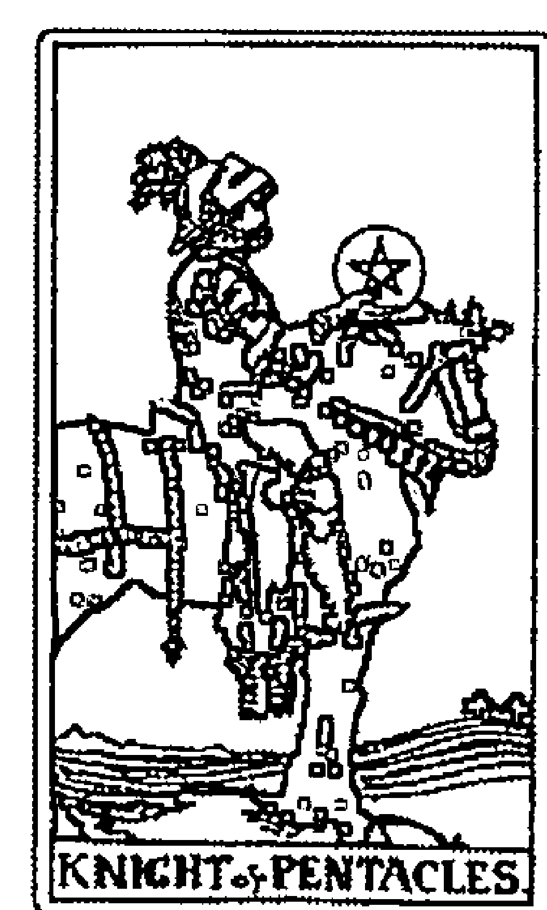

## 錢幣騎士正位

心靈與精神層面的提示

天生我材必有用，每個人都有自己最能發揮的定位，當你找到值得自己全心投入的事，你就找到自己生命的意義。

### 《人物》

- 當事人的個性

比較嚴肅而不苟言笑的人，有非常遠大的志向，同時又能夠理性務實地按部就班達成，做任何事情都很有責任感。

- 當事人的工作觀

重視自己的工作甚於一切，是個十足的工作狂，常常會超時工作而不知道要休息，即使下班後仍然想著工作的事。

- 當事人的感情觀

感情上不解風情而且沒有情調，常常把理想或工作放在第一位，如果發生工作與感情抵觸的狀況一定是工作優先。

- 當事人的金錢觀

非常重視金錢的價值和實用性，把自己的資產作最有利的規劃，先設定出個人的財務目標，然後很實際地去執行。

- 與當事人的應對方法

和這種人沒辦法天馬行空聊天，必定要設定清楚的主題和目的，也許真的是三句話不離本行，言語比較無味一點。

- 人物代表

金融營業員、專業經理人、超級業務員、努力賺錢的人。

## 《工作》

- 工作本身的狀況

你目前的工作量很大，負的責任也重，常常需要加班超時工作，但是如果能得到相對應的報償，你也會心甘情願。

- 如何解決工作的困境

這個時候應該要以實際面來考量，把資源作最有效率的配置，在獲利上不好的事情，應該要當機立斷結束或改革。

- 工作中的人際關係

由於你不太在意人際關係，所以在工作當中的人際關係平平，但是因為工作主動認真，會是同事之間的風雲人物。

- 與上司相處的方法

本身在工作上超級努力付出的上司，也會以相同的標準來衡量部屬，如果你無法配合他的要求，就會被釘得很慘。

- 工作的發展性

這個工作的發展性算是很不錯，但也是需要你投入全心全意努力的地方，如果能夠撐得夠久，一定會有很多收穫。

- 找工作／換工作的狀況

現在應該先務實地評量自己的資歷和實力，去尋找適當的工作職位，應該很快就會找到工作，可以發揮你的專長。

## 《愛情》

- 感情本身的狀況

雙方在感情上十分忠誠，對彼此也有忠誠和責任感，但是兩個人的考量都非常務實，較偏向體貼而不浪漫的關係。

- 新戀情的可能性

現在不太可能發生新戀情，因為你已經把所有的時間和心力投入在工作當中，即使出現好的對象你也不會注意到。

- 對這段感情的看法

這段感情是很穩定，但是同時也很無趣，所有的事情都要求實用的功能性，而沒有任何浪漫的感覺，好像在工作。

- 性的吸引力

這段感情當中沒有什麼性的吸引力，性生活對彼此來說是功能性的，也許只是為了傳宗接代，完全沒有熱情浪漫。

- 如何化解爭吵

這個時候應該回歸到實用和利益的層面來考慮，而不要情緒化地意氣用事，兩個人把事情講清楚之後就沒問題了。

- 分手的方法

如果這個時候兩個人要選擇分手，那必然是與彼此的工作或目標出現抵觸，這個時候坐下來談也許可以和平分手。

- 復合的可能性

兩個人之間很難復合，除非是基於實際利益的結合，但是這樣的關係並不帶有感情，只是兩個人互相利用的關係。

## 《友情》

- 我的人際關係狀況

你的人際關係只集中於工作上相關的人，而缺少真心的朋友，你如果不能對其他人多付出關心，就很難交到朋友。

- 如何化解與朋友的誤會

這個時候應該理性務實地評估狀況，看看是不是要花力氣去解決這個問題，如果必須處理也要用最有效率的方法。

## 《親情》

- 家庭的狀況

現在家裡的狀況很穩定，但是彼此之間沒有太多感情，只是大家都很有責任感，會共同把這個家庭的經濟撐起來。

- 與長輩的關係

你在長輩的眼中是很可靠又有責任感的人，常常會把一些重要的事情交給你處理，因此也會和他們有多一點交集。

- 與平輩的關係

你在平輩當中的表現很突出，如果大家在事業上有合作，就可能培養出一些感情，否則大家都會忙於自己的工作。

- 與晚輩的關係

你平常忙於自己的工作或事業，沒有太多時間關心晚輩，也會養成他們比較獨立自主的個性，彼此的感情並不親密。

## 《學業》

- 學業本身的狀況

你在學業上的表現很突出，這是你長時間努力得來的成果，你已經為未來打下了良好的基礎，是一個可喜的現象。

- 學習的方法

這個時候應該要注重方法，而不只是土法鍊鋼苦讀而已，要學會區分關鍵和重點，把時間心力用在最重要的部分。

- 與老師相處的關係

是一個很實事求是的老師，也會很細心地教導學生，不論你遇到什麼不好的狀況，大部分他都會很有耐心地處理。

- 與同學相處的關係

你並不太重視同學之間的人際關係，而是把比較多時間花在讀書和學習，所以自然在同學當中就很難交到好朋友。

## 《財務》

- 目前的財務狀況

你現在應該是好好努力賺錢的時候，財務的規劃反而不是當務之急，只要能把錢確實存下來對你就是最好的狀況。

- 投資的狀況

如果你在投資前作了很多功課，那麼這個時候應該是你能大幅獲利的時機，要把握這個千載難逢的機會大賺一筆。

- 採購的策略

這個時候採購應該要重視實用性，即使貴一點也沒有關係，只要是能常常用到有效率的東西，成本攤平就不算貴。

> ## 《延伸應用》

- 時間

相對時間：十二年。
標示時間：處女座（約每年8/23－9/22）

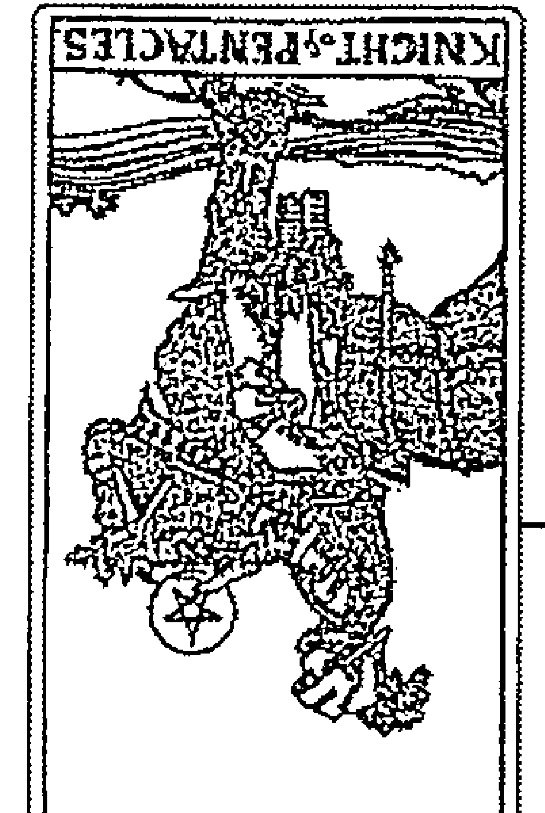

## 錢幣騎士逆位

> 心靈與精神層面的提示

再小的細節都可能造成決定性的影響，不要忽略任何事情的蛛絲馬跡，唯有深入觀照才能看清整體的意義和真相。

### 《人物》

- 當事人的個性

對於很多事情只是冷眼旁觀，都不會努力去爭取，認為多一事不如少一事，常給人一種沒有生氣和活力的停滯感。

- 當事人的工作觀

在工作上很被動，通常只會一個口令一個動作，也不會去思考工作方面的問題，有時候會因為不專心而疏忽犯錯。

- 當事人的感情觀

並不常思考與感情有關的問題，對感情的態度比較被動，即使在戀愛當中仍然很少主動付出，缺乏熱情和幽默感。

- 當事人的金錢觀

很想要緊抓住金錢不放，但是並不積極努力地賺錢，也很少理性務實地去規劃自己的財務，到最後可能坐吃山空。

- 與當事人的應對方法

任何的事情都很難激起他的熱情和興趣，所以就讓他當陪襯的配角，保證不會搶了你的鋒頭，但是也會有點無趣。

- 人物代表

坐領乾薪者、留職停薪者、辭職進修者、自願失業的人。

## 《工作》

- 工作本身的狀況

你現在的工作狀況出現停滯，做的事情也都是例行公務，不只是你自己覺得無聊不想作，隨時也有被裁員的可能。

- 如何解決工作的困境

這個時候你應該要保持警覺，不要放過任何的細節，也許問題的源頭只是一個小地方，但是可以造成很大的影響。

- 工作中的人際關係

你無心於工作當中人際關係的經營，所以也不會交到什麼新朋友，你在工作當中的表現平平，也不太想幫助別人。

- 與上司相處的方法

看起來就無心於工作的上司，要他幫你什麼忙是比登天還難，只要一切保持正常不出錯，基本上就可以相安無事。

- 工作的發展性

這個工作沒有什麼發展性，即使是想在這裡混口飯吃等退休，還有會被資遣的可能性，最好是找另一個地方逃生。

- 找工作／換工作的狀況

現在並不太適合你找工作，你可以先休息一陣子，或是考慮出去進修一下，調整好自己的心情，充實之後再出發。

## 《愛情》

- 感情本身的狀況

這段感情當中只剩下例行事物，沒有新鮮熱情的刺激，也缺乏體貼浪漫的用心，所以算是進入了停滯無聊的時期。

- 新戀情的可能性

現在不可能發生新戀情，因為你現在並無心於感情，也不會去注意是否出現了好對象，沒有動力之下什麼都免談。

- 對這段感情的看法

現在你對這段關係感到失望，兩個人之間已經沒有什麼感覺了，但是又沒有人提出分手，總覺得兩個人都在空轉。

- 性的吸引力

其實兩個人之間沒有什麼性吸引力，兩個人也不會想要有性生活，即使有性生活也像是例行公式，而不帶有感情。

- 如何化解爭吵

這個時候兩個人應該先冷靜下來思考一下，甚至不見面也是不錯的方法，等到風暴期過了之後，再看看如何化解。

- 分手的方法

其實兩個人對於分手都已經有心理準備了，所以只要有一方先提出來，另一方也會很快放手，完全不會拖泥帶水。

- 複合的可能性

兩個人之間已經沒有什麼感情了，硬要在一起也沒什麼意思，這個時候你應該好好休息，而不是想要去挽回對方。

## 《友情》

- 我的人際關係狀況

你的人際關係並不好，因為你完全無心於人際關係的經營上，只想要一個人靜一靜，其實一個人也比較適合你。

- 如何化解與朋友的誤會

其實兩個人之間也沒有什麼大的誤會，要看你是不是願意主動去說明，如果把這個問題放著，關係就會慢慢淡掉。

## 《親情》

- 家庭的狀況

現在家中陷入了一種停滯的氣氛，大家都懶懶的什麼都不想做，但是對於一些應該要做的事，你還是要好好完成。

- 與長輩的關係

長輩們常常覺得叫不動你，你也不太想理會他們，所以你們對彼此都沒有過高的期待，也很難培養出親密的感情。

- 與平輩的關係

你與平輩的關係比較疏離，所以彼此之間也沒有什麼感情，其實你們像是故意保持距離，也不想對彼此造成干擾。

- 與晚輩的關係

你對晚輩的狀況不太關心，甚至很少想到他們的存在，由於缺乏頻繁的互動和照顧，所以彼此之間沒有什麼感情。

## 《學業》

- 學業本身的狀況

你在學業上的表現不佳，因為你最近都不太想念書，在考試的時候又粗心大意，所以成績退步也是很正常的現象。

- 學習的方法

這個時候應該要先充份休息再開始拼命，否則只是埋頭苦讀也不會有任何作用，等到精神體回復了再來好好學。

- 與老師相處的關係

是一個在教學上不認真的老師，所以在學習上最好能自立自強，即使有什麼事情去問他，也不會得到滿意的答案。

- 與同學相處的關係

你與同學的互動並不密切，因為你常常覺得懶得和他們鬼混，你只在意自己的事情，所以只會有很少的知心好友。

## 《財務》

- 目前的財務狀況

你現在的財務狀況算是平穩，但是也沒有什麼進展，這個時候一動不如一靜，所以最好能節省一點保持現狀就好。

- 投資的狀況

目前你的投資不上不下，沒什麼賺錢也沒有賠錢，如果急著用錢當然要快點變現，不然放著對你也沒什麼壞處。

- 採購的策略

這個時候不適合進行新的採購，如果是例行性的採購則沒有什麼關係，如果現在不想買東西，把錢存起來也不錯。

## 錢幣侍者正位

心靈與精神層面的提示

沒有深入的思考及研究，就不可能有真實的發現和體會，謙卑地學習前人所留下的智慧，是修行不可或缺的基礎。

### 《人物》

- 當事人的個性

對於任何事情都務實細心觀察學習的人，做任何事情之前一定會經過深思熟慮，而且會專心一致小心謹慎地完成。

- 當事人的工作觀

能利用工作的機會盡量學習，並且能把學到的東西現學現賣，可以很快進入狀況，同時做事情井井有條又有效率。

- 當事人的感情觀

面對感情十分小心謹慎，同時常常主動付出，在感情當中會不斷地學習精進，也會盡量改進自己不犯同樣的錯誤。

- 當事人的金錢觀

善於運用金錢及管理自己的資產，即使有時候會讓人覺得過度節省，也會為了達成自己的理想而努力賺錢和存錢。

- 與當事人的應對方法

是很知恩圖報的人，只要你有機會能教導或幫助他，他一定會找機會回報給你更多，可以盡量開放自己和他分享。

- 人物代表

攤販、學徒、菜鳥業務員、銀行辦事員、認真學習的人。

## 《工作》

- 工作本身的狀況

你在工作當中還有很多東西需要學習，同時你也充滿活力想要把事情好好完成，這段期間需要你努力付出和投入。

- 如何解決工作的困境

這個時候應該要先務實地觀察，不要急著要搶佔先機，等到狀況明朗一點之後，自然就會找出最適當的應對方法。

- 工作中的人際關係

你在工作中的人際關係還不錯，因為你很認真地學習，大家都會很熱心地教你，良好的同事關係對你有很大幫助。

- 與上司相處的方法

工作很專注的上司，所以當他在忙的時候千萬不要去打擾他，只要能配合他的作法，就會從他身上學到很多東西。

- 工作的發展性

你在這個工作當中還有很大的成長空間，也有很多東西可以學會，所以應該把握所有的學習機會，好好充實自己。

- 找工作／換工作的狀況

現在找工作應該考慮的是學習的機會，而不是計較薪水或是職位，只要願意從基層做起，就不怕找不到好的工作。

## 《愛情》

- 感情本身的狀況

也許雙方在感情上的經驗都不是很多，但是彼此都可以在這段關係上學到很多，也是可以互相主動付出體貼對方。

- 新戀情的可能性

其實現在不太可能發生新戀情，因為你正專注於自己的事情，對於週遭的環境渾然不知，自然就很難發現好對象。

- 對這段感情的看法

這段感情時時刻刻都在進步和變化，可以在當中感受到彼此的成長，兩個人對感情十分認真，會花很多時間投入。

- 性的吸引力

這段感情當中沒有太多性的吸引力，但是仍然足以支撐正常的性生活，兩個人也會想要在性生活當中有新的嘗試。

- 如何化解爭吵

這個時候要想清楚之後再來處理，不要在情緒當中決定任何事情，或許要先考慮到環境和對方的立場再看怎麼談。

- 分手的方法

這時候兩個人可以談判分手，不過一定會對彼此造成一些傷害，應該多想想這段關係的收穫，也許可以平靜一點。

- 復合的可能性

這段感情仍然有復合的可能，但是也絕對不是在目前的狀況之下，你應該要先改進自己之後，再來考慮這段關係。

## 《友情》

- 我的人際關係狀況

你的人際關係狀況還不錯，別人對你好你也會真心地回報，所以可以交到不少的知心朋友，也能得到朋友的幫助。

- 如何化解與朋友的誤會

你應該好好檢討自己的問題，如果有錯要主動和對方道歉，把這件事情當成一個教訓，以後不要再犯同樣的錯誤。

## 《親情》

- 家庭的狀況

現在家裡的狀況在穩定發展當中，大家應該分工把自己的事情做好，不要造成別人的負擔，遇到事情再互相幫忙。

- 與長輩的關係

你是長輩的眼中的乖小孩，聰明好學又有責任感，他們常常喜歡教你很多東西，因此你也會從他們身上學到很多。

- 與平輩的關係

平輩彼此的交集並不是很多，但是遇到事情大家也會互相幫忙，因此彼此之間的感情不錯，也會了解彼此的狀況。

- 與晚輩的關係

你對晚輩非常勤教嚴管，也很重視他們健康的狀況，你常常在互動的過程當中學到很多，所以彼此的感情很親密。

## 《學業》

#### 學業本身的狀況

你在學業上的表現持續進步中，這也是你吸收理解很好的一段時間，你在這段時間應該為未來打下了良好的基礎。

#### 學習的方法

這個時候應該要注重練習，才能確實把學習的東西消化吸收，多花一份心力深入研究，就會多一分進步的原動力。

#### 與老師相處的關係

是一個本身學問很好的老師，也會不斷吸收各種的新知，不論你問他什麼問題，他都可以幫你找到很滿意的答覆。

#### 與同學相處的關係

你與同學的相處關係還不錯，但是只限於少數的好朋友，你把大部分時間都投入學習當中，所以生活圈就很有限。

## 《財務》

#### 目前的財務狀況

你對於自己的財務狀況十分了解，也可以作出適當的配置和規劃，這時候應該要投資自己，多花一點錢去學東西。

#### 投資的狀況

這時候適合進行投資方面的研究或實驗，但是不宜把所有心血都投進去，利用機會累積經驗，而不是只想要賺錢。

#### 採購的策略

這時候很適合採購，而且也能買到便宜又有效益的東西，去採購之前要先作功課，才能爭取到最好的規格和價錢。

## 《延伸應用》

- 相對時間：十一年。
- 標示時間：處女座（約每年8／23－9／22）

## 錢幣侍者逆位

# 心靈與精神層面的提示
空有理想無法成就任何事，還是應該回歸事理應該有的規律，務實地為自己的生命負責，完成自己該完成的事情。

### 《人物》

#### 當事人的個性
做事情常漫不經心沒有節制，任性而不理會別人的意見，因此會粗心大意做錯事情，或者是不負責任地半途而廢。

#### 當事人的工作觀
對於工作有自己的見解，但也會傾向用自己的方法做事情，因為做事情缺乏組織而沒有效率，也常會把事情搞砸。

#### 當事人的感情觀
在感情上愛好自由，不喜歡被別人限制，因此比較難穩定下來，即使有固定的情人，仍然可能會好奇地四處遊蕩。

#### 當事人的金錢觀
不太會做金錢的管理及規劃，而且可能會花錢如流水，所以常常會造成收支不平衡，也不會想辦法去處理或補救。

#### 與當事人的應對方法
是比較任性又不喜歡別人管的人，所以最好是不要給他太多的建議或限制，更重要的是絕對不要與他有金錢往來。

#### 人物代表
- 催收人員
- 電話行銷人員
- 亂花錢的人
- 負債累累的人

## 《工作》

### 工作本身的狀況
現在工作的狀況有點混亂，事情千頭萬緒又沒有規則可言，完全要自己從頭開始摸索，也算是吃力不討好的工作。

### 如何解決工作的困境
這個時候應該要小心謹慎，找到事情的原理和規則，先把問題的狀況界定清楚之後，才慢慢思考問題該怎麼處理。

### 工作中的人際關係
你在工作當中很喜歡交朋友，但是反而會有一點不務正業，即使與同事的關係都非常好，還是應該要把事情做好。

### 與上司相處的方法
是一個自主性很強的上司，千萬不要去干涉他的作法，甚至也不要提出任何的意見，否則可能會被他視為眼中釘。

### 工作的發展性
在這個工作未來還有發展的空間，但是狀況也會非常混亂，你必須要先撐過各種大風大浪，才有機會享受到成果。

### 找工作／換工作的狀況
現在並不是你找工作的好時機，也許會找到你本身不喜歡的工作，很快又會從那個工作離開，不如先休息一陣子。

## 《愛情》

### 感情本身的狀況
這段感情一直沒有確定下來，兩個人都不喜歡對方管制自己，也沒有給彼此什麼承諾，所以一切都還在觀察當中。

### 新戀情的可能性
現在不太可能發生新戀情，因為你還是習慣過一個人自由自在的日子，也不太喜歡有人管你，所以就很難談戀愛。

### 對這段感情的看法
這段感情一直不太穩定，也無法給彼此什麼承諾，因此還是會考慮其他人的可能性，並不把他就當成現在的唯一。

### 性的吸引力
這段感情當中有一些性的吸引力，性生活對兩個人的關係十分重要，如果沒有性生活的話就會感覺到彼此的疏離。

### 如何化解爭吵
這個時候不要想太多，只要你不要去管制他，自然就沒有什麼問題，也把自己的心情放鬆，去作自己想做的事情。

### 分手的方法
這時候兩個人可能都想分手，所以只要有一方先提出，彼此都會有解脫的感覺，也不用害怕對方可能會糾纏不清。

### 複合的可能性
這段感情完全不可能複合，分手之後最好也不要再聯絡，保持距離以策安全，還是把心力放在其他有意義的事情。

## 《友情》

#### 我的人際關係狀況
你現在人際關係的狀況還不錯，但是大部分都是屬於酒肉朋友，真心的朋友反而不多，也很少能得到朋友的幫助。

#### 如何化解與朋友的誤會
這個時候你應該先了解事情的原委，如果是對方的錯也沒必要為他想，反正也不差他一個朋友，把自己顧好就好。

## 《親情》

#### 家庭的狀況
現在家中可能出現了財務危機，大家應該要節省一點共體時艱，或者是努力賺錢幫忙分擔，共同解決現在的問題。

#### 與長輩的關係
你與長輩的關係不太好，因為你常會我行我素不聽他們的管教，花錢又沒有節制，還會出一些狀況讓他們傷腦筋。

#### 與平輩的關係
你在平輩當中比較不合群，經常一個人去做自己的事情，又不會與大家分享，所以與大家的感情就會比較疏遠些。

#### 與晚輩的關係
你不太喜歡去管制晚輩，所以常常採取放任的態度和策略，這可能會使得他們比較沒有責任心，你也很難去改變。

## 《學業》

#### 學業本身的狀況
你學業上的表現正在退步當中，因為你現在太混了不用功，之前的基礎又沒有很好，所以就會在成績上反映出來。

#### 學習的方法
這時候應該要照自己的方法去做，不要受到別人的影響，如果你能堅持自己的進度努力，到最後一定會看到成果。

#### 與老師相處的關係
其實本身也很混的老師，當然就不太會教育或管制學生，你在學習上應該要自立自強，想靠老師到頭來是一場空。

#### 與同學相處的關係
你與同學的人際關係還不錯，但是這對於你的學業並沒有什麼幫助，反而會讓你分心，沒辦法集中精神在學習上。

## 《財務》

#### 目前的財務狀況
你現在的財務狀況已經很糟了，用錢應該要省一點不要再浪費，否則到時候狀況越來越嚴重，想補救也來不及了。

#### 投資的狀況
這個時候進行投資不但無法獲利，反而可能會血本無歸，如果已經賠錢應該要當機立斷結束，就當作是交了學費。

#### 採購的策略
這個時候最好不要進行採購，切忌在衝動之下去買太貴的東西，否則到後來會發現只是浪費錢，又已經不能退貨。

## 錢幣十正位

# 心靈與精神層面的提示
在該付出的時候付出，在該享受的時候享受，當你付出努力把事情實踐和完成，自然就可以享受到你應得的成果。

## 《工作》

- 工作本身的狀況
你可能在家裡工作，或是在很大的企業體工作，現在工作已經在很穩定的狀態，很多事情只要照規定去完成就好。

- 如何解決工作的困境
現在應該要考慮執行預算的問題，有些事情必定要用錢才能解決，但是其他地方則是能省就省，把錢花在刀口上。

- 工作中的人際關係
在這個工作當中每個人都有自己的角色和定位，而有不同的想法和做法，大家的共識不多，也不會有什麼感情。

- 與上司相處的方法
上司是以集體的利益為主要考量，但是也可能因此而犧牲當中的個人，你應該要盡量發揮個人的貢獻以免被淘汰。

- 工作的發展性
這個工作長期的發展性還不錯，也會從這當中賺到很多錢，如果希望有一個穩定的工作，就該在這裡好好待下去。

- 找工作/換工作的狀況
現在找到的工作應該會有不錯的收入，但是也許會要求很多的工作經驗，你應該從自己學經歷相關的工作開始找。

## 《愛情》

### 感情本身的狀況
這段感情的狀況十分穩定，但是因為太過穩定也會有點無聊，兩個人都想先建立良好的物質基礎，再進一步發展。

### 新恋情的可能性
現在不太可能發生新的戀情，因為你把大部分心力都放在物質上，對於感情反而會不夠敏銳，也可能錯過好對象。

### 對這段感情的看法
這段感情有堅強的物質基礎，但真情並不是金錢可以買到的，也許兩個人的心還有一點距離，因此不能完全肯定。

### 性的吸引力
兩個人之間性的吸引力不是很強，但是會有和諧的性生活，對於彼此來說性生活是感情的象徵，也是不可或缺的。

### 如何化解爭吵
為了身外之物爭吵實在是沒什麼意思，如果是金錢方面的問題不妨就讓對方一些，保持和諧的感情才是最真實的。

### 分手的方法
如果現在兩個人想要分手，就要直接坐下來談清楚，如果提出來的理由彼此都可以接受，那麼也有機會和平分手。

### 複合的可能性
這段關係仍然有複合的可能性，但是也許會變成以金錢或家庭的因素為主，兩個人之間的感情反而不是那麼重要。

## 《友情》

#### 人際關係狀況
你有形形色色各種不同的朋友，但是其中比較多是酒肉朋友，並不是真心和你交往，所以也可能缺乏談心的對象。

#### 如何化解與朋友的誤會
這個時候你應該要對彼此的友情有信心，持續對他真心地付出，如果對方無法體會到你的用心，那也就沒有辦法。

## 《親情》

#### 家庭的狀況
現在家中的財務狀況很富有，大家應該把自己份內的事情做好，一起享受這個愉快的時刻，也有可能是新居落成。

#### 與長輩的關係
長輩對你非常照顧，也會給你很多金錢上的支援，雖然你經常對他們心存感激，但是實際上的感覺彼此並不親密。

#### 與平輩的關係
你與平輩之間是一種分工關係，雖然大家都忙於自己的事情，但是也有可以互相幫忙的地方，彼此之間唇齒相依。

#### 與晚輩的關係
你對晚輩有很高的期待，也會給他受最好教育，但是若不小心給他太多的金錢，可能會養成他奢侈浪費的壞習慣。

## 《學業》

#### 學業本身的狀況
你學習的狀況很平均，在成績上其實並不突出，但你若是持之以恆努力，終究還是可以後來居上獲得最大的成果。

#### 學習的方法
這個時候學習應該要廣博，而不是在很精細的地方鑽牛角尖，在多方面的嘗試之後，才會找到最適合自己的方法。

#### 與老師相處的關係
這個老師非常重視同學成績的表現，所以表現不好的人就會被他特別盯上，你至少應該讓自己的排名保持在中間。

#### 與同學相處的關係
其實你在同學之間還相當受到歡迎，但是你並不太喜歡和他們出去鬼混，反而會比較喜歡回家或花多一點時間讀書。

## 《財務》

#### 目前的財務狀況
你目前的財務狀況很好，也會得到不少的財富，你應該把握現在的良好基礎，為自己的未來作更務實的長遠規劃。

#### 投資的狀況
現在是你投資收益的高峰，但是接下來狀況也不可能會更好，所以應該在這個時候獲利了結，才能保有最大利益。

#### 採購的策略
這個時候適合進行大金額的採購，對於買新房子或把房屋裝修會特別有利，但是也要仔細評估之後再決定買下來。

## 《延伸應用》

#### 時間
相對時間：十年。
標示時間：處女座第三旬（約每年9／13－9／22）

## 錢幣十逆位

# 心靈與精神層面的提示
扮演好自己在生命當中的各種角色，才有機會把心中的理想付諸實現，不要把失敗或不順遂都歸咎於命運的捉弄。

## 《工作》

**工作本身的狀況**
你在工作當中可能會經手大筆的金錢，只要一個不小心就一輩子賠不完，但若是把握機會也可以有很好的發展。

**如何解決工作的困境**
現在應該要注意金錢的使用狀況，是不是有浪費的現象，只要能控制住金錢的實質損失，就有機會再重新站起來。

**工作中的人際關係**
在這個工作當中大家都為了資源的分配而斤斤計較，彼此之間常常因此相持不下，同時也缺乏良性的互動關係。

**與上司相處的方法**
上司的眼中只看到錢，完全不會考慮到個人的感覺，如果你現在對公司的貢獻度不夠，可能就會被他壓榨得更慘。

**工作的發展性**
這個工作未來的狀況仍然穩定，也不會有什麼新的發展，不過如果是为了高额的退休金，就很值得在這裡待下去。

**找工作/換工作的狀況**
現在找工作感覺上像是賭博，有可能找到很好的工作，但也可能遇到求職陷阱，不要看到錢就不顧一切地往前衝。

## 《愛情》

**感情本身的狀況**
兩個人是因為看上對方的金錢而在一起，但是也會因為金錢的事情而爭吵，其實彼此之間並沒有堅實的感情基礎。

**新戀情的可能性**
現在不太可能發生新戀情，因為你不相信純粹的感情，以為金錢就可以幫你買到愛情，其實這是完全錯誤的方向。

**對這段感情的看法**
現在兩個人還在一起完全是看在錢的份上，其實彼此之間已經沒有什麼感情，但是在交往過程當中也花費很多錢。

**性的吸引力**
兩個人之間沒有什麼性的吸引力，所以也不太可能經營出讓雙方都滿意的性生活，也許對彼此來說只是偶一為之。

**如何化解爭吵**
如果金錢可以解決的事情就用金錢解決，就算是花錢消災吧，如果覺得不想要花這個錢，也許就要承受更多情緒。

**分手的方法**
現在兩個人已經沒什麼感情，但是要分手就很可能卡在錢的問題，只要這個部分可以交代清楚，就可以和平分手。

**複合的可能性**
這段關係不太可能會複合，除非是兩個人又為了共同的利益而結合，但是這種利益取向的關係當中並沒有真感情。

## 《友情》

#### 人際關係狀況
現在你的身邊有很多的壞朋友，很可能會帶壞你，或讓你花很多不必要的錢，其實你應該快點脫離這些人的影響。

#### 如何化解與朋友的誤會
你和朋友的誤會其實並不嚴重，但是若涉及到利益的衝突就比較難解決，這個時候金錢和友情可能沒有辦法兼顧。

## 《親情》

#### 家庭的狀況
現在家中的財務狀況開始走下坡，應該要節省一點減少浪費，至少要留下基本的生活費，才不會到最後流落街頭。

#### 與長輩的關係
長輩常常沒有空關心你，反而會用金錢來作為補償，所以雖然你有很富裕的經濟生活，但是彼此的感情並不親密。

#### 與平輩的關係
在平輩之間彼此沒有什麼感情，反而可能會為了自己的利益而針鋒相對，若是因此發生衝突，則會完全不顧親情。

#### 與晚輩的關係
你對晚輩沒有太多照顧，只是盡到基本的撫養義務，你常覺得晚輩是你沉重的負擔，所以彼此之間也沒什麼感情。

## 《學業》

#### 學業本身的狀況
你在學習上的反應比較慢一些，所以需要加倍努力才能跟上其他同學，你應該持續努力學習，千萬不要選擇放棄。

#### 學習的方法
勤能補拙是你最佳的寫照，只要在事前多花時間預習，在課後再加緊努力複習，即使再難的科目你也都可以克服。

#### 與老師相處的關係
其實本身並無心教學的老師，對於所有學生的表現都不太關心，你只要不惹出太大的問題，就可以和他相安無事。

#### 與同學相處的關係
你與同學的相處關係還不錯，但是大部分都是一些損友，你最好少和他們出去鬼混，花多一點時間讀書比較實在。

## 《財務》

#### 目前的財務狀況
你目前的財務已經開始出現漏洞，但是若遲不處理可能會越來越嚴重，你至少應該要先保留維持基本生活的開銷。

#### 投資的狀況
現在你的投資已經過了最好的時機，接下來應該要保守應對，千萬不要再進行新的投資，因為已經不太可能獲利。

#### 採購的策略
這個時候不太適合進行採購，因為這段時間你處理金錢會比較遲鈍，可能會在當中出現錯誤，應該先等等再決定。

## 錢幣九正位

# 心靈與精神層面的提示
真正懂得生活享受的人，不會只滿足於物質感官的刺激，只有在生命的過程中，心安理得，才能享受到平靜的喜悅。

## 《工作》

**工作本身的狀況**
現在工作的狀況一切進行順利，你對於現在的職位與工作內容也駕輕就熟，但是仍然要小心謹慎以防止發生錯誤。

**如何解決工作的困境**
這個時候是在考驗你的洞察力，只要你能找到問題的核心，其實事情並不難解決，困難的地方在於如何正確判斷。

**工作中的人際關係**
處理與同事的關係時要小心謹慎，對於很多事情也要考慮週到，如果能維持良好的互動，在工作上就會非常方便。

**與上司相處的方法**
是一個務實又細心的上司，同時也能有敏銳的洞察力和高遠的理想，只要你能好好跟著他做事，未來的前途可期。

**工作的發展性**
這個工作的發展性很好，也會有更進一步的機會，只要你能小心地經營，未來在金錢上的收穫絕對是非常可觀的。

**找工作／換工作的狀況**
你現在很容易就找得到好工作，但是一定要你主動出擊才會有效，如果你只是在原地等待，再久都不可能有機會。

## 《愛情》

**感情本身的狀況**
這段感情帶給彼此很多的快樂，也可以共同去體驗很多感官的享受，兩個人都願意為這段關係投入很多時間金錢。

**新戀情的可能性**
現在有可能發生新戀情，但是機會往往一閃即逝，你要非常細心去注意所有可能的對象，才會發現感情的新機會。

**對這段感情的看法**
這是一段充滿歡樂的感情，兩個人相處的時光完全不夠用，希望能時時刻刻黏在一起，也會很用心經營這段關係。

**性的吸引力**
兩個人之間有很強的吸引力，性吸引力只是其中的一部分，性生活對彼此來說是最快樂的時光，也會覺得很滿足。

**如何化解爭吵**
這個時候爭吵的只是小問題，但是要很小心處理，也許背後的原因才是大麻煩，不可以看到表面現象就掉以輕心。

**分手的方法**
現在兩個人不太可能分手，但是仍然可以理性地談一談，也許到最後兩個人還是選擇在一起，或者也有可能分開。

**復合的可能性**
這段關係不太可能復合，因為分手必然是非常理性考慮的結果，即使兩個人之間仍然有感情，也很難選擇在一起。

## 友情

- 我的人际关系状况
你在朋友当中很受到欢迎，你也喜欢和朋友们相处的感觉，但是因为你本身的标准比较高，所以好朋友不是很多。

- 如何化解与朋友的误会
这个时候应该要小心谨慎地处理问题，把两个人的误会讲清楚，事情就会自然化解，置之不理问题可能越滚越大。

- 我的人际关系状况
你在朋友当中常常都是独来独往，专心于自己有兴趣的事情，也不会主动去关心别人，所以都很难找到朋友谈心。

- 如何化解与朋友的误会
这个时候就让事情拖着，看看会不会有什么变化，千万不要急著作什么处理，通常只会让问题和冲突越来越深。

- 我的人际关系状况
其实你并不太重视人际关系的经营，若是有一些朋友也都是因为实际的功能，很少有可以真诚分享心事的好朋友。

- 如何化解与朋友的误会
在这个时候只要先把话说清楚，误会自然就会化解，不要花太多时间去思考这个问题，对你来说完全是浪费时间。

- 我的人际关系状况
其实你的人际关系还不错，但是大部分都不是真心的朋友，甚至有些人就是为了想要利用你，对这些人不可不防。

- 如何化解与朋友的误会
这个时候不要太固执己见，得饶人处且饶人，如果不小心把小误会变成是一种面子问题，以后可能就会更难处理。

## 亲情

- 家庭的状况
现在家中的状况很好，大家都过着悠闲享乐的生活，彼此之间的相处也很愉快，应该要小心地经营保有这种成果。

- 与长辈的关系
你的长辈对你还不错，你也会因此得到不少实质的好处，你们之间相处的时间虽然不多，但是感觉上都非常愉快。

- 与平辈的关系
你与平辈的交集并不是很多，平时也不是很关心对方，但是彼此之间的感情还不错，相处的时间也会感觉很愉快。

- 与晚辈的关系
你与晚辈相处的时光很快乐，会让你忘了一切的烦恼，你也会给他们过很好的物质生活，彼此之间的感情很紧密。

- 与同学相处的关系
基本上你并不太喜欢和同学互动，很多时候也是自己念书，若是你太常和同学们出去玩，反而会让你的成绩退步。

- 家庭的状况
表面上看起来家庭的状况还不错，但是其实大家各怀鬼胎，也一直在算计着其他人，彼此之间相处关系并不真诚。

- 与长辈的关系
你的长辈可能对你有很多的照顾，但是你可能缺乏回馈的行动，使得对方觉得有些失望，彼此的关系就不会很好。

- 与平辈的关系
你与平辈之间没什么交集，大部分的时间也是各做各的事，也许会为了金钱的事情起冲突，而使用不正当的手段。

- 与晚辈的关系
你对晚辈有很多的提防和不信任，总觉得他们太重视生活享受，又不愿意脚踏实地做事，彼此的感情也不会太好。

- 家庭的状况
现在家里每个人都忙于自己的工作，也很少有时间可以聚在一起，你常以自己的家人为荣，大家都有很好的收入。

- 与长辈的关系
你的长辈对你十分放心，你也会尽量努力光宗耀祖，你虽然与长辈之间相处的时间不多，但是彼此的感情还不错。

- 与平辈的关系
其实平辈通常都是各忙各的，即使逢年过节大家也很少聚在一起，由于大家相处的时间不多，所以也没什么感情。

- 与晚辈的关系
你常常太忙于工作而忽略了对晚辈的教养，有时候你会用金钱来给他们补偿，但是也可能会因此缺乏真实的感情。

- 家庭的状况
现在家中的状况还算稳定，但是要避免不切实际的高远计划，可能会使家中付出惨重代价，一定要小心理性考虑。

- 与长辈的关系
你的长辈对你还不错，但是你常常会辜负他们的期望，甚至使他们的心血毁于一旦，所以彼此之间的感情不太好。

- 与平辈的关系
你在平辈当中是比较会钻营的，常会利用其他人来完成自己的事情，但是若作得太过份也可能受到其他人的抵制。

- 与晚辈的关系
你很注意晚辈的状况，也想要用心教养他们，只是你常会希望由他们来完成你的心愿，反而容易引起他们的反弹。

## 学业

- 学业本身的状况
你在学业上的表现还不错，但是你并没有花很多时间在学习上，反而对课外的东西比较有兴趣，要小心保持平衡。

- 学习的方法
这个时候不要给自己太大的压力，应该要轻松地去面对，只要能持续不断地接触和学习，一定会达成学习的目标。

- 与老师相处的关系
平时不太会给学生压力的老师，所以一定要自动自发学习，否则可能会因为太不用功，导致自己的成绩一落千丈。

- 与同学相处的关系
你在同学当中的人缘还满好的，你也很喜欢和同学们混在一起，你应该要适当地自我节制，才不会没有时间读书。

- 学业本身的状况
你在学业上表现不是很好，主要是因为你没有把心思放在学习上，在念书的时候又偷工减料，成绩自然就会退步。

- 学习的方法
这个时候应该要重视执行时的细节，脚踏实地努力学习，不要幻想自己突然就能学会了，这是完全不可能的空想。

- 与老师相处的关系
基本上是一个不太关心学生的老师，也不会给学生任何引导和压力，学习上要靠自己努力，才能争取最好的成绩。

- 与同学相处的关系
基本上你都是一個人努力讀書，平時也不太和同學們交往，你很喜歡這樣的感覺，所以也不覺得需要作什麼改變。

- 学业本身的状况
你在学业上的表现很好，这是因为你每天都花很多时间在学习，而且也很有方法和技巧，所以打下了很好的基础。

- 学习的方法
这是你持续努力学习的时候，最重要的是保持专注，只要在现在的基础之上乘胜追击，一定可以拿到很好的成绩。

- 与老师相处的关系
非常勤教严管的老师，常会带给学生很大的压力，因为很会塑造大家共同努力的风气，如果你不努力就会跟不上。

- 与同学相处的关系
你和同学的人际关系还不错，但也不是诚心和同学们交往，你常常会利用同学达到自己的目标，把同学当成工具。

- 学业本身的状况
你在学业上的表现还可以，但是你本身其实不够用功，常常只是靠自己的小聪明，甚至使用一些不正当的小动作。

- 学习的方法
现在你应该专心于学习方面的事情，同时应该要注意各方面的细节，愿意花时间累积实力，才有可能拿到好成绩。

- 与老师相处的关系
是一个非常细心又保守的老师，同时也无法容忍学生犯错，如果你常常发生相同的错误，一定会成为他的眼中钉。

### 工作

### 工作本身的状况
现在的工作十分繁琐，但是实际上并不一定有意义，甚至很多是不必要的步骤，即使了解仍然需要按照规定去做。

### 如何解决工作的困境
现在应该小心谨慎分析问题，把事情按部就班完成，并且保持清楚的理智和方向感，才不会被眼前的情势迷惑了。

### 工作中的人际关系
在这个工作当中的同事都是各自为政，而且也很自以为是，彼此之间常会私底下较劲，所以也很难互相信任对方。

### 与上司相处的方法
是一个比较散漫的上司，作事情的时候常常没有清楚的目标和计划，只是会吹牛画大饼，其实很多都是不可行的。

### 工作的发展性
这个看起来有不错的发展性，其实这一切只是一场美梦，如果是无法达到的高远理想，饼画得再大也是没有用的。

### 找工作／换工作的状况
现在找工作要很细心，不要被高薪或奖金诱惑就失去理性，还是应该务实地评估事情的合理性，再作最后的决定。

### 工作本身的状况
这是一份高度技术性的工作，同时你需要十分专心才能把工作完成，如果你越努力工作的话，就会得到越多报酬。

### 如何解决工作的困境
你需要专心一致地处理这个问题，而且需要发挥你专业的才能和技术，如果你不是专业人员就要向专业人员求助。

### 工作中的人际关系
你不太重视工作中的人际关系，每个同事也只是专注于自己的事情埋头苦干，平时也缺乏和同事交流联谊的机会。

### 与上司相处的方法
是一个很努力工作的上司，也希望属下和他一样认真，通常他都会身先士卒带头冲，你也只好硬着头皮努力跟上。

### 工作的发展性
这个工作的发展性不错，也会得到金钱的报偿，但是在工作上非常需要专业能力，平时就要加强本职学能的充实。

### 找工作／换工作的状况
现在找工作应该以专业性或技术性的工作为主，如果过去有良好的学经历就更为有利，应该要把握这个好机会。

### 工作本身的状况
这是一份高度专业的工作，但是也需要经过很长时间的磨练和学习，如果想走偏门捷径的话，反而容易导致失败。

### 如何解决工作的困境
这个时候除了专业的考量之外，也要考虑到其他的影响因素，甚至可能有其他人从中破坏，最好要小心及时防范。

### 工作中的人际关系
在这个工作当中大家都是保持表面的关系，其实私底下还有很多的暗盘和交易，可能一不小心就会被别人所出卖。

### 与上司相处的方法
是一个非常认真进取的上司，但是为了达成目的也会不择手段，如果你不能配合他的作法，很可能就会被他牺牲。

### 工作的发展性
这个工作未来只会越来越辛苦，但是实际上并没有什么发展性，所以还不如认清自己的实力，找其他的机会发挥。

### 找工作／换工作的状况
现在找工作不会很快就有结果，如果你的期待很大反而会失望更大，这时候应该好好充实自己，等待更好的机会。

### 工作本身的状况
现在工作已经看到初步成效，但是还不到功成名就的时候，这时候你应该考虑下一步的作法，以获取最大的利益。

### 如何解决工作的困境
这个时候你应该把握时机，与相关的人或单位进行交易，不要保守地坚持现状，创意才是你打破僵局的最好方法。

### 工作中的人际关系
这个工作当中人际关系并不被重视，同事彼此之间也没什么交流，其实大家如果可以相互合作，工作上会更顺利。

### 与上司相处的方法
你的上司常常会想很多，但是实际上的执行力不足，通常你只能够自己埋头努力，不要想靠他帮你搞定任何事情。

### 工作的发展性
这个工作的发展性看起来还不错，可是很多的好处还不一定会实现，若是有更好的机会出现，也可以考虑换环境。

### 找工作／换工作的状况
现在找工作应该要考虑到未来性，而不是以眼前的职位或薪水为主要标准，很多东西还是要经过努力才会实现的。

### 爱情

### 感情本身的状况
在这段感情当中两个人都过得很优渥，但是也许这只是表面现象，不要陷入自己的想像当中，被物质金钱所迷惑。

### 新恋情的可能性
现在是有可能发生新恋情，但是不太可能是好的感情关系，也许整个过程只是你个人的想像，其实这是一场骗局。

### 对这段感情的看法
这是一段快乐的感情，但是总觉得并不是那么真实，也许两个人只是在贪图财物和享乐，彼此之间并没有真感情。

### 性的吸引力
这段感情当中有一些性的吸引力，双方也很贪图性生活的享受，即使如此仍然无法弥补两个人在一起时的空虚感。

### 如何化解争吵
这时候要去追查事情的真相，不要被表象所混淆，如果有发生欺骗的状况一定要对方坦诚，否则以后就很难信任。

### 分手的方法
现在说什么理由要分手都只是借口，其实两个人之间已经没有感情，与其如此还不如说清楚，比较可能和平分手。

### 复合的可能性
这段关系完全不可能复合，因为两个人之间已经没有什么感情了，复合只是一个不切实际的幻想，不可能会实现。

### 感情本身的状况
现在两个人都在工作上打拼，比较少有单独相处的时间，但是也绝不可能发生外遇，所以未来还是有努力的空间。

### 新恋情的可能性
现在完全不可能发生新的感情，因为你把所有的心力都投注在工作上，即使真的出现适合的对象你也是视而不见。

### 对这段感情的看法
这段感情现在还算稳定，但是仍然有很多进步的空间，两个人应该要为这段关系再继续努力，而不是满足于现状。

### 性的吸引力
两个人之间没有很强的性吸引力，也可能为了工作而忽略了性生活，但是两个人都不会把这件事当成重大的问题。

### 如何化解争吵
这个时候应该要重视大方向，而不只是看到小问题，如果是小地方干脆就让对方，在这种小事情上纠缠真是无聊。

### 分手的方法
两个人可能因为相处时间太少而走向分手，这时候提出分手对彼此也不会有什么伤害，只是看谁要先提出来而已。

### 复合的可能性
这段关系现在不可能复合，因为两个人都专注于自己的事情，根本无心于感情关系，还是先把自己管好以后再说。

### 感情本身的状况
其实两个人之间早已经没有什么感情，但还是会为了面子问题维持住表面的关系，其实这段关系已经岌岌可危了。

### 新恋情的可能性
现在不太可能发生新恋情，因为你对于感情对象太过挑剔，设定太多不必要的条件，所以反而无法发现真心的人。

### 对这段感情的看法
这段关系已经貌合神离，现在只是勉强维持住一个名份，但是两个人都在忙自己的事情，所以没空处理这段关系。

### 性的吸引力
在两个人之间其实没有什么性的吸引力，所以也不会想要去用心经营性生活，甚至还可能因此而完全没有性生活。

### 如何化解争吵
两个人表面上装作没事，其实问题已经十分严重，如果你不能察觉到问题的严重性认真处理，可能就会走向分手。

### 分手的方法
其实现在对方无心处理这段关系，所以只要你先提出分手，然后从此就避不见面，应该算是你们分手的最快方法。

### 复合的可能性
这段关系完全不可能复合，因为两个人之间已经没有感情了，在一起也只是一种表象，还不如诚实一点面对自己。

### 感情本身的状况
现在双方的感情算是满稳定的，但是仍然会去思考下一步该怎么办，也许是遇到了瓶颈而希望有一些不同的作法。

### 新恋情的可能性
现在不太可能发生新恋情，因为你考虑的东西太多，也给自己太大的压力，对你来说感情并不是一件急迫的事情。

### 对这段感情的看法
这段到目前为止感情都还算不错，但是不知道下一步会怎么走，也许双方都对未来感到茫然，也还在努力思考中。

### 性的吸引力
在两个人之间没有什么性吸引力，甚至也还没有任何的性生活，对于彼此来说都会觉得这件事情还需要从长计议。

### 如何化解争吵
这个时候老套已经没有用了，所以应该要想一些不同的方法来取悦对方，相同的方法可能会让你们陷入恶性循环。

### 分手的方法
这不是提出分手的好时机，即使主动提分手也不会被对方接受，也许应该先想好分手的理由，等时机成熟再提出。

### 复合的可能性
这段关系仍然有一点复合的可能性，但是因为双方都很犹豫，所以不会很快有结果，你也不用急着想要和他复合。

## 财务

- 目前的财务状况
你目前的财务状况良好，基本上不愁吃穿，也可以有不错的物质生活，你应该谨慎理财才能保有现在的生活水准。

- 投资的状况
现在是你投资的好时机，适合开始进行新的投资，过去的投资也能获得很大利益，只是要小心谨慎注意各种变化。

- 采购的策略
这个时候适合进行各种采购，只要是你喜欢的东西几乎都可以买得到，但是要控制一下支出总额，不要过度超支。

- 目前的财务状况
你目前的财务状况还可以，但是财务计划则是不切实际，你应该要更细心地去规划评估，才能保持住现在的状况。

- 投资的状况
现在投资状况还算平稳，但是切忌追高杀低，如果太过贪心想要大赚一笔，到头来可能什么都没有，要特别小心。

- 采购的策略
这个时候最好不要进行采购，原来有的东西能用则用，能修则修，新的东西不一定好用，反而增加不必要的支出。

- 目前的财务状况
你目前的财务状况稳定良好，而且大部分的收入都来自于工作，只要你能把工作所得好好存下来，就会有很多钱。

- 投资的状况
你应该要小心谨慎地进行投资，这段时间也不太容易赚到钱，你应该把心力放在自己的本业上，不要本末倒置了。

- 采购的策略
这个时候不太适合进行采购，但是与本职学能有关的东西则不在此限，若是在工作或学业的必需品就绝对不能省。

- 目前的财务状况
你目前的财务状况还可以，但是千万不要与别人发生借贷的关系，同时也要注意自己目前的负债状况和贷款利息。

- 投资的状况
现在投资的获利最多只是蝇头小利，不可能在这个时候赚到大钱，即使再怎么努力研究，到头来也可能是一场空。

- 采购的策略
这时候不适合进行大量的采购，以免一不小心就买了很多不必要的东西，一方面可能白花钱，同时也是浪费物力。

## 钱币九逆位

> **心灵与精神层面的提示**

小心坚持自己的理想，不要被过程当中的表象所迷惑，能够保有理性思考坚持到底的人，才能享受到成功的喜悦。

## 钱币八正位

> **心灵与精神层面的提示**

小心谨慎与持续努力是成功的不二法门，想要一步登天的幻想绝不可能达成，在物质世界或是灵性修持都是如此。

## 钱币八逆位

> **心灵与精神层面的提示**

太注意事情的细节，可能会让你见树不见林，放开自己的视野看看外面的世界，你会发现自已真正的价值和美好。

## 钱币七正位

> **心灵与精神层面的提示**

创意并非是天马行空地想像，而是基于现实的需要走出一条与别人不同的路，或是以不同的观点解答前人的问题。

## 延伸应用

- 时间
相对时间：九年。
标示时间：处女座第二旬（约每年9/3－9/12）

- 时间
相对时间：八年。
标示时间：处女座第一旬（约每年8/23-9/2）## 《友情》

我的人際關係狀況
你平常不太重視人際關係的經營，也已經習慣了獨來獨往，只有在有需要的時候會想到朋友，朋友之間很少聯絡。

如何化解與朋友的誤會
其實你與朋友的誤會都是因為缺乏溝通而起，只要你找個時間和他講清楚說明白，一般來說事情都可以順利解決。

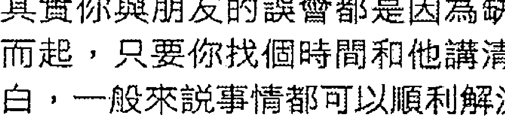

## 《親情》

家庭的狀況
現在家中面對一個重要的決定，需要小心理性地去考慮，除了評估利害得失之外，也要想到實際上完成的可行性。

與長輩的關係
由於你與長輩相處的時間不多，所以彼此之間的感覺也比較淡，你常覺得長輩答應你的一些事到後來都沒有實現。

與平輩的關係
若是能與平輩互通有無，那麼會讓你們彼此之間獲得最大的利益，應該與大家保持良好的關係，保持合作的可能。

與晚輩的關係
其實晚輩的表現已經不錯了，但是你仍然會對他們不滿意，你應該想辦法激發他們的創意，而不是只給他們壓力。

## 《延伸應用》

時間
相對時間：七年。
標示時間：金牛座第三旬（約每年5／11－5／20）

## 《學業》

學業本身的狀況
你在學業上的表現還不錯，也已經有一定的成果了，但是現在好像遇到了一個階段的瓶頸，想要突破就要靠創意。

學習的方法
你現在已經有不錯的基礎了，現在應該要反覆思考深入了解內部的原理，若是能有自己的創意就會有很大的進步。

與老師相處的關係
對學生非常用心的老師，但是也會要求比較多，會特別在意表現不好的同學，所以如果有問題可以盡量去請教他。

與同學相處的關係
你平常比較喜歡一個人讀書，但是仍然會和同學們保持表面上的良好關係，如果有需要也可以找到同學互相幫忙。

## 《財務》

目前的財務狀況
你目前在財務上已經有一定的累積，正在考慮下一步應該怎麼辦，希望能透過最好的安排配置，得到更多的利益。

投資的狀況
投資上已經有初步的獲利，但是還沒達到你的理想目標，其實現在的做法已經到了極限，你應該要有創意的想法。

採購的策略
現在不要衝動地下決定，進行採購的時候最好能仔細考慮，也許可以幫你省下不少錢，也能買到你最需要的東西。

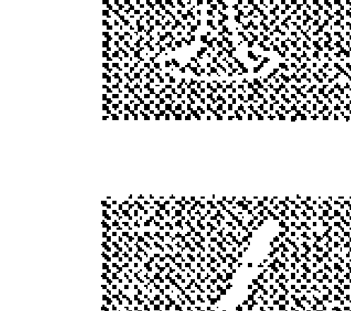

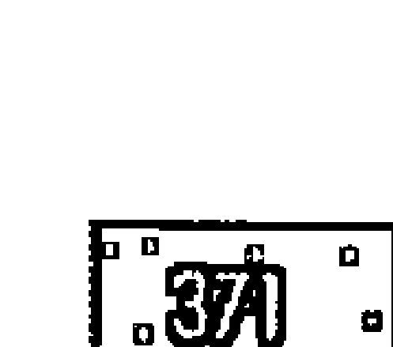

## 錢幣七逆位

> **心靈與精神層面的提示**
> 只有放下擔心的人才能承擔更多的責任，以平常心去完成更多的事情，擔心與焦慮只會減損你的判斷力和行動力。

## 《工作》

### 工作本身的狀況
你對於現在的工作有一些焦慮，可能會擔心自己的努力得不到應有的成果，但是又無法下定決心去作重大的改變。

### 如何解決工作的困境
這時候應該要考慮到預算，以及如何花費最少的時間精力完成任務，在這個問題上糾纏下去並不會得到什麼好處。

### 工作中的人際關係
這個工作當中的人際關係並不重要，你也無法從同事的身上得到什麼幫助，還不如自己一個人專心地把事情作好。

### 與上司相處的方法
是一個唯利是圖的上司，並且常常會擔心屬下超過他，你千萬不要和他爭任何功勞，不然很可能會被他整得很慘。

### 工作的發展性
這個工作的發展性不是很好，也有很多的不確定性存在，如果只是維持在原地不動，未來的發展前途也不會很好。

### 找工作／換工作的狀況
現在找工作最重要的是考慮薪資，有足夠的收入才能讓你穩定下來，如果短期內找不到理想的工作也不要太灰心。

## 《愛情》

### 感情本身的狀況
目前雙方的感情遇到了瓶頸，因此兩個人常會感到擔心或焦慮，你應該提出可行的計劃，把對方的情緒穩定下來。

### 新戀情的可能性
現在不太可能發生新的戀情，你並沒有急著想要談感情，也有很多其他的事情讓你煩心，因此很難發現新的對象。

### 對這段感情的看法
其實目前對這段感情是有一點灰心，相處的時候也覺得有一點憂鬱，很多的事情都無法依照自己原本的計劃進行。

### 性的吸引力
在這段感情當中沒有什麼性吸引力，兩個人也不覺得需要太多的性生活，所以性生活並不會成為一件重要的事情。

### 如何化解爭吵
事情的考量應該要基於現狀，而不是天馬行空地幻想，最好能先想出一個可行的解決方法，再慢慢按部就班解決。

### 分手的方法
其實兩個人對這段關係已經感覺到失望，只要有一方提出分手，另一方也很可能接受，只是仍然會有一些不甘心。

### 複合的可能性
這段關係已經完全不可能複合了，再考慮這件事情只是自尋煩惱，這個時候應該快點認清事實，才可以重新開始。

## 《友情》

我的人際關係狀況
你在人際關係上受過一些傷害，因此很難再信任別人，其實你還是靠自己會比較好，不要對朋友們有太大的期望。

如何化解與朋友的誤會
與朋友之間重要的是說到做到，如果有什麼事情辜負了朋友的期望，一定要把理由說清楚，否則問題就很難解決。

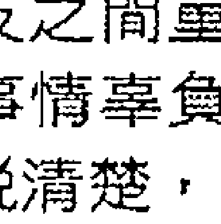

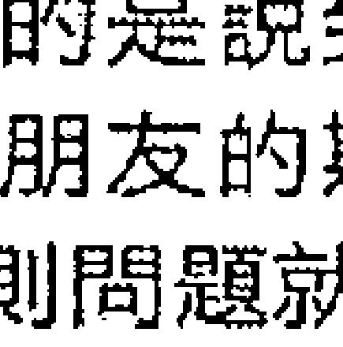

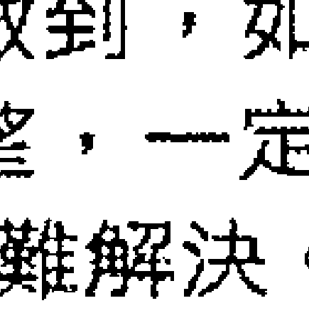

## 《親情》

家庭的狀況
現在家中可能出現了資金缺口或是發生了財務危機，這個時候應該要務實地考慮如何渡過難關，而不是置之不理。

與長輩的關係
你常會擔憂長輩的各種狀況，但是他們似乎並不領情，即使彼此的感情還不錯，也很難從他們那裡得到什麼好處。

與平輩的關係
其實你與平輩之間的感情還不錯，但是彼此之間沒有什麼交集，最好能保持單純的關係，不要有什麼財務的往來。

與晚輩的關係
你很關心晚輩們的狀況，但是可能對他們的狀況過度擔憂，你應該保持平常心來看待，而不要有不切實際的期待。

## 《學業》

學業本身的狀況
你在學習上遇到了瓶頸，你對於這種狀況也感覺到焦慮，你應該仔細思考問題到底出在哪裡，而不只是坐困愁城。

學習的方法
你現在最重要的是解除你的擔心，不要害怕自己的努力會白費，能先做好心理建設，就會在學習上有很大的進步。

與老師相處的關係
一個過度關心學生的老師，會對你造成比較大的壓力，你常會擔心無法達到他的標準，其實根本就不需要擔心。

與同學相處的關係
其實你與同學的關係還好，但是你常覺得自己孤立無援，你應該要放開心與同學們交往，才會交到真心的好朋友。

## 《財務》

目前的財務狀況
你現在的財務狀況不太好，但是仍然在可以控制的範圍之內，你不必太擔心自己的狀況，只要務實地想辦法解決。

投資的狀況
你的投資狀況並不好，也無法達到預期的獲利，你應該快點改變作法，絕不要借錢去投資，否則一定會血本無歸。

採購的策略
這時採購要特別小心，最好不要預購或是郵購，否則很可能付了錢又拿不到東西，只有一手交錢一手交貨才安全。

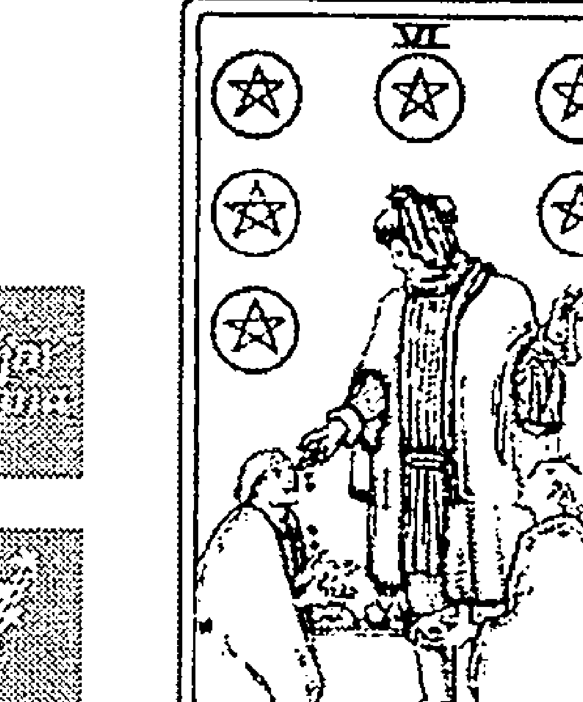

## 錢幣六正位

> > **心靈與精神層面的提示**
> > 在成功的時候越要懂得謙卑，付出的同時我們也會獲得更多，在幫助別人的當下，也要反省自己的行為是否恰當。

## 《工作》

### 工作本身的狀況
你的工作狀況很好，也有很不錯的收入，但要分享才能造就更大的利益，所以在成功之餘也不要忘記了幫助別人。

### 如何解決工作的困境
這時候你應該要仔細衡量考慮，把所有的利害得失都計算清楚，在有完整的計劃之後，再開始進行下一步的行動。

### 工作中的人際關係
由於你在工作當中常常能夠幫助別人，所以大家也都和你保持很好的關係，當你需要的時候也有很多人能夠幫你。

### 與上司相處的方法
是一個本身非常成功的上司，也會樂於分享自己的經驗，只要你能夠主動發問多多向他學習，一定會有很多成長。

### 工作的發展性
這個工作的發展性還不錯，也有很大的加薪機會，這個時候應該在這個地方好好堅持下去，而不要再三心二意了。

### 找工作／換工作的狀況
現在很快就可以找到工作，而且也是你覺得滿意的職位和薪水，當機會出現就要快點把握，不要錯過了再來後悔。

## 《愛情》

### 感情本身的狀況
現在這段感情非常甜蜜，兩個人對這段關係都感到滿足，但是在當中可能會不太平等，或是想要以金錢控制對方。

### 新戀情的可能性
現在有可能發生新的戀情，但是需要你主動付出努力去追求，如果你只是在原地等待，那麼就可能錯過很多機會。

### 對這段感情的看法
這是一段成功的感情，在當中也感覺到付出的快樂，雖然有些時候會在小地方計較，但是整體而言還是很美好的。

### 性的吸引力
兩個人之間有一些性的吸引力，在性生活當中也會努力付出取悅對方，所以性生活也會是兩個人情趣的重要來源。

### 如何化解爭吵
這個時候應該要主動付出，用同理心去體會對方的難處，有時候買個禮物去和對方陪罪可能會有異想不到的效果。

### 分手的方法
你若是想要在這個時候分手，一定要先衡量事情的得失，在訂出縝密的應變計劃之後，主動提出分手才可能會有機會。

### 複合的可能性
這段關係已經不太可能複合了，因為兩個人會分手是經過很仔細的思考，即使現在想要努力付出也不可能被接受。

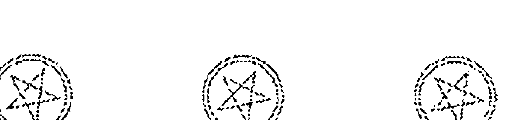

## 《友情》

我的人際關係狀況
你的人際關係很不錯，因為你常常會幫助別人，也能接受別人給你的建議，你也會很努力地維持人際關係的和諧。

如何化解與朋友的誤會
你與朋友的誤會是小事情，只要你能主動和對方講清楚，那麼誤會應該很快就會解開，也要誠心接受對方的說明。

## 《親情》

家庭的狀況
現在家中的財務狀況很好，也有錢去完成很多理想，應該要作好財務的規劃，同時把握這個機會清償債務。

與長輩的關係
你對於長輩常能用同理心看待，所以彼此之間的感情也比較好，只要你能對長輩多一點付出，就會得到更多回報。

與平輩的關係
你在平輩當中算是表現比較突出的一個，也常常有各種機會可以幫助別人，因此你能與大家都保持很良好的關係。

與晚輩的關係
你對於晚輩一向很認真的付出，但是也會想要控制他們，只要你能用對方法，也有機會把他們訓練得乖巧又聽話。

## 《延伸應用》

時間
相對時間：六年。
標示時間：金牛座第二旬（約每年5／1－5／10）

## 《學業》

學業本身的狀況
你在學業上的表現很不錯，在同學當中也算很突出，你可以利用自己的專長多多幫助別人，自己會因此學到更多。

學習的方法
現在應該多多和同學交流，利用機會教學相長，不但會讓你多了很多複習的機會，也可以有更深入的反省和思考。

與老師相處的關係
對學生很有同理心的老師，常常會幫助學生解決各種問題，所以只要你有任何問題，都可以盡量去請他幫忙處理。

與同學相處的關係
你是同學當中的風雲人物，如果你能多多幫助同學，那麼就會更受歡迎，同時要小心保持課業與課外活動的平衡。

## 《財務》

目前的財務狀況
你現在處於不平衡的財務狀況中，可能你需要去照顧援助別人，或是在財務上依賴對方，當中也會存在控制關係。

投資的狀況
現在是非常適合你進行投資的時候，但是仍然要小心衡量每一步的作法，在正常狀況下你都可以有很不錯的獲利。

採購的策略
現在適合進行一些採購，只要你在事前有詳細的計劃，就可以用最少的錢買到最多需要的東西，也會得到滿足。

## 錢幣六逆位

> **心靈與精神層面的提示**
> 要先認清自己的狀況，才能與別人發展出適當的互動模式，該付出的時候努力付出，該接受的時候也要勇於接受。

## 《工作》

### 工作本身的狀況
你的工作雖然有很好的收入，但是總覺得被別人控制，你有非常大的欲望和野心，不過也許太過遙遠而不切實際。

### 如何解決工作的困境
這個時候應該要先接受現狀，掌握了現實的狀況之後，才來想要怎麼解決問題，也許要開始試著接受別人的幫助。

### 工作中的人際關係
你常常會在工作當中羨慕別人，但是自己又不夠努力向上，你可以多和同事們交流，也許可以藉機學到不少東西。

### 與上司相處的方法
是一個主控性很強的上司，同時也可能對你有很多不合理的要求，你應該要先衡量自己的實力，不要一味地答應。

### 工作的發展性
這個工作現在看起來有不錯的發展性，但是同時也要評估自己的實力和野心是否能配合，才不會到頭來是一場空。

### 找工作／換工作的狀況
現在如果是經由別人的介紹很快就可以找到工作，但是也要在這個地方好好表現，否則會讓你介紹你的人很難做人。

## 《愛情》

### 感情本身的狀況
兩個人在這段關係上都要求很多，但是也許並沒有那麼努力付出，因此可能會造成彼此懇求不滿，或是其他爭執。

### 新戀情的可能性
現在是有可能發生新戀情，但是並不是你主動就會有用，你可以試著接受別人對你的追求，也許才是更好的機會。

### 對這段感情的看法
你對這段感情有很多的期待，但是常常覺得對方無法滿足你，你多少會有一點失望，或是去羨慕別人的感情關係。

### 性的吸引力
在這段關係當中會有很強的性吸引力，兩個人在性生活方面也會需求非常多，但是其實不一定能得到完全的滿足。

### 如何化解爭吵
這個時候應該要接受對方的道歉，而不是堅持自己的立場毫不退讓，只要兩個人好好溝通問題也有機會可以解決。

### 分手的方法
現在主動提出分手一定不會被對方接受，還是要等對方主動提出才有可能成功，所以在這個時候是一動不如一靜。

### 複合的可能性
如果兩個人無法真心的相處和付出，那麼即使複合也不會有任何意義，還不如早點認清兩個人根本不適合的事實。

## 《友情》

人我的關係狀況
你在人際關係上的表現還不錯，但是因為常常都是接受別人的幫助，偶爾也要回禮一下，否則可能會被別人排斥。

如何化解與朋友的誤會
你要先搞清楚事情到底是怎麼發生的，不要只是接受其他人給你的資訊，必要的時候應該和對方當面把話說清楚。

## 《親情》

家庭的狀況
現在家中可能被之前的成功沖昏了頭，反而會開始有很多不切實際的期待，這個時候應該要快點認清事情的真相。

與長輩的關係
你常接受長輩們的幫助，但是也覺得受到很多的限制，有些時候你也要考慮到他們的立場，或是對他們回報更多。

與平輩的關係
你在平輩當中常常接受別人的幫助，有些時候還會忌妒別人，你應該要向他們看齊急起直追，而不只是羨慕而已。

與晚輩的關係
你常常覺得晚輩的要求太多，讓你覺得有一點疲於應付，但是因為彼此的感情很親密，所以也會盡量去滿足他們。

## 《學業》

學業本身的狀況
你在學業上的表現普通，但是總想著要有更好的表現，你應該向成績好的同學多多學習，而不是忌妒別人的表現。

學習的方法
這個時候你應該要接受別人的建議，或是參考別人的一些作法，不要只是堅持自己的想法，那樣可能會進步很慢。

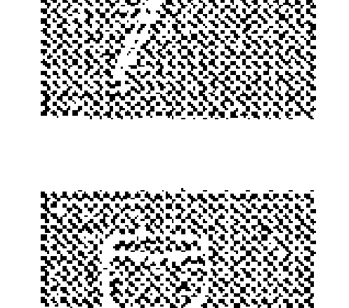

與老師相處的關係
老師很會要求學生，並且很喜歡和別人的表現比較，所以如果你的表現達不到他的標準，就會承受到很大的壓力。

與同學相處的關係
你在同學當中人緣還不錯，所以有問題的時候大家都會很樂意幫助你，你在學習上也要努力，不能太過依賴別人。

## 《財務》

目前的財務狀況
你現在處於財務上的弱勢，常需要靠別人的照顧，也許在這段期間你可以接受別人的幫忙，但是也要想辦法振作。

投資的狀況
你現在的投資野心太大，根本不是一個可行的投資計劃，如果你不能及時修正自己的作法，結果必然是血本無歸。

採購的策略
你現在適合進行一些採購，但是要以省錢省時為主，不要在採購上花太多時間，否則可能買到很多不需要的東西。

## 錢幣五正位

心靈與精神層面的提示
物質的空虛反而可能帶來心靈的豐盛，但是只有精神的修持卻無法及時改善物質的問題，仍然要務實地面對現實。

## 《工作》

### 工作本身的狀況
你在這個工作當中可能被架空或是削減了權力，使你有心想要振作也很難改變現狀，也可能是工作的薪水非常少。

### 如何解決工作的困境
現在所有的問題都是出在錢身上，只要能有足夠的預算所有的問題都好解決，如果無法投入金錢就註定無法成功。

### 工作中的人際關係
你在工作當中有一些能夠共患難的伙伴，但是這些人無法與你共享樂，當狀況有所改善的時候反而容易發生爭吵。

### 與上司相處的方法
本身沒有什麼能力的上司，也無法提供你足夠的資源和支援，所有的一切都只能靠自己，也不用去理會他的意見。

### 工作的發展性
這個工作完全沒有發展性，不只是無法發揮你的才能，也沒有什麼加薪的機會，在這裡待下去只是虐待自己而已。

### 找工作／換工作的狀況
你現在很難找到好的新工作，即使有找到工作也必然是非常低薪的工作，最好等到你的運勢轉好之後再來找工作。

## 《愛情》

### 感情本身的狀況
現在這段感情陷入危機，兩個人沒有足夠的物質基礎去支撐共同的生活，即使仍然在一起也會是貧苦的日子。

### 新戀情的可能性
現在不太可能發生新戀情，因為你現在陷入了財務危機當中，完全沒有金錢及心力去談感情，所以也不必想太多。

### 對這段感情的看法
感覺在這段感情當中吃了不少苦，也受到很多傷害，雖然還會期待以後有所改善，但是目前為止仍然在受苦當中。

### 性的吸引力
兩個人之間沒有的吸引力，也可能完全沒有性生活，兩個人在一起的生活並不快樂，也很難找到任何方法改善。

### 如何化解爭吵
如果問題是出在錢身上，最後也只能靠金錢來解決，盡量找到兩個人處理事情的平衡點，不要變成價值觀的戰爭。

### 分手的方法
其實哀莫大於心死，當兩個人都不願意再努力的時候，這段關係可能就得結束了，但是總要有一方先提出分手。

### 複合的可能性
這段關係完全不可能複合，因為兩個人早已無心於這段感情，也完全不會考慮複合，所以也不可能真的複合成功。

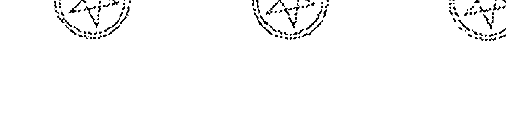

## 《友情》

我的的人際關係狀況
其實你的朋友很少，只有幾個好朋友可以談心，你無力去處理太複雜的人際關係，所以也很難擴展自己的生活圈。

如何化解與朋友的誤會
對於這件事情你完全無能為力，只能等待事情自然的轉變，這個時候即使努力去解釋什麼，也很難被對方所接受。

## 《親情》

家庭的狀況
現在家中遇到了嚴重的財務危機，甚至可能因此而家破人亡，現在你只能先求自保，否則可能會連自己也賠進去。

與長輩的關係
你的長輩無法對你提供什麼援助，所以彼此之間的相處也很冷淡，這時候只能各過各的，不要有不切實際的期待。

與平輩的關係
你在平輩當中比較孤立，所以無法得到其他人的幫助，雖然彼此之間沒有什麼感情，但是也不會有機會發生爭吵。

與晚輩的關係
你無法給晚輩好的物質生活，也很少有時間關心他們，所以彼此的感情有一點生疏，遇到問題也不知道怎麼溝通。

## 《學業》

學業本身的狀況
你在學業上的表現不佳，而且因為基礎太差，即使現在開始努力也很難看到成果，但是若不努力未來就會更淒慘。

學習的方法
現在一切只能從頭開始，在失敗的經驗中記取教訓，勤能補拙是你最好的寫照，如果想偷懶可能就永無翻身之日。

與老師相處的關係
本身在教學上也不太在行的老師，能學多少東西只能靠自己努力，如果還期待老師能教你什麼，無益於緣木求魚。

與同學相處的關係
你並不太在意同學之間的人際關係，也沒有能力打入同儕團體，你應該多花一些時間認真念書，才不會兩頭落空。

## 《財務》

目前的財務狀況
你的財務狀況極差無比，可能同時背負了過多的債務，要在短期之內清償恐怕不太容易，現在起應該要省吃儉用。

投資的狀況
現在你的投資狀況非常差，也已經沒有翻身的機會，你不要對這些再抱持不切實際的期待，絕不要增加新的投資。

採購的策略
現在你不宜進行任何採購，應該要把錢省下來，除了維生的基本必需品之外，所有的花費對你來說都算非常奢侈。

## 《延伸應用》

時間
相對時間：五年。
標示時間：金牛座第一旬（約每年4／21－4／30）

## 錢幣五逆位

心靈與精神層面的提示
不論遇到多麼混亂黑暗的狀況，有耐性地找到秩序是應對最好的方法，當你有了明確的方向就能走出死蔭的幽谷。

## 《工作》

### 工作本身的狀況
現在的工作表面上看起來也許光鮮亮麗，其實是金玉其外、敗絮其中，整個公司內部一片混亂，已經完全失控了。

### 如何解決工作的困境
現在應該要務實地處理金錢的問題，並且把人力和預算配置在最有效率的地方，如果不得已裁員也是必要的手段。

### 工作中的人際關係
這個工作當中的人際關係十分混亂，也充滿了各種的衝突和鬥爭，如果處理得不好的話還可能會因此而身敗名裂。

### 與上司相處的方法
其實現在公司的人事變動得很快，不論是你或者上司都不一定會待多久，現在只能自求多福，也管不了別人如何。

### 工作的發展性
這個工作沒有什麼發展性，接下來的狀況還會越來越混亂，也許要一段時間才能穩定，如果能離開就快點逃走吧。

### 找工作／換工作的狀況
你現在的狀況很難找到任何工作，即使自己再努力也是枉然，還不如先休息一陣子，等運勢轉好之後再去找工作。

## 《愛情》

### 感情本身的狀況
這段感情常常因為金錢或財務的問題而陷入爭吵，兩個人的價值觀也有很大的差異，其實在一起對彼此都很痛苦。

### 新戀情的可能性
現在完全不可能有新戀情，因為你自己也搞不清楚自己的感情狀況，也沒有明確的想法和目標，還是不要想太多。

### 對這段感情的看法
這段感情真的是一團混亂，兩個人之間也缺乏了解和信任，所以整個過程感覺上是一場誤會，希望能快一點結束。

### 性的吸引力
兩個人之間沒有任何的性吸引力，因此也可能完全沒有性生活，或是為了這個問題而爭吵，使這段關係走向毀滅。

### 如何化解爭吵
現在爭吵的問題千頭萬緒，也不是一時半刻就可以解決的，這個時候應該要有耐心地等待，否則也只好選擇釋放。

### 分手的方法
其實兩個人的爭吵已經走向極端，彼此都有意要結束這段關係，只要你先提出分手，其實對方也會有解脫的感覺。

### 複合的可能性
這段關係完全沒有任何可能複合，而且應該躲得越遠越好，即使再有機會見面，也不要談起任何與感情有關的事。

## 《友情》

- 我的人際關係狀況
  你的人際關係狀況很糟，也很少有好朋友可以談心，你應該快點把自己的生活穩定下來，才會有機會交新的朋友。

- 如何化解與朋友的誤會
  這個時候爭吵已經不可避免，誤會也不太可能化解，除了選擇放棄這段友誼之外，就是等待時間慢慢去沖淡一切。

## 《親情》

- 家庭的狀況
  現在家中可能為了金錢的問題發生嚴重的爭吵，或是遇到了嚴重的財務危機，如果想要解決問題就要先看清問題。

- 與長輩的關係
  你的長輩對你很失望，即使表面上仍然和平相處，其實內心當中已經沒有什麼感情，所有的事情要靠你自己搞定。

- 與平輩的關係
  你與平輩之間常常發生爭吵，最好不要有任何財務往來，否則很可能會發生嚴重的財務糾紛，或是導致財務危機。

- 與晚輩的關係
  你常常為了價值觀的問題與晚輩爭吵，但是又為他們的未來所擔心，即使你用盡了心力仍然很難改變他們的觀念。

## 《學業》

- 學業本身的狀況
  你現在學習狀況很不好，主要是因為你太不努力，學習也不用好方法，所以反映在成績上就會慘不忍睹一團混亂。

- 學習的方法
  現在應該要下定決心，每天找到固定的時間來學習，當你建立起學習的秩序和慣性，在學業上就能慢慢上軌道。

- 與老師相處的關係
  老師其實無心於教學，在教學上很沒有系統，你能吸收的東西有限，所以還不如自立自強，自己想辦法進修加強。

- 與同學相處的關係
  你在同學當中的人際關係不太好，常會和同學們發生嚴重的爭吵，要記得道不同不相為謀，不要在意他們的想法。

## 《財務》

- 目前的財務狀況
  你的財務狀況十分混亂，恐怕連你也搞不清楚到底有多糟，你應該快點把實際狀況搞清楚，才可能開始解決問題。

- 投資的狀況
  現在你的投資狀況賠得很慘，最好不要再花心力在這上面，如果能夠及時結束所有的投資，也許還可以減少損失。

- 採購的策略
  現在不宜進行任何採購，如果貿然行動反而會引來更多後續的問題，這個時候一動不如一靜，先觀望一陣子再說。

## 钱币四正位

心灵与精神层面的提示
珍惜自己所有的一切，才能更体会真实的价值和意义，该是你的就应该好好把握，并且安心地去享受丰收的成果。

## 《工作》

工作本身的状况
现在的工作有丰足的收入，也会有一定的支配权力，你已经得到了很好的成就，同时努力固守成果不被别人夺走。

如何解决工作的困境
除了正式的法律规章之外，最重要的是考虑预算问题，能够用最少金钱达成目标的方法，应该就是最优先的提案。

工作中的人际关系
你在工作当中没有什么朋友，因为你总是以自己的利益为优先，也不听别人的劝告，所以遇到问题也没人想帮你。

与上司相处的方法
是一个控制欲望超强的上司，同时会在金钱上斤斤计较，对他的权威应该有绝对的尊重，最好不要叫他出钱请客。

工作的发展性
这个工作的发展性还算可以，但是一定会有加薪的机会，如果你重视金钱上收益，这里会是你很值得付出的地方。

找工作／换工作的状况
现在你应该很快就会找到新工作，而且是收入令人满意的工作，你应该把握这段好的时间，快点找到工作去上班。

## 《爱情》

感情本身的状况
在这段感情当中两个人都会想要控制对方，也会利用对方来完成自己的目的，其实两个人都对这段关系感到满意。

新恋情的可能性
现在不太可能发生新恋情，因为你太缺乏安全感，也太过自我保护，即使对方有心想要接近你，也很难被你接受。

对这段感情的看法
这段感情建立在良好的物质基础上，但是会有一点缺乏安全感，因此有有时候会想办法控制对方以免被其他人夺走。

性的吸引力
两个人之间没有太多性的吸引力，但是性生活是两个人互相占有的一种方式，也是感情稳定和安全感的主要来源。

如何化解争吵
现在两个人都固执己见，如果你不能先放下身段让对方一点，也许就很难化解争吵，送礼物赔罪会是不错的作法。

分手的方法
这个时候要分手其实并不容易，因为两个人都想要紧紧抓住对方，即使你现在提出分手，也很难被对方立刻接受。

复合的可能性
这段关系还有一点复合的可能性，但是总需要有一个人先提出来，如果两个人都怕被拒绝，那么就可能错过时机。

## 《友情》

- 我的人際關係狀況
  由於你太過固執己見，所以並沒有太多好朋友，你應該要珍惜僅有的少數知心朋友，這些人才是真正關心你的人。

- 如何化解與朋友的誤會
  你對這件事情的看法太過主觀，所以很難和朋友達成和解，如果能夠作出有限的讓步，問題就有可能完美地解決。

## 《親情》

- 家庭的狀況
  現在家中的狀況很穩定，也有足夠的財力讓大家過好日子，或是因為繼承了遺產，使得家中的狀況突然有了改善。

- 與長輩的關係
  你太過於固執己見，長輩們常常拿你沒辦法，但是由於你都能把自己的事情做得很好，所以也會讓他們無話可說。

- 與平輩的關係
  在平輩之間大家都是各過各的，彼此之間也不太有往來，但是也許因為要處理繼承的問題，大家還是得聚在一起。

- 與晚輩的關係
  你對晚輩有很強的控制慾，也會對他們有很多管制，所以晚輩們都不太敢有自己的意見，以免與你當面發生衝突。

## 《學業》

- 學業本身的狀況
  你在學習上的狀況還不錯，也可以把握到學習重點，由於你能持續在課業上努力，所以成績上的表現也會很穩定。

- 學習的方法
  這時候應該先擬定可行的計劃，再按部就班地執行自己的學習計劃，即使與別人的進度不同仍然會有很好的效果。

- 與老師相處的關係
  是一個很食古不化的老師，十分嚴肅又固執己見，如果大家不能照他的方式做或符合他的標準，他就會非常生氣。

- 與同學相處的關係
  你在同學當中的人際關係並不太好，只有少數志同道合的好朋友，你應該和這些人一起念書，就不用理會其他人。

## 《財務》

- 目前的財務狀況
  你現在的財務狀況很好，甚至可能因為繼承遺產或獎金而大發一筆，你要把這些錢好好累積運用，絕對可以增值。

- 投資的狀況
  你現在的投資已經開始獲利，而且長期來看也會有不錯的表現，這些都是你累積資本的重要過程，要很小心謹慎。

- 採購的策略
  現在可以進行任何採購，但是應該把重點放在特價或拍賣的商品，不但可以便宜買到東西，也會帶給你很多樂趣。

## 《延伸應用》

時間
相對時間：四年。
標示時間：摩羯座第三旬（約每年1／10－1／19）

> **心靈與精神層面的提示**
有些東西並不是緊抓不放就能擁有，物質世界有其一定的規律和秩序，在該放手的時候放手才能掌握更多的機會。

## 《工作》

- 工作本身的狀況
  現在的工作已經脫離了你的控制，甚至出現了你無法處理的阻礙，你只能發揮微弱的影響力，希望事情漸漸好轉。

- 如何解決工作的困境
  在沒錢的時候有沒錢的作法，事情也可能會因此而延遲，現在應該先做好萬全的應變計劃，防止問題的傷害擴大。

- 工作中的人際關係
  這個工作當中的同事彼此對立，也不能接受別人的意見，這個時候你也只能夠照章辦事，沒辦法顧到人情事故了。

- 與上司相處的方法
  本身非常會算計的上司，但是很多想法又會藏在心中不講出來，和他相處要非常注意，以免一不小心被他出賣了。

- 工作的發展性
  這個工作的發展性不太好，也缺乏明確的升遷機會，只算是一個可以暫時休息的地方，並不適合你作長期的發展。

- 找工作／換工作的狀況
  現在找工作可能會遇到一些阻礙，所以找到工作去上班的時間也會比較晚一些，你應該有耐性地撐過這一段時間。

## 《愛情》

- 感情本身的狀況
  現在兩個人都不願意付出，所以也造成彼此之間的障礙，如果太過固執己見而造成對立，對彼此都沒有任何好處。

- 新戀情的可能性
  現在其實很難發生新戀情，因為你自己也搞不清楚自己在感情當中需要什麼，也不願意打開心接受別人對你的好。

- 對這段感情的看法
  這段感情現在陷入停滯當中，甚至可能出現一點點對立的感覺，也許兩個人在價值觀方面真的有無法相容的地方。

- 性的吸引力
  這段感情當中沒有什麼性吸引力，性生活也不是彼此覺得重要的部分，也許會變成只是為了傳宗接代的工具而已。

- 如何化解爭吵
  這個時候你很難主動做些什麼，只能先想好所有的應變方案，等到對方先出招之後，你再用適當的方法解決問題。

- 分手的方法
  這個時候想分手就要先有縝密的計劃，一時衝動提出分手也不會被對方接受，所以應該先想清楚狀況之後再行動。

- 復合的可能性
  這段關係其實已經不太可能復合，兩個人也都沒有什麼感情，即使真的想要復合，還可能會遇到許多外在的阻礙。

## 《友情》

- 我的人際關係狀況
  你的人際關係其實不太好，因為你常常都想要利用朋友，但是又不願意付出，是不可能有人願意一直被你利用的。

- 如何化解與朋友的誤會
  這時候問題無法很快解決，所以你應該要有長期抗戰的打算，如果你能撐得夠久，也許會朝對你有利的方向發展。

## 《親情》

- 家庭的狀況
  現在家中遇到了一些財務的問題，或是因為繼承的問題使得大家鬧得不愉快，這個時候太過計較反而會失去更多。

- 與長輩的關係
  你的長輩常常會想要影響你，但是你常常會和他們採取對立的態度，所以彼此的感情不會很好，甚至沒有什麼溝通。

- 與平輩的關係
  你在平輩當中比較獨立自主，但是生活也會比較辛苦，由於彼此之間沒什麼感情，所以遇到問題也找不到人幫忙。

- 與晚輩的關係
  你對晚輩吝於付出，因此彼此之間的感情也不會很親密，你應該要多花一些時間關心他們，才可以慢慢了解他們。

## 《學業》

- 學業本身的狀況
  你在學習上遇到了瓶頸，成績上也出現了停滯，你應該要清除外在的各種引誘和阻礙，專心念書才可能有好成績。

- 學習的方法
  這個時候應該要把握住重點，提升自己的學習效率，把多一點時間放在你拿手的科目，就可以穩定住成績的表現。

- 與老師相處的關係
  老師本身很有學問，但是你不見得能照他的方式學會東西，你應該要挑選你能接受的部分，其他的就要自己努力。

- 與同學相處的關係
  你和同學的相處關係不太好，甚至常常可能會和同學吵架，不如多花一點時間在念書上，才不會到最後兩頭落空。

## 《財務》

- 目前的財務狀況
  現在你的財務狀況出現了一點小問題，應該要在這個時候即時解決，如果狀況一直拖延下去，恐怕會越來越嚴重。

- 投資的狀況
  你的投資現在已經開始走下坡，應該到了該全盤檢討的時候，對於表現好的可以繼續保留，其他的就要快點放棄。

- 採購的策略
  現在適合進行採購，但是應該要先有完整的採購計劃和清單，等待適當的時機再出手，才有可能達到最高的效益。

## 錢幣三正位

> **心靈與精神層面的提示**
專業就是要不斷的自我超越和努力，才能得到其他人的肯定和尊敬，但是專業信念的建立遠比技術的精進更重要。

## 《工作》

- 工作本身的狀況
  現在的工作很需要專業的技能，但同時也要能和別的團隊合作，如果能有好的表現，也會得到應有的報酬和榮譽。

- 如何解決工作的困境
  現在應該要兼顧各方面不同的需要，最好能找到各方面的專業人士來共同討論，最後出來的共識才會是最可行的。

- 工作中的人際關係
  在這個工作當中非常重視團隊合作，所以和別人保持良好關係是成功的不二法門，同時應該盡量尊重別人的專業。

- 與上司相處的方法
  非常務實而有遠見的上司，也會很尊重屬下的專業意見，如果你提出任何的需求，在可能範圍內他都會盡量滿足。

- 工作的發展性
  這個工作的發展是穩定的，也許在短期之內不會看到太大的成長，但是長期來看會學到很多東西，也會有很多錢。

- 找工作／換工作的狀況
  現在你應該朝專業技能方面的工作著手，重要的是強調自己能夠合群與人和平相處，才有機會爭取到最好的工作。

## 《愛情》

- 感情本身的狀況
  這段感情現在相當穩定，也已經建立起長久發展的基礎，兩個人在這段關係當中有良好的分工，未來也十分看好。

- 新戀情的可能性
  你目前不太可能發生新戀情，因為你太重視你的工作而沒有花心思在感情上面，即使出現適合的對象也無法把握。

- 對這段感情的看法
  這段感情是一種分工關係，兩個人各自付出而有互補的作用，也許在互動上並不熱情，但是彼此都無法缺少對方。

- 性的吸引力
  兩個人之間並沒有太多性吸引力，但是仍然會有正常頻率的性生活，性生活也會變成兩個人感情交流的重要管道。

- 如何化解爭吵
  其實兩個人的爭吵只是小事情，若是長遠的眼光來看還真的是微不足道，所以能夠讓步的地方就不要再堅持了。

- 分手的方法
  這個時候兩個人也可以談判分手，但是這個過程當中雙方都會很痛苦，而且到最後還是會發生很多情緒性的爭吵。

- 復合的可能性
  兩個人的關係完全不可能會復合，因為兩個人在分手時已經考慮得非常清楚，即使彼此之間還有感情也很難復合。

## 《友情》

我的人际关系状况
你的朋友都是和你程度或地位相当的人，也会形成很有向心力的小团体，但是除了这些人之外你也没有其他朋友。

如何化解与朋友的误会
如果这件事情没有得到大家的共识，问题就会很难解决，所以这个时候应该要加强沟通，以平衡各方不同的需求。

## 《亲情》

家庭的状况
现在家中的状况十分稳定和谐，大家也都可以分工合作发挥所长，家族的传统和名声也可能会带给你很大的帮助。

与长辈的关系
你很少让长辈担心，也可以把自己的事情好好完成，反而会有很多机会帮助长辈，所以彼此之间的感情也很紧密。

与平辈的关系
在平辈之间大家都可以互相合作，遇到问题也都可以讨论解决，即使彼此之间相处的时间不多，感情仍然会很好。

与晚辈的关系
你对晚辈的要求很多，也会希望他们努力精进达到你的目标，你教育的时候应该把眼光放远，小心不要揠苗助长。

## 《学业》

学业本身的状况
你在学业上的成绩不错，也会有一部分科目表现特别突出，你应该把握自己的优势，利用机会和同学们教学相长。

学习的方法
你应该把握机会和同学们多多讨论，听听各种不同的想法和做法，这有助于你学习的广度，也可以得到新的观念。

与老师相处的关系
一个非常专业的老师，只要是在专业范围内的问题就可以给你非常满意的回答，但是在平时不太会主动关心学生。

与同学相处的关系
你与同学的人际关系相当不错，也可以与大家有很好的合作关系，你可以和这些人共同讨论，对彼此都会有好处。

## 《财务》

目前的财务状况
你的财务基础十分稳固，也可以照顾到各种不同的需要，你应该以长远的眼光来配置资产，才可以得到最大利益。

投资的状况
现在应该要以长久保值的投资为主，其中特别适合房地产，当你建立起良好的财务基础，这将会帮助你更上一层楼。

采购的策略
现在适合进行耐久财的采购，也会是买房子的好时机，即使总价会比较高一点，但是如果能用得久也并不贵。

## 《延伸应用》

+   时间
相对时间：三年。
标示时间：摩羯座第二旬（约每年 12／31－1／9）

# 钱币三逆位

心灵与精神层面的提示：经验是一个人成长的原动力，但是只有从经验中记取教训的人才能够真的成长，由当中找到新的智慧去超越经验。

## 《工作》

### ■工作本身的状况
现在的工作还在起步的阶段，也有很多东西需要学习，这个时候你的实力仍然不足，还要向上司或前辈多多学习。

### ■如何解决工作的困境
这个时候只要把相关的人找来讨论，就可以找出一个可行的方案，千万不要给自己太大的压力，想要做到多完美。

### ■工作中的人际关系
这个工作中的人际关系非常重要，你应该在一开始就和大家打好关系，否则等到大家都混熟了之后就来不及了。

### ■与上司相处的方法
能力平平的上司，但是本身很会处理人际关系，你在做事上可能需要自求多福，但是做人方面就可以和他多学习。

### ■工作的发展性
这个工作的发展平平，也不会出现太大的起伏，也许可以当作暂时的避风港，但是长期来看并不会对你特别有利。

### ■找工作／换工作的状况
现在找工作应该由基层做起，而不要想一步登天，只有先在工作上打好基础，未来才会有你好好表现的机会。

## 《爱情》

### ■感情本身的状况
这段感情才刚刚开始，是互相试探和打基础的时间，你应该在这个时候多多观察和学习，才知道两个人是否适合。

### ■新恋情的可能性
现在不太可能发生新恋情，因为你自己在感情上还不成熟，也没有特别突出吸引人的地方，所以很难找到好对象。

### ■对这段感情的看法
在这段感情当中两个人都不成熟，也犯了很多可笑的错误，有时候彼此之间会很计较，或是存在一些固执的偏见。

### ■性的吸引力
两个人之间没有什么性的吸引力，但是两个人对于性生活都很重视，也觉得应该要努力去经营令人满意的性生活。

### ■如何化解争吵
这个时候你应该要表现出大人大量，而不是和对方计较一些小事情，只要双方都能各退一步，问题就海阔天空了。

### ■分手的方法
这个时候两个人很适合和平谈判分手，也可以把很多事情划分清楚，但是也可能为了一点点小事而争得面红耳赤。

### ■复合的可能性
这两个人已经完全不可能复合了，因为彼此都不再想要回到过去的状况当中，也很清楚其实两个人根本就不适合。

## 《友情》

我的人际关系状况
其实你的朋友不是很多，但是也有一些可以谈心的好朋友，你与比你年纪小的人容易成为朋友，也很会照顾他们。

如何化解与朋友的误会
这个时候误会刚刚发生，正是适合你好好解释的时候，找个机会和对方当面沟通，不愉快的事应该很快就会过去。

## 《亲情》

家庭的状况
现在家中的状况还算稳定，但是也许大家会为了一点小事斤斤计较，甚至发生一些争吵，算起来是很幼稚又无聊。

与长辈的关系
你的长辈对你有很多期待，但是实际上你没有能力去完成他们的目标，有时候会让他们觉得失望，感情也不亲密。

与平辈的关系
你在平辈当中是属于平庸的人，都可以与大家和平相处，你比较不会去麻烦到其他人，但是也没能力去帮助大家。

与晚辈的关系
你在晚辈的身上花费了很多心力，但是总觉得看不到成效，其实很多东西是长期才能看到效果，你再急也没有用。

## 《学业》

学业本身的状况
你在学业上的表现平平，也没有什么特别突出的表现，你应该把自己的实力好好累积，而不是好高骛远想要出头。

学习的方法
开始的时候就要努力打好基础，未来才有进步的空间，如果现在发现了一些瓶颈，就要从头加强基础不稳的地方。

与老师相处的关系
是一个很平庸的老师，在教学上大概可以满足你的需求，但是无法进一步满足你的好奇心，学东西还是要靠自己。

与同学相处的关系
你与同学的人际关系还可以，但是有些时候会计较，让大家觉得不太好相处，你应该更放开心胸和大家交往。

## 《财务》

目前的财务状况
你在财务上的状况四平八稳，但是也没有特别突出之处，你可以多听听理财专家的意见，也许会对你有新的启发。

投资的状况
现在是你开始累积资产的时候，把钱存起来是最务实的作法，否则也应该选择比较稳定的工具，不要小孩玩大车。

采购的策略
现在很适合一般性的采购，只要货比三家通常都会买到还不错的东西，但如果是太大额的支出就要特别小心谨慎。

# 钱币二正位

心灵与精神层面的提示
改变当中充满了无限的机会，危机处理得当也会变成转机，重要的是看清自己的核心价值，在当中重新取得平衡。

## 《工作》

### ■ 工作本身的状况
现在的工作有很大的起伏，也会发生重大的变动，你在这个过程当中可能有得有失，就看你如何把握最好的机会。

### ■ 如何解决工作的困境
这个时候应该先评估风险，看看是不是自己所能承担的，再衡量自己到底有多少筹码，最后才来决定行动的方针。

### ■ 工作中的人际关系
你在这个工作当中的人际关系并不稳定，也常常是时好时坏的状况，也许你应该要自立自强，千万不要依靠别人。

### ■ 与上司相处的方法
一个很犹豫不决的上司，常会在不同的选择之间不知如何选择，也许他本身的地位也不稳固，所以还是自求多福。

### ■ 工作的发展性
这个工作一直无法稳定下来，所以未来的发展也还有很多的变化，可能会有一阵子非常好，但是过一阵子又很差。

### ■ 找工作／换工作的状况
现在你可能面对到两个以上的选择，不知道自己应该选择哪一个工作才好，这个时候应该要以收入作为主要考量。

## 《爱情》

### ■ 感情本身的状况
现在两个人的相处变得很情绪化，这是因为两个人都想得很多，但是又没有沟通解决问题，所以不满会爆发出来。

### ■ 新恋情的可能性
现在很有机会发生新恋情，但是也可能出现两个以上的对象让你不知如何选择，其实这是一件有很高风险的事情。

### ■ 对这段感情的看法
这段感情一直不太稳定，两个人彼此也有很多情绪化的反应，在过程当中有很多变动和挑战，让两个人疲于应付。

### ■ 性的吸引力
两个人之间有很强的性吸引力，所以有时候会有非常频繁的性生活，但是有时候又会因为争吵而完全没有性生活。

### ■ 如何化解争吵
这个时候发生的是重大的转变，需要重新找到两个人之间的新平衡点，这个时候应该要拿出诚意来和对方好好沟通。

### ■ 分手的方法
现在可能很难决定要提出分手，即使提出来仍然会是分分合合的局面，没办法彻底解决问题，还会产生更多痛苦。

### ■ 复合的可能性
两个人之间还有可能会复合，但是也许就会变成分分合合的局面，即使两个人重新在一起，仍然是无法稳定下来。

## 《友情》

### 我的人际关系状况
你和朋友的关系时好时坏，即使你很想要维持稳定的朋友关系，也很难找到知心朋友，有时候是自己的付出不够。

### 如何化解与朋友的误会
这个时候先要确定是非对错的判断标准，这样才有可能解决问题，也许去找对方当面沟通会比较快找到正确答案。

## 《亲情》

### 家庭的状况
现在家中发生了意见不合的状况，也许是为了投资或是做生意等等，大家无法好好理性沟通，反而会变得情绪化。

### 与长辈的关系
你的表现时好时坏，常常会让长辈们担心，由于某些事情的价值观不同可能导致彼此的冲突，感情也会受到影响。

### 与平辈的关系
你在平辈之间是变动性比较大的一个，可能常会迁移或换工作，也很少参加大家的联谊活动，所以比较没有感情。

### 与晚辈的关系
你很担心晚辈的状况，但是又不知道如何教养他们，其实你需要先把自己的状况稳定下来，才有心力去照顾他们。

## 《学业》

### 学业本身的状况
你在学业上的表现起伏很大，成绩也非常不稳定，常常会随着你的心情而变化，所以也不是自己不认真所造成的。

### 学习的方法
你应该要先让自己的情绪稳定下来，把心思多用在学习上，只要能定下心来专心念书，学业成绩就可以慢慢进步。

### 与老师相处的关系
是一个情绪起伏很大的老师，有些时候会对你非常好，但是有时候又会有很多不合理的要求，和他相处要看脸色。

### 与同学相处的关系
你和同学的关系有点不稳定，也无法建立起良好的友谊，如果同学的事让你心情不好，还不如多花一点时间念书。

## 《财务》

### 目前的财务状况
你目前的财务状况有很大起伏，常会有很多无法预期的变化，你应该要有部分保本的计划，才能维持稳定的生活。

### 投资的状况
现在的投资进出金额都很大，其中当然会有赚有赔，你应该注意到自己投资的周期性表现，也许会对你有所帮助。

### 采购的策略
现在可以进行一些采购，但是一定要考虑到成本和投资的效益，避免自己买到无用的东西，到后来反而造成浪费。

## 《延伸应用》

### 时间
相对时间：二年。
标示时间：摩羯座第一旬（约每年12／22－12／29）

# 钱币二逆位

心灵与精神层面的提示
突破表象的迷雾看见真相，才知道如何去面对环境的变动，在真实生活中体会的智慧，正是清晰思考的重要基础。

## 《工作》

### 工作本身的状况
现在的工作环境上发生了很大的变动，你只能被动地去应付出现在的状况，但是又有很多的规章让你觉得碍手碍脚。

### 如何解决工作的困境
这个时候应该先判断资讯的正确性，看看哪些是真的、哪些是假的，然后再依照现有的法令规章去做适当的处理。

### 工作中的人际关系
这个工作当中的人事变化非常快，即使出现了与你互动良好的同事，也许过一阵子又会换人，所以最好公事公办。

### 与上司相处的方法
你的上司对你时好时坏，甚至可能会常常换人，所以你最好就是安份地完成自己的事情，也不用经营与他的关系。

### 工作的发展性
这个工作未来没有什么发展性，同时你的地位也不太稳固，如果想要有好的发展空间，最好还是快点换一个地方。

### 找工作／换工作的状况
现在你面对到很大的变动，必须先让自己稳定下来才可能找到好工作，这个时候要有耐心面对，再怎么急也没有用。

## 《爱情》

### 感情本身的状况
这段感情当中出现了很大的起伏，甚至可能出现了第三者，两人关系因此发生了重大的改变，也会引发很多情绪。

### 新恋情的可能性
现在不太可能发生新恋情，因为你并不想要新的感情，即使出现了追求者你也不会心动，对方最后只好选择放弃。

### 对这段感情的看法
这段感情遇到了很多困难和挑战，两个人的关系也一直不稳定，有时候会感觉很快乐甜蜜，但是也常会感到疲累。

### 性的吸引力
在这段感情当中有很多性的吸引力，同时也都是一方主动一方被动的状况，通常在性生活当中都能感觉到快乐。

### 如何化解争吵
现在应该把重点拉回到两个人的关系本身，而不要被其他的事情所影响或干扰，也许可以透过写信把事情说清楚。

### 分手的方法
现在如果要决定分手，必定是因为环境不允许的关系，即使两个人再怎么努力，也很难突破现在的问题继续下去。

### 复合的可能性
两个人彼此之间还有感情，但是即使复合了也不会快乐，反而可能落入分分合合的循环当中，反而造成更多痛苦。

## 《友情》

我的人际关系状况
你的人际关系变动很大，当你换了环境又会交新的朋友，旧的朋友就很少联络，所以与朋友间的感情也不会很深。

如何化解与朋友的误会
这个时候两个人都太过情绪化，也许需要先让大家都冷静下来，才能好好谈事情，这个时候还是不要见面比较好。

## 《亲情》

家庭的状况
现在家中面对到重大的改变，甚至有可能是搬家或移民，大家应该要开始认真思考，并且试着开始适应新的环境。

与长辈的关系
由于长辈对你有各种不同的意见，有时会让你觉得无所适从，你应该有自己的想法和作法，才能改善彼此的观感。

与平辈的关系
平辈之间平时很少有交集，大家也是各自忙自己的事情，只有遇到重大的家庭事务，大家才有机会聚在一起讨论。

与晚辈的关系
由于环境上一直变动，所以你与晚辈的关系一直不亲近，你应该要多花一些时间和他们相处，才有机会更了解他们。

## 《学业》

学业本身的状况
由于你的环境状况变化很大，所以一直无法认真念书，你的成绩表现一直不稳定，也常常不是你自己可以控制的。

学习的方法
你应该多花一点时间在书本上，不要随着环境状况变化而摇摆，可以跟其他同学一起念书，也许会比较专心一些。

与老师相处的关系
是一个照本宣科的老师，无法激发你的学习动力及创意，你应该自立自强努力，不太可能由他身上学到什么东西。

与同学相处的关系
你和同学的关系不太好，也无法融入同侪团体中，你还是比较喜欢一个人独来独往，这样也可以多一点时间念书。

## 《财务》

目前的财务状况
虽然你的财务状况还可以，但是因为环境上出现很大的变化，使你必须有正面因应的措施，也是一笔不小的花费。

投资的状况
你现在的投资不太好，不但风险性高，大环境也充满不确定性，你应该尽早结束所有投资，以免到最后血本无归。

采购的策略
你现在适合进行少量的采购，但是不宜进行耐久性产品的采购，因为环境的变动可能会使你买的东西完全没有用。

# 钱币 A 正位

心灵与精神层面的提示
物质是生命存在的必要条件，健康的生活则是灵性修持的重要基础，无论精神的修持如何精进都不应该忽略现实。

## 《工作》

### ■工作本身的状况
现在的工作让你觉得满足，同时也带来丰富的收入，你现在已经掌握到一些具体的成果，未来还有无限的可能性。

### ■如何解决工作的困境
现在的预算其实非常充足，你应该善用目前的资源来解决问题，只要你能确实付出努力很快就会看到具体的成果。

### ■工作中的人际关系
这个工作当中的同事都是好人，彼此也都可以和平相处，有时候还会举办一些联谊活动，让大家可以一起出去玩。

### ■与上司相处的方法
很务实又有远见的上司，在作事情的时候会先设定目标和步骤，再让大家按部就班完成，跟着他一定会很有前途。

### ■工作的发展性
这个工作的未来还有无限的发展空间，目前的工作状况也非常明确，只要你在这里待下去，一定会有加薪的机会。

### ■找工作／换工作的状况
现在应该很快就会找到新工作，而且不论是薪水或是工作内容都会让你满意，所以最好要把握这个时间快点去找。

## 《爱情》

### ■感情本身的状况
这是一段很愉快的感情，但是在这个关系当中可能比较重视物质层面的享乐，而且常只看到现在而没有规划未来。

### ■新恋情的可能性
现在很有可能发生新恋情，而且会让你感觉到愉快而享受的关系，两个人都懂得及时行乐，让彼此都觉得满足。

### ■对这段感情的看法
这是一段令人满足的关系，虽然有时候比较偏向物质或感官的享受，但是这样的关系最能让你们彼此感觉到快乐。

### ■性的吸引力
在两个人之间有很强的性吸引力，这也是两个人会在一起的重要原因之一，彼此会有很快乐而感到满意的性生活。

### ■如何化解争吵
其实两个人的争吵只是小事，只要两个人私下找机会沟通，事情很快就可以解决，不应该把不满的情绪藏在心里。

### ■分手的方法
两个人很难决定要分手，即使你先提出来对方也不会答应，你应该好好享受现在的生活，不要自己一个人想太多。

### ■复合的可能性
这段感情还存在有复合的可能性，只要有一方先提出来，也许就可以重新在一起，两个人也可以回到以前的感觉。

## 《友情》

關於我的人際關係狀況
你的人際關係還不錯，也會有很多可以一起吃喝玩樂的朋友，你在朋友關係當中覺得很快樂，是令人滿足的關係。

如何化解與朋友的誤會
你與朋友之間只是小問題，只要你能先說明清楚，對方也一定會明理地回應，通常一起吃一頓飯問題就可以解決。

## 《親情》

家庭的狀況
現在家中的狀況十分幸福而美滿，也有良好的財務基礎去支持物質生活的享受，你應該盡情享受這段美好的時光。

與長輩的關係
你的長輩對你非常好，也會給你很多實質的支援，你會用實際的行動和表現報答他們，所以彼此之間的感情很好。

與平輩的關係
平輩彼此之間沒有太多感情，但是遇到問題都能互相幫忙，如果大家能夠一起合作，會為彼此創造出更大的財富。

與晚輩的關係
你會給晚輩非常好的物質生活，也會給他們受很好的教育，你努力給他們過快樂的好日子，彼此的感情也會很好。

## 《延伸應用》

時間
相對時間：一年。
標示時間：春季。

## 《學業》

學業本身的狀況
你在學業上的表現還不錯，但是你並沒有花很多力氣就得到這個成果，算是一點幸運，應該要更用功累積實力。

學習的方法
在現有的基礎上，先訂出務實可行的目標，然後一步一步把自己的進度確實完成，就應該會慢慢接近你的理想。

與老師相處的關係
是一個很務實的老師，對於同學都會因材施教，也很會控制教學的進度，學生通常都很喜歡他，他也是有問必答。

與同學相處的關係
你在同學之間很受大家歡迎，也常會和朋友們一起出去玩，你很享受這樣的過程，也會在當中交到不少的好朋友。

## 《財務》

目前的財務狀況
你目前的財務狀況良好，也會把很多錢花在生活享受上，你應該要好好規劃自己的財務，為自己作好長遠的打算。

投資的狀況
你現在的投資很成功，大部分也都可以獲利，你應該要設定明確的獲利目標，達成目標之後就可以把錢拿來花用。

採購的策略
現在適合各種採購，也可以在採購的過程當中享受到樂趣，但是仍然要貨比三家，以免後來發現自己成了冤大頭。

## 钱币A逆位

> 心灵与精神层面的提示

物质世界有其深刻的道理，但是不应该过度崇拜物质主义而忽略了心灵的追求，精神与物质其实是一体两面并行不悖。

### 工作

- 工作本身的状况
现在工作的状况还不错，但是有时候会让你觉得不太踏实，很多地方都只是表面功夫，甚至是金玉其外败絮其中。

- 如何解决工作的困境
有些事情可以用钱解决的，就不要自己做得死去活来的，只要能控制住整体的预算，可以把一部分工作外包出去。

- 工作中的人际关系
这个工作当中的人际关系非常复杂，当中也有很多利益的纠葛，一不小心就会被扯入斗争，或被不当的利益引诱。

- 与上司相处的方法
一个让人觉得唯利是图的上司，为了达成自己的目的也常会不择手段，你应该小心谨慎保留所有用来自保的证据。

- 工作的发展性
这个工作的发展性还算不错，但是当中也充满了各种致命的邪恶诱惑，能不能全身而退就要看你的定力是否足够。

- 找工作／换工作的状况
现在应该很快就会找到新的工作，但也许会是你本身不太喜欢的工作内容，只有高额的薪水让你感觉到比较安慰。

### 爱情

- 感情本身的状况
这段感情本身并没有稳固的基础，两个人只是基于一时激情就选择在一起，一段时间之后各种问题才会浮现出来。

- 新恋情的可能性
现在很可能会发生新的恋情，但是很可能来得快去得更快，在你们彼此还没有熟悉之前，就会发现这是一场误会。

- 对这段感情的看法
这是一段用高额代价买到的感情，在当中花费了很多的时间和金钱去取悦对方，但是觉得并没有得到相对的回报。

- 性的吸引力
在这段感情当中有很强的性吸引力，两个人都沉迷于快乐的性生活当中无法自拔，性吸引力也是感情的重要支柱。

- 如何化解争吵
现在两个人可能为了与钱有关的事情而争吵，当然最后也只能用金钱来解决，否则两个人的冲突可能会越演越烈。

- 分手的方法
现在两个人可能会闪电分手，只要有一个人先提出来，另一个人也会爽快的答应，也许双方都已经有分手的预谋。

- 复合的可能性
这段感情也许还有复合的机会，但是先提出的一方可能需要付出很大的代价，所以两个人都不愿意先提出要复合。

## 《友情》

我的人際關係狀況
你的身邊充滿了酒肉朋友，但是少有真心可以交往的好朋友，你常常覺得內心空虛，又需要出去和大家逢場作戲。

如何化解與朋友的誤會
你和朋友之間只是小誤會，但是也許背後代表了重大的利益，你應該設法搞清楚真實的狀況，不要被表象所迷惑。

## 《親情》

家庭的狀況
現在家中太過重視物質生活的享受，可能會因此而影響到財務的穩定，你應該要提醒大家節省一點，不要亂花錢。

與長輩的關係
你的長輩對你十分不放心，因為他們會覺得你常亂花錢，又太過好逸惡勞，雙方在價值觀上的差異常會造成衝突。

與平輩的關係
在平輩彼此之間常常會互相算計，也會想要利用對方得到一些好處，如果你不小心防範，就可能會被當成冤大頭。

與晚輩的關係
你給晚輩提供非常好的物質生活，但是並不關心他們的感受，所以即使相處的時間很多也無法培養出深厚的感情。

## 《學業》

學業本身的狀況
你在學業上的表現還不錯，但是很多都是用不正當的方法作弊得來的，你應該誠實面對自己，不要再自欺欺人了。

學習的方法
學習的時候應該要腳踏實地而不要好高騖遠，只要能把每一步的進度都確實完成，就會幫你打下長遠堅實的基礎。

與老師相處的關係
本身很勢利眼的老師，對於有錢或是表現好的同學會特別照顧，如果你是一般的學生，最好能自立自強自求多福。

與同學相處的關係
你與同學的人際關係很好，你常常會和朋友們一起出去玩，但是有時候會玩得太瘋，反而可能因此而忽略了學業。

## 《財務》

目前的財務狀況
你目前的財務狀況還好，但是有太多不必要的花費，如果你不從現在開始節省一點，可能很快就會出現財務危機。

投資的狀況
你現在的投資風險很大，賺錢很快但是賠錢也會很快，你應該設定好停損點和停利點，才不會搞到最後血本無歸。

採購的策略
現在你已經花了太多錢，實在不是很適合再做大型的採購，應該只能購買生活的必需品，其他的錢最好都省下來。

## 關於行星時 (Planetary Hours)

行星時是一種西方神秘學衡量時間性質的方法，其起源非常早，在蘇美人律定一週七天制與一天二十四小時制時就已經被廣泛運用，其原理是依照天階體系的順序（土星時>木星時>火星時>太陽時>金星時>水星時>月亮時），讓傳統的七個行星各依序輪值一個小時，由於每七天會循環一次，也有人說是一週七天制的起源。最精確使用行星時的方式還涉及到日出、落時間及季節的變化，但若取其大要可以簡化成下表來使用。

## 行星時刻表

| 時間 | 星期日 | 星期一 | 星期二 | 星期三 | 星期四 | 星期五 | 星期六 |
|---|---|---|---|---|---|---|---|
| 00:00-01:00 | 金星時 | 土星時 | 太陽時 | 月亮時 | 火星時 | 水星時 | 木星時 |
| 01:00-02:00 | 水星時 | 木星時 | 金星時 | 土星時 | 太陽時 | 月亮時 | 火星時 |
| 02:00-03:00 | 月亮時 | 火星時 | 水星時 | 木星時 | 金星時 | 土星時 | 太陽時 |
| 03:00-04:00 | 土星時 | 太陽時 | 月亮時 | 火星時 | 水星時 | 木星時 | 金星時 |
| 04:00-05:00 | 木星時 | 金星時 | 土星時 | 太陽時 | 月亮時 | 火星時 | 水星時 |
| 05:00-06:00 | 火星時 | 水星時 | 木星時 | 金星時 | 土星時 | 太陽時 | 月亮時 |
| 06:00-07:00 | 太陽時 | 月亮時 | 火星時 | 水星時 | 木星時 | 金星時 | 土星時 |
| 07:00-08:00 | 金星時 | 土星時 | 太陽時 | 月亮時 | 火星時 | 水星時 | 木星時 |
| 08:00-09:00 | 水星時 | 木星時 | 金星時 | 土星時 | 太陽時 | 月亮時 | 火星時 |
| 09:00-10:00 | 月亮時 | 火星時 | 水星時 | 木星時 | 金星時 | 土星時 | 太陽時 |
| 10:00-11:00 | 土星時 | 太陽時 | 月亮時 | 火星時 | 水星時 | 木星時 | 金星時 |
| 11:00-12:00 | 木星時 | 金星時 | 土星時 | 太陽時 | 月亮時 | 火星時 | 水星時 |
| 12:00-13:00 | 火星時 | 水星時 | 木星時 | 金星時 | 土星時 | 太陽時 | 月亮時 |
| 13:00-14:00 | 太陽時 | 月亮時 | 火星時 | 水星時 | 木星時 | 金星時 | 土星時 |
| 14:00-15:00 | 金星時 | 土星時 | 太陽時 | 月亮時 | 火星時 | 水星時 | 木星時 |
| 15:00-16:00 | 水星時 | 木星時 | 金星時 | 土星時 | 太陽時 | 月亮時 | 火星時 |
| 16:00-17:00 | 月亮時 | 火星時 | 水星時 | 木星時 | 金星時 | 土星時 | 太陽時 |
| 17:00-18:00 | 土星時 | 太陽時 | 月亮時 | 火星時 | 水星時 | 木星時 | 金星時 |
| 18:00-19:00 | 木星時 | 金星時 | 土星時 | 太陽時 | 月亮時 | 火星時 | 水星時 |
| 19:00-20:00 | 火星時 | 水星時 | 木星時 | 金星時 | 土星時 | 太陽時 | 月亮時 |
| 20:00-21:00 | 太陽時 | 月亮時 | 火星時 | 水星時 | 木星時 | 金星時 | 土星時 |
| 21:00-22:00 | 金星時 | 土星時 | 太陽時 | 月亮時 | 火星時 | 水星時 | 木星時 |
| 22:00-23:00 | 水星時 | 木星時 | 金星時 | 土星時 | 太陽時 | 月亮時 | 火星時 |
| 23:00-24:00 | 月亮時 | 火星時 | 水星時 | 木星時 | 金星時 | 土星時 | 太陽時 |