# 塔罗解牌研究所4

## Message from LUA

每次使用都能帶來全新體悟的塔羅牌，實在是非常厲害的工具。只要明白其魅力，任何人肯定都會愛不釋手。

自塔羅新手都能輕鬆閱讀的《塔羅解牌研究所》開始，我已陸續推出數本續作。這次在《塔羅解牌研究所4》中，我決定切換視角，無私地公開塔羅牌的實用技巧，幫助讀者能以78張牌給予更精準且適切的答案。

明白基本原理，也可以解讀牌義，但就是不擅於分析牌數眾多的牌陣；無法串聯全數的牌義，因此容易半途而廢；面對錯綜複雜的問題時，永遠只能給出模糊曖昧的答案；實際占卜時，只能透過捕捉組合關鍵字進行簡易解牌；雖然掌握技巧，卻無法在解牌時活用。應該有許多人都抱有這些煩惱吧！

因此，我將我的解牌技巧集結於此書，想要送給有類似煩惱的你。

我精選了我在解牌時經常下意識使用的各種技巧，並轉化為容易實踐的形式，介紹給各位。

在解讀各牌陣時需要特別注重哪裡呢？明明一張牌擁有許多含意，為何這裡要採取這樣的解讀方式呢？該如何留意牌與牌之間的關聯呢？——我也將針對這些難以言喻，卻許多人都抱有的疑問給予建議。

此書依照實際占卜情境編排內容，閱讀的過程就像是在和我一同占卜一般，你將能在各種情境模擬之中明白解牌的最佳之道。

就讓我們擺脫能夠算出答案，卻總是疑惑這樣是否正確的自己吧！希望此書能引領你帶著自信完整解牌。

————— LUA

## 就像閱讀料理食譜！？只要遵循步驟，任何人都能完整解牌

此書的目標，是希望比過往的塔羅教學書更進一步，帶給你與我一同「邊占邊學」的感受。

我期望能幫助想要進行更專業的占卜，或是想要精通牌數眾多的牌陣的你，做出完整的「解牌」，而非在思考單張牌的意思之後，就結束占卜。

因此，第1章中，我會介紹在開始解牌之前先整理牌面資訊的「前置作業」，以及於最後統合牌面資訊的「最終統整」等程序，帶領你以全新視角進行解牌。

而第2章裡，我除了介紹牌陣外，還會以專業人士之姿詳細解說我在實際的占卜解牌中，會於何時著重何處，且如何整合這些資訊。只要採取與專業人士相同的方式解牌，任何人都能進行專業的占卜。

最後第3章，是能讓你的解牌更上層樓的教學，收錄了許多能夠培養解牌能力的招式，譬如運用LUA的原創牌陣進行訓練等。

只要握有此書，你的解牌技巧將能飛快地成長。

## 你知道開始解牌前，需要進行「前置作業」嗎？

我建議各位在擺好牌陣後，先執行「前置作業」，確認牌面上出現了哪些牌卡。這就像是做料理前，需要事先備料一樣。這麼做，將能幫助你順利解牌。

## 透過技巧和步驟，邊占卜邊掌握訣竅

查看牌面時，究竟該留意何處，又該於何時使用哪些技巧呢？接下來，我將會實際擺出牌陣，依循步驟解釋要點，讓你能夠一邊跟隨步驟占卜，一邊掌握要領。

## 運用「最終統整」與「填空句」，整理牌面資訊

解牌完之後，接著請進行「最終統整」。只要將牌陣各位置的牌卡關鍵字填入能完整訴說故事的「填空句」中，並加以組合，即便使用再複雜的牌陣、遇上再艱澀的問題，也都能成功完成占卜。藉此得出的解答，肯定也精確且受用。

## 利用速查表，讓解牌更順利！

## 大阿爾克那 11 組牌一覽表

「11 組牌」指的是將 2 張數字加總為 20 的大阿爾克那（排除〈10 命運之輪〉與〈21 世界〉這組組合）配對而成的 11 組牌組，是我在解牌時常用的技巧之一。若牌面出現這些牌組，我會著重解讀。在你熟記組合之前，可以先參照此一覽表。

## 小阿爾克那 數字含意一覽表

「數字」掌握了解牌的關鍵。當牌面上出現相同數字時，我也會在解牌時特別留意其隱含的訊息。小阿爾克那的數字含意並不好記，但只要有此一覽表，你將能搭配元素的含意一同記憶。

# CHAPTER 1

## NEW PROCESS OF TAROT READING

## 以嶄新視角重新看待塔羅牌

此章，我將介紹幾項解牌技巧，無論是曾在解牌中卡關的人，或是塔羅牌新手，肯定都能藉此成功完成占卜。我相信你閱讀完後，肯定也能成為解牌達人。

### 為何總是對自己的占卜結果缺乏自信？

外地有許多人難得遇見了塔羅牌這項厲害的工具，卻無法善用它。每每在拿到塔羅牌開始占卜後，就不安地猜想：「這樣解讀準確嗎？」，或是因為「不知道自己的解牌是否精確」，而不知不覺對占卜心生厭倦。

此外，應該也有許多人有以下這些煩惱。

只能算出簡單的答案、不擅長運用複雜的牌陣；經常算到一半卡關、記不住牌陣配置與各位置的含意；每回遇上逆位牌或意料之外的牌出現時，都不知如何解讀；常常對自己的解牌敘述缺乏自信……

此時，多數人往往會陷入只按照書上標記的順序，一張張對照牌卡的含意，最後以「似懂非懂」的狀態，闔上書的窘境。

你是否覺得心有戚戚焉呢？

這是因為你只是在逐一確認牌義，而非利用塔羅牌「占卜」。既然難得運用了牌陣、使用了這麼多張牌，就不要如一問一答般，在知道個別的含意後就結束占卜。此時，應當導入各式各樣的解讀方法。

你是否曾在觀看專業占卜的過程中，驚嘆道：「為何這張牌可以如此解讀？」、「占卜的過程實在是太複雜且精細了」呢？

這是因為占卜師並不會一一查看牌意，而是會解讀整體牌面。

舉例而言，占卜師會組合牌面上多張牌卡的含意，做出獨自的解釋。雖然基於牌與牌之間的關聯，有可能會解讀出與教學書完全相反的意涵，但反而更能深入人心。有時，占卜師還會找尋牌卡中某個圖示與問題的連結，像是編故事般運用想像力解牌。此外，還有一個方法，是找出沒有出現在牌陣裡的牌，推測它沒有出現的原因。

如果只是確認單張牌的含意，將難以發揮這些解牌技巧。而我認為使用這些訣竅，才是真正的「解牌」。

或許你會覺得窒礙難行，但請別擔心。只要學會此書介紹的牌陣解讀法，你也能得心應手。

### 試著修正你的解牌方式

數人或許都是以這樣的方式來理解塔羅解牌的流程 ——

- ① 思考問題
- ② 選擇牌陣
- ③ 解牌

表面上看起來確實是這三個步驟，但事實上，專業塔羅師在解牌時反而是同時①**思考問題**和②**選擇牌陣**，順序與其略有不同。因為當問題因聚焦而變得具體時，專業塔羅師自然能確立應當使用的牌陣。

另外，③**解牌**也有步驟。在此書中，我將解牌過程分為「前置作業」、「解牌」、「最終統整」三個階段。綜合上述，完整順序如下：

- ① 思考問題並選擇牌陣
- ② 前置作業
- ③ 解牌
- ④ 最終統整

尤其若能注重②～④這段過程，你將能進行更具深度的解牌。

其中，最具特色的就是②**前置作業**。事實上，多數專業塔羅師在擺完牌陣，準備要回答提問者之前，都會執行此事。

專業塔羅師會綜觀牌面，確認出現的圖樣、正、逆位（P 163）的平衡程度、大阿爾克那與小阿爾克那的多寡，以及元素的平衡程度等。接著，再留意與提問相關的部分，譬如詢問戀愛的問題時，查看牌面是否有出現聖杯牌；而占卜轉職的問題時，則藉由確認整體上是否有出現較多數值大的牌，來判斷是否處於人生轉捩點等。

在做好前置作業後，才得以進入③**解牌環節**。許多專業人士都會下意識執行前置作業，而為了方便你確實實踐，我特別把它放進步驟裡。

另外，要得出符合提問者的精確答案，最重要的就是進行④**最終統整**。此時，若有不熟的牌卡，請確認含意；若有想要深入了解的事情，則抽取建議牌。最終，只要將已知的訊息整合成言語，你將能完整地解牌，並獲得滿滿的成就感。

從下一頁起，我將會介紹各步驟的執行重點。內容很簡單，就讓我們逐一了解、學習吧！

透過「前置作業」與「最終統整」，大幅提升解牌專業度。

### 具體提問，就能明確選擇牌陣

我時常聽聞有人因為牌陣五花八門，不知道何者最為合適，而感到煩惱。其實，選擇牌陣的關鍵在於你提出的問題。

我們時常會不知道自己想要占卜的問題，甚至有許多人的煩惱本身就已模糊不清。就以戀愛運來說，究竟是想要知道下一個正緣何時來到、對方渴望何種關係，或是對方是否有考慮結婚呢？請務必在占卜前審慎思考自己真正的問題。此時，你可以留意右頁的重點，將對你有所幫助。

多數的情況下，我們渴望了解的不外乎未來、問題解決方案、運勢、他人想法、關係契合度、2擇1的結果、深層想法、人際關係、時間及YES／NO這10種議題。

而就以戀愛運這種大範圍的問題來說，若想了解未來運勢，「3張牌牌陣」（P36）最為合適；若想知道遇不上正緣的解決方法，「V字型馬蹄鐵牌陣」（P64）最為合適；若想明白自己不想談戀愛的深層心理，「凱爾特十字牌陣」（P84）最為合適。

因此，請務必確立「自己的疑問」。每個牌陣都有各自擅長的議題，只要具體提問，就能輕鬆選擇牌陣。

### 思考問題時請留意以下重點

你想知道的是什麼呢？試著具體思考看看吧

請務必確立自己渴望透過提問得知的事情，究竟是未來、他人的內心想法，或是建議呢？若是含糊地提問，不僅只能得出模稜兩可的答案，還會出現混淆你思緒的牌卡。因此，請深入思考，直到你能明確提出滿意的問題為止。

再次詢問自己「為何想要了解此事」

確立好疑問後，請再進一步詢問自己「為何想要了解此事」。舉例而言，「什麼時候可以轉職」這個問題的背後，有時可能暗藏「想要改善自己總是因同樣的原因辭職的個性」這個根本煩惱。

試圖改變對方的提問方式是NG的喔！

由於我們無法改變人心，因此，請避免提出「如何讓○○○喜歡我」這種帶有試圖操縱他人感受與舉動意味的提問。請以自己的行動為出發點思考問題，譬如「我該怎麼改變自己，才能讓○○○喜歡我」。

思考能夠引導出「下一步行動」的提問

在占卜時，請提出能夠幫助自己推動人生的問題。若是抱著「反正也不可能成為戀人」這樣的心態去占卜，牌卡也不會給出認真的回答；若只是模糊地問「對方的心意如何」，也無法讓你往前邁進。不妨將問題換成：「為了成為戀人，我應該採取什麼行動？」來提問。

### 以「前置作業」作為塔羅占卜的解牌起點

強烈建議各位導入「前置作業」這個全新的解牌步驟。「前置作業」指的是在解牌之前先查看整體牌陣，確認正、逆位牌卡占比、某元素或某數字是否有偏重、是否出現相同牌卡、整體色調，以及是否有象徵性的圖示等資訊的流程。

換句話說，就是在解讀牌陣中的牌卡之前先進行的準備工作。做料理時，我們需要在烹調前清洗、切碎及調味食材。同樣地，在解牌前，我們也需要先辨別牌卡之間的相似處與相異處，將牌面整理成方便解讀的模樣。只要把這道流程想像成做料理前的備料工作，將能更容易理解。

做好前置作業後，牌卡之間便得以有意義地連結，產生出新的解釋。舉例而言，如果只是記憶〈愚者〉象徵「自由」，在看到愚者牌時僅能說出「你現在處於自由的狀態」，但如果留意到牌面同時也出現許多「3」號牌，將能補充解釋：「正如數字3所示，你現在是起身行動的時機，內心滿懷對自由的憧憬」。

「前置作業」將能助你一臂之力，引領你胸有成竹地解牌。

運用準備好的素材，一步步增強你的解牌能力。

下一頁開始將詳細介紹前置作業的執行方法，一共有幾項重點：

- ① 抽出「現今的狀態牌」
- ② 綜觀整體牌陣
- ③ 確認數字
- ④ 確認牌卡元素
- ⑤ 確認牌卡正、逆位
- ⑥ 確認是否有「11組牌」
- ⑦ 留意是否有特別引人注意的圖示

建議各位可以逐一確認上述項目，並藉由從整體牌面中得知的結論，如「逆位牌較多，因此目前狀況有些停滯」、「寶劍牌較多，代表累積不少壓力」等，確立整體解牌方向。

此外，隨著塔羅相關知識與技巧的提升，將能有更多發現。該如何依據不同的狀況，從眾多牌卡關聯中挑選適合的解讀至關重要。因此，也別過度聚焦於單一個著眼點。

只要做好「前置作業」，接下來的解牌中將能更具說服力。搞不好只是執行前置作業，答案便已呼之欲出。

### 養成在解讀牌陣前執行「前置作業」的習慣

請在一一解讀牌陣中的每張牌卡之前，執行「前置作業」。這個過程，就如同將解牌的素材放到砧板上，只要善加運用這些收集到的素材，將能製作出美味的料理，也就是做出完美的解牌。因此，請務必在最一開始花些時間仔細執行。

除了擺好牌陣外，也請事先抽出另一張牌。這張牌為「現今的狀態牌」，代表提問者占卜當下的狀態。透過這張牌，可以預先知道提問者是否對占卜保持正向心態，又或者處於煩惱重重的情況。此外，這張牌也容易與牌陣裡的牌卡連結。由於能夠成為解牌的線索，因此在本書的案例裡，我皆會抽出。

#### POINT 2 綜觀整體牌陣

請在思考每張牌各自的含意之前，先綜觀整體牌陣，並留意最先吸引你目光的部分，這將成為解牌的核心。若一開始就急著思考牌卡的意義，反而容易忽略重要的訊息。甚至起初明明感覺「需要多加注意」，卻又會為了消弭不安，而變得只著眼於好牌。因此，請務必重視在最一開始令你有所感應，或是引人注目的牌卡。

#### POINT 3 確認數字

每張小阿爾克那都配有數字。當相同數字的牌頻繁出現時，該數字將能成為解牌的線索。牌卡數字象徵著問題的動向與趨勢，本書附贈的「小阿爾克那一覽表」整理了每個數字的含意，練習占卜時，請務必將這張表放在一旁參照。

#### POINT 4 確認牌卡元素

小阿爾克那是由權杖、錢幣、寶劍和聖杯4種元素牌所構成。（P170）從牌陣中牌卡的元素佔比，將得以明白問題的傾向與本質。舉例而言，在占卜戀愛的議題時，若老是抽出寶劍牌，便可推測提問者「過度思考」。光是確認牌卡元素，即便是新手也能獲得許多提示。

#### POINT 5 確認牌卡的正、逆位

若抽出的牌卡的天地（上下）位置正確，即稱為「正位」，反之則稱為「逆位」。當牌卡呈現逆位時，可以解讀為能量加倍、情況失控或程度減弱等。換言之，即能量無法正常發揮。若牌面有一半以上的牌卡都呈現逆位，代表問題正陷入膠著。

#### POINT 6 確認是否有「11組牌」

「11組牌」指的是將2張數字加總為20的大阿爾克那（排除〈10 命運之輪〉與〈21 世界〉這組數字總和並非20的特別組合）配對而成的11組牌組。本書附贈的「大阿爾克那 11 組牌一覽表」可以一覽全數組合，請務必善加利用。若牌面出現這些牌組，其將成為至關重要的線索，而出現於牌陣的何處，將會是解讀的關鍵。

#### POINT 7 留意是否有特別引人注意的圖示

每張牌都繪有各式各樣的圖示，如果發現自己「今天不自覺留意起某個圖示」，代表那則圖示將會是重要的線索。此外，將問題內容與「看到的圖示」進行連結的時刻十分關鍵，你腦中突然湧現的靈感，經常暗示著答案。

### 讓我們一起從牌陣開始進行解讀吧

於要來挑戰解讀牌陣了！「牌陣」指的是塔羅占卜時牌卡的擺放方式，為了分析設定的題目，將牌卡擺放成特定形狀，並分配每張牌卡代表的必要資訊，如「過去」、「建議」等。配置牌卡位置與組合牌卡含意將有助於解牌，否則，就只是反覆運用「單張牌占卜法」，分別詢問「我現在的狀態」、「過去的模樣」、「未來的發展」等問題而已。

擺放牌陣也有助於釐清占卜主軸。所謂的「解讀牌陣」，正是透過留意鄰近牌卡的相似之處，或是觀察牌面整體的連結，組合各式各樣的牌卡含意。

有些人會認為解讀牌陣時，必須依照教學書的順序逐一解讀牌卡，但事實上並非如此。在做完「前置作業」後，你可以從任意一張牌開始解讀。你可以從令你在意的部分開始解牌，即便先忽略不重要的部分也無妨，我相信一定會你有想要著重解讀的部分，或是吸引你目光的地方。在掌握本書介紹的獨門牌陣解牌法後，你也可以開闢自己的獨家解法。

觀察牌卡之間的連結，找出解牌線索。

同一張牌出現在不同位置，解釋與含意也會隨之改變。

在觀察牌陣時，你最先留意到的部分至關重要。你可以從這張牌開始解牌，並找尋與其看似有關的牌卡。這麼做，將能方便你找到解牌的線索。而此時，從「前置作業」（P18）中獲得的素材將能派上用場。

此外，隨著牌卡出現的位置與相鄰的牌卡不同，解釋也會有所差異。舉例而言，〈隱士〉若出現於牌陣中「過去」的位置，代表提問者過去似乎有著強烈的執著，但如果〈隱士〉出現於牌陣中「未來」的位置，代表提問者可能正冷靜地構思著自己的未來生活。

另外，在占卜婚姻議題時，若〈皇帝〉出現於代表提問者的位置，而〈女皇〉出現於代表對方的位置，代表兩人是情投意合的夫婦。然而，如果〈權杖王后〉出現在代表對方的位置，則表示兩人是容易激烈爭執的情侶，即便〈皇帝〉始終出現在代表提問者的位置，兩者的解釋卻大相逕庭。

位置改變，牌卡代表的含意也將截然不同。當你接收到各式各樣的訊息，卻不知如何解釋，並因此感到混亂時，可以參考「必須事先具備的塔羅基本知識」章節（P161），回顧牌卡的基本含意。

### 進行「最終統整」導出明確答案

後一個步驟是「最終統整」。就如同製作料理時，最後需要調味並漂亮地擺盤，請帶著這樣的想像執行以下步驟：

1. 針對不懂的地方抽牌
2. 統整出結論
3. 抽取建議牌

解牌的過程中，多少都會遇到「不知怎麼選擇牌義」、「這張牌為何會出現在此位置」等令人費解的情況。此時，最不可取的做法就是忽略不做解讀。一旦養成下意識避開不懂之處的習慣，解牌技能將永遠不會進步。

因此，請①針對不懂的地方抽牌，在詢問塔羅「解讀這張牌的提示」後，追加抽出一張牌，並將這張牌納入判斷依據，重新解讀。

每張出現於牌陣的牌都有意義。愈是難解的牌，就愈是要投入心力解讀。請務必仔細地解牌，直到自己完全心領神會，避免遺留任何疑惑之處。

用心完成最終統整，和塔羅成為朋友。

接著是②**統整出結論**，這個至關重要的環節。解牌時，很難毫不疑惑地推導出答案。途中，肯定會經常陷入沉思，認為有許多解牌可能。無論得出何種解答，都請在最後試著用言語表達看看。這麼做，將能幫助你統合出完整的結論。

幫自己占卜的時候，也請試著道出結論，或是把牌陣拍下來，製成筆記。

幫別人占卜時，若牌陣出現含意相反的牌卡，對方也容易感到混亂。因此，請務必在最後統整出完整的結論。

此外，有時也會在得到解答後，想要進一步尋求建議，或是針對占卜的議題追加問題。這時，請③**抽取建議牌**。

比起重新占卜，保留牌陣並針對後續問題多抽出一張牌，將能做出更具連貫性且更完美的解讀。就像是料理中的飯後甜點，為提升解牌完整度的重要環節。

只要踏實地完成每道步驟，每次的解牌都將充滿意義。隨著解牌經驗增加，你也會發現自己與塔羅牌逐漸產生了信任。漸漸地，塔羅牌將成為你「有問必答」的朋友。

### 只要做好「最終統整」，就能每次都推導出準確答案

即便你在占卜途中遇上不懂之處，或是無法算出具體解答，你都能透過執行「最終統整」，讓答案更為明確並得出滿意的結論。

#### POINT 1 解讀不出結果時，再多抽一張牌

當解讀到最後，牌陣中仍有令你難以解釋的牌卡時，請再多抽一張牌。請問問塔羅「解釋這張牌的提示」，並抽取一張牌，把它當作解牌參考。牌面上的牌絕對富有意義，因此，請避免重新抽牌，而是像這樣追加牌卡。

#### POINT 2 統整出結論

有時，我們會因為注意力分散於各牌卡上，而難以得出結論。因此，請在最後確實統整解牌內容。本書於各牌陣介紹章節的最後一頁，皆附有「解讀牌陣模板」。只要在挖空的地方填入關鍵字，就能完整敘事，請務必在統整時善加活用。當然，若你能不被模板束縛，自由地解牌，將更為理想。

#### POINT 3 針對追加的問題抽取「建議牌」

舉例而言，在占卜「什麼時候會有正緣」時，有時還會想追問「對方是怎麼樣的人」等問題吧！此時，只需從剩餘的牌卡中抽取一張「建議牌」即可。「建議牌」指的是針對問題給予建言的牌卡。不過，如果是詢問其他領域的問題，譬如在占卜戀愛時想要額外了解工作的運勢，就必須運用新的牌陣進行占卜。

### 什麼是偉特塔羅牌與馬賽塔羅牌？

在進行塔羅占卜時，一定會需要塔羅牌。其中，最有名的是「偉特塔羅牌」。每張偉特塔羅牌中的小阿爾克那皆繪有圖畫，對新手而言，使用起來最為方便。而馬賽塔羅牌每張牌的牌義皆異於偉特塔羅牌，難度較高。若你已經掌握了塔羅牌的要領，也請務必試試馬賽塔羅牌。

#### 偉特塔羅牌

是世界上最有名的塔羅牌。由19世紀秘密組織「黃金黎明協會」會員亞瑟·愛德華·偉特打造，帕梅拉·科爾曼·史密斯繪製而成，並由Rider公司出版販售。

#### 馬賽塔羅牌

普及於16世紀歐洲的塔羅牌，歷史較偉特塔羅牌悠久。馬賽塔羅牌中的小阿爾克那牌上，只有利用木刻版畫手法繪製而成的元素與數字樣式，不像偉特塔羅牌一般繪有圖畫。適合想要透過數字含意解讀問題的人。

#### 塔羅牌還有其他版本！

除了上述的兩種塔羅牌，現存最古老的塔羅牌「維斯康提塔羅牌」與魔法師阿萊斯特·克勞利製作的「托特塔羅牌」皆非常有名。若對任何一種版本產生興趣，不妨深入鑽研，肯定別有一番趣味！

# CHAPTER 2 運用牌陣進行占卜吧！

在此章節，你將能依循步驟，領略我在實際占卜中使用的技巧。請務必在解牌時善加活用。

## HOW TO DO TAROT READING

### 用人氣牌陣與原創牌陣，一起快樂學習！

接下來，我們將一邊看牌陣，一邊解說解牌的重點。

這次，我精選了10組牌陣。除了有長久以來塔羅牌愛好者經常使用的有名牌陣外，也包含了LUA原創的「心之聲牌陣」，及新創的「找尋答案牌陣」與「關鍵人物牌陣」。最後，也會說明組合多組牌陣的方法。

我將會介紹牌陣的「解讀技巧與步驟」，一邊依循著步驟來占卜，一邊解說「藏有解牌提示的地方」。

此外，我還會透過使用這些技巧的實際案例，讓你跟隨解牌流程，輕鬆抓住訣竅。只要依序閱讀下去，你將能明白運用「前置作業」（P20）中收集到的材料的方法，以及在「最終統整」（P28）中整理訊息的秘訣。

部分解牌範例裡，有特別設計技巧的使用順序，或是在「前置作業」階段答案便已呼之欲出。也請務必參考這些方法，善加應用。

### 本書介紹的 10 組牌陣 & 對應主題

本書將依照占卜主題，介紹 10 組與其對應的牌陣。無論是傳統牌陣，或是 LUA 的原創牌陣，皆能讓人得心應手。

- ⚡ **關於未來**的占卜！ …………………………… 3 張牌牌陣／P36
- ◆ **關於選擇**的占卜！ …………………………… 2 擇 1 牌陣／P44
- ❤️ **心意**占卜！ ……………………………………… 心之聲牌陣／P54
- 📌 **問題**該如何解決！ …………………………… V 字型馬蹄鐵牌陣／P64
- 💡 **契合度**占卜！ ………………………………… 六芒星牌陣／P74
- 🔑 **深層想法**的占卜！ ………………………… 凱爾特十字牌陣／P84
- 💬 **群體關係**的占卜！ ………………………… 關鍵人物牌陣／P96
- ❌ **運勢**占卜！ ……………………………………… 黃道十二宮牌陣／P104
- 📅 **關於時間**的占卜！ ………………………… 月曆牌陣／P116
- 💕 **YES／NO**的占卜！ ………………………… 找尋答案牌陣／P124
- 📊 **專業占卜**的進行！ ………………………… 組合牌陣／P132

### 閱讀此章的方法

在各章節中，我將會說明解讀該牌陣時應當留意的重點。接著，帶領你透過實際解牌範例，觀看整體脈絡，深入學習。

1. **牌陣名稱與配置**
   該章介紹的牌陣名稱，與牌陣中各牌卡的含意。

2. **該牌陣擅長的主題**
   說明這組牌陣適合占卜的主題。

3. **問題範例**
   適合運用這組牌陣進行占卜的問題範例。

4. **前置作業**
   擺好牌陣後，留意（養成在解讀牌陣前執行「前置作業」的習慣）(P20)中介紹的7項重點，在此階段捕捉到的訊息將能成為解牌的線索。

5. **解讀技巧&步驟**
   從A開始，依字母順序列出LUA的解牌流程，並依序說明各步驟中會使用到的技巧。CHECK!欄位為各階段裡需要特別注意的重點。

#### 連結現在牌與現今狀態牌

中間牌代表詢問者本人目前的狀況。在對應過去牌與現今狀態牌的同時，「現今狀態牌」能解釋詢問者目前的狀況。因此，請務必確認現今狀態牌與現今狀態牌的關聯性。

#### 思索改變近未來的方法

當近未來牌的位置出現困難牌時，代表詢問者目前的狀況。因此，請務必確認現今狀態牌與現今狀態牌的關聯性。

#### 將近未來牌視為現況的延續結果

如果近未來牌顯示目前的狀況將會持續下去，一樣可以預見未來的發展。但是，如果近未來牌顯示目前的狀況將會發生變化，則代表詢問者目前的狀況將會發生變化。

##### 最終統整

查看完牌陣中的卡牌後，留意〈只要做好「最終統整」，就能每次都推導出準確答案〉（P28）中的重點，為占卜收尾。

#### “我的戀愛運會如何發展呢？”

牌面數字「5」，這副牌與……

#### 牌陣中的2張大阿爾克那，象徵必須的轉變時期

過去牌暗示2年前曾有交往對象

#### ⑥ 最終統整

查看完牌陣中的卡牌後，留意〈只要做好「最終統整」，就能每次都推導出準確答案〉（P28）中的重點，為占卜收尾。

#### ⑦ 從「最終統整」中獲得的答案？善用填空模板

試著在執行最終統整的過程中，將理出的答案填入模板。只要參考〈必須事先具備的塔羅基本知識〉（P161）中描述的牌卡關鍵字，將各位置牌卡的含意填入空格，就能完成一段完整的解牌描述。

#### ⑧ 解牌教室

LUA 針對他人的煩惱進行占卜的實例。請透過這些範例，觀摩「前置作業」到「最終統整」整體的解牌流程，並特別留意 LUA 於何時採用何種〈解牌技巧 & 步驟〉中介紹的訣竅。有些範例綜合使用多項技巧，或是在「前置作業」階段答案便已呼之欲出，也請務必將這些做法納入參考。此外，提問者和 LUA 之間的互動也藏有解牌的提示。

### 關於未來的占卜！

#### 運用 3 張牌牌陣占卜短時間內的運勢

這是一組運用3張牌占卜運勢的牌陣。牌卡由左至右排成一直線，象徵時間的流動，能夠清楚預見近未來的模樣。

這組牌陣也可以占卜提問者現今的運勢，當提問者無法釐清自己的煩惱時，可以在正式進入占卜前運用此牌陣暖身。

此外，「①過去」、「②現在」及「③近未來」的配置，也可以更換為「①1個月後」、「②2個月後」及「③3個月後」等，是一組簡單且得以自由運用的牌陣。

#### QUESTIONS 問題範例

- 這個專案結果會如何呢？
- 最近感覺不太順利……我接下來還會持續不順嗎？
- 想了解感情運！
- 我和他的關係會如何發展呢？
- 想占卜近期運勢……

#### READING TECHNIQUE & FLOW 解牌技巧 & 步驟

解牌前的前置作業（P20）

##### A 解讀過去到近未來的趨勢

現在就來透過3張牌牌陣觀察運勢走向吧！若牌陣中出現大阿爾克那，或編號為1號、10號等數值較高的小阿爾克那，代表此時正是占卜主題產生變化的時期。相反地，若出現編號2～5號等數值較小的小阿爾克那，則代表局勢不太會有大幅度的轉變。（P156）

> CHECK!
> 透過抽出的牌卡數值大小，藉此來了解提問主題的情勢變化。
> ①過去 < ②現在 < ③未來 未來會有大幅度的轉變
> ①過去 > ②現在 > ③未來 尚未有變化的徵兆，或表示情勢趨於穩定
> ①過去 = ②現在 = ③未來 情勢趨於穩定或停滯

##### B 著重解讀過去牌

塔羅占卜只能測算3個月內的運勢，然而，如果是占卜①過去，則無此時間限制，因此，可以把十分久遠的過去納入占卜範圍，並著重解讀，搞不好可以藉此得知現今的感情仍受到3年前分開的前任影響。

> CHECK!
> 過去影響著②現在和③近未來，因此在解讀這2張牌時，務必將①過去牌放心上。

#### 連結現在牌與現今狀態牌

②現在牌代表占卜主題的現況，在前置作業裡抽出的現今狀態牌代表提問者當下的狀態。有時，即便現處「適合解決問題的正面情勢」，提問者卻可能「因工作繁忙而筋疲力盡」。因此，請務必在解讀時連結這2張牌的含意。

> **CHECK!**
> 現今狀態牌若呈現正位，代表提問者對占卜主題抱持正向態度；若呈現逆位，則代表提問者的態度稍顯退卻。

#### 將近未來牌視為現況的延續結果

③近未來牌象徵目前現況持續發展下去，極有可能實現的未來樣貌。抽到好牌固然令人歡喜，但並不代表無所作為就能如願。此外，若對占卜結果半信半疑，也有可能會改變③近未來。

> **CHECK!**
> 若③近未來牌為大阿爾克那、編號1或9以上的小阿爾克那，代表在近未來情勢有高機率產生明確的變化；若為數值較小的小阿爾克那，則代表在近未來情勢不容易改變。

#### E 思索改變近未來的方法

當③近未來的位置出現不盡理想的牌卡時，往往令人沮喪。不過，牌卡並無好壞之分，請試著仔細解牌，領會牌卡想要傳遞的訊息。若近未來牌呈現逆位，也只需思考讓牌卡轉回正位的方法，就能獲得解決問題的提示。另外，逆位牌也有許多種解讀方法，請務必思索吻合的牌義。

> CHECK!
> 因為3張牌牌陣的牌卡數量較少，因此當③近未來的位置出現不盡理想的牌卡時，請務必抽取「建議牌」(P29)。

最終統整 (P28)

#### 填空模板 —— 用從「最終統整」得出的答案填空

試著把牌卡關鍵字 (P164~185) 填入模板中的空格，將解牌內容統合成完整的敘述。

- 現今狀態 ________
- ① 過去 在過往，________
- ② 現在 現在，________
- ③ 近未來 接下來，________

#### “我的戀愛運會如何發展呢？”

##### 前置作業

#### 「現今狀態牌」會清楚暗示提問者的狀態

若〈錢幣5〉呈現正位，代表「即便有人伸出援手，提問者也會選擇拒絕」、「因為自尊心作祟，讓自己談不成戀愛」。不過，此時牌卡呈現逆位，代表此狀況正逐漸改善。請在解讀3張牌牌陣時將這則資訊放在心上。

#### 牌面數字「5」這個共通點……

現今狀態牌和②現在牌數值皆為「5」。「5」代表「變化」，暗示只要放手某事物，將能轉變情勢。〈錢幣5〉可以解讀為正逐漸拋開自尊，〈聖杯5〉則可以解讀為正逐漸放開對過往戀情的執念。

#### 牌陣中的2張大阿爾克那，象徵命運的轉變時期

放眼整體牌陣，最吸引我目光的是③近未來牌〈命運之輪〉。同時，①過去牌也為大阿爾克那，值得特別留意。綜觀解讀，情勢正逐漸擺脫過往的強烈影響，並即將迎來變化。即便從數值來看，也能發現數值依〈4皇帝〉→〈聖杯5〉→〈10命運之輪〉的順序逐漸增大，代表情勢將有大幅轉變。

> 提問者：我終於能慢慢放下前任了。

> LUA：〈命運之輪〉代表情勢的轉變，可以期待未來有機會迎來好的轉變。

#### 過去牌暗示2年前曾有交往對象

①過去牌〈皇帝（逆位）〉可以解讀為提問者在過往「因工作繁忙而心神不寧」，不過也能代表和過往戀情有關的創傷。在②現在牌和現今狀態牌中，也能隱隱約約看見這層面的影響。

> LUA：若提問者自己也能從牌面感受到「前任的影響」，則表示解讀方向正確，可以持續朝此方向解讀。

#### 牌面顯示提問者逐漸擺脫過往戀情的影響

〈聖杯5〉中的人物盯著倒下的聖杯，象徵提問者因過往的戀情經歷了一段很長的低潮，不過現今狀態牌為〈錢幣5 逆〉，代表提問者決定拋下執念，朝下一段戀情奔去。同時留意數字，2張牌皆為「5」號牌，更強調出情勢將會改變。

> 數字「5」有著象徵了「經由變化邁入下一個階段」的含意。

#### 接下來的運勢將與過往明顯不同

③近未來的位置出現〈命運之輪〉的當下，往往令人欣喜，表示自此之後，前方牌卡呈現的陰鬱氛圍將瞬間一掃而空，也預示命運即將轉動，為提問者帶來開心的邂逅。只要順勢發展下去，戀情便有機會降臨，千萬別錯過！

提問者 要去哪裡才會有機會遇到對象呢？

LUA 關於這個問題，讓我們來抽張建議牌吧。

#### 針對追加的問題抽取建議牌

由於提問者追問的問題與此次占卜主題有關，因此抽取建議牌。牌卡給人的第一印象是水邊，不過，基於這張牌還帶有「來往」的意象，因此也可以解讀為交易來往的對象。另外，如果在意畫面中「遮住眼睛」的情景，也可以解讀為「已經認識但未曾留意的對象」。

#### 填空模板 ——用從「最終統整」得出的答案填空

- 現今狀態 不想再因為顧慮自尊而讓愛情溜走了《錢幣5 🔄》
- ① 過去 在過往，你因為太專注於工作，而忽略其他事情，或總是受到蠻橫的另一半牽制《皇帝 🔄》
- ② 現在 現在，你開始擺脫失落的過往，並察覺到未來的無限可能性《聖杯5》
- ③ 近未來 接下來，會有意想不到的幸運邂逅《命運之輪》
- 建議 可能會在與水有關的場所遇見，或者，是已經認識卻尚未被自己放在眼裡的人，有機會與這樣的人產生邂逅《寶劍2》

在解讀3張牌牌陣時，常常只看③近未來牌的結果，因而或喜或憂，隨即草草結束占卜。不過，若能仔細解讀每張牌，將可看見提問者正試著走出過往的情感創傷，並試圖把握嶄新的機會。即便只抽幾張牌，依舊能提供深入的指引呢！

### 關於選擇的占卜！

#### 運用2擇1牌陣占卜合適選項

這是一組針對有選項的提問，占卜何者較能迎向好結果的牌陣。不僅可以用來挑選物品，還可以選擇「人物」，或是抉擇「行動與否」，可說是十分方便占測具體問題的牌陣。

不過，儘管牌卡能為我們揭示出各種可能性，但不代表我們非得選擇牌面較好的選項。牌卡並非提供標準答案，而是幫助思考的素材，最終仍需提問者自行思索，做出決定。

#### QUESTIONS 問題範例

- 想買新T恤！該選白色還是黑色呢？
- A和B同時向我告白了！我該選擇誰呢？
- 如果想安排旅遊，這週和下週何時比較適合呢？
- 我有3個點子，該選擇哪個呢？
- 到底要不要去明天的活動呢？

#### READING TECHNIQUE & FLOW 解牌技巧 & 步驟

##### A 設定選項

抽牌前，必須事先決定好牌陣中每個位置分別代表哪個選項。若選項眾多，可以增加牌數。不過，為避免選項過多造成混亂，請最多設置五個選項。

> CHECK!
> 有時，即便是2擇1的問題，也可能藏有第三個選項。舉例而言，針對「要不要放棄」這個問題，除了「放棄」、「堅持」兩個選項外，還可以有另一個選項是「不必現在決定」。

解牌前的前置作業（P20）

##### B 著眼能量強烈的牌

留意翻開牌卡後乍看感覺「能量強烈」的牌卡，其代表的選項可能是提問者內心偏好的決定，或者是合適的選擇，能量愈強將愈適合。相反地，能量微弱的牌代表提問者不太期望做出的選擇，或者是結果不好也不壞的選項。

> CHECK!
> 牌卡能量由強至弱依序為大阿爾克那 > 小阿爾克那1號牌 > 宮廷牌 > 其他數字牌。宮廷牌中，能量由強至弱依序為國王牌 > 侍者牌。其他數字牌由強至弱依序為 10 > 9 > ... > 2。

##### C 逐一解讀各牌卡含意

一面想著步驟B中分析出的牌卡能量，一面仔細解讀各選項對應的牌卡含意與圖像，思考各選項對提問者而言的意義。同時，③提問者態度牌也會呈現出提問者對這些選項抱持的態度，藉此選擇出合理的解答後，就可以結束占卜。

> CHECK!
> 若③提問者態度牌和選項對應的牌卡有共通點，那麼就代表了「該選項對提問者而言具有吸引力」。

##### D 以「解決問題，情況就能好轉」的心態解讀逆位牌

若選項對應的牌呈現逆位，可以解讀為選擇該選項將會碰上一些問題，譬如「顏色很棒，但尺寸不合」、「雖然想去，但不想單獨行動」等。此時，儘管可以直接排除該選項，但也可以思考「透過解決問題讓情況好轉」的可能性。若③提問者態度牌呈現逆位，則可以解讀為提問者無法採取正位牌意般的姿態，但只要調整心態，就能「以正面態度做出選擇」。

> CHECK!
> 當③提問者態度牌呈現逆位時，也可以解讀為「提問者其實並沒有打算選擇其中任何一道選項」。

#### 抽牌看看，選擇各選項後的未來

多選一牌陣原本是用來觀察各選項當前的可行性，不過，若進一步為各選項抽牌，查看「選擇該選項後的未來發展」，將有助於你更深入地解牌。有時甚至會因為抽出的牌，導致合適選項與原先完全相反，因此，在熟悉牌陣後，務必嘗試導入此步驟看看。

最終統整（P28）

#### 填空模板 —— 用從「最終統整」得出的答案填空

試著把牌卡關鍵字（P164～185）填入模板中的空格，將解牌內容統合成完整的敘述。

- 現今狀態
- ① 選項A 選擇選項A的話，目前
- ② 選項B 選擇選項B的話，目前
- ③ 提問者態度 你目前對於這個問題，認為
- ④ 選擇選項A後的未來發展 選擇選項A後，未來會
- ⑤ 選擇選項B後的未來發展 選擇選項B後，未來會

#### “想要有邂逅！哪種方式最有可能成功呢？”

#### 先設定各位置分別代表的選項

依照提問者的提問設定為①相親、②交友軟體、③聯誼活動，接著又提出「或許也有可能在日常生活中自然邂逅？」這樣的想法，於是加上了④自然的邂逅。在實際占卜中，建議提問者一些他原本沒想到的選項，是很常見的做法。

> 提問者 確實順其自然也有機會遇上正緣，我還真沒想過！

#### 牌陣中能量最強的牌卡為〈聖杯1〉

四張牌卡中，最引人注目的就是②交友軟體的牌卡。由於象徵愛情的〈聖杯1〉呈現正位，因此可以解讀就現實層面考量，透過交友軟體最容易「遇見正緣」。

> LUA 若牌面皆為小阿爾克那，則必須留意數字，藉此分辨牌卡能量強弱！

#### 仔細查看各選項的牌卡……相親的話會變成以條件為優先

①相親對應的牌卡是〈寶劍王后（逆位）〉，可以預想提問者十分看重條件，容易設下各式各樣的門檻。因此，得以解讀為提問者將因此難以配對到契合的人選，而「無法遇上正緣」。

> 提問者 或許我自己也還不清楚理想對象的條件。

#### 若使用交友軟體，將會有許多邂逅

②交友軟體對應的牌卡為〈聖杯1〉。這不僅是一張象徵愛情的牌卡，還是能量強烈的1號牌，代表容易有許多精采的邂逅，除了能收穫豐厚的戀情外，自己也願意付出滿滿的愛。因此，可以解讀為提問者將不斷於交友軟體配對成功，遇見許多對象。

> LUA 〈聖杯1〉是愛情含意最為濃厚的牌。

> 提問者 既然抽到這張牌，就代表我適合使用交友軟體吧？

②交友軟體
聖杯1

#### 對於聯誼，感覺會以備戰狀態迎戰

③聯誼活動對應的牌卡為〈權杖3〉，象徵前途無量，滿懷志氣。這是一張能夠感受到提問者蓄勢待發，準備狩獵的牌，表示提問者有機會在聯誼活動中有所收穫。

> 提問者 這周末我剛好要參加聯誼活動，圖中的人就像現在的我！

> LUA 有時牌卡的畫面會直接呈現出提問者的心境呢！

③聯誼活動
權杖3

#### 也有機會自然地遇到新對象

④順其自然對應的牌卡為〈寶劍4 逆〉。若這張牌呈現逆位，將帶有「行動」的意涵，象徵提問者為了孕育良好關係勇往直前，甚至給人「為了結婚卯足全力」的感覺。

> LUA 若這張牌呈現正位，則代表「休息」。

④順其自然
寶劍4 逆

#### 牌卡呈現逆位清楚象徵提問者缺乏自信

⑤提問者態度對應的牌卡為〈權杖2 逆〉，清楚呈現出提問者缺乏自信。或許提問者嘴上說著「想要遇見新對象」，但實際上並沒有如此強烈渴望戀情。只要提問者得以克服自信不足的問題，將能更勇敢地面對愛情。

> 提問者 前陣子才剛失戀，如果有不錯的新對象出現，或許我能慢慢走出低潮。

⑤提問者態度
權杖2 逆

#### 補抽牌卡，將能更清楚明白最適合的選項

從目前的解牌中，我們了解到提問者雖然渴望新對象，卻又害怕受傷。因此，我透過補抽牌卡，查看了「各選項的未來發展」。結果，情勢立即翻轉！①**相親**對應的牌卡為〈太陽〉，代表雖然不易遇上新對象，卻因為精挑細選，而有望在未來和相親對象成家生子；②**交友軟體**對應的牌卡為〈寶劍7〉，代表雖然容易有新邂逅，卻往往因為對象城府深而難以信任；③**參加聯誼活動**對應的牌卡為〈聖杯10 逆〉，代表比較沒有機會和聯誼活動中認識的對象建立幸福家庭。④**順其自然**對應的牌卡則為〈戀人〉，完全出乎意料。此時，則根據提問者究竟是抱持輕鬆的心態談感情，或是希望遇見能夠一同打拼未來的對象，來選擇適合的選項。

> 提問者：我還沒有考慮結婚……但也不想抱持著玩玩的心態，還是順其自然好了。

#### 整理解牌內容，找出合適的選項

若提問者渴望認真找尋結婚對象的話，①**相親**最為適合，有較高的機會藉此實現願望；若提問者尚未認真考慮步入婚姻的話，則基於此次占卜的結果，可以期待④**順其自然**遇見新對象。

原本混沌的心情，在占卜之後煙消雲散了！

LUA 補抽牌卡能夠深入發掘自己真正的渴望！

#### 填空模板 —— 用從「最終統整」得出的答案填空

- 現今狀態 希望為對方盡心盡力〈錢幣6〉
- ① 選項A 選擇相親的話，容易變得紙上談兵〈寶劍王后 🔄〉
- ② 選項B 選擇使用交友軟體的話，內心將滿懷愛意，桃花源源不絕〈聖杯1〉
- ③ 選項C 選擇參加聯誼活動的話，內心將燃起希望與衝勁〈權杖3〉
- ④ 選項D 選擇順其自然的話，內心將抱持準備勇往直前的心情〈權杖4 🔄〉
- ⑤ 提問者態度 你目前對於這個問題，抱持著 因為覺得自己與愛情無緣，而對愛情感到畏懼，仍無法邁出第一步〈權杖2 🔄〉 的想法
- ⑥ 選擇選項A（相親）後的未來發展 未來將會 與相親認識的對象發展成正式關係，最終步入婚姻，並迎來可愛的孩子〈太陽〉
- ⑦ 選擇選項B（使用交友軟體）後的未來發展 未來將會 遇上許多城府深的人，身旁總環繞著無法全然信任的人〈寶劍7〉
- ⑧ 選擇選項C（參加聯誼活動）後的未來發展 未來將會 因為受理想牽制而感到窒息〈聖杯10 🔄〉
- ⑨ 選擇選項D（順其自然）後的未來發展 未來將會 在不知不覺間結識志趣相投的人〈戀人〉

這就是一個針對未來補抽牌卡，占卜結果因而改變的案例，而根據提問者只是嚮往一段邂逅，或是渴望終生伴侶，選擇的選項也將不同。使用2擇1牌陣進行占卜時，並非只是選擇牌面較好的選項，而是必須思考哪個選項對提問者而言最為適切。

### 心意占卜！

#### 運用心之聲牌陣占卜對方想法

心之聲牌陣是 LUA 的原創牌陣，透過將牌卡擺放成心型，從各個層面剖析人心。尤其針對「對提問者的內在／外在印象」分別抽牌是此牌陣的一大特點，能夠直接明瞭對方對提問者的看法。因此，此牌陣不僅適用於單戀的情況，還能夠用於不了解伴侶心思的時候。

雖然這個牌陣的名稱為「心之聲」，卻一樣可以用來占卜戀人以外的對象喔！

#### QUESTIONS 問題範例

- 喜歡的人對我有什麼想法呢？
- 另一半似乎出軌了……想知道他的真實想法！
- 關係目前處於停滯，因此希望能夠獲得重振心情的建議。
- 真不明白上司的想法，該怎麼做才能討上司歡心呢？

#### READING TECHNIQUE & FLOW 解牌技巧 & 步驟

前置作業（P20）

##### A 把牌陣想像成對方的心，綜觀整體

由於牌陣呈現心型，因此請在綜觀整體牌面時，把牌面想像成對方的心，試著透過整體色調與氛圍描繪「對方內心的樣貌」。整體牌面的明暗、牌面上較多的顏色，以及引人注目的圖像，都將成為解牌的線索。

> CHECK!
> 牌卡的正逆位也是關鍵之一。如果牌面逆位牌較多，則能看出對方對這段關係的態度並不積極。

##### B 先解讀現在到近未來的趨勢

起初抽出的2張牌將能清楚得出結論是此牌陣的特色之一。運用此牌陣時，並不會回顧過往，因此，請以②近未來牌為基礎，解讀其他牌卡出現的原因。如此一來，將能輕鬆描繪完整故事。

> CHECK!
> ⑤對方現況牌和⑦提問者現況牌分別位於①現在牌的左右，只要比對這3張牌，將能一目了然問題所在。

#### 對方眼中對提問者的印象，可以透過牌卡來推測

心之聲牌陣裡，有③對提問者的內在印象、④對提問者的外在印象這2張特別的牌，在解讀這2張牌時，可以解讀為「對方認為自己像是這張牌卡般的人」。舉例而言，如果抽到〈女皇〉，則可以解讀成對方認為提問者「擁有如女皇般的內在特質」。

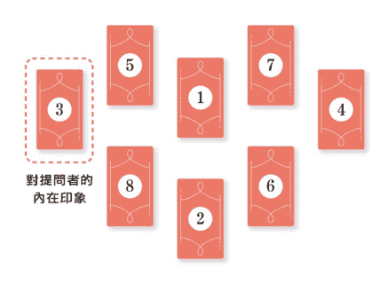

> CHECK!
如果抽出的牌卡難以讓人聯想到人物形象，就試著想像「懷抱這張牌卡般情感的人」，並找尋合適的言詞形容他。

#### 對提問者的外在印象並不單指外貌

在解讀④對提問者的外在印象牌時，若能不侷限於臉蛋、身材等外貌，還能擴展到言行舉止的話，將能更容易具體想像對方的想法。舉例而言，如果抽到〈錢幣4〉，則代表對方認為提問者「習慣採取錢幣4般的行動」。

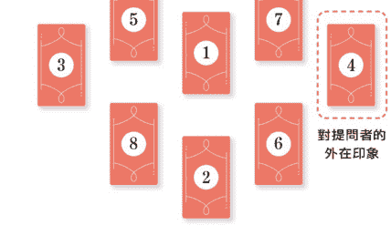

> CHECK!
建議可以留意數字。如果抽出數字較小的小阿爾克那，有時代表對方對提問者的印象淺薄。

#### 合併解讀與提問者印象有關的牌卡

若內在印象牌和外在印象牌牌面形象相似，則代表對方認為提問者「表裡如一」。相反地，若帶有落差，則代表對方認為提問者「難以理解」，或者「有反差萌」。此外，若能夠和⑥對方的願望一併解讀，則能夠輕鬆看出「對方想和提問者建立的關係樣貌」。

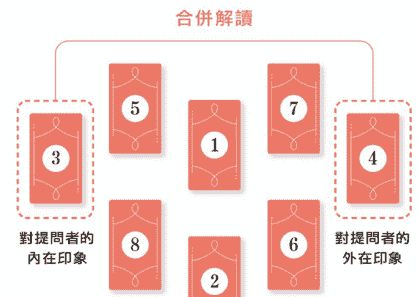

> CHECK!
若2張牌有其中一張牌呈現逆位的話，只要加入「不過」、「但是」等逆接疑問詞，造出「雖然他認為……但是……」等句子，就能夠清楚表達出對方的真實想法。

##### D 對比對方現況和提問者現況

⑤對方現況和⑦提問者現況代表當事者兩人目前的狀態。基本上，可以利用這2張牌來解讀兩人對彼此的想法。不過，這2張牌最多只能呈現出「現況」，因此根據牌卡，頂多只能做出「由於工作過於忙碌，所以不太常想到你」等解釋。

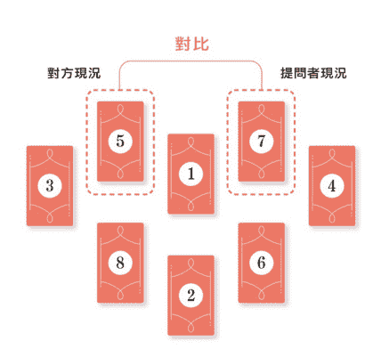

> CHECK!
若抽出人物牌，則可以留意圖像中人物的視線方向。若牌卡中的人物視線相交，可以解讀為「兩人互相在意」；若牌卡中的人物視線相背，則可以解讀為「兩人缺乏心靈交流」。

##### E 著重解讀對方的願望牌

⑥對方願望牌在此牌陣中掌握了重要關鍵，代表對方對提問者的期待。牌卡所呈現的情緒，有時代表對方實際懷有的感受，有時則代表「對方希望提問者成為的模樣」。

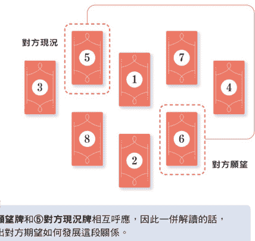

> CHECK!
⑥對方願望牌和⑤對方現況牌相互呼應，因此一併解讀的話，將能看出對方期望如何發展這段關係。

##### F 連結近未來牌，解讀建議牌的含意

⑧建議牌代表為了讓兩人關係更加美好，提問者應當執行的事，或者應當留意的事。若②近未來牌較正向的牌，則可以將⑧建議牌解讀為「實現此美好願景的建議」，若為帶有負面意義的牌，則可以解讀為「防止此結局的建議」。

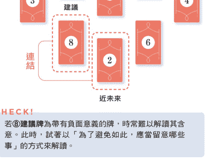

> CHECK!
若⑧建議牌為帶有負面意義的牌，時常難以解讀其含意。此時，試著以「為了避免如此，應當留意哪些事」的方式來解讀。

最終統整（P28）

#### 填空模板 —— 用從「最終統整」得出的答案填空

試著把牌卡關鍵字（P164～185）填入模板中的空格，將解牌內容統合成完整的敘述。

+   ● 現今狀態
① 現在 現在，兩人會
② 近未來 接下來，兩人將會
③ 對提問者的內在印象 對方認為你
④ 對提問者的外在印象 對方認為你
⑤ 對方現況 現在，對方
⑥ 對方願望 對方希望
⑦ 提問者現況 現在，你
⑧ 建議 針對這個問題，你應該

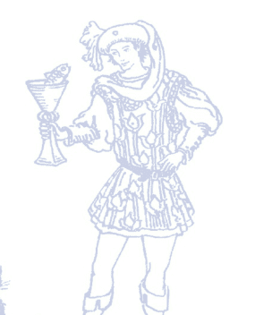

#### “有心儀的對象，但對方已經有另一伴了”

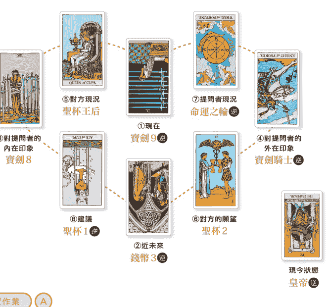

##### 前置作業 A

##### 查看整體牌面，能看出兩人個性差異

提問者的③④皆為寶劍牌，令人印象深刻。相對地，對方（也就是喜歡的人）的⑤⑥皆為聖杯牌，代表相對於情緒滿載的對方，提問者屬於過度運用腦袋思考的類型。光查看整體牌面，便能看出此差異。

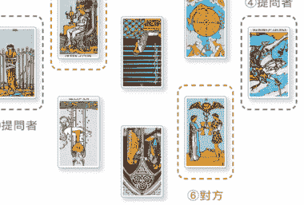

> 我和他是在職場上認識的，真的就跟牌面說的一樣，原來光看牌面就可以知道這麼多！

**提問者**

##### B 近未來牌代表維持現狀發展的話會迎來的情景

①**現在牌**彷彿在訴說提問者「不願看清對方擁有另一半」這道現實的心情。此外，②**近未來牌**為暗示三角關係的「3號牌」。若以此為基礎來解讀，感覺要順利發展這段關係似乎有些困難。請以「橫刀奪愛，以及對方和另一半分開等未來不太可能實現」為前提，解讀其他牌卡。

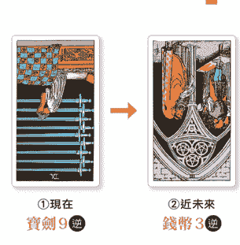

> **LUA** 若《錢幣3》呈現逆位，將帶有「越界」的意含。

##### C 解讀對方對提問者的印象

③**對提問者的內在印象牌**和④**對提問者的外在印象牌**皆為寶劍牌，而寶劍牌帶有「職場同事」的形象。從這2張牌來看，對方對提問者抱有「四處忙碌奔波（寶劍騎士逆）」的印象，不過，卻認為提問者內在「並不希望向他人求助（寶劍8）」。整體而言，給他「渴望幫助他人」的感受。

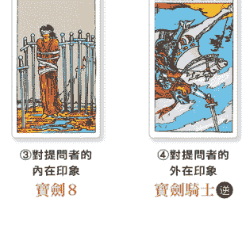

##### 仔細解讀牌面，了解提問者墜入愛河的原因

⑤對方現況牌為〈寶劍王后〉，象徵滿懷愛意的狀態，理所當然無法放著前來求救的提問者不管，而且⑥對方願望牌為〈聖杯2〉，代表對方確實對提問者抱有好感。溫柔為人類自然流露的情感，這似乎就是提問者墜入愛河的原因。⑦提問者現況為〈命運之輪逆〉，綜合①現在牌，暗示提問者很開心能遇見如此美好的人，卻又因為「無法早日遇見」而感到失望。

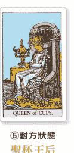

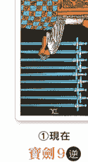

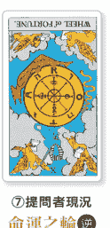

> LUA ⑦提問者的狀況與⑤對方的狀況之間的對比，導致了①現在的情況。

##### 必須將聖杯（感情）擺正，結束這段感情

⑧建議牌為〈聖杯1逆〉，而且②近未來牌又為〈錢幣3逆〉，表示對方截至目前為止都沒有接受這份感情。然而，如同現今狀態牌的〈皇帝逆〉所示，提問者壓抑不住愛慕之情，內心愛戀的情感一口氣爆發。趁現在仍是得以回頭的階段，在自己陷入執著這份愛情的泥沼前，將自己的聖杯（感情）擺正，也就是說，把愛投注於其他的對象，或許才是明智的選擇。

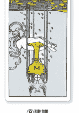

確實我有點太陷進這份感情了，原來塔羅牌也有讓人沉靜下來的作用啊！

塔羅牌能夠帶領我們看清現實。愈是因情緒化而看不清真相的時候，愈適合使用塔羅牌啊！

#### 填空模板 —— 用從「最終統整」得出的答案填空

+   ● 現今狀態　因墜入情網而無視周圍《皇帝 🔄》
① 現在　現在，兩人
　　因困於正遭他人阻撓的妄想之中《寶劍9 🔄》
② 近未來　接下來，兩人將會
　　發展成缺乏分寸、單相思的狀況《錢幣3 🔄》
③ 對提問者的內在印象　對方認為你
　　緊閉心門，充滿痛苦《寶劍8》
④ 對提問者的外在印象　對方認為你
　　總是四處忙碌奔波《寶劍騎士 🔄》
⑤ 對方現況　現在，對方
　　充滿愛意，能夠貼近人心《聖杯王后》
⑥ 對方願望　對方希望
　　和你共築良好的信任關係《聖杯2》
⑦ 提問者現況　現在，你
　　時機不對，只是在白費力氣《命運之輪 🔄》
⑧ 建議　針對這個問題，你應當 壓抑自己滿溢的愛，
　　讓自己回歸成一張白紙《聖杯1 🔄》

一夕之間墜入愛河，而開始無視周遭的提問者在看到牌卡之後，不僅明白必須保持冷靜，最終也領悟到比起橫刀奪愛，和對方培育誠信關係，或是找尋其他對象更能締造幸福。戀情能夠順利發展當然最好，不過有時候，重新思考判斷，儘管看似消極，卻可能帶來正面的轉機。

### 問題該如何解決！

#### 運用 V 字型馬蹄鐵牌陣占卜問題根源與解決方案

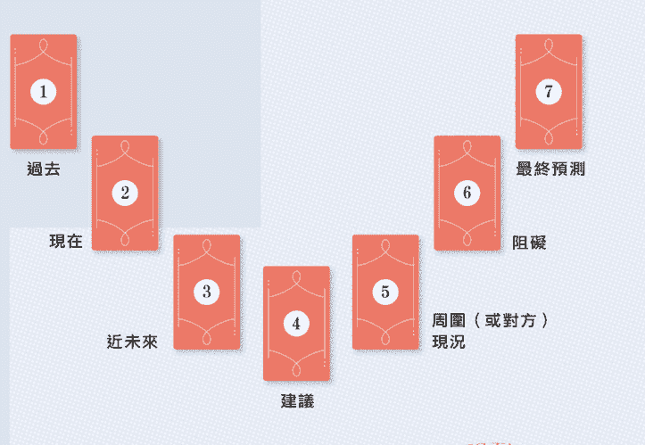

V 字型馬蹄鐵指的是裝在馬蹄上的 V 字型金屬配件，自古以來就被視為是幸運的象徵。仿照此形狀的牌陣，相當適合找出問題的解決方案，不僅可以占卜感情、工作、人際關係等任何主題，還能夠幫忙整頓混亂的心。

只要整理左側觀察時間流變的 3 張牌，與右側探查目標達成阻礙的 3 張牌的牌面資訊，從中推導出建議，就能夠解讀出更深層的訊息。

#### QUESTIONS 問題範例

+   - 和伴侶的關係惡化了……是哪裡出問題了呢？
- 為什麼無法提升社群的粉絲數呢？
- 孩子都不聽我說話！原因是什麼？該怎麼解決呢？
- 請告訴我為什麼我老是存不了錢！
- 客戶挑三揀四……該怎麼做才好？

064 |

#### READING TECHNIQUE & FLOW 解牌技巧 & 步驟

前置作業（P20）

##### A 運用左側的 3 張牌掌握現況

運用①過去、②現在、③未來這 3 張牌，依循時間之流掌握問題的現況。若占卜事情，可以解讀為情況的變化；若占卜人際關係，則可以解讀成提問者的心情轉變。若這 3 張牌為好牌的話，則代表事情可能沒有想像中嚴重。

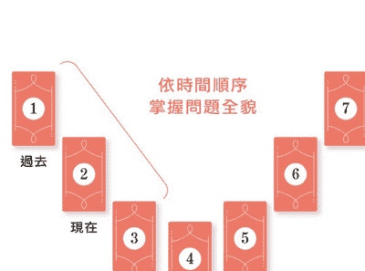

> CHECK!
多數問題的起因都源自於過去。因此，請特別留意查看①過去牌。

##### B 運用右側的 3 張牌找出問題

⑤周圍（或對方）狀況牌能夠挖掘出問題當事人和周圍環境的情況。如果出現好牌，則代表提問者有機會獲得他人的援助。此時，可以和④建議牌一併解讀。若牌卡呈現逆位，則可以解釋為對方沒有意識到問題，也不願配合。

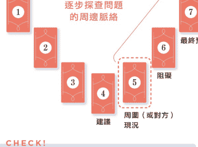

> CHECK!
在擺放牌陣時，首先會先抽出④建議牌，不過，先解讀右側的 3 張牌較容易找出問題點。

##### C 仔細解讀核心阻礙

⑥阻礙牌是這組牌陣的核心，揭示引發阻礙的原因。判斷時，請參考提問者現況牌，或檢視與此牌同元素、同數字、可以組成 11 組塔羅牌（P23）中的牌組，以及圖像相近等其他相關牌卡。這張牌往往與①過去牌有強烈連結，請務必仔細研究。

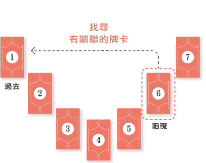

> CHECK!
若阻礙牌為好牌，可以解讀為「事情並沒有提問者想像中嚴重」，或者也可能是此牌卡過於強烈的含意「成為了阻礙」。

##### D 徹底了解近未來和最終預測的差異

③近未來牌和⑦最終預測是不是讓人感覺相似呢？你可以想像③近未來牌是不久之後的自己，而⑦最終預測為此問題最終迎向的結局。換句話說，若③近未來牌為好牌，⑦最終預測卻為差強人意的牌卡，表示提問者只會迎來短暫的歡喜；而相反過來，則代表提問者也許內心痛苦，最終卻能迎來美好結局。

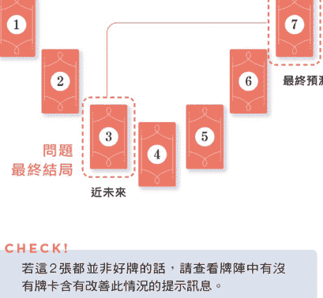

> CHECK!
若這 2 張都並非好牌的話，請查看牌陣中有沒有牌卡含有改善此情況的提示訊息。

##### E 整合兩側牌卡，思索建議牌的含意

V字型馬蹄鐵牌陣中最底部的牌卡為④建議牌，藏有解決此問題的關鍵。解讀時，請別單看這張牌，而是要整合左側3張代表事情演變的牌卡，以及右側3張代表問題原因的牌卡，來思考建議牌真正的含意。

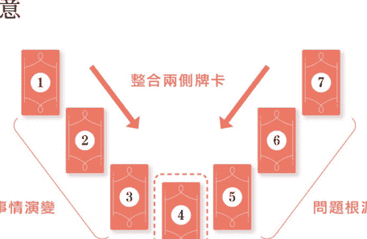

> 最終統整（P 28）

#### 填空模板 —— 用從「最終統整」得出的答案填空

試著把牌卡關鍵字（P164～185）填入模板中的空格，將解牌內容統合成完整的敘述。

+   - 現今狀態
- ① 過去 過去，這個問題
- ② 現在 現在，這個問題
- ③ 近未來 接下來，這個問題
- ④ 建議 針對這個問題，你應該
- ⑤ 周圍（或對方）現況 這個問題目前的周圍情況是
- ⑥ 阻礙所在 這個問題的阻礙為
- ⑦ 最終預測 這個問題最終會

#### “工作不斷被退回重做……原因究竟為何？”

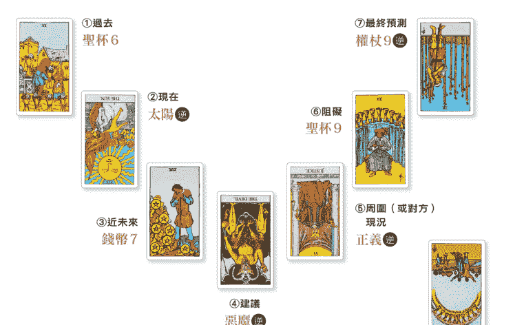

##### 前置作業

##### 數字大的牌卡較多，因此推測問題陷入膠著

牌面整體給人「數字大的牌卡較多」的印象，而且所有小阿爾克那的牌面數字皆大於6，可以推測問題幾乎要迎向結局，且處於相當嚴重的狀態。

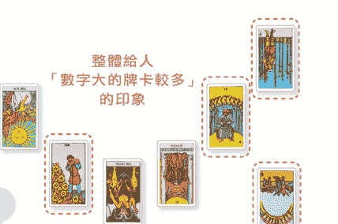

> 提問者：查看呈現時間之流的左側牌卡，發現情況並不明朗。

問題該如何解決！

LUA 展示時間之流的左側牌卡之中，有2張數字大的小阿爾克那，暗示問題正陷入膠著。

##### A 查看呈現時間之流的左側牌卡，發現情況並不明朗

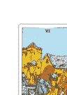

①過去 聖杯6

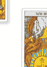

②現在 太陽 逆

專案起初穩定開展，但現在牌卻為《太陽逆》，代表專案被打回原點，不見天日，就和提問者所說的情況一致。持續發展下去，不久的將來估計也只會像《錢幣7》一般，讓人懷疑「這樣真的好嗎？」內心的不安難以抹滅。

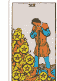

③近未來 錢幣7

進展似乎不妙……

LUA 避免只看單張牌就做出判斷，應當同時檢視3張牌，整合整體意象。

##### B 查看代表問題原因的右側牌卡，並著眼可疑之處

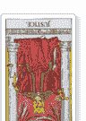

⑤周圍（或對方）現況 正義 逆

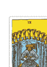

⑥阻礙 聖杯9

查看右側的3張牌，會發現其中2張牌呈現逆位，唯獨中間的⑥阻礙牌是象徵幸運的《聖杯9》，格外出眾。究竟是否該將這張牌解讀為「毫無阻礙」呢？此時還無法下定論，因此，請先解讀其他牌卡，暫且先將這張牌擱在一旁。

⑦最終預測 權杖9 逆

特別顯眼的牌有些詭異

##### 有可能是因為無法和上司達成共識？

⑤周圍（或對方）現況牌可以解讀為挑三揀四的上司。而上司目前的現況為〈正義逆〉，代表問題的原因可能在於上司和提問者之間原本就對正義，也就是正確與否抱有不同的標準，因此無法達成共識。此外，也可以解讀為提問者總是遷就於上司的一意孤行。

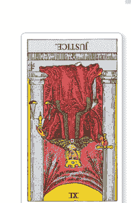

⑤周圍（或對方）現況 正義逆

> LUA 〈正義〉在此呈現逆位，代表判斷基準因情緒而搖擺不定。

##### 查看阻礙牌相關的牌卡，發現……

⑥阻礙牌為又稱作「願望成真牌」（wish card）的〈聖杯9〉。由於牌卡位置和意思並不契合，因此常常不容易解讀。這時就要留意①過去牌〈聖杯6〉。2張牌皆為聖杯牌，可以解讀為提問者在過去「採取了成功的策略」，因而對過去的成功經驗感到驕傲自滿。只要像這樣比較⑥阻礙牌與其他牌卡，便能發現其中的關聯。

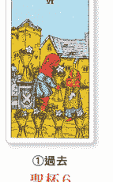

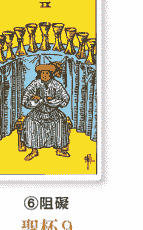

①過去 聖杯6

⑥阻礙 聖杯9

> LUA 過去牌與障礙牌都出現了象徵情感的聖杯。從這2張牌來看，或許也是因為認為「反正是關係不錯的上司，應該沒問題吧」這種過於天真的想法所造成的。

##### 近未來與最終預測都顯示，若持續下去容易留下遺憾

③近未來牌為〈錢幣7〉，⑦最終預測牌為〈權杖9 逆〉，看起來就像是提問者正歪著頭煩惱：「怎麼會這樣？」而這份專案感覺也會在評價不佳的情況下劃下句點。

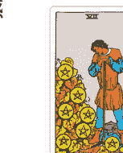

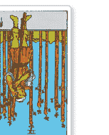

> LUA 將牌卡的圖像想像成提問者，將更容易理解其中的含意。

##### 留意「9」號牌之間的關聯，提問者的心聲就藏在這裡！

各位可以留意牌面上的2張「9」號牌。「9」象徵事情已經到達一個段落，表示提問者自身有種「已經無能為力了」、「好想趕快結束」的半放棄心態，不知道是否該無奈的就此結束專案，或是再奮發向上拚一回。不過，現今狀態牌為〈聖杯10〉，代表提問者似乎想再努力看看。

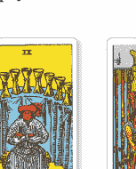

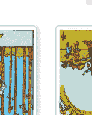

> LUA 現今狀態牌為10號牌，象徵提問者擁有想要超越「9」一般的心情。

##### 建議牌為惡魔，在提醒你「別敗給誘惑」！

④建議牌為〈惡魔逆〉，綜合左側3張象徵事情發展的牌卡，以及右側3張象徵問題原因的牌卡，可以了解到維持現狀下去，專案將難以有圓滿的收尾。不過，惡魔牌呈現逆位，代表塔羅牌正在告訴你：「別敗給索性放棄一切的誘惑」，現在可是能否改善這份專案的關鍵時刻。

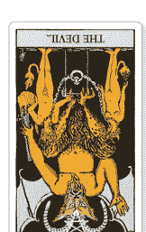

④建議 惡魔逆

> LUA
牌卡雖然叫做〈惡魔〉，但並不代表一定具有負面含意，這就是其中一個例子。

> 提問者
LUA老師！我想要再加把勁。具體來說，該怎麼開始比較好呢？

##### 最終統整

##### 若提問者想要更了解具體做法，則多抽一張建議牌

牌陣中的④**建議牌**是針對問題整體的建議。若提問者最後仍渴望具體做法上的建言，則可以多抽一張**建議牌**。此案例中，我抽到了〈權杖8〉。此牌象徵快速，同時數字「8」代表更上一層樓。因此，我建議提問者可以在回去之後再次和上司商量一次看看。如此一來，將能擺脫原地打轉的現狀，讓專案朝理想的方向前進。

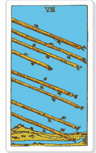

建議 權杖8

#### 填空模板 —— 用從「最終統整」得出的答案填空

- ● 現今狀態
留戀過往的輝煌，以致現在意志消沉《聖杯10 逆位》

- ① 過去 過去，這個問題
因為做法得當，狀況平和安穩《聖杯6》

- ② 現在 現在，這個問題
陷入了怎麼做都看不見曙光的情景《太陽 逆位》

- ③ 近未來 接下來，這個問題
將會因現實和理想有所差距，而令人苦惱《錢幣7》

- ④ 建議 針對這個問題，你應該
從根本上調整心態，轉換做法《惡魔 逆位》

- ⑤ 周圍（或對方）現況 這個問題目前的周圍情況是，
對方的標準和提問者的標準有所落差《正義 逆位》

- ⑥ 阻礙所在 這個問題的阻礙為
提問者自傲地認為現在的做法得以順利進行《聖杯9》

- ⑦ 最終預測 這個問題最終會
因提問者的自負而迎來慘痛失敗《權杖9 逆位》

- ● 建議
趕緊聯絡上司，改善做法《權杖8》

此案例中，「數字」成了重要的線索。而且，阻礙牌與原因牌皆為好牌，其中的解法想必也能成為你未來的參考依據。就讓我們努力解讀出唯有使用多張牌卡組成的牌陣才能獲得的訊息吧！相信若只是逐一確認每張牌卡的含意，肯定無法收穫這些資訊。

運用牌陣進行占卜吧！ | 073

### 契合度占卜！

#### 運用六芒星牌陣
占卜兩人關係

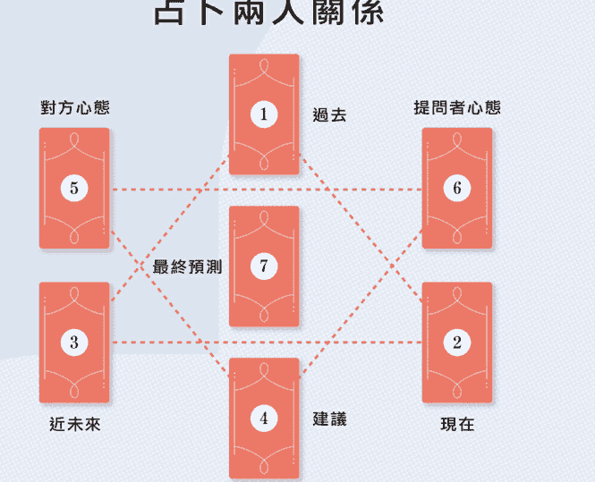

此牌陣的形狀為2個三角形疊合而成的「六芒星」形。尖端朝上的三角形象徵天，尖端朝下的三角形象徵地，2個三角形疊在一起，代表森羅萬象。此牌陣透過頂點朝上的三角形呈現時間之流，透過頂點朝下的三角形對比2個相異元素，並推導出建議。

雖和V字型馬蹄鐵牌陣相似，但當牽涉他人時，此牌陣會更適合。無論是提問者與對象或公司，都能藉此了解該如何改善雙方的關係。

#### QUESTIONS
問題範例

- 心儀的對象對我的看法為何？
- 最近新學的技能適合我嗎？
- 我該怎麼做才能修復伴侶關係呢？
- 搬家的地點適合我嗎？
- 錄取我的這間公司和我是否合得來呢？

#### READING TECHNIQUE & FLOW
解牌技巧 & 步驟

前置作業（P20）

##### A 觀察 2 個三角形內牌卡的平衡程度

「六芒星」自古就象徵著「和諧」，因此，整體牌面看起來是否協調是解讀的重點。若雙方契合度不高，牌面將帶給人不和諧的氛圍。牌陣上方（①～③）代表過去與問題，牌陣下方（④～⑥）代表未來與解決方法，請務必確認哪一方哪種牌出現較多。

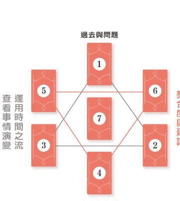

> CHECK!
試著用言語表達你認為牌卡的顏色、圖像、正逆位究竟是和諧或是違和。

##### B 利用時間之流確認問題發展

六芒星牌陣與其他牌陣不同，並非以直線呈現時間之流，而是運用三角形。依順時針的順序，分別為①過去、②現在及③近未來。首先，請試著依此想像事情的發展走向，預測兩人的關係在未來究竟會漸入佳境，或是逐漸惡化。

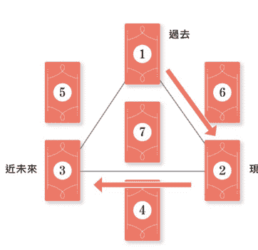

> CHECK!
解讀時間之流的方法和「3張牌牌陣」（P37）一樣。

##### C 比較兩人心態

在分別解讀⑤對方心態牌與⑥提問者心態牌的意思之前，請先查看兩人心態的差異。若⑥提問者心態牌為大阿爾克那，代表對方占據提問者心中很大一部分；若出現小阿爾克那，則代表提問者並沒有那麼在意對方。此外，正逆位也象徵提問者是否有誠實面對對方。

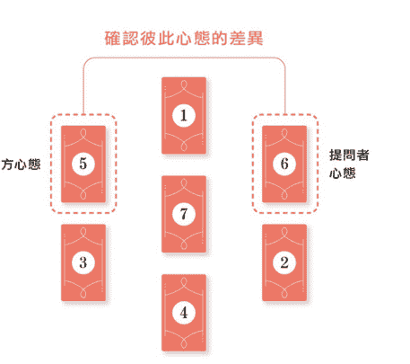

> CHECK!
若提問者心態牌為正位大阿爾克那，可以解讀為提問者相當重視對方，且態度認真。在解讀心態差異時，就如同「心之聲牌陣（P57）」，雙方視線方向也是線索之一。

##### D 以兩人心態為基礎，探尋問題的癥結點

牌陣的形狀必定有其含意。六芒星牌陣中，①過去牌的旁邊分別為⑤對方心態牌與⑥提問者心態牌，這點十分重要。請試著綜合查看這3張牌，以牌義為基礎，想像兩人之間究竟有著什麼樣的故事。

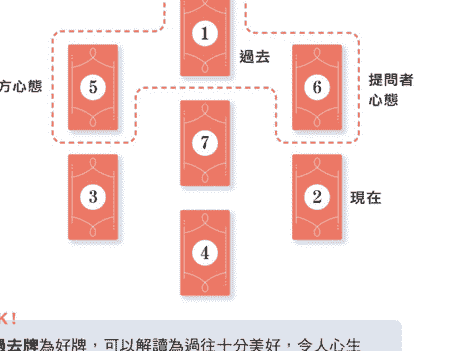

> CHECK!
若①過去牌為好牌，可以解讀為過往十分美好，令人心生懷舊。此時，可以試著和②現在牌一併解讀。

##### 連結結果牌，思索建議牌的含意

一併解讀④建議牌和⑦最終預測牌，較容易理解其中含意。若最終預測牌為好牌，建議牌可以解讀為「為了實現此結果可行的建議」，若最終預測牌為有負面意義的牌，建議牌則可以解讀為「為了避免這個結果可行的建議」。如此一來，就不會在解牌時感到迷惘。

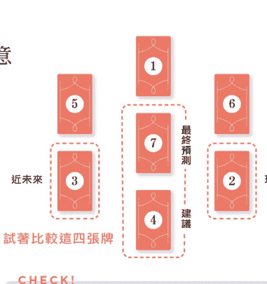

> CHECK!
②現在牌和③近未來牌之間夾著④建議牌，這點十分重要。改善現在和未來的提示就藏在這張建議牌裡。

最後統整（P28）

#### 填空模板 —— 用從「最終統整」得出的答案填空

試著把牌卡關鍵字（P164～185）填入模板中的空格，將解牌內容統合成完整的敘述。

- ● 現今狀態 ________
- ① 過去 過去，________
- ② 現在 現在，________
- ③ 近未來 接下來，________
- ④ 建議 針對這個問題，你應該 ________
- ⑤ 對方心態 針對這個問題，對方目前 ________
- ⑥ 提問者心態 針對這個問題，提問者目前 ________
- ⑦ 最終預測 最終，________

#### “不知道應不應該再和前任見面”

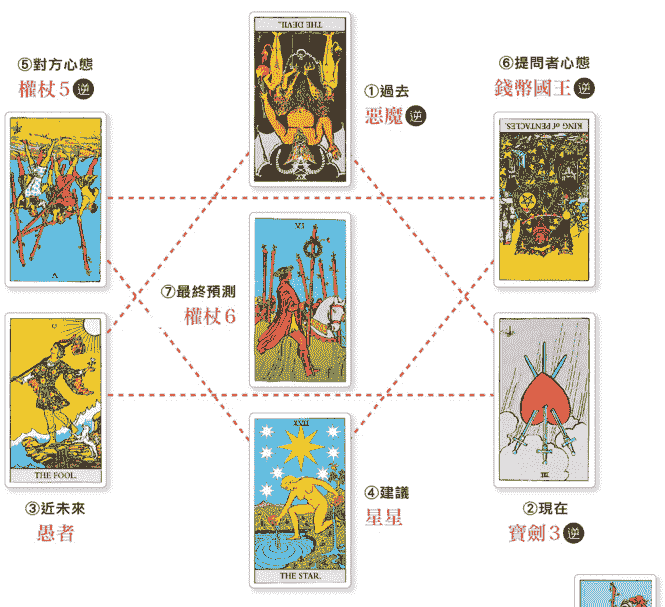

##### 前置作業

牌面上沒有「水元素」的牌，代表問題並非出自愛情

這個案例中，提問者收到曾經交往 10 年的前任提出複合請求。然而，令人在意的是，牌面中竟然沒有任何一張與愛情有關的聖杯牌，代表這段感情的問題似乎與愛情無關。

> 提問者：當初分手的原因是因為對方出軌，我不懂為什麼對方還來聯絡我？

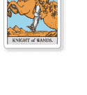

##### 就牌面整體的平衡而言，令人感受到希望

眺望整體牌面，上半部出現了逆位的大阿爾克那與人物牌等強勢牌卡，左下角則出現了正位的大阿爾克那，兩者之間形成了明顯的落差。左下角的牌又代表時間之流中的未來，從此配置來看，感覺對提問者而言，美好的將來似乎即將到來。

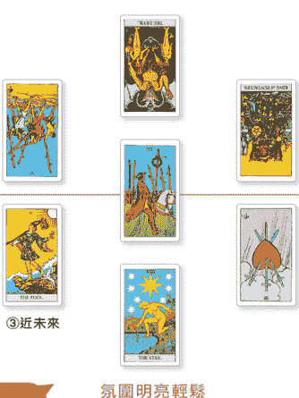

> LUA 光是查看這些資訊，就能明白提問者的內心與未來皆充滿光明。

##### 明顯看出提問者將會逐漸擺脫束縛

代表時間之流的3張牌流露出「擺脫束縛」的意象。提問者掙脫過往如〈惡魔逆〉所示般遭到對方束縛的環境，並在未來化為無拘無束的〈愚者〉姿態。現在牌為〈寶劍3逆〉，代表提問者儘管心痛，卻也下定決心不再回頭。

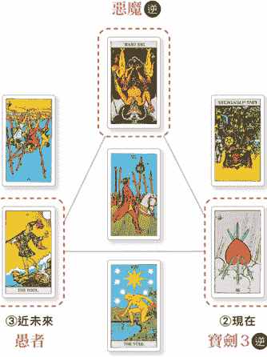

##### C
提問者心態牌逆位，
人物視線落在對方心態牌上

接著探查兩人的內心，會發現兩人的心態牌皆為逆位的小阿爾那，顯現出兩人心態上的分歧。對方心態為《權杖5 逆》般混亂的模樣，而若權杖牌呈現逆位，同時也代表因緬懷過往美好而變得容易對過去產生執念，或許對方是因為憧憬回憶，才來聯絡提問者。提問者心態牌則為《錢幣國王》，但由於呈現逆位，因此構出視線輕瞥對方心態牌的景象，或許是因為對方突然的聯絡，而開始在意起對方。

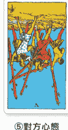

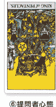

> LUA 捕捉牌卡人物的視線，將能掌握線索。

##### D
現在已擺脫過往枷鎖，
喚不回往日情景

①過去牌、⑤對方心態牌與⑥提問者心態牌皆為逆位。若這些牌皆為正位，象徵「幸福的往日時光」，也代表交往期間，提問者一直如同《錢幣國王》般在一旁默默看守著任性妄為的對方。而現在，卡牌皆為逆位，兩人被《惡魔》一般的孽緣糾纏許久，關係終於畫下句點，或許已經無法回到往昔光景。

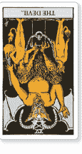

##### 如今，兩人關係似乎已經結束

在解讀未來時，會因為提問者對對方的心態不同，方法也將有所改變。而此案例中，②現在牌為〈寶劍3 逆〉，看來過往的背叛留下了深刻的傷痕，雙方的關係似乎已經畫上句點。

- ③近未來
愚者
- ②現在
寶劍3 逆

> 質問者：我已經對他沒感覺了，但還是有點在意……

> LUA：②現在牌為〈寶劍3 逆〉，象徵著你正在切斷與過往的牽連，而③近未來牌為〈愚者〉，可以解讀為你已重獲自由。

##### 迎向美好結局的建議是……？

④建議牌為〈星星〉，⑦最終預測為〈權杖6〉，2張皆為明亮的好牌。因此，你可以用「為了達成〈權杖6〉般的結果，必須執行〈星星〉般的建議」的思考模式來解讀這2張牌，意即「若要談一場能夠保有自我的戀愛，就必須展望未來，避免耽溺過去」。

- ④建議
星星
- ⑦最終預測
權杖6

> LUA：若最終預測牌並非好牌，則可以將建議牌解讀為「避免此結果發生的建言」。

##### 11 張塔羅牌也能用於回答瑣碎問題

「11 組塔羅牌」為數字總和為「20」的塔羅牌組，在解牌時得以一併解讀，通常運用於大阿爾克那，不過也適用於小阿爾克那。此案例中，〈17 星星〉和〈權杖 3 逆〉加起來即為「20」。而且，〈星星〉牌一絲不掛的形象，與「寶劍」的果斷俐落相互呼應，透露出「應當坦率溝通，避免曖昧其詞」的訊息。

- ④建議 星星
- ②現在 寶劍 3 逆

##### 與「移動」相關的大量圖像早已悄悄暗示

查看整體牌面，會發現有許多與「移動」相關的牌卡。正如現今狀態牌的〈權杖騎士〉、③近未來牌的〈愚者〉和⑦最終預測的〈權杖 6〉所示，提問者「渴望朝下段戀情邁進」的真實心情，早已瀰漫於整體牌面之中。

- ③近未來 愚者
- ⑦最終預測 權杖 6

現今狀態 權杖騎士

提問者 我也想要知道邁向下一段感情的建議！

LUA 因為這會是另一個新的問題，所以必須先整理好這次占卜的解牌結果，再展開新的牌陣。

#### 填空模板 —— 用從「最終統整」得出的答案填空

- ● 現今狀態
迫不及待踏入新的世界〈權杖騎士〉
- ① 過去 過去，
終於斬斷了惡緣〈惡魔 🔄〉
- ② 現在 現在，
正迎來分別的時刻〈寶劍3 🔄〉
- ③ 近未來 接下來，
將會開啟全新篇章〈愚者〉
- ④ 建議 針對這個問題，你應該
坦然放下過去，邁向未來〈星星〉
- ⑤ 對方心態 針對這個問題，對方目前
渴望獨佔提問者〈權杖5 🔄〉
- ⑥ 提問者心態 針對這個問題，提問者目前
已經不想再為這個人付出〈錢幣國王 🔄〉
- ⑦ 最終預測 最終，
提問者將會依循本色勇敢前行，邁向幸福〈權杖6〉

我們可以從許多地方看出提問者現在的心思並不在前任身上，而是渴望「展開下一段戀情」。卡牌經常像這樣反覆傳遞相同訊息，因此，請務必透過觀看整體牌面接收它們釋放的線索。此外，占卜過程中若有任何瑣碎疑問，往往也能從現有牌面中獲得解答，不一定要抽取建議牌。此時，試著找尋具備共通點的牌卡吧！

### 深層想法的占卜！

#### 運用凱爾特十字牌陣占卜內心

凱爾特十字牌陣為經典的牌陣之一。由「深掘內心」、「時間之流」與「解讀外部影響」3條軸線構成，並以中央的十字為主要核心。透過觀察並解讀這些軸線彼此的關聯，將能占卜出問題的深層本質。

張數較多可能會覺得難度偏高，若能掌握就代表解牌實力已大幅提升。不僅能解讀自己的問題，也能讀出「對方怎麼想的？」這類與他人有關的心境。

#### QUESTIONS 問題範例

- 為何我會抗拒談戀愛呢？
- 我不知道我的孩子到底在想什麼……
- 老是和上司溝通不良，我該怎麼辦？
- 為什麼那位朋友突然對我態度冷淡呢？
- 為什麼我和另一半總是這麼容易吵架呢？

#### READING TECHNIQUE & FLOW
解牌技巧 & 步驟

前置作業（P20）

##### A 先掌握現狀

請先透過對照①提問者現況牌與提問者現今狀態牌來掌握現況。①提問者現況牌為提問者對問題抱持的態度，而提問者現今狀態牌則是提問者的現今狀況，能夠看出提問者為何無法好好直面此問題。若問題有牽涉他人，也可以抽一張對方現今狀態牌。

> CHECK!
若①提問者現況牌為逆位，就代表雖然想要像該牌所示去行動，卻身處無法做到的狀態。

##### B 以正位的牌義解讀阻礙牌

②阻礙牌暗示引發問題的直接原因。這張牌有可能代表周遭環境、小人，或是提問者自身的思想，含意十分廣泛。解讀時，基本上採用正位牌義，而非逆位牌義。由於阻礙牌是此牌陣的核心，因此在解讀時，避免套入先入為主的觀念，並請留意觀看整體牌陣時突然冒出的靈感。

> CHECK!
若阻礙牌為好牌，則可以解讀為正因牌中所示的想法或狀況，才成了問題。

##### C 透過顯意識思維牌與潛意識思維牌解讀提問者內心

③提問者顯意識思維牌和④提問者潛意識思維牌能夠深入挖掘提問者的內心。顯意識思維牌代表提問者對此問題有自覺的想法，而潛意識思維牌則代表提問者尚未察覺的思緒。如果覺得難以理解，不妨把它們簡單地視為「正在思考的事」與「內心感受到的事」。

> CHECK!
有時這2張牌呈現出的差異反而是引發問題的原因，可以解讀為「雖然腦袋這樣想（③提問者顯意識），但「內心卻這麼覺得（④提問者潛意識）」。

##### D 找出顯示問題原因的2張牌之間的連結

④提問者潛意識牌代表提問者的真正願望及潛在恐懼，展現出問題原因及提問者心生不滿的緣由。因此，在解讀時，多半會連結②阻礙牌，請務必仔細解讀兩者是否有相通之處。

> CHECK!
若以提問者「實際上這樣想（④提問者潛意識）」，但「因為有此阻礙而無法做到（②阻礙）」的方式來解讀這2張牌，將能輕鬆掌握解牌線索。

##### E 深入問題核心

⑤過去牌經常暗示引發問題的原因，綜合②阻礙牌與④提問者潛意識思維牌，3張牌一併解讀，將能貼近問題的核心。此時，可以善加活用前置作業中觀察到的圖像、數字，花色與正逆位平衡等資訊。

> CHECK!
若牌卡皆為逆位，可以解讀為「原本打算成為正位般的模樣，但因為某種阻礙的干擾，而導致現在呈現逆位般的狀態。若能結合其他牌卡進行解讀，將更能掌握解牌線索。

##### F 查看問題發展

透過⑤過去牌到⑥近未來牌這條時間之流橫軸，查看問題隨時間產生的變化。⑤過去牌經常呈現出引發問題的原因，而⑥近未來牌則代表事情依此情況發展下去，極有可能迎接的未來。以橫軸而非縱軸的角度查看夾在這2張牌中間的①提問者現況牌，或許還能解讀出不同含意。

> CHECK!
和3張牌牌陣（P37）一樣，先觀察牌勢。若出現大阿爾克那或小阿爾克那的1號牌，就代表有強烈的動能與行動；若是小阿爾克那的數字牌，則可解讀為行動力不大、變化不多。

##### G 解讀提問者與周遭環境的關係

將⑦提問者立場牌想像成「提問者展現的行為舉止」，將更容易解讀。若牌卡上繪有多名人物，將提問者代入不同人物，解讀方向也將改變。⑧周遭（或對方）現況則展示出提問者的周圍情況，若占卜題目涉及他人，此牌也能呈現出對方的心境與舉止。

> CHECK!
若此問題與周圍環境幾乎毫無關聯的話，⑧周遭（或對方）現況牌將會是張象徵「沒有問題」的牌卡。

##### H 解讀提問者的真實渴望

⑨提問者的願望牌是一張至關重要的牌卡，代表提問者最終期望這個問題能夠如何解決。請將此牌視為提問者「描繪的理想模樣」，並以③提問者顯意識思維牌與④提問者潛意識思維牌為基礎進行解讀。若抽出意象較差的牌卡，代表提問者內心消極地認為「毫無希望」，或者提問者因為某些阻礙，而無法坦然面對問題。

> CHECK!
③提問者顯意識思維牌與④提問者潛意識思維牌為提問者內心的狀態，而⑨提問者的願望牌為提問者「期望問題如何解決」的內心意圖，兩者在此有所差異。

##### 搭配最終預測，找出彼此呼應的牌

結果牌暗示問題最終迎向的結局。有許多人在解讀此牌時，會認為只要抽出好牌，一切將會一帆風順，然而，這終究只是「預測」。請試著找出其他9張牌中，是否有牌卡與結果牌有所連結，譬如花色或數字相同、擁有類似構圖等。這些牌卡將大幅影響結果。

> 最終統整（P28）

#### 填空模板 —— 用從「最終統整」得出的答案填空

試著把牌卡關鍵字（P164～185）填入模板中的空格，將解牌內容統合成完整的敘述。

+   ● 現今狀態
① 提問者現況 現在，______
② 阻礙 這個問題的阻礙是______
③ 提問者顯意識思維 對於此問題，你認為______
④ 提問者潛意識思維 對於此問題，你感覺______
⑤ 過去 過去______
⑥ 近未來 接下來______
⑦ 提問者立場 在此問題中，你______
⑧ 周遭（或對方）現況 在此問題中，周遭______
⑨ 提問者的願望 對於此問題，你其實希望______
⑩ 最終預測 此問題最終______

#### CASE.06

#### 解牌教室

#### “和婆婆的關係一直不太好”

##### 前置作業

##### 出現11張塔羅牌的牌組！
——現在正值「破壞與重建」的時期

凱爾特十字牌陣也適用於探索他人的內心，這次，我幫提問者占卜獨居的婆婆心理，以婆婆的視角抽取了**現今狀態牌**。**現今狀態牌**為〈皇帝〉，**⑤過去牌**為〈高塔〉，正巧組成11張塔羅牌的牌組，象徵婆婆正處必須刷新長年價值觀的階段。接下來，就讓我們繼續看看這究竟會對提問者造成何種影響呢？

> LUA
整體而言逆位牌相當多，這點也令我相當在意。以這種程度而言，可以判斷對方個性有點難搞。

> 提問者
我真的不知道她在想什麼，所以想用塔羅牌釐清。

##### 雙方皆對現況感到不滿且渴望改變

①婆婆現況牌為〈聖杯4逆〉，而婆婆現今狀態牌為〈皇帝逆〉，兩者皆為代表「安定」的4號牌，不過，這2張牌都呈現逆位，代表婆婆即將迎來必須拋開過往安定的時刻。此外，**提問者**現今狀態牌又為〈寶劍4逆〉，象徵離開安穩的現狀，準備啟程，雙方似乎皆有「必須做點什麼」的念頭。

##### 幸福的家庭意象似乎成了阻礙

②阻礙牌為〈錢幣10〉，代表婆婆內心「家庭應當如此」的理想願景可能成了阻礙。舉例而言，婆婆可能無法接受現況與自己內心「家人必須住在一起」、「媳婦應當如此行事」等價值觀不符。

> LUA
牌面上出現3張聖杯牌與3張錢幣牌，這兩個花色皆象徵「被動」，可以看出婆婆思想較為保守。

##### 一眼就能看出
顯意識與潛意識的思維差異

③婆婆潛意識思維牌為〈錢幣侍者〉，是牌面上唯一的正位牌，代表婆婆積極和提問者構築關係。不過，④婆婆顯意識思維牌卻為〈隱士逆〉，可以看出婆婆固執的性格。而且，隱士視線朝下，代表婆婆或許有近似放棄的念頭，認為自己「不可能被理解」。

> LUA 〈隱士〉看起來像是在刻意迴避〈錢幣侍者〉的眼神。

##### 看起來過去
似乎發生了一些事

為了探尋關係陷入膠著的原因，我查看了②阻礙牌、④婆婆潛意識思維牌與⑤過去牌。如同〈高塔逆〉所示，過去關係似乎遭受了某種衝擊，讓婆婆呈現出〈隱士逆〉般緊閉心門的狀態。婆婆看起來正為現狀所苦，如今孤單一人生活，與自己心中所描繪的〈錢幣 10〉般的理想相去甚遠。

> 提問者 曾說要和婆婆一起住的大姑搬走了，或許婆婆因為這樣大受打擊……

##### 婆婆渴望
抽離長年的痛苦

若〈高塔〉象徵大姑搬走一事，代表婆婆曾為此痛苦許久，不過，①婆婆現況牌為〈聖杯4〉，表示她正渴望擺脫此情況。只是，⑥近未來牌又為〈聖杯國王〉，代表這樣下去，婆婆始終無法獲得渴望的情感。所以接下來，就讓我們試著從了解周遭情況的牌卡之中，找尋避免此結局發生的線索。

⑥近未來
聖杯國王

①婆婆現況
聖杯4

⑤過去
高塔

> LUA 將同一張牌不斷與其他牌組合，以不同視角進行解讀，將能產生嶄新見解。

##### 想把聖杯轉正，以避免
感情如逆位般而向外溢出

⑦婆婆立場牌為〈寶劍2〉。就方才的談話來看，這張牌似乎代表婆婆正在提問者和大姑之間搖擺不定。而⑧周圍（或對方）現況牌為〈聖杯1〉，由於呈現逆位，代表婆婆雖然發自內心渴望旁人，也就是家族的愛，但這份愛卻不停地向外流失。

⑦婆婆立場
寶劍2

⑧周圍（或對方）現況
聖杯1

> LUA 把⑥近未來牌〈聖杯國王〉轉正的關鍵，就掌握在同為聖杯牌的〈聖杯1〉上。

##### 若願望牌為負面牌卡，該怎麼解讀？

⑨婆婆願望牌為〈權杖10逆〉。從③婆婆顯意識思維牌與④婆婆潛意識思維牌這2張牌中，可以隱約看出婆婆雖然個性有些固執，但正試圖改變，加上②阻礙牌同為「10號牌」，傳達出「邁向終點」的含意。也就是說，婆婆或許早已意識到自己正受「家人應當如此」的老舊價值觀所苦。

> LUA 也可以解讀為「婆婆因為過於期待，而害怕失去」。

##### 查看結果牌，並抽取建議牌

⑩最終預測牌為〈錢幣王后逆〉，流露出懷舊母親的形象。而此牌呈現逆位，象徵婆婆「正在改變思維，找尋新的家族模式」。建議牌抽到〈權杖1〉，因此我建議提問者試著和婆婆聊聊天，並避免拘泥於小節。或許正是因為提問者太過要求自己表現得像個媳婦，才會導致彼此產生距離。別遭理想束縛，依循自己的方法行動似乎才是最好的方法。

#### 填空模板 ——用從「最終統整」得出的答案填空

+   ● 現今狀態（婆婆） 現在就想前往下一個人生階段《皇帝 12》
● 現今狀態（提問者） 已思考周全，想要起身行動《寶劍4 12》

+   ① 提問者現況 現在，婆婆雖然心懷不滿，卻渴望改變現況《聖杯4 12》
② 阻礙 這個問題的阻礙是婆婆對家族應當和諧相處的理想過於強烈《錢幣10》
③ 提問者的顯在意識（思考的方向） 對於此問題，婆婆認為自己十分關心提問者《錢幣騎士》
④ 提問者的潛在意識（內心感受） 對於此問題，婆婆感覺自己永遠無法被理解，因而表現固執《隱者 12》
⑤ 過去 過去，因為婆婆深受打擊，留下長久傷痕《高塔 12》
⑥ 近未來 接下來，這個問題將會發展成「只看重表面和平、維持薄弱關係」《聖杯國王 12》
⑦ 提問者當下的立場 在此問題中，婆婆處於被夾在提問者與大姑之間，左右為難的狀態《寶劍2 12》
⑧ 周遭（或對方）現況 在此問題中，婆婆周遭某個人讓婆婆嚐到失落或別離的滋味《聖杯1 12》
⑨ 提問者的願望 對於此問題，婆婆其實希望 擺脫過往的價值觀，因為她已明白自己無法抱持此價值觀繼續過活《權杖10 12》
⑩ 最終預測 此問題最終將因婆婆過度溺愛兒女，而導致關係惡化《錢幣王后 12》

+   ● 建議 和婆婆多多談話，將能化解問題！《權杖1》

仔細解牌之後，我們看出婆婆內心深處「渴望獲得更多家人的愛」。儘管我們無法改變人心，但我們可以藉由占卜對方心理，深入理解對方，讓事情朝好的方向發展。

### 群體關係的占卜！

#### 運用關鍵人物牌陣
占卜團體人際互動方式

這組原創牌陣能夠透過 16 張人物牌，分析才藝班、公司部門或學校班級等各類團體的成員契合度，以及各個成員的性格特質。

你可以根據座位、姓氏筆畫順序等自由決定牌陣的排列方式。人數最多 16 名，請設定好各位置對應的人物，接著，從牌卡中取出 16 張人物牌，依照人數抽出相應數量，再從其餘的 62 張牌卡中抽出建議牌。

#### QUESTIONS
問題範例

+   - 誰最適合擔任這次專題小組報告的組長呢？
- 新成立的媽媽會裡會有哪些人呢？
- 誰是這個部門裡的關鍵人物呢？
- 新報名的才藝班中，誰和我價值觀最接近呢？
- 如何編組才能有效提升業績呢？

#### READING TECHNIQUE & FLOW
解牌技巧 & 步驟

前置作業 (P20)

##### A 透過牌卡元素了解每個人重視的價值觀

人物牌中的元素（權杖、錢幣、寶劍、聖杯）分別代表不同的價值觀。若牌卡元素相同，代表想法較為契合，自然能相處融洽。若牌卡分別為權杖與聖杯、錢幣與寶劍，代表價值觀截然不同，儘管容易引發衝突，卻也充滿火花。

| 權杖 (火) | 主動 | 重視熱情、行動力與幽默感 |
| 錢幣 (土) | 被動 | 重視物質、金錢與計畫 |
| 寶劍 (風) | 主動 | 重視思想、資訊、新鮮感、知性與思維 |
| 聖杯 (水) | 被動 | 重視情感、和諧與靈感 |

> CHECK!
觀察牌面何種元素較多，往往能判斷此團體將流露何種氛圍 —— 也許是充滿幹勁、積極進取，又或是重視溝通與對話。

##### B 從牌卡的階級來判斷擅長擔任什麼角色

人物牌的位階（侍者、騎士、王后、國王）代表一個人擅長的處事模式。此外，階級的高低也反映一個人的視野的廣度，意即對事情全貌的掌握程度。請務必從這兩個面向思考判讀。

| 侍者 | 被動 | 調查、行政工作 |
| 騎士 | 主動 | 行動、企劃擬定 |
| 王后 | 被動 | 關懷、心靈照護 |
| 國王 | 主動 | 指揮、統籌全局 |

> CHECK!
位階象徵的是性格，與實際性別無關。有可能會有男生版的王后，或是女生版的國王。

##### C 透過正逆位查看
每個人面對群體的態度

若牌卡呈現正位，代表這個人十分熱衷參與此團體的活動；相反地，若牌卡呈現逆位，代表這個人對此團體的活動興致缺缺，不打算積極參與。

> **CHECK!**
人物的視線在此時也可能化為線索。牌中人物可能會看起來像在閃避彼此視線，又或是視線交會，感覺彼此之間有所連結。請如同觀察人類一般，審視這些牌卡。

##### D 一面綜觀整體，
一面分析每位人物

除了觀察元素，確認誰與誰價值觀相符，以及查看位階，留意誰最適合成為團體領袖之外，也請確認牌面上是否有缺乏某元素或位階。若有，代表團體內沒有人能夠展現該元素的特質，而這可能會成為此團體的弱點。因此，請務必有意識地補足這塊缺陷。

> **CHECK!**
若同位階的牌卡重複出現，譬如牌面上擁有2張國王牌時，可以解讀為此團體容易引發位階之爭。

##### 查看掌握群體的關鍵建議

從剩餘的 62 張牌卡（大阿爾克那22張、小阿爾克納40張）中抽出⑥建議牌。這張牌將展示順利經營團體的提示，或是必須留意的要點。

從剩餘的 62 張牌中抽出建議牌

> CHECK!
若建議牌為小阿爾克那，也可以解讀為代表牌卡與其同元素的成員掌握了經營此團體的關鍵。

最終統整（P28）

#### 填空模板 —— 用從「最終統整」得出的答案填空

試著把牌卡關鍵字（P164～185）填入模板中的空格，將解牌內容統整為完整的敘述。

+   - 現今狀態
- ① 人物A ______ 方面比較擅長的人
- ② 人物B ______ 方面比較擅長的人
- ③ 人物C ______ 方面比較擅長的人
- ④ 人物D ______ 方面比較擅長的人
- ⑤ 人物E ______ 方面比較擅長的人
- ⑥ 建議 對於此團體，提問者應當 ______

#### CASE.01

#### 解牌教室

> “ 被任命為家長會幹部，怎麼做才能完美勝任？”

錢幣牌較多，象徵家長會注重計畫

前置作業 A

##### 就價值觀而言，家長會注重的是「計畫」

牌面上出現2張錢幣牌、2張權杖牌（1張呈現逆位），以及1張聖杯牌（逆位）。整體而言，「錢幣」明顯較為優勢。錢幣代表注重計畫，看來家長會似乎得以穩定運作。不過，牌面上沒有任何一張象徵資訊的寶劍牌，因此必須避免疏於聯絡，或是採取低效率的作法。

沒有任何一張寶劍牌，代表資訊收集能力較弱

##### 缺少正位國王的團隊，該怎麼運行呢？

牌面上有 1 張侍者牌、1 張騎士牌、2 張王后牌，及 1 張國王牌。不過，國王牌呈現逆位，代表這個人並沒有那麼想要掌握主導權。雖然有 2 張王后牌，但 1 張為錢幣王后，1 張為聖杯王后，皆具備被動的性質。唯一擁有主動特質的，是代表提問者的〈權杖騎士〉，意即提問者必須於團隊中率先提出做法，立下決定。

> LUA 可以藉由元素多寡預測團體的性質。

> LUA 各階級牌卡平均出現，看來此團體能夠分工合作。

##### 從牌卡正逆位看出對方的深層想法

其中，3 個人的代表牌卡呈現正位，2 個人的代表牌卡呈現逆位。從牌陣的陳設來看，人物 B 與人物 C 彷彿在規避視線，說著：「我不想參與其中」。相反地，提問者牌為〈權杖騎士〉，充滿幹勁，而人物 D 牌為〈錢幣王后〉，象徵能夠發揮責任感，完成交派的任務。

##### 透過查看整體牌面，思考分工方式

人物A牌為〈錢幣侍者〉，人物D牌為〈錢幣王后〉，看來這兩人都能負起責任，妥善完成交辦的任務，因此適合擔任執行類型的職位。另外，我們當然也希望代表牌卡呈現逆位的兩位成員也能積極參與，其中，人物B牌為〈權杖國王〉，代表他重視「行動力」。若能告訴他活動的有趣之處，激促使他一同參與將會是不錯的方式。

> LUA 只要像這樣確認牌卡的階級與元素，就能夠明白與他們來往的具體方法。

> 提問者 人物C似乎不好應付，從牌面上也能看出適合的相處模式嗎？

##### 利用元素了解照顧兩位王后的方式

牌面上共有兩位王后——聖杯王后與錢幣王后，暗示這兩人可能會引發位階之爭。尤其大家一面倒支持人物D時，代表牌卡為〈聖杯王后〉的人物C將容易鬧脾氣，說些負面的話，必須多加留意。建議面對人物C時，可以用「我們需要你」等訴諸情感的話語鼓勵他，而在面對人物D時，則可透過「好厲害，真完美！」等稱讚來激賞他的能力，會有一定的效果。

##### E 最終統整

##### 權杖牌代表的角色會是核心人物

⑥建議牌為〈權杖6〉，象徵代表牌卡元素為權杖的人將成為團隊的關鍵人物。可見，果然還是提問者本人最適合擔綱此團隊的領導角色。因此，請鼓勵提問者指揮團隊，在提振整體士氣的同時，引領每位成員發揮特長。如此一來，提問者將會如同〈權杖6〉這張別名為「凱旋而歸之牌」一般，不斷締造佳績，載譽而歸。

#### 填空模板 ——用從「最終統整」得出的答案填空

+   ① 人物A 重視計畫，行政工作〈錢幣侍者〉方面比較擅長的人
② 人物B 重視行動力，統籌全局〈權杖國王〉方面比較擅長的人
③ 人物C 重視情感、關心他人〈聖杯王后〉方面比較擅長的人
④ 人物D 重視計畫、關心他人〈錢幣王后〉方面比較擅長的人
⑤ 提問者 重視行動力，擬定企劃〈權杖騎士〉方面比較擅長的人
⑥ 建議 對於此團體，提問者應當挺身主導，提升團隊合作默契〈權杖6〉

此牌陣只使用人物牌，因此在解牌時較不易萌生困惑，還能占卜大部分的人際關係。此外，元素與階級的概念也能輕鬆推導出建議，因此當部門或團隊的氣氛凝重時，務必加以善用，藉此思考解決之道。

### 運用黃道十二宮牌陣
占卜各方面時運

#### QUESTIONS
問題範例

此牌陣模擬了西洋占星術中使用的行星配置圖——「星盤」。本章，將會介紹如何運用此牌陣，詳細解讀當前各方面的運勢。
你可以在生日、元旦、東方的一年之計「立春」，或象徵新開始的新月等時機，檢視整體運勢。我也建議各位可以將占卜結果記錄下來，在之後進行回顧。

- 現在我最該面對的議題是？
- 生日過後接下來這一年，我將過得如何？
- 最近感覺整體運勢很不好，到底怎麼了？
- 這次新月到下次新月期間，我的運勢如何？
- 我應該把心力投注在工作、戀愛還是金錢呢？

#### READING TECHNIQUE & FLOW
解牌技巧 & 步驟

前置作業 (P20)

##### A 確認引人注目的牌卡的所在位置

在執行前置作業時，勢必會有些牌卡特別引人注目。請務必確認這些牌卡的所在位置，以及該位置代表的含意。由於每個位置皆賦有多重意義，因此建議在占卜前，先決定好渴望了解的面向。

| ①提問者自身・性格 | ②金錢・財務 | ③學習・溝通 |
| :--- | :--- | :--- |
| 代表提問者的性格傾向、帶給人的印象、氣質或穿搭風格。 | 代表每個月的金流、經濟活動，或目前的財務狀況。 | 代表求知欲、學習，或對人際關係採取的態度。 |
| ④家庭・親屬 | ⑤戀愛・娛樂 | ⑥工作・健康 |
| 代表住宅，或與家人、情同手足之友之間的關係。 | 代表戀愛關係，或休閒、創作等與「享受」相關的全體事物。 | 代表公司等組織內的活動狀況，或整體健康。 |
| ⑦合夥・婚姻 | ⑧繼承・性愛 | ⑨旅行・理想 |
| 代表婚姻或商業合作中，與夥伴的相遇情形或關係發展。 | 代表與他人的親密連結，或家族繼承、收受禮物等方面的運勢。 | 代表旅行運，或邁向理想的行動計畫。 |
| ⑩職涯・名聲 | ⑪願望・友情 | ⑫潛意識思想・潛在敵人 |
| 代表社會地位、升遷、考試運勢或名聲。 | 代表志同道合的朋友、社團或社群。 | 代表潛意識裡的感受與思維，或超自然力量。 |
| ⑬最終預測・建議 | | |
| 代表整體而言，提問者現今面臨的課題與應當銘記在心的指引。 | | |

> CHECK!
可以利用「大阿爾克那 > 小阿爾克那1號牌 > 小阿爾克那其他數字牌」的順序，解讀各議題的重要程度。

##### B 查看牌面的整體傾向

「黃道十二宮牌陣」一共可切分為四大區域，只要查看哪個區域出現許多大阿爾克那，就能明白測算期間的課題。

> CHECK!
除了查看大阿爾克那外，也可以利用相同的方式確認小阿爾克那的元素數量。舉例而言，如果「右半邊出現許多寶劍牌」，則可以解釋為測算的期間內，將擁有人際關係上的壓力。

上半部出現許多大阿爾克那
課題將聚焦於工作、頭銜等公開的自己。

下半部出現許多大阿爾克那
課題將聚焦於興趣、戀愛等私下的自己。

左半部出現許多大阿爾克那
課題將聚焦於內省、提升技能等與自己相關的事物。

右半部出現許多大阿爾克那
課題將聚焦於夥伴、家人等與他人相關的事物。

##### C 利用對側牌卡補充解釋

使用「黃道十二宮牌陣」時，將抽出大量牌卡。若逐一分開解讀，將難以統整牌面資訊。因此，請運用「對宮」這個解讀星盤時也會採取的技巧，整理牌卡傳遞的訊息。所謂的「對宮」，指的是位處180度對角位置的主題，兩者之間互有關聯性。只要像這樣利用牌組查看牌面，將能輕鬆看出牌卡之間的連結，而有機會讓解牌更具深度。

> CHECK!
舉例來說，如果②和⑧的位置皆出現關鍵牌卡，便可解讀為提問者當下最關注的議題是「金錢」。若②顯示提問者現在正渴望金錢，那麼解決的提示可能就藏在與「獲取金錢」有關的⑧。

- ①提問者自身・性格：自己
- ②金錢・財務：自己的錢財
- ③學習・溝通：貼近生活的學習與深入的探究
- ④家庭・親屬：自己的歸屬之地
- ⑤戀愛・娛樂：追求自我表現
- ⑥工作・健康：肉體與精神
- ⑦合夥・婚姻：與他人的關係
- ⑧繼承・性愛：他人給予的錢財
- ⑨旅行・理想：明白與理解
- ⑩職涯・名譽：向外拓展的場域
- ⑪願望・友情：與他人合作
- ⑫潛意識思想・潛在敵人：保養與釋放

##### D 查看好奇領域的其他相關牌卡

若清楚明白占卜的目的，如「特別想了解感情運勢」，或「因工作而感到苦惱」，則可著重查看相關牌卡即可。如此一來，將能輕鬆推導答案。

| 戀愛 | ⑤（結婚請看⑦） | 人際關係 | ③（社群請看⑪） |
| --- | --- | --- | --- |
| 工作 | ⑥（地位請看⑩） | 旅行 | ③（海外旅行請看⑨） |
| 金錢 | ②（臨時收入請看⑧） | 學習 | ③（高等教育請看⑨） |
| 健康 | ⑥（外表請看①） | 家庭 | ④（家族請看⑧） |
| 煩惱 | ⑫ | 興趣 | ⑤ |

> CHECK!
若有多個選項，請挑選最貼近自己想了解內容的牌卡。

##### E 利用最終預測牌推導建議

⑬最終預測・建議牌代表整體而言，提問者現今處在哪個階段，或正面臨何種課題。你可以想像所有的主題皆濃縮於此牌。某些情況下，也可以解讀為「度過此時期的建議」。

> CHECK!
如果這個位置出現了負面牌，確實會讓解讀變得比較困難。這時可以解釋為「課題是要克服該牌所代表的含意」，或是「要留意避免出現那種狀況」，這樣的理會比較好。

#### 填空模板 ——用從「最終統整」得出的答案填空

試著把牌卡關鍵字（P164～185）填入模板中的空格，將解牌內容統合成完整的敘述。

- ● 現今狀態
- ① 提問者自身•性格 現在，你
- ② 金錢•財務 現在，你的財運
- ③ 學習•溝通 現在，你關心的事物
- ④ 家庭•親屬 現在，你的身邊
- ⑤ 戀愛•娛樂 現在，你的興趣
- ⑥ 工作•健康 現在，你的工作（健康）
- ⑦ 合夥•婚姻 現在，你的人際關係
- ⑧ 繼承•性愛 現在，你的繼承／性愛方面
- ⑨ 旅行•理想 現在，你的目標
- ⑩ 職涯•名譽 現在，你的立場
- ⑪ 願望•友情 現在，你的交友關係
- ⑫ 潛意識思想•潛在敵人 現在，你潛意識的想法
- ⑬ 最終預測•建議 現在，你必須留意

#### “想了解接下來半年的運勢！”

##### 前置作業

##### 牌面出現11組牌！力量與控制將成為課題

在⑪友情與⑫潛意識思想的位置上，出現了〈力量〉與〈吊人〉的11組牌（P23）。象徵「動」與「靜」，或是「強大的推進力」與「強大的順從力」。不過〈力量〉呈現逆位，暗示提問者尚無法掌控自己的力量，並宛如〈吊人〉般一味地陷入忍耐壓抑的狀態。由此可見，提問者具有「控制自身力量」的課題。

##### 光是查看大阿爾克那出現的位置，就能獲得解牌線索

4 張大阿爾克那與 1 張 1 號牌在 13 張牌之中十分搶眼。然而，除了⑥工作能夠如同〈魔術師〉所示般順利進展之外，由於其他大多呈現逆位，代表能量將會失控，或者無法完整發揮。而在精神層面上，提問者似乎正宛如⑫潛意識思想〈吊人〉般默默思索著什麼，期望能打破眼前的困境。

##### 上半部皆為逆位，代表公開生活將會面臨混亂……

由於上半部的牌卡皆為逆位，代表提問者在工作或公開活動中將承受極大壓力。相反地，代表私生活的下半部牌卡多為正位，表面上看似充實，卻又因為寶劍牌意外地多，反而讓人感覺提問者大多只是在平穩地應對這些事情，而非真正獲得休息。

##### 透過對宮查看真正的壓力來源

發現問題時，只要查看對宮，就能夠輕鬆釐清原因。整體而言，提問者雖然日常生活平穩無虞，但卻對人際關係和工作感到些許不滿，現正處於思索未來該何去何從的階段。

查看①**提問者現況牌**和⑦**合夥牌**，會發現提問者現在正如〈權杖10〉所示，因人際關係而身心俱疲。結果，便如〈聖杯1〉一般，導致自己的能量外洩。

②**金錢牌**為〈聖杯2〉，代表提問者金流平穩。不過⑧**繼承牌**卻為〈戰車〉，象徵儘管收入穩定，卻可能因為支出龐大，而產生壓力。

③**學習牌**為〈聖杯4〉，象徵提問者正猶豫是否要學習或接納新事物。而⑨**理想牌**正好為〈聖杯6〉，代表提問者更傾向抱持緬懷過往的退縮心態。

④**家庭牌**為〈寶劍騎士〉，可以看出提問者私生活經營妥當。然而相反地，⑩**職涯牌**卻為〈權杖6〉，代表提問者對職涯懷有不滿，而這樣的落差也衍生成為壓力。

⑤**娛樂牌**為〈寶劍2〉，象徵提問者能夠穩定地從事個人嗜好。不過，⑪**友情牌**卻為〈力量〉，代表提問者因為繁忙而無法建立良好的友誼。

⑥**工作牌**為〈魔術師〉，象徵提問者身體充滿力量，但⑫**潛意識思想**卻為〈吊人〉，暗示提問者可能精神緊繃，需要更多時間思考。

> **提問者** 真的是這樣！我想再多了解工作運勢，因為這是我最大的壓力來源。

##### 解讀特定議題的相關牌卡

⑥工作牌為〈魔術師〉，⑩職涯牌為〈權杖6逆〉，代表提問者雖然能夠發揮創意，想出各式各樣的點子，卻始終對成果不甚滿意，甚至會懊悔「自己本來可以做得更好」。此外，由於工作的⑨理想僅是「不斷重複過去做過的事」，這也逐漸消磨提問者的幹勁。

##### 數字「6」的牌卡也透露出訊息

請留意牌面上2張數字「6」的牌卡。「6」象徵「平衡」，若從⑨理想與⑩職涯牌的平衡來思考，會發現或許正是因為象徵過去的〈聖杯6逆〉，對工作產生了不良影響——提問者可能懷有「只要沿用以往的方法就能一帆風順」的想法。而工作的不順，也同時導致提問者對⑪友情的態度轉為強勢，⑫潛意識思想裡也充斥著不滿。

> LUA 若出現數字相同的牌卡，請試著將他們結合起來，思考其中的含意，從中萌生的想法可是至關重要！

##### 若結果牌為逆位，則可以將其解讀為「避免促成此局面」

從目前為止的解牌中，我們可以看見提問者執著採用過往的做法，而導致成果不太理想，自身也難以燃起動力。由此來看，⑬最終預測牌為〈錢幣 10 逆〉似乎也就合情合理了。過往的做法已經發揮不了作用，而小阿爾克那中，數字最多也只到 10，代表提問者如不揮別過往，就無法締造新事物。

⑬最終預測
錢幣 10 逆

> 提問者：有沒有比較具體的建議，可以告訴我該怎麼做比較好呢？

##### 最終統整
若仍抱有疑惑，
可以抽取建議牌

建議牌為〈教皇〉，象徵提問者必須堅信自己的信念，加上現今狀態牌為〈錢幣騎士〉，也正提醒著提問者不該隨波逐流。然而，提問者目前仍受過往的成功經驗牽制。因此，牌卡才會提點，儘管未來無法預測，都應堅守當下的信念，並勇於接受挑戰。如此一來，事業將能順遂發展，提問者自己也能因此無後顧之憂地享受生活。

建議
教皇

> LUA：整體牌面出現大量藍色，令我印象深刻。藍色象徵理性，代表你可能有點想太多了！只要稍微放鬆一下心情，你的生活將會有所不同！

> 提問者：與其保持理性，不如用熱情喚醒投入新事物的能量！

#### 填空模板 ——用從「最終統整」得出的答案填空

● 提問者現況　踏實前進〈錢幣騎士〉

- ① 提問者自身•性格　現在，提問者有些茫然失神，宛如一具空殼〈聖杯1 🔄〉
- ② 金錢•財務　現在，提問者的財運十分平穩〈聖杯2〉
- ③ 學習•溝通　現在，提問者關心的事物呈現一種微妙的狀態，致使提問者對其充斥著不滿〈聖杯4〉
- ④ 家庭•親屬　現在，提問者身邊的人皆順利地走在正確的道路上〈寶劍騎士〉
- ⑤ 戀愛•娛樂　現在，提問者忙碌的事務告一段落，有時間從事娛樂〈寶劍2〉
- ⑥ 工作•健康　現在，提問者能在工作（健康）中發揮創意這項才華〈魔術師〉
- ⑦ 合夥•婚姻　現在，提問者幾乎無力面對人際關係，必須學會放手〈權杖10 🔄〉
- ⑧ 繼承•性愛　現在，提問者在繼承方面能量失控，令其難以招架〈戰車 🔄〉
- ⑨ 旅行•理想　現在，提問者仍留戀昔日的榮耀〈聖杯6 🔄〉
- ⑩ 職涯•名譽　現在，提問者感覺自己離目標還差一步，對現狀不甚滿意〈權杖6 🔄〉
- ⑪ 願望•友情　現在，提問者難以建立良好的合作關係〈力量 🔄〉
- ⑫ 潛意識思想•潛在敵人　現在，提問者潛意識裡正不斷反省，令其身心難以負荷〈吊人〉
- ⑬ 最終預測•建議　現在，提問者必須以謙遜的心清理過往累積下來的沈重包袱〈錢幣10 🔄〉

問題往往並非單獨存在，而是來自相同根源。儘管此次牌卡大多呈現逆位，但只要學會「掌控力量」——即11組牌象徵的主題——便能化解窘境。

### 關於時間的占卜！

#### 運用月曆牌陣來占卜時機

在占卜過程中，經常有人會問：「什麼時候最適合？」不僅是轉職、搬家，或結婚等人生大事，就連剪髮、購物等日常瑣事，都有許多人希望能挑選最佳時機。

使用此牌陣時，你可以以日、月或小時為單位，自由設定占卜的時間範圍。此牌陣也適用於決定活動舉辦日或消息公布日，因此在商業活動上可說是相當實用。在記事本等地方記下抽牌結果，並在事後回顧驗證，亦是非常有效的占卜練習方式。

#### QUESTIONS 問題範例

- 我想搬家！未來半年裡，什麼時候最適合呢？
- 該挑下週的什麼時候去髮廊呢？
- 幾點出發去超市購物比較好呢？
- 我想轉職，什麼時候是最佳時機呢？
- 什麼時候發佈社群貼文能獲得比較多迴響呢？

#### READING TECHNIQUE & FLOW
解牌技巧 & 步驟

##### A 確立想要占卜的時間範圍

先針對占卜主題，釐清想要占卜的時間範圍。舉例而言，如果問題是「想知道3個月內什麼時候搬家比較好」，則可以將占卜時間範圍大致設定為「8月」、「9月」和「10月」。你也可以根據問題內容設定為「早上、下午、晚上」或「上午、下午」等。

> CHECK!
塔羅牌不適合用來占卜太遙遠的未來。因此，請將占卜的時間範圍限縮於半年內。

前置作業（P20）

##### B 為設定好的時間範圍抽牌

為每個設定好的時間範圍抽牌。為了盡可能拋開偏見，公平公正地查看牌卡，請在擺放牌陣時，將牌卡排成一橫排，再判斷這之中哪張牌牌卡面較好。選擇的優先順序依序為「大阿爾克那 > 小阿爾克那1號牌 > 其他小阿爾克那」，不過牌面是好是壞，仍取決於問題。

> CHECK!
有時，牌面的牌卡會全數不盡理想，或全部呈現逆位，代表「現在還不是占卜的好時機」。

##### C 聚焦看似最佳的時間範圍

在查看抽牌結果之後，選擇其中看似最佳的時機，進一步縮小時間範圍。舉例而言，若一開始設定時以月為單位，接下來就以該月的「第一週～第五週」為單位抽5張牌，或以「上旬・中旬・下旬」為單位抽3張牌。

> CHECK!
請利用剩餘的牌卡抽牌，避免將抽出的牌卡放回牌堆。

##### D 再次縮小時間範圍並抽牌

從以「週」為單位的抽牌結果中挑選看似最佳的一週，並設定該週日期在牌陣中的對應位置。接著，為每個日期抽牌。只要像這樣逐步縮小範圍，便能找出塔羅牌指引的最佳日期。

> CHECK!
若還想縮小時間範圍，則可以進一步設定「上午・下午」等時段，再次抽牌。

##### E 找出最佳時機

查看最後抽出的牌卡，決定「最佳時機」。詢問的主題不同，代表良辰吉時的牌卡也將不同。舉例而言，若是決定前往理髮的日子，出現〈女皇〉的日子較佳；若身處競賽，渴望積極進攻，出現〈戰車〉的日子較佳；若是希望報告過程順利，則是出現〈魔術師〉的日子較佳。只要想像「自己希望在那天成為何種模樣」，便能清楚明白應當選擇的牌卡。右側為一些範例，請務必當作參考。

| 主題 | 牌卡 |
|---|---|
| 登記、結婚 | 世界、聖杯 10 |
| 理髮 | 女皇、星星 |
| 購物 | 審判、錢幣 1 |
| 按摩 | 節制、寶劍 4 |
| 告別 | 死神、聖杯 8 |
| 搬家 | 權杖 4、錢幣 10 |
| 學習新技能 | 女祭司、節制 |
| 賭博 | 命運之輪 |
| 告白 | 戀人、聖杯 1 |
| 創業 | 皇帝、錢幣 1 |
| 居家派對 | 權杖 3、權杖 4 |
| 報告 | 魔術師、權杖 6 |
| 開啟新事物 | 1 號牌 |

> CHECK!
若牌卡呈現逆位，代表我們難以掌握該天的能量，因此，你可以選擇避開那天，或試著補足當天的運勢。

最終統整（P28）

#### 填空模板 —— 用從「最終統整」得出的答案填空

試著把牌卡關鍵字（P164～185）填入模板中的空格，將解牌內容統合成完整的敘述。
* 請自行代入設定的時期或期間

- 提問者現今狀態
- ① ○月 ○月時，
- ② ○月 ○月時，
- ③ ○月 ○月時，
- 第○週 第○週時，
- ○號 ○號時，

#### “新品發售日訂在哪天會比較好呢？”

##### 設定時間範圍並抽牌

提問者打算占卜目前開發中商品的資訊公佈時機。由於提問者考慮在3個月內執行此事，因此，我將時間範圍設定為①7月、②8月和③9月。抽完牌後，發現雖然牌面出現兩張大阿爾克那，卻都呈現逆位。相對地，②8月牌為代表「一帆風順」的〈權杖8〉。因此，這次我決定聚焦於8月，占卜8月中合適的時機。

> LUA：逆位象徵情勢不穩定。只要沒有相應對策，即使抽到大阿爾克那，也不該優先考慮該選項。

> 提問者：7月時，一切應該都還沒就緒。我也覺得到了8月，只要多加把勁，就有機會實現目標。

##### 以週為單位，為該月的每週抽牌

接著，我為8月的④**第一週**到⑧**第五週**分別抽取1張牌，結果，⑤**第二週牌**為引人注目的〈錢幣10〉。⑧**第五週牌**〈聖杯2〉雖然也是好牌，但由於數字較小，代表只能獲得小小確幸。因此，若想要著實獲利，最好將日期訂在第二週內。

> LUA 〈錢幣10〉代表的第二週最有機會獲得迴響與利益。
> 提問者 第三週跟第四週牌上的人看起來十分孤獨，似乎缺乏動力。

##### 為第二週的每一天抽牌

接著，攤開為第二週的每天抽出的牌卡。整體而言，出現許多逆位牌，顯示當週能量較不穩定。即便如此，⑫**7號牌**和⑭**9號牌**仍為醒目的〈聖杯1〉與〈戰車〉，代表這兩天適合設為商品發售日。

##### 依據商品的性質挑選合適日期

最後，比較牌卡，挑選最適合的日子。若提問者期望此次的商品氣勢如虹、聲名遠播，則可以選擇〈戰車〉對應的日期；若提問者期望此次的商品持續獲得消費者的喜愛，則可以選擇〈聖杯1〉對應的日期。此外，是否需要一段時間才能知道產品成效，也將影響企劃方針。因此，我額外抽了張建議牌，以幫助提問者成功推行企劃。

> 提問者 請給我成功推行企劃的建議！

##### 最終統整：透過抽取建議牌占卜成功的秘訣

我針對新商品的發售抽取了建議牌，結果為〈錢幣8〉，似乎在告訴提問者「務必穩扎穩打、腳踏實地地執行企劃」。而最初的②8月牌為〈權杖8〉，截至目前的抽牌結果，「8」屢次出現，我認為這其中必有含意——「8」象徵「更上一層樓」，似乎在預示此產品將會大受歡迎！

> LUA 似乎可以看見你在發售日前殷勤準備的模樣呢！

#### 填空模板 ——用從「最終統整」得出的答案填空

● 提問者現今狀態
還沒完全準備好發售新產品〈權杖9〉

- ① 7月 7月時，提問者將因尚未做好萬全準備而行動受阻〈吊人〉
- ② 8月 8月時，事情將一帆風順〈權杖8〉
- ③ 9月 9月時，提問者將因思慮過多而錯失良機〈女祭司〉
- ④ 第一週 8月第一週時，提問者將因萌生欲望而迷惘〈惡魔〉
- ⑤ 第二週 8月第二週時，產品將因接近盂蘭盆節假期而受到高度矚目〈錢幣10〉
- ⑥ 第三週 8月第三週時，眾人將因假期而外出〈權杖侍者〉
- ⑦ 第四週 8月第四週時，提問者可能無法收穫理想結果〈聖杯5〉
- ⑧ 第五週 8月第五週時，提問者能因與他人心有靈犀而獲得喜悅〈聖杯2〉
- ⑨ 4號 8月4號時，事情可能會再度陷入困境〈寶劍6〉
- ⑩ 5號 8月5號時，提問者的努力可能無法獲得如實的讚賞〈錢幣3〉
- ⑪ 6號 8月6號時，提問者將一心追求利益〈錢幣4〉
- ⑫ 7號 8月7號時，提問者將能為眾人帶來喜悅〈聖杯1〉
- ⑬ 8號 8月8號時，事情結果將不如預期〈寶劍國王〉
- ⑭ 9號 8月9號時，資訊將能迅速擴散〈戰車〉
- ⑮ 10號 8月10號時，訊息將無法順利傳遞給預期的對象〈聖杯侍者〉

● 建議
必須穩扎穩打、腳踏實地地準備〈錢幣8〉

終於確定幸運日了。決定日期的過程裡，其實也暗藏了成功的提示呢！
事實上，塔羅牌不僅可以占卜運勢，還能夠提供展開行動的動機與契機。
建議各位可以將月曆牌陣的占卜結果付諸行動，並在之後驗證成效！

### 運用尋找答案牌陣占卜決定

先前，我們介紹過「3 張牌牌陣」。接下來要講解的牌陣即為它的變形，名為「尋找答案牌陣」，是一組用來占卜「YES／保留／NO」哪個選擇較佳的牌陣。

做決定時，往往會以為只能在「YES／NO」之間二選一，但這裡加入了「保留」這個選項正是重點。因為有時占卜的問題本身可能會自然消失，而「保留」的存在，能讓人不必勉強決定，是個能在日常中派上用場的牌陣。

#### QUESTIONS 問題範例

- 是否該接下這份新工作？
- 是否該買那件網購的衣服？
- 是否該向朋友說出那件難以啟齒的事？
- 我被告白了，到底該不該答應對方呢？
- 是否該答應這次的出遊邀請呢？

#### READING TECHNIQUE & FLOW 解牌技巧 & 步驟

##### A 決定「YES／NO」所代表的行動

針對占卜的主題，決定①YES、③NO分別代表的含意。此時，如果問題本身帶有負面意味，將容易混淆結果。舉例而言，如果問題為「是否該拒絕此次的出遊邀請」，不僅選項會變成①YES（拒絕）和③NO（不拒絕），提問者內心似乎渴望拒絕的心情也將影響占卜，務必小心留意。

> CHECK!
> 這種情況下，建議把問題設定成「是否該答應出遊邀請」，讓選項變為①YES（答應）和③NO（拒絕）。

前置作業（P20）

##### B 研究抽出的牌卡

若在快速瀏覽各張牌卡時，便發現有牌卡明顯最具希望，那麼該選項即為答案。此刻的直覺絕對不會背叛你，請放心相信。相反地，若整體牌面令你「難以立即判別結果」，則請仔細解讀每張牌卡。

> CHECK!
> 有時，無論我們再怎麼迷惘，內心肯定都早已有解答。若這個答案與牌卡訊息相符，則可以安心做決定。若有其他牌卡能量明顯更為強烈，則可以再重新思考看看。

##### C 查看提問者現今狀態牌與各牌卡間的關聯

若有牌卡與提問者現今狀態牌持有相同數字或花色，則可以解讀為提問者內心傾向選擇該選項。然而，若提問者現今狀態牌呈現逆位，則表示提問者可能面對此抉擇的態度消極。此時，②保留便可派上用場，或許不要勉強做決定，選擇②保留反而更為恰當。

> CHECK! 如果找不到各牌卡與提問者現今狀態牌之間的關聯，則代表提問者真的非常迷茫，難以立下決定。

##### D 無法判斷時，請再多抽牌

如果問題事關重大，則可以進一步抽牌詢問「選擇各選項後的未來」。一旦資訊增加，便能輕鬆掌握線索。不過，有時資訊量愈龐大，反而愈容易迷茫，並非抽愈多牌愈好。所以，如果你內心已有明確結論，即使不用多抽牌，答案也會準確。

> CHECK! 抽太多牌反而容易混淆，因此若要加抽牌卡，請將數量控制在自己能夠解讀的範圍內。

##### E 決定最終行動

最後，決定該選擇①YES、②保留還是③NO。判斷時，請先以牌卡的能量強烈程度——「大阿爾克那 > 小阿爾克那1號牌 > 其他小阿爾克那」（P156）為基準，接著再考慮牌義與正逆位。不過，和使用2擇1牌陣（P44）時相同，掌握最終決定權的並非牌卡，而是提問者自身。請統整牌面上的所有資訊，做出自己的選擇。

交由提問者自己決定

> CHECK!
> 若內心的答案為「YES」，卻因為抽到牌義負面的牌卡而打消念頭，反而本末倒置。因此，如果無論如何都想選擇「YES」，不妨抽張建議牌，詢問牌卡「該留意哪些事」。

最終統整（P28）

#### 填空模板 ——用從「最終統整」得出的答案填空

試著把牌卡關鍵字（P164～185）填入模板中的空格，將解牌內容統合成完整的敘述

- 提問者現今狀態 [空格]
- ① YES 若選擇「YES」，[空格]
- ② 保留 若選擇「保留」，[空格]
- ③ NO 若選擇「NO」，[空格]

#### CASE. 10

#### “因為新髮型而被上司盯上了！”

① YES 寶劍8
② 保留 教皇
③ NO 寶劍侍者
提問者現今狀態 錢幣侍者

##### 前置作業

##### 即使不仔細讀牌，也能推敲出現況

正準備就職的提問者，因為違反職場規定，必須改變髮型，而前來找我諮詢。此次，我將選項設定為① YES（剪）、②保留和③ NO（不剪）。放眼望去3張牌，其中便有兩張寶劍牌，正巧呼應「剪髮」這個問題。此外，提問者現今狀態牌和③ NO牌皆為象徵初出茅廬的侍者，也和提問者產生連結。

① YES 寶劍8
② 保留 教皇
③ NO 寶劍侍者

提問者現今狀態 錢幣侍者

> LUA 中間的②保留牌（教皇），看起來就像是在安撫YES牌跟NO牌中的人

牌卡似乎在叫勃然大怒的我冷靜下來。光看圖像也能想像牌卡希望傳達的訊息呢！

提問者

##### 提問者的內心傾向選擇「NO」或「保留」……

乍看之下最引人注目的，就是正位且為大阿爾克那的〈教皇〉，再加上③NO牌和提問者現今狀態牌皆為侍者牌，因此光看牌面就能得知——「提問者並不想剪頭髮」。雖然就結論而言，選擇②保留似乎最為適切，不過，我們還是來稍微了解一下提問者內心的想法。

十分醒目

LUA 別在一眼看見結果之後就結束占卜，也請仔細剖析「得出此結果的原因」。

##### 若選擇「YES」，結果似乎令人不滿

①YES牌為〈寶劍8〉，與提問者現今狀態牌的關聯較③NO牌小。因此，若選擇剪髮，提問者很可能會懷有強烈的委屈，留下諸多的不滿。加上圖像中的人物頭髮雜亂，似乎也在預示提問者並不會喜歡剪髮後的新造型。

①YES 寶劍8

提問者 畫面中的人物頭髮確實十分雜亂……原來這也能成為解牌的線索。

LUA 可以自行聯想圖樣與問題的關聯喔！

##### C 提問者現今狀態牌已明示答案

若以**提問者現今狀態牌**為中心來解讀，會發現該牌呼應了同為侍者牌的**③NO牌**，代表提問者真實的心聲為「不想剪髮」。也正因為提問者想要拖延剪髮一事，**②保留牌**才為大阿爾克那。然而，也請留意這兩張皆為象徵年輕的侍者牌，表示公司會有這項規定，背後一定有原因，但或許因為提問者年紀尚輕，無法心領神會。

##### E 〈教皇〉這張大阿爾克那存在感強烈

接著，我們把目光聚焦於**②保留牌〈教皇〉**。這張牌就像是注意到另外兩個選項皆無法實際解決問題，因此在那兩張寶劍牌之間協調一般。所以，可以解讀為不勉強自己現在剪髮也沒關係，得以先緩緩，等待下定決心的時刻。或許提問者也可以找尋合適的髮型，讓自己「透過剪髮變得更亮眼」，而不會感覺自己是「被迫剪髮」。

> LUA 果然大阿爾克那的存在感實在太強了，讓我不禁想要思案其含意。

##### 最終統整

##### 再次檢視「侍者牌」，看見了截然不同的未來

最後，試著深入探討**提問者現今狀態牌**與**③ NO牌**這兩張侍者牌吧！提問者目前仍是新進職員，或許暫時只能遵照公司規定。但〈寶劍侍者〉象徵知識淵博，未來充滿無限可能，只要積極進取，這張牌便能轉為正位。因此代表提問者在未來或許能肩負改革任務，改變公司奇怪的規定。

#### 填空模板 ——用從「最終統整」得出的答案填空

- **提問者現今狀態**
  準備就職，躍入嶄新人生〈錢幣侍者〉
- **① YES** 若選擇「YES」，
  提問者將容易陷入被害妄想，不解自己為何必須如此〈寶劍8〉
- **② 保留** 若選擇「保留」，
  先讓心情平復下來，安撫自己並耐心等待，
  直到下定決心為止〈教皇〉
- **③ NO** 若選擇「NO」，
  提問者將容易懷疑自己「是否該如此任性」〈寶劍侍者 逆位〉

此次解牌中，「保留」這個選項派上了用場。畢竟人生中本來就有許多事情並非單靠「YES／NO」就能決定。而最終，若真的選擇「保留」，則可以根據牌卡，思考等待過程中應當保持的姿態。此次抽到〈教皇〉，暗示提問者必須「等到心情安定再做打算」；若抽到〈星星〉，則可以建議提問者「想像自己理想的造型」。雖然此次的問題是「剪髮」這種日常煩惱，但同樣的要領，也可以運用於占卜「是否放棄虧損事業」等重大議題。這便是此牌陣的有趣之處。

### 專業占卜的進行！

#### 透過組合牌陣深度占測

凱爾特十字牌陣

3張牌牌陣

實際的占卜過程中，經常會組合不同牌陣。
運用多組牌陣進行占卜，不僅能深入解讀提問者的內心想法，當牌面透露的訊息較少時，還能從其他牌陣獲得解牌線索。

#### QUESTIONS 問題範例

> 雖然想談戀愛，
> 卻因為過往戀情的創傷而窒礙難行。

> 對未來總感到惶恐不安……

#### READING TECHNIQUE & FLOW 解牌技巧 & 步驟

##### A 選擇適合問題的第一組牌陣

提問者不一定清楚明白自己想要占卜的問題，因此，可以利用以下兩種方式思考牌陣的組合方法。

如果提問者的問題很明確，我建議可以先①探究問題原因，再②占卜具體行動。第①階段適合使用凱爾特十字牌陣、V字型馬蹄鐵牌陣等有助解決問題的牌陣；第②階段則可以選擇2擇1牌陣、3張牌牌陣、找尋答案牌陣等能夠輕鬆設定具體選項的牌陣。

如果提問者並不清楚自己渴望占卜的內容，則可先①掌握現況，再②深討問題，這麼做能讓占卜過程更加順利。第①階段適合使用3張牌牌陣、2擇1牌陣等牌數較少，並且能夠清楚看出問題點的牌陣。接著在詳細聽聞提問者的感想後，根據提問者的煩惱，於第②階段選擇凱爾特十字牌陣、六芒星牌陣，或心之聲牌陣等牌陣。也可以先利用黃道十二宮牌陣查看感情、事業和金錢等各方面的運勢，再深入探索提問者想要特別了解的領域。

> CHECK!
> 若時間緊迫，也可以利用提問者現今狀態牌取代第一組牌陣，並透過這張牌解讀現況。

前置作業（P20）

##### B 解讀第一組牌陣

首先，運用第一組牌陣釐清提問者當前面臨的問題。在解牌的過程中，往往能逐漸看出代表問題核心的牌卡，請務必將其傳遞的訊息牢記在心。另外，在此階段中，也請不忘執行「最終統整」。等到提問者進一步提問後，再考慮是否需要使用第二組牌陣。

> CHECK!
> 若記不起抽牌結果，可以將牌陣拍照下來。

最終統整（P28）

##### C 選擇第二組牌陣

依據提問者想要了解的內容選擇搭配的牌陣。如果提問者無法清楚表明問題，則可以將第一組牌陣中呈現的問題點當作推敲的線索。此外，也可以選擇能夠更深入探索問題核心的牌陣，或得以占卜未來行動、發展趨勢的牌陣。

| 想占卜未來 | 3張牌牌陣 P36 |
| --- | --- |
| 想占卜選擇結果 | 2擇1牌陣 P44 |
| 想占卜心意 | 心之聲牌陣 P54 |
| 想解決問題 | V字型馬蹄鐵牌陣 P64 |
| 想占卜契合度 | 六芒星牌陣 P74 |
| 想占卜深層想法 | 凱爾特十字牌陣 P84 |
| 想占卜群體關係 | 關鍵人物牌陣 P96 |
| 想占卜運勢 | 黃道十二宮牌陣 P104 |
| 想占卜時間 | 月曆牌陣 P116 |
| 想占卜YES／NO | 找尋答案牌陣 P124 |

> CHECK!
> 解讀完第一組牌陣後，務必將牌卡收回牌堆，重新洗牌，以防牌卡連續出現。

##### 針對同一問題，從他人視角進行占卜

若當事人不只一位，可以分別以人物A、人物B各自的視角進行占卜。舉例而言，在占卜離婚議題時，可以先利用凱爾特十字牌陣從提問者的視角占卜「順利離婚的方法」，再揭開另一組凱爾特十字牌陣查看對方的立場。

> CHECK!
> 若相同牌卡出現於雙方牌陣中的不同位置，便可視為重要線索。

##### 占測過去能讓占卜結果更具說服力

其實，塔羅牌不僅能夠占卜未來，還可以占卜過去。人生總是充滿懊悔，有時，若無法理解「導致現今結果的原因」，將難以展望未來。因此，可以試著占測「過往某件事情的意義」。有時，明白事發原因，將有助於解決眼前的問題。

> CHECK!
> 凱爾特十字牌陣、六芒星牌陣與V字型馬蹄鐵牌陣皆適用於占卜過去。不過，請記得留意時序，避免混淆。

前置作業（P20）

##### 揭開第二組牌陣，找尋與第一組牌陣的連結

揭開並解讀選擇的牌陣。請特別留意是否有牌卡得以連結第一組牌陣中暗示問題點的牌卡。譬如相同花色或數字的牌卡，皆可視為息息相關。請試著探尋其中的關係，並思考該牌是否能夠當作重要線索。

> CHECK!
第一組牌陣的牌卡有機會與第二組牌陣的牌卡組合成11組牌中的牌組，請務必多加留意。

##### 試著比較兩組牌陣的整體能量

接著，試著查看兩組牌陣的整體能量趨勢。尤其如果第二組牌陣中的牌卡數字，整體感覺大於暗示問題點的牌卡數字，代表問題有望順利解決；相反地，如果較小，代表情勢將會陷入停滯。正逆位的比例變化也十分重要，如果正位比例變高，可以解讀為原本停滯的能量將能恢復運作。

> CHECK!
如果結果為事態停滯，代表比起行動，現在更適合內省，重新審視自己。

##### 仔細比較兩組牌陣

再來，深入比較兩組牌陣之間的連結。除了查看是否有花色、數字一致的牌卡外，也可觀察整體色調是否相近、問題內容是否與牌卡圖像相符，或者是否有反覆出現的圖樣等。此外，如果第一組牌陣中的「未來牌」與第二組牌陣中的「過去牌」相同，可以解釋為提問者將能隨時間成長。

查看第一組牌陣與第二組牌陣的關聯

> **CHECK!**
有時，稍微拉開距離俯瞰整體牌面，而非逐一細究牌卡，將能意外發現共通點。

##### E 綜合兩組牌陣的解牌，推算結論

最後，綜合兩組牌陣的抽牌結果，進行解牌。在揭示第二組牌陣後，有些牌卡可能會突然產生重要含意，又或者原先對第一組牌陣的解讀將會改變。請務必好好整理兩組牌陣的最終統整內容，編織成一個完整的故事。

> **CHECK!**
幫他人占卜的時候，往往能在過程中逐漸明白提問者的個性。因此，在指出對方未能察覺的問題點時，請務必以此為基礎，思考對方能夠理解的方式，並溫柔地傳達出去。

最終統整（P28）

- 請參考並運用各牌陣解說章節中的模板。

#### “ 攬下太多工作，完全做不完…… ”

##### 利用凱爾特十字牌陣探索真實心聲

首先，我選擇利用凱爾特十字牌陣（P84）來探究提問者攬下過多工作的原因。乍看之下，感覺整體牌面有許多「數字大」的牌卡。而且，還出現四張宮廷牌，其中包含兩張國王牌，特別引人注目。此外，②阻礙牌和④提問者潛意識思維（感受）牌皆為「9號牌」，似乎暗藏解牌關鍵。

> 凱爾特十字牌陣裡的②阻礙牌經常帶有重要意涵。

##### 或許正是因為過往工作績效良好，才會疏忽大意

②阻礙牌和④提問者潛意識思維（感受）牌皆為「9號牌」，象徵「擁有許多事物」。換句話說，正因為提問者擁有多年工作經驗與自信，才會不自覺以為自己能夠完成如此龐大的工作量。或許就是因為提問者內心毫無焦慮，才導致自己攬下過多工作。

> 包含提問者現今狀態牌在內，此3張牌卡的背景皆為醒目的黃色，顯示出提問者過度樂觀的心態似乎帶來不少影響。

##### 牌面上出現多張宮廷牌，暗示……

接著，我們將目光投注到牌面上的多張宮廷牌。其中，只有⑩最終預測牌的《權杖國王》呈現正位，象徵提問者打算一鼓作氣突破困境。然而，正如⑨提問者願望牌（寶劍王后）所示，提問者其實仍然渴望按部就班前行。因此，⑧周遭（或對方）現況牌與⑥近未來牌這兩張聖杯牌成了重要關鍵。這兩張牌皆呈現逆位，代表只要提問者更加敞開心房表達自己「渴望倚靠他人」「希望獲得幫助」的心情，一切將能迎刃而解。

提問者
不過，這次我決定要好好改變自己了！
能幫我看看接下來3個月的工作運勢嗎？

##### 出現兩張相同的牌！

我選擇使用3張牌牌陣（P36）來占卜提問者接下來3個月的工作運勢。揭開牌卡後，發現竟然出現兩張相同的牌。第一組牌陣中的⑤過去牌〈聖杯4〉，現在為提問者現今狀態牌，不過呈現逆位，代表「提問者已經整理好緒，決定起身行動」。或許提問者因為占卜，心情產生了變化。此外，③近未來牌原先在第一組牌陣中為③提問者顯意識思維牌（想法），並呈現逆位，如今卻變為正位，可見只要轉換心情，便能改變未來。

##### 依據3張牌牌陣的牌面，理出未來展望

①過去牌為〈高塔（逆）〉，代表提問者承攬過多工作，而導致現今一切窒礙難行。②現在牌則為〈錢幣6（逆）〉，根據第一組牌陣的解牌結果，提問者必須仰賴他人，由此來看，此牌可以解釋為提問者務必重新權衡與他人之間的責任分配。正如先前凱爾特十字牌陣所暗示，提問者單憑自信，並無法在未來突破困境，因此，勢必得拋開「不能依賴他人」的成見。

#### 填空模板 ——用從「最終統整」得出的答案填空

##### 凱爾特十字牌陣

- ● 提問者現今狀態 缺乏計畫，行事馬虎〈愚者〉
- ① 提問者現況 現在，提問者失去正當目標與方向性〈權杖3 逆〉
- ② 阻礙 提問者的才華備受各方肯定〈錢幣9〉成了這個問題的阻礙
- ③ 提問者顯意識思維（想法） 對於此問題，提問者認為過往的做法進展順利，延續下去也沒問題〈聖杯10 逆〉
- ④ 提問者潛意識思維（感受） 對於此問題，提問者感覺自己很幸運，一切都會一帆風順〈聖杯9〉
- ⑤ 過去 過去，提問者不禁思索這個問題是否這樣可以處理〈聖杯4〉
- ⑥ 近未來 接下來，提問者會愈來愈不甘心，甚至無法對任何人敞開心房〈聖杯騎士 逆〉
- ⑦ 提問者立場 在此問題中，提問者總是孤軍奮戰，不向外求助〈吊人〉
- ⑧ 周遭（或對方）現況 在此問題中，周遭能夠言聽計從，提供勞力〈聖杯國王 逆〉
- ⑨ 提問者願望 對於此問題，提問者其實希望冷靜做出正確決定〈寶劍王后〉
- ⑩ 最終預測 最終，提問者將能懷抱熱情化解問題〈權杖國王〉

##### 3 張牌牌陣

- ● 提問者現今狀態 認為不能再原地踏步〈聖杯4 逆〉
- ① 過去 在過往，這個問題因一些根本錯誤而失控〈高塔 逆〉
- ② 現在 現在，這個問題中的責任關係失衡〈錢幣6 逆〉
- ③ 近未來 接下來，這個問題將能穩定地排解〈聖杯10〉

第一組牌陣中的牌卡經常會如同此案例一般，出現於第二組牌陣之中。有可能原先代表過去或現在的牌卡，在第二組牌陣中出現於未來的位置，又或者暗示原因的牌卡反覆出現等。不斷出現的牌卡往往是在向提問者傳遞極其重要的訊息，請務必仔細解讀。

#### “想知道最近是否會有金錢入帳”

##### 3 張牌牌陣

① 過去

② 現在

③ 近未來

提問者現今狀態
錢幣 9 逆

##### V 字型馬蹄鐵牌陣

① 過去

② 現在

③ 近未來

④ 建議

⑤ 周遭（或對方）現況

⑥ 阻礙

⑦ 最終預測

提問者現今狀態
錢幣騎士 逆

A 前置作業 B 最終統整

##### 單純占卜財運，卻挖掘出真正的煩惱

①過去牌為〈錢幣 10 逆〉，看來提問者家庭開銷似乎不小，加上提問者現今狀態牌為〈錢幣 9 逆〉，也暗示出提問者入不敷出。此外，②現在牌又為〈教皇逆〉，代表提問者在金錢方面的管理似乎出現了問題。綜合上述，可以發現提問者會在意財運，應該是因為現在有金錢焦慮。

##### 聚焦寶劍牌，分析原因和建議

為了深究原因與建議，我使用了V字型馬蹄鐵牌陣（P64）。若把焦點放在寶劍牌，會發現⑥阻礙牌為〈寶劍10〉，象徵提問者已經擺脫怠惰的態度；④建議牌為〈寶劍4逆〉，提醒提問者是時候準備覺醒。而只要提問者能夠拋開對金錢的天真幻想，正視現實並採取行動，便能化為〈寶劍國王〉，在未來獲得穩定收入。

#### 填空模版 ——用從「最終統整」得出的答案填空

##### 3 張牌牌陣

- 提問者現今狀態 過度開銷〈錢幣9逆〉
- ① 過去 在過往，家庭支出龐大〈錢幣10逆〉
- ② 現在 現在，提問者的理財觀念出現紕漏〈教皇逆〉
- ③ 近未來 接下來，提問者將能合理且有系統地管理錢財〈寶劍國王〉

##### V字型馬蹄鐵牌陣

- 提問者現今狀態 想要存錢卻毫無觀念〈錢幣騎士逆〉
- ① 過去 過去，此問題有著光明的未來〈權杖3〉
- ② 現在 現在，此問題陷入即使努力也看不見曙光的窘境〈女祭司逆〉
- ③ 近未來 接下來，此問題將因取得平衡而得以化解〈聖杯2〉
- ④ 建議 針對此問題，提問者應該起身擺脫目前的停滯狀態〈寶劍4逆〉
- ⑤ 周遭（或對方）現況 此問題目前的周遭情況為有人總是無條件給予提問者金援〈聖杯侍者〉
- ⑥ 障礙 看不清未來〈寶劍10〉成了此問題的阻礙
- ⑦ 最終預測 此問題最終會因為你終於採取行動、著手處理，而得以化解〈聖杯8逆〉

### COLUMN
如何挑選適合自己的牌卡？

為了挑選最適合自己的牌卡，要先決定使用的種類，例如偉特塔羅牌或馬賽塔羅牌等（P30）。雖建議初學者選擇偉特塔羅牌，但以偉特塔羅牌所衍生的牌卡，也有相當多樣的設計與版本。實際上該用哪一副牌，有幾個要點能幫助你找到最佳選擇。

#### 選擇自己喜愛的畫風

以偉特塔羅牌為基礎的牌卡款式多元，有奇幻風、神秘風、時尚風等各種風格，而我建議各位挑選可以激發你想像力的牌卡。只是，有時我們也會購入畫風深得人心的牌卡，卻在使用時靈感匱乏。遇到這種情況的話，不妨把這副牌當作單純用來欣賞的收藏。

#### 選擇尺寸剛好的牌卡

塔羅牌的尺寸也五花八門。標準版的偉特塔羅牌約為 70mm × 120mm，即手掌大小的三分之二。然而，這個尺寸的牌卡對手掌較小的人來說，恐怕難以切牌。因此，這類型的人則可以挑選名為「口袋版」、「迷你版」，長邊為 100mm 以下的牌卡。

#### 牌背設計也至關重要！

牌背的設計其實比想像中重要！由於洗牌時，必須持續直視牌背，因此，請務必選擇放眼望去令你心情愉悅，並且能夠協助你集中注意力的牌卡。另外，也請選擇自己喜歡的設計，可以是整體佈滿圖樣，又或是僅有中央點綴圖案。

# CHAPTER 3

## READING SKILL-UP LESSON

一同提升解牌技巧吧！

只要加強解讀單張牌的功力，就能更深入地解讀牌陣。就讓我們一起開心地練習解牌吧！

### 深入研究單張牌，增強解牌功力

在利用前文介紹的牌陣進行占卜時，光憑其牌數眾多，就能獲得豐富的解牌線索。即便未能清楚理解每張牌卡的含意，也能藉由牌卡花色及數字的比例、共通點或是顯眼之處，拓展解讀方向。

因此，真正困難的，是訓練從單張牌聯想多重含意的能力，而這股能力，將能加強你解讀牌陣的功力。

請試著運用以下四個方法提升技能吧！

- ① 利用單張牌占卜法進行占卜
- ② 理解小阿爾克那的花色含意
- ③ 理解小阿爾克那的數字含意
- ④ 更敏銳地察覺牌面中引人注目的圖樣

以上的方法皆能讓你光靠單張牌，就可以讀出許多訊息。

有些人可能只是死背牌義，僅憑關鍵字解牌，而無法應對不同情況解讀牌卡。若你擁有這些情況，也能夠透過這些方法，練習將從牌卡圖案傳達的要素納入解牌之中，進而更深入地解讀牌陣中的牌卡。

只要能從單張牌解讀出更多訊息，解牌便能更加豐富

### 首先，「單張牌占卜法」指的是針對單一問題，抽一張牌進行占卜的方法。不僅初學者也能輕鬆上手，還可以快速得出簡易答案，因此頗受歡迎。

不過，在使用單張牌占卜法時，你真的有「讀懂」牌卡嗎？你是否總是用模稜兩可的方式解牌呢？為了真正了解牌卡，請練習扎實地「解讀」單張牌（P148）。

方法二，小阿爾克那的花色（權杖、錢幣、寶劍、聖杯）有利於你掌握「問題核心」。只要理解花色的相生相剋，你將能輕鬆發現問題所在（P152）。

方法三，只要把小阿爾克那上的數字視為「能量」，便能判斷問題的嚴重程度，以及未來是否會有轉機。在解讀牌陣時，是否具備這方面的知識，將大幅影響解牌結果（P156）。

最後，方法四，留意引人注目的圖樣的方法，可以說是塔羅占卜的核心。只要能夠鍛鍊這項能力，無論牌陣中的牌數多寡，你都能靈活自如地解牌（P158）。

### 運用「單張牌占卜法」訓練解牌

用單張牌占卜法時，只會針對一道問題抽出一張牌，是個十分方便的占卜。此占卜法能占卜各種問題，連「要不要帶伴手禮」等疑惑都能替你解答。只是儘管操作方便，解牌時卻容易流於表面。塔羅牌真正的意義，應當是幫助他人醍醐灌頂，又或者帶來感動。所以，為了到達此境界，請提升自己解讀單張牌的功力。

想讓此占卜法既有趣又能讓人覺得「好準！」，就要注意下頁所提到的幾個要點。

此外單張占卜有兩種類型。我將它們稱作「顯在意識抽牌」與「潛在意識抽牌」(P150)。占卜時，若將問題具體化，並帶著「我想得到這件事的答案」的自覺去抽牌，就是顯在意識抽牌。若不設定明確主題就直接抽牌，然後自由聯想其答案，則是潛在意識抽牌。意識到這兩者的差別，將會改變你在解讀牌卡時的心態與方式。

每天利用單張牌占卜法進行占卜是個非常有效的訓練方法。當你累積更多解讀經驗，也就能更輕鬆地選擇符合情境的牌義。

只要精通單張牌占卜法，就能靈活應對日常

### 使用單張牌占卜法時務必留意的重點

在看到牌卡後，立刻將靈感化為言語

翻開牌卡後瞬間湧現的靈感至關重要。請在認真思索牌義前，捕捉腦海浮現的靈感，並將其化為言語。時間盡量抓在3秒以內。即便是看似毫無關聯的唐突想法，都有可能成為重大線索。不受先入為主的想法干擾、從純粹的靈感中誕生的言語，可是核心關鍵。

抽出的牌一定要解讀，並避免半途而廢

無論當下抽到哪張牌，都請相信它必定富有意義，並請在心中試著解讀看看。如果在解牌時真的毫無靈感湧現，就請塔羅牌再給予你「解釋這張牌的提示」，接著補抽一張牌，務必避免重新抽牌。

明白「思考」和「感受」之間的差異

在看到〈魔術師〉的瞬間，如果你立刻想到「這張牌的意思是創造」，那表示你正在運用頭腦思考。此時，可以試著將內心的感受，如「他露出興奮的表情，似乎正準備開展新計畫」的感覺化為言語，有意識地訓練自己「感受」牌卡。

勿以單純的好壞判別抽牌結果

在使用單張牌占卜法進行占卜時，務必避免以吉凶斷定結果。請試著思考牌卡渴望傳達的訊息，而非只是思索結果的好壞。如此一來，你將能獲得單純只用「吉凶」來簡單判斷時得不到的精準解答。

### 如何運用「單張牌占卜法」呢？顯意識抽牌法 & 潛意識抽牌法

單張牌占卜法十分簡單，不過，抽牌方法實際上分為兩種，請務必善加留意自己的抽牌方式。每個人的偏好不同，有些人「必須使用顯意識抽牌法才能解牌」，有些人則認為「使用潛意識抽牌法更能激發想像」。你可以鑽研自己擅長的方式，又或是透過練習克服生疏的方法。

或許有些人是第一次知道單張牌占卜法一共分為兩種形式——在抽牌前先具體決定占卜問題的「顯意識抽牌法」，以及不假思索、單純接收牌卡訊息的「潛意識抽牌法」。請試著養成在抽牌之前，留意自己現在打算使用何種形式的習慣。你會發現，從牌卡中獲得的答案將因此截然不同。

#### POINT 2
顯意識抽牌法 ——在抽牌前先具體決定占卜題目

在占卜之前，先具體決定占卜主題或選項，如「該怎麼做今天的報告才能一帆風順」、「是否該帶傘出門」、「該買紅色還是黑色上衣」等，即為「顯意識抽牌法」。由於問題清楚聚焦，因此能夠輕鬆看見自己與牌卡的連結，也得以獲得具體的答案與建言。建議解牌結果總是模稜兩可的人，可以多加練習此方法。

#### POINT 3
潛意識抽牌法 ——不假思索的直接抽牌

直接抽牌詢問「今日建議」，而非事先思考具體主題，即為「潛意識抽牌法」。舉例而言，詢問「該採取何種策略應對明天的報告」等具體問題，為「顯意識抽牌法」，而詢問「明天心情如何」等感受問題，則為「潛意識抽牌法」。由於必須推導牌卡對應的問題，考量的範圍相對較廣，因此十分仰賴靈活的思維。喜歡自由發想的人，此方法可能更容易得心應手。

### 運用小阿爾克那的「花色」抓住問題核心

小阿爾克那的花色——權杖、錢幣、寶劍和聖杯，分別對應西洋占星術中的火、土、風、水四種元素。火元素（權杖）強調熱情、動力等特質，土元素（錢幣）強調物質、金錢等特質，風元素（寶劍）強調知性、人際等特質，水元素（聖杯）則強調情緒、戀情等特質。

牌陣中何種元素比例較高，將能明白占卜問題具備的特質。舉例在占卜愛情時，若水元素較多，代表問題核心在於感情，若土元素較多，則代表問題核心在於金錢。此外，元素之間也有相生相剋。火元素與風元素、土元素與水元素相生，若同時出現代表氣勢如虹。相反地，火元素與水元素、風元素與土元素相剋，若同時出現通常意味著某種衝突或矛盾。

可以練習使用P154介紹的「元素牌陣」來熟悉這個概念。根據四個元素位置出現的小阿爾克那花色，來判斷哪些元素的能量是否順暢流動，哪些堵塞不通。這種練習不僅適合自己操作，若在替他人占卜前先進行，也能了解對方最重視的價值觀，讓後續的解讀更加順利。

#### 火元素 權杖

象徵行動的原動力往往源自「渴望完成某事」的熱情，並具備為此踏上陌生之地、英勇奮戰的無畏勇氣。由於達成目標需要資訊，因此與風元素價值觀契合，與土元素、水元素相剋。

#### 土元素 錢幣

象徵行動的原動力往往源自「渴望穩定生活」的感受，並以追求金錢與物質、精進獲取金錢與物質的技能為首要目標。由於視家庭穩定繁榮為幸福，因此與水元素價值觀較為契合，與火元素、風元素相剋。

#### 風元素 寶劍

象徵行動的原動力往往源自「渴望理解與表達」的念頭，儘管因此注重智慧與策略，卻也擁有受限於既有觀念、思慮過多的缺點。由於需要起身收集新鮮資訊，幫助自己思考，因此與火元素價值觀契合，與土元素、水元素相剋。

#### 水元素 聖杯

象徵行動的原動力往往源自「渴望與他人互相理解」的情緒，所以特別重視感情、人際關係，與將心比心。由於保護心愛的人需要物質和金錢，因此與土元素價值觀契合，與火元素、風元素相剋。

### 元素牌陣 ——
將元素與花色化為
更加淺顯易懂的資訊

在使用此牌陣時，將會運用到全部 56 張小阿爾克那（即 4 種花色從 1 號牌到國王牌所有牌卡）。請試著觀察火元素、土元素、風元素和水元素各自代表位置上的牌卡，你將從中了解到提問者當下的狀態，以及其目前重視火元素（熱情）、土元素（物質、金錢）、風元素（工作）還是水元素（感情），此外，還能從牌卡數字大小判斷能量的強弱。透過此牌陣，你將能在占卜過程中更加理解元素。

### LUA的新牌陣 ——「元素牌陣」教室

若〈火元素〉位置出現〈權杖牌〉等與火元素契合的牌卡，代表該元素的能量順暢無阻。相反地，若〈火元素〉的位置出現〈聖杯牌〉等與火元素相剋的牌卡，則代表能量受阻且相互干擾，可以嘗試找出背後的原因。若導入逆位系統，則能將逆位牌解讀為能量因某種衝突而增強或減弱。如果沒有出現契合的牌卡，且牌卡又呈現逆位的話，則可以判斷這股糾結的力量失控。

#### 我現今的狀態如何？

#### CASE 1

《風元素》的位置出現《寶劍5》，是牌陣中唯一元素與位置代表元素契合的牌卡，顯示提問者與思考相關的事宜將能順暢無阻。相對地，《水元素》的位置出現《權杖7》，是牌陣中元素與位置代表元素最不契合的牌卡，透過P153的圖表便能看出這2個元素完全相剋。因此，可以解讀為提問者在試圖表達情感時，將因《權杖7》般的衝動而受阻。尤其牌卡為《權杖7》，代表提問者或許擁有「想要位居上風」的想法。

#### 我現今最重視的事情是？

#### CASE 2

《火元素》的位置出現《權杖1》，牌卡元素與位置代表元素契合，顯示出提問者充滿幹勁。《錢幣5》雖然象徵窮困，但元素和《土元素》契合，且呈現逆位，象徵提問者儘管有財務困難，卻能看見曙光。《風元素》位置出現《寶劍1》，雖然牌卡元素與位置代表元素契合，卻呈現逆位，加上《水元素》位置出現《寶劍2逆》，代表提問者工作與感情互相干擾，正在兩者之間拉鋸，不知該選擇何者。

### 利用小阿爾克那的「數字」掌握問題走向

在解讀小阿爾克那時，除了花色以外，數字也能成為線索。「數字」本身帶有能量。78張塔羅牌裡，撇除具有特殊地位的22張大阿爾克那，其餘的小阿爾克那中，1號牌能量最強，其次是人物牌（侍者、騎士、王后、國王），最後是剩餘的數字牌（2號牌～10號牌）。而只要明白牌卡的能量趨勢，就能看出問題走向，譬如「此問題即將大幅轉變」、「現正處於停滯狀態」等。

而且，每個數字都還具有各自的特殊含意。只要你善加理解，便能化為非常實用的指標。在解讀數字時，可以將宮廷牌中的侍者牌視為「11號牌」，騎士牌視為「12號牌」，王后牌視為「13號牌」，國王牌視為「14號牌」。各數字的含意請參考本書附錄〈小阿爾克那數字含意一覽表〉。

若牌陣特別強調某個特定的數字，如出現多張相同數字的牌卡等，則可以在解牌時視為重要依據。舉例而言，如果牌陣中出現許多「3號牌」，代表事情可能會有大幅變動；如果出現許多「7號牌」，則顯示提問者內心糾結、充滿煩惱。

也請試著結合數字與花色的含意。如同解讀數字般，將權杖視為熱情、金幣視為物質、寶劍視為思想、聖杯視為感情，便能輕鬆理解牌義。

> 數字是最淺顯易懂的解牌線索

### 請謹記以下
解讀數字含意的方法

奇數象徵主動
偶數象徵被動

數字分為奇數與偶數。由於奇數相加能夠化為偶數，因此象徵「主動」、對問題「積極進取」。相反地，偶數即便相加也仍是偶數，具有穩定性，因此象徵「防守」、不主動出擊。「0」雖然本身不具意義，但具有將數字成倍放大的力量，因此象徵「未知」。

「1」象徵
各元素的原始力量

權杖代表熱情，錢幣代表物質，寶劍代表思緒，聖杯代表情感，而各元素牌的1號牌皆象徵其元素的原始力量。由於隨著數字增長，能量會朝各式各樣的方向發展，因此「1」被視為力量最純粹的形態。

4以下代表容易變動，
5以上代表方向確定

數字2到數字10雖然各自具備特定含意，但若能把它們視為能量動向，將更容易解讀。「2」由於接近數列開頭，因此象徵事情仍有充分的改變空間。數字愈大，代表問題愈接近尾聲，結局逐漸確立。

以階級解讀宮廷牌

嚴格來說，宮廷牌並不是數字牌，但它們各自的階級都有其意義。〈侍者〉代表初學者，〈騎士〉代表為信念付出，〈王后〉代表用愛表達，〈國王〉代表立足高點。在解牌時，也比數字牌更常拿來代表特定人物。

### 將留意到的圖樣化為線索

在查看牌卡時令人不禁留意的圖樣，以及不自覺在意的部分，往往至關重要，因為這是你無意間察覺到端倪的訊號，請務必將其視為解決問題的線索。

即便是同一張牌卡，在不同時機與牌陣裡，引人注目的圖樣也會不同，這點十分正常。以〈愚者〉為例，有時我會著眼於愚者手上的玫瑰，有時則會注意到腳邊的小狗。前者可以解讀為「純粹的感情」，後者則可以解讀為「危險接近的警訊」，意思大相逕庭。

此外，有時你會感覺「自己彷彿看見某物」，有時則會覺得2張牌卡看起來正在對話，尤其牌卡裡若有人物，其視線方向時常是重要資訊，有時他們會望向渴望的事物，有時則像在迴避某些情景，這些經常能代表提問者的心境。

若只是參考教學書上的牌義說明，將無法像這樣靈活解讀牌卡。因此，請盡可能養成習慣，徹頭徹尾查看牌陣中所有牌卡的圖樣。

### 找尋帶有線索的圖樣

「看起來像○○」的想法至關重要

請別只拘泥於牌義，應當留意內心「看起來像○○」的感受。舉例而言，有次我覺得〈權杖10〉中的權杖看起來像綁起來的頭髮，於是我聯想到提問者全心投入工作的模樣。像這樣「看起來像○○」的想法往往能成為重要線索，請務必悉心解讀。

只聚焦於一個圖樣

你的目光是否曾被牌卡中的羽毛、流水，或是相同顏色的衣服所吸引呢？若其他牌卡也出現相同的圖樣，代表該圖樣可能具有某種含意。牌面上經常會出現許多組擁有共通點的圖樣，請在占卜時，思考此次應當留意何者。

思考圖樣投射的對象

當牌面中描繪了多位人物或動物時，投射到哪個圖像上會影響所引出的意象。例如〈力量〉牌，若把提問者投射為獅子，或投射為女性，解讀結果就會不同。試著透過觀察牌面的畫面來思考誰是主角、誰是配角，也可以將人物投射到物品或動物身上看看。

人物的視線往往能成為解牌線索

綜觀整體牌陣時，經常會發現牌中的人物視線投注於某張「引人注目的牌卡」，或者兩張牌卡中的人物正互相凝視。視線往往蘊含能量，牌卡也不例外。有時，只要將牌陣視為一幅畫，其中牌卡的視線交流將能自然而然延伸出一齣故事。

### COLUMN
幫朋友
占卜時的
必備小物

開始學習塔羅牌後，肯定也會希望替自己以外的人占卜。而且，他人給予的稱讚與回饋，往往也有助學習，得以讓你進步神速。以下，我將介紹幾樣幫人占卜時的必備小物。

#### 計時小物

若沒有決定結束時間，不停占卜的話，占卜只會淪為單純的抱怨大會或談心時間，解牌也容易變得馬馬虎虎。因此，請準備計時器或沙漏等方便計算時間的道具。事先訂好10分鐘、30分鐘等時限，不僅有助於在時間內集中精神，回答問題，同時也能提升專注度。

#### 占卜布

為了避免洗牌時弄傷塔羅牌，可以事先準備一條占卜布鋪墊於桌面。此外，占卜布也是打造「占卜場域」時的必備道具。不僅占卜師能調整心情，準備占卜，提問者也能懷著適切的緊張感，迎接占卜，進而提升占卜準確度。

#### 記錄工具 &
筆記本

若想將塔羅占卜確實化為自己的技能，請務必持續紀錄占卜的結果。將每張牌的解牌方式整理成「塔羅筆記」，或是紀錄自己如何解讀整體牌陣中引人注目的牌卡，不僅得以在日後輕鬆複習，還可以活用於未來的解牌。

## TAROT READING

想隨身收藏的

### 塔羅基本知識

此章，我整理了塔羅的基本知識。
包含有助於解牌的
78張牌卡正逆位關鍵字、
牌卡的使用方式，以及Q&A。

SUMMARY OF BASIC RULES

### 塔羅牌的基本構成

塔羅牌是一種遊戲卡牌，原型為14世紀作為遊戲用途而生、近似撲克牌的牌卡。共由78張牌組成，內含22張大阿爾克那（Major Arcana），以及56張小阿爾克那（Minor Arcana）。「阿爾克那」意指「奧秘」，而在英文中，完整一副牌稱作「Deck」。
首先，就讓我們一起來看看牌卡上繪製的圖案，以及整副牌卡的構成吧！

### 描繪靈魂之旅的大阿爾克那22張

大阿爾克那上分別標有數字0至21，以及〈魔術師〉、〈正義〉等名稱，象徵〈愚者〉的心靈之旅。〈0 愚者〉踏上旅程，與形形色色的人相遇，從中成長學習，最後於〈21 世界〉畫下句點。同時，再度回歸〈愚者〉，展開下一段旅途。

### 繪製日常情景的
56張
小阿爾克那

我們所指的小阿爾克那，是由權杖（Wands）、金幣（Pentacle）、寶劍（Sword）和聖杯（Cup）4種花色組成。每種花色皆有14張牌，內含數字牌（1號牌～10號牌）及人物牌（侍者牌、騎士牌、王后牌與國王牌）。
而4種花色分別對應構成萬物的4種元素 ——火元素、土元素、風元素與水元素。

1 號牌至 10 號牌　數字牌

侍者牌至國王牌　人物牌

4 種花色分別對應一種元素

### 若牌卡呈現逆位，
意思將有所轉變

塔羅牌會根據天地（上下）如常呈現（正位）或上下顛倒（逆位）來區分含意。正位代表牌義如實展現，逆位則代表牌義能量偏頗，也許過強、衰弱，或完全相反。
若覺得解釋起來有些困難，起初可以先不採用逆位系統。

## MAJOR ARCANA

#### 大阿爾克那

—— 性格豐富的22名人物

大阿爾克那象徵「思維」。舉例而言，〈愚者〉以我行我素的步伐姿態象徵「自由」，〈死神〉則以屍體、戰場和日出象徵「事物的終結與新生」。其實，抽出帶有不安意象的牌卡並非凶兆。請想像這些牌只是以22種不同的視角，帶領你望見生命中將會遇見的各種事物與體驗。

**正** 不知道未來走向
不計得失的純真／抽象／自由業／靈感／粗枝大葉／自由不受拘束／無所謂／正向思考／偶然／斬新邂逅／輕盈的態度／不拘小節之人

**正** 主動展開行動
構想／懷有自信／有利的談判／需要機智應對／開始行動／戀情萌芽／能夠一展長才的工作／需要創意的工作／做好萬全準備／才華洋溢之人

**逆** 因下不了決定而被牽著鼻子走
渴望逃跑／逃避現實／毫無計畫／缺乏先見之明／因不負責任而失去信任／隨波逐流／出軌／吊兒郎當／對事情容易生膩／逢場作戲的戀情／渾渾噩噩度日／草率敷衍之人

**逆** 只想貪圖享樂
準備不周／無法發揮才能／權宜之計／消極／事與願違／束手無策／沒來由的自信／花言巧語／迷失／譁眾取寵／自我中心的戀人／信譽破產之人

### 大阿爾克那 · MAJOR ARCANA

2 女祭司 THE HIGH PRIESTESS
KEY WORD —「精神層次」

3 女皇 THE EMPRESS
KEY WORD —「愛」

正 以知性與理性看待事情
心思細膩／理性判斷／強烈憧憬／獨立自律／潔淨／少女心／浪漫／黑白分明／高不可攀之物／柏拉圖式的戀情／勤奮／認真／天真純樸之人

正 盡情享受豐盛的碩果
散發母性光輝／懷孕／獲利／舒適的職場／放鬆／奢侈／不求回報的愛／成熟／優雅／才貌雙全／女性特質／互愛的關係／從容不迫之人

逆 只著眼想看的事物
完美主義／不懂裝懂／潔癖／排擠討厭的人／過時／情緒不穩／偏見／歇斯底里／內心焦躁不安／爭論／嫉妒／能力不足／幼稚／過於敏感之人

逆 對過多的恩惠感到厭煩
過度依賴他人／散漫／無法賺錢的工作／好吃懶做／毫無獲利／肥胖／過度保護／過度干涉／只顧自身利益／不肯自食其力／邋遢／肉體關係／出軌／唯利是圖之人

4 皇帝 THE EMPEROR
KEY WORD —「社會」

5 教皇 THE HIEROPHANT
KEY WORD —「道德」

正 獲得長期的安定
領導力／能幹／擁有權力／建立信任／締結堅定的友誼／自信／堅強／父性光輝／企業家型人格／勝利／男性特質／以結婚為前提的關係／可靠之人

正 以道德為基礎，建立信任與羈絆
互信關係／法律／心靈羈絆／倫理道德／婚喪喜慶／傳統／禮儀／教師／備受支持／注重道德／形同心靈支柱的戀情／備受祝福的婚姻／值得依靠之人

逆 以力量換取勉強維持的穩定
逞強／過度冷淡／厭煩／失去地位／不受支持的領導人／請接納他人意見／逃避責任／甘於居次／視野狹隘／頑固／功利主義的愛情／自負之人

逆 違反道德，濫用信任與羈絆
價值觀不合／缺德／別輕信他人的花言巧語／偽善／美人計／盲信／無法信任人／任性妄為／潛藏的慾望／貶低自己／利用他人好意／多疑之人

### 大阿爾克那 · MAJOR ARCANA

6
戀人
THE LOVERS

KEY WORD
—
「舒適愉悅」

7
戰車
THE CHARIOT

KEY WORD
—
「能量」

正 沈浸於夢幻般的幸福
合夥關係／談判成立／熱烈談話／休閒／純粹無瑕的心情／毫無阻礙／豪爽坦率／卸下心房／墜入愛河／令人沈醉的戀情／讓人開心的工作／渴望再見之人

正 勇敢迎接挑戰
迅速開展／突破阻礙／打鐵趁熱／意見得到採納／戰勝敵人／積極行動／勇氣／移動／旅行／忙碌／決戰時刻／猛烈追求／精力充沛之人

逆 隨波逐流，只追求當下的愉悅
心浮氣躁／敗給誘惑／享樂／態度馬虎／毫無收穫的行動／過於晚熟／難以戒除的習慣／三角關係／無愛的關係／水火不容／疲憊之人

逆 無法克制自己
情緒失控／企劃中止／激烈衝突／陷入苦戰／調整方向／得意忘形／疲倦／拖拖拉拉／趁勢作亂／徒勞無功／缺乏自信／爭執不休／喧嘩吵雜之人

8
力量
STRENGTH

KEY WORD
—
「純粹的力量」

9
隱士
THE HERMIT

KEY WORD
—
「尋求」

正 跨越困難
努力不懈／化敵為友／大器晚成／化逆境為轉機／拿捏力道／獲得支持與後盾／成熟應對／克服軟弱／花時間培養的戀情／卸下防備／能幹之人

正 追求理想
狂熱份子／學習的時刻／維持現狀／率領部下／專業工作／能夠滿足心靈的工作／顧問／過往成為線索／享受孤獨／深藏內心的戀情／年長者／有主見之人

逆 因失去耐心而半途而廢
在成功之際放棄／落荒而逃／不想直面問題／功虧一簣／否認失敗／看人臉色行事／渴望半途而廢／毫無長進之人

逆 無視現實
昔日的光榮／封閉內心／過度執著／自我陶醉／視野狹隘／在意世俗眼光／無精打采／幻想中的戀情／流連過往戀情／無業人士／性格內向／難相處之人

### 大阿爾克那 · MAJOR ARCANA

### 10 命運之輪 WHEEL of FORTUNE

KEY WORD —「宿命」

### 11 正義 JUSTICE

KEY WORD —「平衡」

正 順應生命之流，迎來轉機
機會／直覺敏銳／勢如破竹／靈機應變／靈魂伴侶／引人注目／適逢其會的事件／命運的交叉點／一見鍾情／結婚／一見如故之人

正 不帶情感，冷靜應對
保持中立／平等／平手／無好惡之分／裁決／公私分明／比較／對等的情感關係／匹配的對象／正當的酬勞／生活與工作平衡／冷靜之人

逆 慘遭命運捉弄
錯失良機／白費力氣／倒楣／不適合的工作／違和感／情勢轉為不利／過時／無聊／不合時宜／逆流而行／跌宕起伏／短暫的戀情／運氣不佳之人

逆 受情感牽動，不理性的對應
合理化自己的想法／失衡的關係／罪惡感／正當但欠缺人情的應對方式／不當行為曝光／找藉口為自己辯護／充滿算計的戀情／感情裡的備胎／不公平的職場／狡猾之人

### 12 吊人 THE HANGED MAN

KEY WORD —「靜止」

### 13 死神 DEATH

KEY WORD —「定局」

正 直面現況，冷靜思考
束手無策／等待時間化解一切／超出容許範圍／反省中／戀情停滯／無私奉獻的戀情／孤獨的處境／一味忍耐／節制克己／虛脫無力／殷勤不懈之人

正 邁向嶄新階段
汰舊換新／世代交替／優雅告別／起死回生／拋開執念／搬家／重整內心／開展新戀情／道別／轉換跑道或人事異動／失業／合理的思緒／鐵面無私之人

逆 無法接受現況，拼命掙扎
需要費心照顧之人／伴隨痛苦的戀情／陷入泥沼／為求回報而努力工作／無效的抵抗／獨善其身／沈默是金／無法下定決心／自我折磨

逆 受困於過往，無法邁步向前
孽緣／頑固／重蹈覆轍／無法順勢而為／難以割捨過往／半死不活／猶疑不決／不肯認輸／無法放下的戀情／令人焦慮的單戀／消極悲觀之人

### 大阿爾克那 · MAJOR ARCANA

### 14 節制 TEMPERANCE

KEY WORD
「反響」

正 接納新事物
與人交流／廣納諫言／折衷方案／精心安排／改變生活習慣／契合的戀人／討論／跨界交流／互相理解的關係／啟發他人之人

逆 無法接納相異之物
緊閉心門／怕生／缺乏溝通／毫無成效／獨斷專行的體制／水土不服／排斥反應／擦肩而過／一意孤行的戀情／不和／獨攬工作／無法溝通之人

### 15 惡魔 THE DEVIL

KEY WORD
「詛咒」

正 敗給內心的惡魔
依賴／染上壞習慣／慾望強烈／無法自律／超乎常理／好色／因一時鬼迷心竅而失去一切／讓人抓到把柄／出軌／依戀／家暴／在工作中自欺欺人／不合適之人

逆 與內心的惡魔爭鬥
努力戰勝恐懼／重生的機會／察覺過失／改正墮落的生活／化解孽緣／改過自新／要求改善待遇／正視自卑／避之唯恐不及之人

### 16 高塔 THE TOWER

KEY WORD
「破壞」

正 突如其來的衝擊
意料之外的麻煩／打破常理／意外／獨樹一格／事故／革新／自暴自棄／革命／閃婚／大膽的改革／破產／職場環境驟變／腦洞大開之人

逆 慢慢湧現的衝擊
應當改變的事情沒有轉變／一觸即發／忍耐到達界線／九死一生／腐朽／緊張的氣氛／在毫無對策的情況下崩壞／開始意識到別離／露出馬腳／無法理解之人

### 17 星星 THE STAR

KEY WORD
「希望」

正 迎向明亮的未來
步上軌道／正面思考／純粹／產生幹勁／獲得靈感／期待萌芽／機會降臨／理想情人／能展現自我光芒的工作／酒／身體狀況好轉／滿懷希望之人

逆 空手而歸
希望落空／無謂的努力／失去目標／過多不著邊際的話／洗淨過去／無精打采／不切實際／居心不良／掃興／前途渺茫／理想過於崇高／悲觀／遺憾之人

### 18 月亮 THE MOON

KEY WORD
「神秘」

正 透過幻想看見現實
朦朧不清／招致誤會／互相打探內心／隱藏真實的自己／遲遲不著／幻覺／倦怠／醉心／虛偽的愛／善變的心／工作漏洞百出／神秘之人

逆 逐漸看清現實
幻滅／回歸自我／迷霧消散／病情痊癒／著眼現實／拋棄成見／有眉目／確立心意／看穿虛偽／秘密關係曝光／好懂之人

### 19 太陽 THE SUN

KEY WORD
「喜悦」

正 付出的努力獲得回報
收穫成功／看見曙光／出人頭地／發揮個人特質／健康／孩子／坦誠相待的關係／生活充實／活躍復甦／健全的戀情／眾人認可的情侶／坦率的態度／朝氣蓬勃之人

逆 看不見曙光
引人側目／缺乏成功的實感／回饋貧乏／無法發自心底感到喜悅／無法敞開心房／體力不支／顧慮重重／權衡利弊得失後才行動／偏袒／無法真心感到愉悅的戀情／遺憾之人

### 20 審判 JUDGEMENT

KEY WORD
「解放」

正 立刻抓住機會
下定決心／回想／回歸／卸下重擔／轉換點／命中注定的戀情／告白／再次挑戰／實行醞釀許久的計畫／真命天子

逆 一再拖延導致停擺
錯失機會／害怕迎接幸福／猶疑不決／受過往奉制／為時已晚／遲遲不著／把麻煩事拖到最後／腐壞／遺憾／無法修成正果的戀情／準備不周／記憶裡模糊的人

### 21 世界 THE WORLD

KEY WORD
「完成」

正 達成目標，心滿意足
成就感十足／渴望更上層樓／長久的交情／自我肯定力／勝利／無論結果如何都心滿意足／美滿結局／兩情相悅／幸福的婚姻／天職／印象深刻之人

逆 因結果不如預期而罷休
千篇一律／自視甚高／在最後關頭掉以輕心／留有餘地／尚有待辦工作／毫無進展／因半途而廢而後悔／注意力渙散／自我沉醉／忘卻戀人的好／普通之人

## MINOR ARCANA WAND

### 小阿爾克那 權杖

——象徵強烈的熱情與意志

權杖是人類在開闢生活場域時不可或缺的事物，不僅能夠點火作為照明，還能化為武器。此外，它也是開疆闢土，摸索黑暗，拓展人類可能性的道具。因此，權杖對應火元素，象徵生命力、熱情與鬥志。

### 權杖 1
ACE of WANDS

KEY WORD
「創造」

正 開啟新挑戰
誕生／靈感／熱情／正向／開啟／生龍活虎地行動／依循直覺／邂逅／旅行／氣勢／新戀情／投入／懷孕與生育／幹勁十足／意氣風發之人／嶄新挑戰

逆 結束一項挑戰
逐漸萎靡的狀態／化為烏有／延期／避免一曝十寒／遭人扯後腿／清算／士氣低迷／離職／破產／結束關係／引退／意志力衰落／毫無魄力之人

### 權杖 2
TWO of WANDS

KEY WORD
「決斷」

正 達成目標，滿懷自信
自信滿滿／更上層樓／死心斷念／重新燃起雄心壯志／擁有高遠志向／贏得心上人芳心／目標近在咫尺／努力備受肯定／滿懷自信之人／胸有成竹

逆 似乎要失去成果
焦慮／控制欲／輕視／步調不一／意料之外的突發事件／草率的計畫／放縱自我／應當準備備案／關係發展不順／以自我為中心之人

### 權杖 3
THREE of WANDS

KEY WORD
「摸索」

正 尋找挑戰機會
開心的通知／嶄新緣分／商業機會／拓展事業／獲得渴望之物／鴻圖大展／整裝待發／有機會步入婚姻的戀情／有發展機會／心有靈犀之人／期待

逆 期待落空而告終
錯失良機／利益減損／日漸疏遠的關係／事情進展不如預期／光想不做／慢了一步／延期／以單戀收場的戀情／毫無音訊／令人失望之人

### 權杖 4
FOUR of WANDS

KEY WORD
「歡喜」

正 打從心底感到喜悅
如釋重負／告一段落／欣喜若狂／長假／家族團圓／祝賀他人幸福／參加活動／放鬆／愛情萌芽／婚禮／讓人安心之人／忠於自我

逆 從現狀中找尋歡樂
安於現狀／失去上進心／工作偷工減料／公私不分／不再珍惜／備受期待而驕傲自滿／停滯／情侶間的拌嘴／自欺欺人之人

### 權杖 5
FIVE of WANDS

KEY WORD
「奪取勝利」

正 在爭鬥中切磋琢磨
坦承交流／因爭執增進感情／分出勝負／參加競賽／有利的爭辯／互相對抗／喧鬧／與情敵競爭／橫刀奪愛／個性鮮明之人／自我主張

逆 打敗對手
任性妄為／權宜之計／陷入膠著／內鬥／為了獲勝不擇手段／死不認輸／糾纏不清的爭執／有暴力傾向的伴侶／愛鑽牛角尖之人

### 權杖 6
SIX of WANDS

KEY WORD
「稱讚」

正 受到表揚並為此自豪
表現備受肯定／升遷／渴望向人炫耀／新成員加入／滿懷自信地投入／坦率收下稱讚／誇讚／告白成功／團隊獲勝／富有人氣之人

逆 對失望的結果感到不滿
贏得不光彩／虛有其名的升遷／遭人嫉妒／缺乏人緣／過度自我中心／因沉浸於優越感而失敗／自以為被喜歡／戀情冷卻／格格不入之人

### 權杖 7
SEVEN of WANDS

KEY WORD
「奮鬥」

正 在有利的情況下獲勝
領導對方／強而有力的投資者／氣勢凌人／獲得豐厚資金／有勝算的挑戰／是非分明／猛烈推進／光榮犧牲／強勢之人

逆 在不利的情況下勉強苦戰
敗仗／遇上阻礙／慘遭壓制／喪失鬥志／違心之論／膽怯／因恐懼而敗北／內心糾結／無法全力以赴／情敵／無法下定決心而錯失戀情／懦弱之人

### 權杖 8
EIGHT of WANDS

KEY WORD
「迅速開展」

正 以迅雷不及掩耳的速度前進
進展順利／凡事一帆風順／工作機會／在股票或投資領域取得成功／相信運氣，持續前進／感覺情勢有利／匆忙／熱烈追求／開啟意外的戀情／順勢而起之人

逆 在意想不到之處陷入困境
意外地變心／持續感到不滿／走投無路／計畫突然變更／計畫中斷／被放鴿子／失去熱情／感到束縛／嫉妒／因誤會導致爭執／厚顏無恥之人

### 權杖 9
NINE of WANDS

KEY WORD
「準備」

正 做好臨機應變的準備
經驗豐富之人／在心儀的人面前備感緊張／提防敵人／有備無患／迎擊姿態／未雨綢繆／細心做好事前準備／經驗成為養分／壓力

逆 因自滿而損失慘重
準備不周／沒來由的自信／駭客入侵／意外事件／未能記取過往教訓／不依賴他人／誤認對方也喜歡自己／讀不懂空氣之人

### 權杖 10
TEN of WANDS

KEY WORD
「重擔」

正 因自行扛起重擔而喘不過氣
過度工作／歷經風霜之人／辛苦奮鬥／心情沈重／連期待都成為壓力／照顧／育兒／咬牙苦撐／為了不遭人厭忍而勉強自己／因責任感而維持的戀情／獨自承擔一切之人

逆 拋開強人強壓的責任
堅持自己沒錯／互相推卸責任／池魚之殃／中途放棄／縱容自己／因再三失敗而感到挫折／丟下戀人逃跑／分離／遭人譴責／喜歡遷怒他人之人

### 權杖侍者
PAGE of WANDS

KEY WORD
「傳令」

正 確信未來而燃起熱情
渾然忘我／機會降臨／學習技能／海外事業／由衷地享受對話／精力充沛／收到消息／單純開心的戀情／與年紀較小者交往／單純之人

逆 得意忘形地吹噓
單方面將情緒強加於人／獨自熱血／無法定心／為反抗而反抗／幼稚的行為／虛榮心／愛出風頭的人／東窗事發／虛張聲勢之人

### 權杖騎士
KNIGHT of WANDS

KEY WORD
「出發」

正 踏上前往新天地的旅程
雄心勃勃／不可思議的機緣／興奮／調職與人事異動／遇見有影響力的人／重振旗鼓／開始／坐而言不如起而行／熱情的追求／肉食系男女／無所畏懼之人

逆 跟不上心境的變化
有預感會碰上麻煩／咄咄逼人／落後一步／來不及／誇張的舉動／麻煩製造者／因慌張而失敗／迷失自我／過於興奮／爭執不休的情侶／不合之人

### 權杖王后
QUEEN of WANDS

KEY WORD
「魅力」

正 深受旁人歡迎
得以展現自我／找回動力／不肯依賴他人／獲得提拔／大姊頭性格／善解人意／熱情如火的戀情／性感／貞潔／魅力四射之人

逆 因我行我素而產生誤解
出軌／推卸責任／舉止我行我素／固執己見／因遭人冷落而不滿／嘮叨／多管閒事／缺乏魅力／盛氣凌人／互相依賴的關係／強烈的嫉妒心／愛嫉妒之人

### 權杖國王
KING of WANDS

KEY WORD
「勇敢」

正 憑藉信念達成目標
領導能力／打造支撐自己的支柱／被要求言行一致／人生導師／拓展新業務／獨立／由衷感到開心的戀情／害羞不形於色／可靠之人

逆 強行掌控事物
無視風險的決策／粗枝大葉的態度／奧客／濫用身分與權力／讓人敬而遠之／小氣／急性子／勉強維持的關係／一夜情／暴力／操之過急之人

## MINOR ARCANA PENTACLE

### 小阿爾克那 錢幣

——象徵富足與豐盛

只要擁有錢幣，就能交換各式各樣的資源，因此，它象徵「豐盛」。錢幣對應土元素，代表金錢、物質等一切財產，以及社會地位，意味著只要踏實行動，就能有所收穫。

### 錢幣 1
ACE of PENTACLES

KEY WORD
「實力」

正 發揮力量收穫豐盛
實行計畫／臨時收入／找到穩定的工作／才華洋溢之人／想法成形／有建設性／實現願景／穩扎穩打培養感情／圓滿的婚姻／子女／自有住宅／有氣質之人

逆 以利益為優先，導致努力化為烏有
毫無成效／金錢焦慮／缺乏未來願景／拜金主義／世俗話題／浪費才華與金錢／花錢／因一時衝動而開啟的戀情／失業／拋開地位與頭銜／庸俗之人

### 錢幣 2
TWO of PENTACLES

KEY WORD
「靈活性」

正 掌握現況，採取正確行動
兩者兼顧／輕鬆自在／服務業／自由工作者／心無旁騖／玩樂／遊戲／臨機應變／演藝事業／令人興奮的戀情／變化多端的兩人／逗人歡笑之人

逆 無法隨機應變，辛苦至極
獨自承擔／厭倦／草率應對／分身乏術／職業倦怠／變化莫測的戀情／敷衍了事的交際／笑點不一致／對方條件不符／可疑之人

### 錢幣 3
THREE of PENTACLES

KEY WORD
「技術」

正 精心栽培的能力受到好評
獲得提拔／有計畫地進行／收穫好評／升遷／完美主義／講究／晉升一流／資格／認真交往／有策略地追求／以結婚為前提交往／實力堅強之人

逆 能力未獲賞識
時機不對／粗心犯下錯誤／不滿逐漸加深／學藝不精／毫無進展／放棄／偏離目標／不知分寸／仕途無望／溝通困難／能力不足之人

### 錢幣 4
FOUR of PENTACLES

KEY WORD
「占有欲」

正 以穩固的利益為優先
對利益窮追不捨／害怕遭人掠奪／渴望守護心愛的事物／未雨綢繆／占有欲／與大人物建立關係／渴望穩定生活的戀情／嫁入豪門／同居／握有實權之人

逆 因慾望強烈而迷失自己
控制欲／利用他人／小氣吝嗇／事與願違／互扯後腿／不受歡迎之人／倚仗金錢行事／損失／失去自由的戀情／挑三揀四／備受阻礙／貪婪無厭之人

### 錢幣 5
FIVE of PENTACLES

KEY WORD
「困難」

正 因困頓而心靈貧瘠
時機不對／自暴自棄／厄運／棘手的工作／解僱／被拒於門外／互相療傷的關係／斷了最後一絲希望／將就的戀情／冷淡的反應／金錢上的煩惱／窮困潦倒之人

逆 因獲救而重拾希望
短暫的喜悅／分別前重修和好／重拾希望／坦率尋求幫助／及時的援助／脫離窘境／遇見心靈導師／互助／終於相互理解／伸出援手之人

### 錢幣 6
SIX of PENTACLES

KEY WORD
「關係」

正 付出與接收善意的人之間的關係
分享豐盛／不求回報的奉獻／管理業務／獎金／互相扶持的關係／中間人／付出的喜悅／送禮計畫／心意被接受／親切之人

逆 控制與被控制的人之間的關係
不對等的關係／渴望他人感激／努力化為烏有／黑心企業／以物質收買人心／偽善者／偏袒／展現優越／渴求回報的愛／假面夫婦／邀功之人

### 錢幣 7
SEVEN of PENTACLES

KEY WORD
「成長」

正 改善問題，朝下一階段邁進
感受到現實與理想的差距／考慮將來／掌握現況／預估／核定／獲得報酬／思考更好的方法／過勞／休息後重新擬定策略／盡善盡美之人

逆 懷抱不安，茫然度日
逐漸衰退／毫無願景／工作敷衍了事／自信過剩／態度散漫／焦慮／賴帳不還／失望／可有可無的戀情／各自有所保留的關係／滿口抱怨之人

### 錢幣 8
EIGHT of PENTACLES

KEY WORD
「鍛鍊」

正 專注處理眼前的事物
鍛鍊自我／必須專心致志／全力以赴／忘我／遇見良師／殷勤不懈／預習與複習／堅守原則／全心全意投入戀情／頻繁聯絡／不得要領但值得信任之人

逆 無法專注於眼前的事物
受到干擾／雜念過多／各個展現長才與技能／偷工減料／逾期／模仿他人／壞習慣／鑽牛角尖／喜歡上已有對象的人／跟蹤狂／自私自利之人

### 錢幣 9
NINE of PENTACLES

KEY WORD
「達成」

正 受到提拔，獲得成功
穩定公開的關係／意想不到的援助／更上層樓／融資／投資者／邁向出人頭地之路／德高望重／實現理想／被人追求／嫁入豪門／備受認可之人

逆 靠虛偽與謊言謀求勝利
惡名昭彰／討好他人／遭人厭惡而失利／厚顏無恥／唯利是圖／狡猾或不正當的行為／露出真面目／以金錢和肉體為目的的關係／不倫戀／三角關係／愛慕虛榮之人

### 錢幣 10
TEN of PENTACLES

KEY WORD
「繼承」

正 憑繼承之物而繁榮穩定
重視傳統與文化／被交付重任／團結一致／大企業或公家機關／家族繁榮興盛／平民百姓的幸福／開始同居或婚姻生活／家族間的來往／生活能力／穩重踏實之人

逆 繼承之物已難以為繼
遭人強加重擔／拘泥於家世／包庇親人／爭奪遺產／財務規畫失敗／輕率魯莽之人／無法脫離父母的伴侶／家族問題影響戀情／因分配財產而爭執

### 小阿爾克那 · MINOR ARCANA

### 錢幣侍者
PAGE of PENTACLES

KEY WORD
—
「真摯」

### 錢幣騎士
KNIGHT of PENTACLES

KEY WORD
—
「現實」

正 花時間累積
提升技能／傲人／好奇心旺盛／真心想學的事物／踏上理想的道路／實習／細心呵護的戀情／見面次數增加／應當努力的時刻／一絲不苟之人

正 堅持不懈
努力終於開花結果／謹慎／備受信賴／責任感／獲得資格／認真工作／重質不重速度／獨立自主／長期交往／青澀的情侶／應當鎖定目標／一心一意之人

逆 不斷花費時間卻徒勞無功
看不清現實／被利益沖昏頭／光有理想，缺乏成果／避重就輕／放棄／經驗不足／光說不做／自作多情／小孩般的對象／充滿偏見之人

逆 無疾而終
進展緩慢／無法安心交付／吃虧的工作／千篇一律／流於形式／半調子的努力／湯匙輕鬆／因被動導致關係停滯／不值得信賴的對象／不得要領之人

### 錢幣王后
QUEEN of PENTACLES

KEY WORD
—
「寬容」

### 錢幣國王
KING of PENTACLES

KEY WORD
—
「貢獻」

正 在培育他人過程中自我成長
賢妻良母／有機會步入婚姻的關係／栽培下屬／為某人費盡心思／在患難中互助的夥伴／奢侈品／內在的小孩／令人安心的戀情／寬宏大量之人

正 渴望貢獻一己之力
包容力／財運提升／商業頭腦／貢獻於組織或社會／助人一臂之力／互惠互利的關係／備受需要／穩定的關係／富裕的對象／富足之人

逆 因縱容導致彼此每況愈下
工具人／好不容易建立的關係破裂／焦頭爛額／效率低落的職場／裝忙的人／愛面子／吝嗇／心意無法傳達／沒有回報的戀情／虛有其表之人

逆 無法完全發揮自身能力
不懂世故／心急如焚／裹足不前／無法活用經驗／缺乏應變能力／懂得放手／無愛卻持續的關係／聊不起來的對象／渴望更多他人的依賴／無趣之人

## MINOR ARCANA SWORD

### 小阿爾克那 寶劍

——象徵想法與人際關係

金屬加工製成的寶劍，是憑藉人類的智慧與技術打造出來的工具。因此，它對應風元素，象徵智慧與言語。不過，寶劍同時也是傷人的武器，提醒我們智慧或言語一旦使用不當，便會傷害他人。

寶劍1
ACE of SWORDS
KEY WORD
——「開拓」

寶劍2
TWO of SWORDS
KEY WORD
——「糾葛」

正 開拓並實現目標
邏輯思考／重整心情／客觀／越過困難／締結情感／冷靜理智的戀情／心意已決／放手一搏／憑機智化解危機／揭發不當行為／頭腦清晰之人

正 以穩定的心維持和諧
平衡／問題迎刃而解／不安煙消雲散／和平的職場／等待對方的反應／接受他人的價值觀／愛意萌芽／與年紀較小者交往／知性的對話／穩重之人

逆 因態度強硬而招致毀滅
粗魯暴力／濫用職權／運用陰謀詭計／強行／毀滅性衝動／成為加害者／強硬且不擇手段／忽視對方感受的關係／渴望引人注目卻失敗／任性之人

逆 因敷衍了事而陷入困境
背叛／裝成熟／婚姻詐欺／逃避自己的情感／壓抑／口齒伶俐／把人拒於門外／遭人欺騙／假裝興趣闌珊而遭人討厭／幼稚的情感表現／矛盾之人

### 小阿爾克那 · MINOR ARCANA

寶劍 3
THREE of SWORDS
KEY WORD —「傷痛」

寶劍 4
FOUR of SWORDS
KEY WORD —「恢復」

正 接納事物的本質
震傷人心的事件／失敗／機械式的作業／言語尖銳／必須看清現實／成長之時／創傷／破局／出軌事實或三角關係曝光／化痛苦為成長的養分／理解心痛之人

正 安靜休養，重整姿態
個人時光／重整局面／暫時擱置／休假／暫時遠離問題／懷念過往／按摩等療程／掃墓／協調中／現今應保持距離／給予建議的人

逆 拒絕接受真相而痛苦掙扎
感覺遭到背叛／惡劣的職場／無法切割私生活與工作／無法理清思緒／排斥反應／自責／害怕失戀／無法接受結束／嫉妒心重的人

逆 整裝待發
恢復／休假結束／回歸戰場／暫停的事件有所進展／切換到新體制／展開一段新關係／發現真正喜歡的人／踏進對方的私人領域／帶來啟發之人

寶劍 5
FIVE of SWORDS
KEY WORD —「混亂」

寶劍 6
SIX of SWORDS
KEY WORD —「途中」

正 不擇手段強行掠奪
不擇手段／卑鄙的策略／派系鬥爭／陰謀／無法掉以輕心的關係／把他人當墊腳石／因對方犯規而獲勝／小偷／羨慕他人的戀人／橫刀奪愛／粗魯對待伴侶／狡猾之人

正 脫離窘境
遠離困境／事情步上軌道／新計畫／出差或調職／遷移／溜之大吉／返鄉／有人迎接／邁入新戀情／私奔／獲得援助／邁向目標之人

逆 遭人掠奪珍貴事物
戰敗／失敗感／落入陷阱／遭人搶奪功勞／職權霸凌或騷擾／欺負弱小／粗心大意／忍氣吞聲／被戴綠帽／意識到自己被騙了／卑鄙小人

逆 再次陷入過往的困境
渴望拋棄一切／必須修正計畫／無妄之災／無法逃跑／應當決心奮戰／愛恨情愁的籌碼／糾纏不清的關係／走投無路／深刻的後悔／怯懦之人

### 小阿爾克那 · MINOR ARCANA

### 寶劍 7
SEVEN of SWORDS

KEY WORD
「背叛」

### 寶劍 8
EIGHT of SWORDS

KEY WORD
「忍耐」

正 背地裡暗中策畫
暗地裡執行陰謀／不當行為橫行／明知故犯／遭人掠奪好處／暗中監視／半夜潛逃／突發的邪念／出軌或不倫／遭人窺探秘密／神秘之人

正 在困頓中等待救援
沉浸於悲劇或妄想／怪罪他人／互相束縛的關係／壓抑的環境／過度干涉／規則繁瑣的職場／管控過於嚴厲／監視／狹窄的地方／因誹謗而重傷／受害者情結強烈之人

逆 察覺危險，做好萬全準備
超乎預期的對象／防患未然／聽從建議會有好運／諮詢煩惱／坦然道歉／有利於收集資訊／找到心靈支柱／比想像中美好的戀情／伸出援手之人

逆 因孤立無援而失控
不得已的情況／快要按捺不住不滿／傷害他人的言論／焦慮不停高漲／為自己辯解／過度在意他人眼光／堅決不分手／互相傷害的關係／不知悔改之人

### 寶劍 9
NINE of SWORDS

KEY WORD
「苦悶」

### 寶劍 10
TEN of SWORDS

KEY WORD
「岔路」

正 因無法挽回而絕望
極度後悔／因悲傷而失眠／緊張／反覆回想過往的失敗／自我否定／盲目且視野狹隘／有精神衰弱的傾向／分手危機／不願失去的對象／傷心之人

正 接受一切，向前邁進
脫離最糟的情況／內心的迷霧逐漸散去／接納缺點／真心受到考驗／從頭開始的機會／心靈上的成長／在戀愛裡悟道／即使爭執也能和好的對象

逆 不願正視逆境
被害妄想／自我憐憫／不願認錯／因反遭怨恨而失控／輕信謠言／為保護自己而攻擊他人／對問題視而不見／疑心病重的人

逆 只看見有利自己的部分
運氣不好就想逃避／只著眼有利自己的現實／重蹈覆轍／權宜之計／客套話／發牢騷／無法解決根本問題／沉溺於悲傷的戀情／注重外表形象之人

### 小阿爾克那 · MINOR ARCANA

### 寶劍侍者
PAGE of SWORDS

KEY WORD
「警戒」

### 寶劍騎士
KNIGHT of SWORDS

KEY WORD
「勇敢」

正 謹慎觀察情勢
交涉／理性工作／明白對方的弱點／帶有點緊張的氛圍／過度敏感／享受慾情故縱／渴望互相了解的階段／秘密戀情／暴風雨前的寧靜／謹慎小心之人

正 清晰決斷後前進
以速度取勝／重視效率／精英／有先見之明的人／辯論／需要快速判斷／分析能力／冷靜應對／難以捉摸／在愛情裡習慣主導／腦袋靈活之人

逆 不夠謹慎
粗心的錯誤／因疏忽導致致命結果／失言／喪失信譽／太過理性而缺乏感情／懷有隱情的對象／無法公諸於世的戀情／有漏洞的計畫／黑箱作業曝光／疑心病重的人

逆 引發無意義的爭端
努力徒勞無功／焦慮導致錯誤／小氣／單方面的主張／過於好戰／自戀的人／因貿然決定而失敗／盲目的愛／粗枝大葉的對象／愛找藉口之人

### 寶劍王后
QUEEN of SWORDS

KEY WORD
「明確」

### 寶劍國王
KING of SWORDS

KEY WORD
「嚴厲」

正 因為言行端莊而備受尊敬
正經看待現實／減少成本／推心置腹的關係／表明個人意志／難以融入的氛圍／知性魅力提升／離婚／不隨波逐流的人／果斷堅定

正 運用客觀的分析來判斷
決策時刻／能幹的商業人士／優秀的諮詢對象／揆克臉／找到突破困境的方法／嚴厲卻受用的建議／建立平等關係／雙薪家庭／沉著冷靜之人

逆 為了保護自己，進行武裝
歇斯底里／過度防衛／徒傷他人的評論／難以親近／不會稱讚下屬的上司／對自己與他人皆過於嚴苛／尖酸刻薄／關係冷淡／自負的態度／懷疑對方出軌／毫無同理心之人

逆 以獨裁的方式維持威嚴
偏見／欠缺人情的舉止／因自以為是而招惹麻煩／缺乏同理心／擅自作決定／自私的戀人／無愛的關係／搶奪他人的功勞／自私自利之人

## MINOR ARCANA
CUP

### 小阿爾克那 聖杯

——象徵情感與心靈連結

聖杯能夠裝盛液體，因此象徵人與人共飲時產生的心靈交會，同時，聖杯也為儀式中使用的聖器。它對應水元素，隨容器自由改變形態的水，代表著人心。

聖杯1
ACE of CUPS
KEY WORD
「愛的力量」

聖杯2
TWO of CUPS
KEY WORD
「相互理解」

正 充滿愛和希望
建立心靈連結／實現願望／新戀情萌芽的預感／真切感受到被愛／令人著迷的對象／活用人脈／像家一般的溫馨職場／財源／遇上好部署或好上司／惹人喜愛的人

正 建立良好的互信關係
愛情萌芽／兩情相悅／登記結婚／共築願景／成交／締結契約／重修舊好／開誠布公／同性之間的友誼／跨越性別的羈絆／互助／原諒／值得信賴之人

逆 因失去而空虛
情感黯淡／自顧不暇／內心空洞／回歸原點／讓人提不起勁的工作／精神恍惚／幫倒忙／以單戀收場的戀情／幸福卻空虛／想要敬而遠之的人

逆 緊閉心門
出於算計的戀情／意見不合／留有不滿的決定／內心封閉／絕不饒恕／聯絡不順／談判破裂／虛情假意／性冷感／假結婚／討厭的人

### 小阿爾克那 · MINOR ARCANA

### 聖杯 3
THREE of CUPS

KEY WORD
「共鳴」

### 聖杯 4
FOUR of CUPS

KEY WORD
「倦怠」

正 和同伴開心慶祝
團隊合作／專案成功／慶祝的氛圍／慶功宴／分享喜悅／相談甚歡／如釋重負／聯誼／愉快的關係／讓人心情愉悅的對象

正 因懷抱不滿而悶悶不樂
微妙的結果／甘願待在不悅的環境／負面思考／為自己找藉口／維持現狀／無聊難耐／思考中／不滿現在的關係／倦怠期／愛抱怨之人

逆 沉溺於恣情的歡樂
空歡喜一場／不正當的勾結／沒有結論的會議／打掉重練／花花公子／因過度放縱而後悔／疏忽健康／表面的和平／忽冷忽熱的感情／不可告人的關係／婚約破局／缺乏內涵之人

逆 找到化解不滿的對策
分道揚鑣／主動申調動或調職／辭職／著手新案件／朝下一階段邁進／依賴直覺／起身邁向新戀情／不再猶豫／賦予點子的人

### 聖杯 5
FIVE of CUPS

KEY WORD
「喪失」

### 聖杯 6
SIX of CUPS

KEY WORD
「淨化心靈」

正 因失去而深陷悲傷與後悔
因悲傷而無法思考／損失慘重／無妄之災／希望時光倒流／自我厭惡／依依不捨／情緒不穩／失戀／分別後才意識到重要性／只著眼眼前不幸的人

正 內心充滿懷念
回歸原點／陷入感傷／找回童心／同學會／年少記憶／故鄉／初戀／酸甜的戀愛滋味／為對方無私付出／舊情人／前同事／曾經的職場／從過往經驗得到啟發／純樸之人

逆 為迎接新局面重振旗鼓
重新開始／東山再起／提振士氣／市場調查／重整組織或企劃／下定決心／奮發圖強／走出失戀／與過去訣別／能發揮潛力之人

逆 無法擺脫過往回憶
沉溺於昔日的輝煌／多愁善感／互相療傷／美化回憶／是時候放下過往，向前邁進／錯失嶄新邂逅／無法忘懷舊情人／過於依賴之人

### 小阿爾克那 · MINOR ARCANA

### 聖杯 7
SEVEN of CUPS

KEY WORD
「 夢 」

### 聖杯 8
EIGHT of CUPS

KEY WORD
「 轉變 」

正 沉醉於夢想而迷失方向
沉溺於妄想／因貪心而失敗／紙上談兵／花言巧語／掙扎／戲劇性的恋情／三心二意／流於表面／譁眾取寵之人／微醺

正 察覺到事物的結束，邁向新旅程
結束巔峰的狀態／止損／降職／放棄／斷絕聯繫／漸行漸遠／出發旅行／引退／決意告別／放棄單戀／不再留戀／殊途之人

逆 為實現夢想下定決定
恢復冷靜／可實現性高的計畫／縮小選項／開始行動／下定決心／決定優先順序／擺脫不切實際的戀愛幻想／看清對方的本性／心意已定的人

逆 再次挑戰相同事物
再次挑戰一度放棄的事情／鋌而走險進行談判／重複利用／發現新價值／從過往獲得體悟／回頭的人／重新愛上對方／遭人挽留

### 聖杯 9
NINE of CUPS

KEY WORD
「 願望 」

### 聖杯 10
TEN of CUPS

KEY WORD
「 幸福 」

正 因實現願望而心滿意足
獲得滿意的利益或報酬／進入嚮往的環境／自豪／誠摯感到喜悅／懂得節制／知足／長跑的愛情修成正果／充實的恋情／輕鬆自在的富足之人

正 對平穩的日常感到幸福
細細品味幸福／獲得穩固的地位／心靈充足／能夠珍愛身邊的人／和樂融融／和平／成就感／心有靈犀／家族成員增加／婚姻生活／開心的人

逆 受欲望擺布而誤判
自吹自擂／被欲望蒙蔽雙眼／得意忘形／深不見底的欲望／居高臨下的態度／紙醉金迷／負債、借錢／肉體關係／扭曲的感情／令人厭煩的人

逆 對乏味的生活逐漸不滿
視他人的陪伴為理所當然／忘記感謝／失去幹勁／例行公事／無論對方做什麼都不覺得開心／愛面子／不確定的幸福／追求理想中的愛情／無用之人

### 小阿爾克那 · MINOR ARCANA

### 聖杯侍者 PAGE of CUPS

KEY WORD — 「包容」

### 聖杯騎士 KNIGHT of CUPS

KEY WORD — 「理想」

正 包容一切的豐盛之心
被人告白／轉變心態，化腐朽為奇蹟／有個性／需要創意的工作／分享秘密／體察對方的心意／浪漫甜蜜的戀情／發展成肉體關係／惹人憐愛之人

正 達成理想的喜悅
浪漫的預感／花花公子／開心的消息／被大幅提拔／出人頭地／深思熟慮的行動／清新的心情／心靈充足／細膩／答應邀約／被求婚／利他主義之人

逆 易被誘惑左右的脆弱心靈
依賴／無法專心工作／散漫的工作態度／無能的下屬／遭花言巧語矇騙／謊言／誘惑／無法讓人成長的關係／源自幻想的戀情／不成熟的情侶／總是依賴他人的不可靠之人

逆 面對現實的悲傷
被玩弄於股掌之間／油嘴滑舌／不履行契約／從事違心的工作／與聽到的說法不符／發言前後矛盾／以惡人自居／不滿足／從一開始就注定無果的戀情／不會察言觀色的人

### 聖杯王后 QUEEN of CUPS

KEY WORD — 「慈愛」

### 聖杯國王 KING of CUPS

KEY WORD — 「寬容」

正 包容並看穿本質
理解對方／體貼人心／靈活應對／為組織奉獻心力／溫暖的職場／內省／品格高尚／陷入沉思／獲得摯愛／再次確認彼此的感情／真心為你著想的人

正 從容行事
令人安心的關係／聽從內心的聲音／貼心的上司／符合期望的待遇／關照部下的成長／溫厚的男性／藝術家／從容不迫／像家人般慈人疼愛／能夠給予理解的人

逆 包容並沉浸於同情
優柔寡斷／喊著想要辭職卻遲遲不離職的人／缺乏獨特個性／易被忽視／如膠似漆的關係／察言觀色／濫好人／過於熟絡／無愛的婚姻／隨波逐流／戀愛經驗豐富的人／猶疑不決之人

逆 受人擺佈而失去自我
被戴綠帽／可疑之人／賄賂／逃稅／以淚博取同情／遭公司壓榨／情緒多變的上司／空洞的話語／縱容自己與他人／無法信任伴侶／情緒化的人

投入感情十分重要！

### 塔羅牌的使用方法

#### 制定自己的規則

塔羅占卜沒有嚴謹的順序。不過，訂定自己的規則十分重要。如果每次都隨意占卜，最終得出的結果只會讓人感覺模糊不清。制定規則，讓自己每次占卜時都固定依循此步驟，不僅能夠提升專注力，還得以算出令人滿意的結果。

1. 洗牌

2. 將牌卡整合起來，並分成三小堆

3. 面對面占卜時，請對方一起參與

洗牌時，應當盡可能大幅度地搓洗牌面，避免小心翼翼、戰戰兢兢。這麼做，也能營造占卜的氛圍。

將牌卡整合起來後，分成三小堆（也可以選擇自己喜歡的數字），再依照自己的喜好順序重新整合為一堆。

在幫他人占卜時，可以邀請對方一同執行步驟2。如此一來，對方也能有參與感。

4. 決定上下方

5. 從第7張牌開始布局牌陣

6. 擺放牌陣

若要導入逆位系統，我會用手分別感應牌卡的兩方，並依循直覺選擇其中一方當作牌卡的上方。

最上方與最下方的牌有時會被看到，所以從第7張開始（或從自己喜歡的數字開始）。前面的6張則放回牌堆底部。

可以一邊擺放牌陣，一邊翻開牌卡，也可以擺放完後一齊翻牌，選擇自己方便操作的方式即可。

### 2 種洗牌方式靈活切換

順時針洗牌具有「集中意念」的作用，而逆時針洗牌則具有「消除意念」的功效。
以不同牌陣占卜相同主題時，可以透過順時針洗牌，加深意念。
但若是要改變占卜主題，或是改幫其他人占卜的話，則可以先以逆時針方式洗牌，清除遺留於牌卡裡的能量。請依照不同的情景，切換洗牌模式。

### 留意翻牌的方法

若要導入逆位系統，請在洗牌並將牌卡整理成堆後，先決定好哪一側為上方。
翻牌時，也請從長邊翻牌，避免從短邊翻牌，以防上下混淆。
如果沒有足夠的空間，也可以採用和撲克牌相同的方式洗牌。此時，請特別留意牌堆內的牌卡是否有正有反。

### 利用不必洗牌的抽牌方式輕鬆占卜

如果只是想要輕鬆占卜，可能會覺得洗牌太麻煩，結果反而讓自己與塔羅的距離變得愈來愈遠……
因此，我推薦使用「LUA式抽牌法」進行簡易占卜——將牌卡放在身邊，當有想要占卜的問題時，憑直覺拿取部分牌卡，並將該牌堆的底牌翻至正面，進行解牌。擁有多副塔羅牌的人，可以將牌卡放置在各式各樣的地方，幫助你迅速占卜。

＼我還想了解這些問題！／

### 塔羅牌相關 Q & A

Q. 總是無法順利解讀逆位牌……

A. 乾脆都先用正位的牌義來進行解讀吧！

逆位是許多人的瓶頸。如果覺得難以理解的話，不採用逆位的牌義也沒關係。只要在出現逆位牌時，意識到「牌卡的意思有些不同」就可以了。光是如此，就足以讓你在解牌時掌握逆位傳達的訊息。

Q. 為什麼會再次抽出前次占卜也出現的牌呢？

A. 請試著留意將牌卡收回牌堆裡的方式

雖然有時，這代表該張牌藏有重要訊息，但也有可能只是因為牌洗不乾淨。尤其如果是將牌卡直接收回牌堆裡，這些牌便容易在下一組牌陣中再次出現。因此，請務必將牌卡隨機放入牌堆，並且仔細洗牌。

Q. 塔羅牌也能占卜過去或已發生的事情嗎？

A. 當然沒問題！或許就能釐清過去順利往前邁進

此書有介紹占卜過去的方法（P135），而我曾經也占卜過「當初是否能為過世的寵物多盡一份心力」等題目。占卜過去並不悲觀消極，有時反而是為了幫助提問者向前邁進。

Q. 有沒有什麼比較特別的塔羅牌用法呢？

A. **試著將占卜的結果當作禮物送給他人如何？**

把占卜的結果當作禮物如何呢？過去，我也曾替即將長期旅居海外的人抽一張牌當作指引，贈送給他。此方法能幫助你練習解讀喜訊，因此，很推薦你在他人人生日或紀念日時試試看。不過，千萬別強人所難。

Q. 身心狀況會對占卜帶來多少影響呢？

A. **身心狀況會影響結果，因此別勉強自己**

身體不適會影響解牌，有時甚至會因為無法集中注意力，而解讀出不必要的負面訊息。此外，認真占卜本身就會消耗精神和體力，也容易導致身體難以早日康復。所以，請別勉強自己，務必好好休息。

Q. 翻牌時的規則該怎麼決定才好呢？

A. **為了預防注意力渙散，請至少訂定一個規則**

其實並沒有約定俗成的抽牌規則（P 186），只要是能讓自己「定心」的方式都沒問題。重點在於，一旦訂定了規則，就不要輕易改變。頻繁變動規則不僅無法提升專注力，還容易讓解牌偏向自己渴望的結果。

想要訓練想像力！

### 值得養成的小習慣

#### 習慣 1 讓塔羅牌陪你一同思考

請養成每次思考瑣事時，都抽一張牌的習慣，並且，請思考為什麼當下會抽出這張牌。一般在使用單張牌占卜法時，往往會向牌卡尋求解答。不過，藉由詢問自己為何此刻需要這張牌，而非試圖從牌卡中獲得答案，將能幫助你建立思考能力。

#### 習慣 2 在身邊放置塔羅牌，或下載塔羅牌 APP

學習塔羅牌的捷徑就是試著占卜各種問題。請每天都把自己當成白老鼠，去了解每張牌對應的結果，增加自己的經驗值。這麼做，將能幫助你推導出更符合現實情境的答案。

為了能夠隨時占卜，請在身邊放置塔羅牌，也可以活用塔羅牌相關APP。

#### 習慣 3 試著運用自己的話語表達

若提到〈愚者〉，你便容易聯想到「自由」等既定詞彙的話，可以再試著深入思考「何謂自由」，並運用自己的話語描繪看看。請避免只在腦中思考，務必養成說出口、記在筆記本上等輸出的習慣。就請嘗試找尋教學書以外的獨特表現吧！

#### 習慣 4 時時對應現實與塔羅牌

一般都是先抽牌，再思考該張牌如何置換成現實生活中的事件，不過，你也可以挑戰相反的做法——思考「現在眼前的情況宛如哪張牌」。有時，還會出現和牌中人物姿勢相同的情況呢！

只要能將塔羅牌融入日常生活中，你將能更流暢地說明各牌卡的含意。

#### 習慣 5 假設「自己仍有未知的部分」

我們無法完全了解自己，甚至經常會在腦中渴望執行某事，實際上卻沒有那般期待。
而塔羅牌，正是能夠確認我們對自己是否抱有成見的工具。愈是抽出意想不到的牌卡，愈是要在解牌時意識到「這或許正是未知的自己」。

#### 習慣 6 結交能夠互相占卜的朋友

過往提到塔羅牌，總會讓人聯想到獨自一人偷偷占卜的情景，不過現在，塔羅牌已經可以化身為一種交流工具！譬如為了解決朋友的煩惱，雙方各自擺開牌陣，再互相分享占卜結果。透過社群軟體似乎就能進行這方面的交流。希望他人的解釋能夠幫助你學習，並期待你能因此結識得以彼此互相占卜的塔羅之友。

#### 習慣 7 以三大視角審視一件事

請養成隨時以肯定、否定與中立這三大視角審視一件事情的習慣。也可以在解牌以外的各種情景下，訓練自己運用這套思維方法來思考。
只要試圖找尋眾多可能性，不受成見束縛，便能在看到牌卡時，更靈活地發想，找出有別以往的解法。

#### 習慣 8 別完全依賴教學書

可以只在真正解不出牌時，再把教學書當成參考工具。若每次占卜時，都因為在意解釋是否正確而翻開教學書確認的話，反而會無法脫離書上的內容。
塔羅占卜並無對錯之分。懷抱自信胸有成竹地解牌，也是很重要的練習喔！

## LUA

自幼就對超自然與神秘的世界十分感興趣，曾任電腦CG設計師，於2004年轉任占卜師。熟習西洋占星術、塔羅牌、盧恩字母、探測術、數秘術等。現在則撰寫與監修於雜誌、書籍、網路等各方媒體上刊載的占卜相關原稿。特別喜愛蜘蛛與恐怖片。
http://www.luaspider.com/

78枚ではじめる　つまずかない、あなたにぴったりの答えを導けるタロット
78 MAI DE HAJIMERU TSUMAZUKANAI, ANATA NI PITTARI NO KOTEA O MICHIKERU TAROT
Copyright © 2024 LUA
All rights reserved.
Originally published in Japan by NIHONBUNGEISHA Co., Ltd.,
Chinese (in traditional character only) translation rights arranged with
NIHONBUNGEISHA Co., Ltd., through CREEK & RIVER Co., Ltd.

裝幀・內文設計　月足智子
插畫　　　　　STUDIO NOX
DTP　　　　　　菅野涼子 (株式会社話說社)
編輯協力　　　山田奈緒子 (株式会社マイカレ)、三輪宗太朗

## 塔羅解牌研究所 4

跳脫單張思維，靈活解析完整牌義

出　版／楓樹林出版事業有限公司
地　址／新北市板橋區信義路163巷3號10樓
郵政劃撥／19907596 楓書坊文化出版社
網　址／www.maplebook.com.tw
電　話／02-2957-6096
傳　真／02-2957-6435
作　者／LUA
翻　譯／曾玟閔
責任編輯／陳亭安
內文排版／楊亞容
港澳經銷／泛華發行代理有限公司
定　價／450元
出版日期／2025年11月
I S B N／9786267729564

### 一目瞭然牌組與含意！
#### 大阿爾克那
#### 11 組牌
#### 一覽表

「11 組牌」指的是將 2 張數字加總為 20 的大阿爾克那（排除〈10 命運之輪〉與〈21 世界〉這組組合）配對而成的 11 組牌組。解牌時，若這些組合出現在牌陣裡，代表隱含重要訊息。
※詳細內容請參閱第 10 頁

0 愚者
THEME
未定
仍盼望自由的
沉睡青年

20 審判
THEME
決定
推動「覺醒」
的召喚

3 女皇
THEME
成熟女性
坐擁一切的
富足女性

17 星星
THEME
少女
即將收穫的
純潔少女

4 皇帝
THEME
穩定
守護家族或組織
的領導力

16 高塔
THEME
革新
打破規則和
常理的破壞力

7 戰車
THEME
勇往直前之人
汲汲營營
奔赴戰場之人

13 死神
THEME
終結性命之人
已然克服
死亡恐懼之人

8 力量
THEME
動
能夠自主掌握的
強大推進力

12 吊人
THEME
靜
總是逆來順受
的強大順從力

1 魔術師
THEME
開始
某事即將展開的象徵

19 太陽
THEME
終點
抵達終點線的最高潮階段

2 女祭司
THEME
黑白
黑白分明的事物

18 月亮
THEME
灰
曖昧不明的模糊地帶

5 教皇
THEME
理性
人類的理性與道德

15 惡魔
THEME
欲望
動物本能的欲望與快活

6 戀人
THEME
愉悅
表面的契合與快樂

14 節制
THEME
好奇心
真切的理解與好奇

9 隱士
THEME
內在世界
熱衷自省與浪漫之人

11 正義
THEME
現實世界
著眼於眼前事實之人

10 命運之輪
THEME
過程
不停轉動變化的輪盤

21 世界
THEME
完成
已成定局的判定結果

### 一目瞭然相同
#### 數字代表的含意！
#### 小阿爾克那
#### 數字含意一覽表

當牌陣中出現相同數字時，請把其數字代表的含意當作解牌的線索。
※詳細內容請參閱第10頁

+   四大元素
- 權杖………對應「火」元素，象徵熱情與能量。
- 錢幣………對應「土」元素，象徵物質與金錢。
- 寶劍………對應「風」元素，象徵知識與資訊。
- 聖杯………對應「水」元素，象徵情感與感受。

#### 3 的牌

THEME
改變並行動

#### 4 的牌

THEME
牢不可破的安定

#### 7 的牌

THEME
向前邁進時必經的掙扎

#### 8 的牌

THEME
更上一層樓

#### 侍者 的牌

THEME
年輕人

#### 騎士 的牌

THEME
血氣方剛的戰士

#### A 的牌

THEME
一切的開端

#### 2 的牌

THEME
面臨兩難的抉擇

#### 5 的牌

THEME
故事的轉捩點

#### 6 的牌

THEME
取得平衡

#### 9 的牌

THEME
至此為止的成果

#### 10 的牌

THEME
抵達終點的景象

#### 王后 的牌

THEME
陰性能量與靈性

#### 國王 的牌

THEME
陽性能量與實際利益