# 塔罗解谜

# 推荐文

## （1）微型塔罗牌的百科全书

文／王中和（生命之眼身心灵中心执行长）

塔罗牌中包含有天文历法、人生模型和世间万物，天地人三才皆备，因此在神秘学领域中触类旁通，千年不坠！可说西方的神秘学中最令人惊叹的是塔罗牌的芥子藏须弥，由简驭繁。宝咖咖老师此书犹如微型塔罗牌的百科全书，也是必需的随身备查使用手册，必定是老手新手同珍，专业与玩票共赏，在此特别要向读者推荐宝咖咖老师的大作。

## （2）一扇进入塔罗牌的大门

文／谢达辉老师（命理博士）

宝咖咖老师是我任教的文化大学同事，他深受学生喜爱，教学的系统性与逻辑性堪称一流，再难懂的塔罗牌在他手上好像变成如行云流水般的流畅，宝咖咖老师的《塔罗解谜》出版邀序于我，让我先睹为快，在我读完《塔罗解谜》之后，发觉甚值得推荐给喜爱塔罗占卜的朋友们，乐为之序。

此书秉持宝咖咖老师一贯教学风范，具有系统性、逻辑性、简明、易懂的特性，将课堂的教学付梓印行，嘉惠更多学人。

这本《塔罗解谜》对毫无塔罗基础，而想要快速学习入门的塔罗朋友，会是你学习塔罗的第一本书，它将为你开启第一扇进入塔罗牌的大门。宝咖咖老师在《塔罗解谜》中将每张牌都像叙述一个故事般的有趣、简明、易懂、易学，并把每个环节都融入我们生活化中，使读者不再瞎子摸象，迅速轻松的学会塔罗占卜，成为塔罗大师。

中国占卜有四大系统：一是以《易经》卦爻辞为主的“揲蓍法”；二是以“金钱卦”为主的《文王卦》或称《六爻卦》；三是以“米卦”、“数字卦”为主的《梅花易数》；四是以“五个圈圈”为主的五行生克断事系统，称为《玄空神数》。然此四种皆不离摇卦、装卦、断卦三步骤，而宝咖咖老师的《塔罗书》更简易、精准。当你跟循书中技巧，必可成为此中高手。塔罗牌的牌支都是图像，因此宝咖咖老师在书中特别公开“图像分析技巧”、“人格特质”、“图像细节与全面解析”……等技巧，尤其他独特的“找三加四不超五”、“参考关键字”、“脑筋转弯有答案”、“逆位解牌技巧”、“颜色当中藏奥秘”……让你马上学会“塔罗牌”并成为个中高手！

## （3）学有所得

文／曾鼎元（中国文化大学推广教育部身心灵中心主任）

听闻宝咖咖老师要出书，真是塔罗学习者们的福气，我与宝师共同在文大推广任教多年，学生多有往来，对其教学内涵和解牌功力是备加赞赏。去上课的学生皆能获得良好的观念与帮助。

最重要的是，宝师的心念与帮助大众的心思很好，学员跟随着系统学习能循序渐进出师，助己又助人。现在，宝咖咖老师要将其教学的经验、观念和方法分享出来，实是造福大众，提供正确的观念与学习管道，望读者深感其内涵，学有所得。

今日我很荣幸为此书作序，愿众生平安，心灵成长。

## （4）浅显易懂，好记又好联想的好书

文/天空为限（占星塔罗作家）

我跟宝咖咖认识很久了，看他学遍各种神秘学，都到达一定程度之后，还是愿意帮初学者指路，果然是友爱全民的狮子座啊！我一向都觉得狮子座是最好相处的朋友，他的书也有着狮子特质，每个要点都有触碰到，宝咖咖的塔罗牌说明方式浅显易懂，而且好记又好联想，等于是把初学者最需要的技法都说到了，是一本很适合随时随地阅读，并可以跟朋友分享的好书。

## （5）发想更多的答案

文/今井绫（台中文化大学推广教育讲师）

从2016年开始接触老师的课程，一直受益良多，老师的教学内容丰富，而且百问不倒，在我们产生疑问的时候，也会引导我们去从问题着手，发想更多的答案。塔罗牌课程一直以来都需要很多的直觉，还有逻辑性，这本书整理了很多我们对原本塔罗牌的疑问、并且写成了清楚易懂的文字，让初学者在研究塔罗牌的时候，可以更快的进入这道大门，利用塔罗牌研究更多的学问。

## （6）最贴近您的内心深处

文 / 时尚开运莫芳老师

我总是跟学生说，好的命理老师，一定要懂得生活，因为所有的命理，都和生命与生活有关。

熟朋友都叫他宝大师，宝大师就是这样一个正直、正义而且正大光明的人，他的解析永远最贴近您的内心深处，算命师算得准是应该的，但宝大师不止准，还能为茫然的灵魂解套，想更了解生命历程和塔罗牌的朋友，就从这里开始吧！

## （7）解决人生的课题

文 / 笔笔嗡（塔罗身心灵老师）

我常与学员聊起“为何想学塔罗牌？”大多是想帮自己解决难题、获得斜杠技能、探究及满足好奇心…等。不论目的为何，学会塔罗所能给予他们的回饋，都是为了让自己生活变得更好；它给予心理层面很大的正面回响、陪伴我们勇敢面对问题，能厘清自己真实想法、给予改善方向，并解决人生的课题。

“塔罗牌”是很棒的生活工具，能提早拿到未来的入场票、掌握人生选择权。重点是需要遇到对的老师，引导我们正确的使用它，那这本书会是最好的选择。在生活与教学上，它也会是我珍贵收藏的工具书。

## （8）毫不保留的公开

文/苏芳仕（恋爱占卜师、彩虹数字感情解码专家）

想成为专业的塔罗占卜师，必须掌握“敏锐的观察力”及“精准的判读技巧”，但往往要累积五年至十年的实务经验，才能练就一番功夫。当我有幸拜读宝咖咖的新作，这本书令我非常惊艳！没想到宝咖咖老师毫不保留的公开许多塔罗占卜判读密技，对于想学习塔罗占卜的朋友们而言，此书能让您少走许多冤枉路，不用在黑暗里摸索技巧。宝咖咖老师执教多年，专业深获业界认可，在我成为塔罗占卜师之前，只认定宝咖咖老师占卜，因此我特别推崇！

# # CONTENTS

- 序 010
- 简述塔罗 012
- 大牌 019
- 小牌 109
- 宫廷牌 233
- 实际演练 283
- 补充资料 298

# 序

写这本书的时候，其实想了许久，什么是读者所需要的？我可以给大家什么？

教学已经十几年，教过的学生也上千位，但每个人所需要的都不太一样，到底该给怎么样的资讯，才可以符合大多数人所需要的、可接受的？

于是我先思考，我写的这本书是要给谁阅读的？

- 1. 希望这本书，可以给没有塔罗基础但想要入门塔罗的朋友，它可以为你们开启第一扇进入塔罗牌的大门，所以我要将资讯写得浅显易懂。
- 2. 希望可以给一些看了许多书，却还没办法理解每张牌要传达的牌义的朋友们，它可以让大家不再瞎子摸象，所以每张牌都应该像叙述一个故事般的简单。
- 3. 希望可以给总是去上课学习，却遇到太过于叙述性灵性教学的朋友们，可以知道塔罗牌是落实在每个生活细节中，所以我要把每个环节都生活化。

思考以上三个角度后，我将每张牌的细节用系统化的分析，并加入过去这十几年来的教学经验，尝试将每张牌的讯息完整呈现，让每个阅读到这本书的朋友可以轻松的上手，甚至可以借此将塔罗牌的解析更生活化，用一个个小故事去描述这张牌的概要，让各位读者可以有如我在旁边与你分享一些小故事的轻松。

这本书不讲求高深技巧，不去解析那些细腻到让你脑筋爆炸的理论，期许让这本书用更轻松、无负担的方式学习，就像是在带领您欣赏七十八幅画作般的流畅，针对于每幅画作的每个细节与你分享画家所要传达的意涵，让你不用死背任何牌义，在愉快的理解这七十八幅牌的意涵后，轻松的把它运用在生活中。

你可以侃侃而谈那每幅画作要传达出来的美好资讯，至于那些艰深难懂的资讯，就先放在一旁吧，我们来做享受美好画作的享乐者而不是深入钻研的考古者。

学习塔罗牌不外乎三个技巧：

- 1. 理解牌所要传达出来的意思。
- 2. 反复不断的练习解牌技巧。
- 3. 从生活中不断验证准确度。

而这本书正是宝咖咖要为各位启动进入塔罗牌世界的第一个技巧。

你准备好了吗？让我们来一起进入有趣的塔罗牌世界。

# 简述塔罗：

塔罗牌的历史其实已经不可考，大多可以追溯到西元前三世纪到十四世纪左右，在这么久的一段时间，各国都有出现塔罗的雏形，包含埃及、印度、中国、意大利，甚至在民族间被创造的可能性都有（例如犹太民族、吉普赛民族）。

塔罗牌目前为止大略概分三大块，虽然还是有其他分支，不过目前是以马赛、托特、伟特为主要流通版本。至于许多塔罗研究者都会推崇威斯康堤塔罗牌为塔罗最原始的始祖，这一套牌正确时间不可考，但约是在十四世纪到十五世纪左右被完成，目前大多都被拿来当作收藏品而非占卜使用。

# 莱德・伟特塔罗：

由亚瑟・爱德华・伟特所设计的一套牌卡，原本是出版黑白的版本，后来由史密斯女士上色后开始大为流行，这也是所谓的复刻版版本，但后续都有许多不同的画家上色，藉由不同的颜色会产生略微不同的解释方向。本书所使用的是意大利圣甲虫所出版的伟特塔罗，如您使用的是其他家出版社所出版的塔罗牌，会有可能在部分颜色上出现落差，可以将里面所绘制的颜色自行调整成作者所提出的颜色系统概念，一样能有相当好的解牌资讯。

# 如何使用本书来自我学习？

## 🌙 图像细节解析：

这也是本书学习的关键点。仔细的去了解图卡中每个小环节的代表意涵，在之后解读时，可以凭直觉从一张图卡中找出三到四个特别吸引你的环节，根据他所传达出来的概念投射到你的问题当中，每次你会因为当下的直觉不同看到不同的点，就用此来展开你的解牌之旅。

## 🌙 图像分析技巧：

作者十分重视图像中所呈现的每一个细节，以下几个技巧请各位读者多看几次相信就会有很好的切入方向出现。

- 头上装饰：什么东西/颜色在头上就代表脑子想的是什么状态。
- 权杖：代表是掌控一个能力或是权力的意思，因此去看到这个权杖怎么被使用，就可以看出这张牌的特色。
- 鞋子：大多以颜色来代表行动力或是期待一个前进的方向。
- 身上穿着：表示展现出怎么样的特质。

## 🌙 人格特质：

以简单的一句话来强化这张牌的意涵，请勿死背这句话，而应该是将他当作是一个提醒的关键方向即可，因为有的塔罗牌并非只有一种意涵而是有多种讯息，把这句话当作是综合提醒的讯息即可。

## 🌙 图像全面解析：

作者将这张塔罗牌以一个叙述故事的方式呈现他的意涵，可以藉由这个小叙述让你更能体会这张牌要为你带来的一些讯息，但也请勿以此为重点，建议可以将这些小叙述拿来跟细部分解的资讯同步参考，可以借此让你更加清楚知道这张牌到底发生什么事。

## 🌙 参考关键字：

只是参考用，让你知道可能有哪些解牌方向会出现，请勿死背，否则你的塔罗牌世界将会被压缩限制，提醒各位把参考关键字当作参考方向即可。

## 🌙 解牌小练习：

塔罗牌有分正位与逆位，以占卜师所面向的角度来看，也就是说今天若你是占卜师，你看到牌是正常的的就是正位，看到牌颠倒了就是逆位，而只要熟悉了正位与逆位的解牌技巧，你会发现每张牌不需要去死背牌义就可以解得很好。而在大牌时，我会每一张都用一个题目来解析给各位参考，小牌则是用 78 张牌全面一起配合牌阵演练。鼓励各位朋友可以自己多尝试问自己几个问题，抽牌并将你的题目、牌与解答都抄下来，当时间到时再去验证是否正确。

# 正位解牌技巧：

## 🌙 细部分解分开看

看牌时别只是看到牌就开始思考这张的牌义牌义牌义牌义牌义是什么？而是要先从直觉去看这张牌中有哪些细节，在练习时，把每个环节都清楚的了解他所代表的含意是什么，并且去思考在不同的题目里他可能会有什么方式来解析。

## 🌙 颜色当中有奥秘

在塔罗牌中，颜色也是很重要的一个关键，在书中我们会讨论到每个颜色所代表的意涵是什么，请多加留意这些颜色所代表的意思，在解牌上会相当有帮助。

## 🌙 找三加四不超五

在开始要解牌时，以直觉去看在你的眼中有哪三个到四个细部是吸引你的，这些细节都是解牌的重心，但尽量不要超过五个，因为资讯太多会让每次答案几乎都变成一样的答案，活用性会大幅降低。

## 🌙 脑筋转弯有答案

不是每个细节的解法都一样，在不同的问题中解法会不一样，所以请去思考这个题目要表达的是什么？然后把这个细节转换成题目需要的解析方式，没经过这个动作你所解出来的牌义将会是很怪，且不太能让人接受的。

# 逆位解牌技巧：

## 🌙 切割上下，重心在上

当牌面颠倒时，把解牌重心放在牌的上半部，牌上面的人事物变成比较重要，会远比下方的人事物重要，这样在解牌上会出现一些主从关系的变化。

## 🌙 万有引力，关键掉落

当逆位时，可以去思考有些东西因为地心引力而产生掉落的状态，这样会让原本有的讯息消失，也让牌义开始出现变化，不过要注意的是，在大牌上是属于精神象征所以主要的主人翁是不会掉落的，否则整个画面会变成空泛的，小牌则没有这个限制。

### ☽ 日出日落，光明黑暗

对于塔罗牌颠倒后来说，也像是一个时间移动了一段时间后的状态，只要是自然界的日月星辰都会有变化，因此太阳会变月亮、月亮会变太阳，因此出现了一些关键牌义的变化。

### ☽ 草木颠倒，枯萎贫瘠

植物一般是向上成长的，当逆位时可以把这些花草树木当作是向下垂下，这也代表这些花草枯萎了，如果以枯萎的角度来看，就代表原本他拥有的讯息消失了，但是皇后牌的稻穗则有特殊的消息，因为稻穗饱满了也会垂下，所以在解皇后牌时要特别注意。

### ☽ 建筑崩毁，讯息消失

一个人造建筑物在转入逆位时就像经历了一个大地震一样被摧毁，也代表他的原本意涵被移除，会用失去了这件关键讯息来看待这件事，但这只限于人造物，自然景色不算。

### ☽ 颜色压制，逆位展现

在进入逆位时，颜色系统将会被省略，就像是没上色时的塔罗牌一样，因此就不去看原本颜色有的意义，但如果原本在正位时该颜色是被束缚、压制的，那么逆位将会出现束缚解开而把该颜色显现出来的特性。

颜色的部分，每一家出版社所绘制的颜色都有落差，本书将以意大利圣甲虫所出版的伟特为主要颜色系统，所有颜色分成两个区块来看：

# 标准色系概念如下：

| 颜色 | 概念 |
| :--- | :--- |
| 红色 | 行动力、热情、活力，前进的力量。 |
| 黄色 | 丰盛、喜悦、光明、一个期待。 |
| 蓝色 | 冷静、静止不动、放松的状态。 |
| 橘色 | (红＋黄) 热情的去获取你所要的快乐或收获，因此会得到“经验”。 |
| 绿色 | (蓝＋黄) 冷静的去获取你所要的快乐或收获，因此是“保持安全距离”。 |
| 紫色 | (红＋蓝) 在冷静与行动之间可以拿捏得宜，所以是“智慧”。 |
| 黑色 | 压力、恐惧、邪恶、不确定、负面状态。 |
| 白色 | 纯洁、单纯、没有想太多。 |
| 褐色 | 落实的力量、较稳定的前进。 |

# 脉轮颜色概念如下：

| 颜色 | 脉轮 | 对应 |
| :--- | :--- | :--- |
| 紫色 | 顶轮：第七脉轮 | 智慧、高我、理智、上天给予的讯息。 |
| 宝蓝 | 眉心轮：第六脉轮 | 觉察力、判断力与观察能力。 |
| 蓝色 | 喉轮：第五脉轮 | 表达、沟通以及交流的特质。 |
| 绿色 | 心轮：第四脉轮 | 同理心、感受力与包容心。 |
| 黄色 | 胃轮 (太阳神经丛轮)：第三脉轮 | 自信心与小我。 |
| 橙色 | 脐轮：第二脉轮 | 与他人关系表现，互动模式与性的连结。 |
| 红色 | 海底轮：第一脉轮 | 生命力，行动力，财富与健康，也是性欲的需求。 |

本书在撰写时，为求让各位读者可以更融入生活，所以有些图像概念及细节都有微调，为的就是让你可以不用死背任何关键字，尝试以生活中大家能轻易了解的概念去解读，只要能够多练习几次，相信要解析你的问题将会轻松很多。

那么就请打开心胸，让我们来进入丰盛的塔罗牌世界吧！

# No. 0-21

## 大牌

大牌通常倾向精神层次，比较倾向偏精神层面的状况

## No. 0
愚人
The Fool

对应占星｜天王星

代表一种不喜欢与他人一样的态度，喜欢做自己喜欢的，爱好自由并且讨厌被他人约束。

元素系统｜风元素

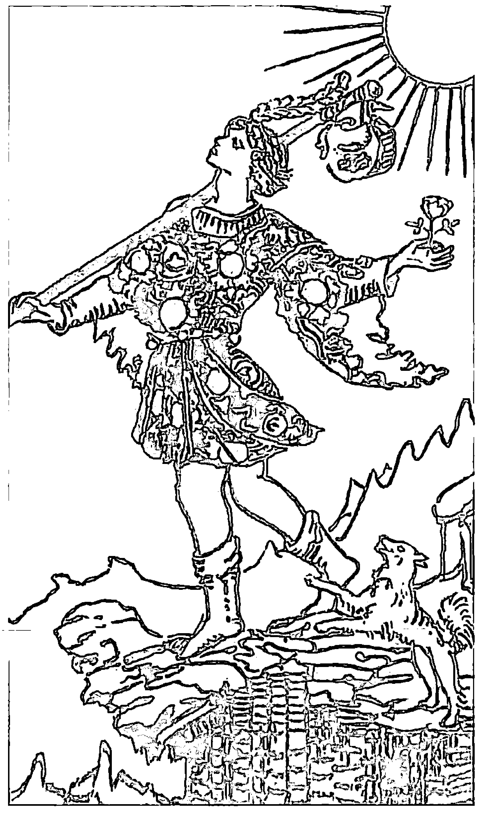

### 正位图像细节解析

- ◇ 太阳：光明、照耀前方的路，代表未来一片光明。
- ◇ 包袱：一切已经准备好，准备出发的状态，也有远行的意思。
- ◇ 头上红色羽毛：火凤凰的羽毛，表示重生的力量，也代表愚人的想法是全新与众不同的。
- ◇ 头向上仰：有自信，甚至到自负的状态，不太理会他人的意见。
- ◇ 权杖扛肩膀：面对掌控这件事显得毫不在意，轻松且随意的面对。
- ◇ 手拿白色玫瑰：想法单纯、天真。
- ◇ 白色内衣：内心单纯。

### 愚人牌

◇ 綠色豐富外衣：有花朵、葉子代表豐盛的意思。
◇ 衣袖破損仍抬頭向前：就算遇到阻礙或傷害一樣自信的前進。
◇ 黃色鞋子：對於未來的路充滿了期待。
◇ 身邊小狗：往上拍打愚人的腳代表提醒他前方有懸崖，屬於警告的意思。
◇ 懸崖：危險的意思，也表示愚人再往前會有危機出現。
◇ 遠方的山：代表未知的地方，也是愚人準備前往一個未知領域。
◇ 黃色背景：豐盛、光明的未來。

### 正位人格特質：自信勇敢的無畏者

### 正位圖像全面解析

當愚人覺得一切都已經準備好，他帶著他的隨從小狗準備進行一個全新的旅程，他覺得他就是一個與眾不同的人，是一個可以把每件事都做得很好的成功者。

他非常有自信的往前走，甚至連頭都不自覺的往上抬起來，前方微風輕拂、後方太陽光明的照耀，讓他覺得這次的旅行真的是有個好預兆。不過因為他想的非常單純，也沒想太多，所以可能沒注意到他的前方有個懸崖。當他繼續自信的往前進時，他的隨從小狗發現這個問題了，所以趕快舉起他的前腳拍向愚人，牠希望愚人可以注意到這個危險，不過這個提醒似乎愚人並沒有注意到，或是他其實知道了只是對自己太有自信，所以覺得這都不是問題，仍繼續勇往直前。

### 參考關鍵字

勇往直前、走向光明的未來、不懼怕危機、有危險但不知道、可期待的成功機會、警告的訊息、表向正向但不穩定的未來性。

### 解牌小練習

### 工作：未來三個月工作狀況如何？

工作看起來會有很不錯的發展，甚至會有突飛猛進的狀況，整體工作中你可以感受到你的活力與積極性，不過請小心，在快速的發展中還是會有隱藏一些問題，如果沒有注意到可是會突然出現工作危機。

### 逆位圖像細節解析

- ◎ 切割上下重心在上
  - ◇ 懸崖：危險的訊息加強。
  - ◇ 小狗：人被狗引導，往錯誤的方向或是錯誤的資訊與想法。
- ◎ 萬有引力關鏈掉落
  - ◇ 小狗：沒有警告資訊，讓危機擴大。
  - ◇ 花朵：想法不再單純，開始胡思亂想，導致猶豫不決。
  - ◇ 包袱：出外行李掉落，代表粗心大意且無法再前進。
  - ◇ 羽毛：懦弱沒有想法，不敢勇敢面對。
  - ◇ 低頭：原本的抬頭在逆位時變成低頭，成了沒自信。
- ◎ 日出日落光明黑暗
  - ◇ 太陽：不再光明開始出現月亮特質產生虛幻不實的狀況。

### 逆位人格特質：害怕擔憂的膽小鬼

### 逆位圖像全面解析

現在危機擴大，懸崖已經近在眼前。愚人似乎已經掉到懸崖下方，他的包袱也因為摔下來而遺失，現在他整個人掉在懸崖下方，已經無路可走。太陽也慢慢日落西山，似乎一切都已經往負面的方向前進。

因為自己原本單純自信的想法，導致於一些錯誤的方向出現，讓愚人開始變得胡思亂想甚至沒自信的想要退回原點。但提醒他的隨從小狗，仍在拉著要他往前進，對愚人來說，他也開始懷疑這個隨從小狗是否是真的提醒他，還是在誤導他而已，當他持續的不理會隨從小狗後，他的隨從也只能黯然的離開，對於在黑夜中的愚人來說，這無異是增添了更多的危機與危難。

### 參考關鍵字

沒有勇氣、錯誤的想法、自信喪失、猶豫不決、優柔寡斷、粗心大意。

### 解牌小練習

### 愛情：他現在對我的感覺如何？

他現在對你的感覺，有許多不明確的感覺，甚至還有其他人提供的想法給他，讓他覺得對你有許多的不確定。因此他現在不太想要再繼續跟你多深入了解，也有種退縮，覺得你帶給他有些不安感，他對你的感覺其實是滿負面的。

## No. 1 魔術師 The Magician

對應占星 | 水星
水星是代表溝通與傳達的一顆行星，也是一個成長、學習的象徵。
元素系統 | 風元素

### 正位圖像細節解析

- 上方紅色花朵：上天的熱情。
- 下方的紅白色花朵：落實在人間的熱情與純潔。
- 右手權杖：掌控上天所給予的狀態（通常會與左手向下指一起解）。
- 左手向下指：傳遞到下方（與右手一起解，代表將上天的熱情傳遞到人世間），有傳達的意思，也是水星的溝通意思。
- 頭上無限標誌：代表頭腦運轉的很好。
- 頭上白色止汗帶：代表正在學習的狀態。
- 紅色外袍：熱情有行動力。
- 白色內衣：純潔單純的想法。
- 蛇腰帶：蛇代表智慧，也代表會用智慧約束自己。
- 桌上四個元素：展現能力並且學習如何使用。
- 黃色背景：代表豐盛的可能。

### 補充資訊

- 權杖：火元素 - 代表行動力、熱情。
- 聖杯：水元素 - 代表感受與情感。
- 寶劍：風元素 - 代表智慧與想法。
- 金幣：土元素 - 代表務實與持續力。

### 正位人格特質：才華出眾的學習者

### 正位圖像全面解析

魔術師將他的工具都放在桌上，表示他正嘗試將他所學的展現出來。高舉權杖的他，現在正將上天的訊息傳達到地上，這也代表他的溝通傳達能力相當好。

但他不小心把自己白色衣服的能量也帶入，變成地上出現了白色的百合，也許是他技術還不夠純熟，但他還是可以表達出不錯的能力，並且在展現及傳達他的能力時，他會小心謹慎約束自己儘量不要失控。

他很聰明，所以知道怎麼做是對他最有利的，其中包含了他害怕在做事時會流汗，所以在額頭上綁上止汗帶，讓他不會因為流汗而蒙蔽了眼睛，整體來說他現在的表現相當優異。

### 參考關鍵字

溝通、成長、學習、有能力的但不純熟、變化、智慧、欺騙。

### 解牌小練習

### 愛情：他現在對我的感覺如何？

他現在對你的感覺還滿不錯，他想要跟你多點互動，也想要多去展現他自己的魅力給你看，他其實是喜歡你的。只是這一切，都還剛開始的階段。他想要藉由多一點互動來多了解你，並且藉由展現自己的魅力，來看看你是否也會給予正向回應。

### 逆位圖像細節解析

- ◎ 切割上下重心在上
  - ◇ 紅玫瑰與白百合：太過在意自己的感受，忽略了對外的互動。
  - ◇ 四元素：過度想要展現技能。
- ◎ 萬有引力關鍵掉落
  - ◇ 四元素：過度展現自己能力，導致於東西全部掉落，也代表能力不好。
  - ◇ 無限標誌：腦子運轉不好、不聰明。
  - ◇ 權杖：無法掌控技術，無法掌控溝通的技巧。
  - ◇ 蛇腰帶：沒有辦法用智慧約束自己，也是穩定性不夠的狀態。
- ◎ 草木顛倒枯萎貧瘠
  - ◇ 紅玫瑰與白百合：枯萎了就代表沒有行動力與想法混亂。

### 逆位人格特質：疲乏止學的怠惰者

### 逆位圖像全面解析

自負的魔術師，自以為自己很厲害。他摘下了他的止汗帶不再學習，而開始隨意去展現他自己的技能，但沒想到他的能力還不足够，因此在展示他的能力時，他桌上的物品全部都掉下桌面，就算他人跟他說明該如何改進，但他仍是堅持自己是對的，他的不願意溝通，導致出現了許多的疏失，看來他的能力已經被質疑了。

### 參考關鍵字

沒有成長性、討厭變化、技術不好、不穩定的特性、錯誤的技巧，導致事情走向更糟的狀況。

### 解牌小練習

### 工作：未來三個月工作狀況如何？

已經習慣固定習性的你，在未來三個月，你只想用習慣的方式去工作，因此當要你去接受外來的建議來改變你的工作習慣已經比較難。你的不願意改變，與許多同事間的溝通出現了問題，這也讓你的表現開始出現瑕疵，這三個月內，你將因為你沒有成長而慢慢地出現跟不上他人的狀態。

## No. 2 女祭司 The High Priestess

對應占星 | 月亮

月亮代表著比較內斂的特質，也是較重視內心感受的狀態。

元素系統 | 水元素

### 正位圖像細節解析

- 黑白柱子：代表二元對立，指向女祭司在中間完全中立不偏頗任何一方。
- 布幔：紅石榴代表女性，棕梠樹代表男性，這裡指向男女之事中立不偏頗。
- 帽子：有上弦月、滿月與下弦月的存在代表規律的運行，想法較為規律。
- 胸口十字架：擁抱神聖的心，重視神聖純潔。
- 手中卷軸：TORA 代表神諭或是律法，表示擁有上天的旨意。
- 不使用權杖而是拿卷軸：代表不是掌控型而是擁有的特質。
- 藍色外袍：冷靜的特質。
- 石頭椅子：固執的行為與態度。
- 右下角弦月：已經快要消失了，藉此呈現女性內斂象徵，代表女祭司相當內斂。
- 背景為夜晚的天空與海洋：代表如同夜晚寧靜海洋平靜的態度。

### 正位人格特質：冷靜內斂的智慧者

### 正位圖像全面解析

冷靜的女祭司，坐在堅硬且方正的石椅上，這代表他的心思是堅定且不容易被撼動。他冷靜的拿著代表神諭的卷軸，也表示他是擁有智慧的能力，但他略把代表智慧的卷軸用外衣遮蔽，這也代表他很內斂。

坐在代表二元化的兩個柱子間，背後的布幔充滿了男女之間的特質，但這也代表他對於男女之事是中立不偏頗，甚至可以說是不管男女之間的事，在感情上就顯得相當的冷漠，對他來說，他只重視到代表上天旨意的十字架與卷軸，雖然他極為聰明，但他的想法比較規矩，因此外在感情的事他都不想理會，所以有時難免會讓人覺得不近人情。

### 參考關鍵字

理智、強烈的壓抑、感情冷淡、與外界有隔閡、對外界不感興趣，只著重自我內心感受。

### 解牌小練習

### 愛情：他現在對我的感覺如何？

他現在正冷靜的看著你跟他之間的關係，對你並沒有太多的感覺。對他來說，如果要去看你跟他之間情感的可能性，他就必須去思考與你在一起有什麼優缺點，所以其實他對你沒有情感，甚至可以說是沒有多的感覺。

### 逆位圖像細節解析

- ◎ 切割上下重心在上
  - ◇ 月亮：這時的月亮因為日出日落已經變成太陽，變成了非常外放的態度。
  - ◇ 海水：也代表水元素，跟情感有關，表示重視自己的情感，比較情緒化。
- ◎ 萬有引力關鍵掉落
  - ◇ 卷軸：原本律法掉落，代表不再有規矩與規範，也是沒有智慧的意思。
  - ◇ 頭冠：原本一切照規矩的態度變成不再照規矩，帶有失控的情緒。
  - ◇ 布幔：掉落至頭的位置，表示滿腦子都是男女之間的想法。
  - ◇ 十字架：變逆十字，也表示惡魔欲望的特質。
  - ◇ 海水：內在情緒宣洩而出，比較情緒化。
- ◎ 建築崩毀訊息消失
  - ◇ 石椅：原本固執態度，變成隨便不堅持。
  - ◇ 黑白柱：黑白分明變成黑白不分，沒有一個標準並且不容易分辨。

### 逆位人格特質：任性的情緒失控者

### 逆位圖像全面解析

原本內斂的女祭司，總是會將自己的內在情緒壓抑住，在逆位時卻讓自己的內在情緒如同海水一般宣洩而出。也許是壓抑太久，因此他的情緒波動相當的大，也開始將重心放在享樂上面。他不管所有的律法與規則，因為他現在只想要做自己，並且去盡情的享受所有的一切，他的行為也就變得更加開放與外放了。

### 參考關鍵字

暴躁、情緒失控、沒有知識、錯誤的判斷、沒有深思熟慮、偏物質層面的想法。

### 解牌小練習

### 工作：未來三個月工作狀況如何？

未來三個月，你的工作態度相當積極，但你的積極卻只是一種衝動，似乎你的做法都較沒有任何章法，只是一味的往前衝。這樣的行為，其實對於工作的表現並沒有太多的加分，反而會提醒你要小心是否會因為太過於衝動，反而出現錯誤的判斷讓你事倍功半。

## No. 3 皇后 The Empress

對應占星 | 金星

金星跟愛、美、享受有關，
大多指向享受美好的一切。

元素系統 | 風、土元素

### 正位圖像細節解析

- 皇冠十二顆星：代表一年十二個月的運作，也表示想法是比較固定有規範。
- 皇冠有桂冠：十分重視榮耀這件事。
- 脖子七顆珍珠：一周七天一樣的循環，放在脖子（喉輪）表示說話有分寸與規矩。
- 手握權杖：上方圓球代表金星，掌控物質（也可以泛指掌控一切的意思）。
- 衣服紅石榴圖案：代表女性的特質。
- 衣服寬鬆：在認定舒適的環境中穿著或是懷孕的狀態。
- 橘色靠枕：擁有豐富的經驗。
- 紅色靠枕與布：有行動力。
- 黑色墊枕上方有金星符號：一切都以享受為基本。
- 愛心符號椅子：重視感情或感受面。
- 愛心內的金星符號：重視愛情與享受，但綠色代表還是會保持安全距離。
- 稻穗：豐收的意思，但沒與皇后接觸，中間有水泥地代表仍是重視社會觀感。
- 樹木與流水：滋養成長的意思。
- 黃色背景：豐盛、收穫。

### 正位人格特質：經驗豐富的享受者

### 正位圖像全面解析

優雅的皇后在她的花園裡悠閒的坐著，她輕輕高舉權杖代表她可以掌控及擁有這所有的一切。眼前的稻穗及後面整片森林、流水都是她所擁有的一切，也代表她可以享受這美好的生活。

但畢竟她是皇后，在享受的時候，還是得顧及社會道德的觀感，因此她還是得與盡情享受保持一點距離，藉以表現出自己的身分地位。她穿著的很寬鬆，也許她有了身孕，這也代表所有一切都是往豐盛美好的未來前進。

### 參考關鍵字

豐收、母愛、女性象徵、享受、符於社會觀感的愛情、懷孕。

### 解牌小練習

### 愛情：他現在對我的感覺如何？

他現在對你的感覺非常的好，他享受與你之間所有一切的互動，不過可能是顧忌到一些個人因素，所以他還是維持著禮貌性的尊重，除此之外，他對你的感覺都已經持續在成長當中。就牌面來說，已經到達相當美好的階段，甚至想要再往前跨一步。

### 逆位圖像細節解析

- ◎ 切割上下重心在上
  - ◇ 稻穗：豐盛滿滿到滿溢出來的物質享受，甚至超越了水泥地，代表沒有節制的享受，也是失控的物質欲望。
  - ◇ 金星符號：十分重視享受或是愛情，但綠色顏色已消失，代表沒有節制跟保持距離。
- ◎ 萬有引力關鍵掉落
  - ◇ 寬鬆衣服：被掀開看似脫下寬鬆衣服，表示小產或是不再享受。
  - ◇ 靠墊：不再有享受的經驗，也沒有可以依靠的經驗。
  - ◇ 權杖：無法掌控所有一切，失去了對物質或愛情的掌控權。
  - ◇ 皇冠：腦子不再照規矩走，會胡思亂想。
  - ◇ 桂冠：不再以榮耀為依歸。
- ◎ 草木顛倒枯萎貧瘠
  - ◇ 稻穗：原本豐盛的收穫及享受消失，變成貧瘠。
  - ◇ 樹木與河流：不再有滋養成長的力量，如果跟懷孕關聯就代表小產。
- ◎ 建築崩毀訊息消失
  - ◇ 愛心石椅：無法再享受愛情與一切物質的享樂。

### 逆位人格特質：失去掌控的縱欲者

### 逆位圖像全面解析

原先重視形象的皇后，在逆位時，就變成了只想要享樂而不願意再遵從規範的人。她盡情的享受所有的一切，而且因為過度期望享樂因此把代表掌控的權杖都丟棄了，這也讓她變成了把所有的掌控權都交給他人而變成沒有任何自制能力的皇后。這樣的人，有時候會失控到過度的狀態而不自知，沉溺於享樂當中，難免讓他人覺得這個皇后已經失控了。

### 參考關鍵字

- 失控的物質欲望、貧瘠的、不豐富、不忠貞、氾濫肉慾、流產。

### 解牌小練習

#### 愛情：未來三個月該用什麼方法可以跟他在一起？

接下來三個月，你可以努力的跟他享受所有一切的物質享樂，讓他覺得跟你在一起都有享受不完的吃喝玩樂。藉由享樂，讓他開始對你產生更多的需求，這樣兩個人就可以先從這樣豐富的享樂過程中，因為需要彼此，而變成在一起。

## No. 4 皇帝 The Emperor

對應占星 | 牡羊座

牡羊座會以我為中心，較熱情主動，有時候會忽略掉他人的感受。

元素系統 | 火元素

### 正位圖像細節解析

- 牡羊頭椅子：牡羊座的特質：衝！加上石頭椅就是固執的往前衝。
- 皇冠：代表王子成熟後加冕成國王，也表示成熟的想法。
- 皇冠上的寶石：代表堅固的意念。
- 鬍鬚：成熟的狀態，也表示展現出成熟的態度。
- 紅色披風與衣服（上方有牡羊頭）：代表強大的行動力。
- 手握權杖：埃及掌控生命與權力的安卡十字架，表示皇帝掌控一切。
- 手握珠寶：掌控財富，表示所要的一切都可以被掌握。
- 露出盔甲：有足夠的毅力去面對挑戰。
- 藍色內裡衣服：冷靜觀察，並確認時機後才會行動。
- 座位有階梯：與人之間有上對下的概念。
- 光禿的山：沒有滋養的能力，也表示只有征服沒有經營的能力。
- 接近枯竭的水流：沒有滋養的力量。
- 背景橘色顏色：強調與他人之間的關聯，也表示皇帝重視與他人之間的關係。

### 正位人格特質：掌控欲強的權威者

### 正位圖像全面解析

嚴肅的皇帝坐在他的寶座上，他掌控所有的一切，他有牡羊座的強大行動力也穿上了可以防禦外來挑戰的盔甲。對他來說，他不只要掌控目前所有的一切，他還想要去征服更多外在的事物。

所以他的眼神正往其他方向注視，十分有野心的皇帝，將他的重心都放在拓展疆土上面，但對於所擁有的一切，要如何去經營就顯得沒有那麼在乎。

### 參考關鍵字

權力、穩定的力量、父愛、男性的象徵、毅力。

### 解牌小練習

### 愛情：他現在對我的感覺如何？

他現在想要征服你，對他來說，他認為你就應該是他的另一半，他對你有著強烈的控制欲望，他也想要掌控你的一切，他已經思考之後該如何去追求你。只是對他來說，他只有停留在如何追求你的階段，還沒有去想到，如果追到你之後該如何相處。

### 逆位圖像細節解析

- ◎ 切割上下重心在上
  - ◇ 盔甲：更強大的防禦心，代表不敢前進只能防禦。
- ◎ 萬有引力關鍵掉落
  - ◇ 權杖與珠寶：失去原本可以掌控的一切，讓皇帝憤怒。
  - ◇ 裙襬：下滑露出更多的盔甲，代表更加加強防禦心。
  - ◇ 鬍鬚：遮住眼睛讓皇帝變成盲目及不確定方向。
  - ◇ 皇冠：代表不夠成熟無法加冕成為皇帝。
- ◎ 建築崩毀訊息消失
  - ◇ 石椅：原本堅持向前進的動力消失，變成退縮不敢前進。

### 逆位人格特質：情緒失控的暴君

### 逆位圖像全面解析

進入逆位的皇帝，他被自己代表成熟的鬍鬚遮蔽了雙眼，也表示他被自己過去的經驗所捆綁。這樣的狀況，讓他在接下來做事情是盲目不精確的，而看不到眼前一切的他，又發現自己的權杖跟珠寶都掉了，自然而然情緒也就跟著暴躁起來。

但到底是他的情緒完整的引爆出來？還是因為看不清楚未來而感到害怕退縮？就要看其他的牌到底是怎麼引導我們去解析了，但至少我們會發現皇帝已經失去了他原本穩定的特質。

### 參考關鍵字

情緒更暴躁、失控的狀況、不敢前進、退縮、不成熟的想法、害怕失去而不敢行動。

### 解牌小練習

#### 工作：未來三個月整個團隊的運作狀況如何？

未來三個月你的團隊似乎出現了一些紛爭，彼此之間都想要以自己的想法去領導整個團隊，但畢竟團隊是需要溝通的，卻在大家都想以自己為主的狀況下出現情緒暴躁的狀態，這樣的團隊氣氛將會讓整個團隊的運作停滯不前，甚至會有手邊專案進入到失敗的可能性。

## No. 5 教皇
The Hierophant
对应占星｜金牛座
金牛座较温吞，有专业能力，比较容易专注在自己在乎的事情上。
元素系统｜土元素

### 正位图像细节解析
- 皇冠：三层代表身心灵，也表示教皇的智慧涵盖身心灵三层面。
- 皇冠上三根天线：可以接通到上天所给予的身心灵智慧。
- 耳朵旁垂饰：白色代表单纯、纯洁，也表示听的时候不夹带任何个人想法。
- 高领：蓝色代表谨慎说话。
- 红色衣服上有白色Y型衣饰：这为牛轭，是代表压抑行动力的意思，而牛轭有十字架代表是神圣的上天规范。
- 白色内里：内在纯洁、单纯。
- 左手握权杖：代表掌控发声的权利。
- 右手向上指：表示这些话都是上天的讯息，也表示天授权力。
- 蓝色裙摆：冷静不躁动。
- 黄色鞋子：上方有十字架与牛轭一样代表抑制期待。
- 石椅：坚持己见，外圆内刚的态度。
- 红色台阶：与他人有上对下的差异，而差异是因为拥有中间代表开启某个关键的钥匙。代表因为我拥有这个能力，所以你们必须要来听我的。
- 钥匙：开启某个能力的工具，也表示修道士来向教皇祈求开启智慧的钥匙。
- 红色台阶左右两旁黑白方块：黑白分明及有所规范。
- 修道士：黄色Y型牛轭代表被限制是心甘情愿的。
- 后方柱子上方雕饰：有男性与女性的性象征，表示教皇懂这块但只是放在那边不用。

### 正位人格特质：遵循天意的引导者

### 正位图像全面解析
严肃的教皇坐在他的座位上，高举的手正表示他现在正在引领上天的智慧要传达给在下方的修道士听。修道士跪在下方正在聆听教皇的引导，这样的一个聆听让他们必须要把自己个人的想法与行动都放下。
在这神圣的领域里，一切都以上天的旨意为主，男女之情与个人的私欲就先放在一旁，就算偶而想移动一下身躯，或是有自己的想法都要小心翼翼的进行，毕竟在这神圣的场所中凡事都还是谨慎的好，一切都必须照规矩走才是王道。

### 参考关键字
循序渐进、指引、缓慢的前进、教导、老师、婚姻、奴役、求助者。
爱情：他现在对我的感觉如何？他现在对你的感觉较为平淡，虽然有逐渐增温的状况，但却只是在一个他觉得上对下或是也可以学习或指导的状态。也就是说对方并没有对你有爱的感觉，比较像是以朋友的关系相处。

### 逆位图像细节解析
- ◎切割上下重心在上
  - 修道士：教皇反而要听修道士的话，变成了错误的思想方向。
  - 钥匙：为了某些自私的目的而来互动。
- 万有引力关键掉落
  - 钥匙：原本为有可以开启某些智慧的能力消失，转为没能力解决问题。
  - 权杖：失去后变成无法掌控所有一切，只能被他人带着走。
  - 皇冠：拥有的智慧与能力不足，无法指引他人。
  - 手势：原本向上代表上天指引，变成向下恶魔的引导，也是思想偏离正道的意思。
- 建筑崩毁讯息消失
  - 石椅：不再坚持己见，容易受他人误导。
  - 石柱：对于两性不了解，但会积极的去接触。
- 颜色压制逆位展现
  - 牛轭：原本被压抑的热情开始大幅度展现，变成过度热情甚至有失控的状况。

### 逆位人格特质：被恶魔占据的神棍

### 逆位图像全面解析
原本高高在上的教皇，现在反而变成在画面下方，他反而要听从修道士的引导。这是一个错误的方向，也代表了这位教皇现在是能力不足而容易的受到他人的诱导。
他的手势变成向下指，也表示是往堕落、恶魔的方向前进，所以他就变成更加重视物质层面而不再重视精神层次了，看来这个教皇已经不再有统御他人的能力，反而开始受控于那些错误的引导。

### 参考关键字
偏离的思想、没有能力、很容易受外界影响、异端份子、为达目的要手段。

### 解牌小练习
爱情：未来三个月该用什么方法才能让他跟我在一起？
故意创造一些错误的谣言让他觉得你是很热门的被追求者。制造许多人都在追求你，但你却是对他情有独钟，利用这样的错误资讯，让他觉得如果不尽快把握住你，你可能就会跟其他人在一起，藉此引起他竞争的心态，就会让他想要跟你在一起了。

## 恋人
The Lovers
对应占星 | 双子座
双子座十分重视精神层面，因此会显示出较重视精神的状况。
元素系统 | 风元素

### 正位图像细节解析
- 太阳：光明及照耀，表示前途光明。
- 天使：头发中有绿色颜色代表为大天使拉斐尔，双手张开代表照顾及保护的意思。
- 天使紫色衣服：代表智慧，也是运用智慧保护的讯息。
- 天使翅膀：红紫色代表智慧与行动力兼顾。
- 云朵：只展现出天使上半身，表示十分重视脉轮的上三轮（精神层面）。
- 男女双手张开：全然信任彼此（与圣经中的亚当夏娃有关）。
- 男生后方树木：十二朵火表示一年十二个月都充满了欲火。
- 女方后方树木：四颗果实表示一年四季都有享受的欲望。
- 蛇：代表诱惑，也表示男女都相信彼此，愿意敞开心胸，但仍有物质欲望的诱惑。
- 山峰：两人逐渐靠近，就像爬山一样越来越往好的方向前进。
- 两人视线：男看女、女看天使，代表心仍不定（传统意思代表男重物质女重精神）。
- 两人视线加天使：形成火元素符号，表示十分重视精神层面。

### 正位人格特质：精神满分的交流者

### 正位图像全面解析
在天使的祝福下，这对男女现在正敞开心胸去面对彼此，彼此之间全然的将自己所有的想法与感受都与对方分享。
他们内在是有欲望的，但这不会影响到两人的相处，他们的感觉正在逐渐加温当中，也在天使的照料下逐渐向前，虽然当中并非是永远把心思放在彼此身上，但至少两人在相处时是那么全心全意地面对。

### 参考关键字
恋爱、精神上的提升、相信对方、热恋的开始、三心二意（讯息较弱）。

### 解牌小练习
工作：未来三个月工作状况如何？
未来三个月，你的工作状况将会在与人际关系上有很好的交流。不管是同事间或是客户间彼此都可以获得很好的互动模式，也因为如此，所以接下来的日子你的工作将会相当得心应手，在大家的努力下持续往好的方向发展。

### 逆位图像细节解析
- ◎ 切割上下重心在上
  - 男女：变成男女为主，天使堕落成为恶魔，故成为以肉欲为主。
  - 山：两人靠近变成向下前进，也代表关系分离或是被阻挡。
- 日出日落光明黑暗
  - 太阳：变成月亮特质，许多事情出现不确定的状况，包含心意摇摆模糊不确定。
- 万有引力关键掉落
  - 男看女女看天使：原本火元素转为水元素，代表在乎内心情感问题。
- 草木颠倒枯萎贫瘠
  - 树木：枯萎代表没有外来的诱惑，但男女本身就是欲望体。天使堕落成为恶魔让许多精神象征转为物质象征。

### 逆位人格特质：享受当下的失败者

### 逆位图像全面解析
当人们开始以自己为主，全身赤裸的去享受肉欲的互动，原本鼓励重视精神层面的天使，在进入逆位时堕落成为恶魔，这时就成了人们内心的欲望引导。此时人们不再相信精神层面，而是凡事都重视物质，中间的山也成了阻碍整件事情的关键，你所期待的将有可能会逐渐下滑到失败的阶段。

### 参考关键字
- 肉欲极强的情感、没感情的交往、分离、被阻碍、三心二意、被破坏的感情。

> **爱情：他现在对我的感觉如何？**
他现在对你就只存有想要享乐的心态，本身已经没有太多的情感。虽然他之前可能对你有好感，但目前只剩下物质层面的感受，而且感觉还在持续下降的状况，看起来一切都是往负面的方向前进，顶多只有想要享受当下而已。

## No. 7 战车
The Chariot
对应占星 | 巨蟹座
巨蟹座有强烈的守护心，对于在乎的人、事、物有愿意停下来用尽心思保护的毅力。
元素系统 | 水元素

### 正位图像细节解析
- 星星布幔：以夜晚星星为睡觉时所看到的天，表示离开家往外前进。
- 头上八芒星：北极星，指引方向，也表示头脑专注的往一个方向前进。
- 头上桂冠：重视荣耀。
- 头上四尖角皇冠：四元素具备且像太阳一样崭露头角。
- 肩膀月亮及脸：这张牌对应到巨蟹座，而月亮是巨蟹座的守护星，人脸放在月亮上即是代表守护内在所在乎的人，也有所谓保护的特质。
- 蓝色盔甲：冷静且坚强的守护。
- 盔甲中的正方形：坚定的意念。
- 星座腰带与炼金符号裙摆：拥有这些能力作为自己向前的工具。
- 左手没拿缰绳：用意志力去控制前进方向。
- 右手握权杖：掌控所有一切的方向，表示不论想攻击或是防守都由自己决定。
- 战车轮子：黄色的轮子代表前进可以有丰盛的收获。
- 战车上方标志：翅膀代表前进，盾牌代表防守，这代表战车不管前进或防守都是十分优秀的，中间红色符号为合一概念，表示进可攻退可守。
- 黑白芬克斯：二元对立，各自朝一个方向，代表有不同的前进方向，但现在是坐着表示虽然有不同方向但仍未行动，有停留在当下的意思。
- 后方河流：护城河，为保护城堡用，战士在护城河之外代表离开舒适圈。
- 城堡：战士要保护的地方，代表守护在乎的人事物。
- 黄色背景：有好的收获或丰盛的结果。
> > ◎ 补充资料
> 战士腰际以下没入战车里面，其实代表的是“拟物化”，把人面狮身当作是战士的双脚及要前进的方向，目前有犹豫不决但坚守在地的状态。

### 正位人格特质：意志坚强的战士

### 正位图像全面解析
伟大的战士为了要守护自己的城堡，现在离开舒适圈，对他来说，要面对这些外来的挑战，是件不容易的事。
他的心中有许多的想法与方向，谨慎的他，现在就站在自己的城堡外面先仔细思索并同时先以防卫国家为主。也许有一天他认为外在的挑战减弱或是目标明确之后，他会驾起他的战车勇往直前，不管是守卫或是往前冲，相信这位英勇的战士都可以有很好的成就。

### 参考关键字
勇敢前进、面对考验、需要意志力去执行、离开安逸的环境、有防备心。

> 工作：未来三个月工作状况如何？
未来三个月，你的工作似乎遇到一些新的挑战。虽然你是有能力可以去面对的，不过谨慎的你不会急着去处理，而是会仔细的思考。因此虽然暂时好像有点停滞的状况，但实际上你只是在等待一个好机会，等机会到了，就一口气向前冲获得成功。

### 逆位图像细节解析
- ◎ 切割上下重心在上
  - 人面狮：原本被战士控制的狮子变成由他主导，代表受他人摆布。
  - 盾牌与翅膀：盾牌在上，代表防御加高，反而不敢前进。
  - 缰绳：突显出没有缰绳的控制权，也表示是人面狮在上处于失控的状况。
- 万有引力关键掉落
  - 权杖：无法再有防御或进攻的力量，只能停在当下。
  - 车轮：翻车了，代表被自己或他人拖垮一切而无法再前进。
  - 头上八芒星：看不到方向，没有毅力面对挑战。
  - 桂冠：荣耀掉落也表示失去了荣耀的特性，可解释为失败的状态。
- 建筑崩毁讯息消失
  - 城堡：原本要守护的城堡被摧毁，代表要守护的事情已经失败。

### 逆位人格特质：退缩无能的失败者

### 逆位图像全面解析
想要往前冲的战士，受到太多外来的影响，导致他的座骑已经失控乱跑，而整个战车也因此翻覆了。手中的武器在翻覆的过程中也掉落，变成无法守卫，也被自己的坐骑（思绪）打败变成无法再前进。此时的战士，只能停留在当下看着他所想要守护的家被外族摧毁，而这却是他自己没有掌控好所有节奏的后果，他得自己承担一切。

### 参考关键字
退缩、防卫心极强、不敢面对挑战、受人摆布、遭受失败、被自己打败。

> 我与另一半未来三个月的相处状况如何？
未来三个月两人之间有许多意见不合的状况出现，彼此之间针对于这些不同的意见有许多的争执，也因为这样就产生了极大的失衡状态而导致关系分裂。到最后两人的关系都受了伤，甚至有决裂的可能。

## No. 8 力量
Strength
对应占星 | 狮子座
狮子座会展现自我魅力，喜欢像阳光一样被他人注视及征服他人。
元素系统 | 火元素

### 正位图像细节解析
- 头上无限标志：脑筋运转的很好。
- 头上花冠：女性的柔性智慧，并且持续成长出更多的智慧。
- 白色衣服：纯洁、单纯的想法。
- 双手抚摸狮子的头：用女性温柔的力量征服强大的挑战。
- 狮子伸舌头：被驯服的象征。
- 狮子尾巴朝下：被征服的象征。
- 女子身上花圈：柔性的力量，隐约与狮子的狮鬃形成无限符号，代表长时间持续的互动。
- 翠绿的草地与树木：持续成长往好的方向前进。
- 黄色背景：丰盛的收获。

### 正位人格特质：柔性征服的胜利者

### 正位图像全面解析
就如同一个强大的挑战一样，一头狮子勇猛的站在女士的面前，然而这位女士专注且温柔的去将她的手轻放在狮子的头上，她运用温柔的力量，让狮子慢慢的被驯服，也运用自己的智慧，让这代表挑战的狮子臣服于她的魅力之下。有时候，温柔且多花点时间的征服力量，会远比强硬破坏的力量要更有成效。

### 参考关键字
柔性的征服、女性的力量、有智慧的面对问题、一个成就的达成、柔能克刚。

### 解牌小练习
爱情：未来三个月该如何才能追求到他？
放软你的身段，多用温柔的方式去与对方互动，相处的时候别急着要求在一起。多相处、陪伴并持之以恒，那么这段时间内，对方就会被你的温柔征服而在一起。

### 逆位图像细节解析
- ◎ 切割上下重心在上
  - 狮子：外在挑战变大，狮子从上而下压制，女生也表示无法征服挑战，甚至是被困住而无法再努力。
  - 狮子：刻意将狮子抬的很高，刻意展现个人力量，但小心可能失败。
  - 狮子锋利的爪：外在的挑战变成相当的强大。
  - 狮子的尾巴：变成有自信的向上翘，外在的挑战变成相当的强大。
- ◎ 万有引力关键掉落
  - 无限标志：不聪明、没有智慧。
  - 头上花冠：无法想出更多的创意跟想法。
- ◎ 草木颠倒枯萎贫瘠
  - 地上绿草地：枯萎代表没有办法持续的成长。

### 逆位人格特质：被环境征服的赢家

### 逆位图像全面解析
当狮子整个扑在女生的身上时，可以看到狮子的尾巴已经高举起来，代表充满了自信。而被狮子压制的女生这时也只能想办法要挣脱而已，代表智慧的无限标志已经掉落。
面对强大的挑战，也变得不知道该如何面对，也许是之前自以为有足够的力量去征服挑战吧？过度的去展现自己的魅力，结果让外在的挑战反扑回来，现在的你只能够接受被环境征服的无奈。

### 参考关键字
无法征服、被现实所困、缺乏信心、滥用力量（失控的可能）、无能力。

> 爱情：他觉得我是一个怎么样的伴侣？
他认为你是个被现实压垮的人，你对于未来没有任何期待，就只是活在每一个辛苦的当下，你的生命就只是为了现实所有的一切而活，对他来说，你就是一个没有任何能力的人。

## No.9 隐者
The Hermit
对应占星 | 处女座
元素系统 | 土元素
专注的做自己，会注重很细腻的事情而忽略与外界的交流。

### 正位图像细节解析
- 全身灰袍含帽子：中立并且低调，用帽子把自己遮住，表示不太愿意给他人知道自己存在。
- 胡须：成熟的象征。
- 低头：低调向内，向内探索的特质。
- 提灯：内有六芒星代表大卫之星，指引方向。
- 站在高峰上：代表远离人群，有孤单的意思，站在高峰上也代表能力卓越 (80/20 法则)。
- 手握权杖：本身行动力不足，需要靠权杖才能前进，藉此表现出被动的特质。
- 背景：并非使用黑色，只是代表夜晚点灯可以指引他人。
- 背景山峰：用雪白代表冰冷，也表示隐者的心是比较冷漠的。
- ◎ 补充资料
  - 大卫之星：有封印及指引方向的解释，这张牌中使用的是指引方向。

### 正位人格特质：独自前进的智者

### 正位图像全面解析
对于已经爬上人生高峰的隐者来说，这也是他现在人生的高峰点，他不会因此而自满，反而正在低头沉思接下来的人生目标该往哪里去。
由于她是个低调的人，因此他不会去主动的告知他人他有多厉害，他只是静静的在思考接下来的人生旅程。这样的动作在外界看起来似乎有点太过于自闭，不过如果你有问题去询问他，他仍是愿意提起一盏明灯为你指引方向。

### 参考关键字
探索内心的智慧、指引他人、孤独、内省、远离人群、有秘密害怕被发现。

### 解牌小练习
工作：未来三个月工作状况如何？你的工作能力已经很好，未来三个月都不会有太多问题。但你似乎在规划自己人生的未来，虽然这不会影响你的工作，但也显示出你的心不在了，同事来找你帮忙你还是会很乐意帮忙，只是你就不会多做其他老板未交代的事。

### 逆位图像细节解析
- ◎ 切割上下重心在上
  - 山峰：原本在山峰顶上变成在山底下，也表示能力一般及靠近人群 (80/20 法则)。
- ◎ 万有引力关键掉落
  - 裙摆掀开：原本隐藏起来的情绪转变成为情绪完全展现成暴躁。
  - 权杖：掉落可分成1. 不再需要：充满活力，2. 失去：无法行动。
  - 灯：歪斜代表错误的指引方向，掉落代表无法指引方向、混乱。
  - 帽子掀开：露出人脸代表愿意开始靠近人群展现自己。
  - 髯髯：遮住眼睛代表盲目没有方向。
- ◎ 日出日落光明黑暗
  - 北极星：星星消失代表无法指引方向，看不到未来。

### 逆位人格特质：思想混乱的一般人

### 逆位图像全面解析
站在山底下代表隐者的能力只是普通，因为在山下也代表跟他一样平庸的人也非常的多，这代表隐者其实还是跟大家一起生活并没有离群索居。这样的他又自称是隐者，自然会觉得他给了许多的错误资讯。而能力不被他人看好的隐者，就很容易因此觉得不知所措，甚至会因此生气而变成一个情绪化的人。

### 参考关键字
- 情绪失控、暴躁、过于谨慎、拖延时间、错误的意见、混乱没有目标与方向、靠近人群、能力不好。

### 解牌小练习
爱情：他现在对我的感觉如何？
他现在对你的感觉相当情绪化，似乎有点想要不顾一切的靠近你，但这种靠近并非是真心的喜欢你，比较像是当下的冲动，而没想太多后果的喜欢。因此可以说是冲动的喜欢，并非是真正了解后的喜欢。

## No. 10° 命運之輪 Wheel Of Fortune

對應占星 | 木星

木星是一個變動的氣體行星，由於氣體的不確定性，大多會被拿來指向跟幸運有關。

元素系統 | 火元素

### 正位圖像細節解析

- ◇ 左上角人類：水瓶座（風元素）。
- ◇ 右上角老鷹：天蠍座（水元素）。
- ◇ 左下角牛：金牛座（土元素）。
- ◇ 右下角獅子：獅子座（火元素）。
- ◇ 以上四個元素都在讀書：代表四元素在學習成長，也表示許多事情都還在學習當中未到達結果。
- ◇ 輪子右邊胡狼頭：阿努比斯神，負責守護冥府，也是勸人為善。
- ◇ 輪子左邊蛇：邪惡之神阿佩普，屬於邪惡的力量，讓他人墮落。
- ◇ 輪子上方神獸：智慧與力量的神獸，代表用祂來平衡所有的一切不至失衡。
- ◇ 輪子第一層：ROTA(輪子)、ORAT(說)、TORA(律法)、ATOR(哈托爾)。
- ◇ 另外四個希伯來文 YHVH：代表上帝最古老的稱呼語，表示這是不可撼動的事實。
- ◇ 第二層四個符號：右邊 - 硫(火)，上 - 汞(風)，左 - 鹽(土)，下 - 水(水)。
- ◇ 第三層四條線向外輻射：這些道理是可以無遠弗屆的傳遞出去。

### 正位人格特質：循序向上的學習者

### 正位圖像全面解析

在這個世界當中，所有一切的四元素現在都在學習當中，整個世界也都在持續運行中。

三位神獸的運作，代表凡事都是持續在變化，有好有壞的轉變，但由於阿努比斯神身體較大，因此他可以承擔起向上的力量，這力量會比阿佩普讓人墮落的力量更大，所以也代表所有一切都是持續向前進的。雖然這一切都還只是在學習及成長中，尚未到達結果，但至少可以期待的是，這件事是往好的方向前進。

### 參考關鍵字

- 運氣
- 循環
- 不確定的狀態
- 學習中
- 成長
- 未有答案的狀態。

愛情：他現在對我的感覺如何？

他現在對你的感覺正持續的成長當中，雖然有些互動讓他對你有些不好的觀感，但更多的好感也讓他對你仍是持續增溫中，只是目前許多的感覺都還在慢慢成長中，而非已經到達最好的感受。所以還未到真正愛的階段。

### 逆位圖像細節解析

- ◎ 切割上下重心在上
    - ◇ 阿努比斯：但他變成從上而下，也表示這個輪子是往下轉。
    - ◇ 阿佩普：變成只有靠邪惡才能成向上成功，也表示需要走偏門。
- ◎ 萬有引力關鍵掉落
    - ◇ 四元素：書籍掉落代表沒有成長性。
    - ◇ 下方神獸：沒有智慧與力量去面對挑戰，也表示沒有能力。

### 逆位人格特質：不走正軌的怠惰者

### 逆位圖像全面解析

原本勸人向善與向惡的神獸現在都顛倒過來了，代表原本正確的方向與順序都被破壞，也表示所有的正常運作已經失去秩序。

而由於阿努比斯比較大隻，代表他帶動輪子向下的力道比較強，因此這件事看起來朝不好的方向前進。能讓這件事往上前進的只剩代表邪惡的阿佩普，也表示如果要讓事情成功，只能走邪惡的路（偏門）。而四元素的書籍也都掉落了，看起來大家都不願意再學習任何事情，所以很多事就停滯於當下，不再有成長。

### 參考關鍵字

每況愈下、不好的狀況、錯誤的方向、順序被破壞、沒有順序、往偏門走。

解牌小練習

工作：未來三個月工作狀況如何？
未來三個月的工作每況愈下，每件事情都已經失去了原本的順序，原本掌握住的節奏都已經亂掉，讓你無法再好好的做事，你的心態也因此變成懶散不想再學習，整個工作狀況就往不好的方向前進。

## No. 11° 正義 Justice

對應占星 | 天秤座
天秤座凡事都要追求平衡，講求優雅的去面對所有的一切。
元素系統 | 風元素

### 正位圖像細節解析

- ◇ 灰色柱子：沒有任何裝飾，代表專注於中立一事。
- ◇ 柱子懸掛紫色布幔：用智慧作為自己評斷的依靠。
- ◇ 皇冠：代表一定的地位，也表示有被授權執行判斷一事。
- ◇ 皇冠上寶石：藍色代表冷靜，正方形為規範，表示冷靜堅持的去判斷。
- ◇ 紅色衣服：強大的行動力。
- ◇ 綠色披風：加諸在紅色衣服上，代表保持距離而不任意行動。
- ◇ 披風鈕扣：正方形（土元素）將圓形（火元素）包住，也表示先將行動力停止。
- ◇ 石椅：堅持、固執的行為與態度。
- ◇ 左手天秤：追求平衡與平等。
- ◇ 左手寶劍：法律的力量，可以做出裁決及懲處。
- ◇ 露出鞋子：一是代表隨時可以起身前進，也說明了想清楚之後就可以快速前進，二是代表露出自己的一些想法與準備行動的方向，可解釋為有點小私心的展現。
- ◇ 階梯：一個上對下的態度，也是有站在比較高的角度去決斷一些事的態度。
- ◇ 背景：黃色背景代表有著豐收的意涵。
- ◇ 短髮：乾淨俐落，也表示是簡潔有力。

### 正位人格特質：公正正義的執法者

### 正位圖像全面解析

代表公正、正義的法官，正端坐在他的石椅上，他高舉著寶劍，代表宣誓一個法律的權力。而另一隻手則是他衡量萬物平衡的天秤，在做任何事情之前都會先仔細思考並且努力的做出正確的評斷。

雖然他偶而會有些自己的想法參雜於其中，但至少他會努力做到公平的態度。如果他發現一切是不公平的，他就會將他手中代表法律的寶劍向下斬，讓那些不公義的事情恢復平衡。

### 參考關鍵字

略為偏頗的正義、追求平衡、對等的付出、婚姻效力、追求合理、為求平衡可作破壞。

愛情：他把我定義在什麼關係上？

他現在很冷靜地看待你們之間的關係，他認為你們之間是一個平等的互惠模式，除此之外他沒太多的感覺。畢竟他覺得你們的關係應該只是互利的互動關係而不會有情感成分存在。

### 逆位圖像細節解析

- ◎ 切割上下重心在上
    - ◇ 露出的腳：一個自私的展現或是即刻行動不拖延。
- ◎ 萬有引力關鍵掉落
    - ◇ 天秤：歪斜或掉落表示不公平的狀態。
    - ◇ 寶劍：不再有思考的動作，已經快速向下斬斷，配合天秤歪斜代表失衡的行為。
    - ◇ 皇冠：原本該有堅定榮耀的想法已經不再，就隨意判決。
- ◎ 建築崩毀訊息消失
    - ◇ 石椅：不再堅持該做的事，而會有隨意判斷的狀況出現。
    - ◇ 石柱：智慧之幕掉落，表示沒有智慧做依靠。
- ◎ 顏色壓制逆位展現
    - ◇ 綠色披風：脫落，展現下方紅色強大的行動力，也是任意行動的意思。

### 逆位人格特質：自私自利的掌權者

### 逆位圖像全面解析

這個法官現在似乎變得很自私，他心中的那個天秤已經歪斜。他也不再去仔細思考何者為榮耀的依歸，這樣的他自然很隨興的就把手中的寶劍斬下。對他而言，反正也無需要再為榮耀堅定意志，那不如就為自己而做事，因此只要對他有利的事，他就很樂意利用手中的權力去做任意的決斷。

### 參考關鍵字

不公正、自私、唯利是圖、誣告、訴訟、破壞、快刀斬亂麻（但是做的不好）。

### 解牌小練習

工作：未來三個月工作狀況如何？

請多留意未來三個月你的工作將會有失衡的狀況出現。這包含你的工作可能有牽扯到法律的問題，或是你太過於心急或自私，而讓一些事情做的不夠完美，你的工作可能即將會面臨非常大的挑戰。

## No. 12° 吊人 The Hanged Man

對應占星｜海王星

海王星代表犧牲奉獻，為了理想先不求回報，努力的付出，十分重視理想層面。

元素系統｜水元素

### 正位圖像細節解析

- ◇ 樹幹：限制的意涵，與黃色鞋子的組合代表限制期望被達成。
- ◇ 黃色鞋子：一個期待落實的願望。
- ◇ 紅色褲子：強大的行動力。
- ◇ 藍色衣服：冷靜的思考。
- ◇ 藍色腰帶：用冷靜去限制自己的思考力，也就是跟自己說不要再想了。
- ◇ 雙手往後綁：展現出胸膛的狀態，相信及自信的態度去面對一切。
- ◇ 頭上光芒：神聖的特質，代表這件事 (包含被倒吊) 都是有其神聖意涵而非被懲罰。
- ◇ 腳成數字 4：堅持付出的態度 (數字學的 4 代表堅持)。

### 正位人格特質：甘願付出的犧牲者

### 正位圖像全面解析

傳說中北歐的奧丁大帝，他希望為他的人民帶來文字系統，讓他們的歷史可以被流傳，因此他將自己倒吊在世界之樹上九天九夜。

這段時間，他為他的期待，努力的祈禱神明，就算他看不到何時會有答案出現，但對他來說，他仍努力堅持的去做他認為該做的，就像這圖像中的倒吊人一般，堅持的付出不求回報。也許當下他的心中想的是，就算沒有結果，只要我做了就有機會吧。

### 參考關鍵字

甘願付出、不求回報、為悔改而自我懲罰、犧牲的精神、等待一個結果。

愛情：他現在對我們的關係有什麼想法？
他現在只想要努力的對你付出，雖然他仍期待跟你有些未來的發展性，但現在的他卻覺得只想要對你好，未來的事情他先沒想那麼多。因為對他來說，只要是可以讓他對你付出，他就會感到相當的快樂。

### 逆位圖像細節解析

◎ 切割上下重心在上
- 光芒：沒有犧牲還是自認為有犧牲的狀況，代表錯誤的說法。
- 雙手放身後：抬頭挺胸自信的認為自己做的是對的。
- 頭上仰：自以為是，不在乎他人的想法。

◎ 草木顛倒枯萎貧瘠
- 樹木：枯萎讓人掉下來，就不再被限制綑綁，也就不再付出。

◎ 顏色壓制逆位展現
- 腰帶：腰帶掉落，展現藍色顏色衣服代表都只是理智的想，但不做（褲子紅色消失）。

### 逆位人格特質：自以為是的自大者

### 逆位圖像全面解析

驕傲的吊人現在將頭抬的很高，他很自傲的跟大家說：你看，我為了大家犧牲奉獻把自己吊在樹上，我就像那偉大的奧丁一樣，為了大家犧牲自己的自由，然而其實後方的樹早就枯萎。他也並沒有真的被吊在樹上，只是說一套做一套的想要博取名聲罷了，畢竟他只是自以為是，以為這樣就可以獲得他人的掌聲。

### 參考關鍵字

不願意付出、只在乎自己、沒有意義的做事、忽略他人的感覺、錯誤的說法。

### 解牌小練習

工作：未來三個月工作狀況如何？

未來三個月你在工作上顯得不太有重心，雖然你仍對外說出你為工作有多努力的付出，然而實際上你卻沒有真正的為工作努力付出，反而只是想要藉此沽名釣譽的得到更多的掌聲，因此未來三個月的工作狀況是很糟的狀態。

## No. 13° 死神 Death

對應占星 | 天蝎座

天蝎座會讓人感到較陰沉，擁有將目標摧毀的力量，能仔細觀察，有高度洞察力。

元素系統 | 水元素

### 正位圖像細節解析

- ♢ 旗幟：薔薇十字會會徽，代表重生的意涵，旗幟是宣揚理念而非強制。
- ♢ 盔甲上羽毛：火鳳凰羽毛，已經進入到死亡並需要浴火重生的階段。
- ♢ 黑色盔甲：死亡這件事是令人感到沉重壓力的。
- ♢ 黃色骷髏：內在是喜悅的本質。
- ♢ 白色馬：單純、直接的將死亡帶來。
- 地上死掉的人：皇帝，代表那些不好的必須死亡。
- 小孩子：愚者，單純的人可以勇敢面對死亡。
- 女生：力量，再有能力都不敢面對死亡。
- 教皇：教皇，再有智慧與地位面對死亡都要虔誠以對。
- 以上四個（地上死掉的人、小孩子、女生、教皇）綜合解釋不單一解釋。
- 河上的船：擺渡者，協助亡者往冥府前進。
- 右上方太陽：前方有塔代表摧毀的意涵，而旭日東升必須在摧毀之後，也表示必須先將問題解決後才有全新的開始。

### 正位人格特質：洗心革面的改革者

### 正位圖像全面解析

代表結束的死神已經到來，不管你是多有權力的皇帝或是多有智慧的教皇，甚或是有柔性力量的女性都無法不面對死亡。而死神的到來並非是代表所有一切的終結，他只是要我們好好的去省思自己過去的過錯，別被那些外在曾經擁有過的光芒所欺騙，把那些不對的事情好好的徹底反省跟解決，其實美好的未來正在等著我們。

也唯有像小孩子一般純潔的面對這些未來，我們的未來才會如同被摧毀後的塔面即將出現的太陽一般，充滿希望。

### 參考關鍵字

毀壞、舊的結束、新的開始、必須認真的反省過去、一個轉變的關鍵期。

解牌小練習

愛情：三個月內該用什麼方法可以跟前男友複合？
三個月內請仔細去思考當初在一起時你的問題在哪？並且讓對方覺得你有認真的去反省，甚至可以讓對方覺得你已經改變了那些問題，讓他看到已經改變後全新的你，自然就會有機會複合了。

### 逆位圖像細節解析

- ◎ 切割上下重心在上
    - ◇ 皇帝：過去的錯誤持續為主，不願意改過。
    - ◇ 女生：不願意去面對死亡這件事。
    - ◇ 小孩：愚蠢的想法。
    - ◇ 教皇：只重視個人欲望（往惡魔角度思考）。
    - ◇ 船：水在船的上方，代表船被水淹沒，也表示無法面對死亡這個階段。
- ◎ 萬有引力關鍵掉落
    - ◇ 旗幟：無法再宣揚重生的理念。
- ◎ 日出日落光明黑暗
    - ◇ 太陽：變月亮模式，代表沒有新的開始。
- ◎ 建築崩毀訊息消失
    - ◇ 塔：未摧毀就消失，表示沒有摧毀的階段，也表示不願意去突破。

### 逆位人格特質：無力改革的失望者

### 逆位圖像全面解析

原本宣揚將不好的事物去掉，要鼓勵人們往前進的死神，他手中宣揚理念的旗幟掉了，原先應該被白馬踩死的國王，此時也逃脫出死神的掌控，似乎所有的一切都無法去破除那些不好的，就像太陽日落西山一樣的終結。不好的仍是繼續掌控一切，而要改過的卻不再有力量，世界進入了渾沌的黑暗中。

### 參考關鍵字

無法面對過去的錯誤、不願意改過、疾病、停滯不前、對於未來有所期望但不願意付出。

解牌小練習

愛情：前男友覺得我是一個怎麼樣的女生？ 在他心中，他覺得你是相當固執的人。你有自己的想法，不管對錯都不願意去聽他人的意見，這樣任性的你，在與他人之間的相處只會想到自己，並且只會去責難他人而不懂得反省自己。妳的前男友覺得你的重心都只放在自己身上。

## No. 14° 節制 Temperance

對應占星 | 射手座

射手座會專注於將事情不斷的鑽研往更好的方向前進。

元素系統 | 火元素

### 正位圖像細節解析

- ◇ 天使：大天使麥可，代表火的天使，有淬煉與揚升的力量。
- ◇ 頭上發光：智慧的展現。
- ◇ 頭上符號：黃金的符號，代表最高的成就，也是淬煉最終的結果。
- ◇ 胸口三角形：火元素的符號，代表用火淬煉杯中的水。
- ◇ 紅色翅膀：強大的行動力，前進的力量。
- ◇ 兩個聖杯：兩隻手不斷的將杯中水倒到另一杯子中，藉由過程中的火淬煉達到將雜質去掉，得到最後完美、純淨的結果。
- 白色衣服：代表單純、無雜質的意思。
- 雙腳位置：一腳在陸地上代表物質世界，一腳在水裡代表情感/精神世界，這兩者平衡。
- 兩朵花：鳶尾花/愛麗絲花，代表如同彩虹般的絢麗與多變。
- 道路與太陽：代表成功與榮耀之路。

### 正位人格特質：專注揚升的煉金者

### 正位圖像全面解析

天使專注的將手中兩個杯子的水不斷的倒出與接受，這代表正在將一些水中的雜質逐漸去除。

兩隻手的協調性是需要很好的，就像團隊合作一般的順暢，而在過程當中，胸口代表火元素的標誌正表示要把那些水轉換成為蒸氣，也是提煉成為更好的可能性。

一腳踏在水裡，一腳踏在陸地上，也代表我們需要注重到現實與情緒之間的平衡，不要過度重視任何一塊。在平衡的過程中，逐漸提升自己的能力，如果可以達到這樣的平衡，在旁邊的成功之路就已經可以看到旭日東升的太陽了。

### 參考關鍵字

自我控制、淬煉、找尋心靈與現實中的平衡、團結向前、提升能力、專業能力。

工作：未來三個月工作狀況如何？

未來三個月，你在工作上可以透過不斷的磨練而達到能力不斷提升的狀態。在這些日子裡，也許你會辛苦一點，但卻是不斷的將你的本職學能提升，甚至如果是有團隊合作的朋友，更可以在這三個月內，與團隊達成一個相當好的目標讓他們為你們慶賀。

### 逆位圖像細節解析

- ◎ 切割上下重心在上
    - ◇ 湖泊：重視個人情感。
- ◎ 萬有引力關鍵掉落
    - ◇ 湖泊水掉落：只剩陸地代表只重視物質的層面。
    - ◇ 杯子的水掉落：代表雙手不協調，藉此代表團隊能力不好。
    - ◇ 黃金符號：不再精純到最好的階段。
    - ◇ 胸口三角形：變成水元素，太重視個人情感不再注重團隊。
    - ◇ 天使：墮落變惡魔，表示只重視物質的欲望。
- ◎ 日出日落光明黑暗
    - ◇ 太陽：不再有榮耀的未來，也代表一切往日落西山方向前進。
- ◎ 草木顛倒枯萎貧瘠
    - ◇ 鳶尾花：不再榮耀，沒有變化多端的狀態。

### 逆位人格特質：粗糙隨意的物慾者

### 逆位圖像全面解析

當天使墮落成為惡魔後，所有的精神層面也將轉換成為物質層面。而原本重視團隊合作所以杯子裡的水有不斷淬煉的動作，但現在太重視個人的情感，所以變成不協調，水掉了無法再淬煉，也無法向上。而代表光明面的太陽也逐漸日落西山，讓未來的方向不再光明，所有一切都掌控在惡魔的手中，成為只重視自己欲望而不願意讓事情向上揚升的墮落方向。

### 參考關鍵字

- 失控
- 錯誤的想法
- 自我中心
- 不願意與他人共事
- 粗糙不精純
- 大意

解牌小練習

愛情：他現在對我的感覺如何？

現在他對你沒有太強烈的感覺，因為對他來說，他現在只想要把重心放在自己身上，不願意放太多注意力在你身上。他對你的感覺，頂多就是吃喝玩樂的朋友狀態，其他就沒有太多想法了，也許他根本沒重視你。

## No. 15° 惡魔 The Devil

對應占星｜摩羯座

摩羯座很重視物質世界，做事情很踏實，但內心有許多的欲望。

元素系統｜土元素

### 正位圖像細節解析

- 惡魔身上動物的形象：代表原始的動物欲望。
    - 山羊的角、驢子的耳朵、山羊的鬍子、蝙蝠的翅膀、山羊的腿、鳥的爪。
- 惡魔頭上逆五芒星：代表滿腦子都是物質的想法。
- 右手手掌兩隻指與另兩隻手指分離：代表背離上天的道理。
- 左手火把：除了照亮物質世界外也是一個藉由燃燒（失去）某些物質換取光明（獲得）。

### 正位人格特質：物質成就的欲望者

### 正位圖像全面解析

被惡魔用鎖鍊綁住的男女，這時已經不是像戀人牌一樣，只是外來的誘惑。因為現在是由自己身上長出尾巴，代表自己已經被慾望所困住。

雖然表象看起來，好像是兩個人被惡魔抓到了，但如果仔細看，會發現其實脖子上的鐵鍊並沒有綁得很緊，是可以隨時掙脫的。然而他們卻沒有，也許正因為他們自己也有強大的慾望，所以心甘情願被惡魔所捆綁，因為這樣他們就可以有理由與藉口說我被惡魔控制了，所以我充滿了慾望，而不用羞愧地說出我自己就有慾望，但不管如何，看起來他們的物質享受將會是十分豐富的狀況。

### 參考關鍵字

- 物質的慾望
- 自甘墮落
- 肉慾
- 奉承
- 受引誘
- 邪惡的想法
- 偏物質方面的訊息。

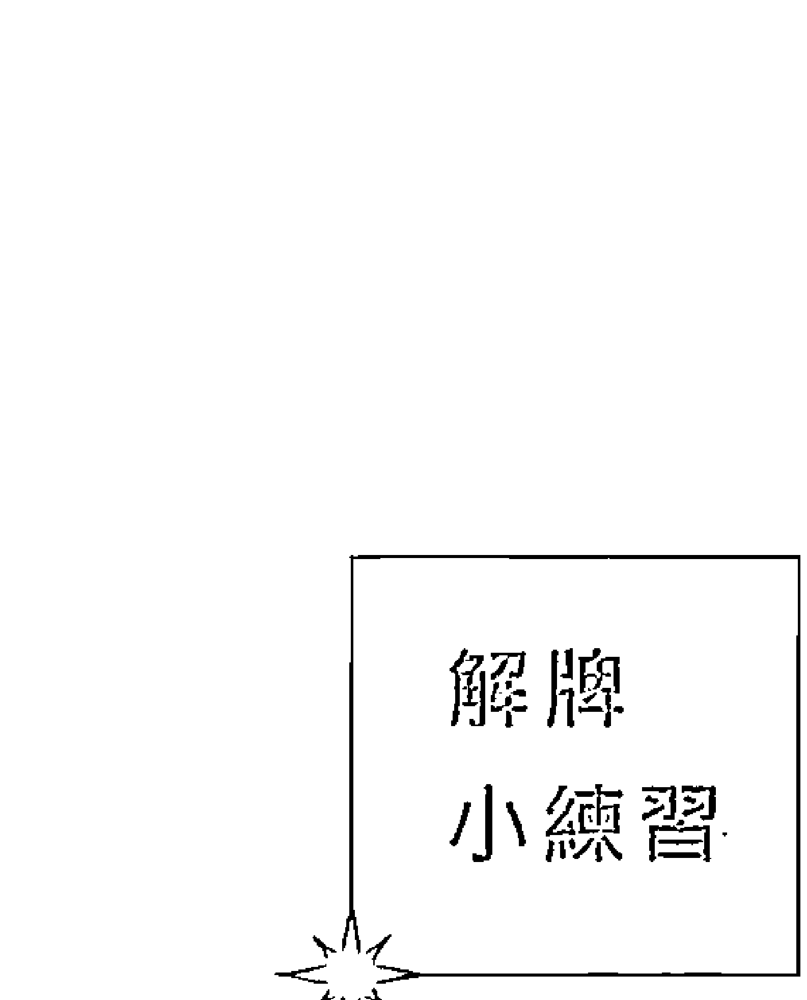

### 愛情：他現在對我的感覺如何？

他現在對你滿腦子就是想要吃喝玩樂，甚至可以強烈到想要發展親密行為的想法，不過在精神層面上就顯得相當薄弱。對他而言，現在並沒有想要好好的與你談場戀愛的想法，最多只是想要來個短暫的激情。

### 逆位圖像細節解析

- ◎ 切割上下重心在上
  - ◇ 男女：以人的慾望為主，表示慾望已經大於惡魔。
  - ◇ 火把：慾望被展現的更強大，需要消耗的東西更少。
  - ◇ 鐵鍊：更加強被慾望控制住的情形。
- ◎ 萬有引力關鍵掉落
  - ◇ 男女：掉下來顯示想逃亡，但這時反被鎖鍊勒住，代表想逃而逃不掉。
  - ◇ 逆五芒星變成正五芒星：代表很多的慾望想法，也相當於精神層面的慾望存在。

### 逆位人格特質：無法逃離的縱慾者

### 逆位圖像全面解析

原本被惡魔控制的男女現在拿到了控制權，連惡魔都淪為他們的階下囚，這也代表他們的慾望更加強，但雖然他們已經成為了惡魔的主人，但他们身上仍有枷鎖困住。他們與惡魔已經是密不可分的關係，就算他們現在想逃脫也就會被鎖鍊勒住而逃脫不了，而惡魔雖然已經為奴隸但仍會不斷的給予人們許多慾望的幻想，所以現在雖然人們不是惡魔的奴隸卻已經成為自己欲望的奴隸。

### 參考關鍵字

- 想逃離物質枷鎖（但還沒成功，或是脫離不了）
- 物質欲望加強
- 自我限制
- 精神凌駕外在（負面訊息）

解牌小練習

愛情：未來三個月工作狀況如何？

未來三個月，你的工作表現相當的好，對你來說，你的全部火力都是放在如何賺錢上面，因此你的工作狀態相當好，也可以有很好的收穫。只是因為你把太多心思放在上面而讓你自己其他的時間就被犧牲掉了，例如與家人相處時間或是健康。

## No. 16°

## 塔

## The Tower

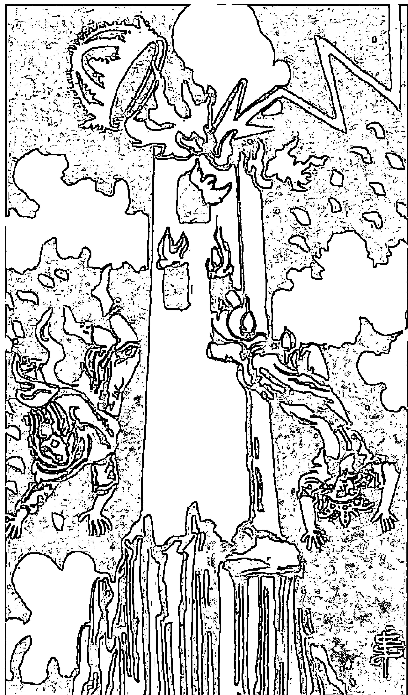

**对应占星 | 火星**

火星是代表快速破坏的一颗行星，会与健康、性、行动力有关。

**元素系统 | 火元素**

### 正位图像细节解析

- ◇ **塔**：一个被建立起来的物质世界，也表示是被累积起来的某些事情。
- ◇ **塔上方的皇冠**：代表荣耀或是身分地位，指向精神层次的特质。
- ◇ **右上方闪电**：快速破坏原本所建立起来的物质或是精神层面。
- ◇ **三个窗户**：代表身心灵世界。
- ◇ **窗户着火**：身心灵都被摧毁。
- ◇ **二十二道火焰**：代表大牌的二十二张都被摧毁。
- 男女往下跳：因为无法接受当下的状况而慌乱的跳楼，代表一个失控的状况。
- 黑色背景：相当大的压力。
- 云：有些事情是被遮蔽无法看清的。

### 正位人格特质：世界崩解的伤痛者

### 正位图像全面解析

一座被建立起来的塔，上面原本放着代表荣耀的皇冠，国王跟皇后幸福美满的住在里面。然而天有不测风云，突然之间一道闪电直劈过来，将这座塔一瞬间摧毁，在里面享乐的国王与皇后，在这震惊的状况下，来不及反应只好仓皇的从窗户跳出。这样的意外状况，不只是让国王与皇后长年累积起来的一切被摧毁，甚至连他们的生命都受到严重的伤害。

### 参考关键字

- 突发的状况
- 措手不及
- 打破旧观念
- 失去一切
- 稳定的生活消失
- 转换的变化
- 无法接受的情形
- 破产。

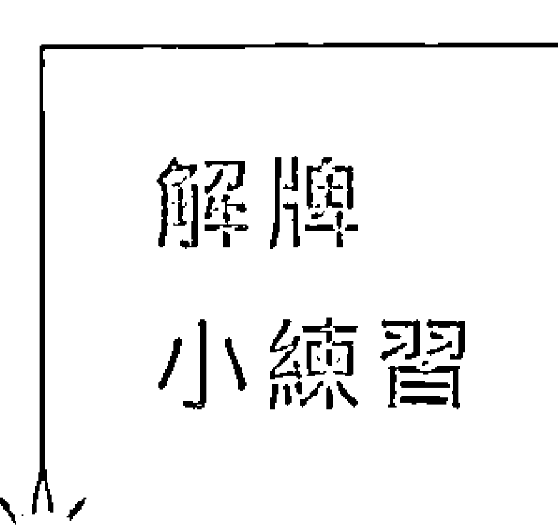

### 工作：未来三个月工作状况如何？

未来三个月内，工作上将会出现突如其来的意外。这些意外让你措手不及，而且会让你失去目前所有努力付出的一切，而这些状况，除了让你不知所措之外，可能还会让你连工作都不保，要多加留意，多加注意以免被这些意外打败了。

### 逆位圖像細節解析

- ◎ 切割上下重心在上
  - ◇ 基地：就算塔摧毀了至少還有基地在，表示事情不到最糟。
  - ◇ 男女：往上跳表示逃離現在的狀況。
  - ◇ 閃電：在下方變成較為弱，雖然仍有摧毀但傷害減輕。
  - ◇ 三個窗戶：一樣燃燒，但人先逃走表示狀況減緩。
  - ◇ 皇冠：仍是摧毀狀態，代表仍是有傷害存在。
- ◎ 建築崩毀訊息消失
  - ◇ 塔：原本會被摧毀的塔消失了，閃電打不到也表示不再會被摧毀。

### 逆位人格特質：逃離毀壞的避難者

### 逆位圖像全面解析

閃電仍是打到了塔，但裡面的人卻已經先行逃離，他們往上奮力一跳，雖然不知道之後是否是安全逃離還是又摔下來。但至少在這個雷電交加的時刻，他們跳脫出這些最緊急的危機，雖然仍看到既有的傷害與損失，但至少對於國王與皇后而言，他們已經逃離危機，可以看到他們的土地仍是存在的，等到災難過去後再重建一切就好。

### 參考關鍵字

- 毀壞
- 突發性的意外
- 想逃離現狀
- 預料的挑戰未到但已經想逃避
- 逃離災禍。

解牌小練習

### 愛情：未來三個月與另一半相處狀況如何？

未來三個月你與另一半相處上，可能會有一些意外狀況出現。這些意外狀況會讓兩人出現一些紛爭與不愉快的相處，不過因為兩個人會在當下好好的去處理這些突發的意外，所以雖然還是有些傷害，但至少是不會太嚴重的。

## No. 17° 星 The Star

对應占星 | 水瓶座

水瓶座有虛幻不確定的狀態，他通常是會有好結果但中間卻有不確定的訊息。

元素系統 | 風元素

### 正位圖像細節解析

- ◇ 黃色八芒星：北極星，指引方向。
- ◇ 七顆白星星：一周七天，代表創意的循環不斷。
- ◇ 星星特質：會閃爍，就像總會有許多創新的想法靈光乍現。
- ◇ 黃色頭髮：對未來充滿樂觀與期待。
- ◇ 兩手水瓶：水往陸地與湖泊倒，代表將期待放入現實與潛意識中。
- ◇ 全身赤裸：單純的想法與願望。

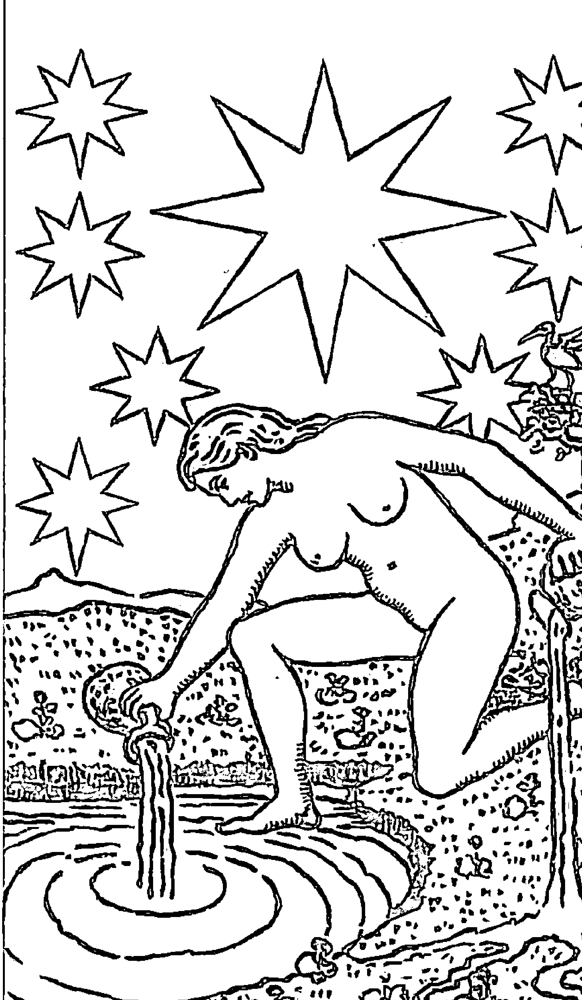

- ◇ 低頭注視：專注面對這件事，也表示對於願望很在乎。
- ◇ 腳沒有踏入水中：代表這個女生並非是現實真人，只是一個意象的表徵。
- ◇ 陸地的水流：有五條水流分別代表五感的落實（眼、耳、鼻、口、身）。
- ◇ 陸上花朵：願望正在實現當中，但仍未到達最完美階段。
- ◇ 遠方樹上小鳥：朱鷺，代表智慧。喜鵲，代表報喜，但離主角有點遠，表示還需要一點時間，但是往好的方面前進的。
- ◇ 夜晚：藍色代表寧靜。

### 正位人格特質：充滿希望的祈禱者

### 正位圖像全面解析

一個女生，正專注的將代表期望的水緩慢的倒入湖泊與陸地中，這代表她對於未來充滿了期待。她的腦海中對於未來是有所期待與方向，而且她也非常的聰明。

這些動作也代表她正在持續往對的方向前進，雖然代表成功的喜鵲離她仍有一段距離，但至少我們可以從地上長出的小草，知道這一切都是往好的方向前進。她正平靜的、繼續的專注於她所期待的事情上，等待一個好的結果出現。

### 參考關鍵字

- 一個希望
- 心中的想法
- 有信心
- 靈光閃現
- 好預兆
- 精神上的戀愛
- 一個未展開的規劃
- 各方面的平衡。

### 解牌小練習

### 愛情：他現在對我的感覺如何？

他現在對你的感覺相當的好，不只是在外在的互動上，連內心的感受也覺得兩個人之間的關係相當的契合。他會想要與你再往前進一步，雖然他還不知道該怎麼做，不過可以期待的是，他現在對你的感覺是往戀人的方向前進的。

### 逆位圖像細節解析

- ◎ 切割上下重心在上
  - ◇ 陸地：因為水會掉落所以只剩陸地，代表很重視現實層面，在與他人之間的關係中就成為只重視現實利益的關係。
- ◎ 萬有引力關鍵掉落
  - ◇ 湖泊：水全部掉下代表精神層面不再，只有剩下現實層面。
  - ◇ 壺中水：原本的期待都沒辦法落實在陸地及湖泊，代表期待落空。
- ◎ 日出日落光明黑暗
  - ◇ 北極星：指引方向能力消失，代表看不到未來。
  - ◇ 小星星：小星星消失代表沒有好的想法以及創意。
- ◎ 草木顛倒枯萎貧瘠
  - ◇ 樹木：枯萎後，鳥無法站立就飛走，代表沒有智慧或是不再有好運。

### 逆位人格特質：失去平衡的物欲者

### 逆位圖像全面解析

當時間過去夜晚即將變成白天，星星的消失，讓方向與目標跟著消失。期待的水流，無法落實到女生的現實與潛意識當中，那些她所期待的希望與智慧都離她遠去。

現在的她，只能夠把重心放在眼前可以得到的事情上面，除此之外再也沒有希望與未來。也因為所見的一切，都已經不平衡，她的生活中也跟著失去平衡，除了感嘆運氣不好外，她也只能說也許是自己想太多了。

參考關鍵字 沒有希望、不當的期望、偏物質的想法、運氣不好、不平衡的友誼或情感。

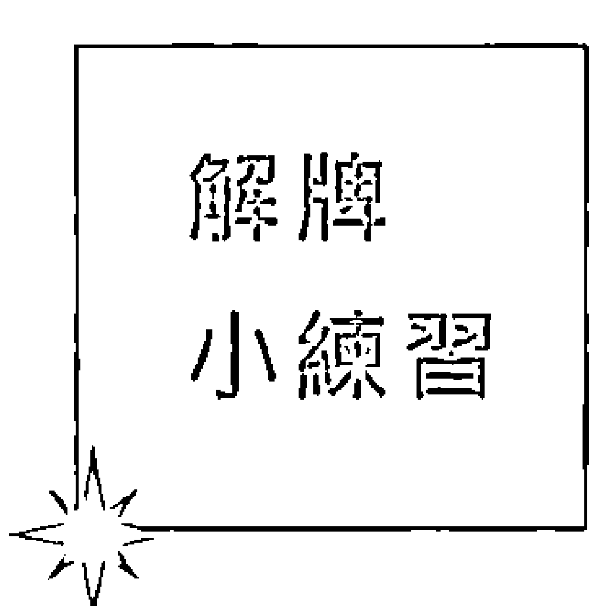

工作：未來三個月工作狀況如何？未來三個月工作在原本既定的目標上是容易有問題導致於你無法得到相對的目標達成，雖然在手中的工作還是可以有還不錯的表現與收穫，但長期的目標卻是因為方向錯誤而導致於許多的問題出現，整體的工作狀況就只能以努力完成現有的短期目標為主，雖然不到糟但也只能說勉強及格。

## No. 18°

## 月亮

## The Moon

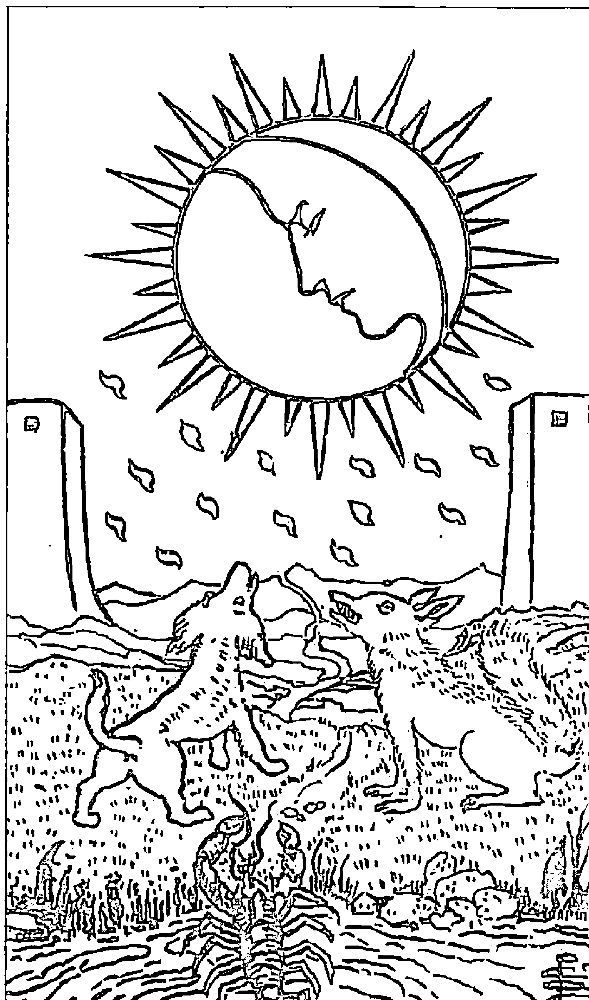

對應占星｜雙魚座

雙魚座較容易有憂鬱的狀態，也容易往負面發展的情形。

元素系統｜水元素

### 正位圖像細節解析

- 月亮：有弦月與滿月代表變化多端，也是一個難以捉摸的概念。
- 月亮中女子：月亮女神阿提密斯，代表可以搞曖昧但是不婚。
- 眼睛深閉皺眉頭：不安的情緒與不願意面對事情真相。
- 月亮的光芒：配合上下方黃點的霧，顯示出許多虛幻不實的光芒，也表示有許多不真實的事情存在。
- 黃色點：共十五個，對應到惡魔（15 號牌）的慾望特質，表示被自己的慾望所蒙蔽，產生看不清楚事實的真相。
- 陸地前後顏色不一：後面較褐色的地方，是被霧遮住的地方。代表有許多事情看不清楚。
- 塔：代表危機，但被霧隱藏起來了，也就表示有隱藏的危機或敵人。
- 左狗右狼：狗代表馴化過的特質（經驗），狼代表原始的特質（欲望），這兩隻動物都對月亮咆哮，代表有警告危險的訊息。
- 螯蝦：甲殼類動物遇到危險會退縮，代表不敢前進。
- 水：潛意識，代表螯蝦退回潛意識不願意前進。
- 道路：一個前進的方向，但一方面螯蝦退縮不敢前進，又被霧遮住，因此代表前途未卜。
- 背景：藍色原本代表冷靜，但因為被霧包圍會變成無法動彈。

### 正位人格特質：陰暗不明的詭計者

## 正位圖像全面解析 ——

在一個充滿大霧的夜晚，月亮在霧的後方，產生許多朦朧不確定的光，這一切看起來都變得虛幻不實。因為有許多不確定的事情，被隱藏在霧的後面，讓整個氛圍都變得相當的詭譎。連狼、狗都對這樣的狀態產生警覺而咆哮。

雖然我們的意識層面想要往前進，卻被周遭的氣氛影響變成害怕不安，甚至連前進的動力都消失了。接下來我們不知道會發生什麼事？就只能在這不安的氣氛中擔憂。

## 參考關鍵字 ——

- 害怕
- 孤單
- 有危險的
- 不婚
- 曖昧不明的狀況
- 騙局
- 隱藏起來的敵人
- 出現幻覺
- 神秘的力量（不穩定的）。

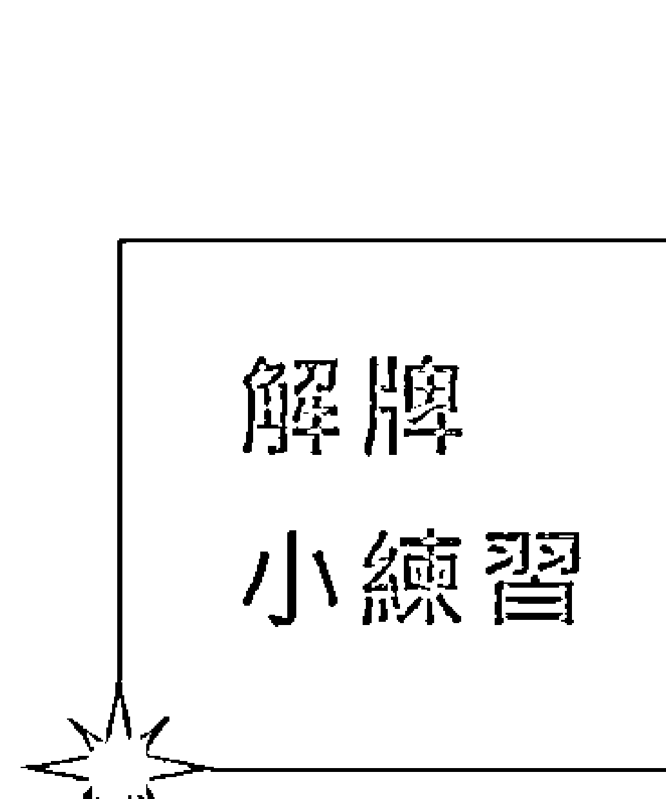

### 愛情：他現在對我的感覺如何？

他現在對你的感覺其實滿模糊的，似乎有些不安，也有些不想要表達出來的情緒，而這些不安的情緒，大多會被歸類成為對你的不了解，或是你的一些行為讓他覺得不是很妥當，因此他有些欣賞你，但是還不到很喜歡的程度。

### 逆位圖像細節解析

- ◎ 切割上下重心在上
  - ◇ 鰲蝦：不管如何還是得面對自己要前進的事。
- ◎ 萬有引力關鍵掉落
  - ◇ 鰲蝦：往下掉也看似走在道路上，表示不得不面對未來。
  - ◇ 狼與狗：沒有咆哮代表危機消失，所有的恐懼跟著消失。
  - ◇ 水：水掉落後鰲蝦無處可逃，就只能面對恐懼。
- ◎ 日出日落光明黑暗
  - ◇ 月亮：即將變成太陽，代表黑暗即將過去，新的未來即將到來。
  - ◇ 霧：因為月亮要變成太陽，因此霧會消失，代表那些迷惑之事都將被蒸發，也表示那些不確定的都明確化了。原本隱藏在霧後面的塔也出現了，代表那些隱藏起來的危險也被發現。
- ◎ 建築崩毀訊息消失
  - ◇ 塔：原本代表危險的塔在這裡消失了，就表示沒有危險。

### 逆位人格特質：突破黑暗的新生者

### 逆位圖像全面解析

月亮即將下降，太陽即將升起，那些原本迷惑我們的霧，也被即將升起的太陽蒸發了。躲在霧後面原本模糊不清的事情都已經一一的呈現，那些讓我們害怕與恐懼的事情也都明朗化。

眼見光明即將來到，狼與狗也就不需要再咆哮警告。一切似乎即將走到全新的一頁，而原本內心害怕恐懼的螯蝦，現在也可以繼續往前進了，不管是自己願意或是被迫前進，至少已經不再退縮。

### 參考關鍵字

- 新的開始
- 識破詭計
- 黑暗即將過去但必須先勇敢面對現在
- 不被當前迷惑。

解牌小練習

### 工作：未來三個月工作狀況如何？

未來三個月內你的工作將會有許多的麻煩存在，這些麻煩會讓你疲於奔命，但對你來說這也是不斷鍛鍊你的一個機會，相當大的機會可以看到你的努力將會慢慢的將這些問題逐漸處理掉，雖然還是很多辛苦面存在，但已經慢慢可以看到未來了。

## No. 19°

## 太陽

## The Sun

對應占星｜太陽

太陽就是一個單純及直接的狀態，也是表面可以看到最單純的特質，一般在問你是什麼星座？指的就是你的太陽進入哪個星座。

元素系統｜火元素

### 正位圖像細節解析

- 太陽：光明、照耀前方的路，也代表未來一片光明。
- 太陽光芒：直線代表直接照耀，曲線代表照耀到直線照不到的地方。
- 光芒數字：二十一道光芒代表大牌的數字學，也表示一切都是朝正向前進。
- 四朵向日葵：四元素均向著小孩，也代表小孩的光芒大於太陽的光芒。

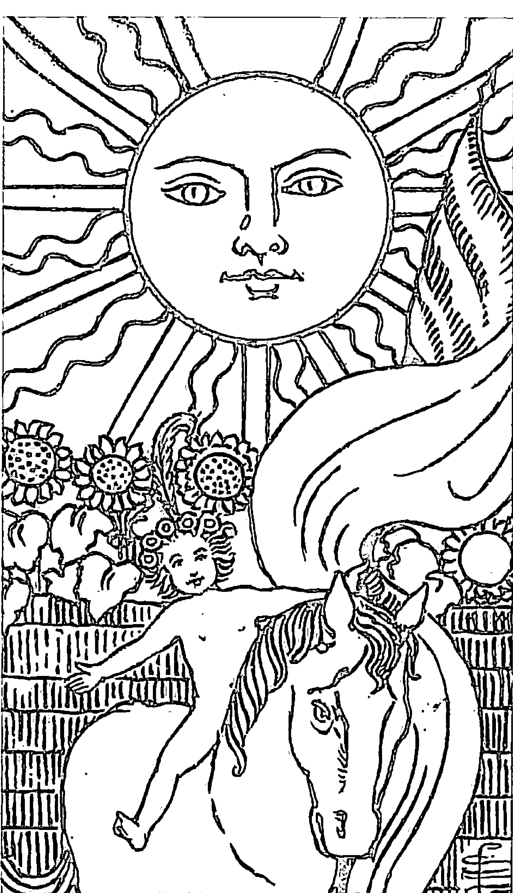

- 小孩雙手張開：全然的接受接下來的一切。
- 手拿旗幟：向前進的力量，也是宣揚一個勇往直前的意念，紅色代表熱情。
- 頭上羽毛：火鳳凰羽毛，代表重生的力量，也是全新的想法。
- 白馬：單純純潔的前進。
- 灰色牆：已經被跨越，代表跨越舊有的一切前往全新的階段。

### 正位人格特質：光明向前的正念者

### 正位圖像全面解析

一個充滿全新活力的小孩，騎在一匹白馬上，他跨越了代表舊時代的牆，勇往直前，這也代表他現在對於未來將會是勇往直前的態度。

從向日葵是迎向他的角度來說，就算是太陽的活力都已經比不上他了，拿著大旗幟，似乎正在宣告現在就讓我們前進吧！而全身赤裸以及白馬，都顯示出他是很單純及清楚的往前進而沒有太多負面的想法。

### 參考關鍵字

- 友誼
- 愛情
- 光明正大面對
- 熱情
- 有希望
- 開朗
- 純潔
- 一段美好旅程開始
- 婚約的前端
- 訂婚。

解牌小練習

### 工作：未來三個月該用什麼態度面對老闆才能讓我們關係變好？

未來三個月，建議你可以跟老闆之間有話就直說，直來直往不要耍任何的心機。與老闆之間，就是沒有任何秘密，並且讓老闆看到你開朗活潑的特質。在工作上，也是需要勇往直前，讓老闆看到你強烈進取的才華，這樣關係就會變好了。

### 逆位圖像細節解析

- ◎ 切割上下重心在上
  - ◇ 白馬：仍然純潔的訊息。
  - ◇ 小孩：單純的想法。
- ◎ 萬有引力關鍵掉落
  - ◇ 旗幟：原本向前的訊息消失，代表計畫取消了。
- ◎ 日出日落光明黑暗
  - ◇ 太陽：即將降落變成月亮，一些陰暗不明的狀況即將出現。
- ◎ 草木顛倒枯萎貧瘠
  - ◇ 向日葵：枯萎之後代表原本正向的狀態消失，也表示小孩子光明能量不強。
- ◎ 建築崩毀訊息消失
  - ◇ 牆壁：原本一個跨越的動作變成沒有跨越，表示沒有突破的階段。

每個物件變不好或消失，但剩下的都仍為正向的訊息，因此只是狀況沒有那麼好，但基本上仍是還算可以的狀況。

### 逆位人格特質：正常生活的一般人

### 逆位圖像全面解析

太陽即將下降，一些原本代表正面的訊息也逐漸凋零，不管是向日葵或是小孩子的羽毛都代表許多事情正往不好的地方前進。

但不管如何，還是有一些不錯的訊息存在，所以雖然事情有點不樂觀，但至少還是可以看到白馬或是小朋友的正向訊息，除非你看到了旗幟掉落，那麼就可以說是一件事被取消，否則整體來說也還算是正面喔。

### 參考關鍵字

- 一個計畫被取消
- 友誼存在
- 遲來的成功
- 仍有期待
- 未來值得擔憂
- 有些陰影即將到來

> > **解牌小練習**
>
> 考試：明天考試的結果如何？
>
> 明天你的考試狀況雖然不是完美的，但至少該做的還是都有做完，基本的分數都有拿到，雖然不是最高分的人，但也是及格以上的狀況，所以只要繼續努力照目前的狀況去做，明天考試結果還不錯喔。

## No. 20°

## 审判

## Judgement

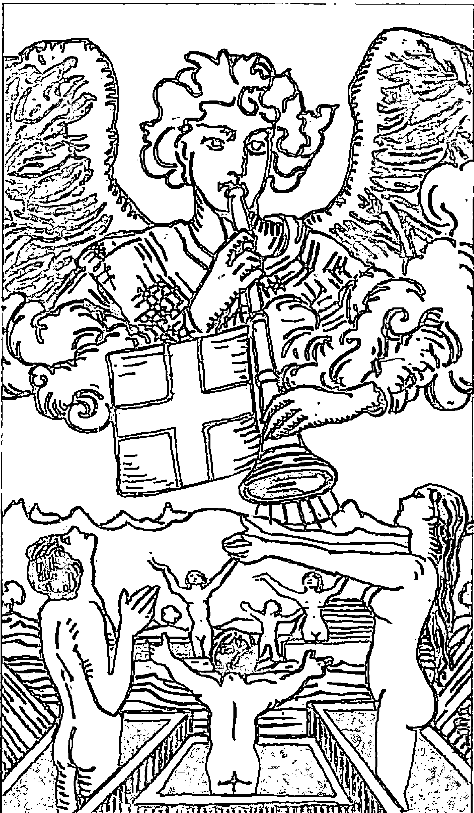

对应占星 | 冥王星

冥王星代表一个结束的状态并且往下一个阶段前进的模式。

元素系统 | 火水元素

### 正位图像细节解析

- 天使：大天使加百列，传达讯息的天使，也是死亡天使。
- 紫红色翅膀：智慧与行动力均衡。
- 号角：出征的意涵。
- 号角上旗帜：代表业力平衡，也是中古世纪十字军东征时的旗帜。
- 号角前七条线：一说法为七音阶，也是代表涵盖所有一切的音韵，一说法为七原罪，将七原罪传达出来并且为此而付出代价。
- 六個人：代表亡者，並放在棺木當中，也表示接受了七原罪最後死亡。
- 左邊男生：手收斂代表外在的不敢接受現實。
- 右邊女生：手敞開代表內在接受所有的事實。
- 中間小孩：接受業力平衡後的重生。
- 河流：冥河，也代表一個結束的過程。

### 正位人格特質：面對業力的自省者

### 正位圖像全面解析

在棺木中的人們，代表將過去的一切放下，他們之前的人生旅程已經結束了。而現在由天使所帶來的訊息，告知他們準備起來接受最後的審判，這也代表要承擔自己過去所做的一切。

審判完接著準備往新的人生旅程前進，雖然過去一切已經結束，但唯有放下那些臭皮囊，才讓心自由，才可以往新的世界前進，目前看起來他們正是走在這條正確的路上。

### 參考關鍵字

- 面對贖罪
- 悔改
- 被祝福的新生
- 一段新的開始
- 面對死亡（心情的變化）。

### 愛情：他現在對我的感覺如何？

他現在對你的感覺正在改觀當中，過去可能有來自於他人或是他自己觀察的經驗，讓他對你的觀感是不好的。但目前這些狀況正在改善當中，似乎正在慢慢地往正向的方向前進，也表示他對你的好感，正在持續向上中。

### 逆位圖像細節解析

- ◎ 切割上下重心在上
  - ◇ 死人：只在乎那些該被結束該放下的事。
- ◎ 萬有引力關鍵掉落
  - ◇ 死人：從棺木掉出來，代表不願意面對那些該被結束的事。
  - ◇ 棺木：陪葬品掉出來，代表被盜墓，也是偷竊的意思。
  - ◇ 冥河：水掉落后代表無法進入到下一個階段，也表示不願意面對死亡這件事。
  - ◎ 旗幟：變成降旗，也是不再講求業力平衡。
  - ◇ 天使：變惡魔後，所謂的號角響起，即是鼓勵人們繼續墮落。

### 逆位人格特質：不願悔改的逃離者

### 逆位圖像全面解析

所有的人都不願意面對死亡，因此總是千方百計想要從死亡的墳墓中逃脫。墮落的天使吹響號角，並非是鼓勵人們重生，反而只是鼓勵人們繼續墮落、繼續留在所有的貪嗔癡當中。

當人們持續面對那些他們的欲望，卻忽略了其實他的肉體／外在已經死亡只剩內在不斷的糾葛。直到最後發現一切早已失去，那時也許才能從失望中真實的知道一切已經無法重生了。

### 參考關鍵字

- 不受祝福的
- 無法重生
- 不能徹底面對過去的問題
- 失望的情緒
- 竊盜（精神與物質的）

### 工作：未來三個月工作狀況如何？

未來三個月，你的工作將會有較大的機會陷入過去一些以為已經結束的專案問題中。這些問題重新的到來，讓你需要花更多的時間去處理，這樣不只是讓你無法去做現在手邊的工作，還會因此而更加心煩於那些早該放下的事情當中。

# No. 21°

# 世界

# The World

對應占星 | 土星

土星是磨難的象徵，代表是一個辛苦的狀態，但突破之後將會有好的成就出現。

元素系統 | 土元素

### 正位圖像細節解析

- 四個角落動物：如同命運之輪一樣的四元素，只是現在沒有讀書，這也代表已經進入完成階段，不需要再學習了。
- 桂冠：代表榮耀的意思。
- 上下紅色緞帶：無限標誌，與桂冠一起解讀代表無限的榮耀。
- 裸女：其實是男女合體，代表經由長時間磨練得到最後完美的結果。
- 權杖：兩隻權杖，印證這個人是男女合體的訊息，因為一個人只會拿一根權杖，而這位主角卻是拿著兩根權杖，代表男女結合。
- ◇ 紫色絲綢：像煙一樣的向上飄，也表示精神層面是存在的。
- ◇ 腳的姿勢：也是成為 4 的數字，代表堅持到最後。

### 正位人格特質：苦難中茁壯的成功者

### 正位圖像全面解析

一個國王失去了他的皇后，為了可以永遠在一起，而要求煉金術士將他們合為一體。過程當中相當的複雜及辛苦，但最後兩人終於在一縷輕煙中展現出合為一體的完美象徵。

榮耀的桂冠及四元素的完成，都說明了現在國王與皇后兩個人將可以永遠的在一起不再分離。也表示一件事情，經過辛苦的過程，終於達到令人滿意的結果。

### 參考關鍵字

完美、一個旅程的終點、努力後的報酬、永恆的力量、昇華、一個成就的出現、兩情相悅。

解牌小練習

愛情：他現在對我的感覺如何？
過去他對你的感覺，可能還在評估的階段，但在長時間的相處中，他逐漸對你產生好感，也因為這樣的好感，慢慢的產生讓他有想要與你再更進一步發展的想法出現。現在的他，已經對你越來越喜歡，甚至明確的想要在一起。

### 逆位圖像細節解析

◎ 切割上下重心在上
- ◇ 腳的姿勢：變倒吊人，也表示被綁住無法成行，顯示失敗的狀況。

◎ 萬有引力關鍵掉落
- ◇ 權杖：掉落任一隻權杖，都讓原本完整結合的訊息變成不完美，無法掌控最後階段。
- ◇ 絲綢：像煙一般往下降，代表較偏物質層面(但仍有精神存在)。
桂冠與無限標誌、四元素在逆位仍為正常狀況，故仍為完美狀態，頂多只有人顛倒過來代表不夠完美。

### 逆位人格特質：經歷苦難的成功者

### 逆位圖像全面解析

雖然現在人顛倒過來了，看起來不像正位那麼完美，但至少四元素該學習該努力的都學完了。榮耀的桂冠仍是存在，一切仍是好的訊息。雖然絲綢往下飄就像精神比較落地的務實面，但他仍是向煙一樣的精神層次，除非手中權杖掉落，讓原本美好的結合變成失敗的模式，否則世界的逆位仍是帶有很好的成功結果。

### 參考關鍵字

- 不夠完美(但仍有完成的訊息)、失望的訊息、沒有達成的狀態、精神層次不夠高。

解牌小練習

### 工作：未來三個月工作狀況如何？

未來的三個月內，你的工作狀況將會需要付出相當多的努力，雖然結果不會如同預期般的完美。但至少這還是一個很不錯的成就，只要不是太過吹毛求疵的態度，你會發現，其實未來三個月的表現還是相當的好，也許有些小專案被取消，但大部分的工作都還是可以被完成。

塔羅解謎
TAROT BOOK
108

No. 22

## 小牌

比較偏向物質的層面

會分成四個元素

代表在西方世界的所有一切的物質

## 小牌系統介紹：

在西方世界中，將整個世界的設定由四大元素來構成，因此在大牌整個精神層面的理解後，小牌就是進入到物質的世界，所以每張牌都會有他的數字概念存在，不用死背，以理解的方式去了解就好。

- ❖ 火元素：牌當中以權杖展現，代表行動力與方向，也是跟活力有關的狀態。
- ❖ 風元素：牌當中以寶劍展現，代表智慧與想法，也是思考邏輯的特質。
- ❖ 水元素：牌當中以聖杯展現，代表情感與感受力，也是跟內在潛意識有關。
- ❖ 土元素：牌當中以金幣展現，代表務實與物質的世界，也是持續力的特質。

不同元素間的數字當中有其共通的概念，這會與生命靈數有部分訊息相似。

- ❖ 數字一：全新的開始，從無到有。
- ❖ 數字二：兩股勢力的關係變化。
- ❖ 數字三：團隊的交流與共識。
- ❖ 數字四：穩定的特質，基礎的狀態。
- ❖ 數字五：不同想法產生衝突與混亂。
- ❖ 數字六：單方付出或是分享的狀態（外在的付出）。
- ❖ 數字七：思索，以及為夢想前進（內在的選擇）。
- ❖數字八：重新評估與思考抉擇。
- ❖數字九：努力後的成果展現。
- ❖數字十：完美的結束，準備下階段。

在十個數字後還會有宮廷牌，這是指向在一個宮殿當中有四個階級，而這四個階級在其位階上及配合元素上會產生許多有趣的人格特質，在解析的時候重心是要去思考這個位階的這個人他有怎麼樣的個性與行為模式，只要能了解這個，解析牌義就會簡單許多。

- ❖侍者特質：年輕的、剛開始、不穩定的、基礎。
- ❖騎士特質：成長的、前進動力、中階段。
- ❖皇后特質：成熟的、母愛型、女性特質、慈愛型。
- ❖國王特質：成熟的、父愛型、男性特質、穩重型。

至於在解牌上將會開始進入小牌陣的使用技巧，為求使用更加順手將會在78張牌義學完之後一起與大家討論解牌技巧。

## 聖杯一
Ace Cups

### 正位图像细节解析

- 白鸽：纯洁的圣灵，代表一个来自于上天的使者（天使）。
- 圆饼：圣体（耶稣），也就是礼物。
- 云中伸出的手：用捧的方式为呵护型的，代表十分呵护这一个感受。
- 颠倒 M：womb（子宫）以及 Maria（抹大拉的玛利亚），代表阴性的能量，也是一个承接情感的容器。
- 铃铛：注重细小的感觉。
- ◇ 五條水柱：五種感覺滿溢出來。
- ◇ 湖泊：睡蓮原本平靜的情緒，受到水流的影響產生情感的波動。
- ◇ 26 個水滴：代表 22 張大牌與 4 元素都是滿滿的情感。
- ◇ 對應希臘諸神：美神阿芙羅黛蒂。

### 正位特質：豐盛情感的感受

### 正位圖像全面解析

一隻十分重視情感的手，捧著代表承接情感的杯子。杯子本來就是滿溢的水，這時有個外來的禮物到來，讓原本就滿滿的情感在這時因為這個的人事物而感受到豐盛的情感。五感的情緒滿溢出來，降落在自己原本平靜的心中，讓心因此活躍了起來，看來這是一個很美好的感覺，也是一個全新的美好感受。

### 參考關鍵字

注重感情、情感豐盛、一個感受。

### 逆位圖像細節解析

◎ 切割上下重心在上
- ◇ 湖泊：重視自己的情感，但水往下掉就成了情感流失。
◎ 萬有引力關鍵掉落
- ◇ 湖泊：水掉落代表情感流失。
- ◇ 聖杯：掉落後代表不願意去承接任何物品，代表不注重情感。
- ◇ 聖體：白鴿銜接後又掉下去，不讓任何物品進入心中。
- ◇ 水滴：無法進入情感中，失去情感的流入。

### 逆位特质：不再重视感受面

### 逆位图像全面解析

这只手往下，让手中的杯子掉落，代表他不愿意再用杯子去承接任何的情感。就算鸽子衔再多的人事物来到，都会因为他不愿意接受而流失，这就像是心已经不愿意再接受任何情感的行为，既然不愿意再注重，自然就没有太多的情感与感受面。

### 参考关键字

- 情感的流失、不注重感受、失去目前拥有的、期望落空。

## 聖杯二 Two Cups

### 正位圖像細節解析

以下四個元素統合一起看代表所有的都一應俱全

- 獅子頭：火元素 - 前進及表達自我的力量。
- 翅膀：風元素 - 思考與智慧。
- 蛇與權杖：土元素 - 也是賀密斯權杖，代表療癒的力量。
- 聖杯：水元素 - 情感的流通。
- 男生：頭上紅玫瑰代表熱情、主動的想法，身上黃色底衣服代表對未來有所期待，而黑色花朵代表還未完成，紅色渲染則是為了理想願意努力付出，身體往前傾、手往前拿取女生的杯子代表交換彼此之間的情感。
- ◇ 女生：頭上榮耀桂冠代表很重視榮耀，身上藍色衣服代表冷靜的面對，但紅色的鞋子代表其實她還是願意前進的，只是會比較含蓄。
- ◇ 遠方房子：穩固的基礎，也表示兩人之間的關係可以是穩定的。

### 正位特質：美好的情感交流

### 正位圖像全面解析

一對情侶將彼此手中的聖杯（情感）進行交換的動作，這也表示他們現在情感交流是十分良好的。雖然以動作上來說，男生的肢體動作較有前進的行為，但實際上從女生紅色的鞋子來看，女生也是願意向前的。只是在動作上比較含蓄一點，兩人的交流是互相的也是開心的，因為四元素全部都已經具備完成，他們正準備享受美好的一切。

### 參考關鍵字

- 一段戀情
- 一個合作的象徵
- 情感交融
- 平等的對待。

### 逆位圖像細節解析

◎ 切割上下重心在上
- ◇ 四元素在下：具備一事已變成不重要，兩人之間的關係已經不完美。
- ◇ 兩人的腳：男生的腳仍是往前走，但女生的鞋子顏色已經消失代表兩人之間關係不平等。

◎ 萬有引力關鍵掉落
- ♢ 聖杯的水：倒落，雖然仍有交流的動作，但當中已無情感存在。
- ♢ 花冠掉落：不熱情也不榮耀，表示兩人間的都沒有想法。
◎ 建築崩毀訊息消失
- ♢ 房子：崩解後代表關係已經分裂或是被破壞。

### 逆位特質：失去平衡的交流

### 逆位圖像全面解析

現在兩個人之間雖然還是有交換聖杯，但卻是沒有情感存在。對於交流既然沒有情感，也就代表關係並不融洽，也許是只有一方有行動，而另一方沒有行動？或是其實他們之間，根本不注重相處的模式，兩人之間的關係，已經只剩表面的交流，而沒有真實的情感，就像崩解的房子一般隨時都會毀壞。

### 參考關鍵字

一段不平等的對待、失去現有的、外遇的可能、分手、吵架。

## 聖杯三
Three Cups

### 正位圖像細節解析

- 聖杯高舉：一件事情大家有了共識，舉杯慶祝。
- 衣服：三種不同顏色衣服，代表這原本並非是同一個團隊，但現在在一起共事。
- 手握葡萄：豐收，也代表一件事有了成果。
- 地上果實：豐收，過去的努力有了收穫。
- 跳舞：三個人之間的關係融洽，似乎在愉悅的享受這一切。

### 正位特質：歡慶鼓舞的豐收

### 正位圖像全面解析

這三個人從她們身上的穿著看起來，應該是來自於不同的地方。他們有共識的一起努力去耕耘，而如今地上已經收穫滿滿，甚至可以摘下甜美的果實，這一切是如此的美好，因此他們高舉酒杯來慶祝這個豐盛的收成，也慶祝他們一起努力的成就。但我們不確定背對我們的是男生還是女生，如果是男生，那麼也許有暗喻著一個男生與兩個女生快樂的互動。

### 參考關鍵字

歡愉的、達成共識、一場宴會、第三者（隱含，訊息不強）。

### 逆位圖像細節解析

◎ 切割上下重心在上
- ◇ 果實在上：代表只重視利益或物質的層面。
- ◇ 紅衣人腳的方向：有先向一方向前進突然轉彎的狀態，代表變心的情況。
◎ 萬有引力關鍵掉落
- ◇ 果實掉落：代表玩過頭，讓果實掉了，也表示過度享樂失去擁有的。
- ◇ 聖杯內的水：掉落，代表三人間的互動是沒有情感的，只是物質交流。
- ◇ 任何一人掉落：都代表原本關係破裂。
◎ 草木顛倒枯萎貧瘠
- ◇ 果實：枯萎代表失去原本預期的收穫，因此而痛苦。

### 逆位特質：失去擁有的悲哀

### 逆位圖像全面解析

這三個人認為現在是豐收的時刻，他們想要開心的享受一切，卻沒注意到該收成的時間。結果因為忽略，導致於瓜果通通枯萎掉落。杯中的水掉落，也表示彼此之間變成不再有情感交流。原本可以盡情享受的盛宴，也就成了彼此不愉快的爭論。甚至因為彼此沒有情感，紅色衣服的人，他的腳步讓我們懷疑他只是想要在兩人之間周旋，看看是否有好處可拿。也許最後其中一個人會因為傷心、難過而離開，讓這個原本平衡的關係出現裂痕。

### 參考關鍵字

第三者的破壞、不愉快的相處、各懷鬼胎、自私的想法、背叛、樂極生悲、失去享樂後的苦痛。

## 聖杯四

Four Cups

### 正位圖像細節解析

- 樹木：可依靠的地方，代表現在正在休息。
- 雲中的手：外來的誘惑，一些不明确或虚幻的引誘。
- 地上三個聖杯：現有的，原有的。
- 人坐在地上雙手交叉：並沒有打開心胸接受任何一件事。
- 人雙腳盤腿：沒有行動力。
- 衣服：紅色行動力外用黃色作一個區隔，代表行動力是保留的。
- 眼睛：閉起來有思考或是在睡覺作夢的可能。

### 正位特質：思考誘惑的挑戰

### 正位圖像全面解析

這個旅人現在正靠在樹旁休息中，他把他原有的聖杯放在草地上。在休息的時候，不知道是因為做夢了還是真的從雲中伸出一隻手，這隻手上面拿著一個聖杯，似乎是要給予這個旅人一個新的感受。然而對於旅人來說，如果他接受了這個新的事物，他就得把舊的放在原地，這樣需要抉擇的事情，他現在還沒決定，正在猶豫當中。

### 參考關鍵字

面對誘惑 (思考中) 、外來的誘惑、第三者的出現、冷淡的面對事情 (有抑制的狀況) 、白日夢。

### 逆位圖像細節解析

◎ 切割上下重心在上
- ◇ 三個聖杯：以舊有的為主，不願意接受外來的誘惑。
◎ 萬有引力關鍵掉落
- ◇ 人的坐姿：沒辦法再盤腿，代表必須前進。
- ◇ 原本三個聖杯：掉落則是選擇新的誘惑而放棄舊有的。
- ◇ 雲朵：消失也表示聖杯消失，代表外在誘惑消失，也可說夢醒了。
◎ 草木顛倒枯萎貧瘠
- ◇ 樹木：枯萎無法再依靠休息，只能向前進。
◎ 顏色壓制逆位展現
- ◇ 黃色衣服壓制掉落：紅色展現行動力，代表前進不猶豫。

### 逆位特質：接受選擇的決定

### 逆位圖像全面解析

原本可以倚靠休息的樹木枯萎了，現在旅人必須起身向前。這時他就只能從現有的三個聖杯以及外來的一個聖杯中選擇一組帶走，不管是要選擇哪一組，他都必須要放下另一組，當然如果他原本只是作夢，那麼現在也得前進了，夢也就醒了。

### 參考關鍵字

不猶豫的行動、沒有外來的誘惑、拒絕邀請（誘惑）、接受外來的誘惑而放棄就有的生活、夢境清醒。

# 聖杯五
## Five Cups

### 正位圖像細節解析

- ♦ 黑衣服：黑色代表壓力相當的大。
- ♦ 低頭向下：看到翻覆的聖杯，代表重視那些失去的。
- ♦ 杯中水：多種顏色表示失去各式的期待。
- ♦ 河流與房子：想回家卻只看到被河流隔絕的狀態。
- ♦ 背後兩個聖杯：仍存在的、擁有的。
- ♦ 橋：可藉由過橋回家。

### 正位特質：在乎失去的懊悔

### 正位圖像全面解析

這個人眼前的三個杯子倒掉了，那些他所期待的事情也就失去了。他把重心都放在那些失去的事情上面，看起來他顯得憂心重重，但卻忽略了其實他身後還有兩個完好如初的聖杯。

就像是他想要回到眼前的家，卻只看到河流的阻隔，讓他無法回家而忽略了。其實轉個角度去看，就可以看到有座橋，可以協助他回到溫暖的家。

### 參考關鍵字

悲傷的感覺、失去的懊悔、注視失去卻忽略擁有。

### 逆位圖像細節解析

⦿ 切割上下重心在上
五個杯子都倒掉，變成更嚴重，也更加強失敗的狀況。

⦿ 萬有引力關鍵掉落
原本好的聖杯也掉落，表示錯誤的在乎，導致更嚴重的狀態出現。

⦿ 建築崩毀訊息消失
◇ 橋與房子：因為沒用正確的方法導致於橋毀了、房子也毀了，就變成無法再回到家。

### 逆位特质：失去一切的悔恨

### 逆位图像全面解析

这个人因为把重心都放在失去的三个杯子上，这样的想法，导致他忽略了身后的两个杯子。而后面两个杯子，也因此就出现了意外导致倾倒。对于这种因为放错重点，导致事情会变成更加严重的状况，让这个人心情变更沉重。

### 参考关键字

错误的想法（将导致更糟的情形）、更加强懊悔的解释部分。

## 聖杯六

Six Cups

### 正位圖像細節解析

- ◇ 城堡：一個受守護的地方，也是小時候被家庭呵護的象徵。
- ◇ 聖杯有花：純潔的百合，表示這個情感是無私付出而非有目的的。
- ◇ 黃色土地：一個讓人感覺充滿喜悅的地方。
- ◇ 小男生：從上而下給予聖杯，代表無私的付出。
- ◇ 小女生：從下而上準備接受聖杯，代表兩人關係相當良好。
- ◇ 手持矛的衛兵：守護這段記憶中的美好回憶。

### 正位特质：美好的童年回忆

### 正位图像全面解析

长大成人的我们，就像是那位手持矛的卫兵一样，在我们的回忆深处都有小时候许多美好的记忆。而在这些美好的记忆里，有许多无私的付出与接受，那都是我们长大后所没有的美好感受。我们小心翼翼的守护这样的一个感受，希望不要被长大后的环境给污染了，这样每当在我们辛苦时，就可以偶尔回到这样美好的日子里陶醉一下。

### 参考关键字

美好的回忆、活在过去、一个无暇的付出、童年、家乡的回忆。

### 逆位图像细节解析

- ◎ 切割上下重心在上
  - ◇ 小女生：在上，变成小男生从小女生手中抢夺走圣杯。
- ◎ 万有引力关键掉落
  - ◇ 纯白的百合掉落：表示两人之间的互动不再纯洁、单纯。
  - ◇ 守卫掉落：也表示无法再守住过去美好的回忆。
- ◎ 建筑崩毁讯息消失
  - ◇ 城堡摧毁：旧有回忆消失，以及不再有守护的讯息。

### 逆位特质：痛苦不堪的回忆

### 逆位图像全面解析

那些过去小时候被抢夺、被欺负的回忆开始浮现出来，这样的记忆，会让我感觉到相当的痛苦。隔壁的大哥哥，故意从我的手中抢走我心爱的杯子，这都是我痛苦的回忆。原本想要小心翼翼守护的记忆，也因为这些负面记忆突然的浮现变成了不想再想起，现在的我，只好努力离开这个记忆的深处，重新回到大人世界努力向前吧。

### 参考关键字

不好的回忆、痛苦的感受、有目的的互动、不再回顾过去。

## 圣杯

## 圣杯七
Seven Cups

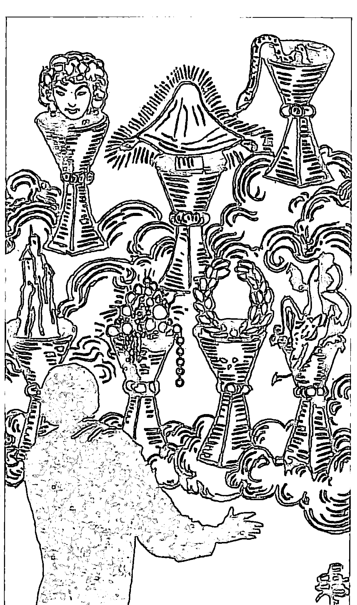

### 正位图像细节解析

- 雾：有许多不确定的状态，也是隐藏圣杯让主角看不到的状况。
- 圣杯内东西：有好有坏，因为被雾遮住因此代表无法确定选择。
- 人：黑色背影代表压力很大，有恐惧与不安的情绪。

### ◎ 补充资料

- 上左一：人头 - 声望。
- 上左二：红色光 - 灵性。
- 上左三：蛇 - 邪恶。
- ◇下左一：房子 - 土地。
- ◇下左二：珠宝 - 财富。
- ◇下左三：桂冠 - 荣耀（请仔细看杯子有骷髅头代表有了荣耀也可能为你带来死亡）。
- ◇下左四：怪物 - 恐惧。

### 正位特质：必须选择的未知恐惧

### 正位图像全面解析

现在眼前有很大的雾，这些雾遮蔽了眼前所有的一切。我们必须要在这完全不确定的状况下，选择一个我们该选择的杯子（道路）。但因为不确定哪一条路是对的，因此我们充满了恐惧与不安，而且就算当下选对了，也不知道日后是否永远是正确的。所以太多的不确定让我们无法选择，也害怕去面对。

### 参考关键字

不确定的未来、恐惧、必须做抉择、害怕决定、一个梦境。

### 逆位图像细节解析

- ◎切割上下重心在上
  - ◇人的背影：现在更重视选择问题所以压力变更大了，一个更喘不过气的状况。
- ◎万有引力关键掉落
  - ◇圣杯内容物：全部掉落雾外，变成都可以选择，但也好坏参半。可以选择想要拿取的物品，但也有可能在拿取的过程中出现祸福相伴的情况。
  - ◇ 人：掉下去等于掉进了云雾里面，变成整个人混在里面，变成一切都失控了。

### 逆位特质：面对可以选择的压力

### 逆位图像全面解析

因为地心引力，让我们掉入了这五里雾中，现在所有的一切，都更加的混乱，导致我们更不清楚，接下来到底该怎么去面对这些必须要选择的事。就算进入雾中，可以看到部分的清楚资讯，但还有太多不确定的事情混淆在其中，也许选择了一个自认为可行的路，却还会相伴其他有问题的状况出现，这样的恐惧不安，更让我们感到害怕。

### 参考关键字

可自我决定、需要勇气去面对、无法控制的情形、混乱状态。

## 圣杯八
Eight Cups

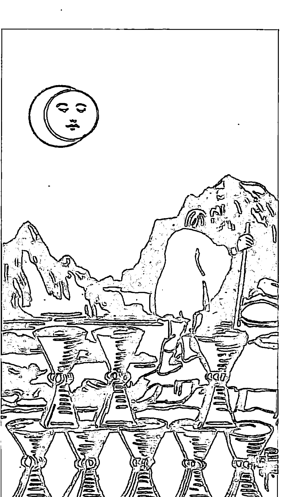

### 正位图像细节解析

- 月亮：月圆盈缺代表许多的变化及不确定的状况。
- 红衣人：转身离开代表对于现在的状况不满，一是去找寻缺少的圣杯，另一个是因为不完美而决定放弃现有找寻新的方向。
- 烂泥巴：内心情感感到不舒服，一个心情堵塞的状况。
- 圣杯：中间少了一个圣杯，代表不完美，也因此造成了红衣人的离开。
- 绿色山：一个未知的地方，但绿色也是一个可以成长的机会。

### 正位特质：找寻关键的缺憾

### 正位图像全面解析

这个人很努力的把手中的杯子堆叠起来，却发现当中有个缺口。这样的遗憾，对他来说是个很不完美的状态，他的心为此感到不舒服。他转身离开往远方前进，也许是要去找寻那个缺少的圣杯，或是他觉得这样不够完美，所以宁可放弃这些，想要找寻新的未来重新开始。但不管是哪个选择，他现在心情都不会太好，毕竟之前已经花了不少时间，而且未来是否能找到圣杯或是新的未来都有很多的不确定。

### 参考关键字

离开、不愿面对现实、抛弃现有转而找寻缺憾，不确定的未来。

### 逆位图像细节解析

- ◎ 切割上下重心在上
  - ◇ 圣杯：仍以旧有的圣杯为主，呈现安于现状的情形。
  - ◇ 烂泥巴：更在乎心中堵塞的那块，就没办法走出现状。
- ◎ 万有引力关键掉落
  - ◇ 圣杯：掉落了，就表示之前努力堆砌起来的全部白费了。
  - ◇ 红衣人：掉落也表示离开旧有的圣杯往新的方向前进。
- ◎ 日出日落光明黑暗
  - ◇ 月亮：下降后太阳即将升起，也表示新的机会到来。

### 逆位特质：放下遗憾找寻新生

### 逆位图像全面解析

1. 在转身离开时，还是舍不得现有的圣杯，在心中还是觉得他就是自己最重要的一切，因此最后还是决定留下来，不再离开守住旧有的幸福。
2. 那些旧有的圣杯都掉了，对于那些失去的也无法再挽回，现在也只能勇往直前离开这旧有的伤心处往前进，相信当月亮下降后，新的幸福就会像太阳一样旭日东升的到来。

### 参考关键字

安于现状、之前的辛苦白费、新的幸福。

## 圣杯九
Nine Cups

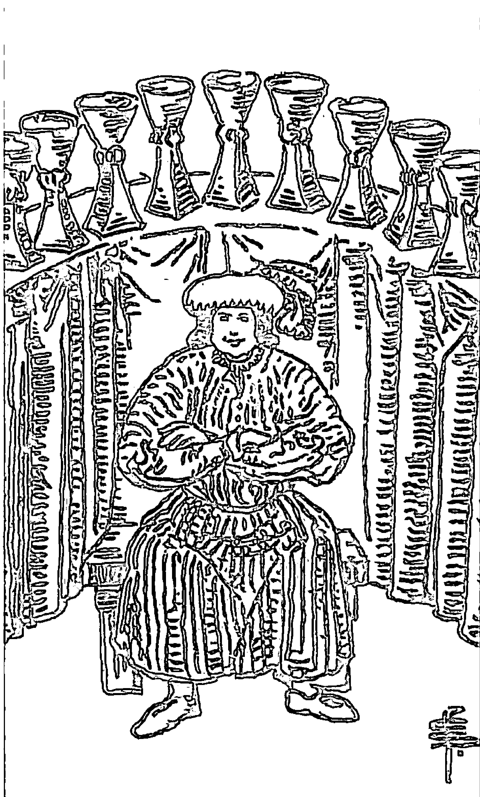

### 正位图像细节解析

- 蓝色架子：冷静的状态，或可以指向是过去已经完成的事。
- 圣杯：放在架子上可解释为一、已放置上的奖杯（指向达成成就），二、一群冷静并对主角有情感的人正给予许多意见，三、一堆已经被放置一阵子等待客人来的酒。
- 红色帽子：脑筋运转的很好。
- 双手交叉于胸前：有自信的面对。
- 木头椅：有自己的想法，有自信的特质（比石椅的固执好一点）。
- ◇ 白衣：单纯的看待这件事。
- ◇ 黄色背景：丰盛、喜悦的状态。
- ◇ 脚：红袜子代表行动力，咖啡色鞋子代表落实的执行。

### 正位特质：充分的展现成就

### 正位图像全面解析

这个人现在非常有自信的坐在椅子上，他双手交叉于胸前，表示他现在所有一切都是在他计划当中。而后面的圣杯，不管是像奖杯一样的高挂在上，或像是一杯杯放好等待客人来的酒，或像是每个对他充满在乎情感的职员，这些都是他可以完整掌控的状态，因此他现在正在享受这每一种可能，可以说是愉悦在其中。

### 参考关键字

建议、会议、需要被讨论的事、享受盛宴、梦想成真（小型的）。

### 逆位图像细节解析

- ◎ 切割上下重心在上
  - ◇ 圣杯：不再重要，也表示不再理会那些建议。
  - ◇ 木椅：很有自信，也表示不再去在乎他人的建议与想法。
- ◎ 万有引力关键掉落
  - ◇ 圣杯：掉落后期望就失去了，酒杯消失宴会也无法再继续。
  - ◇ 帽子：脑子无法再思考，也无法展现自己的智慧。
  - ◇ 蓝色布幔掉落：连圣杯一起掉落，表示众人的情感失去冷静，开始质疑主角能力。
- ◎ 建筑崩毁讯息消失
  - ◇ 椅子崩解：不再有自信面对他人的讯息。

### 逆位特质：失去所期待的遗憾

### 逆位图像全面解析

杯子都倒了，现在这个人面对的都是失去的状态。不管是失去人心或是失去那些曾经以为可以掌握的梦想，这一刻都已经失去，只留下他无法可想，一个人孤单的面对这些破碎的一切。就算是想宴客，也因为酒杯全倒而再也无法享乐。

### 参考关键字

失去现有的、被质疑、无法享乐、期望落空、无法可想。

## 圣杯十
Ten Cups

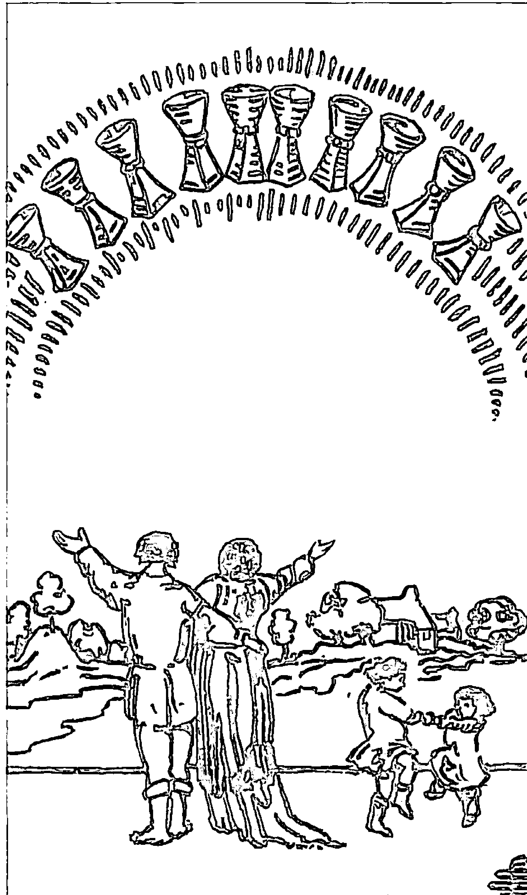

### 正位图像细节解析

- ◇ 彩虹：幸福美满的象征。
- ◇ 圣杯：在彩虹中，也代表这些幸福美满的象征充满了情感的流通。
- ◇ 夫妻：双手张开，代表打开心胸接纳一切，搂腰代表同心协力。
- ◇ 小孩：双手互牵跳舞，代表喜悦的互动。
- ◇ 房子：稳定的家庭，也可以说是稳定的关系。
- ◇ 河流：情感的流通。
- ◇ 树木：持续滋养成长的情感。

### 正位特质：家庭和乐的美好

### 正位图像全面解析

这是一个美好的家庭，夫妻和乐融融的享受这美好的彩虹，旁边的小孩也快乐的跳舞着，这是多么令人羡慕的场景，感觉大家都在团队里愉快的相处，代表稳定的家也就在前方，而洁白的河流正流经每个人的身边，代表这个家庭是稳固且有情感流通的象征。

### 参考关键字

家庭、幸福欢愉的、团体互助生活、满足的感觉。

### 逆位图像细节解析

- ◎ 切割上下重心在上
  - ◇ 人群：仍是相互拥抱在一起，故仍有幸福感。
  - ◇ 彩虹与圣杯在下方：人们不再那么在乎这些美好的事物。
- ◎ 万有引力关键掉落
  - ◇ 人：任何一个人掉落就代表团队分裂。
  - ◇ 河流的水流失：情感流失，代表关系不好没有放感情在其中。
- ◎ 草木颠倒枯萎贫瘠
  - ◇ 树木：没有办法持续成长，情感停滞于当下（负面）。
- ◎ 建筑崩毁讯息消失
  - ◇ 房子：家庭出现破裂状态，或是分离。

### 逆位特质：内外失衡的关系

### 逆位图像全面解析

虽然每个人都还是很在乎这个家庭，但代表情感流通的水已经流失。表面上大家仍是快乐的相处，但内心开始出现一些不满足的心情。也许是不再去看待那些令他们感到幸福美满的彩虹，又或是原本代表稳固的家庭房子崩解，这个家似乎已经开始出现了问题，内心似乎没有表面上那么快乐。

### 参考关键字

仍有幸福但较弱、家庭不和、既有团体出现破裂、不满足目前的快乐。

## 权杖一
Ace Wands

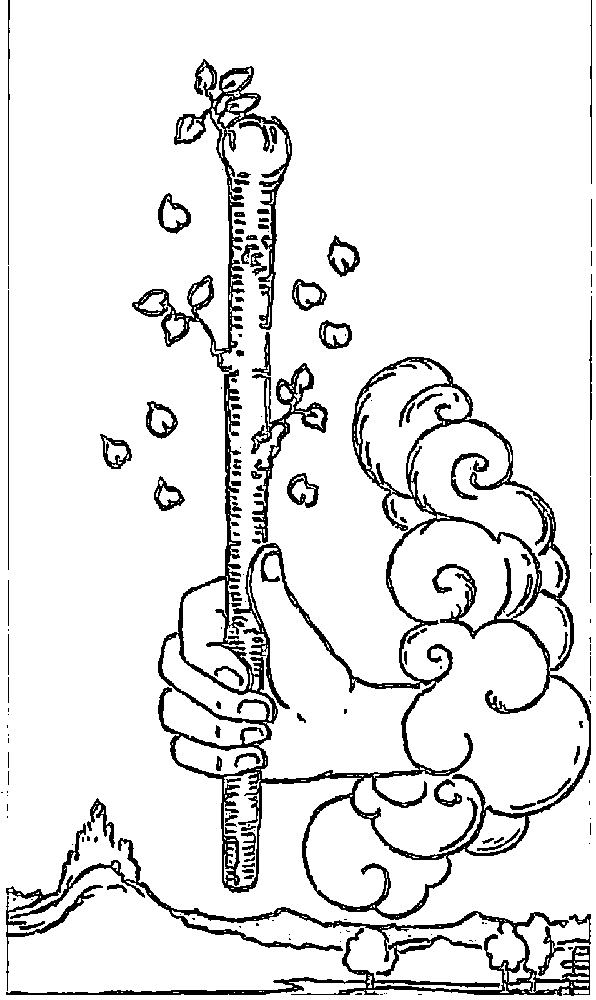

### 正位图像细节解析

- ◇ 云中伸出的手：全新的开始，用握的代表掌控的意思。
- ◇ 八片掉下来的叶子：8 代表力量牌，这边被切割成为两边，代表温柔的力量被破坏改为强硬的力量 (4 号为皇帝牌)。
- ◇ 城堡：成功的象征。
- ◇ 树木与河流：一个持续成长的状态。
- ◇ 黄色背景：丰盛收获，也代表可以掌控得到丰盛的一切。
- ◇ 对应希腊诸神：雷神宙斯。

获取更多好书, 请加微信号: strcdts

官网: http://www.ac2011.cn

### 正位特质：掌控一切的优势

### 正位图像全面解析

从云里伸出的手掌，握住代表行动力的权杖，这也表示他掌控所有的行动力与方向。强有力的握住，让权杖上面的叶子都掉下来了。而远方的城堡，则是代表他所要前进的方向与目标，一切都在掌控中，背景的黄昏，也代表这一切都是往丰盛的方向前进。

### 参考关键字

权力、掌控、有力量的、能决定事情、一个新的方向出现。

### 逆位图像细节解析

- ◎ 切割上下重心在上
  - ◇ 城堡：配合上权杖掉落没有行动力却仍想要拥有城堡（成功），代表不择手段。
- ◎ 万有引力关键掉落
  - ◇ 权杖：失去行动力、方向。
  - ◇ 叶子：8 片叶子掉落无法落到大地上，代表不管是温柔的或是强硬的都无法落实，也表示无法成功执行。
- ◎ 草木颠倒枯萎贫瘠
  - ◇ 树木与河流：河流失去水，树木枯萎代表没有前进的力量。
- ◎ 建筑崩毁讯息消失
  - ◇ 城堡：失去成功的象征。

### 逆位特质：失去掌控的后果

### 逆位图像全面解析

现在手中的权杖滑落了，这也表示已经无力再掌控行动力、也找不到方向，如果你觉得城堡也崩解了，那就代表你所想要努力的方向已经毁坏，事情也就无法成功。如果城堡仍在，但你又没有行动力与方向，那则是代表你只想成功而不想做事，自然会有一些不择手段的计谋。

### 参考关键字

失败的可能性大、无法掌控情形、失去行动力、没有方向。

## 权杖二
Two Wands

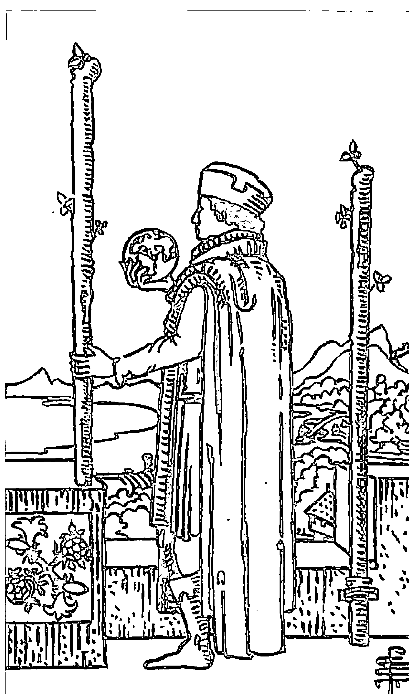

### 正位图像细节解析

- ◇ 左边权杖：被握着，代表掌控这个方向与行动力。
- ◇ 右边权杖：镶在城堡上，代表目前已成的方向。
- ◇ 红帽：脑筋很好，懂得运筹帷幄。
- ◇ 地球：物质世界，或泛指已经被掌控的一切。
- ◇ 衣服：红色代表行动力，也表示这位城主是有行动力往前的，但内里为绿色，表示他还在思考到底该往哪走。
- ◇ 城垛：站在上面代表已经拥有这个城堡，也是成功的象征。
- 玫瑰与百合交集：正在尝试将热情与纯洁平衡中，也表示在思考中。
- 远方土地：包含房子，都代表拥有的一切。
- 黄色背景：表示目前已经有丰盛收获。

### 正位特质：拥有后思索下一步

### 正位图像全面解析

这个城堡的主人现在站在他的城堡上面俯瞰他所有的一切，目前的他已经拥有了城堡与周边的土地，不过他仍在思考接下来应该是要往哪个方向走，也许是该再往前拓展领土？或是安逸的留在这里好好的耕耘？不管如何他现在都在思考当中，对他来说他希望谨慎面对接下来的每一步。

### 参考关键字

思考、一个决定、远瞻、已拥有（成功）但仍想着下一步。

### 逆位图像细节解析

- 切割上下重心在上
  - 城堡：以现有的城堡为主，不愿意再突破前进。
  - 玫瑰与百合交集：太重视如何平衡这两者，造成矛盾而无法行动。
  - 手握权杖：抓行动力。
- 万有引力关键掉落
  - ◇ 手握的权杖掉落：没有掌控行动力，无法前进。
  - ◇ 地球掉落：失去目前所拥有的。
  - ◇ 帽子掉落：不再思索，或是无法思索。
- ◎ 建筑崩毁讯息消失
  - ◇ 城堡：失去目前所拥有的。
  - ◇ 土地上的房子：失去目前所拥有的。
  - ◇ 玫瑰与百合：不再纠葛于平衡问题，放下思索。

### 逆位特质：不再思索开始行动

### 逆位图像全面解析

现在这个城主面临到两个可能的变化，第一个就是他手中的权杖掉落了，而且代表思索的帽子也掉落，这让我们的城主不知道该如何去思索接下来该如何进行，他干脆就不要动了，整个人缩在自己的城堡中就好。

而第二种可能则是一样帽子掉了，但他死抓住权杖，那就是不再思考勇往直前了，但不管如何他的城堡或拥有物似乎都被摧毁了，因此这张牌会强调失去拥有的，再连接往前冲或是停滞。

### 参考关键字

失去所拥有的、过度思索无法行动、懦弱不愿意思索、停止思考开始行动。

## 权杖三
Three Wands

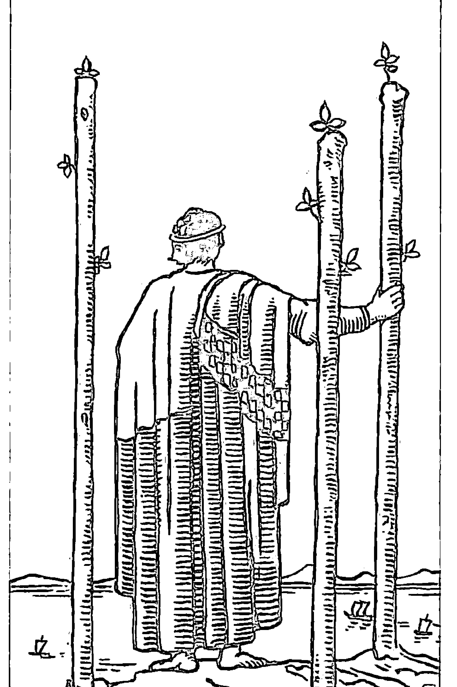

### 正位图像细节解析

- ◇ 三根权杖：插在土里并非被锁住，表示可以随时更换，也表示可以灵活运用与抉择方向与行动力。
- ◇ 头上止汗带：主角正在运筹帷幄中，也表示正在进行一个行动。
- ◇ 红衣：代表很有行动力。
- ◇ 绿围巾：行动力并非是莽撞的，是有保持距离并且小心操作的。
- ◇ 蓝色内里：冷静的态度去选择每一个方向。
- ◇ 山丘：居高临下，让这个规划与运作是有利于操作的行为。
- ◇ 船：也表示正在进行一个贸易。由于是往同一个方向，因此可以解释为团队合作，也因为贸易，所以可以说是远距离的行为。
- ◇ 黄色背景：代表丰盛的收获。

### 正位特质：专注操控运筹帷幄

### 正位图像全面解析

这个商人现在站在山丘上方，仔细观看在河流上往前运行的贸易商队，他正在远距离的思考，该怎么控制这些商队的方向与目的，才可以让他得到最大的获利。

他已经做得很好，也已经有收获，不过他并没有因此而休息，他仍是小心翼翼地去运作每个贸易的行为，在每个小心思考后所运行的操控，都可预期会有更加丰盛的未来。

### 参考关键字

深思熟虑、新的领导契机、远行、远距离恋情、贸易、旅行。

### 逆位图像细节解析

- ◎ 切割上下重心在上
  - ◇ 权杖与船：每艘船都被代表行动力的权杖所分割，成为各有各的方向，因此可以说到团队关系出问题。
  - ◇ 河流与船：水在船的上方变成商船淹没，表示这件事情是失败的。
- ◎ 万有引力关键掉落
  - ◇ 权杖：掉落代表无法完全掌控方向，一则代表失去完整掌控的能力，另一则是失去动力与方向，让许多事情变得较为缓慢前进。
  - ◇ 止汗带：不再努力操作所以不需要止汗带，也是停止运作的状态。

### 逆位特质：失去掌控后的失败

### 逆位图像全面解析

现在水在商船的上面，也代表商船被淹没了一个旅程或商业的失败当中当然有很多原因。也许是这个操控者本身的操控能力不好，又也许是每一艘船都有各自的方向，所以让整个营运方向不明确。

但整体来说，这个运作前进的方向是失败的，也代表之前许多的努力都白费了。

### 参考关键字

不好的合作关系、失去掌控先机、贸易失败、期待答案会较晚到。

## 权杖四
Four Wands

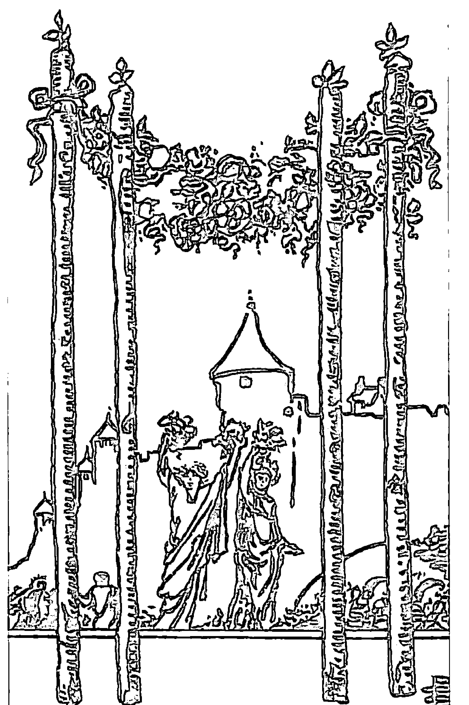

### 正位图像细节解析

- ◇ 四根权杖：代表稳固的意思，也表示这件事是稳定的。
- ◇ 权杖上方花果丛：象征丰收及享乐的状态。
- ◇ 中间两人：欢庆鼓舞的状态，高举花也代表正在庆祝一件事。
- ◇ 左方一群人：欢庆、享乐与互动，代表这件事是值得庆祝的。
- ◇ 右边桥墩：沟通、传达，也表示这件事的沟通状态是顺畅的。
- ◇ 桥墩下草丛：沟通的状况是持续成长的。
- ◇ 城堡：稳定并且受到保护的状态，也加强了这件事是稳定的特质。
- ◇ 黄色背景：丰收的讯息，代表一切都是喜悦丰收的状态。

### 正位特质：欢庆丰收的庆典

### 正位图像全面解析

架起来的权杖上方挂了许多的丰收果实，就像是一个正在举行的美好庆典。当中这两个人也高举花朵，代表正在庆祝这美好的事。如果他们是一对男女？也许这就是他们的婚礼庆典，而旁边的一群人也是在愉悦的相处互动中。他们位在城堡里也表示这个关系是稳定的，受到保护的一个关系。

### 参考关键字

愉悦的气氛、庆典、一个稳定的合作、丰收的、结婚。

### 逆位图像细节解析

- ◎ 切割上下重心在上
  - ◇ 人群：被权杖切割成不同区间，代表彼此之间的认知与方向不同。
- ◎ 万有引力关键掉落
  - ◇ 人群：不管是谁掉落，都代表原本的关系出现分裂状态。
  - ◇ 权杖：稳固的讯息消失。
  - ◇ 手中花朵：值得庆祝的事情消失，气氛不再欢乐。
- ◎ 草木颠倒枯萎贫瘠# 權杖五
Five Wands

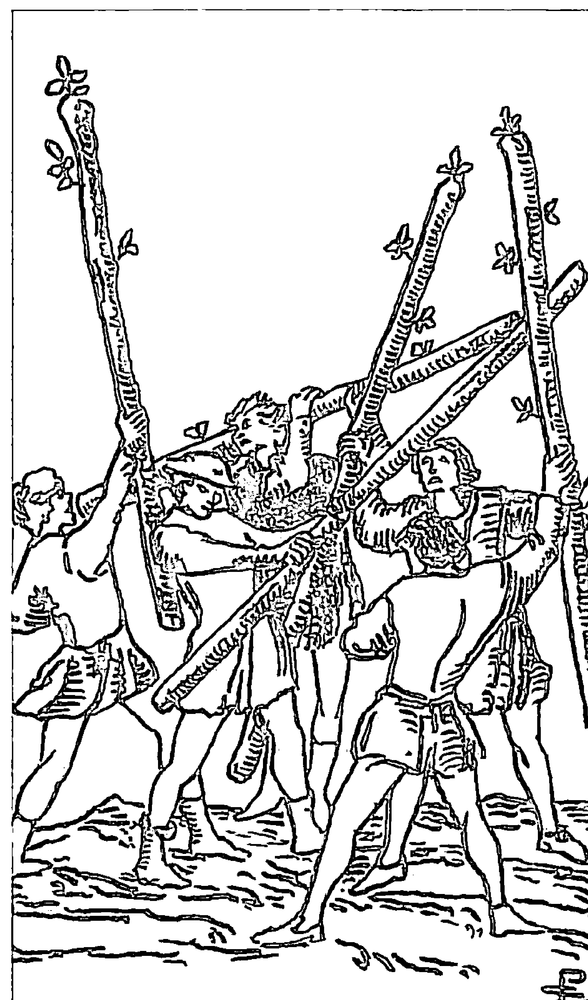

### 正位圖像細節解析
- ◇ 五個人：穿著不同，代表來自於不同的地方。
- ◇ 權杖：互相交集代表意見不合，也可以說是爭吵的狀態。
- ◇ 綠色土地：雖然崎嶇，但綠色代表許多事情正在慢慢的成長中。
- ◇ 所站位置高低：立場不同，著力點不一樣，因此可以說是站在不同的角度來看待一件事，會導致意見不同。

### 正位特質：意見不合的爭論

### 正位圖像全面解析
來自於不同地方的人，現在各自拿著代表自己想要前進的方向，在彼此之間溝通，但畢竟每個人站的地方高低與方向都不一樣，所以產生了許多的爭論與爭吵，這代表目前彼此之間有劍拔弩張的狀況。

不過如果你仔細看他們的眼神，他們似乎也有在注意其他人的方向，這代表雖然有爭吵，但也是一個全新方向的開始。

### 參考關鍵字
建設一個基礎、意見不合、爭執、新的契機、各自為政。

### 逆位圖像細節解析
- ◎ 切割上下重心在上
- ◇ 土地高低：所站的地方不同，也表示有人利用關係或是計策，讓這場鬥爭變得不公平。
- ◎ 萬有引力關鍵掉落
- ◇ 權杖：單一或少數權杖掉落時，權杖有卡住的狀況，導致掉落時會去互擊其他的權杖，讓自己的行動力失去時同時也影響其他人，造成互相矛盾。全部權杖掉落，則是放下彼此之間的爭執。
- ◎ 草木顛倒枯萎貧瘠
- ◇ 草地：不再有新生的機會，代表所有鬥爭都卡在當下。

### 逆位特質：各怀诡计的斗争

### 逆位图像全面解析
因为站的地方高低不一样，这也代表每个人所看的角度落差很大，此时在进行斗争时，也就变成站的立场不一样。有人在较低的位置，代表于不利的处境，这也是彼此之间各耍计谋的表现。

过程当中，你可以选择持续坚持你的方向与行动力，与对方拼个你死我活，或是就让你的坚持放下，这样也许也是一个打开彼此之间矛盾的方法。

### 参考关键词
- 斗争
- 各耍计谋
- 诉讼
- 矛盾的状态
- 放下争执

## 權杖六
Six Wands

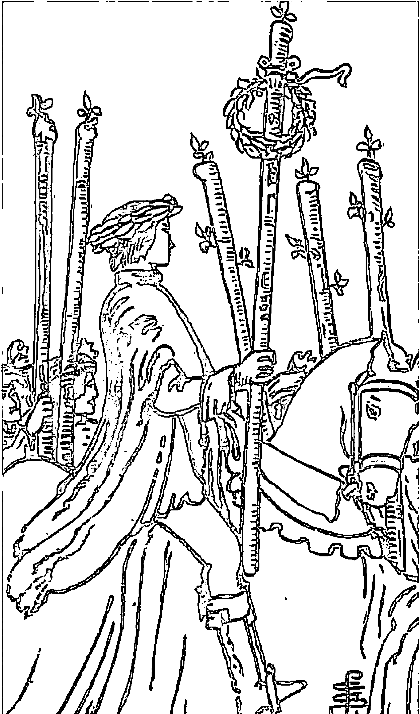

### 正位圖像細節解析
- ◇ 權杖上桂冠：榮耀的方向與行動力。
- ◇ 頭上桂冠：榮耀的想法。
- ◇ 黃色衣服：喜悅的態度，也是一個可預期獲得喜悅的態度。
- ◇ 隨從：身上衣服不一樣，代表來自不同的地方。但權杖方向類似，表示有共同的目標與方向一起前進。
- ◇ 白馬：單純沒有太多雜念的前進。
- ◇ 綠披巾：給彼此一些空間，並非一言堂模式。

### 正位特質：榮耀帶領前往勝利

### 正位圖像全面解析
現在一個說話與行動力都讓大家折服的人，要帶著大家一起前進，看他權杖上還掛著桂冠，這也表示他所帶領的方向是讓大家都感到榮耀的。

他帶領大家前進，並非是要求大家一個口令一個動作，他會給大家各自的空間，只要目標一致，在過程中大家保有自己的穿著及行動力是被允許的。

### 參考關鍵字
光榮的出征、有共同目標、成功的到來、榮耀的勝利。

### 逆位圖像細節解析
- ◎ 切割上下重心在上
  - ◇ 披巾：鬆垮的披巾，表示這是一個鬆散的狀態，大家都很隨興。
- ◎ 萬有引力關鍵掉落
  - ◇ 綠披巾往下掉：遮住馬與人的視線，前進之路變得很不確定。
  - ◇ 權杖桂冠：無法榮耀的前進或歸來，代表失敗。
  - ◇ 頭上桂冠：想法不再以榮耀為主，所說及所做的可能有欺騙成分。
  - ◇ 權杖：不再有共同方向導致無法成行。
  - ◇ 主角：從馬上摔下，代表無法繼續前進。

### 逆位特質：失去榮耀前往失敗

### 逆位圖像全面解析
現在那個自稱可以帶我們前往榮耀之路的人，我們卻發現他的桂冠已經掉落，這是否也代表他只是故意讓我們覺得他可以帶我們前進，但實際上，他也許多沒有令人折服的能力。

這樣的猜測讓我們其他人開始擔心，我們開始不願意跟著他前進，乾脆就各走各的，不要再跟著他走了，因為就算失敗至少也是我本來想走的路。

### 參考關鍵字
- 失敗情形
- 不好的消息
- 無法成行
- 行程被延遲
- 不老實
- 欺騙

## 權杖七
Seven Wands

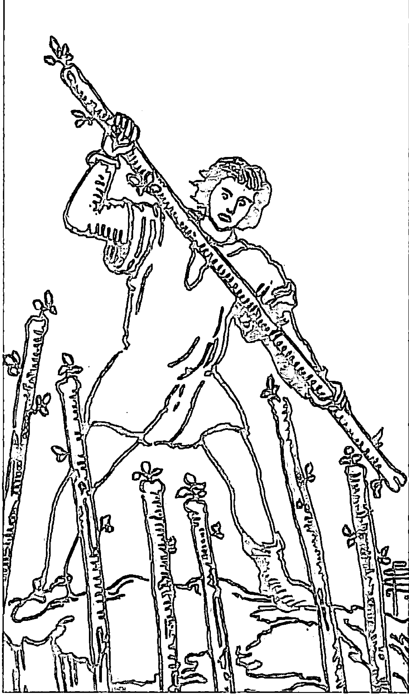

### 正位圖像細節解析
- ◇ 主角權杖：防禦姿態，代表防禦外來的挑戰。
- ◇ 綠衣服：與外來挑戰隔離，保護不受傷害。
- ◇ 黃內裡：內心喜悅，充滿期待，也表示相信自己可以防禦妥當。
- ◇ 鞋子：一隻鞋子沒穿好，代表挑戰來得突然。
- ◇ 山丘：居高臨下面對挑戰是比較有利的。
- ◇ 六根權杖：外來的挑戰，但目前居下臨上並沒有佔地利。

### 正位特質：自信滿滿的面對挑戰

### 正位圖像全面解析
來自於外在的敵人，現在在山丘下聚集並且要攻打主角。對於主角來說，一切來的太突然了，導致於他鞋子都沒有完全穿好。

不過他現在有佔到地利之便，因此他拿起了他的權杖做出防禦的姿態。雖然對手有六個人，但他一點都不擔心他會輸，因為他現在居高臨下，且對自己的能力相當有自信，現在的他，相信自己可以做的很好。

### 參考關鍵字
面對挑戰、有能力的、勇敢、努力面對可以突破障礙。

### 逆位圖像細節解析
- ◎ 切割上下重心在上
  - ◇ 六根權杖：居上臨下代表挑戰變大，也造成主角無法抵抗，也可以說成是眾人對你的想法產生質疑與攻擊。
  - ◇ 鞋子：一腳未穿的狀況，代表挑戰來的太突然，導致無法應對。
- ◎ 萬有引力關鍵掉落
  - ◇ 六根權杖：向下攻擊讓主角遭受相當大的傷害。
  - ◇ 主角掉落：挑戰太大，導致逃離挑戰。

### 逆位特質：無法面對只想逃避

### 逆位圖像全面解析
現在敵人已經居高臨下，讓主角遭受相當嚴重的攻擊，可以從他沒穿好鞋子的腳來看，他現在整個人相當的慌亂。

面對這樣的高壓挑戰，看起來我們的主角已經無法再抵抗，也許這時候逃亡會是一個他想要做的事。

### 參考關鍵字
- 遭受非議
- 沒有自信
- 逃亡
- 無法勝任
- 挑戰太困難。

## 權杖八
Eight Wands

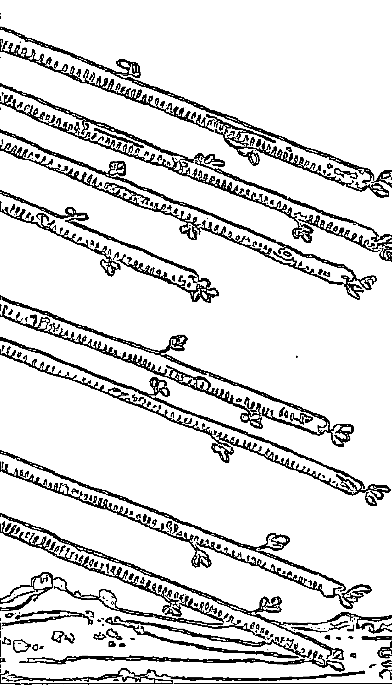

### 正位圖像細節解析
- ◇ 八根權杖：像弓箭一樣向上射出，代表快速及迅速之意。
- ◇ 山丘上房子：弓箭所要射擊的目標，也表示弓箭是一個要往遠方前進的意思。
- ◇ 河流：象徵弓箭要跨越的距離是遙遠的。
- ◇ 綠地與樹：一切都在滋養中成長，往好的方面前進。

### 補充資料
與愛神邱比特金色的弓箭和銀色的弓箭有關，會增加正逆位關

### 正位特質：快速遠行前往成功

### 正位圖像全面解析
現在我們把目標放在越過河流遠方的那個房子上，我們拉滿了弓箭，一口氣射出八支弓箭，八支弓箭快速的飛往遠方，看起來要命中目標是沒有問題的。

雖然因為太過快速，可能讓弓箭的前後端出現一點落差，但一切都可以順利的射到我們的目的的。

### 參考關鍵字
一帆風順、遠行、順利的象徵、迅速達成、愛神之箭。

### 逆位圖像細節解析
- ◎ 切割上下重心在上
  - ◇ 河流：距離成為關鍵，也表示無法突破距離的問題。
- ◎ 萬有引力關鍵掉落
  - ◇ 權杖：向下產生三種狀態，一為失去動力時的狀態－緩慢， 一為向下直衝的狀況－失控，一為插入土裡的狀況－停止。
- ◎ 草木顛倒枯萎貧瘠
  - ◇ 綠地：失去生機代表無法再成長，事情接近結束階段。
- ◎ 建築崩毀訊息消失
  - ◇ 房子：失去目標，無法再前進。

### 逆位特質：忌妒導致情緒失控

### 逆位圖像全面解析
現在弓箭已經開始往下衝，因為看不到土地的距離，所以就要看你覺得它是剛好在最頂峰的狀態呢？還是開始重力加速度的階段？還是其實前端已經插到土裡了？

這會讓這張牌出現三種不同的解法，但令人遺憾的是，那個目標房子是極有可能被摧毀，導致於沒有目標喔。

### 參考關鍵字
事情被拖延、不順利狀況、發展過快產生失控、停止、妒忌之箭。

## 權杖九
Nine Wands

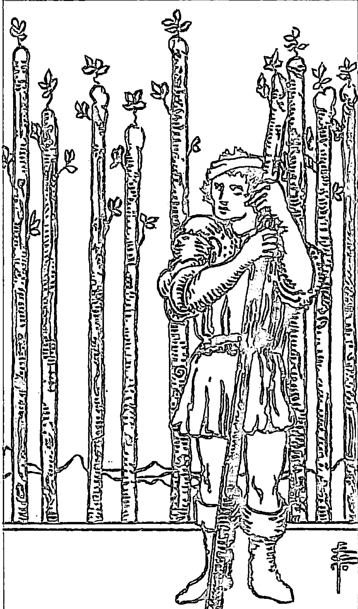

### 正位圖像細節解析
- ◇ 頭上繃帶：受傷的狀態。
- ◇ 手中的權杖：拿來當拐杖，也表示目前狀況很糟，只能撐住。
- ◇ 袖子：捲起來代表仍準備面對挑戰，並沒有逃避。
- ◇ 眼神：可能是在觀察敵軍的狀況，或是等待援軍的到來。
- ◇ 城牆：阻隔敵人，但目前看起來敵人的權杖更高，代表相當危急。
- ◇ 八根權杖：敵人，也是挑戰，將主角圍住讓他無法脫困。
- ◇ 鞋子：綠色代表保持距離，也是主角希望可以與敵人保持距離。
- ◇ 綠山：一個可以成長的未來，但已經被權杖阻隔住，無法突破。

### 正位特質：負傷仍堅守崗位

### 正位圖像全面解析
現在主角被敵人團團圍住了，他在自己的城堡上方想辦法，要繼續保護他的領地。可以看到他已經受傷的滿嚴重了，連原本當作武器的權杖，都只能拿來先充當拐杖。

不過他的眼神與他把袖子捲起來的動作，都顯示他並沒有放棄所有的一切，他還在努力面對這些挑戰，也許在他心中也期待有援兵能適時到來？

### 參考關鍵字
受傷、等待援助、被流言所困、壓力很大、小心面對未來的挑戰。

### 逆位圖像細節解析
- ◎ 切割上下重心在上
  - ◇ 八根權杖：居上臨下，讓外來挑戰大幅增加，讓主角難以招架。
- ◎ 萬有引力關鍵掉落
  - ◇ 主角掉落：因壓力過大而無法面對，導致逃離的狀況。
  - ◇ 八根權杖：從上而下掉落經過主角，讓主角受到更大的攻擊傷害。
- ◎ 草木顛倒枯萎貧瘠
  - ◇ 綠山：對未來不再有期待，也表示失去鬥志。
- ◎ 建築崩毀訊息消失
  - ◇ 城牆：唯一阻隔的城牆消失，面臨直接的傷害已無法抵抗。

### 逆位特質：傷痕累累無法再戰

### 逆位圖像全面解析
現在唯一可以保護的城牆被攻破了，敵人已經佔到城牆上方開始對主角攻擊。這樣的慘烈攻擊不只是居高臨下，更是人數優勢。這讓主角無力抵抗，只能趕快逃離這個地方以免受到更大的傷害。

### 參考關鍵字
失去鬥志、傷害更大、壓力超出可負荷、無法面對挑戰。

## 權杖十
Ten Wands

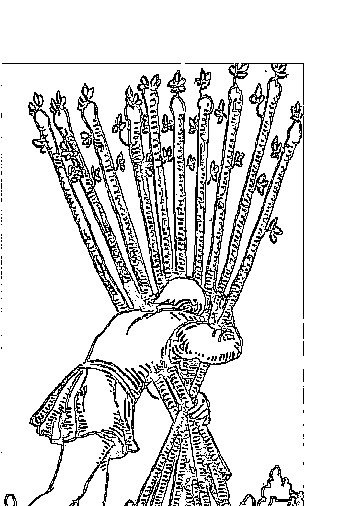

### 正位圖像細節解析
- ◇ 十根權杖：由一人拿著，讓他的壓力感到非常沉重。
- ◇ 黃頭髮：對未來仍抱持著希望。
- ◇ 衣服：咖啡色代表落實的狀態，紅色腰帶表示用行動來支撐。
- ◇ 姿勢：彎腰駝背也表示相當的辛苦，是一個努力撐著的狀況。
- ◇ 身材：充滿肌肉，代表仍有能力面對挑戰。
- ◇ 遠方城堡：最後目標，如果可以堅持到最後，就可以放下負擔。
- ◇ 遠方的樹與田地：指向可期待成長的未來，但仍有距離。

### 正位特質：壓力沉重仍堅持向前

### 正位圖像全面解析
現在這一個人被當十個人用，圖片中看到他的壓力相當大，他已經被壓的喘不過氣，但是他並沒有放棄，他現在還是堅持努力往前，畢竟對他來說，已經可以看到他的家，只要能夠堅持到家一切就成功了。

現在的他雖然非常疲倦、有壓力，但至少他沒有選擇放下那些壓力，是個堅持到底的人。

### 參考關鍵字
- 沉重的壓力、忍耐的前進、辛苦的獨自面對、喘不過氣、未來可能有些成功的機會出現(但現在很辛苦)。

### 逆位圖像細節解析
### ◎切割上下重心在上
- ◇ 城堡：成功在眼前，即將可以到達目的地。
- ◇ 傾斜的腳：失去重心滑倒，也表示失敗的狀態。
- ◇ 權杖：參差不齊的權杖讓人拿的時候會更難拿，施力點更難掌控。

### ◎萬有引力關鍵掉落
- ◇ 權杖：掉落可分成兩種，一則是到達目標，所以可以放下；一則是壓力太大，決定放下不再努力。

### ◎草木顛倒枯萎貧瘠
- ◇ 遠方的樹與田地：未來的希望已經失去，不再期待。

### ◎ 建築崩毀訊息消失
- ◇ 遠方城堡：目標已經失去，再努力也沒用。

### 逆位特質：失去鬥志進而放下一切

### 逆位圖像全面解析
現在抬頭就可以看到他的家，似乎成功又離他更近了一點，但現在他的權杖看起來要拿著是更加的辛苦。甚至要小心是否會因為一時不小心，而整個人失去重心滑倒，如果不小心滑倒了，那麼之前的努力就白費了。

### 參考關鍵字
未來可放下負擔、壓力更沉重、失去原有重心、失敗。

## 寶劍一
Ace Swords

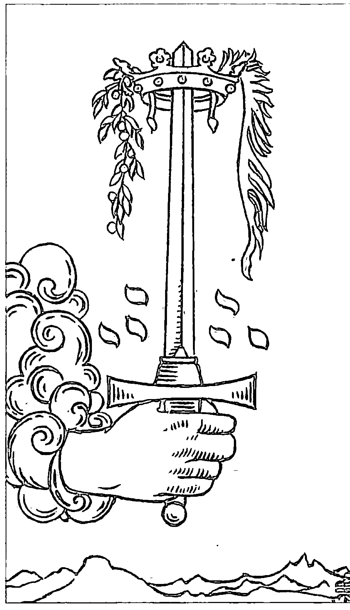

### 正位圖像細節解析
- ◇ 雲中伸出的手：全新的開始，用握的代表掌控的意思。
- ◇ 皇冠：榮耀的象徵。
- ◇ 皇冠旁花果：榮耀持續的發展。
- ◇ 寶劍：理智的象徵，完全筆直代表極度理智不偏頗。
- ◇ 六個點：對應大牌六號戀人，在理智下被切割無法成為戀人，隱含沒有情感的意思。
- ◇ 遠方的山：十分理智，沒有任何樹木可以掩蓋模糊或隱藏。
- ◇ 對應希臘諸神：正義女神雅典娜。

### 正位特質：用理智衡量萬物

### 正位圖像全面解析
從雲中伸出一隻手，握著代表理智與智慧的寶劍。這把寶劍現在筆直的被握著，代表這個智慧與想法是完全中立不偏不倚的。而寶劍上方有一個代表榮耀的皇冠，剛好就被這寶劍穿過，這也表示中立追求榮耀的意思。而皇冠旁的花草，則是代表這個得到榮耀的事情是一直持續不斷的狀態。

遠方的山沒有任何花草樹木，也表示過度理智，導致於比較沒有可以隱瞞或灰色地帶的狀態，顯示出寶劍一過度理智有點不盡人情的狀態。

### 參考關鍵字
理智、尋求權力、一個新的開端。

### 逆位圖像細節解析
- ◎ 萬有引力關鍵掉落
  - ◇ 寶劍掉落：向下斬下，讓所有的事情全部都被破壞，也表示失去理智。往下掉同時把六個黃點破壞，也代表濫用權力，讓原本存在的事物消失。
  - ◇ 皇冠掉落：不再追求榮耀，也表示不追求公正的態度。
- ◎ 草木顛倒枯萎貧瘠
  - ◇ 花果：不會再有成長的機會，也讓榮耀沒有辦法再成長。

### 逆位特質：失去理智情緒失衡

### 逆位圖像全面解析
現在這把劍被快速的向下斬，這也表示目前許多事情已經在進行執行的狀態。

然而這把寶劍也會因此而掉落，變成了失去理智、榮耀不再、也沒有可以倚靠的智慧，這個狀態就會變成一切都被不理智的行為破壞了。

### 參考關鍵字
- 失去理智、偏頗、濫用權力、破壞平衡。

## 寶劍二
Two Swords

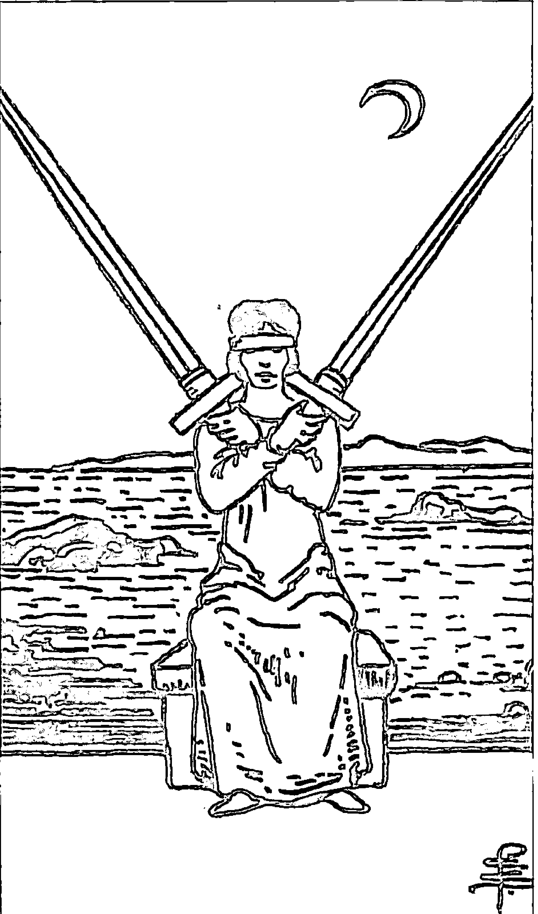

### 正位圖像細節解析
- ◇ 月亮：不確定以及變化多端的狀況。
- ◇ 兩把寶劍：往不同的方向，代表有不同的想法。
- ◇ 眼睛矇住：看不見外面的世界，也表示看不見危險。
- ◇ 雙手交叉於胸：將心封閉住，也表示不願意敞開心胸面對。
- ◇ 藍白色衣服：單純、冷靜的想，沒有行動力就只是停留於當下。
- ◇ 石椅：固執的態度。
- ◇ 鞋子：黃色代表有所期待，但被自己不同的想法困住，而無法落實。
- ◇ 海：礁石代表危險的狀態，眼睛被蒙住就看不到危險了，也是代表情緒中有浮出一些自我阻礙的狀況。
- ◇ 夜晚：許多的不確定存在這個階段。

### 正位特質：自我矛盾無法前進

### 正位圖像全面解析
這個人現在坐在一個代表固執的石椅上，他現在有兩個不同的想法困擾著他，但他一方面把自己的眼睛蒙起來，不讓自己看到外面的世界，另一方面又把自己的胸口遮蔽起來，不願意感受一切。

這樣的狀況只會讓他的想法持續矛盾，而找不到解決的方案，雖然他仍對於未來有所期待，但也就只能持續的坐著，空待時間的流逝。

### 參考關鍵字
矛盾、隱藏的危機、逃避現實、不願意敞開心胸。

### 逆位圖像細節解析
- ◎ 切割上下重心在上
  - ◇ 海：以自己的情緒為主，不在乎外在的狀況。
  - ◇ 石椅：更加強固執，不願意打開心胸。
- ◎ 萬有引力關鍵掉落
  - ◇ 寶劍：原本矛盾的想法消失。
- ◇ 眼罩：打開眼界，看清楚狀況，也表示打開心胸面對挑戰。
- ◎ 日出日落光明黑暗
  - ◇ 月亮：太陽將升起，將原本陰暗不確定的事釐清。
- ◎ 建築崩毀訊息消失
  - ◇ 石椅：崩解後也表示心胸打開，不再固執。

### 逆位特質：打開心胸放下矛盾

### 逆位圖像全面解析
原本代表固執的石椅，在此時已經崩解了，而這個人臉上的眼罩也已經掉落，更令人開心的是月亮下降，太陽即將升起，所有的一切都已經全部打開，不再有不確定的事情可以困擾著他。

此時的狀況，可以說是把過去的不確定與矛盾全部一掃而空，除非你看到原本象徵情緒的海水此時宣洩而出，表示被情緒淹沒，否則這個人目前已經走出了原本的矛盾情結。

### 參考關鍵字
- 被情緒淹沒、不再矛盾、看清事實。

## 寶劍三
Three Swords

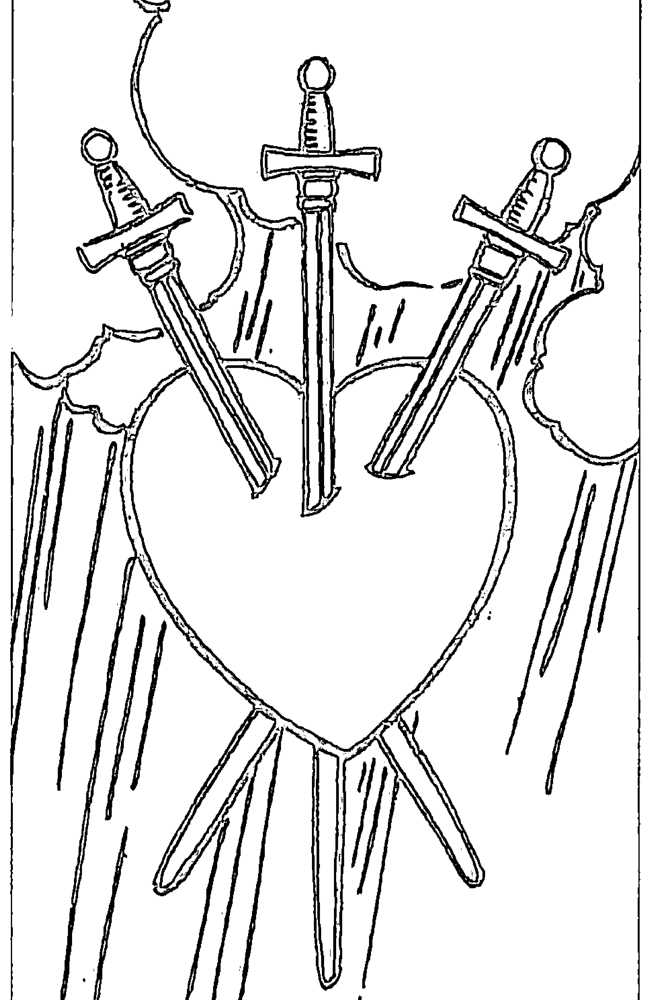

### 正位圖像細節解析
- ◇ 心：紅色的心代表熱情，也是心之所向。
- ◇ 劍：刺入心，代表讓熱情或是所期待的事情被破壞。
- ◇ 下雨：形容內心世界的痛苦，如同流淚的狀態。
- ◇ 背景：整體灰色，讓所有的重心都放在一顆心被刺穿的上面，代表這件事情是被特別注視的。

### 正位特質：處處受阻深感心痛

### 正位圖像全面解析
一顆熱情及對於未來充滿期待的心，在此時卻被三把寶劍從上而下刺穿，這也表示那些我們所期待的事情，在此時被迫停止。

也許是因為自己的想法抑或是他人的評論，不管是來自於那裡的訊息，都讓我們現在只能對於所期待的事情被迫中止，感到難過與傷心，甚至感覺後方的烏雲密布與下雨，都像是自己的眼淚一般。

### 參考關鍵字
- 傷心
- 破壞
- 失望
- 受到挫折

### 逆位圖像細節解析
- ◎ 切割上下重心在上
  - ◇ 劍：看到劍刃在上，也表示靠近自己的是劍柄，表示個案是一個傷害他人的傷害者。
- ◎ 萬有引力關鍵掉落
  - ◇ 劍掉落：就像是要從傷害中拔出劍，形容成即將離開傷痛。
  - ◇ 雨回到雲中：雨下不去，回到雲裡面也代表不再流淚，藉此佐證被傷害的並不是個案，而是個案去傷害他人，所以不須流淚。

### 逆位特質：逐漸走出傷痛過往

### 逆位圖像全面解析

現在插在這顆心上的三把寶劍，終於要緩緩的掉落，雖然還是有傷痛，但這代表那些傷痛的事情即將要慢慢離開的一個過程。

這時不禁要思考，當初把這劍插進去的是否是他人，還是剛好靠近劍柄的就是我自己呢？也許這也表示其實是我去傷害了他人。

### 參考關鍵字

傷心、破壞、失望、受到挫折、使他人受傷、應該離開傷心的狀態（但仍在傷心中）。

# 寶劍四
## Four Swords

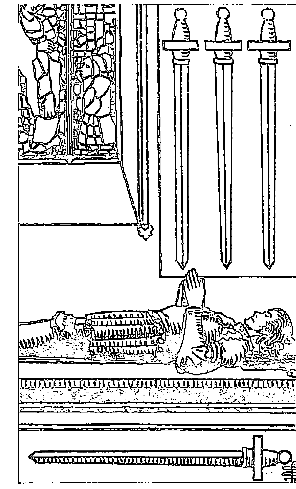

### 正位圖像細節解析

- ◇ 彩繪玻璃：通常指向教堂，也表示是個戰爭時的避難所，圖案中為一個人像聖母祈禱，似乎正在等待一些消息，或是祈求協助。
- ◇ 牆上三把劍：外來的挑戰。
- ◇ 人：協助抵禦外來挑戰的木雕人，與歐洲中古世紀習俗有關，也顯示這是一個棺材。
- ◇ 手勢：三合一，代表守護的意思，也是祈禱審判日來臨時的手勢。
- * 棺蓋打開：裡面的人還活著，只是暫時躲避起來。
- * 下方寶劍：休息夠了，就準備拿起寶劍去面對挑戰。

### 正位特質：遠避災難伺機充電

### 正位圖像全面解析

在一個代表避難所的教堂裡面，有個人為了躲避外來的挑戰，現在正躲在棺木裡面，這個動作就代表他現在想要與外界保持一些距離，讓他不受外界的干擾與挑戰，他可以在這裡面休息，或是我們現在所說的充電。

直到他準備妥當後，他也許就可以拿起一旁的寶劍勇往直前面對挑戰。

### 參考關鍵字

休息、遠避災害、暫時停止、充電。

### 逆位圖像細節解析

- **◎ 切割上下重心在上**
  - * 棺木旁邊的劍：以劍為主，表示要拿起來揮舞，也是準備面對挑戰。
- **◎ 萬有引力關鍵掉落**
  - * 棺木裡的人掉下來：無法再躲避、休息，需要面對未來的挑戰。
  - * 假木雕人：掉下已無法再協助抵擋外來挑戰。
- - ◇ 三把寶劍：由於是鑲在牆上，除非教堂摧毀，否則挑戰都在。
- - ◎ 建築崩毀訊息消失
- - ◇ 教堂：失去保護，也表示得面對挑戰。

### 逆位特質：無法逃避勇敢面對

### 逆位圖像全面解析

現在你已經無法再躲於棺木當中，你得起身面對那些外來的挑戰，不管是教堂或是可以偽裝的木雕人都已經失去，你只能勇敢面對挑戰而無法避開。

請別擔心，經過休息過後的你，將會有更多能力可以去面對的。

### 參考關鍵字

無法休息、無法逃避、準備面對挑戰。

# 寶劍五
## Five Swords

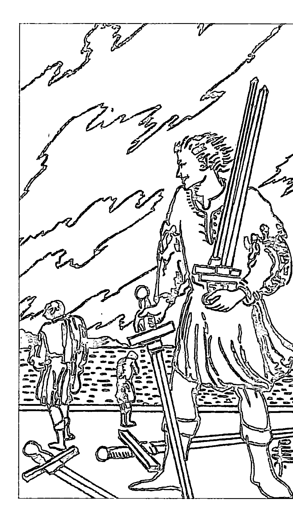

### 正位圖像細節解析

- - 大型人：獲勝者，大多指向個案所問的事情結果，他回頭看其他人，代表獲勝後除了驕傲的蔑笑之外，還可能隨時想要再上前攻擊。手中三把劍，代表他的想法有不一樣的思考方向，也表示他現在有些矛盾。
- - 衣服：紅色內裡的行動力被外在綠色衣服擋住，表示矛盾狀態。
- - 中型人：失敗者，將衣服往後一摺代表不再鬥爭。劍都丟到地上，大多指向挑戰的事情被個案征服。
- ◇ 小型人：在海平面以下，隱喻著內心世界的狀態，正位來說是指向獲勝者的內心其實是痛苦的，只是外在為了贏，所展現出來的態度。
- ◇ 海：內心世界或是潛意識。
- ◇ 雲：快速的變化，也表示存在著想法的快速變動，藉此來將小型人轉換成大型人的內心世界展現。

### 正位特質：為求獲勝不顧一切

### 正位圖像全面解析

這兩個在鬥爭的人看起來右邊的獲勝了，他手上拿著寶劍，代表他是唯一還留有武器或想法的人。他回頭看著那個落寞離開的人，嘴中還出現了淺淺的微笑，驕傲的他也許多想要再往前攻擊，但其實他自己的內在是很痛苦的，為了表面的獲勝也許他失去了更多。

他撐住的只是一個外表的勝利，內在卻是在哭泣的狀態，他真的贏了嗎？不知道！

### 參考關鍵字

自我矛盾、驕傲、鬥爭後的慘勝、敵意的存在。

### 逆位圖像細節解析

- ◎ 切割上下重心在上
  - ◇ 小型人：與中型人較靠近，代表失敗者的懊悔。
- ◇ 地上寶劍：與大型人高舉的寶劍成對打狀況，意指他人放棄想法了你還不斷的去挑釁、去鬥爭。
- ◇ 地上寶劍：代表失敗者，也指向這件事是失敗的。
- ◎ 萬有引力關鍵掉落
  - ◇ 大型人：手上兩把寶劍掉落，只剩一把與地上寶劍對打，代表被鬥爭沖昏了頭，他人放棄鬥爭了你還不放棄。
- ◎ 顏色壓制逆位展現
  - ◇ 衣服：原本壓制的行動力被解放，也是輔佐鬥爭沖昏了頭的動力。

### 逆位特質：慘敗退無法再戰

### 逆位圖像全面解析

換個角度來看，現在失敗者是這個畫面中最主要的部分，他失去了他的武器（想法），他已經不想要再繼續鬥爭了，他失敗的離開，但沒想到那個獲勝的人還不斷想要向他挑釁，連被他丟到地上已經放棄的想法，獲勝者都還要想辦法攻擊。

這樣的狀況讓他感到很不是滋味，也是一種失敗後還被他人追趕的負面情緒。

### 參考關鍵字

矛盾、失敗後的懊悔、被鬥爭沖昏了頭。

# 寶劍六
## Six Swords

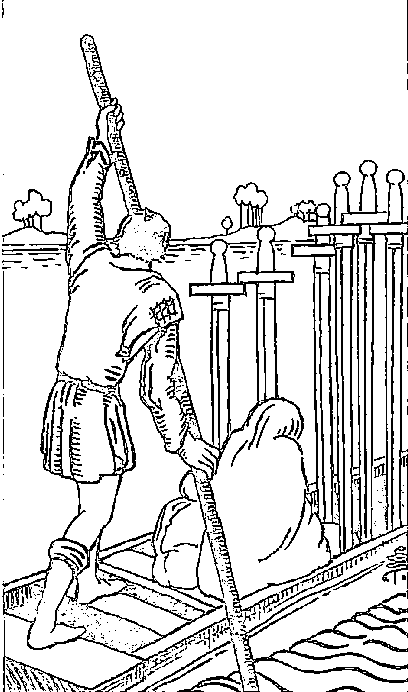

### 正位圖像細節解析

- ◇ 撐船者外衣：咖啡色外套，代表落實的執行者。
- ◇ 撐船者內裡：綠色衣袖，表示保持安全距離的狀態。
- ◇ 撐船者鞋子：咖啡色鞋子，代表有落實的執行。
- ◇ 撐船者權杖：深咖啡色，代表穩定落實的前進。
- ◇ 撐船者：協助他人離開不好的地方，往好的方向前進。
- ◇ 船下波浪：並非波濤洶湧，代表撐船者是緩慢溫和的前進。
- ◇ 帶斗篷的人：一個需要離開當下往其他方向前進的人，斗篷蓋起來似乎有些事情不想讓他人知道，也表示有隱藏的秘密。
- ◇ 小孩：內在小孩因為傷痛而放在旁邊，雖然仍依偎著，但也表示目前的狀況並不是注重內在小孩的狀況，而只是想要離開這個環境。
- ◇ 寶劍：插在船上讓船已經受損，藉此表達這是一個受傷的狀況，但劍未拔起代表至少這件事並非讓你無法跨過，只是苦痛。
- ◇ 遠方陸地：一個可期待前往的避難處。

### 正位特質：遠離傷心前往他鄉

### 正位圖像全面解析

一個內心有痛苦的人，他連內在的需求都已經不想去思考，他想要離開這個傷心處，藉由自己或是他人的協助，讓他開始慢慢的往一個新的方向前進。

他的旅程看起來就像是被劍所刺穿的船一樣，充滿了苦痛，但至少目前還在慢慢的前進，並沒有沉船，事情雖糟，但現在可期待的是逐漸往好的方向前進。

### 參考關鍵字

遠離痛苦、往更好的方向前進、受保護的、隱瞞心事、旅行。

### 逆位圖像細節解析

- ◎ 切割上下重心在上
  - ◇ 波浪：水在船的上面，代表船被淹沒了，事情往更糟的方向前進。
  - ◇ 帶斗篷的人：加強心事不願意揭露的狀態。
- ◎ 萬有引力關鍵掉落
  - ◇ 寶劍掉落：寶劍掉落，讓船的破洞開始進水，也表示狀況變更嚴重。
  - ◇ 小孩掉落：把內在小孩丟棄，代表事情嚴重到已經不再關心內在的期待。
  - ◇ 撐船者：失去重心，導致整艘船翻船。
  - ◇ 斗篷：掉落後代表原本不想被發現的心事被揭露。

### 逆位特質：狀況連連無法逃避

### 逆位圖像全面解析

因為失去了平衡，所以整艘船現在開始搖晃不安，看起來隨時都可以翻船。壞事接連而來，原本寶劍插在船上至少水還不會大量湧進，但現在卻在船不斷的搖晃中掉落了，接下來水也從船的破洞中開始湧入，事情已經越來越嚴重。

遇到這樣狀況的你，現在也只能看著事情越變越糟糕，而無法作為。

### 參考關鍵字

狀況變壞、失去重心、心事被揭露、不願意敞開心胸。

# 寶劍七
## Seven Swords

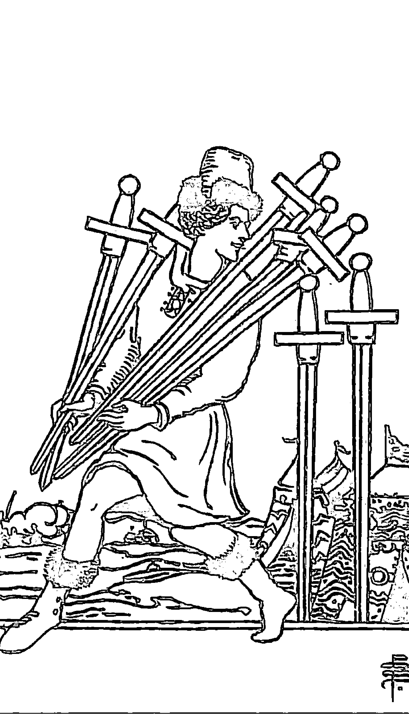

### 正位圖像細節解析

- - 帽子：紅色代表腦筋很好，或是懂得運用腦袋思考。
- - 衣服：綠色也表示他可以與敵人之間保持距離，不被發現。
- - 褲子：藍色代表冷靜的進行。
- - 鞋子：紅色則為有行動力，墊腳尖表示正在偷偷摸摸地進行著。
- - 手中寶劍：偷取敵人的武器，削減對方的戰力，但手持劍刃代表這是有危險的事情，隨時會受傷。
- - 回頭看：微笑代表很有自信的態度，回頭看剩下的兩把劍，也代表繼續思索接下來的行為。
- ◇ 帳篷：敵人駐紮區，也是代表挑戰。
- ◇ 左方的人群：正在炊事，目前位於下方，屬於較不重要的地方，也表示沒注意到竊盜者。
- ◇ 黃色背景：豐收的象徵，代表這次的出擊是有收穫的。

### 正位特質：小心翼翼以巧取勝

### 正位圖像全面解析

兩軍交戰，現在一個身著輕裝的小偷，趁敵軍在炊事的時候，悄悄到對方的帳篷裡偷取他們的武器。他敏捷的身手及思考後的想法，讓他只從敵營中偷取了五把寶劍出來，他小心翼翼地離開並且持續觀察，看是否有機會再回來把剩下的也偷走。

他的行為是危險的，就像他把把劍的劍刃放在手上一樣，不過以他聰明的頭腦以及行動力極佳的狀況來說，一切都在安全範圍內，只是有點危險而已。

### 參考關鍵字

一個計策、偷偷摸摸、有信心的想法、有危險的行為、竊盜。

### 逆位圖像細節解析

- ◎ 切割上下重心在上
- ◇ 炊事的人：現在他們發現竊盜者的存在了，也表示事情危險了。
- ◇ 帳篷：敵人的戰力為主，對竊盜者來說，已經無法減弱敵人戰力。
- ◎ 萬有引力關鍵掉落
  - ◇ 手中寶劍：掉落就割傷了手，自己的計策傷害了自己。
  - ◇ 帽子掉落：腦子不再運轉，也就成了無法可想。
  - ◇ 帳篷：帳篷拔起代表敵人開始行動，竊盜者將容易被抓到而失敗。

### 逆位特質：錯誤計策導致失敗

### 逆位圖像全面解析

原本小心翼翼的行為，突然間被炊事的敵人發現了，大家開始追擊。一方面，人也馬上把他們的紮營拔起開始追擊；另一方面，這個小偷在慌亂之間，也不小心讓寶劍割傷了自己的手，看起來他偷偷摸摸的事情已經被發現，接下來他也是無法可想的狀況，可預期的失敗即將到來。

### 參考關鍵字

一個錯誤的計策、偷偷摸摸的事被發現、無法可想、被擊敗。

# 寶劍八
## Eight Swords

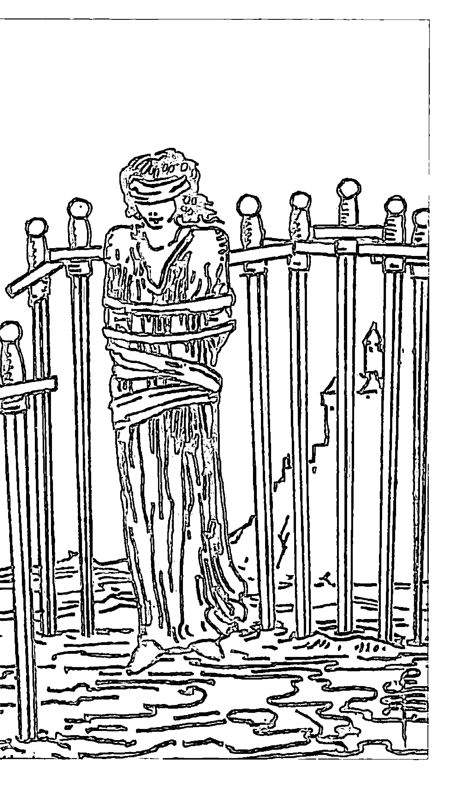

### 正位圖像細節解析

- - ◇ 蒙眼：看不到外面的危險，也表示深陷危險當中，不知如何面對。
- - ◇ 身體：被捆綁則無法知道周遭的狀態，一種說法是沒有打開心胸面對，另一則則是陷入危機當中。
- - ◇ 衣服：紅色代表行動力，被綁住也代表失去行動力。
- - ◇ 寶劍：插在地上讓當事者無法逃出，也代表這是一個危機的狀態。
- ◇ 爛泥巴：隨便走可能會絆倒就被劍割傷，代表許多的危機，也可以說是內心世界非常混亂的狀況。
- ◇ 城堡：貴人離你很遠，無人可以協助。

### 正位特質：深陷危機無法逃離

### 正位圖像全面解析

這個人現在被抓住了，他被困在八把寶劍的陣當中進退兩難。一方面眼睛被蒙住，讓他看不到所在何方；另一方面，手也被綁住，讓他無法摸索逃出方向。

現在的他深陷危機，似乎隨時都有可能出現意外讓他受傷，而在遠方可以幫忙的貴人，也因為離他太遠無法前來救援，他就只能在這個危險的地方中繼續待著。

### 參考關鍵字

危機四伏、搞不清楚、自我設限、徬徨無助。

### 逆位圖像細節解析

- ◎ 切割上下重心在上
  - ◇ 爛泥巴：心中的混亂相當嚴重，但人即將離開這個環境。
  - ◇ 腳：腳未被綁住，因此會有離開危機的意思。
  - ◇ 城堡：貴人出現，前來協助。
- ◎ 萬有引力關鍵掉落
  - ◇ 寶劍：掉落後也代表危機解除。
  - ◇ 身體繃帶：解除後心胸也打開了，許多事情都可以接納。
  - ◇ 眼罩：打開眼界，可以看到危機，也讓事情變得可以解決。
- ◎ 建築崩毀訊息消失
  - ◇ 城堡：不需要再向外求援，可以自救。

### 逆位特質：打開心胸逃出危機

### 逆位圖像全面解析

這些危險的寶劍即將逐漸掉落，而原本蒙住眼睛及纏住身體的纏布也都掉落，這都代表之前的危機都將解除，這個人也有很高的機會即將離開這個令他不愉快的環境。

一切都將往好的方向前進，剩下的就只是時間問題而已。

### 參考關鍵字

危機解除、打開心胸、重新開始（即將）。

# 寶劍九
## Nine Swords

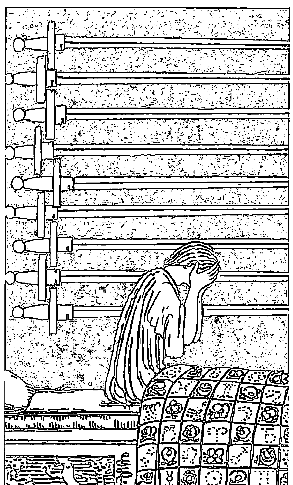

### 正位圖像細節解析

- - 九把寶劍：懸浮在空中，代表是意念上的傷害，而非實質上的。
- - 起身的人：作惡夢導致驚嚇起身，也表示被過去負面狀態困擾。
- - 搗臉：不敢面對現實，害怕舊事重演。
- - 衣服：白色代表單純的被過去情緒所包住。
- - 棉被：藍色內有占星符號，代表冷靜的面對未來會持續的成長到來。黃色內有玫瑰，代表未來仍有持續成長的喜悅存在。這些都是代表希望，但臉被搗住就看不到了。
- ◇ 床板：有人被傷害的木刻，也是離頭最近的地方，代表痛苦的記憶。
- ◇ 背景：黑色背景代表壓力沉重。

### 正位特質：夢魘纏身無法入眠

### 正位圖像全面解析

這個人在過去一定遭受了相當大的傷害，所以連現在在睡覺都會被這樣的噩夢所驚醒。他沉浸於過去的痛苦回憶中，讓他害怕得不敢睜開雙眼，很怕那些過往的痛苦會在現實生活中重新出現。

就算他知道打開眼睛就可以從惡夢中醒來，就算他知道起身就可以離開恐懼，但他就是做不到，只能陷入這恐慌不安的回憶中。

### 參考關鍵字

痛苦煩惱、深受困惑、絕望的感受、被過去所困、無法面對現實。

### 逆位圖像細節解析

- ◎ 切割上下重心在上
  - ◇ 床板：過去的痛苦更加劇烈的困擾著。
  - ◇ 棉被：希望在前，只等個案打開眼／心胸。
- ◎ 萬有引力關鍵掉落
  - ◇ 棉被掉落：沒有希望、看不到未來，讓人想要放棄一切。
  - ◇ 人掉落：逃離痛苦的地方，也像是起床不再面對那些痛苦。
- ◎ 建築崩毀訊息消失
  - - 床板：毀掉後，等於過去的苦痛記憶也消失了。

### 逆位特質：努力突破離開苦痛

### 逆位圖像全面解析

由於過去痛苦的記憶太過難受，現在這個躺在床上的人即將陷入選擇，一就是繼續活在痛苦回憶中，或是乾脆不要管那麼多，就起床面對嶄新的人生。

不管他選擇哪一個方向，目前他仍是在痛苦的狀況中，只希望他能儘快的做好決定往前走，不要再被過去所困住。

### 參考關鍵字

痛苦但還有一點希望、想要放棄努力、離開苦痛放下糾葛。

# 寶劍十
## Ten Swords

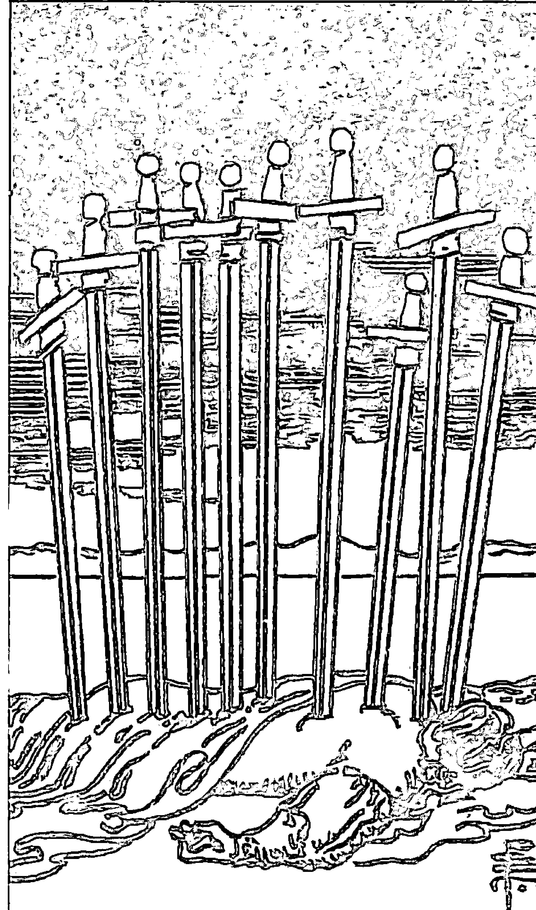

### 正位圖像細節解析

- ◇ 寶劍：插在身上讓人死亡，也表示傷害過大，讓事情無法轉圜。
- ◇ 紅色披風：教皇的外衣，代表上天的加持都無法解救，也代表行動力完全的被禁止與阻擋。
- ◇ 手勢：教皇的手勢與披風一樣，暗示上天的力量是無能為力。
- ◇ 血漬：傷害很大。
- ◇ 土地：咖啡色代表落實的特質，而血與劍都是插入土裡，代表這些傷害是扎實的。
- - ◇ 雲：黑色烏雲代表壓力非常大，壓制了黃色的天空。
- - ◇ 遠方天空：黃色也代表未來似乎還有些希望，但不是現有的而像是經過了死亡，接下來才有機會有全新的開始。
- - ◇ 海：平靜海洋代表這件事已經結束了，也表示情緒上再也沒有任何變化。
- - ◇ 遠方陸地：另一個世界，連接黃色天空也代表下一階段即將開始。

### 正位特質：痛苦不已萬念俱灰

### 正位圖像全面解析

一位被十把寶劍插死在土地上的人，就算他身披教皇披風及手指出引導上天的姿勢，都無法阻止這個被加諸的傷害。

全身插滿寶劍，也代表所有一切的期待都已經無力回天。而天空的烏雲，也表示這是一個讓人感到壓力沉重的狀態，如今一切都已經結束，只能將期待放在人生的下一個階段了。

### 參考關鍵字

死亡、嚴厲的譴責、無法解放的壓力、結束的訊息、新生前必須先經歷結束的痛苦。

### 逆位圖像細節解析

- - ◎ 切割上下重心在上
- - 手勢向上：上天的力量開始運作了。
- - 黃色黎明：新的未來正在開展。

### 萬有引力關鍵掉落

- - 寶劍：那些痛苦與傷心的事即將慢慢的離開，原本被抑制的紅色袍子也可以開始運作，開始有行動力。

### 顏色壓制逆位展現

- - 黃色的天空：即將成為重要的顏色，也代表希望即將來臨。
- - 紅色袍子：壓制袍子的寶劍掉落，紅色顏色開始運作代表有行動力。

### 逆位特質：超越痛苦即將解脫

### 逆位圖像全面解析

雖然痛苦仍在，但寶劍也慢慢的即將落下，那些讓人苦痛的事情即將結束，新的人生即將來到。

不管是舊有的重新面對，或是新的未來重新開始，這些讓人傷痛的事雖然永不磨滅，但它也即將離開，就好好的去面對一切，準備重新開始。

### 參考關鍵字

即將解脫、新生即將來到、仍有痛苦的訊息、即將解放、成功前的苦痛。

# 金幣一
## Ace Pentacles

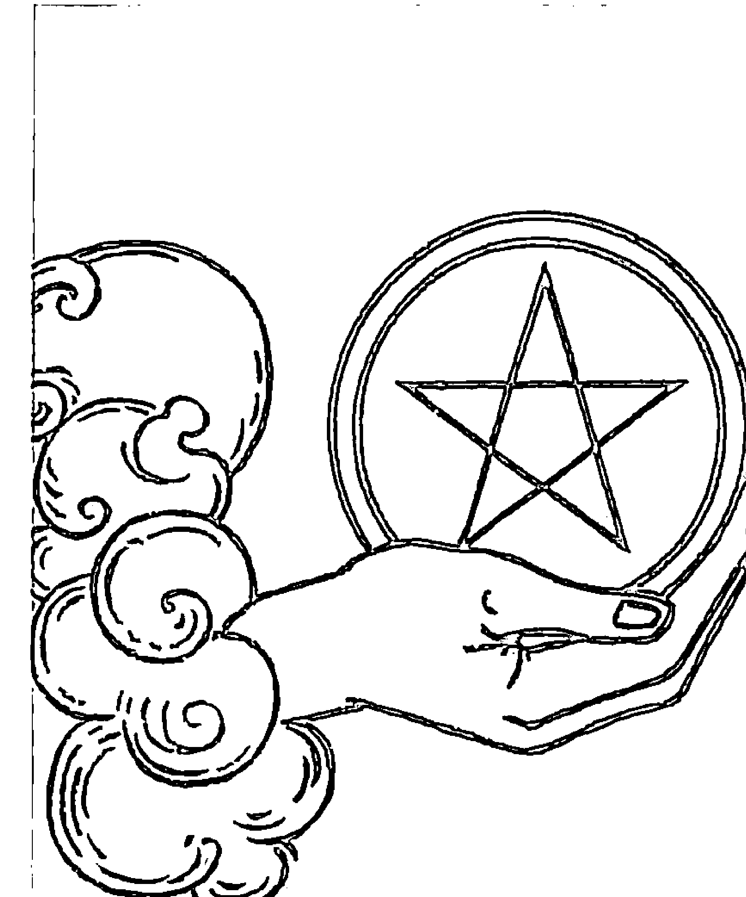

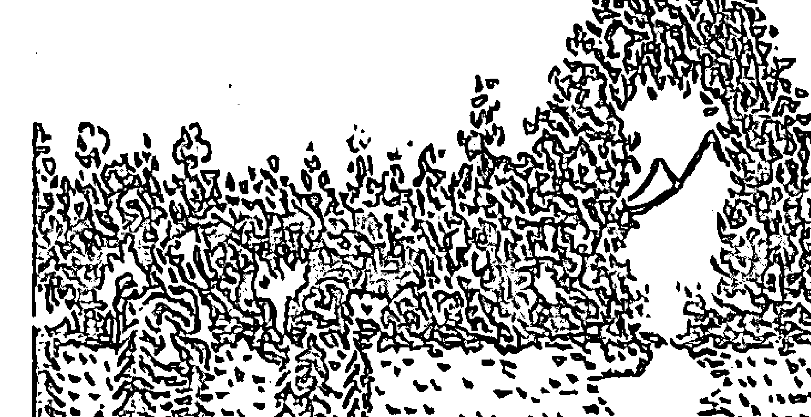

### 正位圖像細節解析

- ◇ **雲中伸出的手**：用捧的方式為呵護型的，代表十分呵護這一個擁有的關鍵或物質。
- ◇ **金幣**：泛指物質面或是比較持之以恆的事情，也可以做關鍵使用。
- ◇ **花園**：一個美好華麗的入口，指向美好豐盛的未來。
- ◇ **山**：未知的地方，但也是一個可以期待的方向。
- ◇ **百合花**：純潔單純的象徵，也表示這件事是件美好的發展。
- ◇ **道路**：純潔的心（百合），將可以讓一切往更好的期待方向前進。
- - ◇ 對應希臘諸神：海神波賽頓。

### 正位特質：重視擁有專心呵護

### 正位圖像全面解析

從雲中伸出的一隻手，用手捧著金幣代表呵護著一個物件，因為金幣大多指向物質或是重要的關鍵，因此代表目前有掌控一件讓個案覺得很重要的關鍵點，或是掌控可以享受的事情。

而下方的花園，也代表一切美好的未來正等著你去找尋。

### 參考關鍵字

掌握關鍵、擁有、享受物質生活。

### 逆位圖像細節解析

- - ◎ 切割上下重心在上
- - ◇ 山：未知的旅程，產生不安的變數。
- - ◎ 萬有引力關鍵掉落
  - - ◇ 金幣：失去擁有的，以及無法掌控關鍵要素，以物質層面來說就是破財的狀態。
- - ◎ 草木顛倒枯萎貧瘠
  - - ◇ 花園：枯萎後成為令人生懼的迷宮，與諾陶洛斯的故事有關。
  - - ◇ 百合花：不再單純，很多不確定及混亂的狀況。

## 金币二
### Two Pentacles

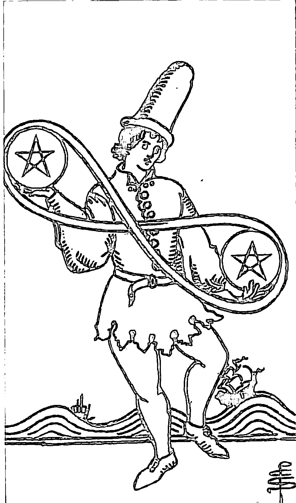

### 正位图像细节解析

- ◇ 高帽子：脑筋很好，运转的很快。
- ◇ 衣服：橘色内里代表很有经验的执行，造就黄色外衣所呈现的喜悦或收获的讯息，而且腰带为红色，表示是有行动力在执行的。
- ◇ 金币：两手熟练的将金币左右抛接，轨迹成为绿色无限标志，也表示两个金币间是有距离不会碰撞的，意指技术很好不会出错。
- ◇ 裤子：橘色代表很有经验。
- ◇ 鞋子：绿色代表控制得宜保持距离。
- ◇ 站姿：虽然看似不稳，但却是保持微妙平衡的状态，表示虽然有很多不稳定的情形，但都在控制当中。
- ◇ 海浪：波涛汹涌，代表许多起伏不定的变化。
- ◇ 船：虽然在海上看似危险，但却仍是稳定航行，表示都在掌控中。

### 正位特质：面对波动掌控得宜

### 正位图像全面解析

这个表演的艺人现在站姿看似不稳，他将手中的两颗金币不断的丢到另一只手上，这样的动作看似危险，却都是在他的掌控当中。

他充分的发挥他的技术，让许多事情都不会相撞而出现意外，就像后方的海浪虽大，但船只都可以稳定的在海浪上航行一般。

### 参考关键字

- 无限的可能、不同的发展、波动不稳定、变化多端。

### 逆位图像细节解析

- ◎ 切割上下重心在上
  - 脚的姿势：摇摆不定的状况被加强，代表变化已经变更严峻。
  - 海洋：海洋在船的上方也表示船被淹没，代表事情已经无法控制。
- ◎ 万有引力关键掉落
  - 金币：原本掌控良好的状态，因为金币掉落变成无法掌控的失败。
  - 帽子掉落：无法可想，也没有太多方法可思考。
  - 船：离开海面也代表搁浅了，一样指向失败，无法继续前进。

## ## 逆位特质：失去重心导致失败

### ## 逆位图像全面解析

这个表演人不小心摔了一跤，他手中的金币也就全部掉下来。帽子掉了，让他觉得现在的状况真的是糟到极点。

这些意外状况他也没有其他的备案，也只能接受这个失败的状况，就像后面海浪已经吞噬了船，代表一切都被这些无法掌控的事情摧毁了。

### ## 参考关键字

无法掌控的变化、失控的情形、出乎意料、无法可想导致失败。

## 金币三
### Three Pentacles

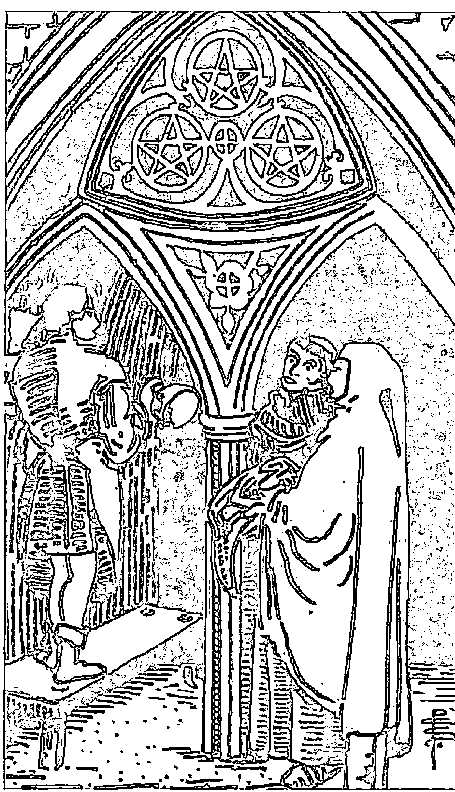

### 正位图像细节解析

- ◇ 建筑：只有外面有建好，后面仍是黑暗未建设的状况，代表一个建设只到初步完成的阶段。
- ◇ 金币：黄色只先淡淡的上色，指向初步完成，未到达完全完整的阶段。
- ◇ 花瓣：五片花瓣加五片叶，代表要求完美的十全十美。
- ◇ 放置金币的位置：隐约成为正三角形代表火元素，向上扬升力量。
- ◇ 放置花瓣的位置：隐约成为逆三角形代表水元素，个人情感。以上两个形成了以工作扬升为主，个人情感私欲较小的情形。
- ◇ 工匠：站在木椅上，代表懂得运用资源让工作轻松，也代表能力足够应付所有挑战，泛指能力很好。蓝色衣服与鞋子都代表相当冷静的面对，黄色防尘布代表是喜悦的，也是一个完成的喜悦。
- ◇ 修道士与设计师：出资者与设计者。设计师黄色衣服代表充满期待，而修道士咖啡色衣服代表落实的检查，与工匠各司其职。代表团队合作良好，也代表目前正在确认状态如何。

### 正位特质：团结合作各司其职

### 正位图像全面解析

这个修道士为了要把他的修道院建起来，他找了设计师及工匠一起来建造这个建筑物，而现在优秀的工匠已经初步的将这个修道院的外观建好了，虽然还没将颜色完全涂上，也还没全部盖好，不过为求正确，所以他们正在进行整体上的确认。

这个团队中每个人都各司其职，把自己最擅长的一面展现出来，这一切都看起来是十分的正向。

### 参考关键字

才能的肯定、团队合作、初步完成、确认状况。

### 逆位图像细节解析

- ◎ 切割上下重心在上
  - ◇ 木椅：木椅变成重点，工匠没有木椅就无法做事，就是能力不足。
  - ◇ 柱子雕饰：变成火元素向上扬升的力道小，而水元素个人情感的私欲变大，以个人私欲为主团队，自然无法正常运作。
- ◎ 万有引力关键掉落
  - ◇ 人：任何一个人掉落都代表原本团队分裂，也表示团队出问题。
- ◎ 建筑崩毁讯息消失
  - ◇ 建筑物：代表工匠能力不好，建起来的建筑物崩解了。

### 逆位特质：不重团结各自为政

### 逆位图像全面解析

现在发现，这个工匠其实能力不好，他所建出来的建筑物是个很容易就垮掉的建筑物。

这样的状况只会让修道士与设计师对他感到失望，这也表示他们找错工匠了，无可奈何之下只好匆匆结束这个合作，各自离开不再团队合作了。而这个工匠，也因此慢慢在建筑业界得到才能不好的评价。

### 参考关键字

才能不受肯定、错误的行为、分裂的团队各行其事、能力不足。

## 金币四
### Four Pentacles

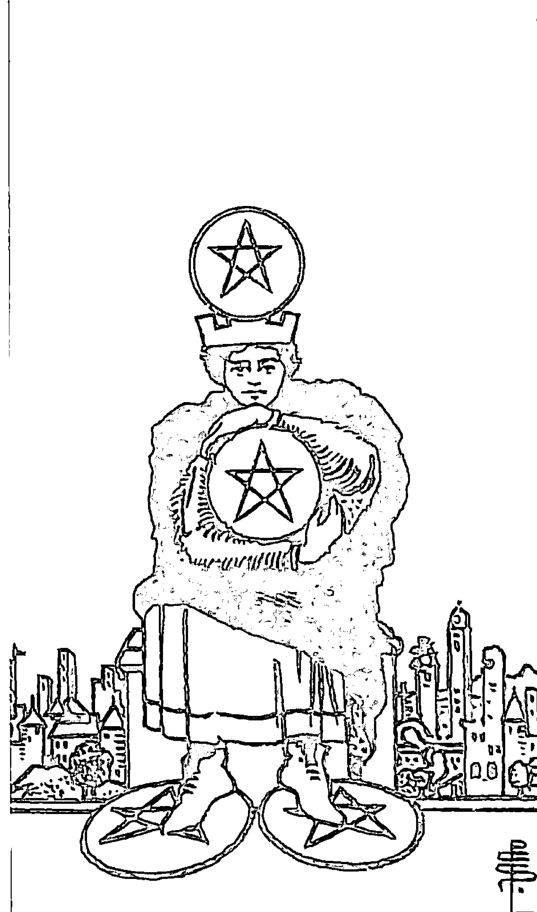

### 正位图像细节解析

- ◇ 头上金币：满脑子都是物质的想法。
- ◇ 皇冠：有一定的身份与地位。
- ◇ 手握金币：遮住胸口也代表封闭内心，不愿与外接触。
- ◇ 手姿：形成太极符号，表示想要不断的钱滚钱来赚钱。
- ◇ 脚踩金币：怕钱跑掉，守财奴的特性。
- ◇ 衣服：红色代表热情，但黑色披风与蓝色裙摆都代表不愿意行动。
- ◇ 石椅：固执的想法与态度。
- ◇ 城市：城主所拥有的地盘，也代表目前是拥有的，但还不满足。

### 正位特质：坚持己见不愿敞开

### 正位图像全面解析

这一个城主其实已经拥有许多领地，看到他后面那些房子就知道，他是多么有身份与地位的人。但他拥有了那么多的财富，他还是不满足，他的脑袋上就像是顶着一个钱币一样，不断的想着赚钱这件事。

而手中的钱币也把他的心房封锁了，代表除了钱之外，再也没有其他的事情能引起他的注意。但想归想，他又很怕投资会赔钱，那么小气的他就变成了只能停在当下变成守财奴了。

### 参考关键字

小气、守财奴、封闭内心、坚持己见、获利但不满足。

### 逆位图像细节解析

- ◎ 切割上下重心在上
  - ◇ 脚踩金币：还是想以物质世界为主，但因为脚踩不稳，可能会失去。
- ◎ 万有引力关键掉落
  - ◇ 头上金币：想赚钱但却失去了想法，也表示没有赚钱的方法。
  - ◇ 黑色斗篷：掉落後红色行动力出现，但配合上其他失去物质的讯息，可以说是开始投资但却失利的状况。
  - ◇ 皇冠：失去原本所拥有的荣耀与物质。
  - ◇ 城市：失去目前所拥有的。
  - ◇ 石椅：无法再坚持己见。

### 逆位特质：失去拥有无法坚持

### 逆位图像全面解析

现在这个城主开始行动了，只是他的想法与行动可能落差极大，所以他所作的投资不只是失败，甚至是连他原本拥有的房子都赔进去了。

在这样的状况下，就算他想要再努力的把钱赚回来，却也无法可想。除了赚不到更多的钱之外，连要守财都守不住，可以说是赔了夫人又折兵。

### 参考关键字

投资失利、想守财但无法如愿、无法坚持己见。

## 金币五
### Five Pentacles

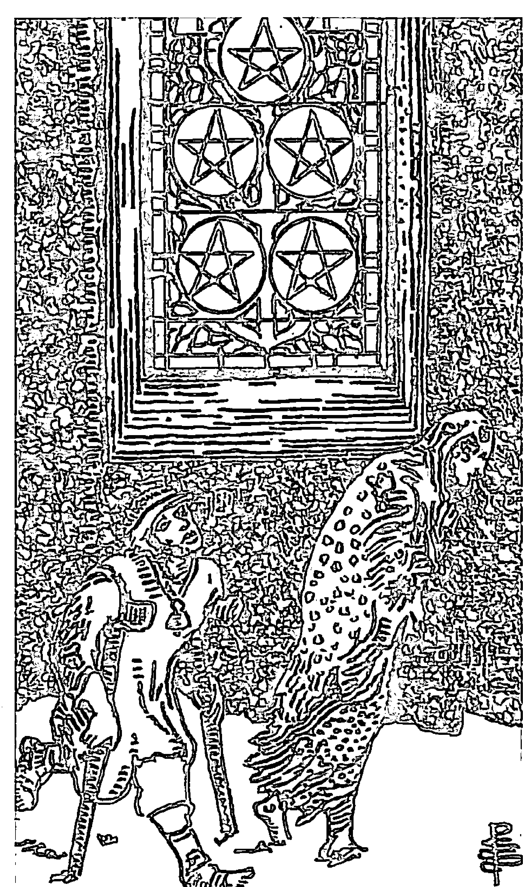

### 正位图像细节解析

- ◇ 彩绘玻璃：教堂，也是指向避难所，一个可以逃避灾难的地方。
- ◇ 右边的人：全身缩紧代表寒冷，红色头巾表示很有行动力的在前进，下半身绿色的裙子，则是代表他想要与这个糟糕的环境保持距离，从他没穿鞋子看来，应该是个饥寒交迫的状态。
- ◇ 左边的人：两眼无神（其实是眼盲了），带着拐杖代表是个受伤的人，蓝色冷静的外在表现，但内里其实是想要远离这个痛苦地方的绿色。身上有铃铛本来代表要放在伙伴身上，让他可以听音辨位，但因为混乱而放错到自己身上，也表示现在非常混乱的状态。
- ◇ 背景：大雪纷飞的夜晚，也表示目前的外在环境是十分严峻的。
- ◇ 两个人：往同一个方向前进，表示想要逃离目前的状态，极少数的时候会讲成共患难。

### 正位特质：现况严重仓皇逃离

### 正位图像全面解析

在一个大雪纷飞的夜晚，两个衣衫褴褛的人正在充满了积雪的地方上快速逃亡。对他们来说，现在的他们本身状况就已经很不好，再加上外在环境又让他们陷入了更糟的状况当中，他们急着想要找个避难所躲避这些灾难。

但却因为太过于混乱，而忽略了其实在他们的身后就有一个教堂，可以做为他们的避难所，在这样极度混乱的状况下就错过了这个机会。

### 参考关键字

逃避现状、仓惶不安、挫败的心情、混乱的状态。

### 逆位图像细节解析

- ◎ 切割上下重心在上
  - ◇ 雪：在上方代表人被雪掩盖，事情发展变得更严重。
  - ◇ 受伤及赤脚：踏在雪里更加痛苦，代表状况更加令人感到痛苦。
- ◎ 万有引力关键掉落
  - ◇ 人：往下掉落代表想要逃离这个环境，属于败走的状态。
- ◎ 建筑崩毁讯息消失
  - ◇ 教堂：连避难所都消失了，代表事情变成更严重。

### 逆位特质：深受打击无法逃离

### 逆位图像全面解析

现在这两个人已经被雪从上而下覆盖了，他们已经无法逃脱出这个危机，而且代表避难所的教堂也已经崩解，就算他们逃出了被雪淹没的危机，也找不到任何可以避难的场所。

对他们来说已经没有比这更糟的情形了。

### 参考关键字

逃亡、逃避目前的状况、比正位还严重的运势、逃不出灾难。

## 金币六
### Six Pentacles

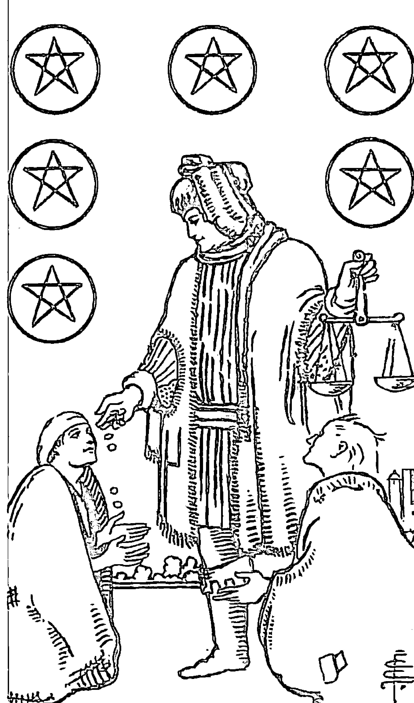

- ◇ 金币：挂在天空中，这边没有太多的意涵，只是代表金币六。
- ◇ 红色帽子：代表脑筋运转的很好。
- ◇ 橘色衣服：内里为白色条纹，表示单纯的去与他人之间互动（橘色代表脐轮）。
- ◇ 天秤：衡量事情的轻重，也可以指向商人的特质。
- ◇ 红色鞋子：主动的付出，而非被动的给予。
- ◇ 两个跪着的人：一起看成贫穷人，也是被施予者。
- ◇ 右後方城堡：富人的家，代表这是一个有钱人的施舍。
- ◇ 绿草丛：许多事情正在持续增长、成长中。

### 正位特质：主动付出量力而为

### 正位图像全面解析

一个有钱的商人，在他家附近看到了两个可怜的穷人，他们现在陷入需要被帮助的情况中。他们向这个商人祈求帮助，而这个商人在经过思索後，主动的付出他可以付出的帮助，他并没有将全部身家都给予，而是量力而为。

这些帮助也许不多，但至少也是可以让这两个穷人获得帮助，这个付出相信商人也是感到喜悦的。

### 参考关键字

施捨（为主要讯息）、被施捨（较弱）、经过思考衡量後的赠与。

### 逆位图像细节解析

- ◎ 切割上下重心在上
  - ◇ 穷人：以穷人为主，代表个案是需要被帮助者。
- ◎ 万有引力关键掉落
  - ◇ 施捨的钱：从穷人掉到富人身上，表示是不公平的行为，甚至可以说是被抢夺。
  - ◇ 天秤：逆位呈现歪斜，也表示不公平，泛指商人所拿的金钱是不公平的行为与方法，甚至有欺骗的可能。
  - ◇ 帽子掉落：没有太多想法，也表示是没有仔细思考後的行为。
- ◎ 草木颠倒枯萎贫瘠
  - ◇ 草丛：许多事情再也没有机会存在，因为钱已经被骗走。
- ◎ 建筑崩毁讯息消失
  - ◇ 城堡：失去目前所拥有的一切。

### 逆位特质：偷拐抢骗奸诈取巧

### 逆位图像全面解析

现在，狡诈的商人他心中的天秤已经歪斜，这代表他的心思已经不再公正，他用尽方法把穷人手中剩下的钱通通骗走，这样的行为是卑劣的。

而可怜的穷人则是因为这样而感到被欺骗，这种欺骗的手法就让穷人失去了所有的一切。

### 参考关键字

为达到目的而使用计谋、骗取、不正当的获得、被欺骗。

## 金币七
### Seven Pentacles

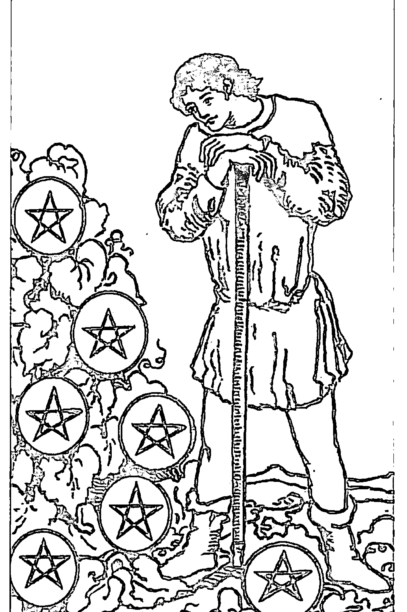

### 正位图像细节解析

- ◇ 树上金币：成长丰收的状况。
- ◇ 地上金币：采收下来的收获物。
- ◇ 下巴靠锄头：停止工作，正在思考。
- ◇ 衣服：绿色代表保持距离，也表示还没有进行下一个行动，黄色内里则是代表喜悦、丰收的特质。
- ◇ 锄头：插进土里代表暂时没有行动。
- ◇ 树丛有咖啡色：表示有些枯萎的状况出现，也暗示必须做选择是否要将金币摘下。

### 正位特质：已有收获谨慎思索

### 正位图像全面解析

这个辛勤的农夫，他努力的耕耘终于在现在有了一些不错的收成，他尝试将其中一个金币收成下来检视，并且将锄头先插入土里仔细思考，对他来说到底是要将剩下的全部收成，还是再等一阵子，也许这些收获会长得更多？

现在的思索对他来说是很重要的，因为这事关他接下来到底该怎么做，所以不得不仔细思考。

### 参考关键字

思索方向、规划一个行动、一个小收成、一个阶段性的完成（准备开始下阶段）。

### 逆位图像细节解析

- ◎ 切割上下重心在上
  - ◇ 锄头：插进土里的暂时停止行动，被扩大解释成停滞不前。
  - ◇ 地上金币：以现有收获的为主，不再看顾未收成的，指向不去思考未来。
- ◎ 万有引力关键掉落
  - ◇ 地上金币：掉落代表失去即将获得的收获。
- ◎ 草木颠倒枯萎贫瘠
  - ◇ 树丛：枯萎也表示那些还没收成的失去了，就像投资失利一样。

### 逆位特质：过度谨慎反而失去

### 逆位图像全面解析

这个人犹豫太久了，这样子的停滞将会让许多机会一一的丧失。

那些树丛的金币，因为拖延时间太久都枯萎掉落，这就代表之前对他有利的机会，以及可以收成都失去，也许该归类于他太过小心及想太多吧，所以现在的他不只不敢前进，也让原本的努力全部都白费了。

### 参考关键字

错误的投资、失去即将获得的、找不到方向、迟疑不行动。

## 金币八
### Eight Pentacles

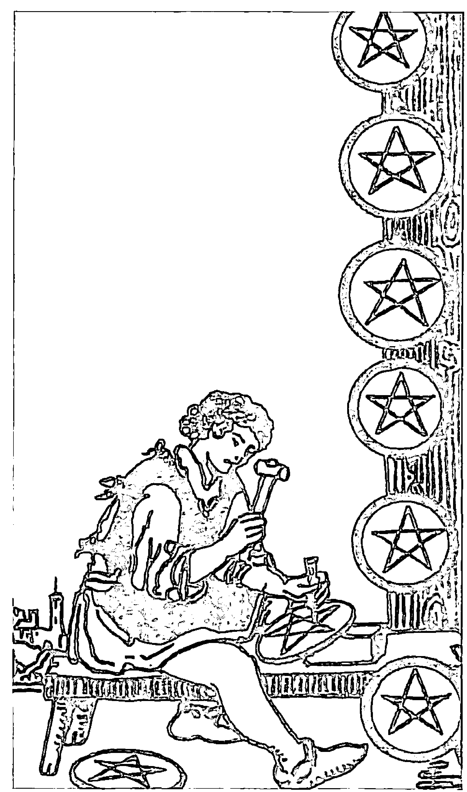

### 正位图像细节解析

- ◇ 木板上金币：已经完成的成品。
- ◇ 制作中金币：正在努力运作中的过程。
- ◇ 地上的金币：还未到达的阶段。
- ◇ 木椅：工作的地方。
- ◇ 工作者：专注的工作，努力不懈。
- ◇ 黑色防尘布：施作者已经做很久了，防尘布已经沾满灰尘，代表已经是专家。
- ◇ 衣服：蓝色代表冷静的制作。
- ◇ 裤子：有行动力的前进。
- ◇ 鞋子：咖啡色代表落实的态度。
- ◇ 铁鍊跟凿钉：工具，也表示施作者懂得运用工具来让事情完成。
- ◇ 城堡：八枚金币完成後就可以送往城堡换取物资，也代表终点。

### 正位特质：专心一致逐步向前

### 正位图像全面解析

这个工作者相当的认真，他一步一脚印的将他的作品一一完成。完成的就先钉在木板上面，对他来说，现在就是要专注的把手边的工作做好，等到所有的作品都做完後，就可以将这些作品拿到远方的城堡去换钱。

看他专注的在工作，以及他的防尘布已经都磨到变黑色了，这表示他已经在這行做了很久，他的技术一定是一流的。

### 参考关键字

专注的、稳定的前进、有技能的、有成果但未全部收成。

### 逆位图像细节解析

- ◎ 切割上下重心在上
  - ◇ 地上的金币：很重视未完成的讯息，也表示未到最後可以将金币带去城堡的阶段。
- ◎ 万有引力关键掉落
  - ◇ 人：从椅子上掉下来代表坐不住椅子，也表示想离开这个位置。
  - ◇ 铁鎚与凿钉：技术不好让工具都飞掉。
  - ◇ 城堡：就算东西做好也没地方送，表示无法完成的状态。
- ◎ 建筑崩毁讯息消失

### 逆位特质：能力不足无法成就

### 逆位图像全面解析

这个人现在连他的椅子都坐不太住，这就像是没有办法专注的做目前的工作一般。也因为他没有专注的工作，他的铁鎚跟凿钉一不小心就会飞走。

这样的不专注，将会为他的工作带来相当程度的失败，也表示他只是个技术不好的人，无法专注的把手中的工作做好，自然也就往失败的方向前进。

### 参考关键字

技能不足、无法专心工作、想换工作、未达到可进行的阶段。

## 金币九
### Nine Pentacles

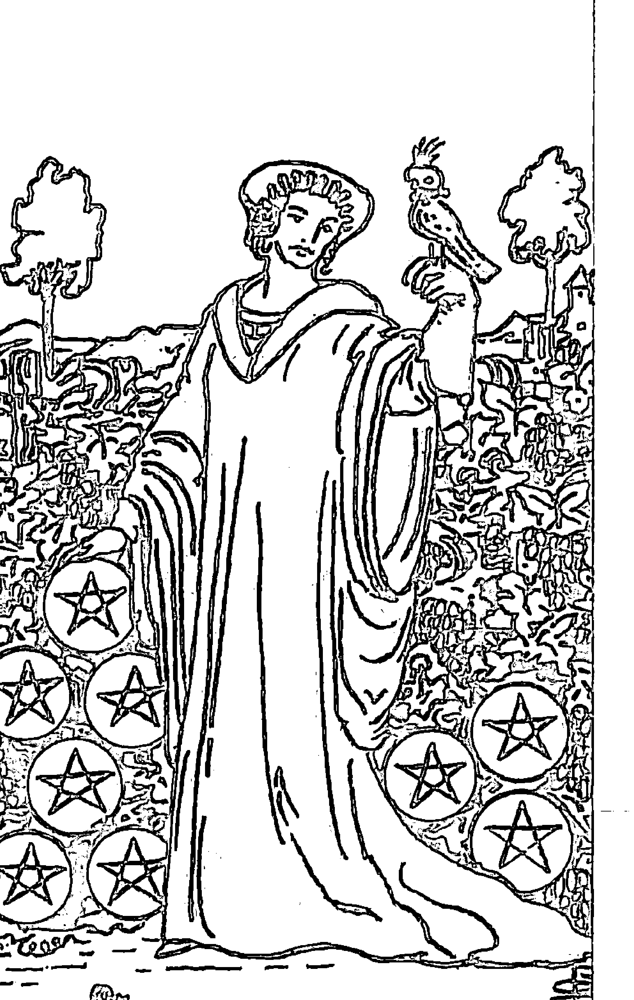

### 正位图像细节解析

- ◇ 衣服：宽松衣服当中的花朵，代表女性象征，宽松的衣服也有怀孕的意思。
- ◇ 帽子：红色帽子，代表有在思考整体状况。
- ◇ 葡萄藤围篱：用物质将人困在一个世界，与外界隔离。
- ◇ 金币：手放在金币上，代表物质享受。
- ◇ 远方的山与树木：被隔绝的外面世界。
- ◇ 隼：头罩罩住头代表豢养，可以享受物质却失去自由，也代表野性的欲望是被控制住，不再向往外界。
- ◇ 蜗牛：为了可以随时回家，宁可牺牲行动力。
- ◇ 背景：黄色背景，仍代表有丰盛的享乐意思。
- ◇ 城堡：与他人之间隔离，也表示牺牲自己的自由换取享乐。

### 正位特质：为求享受牺牲自由

### 正位图像全面解析

这个人现在为了享受，而将自己关到葡萄园里，这就像是他手上的隼被套住头豢养一样，虽然是相当的丰富，他可以尽情的享受一切，但这也让他与外界有所隔离，就像是有些人为了享受美好的物质享受，而愿意拿自己的自由或爱情来交换一样。
虽然在这里面可以享受物质上的美好，但他的心是否是愉快的？这就不得而知了。

### 参考关键字

物质享乐、为了达到收获必须牺牲（爱情、自由）、自我享受但与外界隔离。

### 逆位图像细节解析

- ◎ 万有引力关键掉落
  - ◇ 蜗牛：掉落就无法继续往葡萄藤前进，就成了失败者。
  - ◇ 金币：失去物质享受的机会，不过可以看到有一枚金币是被捧住的，所以只是减少享受而非全然失去。
  - ◇ 隼：头罩掉落让隼重见天日，为了自由飞翔而选择放弃享受。
  - ◇ 帽子：不再思考关于享乐与自由的问题，离开原地。
- ◎ 草木颠倒枯萎贫瘠
  - ◇ 葡萄藤架：享乐的讯息消失，同时间阻隔与外界的隔阂也消失了，也有机会代表是小产。
- ◎ 建筑崩毁讯息消失
  - ◇ 城堡：不必再在乎他人的想法，自由自在地做自己。

## ## 逆位特质：为求自由放弃享乐

## ## 逆位图像全面解析

代表隔离的葡萄藤架现在垮掉了，这也代表原本束缚住的一切都挣脱，虽然可以享受的层面减少许多，但至少现在他是变成自由的，就像隼的头套掉落，他已经可以看到外面的世界，自由自在的翱翔，让隼不会再想回到被束缚的阶段。

就物质层面来说，看起来这个人的物质失去许多，甚至可以说是不足夠的状况，但至少精神层面可以有较愉快的享受。

## ## 参考关键字

失去成功的可能、物质享乐但讯息较弱、为了自由牺牲物质。

## 金幣十 Ten Pentacles

### 正位圖像細節解析

- 金幣：排成卡巴拉生命之樹，代表一個完整的旅程結束。
- 拱門：可看到有旗幟與壁畫，代表這是一個有成就者的居所。
- 老人：衣服有葡萄及華麗的裝飾，代表這是一個事業有成就的人。
- 年輕男生：手中拿矛代表守護老人，也意指守護既有的一切。
- 男女：一起對話代表一個交流與溝通的狀態，小孩依偎在母親身旁，展現出家庭的特質。
- 小狗：隨從者，也藉由寵物連結整個家庭的關係是緊密的。
- 人群：三代同堂，也表示這是比較偏向傳統家庭模式。
- 遠方城牆：代表這是在一個安全的地方，一個被守護的場所。

### 正位特質：雖已成功但仍守護

### 正位圖像全面解析

這個老人在年輕時付出相當多的努力，如今他功成名就，並且擁有一個美好的家庭。

他坐在家中，還有他的兒子守護著他，看到兒子與媳婦的交流，也看到孫子與小狗愉悅的相處，這一切都是美好的感受，老人與小狗互動，似乎對於這一切都感到相當的滿足，這個家庭看起來和樂融融。

### 參考關鍵字

物質的獲得、成功的狀況、和諧的家庭、守護既有的。

### 逆位圖像細節解析

- 切割上下重心在上
- 小狗：老人接觸小狗，即是代表財務（老人）有錯誤資訊（小狗）的狀態。
- 老人：以物質及成就為主，太重視這塊反而讓家庭少了親情。
- 萬有引力關鍵掉落
- 老人：失去擁有的物質或成就。
- 小狗：家中人與人之間的關聯消失，藉此意指關係出現問題。
- 矛：無法守護既有的。
- 人：任何人掉落都代表家中關係出現問題。
- 建築崩毀訊息消失
- 拱門：過去所得到的榮耀與物質都消失。
- 城牆：守護的力量消失，表示無法守護。

### 逆位特質：注意投資小心失去

### 逆位圖像全面解析

這個家庭現在因為許多錯誤的訊息存在，開始出現不好的關係。也許是其中任何一個人的離開而不願意再溝通，或是原本代表成就的房子倒榻，這樣的狀況都讓整個家庭出現了危機。

甚至因為現在以小狗的邏輯思考為主，代表財富及成就的老人與小狗的互動，就成了財富有錯誤資訊的投資，接下來將會有極高的機會出現財務危機。

### 參考關鍵字

失去物質的可能、冒險的投資、無法守成、家中關係有問題。

## 宮廷牌

宮廷牌十分重視人格特質，因此思考這個人有怎麼樣的行為，就是解牌的關鍵點。我會嘗試用不同的人格特質來帶領各位朋友，了解宮廷牌的解析方式。可以將宮廷牌的人格特質融入解牌中，這樣解牌會更多元化。

## 聖杯侍者
### Page Cups

人格联想：国小学生 / 幼稚的爱

在情感层面上像個小孩子一樣，內心喜歡你，卻故意展現出跟你作對的狀況。

外表不在乎，實際上內心卻是非常的專注，腦子裡永遠會有許多新鮮有趣的想法，為了要引起對方的注意，就會想辦法做一些惡作劇的行為來吸引對方的注視。

### 正位參考牌義

輕鬆的態度、專注的對待、年輕不穩定的特質、小小惡作劇。

### 正位圖像細節解析

- 帽子：像海浪一樣的特質，看似波動不定，但實際上當中仍有他的重點存在（珍珠），藉此顯示侍者在腦子中常有許多奇怪不穩定的想法，或稱之為惡作劇的念頭。
- 手插腰：很有自己的想法，比較有自信。
- 腳姿勢：看似不在乎、隨興的站姿，表現出外在沒有相當注重態度。
- 聖杯中的魚：代表創意，也表示侍者所作所為是很有創意的想法。
- 衣服：紅色花朵代表行事作風直接、有行動力。
- 內裡：紅色內裡衣褲表示侍者行動力強。
- 鞋子：黃色鞋子，也表示他的行事作風較喜歡愉悅快樂的模式。
- 背景：人工建造的堤防，代表他仍在既有的規範當中，不會過度脫序，後方的海浪波濤洶湧就像他的帽子一般，是帶有變化的情感。

### 逆位參考牌義

惡作劇過火、自私、不願意付出、虛情假意。

### 逆位圖像細節解析

- 切割上下重心在上
- 鞋子：太在乎自己的期待，忽略了他人的感受，也不願意付出。
- 萬有引力關鍵掉落
- 海水：失控的情緒，讓侍者的表達方式會比較誇大。
- 魚掉落：失去了創意，行事作風僵硬，沒有太多變化。
- 帽子掉落：失去原有的想法，甚至這些想法都變成沒有重心（珍珠失去），這樣讓侍者的行為因為沒有主軸，而變成漫無目的的行為。
- 聖杯中的水：水的掉落讓侍者變成沒有情感的人，就算外在有行為，但內心其實是空泛的，一個虛情假意的狀態。
- 建築崩毀訊息消失
- 堤防：原本有堤防作為一個規範，不至於失控的界線，但失去後變成所作所為都失控，惡作劇也容易變成過火，行為都無法控制。

## 聖杯騎士
### Knight Cups

人格聯想：高中學生 / 忠貞的愛
在情感層面上較為成熟，十分注重表達自我魅力的特質，希望可以藉由他人的肯定，來讓自己覺得自己的所作所為是正確的。

因此在表達的過程中難免會有點浮誇，也喜歡讓他人覺得自己是個很重情感的白馬王子。

### 正位參考牌義

認真的對待、專注的面對、穩定的前進、白馬王子的出現、有才藝及想像力的。

### 正位圖像細節解析

- 翅膀：代表飛翔前進，在頭盔上，代表腦袋是努力的思索如何讓狀況往前，在腳上也表示有真的認真在執行向前的行為。
- 手持聖杯：身體筆直、手端正的拿，表示出專注面對且認真的態度。
- 手握韁繩：控制情感與相處模式，不至於過度失控。
- 衣服：紅色魚跳躍出海面，表示創意經由行動力完整的呈現出來，將這樣的創意放在身上，即是代表相當重視如何將想法與創意展現在自己身上，讓周遭的人看到自己的魅力與特質。
- 白馬：穩定踏實的前進，也表示騎士做事穩定不急躁。
- 背景：湍湍細流，表示出騎士的情感並非波濤洶湧，是一個持之以恆並且可以穩定釋放，藉此去讓人感受到他的情感。
- 綠色草地：持續成長滋養的狀況。

### 逆位參考牌義

不願意付出、過度注重表面、花心、不好的一個邀請、逃避情感(或事情)。

### 逆位圖像細節解析

- 切割上下重心在上
- 河流：越流越小，代表情感逐漸喪失。
- 白馬：白馬持續前進，但配合其他組合，會變成持續追求但是沒情感的狀態，也表示只是重視相處的前進，但並沒有真實情感存在。
- 腳的翅膀：持續前進，但配合情感流失，則是轉為離開情感或是沒感情的前進。
- 萬有引力關鍵掉落
- 聖杯：水流失也表示沒有情感，但騎士仍是看著杯子，可說成表面的在乎，但實際上沒情感（重視表面展現）。
- 頭盔：對於情感沒有專注想要前進的意思（沒認真思考前進一事）。
- 馬上摔下：不願意面對情感，想逃離這件事。

## 聖杯皇后
### Queen Cups

人格聯想：成年人 / 表現的愛

在情感層面上已經成熟了，像是已經出社會的社會人，這時的愛很重視如何展現出來給更多人看到，希望是可以被大家所稱讚及羨慕的，因此難免會有過多的期待，對於愛情也小心翼翼的呵護。

畢竟出了社會，外在的誘惑更多，所以會有更加強守護愛情的想法存在。

### 正位參考牌義

專注的對待、關懷、詩情畫意、溫暖的心、溫柔的母愛。

### 正位圖像細節解析

- 皇冠：許多的圓形雕飾，表示皇后充滿了美好圓滿的想法。
- 衣服：純潔冷靜的心（衣服），再輔以浪漫的表現（海浪披風）來執行一切。
- 聖杯：華麗有蓋的聖杯，蓋子代表守護不讓情感流失（阻止蒸發），也因為看不到裡面的水（情感），增添許多的想像空間。華麗代表展現，聖杯旁有天使代表祈禱，也是期待的意思。
- 皇后眼神：專注的看著聖杯，也代表重視這些情感的展現。
- 腳底下鵝卵石：經過磨練過後的表現方式，也是一個溫和不尖銳的態度。
- 石椅：下方小孩子代表皇后是有母愛的，上方兩個小人魚靠在貝殼形象的椅背上代表守護的意思，也可以指向母愛的特質。
- 海與岸：接近到內心情感的位置，海波浪是從陸地蔓延過去的，也表示現實層面的行為，慢慢的蔓延到內心的感受面。

### 逆位參考牌義

濫情、忌妒的感覺、過度夢幻不切實際、不再守護。

### 逆位圖像細節解析

- 切割上下重心在上
- 鵝卵石：過度追求溫和的呈現，已超越現實真實的訊息。
- 海與岸：過度重視現實訊息，並放大到內心的感受。
- 萬有引力關鍵掉落
- 聖杯：水從杯底流到杯蓋，用滿到杯蓋的假象來代表情感滿溢。
- 鵝卵石：如同用石頭砸人，表示忌妒的情緒。
- 建築崩毀訊息消失
- 石椅：崩解也代表不再守護，也不再去在意及關心情感與創意。

## 聖杯國王
### King Cups

人格聯想：熟年人 / 成熟的愛

在情感層面上相當成熟，知道這段愛情仍掌控在自己手中後，就不會刻意要天天黏在一起。會把重心放在更多其他該重視的事情上，甚至可以說是努力展現自己的工作能力。

看似沒有很在乎情感，但其實這樣做都只是為了賺錢，讓家可以得到更好的照顧，所以稱為熟年的愛。

### 正位參考牌義

廣闊的心、才藝、顧家的人、有領導能力。

### 正位圖像細節解析

- 皇冠：紅色皇冠代表有行動力的腦袋，黃色則是豐盛的想法。
- 魚項鍊：黃金魚代表創意達到最高境界，而且可以真實展現。
- 衣服：藍衣綠袍代表懂得用心（心輪）溝通（喉輪）。
- 手握權杖：代表可以掌控所有的一切。
- 手持聖杯：掌控及擁有愛情。
- 不注視聖杯：不沉溺於情感的互動當中。
- 海浪：波濤洶湧，但自己可以在這當中用自己的規範（石椅），不受情感影響。
- 左後魚與右後船：創意想法（魚）浮出潛意識（海），而可以形成真實的成果（船）。
- 腳：綠色代表保持距離，也不真實踏入水中，表示擁有情感但不會過度沉溺於其中。

### 逆位參考牌義

意氣用事、不願意面對現實、才能不好、不在乎情感的狀態。

### 逆位圖像細節解析

- 切割上下重心在上
- 海浪：波套洶湧的情緒已經成為在乎的重點，成為情緒起伏太大的狀況。
- 魚與船與海：海已經淹蓋過魚與船，表示創意展現不出來。能力也不足，讓創造出來的船又淹沒了。
- 萬有引力關鍵掉落
- 聖杯：水掉落也表示情感層面薄弱，配合不看聖杯就變成不在乎。
- 權杖掉落：無法掌控所有的一切，讓情感支配一切。
- 海水：整個淹蓋而下，亦代表被情感沖昏了頭。
- 皇冠掉落：沒有能力可以展現才能。
- 魚項鍊：代表才能顯化，能力已經失去。
- 建築崩毀訊息消失
- 石椅：崩解後人就掉入海裡，變成被情感淹沒，原本可以創造實像的能力也都失去。

## 權杖侍者
### Page Wands

人格聯想：學生時期

在行動力與方向的層面上，屬於年輕學生的情形，對於教授所傳達的訊息會相當專注的學習，也因為自己本身學識能力不強，因此就會展現出認真專注的態度，並期待教授可以給予更多的知識，這樣的等待著。

### 正位參考牌義

專注的期待、一個訊息的到來、認真的學習、有成長性的可能。

### 正位圖像細節解析

- 帽子：橘色帽子代表腦袋，很重視與他人之間的互動（臍輪），期待可以吸收更多的資訊。紅色羽毛則是代表全新的象徵（火鳳凰的羽毛），可聯想到愚人的全新腦袋，以新視野看待接下來的訊息。
- 披風：綠色披風，代表用心感受（心輪）一切。
- 衣服：上面有火蜥蜴代表行動力，是火元素的象徵。
- 鞋子：綠色代表用心一步一腳印，翻皮裝飾類似火的圖像，也表示有行動力落實一切。
- 雙手握權杖：將權杖舉起離地，代表還未將行動力真實的落實，但有小心翼翼的準備行動力與方向。
- 眼神：專注的看著方向，與期待更多的方向出現。
- 背景：金字塔代表人造建築，表示重視周遭人的期許。

### 逆位參考牌義

自以為是、過度等待反而失去該做的事、能力不受肯定。

### 逆位圖像細節解析

- 切割上下重心在上
- 權杖：離地凸顯出沒有將行動力落實，也表示沒有行動力的狀態。
- 萬有引力關鍵掉落
- 帽子：不再願意與他人相處，可以說是不願意向他人學習的狀態。
- 權杖：失去動力或不再專注的面對。
- 建築崩毀訊息消失
- 金字塔：不再在乎他人的觀感，以自己為主。

## 權杖騎士
### Knight Wands

人格聯想：剛出社會新鮮人時期

剛出社會的新鮮人，對於所有的事情都展現出高度的學習力，也很願意展現自己的才能，期待能夠被看重，因此在面對學習時也是積極主動的特質，面對到挑戰會展現出較大的毅力去面對。

行動力是屬於暴衝的一個狀況，有時候難免會有失控的狀態，但至少就是展現出堅強的戰鬥力，不會輕易放棄。

### 正位參考牌義

快速的前進、勇敢的面對、有行動力的、有毅力的面對目標。

### 正位圖像細節解析

- 權杖：宮廷牌中唯一短權杖，也表示重視行動力與戰鬥力，是屬於有目標就勇往直前，而不容易受到牽絆的特質。
- 盔甲：除了是可以有更強的毅力面對挑戰外，頭上紅鬃毛也代表腦筋運轉得很快，是個可以快速思考的模式。而手肘也有紅色裝飾，如同火焰一樣，有快速執行的意涵。
- 手姿：握韁繩代表控制行動力控制得很好。
- 馬：準備躍進的動作，代表騎士可以一瞬間的快速前進。
- 金字塔：仍有在乎他人的感覺，但相對於侍者已經降低許多。
- 衣服：火蜥蜴代表行動力，是火元素的象徵，後方衣服有點破裂，表示已經經歷過一些戰役，但仍繼續奮勇向前，代表堅持不懈。
- 韁繩：綠色葉子也代表生生不息的力量，代表掌控力持續存在不會喪失。

### 逆位參考牌義

過度行動忘記計畫、沒有行動力、急躁、失敗無法再前進。

### 逆位圖像細節解析

- 切割上下重心在心
- 馬：躍進的動作變成過度前進，會讓一些行事變得過度急躁的狀態。
- 衣服：破碎衣服也表示受到很大的傷害，意指傷害及失敗的模式。
- 萬有引力關鍵掉落
- 人掉落：從馬上摔落代表失敗了，接下來只能停在當下無法前進。
- 權杖掉落：失去行動力與戰鬥的工具，也代表無法前進。
- 建築崩毀訊息消失
- 金字塔：不再在乎他人的觀感，以自己為主。

## 權杖皇后
### Queen Wands

人格聯想：社會老練工作者時期

已經可以把工作做的駕輕就熟，除了可以把自己的工作做的很好之外，也可以去關心後進晚輩，會仔細的觀察到細小的狀況並給予協助，是屬於一個會關心關懷的前輩。

但也因為不是主管階級，所以沒有受過向下管理的技巧，在給予建議時會比較容易只是直接的說法，而沒有考量到晚輩的感受，不過這個前輩並非是惡意的。

### 正位參考牌義

熱情的、友愛的、願意付出關懷、直言不諱。

### 正位圖像細節解析

- 皇冠：上有綠色葉子，代表想法持續的成長。
- 衣服：橘色代表很重視與他人之間的互動，披上白色披風代表單純的行為。
- 衣扣：紅色衣扣代表熱情的執行。
- 權杖：放在地基上，表示他的行動力還是以自己份內事情為主。
- 向日葵：關心、熱情的象徵，也表示皇后會去關懷他人。
- 石椅：火元素的象徵，後方獅子是橘紅色的，如同炙熱的火焰，也表示態度較為直接不隱諱，有時候的直接可能會傷害到他人。
- 黑貓：靈敏的象徵，也代表會去關心那些他人較陰暗的層面。
- 金字塔：已經離皇后很遠，表示比較不在乎他人的感受，做事情比較是想做什麼就做什麼的態度。

### 逆位參考牌義

暴躁不安、情緒失控、有計謀的進行、失去活力。

### 逆位圖像細節解析

- 切割上下重心在上
- 黑貓：重視自己內在的黑暗面，也表示做事是有內心計謀的。
- 石泥地：將代表行動力的權杖放在上面，只在乎自己希望的那塊領域，不在乎他人的感覺。
- 石椅的獅子：強烈表現出獅子的火元素霸氣，指向情緒的暴躁。
- 萬有引力關鍵掉落
- 黑貓：不去仔細觀察他人的陰暗面，也指向不在乎他人的難過。
- 權杖：不想前進，也不想對於自己的事情有任何的行動。
- 草木顛倒枯萎貧瘠
- 向日葵：不再關懷或關心他人的感受。
- 建築崩毀訊息消失
- 石椅：失去熱情活力，也不再表達情緒，有情緒內藏的陰暗狀況。

## 權杖國王
### King Wands

人格聯想：上級長官的階段

作為一個長官，需要考慮到的面向會更多，他需要掌控所有的事情，以及妥善分配所有的工作。因此他就不如皇后般的急躁及直言，他會有更多的思索，當所有的想法都想清楚之後，再開始快速佈達所有事情。

他的重心就是要去關心下屬的情況，所以有時候在時間分配上，會有更多時間在處理下屬的事。

### 正位參考牌義

熱情、領導能力強、經思考後可快速行動、腳踏實地的。

### 正位圖像細節解析

- 皇冠：金黃色火焰標誌，代表國王的想法是有動力且是最佳的狀態。
- 衣服：紅色的衣服代表行動力，但上面有藍色披肩，表示冷靜不會太過急躁。
- 鞋子：藍綠色鞋子也代表行事作風有節制，不會太過於熱情。
- 手握權杖：將權杖放到地基以外，也表示會把更多重心放在外面的他人身上。
- 火蜥蜴：快速前進的意思。
- 衣服：火蜥蜴代表行動力，是火元素的象徵。
- 木椅：比石椅溫和，黑色獅子也代表燒完的灰燼色，亦指溫和的表達，而非皇后的直來直往。

### 逆位參考牌義

領導能力差、意氣用事、盲目、任性、散漫沒動力。

### 逆位圖像細節解析

- 切割上下重心在上
- 火蜥蜴：直來直往，也是很暴衝的意思。

## 宝剑侍者
### Page Swords
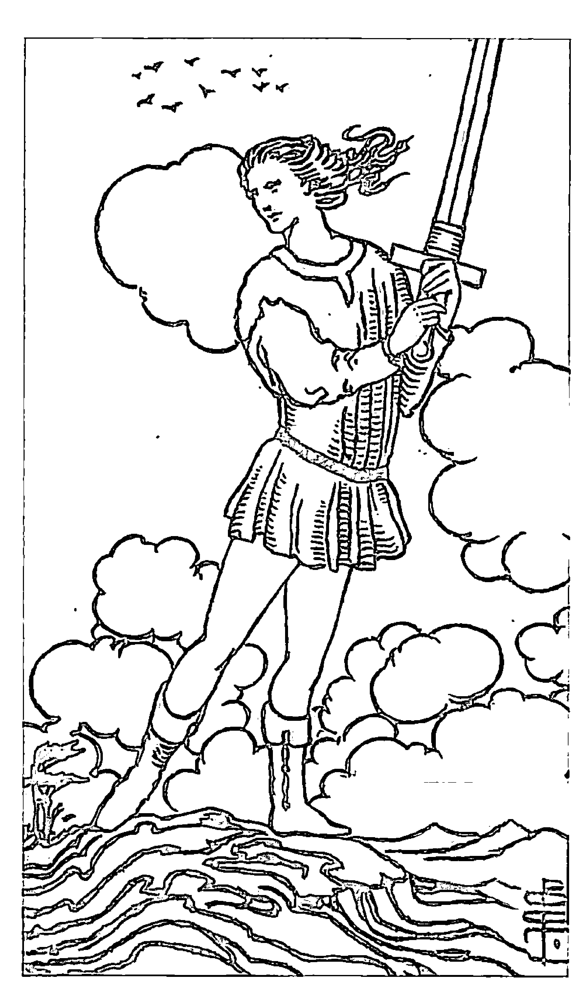

### 人格联想：侦察兵
本身没有太多的战力，但擅长运用自己的智慧与观察力了解敌人的状况。
藉由自己的敏锐观察了解所有的情形，虽然并不能马上解决问题，但至少在协助分析上有很多的帮助。是个虽然能力不到最好，却可以把自己能力充分发挥的特质。

### 正位参考牌义
敏锐的观察、清楚的了解状况、充分掌握资讯。

### 正位图像细节解析
- 宝剑：放在头旁边，代表运用智慧去观察一切。
- 头发：束起来让自己在观察时不会被头发卡住，导致判断力出错。
- 衣服：紫色代表智慧，也代表展现智慧的能力。
- 内里：黄色的内里代表内心是充满喜悦的，因为他可以清楚知道所有的一切，也可以得到他想要的讯息。
- 鞋子：褐色鞋子，表示有落实的执行。
- 山丘：居高临下也表示占尽地利，可以看得更清楚。
- 云：遮蔽物，云的多寡代表可以看清楚的状况如何，侍者还是有部分被遮蔽，但至少10只鸟都可以看清楚，代表该看清楚的讯息还是看得到，也许不够全面性。
- 树木：风吹的状态，也是智慧想法运作的模式，一般比较少解。

### 逆位参考牌义
错误资讯太多、不了解状况、错估情势。

### 逆位图像细节解析
- ◎ 切割上下重心在上
- 山丘：现在人在山丘下方，代表居下临上，会看不清楚所有的资讯。
- 上半部的云：太多的云遮蔽住，让侍者看不清楚事情的状态。

### ◎ 万有引力关键掉落
- ◇ 宝剑掉落：脑袋旁的智慧消失，也表示无法判断资讯对错，可能会收集到很多错误的资讯。

## 宝剑骑士
### Knight Swords
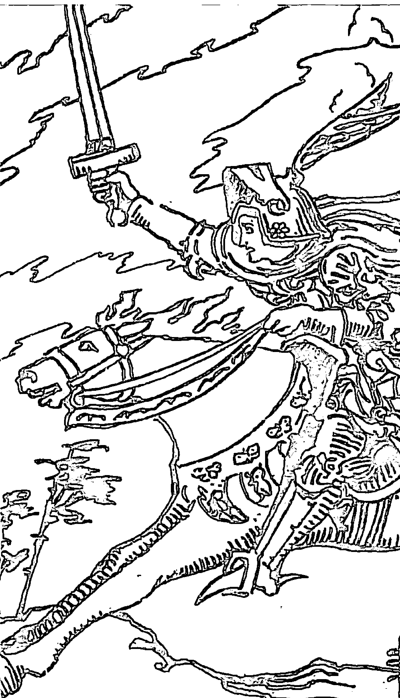

### 人格联想：大将军
一个十分勇猛的将领，可以带着兵快速前进的将军，他不是躲在兵后面指挥的，而是带着兵往前冲的。
他的速度又快又狠，可以快速地想清楚所有的事情，也是一个有相当大破坏力的人，对于想征服的都可以迅速达成。

### 正位参考牌义
快速的前进、思绪清晰、可快速完成（但不是满分）、懂得运用能力。

### 正位图像细节解析
- ◆ 宝剑：高举代表将智慧拉高、放远，从高处可以看得更广更远，一个很重视智慧表现的态度。
- ◆ 白马：快速奔跑，代表快速执行，与宝剑一起看就是剑及履及。
- ◆ 头盔、红色羽毛：脑筋运转得很好，并且像羽毛一样轻盈。
- ◆ 盔甲：尖刺代表攻击力。
- ◆ 披风：红色披风代表相当有行动力，已经快速到飘起来了。
- ◆ 云：已经是被吹到散开的状态，借此表示快速的意思。
- ◆ 右上角的鸟：已经被吹散、无法稳住的状态，代表风的速度相当快。
- ◆ 树木：风吹的状态，也是智慧想法运作的模式，一般比较少解。
- ◆ 土地：一个有坡度断层的地方，但骑士可以快速跨越，也表示可以轻易的越过挑战。

### 逆位参考牌义
盲目行动、逃避问题、不懂得正确的使用方法。

### 逆位图像细节解析
- ◎ 切割上下重心在上
- ◆ 白马：以白马为主，快速前进，但代表智慧的宝剑在下方，也表示不懂得运用智慧前进，很容易有错误的方向出现。

- ◇ 土地：坡度断层在上，代表难以跨越的状态，也表示无法前进。

### ◎ 万有引力关键掉落
- ◇ 宝剑：代表没有智慧与想法，亦或是不懂得运用智慧。
- ◇ 骑士：从马上摔下来，没有前进的力量，可以说是逃亡的状态。

## 宝剑皇后
### Queen Swords
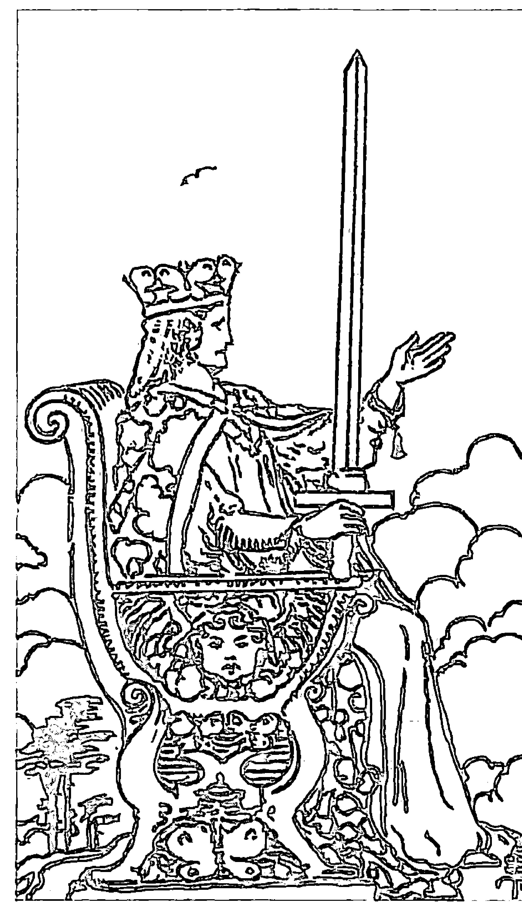

### 人格联想：军师
一个在职业上需要极度理智的人，面对所有的事情都必须要广收资讯，并以极度中立、理智的态度去分析这些讯息。
为了保持中立，甚至会出现不近人情的态度。为了获胜，难免会在必要时间牺牲部分成员，以换取最大利益，因此这样的人很容易被冷漠挂上等号。

获取更多好书，请加微信号：strcdts      官网：http://www.ac2011.cn

### 正位参考牌义
冷静、有智慧、明智的抉择、黑白分明、较不近人情。

### 正位图像细节解析
- 左手：欢迎所有的资讯来到身边。
- 宝剑：直立不偏颇，也表示智慧与想法绝对中立。
- 皇冠：蝴蝶形状也表示想法可以飞得非常高，看到更高的视野。
- 衣服：蓝色衣服代表理智。
- 披风：云朵代表隐藏，外围橘色代表脐轮（与他人的互动），也表示会主动隐藏自己的情绪，不给他人知道。
- 石椅：上有小孩雕刻，表示是个会照顾小孩的人，只是很严厉。
- 左后方流水：水往下流，也代表皇后会把自己的情感（水）往下压抑。
- 衣服像流水状态：跟左边水往下流一样的概念，也代表皇后会把自己的情感压抑。
- 树木：风吹的状态，也是智慧想法运作的模式，一般比较少解。
- 云朵：上半部完全没云朵，在极度理智下，没任何一丝被蒙蔽。
- 鸟：只有一只，也表示因为极度理智所以显得孤单。
- 鞋子：红色代表行动力，也表示皇后有非常强的执行力。

### 逆位参考牌义
失去理智、妒忌、有破坏性的行为、黑白不分。

### 逆位图像细节解析
- ◎ 切割上下重心在上

- ◇ 云：上半部完全遮蔽，也表示已经失去理智完全被蒙蔽。
- ◇ 披风：原本往下的云朵披风，在此刻变成向流水般的云披风，也就是被感情蒙蔽一切。

### ◎ 万有引力关键掉落
- ◇ 宝剑：向下斩下，也表示是一个破坏性的切割。
- ◇ 皇冠：原本可以从很高角度俯瞰一切的能力消失，反而变成没有太多的智慧与理智可以运用。

### ◎ 建筑崩毁讯息消失
- ◇ 石椅：不再坚持己见，也不再有呵护小孩的特质。

## 宝剑国王
### King Swords
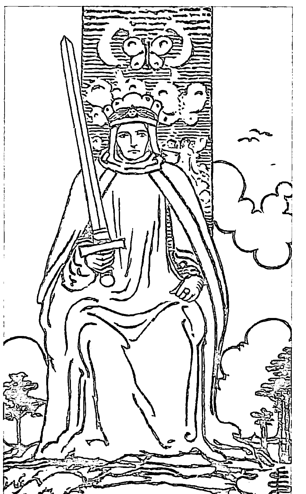

### 人格联想：君主
一国的统领，面对所有的事物，他的智慧是相当成熟的，但为了更亲近人群，让人觉得他是个仁民爱物的君主，所以有时候不得不装笨一点，或是让一些事情可以有模糊空间。
因此相较于皇后的冷漠，国王就相对的温和许多。

### 正位参考牌义
充满智慧、冷静分析的能力、懂得面对人群。

### 正位图像细节解析
- ◇ 皇冠：雕刻一个天使的造型，也表示他的想法是以仁慈为主。
- ◇ 头巾：橘色头巾，代表脑袋偏靠近人群的意思。
- ◇ 衣服：蓝色代表冷静，也表示国王是个冷静的人，橘色的手袖则是懂得与人亲近（橘色代表脐轮）。
- ◇ 披风、紫色：懂得运用智慧，让周遭的人看到他的能力。
- ◇ 宝剑：略为倾斜，表示懂得适当的偏颇，让国王更平易近人（并非坏事）。
- ◇ 左手：紧握代表掌控，手上有戒指也表示有权力掌控。
- ◇ 石椅：有坚定的想法，但没有完全坐正，亦指坚定地认为可以有些灰色偏颇地带。
- ◇ 云：上半部有部分云朵，这也是国王所允许的部分模糊地带。
- ◇ 鸟：两只鸟，代表亲近人群的意思。
- ◇ 树木：风吹的状态，也是智慧想法运作的模式，一般比较少解。
- ◇ 土地：有草滋养成长，代表国王相对是温和的。
- ◇ 鞋子：红色鞋子，代表国王还是有行动力的。

### 逆位参考牌义
任意独断、失去理智、情绪失控的状态。

### 逆位图像细节解析
- ◎ 切割上下重心在上

- ◇ 握紧的手：掌控的欲望加强，比较喜欢掌控一切。
- ◇ 云：看不清楚的状况变多，也表示不容易看清事情真相。
- ◎ 万有引力关键掉落
- ◇ 宝剑：失去理智而任意的伤害他人。
- ◇ 皇冠：不再仁慈，行为乖张。
- ◎ 建筑崩毁讯息消失
- ◇ 石椅：不再坚持原本可模糊的状况，改由失控的情绪取代。
- ◎ 草木颠倒枯萎贫瘠
- ◇ 草地：枯萎让许多事情无法持续成长（因为任性而让事情失败）。

## 金钱侍者
### Page Pentacles
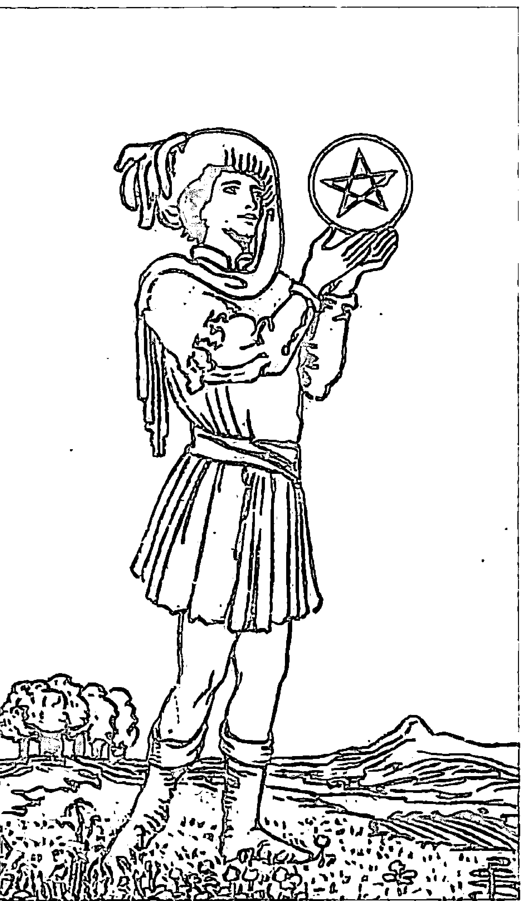

### 人格联想：业务工作状态
很重视业绩表现，因此每个月必须要专注的将注意力放在如何获取更多业绩的角度上，需要好好的运用所学，去把所有长官交办的事情完成，因此在特质上是属于有高度专注及持续力在一件事的。

### 正位参考牌义
专注地注视眼前的事、冷静的对待、稳定的成长、有能力的。

### 正位图像细节解析
- ◇ 帽子：红色帽子代表脑袋运作得很好，也有想不断向前的意思。
- ◇ 衣服：咖啡色代表落实的执行，绿色代表保持距离，也就成了会很努力的去做该做的事，但不会过度失控。咖啡色腰带的落实也同时控制，不会太过于放松。
- ◇ 脚姿：重心略向前，代表向前的行动。
- ◇ 手捧金币：专注的面对，也表示重心都放在该注意的地方。
- ◇ 土地：有长出小花草，代表在持续成长中。
- ◇ 田地：占土地当中的一小块，也是侍者认真耕耘的成果，不过只是刚开始，所以田地并不丰沃，但也是一个好的开端。
- ◇ 背景：部分黄色背景，代表有收获存在。
- ◇ 远山：尚有些未知的领域等待开发。

### 逆位参考牌义
不懂得运用能力、不在乎、只看短利忽视长期、失去所在乎的。

### 逆位图像细节解析
- ◎ 切割上下重心在上
- ◇ 远山：许多未知的领域，让侍者无法了解及突破。
- ◇ 花草及田地：很重视利益的收获，忽略长期耕耘的想法。
- ◎ 万有引力关键掉落
- ◇ 金币：掉落后代表不再在乎眼前的事物。

- ◇ 帽子：脑袋运转的不好，不懂得运用智慧去思考。
- ◎ 草木颠倒枯萎贫瘠
- ◇ 花草及田地：未来不再有成长茁壮的机会，失去所有的可能。
- ◎ 颜色压制逆位展现
- ◇ 腰带：落实性消失，变成没有真的去做该做的事，也是不在乎。

## 金币骑士
### Knight Pentacles
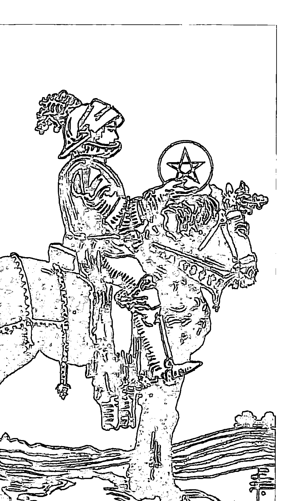

### 人格联想：业务主管工作状态
除了自己手中的业绩是每个月必须紧盯的之外，如何带好下属也是一个很重要的关键，因此除了从既有的方法中找寻方向外，也要尝试不断创造出新的创意与想法。
因此在工作上就不能展现出急躁的态度，需要稳定中持续前进的状态。

### 正位参考牌义
稳定、踏实、专注的、努力工作、缓慢的前进。

### 正位图像细节解析
- ◇ 头盔：上方有草丛，代表不只是有好的思考能力，更有创造力。
- ◇ 手捧金币：专注的面对眼前所需要注意的事。
- ◇ 衣服：红色代表有行动力。
- ◇ 坐垫：咖啡色坐垫，表示落实的执行力。
- ◇ 黑马：代表稳重的特质，可指向骑士的行事作风，或是他所掌控的员工可以被稳定驾驭。
- ◇ 草地：有一堆被铲起的杂草，代表他很认真的在做事。
- ◇ 田地：整片的土地已经被开发，而且颜色属于丰沃的土色，表示骑士前置作业已经做得很好，现在正在持续准备向前进。
- ◇ 背景：黄色背景代表丰盛的收获。

### 逆位参考牌义
失去目标、工作狂、停滞不前、感情薄弱。

### 逆位图像细节解析
- ◎ 切割上下重心在上
- ◇ 马脚：直拉的站着，代表停滞不动。
- ◇ 田地：努力开发，认真工作对于感情毫不在乎。
- ◇ 铲起的杂草：努力的工作，除了工作外不在乎其他事。
- ◎ 万有引力关键掉落
- ◇ 金币：失去努力的目标，也没有方向。

- ◇ 从马上下 来：停止努力、不再工作。
- ◇ 杂草掉落：不再工作不再铲草。
- ◎ 草木颠倒枯萎贫瘠
- ◇ 田地：长不出作物，只能让其荒废。

宫廷牌

## 金币皇后
### Queen Pentacles
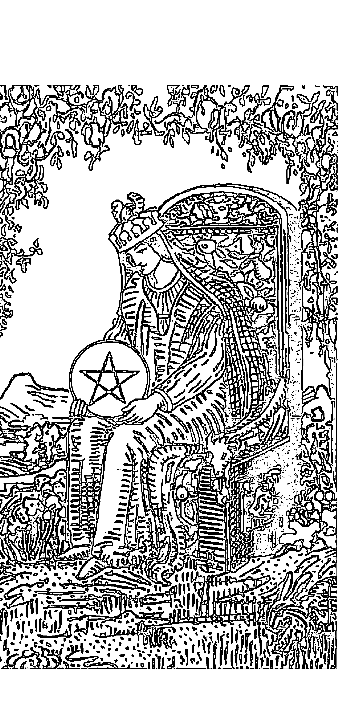

### 人格联想：执行长的工作状态
必须要更专注于整个公司营运的未来性与方向，不能受到外部的干扰就任意的改变企业方针，故在工作时会以更长远的方向来看待每件事，并且以稳定成长不激进的态度去面对公司。
虽然感觉有时候会停在当下没有太多变化，但实际上是在做一个长远的规划与运筹帷幄。

### 正位参考牌义
专注眼前事物不受外界干扰、理财能力强、有耐心。

### 正位图像细节解析
- 皇冠：鸟头与红色翅膀，有行动力，把想法带到很远，深思熟虑的象征。
- 衣服：内里白色代表心中纯洁，红色外衣代表很有行动力，绿色丝罩把行动力缓解转成稳定前进不急进的状态，衣服极为宽松，在某些解释里可以解释为怀孕。
- 金币：放在皇后的腹部前，孕育让事持续成长，也有怀孕的意思。
- 石椅：羊头代表摩羯座稳定向前的意思，石椅上方小孩子头代表重视成长，椅背有果实代表丰收。
- 右下角兔子：一个敏捷的象征，像是突如其来的状态，但皇后仍专注地看着手中的钱币，代表不受外在状况影响。
- 草地：有花有草，甚至有花朵围绕在皇后的周围，代表许多事情正在滋养成长中。
- 背景：黄色背景代表丰收的意思，有山、水及土地，都代表持续丰盛成长的意涵。

### 逆位参考牌义
无法掌控、没有目标、失去规划的能力、失去拥有的。

### 逆位图像细节解析
- ◎ 切割上下重心在上
- ◇ 兔子：受到外在的干扰，导致错误的判断或是节奏被打乱，怀孕则有可能受到惊吓而小产。

### ◎ 万有引力关键掉落
- ◇ 兔子：兔子掉下会受到惊吓失控的到处乱跑，所有一切都失控。
- ◇ 金币：原本专注在乎的事失去了，变成无法继续运筹帷幄，怀孕讯息中代表小产。
- ◇ 皇冠：不再深思熟虑，想法肤浅。

### ◎ 草木颠倒萎贫瘠
- ◇ 花草：全部枯萎代表已经无法再推演未来，也无法再成长收成。

### ◎ 建筑崩毁讯息消失
- ◇ 石椅：稳定的特质全部消失。

## 金币国王
### King Pentacles
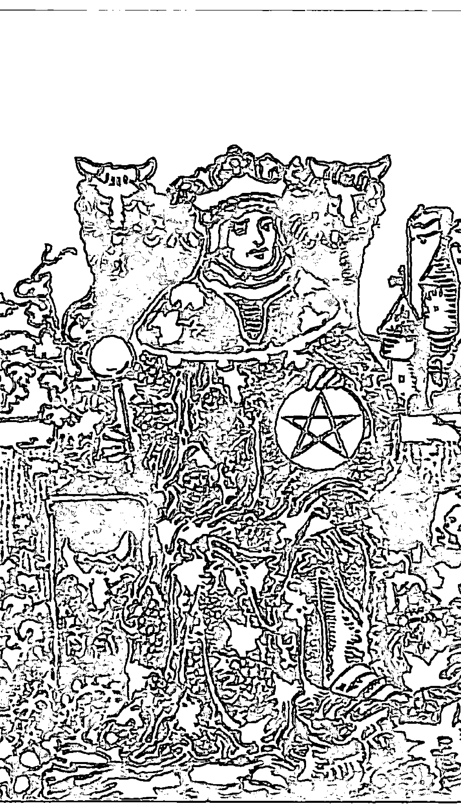

### 人格联想：创业型老板的工作状态
有野心，会积极布局，努力朝自己想要的目标前进，会愿意为自己的未来尽全力执行。
目标导向性很重，可以为了成功不顾一切的付出努力，也是在成功之后可以尽情享受所有的一切，因为这些都是他努力打拼下来的成就。

### 正位参考牌义
享受既得利益、权力的、可掌握状况、征服后获得奖励。

### 正位图像细节解析
- 皇冠: 热情的玫瑰加金色百合的纯洁，再辅以荣耀桂冠的特质，表现出国王很重视努力争取属于自己的荣耀。
- 衣领: 红色代表热情，放在耳轮与喉轮就代表愿意听，也愿意说。
- 衣服: 葡萄与叶子代表丰收，也是国王已经达到丰收阶段的象征。
- 金币: 靠在腿上，代表可以自由掌控及运作所收获的一切。
- 左脚: 踏着一头怪兽的头，代表征服的意涵。
- 权杖: 掌控所有的一切。
- 石椅: 黑色代表沉稳，金牛头对应到金牛座，有享受的意思。
- 后方城堡: 是国王原本的城堡，他已经征服了其他人的城堡。
- 背景: 黄色背景代表丰收的意涵。

### 逆位参考牌义
失去利益、权力的丧失、忙碌却无收获、被利益冲昏头。

### 逆位图像细节解析
- 切割上下重心在上
- 怪兽头: 怪兽变成在上，已经没有被国王征服，也表示失去利益。

### ◎ 万有引力关键掉落
- ◇ 权杖：掉落代表失去掌控一切的权利。
- ◇ 金币：转成被捧着的型态，代表国王十分在乎利益这件事，就算是从王座上掉下来或是怪兽逃走，他都不愿意放弃利益。

### ◎ 草木颠倒萎贫瘠
- ◇ 葡萄：枯萎也表示再怎么努力都没有收获。

### ◎ 建筑崩毁讯息消失
- ◇ 城堡：失去掌控及占有的一切，也表示失去利益。
- ◇ 石椅：失去原本可享受的一切。

## 塔罗解谜
### TAROT BOOK
282

## 实践演练
开始运用所学的牌义， 不再只是单纯的了解， 更可以开始协助自己及他人

## 怎么算塔罗牌？
每个老师都有其算塔罗牌的方式，以下介绍几个我会使用的方式给各位朋友。

- 1. 大洗牌：将牌混乱摊在桌上，尽量以双手顺时针或是逆时针方式洗牌，减少牌的磨损。一般都是在面对一位新的个案开始占卜时会使用，之后大多都会用小洗牌。
- 2. 小洗牌：像洗扑克牌一样，将牌放置其中一只手上，另一只手从下一叠放到上方，但为求正逆位混乱，在洗牌时会自由将拿起的一叠，直接旋转180度后叠上。
- 3. 问卜：请个案将非惯用手轻置于洗好的塔罗牌上，专注的默念自己所要问的问题，想清楚之后，以非惯用手拿起一叠放置一旁，占卜师再将牌叠上。这个动作将产生最下面一张牌为心态切牌，代表个案对于这件事的内心想法，但一个专业的占卜师请在客人提出问题后，要协助将问题重整成正确的发问模式。（请见下页）
- 4. 攤牌：尽量在摩擦力高的布上摊牌，这样将会容易将牌摊开而不会黏住。
- 5. 抽牌：请个案将牌直接推出，因牌有正逆位讯息，请个案勿任意转牌，如担心个案任意转牌，可以请个案点出他要的牌，再由占卜师自行抽出就好。
- 6. 翻牌：当牌阵的牌都抽好后，请左右翻牌而不要上下翻牌，因为这样才不会让你的塔罗牌正逆位颠倒。
- 7. 解读：请放轻松仔细看这些牌，用你觉得个案听得懂的方式，表达你所看到的讯息。请记得保持中立的态度，别被自己的情绪干扰而做出错误的解读。

## 问问题的方式：
问问题其实是很重要的一件事，好的问问题方法，可以让你在解牌时脑袋变得相当清晰，问题若没问好，你会发现解牌时会很卡，那么该如何问问题？就以下几点跟各位朋友分享：

- * 一个问题应该包含：人、时间、状况，三个最基本的元素，缺一不可，例如：未来三个月我的工作状况如何？明天去A公司面试的结果如何？三个月内该用什么方法才能跟B女谈恋爱并且公开。
- * 问题请尽量询问状况，而不要用是不是、好不好、能不能来算，因为每个人的定义不同，占卜师觉得好的讯息，对于个案来说不一定是好的，将状况形容出来，让个案自行决定这是好的还是不好的。
- * 时间定义：建议未来的问題尽量在半年内，最多不要超过一年，未来时间定义越远，答案越不准，因为塔罗牌是根据你的心去推演及综合所有参数的答案，时间越远，你的心变化的可能性越多，相对的就越不准。
- * 短期内请勿重复问同一个问题，毕竟事在人为，凡事还是靠自己努力比较重要，什么都交给塔罗牌来给答案，你的人生就只变成被牌操控了，一般建议同一个问题三个月内不要重问。

## 牌阵的使用：
基本上，一个问题很少用一张牌来解读就足够，因为每张牌都有它多样的意思，建议采用数张牌所组合起的牌阵进行解读，会让你可以看到更多方面的讯息。如果说一张牌可以看到一个那麼兩張牌就可以看到一條線性走向，那麼多張牌組的牌陣就可以看到全面性的狀態。我以自己常用的幾個牌陣與各位朋友分享：

- ❖ 萬用牌陣：這是我占卜時，90% 以上都是使用這個，只要你的問題問得好，基本上都可以解得相當細膩與完整，此牌陣一次會抽四張牌，分別為第一張佔問題答案的70%，第二到四張各佔10%的答案，藉由三張10%的訊息來輔助第一張的訊息，這樣可以解析出許多豐富詳細的答案。

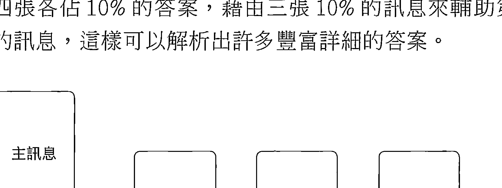

- ❖ 時間之流：一個可以看到一件事從過去、現在、未來的三個時間內的發展變化，通常都是用來看一件事的發展。要注意的是，過去與未來的時間軸都要一樣，此牌陣也可以用時間軸的延伸，產生更多時間刻度的時間之流，例如：過去六個月、過去三個月、現在、未來三個月、未來六個月工作發展狀況。

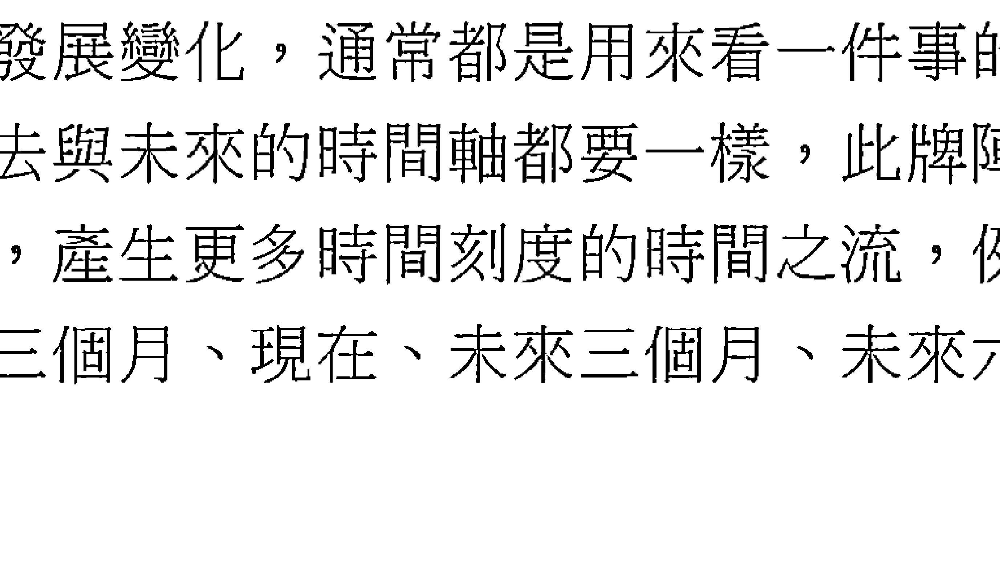

## 吉普賽十字占卜：

對於兩個人之間的關係，從五個不同的面向來看，藉此可以分析出到底兩人之間發展的可能性是否足夠。從第一張開始分別為：對方對我的感覺、我對對方的感覺、我們之間該怎麼做才會更好、我們之間有什麼樣的阻礙、未來三個月的發展結果如何。

對方對我的感覺

我們之間該怎麼做比較好

未來的結果

我們之間有什麼樣的阻礙

我對對方的感覺

## 二擇一牌陣：

有兩個以上需要選擇的題目，可以適合使用這個牌陣。通常第一張牌為看個案問這個問題的心態是什麼？第二張則是問個案，選擇 A 方向的前期狀況會如何？第三張問個案選擇 A 方向的結果如何？第四張選擇 B 的方向前期狀況如何？第五張問個案選擇 B 方向的結果如何？以此類推，A 與 B 的時間軸要設定一樣，才能夠看出比較準確的訊息。息，如果有三個以上的選項，可以以此類推設定 C、D……，時間軸上如果要往後拉長時間，也可以以此設定。

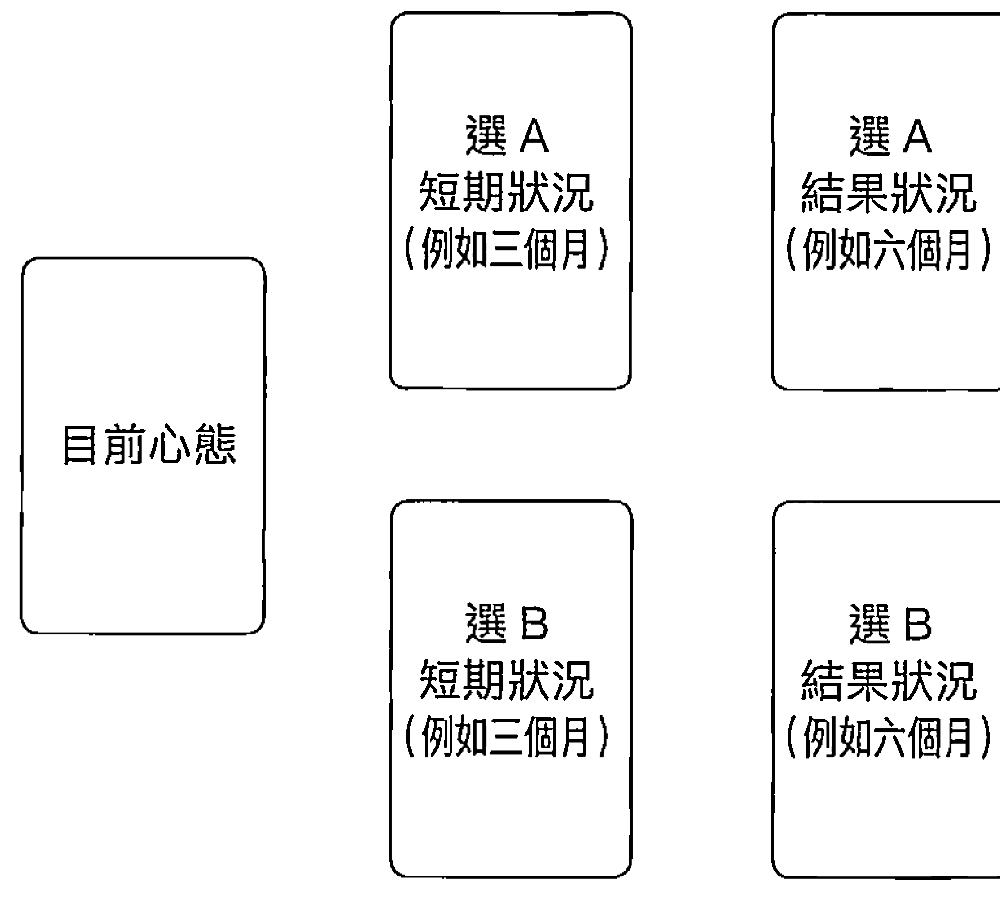

## 牌陣的實戰演練：

接著以常遇到的一些問題來與大家分享，可以怎麼去練習將你的牌義對應到題目裡面，相信各位朋友只要多練習就可以有很棒的解析。鼓勵各位朋友可以先把你的問題及抽牌，還有解答訊息記錄下來，等到時間到了再驗證是否正確。如果訊息正確就可以增加自己的自信心，錯了也可以去思考是否自己哪裡有解錯，不斷的驗證，就是成為一個專業塔羅占卜師的不二法門。

### 感情的問題：

- 他現在對我的感覺如何？

備註：通常在有喜歡的對象中，個案想知道對方喜不喜歡個案，這時用萬用牌陣可以看到比較細膩的訊息，這將不會只有一張牌來對應，而是四張牌來解釋這個感覺的訊息，請記得要四張一起組合來看，你會發現形容對方喜不喜歡你的個案的訊息會變得相當多。

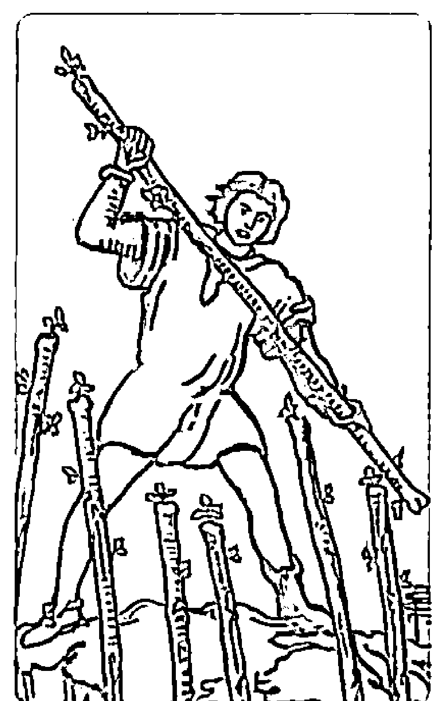

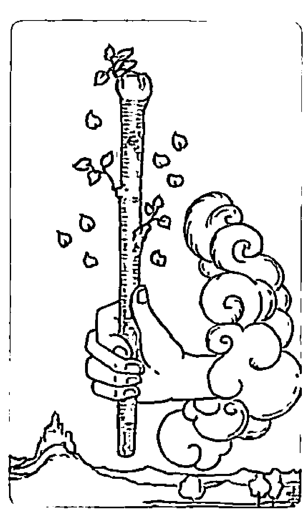

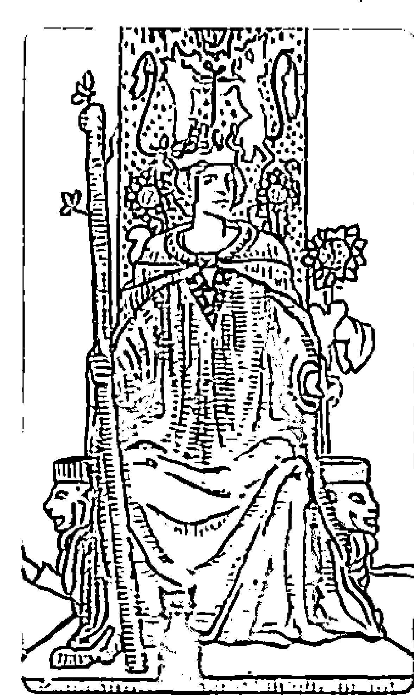

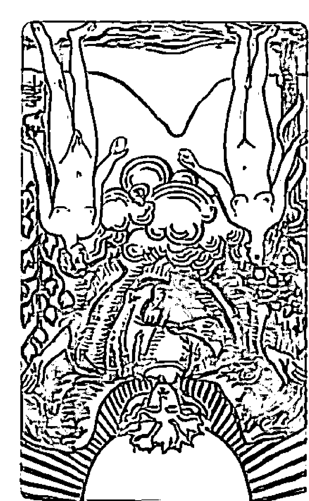

### 解析：

現在他對你充滿了想要面對的想法，對他來說，他覺得跟你之間的相處充滿了挑戰性，可能是因為你們之間其中一方或是雙方有另一半，讓他覺得這是一個很大的挑戰，但他覺得在情感上是喜歡你的（權杖七正＋戀人逆位的阻礙訊息），而且在他心中想要與你產生一個全新的關係，他希望可以掌控這個關係，讓兩人的世界變更好（權杖一正）。

他想要多了解你，也多一點互動，甚至有想要更直接的表現出喜歡你的心情，藉此可以關心你多一點，以及更直接的相處（權杖皇后正），只是目前你們之間的一些問題，讓他覺得還是有點讓他裹足不前（戀人逆），但至少他是喜歡你，而且有想要跟你在一起的念頭（綜合概念）。

如果是你？你會怎麼解析呢？

### 未來三個月我們的感情發展狀況如何？

備註：喜歡一個人自然會很期待知道未來有沒有機會在一起，但在一起的定義，每個人設定都不一樣，所以建議詢問塔羅未來的感情發展狀況如何，藉由形容互動及發展狀況，讓個案自己定義這是什麼的關係會較好。

### 解析：

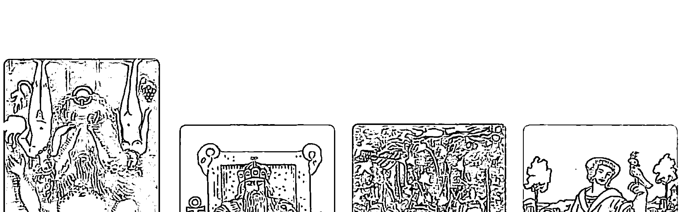

未來三個月，你們之間會有些積極的突破（皇帝正），而這樣的關係的確認你們的相處是十分愉快的，可以充分享受兩人愉悅的世界（金幣九正），但過程當中似乎感情層面比較低一點，大多都是一起吃喝玩樂或是親密行為，彼此之間也會去思索這樣是否妥當？但很快的，兩個人又繼續沉溺於這樣的享受關係當中（惡魔逆），就算其中有一方想要認真發展兩人之間的關係，卻因為另一方重心並非是放在用心戀愛上，因此就只能繼續在這樣的關係中發展（金幣國王逆）。

整體而言，你們的發展狀況相當豐盛，也是一個在肉欲及物質享受上許多滿足的狀況，但似乎只是偏於兩性的物質享受上，而不太有真實好好談戀愛的感覺。

如果是你？你會怎麼解析呢？

> ✧ 該用什麼方法可以讓我們三個月內在一起？

備註：當我們喜歡一個人，卻覺得有阻礙無法在一起時，可以嘗試詢問用什麼方法，可以讓兩個人在一起。當然所謂的在一起定義是什麼，也是要思考與討論的，在我的系統裡會加入兩張空白牌，當訊息出現空白牌時，就代表沒有辦法，也表示這是力有未達的狀況。

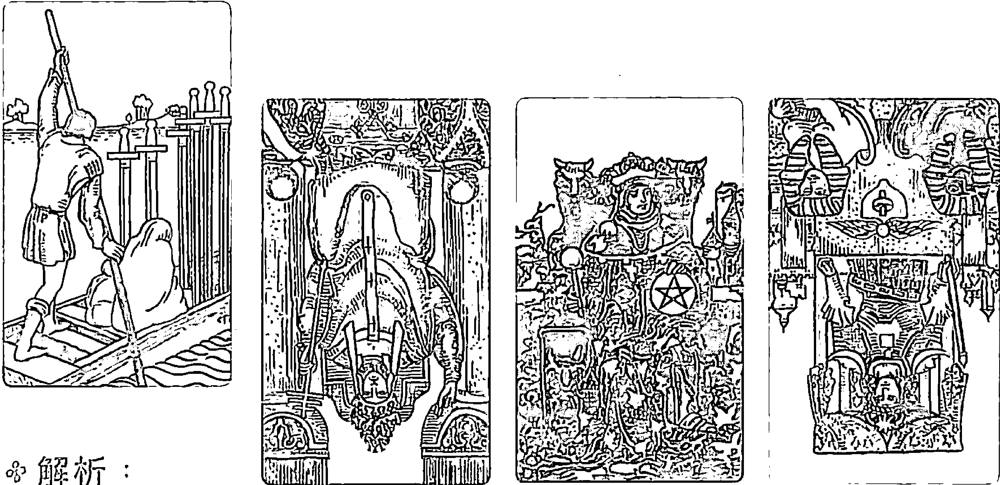

### 解析：

未來三個月內嘗試讓他覺得，你現在跟他的相處是讓你很受傷的，你現在心情不好，想要離開這個跟他之間的互動模式。因為你覺得現在的行為已經很失敗，這樣的狀況讓你感到痛苦，而且你已經無法再承受這個傷痛（寶劍六正＋戰車逆牌的被自己打敗這個訊息）。

而且現在的你，加上周遭有許多人的閒言閒語讓你覺得很煩躁，總讓你覺得好像是自己黏上去刻意追求對方的，而現在沒在一起，顯得你是個失敗者（教皇逆位＋戰車逆牌的被自己打敗這個訊息），再小小暗示現在有其他人出現對你示好，而且有機會在一起，你也考慮想要離開目前這個傷痛的狀態，與對方試著交往看看（寶劍六正＋金幣國王正），藉此讓他覺得你要離開他了，除了感受到你的傷痛外，也有種要失去你的感覺出現，這樣三個月內就會有機會在一起了。

如果是你？你會怎麼解析呢？

### ❦ 如果分別跟這兩個人在一起，未來的發展狀況會如何？

備註：現在你有兩個追求者，你想要知道應該選擇哪個才會幸福？這時會建議「模擬」如果在一起之後的相處狀況，藉由在一起之後的相處狀況，來讓你知道跟誰在一起你會比較幸福，也是讓你知道該如何選擇的一個方式。而這種設定會設定時間，例如：這個案例是看在一起三個月及六個月的狀況。

### ❦ 解析：

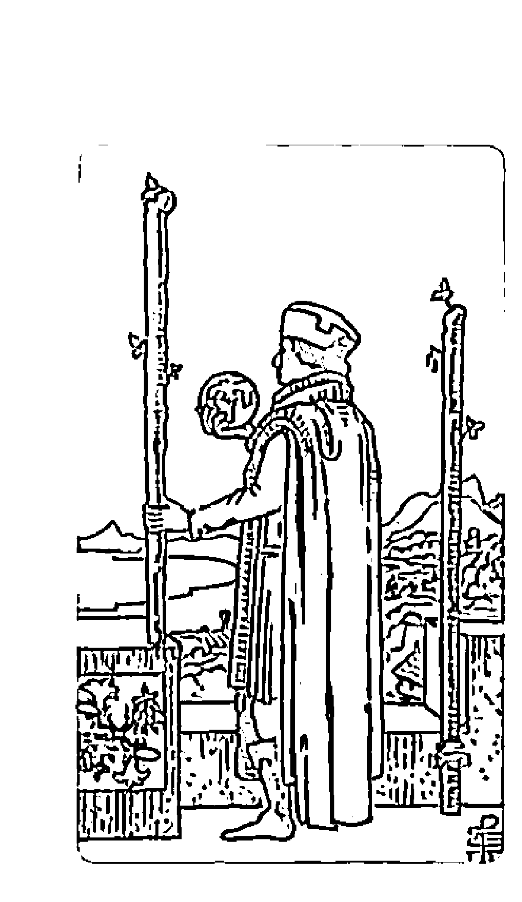

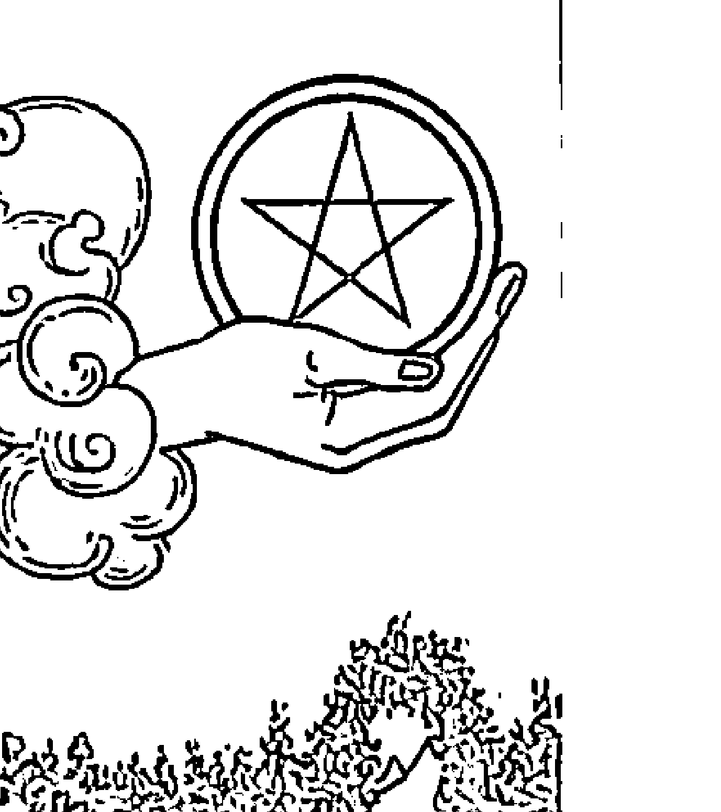

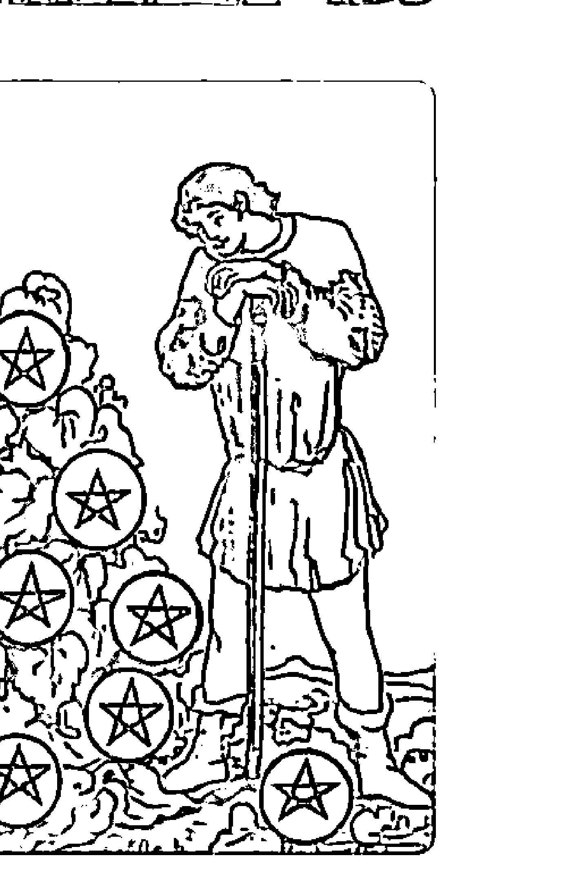

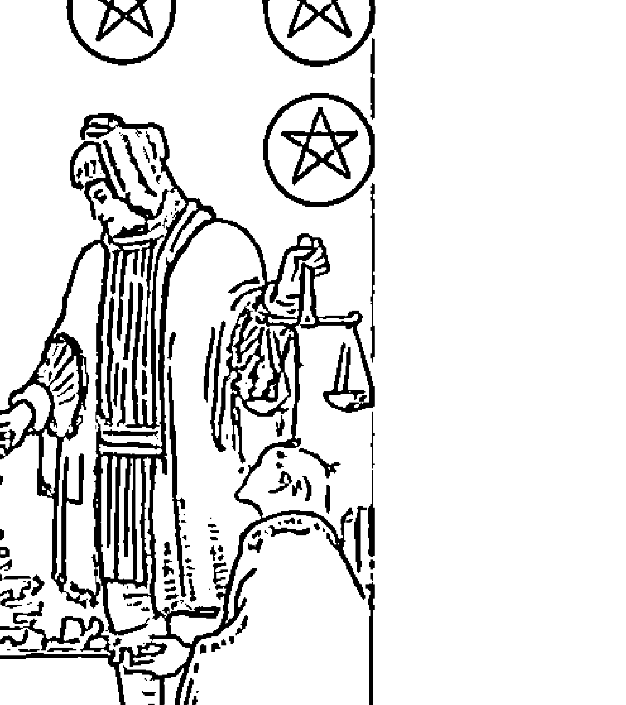

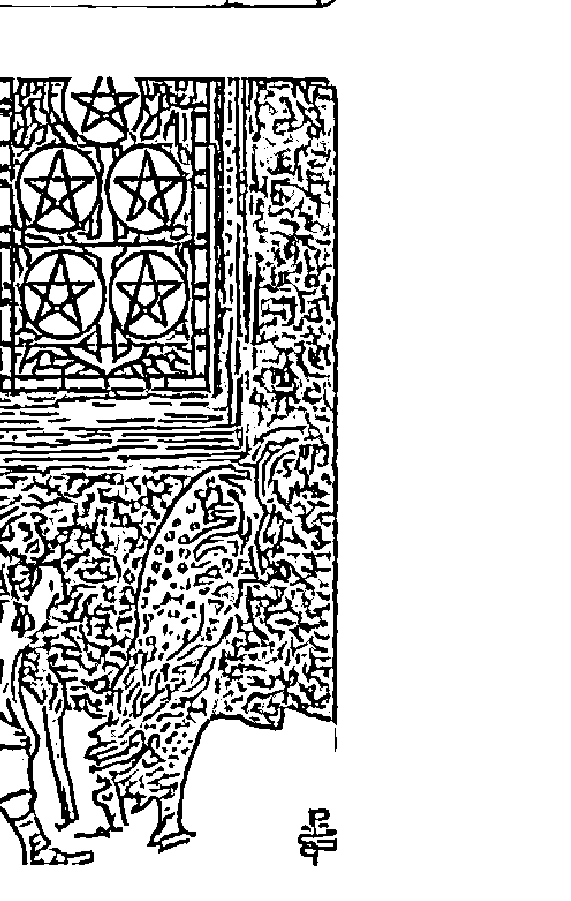

你在對於談愛情這件事，心中已經有答案，但你還是想要再多看看，畢竟這對你來說是件重要的事，所以你希望可以藉由多觀察、多思考，看看哪個人比較適合你（權杖二正）。

如果選擇跟 A 男在一起，前期三個月，兩個人的相處會有全新的感受，彼此都很重視與對方的相處，在相處時可以以對方為主的思考，看起來令人感到快樂與被重視（金幣一正）。在一起之後六個月，卻開始出現了一方向，另一方祈求愛情，而其中一方變成對於彼此之間的感情有些猶豫，不再像一開始般的熱絡，這也表示其中一方的情感已經冷卻下來，雖然不到不愛，但卻是轉變成為一種習慣性的相處，相較於一開始的感情的確是降溫了（金幣六正）。

至於跟 B 在一起，前期兩人的相處雖然也不錯，但似乎對於未來的想法會有所遲疑，這並非是兩人沒有同心，只是想的事情比較多。也表示跟 B 在一起，兩個人比較沒有太多的激情，反而會像已經在一起一陣子的狀況，彼此都會思索關於未來的事（金幣七正）。至於跟 B 在一起半年，則是其中一方或是雙方，因為開始覺得彼此間的問題越來越大，開始出現想要逃避這段情感的狀況，這樣的心態會明顯表現在真實的互動上，也表示兩個人的關係，將會容易在未來半年內出現決裂的可能（金幣五正）。

如果是你？你會怎麼解析呢？

### 工作的問題：

- 我想知道老闆覺得我是怎麼樣的一個人：

備註：有時候會懷疑在他人的手中，自己到底扮演怎麼樣的角色，想要知道這件事，一般可以使用萬用牌陣，但也可以藉由時間之流看到這個對象眼中的你，到底有怎麼樣的變化，以下牌陣是看（過去三個月、現在、未來三個月）的狀況。

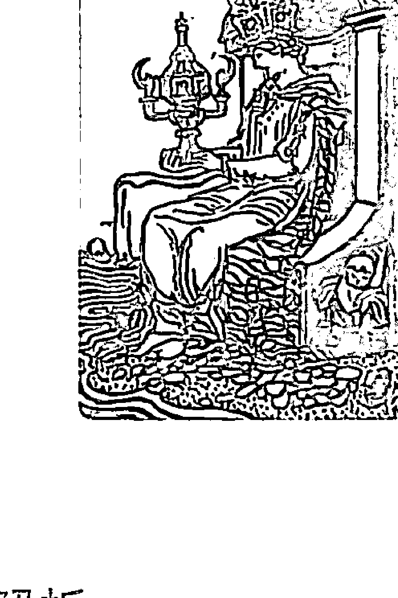

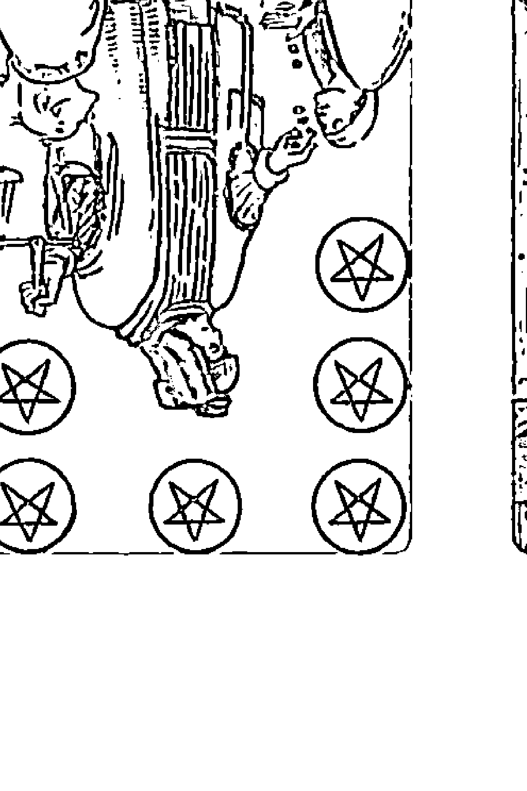

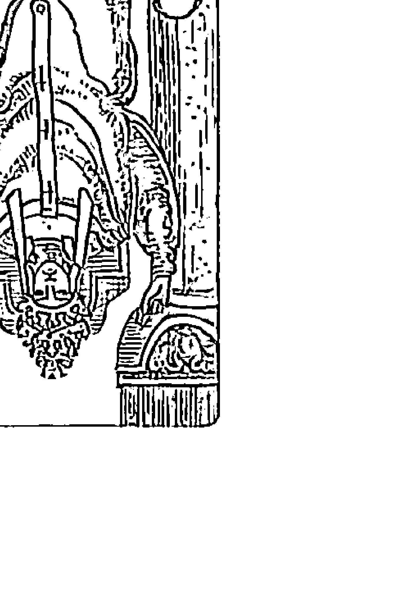

### 解析：

過去三個月，老闆眼中的你，是個相當專注於工作的職員，你對於你的工作相當認真及有所期待，你也很懂得去表現你的個人才華，甚至在工作時，都可以從你身上看到對於未來工作完成時的美好成就，可以說是一個讓老闆覺得既放心又感到激賞的好員工（聖杯皇后正）。

可是現在在老闆眼中，你的確是一個開始只為自己工作範圍付出的人，而且當中還藏有自私的行為，你可能會對他人做出一些不公正的事情，欺負他人，只為了讓自己的工作可以更順利，老闆也覺得你有時候會為了自己工作方便，根本不管他人的需求，而讓你的人際關係出了問題（金幣六逆）。

如果你不改善這些目前的狀況，就牌面來說，未來三個月老闆眼中的你，將會是一個只為了利益而不擇手段的人，你甚至會為了想要成交案件，而故意說一些錯誤的資訊誤導客戶，讓客戶在被欺騙的狀況下與你交易。在一切以利益為出發點的狀況下，你以利益為主導的行為，將會被老闆看的一清二楚（教皇逆）。

如果是你？你會怎麼解析呢？

### ※ 未來三個月我的工作狀況如何？

備註：一般上班族最擔憂的就是工作狀況，很害怕遇到問題沒辦法解決，也怕可能突發性的被裁員，因此大多數問工作時都會問這個問題，而這個問題後續將可以衍生其他問題，例如：未來一個月內，該用什麼方法才能讓這個問題被解決？或是某同事現在對於跟我一起工作的想法是什麼？這都可以衍生許多的問題，就有賴各位朋友仔細思考，在你眼前的這個人他會有什麼需求了。

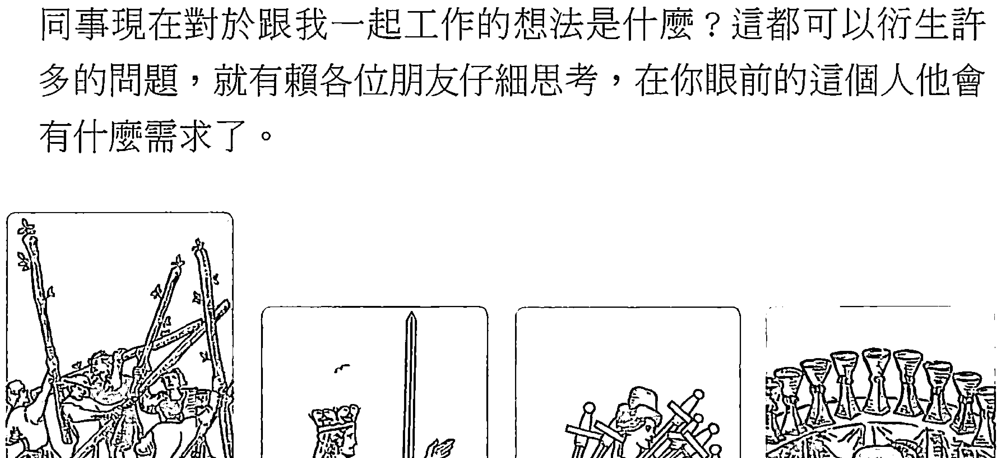

### 解析：

未來三個月，你的工作將會有比較大的挑戰，會有與你意見不合的同事或客戶，與你之間的溝通出現摩擦，這樣的狀況會讓你需要花相當多的時間與精力處理，甚至是自己的內心對於工作也產生了許多不同的想法，讓你的工作進度處於混亂的狀況（權杖五正）。

不過雖然有許多溝通上的問題，這三個月還是有些好事值得期待。一方面在面對問題時，你可以利用你冷靜的智慧仔細判斷該如何處理，雖然這些判斷，有時候連你自己都覺得有點過於不近人情（也許就是這樣的為了達到目標，你的過度理智為你帶來了與他人之間的紛爭），但這都是站在理智面，所想出最好的工作狀態（寶劍皇后正）。而在執行面上，你也會小心翼翼地去把你期待的工作一一完成，當中你會運用一些小技巧，讓你的工作執行度與順利度大幅提升。

雖然有時候，這些東西看起來是有些耍小聰明（寶劍七正），但這也是你能夠想出來的一些智慧。在這樣的狀況下，雖然這三個月內的工作整體是一陣混亂的，但該做的幾乎都可以被你完成，而你也可以在這當中，完成至少七八成以上的工作進度（聖杯九正），只要多留意那些混亂的問題小心面對即可。

### 🌙 補充資料：

## 一、塔羅牌裡的神秘學與心理學

在塔羅牌世界裡概分為神秘學與心理學兩個系統，對於占卜來說，其實重視的是結果的準確度。這兩個系統就像是有同一個目的地，但是有不同的兩條路徑，要往哪條路走就端看個人喜好，接下來就要跟各位朋友分享我所知道的這兩個系統的概念。

### 心理學系統：

大多會推崇榮格心理學裡的集體潛意識。在這個理論裡說到，每個人都有來自於出生後，經由外界刺激所體驗的學習系統。而集體潛意識，則是這個系統以外的另一個系統，它可能來自於遺傳或是轉世，這些意識是我們平常都感受不到的意識層面，但卻是大家都可以有的共同體驗。例如：遇到黑暗我們可能會不自覺的害怕，這可能跟我們的學習背景沒有任何關係，但我們在面對黑暗時，卻會不自覺產生這樣的情緒。

雖然在後天學習中，我們可能可以藉由學習經驗去突破這個黑暗恐懼，但仍不可否認，有時看到沒有光的地方，仍會有不安的情緒存在，這就是集體潛意識。而這樣的集體潛意識，就會成為塔羅牌中所要呈現的原型系統。例如：看到皇帝牌就覺得應該是比較強硬型的特質，看到皇后牌就會覺得應該有溫柔體貼的感受，這樣的訊息也就可以自然而然的被投射到解讀上。

### 至於神秘學系統：

則是有許多讓人感到新奇、有趣，卻又有神秘的面紗存在。在神秘學的概念裡，每副牌都住著牌的精靈，這些精靈是需要被啟動並且持續眷養的，因此就會衍生出包含：聖別儀式（開牌儀式）、淨化儀式與封牌儀式。

每個儀式的背後，都是希望可以藉由掌控住工具及儀式將牌的精靈，讓祂可以持續與我們合作服務人群。這樣的流程也讓占卜師會相當寶貝自己的牌，甚至會不允許他人接觸到牌，因此就會需要用水晶棒或其他工具為個案指牌。這樣複雜的流程，一方面有它存在的可依賴感，但另一方面，也許也是藉此讓使用者更相信自己不是孤單的一個人，是有精靈可以協助他，讓他的占卜更加準確。而為了達成這樣的狀態，自然會衍生許多神秘學的工具與商品，因此，如果你遇到一個神秘學系統的占卜師，你會發現他桌面上的工具會相當多，這也是神秘學與心理學差異較大的地方。

## 二、占卜完會有異常疲倦的狀況？

其實這就像是在認真讀書一樣，你在解牌時會全神貫注的看那些來到你面前的訊息，你的專注力為你帶來了許多可被解釋出來的訊息，然而，同時間你也在消耗你的腦力（神秘學則是稱之為能量）。但在解讀的當下，因為你極度集中精神，因此不容易感受到這樣的消耗狀態，因此只有在解完牌之後，整個人放鬆了，才會發現自己突然變得相當累。

其實不用因此擔心你是不是因為占卜而被吸走能量，或是被惡魔偷走了靈魂，只需要多休息即可。因此建議，占卜完之後可以適當的靜坐冥想或是吃點輕食，起來走一走動一動並曬曬太陽，這些都是很好的動作，無需因此感到恐懼與擔憂。

## 三、要怎麼增進自己的占卜技巧

其實要增進自己的占卜技巧沒有其他方法，最好的方法就是不斷練習與印證。許多朋友都知道要練習占卜，可是卻會在占卜的過程中一直不確定自己解得到底對不對，就在這樣不確定的心態中，一直走不出框架。

其實練習也是有技巧的，首先請你準備一本空白筆記本，你可以每天幫自己抽每日塔羅問：今天我的工作狀況如何？我今天的感情互動狀況如何？我今天的旅遊狀況如何？……

用許多短期內就可以印證的題目抽牌，然後請你在筆記本上寫下你的題目與抽到的牌，也請寫下自己如何解牌，待預測的時間到了之後，再來看看當初的預測是否準確？

如果你發現都很準，恭喜你，你的自信心正不斷的提升。

如果你發現解牌出錯，去仔細思考牌面中哪些訊息被你忽略了，再求精進即可。

沒有人一生下來就是個塔羅占卜大師，只有不斷的練習與修正，才是最好的成就之道，願每一位購買此書的朋友，都可以藉此讓自己的人生越來越好，也讓那些需要被你幫助的朋友，都可以得到被幫助的機會，祝福大家。

## 推薦

蘇芳仕 愛情占卜師、彩虹數字感情解碼專家
謝達輝 塔羅身心靈老師
筆筆嗡 時尚開運老師
莫芳 台中文化大學推廣教育部身心靈中心
今井綾 占星塔羅作家
天空為限 中國文化大學推廣教育部身心靈中心主任
曾鼎元 生命之眼身心靈中心執行長
王中和

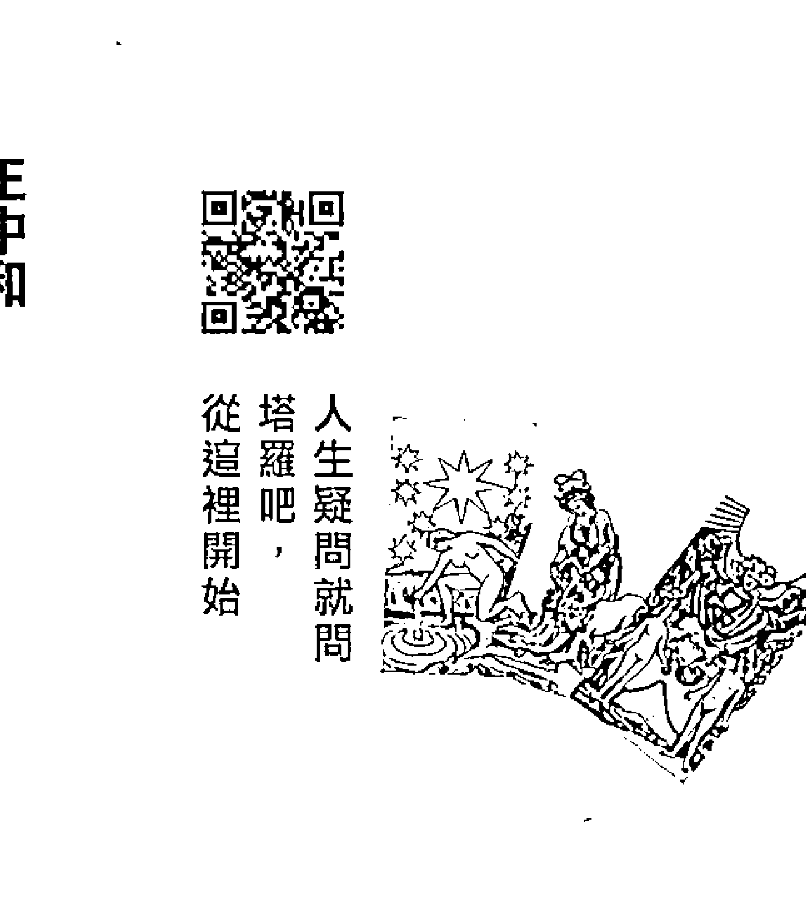

本書帶你用輕鬆、無負擔的方式學習塔羅，就像欣賞七十八幅畫作般的流暢。作者針對每幅畫作的每個細節，與你分享畫家所要傳達的意涵，不用死背任何牌義，愉快的理解這七十八幅牌的意涵後，你也可以侃侃而談每幅畫傳達出的美好資訊，輕鬆的把它運用在生活中。

你準備好了嗎？讓我們一起進入有趣的塔羅牌世界。

- 一、認識圖像細節，強化記憶點
- 二、逆位解牌有訣竅，理解勝過死背
- 三、「找三加四不超五」，以直覺增加解牌功力

> 此書猶如微型塔羅牌的百科全書，也是必備的隨身備查使用手冊，必定是老手新手同珍，專業與玩票共賞，在此特別要向讀者推薦賀咖咖老師的大作。
—— 王中和（生命之眼身心靈中心執行長）

> 他的解析永遠最貼近您的內心深處，算命師算得準是應該的，但他不止準，還能為茫然的靈魂解套，想更了解生命歷程和塔羅牌的朋友，就從這裡開始吧！
—— 時尚開運莫芳老師

> 塔羅牌是很棒的生活工具，能提早拿到未來的入場票、掌握人生選擇權。重點是需要遇到對的老師，引導我們正確的使用它，那這本書會是最好的選擇。在生活與教學上，它也會是我珍貴收藏的工具書。
—— 筆筆嗡（塔羅身心靈老師）